## 第 3 节 物质分离、提纯(★★★)

## 内容提要

一、分离提纯最佳原则：不增（不增加新的杂质）、不减（不减少目标产品）。

## 二、常见分离、提纯方法

## 1. 根据物理性质进行分离提纯

<table><tr><td>状态</td><td>方法名称</td><td>原理</td><td>实例</td><td>步骤、装置图、注意事项</td></tr><tr><td rowspan="4">固+固</td><td>升华或加热法</td><td>成分之一易升华</td><td>泥沙、I2</td><td></td></tr><tr><td>重结晶</td><td>成分均易溶,但溶解度受温度影响程度不同</td><td>KNO3、NaCl</td><td>蒸发浓缩、冷却结晶、过滤、洗涤、干燥;或蒸发浓缩、趁热过滤、洗涤、干燥</td></tr><tr><td>溶解过滤</td><td>某成分易溶,某成分难溶</td><td>泥沙、NaCl</td><td>溶解、过滤、蒸发结晶</td></tr><tr><td>磁吸法</td><td>某成分能被磁铁吸引</td><td>铁、铝</td><td>——</td></tr><tr><td rowspan="2">液+液</td><td>分液</td><td>两种液体互不相溶</td><td>苯、水</td><td>混合时密度大倒入密度小的液体;分液时先平衡气压,接着从下口放出下层液体,再从上口倒出上层液体 </td></tr><tr><td>蒸馏</td><td>两种液体互溶且沸点相差较大</td><td>乙醇、水</td><td>垫陶土网、放沸石;注意温度计水银球位置与冷凝管中水的流向;先通水,再加热 </td></tr><tr><td rowspan="4">固+液</td><td>萃取</td><td>固体在不同溶剂中溶解度不同</td><td>用CCl4萃取碘水中I2</td><td>萃取剂和原溶剂互不相溶;萃取剂和溶质不反应且易分离</td></tr><tr><td>蒸发结晶</td><td>固液互溶,为获得固体</td><td>NaCl、H2O</td><td>边加热边用玻璃棒搅拌,用余热蒸干溶剂;为了防水解可以在一定的环境中蒸发结晶</td></tr><tr><td>蒸馏</td><td>固液互溶,分离二者</td><td>I2、CCl4</td><td>与分离乙醇和水的装置相似</td></tr><tr><td>过滤</td><td>固液互不相溶</td><td>AgCl、H2O</td><td>使用仪器:烧杯、漏斗、玻璃棒;操作原则:一贴、二低、三靠</td></tr></table>

## 【总结】减压过滤、减压蒸馏、水蒸气蒸馏的辨析

<table><tr><td>方法</td><td>减压过滤</td><td>减压蒸馏</td><td>水蒸气蒸馏</td></tr><tr><td>优点</td><td>过滤速度快、固液分离效果好、利于干燥</td><td>降低组分沸点,避免温度过高导致物质的分解损失或副反应的发生</td><td>降低组分沸点,避免温度过高导致物质的分解损失或副反应的发生</td></tr><tr><td>装置图</td><td></td><td>简易减压蒸馏装置</td><td>A.水蒸气发生装置;B.水蒸气蒸馏装置</td></tr></table>

## 2. 根据化学性质进行分离提纯

<table><tr><td colspan="2">方法</td><td>原理</td><td>实例说明</td></tr><tr><td rowspan="3">复分解法</td><td>沉淀法</td><td>将杂质离子或气体转化为沉淀</td><td>用 $CuSO_4$ 溶液吸收 $H_2S$ ,用 $F^-$ 沉淀 $Ca^{2+}$ 、 $Mg^{2+}$ </td></tr><tr><td>气化法</td><td>将杂质离子转化为气体</td><td>加入NaOH固体以除去溶液中 $NH_4^+$ </td></tr><tr><td>酸碱溶解法</td><td>利用物质与酸或碱溶液混合后的差异进行分离</td><td>用过量NaOH溶液除去 $Fe_2O_3$ 中的 $Al_2O_3$ </td></tr><tr><td colspan="2">氧化还原法</td><td>用氧化剂(还原剂)除具有还原性(氧化性)的杂质</td><td>用 $Cl_2$ 除去 $FeCl_3$ 中的 $FeCl_2$ ;用红热的Cu除去 $N_2$ 中的 $O_2$ </td></tr><tr><td colspan="2">热分解法</td><td>加热使不稳定的物质分解除去</td><td>如除去NaCl中的 $NH_4Cl$ ;除去 $Na_2CO_3$ 固体中的 $NaHCO_3$ </td></tr></table>

## 3. 常见实例分析

<table><tr><td>研究对象</td><td>杂质</td><td>除杂试剂或方法</td></tr><tr><td> $NH_3$ </td><td> $H_2O$ </td><td>碱石灰(干燥)</td></tr><tr><td> $CO_2$ </td><td>HCl</td><td>饱和  $NaHCO_3$ (洗气)</td></tr><tr><td> $Cl_2$ </td><td>HCl</td><td>饱和 NaCl 或一定浓度的  $H_2SO_4$ (洗气)</td></tr><tr><td> $SO_2$ </td><td>HCl</td><td>饱和  $NaHSO_3$ (洗气)</td></tr><tr><td> $H_2S$ </td><td>HCl</td><td>饱和 NaHS(洗气)</td></tr><tr><td> $CO_2$ </td><td> $SO_2$ </td><td>饱和  $NaHCO_3$  或酸性  $KMnO_4$  溶液(洗气)</td></tr><tr><td>NO</td><td> $NO_2$ </td><td> $H_2O$ (洗气)</td></tr><tr><td>N2</td><td>O2</td><td>灼热Cu(由于Mg与N2反应,因此不用Mg粉)</td></tr><tr><td>CO2</td><td>CO</td><td>灼热CuO</td></tr><tr><td>I2</td><td>CCl4</td><td>蒸馏</td></tr><tr><td>I2</td><td>H2O</td><td>萃取</td></tr><tr><td>KNO3</td><td>NaCl</td><td>重结晶</td></tr><tr><td>Fe</td><td>Al</td><td>NaOH溶液</td></tr><tr><td>NaCl</td><td>I2</td><td>升华(加热)</td></tr><tr><td>Na2CO3</td><td>NaHCO3</td><td>固体:加热;水溶液:加入适量NaOH</td></tr><tr><td>NaHCO3(aq)</td><td>Na2CO3(aq)</td><td>通入足量CO2</td></tr><tr><td>NaCl</td><td>NH4Cl</td><td>加热法</td></tr><tr><td>FeCl2</td><td>FeCl3</td><td>过量Fe</td></tr><tr><td>FeCl3</td><td>FeCl2</td><td>Cl2</td></tr><tr><td>Cu</td><td>Fe</td><td>HCl、稀H2SO4或CuSO4溶液</td></tr><tr><td>SiO2</td><td>Al2O3</td><td>HCl或稀H2SO4</td></tr><tr><td>MgCl2(aq)</td><td>FeCl3(aq)</td><td>MgO、Mg(OH)2、MgCO3等调节pH后过滤</td></tr><tr><td>CuCl2(aq)</td><td>FeCl3(aq)</td><td>CuO、Cu(OH)2、Cu2(OH)2CO3等调节pH后过滤</td></tr><tr><td>锅炉</td><td>CaSO4</td><td>先用Na2CO3溶液处理,使CaSO4转化为CaCO3,然后用酸除去</td></tr><tr><td>HBr</td><td>Br2</td><td>通过CCl4洗气</td></tr><tr><td>乙醇</td><td>水</td><td>加入CaO后蒸馏</td></tr><tr><td>C2H4</td><td>SO2</td><td>NaOH溶液</td></tr><tr><td>CH4</td><td>C2H4</td><td>(1)通过溴水(洗气);(2)先通过KMnO4溶液,再通过碱石灰</td></tr><tr><td>C2H2</td><td>H2S、PH3</td><td>通过CuSO4溶液(洗气)</td></tr><tr><td>苯</td><td>水</td><td>分液</td></tr><tr><td>溴苯</td><td>Br2、苯</td><td>用NaOH溶液洗涤、分液、蒸馏</td></tr><tr><td>硝基苯</td><td>HNO3、H2SO4、苯</td><td>用NaOH溶液洗涤、分液、蒸馏</td></tr><tr><td>乙酸乙酯</td><td>乙醇、醋酸</td><td>用饱和Na2CO3洗涤、分液</td></tr><tr><td>皂化液</td><td>甘油</td><td>饱和食盐水、过滤</td></tr><tr><td>溴苯</td><td>苯</td><td>蒸馏</td></tr><tr><td>苯</td><td>苯酚</td><td>用NaOH溶液洗涤、分液</td></tr><tr><td>苯酚</td><td>苯</td><td>用NaOH溶液洗涤、分液,再往水溶液通足量 $CO_2$ 、分液</td></tr><tr><td>乙醇</td><td>苯酚</td><td>先加NaOH溶液、再蒸馏</td></tr><tr><td>淀粉</td><td>葡萄糖</td><td>利用蒸馏水和半透膜进行渗析实验</td></tr></table>

## 三、物质分离与提纯的思维模型

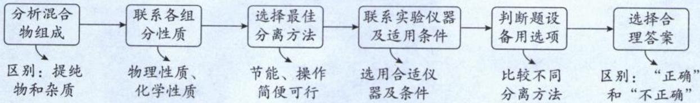

类型 I: 分离、提纯的实验方法

【例 1】下列气体去除杂质的方法中,不能实现目的的是()

<table><tr><td>选项</td><td>气体(杂质)</td><td>方法</td></tr><tr><td>A</td><td> $C_{2}H_{2}(H_{2}S)$ </td><td>通过酸性高锰酸钾溶液</td></tr><tr><td>B</td><td> $Cl_{2}(HCl)$ </td><td>通过饱和的食盐水</td></tr><tr><td>C</td><td> $N_{2}(O_{2})$ </td><td>通过灼热的铜丝网</td></tr><tr><td>D</td><td> $NO(NO_{2})$ </td><td>通过 $H_{2}O$ </td></tr></table>

解析：A. $\mathrm{SO}_2$ 、CH=CH均有强还原性，二者均会被酸性 $\mathrm{KMnO_4}$ 氧化，不遵循“不减”原则，A选项错误。

B. HCl极易溶于水, 可以用水吸收杂质 HCl; 同时利用饱和食盐水中高浓度的 Cl⁻, 抑制 Cl₂ 与水的反应, 减少 Cl₂ 的溶解损失, B选项正确。

C. 加热条件下 $N_{2}$ 不与 Cu 反应， $O_{2}$ 与 Cu 生成 CuO，C 选项正确。

D. $NO_{2}$ 与 $H_{2}O$ 发生反应 $3NO_{2} + H_{2}O = 2HNO_{3} + NO$ ，可将杂质气体 $NO_{2}$ 转化目标气体 NO, D 选项正确。
答案: A

【例 2】除去下列物质中的杂质所选用的试剂或操作方法正确的是()

<table><tr><td>序号</td><td>物质</td><td>杂质</td><td>应选用的试剂或操作方法</td></tr><tr><td>1</td><td> $Na_2CO_3$ </td><td> $NaHCO_3$ </td><td>在坩埚中灼烧至固体质量不再减少</td></tr><tr><td>2</td><td> $Cl_2$ </td><td>HCl</td><td>分别通过饱和食盐水和浓硫酸</td></tr><tr><td>3</td><td>环己烷</td><td>环己烯</td><td>加入溴水,静置后分液</td></tr><tr><td>4</td><td>苯</td><td>二甲苯</td><td>蒸馏</td></tr><tr><td>5</td><td>苯</td><td>苯酚</td><td>加入浓溴水后过滤</td></tr><tr><td>6</td><td> $FeCl_2$ 溶液</td><td> $FeCl_3$ </td><td>加入足量铜粉后过滤</td></tr></table>

A. $①②④$ B. $②③④$ C. $③⑤⑥$ D. $①②⑤$

解析:① $NaHCO_{3}$ 受热分解生成 $Na_{2}CO_{3}$ ，可以通过在坩埚中灼烧至固体质量不再减少，以除去 $Na_{2}CO_{3}$ 中混有的 $NaHCO_{3}$ ，选项①正确。

②饱和食盐水有高浓度的 $Cl^{-}$ ，可抑制 $Cl_{2}$ 与水的反应，降低 $Cl_{2}$ 的溶解度，而HCl易溶于饱和食盐水中，通过饱和食盐水可以除去 $Cl_{2}$ 中的HCl；洗气后再将气体通过浓硫酸可以干燥 $Cl_{2}$ ，选项②正确。

③环已烯与 $Br_{2}$ 发生加成反应生成的 1,2-二溴环己烷能溶于环己烷中，无法达到除杂目的，选项③错误。

④苯与二甲苯是互溶的液体，且两者沸点相差较大，可用蒸馏的方法分离，选项④正确。

⑤苯酚与溴水反应生成三溴苯酚,难溶于水但可溶于苯中,无法达到除去苯中杂质的目的,应用 NaOH 水溶液将苯酚反应为可溶于水的苯酚钠,静置分层后再分液,选项⑤错误。

⑥铜与氯化铁发生反应 $2Fe^{3+} + Cu = 2Fe^{2+} + Cu^{2+}$ ，会引入 $Cu^{2+}$ 杂质。应加入足量铁粉，发生反应 $2Fe^{3+} + Fe = 3Fe^{2+}$ ，不会引入新杂质离子，选项⑥错误。

由以上分析可知，①②④正确，本题答案选A。

答案:A

【反思】只有掌握了物质性质,才能很好的攻破除杂题目,所以请同学们务必掌握元素化合物的性质。

类型Ⅱ: 分离、提纯实验的仪器使用

【例 3】(2023·全国甲卷)实验室将粗盐提纯并配制 $0.100 \, mol \cdot L^{-1}$ 的 NaCl 溶液。下列仪器中,本实验必须用到的有( )

①天平 ②温度计 ③坩埚 ④分液漏斗 ⑤容量瓶 ⑥烧杯 ⑦滴定管 ⑧酒精灯

A. ①②④⑥ B. ①④⑤⑥ C. ②③⑦⑧ D. ①⑤⑥⑧

解析:实验室提纯粗盐的操作:(1)将粗盐溶于水中,杂质离子 $Mg^{2+}$ 、 $SO_{4}^{2-}$ 、 $Ca^{2+}$ 依次用稍过量的NaOH溶液、 $BaCl_{2}$ 溶液和 $Na_{2}CO_{3}$ 溶液,形成沉淀后过滤除去(碳酸钠溶液必须加在氯化钡溶液之后,以除去过量的 $Ba^{2+}$ )。过滤操作使用到的仪器有烧杯、漏斗、玻璃棒;(2)过滤后的溶液含有过量的 $OH^{-}$ 、 $CO_{3}^{2-}$ ,加入适量盐酸后蒸发结晶获得纯度较大的NaCl,蒸发结晶操作使用到的仪器有玻璃棒、蒸发皿、酒精灯、铁架台。

配制 $0.100 \, 0 \, mol \cdot L^{-1}$ 的 NaCl 溶液的操作步骤及使用的仪器是: 称量 NaCl 固体(天平)→溶解(烧杯和玻璃棒)→转移(烧杯、玻璃棒、容量瓶)→洗涤→定容(胶头滴管)→摇匀, 因此本实验必须用到的有①天平、⑤容量瓶、⑥烧杯、⑧酒精灯, D 选项正确。

答案:D

【反思】该选择题为组合选择题,组合选择题最好用排除法解决。由于物质的量浓度配制必然用到容量瓶,所以可以排除 A、C 选项,接着对比 B、D 两个选项的异同,由于分液漏斗用于分液、萃取或控制性滴加液体,粗盐提纯以及溶液配制均不会用到分液漏斗,所以排除 B,则可以获得正确答案 D。

【例 4】用下列装置能达到相应实验目的的是（）

<table><tr><td></td><td></td><td>饱和 $\mathrm{NaHSO}_{3}$ 溶液</td><td></td></tr><tr><td>A.由 $FeCl_{3} \cdot 6H_{2}O$ 制备无水 $FeCl_{3}$ 固体</td><td>B.分离乙醇和乙酸</td><td>C.除去 $SO_{2}$ 中的HCl</td><td>D.除去水中的苯酚</td></tr></table>

解析: A. $FeCl_{3}$ 易水解, 加热蒸干得到 $\mathrm{Fe(OH)}_{3}$ 固体、灼烧得到 $Fe_{2}O_{3}$ 。要制备无水 $FeCl_{3}$ 固体, 需在 HCl 气流中 (抑制 $FeCl_{3}$ 水解) 加热 $FeCl_{3}$ 溶液实现, A 选项错误。

B. 乙醇和乙酸互溶,无法用分液的方法分离乙醇和乙酸的混合物,分离乙醇和乙酸的方法为:先加入 NaOH 将乙酸转化成乙酸钠,再蒸馏出乙醇;接着往乙酸钠溶液中加入硫酸,再蒸馏,即可获得乙酸,B 选项错误。

C. $SO_{2}$ 不与饱和 $NaHSO_{3}$ 溶液反应, HCl 和饱和 $NaHSO_{3}$ 溶液反应生成 $SO_{2}$ , 可以用饱和 $NaHSO_{3}$ 溶液除

去 $SO_{2}$ 中的 HCl, C 选项正确。

D. 苯酚微溶于水, 形成乳浊液, 液态苯酚可以穿透滤纸, 无法使用过滤方法分离苯酚和水。若为苯酚的乳浊液, 则先静置, 待其分层后再分液即可, D 选项错误。

答案:C

【反思】与苯酚分离提纯的方法一般不涉及过滤，而是分液。

类型Ⅲ:以中国传统文化为背景的分离、提纯问题

【例 5】《本草衍义》中对精制芒硝过程有如下叙述：“朴硝以水淋汁，澄清，再经熬炼减半，倾木盆中，经宿，遂结芒有廉棱者。”文中未涉及的操作方法是（）
A. 过滤    B. 溶解    C. 蒸发    D. 结晶

解析: 水淋为溶解过程, 熬炼为蒸发、结晶过程, 没有涉及过滤操作, 故选 A。
答案: A

【例 6】古代文献记载了很多与化学相关的内容。下列解释错误的是( )

A.《肘后备急方》记载：“青蒿一握，以水二升渍，绞取汁”，“绞取汁”涉及到过滤分离方法

B.《本草纲目》记载：“硝石 $\left(\mathrm{KNO}_{3}\right)$ 所在山泽，冬月地上有霜，扫取以水淋汁后，乃煎炼而成”，涉及到溶解、蒸发结晶

C.《本草纲目》“烧酒”写道：“自元时始创其法，用浓酒和糟入甑，蒸令气上……其清如水，味极浓烈，盖酒露也”，这种方法是蒸馏

D.《本草衍义》中对精制砒霜过程描述如下：“将生砒就置火上，以器覆之，令砒烟上飞，着覆器”中的操作方法是萃取

解析: A. “青蒿一握, 以水二升渍, 绞取汁”, 其中“渍”为浸泡, “绞”为研磨、“取汁”为过滤, A 选项正确。

B.“所在山泽，冬月地有霜”的意思是冬天气温降低，使硝酸钾溶解度降低，结晶析出覆于地面；“扫取以水淋汁”的意思是扫取收集硝酸钾固体后溶解于水中形成溶液；“煎炼而成”的意思是蒸发硝酸钾溶液，使硝酸钾从溶液中析出得到纯净的硝酸钾固体。过程中涉及到溶解、蒸发结晶，B选项正确。
C.“蒸令气上”指加热让沸点低的液体先气化，这是利用物质沸点的不同，进而将互溶的液态混合物进行分离，这种方法是蒸馏，C选项正确。
D.“将生砒就置火上，以器覆之，令砒烟上飞，着覆器”，是指固体加热变为气体，气体遇冷又变回固体，该操作方法是升华，D选项错误。

答案:D

类型Ⅳ:物质分离流程图题型

【例 7】(2024·浙江 1 月选考)为回收含 I₂ 的 CCl₄ 废液, 某化学兴趣小组设计方案如下所示, 下列说法不正确的是( )

A. 步骤 I 中, 加入足量 Na₂CO₃ 溶液充分反应后, 上下两层均为无色

B. 步骤 I 中, 分液时从分液漏斗下口放出溶液 A

C. 试剂 X 可用硫酸

D. 粗 I₂ 可用升华法进一步提纯

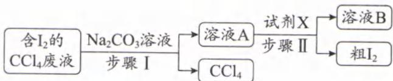

解析: A. $I_{2}$ 与 $Na_{2}CO_{3}$ 溶液(溶液显碱性)发生歧化反应,生成无色且溶于水的 NaI、 $NaIO_{3}$ ; $CCl_{4}$ 与水互不相溶、且 $CCl_{4}$ 无色,因此上下两层均无色,A 选项正确。

B. 加入 $Na_{2}CO_{3}$ 溶液后，NaI、 $NaIO_{3}$ 转移至水溶液中， $CCl_{4}$ 与水不互溶且密度大于水，溶液分层时 $CCl_{4}$ 在下层，从分液漏斗下口放出的是 $CCl_{4}$ ，B 选项错误。（卤代烃均不溶于水；卤代烃中一氟代物、一氯代物的密度小于水，其他均大于水。）
C. 在酸性条件下 NaI、 $NaIO_{3}$ 会发生归中反应生成 $I_{2}:5I^{-}+IO_{3}^{-}+6H^{+}=3I_{2}+3H_{2}O$ ，C 选项正确。

D. $\mathrm{I}_2$ 易升华，与热稳定好的固体混合可以用升华法分离 $\mathrm{I}_2$ ，D选项正确。

答案:B

【反思】酸碱性不同,导致反应进行的方向不同。

<table><tr><td>碱性</td><td>酸性</td></tr><tr><td> $Cl_{2} + 2OH^{-} = Cl^{-} + ClO^{-} + H_{2}O$ </td><td> $Cl^{-} + ClO^{-} + 2H^{+} = Cl_{2} \uparrow + H_{2}O$ </td></tr><tr><td> $3I_{2} + 6OH^{-} = 5I^{-} + IO_{3}^{-} + 3H_{2}O$ </td><td> $5I^{-} + IO_{3}^{-} + 6H^{+} = 3I_{2} + 3H_{2}O$ </td></tr><tr><td> $3S + 6OH^{-} \xlongequal{\triangle} 2S^{2-} + SO_{3}^{2-} + 3H_{2}O$ </td><td> $2S^{2-} + SO_{3}^{2-} + 6H^{+} = 3S \downarrow + 3H_{2}O$ </td></tr></table>

【例 8】实验室中初步分离环己醇、苯酚、苯甲酸混合液的流程如下。下列说法错误的是()

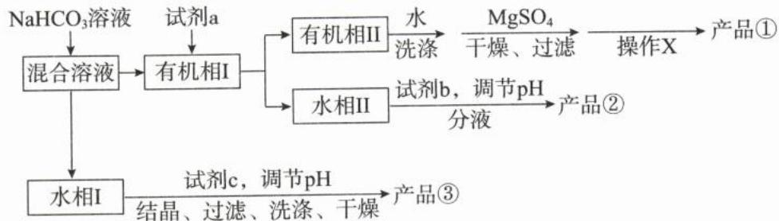

A. 环己醇、苯酚、苯甲酸粗产品依次由①、②、③获得  
B. 若试剂 a 为碳酸钠，可以通过观察气泡现象控制试剂用量  
C. “操作 X”为蒸馏，“试剂 b”可选用浓盐酸或 $\mathrm{CO}_{2}$ D. 试剂 c 可以选用浓盐酸或硫酸

解析: 环己醇、苯酚不与 $NaHCO_{3}$ 反应，进入有机相I；加入NaOH 水溶液(或 $Na_{2}CO_{3}$ 水溶液)，将苯酚转化为可溶于水的苯酚钠。分液后水相Ⅱ为苯酚钠、有机相Ⅱ为环己醇。 环己醇用水洗涤杂质，用 $MgSO_{4}$ 干燥后，过滤掉硫酸镁晶体，再利用蒸馏操作获得纯度较高的环己醇。

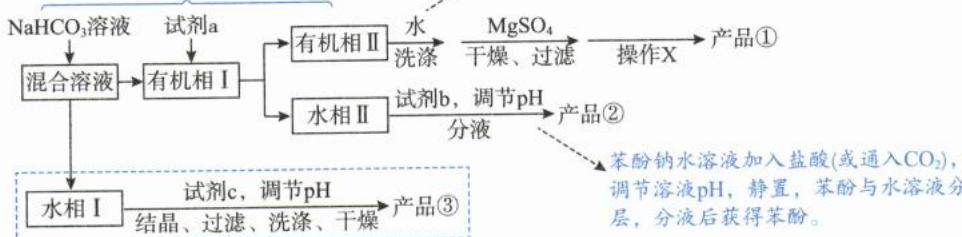

混合溶液加入 $\mathrm{NaHCO_3}$ 溶液，苯甲酸与碳酸氢钠反应生成可溶于水的苯甲酸钠，进入水相I。苯甲酸钠用盐酸(或硫酸)调节pH，将水溶液中的苯甲酸钠转化为苯甲酸，经结晶、过滤、洗涤、干燥获得苯甲酸晶体。

A. 根据上述分析, 产品①、②、③依次为环己醇、苯酚、苯甲酸, A选项正确。

B. 有机相 I 中有环己醇和苯酚, 由于酸性 $\mathrm{H}_{2} \mathrm{CO}_{3} >$ 苯酚 $>\mathrm{NaHCO}_{3}$ , 因此苯酚可以和 $\mathrm{Na}_{2} \mathrm{CO}_{3}$ 反应生成苯酚钠和 $\mathrm{NaHCO}_{3}$ , 但无法生成 $\mathrm{CO}_{2}$ , 没有气泡产生, B 选项错误。

C. 有机相Ⅱ可能还含有少量苯酚杂质, 经过水洗涤、 $\mathrm{MgSO}_{4}$ 干燥过滤后, 可以利用蒸馏操作, 除去一些液态杂质, 获得更高纯度的环己醇。试剂 b 是将苯酚钠转化为苯酚, 可以用浓盐酸或 $\mathrm{CO}_{2}, \mathrm{C}$ 选项正确。

D. 试剂 c 是将苯甲酸钠转化为苯甲酸，可加入强酸实现，因此试剂 c 可以选用浓盐酸或硫酸，D 选项正确。

答案:B

【反思】过程中涉及“由强制弱”，熟记酸性强弱：HCl（或 $H_{2}SO_{4}$ ）＞苯甲酸＞ $H_{2}CO_{3}$ ＞苯酚＞ $NaHCO_{3}$ 。苯酚虽与 $NaHCO_{3}$ 不反应，但能与 $Na_{2}CO_{3}$ 反应生成苯酚钠和 $NaHCO_{3}$ ；将 $CO_{2}$ 通入苯酚钠可以制苯酚。

## 第 4 节 常见物质的检验、性质强弱比较(★★★★)

## 内容提要

## 一、常见气体的检验

<table><tr><td>气体</td><td>检验方法</td></tr><tr><td> $H_2$ </td><td>1.收集一小试管气体,靠近火焰,做爆鸣实验2.通过红热CuO,检验产物气体只有水蒸气</td></tr><tr><td> $O_2$ </td><td>使带火星的木条复燃</td></tr><tr><td> $CO_2$ </td><td>无色无味的气体且能使澄清石灰水变浑浊,继续通入气体后,浊液又可变澄清</td></tr><tr><td>CO</td><td>1.点燃时火焰呈淡蓝色,燃烧产物可使澄清石灰水变浑浊;2.将气体通过灼热的CuO,CuO由黑色变成红色,且气体产物可使澄清石灰水变浑浊</td></tr><tr><td> $NH_3$ </td><td>1.使湿润的红色石蕊试纸变蓝;2.使酚酞溶液变红;3.靠近浓盐酸时冒白烟</td></tr><tr><td>NO</td><td>无色气体,遇 $O_2$ 立即变成红棕色</td></tr><tr><td> $NO_2$ </td><td>红棕色气体,且通入硝酸银溶液中不产生沉淀(对比: $Br_2(g)$ 也是红棕色,但通入硝酸银溶液会产生淡黄色沉淀)</td></tr><tr><td> $Cl_2$ </td><td>黄绿色气体,使湿润淀粉碘化钾试纸先变蓝,后褪色</td></tr><tr><td>HCl</td><td>使湿润的蓝色石蕊试纸变红,且将气体通入 $AgNO_3$ 溶液中有白色沉淀生成</td></tr><tr><td> $H_2S$ </td><td>1.使湿润的醋酸铅试纸变黑2.通入 $CuSO_4$ 溶液,生成黑色沉淀,该沉淀不溶于稀硫酸</td></tr><tr><td> $SO_2$ </td><td>无色刺激性气体通入品红后褪色,加热褪色后的溶液,溶液复原成红色</td></tr></table>

## 二、常见有机物检验

<table><tr><td>有机物</td><td>检验方法</td></tr><tr><td>卤代烃</td><td>先加NaOH溶液并加热,冷却后再加稀硝酸调节pH&lt;7,最后滴加AgNO3溶液,观察是否有沉淀以及沉淀的颜色</td></tr><tr><td>醇羟基</td><td>1.可使有黑色氧化膜的灼热铜丝变得光亮,并产生有刺激性气味的物质2.与金属钠能够缓慢释放氢气</td></tr><tr><td>酚羟基</td><td>氯化铁溶液显紫色</td></tr><tr><td>醛基</td><td>1.与银氨溶液反应(水浴加热)形成银镜2.与新制的Cu(OH)2反应(加热)生成砖红色沉淀(Cu2O)</td></tr><tr><td>羧基</td><td>加入 $NaHCO_3$ 后释放大量气泡</td></tr><tr><td>酯基</td><td>与滴有酚酞的稀NaOH溶液共热,红色逐渐消失</td></tr><tr><td>淀粉</td><td>溶液遇碘水( $I_2$ )变为蓝色</td></tr><tr><td>蛋白质</td><td>1.灼烧,有烧焦羽毛的气味2.加浓硝酸并微热,颜色变黄(含苯环结构的蛋白质用此方法)</td></tr></table>

## 三、常见离子的检验

<table><tr><td>离子</td><td>检验方法</td></tr><tr><td> $H^{+}$ </td><td>1. 定性:石蕊变红、甲基橙显红色或橙色、与铁单质反应生成  $H_{2}$  等2. 定量:用pH试纸或pH计测pH</td></tr><tr><td> $Na^{+}$ </td><td>焰色试验,火焰为黄色</td></tr><tr><td> $K^{+}$ </td><td>焰色试验,透过蓝色钴玻璃观察到火焰呈紫色</td></tr><tr><td> $Fe^{3+}$ </td><td>加入KSCN溶液呈(血)红色</td></tr><tr><td rowspan="4"> $Fe^{2+}$ </td><td>加入 $K_{3}[Fe(CN)_{6}]$ (铁氰化钾)溶液,生成KFe[Fe(CN) $_{6}$ ]蓝色沉淀</td></tr><tr><td>先加KSCN无明显现象,再加双氧水或氯水,溶液变成红色(此法可证明溶液中“有 $Fe^{2+}$ 且无 $Fe^{3+}$ ”,KSCN与双氧水/氯水的滴加顺序不可以对调;若体系中有 $Fe^{3+}$ 干扰,此法不能用)</td></tr><tr><td>加入酸性KMnO4溶液,溶液褪色(该方法可能受到其他如 $Cl^{-}$ 等还原剂的干扰)</td></tr><tr><td>滴加NaOH溶液,先生成白色沉淀,白色沉淀迅速转化成灰绿色,最后转化成红褐色(此法对浓度要求较高,平时很少用)</td></tr><tr><td> $Al^{3+}$ </td><td>滴加NaOH溶液,先形成白色沉淀,持续加入NaOH溶液后,白色沉淀溶解</td></tr><tr><td> $NH_{4}^{+}$ </td><td>加入NaOH溶液后加热,生成能使湿润红色石蕊试纸变蓝的气体(注意酰胺的干扰)</td></tr><tr><td> $OH^{-}$ </td><td>1. 定性:石蕊变蓝、酚酞变红;2. 定量:用pH试纸或pH计测pH</td></tr><tr><td rowspan="2"> $SO_{4}^{2-}$ </td><td>先加HCl酸化无明显现象,再滴加几滴 $BaCl_{2}$ 溶液,有白色沉淀生成</td></tr><tr><td>注:1.HCl的作用是排除 $CO_{3}^{2-}$ 、 $SO_{3}^{2-}$ 、 $Ag^{+}$ 的干扰。若HCl、 $BaCl_{2}$ 的顺序调换,则无法排除 $Ag^{+}$ 的干扰。2. 用 $HNO_{3}$ 酸化,或滴加 $Ba(NO_{3})_{2}$ ,不能排除 $HSO_{3}^{-}$ 、 $SO_{3}^{2-}$ 的干扰。3. 若实验探究中已知 $SO_{4}^{2-}$ 所在环境中无 $CO_{3}^{2-}$ 、 $SO_{3}^{2-}$ 、 $Ag^{+}$ 的干扰,则可以不用HCl酸化,也可以用 $Ba(NO_{3})_{2}$ 代替 $BaCl_{2}$ 。方法并非一成不变,审题时要注意离子所在的环境。</td></tr><tr><td> $Cl^{-}$ </td><td>加入硝酸酸化的硝酸银,产生白色沉淀</td></tr><tr><td>Br−</td><td>1.加入硝酸酸化的硝酸银,产生淡黄色沉淀2.先加少量氯水,再加 $CCl_{4}$ 萃取,下层液体呈橙红色</td></tr><tr><td>I−</td><td>1.加入硝酸酸化的硝酸银,产生黄色沉淀2.先加少量氯水,再加 $CCl_{4}$ 萃取,下层液体呈紫红色3.先加淀粉溶液无明显现象,再加少量氯水,溶液变成蓝色</td></tr><tr><td> $CO_{3}^{2-}$ </td><td>先加入 $BaCl_{2}$ 溶液,生成白色沉淀,过滤并洗涤沉淀,将沉淀溶于稀盐酸,产生无色无味且能使澄清石灰水变浑浊的气体</td></tr><tr><td> $SO_{3}^{2-}$ </td><td>先加入 $BaCl_{2}$ 溶液,生成白色沉淀,过滤并洗涤沉淀,将沉淀溶于稀盐酸,产生无色刺激性气味且能使品红褪色的气体注:检验 $CO_{3}^{2-}$ 、 $SO_{3}^{2-}$ 时,一定要用盐先将二者转化成沉淀,再转化成气体。直接将二者转化成气体会受到其酸式酸根( $HCO_{3}^{-}$ 、 $HSO_{3}^{-}$ )的干扰。</td></tr></table>

## 四、焰色试验

1. 焰色试验的步骤: 用盐酸洗涤无锈铁丝或铂丝, 在酒精灯上灼烧至无色。再用无锈铁丝或铂丝蘸取少量待测液进行灼烧, 观察焰色。

## 2. 常见元素的焰色：

<table><tr><td>元素种类</td><td>Li</td><td>Sr</td><td>Ca</td><td>Na</td><td>Cu</td><td>Ba</td><td>K</td><td>Rb</td></tr><tr><td>色系</td><td colspan="3">红色系</td><td>黄色</td><td colspan="2">绿色系</td><td colspan="2">紫色系</td></tr><tr><td>颜色</td><td>紫红</td><td>洋红</td><td>砖红</td><td>黄色</td><td>绿色</td><td>黄绿</td><td>紫</td><td>紫</td></tr></table>

## 五、常见化学性质检验

<table><tr><td>性质</td><td>方法</td></tr><tr><td>酸性</td><td>指示剂显色法:石蕊变红;甲基橙变红或橙色;pH试纸或pH计测定pH</td></tr><tr><td>碱性</td><td>指示剂显色法:石蕊变蓝;酚酞变红;pH试纸或pH计测定pH</td></tr><tr><td>氧化性</td><td>常用淀粉碘化钾溶液检验,观察溶液是否变蓝( $SO_2$ 的氧化性常用 $H_2S$ 证明)</td></tr><tr><td>还原性</td><td>常用酸性 $KMnO_4$ 溶液检验,观察酸性 $KMnO_4$ 溶液是否褪色</td></tr><tr><td>漂白性</td><td>将物质加入品红溶液,观察是否褪色</td></tr><tr><td>热稳定性</td><td>将物质加热,证明其分解产物的存在</td></tr></table>

六. 证明反应是否为可逆反应的方法(以 $2\mathrm{I}^{-} + 2\mathrm{Fe}^{3+} \rightleftharpoons \mathrm{I}_{2} + 2\mathrm{Fe}^{2+}$ 为例)

将 5 mL 0.1 mol/L KI 溶液与 1 mL 0.1 mol/L FeCl₃ 溶液混合, 往充分反应后的溶液中滴加几滴 KSCN, 溶液变成血红色。(方法: 证明相对少的反应物还有剩余, 即可证明反应为可逆反应)

## 七、性质强弱比较方法

## 1. 酸性或碱性强弱比较

<table><tr><td>原理</td><td>实例</td></tr><tr><td>(1)在相同温度下测等浓度的酸(或碱)对应的pH值,pH值小(或大)的相对更强</td><td>常温下分别测定0.1 mol/L HA、HB的pH,若pH(HA)&gt;pH(HB),则HB的酸性更强</td></tr><tr><td>(2)在相同温度下测等浓度的盐对应的pH值,根据越弱越水解的原理判断酸(或碱)的相对强弱</td><td>常温下分别测定0.1 mol/L MCl、NCl的pH,若7≥pH(MCl)&gt;pH(NCl),则MOH碱性更强</td></tr><tr><td>(3)根据“由强制弱”的原理证明酸(或碱)的相对强弱。如图装置可以证明酸性: $H_{2}SO_{4}>H_{2}CO_{3}>H_{2}SiO_{3}$ </td><td></td></tr></table>

## 2. 最常见的“由强制弱”装置图

<table><tr><td>实验原理</td><td>由强酸制备弱酸</td><td rowspan="4">实验装置图</td></tr><tr><td>装置B现象及解释</td><td>有无色气体产生,说明酸性:醋酸&gt;碳酸;反应的化学方程式为: $2CH_3COOH + Na_2CO_3 \rightarrow 2CH_3COONa + H_2O + CO_2 \uparrow$ </td></tr><tr><td>装置C作用</td><td>除去B中挥发出的 $CH_3COOH$ </td></tr><tr><td>装置D现象及解释</td><td>溶液变浑浊,说明酸性:碳酸&gt;苯酚;反应的化学方程式为:</td></tr><tr><td>实验结论</td><td colspan="2">酸性:醋酸&gt;碳酸&gt;苯酚</td></tr><tr><td rowspan="2">实验衍生</td><td colspan="2">欲证明非金属性:S&gt;C&gt;Si,A、B、D分别为: $H_2SO_4$ 、 $Na_2CO_3$ 固体、 $Na_2SiO_3$ 溶液。 $H_2SO_4$ 难挥发性,则无需洗气,可拆掉C装置。</td></tr><tr><td colspan="2">欲证明酸性: $H_2SO_3$ &gt;HClO,A、B、C、C、D分别为: $H_2SO_4$ 、 $Na_2SO_3$ 固体、“饱和 $NaHCO_3$ 溶液、足量酸性 $KMnO_4$ 溶液”、 $Ca(ClO)_2$ 溶液。这是因为具有强还原性的 $SO_2$ ,与具有强氧化性的HClO是发生氧化还原反应,要比较二者酸性强弱需寻找中介“ $H_2CO_3$ ”,所以要有两个C装置:B中生成的 $SO_2$ 通入饱和 $NaHCO_3$ 溶液,生成 $CO_2$ ;再用酸性 $KMnO_4$ 溶液吸收过量 $SO_2$ ,排除其干扰。若D装置中的 $Ca(ClO)_2$ 溶液出现白色浑浊,则说明酸性: $H_2SO_3$ &gt; $H_2CO_3$ &gt;HClO。</td></tr></table>

## 3. 氧化性或还原性强弱比较

<table><tr><td>原理</td><td>实例</td></tr><tr><td>根据“由强制弱”的原理证明氧化性(或还原性)的相对强弱。如图装置可以证明氧化性: $KMnO_{4} > Cl_{2} > I_{2}$ </td><td></td></tr></table>

注:根据“由强制弱”证明氧化性强弱时,若相对最强的氧化剂有挥发性时,一定要排除其挥发成分的干扰。

## 4. 溶解度大小比较

<table><tr><td>实例</td><td>方法</td><td>操作</td><td>现象</td><td>关键点</td></tr><tr><td rowspan="2">证明 $K_{sp}(AgCl) > K_{sp}(AgI)$ </td><td>转化法</td><td>往  $AgNO_3$  溶液中滴加 NaCl溶液直至不再产生白色沉淀为止,后加几滴 KI 溶液</td><td>白色沉淀转化成黄色沉淀</td><td>两种沉淀的共有离子“ $Ag^+$ ”必须少量</td></tr><tr><td>竞争法</td><td>往等浓度的 KI、NaCl 混合溶液中滴加少量  $AgNO_3$  溶液</td><td>看到黄色沉淀</td><td>两种沉淀的共有离子“ $Ag^+$ ”必须少量;竞争离子“I-”、“ $Cl^-$ ”必须等浓度</td></tr></table>

注：“转化法”实验是利用沉淀转化，“竞争法”实验是利用同浓度下溶解度小的物质先沉淀，都可以证明溶解度 AgCl > AgI；由于 AgCl、AgI 是相同类型的难溶电解质，因此可以同时证明 $K_{sp}:AgCl > AgI$ 。还需注意的是两种进行比较的沉淀其颜色要不同。

## 类型 I: 物质的鉴别与检验

【例 1】(2023·辽宁卷)下列鉴别或检验不能达到实验目的的是( )

A. 用澄清石灰水鉴别 $Na_{2}CO_{3}$ 与 $NaHCO_{3}$ B. 用 KSCN 溶液检验 $FeSO_{4}$ 是否变质

C. 用盐酸酸化的 $BaCl_{2}$ 溶液检验 $Na_{2}SO_{3}$ 是否被氧化

D. 加热条件下用银氨溶液检验乙醇中是否混有乙醛

解析：A. 石灰水的溶质为 $\mathrm{Ca(OH)}_2$ ，其与 $\mathrm{Na}_2\mathrm{CO}_3$ 、 $\mathrm{NaHCO}_3$ 反应的产物均有白色沉淀 $\mathrm{CaCO}_3$ ，二者反应的现象一样，无法鉴别，A 选项不符合题意。  
B. 变质后的 $\mathrm{FeSO}_4$ 溶液中会存在 $\mathrm{Fe}^{3+}$ ，加入 KSCN 溶液后溶液变成血红色，未变质加入 KSCN 无明显现象，B 选项符合题意。  
C. 明确指出了环境，没有 $\mathrm{Ag}^+$ 的干扰，此时检验 $\mathrm{SO}_4^{2-}$ 对 $\mathrm{HCl}$ 、 $\mathrm{BaCl}_2$ 的顺序没有要求。若 $\mathrm{Na}_2\mathrm{SO}_3$ 未被氧化，加入盐酸酸化的 $\mathrm{BaCl}_2$ 无明显现象；若 $\mathrm{Na}_2\mathrm{SO}_3$ 变质，加入盐酸酸化的 $\mathrm{BaCl}_2$ 产生白色沉淀，C 选项符合题意。  
D. 乙醇和热的银氨溶液不反应，乙醛和热的银氨溶液会发生银镜反应，D 选项符合题意。

答案:A

【例 2】有关物质的鉴别,下列说法正确的是( )

A. 用酸性 $KMnO_{4}$ 溶液可鉴别直馏汽油、裂化汽油和植物油

B. 用 NaOH 溶液、硝酸银溶液可鉴别氯乙烷、溴乙烷和碘乙烷

C. 用溴水可鉴别酒精、苯酚、己烯和甲苯

D. 用饱和 $Na_{2}CO_{3}$ 溶液可鉴别乙醇、乙醛、乙酸和乙酸乙酯

解析: A. 直馏汽油主要成分为饱和烃, 不能使酸性 $\mathrm{KMnO}_{4}$ 溶液褪色。植物油含碳碳双键结构、裂化汽油含不饱和烃, 二者均使酸性 $\mathrm{KMnO}_{4}$ 溶液褪色; 且二者与水均不互溶, 密度均小于水, 导致现象相同无法鉴别, A 选项错误。

B. 氯乙烷、溴乙烷和碘乙烷在 NaOH 水溶液加热的条件下可发生水解反应, 但在加入硝酸银溶液前, 需先加入硝酸中和溶液中的 NaOH, 避免 OH 干扰卤素离子的检验, B 选项错误。

C. 溴水与酒精不反应, 溴水不褪色, 且两者可以混溶, 溶液不分层; 苯酚与溴水反应生成 2, 4, 6-三溴苯酚白色沉淀; 乙烯与溴水发生加成反应使溴水褪色, 生成无色且难溶于水的 1, 2-二溴乙烷, 溶液分层, 下层为无色油状液体; 甲苯可使溴水褪色 (原理为萃取), 溶液分层, 上层油状液体显橙色。四种物质遇溴水现象均不同, 可以鉴别, C 选项正确。

D. 足量乙酸与饱和 $\mathrm{Na}_{2} \mathrm{CO}_{3}$ 溶液反应有气泡冒出; 乙酸乙酯不溶于饱和 $\mathrm{Na}_{2} \mathrm{CO}_{3}$ 溶液, 可观察到溶液分层, 油状液体 (乙酸乙酯) 在上层; 乙醇和乙醛均不与饱和 $\mathrm{Na}_{2} \mathrm{CO}_{3}$ 溶液反应, 且均与饱和 $\mathrm{Na}_{2} \mathrm{CO}_{3}$ 溶液互溶, 二者现象相同无法鉴别, D 选项错误。

答案:C

【反思】进行物质鉴别时,不仅要考虑化学性质的不同,还要充分利用物理性质中的溶解度和密度。

【例 3】下列关于离子检验的说法,正确的填“√”,错误的填“×”

(1)向溶液滴加用盐酸酸化的 $BaCl_{2}$ 溶液,生成白色沉淀,则该溶液中一定含有 $SO_{4}^{2-}$ ( )

(2)向溶液滴加用硝酸酸化的 $BaCl_{2}$ 溶液,产生白色沉淀,则原溶液中存在 $SO_{4}^{2-}$ 离子()

(3)向某溶液中加入足量稀盐酸,无明显现象,再加 $BaCl_{2}$ 溶液,生成白色沉淀,可确定溶液含有 $SO_{4}^{2-}$ ( )

(4)用洁净的铂丝蘸取溶液,在火焰上灼烧,焰色为黄色,可确定溶液含有 $Na^{+}$ ,不含 $K^{+}$ ( )
(5)用玻璃棒蘸取某无色溶液,灼烧,观察火焰呈黄色,该溶液中含有 $Na^{+}$ ( )

(6)取少量样液加入盐酸,能够产生使澄清石灰水变浑浊的气体,证明样品中含有 $\mathrm{CO}_{3}^{2-}$ ( )

$$
\mathrm{AgNO} _ {3}
$$

(9)向某溶液中加入浓 NaOH 溶液并加热,产生的气体能使蓝色石蕊试纸变红,说明该溶液中含 $NH_{4}^{+}$ ( )

$$
\mathrm{Fe} ^ {3 +}
$$

(12)向溶液中加入几滴新制氯水,再加2滴KSCN溶液,溶液显红色,则原溶液一定有 $Fe^{2+}$ ( )

$$
\mathrm{S} _ {2} \mathrm{O} _ {3} ^ {2 -} (\quad)
$$

解析:(1)(×)向溶液中滴加盐酸酸化的 $BaCl_{2}$ 溶液,生成的白色沉淀可能是 $BaSO_{4}$ 或 AgCl,即该实验无法排除 $Ag^{+}$ 的干扰。

(2)(×)若原溶液含 $SO_{3}^{2-}$ 或 $HSO_{3}^{-}$ ，向溶液滴加用硝酸酸化的 $BaCl_{2}$ 溶液，这两种离子会被硝酸氧化为 $SO_{4}^{2-}$ ，最终生成的白色沉淀也是 $BaSO_{4}$ ，但不能说明原溶液中存在 $SO_{4}^{2-}$ 离子。

(3)(√)向某溶液中加入足量稀盐酸,无明显现象,可排除 $\mathrm{CO}_{3}^{2-}$ 、 $\mathrm{SO}_{3}^{2-}$ 、 $\mathrm{Ag}^{+}$ 的影响;再加 $BaCl_{2}$ 溶液,生成难溶于盐酸的白色沉淀(即 $BaSO_{4}$ ),可确定溶液中含 $SO_{4}^{2-}$ 。

(4)(×)用洁净的铂丝蘸取溶液,在火焰上灼烧,焰色为黄色,可确定溶液含有 $Na^{+}$ ,但由于钾元素的焰色会被钠元素的焰色所干扰,因此需要透过蓝色钴玻璃滤掉黄光,观察焰色是否呈紫色,才能确认原溶液是否有 $K^{+}$ 。

(5)(×)玻璃棒中含有 $Na_{2}SiO_{3}$ ，会对 $Na^{+}$ 的焰色试验造成干扰，应使用无锈铁丝或铂丝蘸取少量待测液进行灼烧。

(6)(×)溶液中若含 $HCO_{3}^{-}$ ，加入盐酸也能生成 $CO_{2}$ ，使澄清石灰水变浑浊；此外 $SO_{3}^{2-}$ 、 $HSO_{3}^{-}$ ，加盐酸能生成 $SO_{2}$ ，也能使澄清石灰水变浑浊。

(7)(×)该溶液也可能含 $\left[Al(OH)_{4}\right]^{-}$ ，加少量盐酸出现 $\mathrm{Al(OH)}_{3}$ 白色沉淀，再加NaOH溶液 $\mathrm{Al(OH)}_{3}$ 溶解又变会 $\left[Al(OH)_{4}\right]^{-}$ 。

(8)(×)加入 $AgNO_{3}$ 溶液有白色沉淀生成, 不一定是 AgCl 沉淀, 也可能为 $Ag_{2}CO_{3}$ 。检验 $Cl^{-}$ 应先加入硝酸酸化, 排除如 $CO_{3}^{2-}$ 的干扰, 再加入 $AgNO_{3}$ 溶液, 若产生白色沉淀, 说明原溶液中存在 $Cl^{-}$ 。

(9)(×)含有 $NH_{4}^{+}$ 的溶液中加入浓NaOH溶液并加热,可以生成 $NH_{3}$ , $NH_{3}$ 溶于水显碱性,能使湿润的“红色”石蕊试纸变“蓝”。

(10)(×)检验 $NH_{4}^{+}$ 时,除了加入足量NaOH溶液,也需要加热,促使 $NH_{3}\cdot H_{2}O$ 受热分解生成 $NH_{3}$ ,并降低 $NH_{3}$ 溶解度,从而有利于气体从溶液中逸出。如果只向溶液加稀NaOH溶液且不加热,溶液中即使有 $NH_{4}^{+}$ ,则可能只生成 $NH_{3}\cdot H_{2}O$ 而没有逸出具有刺激性气味的 $NH_{3}$ 。

(11)(×) $Fe^{3+}$ 与 $SCN^{-}$ 生成可溶于水的配合物,使溶液变为红色,但没有沉淀生成。

(12)(×)原溶液若含 $Fe^{3+}$ ，上述实验流程最终也会使溶液变红色，因此该实验设计无法验证原溶液是否含 $Fe^{2+}$ 。要验证溶液中是否存在 $Fe^{2+}$ ，可以向溶液滴加 $\mathrm{K}_{3}\left[\mathrm{Fe}(\mathrm{CN})_{6}\right]$ 溶液，若生成蓝色沉淀，则可说明溶液中含 $Fe^{2+}$ 。如果要证明溶液中有 $Fe^{2+}$ 且无 $Fe^{3+}$ ，则可以向溶液先滴加 KSCN 溶液，溶液不变红（无 $Fe^{3+}$ ），再向溶液加入新制氯水或 $H_{2}O_{2}$ 溶液，若溶液变红，则可说明原溶液有 $Fe^{2+}$ 且无 $Fe^{3+}$ 。

(13) $(\times)\mathrm{S}_2\mathrm{O}_3^{2-}$ 在酸性溶液中会生成 S（黄色沉淀）、 $\mathrm{SO}_2$ （无色刺激性气体），但如果体系中同时存在 $\mathrm{S}^{2-}$ 和 $\mathrm{SO}_3^{2-}$ ，滴加稀硫酸也可以生成 $\mathrm{S}(2\mathrm{S}^{2-} + \mathrm{SO}_3^{2-} + 6\mathrm{H}^+ = 3\mathrm{S}\downarrow + 3\mathrm{H}_2\mathrm{O})$ 和 $\mathrm{SO}_2$ 。答案：(1) × (2) × (3) √ (4) × (5) × (6) × (7) × (8) × (9) × (10) × (11) × (12) × (13) ×

【例 4】下列有机实验操作或装置能达到目的的填“√”，不能的填“×”

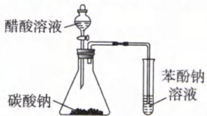

(1)验证乙酸、碳酸、苯酚的酸性强弱()

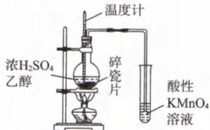

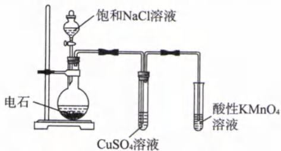

(2)检验乙醇与浓硫酸共热生成乙烯()

(3)验证乙炔具有还原性()

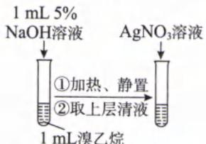

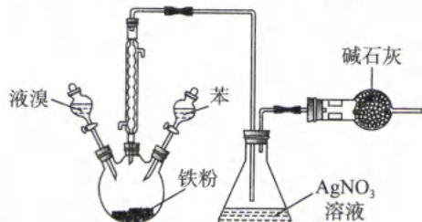

(5)检验溴乙烷水解产物中含有 $Br^{-}$ ( )

(4)制取溴苯并检验有 HBr 生成()

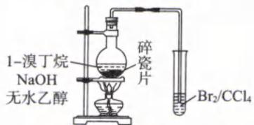

(6)检验1—溴丁烷发生消去反应生成1—丁烯()

解析:(1)(×)滴加醋酸溶液至烧瓶中,观察到有气泡生成,说明醋酸与碳酸钠反应生成气体( $CO_{2}$ ),可证明醋酸酸性强于碳酸。将 $CO_{2}$ 通入苯酚钠溶液中,若观察到溶液变浑浊(苯酚),可证明碳酸酸性强于苯酚。由于醋酸具有挥发性,导致生成的 $CO_{2}$ 会混有乙酸蒸气,若没有除去,则苯酚钠溶液中产生的白色浑浊也可能是乙酸造成的,无法验证碳酸酸性强于苯酚。欲达到实验目的,应在发生装置和试管之间加装一个盛有饱和 $NaHCO_{3}$ 溶液的洗气瓶,将反应生成的气体通过饱和 $NaHCO_{3}$ 溶液进行洗气,除去乙酸后,再将 $CO_{2}$ 通入苯酚钠溶液。

(2)(×)乙醇与浓硫酸加热至 $170^{\circ} \mathrm{C}$ 发生消去反应生成乙烯, 同时还混有乙醇蒸气与 $\mathrm{SO}_{2}$ 。乙烯、乙醇、 $\mathrm{SO}_{2}$ 均能使酸性 $\mathrm{KMnO}_{4}$ 溶液褪色, 因此乙醇与 $\mathrm{SO}_{2}$ 的存在会对乙烯的检验造成干扰。欲达到实验目的, 应在发生装置与酸性 $\mathrm{KMnO}_{4}$ 溶液之间加装盛有 $\mathrm{NaOH}$ 溶液的洗气瓶, 将反应生成的气体先通过 $\mathrm{NaOH}$ 溶液洗气,除去易溶于水的乙醇与酸性氧化物 $\mathrm{SO}_{2}$ 后, 再将气体通入酸性 $\mathrm{KMnO}_{4}$ 溶液, 达到检验乙烯的实验目的。

(3)(√)电石中含有的硫化钙、磷化钙等杂质也会和水反应,因此电石与饱和 NaCl 溶液反应后,生成的乙炔气体混有 $\mathrm{H}_{2} \mathrm{~S}, \mathrm{PH}_{3}$ 。由于 $\mathrm{H}_{2} \mathrm{~S}, \mathrm{PH}_{3}$ 具有还原性,也能使酸性 $\mathrm{KMnO}_{4}$ 溶液褪色,因此需要将反应后的气体先通过 $\mathrm{CuSO}_{4}$ 水溶液进行洗气,除去 $\mathrm{H}_{2} \mathrm{~S}, \mathrm{PH}_{3}$ 后,再将气体通入酸性高锰酸钾溶液,若溶液紫色退去,可验证乙炔具有还原性。

(4)(×)液溴与苯在催化剂条件下生成溴苯和 HBr, HBr 气体通入 $AgNO_{3}$ 溶液可以观察到有淡黄色沉淀 (AgBr) 生成, 可以证明液溴与苯发生取代反应生成 HBr。由于反应物液溴易挥发, 溴蒸气通入 $AgNO_{3}$ 溶液后, $Br_{2}$ 与 $H_{2}O$ 反应也会生成 HBr, 同样也会生成淡黄色沉淀, 对实验造成干扰。欲达到实验目的, 应在发生装置与 $AgNO_{3}$ 溶液之间加装盛有 $CCl_{4}$ 的洗气瓶, 除去 HBr 中的溴蒸气。(根据“相似相溶”规律, 非极性分子 $Br_{2}$ 易溶于同为非极性的 $CCl_{4}$ , 但极性分子 HBr 则难溶于非极性的 $CCl_{4}$ 。)

(5)(×)溴乙烷在 NaOH 水溶液中发生水解反应,生成乙醇与 NaBr。但溴乙烷水解液中仍有 NaOH,也会与 $AgNO_{3}$ 反应,对实验造成干扰。欲达到实验目的,需先向水解液加稀硝酸酸化后,再加硝酸银溶液,若生成淡黄色沉淀,则可检验溴乙烷水解产物中含有 Br $^{-}$ 。

(6)(√)1—溴丁烷与 NaOH 的乙醇溶液共热后, 可以发生消去反应生成 1—丁烯 $\left(\mathrm{CH}_{2}=\mathrm{CHCH}_{2}\mathrm{CH}_{3}\right)$ , 1—丁烯能与溴发生加成反应, 使溴的四氯化碳溶液褪色。乙醇具有挥发性, 因此反应后生成的 1—丁烯混有乙醇, 但乙醇不会使溴的四氯化碳溶液褪色, 因此反应生成的气体直接通入溴的四氯化碳溶液中, 可以达到检验 1—丁烯的实验目的。(若该装置的试管改为酸性 $KMnO_{4}$ 溶液, 由于 1—丁烯、乙醇均能使酸性 $KMnO_{4}$ 溶液褪色, 因此反应生成的气体必须先通过盛水的洗气瓶, 吸收易溶于水的乙醇后, 再将气体通入酸性 $KMnO_{4}$ 溶液。若观察到溶液褪色, 则可证明 1—溴丁烷发生消去反应生成 1—丁烯。)

答案:(1)× (2)× (3)√ (4)× (5)× (6)√

类型Ⅱ:实验方案设计、操作、现象、结论综合题型

【例 5】(2023·新课标卷)根据实验操作及现象,下列结论中正确的是()

<table><tr><td>选项</td><td>实验操作及现象</td><td>结论</td></tr><tr><td>A</td><td>常温下将铁片分别插入稀硝酸和浓硝酸中,前者产生无色气体,后者无明显现象</td><td>稀硝酸的氧化性比浓硝酸强</td></tr><tr><td>B</td><td>取一定量 $Na_{2}SO_{3}$ 样品,溶解后加入 $BaCl_{2}$ 溶液,产生白色沉淀。加入浓 $HNO_{3}$ ,仍有沉淀</td><td>此样品中含有 $SO_{4}^{2-}$ </td></tr><tr><td>C</td><td>将银和 $AgNO_{3}$ 溶液与铜和 $Na_{2}SO_{4}$ 溶液组成原电池。连通后银表面有银白色金属沉积,铜电极附近溶液逐渐变蓝</td><td>Cu的金属性比Ag强</td></tr><tr><td>D</td><td>向溴水中加入苯,振荡后静置,水层颜色变浅</td><td>溴与苯发生了加成反应</td></tr></table>

解析: A. 常温下, 铁的表面会迅速被浓硝酸氧化, 生成一层致密的氧化物薄膜, 阻止酸与内层金属的进一步反应 (即发生钝化), 现象不明显。因此本实验无法说明稀硝酸的氧化性比浓硝酸强, A 选项错误。

B. 浓 $HNO_{3}$ 具有强氧化性，能将 $BaSO_{3}$ 氧化为 $BaSO_{4}$ ，因此该实验不能证明样品中含有 $SO_{4}^{2-}$ 。应将 $HNO_{3}$ 改为 HCl，才能验证该样品是否含有 $SO_{4}^{2-}$ ，B 选项错误。

C. 铜电极附近溶液逐渐变蓝, 说明 $\mathrm{Cu}$ 失电子被氧化为 $\mathrm{Cu}^{2+}$ ; 银表面有银单质析出, 说明溶液中的 $\mathrm{Ag}^{+}$ 得电子被还原为 Ag 单质，该原电池的反应原理为： $2Ag^{+} + Cu = 2Ag + Cu^{2+}$ 。铜单质置换出银单质，说明铜单质还原性大于银单质，也能说明 Cu 的金属性比 Ag 强，C 选项正确。

D. 苯会萃取溴水中的溴单质, 使水层颜色变浅, 过程没有发生化学反应, D 选项错误。(苯与“溴水”无法发生取代或加成反应, 但苯与“液溴”在溴化铁的催化作用下可以发生取代反应。)

答案:C

【例 6】(2024·江苏卷)室温下,根据下列实验过程及现象,能验证相应实验结论的是()

<table><tr><td>选项</td><td>实验过程及现象</td><td>实验结论</td></tr><tr><td>A</td><td>用0.1mol·L-1NaOH溶液分别中和等体积的0.1mol·L-1H2SO4溶液和0.1mol·L-1CH3COOH溶液,H2SO4消耗的NaOH溶液多</td><td>酸性:H2SO4&gt;CH3COOH</td></tr><tr><td>B</td><td>向2mL 0.1mol·L-1Na2S溶液中滴加几滴溴水,振荡,产生淡黄色沉淀</td><td>氧化性:Br2&gt;S</td></tr><tr><td>C</td><td>向2mL浓度均为0.1mol·L-1的CaCl2和BaCl2混合溶液中滴加少量0.1mol·L-1Na2CO3溶液,振荡,产生白色沉淀</td><td>溶度积常数:CaCO3&gt;BaCO3</td></tr><tr><td>D</td><td>用pH试纸分别测定CH3COONa溶液和NaNO2溶液pH,CH3COONa溶液pH大</td><td>结合H+能力:CH3COO-&gt;NO2-</td></tr></table>

解析: A. $H_{2}SO_{4}$ 是二元酸, $CH_{3}COOH$ 是一元酸, 因此等浓度、等体积的 $H_{2}SO_{4}$ 、 $CH_{3}COOH$ 与 NaOH 完全中和时, $H_{2}SO_{4}$ 消耗 NaOH 的物质的量是 $CH_{3}COOH$ 的 2 倍, 但这无法证明二者酸性的强弱, A 选项错误。B. 向 2 mL 0.1 mol·L $^{-1}$ $Na_{2}S$ 溶液中滴加几滴溴水, 振荡, 产生淡黄色沉淀, 说明发生置换反应: $Na_{2}S + Br_{2} = 2NaBr + S \downarrow$ 。 $Br_{2}$ 为氧化剂、S 为氧化产物, 由于氧化剂的氧化性大于氧化产物, 因此氧化性: $Br_{2} > S$ , B 选项正确。

C. 本实验的设计目的, 是将 $0.1 \mathrm{~mol} \cdot \mathrm{L}^{-1} \mathrm{Na}_{2} \mathrm{CO}_{3}$ 溶液滴加到等浓度的 $\mathrm{CaCl}_{2}$ 和 $\mathrm{BaCl}_{2}$ 混合溶液中, 溶解度小的盐会先沉淀, 再由溶解度大小判断二者溶度积常数的大小。但 $\mathrm{CaCO}_{3}$ 和 $\mathrm{BaCO}_{3}$ 都是白色沉淀, 因此无法判断白色沉淀物是何种物质, 也就无法判断二者溶解度和溶度积常数的大小, C 选项错误。

D. 根据“越弱越水解”，弱酸分子的酸性越弱，其对应的弱酸根离子水解程度越大（即结合 $H^{+}$ 能力越强）。比较“等浓度”的钠盐溶液，溶液碱性越强、pH 越大，表示对应的弱酸根水解程度越大，与 $H^{+}$ 能力越强。但选项中并未指出 $CH_{3}COONa$ 溶液和 $NaNO_{2}$ 溶液是等浓度，因此无法透过溶液的 pH 大小比较 $CH_{3}COO^{-}$ 和 $NO_{2}^{-}$ 的结合 $H^{+}$ 能力，D 选项错误。

答案:B

【例 7】(2024·浙江 1 月选考)根据实验目的设计方案并进行实验,观察到相关现象,其中方案设计或结论不正确的是()

<table><tr><td></td><td>实验目的</td><td>方案设计</td><td>现象</td><td>结论</td></tr><tr><td>A</td><td>探究 Cu 和浓 HNO3反应后溶液呈绿色的原因</td><td>将 NO2通入下列溶液至饱和:1浓 HNO32Cu(NO3)2和 HNO3混合溶液</td><td>1无色变黄色2蓝色变绿色</td><td>Cu 和浓 HNO3反应后溶液呈绿色的主要原因是溶有 NO2</td></tr><tr><td>B</td><td>比较 F-与 SCN-结合 Fe3+的能力</td><td>向等物质的量浓度的 KF 和 KSCN 混合溶液中滴加几滴 FeCl3溶液,振荡</td><td>溶液颜色无明显变化</td><td>结合 Fe3+的能力:F-&gt;SCN-</td></tr><tr><td>C</td><td>比较 HF 与 $H_{2}SO_{3}$  的酸性</td><td>分别测定等物质的量浓度的 $NH_{4}F$  与  $(NH_{4})_{2}SO_{3}$  溶液的 pH</td><td>前者 pH 小</td><td>酸性: $HF>H_{2}SO_{3}$ </td></tr><tr><td>D</td><td>探究温度对反应速率的影响</td><td>等体积、等物质的量浓度的 $Na_{2}S_{2}O_{3}$  与  $H_{2}SO_{4}$  溶液在不同温度下反应</td><td>温度高的溶液中先出现浑浊</td><td>温度升高,该反应速率加快</td></tr></table>

解析: A. 实验①将 $NO_{2}$ 通入浓 $HNO_{3}$ 至饱和, 观察到无色溶液变黄色; 实验②将 $NO_{2}$ 通入 $\mathrm{Cu(NO_{3})_{2}}$ 和 $HNO_{3}$ 混合溶液, 观察到混合溶液由蓝色变绿色。由于 $\mathrm{Cu(NO_{3})_{2}}$ 溶液为蓝色, $HNO_{3}$ 溶液为无色, 而 $HNO_{3}$ 溶液溶有 $NO_{2}$ 呈黄色, 且蓝色溶液与黄色溶液混合呈绿色, 由此推断 Cu 和浓 $HNO_{3}$ 反应后溶液呈绿色的主要原因是溶有 $NO_{2}$ , A 选项正确。

B. $Fe^{3+}$ 与 $SCN^{-}$ 可结合形成配合物 $\mathrm{Fe(SCN)_3}$ ，会使溶液颜色变红； $Fe^{3+}$ 与 $F^{-}$ 可结合形成无色配离子 $[FeF_6]^{3-}$ 。向“等物质的量浓度”的 KF 和 KSCN 混合溶液（溶液为无色）中滴加几滴 $FeCl_3$ 溶液，振荡，溶液颜色无明显变化，说明 $Fe^{3+}$ 优先形成无色 $[FeF_6]^{3-}$ ，也证明结合 $Fe^{3+}$ 的能力： $F^{-} > SCN^{-}$ ，B 选项正确。（本题即使不知道 $Fe^{3+}$ 与 $F^{-}$ 可形成无色配离子 $[FeF_6]^{3-}$ ，也可以通过溶液不变红，确定 $Fe^{3+}$ 并没有和 $SCN^{-}$ 结合，从而证明结合 $Fe^{3+}$ 的能力： $F^{-} > SCN^{-}$ 。）

C. 测定等物质的量浓度的 $\mathrm{NH}_{4}\mathrm{F}$ 与 $(\mathrm{NH}_{4})_{2}\mathrm{SO}_{3}$ 溶液的 pH，只能通过 $F^{-}$ 与 $SO_{3}^{2-}$ 水解程度大小，比较 HF 的酸性强于 $HSO_{3}^{-}$ ，无法比较 HF 与 $H_{2}SO_{3}$ 的酸性，C 选项错误。

D. 控制单一变量, 对比等体积、等物质的量浓度的 $Na_{2}S_{2}O_{3}$ 与 $H_{2}SO_{4}$ 溶液在不同温度下反应, 温度高的溶液中先出现浑浊(生成固体 S), 可证明温度升高, 该反应速率加快, D 选项正确。
答案:C

## 第 5 节 常见物质的制备(★★★★)

## 内容提要

## 一、固体制备——Fe(OH) $_{2}$ 的制备

1. 原理: 可溶性亚铁盐与碱反应, 如: $\mathrm{FeSO_{4} + 2NaOH = Fe(OH)_{2} \downarrow + Na_{2}SO_{4}}$

2. 关键: $\mathrm{Fe(OH)_2}$ 具有极强还原性, 容易被空气中的 $O_2$ 氧化, 实验过程中要避免 $O_2$ 氧化 $\mathrm{Fe(OH)_2}$ 。

3. 教材实验中避免 $\mathrm{Fe(OH)}_{2}$ 被氧化的措施

(1)配制 $FeSO_{4}$ 、NaOH 的蒸馏水要先煮沸，除去蒸馏水中溶解的 $O_{2}$ 。

(2) 在 NaOH 溶液表面加一层植物油, 阻止空气中 $O_{2}$ 进入溶液。

(3) 将胶头滴管伸入液面以下滴加 $FeSO_{4}$ 溶液，减少 $\mathrm{Fe(OH)}_{2}$ 与 $O_{2}$ 的接触。

4. 衍生实验—— $H_{2}$ 保护法

<table><tr><td>装置</td><td>原理</td></tr><tr><td></td><td>(1)连接好装置,并检查装置的气密性。(2)在A试管中加入稀 $H_2SO_4$ 和Fe粉,B试管中加入NaOH溶液。(3)打开止水夹a,利用A中生成的 $H_2$ 排除试管B中的空气。(4)在B的导管口收集气体并验纯。(5)关闭止水夹a,产生的气体将A试管中的 $FeSO_4$ 溶液压入B中。</td></tr></table>

注:制备强还原性的物质时,往往需要先通 $N_{2}$ 、惰性气体等,排除原体系中空气的干扰。

## 二、液体制备

## 1. 氢氧化铁胶体的制备

(1)实验原理: $\mathrm{FeCl_{3}+3H_{2}O\xlongequal{加热}\mathrm{Fe(OH)_{3}(胶体)+3HCl}$

(2) 关键点: ①OH $^{-}$ 由沸水提供; ②将饱和氯化铁滴入沸水; ③不能搅拌; ④不能长时间煮沸。

(3)胶体的检验:用一束光照射胶体,看到一条光亮的“通路”,即“丁达尔效应”。

2. 乙酸乙酯的制备

(1)实验原理: $\mathrm{CH_{3}COOH+CH_{3}CH_{2}OH\xlongequal[\triangle]{浓硫酸}CH_{3}COOCH_{2}CH_{3}+H_{2}O}$

(2) 关键点: ①原料是无水乙醇、冰醋酸、浓硫酸。

②浓硫酸既是催化剂也是吸水剂，既可加快化学反应速率，也可促进平衡正向移动。

③浓硫酸、乙醇、乙酸的混合顺序: 将浓硫酸先倒入无水乙醇, 混合后再倒入冰醋酸。

④及时蒸出乙酸乙酯,并用饱和碳酸钠溶液收集乙酸乙酯。饱和碳酸钠的作用是吸收乙醇,中和乙酸,降低乙酸乙酯溶解度并利于分层;饱和碳酸钠吸收乙酸乙酯时需要防倒吸。

总结

1. 液体混合顺序：

(1) 密度大的液体倒入密度小的液体, 例如将浓硫酸倒入水(或乙醇、或硝酸)中。

(2)极易挥发、有毒的液体最后参与混合。

2. 盐类降低有机物溶解度的原因: 绝大多数有机物为非极性或弱极性分子, 往水溶液中加入盐之后水溶液的极性增大, 水溶液的极性与有机物的极性差距增大, 有机物的溶解度更小。

例:饱和碳酸钠溶液可以降低乙酸乙酯溶解度。

3. 同理, 往离子化合物的水溶液中加入可溶性的弱极性有机物之后, 弱极性有机物将水溶液的极性减弱, 离子化合物在弱极性溶液中的溶解度降低会以晶体形式出现。

例:往铜氨溶液中加入95%乙醇,会析出深蓝色晶体 $\left[\mathrm{Cu}\left(\mathrm{NH}_{3}\right)_{4}\right]\mathrm{SO}_{4}\cdot\mathrm{H}_{2}\mathrm{O}$ 。

## 三、气体制备

1. 气体制备流程

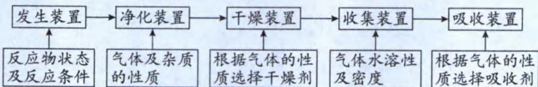

2. 发生装置

(1)固体+固体 $\xrightarrow{加热}$ 气体

<table><tr><td>发生装置</td><td></td><td>装置1试管口向下倾斜,避免水冷凝回流导致试管炸裂。</td><td></td><td>装置2加热草酸晶体先熔化再分解。</td></tr><tr><td>方程式</td><td colspan="4">i.  $O_{2}$ : $2KMnO_{4} \xlongequal{\triangle} K_{2}MnO_{4} + MnO_{2} + O_{2} \uparrow$ 或 $2KClO_{3} \xlongequal[\triangle]{MnO_{2}} 2KCl + 3O_{2} \uparrow$ ,选用1ii.  $NH_{3}$ : $2NH_{4}Cl + Ca(OH)_{2} \xlongequal{\triangle} CaCl_{2} + 2H_{2}O + 2NH_{3} \uparrow$ ,选用1</td></tr></table>

## (2)固体+液体→气体

<table><tr><td>发生装置</td><td>装置3</td><td></td><td>装置4(启普发生器)固体必须是块状或颗粒状,不能是粉末;固体不溶于水</td></tr><tr><td>方程式</td><td colspan="3">i. $H_{2}:Zn+H_{2}SO_{4}$ (稀)= $ZnSO_{4}+H_{2}\uparrow$ ,选用3或4ii. $CO_{2}:CaCO_{3}+2HCl=CaCl_{2}+H_{2}O+CO_{2}\uparrow$ ,选用3或4;或 $Na_{2}CO_{3}+2HCl=2NaCl+H_{2}O+CO_{2}\uparrow$ ,选用3iii. $SO_{2}:Na_{2}SO_{3}+H_{2}SO_{4}(70\%)=Na_{2}SO_{4}+H_{2}O+SO_{2}\uparrow$ ,选用3iv. $Cl_{2}:2KMnO_{4}+16HCl$ (浓)= $2KCl+2MnCl_{2}+8H_{2}O+5Cl_{2}\uparrow$ ,选用3;或 $KClO_{3}+6HCl$ (浓)= $KCl+3Cl_{2}\uparrow+3H_{2}O$ ,选用3V. NO: $3Cu+8HNO_{3}$ (稀)= $3Cu(NO_{3})_{2}+2NO\uparrow+4H_{2}O$ ,选用3vi. $NO_{2}:Cu+4HNO_{3}$ (浓)= $Cu(NO_{3})_{2}+2NO_{2}\uparrow+2H_{2}O$ ,选用3vii. $H_{2}S:FeS+H_{2}SO_{4}$ (稀)= $FeSO_{4}+H_{2}S\uparrow$ ,选用3或4viii. $C_{2}H_{2}:CaC_{2}+2H_{2}O$ (饱和食盐水) $\rightarrow Ca(OH)_{2}+CH\equiv CH\uparrow$ ,选用3(不能用4)</td></tr></table>

## (3)固体+液体 $\xrightarrow{加热}$ 气体

<table><tr><td>发生装置</td><td>装置5</td><td>装置6 可平衡压强,使液体顺利流下</td><td>装置7</td></tr><tr><td>方程式</td><td colspan="3">i. $Cl_{2}$ : $MnO_{2}$ +4HCl(浓) $\xlongequal{\triangle}MnCl_{2}$ +2 $H_{2}O$ + $Cl_{2}$ ↑,选用5或6ii. $C_{2}H_{4}$ : $CH_{3}CH_{2}OH$ (无水乙醇) $\xrightarrow[170°C]{浓硫酸}CH_{2}=CH_{2}\uparrow+H_{2}O$ ,选用7(需要温度计测量温度)</td></tr></table>

## 3. 气密性检查(先检查气密性,再加试剂)

(1)答题模式:先形成密闭体系,再改变压强(改变温度或改变体积),观察现象,最后描述结论。

## (2) 主要方法: 微热法、液差法

①微热法:如发生装置①,将导管伸入水槽中,用手握住试管。观察到水槽中有气泡冒出,松开手后管口有一段稳定水柱,则说明装置的气密性好。

②液差法:如发生装置③、④、⑤,用止水夹夹住导管末端,(打开分液漏斗活塞)往漏斗中注入蒸馏水,一段时间后观察到漏斗导管中与发生器液面存在一段稳定液柱,则说明装置气密性良好。

## 4. 净化装置

<table><tr><td>净化(除杂)原理</td><td colspan="3">利用溶解度、熔沸点、氧化性、还原性、酸性、碱性将杂质除去,同时遵循“不减”、“不增”原理。</td></tr><tr><td>常用装置</td><td> $\rightarrow$  长进短出饱和NaHCO3</td><td></td><td></td></tr><tr><td>实例</td><td>CO2(HCl)</td><td>O2(Cl2)</td><td>N2(O2)</td></tr></table>

## 5. 干燥装置

<table><tr><td>分类标准</td><td colspan="2">状态</td><td colspan="3">性质</td></tr><tr><td>类别</td><td>固态</td><td>液态</td><td>酸性</td><td>碱性</td><td>中性</td></tr><tr><td>实例</td><td>碱石灰、硅胶、 $P_{2}O_{5}$ 、无水  $CaCl_{2}$ </td><td>浓硫酸</td><td rowspan="2">硅胶、浓硫酸、 $P_{2}O_{5}$ 等</td><td rowspan="2">碱石灰、CaO、NaOH固体</td><td rowspan="2">无水 $CaCl_{2}$ 、无水 $Na_{2}SO_{4}$ </td></tr><tr><td>装置</td><td></td><td></td></tr></table>

注：(1) $P_{2}O_{5}$ 、浓硫酸不能干燥食品。

(2)浓硫酸有强氧化性,不能干燥 $H_{2}S$ 、HI等还原性气体,但可以干燥 $SO_{2}$ 。

(3)无水 $CaCl_{2}$ 不能干燥 $NH_{3}$ (二者会反应生成 $CaCl_{2} \cdot 8NH_{3}$ )。

(4)无水氯化镁、无水硫酸钠主要干燥有机物。

(5)无水硫酸铜一般用于检验水蒸气,而不是除去水蒸气。

## 6. 收集装置

<table><tr><td rowspan="3">分类</td><td colspan="4">排空气法</td><td colspan="2">排液</td></tr><tr><td colspan="2">敞开体系</td><td colspan="2">密闭体系</td><td rowspan="2">排水(水溶液):适用于难溶于水的气体;或利用同离子效应抑制可溶性气体的溶解。</td><td rowspan="2">排液态有机物(常用 $CCl_4$ ):适用于易溶于水的气体</td></tr><tr><td>向上排空气法</td><td>向下排空气法</td><td>长进短出</td><td>短进长出</td></tr><tr><td>依据</td><td> $\rho >\rho_{空}$ </td><td> $\rho < \rho_{空}$ </td><td> $\rho >\rho_{空}$ </td><td> $\rho < \rho_{空}$ </td><td>定性</td><td>定量</td></tr><tr><td>图像</td><td></td><td></td><td></td><td></td><td> </td><td> </td></tr><tr><td>实例</td><td> $O_2$ 、 $CO_2$ </td><td> $NH_3$ </td><td> $Cl_2$ 、 $SO_2$ </td><td> $H_2$ </td><td colspan="2"> $Cl_2$ (排饱和食盐水)、 $NH_3$ (排 $CCl_4$ )</td></tr><tr><td>易错点</td><td colspan="2">可以在瓶口塞棉花,减少空气对流</td><td colspan="3">考查装置连接题目时需注意气体进出方向</td><td>读数时需要“回温”、“复压”</td></tr></table>

注: NO 与 $O_{2}$ 反应, 不能用排空气法收集; $NO_{2}$ 与 $H_{2}O$ 反应, 不能用排水法收集; $C_{2}H_{2}$ 、 $C_{2}H_{4}$ 的密度与空气相近, 不能用排空气法收集, 只能用排水法收集。

## 7. 尾气处理装置

<table><tr><td>处理对象</td><td colspan="6">易燃、易爆、有毒气体等</td></tr><tr><td>处理方法</td><td colspan="4">吸收法</td><td>点燃法</td><td>收集法</td></tr><tr><td>气体性质</td><td colspan="4">酸性、碱性、氧化性、还原性</td><td>可燃性</td><td>——</td></tr><tr><td rowspan="3">装置及其使用关键点</td><td>直接吸收</td><td colspan="3">防倒吸</td><td rowspan="3">→点燃前要验纯</td><td rowspan="3"></td></tr><tr><td rowspan="2"></td><td>肚容法</td><td>安全瓶</td><td>分液法</td></tr><tr><td>“肚子”在液面上、注意导管的长短</td><td>进气口的导管短</td><td>导管深入下层有机物</td></tr><tr><td>实例</td><td>NaOH吸收Cl2</td><td colspan="3">NH3、HCl</td><td>H2</td><td>CO</td></tr></table>

四、喷泉实验

1. 本质: 气体溶于液体后, 导致装气体的容器内部压强急剧减小, 大气压将液体压入装气体的装置或生成气体的装置。喷泉实验其实就是“倒吸实验”。

2. 关键: 形成压强差, 容器内部的气体压强急剧减少, 导致大气压远大于容器内部压强。

3. 措施: (1) 利用气体的溶解度将气体溶解导致减小压强。

(2) 利用气体的化学性质将气体反应消耗导致减小压强。

(3)利用气体的熔沸点将气体液化(即改变温度)导致减小压强。

4. 常见装置图以及引发措施

<table><tr><td>类别</td><td colspan="2">溶解式</td><td>反应式</td></tr><tr><td>装置图</td><td></td><td></td><td></td></tr><tr><td>引发措施</td><td>打开止水夹,将胶头滴管中的水挤入圆底烧瓶中</td><td>打开止水夹,用热毛巾捂住圆底烧瓶</td><td>打开止水夹,往圆底烧瓶通入HCl气体(形成NH4Cl固体)</td></tr></table>

## 类型 I: 常见气体制备与收集装置的正误判断

【例 1】正误判断, 正确的填“√”, 错误的填“×”

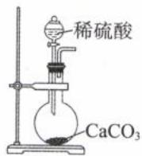

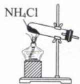

A. 制 $CO_{2}$ （）

B.制 $\mathrm{NH}_3$ （ ）

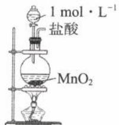

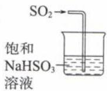

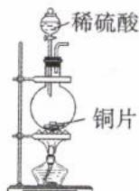

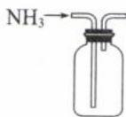

C. 制 $\mathrm{Cl}_{2}$ （ ）

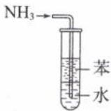

D.制 $SO_{2}$ （）

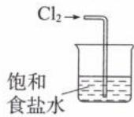

E. 吸收 $SO_{2}$ （） F. 收集 $NH_{3}$ （） G. 吸收 $NH_{3}$ （） H. 吸收 $Cl_{2}$ （）

解析: A. (×) $H_{2}SO_{4}$ 与 $CaCO_{3}$ 生成微溶的 $CaSO_{4}$ 附着在 $CaCO_{3}$ 表面, 阻碍反应进一步进行, 应改用 HCl。
B. (×) $NH_{4}Cl$ 分解的产物为 $NH_{3}$ 和 HCl, 两者在试管上部又重新化合成 $NH_{4}Cl$ , 无法收集 $NH_{3}$ 。应使用 $NH_{4}Cl$ 和 $\mathrm{Ca(OH)}_{2}$ 共热制备 $NH_{3}$ 。

C. $(\times)\mathrm{MnO}_2$ 需与浓盐酸并加热才能反应生成 $\mathrm{Cl}_2$ 。 $1\mathrm{mol}\cdot \mathrm{L}^{-1}\mathrm{HCl}$ 浓度太小，一般认为制备 $\mathrm{Cl}_2$ 的浓盐酸浓度至少要 $6\mathrm{mol}\cdot \mathrm{L}^{-1}$ 以上才能发生反应。

D. (×)稀 $H_{2}SO_{4}$ 与 Cu 不反应, 制备 $SO_{2}$ 需要浓 $H_{2}SO_{4}$ 与 Cu 并加热才能制备。(“不浓不热不反应”有两个, 一个是 $MnO_{2}$ 与浓 HCl 制备 $Cl_{2}$ , 另一个是 Cu 与浓 $H_{2}SO_{4}$ 制备 $SO_{2}$ , 二者都必须使用浓酸且必须加热, 否则反应无法发生。)

E. (×) NaHSO₃ 溶液会抑制 SO₂ 的溶解, 无法对 SO₂ 进行尾气处理, 应换成 NaOH 溶液或酸性 KMnO₄ 溶液。

$$
(\times) \rho (\mathrm{NH} _ {3})
$$

$$
\rho (
$$

$$
\mathrm{NH} _ {3}
$$

G. $(\times) \mathrm{NH}_{3}$ 与水直接接触会产生倒吸, 应该用不溶于水且密度比水大的 $\mathrm{CCl}_{4}$ 替换苯, 导管伸入至 $\mathrm{CCl}_{4}$ 中, $\mathrm{NH}_{3}$ 不溶于 $\mathrm{CCl}_{4}$ 不会引发倒吸, 而上层的水可以吸收 $\mathrm{NH}_{3}$ 。

H. (×) 饱和食盐水会抑制 $Cl_{2}$ 的溶解, 无法对 $Cl_{2}$ 进行尾气处理, 应该用 NaOH、 $Na_{2}SO_{3}$ 、 $FeCl_{2}$ 等溶液替换饱和食盐水; 饱和食盐水在实验室制备 $Cl_{2}$ 中的作用是除去 $Cl_{2}$ 中混有的 HCl, 同学不要搞混了。

答案: A. × B. × C. × D. × E. × F. × G. × H. ×

类型Ⅱ:气体的制备和检验试验

【例 2】(2022·北京卷)利用如图所示装置(夹持装置略)进行实验,b中现象不能证明a中产物生成的是()

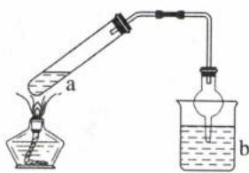

<table><tr><td></td><td>a中反应</td><td>b中检测试剂及现象</td></tr><tr><td>A</td><td>浓 $HNO_3$ 分解生成 $NO_2$ </td><td>淀粉-KI溶液变蓝</td></tr><tr><td>B</td><td>Cu与浓 $H_2SO_4$ 生成 $SO_2$ </td><td>品红溶液褪色</td></tr><tr><td>C</td><td>浓NaOH与 $NH_4Cl$ 溶液生成 $NH_3$ </td><td>酚酞溶液变红</td></tr><tr><td>D</td><td> $CH_3CHBrCH_3$ 与NaOH乙醇溶液生成丙烯</td><td>溴水褪色</td></tr></table>

解析: A. 浓 $HNO_{3}$ 易挥发且 $HNO_{3}$ 有强氧化性, 淀粉—KI 溶液变蓝也可能是 $HNO_{3}$ 蒸气进入 b 中氧化 KI 导致的, A 选项错误。

B. $SO_{2}$ 能漂白品红，使 b 中溶液褪色，B 选项正确。

C. $NH_{3}$ 溶于水呈碱性, 使 b 中酚酞溶液变红, C 选项正确。

D. a 中生成的气体需考虑挥发出的乙醇是否干扰实验。挥发出的乙醇不与溴水反应，而醇消去反应产生的烯烃能与溴水发生加成反应，使溴水褪色，D 选项正确。

答案:A

【例 3】(2021·全国乙卷)在实验室采用如图装置制备气体,合理的是()

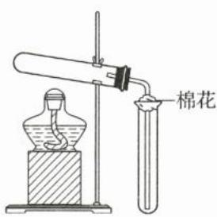

<table><tr><td>选项</td><td>化学试剂</td><td>制备气体</td></tr><tr><td>A</td><td>Ca(OH)2+NH4Cl</td><td>NH3</td></tr><tr><td>B</td><td>MnO2+HCl(浓)</td><td>Cl2</td></tr><tr><td>C</td><td>MnO2+KClO3</td><td>O2</td></tr><tr><td>D</td><td>NaCl+H2SO4(浓)</td><td>HCl</td></tr></table>

解析:根据发生装置可知反应物为固体且需要加热,排除 B、D 选项;根据“向上排空”的收集装置可知所制备的气体密度大于空气,排除 A,因此 C 选项正确。

答案:C

## 第6节 重点定量实验(★★★★★)

类型 I: 一定物质的量浓度溶液的配制

## 内容提要

一、一定质量分数溶液的配制(配制100 g质量分数10%的NaOH溶液为例)

<table><tr><td>仪器</td><td>托盘天平、烧杯、玻璃棒、量筒、胶头滴管、试剂瓶</td></tr><tr><td>步骤</td><td>计算→称取→量取→溶解→装瓶贴签</td></tr></table>

二、一定物质的量浓度溶液的配制(用 $\rho=1.84\ g/cm^{3}$ 、 $\omega=98\%$ 的浓硫酸配制 500 mL 1 mol/L 稀硫酸为例)

<table><tr><td>步骤</td><td>操作示意图</td><td>仪器</td><td>误差分析</td></tr><tr><td>准备工作</td><td colspan="3">对容量瓶进行洗涤和查漏</td></tr><tr><td>计算</td><td colspan="3">根据 $c=1000\rho\omega/M$ ,则 $c(H_2SO_4)=18.4mol/L$ 。再根据稀释前后 $n(溶质)守恒$ ,计算 $V(H_2SO_4)=27.2L$ </td></tr><tr><td>量取</td><td></td><td>量筒、胶头滴管</td><td>1.若量筒中的浓硫酸倒出后,又将残余液洗涤后合并,会导致最终配制的稀硫酸 $c$ 偏高。2.俯视读数:浓硫酸体积偏小,最终配制的稀硫酸 $c$ 偏低。3.仰视读数:浓硫酸体积偏大,最终配制的稀硫酸 $c$ 偏高。</td></tr><tr><td>稀释并冷却</td><td></td><td>量筒、烧杯、玻璃棒</td><td>搅拌过于剧烈,液体溅出,导致c偏低</td></tr><tr><td>转移</td><td></td><td>500 mL容量瓶、烧杯、玻璃棒</td><td>1.未用玻璃棒引流,液体洒出,会导致c偏低2.稀释浓硫酸后溶液未冷却就转移至容量瓶,会导致c偏高</td></tr><tr><td>洗涤</td><td></td><td>500 mL容量瓶、烧杯、玻璃棒</td><td>未洗涤玻璃棒和烧杯(或洗涤液未合并倒入容量瓶),会导致c偏低</td></tr><tr><td>定容</td><td></td><td>500 mL容量瓶、烧杯、玻璃棒、胶头滴管</td><td>1.加水时液面超过刻线,用胶头滴管吸出过多液体,会导致c偏低。2.俯视定容,c偏高;仰视定容,c偏低。3.容量瓶原来有水,对最终配制出的溶液浓度无影响。</td></tr><tr><td>摇匀</td><td></td><td>500 mL容量瓶</td><td>摇匀后发现液面低于刻线,再往容量瓶中加水至刻线,会导致c偏小</td></tr></table>

注:误差分析解题方法:1.先书写计算公式: $c=\frac{n}{V}$ ;2.参考体系是正确操作所对应的c;
3. 分析操作影响的是n还是V;4.n与c成正比,n偏大则c偏大;V与c成反比,V偏小则c偏大。

【例 1】正误判断, 正确的填“√”, 错误的填“×”

(1)用容量瓶配制溶液前应用欲配制的溶液润洗()

(2)容量瓶不能用作溶解固体、稀释浓溶液的容器()

(3)配制一定物质的量浓度溶液时,两次使用玻璃棒,其作用分别是搅拌和引流()

(4)若移液前容量瓶内有少量水,会使所配制溶液浓度偏低()

(5)若定容时不小心加水超过了刻度线,应对容量瓶加热使水挥发()

(6)配制稀盐酸,用量筒量取浓盐酸时俯视刻度线,会导致配制的溶液浓度偏大()

解析:(1)(×)容量瓶用蒸馏水洗净后,不能用欲配制的溶液润洗,否则会导致配出的溶液浓度偏高。

(2)(√)容量瓶是配制一定物质的量浓度溶液的专用仪器,不能用作反应器,不能用作溶解固体、稀释浓溶液的容器,不宜长期贮存溶液。

(3)(√)配制一定物质的量浓度溶液时,溶解(或稀释)的步骤中,玻璃棒的作用是搅拌;在转移溶液的步骤中,玻璃棒的作用是引流。

(4)(×)移液前容量瓶内有少量水,不会影响最终配制所得的溶液浓度,因此容量瓶用蒸馏水洗净后,不需要干燥。

(5)(×)容量瓶不能用来加热,若定容时不小心加水超过了刻度线,需要重新配制溶液。

(6)(×)俯视刻度线,会使量取的浓盐酸的体积偏小,导致配制所得的溶液浓度偏小。

答案:(1)× (2)√ (3)√ (4)× (5)× (6)×

类型Ⅱ:酸碱中和滴定

## 内容提要

一、酸碱中和滴定实验(用 0.1000 mol/L 标准 NaOH 溶液滴定 10.00 mL 待测液 HCl，指示剂为酚酞)

1. 实验所需仪器: 酸式滴定管、碱式滴定管、带滴定管夹的铁架台、烧杯、锥形瓶。

注:酸玻璃(酸式滴定管下面是玻璃活塞);碱橡胶(碱式滴定管下面是橡胶管)。

2. 滴定过程中的几个关键点

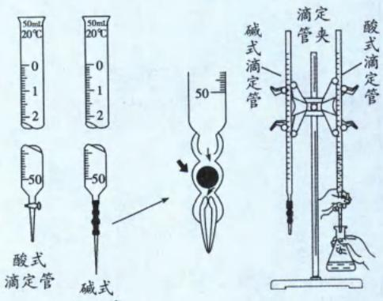

(1)一定要润洗滴定管,但不能润洗锥形瓶

(2)滴定过程中,眼睛看着锥形瓶中溶液颜色变化

(3)有多组实验数据时,一定要选取精度较高的几组数据,先求体积平均值,再将其代入计算。

3. 滴定实验中指示剂的选用与滴定终点的描述(指示剂需要在滴定终点变色)

<table><tr><td colspan="3">待测液在锥形瓶中,常温下用0.1000mol/L标准溶液滴定等浓度的待测液</td></tr><tr><td>实验目的</td><td>指示剂</td><td>滴定终点的描述</td></tr><tr><td rowspan="2">HCl滴定NaOH</td><td>甲基橙</td><td>滴加最后半滴标准溶液,溶液由黄色变成橙色,且保持半分钟不恢复原色</td></tr><tr><td>酚酞</td><td>滴加最后半滴标准溶液,溶液红色褪去,且保持半分钟不恢复原色</td></tr><tr><td rowspan="2">NaOH滴定HCl</td><td>甲基橙</td><td>滴加最后半滴标准溶液,溶液由红色变成黄色,且保持半分钟不恢复原色</td></tr><tr><td>酚酞</td><td>滴加最后半滴标准溶液,溶液由无变成浅红色,且保持半分钟不褪色</td></tr><tr><td>HCl滴定氨水</td><td>甲基橙</td><td>滴加最后半滴标准溶液,溶液由黄色变成橙色,且保持半分钟不恢复原色</td></tr><tr><td>氨水滴定HCl</td><td>甲基橙</td><td>滴加最后半滴标准溶液,溶液由红色变成黄色,且保持半分钟不恢复原色</td></tr><tr><td>醋酸滴定NaOH</td><td>酚酞</td><td>滴加最后半滴标准溶液,溶液红色褪去,且保持半分钟不恢复原色</td></tr><tr><td>NaOH滴定醋酸</td><td>酚酞</td><td>滴加最后半滴标准溶液,溶液由无色变成浅红色,且保持半分钟不恢复原色</td></tr><tr><td>KMnO4滴定硫酸亚铁</td><td>无</td><td>滴加最后半滴标准溶液,溶液变成浅红色,且保持半分钟不褪色</td></tr><tr><td>硫酸亚铁滴定KMnO4</td><td>无</td><td>滴加最后半滴标准溶液,溶液浅红色褪去,且保持半分钟不恢复原色</td></tr><tr><td>Na2S2O3滴定碘水</td><td>淀粉</td><td>滴加最后半滴标准溶液,溶液蓝色褪去,且保持半分钟不恢复原色</td></tr><tr><td>碘水滴定Na2S2O3</td><td>淀粉</td><td>滴加最后半滴标准溶液,溶液由无色变成蓝色,且保持半分钟不褪色</td></tr><tr><td>NH4SCN滴定AgNO3</td><td>硝酸铁</td><td>滴加最后半滴标准溶液,溶液变成浅红色,且保持半分钟不褪色(说明:Ag+与SCN-反应生成 AgSCN 白色沉淀;若 Ag+沉淀完全,则再滴入的SCN-会与Fe3+反应,使溶液变成浅红色)</td></tr></table>

4. 误差分析(用 0.1000 mol/L 标准 NaOH 溶液滴定 10.00 mL 待测液 HCl, 以酚酞做指示剂)

## (1)误差分析方法

①根据公式: 完全中和时, $n(\mathrm{HCl}) = n(\mathrm{NaOH})$ , 即 $c(\mathrm{HCl}) \cdot V(\mathrm{HCl}) = c(\mathrm{NaOH}) \cdot V(\mathrm{NaOH})$ , 可得 $c(\mathrm{HCl}) = \frac{c(\mathrm{NaOH}) \cdot V(\mathrm{NaOH})}{V(\mathrm{HCl})} = \frac{0.1000 \, \text{mol/L} \cdot V(\mathrm{NaOH})}{10.00 \, \text{mL}}$ 。

②若操作影响的是待测液(HCl)，需要先分析操作对n(待测液)的影响，再分析n(待测液)对V(标准溶液)的影响，最后分析V(标准溶液)对c(待测液)影响。

③若操作影响的是标准溶液(NaOH)，直接分析操作对V(标准溶液)的影响，最后分析V(标准溶液)对c(待测液)的影响。

④以正确操作所得浓度为参考体系,实验数据计算所得的浓度与参考体系相比是偏高、偏低还是无影响。

⑤实验达滴定终点时,我们是记录消耗标准液的体积,再利用此数据计算待测液浓度,因此在进行误差分析时,最关键的就是分析这些操作到底如何影响“V(标准溶液)”。

(2) 实例分析(用 0.1000 mol/L 标准 NaOH 溶液滴定 10.00 mL 待测液 HCl, 以酚酞做指示剂)

<table><tr><td>步骤</td><td>操作</td><td>n(HCl)</td><td>V(NaOH)[V(标)]</td><td>c(HCl)</td></tr><tr><td rowspan="4">洗涤</td><td>未用待测溶液润洗取用待测液的滴定管</td><td>偏低</td><td>偏低</td><td>偏低</td></tr><tr><td>未用标准溶液润洗碱式滴定管</td><td>-</td><td>偏高</td><td>偏高</td></tr><tr><td>锥形瓶用待测溶液润洗</td><td>偏高</td><td>偏高</td><td>偏高</td></tr><tr><td>锥形瓶洗净后瓶内还残留少量蒸馏水</td><td>无影响</td><td>无影响</td><td>无影响</td></tr><tr><td rowspan="7">取液</td><td>取HCl的滴定管尖嘴部分有气泡且取液结束前气泡消失</td><td>偏低</td><td>偏低</td><td>偏低</td></tr><tr><td>用酸式滴定管量取HCl时,开始时仰视读数</td><td>偏高</td><td>偏高</td><td>偏高</td></tr><tr><td>用酸式滴定管量取HCl时,结束时俯视读数</td><td>偏高</td><td>偏高</td><td>偏高</td></tr><tr><td>用酸式滴定管量取HCl时,开始仰视,结束俯视</td><td>偏高</td><td>偏高</td><td>偏高</td></tr><tr><td>用酸式滴定管量取HCl时,开始时俯视读数</td><td>偏低</td><td>偏低</td><td>偏低</td></tr><tr><td>用酸式滴定管量取HCl时,结束时仰视读数</td><td>偏低</td><td>偏低</td><td>偏低</td></tr><tr><td>用酸式滴定管量取HCl时,开始俯视,结束仰视</td><td>偏低</td><td>偏低</td><td>偏低</td></tr><tr><td rowspan="10">滴定</td><td>滴定前滴定管尖嘴部分有气泡,滴定后消失</td><td>-</td><td>偏高</td><td>偏高</td></tr><tr><td>滴定时锥形瓶有少量液体溅出</td><td>偏低</td><td>偏低</td><td>偏低</td></tr><tr><td>溶液刚好变成浅红色就记录V后数据</td><td>-</td><td>偏低</td><td>偏低</td></tr><tr><td>滴入碱液过快,停止滴定后反加半滴HCl溶液无变化</td><td>-</td><td>偏高</td><td>偏高</td></tr><tr><td>滴定前仰视读数</td><td>-</td><td>偏低</td><td>偏低</td></tr><tr><td>滴定后俯视读数</td><td>-</td><td>偏低</td><td>偏低</td></tr><tr><td>滴定前仰视读数且滴定后俯视读数</td><td>-</td><td>偏低</td><td>偏低</td></tr><tr><td>滴定前俯视读数</td><td>-</td><td>偏高</td><td>偏高</td></tr><tr><td>滴定后仰视读数</td><td>-</td><td>偏高</td><td>偏高</td></tr><tr><td>滴定前俯视读数且滴定后仰视读数</td><td>-</td><td>偏高</td><td>偏高</td></tr></table>

【例 2】室温下, 向 20.00 mL 0.100 0 mol·L $^{-1}$ 盐酸中滴加 0.100 0 mol·L $^{-1}$ NaOH 溶液, 溶液的 pH 随 NaOH 溶液体积的变化如图。已知 lg 5≈0.7。下列说法不正确的是( )

A. NaOH 与盐酸恰好完全反应时, pH=7

B. 选择变色范围在 pH 突变范围内的指示剂, 可减小实验误差

C. 选择甲基红指示反应终点, 误差比甲基橙的大

D. V(NaOH)=30.00 mL 时, pH≈12.3

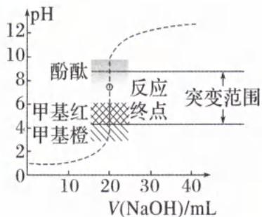

解析: A. 酸碱恰好完全中和时, 溶液的酸碱性是由中和后生成的盐决定。NaOH 与盐酸恰好完全反应时溶液中的溶质为 NaCl, 为强酸强碱盐, 因此溶液呈中性, 室温下 pH=7, A 选项正确。

B. 如何选择指示剂呢？关键在于，酸碱完全中和（或反应终点）前后，溶液的 pH 会有一段突变，而指示剂的变色范围要尽可能在这 pH 突变范围内，可以减小实验误差，B 选项正确。

C. 由图可知，甲基红的变色范围在 pH 突变范围内，但甲基橙变色范围却在 pH 突变范围外，由此可知，使用甲基橙作指示剂，误差会更大，C 选项错误。
D. V (NaOH) = 30.00 mL 时，NaOH 过量，溶液中的溶质为 NaCl 和 NaOH，且 c (NaOH) = $\frac{30 \times 10^{-3} L \times 0.1000 mol \cdot L^{-1} - 20 \times 10^{-3} L \times 0.1000 mol \cdot L^{-1}}{(20.00 + 30.00) \times 10^{-3} L} = 0.0200 mol \cdot L^{-1}$ ，即溶液中 $c(\mathrm{OH}^{-}) = 0.0200 \, \mathrm{mol} \cdot \mathrm{L}^{-1}$ ，则 $c(\mathrm{H}^{+}) = \frac{10^{-14}}{0.02} = 5 \times 10^{-13} \, \mathrm{mol} \cdot \mathrm{L}^{-1}$ ，pH = -lg $c(\mathrm{H}^{+}) = 13 - \lg 5 \approx 12.3$ ，D 项正确。
答案·C

答案:C

【例 3】三氯化六氨合钴(III) $\left\{\left[\mathrm{Co}\left(\mathrm{NH}_{3}\right)_{6}\right]\mathrm{Cl}_{3}\right\}$ (M=267.5 g/mol)是一种重要的含钴配合物，称取0.2675 g $\left[\mathrm{Co}\left(\mathrm{NH}_{3}\right)_{6}\right]\mathrm{Cl}_{3}$ 样品，加入盛有足量NaOH溶液的烧瓶中并加热，将生成的氨气通入装有25.00 mL 0.500 0 mol·L $^{-1}$ 盐酸的锥形瓶中，充分吸收，向锥形瓶加入2～3滴甲基橙，用0.500 0 mol·L $^{-1}$ 的NaOH滴定(杂质不反应)。

(1)达滴定终点时,共消耗 NaOH 溶液 14.00 mL,则样品的纯度为 \_\_\_\_ (保留四位有效数字)。

(2)下列操作会使纯度测量值偏高的是\_\_\_\_（填字母）。
A. 碱式滴定管用蒸馏水洗净后未用 NaOH 标准溶液润洗
B. 滴定前尖嘴处无气泡, 滴定后有气泡
C. 滴定终点时俯视滴定管刻度
D. 滴定时选用酚酞为指示剂

解析:(1)将 $\left[\mathrm{Co}\left(\mathrm{NH}_{3}\right)_{6}\right]\mathrm{Cl}_{3}$ 样品加入盛有足量 NaOH 溶液的烧瓶中并加热会生成 $NH_{3}$ 。再将反应生成的 $NH_{3}$ 通入定量且过量的 HCl 中,发生反应: $NH_{3}+HCl=NH_{4}Cl$ (或 $NH_{3}\cdot H_{2}O+HCl=NH_{4}Cl+H_{2}O$ ),剩余的 HCl 再用标准 NaOH 溶液滴定,发生反应: $HCl+NaOH=NaCl+H_{2}O$ 。由方程式计量数关系可知, $n(HCl)=n(NH_{3})+n(NaOH)$ ,即 $0.500\ 0\ mol\cdot L^{-1}\times(25.00\times10^{-3})L=n(NH_{3})+0.500\ 0\ mol\cdot L^{-1}\times(14.00\times10^{-3})L$ ,解得 $n(NH_{3})=0.005\ 5\ mol$ 。利用 N 原子守恒: $\left[\mathrm{Co}\left(\mathrm{NH}_{3}\right)_{6}\right]\mathrm{Cl}_{3}\sim6\ \mathrm{NH}_{3}$ ,可知 $\left[\mathrm{Co}\left(\mathrm{NH}_{3}\right)_{6}\right]\mathrm{Cl}_{3}$ 的物质的量为 $\frac{1}{6}\times0.005\ 5\ mol$ ,因此样品纯度为: $\frac{\left(\frac{1}{6}\times0.005\ 5\ mol\right)\times267.5\ g/mol}{0.267\ 5\ g}\times100\%=91.67\%$ 。

$$
(\omega) = \frac {(0 . 5 0 0 0 \times 2 5 . 0 0 \times 1 0 ^ {- 3} - 0 . 5 0 0 0 \times V (\mathrm{NaOH}) \times 1 0 ^ {- 3}) \times 2 6 7 . 5}{0 . 2 6 7 5} \times
$$

100%。误差分析一律找“ $V_{标}$ ”(本题为 NaOH 体积)，需注意本题的 $V_{标}$ 滴定的是“吸收 $NH_{3}$ 后剩余的 HCl”。A. 碱式滴定管用蒸馏水洗净后，未用 NaOH 标准溶液润洗，则滴定管内残留的蒸馏水会造成标准溶液浓度降低，达中和时滴定所需的 NaOH 体积更多。由公式可知 $V(\mathrm{NaOH})$ 偏大，则 $\omega$ 偏低，A 不符合题意。

B. 若滴定前滴定管尖嘴处无气泡, 滴定后出现气泡, 则读取的 $V(\mathrm{NaOH})$ 偏小, 由公式可知 $V(\mathrm{NaOH})$ 偏小, 则 $\omega$ 偏高, B 符合题意。

C. 终点读数时, 由于滴定管的“0刻度”在上边, 俯视滴定管的刻度, 则读取的 $V(\mathrm{NaOH})$ 偏小, 由公式可知 $V(\mathrm{NaOH})$ 偏小, 则 $\omega$ 偏高。C符合题意。

D. 当 NaOH 将剩余的 HCl 完全中和时, 溶液中的溶质为 $NH_{4}Cl$ 与 NaCl, 溶液因含 $NH_{4}Cl$ 而显酸性; 酚酞的变色范围是 8.2\~10.0, 滴定时选用酚酞为指示剂, 则 NaOH 与剩余的 HCl 完全中和后, 需再继续滴加 NaOH 才能使酚酞变为红色, 即 $V(\mathrm{NaOH})$ 偏大, 由公式可知 $V(\mathrm{NaOH})$ 偏大, 则 $\omega$ 偏低。D 不符合题意。

【反思】本题是属于“反滴定法”，即 NaOH 标准溶液滴定的是 HCl 剩余量。若 $V(\mathrm{NaOH})$ 多，说明 HCl 剩余量多、 $NH_{3}$ 消耗的 HCl 少，即 $NH_{3}$ 少、产品少；因此产品纯度与 $V(\mathrm{NaOH})$ 成负相关。在题目中一旦看到某物质“定量且足量”，一般考查“反滴定法”。为了更好理解“反滴定法”的误差分析，最好先写出计算公式，公式中标准溶液在“减数”的位置，所以标准溶液的体积与产品纯度 $\omega$ 成反相关。

答案:(1)91.67% (2)BC

类型Ⅲ:氧化还原滴定

## 内容提要

滴定操作不仅适用于酸碱中和反应,还可应用于氧化还原反应的定量测定。

一、原理:以氧化剂(或还原剂)为滴定剂,直接滴定一些具有还原性(或氧化性)的物质;或者间接滴定一些本身并没有氧化性或还原性,但能与某些氧化剂或还原剂起反应的物质。

二、试剂: 常见的用于滴定的氧化剂有 $KMnO_{4}$ 、 $K_{2}Cr_{2}O_{7}$ 、 $I_{2}$ 等; 常见的用于滴定的还原剂有亚铁盐、草酸、维生素 C、硫代硫酸钠等。

## 三、指示剂的选用：

在高中氧化还原滴定实验里,常见的指示剂如下:

1. 指示剂本身不具有氧化性(或还原性),但能和氧化性物质(或还原性物质)结合而产生特殊的颜色。例如可溶性淀粉与 $\mathrm{I}_{2}$ 反应,生成蓝色的化合物,当 $\mathrm{I}_{2}$ 被还原为 $\mathrm{I}^{-}$ 时,蓝色消失。

2. 被滴定物或被滴定溶液本身有足够深的颜色, 在滴定过程中, 本身颜色消退, 这样其本身就可作为指示剂, 称为自身指示剂。如高锰酸钾标准溶液滴定草酸时, 滴定终点时溶液呈高锰酸钾溶液的浅红色。

例 1: 直接碘量法(氧化剂 $I_{2}$ 直接与还原性物质反应):

用碘标准液滴定 $Na_{2}S_{2}O_{3}$ 溶液，反应原理为 $2Na_{2}S_{2}O_{3} + I_{2} = Na_{2}S_{4}O_{6} + 2NaI$ 。用淀粉作指示剂，当滴入最后半滴碘标准液，溶液变为蓝色，且半分钟内不褪色，说明达到滴定终点。

例 2: 间接碘量法:

利用 I⁻ 还原性, 与氧化性物质(如 $MnO_{4}^{-}$ 、 $Cr_{2}O_{7}^{2-}$ 、 $H_{2}O_{2}$ 、 $Fe^{3+}$ 等)反应生成 $I_{2}$ , 然后用 $Na_{2}S_{2}O_{3}$ 标准溶液滴定 $I_{2}$ , 间接地测定这些氧化性物质。临近终点时加淀粉指示剂, 当滴入最后半滴 $Na_{2}S_{2}O_{3}$ 标准液, 溶液蓝色褪去, 且半分钟内不恢复原色, 说明达到滴定终点。间接碘量法一定要保证原氧化剂完全反应, 则第一步加入的 I⁻ 要过量, 但不需要定量。

例 3: KMnO $_{4}$ 溶液滴定 H $_{2}$ C $_{2}$ O $_{4}$ 溶液, 反应原理为: 2MnO $_{4}^{-}$ + 6H $^{+}$ + 5H $_{2}$ C $_{2}$ O $_{4}$ = 2Mn $^{2+}$ + 10CO $_{2}$ ↑ + 8H $_{2}$ O。酸性 KMnO $_{4}$ 溶液本身呈紫红色, 不用另外选择指示剂, 当滴入最后半滴酸性 KMnO $_{4}$ 溶液, 溶液由无色变为浅红色, 且半分钟内不褪色, 说明达到滴定终点。

【例 4】用酸性 $KMnO_{4}$ 溶液滴定 $Na_{2}C_{2}O_{4}$ 求算 $Na_{2}C_{2}O_{4}$ 的纯度。

实验步骤:准确称取 $1 \, g \, Na_{2}C_{2}O_{4}$ 固体,配成 $100.00 \, mL$ 溶液,取出 $20.00 \, mL$ 于锥形瓶中,再向瓶中加入足量稀 $H_{2}SO_{4}$ ,用 $0.0160 \, mol/L$ 高锰酸钾溶液滴定,滴定至终点时消耗高锰酸钾溶液 $25.00 \, mL$ 。

①高锰酸钾溶液应装在 \_\_\_\_（填“酸式”或“碱式”）滴定管中。

②达到滴定终点的标志是\_\_\_\_。

③计算 $Na_{2}C_{2}O_{4}$ 的纯度 \_\_\_\_。

解析:(1) $KMnO_{4}$ 有强氧化性,会腐蚀碱式滴定管上的橡胶:(橡胶一般含碳碳双键容易被有机物和强氧化剂腐蚀),故 $KMnO_{4}$ 标准液应放到酸式滴定管中。

(2)本实验是紫色的 $KMnO_{4}$ 标准溶液滴入无色的 $H_{2}C_{2}O_{4}$ 待测溶液中, 因此达到滴定终点的标志是: 滴入最后半滴高锰酸钾溶液时, 溶液由无色变为浅红色, 且半分钟内不褪色。

(3) $Na_{2}C_{2}O_{4}$ 固体, 配成 100.00 mL 溶液, 加入足量稀 $H_{2}SO_{4}$ 酸化 ( $Na_{2}C_{2}O_{4}$ 转化为 $H_{2}C_{2}O_{4}$ ), 滴入 $KMnO_{4}$ 溶液后反应的离子方程式为: $2MnO_{4}^{-} + 5H_{2}C_{2}O_{4} + 6H^{+} = 2Mn^{2+} + 10CO_{2}\uparrow + 8H_{2}O$ , 利用方程式计量数关系与原子守恒, 列出关系式: $2MnO_{4}^{-} \sim 5H_{2}C_{2}O_{4} \sim 5Na_{2}C_{2}O_{4}, n(MnO_{4}^{-}) = 0.0160\ \text{mol/L} \times (25.00 \times 10^{-3})\text{L} = 0.0004\ \text{mol}$ , 则 $n(Na_{2}C_{2}O_{4}) = \frac{5}{2} \times n(MnO_{4}^{-}) = \frac{5}{2} \times 0.0004\ \text{mol} = 0.0010\ \text{mol}$ 。但要特别注意, 此时计算出的 0.0010 mol 是“20.00 mL”溶液所含 $Na_{2}C_{2}O_{4}$ 的物质的量, 而原先 1 g $Na_{2}C_{2}O_{4}$ 固体是配成 100.00 mL 溶液, 由此可知 100.00 mL 溶液中所含的 $n(Na_{2}H_{2}O_{4}) = 0.0010\ \text{mol} \times 5 = 0.0050\ \text{mol}$ 。因此草酸钠的质量分数为 $\frac{0.0050\ \text{mol} \times 134\ \text{g} \cdot \text{mol}^{-1}}{1\ \text{g}} \times 100\% = 67.00\%$

答案:(1)酸式 (2)滴入最后半滴高锰酸钾溶液时,溶液由无色变为浅红色,且半分钟内不褪色 (3)67.00% 【反思】滴定计算中,一定要仔细留意样品是“配多少、取多少”。像本题样品是配成 100.00 mL、取 20.00 mL (即取原样品的 $\frac{1}{5}$ )进行滴定,利用高锰酸钾达到滴定终点时消耗的体积所计算的 $Na_{2}C_{2}O_{4}$ 物质的量,是基于 “20.00 mL”待测液所计算出的数据,最后算纯度时 $n(\mathrm{Na}_{2}\mathrm{C}_{2}\mathrm{O}_{4})$ 要记得再放大 5 倍。

【例 5】 $NO_{x}$ 含量的测定实验如下: 将 V L 气体通入适量酸化的 $H_{2}O_{2}$ 溶液中, 使 $NO_{x}$ 完全被氧化成 $NO_{3}^{-}$ , 加水稀释至 100.00 mL。量取 20.00 mL 该溶液, 加入 $V_{1}$ mL $c_{1}$ mol·L $^{-1}$ $FeSO_{4}$ 标准溶液(过量), 充分反应后, 用 $c_{2}$ mol·L $^{-1}$ $K_{2}Cr_{2}O_{7}$ 标准溶液滴定剩余的 $Fe^{2+}$ , 终点时消耗 $V_{2}$ mL。滴定过程中发生下列反应:

① $3Fe^{2+} + NO_{3}^{-} + 4H^{+} = NO\uparrow + 3Fe^{3+} + 2H_{2}O$

$$
② \mathrm{Cr} _ {2} \mathrm{O} _ {7} ^ {2 -} + 6 \mathrm{Fe} ^ {2 +} + 1 4 \mathrm{H} ^ {+} = 2 \mathrm{Cr} ^ {3 +} + 6 \mathrm{Fe} ^ {3 +} + 7 \mathrm{H} _ {2} \mathrm{O}
$$

(1)气体中 $NO_{x}$ 折合成 $NO_{2}$ 的含量为 $mg \cdot m^{-3}$ 。

(2)若 $FeSO_{4}$ 标准溶液部分变质,会使 $NO_{x}$ 的测定结果\_\_\_\_(填“偏高”、“偏低”或“无影响”)。

解析:(1)由于该题使用的硫酸亚铁定量且过量,所以该题属于“反滴定法”。用 $c_{2}\ mol\cdot L^{-1}\ K_{2}Cr_{2}O_{7}$ 标准溶液滴定剩余的 $Fe^{2+}$ ,终点时消耗 $V_{2}\ mL$ ,结合题给的离子方程式②可知,与 $NO_{3}^{-}$ 反应后剩余的 $n(\mathrm{Fe}^{2+})=6n(\mathrm{Cr}_{2}\mathrm{O}_{7}^{2-})=6\times c_{2}\times V_{2}\times10^{-3}\ \mathrm{mol}$ ,则与 $NO_{3}^{-}$ 反应的 $n(\mathrm{Fe}^{2+})=(c_{1}\times V_{1}\times10^{-3}-6\times c_{2}\times V_{2}\times10^{-3})\ \mathrm{mol}=(c_{1}V_{1}-6c_{2}V_{2})\times10^{-3}\ \mathrm{mol}$ ,再根据离子方程式①可知, $n(\mathrm{NO}_{3}^{-})=\frac{(c_{1}V_{1}-6c_{2}V_{2})\times10^{-3}}{3}\ \mathrm{mol}$ 。溶液是配成 100.00 mL、取 20.00 mL 进行滴定,则 100.00 mL 中 $n(\mathrm{NO}_{3}^{-})=5\times\frac{(c_{1}V_{1}-6c_{2}V_{2})\times10^{-3}}{3}\ \mathrm{mol}=VL$ 气体中 $n(\mathrm{NO}_{2})$ 。接下来我们观察答案的单位是“ $mg\cdot m^{-3}$ ”,因此气体中 $NO_{x}$ 折合成 $NO_{2}$ 的含量为:

$$
\frac {5 \times \frac {\left(C _ {1} V _ {1} - 6 C _ {2} V _ {2}\right) \times 1 0 ^ {- 3}}{3} \mathrm{mol} \times 4 6 \times 1 0 ^ {3} \mathrm{mg} \cdot \mathrm{mol} ^ {- 1}}{V \times 1 0 ^ {- 3} \mathrm{m} ^ {3}} = \frac {2 3 \times \left(c _ {1} V _ {1} - 6 c _ {2} V _ {2}\right)}{3 V} \times 1 0 ^ {4} \mathrm{mg} \cdot \mathrm{m} ^ {- 3} 。
$$

(2) 若 $FeSO_{4}$ 标准溶液部分变质，溶液中的 $n(\mathrm{Fe}^{2+})$ 减小，则与 $NO_{3}^{-}$ 反应后剩余的 $n(\mathrm{Fe}^{2+})$ 减小，因此计算出的“与 $NO_{3}^{-}$ 反应的 $n(\mathrm{Fe}^{2+})$ ”就会偏大，对应的 $n(\mathrm{NO}_{3}^{-})$ 、 $n(\mathrm{NO}_{2})$ 都会偏大，会使 $NO_{x}$ 的测定结果偏高。
答案：(1) $\frac{23\times(c_{1}V_{1}-6c_{2}V_{2})}{3V}\times10^{4}$ (2)偏高

【反思】本题计算时涉及到单位换算,是同学们很薄弱的部分!能力较弱的同学可以一步一步来: $n(\mathrm{NO}_{3}^{-})\rightarrow n(\mathrm{NO}_{2})\xrightarrow{\times M\ \mathrm{g/mol}}m(\mathrm{NO}_{2})$ 单位为“g” $\xrightarrow{\times10^{3}}m(\mathrm{NO}_{2})$ 单位为“mg”,以及 $VL\rightarrow V\times10^{-3}\mathrm{m}^{3}$ ,分别处理好之后,再求出最终的答案。

【例 6】用广谱高效的二氧化氯 $\left(\mathrm{ClO}_{2}\right)$ 替代液氯进行消毒, 可避免产生对人体健康有害的物质。将 $ClO_{2}$ 溶于水得到100.00 mL溶液, 为测定其浓度, 进行以下实验操作。

步骤 1: 取待测 $ClO_{2}$ 溶液 20.00 mL 于锥形瓶中。

步骤 2: 用稀硫酸调节溶液的 pH<2.0, 加入足量的 KI 晶体充分反应。

步骤 3: 加入几滴淀粉溶液, 逐滴加入 0.1 mol/L $Na_{2}S_{2}O_{3}$ 溶液, 恰好完全反应时, 消耗 $Na_{2}S_{2}O_{3}$ 溶液 20.00 mL。

已知： $\mathrm{I}_2 + 2\mathrm{Na}_2\mathrm{S}_2\mathrm{O}_3 = \mathrm{Na}_2\mathrm{S}_4\mathrm{O}_6 + 2\mathrm{NaI}$

(1)写出步骤2发生反应的化学方程式\_\_\_\_。

(2)试计算溶液中 $ClO_{2}$ 的物质的量浓度 \_\_\_\_。

解析:(1) $ClO_{2}$ 为含氯氧化剂,若题目没有特别说明,一律默认还原产物为 $Cl^{-}$ , $I^{-}$ 则被 $ClO_{2}$ 氧化为 $I_{2}$ 。步骤2的化学方程式可以先写出“两剂两产物”: $ClO_{2}+KI\rightarrow KCl+I_{2}$ , $ClO_{2}$ 中Cl元素化合价降5价、 $I^{-}$ 化合价升1价,再根据变价元素Cl、I原子守恒,写出两剂两产物的系数: $2ClO_{2}+10KI\rightarrow2KCl+5I_{2}$ 。溶液用硫酸酸化,因此反应物有 $H_{2}SO_{4}$ 、生成物有 $K_{2}SO_{4}$ ,再根据K、S守恒,并利用 $H_{2}O$ 使H、O原子守恒,可得化学方程式 $2ClO_{2}+10KI+4H_{2}SO_{4}=2KCl+5I_{2}+4K_{2}SO_{4}+4H_{2}O$ 。(也可先利用“缺项配平法”写出离子方程式,再将 $H^{+}$ 、 $I^{-}$ 、 $Cl^{-}$ 复原成化学式并通过原子守恒补上 $K_{2}SO_{4}$ 即可。)

(2)滴定计算题的切入点为“用已知、测未知”，做题时一定要搞清楚是“用啥？测啥？”，并利用方程式找到二者的关系式（物质的量比）。本题是用“ $\mathrm{Na}_{2}\mathrm{S}_{3}\mathrm{O}_{3}$ ”标准溶液，利用 $\mathrm{I}_{2}$ 关联，间接测出“ $\mathrm{ClO}_{2}$ ”，根据方程式可得关系式： $10\mathrm{Na}_{2}\mathrm{S}_{3}\mathrm{O}_{3} \sim 5\mathrm{I}_{2} \sim 2\mathrm{ClO}_{2}$ ，可知 $n(\mathrm{ClO}_{2}) = \frac{1}{5} \times n(\mathrm{Na}_{2}\mathrm{S}_{3}\mathrm{O}_{3}) = \frac{1}{5} \times 0.1 \, \mathrm{mol/L} \times (20.00 \times 10^{-3})\mathrm{L} = 4 \times 10^{-4} \, \mathrm{mol}$ ，需注意这是 $20.00 \, \mathrm{mL}$ 溶液中所含的 $n(\mathrm{ClO}_{2})$ ，因此 $\mathrm{ClO}_{2}$ 的浓度为 $\frac{4 \times 10^{-4} \, \mathrm{mol}}{20 \times 10^{-3} \, \mathrm{L}} = 0.02 \, \mathrm{mol/L}$ 。答案：(1) $2\mathrm{ClO}_{2} + 10\mathrm{KI} + 4\mathrm{H}_{2}\mathrm{SO}_{4} = 2\mathrm{KCl} + 5\mathrm{I}_{2} + 4\mathrm{K}_{2}\mathrm{SO}_{4} + 4\mathrm{H}_{2}\mathrm{O}$ (2) $0.02 \, \mathrm{mol/L}$

类型Ⅳ:沉淀滴定

## 内容提要

一、原理：利用物质之间发生沉淀反应的定量关系，进行含量的测定。

二、试剂:沉淀反应有很多,但是用于沉淀滴定的沉淀反应却很少,因为很多沉淀组成不恒定,或溶解度太大,或易形成过饱和溶液,或达到溶解平衡的速率缓慢等。高中常考的沉淀滴定法称为“银量法”,“银量法”以 $Cl^{-}$ 、 $Br^{-}$ 、 $I^{-}$ 、 $SCN^{-}$ 与 $Ag^{+}$ 进行的沉淀反应为基础。所以常见试剂有 $AgNO_{3}$ 、KSCN(或 $NH_{4}SCN$ )、以及可溶性卤化物。

## 三、指示剂的选用以及滴定终点的描述

1. 若指示剂要参与形成沉淀, 则指示剂形成的沉淀颜色和原沉淀颜色需不同, 且指示剂开始形成沉淀要晚于待测离子的完全沉淀。

例:用标准 $AgNO_{3}$ 溶液滴定中性溶液中的 $Cl^{-}$ 浓度,应该选择 $K_{2}CrO_{4}$ 作指示剂,因为 AgCl 为白色沉淀, $Ag_{2}CrO_{4}$ 为砖红色沉淀,且溶液中的 $Cl^{-}$ 会先于 $CrO_{4}^{2-}$ 沉淀出来。滴定终点的现象是:滴入最后半滴 $AgNO_{3}$ 溶液,有砖红色沉淀生成,且砖红色沉淀 30 秒不消失。

2. 若指示剂要参与显色, 则指示剂显色要在待测离子完全沉淀之后, 等标准溶液过量时, 指示剂才显色。

例:用标准 KSCN(或 $NH_{4}SCN$ ) 溶液滴定溶液中的 $Ag^{+}$ 浓度,应该选择 $\mathrm{NH_{4}Fe(SO_{4})_{2}}$ 作指示剂,因为 $SCN^{-}$ 会先与 $Ag^{+}$ 发生沉淀反应,待 $Ag^{+}$ 完全沉淀后,过量的 $SCN^{-}$ 再与 $Fe^{3+}$ 发生显色反应。滴定终点的现象是:滴入最后半滴 KSCN(或 $NH_{4}SCN$ ) 溶液,溶液变为浅红色,且保持半分钟不褪色。

【例 7】通过测定产品 $POCl_{3}$ 中 Cl 元素含量, 可计算产品的纯度(假设杂质不含 Cl 元素), 实验步骤如下:

I. 取 $a g$ 产品置于盛有 $50.00 \mathrm{~mL}$ 蒸馏水的水解瓶中, 摇动至完全水解, 将水解液配成 $100.00 \mathrm{~mL}$ 溶液, 预处理能排除含磷粒子的影响。

Ⅱ. 取 10.00 mL 溶液于雉形瓶中, 向其中加入 $c_{0}$ mol/L 的 $AgNO_{3}$ 溶液 $V_{0}$ mL, 使 $Cl^{-}$ 完全沉淀, 再加入 20 mL 硝基苯, 振荡, 使沉淀表面被有机物覆盖; 然后选择 $\mathrm{Fe(NO_{3})_{3}}$ 指示剂, 用 $c_{1}$ mol/L $NH_{4}SCN$ 溶液滴定过量 $Ag^{+}$ 至终点, 记下所用体积为 $V_{1}$ mL。

[已知: ① $POCl_{3} + 3H_{2}O = H_{3}PO_{4} + 3HCl$ ; ② $K_{sp}(AgCl) = 3.2 \times 10^{-10}$ , $K_{sp}(AgSCN) = 2.0 \times 10^{-12}$ ]

(1)滴定终点的现象：\_\_\_\_。

(2)操作Ⅱ中若无“再加入 20 mL 硝基苯,振荡”操作,则所测 POCl₃ 的含量将\_\_\_\_。(填“偏高”、“偏低”或“不变”)

(3)产品中 $POCl_{3}$ 的质量分数为 \_\_\_\_。(P=31、Cl=35.5)

解析:该实验所用 $AgNO_{3}$ 溶液定量且过量,则该实验是“反滴定”实验。先将 $POCl_{3}$ 水解为 HCl,再加入过量且定量的 $AgNO_{3}$ 溶液将 $Cl^{-}$ 完全沉淀,以 $\mathrm{Fe(NO_{3})_{3}}$ 为指示剂、 $NH_{4}SCN$ 为标准溶液来滴定剩余的 $Ag^{+}$ 。

(1) $NH_{4}SCN$ 标准溶液先与剩余的 $Ag^{+}$ 发生沉淀反应, 过量的 $NH_{4}SCN$ 标准溶液再与 $Fe(NO_{3})_{3}$ 发生显色反应。所以该实验滴定终点的现象为: 加入最后半滴 $NH_{4}SCN$ 标准溶液, 溶液变成浅红色, 且保持半分钟不褪色。

(2)根据信息②可知 AgSCN 比 AgCl 的 $K_{sp}$ 更小, 若不用硝基苯将 AgCl 覆盖, 则滴加 $NH_{4}SCN$ 沉淀 $Ag^{+}$ 时, 随着反应的进行, AgCl 会转化成溶解度更小的 AgSCN, 导致消耗 $NH_{4}SCN$ 增多, 从而误以为溶液中剩余的 $Ag^{+}$ 偏多, 则推得 $POCl_{3}$ 水解产生的 $Cl^{-}$ 消耗的 $Ag^{+}$ 偏少, 即 $Cl^{-}$ 偏少, 从而求得 $POCl_{3}$ 的含量偏低。

(3)根据前面分析以及原子守恒可提取关系式： $1\mathrm{POCl}_{3}\sim3\mathrm{Cl}^{-}\sim3\mathrm{Ag}_{(\text{总一余})}^{+},1\mathrm{Ag}_{(\text{余})}^{+}\sim1\mathrm{NH}_{4}\mathrm{SCN},n(\mathrm{Ag}_{(\text{余})}^{+})=$

$n(\mathrm{NH}_4\mathrm{SCN}) = c_1V_1\times 10^{-3}\mathrm{mol};n(\mathrm{POCl}_3) = \frac{1}{3} n(\mathrm{Ag}_{(\text{总一余})}^+) = \frac{1}{3} (c_0V_0\times 10^{-3}\mathrm{mol} - c_1V_1\times 10^{-3}\mathrm{mol});$ 由于配制了 $100.00~\mathrm{mL}$ 溶液，只取了 $10.00~\mathrm{mL}$ 溶液进行滴定实验，所以 $n(\mathrm{POCl}_3)$ 总量需要扩大10倍。最终的质

量分数为： $\omega (\mathrm{POCl}_3) = \frac{\frac{1}{3} (c_0V_0 - c_1V_1)\times 10^{-3}\times 10\times(31 + 16 + 35.5\times 3)}{a}\times 100\%$

答案:(1)加入最后半滴 $NH_{4}SCN$ 标准溶液,溶液变成浅红色,且保持半分钟不褪色。

(2) 偏低 (3) $\frac{\frac{1}{3}(c_0V_0 - c_1V_1)\times 10^{-3}\times 10\times(31 + 16 + 35.5\times 3)}{a}\times 100\%$

# 第 7 节 实验装置图综合判断(★★★★)

## 内容提要

实验装置图常考的易错点包括：

一、实验仪器的使用是否正确

三、实验试剂的选择是否正确

【例 1】判断下列装置图是否正确, 正确填“√”, 错误填“×”

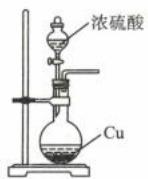

(1)制取少量 $\mathrm{SO}_2$

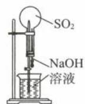

( )

(2)喷泉实验 （）

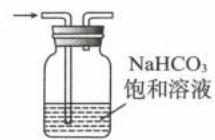

(5)除去 $\mathrm{Cl}_2$ 中 $\mathrm{HCl}$

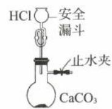

(6)制取 $\mathrm{CO}_{2}$ （ ）

( )

四、实验原理的运用是否正确

二、实验操作是否正确

可上下移动的铜丝

(3)制备并收集 $\mathrm{NO}_2$ （ ）

(10)蒸干 $\mathrm{Cu(NO_{3})_{2}}$ 溶液

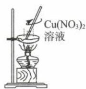

(4)除去 $\mathrm{CO}_{2}$ 中的 $\mathrm{SO}_{2}$

获得 $\mathrm{Cu(NO_3)_2}$ （

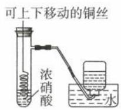

(8)制备 $\mathrm{Fe(OH)}_3$ 胶体

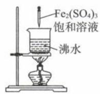

( )

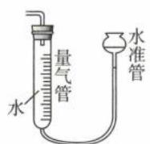

(9)测量氨气体积

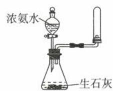

( )

(18)验证镁与盐酸反应是放热反应 （）

(7)制取并收集 $NH_{3}$

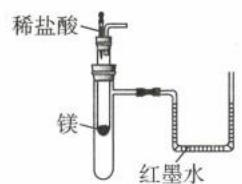  
红墨水

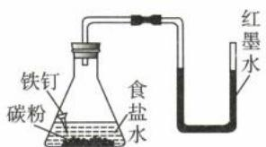

( )

(14)Zn—Cu 原电池
()

( )

(17)验证铁的吸氧腐蚀
()

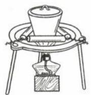

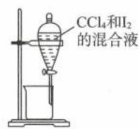

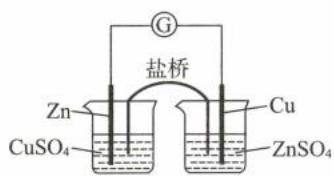

(13)蒸发结晶

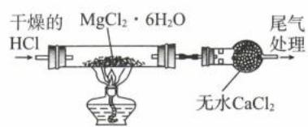

(12) 分离 $\mathrm{I}_{2}$ 和 $\mathrm{CCl}_{4}$

( )

( )

(11)制备无水 $\mathrm{MgCl}_2$ （ ）

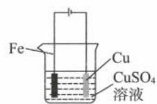

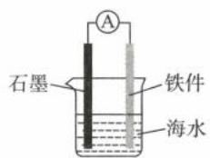

(15)保护铁件 （）

(16)在铁上镀铜 （）

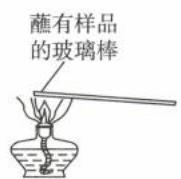

(19)检验样品是否含钠元素 （）

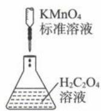

(20)酸性 $\mathrm{KMnO_4}$ 溶液滴

定 $\mathrm{H}_2\mathrm{C}_2\mathrm{O}_4$ 溶液 （）

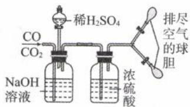

$$
\mathrm{CO} _ {2}
$$

( )

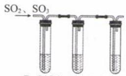

$SO_{2}$ 、 $SO_{3}$

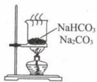

(22)检验 $\mathrm{SO}_2$ 、 $\mathrm{SO}_3$

(25)除去 $Na_{2}CO_{3}$ 中的 $NaHCO_{3}$ （）

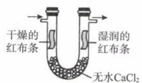

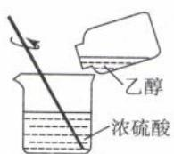

(29) 验证 $Cl_{2}$ 是否有漂白性 （）

(33)混合浓硫酸和乙醇
()

( )

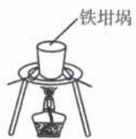

(37)加热熔融的氢氧化钠固体 （）

(41)测定氯水的 $\mathrm{pH}$ （ ）

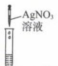

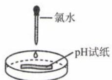

(45) 验证 $Fe^{3+}$ 与 $I^{-}$ 的反应是可逆反应（）


(26) 比较 $Na_{2}CO_{3}$ 、

$NaHCO_{3}$ 热稳定性()


沿烧杯壁向上层清液继续滴加1\~2滴

(30)检验溶液中的硫酸根是否沉淀完全（）


(34)制备 $\mathrm{Fe(OH)}_2$

( )


(38)用液差法检查气密性 （）


(42)测定盐酸的 pH
()


(46) 比较硼酸和碳酸酸性强弱 ( )


(23)过氧化钠与水反应
()


(27) 比较碳、氯、硅非金属性 ( )


(31) 制备 $\left[\mathrm{Cu}\left(\mathrm{NH}_{3}\right)_{4}\right]$ $SO_{4} \cdot H_{2}O$ 晶体（）


(35)制备 $\mathrm{Fe(OH)}_2$

( )


(39)利用升华法分离 Fe 和 $I_{2}$ （）


(43)接收馏出产品
()


(47) 比较 $K_{\mathrm{sp}}[\mathrm{Cu}(\mathrm{OH})_{2}]$ 、 $K_{\mathrm{sp}}[\mathrm{Mg}(\mathrm{OH})_{2}]$ 大小
()


热水

(24)探究温度对平衡的影响 （）


(28)证明氧化性: $Cl_{2}>Br_{2}>I_{2}$ ( )


(32)证明浓硫酸脱水性、强氧化性以及 $SO_{2}$ 漂白性和还原性（）


(36)模拟侯氏制碱（）


(40) 称取一定质量的 NaOH 固体 ( )


(44) 分离 $CaCO_{3}$ 和水

( )


(48)证明 $K_{\mathrm{sp}}(\mathrm{AgCl})>$ $K_{\mathrm{sp}}(\mathrm{AgI})$ ( )

淀粉溶液 + 稀硫酸


(49)检验淀粉的水解产物 （）


(50)证明淀粉未水解完全 （）


(51)探究 $CH_{4}$ 与 $Cl_{2}$ 的取代反应 （）


(52)证明苯环使羟基活化
()


(53)乙酸乙酯的制取和收集 （）


(54)检验 1—氯丁烷中的氯原子（）

(55)配制银氨溶液
()

(56)配制检验醛基的

$Cu(OH)_{2}$ 溶液()


(57)探究浓度对反应速率的影响 （）


(58)测定中和热（）


(59)证明生成 $\mathrm{H}_{2}$

( )

(60)用海水制备蒸馏水

( )

解析:(1)(×)常温下浓硫酸不和铜反应,需加热才能发生反应生成 $SO_{2}$ 。

(2) $(\sqrt{})\mathrm{SO}_{2}$ 本身易溶于 NaOH 溶液，导致烧瓶中压强迅速下降，在大气压强作用下形成喷泉。

(3) $(\times)\mathrm{NO}_{2}$ 会与水发生歧化反应,最终收集到的是NO,应该用向上排空气法收集 $NO_{2}$ 。

(4)(×)饱和 $NaHSO_{3}$ 会抑制 $SO_{2}$ 的溶解,无法除去 $SO_{2}$ ,应该将饱和 $NaHSO_{3}$ 换成饱和 $NaHCO_{3}$ 。

$$
5) (\times) \mathrm{NaHCO} _ {3}
$$

$$
\mathrm{Cl} _ {2}
$$

$$
\mathrm{Cl} _ {2}
$$

(6)(√)安全漏斗的 U 形管会存留盐酸,可以将气体封住,防止气体泄漏。

(7)(×)用向下排空气法收集 $NH_{3}$ ，导管应伸入试管底部，且不能将试管封死，可将橡胶塞换成一团棉花。

(8) $(\times)\mathrm{Fe}_{2}(\mathrm{SO}_{4})_{3}$ 水解生成 $\mathrm{Fe(OH)}_{3}$ 和 $H_{2}SO_{4}$ ，但 $H_{2}SO_{4}$ 难挥发，会抑制 $Fe^{3+}$ 水解，不利于胶体的生成。应将 $\mathrm{Fe}_{2}(\mathrm{SO}_{4})_{3}$ 换成饱和 $FeCl_{3}$ 溶液。

(9)(×)该装置可以测量难溶于水的气体体积,但氨气极易溶于水,无法用排水量气法测量其体积。

(10)(×) $\mathrm{Cu(NO_{3})_{2}}$ 在水中发生水解: $\mathrm{Cu(NO_{3})_{2} + 2H_{2}O \rightleftharpoons Cu(OH)_{2} + 2HNO_{3}}$ , $HNO_{3}$ 易挥发, 加热后水解平衡正向移动, 溶液蒸干得到的是 $\mathrm{Cu(OH)_{2}}$ 固体, 温度稍高还会获得 CuO 固体。

(11)(√) $MgCl_{2}$ 遇水易发生水解,通入干燥HCl气流可以抑制 $MgCl_{2}$ 的水解。

(12) $(\times)\mathrm{I}_{2}$ 和 $CCl_{4}$ 互溶，溶液不分层，无法使用分液法分离，应该用蒸馏法来分离二者。

(13)(×)蒸发结晶应在蒸发皿中进行,坩埚用于灼烧固体。

(14)(×)引入盐桥的目的是将氧化剂和还原剂分离,所以 Zn 电极应插入 $ZnSO_{4}$ 溶液、Cu 电极应插入 $CuSO_{4}$ 溶液中,才能构成锌铜原电池装置。

(15)(×)将铁件和比铁活泼的金属(如锌或镁)相连构成原电池,才能利用“牺牲阳极法”保护铁件。

(16)(×)在铁上镀铜时,镀件铁为阴极,与外加电源负极相连;镀层金属铜为阳极,与外加电源正极相连。

(17)(√)在食盐水的中性环境中,铁钉会发生吸氧腐蚀,左侧的氧气被消耗,导致左侧容器管内压强减小,会使玻璃导管中的红墨水左高右低。

(18)(√)镁与盐酸反应是放热反应,大试管中温度上升,空气膨胀,使红墨水的液面左低右高。

(19)(×)玻璃棒中含钠元素,会对实验造成干扰,应选铁丝或铂丝蘸取某样品进行焰色试验。

(20)(×)酸性 $KMnO_{4}$ 溶液具有强氧化性会腐蚀橡胶,不能装在碱式滴定管中,应装在酸式滴定管中(带玻璃活塞的滴定管)。

(21)(√)CO 和 $CO_{2}$ 的混合气先通入 NaOH 溶液中， $CO_{2}$ 被 NaOH 溶液吸收，生成碳酸钠，CO 从 NaOH 溶液中逸出，进入浓硫酸里，被浓硫酸干燥后用球胆收集。然后再打开分液漏斗的活塞，稀 $H_{2}SO_{4}$ 和生成的碳酸钠反应再重新生成 $CO_{2}$ ， $CO_{2}$ 经浓硫酸干燥后再用另一个球胆收集，可以分离 CO 和 $CO_{2}$ 。

(22)(×) $SO_{2}$ 溶于水生成 $H_{2}SO_{3}$ ，酸性环境下 $NO_{3}^{-}$ 将 $H_{2}SO_{3}$ 氧化为 $H_{2}SO_{4}$ ，与溶液中 $Ba^{2+}$ 生成 $BaSO_{4}$ 白色沉淀。 $SO_{3}$ 溶于水生成 $H_{2}SO_{4}$ ，与 $Ba^{2+}$ 也生成白色沉淀，现象相同，无法鉴别 $SO_{2}$ 和 $SO_{3}$ 。应将 $\mathrm{Ba(NO_{3})_{2}}$ 改为 $BaCl_{2}$ 溶液。

(23)(×)过氧化钠呈粉末状且易溶于水,不能用启普发生器或简易的启普发生器制备氧气。

(24)(√) $NO_{2}$ 会发生反应: $2NO_{2}\rightleftharpoons N_{2}O_{4}\triangle H<0,NO_{2}$ 为红棕色气体、 $N_{2}O_{4}$ 为无色气体。热水中颜色更深,说明温度升高往生成 $NO_{2}$ 的方向(吸热反应方向)进行。

(25)(×) $NaHCO_{3}$ 受热分解转化为 $Na_{2}CO_{3}$ ，可以直接对混合固体加热，除去 $Na_{2}CO_{3}$ 中混有的 $NaHCO_{3}$ 。灼烧固体应该在坩埚中进行。

(26)(×)应调换 $Na_{2}CO_{3}$ 、 $NaHCO_{3}$ 的位置（直接在火源处加热的应为热稳定性较强的 $Na_{2}CO_{3}$ ）。

(27)(×)实验应该用 Cl 对应的最高价含氧酸“HClO $_{4}$ ”替换盐酸,才符合实验目的(元素的最高价氧化物对应水化物的酸性越强,该元素的非金属性越强)。

(28)(×)Cl₂ 可以与 KBr 溶液发生反应: Cl₂ + 2KBr = 2KCl + Br₂; Cl₂ 也可以与 KI 溶液发生反应: Cl₂ + 2KI = 2KCl + I₂。当浸有淀粉 - KI 溶液的棉花球变蓝, 不能确定是 Br₂ 还是 Cl₂ 氧化了 KI, 因此无法证明氧化性: Cl₂ > Br₂ > I₂。

(29)(√)干燥红布条无明显变化,湿润红布条褪色,验证 $Cl_{2}$ 无漂白性,而是 $Cl_{2}$ 溶于水生成的 HClO 有漂白性。

(30)(√)往上层清液或者滤液中在滴加沉淀剂,即可检验原溶液中的离子是否沉淀完全。

$$
(\checkmark) \text {乙}
$$

$$
\left[ \mathrm{Cu} \left(\mathrm{NH} _ {3}\right) _ {4} \right] \mathrm{SO} _ {4} \cdot \mathrm{H} _ {2} \mathrm{O}
$$

(32)(√)浓硫酸遇蔗糖变黑,体现浓硫酸的脱水性。品红和酸性高锰酸钾溶液褪色,说明浓硫酸被还原成 $SO_{2}$ ,体现浓硫酸的氧化性,品红褪色证明 $SO_{2}$ 的漂白性,酸性高锰酸钾褪色证明 $SO_{2}$ 的还原性。

(34)(√)Fe与 $H_{2}SO_{4}$ 反应生成 $FeSO_{4}$ 与 $H_{2}$ ，先打开止水夹，用 $H_{2}$ 排尽装置中的空气，检验逸出的 $H_{2}$ 已经纯净后，关闭止水夹， $H_{2}$ 可将 $FeSO_{4}$ 溶液挤压至NaOH溶液中制备 $Fe(OH)_{2}$ 。

(35)(√)用植物油隔绝空气,将氢氧化钠溶液在液面下加入到硫酸亚铁溶液中,可制备 $\mathrm{Fe(OH)}_{2}$ (胶头滴管一般情况下是不能伸入到液面下,但本实验特殊,目的是要防止 $\mathrm{Fe(OH)}_{2}$ 被氧化)。

(36)(×) $NH_{3}$ 极易溶于水, 直接通入饱和食盐水中会发生倒吸, 图中 $NH_{3}$ 和 $CO_{2}$ 通入导管的位置应该要调换, 而且是先通入 $NH_{3}$ 后再通入 $CO_{2}$ 。

(37)(√)Fe与NaOH不反应,可以用铁坩埚加热熔融NaOH。

(38)(×)由于有恒压管,不管气密性是否良好,分液漏斗中的液体都可以顺畅流出。该装置应关闭分液漏斗活塞,用微热法检查气密性。

(39)(×)加热条件下 Fe 和 $I_{2}$ 会发生反应,该装置无法达到实验目的。( $I_{2}$ 固体受热会升华,若题目改为分离 $I_{2}$ 和 NaCl,则该装置可达到实验目的。)

(40)(×)NaOH 固体有腐蚀性,应该放在烧杯中进行称量。

(41)(×)氯水具有漂白性，pH试纸先变红后褪色，无法测定氯水的pH，应该用pH计。

(42)(×)pH试纸湿润后,盐酸被稀释,测定的pH值会偏大,应使用干燥的pH试纸。

(43)(×)图中装置形成了密封体系,压强过大容易爆炸。为了安全起见,应将锥形瓶口的活塞去掉。

(44)(×)过滤要用玻璃棒引流,且漏斗的尖嘴紧贴烧杯内壁。

(45)(×) $Fe^{3+}$ 与 $I^{-}$ 发生的反应为： $2Fe^{3+}+2I^{-}=2Fe^{2+}+I_{2}$ ，由题目数据可知 $I^{-}$ 过量，因此无论反应是否可逆，加入 $AgNO_{3}$ 都会生成黄色沉淀，无法达到实验目的。

(46)(√)将碳酸钠滴入硼酸中,无任何现象,可以证明酸性:碳酸>硼酸。

(47)(×)用竞争法比较 $K_{\mathrm{sp}}[\mathrm{Cu(OH)}_2]$ 、 $K_{\mathrm{sp}}[\mathrm{Mg(OH)}_2]$ 时， $CuSO_4$ 、 $MgSO_4$ 溶液要等物质的量浓度，但题目并未交代二者的浓度是否相等。

(48)(×) $AgNO_{3}$ 溶液过量,第一步滴入 NaCl 溶液生成 AgCl 白色沉淀后,溶液中还有过量的 $AgNO_{3}$ ,则第二步滴入 KI 溶液,KI 会直接与 $AgNO_{3}$ 反应生成黄色 AgI 沉淀,而不是与 AgCl 发生沉淀转化,因此无法证明 AgCl 和 AgI 的溶解度大小,也无法证明 $K_{\mathrm{sp}}(\mathrm{AgCl})>K_{\mathrm{sp}}(\mathrm{AgI})$ 。

(49)(×)淀粉水解液显酸性,需先加入 NaOH 中和至溶液 pH>7,再加入新制 $\mathrm{Cu(OH)}_{2}$ 检验葡萄糖。

(50)(×)证明淀粉未水解完全,需要加入 $I_{2}$ 观察溶液是否变蓝。加NaOH调pH>7, $I_{2}$ 遇碱会发生歧化反应而损失,无法显色。

(51)(√) $CH_{4}$ 与 $Cl_{2}$ 发生取代反应后会生成油状液体，气体颜色变浅，液面上升，饱和食盐水会变浑浊。

(52)(×)苯酚与溴水反应生成2,4,6—三溴苯酚白色沉淀，而苯与溴水不发生取代反应，该实验是验证羟基使苯环上的氢原子活化，而不是验证苯环使羟基活化。

(53)(×)由于乙醇与乙酸极易溶于水,导管末端不能伸入饱和碳酸钠溶液下方,以免发生倒吸现象。导管末端应平贴液面或加装防倒吸装置。

(54)(×)1—氯丁烷是非电解质,不能电离出 $Cl^{-}$ ,应先将 1—氯丁烷在碱性溶液中水解,再加硝酸调至溶液 pH<7,最后加 $AgNO_{3}$ 溶液,生成白色沉淀。

(55)(×)教材中配制银氨溶液的步骤:在洁净试管中加入1 mL 2% AgNO₃ 溶液,然后边振荡试管边逐滴滴入2%稀氨水,先产生沉淀,继续滴加稀氨水,使最初产生的沉淀恰好溶解,制得银氨溶液。需注意不能将AgNO₃溶液滴入氨水中,氨水也不要滴加过量,否则会产生易爆炸的物质。

(56)(√)教材中配制新制氢氧化铜的步骤:在试管里加入2 mL 10% NaOH溶液,加入5滴5% $CuSO_{4}$ 溶液,得到新制的 $\mathrm{Cu(OH)}_{2}$ 。配制新制 $\mathrm{Cu(OH)}_{2}$ 时 NaOH 必须过量。

(57)(×)Zn与 $4\ mol\cdot L^{-1}$ 的硫酸反应生成 $H_{2}$ ，但与 $18.4\ mol\cdot L^{-1}$ 的浓硫酸反应生成 $SO_{2}$ ，二者反应不同，生成的气体也不同，无法达到实验目的。

(58)(×)装置中缺少玻璃搅拌器,无法将酸、碱溶液均匀混合。

(59)(√)实验观察到肥皂液中产生无色气泡,点燃肥皂泡时可以听到爆鸣声,证明生成 $H_{2}$ 。(红热的铁能与水蒸气发生反应,生成 $Fe_{3}O_{4}$ 与 $H_{2}$ )。

(60)(√)用海水制备蒸馏水不需要测定温度,因此不需要温度计和蒸馏烧瓶。

$$
\text { 答案: } (1) \times (2) \sqrt {(3) \times (4) \times (5) \times (6) \sqrt {(7) \times (8) \times (9) \times (1 0) \times (1 1)}}
$$

$$
(1 3) \times (1 4) \times (1 5) \times (1 6) \times (1 7) \sqrt {(1 8)} \sqrt {(1 9)} \times (2 0) \times (2 1) \sqrt {(2 2)} \times (2 3) \times
$$

$$
(2 4) \checkmark (2 5) \times (2 6) \times (2 7) \times (2 8) \times (2 9) \checkmark (3 0) \checkmark (3 1) \checkmark (3 2) \checkmark (3 3) \times (3 4) \checkmark
$$

$$
(3 5) \checkmark (3 6) \times (3 7) \checkmark (3 8) \times (3 9) \times (4 0) \times (4 1) \times (4 2) \times (4 3) \times (4 4) \times (4 5) \times
$$

$$
(5 7) \times (5 8) \times (5 9) \checkmark (6 0) \checkmark
$$

$$
(4 6) \checkmark (4 7) \times (4 8) \times (4 9) \times (5 0) \times (5 1) \checkmark (5 2) \times (5 3) \times (5 4) \times (5 5) \times (5 6) \checkmark
$$

# 模块 2 化学实验综合

习题：P100

# 第 1 节 探究物质的制备(★★★★)

## 内容提要

## 一、无机物的制备

1. 无机物的制备主要是以制备 $\mathrm{Fe(OH)}_{2}$ 以及制备气体为蓝本。

2. 无机物制备的主要模型


3. 常见的装置组成


4. 物质的特殊性质衍生的特殊操作或特殊装置

## (1) 特殊操作

<table><tr><td>特殊操作</td><td>原因</td><td>目的</td></tr><tr><td>反应前通 $N_{2}$ </td><td>原料、产物易与空气成分反应</td><td>排除体系的空气,防止其对实验产生干扰</td></tr><tr><td>反应后通 $N_{2}$ </td><td>定量分析或体系残余物有毒</td><td>将残余气体吹送在后续装置中充分吸收,减少实验误差或防止环境污染</td></tr><tr><td>新物质反应前后都有干燥装置</td><td>原料、产物极易与水作用</td><td>吸收水蒸气,防止其和产物或反应物作用</td></tr></table>

## (2) 特殊装置

<table><tr><td colspan="2">特殊装置</td><td>原因</td><td>目的</td></tr><tr><td></td><td></td><td>产物常温易气化,或分解气态产物中,其一易液化</td><td>(1)使产物液化,减少其挥发损失(2)使某产物液化,与另一产物分离</td></tr><tr><td colspan="2"></td><td>右侧有固体生成且导管较细导致导管堵塞,或右侧有固体干燥剂导致气流流速减缓</td><td>缓冲装置,平衡压强;通过长颈漏斗中液面的变化预测右侧装置是否出现堵塞;根据该装置中单位时间的气泡数控制流速;若该装置中的试剂为浓硫酸还可以达到干燥气体的作用</td></tr><tr><td colspan="2"></td><td>气体需要按一定物质的量(或体积比)混合</td><td>混合气体,并通过单位时间内两根导管的气泡数,控制两种气体通入的物质的量之比;若该装置中的试剂为浓硫酸还可以达到干燥气体的作用</td></tr></table>

5. 无机物制备实验题的答题思路

<table><tr><td>第一步</td><td>第二步</td><td>第三步</td></tr><tr><td>认真阅读题干,勾画重点信息(实验目的、反应条件、陌生物质的性质、主体反应的原理)</td><td>观察装置图,与常见熟悉的装置图进行联系,理解装置的意义以及装置中各试剂的作用</td><td>总览问题,从问题中提取信息</td></tr></table>

## 二、有机物的制备

1. 有机物的制备主要是以制备乙酸乙酯、溴苯以及硝基苯为蓝本

2. 有机物制备流程


3. 常考操作及其目的

<table><tr><td colspan="3">操作</td><td>目的</td></tr><tr><td colspan="3">液体的混合顺序:密度大倒入密度小的液体,极易挥发(或易挥发有毒)的物质最后混合</td><td>为了混合均匀,避免暴沸,减少物质挥发损失等</td></tr><tr><td colspan="3">加入沸石</td><td>防暴沸</td></tr><tr><td rowspan="6">各种浴</td><td rowspan="4">水浴</td><td>冰盐浴</td><td>反应温度-10°C~0°C</td></tr><tr><td>冰水浴</td><td>反应温度 0°C~20°C左右</td></tr><tr><td>冷水浴</td><td>反应温度25°C左右</td></tr><tr><td>热水浴</td><td>反应温度25°C~100°C</td></tr><tr><td colspan="2">油浴</td><td>反应温度100°C~260°C</td></tr><tr><td colspan="2">沙浴</td><td>反应温度高于260°C</td></tr><tr><td colspan="3">冷凝回流</td><td>减少有机物的挥发损失;使反应物冷凝回流,增大其转化率或利用率</td></tr><tr><td colspan="3">加入强还原剂</td><td>保护氨基、醛基、酚羟基,防止其被氧化</td></tr><tr><td colspan="3">加入特殊试剂形成共沸物</td><td>利用共沸物与其他组分的沸点差距进行分离提纯</td></tr></table>

## 4. 有机物的分离提纯

<table><tr><td>操作</td><td>目的</td></tr><tr><td>水洗</td><td>除去可溶于水的低级醇、低级酸、无机酸等</td></tr><tr><td>碱洗</td><td>除去酸</td></tr><tr><td>还原剂洗</td><td>除去体系中的氧化剂</td></tr><tr><td>加入无水硫酸钠、无水氯化镁、无水氯化钙干燥</td><td>除去体系中的水</td></tr><tr><td>蒸馏</td><td>除去相互溶解,沸点差距较大(30°C以上)的液体</td></tr><tr><td>重结晶</td><td>除去可溶于水,溶解度受温度影响不同的固体</td></tr><tr><td>先加碱使晶体溶解,再加酸析出晶体(目标产物为有机酸)</td><td>将目标产物转化成盐溶解在水中,从而与杂质分离。待杂质分离后,再加入无机酸使盐转化成晶体析出。</td></tr><tr><td>往水层加入盐</td><td>增大水层的极性和密度,利于有机层分层,并减小有机物溶解度</td></tr></table>

## 5. 有机物制备实验题的答题策略

(1)有机物的制备实验信息非常多,一般包括表格信息、文字步骤信息、实验装置图信息以及反应原理信息。为了更高效的做题,应该先从问题入手。带着问题回到题干中寻找相应信息。

<table><tr><td>常见信息</td><td>考点</td></tr><tr><td>密度</td><td>分液、将体积转化成质量进行计算</td></tr><tr><td>沸点</td><td>蒸馏</td></tr><tr><td>熔点(大于25°C)</td><td>重结晶</td></tr><tr><td>相对分子质量</td><td>产率或纯度</td></tr><tr><td>反应方程式的条件</td><td>加热方式</td></tr><tr><td>反应热</td><td>控温措施或目的</td></tr><tr><td>装置图</td><td>仪器名称或现象</td></tr></table>

(2)根据反应原理和所加试剂,弄清楚反应后的体系中存在的物质种类,以及除去各杂质的方法。

$$
(3) \text {产率} = \frac {\text {纯净实际产量}}{\text {理论产量}} \times 100 \%
$$

注:给了两种或两种以上反应物的数据,首先要进行过量判断,计算产率的关键点是代入量少的物质进行计算。若先算纯度再算产率,一定要先将粗产品质量乘以纯度后再除以理论产量。产率公式中分子、分母的物理量要一致,要么都是质量,要么都是物质的量。

## 类型 I: 无机物的制备实验

【例 1】(2024·全国甲卷) $\mathrm{CO(NH_{2})_{2}\cdot H_{2}O_{2}}$ (俗称过氧化脲) 是一种消毒剂, 实验室中可用尿素与过氧化氢制取, 反应方程式为: $\mathrm{CO(NH_{2})_{2}+H_{2}O_{2}=CO(NH_{2})_{2}\cdot H_{2}O_{2}}$

(一)过氧化脲的合成

烧杯中分别加入 25 mL 30% $H_{2}O_{2}$ ( $\rho=1.11\ g\cdot cm^{-3}$ )、40 mL 蒸馏水和 12.0 g 尿素，搅拌溶解。30 ℃ 下反应 40 min，冷却结晶、过滤、干燥，得白色针状晶体 9.4 g。

## (二) 过氧化脲性质检测

I. 过氧化脲溶液用稀 $H_{2}SO_{4}$ 酸化后，滴加 $KMnO_{4}$ 溶液，紫红色消失。

Ⅱ. 过氧化脲溶液用稀 $H_{2}SO_{4}$ 酸化后，加入 KI 溶液和 $CCl_{4}$ ，振荡，静置。

(三)产品纯度测定

溶液配制:称取一定量产品,用蒸馏水溶解后配制成100mL溶液。

滴定分析:量取 25.00 mL 过氧化脲溶液至锥形瓶中,加入一定量稀 $H_{2}SO_{4}$ ,用准确浓度的 $KMnO_{4}$ 溶液滴定至微红色,记录滴定体积,计算纯度。

回答下列问题：

(1) 过滤中使用到的玻璃仪器有 \_\_\_\_ (写出两种即可)。

(2)过氧化脲的产率为\_\_\_\_。

(3)性质检测Ⅱ中的现象为\_\_\_\_。性质检测Ⅰ和Ⅱ分别说明过氧化脲具有的性质是\_\_\_\_。

(4)下图为“溶液配制”的部分过程,操作 a 应重复 3 次,目的是\_\_\_\_,定容后还需要的操作为\_\_\_\_。


(5)“滴定分析”步骤中,下列操作错误的是\_\_\_\_(填标号)。
A. KMnO₄ 溶液置于酸式滴定管中
B. 用量筒量取 25.00 mL 过氧化脲溶液
C. 滴定近终点时,用洗瓶冲洗锥形瓶内壁
D. 锥形瓶内溶液变色后,立即记录滴定管液面刻度

(6)以下操作导致氧化脲纯度测定结果偏低的是\_\_\_\_（填标号）。
A. 容量瓶中液面超过刻度线
B. 滴定管水洗后未用 $KMnO_{4}$ 溶液润洗
C. 摇动锥形瓶时 $KMnO_{4}$ 溶液滴到锥形瓶外
D. 滴定前滴定管尖嘴处有气泡，滴定后气泡消失

解析:(1)过滤需要的玻璃仪器是:漏斗、玻璃棒和烧杯(任选两种即可)。

(2)由方程式: $\mathrm{CO(NH_{2})_{2}+H_{2}O_{2}=CO(NH_{2})_{2}\cdot H_{2}O_{2}}$ 可知 $\mathrm{CO(NH_{2})_{2}}$ 和 $H_{2}O_{2}$ 按物质的量1∶1反应,原料中 $n\left[\mathrm{CO(NH_{2})_{2}}\right]=\frac{12.0\mathrm{~g}}{60\mathrm{~g/mol}}=0.2\mathrm{~mol},n\left(\mathrm{H}_{2}\mathrm{O}_{2}\right)=(25\mathrm{~mL}\times1.11\mathrm{~g}\cdot\mathrm{cm}^{-3}\times30\%)\div34\mathrm{~g/mol}\approx0.24\mathrm{~mol}$ ,所以 $H_{2}O_{2}$ 过量,应该带入 $n\left[\mathrm{CO(NH_{2})_{2}}\right]$ 进行计算。根据方程式可知:

$\mathrm{CO(NH_{2})_{2}} \sim \mathrm{CO(NH_{2})_{2} \cdot H_{2}O_{2}}$ $n/\mathrm{mol}$ 1 1

变化量 $n/\mathrm{mol}$ 0.2 $n[\mathrm{CO(NH_{2})_{2} \cdot H_{2}O_{2}}]$

因此 $\mathrm{CO(NH_{2})_{2}\cdot H_{2}O_{2}}$ 的理论产量是: $m\left[\mathrm{CO(NH_{2})_{2}\cdot H_{2}O_{2}}\right]=0.2\ \mathrm{mol}\times94\ \mathrm{g/mol}=18.8\ \mathrm{g}$

产率= $\frac{实际产量}{理论产量}$ $\times100\%=\frac{9.4g}{18.8g}\times100\%=50.0\%$ .（过量判断的方法除了定量方法，还有定性方法。“物以稀为贵”，为了让成本高的物质被充分利用，其他反应物往往过量。因此不常见的物质往往较少，应该代其

计算。)

(3) $\mathrm{CO(NH_{2})_{2}\cdot H_{2}O_{2}}$ 中的 $H_{2}O_{2}$ 有较强氧化性, 可以将 KI 氧化成 $I_{2}$ 。 $I_{2}$ 、 $CCl_{4}$ 均为非极性分子, 根据极性相似相溶原则, $I_{2}$ 溶解在密度比水大的 $CCl_{4}$ 溶液中 (卤代烃的密度往往比水大)。所以现象为: 溶液分层, 上层几乎无色, 下层的溶液呈紫红色。

$I_{2}$ 、 $Br_{2}$ 各种状态的颜色总结如下：

<table><tr><td>状态</td><td>固态</td><td>液态</td><td>气态</td><td>CCl4溶液</td><td>水溶液</td></tr><tr><td>I2</td><td>紫黑色</td><td>—</td><td>紫色</td><td>紫红色</td><td>浓(棕黄色);稀(黄色)</td></tr><tr><td>Br2</td><td>—</td><td>深红棕色</td><td>红棕色</td><td>橙红色</td><td>黄色</td></tr></table>

一般按照颜色“由深到浅”的顺序记忆，且同一物质不同状态颜色很多时候存在“紫色→红色→橙色→黄色”的递变性。

$\mathrm{KMnO_4}$ 溶液褪色，是 $\mathrm{MnO_4^-}$ 变成 $\mathrm{Mn^{2 + }}$ 的过程。 $\mathrm{KMnO_4}$ 化合价降低体现氧化性，则过氧化脲具有还原性； $\mathrm{I}^{-}$ 变成 $\mathrm{I}_2$ 化合价升高，则过氧化脲化合价降低，说明其具有氧化性。综上所述，过氧化脲既有氧化性又有还原性。


(4)操作 a 步骤中出现了 “洗瓶”（蓝框中）仪器，说明操作 a 为“洗涤”，洗涤的目的是将烧杯和玻璃

棒上的过氧化脲产品全部转移到容量瓶中，避免产品的损失。定容之后，为了让容量瓶中溶液的浓度均匀，需要先塞紧瓶塞，然后反复上下颠倒、摇匀。就因为需要“上下颠倒、摇匀”，所以瓶塞处绝不能出现漏液的现象。容量瓶使用前需要“查漏”（需要查漏的仪器除了容量瓶以外，还有分液漏斗和滴定管，且分液漏斗的上口和下口均需要查漏）。

(5)A. 酸式滴定管的下端是打磨过的玻璃活塞, 玻璃的主要成分是 $SiO_{2}$ 。 $SiO_{2}$ 为酸性氧化物, 易与碱性物质反应, 生成具有粘性的硅酸盐, 将玻璃活塞和滴定管粘在一起而无法旋转, 所以酸式滴定管不能装碱性物质。

碱式滴定管的下端是橡胶管，天然橡胶的主要成分是聚异戊二烯，其结构简式为： $\left[\begin{array}{c}CH_{2}-C=CH-CH_{2}\end{array}\right]_{n}$ 。从其

结构简式可知其含有碳碳双键官能团，该官能团容易发生氧化反应，能被酸性 $\mathrm{KMnO_4}$ 溶液氧化，从而导致漏液，所以碱式滴定管不能装强氧化性的溶液（如酸性 $\mathrm{KMnO_4}$ 溶液）， $\mathrm{KMnO_4}$ 溶液应置于酸式滴定管中，A选项正确。

B. 量筒的精确度为 0.1 mL，所以量取 25.00 mL 过氧化脲溶液需要更精密的仪器，如移液管、滴定管（移液管、滴定管的精确度为 0.01 mL），B 选项错误。

C. 滴定过程中,需要不停的振荡锥形瓶,让待测液和标准溶液充分接触,振荡过程中部分待测液可能粘在锥形瓶上壁导致其不易被滴定。所以接近滴定终点时,用洗瓶冲洗锥形瓶内壁可以将锥形瓶上部分沾有的待测液冲入底部溶液中,减少实验误差,C选项正确。

D. 标准溶液滴入待测液后, 需要通过振荡, 与待测液接触。若锥形瓶内溶液变色后, 立即记录滴定管液面刻度, 会导致测定结果偏低, 因为此时可能还有一部分待测液未接触到标准溶液。所以应该等 $30 \mathrm{~s}$ 后再做判断 (中和滴定或氧化还原滴定终点的固定答题模式: 当加入最后半滴 $\times \times$ 溶液, 溶液由 $\times \times$ 色变成 $\times \times$ 色, 且保持 $30 \mathrm{~s}$ 不恢复原色), D 选项错误。综上所述, 符合题意的是 B、D。

(6)误差分析有两个关键点:①若操作影响的是“待测液”,则分析待测液中目标物的“物质的量”,其物质的量与滴定误差成正比;②若操作影响的是“标准溶液”,则直接分析标准溶液的“体积”,其体积和滴定误差成正比。

A. 容量瓶中液面超过刻度线,说明在配制待测液时加入的水偏多,导致待测液的浓度偏小,取到锥形瓶中的25.00 mL溶液所含产品的物质的量偏少,最终测定结果偏低。

B. 滴定管水洗后未用 $\mathrm{KMnO}_4$ 溶液(标准溶液)润洗, 导致标准溶液被残留的水稀释, 要与待测液完全反应需要加入更多标准溶液, 达到滴定终点时消耗的标准溶液体积偏大, 导致测定结果偏高。

C. 摇动锥形瓶时 $KMnO_{4}$ 溶液滴到锥形瓶外，导致需要滴加更多的 $KMnO_{4}$ 溶液才能消耗完待测液，达到滴定终点时消耗的标准 $KMnO_{4}$ 溶液体积偏大，导致测定结果偏高。

D. 滴定前滴定管尖嘴处有气泡, 滴定后气泡消失, 从酸式滴定管中所读取的标准液体积变化, 不仅有用于滴

定待测液的体积,还有用于填充原气泡的体积,导致读取的标准溶液体积偏大,测定结果偏高。

综上所述,符合题意的只有选项 A。

答案:(1)烧杯、漏斗、玻璃棒(可任选两种作答) (2)50% (3)液体分层,上层几乎为无色,下层为紫红色还原性、氧化性 (4)避免溶质损失 盖好瓶塞,反复上下颠倒、摇匀 (5)BD (6)A

【反思】关于第(5)问中“滴定近终点时,用洗瓶冲洗锥形瓶内壁”,很多同学有这样的思维误区:将蒸馏水加入锥形瓶会将待测液稀释,导致测定结果偏低。

取用待测液时,其体积是定值。若将水加入到量取待测液的“移液管”或“滴定管”中,会稀释待测液,而其体积一定时,所取待测液中产品的n偏少,导致消耗标准溶液少,最终导致测定结果偏低。

但若是将水加入“锥形瓶”中，不会影响所取待测液中产品的 n，也就不会影响标准溶液的用量，所以不会造成误差。分析待测液是否对滴定造成误差的关键，是看操作是否影响了“待测液的 n”。

【例 2】(2022·重庆卷)研究小组以无水甲苯为溶剂, $PCl_{5}$ (易水解)和 $NaN_{3}$ 为反应物制备纳米球状红磷。该红磷可提高钠离子电池的性能。

  
图1  
图2

  
图3

(1)甲苯干燥和收集的回流装置如图1所示(夹持及加热装置略)。以二苯甲酮为指示剂,无水时体系呈蓝色。

①存贮时，Na 应保存在 \_\_\_\_ 中。

②冷凝水的进口是 \_\_\_\_ （填“a”或“b”）。

③用 Na 干燥甲苯的原理是 \_\_\_\_ （用化学方程式表示）。

④回流过程中,除水时打开的活塞是\_\_\_\_;体系变蓝后,改变开关状态收集甲苯。

(2)纳米球状红磷的制备装置如图2所示(搅拌和加热装置略)。

①在 Ar 气保护下, 反应物在 A 装置中混匀后转入 B 装置, 于 $280^{\circ}$ C 加热 12 小时, 反应物完全反应。其化学反应方程式为 \_\_\_\_ 。用 Ar 气赶走空气的目的是 \_\_\_\_ 。

②经冷却、离心分离和洗涤得到产品,洗涤时先后使用乙醇和水,依次洗去的物质是\_\_\_\_和\_\_\_\_。

③所得纳米球状红磷的平均半径 R 与 B 装置中气体产物的压强 p 的关系如图 3 所示。欲控制合成 R=125 nm 的红磷，气体产物的压强为 \_\_\_\_ kPa，需 $NaN_{3}$ 的物质的量为 \_\_\_\_ mol（保留 3 位小数）。已知： $p=a\times n$ ，其中 $a=2.5\times10^{5}$ kPa·mol $^{-1}$ ，n 为气体产物的物质的量。

解析:(1)①Na 易与 $O_{2}$ 、 $H_{2}O$ 反应,且 Na 的密度大于煤油,为了隔绝空气应该将 Na 保存在煤油(或石蜡油)中(特殊物质的储存:K、Na 储存在煤油或石蜡油中;Li 固封在石蜡中;液溴、白磷均保存在水中)。

②为了提高冷凝效果,必须要让冷凝管充满冷水。冷凝管中的水只有下进上出,才能保证冷凝管中充满水,所以应该从b口进(不管是直形冷凝管还是球形冷凝管,其通冷凝水的时候,均需要“下进上出”)。

③金属钠是活泼金属,可以与甲苯中的水发生置换反应: $2\mathrm{Na}+2\mathrm{H}_{2}\mathrm{O}=2\mathrm{NaOH}+\mathrm{H}_{2}\uparrow$ （有机化合物中的强极性键O—H键会与金属钠反应,所以羟基、羧基均会与金属钠发生置换反应生成 $H_{2}$ 。有机物中的C—H键虽有极性,但极性较弱,很难与金属钠发生反应）。

④除水时，钠与水反应生成氢气从冷凝管最上端逸出。甲苯沸点低，在回流时甲苯先变成蒸气流动到容器的上部，后通过冷凝水的冷却又液化，以液体的形式依次通过 $K_{1}$ 、 $K_{3}$ 回流到双颈烧瓶中。根据信息“以二苯甲酮为指示剂，无水时体系呈蓝色”，即当体系变成蓝色时，说明体系中的水已经除尽。此时关闭 $K_{3}$ ，打开 $K_{1}$ 、 $K_{2}$ 收集从体系中馏出的甲苯。

(2)①根据题干信息“以无水甲苯为溶剂， $\mathrm{PCl}_{5}$ （易水解）和 $\mathrm{NaN}_{3}$ 为反应物制备纳米球状红磷”，可知制备红磷的反应物是 $\mathrm{PCl}_{5} 、 \mathrm{NaN}_{3}$ 。由于实验目的是制备红磷，所以 $\mathrm{PCl}_{5}$ 被还原为 $\mathrm{P}$ ，再通过化合价升降与常识，推导 $\mathrm{NaN}_{3}$ 的 $\mathrm{N}$ 元素被氧化为为 $\mathrm{N}_{2}$ ，另外还有产物 $\mathrm{NaCl}$ 。接着根据化合价的升降守恒以及 $\mathrm{Na}$ 原子守恒配平方程式： $1\ PCl_{5}+5\ NaN_{3}\xlongequal{-\frac{1}{3}}280^{\circ}C$ $1\ P+\frac{15}{2}N_{2}\uparrow+5NaCl$ ，将计量数均扩大2倍，最终得反应方程式为：

$2PCl_{5}+10NaN_{3}\xlongequal{280^{\circ}C}2P+15N_{2}\uparrow+10NaCl$ 。（i. 推氧化还原反应方程式时，先根据题目信息推出一种产物，再根据稳价原则（或有升必有降的原则）推其他产物；常见元素的稳价如下表所示：

<table><tr><td>H</td><td>C</td><td>N</td><td>O</td><td>F</td><td>Na</td><td>Mg</td><td>Al</td></tr><tr><td>+1</td><td>+4</td><td>0</td><td>-2</td><td>-1</td><td>+1</td><td>+2</td><td>+3</td></tr><tr><td>Si</td><td>P</td><td>S</td><td>Cl</td><td>Fe</td><td>Cu</td><td>Mn</td><td>Cr</td></tr><tr><td>+4</td><td>+5</td><td>0、+6</td><td>-1</td><td>+3</td><td>+2</td><td>+2</td><td>+3</td></tr></table>

ii. 书写信息方程式时，有外加条件的一定要注明条件，减少过失性失分。iii. 分析化合价的变化量时，一定不要漏掉小角标）

根据题干信息可知 $PCl_{5}$ 极易水解: $PCl_{5} + 4H_{2}O = H_{3}PO_{4} + 5HCl$ ，所以用 Ar 气赶走空气的目的是防止 $PCl_{5}$ 遇空气中的水蒸气发生水解反应损失。（若题干信息中出现了“某某极易水解”或“某某极易氧化”时，往往先用干燥的稀有气体或 $N_{2}$ 或反应物气体，排除体系中的空气，防止空气中水蒸气或氧气的干扰。）

②题干中明确告知反应物已经完全反应,则纳米球状红磷中的杂质主要是做为溶剂的甲苯和副产物 NaCl。乙醇是有机物能溶解弱极性的甲苯(极性相似相溶),水能溶解离子化合物氯化钠(NaCl)。(洗涤产品的关键:Ⅰ. 明确目标产物中的杂质是什么;Ⅱ. 明确目标产物以及杂质的性质;Ⅲ. 选择的洗涤剂必须满足两个条件:第一能溶解杂质,第二不能溶解目标产物或与目标产物发生化学变化。)

③根据图像可知，横坐标表示平均半径 R 的倒数。当 $R=125\ nm, x$ 为横坐标数值，则 $\frac{1}{R}=\frac{1}{125}=x\cdot10^{-3}$ ，解得 x=8。横坐标等于 8 时，其对应纵坐标为 $10\times10^{3}\ kPa=1\times10^{4}\ kPa$ 。

已知： $p=a\times n$ ，其中 $a=2.5\times10^{5}kPa\cdot mol^{-1}$ ，n 为气体产物的物质的量。反应中只有 $N_{2}$ 是气体，所以 n 指 $N_{2}$ 的物质的量。根据已知公式 $p=a\times n$ 和数据可以计算出 $n(\mathrm{N}_{2})=p\div a=1\times10^{4}\div(2.5\times10^{5})=0.04\mathrm{~mol}$ 。再根据化学方程式提取关系式 $10NaN_{3}\sim15N_{2}$ ，即 $10\times n(\mathrm{NaN}_{3})=15\times n(\mathrm{N}_{2})$ ，则 $n(\mathrm{NaN}_{3})=15\times0.04\div10\approx0.027\mathrm{~mol}$ 。

(考场策略:第③小问的第一空步骤简单、计算量也少,考试时务必拿下。但第二空从“保留3位小数”来看计算量比第一空大,步骤还涉及关系式的提取等,所以考试时间有限的情况下,可以先跳过该小空。等做完其他题后,有时间再返回解答。)

答案:(1)①煤油(或石蜡油) ②b ③ $2Na+2H_{2}O=2NaOH+H_{2}\uparrow$ ④ $K_{1}$ 、 $K_{3}$

(2)① $2PCl_{5}+10NaN_{3}\xlongequal{280^{\circ}C}2P+15N_{2}\uparrow+10NaCl$ 防止 $PCl_{5}$ 遇空气中的水蒸气而水解损失

②甲苯 氯化钠(或 NaCl) ③ $1\times10^{4}$ 0.027

【例 3】(2024·湖南卷)亚铜配合物广泛用作催化剂。实验室制备 $\left[\mathrm{Cu}\left(\mathrm{CH}_{3}\mathrm{CN}\right)_{4}\right]\mathrm{ClO}_{4}$ 的反应原理如下： $\mathrm{Cu}\left(\mathrm{ClO}_{4}\right)_{2}\cdot6\mathrm{H}_{2}\mathrm{O}+\mathrm{Cu}+8\mathrm{CH}_{3}\mathrm{CN}=2\left[\mathrm{Cu}\left(\mathrm{CH}_{3}\mathrm{CN}\right)_{4}\right]\mathrm{ClO}_{4}+6\mathrm{H}_{2}\mathrm{O}$ 。实验步骤如下：


分别称取 $3.71 \, \text{g} \, \text{Cu} (\text{ClO}_{4})_{2} \cdot 6\text{H}_{2}\text{O}$ 和 $0.76 \, g \, Cu$ 粉置于 $100 \, mL$ 乙腈( $CH_{3}CN$ )中反应，回流

装置图 I 和蒸馏装置图 II(加热、夹持等装置略)如下:


已知:①乙腈是一种易挥发的强极性配位溶剂;

②相关物质的信息如下：

<table><tr><td>化合物</td><td> $[Cu(CH_3CN)_4]ClO_4$ </td><td> $Cu(ClO_4)_2 \cdot 6H_2O$ </td></tr><tr><td>相对分子质量</td><td>327.5</td><td>371</td></tr><tr><td>在乙腈中颜色</td><td>无色</td><td>蓝色</td></tr></table>

回答下列问题：

(1)下列与实验有关的图标表示排风的是\_\_\_\_（填标号）；

A.


B.


C.


D.


E.


(2)装置Ⅰ中仪器 M 的名称为 \_\_\_\_；

(3)装置Ⅰ中反应完全的现象是\_\_\_\_；

(4)装置Ⅰ和Ⅱ中 $N_{2}$ 气球的作用是

(5) $\left[\mathrm{Cu}\left(\mathrm{CH}_{3}\mathrm{CN}\right)_{4}\right]\mathrm{ClO}_{4}$ 不能由步骤c直接获得,而是先蒸馏至接近饱和,再经步骤d冷却结晶获得。这样处理的目的是\_\_\_\_

(6)为了使母液中的 $\left[\mathrm{Cu}\left(\mathrm{CH}_{3}\mathrm{CN}\right)_{4}\right]\mathrm{ClO}_{4}$ 结晶,步骤e中向母液中加入的最佳溶剂是\_\_\_\_
(填标号);
A. 水    B. 乙醇    C. 乙醚

(7)合并步骤 d 和 e 所得的产物, 总质量为 5.32 g, 则总收率为 \_\_\_\_ (用百分数表示, 保留一位小数)。

解析:(1)A.表示佩戴护目镜,如有强光辐射的实验要佩戴护目镜;B.表示小心火灾或明火,如使用易燃易爆易挥发的有机溶剂的实验要注意明火;C.表示热烫,如使用坩埚灼烧固体的实验要避免被烫伤;D.表示排风(风扇的标志),如出现易燃、有毒的气体要在通风橱中进行;E.表示做完实验后要洗手,如实验过程中使用了剧毒或强腐蚀性的物质后要洗手。本题答案选D。

(2)根据图像的形状可知该仪器为球形冷凝管。

(3)①根据信息可知,乙腈是强极性溶剂, $\mathrm{Cu}\left(\mathrm{ClO}_{4}\right)_{2}\cdot6\mathrm{H}_{2}\mathrm{O}$ 、 $\left[\mathrm{Cu}\left(\mathrm{CH}_{3}\mathrm{CN}\right)_{4}\right]\mathrm{ClO}_{4}$ 均为离子化合物,均易溶于乙腈;②再根据表格信息可知,反应物 $\mathrm{Cu}\left(\mathrm{ClO}_{4}\right)_{2}\cdot6\mathrm{H}_{2}\mathrm{O}$ 为蓝色,而产物 $\left[\mathrm{Cu}\left(\mathrm{CH}_{3}\mathrm{CN}\right)_{4}\right]\mathrm{ClO}_{4}$ 无色;③所给反应物 $\mathrm{Cu}\left(\mathrm{ClO}_{4}\right)_{2}\cdot6\mathrm{H}_{2}\mathrm{O}$ 、Cu 分别的物质的量为 $\frac{3.71\ g}{371\ g/mol}=0.01\ mol$ 、 $\frac{0.76\ g}{64\ g/mol}>0.01\ mol$ ,二者按照物质的量1:1反应,则Cu过量, $\mathrm{Cu}\left(\mathrm{ClO}_{4}\right)_{2}\cdot6\mathrm{H}_{2}\mathrm{O}$ 可以完全反应。综上述所,装置I中完全反应的现象为:溶液的蓝色褪去变成无色。

(4)氮气的化学性质稳定,常用于排除体系中的空气,防止空气中的氧气、水蒸气等对实验的干扰。该实验的目标产物中含+1价的铜离子,具有较强的还原性,所以气球中的氮气可以排除体系中的空气,防止产物被氧气氧化。当气球中的氮气被使用后,气球可以作气囊,信息中提及“乙腈易挥发”,则气球还可以起到隔绝空气并收集挥发出的乙腈的作用。

(5)根据化学方程式以及第(3)题的叙述可知,反应后的体系中还有溶剂乙腈、未反应的铜、生成的水以及产物 $\left[\mathrm{Cu}\left(\mathrm{CH}_{3}\mathrm{CN}\right)_{4}\right]\mathrm{ClO}_{4}$ 。通过过滤可以除去未反应的铜,蒸馏可以除去多余的溶剂乙腈,接近饱和时再冷却结晶,可以尽可能地析出 $\left[\mathrm{Cu}\left(\mathrm{CH}_{3}\mathrm{CN}\right)_{4}\right]\mathrm{ClO}_{4}$ ,提高收率。如果蒸馏时加热的时间过长,将导致产物受热分解,而使收率降低。此外,乙腈中-3价N具有较强还原性, $ClO_{4}^{-}$ 中+7价Cl在较高温度下具有氧化性,也可能发生氧化还原反应(如 $NH_{4}ClO_{4}$ 可作为炸药,因为其在加热时 $ClO_{4}^{-}$ 会将 $NH_{4}^{+}$ 中的-3价N氧化成氮气。)。

(6) $\left[\mathrm{Cu}\left(\mathrm{CH}_{3}\mathrm{CN}\right)_{4}\right]\mathrm{ClO}_{4}$ 晶体是离子晶体,可溶于极性溶剂,为了让其从母液中析出,就必须得降低其溶解度。由于极性:水(强极性分子)>乙醇(弱极性分子)>乙醚(几乎非极性),则加入乙醚能使溶液的极性达到最小,则 $\left[\mathrm{Cu}\left(\mathrm{CH}_{3}\mathrm{CN}\right)_{4}\right]\mathrm{ClO}_{4}$ 的溶解度最小,析出得最多。

(7)根据(3)的分析可知,铜过量,应该带入 $\mathrm{Cu(ClO_{4})_{2}\cdot6H_{2}O}$ 的值进行计算。根据化学方程式可知

$$
n \left\{\left[ \mathrm{Cu} \left(\mathrm{CH} _ {3} \mathrm{CN}\right) _ {4} \right] \mathrm{ClO} _ {4} \right\} = 2 n \left[ \mathrm{Cu} \left(\mathrm{ClO} _ {4}\right) _ {2} \cdot 6 \mathrm{H} _ {2} \mathrm{O} \right] = 2 \times \frac {3 . 7 1 \mathrm{g}}{3 7 1 \mathrm{g/mol}} = 0. 0 2 \mathrm{mol}, \left[ \mathrm{Cu} \left(\mathrm{CH} _ {3} \mathrm{CN}\right) _ {4} \right] \mathrm{ClO} _ {4}
$$

收率公式如下:产物总收率= $\frac{实际获得的产品质量}{理论获得的产品质量}\times100\%=\frac{5.32\ g}{0.02\ mol\times327.5\ g/mol}\times100\%\approx81.2\%$

答案:(1)D (2)球形冷凝管 (3)溶液蓝色变成无色(或溶液蓝色褪去)

(4)①排出装置内空气,防止制备的产品被氧化;②防止空气中的氧气进入体系;③收集挥发的乙腈。

(5)防止温度过高导致 $\left[\mathrm{Cu}\left(\mathrm{CH}_{3}\mathrm{CN}\right)_{4}\right]\mathrm{ClO}_{4}$ 分解损失 (6)C (7)81.2%

类型Ⅱ:有机物的制备实验

【例 4】(2024·新课标卷)吡咯类化合物在导电聚合物、化学传感器及药物制剂上有着广泛应用。一种合成1-(4-甲氧基苯基)-2,5-二甲基吡咯(用吡咯X表示)的反应和方法如下：

  
己-2,5-二酮 4-甲氧基苯胺 吡咯X


实验装置如图所示, 将 100 mmol 己 -2,5-二酮(熔点: -5.5℃, 密度: 0.737g·cm $^{-3}$ ) 与 100 mmol 4-甲氧基苯胺(熔点: 57℃) 放入①中, 搅拌。

待反应完成后，加入50%的乙醇溶液，析出浅棕色固体。加热至65℃，至固体溶解，加入脱色剂，回流20 min，趁热过滤。滤液静置至室温，冰水浴冷却，有大量白色固体析出。经过滤、洗涤、干燥得到产品。

回答下列问题：

(1)量取己-2,5-二酮应使用的仪器为\_\_\_\_（填名称）。

(2)仪器①用铁夹固定在③上,③的名称是\_\_\_\_;仪器②的名称是\_\_\_\_。

(4)“加热”方式为\_\_\_\_。

(5) 使用的“脱色剂”是 \_\_\_\_。

(6)“趁热过滤”的目的是\_\_\_\_；用洗涤白色固体。

(7)若需进一步提纯产品,可采用的方法是\_\_\_\_。

解析:(1)常温(25℃)高于己-2,5-二酮的熔点(-5.5℃),所以常温下己-2,5-二酮是液态,应该用量体积的仪器。若精度要求低用量筒,若精度要求高用滴定管或移液管,但不能用碱式滴定管,因为碱式滴定管下端的橡胶管会被己-2,5-二酮(有机溶剂)腐蚀,所以只能用酸式滴定管。

(2)根据装置图可知③为铁架台，②为球形冷凝管。

(3)由于4—甲氧基苯胺(熔点:57℃),其常温下为固体,搅拌的目的是使4—甲氧基苯胺和己-2,5-二酮充分接触,加速4—甲氧基苯胺的溶解,加快化学反应速率,增大4—甲氧基苯胺的利用率(固体和液体参与的反应,一般需要搅拌增大固体和液体的接触面积,加快反应速率,增大反应物的转化率)。

(4)根据题干信息可知加热的温度为 $65^{\circ}$ C,该温度低于水的沸点,所以需要进行水浴加热来控温。

(5)活性炭化学性质稳定,又不溶于有机物,且对有机色素有吸附性,是有机化学实验中常用的脱色剂。

(6)趁热过滤后的滤液经过冰水浴后获得了产品晶体, 可知趁热过滤之前, 固体是难溶于乙醇的活性炭, 而产品溶解在乙醇溶液中, 且温度降低, 产品在乙醇中的溶解度降低。因此, 趁热过滤的目的是将活性炭与产品的乙醇溶液分离, 并防止温度降低导致产品析出而造成产率低。(重结晶是提纯固体有机物的重要方法, 能用重结晶提纯的固体有机物往往溶解度受温度影响较大。)


吡咯 X 中的杂质主要是未反应完的 $\overset{\parallel}{O}$ 和 $\overset{\parallel}{O}$ 。大多数的有机物溶于乙醇溶液，但根据信息可知，目标产品吡咯 X 溶于热的 50% 乙醇溶液，但却难溶于冷的 50% 乙醇溶液，为了除去产品表面的杂质的同时减少产品的溶解损失，应该用冷的 50% 乙醇溶液洗涤白色晶体。

(7)根据步骤信息可知产品是在50%的乙醇溶液中的溶解度受温度影响比较大的固体,应该用重结晶的方法对其进一步提纯。(固体有机物提纯主要用多次重结晶的方法,液体有机物常用蒸馏法进行分离提纯。)
答案:(1)酸式滴定管(或移液管、量筒) (2)铁架台 球形冷凝管 (3)使固液充分接触,加快反应速率

(4)水浴加热 (5)活性炭 (6)除去活性炭,并防止温度降低产品结晶损失,提高产率 50%的冷乙醇溶液 (7)重结晶

【例 5】(2024·辽宁卷)某实验小组为实现乙酸乙酯的绿色制备及反应过程可视化,设计实验方案如下:

I. 向 50 mL 烧瓶中分别加入 5.7 mL 乙酸 (100 mmol)、8.8 mL 乙醇 (150 mmol)、1.4 g NaHSO₄ 固体及 4～6 滴 1% 甲基紫的乙醇溶液。向小孔冷凝柱中装入变色硅胶。
II. 加热回流 50 min 后，反应液由蓝色变为紫色，变色硅胶由蓝色变为粉红色，停止加热。
III. 冷却后，向烧瓶中缓慢加入饱和 Na₂CO₃ 溶液至无 CO₂ 逸出，分离出有机相。
IV. 洗涤有机相后，加入无水 MgSO₄，过滤。


V. 蒸馏滤液，收集 73～78℃ 馏分，得无色液体 6.60g，色谱检测纯度为 98.0%。

回答下列问题：

(1) $NaHSO_{4}$ 在反应中起 \_\_\_\_ 作用,用其代替浓 $H_{2}SO_{4}$ 的优点是 \_\_\_\_ (答出一条即可)。

(2)甲基紫和变色硅胶的颜色变化均可指示反应进程。变色硅胶吸水,除指示反应进程外,还可\_\_\_\_。

(3)使用小孔冷凝柱承载,而不向反应液中直接加入变色硅胶的优点是\_\_\_\_(填标号)。
A. 无需分离
B. 增大该反应平衡常数
C. 起到沸石作用,防止暴沸
D. 不影响甲基紫指示反应进程

(4)下列仪器中,分离有机相和洗涤有机相时均需使用的是\_\_\_\_(填名称)。


(5)该实验乙酸乙酯的产率为 \_\_\_\_（精确至 0.1%）。

(6)若改用 $C_{2}H_{5}^{18}OH$ 作为反应物进行反应,质谱检测目标产物分子离子峰的质荷比数值应\_\_\_\_(精确至1)。

解析:(1)教材上制备乙酸乙酯的原料是冰醋酸、无水乙醇和浓硫酸,浓硫酸在实验中充当催化剂和吸水剂的角色;而该实验用 $NaHSO_{4}$ 替代了浓硫酸,则二者应该具有某些相似的作用。浓硫酸和 $NaHSO_{4}$ 均有酸性,所以 $NaHSO_{4}$ 作催化剂,加快化学反应速率;但 $NaHSO_{4}$ 的吸水性远不如浓硫酸,无法做吸水剂,因此小孔冷凝柱处有变色硅胶作干燥剂。随着酯化反应的进行,水汽化后扩散至变色硅胶处被吸收,这里的硅胶充当了浓硫酸的吸水剂角色,并且通过硅胶的变色以及滴有甲基紫溶液的颜色变化,能感知反应进行程度。(高考的实验探究题,很多都源自课本实验。请同学们在平时的学习中务必理解课本实验里试剂的使用和操作的目的,将高考题和教材实验进行类比和对比,理解试题中实验改进的意义。)

浓硫酸具有脱水性和强氧化性，在体系中会与乙醇发生很多的副反应，如浓硫酸使乙醇发生碳化反应产生

$SO_{2}$ 污染环境,也使乙醇的利用率降低,并且副反应产生的杂质很多,不利于后期的分离提纯。

(2)硅胶是常见的干燥剂,可以吸收小孔冷凝柱处的水,相当于教材实验中浓硫酸的吸水作用,即吸收酯化反应的产物水,促进酯化反应正向进行,提高乙酸乙酯的产率。

(3) A. 若将硅胶直接加入圆底烧瓶, 则后期分离难溶性硅胶和乙酸乙酯需要过滤; 若使用小孔冷凝柱承载硅胶, 则后期无需将其和产物分离, A 选项正确。

B. 平衡常数 K 只受温度的影响, 分离出水使平衡正向移动, 但平衡常数不变, B 选项错误。

C. 硅胶为多孔结构, 若直接加入到溶液中, 可以充当沸石的作用。但此实验过程中, 硅胶并未加入到圆底烧瓶中, 无法防暴沸腾, C 选项错误。

D. 若硅胶直接加到混合液中, 硅胶的粉红色会干扰甲基紫的显色, D 选项正确。综上所述, AD 符合题意。

(4)乙酸乙酯常温下呈液态,且难溶于水,乙酸乙酯中的主要杂质有乙醇、乙酸、 $\mathrm{NaHSO}_{4}$ 。加入碳酸钠的饱和溶液可以中和醋酸和 $\mathrm{NaHSO}_{4}$ ,静置后溶液分层,此时液态乙酸乙酯所含杂质主要是水、乙醇。洗涤液态目标产物以及分离“液液”混合物,均在分液漏斗中进行(洗涤固体目标产物一般在漏斗中进行)。

(5)根据酯化反应的化学方程式可知,乙酸和乙醇以物质的量之比为1:1进行反应。所以100 mmol乙酸与150 mmol乙醇反应时,乙醇过量,应该带入100 mmol(即0.1 mol)乙酸进行计算。根据酯化反应方程式可知消耗乙酸与生成乙酸乙酯的物质的量相等。

$$
\mathrm{乙酸乙酯产率} = \frac {\mathrm{实际纯产量}}{\mathrm{理论产量}} = \frac {\mathrm{试剂粗产量} \times \mathrm{纯度}}{\mathrm{理论产量}} = \frac {6. 6 0 \mathrm{g} \times 98\%}{0 . 1 \mathrm{mol} \times 88 \mathrm{g/mol}} \times 100\% \approx 73.5\%
$$

(6)质谱仪检测的最大质荷比等于有机物的相对分子质量。由于酯化反应遵循“酸脱羟基，醇脱氢”的断键规则， $\mathrm{C}_2\mathrm{H}_5^{18}\mathrm{OH}$ 的 ${}^{18}\mathrm{O}$ 会进入乙酸乙酯中 $(\mathrm{CH}_3\mathrm{CO}^{18}\mathrm{OC}_2\mathrm{H}_5)$ ，其相对分子质量为90，则最大质荷比（即分子离子峰质荷比）的数值为90。

答案:(1)催化剂 不产生 $SO_{2}$ (或乙醇利用率高或副反应少,产物纯度更高) (2)吸收产物水,使平衡正向移动,提高乙酸乙酯的产率 (3)AD (4)分液漏斗 (5)73.5% (6)90

## 第 2 节 探究物质的组成、性质和含量(★★★★★)

## 内容提要

## 一、探究物质的组成

1. 混合气体的组成探究

(1) 掌握常见气体的检验方法(见本章的“模块 1 第 4 节”内容)。

(2) 混合气体中各成分的检验方法：

①先分析各成分气体的性质；②再确定各气体检验顺序；③寻找各气体的检验方法，各个击破。

(3) 常见气体检验顺序：

①有水蒸气的混合气体,一般先用无水硫酸铜检验水(白色变成蓝色);若水蒸气对其他组分的检验有干扰,需要检验水后立即将水除去。

②当各成分气体的化学性质出现了交集,往往先去证明性质更多的气体成分,将其除去后,再证明另一成分的存在。

例: $\mathrm{SO}_{2}$ 、 $\mathrm{CO}_{2}$ 的混合体系, $\mathrm{CO}_{2}$ 只具有酸性, 只能用澄清石灰水检验; $\mathrm{SO}_{2}$ 具有酸性、漂白性、还原性、氧化性, 且 $\mathrm{SO}_{2}$ 与澄清石灰水反应的现象和 $\mathrm{CO}_{2}$ 与澄清石灰水反应的现象一样。因此需要先利用 $\mathrm{SO}_{2}$ 的漂白性证明其存在(选择品红溶液), 接着利用 $\mathrm{SO}_{2}$ 还原性将其除去(选择酸性 $\mathrm{KMnO}_{4}$ 溶液), 再将气体通入品红溶液证明 $\mathrm{SO}_{2}$ 已经除完, 最后利用澄清石灰水检验 $\mathrm{CO}_{2}$ 即可。

③各组分的化学性质极其相似,利用化学性质检验时,组分之间有相互干扰,此时往往利用物理性质不同现将其分离。

例:证明体系中 $SO_{2}$ 、 $SO_{3}$ 都存在,可以先将混合气体通过冰浴的 U 形管,由于 $SO_{3}$ 的熔点高,在 U 形管中冷却成固体并与 $SO_{2}$ 分离;然后再利用 $SO_{2}$ 的酸性、漂白性、还原性、氧化性任意一种性质检验 $SO_{2}$ 的存在即可。

## 二、混合溶液中离子组成探究

1. 掌握常见离子的检验方法(见本章的“模块 1 第 4 节”内容)。

2. 多种离子共存体系的检验方法：

(1)先通过颜色或酸碱性确定一定存在的离子或一定不存在的离子；

(2)接着根据一定存在的离子去推断一定不存在的离子；

(3)再通过电荷守恒确定其他离子的存在与否。

3. 当多种离子的检验可能存在干扰时, 一定要注意检验的顺序。

例: $\mathrm{SO}_{4}^{2-}$ 、 $\mathrm{S}_{2}\mathrm{O}_{3}^{2-}$ 共存时, 要先用足量盐酸检验 $\mathrm{S}_{2}\mathrm{O}_{3}^{2-}$ (加入盐酸既生成沉淀, 又生成无色刺激性气味的气体)。过滤后, 往滤液中滴加 $\mathrm{BaCl}_{2}$ 溶液(或静置后, 往上层清液中滴加 $\mathrm{BaCl}_{2}$ 溶液), 生成白色沉淀证明 $\mathrm{SO}_{4}^{2-}$ 的存在。

## 三、混合固体中各成分探究

1. 若固体有特殊的颜色, 可以观察颜色确定固体组成

2. 将固体溶解, 检验溶液中的离子成分

3. 将固体分解, 再根据分解产物确定固体组成

注:探究含铁元素的固态化合物组成时,一般先将固体溶解在酸中,再证明溶液中的物质组成。所选酸与铁的化合物反应时,铁的化合价不能发生改变,所以常用的酸是稀 $H_{2}SO_{4}$ 。 $\mathrm{Fe(NO_{3})_{2}}$ 的检验非常特殊,检验 $\mathrm{Fe(NO_{3})_{2}}$ 时只能用去氧水来溶解,不用酸溶解的原因是避免酸性条件下, $NO_{3}^{-}$ 将 $Fe^{2+}$ 氧化。

## 四、探究物质性质的流程


## 五、探究组成的含量

## 1. 质量分析法

质量分析法是一种常见的定量分析法,为了减少实验误差,需要做到以下几点:

(1) 生成的固体质量, 或所测体系质量的变化量尽量大一些。

(2) 若要测定溶液吸收气体之后的质量变化, 一定要保证气体的充分吸收。

## 2. 气体体积测定法

测定气体体积的关键点是准确测量气体体积,由于气体体积受到温度、压强的影响,所以读取数据时一定要“回温”即“恢复至室温”、“复压”即“将压强复原为大气压”。测定气体体积的方法主要有两种,分别是直接测定和间接测定。

<table><tr><td>方法</td><td>操作</td><td>图像</td></tr><tr><td>直接测量法</td><td>将气体通入带有刻度的容器中,直接读取气体的体积。根据所用测量仪器的不同,直接测量法可分为倒置量筒法和滴定管法两种。</td><td></td></tr><tr><td>间接测量法</td><td>利用气体将液体(通常为水)排出,通过测量所排出液体的体积从而得到气体体积;常用的测量装置为用导管连接的装满液体的广口瓶和空量筒。排水法收集气体时,要保证“短进长出”。</td><td></td></tr></table>

3. 滴定分析法——浓度分析法

(1) 减少实验误差的方法

①选择合适的指示剂；②精确测量待测液和标准液的体积。

(2) 复杂滴定方法

①反滴定法:第一步用定量且过量的标准溶液将待测液完全反应;第二步再用另一种标准溶液滴定第一步过量的标准溶液。将第一种标准溶液的总量减去第二种标准溶液的消耗量,再通过一定的关系式即可计算出第一步所反应的待测量。

②连续滴定法:第一步将待测液完全反应,转化成另一种物质;再用标准溶液滴定第一步生成的产物;最后根据得失电子守恒或原子守恒进行计算。

## 类型 I: 组成验证法

【例 1】 $K_{3}[Fe(C_{2}O_{4})_{3}]\cdot3H_{2}O$ （三草酸合铁酸钾）为亮绿色晶体，可用于晒制蓝图。回答下列问题：(1)晒制蓝图时，用 $K_{3}[Fe(C_{2}O_{4})_{3}]\cdot3H_{2}O$ 作感光剂，以 $K_{3}[Fe(CN)_{6}]$ 溶液为显色剂。其光解反应的化学方程式为： $2K_{3}[Fe(C_{2}O_{4})_{3}] \xlongequal{光照} 2FeC_{2}O_{4} + 3K_{2}C_{2}O_{4} + 2CO_{2}\uparrow$ ；显色反应的化学方程式为 \_\_\_\_。

(2)某小组为探究三草酸合铁酸钾的热分解产物,按下图所示装置进行实验。


①通入氮气的目的是\_\_\_\_。

②实验中观察到装置 B、F 中澄清石灰水均变浑浊,装置 E 中固体变为红色,由此判断热分解产物中一定含有 \_\_\_\_ 、 \_\_\_\_ 。

③为防止倒吸,停止实验时应进行的操作是\_\_\_\_。

④样品完全分解后,装置 A 中的残留物含有 FeO 和 $Fe_{2}O_{3}$ ,检验 $Fe_{2}O_{3}$ 存在的方法是: \_\_\_\_。

(3)测定三草酸合铁酸钾中铁的含量。

①称量 m g 样品于锥形瓶中, 溶解后加稀 $H_{2}SO_{4}$ 酸化, 用 $c\ mol\cdot L^{-1}\ KMnO_{4}$ 溶液滴定至终点。滴定终点的现象是 \_\_\_\_。

②向上述溶液中加入过量锌粉至反应完全后, 过滤、洗涤, 将滤液及洗涤液全部收集到锥形瓶中。加稀 $H_{2}SO_{4}$ 酸化, 用 $c\ mol\cdot L^{-1}\ KMnO_{4}$ 溶液滴定至终点, 消耗 $KMnO_{4}$ 溶液 V mL。该晶体中铁的质量分数的表达式为 \_\_\_\_。

解析：(1) $K_{3}[Fe(CN)_{6}]$ 溶液是检验 $Fe^{2+}$ 的试剂，制蓝图时显色反应的化学方程式为： $K_{3}[Fe(CN)_{6}] + FeC_{2}O_{4} = KFe[Fe(CN)_{6}] \downarrow + K_{2}C_{2}O_{4}$ ，其中 $KFe[Fe(CN)_{6}]$ 为蓝色。

(2)根据第②问的信息“实验中观察到装置B、F中澄清石灰水均变浑浊，装置E中固体变为红色”，可知分解产物有CO、CO₂；根据第④问的信息“样品完全分解后，装置A中的残留物含有FeO和Fe₂O₃”结合常识可推知，K₃[Fe(C₂O₄)₃]·3H₂O分解规律为：先脱结晶水后，K₃[Fe(C₂O₄)₃]分解为Fe₂O₃、CO、CO₂、K₂CO₃，随后CO又将Fe₂O₃部分还原为FeO。

①根据现象信息可知,由于分解产物中存在 CO、FeO,二者在加热条件下容易被氧气氧化成 $CO_{2}$ 、 $Fe_{3}O_{4}$ ,所以加热之前需要通入氮气排除体系中的氧气。根据装置图可知,生成的气体要在后续装置中继续反应,所以后期通的氮气是将产物气体吹入后续装置中充分吸收。(实验前通入与反应无关的稳定气体是为了排除体系中的空气,防止反应物或产物的氧化或潮解。反应中或反应后通入反应无关的稳定气体是将体系生成的气态物质运送到后续装置中吸收或收集。)

②B中澄清石灰水变浑浊,则说明气体中存在 $\mathrm{CO}_{2}$ ;装置C将 $\mathrm{CO}_{2}$ 吸收后,D再将剩余气体干燥。E中CuO 变红,说明产物气体中存在还原性气体,F中澄清石灰水变浑浊,说明还原性气体被CuO氧化成 $\mathrm{CO}_{2}$ ,综上所述,分解生成的还原性气体是 $\mathrm{CO}$ 。(证明体系中 $\mathrm{CO}_{2} 、 \mathrm{CO}$ 共存的顺序:先检验 $\mathrm{CO}_{2}$ ,再除去 $\mathrm{CO}_{2}$ ,最后将CO 转化成 $\mathrm{CO}_{2}$ 来检验。)

③倒吸的本质是体系中压强减小, 大气压将水溶液压到气压小(压强低于大气压)的装置。为了防止倒吸, 就需要保持体系的压强不低于大气压, 因此该实验中防倒吸的操作为: 先停止加热 A, 再停止加热 E, 待装置冷却后, 再停止通 $N_{2}$ 。(根据理想气体状态方程: pV=nRT 可知, 升温、增多气体是增大压强的常用措施。A、E 装置停止加热, 会使体系温度降低而导致压强减小, 持续通入 $N_{2}$ 的目的是利用增多气体 n 抵消 T 降低所导致的 p 降低。)

④检验 $Fe_{2}O_{3}$ 的方法: 将少量样品用稀硫酸溶解, 再滴加几滴 KSCN, 溶液变成红色, 证明有 $Fe_{2}O_{3}$ 。(检验化合物中铁的化合价时, 一般用稀硫酸溶解, 将其转化成溶液再检验。)

(3) 测定样品中铁元素的流程：


①酸性条件下 $C_{2}O_{4}^{2-}$ 将 $MnO_{4}^{-}$ 还原，滴定结束前锥形瓶无色，待 $C_{2}O_{4}^{2-}$ 完全消耗后，再滴加 $MnO_{4}^{-}$ 时，溶液显浅红色。因此滴定终点的现象是：滴入最后半滴 $KMnO_{4}$ 溶液，溶液变成浅红色，且保持半分钟不褪色。

②加入过量锌粉，可将 $\mathrm{Fe}^{3+}$ 都还原为 $\mathrm{Fe}^{2+}$ （本题按照命题老师的意图，不考虑变为Fe或 $\mathrm{Fe(OH)}_3$ 等其他物质），再用 $c\mathrm{mol}\cdot \mathrm{L}^{-1}\mathrm{KMnO}_4$ 溶液滴定至终点，则 $\mathrm{Fe}^{2+}$ 被氧化为 $\mathrm{Fe}^{3+},\mathrm{MnO}_4^-$ 被还原为 $\mathrm{Mn}^{2+}$ ，根据化合价升降价守恒可得关系式： $5\mathrm{Fe}^{2+} \sim 1\mathrm{MnO}_4^-$ ， $n(\mathrm{MnO}_4^-) = cV \times 10^{-3}\mathrm{mol}$ ，则 $n(\mathrm{Fe}^{2+}) = 5cV \times 10^{-3}\mathrm{mol}$ ，进而计算出Fe元素的质量分数 $= \frac{\text{铁原子质量}}{\text{样品质量}} \times 100\% = \frac{5cV \times 10^{-3}\mathrm{mol} \times 56\mathrm{g/mol}}{\mathrm{mg}} \times 100\% = \frac{28cV}{\mathrm{m}}\%$ 。

答案:(1) $K_{3}[Fe(CN)_{6}]+FeC_{2}O_{4}=KFe[Fe(CN)_{6}]\downarrow+K_{2}C_{2}O_{4}$ (2)①开始通 $N_{2}$ 是排除体系中的空气,反应后持续通 $N_{2}$ 是将反应产生的气体吹入后续装置中充分吸收 ② $CO_{2}$ CO ③先停止加热A,再停止加热

E, 待装置冷却后, 再停止通入 $\mathrm{N}_{2}$ ④将少量样品用稀硫酸溶解, 再滴加几滴 KSCN, 溶液变成红色, 证明有 $\mathrm{Fe}_{2} \mathrm{O}_{3}$ (3) ①滴入最后半滴 $\mathrm{KMnO}_{4}$ 溶液, 溶液变成浅红色, 且保持半分钟不恢复原色 ② $\frac{28 c V}{m}\%$

【反思】常见草酸盐的分解规律:先脱结晶水,再分解草酸盐。草酸盐的分解源自草酸的分解,草酸分解的断键


①草酸隔绝空气分解时，断①、②、③处的共价键，生成 $H_{2}O$ 、 $CO_{2}$ 、CO。草酸中的氢原子用金属替换，即可看成草酸盐。草酸盐隔绝空气分解过程与草酸的分解相似，断①、②、③处的共价键，生成金属氧化物、 $CO_{2}$ 、CO。

②若温度不高,且金属氧化物的碱性较强,会与 $CO_{2}$ 化合成碳酸盐,最终产物为碳酸盐、CO;若温度高,且碳酸盐不稳定受热分解,最终产物是金属氧化物、 $CO_{2}$ 、CO。

③若对应金属可以用热还原法制备(如 Fe)，则温度较高时，CO 会将金属氧化物还原成金属单质。

<table><tr><td>草酸盐</td><td>隔绝空气分解的规律</td></tr><tr><td> $Na_{2}C_{2}O_{4}$ </td><td> $Na_{2}CO_{3}$ 、CO</td></tr><tr><td> $CaC_{2}O_{4}$ </td><td>温度稍低: $CaCO_{3}$ 、CO;温度高: $CaO$ 、 $CO_{2}$ 、CO</td></tr><tr><td> $FeC_{2}O_{4}$ </td><td>温度稍低: $FeO$ 、 $CO_{2}$ 、CO;温度高:产物会有Fe</td></tr></table>

探究草酸盐分解产物时，一定要看清楚是“隔绝空气加热”还是“空气中加热”。若是在空气中加热，需要考虑空气中氧气与草酸分解产物的后续。一般而言，空气中加热时产物无CO，金属氧化物若有还原性还可能被继续氧化。

类型Ⅱ: 性质验证法

【例 2】某小组用如图所示装置进行实验(夹持仪器和 A 中加热装置已略),以验证 $Fe^{3+}$ 、 $Cl_{2}$ 、 $SO_{2}$ 氧化性的强弱。根据题目要求回答下列问题:

(1)检查装置气密性后,关闭 $K_{1}$ 、 $K_{3}$ 、 $K_{4}$ , 打开 $K_{2}$ , 旋开旋塞 a, 加热 A, 则 B 中发生反应的离子方程式为 \_\_\_\_。


(2)B中溶液变黄时,停止加热A,关闭 $K_{2}$ 。打开旋塞b,使约2 mL的溶液流入试管D中,关闭旋塞b,检验实验B中生成的离子的方法是\_\_\_\_。

(3)若要继续证明 $Fe^{3+}$ 和 $SO_{2}$ 氧化性的强弱,需要进行的操作是 \_\_\_\_。

(4)甲、乙、丙三位同学分别完成了上述实验,结论如表所示,他们的检测结果一定能够证明氧化性强弱顺序: $\mathrm{Cl}_{2}>\mathrm{Fe}^{3+}>\mathrm{SO}_{2}$ 的是\_\_\_\_(填“甲”、“乙”或“丙”)。

<table><tr><td></td><td>过程(2)B中溶液含有的离子</td><td>过程(3)B中溶液含有的离子</td></tr><tr><td>甲</td><td>既有 $Fe^{3+}$ 又有 $Fe^{2+}$ </td><td>有 $SO_{4}^{2-}$ </td></tr><tr><td>乙</td><td>有 $Fe^{3+}$ 无 $Fe^{2+}$ </td><td>有 $SO_{4}^{2-}$ </td></tr><tr><td>丙</td><td>有 $Fe^{3+}$ 无 $Fe^{2+}$ </td><td>有 $Fe^{2+}$ </td></tr></table>

(5)验证结束后,将 D 换成盛有 NaOH 溶液的烧杯,打开 $K_{1}$ 、 $K_{2}$ 、 $K_{3}$ 和 $K_{4}$ ,关闭旋塞 a、c,打开旋塞 b,从两端鼓入 $N_{2}$ ,这样做的目的是 \_\_\_\_。

解析:该题验证氧化性 $Cl_{2}>Fe^{3+}>SO_{2}$ 的强弱顺序,一定要注意氯气过量的干扰。

(1)根据装置 A 中原料为浓盐酸与 $MnO_{2}$ 可知，A 是制备 $Cl_{2}$ 的装置（加热装置已略）， $Cl_{2}$ 通入 $FeCl_{2}$ 溶液对

应的离子方程式为： $Cl_{2}+2Fe^{2+}=2Fe^{3+}+2Cl^{-}$ 。

(2)根据(1)中的离子方程式可知，B装置生成的离子为 $Fe^{3+}$ ，检验 $Fe^{3+}$ 的方法为：向试管D中滴加KSCN溶液，试管D中溶液变为血红色。

(3)证明强弱的常用方法是“由强制弱”。证明 $Fe^{3+}$ 和 $SO_{2}$ 氧化性的强弱方法是：将 $Fe^{3+}$ 和 $SO_{2}$ 发生化学变化，证明 $Fe^{2+}$ 、 $SO_{4}^{2-}$ 的存在。具体操作为打开 $K_{3}$ ，打开旋塞 c 向 C 中加入 70% 硫酸，一段时间后关闭 $K_{3}$ 。更换试管 D，打开旋塞 b，使少量溶液流入 D 中，检验 D 溶液中的 $SO_{4}^{2-}$ 和 $Fe^{2+}$ 。

(4)甲:过程(2)B中溶液含有 $Fe^{3+}$ 说明 $Cl_{2}$ 将 $Fe^{2+}$ 氧化成 $Fe^{3+}$ ，可以证明氧化性： $Cl_{2}>Fe^{3+}$ 。B溶液还剩余 $Fe^{2+}$ ，说明 $Cl_{2}$ 未过量。过程(3)B中溶液含有 $SO_{4}^{2-}$ ，说明 $Fe^{3+}$ 将 $SO_{2}$ 氧化成 $SO_{4}^{2-}$ ，可证明氧化性： $Fe^{3+}>SO_{2}$ 。综上所述，氧化性： $Cl_{2}>Fe^{3+}>SO_{2}$ ，甲选项符合题意。

乙: 过程(2)B 中溶液含有 $Fe^{3+}$ 说明 $Cl_{2}$ 将 $Fe^{2+}$ 氧化成 $Fe^{3+}$ ，可以证明氧化性： $Cl_{2} > Fe^{3+}$ ; B 溶液无 $Fe^{2+}$ ，说明 $Cl_{2}$ 可能过量。过程(3)B 中溶液含有的 $SO_{4}^{2-}$ 可能是 $Cl_{2}$ 将 $SO_{2}$ 氧化的产物，不能证明氧化性： $Fe^{3+} > SO_{2}$ ，乙选项不符合题意。

丙: 过程(2)B中溶液含有 $Fe^{3+}$ 说明 $Cl_{2}$ 将 $Fe^{2+}$ 氧化成 $Fe^{3+}$ ，可以证明氧化性： $Cl_{2}>Fe^{3+}$ ; B溶液无 $Fe^{2+}$ ，说明 $Cl_{2}$ 可能过量。过程(3)B中溶液含有 $Fe^{2+}$ ，说明 $Fe^{3+}$ 将 $SO_{2}$ 氧化，本身被还原成 $Fe^{2+}$ ，可证明氧化性： $Fe^{3+}>SO_{2}$ 。综上所述，氧化性： $Cl_{2}>Fe^{3+}>SO_{2}$ ，丙选项符合题意。

(5)实验过程中使用的 $Cl_{2}$ 、 $SO_{2}$ 均为酸性有毒气体,两端通入氮气可以将反应体系中的 $Cl_{2}$ 、 $SO_{2}$ 吹入 NaOH 溶液中吸收,防止环境污染。(前期阶段通惰性气体是为了排除空气对实验的干扰,后期阶段排空可能是为了将废气排除吸收,或将产物气体吹入收集器中收集等。)

答案:(1) $Cl_{2}+2Fe^{2+}=2Fe^{3+}+2Cl^{-}$ (2)向试管D中滴加KSCN溶液,试管D中溶液变为红色

(3) 打开 $K_{3}$ ，打开旋塞 c 向 C 中加入 70% 硫酸，一段时间后关闭 $K_{3}$ 。更换试管 D，打开旋塞 b，使少量溶液流入 D 中，检验 D 溶液中的 $SO_{4}^{2-}$ 和 $Fe^{2+}$ （4）甲、丙（5）除去 A 和 C 中分别产生的 $Cl_{2}$ 、 $SO_{2}$ ，防止环境污染。

【反思】①验证性质强弱的实验,关键点是防止性质最强的物质过量造成干扰。用如右图装置证明酸性:醋酸>碳酸>苯酚时,一定要用饱和碳酸氢钠除去挥发出的醋酸。

②用 A 作氧化剂, $B^{n-}$ 作还原剂来验证氧化性 A>B,且存在其他氧化剂干扰时,不仅需要证明有氧化产物 B 的产生,还需要证明还原产物 $A^{m-}$ 的存在(即证明氧化剂 A 确实有发生氧化 $B^{n-}$ 的反应),如(4)小问的“丙”。


类型Ⅲ:重量分析法

【例 3】(2023·全国乙卷)元素分析是有机化合物的表征手段之一。按右图实验装置(部分装置略)对有机化合物进行 C、H 元素分析。

回答下列问题：

(1)将装有样品的 Pt 坩埚和 CuO 放入石英管中, 先\_\_\_\_, 而后将已称重的 U 形管 c、d 与石英管连接, 检查\_\_\_\_。依次点燃煤气灯\_\_\_\_, 进行实验。


(2) $O_{2}$ 的作用有\_\_\_\_。CuO 的作用是\_\_\_\_（举 1 例，用化学方程式表示）。

(3)c 和 d 中的试剂分别是\_\_\_\_、\_\_\_\_（填标号）。c 和 d 中的试剂不可调换，理由是\_\_\_\_。
A. CaCl₂    B. NaCl    C. 碱石灰(CaO+NaOH)    D. Na₂SO₃

(4)Pt 坩埚中样品 $C_{x}H_{y}O_{z}$ 反应完全后, 应进行操作: \_\_\_\_。取下 c 和 d 管称重。

(5)若样品 $C_{x}H_{y}O_{z}$ 为 0.0236 g，实验结束后，c 管增重 0.0108 g，d 管增重 0.0352 g。质谱测得该有机物的相对分子量为 118，其分子式为 \_\_\_\_。

解析:该实验是用李比希燃烧法测定有机物的组成,该方法从属于重量分析法,分析流程如下:

1. 先将 H、C 两种元素充分转化为 $H_{2}O$ 、 $CO_{2}$ ，再分别用酸性（或中性）干燥剂、碱石灰依次吸收 $H_{2}O$ 、 $CO_{2}$ 。
2. 根据酸性(或中性)干燥剂、碱石灰的质量增重量计算 $H_{2}O$ 、 $CO_{2}$ 的质量，并计算 C、H、O 的物质的量： $n(\mathrm{C})=\frac{m(\mathrm{CO}_{2})}{44}\times1,n(\mathrm{H})=\frac{m(\mathrm{H}_{2}\mathrm{O})}{18}\times2,n(\mathrm{O})=\frac{m(\text{样品})-m(\mathrm{H})-m(\mathrm{C})}{16}$ 。

3. 接着根据 C、H、O 物质的量的最简比求实验式(即最简式)。

4. 最后根据相对分子质量将实验式转化成分子式。

(1)硬质玻璃管中的空气会影响 $H_{2}O$ 和 $CO_{2}$ 气体的质量测定,所以需要用 $O_{2}$ 先排除空气。有气体参加的密闭体系,需要检查装置的气密性以避免漏气。CuO 的作用是将有机物未完全燃烧产生的 CO 继续氧化成 $CO_{2}$ ,所以应该先加热氧化铜,才能保证碳元素充分转化成 $CO_{2}$ 。(一般情况下,先检查气密性再加试剂。在常温下,由于硬质玻璃管中的氧化铜和有机物不会在检查气密性时被干扰,可以在检查气密性之前先加入。)(2) $O_{2}$ 在三个阶段的任务均不相同,实验准备阶段用于排除体系中的 $H_{2}O$ 和 $CO_{2}$ ;实验过程中充当氧化剂,将有机物氧化成 $H_{2}O$ 和 $CO_{2}$ ;停止加热后继续通入 $O_{2}$ ,是利用 $O_{2}$ 将体系中产生的 $H_{2}O$ 和 $CO_{2}$ 吹送到后续装置中充分吸收,减少实验误差。有机物在硬质管中可能燃烧不充分产生 CO,在加热条件下氧化铜可将 CO 继续氧化成 $CO_{2}$ 。所以对应的化学方程式为: $CO + CuO \xlongequal{高温} Cu + CO_{2}$ 。

(3)为了确定 H、C 原子的个数, 必须分别测定 $H_{2}O$ 和 $CO_{2}$ 的质量。碱石灰能同时吸 $H_{2}O$ 和 $CO_{2}$ , 导致无法测定 $H_{2}O$ 和 $CO_{2}$ 分别的质量, 因此先用中性干燥剂无水 $CaCl_{2}$ (或酸性干燥剂 $P_{2}O_{5}$ ) 吸收 $H_{2}O$ , 再利用碱性物质 (如碱石灰) 吸收酸性气体 $CO_{2}$ 。(解决计算问题时, 往往需要寻找“单一”变量作突破口。)

(4)为了让有机物充分反应，b处酒精灯要晚于a处酒精灯熄灭；为了让燃烧产物在后续产物中充分吸收，等所有酒精灯都熄灭且硬质玻璃管冷却后，再停止通入氧气。当有机物已经完全燃烧后，先停止加热a处酒精灯，再停止加热b处酒精灯，待硬质玻璃管冷却后，再停止通入氧气。

(5) $n(\mathrm{H})=\frac{2\times0.0108\ \mathrm{g}}{18\ \mathrm{g}\cdot\mathrm{mol}^{-1}}=0.001\ 2\ \mathrm{mol},n(\mathrm{C})=\frac{0.035\ 2\ \mathrm{g}}{44\ \mathrm{g}\cdot\mathrm{mol}^{-1}}=0.000\ 8\ \mathrm{mol},n(\mathrm{O})=\frac{m(\text{总})-m(\mathrm{H})-m(\mathrm{O})}{M(\mathrm{O})}=\frac{0.023\ 6-0.001\ 2\times1-0.000\ 8\times12\ \mathrm{g}}{16\ \mathrm{g}\cdot\mathrm{mol}^{-1}}=0.000\ 8\ \mathrm{mol}$ 。该有机物中C、H、O三种元素的原子个数比为0.0008:0.0012:0.0008=2:3:2，即实验式（即最简式）为 $C_{2}H_{3}O_{2}$ ，式量 $=12\times2+1\times3+2\times16=59$ 。质谱测得该有机物的相对分子量为118，为式量的2倍，因此该有机物的分子式为 $C_{4}H_{6}O_{4}$ 。答案：(1)通入一定量的氧气装置的气密性ba

(2) 排除体系的空气; 做助燃剂; 将燃烧产物气体赶入后续装置中充分吸收 $CO + CuO \xlongequal{高温} Cu + CO_{2}$

(3) A C 碱石灰同时吸收 $H_{2}O$ 和 $CO_{2}$ ，导致无法计算 H、C 原子分别的质量

(4)熄灭 a 处煤气灯, 继续吹入一定量的 $O_{2}$ , 熄灭 b 处煤气灯, 冷却至室温, 停止通 $O_{2}$ (5) $C_{4}H_{6}O_{4}$

【例 4】(2021·甲卷节选)胆矾 $\left(\mathrm{CuSO}_{4}\cdot5\mathrm{H}_{2}\mathrm{O}\right)$ 易溶于水,难溶于乙醇。某小组用工业废铜焙烧得到的 CuO(杂质为氧化铁及泥沙)为原料与稀硫酸反应制备胆矾,并测定其结晶水的含量。回答下列问题:

(1)结晶水测定:称量干燥坩埚的质量为 $m_{1}$ ，加入胆矾后总质量为 $m_{2}$ ，将坩埚加热至胆矾全部变为白色，置于干燥器中冷至室温后称量，重复上述操作，最终总质量恒定为 $m_{3}$ 。根据实验数据，胆矾分子中结晶水的个数为 \_\_\_\_（写表达式）。

(2)下列操作中,会导致结晶水数目测定值偏高的是 (填标号)。

①胆矾未充分干燥 ②坩埚未置于干燥器中冷却 ③加热时有少量胆矾溅出来

解析:(1)先明确每个数据代表的物质, $m_{1}$ 是坩埚的质量, $m_{2}$ 是坩埚和胆矾的质量, $m_{3}$ 是坩埚和无水硫酸铜的质量。设x为根据实验数据所得胆矾分子中结晶水的个数,则: $m(\mathrm{CuSO}_{4}\cdot x\mathrm{H}_{2}\mathrm{O})=m_{2}-m_{1},m(\mathrm{CuSO}_{4})=m_{3}-m_{1},m(\mathrm{H}_{2}\mathrm{O})=m_{2}-m_{3}$ 。根据实验数据测得的胆矾化学式 $CuSO_{4}\cdot xH_{2}O$ ,可知 $\frac{n(H_{2}O)}{n(CuSO_{4})}=\frac{x}{1}=\frac{\frac{m_{2}-m_{3}}{18}}{\frac{m_{3}-m_{1}}{160}}=\frac{80(m_{2}-m_{3})}{9(m_{3}-m_{1})}$ ，因此结晶水的个数 $x=\frac{80(m_{2}-m_{3})}{9(m_{3}-m_{1})}$ 。（有些同学会误以为直接用 $H_{2}O$ 的质量“ $m_{2}-$ $m_{3}$ ”, 就能计算出结晶水个数为 $N(\mathrm{H}_{2}\mathrm{O})=\frac{N_{\mathrm{A}}\times(m_{2}-m_{3})}{18}$ ，但这样算出的 $H_{2}O$ 个数是指样品中 $H_{2}O$ 的“总数”; 而题目中“胆矾分子中结晶水的个数”指的是 $H_{2}O$ 与 $CuSO_{4}$ （其个数定为 1）的“个数比”或“物质的量”之比，注意二者的差异。

(2)①胆矾未充分干燥,导致 $m_{2}$ 偏大,则 $x=\frac{80(m_{2}-m_{3})}{9(m_{3}-m_{1})}$ 的分子偏大,使得 x 偏大,即结晶水数目测定值偏高。

②坩埚未置于干燥器中冷却，坩埚中的无水 $CuSO_{4}$ 结合空气中的水蒸气导致 $m_{3}$ 偏大，则 $x=\frac{80(m_{2}-m_{3})}{9(m_{3}-m_{1})}$ 的分子偏小、分母偏大，使得 x 偏小，即结晶水数目测定值偏低。

③加热时有少量胆矾溅出来导致 $m_{3}$ 偏小，则 $x=\frac{80(m_{2}-m_{3})}{9(m_{3}-m_{1})}$ 的分子偏大、分母偏小，使得 x 偏大，即结晶水数目测定值偏高。（将操作引起 m 的变化带入公式，即可快速进行误差分析。）

答案:(1) $\frac{80(m_{2}-m_{3})}{9(m_{3}-m_{1})}$ (2)①③

【反思】①一般情况下，用差量法测定固体中的结晶水含量；②若固体的吸湿性很强，进行重量分析时，需要将物质至于干燥器中冷却。

类型Ⅳ:气体体积分析法

【例 5】欲测定金属镁的相对原子质量,请利用下图给定的仪器组成一套实验装置(每个仪器只能使用一次)。


回答下列问题(气流从左到右):

(1)各种仪器连接的先后顺序是\_\_\_\_接\_\_\_\_、\_\_\_\_接\_\_\_\_、\_\_\_\_接\_\_\_\_、\_\_\_\_接\_\_\_\_（用小写字母表示）。

(2)连接好仪器后,要进行的操作有以下几步,其先后顺序是\_\_\_\_(填序号)。

①待仪器 B 中的温度恢复至室温时, 测得量筒 C 中水的体积为 $V_{a}$ mL;

②擦掉镁条表面的氧化膜,将其置于天平上称量,得质量为 m g,并将其投入试管 B 中的多孔塑料板上;

③检查装置的气密性；

④旋开装置 A 上分液漏斗的活塞, 使其中的水顺利流下, 当镁完全溶解时再关闭这个活塞, 这时 A 中共放入水 $V_{b}$ mL。

(3)根据实验数据可算出金属镁的相对原子质量,其数学表达式为\_\_\_\_。

(4)若试管 B 的温度未冷却至室温, 就读出量筒 C 中水的体积, 这将会使所测定镁的相对原子质量数据 \_\_\_\_ (填“偏大”、“偏小”或“无影响”)。

解析: 测定活泼金属的相对原子质量的方法

1. 将一定质量的金属与足量酸反应生成 $H_{2}$ ，并测定 $H_{2}$ 的体积(V)。

2. 通过公式 $n(\mathrm{H}_2) = \frac{V}{V_m} = \frac{V}{22.4}$ (标准状况) $= \frac{V}{24.5}(25^{\circ}\mathrm{C}$ 和 $101\mathrm{kPa})$ 计算 $\mathrm{H}_2$ 的物质的量。

3. 根据 $H_{2}$ 和金属的关系式求金属的物质的量，并根据 $M=\frac{m}{n}$ 求金属的 M（摩尔质量以 g/mol 为单位时，其数值上等于相对原子或相对分子质量）。

(1) 该题打破常规,未将盐酸直接滴加到镁条上反应,而是往 A 中加水,并利用 A 中产生的压力将 E 中盐酸压入 B 中与镁反应。这样的好处是可以通过测量 A 中水的体积计算出盐酸体积对氢气体积造成的定量影响。该实验是在人教版《选择性必修 1—化学原理》第二章第一节实验上的改进，因此在学习过程中，注意老师对教材实验装置的评价。该实验设计为：利用 A 中的水压，将 E 中盐酸压入 B 装置与镁条充分反应。再利用 B 中生成的氢气将 D 中的水压入 C 中量取体积。此题的突破口是：需要连接的装置只有一个口则为实验的端点仪器，只有出口则为第一个仪器（即装置 A），若只有进口则为末端仪器（即装置 C）。根据空气压盐酸、氢气压水的原则，E 在 A 后，而 D 在 B 后。气体压出液体时，均需要导管“短进长出”。综上所述，装置连接的顺序为：a 接 h、g 接 b、c 接 f、e 接 d。（连接仪器时，并不一定完全从左往右的一个一个确定，还可以从尾部装置思考，或者从首尾往中间推进，甚至有时候可以先将中间核心部位进行组装再考虑首尾装置。这和解决化工流程以及有机合成题一样，要善于抓突破口各个击破，思维顺序并非一成不变。我们要做的就是将基础知识掌握牢固，以不变应万变。）

(2)该反应体系有气体参加,一般先检查装置的气密性。检查气密性良好后再加入试剂。由于镁条表面有一层致密氧化膜,使用之前需要用砂纸打磨,一般先加固体试剂,再加液体试剂。因为镁条和盐酸反应是剧烈的放热反应,所以立刻读数会导致所测气体体积偏大,因此待气体恢复室温(即“回温”)后再读取气体体积。综上所述,实验顺序为:③②④①。

(3)量筒中水的体积等于氢气体积和盐酸体积,而盐酸体积又等于A中放入水的体积,所以 $V(\mathrm{H}_{2})=V_{\mathrm{a}}-V_{\mathrm{b}}$ （常温常压下,即25℃、101 kPa),Mg与HCl发生反应: $\mathrm{Mg}+2\mathrm{HCl}=\mathrm{MgCl}_{2}+\mathrm{H}_{2}\uparrow$ ,则 $n(\mathrm{Mg})=n(\mathrm{H}_{2})$ ,即 $\frac{m}{M}=\frac{(V_{\mathrm{a}}-V_{\mathrm{b}})\times10^{-3}}{24.5}$ ,可解得: $M=\frac{24.5\times1000m}{V_{\mathrm{a}}-V_{\mathrm{b}}}$ 。(标准状况下的气体摩尔体积 $V_{m}=22.4~L/mol$ ,常温常压下(即25℃、101 kPa)的气体摩尔体积 $V_{m}=24.5~L/mol$ 。)

(4)镁与盐酸反应是剧烈的放热反应,若未冷却至室温就读出量筒 C 中水的体积,会因为温度较高,气体体积偏大,而导致 $V_{a}$ 偏大,因此 $M=\frac{24.5\times1000m}{V_{a}-V_{b}}$ 偏小。

答案:(1) a h g b c f e d (2) ③②④① (3) $\frac{24.5 \times 1000m}{V_{a} - V_{b}}$ (4) 偏小

类型 V: 滴定分析法

【例 6】(2024·安徽卷)测定铁矿石中铁含量的传统方法是 $SnCl_{2}-HgCl_{2}-K_{2}Cr_{2}O_{7}$ 滴定法。研究小组用该方法测定质量为 a g 的某赤铁矿试样中的铁含量。

【配制溶液】

① $c\ mol\cdot L^{-1}K_{2}Cr_{2}O_{7}$ 标准溶液

② $SnCl_{2}$ 溶液:称取 $SnCl_{2}\cdot2H_{2}O$ 溶于20 mL浓盐酸,加水至100 mL,加入少量锡粒。

【测定含量】按下图所示(加热装置略去)操作步骤进行实验。


已知:氯化铁受热易升华;室温时 $HgCl_{2}$ 可将 $Sn^{2+}$ 氧化为 $Sn^{4+}$ ，难以氧化 $Fe^{2+}$ ; $Cr_{2}O_{7}^{2-}$ 可被 $Fe^{2+}$ 还原为 $Cr^{3+}$ 。回答下列问题:

(1)下列仪器在本实验中必须用到的有\_\_\_\_（填名称）。


(2)结合离子方程式解释配制 $SnCl_{2}$ 溶液时加入锡粒的原因：\_\_\_\_。

(3)步骤I中“微热”的原因是\_\_\_\_。
(4)步骤Ⅲ中,若未“立即滴定”,则会导致测定的铁含量\_\_\_\_(填“偏大”、“偏小”或“不变”)。
(5)若消耗 $c \, mol \cdot L^{-1} K_{2} Cr_{2} O_{7}$ 标准溶液 V mL,则 a g 试样中 Fe 的质量分数为\_\_\_\_(用含 a、c、V 的代数式表示)。
(6) $SnCl_{2}-TiCl_{3}-KMnO_{4}$ 滴定法也可测定铁的含量,其主要原理是利用 $SnCl_{2}$ 和 $TiCl_{3}$ 将铁矿石试样中 $Fe^{3+}$ 还原为 $Fe^{2+}$ ,再用 $KMnO_{4}$ 标准溶液滴定。
①从环保角度分析,该方法相比于 $SnCl_{2}-HgCl_{2}-K_{2}Cr_{2}O_{7}$ ,滴定法的优点是\_\_\_\_。
②为探究 $KMnO_{4}$ 溶液滴定时, $Cl^{-}$ 在不同酸度下对 $Fe^{2+}$ 测定结果的影响,分别向下列溶液中加入 1 滴 $0.1 \, mol \cdot L^{-1} KMnO_{4}$ 溶液,现象如下表:

<table><tr><td></td><td>溶液</td><td>现象</td></tr><tr><td>空白实验</td><td>2 mL 0.3 mol·L-1NaCl溶液+0.5 mL试剂X</td><td>紫红色不褪去</td></tr><tr><td>实验I</td><td>2 mL 0.3 mol·L-1NaCl溶液+0.5 mL 0.1 mol·L-1硫酸</td><td>紫红色不褪去</td></tr><tr><td>实验II</td><td>2 mL 0.3 mol·L-1NaCl溶液+0.5 mL 6 mol·L-1硫酸</td><td>紫红色明显变浅</td></tr></table>

```txt
表中试剂 X 为____；根据该实验可得出的结论是____。
解析:本实验先用盐酸将赤铁矿溶解,再用 SnCl₂ 将 Fe³⁺ 还原成 Fe²⁺,最后用 K₂Cr₂O₇ 滴定 Fe²⁺。
(1)该实验过程包括:配制 c mol·L⁻¹K₂Cr₂O₇ 标准溶液、配制 SnCl₂ 溶液、配制样品的待测液、用 c mol·L⁻¹K₂Cr₂O₇ 标准溶液滴定待测液。配制 c mol·L⁻¹K₂Cr₂O₇ 标准溶液需要容量瓶、烧杯、玻璃棒、胶头滴管;配制 SnCl₂ 溶液、配制样品的待测液需要烧杯、玻璃棒、量筒。由于标准液是强氧化剂 K₂Cr₂O₇,因此滴定时需要酸式滴定管(下端是玻璃活塞),待测液则盛装在锥形瓶中。综上所述,图示中必须使用的仪器有:容量瓶、量筒。从左数的第 4 个装置图,其下端是橡胶管,该图对应的仪器为碱式滴定管,酸性重铬酸钾有强氧化性,会将橡胶管氧化而漏液,因此不能选。
(2)根据题干信息可知,加入 Sn²⁺ 的目的是将 Fe³⁺ 还原为 Fe²⁺,根据“由强制弱”的原则说明 Sn²⁺ 的还原比还 Fe²⁺ 强,则 Sn²⁺ 在空气中配置时容易被氧气氧化成 Sn⁴⁺,对应的离子方程式为:2Sn²⁺ + O₂ + 4H⁺ = 2Sn⁴⁺ + 2H₂O。金属 Sn 只有还原性,在配制 Sn²⁺ 溶液时加入 Sn 的目的是将 Sn⁴⁺ 还原成 Sn²⁺ (防止 Sn²⁺ 氧化),对应的离子方程式为:Sn⁴⁺ + Sn = 2Sn²⁺。
(3)步骤 I 是用盐酸溶解赤铁石,浓盐酸易挥发且产物氯化铁受热易升华,所以温度不宜过高。为了加快赤铁矿的溶解速率又需要适当升温,所以采用微热的方式。
(4)在酸性条件下,还原性较强的 Fe²⁺ 容易被空气中的氧气氧化成 Fe³⁺,立即滴定可以减少 Fe²⁺ 被氧气氧化造成的损失。所以不立即滴定会因为 c(Fe²⁺)减小而导致测定的铁含量减小。
(5)SnCl₂-HgCl₂-K₂Cr₂O₇ 法的过程:第一步盐酸将样品溶解产生 Fe³⁺;第二步用稍过量的 Sn²⁺ 将 Fe³⁺ 还原成 Fe²⁺;第三步用 HgCl₂ 将未与 Fe³⁺ 反应的 Sn²⁺ 氧化成 Sn⁴⁺;最后一步用 K₂Cr₂O₇ 滴定 Fe²⁺。Fe²⁺ 与 Cr₂O₇²⁻ 反应生成 Fe³⁺ 与 Cr³⁺,根据化合价升降守恒提取关系式:6Fe²⁺~1K₂Cr₂O₇,因此 n(Fe²⁺)/6 = cV×10⁻³/1
n(Fe²⁺)=6cV×10⁻³mol。则 a g 试样中 Fe 的质量分数为 6cV×10⁻³ mol×56 g/mol × 100%=33.6cV/%。
(6)①SnCl₂-HgCl₂-K₂Cr₂O₇ 的方法中,HgCl₂ 氧化 Sn²⁺ 的离子方程式为:Sn²⁺+Hg²⁺=Sn⁴⁺+Hg,生成的 Hg 有剧毒,因此从环保角度分析,SnCl₂-TiCl₃-KMnO₄ 相比于 SnCl₂-HgCl₂-K₂Cr₂O₇ 的优点是:更安全,对环境更友好。
②2 mL 0.3 mol·L⁻¹NaCl 溶液 + 0.5 mL 试剂 X 为空白试验,因此 X 为 H₂O。由表格可知,酸性越强,KMnO₄ 的氧化性越强,Cl⁻ 被 KMnO₄ 氧化的可能性越大,对 Fe²⁺ 测定结果造成干扰的可能性越大,因此在 KMnO₄ 标准液进行滴定时,要控制溶液的 pH 值。
答案:(1)容量瓶、量筒 (2)Sn²⁺ 易被空气氧化为 Sn⁴⁺,离子方程式为:2Sn²⁺ + O₂ + 4H⁺ = 2Sn⁴⁺ + 2H₂O,
加入 Sn,发生反应 Sn⁴⁺ + Sn = 2Sn²⁺,可防止 Sn²⁺ 氧化 (3)加快铁矿石溶解速度的同时减少浓盐酸的挥发
```

和氯化铁升华损失 (4)偏小 (5) $\frac{33.6cV}{a}\%$ (6)①更安全,对环境更友好 ② $H_{2}O$ 酸性越强, $KMnO_{4}$ 的氧化性越强, $Cl^{-}$ 被 $KMnO_{4}$ 氧化的可能性越大,对 $Fe^{2+}$ 测定结果造成干扰的可能性越大,因此在 $KMnO_{4}$ 标准液进行滴定时,要控制溶液的pH值

【例 7】(2024·山东卷)利用“燃烧—碘酸钾滴定法”测定钢铁中硫含量的实验装置如下图所示（夹持装置略）。


实验过程如下：

①加样，将 $a \mathrm{mg}$ 样品加入管式炉内瓷舟中（瓷舟两端带有气孔且有盖），聚四氟乙烯活塞滴定管G内预装 $c(\mathrm{KIO}_3): c(\mathrm{KI})$ 略小于 $1:5$ 的 $\mathrm{KIO}_3$ 碱性标准溶液，吸收管F内盛有盐酸酸化的淀粉水溶液。向F内滴入适量 $\mathrm{KIO}_3$ 碱性标准溶液，发生反应： $\mathrm{KIO}_3 + 5\mathrm{KI} + 6\mathrm{HCl} = 3\mathrm{I}_2 + 6\mathrm{KCl} + 3\mathrm{H}_2\mathrm{O}$ ，使溶液显浅蓝色。

②燃烧:按一定流速通入 $O_{2}$ ，一段时间后，加热并使样品燃烧。

③滴定: 当 F 内溶液浅蓝色消退时发生反应: $\left(\mathrm{SO}_{2}+\mathrm{I}_{2}+2\mathrm{H}_{2}\mathrm{O}=\mathrm{H}_{2}\mathrm{SO}_{4}+2\mathrm{HI}\right)$ ，立即用 $KIO_{3}$ 碱性标准溶液滴定至浅蓝色复现。随 $SO_{2}$ 不断进入 F，滴定过程中溶液颜色“消退—变蓝”不断变换，直至终点。

回答下列问题：

(1)取 $20.00 \, mL \, 0.1000 \, mol \cdot L^{-1} KIO_{3}$ 的碱性溶液和一定量的 KI 固体，配制 $1000 \, mL \, KIO_{3}$ 碱性标准溶液，下列仪器必须用到的是 \_\_\_\_（填标号）。
A. 玻璃棒 B. $1000 \, mL$ 锥形瓶 C. $500 \, mL$ 容量瓶 D. 胶头滴管

(2)装置 B 和 C 的作用是充分干燥 $O_{2}$ ，B 中的试剂为 \_\_\_\_。装置 F 中通气管末端多孔玻璃泡内置一密度小于水的磨砂浮子（见放大图），目的是 \_\_\_\_。

(3)该滴定实验达终点的现象是\_\_\_\_；滴定消耗 $KIO_{3}$ 碱性标准溶液 V mL，样品中硫的质量分数是\_\_\_\_（用代数式表示）。

(4)若装置 D 中瓷舟未加盖,会因燃烧时产生粉尘而促进 $SO_{3}$ 的生成,粉尘在该过程中的作用是\_\_\_\_;若装置 E 冷却气体不充分,可能导致测定结果偏大,原因是\_\_\_\_;若滴定过程中,有少量 $IO_{3}^{-}$ 不经 $I_{2}$ 直接将 $SO_{2}$ 氧化成 $H_{2}SO_{4}$ ,测定结果会\_\_\_\_(填“偏大”、“偏小”或“不变”)。

解析:(1)取 $20.00 \, mL \, 0.100 \, 0 \, mol \cdot L^{-1} KIO_{3}$ 的碱性溶液和一定量的 KI 固体,配制 $1000 \, mL \, KIO_{3}$ 碱性标准溶液,其主要操作包括:量取、稀释、转移、洗涤、定容、摇匀,需要的仪器包括:碱式滴定管、烧杯(在烧杯中溶解 KI 固体)、玻璃棒、 $1000 \, mL$ 容量瓶、胶头滴管。综上所述 AD 符合题意。

(2)根据题干“B、C装置的作用是充分干燥氧气”，B中的液体干燥剂为浓硫酸。多孔玻璃泡比常规导管与水的接触更充分， $SO_{2}$ 与 F 中的溶液接触面积更大，使 $SO_{2}$ 与吸收液充分反应。由于 $SO_{2}$ 的溶解度较大（ $SO_{2}$ 易溶于水），在吸收过程中可能会发生倒吸，由于磨砂浮子的密度小于水，总是浮在水面上堵塞导气管的出口，刚好可以阻止水的倒吸。所以装置 F 中通气管末端多孔玻璃泡内置一密度小于水的磨砂浮子，目的是使 $SO_{2}$ 充分吸收的同时，防止倒吸。

(3)本题实验中“燃烧”和“滴定”同时进行。F内盛有盐酸酸化的淀粉水溶液，向F内滴入适量KIO $_{3}$ 碱性标准溶液,生成 $\mathrm{I}_{2}:\mathrm{KIO}_{3}+5\mathrm{KI}+6\mathrm{HCl}=3\mathrm{I}_{2}+6\mathrm{KCl}+3\mathrm{H}_{2}\mathrm{O}$ , 最开始的溶液为蓝色。样品燃烧生成的 $\mathrm{SO}_{2}$ 进入 F 与 $\mathrm{I}_{2}$ 反应: $\mathrm{SO}_{2}+\mathrm{I}_{2}+2\mathrm{H}_{2}\mathrm{O}=\mathrm{H}_{2}\mathrm{SO}_{4}+2\mathrm{HI}$ , 当 $\mathrm{I}_{2}$ 被 $\mathrm{SO}_{2}$ 消耗, F 内溶液浅蓝色消退, 此时立即再往 F 中滴加 $\mathrm{KIO}_{3}$ 碱性标准溶液; 由于体系中有很多前期反应生成的 $\mathrm{H}^{+}$ 和 $\mathrm{I}^{-}$ , 加入的 $\mathrm{KIO}_{3}$ 又会转化为 $\mathrm{I}_{2}$ , 使 F 内溶液浅蓝色复现, 滴定过程中 F 内溶液颜色“消退—变蓝”不断变换。若要测定的 $\mathrm{SO}_{2}$ 已完全反应完, 则 $\mathrm{I}_{2}$ 不会被消耗, 溶液将维持蓝色, 此时达到终点。所以滴定终点的现象为: 保持气流不断, 溶液变为浅蓝色后, 30 秒内不褪色。

依据题意可知滴定所用的 $KIO_{3}$ 碱性标准溶液中 $c(\mathrm{KIO}_{3}):c(\mathrm{KI})$ 略小于 1:5，按照反应计量系数可知，反应中 KI 是过量的，因此要根据 $KIO_{3}$ 的物质的量进行计算。根据(1)中“取 20.00 mL 0.100 0 mol·mL $^{-1}$ $KIO_{3}$ 的碱性溶液和一定量的 KI 固体，配制 1000 mL $KIO_{3}$ 碱性标准溶液”以及公式 $c=\frac{n}{V}$ 可知，c 与 V 成反比，即 V 由 20.00 mL→1000 mL（扩大成原来的 50 倍），浓度变成原来的 $\frac{1}{50}$ ，则 $KIO_{3}$ 的碱性标准溶液浓度为 $2.000\times10^{-3}\ mol\cdot L^{-1}$ 。根据化学方程式： $KIO_{3}+5KI+6HCl=3I_{2}+6KCl+3H_{2}O$ ，可提取关系式： $3I_{2}\sim1KIO_{3}$ ；再根据化学方程式： $SO_{2}+I_{2}+2H_{2}O=H_{2}SO_{4}+2HI$ ，可提取关系式： $1SO_{2}\sim1I_{2}$ ；根据 S 元素守恒，可提取关系式： $1S\sim1SO_{2}$ 。综上所述，S 元素与 $KIO_{3}$ 的关系式为：

$$
\begin{array}{c c} 3 \mathrm{S} \sim 3 \mathrm{SO} _ {2} \sim 3 \mathrm{I} _ {2} \sim 1 \mathrm{KIO} _ {3} \\ 3 & 1 \\ n (\mathrm{S}) & (2. 0 0 0 \times 1 0 ^ {- 3}) \times (V \times 1 0 ^ {- 3}) \mathrm{mol} \end{array}
$$

根据关系式可知： $\frac{3}{1}=\frac{n(S)}{2.000\times10^{-3}\times V\times10^{-3}}$ ，则 $n(S)=3\times2.000\times V\times10^{-6}$ mol。

样品中硫的质量分数 $w(S) = \frac{m(S)}{m(\text{样品})} \times 100\% = \frac{3 \times 2.000 \times V \times 10^{-6} \, \text{mol} \times 32 \, \text{g/mol}}{a \times 10^{-3} \, \text{g}} = \frac{0.192V}{\text{a}}$ （该滴定过程为“间接滴定”，虽然用的是标准 $\mathrm{KIO}_3$ 溶液，但与 $\mathrm{SO}_2$ 反应的是 $\mathrm{I}_2$ 。所以需要寻找 $\mathrm{KIO}_3$ 与 $\mathrm{I}_2$ 的关系以及 $\mathrm{I}_2$ 与 $\mathrm{SO}_2$ 的关系，并以 $\mathrm{I}_2$ 为纽带将 $\mathrm{KIO}_3$ 、 $\mathrm{SO}_2$ 建立关系式）。

(4)根据题目信息“若装置D中瓷舟未加盖,会因燃烧时产生粉尘而促进 $SO_{3}$ 的生成”,迁移运用教材方程式: $2SO_{2}+O_{2}\xlongequal[\triangle]{催化剂}2SO_{3}$ ,可知 $SO_{2}$ 转化成 $SO_{3}$ 的条件是加热和催化剂,所以粉尘的作用是催化(善于在教材中寻找考题中的“原型”)。

用 $KIO_{3}$ 碱性标准溶液测定 $SO_{2}$ 时，实际上 $SO_{2}$ 是与 $I_{2}$ 反应； $I_{2}$ 易升华，温度过高， $I_{2}$ 升华损失，则会消耗 $KIO_{3}$ 的 V 更大，根据(3)的计算公式可知，V 更大导致测定的 $SO_{2}$ 的质量分数偏大。

每个 $SO_{2}$ 变成 $SO_{4}^{2-}$ 失去 2 个电子，每个 $KIO_{3}$ 变成 $I^{-}$ 得到 6 个电子，根据得失电子守恒可提取下列关系式： $3SO_{2} \sim 1KIO_{3}$ ，该关系式与（3）中的关系式一样，所以有少量 $IO_{3}^{-}$ 不经 $I_{2}$ 直接将 $SO_{2}$ 氧化成 $H_{2}SO_{4}$ ，测定结果不会改变。

答案:(1) AD (2) 浓硫酸 使 $SO_{2}$ 充分反应的同时, 防止倒吸

(3)保持气流不断,溶液变为浅蓝色后,30秒内不褪色 $\frac{0.192V}{a}$

(4)催化 通入 F 的气体温度过高,导致部分 $I_{2}$ 升华,从而消耗更多的 $KIO_{3}$ 碱性标准溶液 不变

## 第 3 节 探究反应原理(★★★★★)

## 内容提要

一、探究反应是否进行彻底(即证明化学反应是否为可逆反应)

1. 证明充分反应后,物质的量相对少的反应物还有剩余

2. 证明体系中存在动态平衡。

二、探究反应物参加的化学反应类型

1. 反应物之间可能发生复分解反应

2. 反应物之间可能发生氧化还原反应

3. 反应物之间可能发生络合反应(或配位反应)

4. 反应物之间可能同时发生多种反应类型

三、证明反应类型的流程及解释


四、探究影响速率或平衡的因素

探究速率或平衡影响因素的关键是:控制变量。将表格信息或图像信息分类,明确各组信息探究的影响

因素是什么,最后根据现象得出结论。

五、探究性质的强弱

1. 证明酸性强弱的常见方法：

(1) 利用由强制弱的原则

(2) 利用谁强谁优先的原则

(3) 利用盐类水解规律“有弱才水解”以及“越弱越水解”原则

(4)测定等浓度酸对应的 $\mathrm{pH}$ 值

(5)测定等浓度酸与金属(或难溶金属氧化物、或难溶碱、或难溶盐)反应速率的快慢

2. 证明氧化性或还原性的强弱：

(1) 利用由强制弱的原则

(2) 利用谁强谁优先的原则

(3) 利用原电池原理

3. 证明热稳定性强弱: 将物质加热, 证明分解产物的存在

## 类型 I: 探究反应类型或反应机理

【例 1】某化学兴趣小组为探究高锰酸钾与铜的反应,设计实验如下:

<table><tr><td>实验一</td><td>现象</td></tr><tr><td>10 mL 0.005 mol·L-1KMnO4酸性溶液</td><td>一段时间后,培养皿中由铜片向外侧依次呈现:A区澄清且几乎无色;B区底部覆盖棕黑色固体;C区澄清且紫色变浅</td></tr></table>

资料：a. $\mathrm{Cu^{+}}$ 在酸性溶液中不能稳定存在： $2\mathrm{Cu^{+} = Cu + Cu^{2 + }}$

b. MnS 为粉红色沉淀、溶于强酸；CuS 为黑色沉淀、不溶于强酸。

(1)Cu 被氧化成 \_\_\_\_，依据是 \_\_\_\_。

(2)为探究 $MnO_{4}^{-}$ 的还原产物,取 A 区中溶液 \_\_\_\_ (填操作和现象),证明有 $Mn^{2+}$ 生成。

(3)A区中 $\mathrm{KMnO_4}$ 与 $\mathrm{Cu}$ 反应的离子方程式是

(4)经检验,B区的棕黑色固体是 $MnO_{2}$ ，从溶液中离子扩散的角度，结合离子方程式解释B区和C区中的现象：\_\_\_\_。

(5)小组同学又进行了以下定量实验：

<table><tr><td>实验二</td><td>现象</td></tr><tr><td>铜片25 mL 0.005 mol·L-1KMnO4酸性溶液</td><td>一段时间后,铜片质量减少了0.02g,溶液中无固体析出、溶液紫色变浅</td></tr></table>

通过计算,分析溶液紫色变浅而未完全褪色的原因:\_\_\_\_。

解析:(1)铜的氧化产物可能是 $Cu^{2+}$ 或 $Cu^{+}$ ，该探究实验的氧化剂是酸性高锰酸钾溶液，根据资料 a，在酸性环境中 $Cu^{+}$ 不稳定，会歧化成 Cu 和 $Cu^{2+}$ ，所以在该体系中，Cu 的氧化产物为 $Cu^{2+}$ 。由于 $Cu^{2+}$ 的蓝色颜色较浅且浓度较低，所以在溶液中不易观察。

(2)根据资料b可知,溶液中的 $Mn^{2+}$ 与 $S^{2-}$ 可以生成溶于强酸的粉红色沉淀,所以可以往A区溶液中加入足量 $Na_{2}S$ 溶液检验 $Mn^{2+}$ 。 $S^{2-}$ 与原溶液中的 $H^{+}$ 反应生成 $HS^{-}$ ,调节溶液呈碱性,过量的 $S^{2-}$ 再与 $Mn^{2+}$ 反应生成粉红色沉淀MnS。(由于是 $KMnO_{4}$ 酸性溶液与Cu反应,环境为酸性,为了能生成可溶于酸的MnS沉淀,加入沉淀剂的物质必须具有碱性,先将环境的酸性调节至中性或碱性,过量沉淀剂再参与沉淀反应。)

(3)根据(1)和(2)的题目信息, $KMnO_{4}$ 酸性溶液和铜反应的离子方程式为: $2MnO_{4}^{-}+5Cu+16H^{+}=2Mn^{2+}+5Cu^{2+}+8H_{2}O$ 。

(4)A区生成的 $\mathrm{Mn}^{2+}$ 扩散到B区， $\mathrm{Mn}^{2+}$ 与B区的 $\mathrm{MnO_4^-}$ 发生归中反应： $2\mathrm{MnO}_4^- +3\mathrm{Mn}^{2+} + 2\mathrm{H}_2\mathrm{O} = 5\mathrm{MnO}_2\downarrow +$ $4\mathrm{H}^+$ ，生成棕黑色固体 $\mathrm{MnO_2}$ 。随着B区的 $\mathrm{MnO_4^-}$ 减少，C区 $\mathrm{MnO_4^-}$ 扩散到B区，导致C区 $\mathrm{MnO_4^-}$ 浓度减少，紫色变浅。

(5)根据(3)中的离子方程式可提取关系式: $2MnO_{4}^{-}\sim5Cu$ ,根据关系式可知, $\frac{2}{5}=\frac{n(MnO_{4}^{-})}{\frac{0.02g}{64g/mol}}$ ,则与0.02g Cu

反应所需的 $n(\mathrm{MnO}_{4}^{-})=1.25\times10^{-4}\ \mathrm{mol}$ 。题目所给 25 mL 0.005 mol·L $^{-1}$ $KMnO_{4}$ 酸性溶液含有 $n(\mathrm{MnO}_{4}^{-})=(25\times10^{-3})\ \mathrm{L}\times0.005\ \mathrm{mol}\cdot\mathrm{L}^{-1}=1.25\times10^{-4}\ \mathrm{mol}$ ，理论上与 0.02 g Cu 恰好完全反应，但溶液紫色未完全褪去，即 $KMnO_{4}$ 有剩余，说明有其他氧化剂也参与 Cu 的氧化反应，例如空气中的 $O_{2}$ 。

答案:(1) $Cu^{2+}$ 实验使用了酸性高锰酸钾溶液,而在酸性环境中 $Cu^{+}$ 不稳定,会发生歧化反应,生成 Cu

和 $Cu^{2+}$

(2)滴加足量 $\mathrm{Na_2S}$ 溶液，生成粉红色沉淀 (3) $2\mathrm{MnO}_4^-$ +5Cu+16H $^+$ = 2Mn $^{2+}$ +5Cu $^{2+}$ +8H $_2$ O

(4)A区生成的 $Mn^{2+}$ 扩散到B区, $Mn^{2+}$ 与B区的 $MnO_{4}^{-}$ 发生归中反应,生成生成棕黑色固体 $MnO_{2}$ 。随着B区的 $MnO_{4}^{-}$ 减少,C区 $MnO_{4}^{-}$ 扩散到B区,导致C区 $MnO_{4}^{-}$ 浓度减少,紫色变浅。

(5) 参考解析内容

【例 2】(2024·湖北卷)学习小组为探究 $Co^{3+}$ 、 $Co^{2+}$ 能否催化 $H_{2}O_{2}$ 分解及相关性质, 室温下进行了实验 I～IV。

<table><tr><td>实验I</td><td>实验II</td><td>实验III</td></tr><tr><td></td><td></td><td></td></tr><tr><td>无明显变化</td><td>溶液变为红色,伴有气泡产生</td><td>溶液变为墨绿色,并持续产生能使带火星木条复燃的气体</td></tr></table>

(1)配制 $1.00 \, mol/L$ 的 $CoSO_{4}$ 溶液, 需要用到下列仪器中的 \_\_\_\_ (填标号)。


(2)实验Ⅰ表明 $\left[\mathrm{Co}\left(\mathrm{H}_{2}\mathrm{O}\right)_{6}\right]^{2+}$ （填“能”或“不能”）催化 $H_{2}O_{2}$ 的分解。实验Ⅱ中 $HCO_{3}^{-}$ 大大过量的原因是\_\_\_\_。实验Ⅲ初步表明 $\left[\mathrm{Co}\left(\mathrm{CO}_{3}\right)_{3}\right]^{3-}$ 能催化 $H_{2}O_{2}$ 的分解，写出 $H_{2}O_{2}$ 在实验Ⅲ中所发生反应的离子方程式\_\_\_\_、\_\_\_\_。

(3)实验Ⅰ表明,反应: $2[\mathrm{Co}(\mathrm{H}_{2}\mathrm{O})_{6}]^{2+}+\mathrm{H}_{2}\mathrm{O}_{2}+2\mathrm{H}^{+}\rightleftharpoons 2[\mathrm{Co}(\mathrm{H}_{2}\mathrm{O})_{6}]^{3+}+2\mathrm{H}_{2}\mathrm{O}$ 难以正向进行,利用化学平衡移动原理,分析 $\mathrm{Co}^{2+},\mathrm{Co}^{3+}$ 分别与 $\mathrm{CO}_{3}^{2-}$ 配位后,正向反应能够进行的原因


(4)实验Ⅳ中，A到B溶液变为蓝色，并产生气体；B到C溶液变为粉红色，并产生气体。从A到C所产生的气体的分子式分别为\_\_\_\_、\_\_\_\_。

解析:(1)配制一定物质的量浓度的溶液一定需要烧杯、容量瓶、玻璃棒和胶头滴管。a是圆底烧瓶、b是容量瓶、c是胶头滴管、d是试管,所以选项b、c符合题意。

(2) 若 $\left[\mathrm{Co}\left(\mathrm{H}_{2}\mathrm{O}\right)_{6}\right]^{2+}$ 能催化 $H_{2}O_{2}$ 的分解，会看到大量气泡产生，但实验 I 无明显现象，表明 $\left[\mathrm{Co}\left(\mathrm{H}_{2}\mathrm{O}\right)_{6}\right]^{2+}$ 不能催化 $H_{2}O_{2}$ 的分解。

实验Ⅱ观察到溶液变成红色,说明 $Co^{2+}$ 与 $HCO_{3}^{-}$ 反应生成了 $\left[\mathrm{Co}\left(\mathrm{CO}_{3}\right)_{2}\right]^{2-}$ , 即 $Co^{2+}$ 与 $HCO_{3}^{-}$ 反应的离子方程式为: ① $Co^{2+} + 2HCO_{3}^{-} \rightleftharpoons \left[\mathrm{Co}\left(\mathrm{CO}_{3}\right)_{2}\right]^{2-} + 2H^{+}$ 。实验Ⅱ除了溶液变红之外, 还产生了大量气体, 说明还发生了反应: ② $HCO_{3}^{-} + H^{+} = CO_{2} \uparrow + H_{2}O$ , 因此 $HCO_{3}^{-}$ 大大过量的原因, 是过量的 $HCO_{3}^{-}$ 可以消耗第①

步的 $H^{+}$ ，促进反应①尽可能地正向进行。

由于 $\left[\mathrm{Co}\left(\mathrm{CO}_{3}\right)_{3}\right]^{3-}$ 为墨绿色，而实验Ⅲ溶液变成墨绿色，说明 $\mathrm{Co}^{2+}$ 、 $\mathrm{H}_{2} \mathrm{O}_{2}$ 、 $\mathrm{HCO}_{3}^{-}$ 混合后产生了 $\left[\mathrm{Co}\left(\mathrm{CO}_{3}\right)_{3}\right]^{3-}$ 。该离子中 $\mathrm{Co}$ 的化合价为 $+3$ 价，说明三者混合发生了氧化还原反应，其对应的离子方程式为： $2 \mathrm{Co}^{2+} + \mathrm{H}_{2} \mathrm{O}_{2} + 10 \mathrm{HCO}_{3}^{-} = 2 \left[\mathrm{Co}\left(\mathrm{CO}_{3}\right)_{3}\right]^{3-} + 6 \mathrm{H}_{2} \mathrm{O} + 4 \mathrm{CO}_{2} \uparrow$ （反应的本质是：先发生 $2 \mathrm{Co}^{2+} + \mathrm{H}_{2} \mathrm{O}_{2} + 6 \mathrm{HCO}_{3}^{-} = 2 \left[\mathrm{Co}\left(\mathrm{CO}_{3}\right)_{3}\right]^{3-} + 2 \mathrm{H}_{2} \mathrm{O} + 4 \mathrm{H}^{+}$ ，再发生 $\mathrm{HCO}_{3}^{-} + \mathrm{H}^{+} = \mathrm{CO}_{2} \uparrow + \mathrm{H}_{2} \mathrm{O}$ ）。由于能持续产生使带火星木条复燃的气体（即 $\mathrm{O}_{2}$ ），说明 $\left[\mathrm{Co}\left(\mathrm{CO}_{3}\right)_{3}\right]^{3-}$ 可以催化 $\mathrm{H}_{2} \mathrm{O}_{2}$ 的分解，对应的化学方程式为： $2 \mathrm{H}_{2} \mathrm{O}_{2} = 2 \mathrm{H}_{2} \mathrm{O} + \mathrm{O}_{2} \uparrow$ 。

(3)该反应 $2[\mathrm{Co(H_2O)_6}]^{2+} + \mathrm{H}_2\mathrm{O}_2 + 2\mathrm{H}^+ \rightleftharpoons 2[\mathrm{Co(H_2O)_6}]^{3+} + 2\mathrm{H}_2\mathrm{O}$ 为可逆反应，为了使该反应正向进行，可以采用的方法有：增大 $\mathrm{H}^+$ 浓度或减少 $[\mathrm{Co(H_2O)_6}]^{3+}$ 浓度。当 $\mathrm{Co}^{2+}$ 与 $\mathrm{CO}_3^{2-}$ 配位时， $\mathrm{HCO}_3^-$ 会释放大量 $\mathrm{H}^+$ ，相当于增大了 $\mathrm{H}^+$ 浓度；当 $\mathrm{Co}^{3+}$ 与 $\mathrm{CO}_3^{2-}$ 配位时， $[\mathrm{Co(H_2O)_6}]^{3+}$ 的浓度减小，上述两个过程的发生都能促进 $2[\mathrm{Co(H_2O)_6}]^{2+} + \mathrm{H}_2\mathrm{O}_2 + 2\mathrm{H}^+ \rightleftharpoons 2[\mathrm{Co(H_2O)_6}]^{3+} + 2\mathrm{H}_2\mathrm{O}$ 正向移动。（题干中出现关键句“利用化学平衡移动原理”，则该题考查的知识点是影响平衡的因素，请同学们务必掌握可逆反应正向进行和逆向进行的常见措施。）

(4) A 中含有 $\left[\mathrm{Co}\left(\mathrm{CO}_{3}\right)_{3}\right]^{3-}$ 溶液呈墨绿色，当加入 $H_{2}SO_{4}$ 酸化时， $H_{2}SO_{4}$ 将 $CO_{3}^{2-}$ 转化成 $CO_{2}$ ， $\left[\mathrm{Co}\left(\mathrm{CO}_{3}\right)_{3}\right]^{3-}$ 转化成 $\left[\mathrm{Co}\left(\mathrm{H}_{2}\mathrm{O}\right)_{6}\right]^{3+}$ ，溶液由墨绿色转化成蓝色。一段时间后溶液变成粉红色，说明 $\left[\mathrm{Co}\left(\mathrm{H}_{2}\mathrm{O}\right)_{6}\right]^{3+}$ 转化成 $\left[\mathrm{Co}\left(\mathrm{H}_{2}\mathrm{O}\right)_{6}\right]^{2+}$ 。Co 元素由 +3 价降低为 +2 价，根据化合价的升降守恒可知，此时 $H_{2}O_{2}$ 中 O 的化合价会上升为零价，即双氧水被氧化成 $O_{2}$ 。综上所述，A→B 生成 $CO_{2}$ ，B→C 生成 $O_{2}$ 。

答案：(1)bc

(2)不能 $\mathrm{Co}^{2+}$ 先与 $\mathrm{HCO}_3^-$ 反应： $\mathrm{Co}^{2+} + 2\mathrm{HCO}_3^- \rightleftharpoons [\mathrm{Co}(\mathrm{CO}_3)_2]^{2-} + 2\mathrm{H}^+$ ，过量 $\mathrm{HCO}_3^-$ 消耗 $\mathrm{H}^+$ ，促进反应正向进行 $2\mathrm{Co}^{2+} + \mathrm{H}_2\mathrm{O}_2 + 10\mathrm{HCO}_3^- = 2[\mathrm{Co}(\mathrm{CO}_3)_3]^{3-} + \mathrm{H}_2\mathrm{O} + 4\mathrm{CO}_2 \uparrow, 2\mathrm{H}_2\mathrm{O}_2 \xlongequal{\left[\mathrm{Co}(\mathrm{CO}_3)_3\right]^{3-}} 2\mathrm{H}_2\mathrm{O} + \mathrm{O}_2 \uparrow$ (3)当 $\mathrm{Co}^{2+}$ 与 $\mathrm{CO}_3^{2-}$ 配位时， $\mathrm{HCO}_3^-$ 会释放大量 $\mathrm{H}^+$ ，相当于增大了 $\mathrm{H}^+$ 浓度。当 $\mathrm{Co}^{3+}$ 与 $\mathrm{CO}_3^{2-}$ 配位时， $[\mathrm{Co}(\mathrm{H}_2\mathrm{O})_6]^{3+}$ 的浓度减小。上述两个过程的发生都能促进 $2[\mathrm{Co}(\mathrm{H}_2\mathrm{O})_6]^{2+} + \mathrm{H}_2\mathrm{O}_2 + 2\mathrm{H}^+ \rightleftharpoons 2[\mathrm{Co}(\mathrm{H}_2\mathrm{O})_6]^{3+} + 2\mathrm{H}_2\mathrm{O}$ 正向移动  
(4) $\mathrm{CO}_2$ 、 $\mathrm{O}_2$

【例 3】(2024·北京卷)某小组同学向 pH=1 的 0.5 mol/L 的 $FeCl_{3}$ 溶液中分别加入过量的 Cu 粉、Zn 粉和 Mg 粉，探究溶液中氧化剂的微粒及其还原产物。

(1)理论分析:依据金属活动性顺序,Cu、Zn、Mg中可将 $Fe^{3+}$ 还原为Fe的金属是\_\_\_\_。

(2) 实验验证

<table><tr><td>实验</td><td>金属</td><td>操作、现象及产物</td></tr><tr><td>I</td><td>过量 Cu</td><td>一段时间后,溶液逐渐变为蓝绿色,固体中未检测到 Fe 单质</td></tr><tr><td>II</td><td>过量 Zn</td><td>一段时间后有气泡产生,反应缓慢,pH 逐渐增大,产生了大量红褐色沉淀后,无气泡冒出,此时溶液 pH 为 3~4,取出固体,固体中未检测到 Fe 单质</td></tr><tr><td>III</td><td>过量 Mg</td><td>有大量气泡产生,反应剧烈,pH 逐渐增大,产生了大量红褐色沉淀后,持续产生大量气泡,当溶液 pH 为 3~4 时,取出固体,固体中检测到 Fe 单质</td></tr></table>

①分别取实验Ⅰ、Ⅱ、Ⅲ中的少量溶液，滴加 $\mathrm{K}_{3}\left[\mathrm{Fe}(\mathrm{CN})_{6}\right]$ 溶液，证明都有 $Fe^{2+}$ 生成，依据的现象是 \_\_\_\_。

②实验Ⅱ、Ⅲ都有红褐色沉淀生成，用平衡移动原理解释原因\_\_\_\_。

③对实验Ⅱ未检测到 Fe 单质进行分析及探究。

i. a. 甲认为实验Ⅱ中，当 $Fe^{3+}$ 、 $H^{+}$ 浓度较大时，即使 Zn 与 $Fe^{2+}$ 反应置换出少量 Fe, Fe 也会被 $Fe^{3+}$ 、 $H^{+}$ 消耗。写出 Fe 与 $Fe^{3+}$ 、 $H^{+}$ 反应的离子方程式 \_\_\_\_。

b. 乙认为在 pH 为 3\~4 的溶液中即便生成 Fe 也会被 H $^{+}$ 消耗。设计实验 \_\_\_\_（填实验操作

和现象)。证实了此条件下可忽略 $H^{+}$ 对 Fe 的消耗。

c. 丙认为产生的红褐色沉淀包裹在 Zn 粉上, 阻碍了 Zn 与 $Fe^{2+}$ 的反应。实验证实了 Zn 粉被包裹。
ii. 查阅资料: 0.5 mol/L $Fe^{3+}$ 开始沉淀的 pH 约为 1.2, 完全沉淀的 pH 约为 3。

结合 a、b 和 c，重新做实验Ⅱ，当溶液 pH 为 3～4 时，不取出固体，向固一液混合物中持续加入盐酸，控制 pH<1.2，\_\_\_\_（填实验操作和现象），待 pH 为 3～4 时，取出固体，固体中检测到 Fe 单质。

(3)对比实验Ⅱ和Ⅲ,解释实验Ⅲ的固体中检测到Fe单质的原因\_\_\_\_。

解析: 因为 $Fe^{3+}$ 极易水解, 为了抑制其水解, 应将 $FeCl_{3}$ 固体溶于盐酸来配置 $FeCl_{3}$ 溶液。因此 pH=1 的 0.5 mol/L $FeCl_{3}$ 溶液中还有盐酸。由于氧化性: $Fe^{3+}>Cu^{2+}>H^{+}>Fe^{2+}>Zn^{2+}>Mg^{2+}$ , 将铜、锌、镁加入 pH=1 的 $FeCl_{3}$ 溶液中, 理论推导 Cu、Zn、Mg 的反应如下表所示:

<table><tr><td>金属</td><td>Cu</td><td>Zn</td><td>Mg</td></tr><tr><td>可能的反应</td><td> $2Fe^{3+} + Cu = 2Fe^{2+} + Cu^{2+}$ </td><td> $2Fe^{3+} + Zn = 2Fe^{2+} + Zn^{2+}$ ; $2H^{+} + Zn = H_{2} \uparrow + Zn^{2+}$ ; $Fe^{2+} + Zn = Fe + Zn^{2+}$ ; $Fe^{3+} + 3H_{2}O \rightleftharpoons Fe(OH)_{3} + 3H^{+}$ </td><td> $2Fe^{3+} + Mg = 2Fe^{2+} + Mg^{2+}$ ; $2H^{+} + Mg = H_{2} \uparrow + Mg^{2+}$ ; $Fe^{2+} + Mg = Fe + Mg^{2+}$ ; $Fe^{3+} + 3H_{2}O \rightleftharpoons Fe(OH)_{3} + 3H^{+}$ </td></tr></table>

理论与实际往往存在一定的差距, Cu、Zn、Mg 分别与 $FeCl_{3}$ 溶液(含有 HCl)反应的实际情况如何, 还得通过实验进行验证。

(1)根据“由强制弱”原则,金属活动性顺序排在 Fe 之前的单质可以置换出 Fe,所以 Mg、Zn 满足条件。

(2)①检验 $Fe^{2+}$ 的最佳方法: 加入 $K_{3}[Fe(CN)_{6}]$ 溶液, 会生成蓝色沉淀 $KFe[Fe(CN)_{6}]$ 。

② $Fe^{3+}$ 极易水解，在水中存在水解平衡： $\mathrm{Fe}^{3+} + 3\mathrm{H}_{2}\mathrm{O} \rightleftharpoons \mathrm{Fe(OH)}_{3} + 3\mathrm{H}^{+} \quad \Delta H > 0$ ; Mg、Zn 均会与溶液中的 $H^{+}$ 反应生成 $H_{2}$ ，导致体系中的 $c(H^{+})$ 降低，并释放大量的热； $c(H^{+})$ 降低以及温度升高使 $Fe^{3+}$ 的水解平衡正向移动，生成大量红褐色的 $\mathrm{Fe(OH)}_{3}$ 沉淀。

③i. 氧化性: $Fe^{3+} > H^{+} > Fe^{2+}$ ，所以 $Fe^{3+}$ 、 $H^{+}$ 均能将 Fe 氧化成 $Fe^{2+}$ ，离子方程式分别为: $Fe + 2Fe^{3+} = 3Fe^{2+}$ 、 $Fe + 2H^{+} = Fe^{2+} + H_{2}\uparrow$ 。当溶液中的 $c(H^{+})$ 比较小时，很难发生反应: $2H^{+} + Fe = H_{2}\uparrow + Fe^{2+}$ ，验证的方法为: 往 pH 为 3～4 的盐酸中加入铁粉，无气泡产生，取出溶液并滴加 $K_{3}[Fe(CN)_{6}]$ 溶液也无蓝色沉淀生成。

ii. 结合 i 的分析可知实验 Ⅱ 未检测到 Fe 单质的原因可能是溶液中有 $Fe^{3+}$ ，也可能是 $\mathrm{Fe(OH)}_{3}$ 沉淀对 Zn 粒的包裹，因此新设计的实验必须将体系中的 $Fe^{3+}$ 在 pH 为 3～4 之前全部耗尽。实验操作和现象为：pH<1.2 时，往溶液中滴加几滴 KSCN 溶液，待溶液红色消失后（则说明体系无 $Fe^{3+}$ ），停止滴加盐酸。

(3)实验Ⅲ过程中一直产生大量的气泡,导致红褐色 $\mathrm{Fe(OH)}_{3}$ 沉淀难以在镁的表面附着,镁能与 $Fe^{2+}$ 接触发生置换反应。

答案:(1)Mg、Zn

(2)①产生蓝色沉淀 ② $Fe^{3+}$ 在水中存在水解平衡: $\mathrm{Fe}^{3+}+3\mathrm{H}_{2}\mathrm{O}\rightleftharpoons\mathrm{Fe}(\mathrm{OH})_{3}+3\mathrm{H}^{+}\quad\Delta H>0$ 。Mg、Zn均会与溶液中的 $H^{+}$ 反应生成 $H_{2}$ ，导致体系中的 $c(H^{+})$ 降低，并释放大量的热。 $c(H^{+})$ 降低以及温度升高使 $Fe^{3+}$ 的水解平衡正向移动，生成大量红褐色的 $\mathrm{Fe(OH)}_{3}$ 沉淀 ③ $Fe+2Fe^{3+}=3Fe^{2+}$ 、 $Fe+2H^{+}=Fe^{2+}+H_{2}\uparrow$ 往pH为3\~4的盐酸中加入铁粉，无气泡产生，取出溶液滴加 $K_{3}[Fe(CN)_{6}]$ 溶液也无蓝色沉淀生成滴加几滴KSCN溶液，待红色消失后，停止滴加盐酸

(3)实验Ⅲ过程中一直产生大量的气泡,导致红褐色 $\mathrm{Fe(OH)}_{3}$ 沉淀难以在镁的表面附着,镁能与 $Fe^{2+}$ 接触发生置换反应。

类型Ⅱ: 探究性质变化、强弱规律

【例 4】某小组探究卤素参与的氧化还原反应,从电极反应角度分析物质氧化性和还原性的变化规律。

(1)浓盐酸与 $MnO_{2}$ 混合加热生成氯气。氯气不再逸出时，固液混合物 A 中仍存在盐酸

和 $MnO_{2}$ 。

①浓盐酸与 $MnO_{2}$ 反应的离子方程式是 \_\_\_\_。

②电极反应式：i. 还原反应： $MnO_{2} + 2e^{-} + 4H^{+} = Mn^{2+} + 2H_{2}O$

ii. 氧化反应：\_\_\_\_。

③根据电极反应式,分析 A 中仍存在盐酸和 $MnO_{2}$ 的原因。

i. 随 $c(\mathrm{H}^{+})$ 降低或 $c(\mathrm{Mn}^{2+})$ 浓度升高， $MnO_{2}$ 氧化性减弱。

ii. 随 $c(\mathrm{Cl}^{-})$ 降低，

④补充实验证实了③中的分析。

<table><tr><td></td><td>实验操作</td><td>试剂</td><td>产物</td></tr><tr><td>I</td><td rowspan="3"></td><td>较浓 $H_{2}SO_{4}$ </td><td>有氯气</td></tr><tr><td>II</td><td>a</td><td>有氯气</td></tr><tr><td>III</td><td>a+b</td><td>无氯气</td></tr></table>

a 是 \_\_\_\_，b 是 \_\_\_\_。

(2)利用 $c(\mathrm{H}^{+})$ 对 $MnO_{2}$ 氧化性的影响, 探究卤素离子的还原性。相同浓度的 KCl、KBr 和 KI 溶液, 能与 $MnO_{2}$ 反应所需的最低 $c(\mathrm{H}^{+})$ 由大到小的顺序是 \_\_\_\_ , 从原子结构角度说明理由: \_\_\_\_ 。

(3)根据(1)中结论推测:酸性条件下,加入某种化合物可以提高溴的氧化性,将 $Mn^{2+}$ 氧化为 $MnO_{2}$ 。经实验证实了推测,该化合物是 \_\_\_\_ 。

(4) Ag 分别与 $1 \, mol \cdot L^{-1}$ 的盐酸、氢溴酸和氢碘酸混合，Ag 只与氢碘酸发生置换反应，试解释原因：\_\_\_\_。

(5)总结:物质氧化性和还原性变化的一般规律是\_\_\_\_。

解析:(1)①根据信息“浓盐酸与 $MnO_{2}$ 混合加热生成氯气”,可得离子方程式为: $MnO_{2} + 2Cl^{-} + 4H^{+} \xlongequal{\triangle} Mn^{2+} + 2H_{2}O + Cl_{2} \uparrow$ (该反应写化学方程式,需注明“浓”盐酸和“加热”;写离子方程式,要注明“加热”)。

②氧化还原反应包括两个半反应:氧化反应和还原反应。

氧化反应的通式为:还原剂 $-ne^{-}(+环境)=$ 氧化产物(+其他产物);

还原反应的通式为:氧化剂 $+ne^{-}$ (+环境)=还原产物(+其他产物)。

将得失电子相等的两个半反应加和即可获得氧化还原总反应离子方程式。因此，将①的总反应减去还原反应可得氧化反应为： $2Cl^{-}-2e^{-}=Cl_{2}\uparrow$ 。

③由实验现象可知,随着反应的进行,体系中 HCl 浓度降低, $MnCl_{2}$ 浓度增大。再根据 i 的信息提示可知:在“还原反应”中,减小反应物浓度或增大还原产物浓度,氧化剂的氧化性会减弱,由此可推出:在“氧化反应”中,减小还原剂浓度或增大氧化产物浓度,还原剂的还原性会减弱。因此原因 ii 为:随 $c(\mathrm{Cl}^{-})$ 降低, $Cl^{-}$ 还原性减弱。

④既然证实了③中的分析,则实验Ⅰ、Ⅱ分别是增大反应物的浓度,由于 $MnO_{2}$ 是固体,其浓度是一个定值,所以Ⅰ加入较浓的硫酸,目的是增大 $c(H^{+})$ ,因此Ⅱ加入的物质可以增大 $c(Cl^{-})$ ,则a是可溶性盐酸盐NaCl固体(或KCl固体)等。但加入 $a+b$ 后,无氯气产生,说明b是减弱 $MnO_{2}$ 氧化性或减弱 $Cl^{-}$ 还原性的物质,

则 b 可以是含 $Mn^{2+}$ 的可溶性盐（还原产物），或是 $Cl_{2}$ （氧化产物）。由于原体系逸出了氯气，是 $Cl_{2}$ 的饱和溶液， $Cl_{2}$ 浓度已经最大，不能采用增大 $c(\mathrm{Cl}_{2})$ 的措施，因此 b 物质可能是 $MnSO_{4}$ 固体（可溶性锰盐）。

(2)根据常识可知还原性顺序: $\text{Cl}^- < \text{Br}^- < \text{I}^-$ , 相同浓度的 KCl、KBr 和 KI 溶液欲还原 $\text{MnO}_2$ ，对 $c(\text{H}^+)$ 的要求越来越低。还原性是指物质失电子的能力，而核外电子受到原子核的吸引力，同族元素从上往下，阴离子半径越大: $\text{Cl}^- < \text{Br}^- < \text{I}^-$ ，原子核对核外电子的吸引力越小，原子更易失去电子，还原性更强: $\text{Cl}^- < \text{Br}^- < \text{I}^-$ ，所以相同浓度能与 $\text{MnO}_2$ 反应所需的最低 $c(\text{H}^+)$ 由大到小的顺序是: $\text{KCl} > \text{KBr} > \text{KI}$ 。

(3) $Br_{2}$ 氧化 $Mn^{2+}$ 成 $MnO_{2}$ 的离子方程式为: $Mn^{2+} + Br_{2} + 2H_{2}O \xlongequal{\triangle} MnO_{2} \downarrow + 4H^{+} + 2Br^{-}$ 。该题需要运用“矛盾论”才能更好解决。通过(1)的实验结论可知,增大氧化剂浓度、减少还原产物的浓度可以增强氧化剂的氧化性;增大还原剂浓度、减少氧化产物的浓度可以增强还原剂的还原性。该题为了能让 $Mn^{2+}$ 被 $Br_{2}$ 氧化,可以采取的措施有增强 $Br_{2}$ 氧化性,即增大 $Br_{2}$ 的浓度或减少还原产物 $Br^{-}$ 的浓度。 $Br_{2}$ 在水中的溶解度较小,减少 $Br^{-}$ 的浓度更易实现。由于 $Br^{-}$ 与 $Ag^{+}$ 易生成难溶于酸的 AgBr,因此往体系中加入 $AgNO_{3}$ 或 $Ag_{2}SO_{4}$ 溶液 ( $Ag_{2}SO_{4}$ 微溶),即可降低 $Br^{-}$ 的浓度。但由于酸性条件下, $NO_{3}^{-}$ 具有强氧化性,因此不能加入 $AgNO_{3}$ ,避免 $HNO_{3}$ 的干扰。加入 $Ag_{2}SO_{4}$ ,发生沉淀转化生成 AgBr,即可降低 $c(\mathrm{Br}^{-})$ ,提高 $Br_{2}$ 氧化性。

(4)等浓度的 HCl、HBr、HI 中 $H^{+}$ 浓度相等，但只有 HI 才能与银发生置换反应，则该反应与其阴离子的种类有关。三种阴离子均会与 $Ag^{+}$ 沉淀，且溶解度：AgI < AgBr < AgCl。Ag 与氢碘酸发生置换反应的氧化反应为： $Ag + e^{-} = Ag^{+}$ ，由于 AgI 的溶解度小于 AgCl 和 AgBr。 $I^{-}$ 与 $Ag^{+}$ 结合能力最强，导致 HI 中的 $Ag^{+}$ 浓度最小，从而增大了 Ag 的还原性。

(5)根据以上的实验探究,所得出的总结为:还原反应中,增大还原剂浓度或降低氧化产物浓度,氧化剂的氧化性增强;氧化反应中,增大氧化剂浓度或降低还原产物浓度,还原剂的还原性增强。

答案:(1)① $MnO_{2}+2Cl^{-}+4H^{+}\xlongequal{\triangle}Mn^{2+}+Cl_{2}\uparrow+2H_{2}O$ ② $2Cl^{-}-2e^{-}=Cl_{2}\uparrow$ ③ $Cl^{-}$ 还原性减弱。
④NaCl 固体 $MnSO_{4}$ 固体

(2)KCl>KBr>KI 离子半径: $Cl^{-}<Br^{-}<I^{-}$ ，原子核对核外电子的吸引力: $Cl^{-}>Br^{-}>I^{-}$ ，还原性顺序为: $Cl^{-}<Br^{-}<I^{-}$

(3) $Ag_{2}SO_{4}$

(4)溶解度: AgI<AgBr<AgCl, I⁻、Br⁻、Cl⁻均可使氧化反应 Ag-e⁻=Ag⁺中的 c(Ag⁺)降低, 提高 Ag 的还原性, 其中只有 I⁻能使 Ag 的还原性提高到能将 H⁺还原。

(5)还原反应中,增大氧化剂浓度或降低还原产物浓度,氧化剂的氧化性增强;氧化反应中,增大还原剂浓度或降低氧化产物浓度,还原剂的还原性增强。

【反思】①将矛盾论运用于化学的学习可以达到事半功倍的效果。

②“量变会引起质变”，注意量的改变对反应的影响。

③常见的规律需要识记,但要注意规律并非一成不变,当条件改变后,规律可以发生改变,所以要用发展的眼光看问题。

④绝大多数的反应实际是可逆反应,为了促进反应正向进行。即可改变反应物,也可以改变产物。

⑤与卤素有关的重要顺序

i. 氧化性由强到弱的顺序: $F_{2} > Cl_{2} > Br_{2} > I_{2}$

ii. 还原性由强到弱的顺序: $I^{-} > Br^{-} > Cl^{-} > F^{-}$

iii. 溶解度由大到小的顺序: AgF > AgCl > AgBr > AgI

## 类型Ⅲ:探究影响速率的因素

【例 5】(2024·广东卷)含硫物质种类繁多,在一定条件下可相互转化。

(1)实验室中,浓硫酸与铜丝反应,所产生的尾气可用\_\_\_\_(填化学式)溶液吸收。

(2)工业上,烟气中的 $SO_{2}$ 可在通空气条件下用石灰石的浆液吸收,生成石膏。该过程中,\_\_\_\_(填元素符号)被氧化。

(3)工业锅炉需定期除水垢,其中的硫酸钙用纯碱溶液处理时,发生反应: $\mathrm{CaSO_{4}(s)+CO_{3}^{2-}(aq)\rightleftharpoons CaCO_{3}(s)+SO_{4}^{2-}(aq)(I)}$ 。兴趣小组在实验室探究 $Na_{2}CO_{3}$ 溶液的浓度对反应(I)的反应速率的影响。

①用 $Na_{2}CO_{3}$ 固体配制溶液，以滴定法测定其浓度。

i. 该过程中用到的仪器有 \_\_\_\_ （填字母）。


ii. 滴定数据及处理: $Na_{2}CO_{3}$ 溶液 $V_{0}$ mL, 消耗 $c_{1}$ mol·L $^{-1}$ 盐酸 $V_{1}$ mL (滴定终点时, $CO_{3}^{2-}$ 转化

为 $HCO_{3}^{-}$ ，则 $c(\mathrm{Na}_{2}\mathrm{CO}_{3})=\quad\mathrm{mol}\cdot\mathrm{L}^{-1}$ 。

②实验探究:取①中的 $Na_{2}CO_{3}$ 溶液,按下表配制总体积相同的系列溶液,分别加入 $m_{1}$ g 硫酸钙固体,反应 $t_{1}$ min 后,过滤,取 $V_{0}$ mL 滤液,用 $c_{1}$ mol/L 盐酸参照①进行滴定。记录的部分数据如下表(忽略 $CO_{3}^{2-}$ 水解的影响)。

<table><tr><td>序号</td><td> $V(Na_{2}CO_{3})/mL$ </td><td> $V(H_{2}O)/mL$ </td><td> $V(滤液)/mL$ </td><td> $V_{消耗}(盐酸)/mL$ </td></tr><tr><td>a</td><td>100.0</td><td>0</td><td> $V_{0}$ </td><td> $\frac{2V_{1}}{5}$ </td></tr><tr><td>b</td><td>80.0</td><td>x</td><td> $V_{0}$ </td><td> $\frac{3V_{1}}{10}$ </td></tr></table>

则 $x =$ ，测得的平均反应速率之比 $\upsilon_{\mathrm{a}}:\upsilon_{\mathrm{b}} =$ 。

(4)兴趣小组继续探究反应(I)平衡的建立,进行实验。

①初步实验:将 1.00 g 硫酸钙( $M=136\ g\cdot mol^{-1}$ )加入 100.0 mL 0.100 mol/L $Na_{2}CO_{3}$ 溶液中,在 25℃和搅拌条件下,利用 pH 计测得体系的 pH 随时间的变化曲线如图。


②分析讨论:甲同学根据 $t_{2}$ min 后 pH 不改变,认为反应(I)已达到平衡;乙同学认为证据不足,并提出如下假设:

假设 1: 硫酸钙固体已完全消耗;

假设 2: 硫酸钙固体有剩余, 但被碳酸钙沉淀包裹。

③验证假设,乙同学设计如下方案,进行实验。

<table><tr><td>步骤</td><td>现象</td></tr><tr><td>i.将1实验中的反应混合物进行固液分离</td><td>—</td></tr><tr><td>ii.取少量分离出的沉淀置于试管中,滴加___</td><td>___,沉淀完全溶解</td></tr><tr><td>iii.继续向ii的试管中滴加___</td><td>无白色沉淀生成</td></tr></table>

④实验小结:假设1成立,假设2不成立。①实验中反应(I)平衡未建立。

⑤优化方案、建立平衡:写出优化的实验方案,并给出反应(I)平衡已建立的判断依据:\_\_\_\_。

解析:(1)浓硫酸与铜反应的化学方程式为: $\mathrm{Cu} + 2\mathrm{H}_{2}\mathrm{SO}_{4}$ (浓) $\xlongequal{\triangle} \mathrm{CuSO}_{4}^{+}\mathrm{SO}_{2}\uparrow + 2\mathrm{H}_{2}\mathrm{O}$ , 由此可知尾气是 $\mathrm{SO}_{2}$ , 其具有酸性和强还原性, 所以可以用 NaOH 溶液或者酸性 $\mathrm{KMnO}_{4}$ 溶液吸收。

(2)根据信息“ $\mathrm{SO}_2$ 可在通空气条件下用石灰石的浆液吸收，生成石膏”，石灰石、石膏的主要成分分别是 $\mathrm{CaCO}_3$ 、 $\mathrm{CaSO}_4$ ，该过程涉及的化学方程式为： $2\mathrm{SO}_2 + 2\mathrm{CaCO}_3 + \mathrm{O}_2 = 2\mathrm{CaSO}_4 + 2\mathrm{CO}_2$ ，该反应中 $+4$ 价的S元素化合价升高到 $+6$ 价，被氧化。

(3)①用固体配制溶液涉及“溶解”操作,所以需要烧杯和玻璃棒;碳酸钠溶液呈碱性,一般用盐酸或硫酸的标准溶液来测其浓度,所以需要使用酸式滴定管。因此①中i过程中用到的仪器有B(烧杯)和D(酸式滴定管)。A为蒸发皿,用于蒸发操作;C为直形冷凝管,用于蒸馏操作。

ii. 根据信息“ $\mathrm{CO}_{3}^{2-}$ 转化为 $\mathrm{HCO}_{3}^{-}$ ”以及原子守恒可提取关系式： $1\mathrm{Na}_{2}\mathrm{CO}_{3} \sim 1\mathrm{HCl}$ ，则 $n(\mathrm{Na}_{2}\mathrm{CO}_{3}) = n(\mathrm{HCl}) = c_{1}\mathrm{mol} \cdot \mathrm{L}^{-1} \times (V_{1} \times 10^{-3})\mathrm{L} = c_{1} \times V_{1} \times 10^{-3}\mathrm{mol}$ ，最终求得： $c = \frac{n}{V} = \frac{c_{1}V_{1} \times 10^{-3}\mathrm{mol}}{V_{0} \times 10^{-3}\mathrm{L}} = \frac{c_{1}V_{1}}{V_{0}}\mathrm{mol/L}$ 。

②根据信息“配制总体积相同的系列溶液”可知，x 应该为 20.0 mL。根据速率公式 $v=\frac{\triangle c}{\triangle t}$ 可知，相同时间内速率之比等于浓度的变化量之比。反应 $\mathrm{CO}_{3}^{2-}(\mathrm{aq})+\mathrm{CaSO}_{4}(\mathrm{s})=\mathrm{SO}_{4}^{2-}(\mathrm{aq})+\mathrm{CaCO}_{3}(\mathrm{s})$ 的速率之比等于单位时间内 $\Delta c(\mathrm{CO}_{3}^{2-})$ 之比，实验 a、b 中消耗的盐酸用于滴定上述反应剩余的 $CO_{3}^{2-}$ ，由于该过程也参照①进行滴定，则剩余碳酸钠与盐酸的物质的量相等。实验 a 达到滴定终点时： $c(\mathrm{CO}_{3}^{2-})_{\text{剩余}} \times (V_{0} \times 10^{-3}) \mathrm{L} = c_{1} \, \mathrm{mol/L} \times$ $(\frac{2V_{1}}{5}\times 10^{-3})\mathrm{L},c(\mathrm{CO}_{3}^{2 - })_{\text{剩余}} = \frac{2c_{1}V_{1}}{5V_{0}}\mathrm{mol / L}$ 。碳酸钠的起始浓度为 $\frac{c_1V_1}{V_0}\mathrm{mol / L}$ ，则 $\Delta c(\mathrm{CO}_3^{2 - }) = \frac{c_1V_1}{V_0}\mathrm{mol / L}-$ $\frac{2c_1V_1}{5V_0}\mathrm{mol / L} = \frac{3c_1V_1}{5V_0}\mathrm{mol / L}$ 。

实验 b 中，取 80.0 mL 碳酸钠溶液稀释至 100.0 mL；溶液稀释时，浓度和体积成反比，则碳酸钠的起始浓度为 $\frac{4c_{1}V_{1}}{5V_{0}}$ mol/L。实验 b 达到滴定终点时： $c(\mathrm{CO}_{3}^{2-})_{\text{剩余}} \times (V_{0} \times 10^{-3}) \mathrm{L} = c_{1} \mathrm{~mol}/\mathrm{L} \times (\frac{3V_{1}}{10} \times 10^{-3}) \mathrm{L}$ ， $c(\mathrm{CO}_{3}^{2-})_{\text{剩余}} = \frac{3c_{1}V_{1}}{10V_{0}} \mathrm{mol}/\mathrm{L}$ ，则 $\Delta c(\mathrm{CO}_{3}^{2-}) = \frac{4c_{1}V_{1}}{5V_{0}} - \frac{3c_{1}V_{1}}{10V_{0}} = \frac{c_{1}V_{1}}{2V_{0}} \mathrm{mol}/\mathrm{L}$ 。综上所述， $v_{a}: v_{b} = \frac{3c_{1}V_{1}}{5V_{0}}: \frac{c_{1}V_{1}}{2V_{0}} = 6: 5$ 。

(4)由于实验结论为假设1成立、假设2不成立,说明乙同学的实验证明了实验①中的沉淀为 $\mathrm{CaCO}_{3}$ 且无 $\mathrm{CaSO}_{4}$ 。 $\mathrm{CaCO}_{3}$ 易溶于盐酸,并释放气泡 $(\mathrm{CO}_{2})$ ; $\mathrm{CaSO}_{4}$ 微溶于水,可溶于酸。要检验沉淀中是否有 $\mathrm{CaSO}_{4}$ ,即检验加入盐酸后的溶液中是否存在 $\mathrm{SO}_{4}^{2-}$ 即可。实验步骤与现象为:将分离出的沉淀滴加足量HCl后,产生大量气泡,沉淀完全溶解。继续滴加几滴 $\mathrm{BaCl}_{2}$ 溶液,无白色沉淀生成,则说明沉淀没有 $\mathrm{CaSO}_{4}$ 。

证明某反应是否已经达到平衡的方法:往平衡体系中加入参加反应的一种物质,观察平衡的移动即可。如证明 $Na_{2}CO_{3}$ 溶液存在水解平衡的方法是:往含酚酞的 $Na_{2}CO_{3}$ 红色溶液中加入 $BaCl_{2}$ 固体,红色变浅或消失,则说明 $Na_{2}CO_{3}$ 溶液存在水解平衡。根据初步实验可知,1.00 g $CaSO_{4}$ 会完全溶于 100.0 mL 0.100 mol/L $Na_{2}CO_{3}$ 溶液中。由反应 $CaSO_{4}(s)+CO_{3}^{2-}(aq)\rightleftharpoons CaCO_{3}(s)+SO_{4}^{2-}(aq)$ 可知,100.0 mL 0.100 mol/L $Na_{2}CO_{3}$ 溶液中含 $n(\mathrm{Na}_{2}\mathrm{CO}_{3})=0.01\mathrm{~mol}$ , 其最多可反应 0.01 mol(即 1.36 g) $CaSO_{4}$ 固体。将大于 1.36 g $CaSO_{4}$ 固体加入 100.0 mL 0.100 mol/L $Na_{2}CO_{3}$ 溶液中, 在 25℃ 和搅拌条件下充分反应,用 pH 计测量反应后的体系的 pH 值。待 pH 值不变后,再往体系中加入 $Na_{2}SO_{4}$ 固体,pH 变大,说明反应(I)的平衡已经建立。(加入 $Na_{2}SO_{4}$ 固体,是因为 $Na_{2}SO_{4}$ 溶于水呈中性,对 pH 的测量不会造成干扰。加入 $Na_{2}SO_{4}$ 固体后溶液的 $SO_{4}^{2-}$ 浓度增大,反应(I)平衡逆向移动,使 $CO_{3}^{2-}$ 浓度增大;由于 $CO_{3}^{2-}$ 在水中水解呈碱性,因此 $CO_{3}^{2-}$ 浓度增大,pH 也增大,可证明反应(I)平衡已建立。)

答案:(1)NaOH溶液或者酸性KMnO $_{4}$ 溶液 (2)S (3)① i. BD ii. $\frac{c_{1}V_{1}}{V_{0}}$ ②20.0 6:5

(4) 步骤Ⅱ空格答案为: 足量 HCl 现象为: 产生大量无色气体 步骤Ⅲ空格答案为: 适量 $BaCl_{2}$ 溶液将大于 1.36 g $CaSO_{4}$ 固体加入 100.0 mL 0.100 mol/L $Na_{2}CO_{3}$ 溶液中, 在 25℃ 和搅拌条件下充分反应, 用 pH 计测量反应后的体系的 pH 值。待 pH 值不变后, 再往体系中加入 $Na_{2}SO_{4}$ 固体, pH 变大, 说明反应 (I) 的平衡已经建立

## 模块 1 物质组成问题(★★)

## 内容提要

一、阿伏加德罗常数题型表面是考计算,实质上涵盖了元素化合物的组成、结构和性质以及化学原理的绝大部分内容,所以说该题“包罗万象”。解决此类题的方法如下:

1. 明确该题的高频考点(组成、结构、物理性质、化学性质)以及常见“陷阱”。

2. 解决选项的顺序是: 先定性, 再定量; 先解决“点”, 再解决“线”。

为了提高做题效率,须将出题人挖的“坑”以及埋的“雷”弄清楚,再进行定向清除即可。

## 二、组成

1.“根”与“基”的不同在于:“根”往往带电,其电子总数=质子数±电荷数;“基”往往不带电,其电子总数=质子数。

例: 1 mol OH $^{-}$ (氢氧根) 的电子总数为 10 N $_{A}$ ; 1 mol—OH(羟基) 的电子总数为 9 N $_{A}$ 。

2. 稀有气体的组成: 稀有气体是单原子分子。

例:1 mol 氦气所含 He 原子个数为 $N_{A}$ 。

3. 胶粒的组成: 胶粒是微粒的聚集体, 其数目小于形成胶粒的分子数或离子数。

4. 晶体组成: 分子晶体才由“分子”组成, 其他类型的晶体无法计算分子个数。

## 5. 混合物组成

(1)一般情况下,溶液由溶质和水组成,不能忽略水对分子数、氧原子数、氢原子数、电子数、质子数、化学键的贡献。

(2)物质的量浓度 $(c=\frac{n}{V})$ 、pH=- $\lg c(H^{+})$ 。将物质的量浓度或pH信息转化为物质的量，必须已知溶液体积(V)。

(3)溶液中水电离的氢离子或氢氧根的个数计算

①首先判断溶质对水的电离是促进(水解为主的盐)还是抑制(能电离出 $H^{+}$ 或 $OH^{-}$ 的酸、碱、盐)。

②若溶质对水的电离起抑制作用,则水电离的离子浓度很小,是隐性离子;若溶质对水的电离起促进作用,则水电离的离子浓度较大,是显性离子。

注:酸性环境中, $H^{+}$ 为显性离子, $OH^{-}$ 为隐性离子;碱性环境中, $OH^{-}$ 为显性离子, $H^{+}$ 为隐性离子。

(4) 常见混合物的处理方法是极值法和通式法

①极值法可解决绝大多数混合物问题,先将所给数据的总量假设成任一成分算出极值;再看极值是否一致。

例:80 g $Cu_{2}S$ 和 CuO 的混合物中含有的铜原子数为 $N_{A}$ 。

解: 假设 80 g 全部是 $\mathrm{Cu}_{2}\mathrm{S}, n(\mathrm{Cu}_{2}\mathrm{S}) = \frac{80\ \mathrm{g}}{160\ \mathrm{g} \cdot \mathrm{mol}^{-1}} = 0.5\ \mathrm{mol}$ ，含有的铜原子数为 $N_{A}$ ；假设 80 g 全部是 $\mathrm{CuO}, n(\mathrm{CuO}) = \frac{80\ \mathrm{g}}{80\ \mathrm{g} \cdot \mathrm{mol}^{-1}} = 1\ \mathrm{mol}$ ，含有的铜原子数也是 $N_{A}$ ，因此 80 g $Cu_{2}S$ 和 CuO 的混合物中，无论 $Cu_{2}S$ 和 CuO 按什么比例混合，铜原子数都为 $N_{A}$ 。

注: 若粒子数计算出的两个极值不相等, 则混合后粒子数最终是介于这两个极值之间的范围。

②当混合物的通式(或最简式)一样时,常用通式法解决。

例: $16 \mathrm{~g} \mathrm{O}_{2}$ 和 $\mathrm{O}_{3}$ 以任意比混合, 混合体系的通式为 $\mathrm{O}_{n}, \mathrm{O}$ 原子个数为: $\frac{16 \mathrm{~g}}{16 n \mathrm{~g} \cdot \mathrm{mol}^{- 1}} \times n \times N_{\mathrm{A}} \mathrm{~mol}^{- 1} = N_{\mathrm{A}}$ 。

注: 常考的通式组合: i. 烯烃或环烷烃的混合物(通式为 $C_{n}H_{2n}$ ); ii. $NO_{2}$ 、 $N_{2}O_{4}$ 的混合物; iii. $O_{2}$ 、 $O_{3}$ 的混合物; iv. 葡萄糖、醋酸或甲醛的混合物(通式为 $C_{n}H_{2n}O_{n}$ ); v. $Na_{2}O_{2}$ 、 $Na_{2}O$ 、 $Na_{2}S$ 的混合物求离子总数。

【例 1】正误判断, 正确的填“√”, 错误的填“×”

(1) $18\ g\ D_{2}O$ 所含中子数、质子数、电子数均为 $10\ N_{A}$ ( )

(2) $1 \mathrm{~mol} “ \mathrm{NH}_{4}^{+} ”$ 与 $1 \mathrm{~mol} “ - \mathrm{NH}_{2} ”$ 所含电子数均为 $10 \mathrm{~N}_{\mathrm{A}} ($

(3)1 mol 氩气所含氩原子个数为 $2N_{A}$ ( )

(4) $1 \mathrm{~mol} \mathrm{Fe}^{3+}$ 水解产生的 $\mathrm{Fe(OH)}_{3}$ 胶粒个数为 $N_{\mathrm{A}}$ ( )

(5)58.5 g 氯化钠晶体所含 NaCl 分子数为 $N_{A}$ ( )

(6)100 g 质量分数为 46% 的乙醇溶液所含氧原子数 $N_{A}$ ( )

(7)1 mol/L NaCl 溶液所含 $Na^{+}$ 个数为 $N_{A}$ ( )

(8)常温下,1 L pH=5 的 HCl 溶液中,由水电离的 $H^{+}$ 个数为 $1\times10^{-5}$ $N_{A}$ ( )

(9)常温下,1 L pH=7 的 $CH_{3}COONH_{4}$ 溶液中,由水电离的 $H^{+}$ 个数为 $1\times10^{-7}$ $N_{A}$ ( )

(10)7 g 丙烯和环丁烷的混合物所含原子个数为 $1.5 \, N_{A}$ ( )

(11)9.2 g 由甲苯与甘油(丙三醇)组成的混合物中含氢原子的总数为 $0.8 \, N_{A}$ ( )

解析:(1) $(\times)_{1}^{2}\mathrm{D}$ 为氢元素的一种核素,1个D原子含1个质子、1个中子、1个电子,相对原子质量为2。首先提取关系式: $D_{2}O\sim10$ 中子\~10质子\~10电子,因为 $n(D_{2}O)=\frac{18\ g}{20\ g/mol}=0.9\ mol,N(D_{2}O)=0.9\ N_{A}$ ,因所以中子、质子、电子的个数均为 $9\ N_{A}$ 。

(2)(×)“ $\mathrm{NH}_{4}^{+}$ ”带1个单位正电荷， $1\ \mathrm{mol}\ \mathrm{NH}_{4}^{+}$ 所含电子数为 $10\ N_{\mathrm{A}}$ ；“ $-\mathrm{NH}_{2}$ ”不带电呈电中性， $1\ \mathrm{mol}-\mathrm{NH}_{2}$ 所含电子数为 $9\ N_{\mathrm{A}}$ 。

(3)(×)氩气是单原子分子,1 mol Ar 所含原子个数为 $N_{A}$ 。

(4)(×)1 mol $Fe^{3+}$ 水解产生的 $\mathrm{Fe(OH)}_{3}$ 数目为 $N_{A}$ ，但每个 $\mathrm{Fe(OH)}_{3}$ 胶粒由多个 $\mathrm{Fe(OH)}_{3}$ 组成，所以胶粒个数小于 $N_{A}$ 。

(5)(×)氯化钠为离子晶体,由 $Na^{+}$ 和 $Cl^{-}$ 所构成,不含 NaCl 分子(分子晶体才是由分子所构成)。

(6)(×)100 g 质量分数为 46% 的乙醇溶液包含了 46 g C₂H₅OH 和 54 g 的 H₂O，体系中的氧原子总数为 $\frac{46\mathrm{g}}{46\mathrm{g/mol}} \times 1 \times N_{\mathrm{A}}\mathrm{mol}^{-1} + \frac{54\mathrm{g}}{18\mathrm{g/mol}} \times 1 \times N_{\mathrm{A}}\mathrm{mol}^{-1} = 4N_{\mathrm{A}}$ 。

(7)(×)由物质的量浓度转化成微粒个数,必须知道溶液体积 $(N=n\times N_{A}=c\times V\times N_{A})$ ,由于题目并未给溶液体积信息,因此1 mol/L氯化钠溶液所含 $Na^{+}$ 个数无法计算。

(8)(×)HCl会抑制水的电离,所以水电离的 $\mathrm{OH}^{-}$ 、 $\mathrm{H}^{+}$ 浓度很小,在该体系中为隐性离子。所以常温下pH=5的HCl溶液中, $c(\mathrm{OH}^{-})=10^{-9}\mathrm{~mol/L}$ ,因此1L溶液中,由水电离的 $H^{+}$ 个数=由水电离的 $OH^{-}$ 个数 $=1\times10^{-9}N_{A}$ 。(本题 $c(H^{+})=10^{-5}\mathrm{~mol/L}$ ,几乎全部来自酸电离,因此要计算“由水电离”的 $H^{+}$ 个数,必须通过 $OH^{-}$ 计算。)

(9)(×) $CH_{3}COONH_{4}$ 为弱酸弱碱盐，在水中发生双水解，对水的电离起促进作用。所以常温下，1 L pH=7 的 $CH_{3}COONH_{4}$ 溶液中，由水电离的 $H^{+}$ 个数大于 $1\times10^{-7}N_{A}$ （由水电离的 $H^{+}$ 个数，与溶液中的 $H^{+}$ 个数是不同的概念，1 L pH=7 $CH_{3}COONH_{4}$ 溶液中，虽然溶液中的 $H^{+}$ 个数是 $1\times10^{-7}N_{A}$ ，但由于有部分 $CH_{3}COO^{-}$ 水解生成 $CH_{3}COOH$ ，因此由水电离出的 $H^{+}$ ，既以 $H^{+}$ 形式存在溶液中，又存在于 $CH_{3}COOH$ 的羧基中，因此由水电离的 $H^{+}$ 个数大于 $1\times10^{-7}N_{A}$ 。

(10)(√)丙烯 $\left(\mathrm{C}_{3}\mathrm{H}_{6}\right)$ 和环丁烷 $\left(\mathrm{C}_{4}\mathrm{H}_{8}\right)$ 的具有相同的通式 $C_{n}H_{2n},7\ g$ 丙烯和环丁烷的混合物所含原子个数为： $\frac{7\ g}{14n\ g/mol}\times3n\times N_{A}\ mol^{-1}=1.5\ N_{A}$ 。

(11)(√)甲苯的分子式为 $C_{7}H_{8}$ 、丙三醇结构简式为 $\mathrm{CH}_{2}(\mathrm{OH})\mathrm{CH}(\mathrm{OH})\mathrm{CH}_{2}(\mathrm{OH})$ ，分子式为 $C_{3}H_{8}O_{3}$ 。假设 9.2 g 全部是甲苯，含有的 H 原子数为： $\frac{9.2\ g}{92\ g/mol}\times8\times N_{A}\ mol^{-1}=0.8\ N_{A}$ ；假设 9.2 g 全部是丙三醇，含有的 H 原子数为 $\frac{9.2}{92\ g/mol}\times8\times N_{A}\ mol^{-1}=0.8\ N_{A}$ ，可知 1 mol 甲苯与甘油组成的混合物中，无论甲苯与甘油按什么比例混合，氢原子数都为 $0.8\ N_{A}$ 。

$$
\text { 答案: } (1) \times (2) \times (3) \times (4) \times (5) \times (6) \times (7) \times (8) \times (9) \times (1 0) \checkmark (1 1) \checkmark
$$

## 模块 2 物质结构问题(★★★)

## 内容提要

## 一、计算分子中化学键的方法

1. 写出分子的结构式,避免“漏键”。

2. 注意苯环中的特殊共价键—大 $\pi$ 键。

注：苯环中的碳碳键，既不是碳碳单键、也不是碳碳双键。

3. 当研究对象是有机物时, 不要忘记同分异构现象的干扰。

4. 看清楚化学键的分类：“极性键”、“非极性键”、“σ键”、“π键”。

二、计算原子晶体或复杂多原子单质分子中的化学键方法——均摊法

先根据质量计算原子数,再计算每个原子均摊的化学键数(即原子周围的共价键数× $\frac{1}{2}$ ),最后将原子数和每个原子均摊的化学键数相乘即可。若有多种原子,需将不同原子的化学键进行加和。

例:金刚石中的每个C原子周围的共价键数为4,则每个C原子均摊的化学键数为 $4\times\frac{1}{2}=2$ ,因此12g金刚石所含碳碳键数目= $\frac{12\ g}{12\ g/mol}\times2\times N_{A}mol^{-1}=2\ N_{A}$ 。

【例 1】计算下列物质所含化学键数目(相对原子质量:Si=28、P=31、S=32)

(1) $1\mathrm{mol}$ 苯含 $\sigma$ 键数目为 \_\_\_\_； (2) $1\mathrm{mol}\mathrm{C}_n\mathrm{H}_{2n + 2}$ 含共价键数目为 \_\_\_\_；

(3) $1 \mathrm{~mol} \mathrm{C}_{n} \mathrm{H}_{2 n}$ 含碳碳双键数目为 \_\_\_\_；（4） $46 \mathrm{~g} \mathrm{C}_{2} \mathrm{H}_{6} \mathrm{O}$ 所含极性共价键数目为 \_\_\_\_；

(5)31 g 白磷所含 P—P 键数目为 \_\_\_\_；(6)32 g 环状 $S_{8}$ 所含 S—S 键数目为 \_\_\_\_；

(7)18 g 冰所含氢键数目为 \_\_\_\_； (8)28 g 晶体硅所含 Si—Si 键数目为 \_\_\_\_；

(9)40 g SiC 所含 Si—C 键数目为 \_\_\_\_；(10)60 g $SiO_{2}$ 所含 Si—O 键数目为 \_\_\_\_；

(11)12 g 石墨所含 $\sigma$ 键数目为 \_\_\_\_，六元环个数目为 \_\_\_\_。

解析:(1)每个苯分子中有6个碳碳σ键和6个碳氢σ键,所以1 mol苯含σ键 $12N_{A}$ 。(直接观察苯环的结构简式: ,需注意不要漏掉C—H键。)

(2)根据通式 $C_{n}H_{2n+2}$ 可知该研究对象是链状烷烃,每个H周围只有1个C-H共价键(或C-Hσ键),n个碳连成链状,则C-C共价键(或C-Cσ键)有n-1个。所以1mol $C_{n}H_{2n+2}$ 所含共价键总数(或σ键总数)为 $(2n+2)N_{\mathrm{A}}+(n-1)N_{\mathrm{A}}=(3n+1)N_{\mathrm{A}}$ 。

(3)根据通式 $C_{n}H_{2n}$ 可知该分子不饱和度为 1，可能是烯烃（分子有 1 个碳碳双键），也可能是环烷烃（分子有 1 个环）。所以 $1\ mol\ C_{n}H_{2n}$ 含碳碳双键数目为 $N_{A}$ 或 0。

(4) 根据分子式 $C_{2}H_{6}O$ 可知，该分子可能是乙醇，也可能是甲醚。若为乙醇（结构式为：


H H ),每个分子所含极性键为7;若为甲醚(结构式为: H H ),每个分子所含

极性键为 8。所以 $46 \, g \, C_{2}H_{6}O$ 所含极性共价键数目为 $7 \, N_{A}$ 或 $8 \, N_{A}$ 。


(5)根据白磷结构 P 可知,每个白磷 $\left(\mathrm{P}_{4}\right)$ 分子含6个P-P键,所以31 g白磷所含P-P键数目为: $\frac{31\ \mathrm{g}}{(4\times31)\mathrm{g}/\mathrm{mol}}\times6\times N_{\mathrm{A}}\ \mathrm{mol}^{-1}=1.5\ N_{\mathrm{A}}$ 。


(6)根据环状 $S_{8}$ 的结构 $\mathrm{S}^{\mathrm{S}-\mathrm{S}}\mathrm{S}^{\prime}$ 可知,每个 $S_{8}$ 分子含 8 个 S-S 键,所以 $32\ g\ S_{8}$ 所含 S-S 键数目为: $\frac{32\ g}{(8\times32)\ g/mol}\times8\times N_{A}mol^{-1}=N_{A}$ 。(若不知道 $S_{8}$ 的结构,也可以利用每个 S 原子周围可以形成 2 个 S-S 键,均摊后为 1 个 S-S 键,所以 $32\ g\ S_{8}$ 所含 S-S 键数目为: $\frac{32\ g}{(8\times32)\ g/mol}\times8\times1\times N_{A}\ mol^{-1}=N_{A}$ 。)

(7)冰晶体中,每个水分子周围有4个氢键,均摊后2个,所以18 g(1 mol)的冰所含氢键数目为 $2N_{A}$ 。

(8)晶体硅中,每个硅原子周围4个Si-Si键,均摊后2个,所以28 g晶体硅(1 mol)所含Si-Si键数目为 $2N_{A}$ 。

(9)SiC 晶体中,每个硅周围 4 个 Si—C 键,均摊后 2 个;同理,每个碳均摊的 Si—C 为 2,所以 40 g(1 mol)SiC 所含 Si—C 数目为 4 $N_{A}$ 。

(10) $SiO_{2}$ 晶体中, 每个硅周围 4 个共价键, 均摊后 2; 每个氧周围 2 个共价键, 均摊后 1, 所以 60 g $SiO_{2}$ (1 mol) 所含 Si—O 键数目为: $2N_{A} + 2 \times N_{A} = 4N_{A}$ 。

(11)石墨层与层之间只存在范德华力,不存在共价键。共价键只存在于每层石墨内部。单层石墨的结构如图


所示：，根据石墨的单层结构可知，1个最小六元环表面上含6个C—Cσ键，但每个C—C键被2个六元环共有，所以每个六元环均摊的C—Cσ键有3个；1个最小六元环表面上含6个C原子，但每个C原子被3个六元环共有，所以每个六元环均摊的C原子数有2个。综上所述，可提取关系式：1最小六元环～3C—Cσ键～2C原子。所以12g（即1mol C原子）石墨所含σ键数目为1.5 $N_{A}$ ，六元环数目为0.5 $N_{A}$ 。答案：(1)12 $N_{A}$ (2) $(3n+1)N_{A}$ (3) $N_{A}$ 或0 (4)7 $N_{A}$ 或8 $N_{A}$ (5)1.5 $N_{A}$ (6) $N_{A}$ (7)2 $N_{A}$

(8) $2N_{A}$ (9) $4N_{A}$ (10) $4N_{A}$ (11) $1.5N_{A}$ $0.5N_{A}$

【例 2】正误判断, 正确的填“√”, 错误的填“×”

(1) $1 \mathrm{~mol} \left[\mathrm{Cu}\left(\mathrm{H}_{2} \mathrm{O}\right)_{4}\right]^{2+}$ 中配位键数目为 $4 N_{\mathrm{A}}$ （ ）

(2) $1\ \text{mol}\left[\text{Zn(CN)}_{4}\right]^{2-}$ 中含有 $\sigma$ 键的数目为 $4\ N_{A}$ ( )

(3)0.1 mol 丙烯醛中含有 $\pi$ 键的数目为 0.1 $N_{A}$ ( )


(4) $34\ g$ $\overset{\circ}{O}$ 中含有的极性键数目为 $2\ N_{A}(\quad)$

(5)1 L 0.1 mol/L 甲醇溶液中存在的 O-H 键总数为 0.1 $N_{A}$ ( )

(6)1 mol $NH_{4}F$ 晶体中含有的共价键数目为 $5 N_{A}$ ( )

(7)18.9 g 三肽 $C_{6}H_{11}N_{3}O_{4}$ (相对分子质量:189) 中的肽键数目为 0.3 $N_{A}$ ()

解析:(1)(√)1个 $\left[\mathrm{Cu}\left(\mathrm{H}_{2}\mathrm{O}\right)_{4}\right]^{2+}$ 中,每个 $H_{2}O$ 的O提供1个孤电子对,与中心离子 $Cu^{2+}$ 的空轨道形成1个配位键,因此1个 $\left[\mathrm{Cu}\left(\mathrm{H}_{2}\mathrm{O}\right)_{4}\right]^{2+}$ 中有4个配位键,则 $1\ \mathrm{mol}\left[\mathrm{Cu}\left(\mathrm{H}_{2}\mathrm{O}\right)_{4}\right]^{2+}$ 中配位键数目为 $4\ N_{A}$

(2)(×)每个 $\mathrm{CN}^{-}$ 与中心离子 $\mathrm{Zn}^{2+}$ 形成1个配位键(即1个σ键);配位离子 $\mathrm{CN}^{-}$ 中,C和N之间还存在1个 $\sigma$ 键。因此每个 $[\mathrm{Zn(CN)}_4]^{2-}$ 中σ键数目为: $1\times 4 + 1\times 4 = 8$ ，则 $1\mathrm{mol}\left[\mathrm{Zn(CN)}_4\right]^{2-}$ 中含有σ键的数目为8 $N_{\mathrm{A}}$ 。（配位键也可以是σ键）


(3)(×)丙烯醛的结构式为： H H ，每个丙烯醛分子中有1个碳碳双键(含1个π键)与1个醛基(含1个π键),因此0.1 mol丙烯醛中含有π键的数目为 $0.2N_{A}$ 。(一些简单与常见的有机物,要有画出其结构式的能力。)


(4)(×)结构简式或键线式,要记得补上C-H键: $\ce{H-O-H}$ 。C-O和C-H为极性键,因此1个 $\ce{O}^{-}$ 含


有6个极性键， $34\mathrm{g}$ （分子式为 $\mathrm{C_4H_4O}$ )中含有的极性键数目为： $\frac{34\mathrm{g}}{68\mathrm{g}\cdot\mathrm{mol}^{-1}}\times 6\times N_{\mathrm{A}}\mathrm{mol}^{-1} = 3N_{\mathrm{A}}$ 。

(5)(×)1 L 0.1 mol/L 甲醇溶液中有 0.1 mol 甲醇 $\left(\mathrm{CH}_{3}\mathrm{OH}\right)$ ，每个甲醇分子含有 1 个 O-H 键，但溶液中的水分子也有 O-H 键，因此溶液中含有的 O-H 键数目应远大于 0.1 N $_{A}$ 。

(6)(×) $NH_{4}F$ 是由 $NH_{4}^{+}$ 与 $F^{-}$ 所构成的离子晶体，结构中每个 $NH_{4}^{+}$ 含有4个共价键，则1 mol $NH_{4}F$ 晶体中含有的共价键数目为 $4N_{A}$ 。

(7)(×)18.9 g 的 $C_{6}H_{11}N_{3}O_{4}$ 物质的量为 0.1 mol，三分子氨基酸脱水缩合形成三肽，三肽中含有两个肽键，因此 18.9 g 三肽 $C_{6}H_{11}N_{3}O_{4}$ 中的肽键数目为 0.2 $N_{A}$ 。

答案:(1) $\checkmark$ (2) $\times$ (3) $\times$ (4) $\times$ (5) $\times$ (6) $\times$ (7) $\times$

## 模块 3 物理性质问题(★★★)

## 内容提要

一、物质电离出的离子个数受到下列几个因素的影响：

1. 是否为电解质；2. 电解质的强弱；3. 电离条件。

注:共价化合物的电离依赖于水;离子化合物的电离依赖于水或加热至熔融态。

二、标准状况下(即0℃或273.15K,101kPa)，气体摩尔体积 $V_{m}=22.4L/mol$ 。常温常压下(即25℃或298.15K,101kPa)，气体摩尔体积 $V_{m}=24.5L/mol$ 。

1. 常考标准状况下“不是气体”的无机物: HF、 $Br_{2}$ 、 $H_{2}O$ 、 $SO_{3}$ 、 $NO_{2}$ 、 $N_{2}O_{4}$ 。

2. 常考标准状况下“是气体”的有机物: ①碳原子数≤4 的烃; ②一氯甲烷 $\left(\mathrm{CH}_{3}\mathrm{Cl}\right)$ ; ③甲醛(HCHO)。

注：(1) $CH_{2}Cl_{2}$ 、 $CHCl_{3}$ 、 $CCl_{4}$ 在标准状况下都不是气体；

(2)在常温常压下不是气体的物质,在标准状况下也不会是气体;

(3) 若某物质标况下是液体或固体, 则标况下 22.4 L 的该物质, 其物质的量远大于 1 mol。

3. 考查标准状况下气体体积计算, 实际是考查物理性质—沸点。

三、将一定量的固体加入到一定量的水中,要考虑固体的溶解度,该固体不一定完全溶解。

【例 1】正误判断, 正确的填“√”, 错误的填“×”

(1)1 L 1 mol/L 盐酸,所含 HCl 分子数为 $N_{A}$ ( )

(2)1 L 1 mol/L 醋酸,电离出的 $H^{+}$ 个数为 $N_{A}$ ( )

(3)1 L pH=3 的醋酸所含 $H^{+}$ 个数为 0.001 $N_{A}$ ( )

(4)120 g 硫酸氢钠晶体所含离子个数为 $3 N_{A}$ ; 将其熔化后离子个数为 $3 N_{A}$ ; 将其溶解于水, 其电离出的离子个数为 $3 N_{A}$ ( )

(5)常温下，1 L pH=13 的 $\mathrm{Ba(OH)_2}$ 溶液所含 $OH^-$ 个数为 0.2 $N_A()$

(6)某温度下,1 L pH=6 的纯净水所含 $OH^{-}$ 个数为 $1\times10^{-8}$ $N_{A}$ ( )

(7)常温常压下,7.8 g 苯所含原子个数为 $1.2 N_{A}$ ( )

(8)常温常压下,24.5 L 甲烷所含原子个数为 $5 N_{A}$ ( )

(9)常温常压下, $1 \mathrm{~mol} \mathrm{NaHCO}_{3}$ 与足量稀硫酸反应,生成气体的体积大于 $22.4 \mathrm{~L}$ (不考虑气体的溶解)( )

(10)标准状况下,22.4 L $C_{5}H_{12}$ 所含非极性共价键数为 $4 N_{A}$ ( )

(11)将 $100 \, g \, CaCO_{3}$ 放入 1 L 水中, 所得溶液中 $Ca^{2+}$ 个数为 $N_{A}$ ( )

解析:(1)(×)HCl是可溶性的强电解质,其溶于水后完全电离,因此盐酸中不含HCl分子。

(2)(×) $CH_{3}COOH$ 是弱酸,在水中部分电离,因此1 L 1 mol/L醋酸电离出的 $H^{+}$ 个数小于 $N_{A}$ 。

(3) $(\sqrt{})\mathrm{pH}=3$ 则溶液中 $c(\mathrm{H}^{+})=1\times10^{-3}\mathrm{mol/L}$ ，所以 $1\ L\ pH=3$ 的醋酸所含 $H^{+}$ 个数为 $0.001\ N_{A}$ 。

(4)(×)硫酸氢钠是由 $HSO_{4}^{-}$ 和 $Na^{+}$ 构成的离子晶体,所以1 mol 晶体中的离子个数为 $2N_{A}$ 。在熔融状态下离子键断裂,电离出 $HSO_{4}^{-}$ 和 $Na^{+}$ ,离子个数还是 $2N_{A}$ 。在水溶液中,除了离子键断裂外, $HSO_{4}^{-}$ 中的共价键O-H还会电离,在水溶液中其电离的离子个数为 $3N_{A}$ 。

(5)(×)常温下 $K_{w}=1\times10^{-14}$ ，pH=13 的 $\mathrm{Ba(OH)}_{2}$ 所含 $OH^{-}$ 浓度为 0.1 mol/L，所以常温下，1 L pH=13 的 $\mathrm{Ba(OH)}_{2}$ 溶液所含 $OH^{-}$ 个数为 0.1 $N_{A}$ 。

(6)(×)pH=6, 即 $c(\mathrm{H}^{+})=1\times10^{-6}\ \mathrm{mol/L}$ ，且纯净水为中性，则 $c(\mathrm{H}^{+})=c(\mathrm{OH}^{-})$ 。所以某温度下，1 L pH=6 的纯净水所含 $H^{+}$ 个数与 $OH^{-}$ 个数皆为 $1\times10^{-6}\ N_{A}$ 。(pH=6 的水溶液， $H^{+}$ 浓度必为 $1\times10^{-6}\ mol/L$ ，与温度无关；但 $c(\mathrm{OH}^{-})=\frac{K_{\mathrm{w}}}{c(\mathrm{H}^{+})}$ ，而 $K_{w}$ 与温度有关，因此只有在 $25^{\circ}C$ 时，pH=6 的水溶液其 $OH^{-}$ 浓度才是 $1\times10^{-8}\ mol/L$ 。)

(7)(√)质量不受温度和压强的影响,所以7.8g的苯(分子式 $C_{6}H_{6}$ )为0.1mol,所含原子个数为1.2 $N_{A}$ 。

(8)(√)常温常压下,气体摩尔体积为24.5L/mol。所以24.5L甲烷为1mol,所含原子个数为5N $_{A}$ 。

(9)(√)1 mol NaHCO₃ 与足量稀硫酸反应,生成 1 mol CO₂。常温常压下,气体的摩尔体积是 24.5 L/mol,则 1 mol CO₂ 的体积大于 22.4 L。

(10)(×)标准状况下，戊烷不是气体，无法将 $V_{m}=22.4\ L/mol$ 带入计算，因此 $22.4\ L\ C_{5}H_{12}$ 并非1 mol。

(11)(×) $100\mathrm{g}\mathrm{CaCO}_3$ 为 $1\mathrm{mol}$ ，但 $\mathrm{CaCO_3}$ 难溶于水，所得溶液中 $\mathrm{Ca^{2+}}$ 个数远小于 $N_{\mathrm{A}}$ 。

答案:(1)× (2)× (3)√ (4)× (5)× (6)× (7)√ (8)√ (9)√ (10)× (11)×

【反思】①若已知 c，则酸碱电离出的离子与酸碱的强弱、元数均有关系；若已知 pH，则酸碱电离出的离子与酸碱的强弱、元数均无关系。

②已知 pH, 则 $c(\mathrm{H}^{+})$ 与温度无关, $c(\mathrm{OH}^{-})$ 与温度有关。

③不要看到“常温常压”就觉得无法计算，一定要看清楚题干，因为可能给的已知数据是质量。有时虽无法算精确的值，但可以求范围。

# 模块 4 化学性质问题(★★★★)

## 内容提要

一、可逆反应的特征是反应一旦进行，反应物和产物在体系中共存，也就是反应物不能完全转化。

1. 常考的可逆反应如下：
(1) $N_{2}+3H_{2}\xlongequal[\text{催化剂}]{\text{高温、高压}}2NH_{3}$ (2) $2SO_{2}+O_{2}\xlongequal[\triangle]{\text{催化剂}}2SO_{3}$ (3) $CO_{2}+H_{2}O\xlongequal{}H_{2}CO_{3}$ (4) $SO_{2}+H_{2}O\xlongequal{}H_{2}SO_{3}$ (5) $NH_{3}+H_{2}O\xlongequal{}NH_{3}\cdot H_{2}O$ (6) $Cl_{2}+H_{2}O\xlongequal{}HClO+HCl$ (7) $2NO_{2}\xlongequal{}N_{2}O_{4}$ (8) $I_{2}+H_{2}\xlongequal{}2HI$ (9) $PCl_{3}+Cl_{2}\xlongequal{}PCl_{5}$ (10) $2CrO_{4}^{2-}+2H^{+}\xlongequal{}Cr_{2}O_{7}^{2-}+H_{2}O$ (11) $Fe^{3+}+3SCN^{-}\xlongequal{}Fe(SCN)_{3}$ (12)酯化反应

(13)酯在酸性环境下的水解

(14)不彻底的盐类水解反应

2. 若可逆反应只有反应物的值已知, 则无法计算变化量、产量或剩余量; 若可逆反应已知了产物的值或变化量, 则可以计算。

3. 对于前后气体计量数不变的可逆反应, 看清楚题目要求的是变化量、产物还是总量。

二、考查氧化还原反应的电子转移数目计算(特别是歧化反应、归中反应的电子转移)。

1. 转移电子数 = 得电子数 = 失电子数。

2. 不管是哪类氧化还原反应, 转移的电子数均只需要分析“失去”或“得到”其中一项即可。

3. 看清楚关键字：“得到”、“失去”、“被氧化”、“被还原”。

4. 有些氧化还原反应体系中, 氧化剂或还原剂可能不单一导致变化不单一。解决这些问题一般抓单一变量解决。常见的变化不单一过程包括:

(1) 火法冶铜: $Cu_{2}S + O_{2} \xlongequal{\triangle} 2Cu + SO_{2}$ ，反应中还原剂是 $Cu_{2}S$ ，氧化剂是 $Cu_{2}S$ 、 $O_{2}$ 。

(2) 黑火药工作原理: $S + 2\mathrm{KNO}_3 + 3\mathrm{C} = \mathrm{K}_2\mathrm{S} + 3\mathrm{CO}_2 \uparrow + \mathrm{N}_2 \uparrow$ , 反应中还原剂是 C, 氧化剂是 S、 $\mathrm{KNO}_3$ 。

(3)粗铜的精炼:阳极粗铜组成不单一(除了有Cu,还有杂质金属如Zn、Fe等),导致阳极反应不单一。

三、考查连续反应时,不要漏掉某些步骤。常考的连续反应有:

$$
1. 2 \mathrm{NO} + \mathrm{O} _ {2} = 2 \mathrm{NO} _ {2}, 2 \mathrm{NO} _ {2} \rightleftharpoons \mathrm{N} _ {2} \mathrm{O} _ {4} 。
$$

$$
2. \mathrm{CH} _ {4} + \mathrm{Cl} _ {2} \xrightarrow {\text {光}} \mathrm{CH} _ {3} \mathrm{Cl} + \mathrm{HCl}, \mathrm{CH} _ {3} \mathrm{Cl} + \mathrm{Cl} _ {2} \xrightarrow {\text {光}} \mathrm{CH} _ {2} \mathrm{Cl} _ {2} + \mathrm{HCl}, \mathrm{CH} _ {2} \mathrm{Cl} _ {2} + \mathrm{Cl} _ {2} \xrightarrow {\text {光}}
$$

$$
\mathrm{CHCl} _ {3} + \mathrm{HCl}, \mathrm{CHCl} _ {3} + \mathrm{Cl} _ {2} \xrightarrow {\text {光}} \mathrm{CCl} _ {4} + \mathrm{HCl。}
$$

四、考查水解反应的发生与阴阳离子的数目变化关系

1. 彻底双水解反应的发生会使某些离子个数急剧减少

2. 发生水解反应的离子, 其个数会减少

3. 大多数水解反应要么使离子总浓度不变,要么使离子总浓度增大(多元弱酸的酸根)

4. 出现等式则考查电荷守恒或者元素守恒；中性溶液往往考查电荷守恒。

例: 常温下, 往 1 L 1 mol/L $NH_{4}Cl$ 溶液中通入氨气, 使溶液 pH=7 (忽略溶液的体积变化), 则混合溶液中 $NH_{4}^{+}$ 数目为 \_\_\_\_。

解:根据电荷守恒: $N(\mathrm{NH}_{4}^{+})+N(\mathrm{H}^{+})=N(\mathrm{Cl}^{-})+N(\mathrm{OH}^{-})$ ，以及常温时pH=7的溶液中 $N(\mathrm{H}^{+})=N(\mathrm{OH}^{-})$ ，可知 $N(\mathrm{NH}_{4}^{+})=N(\mathrm{Cl}^{-})$ 。1 L 1 mol/L $NH_{4}Cl$ 溶液中 $Cl^{-}$ 数目为 $N_{A}$ ，所以该溶液中 $NH_{4}^{+}$ 个数也为 $N_{A}$ 。

五、考查量变引质变，主要考查对象有以下几点：

1. 与温度有关的量变引起质变

(1)Na 与 $O_{2}$ 常温生成 $Na_{2}O$ ，加热生成 $Na_{2}O_{2}$ 。

(2) $Cl_{2}$ 与 $OH^{-}$ 常温氧化产物为 $ClO^{-}$ ，加热生 $ClO_{4}^{-}$ 、 $ClO_{3}^{-}$ 等。

(3)Fe、Al与浓硫酸或浓硝酸在常温发生钝化反应,加热持续性反应。

(4)Fe 与 $O_{2}$ 常温下缓慢氧化成 $Fe_{2}O_{3}$ ，Fe 与纯 $O_{2}$ 点燃生成 $Fe_{3}O_{4}$ 。

(5)无水乙醇在浓硫酸催化作用下 $140^{\circ}$ C 主要成乙醚, 而 $170^{\circ}$ C 主要成乙烯。

2. 与浓度有关的量变引起质变

(1)浓 HCl 与热 $MnO_{2}$ 反应生成 $Cl_{2}$ ，HCl 变稀后不反应。

(2)浓 $H_{2}SO_{4}$ 与热 Cu 反应生成 $SO_{2}$ ， $H_{2}SO_{4}$ 变稀后不反应。

(3)浓 $H_{2}SO_{4}$ 与 Zn 反应生成 $SO_{2}$ ， $H_{2}SO_{4}$ 变稀后生成 $H_{2}$ 。

(4)浓 $HNO_{3}$ 与 Cu 反应生成 $NO_{2}$ ， $HNO_{3}$ 变稀后生成 NO。

3. 与物质的量有关的量变引起质变

(1) $SO_{2}/CO_{2}/H_{2}S$ 等酸性氧化物或其多元弱酸与碱反应,碱多生成正盐,碱少则生成酸式盐。

(2) $SO_{3}^{2-}/CO_{3}^{2-}/S^{2-}$ 等多元弱酸的正盐与酸反应,酸多生成酸或对应酸性氧化物,酸少则生成酸式盐。

(3)Fe 与稀 $HNO_{3}$ 反应, 硝酸多生成 $Fe^{3+}$ , 硝酸少生成 $Fe^{2+}$ 。

(4)“还还组合”与氧化剂反应,氧化剂少考查“谁强谁优先”,如往 $FeI_{2}/FeBr_{2}$ 溶液中通入一定量的 $Cl_{2}$ 。

注:变价金属和 $Cl_{2}$ 反应,与量无关,只生成高价金属氯化物,如 Fe 与 $Cl_{2}$ 反应,无论 $Cl_{2}$ 量多或量少,只生成 $FeCl_{3}$ 。变价金属和 S 反应,与量无关,几乎生成低价金属硫化物,如 Cu 与 S 反应只生成 $Cu_{2}S$ 。

六、考查过量判断问题。若已知多种反应物数据，必须先进行过量判断，再代入数据不足的物质进行计算。

1. 氧化还原反应的过量判断一般是进行得失电子的极值分析。

2. 活泼金属单质与酸的反应, 不要忽略水。

3. 当无具体数据, 只有数据的相对关系时, 无法计算精确的量。

【例1】(考查可逆反应)正误判断,正确的填“√”,错误的填“×”
(1)含1 mol 硝酸铵的溶液中,N原子的个数为2 $N_{A}$ ( )
(2)将含1 mol $Fe^{3+}$ 的 $FeCl_{3}$ 滴入水中,水解产生的 $Fe(OH)_{3}$ 数目为 $N_{A}$ ( )
(3)将0.001 mol $Cl_{2}$ 溶于水配成1 L溶液,溶液中 $N(Cl^{-})+N(ClO^{-})+N(HClO)=0.002$ $N_{A}$ ( )
(4)3 mol $H_{2}$ 与足量 $N_{2}$ 充分反应,转移电子数为6 $N_{A}$ ( )
(5)1 mol $I_{2}$ 与1 mol $H_{2}$ 充分反应,反应后的分子数为2 $N_{A}$ ( )
(6)1 mol无水乙醇与1 mol冰醋酸和一定量的浓硫酸充分反应,生成的乙酸乙酯分子数为 $N_{A}$ ( )
(7)一定条件下,2 mol $SO_{2}$ 和1 mol $O_{2}$ 混合在密闭容器中充分反应后,容器中的分子数大于2 $N_{A}$ ( )
解析:(1)(√) $NO_{3}^{-}$ 在水中不发生水解,而 $NH_{4}^{+}$ 在水中会发生水解生成 $NH_{3}\cdot H_{2}O$ ,但根据N原子守恒,含1 mol $NH_{4}NO_{3}$ 的溶液,体系中N的个数仍为2 $N_{A}$ 。
(2)(×)1 mol $Fe^{3+}$ 的水解不彻底,所以生成的 $Fe(OH)_{3}$ 数目小于 $N_{A}$ 。
(3)(×)由于 $Cl_{2}$ 和 $H_{2}O$ 反应不彻底( $Cl_{2}+H_{2}O\rightleftharpoons HClO+HCl$ ),氯水中最多的溶质是 $Cl_{2}$ 。根据氯原子守恒,将0.001 mol $Cl_{2}$ 溶于水配成1 L溶液,可得 $N(Cl^{-})+N(ClO^{-})+N(HClO)+2N(Cl_{2})=0.002$ $N_{A}$ 。
(4)(×)若3 mol $H_{2}$ 与 $N_{2}$ 完全反应生成 $NH_{3}$ ,转移电子数为6 $N_{A}$ ,但由于 $N_{2}+3H_{2}\xlongequal[\text{催化剂}]{\text{高温、高压}}2NH_{3}$ 是典型的可逆反应,所以充分反应达平衡时,转移电子数小于6 $N_{A}$ 。
(5)(√) $I_{2}+H_{2}\rightleftharpoons2HI$ ,该反应前后气体计量数不变,所以体系中分子总数始终为2 $N_{A}$ 。
(6)(×)乙醇与醋酸在浓硫酸催化下发生酯化反应生成乙酸乙酯,由于酯化反应是可逆反应,反应物不能完全消耗,所以乙酸乙酯分子数小于 $N_{A}$ 。
(7)(√)假设2 mol $SO_{2}$ 和1 mol $O_{2}$ 完全反应,生成的 $SO_{3}$ 分子数为2 $N_{A}$ ,但由于该反应可逆: $2SO_{2}+O_{2}\xlongequal[\triangle]{催化剂}2SO_{3}$ ,且反应前分子数共3 $N_{A}$ ,可知达平衡时容器内分子数会介于2 $N_{A}\sim3$ $N_{A}$ 之间。
答案:(1)√ (2)× (3)× (4)× (5)√ (6)× (7)√

【例 2】(考查氧化还原反应的电子转移数目)正误判断,正确的填“√”,错误的填“×”
(1)78 g Na₂O₂ 与足量水或 CO₂ 充分反应,转移电子数为 2 Nₐ( )
(2)1 mol Na₂O₂ 与足量 SO₂ 充分反应,转移电子数为 Nₐ( )
(3)KClO₃ + 6HCl = KCl + 3Cl₂ + 3H₂O,该反应每生成 3 mol Cl₂,转移电子数为 6 Nₐ( )
(4)KClO + HCl = KCl + Cl₂ + H₂O,该反应中 1 mol KClO 失去电子数为 Nₐ( )
(5)火法冶铜:Cu₂S + O₂ $\xlongequal{\triangle} 2\mathrm{Cu} + \mathrm{SO}_2$ ,每消耗 1 mol O₂,转移电子数为 4 Nₐ( )

(6)电解精炼铜时,阳极质量减少 $64 \mathrm{~g}$ ,阴极得到的电子为 $2 N_{\mathrm{A}}$ ( )

(7)在 $\mathrm{S} + 2 \mathrm{KNO}_{3} + 3 \mathrm{C} = \mathrm{K}_{2} \mathrm{~S} + 3 \mathrm{CO}_{2} \uparrow + \mathrm{N}_{2} \uparrow$ 反应中,每生成标况下的气体 $89.6 \mathrm{~L}$ ,转移电子数为 $12 N_{\mathrm{A}}$ ( )

(8) $1 \mathrm{~mol} \mathrm{Fe}$ 和 $1 \mathrm{~mol} \mathrm{Cl}_{2}$ 加热时充分反应,转移电子数为 $3 N_{\mathrm{A}}$ ( )

(9)往 $1 \mathrm{~mol} \mathrm{FeI}_{2}$ 中通入 $1 \mathrm{~mol} \mathrm{Cl}_{2}$ ,转移电子数为 $2 N_{\mathrm{A}}$ ( )

(10)将 $2 \mathrm{~mol} \mathrm{Na}$ 放入 $1 \mathrm{~L} 1 \mathrm{~mol} / \mathrm{L}$ 盐酸溶液中,转移电子数为 $N_{\mathrm{A}}$ ( )

解析:(1)(×) $\mathrm{Na}_{2} \mathrm{O}_{2}$ 与足量水或 $\mathrm{CO}_{2}$ 均发生歧化反应: $2 \mathrm{Na}_{2} \mathrm{O}_{2} + 2 \mathrm{CO}_{2} = 2 \mathrm{Na}_{2} \mathrm{CO}_{3} + \mathrm{O}_{2}, 2 \mathrm{Na}_{2} \mathrm{O}_{2} + 2 \mathrm{H}_{2} \mathrm{O} = 4 \mathrm{NaOH} + \mathrm{O}_{2} \uparrow, 78 \mathrm{~g} \mathrm{Na}_{2} \mathrm{O}_{2}$ (即 $1 \mathrm{~mol} \mathrm{Na}_{2} \mathrm{O}_{2}$ ) 转移电子数为 $N_{\mathrm{A}}$ 。(由方程式可知, $2 \mathrm{~mol} \mathrm{Na}_{2} \mathrm{O}_{2}$ 含 $4 \mathrm{~mol}$ 化合价为 -1 价的 O,其中有 $2 \mathrm{~mol} -1$ 价的 O 变为 $1 \mathrm{~mol} \mathrm{O}_{2}$ (即 $2 \mathrm{~mol} 0$ 价的 O),转移电子数为 $2 N_{\mathrm{A}}$ ,因此 $\mathrm{Na}_{2} \mathrm{O}_{2}$ 与转移电子的数目比为 $1:1$ 。)

(2)(×) $\mathrm{Na}_{2} \mathrm{O}_{2}$ 与足量 $\mathrm{SO}_{2}$ 反应生成 $\mathrm{Na}_{2} \mathrm{SO}_{4}, \mathrm{Na}_{2} \mathrm{O}_{2}$ 只做氧化剂, $1 \mathrm{~mol} \mathrm{Na}_{2} \mathrm{O}_{2}$ 转移电子数 $2 N_{\mathrm{A}}$ 。

(3)(×) $\mathrm{KClO}_{3} + 6 \mathrm{HCl} = \mathrm{KCl} + 3 \mathrm{Cl}_{2} + 3 \mathrm{H}_{2} \mathrm{O}$ 为归中反应,其中 $\mathrm{KClO}_{3}$ 的 +5 价 Cl 被还原为 0 价 Cl,因此 $\mathrm{Cl}_{2}$ 和转移电子的关系式为 $3 \mathrm{Cl}_{2} \sim 5 \mathrm{e}^{-}$ ,可知每生成 $3 \mathrm{~mol} \mathrm{Cl}_{2}$ ,转移电子数为 $5 N_{\mathrm{A}}$ 。

(4)(×)反应中 KClO 是氧化剂, $1 \mathrm{~mol}$ 该氧化剂得到电子数为 $N_{\mathrm{A}}$ 。

(5)(×)火法冶铜: $\mathrm{Cu}_{2} \mathrm{~S} + \mathrm{O}_{2} \xrightarrow{\triangle} 2 \mathrm{Cu} + \mathrm{SO}_{2}$ ,氧化剂不单一(既有 $\mathrm{Cu}_{2} \mathrm{~S}$ 还有 $\mathrm{O}_{2}$ ),应抓单一还原剂 -2 价 S 来计算,所以每消耗 $1 \mathrm{~mol} \mathrm{O}_{2}$ ,将有 $1 \mathrm{~mol} -2$ 价 S 被氧化为 +4 价 S,转移电子数为 $6 N_{\mathrm{A}}$ 。

(6)(×)电解精炼铜时,阳极是粗铜,其电解反应不单一(Zn、Fe、Ni、Cu 等都可能参与失电子的氧化反应),无法确认减少的 $64 \mathrm{~g}$ 质量是哪种成分,所以无法计算阴极所得的电子数。

(7)(√)反应生成标况下的气体 $89.6 \mathrm{~L}$ ,其物质的量为: $\frac {89.6 L}{22.4 L / mol}=4 mol$ ,根据 $\mathrm{S} + 2 \mathrm{KNO}_{3} + 3 \mathrm{C}=\mathrm{K}_{2} \mathrm{~S}+$ $3 \mathrm{CO}_{2} \uparrow + N_{2} \uparrow$ 可知, $\mathrm{CO}_{2}, N_{2}$ 的物质的量分别是 $3 mol, 1 mol$ 。该反应氧化剂有 S、 $\mathrm{KNO}_{3}$ ,不是单一变量;还原剂只有 C,因此 C 元素的化合价是单一变量,则 $3 mol C$ 被氧化为 $3 mol CO_{2}$ ,转移电子数为 $12 N_{\mathrm{A}}$ 。

(8)(×)无论 Fe 是否过量,Fe 与 Cl₂ 反应只会生成 FeCl₃。 $1 mol Fe$ 转移 $3 mol$ 电子, $1 mol Cl_{2}$ 转移 $2 mol$ 电子,根据“以少定多”的原理,应该代入 Cl₂ 计算,因此转移电子数为 $2 N_{\mathrm{A}}$ 。

(9)(√) $1 mol FeI_{2}$ 最多失去 $3 mol$ 电子, $1 mol Cl_{2}$ 最多得到 $2 mol$ 电子。根据“以少定多”的原则,应该代入 Cl₂ 计算,因此转移电子数为 $2 N_{\mathrm{A}}$ 。

(10)(×) $1 L 1 mol/L HCl$ 有 $1 mol H^{+}$ ,最多得到 $1 mol$ 电子生成 H₂; $2 mol Na$ 最多失去 $2 mol$ 电子。虽然 H⁺得电子数目少,但活泼金属 Na 可以和大量的 H₂O 反应,因此要代入 $2 mol Na$ 计算,转移电子数为 $2 N_{\mathrm{A}}$ 。

答案:(1)× (2)× (3)× (4)× (5)× (6)× (7)√ (8)× (9)√ (10)×

【例3】(考查连续反应)正误判断,正确的填“√”,错误的填“×”

(1)将 $2 mol NO$ 和 $1 mol O_{2}$ 充分反应,反应后体系中的分子数为 $2 N_{\mathrm{A}}$ ( )

(2)将 $1 mol CH_{4}$ 和 $1 mol Cl_{2}$ 在光照条件下充分反应,反应后体系中 CH₃Cl 分子数为 $N_{\mathrm{A}}$ ( )

(3)将 $1 mol CH_{4}$ 和 $1 mol Cl_{2}$ 在光照条件下充分反应,反应后体系中分子数为 $2 N_{\mathrm{A}}$ ( )

(4)用扎有小孔的铝箔包裹 $1 mol Na$ ,将其放入 $1 L$ 水中,反应放出的气体分子数为 $0.5 N_{\mathrm{A}}$ ( )

(5) $0.4 mol NH_{3}$ 与 $0.7 mol O_{2}$ 在催化剂的作用下充分反应,得到 NO 的分子数为 $0.4 N_{\mathrm{A}}$ ( )

解析:(1)(×) $NO、O_{2}$ 的混合体系存在两个连续反应: $2 NO + O_{2} = 2 NO_{2}, 2 NO_{2} = N_{2} O_{4}$ 。 $2 mol NO$ 和 $1 mol O_{2}$ 完全反应生成 $2 mol NO_{2}$ ,但有部分 NO₂会转化成 N₂O₄,因此反应后体系中的分子数最终介于 Nₐ\~ $2 N_{\text {A}}$ 之间。

(2)(×)若 $1 mol CH_{4}$ 和 $1 mol Cl_{2}$ 在光照条件下反应后只生成 CH₃Cl,则体系中 CH₃Cl 分子数为 Nₐ;但 CH₄ 和 Cl₂ 混合体系存在后续反应: $\mathrm{CH}_{4} + \mathrm{Cl}_{2} \xrightarrow{\text {光 }} \mathrm{CH}_{3} \mathrm{Cl} + \mathrm{HCl},\,\mathrm{CH}_{3} \mathrm{Cl} + \mathrm{Cl}_{2} \xrightarrow{\text {光 }} \mathrm{CH}_{2} \mathrm{Cl}_{2} + HCl,\,\mathrm{CH}_{2} \mathrm{Cl}_{2}+$ $\begin{array}{c}\text { 光 } \\|\\\text { 光 }\end{array}\xrightarrow{\text { 光 }}\text { CCl}_4 + HCl$ ,所以反应后 CH₃Cl 分子数小于 Nₐ。

(3)(√)光照条件下, $\mathrm{CH}_{4}$ 和 Cl₂ 混合发生的每一步反应,反应前后计量数均相同,所以 $1 mol CH_4$ 和 $1 mol Cl_2$ 在光照条件下充分反应,反应后体系中的分子数为 $2 N_{\text {A}}$ 。

(4)(×)根据方程式: $2 Na + 2 H_2 O = 2 NaOH + H_2 ↑,1 mol Na$ 和水反应放出 $0.5 mol H_2$ ,同时生成 $1 mol$

NaOH。NaOH 又会与铝箔反应放出 $H_{2}:2Al+2NaOH+6H_{2}O=2Na[Al(OH)_{4}]+3H_{2}\uparrow$ ，所以放出的 $H_{2}$ 总量大于 $0.5N_{A}$ 。
(5)(×) $NH_{3}$ 与 $O_{2}$ 在催化剂的作用下发生反应: $4NH_{3} + 5O_{2} \xlongequal[\triangle]{催化剂} 4NO + 6H_{2}O, 0.4\ mol\ NH_{3}$ 与 0.7 mol $O_{2}$ 反应后生成 0.4 mol NO, $O_{2}$ 剩余 0.2 mol; 过量 $O_{2}$ 还会再与 NO 进一步反应生成 $NO_{2}$ ，因此反应后得到 NO 的分子数小于 $0.4N_{A}$ 。
答案:(1)× (2)× (3)√ (4)× (5)×

【例4】(考查“量变引起质变”)正误判断,正确的填“√”,错误的填“×”
(1)一定条件下,1 mol Na 与足量 O₂ 充分反应,转移电子数一定是 Nₐ( )
(2)一定条件下,1 mol 氧气与足量钠充分反应,转移电子数一定是 4 Nₐ( )
(3)常温下,将 56 g 铁放入浓硝酸中,充分反应后转移电子数为 3 Nₐ( )
(4)1 mol Fe 在纯氧中充分燃烧,转移电子数为 3 Nₐ( )
(5)将 1 mol 无水乙醇和一定量浓硫酸共热,充分反应后生成的乙烯分子数为 Nₐ( )
(6)87 g MnO₂ 与足量浓盐酸共热,充分反应转移电子数为 2 Nₐ( )(Mn 的相对原子质量=55)
(7)4 mol 浓盐酸与足量 MnO₂ 共热,充分反应转移电子数为 2 Nₐ( )
(8)0.1 L 18 mol/L 浓硫酸与足量 Cu 共热,充分反应转移电子数为 1.8 Nₐ( )
(9)1 mol Zn 与一定量的浓硫酸充分反应,Zn 完全溶解转移电子数为 2 Nₐ( )
(10)1 mol Cu 与一定量的浓硝酸充分反应,Cu 完全溶解,释放的气体分子数为 2 Nₐ(不考虑生成气体的溶解)( )
(11)56 g Fe 与足量稀硝酸充分反应,转移电子数为 3 Nₐ( )
(12)往足量 FeBr₂ 的溶液中,通入 1 mol 的 Cl₂,被氧化的 Br⁻ 数目为 2 Nₐ( )
解析:(1)(√)钠和氧气反应,无论生成 Na₂O 还是 Na₂O₂,每个钠原子都失去 1 个电子,因此 1 mol Na 转移电子数为 Nₐ。
(2)(×)1 mol 氧气与钠反应,生成 Na₂O 时转移电子数为 4 Nₐ,生成 Na₂O₂ 时转移电子数为 2 Nₐ。
(3)(×)常温下 Fe 遇浓硝酸会钝化,只有表面一点 Fe 被氧化,转移电子数远小于 3 Nₐ。
(4)(×)铁在纯氧中燃烧生成 Fe₃O₄ (Fe 平均化合价为 +8/3价),因此 1 mol Fe 转移电子数为 8/3 Nₐ。
(5)(×)乙醇与浓硫酸共热,温度不同产物不同,且加热必然存在乙醇的挥发和碳化的副反应,所以无法计算乙醇消去反应生成的乙烯分子数。
(6)(√)MnO₂ 与足量浓盐酸共热(足量即“要多少、有多少”),无须考虑反应过程中盐酸浓度的减小。Mn 元素由 +4 价变为 +2 价,共变化 2 价,所以 87 g MnO₂ (1 mol) 参加反应转移电子数为 2 Nₐ。
(7)(×)根据方程式:MnO₂ + 4HCl(浓) = MnCl₂ + Cl₂ ↑ + 2H₂O,若 4 mol 浓盐酸完全反应,转移电子数为 2 Nₐ。但考虑加热时盐酸挥发,以及 MnO₂ 足量的条件下,盐酸浓度逐渐降低最终导致反应停止,因此转移电子数应小于 2 Nₐ。
(8)(×)根据反应:Cu + 2H₂SO₄(浓) = CuSO₄ + SO₂ ↑ + 2H₂O,若 0.1 L 18 mol/L 浓硫酸完全反应,转移电子数为 1.8 Nₐ。由于 Cu 足量,要考虑浓硫酸反应导致的浓度降低而反应停止,所以转移电子数应小于 1.8 Nₐ。
(9)(√)Zn 与浓硫酸、稀硫酸均反应生成硫酸锌,所以 1 mol 锌与浓硫酸发生反应转移电子数为 2 Nₐ。
(10)(×)Cu 与浓硝酸、稀硝酸的还原产物分别为 NO₂、NO,由于反应过程中硝酸浓度逐渐降低,导致还原产物发生改变,因此无法确定生成的气体分子数。(虽然还原产物的分子数无法确定,但 1 mol Cu 完全溶解生成 Cu(NO₃)₂,可确定转移电子数为 2 Nₐ。)
(11)(√)Fe 和足量稀硝酸反应生成 +3 价 Fe,所以转移电子数为 3 Nₐ。
(12)(×)还原性:Fe²⁺ > Br⁻ ,Cl₂ 先与 Fe²⁺ 反应,所以当 Cl₂ 少时 Br⁻ 不能被氧化。
答案:(1)√ (2)× (3)× (4)× (5)× (6)√ (7)× (8)× (9)√ (10)× (11)√ (12)×

## 模块 1 常考化学用语(★★)

## 内容提要

## 一、元素符号

1. 元素符号及其数字的意义 $\begin{array}{c} b \\ a \end{array} R_{e}^{c}$

(1)R:表示元素符号

(2)a:表示质子数=核电荷数=原子序数

(3)b:表示质量数=中子数+质子数≈相对原子质量

(4)c:表示化合价(化合价先写符号,再写数值)

(5)d:表示离子所带电荷数(先写数值,再写符号)

(6)e:表示原子个数

2. 核素符号: 如 ${}^{2}_{1}H$ 、 ${}^{12}_{6}C$ 、 ${}^{18}_{8}O$ 、 ${}^{37}_{17}Cl$ 等。

注:由于核素表示的是具有一定数目中子和质子的原子,所以核素符号一定要注明质量数。

## 二、常见各种“式”

1. 化学式：

(1)用元素符号和数字来表示物质组成的式子叫作化学式。

(2)固体非金属单质由于存在多种同素异形体,一般用元素符号表示其化学式,如金刚石用“C”表示,红磷用“P”表示。

(3)金属单质直接用元素符号表示其化学式。

2. 实验式(或最简式):

(1)表示化合物中各微粒的最简单整数比的化学式。

(2)表示共价晶体、离子晶体中原子或离子个数最简整数比的式子,如: $SiO_{2}$ 、NaCl等。

(3)表示分子中原子个数最简单整数比的式子,主要用于快速计算分子中各元素的质量分数或求通式等。如乙烯的分子式为“ $C_{2}H_{4}$ ”,其最简式为“ $CH_{2}$ ”。

3. 分子式：

(1) 分子式是用元素符号表示纯净物(单质、化合物)分子的组成及相对分子质量的化学式, 分子式可以表示物质分子中原子的种类与实际个数。

(2) 分子式为最简式的整数倍, 相对分子质量也是最简式式量的整数倍。

(3) 分子式只适用于由分子聚集而成的物质。由离子或原子直接构成的物质, 如离子化合物、共价单质、共价化合物、金属单质等, 用实验式或元素符号表示其组成。

注:①分子式因为表示分子的真实组成,所以不能写成原子个数最简比,如过氧化氢分子式只能写成“ $H_{2}O_{2}$ ”、葡萄糖分子式只能写成“ $C_{6}H_{12}O_{6}$ ”。

②某些分子的实验式(最简式)和分子式一致,如甲烷、乙醇等。

## 4. 电子式

(1)定义:用“·”或“×”来表示原子的最外层电子(价电子)的式子。

(2)电子式的书写方法

①原子的电子式书写:元素符号旁用“·”或“×”表示最外层电子数。如:钠原子(Na×)、氯原子( $\cdot$ Cl)等。

②离子的电子式书写：

i. 简单阳离子: 直接用离子符号表示, 如钠离子的电子式为: $Na^{+}$

ii. 简单阴离子: 在中括号中写出元素符号, 并表示出最外层电子数, 中括号外的右上角注明电荷。如: 氯离子的电子式为 $\left[:\ddot{C}1:\right]^{-}$ 。

注:一般情况下用“·”表示电子,若为了强调来源,可以用“×”表示电子。

iii. 复杂阳离子: 中括号里注明成键电子对, 并在中括号外注明电荷数。如铵根离子的电子式为 $\begin{array}{c} H \\ [H:N:H]^{+} \\ H \end{array}$ 。

iv. 复杂阴离子: 中括号里注明成键电子对, 并在中括号外注明电荷数。如氢氧根的电子式为 $\left[:\ddot{O}:H\right]^{-}$ 。

注:基团的电子式书写:除了要表示出成键电子对和孤电子对之外,还要用一个电子表示端点原子的电子。如:羟基的电子式为 $\ddot{O}:H$ (基团的电子式中往往有一个原子存在单电子)。

③共价化合物的电子式书写：

i. 找中心原子(为达到最外层8电子的稳定结构,需要电子数最多的原子)。

ii. 先书写配原子周围的共用电子对数。

iii. 再书写中心原子之间的共用电子对数(若为单中心原子,没有这一步骤)。

iv. 补充中心原子、配原子周围的孤电子对。

V. 检查中心原子、配原子的最外层是否已经达到稳定结构。

注:若不易直接分析出电子式,可以先寻找等电子体,再通过类比法书写电子式。

【总结】常见元素周围的共用电子对数、孤电子对数的总结如下

<table><tr><td>元素</td><td>H</td><td>Be</td><td>硼族</td><td>碳族</td><td>氮族</td><td>氧族</td><td>卤素</td></tr><tr><td>共用电子对数</td><td>1</td><td>2</td><td>3</td><td>4</td><td>3</td><td>2</td><td>1</td></tr><tr><td>孤电子对数</td><td>0</td><td>0</td><td>0</td><td>0</td><td>1</td><td>2</td><td>3</td></tr></table>

硼族元素由于最外层只有3个电子，即使全部用于成键，往往也缺电子。若硼族原子形成3个共价键，其最外层电子数为6，还有一个空轨道，可以与电子给予体形成配位键，从而达到最外层8电子的稳定结构。氮族元素由于常拥有1个孤电子对，所以容易作电子给予体，与其他元素形成配位键，导致氮族元素不再拥有孤电子对。

## ④离子化合物电子式书写步骤

第一步:先分析阳离子失去的电子数是否使阴离子达到稳定结构。

i. 若阳离子失去的电子数能使阴离子达到稳定结构, 则相同的阴离子应该分开写。如 $CaF_{2}$ 中, Ca 失去的 $e^{-}$ 刚好使 F 原子变成最外层 $8e^{-}$ 的稳定结构, 则书写电子式时, 两个 $F^{-}$ 必须分开写, 即 $\left[:\ddot{F}\times\right]^{-}Ca^{2+}\left[\dot{\times}F:\right]^{-}$ 。

ii. 若阳离子失去的电子数不能使阴离子达到稳定结构, 则构成阴离子的原子之间还存在共用电子对。如 $Na_{2}O_{2}$ 中 Na 失去的 $e^{-}$ 不够 O 原子变成最外层 $8e^{-}$ 的稳定结构, 则氧原子之间还存在 1 个共用电子对, 电子式为 $Na^{+}[:\ddot{O}: \ddot{O}:]^{2-}Na^{+}$ 。

第二步: 分别书写阳离子、阴离子的电子式即可。由于同性相斥, 相同的离子必须分开写。

注：离子化合物、共价化合物电子式的对比

<table><tr><td>研究对象</td><td>离子化合物</td><td>共价化合物</td></tr><tr><td>特征</td><td>有中括号;一定有离子键,可能有共价键</td><td>无中括号;只有共价键</td></tr></table>

⑤用电子式表示物质形成过程

<table><tr><td>化合物</td><td>用电子式表示形成过程(中间的连接符号是“→”)</td></tr><tr><td>离子化合物</td><td>原子形成离子化合物的过程中,有电子的转移,用弯曲的箭头符号表示电子的转移过程。例:NaCl 的形成过程: $Na^{x} + \overset{\cdot\cdot}{\underset{\cdot\cdot}{\text{Cl}}}: \longrightarrow Na^{+}[^{x}\overset{\cdot\cdot}{\underset{\cdot\cdot}{\text{Cl}}}]^{-}$ </td></tr><tr><td>共价化合物</td><td>原子形成共价化合物的过程中,无电子的转移,所以不会出现“弯曲箭头”。例:HCl 的形成过程: $H^{x+} \cdot \overset{\cdot\cdot}{\underset{\cdot\cdot}{\text{Cl}}}: \longrightarrow H^{x} \overset{\cdot\cdot}{\underset{\cdot\cdot}{\text{Cl}}}:$ </td></tr></table>


5. 结构式: 用“—”表示一个共用电子对的式子称为结构式, 如甲醛的结构式为: H $_{1}$ H $_{2}$ 。计算有机物的化学键时, 最好书写结构式, 避免“漏键”。

6. 结构简式: 将结构式中的 C—H、C—C 键省去, 保留官能团结构的式子。如乙醇的结构简式为: $CH_{3}CH_{2}OH$ 或 $C_{2}H_{5}OH$ 。

注:(1)书写结构简式时,官能团不能省略;非官能团的“C-H”键必须省略;碳碳键最好不省略,这样更易看出“碳架”的结构。(2)书写顺反异构体时,部分“C-H”键不省略。

7. 键线式: 将非官能团“C—H”键全部省略, 保留官能团和 C—C 键的式子。如 1—丁烯的键线式为: √ √ √。

8. 电子排布式: 先写轨道的能级, 再在能级符号的右上角注明电子数即可, 如铁的价电子排布式为: $3d^{6}4s^{2}$ 。

## 三、两种图

1. 原子结构示意图: 圆圈表示原子核, 圆圈中写 “+核电荷数”, 圆圈外面用弧线表示 “电子层” 或 “能层”, 并在每个弧线上注明电子数。如钠原子的原子结构示意图为:


2. 电子排布图(或轨道表示式): 用方格(也可用圆圈)表示轨道, 在轨道下方或上方注明轨道名称, 在轨道中用“↑”、“↓”来表示电子以及自旋方向。如氮原子的价电子排布图为: 2s 2p 。

## 四、几种常考模型

1. 球棍模型: 用球表示原子, 用小棍表示化学键的模型。如甲烷的球棍模型为:


2. 空间填充模型: 用大小不同的球表示出原子在空间中位置的模型。如甲烷的空间填充模型为:

注:原子的相对大小要在球的大小上体现;球棍模型和空间填充模型统称为“分子结构模型”。

3. 价层电子对的互斥模型(VSEPR 模型): 表示价层电子对在空间中分布的模型。如 NH₃ 含孤电子对的 VSEPR 模型为 , H₂O 为 、SO₂ 为 。


注: VSEPR 模型是价层电子对在空间的分布图形, 要考虑孤电子对; 分子或离子的空间结构模型是原子在空间构成的图形, 不考虑孤电子对。当中心原子没有孤电子对时, 分子或离子的空间结构与 VSEPR 模型基本一致; 当中心原子有孤电子对时, 分子或离子的空间结构往往是在 VSEPR 模型的基础之上被“挖”掉了一块。

类型 I: 电子式的书写

【例 1】书写下列微粒的电子式

(1)HClO\_\_\_\_; (2) $N_{2}H_{4}$ \_\_\_\_; (3) $CS_{2}$ \_\_\_\_;

(4) $-CH_{3}$ \_\_\_\_; (5) $CH_{3}^{-}$ \_\_\_\_; (6) $NH_{4}Cl$ \_\_\_\_;

(7) $CaC_{2}$ \_\_\_\_；(8) $Mg_{3}N_{2}$ \_\_\_\_；(9)甲醛\_\_\_\_。

解析:书写电子式时,首先应判断研究对象是离子化合物还是共价化合物。若为离子化合物,要判断阳离子失去的电子数是否使阴离子达到8电子稳定结构,从而去确定带负电的原子是否还存在共价键。若为共价化合物,关键是确定中心原子,以及各原子之间的共用电子对的对数。最后检查是否漏掉了孤电子对。

(1)次氯酸是共价化合物，H、O、Cl需要的电子数分别为1、2、1，所以O为中心元素。H与O之间1个共用电子对，Cl与O之间也是1个共用电子对，最后补上O周围的2个孤电子对以及Cl周围的3个孤电子对。HClO的电子式为 $H:\ddot{O}:\ddot{C}1:$ 。（HClO是次氯酸的分子式，只表示分子的组成，不表示原子的空间位置，即从分子式看不出谁是中心原子。）

(2) $N_{2}H_{4}$ 是共价化合物，H、N分别需要的电子数为1、3，所以N为中心。N分别先与2个H各形成1个共用电子对，N与N之间再形成1个共用电子对，最后每个N原子周围各补1个孤电子对即可。 $N_{2}H_{4}$ 的电子式为H:N:N:H。（千万别忘了补孤电子对！）

(3) $CS_{2}$ 是共价化合物，C、S分别需要的电子为4、2，所以C为中心原子。每个S与C分别形成2个共用电子对，最后每个S周围补两个孤电子对即可。 $CS_{2}$ 的电子式为： $\ddot{S}::C::\ddot{S}:$ 。（ $CS_{2}$ 与 $CO_{2}$ 互为等电子体，可以将 $CO_{2}$ 电子式中的O改为S即可。）

(4)甲基中的 C 与 H 之间以一个共价键(即一个共用电子对)相连,C 还有 1 个未成键的单电子。 $-CH_{3}$ 的电
H
H:C·
子式为 H。

(5) $CH_{3}^{-}$ 中的C与H之间以一个共价键(即一个共用电子对)相连,C周围还有一个孤电子对。阴离子的外围有中括号,中括号右上角注明电荷即可。 $CH_{3}^{-}$ 的电子式为 $\left[\begin{array}{c}H\\H:C:\\\ddots \\H\end{array}\right]^{-}$ 。

(6) $NH_{4}Cl$ 是离子化合物, 由 $NH_{4}^{+}$ 和 $Cl^{-}$ 组成。由于 $NH_{4}^{+}$ 中的 N 与 H 之间还存在共价键, 是复杂的阳离子, 所以 $NH_{4}^{+}$ 也需要在中括号里注明成键电子对, 中括号右上角注明电荷。 $NH_{4}Cl$ 的电子式为 $\begin{array}{c}\text{H} \\[\text{H}: \text{N}: \text{H}]^{+} [\times\text{Cl}:]^{-}\\ \text{H}\end{array}$

(7) $CaC_{2}$ 是离子化合物, Ca 失去两个电子, 两个碳总共需要 8 个电子, 钙失去的电子不能使碳达到 8 电子稳定结构, 所以两个碳之间还存在三个共用电子对。 $CaC_{2}$ 的电子式为 $Ca^{2+}[:C:::C:]^{2-}$ 。

(8) $Mg_{3}N_{2}$ 是离子化合物, 3个Mg失去的6个电子刚好是2个N需要的6个电子, 所以N原子间不再形成共价键, 相同离子分开写即可。 $Mg_{3}N_{2}$ 的电子式为 $Mg^{2+}[:\ddot{N}]:]^{3-}Mg^{2+}[:\ddot{N}]:]^{3-}Mg^{2+}$ 。

(9)甲醛是有机物,书写有机物电子式最简便的方法:先写有机物的结构式,将结构式中的共价键改成共用电

$$
: \mathrm{O}:   \therefore
$$

子对,最后补上 O、X(卤素)、N 的孤电子对即可。甲醛的电子式为 H:C:H。(由有机物的结构式推电子式时,一定不要忘记补 O、N、X(卤素)原子周围的孤电子对。)

答案:(1)H: $\ddot{O}:\ddot{C}1$ : (2) $H:H$ (3): $\ddot{S}::C::\ddot{S}$ : (4)H: $\overset{H}{\underset{\cdot}{C}}\cdot$ (5) $\left[H:\overset{H}{\underset{\cdot}{C}}:\right]^{-}$ (6) $[H:N:H]^+[\times C1:]^-$ (7) $Ca^{2+}[:C::C:]^{2-}$ (8) $Mg^{2+}[:N:]^{3-}Mg^{2+}[:N:]^{3-}Mg^{2+}$ (9) $\begin{array}{c}:O:\\\vdots\\H:C:H\end{array}$

类型Ⅱ:化学用语高考真题

【例2】(2024·浙江1月选考)下列表示不正确的是( )

A. 中子数为 10 的氧原子: $\mathrm{^{18}O}$ B. $\mathrm{SO}_{2}$ 的价层电子对互斥(VSEPR)模型:

C. 用电子式表示 KCl 的形成过程: $\mathrm{K}^{\times +} \cdot \mathrm{Cl}: \rightarrow \mathrm{K}^{+}[\cdot \mathrm{Cl}]:^{-}$ D. $\mathrm{CH}_{3} \mathrm{CHCH}_{2} \mathrm{CHCH}_{3}$ 的名称: 2—甲基 4—乙基戊烷


解析: A. 氧原子有 8 个质子, 则左下角数字为 8; 中子数为 10, 质量数为 $8 + 10 = 18$ , 则左上角为 18, A 选项正确。
B. $SO_{2}$ 分子含 $\sigma$ 键数为 2, 孤电子对数是 1, 价层电子对为 3; 3 对电子为了斥力最小在空间中以平面三角形分布, B 选项正确。
C. KCl 是离子化合物，K 原子将电子给予 Cl 原子，K 原子变为 $K^{+}$ 、Cl 原子变为 $Cl^{-}$ ，C 选项正确。

D. 确定烷烃主链要遵循“最长原则”，该烷烃的最长碳链有6个碳，母体为“己烷”，该有机物的名称为：2,4-二甲基己烷，D选项错误。

答案:D

【例 3】(2024·湖北卷)化学用语可以表达化学过程,下列化学用语表达错误的是( )

A. 用电子式表示 Cl₂ 的形成: $\ddot{C}1\cdot+\cdot\ddot{C}1:\longrightarrow\ddot{C}1:\ddot{C}1:$ B. 亚铜氨溶液除去合成氨原料气中的 CO: $\left[\mathrm{Cu}\left(\mathrm{NH}_{3}\right)_{2}\right]^{2+}+\mathrm{CO}+\mathrm{NH}_{3}\rightleftharpoons\left[\mathrm{Cu}\left(\mathrm{NH}_{3}\right)_{3}\mathrm{CO}\right]^{2+}$ C. 用电子云轮廓图示意 p-p π 键的形成: $\rightarrow\leftarrow\rightarrow\leftarrow\rightarrow$ D. 制备芳纶纤维凯芙拉: $nH_{2}N-\text{苯环}-NH_{2}+nHO-\text{C}(=\text{O})-\text{C}_6\text{H}_4-\text{OH}\xrightarrow{\text{催化剂}}\text{H}-\left[\text{N}-\text{苯环}-\text{N}-\text{C}(=\text{O})-\text{C}_6\text{H}_4-\text{C}(=\text{O})-\text{OH}\right]_n\text{OH}+(2n-1)\text{H}_2\text{O}$


解析: A. 两个 Cl 原子各提供 1 个电子形成共用电子对, 使两个 Cl 原子达到 $8e^{-}$ 稳定结构, 形成稳定的共价分子 $Cl_{2}$ 。该过程没有电子的转移, A 选项正确。

B. 题干关键字“亚铜氨溶液”中的铜为 +1 价，但 $\left[\mathrm{Cu}\left(\mathrm{NH}_{3}\right)_{2}\right]^{2+}$ 的铜为 +2 价，因此 B 选项错误。正确的离子方程式为： $\left[\mathrm{Cu}\left(\mathrm{NH}_{3}\right)_{2}\right]^{+} + \mathrm{CO} + \mathrm{NH}_{3} \rightleftharpoons \left[\mathrm{Cu}\left(\mathrm{NH}_{3}\right)_{3} \mathrm{CO}\right]^{+}$ 。

C. 形成 $p - p\pi$ 键时, $p$ 轨道以“肩并肩”的形式进行重叠, $p - p\pi$ 键的电子云为镜面对称图形, C 选项正确。 D. 该反应是对苯二甲酸与对苯二胺经缩聚反应生成的聚对苯二甲酰对苯二胺, 端基原子团和水的计量系数均正确, D 选项正确。

答案:B

【例 4】(2024·东北三省卷)下列化学用语或表述正确的是( )

A. 中子数为 1 的氦核素: $\frac{1}{2}He$ B. $SiO_{2}$ 的晶体类型: 分子晶体

C. $F_{2}$ 的共价键类型: p-p σ 键

D. $PCl_{3}$ 的空间结构: 平面三角形

解析: A. 元素符号的左上角表示的是质量数, 不是中子数。中子数为 1 的氦核素符号为: $\frac{3}{2}He$ , A 选项错误。
B. $SiO_{2}$ 是由原子通过共价键构成的化合物, 其晶体类型为共价晶体, B 选项错误。
C. F 原子的 2p 轨道有未成对电子, 两个 F 原子分别将有成单电子的 p 轨道“头碰头”重叠形成 p-pσ 键, C 选项正确。
D. $PCl_{3}$ 的 $\sigma$ 键为 3, 孤电子对为: $\frac{1}{2}(5-3\times1)=1$ , VSEPR 模型为四面体形, 分子构型为三角锥形, D 选项错误。
答案: C


【例 5】(2024·山东卷)下列化学用语或图示正确的是( )

A. $\ce{C6H5OH}$ B. $O_{3}$ 分子的球棍模型:

C. 激发态 H 原子的轨道表示式: 1s 1p

D. p-p π 键形成的轨道重叠示意图:


解析: A. 羟基为官能团, 母体为酚。羟基所连的碳编号为 1, 根据位次和最小原则, 甲基所在碳编号为 2, 则确定其系统命名为 2-甲基苯酚, A 选项正确。

B. O₃ 分子的中心 O 原子, 其价层电子对数目为: $2 + \frac{1}{2}(6 - 2 \times 2) = 3$ , 包含 2 个 σ 键 (两根棍) 和 1 对孤电子

对, 中心 O 原子为 sp² 杂化, 因此 O₃ 是 V 形分子, 其球棍模型为: B 选项错误。

C. 原子中不存在 lp 轨道, C 选项错误。

D. 形成 p-p π 键时, 两个 p 轨道以“肩并肩”的形式进行重叠, 重叠后形成的 π 键电子云由两块组成, 它们互


D. 形成 $p-p\pi$ 键时, 两个 p 轨道以“肩并肩”的形式进行重叠, 重叠后形成的 $\pi$ 键电子云由两块组成, 它们互为镜像, 呈镜面对称: , D 选项错误。(请识记各类键型的电子云轮廓图。)
答案:A

【例 6】(2023·湖南卷)下列化学用语表述错误的是( )

A. HClO 的电子式: H:O:Cl: B. 中子数为 10 的氧原子: ${}^{18}$ O

C. NH₃ 分子的 VSEPR 模型: D. 基态 N 原子的价层电子排布图: 2s 2p


解析: A. 次氯酸是共价化合物, H、O、Cl 需要的电子数分别为 1、2、1, 所以 O 为中心元素, H 与 O 之间 1 个共用电子对, Cl 与 O 之间也是 1 个共用电子对。最后补上 O 周围的 2 个孤电子对以及 Cl 周围的 3 个孤电子对, A 选项正确。

B. 氧原子的质子数为 8, 写在元素符号左下角。若中子数为 10, 则质量数为 18, 写在元素符号左上角, B 选项正确。

C. NH₃ 的 VSEPR 模型为四面体形, 题给图示漏掉了孤电子对, 其正确的 VSEPR 模型为: C 选项错误。(选项图示为 NH₃ 的分子空间结构模型)

D. N 的价电子排布式为 2s²2p³, 其中 2s 轨道中的电子自旋相反(泡利原理), 2p 轨道上的 3 个电子分别占据三个原子轨道, 且自旋相同(洪特规则), D 选项正确。


答案:C

## 模块 1 常见物质性质、原理的应用(★★)

## 内容提要

## 一、常见无机物的性质及其应用

## 1. 第一主族元素化合物性质及其应用

<table><tr><td colspan="2">对象</td><td>性质</td><td>应用</td></tr><tr><td colspan="2">H2</td><td>还原性强;燃烧释放出大量能量,且无污染</td><td>金属、晶体硅的冶炼;清洁能源</td></tr><tr><td rowspan="2">锂</td><td>Li</td><td>密度小,活泼性强</td><td>电池的负极材料</td></tr><tr><td>Li1-xCoO2</td><td>中心元素 Co 有强氧化性</td><td>电池的正极材料</td></tr><tr><td rowspan="7">钠</td><td>Na</td><td>强还原性;钠钾合金熔点低,沸点高,导热性好</td><td>制备活泼金属;钠钾合金做原子反应堆导热剂</td></tr><tr><td>Na2O2</td><td>与水或 CO2 反应释放出氧气;具有漂白性</td><td>核潜艇或呼吸面具的供氧剂;漂白剂(氧化漂白)</td></tr><tr><td>NaOH</td><td>强碱性</td><td>造纸、金属冶炼等</td></tr><tr><td>NaCl</td><td>质量分数0.9%的生理盐水与人体内环境组成相似;高浓度氯化钠环境,细菌不易滋生;电解饱和食盐水,生成 NaOH、H2、Cl2</td><td>静脉注射或冲洗鼻腔等;食品(腌制食品)的防腐、调味剂;金属钠的冶炼;氯碱工业</td></tr><tr><td>NaClO</td><td>水解产生具有漂白性、强氧化性的次氯酸</td><td>漂白剂和杀菌消毒剂</td></tr><tr><td>NaHCO3</td><td>弱碱性;与酸反应生成 CO2;受热分解生成 CO2</td><td>中和胃酸过多;静脉注射治疗酸中毒;制作面包、饼干的膨松剂</td></tr><tr><td>Na2CO3</td><td>高温与 SiO2 反应;热的水溶液水解产生 NaOH</td><td>制玻璃;热的纯碱除油污</td></tr><tr><td colspan="2">钠元素</td><td>钠元素的焰色为“黄色”</td><td>高压钠灯光源;焰色试验鉴别元素</td></tr><tr><td rowspan="5">钾</td><td> $K_{2}Cr_{2}O_{7}$ </td><td>与乙醇反应,溶液由橙色转化为灰绿色</td><td>检测司机是否酒后驾车</td></tr><tr><td> $KMnO_{4}$ </td><td>强氧化性</td><td>一定浓度用于杀菌消毒</td></tr><tr><td> $KIO_{3}$ </td><td>为人体补充碘元素</td><td>加碘食盐的添加剂(营养增强剂)</td></tr><tr><td> $KNO_{3}$ </td><td>固体加热具有强氧化性</td><td>黑火药的组成: $S、KNO_{3}、C$ </td></tr><tr><td> $K_{2}CO_{3}$ </td><td>草木灰成分之一,水解产生KOH;与铵态氮肥会发生双水解,导致氮肥损失</td><td>热的碳酸钾溶液除油污;草木灰与铵态氮肥不能混施</td></tr></table>

## 2. 碱土金属元素性质及其应用

<table><tr><td colspan="2">对象</td><td>性质</td><td>应用</td></tr><tr><td rowspan="4">镁</td><td>Mg</td><td>燃烧发出耀眼白光;强还原剂;镁铝合金密度小但强度高</td><td>制作照明弹;冶炼金属钛;镁合金制作航空材料</td></tr><tr><td>MgO</td><td>熔点极高</td><td>制作耐高温、耐火仪器</td></tr><tr><td>Mg(OH)2</td><td>分解吸热,并生成MgO;难溶于水</td><td>阻燃剂;水垢的主要成分之一</td></tr><tr><td>MgCl2</td><td>无水氯化镁吸水性强;电解熔融态氯化镁生成金属镁和氯气</td><td>无水氯化镁做干燥剂;工业冶炼金属镁</td></tr><tr><td rowspan="11">钙</td><td>Ca</td><td>钙元素是组成骨骼的重要元素</td><td>人体缺钙,会得佝偻病,骨骼疏松等</td></tr><tr><td>CaO</td><td>吸水性极强;碱性氧化物</td><td>作干燥剂;用于煤的脱硫</td></tr><tr><td>CaO2</td><td>与水反应释放氧气</td><td>运输鱼苗的供氧剂</td></tr><tr><td>Ca(OH)2</td><td>与氯气反应生成次氯酸钙</td><td>制漂白粉</td></tr><tr><td>CaCl2</td><td>无水氯化钙吸水性极强</td><td>作干燥剂</td></tr><tr><td>Ca(ClO)2</td><td>溶液与CO2作用,产生HClO</td><td>作漂白粉</td></tr><tr><td>CaCO3</td><td>煅烧分解成CaO;高温与石英反应;高温与黏土反应;难溶于水</td><td>生产生石灰;制玻璃;制水泥;水垢主要成分之一</td></tr><tr><td>CaSO4</td><td>化学性质稳定;微溶,与Na2CO3反应生成更难溶的CaCO3</td><td>作建筑材料;水垢中的CaSO4先用Na2CO3溶液处理后再用酸除去;往盐碱地撒石膏降低碱性</td></tr><tr><td>葡萄糖酸钙</td><td>可溶于水,且易被人体吸收</td><td>用于人体补钙(营养增强剂)</td></tr><tr><td>羟基磷酸钙</td><td>难溶于水</td><td>牙齿的主要成分,容易被酸腐蚀</td></tr><tr><td>氟磷酸钙</td><td>用含氟牙膏刷牙后,牙齿表面生成比羟基磷酸钙更难溶的氟磷灰石</td><td>预防龋齿</td></tr><tr><td colspan="2">BaSO4</td><td>难溶于水,也难溶于酸</td><td>作钡餐</td></tr></table>

## 3. B族元素化合物性质及其应用

<table><tr><td colspan="2">对象</td><td>性质</td><td>应用</td></tr><tr><td colspan="2">硼酸</td><td>弱酸性</td><td>稀硼酸溶液用于涂抹在被碱腐蚀的创口处</td></tr><tr><td rowspan="6">铝</td><td>Al</td><td>铝合金强度高、密度小;铝单质还原性强;常温下遇浓硝酸、浓硫酸钝化</td><td>合金广泛运用到航空器、高铁的制造;铝热反应用于金属的冶炼以及焊接铁轨等;用铝制器皿运输浓硝酸、浓硫酸</td></tr><tr><td> $Al_{2}O_{3}$ </td><td>特定晶型的  $Al_{2}O_{3}$  熔融态可以导电;熔点极高</td><td>电解熔融氧化铝冶炼金属铝;制作耐高温、耐火材料</td></tr><tr><td> $Al(OH)_{3}$ </td><td>能与酸反应,碱性较弱;分解吸热并生成高熔点  $Al_{2}O_{3}$ </td><td>中和胃酸;阻燃剂</td></tr><tr><td>明矾</td><td>水解产生氢氧化铝胶体</td><td>用于水的净化</td></tr><tr><td> $Al_{2}(SO_{4})_{3}$ </td><td>与  $NaHCO_{3}$  发生彻底双水解</td><td>制作泡沫灭火器</td></tr><tr><td>AlN</td><td>耐高温</td><td>制作耐高温材料</td></tr><tr><td colspan="2">GaN</td><td>特殊的导电性</td><td>常见半导体材料</td></tr></table>

## 4. 碳族元素化合物性质及其应用

<table><tr><td colspan="2">对象</td><td>性质</td><td>应用</td></tr><tr><td rowspan="3">碳</td><td>C</td><td> $^{14}C$ 的半衰期为5730年;焦炭易燃烧,高温下有较强还原性;石墨导电性强且性质稳定;金刚石硬度高;石墨烯导电性好</td><td>测定文物年代;燃料;用于热还原法冶炼金属;制备粗硅;石墨是常见的电极材料;金刚石切割玻璃等;石墨烯做导电材料</td></tr><tr><td>CO</td><td>有毒气体;强还原性;易燃;与 $H_2$ 在催化剂作用下反应</td><td>煤气中毒,利用高压氧舱输氧治疗;用于热还原法冶炼金属;燃料;合成甲醇、甲醛等</td></tr><tr><td> $CO_2$ </td><td>绿色植物光合作用的碳源;过多导致环境温度升高;干冰易升华</td><td>合成淀粉等糖类;温室效应;干冰用于人工降雨;制造舞台的“云雾”</td></tr><tr><td rowspan="5">硅</td><td>Si</td><td>特殊的导电性</td><td>晶体硅制作太阳能电池;芯片;半导体</td></tr><tr><td> $SiO_2$ </td><td>对光全反射;熔点高;晶莹剔透</td><td>光导纤维;制耐高温材料;作饰品(水晶、石英、玛瑙主要成分为 $SiO_2$ )</td></tr><tr><td>硅胶</td><td>吸水性好</td><td>作干燥剂</td></tr><tr><td> $Na_2SiO_3$ </td><td>沾有硅酸钠的木条不易燃烧,硅酸钠水溶液俗称水玻璃,粘结力强、耐高温</td><td>防火材料;水玻璃是矿物胶,可作粘合剂</td></tr><tr><td>SiC</td><td>硬度大(金刚砂)</td><td>作耐磨材料</td></tr><tr><td colspan="2">Ge</td><td>特殊的导电性</td><td>半导体材料</td></tr><tr><td rowspan="2">铅</td><td>Pb</td><td>较强还原性</td><td>铅酸蓄电池的负极材料</td></tr><tr><td>PbO2</td><td>很强氧化性</td><td>铅酸蓄电池的正极材料</td></tr></table>

5. 氮族元素化合物性质及其应用

<table><tr><td colspan="2">对象</td><td>性质</td><td>应用</td></tr><tr><td rowspan="8">氮</td><td>N</td><td>N是构成蛋白质的重要元素,是植物生长的三大营养元素之一(N、P、K)</td><td>生物固氮、自然固氮、人工固氮都是将游离态的氮转化成化合态</td></tr><tr><td> $N_2$ </td><td>氮气的化学性质稳定</td><td>氮气做保护气,防止物质被氧化</td></tr><tr><td> $N_xO_y$ </td><td>氮的氧化物与水作用产生硝酸;汽车排放的氮氧化物、碳氢化合物在光照下发生反应</td><td>燃油汽车的尾气产生酸雨;光化学烟雾</td></tr><tr><td> $NH_3$ </td><td>液氨易汽化,且汽化会吸收大量的热;具有碱性和还原性</td><td>液氨作制冷剂;检验运输氯气的管道是否漏气</td></tr><tr><td> $N_2H_4$ </td><td>具有强还原性,燃烧释放大量的热,且产物无毒</td><td>联氨( $N_2H_4$ )常作为火箭和燃料电池的高能燃料</td></tr><tr><td> $NaN_3$ </td><td>在撞击作用下生成大量氮气</td><td>汽车安全气囊中的化学物质</td></tr><tr><td>铵盐</td><td>水解成弱酸性;铵根易溶于水且带正电,容易被土壤吸附</td><td>除锈剂;化肥</td></tr><tr><td> $NaNO_2$ </td><td>微量的亚硝酸钠能杀菌消毒;剧毒</td><td>食品防腐剂;工业食盐不能食用</td></tr><tr><td rowspan="3">磷</td><td>P</td><td>P元素是植物生长需要的营养元素,水体中P元素过多会导致水体中的藻类疯狂生长</td><td>水体富营养化、赤潮、水华</td></tr><tr><td> $P_2O_5$ </td><td>易吸水</td><td>做干燥剂(但不能干燥食品)</td></tr><tr><td>磷酸盐</td><td>溶于水后,被植物吸收</td><td>做化肥</td></tr></table>

## 6. 氧族元素化合物性质及其应用

<table><tr><td colspan="2">对象</td><td>性质</td><td>应用</td></tr><tr><td rowspan="4">氧</td><td> $O_{2}$ </td><td>强氧化性(助燃性);高压下能抢夺CO结合的血红蛋白</td><td>常见助燃剂;高压氧舱中治疗CO中毒</td></tr><tr><td> $O_{3}$ </td><td>易被氟利昂释放的Cl原子破坏</td><td>氟利昂引起臭氧层空洞</td></tr><tr><td> $H_{2}O_{2}$ </td><td>强氧化性;漂白性</td><td>一定浓度的 $H_{2}O_{2}$ 可以对伤口杀菌消毒;漂白纸张、织物等</td></tr><tr><td>过氧乙酸</td><td>过氧乙酸具有强氧化性</td><td>对环境杀菌消毒</td></tr><tr><td rowspan="3">硫</td><td>S</td><td>容易与汞结合;能杀灭某些细菌</td><td>水银温度计打碎,应该撒上S粉;杀菌消毒</td></tr><tr><td>SO2</td><td>漂白性;较强还原性;与水反应生成酸</td><td>漂白纸张或织物;做果酒的抗氧化剂;形成酸雨(pH&lt;5.6)</td></tr><tr><td>H2SO4</td><td>浓硫酸具有吸水性;高沸点酸</td><td>浓硫酸做干燥剂;制低沸点酸(如盐酸、氢溴酸)</td></tr></table>

## 7. 卤素化合物性质及其应用

<table><tr><td colspan="2">对象</td><td>性质</td><td>应用</td></tr><tr><td colspan="2">HF</td><td>易与硅及其化合物反应生成 $SiF_4$ </td><td>刻蚀玻璃;芯片的刻蚀</td></tr><tr><td rowspan="5">氯</td><td> $Cl_2$ </td><td>与金属单质反应;与粗硅反应;与有机物反应;强氧化性;与强碱反应生成次氯酸盐</td><td>某些金属的冶炼(Ti);粗硅的精炼;卤代烃的制备;自来水的杀菌消毒;制漂白粉、漂白液等</td></tr><tr><td> $ClO_2$ </td><td>强氧化性</td><td>自来水的杀菌消毒</td></tr><tr><td>HClO</td><td>漂白性</td><td>漂白纸张、织物等</td></tr><tr><td>HCl</td><td>强酸性</td><td>金属的提炼、回收</td></tr><tr><td> $CHCl_3$ </td><td>溶解有机物的能力很强</td><td>常用有机溶剂</td></tr><tr><td colspan="2">AgBr</td><td>见光分解,光线变弱产物化合</td><td>变色眼镜</td></tr><tr><td colspan="2">AgI</td><td>分解产生微小银粉</td><td>人工降雨</td></tr><tr><td colspan="2">碘酒</td><td>杀菌消毒</td><td>对伤口杀菌消毒</td></tr></table>

## 8. 稀有气体元素性质及其应用

<table><tr><td>对象</td><td>性质</td><td>应用</td></tr><tr><td>氦气</td><td>密度小,性质稳定</td><td>填充飞艇或气球</td></tr><tr><td>氖气</td><td>在外加电压下发出橙红色光</td><td>霓虹灯</td></tr><tr><td>氩气</td><td>化学性质稳定</td><td>金属冶炼时的保护气</td></tr></table>

## 9. 过渡金属元素化合物性质及其应用

<table><tr><td>对象</td><td>性质</td><td>应用</td></tr><tr><td>Ti</td><td>钛合金强度高、耐腐蚀</td><td>航空材料、航母材料、深航潜水器等</td></tr><tr><td>TiO2</td><td>白色,性质稳定</td><td>白色颜料</td></tr><tr><td>MnO2</td><td>强氧化性</td><td>碱性锌锰干电池的正极材料</td></tr></table>

续表

<table><tr><td>Fe</td><td>添加一定比例的碳后,强度增大;和锌或镁相连作原电池正极减缓铁的腐蚀;和外加电源的负极相连减缓铁的腐蚀;常温下与浓硫酸、浓硝酸钝化</td><td>钢铁是最常见的建筑材料;牺牲阳极保护法(保护水闸);外加电流的保护法;常温下用铁制容器储运浓硫酸、浓硝酸</td></tr><tr><td> $Fe_yO_x$ </td><td>四氧化三铁具有磁性;氧化铁红棕色</td><td> $Fe_3O_4$ 制作指南针(司南); $Fe_2O_3$ 红色颜料</td></tr><tr><td> $FeCl_3$ </td><td>与铜反应生成氯化铜和氯化亚铁;使血浆聚沉;铁离子水解产生氢氧化铁胶体</td><td>氯化铁溶液腐蚀铜电路板;止血剂;铁盐净水</td></tr><tr><td>乳酸亚铁</td><td>溶于水</td><td>补铁试剂,治疗缺铁性贫血</td></tr><tr><td>七水硫酸亚铁</td><td>七水硫酸亚铁( $FeSO_4·7H_2O$ )为绿色</td><td>七水硫酸亚铁俗名为绿矾</td></tr><tr><td> $K_2FeO_4$ </td><td>强氧化性且还原产物会水解产生胶体</td><td>自来水的杀菌消毒,并净水</td></tr><tr><td>Co、Ni</td><td>其高价化合物有强氧化性;镍能加快有机物与氢气的加成反应</td><td>电池的正极材料;镍单质常作氢气加成反应的催化剂</td></tr><tr><td>Cu</td><td>良好导电性;铜合金耐腐蚀</td><td>作导体;青铜器主要是铜锡合金;黄铜主要是铜锌合金</td></tr><tr><td> $Cu(OH)_2$ </td><td>新制氢氧化铜有弱氧化性</td><td>检验还原性糖;检验醛基</td></tr><tr><td> $CuSO_4$ </td><td> $Cu^{2+}$ 为重金属阳离子,容易使蛋白质变性</td><td>泳池的杀菌消毒</td></tr><tr><td> $Cu_2(OH)_2CO_3$ </td><td>不易被氧化、难溶</td><td>绿色颜料,铜绿、孔雀石主要成分</td></tr><tr><td>Zn</td><td>强还原性</td><td>电池的负极材料</td></tr><tr><td>Ag</td><td>良好导电性;良好催化剂;银在空气中容易与硫的化合物反应,生成黑色  $Ag_2S$ </td><td>做导线;做醇催化氧化的催化剂以及乙烯氧化成环氧乙烷的催化剂;利用铝和NaOH溶液除去银手镯表面的硫化银。</td></tr><tr><td>Pt</td><td>催化效果好,导电性强</td><td>催化剂;电极材料</td></tr><tr><td>Cr</td><td>钢中添加铬、镍,合金不生锈</td><td>制不锈钢</td></tr></table>

## 10. 胶体的性质及其应用

<table><tr><td>性质</td><td>应用</td></tr><tr><td>丁达尔效应</td><td>区别胶体和溶液</td></tr><tr><td>聚沉</td><td>三角洲的形成;不同品牌的墨水不能混用;石膏溶液将豆浆变成豆腐;氯化铁溶液止血;明矾和铁盐的净水</td></tr><tr><td>电泳</td><td>静电除尘;蛋白质的分离提纯</td></tr><tr><td>渗析</td><td>血液透析;分离胶体和溶液</td></tr></table>

## 二、常见有机物的性质及其应用

## 1. 烃的性质及其应用

<table><tr><td>对象</td><td>性质</td><td>应用</td></tr><tr><td>甲烷</td><td>易燃;光照条件下和卤素单质的气态发生取代反应;可由植物发酵而来</td><td>清洁燃料;制备卤代烃;沼气主要成分也是甲烷,沼气是可再生能源也是“生物质能”</td></tr><tr><td>烷烃</td><td>CO、H2完全燃烧的耗氧量远低于液化石油气</td><td>将烧煤气的燃气灶改烧天然气或液化石油气时,为了让燃气充分燃烧,可以增大空气进量或减少燃气进量</td></tr><tr><td>乙烯</td><td>可以调节植物生长;聚乙烯是无毒的塑料</td><td>做催熟剂;聚乙烯可用于包装食品</td></tr><tr><td>乙炔</td><td>乙炔在氧气中燃烧释放大量的热;聚乙炔导电</td><td>氧炔焰用于焊接或切割金属;聚乙炔做导电塑料</td></tr><tr><td>苯</td><td>能溶解很多有机物</td><td>良好的有机溶剂</td></tr></table>

## 2. 卤代烃的性质及其应用

<table><tr><td>对象</td><td>性质</td><td>应用</td></tr><tr><td>氯仿( $CHCl_{3}$ )</td><td>能溶解很多有机物</td><td>良好的有机溶剂</td></tr><tr><td> $CCl_{4}$ </td><td>能溶解非极性分子,与水不相溶</td><td>常作萃取剂</td></tr><tr><td>一氯乙烷</td><td>常温下为气体</td><td>液态一氯乙烷做冷冻麻醉剂</td></tr><tr><td>聚氯乙烯</td><td>化学性质稳定,很难降解</td><td>大量使用会造成白色污染</td></tr><tr><td>聚四氟乙烯</td><td>化学性质稳定(塑料王)</td><td>制作不粘锅的涂层;制作人造血浆</td></tr><tr><td>氟利昂</td><td>释放氯原子会破坏臭氧层</td><td>大量排放的氟利昂会导致臭氧层空洞</td></tr></table>

## 3. 烃的含氧衍生物性质及其应用

<table><tr><td>对象</td><td>性质</td><td>应用</td></tr><tr><td>甲醇</td><td>剧毒</td><td>工业酒精不能食用</td></tr><tr><td>乙醇</td><td>体积分数为70~75%的乙醇能使蛋白质变性;易燃</td><td>体积分数为70~75%的乙醇为医用酒精;常用作燃料</td></tr><tr><td>乙二醇</td><td>乙二醇能与水任意比例互溶,并显著降低冰点</td><td>作汽车防冻液</td></tr><tr><td>甘油</td><td>丙三醇吸水性较强</td><td>一定浓度的甘油可以作保湿霜、化妆品</td></tr><tr><td>苯酚</td><td>易溶于酒精</td><td>被苯酚腐蚀,应该用酒精擦洗</td></tr><tr><td>甲醛</td><td>35%至40%的甲醛溶液(福尔马林)使蛋白质变性</td><td>福尔马林溶液用于标本的防腐</td></tr><tr><td>醋酸</td><td>与醇类发生酯化反应;与氢氧化镁、碳酸钙反应生成可溶性盐</td><td>煮鱼时加入料酒和醋酸可以增香;做调味剂;除水垢</td></tr><tr><td>酯</td><td>有特殊香味;能溶解有机物</td><td>做香料;良好的有机溶剂</td></tr></table>

续表

## 4. 基本营养物质性质及其应用

<table><tr><td>对象</td><td>性质</td><td>应用</td></tr><tr><td>葡萄糖</td><td>易溶于水,易被人体吸收;酒化酶作用下产生乙醇,乙醇被氧化成乙酸</td><td>治疗低血糖症,急速补充糖类;制果酒和果醋等</td></tr><tr><td>寡糖</td><td>易水解</td><td>蔗糖水解为果糖和葡萄糖;麦芽糖水解为葡萄糖</td></tr><tr><td>多糖</td><td>纤维素不能被人体消化;纤维素与硝酸、醋酸酯化;淀粉易水解,植物纤维加工后具有吸水性</td><td>多吃果蔬,帮助消化;利用纤维素制作人造纤维素(如醋酸纤维素、粘胶纤维、硝酸纤维素等);植物纤维做食品干燥剂</td></tr><tr><td>氨基酸</td><td>人体的生命活动需要氨基酸</td><td>注射氨基酸,增强抵抗力</td></tr><tr><td>谷氨酸钠</td><td>味道鲜美</td><td>谷氨酸钠制作味精(增味剂)</td></tr><tr><td>蛋白质</td><td>灼烧有特殊气味;加热易变性;含苯基的蛋白质遇浓硝酸变黄;盐析</td><td>灼烧法鉴别化纤和羊毛线;需要低温保存疫苗;鉴别蛋白质;盐析可用于分离提纯蛋白质</td></tr><tr><td>油脂</td><td>植物油含有碳碳双键可以和氢气发生加成;油脂碱性环境下水解产生硬脂酸钠;油脂易水解;油脂反复加热产生有毒的稠环类芳香烃;地沟油的主要成分就是油脂</td><td>将植物油氢化(硬化)制造人造奶油;通过皂化反应制肥皂;保存油脂时要防水解、防氧化;食用油不能反复加热食用;地沟油可以制作肥皂;</td></tr><tr><td>阿司匹林</td><td>阿司匹林(乙酰水杨酸)水溶液呈酸性</td><td>服用阿司匹林出现酸中毒,可以注射一定浓度的碳酸氢钠溶液解毒。</td></tr></table>

## 三、化学中的各种“剂”

<table><tr><td>名称</td><td>助燃剂</td><td>阻燃剂</td><td>干燥剂</td><td>抗氧化剂</td></tr><tr><td>成分</td><td> $O_{2}$ 、 $Cl_{2}$ 、 $NO_{2}$ 等氧化剂</td><td> $Al(OH)_{3}$ 、 $Mg(OH)_{2}$ </td><td>无水  $CaCl_{2}$ 、碱石灰等</td><td>还原性铁粉、VC等</td></tr><tr><td>名称</td><td>营养增强剂</td><td>防腐剂</td><td>膨松剂</td><td>止血剂</td></tr><tr><td>成分</td><td> $KIO_{3}$ 、维生素、葡萄糖酸锌</td><td>亚硝酸钠、苯甲酸钠</td><td>碳酸氢钠、碳酸氢铵</td><td> $FeCl_{3}$ </td></tr><tr><td>名称</td><td>双吸剂</td><td>调味剂</td><td>泡沫灭火剂</td><td>84-消毒剂</td></tr><tr><td>成分</td><td>铁粉、生石灰、C、NaCl</td><td>谷氨酸钠、食醋等</td><td> $Al_{2}(SO_{4})_{3}$ 和 $NaHCO_{3}$ </td><td>NaClO</td></tr></table>

【例 1】(2024·山东卷)化学品在食品工业中也有重要应用,下列说法错误的是( )
A. 活性炭可用作食品脱色剂    B. 铁粉可用作食品脱氧剂
C. 谷氨酸钠可用作食品增味剂    D. 五氧化二磷可用作食品干燥剂

解析: A. 活性炭多孔, 比表面积大且无毒, 具有很强的吸附性, 可用于食品脱色, A 选项正确。

B. 铁粉作为脱氧剂，其脱氧作用机理是铁粉与水、 $O_{2}$ 等腐蚀介质发生电化学反应，生成铁的氧化物和氢氧化物，同时消耗氧气从而达到脱氧效果，延长食品的保质期，B选项正确。
C. 日常生活所用味精的主要成分是谷氨酸钠，是常用的鲜味剂，C选项正确。

D. $P_{2}O_{5}$ 与水作用生成具有腐蚀性甚至有毒的物质，因此 $P_{2}O_{5}$ 虽然可以作干燥剂，但不能作于食品干燥剂，D 选项错误。

答案:D

【例 2】(2024·浙江 6 月选考)化学与人类社会可持续发展息息相关。下列说法不正确的是（）
A. 部分金属可在高温下用焦炭、一氧化碳、氢气等还原金属矿物得到
B. 煤的气化是通过物理变化将煤转化为可燃性气体的过程
C. 制作水果罐头时加入抗氧化剂维生素 C, 可延长保质期
D. 加入混凝剂聚合氯化铝, 可使污水中细小悬浮物聚集成大颗粒

解析: A. Zn、Fe、Pb、Cu 等多数金属(金属活动性顺序表中部的金属), 可采用热还原法冶炼, 常用的还原剂有焦炭、CO、H₂ 等, A 选项正确。

B. 煤的气化是将煤转化为可燃性气体的过程, 主要反应是碳与水蒸气反应生成水煤气: C + H₂O(g) ≡ CO + H₂, 该过程属于化学变化, B 选项错误。与煤有关的变化全为化学变化(气化、液化、燃烧、干馏)。

C. 维生素 C(即抗坏血酸) 能被氧化为脱氢抗坏血酸而发挥抗氧化作用, 延长食物保质期, C 选项正确。

D. 混凝剂聚合氯化铝在水中可以水解生成 Al(OH)₃ 胶体, Al(OH)₃ 胶体可以吸附污水中细小悬浮物, 促使这些颗粒物聚集成大颗粒而沉降, 达到净水目的, D 选项正确。

答案:B

# 模块 2 化学与材料(★★★)

## 内容提要

## 一、金属材料

1. 金属材料的分类: 纯金属和合金。

2. 合金的性质特殊性: 熔点低于成分金属, 硬度往往高于成分金属。

注:合金不一定只含有金属元素,可能含有非金属元素,如钢铁含非金属元素C。

## 3. 常见的合金组成、性质和用途

<table><tr><td colspan="2">合金类别</td><td>组成</td><td>性质特征</td><td>用途</td></tr><tr><td rowspan="2">铁合金</td><td>碳素钢</td><td>Fe、C</td><td>含碳量越低韧性越好;含碳量越高硬度越大</td><td>低碳钢:钢管、钢丝中碳钢:铁轨、车轮高碳钢:刀具、弹簧</td></tr><tr><td>合金钢(不锈钢)</td><td>Fe、Cr、Ni</td><td>在空气中稳定、不易生锈、抗腐蚀</td><td>医疗器械、厨房用具、餐具、地铁列车车体</td></tr><tr><td colspan="2">铝合金(硬铝)</td><td>Al、Cu、Mg、Mn、Si</td><td>密度小、强度高、抗腐蚀</td><td>飞机和宇宙飞船</td></tr><tr><td rowspan="3">新型合金</td><td>储氢合金</td><td>Ti-Fe或La-Ni</td><td>与氢气结合成金属氢化物</td><td>储氢合金</td></tr><tr><td>钛合金</td><td>主要含Ti</td><td>耐压</td><td>深航潜水器</td></tr><tr><td>耐热合金</td><td>Ni、C、Fe、Co</td><td>耐高温</td><td>飞机发动机叶片</td></tr></table>

注:在合金中加入适量稀土金属,能大大改善合金的性能,稀土元素又被称为“冶金工业的维生素”。

## 二、无机非金属材料

1. 无机非金属材料常见物质类型: 许多无机非金属材料含有硅、氧等元素, 具有耐高温、抗腐蚀、硬度高等特点, 以及特殊的光学、电学等性能。

## 2. 常见无机非金属材料的性质及其用途

<table><tr><td colspan="2">常见类别</td><td>原料</td><td>性质</td><td>用途</td></tr><tr><td rowspan="3">传统无机非金属材料</td><td>陶瓷</td><td>黏土(主要含铝硅酸盐)</td><td>不导电,易清洗</td><td>建筑材料、绝缘材料、日用器皿和卫生洁具</td></tr><tr><td>水泥</td><td>黏土、石灰石、石膏(调节硬化速率)</td><td>耐磨、抗压、强度高</td><td>制作混凝土,大量用于建筑和水利工程</td></tr><tr><td>玻璃</td><td>石灰石、纯碱、石英砂(主要含 $SiO_{2}$ )</td><td>光学性能好</td><td>生成建筑材料、光学材料、各种器皿</td></tr><tr><td colspan="5">注:有机玻璃是聚甲基丙烯酸甲酯,是有机高分子材料;玻璃纤维是以玻璃为主体的复合材料</td></tr><tr><td colspan="2">常见类别</td><td>组成成分</td><td>性质</td><td>用途</td></tr><tr><td rowspan="6">新型无机非金属材料</td><td>Si</td><td>Si</td><td>导电性介于导体与绝缘体之间</td><td>制作芯片、太阳能电池、半导体材料(晶体硅导电过程没有发生化学变化)</td></tr><tr><td> $SiO_{2}$ </td><td> $SiO_{2}$ </td><td>对光全反射</td><td>制光导纤维</td></tr><tr><td>新型陶瓷</td><td>SiC(金刚砂)</td><td>硬度高、耐高温、抗氧化</td><td>作砂子的磨料;作耐高温结构材料;作耐高温半导体材料</td></tr><tr><td rowspan="3">碳纳米材料</td><td>富勒烯( $C_{60}$ 、 $C_{70}$ 等)</td><td>特殊导电性</td><td>在电化学中使用</td></tr><tr><td>碳纳米管</td><td>优良电学性能</td><td>生产复合材料、电池和传感器</td></tr><tr><td>石墨烯</td><td>电阻率低、热导率高、强度大</td><td>制作超级电容器、电池、复合材料</td></tr></table>

注:无机非金属材料中也可能含金属元素,如透明陶瓷主要含氧化铝。

## 三、有机高分子材料


注：纤维的总结

<table><tr><td colspan="3">纤维</td></tr><tr><td rowspan="2">天然纤维</td><td colspan="2">化学纤维</td></tr><tr><td>再生纤维</td><td>合成纤维</td></tr><tr><td>棉、麻、丝、毛</td><td>以木材、秸秆等农副产品为原料,经加工处理(如粘胶纤维、大豆蛋白纤维)</td><td>以石油、天然气和煤为原料,将其转化为单体,再经过聚合反应获得(如六大纶)</td></tr></table>

四、复合材料

1. 定义: 运用先进的材料制备技术将不同性质的材料组分优化组合而成的新材料。

2. 组成: 基体 [金属(金属单质或者合金) 或非金属(陶瓷、石墨、碳或者橡胶等)] 和增强材料 (玻璃纤维、硼纤维、芳纶纤维等)。

3. 应用: 主要运用于航空航天等尖端技术。

【例 1】(2024·天津卷)关于天津博物馆典藏文物的相关化学知识,判断错误的是( )

A. 太保鼎(西周)的材质是青铜,青铜属于合金

B.《雪景寒林图》(北宋)的材质是绢(蚕丝织品),绢属于天然高分子制品

C. 白釉龙柄联腹传瓶(隋),其材质是陶瓷,陶瓷属于无机非金属材料

D. 乾隆款珐琅彩芍药雉鸡图玉壶春瓶(清),其珐琅彩由矿物颜料经高温烧制而成,该颜料属于有机化合物

解析：A.青铜是铜锡合金，属于合金，A选项正确。  
B.绢(蚕丝织品)主要组成物质为蛋白质，绢属于天然有机高分子制品，B选项正确。  
C.陶瓷是硅酸盐产品，属于无机非金属材料，C选项正确。  
D.珐琅彩由矿物颜料经高温烧制而成，该颜料属于无机化合物，D选项错误。  
答案：D

【例 2】(2024·广东卷)嘀嗒嘀嗒,时间都去哪儿了! 计时器的发展史铭刻着化学的贡献。下列说法不正确的是( )

A. 制作日晷圆盘的石材,属于无机非金属材料

B. 机械表中由钼钴镍铬等元素组成的发条,其材质属于合金

C. 基于石英晶体振荡特性计时的石英表,其中石英的成分为 SiC

D. 目前“北京时间”授时以铯原子钟为基准, $^{135}_{55}$ Cs 的质子数为 55

解析:A. 制作日晷圆盘的石材主要成分是碳酸钙,属于无机非金属材料,A 选项正确。

B. 合金是指一种金属与另一种或几种金属或非金属经过混合熔化，冷却凝固后得到的具有金属性质的固体产物。机械表中由钼钴镍铬等元素组成的发条，其材质属于合金，B选项正确。
C. 石英的主要成分为 $SiO_{2}$ ，C 选项错误。
D. $^{135}_{55}Cs$ 的质量数为 135，质子数为 55，D 选项正确。

答案:C

# 模块 3 化学与资源开发利用(★★)

## 内容提要

一、能源的分类:常规能源(如天然气、煤、石油)、新能源(太阳能、风能、地热能、核能、氢能等)、可再生能源(风能、生物质能、潮汐能等)。

## 二、常规能源的开发利用

1. 天然气的综合利用

(1) 直接做清洁燃料；(2) 高温裂解生成氢气和焦炭；(3) 在催化剂作用下和水蒸气反应生成合成气 $(\mathrm{CO}, \mathrm{H}_{2})$ 。

2. 煤的综合利用

(1)煤的气化:将煤(主要成分为C)与水蒸气在高温下反应,生成水煤气 $\left(\mathrm{CO},\mathrm{H}_{2}\right)$ 。

(2)煤的液化(均为化学变化)

①直接液化:将煤和氢气反应生成液态燃料的过程。

②间接液化:先将煤气化, $CO、H_{2}$ 再在催化剂作用下转化成甲醇。

(3)煤的干馏

①定义: 将煤隔绝空气加强热, 使之分解的过程。

②产品：出炉煤气（焦炉气、粗氨水、粗苯）、煤焦油（苯及其同系物、酚类、萘、沥青）、焦炭。

3. 石油的综合利用

<table><tr><td rowspan="4">石油</td><td>根据成分沸点不同进行分离</td><td>常压蒸馏、减压蒸馏(为了降低沸点,主要针对重油),分馏所得各成分均为混合物</td></tr><tr><td>在高温或催化剂作用下长链烷烃变成短链烃</td><td>催化裂化或催化裂解,裂解是深度裂化。裂化主要目的得到液态的油;裂解的目的是获得气态的烯烃</td></tr><tr><td>在催化剂作用下,链状转化成环状</td><td>催化重整的目的是获得环状化合物</td></tr><tr><td>分离石油所得的液化石油气常温下气态</td><td>液化石油气的主要成分是丙烷、丙烯、丁烷、丁烯</td></tr></table>

## 三、海水资源的开发利用

1. 海水淡化的方法: 蒸馏法、电渗析法、反渗透法。

2. 海水提食盐: 将海水引到沙滩上, 再利用日光蒸发结晶, 即可获得粗盐。

3. 海水提溴：


4. 海水提镁：


## 四、常见名词总结

## 1. 各种“气”的主要成分总结

<table><tr><td>名称</td><td>高炉煤气</td><td>水煤气</td><td>焦炉气</td><td>液化石油气</td><td>裂解气</td><td>天然气</td><td>沼气</td></tr><tr><td>主要组成</td><td>CO</td><td>CO、 $H_{2}$ </td><td> $H_{2}$ 、CO、 $CH_{4}$ 、 $C_{2}H_{4}$ </td><td>丙烷、丙烯、丁烷、丁烯</td><td>低碳的烷烃、低碳烯烃</td><td> $CH_{4}$ </td><td> $CH_{4}$ </td></tr></table>

## 2. 各种“油”的主要成分总结

<table><tr><td>名称</td><td>物质类别</td><td>组成成分</td></tr><tr><td>甘油</td><td>醇</td><td>丙三醇:CH2(OH)-CH(OH)-CH2(OH)</td></tr><tr><td>植物油</td><td>酯</td><td>不饱和高级脂肪酸甘油酯(官能团有酯基、碳碳双键)</td></tr><tr><td>动物油</td><td>酯</td><td>饱和高级脂肪酸甘油酯(官能团有酯基)</td></tr><tr><td>地沟油</td><td>酯</td><td>主要是植物油、动物油的混合物,还有少量有害杂质</td></tr><tr><td>生物柴油</td><td>酯</td><td>高级脂肪酸甲酯(或乙酯)</td></tr><tr><td>矿物油(石油)</td><td>烃</td><td>主要是烷烃的混合物</td></tr><tr><td>轻质油</td><td>烃</td><td>石油经分馏后获得的汽油、煤油、柴油等含碳原子较少的轻质液体燃料</td></tr><tr><td>汽油</td><td>烃</td><td>碳原子数5~11的烃</td></tr><tr><td>煤油</td><td>烃</td><td>碳原子数11~16的烃</td></tr><tr><td>柴油</td><td>烃</td><td>碳原子数15~18的烃</td></tr><tr><td>重油</td><td>烃</td><td>碳原子数&gt;20的烃(主要包括沥青、石蜡油、润滑油、机油等)</td></tr><tr><td>直馏汽油</td><td>烃</td><td>主要是烷烃</td></tr><tr><td>裂化汽油</td><td>烃</td><td>主要是烷烃和烯烃</td></tr><tr><td>煤焦油</td><td>烃、酚</td><td>苯及其同系物、苯酚、萘、沥青</td></tr></table>

注:(1)除了“甘油”是纯净物之外,其他均为混合物,无固定的熔沸点;(2)只有“甘油”易溶于水;(3)煤焦油来自于煤的“干馏”;煤油与“煤”无关。

【例 1】下列金属与其冶炼方法完全正确的是( )
A. 镁——铝热反应
B. 铜——电解法
C. 铁——热还原法
D. 黄金——热分解法

解析: A. 镁的金属性极强, 且镁的氧化物熔点极高, 不能用铝热反应(热还原法)制备, 只能利用电解熔融氯化镁来制备, A 选项错误。

B. 冶炼铜的方法有: 湿法冶铜、火法冶铜、热还原法, B 选项错误。(电解法主要用于精炼铜。)

C. 铁的冶炼方法: 高温条件下用焦炭或 CO 还原铁的氧化物, 此为热还原法, C 选项正确。

D. 金在自然界以单质的形式存在, 用物理提炼法, D 选项错误。

答案: C

【例 2】自然资源、能源与人类的生活和社会发展密切相关,下列有关说法正确的是( )
A. 运载火箭使用了煤油液氧推进剂,其中的煤油是由煤干馏获得
B. 太阳能、氢能和生物质能属于新能源
C. 煤的气化、液化均为物理变化
D. 石油催化裂解和催化裂化目的一样

解析: A. 煤油来自石油的常压分馏, 煤的干馏是获得煤焦油, A 选项错误。
B. 太阳能、氢能和生物质能属于可再生的新能源, B 选项正确。
C. 煤的气化、液化均为化学变化, C 选项错误。
D. 裂化的目的是获得液态轻质油, 裂解的目的是获得化工原料气态烯烃, D 选项错误。
答案: B

【例3】海洋中有丰富的食品、矿产、能源、药物和水产资源等,下列说法正确的是( )

海水\$\xrightarrow{\text{粗盐}}\$精盐\$\xrightarrow{\text{①}}\$氯碱工业

海水\$\xrightarrow{\text{Mg(OH)}\_2}\$\$\xrightarrow{\text{②}}\$无水MgCl\$\_2\$

NaBr\$\xrightarrow{\text{③}}\$Br\$\_2\$ \$\xrightarrow{\text{④SO\$\_2\$水溶液}}\$吸收液\$\xrightarrow{\text{⑤}}\$Br\$\_2\$

A. 工业上通过电解氯化钠溶液制取金属钠

B. 第③步到第⑤步的目的是为了富集溴元素

C. 第④步离子方程式为 SO\$\_2\$+Br\$\_2\$+2H\$\_2\$O=2HBr+2H\$^+\$+SO\$\_4^{2-}\$

D. 第①步中除去粗盐中的 SO\$\_4^{2-}\$、Ca\$^2+\$、Mg\$^2+\$ 等杂质,加入试剂的顺序为 Na\$\_2\$CO\$\_3\$ 溶液→NaOH 溶液→BaCl\$\_2\$ 溶液→过滤后加盐酸

解析: A. 工业上通过电解熔融氯化钠制取金属钠, A 选项错误。

B. Br⁻ 在海水中浓度很低, 需用 SO₂ 的水溶液再次吸收生成的 Br₂, 获得高浓度的含 Br⁻ 溶液, 从而富集溴元素, B 选项正确。

C. SO₂ 的水溶液吸收 Br₂ 生成 HBr 和 H₂SO₄ 两种强酸, 均属于强电解质, 在离子方程式中可拆, 因此第④步离子方程式为: SO₂ + Br₂ + 2H₂O = 2Br⁻ + 4H⁺ + SO₄²⁻, C 选项错误。

D. 除去粗盐中的 SO₄²⁻、Ca²⁺、Mg²⁺ 等杂质, 加入药品的顺序为: BaCl₂ 溶液、Na₂CO₃ 溶液、NaOH 溶液、过滤后加盐酸, 由于加入 BaCl₂ 溶液除去 SO₄²⁻ 的同时会引入 Ba²⁺, 因此需要在加入 BaCl₂ 溶液后加入 Na₂CO₃ 溶液, 除去 Ca²⁺ 和过量的 Ba²⁺, D 选项错误。(粗盐提纯过程中, 碳酸钠一定在氯化钡之后加入。)

答案: B

# 模块 4 化学与环境保护(★)

## 内容提要

## 一、空气问题

1. 温室效应: 由于大气中的 $CH_{4}$ 、 $CO_{2}$ 含量过高导致地表温度升高的现象。解决的方法主要是发展新能源, 减少 $CH_{4}$ 、 $CO_{2}$ 的排放。

2. 空气质量日报中空气污染指数包括的项目有: $SO_{2}$ 、 $NO_{2}$ 、CO、 $O_{3}$ 和可吸入颗粒物。

3. $PM_{2.5}$ 是指大气中直径小于或等于 $2.5 \mu m$ 的颗粒物，也称可吸入颗粒物。 $PM_{2.5}$ 含有毒、有害物质，且在大气中停留时间长，传输距离远，对人体健康影响很大。

4. 雾霾是雾和霾的组合词,硫氧化物、氮氧化物和可吸入颗粒物是雾霾的主要组成,前两者为气态污染物,可吸入颗粒物才是加重雾霾天气污染的罪魁祸首。燃煤和汽车尾气是雾霾天气产生的重要原因。

5. 碳中和: 是指直接或间接产生的温室气体排放总量, 通过植树造林、节能减排、碳捕集与封存等形式, 抵消自身产生的 $\mathrm{CO}_{2}$ 排放量, 实现 $\mathrm{CO}_{2}$ “零排放”。

## 二、水体污染

1. 重金属污染:一般把密度在 $4.5 \, g \cdot cm^{-3}$ 以上的金属称为重金属,如钡、铜、银、铬、镉、镍、铅、铊、锡、汞等。重金属的化合物(以及少数重金属单质)对环境的污染称为重金属污染,水体中的重金属主要来自化工厂的废水排放。

2. 水体富营养化: 在人类活动的影响下, 生物所需的 N、P、K 等营养物质大量进入湖泊、河流、海湾等缓流水体, 引起藻类及其他浮游生物迅速繁殖, 水体溶解氧量下降, 水质恶化, 水生生物大量死亡的现象。

3. 赤潮: 海水中的红藻、褐藻由于吸收较多的营养物质(N、P、K等)而过度繁殖, 引起海潮呈赤色的现象。赤潮会造成海水的严重缺氧。

4. 水华: 向淡水中投入(或排入)生物需要的营养物质(N、P、K等)后, 导致水面上的藻类疯长、繁殖, 并使水质恶化, 造成鱼类及其他生物大量死亡的现象。

## 三、固体污染

1. 白色污染: 指各种塑料垃圾对土壤所造成的污染。它们很难降解, 会破坏土壤结构。用可降解塑料(如聚乳酸酯)代替聚乙烯、聚氯乙烯等塑料, 可减少白色污染。

2. 土壤酸化或碱化: 长期施酸性化肥(如硫酸铵)或碱性化肥(如草木灰)导致土壤酸化或碱化的过程。消除草木灰对土壤的碱化作用, 可以撒石膏。

3. 废旧电池是有害垃圾，随意丢弃会造成土壤污染。

## 四、绿色化学

1. 绿色化学: 利用化学原理和技术手段, 从源头上减少或消除工业生产对环境造成的污染。

注:绿色化学的特征:(1)原料无毒无害,量多且成本低。(2)反应选择性高、副产物小(尽量零排放,从而主要发生化合反应或加成反应)。

2. 原子经济利用率: 将反应中的原料全部转化为期望的最终产物, 即原子利用率为 100%。

【例 1】(2024·海南卷)化学为实现社会可持续发展贡献巨大。下列说法错误的是( )
A.以竹代塑,可减少白色污染 B.使用人工合成杀虫剂,对环境无影响 C.无纸化办公,可减少人工合成油墨的使用 D.使用无磷洗涤剂,可减少水体污染

解析: A. 利用可降解的竹子(纤维素)替代普通塑料, 减少塑料的使用, 可防止白色污染, A 选项正确。
B. 人工合成杀虫剂具有一定毒性, 会对环境造成一定影响, B 选项错误。
C. 无纸化办公, 减少了打印机中人工合成的油墨使用, C 选项正确。
D. 含磷洗涤剂会导致水的富营养化, 从而导致赤潮、水华等污染。使用无磷洗涤剂, 可减少水体污染, D 选项正确。

答案:B

【例 2】“十四五”生态环保工作强调要落实“减污降碳”的总要求。下列说法正确的是( )
A. 往燃煤中加入生石灰可以减少 $CO_{2}$ 的排放, 从而减少温室效应
B. 绿色化学是利用化学原理和技术手段去治理污染
C. 某些废旧电池不含重金属, 可以直接填埋处理
D. 用聚乳酸酯塑料代替聚乙烯塑料可以减少“白色污染”

解析: A. 生石灰在高温下可以吸收 $SO_{2}$ ，减少酸雨。但不能吸收 $CO_{2}$ ，无法缓解温室效应，A 选项错误。
B. 绿色化学是利用化学原理和技术手段，从源头上减少或消除工业生产对环境造成的污染，B选项错误。

C. 废旧电池属于有害垃圾, 必须统一回收处理, 不能随意填埋处理。即使电池不含重金属元素, 但其电解质中的酸或碱也可能会污染土壤, C 选项错误。

D. 聚乳酸酯是可降解塑料, 聚乙烯很难降解, 用聚乳酸酯塑料代替聚乙烯塑料可以减少“白色污染”, D 选项正确。

答案:D

# 模块 5 化学与传统文化(★★)

## 内容提要

## 一、常见俗名及其组成

<table><tr><td>俗名</td><td>化学式</td><td>俗名</td><td>化学式</td><td>俗名</td><td>化学式</td></tr><tr><td>蓝矾、胆矾</td><td> $CuSO_4·5H_2O$ </td><td>铁红</td><td> $Fe_2O_3$ </td><td>水晶、石英</td><td> $SiO_2$ </td></tr><tr><td>绿矾</td><td> $FeSO_4·7H_2O$ </td><td>磁性氧化铁</td><td> $Fe_3O_4$ </td><td>苏打、纯碱</td><td> $Na_2CO_3$ </td></tr><tr><td>明矾</td><td> $KAl(SO_4)_2·12H_2O$ </td><td>司南</td><td> $Fe_3O_4$ </td><td>小苏打</td><td> $NaHCO_3$ </td></tr><tr><td>铜绿、孔雀石</td><td> $Cu_2(OH)_2CO_3$ </td><td>钡餐、重晶石</td><td> $BaSO_4$ </td><td>草木灰</td><td> $K_2CO_3$ </td></tr><tr><td>水玻璃</td><td> $Na_2SiO_3$ 水溶液</td><td>石膏</td><td> $CaSO_4$ </td><td>石灰石、大理石</td><td> $CaCO_3$ </td></tr><tr><td>黑火药</td><td>S、C、 $KNO_3$ </td><td>熟石灰、消石灰</td><td> $Ca(OH)_2$ </td><td>生石灰</td><td>CaO</td></tr></table>

## 二、常考中华文明

<table><tr><td>烧制陶瓷</td><td>主要原料是黏土,釉料中含一些金属化合物,高温烧结粘土硬化结构改变,金属化合物发生氧化还原反应,产生不同的颜色。</td></tr><tr><td>冶炼青铜</td><td>先将铜矿和木炭进行热还原获得粗铜,粗铜经处理后加入铅、锡熔炼成合金(青铜)。</td></tr><tr><td>造纸</td><td>六个步骤:斩竹漂塘、煮徨足火、春白、荡料入帘、覆帘压纸、透火焙干。</td></tr><tr><td>黑火药</td><td> $S+2KNO_{3}+3C=K_{2}S+N_{2}\uparrow+3CO_{2}\uparrow$ 。</td></tr><tr><td>酿酒</td><td>先在曲霉的作用下将淀粉水解为葡萄糖(即糖化);再用酵母菌将葡萄糖发酵产生酒精;最后蒸馏发酵后的混合物得到高度白酒和酒糟。</td></tr></table>

【例 1】明代名臣于谦作诗“凿开混沌得乌金，藏蓄阳和意最深，爝火燃回春浩浩，洪炉照破夜沉沉……”，诗中所写“乌金”是（）
A. 焦炭    B. 煤炭    C. 磁铁矿    D. 软锰矿

解析:通过诗词可知,乌金可以燃烧,排除磁铁矿 $\left(\mathrm{Fe}_{3}\mathrm{O}_{4}\right)$ 和软锰矿 $\left(\mathrm{MnO}_{2}\right)$ 。焦炭并不埋藏在地底,从而排除焦炭,B选项正确。
答案:B

【例 2】古籍中记载的下列事实或现象的形成,未涉及氧化还原反应的是( )

A.《本草纲目》:“野外之鬼磷,其火色青,其状如炬,俗称鬼火”

B.《淮南万毕术》:“曾青得铁则化为铜”

C.《报朴子》:“丹砂(HgS)烧之为水银,积变又还成丹砂”

D.《天工开物》:“凡石灰,经火焚炼为用”

解析：A. 磷及其化合物的燃烧反应： $2PH_{3} + 4O_{2} \xlongequal{\triangle} P_{2}O_{5} + 3H_{2}O$ 是氧化还原反应，A选项正确。

B. 湿法冶铜是置换反应, 置换反应一定是氧化还原反应, B 选项正确。

C. 先发生分解反应: $HgS \xlongequal{\triangle} Hg + S$ , 后发生化合反应: $Hg + S = HgS$ , 两个反应化合价均发生改变, 是氧化还原反应, C 选项正确。
D. 碳酸钙的分解反应: $CaCO_{3} \xlongequal{\triangle} CaO + CO_{2} \uparrow$ 不是氧化还原反应, D 选项错误。
答案:D

【例 3】中国文化博大精深,成语是中国文化的瑰宝之一,下列关于成语说法正确的是( )
A.“甘之如饴”的“饴”指麦芽糖浆,麦芽糖是寡糖,水解产物为果糖和葡萄糖
B.“滴水石穿”的“石”若为大理石,雨水穿透大理石主要发生氧化还原反应
C.“石破天惊”形容的是火药爆炸产生的效果,黑火药的主要成分为:硫磺、木炭、硝酸钾
D.“水火不容”指的是性质相反的物质不能共存,氧化剂和还原剂一定不能大量共存

解析: A. 麦芽糖是寡糖, 其水解产物为葡萄糖, A 选项错误。
B. 碳酸钙与水、 $CO_{2}$ 反应生成可溶的 $\mathrm{Ca(HCO_{3})_{2}}$ , 该反应不是氧化还原反应, B 选项错误。
C. 黑火药的主要成分为: 硫磺、木炭、硝酸钾, C 选项正确。
D. 氧化剂与还原剂发生反应可能需要一定的引发条件, 如铝粉和氧化铁常温下可以大量共存, 高温下才反应, D 选项错误。

答案:C

【例 4】(2024·广西卷)《天工开物》记载:软浆车榨蔗汁,一石(dàn)汁下石灰五合,取汁煎糖,冷凝成黑沙,黄泥水淋下成白糖。下列说法错误的是( )

A. 石灰可中和蔗汁中的酸性物质

B. “冷凝成黑沙”是结晶过程

C. “黄泥水淋下”的目的是脱色

D. “白糖”的主要成分是葡萄糖

解析: 将甘蔗用软浆车榨蔗汁, 每石蔗汁加入石灰五合, 取蔗汁加热, 接着冷凝得到黑色晶体, 用黄泥水淋洗脱色得白糖。

A. 石灰是 CaO, 是碱性氧化物, 可与蔗糖中的酸性物质发生中和反应, A 选项正确。

B.“冷凝成黑沙”是结晶的过程，B选项正确。

C.“黄泥水淋下”,是指黄泥水中的土壤胶体将黑色晶体中的有机色素吸附,而使黑色晶体转化成白糖的过程,C选项正确。

D.“白糖”来自甘蔗，主要成分为蔗糖，D选项错误。

答案:D