# 一化: 高考化学核心方法

## 前言

历时一年的辛勤耕耘，「一化·高考化学必刷100讲」终于问世！在交付印刷的前一晚，我谨代表所有编委老师们，为这本书写下前言，也是对本书的期许与祝福。我常常思考，我能给到学生的最大极限是什么？也常常思考，学生能想象到的最好又是什么？不断提醒自己去思考这样的问题，这一切源自于超过六百万学子对一化儿的信任，也是这样的深厚使命感，支撑着这本书从白纸一张开始，到最终创作出一千页成品。我希望「一化·高考化学必刷100讲」带给所有读者，你们所能想象到的最好的内容……再多加码一点……成为意想不到的惊喜！

本书适合人群:本书定位为新教材、新高考的总复习配套教辅,最适合所有高三学生在高考前任何时刻学习;也适合高二同学在复习化学的三本选择性必修教材,或进入一轮总复习时进行学习。本书几乎覆盖高中化学所有主干知识点与重要题型方法,本书整体选题难度为中等偏稍难,对标高考化学的难度。

## 本书特点：

I. 传承"必刷100讲系列"的经典:蓝字注释! 大家可以从中感受到这本书的蓝字注释,时时刻刻在提醒与引导你去注意、去反思、去总结、去应用、去质疑、去融会贯通。目前高考的能力要求,已经不再是单纯的知识收集与累积,也不能只停留在知识的记忆与熟悉的层次,更应该积极地学会应用拓展、触类旁通,甚至去质疑批判、去内化巧用、去重新塑造新的视角与思考模式。因此,每一个蓝字注释,都是在成就你打磨与完善自己的化学认知系统,不断内化与升级,最终能灵巧活用。

Ⅱ. 一题多解, 目的是让你从不同角度去思考问题, 更加融会贯通、面面俱到。有些难题的一题多解, 除了介绍过程复杂但严谨的常规做法, 也会介绍在考场上快速巧妙的解题技巧, 全方位提升你的解题能力。

Ⅲ. 近几年高考化学的难度显著提高, 因为条件受限, 许多同学没有机会学习到更进阶的内容, 但这些内容往往成为出题的热点, 像有机化学的亲核取代、格氏试剂增长碳链、有机物异构化问题; 反应原理中的阿伦尼乌斯公式、范特霍夫方程、热力学或动力学角度判断产物; 结构中涉及 d 轨道的杂化、各种结构的大 $\pi$ 键判断; 化学工艺流程过渡金属元素的知识点拓展等等, 只要多学一些内容, 这些压轴题就可以用更高的格局降维打击。必刷 100 讲提供这些内容, 让无人提点且倍感困惑的学子们, 多了一个学习的机会。

IV. "啰嗦"可能是本书最大的特点,但只有至亲与师长,才会不厌其烦并毫无保留地倾尽所有。从流程推断题,手把手带着你一步步推导,到图像中每一个点的详细分析,甚至细节到每一个题目方程式的来龙去脉与配平方法都会讲解,只要察觉到有任何一处同学会产生困惑的地方,解析就必定会详加解释;只要是发现到有任何可以类比、总结、归纳、拓展的内容,本书也绝对会毫无保留地补充详尽。在翻阅必刷100讲,一定可以感受到这本书的温度、耐心、责任与殷殷期盼。

## 使用指南：

Ⅰ. 本套书一共包括方法册(分上下两册)、练习册、答案册4本, 其中方法册为核心, 建议读者认真研读, 尤其是蓝字部分, 对构建方法体系很有帮助。

Ⅱ. 每章节名称后有难度标注，2 星及以下均为基础章节，3 星为中档难度，4 星及以上章节难度较高。

Ⅲ. 练习题也有难度标注, 2 星半及以下均为基础难度, 3\~4 星难度在本书出现频率最高, 为中档题难度, 4 星半到 5 星则为拔高难题, 同学们根据自己能力选择性练习。

IV. 哗哩哔哩视频网站，搜索"一化儿"，在主页的合集里的「高考化学系统复习」，有关于本书方法题型的视频讲解，可供辅助理解。但需注意：本书与视频相互独立，内容都是完整的，不存在捆绑关系，但选题与方法大部分是共通的。视频合集目前还在持续更新与修改中，请同学持续关注。

特别鸣谢: 感谢主编何逃莉老师, 没有何老师就没有这本书。何老师的学识与经验、用心与耐心, 让这本书无论在质还是在量, 都能做到出类拔萃, 成为行业标杆; 何老师的积极、主动、阳光、热情, 也为这本书注入了灵魂与生命力。

本书的写作时间很长,但美好的事物总是值得期待! 最后感谢所有支持一化儿的小伙伴们,祝福大家学业顺利,心想事成。

## 目录

第1章 物质组成、分类和转化 …… 1

模块1 物质的组成与分类 …… 1
类型Ⅰ:基本概念的易错辨析 …… 5
类型Ⅱ:物质的分类 …… 7
类型Ⅲ:胶体的性质和运用 …… 8

模块2 物质的转化 …… 11
类型Ⅰ:基本概念的易错辨析 …… 12
类型Ⅱ:物质之间的转化 …… 13
类型Ⅲ:物质的转化与生活中的应用 …… 14

第2章 化学计量 …… 16

模块1 化学计量中的重要物理量 …… 16
类型Ⅰ:基本物理量的正误判断 …… 19
类型Ⅱ:混合气体的平均摩尔质量的计算 …… 20
类型Ⅲ:阿伏加德罗定律的运用 …… 21
类型Ⅳ:溶液中离子浓度的计算 …… 21

模块2 化学计量中常用的计算方法 …… 22
类型Ⅰ:电荷守恒 …… 23
类型Ⅱ:电子得失守恒(化合价升降守恒)计算 …… 23
类型Ⅲ:原子守恒(质量守恒) …… 24
类型Ⅳ:差量法 …… 24
类型Ⅴ:能量守恒 …… 25
类型Ⅵ:关系式法 …… 26

第3章 离子反应 …… 28

模块1 电解质与电离 …… 28
类型Ⅰ:电解质、非电解质、强电解质、弱电解质的辨析 …… 29
类型Ⅱ:离子反应过程中溶液导电性的变化 …… 30

模块2 “与量有关”的离子方程式书写 …… 33
类型Ⅰ:连续型 …… 33

类型Ⅱ:离子配比组合——复分解型 …… 36
类型Ⅲ:离子配比组合——氧化还原型 …… 38
类型Ⅳ:离子配比组合—复分解和氧化还原交叉型 …… 38

模块 3 离子方程式正误判断的“七个注意” …… 40
类型Ⅰ:判断客观规律是否正确 …… 43
类型Ⅱ:判断配平或守恒是否正确 …… 44
类型Ⅲ:判断符号使用是否正确 …… 44
类型Ⅳ:判断“拆”是否正确 …… 45
类型Ⅴ:判断是否“漏写” …… 45
类型Ⅵ:判断是否符合“量”的关系 …… 46
类型Ⅶ:判断是否存在浓度或温度造成的“量变引起质变” …… 48

模块 4 离子大量共存题型 …… 49

4 章 氧化还原反应 …… 55

模块 1 氧化还原反应及其相关概念 …… 55
类型Ⅰ:判断反应是否为氧化还原反应 …… 57
类型Ⅱ:四大基本反应和氧化还原反应的关系判断 …… 58
类型Ⅲ:氧化反应/还原反应、氧化剂/还原剂、氧化产物/还原产物的判断 …… 58
类型Ⅳ:氧化还原反应中电子转移的表示方法——单线桥、双线桥 …… 59

模块 2 氧化还原反应的规律 …… 61
类型Ⅰ:依据氧化还原反应原理判断氧化性、还原性强弱 …… 64
类型Ⅱ:利用氧化性、还原性判断反应能否发生 …… 65
类型Ⅲ:利用氧化性、还原性强弱判断反应的先后顺序 …… 66
类型Ⅳ:设计实验验证氧化性与还原性强弱 …… 67

模块 3 氧化还原方程式配平 …… 69
类型Ⅰ:完全氧化还原反应的配平(正向配平法) …… 70
类型Ⅱ:反应物中同一元素部分变价、部分不变价(逆向配平法) …… 70
类型Ⅲ:反应物含“角标”的完全氧化还原反应 …… 71
类型Ⅳ:同一反应物含多种变价元素的配平方法 …… 72
类型Ⅴ:歧化反应的配平 …… 72
类型Ⅵ:含有机化合物的配平题型 …… 73
类型Ⅶ:特殊技巧的方程式配平 …… 74

模块 4 新情景下氧化还原反应方程式的书写 …… 75
类型Ⅰ:根据文字信息书写陌生方程式 …… 76

类型Ⅱ:根据流程图书写陌生方程式 …… 78
类型Ⅲ:根据实验信息书写陌生方程式 …… 79
类型Ⅳ:根据反应机理书写陌生方程式 …… 81

模块5:氧化还原反应的计算 …… 82
类型Ⅰ:转移电子数计算 …… 82
类型Ⅱ:电子得失守恒(化合价升降守恒)计算 …… 83

5章 金属及其化合物 …… 85

模块1 钠及其化合物、碱金属 …… 85
第1节 钠单质、钠的氧化物、氢氧化钠、氢化钠 …… 85
类型Ⅰ:基础常识判断 …… 88
类型Ⅱ:阿伏加德罗常数 …… 89
类型Ⅲ:实验题型 …… 89
类型Ⅳ:新型物质的性质推导 …… 90
第2节 钠盐、碱金属 …… 91
类型Ⅰ:化学与生活 …… 94
类型Ⅱ:阿伏加德罗常数 …… 94
类型Ⅲ:性质辨析 …… 95
类型Ⅳ:实验题型 …… 95
类型Ⅴ:价类二维图 …… 97
类型Ⅵ:周期表和周期律 …… 97
类型Ⅶ:候氏制碱法 …… 98

模块2 铁及其化合物、第Ⅷ族元素钴和镍 …… 100
第1节 铁单质、铁的氧化物、含铁的碱 …… 100
类型Ⅰ:基础常识判断 …… 103
类型Ⅱ:离子方程式的正误判断 …… 103
类型Ⅲ:阿伏加德罗常数 …… 104
类型Ⅳ:实验题型 …… 104

第2节 铁盐、钴和镍及其化合物 …… 106
类型Ⅰ:离子共存 …… 109
类型Ⅱ:离子检验 …… 109
类型Ⅲ:根据信息书写离子方程式 …… 110
类型Ⅳ:热重曲线的分析 …… 110
类型Ⅴ:实验题型 …… 111

类型VI:化工流程 …… 112
模块3 铝、硼及其化合物 …… 114
类型I:基础常识判断 …… 116
类型II:离子方程式的正误判断 …… 117
类型III:化工流程 …… 117
类型IV:结构和性质的基础填空 …… 118
类型V:铝及其化合物的综合应用 …… 118
模块4 其他金属元素 …… 120
第1节 镁、钙、钡 …… 120
类型I:化工流程 …… 123
类型II:实验题型 …… 123
第2节 铅、铜、银 …… 125
类型I:基础常识判断 …… 129
类型II:化学与生活 …… 130
类型III:阿伏加德罗常数 …… 130
类型IV:化工流程 …… 131
类型V:实验题型 …… 131
第6章 非金属及其化合物 …… 134
模块1 碳、硅及其化合物 …… 134
类型I:化学与生活 …… 137
类型II:阿伏加德罗常数 …… 138
类型III:方法的运用 …… 138
类型IV:碳循环图像分析 …… 139
类型V:化学反应方程式的判断 …… 139
类型VI:化工流程 …… 140
类型VII:结构与性质 …… 140
模块2 卤素 …… 141
第1节 氯及其化合物 …… 141
类型I:基础常识判断 …… 146
类型II:阿伏加德罗常数 …… 147
类型III:离子反应 …… 147
类型IV:图像分析 …… 148
类型V:实验题型 …… 149

第2节 卤族元素 …… 151
类型Ⅰ:周期表、周期律 …… 154
类型Ⅱ:类比法和对比法 …… 154
类型Ⅲ:实验题型 …… 155
类型Ⅳ:工艺流程 …… 156
模块3 硫及其化合物 …… 157
第1节 硫单质、硫的氧化物 …… 157
类型Ⅰ:化学与生活 …… 161
类型Ⅱ:阿伏加德罗常数 …… 161
类型Ⅲ:离子方程式 …… 162
类型Ⅳ:实验题型 …… 162
类型Ⅴ:反应原理示意图 …… 163
第2节 含硫的酸、盐及其他含硫化合物 …… 163
类型Ⅰ:基础常识判断 …… 169
类型Ⅱ:反应原理示意图 …… 170
类型Ⅲ:价类二维图 …… 170
类型Ⅳ:化工流程 …… 171
类型Ⅴ:实验题型 …… 171
模块4 氮及其化合物 …… 174
第1节 氮气、氮的氧化物、氮的氢化物 …… 174
类型Ⅰ:基础常识判断 …… 178
类型Ⅱ:阿伏加德罗常数 …… 179
类型Ⅲ:元素推导 …… 179
类型Ⅳ:实验题型 …… 180
第2节 含氮的酸和盐、磷及其化合物 …… 181
类型Ⅰ:基础常识判断 …… 184
类型Ⅱ:价类二维图 …… 185
类型Ⅲ:实验题型 …… 186
类型Ⅳ:化工流程 …… 187
第7章 化学工艺流程 …… 188
模块1 化学工艺流程的框架及其关键环节 …… 188
类型Ⅰ:核心方程式的书写——复分解反应 …… 193
类型Ⅱ:核心方程式的书写——氧化还原反应 …… 194

类型Ⅲ: pH 范围判断及其计算 …… 194
类型Ⅳ: 温度调控 …… 196
类型Ⅴ: 萃取和反萃取 …… 196
类型Ⅵ: 重结晶 …… 197

模块 2 常考元素的化工流程题 …… 198
类型Ⅰ: 以第ⅠA、第ⅡA元素为主线的工艺流程题 …… 202
类型Ⅱ: 以两性元素 Al、Zn、Ga、Be 为主线的工艺流程题 …… 205
类型Ⅲ: 以 Ti 元素为主线的工艺流程题 …… 208
类型Ⅳ: 以 V 元素为主线的工艺流程题 …… 209
类型Ⅴ: 以 Cr 元素为主线的工艺流程题 …… 212
类型Ⅵ: 以 Mn 元素为主线的工艺流程题 …… 214
类型Ⅶ: 以 Co、Ni 元素为主线的工艺流程题 …… 217
类型Ⅷ: 以 Cu、Ag、Au 元素为主线的工艺流程题 …… 219

第 8 章 物质结构与性质 元素周期律 …… 222

模块 1 元素、核素、同位素 …… 222
类型Ⅰ: 核素与同位素的基本概念 …… 223
类型Ⅱ: 根据核反应推断核素 …… 223
类型Ⅲ: 微粒中粒子数的计算 …… 224

模块 2: 原子核外电子排布原理 …… 225
类型Ⅰ: 能层与能级、基态与激发态、原子光谱基本概念 …… 228
类型Ⅱ: 洪特规则、泡利原理、能量最低原理 …… 228
类型Ⅲ: 电子排布式和轨道表示式(电子排布图)的书写方式 …… 229
类型Ⅳ: 原子核外未成对电子数判断 …… 229
类型Ⅴ: 电子云和电子运动状态的判断 …… 230
类型Ⅵ: 根据电子排布方式判断能量高低 …… 231

模块 3 元素周期表 周期律 …… 232
第 1 节 元素周期表 …… 232
类型Ⅰ: 元素周期表结构与应用 …… 234
类型Ⅱ: 核外电子排布与元素周期表 …… 235
第 2 节 元素周期律 …… 236
类型Ⅰ: 元素周期律——原子半径、离子半径、化合价、金属性、非金属性 …… 239
类型Ⅱ: 第一电离能的概念与变化规律 …… 240
类型Ⅲ: 根据电子排布式或轨道表示式比较电离能大小 …… 241

类型Ⅳ:逐级电离能大小比较……241
类型Ⅴ:电负性……242
模块 4 共价键与分子的空间结构 ……243
第 1 节 共价键 ……243
类型Ⅰ:σ键与π键的辨析 ……244
类型Ⅱ:键参数——键能、键长、键角……246
第 2 节 价层电子对的互斥理论与杂化轨道理论 ……247
类型Ⅰ:价层电子对互斥模型(VSEPR)与分子的空间结构 ……250
类型Ⅱ:由分子式判断中心原子杂化类型……251
类型Ⅲ:由结构式判断中心原子杂化类型……252
第 3 节 键角大小比较题型 ……253
第 4 节 大π键 ……257
模块 5 分子结构与物质的性质 ……261
第 1 节 共价键的极性与分子的极性 ……261
类型Ⅰ:共价键的极性与分子的极性……264
类型Ⅱ:键的极性对化学性质的影响……265
第 2 节 分子间的作用力 ……266
类型Ⅰ:分子间的作用力的辨析……267
类型Ⅱ:分子间的作用力影响分子晶体熔沸点问题……269
类型Ⅲ:分子间作用力与溶解性问题……271
第 3 节 分子的手性 ……271
类型Ⅰ:分子的手性基本概念……272
类型Ⅱ:手性碳原子判断……272
模块 6 晶体与晶胞 ……274
类型Ⅰ:晶体与晶胞的基本概念……275
类型Ⅱ:晶胞中粒子数目的计算……275
模块 7 晶体类型、结构与性质 ……278
类型Ⅰ:分子晶体与共价晶体……279
类型Ⅱ:离子晶体与金属晶体……280
类型Ⅲ:过渡晶体与混合型晶体……281
类型Ⅳ:晶体的熔、沸点大小比较……282
模块 8 晶胞计算题型 ……285
类型Ⅰ:晶胞中的配位数问题……288
类型Ⅱ:晶胞中原子的最短距离问题……289

类型Ⅲ:利用晶胞截面图判断晶胞结构的计算题型……290
类型Ⅳ:空间占有率问题……292
类型Ⅴ:晶体结构的缺陷与掺杂问题……292
类型Ⅵ:原子坐标问题……294
类型Ⅶ:晶胞投影问题……295
类型Ⅷ:非立方晶系(或非四方晶系)问题……295

模块 9 配合物与超分子 …… 297
类型Ⅰ:配位键与配合物基本概念……299
类型Ⅱ:配体的配位能力比较……300
类型Ⅲ:确定配合物化学式……300
类型Ⅳ:配合物或配离子的结构问题……300
类型Ⅴ:螯合配位问题……301
类型Ⅵ:超分子基本概念……301
类型Ⅶ:超分子的分子识别问题……302

模块 10 元素推断综合题 …… 303
类型Ⅰ:利用元素形成的单质或化合物的性质推断元素……304
类型Ⅱ:利用元素周期表、周期律推断元素……305
类型Ⅲ:利用核外电子排布方式推断元素……306
类型Ⅳ:利用结构式推断元素……307

第 9 章 化学反应原理 …… 310

模块 1 化学反应中的能量变化 …… 310
第 1 节 反应热与焓变 …… 310
类型Ⅰ:反应热与焓变的基本概念……314
类型Ⅱ: $\Delta H$ 的影响因素和符号判断……314
类型Ⅲ:利用键能计算 $\Delta H$ …… 315
类型Ⅳ:利用能量图计算 $\Delta H$ …… 315
类型Ⅴ:利用盖斯定律计算 $\Delta H$ …… 316
类型Ⅵ:利用燃烧热计算 $\Delta H$ …… 316
类型Ⅶ:利用活化能计算 $\Delta H$ …… 316
类型Ⅷ:根据题目信息计算 $\Delta H$ …… 317

第 2 节 热化学方程式 …… 317
类型Ⅰ:热化学方程式正误判断……318
类型Ⅱ:热化学方程式的书写……319

模块2 化学反应速率 …… 320

第1节 基元反应 活化能 催化剂 …… 320

类型Ⅰ:基本概念和基本原理的辨析 …… 321

类型Ⅱ:基元反应与化学反应历程 …… 322

第2节 反应历程图 …… 322

类型Ⅰ:能量历程图题型 …… 324

类型Ⅱ:催化机理能垒图题型 …… 326

类型Ⅲ:物质反应环形机理图题型 …… 328

第3节 化学反应速率的分类及计算 …… 329

类型Ⅰ:平均速率的计算 …… 331

类型Ⅱ:瞬时速率的计算 …… 331

类型Ⅲ:阿伦尼乌斯公式应用—k 和温度的关系 …… 332

类型Ⅳ:阿伦尼乌斯公式应用—k 和催化剂的关系 …… 332

第4节 影响化学反应速率的因素 …… 334

类型Ⅰ:基本概念和基本原理的辨析 …… 336

类型Ⅱ:影响化学反应速率的因素 …… 336

类型Ⅲ:控制变量法在实验中的运用 …… 338

第5节 反应速率图像分析 …… 339

类型Ⅰ:时间——浓度(或物质的量)图 …… 343

类型Ⅱ:时间——速率图 …… 345

类型Ⅲ:温度(或压强)——速率图 …… 345

类型Ⅳ:恒温曲线(或恒压曲线) …… 346

类型Ⅴ:时间——温度(或压强、或催化剂)——含量(或转化率)图 …… 347

类型Ⅵ:多重因素速率图 …… 348

模块3 化学平衡 …… 349

第1节 化学平衡状态 …… 349

类型Ⅰ:可逆反应与化学平衡的基本概念 …… 352

类型Ⅱ:判断平衡的标志 …… 352

第2节 影响平衡的因素 …… 354

类型Ⅰ:基本理论的理解与辨析 …… 356

类型Ⅱ:影响平衡移动的因素与平衡移动的方向 …… 356

类型Ⅲ:平衡转化率问题 …… 357

类型Ⅳ:恒压体系含无关气体对转化率的影响问题 …… 359

类型Ⅴ:竞争反应的转化率、选择性问题 …… 360

第3节 化学平衡常数 …… 361
类型Ⅰ:化学平衡常数的基本常识判断…… 362
类型Ⅱ:组合化学方程式计算 K …… 363
类型Ⅲ:速率常数与平衡常数的关系…… 363
类型Ⅳ: $K_{c}$ 的计算 …… 363
类型Ⅴ:恒温恒压体系中 $K_{p}$ 的计算 …… 365
类型Ⅵ:恒温恒容体系中 $K_{p}$ 的计算 …… 367
类型Ⅶ:平衡体系含无关气体的 $K_{p}$ 计算 …… 368
类型Ⅷ:多反应体系中的平衡常数计算…… 369

第4节 等效平衡 …… 370
类型Ⅰ:比较百分含量…… 372
类型Ⅱ:比较转化率…… 372
类型Ⅲ:比较 $\Delta H$ …… 373

第5节 反应进行的方向 …… 374
类型Ⅰ:基本概念和基本原理的辨析…… 374
类型Ⅱ:自由能变化( $\Delta G$ )—温度图像题 …… 375
类型Ⅲ:计算 $\Delta G$ 判断反应是否能自发…… 376

第6节 平衡图像分析 …… 377
类型Ⅰ:时间——压强(或温度)——百分含量(或转化率)图像…… 377
类型Ⅱ:投料比——转化率图像…… 378
类型Ⅲ:温度——平衡常数图像…… 379
类型Ⅳ:温度——百分含量(转化率)图像…… 380
类型Ⅴ:温度——选择性——转化率图像…… 380
类型Ⅵ:温度——压强——转化率(或选择性)的三坐标图像…… 381

第7节 化学反应的调控 …… 382

块4 化学反应原理综合考查 …… 385

# 模块 1 物质的组成与分类(★)

习题：P1

## 内容提要

## 一、元素、物质及微粒间的关系

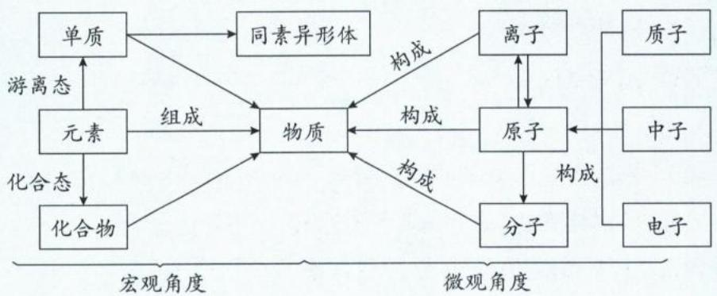

1. 由原子构成的物质: 稀有气体、共价晶体(如金刚石、晶体硅、 $SiO_{2}$ 等)。

2. 由分子构成的物质: 分子晶体(如 $\mathrm{H}_{2} 、 \mathrm{CH}_{3} \mathrm{COOH} 、 \mathrm{P}_{4}$ 等)。

注:稀有气体很特殊,其组成既可看成是原子、也可看成是分子,为单原子分子。

3. 由离子构成的物质: 离子晶体(如 NaCl、KH 等)、离子液体。

4. 其他：

(1)金属晶体:由金属阳离子和自由电子构成的晶体。

(2)等离子体:由电子、阳离子和电中性粒子组成的整体上呈电中性的物质聚集体。

(3)超分子:由两种或两种以上的分子通过分子间相互作用形成的分子聚集体。超分子定义中的分子是广义的,包括离子。

## 二、物质的分类

1. 常见的分类方法: 树状分类法、交叉分类法。

2. 分类的关键点: 分类标准。

3. 常见物质的分类及其分类标准：

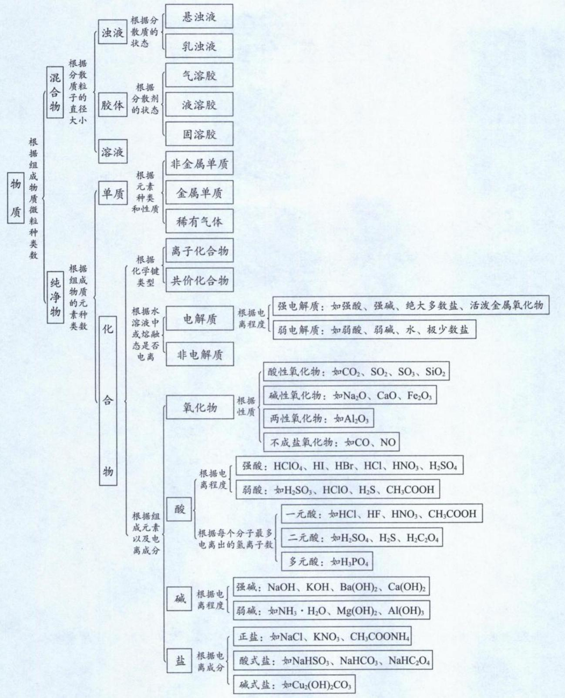  
注:(1)“高分子”不是化合物,是混合物。

(2)酸的“元数”不是看分子中氢原子的个数,而是看酸分子可电离出的氢离子个数。例如 $H_{3}PO_{4}$ 、 $H_{3}PO_{3}$ 、 $H_{3}PO_{2}$ 分子中都有3个氢原子,但可电离出的氢离子数分别是3、2、1,因此 $H_{3}PO_{4}$ 为三元酸、 $H_{3}PO_{3}$ 为二元酸、 $H_{3}PO_{2}$ 为一元酸。

(3)硼酸、氢氧化铝的酸性是通过与水电离出的氢氧根形成配位键,促进水的电离,使溶液中的 $\mathrm{H}^{+}$ 浓度大于 $\mathrm{OH}^{-}$ 浓度,溶液呈酸性。肼 $(\mathrm{N}_{2} \mathrm{H}_{4})$ 的碱性则是因为 N 原子具有孤电子对,与水电离出的氢离子形成配位键,促进水的电离,使溶液中的 $\mathrm{OH}^{-}$ 浓度大于 $\mathrm{H}^{+}$ 浓度,溶液呈碱性。

(4)“悬浊液”指“固液”混合物,久置后会沉淀,通过过滤进行分离;“乳浊液”指“液液”混合物,久置后分层,通过分液进行分离。往苯酚钠溶液中通入二氧化碳,形成乳浊液,所以产物无“↓”符号。

## 4.“四同”的辨析

<table><tr><td>四同</td><td>同位素</td><td>同素异形体</td><td>同系物</td><td>同分异构体</td></tr><tr><td>定义</td><td>同种元素形成的不同核素</td><td>同种元素形成的不同单质</td><td>结构相似,分子组成相差若干个 $CH_2$ 的化合物</td><td>分子式相同,结构不同的化合物</td></tr><tr><td>对象</td><td>原子</td><td>单质</td><td>有机化合物</td><td>化合物</td></tr><tr><td>实例</td><td>H、D、T</td><td> $O_2$ 、 $O_3$ </td><td> $CH_4$ 、 $C_2H_6$ 、 $C_3H_8$ </td><td>乙醇、甲醚</td></tr></table>

## 5. 氧化物

(1)定义:由两种元素组成,且其中一种为氧元素的化合物。

(2) 分类：

①根据组成元素种类分为金属氧化物、非金属氧化物。

②根据化学性质分为酸性氧化物、碱性氧化物、两性氧化物、不成盐氧化物。

(3) 常见类别的定义、通性：

①酸性氧化物
i. 定义: 能与碱反应生成盐和水, 且化合价不变的氧化物
ii. 常见物质种类: 绝大多数非金属氧化物、部分金属氧化物
iii. 通性:
a. 与碱反应生成盐和水, 且化合价不变
b. 与碱性氧化物反应生成盐, 且化合价不变
c. 与水反应生成对应价态的酸, 且化合价不变

注:①若该氧化物存在等价的酸根,则该氧化物一般为酸性氧化物,如 $CO_{2}$ 、 $SO_{2}$ 、 $SO_{3}$ 、 $N_{2}O_{5}$ 、 $P_{2}O_{5}$ 、 $SiO_{2}$ ; $NO_{2}$ 不存在 +4 价 N 对应的酸根,故 $NO_{2}$ 不是酸性氧化物。

②不是所有的酸性氧化物都能与水反应生成对应价态的酸,如 $SiO_{2}$ 就不能与水反应生成 $H_{2}SiO_{3}$ ; 只有能溶于水的酸性氧化物才能与水反应生成对应价态的酸, 如 $CO_{2}$ 、 $SO_{2}$ 、 $SO_{3}$ 。

②碱性氧化物
i. 定义: 能与酸反应生成盐和水, 且化合价不变的氧化物
ii. 常见物质种类: 绝大多数金属氧化物
iii. 通性:
a. 与酸反应生成盐和水, 且化合价不变
b. 与酸性氧化物反应生成盐, 且化合价不变
c. 与水反应生成对应价态的碱, 且化合价不变

注:①过氧化物如“ $\mathrm{Na}_{2} \mathrm{O}_{2}$ ”一定不是碱性氧化物, 因为其中的氧元素化合价为“-1”价,与酸反应的时候化合价容易改变。

②不是所有碱性氧化物都能与水反应生成对应价态的碱,如 $Fe_{2}O_{3}$ 、MgO 等就不能与水反应生成 $\mathrm{Fe(OH)}_{3}$ 、 $\mathrm{Mg(OH)}_{2}$ 。只有能溶于水的碱性氧化物(如 CaO、 $K_{2}O$ 、 $Na_{2}O$ 、BaO)才能与水反应。

③两性氧化物 $\left\{\begin{array}{l}i. 定义:既能与酸反应,又能与碱反应,且均生成盐和水,化合价 \\ 均不改变的氧化物 \\ ii. 常见物质:Al_{2}O_{3},Cr_{2}O_{3},ZnO,Ga_{2}O_{3},BeO 等\end{array}\right.$

注: $SiO_{2}$ 既能与氢氟酸(HF)反应,又能与碱反应,但 $SiO_{2}$ 不是两性氧化物,因为 $SiO_{2}$ 与HF反应的产物 $SiF_{4}$ 不是盐。

6. 胶体

(1) 分散系

①定义: 将一种或多种物质分散到另一种或多种物质中形成的体系称为分散系。

②组成:分散质和分散剂。

③分类：

i. 根据分散质、分散剂的状态分为九类，如：液液分散系、固液分散系等。

ii. 根据分散质粒子的直径大小分类：

a. 直径<1 nm:溶液 b. 直径介于1 nm\~100 nm:胶体 c. 直径>100 nm:浊液

注:胶体属于分散系,而分散系一定是混合物。直径为 50 nm 的碳酸钙粉末不是胶体,因为碳酸钙是纯净物;将直径为 50 nm 的碳酸钙粉末分散到空气中或水中形成的分散系才会形成胶体。

(2) 胶体

①定义: 分散质粒子的直径介于 $1 \, nm \sim 100 \, nm$ 的分散系称为胶体。

②分类:根据分散剂的状态分为气溶胶、液溶胶、固溶胶。

③性质及其用途：

i. 丁达尔效应

a. 定义: 用一束光照射胶体时, 会出现一条光亮的“通路”, 这种现象称为丁达尔效应。

b. 本质: 胶体粒子对光的散射作用。

c. 应用: 区别溶液和胶体。

ii. 电泳

a. 定义: 胶体粒子在外加电场作用下定向移动。

b. 本质: 胶体粒子带电。

注：①胶体不带电，胶粒才可能带电；不是所有胶粒都带电，例如淀粉胶粒不带电。

②一般情况下,难溶性碱形成的胶粒带正电,如 $\mathrm{Fe(OH)}_{3}$ 胶粒;土壤胶粒一般带负电,能与 $NH_{4}^{+}$ 、 $K^{+}$ 等生物所需营养离子相互作用,使土壤具有保肥能力。

c. 应用: 静电除尘、蛋白质的分离提纯等。

iii. 聚沉

a. 定义: 在外加条件下, 胶粒聚集在一起形成沉淀的过程。

b. 措施: 加热、搅拌、加入电解质、加入带相反电荷胶粒的胶体。

c. 应用: 氯化铁止血、石膏溶液使豆浆变豆腐、入海口形成三角洲、明矾净水、墨水混用导致笔管堵塞等。

注:氢氧化铁胶体中滴加稀硫酸,先看到有红褐色沉淀生成;继续滴加稀硫酸后沉淀溶解,溶液变为棕黄色。上述现象说明,向胶体中加入少量电解质时发生聚沉,电解质过量时可能发生化学反应。

iv. 渗析

a. 定义: 利用半透膜分离溶液和胶体的过程。
b. 本质: 溶液分散质粒子直径小于半透膜孔径, 胶粒直径大于半透膜孔径。
c. 应用: 血液透析、淀粉与葡萄糖的分离等。

注:不能用过滤的方法分离溶液和胶体,因为两种分散质粒子的直径均小于滤纸的孔径。

④氢氧化铁胶体的制备：

i. 操作: 将饱和氯化铁溶液滴加到沸水中, 待溶液变成红褐色则停止加热。

ii. 原理: $FeCl_{3} + 3H_{2}O \xlongequal{\triangle} Fe(OH)_{3}$ (胶体) + 3HCl

iii. 注意事项：

a.沸水不能用自来水、氨水、氢氧化钠溶液等替代蒸馏水，否则形成氢氧化铁沉淀而无法获得胶体。  
b.不能长时间煮沸。  
c.不能搅拌。

类型Ⅰ: 基本概念的易错辨析

【例 1】下列关于物质组成的叙述,正确的填“√”,错误的填“×”

(1)物质不是由分子构成就是由原子构成()

(2)某物质经科学测定只含有一种元素,可以断定该物质一定是一种单质()

(3)含金属阳离子的物质一定是离子晶体()

(4) $CO_{2}$ 、 $CH_{3}CH_{2}OH$ 、 $SiO_{2}$ 、NaCl、Fe均为分子式()

(5)由离子构成的物质,常温下一定是固体()

(6)等离子体是混合物()

解析:(1)(×)物质也可以是由离子构成,如离子晶体是由阴、阳离子所构成。

(2)(×)只含有一种元素也可能是混合物,例如 $O_{2}$ 、 $O_{3}$ 的混合气体(即同素异形体所组成的混合物),因此该物质不一定只含一种单质。

(3)(×)含金属阳离子的物质可以是离子晶体、离子液体、等离子体和金属晶体等。

(4)(×)二氧化碳与乙醇是由分子所构成的物质, $CO_{2}$ 是分子式、 $CH_{3}CH_{2}OH$ 是结构简式。 $SiO_{2}$ 、 $NaCl$ 、 $Fe$ 并不是由分子构成的物质,不存在分子式; $SiO_{2}$ 是共价晶体二氧化硅的化学式、 $NaCl$ 是离子晶体氯化钠的化学式、 $Fe$ 是金属晶体铁的化学式。

(5)(×)离子液体熔点很低,常温下也可能为液体。(自从新教材正式介绍“离子液体”之后,常温常压下呈液态的物质除了共价单质、共价化合物、金属单质汞之外,也可能是离子化合物。)

(6)(√)等离子体是由电子、阳离子和电中性粒子组成的整体上呈电中性的物质聚集体,等离子体是混合物。
答案:(1)× (2)× (3)× (4)× (5)× (6)√

【例 2】下列关于物质分类的叙述,正确的填“√”,错误的填“×”

(1)能电离出 $\mathrm{H^{+}}$ 的化合物不一定是酸（ ）  
(2)氨水能导电，所以氨水是电解质（ ）  
(3)酸性氧化物不一定是非金属氧化物，碱性氧化物一定是金属氧化物（ ）  
(4)非金属氧化物不一定是酸性氧化物，金属氧化物不一定是碱性氧化物（ ）  
(5) $\mathrm{NO}_{2}$ 是酸性氧化物， $\mathrm{CaO}_{2}$ 是碱性氧化物， $\mathrm{SiO}_{2}$ 是两性氧化物（ ）  
(6)可以将 $\mathrm{SiO}_{2}, \mathrm{CuO}$ 分别与水反应制备 $\mathrm{H}_{2} \mathrm{SiO}_{3}, \mathrm{Cu(OH)}_{2}$ （ ）  
(7)往苯酚钠溶液中通入 $\mathrm{CO}_{2}$ 后过滤，即可获得苯酚（ ）  
(8) $\mathrm{H}_{3} \mathrm{BO}_{3}, \mathrm{KAl(SO}_{4})_{2} \cdot 12 \mathrm{H}_{2} \mathrm{O}$ 分别属于三元弱酸、复盐（ ）  
解析：(1)(√)能电离出 $\mathrm{H^{+}}$ 的化合物不一定是酸，例如 $\mathrm{NaHSO}_{4}$ 在水溶液中也能电离出 $\mathrm{H^{+}}$ ，但 $\mathrm{NaHSO}_{4}$ 是酸式盐而不是酸。  
(2)(×)氨水是混合物，既不是电解质，也不是非电解质；化合物 $\mathrm{NH}_{3} \cdot \mathrm{H}_{2} \mathrm{O}$ 才是电解质。  
(3)(√)酸性氧化物不一定是非金属氧化物，如 $\mathrm{Mn}_{2} \mathrm{O}_{7}$ 可以与 KOH 反应生成 $\mathrm{KMnO}_{4}$ 和 $\mathrm{H}_{2} \mathrm{O}$ (Mn 化合价不变)， $\mathrm{Mn}_{2} \mathrm{O}_{7}$ 是酸性氧化物，也是金属氧化物；碱性氧化物则一定是金属氧化物。  
(4)(√)非金属氧化物不一定是酸性氧化物，如 CO、NO 是不成盐氧化物。金属氧化物不一定是碱性氧化物，如 $\mathrm{Mn}_{2} \mathrm{O}_{7}$ 是酸性氧化物、 $\mathrm{Al}_{2} \mathrm{O}_{3}$ 是两性氧化物。  
(5)(×) $\mathrm{NO}_{2}$ 与 NaOH 反应： $2 \mathrm{NO}_{2} + 2 \mathrm{NaOH} = \mathrm{NaNO}_{3} + \mathrm{NaNO}_{2} + \mathrm{H}_{2} \mathrm{O}, \mathrm{N}$ 化合价有发生变化，因此 $\mathrm{NO}_{2}$ 不是酸性氧化物； $\mathrm{CaO}_{2}$ 是过氧化物而不是碱性氧化物； $\mathrm{SiO}_{2}$ 是酸性氧化物。  
(6)(×) $\mathrm{SiO}_{2}, \mathrm{CuO}$ 均不溶于水，不能与水反应。（ $\mathrm{SiO}_{2}$ 如何转化为 $\mathrm{H}_{2} \mathrm{SiO}_{3}$ 呢？ $\mathrm{SiO}_{2}$ 可以先和 NaOH 反应转化为 $\mathrm{Na}_{2} \mathrm{SiO}_{3}$ ，再利用强酸制弱酸原理，向 $\mathrm{Na}_{2} \mathrm{SiO}_{3}$ 溶液中加入 HCl 或通入 $\mathrm{CO}_{2}$ ，就可以制备 $\mathrm{H}_{2} \mathrm{SiO}_{3}$ 了。同理， $\mathrm{CuO}$ 可以先和 $\mathrm{H}_{2} \mathrm{SO}_{4}$ 反应转化为 $\mathrm{CuSO}_{4}$ ，再加入 NaOH 制备 $\mathrm{Cu(OH)}_{2}$ 。）  
(7)(×)往苯酚钠溶液中通入 $\mathrm{CO}_{2}$ 后形成苯酚的“乳浊液”，静置后“分液”获得苯酚。  
(8)(×) $\mathrm{H}_{3} \mathrm{BO}_{3}$ 本身并不电离出 $\mathrm{H^{+}}$ ，而是结合来自水电离的 1 个 $\mathrm{OH^{-}}$ 而释放出 1 个 $\mathrm{H^{+}}$ ，即 $\mathrm{H}_{3} \mathrm{BO}_{3} + \mathrm{H}_{2} \mathrm{O} = [\mathrm{B(OH)}_{4}]^{-} + \mathrm{H^{+}}$ ，因此 $\mathrm{H}_{3} \mathrm{BO}_{3}$ 是一元酸。能电离出两种或两种以上阳离子（氢离子除外）的盐称为复盐，如 $\mathrm{KAl(SO}_{4})_{2} \cdot 12 \mathrm{H}_{2} \mathrm{O}, (\mathrm{NH}_{4})_{2} \mathrm{Fe(SO}_{4})_{2} \cdot 6 \mathrm{H}_{2} \mathrm{O}$ 都是复盐。  
答案：(1) $\surd$ (2) $\times$ (3) $\surd$ (4) $\surd$ (5) $\times$ (6) $\times$ (7) $\times$ (8) $\times$

## 总结

①“一定”: 碱性氧化物一定是金属氧化物。

②“不一定”:金属氧化物不一定是碱性氧化物、酸性氧化物不一定是非金属氧化物、非金属氧化物不一定是酸性氧化物、酸性氧化物不一定能与水反应生成对应的酸、碱性氧化物不一定能与水反应生成对应的碱、与水反应生成酸的氧化物不一定是酸性氧化物、与水反应生成碱的氧化物不一定是碱性氧化物。

类型Ⅱ:物质的分类

【例 3】(2023·浙江 1 月选考)下列物质中属于耐高温酸性氧化物的是( )
A. CO₂    B. SiO₂    C. MgO    D. Na₂O

解析: MgO、 $Na_{2}O$ 是碱性氧化物, 不符合题意。 $CO_{2}$ 、 $SiO_{2}$ 均为酸性氧化物, $SiO_{2}$ 为共价晶体, 具有很高的熔沸点, 可以制成耐高温的仪器, B 选项符合题意。

答案:B

【例 4】(2022·浙江 6 月选考)下列说法不正确的是( )

A. 乙醇和丙三醇互为同系物

B. ${}^{35}$ Cl 和 ${}^{37}$ Cl 互为同位素

C. O₂ 和 O₃ 互为同素异形体

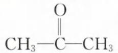

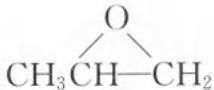

D. 丙酮( $CH_{3}$ —C—CH $_{3}$ )和环氧丙烷( $CH_{3}$ CH—CH $_{2}$ )互为同分异构体

解析：A. 同系物的前提必须是结构相似，即含有相同种类及个数的官能团。乙醇，结构简式为 $CH_{3}CH_{2}OH$ ，有一个羟基；丙三醇，结构简式为 $\mathrm{CH}_{2}(\mathrm{OH})\mathrm{CH}(\mathrm{OH})\mathrm{CH}_{2}(\mathrm{OH})$ ，有三个羟基。二者官能团数目不同，分子式也并非相差若干个 $CH_{2}$ ，二者并非同系物，A 选项错误。
B. ${}^{35}Cl$ 和 ${}^{37}Cl$ 皆为 Cl 元素形成的原子，二者质子数皆为 17。 ${}^{35}Cl$ 中子数为 35-17=18、 ${}^{37}Cl$ 的中子数为 37-17=20，二者质子数相同、中子数不同，互为同位素（即 ${}^{35}Cl$ 和 ${}^{37}Cl$ 为 Cl 元素的两种不同核素），B 选项正确。
C. 由同种元素组成的不同单质互为同素异形体， $O_{2}$ 和 $O_{3}$ 是由氧元素组成的不同单质，二者互为同素异形体，C 选项正确。

D. 丙酮和环氧丙烷的分子式都是 $\mathrm{C}_{3} \mathrm{H}_{6} \mathrm{O}$ , 但二者结构不同, 互为同分异构体, D 选项正确。

答案:A

【例 5】下列各物质所属类别的判断均正确的一组是（）

<table><tr><td>选项\类别</td><td>混合物</td><td>碱</td><td>盐</td><td>碱性氧化物</td><td>酸性氧化物</td></tr><tr><td>A</td><td>液氨</td><td>苛性钠</td><td>胆矾</td><td>氧化铁</td><td>干冰</td></tr><tr><td>B</td><td>盐酸</td><td>烧碱</td><td>食盐</td><td>氧化钠</td><td>二氧化氮</td></tr><tr><td>C</td><td>84消毒液</td><td>纯碱</td><td>石灰石</td><td>氨气</td><td>一氧化碳</td></tr><tr><td>D</td><td>聚乙烯塑料</td><td>熟石灰</td><td>苏打</td><td>生石灰</td><td>二氧化硫</td></tr></table>

解析: A. 液氨是液态氨气, 属于纯净物而不是混合物; 苛性钠是 NaOH, 属于碱; 胆矾是 $CuSO_{4} \cdot 5H_{2}O$ , 为纯净物、化合物、盐; 氧化铁 $\left(\mathrm{Fe}_{2}\mathrm{O}_{3}\right)$ 属于碱性氧化物; 干冰是 $CO_{2}$ , 属于酸性氧化物。A 选项错误。

B. 盐酸为 HCl 气体的水溶液，属于混合物；烧碱是 NaOH，属于碱；食盐主要成分是 NaCl，属于混合物；氧化钠 $\left(\mathrm{Na}_{2}\mathrm{O}\right)$ 属于碱性氧化物； $NO_{2}$ 由于与碱（如 NaOH）反应，N 元素会变价生成 $NaNO_{3}$ 、 $NaNO_{2}$ ，不属于酸性氧化物。B 选项错误。

C. 84 消毒液为水溶液, 主要成分为 NaClO、NaCl, 属于混合物; 纯碱是 $\mathrm{Na}_{2} \mathrm{CO}_{3}$ , 属于盐而不是碱; 石灰石主要成分是 $\mathrm{CaCO}_{3}$ , 属于混合物, 而 $\mathrm{CaCO}_{3}$ 属于盐; 氨气 $(\mathrm{NH}_{3})$ 是氢化物而不是氧化物; 一氧化碳 (CO) 是不成盐氧化物而不是酸性氧化物。C 选项错误。

D. 聚乙烯塑料属于高分子, 为混合物; 熟石灰是 $\mathrm{Ca(OH)}_{2}$ , 属于碱; 苏打是 $\mathrm{Na}_{2} \mathrm{CO}_{3}$ , 属于盐; 生石灰是 $\mathrm{CaO}$ , 属于碱性氧化物; 二氧化硫 $(\mathrm{SO}_{2})$ 属于酸性氧化物。D 选项各物质分类均正确, 答案选 D。

答案:D

【反思】中学常见的俗名对应的物质,同学们需要熟记,不断累积基本化学常识。此外在物质的分类中,氧化物的分类是重点,同学们务必清楚不成盐氧化物以及成盐氧化物中的酸性氧化物、碱性氧化物、两性氧化物的定义和对应的物质。

【例 6】现有下列物质:①冰水混合物 ②密封保存的 $NO_{2}$ 气体 ③铝热剂 ④普通玻璃 ⑤水玻璃 ⑥有机玻璃 ⑦漂白粉 ⑧TNT ⑨ $H_{2}SO_{4}$ ⑩氯水 ⑪花生油 ⑫福尔马林 ⑬爆鸣气 ⑭水煤气 ⑮液氯 ⑯氢氧化铁胶体 ⑰王水 ⑱ $KAl(SO_{4})_{2}\cdot12H_{2}O$ ⑲分子式为 $C_{5}H_{10}$ 的烃 ⑳分子式为 $C_{7}H_{8}$ 的芳香烃

其中一定为纯净物的是\_\_\_\_（填序号，下同）；一定为混合物的是\_\_\_\_；可能是纯净物，也可能是混合物的是\_\_\_\_。

解析:①冰水混合物中只含有 $H_{2}O$ 这一种物质,属于纯净物;②密封保存的 $NO_{2}$ 气体存在平衡 $2NO_{2}\rightleftharpoons N_{2}O_{4}$ ,该物质含有 $NO_{2}$ 、 $N_{2}O_{4}$ 两种微粒,因此是混合物;③铝热剂是铝与某些氧化物(如 $Fe_{2}O_{3}$ )的混合物;④普通玻璃中含有 $CaSiO_{3}$ 、 $Na_{2}SiO_{3}$ 、 $SiO_{2}$ 等多种成分,属于混合物;⑤水玻璃是 $Na_{2}SiO_{3}$ 的水溶液,属于混合物;⑥有机玻璃是聚甲基丙烯酸甲酯,高分子实质上是由许多链节结构相同而聚合度不同的化合物所组成的混合物;⑦漂白粉含有 $CaCl_{2}$ 、 $Ca(ClO)_{2}$ ,因此属于混合物;⑧TNT为三硝基甲苯,是化合物,属于纯净物;⑨ $H_{2}SO_{4}$ 是化合物,属于纯净物;⑩氯水中含 $Cl_{2}$ 、HClO、HCl、 $H_{2}O$ ,属于混合物;⑪花生油中含有多种高级脂肪酸的甘油酯,属于混合物(油脂是混合物);⑫福尔马林是甲醛的水溶液,属于混合物;⑬爆鸣气是2体积 $H_{2}$ 和1体积 $O_{2}$ 混合而成的气体,属于混合物;⑭水煤气是CO和 $H_{2}$ 的混合气,属于混合物;⑮液氯是液态的 $Cl_{2}$ ,仅有一种微粒,属于纯净物;⑯氢氧化铁胶体是分散系,属于混合物;⑰王水是浓硝酸、浓盐酸按体积比1:3混合得到的混合物;⑱ $KAl(SO_{4})_{2}\cdot12H_{2}O$ 是化合物明矾的化学式,属于纯净物;⑲分子式为 $C_{5}H_{10}$ 的烃表示的物质可能是环烷烃,也可能是链状烯烃。若物质中仅有一种微粒,该物质是纯净物;若物质含有多种微粒,则物质是混合物;⑳分子式为 $C_{7}H_{8}$ 的同分异构体很多,但属于芳香烃(含苯环结构)的只有甲苯,属于纯净物。

答案：①⑧⑨⑮⑱⑳ ②③④⑤⑥⑦⑩⑪⑫⑬⑭⑮⑯

【反思】有机物可能存在同分异构体(即分子式相同但结构不同),属于不同的分子,因此符合一定分子式的物质且存在同分异构体的情况,则该物质可能为纯净物、可能为混合物。类比于某物质只含有一种元素的物质,由于可能存在同素异形体的情况,则该物质可能为纯净物、可能为混合物(例如 $O_{2}$ 、 $O_{3}$ 混合气体)。

类型Ⅲ: 胶体的性质和运用

【例 7】下列关于胶体的叙述, 正确的填“√”, 错误的填“×”

(1)空气中的 PM2.5 不一定会形成气溶胶()

(2)铜铟硫 $\left(\mathrm{CuInS}_{2}\right)$ 量子点是纳米级的半导体材料,属于胶体()

(3)石墨烯纳米颗粒是一种粒子直径介于1～100 nm的材料,将其均匀分散在蒸馏水中,该分散系能使光波发生散射,当光束通过时可观察到丁达尔效应()

(4)胶体和溶液的本质区别是有无丁达尔效应()

(5)可以用过滤法分离氢氧化铁胶体中混有的 NaCl()

(6)静电除尘运用了胶体“聚沉”的性质()

(7)土壤具有保肥性,是因为土壤胶体的胶粒带负电,能吸附 $K^{+}$ 、 $NH_{4}^{+}$ 等()

(8)同种胶体带同种电荷,相互排斥,是胶体稳定的主要原因()

(9)胶体一定是电中性的,胶粒一定是带电荷的()

(10)高铁酸钾 $\left(\mathrm{K}_{2}\mathrm{FeO}_{4}\right)$ 在水处理过程中涉及的变化有:氧化还原反应、蛋白质变性、盐类水解、胶体聚沉等()

解析:(1)(√) PM2.5 是指大气中直径小于或等于 2.5 微米(即 2.5 μm 或 2 500 nm)的颗粒物,其分散在空气中不一定形成气溶胶。

(2)(×) 纳米级铜铟硫 $\left(\mathrm{CuInS}_{2}\right)$ 是纯净物,不属于胶体。

(3)(√) 分散质粒子直径介于 1\~100 nm 所形成的分散系属于胶体, 胶体能产生丁达尔效应。(对比第(2)问与第(3)问, 可知纳米级材料虽然粒子直径介于 1\~100 nm, 但必须要与分散剂形成分散系才属于胶体, 这点请同学们注意。

(4)(×) 胶体和溶液的本质区别是分散质粒子直径大小, 丁达尔效应是用来“鉴别”溶液和胶体的方法。

(5)(×) NaCl 和氢氧化铁胶粒都可以透过滤纸, 无法用过滤的方法分离二者, 应用渗析法将二者分离。

(6)(×)静电除尘运用了胶体“电泳”的性质。

(7)(√) 土壤具有保肥性, 是因为土壤胶体的胶粒带负电, 能吸附 $K^{+}$ 、 $NH_{4}^{+}$ 等。

(8)(×) 胶体为电中性, 不带电荷。同种“胶粒”带同种电荷, 相互排斥, 才是胶体稳定的主要原因。

(9)(×) 胶体是分散系, 胶体一定呈电中性。胶粒有的带电, 如 $\mathrm{Fe(OH)}_{3}$ 胶粒; 有的胶粒不带电, 如淀粉胶体的胶粒。

(10)(√) $K_{2}FeO_{4}$ 的 Fe 为 +6 价，具有强氧化性，能使蛋白质变性达到杀菌消毒的作用。 $K_{2}FeO_{4}$ 的还原产物 $Fe^{3+}$ 在溶液中水解形成 $\mathrm{Fe(OH)}_{3}$ 胶体，可以吸附水中悬浮杂质后聚沉而达到净水的作用。因此水处理过程中涉及的变化有氧化还原反应、蛋白质的变性、盐类的水解、胶体的聚沉等。
答案:(1)√ (2)× (3)√ (4)× (5)× (6)× (7)√ (8)× (9)× (10)√

【例 8】下列关于胶体的性质和用途不存在对应关系的是( )

A. 明矾净水运用了胶体聚沉的性质

B. 血液透析运用了胶体渗析的性质

C. 三角洲的形成运用了胶体电泳的性质

D. 区分胶体和溶液运用胶体的丁达尔效应

解析: A. 明矾净水是铝离子水解为氢氧化铝胶体, 胶体可以吸附水中的悬浮杂质, 运用了胶体聚沉的性质, A 项存在对应关系。
B. 血液是胶体, 其胶粒不能透过半透膜, 而毒素微粒可以透过半透膜, 因此血液透析运用了胶体渗析的性质, B 项存在对应关系。
C. 河水中的泥沙可以形成胶体, 在江河入海处遇到含有大量电解质的海水会聚沉形成三角洲, 因此三角洲的形成运用了胶体“聚沉”的性质, 与 C 项提及的“电泳”不存在对应关系。
D. 胶体具有丁达尔效应而溶液没有, 故丁达尔效应可以用来区分胶体和溶液, D 项存在对应关系。

答案:C

【例 9】小杰同学用如图所示装置制备氢氧化铁胶体(部分夹持装置已略去)。

根据所学知识回答下列问题：

(1)仪器 a 的名称为 \_\_\_\_。

(2)氢氧化铁胶体的制备：

①烧杯中发生反应的化学方程式为\_\_\_\_，反应类型为\_\_\_\_（填基本反应类型）。

②证明有 $\mathrm{Fe(OH)}_3$ 胶体生成的方法是 \_\_\_\_。（写出具体操作步骤）

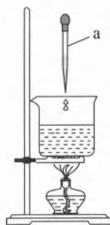

③若小杰同学制备出的液体呈浑浊状,则可能造成的原因是\_\_\_\_(任写一种)。

解析: 将烧杯中的蒸馏水加热至沸腾, 向沸水中逐滴加入 $FeCl_{3}$ 饱和溶液, 继续煮沸至液体呈红褐色, 停止加热, 制得 $\mathrm{Fe(OH)}_{3}$ 胶体。仪器 a 的名称为胶头滴管, 烧杯中发生反应的化学方程式为: $\mathrm{FeCl}_{3} + 3\mathrm{H}_{2}\mathrm{O} \xlongequal{\Delta} \mathrm{Fe(OH)}_{3}$ (胶体) + 3HCl, 反应类型为复分解反应。光束通过胶体时, 光线能够发生散射作用而产生丁达尔效应, 而通过其他分散系时不能产生丁达尔效应。证明有胶体生成的方法是进行丁达尔效应实验, 具体操作步骤为: 用一束激光照射液体, 若看到一条光亮的通路, 则证明有 $\mathrm{Fe(OH)}_{3}$ 胶体生成。制备出的液体呈浑浊状, 则胶体发生聚沉, 可能的原因为: 煮沸时用玻璃棒搅拌 (或实验时用自来水而不是蒸馏水、或加热时间过长)。

答案:(1)胶头滴管 (2)① $\mathrm{FeCl}_{3}+3\mathrm{H}_{2}\mathrm{O}\xlongequal{\Delta}\mathrm{Fe(OH)}_{3}$ （胶体）+3HCl 复分解反应 ②用一束激光照射液体,若看到一条光亮的通路,则证明有 $\mathrm{Fe(OH)}_{3}$ 胶体生成 ③煮沸时用玻璃棒搅拌(或实验时用自来水而不是蒸馏水、或加热时间过长)

【例 10】利用饱和 $FeCl_{3}$ 溶液与 $H_{2}O$ 反应制得的胶体的胶团结构如图所示,下列说法错误的是()

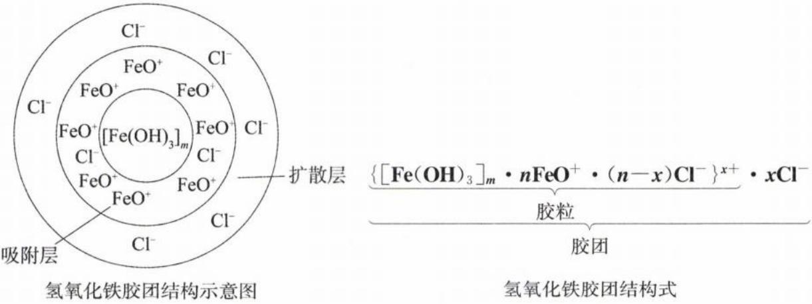

A. $\mathrm{Fe(OH)}_{3}$ 胶粒带正电荷

$$
1 6. 2 5 \mathrm{g} \mathrm{FeCl} _ {3}
$$

$$
\mathrm{Fe} (\mathrm{OH}) _ {3}
$$

$$
0. 1 N _ {\mathrm{A}}
$$

C. 在 U 形管中注入 $\mathrm{Fe(OH)}_{3}$ 胶体，插入石墨电极通电（U 形管上方用少量导电液使电极与胶体分开，避免胶体粒子与电极直接接触），则阴极周围颜色加深
D. 胶体能够稳定存在是因为吸附层微粒(即胶粒)存在静电斥力

解析:A.由题目所给的氢氧化铁胶团结构式,可知氢氧化铁胶粒带正电荷,A选项正确。

B. $16.25 \, g \, FeCl_{3}$ 的物质的量 $n = \frac{16.25 \, g}{162.5 \, g/mol} = 0.1 \, mol$ ，由题目信息可知， $\mathrm{Fe(OH)}_{3}$ 胶粒是若干个 $\mathrm{Fe(OH)}_{3}$ 、 $FeO^{+}$ 的集合体，最终形成的 $\mathrm{Fe(OH)}_{3}$ 胶体粒子数小于 $0.1 N_{A}$ ，B 选项错误。

C. 在 U 形管中注入 $\mathrm{Fe(OH)}_{3}$ 胶体，插入石墨电极通电，由于氢氧化铁胶粒带正电荷，通电时会向阴极移动，可观察到阴极附近颜色加深，C 选项正确。 $(\mathrm{Fe(OH)}_{3})$ 胶体通电时出现电泳现象的原因：扩散层与吸附层分离，带正电的 $\mathrm{Fe(OH)}_{3}$ 胶粒向阴极移动。

D. 氢氧化铁胶体能稳定存在的主要原因是氢氧化铁胶粒带正电荷, 同性电荷使胶粒之间相互排斥, 不能聚沉, D 选项正确。(胶体能够稳定存在的主要原因是吸附层微粒(即胶粒)存在静电斥力, 使得胶粒难以互相靠近, 不能聚沉。次要原因是胶粒因布朗运动而克服重力的作用, 从而保持胶体的稳定。)

答案:B

## 模块 2 物质的转化(★)

习题：P3

## 内容提要

一、化学变化的本质:旧化学键的断裂和新化学键的形成

注:化学变化的关键是有新化学键的形成。只有旧化学键的断裂而无新化学键的形成,不是化学变化,比如电解质的电离以及共价晶体、离子晶体的熔化。

## 二、化学反应的分类

按反应物、生成物种类及数目多少 $\left\{\begin{array}{l} 化合反应  \\  分解反应  \\  置换反应  \\  复分解反应 \end{array}\right.$

化学反应

化学 按反应中有无离子参与 $\left\{\begin{array}{l} 离子反应  \\  非离子反应 \end{array}\right.$

按反应中有无电子转移 $\left\{\begin{array}{l}氧化还原反应  \\ 非氧化还原反应\end{array}\right.$

按反应进行的程度和方向 $\left\{\begin{array}{l} 可逆反应  \\  不可逆反应 \end{array}\right.$

按反应的能量变化 $\left\{\begin{array}{l}\text {吸热反应} \\ \text {放热反应}\end{array}\right.$

## 三. 常见物质的转化关系

1. 金属单质 $\xrightarrow{\mathrm{O}_2}$ 金属氧化物 $\xrightarrow{\mathrm{H}_2\mathrm{O}}$ 碱 $\xrightarrow{\text{酸、酸性氧化物}}$ 盐

例:(1) $K\xrightarrow{O_{2}}K_{2}O\xrightarrow{H_{2}O}KOH\xrightarrow{HCl}KCl$

$$
(2) \mathrm{Na} \xrightarrow {\mathrm{O} _ {2}} \mathrm{Na} _ {2} \mathrm{O} \xrightarrow {\mathrm{H} _ {2} \mathrm{O}} \mathrm{NaOH} \xrightarrow {\mathrm{CO} _ {2}} \mathrm{Na} _ {2} \mathrm{CO} _ {3}
$$

注:上述转化关系的常见金属有 Na、K、Ca、Ba 等;若金属氧化物不溶于水,则“金属氧化物 $\xrightarrow{H_{2}O}$ 碱”不能进行,如 MgO、CuO、Al $_{2}$ O $_{3}$ 、Fe $_{2}$ O $_{3}$ 等。

2. 非金属单质 $\xrightarrow{\mathrm{O}_2}$ 非金属氧化物 $\xrightarrow{\mathrm{H}_2\mathrm{O}}$ 酸 $\xrightarrow{\text{碱、碱性氧化物}}$ 盐

例:(1) $C\xrightarrow{O_{2}}CO_{2}\xrightarrow{H_{2}O}H_{2}CO_{3}\xrightarrow{NaOH}Na_{2}CO_{3}$ （或 $NaHCO_{3}$ ）

$$
(2) \mathrm{N} _ {2} \xrightarrow {\mathrm{O} _ {2}} \mathrm{NO} \xrightarrow {\mathrm{O} _ {2}} \mathrm{NO} _ {2} \xrightarrow {\mathrm{H} _ {2} \mathrm{O}} \mathrm{HNO} _ {3} \xrightarrow {\mathrm{KOH}} \mathrm{KNO} _ {3}
$$

$$
(3) \mathrm{S} \xrightarrow {\mathrm{O} _ {2}} \mathrm{SO} _ {2} \xrightarrow {\mathrm{O} _ {2}} \mathrm{SO} _ {3} \xrightarrow {\mathrm{H} _ {2} \mathrm{O}} \mathrm{H} _ {2} \mathrm{SO} _ {4} \xrightarrow {\mathrm{NaOH}} \mathrm{Na} _ {2} \mathrm{SO} _ {4}
$$

注：① $SiO_{2}$ 不溶于水，则“非金属氧化物 $\xrightarrow{H_{2}O}$ 酸”不能进行。

②若是“非金属单质 $\xrightarrow{O_{2}}$ 酸性氧化物 $\xrightarrow{H_{2}O}$ 酸 $\xrightarrow{碱}$ 盐”，则 $N_{2}$ 不符合上述转化关系，因为 $N_{2}$ 与 $O_{2}$ 在放电（或高温）条件下反应生成NO，NO不是酸性氧化物，且不与 $H_{2}O$ 反应。

3. 金属单质或非金属单质 + 盐 → 金属单质或非金属单质 + 盐

例:(1) $Fe + CuSO_{4} = FeSO_{4} + Cu$ (2) $Cl_{2} + 2KI = I_{2} + 2KCl$

4. 酸+盐→酸+盐(主要遵循较强酸制备较弱酸,或溶解度大的物质制备溶解度小的物质)
例:(1) $H_{2}S + CuSO_{4} = H_{2}SO_{4} + CuS \downarrow$ (溶解度大的物质制备溶解度小的物质)
(2) $HCl + CH_{3}COONa = CH_{3}COOH + NaCl$ (较强酸制备较弱酸)

5. 碱+盐→碱+盐(主要遵循较强碱制备较弱碱,或溶解度大的物质制备溶解度小的物质)
例:(1) $\mathrm{Ba(OH)_2 + MgCl_2 = BaCl_2 + Mg(OH)_2 \downarrow}$ (溶解度大的物质制备溶解度小的物质)
(2) $NaOH + NH_{4}Cl = NH_{3} \cdot H_{2}O + NaCl$ (较强碱制备较弱碱)

6. 盐 + 盐 → 盐 + 盐 (主要遵循溶解度大的物质制备溶解度小的物质, 或强电解质制备弱电解质)

例:(1) $BaCl_{2}+CuSO_{4}=BaSO_{4}\downarrow+CuCl_{2}$ （溶解度大的物质制备溶解度小的物质）

$$
\mathrm{Pb} \left(\mathrm{NO} _ {3}\right) _ {2} + 2 \mathrm{CH} _ {3} \mathrm{COONa} = \left(\mathrm{CH} _ {3} \mathrm{COO}\right) _ {2} \mathrm{Pb} + 2 \mathrm{NaNO} _ {3}
$$

注:盐多数为强电解质,而 $\left(\mathrm{CH}_{3}\mathrm{COO}\right)_{2}\mathrm{Pb}$ 是高中遇见的少数弱电解质盐。

## 类型 I: 基本概念的易错辨析

【例 1】正误判断, 正确的填“√”, 错误的填“×”

(1)化学反应不是放热反应就是吸热反应()

(2)石墨在一定条件下转化为金刚石是化学变化()

(3)某些金属既可以与氧化物反应,也可以与酸反应,甚至可以和碱反应()

(4) $^{232}$ Th 转化成 $^{233}$ Th 是化学变化()

(5)从海水中提取物质都必须通过化学反应才能实现()

(6)用铂丝蘸取 $Na_{2}SO_{4}$ 、 $Na_{2}CO_{3}$ 、NaCl 溶液进行焰色试验是化学变化()

(7) $Na_{2}CO_{3}\cdot10H_{2}O$ 的风化属化学变化,NaOH的潮解属物理变化()

(8)加热 $NH_{4}Cl$ 固体,试管底部固体消失,在试管上部出现白烟,该过程属于物理变化()

(9)煤的“气化”、煤的“液化”、煤的“干馏”都是化学变化()

(10)向蛋白质溶液中滴加饱和 $Na_{2}SO_{4}$ 溶液或饱和 $CuSO_{4}$ 溶液均产生沉淀,都属于化学变化()

(11)分馏、蒸馏、蒸发、萃取、分液、过滤都属于物理变化()

解析:(1)(√)任何化学反应都有热效应,所以化学反应不是放热反应,就是吸热反应。

(2)(√) 金刚石中的化学键不同于石墨, 二者的相互转化涉及旧化学键断裂与新化学键形成, 为化学变化。(同素异形体之间的转化属于化学变化。)

(3)(√) 铝可以在高温下和氧化铁发生铝热反应, 铝既可以与酸反应, 又可以与碱反应。

(4) $(\times)^{232}\mathrm{Th}$ 转化成 $^{233}\mathrm{Th}$ 时，原子核发生了改变，不属于化学变化。

(5)(×)从海水中提取 NaCl 是通过蒸发结晶获得,属于物理变化。

(6)(×)焰色试验的原理是当金属单质或含金属元素的化合物在火焰上灼烧时,原子中的电子吸收了能量,从能量较低的轨道跃迁到能量较高的轨道,但处于能量较高轨道上的电子是不稳定的,很快跃迁回能量较低的轨道,这时就将多余的能量以光的形式放出。过程中没有新物质生成,是物理变化。

(7)(√) $Na_{2}CO_{3}\cdot10H_{2}O$ 的风化分解为 $Na_{2}CO_{3}$ 和 $H_{2}O$ ，有新物质的生成，属于化学变化。NaOH的潮解是

NaOH 固体表面从空气中吸收或者吸附水分,使得表面逐渐变得潮湿,最后物质就会从固体变为该物质的溶液,此过程中没有新物质生成,属于物理变化。

(8)(×)加热 $NH_{4}Cl$ 固体,分解生成 $NH_{3}$ 和 HCl, $NH_{3}$ 和 HCl 在试管上方又重新化合生成 $NH_{4}Cl$ ,该过程是化学变化。(加热 $NH_{4}Cl$ 固体的现象类似升华,但实质却是分解与化合的过程,是化学变化。)

(9)(√)煤的气化是将煤转化为可燃性气体的过程,主要是碳与水蒸气反应生成水煤气;煤的直接液化是使煤与氢气作用生成液体燃料;煤的间接液化,一般是先将煤转化为一氧化碳和氢气,然后在催化剂的作用下将气体合成甲醇等;煤的干馏是指将煤隔绝空气加强热使之分解的过程。以上都是化学变化。

(10)(×)向蛋白质溶液中滴加饱和 $Na_{2}SO_{4}$ 溶液生成沉淀, 加水后沉淀可以再度溶解, 该过程为盐析, 是物理变化; 向蛋白质溶液中滴加饱和 $CuSO_{4}$ 溶液, 由于铜离子是重金属离子, 会使蛋白质发生变性聚沉, 蛋白质的结构发生变化, 该过程不可逆, 属于化学变化。(盐析一般是指溶液中加入无机盐类而使某种物质溶解度降低而析出的过程, 例如: ①向蛋白质溶液中加入饱和 $Na_{2}SO_{4}$ 溶液或饱和 $(\mathrm{NH}_{4})_{2}\mathrm{SO}_{4}$ 溶液导致蛋白质溶解性降低而产生沉淀; ②向皂化液中加入饱和 NaCl 溶液, 使高级脂肪酸钠 (即肥皂) 溶解度降低而析出。盐析属于物理变化。)

(11)(√)分馏、蒸馏、蒸发、萃取、分液、过滤,这些除杂方式都是利用物理性质的差异,过程中未产生新物质,都属于物理变化。

答案:(1)√ (2)√ (3)√ (4)× (5)× (6)× (7)√ (8)× (9)√ (10)× (11)√

## 总结

常见的物理变化和化学变化

<table><tr><td>项目</td><td>物理变化</td><td>化学变化</td></tr><tr><td>“馏”</td><td>蒸馏、分馏</td><td>干馏</td></tr><tr><td>“色”</td><td>焰色试验</td><td>显色反应、指示剂变色反应</td></tr><tr><td>“解”</td><td>潮解</td><td>分解、电解、水解、裂解</td></tr><tr><td>“化”</td><td>熔化、汽化、液化</td><td>氢化、氧化、歧化、风化、炭化、钝化、催化、皂化、橡胶老化、卤化、硝化、磺化、硫化、酯化、裂化、油脂硬化、煤的气化、煤的液化</td></tr></table>

类型Ⅱ:物质之间的转化

【例 2】下列物质与氧气反应,不能一步就生成产物的是( )

A. $Fe \rightarrow Fe_{3}O_{4}$ B. $S \rightarrow SO_{3}$ C. $NH_{3} \rightarrow NO$ D. $K \rightarrow K_{2}O$

解析:Fe 在纯氧气中燃烧的产物是 $Fe_{3}O_{4}$ ，Fe 能一步生成 $Fe_{3}O_{4}$ 。S 与氧气反应，无论氧气是否过量，只能生成 $SO_{2}$ ， $SO_{2}$ 与氧气在催化剂加热的条件下，才能进一步转化为 $SO_{3}$ ，即 S 与氧气反应不能一步就生成 $SO_{3}$ ，B 项符合题意。 $NH_{3}$ 经催化氧化可以一步转化为 NO，化学方程式为 $4NH_{3} + 5O_{2} \xlongequal[\Delta]{催化剂} 4NO + 6H_{2}O$ 。常温下，K 与空气中的氧气反应可以得到产物 $K_{2}O$ ，K 能一步就生成 $K_{2}O$ 。

## 总结

(1)在高中除了 S 与氧气反应不能一步就生成 $SO_{3}$ 外， $N_{2}$ 与氧气反应也不能一步就生成 $NO_{2}$ ， $N_{2}$ 先和氧气在放电或高温条件下生成 NO，NO 再和氧气反应生成 $NO_{2}$ 。

(2) K 与氧气在不同条件下, 可以生成 $\mathrm{K}_{2} \mathrm{O}, \mathrm{K}_{2} \mathrm{O}_{2}$ 或 $\mathrm{KO}_{2}$ (超氧化钾)。Na 在常温下与氧气反应生成 $\mathrm{Na}_{2} \mathrm{O}$ , 在加热或点燃条件下生成 $\mathrm{Na}_{2} \mathrm{O}_{2}$ 。Li 与氧气反应只生成 $\mathrm{Li}_{2} \mathrm{O}$ 。由上述可知, 碱金属随着金属性越强, 与氧气反应的产物越复杂。

【例 3】(2024·安徽卷)下列选项中的物质能按图示路径在自然界中转化,且甲和水可以直接生成乙的是()

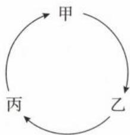

<table><tr><td>选项</td><td>甲</td><td>乙</td><td>丙</td></tr><tr><td>A</td><td> $Cl_{2}$ </td><td>NaClO</td><td>NaCl</td></tr><tr><td>B</td><td> $SO_{2}$ </td><td> $H_{2}SO_{4}$ </td><td> $CaSO_{4}$ </td></tr><tr><td>C</td><td> $Fe_{2}O_{3}$ </td><td> $Fe(OH)_{3}$ </td><td> $FeCl_{3}$ </td></tr><tr><td>D</td><td> $CO_{2}$ </td><td> $H_{2}CO_{3}$ </td><td> $Ca(HCO_{3})_{2}$ </td></tr></table>

解析: A. $Cl_{2}$ 与 $H_{2}O$ 反应生成 HClO 和 HCl, 不能直接反应生成 NaClO, A 选项错误。
B. $SO_{2}$ 与 $H_{2}O$ 反应生成 $H_{2}SO_{3}$ 而不是 $H_{2}SO_{4}$ , B 选项错误。
C. $Fe_{2}O_{3}$ 难溶于水，不能与水反应，C 选项错误。

D. $CO_{2}$ 与 $H_{2}O$ 反应生成 $H_{2}CO_{3}$ ， $H_{2}CO_{3}$ 与少量 $\mathrm{Ca(OH)}_{2}$ 生成 $\mathrm{Ca(HCO_{3})_{2}}$ ， $\mathrm{Ca(HCO_{3})_{2}}$ 受热分解生成 $CO_{2}$ ，D 选项正确。

答案:D

【反思】物质的转化题型重点在于元素及其化合物的相关反应与转化关系,高考命题的依据皆来自于教材。本题的每一个选项,都是中学教材里可以找到的知识点或方程式,若你感到十分生疏,请务必将教材中的知识点与方程式再复习一遍!

【例 4】物质的转化是化学学习的重要内容,甲、乙、丙所代表的物质不符合如图所示转化关系的是()

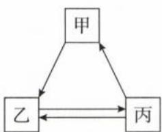

<table><tr><td>选项</td><td>甲</td><td>乙</td><td>丙</td></tr><tr><td>A</td><td> $Na_{2}SO_{4}$ </td><td>NaOH</td><td> $Na_{2}CO_{3}$ </td></tr><tr><td>B</td><td>CuO</td><td> $H_{2}O$ </td><td> $O_{2}$ </td></tr><tr><td>C</td><td> $FeCl_{2}$ </td><td>Fe</td><td> $FeSO_{4}$ </td></tr><tr><td>D</td><td> $Na_{2}CO_{3}$ </td><td>NaCl</td><td> $NaNO_{3}$ </td></tr></table>

解析: A. 甲→乙: $Na_{2}SO_{4}$ 与 $\mathrm{Ba(OH)}_{2}$ 反应生成 $BaSO_{4}$ 沉淀和 NaOH; 乙→丙: 足量 NaOH 和 $CO_{2}$ 反应可生成 $Na_{2}CO_{3}$ ; 丙→乙: $Na_{2}CO_{3}$ 和 $\mathrm{Ca(OH)}_{2}$ 反应生成 $CaCO_{3}$ 沉淀和 NaOH; 丙→甲: $Na_{2}CO_{3}$ 和足量 $H_{2}SO_{4}$ 反应可生成 $Na_{2}SO_{4}$ , A 选项符合。

B. 甲→乙: CuO 与 $H_{2}$ 反应生成 Cu 与 $H_{2}O$ ; 乙→丙: 电解 $H_{2}O$ 可以生成 $H_{2}$ 和 $O_{2}$ ; 丙→乙: $O_{2}$ 和 $H_{2}$ 点燃生成 $H_{2}O$ ; 丙→甲: $O_{2}$ 与 Cu 反应生成 CuO, B 选项符合。

C. 甲→乙: $FeCl_{2}$ 与 Zn 发生置换反应生成 Fe; 乙→丙: Fe 与稀 $H_{2}SO_{4}$ 反应生成 $FeSO_{4}$ ; 丙→乙: $FeSO_{4}$ 与 Zn 发生置换反应生成 Fe; 丙→甲: $FeSO_{4}$ 与 $BaCl_{2}$ 反应生成 $BaSO_{4}$ 沉淀和 $FeCl_{2}$ , C 选项符合。

D. 甲→乙: $Na_{2}CO_{3}$ 和 HCl 反应可生成 NaCl, 乙→丙: NaCl 与 $AgNO_{3}$ 反应生成 AgCl 沉淀与 $NaNO_{3}$ ; 但 $NaNO_{3}$ 无法一步变为 NaCl 或 $Na_{2}CO_{3}$ , D 选项不符合。

答案:D

类型Ⅲ:物质的转化与生活中的应用

【例 5】制作豆腐过程一般有如图所示的步骤操作,其中操作⑤用 $CaSO_{4}$ 或 $MgCl_{2}$ 作凝固剂。根据图示,下列说法不正确的是()

  
①泡豆

  
②磨豆

  
③过滤

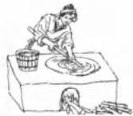  
④煮浆

  
⑤点卤

  
⑥成形

A. 操作①与操作②的目的是使更多的蛋白质溶解于水  
B. 操作③属于固液分离, 取其袋子内的固体作为操作④的原料  
C. 在适宜温度下, 操作⑤用 $\mathrm{MgCl}_2$ 作凝固剂可使蛋白质沉淀  
D. 操作⑥使豆腐“成形”, 此过程主要发生的是物理变化

解析: A. 操作①为浸泡豆子直到豆子变软, 以利后续研磨; 操作②将豆子磨碎, 释放出豆浆, 以上目的是让更多的蛋白质溶解于水, 提高豆浆的产量, A 选项正确。

B. 操作③的过滤是将豆渣分离出来, 留下豆浆液, 故应取过滤出的液体作为操作④的原料, B 选项错误。

C. 经过步骤④后得到蛋白质胶体, 根据题目信息, 在适宜温度下, 操作⑤用 $MgCl_{2}$ 作凝固剂可使蛋白质聚沉, C 选项正确。

D. 操作⑥使豆腐“成形”, 这一步是通过物理按压的方式将水分挤出, 使豆腐更加紧实, D 选项正确。

答案: B

【例 6】(2022·湖南卷)化学促进了科技进步和社会发展,下列叙述中没有涉及化学变化的是( )

A.《神农本草经》中记载的“石胆能化铁为铜”

B. 利用“侯氏联合制碱法”制备纯碱

C. 科学家成功将 $CO_{2}$ 转化为淀粉或葡萄糖

D. 北京冬奥会场馆使用 $CO_{2}$ 跨临界直冷制冰

解析：A. 石胆又名胆矾，成分为 $CuSO_{4} \cdot 5H_{2}O$ 。“石胆能化铁为铜”意指硫酸铜能与铁发生置换反应生成铜，涉及化学变化，A 不符合题意。
B.“侯氏联合制碱法”制备纯碱是先将 $NH_{3}$ 通入饱和 NaCl 溶液中，再通入 $CO_{2}$ 生成溶解度较小的 $NaHCO_{3}$ 沉淀， $NaHCO_{3}$ 固体经加热后分解生成纯碱( $Na_{2}CO_{3}$ )，涉及化学变化，B 不符合题意。
C. $CO_{2}$ 转化为淀粉或葡萄糖，产生了新物质，涉及化学变化，C 不符合题意。
D. 使用 $CO_{2}$ 跨临界直冷制冰，可将水直接转化为冰，没有新物质生成，没有涉及化学变化，D 符合题意。
答案：D

【例 7】古诗词是古人为我们留下的宝贵精神财富,是中华民族传统文化精髓。下列古诗词或古文记载不涉及化学反应的有几项( )

①春蚕到死丝方尽,蜡炬成灰泪始干——(唐)李商隐

②爆竹声中一岁除,春风送暖入屠苏——(宋)王安石

③粉骨碎身浑不怕,要留清白在人间——(明)于谦

④日照香炉生紫烟,遥看瀑布挂前川——(唐)李白

⑤莫道雪融便无迹,雪融成水水成冰——(宋)杨万里

⑥千淘万漉虽辛苦,吹尽狂沙始到金——(唐)刘禹锡

A. 3 项    B. 4 项    C. 5 项    D. 6 项

解析:①提及蜡烛燃烧,涉及化学反应;②爆竹燃烧过程中涉及化学反应;③该诗词涉及 $\mathrm{CaO}$ 、 $\mathrm{Ca(OH)}_{2}$ 、 $CaCO_{3}$ 之间的转化,涉及化学反应;④提及的“紫烟”,是指香炉峰的瀑布激起的水汽蒸腾,在日光的照射下呈现出紫色的现象,未涉及化学反应。本选项中的“生紫烟”与碘的升华无关,请注意题目所设的陷阱;⑤“雪融成水水成冰”是指水固相和液相的转变,属于物理变化,未涉及化学反应;⑥说明金的化学性质稳定,在自然界常以游离态存在,金的密度大,可利用水流使泥沙和金分离,未涉及化学反应。综上所述,不涉及化学反应的有④⑤⑥三项,答案选 A。

答案:A

## 模块 1 化学计量中的重要物理量(★★)

习题：P4

## 内容提要

## 一、物质的量

<table><tr><td>定义</td><td>表示一定数目粒子集合体的物理量</td></tr><tr><td>研究对象</td><td>“粒子”即“微观粒子”:质子、中子、电子、原子、离子、分子、原子团等</td></tr><tr><td>物理量符号</td><td>n</td></tr><tr><td>单位符号</td><td>常用单位是“mol”,还有kmol、mmol、μmol等</td></tr><tr><td>计算公式</td><td> $n = \frac{N}{N_A}$ </td></tr><tr><td>规律</td><td>物质的量n与微粒个数N成正比(求物质的最简式就是求原子个数最简比,即原子的物质的量之比)</td></tr></table>

## 二、阿伏加德罗常数

<table><tr><td>定义</td><td>1 mol 任何粒子的粒子数</td></tr><tr><td>研究对象</td><td>“粒子”即“微观粒子”:质子、中子、电子、原子、离子、分子、原子团等</td></tr><tr><td>物理量符号</td><td> $N_A$ </td></tr><tr><td>单位符号</td><td>常用单位是“ $\text{mol}^{-1}$ ”</td></tr><tr><td>具体数值</td><td>约为  $6.02 \times 10^{23}$ </td></tr><tr><td>计算公式</td><td> $N_A = \frac{N}{n}$ </td></tr><tr><td>注意事项</td><td> $N_A$  表示精确值、 $6.02 \times 10^{23}$  表示约值; $N_A$  有单位</td></tr></table>

## 三、摩尔质量

<table><tr><td>定义</td><td>表示单位物质的量的物质所具有的质量</td></tr><tr><td>研究对象</td><td>气体、液体、固体</td></tr><tr><td>物理量符号</td><td>M</td></tr><tr><td>单位符号</td><td>常用单位是“g·mol-1”或“g/mol”</td></tr><tr><td>具体数值</td><td>以g·mol-1为单位时,数值上等于相对原子(分子)质量</td></tr><tr><td>计算公式</td><td> $M = \frac{m}{n}$ </td></tr><tr><td>规律</td><td>同一物质,由于M相同,则其质量m和物质的量n成正比</td></tr><tr><td>注意事项</td><td>摩尔质量和相对分子质量是不同的物理量,只是数值上存在关联</td></tr><tr><td rowspan="4">摩尔质量的其他计算公式</td><td>每个原子或分子的质量(g)×NA(mol-1)</td></tr><tr><td>标准状况下气体的密度(g/L)×22.4(L/mol)</td></tr><tr><td>另一物质的摩尔质量×相对密度(同温同压下)</td></tr><tr><td>混合气体的平均摩尔质量= $\frac{\text{气体总质量}}{\text{气体总物质的量}}$ =组成气体1的摩尔质量×其物质的量分数(或体积分数)+组成气体2的摩尔质量×其物质的量分数(或体积分数)+......</td></tr></table>

## 四、气体摩尔体积

<table><tr><td>定义</td><td>在一定的温度和压强下,单位物质的量的气体占有的体积</td></tr><tr><td>研究对象</td><td>气体</td></tr><tr><td>物理量符号</td><td> $V_{\mathrm{m}}$ </td></tr><tr><td>单位符号</td><td>常用单位是“L·mol-1”(或L/mol)和“m3·mol-1”(或m3/mol)</td></tr><tr><td>具体数值</td><td>1.标准状况下(0°C或273.15K,101kPa),  $V_{\mathrm{m}} = 22.4 \mathrm{~L} \cdot \mathrm{mol}^{-1}$ 2.常温常压下(25°C或298.15K,101kPa),  $V_{\mathrm{m}} = 24.5 \mathrm{~L} \cdot \mathrm{mol}^{-1}$ </td></tr><tr><td>计算公式</td><td> $V_{\mathrm{m}} = \frac{V}{n}$ </td></tr><tr><td>注意事项</td><td>1.同温同压下,气体 $V_{\mathrm{m}}$ 均相同,与气体种类无关;即相同的温度和压强下,相同体积的任何气体都含有相同数目的粒子(此规律又称为阿伏加德罗定律)2.标准状况下, $V_{\mathrm{m}}$ 为22.4L/mol,但 $V_{\mathrm{m}}$ 为22.4L/mol时,不一定是标准状况3.若标准状况下,物质不是气体,无法用22.4L/mol带入计算</td></tr></table>

## 五、理想气体状态方程

1. 研究对象: 理想气体

2. 公式：

$$
\boxed {p V = n R T} \xrightarrow {n = \frac {m}{M} \text {代入公式整理}} \boxed {p V M = m R T} \xrightarrow {m = \rho \times V \text {代入公式整理}} \boxed {p M = \rho R T}
$$

p: 压强、V: 气体(容器)体积、n: 气体物质的量、R: 常数、T: 温度、M: 摩尔质量、m: 质量、ρ: 密度

3. 运用: 根据条件, 消掉相同变量与常数 R, 确定剩余变量之间的关系

(1) 同温、同压下, 气体体积与气体物质的量成正比 ( $\lambda V = n R T \rightarrow V \infty n$ )。

①此为阿伏加德罗定律的拓展。

②同温、同压下，气体体积分数等于气体的物质的量分数。

(2) 同温、同压下，气体摩尔质量与气体密度成正比 $\lambda M = \rho R T \rightarrow M \propto \rho$

①空气平均摩尔质量约为 28.8 g/mol，在同温、同压下，若气体 M > 28.8 g/mol，该气体密度大于空气；反之，若气体 M < 28.8 g/mol，该气体密度小于空气。

②同温、同压下，已知某气体 A 对 $H_{2}$ 的相对密度是 22，可求气体 A 的摩尔质量。由于同温、同压下， $\frac{M_{A}}{M_{H_{2}}} = \frac{\rho_{A}}{\rho_{H_{2}}}$ （即 A 对 $H_{2}$ 的相对密度），则气体 A 的摩尔质量 = $H_{2}$ 的摩尔质量 × 相对密度 = 2 g/mol × 22 = 44 g/mol。

(3) 同温、同体积下, 气体压强与气体物质的量成正比 $(p\mathbb{V} = n\mathbb{R}\mathbb{K}\rightarrow p\infty n)$ 。因此在恒温、恒容密闭容器中, 各气体分压与各气体物质的量成正比, 可将气体分压代入化学方程式做计算。

（4）同温、同压下，同体积的任何气体，其分子物质的量相同( $\Delta V=nR\lambda\rightarrow n$ 相同)。由于 $n=\frac{m}{M}$ ，因此同温、同压、同体积下，气体摩尔质量与气体质量成正比。

(5) 同温、同压下, 同体积的任何气体, 其分子个数相同 $(n = \frac{N}{N_A}$ , 则 $A \times N_A = NR \times N$ 相同), 此即为阿伏加德罗定律。

注:以上的理想气体状态方程及其推论和定律(衍生公式)是解决平衡问题的计算基石,请同学们尝试用基础公式推导衍生公式,并理解衍生公式。这和我们学习数学和物理是相似的,学习数学和物理时,我们也要学会用教材上的基础公式去推导一些二级结论(或衍生公式),利用这些二级结论解决一些特定的选择题或填空题会极为高效。

## 六、物质的量浓度

<table><tr><td>定义</td><td>表示单位体积的溶液里所含溶质B的物质的量</td></tr><tr><td>研究对象</td><td>混合气体或溶液</td></tr><tr><td>物理量符号</td><td> $c_B$ </td></tr><tr><td>单位符号</td><td>常用单位是“mol·L-1”或“mol/L”</td></tr><tr><td>计算公式</td><td>1.基本公式: $c_B=n_B/V$ 2.衍生公式: $c_B=\frac{1000\rho\omega_B}{M_B}(\rho,\omega_B,M_B$ 分别表示溶液密度、溶质B的质量分数、溶质B的摩尔质量,且ρ的单位是:g/mL)</td></tr><tr><td>规律</td><td>溶液一旦配制好,浓度就为定值,与所取用的溶液体积无关。</td></tr><tr><td>注意事项</td><td>1.公式中的V是溶液体积,不是水(溶剂)的体积2.溶液中的溶质往往不单一,一定要指明浓度的研究对象3.溶液稀释公式: $n_{B浓}=n_{B稀}\rightarrow c_{B浓}V_{浓}=c_{B稀}V_{稀}$ </td></tr></table>

## 七、常见物理量的关系

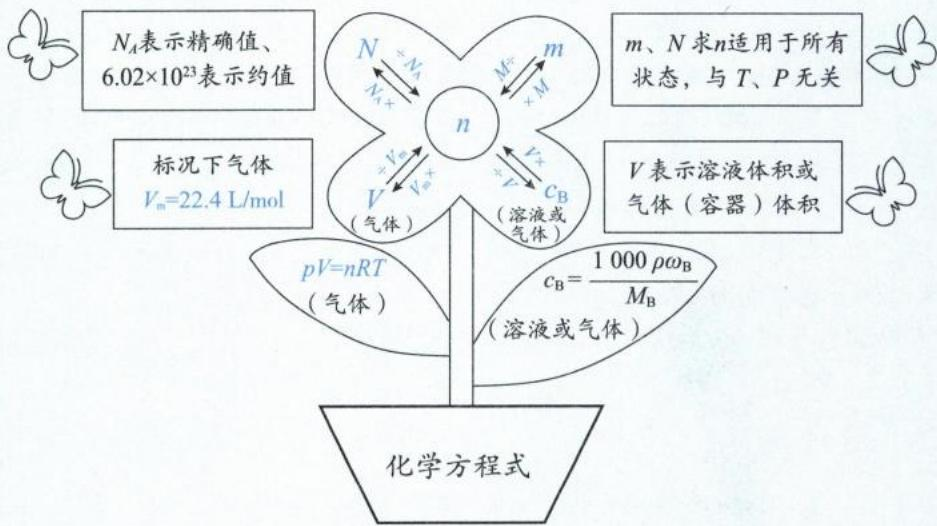

注:1. n 是高中化学计算的纽带,要善于将已知物理量和未知物理量与 n 建立联系。

2. 根据研究对象的状态,选择合适的公式进行计算。

## 八、其他常考的物理量及其计算公式

<table><tr><td>常考物理量</td><td>公式</td></tr><tr><td>转化率(α)</td><td> $\alpha = \frac{\Delta m}{m} \times 100\%$ (或 $\frac{\Delta n}{n} \times 100\%$ )</td></tr><tr><td>产率(φ)</td><td> $φ = \frac{\text{实际产品的质量}}{\text{理论产品的质量}} \times 100\%$ (或 $\frac{\text{实际产品的物质的量}}{\text{理论产品的物质的量}} \times 100\%$ )</td></tr><tr><td>纯度(ω)</td><td> $ω = \frac{\text{纯净产品的质量}}{\text{样品的总质量}} \times 100\%$ </td></tr></table>

注： $K, K_{a}, K_{b}, K_{w}, K_{h}, K_{sp}$ 也是常考物理量，其详细介绍请同学们参考第9、10章。

## 类型Ⅰ:基本物理量的正误判断

【例 1】判断正误, 正确的填“√”, 错误的填“×”

(1)物质的量就是物质的微粒个数()

(2)摩尔质量就是相对原子质量或相对分子质量()

(3)摩尔质量与质量成正比,与物质的量成反比()

(4)标准状况下，HF的摩尔体积为22.4 L/mol()

(5)某气体的摩尔体积为22.4 L/mol,则该气体一定处在0℃,101 kPa的环境中( )
(6)气体体积一定和分子个数成正比( )
(7)分子个数一定和分子的物质的量成正比( )
(8)将1 mol HCl溶于1 L水中,所得盐酸的浓度为1 mol/L( )
(9)1 L 1 mol/L 的 MgCl₂ 溶液中的 c(Cl⁻)比0.1 L 1 mol/L 的 MgCl₂ 溶液中的 c(Cl⁻)更大( )
(10)常温常压下,苯的相对分子质量大于乙醇,所以苯的密度大于乙醇( )
解析:(1)(×)物质的量不是物质的数量,物质的量用n表示,微粒个数用N表示。
(2)(×)摩尔质量若以g/mol为单位,则摩尔质量在数值上等于相对原子质量或相对分子质量。摩尔质量与相对原子质量或相对分子质量是不同的物理量,只是数值上可能有联系。
(3)(×)摩尔质量由物质种类决定,与该物质的质量、物质的量无关,只是可以用m、n来计算M。
(4)(×)HF的沸点约为22℃,标准状况的温度为0℃;在0℃时,HF为液体,HF的摩尔体积远小于22.4 L/mol。(液体分子的间隙远小于气体分子的间隙,所以相同的温度和压强下,液体摩尔体积远小于气体摩尔体积)。
(5)(×)Vₘ主要受T和p两个因素的影响,Vₘ为22.4 L/mol不一定是标准状况,如H₂在标准状况下(0℃,101 kPa)的Vₘ为22.4 L/mol;升高温度Vₘ会增大,而增大压强Vₘ会减小,所以温度大于0℃,压强大于101 kPa时,H₂的Vₘ也可能为22.4 L/mol。
(6)(×)根据理想气体状态方程:pV=nRT可知,气体体积(V)受到p、n、T的影响;当p、T恒定时,气体体积才会与气体的分子个数成正比。
(7)(√)根据公式:n=N/A可知,由于Nₐ为定值,微粒个数(N)和物质的量(n)必然成正比。
(8)(×)计算c时,分母的体积指的是溶液的体积,而非溶剂(H₂O)的体积。将1 mol HCl溶于水中配制成1 L的溶液,所得盐酸的浓度才是1 mol/L。
(9)(×)溶液一旦配制好,离子浓度就与所取溶液的体积无关。题干中MgCl₂的物质的量浓度均为1 mol/L,所以两溶液中c(Cl⁻)均相同,均为2 mol/L(但前者n(Cl⁻)=2 mol、后者n(Cl⁻)=0.2 mol)。
(10)(×)相同温度和压强下,气体的密度和相对分子质量成正比。常温常压下,苯和乙醇均为液态,不能通过比较相对分子质量来比较液体的密度。
答案:(1)× (2)× (3)× (4)× (5)× (6)× (7)√ (8)× (9)× (10)×

## 类型Ⅱ: 混合气体的平均摩尔质量的计算

【例 2】同温同压下，CO 和 $CO_{2}$ 的混合气体对 $H_{2}$ 的相对密度为 18，

(1) 混合气体的平均摩尔质量是 \_\_\_\_ g/mol;

(2)混合气体中 CO 的体积分数是 \_\_\_\_。

解析:(1)根据理想气体状态方程: $pV=nRT$ ,以及公式: $\rho=\frac{m}{V}$ 、 $M=\frac{m}{n}$ ,可知 $pM=\rho RT$ ,由此可得出结论:
同温同压下,气体的摩尔质量(M)和密度( $\rho$ )成正比。混合气体对 $H_{2}$ 的相对密度为18,则混合气体的平均摩尔质量是 $H_{2}$ 摩尔质量(2 g/mol)的18倍,因此混合气体的平均摩尔质量是36 g/mol。

(2) 方法一: 常规法

根据理想气体状态方程: pV=nRT, 同温同压下, 气体体积(V)和物质的量(n)成正比, 则体积分数即物质的量分数。设 CO 和 $CO_{2}$ 分别的物质的量分数为 x 和 $(1-x)$ , 根据“混合气体的平均摩尔质量=组成气体 1 的摩尔质量×其物质的量分数+组成气体 2 的摩尔质量×其物质的量分数”可列出方程: $36=\left[28x+44(1-x)\right]$ , 解得 $x=50\%$ .

方法二:十字交叉法

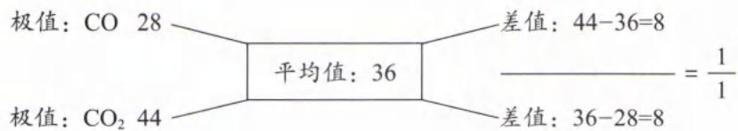

根据十字交叉法可知，CO与 $\mathrm{CO}_{2}$ 的物质的量之比为 $1:1$ ，则二者的体积分数均为 $50\%$ 。

答案:(1)36 (2)50%

【反思】“十字交叉法”是解决二元体系物质的量之比的一种写法，利用此法解决问题的关键点是寻找极值和平均值。

类型Ⅲ: 阿伏加德罗定律的运用

【例 3】一个密闭容器,中间有一可自由滑动的隔板(厚度不计),将容器分成两部分,当左侧充入1 mol N₂,右侧充入一定量的CO时,隔板处于如图位置(保持温度不变),下列说法正确的是( )

A. 右侧与左侧分子数之比为4:1

B. 右侧CO的质量为5.6 g

C. 右侧气体密度是相同条件下氢气密度的14倍

D. 若改变右侧CO的充入量而使隔板处于容器正中间,保持温度不变,则应再充入0.2 mol CO

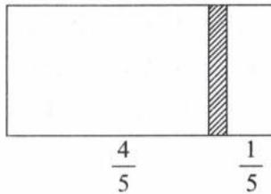

解析:阿伏加德罗定律的内容为:相同条件下(相同的温度和压强下),相同体积的任何气体含有相同的分子个数。两边气体的温度和压强相同(中间有一可自由滑动的隔板),且左右两边气体的体积比为4:1,则 $N_{2}$ 与CO的物质的量之比为4:1,由于 $n(N_{2})$ 为1 mol,则右侧CO的物质的量为0.25 mol。
A. 根据上述分析, 右侧与左侧的分子数之比为 1:4, A 选项错误。
B. 根据上述分析, 右侧 CO 的物质的量为 0.25 mol, 再根据: $m = n \times M = 0.25 \, mol \times 28 \, g/mol = 7 \, g$ , B 选项错误。
C. 阿伏加德罗定律推论的内容为: 同温同压下, 气体密度和气体摩尔质量成正比。右侧 CO 的 M 是 $H_{2}$ 的 14 倍, 则 CO 密度是相同条件下 $H_{2}$ 密度的 14 倍, C 选项正确。
D. 隔板处于正中间即左右两侧体积相同, 则左右两侧气体物质的量相等, 右侧还需要再通入 0.75 mol 的 CO, D 选项错误。

答案:C

类型Ⅳ: 溶液中离子浓度的计算

【例 4】在 $\mathrm{Al}_{2}(\mathrm{SO}_{4})_{3}$ 、 $K_{2}SO_{4}$ 和 $\mathrm{Fe}_{2}(\mathrm{SO}_{4})_{3}$ 的混合溶液中，测得 $c(\mathrm{SO}_{4}^{2-})=0.4\ \mathrm{mol}\cdot\mathrm{L}^{-1}$ ，当加入等体积 $0.6\ mol\cdot L^{-1}$ KOH 溶液时，生成沉淀的质量达到最大。则反应后溶液中 $K^{+}$ 的浓度约为（）
A. 0.4 mol/L B. 0.45 mol/L C. 0.5 mol/L D. 0.6 mol/L

解析: 往 $\mathrm{Al}_{2}\left(\mathrm{SO}_{4}\right)_{3}$ 、 $\mathrm{K}_{2}\mathrm{SO}_{4}$ 和 $\mathrm{Fe}_{2}\left(\mathrm{SO}_{4}\right)_{3}$ 混合体系中加入 KOH 溶液， $OH^{-}$ 会与 $Al^{3+}$ 、 $Fe^{3+}$ 生成沉淀 $\mathrm{Al(OH)}_{3}$ 、 $\mathrm{Fe(OH)}_{3}$ 。当沉淀质量最大时，即 $Al^{3+}$ 、 $Fe^{3+}$ 恰好完全沉淀，此时的溶质为 $K_{2}SO_{4}$ ，且溶液呈中性。等体积混合后 $c(\mathrm{SO}_{4}^{2-})=0.2\ \mathrm{mol/L}$ 。根据电荷守恒 $2c(\mathrm{SO}_{4}^{2-})+c(\mathrm{OH}^{-})=c(\mathrm{K}^{+})+c(\mathrm{H}^{+})$ ，溶液呈中性即 $c(\mathrm{H}^{+})=c(\mathrm{OH}^{-})$ ，所以 $c(\mathrm{K}^{+})=0.4\ \mathrm{mol/L}$ ，A 选项正确。

答案:A

【反思】当体系中存在多个化学反应式时，分析过程会极其烦琐，一般会用“整体思维”解决这类题型。“整体思维”一般指“电荷守恒”“元素守恒”“得失电子守恒”。

## 模块 2 化学计量中常用的计算方法(★★★★)

习题：P5

## 内容提要

## 一、守恒法

1. 原子守恒(物料守恒或质量守恒): 某原子在化学反应前后其个数(质量)不发生改变。

2. 电荷守恒: 溶液呈电中性, 阳离子所带正电荷总数等于阴离子所带负电荷总数。

3. 得失电子守恒(化合价升降守恒): 氧化还原反应中, 氧化剂得到的电子总数等于还原剂失去的电子总数, 或氧化剂化合价降低的总价数等于还原剂化合价升高的总价数。

4. 能量守恒: 反应物能量 + 断裂化学键吸收的能量 = 产物能量 + 形成化学键释放的能量。

5. 解题步骤：

(1) 认真审题, 寻找已知对象和需要求解的对象;

(2) 分析已知对象和需要求解的对象之间存在何种守恒关系；

(3)根据守恒关系列出计算式进行计算。

## 二、差量法

1. 意义: 当体系中找不到单一变量, 也不容易寻找守恒关系时, “差量” 是很好的解题突破口。常见的“差量”可以是质量、物质的量、压强等。

## 2. 解题步骤：

(1)根据化学方程式找出理论差量；

(2) 将理论差量和实际差量建立关系(比例式);

(3)根据比例式求解未知数即可。

## 三、关系式法

1. 意义: 根据化学方程式或四大守恒[原子守恒、电荷守恒、得失电子守恒(或化合价升降守恒)、能量守恒], 寻找已知物质与需要求解的物质之间的定量关系。

## 2. 解题步骤：

(1) 认真审题, 寻找已知对象和需要求解的对象;

(2)根据守恒或化学方程式分别寻找已知物质与“中介”的关系,以及“中介”与需要求解物质的关系;

(3)利用“中介”为纽带,建立已知物质和需要求解的物质的关系式;

(4)根据关系式并带入相关物理量列出比例式；

(5)根据比例式求出未知数即可。

注:若体系中有多个化学变化和多组已知数据,并且难以寻找守恒关系、差量关系时,勇敢地设未知数,解多元一次方程组即可。

类型 I: 电荷守恒

【例 1】将一定质量的 $MgO, Al_{2}O_{3}, Fe_{2}O_{3}$ 组成的混合物放入 200 mL 某浓度的硫酸溶液中恰好完全反应，当再加入 1 mol/L NaOH 溶液 200 mL 时，得到沉淀的质量达到最大值。则上述硫酸溶液的浓度为（）

A. 4 mol/L    B. 2 mol/L    C. 1 mol/L    D. 0.5 mol/L

解析:由于硫酸将 $MgO, Al_{2}O_{3}, Fe_{2}O_{3}$ 恰好完全反应,反应后的体系中主要离子有 $Mg^{2+}, Al^{3+}, Fe^{3+}, SO_{4}^{2-}$ 。加入 1 mol/L NaOH 溶液 200 mL 时,得到沉淀的质量达到最大值,即 $Mg^{2+}, Al^{3+}, Fe^{3+}$ 完全转化成 $\mathrm{Mg(OH)}_{2}, \mathrm{Al(OH)}_{3}, \mathrm{Fe(OH)}_{3}$ 沉淀,此时溶液中的溶质为 $\mathrm{Na}_{2}\mathrm{SO}_{4}$ (由于 $\mathrm{Mg(OH)}_{2}, \mathrm{Al(OH)}_{3}, \mathrm{Fe(OH)}_{3}$ 的溶解度很小,不考虑它们的溶解)。根据电荷守恒: $2n(\mathrm{SO}_{4}^{2-}) = n(\mathrm{Na}^{+})$ ,以及 $n(\mathrm{Na}^{+}) = c(\mathrm{Na}^{+}) \times V = 1 \, \mathrm{mol/L} \times 0.2 \, \mathrm{L} = 0.2 \, \mathrm{mol}$ ,解得 $n(\mathrm{SO}_{4}^{2-}) = 0.1 \, \mathrm{mol}$ 。则原硫酸的浓度 $c(\mathrm{H}_{2}\mathrm{SO}_{4}) = \frac{n(\mathrm{SO}_{4}^{2-})}{V} = \frac{0.1 \, \mathrm{mol}}{0.2 \, L} = 0.5 \, mol/L$ ,D选项正确。

答案:D

【反思】 $Na_{2}SO_{4}$ 溶液中电荷守恒应为： $2n(SO_{4}^{2-})+n(OH^{-})=n(Na^{+})+n(H^{+})$ ，由于正盐溶液中的 $n(H^{+})$ 、 $n(OH^{-})$ 极小，因此在列电荷守恒表达式时可以忽略不计。

【例 2】把 V L 含有 $MgSO_{4}$ 和 $K_{2}SO_{4}$ 的混合溶液分成两等份，一份加入含 a mol NaOH 的溶液，恰好使镁离子完全沉淀为氢氧化镁；另一份加入含 b mol $BaCl_{2}$ 的溶液，恰好使硫酸根离子完全沉淀为硫酸钡。则原混合溶液中钾离子的浓度为（）

A. $\frac{b-a}{V}$ mol/L    B. $\frac{2b-a}{V}$ mol/L    C. $\frac{4b-2a}{V}$ mol/L    D. $\frac{2b-2a}{V}$ mol/L

解析:根据电荷守恒分别可得: $2n(\mathrm{Mg}^{2+})=n(\mathrm{OH}^{-})=a\ \mathrm{mol},n(\mathrm{SO}_{4}^{2-})=n(\mathrm{Ba}^{2+})=b\ \mathrm{mol}$ ，由于将原溶液等分成两份，则原体系中 $n(\mathrm{Mg}^{2+})=\frac{a}{2}\times2=a\ \mathrm{mol},n(\mathrm{SO}_{4}^{2-})=2b\ \mathrm{mol}$ 。 $MgSO_{4}$ 和 $K_{2}SO_{4}$ 的混合溶液中存在电荷守恒: $2n(\mathrm{Mg}^{2+})+n(\mathrm{K}^{+})=2n(\mathrm{SO}_{4}^{2-})$ ，即 $2a\ \mathrm{mol}+n(\mathrm{K}^{+})=4b\ \mathrm{mol}$ 则 $n(\mathrm{K}^{+})=4b-2a$ ，原混合体系中 $c(\mathrm{K}^{+})=\frac{4b-2a}{V}\ \mathrm{mol/L}$ 。

答案:C

【反思】 $Mg^{2+}$ 的水解非常微弱，以上计算过程均不考虑其水解。

类型Ⅱ:电子得失守恒(化合价升降守恒)

【例 3】某强氧化剂 $\mathrm{XO(OH)_2^+}$ 可被 $Na_2SO_3$ 还原。如果还原 $1.2 \times 10^{-3} \, mol \, \mathrm{XO(OH)_2^+}$ 需用 30 mL 0.1 mol/L 的 $Na_2SO_3$ 溶液，那么 X 元素被还原后的物质可能是（）
A. XO    B. $X_{2}O_{3}$ C. $X_{2}O$ D. X

解析: 分析得失电子守恒的关键点是正确标注化合价。强氧化剂 $\mathrm{XO(OH)_2^+}$ 中 X 的化合价为 +5 价, $Na_2SO_3$ 中 S 的化合价为 +4 价, 且 $Na_2SO_3$ 的氧化产物 $Na_2SO_4$ 中 S 的化合价为 +6 价。根据得失电子守恒或化合价的升降守恒可知: X 元素化合价降低的总量 (或 X 元素得到的电子总数) = S 元素化合价升高的总量 (或 S 元素失去的电子总数)。每个 X 原子降低的化合价 $\times 1.2 \times 10^{-3} \, mol = 2 \times 0.1 \, mol/L \times (30 \times 10^{-3}) \, L$ , 解得每个 X 原子降 5 价, 因此 $\mathrm{XO(OH)_2^+}$ 在氧化还原反应中由 +5 价降到 0 价, D 选项正确。

答案: D

【例 4】在一定条件下， $RO_{3}^{n-}$ 和 $F_{2}$ 可发生如下反应： $RO_{3}^{n-} + F_{2} + 2OH^{-} = RO_{4}^{-} + 2F^{-} + H_{2}O$ ，从而可知在 $RO_{3}^{n-}$ 中，元素 R 的化合价是（）
A. +4    B. +5    C. +6    D. +7

解析:该反应是离子反应,也是氧化还原反应。离子反应遵循电荷守恒,氧化还原反应遵循化合价的升降守恒

(或得失电子守恒)。

方法一:电荷守恒

离子方程式等号左边的电荷总数=右边的电荷总数，则 $-n+(-2)=(-1)+(-2)$ ，解得n=1，则 $RO_{3}^{n-}$ 中R的化合价为+5价，B选项正确。

方法二:化合价升降守恒(或得失电子守恒)

$F_{2}$ 化合价由 0 价，降低到产物中 $F^{-}$ 的 -1 价， $F_{2}$ 总共降低了 2 价。氧化还原反应中，有化合价的降低，就必有化合价的升高，且升降是守恒的； $RO_{3}^{n-}$ 中 R 的化合价共升高 2 价，产物 $RO_{4}^{-}$ 中 R 的化合价为 +7 价，则 $RO_{3}^{n-}$ 中 R 的化合价为 +5 价，B 选项正确。

答案:B

## 类型Ⅲ:原子守恒(质量守恒)

【例 5】(2024·浙江 1 月选考) 取 0.680 g H₂S 产品, 与足量 CuSO₄ 溶液充分反应后, 将生成的 CuS 置于已恒重、质量为 31.230 g 的坩埚中, 煅烧生成 CuO, 恒重后总质量为 32.814 g, 则 H₂S 产品的纯度为 \_\_\_\_。

解析:根据 S、Cu 原子守恒, 可知 $n(\mathrm{H}_{2}\mathrm{S}):n(\mathrm{CuS}):n(\mathrm{CuO})=1:1:1$ 。 $n(\mathrm{CuO})=(32.814-31.230)\mathrm{g}\div80\mathrm{~g/mol}=0.0198\mathrm{~mol}$ ，则 $n(\mathrm{H}_{2}\mathrm{S})=0.0198\mathrm{~mol}$ 。 $\omega(\mathrm{H}_{2}\mathrm{S})=\frac{\text{纯净产品的质量}}{\text{样品的总质量}}\times100\%=\frac{0.0198\mathrm{~mol}\times34\mathrm{~g/mol}}{0.680\mathrm{~g}}\times100\%=99.0\%$ .

答案:99.0%

【例 6】某无土栽培用的营养液中， $c(\mathrm{NH}_{4}^{+}):c(\mathrm{SO}_{4}^{2-}):c(\mathrm{K}^{+}):c(\mathrm{Cl}^{-})=8:4:9:9$ 。若用 $NH_{4}Cl$ 、KCl、 $K_{2}SO_{4}$ 来配制该营养液，则这三种盐的物质的量之比为 \_\_\_\_。

解析: 解决混合体系的计算问题, 突破口往往是单一变量, 该题目中 $NH_{4}^{+}$ 、 $SO_{4}^{2-}$ 均为单一变量。根据单一变量 $NH_{4}^{+}$ 有 8 份, 则 $NH_{4}Cl$ 中的 $Cl^{-}$ 也有 8 份; 由于 $Cl^{-}$ 共 9 份, 根据 Cl 原子守恒可知, KCl 有 1 份; 再根据单一变量 $SO_{4}^{2-}$ 有 4 份, 则 $K_{2}SO_{4}$ 也为 4 份。综上所述 $NH_{4}Cl$ 、KCl、 $K_{2}SO_{4}$ 的物质的量之比为 8:1:4。

$$
8: 1: 4
$$

类型Ⅳ:差量法

【例 7】反应 i. $\mathrm{CO}_{2}(\mathrm{~g}) + 3\mathrm{H}_{2}(\mathrm{~g}) \rightleftharpoons \mathrm{CH}_{3}\mathrm{OH}(\mathrm{g}) + \mathrm{H}_{2}\mathrm{O}(\mathrm{g})$

反应 ii. $\mathrm{CO}_{2}(\mathrm{~g})+\mathrm{H}_{2}(\mathrm{~g})\rightleftharpoons\mathrm{CO}(\mathrm{~g})+\mathrm{H}_{2}\mathrm{O}(\mathrm{~g})$

若在一定温度下，向 2 L 恒容密闭容器中充入 3 mol CO₂ 和 5 mol H₂ 同时发生反应 i 和 ii，达到平衡时 H₂ 的总转化率为 80%，体系压强减小了 25%。该温度下，反应 i 的化学平衡常数 K= \_\_\_\_。

解析:该体系存在多个反应,解决多反应体系的关键点是“寻找单一变量为突破口”;该题没有单一变量,所以应该选择“差量”作为突破口。根据理想气体状态方程:pV=nRT可知,恒温恒容条件下,p与n成正比。反应ii前后气体计量数相同,恒容体系中反应ii不会导致体系压强的变化。因此,压强的改变只能由反应i引起。

根据题干信息可知,反应后体系压强减小了25%,即反应i导致体系中气体物质的量减小了25%,可计算 $\triangle n=(3\ mol+5\ mol)\times25\%=2\ mol$ 。

反应i: $\mathrm{CO}_{2}(\mathrm{g}) + 3\mathrm{H}_{2}(\mathrm{g}) \rightleftharpoons \mathrm{CH}_{3}\mathrm{OH}(\mathrm{g}) + \mathrm{H}_{2}\mathrm{O}(\mathrm{g})$ $\triangle n=2$ 计算切入点：根据方程式气体系数之和前4后2，得 $\triangle n=2$ 。真实的 $\triangle n=2\ mol$ ，则可根据比例求出各物质的 $\triangle n$ 。

平衡时 $\mathrm{H}_{2}(\mathrm{~g})$ 转化率为 80%，即可知 $\triangle n(\mathrm{H}_{2})=5\ \mathrm{mol}\times80\%=4\ \mathrm{mol}$ ，则反应 ii 的 $\triangle n(\mathrm{H}_{2})=4\ \mathrm{mol}-3\ \mathrm{mol}=1\ \mathrm{mol}$ 。
反应ii: $\mathrm{CO}_{2}(\mathrm{~g}) + \mathrm{H}_{2}(\mathrm{~g}) \rightleftharpoons \mathrm{CO}(\mathrm{g}) + \mathrm{H}_{2}\mathrm{O}(\mathrm{g})$

$\triangle n/(mol)$ 1 1 1 1

该体系中最终剩余： $n(\mathrm{CO}_2) = 3\mathrm{mol} - 1\mathrm{mol} - 1\mathrm{mol} = 1\mathrm{mol}, n(\mathrm{H}_2) = 5\mathrm{mol} - 3\mathrm{mol} - 1\mathrm{mol} = 1\mathrm{mol}$

$n(\mathrm{CH}_3\mathrm{OH}) = 1\mathrm{mol}, n(\mathrm{H}_2\mathrm{O}) = 1\mathrm{mol} + 1\mathrm{mol} = 2\mathrm{mol}$ 。则 $K_{\mathrm{i}} = \frac{c(\mathrm{CH}_{3}\mathrm{OH}) \times c(\mathrm{H}_{2}\mathrm{O})}{c(\mathrm{CO}_{2}) \times c^{3}(\mathrm{H}_{2})} = \frac{\frac{1}{2} \times \frac{2}{2}}{\frac{1}{2} \times (\frac{1}{2})^{3}} = 8$ 。

答案:8

【例8】为了检验某含有 $\mathrm{NaHCO_3}$ 杂质的 $\mathrm{Na_2CO_3}$ 样品的纯度，现将 $m_{1}\mathrm{g}$ 样品加热，直至质量不再发生改变时，称得剩余固体的质量为 $m_{2}\mathrm{g}$ ，则该样品的纯度（质量分数）是（ ）A. $\frac{84m_2 - 53m_1}{31m_1} \times 100\%$ B. $\frac{84(m_1 - m_2)}{31m_1} \times 100\%$ C. $\frac{73m_2 - 42m_1}{31m_1} \times 100\%$ D. $\frac{115m_2 - 84m_1}{31m_1} \times 100\%$

解析: $m_{1}$ 的组成不单一, $m_{2}$ 的来源不单一, 只有 $\mathrm{NaHCO}_{3}$ 在加热时会分解, 所以质量的减少量 (即差量) 只与 $\mathrm{NaHCO}_{3}$ 的分解反应有关。根据方程式可计算反应前后的质量差量:

$2NaHCO_{3}\xlongequal{\triangle}Na_{2}CO_{3}+CO_{2}\uparrow+H_{2}O$ $\triangle m_{固}=62$ $\triangle m/(g)\quad\frac{168(m_{1}-m_{2})}{62}\quad\frac{106(m_{1}-m_{2})}{62}$ $(m_{1}-m_{2})$ 计算切入点：根据方程式前后的固体质量，得 $\triangle m_{固}=(2\times84)-106=62$ 。真实的 $\triangle m=(m_{1}-m_{2})g$ ，则可根据比例求出各物质的 $\triangle m$ 。

根据上述计算可得: $m(\mathrm{NaHCO}_{3})=\frac{168(m_{1}-m_{2})}{62}=\frac{84(m_{1}-m_{2})}{31}$ ，则 $\omega(\mathrm{NaHCO}_{3})=\frac{84(m_{1}-m_{2})}{31m_{1}}\times100\%$ $\omega(\mathrm{Na}_{2}\mathrm{CO}_{3})=1-\omega(\mathrm{NaHCO}_{3})=1-\frac{84(m_{1}-m_{2})}{31m_{1}}\times100\%= \frac{31m_{1}-84(m_{1}-m_{2})}{31m_{1}}\times100\%= \frac{84m_{2}-53m_{1}}{31m_{1}}\times100\%$ , A 选项正确。

答案:A

【例 9】研究表明, $HAuCl_{4} \cdot 4H_{2}O$ 受热分解得到 Au 的过程可分为四步,某实验小组称取一定质量的 $HAuCl_{4} \cdot 4H_{2}O$ 样品进行热重分析,固体质量保留百分数随温度变化的曲线如图所示,写出 130.7\~142.6 ℃时,发生反应的化学方程式\_\_\_\_。(相对原子质量:Au=197)

解析:含结晶水的物质在受热分解时,一般先脱结晶水,再发生其他分解过程。

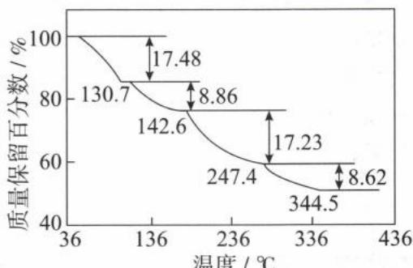

假设 $\mathrm{HAuCl_4\cdot 4H_2O}$ 的物质的量为 $1\mathrm{mol}$ ，即 $412\mathrm{g}$ 。 $130.7^{\circ}\mathrm{C}$ 时，固体的失重率为 $17.48\%$ ，则失去的质量为 $412\mathrm{g} \times 17.48\% \approx 72\mathrm{g}$ ，而 $1\mathrm{mol}\mathrm{HAuCl}_4 \cdot 4\mathrm{H}_2\mathrm{O}$ 中结晶水的质量刚好是 $72\mathrm{g}$ ，因此 $36^{\circ}\mathrm{C} \sim 130.7^{\circ}\mathrm{C}$ 时，固体失去所有结晶水。 $130.7 \sim 142.6^{\circ}\mathrm{C}$ 时，固体继续失重 $8.86\%$ ，则失去的质量为 $412\mathrm{g} \times 8.86\% \approx 36.5\mathrm{g}$ 。而 $1\mathrm{mol}\mathrm{HCl}$ 的质量刚好是 $36.5\mathrm{g}$ 。因此 $130.7 \sim 142.6^{\circ}\mathrm{C}$ 时， $1\mathrm{mol}\mathrm{HAuCl}_4$ 分解出 $1\mathrm{mol}\mathrm{HCl}$ 。综上所述， $130.7 \sim 142.6^{\circ}\mathrm{C}$ 时，发生反应的化学方程式为： $\mathrm{HAuCl_4\xrightarrow{130.7 \sim 142.6^{\circ}C}AuCl_3 + HCl\uparrow}$ 。

答案: $HAuCl_{4} \xlongequal{130.7\sim142.6^{\circ}C} AuCl_{3} + HCl \uparrow$

类型 V: 能量守恒

【例 10】(2022·重庆卷)“千畦细浪舞晴空”,氮肥保障了现代农业的丰收。为探究 $\left(\mathrm{NH}_{4}\right)_{2}\mathrm{SO}_{4}$ 的离子键强弱,设计如图所示的循环过程,可得 $\Delta H_{4}/(\mathrm{kJ}\cdot\mathrm{mol}^{-1})$ 为( )

A. +533    B. +686

C. +838    D. +1143

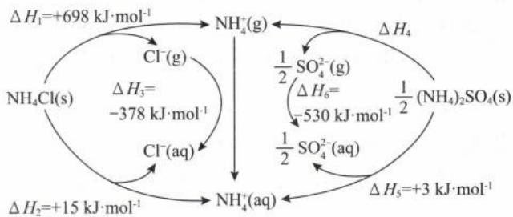

解析: 假设 $\mathrm{NH}_{4}^{+}(\mathrm{~g})$ 转化成 $\mathrm{NH}_{4}^{+}(\mathrm{aq})$ 的 $\Delta H = x \, kJ \cdot mol^{-1}$ 。

<table><tr><td>示意图左侧第一部分:NH4Cl(s)先转化成“NH4+(g)+Cl-(g)”对应能量为“ΔH1=+698kJ·mol”,再经由Cl-(g)、NH4+(g)分别转化为Cl-(aq)、NH4+(aq),对应的能量变化分别为:ΔH3=-378kJ·mol-1、ΔH=xkJ·mol-1。</td></tr><tr><td>示意图左侧第二部分:NH4Cl(s)直接转化成“NH4+(aq)+Cl-(aq)”的能量为“ΔH2=+15kJ·mol”</td></tr></table>

$\Delta H_{2}=\Delta H_{1}+\Delta H_{3}+\Delta H$ ，即可获得：+15kJ·mol=+698kJ·mol+ $(-378\mathrm{kJ}\cdot\mathrm{mol}^{-1})$ $+x\ kJ\cdot mol^{-1}$ ，解得： $x=+15\ kJ\cdot mol-698\ kJ\cdot mol+378\ kJ\cdot mol^{-1}=-305\ kJ\cdot mol^{-1}$

答案:C

<table><tr><td>示意图右侧第一部分: $\frac{1}{2}(\text{NH}_4)_2\text{SO}_4(s)$ 先转化成“ $\text{NH}_4^+(g)+\frac{1}{2}\text{SO}_4^{2-}(g)$ ”对应能量为“ $\Delta H_4$ ”,再经由 $\text{NH}_4^+(g)、\frac{1}{2}\text{SO}_4^{2-}(g)$ 分别转化为 $\text{NH}_4^+(\text{aq})、\frac{1}{2}\text{SO}_4^{2-}(\text{aq})$ ,对应的能量变化分别为: $\Delta H = x\text{kJ} \cdot \text{mol}^{-1}$ 、 $\Delta H_6 = -530\text{kJ} \cdot \text{mol}^{-1}$ </td></tr><tr><td>示意图右侧第一部分: $\frac{1}{2}(\text{NH}_4)_2\text{SO}_4(s)$ 直接转化成“ $\text{NH}_4^+(\text{aq}) + \frac{1}{2}\text{SO}_4^{2-}(\text{aq})$ ”的能量为“ $\Delta H_5 = +3\text{kJ} \cdot \text{mol}$ ”</td></tr></table>

$\Delta H_{5}=\Delta H_{4}+\Delta H_{6}+\Delta H$ ，即可获得： $+3\ kJ\cdot mol=\Delta H_{4}+(-530\ kJ\cdot mol^{-1})+x\ kJ\cdot mol^{-1},x=-305\ kJ\cdot mol^{-1}$ 代入计算解得 $\Delta H_{4}=+838\ kJ\cdot mol$ 。

类型Ⅵ:关系式法

【例 11】(2023·重庆卷)称取 $CaCl_{2}$ 水合物 1.000 g, 加水溶解, 加入过量 $Na_{2}C_{2}O_{4}$ , 将所得沉淀过滤洗涤后, 溶于热的稀硫酸中, 用 0.1000 mol/L $KMnO_{4}$ 标准溶液滴定, 消耗 24.00 mL。该副产物中 $CaCl_{2}$ 的质量分数为 \_\_\_\_。

解析:根据方程式:① $CaCl_{2} + Na_{2}C_{2}O_{4} = CaC_{2}O_{4} \downarrow + 2NaCl$ ;② $CaC_{2}O_{4} + H_{2}SO_{4} = H_{2}C_{2}O_{4} + CaSO_{4}$ ;

③ $5H_{2}C_{2}O_{4} + 2KMnO_{4} + 3H_{2}SO_{4} = 10CO_{2}\uparrow + K_{2}SO_{4} + 2MnSO_{4} + 8H_{2}O$ ，提取出关系式：

$$
\begin{array}{r l r} & 1 \mathrm{CaCl} _ {2} \sim 1 \mathrm{CaC} _ {2} \mathrm{O} _ {4} \sim 1 \mathrm{H} _ {2} \mathrm{C} _ {2} \mathrm{O} _ {4} \sim \frac {2}{5} \mathrm{KMnO} _ {4} \\ n / (\mathrm{mol}) & n (\mathrm{CaCl} _ {2}) & 0. 1 0 0 0 \mathrm{mol/L} \times 2 4. 0 0 \times 1 0 ^ {- 3} \mathrm{L} \end{array}
$$

解得: $n(\mathrm{CaCl}_2) = \frac{5}{2} \times 0.1000 \times 24.00 \times 10^{-3} \mathrm{~mol} = 6 \times 10^{-3} \mathrm{~mol}, \omega(\mathrm{CaCl}_2) = \frac{6 \times 10^{-3} \mathrm{~mol} \times 111 \mathrm{~g/mol}}{1.000 \mathrm{~g}} \times 100\% = 66.6\%$ 。

答案:66.6%

【例 12】(2024·上海卷节选) 方案 3: 向粗盐水中加入石灰乳除去 $Mg^{2+}$ ，再加入碳酸钠溶液除去 $Ca^{2+}$ 。已知粗盐水中 $MgCl_{2}$ 含量为 0.38 g/L， $CaCl_{2}$ 含量为 1.11 g/L，现用方案 3 提纯 10 L 该粗盐水，求需要加入石灰乳（视为 CaO）和碳酸钠的物质的量分别为 \_\_\_\_、\_\_\_\_。

解析:根据信息可知10 L该粗盐水含 $m(\mathrm{MgCl}_{2})=0.38\ \mathrm{g/L}\times10\ \mathrm{L}=3.8\ \mathrm{g};m(\mathrm{CaCl}_{2})=1.11\ \mathrm{g/L}\times10\ \mathrm{L}=11.1\ \mathrm{g}$ ;再根据 $n=\frac{m}{M}$ 可知, $n(\mathrm{MgCl}_{2})=\frac{3.8\ \mathrm{g}}{95\ \mathrm{g/mol}}=0.04\ \mathrm{mol},n(\mathrm{CaCl}_{2})=\frac{11.1\ \mathrm{g}}{111\ \mathrm{g/mol}}=0.1\ \mathrm{mol}$ 。

该过程涉及的化学方程式有： $\mathrm{MgCl_{2}+Ca(OH)_{2}=Mg(OH)_{2}+CaCl_{2},CaCl_{2}+Na_{2}CO_{3}=CaCO_{3}+2NaCl}$ ，根据方程式提取的关系式为：

$$
\begin{array}{l l l l l} & 1 \mathrm{MgCl} _ {2} \sim 1 \mathrm{Ca(OH)} _ {2} \sim 1 \mathrm{CaO} \sim 1 \mathrm{CaCl} _ {2} & 1 \mathrm{CaCl} _ {2} & \sim & 1 \mathrm{Na} _ {2} \mathrm{CO} _ {3} \\ n / \mathrm{mol} & 0. 0 4 & 0. 0 4 & 0. 0 4 + 0. 1 & 0. 1 4 \end{array}
$$

$$
n (\mathrm{CaO}) = 0. 0 4 \mathrm{mol}; n \left(\mathrm{Na} _ {2} \mathrm{CO} _ {3}\right) = (0. 0 4 \mathrm{mol} + 0. 1 \mathrm{mol}) = 0. 1 4 \mathrm{mol} 。
$$

答案:0.04 mol 0.14 mol

【例 13】化学小组用如下方法测定经处理后的废水中苯酚( $\ce{C6H5OH}$ )的含量(废水中不含干扰测定的物质)。

I. 用已准确称量的 $\mathrm{KBrO}_3$ 固体配制一定体积的 $a \mathrm{~mol} / \mathrm{L} \mathrm{KBrO}_3$ 标准溶液。

II. 取 $V_{1}$ mL 上述溶液, 加入过量 KBr, 加 $H_{2}SO_{4}$ 酸化, 溶液颜色呈棕黄色。

Ⅲ. 向Ⅱ所得溶液中加入 $V_{2}$ mL 废水。

IV. 向Ⅲ中加入过量 KI。

V. 用 $b \mathrm{~mol} / \mathrm{L} \mathrm{Na}_{2} \mathrm{~S}_{2} \mathrm{O}_{3}$ 标准溶液滴定Ⅳ中溶液至浅黄色时，滴加2滴淀粉溶液，继续滴定至终点，共消耗 $\mathrm{Na}_{2} \mathrm{~S}_{2} \mathrm{O}_{3}$ 溶液 $V_{3} \mathrm{~mL}$ 。

已知：① $I_{2}+2Na_{2}S_{2}O_{3}=2NaI+Na_{2}S_{4}O_{6}$ ② $Na_{2}S_{2}O_{3}$ 和 $Na_{2}S_{4}O_{6}$ 溶液颜色均为无色

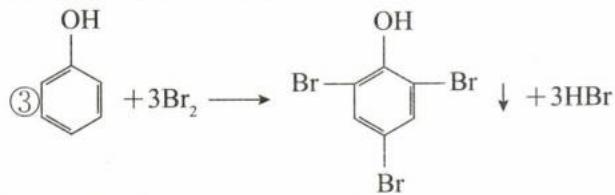

计算废水中苯酚的含量为 $g \cdot L^{-1}$ (苯酚摩尔质量: $94 \, g \cdot mol^{-1}$ )。

解析: 测定过程发生的化学反应依次为: (1) $BrO_{3}^{-} + 5Br^{-} + 6H^{+} = 3Br_{2} + 3H_{2}O$ ;

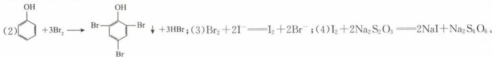

$n(\mathrm{BrO}_{3}^{-})$ 定量且过量，可知该滴定实验为“反滴法”测定苯酚含量。利用 $Na_{2}S_{2}O_{3}$ 滴定 $I_{2}$ 可求出 $n(I_{2})$ ，根据反应(3)可求出 $n(\mathrm{Br}_{2})_{\text{余}}$ ，且 $n(\mathrm{Br}_{2})_{\text{余}} = n(\mathrm{Br}_{2})_{\text{总}} - n(\mathrm{Br}_{2})_{\text{苯酚消耗}}$ 。根据上述方程式可以提取出各物质之间的关系式为：

<table><tr><td>物质</td><td rowspan="2"> $1BrO_{3}^{-} \sim 3Br_{2}$  $aV_{1} \times 10^{-3} \quad n(Br_{2})_{总}$ </td><td rowspan="2"> $1Br_{2} \sim 1I_{2} \sim 2Na_{2}S_{2}O_{3}$  $n(Br_{2})_{余} \quad bV_{3} \times 10^{-3}$ </td><td rowspan="2"> $1\bigtriangleup-OH \sim 3Br_{2}$  $n(\bigtriangleup-OH) \quad [n(Br_{2})_{总}-n(Br_{2})_{余}]$ </td></tr><tr><td> $n/(mol)$ </td></tr><tr><td>计算结果</td><td> $n(Br_{2})_{总}=3aV_{1} \times 10^{-3}mol$ </td><td> $n(Br_{2})_{余}=\frac{1}{2}bV_{3} \times 10^{-3}$ </td><td> $n(\bigtriangleup-OH)=\frac{1}{3}[n(Br_{2})_{总}-n(Br_{2})_{余}]=\frac{1}{3}(3aV_{1} \times 10^{-3}-\frac{1}{2}bV_{3} \times 10^{-3})$ </td></tr></table>

$\mathrm{OH}$ 的浓度 $= \frac{n(\text{苯酚})\times M(\text{苯酚})}{V(\text{废水})} = \frac{\frac{1}{3}(3aV_1\times 10^{-3} - \frac{1}{2}bV_3\times 10^{-3})\times 94}{V_2\times 10^{-3}}\mathrm{g / L} = \frac{(6aV_1 - bV_3)\times 94}{6V_2}\mathrm{g / L}$

$$
= \frac {4 7 \times (6 a V _ {1} - b V _ {3})}{3 V _ {2}} \mathrm{g} \cdot \mathrm{L} ^ {- 1} 。
$$

答案: $\frac{47\times(6aV_{1}-bV_{3})}{3V_{2}}$

# 模块 1 电解质与电离(★★)

习题：P6

## 内容提要

## 一、电解质及其分类

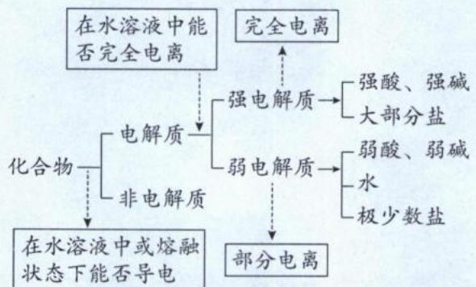

## 二、电解质、非电解质、强电解质、弱电解质之间的关系

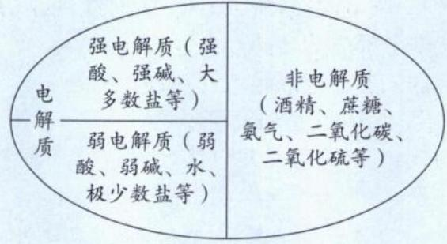

化合物

## 三、电解质的电离

1. 概念: 电解质在水溶液中或熔融状态下, 离解成自由移动离子的过程。

2. 电离条件: 共价化合物(如酸、弱碱、少数盐等)的电离条件是溶于水; 离子化合物(如强碱、活泼金属氧化物、绝大多数盐等)的电离条件是溶于水或熔融。

## 四、常见物质导电本质及其导电性强弱比较

1. 常见物质导电本质：

(1)金属单质或合金能导电是因为在外加电场作用下,自由电子可以定向移动。

(2)电解质溶液或熔融电解质能导电是因为在外加电场作用下,离子可以定向移动。

2. 决定溶液导电性强弱的主要因素是“电荷浓度”，电荷浓度与溶液导电能力正相关。“电荷浓度”与“离子浓度”不是同一概念，“电荷浓度=离子浓度×离子所带的单位电荷”。如$c(\mathrm{Mg}^{2+})=0.1\ \mathrm{mol/L}$ ，则其对应的电荷浓度为0.2 mol/L。由此可知，溶液的导电性与电解质强弱、溶解度、离子所带单位电荷均有关。

注:(1)电解质和非电解质都属于化合物,故单质、混合物既不是电解质,也不是非电解质。

(2)电解质不一定导电,如固态 NaCl、液态 HCl 均不导电。导电的物质不一定是电解质,如金属单质、石墨、盐酸、稀硫酸均可导电,但都不是电解质。

(3)有些化合物的水溶液虽然能导电,但溶液中导电的离子不是其自身电离产生,故这些化合物不属于电解质,而属于非电解质,如 $SO_{2}$ 、 $SO_{3}$ 、 $CO_{2}$ 、 $NH_{3}$ 等。

(4)电解质的强弱与电解质溶液导电能力的强弱、溶解性大小没有必然联系：

①强电解质的水溶液导电性不一定强于弱电解质的水溶液,还必须考虑浓度。如饱和 $BaSO_{4}$ 溶液的导电性弱于1 mol/L $H_{2}C_{2}O_{4}$ 溶液的导电性。

②AgCl、 $BaSO_{4}$ 的溶解度很小, 其溶液导电能力很弱, 但仍属于强电解质, 因为溶解的 AgCl 和 $BaSO_{4}$ 在水中完全电离。

## 类型 I: 电解质、非电解质、强电解质、弱电解质的辨析

【例 1】正误判断,正确的填“√”,错误的填“×”

(1)Cu 和 NaCl 溶液均能导电,二者均为电解质( )
(2) $NH_{3}$ 、 $CO_{2}$ 、 $SO_{2}$ 的水溶液都能导电,故它们属于电解质( )
(3)氯化钠晶体、纯净的硫酸均为强电解质,所以氯化钠晶体、纯净的硫酸均能导电( )
(4)强电解质溶液的导电性比弱电解质溶液的导电性强( )
(5)乙酸、乙醇极易溶于水,所以二者水溶液导电性很强( )
(6)AgCl 水溶液导电性很弱,因此 AgCl 是弱电解质( )
(7)强电解质都是离子化合物,弱电解质都是共价化合物( )
(8)盐均为强电解质( )

解析:(1)(×)铜是单质、NaCl溶液是混合物,二者既不是电解质也不是非电解质。

(2)(×) $NH_{3}$ 、 $CO_{2}$ 、 $SO_{2}$ 的水溶液能导电,是因为它们与水反应后的生成物(分别是 $NH_{3}\cdot H_{2}O$ 、 $H_{2}CO_{3}$ 、 $H_{2}SO_{3}$ )可电离出自由移动的离子,并不是 $NH_{3}$ 、 $CO_{2}$ 、 $SO_{2}$ 自身电离,因此它们都是非电解质。

(3)(×)氯化钠晶体虽为强电解质,但晶体中离子不能自由移动,所以晶体不导电,其水溶液或熔融态才导电。纯净的硫酸也是强电解质,但由于硫酸是共价化合物,其电离要依赖水,纯净的硫酸只有硫酸分子,因此不导电,其水溶液才导电。

(4)(×)强电解质溶液的导电性不一定比弱电解质溶液的导电性强,如醋酸浓溶液和氯化钠的极稀溶液相比,醋酸浓溶液导电能力可以大于极稀的氯化钠溶液。

(5)(×)若乙酸水溶液浓度很小,且乙酸是弱电解质,则溶液的电荷浓度很小,因此导电能力很弱。乙醇是非电解质,在水中根本不电离,所以其水溶液导电能力也几乎为0。(电解质的溶解度虽然会影响溶液的导电性,但最终决定溶液导电性的因素是“电荷浓度”。)

(6)(×)AgCl溶解度很小,但溶解在水中的那一部分可以完全电离,所以虽然AgCl的水溶液导电性很弱,但AgCl依然属于强电解质。

(7)(×)HCl、 $H_{2}SO_{4}$ 等常见强酸都是共价化合物,也是强电解质。

(8)(×)有些盐在水中部分电离是弱电解质,如醋酸铅、硫氰化铁等。
答案:(1)× (2)× (3)× (4)× (5)× (6)× (7)× (8)×

## 总结

## 关于电解质的几个“不一定”

①强电解质溶液的导电性不一定比弱电解质强；②浓溶液的导电性不一定比稀溶液强；③易溶物形成的溶液导电性不一定很强；④共价化合物不一定是强电解质，强电解质也不一定是共价化合物；⑤盐不一定是强电解质。

【例 2】现有 12 种物质: ①石墨烯 ②浓硫酸 ③HCl ④ $NH_{3} \cdot H_{2}O$ ⑤ $SO_{2}$ ⑥碱石灰 ⑦硝酸钾 ⑧ $Fe(SCN)_{3}$ ⑨ $Na_{2}CO_{3}$ ⑩乙醛 ⑪MgO ⑫ $AlCl_{3}$ ，按照表中提示的信息，把符合左栏条件的物质序号填入右栏相应位置。

<table><tr><td>序号</td><td>符合的条件</td><td>物质的序号</td></tr><tr><td>(1)</td><td>电解质,熔融状态下能导电</td><td></td></tr><tr><td>(2)</td><td>强电解质,熔融状态下不导电</td><td></td></tr><tr><td>(3)</td><td>强电解质,但难溶于水</td><td></td></tr><tr><td>(4)</td><td>弱电解质</td><td></td></tr><tr><td>(5)</td><td>非电解质</td><td></td></tr><tr><td>(6)</td><td>既不是电解质,也不是非电解质</td><td></td></tr></table>

解析:(1)离子化合物为电解质,且熔融状态下能导电,符合条件的有⑦⑨⑪。

(2)共价化合物中的强酸以及某些盐(如 $AlCl_{3}$ )是强电解质,但熔融状态不导电,符合条件的有③⑫。

(3)MgO为难溶于水的离子化合物,在熔融状态下完全电离,是强电解质,符合条件的有⑪。

(4)弱电解质包括弱酸、弱碱(如 $NH_{3} \cdot H_{2}O$ )、某些盐[如 $\mathrm{Fe(SCN)}_{3}$ ]、水，符合条件的有④⑧。

(5)常见的非电解质包括: i. 非金属氧化物, 如 $\mathrm{SO}_{2} 、 \mathrm{SO}_{3} 、 \mathrm{CO}_{2}$ 等 (其中水是电解质); ii. 绝大多数非金属氢化物, 如 $\mathrm{NH}_{3} 、 \mathrm{PH}_{3} 、$ 碳氢化合物等 (其中 HF、HCl、HBr、HI、 $\mathrm{H}_{2} \mathrm{~S}$ 等酸是电解质); iii. 绝大多数有机物, 如烃类、乙醛、丙酮等 (其中有机酸和其盐是电解质); iv. 非金属卤化物, 如 $\mathrm{SiF}_{4} 、 \mathrm{PCl}_{3}$ 等。符合条件的有⑤⑩。

(6)因为电解质和非电解质的研究对象是化合物,所以“单质”“混合物”既不是电解质,也不是非电解质。石墨烯是单质,浓硫酸和碱石灰均为混合物,符合条件的有①②⑥。
答案:(1)⑦⑨⑪ (2)③⑫ (3)⑪ (4)④⑧ (5)⑤⑩ (6)①②⑥

类型Ⅱ:离子反应过程中溶液导电性的变化

【例 3】下列是几种导电性变化图像,把符合要求的图像字母填在相应题目后面的括号中。

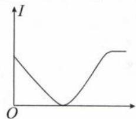

A

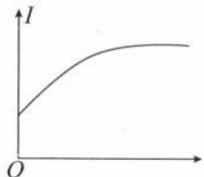

B

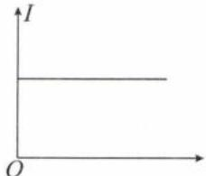

C

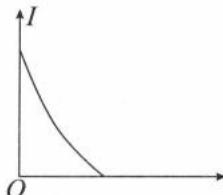

D

(1) 向 $CuSO_{4}$ 溶液中加入等体积、等物质的量浓度的 $\mathrm{Ba(OH)}_{2}$ 溶液()

(2)向 $\mathrm{CuSO_4}$ 溶液中加入等物质的量浓度的 $\mathrm{Ba(OH)_2}$ 溶液至过量（

(3) 向 $H_{2}S$ 溶液中通入 $SO_{2}$ 直至过量()

(4) 向 $AgNO_{3}$ 溶液中通入少量 HCl 气体()

(5)向叠氮酸 $HN_{3}$ (酸性和醋酸相似) 中加入氢氧化钠固体直至过量()

(6)向 NaOH 溶液中通入少量 $Cl_{2}$ ( )

(7)向 $\mathrm{Ba(OH)_2}$ 溶液中不断通入 $SO_{2}$ 至过量()

(8)向 $H_{2}S$ 溶液中通入 $Cl_{2}$ 直至过量()

解析:(1)被滴的硫酸铜为易溶性强电解质溶液,导电性较强。加入等物质的量的氢氧化钡后生成难溶于水的硫酸钡和氢氧化铜,反应后溶液中离子浓度几乎为零,电导性几乎为零。溶液反应前后的导电性由强到弱,趋势如图D。

(2)该问题和(1)的区别是氢氧化钡过量,最终导致溶液中的电荷浓度又增加,其趋势如图A。(分析导电性图像时,需要注意反应物相对的“量”,因为量变可能引起质变。)

(3) $H_{2}S$ 为弱酸，与通入的 $SO_{2}$ 发生归中反应 $2H_{2}S+SO_{2}=3S+2H_{2}O$ ，体系中的离子浓度逐渐降低，因此导电性逐渐减弱。当 $H_{2}S$ 与 $SO_{2}$ 恰好完全反应时，体系中的离子浓度几乎为零，导电性也几乎为零。当 $SO_{2}$ 过量， $SO_{2}$ 与水反应生成亚硫酸直至达到饱和，亚硫酸为中强酸，又使得溶液的导电性增强。溶液反应前后的导电率由强变弱，再由弱变强，趋势如图A。

(4)通入 HCl 和 $AgNO_{3}$ 发生复分解反应: $HCl + AgNO_{3} = AgCl \downarrow + HNO_{3}$ 。通入 HCl 前后, 溶质由易溶的强电解质 $AgNO_{3}$ , 变为易溶的强电解质 $HNO_{3}$ , 电荷浓度几乎不变, 因此导电性也几乎不变, 趋势如图 C。

(5) $HN_{3}$ 是弱酸,加入氢氧化钠固体后发生中和反应: $HN_{3}+NaOH=NaN_{3}+H_{2}O$ 。加入NaOH前后,溶质由易溶的弱电解质 $HN_{3}$ ,变为易溶的强电解质 $NaN_{3}$ ,溶液中电荷浓度增大,导电性增大,反应前后的导电性由弱逐渐增强,趋势如图B。

(6)反应起点是易溶性强碱 NaOH, 溶液导电性强, 通入 $Cl_{2}$ 后发生反应: $Cl_{2} + 2OH^{-} = Cl^{-} + ClO^{-} + H_{2}O$ , 可知电荷浓度几乎没变, 所以导电性几乎不变, 趋势如图 C。

(7)溶液起点是易溶性强碱 $\mathrm{Ba(OH)_2}$ ，通入 $SO_2$ 先生成 $BaSO_3$ 沉淀和水，导致溶液中电荷浓度逐渐减小，当通入的 $SO_2$ 与 $\mathrm{Ba(OH)_2}$ 等量时，溶液中电荷浓度几乎为零。再继续通入 $SO_2$ ， $SO_2$ 与 $BaSO_3$ 反应生成可溶于水的强电解质 $\mathrm{Ba(HSO_3)_2}$ ，最终溶液的导电性又增强，趋势如图 A。

(8) $H_{2}S$ 与通入的 $Cl_{2}$ 发生置换反应: $H_{2}S+Cl_{2}=S\downarrow+2HCl$ , 通入HCl前后, 溶质由易溶的弱酸 $H_{2}S$ , 变为易溶的强酸HCl, 溶液中电荷浓度增大, 导电性增大, 反应前后的导电性由弱逐渐增强, 趋势如图B。

答案:(1)D (2)A (3)A (4)C (5)B (6)C (7)A (8)B

## 总结

①电导率曲线图的解题步骤：

i. 选择被滴溶液作为参考体系。

ii. 分析混合过程所发生的化学变化。

iii. 对比被滴溶液的溶质和反应后溶液的溶质, 判断溶质是强弱变化还是浓度变化。若为强弱变化, 如弱电解质变为强电解质, 则溶液导电性增强; 若强弱未变, 则考虑溶液被稀释导致浓度降低, 电导率减小。

iv. 滴加的溶液过量后，电导率变化趋势由所加物质的强弱和浓度来决定。

②理解电导率图像中起点、拐点的意义和溶质组成。

③若被滴溶液的溶质不单一，反应顺序遵循“谁强谁优先”的原则。

【例 4】电导率传感器可辅助探究复分解反应的实质。相同条件下,离子浓度越大,电导率越大,溶液导电性越强。将含有酚酞的 $\mathrm{Ba(OH)_2}$ 溶液平均分成两份置于两个烧杯中,并插入电导率传感器,往其中一份滴加稀硫酸,往另一份滴加硫酸钠溶液,滴加过程中,这两份溶液的滴加速率始终相同,测得溶液的电导率变化如图所示。下列说法正确的是()

A.甲曲线对应氢氧化钡与硫酸钠反应B.M点处溶液的导电能力约为零，说明 $\mathrm{BaSO_4}$ 为非电解质C.乙曲线电导率减小过程中，溶液仍为红色D.乙曲线对应的反应中四种离子数目都减少

解析: A. 氢氧化钡与稀硫酸反应的离子方程式为 $Ba^{2+} + 2OH^{-} + 2H^{+} + SO_{4}^{2-} = BaSO_{4} \downarrow + 2H_{2}O$ ，当 $Ba^{2+}$ 和 $SO_{4}^{2-}$ 恰好完全沉淀时，溶液中几乎没有离子，

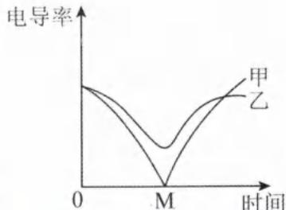

此时溶液导电性极小,图像中 M 点溶液的电导率几乎零,所以 M 点所在的甲曲线表示加入硫酸的曲线。氢氧化钡与硫酸钠反应的离子方程式为 $Ba^{2+} + SO_{4}^{2-} = BaSO_{4} \downarrow$ ，当 $Ba^{2+}$ 和 $SO_{4}^{2-}$ 恰好完全沉淀时，溶液为 NaOH 溶液，电导率不为 0 且溶液显碱性。由此可知，甲为加入稀硫酸的曲线，乙为加入硫酸钠的曲线，A 选项错误。

B. M 点处溶液的导电能力约为零, 是因为 $BaSO_{4}$ 溶解度很小, 使溶液中离子浓度极小。但 $BaSO_{4}$ 溶解到水中的部分完全电离, 因此 $BaSO_{4}$ 为强电解质, B 选项错误。

C. 乙曲线电导率减小过程中, 反应生成 $\mathrm{BaSO}_{4}$ 沉淀和 $\mathrm{NaOH}$ , 含酚酞的溶液仍为红色, C 选项正确。

D. 由离子方程式可知, 乙曲线对应的反应中, $\mathrm{Na}^{+}$ 和 $\mathrm{OH}^{-}$ 数目并未减少, D 选项错误。

答案:C

【例 5】电导率是衡量电解质溶液导电能力大小的物理量,根据溶液电导率变化可以确定滴定反应的终点。如图是 KOH 溶液分别滴定 HCl 溶液和 $CH_{3}COOH$ 溶液的滴定曲线示意图。下列示意图中,能正确表示用等浓度 $NH_{3} \cdot H_{2}O$ 溶液滴定 HCl 和 $CH_{3}COOH$ 混合溶液的滴定曲线的是()

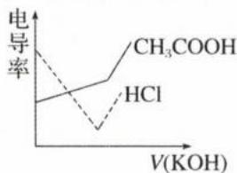

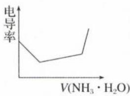  
A

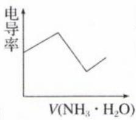  
B

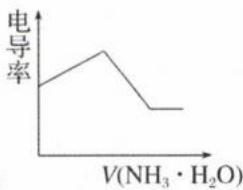  
C

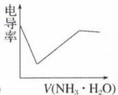  
D

解析:根据谁强谁优先原则,将氨水滴入 HCl 和 $CH_{3}COOH$ 混合溶液中,可视为 HCl 先反应, $CH_{3}COOH$ 后反应。开始因为是强酸体系,溶液中电荷浓度较大,电导率也大,氨水先与 HCl 反应生成 $NH_{4}Cl$ 和水,该过程电解质由强到强,定性上没有什么改变,但在定量上,加入氨水后,体系的体积扩大使得溶液中离子浓度下降,从而导致电导率下降,根据该趋势可以排除 B、C 选项。(中和反应同时生成盐和水,但生成的水不是体系电荷浓度下降的主要原因,溶液体积扩大才是电荷浓度下降的主要原因,因为公式 $c=\frac{n}{V}$ 中,V 表示溶液体积,而不是水的体积。例如,用 10 mL 0.1 mol/L HCl 滴定 10 mL 0.1 mol/L NaOH,生成 $1\times10^{-3}$ mol 水。1 mol 水有 18 g,体积约为 18 mL,则 $1\times10^{-3}$ mol 水的体积约为 0.018 mL。生成水的体积与加入的 10 mL 溶液相比极小,可忽略不计。)

当 HCl 消耗完后, 氨水再与 $CH_{3}COOH$ 反应, 由于 $CH_{3}COOH$ 是弱电解质, 与氨水反应后生成的可溶性盐 $CH_{3}COONH_{4}$ 是强电解质, 使得溶液中的电荷浓度增大, 电导率增大。最后过量氨水受到体系中铵根离子的同离子效应影响几乎很难电离。后期加入的氨水主要充当水的角色, 使得溶液变稀, 离子浓度减小, 导电率减小。根据上述分析, D 选项正确。

## 答案:D

【反思】图像中的两个拐点分别是盐酸恰好完全反应点和醋酸恰好完全反应点,理解图像中每个点的意义和溶质组成,是解决滴定曲线题型的关键!

<table><tr><td rowspan="5">总结</td><td rowspan="2"> $CO_{3}^{2-}$ 与酸反应</td><td>若酸弱(如HClO、苯酚、 $H_{3}BO_{3}$ ),与量无关,只能生成 $HCO_{3}^{-}$ </td></tr><tr><td>若酸强(强酸、中强酸、醋酸等),与量有关,酸少生成 $HCO_{3}^{-}$ 、酸多生成 $CO_{2}$ </td></tr><tr><td rowspan="2"> $CO_{2}$ 与碱性物质反应</td><td>若碱性弱( $ClO^{-}$ 、苯酚根),与量无关,只能生成 $HCO_{3}^{-}$ </td></tr><tr><td>若碱性强(强碱、氨水、 $AlO_{2}^{-}$ 或 $[Al(OH)_{4}]^{-}$ ),与量有关,碱性物质少生成 $HCO_{3}^{-}$ 、碱性物质多生成 $CO_{3}^{2-}$ </td></tr><tr><td colspan="2"> $CO_{3}^{2-}$ 与 $CO_{2}$ 会生成 $HCO_{3}^{-}$ </td></tr></table>

## 模块 2 “与量有关”的离子方程式书写(★★★)

习题：P7

连续型、离子配比组合型是常见“与量有关”的离子反应类型。离子配比组合型又包括复分解型、氧化还原型、复分解和氧化还原交叉型。

类型Ⅰ: 连续型

## 内容提要

一、意义:在反应过程中,由于反应物少量只会发生第一阶段反应,但随着反应物持续加入至过量,又会再发生第二阶段反应,即“量变引起质变”,其反应对应的离子方程式书写与反应物用量有关。

二、解题关键：熟记氧化性、还原性、酸性、碱性的强弱顺序。

三、连续型考查的元素是 Al、C、S、Fe。

1. 铝线：

$$
\begin{array}{c} \left[ \mathrm{Al} (\mathrm{OH}) _ {4} \right] ^ {-} + \mathrm{H} ^ {+} \xrightarrow [ \text {酸式电离} ]{} \mathrm{Al} (\mathrm{OH}) _ {3} \xrightarrow [ \text {(两性)} ]{\text {碱式电离}} \mathrm{Al} ^ {3 +} + 3 \mathrm{OH} ^ {-} \\ (\text {或} \mathrm{AlO} _ {2} ^ {-}) \end{array}
$$

$$
\mathrm{AlO} _ {2} ^ {-})
$$

$$
\mathrm{Al} (\mathrm{OH}) _ {3}
$$

$$
\mathrm{Al} (\mathrm{OH}) _ {3}
$$

$$
\mathrm{Al} (\mathrm{OH}) _ {3}
$$

$$
\mathrm{Al} ^ {3 +}
$$

$$
\mathrm{Al} (\mathrm{OH}) _ {3}
$$

$$
\mathrm{AlO} _ {2} ^ {-}
$$

$$
\left[ \mathrm{Al} (\mathrm{OH}) _ {4} \right] ^ {-}
$$

$\left[\mathrm{Al(OH)}_{4}\right]^{-}$ (或 $\mathrm{AlO}_2^-$ )与 $\mathrm{Al}^{3+}$ 会发生彻底双水解生成 $\mathrm{Al(OH)}_3$

2. 碳线

$$
\mathrm{OH} ^ {-} + \mathrm{H} _ {2} \mathrm{CO} _ {3} (\text {或} \mathrm{CO} _ {2}) \underset {\text {水解}} {\rightleftharpoons} \mathrm{HCO} _ {3} ^ {-} \underset {\text {(两性)}} {\rightleftharpoons} \mathrm{H} ^ {+} + \mathrm{CO} _ {3} ^ {2 -}
$$

注:(1)往 NaClO 溶液中通入 $CO_{2}$ 无量变引起质变,但是往 $\mathrm{Ca(ClO)_{2}}$ 溶液中通入 $CO_{2}$ 有量变引起质变,因为该环境下 $Ca^{2+}$ 与 $CO_{3}^{2-}$ 生成沉淀,促进 $HCO_{3}^{-}$ 电离。

(2) $HCO_{3}^{-}$ 是多元弱酸的酸式酸根,与碳线相类似的还有另一条碳线,两条硫线和一条磷线。

① $H_{2}C_{2}O_{4}$ 线: $OH^{-} + H_{2}C_{2}O_{4} \xlongequal{\text{水解}} HC_{2}O_{4}^{-} \xlongequal{\text{电离}} H^{+} + C_{2}O_{4}^{2-}$

② $H_{2}S$ 线: $OH^{-} + H_{2}S \xlongequal{\text{水解}} HS^{-} \xlongequal{\text{电离}} H^{+} + S^{2-}$

③ $H_{2}SO_{3}$ 线: $OH^{-} + H_{2}SO_{3}$ (或 $SO_{2}$ ) $\xlongequal{水解} HSO_{3}^{-} \xlongequal{电离} H^{+} + SO_{3}^{2-}$

④ $H_{3}PO_{4}$ 线： $H_{3}PO_{4}\xlongequal[\text{水解}]{\text{电离}}H_{2}PO_{4}^{-}\xlongequal[\text{水解}]{\text{电离}}HPO_{4}^{2-}\xlongequal[\text{水解}]{\text{电离}}PO_{4}^{3-}$

3. 铁线

$$
\mathrm{Fe} \xrightarrow [ \text {还原} ]{\text {氧化}} \mathrm{Fe} ^ {2 +} \xrightarrow [ \text {还原} ]{\text {氧化}} \mathrm{Fe} ^ {3 +}
$$

<table><tr><td rowspan="2">总结</td><td>Fe与氧化剂反应</td><td>若氧化性弱(介于 $Fe^{2+}$ 、 $Fe^{3+}$ 之间),与氧化剂的量无关,只能生成 $Fe^{2+}$ 例:由于氧化性 $Fe^{3+}>H^{+}>Fe^{2+}$ ,因此Fe与HCl反应,只能生成 $FeCl_{2}$ 若氧化性强(强于 $Fe^{3+}$ ),氧化剂少生成 $Fe^{2+}$ ,氧化剂多生成 $Fe^{3+}$ 例:由于氧化性 $HNO_{3}>Fe^{3+}$ ,因此Fe与稀硝酸反应, $HNO_{3}$ 少量生成 $Fe^{2+}$ 、 $HNO_{3}$ 过量生成 $Fe^{3+}$ </td></tr><tr><td> $Fe^{3+}$ 与还原剂反应</td><td>若还原性弱(还原性介于Fe、 $Fe^{2+}$ 之间),与还原剂的量无关,只能生成 $Fe^{2+}$ 例:Cu还原性弱于Fe,Cu与 $Fe^{3+}$ 反应,只能生成 $Fe^{2+}$ 而不能生成Fe若还原性强(还原性强于Fe),还原剂少生成 $Fe^{2+}$ ,还原剂多生成Fe例:由于还原性Zn&gt;Fe,因此 $Fe^{3+}$ 与Zn反应,Zn少量生成 $Fe^{2+}$ 、Zn过量生成Fe</td></tr></table>

$Fe^{3+}$ 与 Fe 会发生归中反应，产物为 $Fe^{2+}$ （离子方程式： $Fe + 2Fe^{3+} = 3Fe^{2+}$ ）

注:(1)要掌握“铁线”,前提是必须掌握氧化性和还原性的顺序。

(2) 虽然 $Cl_{2}$ 氧化性大于 $Fe^{3+}$ ，但 Fe 在 $Cl_{2}$ 中燃烧，即使 Fe 过量产物也是 $FeCl_{3}$ ，这是因为生成的 $FeCl_{3}$ 为固体，与同样为固体的 Fe 无法直接反应。Fe 与 $FeCl_{3}$ 必须在溶液中发生离子反应才能生成 $FeCl_{2}$ 。

【例 1】 $AlCl_{3}$ 溶液与 NaOH 溶液混合的离子方程式书写

(1)NaOH 少量：\_\_\_\_。

(2) $AlCl_{3}$ 少量：\_\_\_\_。

(3) $n(\mathrm{AlCl}_{3}):n(\mathrm{NaOH})=1:3.5:$

解析:(1)NaOH 为强碱, $Al^{3+}$ 与少量 NaOH 只能生成 $\mathrm{Al(OH)_3}$ , 离子方程式为 $\mathrm{Al^{3+} + 3OH^- = Al(OH)_3\downarrow}$ 。(2) $Al^{3+}$ 与过量 NaOH 反应, 生成 $[\mathrm{Al(OH)_4}]^-$ (或 $\mathrm{AlO_2^-}$ ), 离子方程式为 $\mathrm{Al^{3+} + 4OH^- = [Al(OH)_4]^-}$ (或 $\mathrm{Al^{3+} + 4OH^- = AlO_2^- + 2H_2O}$ )。

(3)方法一:过程分析法:通过(1)、(2)可知 $n(\mathrm{NaOH})/n(\mathrm{AlCl}_{3})$ 的两个特殊反应节点分别是3:1和4:1,而该题中 $n(\mathrm{NaOH})/n(\mathrm{AlCl}_{3})$ 为3.5:1,介于两个特殊反应节点之间,由此可推出产物既有 $\mathrm{Al(OH)}_{3}$ ,又有 $[\mathrm{Al(OH)}_{4}]^{-}$ (或 $\mathrm{AlO}_{2}^{-}$ )。 $\mathrm{Al}^{3+}$ 、 $\mathrm{OH}^{-}$ 的物质的量分别为1 mol和3.5 mol,则1 mol $\mathrm{Al}^{3+}$ 先和3 mol $\mathrm{OH}^{-}$ 反应生成1 mol $\mathrm{Al(OH)}_{3}$ ,剩余的0.5 mol $\mathrm{OH}^{-}$ 接着和0.5 mol $\mathrm{Al(OH)}_{3}$ 反应,生成0.5 mol的 $[\mathrm{Al(OH)}_{4}]^{-}$ (或 $\mathrm{AlO}_{2}^{-}$ )。反应后,生成物 $\mathrm{Al(OH)}_{3}$ 、 $[\mathrm{Al(OH)}_{4}]^{-}$ (或 $\mathrm{AlO}_{2}^{-}$ )的物质的量分别为0.5 mol、0.5 mol,则根据反应物与生成物的物质的量关系,写出离子方程式的计量数(化为最简单整数比),接着检查电荷守恒,并通过氢原子守恒看是否补水,最终得离子方程式为: $2\mathrm{Al}^{3+} + 7\mathrm{OH}^{-} = \mathrm{Al(OH)}_{3}\downarrow +[\mathrm{Al(OH)}_{4}]^{-}$ (或 $2\mathrm{Al}^{3+} + 7\mathrm{OH}^{-} = \mathrm{Al(OH)}_{3}\downarrow +\mathrm{AlO}_{2}^{-} + 2\mathrm{H}_{2}\mathrm{O}$ )。

方法二:赋值法和守恒法:通过(1)、(2)可知 $n(\mathrm{NaOH})/n(\mathrm{AlCl}_{3})$ 的两个特殊点分别是3:1和4:1,而该题中 $n(\mathrm{NaOH})/n(\mathrm{AlCl}_{3})$ 为3.5:1,介于两个特殊点之间,由此可推出产物既有 $\mathrm{Al(OH)}_{3}$ ,又有 $[\mathrm{Al(OH)}_{4}]^{-}$ (或 $\mathrm{AlO}_{2}^{-}$ )。直接将 $\mathrm{Al}^{3+}$ 、 $\mathrm{OH}^{-}$ 计量数分别定为“1”“3.5”,根据电荷守恒可知 $[\mathrm{Al(OH)}_{4}]^{-}$ 计量数为0.5,再根据Al原子守恒确定 $\mathrm{Al(OH)}_{3}$ 计量数为0.5,接着根据氢原子守恒补水。检查氧原子守恒后,将计量数均乘以2即可获得最终的离子方程式。

$$
: (1) \mathrm{Al} ^ {3 +} + 3 \mathrm{OH} ^ {-} = \mathrm{Al} (\mathrm{OH}) _ {3} \downarrow (2) \mathrm{Al} ^ {3 +} + 4 \mathrm{OH} ^ {-} = [ \mathrm{Al} (\mathrm{OH}) _ {4} ] ^ {-} (\text {或} \mathrm{Al} ^ {3 +} = 4 \mathrm{OH} ^ {-} = \mathrm{AlO} _ {2} ^ {-} + 2 \mathrm{H} _ {2} \mathrm{O})
$$

$$
(3) 2 \mathrm{Al} ^ {3 +} + 7 \mathrm{OH} ^ {-} = \mathrm{Al(OH)} _ {3} \downarrow + [ \mathrm{Al(OH)} _ {4} ] ^ {-} (\text {或} 2 \mathrm{Al} ^ {3 +} + 7 \mathrm{OH} ^ {-} = \mathrm{Al(OH)} _ {3} \downarrow + \mathrm{AlO} _ {2} ^ {-} + 2 \mathrm{H} _ {2} \mathrm{O})
$$

【反思】连续型反应分阶段进行,第一阶段的生成物可以继续和过量的反应物发生第二阶段反应,如本题第一阶段生成的 $\mathrm{Al(OH)}_{3}$ 继续和过量的 NaOH 发生第二阶段反应, $\mathrm{Al(OH)}_{3}$ 转化为 $\left[\mathrm{Al(OH)}_{4}\right]^{-}$ 。当题目指定反应物的物质的量,往往考查介于两个特殊点之间的离子方程式书写。

①过程分析法的关键在于：

i. 第一阶段反应物剩多少？生成物有多少？

ii. 第一阶段生成物与过量反应物进行第二阶段反应后剩余多少？转化成第二阶段的生成物有多少？

只要抓住两阶段的生成物比例,配合题目所给的反应物的物质的量,即可写出离子方程式。

②过程分析法的优点是能将反应过程理解透彻,缺点是耗时太多。赋值法和守恒法只考虑起点和终点的存在形态,以及各种守恒,不用分析过程,其优点是解题很迅速,缺点是基础不扎实的同学不易理解此法。

【例 2】书写下列反应的离子方程式

(1)往 $Na_{2}CO_{3}$ 溶液中滴加少量稀盐酸：\_\_\_\_。

(2)往稀盐酸中滴加少量 $Na_{2}CO_{3}$ 溶液：\_\_\_\_。

(3)往 NaClO 溶液中通入少量 $CO_{2}$ : \_\_\_\_。

解析:(1)少量 $H^{+}$ 计量数定为“1”,据此可以写出离子方程式: $CO_{3}^{2-}+H^{+}=HCO_{3}^{-}$ 。

(2)少量 $CO_{3}^{2-}$ 计量数定为“1”， $H^{+}$ 要多少有多少，因此1份 $CO_{3}^{2-}$ 会与2份 $H^{+}$ 反应生成 $CO_{2}$ ，据此可以写出离子方程式： $CO_{3}^{2-} + 2H^{+} = CO_{2}\uparrow + H_{2}O$ 。

(3)由于酸性: $\mathrm{H_{2}CO_{3}>HClO>HCO_{3}^{-}}$ , 因此无论少量还是过量的 $\mathrm{CO_{2}}$ 通入 NaClO 溶液中, 反应只能生成 HClO 和 $\mathrm{NaHCO_{3}}$ , 反应的离子方程式: $\mathrm{ClO^{-}+CO_{2}+H_{2}O=HClO+HCO_{3}^{-}}$ 。

$$
(1) \mathrm{CO} _ {3} ^ {2 -} + \mathrm{H} ^ {+} = \mathrm{HCO} _ {3} ^ {-} (2) \mathrm{CO} _ {3} ^ {2 -} + 2 \mathrm{H} ^ {+} = \mathrm{CO} _ {2} \uparrow + \mathrm{H} _ {2} \mathrm{O} (3) \mathrm{ClO} ^ {-} + \mathrm{CO} _ {2} + \mathrm{H} _ {2} \mathrm{O} = \mathrm{HClO} + \mathrm{HCO} _ {3} ^ {-}
$$

【反思】往 NaClO 溶液或苯酚钠溶液通入 $CO_{2}$ ，无论 $CO_{2}$ 少量或是过量，都只生成 $HCO_{3}^{-}$ 。在离子方程式正误判断的选择题中，抓住此关键即可快速判断正误。

【例 3】铁与稀硝酸反应的离子方程式书写

(1)稀硝酸足量：\_\_\_\_。

(2)铁足量：\_\_\_\_。

解析：反应分析：Fe $\xrightarrow{足量稀HNO_{3}}$ Fe $\left(\mathrm{NO}_{3}\right)_{3}$ $\xrightarrow{继续加Fe至过量\left(\mathrm{Fe}+2\mathrm{Fe}^{3+}=3\mathrm{Fe}^{2+}\right)}$ Fe $\left(\mathrm{NO}_{3}\right)_{2}$

(1)稀硝酸足量,最终的产物为 $Fe^{3+}$ 和NO,再利用氧化还原反应配平方法可得离子方程式:

$$
\mathrm{Fe} + \mathrm{NO} _ {3} ^ {-} + 4 \mathrm{H} ^ {+} = \mathrm{Fe} ^ {3 +} + \mathrm{NO} \uparrow + 2 \mathrm{H} _ {2} \mathrm{O} 。
$$

(2)Fe过量,最终的产物为 $Fe^{2+}$ 和NO,再利用氧化还原反应配平方法可得离子方程式:

$$
3 \mathrm{Fe} + 2 \mathrm{NO} _ {3} ^ {-} + 8 \mathrm{H} ^ {+} = 3 \mathrm{Fe} ^ {2 +} + 2 \mathrm{NO} \uparrow + 4 \mathrm{H} _ {2} \mathrm{O} 。
$$

答案:(1) $Fe+NO_{3}^{-}+4H^{+}=Fe^{3+}+NO\uparrow+2H_{2}O$ (2) $3Fe+2NO_{3}^{-}+8H^{+}=3Fe^{2+}+2NO\uparrow+4H_{2}O$

类型Ⅱ: 离子配比组合——复分解型

## 内容提要

一、当一种反应物中有两种或两种以上的离子参与反应，因其组成比例不协调（一般为复盐或酸式盐），当一种组成离子恰好完全反应时，另一种组成离子不能恰好完全反应（有剩余或不足），因此其反应的离子方程式书写与反应物的用量有关。

二、书写要领：

1. 少量者定为“1”，过量者“要多少有多少”，过量配合少量。

2. 先发生中和反应生成水，再生成沉淀，最后生成其他弱电解质。

3. 少量者符合化学式比例, 过量者不一定。

三、以 $\mathrm{Ca(HCO_{3})_{2}}$ 溶液与 NaOH 溶液反应为例

1. $\mathrm{Ca(HCO_3)_2}$ 少量

$$
\begin{array}{r l}&\text {少量定为1,}\\&\text {拆写成离子:}\\&\mathrm{Ca} ^ {2 +} + 2 \mathrm{HCO} _ {3} ^ {-}\end{array}\rightarrow\begin{array}{r l}&\text {根据少量,调“过量”的离子配比(过量配合少量)}\\&\mathrm{Ca} ^ {2 +} + 2 \mathrm{HCO} _ {3} ^ {-} + 2 \mathrm{OH} ^ {-}\end{array}\rightarrow\begin{array}{r l}&\text {书写离子方程式}\\&\mathrm{Ca} ^ {2 +} + 2 \mathrm{HCO} _ {3} ^ {-} + 2 \mathrm{OH} ^ {-}\\&= \mathrm{CaCO} _ {3} \downarrow + \mathrm{CO} _ {3} ^ {2 -} + 2 \mathrm{H} _ {2} \mathrm{O}\end{array}
$$

2. NaOH 少量

$$
\begin{array}{l}\text {少量定为1,}\\\text {拆写成离子:}\\\mathrm{OH} ^ {-} (\mathrm{Na} ^ {+} \text {不反应})\end{array}\rightarrow\begin{array}{l}\text {根据少量,调整“过量”的离子配比(过量配合少量)}\\\mathrm{OH} ^ {-} + \mathrm{HCO} _ {3} ^ {-} + \mathrm{Ca} ^ {2 +}\end{array}\rightarrow\begin{array}{l}\text {书写离子方程式}\\\mathrm{Ca} ^ {2 +} + \mathrm{HCO} _ {3} ^ {-} + \mathrm{OH} ^ {-}\\= \mathrm{CaCO} _ {3} \downarrow + \mathrm{H} _ {2} \mathrm{O}\end{array}
$$

由上述两个离子方程式可发现, $\mathrm{Ca(HCO_{3})_{2}}$ 少量,最后离子方程式 $Ca^{2+}$ 与 $HCO_{3}^{-}$ 符合化学式比例1:2,但 $\mathrm{Ca(HCO_{3})_{2}}$ 过量,最后离子方程式 $Ca^{2+}$ 与 $HCO_{3}^{-}$ 并没有符合化学式比例1:2而是1:1,这是因为过量物的配比取决于少量物质的反应需求,即“过量配合少量”。

【例 4】澄清石灰水与 $NaHCO_{3}$ 溶液反应的离子方程式

(1) $\mathrm{Ca(OH)_2}$ 少量：\_\_\_\_。

(2) $NaHCO_{3}$ 少量：\_\_\_\_。

解析:(1) $\mathrm{Ca(OH)_2}$ 少量,其计量数定为“1”, $HCO_3^-$ 要多少有多少。先将 $Ca^{2+}$ 、 $OH^-$ 的比例1:2定为计量数之比,再根据先形成水的原则确定反应物 $HCO_3^-$ 的计量数为2,接着根据 $Ca^{2+}$ 的计量数确定 $CaCO_3^-$ 的计量数为1,

补 $\mathrm{H}_2\mathrm{O}$ 调平 $\mathrm{H},\mathrm{O}$ 原子，最终得出离子方程式为： $\mathrm{Ca^{2 + } + 2OH^{-} + 2HCO_3^- = CaCO_3\downarrow + CO_3^{2 - } + 2H_2O}$

(2) $\mathrm{NaHCO_{3}}$ 少量, 其计量数定为“1”, $\mathrm{Ca(OH)_{2}}$ 要多少有多少。根据 $\mathrm{HCO_{3}^{-}}$ 的计量数 1 可以确定其消耗的 $\mathrm{OH^{-}}$ 、 $\mathrm{Ca^{2+}}$ 分别为 1、1。最终得出的离子方程式为 $\mathrm{HCO_{3}^{-} + Ca^{2+} + OH^{-} = H_{2}O + CaCO_{3}\downarrow}$ 。

$$
\mathrm{Ca} ^ {2 +} + 2 \mathrm{OH} ^ {-} + 2 \mathrm{HCO} _ {3} ^ {-} = \mathrm{CaCO} _ {3} \downarrow + \mathrm{CO} _ {3} ^ {2 -} + 2 \mathrm{H} _ {2} \mathrm{O} \quad (2) \mathrm{HCO} _ {3} ^ {-} + \mathrm{Ca} ^ {2 +} + \mathrm{OH} ^ {-} = \mathrm{H} _ {2} \mathrm{O} + \mathrm{CaCO} _ {3} \downarrow
$$

【反思】这类题型主要在离子方程式正误判断的选择题中考查,若要快速判断对错,需要熟悉这两种情况下的离子方程式特征:

(1) 定性上观察产物是否存在 $CO_{3}^{2-}$ : 由于 $CO_{3}^{2-}$ 要与 $Ca^{2+}$ 沉淀, 所以当 $Ca^{2+}$ 多, $CO_{3}^{2-}$ 不可能有剩余。

(2)定量上观察 $Ca^{2+}$ 、 $OH^{-}$ 的配比:本例题中当 $Ca^{2+}$ 、 $OH^{-}$ 的计量数为 1:2,则可判定是 $\mathrm{Ca(OH)}_{2}$ 少量。因为其少量时,阴、阳离子均完全反应,阴、阳离子的小角标之比(即配比)会作为离子方程式的计量数之比。

【例 5】往 $NH_{4}HSO_{4}$ 溶液中滴加 NaOH 溶液的离子方程式

(1) $NH_{4}HSO_{4}$ 少量：\_\_\_\_。

(2)NaOH 少量：\_\_\_\_。

(3) $NH_{4}HSO_{4}$ 与 NaOH 以物质的量之比 1:1.5 混合：\_\_\_\_。

解析:(1) $NH_{4}HSO_{4}$ 少量,其计量数定为“1”,NaOH要多少有多少。先将 $NH_{4}^{+}$ 、 $H^{+}$ 的比例1:1定为计量数之比,则需要消耗NaOH2份,最终得出离子方程式为: $NH_{4}^{+}+H^{+}+2OH^{-}=NH_{3}\cdot H_{2}O+H_{2}O$ 。

(2)NaOH 少量, 其计量数定为“1”, $NH_{4}HSO_{4}$ 要多少有多少。根据复分解反应遵循先生成水, 再生成沉淀, 最后生成其他弱电解质的原则, 1 份 $OH^{-}$ 只能与 1 份 $H^{+}$ 反应, 最终得出离子方程式: $H^{+} + OH^{-} = H_{2}O$ 。

(3)通过(1)、(2)可知 $n(\mathrm{NaOH}) / n(\mathrm{NH}_4\mathrm{HSO}_4)$ 的两个特殊反应节点分别是 $1:1$ 和 $2:1$ , 而该题中 $n(\mathrm{NaOH}) / n(\mathrm{NH}_4\mathrm{HSO}_4)$ 为 $1.5:1$ , 介于两个特殊反应节点之间, 由此可推出产物既有 $\mathrm{H}_2\mathrm{O}$ , 又有 $\mathrm{NH}_3 \cdot \mathrm{H}_2\mathrm{O}$ 。将 $\mathrm{NH}_4\mathrm{HSO}_4$ 计量数定为 1 , 先消耗 1 份 $\mathrm{OH}^-$ 与 1 份 $\mathrm{H}^+$ 反应成水, 再消耗 0.5 份 $\mathrm{OH}^-$ 与 0.5 份 $\mathrm{NH}_4^+$ 反应成 $\mathrm{NH}_3 \cdot \mathrm{H}_2\mathrm{O}$ , 将计量数化为最简单整数比, 最终得出离子方程式为 $\mathrm{NH}_4^+ + 2\mathrm{H}^+ + 3\mathrm{OH}^- = \mathrm{NH}_3 \cdot \mathrm{H}_2\mathrm{O} + 2\mathrm{H}_2\mathrm{O}$ 。

$$
: (1) \mathrm{NH} _ {4} ^ {+} + \mathrm{H} ^ {+} + 2 \mathrm{OH} ^ {-} = \mathrm{NH} _ {3} \cdot \mathrm{H} _ {2} \mathrm{O} + \mathrm{H} _ {2} \mathrm{O}
$$

$$
\mathrm{H} ^ {+} + \mathrm{OH} ^ {-} = \mathrm{H} _ {2} \mathrm{O}
$$

(3) $\mathrm{NH_4^+ + 2H^+ + 3OH^- = NH_3\cdot H_2O + 2H_2O}$

【例 6】明矾溶液 $\left[\mathrm{KAl}\left(\mathrm{SO}_{4}\right)_{2}\right]$ 与 $\mathrm{Ba(OH)}_{2}$ 溶液反应的离子方程式

(1) $\mathrm{Ba(OH)_2}$ 少量：\_\_\_\_。

(2) $\mathrm{Ba(OH)_2}$ 过量：

解析:(1) $\mathrm{Ba(OH)_2}$ 少量,其计量数定为“1”,电离出的 $\mathrm{Ba^{2+}}$ 与 $\mathrm{OH^{-}}$ 计量数比为1:2,由于 $\mathrm{Ba(OH)_2}$ 少量,所以1份 $\mathrm{Al^{3+}}$ 只会与3份 $\mathrm{OH^{-}}$ 形成 $\mathrm{Al(OH)_3}$ 沉淀,可根据计量数关系写出 $3\mathrm{Ba^{2+}}+6\mathrm{OH^{-}}+2\mathrm{Al^{3+}}$ ,3份 $\mathrm{Ba^{2+}}$ 再和3份 $\mathrm{SO_4^{2-}}$ 形成3份 $\mathrm{BaSO_4}$ 沉淀,故离子方程式为 $3\mathrm{Ba^{2+}}+6\mathrm{OH^{-}}+2\mathrm{Al^{3+}}+3\mathrm{SO_4^{2-}}=3\mathrm{BaSO_4}\downarrow+2\mathrm{Al(OH)_3}\downarrow$ 。

(2) $KAl(SO_{4})_{2}$ 少量, 其计量数定为“1”, 电离出的 $Al^{3+}$ 与 $SO_{4}^{2-}$ 计量数比为 1:2, 由于 $OH^{-}$ 过量, 1 份 $Al^{3+}$ 会与 4 份 $OH^{-}$ 形成 $[Al(OH)_{4}]^{-}$ (或 $AlO_{2}^{-}$ ), 2 份 $SO_{4}^{2-}$ 和 2 份 $Ba^{2+}$ 形成 2 份 $BaSO_{4}$ 沉淀。因此离子方程式为 $Al^{3+} + 2SO_{4}^{2-} + 2Ba^{2+} + 4OH^{-} = 2BaSO_{4}\downarrow + [Al(OH)_{4}]^{-}$ (或 $Al^{3+} + 2SO_{4}^{2-} + 2Ba^{2+} + 4OH^{-} = 2BaSO_{4}\downarrow + AlO_{2}^{-} + 2H_{2}O$ )。

答案:(1) $3Ba^{2+}+6OH^{-}+2Al^{3+}+3SO_{4}^{2-}=3BaSO_{4}\downarrow+2Al(OH)_{3}\downarrow$ (2) $Al^{3+}+2SO_{4}^{2-}+2Ba^{2+}+4OH^{-}=2BaSO_{4}\downarrow+[Al(OH)_{4}]^{-}$ （或 $Al^{3+}+2SO_{4}^{2-}+2Ba^{2+}+4OH^{-}=2BaSO_{4}\downarrow+AlO_{2}^{-}+2H_{2}O$ ）

【反思】明矾与氢氧化钡反应,题目很少用“少量”或“足量”描述,其一般问法有四种:

<table><tr><td rowspan="4">往明矾溶液中滴加氢氧化钡溶液至</td><td>铝离子恰好完全沉淀</td><td rowspan="2">同第1问的离子方程式: $3Ba^{2+} + 6OH^{-} + 2Al^{3+} + 3SO_{4}^{2-} = 3BaSO_{4} \downarrow + 2Al(OH)_{3} \downarrow$ </td></tr><tr><td>沉淀的物质的量最大</td></tr><tr><td>硫酸根恰好完全沉淀</td><td rowspan="2">同第2问的离子方程式: $Al^{3+} + 2SO_{4}^{2-} + 2Ba^{2+} + 4OH^{-} = 2BaSO_{4} \downarrow + [Al(OH)_{4}]^{-}$ (或 $Al^{3+} + 2SO_{4}^{2-} + 2Ba^{2+} + 4OH^{-} = 2BaSO_{4} \downarrow + AlO_{2}^{-} + 2H_{2}O$ )</td></tr><tr><td>沉淀的质量最大</td></tr></table>

类型Ⅲ:离子配比组合——氧化还原型

## 内容提要

一、当一种反应物中有两种或两种以上的组成离子参与反应，因其组成比例不协调（氧化剂和氧化剂组合或还原剂和还原剂组合），当一种组成离子恰好完全反应时，另一种组成离子不能恰好完全反应（有剩余或不足），因此其反应的离子方程式书写与反应物的用量有关。

二、解题要领：

1. 少量者定为“1”，过量者“要多少有多少”，过量配合少量。

2. 反应的优先性顺序为: 谁强谁优先。

3. 少量者符合化学式比例, 过量者不一定符合。

【例 7】向 $FeBr_{2}$ 溶液中通入 $Cl_{2}$ 的离子方程式

(1) $FeBr_{2}$ 少量：\_\_\_\_。

(2) $Cl_{2}$ 少量：\_\_\_\_。

(3) $FeBr_{2}$ 与 $Cl_{2}$ 物质的量之比为 1:1: \_\_\_\_。

解析:(1) $FeBr_{2}$ 少量,其计量数定为“1”, $Cl_{2}$ 要多少有多少。先将 $Fe^{2+}$ 、 $Br^{-}$ 的比例1:2定为计量数之比,再根据化合价升降守恒得 $Cl_{2}$ 的计量数为1.5,最后利用原子守恒配平产物即可。将计量数扩大成最简整数比,最终得出离子方程式: $2Fe^{2+}+4Br^{-}+3Cl_{2}=2Fe^{3+}+2Br_{2}+6Cl^{-}$ 。

(2) $Cl_{2}$ 少量, 其计量数定为“1”, $FeBr_{2}$ 要多少有多少。由于还原性 $Fe^{2+}$ 强于 $Br^{-}$ , 根据谁强谁优先的原则, 只有 $Fe^{2+}$ 可以与 $Cl_{2}$ 反应, 利用化合价升降守恒配平, 最终得出离子方程式: $2Fe^{2+} + Cl_{2} = 2Fe^{3+} + 2Cl^{-}$ 。

(3) 假设 $FeBr_{2}$ 和 $Cl_{2}$ 物质的量均为 1 mol, 1 mol $Cl_{2}$ 可得电子 2 mol, 由于还原性 $Fe^{2+}$ 强于 $Br^{-}$ , 根据谁强谁优先的原则, 1 mol $Fe^{2+}$ 先失去 1 mol 电子, 接着 1 mol $Br^{-}$ 失去 1 mol 电子, 则得失电子守恒。最后利用原子守恒配平产物, 并将计量数扩大变成最简整数比, 最终得出离子方程式: $2Cl_{2} + 2Fe^{2+} + 2Br^{-} = 2Fe^{3+} + Br_{2} + 4Cl^{-}$ 。

答案:(1) $2Fe^{2+}+4Br^{-}+3Cl_{2}=2Fe^{3+}+2Br_{2}+6Cl^{-}$ (2) $2Fe^{2+}+Cl_{2}=2Fe^{3+}+2Cl^{-}$

$$
(3) 2 \mathrm{Cl} _ {2} + 2 \mathrm{Fe} ^ {2 +} + 2 \mathrm{Br} ^ {-} = 2 \mathrm{Fe} ^ {3 +} + \mathrm{Br} _ {2} + 4 \mathrm{Cl} ^ {-}
$$

【反思】氧化还原反应配比型离子方程式,若单一变量少(如本题 $Cl_{2}$ 少),考查谁强谁优先。若单一变量多(如本题 $Cl_{2}$ 多),考查组合中阴、阳离子的配比。

类型Ⅳ:离子配比组合一复分解和氧化还原交叉型

## 内容提要

一、当两种物质混合时，两种物质之间既可以发生复分解，又可以发生氧化还原反应，且氧化还原反应为主要矛盾。

二、解题要领：先考虑主要矛盾氧化还原反应，再考虑产物与剩余物质之间后续的复分解反应。

【例 8】往 NaClO 溶液中通入 $SO_{2}$ 的离子方程式

(1)NaClO 少量：\_\_\_\_。

(2) $SO_{2}$ 少量：\_\_\_\_。

解析:(1)NaClO 少量,其计量数定为“1”, $SO_{2}$ 要多少有多少。因为 NaClO 少量,先将 $ClO^{-}$ 的计量数定为 1,再根据化合价的升降守恒配平 $SO_{2}$ 的计量数为 1,最终得出离子方程式: $ClO^{-}+SO_{2}+H_{2}O=Cl^{-}+SO_{4}^{2-}+2H^{+}$ 。

(2) $SO_{2}$ 与 NaClO 先发生: $ClO^{-}+SO_{2}+H_{2}O=Cl^{-}+SO_{4}^{2-}+2H^{+}$ ,由于过量的 $ClO^{-}$ 可以与产物 $H^{+}$ 结合生成 HClO,最终得出离子方程式: $3ClO^{-}+SO_{2}+H_{2}O=Cl^{-}+SO_{4}^{2-}+2HClO$ 。

答案:(1) $ClO^{-}+SO_{2}+H_{2}O=Cl^{-}+SO_{4}^{2-}+2H^{+}$ (2) $3ClO^{-}+SO_{2}+H_{2}O=Cl^{-}+SO_{4}^{2-}+2HClO$

【例 9】向 $Na_{2}SO_{3}$ 溶液中通入 $Cl_{2}$ 的离子方程式：

(1) $Na_{2}SO_{3}$ 少量：\_\_\_\_。

(2) $Cl_{2}$ 少量：\_\_\_\_。

解析:(1) $Na_{2}SO_{3}$ 少量,先将 $SO_{3}^{2-}$ 计量数定为“1”,再根据化合价升降守恒确定 $Cl_{2}$ 的计量数为1,接着用 $H^{+}$ 调平电荷,最后看H补 $H_{2}O$ 、用O检查,最终得出离子方程式: $Cl_{2}+SO_{3}^{2-}+H_{2}O=2Cl^{-}+SO_{4}^{2-}+2H^{+}$ 。

(2) $Cl_{2}$ 和 $Na_{2}SO_{3}$ 混合先发生氧化还原反应: $Cl_{2} + SO_{3}^{2-} + H_{2}O = 2Cl^{-} + SO_{4}^{2-} + 2H^{+}$ ，由于 $SO_{3}^{2-}$ 过量、 $H^{+}$ 少量，因此每 1 个 $SO_{3}^{2-}$ 只能与 1 个 $H^{+}$ 结合生成 $HSO_{3}^{-}$ ，最终得出离子方程式为 $Cl_{2} + 3SO_{3}^{2-} + H_{2}O = 2Cl^{-} + SO_{4}^{2-} + 2HSO_{3}^{-}$ 。

$$
\mathrm{Cl} _ {2} + \mathrm{SO} _ {3} ^ {2 -} + \mathrm{H} _ {2} \mathrm{O} = 2 \mathrm{Cl} ^ {-} + \mathrm{SO} _ {4} ^ {2 -} + 2 \mathrm{H} ^ {+} \quad (2) \mathrm{Cl} _ {2} + 3 \mathrm{SO} _ {3} ^ {2 -} + \mathrm{H} _ {2} \mathrm{O} = 2 \mathrm{Cl} ^ {-} + \mathrm{SO} _ {4} ^ {2 -} + 2 \mathrm{HSO} _ {3} ^ {-}
$$

【反思】氧化还原反应发生后，由于调平电荷时涉及了酸碱性的改变，所以要考虑体系中的其他离子是否发生生成弱电解质或生成沉淀的后续反应。

## 模块 3 离子方程式正误判断的“七个注意”(★★★)

习题：P8

## 内容提要

## 一、注意反应是否符合客观事实

1. 离子反应必须符合客观事实,而命题者往往设置不符合“反应原理”的陷阱,如离子方程式表示的反应无法发生、错误的产物、忽略氧化还原、忽略完全双水解、忽略配合反应等陷阱。

2. 与铁有关的客观事实：

(1)铁的单质或化合物参加反应的规律见前面:模块2—类型Ⅰ—3.铁线。

(2)铁及其化合物在酸中的存在形态(空格内为铁的化合价)

<table><tr><td>酸</td><td>FeO</td><td> $Fe_{2}O_{3}$ </td><td> $Fe_{3}O_{4}$ </td><td> $Fe(OH)_{2}$ </td><td> $Fe(OH)_{3}$ </td><td>Fe</td><td>规律</td></tr><tr><td>稀  $H_{2}SO_{4}$ 、HCl</td><td>+2</td><td>+3</td><td>+2、+3</td><td>+2</td><td>+3</td><td>+2</td><td>铁粉与一般酸反应只生成+2价;铁的化合物在一般的酸中保持原价。</td></tr><tr><td>HI</td><td>+2</td><td>+2</td><td>+2</td><td>+2</td><td>+2</td><td>+2</td><td> $I^{-}$ 可将 $Fe^{3+}$ 还原为 $Fe^{2+}$ ,因此铁及其化合物在HI中只能以+2价存在。</td></tr><tr><td> $HNO_{3}$ </td><td>+3</td><td>+3</td><td>+3</td><td>+3</td><td>+3</td><td>+3或+2</td><td>铁及其化合物在氧化性酸中主要以+3价存在。若铁粉过量,发生反应 $2Fe^{3+} + Fe = 3Fe^{2+}$ ,铁的存在形态为+2价。</td></tr></table>

3. 高中常见不符合常规的化学反应

(1)极其活泼的金属(K、Ca、Na)与盐溶液混合,优先与水反应; $F_{2}$ 与盐溶液混合,也优先与水反应。

(2) 强氧化性酸(硝酸、浓硫酸)与少量活泼金属单质反应, 不能生成 $H_{2}$ 。

(3) $H_{2}S$ 通入 $CuSO_{4}$ 溶液不发生氧化还原反应,而是生成黑色沉淀CuS。该反应违背强酸制弱酸,但遵循溶解度大制溶解度小原理。

(4) $CO_{2}$ 通入 $CaCl_{2}$ （或 $BaCl_{2}$ ）、 $SO_{2}$ 通入 $CaCl_{2}$ （或 $BaCl_{2}$ ）、 $H_{2}S$ 通入 $FeSO_{4}$ 均不会反应。（此类反应若有“ $K_{a}$ 、 $K_{sp}$ ”信息，也可能发生反应，没有信息默认不能反应。）

(5) $SO_{2}$ 通入 $\mathrm{Ba(NO_{3})_{2}}$ 溶液，先发生氧化还原反应，后发生沉淀反应，最终的沉淀为 $BaSO_{4}$ 。

## 二、注意方程式配平是否正确，是否满足守恒

1. 若为氧化还原反应,一定要先检查是否满足得失电子守恒(或化合价升降守恒)。

2. 若为复分解型离子方程式,优先检查电荷守恒(即反应前后电荷的数值和符号是否完全相同)。

无论是哪种类型的方程式,均遵循原子守恒(反应前后原子种类和个数分别相等)。

## 三、注意“——”“⇌”“↑”“↓”是否使用恰当

1. 很多时候“——”“⇌”都可以混用，但考题中必须使用“⇌”的过程包括：

(1)弱电解质的电离方程式。

(2)盐类不彻底的水解。

(3)难溶电解质沉淀溶解平衡表达式。

2. 注意看是制备“沉淀”还是“胶体”，若为胶体，不能出现“↓”，只能注明“胶体”二字。

3. 铵盐与碱反应的产物是写成“ $NH_{3} \cdot H_{2}O$ ”还是“ $NH_{3}\uparrow$ ”，关键看条件是否加热，或碱是否为浓溶液。只要过程出现了直接加热或间接加热的条件，产物均写成“ $NH_{3}\uparrow$ ”的形式。

## 四、注意粒子的拆分是否正确

根据“记少不记多的原则”，只要记住书写离子方程式需要拆开的物质即可。

1.“拆”的本质是:在水中物质完全以自由移动离子的形式存在。

2. 能“拆”的物质总结：

(1)六大强酸: $\text{HClO}_4$ 、 $\text{HI}$ 、 $\text{HBr}$ 、 $\text{HCl}$ 、 $\text{HNO}_3$ 、 $\text{H}_2\text{SO}_4$ 。其中浓硫酸有吸水性且水分子很少,绝大多数硫酸分子无法电离,在浓硫酸体系中,最多的微粒是硫酸分子,所以浓硫酸写离子方程式时不拆,其他强酸浓溶液(如浓盐酸、浓硝酸)均可拆。

(2) 易溶性强碱: NaOH、KOH、Ba(OH) $_{2}$ 。

(3)易溶于水的盐。需注意“ $\mathrm{NaHCO}_{3}$ ”虽然可溶于水,但是往饱和 $\mathrm{Na}_{2} \mathrm{CO}_{3}$ 中通入足量 $\mathrm{CO}_{2}$ ,以及侯氏制碱法生成的 $\mathrm{NaHCO}_{3}$ 在书写离子方程式时却不能拆,因为产物碳酸氢钠主要以固体形式存在。 $\mathrm{Fe(SCN)}_{3}$ 虽可溶于水,但其为弱电解质,在水中部分电离,并非完全以离子的形式存在,所以 $\mathrm{Fe(SCN)}_{3}$ 不拆。

3. $\mathrm{Ca(OH)}_{2} 、 \mathrm{CaSO}_{4} 、 \mathrm{Ag}_{2} \mathrm{SO}_{4} 、 \mathrm{MgCO}_{3}$ 等“微溶物”的处理方式：

(1)产物中的微溶物一律不拆。

(2)反应物中的微溶物拆不拆看状态，“澄清”则拆，“浑浊”则不拆。

4. 在水溶液中的“ $\mathrm{HSO}_4^-$ ”要拆分成 $\mathrm{H}^+$ 、 $\mathrm{SO}_4^{2-}$ ; 而其他多元弱酸的酸式酸根（如 $\mathrm{HCO}_3^-$ 、 $\mathrm{HSO}_3^-$ 、 $\mathrm{HS}^-$ 、 $\mathrm{HC}_2\mathrm{O}_4^-$ 、 $\mathrm{H}_2\mathrm{PO}_4^-$ 、 $\mathrm{HPO}_4^{2-}$ 等）一律保留原型。

## 五、注意是否“漏写”离子反应

同一个反应可能生成多种沉淀、多种弱电解质或既生成沉淀，又生成弱电解质。也可能发生了氧化还原反应后，又发生了复分解反应并生成沉淀或弱电解质。所以判断是否“漏写”

的关键是看剩余离子能否共存,或剩余的离子能否与产物离子继续反应。

## 六、注意是否符合反应“量”的关系(过量、少量、等物质的量、指定比例等)

注意离子方程式是否符合题设条件的要求,如过量、少量、等物质的量、一定浓度和体积混合以及滴加顺序对反应产物的影响,建议搭配模块2:“与量有关”的离子方程式书写一起复习。

## 七、注意反应物的“稀、浓”和“温度”

量变引起质变的“量”既可指反应物“物质的量”引起的量变,也可能是“温度”引起的量变,还可能是“浓度”引起的量变。

1. 常见的三大强酸, 即 $\mathrm{HCl} 、 \mathrm{H}_{2} \mathrm{SO}_{4} 、 \mathrm{HNO}_{3}$ , 由于其浓度不同, 导致其氧化性或还原性强弱不同。不同浓度的酸与金属单质反应时, 还原产物可能不同。同样浓度的酸, 由于其与某些金属反应的温度不同, 氧化产物也可能不同。

## 2. 常考的由温度不同造成的“量变引起质变”

(1) 常温下, 浓硝酸、浓硫酸分别与 Fe 或 Al 发生钝化反应, 氧化产物是致密氧化膜, 不是盐。加热条件下, 浓硝酸、浓硫酸分别与 Fe 或 Al 发生剧烈氧化还原反应, 氧化产物分别是硝酸盐、硫酸盐。

(2) 常温下, 浓硫酸与 Cu 不反应; 加热条件下, 二者持续反应生成 $CuSO_{4}$ 、 $H_{2}O$ 、 $SO_{2}$ 。

(3) 常温下, 浓盐酸不与 $MnO_{2}$ 反应; 加热条件下, 浓盐酸和 $MnO_{2}$ 反应生成 $Cl_{2}$ 、 $MnCl_{2}$ 和 $H_{2}O$ 。

(4)常温下,铵盐和强碱稀溶液反应生成 $NH_{3}\cdot H_{2}O$ ;加热条件下,生成 $NH_{3}$ 。

(5)常温下, $Cl_{2}$ 与NaOH溶液生成NaCl、NaClO和 $H_{2}O$ 。加热条件下,氯元素的氧化产物可能是 $NaClO_{3}$ 。

3. 常考的由“浓度”不同造成的“量变引起质变”

(1)加热时,浓盐酸与 $MnO_{2}$ 可以反应,但稀盐酸却不与 $MnO_{2}$ 反应。

(2) 常温下, 浓硫酸、浓硝酸均能使 Fe、Al 钝化, 但稀硫酸、稀硝酸与 Fe、Al 却无钝化现象。

(3)浓硝酸的还原产物是 $NO_{2}$ ，但稀硝酸的还原产物一般为 NO。

(4)浓硫酸和活泼金属反应,还原产物一般为 $SO_{2}$ ;稀硫酸和活泼金属反应,还原产物一般为 $H_{2}$ 。

(5) 常温下, 铵盐和强碱稀溶液的反应生成 $NH_{3} \cdot H_{2}O$ ; 常温下, 铵盐和强碱浓溶液反应生成 $NH_{3}$ 。

注:浓硫酸与 Cu、浓盐酸与 $MnO_{2}$ 是教材中重要的“不浓、不热、不反应”，即二者须同时满足“浓酸”与“加热”条件，反应才能发生。浓硝酸、浓硫酸与 Fe 或 Al，在常温下发生钝化现象，但要注意钝化并非“不反应”，而是生成了具有抗腐蚀性的氧化膜，阻止反应进一步发生。

## 类型 I: 判断客观规律是否正确

【例1】正误判断,正确的填“√”,错误的填“×”
(1)Fe和稀盐酸反应: $2Fe+6H^{+}=2Fe^{3+}+3H_{2}\uparrow$ ( )
(2)Fe和足量稀硝酸反应: $Fe+2H^{+}=Fe^{2+}+H_{2}\uparrow$ ( )
(3) $Fe_{2}O_{3}$ 和足量HI反应: $Fe_{2}O_{3}+6H^{+}=2Fe^{3+}+3H_{2}O$ ( )
(4) $Fe_{3}O_{4}$ 和足量稀硝酸反应: $Fe_{3}O_{4}+8H^{+}=Fe^{2+}+2Fe^{3+}+4H_{2}O$ ( )
(5) $Fe_{3}O_{4}$ 和足量稀硫酸反应: $Fe_{3}O_{4}+8H^{+}=3Fe^{3+}+4H_{2}O$ ( )
(6)硫化钠和硝酸混合: $S^{2-}+2H^{+}=H_{2}S\uparrow$ ( )
(7) $H_{2}S$ 通入 $CuSO_{4}$ 溶液中: $3H_{2}S+SO_{4}^{2-}=3S\downarrow+SO_{2}\uparrow+3H_{2}O$ ( )
(8)向 $BaCl_{2}$ 溶液中通 $CO_{2}:Ba^{2+}+CO_{2}+H_{2}O=BaCO_{3}\downarrow+2H^{+}$ ( )
(9)向 $H_{2}O_{2}$ 中加入酸性 $FeCl_{3}:H_{2}O_{2}+2Fe^{3+}=2Fe^{2+}+O_{2}\uparrow+2H^{+}$ ( )
(10)向硫代硫酸钠中滴加稀硫酸: $3S_{2}O_{3}^{2-}+2H^{+}=4S\downarrow+2SO_{4}^{2-}+H_{2}O$ ( )
(11)向 $AlCl_{3}$ 溶液中加入过量氨水: $Al^{3+}+4NH_{3}\cdot H_{2}O=AlO_{2}^{-}+4NH_{4}^{+}+2H_{2}O$ ( )
(12)向0.1 mol/L $CuSO_{4}$ 溶液中加入过量浓氨水: $Cu^{2+}+2NH_{3}\cdot H_{2}O=Cu(OH)_{2}\downarrow+2NH_{4}^{+}$ ( )
解析:(1)(×)Fe与 $H^{+}$ 反应是生成 $Fe^{2+}$ ,正确的离子方程式为 $Fe+2H^{+}=Fe^{2+}+H_{2}\uparrow$ ( )
(2)(×)硝酸是强氧化性酸,足量稀硝酸与铁反应的氧化产物是 $Fe^{3+}$ 、还原产物是NO。正确的离子方程式为 $Fe+NO_{3}^{-}+4H^{+}=Fe^{3+}+NO\uparrow+2H_{2}O$ 。(3)(×)HI是还原性酸,其I-可被 $Fe^{3+}$ 氧化成I₂,在HI环境中,铁元素的存在形态为+2价。正确的离子方程式为 $Fe_{2}O_{3}+2I^{-}+6H^{+}=2Fe^{2+}+I_{2}+3H_{2}O$ 。(4)(×)硝酸是强氧化性酸,在此环境中,铁元素的存在形态为+3价。正确的离子方程式为 $3Fe_{3}O_{4}+NO_{3}^{-}+28H^{+}=9Fe^{3+}+NO\uparrow+14H_{2}O$ 。(5)(×) $Fe_{3}O_{4}$ (可表示为 $FeO\cdot Fe_{2}O_{3}$ ),而稀硫酸与铁的氧化物反应,Fe元素保持原价。正确的离子方程式为 $Fe_{3}O_{4}+8H^{+}=Fe^{2+}+2Fe^{3+}+4H_{2}O$ 。(6)(×)-2价硫具有强还原性,硝酸具有强氧化性,二者混合主要发生氧化还原反应,而不是强酸制弱酸的复分解反应。正确的离子反应式为 $3S^{2-}+2NO_{3}^{-}+8H^{+}=3S\downarrow+2NO\uparrow+4H_{2}O$ 。(7)(×) $H_{2}S$ 通入 $CuSO_{4}$ 溶液中,生成既难溶于水又难溶于稀 $H_{2}SO_{4}$ 的CuS沉淀,正确的离子反应式为 $H_{2}S + Cu^{2+}=CuS\downarrow+2H^{+}$ (该反应是高中著名的“弱酸制强酸”特例)。(复分解反应能否出现弱酸制强酸的现象,关键是在酸环境中盐是否为沉淀;该反应能发生是因为CuS既难溶于水,又难溶于一般酸。高中阶段既难溶于水,又难溶于一般酸的物质有CuS、Ag₂S、BaSO₄、PbSO₄、AgI、AgBr、AgCl等。注意有些物质虽难溶于一般酸,但可能在一定条件下和强氧化性酸发生氧化还原反应而溶解,如CuS可以和热的浓硝酸反应而被溶解。)(8)(×) $BaCO_{3}$ 虽难溶于水,却易溶于酸,往 $BaCl_{2}$ 溶液中通 $CO_{2}$ 不会生成沉淀。(9)(×) $Fe^{3+}$ 的氧化性较弱,不足以将 $H_{2}O_{2}$ 氧化为 $O_{2}(H_{2}O_{2},O_{2})$ 氧化性都强于 $Fe^{3+})$ 。该反应是以 $Fe^{3+}$ 作催化剂,催化 $H_{2}O_{2}$ 分解,正确的离子反应式为 $2H_{2}O_{2}\xlongequal{Fe^{3+}}2H_{2}O+O_{2}\uparrow$ 。(10)(×)硫代硫酸钠溶液与稀硫酸混合的离子方程式为 $S_{2}O_{3}^{2-}+2H^{+}=S\downarrow+SO_{2}\uparrow+H_{2}O$ 。( $SO_{4}^{2-}$ 中S元素为+6价的稳定化合价,且离子空间构型为正四面体形的稳定结构,所以 $SO_{4}^{2-}$ 极难发生氧化还原反应。浓硫酸中+6价S元素能发生氧化还原反应,是因为浓硫酸中的主要粒子是 $H_{2}SO_{4}$ 分子, $H_{2}SO_{4}$ 不如 $SO_{4}^{2-}$ 那么对称,也不如 $SO_{4}^{2-}$ 那么稳定。所以 $S_{2}O_{3}^{2-}$ 与稀硫酸反应,本质是 $S_{2}O_{3}^{2-}$ 在稀硫酸提供的 $H^{+}$ 环境中发生歧化反应。将稀硫酸换成盐酸后,对应离子方程式一样。)(11)(×)氢氧化铝是两性物质,其酸性、碱性都很弱,要强度达到一定标准的酸、碱才有能力溶解它。一水合氨是弱碱,不足以溶解氢氧化铝,正确的离子方程式为 $Al^{3+}+3NH_{3}\cdot H_{2}O=Al(OH)_{3}\downarrow+3NH_{4}^{+}$ 。(思维警示:酸性物质和碱性物质相遇不一定会发生反应,如氢氧化铁不溶于0.0001mol/L的稀硫酸,氢氧化铝不溶于碳酸。酸、碱是否反应，既与酸、碱的强度有关，还与酸、碱的浓度有关。)

(12)(×)浓氨水过量,应生成配离子 $\left[\mathrm{Cu}\left(\mathrm{NH}_{3}\right)_{4}\right]^{2+}$ ，正确的离子方程式为 $Cu^{2+}+4NH_{3}\cdot H_{2}O=\left[\mathrm{Cu}\left(\mathrm{NH}_{3}\right)_{4}\right]^{2+}+4H_{2}O$ 。(能与氨水量变引起质变的金属离子,除了 $Cu^{2+}$ 之外,还有 $Ag^{+}$ 、 $Ni^{2+}$ 、 $Zn^{2+}$ 等。只要能先生成难溶性碱,后又能发生配位反应生成氨合离子的金属盐都与氨水存在量变引起质变。)

答案:(1)× (2)× (3)× (4)× (5)× (6)× (7)× (8)× (9)× (10)× (11)× (12)×

类型Ⅱ: 判断配平或守恒是否正确

【例 2】正误判断,正确的填“√”,错误的填“×”

(1)酸性溶液中 $KIO_{3}$ 与 KI 反应生成 $I_{2}:IO_{3}^{-}+I^{-}+6H^{+}=I_{2}+3H_{2}O$ ( )

(2)向水中加入一小块钠: $\mathrm{Na} + 2\mathrm{H}_{2}\mathrm{O} = \mathrm{Na}^{+} + 2\mathrm{OH}^{-} + \mathrm{H}_{2}\uparrow$ ( )

(3)溴单质和冷的氢氧化钠溶液反应: $Br_{2}+OH^{-}=Br^{-}+BrO^{-}+H_{2}O$

(4)二氧化氮通入水制备硝酸: $2NO_{2}+H_{2}O=NO+2H^{+}+NO_{3}^{-}$ ( )

(5)氯化铁腐蚀铜电路板: $Fe^{3+}+Cu=Fe^{2+}+Cu^{2+}$ ( )

(6)双氧水使酸性高锰酸钾溶液褪色: $2MnO_{4}^{-}+3H_{2}O_{2}+6H^{+}=2Mn^{2+}+4O_{2}\uparrow+6H_{2}O$

解析:(1)(×) $IO_{3}^{-}$ 中I原子变化5价,但 $I^{-}$ 只变化1价,二者计量数为1:1时,方程式得失电子不守恒、电荷不守恒。正确的离子方程式为 $IO_{3}^{-}+5I^{-}+6H^{+}=3I_{2}+3H_{2}O$ 。

(2)(×)Na 变化 1 价,但生成 $H_{2}$ 会变化 2 价,二者计量数为 1:1 时,方程式得失电子不守恒、电荷不守恒。正确的离子方程式为 $2\mathrm{Na} + 2\mathrm{H}_{2}\mathrm{O} = 2\mathrm{Na}^{+} + 2\mathrm{OH}^{-} + \mathrm{H}_{2}\uparrow$ 。

(3)(×)反应物的电荷总量为-1,产物的电荷总量为-2,方程式电荷不守恒,原子个数也不守恒。正确的离子方程式为 $Br_{2}+2OH^{-}=Br^{-}+BrO^{-}+H_{2}O$ 。

(4)(×)方程式O原子不守恒、电荷不守恒，配平错误。该反应为歧化反应，采用逆向配平法：NO的N化合价升2价， $\mathrm{NO}_3^-$ 的N化合价降1价，所以 $\mathrm{NO},\mathrm{NO}_3^-$ 的计量数分别为1、2。正确的离子方程式为 $3\mathrm{NO}_2 + \mathrm{H}_2\mathrm{O} = \mathrm{NO} + 2\mathrm{NO}_3^- +2\mathrm{H}^+$ 。

(5)(×) $Fe^{3+}$ 变化1价，但Cu变化2价，二者计量数为1:1时，方程式化合价升降不守恒、电荷不守恒。正确的离子方程式为 $2Fe^{3+}+Cu=2Fe^{2+}+Cu^{2+}$ 。

(6)(×)由于 $H_{2}O_{2}$ 氧化性弱于 $KMnO_{4}$ ，所以在该反应中 $H_{2}O_{2}$ 为还原剂失电子、 $KMnO_{4}$ 为氧化剂得电子。选项所给方程式虽然符合元素守恒、电荷守恒，但是得失电子不守恒。 $MnO_{4}^{-}$ 得到5电子， $H_{2}O_{2}$ 失去2电子，因此 $MnO_{4}^{-}$ 、 $H_{2}O_{2}$ 的计量数分别为2、5，正确的离子方程式为： $2MnO_{4}^{-} + 5H_{2}O_{2} + 6H^{+} = 2Mn^{2+} + 5O_{2}\uparrow + 8H_{2}O$ 。

答案:(1)× (2)× (3)× (4)× (5)× (6)×

【反思】对于氧化还原方程式而言,没有配平的根本原因几乎都是因为化合价升价(或电子得失)不守恒,因此判断氧化还原离子方程式正误时,可以优先检查化合价升降守恒。

类型Ⅲ: 判断符号使用是否正确

【例 3】正误判断, 正确的填“√”, 错误的填“×”

(1) 明矾净水原理: $\mathrm{Al}^{3+} + 3\mathrm{H}_{2}\mathrm{O} = \mathrm{Al(OH)}_{3} \downarrow + 3\mathrm{H}^{+}$ ( )

(2)盐碱地呈碱性的原因: $CO_{3}^{2-}+H_{2}O=HCO_{3}^{-}+OH^{-}$ ( )

(3)往氯化铵溶液中滴加稀的氢氧化钠溶液: $NH_{4}^{+}+OH^{-}=NH_{3}\uparrow+H_{2}O$

(4)泡沫灭火器工作原理: $\mathrm{Al}^{3+}+3\mathrm{HCO}_{3}^{-}=\mathrm{Al(OH)}_{3}\downarrow+3\mathrm{CO}_{2}\uparrow$ ( )

解析:(1)(×)明矾化学式为 $\mathrm{KAl(SO_{4})_{2}\cdot12H_{2}O}$ ，明矾在水中电离出 $Al^{3+}$ 会水解形成 $\mathrm{Al(OH)_{3}}$ 胶体，且单水解比较微弱，用可逆符号。正确的离子方程式为 $\mathrm{Al^{3+}+3H_{2}O\rightleftharpoons Al(OH)_{3}}$ （胶体） $+3H^{+}$ 。

(2)(×)盐碱地含有碳酸钠,碳酸钠会水解使土壤呈碱性。碳酸根的水解比较微弱,应该用“⇌”,多元弱酸根分步水解,以第一步为主。正确的离子方程式为 $\mathrm{CO}_{3}^{2-}+\mathrm{H}_{2}\mathrm{O}\rightleftharpoons\mathrm{HCO}_{3}^{-}+\mathrm{OH}^{-}$ 。

(3)(×)铵盐和稀的强碱溶液反应,没有明显的热效应,若不加热,氮元素的主要存在形态为 $NH_{3} \cdot H_{2}O$ 。正确的离子方程式为 $NH_{4}^{+} + OH^{-} = NH_{3} \cdot H_{2}O$ 。(若向 $NH_{4}Cl$ 溶液中滴加 NaOH 溶液并加热,则有氨气放出，离子方程式为： $\mathrm{NH_4^+ + OH^-\xrightarrow{\triangle}NH_3\uparrow + H_2O}$ 。若加入NaOH固体，产物也是 $\mathrm{NH_3}$ 。）

(4)(√)泡沫灭火器工作原理是 $Al^{3+}$ 和 $HCO_{3}^{-}$ 发生水解且相互促进，使水解彻底进行，生成氢氧化铝和二氧化碳，方程式写“——”，并标注“↑”与“↓”，该判断题正确。

答案:(1)× (2)× (3)× (4)√

类型Ⅳ: 判断“拆”是否正确

【例 4】正误判断,正确的填“√”,错误的填“×”

(1) 硫酸氢钠溶液与碳酸氢钠溶液反应生成气体: $2H^{+} + CO_{3}^{2-} = CO_{2}\uparrow + H_{2}O$ ( )

$$
\mathrm{Na} _ {2} \mathrm{SiO} _ {3} + 2 \mathrm{H} ^ {+} = \mathrm{H} _ {2} \mathrm{SiO} _ {3} \downarrow + 2 \mathrm{Na} ^ {+} (\quad)
$$

(3)向过氧化钠中加入水: $2O_{2}^{2-}+2H_{2}O=4OH^{-}+O_{2}\uparrow$ ( )

(4)向氯化铜溶液中通入硫化氢: $Cu^{2+}+S^{2-}=CuS\downarrow$ ( )

(5) $CaCO_{3}$ 与稀硝酸反应: $CO_{3}^{2-} + 2H^{+} = H_{2}O + CO_{2}\uparrow$ ( )

(6)用惰性电极电解饱和食盐水: $2Cl^{-}+2H^{+}\xlongequal{电解}Cl_{2}\uparrow+H_{2}\uparrow$ ( )

(7)用石灰乳制备漂白粉的原理: $Cl_{2}+2OH^{-}=ClO^{-}+Cl^{-}+H_{2}O$

(8)用高锰酸钾标准溶液滴定草酸: $2\mathrm{MnO}_4^- + 5\mathrm{C}_2\mathrm{O}_4^{2-} + 16\mathrm{H}^+ = 2\mathrm{Mn}^{2+} + 10\mathrm{CO}_2 \uparrow + 8\mathrm{H}_2\mathrm{O}$

(9)向饱和 $Na_{2}CO_{3}$ 溶液中通入足量 $CO_{2}:CO_{3}^{2-}+CO_{2}+H_{2}O=2HCO_{3}^{-}$ ( )

解析:(1)(×)硫酸氢钠可完全电离出 $Na^{+}$ 、 $H^{+}$ 、 $SO_{4}^{2-}$ ，碳酸氢钠则完全电离出 $Na^{+}$ 、 $HCO_{3}^{-}$ 。 $HCO_{3}^{-}$ 是弱酸的酸式根离子，虽然有部分 $HCO_{3}^{-}$ 会电离出 $H^{+}$ 和 $CO_{3}^{2-}$ ，但是并未完全电离，所以不可以拆分。正确的离子方程式为 $H^{+} + HCO_{3}^{-} = CO_{2}\uparrow + H_{2}O$ 。

(2)(×)硅酸钠是可溶性强电解质,在水中完全电离。正确的离子方程式为 $SiO_{3}^{2-} + 2H^{+} = H_{2}SiO_{3}\downarrow$

(3)(×)过氧化物属于氧化物,不拆分成离子。正确的离子方程式为 $2Na_{2}O_{2} + 2H_{2}O = 4OH^{-} + 4Na^{+} + O_{2}\uparrow$

(4)(×)硫化氢是弱电解质不可以拆分。正确的离子方程式为 $H_{2}S + Cu^{2+} = CuS \downarrow + 2H^{+}$ 。

(5)(×)碳酸钙是难溶于水的电解质不可以拆分。正确的离子方程式为 $CaCO_{3} + 2H^{+} = Ca^{2+} + CO_{2} \uparrow + H_{2}O$ 。

(6)(×)水是极弱电解质不可以拆分。正确的离子方程式为 $2Cl^{-} + 2H_{2}O \xlongequal{电解} Cl_{2} \uparrow + 2OH^{-} + H_{2} \uparrow$ 。

(7)(×)氢氧化钙微溶于水,石灰乳是氢氧化钙的悬浊液,悬浊液作为反应物不可以拆分。正确的离子方程式为 $\mathrm{Ca(OH)}_{2} + \mathrm{Cl}_{2} = \mathrm{Ca}^{2+} + \mathrm{Cl}^{-} + \mathrm{ClO}^{-} + \mathrm{H}_{2}\mathrm{O}$ 。

(8)(×)草酸为弱酸,在离子方程式中不能拆分成离子。正确的离子方程式为 $2MnO_{4}^{-} + 5H_{2}C_{2}O_{4} + 6H^{+} = 2Mn^{2+} + 10CO_{2}\uparrow + 8H_{2}O$ 。

(9)(×)由于 $NaHCO_{3}$ 溶解度小于 $Na_{2}CO_{3}$ ，向饱和 $Na_{2}CO_{3}$ 溶液中通入足量 $CO_{2}$ 会生成 $NaHCO_{3}$ 沉淀。正确的离子方程式为 $2Na^{+} + CO_{3}^{2-} + CO_{2} + H_{2}O = 2NaHCO_{3}\downarrow$ 。

答案:(1)× (2)× (3)× (4)× (5)× (6)× (7)× (8)× (9)×

类型 V: 判断是否“漏写”

【例 5】正误判断, 正确的填“√”, 错误的填“×”

(1) $CuSO_{4}$ 溶液和 $\mathrm{Ba(OH)}_{2}$ 溶液反应: $Ba^{2+} + SO_{4}^{2-} = BaSO_{4} \downarrow$ ( )

(2) $\mathrm{NH_{4}Fe(SO_{4})_{2}}$ 溶液和 $\mathrm{Ba(OH)_{2}}$ 溶液反应,溶液中有色离子恰好完全反应: $\mathrm{Fe^{3+}+3OH^{-}=Fe(OH)_{3}\downarrow()}$

(3) 向 $\mathrm{NH_{4}Al(SO_{4})_{2}}$ 中加入足量 NaOH 溶液: $\mathrm{Al^{3+} + 4OH^{-} = AlO_{2}^{-} + 2H_{2}O()}$

(4) 向 $\mathrm{Ba(NO_3)_2}$ 中通入 $\mathrm{SO}_2: 3\mathrm{SO}_2 + 2\mathrm{NO}_3^- + 2\mathrm{H}_2\mathrm{O} = 3\mathrm{SO}_4^{2-} + 2\mathrm{NO} + 4\mathrm{H}^+$ ( )

(5)将少量 $SO_{2}$ 通入次氯酸钠溶液中: $ClO^{-} + SO_{2} + H_{2}O = Cl^{-} + SO_{4}^{2-} + 2H^{+}$ ( )

(6)用惰性电极电解氯化镁溶液: $2Cl^{-}+2H_{2}O\xlongequal{电解}Cl_{2}\uparrow+2OH^{-}+H_{2}\uparrow$ ( )

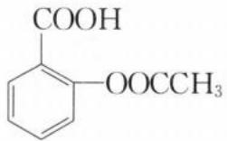

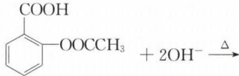

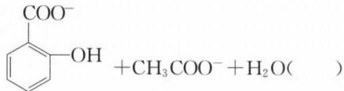

解析:(1)(×) $CuSO_{4}$ 溶液和 $\mathrm{Ba(OH)}_{2}$ 溶液反应,同时生成硫酸钡沉淀和氢氧化铜沉淀。正确的离子方程式为 $\mathrm{Cu}^{2+}+2\mathrm{OH}^{-}+\mathrm{Ba}^{2+}+\mathrm{SO}_{4}^{2-}=\mathrm{BaSO}_{4}\downarrow+\mathrm{Cu(OH)}_{2}\downarrow$ 。

(2) $(\times)\mathrm{NH}_{4}\mathrm{Fe}(\mathrm{SO}_{4})_{2}$ 溶液和 $\mathrm{Ba(OH)}_{2}$ 溶液反应，溶液中有色离子 $Fe^{3+}$ 恰好完全反应时，则 $\mathrm{NH}_{4}\mathrm{Fe}(\mathrm{SO}_{4})_{2}$ 和 $\mathrm{Ba(OH)}_{2}$ 按物质的量 1:1.5（即 2:3）反应，同时生成 $\mathrm{BaSO}_{4}$ 沉淀和 $\mathrm{Fe(OH)}_{3}$ 沉淀。正确的离子方程式为 $2\mathrm{Fe}^{3+} + 6\mathrm{OH}^{-} + 3\mathrm{Ba}^{2+} + 3\mathrm{SO}_{4}^{2-} = 3\mathrm{BaSO}_{4}\downarrow + 2\mathrm{Fe(OH)}_{3}\downarrow$ 。 $\left(\mathrm{NH}_{4}^{+}\right.$ 与 $OH^{-}$ 会反应生成 $NH_{3}\cdot H_{2}O$ ，若溶液有 $Fe^{3+}$ ，则 $NH_{3}\cdot H_{2}O$ 与 $Fe^{3+}$ 又进一步反应生成 $\mathrm{Fe(OH)}_{3}$ 和 $NH_{4}^{+}$ ，因此可视为 $OH^{-}$ 优先和 $Fe^{3+}$ 反应。当 $Fe^{3+}$ 恰好完全沉淀时，产物无 $NH_{3}\cdot H_{2}O$ ；若 $\mathrm{Ba(OH)}_{2}$ 溶液足量或过量，则产物有 $NH_{3}\cdot H_{2}O$ 。

(3)(×)向 $\mathrm{NH_{4}Al(SO_{4})_{2}}$ 中加入足量 NaOH 溶液，既生成 $\mathrm{NH_{3}\cdot H_{2}O}$ ，又生成 $[\mathrm{Al(OH)}_{4}]^{-}$ （或 $AlO_{2}^{-}$ ）。正确的离子方程式为 $NH_{4}^{+} + Al^{3+} + 5OH^{-} = NH_{3}\cdot H_{2}O + [\mathrm{Al(OH)}_{4}]^{-}$ （或 $NH_{4}^{+} + Al^{3+} + 5OH^{-} = NH_{3}\cdot H_{2}O + AlO_{2}^{-} + 2H_{2}O$ ）。

(4)(×)向 $\mathrm{Ba(NO_{3})_{2}}$ 中通入 $SO_{2}$ ， $SO_{2}$ 的氧化产物 $SO_{4}^{2-}$ 还要和 $Ba^{2+}$ 生成 $BaSO_{4}$ 沉淀。正确的离子方程式为 $3SO_{2} + 2NO_{3}^{-} + 2H_{2}O + 3Ba^{2+} = 3BaSO_{4}\downarrow + 2NO + 4H^{+}$ 。

(5)(×)ClO $^{-}$ 与SO $_{2}$ 先发生氧化还原反应ClO $^{-}$ +SO $_{2}$ +H $_{2}$ O=Cl $^{-}$ +SO $_{4}^{2-}$ +2H $^{+}$ (生成强酸)，由于ClO $^{-}$ 过量，根据强酸制弱酸的原理可知还会发生H $^{+}$ +ClO $^{-}$ =HClO。正确的离子方程式为SO $_{2}$ +3ClO $^{-}$ +H $_{2}$ O=SO $_{4}^{2-}$ +Cl $^{-}$ +2HClO。

(6)(×)电解氯化镁溶液时,阴极产生的 $OH^{-}$ 与溶液中 $Mg^{2+}$ 会生成 $\mathrm{Mg(OH)}_{2}$ 沉淀。正确的离子方程式为 $2Cl^{-} + 2H_{2}O + Mg^{2+} \xlongequal{\text{电解}} Cl_{2} \uparrow + H_{2} \uparrow + Mg(OH)_{2} \downarrow$ 。

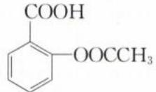

(7)(×)乙酰水杨酸 $\ce{C6H5OOCCCH3}$ 与 NaOH 溶液共热,与苯环直接相连的—COOH 与 NaOH 发生中和反应生成—COONa;1 份酯基水解生成 1 份羧基和 1 份酚羟基,水解产物再与 2 份 NaOH 发生中和反应,该

判断题忽略了酚羟基与 NaOH 的反应。正确的离子方程式为： $\ce{C6H5COOH} + 3OH^- \xrightarrow{\Delta} \ce{C6H5COO^-} + CH_3COO^- + 2H_2O$

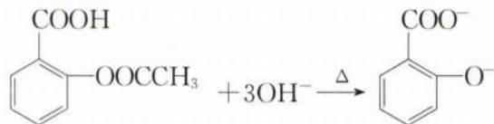

答案:(1)× (2)× (3)× (4)× (5)× (6)× (7)×

类型 VI: 判断是否符合“量”的关系

【例 6】正误判断, 正确的填“√”, 错误的填“×”

(1)少量稀盐酸滴入 $Na_{2}CO_{3}$ 溶液中: $CO_{3}^{2-} + 2H^{+} = CO_{2}\uparrow + H_{2}O$ ( )

(2)向稀盐酸中滴加少量 $Na_{2}SO_{3}$ 溶液: $SO_{3}^{2-} + H^{+} = HSO_{3}^{-}$ ( )

(3)用足量 NaOH 溶液吸收 $H_{2}S:H_{2}S+2OH^{-}=S^{2-}+2H_{2}O$ ( )

(4) 将少量 $CO_{2}$ 通入漂白液中: $CO_{2} + 2ClO^{-} + H_{2}O = CO_{3}^{2-} + 2HClO$ ( )

(5) 将少量 $CO_{2}$ 通入漂白粉溶液中: $Ca^{2+} + CO_{2} + 2ClO^{-} + H_{2}O = CaCO_{3} \downarrow + 2HClO$ ( )

(6)少量 $\mathrm{CO}_{2}$ 通入苯酚钠溶液中： $2\mathrm{C}_{6}\mathrm{H}_{5}\mathrm{O}^{-} + \mathrm{CO}_{2} + \mathrm{H}_{2}\mathrm{O}\rightarrow 2\mathrm{C}_{6}\mathrm{H}_{5}\mathrm{OH} + \mathrm{CO}_{3}^{2 - }(\quad)$

(7) $Na_{2}S$ 溶液吸收少量 $CO_{2}$ [已知 $K_{a_{1}}(H_{2}CO_{3})>K_{a_{1}}(H_{2}S)>K_{a_{2}}(H_{2}CO_{3})>K_{a_{2}}(H_{2}S)]:S^{2-}+CO_{2}+H_{2}O=CO_{3}^{2-}+H_{2}S\uparrow()$

(8)Fe溶于足量稀 $HNO_{3}$ 中： $3Fe + 2NO_{3}^{-} + 8H^{+} = 3Fe^{2+} + 2NO \uparrow + 4H_{2}O()$ (9)Al和少量 NaOH 溶液反应： $2\mathrm{Al} + 6\mathrm{OH}^{-} = 2\mathrm{Al(OH)}_{3}\downarrow + 3\mathrm{H}_{2}\uparrow()$ (10)向 $\mathrm{Na[Al(OH)}_{4}]$ 溶液中滴加少量盐酸： $[\mathrm{Al(OH)}_{4}]^{-} + 4\mathrm{H}^{+} = \mathrm{Al}^{3+} + 2\mathrm{H}_{2}\mathrm{O()}$ (11)向 $\mathrm{Na[Al(OH)}_{4}]$ 溶液中通入足量 $CO_{2}:\left[\mathrm{Al(OH)}_{4}\right]^{-} + CO_{2}=\mathrm{HCO}_{3}^{-}+\mathrm{Al(OH)}_{3}\downarrow()$ (12)向含有 $1\,mol\,Na[Al(OH)}_{4}]$ 的溶液中通入 $2\,mol$ 盐酸： $3\left[\mathrm{Al(OH)}_{4}\right]^{-} + 6\mathrm{H}^{+}=\mathrm{Al}^{3+} + 2\mathrm{Al(OH)}_{3}\downarrow + 6\mathrm{H}_{2}\mathrm{O()}$ (13) $AlCl_{3}$ 和过量 $Na_{2}CO_{3}$ 溶液混合： $2\mathrm{Al}^{3+} + 3\mathrm{CO}_{3}^{2-} + 3\mathrm{H}_{2}\mathrm{O} = 3\mathrm{CO}_{2}\uparrow + 2\mathrm{Al(OH)}_{3}\downarrow()$ (14)向 $FeI_{2}$ 溶液中通入少量 $Cl_{2}:2Fe^{2+} + Cl_{2}=2Fe^{3+} + 2Cl^{-()}$ (15)向含有 $1\,mol\,FeBr_{2}$ 的溶液中通入 $1\,mol\,Cl_{2}:2Fe^{2+} + 4Br^{-} + 3Cl_{2}=2Fe^{3+} + 2Br_{2} + 6Cl^{-()}$ (16)向 $NaHSO_{4}$ 溶液中滴加 $\mathrm{Ba(OH)}_{2}$ 使溶液成中性： $SO_{4}^{2-} + OH^{-} + Ba^{2+} + H^{+} = BaSO_{4}\downarrow + H_{2}O()$ (17)等物质的量浓度、等体积的 $NH_{4}HSO_{4}$ 和 $\mathrm{Ba(OH)}_{2}$ 混合： $NH_{4}^{+} + H^{+} + SO_{4}^{2-} + 2OH^{-} + Ba^{2+} = NH_{3}\cdot H_{2}O + BaSO_{4}\downarrow + H_{2}O()$ (18)向 $\mathrm{NH}_{4}\mathrm{Al(SO}_{4})_{2}$ 溶液中滴加 $\mathrm{Ba(OH)}_{2}$ 溶液使 $SO_{4}^{2-}$ 恰好完全沉淀，离子方程式为： $NH_{4}^{+} + Al^{3+} + 2SO_{4}^{2-} + 2Ba^{2+} + 4OH^{-} = NH_{3}\cdot H_{2}O + Al(OH)_{3}\downarrow + 2BaSO_{4}\downarrow()$ 解析：(1)(×)少量 HCl 只能让 $CO_{3}^{2-}$ 转化成 $HCO_{3}^{-}$ ，所以正确的离子方程式为 $CO_{3}^{2-} + H^{+} = HCO_{3}^{-}$ 。

(2)(×)足量 HCl 让 $SO_{3}^{2-}$ 转化成 $SO_{2}$ ，所以正确的离子方程式为 $SO_{3}^{2-} + 2H^{+} = SO_{2}\uparrow + H_{2}O$ 。

(3)(√)用足量 NaOH 溶液吸收二元酸 $H_{2}S$ ，则 $H_{2}S$ 中可电离的 $H^{+}$ 将完全消耗，最终转化成 $S^{2-}$ 。

(4)(×)由于 HClO 的酸性介于 $H_{2}CO_{3}$ 与 $HCO_{3}^{-}$ 之间，将 $CO_{2}$ 通入漂白液中（主要成分为 NaClO），不存在量变引起质变， $CO_{2}$ 只能变成 $HCO_{3}^{-}$ ，所以正确的离子方程式为 $CO_{2} + ClO^{-} + H_{2}O = HCO_{3}^{-} + HClO$ 。

(5)(√)此题若类比第4题，也不应该有量变引起质变，但漂白粉溶液和漂白液的离子种类不一样，漂白粉中存在 $\mathrm{Ca^{2+}}$ ， $\mathrm{Ca^{2+}}$ 要结合 $\mathrm{CO_3^{2-}}$ 生成 $\mathrm{CaCO_3}$ ，促进 $\mathrm{HCO_3^-}$ 的电离。所以 $\mathrm{CO_2}$ 通入漂白粉溶液，存在量变引起质变。正确的离子方程式为 $\mathrm{Ca^{2+} + CO_2 + 2ClO^- + H_2O = CaCO_3\downarrow + 2HClO}$

$$
\mathrm{H} _ {2} \mathrm{CO} _ {3}
$$

$$
\mathrm{HCO} _ {3} ^ {-}
$$

$$
\mathrm{CO} _ {2}
$$

$$
\mathrm{CO} _ {2}
$$

$$
\mathrm{HCO} _ {3} ^ {-}
$$

$$
\mathrm{CO} _ {2} + \mathrm{C} _ {6} \mathrm{H} _ {5} \mathrm{O} ^ {-} + \mathrm{H} _ {2} \mathrm{O} \rightarrow \mathrm{C} _ {6} \mathrm{H} _ {5} \mathrm{OH} + \mathrm{HCO} _ {3} ^ {-}
$$

(7)(×)根据 $K_{a1}(H_{2}CO_{3})>K_{a1}(H_{2}S)>K_{a2}(H_{2}CO_{3})>K_{a2}(H_{2}S)$ 可知，酸性： $H_{2}CO_{3}>H_{2}S>HCO_{3}^{-}>HS^{-}$ 。少量 $CO_{2}$ （在水中视为 $H_{2}CO_{3}$ ）溶于 $Na_{2}S$ 溶液， $H_{2}CO_{3}$ 第一步电离出的 $H^{+}$ 结合 $S^{2-}$ ，生成的产物有 $HS^{-}$ 和 $HCO_{3}^{-}$ 。由于 $HCO_{3}^{-}$ 酸性弱于 $H_{2}S$ ，所以 $HCO_{3}^{-}$ 无法和 $HS^{-}$ 再进一步反应变成 $CO_{3}^{2-}$ 和 $H_{2}S$ 。但 $HCO_{3}^{-}$ 酸性强于 $HS^{-}$ ，所以 $HCO_{3}^{-}$ 与过量 $S^{2-}$ 继续反应，最终生成 $HS^{-}$ 和 $CO_{3}^{2-}$ 。正确的离子方程式为 $2S^{2-}+CO_{2}+H_{2}O=CO_{3}^{2-}+2HS^{-}$ 。（若是向 $Na_{2}S$ 溶液持续通入 $CO_{2}$ 至过量，溶液中 $S^{2-}$ 会与 $CO_{2}$ 反应，先转化为 $HS^{-}$ 与 $HCO_{3}^{-}$ ，接着 $CO_{2}$ 再与 $HS^{-}$ 反应生成 $H_{2}S$ 与 $HCO_{3}^{-}$ 。该反应的离子方程式为 $2CO_{2}+2H_{2}O+S^{2-}=2HCO_{3}^{-}+H_{2}S$ 。

(8)(×)稀硝酸有强氧化性,Fe和稀硝酸本质上生成 $\mathrm{Fe}^{3+}$ ,若Fe过量,则 $\mathrm{Fe}、\mathrm{Fe}^{3+}$ 发生归中反应生成 $\mathrm{Fe}^{2+}$ 。该题中铁粉不足,没有归中反应发生,所以正确的离子方程式为 $\mathrm{Fe}+\mathrm{NO}_{3}^{-}+4\mathrm{H}^{+}=\mathrm{Fe}^{3+}+\mathrm{NO}\uparrow+2\mathrm{H}_{2}\mathrm{O}$ 。(9)(×) $\mathrm{Al}、\mathrm{Al}_{2}\mathrm{O}_{3}、\mathrm{Al}(\mathrm{OH})_{3}$ 具有两性,三者与强酸反应均生成 $\mathrm{Al}^{3+}$ ,与强碱反应均生成 $[\mathrm{Al}(\mathrm{OH})_{4}]^{-}$ (或 $\mathrm{AlO}_{2}^{-}$ )。正确的离子方程式为 $2\mathrm{Al}+2\mathrm{OH}^{-}+6\mathrm{H}_{2}\mathrm{O}=2[\mathrm{Al}(\mathrm{OH})_{4}]^{-}+3\mathrm{H}_{2}\uparrow$ (或 $2\mathrm{Al}+2\mathrm{OH}^{-}+2\mathrm{H}_{2}\mathrm{O}=2\mathrm{AlO}_{2}^{-}+3\mathrm{H}_{2}\uparrow$ )。(具有两性的 $\mathrm{Al}、\mathrm{Al}_{2}\mathrm{O}_{3}、\mathrm{Al}(\mathrm{OH})_{3}$ 与强酸反应,不存在量变引起质变,产物只能是 $\mathrm{Al}^{3+}$ ;具有两性的 $\mathrm{Al}、\mathrm{Al}_{2}\mathrm{O}_{3}、\mathrm{Al}(\mathrm{OH})_{3}$ 与强碱反应,也不存在量变引起质变,产物只能是 $[\mathrm{Al}(\mathrm{OH})_{4}]^{-}$ (或 $\mathrm{AlO}_{2}^{-}$ )。 $\mathrm{Al}^{3+}$ 与强碱反应才存在量变引起质变, $[\mathrm{Al}(\mathrm{OH})_{4}]^{-}$ (或 $\mathrm{AlO}_{2}^{-}$ )与强酸反应才存在量变引起质变。)(10)(×)少量 $\mathrm{H}^{+}$ 只能让 $[\mathrm{Al}(\mathrm{OH})_{4}]^{-}$ 转化成 $\mathrm{Al}(\mathrm{OH})_{3}$ ,只有当强酸过量时 $[\mathrm{Al}(\mathrm{OH})_{4}]^{-}$ 才能转化成 $\mathrm{Al}^{3+}$ ,所以正确的离子方程式为 $[\mathrm{Al}(\mathrm{OH})_{4}]^{-}+\mathrm{H}^{+}=\mathrm{Al}(\mathrm{OH})_{3}\downarrow+\mathrm{H}_{2}\mathrm{O}$ 。(11)(√) $\mathrm{CO}_{2}$ 通入 $\mathrm{Na}[\mathrm{Al}(\mathrm{OH})_{4}]$ 溶液中,少量 $\mathrm{CO}_{2}$ 生成 $\mathrm{CO}_{3}^{2-}$ 、足量 $\mathrm{CO}_{2}$ 生成 $\mathrm{HCO}_{3}^{-}$ 。但无论通入 $\mathrm{CO}_{2}$ 是少量还是足量, $[\mathrm{Al}(\mathrm{OH})_{4}]^{-}$ 只能生成 $\mathrm{Al}(\mathrm{OH})_{3}$ ,所以该离子方程式正确。若是往 $\mathrm{Na}[\mathrm{Al}(\mathrm{OH})_{4}]$ 溶液中通入“少量” $\mathrm{CO}_{2}$ ,离子方程式为 $2[\mathrm{Al}(\mathrm{OH})_{4}]^{-}+\mathrm{CO}_{2}=\mathrm{CO}_{3}^{2-}+2\mathrm{Al}(\mathrm{OH})_{3}\downarrow+\mathrm{H}_{2}\mathrm{O}$ 。

(12)(√)[Al(OH) $_{4}$ ] $^{-}$ 与H $^{+}$ 反应的两个特殊反应节点分别是物质的量之比为1:1、1:4，当[Al(OH) $_{4}$ ] $^{-}$ 与H $^{+}$ 物质的量之比为1:1混合时，产物中的铝元素只以Al(OH) $_{3}$ 形式存在；当[Al(OH) $_{4}$ ] $^{-}$ 与H $^{+}$ 物质的量之比为1:4混合时，产物中的铝元素只以Al $^{3+}$ 形式存在。题目中[Al(OH) $_{4}$ ] $^{-}$ 与H $^{+}$ 物质的量之比为1:2混合，该比例介于两个极值点之间，产物既有Al(OH) $_{3}$ ，又有Al $^{3+}$ 。将1:2直接作为[Al(OH) $_{4}$ ] $^{-}$ 、H $^{+}$ 的计量数，根据电荷守恒得知Al $^{3+}$ 的计量数为 $\frac{1}{3}$ ，再通过元素守恒可知Al(OH) $_{3}$ 的计量数为 $\frac{2}{3}$ ，将计量数扩大为最简单整数比，最后补H $_{2}$ O调平H、O原子，可得选项对应的离子方程式。

(13) $(\times)\mathrm{Al}^{3+}$ 和 $\mathrm{CO}_{3}^{2-}$ 混合会发生彻底双水解生成 $\mathrm{Al(OH)}_{3}$ 和 $\mathrm{CO}_{2}$ ，但是由于 $\mathrm{CO}_{3}^{2-}$ 过量，产物 $\mathrm{CO}_{2}$ 和过量的 $\mathrm{CO}_{3}^{2-}$ 会继续反应生成 $\mathrm{HCO}_{3}^{-}$ 。所以正确的离子方程式为 $\mathrm{Al}^{3+} + 3\mathrm{CO}_{3}^{2-} + 3\mathrm{H}_{2}\mathrm{O} = 3\mathrm{HCO}_{3}^{-} + \mathrm{Al(OH)}_{3}\downarrow$ 。

(14) $(\times)\mathrm{Cl}_2$ 是强氧化剂， $\mathrm{FeI}_2$ 是还原剂和还原剂组合 $(\mathrm{Fe}^{2+}$ 和 $\mathrm{I}^{-}$ 都可以被 $\mathrm{Cl}_2$ 氧化)，当 $\mathrm{Cl}_2$ 少时只能氧化其中还原性较强的 $\mathrm{I}^{-}$ ，所以正确的离子方程式为 $2\mathrm{I}^{-} + \mathrm{Cl}_2 = 2\mathrm{Cl}^{-} + \mathrm{I}_2$ 。

(15)(×)当两种反应物的量都已知的情况下,需判断反应中谁少量、谁过量,或二者是否恰好完全反应。 $1\mathrm{mol}\mathrm{FeBr}_2$ 最多可以失去 $3\mathrm{mol}\mathrm{e}^{-}, 1\mathrm{mol}\mathrm{Cl}_2$ 最多得到 $2\mathrm{mol}\mathrm{e}^{-}$ ,根据以少定多的原则以及谁强谁优先的原则, $\mathrm{Cl}_2$ 少量,将 $1\mathrm{mol}\mathrm{Cl}_2$ 代入分析。 $1\mathrm{mol}\mathrm{Cl}_2$ 先消耗掉 $1\mathrm{mol}$ 还原性较强 $\mathrm{Fe}^{2+}$ ,再消耗 $1\mathrm{mol}\mathrm{Br}^{-}$ ,所以正确的离子方程式为: $2\mathrm{Fe}^{2+} + 2\mathrm{Br}^{-} + 2\mathrm{Cl}_2 = 2\mathrm{Fe}^{3+} + \mathrm{Br}_2 + 4\mathrm{Cl}^{-}$ 。

(16)(×)Ba(OH) $_{2}$ 电离OH $^{-}$ 数目为2,NaHSO $_{4}$ 电离H $^{+}$ 数目为1,要使溶液成中性,则Ba(OH) $_{2}$ 与NaHSO $_{4}$ 按物质的量1:2反应,所以正确的离子方程式为:Ba $^{2+}$ +2OH $^{-}$ +2H $^{+}$ +SO $_{4}^{2-}$ =BaSO $_{4}$ ↓+2H $_{2}$ O。

(17)(√)等物质的量浓度、等体积 $NH_{4}HSO_{4}$ 和 $\mathrm{Ba(OH)}_{2}$ 混合，即 $NH_{4}HSO_{4}$ 和 $\mathrm{Ba(OH)}_{2}$ 按物质的量 1:1 反应。其中 $\mathrm{Ba(OH)}_{2}$ 电离出的一份 $OH^{-}$ 与 $H^{+}$ 反应生成 $H_{2}O$ ，另一份 $OH^{-}$ 与 $NH_{4}^{+}$ 反应生成 $NH_{3}\cdot H_{2}O$ ，所以该离子方程式正确。

(18)(√) $NH_{4}Al(SO_{4})_{2}$ 溶液中滴加 $\mathrm{Ba(OH)}_{2}$ 溶液使 $SO_{4}^{2-}$ 恰好完全沉淀，表示 $n[NH_{4}Al(SO_{4})_{2}]$ : $n[Ba(OH)_{2}] = 1:2,4$ 份 $OH^{-}$ 中，有 3 份 $OH^{-}$ 与 1 份 $Al^{3+}$ 生成 $\mathrm{Al(OH)}_{3},1$ 份 $OH^{-}$ 与 1 份 $NH_{4}^{+}$ 生成 $NH_{3} \cdot H_{2}O$ ，所以该离子方程式正确。
答案：(1)× (2)× (3)√ (4)× (5)√ (6)× (7)× (8)× (9)× (10)× (11)√ (12)√

答案:(1)× (2)× (3)√ (4)× (5)√ (6)× (7)× (8)× (9)× (10)× (11)√ (12)√
(13)× (14)× (15)× (16)× (17)√ (18)√

【反思】审题时一定要仔细，看清楚到底是谁“少量”或“过量”。

类型Ⅶ: 判断是否存在浓度或温度造成的“量变引起质变”

【例 7】正误判断, 正确的填“√”, 错误的填“×”

$$
\text {   的   } \mathrm{KOH} \text {   溶液中通入   } \mathrm{Cl} _ {2}: \mathrm{Cl} _ {2} + 2 \mathrm{OH} ^ {-} = \mathrm{ClO} ^ {-} + \mathrm{Cl} ^ {-} + \mathrm{H} _ {2} \mathrm{O} (\quad)
$$

(2) $\mathrm{MnO_2}$ 与热的 $1\mathrm{mol / L}$ 盐酸反应制备 $\mathrm{Cl}_2:\mathrm{MnO}_2 + 2\mathrm{Cl}^- +4\mathrm{H}^+ = \mathrm{Mn}^{2 + } + \mathrm{Cl}_2\uparrow +2\mathrm{H}_2\mathrm{O}()$

(3)浓硫酸溶解锌粒: $\mathrm{Zn}+2\mathrm{H}^{+}=\mathrm{Zn}^{2+}+2\mathrm{H}_{2}\mathrm{O}$

(4)铜溶于浓硝酸: $3Cu+2NO_{3}^{-}+8H^{+}=3Cu^{2+}+2NO\uparrow+4H_{2}O$

解析:(1)(×) $Cl_{2}+2OH^{-}=ClO^{-}+Cl^{-}+H_{2}O$ 是向“冷”的氢氧化钾溶液中通入氯气所对应的离子方程式。加热条件下,氯气和强碱发生歧化反应时,氧化产物不是+1价的氯,即氧化产物不是KClO,而是更高价态的 $KClO_{3}$ 。(人教版教材必修一第二章第二节中提到了漂白粉的制备过程:将 $Cl_{2}$ 通入“冷”的石灰乳 $\left[Ca(OH)_{2}\right]$ 中,即制得以 $Ca(ClO)_{2}$ 为有效成分的漂白粉。由此可知,精心研读教材的重要性。)

(2)(×) $MnO_{2}$ 与热的浓盐酸反应才可制备氯气，且浓盐酸一般浓度大于6 mol/L。

(3)(×)浓硫酸是强氧化性酸,与锌反应的还原产物的是 $SO_{2}$ 。 $Zn+2H^{+}=Zn^{2+}+H_{2}\uparrow$ 是锌与稀硫酸反应的离子方程式。

(4)(×)浓硝酸的还原产物一般为 $NO_{2}$ ， $3Cu + 2NO_{3}^{-} + 8H^{+} = 3Cu^{2+} + 2NO\uparrow + 4H_{2}O$ 是 Cu 溶于稀硝酸的离子方程式。

答案:(1)× (2)× (3)× (4)×

【反思】审题时注意勾画“稀”“浓”以及“温度”

# 模块 4 离子大量共存题型(★★)

习题：P9

## 内容提要

一、离子大量共存的本质:体系中的几种离子不发生化学反应,即各个离子不生成沉淀、气体、弱电解质;不生成配合物;不发生氧化还原反应等。

注:离子共存默认是“大量”离子共存,比如大量 $H^{+}$ 和 $OH^{-}$ 虽然会发生反应,但水中却可以同时存在少量 $H^{+}$ 和 $OH^{-}$ 。

## 二、离子大量共存的附加条件

## 1. 常见有色离子：

<table><tr><td>颜色</td><td>橙</td><td>黄</td><td>绿</td><td>蓝</td><td>紫红</td></tr><tr><td>常见离子</td><td> $Cr_{2}O_{7}^{2-}$ </td><td> $CrO_{4}^{2-}$ 、 $Fe^{3+}$ 、 $[Fe(CN)_{6}]^{3-}$ 、 $[CuCl_{4}]^{2-}$ </td><td> $Fe^{2+}$ 、 $Cr^{3+}$ </td><td> $Cu^{2+}$ 或 $[Cu(H_{2}O)_{4}]^{2+}$ 、 $[Cu(NH_{3})_{4}]^{2+}$ </td><td> $MnO_{4}^{-}$ </td></tr></table>

注:(1)“透明”是指没有沉淀的澄清溶液,有颜色的溶液可以澄清透明,因此“透明”和“有色”不冲突。如无色溶液中, $Cu^{2+}$ 不能大量存在,但透明溶液中, $Cu^{2+}$ 则可以大量存在。

(2) 记忆离子颜色时, 按照可见光光波由长到短的顺序, 即按照红橙黄绿蓝靛紫的顺序。注意思维有序性在记忆法中的运用。

## 2. 溶液酸碱性

<table><tr><td>条件</td><td>性质</td></tr><tr><td>常温下溶液pH</td><td>pH&gt;7碱性、pH&lt;7酸性</td></tr><tr><td>指示剂显色(颜色与pH的关系)</td><td>酚酞:&lt;8.2无色、8.2~10.0浅红色、&gt;10.0红色石蕊:&lt;5.0红色、5.0~8.0紫色、&gt;8.0蓝色甲基橙:&lt;3.1红色、3.1~4.4橙色、&gt;4.4黄色</td></tr><tr><td>溶液中 $c(H^{+})$ 、 $c(OH^{-})$ 的比值</td><td> $c(H^{+})/c(OH^{-})>1$ 酸性; $c(H^{+})/c(OH^{-})<1$ 碱性</td></tr><tr><td>加入铝粉放出 $H_{2}$ </td><td>溶液可能酸性,也可能碱性</td></tr><tr><td> $c_{水}(H^{+})$ 或 $c_{水}(OH^{-})$ 远小于 $10^{-7}mol/L$ </td><td>溶液中溶质可能有酸导致溶液呈酸性,也可能有碱导致溶液呈碱性</td></tr><tr><td>含有 $Cr_{2}O_{7}^{2-}$ 、 $Fe^{3+}$ 、 $Al^{3+}$ </td><td>一般是强酸性溶液</td></tr><tr><td>含有 $CrO_{4}^{2-}$ 、 $[Al(OH)_{4}]^{-}$ </td><td>一般是强碱性溶液</td></tr></table>

注:(1)多元弱酸的酸式酸根具有两性,如 $HCO_{3}^{-}$ 、 $HC_{2}O_{4}^{-}$ 、 $HSO_{3}^{-}$ 、 $HS^{-}$ 、 $H_{2}PO_{4}^{-}$ 、 $HPO_{4}^{2-}$ 等,既不能和 $H^{+}$ 大量共存,也不能和 $OH^{-}$ 大量共存。

(2)用口诀法以及思维有序性记忆指示剂的变色点以及颜色。口诀:太实诚,怕饿咬你,我怕,三姨试试。“太实诚”即“酚酞、石蕊、甲基橙”,“怕饿\~咬你”即“8.2\~10”,“我\~怕”即“5\~8”,“三姨\~试试”即“3.1\~4.4”。按照pH由大到小的顺序(酚酞、石蕊、甲基橙,即“太实诚”)有序记忆。

## 三、判断离子能否大量共存的五个方面：

## 1. 因生成沉淀(或微溶性物质)不能大量共存。

<table><tr><td>离子</td><td>不能大量共存的离子</td></tr><tr><td> $F^{-}$ </td><td> $Ca^{2+}$ 、 $Mg^{2+}$ </td></tr><tr><td> $Cl^{-}$ 、 $Br^{-}$ 、 $I^{-}$ </td><td> $Ag^{+}$ 、 $Cu^{+}$ </td></tr><tr><td> $SO_{4}^{2-}$ </td><td> $Ba^{2+}$ 、 $Pb^{2+}$ (生成难溶物); $Ca^{2+}$ 、 $Ag^{+}$ (生成微溶物)</td></tr><tr><td> $CO_{3}^{2-}$ 、 $SO_{3}^{2-}$ 、 $PO_{4}^{3-}$ 、 $S^{2-}$ 、 $SiO_{3}^{2-}$ </td><td>除 $Na^{+}$ 、 $K^{+}$ 以外的绝大多数阳离子</td></tr><tr><td> $OH^{-}$ </td><td>除 $Na^{+}$ 、 $K^{+}$ 、 $Ba^{2+}$ 以外的绝大多数阳离子,其中与 $Ca^{2+}$ 生成微溶物</td></tr></table>

## 2. 因生成弱电解质而不能大量共存。

<table><tr><td>离子</td><td>不能大量共存的离子</td></tr><tr><td> $H^{+}$ </td><td>弱酸阴离子( $CO_{3}^{2-}$ 、 $HCO_{3}^{-}$ 、 $SO_{3}^{2-}$ 、 $HSO_{3}^{-}$ 、 $S^{2-}$ 、 $HS^{-}$ 、 $C_{2}O_{4}^{2-}$ 、 $HC_{2}O_{4}^{-}$ 、 $PO_{4}^{3-}$ 、 $H_{2}PO_{4}^{-}$ 、 $HPO_{4}^{2-}$ 、 $ClO^{-}$ 、 $F^{-}$ 等)与 $H^{+}$ 反应而不能大量共存; $[Al(OH)_{4}]^{-}$ (或 $AlO_{2}^{-}$ )与 $H^{+}$ 反应生成 $Al(OH)_{3}$ 或 $Al^{3+}$ ,二者也无法大量共存。</td></tr><tr><td> $OH^{-}$ </td><td>(1)弱碱阳离子( $Mg^{2+}$ 、 $Al^{3+}$ 、 $Fe^{3+}$ 、 $Fe^{2+}$ 、 $Cu^{2+}$ 、 $NH_{4}^{+}$ 等)与 $OH^{-}$ 反应生成弱碱而不能大量共存。(2)弱酸的酸式酸根( $HCO_{3}^{-}$ 、 $HSO_{3}^{-}$ 、 $HS^{-}$ 、 $HC_{2}O_{4}^{-}$ 、 $H_{2}PO_{4}^{-}$ 、 $HPO_{4}^{2-}$ )与 $OH^{-}$ 反应生成水和酸根阴离子而不能大量共存。</td></tr></table>

注:根据记少不记多的原则,记住 $H^{+}$ 可与强酸阴离子: $ClO_{4}^{-}$ 、 $I^{-}$ 、 $Br^{-}$ 、 $Cl^{-}$ 、 $NO_{3}^{-}$ 、 $SO_{4}^{2-}$ 大量共存; $OH^{-}$ 可与三种强碱阳离子: $Na^{+}$ 、 $K^{+}$ 、 $Ba^{2+}$ 大量共存。

## 3. 强氧化性与强还原性离子在溶液中会发生氧化还原反应不能大量共存。

下表中所列离子可以大量共存的填“√”，不可以大量共存的填“×”。

<table><tr><td>顺序</td><td colspan="8">还原性由强到弱</td></tr><tr><td rowspan="7">氧化性由弱到强</td><td rowspan="2" colspan="2">谐音/离子</td><td>牛</td><td>牛雅</td><td>典</td><td>(地)铁</td><td>秀</td><td>绿(箭)</td></tr><tr><td> $S^{2-}/HS^{-}$ </td><td> $SO_{3}^{2-}/HSO_{3}^{-}$ </td><td> $I^{-}$ </td><td> $Fe^{2+}$ </td><td> $Br^{-}$ </td><td> $Cl^{-}$ </td></tr><tr><td>铁</td><td> $Fe^{3+}$ </td><td>×</td><td>×</td><td>×</td><td>√</td><td>√</td><td>√</td></tr><tr><td>蛋</td><td> $NO_{3}^{-}(H^{+})$ </td><td>×</td><td>×</td><td>×</td><td>×</td><td>—</td><td>√</td></tr><tr><td>哥</td><td> $Cr_{2}O_{7}^{2-}(H^{+})$ </td><td>×</td><td>×</td><td>×</td><td>×</td><td>×</td><td>×</td></tr><tr><td>孟</td><td> $MnO_{4}^{-}(H^{+})$ </td><td>×</td><td>×</td><td>×</td><td>×</td><td>×</td><td>×</td></tr><tr><td>子</td><td> $ClO^{-}$ </td><td>×</td><td>×</td><td>×</td><td>×</td><td>×</td><td>×(强酸性)√(强碱性)</td></tr></table>

注:(1) $\mathrm{NO}_{3}^{-}\left(\mathrm{H}^{+}\right)$ 与 $Br^{-}$ 能否大量共存和浓度有关,命题时会避开。极高浓度的 $HNO_{3}$ 和 $Cl^{-}$ 会发生氧化还原反应,但在高中题目里, $H^{+}$ 、 $NO_{3}^{-}$ 、 $Cl^{-}$ 三者视为可以大量共存。

(2) $S_{2}O_{3}^{2-}$ 与 $H^{+}$ 无法大量共存: $S_{2}O_{3}^{2-} + 2H^{+} = S \downarrow + SO_{2} \uparrow + H_{2}O$ (在高中该反应一般视为歧化反应)。此外, 在高中我们需知道 $S_{2}O_{3}^{2-}$ 可以与氧化剂 $I_{2}$ 发生氧化还原反应: $I_{2} + 2S_{2}O_{3}^{2-} = 2I^{-} + S_{4}O_{6}^{2-}$ (常出现在氧化还原滴定实验中), 因此 $S_{2}O_{3}^{2-}$ 遇到比 $I_{2}$ 更强的氧化剂, 如 $Fe^{3+}, MnO_{4}^{-}$ 等, 也可以发生氧化还原反应而无法大量共存。

## 4. 因发生彻底双水解而不能大量共存, 常见离子如下:

下表中填“√”的，表示该离子组会发生彻底双水解而无法大量共存。

<table><tr><td>离子种类</td><td colspan="8">阴离子</td></tr><tr><td rowspan="5">阳离子</td><td rowspan="2" colspan="2">谐音/离子</td><td>闺</td><td>女</td><td>谈</td><td>谈</td><td>妞</td><td>妞</td></tr><tr><td> $SiO_{3}^{2-}$ </td><td> $[Al(OH)_{4}]^{-}$ </td><td> $CO_{3}^{2-}$ </td><td> $HCO_{3}^{-}$ </td><td> $S^{2-}$ </td><td> $HS^{-}$ </td></tr><tr><td>吕</td><td> $Al^{3+}$ </td><td>√</td><td>√</td><td>√</td><td>√</td><td>√</td><td>√</td></tr><tr><td>爹</td><td> $Fe^{3+}$ </td><td>√</td><td>√</td><td>√</td><td>√</td><td colspan="2">氧化还原</td></tr><tr><td>爱</td><td> $NH_{4}^{+}$ </td><td>√</td><td>√</td><td colspan="4">——</td></tr></table>

注:(1) $Fe^{3+}$ 与 $S^{2-}$ 、 $HS^{-}$ 不能大量共存,是因为发生氧化还原反应。

(2) $NH_{3}\cdot H_{2}O$ 的碱性不是很强,所以 $NH_{4}^{+}$ 水解的程度较小。如 $NH_{4}^{+}$ 和 $HCO_{3}^{-}$ 、 $NH_{4}^{+}$ 和 $CH_{3}COO^{-}$ ,这两组会发生双水解但微弱,因此可以大量共存。

(3) $Al^{3+}$ 、 $Fe^{3+}$ 水解程度很强与其电荷数为+3有一定的关系。

(4) $\left[Al(OH)_4\right]^-$ （或 $AlO_2^-$ ）和 $HCO_3^-$ 二者发生反应的离子方程式为： $\left[Al(OH)_4\right]^-$ + $HCO_3^- = Al(OH)_3\downarrow + CO_3^{2-} + H_2O$ 或 $AlO_2^- + HCO_3^- + H_2O = Al(OH)_3\downarrow + CO_3^{2-}$ ，不能大量共存的理由并非彻底双水解(注意没有 $CO_{2}$ 生成)，而是因为酸性 $\mathrm{HCO}_{3}^{-} > \mathrm{Al(OH)}_{3}$ ，会发生由强制弱的反应。

5. 因发生配合反应而不能大量共存：

如 $Fe^{3+}$ 和 $SCN^{-}$ 、 $CN^{-}$ 、 $C_{6}H_{5}O^{-}$ （苯酚根离子）不能大量共存。

【例 1】25℃时,判断下列离子的关系(选择 A、B、C 填空)
A. 可以大量共存    B. 不能大量共存    C. 可能大量共存

(1)酸性溶液中: ${\mathrm{{Na}}}^{ + }$ 、 ${\mathrm{{ClO}}}^{ - }$ 、 ${\mathrm{{SO}}}_{4}^{2 - }$ 、 ${\mathrm{I}}^{ - }$ (   )

(2)无色溶液中： $\mathrm{Al}^{3+}$ 、 $\mathrm{NH_4^+}$ 、 $\mathrm{Cl^-}$ 、 $\mathrm{S}^{2-}$ （

(3) $\mathrm{pH} = 1$ 的溶液： $\mathrm{Na^{+},C_{2}O_{4}^{2 - },MnO_{4}^{-},SO_{4}^{2 - }}$ （

(4) $\mathrm{pH} = 11$ 的溶液中: $\mathrm{CO}_{3}^{2-}, \mathrm{Na}^{+}, \mathrm{NO}_{3}^{-}, \mathrm{S}^{2-}, \mathrm{SO}_{3}^{2-}$ ( )

(5) $\mathrm{pH} = 0$ 的无色溶液中: $\mathrm{Cl}^{-}, \mathrm{Na}^{+}, \mathrm{SO}_{4}^{2-}, \mathrm{Fe}^{2+}$ ( )

(6)甲基橙呈红色的溶液中: $\mathrm{Na}^{+}$ 、 $\mathrm{F}^{-}$ 、 $\mathrm{Al}^{3+}$ 、 $\mathrm{NO}_{3}^{-}$ ( )

(7)滴入酚酞显红色的溶液: $\mathrm{Na}^{+}$ 、 $\mathrm{Mg}^{2+}$ 、 $\mathrm{NO}_{3}^{-}$ 、 $\mathrm{HSO}_{3}^{-}$ ( )

(8)使石蕊变红的溶液中： $Fe^{2+}$ 、 $MnO_{4}^{-}$ 、 $NO_{3}^{-}$ 、 $Na^{+}$ 、 $SO_{4}^{2-}$ （）

(9) $c(\mathrm{H}^{+})=1\times10^{-13}\ \mathrm{mol/L}$ 的溶液中: $Mg^{2+}$ 、 $Cu^{2+}$ 、 $SO_{4}^{2-}$ 、 $NO_{3}^{-}$ ( )

(10) $\frac{c(H^{+})}{c(OH^{-})}=10^{-10}$ 的溶液中: $Ca^{2+}$ 、 $Mg^{2+}$ 、 $NO_{3}^{-}$ 、 $I^{-}$ ( )

(11)水电离的 $c(\mathrm{H}^{+})=1\times10^{-13}\ \mathrm{mol/L}$ 的溶液中： $K^{+}$ 、 $Na^{+}$ 、 $[\mathrm{Al(OH)}_{4}]^{-}$ 、 $CO_{3}^{2-}$ （）

(12)水电离的 $c(\mathrm{OH}^{-}) = 10^{-12}\mathrm{mol / L}$ 的溶液中： $\mathrm{Cl^-}$ 、 $\mathrm{CO_3^{2 - }}$ 、 $\mathrm{NO}_3^-$ 、 $\mathrm{NH_4^+}$ 、 $\mathrm{SO}_3^{2 - }$ （

(13)中性溶液中可能大量存在 $\mathrm{Fe}^{3+}$ 、 $\mathrm{K}^{+}$ 、 $\mathrm{Cl}^{-}$ 、 $\mathrm{SO}_4^{2-}$ （

(14)弱碱性溶液中可能大量存在 $Na^{+}$ 、 $K^{+}$ 、 $Cl^{-}$ 、 $HCO_{3}^{-}$ （）

(15)常温下,加水稀释时 $\frac{c(\mathrm{H}^{+})}{c(\mathrm{OH}^{-})}$ 的值明显增大的溶液: $\mathrm{CH_{3}COO^{-},Ba^{2+},NO_{3}^{-},Br^{-}}$ ( )

(16)0.1 mol/L $FeCl_{3}$ 溶液中: $Fe^{2+}$ 、 $NH_{4}^{+}$ 、 $SCN^{-}$ 、 $SO_{4}^{2-}$ ( )

(17)滴入少量KSCN溶液显红色的溶液中： $\mathrm{Na^{+},K^{+},I^{-},SO_{4}^{2 - }(}$

(18)0.1 mol/L Na[Al(OH) $_{4}$ ]溶液:NH $_{4}^{+}$ 、K $^{+}$ 、HCO $_{3}^{-}$ 、SO $_{3}^{2-}$ ( )

(19)加入 $\mathrm{Mg}$ 能放出 $\mathrm{H}_{2}$ 的溶液中： $\mathrm{Mg}^{2+},\mathrm{NH}_{4}^{+},\mathrm{Cl}^{-},\mathrm{K}^{+},\mathrm{SO}_{4}^{2-}$ （

(20)与Al反应能放出 $\mathrm{H}_{2}$ 的溶液中： $\mathrm{Fe}^{2+},\mathrm{K}^{+},\mathrm{NO}_{3}^{-},\mathrm{SO}_{4}^{2-}$ （

(21)加铝粉能产生氢气的溶液中: $\mathrm{Na}^{+}$ 、 $\mathrm{K}^{+}$ 、 $[\mathrm{Al(OH)}_{4}]^{-}$ 、 $\mathrm{S}_{2}\mathrm{O}_{3}^{2-}$ ( )

(22) $c(ClO^{-})=1.0\ mol/L$ 的溶液中: $Na^{+}$ 、 $SO_{3}^{2-}$ 、 $S^{2-}$ 、 $SO_{4}^{2-}$ （）

(23)0.1 mol/L Fe(NO $_{3}$ ) $_{2}$ 溶液: H $^{+}$ 、Al $^{3+}$ 、SO $_{4}^{2-}$ 、Cl $^{-}$ ( )

(24)含有大量 $NO_{3}^{-}$ 的溶液中: $Na^{+}$ 、 $OH^{-}$ 、 $I^{-}$ 、 $SO_{3}^{2-}$ ( )

(25)0.1 mol/L 氨水: $K^{+}$ 、 $Na^{+}$ 、 $NO_{3}^{-}$ 、 $[Al(OH)_{4}]^{-}$ ( )

(26)通入大量 $CO_{2}$ 的溶液中: $Na^{+}$ 、 $ClO^{-}$ 、 $CH_{3}COO^{-}$ 、 $HCO_{3}^{-}$ ( )

$$
\mathrm{Na} ^ {+}, \mathrm{K} ^ {+}, \mathrm{NO} _ {3} ^ {-}, \mathrm{NH} _ {3} \cdot \mathrm{H} _ {2} \mathrm{O} (\quad)
$$

(28)氢氧化铁胶体: $H^{+}$ 、 $K^{+}$ 、 $S^{2-}$ 、 $Br^{-}$ ( )

(29)高锰酸钾溶液: $H^{+}$ 、 $Na^{+}$ 、 $SO_{4}^{2-}$ 、葡萄糖分子()

解析:(1) $ClO^{-}$ 、 $I^{-}$ 发生氧化还原反应不能大量共存,弱酸根 $ClO^{-}$ 在酸性溶液中也不能大量共存,选B。

(2) $Al^{3+}$ 、 $S^{2-}$ 因发生彻底双水解生成 $H_{2}S$ 气体、 $\mathrm{Al(OH)}_{3}$ 沉淀而不能大量共存，选B。

(3) $\mathrm{pH} = 1$ 为强酸性溶液， $\mathrm{C_2O_4^{2 - }}$ 、 $\mathrm{MnO_4^-}$ 发生氧化还原反应而不能大量共存，选B。

(4) $\mathrm{pH} = 12$ 为强碱性溶液， $\mathrm{CO}_{3}^{2-}, \mathrm{Na}^{+}, \mathrm{NO}_{3}^{-}, \mathrm{S}^{2-}, \mathrm{SO}_{3}^{2-}$ 彼此不反应且与 $\mathrm{OH}^{-}$ 也不反应，可以大量共存，选A。

(5) $Fe^{2+}$ 是浅绿色的离子,无色溶液中 $Fe^{2+}$ 无法大量存在,选B。

(6)甲基橙呈红色的溶液显酸性, $F^{-}$ 与 $H^{+}$ 形成弱电解质HF而不能大量共存,选B。

(7)滴入酚酞显红色的溶液呈碱性, $OH^{-}$ 分别与 $Mg^{2+}$ 、 $HSO_{3}^{-}$ 反应而不能大量共存,选B。

(8)使石蕊变红的溶液呈酸性,强氧化剂 $MnO_{4}^{-}$ 、 $NO_{3}^{-}$ 会氧化 $Fe^{2+}$ 而不能大量共存,选 B。

(9) $25^{\circ}C$ 时， $c(H^{+})=1\times10^{-13}\ mol/L$ 的溶液，呈强碱性(pH=13)， $OH^{-}$ 和 $Mg^{2+}$ 、 $Cu^{2+}$ 形成沉淀而不能大量共存，选B。

(10) $\frac{c(\mathrm{H}^{+})}{c(\mathrm{OH}^{-})}=10^{-10}$ 说明溶液呈碱性 $\left[c(\mathrm{H}^{+})=1\times10^{-12}\mathrm{~mol/L},c(\mathrm{OH}^{-})=1\times10^{-2}\mathrm{~mol/L}\right]$ ， $OH^{-}$ 与 $Ca^{2+}$ 、 $Mg^{2+}$ 形成沉淀而不能大量共存，选B。

(11)常温下纯水电离的 $c(\mathrm{H}^{+})=1\times10^{-7}\ \mathrm{mol/L}$ ，当溶液中水电离的 $c(\mathrm{H}^{+})=1\times10^{-13}\ \mathrm{mol/L}$ ，说明水的电离被大幅抑制，可能是pH=1的强酸性溶液，也可能是pH=13的强碱性溶液。强酸性时 $H^{+}$ 会与 $[Al(OH)_{4}]^{-}$ 、 $CO_{3}^{2-}$ 形成弱电解质；强碱性时 $[Al(OH)_{4}]^{-}$ 、 $CO_{3}^{2-}$ 可以大量共存。所以该条件下， $K^{+}$ 、 $Na^{+}$ 、 $[Al(OH)_{4}]^{-}$ 、 $CO_{3}^{2-}$ 可能大量共存，选C。

(12)常温下纯水电离的 $c(\mathrm{OH}^{-}) = 1\times 10^{-7}\mathrm{mol / L}$ ，因此当水电离的 $c(\mathrm{OH}^{-}) = 1\times 10^{-12}\mathrm{mol / L}$ ，说明水的电离被大幅抑制，可能是 $\mathrm{pH} = 2$ 的强酸性溶液，也可能是 $\mathrm{pH} = 12$ 的强碱性溶液。强酸性时 $\mathrm{H^{+}}$ 会与 $\mathrm{SO}_3^{2-}$ 、 $\mathrm{CO}_3^{2-}$ 形成弱电解质且 $\mathrm{NO}_3^-$ 、 $\mathrm{SO}_3^{2-}$ 发生氧化还原反应；强碱性时 $\mathrm{NH_4^+}$ 与 $\mathrm{OH^-}$ 形成弱电解质不能共存。因此该条件下， $\mathrm{Cl^-}$ 、 $\mathrm{CO}_3^{2-}$ 、 $\mathrm{NO}_3^-$ 、 $\mathrm{NH_4^+}$ 、 $\mathrm{SO}_3^{2-}$ 一定不能大量共存，选B。

(13) $K_{\mathrm{sp}}[\mathrm{Fe(OH)}_{3}]$ 约为 $1\times10^{-38}$ , $Fe^{3+}$ 完全沉淀的 pH 约为 3(请同学记忆), 中性溶液中 $Fe^{3+}$ 已沉淀完全,无法大量存在,选 B。

(14) $HCO_{3}^{-}$ 的水解程度稍大于电离程度,在水溶液中呈弱碱性,因此在弱碱性溶液中能大量存在。其余的 $Na^{+}$ 、 $K^{+}$ 、 $Cl^{-}$ 彼此也都不反应,选A。

(15)加水稀释溶液时,较大量的显性离子其浓度会减小,较少量的隐性离子其浓度会增大。常温下,加水稀释时 $\frac{c(\mathrm{H}^{+})}{c(\mathrm{OH}^{-})}$ 的值明显增大,即 $c(\mathrm{H}^{+})$ 为隐性离子、 $c(\mathrm{OH}^{-})$ 为显性离子,则该溶液呈碱性。在碱性溶液中 $CH_{3}COO^{-}$ 、 $Ba^{2+}$ 、 $NO_{3}^{-}$ 、 $Br^{-}$ 不会反应,能大量共存,选A。

(16) $Fe^{3+}$ 和 $SCN^{-}$ 形成配合物而不能大量共存,选 B。

(17)滴入少量KSCN溶液显红色的溶液中存在 $Fe^{3+}$ ， $Fe^{3+}$ 与 $I^{-}$ 发生氧化还原反应而不能大量共存，选B。

$$
\left[ \mathrm{Al} (\mathrm{OH}) _ {4} \right] ^ {-}
$$

$$
\mathrm{NH} _ {4} ^ {+}
$$

$$
\mathrm{HCO} _ {3} ^ {-}
$$

$$
\mathrm{B} _ {\circ}
$$

(19)加入 $\mathrm{Mg}$ 能放出 $\mathrm{H}_{2}$ 的溶液呈酸性， $\mathrm{Mg}^{2+}, \mathrm{NH}_{4}^{+}, \mathrm{Cl}^{-}, \mathrm{K}^{+}, \mathrm{SO}_{4}^{2-}$ 均可在酸性溶液中大量共存，选A。

(20)Al与强酸、强碱溶液均能生成 $H_{2}$ ，因此该溶液可以呈酸性，也可以呈碱性。酸性时，溶液中有硝酸根存在，则金属铝与硝酸反应产生氮的氧化物，而不是 $H_{2}$ ，且酸性条件下 $NO_{3}^{-}$ 会与 $Fe^{2+}$ 反应而不共存，不符合题意；碱性时 $Fe^{2+}$ 和 $OH^{-}$ 生成沉淀 $\mathrm{Fe(OH)}_{2}$ 。所以该条件下， $Fe^{2+}$ 、 $K^{+}$ 、 $NO_{3}^{-}$ 、 $SO_{4}^{2-}$ 一定不能大量共存，选B。

(21)加铝粉能产生氢气的溶液可能呈碱性,也可能呈酸性。碱性溶液中 $Na^{+}$ 、 $K^{+}$ 、 $[Al(OH)_{4}]^{-}$ 、 $S_{2}O_{3}^{2-}$ 不会反应能大量共存;酸性溶液中, $H^{+}$ 与 $[Al(OH)_{4}]^{-}$ 、 $S_{2}O_{3}^{2-}$ 反应而不能大量共存。所以该条件下, $Na^{+}$ 、 $K^{+}$ 、 $[Al(OH)_{4}]^{-}$ 、 $S_{2}O_{3}^{2-}$ 可能大量共存,选 C。

(22)强氧化性的 $ClO^{-}$ 与强还原性的 $SO_{3}^{2-}$ 、 $S^{2-}$ 发生氧化还原反应而不能大量共存，选 B。

(23) $H^{+}$ 、 $Fe^{2+}$ 、 $NO_{3}^{-}$ 发生氧化还原反应而不能大量共存，选B。

(24)碱性环境中 $NO_{3}^{-}$ 不能氧化 $I^{-}$ 、 $SO_{3}^{2-}$ 而能大量共存，选 A。

(25)0.1 mol/L 氨水呈碱性, 碱性条件下 $K^{+}$ 、 $Na^{+}$ 、 $NO_{3}^{-}$ 、 $[Al(OH)_{4}]^{-}$ 不会反应能大量共存, 选 A。

(26)由于碳酸的酸性强于 HClO, 通入的 $CO_{2}$ 与 $ClO^{-}$ 反应, 使得体系中的 $ClO^{-}$ 不能大量共存, 选 B。

(27)银氨溶液存在的 $\mathrm{OH}^{-}$ 、 $\left[\mathrm{Ag}\left(\mathrm{NH}_{3}\right)_{2}\right]^{+}$ 均与 $Na^{+}$ 、 $K^{+}$ 、 $NO_{3}^{-}$ 、 $NH_{3}\cdot H_{2}O$ 不发生反应，能大量共存，选 A。

(28)氢氧化铁胶体是弱碱性,与 $H^{+}$ 发生中和反应而不能大量共存,且大量离子也会使胶体聚沉,选B。

(29)酸性高锰酸钾溶液会氧化葡萄糖分子中的醛基和羟基而不能大量共存,选 B。(能与酸性高锰酸钾溶液反应的官能团:碳碳双键、碳碳三键、羟基、醛基。)

答案:(1)B (2)B (3)B (4)A (5)B (6)B (7)B (8)B (9)B (10)B (11)C (12)B (13)B (14)A (15)A (16)B (17)B (18)B (19)A (20)B (21)C (22)B (23)B (24)A (25)A (26)B

(27)A (28)B (29)B

【反思】①审题时看清楚题干是“一定可以大量共存”、“一定不能大量共存”还是“可能大量共存”。

②将环境的酸、碱性转化成 $H^{+}$ 、 $OH^{-}$ 带入离子组合中。

③由于 $K^{+}$ 、 $Na^{+}$ 难以形成沉淀和弱电解质，所以二者在溶液中一定可以大量共存。但 $\left[\mathrm{Fe}\left(\mathrm{CN}\right)_{6}\right]^{3-}$ 、 $K^{+}$ 、 $Fe^{2+}$ 会形成蓝色沉淀，导致三者不能大量共存。

【例 2】某无色溶液含有下列离子中的若干种: $H^{+}$ 、 $NH_{4}^{+}$ 、 $Fe^{3+}$ 、 $Ba^{2+}$ 、 $Al^{3+}$ 、 $CO_{3}^{2-}$ 、 $Cl^{-}$ 、 $OH^{-}$ 、 $NO_{3}^{-}$ 。向该溶液中加入铝粉, 只放出 $H_{2}$ , 则溶液中能大量存在的离子最多有( )

A. 3 种    B. 4 种    C. 5 种    D. 6 种

解析：

<table><tr><td>题目条件</td><td colspan="2">离子共存判断依据</td></tr><tr><td rowspan="2">向该“无色溶液”中加入铝粉,只放出 $H_{2}$ :该无色溶液可能酸性,可能碱性。</td><td>若溶液为酸性(含大量 $H^{+}$ )</td><td>(1)溶液无色,则有色离子 $Fe^{3+}$ 不能大量存在。(2)溶液为酸性, $OH^{-}$ 、 $CO_{3}^{2-}$ 不能大量存在。(3)由于“只放出 $H_{2}$ ”,所以 $NO_{3}^{-}$ 不能大量存在(否则 $NO_{3}^{-}$ 在酸性条件下会与Al反应生成NO或 $NO_{2}$ 气体。)因此可以大量存在的离子有: $H^{+}$ 、 $NH_{4}^{+}$ 、 $Ba^{2+}$ 、 $Al^{3+}$ 、 $Cl^{-}$ 共5种。</td></tr><tr><td>若溶液为碱性(含大量 $OH^{-}$ )</td><td>(1)溶液无色,则有色离子 $Fe^{3+}$ 不能大量存在。(2)溶液为碱性, $H^{+}$ 、 $NH_{4}^{+}$ 、 $Al^{3+}$ 不能大量存在。(3)由于溶液中可能的阳离子 $Fe^{3+}$ 、 $H^{+}$ 、 $NH_{4}^{+}$ 、 $Al^{3+}$ 都已经排除,根据电荷守恒,溶液中必有大量存在的阳离子,因此 $Ba^{2+}$ 必存在,且 $Ba^{2+}$ 与 $CO_{3}^{2-}$ 不能大量共存,因此 $CO_{3}^{2-}$ 必不能大量存在。因此可以大量存在的离子有: $Ba^{2+}$ 、 $Cl^{-}$ 、 $OH^{-}$ 、 $NO_{3}^{-}$ 共4种。</td></tr></table>

由以上分析可知,溶液中能大量存在的离子最多有5种,答案选C。

答案:C

【例 3】(2024·浙江 1 月选考)在溶液中能大量共存的离子组是( )

A. $H^{+}$ 、 $I^{-}$ 、 $Ba^{2+}$ 、 $NO_{3}^{-}$ B. $Fe^{3+}$ 、 $K^{+}$ 、 $CN^{-}$ 、 $Cl^{-}$ C. $Na^{+}$ 、 $SiO_{3}^{2-}$ 、 $Br^{-}$ 、 $Ca^{2+}$ D. $NH_{4}^{+}$ 、 $SO_{4}^{2-}$ 、 $CH_{3}COO^{-}$ 、 $HCO_{3}^{-}$

解析: A. $H^{+}$ 、 $I^{-}$ 、 $NO_{3}^{-}$ 会发生氧化还原反应而不能大量共存, A 不符合题意。

B. $Fe^{3+}$ , $CN^{-}$ 会发生配合反应生成 $\left[\mathrm{Fe}(\mathrm{CN})_{6}\right]^{3-}$ 而不能大量共存, B 不符合题意。

C. $SiO_{3}^{2-}$ 、 $Ca^{2+}$ 会生成 $CaSiO_{3}$ 沉淀而不能大量共存，C 不符合题意。

D. $NH_{4}^{+}$ 水解显酸性, $CH_{3}COO^{-}$ 和 $HCO_{3}^{-}$ 水解显碱性, 两组离子混合能促进水解进行, 但仍然微弱, 可以大量共存, D 符合题意。

答案:D

【反思】弱酸阴离子与弱碱阳离子可以相互促进水解，使水解程度增大，但双水解有的强烈，有的微弱，即发生双水解的离子组可能无法大量共存，也可能可以大量共存。高中常见的因完全双水解而无法大量共存的离子组，在内容提要“判断离子能否大量共存的五个方面第4点”已有列出，同学们必须熟记。

## 模块 1 氧化还原反应及其相关概念(★)

习题：P10

## 内容提要

## 一、氧化还原反应的本质和特征

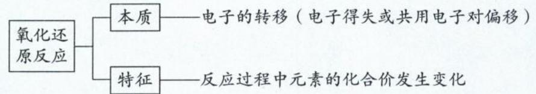

二、氧化还原反应的相关概念

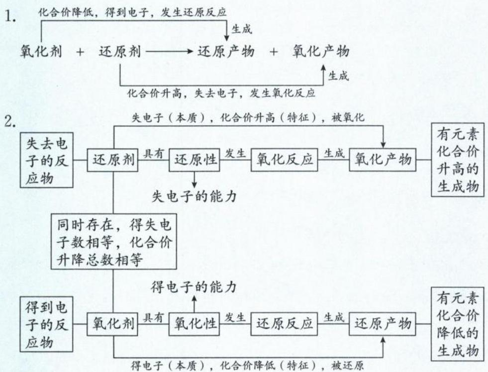

## 三、氧化还原反应基本概念的口诀：

1. 升、失、氧化、还原剂、具有还原性；降、得、还原、氧化剂、具有氧化性。

解释:化合价升高、失电子、发生氧化反应/被氧化、作还原剂、具有还原性;化合价降低、得电子、发生还原反应/被还原、作氧化剂、具有氧化性。

2. 口诀：嬛嬛失声痒痒痒（记忆情节：甄嬛甄嬛，感冒失去声音，喉咙痒痒痒）。

<table><tr><td>字</td><td>嬛</td><td>嬛</td><td>失</td><td>声</td><td>痒</td><td>痒</td><td>痒</td></tr><tr><td>意义</td><td>还原剂</td><td>具有还原性</td><td>失e-</td><td>化合价升高</td><td>被氧化</td><td>发生氧化反应</td><td>生成氧化产物</td></tr></table>

四、氧化还原反应和四大基本反应类型的关系

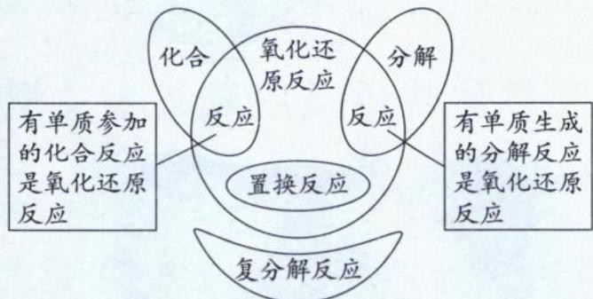

五、氧化还原反应中电子转移的表示方法

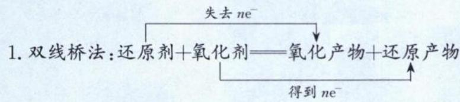

例:写出 $MnO_{2}$ 与浓盐酸加热反应的化学方程式,并用双线桥标出电子转移的方向和数目:

$$
\mathrm{MnO} _ {2} + 4 \mathrm{HCl} (\text {浓}) \xrightarrow {\Delta} \mathrm{MnCl} _ {2} + \mathrm{Cl} _ {2} \uparrow + 2 \mathrm{H} _ {2} \mathrm{O}
$$

注:(1)箭头连接反应前后有化合价变化的同种元素的原子,由反应物指向生成物,且需注明“得到”或“失去”。

(2)箭头的方向不代表电子转移的方向。

(3)失去电子的总数等于得到电子的总数。

2. 单线桥法: 氧化剂 + 还原剂 = 还原产物 + 氧化产物

例:写出 Cu 与稀硝酸反应的化学方程式,并用单线桥标出电子转移的方向和数目:

$$
3 \mathrm{Cu} + 8 \mathrm{HNO} _ {3} (\text {稀}) = 3 \mathrm{Cu(NO} _ {3}) _ {2} + 2 \mathrm{NO} \uparrow + 4 \mathrm{H} _ {2} \mathrm{O}
$$

注:(1)箭头从失电子元素的原子指向得电子元素的原子,或箭头起于化合价升高的原子,止于化合价降低的原子。

(2) 不标“得到”或“失去”，只标明电子转移的总数，因为箭号方向就能体现哪种原子失电子，哪种原子得电子。

(3)线桥不跨过“——”。

## 类型Ⅰ: 判断反应是否为氧化还原反应

【例 1】下列叙述涉及氧化还原反应的是\_\_\_\_
A. 小苏打用作食品膨松剂或胃酸中和剂
B. 苯酚露置在空气中,无色晶体变成粉红色
C. 二氧化硫漂白纸浆
D. 向酸性 $K_{2}Cr_{2}O_{7}$ 溶液中加入 NaOH 溶液,溶液由橙色变为黄色
E. 向新制的 $\mathrm{Cu(OH)}_{2}$ 中加入乙醛溶液,加热,有砖红色沉淀生成
F. 将 $Na_{2}S$ 溶液滴入 AgCl 浊液中,沉淀由白色逐渐变为黑色
G. 向饱和 NaCl 溶液中依次通入过量 $NH_{3}$ 、 $CO_{2}$ ，析出沉淀
H. 氯水在光照条件下放置一段时间后,溶液的 pH 降低
I. 汽车尾气系统安装了催化转化器减少 CO、NO 的排放

解析:氧化还原反应的本质是电子的转移,特征表现为元素化合价的变化。若反应前后元素化合价有发生变化,则为氧化还原反应;反之,则为非氧化还原反应。另外,置换反应一定是氧化还原反应,复分解反应则一定是非氧化还原反应。

A. 小苏打 $\left(\mathrm{NaHCO}_{3}\right)$ 受热分解: $2\mathrm{NaHCO}_{3} \xlongequal{\Delta} \mathrm{Na}_{2}\mathrm{CO}_{3} + \mathrm{CO}_{2} \uparrow + \mathrm{H}_{2}\mathrm{O}$ , 反应释放的 $\mathrm{CO}_{2}$ 使食品变得蓬松。

小苏打中和胃酸发生反应: $\mathrm{NaHCO}_{3} + \mathrm{HCl} = \mathrm{NaCl} + \mathrm{CO}_{2} \uparrow + \mathrm{H}_{2}\mathrm{O}$ 。两个反应中各元素化合价没有变化,不涉及氧化还原反应,A 不符合题意。

B. 苯酚具有还原性,露置在空气中易被空气中的氧气氧化,无色晶体会变成粉红色,涉及氧化还原反应,B 符合题意。

C. $\mathrm{SO}_{2}$ 漂白纸浆的原理是与有色物质化合生成不稳定的无色物质,是非氧化还原反应,C 不符合题意。

D. $\mathrm{K}_{2}\mathrm{Cr}_{2}\mathrm{O}_{7}$ 溶液中存在以下平衡: $\mathrm{Cr}_{2}\mathrm{O}_{7}^{2-} + \mathrm{H}_{2}\mathrm{O} \rightleftharpoons 2\mathrm{CrO}_{4}^{2-} + 2\mathrm{H}^{+}$ , 向酸性 $\mathrm{K}_{2}\mathrm{Cr}_{2}\mathrm{O}_{7}$ 溶液中加入 NaOH 溶液,氢离子浓度降低,平衡向正反应方向移动,橙色的 $\mathrm{Cr}_{2}\mathrm{O}_{7}^{2-}$ 转化为黄色的 $\mathrm{CrO}_{4}^{2-}$ ,这两种离子中 Cr 元素的化合价均为 +6 价。因此反应中没有元素发生化合价变化,属于非氧化还原反应,D 不符合题意。

E. 向新制的 $\mathrm{Cu(OH)}_{2}$ 中加入乙醛溶液并加热,乙醛被氧化为乙酸钠, $\mathrm{Cu(OH)}_{2}$ 被还原为砖红色的 $\mathrm{Cu}_{2}\mathrm{O}$ 沉淀,涉及氧化还原反应,E 符合题意。

F. 将 $\mathrm{Na}_{2}\mathrm{S}$ 溶液滴入 AgCl 浊液中会发生沉淀转化,固体由白色 AgCl 逐渐变为黑色 $\mathrm{Ag}_{2}\mathrm{S}$ ,此为复分解反应,不涉及氧化还原反应,F 不符合题意。

G. 向饱和 NaCl 溶液中依次通入过量 $\mathrm{NH}_{3}、\mathrm{CO}_{2}$ ,会发生反应: $\mathrm{NaCl} + \mathrm{H}_{2}\mathrm{O} + \mathrm{NH}_{3} + \mathrm{CO}_{2} = \mathrm{NaHCO}_{3} \downarrow + \mathrm{NH}_{4}\mathrm{Cl}$ ,该反应是侯氏制碱法的第一步反应,此过程中没有元素化合价发生变化,不是氧化还原反应,G 不符合题意。

H. 氯水中 HClO 不稳定, 在光照条件下放置一段时间后发生反应: $2HClO \xlongequal{光照} 2HCl + O_{2} \uparrow$ , 由 HClO(弱酸)转变为 HCl(强酸), 所以体系的酸性增强, 溶液的 pH 降低。该过程有元素化合价发生变化, 涉及氧化还原反应, H 符合题意。

I. CO、NO 是大气污染物, 利用尾气催化转化器将 CO 转变为 $CO_{2}$ 、NO 转变为 $N_{2}$ , 该过程有元素化合价发生变化, 涉及氧化还原反应, I 符合题意。

答案: B、E、H、I

【反思】分析化合价是判断反应是否为氧化还原反应的关键。

【例 2】古代文化典籍蕴含丰富的化学知识。下列叙述中未涉及氧化还原反应的是( )

A.《淮南万毕术》:“曾青得铁则化为铜”

B.《本草纲目》:“野外之鬼磷,其火色青,其状如炬,俗称鬼火”

C.《抱朴子》:“丹砂(HgS)烧之成水银,积变又还成丹砂”

D.《肘后备急方》:“青蒿一握,以水二升渍,绞取汁,尽服之”

解析：A.”曾青得铁则化为铜“意思是将铁放在 $CuSO_{4}$ 溶液中，则铜离子被铁置换而产生单质铜，此反应的化学方程式为： $Fe + CuSO_{4} = FeSO_{4} + Cu$ ，所有置换反应均为氧化还原反应，该过程涉及氧化还原反应。

B. 鬼火指的是磷化氢 $\left(\mathrm{PH}_{3}\right)$ 在空气中燃烧的现象, 燃烧时 P 由 -3 价转化成 +5 价, 该过程涉及氧化还原反应。 C. HgS 加热会分解生成 S 和 Hg, 当温度降低时 Hg 和 S 又可以发生化合反应生成 HgS, 两个反应均有元素化合价的变化, 该过程涉及氧化还原反应。

D.“青蒿一握，以水二升渍，绞取汁，尽服之”意思是拿一把青蒿用水浸泡，再挤压出青蒿汁，全部服下。涉及的操作方法为萃取，此为物理方法，该过程未涉及氧化还原反应。

答案:D

【反思】同学们不能忽视课后习题中出现的一些古文材料，并记忆从古文材料中提取出的常考物质的俗名。

类型Ⅱ:四大基本反应和氧化还原反应的关系判断

【例 3】正误判断, 正确的填“√”, 错误的填“×”

(1)置换反应一定是氧化还原反应（ ）  
(2)复分解反应可能是氧化还原反应（ ）  
(3)有单质参加的化合反应一定是氧化还原反应（ ）  
(4)有单质生成的分解反应一定是氧化还原反应（ ）  
(5)有单质参加或生成的化学反应一定是氧化还原反应（ ）

解析:(1)(√)置换反应中单质变成化合物时,化合价一定发生改变,所以置换反应一定是氧化还原反应。(2)(×)复分解反应只是化合物之间阴、阳离子互换,并没有发生化合价的改变,所以复分解反应一定不是氧化还原反应。(3)(√)有单质参加的化合反应,涉及单质转化为化合物,必然有化合价的变化,所以有单质参与的化合反应一定是氧化还原反应。(4)(√)有单质生成的分解反应,涉及化合物转化为单质,必然有化合价的变化,所以有单质生成的分解反应一定是氧化还原反应。

(5)(×)同素异形体之间的转化,虽然有单质的参与也有单质的生成,但反应前后元素的化合价没有发生变化,是非氧化还原反应。(注意(5)与(3)、(4)不同之处在于,(5)并没有限定是有单质参与的化合反应(即单质→化合物),也没有限定是有单质生成的分解反应(即化合物→单质),因此可以考虑同素异形体之间的转化(即单质→单质)。化合物与单质之间的转化,必伴随化合价变化,但由一种单质转化为另一种单质,则不一定有化合价的变化。)

## 类型Ⅲ:氧化反应/还原反应、氧化剂/还原剂、氧化产物/还原产物的判断

【例 4】(2024·浙江 6 月选考) 利用 $CH_{3}OH$ 可将废水中的 $NO_{3}^{-}$ 转化为对环境无害的物质后排放。反应原理为: $H^{+} + CH_{3}OH + NO_{3}^{-} \rightarrow X + CO_{2} \uparrow + H_{2}O$ (未配平)。下列说法正确的是()
A. X 表示 $NO_{2}$ B. 可用 $O_{3}$ 替换 $CH_{3}OH$ C. 氧化剂与还原剂物质的量之比为 6:5
D. 若生成标准状况下的 $CO_{2}$ 气体 11.2 L，则反应转移的电子数为 $N_{A}(N_{A}$ 表示阿伏加德罗常数的值）

解析: A. 根据题目信息, $CH_{3}OH$ 可将废水中的 $NO_{3}^{-}$ 转化为对环境无害的物质 (X) 后排放, X 含氮元素且对环境无害, 可知 X 为 $N_{2}$ 。 $NO_{2}$ 是大气污染物, 会造成硝酸型酸雨, 对环境有害, 不符合题意, A 选项错误。
B. $CH_{3}OH$ 中 C 的化合价为 -2 价, $CO_{2}$ 中 C 的化合价为 +4 价, 可知 $CH_{3}OH$ 发生氧化反应, 作还原剂。 $O_{3}$ 有强氧化性, 在反应中作氧化剂, 因此不可用 $O_{3}$ 替换 $CH_{3}OH$ , B 选项错误。
C. $NO_{3}^{-} \rightarrow N_{2}$ , N 的化合价由 +5→0, 化合价降 5 价, $NO_{3}^{-}$ 作氧化剂; $CH_{3}OH \rightarrow CO_{2}$ , C 的化合价由 -2→+4, 化合价升 6 价, $CH_{3}OH$ 作还原剂。由化合价升降守恒可知, 氧化剂与还原剂的物质的量之比为 6:5, C 选项正确。
(本题是求氧化剂 $NO_{3}^{-}$ 与还原剂 $CH_{3}OH$ 的物质的量比, 因此 $NO_{3}^{-} \rightarrow N_{2}$ , 只需考虑 1 个 $NO_{3}^{-}$ 的 1 个 N 降 5价即可,不能因为产物 $N_{2}$ 有 2 个 N, 就认为 $NO_{3}^{-}$ 的 N 化合价降 10 价。什么时候需要考虑“下角标”呢? 例如 $Cr_{2}O_{7}^{2-} \rightarrow Cr^{3+}, Cr$ 化合价由 +6→+3, 但每 1 个 $Cr_{2}O_{7}^{2-}$ 含 2 个 Cr, 因此氧化剂 $Cr_{2}O_{7}^{2-}$ 化合价共降 6 价。即正向配平时, 只看化合价发生改变的反应物的角标; 逆向配平时, 只看化合价发生改变的产物的角标。)

D. 每生成 1 mol $CO_{2}$ , $CH_{3}OH$ 失去 6 mol 电子。若生成标准状况下的 $CO_{2}$ 气体 11.2 L, 即生成 0.5 mol $CO_{2}$ , 则反应转移的电子物质的量为 3 mol, 转移的电子数为 $3N_{A}$ , D 选项错误。

答案: C

【例 5】(2022·浙江 6 月选考)关于反应 $Na_{2}S_{2}O_{3} + H_{2}SO_{4} = Na_{2}SO_{4} + S \downarrow + SO_{2} \uparrow + H_{2}O$ ，下列说法正确的是（）

A. $H_{2}SO_{4}$ 发生还原反应

B. $Na_{2}S_{2}O_{3}$ 既是氧化剂又是还原剂

C. 氧化产物与还原产物的物质的量之比为 2:1

D. 1 mol $Na_{2}S_{2}O_{3}$ 发生反应，转移 4 mol 电子

解析:该反应可视为硫代硫酸根离子在酸性条件下发生歧化反应,分析方法为:每个 $Na_{2}S_{2}O_{3}$ 中含2个+2价S,其中1个+2价S变为1个0价S(S单质)的过程得到2个电子;1个+2价S变为1个+4价 $S(SO_{2})$ 的过程失去2个电子。由此可知每1 mol $Na_{2}S_{2}O_{3}$ 参与反应,转移电子物质的量为2 mol。

A. $H_{2}SO_{4}$ 转化为 $Na_{2}SO_{4}$ 和 $H_{2}O$ , H, S, O 元素的化合价均未发生变化, 没有发生氧化或还原反应, A 选项错误。
B. 由上述分析可知, $Na_{2}S_{2}O_{3}$ 中 S 的化合价既升高又下降, 故 $Na_{2}S_{2}O_{3}$ 既是氧化剂又是还原剂, B 选项正确。
C.该反应的氧化产物是 $SO_{2}$ ，还原产物是S，根据方程式计量数可知，氧化产物与还原产物的物质的量之比为1:1,C选项错误。

D. 根据上述分析可知, $1 \mathrm{~mol} \mathrm{Na}_{2} \mathrm{~S}_{2} \mathrm{O}_{3}$ 发生反应, 转移电子物质的量为 $2 \mathrm{~mol}$ 电子, D 选项错误。(歧化反应特点: 同一物质、同一价态、同一元素, 化合价自升自降, 该物质在反应中既是氧化剂也是还原剂。)

答案:B

【反思】由于氧化还原反应遵循化合价的升降守恒以及得失电子守恒，分析歧化反应转移的电子数时，只需要分析化合价的升高或降低一方面即可，切忌把升、降进行加和。

类型Ⅳ:氧化还原反应中电子转移的表示方法——单线桥、双线桥

【例6】(双线桥法)下列氧化还原反应所标出的电子转移情况中,正确的是( )

A. $Cl_{2} + 2NaOH = NaCl + NaClO + H_{2}O$ 得到 $2e^{-}$ 失去 $2e^{-}$ B. $5NH_{4}NO_{3} \xlongequal{\Delta} 4N_{2} \uparrow + 2HNO_{3} + 9H_{2}O$ 得到 $4 \times 3e^{-}$ C. $3Cu + 8HNO_{3}$ (稀) = $3Cu(NO_{3})_{2} + 2NO \uparrow + 4H_{2}O$ 得到 $2 \times 3e^{-}$ D. $KClO_{3} + 6HCl = KCl + 3Cl_{2} \uparrow + 3H_{2}O$ 失去 $6 \times e^{-}$

解析: A. 该反应为歧化反应, 1个 $Cl_{2}$ 看做是 2个 0价的 Cl, 其中 1个 0价 Cl 得到 1个 $e^{-}$ 变为 1个 -1价 Cl(NaCl), 1个 0价 Cl 失去 1个 $e^{-}$ 变为 1个 +1价 Cl(NaClO), 因此得到与失去的电子数不是 $2e^{-}$ 而是 $e^{-}$ , A 选项错误。

B. 根据 $5NH_{4}NO_{3} \rightarrow 2HNO_{3}$ 可知, 有 2个 $NO_{3}^{-}$ (2个 +5价 N) 并没有发生变价。该反应可看作 5个 -3价 N ( $NH_{4}^{+}$ ) 各失去 $3e^{-}$ 变为 5个 0价 N( $N_{2}$ )、3个 +5价 N( $NO_{3}^{-}$ ) 各得 $5e^{-}$ 变为 3个 0价 N( $N_{2}$ ), 正确写法为:

C. 根据 $8HNO_{3} \rightarrow 3Cu(NO_{3})_{2}$ 可知, 有 6个 $NO_{3}^{-}$ (6个 +5价 N) 并没有发生变价。该反应可看作 3个 0价 Cu 各失去 $2e^{-}$ 变为 3个 +2价 Cu、2个 +5价 N( $NO_{3}^{-}$ ) 各得 $3e^{-}$ 变为 2个 +2价 N(NO), C 选项正确。

D. 根据价态归中规律, 含不同价态的同种元素的物质间发生氧化还原反应时, 化合价互相靠拢而不交叉。也可以根据化合价的“就近原则”, +5价 Cl( $KClO_{3}$ ) 就近的产物化合价为 0价( $Cl_{2}$ )。-1价 Cl(HCl) 就近的产物化合价也为0价 $\left(\mathrm{Cl}_{2}\right)$ ，所以 $KClO_{3}$ 与HCl发生归中反应生成 $Cl_{2}$ 。 $KClO_{3}$ 中1个+5价Cl得 $5e^{-}$ 变为0价 $\mathrm{Cl}\left(\mathrm{Cl}_{2}\right)$ ，6个HCl中有5个-1价Cl各失 $1e^{-}$ 变为5个0价 $\mathrm{Cl}\left(\mathrm{Cl}_{2}\right)$ ，另外有1个-1价Cl不变价，变为KCl。正确写法为： $KClO_{3}+6HCl(浓)=3Cl_{2}\uparrow+KCl+3H_{2}O,D$ 选项错误。

答案:C

【反思】氧化还原反应中只有一种元素化合价发生改变时,一般遵循“就近原则”。如 B 选项中-3 价 $N(NH_{4}^{+})$ 就近的产物化合价为 0 价 $(N_{2})$ 。+5 价 $N(NO_{3}^{-})$ 就近的产物化合价也为 0 价 $(N_{2})$ ,所以该反应中 $NH_{4}^{+}$ 与 $NO_{3}^{-}$ 发生归中反应生 $N_{2}$ 。

【例 7】(单线桥法)下列氧化还原反应所标出的电子转移情况中,正确的是( )
A. $2\mathrm{KClO}_3 \xrightarrow{6e^-} \mathrm{MnO}_2 = 2\mathrm{KCl} + 3\mathrm{O}_2 \uparrow$ B. $2\mathrm{FeCl}_3 + 2\mathrm{KI} = 2\mathrm{FeCl}_2 + \mathrm{I}_2 + 2\mathrm{KCl}$ C. $2\mathrm{F}_2 + 2\mathrm{H}_2\mathrm{O} = 4\mathrm{HF} + \mathrm{O}_2$ D. $MnO_2 + 4HCl$ (浓) $\xrightarrow{\Delta} MnCl_2 + Cl_2 \uparrow + 2H_2O$

解析: A. $KClO_{3}$ 中 Cl 化合价 +5 价、O 化合价 -2 价, 该反应为 2 个 +5 价 Cl 各得 $6e^{-}$ 变为 2 个 -1 价 Cl (共得 $12e^{-}$ ); 6 个 -2 价 O 各失 $2e^{-}$ 变为 6 个 0 价 O (共失 $12e^{-}$ ), 图中转移电子数目应为 12, A 选项错误。

B. 该反应为 2 个 +3 价 Fe 各得 $1e^{-}$ 变为 2 个 +2 价 Fe（共得 $2e^{-}$ ）；2 个 -1 价 I 各失 $1e^{-}$ 变为 2 个 0 价 I（共失 $2e^{-}$ ），箭头由反应物中失电子元素原子指向得电子元素原子，转移电子数为 2，B 选项正确。

C. 该反应为 4 个 0 价 F 各得 $1e^{-}$ 变为 4 个 -1 价 F（共得 $4e^{-}$ ）；2 个 -2 价 O 各失 $2e^{-}$ 变为 2 个 0 价 O（共失 $4e^{-}$ ），箭头应由失电子的 O 指向得电子的 F，图中箭头的方向标反了，C 选项错误。

D. 该反应为 1 个 +4 价 Mn 得 $2e^{-}$ 变为 1 个 +2 价 Mn；2 个 -1 价 Cl 各失 $1e^{-}$ 变为 2 个 0 价 Cl（共失 $2e^{-}$ ，需注意，有 2 个 -1 价 Cl 没有变价），图中转移电子数目应为 2，D 选项错误。

答案:B

【反思】判断单线桥是否正确时，除了要看清楚箭头的方向外，还要看清到底有几个原子在发生变价。

## 模块 2 氧化还原反应的规律(★★★)

习题：P11

## 内容提要

## 一、氧化还原反应的分类及特征

<table><tr><td>分类</td><td>特征</td><td>实例</td></tr><tr><td>完全氧化还原反应</td><td>变价元素的原子全部参加反应</td><td> $4NH_{3} + 5O_{2} \xrightarrow[\Delta]{催化剂} 4NO + 6H_{2}O$ </td></tr><tr><td>部分氧化还原反应</td><td>变价元素的原子只有部分参加反应</td><td> $MnO_{2} + 4HCl(浓) \xrightarrow[\Delta]{MnCl_{2} + 2H_{2}O + Cl_{2}\uparrow}$ </td></tr><tr><td>歧化反应</td><td>同种物质、同种元素的同一价态,反应后化合价既升高又下降</td><td> $Cl_{2} + 2NaOH = NaCl + NaClO + H_{2}O$ </td></tr><tr><td>归中反应</td><td>同一元素的高、低两种化合价,反应后化合价向中间价态靠拢但不交叉</td><td> $2H_{2}S + SO_{2} = 3S + 2H_{2}O$ </td></tr><tr><td>自身氧化还原反应</td><td>氧化剂和还原剂均为同一反应物</td><td> $2KMnO_{4} \xrightarrow{\Delta} K_{2}MnO_{4} + MnO_{2} + O_{2}\uparrow$ </td></tr></table>

注：1. 歧化反应一定是自身氧化还原反应，但自身氧化还原反应不一定是歧化反应。

2. 歧化反应只发生在具有相应的高价态与低价态的中间价态元素上。 $F_{2}$ 无歧化作用，因为氟元素电负性最大，无正化合价，只有负化合价。

3. 归中反应可以是完全氧化还原反应, 如 $5 \mathrm{KI} + \mathrm{KIO}_{3} + 3 \mathrm{H}_{2} \mathrm{SO}_{4} = 3 \mathrm{I}_{2} + 3 \mathrm{H}_{2} \mathrm{O} + 3 \mathrm{K}_{2} \mathrm{SO}_{4}$ ; 也可以是部分氧化还原反应, 如 $\mathrm{KClO}_{3} + 6 \mathrm{HCl} = 3 \mathrm{Cl}_{2} \uparrow + \mathrm{KCl} + 3 \mathrm{H}_{2} \mathrm{O}$ 。

## 二、氧化还原反应的普遍规律

1. 氧化性、还原性的判断：

(1)氧化性是指得电子的性质(或能力);还原性是指失电子的性质(或能力)。

(2)氧化性、还原性的强弱取决于得、失电子的难易程度,与得、失电子数目无关。

例: $\mathrm{Na}-\mathrm{e}^{-}=\mathrm{Na}^{+},\mathrm{Al}-3\mathrm{e}^{-}=\mathrm{Al}^{3+},\mathrm{Al}$ 失去电子数比 Na 多。但根据金属活动性顺序表,Na 比 Al 活泼,更易失去电子,所以 Na 比 Al 的还原性强。

(3)从元素的价态考虑：

①最高价态——只有氧化性,如: $\mathrm{FeO}_{4}^{2-}(+6\text{价 Fe})$ 、 $\mathrm{HNO}_{3}(+5\text{价 N})$ 、浓 $\mathrm{H}_{2}\mathrm{SO}_{4}(+6\text{价 S})$ 、 $\mathrm{KMnO}_{4}(+7\text{价 Mn})$ 、 $\mathrm{K}_{2}\mathrm{Cr}_{2}\mathrm{O}_{7}(+6\text{价 Cr})$ 。

②最低价态——只有还原性，如：金属单质、 $Cl^{-}$ 、 $Br^{-}$ 、 $I^{-}$ 、 $S^{2-}$ 等。

③中间价态——既有氧化性又有还原性，如： $H_{2}O_{2}$ 、 $Fe^{2+}$ 、S、 $Cl_{2}$ 、 $Br_{2}$ 、 $I_{2}$ 等。

注: 中间价在化学反应中体现氧化性还是还原性, 关键看与之反应的另一种反应物的性质。如 $H_{2}O_{2}$ 遇酸性 $FeCl_{2}$ , $H_{2}O_{2}$ 体现氧化性, 被 $Fe^{2+}$ 还原成 $H_{2}O$ ; $H_{2}O_{2}$ 遇酸性 $FeCl_{3}$ , $H_{2}O_{2}$ 既体现氧化性, 又体现还原性, 被 $Fe^{3+}$ 催化分解成 $H_{2}O$ 和 $O_{2}$ ; $H_{2}O_{2}$ 遇酸性 $KMnO_{4}$ , $H_{2}O_{2}$ 体现还原性, 被 $MnO_{4}^{-}$ 氧化成 $O_{2}$ 。因此在化工流程中, 不要一味地认为 $H_{2}O_{2}$ 是“绿色氧化剂”, 当其遇到 $LiCoO_{2}$ 、 $KMnO_{4}$ 可能就是“绿色还原剂”。所以要仔细审题, 具体问题具体分析, 尽量不要犯经验主义错误。

## 2. 氧化性、还原性强弱比较的方法

(1)依据氧化还原反应原理判断:还原剂+氧化剂=氧化产物+还原产物
失电子,化合价升高,被氧化
得电子,化合价降低,被还原

①氧化性强弱: 氧化剂 > 氧化产物。

②还原性强弱: 还原剂 > 还原产物。

注：i. 电解反应不遵循由强制弱，如电解熔融 NaCl 获得金属 Na 和 $Cl_{2}$ ，不能说明氧化性 NaCl 强于 $Cl_{2}$ ，也不能说明还原性 NaCl 强于金属 Na。

ii. 高温高压下的某些反应, 可能也不遵循氧化还原反应的由强制弱原理。如高温下用金属 Na 制备金属 K, 不能说明还原性 Na 强于 K。

(2)依据元素周期表、周期律判断：

①同主族非金属元素从上到下,非金属性逐渐减弱,对应单质的氧化性逐渐减弱,对应阴离子的还原性逐渐增强。

$$
\begin{array}{c c c c c} \mathrm{F} _ {2} & \mathrm{Cl} _ {2} & \mathrm{Br} _ {2} & \mathrm{I} _ {2} & \text {氧化性减弱} \\ \hline \mathrm{F} ^ {-} & \mathrm{Cl} ^ {-} & \mathrm{Br} ^ {-} & \mathrm{I} ^ {-} & \text {还原性增强} \end{array}
$$

②同主族金属元素从上到下,金属性逐渐增强,对应单质的还原性逐渐增强,对应阳离子的氧化性逐渐减弱。

$$
\begin{array}{c c c c c c} \text {Li} & \text {Na} & \text {K} & \text {Rb} & \text {Cs} & \text {还原性增强} \\ \hline \text {Li} ^ {+} & \text {Na} ^ {+} & \text {K} ^ {+} & \text {Rb} ^ {+} & \text {Cs} ^ {+} & \text {氧化性减弱} \end{array}
$$

③同周期主族元素从左至右,金属元素的金属性逐渐减弱,对应单质的还原性逐渐减弱;非金属元素的非金属性逐渐增强,对应单质的氧化性逐渐增强。

$$
\xleftarrow [ \text {单质还原性逐渐增强} ]{\mathrm{NaMgAl}} \frac {\mathrm{SiPSCl} _ {2}}{\text {单质氧化性逐渐增强}}
$$

注:虽然可以通过非金属性强弱推导大多数非金属单质的氧化性,但由于非金属性不是氧化性,偶尔会出现非金属性强弱与非金属单质氧化性不一致的情况,如N非金属性很强,但 $N_{2}$ 氧化性却很弱。这种情况出现的根本原因是，非金属性研究的是气态基态的原子得电子的能力，而氧化性研究的是具体化合物或单质得电子的能力。单质体现氧化性时，需要先断键，若化学键极牢固 (N≡N 键能很大)，原子即使有强非金属性也无法施展其“吸电”大法。

(3)依据相同条件下被氧化(或被还原)的程度:

①相同条件下不同氧化剂作用于同一种还原剂，氧化产物价态高的，该氧化剂的氧化性强。

例如:根据 $2Fe+3Cl_{2}\xlongequal{\Delta}2FeCl_{3},Fe+S\xlongequal{\Delta}FeS$ ，可以推知氧化性： $Cl_{2}>S$ 。

②相同条件下不同还原剂作用于同一种氧化剂,还原产物价态低的,该还原剂的还原性强。

例如:根据 $Cu + 2Fe^{3+} = Cu^{2+} + 2Fe^{2+}$ , $3Zn + 2Fe^{3+} = 3Zn^{2+} + 2Fe$ , 可以推知还原性: Zn > Cu。

## (4)根据电化学原理判断：

①两种不同的金属单质构成原电池的两极,负极金属失电子、发生氧化反应,是电子流出的极;正极金属是电子流入的极,因此金属的还原性:负极>正极。(高中有两个例外,一是Fe-Cu与浓硝酸构成的原电池,虽然Fe还原性大于Cu,但常温下Fe被浓硝酸钝化作正极、Cu被氧化作负极。二是Al-Mg与NaOH溶液构成的原电池,虽然Mg还原性大于Al,但Al与NaOH反应作负极,Mg与NaOH不反应作正极。)

②用惰性电极电解混合溶液时,在阴极先放电的阳离子其氧化性较强,在阳极先放电的阴离子其还原性较强。在阳极,阴离子放电顺序为 $S^{2-}>SO_{3}^{2-}>I^{-}>Br^{-}>Cl^{-}>OH^{-}$ (记忆口诀为:牛雅典秀绿箭),此即还原性由强到弱顺序。在阴极,阳离子放电顺序为 $Ag^{+}>Fe^{3+}>Cu^{2+}>H^{+}$ (酸) $>Pb^{2+}>Sn^{2+}>Zn^{2+}>Al^{3+}>Mg^{2+}>Na^{+}>Ca^{2+}>K^{+}$ ,此即氧化性由强到弱的顺序。

## 三、氧化还原反应的特殊规律

1. 归中反应的特殊规律: 同种元素的化合价升降可以靠拢, 但不能交叉。

例: 反应 $KClO_{3} + 6HCl = 3Cl_{2} \uparrow + KCl + 3H_{2}O$ 中:

正确分析:氧化剂 $KClO_{3}$ 的 +5 价 Cl 以及还原剂 HCl 的 -1 价 Cl 均变成 0 价的 $Cl_{2}$ ， $Cl_{2}$ 既是氧化产物，又是还原产物。每生成 $3 \, mol \, Cl_{2}$ ，转移电子数 $5 \, N_{A}$ 。

错误分析:氧化剂 $KClO_{3}$ 的 +5 价 Cl 变成 KCl 中的 -1 价 Cl, 还原剂 HCl 的 -1 价 Cl 变成 0 价的 $Cl_{2}$ , 错误原因是 Cl 的化合价出现交叉。

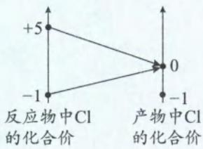  
正确分析

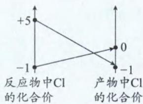  
错误分析

2. 歧化反应的特殊规律：

(1)绝大多数的歧化反应遵循“邻价原则”，即变价元素的化合价往相邻价态变化。

<table><tr><td>元素化合价</td><td>化学方程式</td></tr><tr><td>过氧化物(-1价O)</td><td> $2Na_{2}O_{2} + 2H_{2}O = 4NaOH + O_{2} \uparrow$ 、 $2Na_{2}O_{2} + 2CO_{2} = 2Na_{2}CO_{3} + O_{2}$ 、 $2H_{2}O_{2} \xlongequal{\text{催化剂}} 2H_{2}O + O_{2} \uparrow$ </td></tr><tr><td>Cl2(0价Cl)</td><td> $Cl_{2} + H_{2}O \rightleftharpoons HCl + HClO, Cl_{2} + 2NaOH = NaCl + NaClO + H_{2}O$ 、 $2Cl_{2} + 2Ca(OH)_{2} = CaCl_{2} + Ca(ClO)_{2} + 2H_{2}O$ </td></tr><tr><td>NO2(+4价N)</td><td> $2NO_{2} + 2NaOH = NaNO_{2} + NaNO_{3} + H_{2}O$ </td></tr><tr><td>Cu2O(+1价Cu)</td><td> $Cu_{2}O + H_{2}SO_{4} = Cu + CuSO_{4} + H_{2}O$ </td></tr><tr><td>Na2S2O3(+2价S)</td><td> $Na_{2}S_{2}O_{3} + H_{2}SO_{4} = Na_{2}SO_{4} + S \downarrow + SO_{2} \uparrow + H_{2}O$ </td></tr></table>

注:歧化反应可以看成反应物自己惩罚自己,轻轻打,打自己的时候手臂摆动幅度小,即反应物化合价变化幅度小,只变化到“邻价”。

(2)歧化反应若不遵循“邻价原则”，可能是因为加热。

$$
3 \mathrm{Cl} _ {2} + 6 \mathrm{NaOH} \xlongequal {\Delta} 5 \mathrm{NaCl} + \mathrm{NaClO} _ {3} + 3 \mathrm{H} _ {2} \mathrm{O}, 3 \mathrm{S} + 6 \mathrm{NaOH} \xlongequal {\Delta} 2 \mathrm{Na} _ {2} \mathrm{S} + \mathrm{Na} _ {2} \mathrm{SO} _ {3} + 3 \mathrm{H} _ {2} \mathrm{O}
$$

注:加热时相当于外界供外力给了歧化反应,化合价的变动幅度就会变大。

(3)歧化反应若不遵循“邻价原则”，可能是因为“邻价”产物极不稳定，会进一步发生歧化反应。

例： $3NO_{2}+H_{2}O=NO+2HNO_{3},2S_{2}Cl_{2}+2H_{2}O=4HCl+SO_{2}\uparrow+3S\downarrow$

类型Ⅰ:依据氧化还原反应原理判断氧化性、还原性强弱

【例 1】常温下,在溶液中可发生以下反应:

$$
1 6 \mathrm{H} ^ {+} + 1 0 \mathrm{Z} ^ {-} + 2 \mathrm{XO} _ {4} ^ {-} = 2 \mathrm{X} ^ {2 +} + 5 \mathrm{Z} _ {2} + 8 \mathrm{H} _ {2} \mathrm{O}
$$

② $2\mathrm{A}^{2+} + \mathrm{B}_{2} = 2\mathrm{A}^{3+} + 2\mathrm{B}^{-}$

③ $2B^{-}+Z_{2}=B_{2}+2Z^{-}$

由此判断下列说法不正确的是( )
A. 常温下反应: $2\mathrm{A}^{2+} + \mathrm{Z}_{2} = 2\mathrm{A}^{3+} + 2\mathrm{Z}^{-}$ 可以自发进行
B. Z元素在反应①中被氧化, 在反应③中被还原
C. 氧化性强弱顺序为: $\mathrm{XO}_{4}^{-}<\mathrm{Z}_{2}<\mathrm{B}_{2}<\mathrm{A}^{3+}$ D. 还原性强弱顺序为: $\mathrm{X}^{2+}<\mathrm{Z}^{-}<\mathrm{B}^{-}<\mathrm{A}^{2+}$

解析:氧化性:氧化剂(找化合价降低的反应物)>氧化产物(找化合价升高后的产物)。还原性:还原剂(找化合价升高的反应物)>还原产物(找化合价降低后的产物)。

<table><tr><td rowspan="2">反应</td><td colspan="4">角色</td><td colspan="2">强弱顺序</td></tr><tr><td>氧化剂(↓)</td><td>还原剂(↑)</td><td>氧化产物(↑)</td><td>还原产物(↓)</td><td>氧化性</td><td>还原性</td></tr><tr><td>1</td><td> $XO_{4}^{-}$ </td><td> $Z^{-}$ </td><td> $Z_{2}$ </td><td> $X^{2+}$ </td><td> $XO_{4}^{-}>Z_{2}$ </td><td> $Z^{-}>X^{2+}$ </td></tr><tr><td>2</td><td> $B_{2}$ </td><td> $A^{2+}$ </td><td> $A^{3+}$ </td><td> $B^{-}$ </td><td> $B_{2}>A^{3+}$ </td><td> $A^{2+}>B^{-}$ </td></tr><tr><td>3</td><td> $Z_{2}$ </td><td> $B^{-}$ </td><td> $B_{2}$ </td><td> $Z^{-}$ </td><td> $Z_{2}>B_{2}$ </td><td> $B^{-}>Z^{-}$ </td></tr><tr><td>结论</td><td colspan="6">氧化性: $XO_{4}^{-}>Z_{2}>B_{2}>A^{3+}$ ;还原性: $A^{2+}>B^{-}>Z^{-}>X^{2+}$ </td></tr></table>

$$
; ^ {\prime \prime}
$$

A. 反应: $2 \mathrm{~A}^{2+} + \mathrm{Z}_{2} = 2 \mathrm{~A}^{3+} + 2 \mathrm{Z}^{-}$ 中, 氧化剂、氧化产物分别为 $\mathrm{Z}_{2}, \mathrm{~A}^{3+}$ , 还原剂、还原产物分别为 $\mathrm{A}^{2+}, \mathrm{Z}^{-}$ 。根据已知反应①、②、③所得顺序, 以及氧化还原反应遵循“由强制弱, 且两个由强制弱必须同时满足”可知, 常温下反应: $2 \mathrm{~A}^{2+} + \mathrm{Z}_{2} = 2 \mathrm{~A}^{3+} + 2 \mathrm{Z}^{-}$ 可以自发进行, A 选项正确。  
B. 根据表格分析, 反应①中 Z 的化合价升高被氧化, 反应③中 Z 的化合价降低被还原, B 选项正确。  
C. 根据表格分析, 氧化性: $\mathrm{XO}_{4}^{-} > \mathrm{Z}_{2} > \mathrm{B}_{2} > \mathrm{A}^{3+}$ , C 选项错误。  
D. 根据表格分析, 还原性: $\mathrm{A}^{2+} > \mathrm{B}^{-} > \mathrm{Z}^{-} > \mathrm{X}^{2+}$ , D 选项正确。

答案:C

【例 2】在稀硫酸中几种离子的转化关系如图所示,下列说法正确的是()

$$
\mathrm{Ce} ^ {4 +}
$$

$$
\mathrm{Mn} ^ {3 +}
$$

$$
\mathrm{Ce} ^ {4 +} + \mathrm{Fe} ^ {2 +} = \mathrm{Ce} ^ {3 +} + \mathrm{Fe} ^ {3 +}
$$

$$
\mathrm{Fe} ^ {3 +} + 2 \mathrm{I} ^ {-} = \mathrm{I} _ {2} + \mathrm{Fe} ^ {2 +}
$$

$$
\mathrm{Ce} ^ {4 +} > \mathrm{Mn} ^ {3 +} > \mathrm{Fe} ^ {3 +} > \mathrm{I} _ {2}
$$

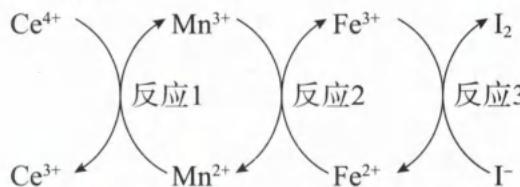

解析:利用转化关系图中的箭头方向(箭尾为反应物,箭头为生成物)写出方程式。反应1为: $\mathrm{Ce}^{4+}+\mathrm{Mn}^{2+}=\mathrm{Ce}^{3+}+\mathrm{Mn}^{3+}$ （氧化性 $\mathrm{Ce}^{4+}>\mathrm{Mn}^{3+}$ ，还原性 $\mathrm{Mn}^{2+}>\mathrm{Ce}^{3+}$ ），反应2为: $\mathrm{Fe}^{2+}+\mathrm{Mn}^{3+}=\mathrm{Fe}^{3+}+\mathrm{Mn}^{2+}$ （氧化性 $\mathrm{Mn}^{3+}>\mathrm{Fe}^{3+}$ ，还原性 $\mathrm{Fe}^{2+}>\mathrm{Mn}^{2+}$ ），反应3为: $2\mathrm{Fe}^{3+}+2\mathrm{I}^{-}=\mathrm{I}_{2}+2\mathrm{Fe}^{2+}$ （氧化性 $\mathrm{Fe}^{3+}>\mathrm{I}_{2}$ ，还原性 $\mathrm{I}^{-}>\mathrm{Fe}^{2+}$ ），氧化性由强到弱的顺序为: $\mathrm{Ce}^{4+}>\mathrm{Mn}^{3+}>\mathrm{Fe}^{3+}>\mathrm{I}_{2}$ ，还原性由强到弱的顺序为: $\mathrm{I}^{-}>\mathrm{Fe}^{2+}>\mathrm{Mn}^{2+}>\mathrm{Ce}^{3+}$ 。因此D选项正确。C选项的方程式化合价升降不守恒、电荷不守恒，所以C选项错误。氧化性 $\mathrm{Ce}^{4+}>$ $\mathrm{Fe}^{3+}$ ，且还原性 $\mathrm{Fe}^{2+}> \mathrm{Ce}^{3+}$ ，因此 $\mathrm{Ce}^{4+}+\mathrm{Fe}^{2+}= \mathrm{Ce}^{3+}+\mathrm{Fe}^{3+}$ 反应可以发生，B选项错误。反应1中 $Ce^{4+}$ 化合价降低，作为氧化剂； $Mn^{3+}$ 是化合价升高的产物，因此 $Mn^{3+}$ 为氧化产物，A选项错误。
答案:D

类型Ⅱ: 利用氧化性、还原性判断反应能否发生

【例 3】已知 $Co_{2}O_{3}$ 在酸性溶液中易被还原成 $Co^{2+}$ ，且 $Co_{2}O_{3}$ 、 $Cl_{2}$ 、 $FeCl_{3}$ 、 $I_{2}$ 的氧化性依次减弱。
下列叙述中，正确的是（）
A. $Cl_{2}$ 通入 $FeI_{2}$ 溶液中，可发生反应 $3Cl_{2} + 6FeI_{2} = 2FeCl_{3} + 4FeI_{3}$ B. 每 $1\ mol\ Co_{2}O_{3}$ 在酸性溶液中被还原生成 $Co^{2+}$ 时转移 $1\ mol\ e^{-}$ C. $FeCl_{3}$ 溶液能使淀粉 KI 试纸变蓝
D. $I_{2}$ 具有较强的氧化性，可以将 $Co^{2+}$ 氧化成 $Co_{2}O_{3}$ 解析：氧化性顺序为： $Co_{2}O_{3}>Cl_{2}>FeCl_{3}>I_{2}$ ，则强氧化剂制备弱氧化剂的反应可以发生。例如酸性溶液中 $Cl_{2}$ 可以将 $I^{-}$ 氧化为 $I_{2}$ ，但 $Cl_{2}$ 不能将 $Co^{2+}$ 氧化为 $Co_{2}O_{3}$ 。
A. 方法一：由于氧化性 $FeCl_{3}>I_{2}$ ，则 $Fe^{3+}$ 可将 $I^{-}$ 氧化为 $I_{2}$ ，因此不能得到产物 $FeI_{3}$ （即溶液中 $Fe^{3+}$ 和 $I^{-}$ 无法大量共存），A选项错误。
方法二：根据氧化性顺序，可推得还原性由强到弱的顺序为： $I^{-}>Fe^{2+}>Cl^{-}>Co^{2+}$ 。 $Cl_{2}$ 通入 $FeI_{2}$ 溶液中，根据谁强谁优先原则，还原性强的 $I^{-}$ 比 $Fe^{2+}$ 先反应，A选项错误。
B. 1 mol $Co_{2}O_{3}$ 在酸性溶液中被还原生成 $Co^{2+}$ 时，有 2 mol 的 +3价 Co 被还原为 2 mol 的 $Co^{2+}$ ，转移电子的物质的量为 2 mol，B选项错误。（定量分析时，一定要注意角标。）

C. 由于氧化性 $\mathrm{FeCl}_3 > \mathrm{I}_2$ ，且还原性 $\mathrm{I}^- > \mathrm{Fe}^{2+}$ ，因此 $\mathrm{FeCl}_3$ 溶液可与 KI 发生氧化还原反应： $2\mathrm{Fe}^{3+} + 2\mathrm{I}^- = 2\mathrm{Fe}^{2+} + \mathrm{I}_2, \mathrm{I}_2$ 遇淀粉变蓝，所以 $\mathrm{FeCl}_3$ 溶液能使淀粉 KI 试纸变蓝，C 选项正确。  
D. 氧化性 $\mathrm{I}_2 < \mathrm{Co}_2\mathrm{O}_3$ ，因此 $\mathrm{I}_2$ 无法将 $\mathrm{Co}^{2+}$ 氧化成 $\mathrm{Co}_2\mathrm{O}_3$ ，D 选项错误。  
答案：C

【例 4】已知 $Pb_{3}O_{4}$ 与 $HNO_{3}$ 溶液发生反应 I: $Pb_{3}O_{4} + 4H^{+} = PbO_{2} + 2Pb^{2+} + 2H_{2}O$ ; $PbO_{2}$ 与酸化的 $MnSO_{4}$ 溶液发生反应 II: $5PbO_{2} + 2Mn^{2+} + 4H^{+} + 5SO_{4}^{2-} = 2MnO_{4}^{-} + 5PbSO_{4} + 2H_{2}O$ 。下列推断正确的是（）

A. 由反应 I 可知, $Pb_{3}O_{4}$ 中二价铅和四价铅含量之比为 1:2

B. 由反应 I、II 可知, 氧化性: $HNO_{3} > PbO_{2} > MnO_{4}^{-}$ C. Pb 可与稀硝酸发生反应: $3\mathrm{Pb} + 16\mathrm{HNO}_{3} = 3\mathrm{Pb}\left(\mathrm{NO}_{3}\right)_{4} + 4\mathrm{NO}\uparrow + 8\mathrm{H}_{2}\mathrm{O}$ D. $Pb_{3}O_{4}$ 可与盐酸发生反应: $Pb_{3}O_{4} + 8HCl = 3PbCl_{2} + 4H_{2}O + Cl_{2}\uparrow$

解析：A. 根据题目信息，反应 I 中 $NO_{3}^{-}$ 并未参与反应，可知反应 I 并非氧化还原反应。1 个 $Pb_{3}O_{4}$ 生成 2 个 $Pb^{2+}$ 和 1 个 $PbO_{2}$ ，可推知 $Pb_{3}O_{4}$ 中 +2 价 Pb 与 +4 价 Pb 的个数之比为 2:1，A 选项错误。（类比 $Fe_{3}O_{4} + 8H^{+} = Fe^{2+} + 2Fe^{3+} + 4H_{2}O$ ，也可推知 $Fe_{3}O_{4}$ 中 +2 价 Fe 与 +3 价 Fe 的个数之比为 1:2。）

B. 反应 II 中 $PbO_{2}$ 为氧化剂（化合价降低）， $Mn^{2+}$ 被氧化后生成的 $MnO_{4}^{-}$ 为氧化产物，则氧化性 $PbO_{2} > MnO_{4}^{-}$ 。反应 I 中， $NO_{3}^{-}$ 并未参与反应，说明 $HNO_{3}$ 无法将 $Pb^{2+}$ 氧化为 $PbO_{2}$ ，可推知氧化性： $HNO_{3} < PbO_{2}$ ，B 选项错误。

C. 由于硝酸氧化性弱于 +4 价 Pb，因此稀硝酸无法将 Pb 氧化为 $\mathrm{Pb(NO_{3})_{4}}$ ，C 选项错误。

D. 由于酸性条件下氧化性 $Pb_{3}O_{4} > MnO_{4}^{-}$ ，且酸性条件下 $MnO_{4}^{-}$ 氧化性大于 $Cl_{2}$ （实验室可用 $KMnO_{4}$ 氧化 HCl 来制备 $Cl_{2}$ ，高中生必须知道！），因此酸性条件下氧化性 $Pb_{3}O_{4} > Cl_{2}$ ，故 $Pb_{3}O_{4}$ 可与盐酸发生反应： $Pb_{3}O_{4} + 8HCl = 3PbCl_{2} + 4H_{2}O + Cl_{2}\uparrow$ 。

答案:D

【反思】(1)除了利用可发生的反应判断氧化性与还原性的强弱,也要利用无法发生的反应来判断氧化性与还原性的强弱。

(2)Pb为第ⅣA族元素,与C同族,类比C的氧化物可知, $Pb_{3}O_{4}$ 中Pb元素有+2价和+4价,因此 $Pb_{3}O_{4}$ 可以写成 $2PbO\cdot PbO_{2}$ 的形式。C的稳价为+4价,根据铅蓄电池的工作原理可知 $PbO_{2}$ 有很强的氧化性,Pb的稳价为+2价。根据C、Pb的稳价特征可知,同主族元素,周期数越大,其低价趋于稳定,则其高价有强氧化性,如+5价Bi、+3价Tl等均有强氧化性。

类型Ⅲ: 利用氧化性、还原性强弱判断反应的先后顺序

【例 5】含有 a mol FeBr₂ 的溶液中，通入 x mol Cl₂。下列各项为通 Cl₂ 过程中，溶液中发生反应的离子方程式，其中不正确的是（）

A. $x=0.4a, 2Fe^{2+} + Cl_{2}=2Fe^{3+} + 2Cl^{-}$ B. $x=0.6a, 10Fe^{2+} + 2Br^{-} + 6Cl_{2}=Br_{2} + 12Cl^{-} + 10Fe^{3+}$ C. $x=a, 4Fe^{2+} + 2Br^{-} + 3Cl_{2}=Br_{2} + 4Fe^{3+} + 6Cl^{-}$ D. $x=1.5a, 2Fe^{2+} + 4Br^{-} + 3Cl_{2}=2Br_{2} + 2Fe^{3+} + 6Cl^{-}$

解析:由于还原性: $\mathrm{Fe}^{2+}>\mathrm{Br}^{-}$ （必记知识点），通入 $Cl_{2}$ 依次发生① $2Fe^{2+}+Cl_{2}=2Fe^{3+}+2Cl^{-}$ 、② $2Br^{-}+Cl_{2}=Br_{2}+2Cl^{-}$ 。只有 $Fe^{2+}$ 参与反应的化学方程式③为： $6FeBr_{2}+3Cl_{2}=2FeCl_{3}+4FeBr_{3}$ ; $FeBr_{2}$ 完全反应的化学方程式④为： $2FeBr_{2}+3Cl_{2}=2FeCl_{3}+2Br_{2}$ 。

根据③可知，当 $\frac{n(Cl_{2})}{n(FeBr_{2})}\leqslant$ 当 $\frac{1}{2}<\frac{n(Cl_{2})}{n(FeBr_{2})}<\frac{3}{2}$ 时， $Fe^{2+}$ 根据④可知，当 $\frac{n(Cl_{2})}{n(FeBr_{2})}\geqslant$ $\frac{1}{2}$ 时，只氧化 $Fe^{2+}$ 完全被氧化， $Br^{-}$ 部分被氧化 $\frac{3}{2}$ 时， $Fe^{2+}$ 和 $Br^{-}$ 皆完全被氧化 $\frac{1}{2}$

A. $x = 0.4a, \frac{n(\mathrm{Cl}_2)}{n(\mathrm{FeBr}_2)} = 0.4 < \frac{1}{2}, \mathrm{Cl}_2$ 只氧化 $\mathrm{Fe}^{2+}$ , A选项正确。

B. $x = 0.6a, \frac{n(\mathrm{Cl}_2)}{n(\mathrm{FeBr}_2)}$ 介于 $\frac{1}{2} \sim \frac{3}{2}, \mathrm{Fe}^{2+}$ 完全被氧化、 $\mathrm{Br}^-$ 部分被氧化。设 $\mathrm{FeBr}_2$ 为 $10 \mathrm{~mol}, \mathrm{Cl}_2$ 为 $6 \mathrm{~mol}$ ，则 $10 \mathrm{~mol} \mathrm{Fe}^{2+}$ 完全被氧化，消耗 $5 \mathrm{~mol} \mathrm{Cl}_2$ ；剩余 $1 \mathrm{~mol} \mathrm{Cl}_2$ 再和 $2 \mathrm{~mol} \mathrm{Br}^-$ 反应。根据上述物质的量关系可写出离子方程式： $10 \mathrm{Fe}^{2+} + 2 \mathrm{Br}^-$ + $6 \mathrm{Cl}_2 = \mathrm{Br}_2 + 12 \mathrm{Cl}^-$ + $10 \mathrm{Fe}^{3+}$ ，B选项正确。

C. $x=a,\frac{n(\mathrm{Cl}_{2})}{n(\mathrm{FeBr}_{2})}$ 介于 $\frac{1}{2}\sim\frac{3}{2},Fe^{2+}$ 完全被氧化、 $Br^{-}$ 部分被氧化。设 $FeBr_{2}$ 为 2 mol、 $Cl_{2}$ 为 2 mol，则 2 mol $Fe^{2+}$ 被完全氧化，消耗 1 mol $Cl_{2}$ ；剩余 1 mol $Cl_{2}$ 再和 2 mol $Br^{-}$ 反应。根据上述物质的量关系可写出离子方程式： $2Fe^{2+}+2Br^{-}+2Cl_{2}=Br_{2}+2Fe^{3+}+4Cl^{-}$ ，C 选项错误。

D. $x = 1.5a, \mathrm{Fe}^{2+}$ 和 $\mathrm{Br}^{-}$ 恰好完全被氧化，反应的离子方程式为： $2\mathrm{Fe}^{2+} + 4\mathrm{Br}^{-} + 3\mathrm{Cl}_{2} = 2\mathrm{Br}_{2} + 2\mathrm{Fe}^{3+} + 6\mathrm{Cl}^{-}$ ，D选项正确。

## 答案:C

【反思】很多量变引质变的类型均可用此方法解决。常考的有以下几种情况：

(1) $FeI_{2}$ 与 $Cl_{2}$ (不考虑 $Cl_{2}$ 将 $I_{2}$ 氧化):

$$
\begin{array}{r l r} & {\text {当} \frac {n (\mathrm{Cl} _ {2})}{n (\mathrm{FeI} _ {2})} \leqslant 1 \text {时,只氧化} \mathrm{I} ^ {-}} & {\text {当} 1 <   \frac {n (\mathrm{Cl} _ {2})}{n (\mathrm{FeI} _ {2})} <   \frac {3}{2} \text {时} \mathrm{I} ^ {-} \text {完}} \\ & & {\text {全被氧化,Fe} ^ {2 +} \text {部分被氧化}} \\ & & {\text {皆完全被氧化}} \\ & & {\xrightarrow [ n (\mathrm{FeI} _ {2}) ]{n (\mathrm{Cl} _ {2})}} \end{array}
$$

$$
\mathrm{NH} _ {4} \mathrm{HSO} _ {4}
$$

$$
\mathrm{NaOH}
$$

$$
\frac {n (\mathrm{NaOH})}{n (\mathrm{NH} _ {4} \mathrm{HSO} _ {4})} \leqslant 1
$$

$$
1 <   \frac {n (\mathrm{NaOH})}{n (\mathrm{NH} _ {4} \mathrm{HSO} _ {4})} <   2
$$

$$
\frac {n (\mathrm{NaOH})}{n (\mathrm{NH} _ {4} \mathrm{HSO} _ {4})} \geqslant 2
$$

$$
\mathrm{H} ^ {+}
$$

$$
\mathrm{AlCl} _ {3}
$$

$$
\frac {n (\mathrm{NaOH})}{n (\mathrm{AlCl} _ {3})} \leqslant 3
$$

$$
\mathrm{NaOH}
$$

$$
\mathrm{Al} (\mathrm{OH}) _ {3}
$$

$$
3 <   \frac {n (\mathrm{NaOH})}{n (\mathrm{AlCl} _ {3})} <   4
$$

$$
\mathrm{Al(OH)} _ {3}
$$

$$
\mathrm{当} \frac {n (\mathrm{NaOH})}{n (\mathrm{AlCl} _ {3})} \geqslant 4
$$

$$
\frac {n (\mathrm{NaOH})}{n \left(\mathrm{NH} _ {4} \mathrm{HSO} _ {4}\right)}
$$

$$
(4) \mathrm{Na} [ \mathrm{Al} (\mathrm{OH}) _ {4} ]
$$

$$
\frac {n (\mathrm{HCl})}{n (\mathrm{Na} [ \mathrm{Al(OH)} _ {4} ])} \leqslant 1
$$

$$
1 <   \frac {n (\mathrm{HCl})}{n (\mathrm{Na} [ \mathrm{Al(OH)} _ {4} ])} <   4
$$

$$
\frac {n (\mathrm{HCl})}{n (\mathrm{Na} [ \mathrm{Al(OH)} _ {4} ])} \geqslant 4
$$

$$
\mathrm{Al} (\mathrm{OH}) _ {3}
$$

$$
\mathrm{Al} ^ {3 +}
$$

$$
\mathrm{Al} ^ {3 +}
$$

类型Ⅳ:设计实验验证氧化性与还原性强弱

【例 6】为验证不同化合价铁的氧化还原能力,利用下列电池装置进行实验。

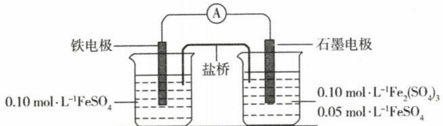

回答下列问题：

(1)电流表显示电子由铁电极流向石墨电极。可知,盐桥中的阳离子进入\_\_\_\_电极溶液中。

(2)电池反应一段时间后,测得铁电极溶液中池反应一段时间后,测得铁电极溶液中池反应一段时间后,测得铁电极溶液中 $c(\mathrm{Fe}^{2+})$ 增加了 $0.02\ mol\cdot L^{-1}$ 。石墨电极上未见 Fe 析出。可知,石墨电极溶液中 $c(\mathrm{Fe}^{2+})=$ \_\_\_\_ 。

(3)根据(1)、(2)实验结果,可知石墨电极的电极反应式为\_\_\_\_\_,铁电极的电极反应式为\_\_\_\_\_\_。因此,验证了 $Fe^{2+}$ 氧化性小于\_\_\_\_\_,还原性小于\_\_\_\_\_\_。

解析:(1)原电池放电时电子是由负极经外电路流向正极,结合电子由铁电极流向石墨电极,可知铁电极为负极,石墨电极为正极。根据原电池放电时离子移动规律(口诀:正正负负),盐桥中的阳离子流向正极(石墨电极)溶液中。

(2)由题意知负极反应为： $Fe-2e^{-}=Fe^{2+}$ ，正极反应为： $Fe^{3+}+e^{-}=Fe^{2+}$ ，则铁电极溶液中 $c(\mathrm{Fe}^{2+})$ 增加0.02 mol·L $^{-1}$ 时，根据得失电子守恒可知，石墨电极溶液中 $c(\mathrm{Fe}^{2+})$ 增加0.04 mol·L $^{-1}$ ，故此时石墨电极溶液中 $c(\mathrm{Fe}^{2+})=(0.05+0.04)\mathrm{mol}\cdot\mathrm{L}^{-1}=0.09\mathrm{mol}\cdot\mathrm{L}^{-1}$ 。

(3)石墨电极处, $Fe^{2+}$ 和 $Fe^{3+}$ 皆可得电子具有氧化性,由实验结果可知电极反应式为: $Fe^{3+}+e^{-}=Fe^{2+}$ ,因此优先得电子的 $Fe^{3+}$ 其氧化性强于 $Fe^{2+}$ 。铁电极处,Fe和 $Fe^{2+}$ 皆可失电子具有还原性,由实验结果可知电极反应式为: $Fe-2e^{-}=Fe^{2+}$ ,因此优先失电子的Fe其还原性强于 $Fe^{2+}$ 。

答案:(1)石墨 (2)0.09 mol·L $^{-1}$ (3) $Fe^{3+}+e^{-}=Fe^{2+}$ $Fe-2e^{-}=Fe^{2+}$ $Fe^{3+}$ Fe

# 模块 3 氧化还原方程式配平(★★★)

习题：P12

## 内容提要

## 一、氧化还原化学方程式配平步骤：

## 第一步

标出变价元素的化合价，列出化合价升/降的变化量，再根据化合价升降总和，找最小公倍数，决定还原剂/氧化剂的系数，同时将产物的变价元素配平

## 二、氧化还原离子方程式配平步骤：

## 第一步

标变价、列变化、
找倍数、定系数
标出变价元素的化合价，列出化合价升/降的变化量，再根据化合价升降总和，找最小公倍数，决定还原剂/氧化剂的系数，同时将产物的变价元素配平

## 第二步

## 未变价元素原子守恒

对于部分氧化还原反应，某些元素既变价又不变价，第一步配平完变价部分，第二步则配平未变价部分。此外除H、O以外的未变价元素，也将在第二步配平

## 第二步

## 根据环境调平电荷

酸性水溶液用 $H^{+}$ 调平电荷、碱性水溶液用 $OH^{-}$ 调平电荷。若没有明确水溶液酸碱性，往往是“水出酸或碱”，也就是 $H^{+}$ 或 $OH^{-}$ 写在方程式右侧

## 第三步

看氢补水、用氧检查第三步调平H、O原子。用H原子守恒确定 $\mathrm{H}_2\mathrm{O}$ 的位置与个数，最后检查O原子是否守恒。若题目中没有H或O原子，则在第二步就可以完成方程式配平

## 第三步

当第二步的 $H^{+}$ 或 $OH^{-}$ 确定后，第三步用H原子守恒确定 $H_{2}O$ 的位置与个数，最后检查O原子是否守恒。

三、针对不同类型的氧化还原反应,采用不同的配平顺序:完全氧化还原反应和归中反应一般用正向配平法;部分氧化还原反应和歧化反应一般用逆向配平法。先确定局部的计量数,再解决整体的计量数。正向配平时注意反应物角标,计算化合价升、降总量;逆向配平时注意生成物角标,计算化合价升、降总量。

四、找倍数时，一定要先找“最小公倍数”，避免计量数不是“最简比”。若计量数出现“分数”，最后扩大一定的倍数，将方程式各物质的计量数转化成最简单整数比。

五、有机物的结构较为复杂,分析每个原子的真实化合价配平极其烦琐,所以经常用“平均值法”“组成法”。所谓的“平均值法”即将有机物的 H、O 分别规定为 +1、-2 价,利用正负化合价的代数和为零计算 C 的平均价态。“组成法”即有机物组成上多了 1 个 O 或少了 2 个 H,则有机物的化合价升高 2 价(发生氧化反应);若有机物组成上多了 2 个 H 或少了 1 个 O,则有机物的化合价降低 2 价(发生还原反应)。

此外,对于只含 C、H、O 元素的复杂有机物,若平均价态涉及分数,计算量会增大且容易犯错,此时可以使用“燃烧法”计算转移电子数,即将有机物与 $O_{2}$ 反应,生成 $CO_{2}$ 和 $H_{2}O$ ,将有机物的系数定为 1,只根据原子个数字恒将方程式配平,然后转移的电子数即为 $O_{2}$ 系数的 4 倍。

六、涉及有机物参与的氧化还原反应，由于 H 原子往往多于 O 原子个数，常常用 O 原子守恒来确定 $H_{2}O$ 的位置与个数，最后用 H 原子守恒检查。

类型 I: 完全氧化还原反应的配平(正向配平法)

【例 1】酸性 $KMnO_{4}$ 溶液与 $NaNO_{2}$ 反应：\_\_\_\_ $MnO_{4}^{-} +$ \_\_\_\_ $NO_{2}^{-} +$ \_\_\_\_ $=$ \_\_\_\_ $Mn^{2+} +$ \_\_\_\_ $NO_{3}^{-} +$ \_\_\_\_

解析:第一步:标变价、列变化、找倍数,利用化合价升降守恒确定变价元素 Mn、N 的系数。

$$
2 \mathrm{MnO} _ {4} ^ {-} + 5 \mathrm{NO} _ {2} ^ {-} - 2 \mathrm{Mn} ^ {2 +} + 5 \mathrm{NO} _ {3} ^ {-}
$$

第二步:根据电荷守恒,酸性条件用 $H^{+}$ 调平电荷, $H^{+}$ 补在左侧,使左右两侧离子电荷总量都是-1。

$$
2 \mathrm{MnO} _ {4} ^ {-} + 5 \mathrm{NO} _ {2} ^ {-} + 6 \mathrm{H} ^ {+} - 2 \mathrm{Mn} ^ {2 +} + 5 \mathrm{NO} _ {3} ^ {-}
$$

第三步: 看 H 补 $H_{2}O$ ，用 O 检查，右侧少 6 个 H 因此补 3 个 $H_{2}O$ ，检查左右 O 原子数都是 18，配平完成。

$$
2 \mathrm{MnO} _ {4} ^ {-} + 5 \mathrm{NO} _ {2} ^ {-} + 6 \mathrm{H} ^ {+} = 2 \mathrm{Mn} ^ {2 +} + 5 \mathrm{NO} _ {3} ^ {-} + 3 \mathrm{H} _ {2} \mathrm{O}
$$

答案:2、5、6H $^{+}$ 、2、5、3H $_{2}$ O

$$
\mathrm{NaIO} _ {3} + \_ \mathrm{NaHSO} _ {3} = \_ \mathrm{I} _ {2} + \_ \mathrm{Na} _ {2} \mathrm{SO} _ {4} + \_ \mathrm{H} _ {2} \mathrm{SO} _ {4} + \_ \mathrm{H} _ {2} \mathrm{O}
$$

解析: 第一步: 标变价、列变化、找倍数, 利用化合价升降守恒确定变价元素 I 和 S 的个数比为 2:5。

第二步:根据未变价元素 Na 守恒,取最简单整数比,确定 $NaIO_{3}$ 系数为 4、 $NaHSO_{3}$ 系数为 10、 $Na_{2}SO_{4}$ 系数为 7,进而确定 $I_{2}$ 系数为 2、 $H_{2}SO_{4}$ 系数为 3。

$$
4 \mathrm{NaIO} _ {3} + 1 0 \mathrm{NaHSO} _ {3} - 2 \mathrm{I} _ {2} + 7 \mathrm{Na} _ {2} \mathrm{SO} _ {4} + 3 \mathrm{H} _ {2} \mathrm{SO} _ {4} + \_ \mathrm{H} _ {2} \mathrm{O}
$$

第三步: 看 H 补 $H_{2}O$ ，用 O 检查，右侧少 4 个 H 因此补 2 个 $H_{2}O$ ，检查左右 O 原子数都是 42，配平完成。

$$
4 \mathrm{NaIO} _ {3} + 1 0 \mathrm{NaHSO} _ {3} = 2 \mathrm{I} _ {2} + 7 \mathrm{Na} _ {2} \mathrm{SO} _ {4} + 3 \mathrm{H} _ {2} \mathrm{SO} _ {4} + 2 \mathrm{H} _ {2} \mathrm{O}
$$

答案:4、10、2、7、3、2

【例 3】\_\_\_\_KMnO $_{4}$ +\_\_\_\_FeSO $_{4}$ +\_\_\_\_H $_{2}$ SO $_{4}$ =\_\_\_\_K $_{2}$ SO $_{4}$ +\_\_\_\_MnSO $_{4}$ +\_\_\_\_Fe $_{2}$ (SO $_{4}$ ) $_{3}$ +\_\_\_\_H $_{2}$ O

解析: 第一步: 标变价、列变化、找倍数, 利用化合价升降守恒确定变价元素 Mn、Fe 的系数。为了使生成物 $\mathrm{Fe}_{2}(\mathrm{SO}_{4})_{3}$ 的系数为整数, 因此 $KMnO_{4}$ 、 $FeSO_{4}$ 系数定为 2、10。

$$
2 \mathrm{KMnO} _ {4} + 1 0 \mathrm{FeSO} _ {4} + \_ \mathrm{H} _ {2} \mathrm{SO} _ {4} - \mathrm{K} _ {2} \mathrm{SO} _ {4} + 2 \mathrm{MnSO} _ {4} + 5 \mathrm{Fe} _ {2} (\mathrm{SO} _ {4}) _ {3} + \_ \mathrm{H} _ {2} \mathrm{O}
$$

第二步:根据未变价元素 K、S 守恒,先利用 K 守恒确定 $K_{2}SO_{4}$ 系数为 1,再利用 S 守恒确定 $H_{2}SO_{4}$ 系数为 8。

$$
2 \mathrm{KMnO} _ {4} + 1 0 \mathrm{FeSO} _ {4} + 8 \mathrm{H} _ {2} \mathrm{SO} _ {4} - 1 \mathrm{K} _ {2} \mathrm{SO} _ {4} + 2 \mathrm{MnSO} _ {4} + 5 \mathrm{Fe} _ {2} (\mathrm{SO} _ {4}) _ {3} + \quad \mathrm{H} _ {2} \mathrm{O}
$$

第三步: 看 H 补 $H_{2}O$ ，用 O 检查，右侧少 16 个 H 因此补 8 个 $H_{2}O$ ，检查左右 O 原子数都是 80，配平完成。

$$
2 \mathrm{KMnO} _ {4} + 1 0 \mathrm{FeSO} _ {4} + 8 \mathrm{H} _ {2} \mathrm{SO} _ {4} = 1 \mathrm{K} _ {2} \mathrm{SO} _ {4} + 2 \mathrm{MnSO} _ {4} + 5 \mathrm{Fe} _ {2} (\mathrm{SO} _ {4}) _ {3} + 8 \mathrm{H} _ {2} \mathrm{O}
$$

答案:2、10、8、1、2、5、8

类型Ⅱ: 反应物中同一元素部分变价、部分不变价(即部分氧化还原反应,用逆向配平法)

$$
_ \mathrm{Cu} + \_ \mathrm{HNO} _ {3} = \_ \mathrm{Cu} (\mathrm{NO} _ {3}) _ {2} + \_ \mathrm{NO} \uparrow + \_ \mathrm{H} _ {2} \mathrm{O}
$$

解析:第一步:标变价、列变化、找倍数,利用化合价升降守恒,先确定氧化产物 $\mathrm{Cu(NO_{3})_{2}}$ 、还原产物 NO 的系数分别为 3、2。

$$
\mathrm{Cu} + \mathrm{HNO} _ {3} - 3 \mathrm{Cu(NO} _ {3}) _ {2} + 2 \mathrm{NO} \uparrow + \mathrm{H} _ {2} \mathrm{O}
$$

第二步:根据 Cu 和 N 原子守恒,配平 Cu、HNO $_{3}$ 的系数分别为 3、8。

$$
3 \mathrm{Cu} + 8 \mathrm{HNO} _ {3} - 3 \mathrm{Cu} (\mathrm{NO} _ {3}) _ {2} + 2 \mathrm{NO} \uparrow + \_ \mathrm{H} _ {2} \mathrm{O}
$$

第三步: 看 H 补 $H_{2}O$ ，用 O 检查，右侧少 8 个 H 因此补 4 个 $H_{2}O$ ，检查左右 O 原子数都是 24，配平完成。

$$
3 \mathrm{Cu} + 8 \mathrm{HNO} _ {3} = 3 \mathrm{Cu} (\mathrm{NO} _ {3}) _ {2} + 2 \mathrm{NO} \uparrow + 4 \mathrm{H} _ {2} \mathrm{O}
$$

答案:3、8、3、2、4

$$
\text {   【例   } 5 \text {   ]   } \mathrm{NaNO} _ {2} + \_ \mathrm{HI} = \_ \mathrm{NO} \uparrow + \_ \mathrm{I} _ {2} + \_ \mathrm{NaI} + \_ \mathrm{H} _ {2} \mathrm{O}
$$

解析:第一步:标变价、列变化、找倍数,利用化合价升降守恒,先确定氧化产物 $I_{2}$ 、还原产物 NO 的系数分别为 1、2。

$$
\mathrm {\_NaNO_ {2}} + \mathrm {\_HI} ^ {- 1} - 2 \mathrm{NO} \uparrow + 1 \mathrm{I} _ {2} ^ {0} + \mathrm {\_NaI} + \mathrm {\_H_ {2} O}
$$

第二步:根据 N 原子守恒,确定 $NaNO_{2}$ 系数为 2,接着根据 Na 原子守恒确定 NaI 系数为 2,再根据 I 原子守恒确定 HI 系数为 4。

$$
2 \mathrm{NaNO} _ {2} + 4 \mathrm{HI} - 2 \mathrm{NO} \uparrow + 1 \mathrm{I} _ {2} + 2 \mathrm{NaI} + \_ \mathrm{H} _ {2} \mathrm{O}
$$

第三步: 看 H 补 $H_{2}O$ ，用 O 检查，右侧少 4 个 H 因此补 2 个 $H_{2}O$ ，检查左右 O 原子数都是 4，配平完成。

$$
2 \mathrm{NaNO} _ {2} + 4 \mathrm{HI} = 2 \mathrm{NO} \uparrow + 1 \mathrm{I} _ {2} + 2 \mathrm{NaI} + 2 \mathrm{H} _ {2} \mathrm{O}
$$

答案:2、4、2、1、2、2

$$
\text {   【例   } 6 \text {   】   } \mathrm{Fe} _ {3} \mathrm{O} _ {4} + \_ \mathrm{HNO} _ {3} - \_ \mathrm{Fe(NO} _ {3}) _ {3} + \_ \mathrm{NO} \uparrow + \_ \mathrm{H} _ {2} \mathrm{O}
$$

解析:第一步:标变价、列变化、找倍数,本题用逆向配平。 $Fe_{3}O_{4}$ 中Fe的平均化合价为 $+\frac{8}{3}$ 价,Fe化合价降 $\frac{1}{3}$ 价;N化合价升3价,据此写出氧化产物 $\mathrm{Fe(NO_{3})_{3}}$ 、还原产物NO的系数分别为9、1。

$$
\mathrm { O_ {4}} + \mathrm {_ {HNO_ {3}}} - 9 \mathrm{Fe} (\mathrm{NO} _ {3}) _ {3} + 1 \mathrm{NO} \uparrow + \mathrm {_ {H2} O}
$$

第二步:再根据 Fe、N 原子守恒,配平 $Fe_{3}O_{4}$ 和 $HNO_{3}$ 的系数分别为 3、28。

$$
3 \mathrm{Fe} _ {3} \mathrm{O} _ {4} + 2 8 \mathrm{HNO} _ {3} - 9 \mathrm{Fe} (\mathrm{NO} _ {3}) _ {3} + 1 \mathrm{NO} \uparrow + \_ \mathrm{H} _ {2} \mathrm{O}
$$

第三步: 看 H 补 $H_{2}O$ ，用 O 检查，右侧少 28 个 H 因此补 14 个 $H_{2}O$ ，检查左右 O 原子数都是 96，配平完成：

$$
3 \mathrm{Fe} _ {3} \mathrm{O} _ {4} + 2 8 \mathrm{HNO} _ {3} = 9 \mathrm{Fe} (\mathrm{NO} _ {3}) _ {3} + 1 \mathrm{NO} \uparrow + 1 4 \mathrm{H} _ {2} \mathrm{O}
$$

答案:3、28、9、1、14

类型Ⅲ: 反应物含“角标”的完全氧化还原反应

$$
\begin{array}{r l} & \text {【例7】\_K} _ {2} \mathrm{Cr} _ {2} \mathrm{O} _ {7} + \_ \mathrm{H} _ {2} \mathrm{O} _ {2} + \_ \mathrm{H} _ {2} \mathrm{SO} _ {4} = \_ \mathrm{K} _ {2} \mathrm{SO} _ {4} + \_ \mathrm{Cr} _ {2} (\mathrm{SO} _ {4}) _ {3} + \_ \mathrm{O} _ {2} \uparrow \\ & + \_ \mathrm{H} _ {2} \mathrm{O} \end{array}
$$

解析:第一步:标变价、列变化、找倍数,正向配平时,列变化时需要注意反应物角标,再利用化合价升降相同确定氧化剂和还原剂的计量数比。 $K_{2}Cr_{2}O_{7}$ 含2个+6价Cr,反应后变为2个+3价Cr,因此 $K_{2}Cr_{2}O_{7}$ 化合价共降6; $H_{2}O_{2}$ 含2个-1价O,反应后变为2个0价O(即 $O_{2}$ ),因此 $H_{2}O_{2}$ 化合价共升2。则氧化剂 $K_{2}Cr_{2}O_{7}$ 、还原剂 $H_{2}O_{2}$ 、还原产物 $Cr_{2}(SO_{4})_{3}$ 、氧化产物 $O_{2}$ 的系数分别为1、3、1、3

$$
1 \mathrm{K} _ {2} \stackrel {+ 6} {\underset {\downarrow 3 \times 2} {\mathrm{Cr}}} \mathrm{O} _ {7} + 3 \mathrm{H} _ {2} \stackrel {- 1} {\underset {\uparrow 1 \times 2} {\mathrm{O}}} + \_ \mathrm{H} _ {2} \mathrm{SO} _ {4} - \_ \mathrm{K} _ {2} \mathrm{SO} _ {4} + 1 \stackrel {+ 3} {\mathrm{Cr}} _ {2} (\mathrm{SO} _ {4}) _ {3} + 3 \stackrel {0} {\mathrm{O}} _ {2} \uparrow + \_ \mathrm{H} _ {2} \mathrm{O}
$$

第二步:根据未变价元素 K、S 守恒,先利用 K 守恒确定 $K_{2}SO_{4}$ 系数为 1,再利用 S 守恒确定 $H_{2}SO_{4}$ 系数为 4。

$$
1 \mathrm{K} _ {2} \mathrm{Cr} _ {2} \mathrm{O} _ {7} + 3 \mathrm{H} _ {2} \mathrm{O} _ {2} + 4 \mathrm{H} _ {2} \mathrm{SO} _ {4} - 1 \mathrm{K} _ {2} \mathrm{SO} _ {4} + 1 \mathrm{Cr} _ {2} (\mathrm{SO} _ {4}) _ {3} + 3 \mathrm{O} _ {2} \uparrow + \_ \mathrm{H} _ {2} \mathrm{O}
$$

第三步: 看 H 补 $H_{2}O$ ，用 O 检查，右侧少 14 个 H 因此补 7 个 $H_{2}O$ ，检查左右 O 原子数都是 29，配平完成。

$$
1 \mathrm{K} _ {2} \mathrm{Cr} _ {2} \mathrm{O} _ {7} + 3 \mathrm{H} _ {2} \mathrm{O} _ {2} + 4 \mathrm{H} _ {2} \mathrm{SO} _ {4} = 1 \mathrm{K} _ {2} \mathrm{SO} _ {4} + 1 \mathrm{Cr} _ {2} (\mathrm{SO} _ {4}) _ {3} + 3 \mathrm{O} _ {2} \uparrow + 7 \mathrm{H} _ {2} \mathrm{O}
$$

答案:1、3、4、1、1、3、7

$$
\mathrm{NaN} _ {3} + \quad \mathrm{KNO} _ {3} = \quad \mathrm{K} _ {2} \mathrm{O} + \quad \mathrm{Na} _ {2} \mathrm{O} + \quad \mathrm{N} _ {2} \uparrow
$$

解析:第一步:标变价、列变化、找倍数,正向配平时,列变化时需要注意反应物角标, $\mathrm{NaN}_{3}$ 中 $\mathrm{Na}$ 为+1,则每个 $\mathrm{N}$ 的平均化合价为 $-\frac{1}{3}$ ,因此 $\mathrm{NaN}_{3}$ 中3个 $-\frac{1}{3}$ 的 $\mathrm{N}$ 最终都变为0价的 $\mathrm{N},\mathrm{NaN}_{3}$ 化合价共升1; $\mathrm{KNO}_{3}$ 中1个+5价的 $\mathrm{N}$ 最终变为0价的 $\mathrm{N},\mathrm{KNO}_{3}$ 化合价降5。则还原剂 $\mathrm{NaN}_{3}$ 、氧化剂 $\mathrm{KNO}_{3}$ 、氧化(还原)产物 $\mathrm{N}_{2}$ 的系数分别为5、1、8。

$$
5 \mathrm{NaN} _ {3} ^ {- \frac {1}{3}} + 1 \mathrm{KNO} _ {3} ^ {+ 5} - \_ \mathrm{K} _ {2} \mathrm{O} + \_ \mathrm{Na} _ {2} \mathrm{O} + 8 \mathrm{N} _ {2} ^ {0} \uparrow
$$

第二步:根据未变价元素 K、Na 原子守恒,且为了使生成物 $K_{2}O$ 的系数为整数,因此将 $NaN_{3}$ 、 $KNO_{3}$ 、 $N_{2}$ 系数调整为 10、2、16,可确定 $K_{2}O$ 的系数为 1、 $Na_{2}O$ 系数为 5。

第三步: 无 H 不用补 $H_{2}O$ ，用 O 检查，左右 O 原子数都是 6，配平完成。

$$
1 0 \mathrm{NaN} _ {3} + 2 \mathrm{KNO} _ {3} = 1 \mathrm{K} _ {2} \mathrm{O} + 5 \mathrm{Na} _ {2} \mathrm{O} + 1 6 \mathrm{N} _ {2} \uparrow
$$

答案:10、2、1、5、16

类型Ⅳ: 同一反应物含多种变价元素的配平方法

$$
\mathrm{ClO} _ {3} ^ {-} + \_ \mathrm{FeS} _ {2} + \_ \mathrm{H} ^ {+} = \_ \mathrm{ClO} _ {2} \uparrow + \_ \mathrm{Fe} ^ {3 +} + \_ \mathrm{SO} _ {4} ^ {2 -} + \_ \mathrm{H} _ {2} \mathrm{O}
$$

解析:第一步:标变价、列变化,同一反应物有多种变价元素时,加和各变价量得到总变价量,用总变价量来求氧化剂和还原剂的计量数比。 $FeS_{2}$ 中Fe化合价+2、S化合价-1( $FeS_{2}$ 的化合价是高中生必须知道的),反应后Fe化合价由+2升到+3、S化合价由-1升到+6, $FeS_{2}$ 化合价上升总量为15, $ClO_{3}^{-}$ 中Cl化合价降1。根据升降守恒可得, $ClO_{3}^{-}$ 、 $FeS_{2}$ 、 $ClO_{2}$ 、 $Fe^{3+}$ 、 $SO_{4}^{2-}$ 的计量数分别为15、1、15、1、2。

$$
15\overset {+5}{\underset{\downarrow 1}{\mathrm{ClO}_{3}^{-}}} + 1\overset {+2 - 1}{\underset{\substack{\uparrow 1 \uparrow 7\times 2\\ 共 \uparrow 15}}{\mathrm{FeS}_{2}}} + \_ \mathrm{H}^{+} - 15\overset {+4}{\underset{\uparrow}{\mathrm{ClO}_{2}}}\uparrow + 1\overset {+3}{\underset{\uparrow}{\mathrm{Fe}^{3 + }}} + 2\overset {+6}{\underset{\downarrow}{\mathrm{SO}_{4}^{2 -}}} + \_ \mathrm{H}_{2}\mathrm{O}
$$

第二步:根据电荷守恒调平电荷, $H^{+}$ 在左侧补14个,使左右两侧离子电荷总量都是-1。

$$
1 5 \mathrm{ClO} _ {3} ^ {-} + 1 \mathrm{FeS} _ {2} + 1 4 \mathrm{H} ^ {+} - 1 5 \mathrm{ClO} _ {2} \uparrow + 1 \mathrm{Fe} ^ {3 +} + 2 \mathrm{SO} _ {4} ^ {2 -} + \_ \mathrm{H} _ {2} \mathrm{O}
$$

第三步: 看 H 补 $H_{2}O$ ，用 O 检查，右侧少 14 个 H 因此补 7 个 $H_{2}O$ ，检查左右 O 原子数都是 45，配平完成。

$$
1 5 \mathrm{ClO} _ {3} ^ {-} + 1 \mathrm{FeS} _ {2} + 1 4 \mathrm{H} ^ {+} = 1 5 \mathrm{ClO} _ {2} \uparrow + 1 \mathrm{Fe} ^ {3 +} + 2 \mathrm{SO} _ {4} ^ {2 -} + 7 \mathrm{H} _ {2} \mathrm{O}
$$

答案:15、1、14、15、1、2、7

$$
\text {   【例   } 1 0 \text {   ]   } \_ \mathrm{ClO} _ {2} + \_ \mathrm{CN} ^ {-} + \_ \mathrm{OH} ^ {-} = \_ \mathrm{CO} _ {3} ^ {2 -} + \_ \mathrm{N} _ {2} + \_ \mathrm{Cl} ^ {-} + \_ \mathrm{H} _ {2} \mathrm{O}
$$

解析:如何判断 $CN^{-}$ 中 C、N 化合价?一般来说,我们可以将电负性大(得电子能力强)的元素取最低化合价,由于电负性 N>C,因此将 N 化合价定为 -3 价,则 $CN^{-}$ 中 C 化合价为 +2 价。

第一步:标变价、列变化, $\mathrm{CN}^{-}$ 中C化合价由+2价升到+4价、N化合价由-3价升到0价,因此 $\mathrm{CN}^{-}$ 化合价共升5价。 $\mathrm{ClO}_{2}$ 中Cl化合价降5价,且为了使 $\mathrm{N}_{2}$ 系数为整数,因此 $\mathrm{ClO}_{2}$ 、 $\mathrm{CN}^{-}$ 系数各定为2,并让变价元素C、N、Cl守恒。则 $\mathrm{ClO}_{2}$ 、 $\mathrm{CN}^{-}$ 、 $\mathrm{CO}_{3}^{2-}$ 、 $\mathrm{N}_{2}$ 、 $\mathrm{Cl}^{-}$ 的系数分别为2、2、2、1、2。

$$
2 \stackrel {+ 4} {\underset {\downarrow 5} {\mathrm{ClO}}} _ {2} + 2 \stackrel {+ 2 - 3} {\underset {\uparrow 2 \uparrow 3} {\mathrm{CN}}} ^ {-} + \_ \mathrm{OH} ^ {-} - 2 \stackrel {+ 4} {\underset {\text {共} \uparrow 5} {\mathrm{CO}}} _ {3} ^ {2 -} + 1 \mathrm{N} _ {2} + 2 \stackrel {- 1} {\underset {} {\mathrm{Cl}} ^ {-}} + \_ \mathrm{H} _ {2} \mathrm{O}
$$

第二步:根据电荷守恒调平电荷,在左侧补4个 $OH^{-}$ ,使左右两侧离子电荷总量都是-6。

$$
2 \mathrm{ClO} _ {2} + 2 \mathrm{CN} ^ {-} + 4 \mathrm{OH} ^ {-} - 2 \mathrm{CO} _ {3} ^ {2 -} + 1 \mathrm{N} _ {2} + 2 \mathrm{Cl} ^ {-} + \_ \mathrm{H} _ {2} \mathrm{O}
$$

第三步: 看 H 补 $H_{2}O$ ，用 O 检查，右侧少 4 个 H 因此补 2 个 $H_{2}O$ ，检查左右 O 原子数都是 8，配平完成。

$$
2 \mathrm{ClO} _ {2} + 2 \mathrm{CN} ^ {-} + 4 \mathrm{OH} ^ {-} = 2 \mathrm{CO} _ {3} ^ {2 -} + 1 \mathrm{N} _ {2} + 2 \mathrm{Cl} ^ {-} + 2 \mathrm{H} _ {2} \mathrm{O}
$$

答案:2、2、4、2、1、2、2

类型 V: 歧化反应的配平

$$
\text {   【例   } 1 1 \text {   】   } \_ \mathrm{S} + \_ \mathrm{KOH} = \_ \mathrm{K} _ {2} \mathrm{S} + \_ \mathrm{K} _ {2} \mathrm{SO} _ {3} + \_ \mathrm{H} _ {2} \mathrm{O}
$$

解析:第一步:标变价、列变化,歧化反应用逆向配平法(由后往前进行配平); $K_{2}S\rightarrow S,S$ 化合价升 $2,K_{2}SO_{3}\rightarrow S,S$ 化合价降4,根据化合价升降守恒确定 $K_{2}S,K_{2}SO_{3}$ 的系数为2、1。再根据变价元素S守恒求得反应物S的系数为3。

$$
3 \mathrm{S} ^ {0} + \mathrm{KOH} - 2 \mathrm{K} _ {2} \mathrm{S} ^ {- 2} + 1 \mathrm{K} _ {2} \mathrm{SO} _ {3} + \_ \mathrm{H} _ {2} \mathrm{O}
$$

第二步:根据未变价元素 K 守恒,确定 KOH 系数为 6。

$$
3 \mathrm{S} + 6 \mathrm{KOH} - 2 \mathrm{K} _ {2} \mathrm{S} + 1 \mathrm{K} _ {2} \mathrm{SO} _ {3} + \_ \mathrm{H} _ {2} \mathrm{O}
$$

第三步: 看 H 补 $H_{2}O$ ，用 O 检查，右侧少 6 个 H 因此补 3 个 $H_{2}O$ ，检查左右 O 原子数都是 6，配平完成。

$$
3 \mathrm{S} + 6 \mathrm{KOH} = 2 \mathrm{K} _ {2} \mathrm{S} + 1 \mathrm{K} _ {2} \mathrm{SO} _ {3} + 3 \mathrm{H} _ {2} \mathrm{O}
$$

答案:3、6、2、1、3

$$
\text {   【例   } 1 2 \text {   ]   } \mathrm{P} _ {4} + \mathrm{Ba(OH)} _ {2} + \mathrm{H} _ {2} \mathrm{O} = \mathrm{Ba(H} _ {2} \mathrm{PO} _ {2}) _ {2} + \mathrm{PH} _ {3} \uparrow
$$

解析:第一步:标变价、列变化,歧化反应用逆向配平法(由后往前进行配平): $\mathrm{Ba(H_{2}PO_{2})_{2}\rightarrow P_{4}}$ ,有2个+1价P变为0价P,化合价降2价(逆向配平,若生成物变价元素有角标,则化合价变化要乘角标), $PH_{3}\rightarrow P_{4}$ ,有1个-3价P变为0价P,化合价升3价,根据化合价升降守恒确定 $\mathrm{Ba(H_{2}PO_{2})_{2},PH_{3}}$ 的系数为3、2。再根据变价元素P守恒求得反应物 $P_{4}$ 的系数为2。

$$
2 \mathrm{P} _ {4} ^ {0} + \_ \mathrm{Ba(OH)} _ {2} + \_ \mathrm{H} _ {2} \mathrm{O} - 3 \mathrm{Ba(H} _ {2} \stackrel {+ 1} {\mathrm{PO} _ {2}} _ {2} + 2 \stackrel {- 3} {\mathrm{PH} _ {3}} \uparrow
$$

第二步:根据未变价元素 Ba 守恒, $\mathrm{Ba(OH)_2}$ 系数为 3。

$$
2 \mathrm{P} _ {4} + 3 \mathrm{Ba(OH)} _ {2} + \_ \mathrm{H} _ {2} \mathrm{O} - 3 \mathrm{Ba(H} _ {2} \mathrm{PO} _ {2}) _ {2} + 2 \mathrm{PH} _ {3} \uparrow
$$

第三步: 看 H 补 $H_{2}O$ ，用 O 检查，左侧少 12 个 H 因此补 6 个 $H_{2}O$ ，检查左右 O 原子都是 12，配平完成。

$$
2 \mathrm{P} _ {4} + 3 \mathrm{Ba(OH)} _ {2} + 6 \mathrm{H} _ {2} \mathrm{O} = 3 \mathrm{Ba(H} _ {2} \mathrm{PO} _ {2}) _ {2} + 2 \mathrm{PH} _ {3} \uparrow
$$

答案:2、3、6、3、2

【反思】若正向配平，则“反应物”变价元素有角标，化合价变化要乘角标；若逆向配平，则“生成物”变价元素有角标，化合价变化要乘角标。

## 类型Ⅵ: 含有机化合物的配平题型

$$
\text {【例13】} \mathrm{CH} _ {3} \mathrm{CHO} + \mathrm{Cu(OH)} _ {2} + \mathrm{NaOH} \xrightarrow {\Delta} \mathrm{CH} _ {3} \mathrm{COONa} + \mathrm{Cu} _ {2} \mathrm{O} \downarrow + \mathrm{H} _ {2} \mathrm{O}
$$

解析:第一步:有机反应中,每多1个O,C化合价升2价。醛基(—CHO)氧化为羧基(—COOH),过程中多1个O,碳化合价升2价。 $\mathrm{Cu(OH)_2\rightarrow Cu_2O}$ ,Cu化合价降1价,根据化合价升降守恒确定 $CH_3CHO$ 、 $\mathrm{Cu(OH)_2}$ 的系数为1、2。根据变价C、Cu元素原子守恒,得到 $CH_3COONa$ 系数为1、 $Cu_2O$ 系数为1。

$$
1 \mathrm{CH} _ {3} \underset {\uparrow 2} {\mathrm{CHO}} + 2 \underset {\downarrow 1} {\mathrm{Cu(OH)} _ {2}} + \_ \mathrm{NaOH} - 1 \mathrm{CH} _ {3} \underset {\downarrow} {\mathrm{COONa}} + 1 \underset {\downarrow} {\mathrm{Cu} _ {2} \mathrm{O}} \downarrow + \_ \mathrm{H} _ {2} \mathrm{O}
$$

第二步:根据未变价元素 Na 守恒,NaOH 系数为 1。

$$
1 \mathrm{CH} _ {3} \mathrm{CHO} + 2 \mathrm{Cu(OH)} _ {2} + 1 \mathrm{NaOH} - 1 \mathrm{CH} _ {3} \mathrm{COONa} + 1 \mathrm{Cu} _ {2} \mathrm{O} \downarrow + \_ \mathrm{H} _ {2} \mathrm{O}
$$

第三步: 看 O 补 $H_{2}O$ ，用 H 检查，右侧少 3 个 O 因此补 3 个 $H_{2}O$ ，检查左右 H 原子数都是 9，配平完成。

$$
1 \mathrm{CH} _ {3} \mathrm{CHO} + 2 \mathrm{Cu(OH)} _ {2} + 1 \mathrm{NaOH} \xrightarrow {\Delta} 1 \mathrm{CH} _ {3} \mathrm{COONa} + 1 \mathrm{Cu} _ {2} \mathrm{O} \downarrow + 3 \mathrm{H} _ {2} \mathrm{O}
$$

答案:1、2、1、1、1、3

$$
\begin{array}{r l} & \text {【例14】} \_ \mathrm{K} _ {2} \mathrm{Cr} _ {2} \mathrm{O} _ {7} + \_ \mathrm{CH} _ {3} \mathrm{CH} _ {2} \mathrm{OH} + \_ \mathrm{H} _ {2} \mathrm{SO} _ {4} = \_ \mathrm{Cr} _ {2} (\mathrm{SO} _ {4}) _ {3} + \_ \mathrm{CH} _ {3} \mathrm{COOH} + \\ & \mathrm{K} _ {2} \mathrm{SO} _ {4} + \_ \mathrm{H} _ {2} \mathrm{O} \end{array}
$$

解析:第一步:有机反应中,每少1个H,C化合价升1价;每多1个O,C化合价升2价。羟甲基( $-CH_{2}OH$ )氧化为羧基(—COOH)过程中有机物少2个H且多1个O,C化合价升4价, $K_{2}Cr_{2}O_{7}\rightarrow Cr_{2}(SO_{4})_{3}$ ,每个Cr化合价降3价,因此 $K_{2}Cr_{2}O_{7}$ 化合价降6价,根据化合价升降守恒确定 $K_{2}Cr_{2}O_{7}$ 、 $CH_{3}CH_{2}OH$ 的系数为2、3。
再根据变价 C、Cr 元素守恒,得到 $\mathrm{Cr}_{2}(\mathrm{SO}_{4})_{3}$ 系数为 2、 $CH_{3}COOH$ 系数为 3。

$$
2 \mathrm{K} _ {2} \underset {\downarrow 3 \times 2} {\overset {+ 6} {\mathrm{Cr}}} _ {2} \mathrm{O} _ {7} + 3 \mathrm{CH} _ {3} \underset {\uparrow 4} {\underline {{\mathrm{CH} _ {2} \mathrm{OH}}}} + \_ \mathrm{H} _ {2} \mathrm{SO} _ {4} - 2 \mathrm{Cr} _ {2} (\mathrm{SO} _ {4}) _ {3} + 3 \mathrm{CH} _ {3} \underline {{\mathrm{COOH}}} + \_ \mathrm{K} _ {2} \mathrm{SO} _ {4} + \_ \mathrm{H} _ {2} \mathrm{O}
$$

第二步:根据未变价元素 K、S 守恒,先利用 K 守恒确定 $K_{2}SO_{4}$ 系数为 2,再利用 S 守恒确定 $H_{2}SO_{4}$ 系数为 8。

$$
2 \mathrm{K} _ {2} \mathrm{Cr} _ {2} \mathrm{O} _ {7} + 3 \mathrm{CH} _ {3} \mathrm{CH} _ {2} \mathrm{OH} + 8 \mathrm{H} _ {2} \mathrm{SO} _ {4} - 2 \mathrm{Cr} _ {2} (\mathrm{SO} _ {4}) _ {3} + 3 \mathrm{CH} _ {3} \mathrm{COOH} + 2 \mathrm{K} _ {2} \mathrm{SO} _ {4} + \_ \mathrm{H} _ {2} \mathrm{O}
$$

第三步: 看 O 补 $H_{2}O$ (由于硫酸根是整体, 不用看其 O), 用 H 检查。右侧少 11 个 O 因此补 11 个 $H_{2}O$ , 检查左右 H 原子数都是 34, 配平完成。

$$
2 \mathrm{K} _ {2} \mathrm{Cr} _ {2} \mathrm{O} _ {7} + 3 \mathrm{CH} _ {3} \mathrm{CH} _ {2} \mathrm{OH} + 8 \mathrm{H} _ {2} \mathrm{SO} _ {4} = 2 \mathrm{Cr} _ {2} (\mathrm{SO} _ {4}) _ {3} + 3 \mathrm{CH} _ {3} \mathrm{COOH} + 2 \mathrm{K} _ {2} \mathrm{SO} _ {4} + 1 1 \mathrm{H} _ {2} \mathrm{O}
$$

答案:2、3、8、2、3、2、11

$$
\text {   【例   } 1 5 \text {   】   } \_ \quad \mathrm{H} _ {2} \mathrm{O} \quad \mathrm {\textcircled {- - }} \mathrm{CH} _ {3} + \_ \mathrm{KMnO} _ {4} \xrightarrow {\Delta} \_ \quad \mathrm {\textcircled {- - }} \mathrm{COOK} + \_ \mathrm{MnO} _ {2} + \_ \mathrm{KOH} +
$$

解析:第一步:该反应为 $-CH_{3}$ 被氧化为 $-COOH(-COOK$ 是 $-COOH$ 与KOH反应所得,此过程不是氧化还原反应,因此化合价变化用—COOH 判断),则过程中—CH₃ 少 2 个 H 且多 2 个 O,因此 C 化合价升高 6 价。KMnO₄→MnO₂,Mn 化合价降 3 价,根据化合价升降守恒确定 $\ce{C6H5-CH3}$ 、KMnO4 的系数为 1、2。再根据变价元素 C、Mn 守恒,得到 $\ce{C6H5-COOK}$ 系数为 1、MnO₂ 系数为 2。

$$
1 \left\langle \mathrm{CH} _ {3} + 2 \mathrm{KMnO} _ {4} - 1 \right\rangle \text {   COOK   } + 2 \mathrm{MnO} _ {2} + \_ \mathrm{KOH} + \_ \mathrm{H} _ {2} \mathrm{O}
$$

第二步:根据未变价元素 K 守恒,KOH 系数为 1。

$$
1 \mathrm{CH} _ {3} + 2 \mathrm{KMnO} _ {4} - 1 \mathrm{COOK} + 2 \mathrm{MnO} _ {2} + 1 \mathrm{KOH} + \_ \mathrm{H} _ {2} \mathrm{O}
$$

第三步: 看 O 补 $H_{2}O$ ，用 H 检查。右侧少 1 个 O 因此补 1 个 $H_{2}O$ ，检查左右 H 原子数都是 8，配平完成。

$$
1 \mathrm{CH} _ {3} + 2 \mathrm{KMnO} _ {4} \xrightarrow {\Delta} 1 \mathrm{COOK} + 2 \mathrm{MnO} _ {2} + 1 \mathrm{KOH} + 1 \mathrm{H} _ {2} \mathrm{O}
$$

答案:1、2、1、2、1、1

类型Ⅶ: 特殊技巧的方程式配平

$$
\text {【例16】} \mathrm{Fe} _ {3} \mathrm{C} + \mathrm{HNO} _ {3} = \mathrm{Fe} (\mathrm{NO} _ {3}) _ {3} + \mathrm{CO} _ {2} \uparrow + \mathrm{NO} _ {2} \uparrow + \mathrm{H} _ {2} \mathrm{O}
$$

解析:第一步:不确定 $Fe_{3}C$ 中 Fe、C 的化合价,假设 Fe、C 化合价都是 0 价(无法确定化合价,可用“零价法”假设未知的化合价)。每个 Fe 升 3 价,3 个 Fe 共升 9 价,1 个 C 升 4 价,则 $Fe_{3}C$ 整体共升 13 价。 $HNO_{3}$ 中 N 降 1 价,根据化合价升降守恒, $Fe_{3}C$ 、 $HNO_{3}$ 系数分别是 1、13。再根据变价原子 Fe、C、N 守恒,配平 $\mathrm{Fe(NO_{3})_{3}}$ 、 $CO_{2}$ 、 $NO_{2}$ 的系数分别是 3、1、13。正向配平时,列变化时需要注意反应物角标。

$$
\begin{array}{c} 0 \quad 0 \\ 1 \mathrm{Fe} _ {3} \mathrm{C} + 1 3 \mathrm{HNO} _ {3} - \underline {{3 \mathrm{Fe} (\mathrm{NO} _ {3}) _ {3} + 1 \mathrm{CO} _ {2}}} \uparrow + \underline {{1 3 \mathrm{NO} _ {2}}} \uparrow + \_ \mathrm{H} _ {2} \mathrm{O} \\ \text {   共   } \uparrow 3 \times 3 \uparrow 4 \\ \text {   变价元素Fe、C、N守恒   } \end{array}
$$

第二步: $3(\mathrm{Fe}(\mathrm{NO}_{3})_{3}$ 含9个未变价的N(即9个 $\mathrm{NO}_{3}^{-}$ ), 将其补回反应物。确定 $\mathrm{HNO}_{3}$ 系数为22(其中13个N变价、9个N不变价)。

$$
1 \mathrm{Fe} _ {3} \mathrm{C} + 9 \mathrm{HNO} _ {3} - 3 \mathrm{Fe} (\mathrm{NO} _ {3}) _ {3} + 1 \mathrm{CO} _ {2} \uparrow + 1 3 \mathrm{NO} _ {2} \uparrow + \_ \mathrm{H} _ {2} \mathrm{O}
$$

第三步: 看 H 补 $H_{2}O$ ，用 O 检查，右侧少 22H 因此补 $11H_{2}O$ ，检查左右 O 原子都是 66，配平完成。

$$
1 \mathrm{Fe} _ {3} \mathrm{C} + 2 2 \mathrm{HNO} _ {3} = 3 \mathrm{Fe} (\mathrm{NO} _ {3}) _ {3} + 1 \mathrm{CO} _ {2} \uparrow + 1 3 \mathrm{NO} _ {2} \uparrow + 1 1 \mathrm{H} _ {2} \mathrm{O}
$$

答案:1、22、3、1、13、11

$$
\text {   【例   } 1 7 \text {   】   } \mathrm{CuSCN} + \mathrm {\_KIO} _ {3} + \mathrm {\_HCl} = \mathrm {\_CuSO} _ {4} + \mathrm {\_HCN} + \mathrm {\_ICl} + \mathrm {\_KCl} + \mathrm {\_H} _ {2} \mathrm{O}
$$

解析:遇到化合价变化复杂的方程式,可以假设某些元素化合价不变,让升价和降价各集中在1种元素上进而简化方程式配平,也可称为“设价消元法”。

第一步:可以根据 $CuSO_{4}$ 中 Cu 化合价为 +2 价,假设 CuSCN 中 Cu 化合价也是 +2 价,反应前后不变。根据 HCN 中 C、N 两元素化合价共 -1 价,假设 CuSCN 中 C、N 两元素化合价也是共 -1 价,反应前后 C、N 化合价不变,并据此算出 CuSCN 中 S 的化合价为 -1,S 由 -1 价变到 +6 价,升高 7 价。ICI 中 I 的化合价为 +1 价,则 $KIO_{3}\rightarrow ICl$ 过程中 I 化合价降 4 价。求得 CuSCN、 $KIO_{3}$ 、 $CuSO_{4}$ 、ICI 的系数分别为 4、7、4、7。如此一来,就可以忽略 Cu、C、N 的化合价变化,集中在 S 和 I 上,配平也变得简易。

$$
4 \mathrm{CuSCN} + 7 \mathrm{KIO} _ {3} + \_ \mathrm{HCl} - 4 \mathrm{CuSO} _ {4} + \_ \mathrm{HCN} + 7 \mathrm{ICl} + \_ \mathrm{KCl} + \_ \mathrm{H} _ {2} \mathrm{O}
$$

第二步:根据未变价元素 K、Cu、C、N 守恒,确定除 $H_{2}O$ 以外的各物质系数。

$$
4 \mathrm{CuSCN} + 7 \mathrm{KIO} _ {3} + 1 4 \mathrm{HCl} - 4 \mathrm{CuSO} _ {4} + 4 \mathrm{HCN} + 7 \mathrm{ICl} + 7 \mathrm{KCl} + \_ \mathrm{H} _ {2} \mathrm{O}
$$

第三步: 看 H 补 $H_{2}O$ ，用 O 检查，右侧少 10 个 H 因此补 5 个 $H_{2}O$ ，检查左右 O 原子数都是 21，配平完成。 $4CuSCN+7KIO_{3}+14HCl=4CuSO_{4}+4HCN+7ICl+7KCl+5H_{2}O$

答案:4、7、14、4、4、7、7、5

## 模块 4 新情景下氧化还原反应方程式的书写(★★★)

习题：P12

## 内容提要

## 一、书写步骤与方法：

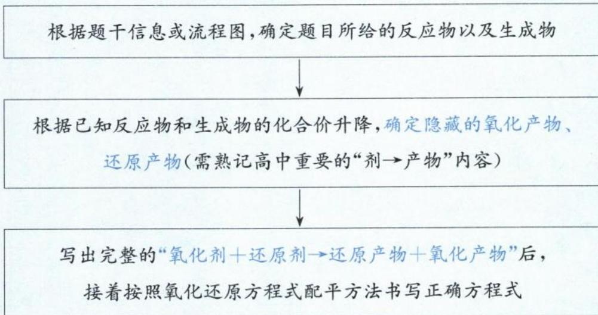

## 二、书写关键——记住常见氧化剂、还原剂及对应产物

## 1. 常见的氧化剂及还原产物预测

<table><tr><td>氧化剂</td><td>还原产物</td></tr><tr><td>KMnO4</td><td>Mn2+(强酸性);MnO2(中性附近); MnO42-(强碱性)</td></tr><tr><td>MnO2(酸性)</td><td>Mn2+</td></tr><tr><td>K2Cr2O7(酸性)</td><td>Cr3+</td></tr><tr><td>浓硝酸</td><td>NO2</td></tr><tr><td>稀硝酸</td><td>NO</td></tr><tr><td>浓硫酸(加热)</td><td>SO2</td></tr><tr><td>X2(卤素单质)</td><td>X-</td></tr><tr><td>H2O2</td><td>H2O(酸性);OH-(碱性)</td></tr><tr><td>含Cl氧化剂 (如NaClO/ClO-,NaClO3,ClO2等)</td><td>题目无信息默认Cl-</td></tr><tr><td>Fe3+</td><td>Fe2+</td></tr><tr><td>PbO2</td><td>Pb2+</td></tr></table>

## 2. 常见的还原剂及氧化产物预测

<table><tr><td>还原剂</td><td>氧化产物</td></tr><tr><td> $Fe^{2+}$ </td><td> $Fe^{3+}$ (强酸性); $Fe(OH)_3$ (约pH&gt;3以上水溶液)</td></tr><tr><td>Fe</td><td>与弱氧化剂(氧化性弱于 $Fe^{3+}$ )反应: $Fe^{2+}$ 与强氧化剂(氧化性强于 $Fe^{3+}$ )反应: $Fe^{3+}$ </td></tr><tr><td> $SO_2/H_2SO_3/SO_3^{2-}/HSO_3^-$ (即+4价S) $S_2O_3^{2-}$ (即+2价S)</td><td> $SO_4^{2-}$ </td></tr><tr><td> $H_2S/HS^- /S^{2-}$ (即-2价S)</td><td>题目无信息默认为:S</td></tr><tr><td> $H_2C_2O_4/HC_2O_4^- /C_2O_4^{2-}$ </td><td> $CO_2$ (酸性)、 $CO_3^{2-}$ 或 $HCO_3^-$ (碱性)</td></tr><tr><td> $H_2O_2$ </td><td> $O_2$ </td></tr><tr><td> $X^-$ 或HX(X=Cl、Br、I)</td><td>题目无信息默认为: $X_2$ </td></tr><tr><td>CO</td><td> $CO_2$ </td></tr><tr><td>C</td><td> $CO_2$ ( $O_2$ 足量)、 $CO(O_2$ 少量或高温下C过量)</td></tr><tr><td> $NH_3/NH_4^+/N_2H_4/NH_2OH/HN_3$ (即负价N)</td><td>题目无信息默认为: $N_2$ </td></tr></table>

## 类型 I: 根据文字信息书写陌生方程式

【例 1】钴是国民经济建设和国防建设不可缺少的重要原料之一,从锂离子二次电池正极 $\left(\mathrm{LiCoO}_{2}\right)$ 废料中回收钴。为使钴浸出,需将 $LiCoO_{2}$ 的结构破坏,选择在硫酸和双氧水体系中进行浸出以获得 $CoSO_{4}$ ,请写出浸出的化学方程式\_\_\_\_。

解析:书写陌生方程式先确定是否为氧化还原反应,若是,则立即“写四样(两剂两产物)”,并按照配平三步骤写出化学方程式。由题目信息: $LiCoO_{2}\rightarrow CoSO_{4}$ ,Co化合价由+3价降到+2价,可知 $H_{2}O_{2}$ 中-1价O升价到0价,据此判断另一个产物为 $O_{2}$ 。

第一步:写四样(两剂两产物)、平四样。写出 $2LiCoO_{2}+1H_{2}O_{2}-2CoSO_{4}+1O_{2}\uparrow$ 。

第二步:补上并配平含未变价元素 Li、S 的反应物或生成物。在强酸性环境中,金属元素在产物中一般以盐的形式存在。写出 $2LiCoO_{2} + 1H_{2}O_{2} + 3H_{2}SO_{4} - 1Li_{2}SO_{4} + 2CoSO_{4} + O_{2}\uparrow$ 。

第三步: 看 H 补 $H_{2}O$ ，用 O 检查。右侧少 8 个 H 因此补 4 个 $H_{2}O$ ，检查左右 O 原子数都是 18，最终写出化学方程式 $2LiCoO_{2} + H_{2}O_{2} + 3H_{2}SO_{4} = Li_{2}SO_{4} + 2CoSO_{4} + O_{2} \uparrow + 4H_{2}O$ 。

答案: $2\mathrm{LiCoO}_{2} + \mathrm{H}_{2}\mathrm{O}_{2} + 3\mathrm{H}_{2}\mathrm{SO}_{4} = \mathrm{Li}_{2}\mathrm{SO}_{4} + 2\mathrm{CoSO}_{4} + \mathrm{O}_{2}\uparrow + 4\mathrm{H}_{2}\mathrm{O}$

【反思】判断 $H_{2}O_{2}$ 反应后的产物，是陌生氧化还原方程式书写的考查热点，可以通过其他元素的化合价升降来判断。在本题中，由于 Co 化合价降低，因此 $H_{2}O_{2}$ 的 O 化合价升高，由此判断 $H_{2}O_{2}$ 的产物为 $O_{2}$ 。

【例 2】我国发现超级铼矿, 铑(Re)是一种熔点高、耐磨、耐腐蚀的金属, 广泛用于航天航空等领域。铼不溶于盐酸, 可溶于稀硝酸生成强酸高铼酸(HReO₄), 请写出反应的离子方程式 \_\_\_\_。

解析: Re 与稀硝酸反应生成 $HReO_{4}$ ， $HReO_{4}$ 为强酸，在离子方程式中必须拆写成 $H^{+} + ReO_{4}^{-}$ ；稀硝酸还原产物为 NO（题目不会给信息，高中生必须知道）。

第一步:写四样(两剂两产物)、平四样。写出 $3\mathrm{Re}^{0+7}\mathrm{NO}_{3}^{+5}-3\mathrm{ReO}_{4}^{+7}+7\mathrm{NO}^{+2}$

第二步:溶液为酸性,用 $H^{+}$ 调平电荷。左侧-7、右侧-3,因此左侧补上4个 $H^{+}$ ,写出 $3Re + 7NO_{3}^{-} + 4H^{+} - 3ReO_{4}^{-} + 7NO\uparrow$ 。

第三步: 看 H 补 $H_{2}O$ ，用 O 检查。右侧少 4 个 H，因此补 2 个 $H_{2}O$ ，检查左右 O 原子数都是 21，求得离子方程式为 $3Re + 7NO_{3}^{-} + 4H^{+} = 3ReO_{4}^{-} + 7NO \uparrow + 2H_{2}O$ 。

答案: $3\mathrm{Re}+4\mathrm{H}^{+}+7\mathrm{NO}_{3}^{-}=3\mathrm{ReO}_{4}^{-}+7\mathrm{NO}\uparrow+2\mathrm{H}_{2}\mathrm{O}$

【例 3】硫酸镍在强碱溶液中用 NaClO 氧化, 可沉淀出能用作镍镉电池正极材料的 NiOOH。写出该反应的离子方程式 \_\_\_\_。

解析: $Ni^{2+}$ 在强碱溶液中与 $ClO^{-}$ 反应生成 NiOOH(沉淀物不拆写成离子), $ClO^{-}$ 还原产物为 $Cl^{-}$ (含氯氧化剂,题目没给信息则默认还原产物为 $Cl^{-}$ )。

第一步:写四样(两剂两产物)、平四样。写出 $2Ni^{+2+} + 1ClO^{-} - 2NiOOH \downarrow + 1Cl^{-}$

第二步:溶液为碱性,用 $OH^{-}$ 调平电荷。左侧+3、右侧-1,因此左侧补上4个 $OH^{-}$ ,写出 $2Ni^{2+} + 1ClO^{-} + 4OH^{-} - 2NiOOH \downarrow + 1Cl^{-}$ 。

第三步: 看 H 补 $H_{2}O$ ，用 O 检查。右侧少 2 个 H 因此补 1 个 $H_{2}O$ ，检查左右 O 原子数都是 5，求得离子方程式为 $2Ni^{2+} + ClO^{-} + 4OH^{-} = 2NiOOH \downarrow + Cl^{-} + H_{2}O$ 。

答案: $2Ni^{2+}+ClO^{-}+4OH^{-}=2NiOOH\downarrow+Cl^{-}+H_{2}O$

【例 4】 $\left[\left(\mathrm{C}_{6}\mathrm{H}_{6}\right)_{2}\mathrm{Cr}\right]\left[\mathrm{AlCl}_{4}\right]$ 用连二亚硫酸钠 $\left(\mathrm{Na}_{2}\mathrm{S}_{2}\mathrm{O}_{4}\right)$ 在碱性条件下还原 $\left[\left(\mathrm{C}_{6}\mathrm{H}_{6}\right)_{2}\mathrm{Cr}\right]^{+}$ 得到三明治结构的二苯铬 $\left[\left(\mathrm{C}_{6}\mathrm{H}_{6}\right)_{2}\mathrm{Cr}\right]$ ，其中连二亚硫酸钠被氧化为亚硫酸钠，则“还原”反应的离子方程式为 \_\_\_\_。

解析: 此为氧化还原反应。第一步: 写四样(两剂两产物)、平四样。可以不用细算 $\left[\left(\mathrm{C}_{6}\mathrm{H}_{6}\right)_{2}\mathrm{Cr}\right]^{+}$ 中 C、H、Cr 的化合价, $\left[\left(\mathrm{C}_{6}\mathrm{H}_{6}\right)_{2}\mathrm{Cr}\right]^{+}\rightarrow\left(\mathrm{C}_{6}\mathrm{H}_{6}\right)_{2}\mathrm{Cr}$ , 电荷由 +1 降为 0, 若 C、H 化合价没有变, 可知 Cr 化合价降 1 价, 得 $2\left[\left(\mathrm{C}_{6}\mathrm{H}_{6}\right)_{2}\mathrm{Cr}\right]^{+}+1\stackrel{+3}{\underset{\uparrow1\times2}{\mathrm{S}_{2}\mathrm{O}_{4}^{2-}}}-2\left(\mathrm{C}_{6}\mathrm{H}_{6}\right)_{2}\mathrm{Cr}+2\stackrel{+4}{\mathrm{SO}_{3}^{2-}}$ 。

第二步:溶液为碱性,用 $OH^{-}$ 调平电荷。得 $2[(C_{6}H_{6})_{2}Cr]^{+} + 1S_{2}O_{4}^{2-} + 4OH^{-} - 2(C_{6}H_{6})_{2}Cr + 2SO_{3}^{2-}$ 。

第三步:看 H 补 $H_{2}O$ ,用 O 检查。右侧少 4 个 H 因此补 2 个 $H_{2}O$ ,检查左右 O 原子数都是 8,求得离子方程式为 $2[(C_{6}H_{6})_{2}Cr]^{+} + S_{2}O_{4}^{2-} + 4OH^{-} = 2(C_{6}H_{6})_{2}Cr + 2SO_{3}^{2-} + 2H_{2}O$ 。

答案: $2[(C_{6}H_{6})_{2}Cr]^{+} + S_{2}O_{4}^{2-} + 4OH^{-} = 2(C_{6}H_{6})_{2}Cr + 2SO_{3}^{2-} + 2H_{2}O$

【例 5】(同一物质含两种变价元素题型)写出 $FeO \cdot Cr_{2}O_{3}$ 与 $Na_{2}CO_{3}$ 、 $NaNO_{3}$ 在高温条件下反应,生成 $Na_{2}CrO_{4}$ 、 $Fe_{2}O_{3}$ 、 $NaNO_{2}$ 的化学方程式为 \_\_\_\_。

解析: 此为氧化还原反应。第一步: 根据题目信息写出含变价元素的反应物和生成物, 得

$$
\begin{array}{c} + 2 \\ \mathrm {2FeO\cdot Cr_ {2} O_ {3}} \\ \frac {\uparrow 1}{\text {共} \uparrow 7} \end{array} + 7 \mathrm{NaNO} _ {3} - 4 \mathrm{Na} _ {2} \mathrm{CrO} _ {4} + 1 \mathrm{Fe} _ {2} \mathrm{O} _ {3} + 7 \mathrm{NaNO} _ {2} 。
$$

第二步:补上并配平含未变价元素 Na、C 的反应物或生成物。利用 Na 守恒,左侧补上 $4Na_{2}CO_{3}$ ,再利用 C 守恒右侧补上 $4CO_{2}$ ,由于没有 H,因此不用补 $H_{2}O$ ,用 O 原子检查,并注意写上反应条件,写出化学方程式 $2FeO \cdot Cr_{2}O_{3} + 4Na_{2}CO_{3} + 7NaNO_{3} \xlongequal{高温} 4Na_{2}CrO_{4} + Fe_{2}O_{3} + 7NaNO_{2} + 4CO_{2}\uparrow$ 。

$$
\text { 答案: } 2 \mathrm{FeO} \cdot \mathrm{Cr} _ {2} \mathrm{O} _ {3} + 4 \mathrm{Na} _ {2} \mathrm{CO} _ {3} + 7 \mathrm{NaNO} _ {3} \xlongequal {\text { 高温 }} 4 \mathrm{Na} _ {2} \mathrm{CrO} _ {4} + \mathrm{Fe} _ {2} \mathrm{O} _ {3} + 7 \mathrm{NaNO} _ {2} + 4 \mathrm{CO} _ {2} \uparrow
$$

【例 6】(三种物质变价题型)在高温条件下, $Li_{2}CO_{3}$ 、葡萄糖 $\left(C_{6}H_{12}O_{6}\right)$ 和 $FePO_{4}$ 可制备电极材料 $LiFePO_{4}$ ，同时生成 CO 和 $H_{2}O$ ，该反应的化学方程式为 \_\_\_\_。

解析:Fe、C化合价发生变化,为氧化还原反应。第一步:由产物LiFePO $_{4}$ 中 $n(\mathrm{Fe}):n(\mathrm{Li})=1:1$ ,锁定FePO $_{4}$ 与 $Li_{2}CO_{3}$ 系数比为 2:1，再利用化合价升降守恒确定各反应物系数，得 $6FePO_{4} + 3Li_{2}CO_{3} + 1C_{6}H_{12}O_{6} - 6LiFePO_{4} + 9CO\uparrow$ 。

第二步: 确定未变价元素 Li、P 守恒。

第三步: 看 H 补 $H_{2}O$ ，用 O 检查，右侧少 12 个 H 因此补 6 个 $H_{2}O$ ，检查左右 O 原子数都是 39，并注意写上反应条件，得到化学方程式为 $6FePO_{4} + 3Li_{2}CO_{3} + C_{6}H_{12}O_{6} \xlongequal{\text {高温}} 9CO \uparrow + 6H_{2}O \uparrow + 6LiFePO_{4}$ 。

答案: $6\mathrm{FePO}_{4} + 3\mathrm{Li}_{2}\mathrm{CO}_{3} + \mathrm{C}_{6}\mathrm{H}_{12}\mathrm{O}_{6}\stackrel{\text{高温}}{=}9\mathrm{CO}\uparrow +6\mathrm{H}_{2}\mathrm{O}\uparrow +6\mathrm{LiFePO}_{4}$

类型Ⅱ:根据流程图书写陌生方程式

【例 7】(2024·安徽卷)精炼铜产生的铜阳极泥富含 Cu、Ag、Au 等多种元素。研究人员设计了一种从铜阳极泥中分离回收金和银的流程,如下图所示。

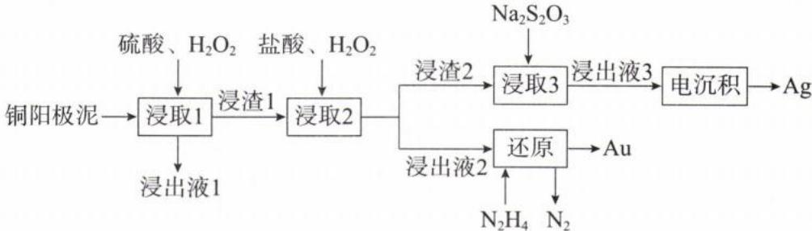

“浸取 2”中将单质金转化成 HAuCl₄ 的化学方程式 \_\_\_\_。

解析: 第一步: 写四样(两剂两产物)、平四样。根据题干和流程信息推出氧化剂为 $H_{2}O_{2}$ 、还原剂为 Au、氧化产物为 $HAuCl_{4}$ 、还原产物为 $H_{2}O$ 。Au→HAuCl₄(Au 为 +3 价)，可知 Au 化合价升 3 价； $H_{2}O_{2} \rightarrow H_{2}O$ ， $H_{2}O_{2}$ 化合价共降 2 价，根据化合价的升降守恒写出 $2Au + 3H_{2}O_{2} - 2HAuCl_{4}$ ， $H_{2}O$ 最后再配平。

第二步:配平未变价元素 Cl。根据 Cl 原子守恒确定方程式前面补 8 个 HCl。

第三步: 看 H 补 $H_{2}O$ ，用 O 检查。右侧少 12 个 H 因此补 6 个 $H_{2}O$ ，检查左右 O 原子数都是 6，得化学方程式为： $2Au + 8HCl + 3H_{2}O_{2} = 2HAuCl_{4} + 6H_{2}O$ 。

答案: $2\mathrm{Au} + 8\mathrm{HCl} + 3\mathrm{H}_{2}\mathrm{O}_{2} = 2\mathrm{HAuCl}_{4} + 6\mathrm{H}_{2}\mathrm{O}$

【例 8】(两性元素题型)镓(Ga)是重要的稀有金属之一,主要应用于半导体行业。一种从砷化镓污泥(主要成分为 GaAs、 $SiO_{2}$ 、 $Fe_{2}O_{3}$ 、 $CaCO_{3}$ )中回收镓的工艺流程如图所示:

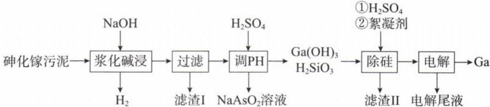

已知：I. $\mathrm{Ga(OH)}_{3}$ 是两性氢氧化物，既能溶于强酸又能溶于强碱。

Ⅱ. $NaAsO_{2}$ 为灰白色固体, 易溶于水, 具有还原性。

“浆化碱浸”过程中 GaAs 反应的离子方程式为 \_\_\_\_。

解析: $\mathrm{Ga(OH)_3}$ 是两性氢氧化物,则类比 $\mathrm{Al(OH)_3}$ 与过量 $\mathrm{NaOH}$ 反应变为 $\mathrm{Na[Al(OH)_4]}$ ,因此 $\mathrm{Ga(OH)_3}$ 与过量 $\mathrm{NaOH}$ 反应变为 $\mathrm{Na[Ga(OH)_4]}$ 。根据题目流程图所给的信息,GaAs与NaOH反应,生成可溶于水的 $\mathrm{Na[Ga(OH)_4]}$ 、 $\mathrm{NaAsO_2}$ 和 $\mathrm{H_2}$ 。

第一步:根据 $GaAs \rightarrow NaAsO_{2}$ ，As 化合价升 6；每生成 1 个 $H_{2}$ 转移 2 个电子，可知 GaAs 和 $H_{2}$ 计量数比为 1:3，再将变价元素 As 和未变价元素 Ga 配平。写出 $1\mathrm{GaAs} + \mathrm{OH}^{-} - 1\left[\mathrm{Ga(OH)}_{4}\right]^{-} + 1\mathrm{AsO}_{2}^{-} + 3\mathrm{H}_{2} \uparrow$ 。

第二步:根据电荷守恒和环境的性质,用 $OH^{-}$ 调平电荷。左侧 0、右侧 -2, 因此左侧补上 2 个 $OH^{-}$ , 写出 $1\mathrm{GaAs} + 2\mathrm{OH}^{-} - 1\left[\mathrm{Ga(OH)}_{4}\right]^{-} + 1\mathrm{AsO}_{2}^{-} + 3\mathrm{H}_{2}\uparrow$ 。

## 模块 4 新情景下氧化还原反应方程式的书写(★★★)

习题：P12

## 内容提要

## 一、书写步骤与方法：

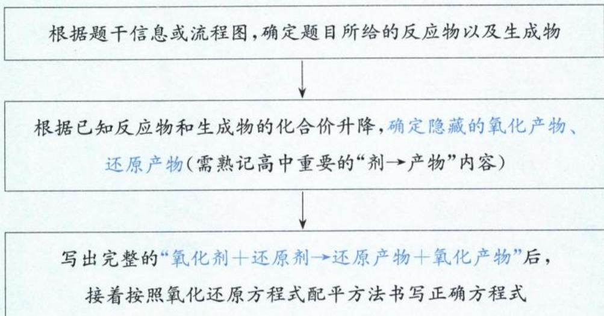

## 二、书写关键——记住常见氧化剂、还原剂及对应产物

## 1. 常见的氧化剂及还原产物预测

<table><tr><td>氧化剂</td><td>还原产物</td></tr><tr><td>KMnO4</td><td>Mn2+(强酸性);MnO2(中性附近);MnO42-(强碱性)</td></tr><tr><td>MnO2(酸性)</td><td>Mn2+</td></tr><tr><td>K2Cr2O7(酸性)</td><td>Cr3+</td></tr><tr><td>浓硝酸</td><td>NO2</td></tr><tr><td>稀硝酸</td><td>NO</td></tr><tr><td>浓硫酸(加热)</td><td>SO2</td></tr><tr><td>X2(卤素单质)</td><td>X-</td></tr><tr><td>H2O2</td><td>H2O(酸性);OH-(碱性)</td></tr><tr><td>含Cl氧化剂(如NaClO/ClO-,NaClO3,ClO2等)</td><td>题目无信息默认Cl-</td></tr><tr><td>Fe3+</td><td>Fe2+</td></tr><tr><td>PbO2</td><td>Pb2+</td></tr></table>

## 2. 常见的还原剂及氧化产物预测

<table><tr><td>还原剂</td><td>氧化产物</td></tr><tr><td> $Fe^{2+}$ </td><td> $Fe^{3+}$ (强酸性); $Fe(OH)_3$ (约pH&gt;3以上水溶液)</td></tr><tr><td>Fe</td><td>与弱氧化剂(氧化性弱于 $Fe^{3+}$ )反应: $Fe^{2+}$ 与强氧化剂(氧化性强于 $Fe^{3+}$ )反应: $Fe^{3+}$ </td></tr><tr><td> $SO_2/H_2SO_3/SO_3^{2-}/HSO_3^-$ (即+4价S) $S_2O_3^{2-}$ (即+2价S)</td><td> $SO_4^{2-}$ </td></tr><tr><td> $H_2S/HS^- /S^{2-}$ (即-2价S)</td><td>题目无信息默认为:S</td></tr><tr><td> $H_2C_2O_4/HC_2O_4^- /C_2O_4^{2-}$ </td><td> $CO_2$ (酸性)、 $CO_3^{2-}$ 或 $HCO_3^-$ (碱性)</td></tr><tr><td> $H_2O_2$ </td><td> $O_2$ </td></tr><tr><td> $X^-$ 或 $HX(X=Cl,Br,I)$ </td><td>题目无信息默认为: $X_2$ </td></tr><tr><td>CO</td><td> $CO_2$ </td></tr><tr><td>C</td><td> $CO_2$ ( $O_2$ 足量)、 $CO(O_2$ 少量或高温下C过量)</td></tr><tr><td> $NH_3/NH_4^+/N_2H_4/NH_2OH/HN_3$ (即负价N)</td><td>题目无信息默认为: $N_2$ </td></tr></table>

## 类型 I: 根据文字信息书写陌生方程式

【例 1】钴是国民经济建设和国防建设不可缺少的重要原料之一,从锂离子二次电池正极 $\left(\mathrm{LiCoO}_{2}\right)$ 废料中回收钴。为使钴浸出,需将 $LiCoO_{2}$ 的结构破坏,选择在硫酸和双氧水体系中进行浸出以获得 $CoSO_{4}$ ,请写出浸出的化学方程式\_\_\_\_。

解析:书写陌生方程式先确定是否为氧化还原反应,若是,则立即“写四样(两剂两产物)”,并按照配平三步骤写出化学方程式。由题目信息: $LiCoO_{2}\rightarrow CoSO_{4}$ ,Co化合价由+3价降到+2价,可知 $H_{2}O_{2}$ 中-1价O升价到0价,据此判断另一个产物为 $O_{2}$ 。

第一步:写四样(两剂两产物)、平四样。写出 $2Li_{\downarrow1}^{+3}CoO_{2}+1H_{2}\stackrel{-1}{\underset{\uparrow1\times2}{\mathrm{O}_{2}}}-2CoSO_{4}+1O_{2}\uparrow$ 。

第二步:补上并配平含未变价元素 Li、S 的反应物或生成物。在强酸性环境中,金属元素在产物中一般以盐的形式存在。写出 $2LiCoO_{2} + 1H_{2}O_{2} + 3H_{2}SO_{4} - 1Li_{2}SO_{4} + 2CoSO_{4} + O_{2}\uparrow$ 。

第三步: 看 H 补 $H_{2}O$ ，用 O 检查。右侧少 8 个 H 因此补 4 个 $H_{2}O$ ，检查左右 O 原子数都是 18，最终写出化学方程式 $2LiCoO_{2} + H_{2}O_{2} + 3H_{2}SO_{4} = Li_{2}SO_{4} + 2CoSO_{4} + O_{2} \uparrow + 4H_{2}O$ 。

答案: $2\mathrm{LiCoO}_{2} + \mathrm{H}_{2}\mathrm{O}_{2} + 3\mathrm{H}_{2}\mathrm{SO}_{4} = \mathrm{Li}_{2}\mathrm{SO}_{4} + 2\mathrm{CoSO}_{4} + \mathrm{O}_{2}\uparrow + 4\mathrm{H}_{2}\mathrm{O}$

【反思】判断 $H_{2}O_{2}$ 反应后的产物, 是陌生氧化还原方程式书写的考查热点, 可以通过其他元素的化合价升降来判断。在本题中, 由于 Co 化合价降低, 因此 $H_{2}O_{2}$ 的 O 化合价升高, 由此判断 $H_{2}O_{2}$ 的产物为 $O_{2}$ 。

【例 2】我国发现超级铼矿, 铑(Re)是一种熔点高、耐磨、耐腐蚀的金属, 广泛用于航天航空等领域。铼不溶于盐酸, 可溶于稀硝酸生成强酸高铼酸(HReO $_{4}$ ), 请写出反应的离子方程式 \_\_\_\_。

解析: Re 与稀硝酸反应生成 $HReO_{4}$ , $HReO_{4}$ 为强酸, 在离子方程式中必须拆写成 $H^{+} + ReO_{4}^{-}$ ; 稀硝酸还原产物为 NO(题目不会给信息, 高中生必须知道)。

第一步:写四样(两剂两产物)、平四样。写出 $3\overset{0}{\underset{\uparrow7}{\mathrm{Re}}}+7\overset{+5}{\underset{\downarrow3}{\mathrm{NO}_{3}^{-}}}-3\overset{+7}{\underset{\mathrm{ReO}_{4}^{-}}{ \mathrm{O}_{4}^{+}}}\overset{+2}{\underset{\mathrm{NO}}{\uparrow}}$ 。

第二步:溶液为酸性,用 $H^{+}$ 调平电荷。左侧-7、右侧-3,因此左侧补上4个 $H^{+}$ ,写出 $3Re + 7NO_{3}^{-} + 4H^{+} - 3ReO_{4}^{-} + 7NO\uparrow$ 。

第三步: 看 H 补 $H_{2}O$ ，用 O 检查。右侧少 4 个 H，因此补 2 个 $H_{2}O$ ，检查左右 O 原子数都是 21，求得离子方程式为 $3Re + 7NO_{3}^{-} + 4H^{+} = 3ReO_{4}^{-} + 7NO \uparrow + 2H_{2}O$ 。

答案: $3Re+4H^{+}+7NO_{3}^{-}=3ReO_{4}^{-}+7NO\uparrow+2H_{2}O$

【例 3】硫酸镍在强碱溶液中用 NaClO 氧化, 可沉淀出能用作镍镉电池正极材料的 NiOOH。写出该反应的离子方程式 \_\_\_\_。

解析: $Ni^{2+}$ 在强碱溶液中与 $ClO^{-}$ 反应生成 NiOOH(沉淀物不拆写成离子), $ClO^{-}$ 还原产物为 $Cl^{-}$ (含氯氧化剂,题目没给信息则默认还原产物为 $Cl^{-}$ )。

第一步:写四样(两剂两产物)、平四样。写出 $2Ni^{+2+} + 1ClO^{-} - 2NiOOH \downarrow + 1Cl^{-}$

第二步:溶液为碱性,用 $OH^{-}$ 调平电荷。左侧+3、右侧-1,因此左侧补上4个 $OH^{-}$ ,写出 $2Ni^{2+} + 1ClO^{-} + 4OH^{-} - 2NiOOH \downarrow + 1Cl^{-}$ 。

第三步: 看 H 补 $H_{2}O$ ，用 O 检查。右侧少 2 个 H 因此补 1 个 $H_{2}O$ ，检查左右 O 原子数都是 5，求得离子方程式为 $2Ni^{2+} + ClO^{-} + 4OH^{-} = 2NiOOH \downarrow + Cl^{-} + H_{2}O$ 。

答案: $2Ni^{2+} + ClO^{-} + 4OH^{-} = 2NiOOH \downarrow + Cl^{-} + H_{2}O$

【例 4】 $\left[\left(\mathrm{C}_{6}\mathrm{H}_{6}\right)_{2}\mathrm{Cr}\right]\left[\mathrm{AlCl}_{4}\right]$ 用连二亚硫酸钠 $\left(\mathrm{Na}_{2}\mathrm{S}_{2}\mathrm{O}_{4}\right)$ 在碱性条件下还原 $\left[\left(\mathrm{C}_{6}\mathrm{H}_{6}\right)_{2}\mathrm{Cr}\right]^{+}$ 得到三明治结构的二苯铬 $\left[\left(\mathrm{C}_{6}\mathrm{H}_{6}\right)_{2}\mathrm{Cr}\right]$ ，其中连二亚硫酸钠被氧化为亚硫酸钠，则“还原”反应的离子方程式为\_\_\_\_。

解析: 此为氧化还原反应。第一步: 写四样(两剂两产物)、平四样。可以不用细算 $\left[\left(\mathrm{C}_{6}\mathrm{H}_{6}\right)_{2}\mathrm{Cr}\right]^{+}$ 中 C、H、Cr 的化合价, $\left[\left(\mathrm{C}_{6}\mathrm{H}_{6}\right)_{2}\mathrm{Cr}\right]^{+}\rightarrow\left(\mathrm{C}_{6}\mathrm{H}_{6}\right)_{2}\mathrm{Cr}$ , 电荷由 +1 降为 0, 若 C、H 化合价没有变, 可知 Cr 化合价降 1 价, 得 $2\left[\left(\mathrm{C}_{6}\mathrm{H}_{6}\right)_{2}\mathrm{Cr}\right]^{+}+1\sum_{1\times2}^{+3}\mathrm{O}_{4}^{2-}-2\left(\mathrm{C}_{6}\mathrm{H}_{6}\right)_{2}\mathrm{Cr}+2\mathrm{SO}_{3}^{2-}$ 。

第二步:溶液为碱性,用 $OH^{-}$ 调平电荷。得 $2\left[\left(\mathrm{C}_{6}\mathrm{H}_{6}\right)_{2}\mathrm{Cr}\right]^{+} + 1\mathrm{S}_{2}\mathrm{O}_{4}^{2-} + 4\mathrm{OH}^{-} - 2\left(\mathrm{C}_{6}\mathrm{H}_{6}\right)_{2}\mathrm{Cr} + 2\mathrm{SO}_{3}^{2-}$ 。

第三步:看 H 补 $H_{2}O$ ,用 O 检查。右侧少 4 个 H 因此补 2 个 $H_{2}O$ ,检查左右 O 原子数都是 8,求得离子方程式为 $2\left[\left(\mathrm{C}_{6}\mathrm{H}_{6}\right)_{2}\mathrm{Cr}\right]^{+} + \mathrm{S}_{2}\mathrm{O}_{4}^{2-} + 4\mathrm{OH}^{-} = 2\left(\mathrm{C}_{6}\mathrm{H}_{6}\right)_{2}\mathrm{Cr} + 2\mathrm{SO}_{3}^{2-} + 2\mathrm{H}_{2}\mathrm{O}$ 。

答案: $2\left[\left(\mathrm{C}_{6}\mathrm{H}_{6}\right)_{2}\mathrm{Cr}\right]^{+} + \mathrm{S}_{2}\mathrm{O}_{4}^{2-} + 4\mathrm{OH}^{-} = 2\left(\mathrm{C}_{6}\mathrm{H}_{6}\right)_{2}\mathrm{Cr} + 2\mathrm{SO}_{3} ^{2-} + 2\mathrm{H}_{2}\mathrm{O}$

【例 5】(同一物质含两种变价元素题型)写出 $FeO \cdot Cr_{2}O_{3}$ 与 $Na_{2}CO_{3}$ 、 $NaNO_{3}$ 在高温条件下反应,生成 $Na_{2}CrO_{4}$ 、 $Fe_{2}O_{3}$ 、 $NaNO_{2}$ 的化学方程式为 \_\_\_\_。

解析: 此为氧化还原反应。第一步: 根据题目信息写出含变价元素的反应物和生成物, 得

$$
\begin{array}{c} + 2 \\ \mathrm {2FeO\cdot Cr_ {2} O_ {3}} \\ \frac {\uparrow 1}{\text {共} \uparrow 7} \end{array} + 7 \mathrm{NaNO} _ {3} - 4 \mathrm{Na} _ {2} \mathrm{CrO} _ {4} + 1 \mathrm{Fe} _ {2} \mathrm{O} _ {3} + 7 \mathrm{NaNO} _ {2} 。
$$

第二步:补上并配平含未变价元素 Na、C 的反应物或生成物。利用 Na 守恒,左侧补上 $4Na_{2}CO_{3}$ ,再利用 C 守恒右侧补上 $4CO_{2}$ ,由于没有 H,因此不用补 $H_{2}O$ ,用 O 原子检查,并注意写上反应条件,写出化学方程式 $2FeO \cdot Cr_{2}O_{3} + 4Na_{2}CO_{3} + 7NaNO_{3} \xlongequal{高温} 4Na_{2}CrO_{4} + Fe_{2}O_{3} + 7NaNO_{2} + 4CO_{2}\uparrow$ 。

$$
\text { 答案: } 2 \mathrm{FeO} \cdot \mathrm{Cr} _ {2} \mathrm{O} _ {3} + 4 \mathrm{Na} _ {2} \mathrm{CO} _ {3} + 7 \mathrm{NaNO} _ {3} \xlongequal {\text { 高温 }} 4 \mathrm{Na} _ {2} \mathrm{CrO} _ {4} + \mathrm{Fe} _ {2} \mathrm{O} _ {3} + 7 \mathrm{NaNO} _ {2} + 4 \mathrm{CO} _ {2} \uparrow
$$

【例 6】(三种物质变价题型)在高温条件下, $Li_{2}CO_{3}$ 、葡萄糖 $\left(C_{6}H_{12}O_{6}\right)$ 和 $FePO_{4}$ 可制备电极材料 $LiFePO_{4}$ ，同时生成 CO 和 $H_{2}O$ ，该反应的化学方程式为 \_\_\_\_。

解析:Fe、C化合价发生变化,为氧化还原反应。第一步:由产物LiFePO $_{4}$ 中 $n(\mathrm{Fe}):n(\mathrm{Li})=1:1$ ,锁定FePO $_{4}$ 与 $Li_{2}CO_{3}$ 系数比为 2:1，再利用化合价升降守恒确定各反应物系数，得 $6FePO_{4} + 3Li_{2}CO_{3} + 1C_{6}H_{12}O_{6} - 6LiFePO_{4} + 9CO\uparrow$ 。

第二步: 确定未变价元素 Li、P 守恒。

第三步: 看 H 补 $H_{2}O$ ，用 O 检查，右侧少 12 个 H 因此补 6 个 $H_{2}O$ ，检查左右 O 原子数都是 39，并注意写上反应条件，得到化学方程式为 $6FePO_{4} + 3Li_{2}CO_{3} + C_{6}H_{12}O_{6} \xlongequal{\text {高温}} 9CO \uparrow + 6H_{2}O \uparrow + 6LiFePO_{4}$ 。

答案: $6\mathrm{FePO}_{4} + 3\mathrm{Li}_{2}\mathrm{CO}_{3} + \mathrm{C}_{6}\mathrm{H}_{12}\mathrm{O}_{6}\stackrel{\text{高温}}{=}9\mathrm{CO}\uparrow +6\mathrm{H}_{2}\mathrm{O}\uparrow +6\mathrm{LiFePO}_{4}$

类型Ⅱ:根据流程图书写陌生方程式

【例 7】(2024·安徽卷)精炼铜产生的铜阳极泥富含 Cu、Ag、Au 等多种元素。研究人员设计了一种从铜阳极泥中分离回收金和银的流程,如下图所示。

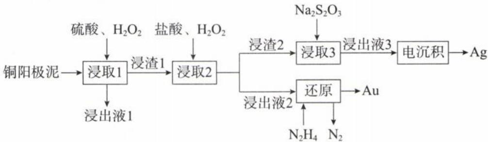

“浸取 2”中将单质金转化成 HAuCl₄ 的化学方程式 \_\_\_\_。

解析: 第一步: 写四样(两剂两产物)、平四样。根据题干和流程信息推出氧化剂为 $H_{2}O_{2}$ 、还原剂为 Au、氧化产物为 $HAuCl_{4}$ 、还原产物为 $H_{2}O$ 。Au→HAuCl $_{4}$ （Au 为 +3 价），可知 Au 化合价升 3 价； $H_{2}O_{2} \rightarrow H_{2}O$ ， $H_{2}O_{2}$ 化合价共降 2 价，根据化合价的升降守恒写出 $2Au + 3H_{2}O_{2} - 2HAuCl_{4}$ ， $H_{2}O$ 最后再配平。

第二步:配平未变价元素 Cl。根据 Cl 原子守恒确定方程式前面补 8 个 HCl。

第三步: 看 H 补 $H_{2}O$ ，用 O 检查。右侧少 12 个 H 因此补 6 个 $H_{2}O$ ，检查左右 O 原子数都是 6，得化学方程式为： $2Au + 8HCl + 3H_{2}O_{2} = 2HAuCl_{4} + 6H_{2}O$ 。

答案: $2\mathrm{Au} + 8\mathrm{HCl} + 3\mathrm{H}_{2}\mathrm{O}_{2} = 2\mathrm{HAuCl}_{4} + 6\mathrm{H}_{2}\mathrm{O}$

【例 8】(两性元素题型)镓(Ga)是重要的稀有金属之一,主要应用于半导体行业。一种从砷化镓污泥(主要成分为 GaAs、 $SiO_{2}$ 、 $Fe_{2}O_{3}$ 、 $CaCO_{3}$ )中回收镓的工艺流程如图所示:

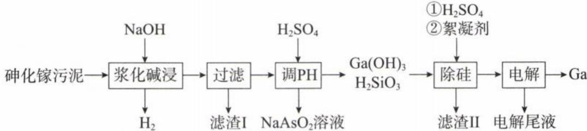

已知：I. $\mathrm{Ga(OH)_{3}}$ 是两性氢氧化物，既能溶于强酸又能溶于强碱。

Ⅱ. $NaAsO_{2}$ 为灰白色固体, 易溶于水, 具有还原性。

“浆化碱浸”过程中 GaAs 反应的离子方程式为 \_\_\_\_。

解析: $\mathrm{Ga(OH)_3}$ 是两性氢氧化物, 则类比 $\mathrm{Al(OH)_3}$ 与过量 $\mathrm{NaOH}$ 反应变为 $\mathrm{Na[Al(OH)_4]}$ , 因此 $\mathrm{Ga(OH)_3}$ 与过量 $\mathrm{NaOH}$ 反应变为 $\mathrm{Na[Ga(OH)_4]}$ 。根据题目流程图所给的信息, GaAs 与 NaOH 反应, 生成可溶于水的 $\mathrm{Na[Ga(OH)_4]}$ 、 $\mathrm{NaAsO_2}$ 和 $\mathrm{H_2}$ 。

第一步:根据 $GaAs \rightarrow NaAsO_{2}$ ，As 化合价升 6；每生成 1 个 $H_{2}$ 转移 2 个电子，可知 GaAs 和 $H_{2}$ 计量数比为 1:3，再将变价元素 As 和未变价元素 Ga 配平。写出 $1\mathrm{GaAs} + \mathrm{OH}^{-} - 1\left[\mathrm{Ga(OH)}_{4}\right]^{-} + 1\mathrm{AsO}_{2}^{-} + 3\mathrm{H}_{2}\uparrow$ 。

第二步:根据电荷守恒和环境的性质,用 $OH^{-}$ 调平电荷。左侧 0、右侧 -2, 因此左侧补上 2 个 $OH^{-}$ , 写出 $1\mathrm{GaAs} + 2\mathrm{OH}^{-} - 1[\mathrm{Ga(OH)}_{4}]^{-} + 1\mathrm{AsO}_{2}^{-} + 3\mathrm{H}_{2}\uparrow$ 。

第三步: 看 H 补 $H_{2}O$ ，用 O 检查，左侧少 8 个 H 因此补 4 个 $H_{2}O$ ，检查左右 O 原子数都是 6，得到离子方程式 $GaAs + 2OH^{-} + 4H_{2}O = [Ga(OH)_{4}]^{-} + AsO_{2}^{-} + 3H_{2}\uparrow$ 。（若教材学的是 $\mathrm{Al(OH)}_{3}$ 与 NaOH 反应生成 $NaAlO_{2}$ ，则 $\mathrm{Ga(OH)}_{3}$ 与 NaOH 反应的生成物可写为 $NaGaO_{2}$ ，答案则为 $GaAs + 2OH^{-} + 2H_{2}O = GaO_{2}^{-} + AsO_{2}^{-} + 3H_{2}\uparrow$ 。）

答案: $GaAs + 2OH^{-} + 4H_{2}O = [Ga(OH)_{4}]^{-} + AsO_{2}^{-} + 3H_{2}\uparrow$ 或 $GaAs + 2OH^{-} + 2H_{2}O = GaO_{2}^{-} + AsO_{2}^{-} + 3H_{2}\uparrow$

【例 9】由菱锰矿(主要成分为 $MnCO_{3}$ ，还含有少量 Si、Fe、Ni 等元素)制备一种新型锂电池正极材料 $LiMn_{2}O_{4}$ 的工艺流程如下：

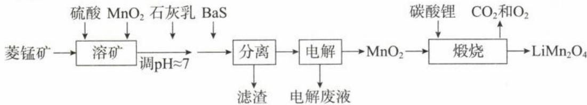

煅烧时,生成 $LiMn_{2}O_{4}$ 的化学方程式为 \_\_\_\_。

解析:由流程可知, $MnO_{2}$ 煅烧后生成 $LiMn_{2}O_{4}$ ,Mn 化合价发生变化,为氧化还原反应。

第一步: $\text{MnO}_2 \rightarrow \text{LiMn}_2\text{O}_4$ , Mn 的化合价由 +4 价降到平均化合价 +3.5 价, 根据题目信息可知 O 由 -2 价升至 0 价 (即 $\text{O}_2$ ), 由于 $\text{Li}_2\text{CO}_3$ 、 $\text{MnO}_2$ 都有 -2 价 O, 不好判断是哪个 O 升, 遇到这种正向配平不好处理的情况, 可以试着由逆向配平, 通常可以较好解决问题! 得 $\text{Li}_2\text{CO}_3 + 8\text{MnO}_2 - 4\text{LiMn}_2\text{O}_4 + \text{CO}_2 \uparrow + 1\text{O}_2 \uparrow$ 。

第二步:补上并配平含未变价元素 Li、C 的反应物或生成物。由于没有 H, 因此不用补 $H_{2}O$ , 用 O 原子检查, 并注意写上反应条件, 化学方程式为: $2Li_{2}CO_{3} + 8MnO_{2} \xlongequal{高温} 4LiMn_{2}O_{4} + 2CO_{2} \uparrow + O_{2} \uparrow$ 。

答案: $2\mathrm{Li}_{2}\mathrm{CO}_{3}+8\mathrm{MnO}_{2}\xlongequal{\text{高温}}4\mathrm{LiMn}_{2}\mathrm{O}_{4}+2\mathrm{CO}_{2}\uparrow+\mathrm{O}_{2}\uparrow$

【例 10】以黄铜矿 $\left(\mathrm{CuFeS}_{2}\right)$ 、 $FeCl_{3}$ 和乳酸 $\left[\mathrm{CH}_{3}\mathrm{CH}(\mathrm{OH})\mathrm{COOH}\right]$ 为原料可制备有机合成催化剂 CuCl 和补铁剂乳酸亚铁 $\left\{\left[\mathrm{CH}_{3}\mathrm{CH}(\mathrm{OH})\mathrm{COO}\right]_{2}\mathrm{Fe}\right\}$ 。其主要实验流程如下：

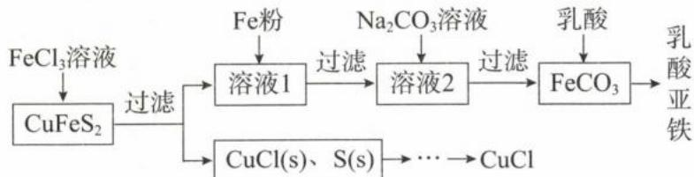

$FeCl_{3}$ 溶液与黄铜矿发生反应的离子方程式为 \_\_\_\_。

解析:由流程可知, $FeCl_{3}$ 与黄铜矿( $CuFeS_{2}$ )反应生成CuCl固体、S固体, $Fe^{3+}$ 的还原产物为 $Fe^{2+}$ 。 $CuFeS_{2}$ 中S为-2价,Cu、Fe化合价可为+1、+3或+2、+2都合理,如果面临难以确定元素化合价,或是多元素同时升价与降价的复杂化合物,可直接假设该化合物所有元素都是0,降低配平难度。设 $CuFeS_{2}$ 中S、Cu、Fe皆为0价。

第一步:根据化合价升降守恒与变价元素 Cu、Fe 守恒,写出 $1\frac{CuFeS_{2}}{\uparrow1\uparrow2} + 3\frac{Fe^{3+}}{\downarrow1} + Cl^{-} - 4\frac{Fe^{2+}}{Fe^{2+}} + 1\frac{CuCl}{CuCl} + S$ 。
第二步:未变价元素 S、Cl 守恒,并检查电荷守恒,写出离子方程式 $CuFeS_{2} + 3Fe^{3+} + Cl^{-} = 4Fe^{2+} + CuCl + 2S$ 答案: $CuFeS_{2}+3Fe^{3+}+Cl^{-}=4Fe^{2+}+CuCl+2S$

类型Ⅲ:根据实验信息书写陌生方程式

【例 11】 $NaClO_{2}$ 在工业生产中常用作漂白剂、脱色剂、消毒剂、拔染剂等。实验室中可用 $H_{2}O_{2}$ 和 NaOH 混合溶液吸收 $ClO_{2}$ 的方法制取 $NaClO_{2}$ ，现利用如下装置及试剂制备 $NaClO_{2}$ 晶体：

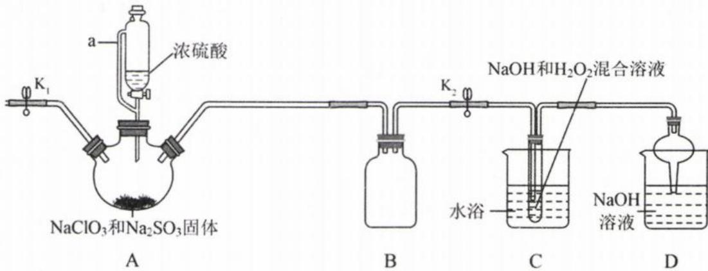

(1)装置 A 中生成 $ClO_{2}$ 的化学方程式为 \_\_\_\_。

(2)装置 C 中生成 $NaClO_{2}$ 的化学方程式为 \_\_\_\_。

解析:(1)由 Cl 化合价发生变化可知,装置 A 中的反应为氧化还原反应。

第一步:写四样(两剂两产物)、平四样。得 $2Na\overset{+5}{\underset{\downarrow1}{Cl}}O_{3} + 1Na_{2}\overset{+4}{\underset{\uparrow2}{SO}}_{3} - 2ClO_{2}\uparrow + 1Na_{2}SO_{4}$ 。

第二步:未变价元素 Na、S 守恒。根据左侧有 4Na, 则右侧 $Na_{2}SO_{4}$ 系数确定为 2, 多出 1 个 S, 左侧补上反应物 $H_{2}SO_{4}$ , 系数为 1, 得 $2NaClO_{3} + 1Na_{2}SO_{3} + 1H_{2}SO_{4} - 2ClO_{2} \uparrow + 2Na_{2}SO_{4}$ 。

第三步: 看 H 补 $H_{2}O$ ，用 O 检查。右侧少 2 个 H 因此补 1 个 $H_{2}O$ ，检查左右 O 原子数都是 13，得到化学方程式为： $2NaClO_{3} + Na_{2}SO_{3} + H_{2}SO_{4} = 2ClO_{2} \uparrow + 2Na_{2}SO_{4} + H_{2}O$ 。

(2)装置 C 中 $ClO_{2}$ 反应生成 $NaClO_{2}$ ，为氧化还原反应。

第一步:写四样(两剂两产物)、平四样。由于Cl化合价降低,可知 $H_{2}O_{2}$ 中O由-1价升为0价,产物为 $O_{2}$ ,得 $2\overset{+4}{\underset{\downarrow1}{\mathrm{ClO}_{2}}}+1\overset{-1}{\underset{\uparrow1\times2}{\mathrm{H}_{2}\mathrm{O}_{2}}}-2\overset{+3}{\underset{\uparrow0}{\mathrm{NaClO}_{2}}}+1\overset{0}{\underset{\downarrow0}{\mathrm{O}_{2}}}$ 。

第二步:未变价元素 Na 守恒。右侧有 2Na, 左边补上 2NaOH, 得 $2ClO_{2} + 1H_{2}O_{2} + 2NaOH - 2NaClO_{2} + O_{2}$ 。第三步: 看 H 补 $H_{2}O$ , 用 O 检查。右侧少 4 个 H 因此补 2 个 $H_{2}O$ , 检查左右 O 原子数都是 8, 得到化学方程式为: $2ClO_{2} + H_{2}O_{2} + 2NaOH = 2NaClO_{2} + O_{2} + 2H_{2}O$ 。

答案:(1) $2NaClO_{3}+Na_{2}SO_{3}+H_{2}SO_{4}=2ClO_{2}\uparrow+2Na_{2}SO_{4}+H_{2}O$

$$
2 \mathrm{ClO} _ {2} + \mathrm{H} _ {2} \mathrm{O} _ {2} + 2 \mathrm{NaOH} = 2 \mathrm{NaClO} _ {2} + \mathrm{O} _ {2} + 2 \mathrm{H} _ {2} \mathrm{O}
$$

【例 12】碳酸锰 $\left(\mathrm{MnCO}_{3}\right)$ 俗称“锰白”，在工业上广泛用作脱硫催化剂，瓷釉颜料。实验室以 $MnO_{2}$ 为原料制备少量 $MnCO_{3}$ 并研究其性质，由 $MnO_{2}$ 制备 $MnCO_{3}$ 的实验流程： $MnO_{2} \rightarrow Mn^{2+} \rightarrow MnCO_{3}$ 。

已知: $MnCO_{3}$ 难溶于水、乙醇,潮湿的 $MnCO_{3}$ 易被空气氧化。请回答下列问题:

(1)在烧瓶中加入一定量的 $MnO_{2}$ 固体, 滴加硫酸酸化的 $H_{2}C_{2}O_{4}$ 溶液, 其反应的离子方程式 \_\_\_\_。

(2)反应一段时间后,当装置 A 中的黑色固体消失时,再滴加较浓的 $NH_{4}HCO_{3}$ 溶液充分反应生成 $MnCO_{3}$ 。生成 $MnCO_{3}$ 的化学方程式为 \_\_\_\_。

解析:(1)根据题目信息,氧化剂 $MnO_{2}$ 与还原剂 $H_{2}C_{2}O_{4}$ 反应制备 $Mn^{2+}$ , $H_{2}C_{2}O_{4}$ 的氧化产物为 $CO_{2}$ (高中必记,题目不会告诉你)。

第一步:写四样(两剂两产物)、平四样。写出 $1MnO_{2} + 1H_{2}C_{2}O_{4} = 1Mn^{2+} + 2CO_{2}\uparrow$ 。

第二步:用 $H^{+}$ 调平电荷。左侧 0、右侧 +2，因此左侧补上 2 个 $H^{+}$ ，写出 $1MnO_{2} + 1H_{2}C_{2}O_{4} + 2H^{+} = 1Mn^{2+} + 2CO_{2}\uparrow$ 。

第三步: 看 H 补 $H_{2}O$ ，用 O 检查。右侧少 4 个 H 因此补 2 个 $H_{2}O$ ，检查左右 O 原子数都是 6，得到离子方程式为： $MnO_{2} + H_{2}C_{2}O_{4} + 2H^{+} = 2CO_{2}\uparrow + Mn^{2+} + 2H_{2}O$ 。

(2) $\text{MnO}_2$ 与硫酸酸化的 $\text{H}_2\text{C}_2\text{O}_4$ 溶液反应得 $\text{MnSO}_4$ , $\text{MnSO}_4$ 加入 $\text{NH}_4\text{HCO}_3$ 溶液生成 $\text{MnCO}_3$ ，锰元素化合价并未发生变化，不是氧化还原反应。 $\text{Mn}^{2+}$ 与 $\text{HCO}_3^-$ 反应的离子方程式为： $\text{Mn}^{2+} + 2\text{HCO}_3^- = \text{MnCO}_3 \downarrow + \text{CO}_2 \uparrow + \text{H}_2\text{O}$ （沉锰离子方程式，考查频率很高，需记忆，在本书的“化工流程”板块有详细说明）。因此化学方程式为： $\text{MnSO}_4 + 2\text{NH}_4\text{HCO}_3 = \text{MnCO}_3 \downarrow + \text{CO}_2 \uparrow + \text{H}_2\text{O} + (\text{NH}_4)_2\text{SO}_4$ 。

答案:(1) $MnO_{2}+H_{2}C_{2}O_{4}+2H^{+}=2CO_{2}\uparrow+Mn^{2+}+2H_{2}O$

$$
(2) \mathrm{MnSO} _ {4} + 2 \mathrm{NH} _ {4} \mathrm{HCO} _ {3} = \mathrm{MnCO} _ {3} \downarrow + \mathrm{CO} _ {2} \uparrow + \mathrm{H} _ {2} \mathrm{O} + (\mathrm{NH} _ {4}) _ {2} \mathrm{SO} _ {4}
$$

## 类型Ⅳ:根据反应机理书写陌生方程式

【例 13】氮的氧化物是大气污染物之一,一种以 $Fe^{3+}$ 为主的催化剂催化 $NH_{3}$ 脱除烟气中的 NO 反应机理如图所示,该过程的总反应化学方程式为 \_\_\_\_。

解析:根据反应机理图可知,反应物为 $NH_{3}$ 、NO、 $O_{2}$ (箭头指入循环图的物质),生成物为 $N_{2}$ 、 $H_{2}O$ (箭头指出循环图的物质),由于题目已经给到了各物质的计量数比,可以先写出: $2NH_{3} + 2NO + \frac{1}{2}O_{2} \rightarrow$

$2N_{2}+3H_{2}O$ ，将计量数化为最简单整数比、加上反应条件，得化学方程式为： $4NH_{3}+4NO+O_{2}\xlongequal{催化剂}4N_{2}+6H_{2}O$ 。

答案: $4NH_{3} + 4NO + O_{2} \xlongequal{\text{催化剂}} 4N_{2} + 6H_{2}O$

【例 14】NaClO 氧化可除去氨氮, 反应机理如图所示(其中 $H_{2}O$ 和 NaCl 略去)。NaClO 氧化 $NH_{3}$ 的总反应离子方程式为 \_\_\_\_。

解析:根据反应机理图和题干信息可知,反应物为 $NaClO, NH_{3}$ (箭头指入循环图的物质),生成物为 $N_{2}$ (箭头指出循环图的物质)。此外 NaClO 作为氧化剂,其还原产物为 $Cl^{-}$ (题干说明 NaCl 略去,所以循环图没有写出来),利

用氧化还原方程式配平原理即可写出离子方程式为： $2NH_{3}+3ClO^{-}=N_{2}+3H_{2}O+3Cl^{-}$

答案: $2NH_{3}+3ClO^{-}=N_{2}+3H_{2}O+3Cl^{-}$

## 模块 5: 氧化还原反应的计算(★★★)

习题：P13

## 内容提要

氧化还原反应计算的核心是电子得失守恒(或化合价升降守恒),即氧化剂得到电子总数等于还原剂失去电子总数,解题的思维流程如下:

一、确定两剂两产物：找出氧化剂和还原剂，以及对应的还原产物和氧化产物。

二、判断电子得失数: 关注化合价发生变化的元素, 忽略其余不变价的元素, 并注意化学式中变价元素的原子个数, 计算 1 mol 氧化剂得电子总数、1 mol 还原剂失电子总数。

例: $K_{2}Cr_{2}O_{7}$ 反应后转化为 $Cr_{2}(SO_{4})_{3}$ ，只须关注 $K_{2}Cr_{2}O_{7}$ 中的 2 个 +6 价 Cr 变为 $Cr_{2}(SO_{4})_{3}$ 中的 2 个 +3 价 Cr，共得 6 个 $e^{-}$ ，因此 1 mol $K_{2}Cr_{2}O_{7}$ 反应时共得 6 mol $e^{-}$ 。

三、列等式求解:根据氧化剂得电子的总物质的量等于还原剂失电子的总物质的量,列出等式求解。

$n(\text{氧化剂}) \times$ 每摩尔氧化剂的得电子数 $= n$ (还原剂) $\times$ 每摩尔还原剂的失电子数

类型Ⅰ:转移电子数计算

【例 1】黄血盐 $\left[\mathrm{K}_{4}\mathrm{Fe}(\mathrm{CN})_{6}\right]$ 可用于制造工业颜料，制备反应的化学方程式为： $\mathrm{Fe}+6\mathrm{HCN}+2\mathrm{K}_{2}\mathrm{CO}_{3}=\mathrm{K}_{4}\mathrm{Fe}(\mathrm{CN})_{6}+\mathrm{H}_{2}\uparrow+2\mathrm{CO}_{2}\uparrow+2\mathrm{H}_{2}\mathrm{O}$ ，则标准状况下每生成 $2.24\ L\ H_{2}$ 转移的电子数为 \_\_\_\_。

解析:由化学方程式可知化合价改变的元素只有Fe和H,Fe的化合价升高,H的化合价降低,2个HCN中的 $\overset{+1}{\mathrm{H}}\rightarrow2$ 个 $\overset{0}{\mathrm{H}}$ (即 $H_{2}$ ),转移 $2e^{-}$ ,可得关系量 $2e^{-}\sim1H_{2}$ 。(将化合价拆开来一个一个看,例如 $H_{2}$ 就看成2个 $\overset{0}{H},Na_{2}O_{2}$ 含有2个 $\overset{-1}{O}$ ,按此方法计算转移电子数会更加清楚。)标准状况下2.24L $H_{2}$ 其物质的量为0.1mol,因此转移电子物质的量为0.2mol,数目为0.2 $N_{A}$ (或 $0.2\times6.02\times10^{23}$ )。

答案: $0.2 N_{A}$ (或 $0.2 \times 6.02 \times 10^{23}$ )

【例 2】(2023·湖南卷改编) 油画创作通常需要用到多种无机颜料。研究发现, 在不同的空气湿度和光照条件下, 颜料雌黄 $\left(\mathrm{As}_{2}\mathrm{S}_{3}\right)$ 褪色的主要原因是发生了以下两种化学反应:

$$
\mathrm{As} _ {2} \mathrm{S} _ {3} (\mathrm{s}) \xrightarrow [ \text {I} ]{\text {空气，紫外光}} \mathrm{As} _ {2} \mathrm{O} _ {3} + \mathrm{H} _ {2} \mathrm{S} _ {2} \mathrm{O} _ {3}
$$

反应Ⅰ和Ⅱ中，氧化1 mol $As_{2}S_{3}$ 转移的电子数之比为 \_\_\_\_。

解析: $As_{2}S_{3}$ 经过反应 I 生成 $As_{2}O_{3}$ 和 $H_{2}S_{2}O_{3}$ , As 的化合价没有变, S 的化合价由 -2 变为 +2, 则 1 mol $As_{2}S_{3}$ 有 3 mol $S^{-2} \rightarrow 3$ mol $S^{+2}$ , 失电子的物质的量为 3×4 mol = 12 mol。 $As_{2}S_{3}$ 经过反应 II 生成 $H_{3}AsO_{4}$ 和 $H_{2}SO_{4}$ , As 的化合价由 +3 变为 +5, S 的化合价由 -2 变为 +6, 则 1 mol $As_{2}S_{3}$ 有 2 mol $As^{+3} \rightarrow 2$ mol $As^{+5}$ 、3 mol $S^{-2} \rightarrow 3$ mol $S^{+6}$ , 失电子的物质的量为 2×2 mol +3×8 mol = 28 mol。因此反应 I 和 II 中, 氧化 1 mol $As_{2}S_{3}$ 转移

的电子数之比为 12:28=3:7。

答案:3:7

【例 3】(2024·东北三省卷) 硫及其化合物部分转化关系如图。设 $N_{A}$ 为阿伏加德罗常数的值，下列说法正确的是()

A. 标准状况下，11.2 L $SO_{2}$ 中原子总数为 0.5 $N_{A}$ B. 100 mL 0.1 mol · L $^{-1}$ Na $_{2}$ SO $_{3}$ 溶液中，SO $_{3}^{2-}$ 数目为 0.01 $N_{A}$ C. 反应①每消耗 3.4 g H $_{2}$ S, 生成物中硫原子数目为 0.1 $N_{A}$ D. 反应②每生成 1 mol 还原产物, 转移电子数目为 2 $N_{A}$

解析：A.首先确认标准状况下 $\mathrm{SO}_2$ 为气体，因此 $n(\mathrm{SO}_2) = \frac{11.2\mathrm{L}}{22.4\mathrm{L / mol}} = 0.5\mathrm{mol}$ 。每1个 $\mathrm{SO}_2$ 分子有3个原子，因此原子总数为 $1.5N_{\mathrm{A}}$ ，A选项错误。  
B.若 $\mathrm{SO}_3^{2-}$ 不水解，则 $n(\mathrm{SO}_3^{2-}) = 0.1\mathrm{mol}\cdot \mathrm{L}^{-1}\times 0.1\mathrm{L} = 0.01\mathrm{mol}$ ，但 $\mathrm{SO}_3^{2-}$ 为弱酸阴离子，在水中会发生水解，一部分 $\mathrm{SO}_3^{2-}$ 转化为 $\mathrm{HSO}_3^-$ 、 $\mathrm{H}_2\mathrm{SO}_3$ ，因此溶液中 $\mathrm{SO}_3^{2-}$ 数目小于 $0.01N_{\mathrm{A}}$ ，B选项错误。  
C.反应①的化学方程式为 $\mathrm{SO}_2 + 2\mathrm{H}_2\mathrm{S} = 3\mathrm{S} + 2\mathrm{H}_2\mathrm{O},n(\mathrm{H}_2\mathrm{S}) = \frac{3.4\mathrm{g}}{34\mathrm{g / mol}} = 0.1\mathrm{mol}$ ，根据关系式 $2\mathrm{H}_2\mathrm{S}\sim 3\mathrm{S}$ 可知生成 $0.15\mathrm{mol}$ S，生成物中硫原子数目为 $0.15N_{\mathrm{A}}$ ，C选项错误。  
D.反应②的离子方程式为 $3\mathrm{S} + 6\mathrm{OH}^{-}\xrightarrow{\Delta}\mathrm{SO}_3^{2-} + 2\mathrm{S}^{2-} + 3\mathrm{H}_2\mathrm{O}$ ，还原产物为 $\mathbf{S}^{2-}$ 。由反应方程式可知，每 $1\mathrm{mol}\stackrel {0}{\mathrm{S}}\rightarrow 1\mathrm{mol}\stackrel {-2}{\mathrm{S}}$ ，转移电子数目为 $2N_{\mathrm{A}}$ ，D选项正确。

答案:D

类型Ⅱ:电子得失守恒(化合价升降守恒)计算

【例 4】 $ClO_{2}$ 常温下为黄色气体, 易溶于水, 其水溶液是一种广谱杀菌剂。一种有效成分为 $NaClO_{2}$ 、 $NaHSO_{4}$ 、 $NaHCO_{3}$ 的“二氧化氯泡腾片”, 能快速溶于水, 溢出大量气泡, 得到 $ClO_{2}$ 溶液。上述过程中, 生成 $ClO_{2}$ 的反应属于歧化反应, 每生成 1 mol $ClO_{2}$ 消耗 $NaClO_{2}$ 的量为 \_\_\_\_ mol。

解析:根据题目信息,在 $NaClO_{2}$ 生成 $ClO_{2}$ 的过程中,发生歧化反应。 $NaClO_{2}$ 既是氧化剂,反应后转化为 NaCl(含 Cl 氧化剂若题目无特别说明,一律默认还原产物为 $Cl^{-}$ ); $NaClO_{2}$ 也是还原剂,反应后生成 $ClO_{2}$ 。歧化反应在分析转移电子数的时候,将得电子的氧化剂与失电子的还原剂并列一起看,就可以清楚地判断出转移电子数,以及氧化剂与还原剂的数目比,分析如下:

$$
\left\{ \begin{array}{l} 4 \mathrm{NaClO} _ {2} ^ {+ 3} \xrightarrow {\text {失} 1 \mathrm{e} ^ {-} \times 4} 4 \mathrm{ClO} _ {2} ^ {+ 4} \\ 1 \mathrm{NaClO} _ {2} ^ {+ 3} \xrightarrow {\text {得} 4 \mathrm{e} ^ {-}} 1 \mathrm{NaCl} ^ {- 1} \end{array} \right. \Rightarrow 5 \mathrm{NaClO} _ {2} \sim 4 \mathrm{ClO} _ {2} \sim 1 \mathrm{NaCl}
$$

由上述关系式可知,每生成 $4 \, mol \, ClO_{2}$ , 需消耗 $5 \, mol \, NaClO_{2}$ , 所以每生成 $1 \, mol \, ClO_{2}$ , 需消耗 $1.25 \, mol \, NaClO_{2}$ 。答案: 1.25

【例 5】足量铜与一定量浓硝酸反应,得到硝酸铜溶液和 $NO_{2}$ 、 $N_{2}O_{4}$ 、NO 的混合气体,将这些气体与 $1.68\ L\ O_{2}$ (标准状况) 混合后通入水中,所有气体完全被水吸收生成硝酸。若向所得硝酸铜溶液中加入 $5\ mol \cdot L^{-1}\ NaOH$ 溶液至 $Cu^{2+}$ 恰好完全沉淀,则消耗 NaOH 溶液的体积是( )

A. 60 mL

B. 45 mL

C. 30 mL

D. 15 mL

解析: $HNO_{3}$ $\xrightarrow{Cu失电子}$ $N_{2}O_{4}$ $\xrightarrow{O_{2}得电子}$ $HNO_{3}$ NO

遇到涉及的氧化还原反应太多、过程太复杂的题目，试着想想是否可以直接利用电子得失守恒来解决？根据上述分析可知，N元素即使过程中化合价有所变化，但反应的起点与终点都是 $\mathrm{HNO}_3$ ，N元素最终并没有得失电子，因此整个反应可视为Cu失去的电子全部转移给 $\mathrm{O}_2$ 。 $1\mathrm{mol}$ Cu失去 $2\mathrm{mol}$ 电子、 $1\mathrm{mol}$ $\mathrm{O}_2$ 得到 $4\mathrm{mol}$ 电子，根据电子得失守恒列式： $n(\mathrm{Cu})\times 2 = n(\mathrm{O}_2)\times 4 = (\frac{1.68\mathrm{L}}{22.4\mathrm{L}\cdot\mathrm{mol}^{-1}})\times 4$ ，可解得 $n(\mathrm{Cu}) = 0.15\mathrm{mol}$ 。向所得硝酸铜溶液中加入NaOH溶液至 $0.15\mathrm{mol}$ 的 $\mathrm{Cu^{2 + }}$ 恰好完全沉淀，根据关系式 $\mathrm{Cu^{2 + }~\sim 2NaOH}$ ，可知 $n(\mathrm{NaOH}) = 2n(\mathrm{Cu^{2 + }}) = 0.3\mathrm{mol}$ ，则 $V[\mathrm{NaOH(aq)}] = \frac{0.3\mathrm{mol}}{5\mathrm{mol}\cdot\mathrm{L}^{-1}} = 0.06\mathrm{L} = 60\mathrm{mL}$

答案:A

【例 6】向 27.2 g Cu 和 $Cu_{2}O$ 的混合物中加入某浓度的稀硝酸 0.5 L，固体物质完全反应，生成 NO 和 $\mathrm{Cu(NO_{3})_{2}}$ 。在所得溶液中加入 1.0 mol·L $^{-1}$ 的 NaOH 溶液 1.0 L，此时溶液呈中性，金属离子已完全沉淀，沉淀质量为 39.2 g。下列有关说法错误的是（）

A. 原固体混合物中 Cu 与 $Cu_{2}O$ 的物质的量之比为 2:1

B. 硝酸的物质的量浓度为 2.4 mol·L $^{-1}$ C. 产生的 NO 在标准状况下的体积为 4.48 L

D. Cu、 $Cu_{2}O$ 与硝酸反应后剩余 $HNO_{3}$ 为 0.6 mol

解析: Cu 和 $Cu_{2}O$ 的混合物加入稀硝酸后, 所得溶液有 $\mathrm{Cu(NO_{3})_{2}}$ , 也可能有过量的 $HNO_{3}$ 。根据题目信息, 加入 1.0 L 1.0 mol·L $^{-1}$ 的 NaOH 溶液后

(1) 溶液呈中性: 可确定此时溶液中的溶质只有 $NaNO_{3}$ (强酸强碱盐呈中性)。根据 Na 元素守恒, 溶液中 $n(\mathrm{NaNO}_{3}) = n(\mathrm{NaOH}) = 1.0 \, \mathrm{mol} \cdot \mathrm{L}^{-1} \times 1.0 \, \mathrm{L} = 1 \, \mathrm{mol}$ 。

(2)金属离子已完全沉淀:则沉淀为 $\mathrm{Cu(OH)_2}$ ，质量为 39.2 g，其物质的量 $n[\mathrm{Cu(OH)_2}] = \frac{39.2\mathrm{g}}{98\mathrm{g}\cdot\mathrm{mol}^{-1}} = 0.4\mathrm{mol}$ 。设 Cu 和 $Cu_2O$ 的物质的量分别为 x mol、y mol，根据二者质量得 $64x + 144y = 27.2$ ，根据铜元素守恒得 $x + 2y = 0.4$ ，联立方程解得 x = 0.2，y = 0.1。

$$
\mathrm{Cu} _ {2} \mathrm{O}
$$

$$
0. 2 \mathrm{mol}: 0. 1 \mathrm{mol} = 2: 1, \mathrm{A}
$$

B. $HNO_{3}\rightarrow NO$ 得 $3e^{-}$ 、 $Cu\rightarrow Cu^{2+}$ 失 $2e^{-}$ 、 $Cu_{2}O\rightarrow2Cu^{2+}$ 失 $2e^{-}$ ，根据电子得失守恒可知： $3\times n(\mathrm{NO})=2\times n(\mathrm{Cu})+2\times n(\mathrm{Cu}_{2}\mathrm{O})$ ，所以 $3\times n(\mathrm{NO})=2\times0.2\;\mathrm{mol}+2\times0.1\;\mathrm{mol}$ ，解得 $n(\mathrm{NO})=0.2\;\mathrm{mol}$ 。根据氮元素守恒可知 $n(\mathrm{HNO}_{3})=n(\mathrm{NO})+n(\mathrm{NaNO}_{3})=0.2\;\mathrm{mol}+1.0\;\mathrm{mol}\cdot\mathrm{L}^{-1}\times1.0\;\mathrm{L}=1.2\;\mathrm{mol}$ ，所以原硝酸溶液的浓度 $c(\mathrm{HNO}_{3})=\frac{1.2\;\mathrm{mol}}{0.5\;\mathrm{L}}=2.4\;\mathrm{mol}\cdot\mathrm{L}^{-1}$ ，B选项正确。

C. 根据选项 B 可知 $n(\mathrm{NO})=0.2\ \mathrm{mol}$ ，在标准状况下 NO 的体积为 $0.2\ mol\times22.4\ L\cdot mol^{-1}=4.48\ L$ ，C 选项正确。
D. Cu 和 $Cu_{2}O$ 的混合物加入 $HNO_{3}$ 后，所得溶液中加入 NaOH 溶液，NaOH 先与剩余的 $HNO_{3}$ 反应，剩余的 NaOH 再与 $\mathrm{Cu(NO_{3})_{2}}$ 反应，最后溶液只有 $NaNO_{3}$ 。根据氮元素守恒可知 $n(\mathrm{HNO}_{3})_{\text{剩余}} + 2 \times n[\mathrm{Cu(NO}_{3})_{2}] = n(\mathrm{NaNO}_{3})$ ，所以 $n(\mathrm{HNO}_{3})_{\text{剩余}} = n(\mathrm{NaNO}_{3}) - 2 \times n[\mathrm{Cu(NO}_{3})_{2}] = 1\ \mathrm{mol} - 2 \times 0.4\ \mathrm{mol} = 0.2\ \mathrm{mol}$ ，D 选项错误。

答案:D

## 模块 1 钠及其化合物、碱金属(★★)

习题：P14

## 第 1 节 钠单质、钠的氧化物、氢氧化钠、氢化钠

## 内容提要

## 一、钠单质

1. 钠元素: 钠常见化合价是 0、+1, 其稳价为 +1。钠是短周期主族元素中原子半径最大的元素, 也是短周期金属性最强的元素。

2. 物理性质: 在常温下, 金属钠为银白色具有金属光泽的固体, 质软, 熔点低, 密度小于水但大于煤油。

3. 化学性质: 由于钠元素的稳价是 +1 价, 所以金属钠 (0 价) 体现极强的还原性, 能与绝大多数的氧化剂反应。

(1)与非金属单质的反应：

$$
① \mathrm{O} _ {2} \left\{ \begin{array}{l l} 4 \mathrm{Na} + \mathrm{O} _ {2} = 2 \mathrm{Na} _ {2} \mathrm{O} \\ 2 \mathrm{Na} + \mathrm{O} _ {2} \xlongequal {\triangle} \mathrm{Na} _ {2} \mathrm{O} _ {2} \end{array} \right.
$$

注: 这两个反应体现了温度的量变引起质变。

$$
② \mathrm{X} _ {2} (\mathrm{F} _ {2}, \mathrm{Cl} _ {2}, \mathrm{Br} _ {2}, \mathrm{I} _ {2}): 2 \mathrm{Na} + \mathrm{X} _ {2} \stackrel {\triangle} {=} 2 \mathrm{NaX}
$$

注：i. 钠既可以在 $O_{2}$ 中燃烧，又可以在 $Cl_{2}$ 中燃烧。由此可知燃烧的广义定义为：所有剧烈的发光发热的反应，不一定有 $O_{2}$ 参与。

ii. 钠先熔化，再燃烧，说明其熔点低于着火点。

(2)与化合物反应：

<table><tr><td>1与水(滴有酚酞)</td><td colspan="2"> $2Na + 2H_{2}O = 2Na^{+} + 2OH^{-} + H_{2} \uparrow$ (现象:浮、熔、游、响、红)</td></tr><tr><td>2与酸</td><td colspan="2"> $2Na + 2H^{+} = 2Na^{+} + H_{2} \uparrow$ </td></tr><tr><td rowspan="2">3与盐</td><td>非水环境</td><td> $4Na + TiCl_{4} \xlongequal{高温} 4NaCl + Ti$ </td></tr><tr><td>水环境</td><td> $2Na + 2H_{2}O + CuSO_{4} = Cu(OH)_{2} \downarrow + Na_{2}SO_{4} + H_{2} \uparrow$  $2Na + 2H_{2}O + Cu^{2+} = Cu(OH)_{2} \downarrow + 2Na^{+} + H_{2} \uparrow$ </td></tr><tr><td>4与含-OH的有机物</td><td> $2\mathrm{{Na}} + 2{\mathrm{C}}_{2}{\mathrm{H}}_{5}\mathrm{{OH}} \rightarrow 2{\mathrm{C}}_{2}{\mathrm{H}}_{5}\mathrm{{ONa}} + {\mathrm{H}}_{2} \uparrow$ (Na沉在乙醇底部,比Na与水反应速率慢) $2{\mathrm{{CH}}}_{3}\mathrm{{COOH}} + 2\mathrm{{Na}} \rightarrow 2{\mathrm{{CH}}}_{3}\mathrm{{COONa}} + {\mathrm{H}}_{2} \uparrow$ </td></tr></table>

注:在溶液中很多离子真实的存在形态是水合离子(如四水合铜离子),所以金属钠与硫酸铜溶液的反应实质是:Na先与 $H_{2}O$ 反应,产物NaOH再与 $\left[\mathrm{Cu}\left(\mathrm{H}_{2}\mathrm{O}\right)_{4}\right]^{2+}$ 发生后续反应。

## 4. 用途：

(1)钠钾合金可用于核反应堆的传热介质,该用途利用了钠钾合金熔点低,沸点高,且导热能力好的性质。

(2)用作电光源,制作高压钠灯。该用途利用了钠在高压下能发出具有很强穿透性的黄光。

(3)冶炼金属：

①金属钠具有强还原性，熔融状态下可以用于制取金属，如 $4Na + TiCl_{4} \xlongequal{高温} 4NaCl + Ti$ 。

②金属钠的沸点高于金属钾,控制温度(K 的沸点<反应温度<钠的沸点): $\mathrm{Na}+\mathrm{KCl}\xlongequal{\text {高温}}\mathrm{K}\uparrow+\mathrm{NaCl}$ 。

5. 制备: $2\mathrm{NaCl}$ (熔融) $\xlongequal{电解} 2\mathrm{Na} + \mathrm{Cl}_{2} \uparrow$ 。

注:电解氯化钠水溶液不能获得金属钠,因为水电离的 $H^{+}$ 的氧化性强于 $Na^{+}$ 。

6. 保存: 通常密封保存在煤油中。钠若着火, 应该用干沙灭火。

## 二、氧化物

1. $Na_{2}O$ 和 $Na_{2}O_{2}$ 的对比：

<table><tr><td colspan="2">物质</td><td>氧化钠( $Na_{2}O$ )</td><td>过氧化钠( $Na_{2}O_{2}$ )</td></tr><tr><td colspan="2">颜色、状态</td><td>白色固体</td><td>淡黄色固体</td></tr><tr><td colspan="2">类别</td><td>碱性氧化物</td><td>过氧化物(不是碱性氧化物)</td></tr><tr><td colspan="2">氧的价态</td><td>-2(稳价)</td><td>-1(非稳价)</td></tr><tr><td colspan="2">可能的化性</td><td>碱性氧化物的通性</td><td>既有氧化性(强),又有还原性(较弱)</td></tr><tr><td colspan="2">电子式</td><td> $Na^{+}[:\ddot{O}:]^{2-}Na^{+}$ </td><td> $Na^{+}[:\ddot{O}:\ddot{O}]:]^{2-}Na^{+}$ </td></tr><tr><td colspan="2">阴、阳离子个数比</td><td>1:2</td><td>1:2</td></tr><tr><td rowspan="3">化学性质</td><td>与水</td><td> $Na_{2}O + H_{2}O = 2Na^{+} + 2OH^{-}$ </td><td> $2Na_{2}O_{2} + 2H_{2}O = 4Na^{+} + 4OH^{-} + O_{2}\uparrow$ </td></tr><tr><td>与 $CO_{2}$ </td><td> $Na_{2}O + CO_{2} = Na_{2}CO_{3}$ </td><td> $2Na_{2}O_{2} + 2CO_{2} = 2Na_{2}CO_{3} + O_{2}$ </td></tr><tr><td>与硫酸</td><td> $Na_{2}O + 2H^{+} = 2Na^{+} + H_{2}O$ </td><td> $2Na_{2}O_{2} + 4H^{+} = 4Na^{+} + 2H_{2}O + O_{2}\uparrow$ </td></tr><tr><td colspan="2">主要用途</td><td>用于制取少量烧碱</td><td>强氧化剂、漂白剂、消毒剂、供氧剂</td></tr></table>

注: $\mathrm{Na}_{2}\mathrm{O}_{2}$ 中 O 的化合价为 -1 价,从属 O 的中间价态, $\mathrm{Na}_{2}\mathrm{O}_{2}$ 既有氧化性,又有还原性。由于 O 的稳价为 -2 价,所以 $\mathrm{Na}_{2}\mathrm{O}_{2}$ 主要体现强氧化性。但物质在化学变化中具体体现什么性质,除了跟自己本身的性质有关外,还要看其反应对象的性质。若 $\mathrm{Na}_{2}\mathrm{O}_{2}$ 遇到稳价的 $\mathrm{H}_{2}\mathrm{O}$ 、 $\mathrm{CO}_{2}$ 等, $\mathrm{Na}_{2}\mathrm{O}_{2}$ 发生歧化反应; $\mathrm{Na}_{2}\mathrm{O}_{2}$ 遇强还原剂 $\mathrm{H}_{2}\mathrm{S}$ 、 $\mathrm{SO}_{2}$ 、 $\mathrm{HI}$ 等, $\mathrm{Na}_{2}\mathrm{O}_{2}$ 被还原成 -2 价; $\mathrm{Na}_{2}\mathrm{O}_{2}$ 遇强氧化剂高锰酸钾, $\mathrm{Na}_{2}\mathrm{O}_{2}$ 被氧化成 $\mathrm{O}_{2}$ 。

## 2. 漂白性的归纳与总结：

<table><tr><td>定义</td><td colspan="3">物质与有机色素(如品红、石蕊等)作用,使其褪色的性质</td></tr><tr><td rowspan="2">分类</td><td>物理变化</td><td colspan="2">化学变化</td></tr><tr><td>吸附漂白</td><td>氧化漂白</td><td>化合漂白</td></tr><tr><td>代表物质</td><td>活性炭</td><td> $HClO$ 、 $H_{2}O_{2}$ </td><td> $SO_{2}$ </td></tr><tr><td>漂白对象</td><td>大多数有机色素</td><td>大多数有机色素</td><td>品红、某些天然色素</td></tr><tr><td>漂白效果</td><td>永久</td><td>永久</td><td>暂时</td></tr></table>

## 3. 过氧化物的结构特征及其性质：

常考的过氧化物有 $H_{2}O_{2}$ 、 $Na_{2}O_{2}$ 、 $CaO_{2}$ 、过氧乙酸( $H_{3}C\stackrel{O}{\underset{\vert}{\mathrm{C}}}\stackrel{\vert}{\mathrm{O}}\stackrel{\vert}{\mathrm{OH}}$ )、过碳酸钠( $Na_{2}CO_{3}\cdotH_{2}O_{2}$ )等。其共同的特征均含有过氧键，过氧键中的两个氧显-1价，过氧键易断裂体现出较强的氧化性。所以过氧化物常用于做氧化剂、漂白剂、杀菌消毒剂等。

## 4. 类比和对比方法的合理使用：

$Na_{2}O_{2}$ 与稳定的酸性氧化物 $CO_{2}$ 发生歧化反应，产物有 $O_{2}$ ，该反应中每消耗 1 mol $Na_{2}O_{2}$ 转移 1 mol 电子。但 $Na_{2}O_{2}$ 与同样是酸性氧化物的 $SO_{2}$ 却发生的是一般氧化还原反应，产物没有 $O_{2}$ ，该反应中每消耗 1 mol $Na_{2}O_{2}$ 转移 2 mol 电子，因为 $SO_{2}$ 除了酸性，还有强还原性。因此学习元素化合物的性质时，不仅要利用“类比法”，也要使用“对比法”。

## 三、NaOH

1. 物理性质: NaOH 固体易潮解, 具有吸水性, 其溶于水会释放大量的热。

2. 化学性质：

(1)遇酸碱指示剂显色(遇石蕊变蓝;遇酚酞变红)

(2)与酸生成盐和水

(3)与酸性氧化物生成盐和水

(4)与盐生成新盐和新碱(遵循由强制弱的原理)

3. 用途: 固体 NaOH 可以作干燥剂; 制肥皂(与油脂发生皂化反应); 造纸等。

4. 工业制备：

(1) 复分解法(遵循溶解度大制备溶解度小): 石灰乳和碳酸钠反应: $\mathrm{Ca(OH)_2 + Na_2CO_3 = CaCO_3 \downarrow + 2NaOH}$ 。

(2)电解法(氯碱工业): $2\mathrm{NaCl} + 2\mathrm{H}_{2}\mathrm{O} \xlongequal{\text{电解}} 2\mathrm{NaOH} + \mathrm{H}_{2} \uparrow + \mathrm{O}_{2} \uparrow$

四、氢化钠

NaH 是离子化合物, 其电子式为: $Na^{+}[:H]^{-}$ 。NaH 中 H 元素为 -1 价, 有极强还原性, 与水反应的化学方程式为: $NaH + H_{2}O = NaOH + H_{2} \uparrow$ , 该反应为归中反应, 每生成 $1 \, mol \, H_{2}$ 转移 $1 \, mol$ 电子。

## 类型Ⅰ: 基础常识判断

【例 1】正误判断, 正确的填“√”, 错误的填“×”

(1)用惰性电极电解 NaCl 溶液可以获得金属 Na()

(2)金属 Na 着火, 可用泡沫灭火器灭火()

(3)钠钾合金可作原子反应堆的导热剂,运用了金属 Na 的强还原性()

(4)高压钠灯可用于道路照明,这是运用了金属 Na 的化学性质()

$$
\mathrm{C} _ {2} \mathrm{H} _ {5} \mathrm{OH}
$$

(6)实验结束后,未用完的金属 Na 不能随意丢弃,应放回原试剂瓶()

$$
\mathrm{Na}
$$

$$
\mathrm{C} _ {2} \mathrm{H} _ {5} \mathrm{OH}
$$

(8)将金属 Na 放在蒸发皿中燃烧, 发出耀眼的黄光, 释放大量的热, 并生成淡黄色固体 ( )
(9) 将 20.0 g NaOH 固体放入 500 mL 容量瓶配制 1 mol/L NaOH 溶液 ( )

(11)盐碱地含有 $Na_{2}CO_{3}$ 呈碱性, 往土壤中撒熟石灰可以降低土壤的碱性()

(12)将浓氨水滴入固体 NaOH 制备少量的氨气()

解析:(1)(×)由于氧化性: $H^{+}>Na^{+}$ ，用惰性电极电解氯化钠溶液时，阴极是水电离出的 $H^{+}$ 先放电生成 $H_{2}$ （电极反应: $2H_{2}O+2e^{-}=H_{2}\uparrow+2OH^{-}$ ），无法得到单质钠。应电解熔融氯化钠制备金属钠。

(2)(×)泡沫灭火器的原料是 $\mathrm{Al}_{2}(\mathrm{SO}_{4})_{3}$ 溶液和 $NaHCO_{3}$ 溶液，灭火时喷出的水与金属钠会剧烈反应产生 $H_{2}$ ，并释放大量的热。且水、 $CO_{2}$ 也会与燃烧产物 $Na_{2}O_{2}$ 反应生成 $O_{2}$ ， $O_{2}$ 和 $H_{2}$ 混合点燃还可能会爆炸。

(3)(×)钠钾合金常温下为液体,但其沸点很高且流动性好,导热性优良,是其能做导热剂的原因。钠钾合金作原子反应堆的导热剂与其还原性无关。

(4)(×)高压钠灯用了钠原子的电子跃迁发出黄光,该过程是物理过程(类比焰色试验)。

(5)(×)Na 和 $C_{2}H_{5}OH$ 会发生置换反应,而该实验只是想将钠熔成小颗粒,应该选与钠不反应的液态烃类。(6)(√)Na 很容易和环境中的 $H_{2}O$ 、 $O_{2}$ 发生剧烈反应,未用完的金属 Na 必须放回原试剂瓶(易与水反应的活泼金属均需要回收处理)。

(7)(×)Na与 $C_{2}H_{5}OH$ 、 $H_{2}O$ 均会反应生成 $H_{2}$ ，皆会放出气泡。用无水硫酸铜来检验乙醇中是否有水。

(8)(×)灼烧固体应该在坩埚中进行,而不是在蒸发皿中进行。

(9)(×)NaOH溶于水会释放大量的热,不能在容量瓶中溶解 NaOH,只能在烧杯中溶解,待其恢复至室温后再转移至容量瓶定容。容量瓶不能溶解固体,也不能稀释热效应明显的物质。

(10)(×)NaOH 固体有腐蚀性且易潮解,应该放在烧杯中称量。

(11)(×)熟石灰和碳酸钠会发生反应: $\mathrm{Ca(OH)_2 + Na_2CO_3 = CaCO_3\downarrow + 2NaOH}$ ,使土壤的碱性增强。应该将熟石灰改为石膏,发生反应 $\mathrm{CaSO_4 + Na_2CO_3 = CaCO_3 + Na_2SO_4}$ ,该反应消耗 $\mathrm{CO_3^{2-}}$ 的同时生成的 $\mathrm{Na_2SO_4}$ 呈中性。熟石灰是 $\mathrm{Ca(OH)_2}$ ,石膏为 $\mathrm{CaSO_4}$ 。

(12)(√)固体氢氧化钠遇到水会释放大量的热,促进了氨水中一水合氨的分解以及氨水的挥发生成氨气。将浓氨水滴入生石灰(CaO)固体或碱石灰固体,也可以快速制备少量的氨气。

答案:(1)× (2)× (3)× (4)× (5)× (6)√ (7)× (8)× (9)× (10)× (11)× (12)√

类型Ⅱ: 阿伏加德罗常数

【例 2】 $N_{A}$ 表示阿伏加德罗常数的值, 下列关于 $N_{A}$ 的说法错误的是( )
A. 1 mol $Na_{2}O_{2}$ 所含非极性共价键数为 $N_{A}$ B. 在一定条件下 Na 和足量 $O_{2}$ 充分反应, 所得 1 mol 产物中含离子个数为 $3N_{A}$ C. 78 g $Na_{2}O_{2}$ 分别与足量 $CO_{2}$ 、 $SO_{2}$ 充分反应, 转移电子数均为 $N_{A}$ D. 将水蒸气通过 $Na_{2}O_{2}$ 固体, 固体增重量为 2 g, 转移电子数均为 $N_{A}$

解析: A. $Na_{2}O_{2}$ 的电子式为 $Na^{+}$ [ $:\ddot{O}:\ddot{O}:]^{2-}Na^{+}$ ，其中含有 1 个非极性共价键（过氧键），因此 $1\ mol\ Na_{2}O_{2}$ 所含非极性共价键数为 $N_{A}$ ，A 选项正确。
B. 根据 $Na_{2}O$ 、 $Na_{2}O_{2}$ 的电子式 $Na^{+}$ [ $:\ddot{O}:]^{2-}Na^{+}$ 、 $Na^{+}$ [ $:\ddot{O}:\ddot{O}:]^{2-}Na^{+}$ 可知，金属钠与氧气反应无论生成 $Na_{2}O$ ，还是生成 $Na_{2}O_{2}$ ，每 1 mol 产物均含 3 mol 离子（2 mol 阳离子 + 1 mol 阴离子），B 选项正确。
C. 1 mol $Na_{2}O_{2}$ 和 $CO_{2}$ 发生歧化反应，转移 1 mol 电子 ( $1Na_{2}O_{2}\sim\frac{1}{2}O_{2}\sim1e^{-}$ )。1 mol $Na_{2}O_{2}$ 和 $SO_{2}$ 发生反应： $Na_{2}O_{2}+SO_{2}=Na_{2}SO_{4}$ ，转移 2 mol 电子 ( $1Na_{2}O_{2}\sim2e^{-}$ )，C 选项错误。
D. 根据方程式： $2Na_{2}O_{2}+2H_{2}O=4NaOH+O_{2}\uparrow$ ，固体的增重量即为氢原子的质量。 $n(\mathrm{Na}_{2}\mathrm{O}_{2})$ ：n（固体增加的 H 原子）=1:2。固体增重量为 2 g，即氢原子物质的量为 2 mol，可知消耗 $Na_{2}O_{2}$ 的物质的量为 1 mol，转移电子数为 $N_{A}$ ，D 选项正确。
答案:C
【反思】 $Na_{2}O_{2}$ 与 $CO_{2}$ 反应： $2Na_{2}O_{2}\sim O_{2}\sim2e^{-}$ ，以及 $Na_{2}O_{2}$ 与 $H_{2}O$ 反应： $2Na_{2}O_{2}\sim O_{2}\sim2e^{-}$ ，以上两个歧化反应的转移电子数与反应物（或生成物）的比例关系是考试热点，必须熟悉记忆！

【例 3】已知氢化钠和水的反应为: $\mathrm{NaH} + \mathrm{H}_{2}\mathrm{O} = \mathrm{NaOH} + \mathrm{H}_{2} \uparrow$ ，下列关于该反应说法正确的是（）
A. 该反应中水既不是氧化剂，也不是还原剂 B. 该反应只涉及共价键的断裂和形成 C. 利用钠与水反应生成等量的氢气，转移电子数相同 D. 该反应生成 1 mol 氢气，转移电子数为 $N_{\mathrm{A}}$

解析: NaH 中 -1 价的 H 和 $H_{2}O$ 中 +1 价的 H 发生归中反应生成 $H_{2}$ 。 $H_{2}O$ 中 +1 价的 H 化合价降低，充当氧化剂，A 选项错误。NaH、NaOH 均是离子化合物，所以该反应还涉及离子键的断裂和形成，B 选项错误。钠和水反应： $2\mathrm{Na} + 2\mathrm{H}_{2}\mathrm{O} = 2\mathrm{NaOH} + \mathrm{H}_{2} \uparrow, 2\mathrm{Na} \sim 2\mathrm{e}^{-} \sim \mathrm{H}_{2}$ ，每生成 $1\ mol\ H_{2}$ 转移 2 mol 电子。氢化钠和水反应， $NaH \sim e^{-} \sim H_{2}$ ，每生成 $1\ mol\ H_{2}$ 转移 1 mol 电子（转移电子数为 $N_{A}$ ），C 选项错误，D 选项正确。
答案:D

【反思】-1价H与 $H_{2}O$ 发生归中反应生成1mol $H_{2}$ 时，转移电子数目为 $N_{A}$ 。

类型Ⅲ:实验题型

【例 4】 $Na_{2}O_{2}$ 是一种常见的过氧化物, 具有强氧化性和漂白性。

(1)用化学方程式解释使酚酞溶液变红的原因：\_\_\_\_。

(2)依据实验现象推测酚酞红色褪去的原因是：\_\_\_\_。

(3)用离子方程式解释加入酸性高锰酸钾溶液后溶液褪色的原因：\_\_\_\_。

(4)过氧化钠与水反应除了生成氢氧化钠和氧气外,还存在另一反应,则另一反应的化学方程式为\_\_\_\_,其反应类型为\_\_\_\_。

解析: $\mathrm{Na}_{2}\mathrm{O}_{2}$ 固体中加水产生气体为 $\mathrm{O}_{2}$ , 所得溶液分两份, 其中一份中加入酚酞后变红, 说明有 $\mathrm{NaOH}$ 生成; 振荡后红色褪去, 说明溶液中还存在其他物质; 继续加入少量 $\mathrm{MnO}_{2}$ , 又有气泡产生, 则说明溶液中还存在 $\mathrm{H}_{2}\mathrm{O}_{2}$ 。另一份溶液中加入酸性 $\mathrm{KMnO}_{4}$ 溶液, 产生气体、颜色褪去, 是因为 $\mathrm{H}_{2}\mathrm{O}_{2}$ 和 $\mathrm{KMnO}_{4}$ 发生了氧化还原反应生成了 $\mathrm{Mn}^{2+}$ 和 $\mathrm{O}_{2}$ 。

(1)酚酞变红,说明溶液呈碱性,是因为 $Na_{2}O_{2}$ 和 $H_{2}O$ 反应生成了 NaOH,反应的化学方程式为:

$$
2 \mathrm{Na} _ {2} \mathrm{O} _ {2} + 2 \mathrm{H} _ {2} \mathrm{O} = 4 \mathrm{NaOH} + \mathrm{O} _ {2} \uparrow
$$

(2)酚酞褪色有两种可能,要么是因为酸性物质中和了 NaOH,要么是因为体系中的强氧化剂把酚酞氧化了。由于该体系无酸性物质,所以只可能是第二种可能性,且加入 $MnO_{2}$ 后放出气体,进一步说明 $Na_{2}O_{2}$ 与 $H_{2}O$ 反应生成 $H_{2}O_{2}$ 。 $H_{2}O_{2}$ 具有强氧化性,可以氧化酚酞,使溶液红色褪去。

(3) $\mathrm{KMnO_4}$ 有强氧化性, 能氧化中间产物 $\mathrm{H}_2\mathrm{O}_2$ , 紫红色 $\mathrm{MnO_4^-}$ 被还原成 $\mathrm{Mn}^{2+}$ , 导致溶液褪色, 反应的离子方程式为: $2\mathrm{MnO_4^-} + 5\mathrm{H_2O_2} + 6\mathrm{H^+} = 2\mathrm{Mn}^{2+} + 5\mathrm{O_2}\uparrow + 8\mathrm{H_2O}$ 。

(4)根据上述分析可知， $\mathrm{Na_2O_2}$ 与 $\mathrm{H}_2\mathrm{O}$ 反应除了生成 $\mathrm{NaOH}$ 和 $\mathrm{O}_2$ 外，还会生成 $\mathrm{H}_2\mathrm{O}_2$ ，其化学方程式为： $\mathrm{Na_2O_2 + 2H_2O = 2NaOH + H_2O_2}$ 。 $\mathrm{Na_2O_2}$ 转化为 $\mathrm{H}_2\mathrm{O}_2$ ，O的化合价皆为-1并未变价，其余Na、H以及化合价为-2的O也都没有变价，反应类型为复分解反应。

答案:(1) $2Na_{2}O_{2}+2H_{2}O=4NaOH+O_{2}\uparrow$ (2)产物中的 $H_{2}O_{2}$ 具有漂白作用(或反应生成的 $H_{2}O_{2}$ 氧化了酚酞)(3) $2MnO_{4}^{-}+5H_{2}O_{2}+6H^{+}=2Mn^{2+}+5O_{2}\uparrow+8H_{2}O$ (4) $Na_{2}O_{2}+2H_{2}O=2NaOH+H_{2}O_{2}$ 复分解反应

【反思】 $H_{2}O$ 与化合物反应，绝大多数都遵循“异性相吸”的原则。如此题中 $Na_{2}O_{2}$ 与 $H_{2}O$ 反应即过氧根 $\left(\mathrm{O}_{2}^{2-}\right)$ 吸引 $H_{2}O$ 电离的 $H^{+}$ ，生成 $H_{2}O_{2}$ ；又如 $CaC_{2}$ 与 $H_{2}O$ 反应即 $C_{2}^{2-}$ 吸引 $H_{2}O$ 电离的 $H^{+}$ ，生成 $CH\equiv CH$ 。

类型Ⅳ:新型物质的性质推导

【例 5】过二硫酸钠 $\left(\mathrm{Na}_{2}\mathrm{S}_{2}\mathrm{O}_{8}\right)$ 是化工生产中常用的一种强氧化剂, 将其加入酸性硫酸锰溶液中, 溶液会变成紫红色, 对应离子方程式为 \_\_\_\_。

解析: $S_{2}O_{8}^{2-}$ 具有强氧化性是因为结构中有过氧键, 过氧键断裂变成硫酸根。溶液变成紫红色, 说明生成了 $MnO_{4}^{-}, S_{2}O_{8}^{2-}$ 有 1 个过氧键, 作为氧化剂化合价降 2 价 (类比 $H_{2}O_{2}$ 作氧化剂化合价也是降 2 价), Mn 化合价由 +2 价 → +7 价, 升 5 价, 可知 $S_{2}O_{8}^{2-}$ 和 $Mn^{2+}$ 的系数比为 5:2 。接着利用电荷守恒、原子守恒进行配平, 可得离子方程式: $5S_{2}O_{8}^{2-} + 2Mn^{2+} + 8H_{2}O = 10SO_{4}^{2-} + 2MnO_{4}^{-} + 16H^{+}$ 。(该题也可“将错就错”, 将 $S_{2}O_{8}^{2-}$ 中的 O 元素看成 -2 价, S 元素看成 +7 价。1 个 $S_{2}O_{8}^{2-}$ 变成 2 个 $SO_{4}^{2-}$ , 化合价降低 2 价; Mn 化合价由 +2 价 → +7 价, 升 5 价, 也可确定 $S_{2}O_{8}^{2-}$ 和 $Mn^{2+}$ 的系数比为 5:2 。)

答案: $5\mathrm{S}_{2}\mathrm{O}_{8}^{2-} + 2\mathrm{Mn}^{2+} + 8\mathrm{H}_{2}\mathrm{O} = 10\mathrm{SO}_{4}^{2-} + 2\mathrm{MnO}_{4}^{-} + 16\mathrm{H}^{+}$

<table><tr><td>总结</td></tr><tr><td>判断 $S_{2}O_{8}^{2-}$ 中氧元素的化合价</td></tr><tr><td>方法一:结构式法</td></tr><tr><td>过二硫酸( $H_{2}S_{2}O_{8}$ )的结构式与氧的化合价为: $H-O-S-O-O-S-O-H$ ,可以看成两个硫酸分子脱1个 $H_{2}$ 。</td></tr><tr><td>方法二:代数法</td></tr><tr><td>判断是否含过氧键,可以先将O以-2价代入 $S_{2}O_{8}^{2-}$ ,计算得S平均化合价为+7价,显然不合理(S最高化合价为+6价),可知O并非全部都是-2价,还有-1价O。设-1价O个数为a,则-2价O个数为8-a,S为最高化合价+6代入,在 $S_{2}O_{8}^{2-}$ 中: $6\times2+[-(-1)\times a]+[-(-2)\times(8-a)]=-2$ ,计算得a=2,因此-1价O有2个,即含1个过氧键。</td></tr></table>

## 第2节 钠盐、碱金属

## 内容提要

## 一、常见钠盐

## 1. 碳酸钠、碳酸氢钠

(1)碳酸钠、碳酸氢钠的对比：

<table><tr><td colspan="2">名称</td><td>碳酸钠</td><td>碳酸氢钠</td></tr><tr><td colspan="2">俗名</td><td>纯碱、苏打</td><td>小苏打</td></tr><tr><td rowspan="8">主要性质</td><td>色、态</td><td>白色粉末</td><td>细小的白色晶体</td></tr><tr><td>水溶性</td><td>易溶于水</td><td>可溶于水(略小于纯碱)</td></tr><tr><td>稳定性</td><td>稳定</td><td>受热易分解 $2\mathrm{{NaHCO}}3\xrightarrow{\bigtriangleup}{\mathrm{{Na}}}_{2}{\mathrm{{CO}}}_{3} + {\mathrm{H}}_{2}\mathrm{O} + {\mathrm{{CO}}}_{2} \uparrow$ </td></tr><tr><td>与水</td><td> ${\mathrm{{CO}}}_{3}^{2 - } + {\mathrm{H}}_{2}\mathrm{O} \rightleftharpoons {\mathrm{{HCO}}}_{3}^{ - } + {\mathrm{{OH}}}^{ - }$ </td><td> ${\mathrm{{HCO}}}_{3}^{ - } + {\mathrm{H}}_{2}\mathrm{O} \rightleftharpoons {\mathrm{H}}_{2}{\mathrm{{CO}}}_{3} + {\mathrm{{OH}}}^{ - }$ </td></tr><tr><td rowspan="2">与酸</td><td>1向碳酸钠溶液逐滴加入稀盐酸先: ${\mathrm{{CO}}}_{3}^{2 - } + {\mathrm{H}}^{ + } = {\mathrm{{HCO}}}_{3}^{ - }$ 后: ${\mathrm{{HCO}}}_{3}^{ - } + {\mathrm{H}}^{ + } = {\mathrm{{CO}}}_{2} \uparrow + {\mathrm{H}}_{2}\mathrm{O}$ 2向盐酸中滴加碳酸钠 ${\mathrm{{CO}}}_{3}^{2 - } + 2{\mathrm{H}}^{ + } = {\mathrm{{CO}}}_{2} \uparrow + {\mathrm{H}}_{2}\mathrm{O}$ </td><td>无论是向碳酸氢钠溶液滴加稀盐酸,还是向稀盐酸滴加碳酸氢钠溶液,离子方程式都是: ${\mathrm{{HCO}}}_{3}^{ - } + {\mathrm{H}}^{ + } = {\mathrm{{CO}}}_{2} \uparrow + {\mathrm{H}}_{2}\mathrm{O}$ </td></tr><tr><td colspan="2">注:i.固体碳酸钠和盐酸反应直接生成 ${\mathrm{{CO}}}_{2}$ 。ii.碳酸、硼酸、次氯酸、苯酚、氢氰酸与碳酸钠溶液不存在量变引起质变。</td></tr><tr><td>与 $\mathrm{{Ba}}{\left( \mathrm{{OH}}\right) }_{2}$ </td><td> ${\mathrm{{Ba}}}^{2 + } + {\mathrm{{CO}}}_{3}^{2 - } = {\mathrm{{BaCO}}}_{3} \downarrow$ </td><td>1 $\mathrm{{Ba}}{\left( \mathrm{{OH}}\right) }_{2}$ 少量: ${\mathrm{{Ba}}}^{2 + } + 2{\mathrm{{OH}}}^{ - } + 2{\mathrm{{HCO}}}_{3}^{ - } = {\mathrm{{BaCO}}}_{3} \downarrow$  $+ 2{\mathrm{H}}_{2}\mathrm{O} + {\mathrm{{CO}}}_{3}^{2 - }$ 2 $\mathrm{{Ba}}{\left( \mathrm{{OH}}\right) }_{2}$ 过量: ${\mathrm{{Ba}}}^{2 + } + {\mathrm{{OH}}}^{ - } + {\mathrm{{HCO}}}_{3}^{ - } = {\mathrm{{BaCO}}}_{3} \downarrow + {\mathrm{H}}_{2}\mathrm{O}$ 注:该反应虽然存在量变引起质变,但现象却一样,因此无法用“互滴法”进行相互鉴别。</td></tr><tr><td>与盐</td><td>1与钙盐或钡盐: ${\mathrm{{CO}}}_{3}^{2 - } + {\mathrm{{Ca}}}^{2 + } = {\mathrm{{CaCO}}}_{3} \downarrow$ 2与铝盐或铁盐(彻底双水解): $2{\mathrm{{Al}}}^{3 + } + 3{\mathrm{{CO}}}_{3}^{2 - } + 3{\mathrm{H}}_{2}\mathrm{O} =$  $2\mathrm{{Al}}{\left( \mathrm{{OH}}\right) }_{3} \downarrow + 3{\mathrm{{CO}}}_{2} \uparrow$ </td><td>1与 $\mathrm{{Na}}{\left\lbrack \mathrm{{Al}}{\left( \mathrm{{OH}}\right) }_{4}\right\rbrack }_{ : }$ : ${\left\lbrack \mathrm{{Al}}{\left( \mathrm{{OH}}\right) }_{4}\right\rbrack }^{ - } + {\mathrm{{HCO}}}_{3}^{ - } = \mathrm{{Al}}{\left( \mathrm{{OH}}\right) }_{3} \downarrow +$  ${\mathrm{H}}_{2}\mathrm{O} + {\mathrm{{CO}}}_{3}^{2 - }$ (酸性: ${\mathrm{{HCO}}}_{3}^{ - } > \mathrm{{Al}}{\left( \mathrm{{OH}}\right) }_{3}$ )2与铝盐或铁盐(彻底双水解): ${\mathrm{{Al}}}^{3 + } + 3{\mathrm{{HCO}}}_{3}^{ - } = \mathrm{{Al}}{\left( \mathrm{{OH}}\right) }_{3} \downarrow + 3{\mathrm{{CO}}}_{2} \uparrow$ </td></tr><tr><td colspan="2">主要用途</td><td>用于制玻璃、制肥皂、合成洗涤剂、造纸、纺织、石油、冶金等</td><td>灭火器、治疗胃酸过多、发酵粉的主要成分</td></tr></table>

注: 小苏打的“小”有四层含义, 分别为: ①摩尔质量: 小苏打<苏打; ②溶解度: 小苏打<苏打; ③热稳定性: 小苏打<苏打; ④等物质的量浓度溶液的碱性: 小苏打<苏打。

(2) $Na_{2}CO_{3}$ 和 $NaHCO_{3}$ 的相互转化：

$$
\mathrm{Na} _ {2} \mathrm{CO} _ {3} \xrightarrow [ \text {①若为固体,受热分解;②若为溶液,向溶液中加少量NaOH溶液} ]{\text {①向溶液中通入足量CO} _ {2} ; \text {②滴加少量盐酸;③加入足量硼酸/次氯酸/苯酚}} \mathrm{NaHCO} _ {3}
$$

(3) $Na_{2}CO_{3}$ 、 $NaHCO_{3}$ 的鉴别方法：

①往固体中分别滴加少量水, $Na_{2}CO_{3}$ 粉末会变成晶体并释放热量; $NaHCO_{3}$ 部分溶解,无明显热效应。

②加热固体, $Na_{2}CO_{3}$ 无明显现象; $NaHCO_{3}$ 分解产生的气体能使澄清石灰水变浑浊。

注: 可以通过加热“固体”观察实验现象来鉴别 $Na_{2}CO_{3}$ 与 $NaHCO_{3}$ ，但不能通过加热“水溶液”来鉴别。

③往 $Na_{2}CO_{3}$ 、 $NaHCO_{3}$ 稀溶液中逐滴加入稀盐酸，立即生成气体的是 $NaHCO_{3}$ ；开始无明显现象，滴加一定量后才出现气体的是 $Na_{2}CO_{3}$ 。

④分别测等物质的量浓度的 $Na_{2}CO_{3}$ 、 $NaHCO_{3}$ 溶液的 pH 值， $Na_{2}CO_{3}$ 的 pH 更大。

(4) $Na_{2}CO_{3}$ 、 $NaHCO_{3}$ 的工业制备——侯氏制碱

①往 NaCl 饱和溶液中先通入 $NH_{3}$ ，形成氨的饱和溶液，再通入足量 $CO_{2}$ ，制备 $NaHCO_{3}$ ： $NaCl + H_{2}O + NH_{3} + CO_{2} = NH_{4}Cl + NaHCO_{3} \downarrow$

注：i. 因为 $CO_{2}$ 是非极性分子，在水中溶解度较小，为了促进其溶解，一定要先通入极易溶于水的 $NH_{3}$ 。

ii. 该反应生成很多 $\mathrm{NaHCO}_3$ ，会以固体形式析出，写离子方程式时 $\mathrm{NaHCO}_3$ 不能拆。

②加热 $NaHCO_{3}$ 固体: $2NaHCO_{3}\xlongequal{\triangle}Na_{2}CO_{3}+H_{2}O+CO_{2}\uparrow$

2. 氯化钠: NaCl 是日常生活中使用最广泛的钠盐, 质量分数为 0.9% 的氯化钠溶液是生理盐水。NaCl 还可以用于食品防腐等, 如用食盐腌制腊肉。电解熔融态 NaCl 可获得金属 Na 和 $Cl_{2}$ 。电解 NaCl 的水溶液可获得 NaOH、 $Cl_{2}$ 和 $H_{2}$ 。

注:审题时,一定要注意是电解的是“熔融态”还是“水溶液”。

3. 亚硝酸钠: $\mathrm{NaNO}_{2}$ 是肉制品生产中最常使用的一种食品添加剂, 由于 $\mathrm{NaNO}_{2}$ 有毒, 一定要控制添加的量, 尽量不用或少用。 $\mathrm{NaNO}_{2}$ 既有氧化性, 又有还原性, 酸性 $\mathrm{KMnO}_{4}$ 可以将 $\mathrm{NO}_{2}^{-}$ 氧化成 $\mathrm{NO}_{3}^{-}: 2\mathrm{MnO}_{4}^{-} + 5\mathrm{NO}_{2}^{-} + 6\mathrm{H}^{+} = 2\mathrm{Mn}^{2+} + 5\mathrm{NO}_{3}^{-} + 3\mathrm{H}_{2}\mathrm{O}; \mathrm{NaNO}_{2}$ 和 $\mathrm{NH}_{4}\mathrm{Cl}$ 饱和溶液共热可发生归中反应: $\mathrm{NH}_{4}^{+} + \mathrm{NO}_{2}^{-} \xlongequal{\triangle} \mathrm{N}_{2} \uparrow + 2\mathrm{H}_{2}\mathrm{O}$ 。

注:有毒的物质有时也可以作为食品添加剂,但一定要控制好量!如 $SO_{2}$ 有毒,但一定量的 $SO_{2}$ 可以用于干果、红酒的防腐。

## 4. 焰色试验

(1) 定义: 某些金属及其化合物在灼烧时火焰呈现特殊的颜色, 该物理过程称为焰色试验。

(2)本质:某些金属及其化合物在灼烧时电子吸收热能发生跃迁成为激发态。激发态原子不稳定,电子会自动跃迁回基态,该过程释放出光能,若其光波波长属于可见光光区,即可看到焰色。

(3)焰色反应的操作:洗(用盐酸洗铂丝或铁丝)、烧(灼烧至无色)、蘸(蘸取少量待测液)、烧(灼烧,观察焰色)。

(4) 常见元素的焰色(可按照红、黄、绿、紫顺序记忆):

<table><tr><td>元素</td><td>锂</td><td>锶</td><td>钙</td><td>钠</td><td>钡</td><td>铜</td><td>钾</td><td>铷</td></tr><tr><td>焰色</td><td>紫红</td><td>洋红</td><td>砖红</td><td>黄</td><td>黄绿</td><td>绿</td><td>紫</td><td>紫</td></tr></table>

注：①并非所有金属都有焰色，选择铁丝或铂丝做载体，是因为二者无可见光的焰色。

②用盐酸洗涤是利于杂质被气化除去。

③观察钾元素的焰色时,一般需要用蓝色钴玻璃滤光。

## 二、钠及其化合物的相互转化关系图

## 三、碱金属(Li、Na、K、Rb、Cs)

## 1. 碱金属的相似性和递变性

<table><tr><td colspan="2"></td><td>相似性</td><td>递变性(由Li→Cs)</td></tr><tr><td colspan="2">原子结构</td><td>最外层均为1个电子</td><td>电子层数逐渐增多;核电荷数逐渐增大;原子半径逐渐增大</td></tr><tr><td colspan="2">元素性质</td><td>金属性很强,最高正价均为+1价</td><td>金属性逐渐增强</td></tr><tr><td rowspan="2">单质性质</td><td>物理性质</td><td>除Cs为淡金黄色外,其他都呈银白色;密度较小,熔、沸点较低</td><td>密度逐渐增大(反常:Na&gt;K),熔、沸点逐渐减小</td></tr><tr><td>化学性质</td><td>都具有较强的还原性</td><td>还原性逐渐增强;与水、 $O_{2}$ 反应越来越剧烈,与 $O_{2}$ 反应产物越来越复杂</td></tr></table>

2. 碱金属的特性及其应用

(1)碱金属一般都保存在煤油中,但由于锂的密度小于煤油的密度,将锂固封在石蜡中。由于锂的密度小,比能量高,所以金属锂是很好的电极材料。

(2)试剂瓶中的药品取出后,一般不能放回原瓶,但Na、K等与水反应的活泼金属需放回原试剂瓶。

(3) $Li$ 和 $O_{2}$ 反应不存在温度的量变引起质变, 只生成 $Li_{2}O$ 。碳酸锂微溶于水, 且溶解度随温度升高而降低。

类型Ⅰ:化学与生活

【例 1】化学与生活、生产密切相关,下列说法不正确的是( )

A.为了缓解病人服用过量药品引起的酸中毒,可注射饱和碳酸钠溶液解毒

B. NaCl 可用于食品的防腐

C. 泡菜中含有亚硝酸钠,要尽量少吃

D. Al(OH) $_{3}$ 、NaHCO $_{3}$ 均可做胃酸中和剂

解析: A. 缓解酸中毒,一般需要注射碱性的物质,但碱性不能太强,往往选择一定浓度的碳酸氢钠,A 选项错误。
B. 高浓度 NaCl 中细菌不易存活,可以延长食品的保质期,例如四川地区腌腊肉就运用了 NaCl 的这一作用,B 选项正确。
C. 亚硝酸钠毒性较强,泡菜和其他腌制食品含亚硝酸盐较多,应尽量少食用,C 选项正确。
D. $\mathrm{Al(OH)_{3}、NaHCO_{3}}$ 均为弱碱性的物质,缓解胃酸过多的同时,对胃的刺激性较小,可做胃酸中和剂,D 选项正确。

答案:A

【反思】医学上中和酸的药物，一般碱性较弱，如 $\mathrm{Al(OH)}_{3}$ 、 $NaHCO_{3}$ 等。

【例 2】化学与生活、生产密切相关,下列说法正确的是( )

A. 发酵粉主要含碳酸钠,利用其高温分解产生的 $CO_{2}$ 使面食更松软可口

B. 镁着火,可用泡沫灭火器灭火

C. 烟花中添加了钾、钙、锂、锶、钡、铜等元素的化合物,使焰火呈现出多种颜色

D. 工业制水泥、玻璃均需要碳酸钠作原料

解析: A. $Na_{2}CO_{3}$ 的热稳定性好, 受热不易分解。发酵粉的主要成分是 $NaHCO_{3}$ , A 选项错误。
B. 泡沫灭火器的工作原理是: $Al^{3+} + 3HCO_{3}^{-} = Al(OH)_{3}\downarrow + 3CO_{2}\uparrow$ , 镁可以在 $CO_{2}$ 中继续燃烧, 所以不能用其灭火, B 选项错误。
C. 钾、钙、锂、锶、钡、铜等元素的焰色分别是紫色、砖红色、紫红色、洋红色、黄绿色、绿色，C 选项正确。
D. 工业制水泥的主要原料是黏土、石灰石；玻璃的原料是纯碱、石英（主要成分是 $SiO_{2}$ ）、石灰石，D 选项错误。
答案: C

类型Ⅱ:阿伏加德罗常数

【例 3】 $N_{A}$ 表示阿伏加德罗常数的值, 下列关于 $N_{A}$ 的说法错误的是( )

A. 1 mol/L $Na_{2}CO_{3}$ 所含 $CO_{3}^{2-}$ 个数小于为 $N_{A}$ B. 1 L 1 mol/L $NaHCO_{3}$ 所含 $HCO_{3}^{-}$ 、 $H_{2}CO_{3}$ 、 $CO_{3}^{2-}$ 个数和等于为 $N_{A}$ C. 1 L 1 mol/L $Na_{2}CO_{3}$ 所含阴离子个数大于 $N_{A}$ D. 常温下, 1 L pH = 12 的 $Na_{2}CO_{3}$ 溶液中, 水电离出的 $H^{+}$ 个数为 0.01 $N_{A}$ 解析: A. 根据公式: $c=\frac{n}{V}$ 可知, 该选项未给溶液体积, 无法计算 n, 从而无法计算 N, A 选项错误。

B. 在该溶液中，碳的存在形态有 $HCO_{3}^{-}$ 、 $H_{2}CO_{3}$ 、 $CO_{3}^{2-}$ ，根据 C 原子守恒可推出该选项符合碳原子的元素守恒，B 选项正确。

C. $CO_{3}^{2-}$ 水解离子方程式为: $CO_{3}^{2-} + H_{2}O \rightleftharpoons HCO_{3}^{-} + OH^{-}$ ，由方程式可知水解反应的发生使阴离子数增多，C选项正确。

D. $Na_{2}CO_{3}$ 不会电离出 $OH^{-}$ ，因此 $Na_{2}CO_{3}$ 水溶液中的 $OH^{-}$ 全部来自于水电离，而水电离出的 $H^{+}$ 必等于水电离出的 $OH^{-}$ ，所以常温下 pH=12 的 $Na_{2}CO_{3}$ 溶液中， $c_{\text{水}}(\mathrm{OH}^{-})=10^{-2}\mathrm{mol/L}=c_{\text{水}}(\mathrm{H}^{+})$ ，则该 1 L 溶液中由水电离出的 $H^{+}$ 个数为 $0.01N_{A}$ ，D 选项正确。（ $Na_{2}CO_{3}$ 会水解，增大水的电离程度，因此计算时研究对象为“显性离子” $OH^{-}$ 。）

答案:A

类型Ⅲ: 性质辨析

【例 4】(2024·北京卷)关于 $Na_{2}CO_{3}$ 和 $NaHCO_{3}$ 的下列说法中,不正确的是( )

A. 两种物质的溶液中,所含微粒的种类相同

B. 可用 NaOH 溶液使 $NaHCO_{3}$ 转化为 $Na_{2}CO_{3}$ C. 利用二者热稳定性差异,可从它们的固体混合物中除去 $NaHCO_{3}$ D. 室温下,二者饱和溶液的 pH 差约为 4,主要是由于它们的溶解度差异

解析：A. $Na_{2}CO_{3}$ 、 $NaHCO_{3}$ 溶液中均含有 $H_{2}O$ 、 $H^{+}$ 、 $OH^{-}$ 、 $Na^{+}$ 、 $CO_{3}^{2-}$ 、 $HCO_{3}^{-}$ 、 $H_{2}CO_{3}$ ，A 选项正确。
B. $NaHCO_{3}$ 具有“两性”，既能与盐酸反应，又能与 NaOH 反应。NaOH 与 $NaHCO_{3}$ 反应的化学方程式为： $NaOH + NaHCO_{3} = H_{2}O + Na_{2}CO_{3}$ ，B 选项正确。
C. $Na_{2}CO_{3}$ 的热稳定性好，受热难分解； $NaHCO_{3}$ 固体热稳定差，受热易分解，其分解的化学方程式为： $2\mathrm{NaHCO}_{3}\xlongequal{\triangle}\mathrm{Na}_{2}\mathrm{CO}_{3}+\mathrm{H}_{2}\mathrm{O}+\mathrm{CO}_{2}\uparrow$ ，C 选项正确。

D. $Na_{2}CO_{3}$ 的水解主要是 $CO_{3}^{2-}$ 的第一步水解； $NaHCO_{3}$ 的水解为 $CO_{3}^{2-}$ 的第二步水解，由于第一步水解程度远大于第二步水解，且弱酸根水解程度越大、碱性越强，因此室温下，饱和 $Na_{2}CO_{3}$ 溶液的 pH 比饱和 $NaHCO_{3}$ 溶液的 pH 大 4，主要原因是 $Na_{2}CO_{3}$ 水解程度更大，D 选项错误。

答案:D

类型Ⅳ:实验题型

【例 5】下列关于实验操作、现象、结论均正确的是（）

<table><tr><td>选项</td><td>操作</td><td>现象</td><td>结论</td></tr><tr><td>A</td><td>用铜丝蘸取少量待测液在酒精灯上灼烧</td><td>黄色火焰</td><td>待测液为钠盐</td></tr><tr><td>B</td><td>用干燥的pH试纸分别测定 $Na_{2}CO_{3}$ 、 $NaHCO_{3}$ 的pH值</td><td>pH值: $Na_{2}CO_{3}>NaHCO_{3}$ </td><td>酸性: $H_{2}CO_{3}>HCO_{3}^{-}$ </td></tr><tr><td>C</td><td>向 $Na_{2}CO_{3}$ 溶液中滴加少量 $H_{3}BO_{3}$ </td><td>无明显现象</td><td>酸性: $H_{2}CO_{3}>H_{3}BO_{3}$ </td></tr><tr><td>D</td><td>向待测液中滴加足量稀硫酸后,将生成的无色气体通入澄清石灰水中</td><td>澄清石灰水先变浑浊,再变澄清</td><td>不能确定待测液是否有 $HCO_{3}^{-}$ 或 $CO_{3}^{2-}$ </td></tr></table>

解析: A. 焰色试验的载体用铁丝或铂丝, 不能用铜丝, 因为铜丝有绿色的焰色; 且黄色的焰色只能说明待测液中有钠离子, 不能说明溶质是钠盐, 也可能是 NaOH, A 选项错误。

B. 通过测定溶液 pH 值判断酸性的相对强弱时, 两种待测溶液必须等浓度, B 选项错误。

C. $\mathrm{CO}_{3}^{2-}$ 与酸反应可能存在量变引起质变，往 $\mathrm{Na}_{2} \mathrm{CO}_{3}$ 溶液中滴加少量 $\mathrm{H}_{3} \mathrm{BO}_{3}$ 没有产生气泡，可能没有反应,也可能只生成 $HCO_{3}^{-}$ 。往 $Na_{2}CO_{3}$ 溶液中滴加足量 $H_{3}BO_{3}$ 仍然没有产生气泡才能证明酸性: $H_{2}CO_{3}>H_{3}BO_{3}$ , C 选项错误。
D. 能使澄清石灰水先浑浊，再变澄清的气体除了 $CO_{2}$ 外，还有 $SO_{2}$ ，所以体系中的离子还可能是 $HSO_{3}^{-}$ 、 $SO_{3}^{2-}$ 、 $S_{2}O_{3}^{2-}$ 等，D 选项正确。
答案:D

## 【例 6】下列关于实验目的、操作均不正确的是（）

<table><tr><td>选项</td><td>目的</td><td>操作</td></tr><tr><td>A</td><td>除去碳酸氢钠溶液中的碳酸钠</td><td>往混合溶液中滴加适量稀盐酸</td></tr><tr><td>B</td><td>鉴别氯化钠固体、碳酸氢钠晶体</td><td>滴加白醋</td></tr><tr><td>C</td><td>鉴别氯化钠、亚硝酸钠溶液</td><td>分别往两种溶液中滴加稀硫酸</td></tr><tr><td>D</td><td>除去碳酸钠固体中碳酸氢钠</td><td>加热</td></tr></table>

解析：A.除杂必须满足“不增”、“不减”两个要求，若往混合体系中加入盐酸，会引入杂质离子 $\mathrm{Cl^-}$ 。欲除去碳酸氢钠溶液中的碳酸钠，最佳方法是通入足量 $\mathrm{CO}_{2}$ ，将碳酸钠转化为碳酸氢钠，A选项错误。  
B.由于酸性： $\mathrm{CH}_3\mathrm{COOH} > \mathrm{H}_2\mathrm{CO}_3$ ，碳酸钠晶体与白醋反应会生成大量气体。氯化钠和白醋混合无明显现象，B选项正确。  
C. $\mathrm{NaNO_2}$ 和硫酸反应生成 $\mathrm{HNO_2}$ ， $\mathrm{HNO_2}$ 不稳定， $\mathrm{HNO_2}$ 分解的化学方程式为： $2\mathrm{HNO}_2 = \mathrm{NO}\uparrow +\mathrm{NO}_2\uparrow +\mathrm{H}_2\mathrm{O}$ ，观察到红棕色气体生成（即 $\mathrm{NO}_2$ ），则为亚硝酸钠。氯化钠和稀硫酸混合只会溶解，不发生反应，C选项正确。  
D.加热时碳酸钠不分解，碳酸氢钠受热分解且生成的固体为碳酸钠，D选项正确。

【反思】除杂原则“不增”、“不减”、“易复原”。

【例 7】下列组合不能用互滴法鉴别的是( )

A. NaHCO₃ 溶液、Ba(OH)₂ 溶液

B. H₂SO₄ 溶液和 Na[Al(OH)₄]溶液

C. NaOH 溶液、AlCl₃ 溶液

D. Na₂CO₃ 溶液、H₂SO₄ 溶液

解析: A. $\mathrm{Ba(OH)_2}$ 少量: $\mathrm{Ba^{2+} + 2OH^- + 2HCO_3^- = BaCO_3\downarrow + 2H_2O + CO_3^{2-}}$ 。 $\mathrm{Ba(OH)_2}$ 过量: $\mathrm{Ba^{2+} + OH^- + HCO_3^- = BaCO_3\downarrow + H_2O}$ 。由以上离子方程式可知, $NaHCO_3$ 与 $\mathrm{Ba(OH)_2}$ 的反应虽然存在量变引起质变, 但互滴时现象都一样, 均产生白色沉淀, A 项不可以鉴别。

B. 向 $H_{2}SO_{4}$ 溶液中滴加 $\mathrm{Na[Al(OH)_{4}]}$ 溶液，先发生反应： $4\mathrm{H}^{+} + [\mathrm{Al(OH)}_{4}]^{-} = 4\mathrm{H}_{2}\mathrm{O} + \mathrm{Al}^{3+}$ ，无明显现象；继续滴加 $\mathrm{Na[Al(OH)}_{4}]$ 溶液，再发生反应： $\mathrm{Al}^{3+} + 3[\mathrm{Al(OH)}_{4}]^{-} = 4\mathrm{Al(OH)}_{3}\downarrow$ ，生成白色沉淀。向 $\mathrm{Na[Al(OH)}_{4}]$ 溶液中滴加 $H_{2}SO_{4}$ 溶液，先发生反应： $\mathrm{H}^{+} + [\mathrm{Al(OH)}_{4}]^{-} = \mathrm{H}_{2}\mathrm{O} + \mathrm{Al(OH)}_{3}\downarrow$ ，生成白色沉淀；继续滴加 $H_{2}SO_{4}$ 溶液，再发生反应： $\mathrm{Al(OH)}_{3}\downarrow + 3\mathrm{H}^{+} = \mathrm{Al}^{3+} + 3\mathrm{H}_{2}\mathrm{O}$ ，白色沉淀溶解，B 项可以鉴别。

C. 向 NaOH 溶液中滴加 $AlCl_{3}$ 溶液，先发生： $\mathrm{Al}^{3+} + 4\mathrm{OH}^{-} = [\mathrm{Al}(\mathrm{OH})_{4}]^{-}$ ，无明显现象；继续滴加 $AlCl_{3}$ ，发生： $\mathrm{Al}^{3+} + 3[\mathrm{Al}(\mathrm{OH})_{4}]^{-} = 4\mathrm{Al}(\mathrm{OH})_{3}\downarrow$ ，出现白色沉淀。向 $AlCl_{3}$ 溶液中滴加 NaOH 溶液，先发生： $\mathrm{Al}^{3+} + 3\mathrm{OH}^{-} = \mathrm{Al}(\mathrm{OH})_{3}\downarrow$ ，生成白色沉淀；后发生： $\mathrm{Al}(\mathrm{OH})_{3} + \mathrm{OH}^{-} = [\mathrm{Al}(\mathrm{OH})_{4}]^{-}$ ，沉淀溶解。相互滴加现象互不相同，C 项可以鉴别。

D. 向 $Na_{2}CO_{3}$ 溶液中滴加稀硫酸，先发生： $CO_{3}^{2-} + H^{+} = HCO_{3}^{-}$ ，后发生： $HCO_{3}^{-} + H^{+} = CO_{2}\uparrow + H_{2}O$ ，先无明显现象，后有气泡生成。向稀硫酸中滴加 $Na_{2}CO_{3}$ ，发生： $CO_{3}^{2-} + 2H^{+} = CO_{2}\uparrow + H_{2}O$ ，一开始就生成气体，D 项可以鉴别。

## 答案:A

【反思】互滴法进行物质鉴别：

1. 互滴法指的是不用其他试剂，仅用需要鉴别的物质相互滴加，就可以判断物质种类的方法。

2. 能用互滴法进行鉴别的物质所需条件：

(1)两物质之间的反应往往存在“量变引起质变”且质变的现象不一样。

(2)两物质之间虽没有“量变引起质变”，但是因为相对量不同导致的现象不同，如苯酚与溴水。
3. 常考组合：
(1) $Na_{2}CO_{3}$ 溶液和稀 $H_{2}SO_{4}$ （或稀 HCl）
(2) $AlCl_{3}$ 溶液和 NaOH 溶液
(3) $Na[Al(OH)_{4}]$ 和稀 $H_{2}SO_{4}$ （或稀 HCl）
(4) $FeCl_{3}$ 溶液和 $Na_{2}S$ 溶液

【例 8】用下列装置或操作进行相应实验,不能达到相应实验目的的是()

<table><tr><td>Ca(OH)2溶液</td><td></td><td></td><td></td></tr><tr><td>A. 比较 NaHCO3和Na2CO3的热稳定性</td><td>B. 测定一定质量的Na2O和Na2O2混合物中Na2O2的质量分数</td><td>C. 用铁丝蘸取碳酸钾溶液进行焰色试验</td><td>D. 验证 Na 和水反应是放热反应</td></tr></table>

解析: A. $Na_{2}CO_{3}$ 直接加热, 温度高不分解, 澄清石灰水不变浑浊; $NaHCO_{3}$ 间接加热, 温度低却分解, 导致澄清石灰水变浑浊, 可说明稳定性 $Na_{2}CO_{3}$ 大于 $NaHCO_{3}$ , A 选项正确。

B. $Na_{2}O_{2}$ 与水反应放出氧气， $Na_{2}O$ 与水反应无气体生成。根据反应生成氧气的体积可计算氧气物质的量、 $Na_{2}O_{2}$ 的物质的量与质量，进而求出一定质量的 $Na_{2}O$ 和 $Na_{2}O_{2}$ 混合物中 $Na_{2}O_{2}$ 的质量分数，B 选项正确。
C. 钾盐若不纯，钾元素的紫色焰色会被其他元素的焰色所干扰，因此观察钾元素的焰色试验需透过蓝色钴玻璃滤掉其他元素的焰色，C 选项错误。

D. Na 和水反应会放热, 具支试管内气体受热体积膨胀, 与之连接的 U 形管内红墨水的液面将出现左低右高的现象, D 选项正确。

答案:C

类型 V: 价类二维图

【例 9】(2023·广东卷)部分含 Na 或含 Cu 物质的分类与相应化合价关系如图所示。下列推断不合理的是( )

A. 可存在 c→d→e 的转化

B. 能与 $H_{2}O$ 反应生成 c 的物质只有 b

C. 新制的 d 可用于检验葡萄糖中的醛基

D. 若 b 能与 $H_{2}O$ 反应生成 $O_{2}$ ，则 b 中含共价键

解析:根据价类二维图,若为含 Na 物质,a 为 Na、b 为 $Na_{2}O$ 或 $Na_{2}O_{2}$ 、c 为 NaOH;若为含 Cu 物质,a 为 Cu、b 为 $Cu_{2}O$ 、d 为 $\mathrm{Cu(OH)}_{2}$ 、e 为 CuO。
A. NaOH 可以与 $CuSO_{4}$ 溶液反应生成 $\mathrm{Cu(OH)}_{2}, \mathrm{Cu(OH)}_{2}$ 受热分解为 CuO, A 选项正确。
B. Na、 $Na_{2}O$ 、 $Na_{2}O_{2}$ 均可以与水反应生成 NaOH, B 选项错误。
C. 新制 $\mathrm{Cu(OH)}_{2}$ 可用于醛基检验，加热后出现砖红色沉淀 $Cu_{2}O$ ，C 选项正确。
D. $Na_{2}O_{2}$ 与水发生歧化反应，生成 $O_{2}$ 和 NaOH, $Na_{2}O_{2}$ 含过氧键，过氧键为共价键，D 选项正确。
答案:B

类型Ⅵ:周期表和周期律

【例 10】下列关于碱金属的说法错误的是( )

A. 与水反应的剧烈程度: K > Li    B. 氧化性: $K^{+} > Li^{+}$ C. 碱性: KOH > LiOH    D. 溶解度: $Na_{2}CO_{3} > Li_{2}CO_{3}$ 解析:金属性强弱判断依据有四点:1.金属单质和水或酸反应释放氢气的难易程度,越容易发生,则金属性越强;2.最高价氧化物对应的水化物的碱性,碱性越强,则金属性越强;③金属单质的置换反应,遵循金属性强制备金属性弱;④金属阳离子的氧化性,氧化性越弱,则其金属性反而越强。碱金属在周期表位置从上往下依次为锂、钠、钾、铷、铯,从上往下金属性依次递增。

A. K 的金属性强于 Li，则 K 单质和水反应更剧烈，A 选项正确。

B. K 的金属性强于 Li, 单质还原性 K > Li, 离子氧化性 $K^{+} < Li^{+}$ , B 选项错误。

C. K 的金属性强于 Li, 其最高价氧化物对应水化物的碱性也就越强, C 选项正确。

D. 由于 Li 与 Mg 在对角线上, 所以二者的单质及其化合物某些性质相似。碳酸锂的溶解度与碳酸镁相似, 二者都微溶于水。常温下碳酸钠易溶解, 而碳酸锂微溶, D 选项正确。

答案:B

类型Ⅶ:候氏制碱法

【例 11】(2021·河北高考题改编)化工专家侯德榜发明的侯氏制碱法为我国纯碱工业和国民经济发展做出了重要贡献。某化学兴趣小组在实验室中模拟并改进侯氏制碱法制备 $NaHCO_{3}$ ，进一步处理得到产品 $Na_{2}CO_{3}$ 和 $NH_{4}Cl$ 。实验流程如图：

C  
A  

回答下列问题：

(1)从 A\~E 中选择合适的仪器制备 $NaHCO_{3}$ ，正确的连接顺序是 $a \rightarrow \_\rightarrow \_\rightarrow b \rightarrow c$ 。(按气流方向，用小写字母表示)。

  
B

(2)B中使用雾化装置的优点是\_\_\_\_。

(3)生成 $NaHCO_{3}$ 的总反应的化学方程式为 \_\_\_\_。

(4) 反应完成后, 将 B 中 U 形管内的混合物处理得到固体 $NaHCO_{3}$ 和滤液:

①对固体 $NaHCO_{3}$ 充分加热,产生的气体先通过足量浓硫酸,再通过足量 $Na_{2}O_{2}, Na_{2}O_{2}$ 增重 0.14 g,则固体 $NaHCO_{3}$ 的质量为 \_\_\_\_ g。

②向滤液中加入 NaCl 粉末, 存在 $\mathrm{NaCl(s)+NH_{4}Cl(aq)\rightarrow NaCl(aq)+NH_{4}Cl(s)}$ 过程。为使 $NH_{4}Cl$ 沉淀充分析出并分离, 根据 NaCl 和 $NH_{4}Cl$ 的溶解度曲线, 需采用的操作为 \_\_\_\_、\_\_\_\_、洗涤、干燥。

  
温度 /℃

(5)无水 $Na_{2}CO_{3}$ 可作为基准物质标定盐酸浓度。称量前,若无水 $Na_{2}CO_{3}$ 保存不当,吸收了一定量水分,用其标定盐酸浓度时,会使结果 \_\_\_\_ (填标号)。
A. 偏高    B. 偏低    C. 不变

解析:(1)根据实验流程可知,利用饱和氨盐水溶液与足量 $CO_{2}$ 发生反应获得 $NaHCO_{3}$ 。为了获得更多的

$NaHCO_{3}$ ，制备的 $CO_{2}$ 应尽可能纯净。用盐酸与碳酸钙发生反应制得的 $CO_{2}$ 中含有较多 HCl，应该通入饱和碳酸氢钠溶液中将 HCl 除尽。所以仪器连接顺序为： $a \rightarrow e \rightarrow f \rightarrow b \rightarrow c$ 。

(2)雾化装置可以增大接触面积,使饱和氨盐水与 $CO_{2}$ 充分接触,使反应更充分。

(3) 将过量 $\mathrm{CO}_{2}$ 通入饱和氨盐水, 碱性溶液使 $\mathrm{CO}_{2}$ 转化为 $\mathrm{HCO}_{3}^{-}$ , 由于生成大量 $\mathrm{NaHCO}_{3}$ , 较多 $\mathrm{NaHCO}_{3}$ 会以沉淀的形式析出。该过程的总反应化学方程式为: $\mathrm{CO}_{2} + \mathrm{NH}_{3} + \mathrm{NaCl} + \mathrm{H}_{2} \mathrm{O} = \mathrm{NaHCO}_{3} \downarrow + \mathrm{NH}_{4} \mathrm{Cl}$ 。

(4)①根据反应: $2\mathrm{Na}_{2}\mathrm{O}_{2} + 2\mathrm{CO}_{2} = 2\mathrm{Na}_{2}\mathrm{CO}_{3} + \mathrm{O}_{2}$ , 每 $1\mathrm{mol}\mathrm{CO}_{2}$ 与足量 $\mathrm{Na}_{2}\mathrm{O}_{2}$ 反应生成 $1\mathrm{mol}\mathrm{Na}_{2}\mathrm{CO}_{3}$ , 固体增重的质量为 $28\mathrm{g}$ 。假设固体 $\mathrm{NaHCO}_{3}$ 的质量为 $x\mathrm{g}$ , 结合上述方程式与 $2\mathrm{NaHCO}_{3} \xlongequal{\triangle} \mathrm{Na}_{2}\mathrm{CO}_{3} + \mathrm{H}_{2}\mathrm{O} + \mathrm{CO}_{2} \uparrow$ , 可列如下关系式:

$2NaHCO_{3}\sim CO_{2}\sim Na_{2}O_{2}\sim Na_{2}CO_{3}$ $\Delta m$ 2×84    28
x g    0.14 g    则 $\frac{2\times84}{xg}=\frac{28}{0.14g}$ ，解得x=0.84。

②根据题干的物质转化信息可知,向 $NH_{4}Cl$ 溶液中加入 NaCl,通过增大 $c(\mathrm{Cl}^{-})$ 使 $NH_{4}Cl$ 结晶析出。根据题图中 NaCl 和 $NH_{4}Cl$ 的溶解度曲线可知, $NH_{4}Cl$ 的溶解度随温度的升高变化较大,而 NaCl 的溶解度随温度的升高变化不大,为使 $NH_{4}Cl$ 沉淀充分析出并分离,需采用的操作为冷却结晶、过滤、洗涤、干燥。

(5)若称量前的无水 $Na_{2}CO_{3}$ 吸收了一定量的水, 此时 $Na_{2}CO_{3}$ 的含量偏低, 则用其标定盐酸浓度时, 消耗的 $Na_{2}CO_{3}$ 溶液的体积偏大, 计算出的盐酸浓度会偏高。

答案:(1) e f (2) 增大接触面积,使反应更充分 (3) $CO_{2} + NH_{3} + NaCl + H_{2}O = NaHCO_{3} \downarrow + NH_{4}Cl$ (4)①0.84 ②冷却结晶 过滤 (5)A

【反思】题目中若有物质溶解度受温度的影响曲线，一般都会考查“重结晶”的实验名称或者操作步骤。

# 模块 2 铁及其化合物、第Ⅷ族元素钴和镍(★★★★)

习题：P17

## 第 1 节 铁单质、铁的氧化物、含铁的碱

## 内容提要

## 一、铁单质

1. 铁元素: 铁位于周期表中的第四周期, 第Ⅷ族。其常见化合价有 0、+2、+3, 稳价是 +3。

2. 化学性质: 由于铁元素的稳价是 +3 价, 金属铁 (0 价) 体现较强的还原性, 能与许多氧化剂反应。

(1)与非金属单质的反应：

①与 $O_{2}$ 反应：

i. 常温暴露在空气中的生铁容易发生吸氧腐蚀, 铁锈的主要成分为 $Fe_{2}O_{3} \cdot xH_{2}O$ (常温下, 潮湿环境利于铁的腐蚀, 所以减少铁的腐蚀措施之一是保持其干燥)。

ii. 在纯氧中点燃: $3Fe + 2O_{2} \xlongequal{\text{点燃}} Fe_{3}O_{4}$

②与 $Cl_{2}$ 反应: $2Fe + 3Cl_{2} \xlongequal{\triangle} 2FeCl_{3}$ (强氧化性的 $Cl_{2}$ 与 Fe 反应只能生成 +3 价的铁盐, 无量变引起质变)。

③与 S 反应: $\mathrm{Fe} + \mathrm{S} \xlongequal{\triangle} \mathrm{FeS}$ (S 的氧化性较弱, 铁与 S 反应只能生成 +2 价的铁盐, 无量变引起质变。)

## (2) 与化合物反应

<table><tr><td>与水蒸气</td><td> $3Fe + 4H_{2}O(g) \xlongequal{高温} Fe_{3}O_{4} + 4H_{2}$ </td></tr><tr><td rowspan="3">与酸</td><td>稀盐酸或稀硫酸: $Fe + 2H^{+} = Fe^{2+} + H_{2} \uparrow$ </td></tr><tr><td>稀硝酸:1Fe少量: $Fe + 4H^{+} + NO_{3}^{-} = Fe^{3+} + NO \uparrow + 2H_{2}O$ 2Fe足量: $3Fe + 8H^{+} + 2NO_{3}^{-} = 3Fe^{2+} + 2NO \uparrow + 4H_{2}O$ </td></tr><tr><td>常温下,Fe遇浓硝酸或浓硫酸,生成致密氧化膜,阻碍反应进一步进行,该现象称为钝化。</td></tr><tr><td>与盐</td><td> $Fe + 2Fe^{3+} = 3Fe^{2+};Fe + Cu^{2+} = Cu + Fe^{2+}$ (湿法冶铜)</td></tr></table>

注:①铁和氯气、氧气反应需要一定的引发条件,要么需要水的存在,要么需要一定的温度。常温下,铁和干燥的氯气不反应,所以液氯、液氧可以保存在钢瓶中。

②钝化不是“不反应”而是“不持续反应”，这是由于反应生成了一层致密的氧化物薄膜，阻止酸与内层金属的进一步反应。

3. 用途：

(1)铁的合金是良好的建筑材料； (2)铁也可以用于其他金属的冶炼。

4. 冶炼: 高炉炼铁(热还原法), 化学方程式为: $Fe_{2}O_{3} + 3CO \xlongequal{高温} 2Fe + 3CO_{2}$

5. 保存(钢铁的防腐): (1)制成不锈钢; (2)刷漆、抹油; (3)镀金; (4)牺牲阳极法; (5)外加电流法。

## 二、铁的氧化物

<table><tr><td colspan="2">物质</td><td>氧化亚铁(FeO)</td><td>氧化铁( $Fe_{2}O_{3}$ )</td><td>四氧化三铁( $Fe_{3}O_{4}$ )</td></tr><tr><td colspan="2">俗名</td><td>——</td><td>铁红</td><td>磁性氧化铁</td></tr><tr><td colspan="2">颜色</td><td>黑色粉末</td><td>红棕色粉末</td><td>黑色晶体</td></tr><tr><td colspan="2">溶解度</td><td>难溶</td><td>难溶</td><td>难溶</td></tr><tr><td colspan="2">Fe化合价</td><td>+2</td><td>+3</td><td>+2、+3</td></tr><tr><td rowspan="4">化学性质</td><td>CO</td><td> $FeO+CO\xlongequal{高温}Fe+CO_{2}$ </td><td> $Fe_{2}O_{3}+3CO\xlongequal{高温}2Fe+3CO_{2}$ </td><td> $Fe_{3}O_{4}+4CO\xlongequal{高温}3Fe+4CO_{2}$ </td></tr><tr><td>HCl</td><td> $FeO+2H^{+}=Fe^{2+}+H_{2}O$ </td><td> $Fe_{2}O_{3}+6H^{+}=2Fe^{3+}+3H_{2}O$ </td><td> $Fe_{3}O_{4}+8H^{+}=2Fe^{3+}+Fe^{2+}+4H_{2}O$ </td></tr><tr><td>HI</td><td> $FeO+2H^{+}=Fe^{2+}+H_{2}O$ </td><td> $Fe_{2}O_{3}+2I^{-}+6H^{+}=2Fe^{2+}+I_{2}+3H_{2}O$ </td><td> $Fe_{3}O_{4}+2I^{-}+8H^{+}=3Fe^{2+}+I_{2}+4H_{2}O$ </td></tr><tr><td>稀硝酸</td><td> $3FeO+NO_{3}^{-}+10H^{+}=NO\uparrow+3Fe^{3}+5H_{2}O$ </td><td> $Fe_{2}O_{3}+6H^{+}=2Fe^{3+}+3H_{2}O$ </td><td> $3Fe_{3}O_{4}+NO_{3}^{-}+28H^{+}=9Fe^{3+}+NO\uparrow+14H_{2}O$ </td></tr><tr><td colspan="2">用途</td><td>冶炼铁</td><td>冶炼铁、颜料</td><td>冶炼铁、磁铁</td></tr></table>

注:环境决定了铁元素哪种化合价更稳定。在自然界环境中,有氧气的氛围,氧气是强氧化剂,所以自然界铁主要存在形态是+3价。在强还原性酸(如HI)中,由于还原性 $I^{-}>Fe^{2+}$ ,所以HI环境中的铁以+2价的形式更稳定。在强氧化性酸(如 $HNO_{3}$ )中,由于氧化性 $NO_{3}^{-}>Fe^{3+}$ ,所以 $HNO_{3}$ 环境中的铁以+3价的形式更稳定。

## 三、含铁的碱

## 1. 性质对比

<table><tr><td>化学式</td><td>Fe(OH)2</td><td>Fe(OH)3</td></tr><tr><td>色、态</td><td>白色固体</td><td>红褐色固体</td></tr><tr><td>溶解度</td><td>难溶</td><td>难溶,溶解度比Fe(OH)2更小</td></tr><tr><td>Fe化合价</td><td>+2</td><td>+3</td></tr><tr><td>主要化性</td><td>碱性、强还原性、受热不稳定性</td><td>碱性、较强氧化性、受热不稳定性</td></tr></table>

续表

<table><tr><td rowspan="4">化学性质</td><td>HCl</td><td> $Fe(OH)_2 + 2H^+ = Fe^{2+} + 2H_2O$ </td><td> $Fe(OH)_3 + 3H^+ = Fe^{3+} + 3H_2O$ </td></tr><tr><td>稀硝酸</td><td> $3Fe(OH)_2 + NO_3^- + 10H^+ = 3Fe^{3+} + NO\uparrow + 8H_2O$ </td><td> $Fe(OH)_3 + 3H^+ = Fe^{3+} + 3H_2O$ </td></tr><tr><td>HI</td><td> $Fe(OH)_2 + 2H^+ = Fe^{2+} + 2H_2O$ </td><td> $2Fe(OH)_3 + 2I^- + 6H^+ = 2Fe^{2+} + I_2 + 6H_2O$ </td></tr><tr><td>加热</td><td>隔绝空气加热: $Fe(OH)_2 \xlongequal{\triangle} FeO + H_2O$ 空气中加热: $4Fe(OH)_2 + O_2 \xlongequal{\triangle} 2Fe_2O_3 + 4H_2O$ </td><td> $2Fe(OH)_3 \xlongequal{\triangle} Fe_2O_3 + 3H_2O$ </td></tr><tr><td colspan="2">二者的关系</td><td colspan="2">在空气中, $Fe(OH)_2$ 能够非常迅速地被氧气氧化成 $Fe(OH)_3$ ,现象是白色絮状沉淀迅速转化成灰绿色,最后变成红褐色,化学方程式为: $4Fe(OH)_2 + O_2 + 2H_2O = 4Fe(OH)_3$ 。</td></tr></table>

## 2. 氢氧化亚铁的制备

(1)原理: 可溶性亚铁盐 $\left(\mathrm{FeCl}_{2},\mathrm{FeSO}_{4}\right.$ 等)和强碱(NaOH)发生复分解反应: $\mathrm{Fe}^{2+}+2\mathrm{OH}^{-}=\mathrm{Fe(OH)}_{2}\downarrow$ 。

(2) 关键点: 防止 $\mathrm{Fe(OH)}_{2}$ 被氧化

(3)防氧化措施:配制溶液的蒸馏水要煮沸(除溶解的氧气);胶头滴管伸入液面以下滴加液体;液体表面放植物油隔绝氧气。

(4) 常用的改进装置及其工作原理：

<table><tr><td>还原性气体保护法</td><td>原理:先在装置I中生成 $FeSO_{4}$ 溶液,并利用生成的 $H_{2}$ 将装置内的空气排尽后,再把生成的 $FeSO_{4}$ 溶液压入装置II中与NaOH混合,这样可长时间观察到白色沉淀。关键操作:先打开止水夹a,待B排出的气体已经检验纯净后,再关闭止水夹a。</td></tr><tr><td>电解法</td><td>用铁作阳极,电解NaCl(或NaOH)溶液,并在液面上覆盖苯(或煤油)阳极: $Fe-2e^{-}=Fe^{2+}$ ;阴极: $2H_{2}O+2e^{-}=H_{2}\uparrow+2OH^{-}$ 总反应: $Fe+2H_{2}O\xlongequal{电解}H_{2}\uparrow+Fe(OH)_{2}$ </td></tr></table>

注：强还原性物质的制备往往需要注意以下几点：

①通过煮沸将溶液中溶解的 $O_{2}$ 除去。②用惰性气体或还原性气体排除空气并形成保护气，保护气一般“先来后走”。③在液体表面加植物油或者矿物油，隔绝空气。④往体系中添加还原性更强的保护剂。

类型 I: 基础常识判断

【例 1】正误判断,正确的填“√”,错误的填“×”

$$
\mathrm{Fe} + \mathrm{Cl} _ {2} \stackrel {\triangle} {=} \mathrm{FeCl} _ {2} (\quad)
$$

$$
\mathrm{Fe} - 3 \mathrm{e} ^ {-} = \mathrm{Fe} ^ {3 +} (\quad)
$$

$$
\mathrm{Fe} ^ {2 +} (\quad)
$$

(6)钢的含碳量比生铁高,硬度比生铁大( )

(7)(2023·广东卷)火星全球影像彩图显示了火星表土颜色,表土中赤铁矿主要成分为FeO( )

(8)(2023·全国乙卷)暖贴中的铁粉遇空气放热涉及氧化还原反应( )

(9)(2023·安徽卷)古壁画颜料中所用的铁红,其成分为 $Fe_{2}O_{3}$ ( )

(10)(2023·北京卷)利用覆铜板制作印刷电路板: $2Fe^{3+}+Cu=2Fe^{2+}+Cu^{2+}$ ( )

(11)(2022·全国甲卷)检验铁锈中是否有+2价铁,可将其溶于浓盐酸,再滴加酸性高锰酸钾溶液,紫色褪去。说明铁锈中含有+2价铁( )

(12)(2024·山东卷)铁粉可用作食品脱氧剂( )

解析:(1)(×)氯气和铁反应不存在量变引起质变,只能生成 $FeCl_{3}$ 。

(2)(×)铁吸氧腐蚀的负极反应为: $Fe-2e^{-}=Fe^{2+}$ ,正极反应为: $O_{2}+4e^{-}+2H_{2}O=4OH^{-}$ ,总反应为: $2Fe+O_{2}+2H_{2}O=2Fe(OH)_{2}$ ,并最终转化成铁锈 $Fe_{2}O_{3}\cdot xH_{2}O$ 。

(3)(×)金属冶炼方法有:电解法、热还原法、热分解法等。铁的活性决定了其冶炼方法主要是热还原法。

(4)(×)根据氧化性、还原性强弱,酸分为氧化性酸 $\left(\mathrm{HNO}_{3}\text{、浓}\mathrm{H}_{2}\mathrm{SO}_{4}\text{、}\mathrm{HClO}\right)$ 、还原性酸 $\left(\mathrm{HI}\text{、}\mathrm{H}_{2}\mathrm{S}\text{、}\mathrm{H}_{2}\mathrm{SO}_{3}\right)$ 、一般的酸 $\left(\mathrm{HCl}\text{、稀}\mathrm{H}_{2}\mathrm{SO}_{4}\text{、}\mathrm{H}_{3}\mathrm{PO}_{4}\right)$ 。铁与还原性酸或一般的酸反应生成的氧化产物为亚铁盐,与足量氧化性酸反应生成铁盐。

(5)(×)合金为混合物,但可能含有碳元素等非金属,如钢。

(6)(×)生铁:含碳量2%\~4.3%,硬度大。钢:含碳量0.03%\~2%,有良好的延展性。

(7)(×)FeO为黑色,赤铁矿主要成分为 $Fe_{2}O_{3}$ 。

(8)(√)铁粉是强还原剂,与氧气的反应是氧化还原反应。

(9)(√) $Fe_{2}O_{3}$ 为红色的稳定氧化物,常作为红色颜料。

(10)(√)由于 $Fe^{3+}$ 的氧化性强于 $Cu^{2+}$ ,可以用 $Fe^{3+}$ 来腐蚀铜电路板, $Fe^{3+}$ 可被Cu还原成 $Fe^{2+}$ 。

(11)(×)浓盐酸中的 $Cl^{-}$ 也可以使酸性高锰酸钾溶液褪色,不一定是 $Fe^{2+}$ ,应该将盐酸换成稀硫酸。

(12)(√)铁粉具有强还原性,易吸收 $O_{2}$ ,可防止食品被氧化。

答案:(1)× (2)× (3)× (4)× (5)× (6)× (7)× (8)√ (9)√ (10)√ (11)× (12)√

## 类型Ⅱ:离子方程式的正误判断

【例 2】下列过程对应的离子方程式正确的是( )

A. 铁溶于氯化铁溶液: $Fe + Fe^{3+} = 2Fe^{2+}$ B. 磁性氧化铁溶于盐酸: $Fe_{2}O_{3} + 6H^{+} = 2Fe^{3+} + 3H_{2}O$ C. 铁溶于足量稀硝酸; $3Fe + 8H^{+} + 2NO_{3}^{-} = 3Fe^{2+} + 2NO \uparrow + 4H_{2}O$ D. 铁红溶于 HI 酸: $Fe_{2}O_{3} + 2I^{-} + 6H^{+} = 2Fe^{2+} + I_{2} + 3H_{2}O$

解析：A.该反应化合价升降不守恒，电荷也不守恒。离子方程式为： $\mathrm{Fe + 2Fe^{3 + } = 3Fe^{2 + }}$ ，A选项错误。B.磁性氧化铁是 $\mathrm{Fe}_3\mathrm{O}_4$ ，离子方程式为： $\mathrm{Fe_3O_4 + 8H^+ = 2Fe^{3 + } + Fe^{2 + } + 4H_2O}$ ，B选项错误。C.铁与过量稀硝酸反应生成 $\mathrm{Fe}^{3 + }$ ，离子方程式为： $\mathrm{Fe + 4H^+ + NO_3^- = Fe^{3 + } + NO\uparrow + 2H_2O}$ ，C选项错误。D.铁红是 $\mathrm{Fe_2O_3}$ 的俗名，与还原性酸HI反应，铁的最终存在形态为 $+2$ 价， $\mathrm{I}^{-}$ 被氧化为 $\mathrm{I}_2$ ，D选项正确。答案：D

【反思】判断铁元素参与的离子方程式,先根据环境的性质去确定铁的最终存在形态,再检查升降守恒或电荷守恒即可。

类型Ⅲ:阿伏加德罗常数

【例 3】 $N_{A}$ 表示阿伏加德罗常数的值,下列关于 $N_{A}$ 的说法正确的是( )

A. 1 mol 铁单质分别在足量 $Cl_{2}$ 、 $O_{2}$ 中充分燃烧,转移电子数均为 $3N_{A}$ B. 1 mol 铁单质分别与足量盐酸、硝酸充分反应,转移电子数均为 $3N_{A}$ C. 3 mol 铁单质与足量水蒸气充分反应,转移电子数为 $8N_{A}$ D. 1 mol $Fe_{3}O_{4}$ 分别与足量 HI、 $HNO_{3}$ 充分反应,转移电子数均为 $N_{A}$ 解析: A. Fe 和 $Cl_{2}$ 反应产物为 $FeCl_{3}$ , Fe 在 $O_{2}$ 燃烧产物 $Fe_{3}O_{4}$ 。1 mol Fe 完全反应分别转移的电子数为 $3N_{A}$ 、 $\frac{8}{3}N_{A}$ , A 选项错误。

B. 铁和盐酸、足量硝酸反应产物分别 $FeCl_{2}$ 、 $\mathrm{Fe(NO_{3})_{3}}$ 。1 mol Fe 完全反应分别转移的电子数为 $2N_{A}$ 、 $3N_{A}$ ，B 选项错误。

C. 3 mol 铁单质与足量水蒸气充分反应生成 $Fe_{3}O_{4}$ , 转移电子数为 $8N_{A}$ , C 选项正确。

D. $Fe_{3}O_{4}$ 与 HI、 $HNO_{3}$ 反应的产物中,铁的化合价分别为 +2、+3 价,1 mol $Fe_{3}O_{4}$ 完全反应分别转移电子数为 $2N_{A}(2\text{ mol的 } +3\text{ 价 Fe } \rightarrow 2\text{ mol的 } +2\text{ 价 Fe})$ , $N_{A}(1\text{ mol的 } +2\text{ 价 Fe } \rightarrow 1\text{ mol的 } +3\text{ 价 Fe})$ , D 选项错误。

答案: C

类型Ⅳ:实验题型

【例 4】下列关于铁与高温水蒸气反应后的固体成分验证的实验叙述正确的是( )

A. 将固体溶于足量稀硫酸, 再滴加 KSCN, 溶液不变红, 说明固体中无 +3 价铁

B. 将固体溶于足量稀硝酸, 再滴加 KSCN, 溶液变红, 说明固体中有 +3 价铁

C. 将固体溶于足量 HI 酸, 再滴加 $\mathrm{K}_{3}\left[\mathrm{Fe}(\mathrm{CN})_{6}\right]$ , 有蓝色沉淀生成, 说明固体中有 +2 价铁

D. 将固体溶于足量盐酸, 再滴加酸性 $KMnO_{4}$ 溶液, 紫红色褪去, 不能说明固体中有 +2 价铁

解析:根据化学方程式: $3Fe+4H_{2}O\xlongequal{高温}Fe_{3}O_{4}+4H_{2}$ 可知,铁与高温水蒸气反应后的固体成分一定有 $Fe_{3}O_{4}$ ,可能还有未反应完的Fe。
A. $Fe_{3}O_{4}$ 与稀硫酸反应后溶液有 $Fe^{3+}$ 、 $Fe^{2+}$ ，但若固体中有足够多的Fe，所有 $Fe^{3+}$ 都将被Fe还原为 $Fe^{2+}$ ： $2Fe^{3+}+Fe=3Fe^{2+}$ ，因此滴加KSCN溶液不变红，不能说明固体无+3价铁，A选项错误。
B.铁及其氧化物与足量稀硝酸反应后溶液只有 $Fe^{3+}$ ，无法证明原固体的成分，B选项错误。
C.铁及其氧化物与足量HI反应后溶液只有 $Fe^{2+}$ ，无法证明原固体的成分，C选项错误。
D. $Fe_{3}O_{4}$ 与盐酸反应后溶液中有 $Cl^{-}$ ，酸性 $KMnO_{4}$ 溶液也能将 $Cl^{-}$ 氧化而导致溶液紫红色褪去，因此不能说明固体中有+2价铁，D选项正确。

答案:D

【反思】铁与高温水蒸气反应后的固体成分除了 $Fe_{3}O_{4}$ 之外，可能还有未反应完的 Fe。若剩余 Fe 过多，用酸溶解固体成分后，可能无法检测到 $Fe^{3+}$ 。

【例 5】下列实验操作、目的均正确的是( )

A. 煮沸饱和氯化铁溶液制备氢氧化铁胶体

B. 在空气中加热 $\mathrm{Fe(OH)}_{2}$ ，最终获得 FeO

C. 往氢氧化铁胶体中滴加稀 HI 溶液，先生成红褐色沉淀，后红褐色沉淀溶解，溶液变成棕色

D. 分别将 $\mathrm{Fe(OH)}_{2}$ 、 $\mathrm{Fe(OH)}_{3}$ 溶于稀硝酸，最终溶液分别为浅绿色、黄色

解析: A. 直接加热饱和氯化铁溶液, 易生成 $\mathrm{Fe(OH)}_{3}$ 的沉淀。应该向沸水中滴加几滴饱和氯化铁溶液来制备氢氧化铁胶体, A 选项错误。
B. $\mathrm{Fe(OH)}_{2}$ 具有极强的还原性，在空气中加热最终获得 $Fe_{2}O_{3}$ ，B 选项错误。

C. 开始阶段 HI 量少, 主要充当电解质的作用使 $\mathrm{Fe(OH)}_{3}$ 胶体聚沉, 生成红褐色沉淀; 当 HI 的量增多, 会与 $\mathrm{Fe(OH)}_{3}$ 发生氧化还原反应: $2\mathrm{Fe(OH)}_{3} + 2\mathrm{I}^{-} + 6\mathrm{H}^{+} = 2\mathrm{Fe}^{2+} + \mathrm{I}_{2} + 6\mathrm{H}_{2}\mathrm{O}$ , 红褐色沉淀溶解, 体系中因含有 $I_{2}$ , 溶液呈棕色, C 选项正确。

D. $\mathrm{Fe(OH)_{2}、Fe(OH)_{3}}$ 与稀硝酸反应均生成 $Fe^{3+}$ ，最终体系均成黄色，D 选项错误。

答案:C

【例 6】某化学兴趣小组拟用如图装置制备氢氧化亚铁并观察其颜色。提供化学药品：铁粉、稀硫酸、氢氧化钠溶液。

(1)铁粉所在的仪器名称为\_\_\_\_。

(2)本实验通过控制 A、B、C 三个开关, 就可观察到氢氧化亚铁的颜色。

①装入药品之前需要进行操作。

②上述操作完成后,加入试剂,打开开关 (填写仪器字母,

后同), 关闭开关\_\_\_\_, 将体系的空气排尽。若无此操作, 造成的后果是\_\_\_\_ (用化学方程式表示)。

③待将空气排尽后,打开开关\_\_\_\_(填写仪器字母,后同),关闭开关\_\_\_\_。

(3)实验时为防止仪器2中铁粉通过导管进入仪器3中,可采取的措施是\_\_\_\_。

(4)在 $FeSO_{4}$ 溶液中加入 $(\mathrm{NH}_{4})_{2}\mathrm{SO}_{4}$ 固体可制备硫酸亚铁铵晶体 $\left[\left(\mathrm{NH}_{4}\right)_{2}\mathrm{Fe}\left(\mathrm{SO}_{4}\right)_{2}\cdot6\mathrm{H}_{2}\mathrm{O}\right]$ （式量为 392），该晶体比一般亚铁盐稳定，不易被氧化，易溶于水，不溶于乙醇。
①为洗涤 $\left(\mathrm{NH}_{4}\right)_{2}\mathrm{Fe}\left(\mathrm{SO}_{4}\right)_{2}\cdot6\mathrm{H}_{2}\mathrm{O}$ 粗产品，下列方法中最合适的是 \_\_\_\_（填字母）。
A. 用热水洗    B. 用 90% 的乙醇溶液洗
C. 用 30% 的乙醇溶液洗    D. 先用冷水洗，后用无水乙醇洗

②为了测定产品的纯度,称取 a g 产品溶于水,配制成 500 mL 溶液,用浓度为 c mol/L 的酸性 $KMnO_{4}$ 溶液滴定。每次所取待测液体积均为 25.00 mL,实验结果记录如下:

<table><tr><td>实验次数</td><td>第一次</td><td>第二次</td><td>第三次</td></tr><tr><td>消耗高锰酸钾溶液体积/mL</td><td>24.30</td><td>25.01</td><td>24.99</td></tr></table>

则该产品纯度为\_\_\_\_。上表中第一次实验中记录数据明显小于后两次,其原因可能是\_\_\_\_(填字母)。
A. 滴定前滴定管尖嘴有气泡,滴定结束无气泡
B. 第一次滴定用的锥形瓶用待装液润洗过,后两次未润洗
C. 该酸性高锰酸钾标准液保存时间过长,有部分变质,浓度降低
D. 实验结束时俯视刻度线读取滴定终点时酸性高锰酸钾溶液的体积

解析:该实验方法由“还原性气体保护法”(如右图)衍生而来,只是对仪器稍做改装。

(1)分液漏斗盛装液体,故铁粉放在三颈烧瓶中。回答烧瓶名称时,会加上修饰词,修饰词可能是形状,如圆底烧瓶、三颈烧瓶,修饰词也可能是用途,如蒸馏烧瓶。

(2)与气体有关的实验装置一般需要先检查气密性。该反应需要先用生成的 $H_{2}$ 排空,由于通气体的导管起点不能在溶液中,所以先要打开B、C,并关闭A。待空

气排尽后，关闭B并打开A，使2中气压升高，压力将2中生成的硫酸亚铁压入仪器3中。若不排空气，强还原性 $\mathrm{Fe(OH)_2}$ 会被 $O_2$ 氧化，对应化学方程式为： $4\mathrm{Fe(OH)_2 + O_2 + 2H_2O = 4Fe(OH)_3}$ 。

(3) 可以利用铁的物理特性,用磁铁将铁吸引;也可以在2号烧瓶的长导管末端套半透膜,因为半透膜允许溶液通过,不允许铁粉通过。两种措施中,第一种更易操作。

(4) ①除去杂质的同时,减少产品溶解损失是洗涤剂选择原则。硫酸亚铁铵易溶于水,不溶于乙醇,故可以用浓度较高的乙醇洗涤,即选用90%的乙醇溶液洗涤产品。

②用酸性 $\mathrm{KMnO_4}$ 溶液滴定产品的离子方程式为： $\mathrm{MnO_4^- + 5Fe^{2+} + 8H^+ = Mn^{2+} + 5Fe^{3+} + 4H_2O}$ ，由此可提取关系式： $1\mathrm{MnO_4^- \sim 5Fe^{2+}}$ 。该实验共测得三组数据，但第一组数据的精密度太差，不能代入计算。根据第二、三组的数据，可计算出消耗 $\mathrm{KMnO_4}$ 标准液的平均体积为 $25.00~\mathrm{mL}$ 。根据关系式可知， $25.00~\mathrm{mL}$ 待测液中， $n(\mathrm{Fe}^{2+}) = 5n(\mathrm{KMnO_4}) = 5c(\mathrm{KMnO_4}) \times V(\mathrm{KMnO_4}) = 5 \times c \, \mathrm{mol/L} \times 25 \times 10^{-3} \, \mathrm{L} = 0.125c \, \mathrm{mol}$ ，即 $(\mathrm{NH}_4)_2\mathrm{Fe}(\mathrm{SO}_4)_2 \cdot 6\mathrm{H}_2\mathrm{O}$ 的物质的量为 $0.125c \, \mathrm{mol}$ 。最后根据公式： $m = n \times M$ 可知， $25.00~\mathrm{mL}$ 待测液中 $m[(\mathrm{NH}_4)_2\mathrm{Fe}(\mathrm{SO}_4)_2 \cdot 6\mathrm{H}_2\mathrm{O}] = 0.125c \, \mathrm{mol} \times 392 \, \mathrm{g/mol} = 49c \, \mathrm{g}$ ，则 $500~\mathrm{mL}$ 待测液中 $m[(\mathrm{NH}_4)_2\mathrm{Fe}(\mathrm{SO}_4)_2 \cdot 6\mathrm{H}_2\mathrm{O}] = 49c \times 20 = 980c \, \mathrm{g}$ 。最后根据纯度公式： $w = \frac{m(\text{纯产品})}{m(\text{样品})} \times 100\%$ ，故产品的纯度 $w = \frac{980c}{a} \times 100\%$ 。滴定前有气泡，滴定结束时无气泡，说明消耗标准液的体积既要用于滴定待测液，又要用于填充气泡的位置，从而使得消耗的标准溶液体积比正确操作消耗的体积大，故数据偏大，A选项不符合。锥形瓶用待装液润洗过后，药品残留在瓶壁上，导致锥形瓶中的待测液物质的量增多，故消耗标准液体积偏大，B选项不符合。若 $\mathrm{KMnO_4}$ 变质，但三次使用的 $\mathrm{KMnO_4}$ 都相同，不是造成第一次实验中记录数据明显小于后两次的原因，C选项不符合。由于滴定管的“0”刻度在上方，越靠近滴定管的上端，读数越小。所以俯视读数时，所读出的标准溶液体体积偏小，D选项符合题意。

答案:(1)三颈烧瓶 (2)①检查气密性 ②B、C A $4\mathrm{Fe(OH)}_{2}+\mathrm{O}_{2}+2\mathrm{H}_{2}\mathrm{O}=4\mathrm{Fe(OH)}_{3}$ ③A B

(3)在仪器2底部放上一块磁铁 (4)①B ② $\frac{980c}{a}\times100\%$ D

## 第 2 节 铁盐、钴和镍及其化合物

## 内容提要

## 一、铁盐、亚铁盐

<table><tr><td>对象</td><td> $Fe^{2+}$ </td><td> $Fe^{3+}$ </td></tr><tr><td>颜色</td><td>浅绿色(溶液)</td><td>黄色(溶液)</td></tr><tr><td>化学性质</td><td>1.水解: $Fe^{2+} + 2H_2O \rightleftharpoons Fe(OH)_2 + 2H^+$ 2.与 $OH^-$ 、 $CO_3^{2-}$ 等沉淀: $Fe^{2+} + CO_3^{2-} = FeCO_3 \downarrow$ 3.强还原性,在酸性条件下与 $MnO_4^-$ 、 $Cr_2O_7^{2-}$ 、 $NO_3^-$ 、 $H_2O_2$ 等反应:(1) $5Fe^{2+} + MnO_4^- + 8H^+ = Mn^{2+} + 5Fe^{3+} + 4H_2O$ (2) $6Fe^{2+} + Cr_2O_7^{2-} + 14H^+ = 2Cr^{3+} + 6Fe^{3+} + 7H_2O$ (3) $3Fe^{2+} + NO_3^- + 4H^+ = NO \uparrow + 3Fe^{3+} + 2H_2O$ (4) $2Fe^{2+} + H_2O_2 + 2H^+ = 2Fe^{3+} + 2H_2O$ 4.弱氧化性与Zn、Al等反应: $Fe^{2+} + Zn = Zn^{2+} + Fe$ </td><td>1.水解: $Fe^{3+} + 3H_2O \rightleftharpoons Fe(OH)_3 + 3H^+$ 2.与 $OH^-$ 沉淀: $Fe^{3+} + 3OH^- \rightleftharpoons Fe(OH)_3 \downarrow$ 3.与 $CO_3^{2-}$ 、 $HCO_3^-$ 等彻底双水解: $2Fe^{3+} + 3CO_3^{2-} + 3H_2O = 2Fe(OH)_3 \downarrow + 3CO_2 \uparrow$ 4.较强氧化性与Fe、Cu、 $S^{2-}$ 、 $SO_3^{2-}$ 、 $I^-$ 反应:(1) $2Fe^{3+} + Fe = 3Fe^{2+}$ (2) $2Fe^{3+} + Cu = 2Fe^{2+} + Cu^{2+}$ (3) $2Fe^{3+} + S^{2-} = 2Fe^{2+} + S \downarrow$ (4) $2Fe^{3+} + SO_3^{2-} + H_2O = 2Fe^{2+} + SO_4^{2-} + 2H^+$ (5) $2Fe^{3+} + 2I^- = 2Fe^{2+} + I_2$ </td></tr><tr><td>离子检验</td><td>1.氧化显色法(缺点是受 $Fe^{3+}$ 的干扰):先加KSCN无明显现象,再加氯水,溶液变成血红色(加入的氧化剂不要太强太多,否则可能会褪色)2.沉淀法(几乎不受干扰):滴加 $K_3[Fe(CN)_6]$ 溶液,生成蓝色沉淀: $K^+ + Fe^{2+} + [Fe(CN)_6]^{3-} = KFe[Fe(CN)_6] \downarrow$ 3.氧化法(易受体系中其他还原剂干扰):滴加少量高锰酸钾溶液,紫红色褪去4.沉淀法(对量要求高):滴加NaOH,先生成白色絮状沉淀,迅速转化成灰绿色,最后转化成红褐色</td><td>1. $Fe^{3+} + 3SCN^- \rightleftharpoons Fe(SCN)_3$ (血红色溶液)2.沉淀法:滴加NaOH,生成红褐色沉淀</td></tr></table>

注:①固体和其对应溶液颜色可能不相同,如硫酸铜固体是白色,而硫酸铜稀溶液为蓝色;氯化铁的固体是棕色,但其稀溶液为黄色。固体可能是分子的颜色或离子的颜色,在水溶液里,往往是水合离子的颜色。

② $Fe^{2+}$ 遇到 $CO_{3}^{2-}$ 直接生成 $FeCO_{3}$ 沉淀，将 $Fe^{2+}$ 滴入含 $HCO_{3}^{-}$ 的溶液中也生成 $FeCO_{3}$ 沉淀。但 $Fe^{3+}$ 与 $CO_{3}^{2-}$ 、 $HCO_{3}^{-}$ 均生成 $Fe(OH)_{3}$ 沉淀。金属离子最终以怎样的形式沉淀，关键看向溶液中滴加金属阳离子时，先达到哪种沉淀的 $K_{sp}$ 。 $Fe^{2+}$ 、 $Fe^{3+}$ 滴入 $Na_{2}CO_{3}$ （或 $NaHCO_{3}$ ）溶液，分别的产物是 $FeCO_{3}$ 、 $Fe(OH)_{3}$ 。

③ $H_{2}O_{2}$ 与 $Fe^{2+}$ 发生氧化还原反应，双氧水还原产物为水。 $Fe^{3+}$ 是双氧水分解的催化剂，所以 $H_{2}O_{2}$ 与 $Fe^{2+}$ 、 $H_{2}O_{2}$ 与 $Fe^{3+}$ 均不能大量共存。

④检验 $\mathrm{Fe}(\mathrm{NO}_{3})_{2}$ 是否变质的方法: 取样, 加入 KSCN 溶液, 观察溶液是否变红。由于酸性环境下硝酸根的强氧化性会氧化 $Fe^{2+}$ , 所以检验 $\mathrm{Fe}(\mathrm{NO}_{3})_{2}$ 是否变质不能加酸酸化。

## 二、其他铁盐

1. 绿矾 $\left(\mathrm{FeSO}_{4}\cdot7\mathrm{H}_{2}\mathrm{O}\right)$ : 是常用补血剂, 和维生素C(抗坏血酸)一起服用更佳。因为维生素C的还原性强于 $Fe^{2+}$ , 因此维生素C可作抗氧化剂, 可以减少 $Fe^{2+}$ 的氧化损耗。

注：矾常指带结晶水的硫酸盐，常见的矾有：

<table><tr><td>名称</td><td>绿矾</td><td>蓝矾或胆矾</td><td>明矾</td></tr><tr><td>化学式</td><td> $FeSO_{4} \cdot 7H_{2}O$ </td><td> $CuSO_{4} \cdot 5H_{2}O$ </td><td> $KAl(SO_{4})_{2} \cdot 12H_{2}O$ </td></tr></table>

2. 高铁酸钾 $\left(\mathrm{K}_{2}\mathrm{FeO}_{4}\right)$ ：具有强氧化性，可用作水体的杀菌、消毒剂或高容量电池材料。其净水的本质是先利用其强氧化性杀菌消毒，再利用第一步生成的 $Fe^{3+}$ 的水解产物 $\mathrm{Fe(OH)}_{3}$ 胶体和杂质聚沉。 $K_{2}FeO_{4}$ 只存在于强碱性环境中。酸性或中性环境中， $K_{2}FeO_{4}$ 会发生自身氧化还原反应转化成+3价铁。将 $K_{2}FeO_{4}$ 加入稀硫酸，发生的离子方程式为： $4FeO_{4}^{2-}+20H^{+}=3O_{2}\uparrow+4Fe^{3+}+10H_{2}O$ 。

## 三、铁及其化合物的相互转化关系图(价类二维图)

1. 横向变化体现了同价态、不同物质类别(氧化物、碱、盐)之间的转化。

(1)碱性氧化物 $\left(\mathrm{FeO},\mathrm{Fe}_{2}\mathrm{O}_{3}\right)$ 都能溶于酸 $\left(\mathrm{H}^{+}\right)$ 并转化为盐。

(2) $Fe^{2+}$ 、 $Fe^{3+}$ 与碱 $(OH^{-})$ 反应生成对应的碱。

(3)难溶性的碱易分解生成对应的氧化物,但难溶性的碱性氧化物一般不与水反应生成对应的碱。

2. 纵向变化体现了不同价态、同物质类别之间的转化，主要体现物质的氧化性或还原性。

3. 斜向变化体现了不同价态、不同物质类别之间的转化, 主要体现物质的氧化性或还原性。

注:价类二维图主要研究的对象是变价较多的元素。

四、不同价态 $\mathrm{Fe}$ 的转化关系

## 五、钴、镍及其化合物

钴、镍均在第四周期第Ⅷ族，所以常见化合价均与铁元素相似，只是+3价钴、镍的化合物氧化性要强于等价的铁，+2价的钴、镍还原性弱于等价铁。

1. 钴的常见化合物有 $CoO, CoCO_{3}, CoC_{2}O_{4}, Co_{2}O_{3}, Co_{3}O_{4}, Li_{1-x}CoO_{2}, LiCoO_{2}$ 等。

(1) $Li_{1-x}CoO_{2}$ 是锂离子电池常用的正极材料, 其放电时的电极方程式为: $Li_{1-x}CoO_{2} + xe^{-} + xLi^{+} = LiCoO_{2}$ 。 $LiCoO_{2}$ 有强氧化性, 能将 $H_{2}O_{2}$ 氧化, 对应离子方程式为: $2LiCoO_{2} + H_{2}O_{2} + 6H^{+} = 2Li^{+} + 2Co^{2+} + O_{2}\uparrow + 4H_{2}O$ 。

(2) 由于钴元素容易与 $\mathrm{C}_{2} \mathrm{O}_{4}^{2-}, \mathrm{CO}_{3}^{2-}$ 形成沉淀, 所以化工生产常加入可溶性碳酸盐或草酸盐来富集钴元素。 $\mathrm{CoC}_{2} \mathrm{O}_{4}$ 受热分解的产物由分解温度和环境来定, 根据热重曲线以及金属原子守恒即可求得分解产物的化学式。

2. 镍的常见化合物有 $Ni_{2}O_{3}$ 、NiOOH、 $\left[\mathrm{Ni}\left(\mathrm{NH}_{3}\right)_{4}\right]^{2+}$ 、 $\left[\mathrm{Ni}\left(\mathrm{NH}_{3}\right)_{6}\right]^{3+}$ 、 $\mathrm{Ni}\left(\mathrm{CO}\right)_{4}$ 等，其中 NiOOH 是氢镍电池和镉镍电池的正极材料，氢镍电池和镉镍电池的正极反应均为： $NiOOH + e^{-} + H_{2}O = Ni(OH)_{2} + OH^{-}$ 。

类型Ⅰ:离子共存

【例 1】在 $FeCl_{3}$ 、 $CuCl_{2}$ 混合溶液中，加入铁粉与铜粉的混合物。

(1)若金属无剩余,则溶液中一定存在的金属阳离子有\_\_\_\_,可能存在的有\_\_\_\_。

(2)若剩余固体中有铁和铜,则溶液中一定存在的金属阳离子有\_\_\_\_,一定不存在\_\_\_\_。

(3)若剩余固体中只有铜,则溶液中一定存在的金属阳离子有\_\_\_\_,可能存在的有\_\_\_\_,一定不存在\_\_\_\_。

解析: 解决此题的关键是: ①氧化性顺序: $Fe^{3+} > Cu^{2+} > Fe^{2+}$ ; ②还原性顺序: $Fe > Cu > Fe^{2+}$ ; ③谁强谁优先。往混合物中加入 Fe、Cu, Fe 依次发生的离子方程式为: $Fe + 2Fe^{3+} = 3Fe^{2+}$ (反应①)、 $2Fe + Cu^{2+} = Cu + 2Fe^{2+}$ (反应②), Cu 发生的离子方程式为: $Cu + 2Fe^{3+} = 2Fe^{2+} + Cu^{2+}$ (反应③)。

(1)若金属无剩余,说明反应①、③均已进行( $\mathrm{Fe}^{3+}$ 氧化性最强,优先反应),因此 $\mathrm{Fe}^{2+}$ 、 $\mathrm{Cu}^{2+}$ 必有;若 $\mathrm{Fe}^{3+}$ 过量,则溶液中可能剩余 $\mathrm{Fe}^{3+}$ 。

(2) 由于还原性: Fe > Cu, 根据谁强谁优先的原则, Fe 优先与氧化剂 $FeCl_{3}$ 、 $CuCl_{2}$ 反应。若剩余固体中有 Fe、Cu, 说明 Fe 过量, 则能与 Fe 反应的 $Fe^{3+}$ 与 $Cu^{2+}$ 必将完全反应, 因此溶液中必存在 $Fe^{2+}$ , 一定不存在 $Cu^{2+}$ 、 $Fe^{3+}$ 。

(3)若剩余固体中只有铜,说明一定发生了 $2Fe^{3+}+Fe=3Fe^{2+}$ ;可能发生 $2Fe^{3+}+Cu=2Fe^{2+}+Cu^{2+}$ ;则溶液中一定存在的金属阳离子有 $Fe^{2+}$ ,可能存在的有 $Cu^{2+}$ 。 $Fe^{3+}$ 、Cu与不能共存,有Cu存在,则一定不存在 $Fe^{3+}$ 。

答案:(1) $Fe^{2+}$ 、 $Cu^{2+}$ $Fe^{3+}$ (2) $Fe^{2+}$ $Cu^{2+}$ 、 $Fe^{3+}$ (3) $Fe^{2+}$ $Cu^{2+}$ $Fe^{3+}$

【反思】一定要识记常见氧化剂和还原剂的强弱顺序,才能解决多种还原剂和多种氧化剂反应的竞争问题。

类型Ⅱ:离子检验

【例 2】下列离子的检验方法合理的是( )

A. 向某溶液中滴入 KSCN 溶液呈红色,说明不含 $Fe^{2+}$ B. 向某溶液中通入 $Cl_{2}$ , 然后再加入 KSCN 溶液变红色,说明原溶液中含有 $Fe^{2+}$ C. 向某溶液中加入酸性高锰酸钾溶液, 高锰酸钾溶液颜色褪去,说明溶液中含有 $Fe^{2+}$ D. 向某溶液中加入 $K_{3}[Fe(CN)_{6}]$ 溶液, 观察到蓝色沉淀生成,说明该溶液中含有 $Fe^{2+}$

解析：A. 往溶液中加入 KSCN 溶液变红，只能说明溶液中有 $Fe^{3+}$ ，A 选项错误。
B. 该实验过程只能证明通入 $Cl_{2}$ 反应后的溶液有 $Fe^{3+}$ ，反应前的溶液是否有 $Fe^{2+}$ 无从知晓。必须先加 KSCN 无明显现象，再通 $Cl_{2}$ 溶液显红色，才能证明原溶液有 $Fe^{2+}$ ，B 选项错误。

C. 能使酸性高锰酸钾溶液褪色的还原剂有很多(如 $SO_{3}^{2-}$ 、 $I^{-}$ 、 $Br^{-}$ 、 $Cl^{-}$ 等)，不一定是 $Fe^{2+}$ ，C 选项错误。
D. 能与 $K_{3}[Fe(CN)_{6}]$ 生成蓝色沉淀的只有 $Fe^{2+}$ ，D 选项正确。

答案:D

【反思】实验基础在考查离子检验时,最喜欢设置的陷阱是其他离子的干扰,以及试剂加入顺序。用酸性 $KMnO_{4}$ 检验 $Fe^{2+}$ 时,不要忘记其他还原剂的干扰(如不能用HCl酸化);用KSCN检验 $Fe^{2+}$ 时,一定要先加KSCN,再加氧化剂。

## 类型Ⅲ:根据信息书写离子方程式

## 【例 3】书写信息中的离子方程式

(1)已知 $LiCoO_{2}$ 难溶于水, 将其溶于硫酸和 $H_{2}O_{2}$ 的混合物中, 获得 $CoSO_{4}$ 的离子方程式为: \_\_\_\_。

(2)往 $NiSO_{4}$ 溶液中加入 NaClO 和 NaOH 制备 NiOOH 的离子方程式为：\_\_\_\_。

解析:(1)根据信息可知, $LiCoO_{2}$ 中+3的Co原子被还原成+2的 $Co^{2+}$ ，化合价降低1价。根据“有升必有降”的原理可知， $H_{2}O_{2}$ 中-1价O原子被氧化变成 $O_{2}$ ，每个 $H_{2}O_{2}$ 有2个-1价O，共升高2价。根据化合价升降守恒可推得 $LiCoO_{2}$ 、 $H_{2}O_{2}$ 系数为2∶1，并据此写出氧化产物与还原产物系数： $2LiCoO_{2}+H_{2}O_{2}\rightarrow2Co^{2+}+O_{2}\uparrow+2Li^{+}$ ；再根据Li原子守恒推出： $2LiCoO_{2}+H_{2}O_{2}\rightarrow2Co^{2+}+O_{2}\uparrow+2Li^{+}$ ；接着根据电荷守恒以及环境为酸性，在式子的左侧补6个 $H^{+}:2LiCoO_{2}+H_{2}O_{2}+6H^{+}\rightarrow2Co^{2+}+O_{2}\uparrow+2Li^{+}$ ；最后看H补 $H_{2}O$ ，用O检查，得到离子方程式为： $2LiCoO_{2}+H_{2}O_{2}+6H^{+}=2Li^{+}+2Co^{2+}+O_{2}\uparrow+2Li^{+}+4H_{2}O$ 。

(2)根据信息可知 $Ni^{2+}$ 被氧化为 NiOOH(Ni 为 +3 价)，再根据“稳价原则”推得 $ClO^{-}$ 被还原成 $Cl^{-}$ 。1 个 $Ni^{2+}$ 化合价升高 1 价，1 个 $ClO^{-}$ 化合价降低 2 价，根据化合价升降守恒以及 Ni、Cl 元素原子守恒，可知 $Ni^{2+}$ 、 $ClO^{-}$ 、NiOOH、 $Cl^{-}$ 的系数分别为 2、1、2、1，即： $2Ni^{2+} + ClO^{-} \rightarrow 2NiOOH \downarrow + Cl^{-}$ ；接着根据电荷守恒以及环境为碱性，在式子的左侧补 4 个 $OH^{-}: 2Ni^{2+} + 4OH^{-} + ClO^{-} = Cl^{-} + 2NiOOH \downarrow$ ；最后看 H 补 $H_{2}O$ ，用 O 检查，得到离子方程式为： $2Ni^{2+} + 4OH^{-} + ClO^{-} = Cl^{-} + 2NiOOH \downarrow + H_{2}O$ 。

答案:(1) $2LiCoO_{2}+H_{2}O_{2}+6H^{+}=2Li^{+}+2Co^{2+}+O_{2}\uparrow+4H_{2}O$ (2) $2Ni^{2+}+4OH^{-}+ClO^{-}=Cl^{-}+2NiOOH\downarrow+H_{2}O$

## 类型Ⅳ: 热重曲线的分析

【例 4】(2023·全国乙卷)在 $N_{2}$ 气氛中, $FeSO_{4} \cdot 7H_{2}O$ 的脱水热分解过程如右图所示, 根据图像数据, 可知 x = \_\_\_\_, y = \_\_\_\_。

解析:该热重曲线的三次质变只涉及了水分子的减少。

方法一:差量法

通过差量可知三次质变的差量之比为:19.4:19.4:6.5≈3:3:1,根据水分子的总个数为7,失水个数分别是3、3、1,由此可知x=4,y=1。

## 方法二: 质量分数法

失重比= $\frac{失去的水质量}{原物质的总质量}\times100\%$ ,剩余质量百分比= $\frac{剩余质量}{原物质的总质量}\times100\%$ ,失重比+剩余质量分数比=100%,则剩余质量分数比=100%-失重比。由此可知: $FeSO_{4}\cdot xH_{2}O$ 的剩余质量百分比= $\frac{56+96+18x}{56+96+18\times7}=100\%-19.4\%=80.6\%$ ,即 $152+18x=0.806\times278$ ,求得 $x=(0.806\times278-152)\div18=4$ 。同理: $FeSO_{4}\cdot yH_{2}O$ 的剩余质量百分比= $\frac{56+96+18y}{56+96+18\times7}=100\%-38.8\%=61.2\%$ ,即 $152+18y=0.612\times278$ ,求得 $y=(0.612\times278-152)\div18=1$

答案:4 1

类型 V: 实验题型

【例 5】某兴趣小组通过下列实验探究 $Ag^{+}$ 与 $Fe^{3+}$ 的氧化性强弱，并对实验原理所涉及的反应进行定性、定量研究。

(1) 探究 $Ag^{+}$ 与 $Fe^{3+}$ 的氧化性强弱

【实验Ⅰ】将 0.010 mol/L $Ag_{2}SO_{4}$ 溶液和 0.040 mol/L $FeSO_{4}$ 溶液 (pH=1) 等体积混合，产生灰黑色沉淀，溶液呈黄色。该条件下，根据实验现象可以判断出氧化性： $Ag^{+}$ $Fe^{3+}$ （填“＞”或“＜”）。

(2)验证反应: $Ag^{+}+Fe^{2+}\rightleftharpoons Fe^{3+}+Ag\downarrow$ 是可逆反应

【实验Ⅱ】

①取实验Ⅰ反应后的上层清液或沉淀进行实验,将表格补充完整。

<table><tr><td>实验编号</td><td>操作及现象</td><td>结论</td></tr><tr><td>1</td><td>取上层黄色清液,滴加_溶液,溶液变成红色</td><td>存在 $Fe^{3+}$ </td></tr><tr><td>2</td><td>取少量灰黑色沉淀,滴加浓硝酸,沉淀溶解,出现红棕色气体</td><td>存在Ag</td></tr><tr><td>3</td><td>操作及现象是:___。</td><td>存在 $Ag^{+}$ </td></tr><tr><td>4</td><td>取上层清液,滴加 $K_{3}[Fe(CN)_{6}]$ 溶液,产生蓝色沉淀</td><td>___</td></tr></table>

②根据实验数据,证明该反应为可逆反应,不需要完成表格中编号\_\_\_\_的实验。

(3) 测定反应 $Ag^{+} + Fe^{2+} \rightleftharpoons Fe^{3+} + Ag \downarrow$ 的平衡常数

测定方案:通过氧化还原滴定法可测定平衡时 $c(\mathrm{Fe}^{2+})$ ，再根据实验Ⅰ反应物浓度数据计算得出 $c(\mathrm{Ag}^{+})$ 和 $c(\mathrm{Fe}^{3+})$ ，进而求算出平衡常数 K。

【实验Ⅲ】室温下，待实验Ⅰ中反应达到平衡状态时，取25.00 mL上层清液，用0.005 0 mol/L KMnO₄标准溶液滴定Fe²⁺，达到滴定终点记录消耗KMnO₄标准溶液的体积。重复实验3次，平均消耗KMnO₄标准溶液的体积为19.40 mL。

①用于盛装 $KMnO_{4}$ 标准溶液进行滴定的玻璃仪器名称为 \_\_\_\_。

②平衡时 $c(\mathrm{Fe}^{2+})=$ mol/L，平衡常数 K=（保留到小数点后第一位）。

③若取实验Ⅰ反应后的含 Ag 浊液进行实验,会使测得的平衡常数 K 值\_\_\_\_(填字母)。
A. 偏大    B. 偏小    C. 无影响    D. 无法判断

解析:(1)根据现象“灰黑色沉淀,溶液呈黄色”可知,灰黑色沉淀是银粉,溶液中显黄色的离子是 $\mathrm{Fe}^{3+}$ 。该条件下 $\mathrm{Ag}^{+}$ 是氧化剂, $\mathrm{Fe}^{3+}$ 是氧化产物,根据氧化性:氧化剂>氧化产物可知,氧化性 $\mathrm{Ag}^{+}>\mathrm{Fe}^{3+}$ 。

(2)用KSCN溶液检验 $\mathrm{Fe}^{3+}$ , 二者反应使溶液变成红色。 $\mathrm{Ag}^+$ 与 $\mathrm{Cl}^-$ 反应生成白色沉淀 $\mathrm{AgCl}$ , 因此可以用盐酸或氯化钠等检验 $\mathrm{Ag}^+$ 。与 $\mathrm{K}_3[\mathrm{Fe(CN)}_6]$ 溶液反应产生蓝色沉淀的离子是 $\mathrm{Fe}^{2+}$ , 对应离子方程式为: $\mathrm{K}^+ + \mathrm{Fe}^{2+} + [\mathrm{Fe(CN)}_6]^{3-} = \mathrm{KFe}[\mathrm{Fe(CN)}_6] \downarrow$ 。根据离子方程式: $\mathrm{Ag}^+ + \mathrm{Fe}^{2+} \rightleftharpoons \mathrm{Fe}^{3+} + \mathrm{Ag} \downarrow$ 可知, $\mathrm{Ag}^+$ 与 $\mathrm{Fe}^{2+}$ 按物质的量 $1:1$ 发生反应, 则 $0.010 \mathrm{~mol} / \mathrm{L} \mathrm{Ag}_2 \mathrm{SO}_4$ 溶液 (其中 $\mathrm{Ag}^+$ 浓度为 $0.020 \mathrm{~mol} / \mathrm{L}$ ) 和 $0.040 \mathrm{~mol} / \mathrm{L} \mathrm{FeSO}_4$ 溶液 ( $\mathrm{pH}=1$ ) 等体积混合后, 反应物 $\mathrm{Fe}^{2+}$ 过量, 所以无需证明 $\mathrm{Fe}^{2+}$ 存在, 不需要完成编号4的实验。(证明某反应是可逆反应的方法主要有两种, 第一种是证明平衡的移动, 第二种是证明物质的量少的反应物反应不彻底, 体系中还剩余量少的反应物, 并同时证明产物的存在。所以该实验要证明反应: $\mathrm{Ag}^+ + \mathrm{Fe}^{2+} \rightleftharpoons \mathrm{Fe}^{3+} + \mathrm{Ag} \downarrow$ 是可逆反应, 只需要证明 $\mathrm{Fe}^{3+}, \mathrm{Ag}$ 存在, 且 $\mathrm{Ag}^+$ 也存在即可。)

(3)要计算 K 值, 则需要知道平衡体系中 $Ag^{+}$ 、 $Fe^{2+}$ 、 $Fe^{3+}$ 分别的浓度。利用酸性 $KMnO_{4}$ 滴定反应后的溶液, 可计算 $c_{\text{平}}(\mathrm{Fe}^{2+})$ , 用 $c_{0}(\mathrm{Fe}^{2+})$ 减去 $c_{\text{平}}(\mathrm{Fe}^{2+})$ , 可计算出 $\triangle c(\mathrm{Fe}^{2+})$ 以及 $\triangle c(\mathrm{Fe}^{3+})$ , 同时也可以计算出 $\triangle c(\mathrm{Ag}^{+})$ 和 $c_{\text{平}}(\mathrm{Ag}^{+})$ ; 最后根据三段式即可计算出 K。

① $KMnO_{4}$ 有很强的氧化性会腐蚀橡胶管，所以只能用酸式滴定管盛装 $KMnO_{4}$ 溶液。

②根据化合价升降守恒可知： $5\mathrm{Fe}^{2 + }\sim \mathrm{MnO}_4^-$ ， $c_{\text{平}}(\mathrm{Fe}^{2 + }) = 5\times c(\mathrm{MnO}_4^-) = \frac{5\times 0.0050\mathrm{mol / L}\times 19.40\times 10^{-3}\mathrm{L}}{25.00\times 10^{-3}\mathrm{L}} =$

0.0194 mol/L。需特别注意反应物在等体积混合的时候会相互稀释，所以反应物等体积混合的一瞬间， $c_{0}(Ag^{+})$ 、 $c_{0}(Fe^{2+})$ 分别为0.010 mol/L、0.020 mol/L。 $\triangle c(\mathrm{Fe}^{2+})=c_{0}(\mathrm{Fe}^{2+})-c_{\text{平}}(\mathrm{Fe}^{2+})=0.020\ \mathrm{mol/L}-0.0194\ \mathrm{mol/L}=6\times10^{-4}\ \mathrm{mol/L}$

$$
\mathrm{Ag} ^ {+} + \mathrm{Fe} ^ {2 +} \rightleftharpoons \mathrm{Fe} ^ {3 +} + \mathrm{Ag} \downarrow
$$

$$
\begin{array}{l l} \triangle c / (\mathrm{mol/L}) 6 \times 1 0 ^ {- 4} & 6 \times 1 0 ^ {- 4} \\ c _ {\text {平}} / (\mathrm{mol/L}) 9. 4 \times 1 0 ^ {- 3} & 0. 0 1 9 4 \end{array} \quad \begin{array}{l l} 6 \times 1 0 ^ {- 4} \\ 6 \times 1 0 ^ {- 4} \\ 6 \times 1 0 ^ {- 4} \end{array} \quad K = \frac {c (\mathrm{Fe} ^ {3 +})}{c (\mathrm{Fe} ^ {2 +}) \times c (\mathrm{Ag} ^ {+})} = \frac {6 \times 1 0 ^ {- 4}}{9 . 4 \times 1 0 ^ {- 3} \times 1 . 9 4 \times 1 0 ^ {- 2}} \approx 3. 3
$$

③若取含 Ag 浊液进行实验, 滴定过程中产生的 $Fe^{3+}$ 与 Ag 继续反应生成 $Fe^{2+}$ , 导致测得的 $c_{\text{平}}(\mathrm{Fe}^{2+})$ 偏大, 则 $\triangle c(\mathrm{Fe}^{2+})$ 偏小, $c_{\text{平}}(\mathrm{Fe}^{3+})$ 偏小、 $c_{\text{平}}(\mathrm{Ag}^{+})$ 偏大, 即 K 的分子偏小, 分母偏大, 最终计算的 K 值偏小。

答案:(1)＞(2)①实验1滴加的是:KSCN溶液 实验3操作与现象是:取上层清液于试管中,滴加稀盐酸或氯化钠,有白色沉淀 实验4结论是:存在 $Fe^{2+}$ ②4 (3)①酸式滴定管 ②0.0194 3.3 ③B

类型Ⅵ:化工流程

【例 6】(2023·重庆卷) $Fe_{3}O_{4}$ 是一种用途广泛的磁性材料,以 $FeCl_{2}$ 为原料制备 $Fe_{3}O_{4}$ 并获得副产物 $CaCl_{2}$ 水合物的工艺如下。

$25^{\circ} \mathrm{C}$ 时各物质溶度积见下表：

<table><tr><td>物质</td><td> $Fe(OH)_2$ </td><td> $Fe(OH)_3$ </td><td> $Ca(OH)_2$ </td></tr><tr><td>溶度积( $K_{sp}$ )</td><td> $4.9\times10^{-17}$ </td><td> $2.8\times10^{-39}$ </td><td> $5.0\times10^{-6}$ </td></tr></table>

回答下列问题：

(1) $Fe_{3}O_{4}$ 中 Fe 元素的化合价是 +2 和 \_\_\_\_。 $O^{2-}$ 的核外电子排布式为 \_\_\_\_。

(2)反应釜1中的反应需在隔绝空气条件下进行,其原因是\_\_\_\_。

(3)反应釜2中,加入CaO和分散剂的同时通入空气。

①反应的离子方程式为\_\_\_\_。

②为加快反应速率,可采取的措施有\_\_\_\_。(写出两项即可)。

(4)①反应釜3中,25℃时, $Ca^{2+}$ 浓度为5.0 mol/L,理论上pH不超过\_\_\_\_。

②称取 $CaCl_{2}$ 水合物 1.000 g，加水溶解，加入过量 $Na_{2}C_{2}O_{4}$ ，将所得沉淀过滤洗涤后，溶于热的稀硫酸中，用 0.1000 mol/LKMnO $_{4}$ 标准溶液滴定，消耗 24.00 mL。滴定达到终点的现象为 \_\_\_\_，该副产物中 $CaCl_{2}$ 的质量分数为 \_\_\_\_。

解析: $\mathrm{FeCl}_{2}$ 溶液加入 CaO 生成 $\mathrm{Fe(OH)}_{2}, \mathrm{FeCl}_{2}$ 溶液加入 CaO 和空气生成 $\mathrm{Fe(OH)}_{3}$ ，反应釜 1、2 中物质混合后调节 pH，加压过滤分离出沉淀处理得到 $\mathrm{Fe}_{3}\mathrm{O}_{4}$ ，滤液处理得到 $\mathrm{CaCl}_{2}$ 水合物。

(1) $Fe_{3}O_{4}$ 可以写成 $FeO \cdot Fe_{2}O_{3}$ ，故 Fe 元素的化合价是 +2 和 +3。 $O^{2-}$ 为 O 原子得到 2 个电子形成的，核外电子排布式为 $1s^{2}2s^{2}2p^{6}$ （注意研究对象是 “ $O^{2-}$ ”，不是 “O”，且研究的是“核外电子”，不是“价电子”）。

(2)由于目标产物 $Fe_{3}O_{4}$ 中 Fe 的化合价既有 +2 价，又有 +3 价，可知原料中 +2 价铁不能被完全氧化，所以反应釜 1 中的反应需在隔绝空气条件下进行，其原因是防止 +2 价 Fe 被空气中氧气氧化为 +3 价 Fe。

(3)①反应釜2中,加入CaO和分散剂的同时通入空气, $\mathrm{O}_{2}$ 将+2价Fe氧化为+3价Fe; $\mathrm{CaO}$ 和 $\mathrm{H}_{2}\mathrm{O}$ 生成 $\mathrm{Ca(OH)}_{2}$ ,+3价Fe与 $\mathrm{Ca(OH)}_{2}$ (微溶)生成 $\mathrm{Fe(OH)}_{3}$ (难溶)。1个 $\mathrm{O}_{2}$ 降4价,1个 $\mathrm{Fe}^{2+}$ 升1价,根据升降守恒可以确定 $\mathrm{O}_{2},\mathrm{Fe}^{2+},\mathrm{Fe(OH)}_{3}$ 的系数分别为1、4、4,即 $\mathrm{O}_{2}+4\mathrm{Fe}^{2+}\rightarrow4\mathrm{Fe(OH)}_{3}$ 。生成4个 $\mathrm{Fe(OH)}_{3}$ 需要 12 个 $OH^{-}$ ， $O_{2}$ 得电子变成 2 个 $O^{2-}$ 会与 2 个 $H_{2}O$ 生成 4 个 $OH^{-}(O^{2-}$ 在水中不存在），剩余的 8 个 $OH^{-}$ 由 4 个 CaO 与 4 个 $H_{2}O$ 所生成的 4 个 $\mathrm{Ca(OH)}_{2}$ 提供。综上所述，反应釜 2 中，加入 CaO 和分散剂的同时通入空气时，发生的离子方程式为： $\mathrm{O}_{2} + 4\mathrm{Fe}^{2+} + 4\mathrm{CaO} + 6\mathrm{H}_{2}\mathrm{O} = 4\mathrm{Fe(OH)}_{3} + 4\mathrm{Ca}^{2+}$ 。

②为加快反应速率,可采取的措施有适当升高温度、搅拌、加压增大 $O_{2}$ 的溶解度、适当增大的 $FeCl_{2}$ 浓度。(为了增大气体和溶液的反应速率,可以增大气体压强,即增大气体溶解度。)

(4)①反应釜3中，25℃时， $Ca^{2+}$ 浓度为5.0 mol/L，反应不能使 $Ca^{2+}$ 生成 $\mathrm{Ca(OH)_2}$ ，防止 $Fe_3O_4$ 中引入 $\mathrm{Ca(OH)_2}$ 杂质。根据 $K_{\mathrm{sp}}[\mathrm{Ca(OH)_2}] = c(\mathrm{Ca^{2+}}) \times c^2(\mathrm{OH^-}) = 5.0 \times 10^{-6}$ ， $c^2(\mathrm{OH^-}) = \frac{5.0 \times 10^{-6}}{c(\mathrm{Ca^{2+}})} = 1 \times 10^{-6}$ ，则 $c(\mathrm{OH^-}) = 1 \times 10^{-3} \, \mathrm{mol/L}$ ，pOH=3，pH=14-pOH=14-3=11。为了不让 $Ca^{2+}$ 开始沉淀，pH不能超过11。

②为了测定副产物中 $CaCl_{2}$ 的质量分数，先用 $Na_{2}C_{2}O_{4}$ 与 $CaCl_{2}$ 发生沉淀反应： $Ca^{2+} + C_{2}O_{4}^{2-} = CaC_{2}O_{4} \downarrow$ ，将 $CaCl_{2}$ 转化成 $CaC_{2}O_{4}$ 。再用热 $H_{2}SO_{4}$ 与 $CaC_{2}O_{4}$ 发生强酸制弱酸的反应： $2H^{+} + CaC_{2}O_{4} = H_{2}C_{2}O_{4} + Ca^{2+}$ ，将 $CaC_{2}O_{4}$ 转化成 $H_{2}C_{2}O_{4}$ 。最后用酸性 $KMnO_{4}$ 溶液滴定 $H_{2}C_{2}O_{4}$ ，对应的离子方程式为： $2MnO_{4}^{-} + 5H_{2}C_{2}O_{4} + 6H^{+} = 2Mn^{2+} + 10CO_{2}\uparrow + 8H_{2}O$ 。综上所述，可获得关系式： $5CaCl_{2} \sim 5Ca^{2+} \sim 5CaC_{2}O_{4} \sim 5H_{2}C_{2}O_{4} \sim 2MnO_{4}^{-}$ 。

酸性 $KMnO_{4}$ 溶液滴定草酸时， $KMnO_{4}$ 同时充当氧化剂和指示剂的角色。开始滴定过程中， $KMnO_{4}$ 被耗尽，溶液无色，待 $H_{2}C_{2}O_{4}$ 被完全反应后，过量的半滴酸性 $KMnO_{4}$ 溶液使环境显浅红色。故滴定达到终点的现象为：滴入最后半滴标准液后，溶液变为浅红色，且保持半分钟内不褪色。

根据关系式： $5CaCl_{2}\sim2MnO_{4}^{-}$ 可知， $n(CaCl_{2})=\frac{5}{2}\times n(MnO_{4}^{-})=0.100\ 0\ mol/L\times(24.00\times10^{-3})\ L\times\frac{5}{2}=6\times10^{-3}\ mol$ 。

$$
\omega (\mathrm{CaCl} _ {2}) = \frac {m (\mathrm{CaCl} _ {2})}{m (\text { 样品 })} \times 100 \% = \frac {n (\mathrm{CaCl} _ {2}) \times M (\mathrm{CaCl} _ {2})}{m (\text { 样品 })} \times 100 \% = \frac {6 \times 10 ^ {- 3} \mathrm{mol} \times (40 + 35.5 \times 2) \mathrm{g/mol}}{1.000 \mathrm{g}} \times
$$

$$
100 \% = 66.6 \%
$$

答案:(1)+3 $1s^{2}2s^{2}2p^{6}$ (2)防止二价铁被空气中氧气氧化为三价铁

(3) $4\mathrm{CaO} + 6\mathrm{H}_2\mathrm{O} + 4\mathrm{Fe}^{2+} + \mathrm{O}_2 = 4\mathrm{Fe(OH)}_3 + 4\mathrm{Ca}^{2+}$ 适当升高温度、搅拌、加压增大 $\mathrm{O}_2$ 的溶解度、适当增大 $\mathrm{FeCl}_2$ 的浓度 (4) 11 滴入最后半滴标准液，溶液变为浅红色，且半分钟内不褪色 $66.6\%$

## 模块 3 铝、硼及其化合物

习题：P19

## 内容提要

## 一、铝单质

1. 铝是地壳中含量最多的金属元素,由于其亲氧性,在自然界没有游离态,主要是以氧化物的形式存在。

2. 化学性质: 根据金属活动性顺序可知, 金属铝的还原性很强, 可以与许多氧化剂反应(转化关系如图所示)。

常考的化学方程式及其用途如下：

(1) 铝热反应: $2\mathrm{Al} + \mathrm{Fe}_{2}\mathrm{O}_{3} \xlongequal{\text{高温}} \mathrm{Al}_{2}\mathrm{O}_{3} + 2\mathrm{Fe}(\mathrm{Fe}_{2}\mathrm{O}_{3})$ 也可以是其他金属活动性在 Al 之后的金属氧化物, 如: $MnO_{2}$ 、 $Cr_{2}O_{3}$ 等)。利用此类反应可以焊接铁轨、冶炼某些金属等。

(2)铝和强碱的反应: $2\mathrm{Al} + 2\mathrm{OH}^{-} + 6\mathrm{H}_{2}\mathrm{O} = 2[\mathrm{Al(OH)}_{4}]^{-} + 3\mathrm{H}_{2}\uparrow$ （或 $2\mathrm{Al} + 2\mathrm{OH}^{-} + 2\mathrm{H}_{2}\mathrm{O} = 2\mathrm{AlO}_{2}^{-} + 3\mathrm{H}_{2}\uparrow$ ）。利用该反应可以除去铁、铜等金属中混有的金属铝。

(3)铝和酸的反应：

①非氧化性酸(盐酸、稀硫酸、HI、HBr): $2Al + 6H^{+} = 2Al^{3+} + 3H_{2}\uparrow$ 。

②氧化性酸(浓硫酸、硝酸),其中稀硝酸和铝的离子方程式为: $\mathrm{Al}+\mathrm{NO}_{3}^{-}+4\mathrm{H}^{+}=$ $\mathrm{Al}^{3+}+\mathrm{NO}\uparrow+2\mathrm{H}_{2}\mathrm{O}$ 。

③常温下,铝遇浓硫酸、浓硝酸会钝化。钝化是化学变化,产物之一为致密氧化膜,阻碍反应的进一步进行。利用该特性,可用铝制容器储运浓硫酸或浓硝酸。

注：i. 铝热剂肯定是混合物，往往是铝粉与其他高熔点金属氧化物 $\left(\mathrm{MnO}_{2},\mathrm{Cr}_{2}\mathrm{O}_{3},\mathrm{Fe}_{2}\mathrm{O}_{3}\right)$ 组成的混合物，但高熔点的氧化物不能是 MgO，因为 Mg 还原性比 Al 更强。

ii. 铝箔在灼烧时并未燃烧, 只是熔化而不滴落, 原因是外层的氧化铝熔点约 $2000^{\circ}C$ , 而内层金属铝的熔点只有约 $600^{\circ}C$ , 内层融化的铝被外围的氧化膜兜住了。

3. 铝的工业制备: 工业上通过电解熔融的氧化铝以及冰晶石的混合物来获得金属铝。对应的化学方程式为: $2\mathrm{Al}_{2}\mathrm{O}_{3}$ (熔融) $\xlongequal[冰晶石]{电解}4\mathrm{Al}+3\mathrm{O}_{2}\uparrow$ 。

注:(1)冰晶石 $\left(\mathrm{Na}_{3}\mathrm{AlF}_{6}\right)$ 是助熔剂,能显著降低 $Al_{2}O_{3}$ 形成熔融态时的温度,减少能耗。

(2)氯化铝的熔点远小于氧化铝,但不能电解熔融的氯化铝制备金属铝,因为氯化铝是共价化合物,其熔融态不导电。

(3)电解铝的阳极是惰性电极石墨,由于电解温度达1000℃,已经达石墨的着火点,且阳极产生大量 $O_{2}$ ,电解过程中,石墨会燃烧损耗,阳极排出的气体可能含有 $CO、CO_{2}$ 。

## 二、氧化铝

1. $Al_{2}O_{3}$ 的晶体俗称刚玉, 难溶于水, 有很高的熔沸点, 所以可制作耐高温的仪器。活性 $Al_{2}O_{3}$ 是两性氧化物, 既可溶于强酸, 又可溶于强碱, 在高温时还可以与熔融的碳酸盐等反应。

2. $Al_{2}O_{3}$ 溶于盐酸: $Al_{2}O_{3} + 6H^{+} = 2Al^{3+} + 3H_{2}O$ 。

3. $Al_{2}O_{3}$ 溶于 NaOH 溶液: $\mathrm{Al}_{2}\mathrm{O}_{3} + 2\mathrm{OH}^{-} + 3\mathrm{H}_{2}\mathrm{O} = 2[\mathrm{Al(OH)}_{4}]^{-}$ (或 $\mathrm{Al}_{2}\mathrm{O}_{3} + 2\mathrm{OH}^{-} = 2\mathrm{AlO}_{2}^{-} + \mathrm{H}_{2}\mathrm{O}$ )。

4. $Al_{2}O_{3}$ 和熔融碳酸钠反应: $Al_{2}O_{3} + Na_{2}CO_{3} \xlongequal{高温} 2NaAlO_{2} + CO_{2}\uparrow$

## 三、氢氧化铝

1. $\mathrm{Al(OH)}_{3}$ 是难溶于水的白色絮状沉淀，热稳定性差。具有两性，可溶于强酸、强碱。

2. $\mathrm{Al(OH)_{3}}$ 溶于盐酸: $\mathrm{Al(OH)_{3} + 3H^{+} = Al^{3+} + 3H_{2}O}$

3. $\mathrm{Al(OH)_3}$ 溶于 NaOH 溶液: $\mathrm{Al(OH)_3 + OH^- = [Al(OH)_4]^-}$ (或 $\mathrm{Al(OH)_3 + OH^- = AlO_2^- + 2H_2O}$ )。

4. $\mathrm{Al(OH)_{3}}$ 受热分解: $2\mathrm{Al(OH)_{3}} \xlongequal{\triangle} \mathrm{Al_{2}O_{3}} + 3\mathrm{H_{2}O}$

注:(1) $\mathrm{Al(OH)}_{3}$ 具有两性,且两性都很弱,不能溶于氨水。由于碱性比较弱,可以用作胃酸中和剂。

(2) $\mathrm{Al(OH)_3}$ 可做阻燃剂, 其受热分解产生的 $\mathrm{Al_2O_3}$ 附着在可燃物表面, 阻碍了燃烧的继续进行; 且分解需要吸收能量, 降低了可燃物表面的温度。

## 四、含铝的盐

1. 明矾

(1) 明矾是 $\mathrm{KAl(SO_{4})_{2} \cdot 12H_{2}O}$ 的俗名, 易溶于水。

(2)明矾净水的本质: $\text{Al}^{3+}$ 水解生成 $\text{Al(OH)}_3$ 胶体,对应的离子方程式为: $\text{Al}^{3+} + 3\text{H}_2\text{O} \rightleftharpoons \text{Al(OH)}_3$ (胶体) $+ 3\text{H}^+$ ,由于 $\text{Al(OH)}_3$ 胶体的胶粒带正电可以吸附水中的土壤胶粒(带负电)而聚沉。

注: 明矾只能净水, 不能用于自来水的杀菌消毒, 因为杀菌消毒主要用物质的强氧化性使细菌、病毒的蛋白质变性。可用 $Cl_{2}$ 、 $O_{3}$ 、 $ClO_{2}$ 、高铁酸盐对自来水杀菌消毒。

## 2. 四羟基合铝酸钠

(1) 向 $\mathrm{Na[Al(OH)_4]}$ 溶液中滴加盐酸至过量的离子方程式: 先发生反应: $[\mathrm{Al(OH)_4}]^- + H^+ = \mathrm{Al(OH)_3} \downarrow + H_2O$ , 后发生反应: $\mathrm{Al(OH)_3} \downarrow + 3H^+ = \mathrm{Al}^{3+} + 3H_2O$ 。

(2) 向盐酸中滴加 $\mathrm{Na[Al(OH)_4]}$ 溶液至过量的离子方程式: 先发生反应: $\left[\mathrm{Al(OH)}_{4}\right]^{-} + 4\mathrm{H}^{+} = \mathrm{Al}^{3+} + 4\mathrm{H}_{2}\mathrm{O}$ ，后发生反应: $3\left[\mathrm{Al(OH)}_{4}\right]^{-} + \mathrm{Al}^{3+} = 4\mathrm{Al(OH)}_{3}\downarrow$ 。

(3) 向 $\mathrm{Na[Al(OH)_{4}]}$ 溶液中通入 $CO_{2}$ 的离子方程式：

① $CO_{2}$ 少量: $2[Al(OH)_{4}]^{-}+CO_{2}=2Al(OH)_{3}\downarrow+CO_{3}^{2-}+H_{2}O$ 。

② $CO_{2}$ 足量： $\left[Al(OH)_{4}\right]^{-}+CO_{2}=Al(OH)_{3}\downarrow+HCO_{3}^{-}$

## 五、含铝的配位化合物

铝元素是缺电子的元素,容易提供空轨道与配体形成配位键。如 $\mathrm{Al(OH)_3}$ 容易和 $OH^-$ 形成含配位键的离子 $[\mathrm{Al(OH)_4}]^-$ 。 $[\mathrm{AlF_6}]^-$ 、 $[\mathrm{AlCl_4}]^-$ 、 $[\mathrm{Al_2Cl_7}]^-$ 、 $\mathrm{Al_2Cl_6}$ 均含有配位键。

六、四氢化铝锂( $LiAlH_4$ )

$\mathrm{LiAlH_4}$ 是离子化合物， $[\mathrm{AlH_4}]^{-}$ 中 Al 的杂化方式为 $\mathfrak{sp}^3$ ，为正四面体结构。其中 H 为一1价，具有极强的还原性，是化工生产中常用的还原剂。其与水反应的化学方程式为： $\mathrm{LiAlH_4 + }$ $4\mathrm{H}_2\mathrm{O} = \mathrm{Li}[\mathrm{Al(OH)}_4] + 4\mathrm{H}_2\uparrow$ 。在有机合成中， $\mathrm{LiAlH_4}$ 可以将羧酸还原为相应的醇。

七、铍和铝互为对角线关系，Be、BeO、Be(OH) $_{2}$ 既可以和强酸反应，又可以和强碱发生反应。
八、铝及其化合物的转化关系

九、B元素和Si元素互为对角线关系，二者的单质均可形成共价晶体。氮化硼有多种变体，其中的立方氮化硼结构类似金刚石，为共价晶体。B为缺电子的原子，能提供空轨道形成配位键，如氨硼烷 $\left(\mathrm{NH}_{3}\cdot\mathrm{BH}_{3}\right)$ 。

十、 $\mathrm{H}_{3} \mathrm{BO}_{3}$ 分子中含三个羟基，分子间存在较多氢键，所以其熔点相对于其他酸（如 HCl、 $\mathrm{HNO}_{3}$ 等）要高。 $\mathrm{H}_{3} \mathrm{BO}_{3}$ 是一元酸，其电离方程式为： $\mathrm{H}_{3} \mathrm{BO}_{3} + \mathrm{H}_{2} \mathrm{O} \rightleftharpoons [\mathrm{B(OH)}_{4}]^{-} + \mathrm{H}^{+}$ ，硼酸的 $K_{\mathrm{a}}$ 介于碳酸的 $K_{\mathrm{a}_{1}}$ 、 $K_{\mathrm{a}_{2}}$ 之间，硼酸和碳酸钠溶液反应的离子方程式为： $\mathrm{H}_{3} \mathrm{BO}_{3} + \mathrm{CO}_{3}^{2-} + \mathrm{H}_{2} \mathrm{O} \rightleftharpoons [\mathrm{B(OH)}_{4}]^{-} + \mathrm{HCO}_{3}^{-}$ 。硼酸的酸性弱，对皮肤的刺激性小，所以皮肤被碱腐蚀了可以涂抹一定浓度的硼酸。

十一、四氢硼钠 $\left(\mathrm{NaBH}_{4}\right)$ 中的H为-1价，是一种极强还原剂，其与水剧烈反应生成氢气，对应的化学方程式为： $NaBH_{4}+4H_{2}O=Na\left[B(OH)_{4}\right]+4H_{2}\uparrow$ 。在有机合成中， $NaBH_{4}$ 可以将醛、酮还原为相应的醇。

类型 I: 基础常识判断

【例 1】正误判断,正确的填“√”,错误的填“×”

(1)MgO 和 Al 的混合物也可以称为铝热剂()

(2)电解氯化铝的水溶液可以获得金属铝()

(3)用氢气或焦炭在高温下还原氧化铝可获得金属铝()

(4)因为金属铝与硝酸要反应,所以硝酸不能储存在铝制容器中()

(5)利用铝和稀硝酸反应可以制备少量的氢气()

(6)(2023·重庆卷)铝放入 $\mathrm{NaOH}$ 溶液中的离子方程式为： $2\mathrm{Al} + 2\mathrm{OH}^{-} + 6\mathrm{H}_{2}\mathrm{O} = 2[\mathrm{Al(OH)}_{4}]^{-}+$

$3H_{2}\uparrow()$

(7)(2023·全国乙卷)明矾净化天然水运用了氧化还原反应原理（ ）解析:(1)(×)镁的还原性强于铝,铝不能置换出MgO中的Mg。(2)(×)电解氯化铝的水溶液时,阴极放电顺序: $H^{+}>Al^{3+}$ ,阴极获得 $H_{2}$ 而不是Al。(3)(×)金属铝的还原性极强,需用电解法制备,难以用热还原的方式获得。(4)(×)常温下,铝与冷的浓硝酸发生钝化,所以铝制容器可以用于储存浓硝酸。(5)(×)稀硝酸是强氧化性酸,稀硝酸与铝反应的还原产物为NO。(6)(√)铝溶于强碱时,铝被氧化成 $\left[Al(OH)_{4}\right]^{-}$ ,而水电离的 $H^{+}$ 被还原成 $H_{2}$ 。(7)(×)明矾净水的本质是 $Al^{3+}$ 水解产生 $Al(OH)_{3}$ 胶体吸附水中的杂质并聚沉,只涉及了复分解反应。答案:(1)× (2)× (3)× (4)× (5)× (6)√ (7)×

## 类型Ⅱ:离子方程式的正误判断

【例 2】下列离子方程式书写正确的是( )

A. 铝的氧化物和少量 NaOH 溶液反应: $\mathrm{Al}^{3+} + 3\mathrm{OH}^{-} = \mathrm{Al(OH)}_{3} \downarrow$ B. 铝的氢氧化物加入氨水中: $\mathrm{Al(OH)}_{3} + \mathrm{OH}^{-} = [\mathrm{Al(OH)}_{4}]^{-}$ C. 明矾净水: $\mathrm{Al}^{3+} + 3\mathrm{H}_{2}\mathrm{O} = \mathrm{Al(OH)}_{3} \downarrow + 3\mathrm{H}^{+}$ D. 往 $\mathrm{Na[Al(OH)}_{4}]$ 溶液中通入足量 $\mathrm{CO}_{2}: [\mathrm{Al(OH)}_{4}]^{-} + \mathrm{CO}_{2} = \mathrm{Al(OH)}_{3} \downarrow + \mathrm{HCO}_{3}^{-}$

解析：A.氧化物一律不拆，且其与 $\mathrm{NaOH}$ 反应不存在量变引质变。正确的离子方程式为： $\mathrm{Al_2O_3 + 2OH^- + }$ $3\mathrm{H}_2\mathrm{O} = 2[\mathrm{Al(OH)}_4]^-$ （或 $\mathrm{Al_2O_3 + 2OH^- = 2AlO_2^- + H_2O})$ ，A选项错误。B. $\mathrm{Al(OH)_3}$ 具有两性，但两性都很弱，其不能溶于氨水，B选项错误。C.明矾净水时，生成的是氢氧化铝胶体，且该水解反应是典型的可逆反应，正确的离子方程式为： $\mathrm{Al^{3 + } + }$ $3\mathrm{H}_2\mathrm{O}\rightleftharpoons \mathrm{Al(OH)}_3$ （胶体） $+3\mathrm{H}^+$ ，C选项错误。D.足量 $\mathrm{CO}_{2}$ 溶于水则 $\mathrm{H}_2\mathrm{CO}_3$ 量多， $[\mathrm{Al(OH)}_4]^{-}$ 不能将 $\mathrm{H}_2\mathrm{CO}_3$ 电离的 $\mathrm{H}^+$ 消耗完，过量的 $\mathrm{H}_2\mathrm{CO}_3$ 也不能把 $\mathrm{Al(OH)}_3$ 溶解掉，产物是 $\mathrm{Al(OH)}_3$ 、 $\mathrm{HCO}_3^-$ ，D选项正确。

答案:D

类型Ⅲ:化工流程

【例 3】工业冶炼铝的方案主要有两种,分别是酸溶法、碱溶法。下列说法不正确的是()

A. 两种流程均涉及的反应类型有: 复分解反应、分解反应、氧化还原反应  
B. 碱溶法、酸溶法第一步的滤液中主要金属离子分别为: $\left[\mathrm{Al}(\mathrm{OH})_{4}\right]^{-}, \mathrm{Al}^{3+}$ C. 工业上用铁还原 $\mathrm{Al}_{2} \mathrm{O}_{3}$ 成本会更低  
D. 碱溶法的副产物之一可以做化肥

解析: A. 氧化铝溶于强酸或强碱、 $\left[\mathrm{Al(OH)}_{4}\right]^{-}$ 与盐酸、 $Al^{3+}$ 与NaOH溶液的反应均为复分解反应； $\mathrm{Al(OH)}_{3}$ 转化为 $Al_{2}O_{3}$ 是分解反应；电解 $Al_{2}O_{3}$ 是氧化还原反应，A选项正确。
B. 铝土矿的主要成分是 $Al_{2}O_{3}$ ，其溶于强碱、强酸后分别的存在形态为 $\left[\mathrm{Al(OH)}_{4}\right]^{-}$ 、 $Al^{3+}$ ，B选项正确。
C. 金属铝的冶炼方法是电解法，不是热还原法；且铁的还原性弱于Al，反应无法发生，C选项错误。
D. 碱溶法中有副产物 $NH_{4}Cl$ ，是很好的铵态氮肥，D选项正确。

答案:C

【例 4】(2022·湖南卷)铝电解厂烟气净化的一种简单流程如下,下列说法错误的是( )

A. 不宜用陶瓷作吸收塔内衬材料

B. 采用溶液喷淋法可提高吸收塔内烟气吸收效率

C. 合成槽中产物主要有 $Na_{3}AlF_{6}$ 和 $CO_{2}$ D. 滤液可回收进入吸收塔循环利用

解析: A. 陶瓷由 $SiO_{2}$ 、硅酸盐等组成, 烟气中含 HF 会与含硅化合物反应 (如 $4HF + SiO_{2} = SiF_{4} \uparrow + 2H_{2}O$ ), 腐蚀陶瓷, A 选项正确。

B. 采用喷淋法可以增大气体和液体的接触面积, 从而增大气体的吸收效率, B 选项正确。(工业制硫酸的最后一步, 也采用了喷淋法, 即 $98.3\%$ 的浓硫酸喷淋吸收从底部通入的 $\mathrm{SO}_{3}$ 气体。)

C.“吸收塔”中过量的 $Na_{2}CO_{3}$ 与 HF 发生反应，只能转化成 $NaHCO_{3}$ ，对应化学方程式为： $Na_{2}CO_{3} + HF = NaHCO_{3} + NaF$ 。进入“合成槽”中的物质有 $NaHCO_{3}$ 、NaF、 $NaAlO_{2}$ ，这三种物质的水溶液均为碱性，反应后不会生成酸性气体 $CO_{2}$ 。“合成槽”中发生的反应为： $4NaHCO_{3} + 6NaF + NaAlO_{2} = Na_{3}AlF_{6} \downarrow + 4Na_{2}CO_{3} + 2H_{2}O$ ，C 选项错误。

D. 由 C 选项的方程式可知，“合成槽”流出的滤液有大量“ $Na_{2}CO_{3}$ ”可在“吸收塔”中循环利用，D 选项正确。
答案: C

类型Ⅳ: 结构和性质的基础填空

【例 5】(1) $H_{3}BO_{3}$ 、 $NaBH_{4}$ 、 $NH_{3}\cdot BH_{3}$ 中，B 原子的杂化方式分别 \_\_\_\_、\_\_\_\_、\_\_\_\_，B 及其周围与之形成化学键的原子构成的形状分别为 \_\_\_\_、\_\_\_\_、\_\_\_\_。

(2)向 $H_{3}BO_{3}$ 溶液中滴加少量 $Na_{2}CO_{3}$ 溶液,能否证明酸性: $H_{2}CO_{3}>H_{3}BO_{3}$ ? 并解释原因: \_\_\_\_。

(3)已知电负性: $\mathrm{H} > \mathrm{B} > \mathrm{Na}$ , 由此可知 $\mathrm{NaBH}_{4}$ 中 $\mathrm{H}$ 的化合价为 \_\_\_\_ 价, $\mathrm{NaBH}_{4}$ 与水反应的化学方程式为: \_\_\_\_。

解析:(1)B、Al、Be 等元素是缺电子的元素,其杂化方式只需要观察原子周围的 $\sigma$ 键数即可。若 $\sigma$ 键数为 2、3、OH

$$
\mathrm{sp}, \mathrm{sp} ^ {2}, \mathrm{sp} ^ {3} 。 \mathrm{H} _ {3} \mathrm{BO} _ {3}, \mathrm{NaBH} _ {4}, \mathrm{NH} _ {3} \cdot \mathrm{BH} _ {3}
$$

$$
\mathrm{Na} ^ {+} \left[ \begin{array}{c} \mathrm{H} \\ | \\ \mathrm{H} - \mathrm{B} \\ | \\ \mathrm{H} \end{array} \right] ^ {-} \begin{array}{c} \mathrm{H} \\ | \\ \mathrm{H} - \mathrm{N} - \mathrm{B} - \mathrm{H} \\ | \\ \mathrm{H} \end{array}
$$

$\left[\mathrm{H}^{\prime}\mathrm{H}\right]$ 、 $\mathrm{H}^{\prime}\mathrm{H}$ ，由此可知 $\mathrm{H}_{3} \mathrm{BO}_{3}, \mathrm{NaBH}_{4}, \mathrm{NH}_{3} \cdot \mathrm{BH}_{3}$ 的 B 原子周围的 $\sigma$ 键数分别为 3、4、4，所以 B 的杂化方式分别为 $\mathrm{sp}^{2}, \mathrm{sp}^{3}, \mathrm{sp}^{3}$ 。此处需要注意的是，不能直接观察 $\mathrm{H}_{3} \mathrm{BO}_{3}, \mathrm{NaBH}_{4}, \mathrm{NH}_{3} \cdot \mathrm{BH}_{3}$ 分子式来确定 B 原子周围的 $\sigma$ 键数。由于 B 的杂化方式分别为 $\mathrm{sp}^{2}, \mathrm{sp}^{3}, \mathrm{sp}^{3}$ ，则 B 与其周围的原子构成的空间结构分别是：平面三角形、正四面体、四面体。

(2)证明酸的相对强弱的方法之一是“由强制弱”。当酸与二元弱酸对应的正盐反应时，酸要过量才能保证二元弱酸根转化成对应的酸；若酸太少，只能让二元弱酸根转化成酸式酸根。该实验硼酸需过量，通过观察是否有气泡即可证明 $H_{2}CO_{3}$ 、 $H_{3}BO_{3}$ 的相对强弱。

(3)由于电负性 H 最大,所以 H 的化合价为 -1。 $NaBH_{4}$ 与 $H_{2}O$ 的反应属于归中反应, $H_{2}$ 既是还原产物,又是氧化产物,B 元素最终转化成 $\left[\mathrm{B(OH)}_{4}\right]^{-}$ 。

答案:(1) $sp^{2}$ 、 $sp^{3}$ 、 $sp^{3}$ 平面三角形、正四面体、四面体 (2)能;硼酸过量,若硼酸酸性强于碳酸,可看见大量气体生成;若硼酸弱于碳酸,无明显现象。该实验过程无明显现象,则说明酸性: $H_{2}CO_{3}>H_{3}BO_{3}$ 。

$$
(3) - 1; \mathrm{NaBH} _ {4} + 4 \mathrm{H} _ {2} \mathrm{O} = \mathrm{Na} [ \mathrm{B(OH)} _ {4} ] + 4 \mathrm{H} _ {2} \uparrow \text {或} \mathrm{NaBH} _ {4} + 2 \mathrm{H} _ {2} \mathrm{O} = \mathrm{NaBO} _ {2} + 4 \mathrm{H} _ {2} \uparrow
$$

类型 V: 铝及其化合物的综合应用

【例 6】(2023·上海卷)聚合氯化铝用于城市给排水净化。氧化铝法制取无水三氯化铝的反应如下：

$$
\mathrm{Al} _ {2} \mathrm{O} _ {3} (\mathrm{s}) + 3 \mathrm{C} (\mathrm{s}) + 3 \mathrm{Cl} _ {2} (\mathrm{g}) \xrightarrow {9 0 0 ^ {\circ} \mathrm{C}} 2 \mathrm{AlCl} _ {3} (\mathrm{g}) + 3 \mathrm{CO} (\mathrm{g}) 。
$$

(1)标出上述反应的电子转移方向和数目\_\_\_\_。

(2)写出该反应的平衡常数表达式:K=\_\_\_\_。

(3) Al 原子核外有 种不同能量的电子。

聚合氯化铝(PAC)是一种介于 $\mathrm{AlCl}_{3}$ 和 $\mathrm{Al(OH)}_{3}$ 之间的水溶性无机高分子聚合物，PAC 的水解过程中会有一种聚合稳定态物质 $\left[\mathrm{AlO}_{4}\mathrm{Al}_{12}\left(\mathrm{OH}\right)_{24}\left(\mathrm{H}_{2}\mathrm{O}\right)_{12}\right]^{7+}$ 称为 $Al_{13}$ ， $Al_{13}$ 对水中胶体和颗粒物具有高度电中和桥联作用，是净水过程中的重要物质。

(4) $Al_{13}$ 在水解过程中会产生 $\left[Al(OH)_{2}\right]^{+}$ 、 $\left[Al(OH)\right]^{2+}$ 等产物,请写出 $Al^{3+}$ 水解产生 $\left[Al(OH)\right]^{2+}$ 的离子方程式:\_\_\_\_。

(5) $AlCl_{3}$ 溶液与 NaOH 溶液反应, 若参加反应的铝离子最终转化生成 $Al_{13}$ , 则理论上参与反应的 $Al^{3+}$ 与 $OH^{-}$ 的物质的量之比是 \_\_\_\_。

(6)使用 $Al^{3+}$ 净水时应控制 pH 在 6.8～8.02 之间，否则净水效果不佳。请结合使用 $Al^{3+}$ 水解净化水时铝元素存在的形态，分析在强酸性和强碱性环境时净水效果差的原因 \_\_\_\_。

解析:(1)反应中,C由0价转化成+2价,C失去 $e^{-}$ 作为还原剂,Cl由0价转化成-1价,Cl得到 $e^{-}$ 作为氧化剂。3个C共失去 $6e^{-}$ ,3个 $Cl_{2}$ 共得到 $6e^{-}$ 。用单线桥表示 $e^{-}$ 转移,则箭头符号由C(化合价升高)指向Cl

(化合价降低), 箭号上的 $\mathrm{e}^{-}$ 数为 $6: \mathrm{Al}_{2} \mathrm{O}_{3}(\mathrm{s}) + 3 \mathrm{C}(\mathrm{s}) + 3 \mathrm{Cl}_{2}(\mathrm{~g}) \xrightarrow{900^{\circ} \mathrm{C}} 2 \mathrm{AlCl}_{3}(\mathrm{~g}) + 3 \mathrm{CO}(\mathrm{g})$ 。用双线桥表示 $\mathrm{e}^{-}$ 转移, 则需要注明电子得或失以及得失电子得数目, 一个箭号起于氧化剂止于还原产物、一个箭号起于还原剂

止于氧化产物： $\mathrm{Al_{2}O_{3}(s)+3C(s)+3Cl_{2}(g)\xlongequal{900^{\circ}C}2AlCl_{3}(g)+3CO(g)}$ 。得到 $6e^{-}$

(2) $K$ 等于产物平衡浓度幂之积比反应物浓度幂之积, 且此反应中的固体不带入平衡常数表达式。则平衡常数表达式: $K = \frac{c^{2}(\mathrm{AlCl}_{3}) \times c^{3}(\mathrm{CO})}{c^{3}(\mathrm{Cl}_{2})}$ 。

(3)能量种类数等于电子占据的能级数,Al原子13个电子占据了1s、2s、2p、3s、3p共5个能级,因此Al原子核外有5种不同能量的电子。

(4) $\mathrm{Al(OH)_3}$ 是三元弱碱，三元弱碱本质上也是分三步电离，第一步电离： $\mathrm{Al(OH)_3} \rightleftharpoons \mathrm{OH}^- + [\mathrm{Al(OH)_2}]^+$ ；第二步电离： $[\mathrm{Al(OH)_2}]^+ \rightleftharpoons \mathrm{OH}^- + [\mathrm{Al(OH)}]^{2+}$ ；第三步电离： $[\mathrm{Al(OH)}]^{2+} \rightleftharpoons \mathrm{OH}^- + \mathrm{Al}^{3+}$ （在高中简化多元弱碱的电离步骤，若没有特殊说明则默认是 $\mathrm{Al(OH)_3}$ 一次性电离三个 $\mathrm{OH}^-$ ，直接转化成 $\mathrm{Al}^{3+}$ ）。由此可推知 $\mathrm{Al}^{3+}$ 水解也是分步水解，第一步水解： $\mathrm{Al}^{3+} + \mathrm{H}_2\mathrm{O} \rightleftharpoons \mathrm{H}^+ + [\mathrm{Al(OH)}]^{2+}$ ；第二步水解： $[\mathrm{Al(OH)}]^{2+} + \mathrm{H}_2\mathrm{O} \rightleftharpoons \mathrm{H}^+ + [\mathrm{Al(OH)}_2]^+$ ；第三步水解： $[\mathrm{Al(OH)_2}]^+ + \mathrm{H}_2\mathrm{O} \rightleftharpoons \mathrm{H}^+ + \mathrm{Al(OH)}_3$ （在高中没有特殊说明，默认是 $\mathrm{Al}^{3+}$ 一次性水解为 $\mathrm{Al(OH)_3}$ ）。

(5)由于 $\left[AlO_{4}Al_{12}(OH)_{24}(H_{2}O)_{12}\right]^{7+}$ 的组成较复杂，配平时将其系数定为“1”，先根据Al原子守恒可以确定 $Al^{3+}$ 的系数为13；再根据电荷守恒，碱性环境左侧补32个 $OH^{-}$ 来调平电荷；最后根据H原子守恒配平 $H_{2}O$ ，O守恒检查即可。最终的离子方程式为： $13Al^{3+}+32OH^{-}+8H_{2}O\rightleftharpoons\left[AlO_{4}Al_{12}(OH)_{24}(H_{2}O)_{12}\right]^{7+}$ ，由此可知 $Al^{3+}$ 、 $OH^{-}$ 的物质的量之比是13:32。

(6) $Al^{3+}$ 水解过程产生 $H^{+}$ ，若酸性过强会抑制水解反应，导致 $Al_{13}$ 不易产生。若碱性过强， $Al^{3+}$ 又会转化成 $\mathrm{Al(OH)_3}$ 或 $[\mathrm{Al(OH)_4}]^-$ ，也不易产生 $Al_{13}$ 。所以酸性过强或者碱性太强均不宜形成 $Al_{13}$ ，使得净水效果不佳。

答案:(1) $\mathrm{Al_{2}O_{3}(s)+3C(s)+3Cl_{2}(g)\xlongequal{900^{\circ}C}2AlCl_{3}(g)+3CO(g)}$ 或 $\mathrm{Al_{2}O_{3}(s)+3C(s)+3Cl_{2}(g)\xlongequal{900^{\circ}C}2AlCl_{3}(g)+3CO(g)}$ 得到 $6e^{-}$

$$
(2) K = \frac {c ^ {2} (\mathrm{AlCl} _ {3}) \times c ^ {3} (\mathrm{CO})}{c ^ {3} (\mathrm{Cl} _ {2})} (3) 5 (4) \mathrm{Al} ^ {3 +} + \mathrm{H} _ {2} \mathrm{O} \rightleftharpoons \mathrm{H} ^ {+} + [ \mathrm{Al(OH)} ] ^ {2 +} (5) 1 3: 3 2
$$

(6) $Al^{3+}$ 水解过程产生 $H^{+}$ ，若酸性过强会抑制水解反应，导致 $Al_{13}$ 不易产生。若碱性过强 $Al^{3+}$ 又会转化成 $\mathrm{Al(OH)}_{3}$ 或 $[\mathrm{Al(OH)}_{4}]^{-}$ ，也不易产生 $Al_{13}$ 。

【反思】多元弱碱本质上是分步电离,因此多元弱碱对应的金属阳离子本质上也分步水解。

# 模块 4 其他金属元素(★★)

习题：P21

## 第1节 镁、钙、钡

## 内容提要

## 一、镁及其化合物

1. 镁元素: 镁是一种金属性很强的元素, 在自然界以化合物的形式存在, 是叶绿素的中心元素。镁的第一电离能大于其同周期相邻元素(钠、铝)。

2. 镁单质: 镁单质的还原性很强, 可以和很多氧化剂反应, 常见化学反应如下:

(1)与 $\mathrm{O_2:2Mg + O_2\xrightarrow{\triangle} 2MgO}$

注:由于镁条表面有致密氧化膜,所以点燃镁条前需要用砂纸打磨。镁条燃烧会发出耀眼的白光,所以镁粉可以制作焰火和信号弹。镁燃烧释放的大量热可以用于引发铝热反应。

(2)与 $\mathrm{N}_2:3\mathrm{Mg} + \mathrm{N}_2\xrightarrow{\triangle}\mathrm{Mg}_3\mathrm{N}_2$

(3)与 $CO_{2}:2Mg+CO_{2}\xlongequal{\triangle}2MgO+C$

注:①镁在 $CO_{2}$ 中可以燃烧,所以镁着火不能用 $CO_{2}$ 来灭火。产物 MgO 为白色,C 为黑色,利用产物颜色的特殊性,可以进行元素推导。

②镁条在空气燃烧,产物虽不只一种,但1 mol的Mg完全燃烧转移电子数为定值,即 $2N_{A}$ 。

(4)与热水: $\text{Mg} + 2\text{H}_2\text{O} \xlongequal{\triangle} \text{Mg(OH)}_2 + \text{H}_2 \uparrow$ (该反应不如钠与水反应那么剧烈,能看到很多微小气泡从镁条表面逸出,很难观察到 $\text{Mg(OH)}_2$ 的固体生成,加入酚酞溶液显浅红色)。

(5)与盐酸、稀硫酸: $\mathrm{Mg}+2\mathrm{H}^{+}\xlongequal{\triangle}\mathrm{Mg}^{2+}+\mathrm{H}_{2}\uparrow$

(6)与盐: $2\mathrm{Mg} + \mathrm{TiCl}_{4}\xlongequal{\text{高温}} 2\mathrm{MgCl}_{2} + \mathrm{Ti}$ (该反应需要在 Ar 氛围中进行, 以防止 Ti、Mg 被氧化)。

3. 金属镁的冶炼: 镁合金的密度小, 强度高, 是很好的航空航天金属材料, 从海水中提镁的流程如图。该流程涉及的化学反应方程式有:

贝壳 $\xrightarrow{煅烧}$ CaO $\xrightarrow{水}$ 石灰乳
海水或苦卤 $\xrightarrow{\downarrow}$ Mg(OH) $_2$ $\xrightarrow{沉淀、过滤}$ 盐酸 $\xrightarrow{浓缩}$ MgCl $_2$ ·6H $_2$ O
Mg $\xleftarrow{熔融电解}$ MgCl $_2$ $\xleftarrow{HCl气体脱水(△)}$

$$
(3) \mathrm{Ca(OH)} _ {2} + \mathrm{MgCl} _ {2} = \mathrm{CaCl} _ {2} + \mathrm{Mg(OH)} _ {2}
$$

$$
(1) \mathrm{CaCO} _ {3} \xlongequal {\text {高温}} \mathrm{CaO} + \mathrm{CO} _ {2} \uparrow
$$

$$
(2) \mathrm{CaO} + \mathrm{H} _ {2} \mathrm{O} = \mathrm{Ca(OH)} _ {2}
$$

$$
(4) \mathrm{Mg(OH)} _ {2} + 2 \mathrm{HCl} = \mathrm{MgCl} _ {2} + 2 \mathrm{H} _ {2} \mathrm{O}
$$

$$
(5) \mathrm{MgCl} _ {2} \cdot 6 \mathrm{H} _ {2} \mathrm{O} \xlongequal {\text {加热}} \mathrm{MgCl} _ {2} + 6 \mathrm{H} _ {2} \mathrm{O}
$$

$$
(6) \mathrm{MgCl} _ {2} (\text {   熔融   }) \xlongequal {\text {   电解   }} 2 \mathrm{Mg} + \mathrm{Cl} _ {2} \uparrow
$$

注:①将海水中的 $MgCl_{2}$ 先转化成 $\mathrm{Mg(OH)}_{2}$ ，后又将 $\mathrm{Mg(OH)}_{2}$ 转化成 $MgCl_{2}$ 有两个目的，第一是富集镁元素，第二是除去海水中其他元素。

②用石灰乳制得的 $\mathrm{Mg(OH)}_{2}$ 因含 $\mathrm{Ca(OH)}_{2}$ 而不纯，将其放入 $MgCl_{2}$ 溶液中浸泡后过滤，可以获得较纯的 $\mathrm{Mg(OH)}_{2}$ 。

③加热 $MgCl_{2} \cdot 6H_{2}O$ 得无水 $MgCl_{2}$ ，一定要在干燥的 HCl 气流中进行，以抑制 $Mg^{2+}$ 的水解。

④没有直接电解 MgO 的原因是: MgO 熔点极高, 熔化需要消耗大量的能源。

## 4. 镁的化合物

(1) MgO 是一种高熔点碱性氧化物, 难溶于水, 可溶于酸, 常用于制作耐高温的仪器。

(2) $\mathrm{Mg(OH)_2}$ 是难溶于水的二元中强碱, 受热易分解成 MgO 和 $H_2O$ 。 $\mathrm{Mg(OH)_2}$ 可溶于 $NH_4Cl$ , 该反应遵循碱性“由强制弱”的原则: $\mathrm{Mg(OH)_2 + 2NH_4Cl = MgCl_2 + 2NH_3 \cdot H_2O}$ 。

(3) $Mg_{3}N_{2}$ 是一种易水解的离子化合物, 其由 $Mg^{2+}$ 和 $N^{3-}$ 以个数比 3:2 组成, 电子式为: $Mg^{2+}[:\ddot{N}:]^{3-}Mg^{2+}[:\ddot{N}:]^{3-}Mg^{2+}$ 。其水解的化学方程式为: $Mg_{3}N_{2} + 6H_{2}O = 3Mg(OH)_{2} + 2NH_{3}\uparrow$ 。

注:水解反应的产物很容易推导,绝大多数直接采用“异性相吸”原则即可。即阳离子吸引水电离的 $OH^{-}$ , 阴离子结合水电离出的 $H^{+}$ 。若水解产物不稳定、产物的量多, 则要考虑产物的进一步分解。

$$
\begin{array}{r l r} {\text {如:} \mathrm{①} \mathrm{SOCl} _ {2} + \mathrm{H} _ {2} \mathrm{O} = 2 \mathrm{HCl} + \mathrm{SO} _ {2};} & & {\mathrm{②} \mathrm{PCl} _ {5} + 4 \mathrm{H} _ {2} \mathrm{O} = 5 \mathrm{HCl} + \mathrm{H} _ {3} \mathrm{PO} _ {4};} \\ & & {\mathrm{③} \mathrm{SiHCl} _ {3} + 3 \mathrm{H} _ {2} \mathrm{O} = 3 \mathrm{HCl} + \mathrm{H} _ {2} \uparrow + \mathrm{H} _ {2} \mathrm{SiO} _ {3};} & {\mathrm{④} \mathrm{BCl} _ {3} + 3 \mathrm{H} _ {2} \mathrm{O} = 3 \mathrm{HCl} + \mathrm{H} _ {3} \mathrm{BO} _ {3}.} \end{array}
$$

(4) $MgCO_{3}$ 受热分解成 MgO 和 $CO_{2}$ ，其分解温度比 $CaCO_{3}$ 低，这是因为 $Mg^{2+}$ 的半径更小，对 $O^{2-}$ 吸引力更大，因此 $CO_{3}^{2-}$ 中 C—O 键断裂需要的温度更低。 $MgCO_{3}$ 微溶于水，与沸水反应可转化成难溶的 $\mathrm{Mg(OH)}_{2}:\mathrm{MgCO}_{3}+\mathrm{H}_{2}\mathrm{O}\xlongequal{\triangle}\mathrm{Mg(OH)}_{2}+\mathrm{CO}_{2}\uparrow$ 。

(5) $\mathrm{Mg(HCO_{3})_{2}}$ 是一种可溶性酸式盐，向 $\mathrm{Mg(HCO_{3})_{2}}$ 溶液中加入少量 $\mathrm{Ba(OH)}_{2}$ 溶液对应的离子方程式为： $\mathrm{Mg^{2+} + 2HCO_{3}^{-} + Ba^{2+} + 2OH^{-} = MgCO_{3}\downarrow + BaCO_{3}\downarrow + 2H_{2}O}$ 。向 $\mathrm{Mg(HCO_{3})_{2}}$ 溶液中加入足量 $\mathrm{Ba(OH)}_{2}$ 溶液对应的离子方程式为： $\mathrm{Mg^{2+} + 2HCO_{3}^{-} + 2Ba^{2+} + 4OH^{-} = Mg(OH)}_{2}\downarrow + 2BaCO_{3}\downarrow + 2H_{2}O$ 。

注： $MgCO_{3}$ 微溶， $\mathrm{Mg(OH)}_{2}$ 难溶，当 $OH^{-}$ 过量时， $MgCO_{3}$ 会转化成 $\mathrm{Mg(OH)}_{2}$ 。

## 二、钙及其化合物

1. 钙元素是人体的常见元素, 儿童缺钙可能导致佝偻病, 成人缺钙会导致骨质疏松。常见的含钙化合物及其俗名见下表:

<table><tr><td>化学式</td><td>CaO</td><td>CaO和NaOH</td><td> $Ca(OH)_2$ </td><td> $CaCO_3$ </td><td> $CaSO_4$ </td><td> $CaF_2$ </td><td> $CaCl_2$ 和 $Ca(ClO)_2$ </td></tr><tr><td>俗名</td><td>生石灰</td><td>碱石灰</td><td>熟石灰、石灰乳、消石灰</td><td>大理石、石灰石</td><td>石膏</td><td>萤石</td><td>漂白粉</td></tr></table>

## 2. 钙的氧化物

(1)CaO 是碱性氧化物, 具有吸水性, 与水反应释放出大量的热。向 CaO 中滴加氨水可制备氨气, 对应化学方程式为: $\mathrm{CaO} + \mathrm{NH}_{3} \cdot \mathrm{H}_{2}\mathrm{O} = \mathrm{NH}_{3} \uparrow + \mathrm{Ca(OH)}_{2}$ 。向酒精中加入 CaO 后再蒸馏, 可得到无水乙醇。CaO、NaOH、碱石灰均为碱性干燥剂, 可干燥氨气和其他中性气体 (无水氯化钙也是一种常见的中性干燥剂, 能干燥绝大多数的气体, 但不能干燥氨气)。

(2) 过氧化钙 $\left(\mathrm{CaO}_{2}\right)$ 的电子式为: $\mathrm{Ca}^{2+} \left[:\ddot{\mathrm{O}}:\ddot{\mathrm{O}}:\right]^{2-}$ , 由此可知 $\mathrm{CaO}_{2}$ 中的阴、阳离子个数比为 $1:1$ 。 $\mathrm{CaO}_{2}$ 加入水中, 可为鱼苗提供氧气, 对应的化学方程式为: $2\mathrm{CaO}_{2} + 2\mathrm{H}_{2}\mathrm{O} = \mathrm{O}_{2} \uparrow + 2\mathrm{Ca(OH)}_{2}$ 。

3. $\mathrm{Ca(OH)}_{2}$ 是微溶的强碱, 可以和酸、酸性氧化物等发生反应。

(1)澄清石灰水可用于检验 $CO_{2}$ 或 $SO_{2}$ ，往澄清石灰水通入 $CO_{2}$ 至过量的化学方程式依次为： $\mathrm{CO}_{2} + \mathrm{Ca(OH)}_{2} = \mathrm{CaCO}_{3} \downarrow + \mathrm{H}_{2}\mathrm{O}$ （先看到溶液变浑浊）； $\mathrm{CaCO}_{3} + \mathrm{H}_{2}\mathrm{O} + \mathrm{CO}_{2} = \mathrm{Ca(HCO}_{3})_{2}$ （溶液最后又变澄清）。

(2)加热 $NH_{4}Cl$ 和 $\mathrm{Ca(OH)}_{2}$ 固体的混合物可制备氨气,对应化学方程式为: $2NH_{4}Cl + Ca(OH)_{2}\xlongequal{\triangle}2NH_{3}\uparrow + CaCl_{2} + 2H_{2}O$ 。

(3)往冷的石灰乳中通入氯气制备漂白粉,对应化学方程式为: $2Cl_{2}+2Ca(OH)_{2}\xlongequal{\triangle}CaCl_{2}+Ca(ClO)_{2}+2H_{2}O$ 。

4. 硫酸钙 $\left(\mathrm{CaSO}_{4}\right)$ 俗名为石膏, 实质分为生石膏 $\left(\mathrm{CaSO}_{4} \cdot 2\mathrm{H}_{2}\mathrm{O}\right)$ 和熟石膏 $\left(2\mathrm{CaSO}_{4} \cdot \mathrm{H}_{2}\mathrm{O}\right)$ 。硫酸钙微溶于水, 除去锅炉中的硫酸钙水垢需要先加碳酸钠溶液浸泡, 使微溶的硫酸钙转化为难溶于水, 却易溶于酸的碳酸钙; 倒掉浸泡液后, 再加醋酸除去碳酸钙。盐碱地因含有大量碳酸钠呈碱性, 加入石膏可以降低其碱性, 对应的离子方程式为: $\mathrm{CaSO}_{4} + \mathrm{CO}_{3}^{2-} = \mathrm{CaCO}_{3} + \mathrm{SO}_{4}^{2-}$ 。制作水泥时加入 $\mathrm{CaSO}_{4}$ , 可以调节水泥的硬化速率。实验室不用 $\mathrm{CaCO}_{3}$ 和 $\mathrm{H}_{2}\mathrm{SO}_{4}$ 反应制备 $\mathrm{CO}_{2}$ , 是因为 $\mathrm{CaSO}_{4}$ 微溶, 附着在 $\mathrm{CaCO}_{3}$ 表面, 阻碍了反应的进一步进行。

5. $CaCO_{3}$ 是石灰石、珊瑚礁等的主要成分。随着温室效应的加剧，海水中溶解的 $CO_{2}$ 越来越多，使珊瑚礁溶解加速。 $CaCO_{3}$ 难溶于水，是水垢的常见组成，但由于其易溶于酸，茶壶中的水垢可以用 $CH_{3}COOH$ 来除，对应的化学方程式为： $CaCO_{3} + 2CH_{3}COOH = (CH_{3}COO)_{2}Ca + CO_{2}\uparrow + H_{2}O$ 。 $CaCO_{3}$ 是化学工业的常用原料，常见用途有：分解产生的 $CO_{2}$ 常作原料气；分解生成生石灰，加水进而转化成熟石灰；和石英、纯碱熔融制备玻璃；和黏土煅烧，并加入石膏制成水泥等。

注:没有特殊说明,水垢的主要成分是 $\mathrm{CaCO_{3}}$ 、 $\mathrm{Mg(OH)_{2}}$ 。但不同的水土,其离子含量有差异,比如水中的硫酸根较多,则水垢可能是硫酸钙。

6. 硬水是指含有较多 $Mg^{2+}$ 、 $Ca^{2+}$ 的水。硬水可使热水壶或锅炉中结成水垢，降低加热的效率。硬水会降低肥皂的洗涤效果，原因是 $Mg^{2+}$ 、 $Ca^{2+}$ 分别与硬脂酸根生成难溶与水的盐。根据煮沸能否将水中的 $Mg^{2+}$ 、 $Ca^{2+}$ 去掉，把硬水分为暂时性硬水和永久性硬水。比如含 $\mathrm{Ca(HCO_{3})_{2}}$ 、 $\mathrm{Mg(HCO_{3})_{2}}$ 、 $MgCO_{3}$ 的硬水，煮沸时可分别转化成 $CaCO_{3}$ 、 $\mathrm{Mg(OH)_{2}}$ 、 $\mathrm{Mg(OH)_{2}}$ 沉积在热水壶中，所以此类硬水为暂时性硬水。（降低硬度的方法除了煮沸法外，还有蒸馏法、离子交换法、化学沉淀法等。）

## 三、钡及其化合物

1. $\mathrm{Ba(OH)_2}$ 是可溶性二元强碱，其与 $NaHSO_4$ 、明矾、 $NH_4HSO_4$ 等的反应均涉及量变引起质变。解决这些离子方程式的方法均用“定1法”。对应离子方程式详见《第3章：离子反应—模块2》。

2. $BaCO_{3}$ 、 $BaSO_{3}$ 均难溶于水，却易溶于酸；当 $BaCO_{3}$ 遇到盐酸时，溶解产生重金属阳离子 $Ba^{2+}$ ， $Ba^{2+}$ 会使蛋白质变性导致中毒，所以 $BaCO_{3}$ 不能作为钡餐使用。钡餐的成分是无毒的 $BaSO_{4}$ ，是因为 $BaSO_{4}$ 既难溶于水，又难溶于酸。

类型 I: 化工流程

【例 1】从海水中提取镁的工艺流程如图所示,下列说法不正确的是( )

A.为了提高制镁效率,可以将 $\mathrm{Mg(OH)_2}$ 分解, 贝壳 $\xrightarrow{煅烧}$ CaO $\xrightarrow{水}$ 石灰乳

电解熔融 MgO 制金属 Mg

B. $\mathrm{Mg(OH)_2}$ 中的过量石灰乳可以用饱和 $MgCl_2$ 溶液除去

C.该工业流程中的副产物可以间接制备漂白粉

D.直接电解海水得不到金属镁,但能得到 $\mathrm{Mg(OH)_2}$

解析: A. MgO 的熔点高达 $2700^{\circ}C$ ，将其熔化需要消耗大量的能源，成本过高，工业上都是电解熔融的 $MgCl_{2}$ 制金属镁，A 选项错误。
B. $\mathrm{Mg(OH)}_{2}$ 难溶于水、 $\mathrm{Ca(OH)}_{2}$ 微溶于水，将二者的混合物浸泡在饱和 $MgCl_{2}$ 溶液中，微溶的 $\mathrm{Ca(OH)}_{2}$ 会转化成难溶的 $\mathrm{Mg(OH)}_{2}$ ，B 选项正确。
C. 电解熔融 $MgCl_{2}$ ，阳极获得 $Cl_{2}$ ，把 $Cl_{2}$ 通入冷的石灰乳即可以制备漂白粉，C 选项正确。
D. 在水溶液中水电离的 $H^{+}$ 放电顺序先于 $Mg^{2+}$ ，阴极上水得电子变成 $H_{2}$ 和 $OH^{-}$ ， $OH^{-}$ 和海水中的 $Mg^{2+}$ 沉淀，即可获得 $\mathrm{Mg(OH)}_{2}$ ，对应的化学方程式为： $\mathrm{MgCl}_{2} + 2\mathrm{H}_{2}\mathrm{O} \xlongequal{\text {电解}} \mathrm{Cl}_{2} \uparrow + \mathrm{H}_{2} \uparrow + \mathrm{Mg(OH)}_{2}$ ，D 选项正确。
答案: A

类型Ⅱ:实验题型

【例 2】氯化镁是重要的无机材料,在常温下易吸湿,可溶于水和乙醇。某兴趣小组以海水为原料制备无水氯化镁。已知 $MgCl_{2} \cdot 6H_{2}O$ 溶解度受温度影响大,氯化钠溶解度受温度影响小。
实验 1: 制备 $MgCl_{2} \cdot 6H_{2}O$ 晶体

以海水为原料,对其进行一系列处理,得到晶体。

(1)利用海水同时获得淡水和浓缩盐溶液的实验操作是\_\_\_\_（填名称）。

(2)从浓缩海水中获得粗盐和 $MgCl_{2} \cdot 6H_{2}O$ 晶体的操作步骤是 \_\_\_\_ (填序号)。
①蒸发结晶 ②趁热过滤 ③冷却结晶 ④过滤 ⑤洗涤

实验 2: 样品中 $MgCl_{2} \cdot 6H_{2}O$ 晶体含量测定

准确称取实验1制得的 $\mathrm{MgCl_2\cdot 6H_2O}$ 晶体 $m\mathrm{g}$ 于锥形瓶中，加去离子水溶解，依次加入一定量三乙醇胺、 $\mathrm{NH_3 - NH_4Cl}$ 缓冲溶液，摇匀，滴入铬黑T指示剂，用 $0.01000\mathrm{mol}\cdot \mathrm{L}^{-1}$ EDTA（用 $\mathrm{H}_2\mathrm{Y}^{2-}$ 表示）标准溶液滴定至终点，消耗EDTA溶液的体积为 $V\mathrm{mL}$ 。

已知:①0.010 00 mol·L $^{-1}$ EDTA 标准溶液的 pH 约为 5, 指示剂铬黑 T 使用的适宜 pH 范围为 8\~11, NH $_{3}$ -NH $_{4}$ Cl 缓冲溶液 pH 约为 10。

②滴定原理： $Mg^{2+} + H_{2}Y^{2-} = MgY^{2-} + 2H^{+}$ 。

(3)该实验中使用的滴定管是（填“甲”或“乙”）。

(4) $NH_{3}-NH_{4}Cl$ 缓冲溶液的作用是 \_\_\_\_。

(5)样品中 $MgCl_{2} \cdot 6H_{2}O$ 的质量分数为 \_\_\_\_ （不用化简）。

实验 3 制备无水氯化镁

利用如图实验装置(夹持和加热装置省略),准确称取一定质量 $MgCl_{2} \cdot 6H_{2}O$ 晶体在 HCl 气流中小心加热。

(6)B装置中玻璃纤维的作用是\_\_\_\_；D装置的作用是\_\_\_\_。

(7)某同学在实验前后测得玻璃管 B 减重 a g, 干燥管 C 增重 b g, a > b, 其可能的原因是 \_\_\_\_ (用化学方程式表示)。

解析:(1)从海水中,既要获得蒸馏水,又要获得浓缩食盐水,就需要水先汽化再液化。涉及物质先汽化再液化的实验操作为蒸馏。

(2)海水中有大量的 $\mathrm{NaCl}$ 和少量的 $\mathrm{MgCl}_2$ ， $\mathrm{NaCl}$ 的溶解度受温度影响小，所以在蒸发浓缩的时候会析出大量的氯化钠。由于 $\mathrm{MgCl}_2\cdot 6\mathrm{H}_2\mathrm{O}$ 的溶解度受温度影响大，温度高时不会析出。趁热过滤出 $\mathrm{NaCl}$ 固体后，将滤液冷却结晶，过滤，即可获得大量 $\mathrm{MgCl}_2\cdot 6\mathrm{H}_2\mathrm{O}$ 。所以获得 $\mathrm{MgCl}_2\cdot 6\mathrm{H}_2\mathrm{O}$ 的步骤是：蒸发结晶、趁热过滤、冷却结晶、过滤、洗涤。

(3)甲是酸式滴定管,乙是碱式滴定管,0.010 00 mol·L $^{-1}$ EDTA 标准溶液的 pH 约为 5,所以应盛装在甲中。

(4)锥形瓶中的氯化镁是强酸弱碱盐,水解后溶液呈酸性,但指示剂铬黑T使用的适宜pH范围为8\~11,所以需要加入pH约为10的 $NH_{3}-NH_{4}Cl$ 缓冲溶液,控制溶液的pH在指示剂的适宜pH范围内。

(5)根据滴定反应离子方程式: $\mathrm{Mg}^{2+}+\mathrm{H}_{2}\mathrm{Y}^{2-}=\mathrm{MgY}^{2-}+2\mathrm{H}^{+}$ 可知, $n(\mathrm{EDTA})=n(\mathrm{MgCl}_{2}\cdot6\mathrm{H}_{2}\mathrm{O})$ , 则m g样品中 $n(\mathrm{MgCl}_{2}\cdot6\mathrm{H}_{2}\mathrm{O})=n(\mathrm{EDTA})=0.01000\times V\times10^{-3}\mathrm{mol}$ 。根据纯度公式: $w(\text{纯度})=\frac{m(\mathrm{MgCl}_{2}\cdot6\mathrm{H}_{2}\mathrm{O})}{m(\text{样品})}\times100\%$ 可知, $w(\text{纯度})=\frac{m(\mathrm{MgCl}_{2}\cdot6\mathrm{H}_{2}\mathrm{O})}{m(\text{样品})}\times100\%=\frac{0.01000\times V\times10^{-3}\times(24+71+6\times18)}{m}\times100\%$ 。

(6)气体与固体在硬质玻璃管中的反应往往要求气流速度不宜过大,因为气流速度过大会导致固体粉末被气流带走而堵塞管道。所以B中前面的玻璃纤维用于减小气流,后面的玻璃纤维用于阻挡固体小颗粒被吹入导管中(类比初中加热高锰酸钾制备氧气时,试管口需放一团棉花,防止固体堵塞导管)。该实验产生强酸性HCl尾气,所以碱石灰可以吸收HCl防止环境污染。

(7)实验3目的是获得无水氯化镁,在加热过程中期望的目标是只脱去结晶水,C装置的无水氯化钙用来吸收脱去的水分子。但是实验测得无水氯化钙质量增加量却小于前者的质量减少量,说明装置B中除了损失结晶水之外,还可能损失 $\mathrm{MgCl_{2}}$ 水解所生成的HCl(虽然装置中有HCl气流抑制氯化镁的水解,但其水解不可避免地会发生)。 $\mathrm{Mg(OH)_{2}}$ 是二元弱碱,本质上是分步电离,则 $Mg^{2+}$ 水解实质是分步水解。加热 $MgCl_{2}\cdot6H_{2}O$ 时,先失去结晶水转化成 $MgCl_{2}$ ,对应反应方程式为: $MgCl_{2}\cdot6H_{2}O\xlongequal{\triangle}MgCl_{2}+6H_{2}O$ (反应①)。接着 $Mg^{2+}$ 发生第一步水解: $MgCl_{2}+H_{2}O\xlongequal{\triangle}Mg(OH)Cl+HCl$ (反应②); $Mg(OH)Cl$ 再发生第二步水解:

$\mathrm{Mg(OH)Cl + H_2O\xlongequal{\triangle}Mg(OH)_2 + HCl(反应③)}$ 。 $\mathrm{Mg(OH)_2}$ 是弱碱，温度过高可以脱水，转化成碱性氧化物 $\mathrm{MgO}$ ，对应化学方程式为： $\mathrm{Mg(OH)_2\xlongequal{\triangle}MgO + H_2O(反应④)}$ 。

若发生反应①、②, 则总反应为: $\mathrm{MgCl}_{2} \cdot 6 \mathrm{H}_{2} \mathrm{O} \xlongequal{\triangle} \mathrm{Mg(OH)Cl} + \mathrm{HCl} + 5 \mathrm{H}_{2} \mathrm{O}$ 。若发生反应①、②、③, 则总反应为: $\mathrm{MgCl}_{2} \cdot 6 \mathrm{H}_{2} \mathrm{O} \xlongequal{\triangle} \mathrm{Mg(OH)}_{2} + 2 \mathrm{HCl} + 4 \mathrm{H}_{2} \mathrm{O}$ 。若发生反应①、②、③、④, 则总反应为: $\mathrm{MgCl}_{2} \cdot 6 \mathrm{H}_{2} \mathrm{O} \xlongequal{\triangle} \mathrm{MgO} + 2 \mathrm{HCl} + 5 \mathrm{H}_{2} \mathrm{O}$ 。(在人教版选择性必修1第三章第三节课后习题中提及了弱碱阳离子的分步水解特征。)

答案:(1)蒸馏 (2)①②③④⑤ (3)甲 (4)控制溶液的 pH 为 8\~11

$$
\frac {0 . 0 1 0 0 0 \times V \times 1 0 ^ {- 3} \times (2 4 + 7 1 + 6 \times 1 8)}{m} \times 1 0 0
$$

(6)减缓气流速率的同时,防止 $MgCl_{2} \cdot 6H_{2}O$ 固体堵塞导管引起爆炸 吸收多余的 HCl 防止环境污染

(7) $MgCl_{2}\cdot6H_{2}O\xlongequal{\triangle}MgO+2HCl+5H_{2}O$ （或 $MgCl_{2}\cdot6H_{2}O\xlongequal{\triangle}Mg(OH)Cl+HCl+5H_{2}O$ 或 $MgCl_{2}\cdot6H_{2}O\xlongequal{\triangle}Mg(OH)_{2}+2HCl+4H_{2}O$ ）

【反思】重结晶的步骤并非一成不变,既受到实验目的的影响,还受到杂质含量的影响。分析的关键是掌握蒸发浓缩时各成分的存在形态。

①若 $MgCl_{2}$ 溶液中含有少量 NaCl，为了获得较纯净 $MgCl_{2} \cdot 6H_{2}O$ 晶体的操作步骤为：蒸发浓缩（此时温度较高， $MgCl_{2}$ 溶解在水中。NaCl 的量很少，此时仍以溶液的形式存在于水中）、冷却结晶（ $MgCl_{2} \cdot 6H_{2}O$ 以晶体的形式析出，NaCl 仍存在于溶液中）、过滤、洗涤、干燥。

②若 $MgCl_{2}$ 溶液中含有大量 NaCl，为了获得较纯净 $MgCl_{2} \cdot 6H_{2}O$ 晶体的操作步骤为：蒸发浓缩（此时温度较高， $MgCl_{2}$ 溶解在水中。NaCl 的量很多，蒸发使水大量减少，导致大量 NaCl 以晶体的形式析出）、趁热过滤（过滤除去 NaCl 晶体，避免温度降低 $MgCl_{2} \cdot 6H_{2}O$ 析出，导致 $MgCl_{2} \cdot 6H_{2}O$ 产率降低）、冷却结晶 $(\mathrm{MgCl}_{2} \cdot 6\mathrm{H}_{2}\mathrm{O}$ 以晶体的形式析出）、过滤、洗涤、干燥。

③若 NaCl 溶液中含有大量 $MgCl_{2}$ ，为了获得较纯净 NaCl 晶体的操作步骤为：蒸发浓缩（此时温度较高， $MgCl_{2}$ 溶解在水中。NaCl 的量很多，蒸发使水大量减少，导致大量 NaCl 以晶体的形式析出）、趁热过滤（过滤除去 NaCl 晶体，避免温度降低 $MgCl_{2} \cdot 6H_{2}O$ 析出，导致 $MgCl_{2} \cdot 6H_{2}O$ 产率降低）、洗涤、干燥。
由此可知审题时，一定要注意目标产物的性质，以及杂质的量。

## 第2节 铅、铜、银

## 内容提要

## 一、铅及其化合物

1. 铅的常见化合价有 0、+2、+4，其中 +2 铅较为稳定，0 价有较强还原性，+4 有强氧化性。

2. PbO 是碱性氧化物可溶于酸。 $PbO_{2}$ 是电池中的常用氧化剂，不是碱性氧化物， $PbO_{2}$ 和还原性酸反应后方可进入溶液。 $Pb_{3}O_{4}$ 可写成 $2PbO \cdot PbO_{2}$ 的形式， $PbO_{2}$ 、 $Pb_{3}O_{4}$ 均具有强氧化性，酸性条件下甚至可以将 $Mn^{2+}$ 氧化成 $MnO_{4}^{-}$ 。 $PbO_{2}$ 、 $Pb_{3}O_{4}$ 分别氧化酸化的 $\mathrm{Mn(NO_{3})_{2}}$ 的离子方程式如下：

$$
5 \mathrm{PbO} _ {2} + 2 \mathrm{Mn} ^ {2 +} + 4 \mathrm{H} ^ {+} = 5 \mathrm{Pb} ^ {2 +} + 2 \mathrm{MnO} _ {4} ^ {-} + 2 \mathrm{H} _ {2} \mathrm{O}
$$

$$
5 \mathrm{Pb} _ {3} \mathrm{O} _ {4} + 2 \mathrm{Mn} ^ {2 +} + 2 4 \mathrm{H} ^ {+} = 1 5 \mathrm{Pb} ^ {2 +} + 2 \mathrm{MnO} _ {4} ^ {-} + 1 2 \mathrm{H} _ {2} \mathrm{O}
$$

3. $PbSO_{4}$ 既难溶于水，又难溶于酸。 $(\mathrm{CH}_{3}\mathrm{COO})_{2}\mathrm{Pb}$ 是一种易溶但难电离的盐。

## 二、铜及其化合物

1. 铜元素: 铜元素位于周期表的第四周期第 IB 族, 处于 ds 区, 是一种过渡金属元素。铜的第一电离能和第二电离能都比较大, 是因为其价电子排布式为 $3d^{10}4s^{1}$ 。自然界的铜几乎都是化合态, 比如孔雀石(碱式碳酸铜)、赤铜矿(氧化亚铜)、辉铜矿(硫化亚铜)等。

2. 铜单质: Cu 是活泼性较弱的金属, 单质呈紫红色, 在一定条件下可以与多种氧化剂发生氧化还原反应。

<table><tr><td rowspan="9">化学性质</td><td rowspan="2"> $O_2$ </td><td> $2Cu + O_2 + CO_2 + H_2O = Cu_2(OH)_2CO_3$ (碱式碳酸铜,绿色固体)</td></tr><tr><td> $2Cu + O_2\xlongequal{\Delta}2CuO$ (黑色固体)</td></tr><tr><td> $Cl_2$ </td><td> $Cu + Cl_2\xlongequal{\Delta}CuCl_2$ (棕黄色固体)</td></tr><tr><td>S</td><td> $2Cu + S\xlongequal{\Delta}Cu_2S$ (黑色固体)</td></tr><tr><td>稀硝酸</td><td> $3Cu + 8H^+ + 2NO_3^- = 3Cu^{2+} + 2NO\uparrow + 4H_2O$ </td></tr><tr><td>浓硝酸</td><td> $Cu + 4H^+ + 2NO_3^- = Cu^{2+} + 2NO_2\uparrow + 2H_2O$ </td></tr><tr><td>氯化铁</td><td> $Cu + 2Fe^{3+} = Cu^{2+} + 2Fe^{2+}$ </td></tr><tr><td>稀硫酸和 $H_2O_2$ </td><td> $Cu + H_2O_2 + 2H^+ = Cu^{2+} + 2H_2O$ </td></tr><tr><td>浓硫酸</td><td> $Cu + 2H_2SO_4$ (浓) $\xlongequal{\Delta}CuSO_4 + SO_2\uparrow + 2H_2O$ </td></tr><tr><td>用途</td><td colspan="2">导线、电路板、水龙头、管道、催化剂等</td></tr><tr><td>冶炼</td><td colspan="2">(1)湿法冶铜: $Cu + FeSO_4 = CuSO_4 + Fe$ ; (2)火法冶铜: $Cu_2S + O_2\xlongequal{\Delta}2Cu + SO_2$ </td></tr></table>

## 3. 铜的氧化物

<table><tr><td colspan="2">学名</td><td>氧化亚铜</td><td>氧化铜</td></tr><tr><td colspan="2">化学式</td><td> $Cu_{2}O$ </td><td>CuO</td></tr><tr><td colspan="2">颜色</td><td>砖红色</td><td>黑色</td></tr><tr><td colspan="2">物质类型</td><td>不是碱性氧化物</td><td>碱性氧化物</td></tr><tr><td colspan="2">溶解度(水)</td><td>难溶</td><td>难溶</td></tr><tr><td rowspan="3">化学性质</td><td>与CO</td><td> $Cu_{2}O+CO\xlongequal{\triangle}2Cu+CO_{2}$ </td><td> $CuO+CO\xlongequal{\triangle}Cu+CO_{2}$ </td></tr><tr><td>与稀硫酸</td><td> $Cu_{2}O+2H^{+}=Cu+Cu^{2+}+H_{2}O$ </td><td> $CuO+2H^{+}=Cu^{2+}+H_{2}O$ </td></tr><tr><td>与稀硝酸</td><td> $3Cu_{2}O+14H^{+}+2NO_{3}^{-}=6Cu^{2+}+2NO\uparrow+7H_{2}O$ </td><td> $CuO+2H^{+}=Cu^{2+}+H_{2}O$ </td></tr></table>

注: $Cu_{2}O$ 在酸性溶液中不稳定,所以用新制氢氧化铜检验还原性糖时,要保证环境是碱性环境,才能看到砖红色沉淀。

## 4. 铜的氢氧化物

<table><tr><td colspan="2">物质类型</td><td>难溶性二元弱碱</td></tr><tr><td colspan="2">颜色</td><td>蓝色</td></tr><tr><td rowspan="3">化学性质</td><td>不稳定性</td><td> $Cu(OH)_2\xlongequal{\Delta}CuO+H_2O$ </td></tr><tr><td>碱的通性</td><td> $Cu(OH)_2+2H^+=Cu^{2+}+2H_2O$ </td></tr><tr><td>弱氧化性(检验还原性糖)</td><td> $2Cu(OH)_2+CH_3CHO+NaOH\xrightarrow{\Delta}CH_3COONa+Cu_2O\downarrow+3H_2O$ 注:配制新制  $Cu(OH)_2$  时,NaOH 溶液需过量。</td></tr></table>

## 5. 常见铜盐

<table><tr><td>对象</td><td>无水硫酸铜</td><td>五水硫酸铜</td><td>碱式碳酸铜</td><td>硫化铜</td><td>硫化亚铜</td></tr><tr><td>化学式</td><td> $CuSO_4$ </td><td> $CuSO_4·5H_2O$ </td><td> $Cu_2(OH)_2CO_3$ </td><td>CuS</td><td> $Cu_2S$ </td></tr><tr><td>颜色</td><td>白色</td><td>蓝色</td><td>绿色</td><td>黑色</td><td>黑色</td></tr><tr><td>溶解度</td><td>易溶于水</td><td>易溶于水</td><td>难溶于水,易溶于酸</td><td>难溶于水,难溶于一般酸</td><td>难溶于水,难溶于一般酸</td></tr><tr><td>化学性质</td><td colspan="2">弱氧化性;与 $OH^-$ 沉淀;与 $Ba^{2+}$ 、 $Ca^{2+}$ 沉淀;与氨水发生配位反应</td><td>受热易分解;与酸发生复分解。</td><td>-2价硫体现较强还原性</td><td>-2价硫、+1铜体现还原性</td></tr><tr><td>用途</td><td>检验水</td><td>配置农药等</td><td>制作颜料等</td><td>冶炼铜</td><td>冶炼铜</td></tr></table>

注：无水硫酸铜一般用于检验少量水蒸气，不是干燥剂。

6. $\left[\mathrm{Cu}\left(\mathrm{NH}_{3}\right)_{4}\right]\mathrm{SO}_{4} \cdot \mathrm{H}_{2} \mathrm{O}$

<table><tr><td>操作</td><td colspan="3">往硫酸铜溶液中滴加氨水直至沉淀恰好完全溶解,再加入少量无水乙醇。</td></tr><tr><td rowspan="3">现象</td><td>先看到蓝色沉淀生成</td><td rowspan="3">原理</td><td> $Cu^{2+} + 2NH_3 \cdot H_2O = Cu(OH)_2 \downarrow + 2NH_4^+$ </td></tr><tr><td>后沉淀消失,溶液变成深蓝色</td><td> $Cu(OH)_2 + 4NH_3 = [Cu(NH_3)_4]^{2+} + 2OH^-$ </td></tr><tr><td>加入无水乙醇析出深蓝色晶体</td><td> $[Cu(NH_3)_4]SO_4 \cdot H_2O$ 是离子晶体,易溶于水,在弱极性溶液中溶解度小。无水乙醇是弱极性分子,加入后溶液的极性降低,使 $[Cu(NH_3)_4]SO_4 \cdot H_2O$ 析出。</td></tr></table>

注:有机物一般是非极性或弱极性分子,难溶解离子化合物。

## 7. 铜及其化合物的转化关系图

## 三、银及其化合物

1. Ag 单质: Ag 只能与较强氧化剂反应, 如与稀硝酸反应: $3Ag + 4H^{+} + NO_{3}^{-} = 3Ag^{+} + NO \uparrow + 2H_{2}O$ 。银手镯变黑是银被氧化成了黑色的硫化银, 将手镯放入盛有 NaOH 溶液的铝制容器中可除去硫化银, 正极反应为: $Ag_{2}S + 2e^{-} = 2Ag + S^{2-}$ 。银的冶炼方法主要是热分解法: $2Ag_{2}O \xlongequal{\triangle} 4Ag + O_{2} \uparrow$ 。

2. $Ag_{2}O:Ag_{2}O$ 是黑色固体, 属于碱性氧化物, 易溶于硝酸。氧化银的氧化性较强, 可做纽扣电池的正极材料, 正极反应式为: $Ag_{2}O + 2e^{-} + H_{2}O = 2Ag + 2OH^{-}$ 。

3. AgOH: AgOH 是白色的难溶固体, 极不稳定, 容易脱水生成黑色 $Ag_{2}O$ 。易溶于氨水, 生成无色银氨溶液: $AgOH + 2NH_{3} = [Ag(NH_{3})_{2}]OH$ 。

4. $AgNO_{3}:AgNO_{3}$ 是一种常见的可溶性银盐, 其见光或受热易分解: $2AgNO_{3}\xlongequal{\triangle}2Ag+2NO_{2}\uparrow+O_{2}\uparrow$ , 所以硝酸银应该保存在棕色瓶中。向硝酸银溶液中滴加氨水可配得银氨溶液。配制过程的现象为先生成白色沉淀, 后白色沉淀溶解。对应的离子方程式为: $Ag^{+}+NH_{3}\cdot H_{2}O=AgOH\downarrow+NH_{4}^{+}$ 、 $AgOH+2NH_{3}=[Ag(NH_{3})_{2}]^{+}+OH^{-}$ 。银氨溶液可氧化醛基, 对应化学方程式为: $2[Ag(NH_{3})_{2}]OH+CH_{3}CHO\xrightarrow{\triangle}CH_{3}COONH_{4}+2Ag\downarrow+3NH_{3}+H_{2}O$ 。

## 5. 卤化银

<table><tr><td>对象</td><td>AgF</td><td>AgCl</td><td>AgBr</td><td>AgI</td></tr><tr><td>颜色</td><td>白色</td><td>白色</td><td>浅黄色</td><td>黄色</td></tr><tr><td>溶解度</td><td>易溶于水</td><td colspan="3">难溶于水和酸,但 AgCl 可溶于氨水</td></tr><tr><td>受热或见光分解通式</td><td colspan="4"> $2AgX\xlongequal{\Delta}2Ag + X_{2}$ </td></tr></table>

注:(1)AgX 见光易分解,在棕色广口瓶中保存。(2)从上往下卤化银的颜色逐渐变深。(3)从上往下卤化银的溶解度逐渐变小。

四、金属的冶炼

<table><tr><td>电解法</td><td>热还原法</td><td>热分解法</td></tr><tr><td> $2Al_{2}O_{3}$ (熔融) $\xlongequal[\text{冰晶石}]{\text{电解}}$   $4Al + 3O_{2} \uparrow$   $MgCl_{2}$ (熔融) $\xlongequal{\text{电解}}$   $Mg + Cl_{2} \uparrow$   $2NaCl$ (熔融) $\xlongequal{\text{电解}}$   $2Na + Cl_{2} \uparrow$ </td><td>CO作还原剂: $Fe_{2}O_{3} + 3CO\xlongequal{\text{高温}} 2Fe + 3CO_{2}$   $H_{2}$ 作还原剂: $WO_{3} + 3H_{2}\xlongequal{\text{高温}} W + 3H_{2}O$  铝热反应: $Fe_{2}O_{3} + 2Al\xlongequal{\text{高温}} 2Fe + Al_{2}O_{3}$ </td><td> $2HgO\xlongequal{\triangle} 2Hg + O_{2} \uparrow$   $2Ag_{2}O\xlongequal{\triangle} 4Ag + O_{2} \uparrow$ </td></tr></table>

类型 I: 基础常识判断

【例 1】正误判断,正确的填“√”,错误的填“×”

(1)(2023·辽宁卷)冶炼镁: $2MgO\xlongequal{电解}2Mg+O_{2}\uparrow$ ( )

(2)(2023·湖南卷)青铜器“四羊方尊”的主要材质为合金()

(3)(2023·新课标卷)将银和 $AgNO_{3}$ 溶液与铜和 $Na_{2}SO_{4}$ 溶液组成原电池。连通后银表面有银白色金属沉积, 铜电极附近溶液逐渐变蓝, 可证明铜的金属性比银强()

(4)(2023·辽宁卷)Pb放入 $\mathrm{Fe_2(SO_4)_3}$ 溶液中： $\mathrm{Pb + 2Fe^{3 + } + SO_4^{2 - } = PbSO_4 + 2Fe^{2 + }}$ （

(5)(2023·湖南卷)铅酸蓄电池充电时的阳极反应: $Pb^{2+}+2H_{2}O-2e^{-}=PbO_{2}+4H^{+}$

(6)将硝酸银溶液滴入氨水配制银氨溶液()

(7)硝酸银溶液应该保存在带玻璃塞的棕色细口试剂瓶中()

(8)往碘化钾、氯化钠的混合液中滴加少量硝酸银溶液,可以证明 AgI、AgCl 的溶解度()

(10)用无水硫酸铜检验并除去乙醇中的水()

(11)将 2 mL 1 mol/L $CuSO_{4}$ 和 4 mL 1 mol/L NaOH 混合配制新制氢氧化铜()

解析:(1)(×)MgO的熔点极高,熔化需要消耗大量能源,应该电解熔融 $MgCl_{2}$ 。

(2)(√)青铜是铜、锡、铅合金。

(3)(√)银表面有金属银生成,则银为正极,铜为负极。根据原电池原理,负极铜活泼性强于正极银。

(4)(√) $Fe^{3+}$ 可以氧化 Cu, Pb 比 Cu 活泼, 所以 $Fe^{3+}$ 也可以氧化 Pb。由于 $PbSO_{4}$ 难溶于水, 所以氧化产物 $Pb^{2+}$ 会和 $SO_{4}^{2-}$ 沉淀。

(5)(×) $PbSO_{4}$ 难溶于水，书写离子方程式不能拆。阳极反应式为： $PbSO_{4}+2H_{2}O-2e^{-}=PbO_{2}+4H^{+}+SO_{4}^{2-}$ 。

(6)(×)配制银氨溶液时,氨水不能过量太多。为了控制加入氨水的量,应该将氨水滴加到 $AgNO_{3}$ 溶液中,使沉淀恰好溶解为止。

(7)(√) $AgNO_{3}$ 见光易分解,所以需要棕色瓶; $AgNO_{3}$ 是溶液状态则需要细口瓶; $AgNO_{3}$ 溶液有较强氧化性可以氧化橡胶,所以用玻璃塞。

(8)(×)用竞争反应来证明溶解度时,竞争者必须等浓度,即应该往等浓度 KI、NaCl 的混合液中滴加少量 $AgNO_{3}$ 溶液。

(9)(×)氨水可以溶解氯化银和氧化银,但是不能和银单质反应。稀硝酸才可以溶解银单质。

(10)(×)无水硫酸铜可检验乙醇中的水,但不能除去水。要除去乙醇中的水,应该先加 CaO,再蒸馏。

(11)(×) $Cu^{2+}$ 与 $OH^{-}$ 按物质的量之比1:2发生反应,该题干所给的 $n(\mathrm{Cu}^{2+})=2\times10^{-3}\mathrm{~mol},n(\mathrm{OH}^{-})=4\times10^{-3}\mathrm{~mol}$ ,此时二者恰好完全反应,但配制新制氢氧化铜时,NaOH必须过量,即 $n(\mathrm{Cu}^{2+})=2\times10^{-3}\mathrm{~mol}$ 时, $n(\mathrm{OH}^{-})>4\times10^{-3}\mathrm{~mol}$ 。答案:(1)×(2)√(3)√(4)√(5)×(6)×(7)√(8)×(9)×(10)×(11)×

## 类型Ⅱ:化学与生活

【例 2】(2024·甘肃卷)下列成语涉及金属材料的是( )
A. 洛阳纸贵 B. 聚沙成塔 C. 金戈铁马 D. 甘之若饴

解析: A. “纸”的主要成分是纤维素, 属于多糖, 是有机高分子, A 项不符合题意。
B. “沙”的主要成分是 $SiO_{2}$ 、硅酸盐, 是传统无机非金属材料, B 项不符合题意。
C. 武器“戈”是金属材料, C 项符合题意。
D. “饴”指麦芽糖，麦芽糖是有机物，不含金属元素，D 项不符合题意。
答案:C

【例 3】化学与生活、生产密切相关,下列说法正确的是( )

A. 青铜和黄铜是不同结构的单质铜

B. 战国用青铜浇铸塑形成各样的青铜器,青铜器比纯铜更便于制成形态各异的容器

C. 银饰变黑是因为生成氧化银

D. 利用银氨溶液和蔗糖反应可以制镜

解析：A.青铜是铜、锡、铅的合金，黄铜主要是铜、锌合金，二者均为混合物，A选项错误。B.合金的熔点比构成它的纯金属熔点低，因此青铜比纯铜的熔点低，青铜更易熔化，铸成各种形态的容器，B选项正确。C.银饰变黑是因为表面有一层硫化银，C选项错误。D.蔗糖不是还原性糖，其无法和银氨溶液发生银镜反应，D选项错误。

答案:B

类型Ⅲ: 阿伏加德罗常数

【例 4】 $N_{A}$ 表示阿伏加德罗常数的值,下列说法正确的是( )

A. 64 g 铜分别和足量氯气、硫黄充分反应,转移电子数均为 $2N_{A}$ B. 反应: $Cu_{2}S + O_{2} \xlongequal{\triangle} 2Cu + SO_{2}$ 消耗 1 mol 氧气,转移电子数为 $4N_{A}$ C. 电解精炼铜时,阳极减少 64 g,阴极必有 $N_{A}$ 个 $Cu^{2+}$ 得到电子

D. 在铁电极上镀 64 g 铜,外电路转移电子数 $2N_{A}$

解析: A. 1 mol 铜和 $Cl_{2}$ 、S 反应分别的产物为 $CuCl_{2}$ 、 $Cu_{2}S$ ，转移电子数分别是 $2N_{A}$ 、 $N_{A}$ ，A 选项错误。
B. S 元素的化合价升高，-2 价的 S 升到 +4 价。由方程式可知，消耗 1 mol 氧气同时消耗 1 mol $Cu_{2}S$ ，转移电子数为 $6N_{A}$ ，B 选项错误。（计算问题要抓单一变量，该反应化合价降低的元素除了 O，还有 $Cu_{2}S$ 中 +1 价的 Cu，但化合价升高的元素只有 S，因此抓 S 计算转移电子数目较简单。）
C. 电解精炼铜时，阳极是粗铜，阳极组成和变化都不单一，减少的 64 g 不一定是铜的质量，C 选项错误。
D. 在铁电极上镀铜，铁作阴极，铜做阳极，硫酸铜作电解质溶液。 $Cu^{2+}$ 得 $2e^{-}$ 变成Cu，64 g Cu（即1 mol Cu）转移电子 $2N_{A}$ ，D选项正确。

答案:D

类型Ⅳ:化工流程

【例 5】(2024·辽宁卷)某工厂利用铜屑脱除锌浸出液中的 Cl⁻ 并制备 Zn, 流程如下“脱氯”步骤仅 Cu 元素化合价发生改变。下列说法正确的是()

锌浸出液中相关成分(其他成分无干扰)

<table><tr><td>离子</td><td> $Zn^{2+}$ </td><td> $Cu^{2+}$ </td><td> $Cl^{-}$ </td></tr><tr><td>浓度(g/L)</td><td>145</td><td>0.03</td><td>1</td></tr></table>

A.“浸铜”时应加入足量 $H_{2}O_{2}$ ，确保铜屑溶解完全
B.“浸铜”反应： $2Cu+H_{2}O_{2}+4H^{+}=2Cu^{2+}+H_{2}\uparrow+2H_{2}O$ C.“脱氯”反应： $Cu+Cu^{2+}+2Cl^{-}=2CuCl$ D. 脱氯液净化后电解，可在阳极得到 Zn

解析：“浸铜”流程中硫酸未注明稀浓，默认是稀溶液，稀硫酸不能和 Cu 单质反应。在酸性溶液中，具有强氧化性的 $H_{2}O_{2}$ 可以将 Cu 氧化为 $Cu^{2+}$ ， $H_{2}O_{2}$ 被还原成 $H_{2}O$ ，对应的离子方程式为： $H_{2}O_{2} + Cu + 2H^{+} = Cu^{2+} + 2H_{2}O$ 。第二步“脱氯”过程的产品是 CuCl，而“浸铜”流程出来的溶液中含有 $Cu^{2+}$ 。由此可知“脱氯”过程需要加入还原剂将 +2 价铜转化成 +1 价，流程中的还原剂只有 Cu 单质，所以“浸铜”流程的 $H_{2}O_{2}$ 不宜过多，需要剩余一部分的 Cu 充当“脱氯”过程的还原剂。“脱氯”过程发生的离子方程式为： $Cu + Cu^{2+} + 2Cl^{-} = 2CuCl$ 。
A. 根据上述分析，“浸铜”流程的 $H_{2}O_{2}$ 不宜过多，需要剩余一部分的 Cu 充当“脱氯”过程的还原剂，A 选项错误。
B. 根据上述分析可知“浸铜”流程的离子方程式为： $H_{2}O_{2} + Cu + 2H^{+} = Cu^{2+} + 2H_{2}O$ 。该选项也可以直接分析离子方程式加以判断，反应 $2Cu + H_{2}O_{2} + 4H^{+} = 2Cu^{2+} + H_{2}\uparrow + 2H_{2}O$ 中， $H_{2}O_{2}$ 和 $H^{+}$ 将 Cu 氧化为 $Cu^{2+}$ ， $H^{+}$ 被还原为 $H_{2}$ ，但 $H^{+}$ 无法氧化 Cu，因此 B 选项的离子方程式错误。
C. 根据上述分析可知，“脱氯”过程发生的离子方程式为： $Cu + Cu^{2+} + 2Cl^{-} = 2CuCl$ ，C 选项正确。
D. 根据表格信息可知，脱氯液净化后的主要溶质是 $ZnCl_{2}$ 。电解 $ZnCl_{2}$ 溶液时， $Zn^{2+}$ 在阴极得 $e^{-}$ 化合价降低转化成 Zn，即 Zn 在阴极获得，D 选项错误。

答案:C

类型 V: 实验题型

【例 6】(2024·甘肃卷)兴趣小组设计了从 AgCl 中提取 Ag 的实验方案,下列说法正确的是( ) $\mathrm{AgCl}\xrightarrow{\text {氨水 }}\left[\mathrm{Ag}(\mathrm{NH}_{3})_{2}\right]^{+}\xrightarrow{\mathrm{Cu}}\left[\mathrm{Cu}(\mathrm{NH}_{3})_{4}\right]^{2+}\xrightarrow[\text {反应①}]{\text {浓盐酸}}\mathrm{CuCl}_{2}\xrightarrow{\mathrm{Fe},\mathrm{O}_{2}}\text {溶液①}$ $\mathrm{Ag}$ $\mathrm{NH}_{4}\mathrm{Cl}$ $\mathrm{Cu}$

A. 还原性: Ag > Cu > Fe
B. 按上述方案消耗 1 mol Fe 可回收 1 mol Ag
C. 反应①的离子方程式是: $\left[\mathrm{Cu}\left(\mathrm{NH}_{3}\right)_{4}\right]^{2+} + 4\mathrm{H}^{+} = \mathrm{Cu}^{2+} + 4\mathrm{NH}_{4}^{+}$ D. 溶液①中的金属离子是 $Fe^{2+}$

解析:根据流程可知,整个过程发生了如下化学反应:
(1) $\mathrm{AgCl}+2\mathrm{NH}_{3}=\left[\mathrm{Ag}\left(\mathrm{NH}_{3}\right)_{2}\right]^{+}+\mathrm{Cl}^{-}$ ; (2) $2\left[\mathrm{Ag}\left(\mathrm{NH}_{3}\right)_{2}\right]^{+}+\mathrm{Cu}=2\mathrm{Ag}+\left[\mathrm{Cu}\left(\mathrm{NH}_{3}\right)_{4}\right]^{2+}$ ;
(3) $\left[\mathrm{Cu}\left(\mathrm{NH}_{3}\right)_{4}\right]^{2+}+4\mathrm{H}^{+}=\mathrm{Cu}^{2+}+4\mathrm{NH}_{4}^{+}$ ; (4) $Cu^{2+}+Fe=Cu+Fe^{2+}$ ;
(5) $4Fe^{2+} + O_{2} + 4H^{+} = 4Fe^{3+} + 2H_{2}O$

A. 反应(2)中 Cu 为还原剂, Ag 为还原产物; 反应(4)中 Fe 为还原剂, Cu 为还原产物。根据还原性: 还原剂 > 还原产物可知, 还原性: Fe > Cu > Ag, A 选项错误。
B. 根据反应(2)、(3)、(4)可获得关系式: $2Ag \sim Fe$ 。消耗 1 mol Fe 可获得 2 mol Ag, B 选项错误。

C. 根据上述分析可知, 反应①中氨气可以与 $Cu^{2+}$ 形成配位键, 也可以与 $H^{+}$ 反应。往铜氨溶液中加入盐酸, $\left[\mathrm{Cu}\left(\mathrm{NH}_{3}\right)_{4}\right]^{2+}$ 会转化成 $Cu^{2+}$ , 对应离子方程式为: $\left[\mathrm{Cu}\left(\mathrm{NH}_{3}\right)_{4}\right]^{2+} + 4\mathrm{H}^{+} = \mathrm{Cu}^{2+} + 4\mathrm{NH}_{4}^{+}$ , C 选项正确。

D. 根据流程信息可知, 最后一步向体系中通入了 $O_{2}$ , $Fe^{2+}$ 还原性较强, 酸性环境中 $Fe^{2+}$ 被 $O_{2}$ 氧化成 $Fe^{3+}$ , D 选项错误。

答案:C

【反思】 $NH_{3}$ 既可以和 $Ag^{+}$ 、 $Cu^{2+}$ 形成配位键，也可以和 $H^{+}$ 形成稳定的 $NH_{4}^{+}$ 。 $NH_{3}$ 更易形成 $NH_{4}^{+}$ ，因此强酸性环境，不存在 $\left[\mathrm{Cu}\left(\mathrm{NH}_{3}\right)_{4}\right]^{2+}$ 、 $\left[\mathrm{Ag}\left(\mathrm{NH}_{3}\right)_{2}\right]^{+}$ 。

【例 7】(2023·上海卷) I. $H_{2}O_{2}$ 和盐酸的混合溶液可以刻蚀含铜的电路板。

(1)请写出用 $H_{2}O_{2}$ 和盐酸刻蚀含铜电路板时发生的离子反应方程式：\_\_\_\_。

(2)当反应一段时间后,随着溶液变蓝,气泡产生的速率加快,可能的原因是:\_\_\_\_。
Ⅱ. 含铜电路板也可以用 $FeCl_{3}$ 进行刻蚀, 对刻蚀后的液体 $\left(\mathrm{FeCl}_{3}, \mathrm{FeCl}_{2}\right.$ 和 $\left.\mathrm{CuCl}_{2}\right)$ 进行处理以提取 $FeCl_{2} \cdot 4H_{2}O, CuSO_{4} \cdot 5H_{2}O$ , 流程如图:

(3)从滤液 A 中提取 $FeCl_{2} \cdot 4H_{2}O$ 的操作为:加入 Fe 粉后,应先浓缩滤液至出现 \_\_\_\_ ,趁热过滤,取溶液,\_\_\_\_,过滤、洗涤、干燥。

(4)检验溶液 B 中提取出的 Cu 上粘附的 Cl⁻ 已经洗净的操作为：\_\_\_\_，制备 CuSO₄·5H₂O 时，将铜溶解于 H₂SO₄、HNO₃ 的混酸中，此过程中产生的红棕色气体为 \_\_\_\_ 产物（选填“氧化”或“还原”）。

Ⅲ. 利用滴定法可测定所得 $CuSO_{4} \cdot 5H_{2}O$ 的纯度, 操作如下:

①取 $a \, g \, CuSO_{4} \cdot 5H_{2}O$ 样品，加入足量 $NH_{4}F - HF$ 溶液溶解 ( $F^{-}$ 用于防止 $Fe^{3+}$ 干扰检验： $Fe^{3+} + 6F^{-} = FeF_{6}^{3-}$ )。

②滴加足量 KI 溶液，发生反应 $2Cu^{2+} + 4I^{-} = 2CuI \downarrow + I_{2}$ 。

③再用 $c \, mol/L \, Na_{2}S_{2}O_{3}$ 标准溶液滴定，以淀粉溶液作指示剂，到达滴定终点时消耗 $Na_{2}S_{2}O_{3}$ 标准溶液 V mL，发生的反应为： $I_{2} + 2S_{2}O_{3}^{2-} = S_{4}O_{6}^{2-} + 2I^{-}$ 。

(5)接近滴定终点时,向溶液中滴加 KSCN,会发现 CuI 沉淀转化为 CuSCN,其沉淀转化的原因是\_\_\_\_。已知 CuI 能够吸附大量 $I_{2}$ , 若不加 KSCN, 则测得 $CuSO_{4} \cdot 5H_{2}O$ 的纯度 \_\_\_\_ (选填“偏高”、“偏低”或“不变”)。

(6)计算 $CuSO_{4} \cdot 5H_{2}O$ 的纯度：（用 a、c、V 的代数式表示）。

解析:(1)在酸性条件下 Cu 做还原剂, $H_{2}O_{2}$ 做氧化剂,氧化产物、还原产物分别为 $Cu^{2+}$ 、 $H_{2}O$ 。Cu 由 0 价升到 +2 价, $H_{2}O_{2}$ 中 O 由 -1 价降为 -2 价,即每个 $H_{2}O_{2}$ 降 2 价,则 $Cu$ 、 $H_{2}O_{2}$ 、 $Cu^{2+}$ 、 $H_{2}O$ 的系数分别为 1、1、1、2,即: $Cu+H_{2}O_{2}\rightarrow Cu^{2+}+2H_{2}O$ ;再根据电荷守恒,酸性环境在左侧补 2 个 $H^{+}$ 调平电荷,并用 H 原子守恒检查,即可得到离子方程式: $Cu+H_{2}O_{2}+2H^{+}=2H_{2}O+Cu^{2+}$ 。

(2)溶液变蓝,说明溶液中存在 $Cu^{2+}$ 。气泡生成的速度加快,说明 $H_{2}O_{2}$ 分解成 $O_{2}$ 的速率增大。双氧水分解的催化剂有很多种,如 $MnO_{2}$ 、 $Fe^{3+}$ 、 $Cu^{2+}$ 以及过氧化氢酶等。综上所述, $Cu^{2+}$ 催化了 $H_{2}O_{2}$ 的分解。

(3) 向滤液 A 中加入 Fe 后, 溶质为 $FeCl_{2}$ 。从溶液中获得含结晶水的方法是重结晶, 蒸发浓缩至出现晶膜达到 $FeCl_{2}$ 的饱和状态。趁热过滤掉过量铁粉, 对剩余溶液冷却结晶, 可获得大量的 $FeCl_{2} \cdot 4H_{2}O$ 晶体。

(4)检验沉淀是否洗净的答题模式为:取少量最后一次洗涤液于试管中,加入试剂检验固体表面的杂质,描述现象,得出结论。该实验检验对象是 $Cl^{-}$ ,应该加入 $HNO_{3}$ 酸化的 $AgNO_{3}$ 。检验Cu上粘附的 $Cl^{-}$ 已经洗净的操作为:取少量最后一次洗涤液于试管中,加入 $HNO_{3}$ 酸化的 $AgNO_{3}$ ,无明显现象,说明 $Cl^{-}$ 已经洗净。