红棕色气体是 $NO_{2}$ ，是 $HNO_{3}$ 得电子化合价由 +5 价降低到 +4 价的还原产物。

(5)沉淀转化的规律是:溶解度大的物质容易转化成溶解度小的物质。CuI存在溶解平衡: $\mathrm{CuI(s)}\rightleftharpoons\mathrm{Cu}^{+}(aq)+\mathrm{I}^{-}(aq)$ , $\mathrm{SCN}^{-}$ 结合 $\mathrm{Cu}^{+}, c(\mathrm{Cu}^{+})$ 降低促进CuI的溶解平衡正向移动。根据信息“CuI能够吸附大量 $I_{2}$ ”, 若不加KSCN, 则体系中存在的CuI将吸附大量 $I_{2}$ , 这将使与 $I_{2}$ 反应的 $Na_{2}S_{2}O_{3}$ 消耗量减少, 也导致实验计算出的 $n(\mathrm{CuSO}_{4}\cdot5\mathrm{H}_{2}\mathrm{O})$ 偏小、测得 $CuSO_{4}\cdot5H_{2}O$ 纯度偏低

(6)滴定过程主要发生了: $2Cu^{2+}+4I^{-}=2CuI\downarrow+I_{2},I_{2}+2S_{2}O_{3}^{2-}=S_{4}O_{6}^{2-}+2I^{-}$ 。由此可提取如下关系式：

$$
\mathrm{CuSO} _ {4} \cdot 5 \mathrm{H} _ {2} \mathrm{O} \sim \mathrm{I} _ {2} \sim \mathrm{Na} _ {2} \mathrm{S} _ {2} \mathrm{O} _ {3}
$$

$n / (\mathrm{mol})$ 2 1 2

根据关系式可知， $n(\mathrm{CuSO}_{4}\cdot5\mathrm{H}_{2}\mathrm{O})=n(\mathrm{Na}_{2}\mathrm{S}_{2}\mathrm{O}_{3})=cV\times10^{-3}\mathrm{mol}$ 。纯度即质量分数： $w(\text{纯度})=\frac{m(\mathrm{CuSO}_{4}\cdot5\mathrm{H}_{2}\mathrm{O})}{m(\text{样品})}\times100\%=\frac{c\times V\times10^{-3}\times250}{a}\times100\%=\frac{25cV}{a}\%$ 。

答案:(1) $\mathrm{Cu}+\mathrm{H}_{2}\mathrm{O}_{2}+2\mathrm{H}^{+}=2\mathrm{H}_{2}\mathrm{O}+\mathrm{Cu}^{2+}$ (2)产物 $Cu^{2+}$ 催化 $H_{2}O_{2}$ 分解 (3)少量晶膜;冷却结晶(4)取少量最后一次洗涤液于试管中,加入硝酸酸化的硝酸银,无明显现象,则Cu已经洗净还原

(5) CuSCN 溶解度小于 CuI, 加入 KSCN 促进 CuI 的溶解平衡正向移动; 偏低 (6) $\frac{25cV}{a}\%$

# 第6章 非金属及其化合物

## 模块 1 碳、硅及其化合物(★★★)

习题：P23

## 内容提要

## 一、硅单质

1. 晶体硅的结构: 晶体硅的结构和金刚石相似, 属于共价晶体。硅采用 $sp^{3}$ 杂化, 键角均为 $109^{\circ}28'$ 。最小环是六元环, 且为“椅式”结构的立体环, 每个环最多 4 个硅原子共面。每个晶胞中的顶点、面心、体内均含有硅原子, 每个晶胞所含有的硅原子数为: $8 \times \frac{1}{8} + 6 \times \frac{1}{2} + 4 \times 1 = 8$ 。

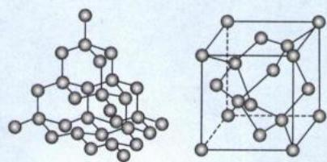

2. 化学性质: 晶体硅性质较稳定, 无定形硅有较强还原性, 能与许多氧化剂反应。
(1) $Si + O_{2} \xlongequal{\triangle} SiO_{2}$ (2) $Si + 2Cl_{2} \xlongequal{\triangle} SiCl_{4}$ (3) $Si + 4HF = SiF_{4} + 2H_{2}\uparrow$ (4) $Si + 2NaOH + H_{2}O = Na_{2}SiO_{3} + 2H_{2}\uparrow$

3. 用途: 良好的半导体材料、制作太阳能电池、制作芯片

## 4. 制备

(1)制备粗硅:高温下焦炭还原石英砂,对应化学方程式为: $\mathrm{SiO}_{2}+2\mathrm{C}\xlongequal{1800^{\circ}\mathrm{C}\sim2000^{\circ}\mathrm{C}}\mathrm{Si}(\text{粗硅})+2\mathrm{CO}\uparrow$ ,粗硅混有少量 $\mathrm{C}$ 、 $\mathrm{SiO}_{2}$ 等杂质。

(2) 粗硅的提纯：

①用热 HCl 将粗硅中的 Si 转化成气态的 $SiHCl_{3}$ 与杂质脱离: $\mathrm{Si}(\text{粗硅}) + 3\mathrm{HCl} \xlongequal{300^{\circ}\mathrm{C}} \mathrm{SiHCl}_{3} + \mathrm{H}_{2}$ 。

②在高温下，用 $\mathrm{H}_{2}$ 将 $\mathrm{SiHCl}_{3}$ 还原为纯硅： $\mathrm{SiHCl}_3 + \mathrm{H}_2\xrightarrow{1100^{\circ}C}\mathrm{Si}(\text{纯硅}) + 3\mathrm{HCl}$

注：i. 温度不同，反应进行的方向也可能不同。如常温下： $NH_{3} + HCl = NH_{4}Cl$ ；加热时： $NH_{4}Cl \xlongequal{\triangle} NH_{3} \uparrow + HCl \uparrow$ 。

ii. $\mathrm{SiHCl}_3$ 中 Si、H、Cl 的化合价分别为 $+4, -1, -1, \mathrm{SiHCl}_3$ 遇水极易水解，水解方程式为： $\mathrm{SiHCl}_3 + 3\mathrm{H}_2\mathrm{O} = 3\mathrm{HCl} + \mathrm{H}_2\mathrm{SiO}_3 + \mathrm{H}_2\uparrow$ ，该反应是归中反应。

## 二、硅的氧化物

## 1. $SiO_{2}$ 的结构、性质和用途

<table><tr><td>晶体类型</td><td>共价晶体</td></tr><tr><td>物质种类</td><td>酸性氧化物</td></tr><tr><td>硅的化合价</td><td>+4(稳价)</td></tr><tr><td>物理性质(晶体)</td><td>无色透明的晶体,熔沸点高,难溶于水</td></tr><tr><td>酸性氧化物的通性</td><td>(1)与碱反应: $SiO_{2}$ +2 $NaOH$ = $Na_{2}SiO_{3}$ + $H_{2}O$ (装碱的试剂瓶塞不能用玻璃塞)(2)与碱性氧化物反应: $SiO_{2}$ + $CaO \xlongequal{高温} CaSiO_{3}$ </td></tr><tr><td>弱氧化性</td><td>冶炼粗硅: $SiO_{2}$ +2C $\xlongequal{高温} Si$ (粗硅)+2CO</td></tr><tr><td>高沸点</td><td>工业制玻璃的原理:(1) $SiO_{2}$ + $Na_{2}CO_{3} \xlongequal{高温} Na_{2}SiO_{3}$ + $CO_{2} \uparrow$ (2) $SiO_{2}$ + $CaCO_{3} \xlongequal{高温} CaSiO_{3}$ + $CO_{2} \uparrow$ </td></tr><tr><td>特性</td><td> $SiO_{2}$ +4HF= $SiF_{4} \uparrow$ +2 $H_{2}O$ (氢氟酸刻蚀玻璃)</td></tr><tr><td>用途</td><td>用于制作光导纤维、耐火材料、玻璃、建材、装饰品等</td></tr></table>

注：① $SiO_{2}$ 难溶于水，不能和水直接反应制备硅酸。

②高温下, $SiO_{2}$ 分别与 $Na_{2}CO_{3}$ 、 $CaCO_{3}$ 发生化学反应生成 $CO_{2}$ ，此类反应遵循“高沸点制备低沸点”原则。

③普通玻璃的原料: $\text{Na}_2\text{CO}_3$ (纯碱)、 $\text{CaCO}_3$ (石灰石)、 $\text{SiO}_2$ (石英); 普通玻璃的成分: $\text{SiO}_2$ 、 $\text{Na}_2\text{SiO}_3$ 、 $\text{CaSiO}_3$ 。

④ $SiO_{2}$ 既能与酸反应,又能与碱反应,但 $SiO_{2}$ 不是两性氧化物,因为 $SiO_{2}$ 与氢氟酸反应的产物 $SiF_{4}$ 是非电解质,不是盐。

⑤硅胶由硅酸脱水干燥制得,类似玻璃态的 $SiO_{2}$ , 常做干燥剂。

## 三、硅酸以及硅酸盐

1. 硅酸: $H_{2}SiO_{3}$ 是难溶性的弱酸, 酸性比 $H_{2}CO_{3}$ 还弱, 将 $CO_{2}$ 通入 $Na_{2}SiO_{3}$ 溶液可获得硅酸胶体。 $CO_{2}$ 通入 $Na_{2}SiO_{3}$ 溶液, 无论 $CO_{2}$ 多还是少, Si 元素的产物均为 $H_{2}SiO_{3}$ ; $CO_{2}$ 多时含 C 元素的产物为 $HCO_{3}^{-}$ ; $CO_{2}$ 少时含 C 元素的产物为 $CO_{3}^{2-}$ 。

2. 硅酸钠: 绝大多数硅酸盐的溶解度偏小, 可溶性的硅酸盐有 $\mathrm{Na}_{2} \mathrm{SiO}_{3} 、 \mathrm{K}_{2} \mathrm{SiO}_{3}$ 等。 $\mathrm{Na}_{2} \mathrm{SiO}_{3}$ 的水溶液称为水玻璃, 是一种常用黏合剂。 $\mathrm{Na}_{2} \mathrm{SiO}_{3}$ 可作防火材料, 也可用于制备硅胶等。

## 3. 三大传统硅酸盐材料：

<table><tr><td>名称</td><td>陶瓷</td><td>水泥</td><td>玻璃</td></tr><tr><td>原料</td><td>黏土</td><td>黏土、石灰石、石膏</td><td>纯碱、石灰石、石英</td></tr></table>

注:传统陶瓷的种类有很多,如青花瓷、彩瓷等;无论是哪种传统陶瓷,其主要成分都是硅酸盐。

## 四、常见的化学材料

1. 三大材料: 金属材料、有机高分子材料、无机非金属材料。

2. 无机非金属材料: 主要包括传统无机非金属材料(陶瓷、玻璃、水泥、非金属矿、研磨材料等)以及新型无机非金属材料。新型无机非金属材料是指一些新型的具有特殊结构和特殊功能的非硅酸盐材料, 主要包括高温结构陶瓷、碳纳米材料、特殊功能的含硅材料等。

注:新型无机非金属材料可能含有金属元素,无机非金属材料也不一定含有硅原子,如透明陶瓷含有氧化铝或氮化铝。

## 五、重要的含碳物质

1. 碳单质: 常见的同素异形体有(1)金刚石: 共价晶体, C 原子杂化方式为 $sp^{3}$ ; (2)石墨: 混合型晶体, C 原子杂化方式为 $sp^{2}$ ; (3)富勒烯: 由碳原子构成的一系列笼形分子的总称, 代表物为 $C_{60}$ , 属于分子晶体; (4)石墨烯: 只有一个碳原子直径厚度的单层石墨, C 原子杂化方式为 $sp^{2}$ ; (5)碳纳米管: 可以看成是由石墨片层卷成的管状物。

## 2. 碳的氧化物

<table><tr><td>对象</td><td>CO</td><td> $CO_{2}$ </td></tr><tr><td>物质类型</td><td>不成盐氧化物</td><td>酸性氧化物</td></tr><tr><td>水溶性</td><td>难溶</td><td>可溶</td></tr><tr><td>化学性质</td><td>强还原性: $Fe_{2}O_{3} + 3CO\xlongequal{高温}2Fe + 3CO_{2}$ 配位反应: $Ni + 4CO = Ni(CO)_{4}$ </td><td>酸性氧化物的通性: $CO_{2} + H_{2}O \rightleftharpoons H_{2}CO_{3}$  $CO_{2} + Na_{2}O = Na_{2}CO_{3}$  $CO_{2}$ (少)+2NaOH= $Na_{2}CO_{3} + H_{2}O$  $CO_{2}$ (足)+NaOH= $NaHCO_{3}$  $Na_{2}CO_{3}$ (饱和)+ $CO_{2} + H_{2}O = 2NaHCO_{3}$ ↓</td></tr><tr><td>用途</td><td>常见还原剂</td><td>干冰用于制冷</td></tr></table>

## 3. 几种常见含碳的酸

<table><tr><td>对象</td><td>乙二酸(草酸)</td><td>乙酸(冰醋酸)</td><td>苯酚(石炭酸)</td><td>碳酸</td><td>氢氰酸</td></tr><tr><td>化学式</td><td> $H_2C_2O_4$ </td><td> $CH_3COOH$ </td><td> $C_6H_5OH$ </td><td> $H_2CO_3$ </td><td>HCN</td></tr><tr><td>化学性质</td><td>酸的通性;酯化反应;较强还原性</td><td>酸的通性;酯化反应</td><td>酸性;与溴水取代;强还原性等</td><td>酸的通性;受热分解</td><td>酸的通性;强还原性;易与醛、炔发生加成反应</td></tr></table>

类型Ⅰ:化学与生活

【例1】正误判断,正确的填“√”,错误的填“×”
(1)晶体硅的导电性介于导体和绝缘体之间,常用于制造光导纤维( )
(2)SiO $_{2}$ 晶体能对光进行全反射,所以 SiO $_{2}$ 可制作光导纤维( )
(3)单晶硅熔点高,所以单晶硅可用作半导体材料( )
(4)2023年8月,华为 Mate60 携带麒麟 9 000 回归,麒麟 9 000 芯片由晶体 SiO $_{2}$ 制作( )
(5)晶体 Si、晶体 SiO $_{2}$ 均为共价晶体,具有很高的熔沸点( )
(6)Cu(OH) $_{2}$ 、SiO $_{2}$ 既能与酸反应,又能与碱反应,二者分别从属两性氢氧化物、两性氧化物( )
(7)(2022·辽宁卷)火炬“飞扬”使用的碳纤维属于有机高分子材料( )
(8)(2022·江苏卷)金刚石与石墨烯中的键角都为 120°( )
(9)(2022·全国乙卷)HB铅笔芯的成分为二氧化铅( )
(10)(2022·全国甲卷)干冰可用在舞台上制造“云雾”( )
(11)(2022·全国甲卷)温室气体是形成酸雨的主要物质( )
(12)(2022·全国甲卷)向硅酸钠溶液中通入 CO $_{2}$ 发生的反应为:SiO $_{3}^{2-}$ +CO $_{2}$ +H $_{2}$ O=HSiO $_{3}^{-}$ +HCO $_{3}^{-}$ ( )
(13)(2022·重庆卷)“神舟十三号”航天员使用塑料航天面窗,塑料属于无机非金属材料( )
(14)(2024·甘肃卷)活性炭具有吸附性,所以用于分解室内甲醛( )
(15)(2024·山东卷)活性炭可作食品脱色剂( )
解析:(1)(×)晶体硅导电性介于导体和绝缘体之间,用于制造芯片、太阳能电池等;SiO $_{2}$ 用于制造光导纤维。
(2)(√)SiO $_{2}$ 晶体能对光进行全反射,是其可制作光导纤维的主要原因。
(3)(×)单晶硅是共价晶体,熔沸点很高,但该物理性质不是其作为半导体材料的原因。
(4)(×)芯片主要成分为硅单质。
(5)(√)晶体 Si、SiO $_{2}$ 是共价晶体,其熔化时破坏共价键需要很高的能量,两种晶体的熔点都很高。
(6)(×)SiO $_{2}$ 与 HF 的反应产物 SiF $_{4}$ 不是盐,SiO $_{2}$ 是酸性氧化物而不是两性氧化物;Cu(OH) $_{2}$ 与氨水反应生成的[Cu(NH $_{3}$ ) $_{4}$ ](OH) $_{2}$ 也不是盐,Cu(OH) $_{2}$ 不是两性氢氧化物。
(7)(×)碳纤维指的是含碳量在 90%以上的高强度高模量纤维,属于无机非金属材料。
(8)(×)金刚石中 C 采用 sp $^{3}$ 杂化,键角为 109°28′;石墨烯中 C 采用 sp $^{2}$ 杂化,键角为 120°。
(9)(×)HB铅笔芯的主要成分是黏土和石墨,没有 PbO $_{2}$ 。
(10)(√)干冰升华吸收热量,导致环境温度降低,使空气中水蒸气液化,形成“云雾”。
(11)(×)温室气体主要是 CO $_{2}$ ,造成酸雨的气体主要是 SO $_{2}$ 以及氮的氧化物。
(12)(×)SiO $_{3}^{2-}$ 与 CO $_{2}$ 反应,SiO $_{3}^{2-}$ 的产物是 H $_{2}$ SiO $_{3}$ ,CO $_{2}$ 量多生成 HCO $_{3}^{-}$ ,CO $_{2}$ 量少生成 CO $_{3}^{2-}$ 。
(13)(×)塑料是有机高分子材料,如聚乙烯、聚氯乙烯、酚醛树脂等。
(14)(×)活性炭具有吸附性与活性炭分解甲醛无因果关系,且活性炭不能分解甲醛。
(15)(√)活性炭具有吸附性,可以吸附有机色素,且活性炭本身无毒无害,所以活性炭可以作为食品脱色剂。
(活性炭也是有机实验中常用的脱色剂。)
答案:(1)× (2)√ (3)× (4)× (5)√ (6)× (7)× (8)× (9)× (10)√ (11)× (12)×
(13)× (14)× (15)√

【例 2】下列关于无机非金属材料的说法不正确的是( )

A.传统无机非金属材料是指玻璃、水泥、陶瓷等硅酸盐材料
B.新型无机非金属材料虽然克服了传统无机非金属材料的缺点,但强度比较差
C.高温结构材料具有耐高温、耐酸碱腐蚀、硬度大、耐磨损、密度小等优点
D.传统无机非金属材料和新型无机非金属材料的主要成分不同

解析: A. 无机非金属材料分为传统无机非金属材料和新型无机非金属材料两大类。传统无机非金属材料多

为硅酸盐材料，包括玻璃、水泥、陶瓷等，A选项正确。

B. 新型无机非金属材料是指一些新型的具有特殊结构和特殊功能的非硅酸盐材料, 比如共价晶体碳化硅强度很高, B 选项错误。

C. 高温结构材料具有耐高温、耐酸碱腐蚀、硬度大、耐磨损、密度小等优点，C选项正确。

D. 传统无机非金属材料主要成分是硅酸盐或 $\mathrm{SiO}_2$ ，而新型无机非金属材料不一定含 Si, D 选项正确。

答案:B

【例 3】下列关于 $SiO_{2}$ 的性质和用途无对应关系的一组为（）

<table><tr><td>选项</td><td>性质</td><td>用途</td></tr><tr><td>A</td><td> $SiO_{2}$  对光全反射,且传递光信号时低损耗</td><td> $SiO_{2}$  制作光导纤维</td></tr><tr><td>B</td><td> $SiO_{2}$  与氢氟酸反应</td><td>用 HF 刻蚀玻璃</td></tr><tr><td>C</td><td> $SiO_{2}$  为酸性氧化物</td><td>用  $SiO_{2}$  与纯碱、石灰石反应制备玻璃</td></tr><tr><td>D</td><td> $SiO_{2}$  的熔点高</td><td>制耐火坩埚</td></tr></table>

解析：A. $\mathrm{SiO_2}$ 晶体无色透明，对光进行全反射且传递光信号时低损耗，是优良的光学材料，A选项有对应关系。B. $\mathrm{SiO_2}$ 与HF反应： $\mathrm{SiO_2 + 4HF = SiF_4\uparrow + 2H_2O}$ ，可以用于刻蚀玻璃，B选项有对应关系。C. $\mathrm{SiO_2}$ 与纯碱、石灰石反应遵循高沸点制备低沸点，C选项无对应关系。D. $\mathrm{SiO_2}$ 是共价晶体，熔沸点很高，可制作耐火、耐高温仪器，D选项有对应关系。答案：C

类型Ⅱ: 阿伏加德罗常数

【例 4】 $N_{A}$ 表示阿伏加德罗常数的值, 下列说法不正确的是( ) (相对原子质量 Si=28)
A. 28 g 的晶体 Si 含硅硅键 $2N_{A}$ B. 60 g 的 $SiO_{2}$ 晶体含硅氧键 $2N_{A}$ C. 40 g 的 SiC 晶体含硅碳键 $4N_{A}$ D. 18 g 的冰含氢键数为 $2N_{A}$

解析: A. 每个 Si 原子周围的 Si—Si 键数为 4, 均摊后为 2,28 g 的晶体硅(即 1 mol 晶体硅)所含 Si—Si 键为 $2N_{A}$ , A 选项正确。

B. 每个硅原子周围 4 个 Si—O 键，均摊后 2 个；每个 O 周围 2 个 Si—O 键，均摊后 1 个。所以 60 g 的 $SiO_{2}$ （即 1 mol $SiO_{2}$ ）所含键数为： $(4 \times \frac{1}{2} + 2 \times \frac{1}{2} \times 2) N_{A} = 4 N_{A}$ ，B 选项错误。

C. 每个硅原子周围 4 个 Si—C 键，均摊后 2 个；每个碳周围 4 个 Si—C 键，均摊后 2 个。所以 40 g 的 SiC（即 1 mol SiC）所含键数为： $(4 \times \frac{1}{2} + 4 \times \frac{1}{2}) N_{\mathrm{A}} = 4 N_{\mathrm{A}}$ ，C 选项正确。

D. 每个水周围有 4 个氢键，均摊后为 2 个，18 g 的冰（即 1 mol 冰）含氢键数目为 $2N_{A}$ ，D 选项正确。

答案:B

【反思】共价晶体中化学键的计算方法——局部思维：先算出原子的物质的量，再乘以每个原子周围的共价键数目，最后乘以 $\frac{1}{2}$ 即可。常见共价晶体中化学键的数目：(1)1 mol 金刚石所含 C—C 键数目为 $2N_{A}$ ; (2)1 mol 晶体硅所含 Si—Si 键数目为 $2N_{A}$ ; (3)1 mol 石墨所含碳碳键数目为 $1.5N_{A}$ ; (4)1 mol $SiO_{2}$ 所含 Si—O 键数目为 $4N_{A}$ ; (5)1 mol SiC 所含 Si—C 数目为 $4N_{A}$ ; (6)1 mol AlN 所含 Al—N 键数目为 $4N_{A}$ 。

类型Ⅲ: 方法的运用

【例 5】学习化学不是靠一味背诵,要学会运用合适的方法,如“类推”,这样才能事半功倍。但同时物质因为结构不同,性质也有差异,学习的时候也要善用“对比辨析”。下列类推正确的是( ) A. 已知往 $Na_{2}CO_{3}$ 溶液中滴加少量盐酸,产物为 $NaHCO_{3}$ 和 NaCl,则往 $Na_{2}SiO_{3}$ 溶液中滴加少量盐酸,产物为 $NaHSiO_{3}$ 和 NaCl

B. 已知 $CO_{2}$ 的 C 为 sp 杂化，则 $SiO_{2}$ 的 Si 也为 sp 杂化
C. 已知 $CO_{2}$ 能与 $H_{2}O$ 反应生成 $H_{2}CO_{3}$ ，则 $SiO_{2}$ 也能 $H_{2}O$ 反应生成 $H_{2}SiO_{3}$ D. 已知 $CO_{2} + 2NaOH$ （足）= $Na_{2}CO_{3} + H_{2}O$ ，则 $SiO_{2} + 2NaOH$ （足）= $Na_{2}SiO_{3} + H_{2}O$

解析: A. $H_{2}SiO_{3}$ 是难溶性二元弱酸, 其电离的处理方式类比难溶性多元弱碱; 碳酸是可溶性多元弱酸, 其电离为分步电离。因此 $CO_{3}^{2-}$ 结合少量 $H^{+}$ 生成 $HCO_{3}^{-}$ , 但 $SiO_{3}^{2-}$ 结合少量 $H^{+}$ 却生成 $H_{2}SiO_{3}(SiO_{3}^{2-}$ 与 $H^{+}$ 反应, 无论 $H^{+}$ 有多少, 产物均为 $H_{2}SiO_{3}$ ), A 选项错误。

B. $CO_{2}$ 是分子晶体，每个 $CO_{2}$ 分子中的碳原子有 2 个 $\sigma$ 键且无孤电子对，碳的杂化方式为 sp; $SiO_{2}$ 是共价晶体，每个硅原子有 4 个 $\sigma$ 键，硅的杂化方式为 $sp^{3}$ ，B 选项错误。（共价晶体中原子几乎都采用 $sp^{3}$ 杂化。）
C. $SiO_{2}$ 是难溶于水的酸性氧化物，不和水反应，C 选项错误。

D. $\mathrm{SiO}_2$ 、 $\mathrm{CO}_{2}$ 均为酸性氧化物，与足量强碱反应均生成正盐和水，D选项正确。

答案:D

【反思】组成世界的物质多不胜数,为了更好地研究这些物质,常常需要分类,所以学习化学的方法主要是“类比法”和“对比法”。“类比法”往往只需要掌握一种典型物质,再通过类比思维,即可做到触类旁通,事半功倍。但是每种物质由于结构并不完全相同,从而导致同类物质的性质也并不完全相同,为了更全面地掌握物质的性质,应经常使用“对比法”;利用表格进行对比辨析,更能寻找出两种物质的差异。综上所述,学习化学不能一味地只使用一种方法,要多种方法并用才能让你更优秀。

类型Ⅳ:碳循环图像分析

【例 6】海洋碳循环是全球碳循环的重要组成部分, 是影响全球气候变化的关键控制环节。下图为海洋中碳循环的简单原理图。下列说法错误的是( )

A. 海水的温度、pH 值会影响海洋碳循环

B. $CO_{2}$ 通过光合转化成 $(\mathrm{CH}_{2}\mathrm{O})_{x}$ 是氧化还原反应

C. $CO_{2}$ 通过光合转化成 $(\mathrm{CH}_{2}\mathrm{O})_{x}$ 是化合反应

D. 钙化释放 $CO_{2}$ 的离子方程式: $2HCO_{3}^{-} + Ca^{2+} = CaCO_{3} \downarrow + CO_{2} \uparrow + H_{2}O$

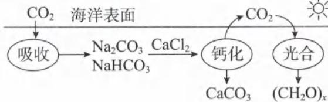

解析: A. 海水的温度过高或酸性过大, 均不利于 $CO_{2}$ 的溶解, A 选项正确。

B. 根据化合物正负化合价代数和为零可知, 糖类中碳的平均价为 0 , 而 $\mathrm{CO}_{2}$ 中碳化合价为 +4 价, 光合作用中 C 原子的化合价发生了改变, 是氧化还原反应, B 选项正确。  
C. 光合过程产生糖类的同时有 $\mathrm{O}_{2}$ 的释放, 其产物不只一种, 不是化合反应, C 选项错误。  
D. 由图像可知钙化步骤生成 $\mathrm{CaCO}_{3}$ 沉淀的同时释放了 $\mathrm{CO}_{2}$ , 该过程发生的化学反应为: $2\mathrm{HCO}_{3}^{-} + \mathrm{Ca}^{2+} = \mathrm{CaCO}_{3} \downarrow + \mathrm{CO}_{2} \uparrow + \mathrm{H}_{2} \mathrm{O}, \mathrm{D}$ 选项正确。  
答案: C

答案:C

类型 V: 化学反应方程式的判断

【例 7】(2022·江苏卷)周期表中ⅣA族元素及其化合物应用广泛,甲烷具有较大的燃烧热890.3 kJ/mol,是常见燃料;Si、Ge是重要的半导体材料,硅晶体表面 $SiO_{2}$ 能与氢氟酸(HF,弱酸)反应生成 $H_{2}SiF_{6}(H_{2}SiF_{6}$ 在水中完全电离为 $H^{+}$ 和 $SiF_{6}^{2-}$ );1885年德国化学家将硫化锗 $(GeS_{2})$ 与 $H_{2}$ 共热制得了门捷列夫预言的类硅—锗。下列化学反应表示正确的是( )

A. $SiO_{2}$ 与HF溶液反应: $SiO_{2} + 6HF = 2H^{+} + SiF_{6}^{2-} + 2H_{2}O$ B.高温下 $H_{2}$ 还原 $GeS_{2}:GeS_{2} + 2H_{2} = Ge + 2H_{2}S$ C.铅酸蓄电池放电时的正极反应: $Pb - 2e^{-} + SO_{4}^{2-} = PbSO_{4}$ D.甲烷的燃烧: $CH_{4}(g) + 2O_{2}(g) = CO_{2}(g) + 2H_{2}O(g) \quad \triangle H = 890.3\text{ kJ/mol}$ 解析:A.根据题干可知 $SiO_{2}$ 与HF反应生成 $H_{2}SiF_{6}$ ,且 $H_{2}SiF_{6}$ 完全电离为 $H^{+}$ 和 $SiF_{6}^{2-}$ ,A选项正确。

B.高温下 $H_{2}S$ 不稳定会分解生成 $S、H_{2}$ ,最终总反应为: $GeS_{2}\xrightarrow[H_{高温}]H_{2}}Ge + 2S,B$ 选项错误。

C. 铅酸蓄电池放电时正极反应: $PbO_{2} + 2e^{-} + SO_{4}^{2-} + 4H^{+} = PbSO_{4} + 2H_{2}O$ , C 选项错误。
D. 燃烧是放热反应， $\triangle H<0$ ，且甲烷燃烧热对应的产物是 $H_{2}O(l)$ ，D 选项错误。
答案：A

类型Ⅵ:化工流程

【例 8】科学家最新研制的利用氯化氢和氢气生产高纯硅的工艺流程如图所示：

容器①中进行的反应为：

①Si(粗) + 3HCl(g) = SiHCl₃(g) + H₂(g);
容器②中进行的反应为：

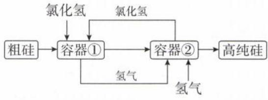

$$
\mathrm{SiHCl} _ {3} + \mathrm{H} _ {2} \xlongequal {\text {高温}} \mathrm{Si} (\text {纯}) + 3 \mathrm{HCl。}
$$

下列说法不正确的是( )

A. 制备粗硅的化学方程式为: $SiO_{2} + 2C \xlongequal{高温} Si(\text{粗硅}) + 2CO$ B. 制备高纯硅的各个环节均需要隔绝空气

C. 上述两个反应均属于置换反应, 也属于氧化还原反应

D. 由于晶体硅还原性很强, 工业上也可以通过电解熔融 $SiO_{2}$ 的方法来制备晶体硅

解析：A. 用过量焦炭和石英砂制备粗硅，化学方程式为： $SiO_{2} + 2C \xlongequal{高温} Si(\text{粗硅}) + 2CO, A$ 选项正确。

B. 加热条件下硅和 $H_{2}$ 均有很强的还原性, 容易与空气反应, 因此需要隔绝空气, B 选项正确。

C. Si、SiHCl₃ 中 Si 原子化合价分别为 0、+4 价，化合价发生了改变是氧化还原反应；两个反应均为：单质 + 化合物 = 单质 + 化合物，所以两个反应均为置换反应，C 选项正确。

D. $SiO_{2}$ 是共价晶体，熔融状态下不导电，D 选项错误。

答案:D

类型Ⅶ: 结构与性质

【例 9】(2023·北京卷)中国科学家首次成功制得大面积单晶石墨炔,是碳材料科学的一大进步。

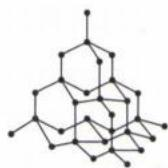  
金刚石

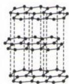  
石墨

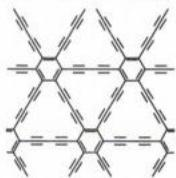  
石墨炔

下列关于金刚石、石墨、石墨炔的说法正确的是( )
A. 三种物质中均有碳碳原子间的 $\sigma$ 键 B. 三种物质中的碳原子都是 $sp^{3}$ 杂化 C. 三种物质的晶体类型相同 D. 三种物质均能导电

解析: A. 碳原子以共价键相连, 两原子之间的共价键必有 $\sigma$ 键, A 选项正确。

B. 金刚石、石墨、石墨炔中的碳原子，杂化方式分别为 $sp^{3}$ 、 $sp^{2}$ 、sp 和 $sp^{2}$ ，B 选项错误。

C. 金刚石、石墨分别是共价晶体、混合型晶体，二者晶体类型不相同，C选项错误。

D. 金刚石无大 $\pi$ 键，在外加电场作用下无定向移动的电子，不导电。石墨和石墨炔均含大 $\pi$ 键，在外加电场下，有自由移动的电子，能导电，D 选项错误。

答案:A

# 模块 2 卤素(★★★★)

习题：P25

# 第 1 节 氯及其化合物

## 内容提要

## 一、氯元素

1. 氯的电负性和氮相近, 常含有三个孤电子对, 容易与 Al、Au、Cu 等元素形成配位键。

2. 氯的最低化合价为 -1、最高化合价为 +7，常见化合价：-1、0、+1、+3、+5、+7，稳价为 -1 价。

3. 在自然界中以“化合态”形式存在。

## 二、氯气

1. 氯气的物理性质: 常温下, $Cl_{2}$ 是一种黄绿色有刺激性气味的有毒气体, 可溶于水 (在常温常压下, 1 体积的水可溶解约 2 体积的 $Cl_{2}$ ), 密度大于空气, 易液化, 液氯储存在钢瓶中。

2. 化学性质: $Cl_{2}$ 化合价为 0, 是氯元素的中间价, 既有氧化性又有还原性。由于稳价是 -1 价, 所以 $Cl_{2}$ 主要体现氧化性。根据由强制弱的原理, 能被 $Cl_{2}$ 氧化的还原剂有 Na、Al、Fe、Cu 等金属单质, 以及 $S^{2-}$ 、 $I^{-}$ 、 $Br^{-}$ 等。

(1)与金属单质反应

①铁在 $Cl_{2}$ 中剧烈燃烧,释放大量的热,生成棕褐色的烟: $2Fe + 3Cl_{2} \xlongequal{\triangle} 2FeCl_{3}$ 。

②铜在 $Cl_{2}$ 中剧烈燃烧,释放大量的热,生成棕黄色的烟: $Cu+Cl_{2}\xlongequal{\triangle}CuCl_{2}$ 。

注：i. $Cl_{2}$ 的氧化性强，与变价金属反应不存在量变引起质变，产物是高价金属氯化物。
ii. 虽然 $Cl_{2}$ 在加热时可以与铁单质反应，但常温下不反应，液氯可以用钢瓶储运。

(2)与非金属单质反应

① $H_{2}$ 在 $Cl_{2}$ 中安静燃烧, 发出苍白色火焰, 瓶口有白雾: $H_{2} + Cl_{2} \xlongequal{点燃} 2HCl$ 。

②P与 $Cl_{2}$ 充分反应,生成大量白色的烟雾: $2P+3Cl_{2}\xlongequal{\triangle}2PCl_{3},PCl_{3}+Cl_{2}\rightleftharpoons PCl_{5}$ 。
注: $Cl_{2}$ 与P反应既生成 $PCl_{3}$ ，又生成 $PCl_{5}$ ，其中 $PCl_{3}$ 转化成 $PCl_{5}$ 是可逆反应。

(3)与其他化合物反应：

①与 $H_{2}S$ 、 $S^{2-}$ 反应： $H_{2}S+Cl_{2}=S\downarrow+2H^{+}+2Cl^{-}$ 、 $S^{2-}+Cl_{2}=S\downarrow+2Cl^{-}$ 。

②与 $SO_{2}$ 、 $SO_{3}^{2-}$ 反应： $SO_{2} + Cl_{2} + 2H_{2}O = SO_{4}^{2-} + 2Cl^{-} + 4H^{+}$ 、 $SO_{3}^{2-} + Cl_{2} + H_{2}O = SO_{4}^{2-} + 2Cl^{-} + 2H^{+}$ （少量 $SO_{3}^{2-}$ 与 $Cl_{2}$ 反应）。

③与 KI 反应: $2I^{-} + Cl_{2} = I_{2} + 2Cl^{-}$ (若继续通入 $Cl_{2}, I_{2}$ 会进一步被氧化为 $IO_{3}^{-}$ )。

④与 $FeCl_{2}$ 反应: $2Fe^{2+} + Cl_{2} = 2Fe^{3+} + 2Cl^{-}$ 。

⑤与 KBr 反应: $2Br^{-} + Cl_{2} = Br_{2} + 2Cl^{-}$ 。

⑥与 $FeI_{2}$ 溶液反应(还原性: $I^{-}>Fe^{2+}$ , $I^{-}$ 优先与 $Cl_{2}$ 反应) $n(\mathrm{Cl}_{2}):n(\mathrm{FeI}_{2})\leqslant1$ 时: $2I^{-}+Cl_{2}=I_{2}+2Cl^{-}$ $n(\mathrm{Cl}_{2}):n(\mathrm{FeI}_{2})=1.5$ 时: $2Fe^{2+}+4I^{-}+3Cl_{2}=2Fe^{3+}+2I_{2}+6Cl^{-}$ 注： $n(\mathrm{Cl}_{2}):n(\mathrm{FeI}_{2})>1.5$ 时， $Cl_{2}$ 还可以将 $I_{2}$ 转化成 $IO_{3}^{-}$ 。

⑦与 $FeBr_{2}$ 溶液反应(还原性: $Fe^{2+}>Br^{-}$ , $Fe^{2+}$ 优先与 $Cl_{2}$ 反应) $n(\mathrm{Cl}_{2}):n(\mathrm{FeBr}_{2})\leqslant0.5$ 时: $2Fe^{2+}+Cl_{2}=2Fe^{3+}+2Cl^{-}$ $n(\mathrm{Cl}_{2}):n(\mathrm{FeBr}_{2})=1.5$ 时: $2Fe^{2+}+4Br^{-}+3Cl_{2}=2Br_{2}+2Fe^{3+}+6Cl^{-}$

注: $\text{FeBr}_2$ 、 $\text{FeI}_2$ 是“还还组合”，当氧化剂 $\text{Cl}_2$ 少，考查“谁（还原性）强谁优先”；当氧化剂 $\text{Cl}_2$ 多，考查“配比”（即 $\text{Fe}^{2+}$ 、 $\text{I}^-$ 的小角标之比为计量数之比）。当 $n$ （氧化剂）： $n$ （还原剂）之比介于两个极值点之间时，以 $\text{Cl}_2$ 的量为基准，先反应完强的还原剂，再利用剩余 $\text{Cl}_2$ 反应部分较弱还原剂。

(4)氯气参与的歧化反应:氯气性质活泼,除了与一些还原性物质反应外,还可以与水、碱等发生歧化反应。

① $Cl_{2}$ 通入水中制氯水： $Cl_{2}+H_{2}O\rightleftharpoons HClO+Cl^{-}+H^{+}$ （可逆反应，水中的部分 $Cl_{2}$ 与水反应，因此水中还有 $Cl_{2}$ 存在，且新制氯水的主要溶质为 $Cl_{2}$ 。）

② $Cl_{2}$ 通入NaOH溶液制漂白液或消毒液： $Cl_{2}+2OH^{-}=Cl^{-}+ClO^{-}+H_{2}O$ 。

③ $Cl_{2}$ 通入冷的石灰乳制漂白粉或漂粉精: $\mathrm{Cl}_{2}+\mathrm{Ca(OH)}_{2}=\mathrm{Cl}^{-}+\mathrm{ClO}^{-}+\mathrm{Ca}^{2+}+\mathrm{H}_{2}\mathrm{O}$ （石灰乳为悬浊液, $\mathrm{Ca(OH)}_{2}$ 不拆成离子）。

注:自来水的净化主要包括杀菌消毒和聚沉。强氧化剂如 $ClO_{2}$ 、 $Cl_{2}$ 、 $O_{3}$ 、 $K_{2}FeO_{4}$ 可用于杀菌消毒,而明矾主要利用其水解产生的胶体吸附杂质而聚沉。

## (5)氯水的成分及其性质

<table><tr><td>对象</td><td>新制氯水</td><td>久置氯水</td><td>液氯</td></tr><tr><td>成分</td><td> $H_{2}O$ 、 $Cl_{2}$ 、 $HClO$ 、 $H^{+}$ 、 $Cl^{-}$ 、 $ClO^{-}$ 、 $OH^{-}$ (3分4离)</td><td> $H_{2}O$ 、 $H^{+}$ 、 $Cl^{-}$ 、 $OH^{-}$ (1分3离)</td><td> $Cl_{2}$ </td></tr><tr><td>性质</td><td>氧化性、酸性、漂白性</td><td>酸性</td><td>氧化性</td></tr></table>

注:氯水中的主要溶质是 $Cl_{2}$ ，所以当氯水参与化学反应作氧化剂时，优先考虑 $Cl_{2}$ 参与反应，但氯水的漂白性只能通过 HClO 体现。

(6)在一定条件下, $Cl_{2}$ 还可以与很多有机物反应,对应化学方程式详见第12章。

3. $Cl_{2}$ 的用途: (1) 可以对自来水杀菌消毒; (2) 冶炼金属: $TiO_{2} + 2C + 2Cl_{2} \xlongequal{高温} TiCl_{4} + 2CO$ ; (3) 制备盐酸; (4) 有机合成: $CH_{4} + 4Cl_{2} \xrightarrow{光} CCl_{4} + 4HCl$ 。

4. 工业上电解饱和食盐水制取 $Cl_{2}: 2NaCl + 2H_{2}O \xlongequal{电解} 2NaOH + H_{2} \uparrow + Cl_{2} \uparrow$ （阳极产生 $Cl_{2}$ 、阴极产生 $H_{2}$ ）。

5. $Cl_{2}$ 的实验室制取：

(1)原理: $\text{HCl}^{-1}\xrightarrow[\text{MnO}_2, \text{KMnO}_4, \text{KClO}_3, \text{K}_2\text{Cr}_2\text{O}_7\text{等}]{\text{强氧化剂}}\text{Cl}_2^{0}$

①舍勒实验室制备 $Cl_{2}:MnO_{2}+4H^{+}+2Cl^{-}\xlongequal{\triangle}Mn^{2+}+Cl_{2}\uparrow+2H_{2}O$ 。

②高锰酸钾法： $2MnO_{4}^{-}+10Cl^{-}+16H^{+}=2Mn^{2+}+5Cl_{2}\uparrow+8H_{2}O$

③重铬酸钾法: $\text{Cr}_2\text{O}_7^{2-} + 14\text{H}^+ + 6\text{Cl}^- = 2\text{Cr}^{3+} + 3\text{Cl}_2 \uparrow + 7\text{H}_2\text{O}$ 。

④氯酸钾法: $\text{ClO}_3^- + 6\text{H}^+ + 5\text{Cl}^- = 3\text{Cl}_2 \uparrow + 3\text{H}_2\text{O}$ 。

⑤漂白粉或漂白液法: $ClO^{-}+Cl^{-}+2H^{+}=Cl_{2}\uparrow+H_{2}O$ 。

注：i. 由于 $MnO_{2}$ 的氧化性相对小一些，所以与其反应的盐酸浓度要求高一些，且需要加热。

ii. 84 消毒液含 NaClO，洁厕灵含 HCl，两者不能混合使用，以免生成有毒的 Cl₂。

(2)除杂方法:由于各方法均用盐酸做还原剂,盐酸有挥发性,所以 $Cl_{2}$ 中始终混有 HCl 需要除去,用饱和食盐水除去 HCl(利用 $Cl^{-}$ 的同离子效应,抑制氯气的溶解)。

(3) 干燥方法: $Cl_{2}$ 是酸性气体, 不能用碱石灰干燥, 可使用浓硫酸、 $P_{2}O_{5}$ 、无水 $CaCl_{2}$ 等干燥。

(4)收集方法: $Cl_{2}$ 有毒,且密度大于空气,所以收集 $Cl_{2}$ 的方法主要是排液法(排饱和食盐水)和密闭体系的向上排空气法。

(5)尾气处理方法: $Cl_{2}$ 是酸性气体,且又具有较强氧化性,所以用于 $Cl_{2}$ 尾气处理的试剂可以是碱性物质如 NaOH 溶液,也可以是某些还原性物质如足量 $Na_{2}SO_{3}$ 溶液、 $FeCl_{2}$ 溶液(可同时加入 Fe 粉)等。

注：由于 $\mathrm{Ca(OH)_2}$ 的溶解度小，所以一般不用澄清石灰水吸收 $Cl_2$ ，但可以用石灰乳。

(6)实验装置图

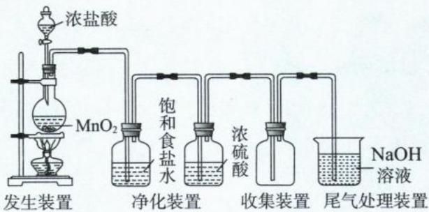

注：①若将氧化剂换成 $KMnO_{4}$ 、 $K_{2}Cr_{2}O_{7}$ 、 $KClO_{3}$ 、KClO 等，则不需要加热。

②在探究型实验中,杂质 HCl、 $H_{2}O$ 若对实验无干扰,则无需除去。

## 三、氯的氧化物

<table><tr><td>氧化物</td><td> $Cl_{2}O$ </td><td>ClO</td><td> $Cl_{2}O_{3}$ </td><td> $ClO_{2}$ </td><td> $Cl_{2}O_{5}$ </td><td> $ClO_{3}$ </td><td> $Cl_{2}O_{7}$ </td></tr><tr><td>Cl化合价</td><td>+1</td><td>+2</td><td>+3</td><td>+4</td><td>+5</td><td>+6</td><td>+7</td></tr><tr><td>是否为酸性氧化物</td><td>是</td><td>否</td><td>是</td><td>否</td><td>是</td><td>否</td><td>是</td></tr><tr><td>对应化合价的钠盐</td><td>NaClO</td><td>—</td><td> $NaClO_{2}$ </td><td>—</td><td> $NaClO_{3}$ </td><td>—</td><td> $NaClO_{4}$ </td></tr></table>

注: 因为 Cl 元素的稳价为 -1 价, 所以上述氧化物均有强氧化性; 在高中书写陌生方程式时, 若题目没有特别交代, 一般默认还原产物为 Cl $^{-}$ 。

## 四、含氯的酸

## 1. 常见含氯酸的名称

<table><tr><td>名称</td><td>盐酸(氢氯酸)</td><td>次氯酸</td><td>亚氯酸</td><td>氯酸</td><td>高氯酸</td></tr><tr><td>化学式</td><td>HCl</td><td>HClO</td><td> $HClO_{2}$ </td><td> $HClO_{3}$ </td><td> $HClO_{4}$ </td></tr><tr><td>酸性</td><td>强酸</td><td>弱酸</td><td>中强酸</td><td>强酸</td><td>强酸(高中最强)</td></tr></table>

注:(1)四种含氧酸酸性强弱顺序: $HClO_{4}>HClO_{3}>HClO_{2}>HClO$ 。

(2)氧化性强弱顺序: $\text{HClO} > \text{HClO}_3$ (由此可见, 同种元素化合价越高, 氧化性不一定越强)。

## 2. 盐酸

(1) HCl 气体极易溶于水, 在常温常压下, 1 体积的水可溶解约 500 体积的 HCl。吸收 HCl 气体时, 要注意防倒吸。HCl 溶于水形成盐酸, 盐酸易挥发。

(2)盐酸为一元强酸,具有强酸的通性:①与指示剂显色;②与碱生成盐和水;③与碱性氧化物生成盐和水;④与盐生成新盐和新酸;⑤与活泼金属反应产生氢气。

(3)浓盐酸可与一些较强的氧化剂 $\left(\mathrm{KMnO}_{4},\mathrm{K}_{2}\mathrm{Cr}_{2}\mathrm{O}_{7},\mathrm{KClO}_{3},\mathrm{KClO}\right)$ 反应，HCl体现还原性。

例: $\text{MnO}_2 + 4\text{HCl}(\text{浓}) \xlongequal{\triangle} \text{MnCl}_2 + \text{Cl}_2 \uparrow + 2\text{H}_2\text{O}$ (当盐酸稀释到一定浓度时,该反应无法进行。HCl 在该反应中体现了酸性(生成 $\text{MnCl}_2$ )和还原性(生成 $\text{Cl}_2$ )。)

(4)配位反应(王水可以溶解铂、金)

①化学方程式： $Au+HNO_{3}+4HCl=HAuCl_{4}+NO\uparrow+2H_{2}O$ 。

②离子方程式： $Au+NO_{3}^{-}+4Cl^{-}+4H^{+}=\left[AuCl_{4}\right]^{-}+NO\uparrow+2H_{2}O$ 。

3. 次氯酸(HClO)

(1)酸性: HClO 的 $K_{a}$ 介于碳酸的 $K_{a_{1}}$ 与 $K_{a_{2}}$ 之间, 因此 HClO 可与 $Na_{2}CO_{3}$ 反应生成 NaClO 与 $NaHCO_{3}$ , 但 HClO 不与 $NaHCO_{3}$ 反应。

(2) HClO 不稳定, 光照(或受热)容易分解产生氧气: $2HClO \xlongequal{光照} 2HCl + O_{2} \uparrow$ 。

(3)强氧化性和漂白性:将有机色素氧化成无色物质,该氧化还原反应不可逆。

注:①次氯酸的酸性较弱,但其氧化性却极强。酸性强弱与电离出 $H^{+}$ 的能力有关,而氧化性强弱与得 $e^{-}$ 能力相关,二者并无矛盾。

② $Cl_{2}$ 不能使干燥有色布条褪色,说明 $Cl_{2}$ 无漂白性;但湿润有色布条接触 $Cl_{2}$ 却褪色了。原因是 $Cl_{2}$ 与水反应生成的HClO具有强氧化性,将有机色素氧化成了无色物质。

## 五、含氯的盐

## 1. 盐酸盐：

(1)溶解度:绝大多数盐酸盐易溶,但是 AgCl 既难溶于水,又难溶于稀酸。

注:①AgCl 因发生配位反应可以溶于浓盐酸、氨水、 $Na_{2}S_{2}O_{3}$ 溶液、NaCN 溶液,分别生成 $\left[AgCl_{2}\right]^{-}$ 、 $\left[Ag(NH_{3})_{2}\right]^{+}$ 、 $\left[Ag(S_{2}O_{3})_{2}\right]^{3-}$ 、 $\left[Ag(CN)_{2}\right]^{-}$ 。②CuCl 微溶于水。

(2) 检验 $Cl^{-}$ 的方法: 往待测液中加入硝酸酸化的硝酸银, 若有白色沉淀生成, 则有 $Cl^{-}$ 。

## 2. 次氯酸盐：

## (1) 漂白粉、漂白液的组成、制备及变质原理

<table><tr><td>对象</td><td>漂白液</td><td>漂白粉</td></tr><tr><td>制备原理</td><td> $Cl_{2} + 2NaOH = NaClO + NaCl + H_{2}O$ </td><td> $2Cl_{2} + 2Ca(OH)_{2} = Ca(ClO)_{2} + CaCl_{2} + 2H_{2}O$ </td></tr><tr><td>主要成分</td><td> $NaClO, NaCl$ </td><td> $Ca(ClO)_{2}, CaCl_{2}$ </td></tr><tr><td>有效成分</td><td> $NaClO$ </td><td> $Ca(ClO)_{2}$ </td></tr><tr><td>失效原理</td><td>1 $NaClO + CO_{2} + H_{2}O = HClO + NaHCO_{3}$ 2 $2HClO \xlongequal{光照} 2HCl + O_{2} \uparrow$ </td><td>1 $Ca(ClO)_{2} + CO_{2} + H_{2}O = 2HClO + CaCO_{3} \downarrow$ 2 $2HClO \xlongequal{光照} 2HCl + O_{2} \uparrow$ </td></tr></table>

注: NaClO 溶液与 $CO_{2}$ 反应无量变引起质变, $CO_{2}$ 的产物为 $NaHCO_{3}$ ; $Ca(ClO)_{2}$ 溶液与 $CO_{2}$ 反应存在量变引起质变, 当 $CO_{2}$ 少产物为 $CaCO_{3}$ ; 当 $CO_{2}$ 多产物为 $Ca(HCO_{3})_{2}$ 。

(2)次氯酸盐的强氧化性: $ClO^{-}$ 有很强的氧化性,能与很多还原剂反应,如 $S^{2-}$ 、 $SO_{2}$ 、 $I^{-}$ 、 $Fe^{2+}$ 、 $Br^{-}$ 、 $Cl^{-}$ 等。

①往漂白液中通入足量 $SO_{2}:ClO^{-}+SO_{2}+H_{2}O=Cl^{-}+SO_{4}^{2-}+2H^{+}$

②往漂白液中通入少量 $SO_{2}:3ClO^{-}+SO_{2}+H_{2}O=Cl^{-}+SO_{4}^{2-}+2HClO$ （既考虑氧化还原，也考虑较强酸制较弱酸）。

3. 氯酸钾 $\left(\mathrm{KClO}_{3}\right)$ :氯酸钾有较强氧化性,可以制备氧化性气体,如氧气、氯气等。

$$
(1) 2 \mathrm{KClO} _ {3} \xlongequal [ \triangle ] {\mathrm{MnO} _ {2}} 2 \mathrm{KCl} + 3 \mathrm{O} _ {2} \uparrow 。
$$

(2) $KClO_{3}+6HCl=KCl+3Cl_{2}\uparrow+3H_{2}O$ （归中反应，每消耗1 mol $KClO_{3}$ ，转移电子数目 $5N_{A}$ ）。

六、常见含氯物质的转化关系图

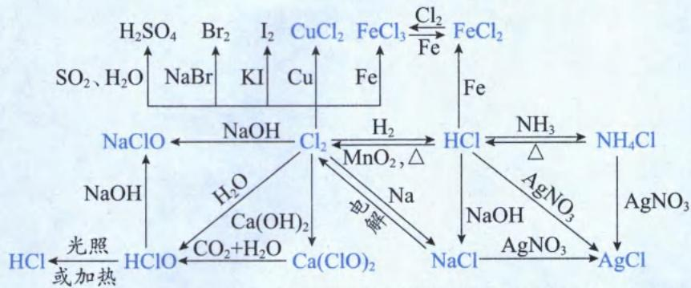

类型 I: 基础常识判断

【例 1】正误判断,正确的填“√”,错误的填“×”

(1)为了增强漂白液的漂白性,可往漂白液中加入白醋()

(2) $Cl_{2}$ 和明矾的净水原理一样()

(3)液氯有很强的氧化性,不能用钢瓶储存()

(5)(2022·浙江卷)“洁厕灵”(主要成分为盐酸)和“84消毒液”(主要成分为次氯酸钠)不能混用()

(6)(2023·全国乙卷)久置溴水褪色的原因: $4Br_{2}+4H_{2}O=HBrO_{4}+7HBr$

(7)(2023·浙江卷)NaClO溶液呈碱性,因此可用作消毒剂()

(8)(2023·广东卷)久置漂白粉遇盐酸产生 $CO_{2}$ ，所以漂白粉的有效成分是 $CaCO_{3}$ （）

(10)(2024·甘肃卷)次氯酸钠具有强氧化性,所以其可用于衣物的漂白()

解析:(1)(√)由于酸性: $\mathrm{CH_{3}COOH>HClO}$ ，往漂白液中加入白醋发生反应: $ClO^{-}+CH_{3}COOH=HClO+CH_{3}COO^{-}$ ，体系中的 $c(\mathrm{HClO})$ 增大，漂白性增强。

(2)(×)液氯净水是利用其氧化性杀菌消毒,而明矾净水是利用水解产生氢氧化铝的胶体使杂质聚沉。

(3)(×)常温下, $Cl_{2}$ 与钢铁不反应;加热时, $Cl_{2}$ 与钢铁才发生反应。常温下用钢瓶储运液氯。

(4) $(\sqrt{})\mathrm{Cl}_{2}$ 是酸性气体, 可与碱性物质(硬脂酸钠、碳酸钠水解后溶液呈碱性)反应; 且 $\rho(\mathrm{Cl}_{2})>\rho$ (空气), 因此要往高处躲避。

(5)(√)酸性条件下: $ClO^{-}+Cl^{-}+2H^{+}=Cl_{2}\uparrow+H_{2}O$ ，所以洁厕灵和消毒液不能混用。

(6)(×)久置溴水褪色,是因为 $Br_{2}$ 与 $H_{2}O$ 发生了歧化反应: $Br_{2} + H_{2}O \rightleftharpoons HBrO + HBr$ 。

(7)(×)次氯酸钠能消毒是因为 $ClO^{-}$ 的强氧化性,不是因为其碱性。

(8)(×)漂白粉的有效成分 $\mathrm{Ca(ClO)}_{2}$ ，久置后变质成了 $CaCO_{3}$ 。

(9)(√)土豆片含大量淀粉,遇碘液中的 $I_{2}$ 显蓝色。

(10)(√)漂白液的有效成分是 NaClO, 其具有很强氧化性可以将有机色素氧化成无色物质。
答案:(1)√ (2)× (3)× (4)√ (5)√ (6)× (7)× (8)× (9)√ (10)√

【例 2】(2024·浙江 1 月选考)工业上将 $Cl_{2}$ 通入冷的 NaOH 溶液中制得漂白液,下列说法不正确的是( )

A. 漂白液的有效成分是 NaClO

B. $ClO^{-}$ 水解生成 HClO 使漂白液呈酸性

C. 通入 $CO_{2}$ 后漂白液消毒能力增强

D. NaClO 溶液比 HClO 溶液稳定

解析: 将 $Cl_{2}$ 通入 NaOH 溶液制备漂白液的化学方程式为: $Cl_{2} + 2NaOH = NaClO + NaCl + H_{2}O$ 。
A. NaClO 具有很强的氧化性，可以将有机色素氧化成无色物质，是漂白液的有效成分，A 选项正确。

B. $ClO^{-}$ 水解的离子方程式为: $ClO^{-} + H_{2}O \rightleftharpoons HClO + OH^{-}$ ，由此可知漂白液呈弱碱性，B选项错误。
C. 酸性： $H_{2}CO_{3}>HClO$ ，往漂白液中通入 $CO_{2}$ 发生： $NaClO+CO_{2}+H_{2}O=HClO+NaHCO_{3}$ ，HClO 含量越多漂白效果越好，C 选项正确。
D. 盐的稳定性往往大于对应的酸，如 $NaNO_{3}$ 、NaClO 较稳定，而 $HNO_{3}$ 、HClO 不稳定，D 选项正确。

答案:B

类型Ⅱ: 阿伏加德罗常数

【例 3】 $N_{A}$ 表示阿伏加德罗常数的值,下列说法正确的是( )

A. 23 g 钠在足量氯气中充分燃烧,生成的氯化钠分子数为 $N_{A}$ B. 足量浓盐酸与 1 mol $MnO_{2}$ 共热充分反应,转移电子数为 $2N_{A}$ C. 加热条件下,1 L 10 mol/L 浓盐酸与足量 $MnO_{2}$ 充分反应,被氧化的氯原子个数为 $5N_{A}$ D. 将 1 mol 氯气溶于水形成 2 L 溶液,溶液中 $Cl^{-}$ 、 $ClO^{-}$ 、HClO 个数之和 $2N_{A}$

解析: A. 氯化钠是离子化合物, 固体氯化钠不存在分子, A 选项错误。

B. 由于浓盐酸足量(要多少、有多少), 不用考虑其浓度减小对反应的影响。根据化学方程式: $MnO_{2} + 4HCl$ (浓) $\xlongequal{\triangle} MnCl_{2} + Cl_{2} \uparrow + 2H_{2}O$ 可知, 1 mol $MnO_{2}$ 转移 2 mol 电子, B 选项正确。

C. 根据化学方程式: $MnO_{2} + 4HCl$ (浓) $\xlongequal{\triangle} MnCl_{2} + Cl_{2} \uparrow + 2H_{2}O$ , HCl 既体现酸性, 又体现还原性, 且变价与未变价的氯原子个数比为 1:1。若 HCl 反应完全, 被氧化(化合价升高) 的氯原子个数为 $5N_{A}$ 。当 $MnO_{2}$ 足量或过量时, 要考虑盐酸浓度的减小, 当盐酸浓度减小到一定程度, 就无法继续反应; 且盐酸会挥发损失, 所以被氧化的氯原子个数小于 $5N_{A}$ , C 选项错误。

D. 氯水中最多的溶质是 $Cl_{2}$ , 所以根据氯原子守恒, $2N(Cl_{2}) + N(Cl^{-}) + N(ClO^{-}) + N(HClO) = 2N_{A}$ , D 选项错误。

答案:B

【反思】解决三大强酸由浓度“量变引起质变”的方法:若酸多,不考虑其浓度的减小;若酸少,其浓度的减小导致其可能无法继续反应,或反应的本质发生改变。

<table><tr><td>酸的多少</td><td>酸多</td><td>酸少</td></tr><tr><td>浓盐酸和 $MnO_{2}$ </td><td>不考虑盐酸浓度减小,代入 $n(MnO_{2})$ 计算</td><td>考虑盐酸浓度减小,变稀后无法反应</td></tr><tr><td>浓硝酸与铜</td><td>不考虑硝酸浓度减小,还原产物为 $NO_{2}$ </td><td>考虑硝酸浓度减小,变稀后硝酸还原产物为NO</td></tr><tr><td>浓硫酸与铜</td><td>不考虑硫酸浓度减小,还原产物为 $SO_{2}$ </td><td>考虑硫酸浓度减小,变稀后不再反应</td></tr><tr><td>浓硫酸与锌</td><td>不考虑硫酸浓度减小,还原产物为 $SO_{2}$ </td><td>考虑硫酸浓度减小,变稀后还原产物为 $H_{2}$ </td></tr></table>

类型Ⅲ: 离子反应

【例 4】下列关于氯元素的离子方程式错误的是( )

A. 工业制氯气: $2Cl^{-} + 2H_{2}O \xlongequal{电解} Cl_{2} \uparrow + H_{2} \uparrow + 2OH^{-}$ B. 氯气制漂白液: $Cl_{2} + 2OH^{-} = ClO^{-} + Cl^{-} + H_{2}O$ C. 氯气制漂白粉: $Cl_{2} + 2OH^{-} = ClO^{-} + Cl^{-} + H_{2}O$ D. 漂白液和洁厕净(盐酸)混合: $ClO^{-} + Cl^{-} + 2H^{+} = Cl_{2} \uparrow + H_{2}O$

解析: A. 工业上电解饱和食盐水制备氯气, 阳极反应式: $2Cl^{-}-2e^{-}=Cl_{2}\uparrow$ , 阴极反应式: $2H_{2}O+2e^{-}=H_{2}\uparrow+2OH^{-}$ , 阳极与阴极加和可得总反应离子方程式: $2Cl^{-}+2H_{2}O\xlongequal{电解}Cl_{2}\uparrow+H_{2}\uparrow+2OH^{-}$ , A 选项正确。
B. 将氯气通入 NaOH 溶液制备漂白液, 生成物为可溶的 NaCl、NaClO 还有 $H_{2}O$ , B 选项正确。

C. 将氯气通入冷的石灰乳中制备漂白粉, 石灰乳不能拆, 对应离子方程式为: $\mathrm{Cl}_{2} + \mathrm{Ca(OH)}_{2} = \mathrm{ClO}^{-} + \mathrm{Cl}^{-} + \mathrm{Ca}^{2+} + \mathrm{H}_{2}\mathrm{O}$ , C 选项错误。

D. 漂白液有效成分 NaClO 与 HCl 会发生归中反应, 对应离子方程式为: $ClO^{-} + Cl^{-} + 2H^{+} = Cl_{2}\uparrow + H_{2}O$ , D 选项正确。

答案:C

类型Ⅳ: 图像分析

【例 5】(2024·北京卷)可采用 Deacon 催化氧化法将工业副产物 HCl 制成 $Cl_{2}$ ，实现氯资源的再利用。反应的热化学方程式： $4\mathrm{HCl}(g)+\mathrm{O}_{2}(g)\xlongequal{\mathrm{CuO}}2\mathrm{Cl}_{2}(g)+2\mathrm{H}_{2}\mathrm{O}(g)$ $\Delta H=-114.4\ kJ\cdot mol^{-1}$ ，如图所示为该法的一种催化机理。下列说法不正确的是（）

A. Y 为反应物 HCl, W 为生成物 $H_{2}O$ B. 反应制得 $1\ mol\ Cl_{2}$ ，须投入 $2\ mol\ CuO$ C. 升高反应温度，HCl 被 $O_{2}$ 氧化制 $Cl_{2}$ 的反应平衡常数减小

D. 图中转化涉及的反应中有两个属于氧化还原反应

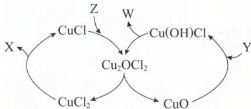

解析:该图为“物质反应环形机理图”,阅读该类型图的关键是找准循环的起点和终点,以及各类物质的特征。反应物的特征为“只进不出”,则 Y、Z 是反应物;产物的特征为“只出不进”,则 X、W 是产物;中间产物的特征是“不断循环出现,但在反应的起点不存在”;催化剂的特征是“不断循环出现,在反应的起点存在”。根据题干中的热化学方程式可知,CuO 是催化剂,则 $\mathrm{Cu(OH)Cl}$ 、 $\mathrm{Cu_{2}OCl_{2}}$ 、 $\mathrm{CuCl}$ 、 $\mathrm{CuCl_{2}}$ 均为中间产物。根据图像可知 $\mathrm{CuO+Y=Cu(OH)Cl}$ ,再根据原子守恒可知 Y 反应物应该提供 Cl 原子和 H 原子,因此 Y 是 HCl;同理, $\mathrm{Cu(OH)Cl}\rightarrow\mathrm{Cu_{2}OCl_{2}}+\mathrm{W}$ ,则 W 为 $H_{2}O$ 。最后根据总反应可知 X、Z 分别是 $Cl_{2}$ 、 $O_{2}$ 。
A. 根据上述分析可知，Y“只进不出”是反应物，W“只出不进”是产物，A 选项正确。
B. 由于 CuO 是催化剂，其可以循环往复地参与催化过程，只要体系中有适量的 CuO 就可以起到催化作用，B 选项错误。
C. 该反应的 $\Delta H < 0$ ，温度升高，放热反应的平衡逆向移动，K 值减小，C 选项正确。
D. 图像的反应机理共涉及 5 个反应，分别是 $\mathrm{CuO} + \mathrm{HCl} = \mathrm{Cu(OH)Cl}$ 、 $2\mathrm{Cu(OH)Cl} = \mathrm{Cu_{2}OCl_{2}} + \mathrm{H_{2}O}$ 、 $Cu_{2}OCl_{2} = CuO + CuCl_{2}$ 、 $2CuCl_{2} = Cl_{2} + 2CuCl$ 、 $4CuCl + O_{2} = 2Cu_{2}OCl_{2}$ 。最后两个化学反应中有单质的参与，化合价发生了改变，这两个反应是氧化还原反应，D 选项正确。
答案:B

【例 6】工业上把 $Cl_{2}$ 通入冷 NaOH 溶液中制得漂白液(有效成分为 NaClO)。某化学小组在一定温度下将氯气缓缓通入 NaOH 溶液中, 模拟实验得到 $ClO^{-}$ 、 $ClO_{3}^{-}$ 等离子的物质的量 n(mol)

与反应时间 $t(\text{min})$ 的关系曲线如图所示。下列说法错误的是（）
A. 参加反应所消耗 NaOH 与 $Cl_{2}$ 的物质的量之比一定为 2:1
B. a 点时溶液中 $n(\text{NaCl}):n(\text{NaClO}_{3}):n(\text{NaClO})=6:1:1$ C. $t_{2}\sim t_{4}$ min, $ClO^{-}$ 的物质的量下降的原因可能是 $3ClO^{-}=2Cl^{-}+ClO_{3}^{-}$ D. 使用漂白液时，为了增强漂白效果，可以向漂白液中通入 $SO_{2}$

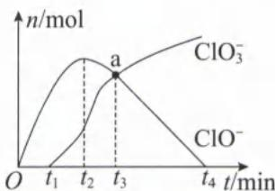

解析: $Cl_{2}$ 与 NaOH 溶液反应存在“温度的量变引起质变”，温度越高， $Cl_{2}$ 氧化产物中 Cl 元素化合价越高，但无论温度高或低， $Cl_{2}$ 的还原产物均为 $Cl^{-}$ 。

A. 根据题干信息以及氧化还原反应的“升降守恒规律”可知，溶液中溶质为 NaCl、NaClO、 $NaClO_{3}$ ，三种溶质中 Na、Cl 的原子个数比均为 1:1，即 $n(\mathrm{Na})=n(\mathrm{Cl})$ ，则参加反应所消耗的 NaOH 与 $Cl_{2}$ 的物质的量之比一定为 2:1，A 选项正确。

B. 根据图像信息可知，a 点时 $n(\mathrm{ClO}_{3}^{-})=n(\mathrm{ClO}^{-})$ ，假设 $n(\mathrm{ClO}_{3}^{-})=n(\mathrm{ClO}^{-})=1\ \mathrm{mol}, \mathrm{ClO}_{3}^{-}, \mathrm{ClO}^{-}$ 中 Cl 的化合价分别是 +5、+1，则 $Cl_{2}$ 转化成 $ClO_{3}^{-}, ClO^{-}$ 时，失去电子的物质的量分别是 5 mol、1 mol，共 6 mol。根据得失电子守恒可知， $Cl_{2}$ 转化成 $Cl^{-}$ 时，共得到电子 6 mol，因此生成 6 mol $Cl^{-}$ 。综上所述， $n(\mathrm{NaCl}): n(\mathrm{NaClO}): n(\mathrm{NaClO})=6:1:1, B$ 选项正确。

C. 根据图像信息可知， $t_{2}\sim t_{4}\min n(ClO^{-})$ 减小、 $n(ClO_{3}^{-})$ 增多，说明 $ClO^{-}$ 转化成 $ClO_{3}^{-}$ （Cl 化合价升高）；根据化合价升降守恒，同时有 $ClO^{-}$ 转化成 $Cl^{-}$ （Cl 化合价降低，且题目没有特别说明，还原产物默认为 $Cl^{-}$ ），对应的离子方程式为： $3ClO^{-}=2Cl^{-}+ClO_{3}^{-}$ ，C 选项正确。

D. $SO_{2}$ 具有强还原性, $ClO^{-}$ 具有强氧化性, 二者发生氧化还原反应, 生成的 HCl、 $H_{2}SO_{4}$ 均无漂白性, 导致漂白液的漂白效果降低, D 选项错误。

答案:D

【反思】当体系中存在多个并列反应或连续反应时，尽量不分析烦琐的过程，而是利用“原子守恒”或“得失电子守恒”等守恒关系解决定量问题。

类型 V: 实验题型

【例 7】实验室用 $MnO_{2}$ 和浓盐酸反应生成 $Cl_{2}$ 后，按照净化、收集、性质检验及尾气处理的顺序进行实验。下列装置（“→”表示气流方向）不能达到实验目的的是（）

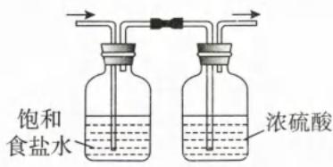  
A

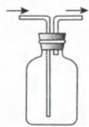  
B

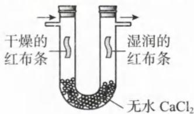  
C

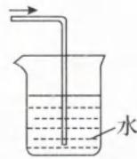  
D  
解析: A. 盐酸有挥发性, 饱和食盐水可除去 $Cl_{2}$ 中混有的 HCl, 高浓度的 $Cl^{-}$ 还可以抑制 $Cl_{2}$ 与水的反应, 减少 $Cl_{2}$ 的损失。 $Cl_{2}$ 是酸性气体, 可以用浓硫酸干燥 $Cl_{2}$ , A 选项正确。
B. $Cl_{2}$ 是密度大于空气的有毒气体, 用长进短出的密闭体系收集 $Cl_{2}$ , B 选项正确。
C. 干燥红布条不褪色, 湿润红布条褪色, 说明 $Cl_{2}$ 没有漂白性, $Cl_{2}$ 与水反应后的产物 HClO 才有漂白性, C 选项正确。
D. $Cl_{2}$ 与水反应是可逆反应, $Cl_{2}$ 在水中的溶解度不大, 应该用碱或强还原剂吸收 $Cl_{2}$ , D 选项错误。
答案:D  
【例 8】下列关于实验操作叙述错误的是( )

A. 常温时用 pH 计测得氯水的 pH 为 4.15

B. 往新制氯水中加入碳酸钠固体可获得浓度较大的次氯酸溶液

C. 将盐酸与碳酸氢钠反应生成的气体直接通入硅酸钠溶液中, 无法证明碳酸和硅酸的酸性强弱

D. 新制氯水保存在棕色的细口玻璃瓶中

解析: A. pH 计可精确到小数点后 2 位, 氯水呈酸性, 常温时 pH<7, A 选项正确。(无法用 pH 试纸测得氯水的 pH, 这是因为氯水中含有 HClO, 具有漂白性, 会使 pH 试纸褪色。)  
B. $Cl_{2}$ 与水反应为: $Cl_{2} + H_{2}O \rightleftharpoons HClO + H^{+} + Cl^{-}$ ，由于酸性: $HCl > H_{2}CO_{3} > HClO > HCO_{3}^{-}$ ，碳酸钠与HCl、HClO均会发生反应。为了获得浓度较大的HClO溶液，可以向氯水中加入碳酸氢钠固体，B选项错误。
C. 盐酸有挥发性，由盐酸制备的 $CO_{2}$ 中混有 HCl，将混合物通入硅酸钠溶液中，无法证明碳酸、硅酸酸性的相对强弱，C选项正确。  
D. 氯水中含有见光易分解的 HClO，且氯水为液体，因此试剂瓶应该用棕色的细口瓶，D 选项正确。  
答案:B  
【例 9】下列陈述Ⅰ与陈述Ⅱ均正确,且具有因果关系的是()

<table><tr><td>选项</td><td>陈述I</td><td>陈述II</td></tr><tr><td>A</td><td>将 $Cl_2$ 通入石蕊溶液,石蕊先变红,再褪色</td><td> $Cl_2$ 既有酸性,又有漂白性</td></tr><tr><td>B</td><td>打开装浓盐酸的试剂瓶瓶塞,观察到大量白雾</td><td>浓盐酸具有挥发性</td></tr><tr><td>C</td><td>用盐酸酸化 $KMnO_4$ 或 $K_2Cr_2O_7$ </td><td>酸性条件下,高锰酸钾或重铬酸钾的氧化性更强</td></tr><tr><td>D</td><td>王水可以溶解黄金</td><td>浓盐酸具有强氧化性</td></tr></table>

解析: A. 石蕊变红, 说明 $Cl_{2}$ 与水反应生成的溶液具有酸性, 但石蕊褪色不是氯气有漂白性, 而是氯气溶于水生成的 HClO 有漂白性, A 选项错误。

B. 浓盐酸易挥发, 挥发的 HCl 气体与空气中的水蒸气作用, 形成盐酸酸雾, B 选项正确。

C. 不能用盐酸酸化 $\mathrm{KMnO}_4$ 或 $\mathrm{K}_2\mathrm{Cr}_2\mathrm{O}_7$ ，二者具有强氧化性，会将 $\mathrm{Cl}^-$ 氧化成 $\mathrm{Cl}_2$ ，C 选项错误。

D. 王水是由浓硝酸与浓盐酸, 按照体积比 1:3 混合而成。王水可以溶解金是因为 $\mathrm{HNO}_{3}$ 的强氧化性, 以及 $\mathrm{Cl}^{-}$ 的强配位能力, D 选项错误。(王水可以溶解 Pt、Au 的主要原因是 $\mathrm{Cl}^{-}$ 能与 $\mathrm{Pt}^{4+}$ 、 $\mathrm{Au}^{3+}$ 分别形成配位离子 $[\mathrm{PtCl}_{6}]^{2-}$ 、 $[\mathrm{AuCl}_{4}]^{-}$ , 从而促进 Pt、Au 与 $\mathrm{HNO}_{3}$ 的氧化还原反应正向进行。)

答案:B

【例 10】(2023·广东卷)利用石墨电极电解饱和食盐水,进行如图所示实验。闭合 $K_{1}$ ,一段时间后,下列说法正确的是( )

A. U 型管两侧均有气泡冒出,分别是 $Cl_{2}$ 和 $O_{2}$ B. a 处布条褪色,说明 $Cl_{2}$ 具有漂白性

C. b 处出现蓝色,说明还原性: $Cl^{-}>I^{-}$ D. 断开 $K_{1}$ ,立刻闭合 $K_{2}$ ,电流表发生偏转

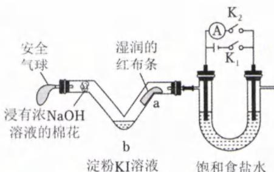

解析: 解决此题的关键是判断关闭 $K_{1}$ 或 $K_{2}$ 时, 装置是原电池还是电解池, 以及各个电极的产物。关闭 $K_{1}$ 时, 该装置为电解池装置(有外加电源), 相当于用惰性电极电解饱和食盐水, 右侧与外加电源的负极相连做电解池的阴极, 溶液中的 $H^{+}$ 得电子被还原成 $H_{2}$ ; 左侧与外加电源正极相连做阳极, 溶液中的 $Cl^{-}$ 失电子被氧化成 $Cl_{2}$ 。生成的 $Cl_{2}$ 经过 a, $Cl_{2}$ 与 $H_{2}O$ 生成 HClO 使有色布条褪色; $Cl_{2}$ 和 KI 反应置换出 $I_{2}$ , 淀粉溶液变蓝; NaOH 吸收多余的 $Cl_{2}$ 防止环境污染。
A. 根据上述分析可知, U 形管左侧产生 $Cl_{2}$ , 右侧产生 $H_{2}$ , A 选项错误。
B. $Cl_{2}$ 没有漂白性, 次氯酸才有漂白性, B 选项错误。
C. b 处变蓝说明发生反应: $Cl_{2} + 2I^{-} = I_{2} + 2Cl^{-}$ , 则还原性: $I^{-}$ (还原剂) > $Cl^{-}$ (还原产物), C 选项错误。
D. 电解饱和食盐水后, 左侧有 $Cl_{2}$ , 右侧有 $H_{2}$ , 电解质溶液主要是 NaOH。三者组成了碱性的 $H_{2}$ 、 $Cl_{2}$ 燃料电池, 断开 $K_{1}$ , 立刻闭合 $K_{2}$ , 电流表会发生偏转, 此时左侧电极为正极, 右侧电极为负极, D 选项正确。

【例 11】(2020·全国Ⅲ卷)氯可形成多种含氧酸盐,广泛应用于杀菌、消毒及化工领域。实验室中利用如图装置(部分装置省略)制备 KClO₃ 和 NaClO,探究其氧化还原性质。回答下列问题: (1)盛放 MnO₂ 粉末的仪器名称是 \_\_\_\_ ,a 中的试剂为 \_\_\_\_ 。

(2)b 中采用的加热方式是\_\_\_\_，c 中化学反应的离子方程式是\_\_\_\_。采用冰水浴冷却的目的是\_\_\_\_。

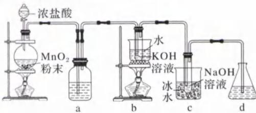

(3)d 的作用是\_\_\_\_，可选用试剂\_\_\_\_（填字母）。
A. $Na_{2}S$ B. NaCl C. $\mathrm{Ca(OH)}_{2}$ D. $H_{2}SO_{4}$

(4)反应结束后,取出b中试管,经冷却结晶,\_\_\_\_,\_\_\_\_,干燥,得到KClO $_{3}$ 晶体。

(5)取少量 $KClO_{3}$ 和 NaClO 溶液分别置于 1 号和 2 号试管中, 滴加中性 KI 溶液。1 号试管溶液颜色不变。2 号试管溶液变为棕色, 加入 $CCl_{4}$ 振荡, 静置后 $CCl_{4}$ 层显 \_\_\_\_ 色。可知该条件下 $KClO_{3}$ 的氧化能力 \_\_\_\_ NaClO(填“大于”或“小于”)。

解析:(1)根据示意图可知,装 $MnO_{2}$ 的仪器是圆底烧瓶。由于制备的氯气要通入溶液中进行反应,所以氯气不需要干燥。但是挥发出的 HCl 会消耗 KOH、NaOH,所以需要用饱和食盐水除去 HCl,减少碱的损失。

(2)氯气制备 $KClO_{3}$ 和 NaClO 均利用 $Cl_{2}$ 与碱发生歧化反应，绝大多数歧化反应遵循“邻价原则”，但是升高温度，氯元素的化合价变化幅度会增大，所以为了制备 +5 价的 $KClO_{3}$ ，需要水浴加热。c 装置制备次氯酸钠的离子方程式为： $Cl_{2} + 2OH^{-} = ClO^{-} + Cl^{-} + H_{2}O$ ，若 c 不采取冰水浴，可能产生副产物 $NaClO_{3}$ 。

(3) $Cl_{2}$ 是具有酸性、氧化性的有毒气体,所以可用具有碱性(石灰乳)或还原性( $Na_{2}S$ )的物质来吸收氯气,防

止环境污染,答案选 A、C。

(4)b装置反应后的溶质为KCl、 $\mathrm{KClO}_3$ ，二者溶解度受温度的影响不同，用重结晶进行分离提纯。重结晶的常规步骤为：蒸发浓缩、冷却结晶、过滤、洗涤、干燥。

(5) $NaClO$ 、 $KClO_{3}$ 、 $KI$ 均为无色物质， $KI$ 溶液与 $KClO_{3}$ 混合无明显现象，而 $KI$ 溶液与 $NaClO$ 混合后溶液变成棕色。由于 $I_{2}$ 溶解在水中显棕色，由此可知， $NaClO$ 能将 $I^{-}$ 氧化为 $I_{2}$ ， $KClO_{3}$ 不能将 $I^{-}$ 氧化为 $I_{2}$ 。又因为氧化还原反应遵循“强氧化性制弱氧化性”，即氧化剂的氧化性大于氧化产物的氧化性，因此在该实验条件下氧化性： $NaClO > I_{2}$ ， $KClO_{3} < I_{2}$ ，即氧化性： $NaClO > KClO_{3}$ 。 $I_{2}$ 为非极性分子，易溶于同为非极性分子的 $CCl_{4}$ 中， $I_{2}$ 的 $CCl_{4}$ 溶液为紫红色。（请同学们务必记住 $I_{2}$ 、 $Br_{2}$ 的不同状态对应的颜色。）

答案:(1)圆底烧瓶 饱和食盐水 (2)水浴加热 $Cl_{2}+2OH^{-}=ClO^{-}+Cl^{-}+H_{2}O$ 避免生成 $NaClO_{3}$ (3)吸收尾气( $Cl_{2}$ ),防止环境污染 AC (4)过滤 洗涤 (5)紫红色 小于

## 第2节 卤族元素

## 内容提要

一、卤素元素包括：氟(F)、氯(Cl)、溴(Br)、碘(I)、砹(At)、硼(Ts)

注：砹(At)为放射性元素、硼(Ts)为人造元素，高中一般不作讨论。

## 二、卤素单质的性质

<table><tr><td>卤素</td><td> $F_2$ </td><td> $Cl_2$ </td><td> $Br_2$ </td><td> $I_2$ </td></tr><tr><td>颜色</td><td>浅黄绿色</td><td>黄绿色</td><td>液溴:深红棕色;溴蒸气:红棕色</td><td>固体:紫黑色;气体:紫色</td></tr><tr><td>颜色规律</td><td colspan="4">均有色,且颜色逐渐变深</td></tr><tr><td>常温状态</td><td>气态</td><td>气态</td><td>液态,易挥发</td><td>固态,加热易升华</td></tr><tr><td>熔沸点规律</td><td colspan="4">均为分子晶体,熔沸点低;相对分子质量逐渐增大,范德华力逐渐增大,熔沸点逐渐升高</td></tr><tr><td>水溶性</td><td>易</td><td>可</td><td>小</td><td>小</td></tr><tr><td>溶解度规律</td><td colspan="4">均易溶于有机溶剂(极性相似相溶);在水中的溶解度逐渐减小</td></tr><tr><td>氧化性</td><td>极强</td><td>强</td><td>较强</td><td>弱</td></tr><tr><td>氧化性规律</td><td colspan="4">氧化性逐渐减弱</td></tr><tr><td>与铁反应产物</td><td> $FeF_3$ </td><td> $FeCl_3$ </td><td> $FeBr_3$ </td><td> $FeI_2$ </td></tr><tr><td>与铁反应规律</td><td colspan="4"> $F_2、Cl_2、Br_2$ 与铁反应均生成高价金属卤化物; $I_2$ 与铁反应只能生成+2价铁盐</td></tr><tr><td>与 $H_2$ 反应条件</td><td>无条件</td><td>光、加热</td><td>加热</td><td>持续加热</td></tr><tr><td>与 $H_2$ 反应规律</td><td colspan="4">反应条件越来越苛刻;产物HX也越来越不稳定; $H_2$ 与 $I_2$ 的反应为可逆反应</td></tr><tr><td>与水反应规律</td><td colspan="4"> $2F_2 + 2H_2O = 4HF + O_2;X_2 + H_2O \rightleftharpoons HX + HXO(X=Cl、Br);I_2几乎不与水反应</td></tr><tr><td>与碱反应规律</td><td colspan="4">常温下:\( X_2 + 2NaOH = NaX + NaXO + H_2O(X=Cl、Br)$ ; $3I_2 + 6NaOH = 5NaI + NaIO_3 + 3H_2O$ </td></tr><tr><td>卤素之间置换</td><td colspan="4"> $F_2$ 在溶液中不能置换出其他 $X_2;Cl_2 + 2Br^- = Br_2 + 2Cl^-;Br_2 + 2I^- = I_2 + 2Br^-$ </td></tr><tr><td>特性</td><td colspan="4">F无正价; $F_2$ 在溶液中不能置换出其他 $X_2;I_2$ 遇淀粉变蓝</td></tr></table>

## 总结

卤素各种状态的颜色(记忆不同状态颜色时,一定要思维有序,可由浅到深或由深到浅记忆)

<table><tr><td>状态</td><td>水溶液</td><td>CCl4溶液</td><td>气态</td><td>液态</td><td>固态</td></tr><tr><td> $F_{2}$ </td><td>—</td><td>—</td><td>浅黄绿色</td><td>—</td><td>—</td></tr><tr><td> $Cl_{2}$ </td><td>浅黄色</td><td>浅黄绿色</td><td>黄绿色</td><td>—</td><td>—</td></tr><tr><td> $Br_{2}$ </td><td>黄色</td><td>橙红色</td><td>红棕色</td><td>深红棕色</td><td>—</td></tr><tr><td> $I_{2}$ </td><td>棕色(黄色)</td><td>紫红色</td><td>紫色</td><td>—</td><td>紫黑色</td></tr></table>

## 三、卤化氢

<table><tr><td>卤化氢</td><td>HF</td><td>HCl</td><td>HBr</td><td>HI</td></tr><tr><td>水中溶解度</td><td>易</td><td>易</td><td>易</td><td>易</td></tr><tr><td>沸点规律</td><td colspan="4">HF&gt;HI&gt;HBr&gt;HCl(HF存在分子间氢键,沸点最高;HI、HBr、HCl相对分子质量逐渐减小、范德华力逐渐减小、沸点逐渐降低)</td></tr><tr><td>酸性规律</td><td colspan="4">HI&gt;HBr&gt;HCl&gt;HF(HI、HBr、HCl为强酸,HF为中强酸)</td></tr><tr><td>还原性规律</td><td colspan="4">HI&gt;HBr&gt;HCl&gt;HF(对比氧化性 $I_2 < Br_2 < Cl_2 < F_2$ )</td></tr><tr><td>特性</td><td colspan="4">HF可以腐蚀玻璃: $SiO_2 + 4HF = SiF_4 \uparrow + 2H_2O$ </td></tr><tr><td>制备</td><td colspan="4">1.利用强酸制弱酸原理: $CaF_2 + H_2SO_4 = CaSO_4 + 2HF \uparrow (CaF_2 \text{俗名萤石})$ 2.利用高沸点酸制低沸点酸原理: $NaX + H_3PO_4(\text{浓}) \xlongequal{\triangle} HX \uparrow + NaH_2PO_4(X=Cl、Br、I)$ 3.也可以用浓硫酸与NaCl固体加热制备HCl: $NaCl + H_2SO_4(\text{浓}) \xlongequal{\triangle} HCl \uparrow + NaHSO_4$ </td></tr></table>

四、卤化银

<table><tr><td>卤化银</td><td>AgF</td><td>AgCl</td><td>AgBr</td><td>AgI</td></tr><tr><td>颜色</td><td>白色</td><td>白色</td><td>浅黄色</td><td>黄色</td></tr><tr><td>颜色规律</td><td colspan="4">颜色逐渐变深</td></tr><tr><td>溶解度</td><td>易溶</td><td colspan="3">既难溶于水,也难溶于酸</td></tr><tr><td>溶解度规律</td><td colspan="4">溶解度逐渐减小</td></tr><tr><td>稳定性</td><td colspan="4"> $2AgX \xlongequal{光照} 2Ag + X_2 \uparrow (X=Cl、Br、I)$ </td></tr></table>

## 五、卤离子的检验

1. 沉淀法: 取少量样品溶液于试管中, 滴加硝酸酸化的硝酸银, 生成 $\left\{\begin{array}{l}\text { 白色沉淀, 则有 } Cl^{-} \\ \text { 浅黄色沉淀, 则有 } Br^{-} \\ \text { 黄色沉淀, 则有 } I^{-}\end{array}\right.$

2. 置换法: 未知液 $\xrightarrow[振荡]{加入适量新制饱和氯水}$ $\xrightarrow[振荡]{加入CCl_{4}}$ 有机层 $\left\{\begin{array}{l} 橙红色, 表明有Br^{-} \\ 紫红色, 表明有I^{-}\end{array}\right.$

3. 氧化法: 未知液 $\xrightarrow[\text{振荡}]{\text{加入适量新制饱和氯水或 } H_{2}O_{2}} \xrightarrow[\text{振荡}]{\text{加入淀粉溶液}}$ 蓝色溶液, 表明有 I⁻

1. 海水提氯：

海水 $\rightarrow$ 粗盐 $\xrightarrow{\text{精制}}$ 饱和食盐水 $\xrightarrow{\text{电解}}$ $\left\{ \begin{array}{l} \text{阳极产物:Cl}_2 \\ \text{阴极产物:H}_2, \mathrm{NaOH} \end{array} \right.$

电解饱和食盐水的化学方程式为: $2\mathrm{NaCl} + 2\mathrm{H}_{2}\mathrm{O}\xlongequal{\text{电解}}\mathrm{Cl}_{2}\uparrow +\mathrm{H}_{2}\uparrow +2\mathrm{NaOH}$ 。
2. 海水提溴：

$$
\text { 海水 } \xrightarrow {\text { 蒸发浓缩 }} \text { 富含Br } ^ {-} \text { 的海水 } \xrightarrow [ ① \mathrm{Cl} _ {2} ]{\mathrm{H} _ {2} \mathrm{SO} _ {4} \text { 酸化 }} \text { 含Br } _ {2} \text { 的溶液 } \xrightarrow [ \text { 通热空气和水蒸气吹出 } ]{} \mathrm{Br} _ {2} \xrightarrow [ \mathrm{SO} _ {2} ]{②} \mathrm{HBr溶液} \xrightarrow [ \mathrm{CCl} _ {4} ]{③ \mathrm{Cl} _ {2}} \mathrm{Br} _ {2}
$$

依次发生反应的化学方程式：

$$
① 2 \mathrm{NaBr} + \mathrm{Cl} _ {2} = \mathrm{Br} _ {2} + 2 \mathrm{NaCl} \quad ② \mathrm{Br} _ {2} + \mathrm{SO} _ {2} + 2 \mathrm{H} _ {2} \mathrm{O} = 2 \mathrm{HBr} + \mathrm{H} _ {2} \mathrm{SO} _ {4}
$$

$$
③ 2 \mathrm{HBr} + \mathrm{Cl} _ {2} = 2 \mathrm{HCl} + \mathrm{Br} _ {2}
$$

注:第②步目的是将溴元素富集。除了用 $SO_{2}$ 富集溴之外,也可用纯碱溶液来富集溴: $3Br_{2} + 3CO_{3}^{2-} \xlongequal{\triangle} 5Br^{-} + BrO_{3}^{-} + 3CO_{2}$ ,再往该溶液中加入硫酸即可释放 $Br_{2}: 5Br^{-} + BrO_{3}^{-} + 6H^{+} = 3H_{2}O + 3Br_{2}$ 。

3. 海带提碘：

$$
\text { 海带 } \xrightarrow {\text { 灼烧 }} \text { 海带灰 } \xrightarrow {\mathrm{H} _ {2} \mathrm{O}} \text { 浸泡液 } \xrightarrow {\text { 过滤 }} \text { 滤液 } \xrightarrow {\text { 过滤 }} \text { 粗碘 } \xrightarrow {\text { 提纯 }} \mathrm{I} _ {2}
$$

发生反应的离子方程式: $Cl_{2}+2I^{-}=I_{2}+2Cl^{-}$ 。

注:(1)实验室可以用稀硫酸、 $H_{2}O_{2}$ 代替 $Cl_{2}$ ，对应的离子方程式为： $H_{2}O_{2}+2I^{-}+2H^{+}=2H_{2}O+I_{2}$ 。(2)“提纯”过程包括萃取、蒸馏。

## 七、卤素互化物和拟卤素

1. 常见的卤素互化物包括： $\mathrm{ICl}$ 、 $\mathrm{BrCl}$ 、 $\mathrm{ClF}$ 等。

2. 常见的拟卤素: 氰 $\left[\left(\mathrm{CN}\right)_{2}\right]$ 的结构简式为: $\mathrm{N} \equiv \mathrm{C}-\mathrm{C} \equiv \mathrm{N}$ 、硫氰 $\left[\left(\mathrm{SCN}\right)_{2}\right]$ 的结构简式为: $\mathrm{N} \equiv \mathrm{C}-\mathrm{S}-\mathrm{S}-\mathrm{C} \equiv \mathrm{N}$ 。

3. 卤素互化物、拟卤素的性质和卤素单质的化学性质相似。

(1) ICl 与 NaOH 溶液反应: $ICl + 2NaOH = NaCl + NaIO + H_{2}O$ 。

(2) $(\mathrm{CN})_{2}$ 与 NaOH 溶液反应: $(\mathrm{CN})_{2}+2\mathrm{NaOH}=\mathrm{NaCN}+\mathrm{NaCNO}+\mathrm{H}_{2}\mathrm{O}$

类型Ⅰ:周期表、周期律

【例 1】下列关于卤族元素(X)的说法中,错误的是( )

A. 从上往下,单质的颜色逐渐变深,熔沸点逐渐增大,可推得单质砹是深色固体

B. 从上往下,AgX颜色逐渐变深,在水中溶解度逐渐变小

C. 从上往下,HX的相对分子质量逐渐增大,范德华力也逐渐增大,HX的沸点逐渐升高

D. 从上往下,非金属性逐渐减弱,气态氢化物的稳定性逐渐减弱

解析：A.从上往下，卤素单质颜色渐深，相对分子质量逐渐增大，范德华力逐渐增大，熔沸点越来越高，可推知玻单质是有色固体，A选项正确。  
B.AgF可溶于水，AgCl、AgBr、AgI既难溶于水，又难溶于酸，B选项正确。  
C.HF分子间存在氢键，其熔沸点比其他卤化氢高；相对分子质量：HCl<HBr<HI，沸点：HCl<HBr<HI，因此沸点：HF>HI>HBr>HCl,C选项错误。  
D.非金属性与简单气态氢化物的稳定性正相关，则稳定性：HF>HCl>HBr>HI,D选项正确。  
答案：C

【例 2】许多物质性质上都存在递变规律,下列有关说法正确的是( )

A. 键长: F—F<Cl—Cl<Br—Br<I—I, 单质的活泼性: $F_{2}<Cl_{2}<Br_{2}<I_{2}$ B. 非金属性: F>Cl>Br>I, 酸性: HF>HCl>HBr>HI

C. 键能: H—F>H—Cl>H—Br>H—I, 稳定性 HF>HCl>HBr>HI

D. 原子半径: F<Cl<Br<I, 卤素单质的氧化性: $F_{2}<Cl_{2}<Br_{2}<I_{2}$

解析：A.由于键长和原子半径正相关，根据“层多径大”原则，原子半径： $\mathrm{F} <   \mathrm{Cl} <   \mathrm{Br} <   \mathrm{I}$ ，则键长 $\mathrm{F - F < Cl - }$ $\mathrm{Cl < Br - Br < I - I;F_2}$ 具有极强氧化性，性质极其活泼， $\mathrm{I}_2$ 在常温下比较稳定，所以活泼性： $\mathrm{F_2 > Cl_2 > Br_2 > I_2}$ A选项错误。  
B.由于半径： $\mathrm{F < Cl < Br < I}$ ，同族元素半径越小，对电子的吸引力越大，非金属性越强，所以非金属性： $\mathrm{F>$ $\mathrm{Cl > Br > I}$ 。非金属性越强，则最高价含氧酸酸性也越强，但与无氧酸酸性无必然联系，HF是弱酸，HCl、HBr、HI是强酸，氢卤酸中HF酸性最弱，B选项错误。  
C.一般情况下，键能与键长负相关，键能与稳定性正相关，因此键能： $\mathrm{H - F > H - Cl > H - Br > H - I}$ ，稳定性： $\mathrm{HF > HCl > HBr > HI,C}$ 选项正确。  
D.根据“层多径大”原则，原子半径： $\mathrm{F < Cl < Br < I;F_2}$ 的键长短，导致 $\mathbf{F}_2$ 分子中电子与电子的排斥力很大， $\mathbf{F}_2$ 极易断键得电子，体现强氧化性。卤素单质的氧化性： $\mathrm{F_2 > Cl_2 > Br_2 > I_2,D}$ 选项错误。  
答案：C

类型Ⅱ:类比法和对比法

【例 3】已知 NaCN 溶液呈碱性； $(\mathrm{SCN})_{2}$ 、 $(\mathrm{CN})_{2}$ 与卤素单质的性质相似；还原性： $SCN^{-}$ 的还原性介于 $Br^{-}$ 、 $Cl^{-}$ 之间。下列变化不能发生的是（）

A. $HCN \rightleftharpoons H^{+} + CN^{-}$ B. $(\mathrm{CN})_{2} + \mathrm{CH}_{2} = \mathrm{CH}_{2} \rightarrow \mathrm{NC} - \mathrm{CH}_{2} - \mathrm{CH}_{2} - \mathrm{CN}$ C. 往 KSCN 溶液中通入 $Cl_{2}$ ， $2\mathrm{SCN}^{-} + \mathrm{Cl}_{2} = (\mathrm{SCN})_{2} + 2\mathrm{Cl}^{-}$ D. $2(\mathrm{SCN})_{2} + 4\mathrm{OH}^{-} = 4\mathrm{SCN}^{-} + \mathrm{O}_{2} \uparrow + 2\mathrm{H}_{2}\mathrm{O}$

解析： $(\mathrm{SCN})_2$ 、 $(\mathrm{CN})_2$ 均为类卤素或拟卤素，其性质和卤素相似。  
A. 由信息“NaCN溶液呈碱性”可推出HCN为弱酸，其部分电离，电离方程式用“⇌”，A选项正确。  
B. $(\mathrm{CN})_2$ 为类卤素或拟卤素，其性质和卤素相似，卤素与乙烯可以发生加成反应，则 $(\mathrm{CN})_2$ 也可与乙烯发生加成反应： $(\mathrm{CN})_2 + \mathrm{CH}_2 = \mathrm{CH}_2 \rightarrow \mathrm{NC} - \mathrm{CH}_2 - \mathrm{CH}_2 - \mathrm{CN}$ ，B选项正确。  
C. 根据信息“还原性： $\mathrm{SCN}^-$ 的还原性介于 $\mathrm{Br}^-$ 、 $\mathrm{Cl}^-$ 之间”，且还原性： $\mathrm{Br}^- > \mathrm{Cl}^-$ ，则 $\mathrm{Br}^- > \mathrm{SCN}^- > \mathrm{Cl}^-$ 。根据由强制弱的原则， $\mathrm{SCN}^-$ 能将 $\mathrm{Cl}_2$ 还原成 $\mathrm{Cl}^-$ ，C选项正确。

D. $(\mathrm{SCN})_{2}$ 在碱性溶液中会发生类似歧化反应的化学变化, 对应离子方程式为: $(\mathrm{SCN})_{2} + 2\mathrm{OH}^{-} = \mathrm{SCN}^{-} + \mathrm{SCNO}^{-} + \mathrm{H}_{2}\mathrm{O}, \mathrm{D}$ 选项错误。(分析 $(\mathrm{SCN})_{2}, (\mathrm{CN})_{2}$ 时将 SCN、CN 看成整体书写离子方程式。)
答案:D

【例 4】“ $XY_{n}$ ”表示不同卤素之间靠共用电子对形成的卤素互化物(非金属性:X<Y)，其化学性质和卤素单质相似；金属卤化物与卤素单质或卤素互化物反应，所生成的化合物称为多卤化物，如 $KI_{3}$ 、 $CsIBr_{2}$ 。下列说法正确的是（）

A. $I_{3}^{-}$ 中 I 是 $sp^{3}$ 杂化，该离子的空间结构为 V 形

B. 多卤化物 $CsIBr_{2}$ 中只有 Cs 的化合价显正价

C. 某温度下，液态 $IF_{5}$ 电离： $2IF_{5}\rightleftharpoons IF_{4}^{+} + IF_{6}^{-}$ ，则 $c(\mathrm{IF}_{4}^{+})\cdot c(\mathrm{IF}_{6}^{-})$ 不是一个常数

D. ICl 与水反应可生成 HCl 和 HIO，该反应不是氧化还原反应

解析：A. $\mathrm{I}_3^-$ 的 $\sigma$ 键数为2，孤电子对 $= \frac{7 + 1 - 2\times 1}{2} = 3$ ，价层电子对数 $= 5$ ，不可能是 $\mathrm{sp}^3$ 杂化（价层电子对数 $= 4)$ 。 $\mathrm{I}_3^-$ 的VSEPR模型为三角双锥，该离子的空间结构为直线形，A选项错误。  
B.电负性：Cs<I<Br,Cs、I、Br的化合价分别是 $+1, + 1, - 1,$ B选项错误。  
C.由于 $\mathrm{IF}_5$ 为液态，可以类比 $\mathrm{H}_2\mathrm{O}$ 的电离以及 $K_{\mathrm{w}}$ ，则一定温度下， $c(\mathrm{IF}_4^+) \cdot c(\mathrm{IF}_6^-)$ 为常数，C选项错误。  
D.由 ${}^{+1-1}\mathrm{ICl}$ 的化合价可知， $\mathrm{ICl} + \mathrm{H}_2\mathrm{O} = \mathrm{HCl} + \mathrm{HIO}$ 中没有化合价变化，是非氧化还原反应，D选项错误。  
答案：D

类型Ⅲ:实验题型

【例 5】用灼烧法证明海带中含有碘元素,各步骤选用的实验用品不必都用到的是()

<table><tr><td>选项</td><td>A</td><td>B</td><td>C</td><td>D</td></tr><tr><td>实验步骤</td><td>步骤1:将海带灼烧灰化</td><td>步骤2:将海带灰溶解、过滤</td><td>步骤3:氧化滤液中的I-</td><td>步骤4:检验碘元素</td></tr><tr><td>实验用品</td><td></td><td></td><td></td><td></td></tr></table>

解析：A.灼烧海带需要酒精灯、三脚架、泥三角、坩埚，A选项实验用品都用到。B.溶解过滤需要烧杯、玻璃棒、漏斗，B选项实验用品都用到。C.氧化 $\mathrm{I}^{-}$ 需要双氧水和硫酸酸化，不需要容量瓶，C选项实验用品不必都用到。D.将 $\mathrm{I}^{-}$ 氧化后，加入淀粉溶液即可检验 $\mathrm{I}_2$ ，D选项实验用品都用到。答案：C

【例 6】某同学向一支试管中按一定的顺序分别加入下列几种物质(一种物质只加一次): a. KI 溶液; b. 淀粉溶液; c. NaOH 溶液; d. 稀硫酸; e. 氯水。发现溶液颜色按如下顺序变化: ①无色→②棕黄色→③蓝色→④无色→⑤蓝色。下列对此过程进行的分析中错误的是( )

A. 加入以上药品的顺序是: a→e→b→c→d

B. ③→④反应的化学方程式为: $3I_{2} + 6NaOH = 5NaI + NaIO_{3} + 3H_{2}O$ C. 溶液由棕黄色变为蓝色的原因是淀粉溶液遇碘变蓝色

D. ④→⑤反应的离子方程式为: $2I^{-} + Cl_{2} = I_{2} + 2Cl^{-}$

解析:体系中棕黄色的物质是 $I_{2}$ ，蓝色是 $I_{2}$ 遇淀粉的显色。由此可知，①→②是 $I^{-} \rightarrow I_{2}$ ，由于氯水是浅黄绿色，则无色物质是 KI 溶液，加入氯水后发生反应： $2I^{-} + Cl_{2} = I_{2} + 2Cl^{-}$ 。再加入淀粉，溶液显蓝色。在碱性环境中 $I_{2}$ 会发生歧化反应： $3I_{2} + 6NaOH = 5NaI + NaIO_{3} + 3H_{2}O$ ，蓝色褪去。最后加入稀硫酸后又发生归中反应： $5NaI + NaIO_{3} + 3H_{2}SO_{4} = 3I_{2} + 3Na_{2}SO_{4} + 3H_{2}O$ ，蓝色又复原。因此 A、B、C 正确，D 错误。
答案:D

类型Ⅳ: 工艺流程

【例 7】(2024·浙江 1 月选考)为回收利用含 $I_{2}$ 的 $CCl_{4}$ 废液, 某小组设计方案如下图所示, 下列说法不正确的是()

说法不正确的是( )
A. 步骤I中,加入足量 $Na_{2}CO_{3}$ 溶液充分反应后,
上下两层均为无色
B. 步骤I中,分液时从分液漏斗下口放出溶液 A
C. 试剂 X 可用硫酸
D. 粗 $I_{2}$ 可用升华法进一步提纯

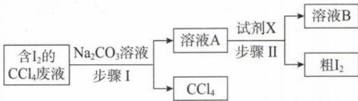

解析: A. $I_{2}$ 在碱性溶液中发生歧化反应: $3I_{2} + 3CO_{3}^{2-} = 5I^{-} + IO_{3}^{-} + 3CO_{2}\uparrow$ , 生成无色物质 $I^{-}$ 、 $IO_{3}^{-}$ 溶解在上层的水中。无色的 $CCl_{4}$ 与水不互溶且密度比水大, 因此在下层, A 选项正确。

B. $CCl_{4}$ 密度大于水，应该从分液漏斗下层放出；而溶液 A 应该从分液漏斗上口倒出，B 选项错误。

C. 在酸性环境下 $\mathrm{I}^{-}$ 与 $\mathrm{IO}_3^-$ 发生归中反应: $5\mathrm{I}^{-} + \mathrm{IO}_3^-$ + $6\mathrm{H}^{+} = 3\mathrm{I}_2 + 3\mathrm{H}_2\mathrm{O}$ , 试剂 X 可用硫酸, C 选项正确。  
D. 当试剂 X 为硫酸, 则粗 $\mathrm{I}_2$ 中混有的杂质为 $\mathrm{Na}_2\mathrm{SO}_4$ 。 $\mathrm{Na}_2\mathrm{SO}_4$ 的热稳定性好, 而 $\mathrm{I}_2$ 易升华, 因此粗 $\mathrm{I}_2$ 可用升华法 (或加热法) 进一步提纯, D 选项正确。

答案:B

【例 8】(2021·全国甲卷节选)碘(紫黑色固体,微溶于水)及其化合物广泛用于医药、染料等方面。回答下列问题: $I_{2}$ 的一种制备方法如图所示:

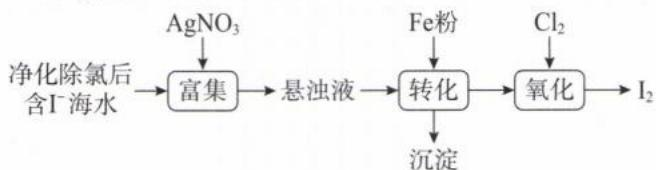

(1)加入 Fe 粉进行转化反应的离子方程式为 \_\_\_\_，生成的沉淀与硝酸反应，生成 \_\_\_\_ 后可循环使用。

(2)通入 $Cl_{2}$ 的过程中,若氧化产物只有一种,反应的化学方程式为 \_\_\_\_;若反应物用量比 $\frac{n(\mathrm{Cl}_{2})}{n(\mathrm{FeI}_{2})}=1.5$ 时,氧化产物为 \_\_\_\_;当 $\frac{n(\mathrm{Cl}_{2})}{n(\mathrm{FeI}_{2})}>1.5$ 后,单质碘的收率会降低,原因是 \_\_\_\_。

解析:(1)根据流程可知:悬浊液主要含 AgI,加入铁粉可将 $Ag^{+}$ 置换为 Ag。AgI 难溶不能拆,对应的离子方程式为: $2AgI+Fe=2Ag+Fe^{2+}+2I^{-}$ 。Ag 与稀 $HNO_{3}$ 反应的化学方程式为: $3Ag+4HNO_{3}=3AgNO_{3}+NO\uparrow+2H_{2}O$ , $AgNO_{3}$ 可循环参与“富集”。

(2) $FeI_{2}$ 是“还还组合”，还原性： $I^{-}>Fe^{2+}$ ，往 $FeI_{2}$ 溶液中通入 $Cl_{2}$ ，还原性强的 $I^{-}$ 优先与 $Cl_{2}$ 反应。当通入 $Cl_{2}$ 量少时，只有 $I^{-}$ 被氧化，氧化产物只有 $I_{2}$ ，对应的化学方程式为： $FeI_{2}+Cl_{2}=I_{2}+FeCl_{2}$ ；当 $\frac{n(Cl_{2})}{n(FeI_{2})}=1.5$ 时， $Fe^{2+}$ 、 $2I^{-}$ 均被氧化，生成的氧化产物有 $I_{2}$ 和 $FeCl_{3}$ 。 $Cl_{2}$ 的氧化性较强，当其过量会继续将 $I_{2}$ 氧化为 $IO_{3}^{-}$ ，导致 $I_{2}$ 收率降低。

答案:(1) $2AgI+Fe=2Ag+Fe^{2+}+2I^{-}$ $AgNO_{3}$

(2) $FeI_{2}+Cl_{2}=I_{2}+FeCl_{2}$ $I_{2}$ 、 $FeCl_{3}$ $I_{2}$ 被过量的 $Cl_{2}$ 进一步氧化

# 模块 3 硫及其化合物(★★★★)

习题：P27

# 第 1 节 硫单质、硫的氧化物

## 内容提要

## 一、硫元素

1. 硫的最低化合价为 -2、最高化合价为 +6，常见化合价：-2、0、+4、+6；稳价为 0、+6 价，+6 价更稳定。

注:若溶液中反应物 S 元素的化合价小于 0, 其氧化产物几乎都是 S 单质; 若溶液中反应物 S 元素的化合价为 +4 价, 其氧化产物几乎都是 $SO_{4}^{2-}$ 。

2. 硫在自然界中既有游离态(火山口附近或地壳的岩层中), 又有化合态, 如黄铁矿 $\left(\mathrm{FeS}_{2}\right)$ 、黄铜矿 $\left(\mathrm{CuFeS}_{2}\right)$ 、石膏 $\left(\mathrm{CaSO}_{4} \cdot 2 \mathrm{H}_{2} \mathrm{O}\right)$ 、芒硝 $\left(\mathrm{Na}_{2} \mathrm{SO}_{4} \cdot 10 \mathrm{H}_{2} \mathrm{O}\right)$ 等。

## 二、硫单质

1. 硫磺的物理性质: 常温下, S 是一种黄色晶体, 质脆。难溶于水, 微溶于酒精, 易溶于 $CS_{2}$ 。

注:硫有多种同素异形体,没有特殊说明,默认的是 $S_{8}$ (正交硫)。在化学方程式中均用“S”表示固体硫单质的化学式。

2. 化学性质: 0 价是硫元素的中间价, 既有氧化性, 又有还原性。由于 0 价比较稳定, 因此 S 单质也比较稳定, 但在一定条件下也能与金属单质、某些非金属单质或化合物反应。

(1)与金属单质的反应:①Fe与S混合加热,生成黑色固体: $\mathrm{Fe}+\mathrm{S}\xlongequal{\triangle}\mathrm{FeS}$ 。

②Cu 与 S 混合加热,生成黑色固体: $2\mathrm{Cu} + \mathrm{S}\stackrel{\triangle}{=}\mathrm{Cu}_{2}\mathrm{S}$ 。

注：S 的氧化性较弱，与变价金属反应无量变引起质变，只能生成低价金属硫化物。但汞比较特殊，汞元素亲硫，散落的水银，用硫粉即可转化成 HgS:Hg+S=HgS。

(2)与非金属单质的反应:① $H_{2}$ 与S共热,发生化合反应: $H_{2}+S\xlongequal{\triangle}H_{2}S$ 。

② $O_{2}$ 与S共热,发生化合反应: $O_{2}+S\xlongequal{点燃}SO_{2}$ 。

注：S 在 $O_{2}$ 中燃烧，无论 $O_{2}$ 多少，只能生成 $SO_{2}$ ， $SO_{2}$ 转化为 $SO_{3}$ 需要催化剂。

(3)与酸的反应:与浓硝酸反应:S+6HNO\_{3}(浓)\xlongequal{\triangle}H\_{2}SO\_{4}+6NO\_{2}\uparrow+2H\_{2}O。

(4)与碱的反应: $3 \mathrm{~S} + 6 \mathrm{NaOH}$ (浓) $\xlongequal{\triangle} 2 \mathrm{Na}_{2} \mathrm{~S} + \mathrm{Na}_{2} \mathrm{SO}_{3} + 3 \mathrm{H}_{2} \mathrm{O}$ (可用热的烧碱溶液洗去试管上的硫磺)。

3. 硫的用途: 制硫酸、制火药、制作药皂等

## 三、硫的氧化物

## 1. $\mathrm{SO}_2$ 、 $\mathrm{SO}_3$ 的对比

<table><tr><td colspan="2">对象</td><td>SO2</td><td>SO3</td></tr><tr><td colspan="2">物质类别</td><td>酸性氧化物</td><td>酸性氧化物</td></tr><tr><td colspan="2">物性</td><td>无色有刺激性气味的有毒气体,易溶于水,ρ比空气大。</td><td>标准状况下为晶体,与水互溶。</td></tr><tr><td rowspan="4">化学性质</td><td>酸性氧化物通性</td><td>(1)SO2(少)+2NaOH=Na2SO3+H2O;SO2(足)+NaOH=NaHSO3。(2)SO2(少)+Ca(OH)2=CaSO3↓+H2O;2SO2(足)+Ca(OH)2=Ca(HSO3)2(可溶)。(3)SO2+CaO=CaSO3。(4)SO2+H2O⇌H2SO3。</td><td rowspan="4">具有酸性氧化物的通性:(1)SO3+2NaOH=Na2SO4+H2O(2)SO3+CaO=CaSO4(3)SO3+H2O=H2SO4</td></tr><tr><td>强还原性</td><td>能与多种氧化剂反应:(1)SO2+X2+2H2O=SO42-+2X-+4H+(X2=Cl2、Br2、I2)。(2)SO2+2Fe3++2H2O=SO42-+2Fe3++4H+(X2=Cl2、Br2、I2)。(3)SO2+H2O2=SO42-+2H+(X2=Cl2、Br2、I2)。(4)2SO2+O2催化剂△2SO3。(5)3SO2+2NO3-+2H2O=3SO42-+2NO+4H+(X2=Cl2、Br2、I2)。(6)3SO2+Cr2O72-+2H+=3SO42-+2Cr3++H2O。(7)5SO2+2MnO4-+2H2O=5SO42-+2Mn2++4H+(X2=Cl2、Br2、I2)。(8)SO2+ClO-+H2O=SO42-+Cl-+2H+。</td></tr><tr><td>弱氧化性</td><td>SO2+2H2S=3S+2H2O</td></tr><tr><td>特性</td><td>暂时漂白品红以及自然界的有机色素</td></tr></table>

2. $\mathrm{SO}_2$ 是 $\mathrm{H}_2\mathrm{SO}_3$ 的酸酐, $\mathrm{H}_2\mathrm{SO}_3$ 是二元弱酸, 所以 $\mathrm{SO}_2$ 与碱的反应存在量变引起质变。 3. 能使澄清石灰水先变浑浊, 再变澄清的气体除了 $\mathrm{CO}_2$ 之外, 还有 $\mathrm{SO}_2$ 。

4. 气体 $SO_{2}$ 和 $O_{2}$ 不容易反应, 需要催化剂和加热条件; 但是水溶液中的 $SO_{2}$ 很容易和 $O_{2}$ 反应 $(2SO_{2} + O_{2} + 2H_{2}O = 2H_{2}SO_{4})$ 。

5. 欲分离 $SO_{2}$ 、 $SO_{3}$ ，可利用二者的熔沸点不同，将二者的混合物通过冰水冷却的 U 形管， $SO_{3}$ 变成固体与 $SO_{2}$ 气体分离；若要检验 $SO_{2}$ 和 $SO_{3}$ 混合气体，可以先通过 $BaCl_{2}$ 和 HCl 混合溶液，若有白色沉淀生成，说明混合气体含 $SO_{3}$ ；再将气体通入品红溶液，若溶液褪色，说明混合气体含 $SO_{2}$ 。

6. 在水溶液中, $\mathrm{SO}_{2}$ 的氧化产物均为 $\mathrm{SO}_{4}^{2-}$ ; $\mathrm{SO}_{2}$ 参加的氧化还原反应绝大多数需要前面补 $\mathrm{H}_{2} \mathrm{O}$ , 后面补 $\mathrm{H}^{+}$ 。导致 $\mathrm{SO}_{2}$ 参加反应后, 环境的酸性往往会增强, $\mathrm{pH}$ 减小。

7. $\mathrm{SO}_2$ 的漂白性：

(1) $SO_{2}$ 、 $Cl_{2}$ 通入品红溶液都能使溶液褪色,通入 $SO_{2}$ 后褪色的品红溶液加热后可以恢复红色,说明 $SO_{2}$ 的漂白作用是暂时的;但通入 $Cl_{2}$ 后褪色的品红溶液加热后无法复原,说明 HClO 的漂白效果是永久性的。

(2) $SO_{2}$ 不能漂白酸碱指示剂,因此 $SO_{2}$ 通入紫色石蕊溶液中,溶液只变红、不褪色。

(3) $SO_{2}$ 通入含酚酞的NaOH溶液中, 溶液红色褪去, 这与 $SO_{2}$ 漂白性无关, 而是通入 $SO_{2}$ 后溶液酸性增强, 酚酞由红色变为无色, 体现 $SO_{2}$ 酸性氧化物的通性。

(4) $SO_{2}$ 使酸性 $KMnO_{4}$ 溶液褪色, 或使溴水褪色, 都是体现 $SO_{2}$ 的还原性而非漂白性 (漂白性的褪色对象是有机色素)。

8. $SO_{2}$ 通入 $BaCl_{2}$ 溶液（或 $CaCl_{2}$ 溶液）没有明显现象，根本原因是： $BaSO_{3}$ （或 $CaSO_{3}$ ）均溶于酸溶液。若要出现沉淀，一是加入氧化剂生成难溶于酸的 $BaSO_{4}$ ；二是加入碱性物质中和反应生成的 $H^{+}$ ，生成 $BaSO_{3}$ 沉淀。

<table><tr><td>通入气体</td><td>水溶液</td><td colspan="2">现象与解释</td></tr><tr><td> $SO_{2}$ </td><td> $BaCl_{2}$ 溶液(或 $CaCl_{2}$ 溶液)</td><td colspan="2">无沉淀(无 $K_{sp}$ 、 $K_{a}$ 信息)</td></tr><tr><td> $SO_{2}$ </td><td> $Ba(NO_{3})_{2}$ 溶液</td><td rowspan="3">生成白色沉淀( $BaSO_{4}$ )</td><td rowspan="3">氧化剂将 $SO_{2}$ 氧化为 $SO_{4}^{2-}$ ,与 $Ba^{2+}$ 反应生成难溶于 $H^{+}$ 的 $BaSO_{4}$ </td></tr><tr><td> $SO_{2}$ </td><td> $BaCl_{2} + FeCl_{3}$ 溶液</td></tr><tr><td> $SO_{2} + NO_{2}$ (或 $Cl_{2}$ 、或 $O_{2}$ )</td><td> $BaCl_{2}$ 溶液</td></tr><tr><td> $SO_{2} + NH_{3}$ </td><td> $BaCl_{2}$ 溶液</td><td rowspan="2">生成白色沉淀( $BaSO_{3}$ )</td><td rowspan="2">中和溶液的 $H^{+}$ ,使 $BaSO_{3}$ 沉淀析出</td></tr><tr><td> $SO_{2}$ </td><td> $BaCl_{2} + NaOH$ 溶液</td></tr></table>

9. $SO_{2}$ 的性质验证

(1)酸性: 将 $SO_{2}$ 通入紫色石蕊溶液中, 溶液变红。

(2)氧化性: 将 $SO_{2}$ 通入 $H_{2}S$ 溶液中, 溶液变浑浊。

(3)还原性:将 $SO_{2}$ 通入酸性 $KMnO_{4}$ 溶液,溶液褪色。

(4)漂白性:将 $SO_{2}$ 通入品红溶液中,溶液红色褪去。

## 10. $SO_{2}$ 的制备

## (1) 反应原理

①强酸制弱酸： $Na_{2}SO_{3}(s)+H_{2}SO_{4}(70\%)=Na_{2}SO_{4}+SO_{2}\uparrow+H_{2}O$

注：i. 由于 $SO_{2}$ 易溶于水，如果硫酸太稀，会有较多的 $SO_{2}$ 溶于水中，导致产量降低；使用固体 $Na_{2}SO_{3}$ 和浓度较大（60%\~70%）的硫酸，可减少 $SO_{2}$ 溶解损耗。

ii. 该实验不用 98% 浓硫酸是因为水太少, 硫酸电离程度太小, 导致 $H^{+}$ 浓度太小, 生成 $SO_{2}$ 的速率太慢。

②氧化还原反应: $\mathrm{Cu} + 2\mathrm{H}_{2}\mathrm{SO}_{4}$ (浓) $\xlongequal{\triangle} \mathrm{CuSO}_{4} + \mathrm{SO}_{2} \uparrow + 2\mathrm{H}_{2}\mathrm{O}$ 。

注：i. 该反应需要加热，且当浓硫酸逐渐消耗变为稀硫酸时，反应即停止。和 $MnO_{2}$ 与浓 HCl 加热制备 $Cl_{2}$ 类似，都是属于“不浓、不热、不反应”。

ii. 该实验用卷曲的铜丝，增大接触面积的同时，将铜丝抽离浓硫酸可以使反应停止。

(2)除杂、干燥:用上述方法制得的 $SO_{2}$ 主要含水蒸气。 $SO_{2}$ 为酸性气体,可以用中性干燥剂(无水氯化钙)或酸性干燥剂(浓硫酸、 $P_{2}O_{5}$ 等)干燥。

(3)收集: $\mathrm{SO}_{2}$ 有毒,且密度大于空气,所以收集 $\mathrm{SO}_{2}$ 的方法主要是排液法(排饱和 $\mathrm{NaHSO}_{3}$ )和密闭体系的向上排空气法。

(4)尾气处理: $\mathrm{SO}_{2}$ 是酸性气体,且有较强还原性,所以用于 $\mathrm{SO}_{2}$ 尾气处理的试剂可以是碱性物质如 NaOH 溶液,也可以是某些氧化性物质如酸性重铬酸钾溶液、酸性高锰酸钾溶液等。

(5) 常见制备装置和性质验证装置图

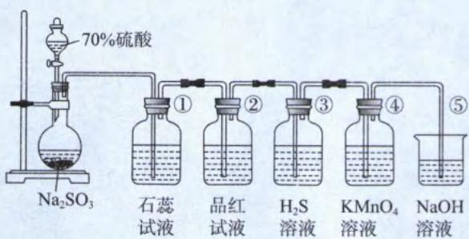

①变红,用于检验 $SO_{2}$ 的酸性;②褪色,用于检验 $SO_{2}$ 的漂白性;③变浑浊,用于检验 $SO_{2}$ 的氧化性;④褪色,用于检验 $SO_{2}$ 的还原性;⑤尾气处理,防止环境污染。

11. $SO_{2}$ 的用途: 漂白织物或纸张; 食品的防腐; 制备硫酸等。

注: $SO_{2}$ 虽有毒,但是在食品中添加适量 $SO_{2}$ 可以防腐。如葡萄酒添加适量的 $SO_{2}$ 可以起到杀菌的作用; $SO_{2}$ 也是一种抗氧化剂,能防止葡萄酒中的一些成分被氧化,起到保质作用,并有助于保持葡萄酒的天然果香味。由此可知,任何事物都有两面性,只要用对了地方以及注意用量,绝大多数物质对人类都是有益的。

## 12. 酸雨

(1)定义: pH<5.6 的雨水(酸雨不是呈酸性的雨水, pH 的基准定为 5.6, 是因为 $CO_{2}$ 饱和溶液 pH 为 5.6, 所以 $CO_{2}$ 不是引起酸雨的因素)。

(2)人为因素:燃煤释放的 $SO_{2}$ 形成硫酸型酸雨;燃油汽车尾气中的 $NO_{x}$ 形成硝酸型酸雨。

(3)危害:①使土壤酸化;②农作物减产;③损坏建筑物;④增加了呼吸道疾病的发病率等。

(4)消除方法:①开发新能源;②使用燃煤脱硫技术,减少 $SO_{2}$ 的排放;③工业废气处理后再排放等。

13. 煤的脱硫(石灰法): $CaCO_{3}\xlongequal{高温}CaO+CO_{2}\uparrow$ ; $2CaO+2SO_{2}+O_{2}\xlongequal{\triangle}2CaSO_{4}$ 。

类型 I: 化学与生活

【例 1】化学与生活密切相关,下列说法正确的是( )

A. 燃煤时加入石灰石可减少酸雨和温室效应

B. $SO_{2}$ 有毒不能用作食品的添加剂

C. 黑火药是 S、 $KNO_{3}$ 、C 三种物质按一定比例混合而成,反应中 S 是还原剂

D. $SO_{2}$ 可用于漂白纸浆、毛、丝等,但是尽量不用 $SO_{2}$ 漂白食品

$$
: \mathrm{A}.
$$

$$
\mathrm{SO} _ {2}
$$

$$
\left(\mathrm{CaCO} _ {3} \stackrel {\text {高温}} {=} \mathrm{CaO} + \mathrm{CO} _ {2} \uparrow ; 2 \mathrm{CaO} + 2 \mathrm{SO} _ {2} + \mathrm{O} _ {2} \stackrel {\triangle} {=} 2 \mathrm{CaSO} _ {4}\right)
$$

$$
\mathrm{CO} _ {2}
$$

$$
\mathrm{SO} _ {2}
$$

$$
\mathrm{SO} _ {2}
$$

$$
\mathrm{S} + 2 \mathrm{KNO} _ {3} + 3 \mathrm{C} \stackrel {\triangle} {=} \mathrm{K} _ {2} \mathrm{S} + \mathrm{N} _ {2} \uparrow + 3 \mathrm{CO} _ {2}
$$

$$
\mathrm{S}, \mathrm{KNO} _ {3}
$$

$$
\mathrm{SO} _ {2}
$$

$$
\mathrm{SO} _ {2}
$$

$$
\mathrm{SO} _ {2}
$$

$$
\left(\mathrm{SO} _ {2} \right.
$$

$$
\mathrm{SO} _ {2}
$$

类型Ⅱ: 阿伏加德罗常数

【例 2】 $N_{A}$ 表示阿伏加德罗常数的值, 下列说法错误的是( )

A. 32 g 环状 $S_{8}$ ( ) 含有的 S-S 键数目为 $N_{A}$ B. 6.4 g S 在足量的氧气中燃烧, 转移电子数为 1.2 $N_{A}$ C. 64 g 铜与足量硫磺反应, S 得到的电子数为 $N_{A}$ D. 9.6 g 硫磺溶于足量热的 NaOH 溶液, 转移电子数为 0.4 $N_{A}$

解析: A. 由图可知, 1个 $S_{8}$ 分子含有 S-S 键数目为 8 , 则 $32 \mathrm{~g} \mathrm{~S}_{8}$ 含有的 S-S 键数目为 $\frac{32 \mathrm{~g}}{8 \times 32 \mathrm{~g} / \mathrm{mol}} \times 8 \times$ $N_{\mathrm{A}} \mathrm{~mol}^{-1} = N_{\mathrm{A}}$ , A 选项正确。(也可以用均摊法求: 每个硫原子有 2 个 S-S 键, 均摊后有 1 个 S-S 键; $32 \mathrm{~g}$ 环状 $S_{8}$ 分子含 $1 \mathrm{~mol} \mathrm{~S}$ 原子, 所含 S-S 键数目为 $N_{\mathrm{A}}$ 。)

B. S 在氧气中燃烧只能生成 $\mathrm{SO}_{2}, \mathrm{~S}$ 由 0 价升为 +4 价, 则 $6.4 \mathrm{~g} \mathrm{~S}$ (即 $0.2 \mathrm{~mol} \mathrm{~S}$ ) 转移电子数为 $0.8 N_{\mathrm{A}}$ , B 选项错误。

C. 铜与硫磺反应生成 $\mathrm{Cu}_{2} \mathrm{~S}, \mathrm{Cu}$ 由 0 价升为 +1 价, 则 $64 \mathrm{~g} \mathrm{Cu}$ (即 $1 \mathrm{~mol} \mathrm{Cu}$ ) 失去电子的数目为 $N_{\mathrm{A}}$ , 根据电子得失守恒, S 得到的电子数也是 $N_{\mathrm{A}}$ , C 选项正确。

D. S 在热 NaOH 溶液中的反应为: $3 \mathrm{~S} + 6 \mathrm{NaOH}$ (浓) $\xrightarrow{\triangle} 2 \mathrm{Na}_{2} \mathrm{~S} + \mathrm{Na}_{2} \mathrm{SO}_{3} + 3 \mathrm{H}_{2} \mathrm{O}$ , 由方程式与化合价变化可知, 每 $3 \mathrm{~mol} \mathrm{~S}$ 反应, 可生成 $1 \mathrm{~mol} \mathrm{Na}_{2} \mathrm{SO}_{3}$ , 并有 $1 \mathrm{~mol} \mathrm{~S}$ 原子被氧化, 失去电子数目为 $4 N_{\mathrm{A}}$ 。则 $9.6 \mathrm{~g}$ 硫磺 (即 $0.3 \mathrm{~mol} \mathrm{~S}$ ) 反应, 转移电子数为 $0.4 N_{\mathrm{A}}$ , D 选项正确。

答案:B

## 类型Ⅲ:离子方程式

【例 3】下列离子方程式书写正确的是( )

A. 稀硝酸与亚硫酸钠混合: $2H^{+} + SO_{3}^{2-} = SO_{2} \uparrow + H_{2}O$ B. 将 $SO_{2}$ 通入 $BaCl_{2}$ 溶液中: $SO_{2} + Ba^{2+} + H_{2}O = BaSO_{3} \downarrow + 2H^{+}$ C. 将 $SO_{2}$ 通入酸性高锰酸钾溶液中: $2MnO_{4}^{-} + 5SO_{2} + 4OH^{-} = 5SO_{4}^{2-} + 2Mn^{2+} + 2H_{2}O$ D. 将 $SO_{3}$ 通入 $BaCl_{2}$ 溶液中: $SO_{3} + Ba^{2+} + H_{2}O = BaSO_{4} \downarrow + 2H^{+}$

解析：A. 稀硝酸具有强氧化性，与亚硫酸钠发生氧化还原反应，对应离子方程式为： $2NO_{3}^{-} + 3SO_{2} + 2H_{2}O = 3SO_{4}^{2-} + 2NO + 4H^{+}$ ，A选项错误。
B. $SO_{2}$ 与 $BaCl_{2}$ 溶液不反应，B选项错误。
C. 溶液是酸性，应该补“ $H^{+}$ ”，对应离子方程式为： $2MnO_{4}^{-} + 5SO_{2} + 2H_{2}O = 5SO_{4}^{2-} + 2Mn^{2+} + 4H^{+}$ ，C选项错误。
D. $SO_{3}$ 先与水反应生 $H_{2}SO_{4}$ ，生成的 $H_{2}SO_{4}$ 再与 $BaCl_{2}$ 反应生成难溶于酸的 $BaSO_{4}$ ，D选项正确。
答案：D

类型Ⅳ:实验题型

【例 4】下列陈述Ⅰ与陈述Ⅱ均正确,且具有因果关系的是()

<table><tr><td>选项</td><td>陈述I</td><td>陈述II</td></tr><tr><td>A</td><td>将SO2通入石蕊溶液,石蕊先变红,再褪色</td><td>SO2既有酸性,又有漂白性</td></tr><tr><td>B</td><td>制备SO2常用70%的硫酸,很少用浓硫酸</td><td>SO2具有强还原性,浓硫酸具有强氧化性</td></tr><tr><td>C</td><td>将SO2通入酸性高锰酸钾溶液,溶液褪色</td><td>SO2具有漂白性</td></tr><tr><td>D</td><td>用NaOH溶液吸收SO2尾气</td><td>SO2是酸性氧化物</td></tr></table>

解析：A. $\mathrm{SO}_2$ 只能使石蕊溶液变红，不会使之褪色，A选项错误。  
B.浓硫酸虽有氧化性，但浓硫酸不能氧化 $\mathrm{SO}_2$ ；不用浓硫酸制备 $\mathrm{SO}_2$ ，是因为反应速率太慢，B选项错误。  
C. $\mathrm{SO}_2$ 使酸性高锰酸钾褪色，体现了 $\mathrm{SO}_2$ 的还原性，C选项错误。  
D. $\mathrm{SO}_2$ 有毒且有酸性，用NaOH对其尾气处理，D选项正确。  
答案：D

【例 5】根据装置和下表内的物质(省略夹持、净化以及尾气处理装置, 图 1 中虚线框内的装置是图 2), 其中不能完成相应实验目的的是()

<table><tr><td rowspan="2">选项</td><td rowspan="2">a中的物质</td><td rowspan="2">b中的物质</td><td colspan="3">实验目的、试剂和操作</td></tr><tr><td>实验目的</td><td>c中的物质</td><td>进气方向</td></tr><tr><td>A</td><td>稀硫酸</td><td> $NaHCO_3$ </td><td>收集贮存 $CO_2$ </td><td>饱和 $NaHCO_3$ </td><td>N→M</td></tr><tr><td>B</td><td>浓硝酸</td><td> $Na_2SO_3$ </td><td>检验 $SO_2$ 的漂白性</td><td>品红溶液</td><td>M→N</td></tr><tr><td>C</td><td>浓氨水</td><td>碱石灰</td><td>收集贮存氨气</td><td> $CCl_4$ </td><td>N→M</td></tr><tr><td>D</td><td>浓盐酸</td><td> $KMnO_4$ </td><td>检验 $Cl_2$ 的氧化性</td><td> $Na_2S$ 溶液</td><td>M→N</td></tr></table>

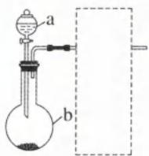  
图1

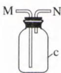  
图2

解析: A. 稀硫酸与 $NaHCO_{3}$ 反应可以制备 $CO_{2}$ , $CO_{2}$ 在饱和 $NaHCO_{3}$ 溶液中溶解度小, 可用排液法收集(短进长出), A 选项正确。

B. 浓硝酸有强氧化性，与 $Na_{2}SO_{3}$ 反应不能生成 $SO_{2}$ 。A 中的物质应为 70% 的硫酸，B 选项错误。

C. 碱石灰遇水会释放大量的热，促进氨水分解氨气溢出。氨气为极性分子， $CCl_{4}$ 为非极性分子，极性不相似

则不相溶,可以排 $CCl_{4}$ 收集氨气(短进长出),C 选项正确。

D. 浓盐酸和 $KMnO_{4}$ 固体常温下即可制备 $Cl_{2}$ 。将 $Cl_{2}$ 通入 $Na_{2}S$ 溶液中可观察到溶液变浑浊，说明 $Cl_{2}$ 可以置换出 S 单质，该实验可以检验 $Cl_{2}$ 的氧化性，D 选项正确。

答案:B

类型 V: 反应原理示意图

【例 6】 $SO_{2}$ 属于大气污染物, 可用 $H_{2}$ 与 $SO_{2}$ 在加热条件下反应消除 $SO_{2}$ 的污染, 其反应原理可分为两步, 过程如图所示。下列说法正确的是( )

A. 大量 $SO_{2}$ 排放到空气中会形成 pH≈5.6 的酸雨

B. 可用 $CuSO_{4}$ 溶液检验是否有气体 X 生成

C. 在 100\~200 ℃ 时发生的是置换反应

D. 工业上可用浓硝酸处理尾气中的 $SO_{2}$ 催化剂

300℃

气体
X

催化剂

100\~200℃

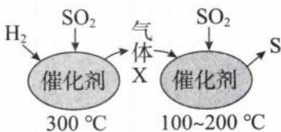

解析:根据示意图可知气体 X 是 $H_{2}S$ , 300 ℃时的化学方程式为: $3H_{2} + SO_{2} = H_{2}S + 2H_{2}O$ , 100～200 ℃时的化学方程式为: $2H_{2}S + SO_{2} = 3S + 2H_{2}O$ 。
A. 酸雨的 pH<5.6, A 选项错误。
B. 根据上述分析可知 X 是 $H_{2}S$ , $H_{2}S$ 通入 $CuSO_{4}$ 溶液会出现黑色沉淀，对应的离子方程式为: $H_{2}S + Cu^{2+} = CuS \downarrow + 2H^{+}$ , B 选项正确。
C. 置换反应的特征是“单质+化合物=单质+化合物”，第二步的反应方程式为: $SO_{2} + 2H_{2}S = 3S + 2H_{2}O$ ，反应物无单质，因此该反应不是置换反应，C 选项错误。
D. 浓硝酸与 $SO_{2}$ 反应的还原产物是 $NO_{2}$ , $NO_{2}$ 也是一种大气污染物。应该用碱液吸收 $SO_{2}$ , D 选项错误。
答案:B

## 第 2 节 含硫的酸、盐及其他含硫化合物

## 内容提要

## 一、含硫的酸

1. 氢硫酸( $H_{2}S$ )

(1) 物理性质: 常温下, $H_{2}S$ 具有臭鸡蛋气味的剧毒气体, 可溶于水, 密度比空气略大。 $H_{2}S$ 的水溶液称为氢硫酸。

(2)化学性质

①二元弱酸性：

i. 少量 $H_{2}S$ 通入 NaOH 溶液中: $H_{2}S + 2NaOH = Na_{2}S + 2H_{2}O$ (离子方程式: $H_{2}S + 2OH^{-} = S^{2-} + 2H_{2}O$ )。

ii. 过量 $H_{2}S$ 通入 NaOH 溶液中: $H_{2}S + NaOH = NaHS + H_{2}O$ (离子方程式: $H_{2}S + OH^{-} = HS^{-} + H_{2}O$ )。

iii. $H_{2}S$ 通入 $Na_{2}S$ 溶液中: $H_{2}S + Na_{2}S = 2NaHS$ (离子方程式: $H_{2}S + S^{2-} = 2HS^{-}$ ).

②沉淀反应： $H_{2}S+CuSO_{4}=CuS\downarrow+H_{2}SO_{4}$ （离子方程式： $H_{2}S+Cu^{2+}=CuS\downarrow+2H^{+}$ ）。

注:该反应违背“强酸制弱酸”的原理,但遵循“溶解度大制溶解度小”的原理。 $H_{2}S$ 通入 $FeSO_{4}$ 溶液无明显现象,因为FeS可溶于 $H_{2}SO_{4}$ 。

③强还原性： $H_{2}S$ 具有极强的还原性，能与绝大多数氧化剂反应。

i. $2\mathrm{H}_2\mathrm{S} + \mathrm{SO}_2 = 3\mathrm{S} + 2\mathrm{H}_2\mathrm{O}$ ii. $\mathrm{H_2S + X_2 = S\downarrow + 2HX(X_2 = Cl_2,Br_2,I_2)}$ iii. $2\mathrm{H}_2\mathrm{S(aq)} + \mathrm{O}_2 = 2\mathrm{S}\downarrow +2\mathrm{H}_2\mathrm{O};$ iv. $\mathrm{H_2S + 2Fe^{3 + } = S\downarrow + 2Fe^{2 + } + 2H^+}$ v. $\mathrm{H_2S + H_2O_2 = S\downarrow + 2H_2O;}$ vi. $\mathrm{H_2S(少) + H_2SO_4(浓) = S\downarrow + SO_2 + 2H_2O。}$

注:一般情况下, $H_{2}S$ 的氧化产物为 S;若氧化剂的氧化性极强,也可将 $H_{2}S$ 氧化成 $SO_{4}^{2-}$ 。浓硫酸可以氧化 $H_{2}S$ ,所以不能用浓硫酸干燥 $H_{2}S$ 。

④受热不稳定性： $H_{2}S\xlongequal{\triangle}S+H_{2}$ 。

(3)制备 $H_{2}S$ 的原理: FeS 与稀硫酸反应, 遵循强酸制备弱酸, 反应方程式为: $FeS + H_{2}SO_{4} = H_{2}S \uparrow + FeSO_{4}$ 。

注：稀硫酸不能用稀硝酸或浓硫酸代替，因为二者均具有强氧化性，会将 $H_{2}S$ 氧化。

2. 亚硫酸( $H_{2}SO_{3}$ )

(1) $H_{2}SO_{3}$ 的化学性质

①二元弱酸性：

i. $H_{2}SO_{3}$ 与过量 NaOH: $H_{2}SO_{3} + 2NaOH = Na_{2}SO_{3} + 2H_{2}O$ (离子方程式: $H_{2}SO_{3} + 2OH^{-} = SO_{3}^{2-} + 2H_{2}O$ )。

ii. $H_{2}SO_{3}$ 与少量 NaOH: $H_{2}SO_{3} + NaOH = NaHSO_{3} + H_{2}O$ (离子方程式: $H_{2}SO_{3} + OH^{-} = HSO_{3}^{-} + H_{2}O$ )。

iii. $H_{2}SO_{3} + Na_{2}SO_{3} = 2NaHSO_{3}$ (离子方程式: $H_{2}SO_{3} + SO_{3}^{2-} = 2HSO_{3}^{-}$ )。

②强还原性: $H_{2}SO_{3}$ 有强还原性,能与绝大多数氧化剂反应;和 $SO_{2}$ 相似,其氧化产物在水溶液中都是 $SO_{4}^{2-}$ 。

③受热不稳定： $H_{2}SO_{3}\xlongequal{\triangle}SO_{2}\uparrow+H_{2}O$ 。

注：常见酸的分类

<table><tr><td>性质</td><td>一般的酸</td><td>氧化性酸</td><td>还原性酸</td></tr><tr><td>代表</td><td>稀 $H_2SO_4$ 、HCl、 $H_3PO_4$ </td><td>浓 $H_2SO_4$ 、 $HNO_3$ 、HClO</td><td> $H_2SO_3$ 、HI、 $H_2S$ </td></tr></table>

3. 硫酸( $H_{2}SO_{4}$ )

(1)浓硫酸的物理性质:常温下,浓硫酸是粘稠的油状液体,密度大于水。硫酸与水互溶,稀释浓硫酸时会释放出大量的热。浓硫酸具有吸水性。具有较高的沸点,难挥发。

注：稀 $H_{2}SO_{4}$ 与浓 $H_{2}SO_{4}$ 的辨析

①组成对比

<table><tr><td>对象</td><td>稀硫酸</td><td>浓硫酸</td></tr><tr><td>粒子种类</td><td> $H_{2}O$ 、 $H^{+}$ 、 $SO_{4}^{2-}$ 、 $OH^{-}$ </td><td> $H_{2}SO_{4}$ 、 $H_{2}O$ 、 $HSO_{4}^{-}$ 、 $H^{+}$ 、 $SO_{4}^{2-}$ 、 $OH^{-}$ </td></tr><tr><td>化学性质</td><td>酸的五大通性</td><td>酸的部分通性;脱水性;强氧化性</td></tr></table>

(2)浓硫酸的化学性质

①酸的通性： $H_{2}SO_{4}+Ba(OH)_{2}=BaSO_{4}\downarrow+2H_{2}O$

②脱水性： $C_{12}H_{22}O_{11}$ （蔗糖） $\xlongequal{浓H_{2}SO_{4}}12C+11H_{2}O$ 。

注: 将浓硫酸与蔗糖混合, 蔗糖先变黑, 后膨胀。先变黑, 体现了浓硫酸的脱水性; 后膨胀, 说明生成了气体 $\left(\mathrm{CO}_{2}, \mathrm{SO}_{2}\right)$ , 体现了浓硫酸的强氧化性。

③强氧化性：

i. 与金属单质的反应: $\mathrm{Cu} + 2\mathrm{H}_{2}\mathrm{SO}_{4}$ (浓) $\xlongequal{\triangle} \mathrm{CuSO}_{4} + \mathrm{SO}_{2} \uparrow + 2\mathrm{H}_{2}\mathrm{O}; \mathrm{Zn} + 2\mathrm{H}_{2}\mathrm{SO}_{4}$ (浓) $= \mathrm{ZnSO}_{4} + \mathrm{SO}_{2} \uparrow + 2\mathrm{H}_{2}\mathrm{O}$ 。

注：常温下，铁、铝遇浓硫酸、浓硝酸会发生钝化。

ii. 与非金属单质的反应: $\mathrm{C} + 2\mathrm{H}_{2}\mathrm{SO}_{4}$ (浓) $\xlongequal{\triangle} \mathrm{CO}_{2} \uparrow + 2\mathrm{SO}_{2} \uparrow + 2\mathrm{H}_{2}\mathrm{O}$ 。

iii. 与某些化合物的反应: $2 \mathrm{HI} + \mathrm{H}_{2} \mathrm{SO}_{4}$ (浓) $= \mathrm{I}_{2} + \mathrm{SO}_{2} \uparrow + 2 \mathrm{H}_{2} \mathrm{O}$ 。

iv. 有机反应: 浓硫酸与芳香烃在一定条件下发生磺化反应: $+ {\mathrm{H}}_{2}\mathrm{O}$ 。

注：a. 浓硫酸与金属单质反应属于部分氧化还原反应，浓硫酸既体现酸性，生成盐；又体现强氧化性，生成 $SO_{2}$ 。在浓硫酸与 Cu 的反应中，体现酸性的硫酸与体现氧化性的硫酸物质的量之比为 1:1。

b. 浓硫酸与非金属单质反应是完全氧化还原反应，浓硫酸只体现强氧化性。

c. 浓硫酸在有机反应中常充当催化剂、吸水剂(如酯化反应)、脱水剂(如乙醇的消去反应)。

## (3) 硫酸的工业制备流程

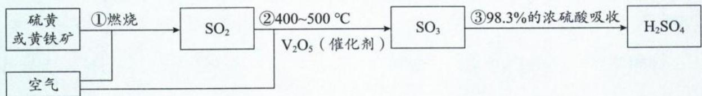

相关反应的化学方程式:① $4FeS_{2}+11O_{2}\xlongequal{高温}2Fe_{2}O_{3}+8SO_{2}$ 或 $S+O_{2}\xlongequal{点燃}SO_{2}$ ;② $2SO_{2}+O_{2}\xlongequal{催化剂}\triangle2SO_{3}$ ;③ $SO_{3}+H_{2}O\xlongequal{}H_{2}SO_{4}$ 。

注：i. 氧气从沸腾炉的下口通入，硫粉或黄铁矿粉从上口投料，增大接触面积，使矿粉充分燃烧。

ii. 气体进入催化反应室(即接触室)之前,一定要除去其他杂质,避免催化剂中毒。

iii. 不能用水替代 $98.3\%$ 的浓硫酸来吸收 $\mathrm{SO}_3$ ，原因是 $\mathrm{SO}_3$ 与水反应大量放热，导致酸雾形成，不利于 $\mathrm{SO}_3$ 的吸收。 $\mathrm{SO}_3$ 气体从吸收塔底部通入，浓硫酸从上部喷淋，此操作是为了增大接触面积，使 $\mathrm{SO}_3$ 被充分吸收。

## 二、含硫的盐

## 1. 硫化物

(1) 常考硫化物的溶解度: $K_{2}S$ 、 $Na_{2}S$ 、 $(NH_{4})_{2}S$ 易溶于水; $Al_{2}S_{3}$ 在水中彻底双水解, 在水中不存在; FeS、ZnS 难溶于水, 却易溶于一般的酸; CuS、 $Ag_{2}S$ 既难溶于水, 又难溶于一般的酸。

(2) $S^{2-}$ 水解后溶液呈碱性,可以和酸反应

$$
① \mathrm{Na} _ {2} \mathrm{S} + \mathrm{HCl} (\text {   少   }) = \mathrm{NaHS} + \mathrm{NaCl}; ② \mathrm{Na} _ {2} \mathrm{S} + 2 \mathrm{HCl} (\text {   足   }) = \mathrm{H} _ {2} \mathrm{S} \uparrow + 2 \mathrm{NaCl};
$$

③ $Na_{2}S+H_{2}S=2NaHS$ 。

(3) $S^{2-}$ 与很多的金属阳离子沉淀: $\mathrm{Na_{2}S(aq)+2AgI(s)=Ag_{2}S(s)+2NaI(aq)(Ag_{2}S溶解度比AgI更小,易发生沉淀转化)}$ 。

注:硫化物的转化主要用于化工生产中重金属阳离子(如 $Ag^{+}$ 、 $Cu^{2+}$ 、 $Pb^{2+}$ 等)的除杂。

(4) $S^{2-}$ 有很强的还原性,可与很多的氧化剂反应,其氧化产物与 $H_{2}S$ 的氧化产物相似。

①往 $\mathrm{Na}_{2}\mathrm{S}(\mathrm{aq})$ 中加入足量 $\mathrm{FeCl}_{3}(\mathrm{aq}) : \mathrm{S}^{2-} + 2\mathrm{Fe}^{3+} = \mathrm{S} \downarrow + 2\mathrm{Fe}^{2+}$ 。

②往 $\mathrm{Na_{2}S(aq)}$ 中加入少量 $\mathrm{FeCl_{3}(aq):3S^{2-}+2Fe^{3+}=S\downarrow+2FeS\downarrow}$ 。

注: 当 $S^{2-}$ 与氧化性金属阳离子反应时, 不要忘记过量 $S^{2-}$ 可能与金属的还原产物发生后续“沉淀反应”。

## 2. 硫氢化物

(1) $HS^{-}$ 既能水解,又能电离,所以 $HS^{-}$ 具有两性; $HS^{-}$ 既能与酸反应,也能与碱反应。

$$
① \mathrm{NaHS} + \mathrm{HCl} = \mathrm{H} _ {2} \mathrm{S} \uparrow + \mathrm{NaCl}; ② \mathrm{NaHS} + \mathrm{NaOH} = \mathrm{Na} _ {2} \mathrm{S} + \mathrm{H} _ {2} \mathrm{O} 。
$$

(2) $HS^{-}$ 有很强的还原性,可与很多的氧化剂反应,其氧化产物与 $H_{2}S$ 的氧化产物相似。

①往 NaHS(aq) 中加入足量 $\mathrm{FeCl}_{3}(\mathrm{aq}) : \mathrm{HS}^{-} + 2\mathrm{Fe}^{3+} = \mathrm{S}\downarrow + 2\mathrm{Fe}^{2+} + \mathrm{H}^{+}$ 。

②往 NaHS(aq) 中加入少量 $\mathrm{FeCl}_{3}(\mathrm{aq})$ : $2\mathrm{HS}^{-} + 2\mathrm{Fe}^{3+} = \mathrm{S}\downarrow + 2\mathrm{Fe}^{2+} + \mathrm{H}_{2}\mathrm{S}\uparrow$ 。

注: 当 $HS^{-}$ 与氧化性金属阳离子反应时, 不要忘记过量的 $HS^{-}$ 还能与 $H^{+}$ 发生后续的 “成弱反应”。

## 3. 亚硫酸盐

(1)大多数亚硫酸盐难溶于水,比如 $CaSO_{3}$ 、 $BaSO_{3}$ 在水中溶解度较小,但二者却易溶于盐酸。

(2) $SO_{3}^{2-}$ 水解后溶液呈碱性, 可以和酸反应: ① $Na_{2}SO_{3} + HCl$ (少) = $NaHSO_{3} + NaCl$ ; ② $Na_{2}SO_{3} + 2HCl$ (足) = $SO_{2}\uparrow + 2NaCl + H_{2}O$ ; ③ $Na_{2}SO_{3} + SO_{2} + H_{2}O = 2NaHSO_{3}$ 。

(3) $SO_{3}^{2-}$ 与某些金属阳离子沉淀: $SO_{3}^{2-}+Ba^{2+}=BaSO_{3}\downarrow$

(4) $SO_{3}^{2-}$ 有较强的还原性,可与很多的氧化剂反应;与 $SO_{2}$ 相似,其氧化产物在水溶液中都是 $SO_{4}^{2-}$ 。

①往 $\mathrm{Na}_{2}\mathrm{SO}_{3}(\mathrm{aq})$ 中加入足量 $\mathrm{Cl}_{2}:\mathrm{SO}_{3}^{2-}+\mathrm{Cl}_{2}+\mathrm{H}_{2}\mathrm{O}=\mathrm{SO}_{4}^{2-}+2\mathrm{Cl}^{-}+2\mathrm{H}^{+}$

②往 $\mathrm{Na_{2}SO_{3}(aq)}$ 中加入少量 $\mathrm{Cl_{2}:3SO_{3}^{2-}+Cl_{2}+H_{2}O=SO_{4}^{2-}+2Cl^{-}+2HSO_{3}^{-}}$

注：体系中生成 $H^{+}$ ，且 $SO_{3}^{2-}$ 过量，则 $SO_{3}^{2-}$ 会与 $H^{+}$ 发生后续的“成弱反应”。

## 4. 亚硫酸氢盐

(1) $HSO_{3}^{-}$ 既能水解,又能电离,所以 $HSO_{3}^{-}$ 具有两性; $HSO_{3}^{-}$ 既能与酸反应,也能与碱反应。

$$
① \mathrm{NaHSO} _ {3} + \mathrm{HCl} = \mathrm{SO} _ {2} \uparrow + \mathrm{NaCl} + \mathrm{H} _ {2} \mathrm{O}; ② \mathrm{NaHSO} _ {3} + \mathrm{NaOH} = \mathrm{Na} _ {2} \mathrm{SO} _ {3} + \mathrm{H} _ {2} \mathrm{O}
$$

(2) $HSO_{3}^{-}$ 有较强的还原性,可与很多的氧化剂反应,与 $SO_{2}$ 相似,其氧化产物在水溶液中都是 $SO_{4}^{2-}$ 。

①往 $\mathrm{NaHSO}_{3}(\mathrm{aq})$ 中加入足量 $\mathrm{Cl}_{2}:\mathrm{HSO}_{3}^{-}+\mathrm{Cl}_{2}+\mathrm{H}_{2}\mathrm{O}=\mathrm{SO}_{4}^{2-}+2\mathrm{Cl}^{-}+3\mathrm{H}^{+}$

②往 $\mathrm{NaHSO}_{3}(\mathrm{aq})$ 中加入少量 $\mathrm{Cl}_{2}:4\mathrm{HSO}_{3}^{-}+\mathrm{Cl}_{2}=\mathrm{SO}_{4}^{2-}+2\mathrm{Cl}^{-}+3\mathrm{SO}_{2}+2\mathrm{H}_{2}\mathrm{O}$

注:体系中生成 $H^{+}$ ，且 $HSO_{3}^{-}$ 过量，则 $HSO_{3}^{-}$ 会与 $H^{+}$ 发生后续的“成弱反应”。

## 5. 硫酸盐

(1)大多数的硫酸盐可溶,其中 $CaSO_{4}$ 、 $Ag_{2}SO_{4}$ 微溶, $BaSO_{4}$ 、 $PbSO_{4}$ 既难溶于水,又难溶于酸。

(2) $SO_{4}^{2-}$ 的化合价非常稳定,难以发生氧化还原反应,主要是和某些金属阳离子沉淀。

(3) $SO_{4}^{2-}$ 的检验:取少量待测液于试管中,先加入盐酸酸化,若无明显现象,再滴加几滴 $BaCl_{2}$ ,有白色沉淀生成。

注:①能与 $BaCl_{2}$ 生成白色沉淀的离子可能是 $SO_{4}^{2-}$ 、 $SO_{3}^{2-}$ 、 $CO_{3}^{2-}$ 、 $Ag^{+}$ ，加入盐酸可以排除 $SO_{3}^{2-}$ 、 $CO_{3}^{2-}$ 、 $Ag^{+}$ 的干扰。

②不能调换 $BaCl_{2}$ 、HCl 的顺序，调换后不能排除 $Ag^{+}$ 的干扰。

③用硝酸替代盐酸后,不能排除 $SO_{3}^{2-}$ 、 $Ag^{+}$ 的干扰。

④若告诉了检验 $SO_{4}^{2-}$ 的环境, 盐酸和 $BaCl_{2}$ 的顺序可以调换。比如检验亚硫酸钠是否变质, 就不用考虑 $CO_{3}^{2-}$ 、 $Ag^{+}$ 的干扰。

## 6. 硫酸氢盐

(1) $\mathrm{NaHSO}_{4}$ 为离子化合物,在熔融状态下电离出 $\mathrm{Na}^{+}$ 、 $\mathrm{HSO}_{4}^{-}$ ;在水溶液中可以完全电离为 $\mathrm{Na}^{+}$ 、 $\mathrm{H}^{+}$ 、 $\mathrm{SO}_{4}^{2-}$ 。在书写水溶液中的离子方程式时 $\mathrm{NaHSO}_{4}$ 需要拆成 $\mathrm{Na}^{+}$ 、 $\mathrm{H}^{+}$ 、 $\mathrm{SO}_{4}^{2-}$ 。

(2) $NaHSO_{4}$ 与 $\mathrm{Ba(OH)}_{2}$ 反应时要注意配比不同，离子方程式也会有所不同。

① $n(\mathrm{NaHSO}_{4}):n[\mathrm{Ba(OH)}_{2}]=1:1$ ，离子方程式为：

$$
\mathrm{H} ^ {+} + \mathrm{SO} _ {4} ^ {2 -} + \mathrm{Ba} ^ {2 +} + \mathrm{OH} ^ {-} = \mathrm{BaSO} _ {4} \downarrow + \mathrm{H} _ {2} \mathrm{O} 。
$$

② $n(\mathrm{NaHSO}_{4}):n[\mathrm{Ba(OH)}_{2}]=2:1$ ，离子方程式为：

$$
2 \mathrm{H} ^ {+} + \mathrm{SO} _ {4} ^ {2 -} + \mathrm{Ba} ^ {2 +} + 2 \mathrm{OH} ^ {-} = \mathrm{BaSO} _ {4} \downarrow + 2 \mathrm{H} _ {2} \mathrm{O} 。
$$

## 7. 硫代硫酸盐

$S_{2}O_{3}^{2-}$ 可看作是 $SO_{4}^{2-}$ 的一个 O 原子被 S 原子替代的产物。 $Na_{2}S_{2}O_{3}$ 能稳定存在于碱性环境中，在酸性环境会转化成 S、 $SO_{2}$ ；遇强氧化剂会被氧化成 $SO_{4}^{2-}$ ； $S_{2}O_{3}^{2-}$ 还易与 $Ag^{+}$ 发生配位反应。

(1) 往 $Na_{2}S_{2}O_{3}$ 溶液中滴加盐酸或硫酸: $S_{2}O_{3}^{2-} + 2H^{+} = S \downarrow + SO_{2} \uparrow + H_{2}O$ 。

(2) 往 $Na_{2}S_{2}O_{3}$ 中加入足量氯水: $S_{2}O_{3}^{2-} + 4Cl_{2} + 5H_{2}O = 2SO_{4}^{2-} + 8Cl^{-} + 10H^{+}$

(3)用 $Na_{2}S_{2}O_{3}$ 滴定碘水： $I_{2}+2S_{2}O_{3}^{2-}=2I^{-}+S_{4}O_{6}^{2-}$

(4)用 $Na_{2}S_{2}O_{3}$ 与 $AgNO_{3}$ 反应： $Ag^{+}+2S_{2}O_{3}^{2-}=\left[Ag(S_{2}O_{3})_{2}\right]^{3-}$

8. 过二硫酸钠( $Na_{2}S_{2}O_{8}$ )

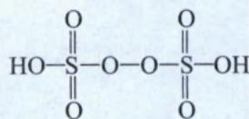

$H_{2}S_{2}O_{8}$ 的结构如图所示, 由此结构可知, $H_{2}S_{2}O_{8}$ 的 2 个 S 原子均为 +6 价, 有 6 个 O 原子为 -2 价; 另含有 1 个过氧键 $(-O-O-)$ , 其中的 2 个 O 原子为 -1 价, 这两个 -1 价的 O 体现出强氧化性。 $Na_{2}S_{2}O_{8}$ 是 $H_{2}S_{2}O_{8}$ 对应的钠盐, 每 $1\ mol\ Na_{2}S_{2}O_{8}$ 作氧化剂, 得 2 mol 电子 (类似 $H_{2}O_{2}$ ), 其还原产物为 $SO_{4}^{2-}$ 。电解硫酸钠溶液可获得 $Na_{2}S_{2}O_{8}$ , 阳极反应为: $2SO_{4}^{2-}-2e^{-}=S_{2}O_{8}^{2-}$ 。

## 三、其他含硫化合物

1. 亚硫酰氯(又名二氯亚砜, 分子式为 $SOCl_{2}$ )

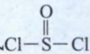

(1) $SOCl_{2}$ 的结构式 $Cl-S-Cl$ ，中心原子S有3个 $\sigma$ 键+1个孤电子对，价层电子对数为4，S的杂化方式为 $sp^{3}$ ，空间结构为三角锥形。

(2) $SOCl_{2}$ 的 S—Cl 容易断裂发生水解反应。 $SOCl_{2}$ 与水反应的本质: 先与水反应生成 HCl、 $H_{2}SO_{3}$ ; $H_{2}SO_{3}$ 不稳定分解成 $SO_{2}$ 、 $H_{2}O$ 。

① $SOCl_{2}$ 与水反应: $SOCl_{2}+H_{2}O=SO_{2}\uparrow+2HCl\uparrow$

② $SOCl_{2}$ 与足量NaOH溶液反应: $SOCl_{2}+4NaOH=Na_{2}SO_{3}+2NaCl+2H_{2}O$ 。

③ $SOCl_{2}$ 中 S 的化合价为 +4 价, 具有较强还原性, 能与氯化铁溶液反应: $SOCl_{2} + 2Fe^{3+} + 3H_{2}O = SO_{4}^{2-} + 2Fe^{2+} + 6H^{+} + 2Cl^{-}$ 。

④ $SOCl_{2}$ 是有机化学中常见试剂,可以与乙酸生成乙酰氯( $CH_{3}COCl$ )。

2. 硫酰氯(又名磺酰氯, 分子式 $SO_{2}Cl_{2}$ )

(1) $SO_{2}Cl_{2}$ 的结构式

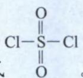

(2) $SO_{2}Cl_{2}$ 与水反应: $SO_{2}Cl_{2}+2H_{2}O=H_{2}SO_{4}+2HCl$

3. 过硫化钠( $Na_{2}S_{2}$ )

(1) $Na_{2}S_{2}$ 中 S 的化合价为 -1 价, 极其不稳定, 与酸、氧化剂均剧烈反应。

(2) $Na_{2}S_{2}$ 与盐酸发生歧化反应: $Na_{2}S_{2}+2HCl=2NaCl+S\downarrow+H_{2}S\uparrow$ 。

四、硫元素的“价类二维图”

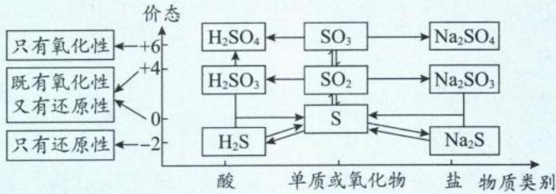

## 总结

1. 同价的硫相互转化往往利用的是酸碱性。由于 $H_{2}S$ 、 $H_{2}SO_{3}$ 是二元弱酸，所以在转化的过程中要时刻注意量变引起质变。

2. 当硫元素的化合价升降时,很多时候遵循“邻价”原则,但若反应的对象氧化性或还原性很强且量又很多时,硫元素的化合价则“跳跃式”改变。

3. 硫元素的相邻价态之间不发生氧化还原反应, 所以浓硫酸可以干燥 $SO_{2}$ 。

4. 含硫物质的连续氧化： $\left\{\begin{array}{l}H_{2}S\xrightarrow{足量O_{2}}SO_{2}\xrightarrow{O_{2}}SO_{3}\xrightarrow{H_{2}O}H_{2}SO_{4}\\S\xrightarrow{O_{2}}SO_{2}\xrightarrow{O_{2}}SO_{3}\xrightarrow{H_{2}O}H_{2}SO_{4}\end{array}\right.$

五、常见含硫物质的转化关系图

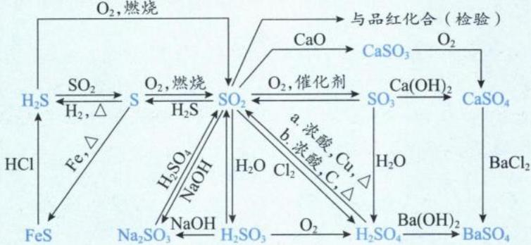

类型 I: 基础常识判断

【例 1】正误判断, 正确的填“√”, 错误的填“×”。

(1)(2023·北京卷) $Na_{2}S$ 去除废水中的 $Hg^{2+}:Hg^{2+}+S^{2-}=HgS\downarrow$ ( )

(2)(2023·全国甲卷) $SO_{2}$ 可用于丝织品漂白是由于其能氧化丝织品中有色成分()

(3)(2023·全国甲卷)标准状况下,2.24 L SO₃ 中电子的数目为 4.00 N\_A()

(4)(2023·海南卷)标准状况下,2.24 L $SO_{2}$ 与 1.12 L $O_{2}$ 充分反应,生成的 $SO_{3}$ 分子数目为 $0.1N_{A}$ ( )

(5)(2023·重庆卷) $SO_{2}$ 分别与 $H_{2}O$ 和 $H_{2}S$ 反应, 反应的类型相同()

(6)(2023·重庆卷)浓硫酸分别与 C 和 Cu 反应,生成的酸性气体完全相同()

解析:(1)(√)硫化钠易溶可拆,硫化汞难溶不拆,该离子方程式书写正确。

(2) $(\times)\mathrm{SO}_{2}$ 的漂白属于化合漂白,与其氧化性无关。

(3)(×)标准状况下, $SO_{3}$ 为固体,2.24 L $SO_{3}$ 并非0.1 mol,电子数目不等于4.00 $N_{A}$ 。

(4) $(\times)\mathrm{O}_2 + 2\mathrm{SO}_2\xrightarrow[\triangle]{催化剂} 2\mathrm{SO}_3$ 是可逆反应， $2.24\mathrm{L}\mathrm{SO}_2$ 与 $1.12\mathrm{L}\mathrm{O}_2$ 不能完全转化成 $\mathrm{SO}_3$ 。

(5) $(\times)SO_{2}$ 与 $H_{2}O$ 发生化合反应； $SO_{2}$ 与 $H_{2}S$ 发生归中反应，反应的类型不相同。

(6)(×)浓硫酸与C反应生成的酸性气体有 $SO_{2}$ 、 $CO_{2}$ ;浓硫酸与Cu反应生成的酸性气体只有 $SO_{2}$ 。

答案:(1) $\sqrt{(2)}\times(3)\times(4)\times(5)\times(6)\times$

类型Ⅱ: 反应原理示意图

【例 2】如图是硫元素在自然界中的循环示意图,下列说法错误的是( )
A. 海水中的硫元素主要以 $S^{2-}$ 形式存在
B. 煤中含有硫元素,燃煤中加入生石灰可脱硫
C. 硫具有弱氧化性,和变价金属反应,通常将金属氧化成低价态
D. 硫化氢溶于水得到氢硫酸,氢硫酸是弱酸,能与碱、碱性氧化物反应

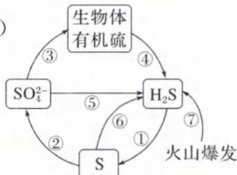

解析: A. 硫元素的稳价为 0 价和 +6 价, 海水中的硫元素, 主要是以 $SO_{4}^{2-}$ 的形式存在, A 选项错误。
B. 煤中的硫元素燃烧生成酸性氧化物 $SO_{2}$ ，可以与碱性氧化物 CaO 化合，B 选项正确。
C. 硫的氧化性较弱，与变价金属反应往往生成低价金属硫化物，C 选项正确。
D. 氢硫酸是二元弱酸，能与碱、碱性氧化物、某些碱性的盐反应，D 选项正确。

答案:A

【例 3】天然气是一种重要的化工原料和燃料。常含有少量 $H_{2}S$ 。一种在酸性介质中进行天然气脱硫的原理示意图如图所示。下列说法正确的是（）
A. 示意图中的 $\mathrm{CH}_{4}$ 、 $\mathrm{Fe}_{2}(\mathrm{SO}_{4})_{3}$ 可以看成是天然气脱硫过程的催化剂
B. 升高温度一定可以提高脱硫效率
C. 利用该脱硫原理即可实现硫的回收，还可以减少酸雨
D. 反应中消耗的 $n(\mathrm{H}_{2}\mathrm{S}):n(\mathrm{O}_{2})=1:2$

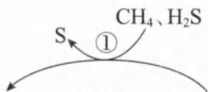

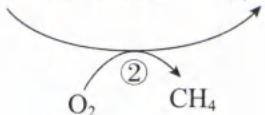

解析：A. 催化剂的特征是在循环中“有、无、有”，即催化剂一开始有，中间消失，最后又出现。示意图中 $CH_{4}$ 整个过程没有发生化学变化，即 $CH_{4}$ 中间过程未消失， $CH_{4}$ 不是催化剂； $\mathrm{Fe}_{2}(\mathrm{SO}_{4})_{3}$ 才符合“有、无、有”，也就是 $\mathrm{Fe}_{2}(\mathrm{SO}_{4})_{3}$ 经反应①变为 $FeSO_{4}$ ，再经反应②又出现，因此 $\mathrm{Fe}_{2}(\mathrm{SO}_{4})_{3}$ 是催化剂，A 选项错误。
B. 温度过高可能杀死硫杆菌，导致速率下降，B 选项错误。
C. 根据示意图可知，气态的 $H_{2}S$ 会转化成便于回收的固体 S。若不脱硫，天然气燃烧释放的 $SO_{2}$ 会造成酸雨，C 选项正确。
D. $H_{2}S$ 中 -2 价 S 转化成 0 价 S, $O_{2}$ 转化成 -2 价 O。根据化合价升降守恒可知 $n(\mathrm{H}_{2}\mathrm{S}):n(\mathrm{O}_{2})=2:1,\mathrm{D}$ 选项错误。

答案:C

类型Ⅲ:价类二维图

【例 4】(2024·辽宁一模)物质的类别和核心元素的化合价是研究物质性质的两个重要维度。

如图为硫及其部分化合物的“价类二维图”，下列说法正确的是（）
A. X、Y 属于非电解质
B. Z 的水溶液一定显碱性
C. X 的水溶液在空气中放置会变浑浊，能证明非金属性 O>S
D. S 与 $O_{2}$ 在点燃条件下的产物能使品红溶液褪色是因为其有强氧化性

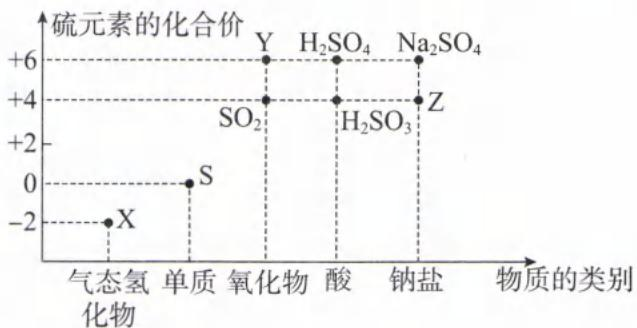

解析:1. X、Y 分别为 $H_{2}S$ 、 $SO_{3}$ ， $H_{2}S$ 是弱酸，属于弱电解质； $SO_{3}$ 是非电解质，A 选项错误。
B. Z 可以是 $Na_{2}SO_{3}$ 或 $NaHSO_{3}$ ， $Na_{2}SO_{3}$ 是强酸弱碱盐，水解后呈碱性； $NaHSO_{3}$ 为酸式盐， $HSO_{3}^{-}$ 的电离程度大于水解程度， $NaHSO_{3}$ 的溶液呈酸性，B 选项错误。
C. X 为 $H_{2}S$ 具有强还原性，其在空气中变质的化学方程式为： $2H_{2}S + O_{2} = 2S \downarrow + 2H_{2}O$ ，根据由强制弱的原

则，氧化性： $O_{2}>S$ ，则非金属性：O>S,C选项正确。

D. S 在 $O_{2}$ 中燃烧生成 $SO_{2}$ ， $SO_{2}$ 漂白品红发生了化合反应， $SO_{2}$ 无强氧化性，D 选项错误。
答案:C

类型Ⅳ:化工流程

$$
\mathrm{e} _ {3} \mathrm{O} _ {4} + 6 \mathrm{SO} _ {2}
$$

$$
3 \mathrm{FeS} _ {2} + 8 \mathrm{O} _ {2} \stackrel {\triangle} {=}
$$

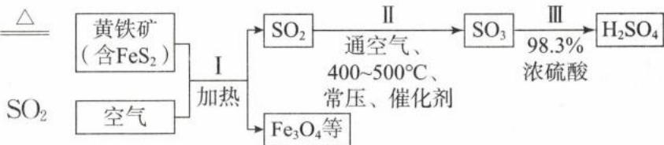

解析：A.根据流程信息可知I的化学方程式： $3\mathrm{FeS}_2 + 8\mathrm{O}_2\xrightarrow{\triangle}\mathrm{Fe}_3\mathrm{O}_4 + 6\mathrm{SO}_2$ ，A选项正确。B.Ⅱ中 $\mathrm{O_2 + 2SO_2\xrightarrow[\triangle]{催化剂} 2SO_3}$ 是放热反应，温度降低平衡正向移动，因此降温才可以提高 $\mathrm{SO}_2$ 的平衡转化率。 $400\sim 500^{\circ}C$ 、催化剂均为了提高化学反应速率，提高单位时间内 $\mathrm{SO}_2$ 的转化率，B选项错误。C.将 $\mathrm{FeS}_2$ 换成S，燃烧产物只有 $\mathrm{SO}_2$ ，不会产生矿渣 $\mathrm{Fe}_3\mathrm{O}_4$ ，C选项正确。D.尾气中的 $\mathrm{SO}_2$ 、 $\mathrm{SO}_3$ 排放到空气中会造成酸雨，所以应该用碱液吸收，D选项正确。

答案:B

类型 V: 实验题型

【例 6】(2023·广东卷)按如图装置进行实验。将稀硫酸全部加入Ⅰ中的试管,关闭活塞。下列说法正确的是( )

A. I 中试管内的反应,体现 $H^{+}$ 的氧化性

B. Ⅱ中品红溶液褪色,体现 $SO_{2}$ 的还原性

C. 在Ⅰ和Ⅲ的试管中,都出现了浑浊现象

D. 撤掉水浴,重做实验,Ⅳ中红色更快褪去

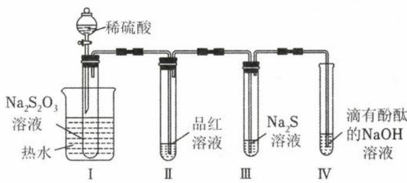

解析：A. I 中反应为： $S_{2}O_{3}^{2-} + 2H^{+} = S \downarrow + SO_{2} \uparrow + H_{2}O$ ，其中 $H^{+}$ 的化合价未变，没有体现氧化性，A 选项错误。
B. 品红褪色，体现 $SO_{2}$ 的漂白性，B 选项错误。
C. 由于酸性： $H_{2}SO_{3}>H_{2}S$ ，Ⅲ中发生的反应有： $2SO_{2}+2H_{2}O+S^{2-}=H_{2}S+2HSO_{3}^{-}$ 、 $2H_{2}S+SO_{2}=3S\downarrow+2H_{2}O$ ，Ⅰ、Ⅲ中均有 S 生成，溶液均会变浑浊，C 选项正确。
D. 撤掉水浴后温度降低，生成 $SO_{2}$ 的速率变慢，Ⅳ中红色褪去更慢，D 选项错误。
答案：C

【例 7】若将铜丝插入热浓硫酸中进行如图(a～d 均为浸有相应试液的棉花)所示的探究实验,下列分析正确的是( )

A. Cu 与浓硫酸反应,只体现 $H_{2}SO_{4}$ 的酸性

B. a 处变红,说明 $SO_{2}$ 是酸性氧化物

C. b 或 c 处褪色,均说明 $SO_{2}$ 具有漂白性

D. 试管底部出现白色固体,说明反应中无 $H_{2}O$ 生成

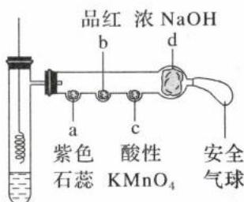

解析：A.根据方程式： $\mathrm{Cu + 2H_2SO_4}$ （浓） $\xrightarrow{\triangle}\mathrm{CuSO_4 + SO_2\uparrow + 2H_2O}$ ，铜与浓硫酸反应，浓硫酸既体现酸性，又

体现氧化性，A 选项错误。

B. $SO_{2}$ 使紫色石蕊变红, 是因为 $SO_{2}$ 溶于水中生成 $H_{2}SO_{3}$ , 说明 $SO_{2}$ 是酸性氧化物, B 选项正确。
C. 品红褪色体现 $SO_{2}$ 的漂白性, 酸性 $KMnO_{4}$ 溶液褪色体现 $SO_{2}$ 的还原性, C 选项错误。

D. 根据方程式: $\mathrm{Cu} + 2\mathrm{H}_{2}\mathrm{SO}_{4}$ (浓) $\xlongequal{\triangle} \mathrm{CuSO}_{4} + \mathrm{SO}_{2} \uparrow + 2\mathrm{H}_{2}\mathrm{O}$ ，反应中有水生成。体系中浓硫酸具有吸水性，导致生成的 $CuSO_{4}$ 无法完全溶解， $CuSO_{4}$ 主要以固体的形式存在于试管底部，D 选项错误。

答案:B

【例 8】实验小组制备焦亚硫酸钠 $\left(\mathrm{Na}_{2}\mathrm{S}_{2}\mathrm{O}_{5}\right)$ 并探究其性质。资料：焦亚硫酸钠为白色晶体，可溶

(1)制备 $Na_{2}S_{2}O_{5}$ (夹持装置略)

①A 为 $SO_{2}$ 发生装置, A 中反应的化学方程式是 \_\_\_\_。

②将尾气处理装置 C 补充完整并标明所用试剂。

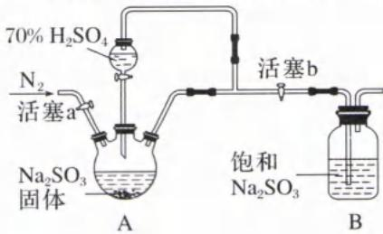

(2) 探究 $Na_{2}S_{2}O_{5}$ 的性质

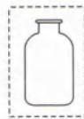  
C

<table><tr><td>实验编号</td><td>实验操作及现象</td></tr><tr><td>实验I</td><td>取B中少量白色晶体于试管中,加入适量蒸馏水,得溶液a,测得溶液呈酸性</td></tr><tr><td>实验II</td><td>取少量溶液a于试管中,滴加足量 $\mathrm{Ba(OH)_2}$ 溶液,有白色沉淀生成,过滤后,将沉淀放入试管中,滴加过量盐酸,充分振荡,产生气泡,白色沉淀溶解</td></tr><tr><td>实验III</td><td>取B中少量白色晶体于试管中,滴加1mL 2mol·L-1酸性KMnO4溶液,剧烈反应,溶液紫红色很快褪去</td></tr><tr><td>实验IV</td><td>取B中少量白色晶体于大试管中加热,将产生的气体通入品红溶液中,红色褪去;将褪色后的溶液加热,红色恢复</td></tr></table>

①由实验Ⅰ可知， $Na_{2}S_{2}O_{5}$ 溶于水，溶液呈酸性的原因是\_\_\_\_。

②实验Ⅱ中向白色沉淀中滴加过量盐酸,沉淀溶解,用平衡原理解释原因:\_\_\_\_。

③实验Ⅲ中经测定溶液中产生 $Mn^{2+}$ ，该反应的离子方程式是 \_\_\_\_。

④从实验Ⅲ、Ⅳ，体现出 $Na_{2}S_{2}O_{5}$ 具有的化学性质为 \_\_\_\_。

解析:(1)①A中利用强酸 $\left(\mathrm{H}_{2}\mathrm{SO}_{4}\right)$ 制备弱酸 $\left(\mathrm{H}_{2}\mathrm{SO}_{3}\right)$ ，对应的化学方程式为： $Na_{2}SO_{3}+H_{2}SO_{4}=Na_{2}SO_{4}+SO_{2}\uparrow+H_{2}O$ 。 $\left(\mathrm{H}_{2}\mathrm{SO}_{3}\right.$ 不稳定，会分解为 $SO_{2}$ 和 $H_{2}O$ 。② $SO_{2}$ 是酸性氧化物，用NaOH溶液吸收尾气；吸收

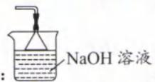

(2)①根据名称“焦亚硫酸钠”以及实验Ⅰ、Ⅱ可知， $\mathrm{Na_2S_2O_5}$ 与水反应的化学方程式为： $\mathrm{Na_2S_2O_5 + H_2O = 2NaHSO_3, NaHSO_3}$ 的电离程度大于水解程度，导致溶液呈酸性。

②往 $\mathrm{NaHSO}_{3}$ 溶液中加入足量 $\mathrm{Ba(OH)}_{2}$ 后，生成大量的沉淀 $BaSO_{3}$ 。 $BaSO_{3}$ 存在溶解平衡： $\mathrm{BaSO}_{3}(\mathrm{s})\rightleftharpoons\mathrm{Ba}^{2+}(\mathrm{aq})+\mathrm{SO}_{3}^{2-}(\mathrm{aq})$ ，加入过量盐酸后发生反应： $\mathrm{SO}_{3}^{2-}+2\mathrm{H}^{+}\xlongequal{\Delta}\mathrm{SO}_{2}\uparrow+\mathrm{H}_{2}\mathrm{O},c(\mathrm{SO}_{3}^{2-})$ 减小，使溶解平衡右移，促进沉淀溶解。

③ $Na_{2}S_{2}O_{5}$ 中 S 的化合价为 +4，具有较强还原性，酸性 $KMnO_{4}$ 具有较强氧化性，发生的离子方程式为： $5S_{2}O_{5}^{2-}+4MnO_{4}^{-}+2H^{+}=10SO_{4}^{2-}+4Mn^{2+}+H_{2}O$ 。

④实验Ⅲ体现了 $\mathrm{Na_2S_2O_5}$ 的还原性；实验IV加热 $\mathrm{Na_2S_2O_5}$ 生成了 $\mathrm{SO}_2$ ，体现了 $\mathrm{Na_2S_2O_5}$ 的不稳定性。

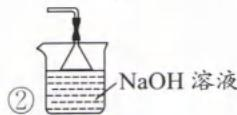

答案:(1)① $\mathrm{Na_{2}SO_{3}+H_{2}SO_{4}=Na_{2}SO_{4}+SO_{2}\uparrow+H_{2}O}$ ② NaOH溶液 (2)① $\mathrm{Na_{2}S_{2}O_{5}+H_{2}O=2NaHSO_{3}\quad HSO_{3}^{-}}$ 的电离程度大于水解程度。② $BaSO_{3}$ 存在溶解平衡: $\mathrm{BaSO_{3}(s)\rightleftharpoons Ba^{2+}(aq)+SO_{3}^{2-}(aq)}$ ,加入 $\mathrm{HCl},\mathrm{SO}_3^{2 - } + 2\mathrm{H}^+ = \mathrm{SO}_2\uparrow +\mathrm{H}_2\mathrm{O},\mathrm{SO}_3^{2 - }$ 浓度减小，使溶解平衡右移，促进沉淀溶解。 $③ 5S_{2}O_{5}^{2 - }+$ $4\mathrm{MnO_4^-} + 2\mathrm{H}^+ = 10\mathrm{SO}_4^{2 - } + 4\mathrm{Mn}^{2 + } + \mathrm{H}_{2}\mathrm{O}$ $④$ 还原性、不稳定性

【反思】①“焦某酸”是指两个多元含氧酸分子间脱去一个 $H_{2}O$ 之后形成的酸，如焦硫酸“ $H_{2}S_{2}O_{7}$ ”、焦亚硫酸“ $H_{2}S_{2}O_{5}$ ”。

②“偏某酸”是指多元含氧正酸分子内脱去 $H_{2}O$ 之后形成的酸，如正硅酸为“ $H_{4}SiO_{4}$ ”，偏硅酸为“ $H_{2}SiO_{3}$ ”。

【例 9】 $SOCl_{2}$ （二氯亚砜）广泛用于有机合成。某实验小组设计实验制备二氯亚砜并探究其性质。

【资料】①实验室制备原理:在活性炭催化下, $SO_{2}+Cl_{2}+SCl_{2}=2SOCl_{2}$

② $SOCl_{2}$ 、 $SCl_{2}$ 分别的沸点是78.8℃、59℃

③ $SOCl_{2}+H_{2}O=SO_{2}\uparrow+2HCl\uparrow,2SCl_{2}+2H_{2}O=SO_{2}\uparrow+S\downarrow+4HCl\uparrow$

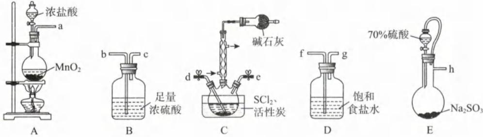

实验一:制备产品

根据图 1 所示装置设计实验(装置可以重复使用)

(1)分液漏斗在装浓盐酸之前需进行\_\_\_\_操作。

(2)装置接口连接顺序为 a→ → → → →d,e← ← ←h。

(3)C装置中碱石灰\_\_\_\_（填“能”、“否”）能否换成 $\mathrm{P}_2\mathrm{O}_5$ ，并解释原因\_\_\_\_。(4) $\mathrm{SOCl}_2$ 与足量NaOH溶液反应的离子方程式为\_\_\_\_。

实验二: 探究 $SOCl_{2}$ 的性质
将 $FeCl_{3} \cdot 2H_{2}O$ 和 $SOCl_{2}$ 以物质的量之比 2:1 混合后加热, 完全反应后, 取残留的固体溶于蒸馏水, 将溶液分成两份, 分别进行如下实验:

<table><tr><td>实验</td><td>操作</td><td>现象</td></tr><tr><td>I</td><td>滴加KSCN溶液</td><td>溶液无明显现象</td></tr><tr><td>II</td><td>滴加 $K_3[Fe(CN)_6]$ 溶液</td><td>产生蓝色沉淀</td></tr></table>

(5)上述实验说明 $SOCl_{2}$ 具有 \_\_\_\_ 性, $FeCl_{3} \cdot 2H_{2}O$ 和 $SOCl_{2}$ 以物质的量之比 2:1 混合后加热发生反应的化学方程式为 \_\_\_\_ 。

解析:(1)漏斗、容量瓶、滴定管使用之前均需要查漏。

(2)氯气中混有 $\mathrm{HCl}$ 、 $\mathrm{H}_2\mathrm{O}$ ，先用饱和食盐除去 $\mathrm{HCl}$ ，再用浓硫酸除去 $\mathrm{H}_2\mathrm{O}$ （杂质气体不唯一时，一般先除其他，最后除水）；洗气时遵循“长进短出”的规则，因此左面的顺序为 $\mathrm{a} \rightarrow \mathrm{f} \rightarrow \mathrm{g} \rightarrow \mathrm{b} \rightarrow \mathrm{c}$ 。 $\mathrm{SO}_2$ 中只有 $\mathrm{H}_2\mathrm{O}$ ，所以只需用浓硫酸干燥即可，因此右面的顺序为 $\mathrm{h} \rightarrow \mathrm{b} \rightarrow \mathrm{c} \rightarrow \mathrm{e}$ 。

(3)碱石灰的作用是吸收空气中的水蒸气,防止产品和原料水解损耗;碱石灰还可以吸收尾气 $Cl_{2}$ 、 $SO_{2}$ , 防止环境污染。 $P_{2}O_{5}$ 为酸性氧化物,虽能吸收空气中的水蒸气防止反应物和产物的水解,但不能吸收酸性气体 $Cl_{2}$ 、 $SO_{2}$ , 无法防止环境污染。

(4) $SOCl_{2}$ 与 NaOH 溶液反应, 可以理解成 $SOCl_{2}$ 先发生水解反应, 再发生中和。 $SOCl_{2}$ 水解生成 $SO_{2}$ 、HCl、 $SO_{2}$ 、HCl 分别与 NaOH 反应生成 $Na_{2}SO_{3}$ 、NaCl。所以最终的离子方程式为: $SOCl_{2} + 4OH^{-} = SO_{3}^{2-} + 2Cl^{-} + 2H_{2}O$ 。

(5)从实验Ⅱ“滴加 $\mathrm{K}_{3}\left[\mathrm{Fe}(\mathrm{CN})_{6}\right]$ 溶液，产生蓝色沉淀”可知有 $Fe^{2+}$ 生成，所以 $SOCl_{2}$ 有还原性。 $Fe^{3+}$ 被还原成 $Fe^{2+}$ ， $SOCl_{2}$ 被氧化成 $SO_{4}^{2-}$ ，对应的化学方程式为： $2FeCl_{3} \cdot 2H_{2}O + SOCl_{2} \xlongequal{\triangle} H_{2}SO_{4} + 2FeCl_{2} + 4HCl + H_{2}O$ 或 $2FeCl_{3} \cdot 2H_{2}O + SOCl_{2} \xlongequal{\triangle} FeSO_{4} + FeCl_{2} + 6HCl + H_{2}O$ 。

答案:(1)查漏 (2)fgbc cb (3)否 $Cl_{2}$ 、 $SO_{2}$ 均为酸性气体, $P_{2}O_{5}$ 为酸性氧化物

(4) $\mathrm{SOCl}_2 + 4\mathrm{OH}^- = \mathrm{SO}_3^{2-} + 2\mathrm{Cl}^- + 2\mathrm{H}_2\mathrm{O}$ (5)还原性 $2\mathrm{FeCl}_3 \cdot 2\mathrm{H}_2\mathrm{O} + \mathrm{SOCl}_2 \xlongequal{\triangle} \mathrm{H}_2\mathrm{SO}_4 + 2\mathrm{FeCl}_2 + 4\mathrm{HCl} + \mathrm{H}_2\mathrm{O}$ 或 $2\mathrm{FeCl}_3 \cdot 2\mathrm{H}_2\mathrm{O} + \mathrm{SOCl}_2 \xlongequal{\triangle} \mathrm{FeSO}_4 + \mathrm{FeCl}_2 + 6\mathrm{HCl} + \mathrm{H}_2\mathrm{O}$

# 模块 4 氮及其化合物(★★★)

习题：P29

# 第 1 节 氮气、氮的氧化物、氮的氢化物

## 内容提要

## 一、氮气

1. 氮元素: 氮元素在自然界中的存在形态既有游离态, 又有化合态。游离态是大气中的氮气, 化合态主要存在于动植物的蛋白质以及海水、土壤里的硝酸盐、铵盐。氮元素的最低化合价为 -3、最高化合价为 +5, 常见的化合价有 -3、0、+2、+3、+4、+5, 稳价为 0 价。

2. 氮气的结构: 氮气的电子式是: N::N:, 结构式为: N≡N, 氮氮三键键能大, 所以氮气的化学性质很稳定。

注：书写 $N_{2}$ 的电子式时，不要漏掉孤电子对。与氮气互为等电子体的微粒有 $CO, CN^{-}, C_{2}^{2-}$ 。

3. 氮气的化学性质(0价是氮元素的稳价和中间价, 所以氮气具有较弱氧化性和还原性)

(1)与金属反应: $3Mg+N_{2}\xlongequal{点燃}Mg_{3}N_{2}$

(2)与非金属反应:①与氢气反应: $3H_{2}+N_{2}\xlongequal[催化剂]{高温、高压}2NH_{3}$ ;

$$
② \text { 与氧气反应: } N _ {2} + O _ {2} \xlongequal {\text { 放电或高温 }} 2 N O 。
$$

注： $N_{2}$ 与 $O_{2}$ 在高温或放电条件下反应，不管 $O_{2}$ 的多或少，只能生成 NO。

4. 氮气的用途: 人工合成氨、做保护气等。

## 5. 氮的固定

(1)定义:将大气中游离的氮(即 $N_{2}$ )转化为氮的化合物的过程

(2) 分类: ① 高能固氮: 雷雨天气, 氧气和氮气放电时生成 NO; ② 生物固氮: 豆科植物的根瘤菌将氮气转化成含氮化合物; ③ 人工固氮: 人工合成氨, $3 \mathrm{H}_{2} + \mathrm{N}_{2} \xrightarrow[催化剂]{高温、高压} 2 \mathrm{NH}_{3}$ 。

## 二、氮的氧化物

## 1. 氧化物的分类

<table><tr><td>氮的氧化物</td><td> $N_{2}O$ </td><td>NO</td><td> $N_{2}O_{3}$ </td><td> $NO_{2}$ </td><td> $N_{2}O_{4}$ </td><td> $N_{2}O_{5}$ </td></tr><tr><td>N的化合价</td><td>+1</td><td>+2</td><td>+3</td><td>+4</td><td>+4</td><td>+5</td></tr><tr><td>是否为酸性氧化物</td><td>否</td><td>否</td><td>是</td><td>否</td><td>否</td><td>是</td></tr><tr><td>对应的酸</td><td>无</td><td>无</td><td> $HNO_{2}$ </td><td>无</td><td>无</td><td> $HNO_{3}$ </td></tr></table>

注：N 元素只有 5 种正价，却有六种氧化物。

## 2. NO 的性质

(1) 物理性质: 常温下, NO 为无色无味的有毒气体, 难溶于水, 密度与空气相近。

(2)化学性质:NO 主要体现强还原性和弱氧化性

$$
① 2 \mathrm{NO} + \mathrm{O} _ {2} = 2 \mathrm{NO} _ {2} \quad ② \mathrm{NO} + \mathrm{NO} _ {2} + 2 \mathrm{NaOH} = 2 \mathrm{NaNO} _ {2} + \mathrm{H} _ {2} \mathrm{O}
$$

$$
③ 4 \mathrm{NO} + 3 \mathrm{O} _ {2} + 4 \mathrm{NaOH} = 4 \mathrm{NaNO} _ {3} + 2 \mathrm{H} _ {2} \mathrm{O} ④ 2 \mathrm{NO} + 2 \mathrm{CO} \xrightarrow [ \triangle ]{\text { 催化剂 }} \mathrm{N} _ {2} + 2 \mathrm{CO} _ {2}
$$

(3)实验室常用稀硝酸和铜反应制备 NO: $3\mathrm{Cu} + 8\mathrm{HNO}_{3}$ (稀) = $3\mathrm{Cu}(\mathrm{NO}_{3})_{2} + 2\mathrm{NO}\uparrow + 4\mathrm{H}_{2}\mathrm{O}$ 。

注:①NO 易与 $O_{2}$ 反应且密度与空气相近,不能用排空气法收集,主要用排水法收集。

②NO不能直接用 NaOH 溶液进行尾气处理, 可用酸性 $KMnO_{4}$ 溶液将 NO 转化成 $NO_{3}^{-}(5NO + 3MnO_{4}^{-} + 4H^{+} = 3Mn^{2+} + 5NO_{3}^{-} + 2H_{2}O)$ , 或者将 NO 与 $O_{2}$ 混合后通入 NaOH 溶液进行吸收。

## 3. $\mathrm{NO}_{2}$ 的性质

(1)物理性质:常温下, $NO_{2}$ 为红棕色有刺激性气味的有毒气体,易溶于水,密度大于空气。
注:高中常考的红棕色气体包括 $NO_{2}$ 和溴蒸气。

(2)化学性质: $NO_{2}$ 主要体现强氧化性和弱还原性

$$
① 3 \mathrm{NO} _ {2} + \mathrm{H} _ {2} \mathrm{O} = \mathrm{NO} + 2 \mathrm{HNO} _ {3}
$$

$$
2 \mathrm{NO} _ {2} + 2 \mathrm{NaOH} = \mathrm{NaNO} _ {3} + \mathrm{NaNO} _ {2} + \mathrm{H} _ {2} \mathrm{O}
$$

$$
③ 4 \mathrm{NO} _ {2} + \mathrm{O} _ {2} + 4 \mathrm{NaOH} = 4 \mathrm{NaNO} _ {3} + 2 \mathrm{H} _ {2} \mathrm{O}
$$

$$
④ \mathrm{NO} _ {2} + \mathrm{NO} + 2 \mathrm{NaOH} = 2 \mathrm{NaNO} _ {2} + \mathrm{H} _ {2} \mathrm{O}
$$

$$
⑤ 2 \mathrm{NO} _ {2} + 4 \mathrm{CO} \xlongequal [ \triangle ] {\text { 催化剂 }} \mathrm{N} _ {2} + 4 \mathrm{CO} _ {2}
$$

$$
⑥ 2 \mathrm{NO} _ {2} (\mathrm{g}) \rightleftharpoons \mathrm{N} _ {2} \mathrm{O} _ {4} (\mathrm{g}) \quad \triangle H = - 5 6. 9 \mathrm{kJ/mol}
$$

(3)实验室常用浓硝酸和铜反应制备 $NO_{2}:Cu+4HNO_{3}$ (浓) $=\mathrm{Cu(NO_{3})_{2}}+2\mathrm{NO_{2}}\uparrow+2\mathrm{H_{2}O}$ 。

注：① $NO_{2}$ 与水反应，不能用排水法收集，应用密闭体系的向上排空气法收集。

② $NO_{2}$ 能直接用 NaOH 溶液进行尾气处理。

## 4. $NO_{x}$ 的危害及其治理方法

(1) $NO_{x}$ 的危害

①光化学烟雾:汽车尾气中的 $NO_{x}$ 、烃在紫外线作用下发生一系列反应,生成有毒的烟雾。

②硝酸型酸雨： $NO_{x}$ 与雨水作用生成 $HNO_{2}$ 、 $HNO_{3}$ ，造成酸雨危害。

③臭氧空洞: $NO_{x}$ 与平流层的臭氧作用,导致臭氧空洞。

④使人中毒:NO与血红蛋白结合,导致血红蛋白失去运氧能力。

(2) 治理方法: ① 使用新能源, 减少 $\mathrm{NO}_{x}$ 的排放; ② 对工业尾气进行碱吸法, 将 $\mathrm{NO}_{x}$ 转化成硝酸盐或亚硝酸盐回收; ③ 在催化剂、加热条件下, 氨、CO 等可将 $\mathrm{NO}_{x}$ 转化成无毒的 $\mathrm{N}_{2}$ 。

## 三、氮的氢化物

## 1. 氨气

$$
\begin{array}{c} \mathrm{H}: \ddot {\mathrm{N}}: \mathrm{H} \\ : \quad \ddot {\mathrm{H}} \end{array}
$$

## (1)电子式： $\ddot{H}$

注: N 最外层有 5 个价电子, 易形成 3 个共价键, 使其还有一个孤电子对, 因此 N 可以提供孤电子对形成配位键, 如 $NH_{3}$ 的孤电子对与 $H^{+}$ 的空轨道形成配位键; $NH_{3}$ 分别与 $Ag^{+}$ 、 $Cu^{2+}$ 形成 $\left[\mathrm{Ag}\left(\mathrm{NH}_{3}\right)_{2}\right]^{+}$ 、 $\left[\mathrm{Cu}\left(\mathrm{NH}_{3}\right)_{4}\right]^{2+}$ 。

(2) 物理性质: 常温下, 氨气是无色有强烈刺激性气味的气体, 密度小于空气, 极易溶于水 (在常温常压下, 1 体积水大约可溶解 700 体积氨气)。氨气存在分子间氢键, 易液化, 液氨汽化时要吸收大量的热, 使周围温度急剧降低, 因此液氨可用作制冷剂。

## (3)化学性质

①碱性：i. $NH_{3} + H_{2}O \rightleftharpoons NH_{3} \cdot H_{2}O \rightleftharpoons NH_{4}^{+} + OH^{-}$ ii. $NH_{3} + HCl = NH_{4}Cl$

注: 将蘸氨水的玻璃棒靠近蘸有挥发性酸(盐酸、硝酸、醋酸)的玻璃棒, 均能看到白烟(铵盐的固体)。

②强还原性：
i. $8NH_{3}(足)+3Cl_{2}=N_{2}+6NH_{4}Cl$ ii. $4NH_{3}+3O_{2}(纯氧)\xlongequal{点燃}2N_{2}+6H_{2}O$ iii. $8NH_{3}+6NO_{2}\xlongequal{点燃}12H_{2}O+7N_{2}$ iv. $4NH_{3}+5O_{2}\xlongequal{催化剂}\triangle4NO+6H_{2}O$

注: $NH_{3}$ 有较强的还原性,其氧化产物几乎都为 $N_{2}$ 。在铂做催化剂时(即反应iv), $NH_{3}$ 的氧化产物为NO,此反应是工业制硝酸最关键的一步。

③配位反应：

i. AgCl 溶于氨水: $\mathrm{AgCl} + 2\mathrm{NH}_{3} = [\mathrm{Ag}(\mathrm{NH}_{3})_{2}]^{+} + \mathrm{Cl}^{-}$

ii. AgOH 溶于氨水: $\mathrm{AgOH} + 2\mathrm{NH}_{3} = \left[\mathrm{Ag}\left(\mathrm{NH}_{3}\right)_{2}\right]^{+} + \mathrm{OH}^{-}$

iii. $\mathrm{Cu(OH)_{2}}$ 溶于氨水: $\mathrm{Cu(OH)_{2}+4NH_{3}=\left[Cu(NH_{3})_{4}\right]^{2+}+2OH^{-}}$

注:氨水参加的化学方程式,反应物的化学式到底写 $NH_{3}$ 还是 $NH_{3} \cdot H_{2}O$ , 关键看氨水体现的性质。若体现氨水碱性, 则大多数时候写 $NH_{3} \cdot H_{2}O$ ; 若氨水参加配位反应, 则大多数时候写 $NH_{3}$ 。产物的化学式到底写 $NH_{3}$ 还是 $NH_{3} \cdot H_{2}O$ , 关键看环境的温度。温度低写成 $NH_{3} \cdot H_{2}O$ (但 $\mathrm{Ba(OH)}_{2} \cdot 8\mathrm{H}_{2}\mathrm{O}$ 固体与 $NH_{4}Cl$ 固体的反应产物为 $NH_{3}$ ), 温度高写成 $NH_{3}$ 。

(4)用途:制硝酸、化肥;液氨做制冷剂等。

## (5) 实验室制备

①原理 i: $2NH_{4}Cl + Ca(OH)_{2} \xlongequal{\triangle} CaCl_{2} + 2NH_{3} \uparrow + 2H_{2}O$ (强碱制弱碱)，制备装置图如右图。

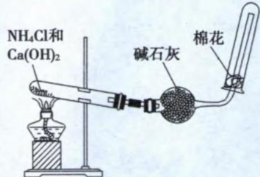

注：a.铵盐最好选 $\mathrm{NH_4Cl}$ ，若选 $\mathrm{NH_4NO_3}$ 、 $(\mathrm{NH}_4)_2\mathrm{SO}_4$ 、 $\mathrm{NH_4HCO_3}$ 等可能引入杂质，也可能发生爆炸。b. 强碱最好选用 $\mathrm{Ca(OH)}_{2}$ ，因为 NaOH 在加热时会腐蚀玻璃。c. 发生装置的试管口要低于试管尾。

原理 ii: 将浓氨水滴入碱石灰中, 总反应为: $\mathrm{CaO} + \mathrm{NH}_{3} \cdot \mathrm{H}_{2}\mathrm{O} = \mathrm{NH}_{3} \uparrow + \mathrm{Ca(OH)}_{2}$ (CaO 与水发生化合反应放出大量的热, $NH_{3} \cdot H_{2}O$ 不稳定受热分解)。

②干燥:常温下,氨气与酸性干燥剂以及无水氯化钙均会反应,所以常用碱石灰干燥氨气。

③收集:收集氨气可以采用向下排空法,也可以用排液 $\left(\mathrm{CCl}_{4}\right)$ 法。

注:氨气极易溶于水,所以排的液体一定不能有水。

④尾气处理:由于氨气是极易溶于水的碱性气体,可以用水或酸来吸收过量的氨气,吸收时一定要注意防倒吸。

(6)喷泉实验

①原理:使烧瓶内外产生较大的压强差(容器内压强远低于大气压),利用大气压将烧瓶下面烧杯中的液体压入烧瓶内,在导管口形成喷泉,喷泉实验即漂亮的“倒吸”。

②关键点:烧瓶内外形成压强差(气体溶于引发剂)

③常见的喷泉组合

<table><tr><td>气体</td><td>NH3</td><td>HCl</td><td>CO2</td><td>SO2</td><td>H2S</td><td>Cl2</td><td>NO2</td></tr><tr><td>引发剂</td><td colspan="2">水</td><td colspan="5">NaOH溶液</td></tr></table>

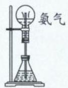  
图1

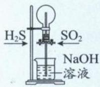  
图2

注：喷泉不一定用液体引发，也可以用气体引发或用温度引发。

i. 引发图 1 的喷泉实验, 可用热毛巾(或冷毛巾)敷烧瓶, 让氨气与水接触, 氨气被水快速吸收产生压强差。

ii. 引发图 2 的喷泉实验, 可将一种气体先装入烧瓶后, 再将另一气体通入烧瓶, 两气体发生反应: $2\mathrm{H}_{2}\mathrm{S}(\mathrm{g}) + \mathrm{SO}_{2}(\mathrm{g}) = 3\mathrm{S}(\mathrm{s}) + 2\mathrm{H}_{2}\mathrm{O}(\mathrm{l})$ , 反应后气体分子数减少, 导致烧瓶内压强降低。

2. 联氨(又名肼, 分子式 $N_{2}H_{4}$ )

H:N:N:H
(H)电子式： H H 结构式： H N-N H

(2) 物理性质: 常温下, 肼为刺激性气味的无色液体, 可与水形成氢键, 与水互溶。

(3)化学性质:和氨气的性质相似,具有弱碱性和强还原性

①碱性：i. $N_{2}H_{4} + H_{2}O \rightleftharpoons N_{2}H_{5}^{+} + OH^{-}$ ; ii. $N_{2}H_{5}^{+} + H_{2}O \rightleftharpoons N_{2}H_{6}^{2+} + OH^{-}$ ; iii. $N_{2}H_{4} + 2HCl$ (足) = $N_{2}H_{6}Cl_{2}$ 。

②还原性： $N_{2}H_{4}+O_{2}$ （纯氧） $\xlongequal{点燃}N_{2}+2H_{2}O$ ，肼是一种高效的燃料。

四、与氮有关的碱 $\left(\mathrm{NH}_{3}\cdot\mathrm{H}_{2}\mathrm{O}\right)$

(1)物理性质: $\mathrm{NH_{3}\cdot H_{2}O}$ 是一元弱碱 $(\mathrm{NH_{3}\cdot H_{2}O}\rightleftharpoons\mathrm{NH_{4}^{+}+OH^{-}})$ , 其电离平衡常数与醋酸相当, 其浓溶液易挥发。

(2)化学性质
①碱性：i. $NH_{3} \cdot H_{2}O + HCl = NH_{4}Cl + H_{2}O$ ii. $CuSO_{4} + 2NH_{3} \cdot H_{2}O = Cu(OH)_{2} \downarrow + (NH_{4})_{2}SO_{4}$ ②受热不稳定： $NH_{3} \cdot H_{2}O \xlongequal{\triangle} NH_{3} \uparrow + H_{2}O$ 注：有氨水参加的过程，温度不宜过高，温度过高会导致氨水挥发和分解损失。

类型 I: 基础常识判断

【例 1】正误判断, 正确的填“√”, 错误的填“×”。

(1)(2023·北京卷)密闭烧瓶内 $NO_{2}$ 和 $N_{2}O_{4}$ 的混合气体, 受热后颜色加深, 可以用平衡原理

(2)(2023·北京卷)用右图装置可验证氨气极易溶于水且溶液呈碱性( )
(3)(2023·湖南卷)相互滴加氨水和硝酸银,现象不一样( )
(4)(2023·海南卷)用碱石灰干燥氨气( )
(5)(2023·海南卷)1.7 g NH₃ 完全溶于 1 L H₂O 所得溶液,NH₃ · H₂O 微粒数目为 0.1N\_A( )

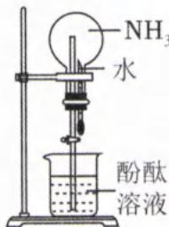

解析:(1)(√) $2NO_{2}$ (红棕色) $\rightleftharpoons N_{2}O_{4}$ (无色) $\Delta H<0$ ,升温平衡逆向移动,导致混合气体颜色加深。

(2)(√)该装置可形成红色的喷泉,既能证明氨气极易溶于水,也能证明氨水呈碱性。

(3)(√)氨水逐滴加入硝酸银溶液,先看到白色沉淀,对应离子方程式: $\mathrm{Ag^{+}+NH_{3}\cdot H_{2}O=AgOH\downarrow+NH_{4}^{+}}$ ,后白色沉淀溶解,对应离子方程式为: $\mathrm{AgOH+2NH_{3}=[Ag(NH_{3})_{2}]^{+}+OH^{-}}$ 。硝酸银滴加到氨水中,先无明显现象,对应离子方程式为: $\mathrm{Ag^{+}+2NH_{3}=[Ag(NH_{3})_{2}]^{+}}$ 。
(4)(√)氨气是碱性气体,碱石灰呈碱性,可以用碱石灰干燥氨气。

(5)(×)氨溶于水时,会与水结合成 $NH_{3} \cdot H_{2}O$ , $NH_{3} \cdot H_{2}O$ 有一小部分电离形成 $NH_{4}^{+}$ 和 $OH^{-}$ , 因此氨水中的 $NH_{3} \cdot H_{2}O$ 微粒数目小于 $0.1N_{A}$ 。

答案:(1)√ (2)√ (3)√ (4)√ (5)×

【例 2】2024 年 1 月 19 日, 天舟六号货运飞船成功再进入大气层。在其撤离空间站组合体并独立飞行期间, 还成功释放大连理工大学试验卫星, 这标志着我国航天事业进入到高质量发展新阶段。下列不能作为火箭推进剂的是( )

A. 液氮—液氢    B. 液氧—液氢    C. 液态 $NO_{2}$ —肼    D. 液氧—煤油

解析: 火箭推进剂一般是强氧化剂、强还原剂, 推进剂发生反应的条件不苛刻, 反应后产物对环境友好。

液氮(稳价)、液氢(强还原剂)反应需要高温高压,且转化率低,释放的能量少,不能做推进剂,A选项符合题意。强还原剂液氢、煤油、肼可在强氧化剂液氧、 $NO_{2}$ 中充分燃烧,释放大量能量,产生巨大推力,能做推进剂,因此B、C、D选项均不符合题意。

答案:A

【例 3】自然界中氮的循环如图所示。下列说法不正确的是（）
A. 豆科植物的根瘤菌固氮是物理变化
B. 氮的固定均属于氧化还原反应
C. 含氮无机物与含氮有机化合物可相互转化
D. 人体中的蛋白质主要来自于食用动植物

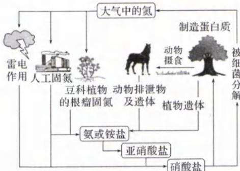

解析:生物固氮将0价的N原子转化为化合物中的N原子(化合物中的N元素不是0价),肯定发生了氧化还原反应,A选项错误,B选项正确。根据示意图可知,含氮无机物(硝酸盐)和含氮有机物(蛋白质)可以相互转化,C选项正确。人体中的蛋白质靠食用动植物蛋白质(如鸡蛋、肉类、大豆等)给予补充,D选项正确。

类型Ⅱ: 阿伏加德罗常数

【例 4】 $N_{A}$ 表示阿伏加德罗常数的值,下列说法正确的是( )

A. 3 mol $H_{2}$ 和 1 mol $N_{2}$ 充分反应,转移电子数为 $6N_{A}$ B. 2 mol NO 和 1 mol $O_{2}$ 充分反应,反应后体系中分子数为 $2N_{A}$ C. 1 mol $NO_{2}$ 和足量 NaOH 溶液充分反应,转移电子数为 $0.5N_{A}$ D. 72 g 镁在空气中充分燃烧,生成的 $N^{3-}$ 个数为 $2N_{A}$

解析: A. 人工合成氨的反应是典型的可逆反应: $3 \mathrm{H}_{2} + \mathrm{N}_{2} \xrightarrow[\text {催化剂}]{\text {高温、高压}} 2 \mathrm{NH}_{3}, 3 \mathrm{~mol} \mathrm{H}_{2}$ 和 $1 \mathrm{~mol} \mathrm{~N}_{2}$ 不能完全反应, 因此转移电子数小于 $6 \mathrm{~N}_{\mathrm{A}}$ , A 选项错误。  
B. NO 与 $\mathrm{O}_{2}$ 混合, 发生的化学反应有: $2 \mathrm{NO} + \mathrm{O}_{2} = 2 \mathrm{NO}_{2}, 2 \mathrm{NO}_{2}(\mathrm{g}) \rightleftharpoons \mathrm{N}_{2} \mathrm{O}_{4}(\mathrm{g})$ , 根据方程式可知 $2 \mathrm{~mol} \mathrm{NO}$ 和 $1 \mathrm{~mol} \mathrm{O}_{2}$ 恰好完全反应生成 $2 \mathrm{~mol} \mathrm{NO}_{2}$ , 但由于部分 $\mathrm{NO}_{2}$ 转化成 $\mathrm{N}_{2} \mathrm{O}_{4}$ (该反应为气体计量数减小的反应), 导致体系中的分子数小于 $2 \mathrm{~N}_{\mathrm{A}}$ , B 选项错误。  
C. $\mathrm{NO}_{2}$ 与 $\mathrm{NaOH}$ 发生歧化反应: $2 \mathrm{NO}_{2} + 2 \mathrm{NaOH} = \mathrm{NaNO}_{3} + \mathrm{NaNO}_{2} + \mathrm{H}_{2} \mathrm{O}$ , 反应中 $\mathrm{NO}_{2}$ 与转移 $\mathrm{e}^{-}$ 的个数比为 $2:1, 1 \mathrm{~mol} \mathrm{NO}_{2}$ 完全反应转移电子数应该为 $0.5 \mathrm{~N}_{\mathrm{A}}$ , C 选项正确。  
D. 镁在空气中燃烧主要生成氧化镁和氮化镁, 对应的化学方程式分别为: $\mathrm{Mg} + \mathrm{O}_{2} \xrightarrow{\text {点燃}} 2 \mathrm{MgO}, 3 \mathrm{Mg} + \mathrm{N}_{2} \xrightarrow{\text {点燃}} \mathrm{Mg}_{3} \mathrm{~N}_{2}, n(\mathrm{Mg}) = \frac{m}{M} = \frac{72 \mathrm{~g}}{24 \mathrm{~g/mol}} = 3 \mathrm{~mol}$ 。根据方程式可知, $3 \mathrm{~mol} \mathrm{Mg}$ 可以生成 $1 \mathrm{~mol} \mathrm{Mg}_{3} \mathrm{~N}_{2}$ 。 $\mathrm{Mg}_{3} \mathrm{~N}_{2}$ 是离子化合物, $1 \mathrm{~mol} \mathrm{Mg}_{3} \mathrm{~N}_{2}$ 含 $\mathrm{N}^{3-}$ 个数为 $2 \mathrm{~N}_{\mathrm{A}}$ 。但由于部分 $\mathrm{Mg}$ 与 $\mathrm{O}_{2}$ 反应生成 $\mathrm{MgO}$ , 因此 $\mathrm{N}^{3-}$ 个数小于 $2 \mathrm{~N}_{\mathrm{A}}$ , D 选项错误。

答案:C

类型Ⅲ:元素推导

【例 5】(2023·全国甲卷)W、X、Y、Z为短周期主族元素,原子序数依次增大,最外层电子数之和为19。Y的最外层电子数与其K层电子数相等, $WX_{2}$ 是形成酸雨的物质之一。下列说法正确的是( )

A. 原子半径: X > W

B. 简单氢化物的沸点: X < Z

C. Y与X可形成离子化合物

D. Z的最高价含氧酸是弱酸

解析: $\mathrm{WX}_{2}$ 是形成酸雨的物质之一, 则 $\mathrm{WX}_{2}$ 可能是 $\mathrm{NO}_{2}$ 或 $\mathrm{SO}_{2}$ 。由于 W、X、Y、Z 为短周期主族元素, 原子序数依次增大, 则 $\mathrm{WX}_{2}$ 只能是 $\mathrm{NO}_{2}$ 。Y 的最外层电子数与其 K 层电子数相等, 且 Y 原子序数大于 O, 则 Y 为 Mg。W、X、Y、Z 外层电子数之和为 19, 则 Z 为 S。
A. N、O 的电子层数相同, 根据“序大径小”原则, 原子半径: N > O, A 选项错误。
B. $H_{2}O$ 分子间存在氢键, 沸点: $H_{2}O > H_{2}S$ , B 选项错误。
C. Mg 与 O 可形成 MgO, MgO 是离子化合物, C 选项正确。
D. $H_{2}SO_{4}$ 是 S 的最高价含氧酸, 硫酸是常见六大强酸之一, D 选项错误。
答案: C

类型Ⅳ:实验题型

【例 6】喷泉实验装置如图所示。应用下列各组气体—溶液,能出现喷泉现象的是()

<table><tr><td>选项</td><td>气体</td><td>溶液</td></tr><tr><td>A</td><td> $H_2S$ </td><td>稀盐酸</td></tr><tr><td>B</td><td>HCl</td><td>稀氨水</td></tr><tr><td>C</td><td>NO</td><td>稀  $H_2SO_4$ </td></tr><tr><td>D</td><td> $CO_2$ </td><td>饱和  $NaHCO_3$  溶液</td></tr></table>

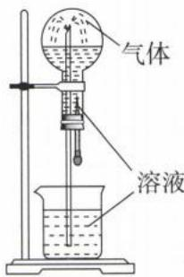

解析:溶液能否溶解气体是喷泉实验能否发生的关键。

A. $\mathrm{H}_{2} \mathrm{~S}$ 为酸性气体, 不溶于稀盐酸, 无法形成压强差。应将稀盐酸换成 $\mathrm{NaOH}$ 溶液, A 选项不符合题意。  
B. HCl 为酸性气体, 极易溶于稀氨水, 导致圆底烧瓶内部压强减小形成喷泉, B 选项符合题意。  
C. NO 不溶于稀硫酸, 无法形成压强差, C 选项不符合题意。  
D. $\mathrm{CO}_{2}$ 不溶于饱和 $\mathrm{NaHCO}_{3}$ , 无法形成压强差, D 选项不符合题意。  
答案: B

【例 7】下列装置或操作不能达到相应实验目的的是（）

<table><tr><td>A</td><td>B</td><td>C</td><td>D</td></tr><tr><td></td><td></td><td></td><td></td></tr><tr><td>生成  $NO_2$ </td><td>收集  $NO_2$ </td><td>吸收  $NO_2$  尾气</td><td>使  $NO_2$  充分转化为  $HNO_3$ </td></tr></table>

解析: A. 浓硝酸与铜反应的化学方程式为: $\mathrm{Cu} + 4\mathrm{HNO}_{3}$ (浓) = $\mathrm{Cu(NO_{3})_{2}} + 2\mathrm{NO}_{2} \uparrow + 2\mathrm{H}_{2}\mathrm{O}$ ，发生装置可用分液漏斗与圆底烧瓶，A 选项正确。

B. $\mathrm{NO}_2$ 的密度大于空气密度, 应该用“长进短出”法收集 $\mathrm{NO}_2$ , B 选项错误。

C. $NO_{2}$ 与 NaOH 发生歧化反应: $2NO_{2} + 2NaOH = NaNO_{3} + NaNO_{2} + H_{2}O$ ，可用 NaOH 溶液吸收 $NO_{2}$ 尾气，C 选项正确。

D. 若不通入 $O_{2}$ ，则 $NO_{2}$ 与 $H_{2}O$ 反应的化学方程式为： $3NO_{2} + H_{2}O = 2HNO_{3} + NO$ ，此时只有 $\frac{2}{3}$ 的 $NO_{2}$ 转化成 $HNO_{3}$ ；若通入 $O_{2}$ ，则化学方程式为： $4NO_{2} + O_{2} + 2H_{2}O = 4HNO_{3}$ ， $NO_{2}$ 可以完全转化为 $HNO_{3}$ ，D 选项正确。
答案：B

## 第 2 节 含氮的酸和盐、磷及其化合物

## 内容提要

## 一、含氮的酸

## 1. 常见含氮酸的名称和分类

<table><tr><td>名称</td><td>叠氮酸</td><td>亚硝酸</td><td>硝酸</td></tr><tr><td>化学式</td><td> $HN_3$ </td><td> $HNO_2$ </td><td> $HNO_3$ </td></tr><tr><td>类别</td><td>弱酸,酸性和醋酸相似</td><td>中强酸</td><td>强酸</td></tr></table>

注:(1)中强酸属于弱酸,在水中部分电离。

(2)亚硝酸不稳定,易分解: $2HNO_{2}=NO_{2}\uparrow+NO\uparrow+H_{2}O$

2. 硝酸

(1) 物理性质: 硝酸是无色、易挥发、有刺激性气味、极易溶于水的液体。

(2)化学性质

①酸的通性(硝酸是强氧化性酸,只有酸的部分通性)

i. 与碱生成盐和水 ii. 与碱性氧化物生成盐和水 iii. 与盐生成新盐和新酸

②强氧化性

i. 与金属单质反应

a. 铁、铝遇冷的浓硝酸会钝化。

b. 铁与稀硝酸反应：

Fe 少量: $\mathrm{Fe} + 4\mathrm{HNO}_{3}(\text{稀}) = \mathrm{Fe}(\mathrm{NO}_{3})_{3} + \mathrm{NO}\uparrow + 2\mathrm{H}_{2}\mathrm{O};$

Fe 过量: $3\mathrm{Fe} + 8\mathrm{HNO}_{3}$ (稀) = $3\mathrm{Fe}(\mathrm{NO}_{3})_{2} + 2\mathrm{NO}\uparrow + 4\mathrm{H}_{2}\mathrm{O}$

c. 铜与硝酸反应：

$$
\mathrm{Cu} + 4 \mathrm{HNO} _ {3} (\text {   浓   }) = \mathrm{Cu(NO} _ {3}) _ {2} + 2 \mathrm{NO} _ {2} \uparrow + 2 \mathrm{H} _ {2} \mathrm{O};
$$

$$
3 \mathrm{Cu} + 8 \mathrm{HNO} _ {3} (\text {   稀   }) = 3 \mathrm{Cu(NO} _ {3}) _ {2} + 2 \mathrm{NO} \uparrow + 4 \mathrm{H} _ {2} \mathrm{O。}
$$

d. 镁和极稀的冷硝酸反应: $4\mathrm{Mg} + 10\mathrm{HNO}_{3}$ (稀) = $4\mathrm{Mg}\left(\mathrm{NO}_{3}\right)_{2} + \mathrm{NH}_{4}\mathrm{NO}_{3} + 3\mathrm{H}_{2}\mathrm{O}$

注:浓硝酸和浓盐酸以体积比1∶3混合即得王水。王水可以溶解不溶于硝酸的铂、金,是盐酸的强配位能力和硝酸的强氧化性共同作用的结果。王水溶解金的化学方程式: $Au+HNO_{3}+4HCl=NO\uparrow+2H_{2}O+H[AuCl_{4}]$ ; 王水溶解铂的化学方程式: $3Pt+4HNO_{3}+18HCl=4NO\uparrow+8H_{2}O+3H_{2}[PtCl_{6}]$ 。

ii. 与非金属单质反应

$$
\mathrm{C} + 4 \mathrm{HNO} _ {3} (\text {浓}) \xlongequal {\triangle} \mathrm{CO} _ {2} \uparrow + 4 \mathrm{NO} _ {2} \uparrow + 2 \mathrm{H} _ {2} \mathrm{O}; \mathrm{P} + 5 \mathrm{HNO} _ {3} (\text {浓}) \xlongequal {\triangle} \mathrm{H} _ {3} \mathrm{PO} _ {4} + 5 \mathrm{NO} _ {2} \uparrow + \mathrm{H} _ {2} \mathrm{O} 。
$$

iii. 与化合物反应: 稀硝酸可以与很多还原性化合物反应, 如硫化物、亚硫酸盐、碘化物、亚铁盐等。如稀硝酸与 $\mathrm{FeCl}_{2}$ 反应的离子方程式为: $3\mathrm{Fe}^{2+} + \mathrm{NO}_{3}^{-} + 4\mathrm{H}^{+} = \mathrm{NO} \uparrow + 3\mathrm{Fe}^{3+} + 2\mathrm{H}_{2}\mathrm{O}$ 。

③受热不稳定性: $4 \mathrm{HNO}_{3}$ (浓) $\xlongequal{\triangle} 4 \mathrm{NO}_{2} \uparrow + \mathrm{O}_{2} \uparrow + 2 \mathrm{H}_{2} \mathrm{O}$ 。

注：浓硝酸见光也会分解，所以保存浓硝酸应该用棕色试剂瓶。

④硝化反应： $\ce{C6H5 + HNO3(浓) ->[浓硫酸][△] C6H5 - NO2 + H2O}$

注：a. 活泼金属与硝酸反应的还原产物一般是氮的化合物，不是 $H_{2}$ 。

b. 无特殊说明, 浓硝酸的还原产物是 $\mathrm{NO}_{2}$ , 稀硝酸的还原产物是 $\mathrm{NO}$ ; 书写化学方程式时, 要注明硝酸的“稀”或“浓”。

c. 硝酸与金属的反应是部分氧化还原反应, 硝酸既体现酸性(形成盐), 又体现氧化性(N 的化合价降低)。

(3) 用途: 有机合成; 制炸药; 制农药; 制染料等。

(4) 工业制备: ①人工合成氨: $3 \mathrm{H}_{2} + \mathrm{N}_{2} \xrightarrow[催化剂]{高温、高压} 2 \mathrm{NH}_{3}$ ; ②氨气的催化氧化: $4 \mathrm{NH}_{3} + 5 \mathrm{O}_{2} \xrightarrow[\triangle]{催化剂} 4 \mathrm{NO} + 6 \mathrm{H}_{2} \mathrm{O}$ ; ③ NO 的氧化: $2 \mathrm{NO} + \mathrm{O}_{2} = 2 \mathrm{NO}_{2}$ ; ④ $\mathrm{NO}_{2}$ 的吸收: $4 \mathrm{NO}_{2} + \mathrm{O}_{2} + 2 \mathrm{H}_{2} \mathrm{O} = 4 \mathrm{HNO}_{3}$ 。

## 二、含氮的盐

1.铵盐

(1) 物理性质: 绝大多数的铵盐易溶于水, 且溶于水时会吸收大量的热。

(2)化学性质：

①水解后呈酸性,能与强碱反应: $NH_{4}Cl+NaOH=NaCl+NH_{3}\cdot H_{2}O$ 。

②受热易分解：i. $\mathrm{NH_4Cl}\xrightarrow{\triangle}\mathrm{NH_3}\uparrow +\mathrm{HCl}\uparrow$ ii. $\mathrm{NH_4HCO_3}\xrightarrow{\triangle}\mathrm{NH_3}\uparrow +\mathrm{CO_2}\uparrow +\mathrm{H_2O}$

iii. $5NH_{4}NO_{3}\xlongequal{\triangle}4N_{2}\uparrow+2HNO_{3}+9H_{2}O$ (温度不同,分解产物也可能不相同)。

(3) $NH_{4}^{+}$ 的检验方法:取样品溶于水,加入NaOH溶液并加热,生成能使湿润红色石蕊试纸变蓝的气体。

## 注：铵盐的分解规律

a. 若对应酸稳定且无氧化性，则分解产物为 $NH_{3}$ 、对应酸，如 $NH_{4}Cl$ 。

b. 若对应酸不稳定且无氧化性，则分解产物为 $NH_{3}$ 、酸性氧化物、水，如 $NH_{4}HCO_{3}$ 、 $NH_{4}HSO_{3}$ 。

c. 若对应酸有氧化性则分解产物有 $N_{2}$ ，如 $NH_{4}NO_{3}$ 。

## 2. 叠氮酸盐

(1) $N_{3}^{-}$ 与 $CO_{2}$ 互为等电子体(原子总数和价电子总数都相同),N的杂化方式为sp,是直线形离子,离子中有两个 $\Pi_{3}^{4}$ 键。

(2)汽车安全气囊中加入的是叠氮酸钠 $\left(\mathrm{NaN}_{3}\right)$ ，其受撞击时迅速分解成氮气： $3\mathrm{NaN}_{3}\xlongequal{\text{撞击}}4\mathrm{N}_{2}\uparrow+\mathrm{Na}_{3}\mathrm{N}$ 。

## 3. 硝酸盐

(1)硝酸盐的溶解度偏大,且溶于水会吸收大量的热。

(2)硝酸盐受热易分解: $2AgNO_{3}\xlongequal{\triangle}O_{2}\uparrow+2NO_{2}\uparrow+2Ag$

注:①一般情况下,若盐对应的酸或碱不稳定,则该盐也往往不稳定,如 $NaHCO_{3}$ 、 $NH_{4}HCO_{3}$ 等。

②组成硝酸盐的金属元素越活泼,该硝酸盐分解就越困难。

## 三、氮的价类二维图

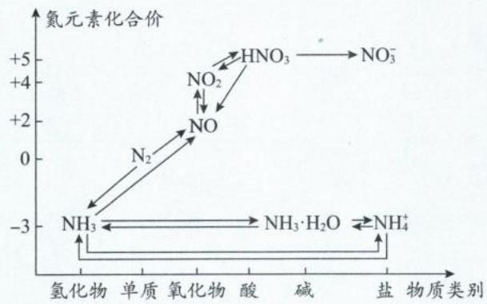

四、常见含氮物质的转化关系图

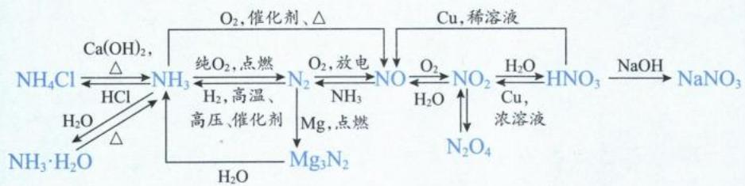

## 五、磷及其化合物

## 1. 磷单质

(1)磷元素:N、P、K是植物生长所必需的三种营养元素,所以含磷洗涤剂、化肥的过度使用均会造成水体富营养化。P元素的最低化合价为-3,最高化合价为+5,较稳定的化合价为+5价。

(2) 磷单质

①磷单质有多种同素异形体,常见的是红磷和白磷。红磷稳定性远大于白磷。白磷 $\left( {\mathrm{P}}_{4}\right)$

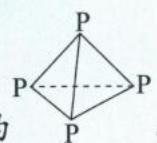

的结构式为 P，分子结构为正四面体，1 mol P $_{4}$ 含 P—P 键个数 6N $_{A}$ ，键角为 60°。

②由于 P 的稳价为 +5 价, 所以白磷有很强的还原性, 白磷易自燃, 需放在水中保存。P 既可以在氧气中燃烧, 也可以在氯气中燃烧: $4P + 5O_{2} \xlongequal{点燃} 2P_{2}O_{5}$ 、 $2P + 3Cl_{2} \xlongequal{点燃} 2PCl_{3}$ 。

2. 磷的氧化物: 磷有两种常见氧化物, 分别为 $P_{4}O_{6}$ 、 $P_{4}O_{10}$ , 简写成 $P_{2}O_{3}$ 、 $P_{2}O_{5}$ , 二者均为酸性氧化物, 具有酸性氧化物的通性。 $P_{2}O_{5}$ 是实验室常用的酸性干燥剂, 但不能作为食品干燥剂。

3. $PH_{3}$ 具有极强还原性，在空气中易自燃： $2PH_{3} + 4O_{2} \xlongequal{点燃} P_{2}O_{5} + 3H_{2}O$ (“鬼火”现象。)

## 4. 常见含磷的酸

## (1)含磷酸的分类

<table><tr><td>名称</td><td>次磷酸</td><td>亚磷酸</td><td>(正)磷酸</td></tr><tr><td>化学式</td><td> $H_3PO_2$ </td><td> $H_3PO_3$ </td><td> $H_3PO_4$ </td></tr><tr><td>类别</td><td>一元酸</td><td>二元酸</td><td>三元酸</td></tr><tr><td>结构</td><td></td><td></td><td></td></tr></table>

注:①含氧酸中的非羟基氧与酸的强度有关(非羟基氧越多,酸性越强),羟基氢和酸的元数有关。

② $H_{3}PO_{2}$ 、 $H_{3}PO_{3}$ 、 $H_{3}PO_{4}$ 与足量的NaOH反应后，生成正盐的化学式分别为 $NaH_{2}PO_{2}$ 、 $Na_{2}HPO_{3}$ 、 $Na_{3}PO_{4}$ 。

③ $H_{3}PO_{2}$ 、 $H_{3}PO_{3}$ 是强还原性酸； $H_{3}PO_{4}$ 是高沸点酸，实验室可用 $H_{3}PO_{4}$ 制备挥发性酸：HCl、HBr、HI等。

(2) 磷酸

①物理性质:磷酸在常温下为固态(分子间存在氢键),沸点较高,且与水互溶。

②化学性质:磷酸的化合价稳定,主要体现三元中强酸的酸性。

## 5. 含磷的盐

(1) 磷酸盐的溶解度: 磷酸盐只溶钾、钠、铵盐。

(2)磷酸酸式盐的性质: $\mathrm{H}_{2}\mathrm{PO}_{4}^{-}$ 电离程度大于水解程度,则 $\mathrm{NaH}_{2}\mathrm{PO}_{4}$ 的水溶液显酸性; $\mathrm{HPO}_{4}^{2-}$ 电离程度小于水解程度, $\mathrm{Na}_{2}\mathrm{HPO}_{4}$ 的水溶液显碱性。

6. 磷的氯化物: 常见含磷氯化物有 $PCl_{3}$ 、 $PCl_{5}$ ，分子构型分别三角锥形、三角双锥形，两种物质均极易水解: $PCl_{3} + 3H_{2}O = 3HCl + H_{3}PO_{3}$ 、 $PCl_{5} + 4H_{2}O = 5HCl + H_{3}PO_{4}$ 。

类型 I: 基础常识判断

【例 1】正误判断, 正确的填“√”, 错误的填“×”。

(1) 尽量少用或不用含磷洗涤剂, 可减少水体的富营养化()

(2)牙齿的主要成分羟基磷酸钙是一种有机物()

(3)31 g 白磷所含 P—P 键个数为 $3N_{A}$ ( )

$$
\mathrm{P} _ {2} \mathrm{O} _ {5}
$$

(5) $H_{3}PO_{2}$ 与足量 NaOH 溶液反应生成的 $NaH_{2}PO_{2}$ 从属于酸式盐（）
(6)磷酸是弱酸,根据由强制弱的原理,磷酸不能制备盐酸( )
(7)(2023·北京卷)铁钉放入浓 $HNO_{3}$ 中,待不再变化后,加热能产生大量红棕色气体,可以用平衡原理解释( )
(8)(2024·山东卷)五氧化二磷可用作食品干燥剂( )
(9)(2024·北京卷)核酸可看作磷酸、戊糖和碱基通过一定方式结合而成的生物大分子( )
解析:(1)(√)N、P、K 是植物生长的三种营养元素,过量排放 P 元素,会导致水体富营养化。
(2)(×)羟基磷酸钙化学式为 $\mathrm{Ca}_{5}\left(\mathrm{PO}_{4}\right)_{3}\mathrm{OH}$ ,该物质不含碳元素,是无机物。

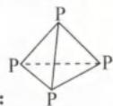

(3)(×)白磷的空间结构为：P，根据图像可知，每个P原子周围有3个P—P键，则均摊后，31 g（即1 mol P 原子）所含P—P键数目为 $1.5N_{A}$ 。
(4)(×) $P_{2}O_{5}$ 是酸性氧化物，会与氨气反应。氨气只能用碱性干燥剂来干燥，如碱石灰。
(5)(×) $H_{3}PO_{2}$ 是一元酸，所以 $NaH_{2}PO_{2}$ 是正盐。正盐并非看是否有氢原子，而是看能否电离出 $H^{+}$ 。
(6)(×)复分解反应不一定遵循强酸制弱酸，还可以遵循高沸点酸制低沸点酸。磷酸的沸点远高于盐酸，所以可以用磷酸制备HCl。
(7)(×)常温下铁钉遇浓 $HNO_{3}$ 会发生钝化现象（铁表面生成致密氧化膜），加热后，致密氧化膜被破坏，使铁与浓 $HNO_{3}$ 持续反应，该过程与平衡的移动无关。
(8)(×)实验室中 $P_{2}O_{5}$ 可以做干燥剂，干燥酸性、中性气体，但 $P_{2}O_{5}$ 不能干燥食品。
(9)(√)核酸可以水解成核苷酸，核苷酸又可以水解成磷酸和核苷；核苷在酶的作用下，又可以水解为核糖和碱基。因此核酸可看作磷酸、戊糖和碱基通过一定方式结合而成的生物大分子。
答案:(1)√ (2)× (3)× (4)× (5)× (6)× (7)× (8)× (9)√

【例 2】硝酸被称为“国防工业之母”，是因为它是制取炸药的重要原料。下列实验事实与硝酸性质对应不准确的一组是（）
A. 硝酸能与 FeO 反应——酸性和氧化性
B. 不能用稀硝酸与锌反应制氢气——强氧化性
C. 要用棕色试剂瓶盛装浓硝酸——不稳定性
D. 能使滴有酚酞的氢氧化钠溶液红色褪去——强氧化性

解析：A. 硝酸与 FeO 反应为： $10\mathrm{HNO}_{3} + 3\mathrm{FeO} = 3\mathrm{Fe}(\mathrm{NO}_{3})_{3} + \mathrm{NO}\uparrow + 5\mathrm{H}_{2}\mathrm{O}$ 。该反应中共 10 份硝酸参加反应，其中 1 份硝酸 N 的化合价降低体现氧化性，9 份硝酸化合价未变体现酸性（形成盐），A 选项正确。
B. 稀硝酸与锌反应生成 NO，是因为酸性环境下 $NO_{3}^{-}$ 的氧化性大于 $H^{+}$ ，B 选项正确。
C. 浓硝酸见光会分解： $4\mathrm{HNO}_{3}(\text{浓}) \xlongequal{\text{光}} 4\mathrm{NO}_{2} \uparrow + \mathrm{O}_{2} \uparrow + 2\mathrm{H}_{2}\mathrm{O}$ ，所以应该用棕色瓶盛装，C 选项正确。
D. 硝酸将 NaOH 中和完全后，溶液碱性减弱，酚酞的红色褪去，与硝酸氧化性无关，D 选项错误。
答案：D

类型Ⅱ:价类二维图

【例 3】含氮物质的分类与相应化合价的关系如图所示。下列说法不正确的是()

A. 实验室可用排水法收集 e
B. b→a 属于人工固氮的过程
C. 将 c 和 e 通入到强碱溶液中, 可生成 d
D. 工业上可用气体 a、空气和水为原料生产 f
解析: a 为 $NH_{3}$ 、b 为 $N_{2}$ 、c 为 NO、d 为亚硝酸盐、f

<table><tr><td>物质类别</td><td>a</td><td>b</td><td>c</td><td>d</td><td>e(NO2)</td><td>f</td></tr><tr><td>单质氢化物</td><td>0</td><td>+2</td><td>+3</td><td>+4</td><td>+5</td><td></td></tr><tr><td>氧化物酸盐</td><td></td><td></td><td></td><td></td><td></td><td></td></tr></table>

元素化合价

为 $HNO_{3}$ 。

A. $NO_{2}$ 与 $H_{2}O$ 反应: $3NO_{2} + H_{2}O = NO + 2HNO_{3}$ ，不可用排水法收集 $NO_{2}$ ，应该用排空法收集，A 选项错误。
B. 将游离态氮转化为化合态的氮属于氮的固定, $N_{2} \rightarrow NH_{3}$ 是人工合成氨的过程, 对应的化学方程式为: $3H_{2} + N_{2} \xrightarrow[\text{催化剂}]{\text{高温、高压}} 2NH_{3}$ , B 选项正确。
C. $NO_{2}$ 和 NO 通入 NaOH 溶液中, 对应的化学方程式为: $NO_{2} + NO + 2NaOH = 2NaNO_{2} + H_{2}O$ , C 选项正确。
D. 工业制备硝酸涉及的化学反应有: $3H_{2} + N_{2} \xrightarrow[\text{催化剂}]{\text{高温、高压}} 2NH_{3}$ , $4NH_{3} + 5O_{2} \xrightarrow[\triangle]{\text{催化剂}} 6H_{2}O + 4NO$ , $2NO + O_{2} = 2NO_{2}$ , $4NO_{2} + O_{2} + 2H_{2}O = 4HNO_{3}$ , D 选项正确。

答案:A

【例 4】如图是氮元素形成物质的“价—类”二维图及氮循环的部分信息,下列说法正确的是()

①可通过雷电作用将 b 转化为 c，这是一种固氮方式
②可通过加氧化剂将 e 转化为 f
③ $a \rightarrow c \rightarrow d \rightarrow f$ 这几个反应中，均发生了 N 元素被氧化的反应
④g 只具有氧化性，还可能与碱发生反应
⑤将 f 转化为 d 必须选用合适的还原剂才能实现
⑥h 可与 f 反应生成 i
A. ①③⑤⑥ B. ②③④ C. ①③⑥ D. ①④⑤

解析:根据价类二维图可推得:a 为 $NH_{3}$ 、b 为 $N_{2}$ 、c 为 NO、d 为 $NO_{2}$ 、e 为 $N_{2}O_{5}$ 、f 为 $HNO_{3}$ 、g 为 $HNO_{2}$ 、h 为 $NH_{3} \cdot H_{2}O$ 、i 为 $NH_{4}NO_{3}$ 。

① $N_{2}$ 转为NO条件为放电，对应化学方程式为： $N_{2}+O_{2}\xlongequal{放电}2NO$ ，是属于自然固氮，①正确。

②将 $\mathrm{N}_2\mathrm{O}_5$ 转化为 $\mathrm{HNO}_3$ 化合价未变，不需要加氧化剂，加水即可： $\mathrm{N}_2\mathrm{O}_5 + \mathrm{H}_2\mathrm{O} = 2\mathrm{HNO}_3$ ，②错误。

③ $NH_{3}\rightarrow NO\rightarrow NO_{2}\rightarrow HNO_{3}$ 这几个反应中，N元素的化合价均上升，所以氮元素均被氧化，③正确。

④ $HNO_{2}$ 为亚硝酸具有酸性, 可与碱反应; N 元素处在中间价, 既有氧化性, 又有还原性。如发生反应 $2HNO_{2}=NO_{2}\uparrow+NO\uparrow+H_{2}O$ 时, 既体现了亚硝酸的氧化性, 又体现了其还原性, ④错误。

⑤将 $HNO_{3}$ 转化为 $NO_{2}$ 可以不需要加入其他还原剂，自身分解即可： $4HNO_{3}$ （浓） $\xlongequal{\triangle}4NO_{2}\uparrow+O_{2}\uparrow+2H_{2}O$ ，⑤错误。

⑥ $NH_{3}\cdot H_{2}O$ 具有碱性，可与 $HNO_{3}$ 反应生成 $NH_{4}NO_{3}$ ，⑥正确。综上所述，答案选 C。

答案:C

类型Ⅲ:实验题型

【例 5】用如图所示装置进行实验,探究硝酸与铁反应的产物。

<table><tr><td>主要实验操作</td><td>实验现象</td></tr><tr><td>打开弹簧夹,通入一段时间 $CO_2$ 后,滴入浓硝酸后无明显现象,加热三颈烧瓶,反应开始后停止加热</td><td>1A中有红棕色气体产生,一段时间后,气体颜色逐渐变浅;反应停止后,A中无固体剩余2B中溶液变棕色</td></tr><tr><td>取少量A中溶液,加几滴氯水,再滴入硫氰化钾溶液</td><td>3溶液变为红色</td></tr><tr><td>取少量B中溶液,加热</td><td>4B中棕色溶液变浅,有无色气体逸出,且在空气中变为红棕色</td></tr></table>

已知： $FeSO_{4}+NO\rightleftharpoons[Fe(NO)]SO_{4}$ （棕色） $\Delta H<0$ ，下列说法正确的是（）

A.滴入浓硝酸加热前没有明显现象的原因是温度低，反应速率太慢B.实验现象③说明反应后A中溶液含有 $\mathrm{Fe}^{2+}$ C.实验现象④说明A有NO生成D.可用浓NaOH溶液和湿润的红色石蕊试纸检验硝酸的还原产物中是否有 $\mathrm{NH_4^+}$

解析: A. 常温下, 铁遇浓硝酸会迅速钝化, 表面生成一层致密氧化膜, 阻碍了反应的进一步进行, A 选项错误。
B. 检验 $Fe^{2+}$ 时, 应先加 KSCN 无明显现象 (排除体系中 $Fe^{3+}$ 的干扰), 再加几滴氯水溶液变红才能证明存在 $Fe^{2+}$ , B 选项错误。
C. A 中浓硝酸与铜反应的化学方程式为: $\mathrm{Cu} + 4\mathrm{HNO}_{3}(\text{浓}) = \mathrm{Cu}(\mathrm{NO}_{3})_{2} + 2\mathrm{NO}_{2} \uparrow + 2\mathrm{H}_{2}\mathrm{O}, \mathrm{NO}_{2}$ 进入 B 中遇水会转化成 NO: $3NO_{2} + H_{2}O = NO + 2HNO_{3}$ , 因此 NO 不一定在 A 装置中生成, C 选项错误。
D. 若溶液中有 $NH_{4}^{+}$ , 加入浓 NaOH 会释放出氨气, 氨气遇湿润的红色石蕊试纸变蓝, D 选项正确。(浓的 NaOH 在稀释过程中会释放热量, 相当于间接给溶液加热。若用稀的 NaOH 则需要加热才能释放氨气。)
答案:D

类型Ⅳ:化工流程

【例 6】(2024·湖南卷)中和法生产 $Na_{2}HPO_{4} \cdot 12H_{2}O$ 的工艺流程如下：

已知:① $H_{3}PO_{4}$ 的电离常数: $K_{a_{1}}=6.9\times10^{-3},K_{a_{2}}=6.2\times10^{-8},K_{a_{3}}=4.8\times10^{-13}$ , ② $Na_{2}HPO_{4}\cdot12H_{2}O$ 易风化。

下列说法错误的是( )

A.“中和”工序若在铁质容器中进行,应先加入 $Na_{2}CO_{3}$ 溶液

B.“调 pH”工序中 X 为 NaOH 或 $H_{3}PO_{4}$ C.“结晶”工序中溶液显酸性

D.“干燥”工序需在低温下进行

解析: A. $H_{3}PO_{4}$ 是中强酸, 而 Fe 是较活泼金属, 二者可以发生置换反应生成 $H_{2}$ , 故“中和”工序若在铁质容器中进行, 应先加入 $Na_{2}CO_{3}$ 溶液, A 选项正确。

B. 若“中和”工序加入 $Na_{2}CO_{3}$ 过量, 则需要加入酸性物质来调节 pH, 为了不引入新杂质, 可加入适量 $H_{3}PO_{4}$ 。若“中和”工序加入 $H_{3}PO_{4}$ 过量, 则需要加入碱性物质来调节 pH, 为了不引入新杂质, 可加入适量 NaOH。所以“调 pH”工序中 X 为 NaOH 或 $H_{3}PO_{4}$ , B 选项正确。

C. “结晶”工序中的溶液为 $Na_{2}HPO_{4}$ 饱和溶液, 其溶液中存在水解平衡: $HPO_{4}^{2-} + H_{2}O \rightleftharpoons H_{2}PO_{4}^{-} + OH^{-}$ , 其 $K_{h} = \frac{c(OH^{-}) \times c(H_{2}PO_{4}^{-})}{c(HPO_{4}^{2-})} = \frac{c(OH^{-}) \times c(H^{+}) \times c(H_{2}PO_{4}^{-})}{c(HPO_{4}^{2-}) \times c(H^{+})} = \frac{K_{w}}{K_{a_{2}}}$ 。由已知可知 $H_{3}PO_{4}$ 的 $K_{a_{2}} = 6.2 \times 10^{-8}$ , $K_{a_{3}} = 4.8 \times 10^{-13}$ , 则 $HPO_{4}^{2-}$ 的水解常数: $K_{h} = \frac{K_{w}}{K_{a_{2}}} = \frac{1.0 \times 10^{-14}}{6.2 \times 10^{-8}} \approx 1.6 \times 10^{-7}$ 。由于 $K_{h} > K_{a_{3}}$ , 则 $Na_{2}HPO_{4}$ 的水解程度大于电离程度, 溶液显碱性, C 选项错误。(考试中出现比较 K 值大小的题目不用算出精确的数值, 只需要计算出数量级即可进行比较。)

D. 由于 $Na_{2}HPO_{4} \cdot 12H_{2}O$ 易风化失去结晶水, 若干燥温度过高, 会分解损失, 故“干燥”工序需要在低温下进行, D 选项正确。

答案:C

## 模块 1 化学工艺流程的框架及其关键环节(★★★)

习题：P31

## 内容提要

## 一、常考化学工艺流程的框架

## 二、流程中的关键环节

## 1. 原料预处理及其目的

(1)粉碎:增大接触面积,加快反应速率,增大“目标元素”的利用率。

(2)煅烧:①除去有机物或碳;②使原料中的某些成分分解;③将原料中的某些物质氧化;④将难溶于酸的硫化物转化成易溶于酸的氧化物。

注:煅烧的目的由原料的成分决定,若涉及到了化合价的升高,一般要考虑空气中氧气的参与。

2. 酸溶(酸浸): 若为一般性酸(如盐酸、稀硫酸)的酸浸, 只需要考虑活泼金属单质、碱性氧化物、两性氧化物、碳酸盐等物质的溶解; 若为氧化性酸(如硝酸)的酸溶, 需注意还原剂发生的氧化反应。

3. 碱(或纯碱)洗:除去原料表面的油污(酯类)。

注:金属表面的矿物油无法用碱洗而去除,矿物油是“烃类”,一般在“煅烧”环节除去。

4. 碱溶(碱浸): 主要溶解两性金属单质、两性氧化物、酸性氧化物。

注:增大酸浸(或碱浸)效率的措施有:适当升温、适当增加酸(或碱)的浓度、将原料粉碎、搅拌。

## 三、核心反应方程式的书写

1. 书写关键在于观察箭头符号的方向, 箭头指入为反应物, 箭头指出为产物。流程中一般只注明主要产物, 要善用“化合价升降守恒”、“电荷守恒”和“原子个数守恒”推导是否有副产物, 以及副产物的化学式。

2. 复分解反应:化工流程中的复分解反应一般比较复杂,常用“定1法”进行配平,将最复杂(原子种类或个数最多)的物质计量数定为1,然后根据原子个数守恒配平其他物质即可。书写“生成沉淀”的反应方程式时,一定要注意沉淀存在的环境,从而确定是否存在“形成弱电解质”的后续反应。当方程式中的H、O元素不守恒时,注意“水”的角色。

<table><tr><td></td><td>目的</td><td>离子方程式</td></tr><tr><td rowspan="2">例1</td><td>往 $NiSO_{4}$ 溶液中加入 $NaHCO_{3}$ 或 $NH_{4}HCO_{3}$ 生成 $NiCO_{3}$ </td><td> $Ni^{2+} + 2HCO_{3}^{-} = NiCO_{3} \downarrow + CO_{2} \uparrow + H_{2}O$ </td></tr><tr><td colspan="2"> $Ni^{2+}$ 与 $HCO_{3}^{-}$ 反应的本质是: $Ni^{2+} + HCO_{3}^{-} = NiCO_{3} \downarrow + H^{+}$ ,生成 $H^{+}$ 不利于 $NiCO_{3}$ 沉淀,需要利用过量的 $HCO_{3}^{-}$ 将 $H^{+}$ 消耗。若 $K_{sp}(RCO_{3}) > K_{sp}[(R(OH)_{2})]$ ,选择 $NH_{4}HCO_{3}$ 优于 $NaHCO_{3}$ ,因为 $NaHCO_{3}$ 碱性更强,会产生副产品 $R(OH)_{2}$ 。</td></tr><tr><td rowspan="2">例2</td><td>往 $NiSO_{4}$ 溶液中加入 $NaHCO_{3}$ 和 $NH_{3} \cdot H_{2}O$ 生成 $NiCO_{3}$ </td><td> $Ni^{2+} + HCO_{3}^{-} + NH_{3} \cdot H_{2}O = NiCO_{3} \downarrow + NH_{4}^{+} + H_{2}O$ </td></tr><tr><td colspan="2">当体系中有碱性强于 $HCO_{3}^{-}$ 的物质时, $HCO_{3}^{-}$ 沉淀释放的 $H^{+}$ 由碱性更强的 $NH_{3} \cdot H_{2}O$ 中和。</td></tr><tr><td rowspan="3">例3</td><td>往 $NiSO_{4}$ 溶液中加入 $Na_{2}CO_{3}$ 生成 $Ni_{2}(OH)_{2}CO_{3}$ </td><td> $2Ni^{2+} + 2CO_{3}^{2-} + H_{2}O = Ni_{2}(OH)_{2}CO_{3} \downarrow + CO_{2} \uparrow$ 或 $2Ni^{2+} + 3CO_{3}^{2-} + 2H_{2}O = Ni_{2}(OH)_{2}CO_{3} \downarrow + 2HCO_{3}^{-}$ </td></tr><tr><td colspan="2">在酸性环境下产物 $Ni_{2}(OH)_{2}CO_{3}$ 的“ $OH^{-}$ ”来自于水,水电离的 $H^{+}$ 会被 $CO_{3}^{2-}$ 消耗;环境中酸性的强弱(pH范围)或 $CO_{3}^{2-}$ 的量决定了产物是 $CO_{2}$ 还是 $HCO_{3}^{-}$ ,下面再举一个例子。</td></tr><tr><td>往 $Fe_{2}(SO_{4})_{3}$ 溶液中加入 $Na_{2}CO_{3}$ 、 $Na_{2}SO_{4}$ 生成黄钠铁矾 $[NaFe_{3}(SO_{4})_{2}(OH)_{6}]$ 沉淀</td><td> $Na^{+} + 3Fe^{3+} + 2SO_{4}^{2-} + 6H_{2}O + 6CO_{3}^{2-} = NaFe_{3}(SO_{4})_{2}(OH)_{6} \downarrow + 6HCO_{3}^{-}$ 或 $Na^{+} + 3Fe^{3+} + 2SO_{4}^{2-} + 3H_{2}O + 3CO_{3}^{2-} = NaFe_{3}(SO_{4})_{2}(OH)_{6} \downarrow + 3CO_{2} \uparrow$ </td></tr></table>

3. 氧化还原反应: 氧化还原型方程式的书写方法与配平技巧, 参阅本书“第 4 章: 氧化还原—模块 3+模块 4”的内容。

四、常见的分解反应(主要是盐类的分解反应)

1. 铵盐的分解: 先分解成 $NH_{3}$ 和对应酸。若对应酸也易分解, 最终产物是 $NH_{3}$ 、 $H_{2}O$ 、酸性氧化物; 若对应酸有强氧化性(如硝酸、硫酸、重铬酸等), $NH_{3}$ 会被氧化为 $N_{2}$ 。

$$
(1) \mathrm{NH} _ {4} \mathrm{Cl} \stackrel {\triangle} {=} \mathrm{NH} _ {3} \uparrow + \mathrm{HCl} (2) \mathrm{NH} _ {4} \mathrm{HCO} _ {3} \stackrel {\triangle} {=} \mathrm{NH} _ {3} \uparrow + \mathrm{CO} _ {2} \uparrow + \mathrm{H} _ {2} \mathrm{O}
$$

$$
(3) 3 (\mathrm{NH} _ {4}) _ {2} \mathrm{SO} _ {4} \xlongequal {\triangle} 4 \mathrm{NH} _ {3} \uparrow + \mathrm{N} _ {2} \uparrow + 3 \mathrm{SO} _ {2} \uparrow + 6 \mathrm{H} _ {2} \mathrm{O}
$$

2. 含结晶水的草酸盐的分解：

3. 碳酸氢盐: 先分解成碳酸盐、 $H_{2}O$ 和 $CO_{2}$ ; 若碳酸盐不稳定, 会继续分解成金属氧化物和 $CO_{2}$ 。

4. 含结晶水的硫酸盐分解: 先失去结晶水(多个结晶水可能分步失去), 再分解成金属氧化物和 $SO_{3}$ 。若金属氧化物有还原性, 高温下会被 $SO_{3}$ 氧化, 同时 $SO_{3}$ 被还原成 $SO_{2}$ 。若金属没有还原性, 温度过高 $SO_{3}$ 也会分解成 $SO_{2}$ 和 $O_{2}$ 。

注:(1)审题时看清楚“隔绝空气加热”还是“在空气中加热”。

(2)有热重曲线图像时,可以先利用规律推导产物,再用数据进行检验。

(3) 若并列反应的比例关系已知, 则方程式可以加和; 若连续反应前一步的产物在后续反应中被完全消耗, 则方程式也可以加和。

## 五、追踪元素法分析化工流程

1. 根据题干所给原料明确需要分析的元素种类。

2. 根据题干或者流程的最后一步明确目标元素(可能存在多个目标产物)。

3. 对比流程起点和终点, 明确除去的杂质元素是什么, 以及除去杂质的方法。

4. 目标元素始终在主线上, 据此分析过滤时目标元素是在固体还在溶液中? 结晶时目标元素是从溶液析出还是留在溶液中? 分液时目标元素在水相还是在有机相中。

## 5. 寻找可循环物质的方法

(1) 寻找流程中的回头箭头

(2) 寻找加入物质和流出产物是否有交集

(3)重结晶的母液含有较多的溶质

(4)电解后的溶液可能再生酸、碱、氧气、氢气等

## 六、流程中常见的操作与考虑角度

<table><tr><td>常见的操作</td><td>答题要考虑的角度</td></tr><tr><td>分离、提纯</td><td>1. 过滤:固液分离。2. 分液:互不相溶的液体分离。3. 蒸馏:相溶性液体,且成分物质的沸点差异较大。4. 萃取:利用物质在两互不相溶的溶剂中的溶解度差异,将物质从原溶剂转移至另一种溶剂中。5. 蒸发结晶:从溶液中析出溶解度受温度影响较小的物质(如NaCl)。6. 蒸发浓缩、冷却结晶:从水溶液中获得含结晶水的物质(如CuSO4·5H2O),或析出溶解性随温度变化差异较大的物质(如KNO3)。7. 趁热过滤:防止温度降低,使某种物质从水溶液中析出。</td></tr><tr><td>在空气中或在其他气体中进行的反应或操作</td><td>1. 考虑O2、H2O、CO2或其他气体是否参与反应。2. 考虑能否达到隔绝空气,防氧化、水解、潮解等目的。</td></tr><tr><td>控制溶液的pH</td><td>1. 使某种或几种离子转化为沉淀,而其他离子不生成沉淀,以达到分离的目的。常结合题目所给的金属离子开始沉淀与完全沉淀的pH信息,或利用Ksp数据,选择或计算pH的控制范围。2. 促进离子水解完全或抑制离子水解。3. 防止反应物与酸或碱反应,或防止发生其他副反应。4. 防止沉淀物溶解。5. 符合反应所需要的酸性条件(或碱性条件)。6. 金属离子的萃取率与溶液的pH密切相关,常搭配题目信息判断萃取的最佳条件。</td></tr><tr><td>加热</td><td>1. 加快反应速率。2. 控制化学反应的方向,使平衡向吸热反应方向移动。3. 除去热稳定性差的物质、促进溶液中的气体逸出、使沸点低的物质气化。4. 在调节pH除去金属阳离子(如Fe3+、Al3+)时加热,主要促进水解完全,同时避免形成胶体,使离子沉淀完全。</td></tr><tr><td>降温</td><td>1. 减慢反应速率。2. 控制化学反应的方向,使平衡向放热反应方向移动。3. 使沸点较高的物质液化,与其他气态物质分离。4. 使物质溶解度降低,从溶液中析出晶体。</td></tr><tr><td>控制温度(搭配水浴、油浴、冷水浴、冰浴的选择)</td><td>1.防止副反应发生。2.使催化剂达到最大活性,温度过高可能导致催化剂失活。3.常搭配题目图表信息,判断使反应物的转化率、选择性、产率达到最佳的温度条件。4.防止反应物或生成物受热分解或挥发损耗等,常考的有 $H_2O_2$ 、 $NH_3·H_2O$ 、 $NH_4Cl$ 、 $NaHCO_3$ 、 $HClO$ 、 $HNO_3$ 、 $KMnO_4$ 等。5.控制固体的溶解与结晶。6.在产率差异不大的情况下,尽可能选择较低温、较低压、较低成本、符合绿色化学的反应条件。</td></tr><tr><td>加入沉淀剂</td><td>1.酸浸时若使用稀硫酸,可以沉淀 $Ba^{2+}$ 、 $Pb^{2+}$ 、 $Ca^{2+}$ 。2.沉淀 $Ca^{2+}$ 、 $Mg^{2+}$ :加入含 $F^-$ 的物质,形成 $CaF_2$ 、 $MgF_2$ 沉淀。若酸浸使用稀硫酸,可以沉淀一部分 $Ca^{2+}$ 生成微溶物 $CaSO_4$ ;但要将 $Ca^{2+}$ 沉淀完全,往往后续会再引入 $F^-$ 形成更难溶的 $CaF_2$ 沉淀。3.沉淀 $Cu^{2+}$ 、 $Ag^+$ 、 $Pb^{2+}$ 、 $Co^{2+}$ 、 $Ni^{2+}$ 等:加入含 $S^{2-}$ 的物质,形成难溶的金属硫化物沉淀。4.加入可溶性碳酸盐(如 $Na_2CO_3$ ):沉淀溶液中如 $Ca^{2+}$ 、 $Ba^{2+}$ 等金属离子,形成难溶碳酸盐。由于 $CO_3^{2-}$ 水解程度较大,也可能与金属阳离子(如 $Fe^{3+}$ 、 $Al^{3+}$ )发生彻底双水解,形成金属氢氧化物。5.加入碳酸氢盐:如常见的“沉锰”操作中加入 $NH_4HCO_3$ 生成 $MnCO_3$ ,或是同时加入 $NH_4HCO_3$ 与氨水,以利 $MnCO_3$ 的形成。6.加入可溶性草酸盐:常见的有沉淀 $Ca^{2+}$ 、 $Co^{2+}$ 、 $Ni^{2+}$ 等。7.加入微溶物,或题目给到 $K_{sp}$ 的数据,考虑是否发生沉淀转化。8.判断某离子是否沉淀完全的实验方法:取上层清液于试管中,继续滴加沉淀剂,观察现象。9.定量判断离子是否完全沉淀的方法:根据 $K_{sp}$ 、某种离子的 $c$ ,计算所求离子的 $c$ 。并将计算出的 $c$ 与 $10^{-5}mol/L$ (或根据题目信息)进行大小比较即可。</td></tr><tr><td>加入氧化剂或还原剂</td><td>结合题目信息,观察反应前后元素的化合价变化进行判断;需要熟记高中重要的氧化剂与还原剂(请复习第4章:氧化还原反应的内容)。</td></tr><tr><td>洗涤晶体</td><td>1.水洗:通常是为了除去晶体表面水溶性的杂质。2.“冰水洗涤”:能洗去晶体表面的杂质离子,且防止晶体在洗涤过程中的溶解损耗。3.用特定的有机试剂清洗晶体:洗去晶体表面的杂质,降低晶体的溶解度。4.洗涤沉淀方法:往漏斗中加入蒸馏水至浸没沉淀,待水自然流下后,重复以上操作2~3次。5.判断沉淀是否洗净的方法:取少量最后一次洗涤液于试管中,加入对应试剂,并观察现象。</td></tr><tr><td>提高原子利用率</td><td>绿色化学(物质的循环利用、废物处理、原子利用率、能量的充分利用)</td></tr></table>

## 类型 I: 核心方程式的书写——复分解反应

【例 1】 $H_{3}BO_{3}$ 与 NaOH 溶液反应可制备硼砂 $\mathrm{Na_{2}B_{4}O_{5}(OH)_{4}\cdot8H_{2}O}$ 。书写该过程的化学方程式 \_\_\_\_。

解析:先将最复杂的物质 $\mathrm{Na_{2}B_{4}O_{5}(OH)_{4}\cdot8H_{2}O}$ 的计量数定为“1”，再根据元素守恒“B”、“Na”确定 $H_{3}BO_{3}$ 、NaOH 的计量数分别为“4”、“2”。接着根据“H”原子守恒在前面补 3 个 $H_{2}O$ ，最后检查“O”原子是否守恒。最终确定化学方程式为： $4H_{3}BO_{3}+2NaOH+3H_{2}O=Na_{2}B_{4}O_{5}(OH)_{4}\cdot8H_{2}O$ 。

答案: $4 \mathrm{H}_{3} \mathrm{BO}_{3} + 2 \mathrm{NaOH} + 3 \mathrm{H}_{2} \mathrm{O} = \mathrm{Na}_{2} \mathrm{B}_{4} \mathrm{O}_{5} (\mathrm{OH})_{4} \cdot 8 \mathrm{H}_{2} \mathrm{O}$

【反思】 $H_{2}O$ 是用来调平 H、O 原子，一开始列方程式的反应物与生成物时先不写 $H_{2}O$ ，因为 $H_{2}O$ 有可能在方程式左侧、右侧或甚至不出现，无法在一开始确定。因此等 H、O 以外的元素配平完成后，再看 H 补 $H_{2}O$ 、用 O 检查（或看 O 补 $H_{2}O$ 、用 H 检查）即可。

【例 2】以硫酸渣(含 $Fe_{2}O_{3}$ 、 $SiO_{2}$ 等)为原料制备铁黄(FeOOH)的一种工艺流程如图：

“沉铁”过程中生成 $\mathrm{Fe(OH)}_{2}$ 的化学方程式为

解析：“沉铁”的对象是铁元素,根据“沉铁”之前的流程信息可知,在硫酸的酸性环境中,以及加入铁粉的还原性氛围中,沉铁前铁元素以“FeSO $_{4}$ ”的形式存在。

$NH_{4}^{+}$ 与 $SO_{4}^{2-}$ 在整个过程中没有反应，最终以 $(\mathrm{NH}_{4})_{2}\mathrm{SO}_{4}$ 的形式存在于溶液中。将前后的 $2H_{2}O$ 消掉后得最终化学方程式为： $2\mathrm{NH}_{4}\mathrm{HCO}_{3}+\mathrm{FeSO}_{4}=\mathrm{Fe(OH)}_{2}\downarrow+(\mathrm{NH}_{4})_{2}\mathrm{SO}_{4}+2\mathrm{CO}_{2}\uparrow$ 。

$$
2 \mathrm{NH} _ {4} \mathrm{HCO} _ {3} + \mathrm{FeSO} _ {4} = \mathrm{Fe(OH)} _ {2} \downarrow + (\mathrm{NH} _ {4}) _ {2} \mathrm{SO} _ {4} + 2 \mathrm{CO} _ {2} \uparrow
$$

【反思】上述书写方程式的过程分析是帮助同学们理解反应的本质,但考试时只要清楚 $\mathrm{Fe}^{2+}$ 对应 $\mathrm{Fe(OH)}_{2}\downarrow$ 、 $HCO_{3}^{-}$ 对应 $CO_{2}$ 、未反应的 $NH_{4}^{+}$ 与 $SO_{4}^{2-}$ 组成 $(\mathrm{NH}_{4})_{2}\mathrm{SO}_{4}$ ，最后再观察是否需要补 $H_{2}O$ 调平 H、O 原子即可。

## 类型Ⅱ:核心方程式的书写——氧化还原反应

【例 3】书写步骤⑤的化学方程式

解析:第一步:根据流程中箭头符号的方向,确定反应物至少有“ $Li_{2}CO_{3}$ ”和“ $MnCO_{3}\cdot Mn(OH)_{2}$ ”,反应条件为“900\~1000℃”,产物为“ $LiMn_{2}O_{4}$ ”。

第二步:再根据反应物中 Mn 元素的化合价为 +2 价,而产物中 Mn 元素的平均化合价为 +3.5 价可知空气中的 $O_{2}$ 参与了反应(化工流程的陌生方程式书写, $O_{2}$ 往往在题目中隐藏,需要自行判断)。

第三步:根据化合价的升降守恒, $\mathrm{MnCO_{3}\cdot Mn(OH)_{2}}$ 的两个 Mn 化合价共升 3、 $O_{2}$ 化合价降 4,确定 $\mathrm{MnCO_{3}\cdot Mn(OH)_{2}、O_{2}}$ 的计量数分别为 4、3,再根据变价元素 Mn 守恒确定 $\mathrm{LiMn_{2}O_{4}}$ 计量数为 4。

第四步:接着根据“Li”、“C”、“H”守恒确定“ $Li_{2}CO_{3}$ ”、“ $CO_{2}$ ”、“ $H_{2}O$ ”的计量数分别为2、6、4。

第五步: 最后看 H 补 $H_{2}O$ 、用 O 检查, 确定化学方程式为: $2Li_{2}CO_{3} + 4MnCO_{3} \cdot Mn(OH)_{2} + 3O_{2} \xlongequal{900 \sim 1\ 000\ ^{\circ}C} 4LiMn_{2}O_{4} + 6CO_{2} \uparrow + 4H_{2}O$ 。

$$
2 \mathrm{Li} _ {2} \mathrm{CO} _ {3} + 4 \mathrm{MnCO} _ {3} \cdot \mathrm{Mn(OH)} _ {2} + 3 \mathrm{O} _ {2} \xlongequal {9 0 0 \sim 1 0 0 0 ^ {\circ} \mathrm{C}} 4 \mathrm{LiMn} _ {2} \mathrm{O} _ {4} + 6 \mathrm{CO} _ {2} \uparrow + 4 \mathrm{H} _ {2} \mathrm{O}
$$

【例 4】高温分解 $\left(\mathrm{NH}_{4}\right)_{2}\mathrm{Cr}_{2}\mathrm{O}_{7}$ 生成气体单质的化学方程式 \_\_\_\_。

解析:第一步:根据信息和常识可知-3价的N在高温下被+6价的Cr氧化成 $N_{2}$ ，而+6价的Cr被还原成 $Cr_{2}O_{3}$ 。

第二步:氧化还原型的分解反应可运用“逆向配平法”。根据化合价升降守恒, $N_{2}$ 化合价共降6、 $Cr_{2}O_{3}$ 化合价共升6,确定“ $N_{2}$ ”、“ $Cr_{2}O_{3}$ ”的计量数分别为1、1,再根据N、Cr原子守恒确定 $(NH_{4})_{2}Cr_{2}O_{7}$ 计量数为1。

第三步：最后看H补 $\mathrm{H}_2\mathrm{O}$ 、用O检查，确定化学方程式为： $(\mathrm{NH_4})_2\mathrm{Cr}_2\mathrm{O}_7\xrightarrow{\text{高温}}\mathrm{N}_2\uparrow +\mathrm{Cr}_2\mathrm{O}_3 + 4\mathrm{H}_2\mathrm{O}$

答案: $\left(\mathrm{NH}_{4}\right)_{2}\mathrm{Cr}_{2}\mathrm{O}_{7}\xlongequal{\text{高温}}\mathrm{N}_{2}\uparrow+\mathrm{Cr}_{2}\mathrm{O}_{3}+4\mathrm{H}_{2}\mathrm{O}$

类型Ⅲ: pH 范围判断及其计算

【例 5】一种以闪锌矿(ZnS, 含有 $SiO_{2}$ 和少量 FeS、CdS、PbS 杂质)为原料制备金属锌的流程如图所示：

常温时相关金属离子 $[c_{0}(M^{n+}) = 0.1\mathrm{mol / L}]$ 形成氢氧化物沉淀的 $\mathrm{pH}$ 范围如下：

<table><tr><td>金属离子</td><td> $Fe^{3+}$ </td><td> $Fe^{2+}$ </td><td> $Zn^{2+}$ </td><td> $Cd^{2+}$ </td></tr><tr><td>开始沉淀的pH</td><td>1.5</td><td>6.3</td><td>6.2</td><td>7.4</td></tr><tr><td>沉淀完全的pH</td><td>2.8</td><td>8.3</td><td>8.2</td><td>9.4</td></tr></table>

已知氧化除杂体系中的 $Zn^{2+}$ 、 $Cd^{2+}$ 分别为 0.01 mol/L、0.001 mol/L。则氧化除杂后，溶液的 pH 不能超过 \_\_\_\_。

解析:本题需要具备将 pH 转换为 $c(\mathrm{OH}^{-})$ 的计算能力,在这里提供一个快速转换公式:在常温下,pH=a(即$\mathrm{pOH} = 14 - a)$ 的溶液中， $c(\mathrm{H}^{+}) = 10^{-a}\mathrm{mol / L},c(\mathrm{OH}^{-}) = 10^{-(14 - a)}\mathrm{mol / L}$ 。根据表格数据， $0.1\mathrm{mol / L}$ 的 $\mathrm{Zn^{2 + }}$ 开始沉淀的 $\mathsf{pH}$ 为6.2，计算 $K_{\mathrm{sp}}[\mathrm{Zn(OH)}_2] = c(\mathrm{Zn}^{2 + })\times c^2 (\mathrm{OH}^-) = 0.1\times [10^{-(14 - 6.2)}]^2 = 1.0\times 10^{-16.6}$ 。 $0.1\mathrm{mol / L}$ 的 $\mathrm{Cd^{2 + }}$ 开始沉淀的 $\mathsf{pH}$ 为7.4，计算 $K_{\mathrm{sp}}[\mathrm{Cd(OH)}_2] = c(\mathrm{Cd}^{2 + })\times c^2 (\mathrm{OH}^-) = 0.1\times [10^{-(14 - 7.4)}]^2 =$ $1.0\times 10^{-14.2}$ 。根据流程可知“溶浸”除去Si和Pb元素，滤渣1为 $\mathrm{SiO}_2$ 和 $\mathrm{PbSO_4}$ 。“氧化除杂”除去Fe元素、“还原除杂”除去Cd元素，所以“氧化除杂”的 $\mathsf{pH}$ 范围内 $\mathrm{Fe}^{3 + }$ 应完全沉淀，而 $\mathrm{Zn^{2 + }、Cd^{2 + }}$ 还未开始沉淀。

0.01 mol/L $Zn^{2+}$ 开始沉淀的 pH: $1.0 \times 10^{-16.6} = 0.01 \times c^{2}(OH^{-})$ , $c(OH^{-}) = 1.0 \times 10^{-7.3} \, \text{mol/L}, c(H^{+}) = 1.0 \times 10^{-6.7} \, \text{mol/L}$ ，即 pH = 6.7; 0.001 mol/L $Cd^{2+}$ 开始沉淀的 pH: $1.0 \times 10^{-14.2} = 0.001 \times c(OH^{-})^{2}, c(OH^{-}) = 1.0 \times 10^{-5.6} \, \text{mol/L}, c(H^{+}) = 1.0 \times 10^{-8.4} \, \text{mol/L}$ ，即 pH = 8.4。综上所述，氧化除杂后，溶液的 pH 不能超过 6.7。

【反思】(1)一定要看清楚表格信息中离子开始沉淀的 pH 对应的起始浓度与题目要求的起始浓度是否一致。(2)当调节 pH 后有两种或两种以上离子没有沉淀,则调节 pH 的最大值应选未沉淀离子开始沉淀的 pH 中最小的那个数据。

(3)确定调节 pH 范围时,一定要瞻前顾后,理解各步骤的目的。

【例 6】(2021·山东卷)工业上以铬铁矿 $\left(\mathrm{FeCr}_{2}\mathrm{O}_{4}\right.$ ，含Al、Si氧化物等杂质)为主要原料制备红矾钠 $\left(\mathrm{Na}_{2}\mathrm{Cr}_{2}\mathrm{O}_{7}\cdot2\mathrm{H}_{2}\mathrm{O}\right)$ 的工艺流程如图。回答下列问题：

(1)焙烧的目的是将 $FeCr_{2}O_{4}$ 转化为 $Na_{2}CrO_{4}$ 并将 Al、Si 氧化物转化为可溶性钠盐，焙烧时气体与矿料逆流而行，目的是 \_\_\_\_。

(2)矿物中相关元素可溶性组分物质的量浓度 c 与 pH 的关系如图所示。当溶液中可溶组分浓度 $c \leqslant 1.0 \times 10^{-5} \, mol \cdot L^{-1}$ 时，可认为已除尽。中和时 pH 的理论范围为 \_\_\_\_；酸化的目的是 \_\_\_\_；Fe 元素在 \_\_\_\_（填操作单元的名称）过程中除去。

解析:根据题目信息,向铬铁矿中加入纯碱和 $O_{2}$ 进行焙烧, $FeCr_{2}O_{4}$ 转化为 $Na_{2}CrO_{4}$ , $Fe(II)$ 被 $O_{2}$ 氧化成 $Fe_{2}O_{3}$ , Al、Si 氧化物转化为 $\mathrm{Na[Al(OH)_{4}]}$ 、 $Na_{2}SiO_{3}$ 。加入水进行“浸取”, $Fe_{2}O_{3}$ 不溶于水,过滤后形成滤渣, $Na_{2}CrO_{4}$ 、 $\mathrm{Na[Al(OH)_{4}]}$ 、 $Na_{2}SiO_{3}$ 则在滤液中。在“中和”步骤中,加入 $H_{2}SO_{4}$ 调节溶液 pH,使 $[\mathrm{Al(OH)}_{4}]^{-}$ 、 $SiO_{3}^{2-}$ 转化为沉淀过滤除去,在“酸化”步骤中,向含 $CrO_{4}^{2-}$ 的滤液中加入 $H_{2}SO_{4}$ ,将 $Na_{2}CrO_{4}$ 转化为 $Na_{2}Cr_{2}O_{7}$ ,接着蒸发结晶将 $Na_{2}SO_{4}$ 除去,所得溶液冷却结晶得到 $Na_{2}Cr_{2}O_{7}\cdot2H_{2}O$ 晶体。

(1)焙烧时气体与矿料逆流而行,可以增大固体与气体的接触面积,提高化学反应速率。类比工业制硫酸过程中“沸腾炉”、“吸收塔”里的物料“逆流”目的。

(2)“中和”时调节 $\mathrm{pH}$ 的目的是将 $[\mathrm{Al(OH)}_4]^-$ 、 $\mathrm{SiO}_3^{2-}$ 转化为 $\mathrm{Al(OH)}_3$ 、 $\mathrm{H}_2\mathrm{SiO}_3$ 沉淀，进而与溶液中的 $\mathrm{CrO}_4^{2-}$ 分离；由题目 $\lg c\sim \mathrm{pH}$ 的关系图可知，当 $\mathrm{pH}\geqslant 4.5$ 时， $c(\mathrm{Al}^{3+})\leqslant 1.0\times 10^{-5}\mathrm{mol}\cdot \mathrm{L}^{-1},\mathrm{Al}^{3+}$ 视为已除尽；但 $\mathrm{pH}$ 不可过高，因为 $\mathrm{pH}\geqslant 9.3$ 时，难溶的 $\mathrm{H}_2\mathrm{SiO}_3$ 又会再度溶解变为 $\mathrm{SiO}_3^{2-}$ 、 $\mathrm{pH}\geqslant 9.6$ 时，难溶的 $\mathrm{Al(OH)}_3$ 又会再度溶解变为 $[\mathrm{Al(OH)}_4]^-$ ，根据上述分析可知，“中和”时 $\mathrm{pH}$ 的理论范围为 $4.5\leqslant \mathrm{pH}\leqslant 9.3$ 。“中和”过滤后的溶液，Cr元素主要以 $\mathrm{Cr_2O_7^{2-}}$ 和 $\mathrm{CrO}_4^{2-}$ 存在，溶液中存在平衡： $2\mathrm{CrO}_4^{2-} + 2\mathrm{H}^+ \rightleftharpoons \mathrm{Cr}_2\mathrm{O}_7^{2-}+$ $\mathrm{H}_2\mathrm{O}$ ，降低溶液 $\mathrm{pH}$ ，平衡正向移动，可提高 $\mathrm{Na_2Cr_2O_7}$ 的产率。根据流程分析可知，Fe元素在焙烧后生成难溶于水的 $\mathrm{Fe_2O_3}$ ，在“浸取”操作中除去。

答案:(1)增大反应物接触面积,提高化学反应速率

(2) $4.5 \leqslant \mathrm{pH} \leqslant 9.3$ 使 $2\mathrm{CrO}_4^{2-} + 2\mathrm{H}^+ \rightleftharpoons \mathrm{Cr}_2\mathrm{O}_7^{2-} + \mathrm{H}_2\mathrm{O}$ 平衡正向移动, 提高 $\mathrm{Na}_2\mathrm{Cr}_2\mathrm{O}_7$ 的产率 浸取 【反思】 $\mathrm{Al(OH)}_3$ 、 $\mathrm{Zn(OH)}_2$ 、 $\mathrm{Ga(OH)}_3$ 等两性氢氧化物, 在 $\mathrm{pH}$ 较大的时候, 会转化为可溶的 $[\mathrm{Al(OH)}_4]^-$ 、 $[\mathrm{Zn(OH)}_4]^{2-}$ 、 $[\mathrm{Ga(OH)}_4]^-$ ，若要沉淀除去 $\mathrm{Al}^{3+}$ 、 $\mathrm{Zn}^{2+}$ 、 $\mathrm{Ga}^{3+}$ 等金属离子, 需注意 $\mathrm{pH}$ 不可过高。

类型Ⅳ: 温度调控

【例 7】辉铜矿石主要含有硫化亚铜 $\left(\mathrm{Cu}_{2}\mathrm{S}\right)$ 及少量脉石 $\left(\mathrm{SiO}_{2}\right)$ 。一种以辉铜矿石为原料制备硝酸铜的工艺流程如图所示：

“回收 S”过程中温度控制在 $50 \sim 60^{\circ}C$ 之间，不宜过高或过低的原因是 \_\_\_\_

解析:加入苯的目的是将矿渣中的S单质溶解出来(苯、S均为非极性分子,该过程利用了相似相溶原则)。若温度太低,S的溶解速率太慢,效率低;若温度太高,低沸点的苯将挥发造成大量损失。

答案: 温度过低 S 的溶解速率太慢, 温度过高苯挥发造成大量损失。

【例 8】 $Li_{4}Ti_{5}O_{12}$ 和 $LiFePO_{4}$ 都是锂离子电池的电极材料, 可利用钛铁矿(主要成分为 $FeTiO_{3}$ , 还含有少量 MgO、 $SiO_{2}$ 等杂质)来制备, 工艺流程如下:

$$
\begin{array}{r l} & \text {钛铁矿} \xrightarrow {\text {盐酸}} \text {酸浸} \xrightarrow {\text {滤渣}} \text {滤液①} \xrightarrow {\text {水解过滤}} \text {TiO} _ {2} \cdot x \mathrm{H} _ {2} \mathrm{O} \xrightarrow {\text {沉淀}} \text {双氧水氨水} \xrightarrow {\text {反应}} \xrightarrow {\text {LiOH过滤}} \xrightarrow {\text {Li} _ {2} \mathrm{Ti} _ {5} \mathrm{O} _ {1 5}} \xrightarrow {\text {高温煅烧①}} \xrightarrow {\text {Li} _ {2} \mathrm{CO} _ {3}} \xrightarrow {\text {高温煅烧②}} \xrightarrow {\text {LiFePO} _ {4}} \\ & \text {FePO} _ {4} \xrightarrow {\text {沉淀}} \xrightarrow {\text {双氧水磷酸}} \xrightarrow {\text {过滤}} \xrightarrow {\text {FePO} _ {4}} \xrightarrow {\text {Li} _ {2} \mathrm{CO} _ {3} , \mathrm{H} _ {2} \mathrm{C} _ {2} \mathrm{O} _ {4}} \end{array}
$$

$TiO_{2} \cdot xH_{2}O$ 沉淀与双氧水、氨水反应 40 min 所得实验结果如表所示: 分析 $40^{\circ}C$ 时 $TiO_{2} \cdot xH_{2}O$ 转化率最高的原因 \_\_\_\_。

<table><tr><td>温度/°C</td><td>30</td><td>35</td><td>40</td><td>45</td><td>50</td></tr><tr><td>TiO2·xH2O转化率/%</td><td>92</td><td>95</td><td>97</td><td>93</td><td>88</td></tr></table>

解析:题目要求分析 $40^{\circ}C$ 时 $TiO_{2} \cdot xH_{2}O$ 转化率最高的原因,因此要分别写出“低于 $40^{\circ}C$ ”和“高于 $40^{\circ}C$ ”转化率降低的原因。本题关键在于“40 min”所得实验结果,因此要从“反应速率”角度进行分析。低于 $40^{\circ}C$ ,由于温度较低,反应速率较慢,因此在相同时间内, $TiO_{2} \cdot xH_{2}O$ 转化率较小。高于 $40^{\circ}C$ ,双氧水受热分解、氨水中溶解的氨气也因为温度升高、溶解度降低而从溶液中逸出,促使溶液中的 $NH_{3} \cdot H_{2}O$ 分解,氨水浓度降低,因此导致反应速率反而减慢。

答案: 低于 $40^{\circ}$ C, 反应速率随温度升高而增加; 超过 $40^{\circ}$ C, 双氧水分解与氨气逸出导致反应速率下降

类型 V: 萃取和反萃取

【例 9】钒及其化合物在工业上有许多用途。从废钒（主要成分 $V_{2}O_{3}$ 、 $V_{2}O_{5}$ 、 $Fe_{2}O_{3}$ 、FeO、 $SiO_{2}$ ）中提 $V_{2}O_{5}$ 的一种工艺流程如图：

已知:有机溶剂 $H_{2}R$ 对 $VO^{2+}$ 及 $Fe^{3+}$ 萃取率高,但不能萃取 $Fe^{2+}$ 。

“溶剂萃取与反萃取”可表示为 $VO^{2+} + H_{2}R \xlongequal[\text{反萃取}]{\text{萃取}} VOR + 2H^{+}$ 。为了提高 $VO^{2+}$ 的产率，反萃取剂的最佳选择是 \_\_\_\_（填字母）。
a. KOH b. $H_{2}SO_{4}$ c. HCl d. $CH_{3}COOH$

解析:根据流程可知,反萃取是将有机层中的 $VO^{2+}$ 释放到水层中,再根据题目中的萃取及反萃取方程式可知,为了促进反萃取的进行,可以向有机层中加入酸,a 选项错误。d 选项 $CH_{3}COOH$ 为弱酸,提供的 $H^{+}$ 浓度太低,d 选项并非最佳试剂。根据流程可知,反萃取操作后,要向水层中加入 $KClO_{3}$ ,酸性条件下会发生反应: $ClO_{3}^{-} + 5Cl^{-} + 6H^{+} = 3Cl_{2}\uparrow + 3H_{2}O$ ,产生有毒气体 $Cl_{2}$ ,c 选项并非最佳试剂。综上所述,硫酸是最佳的萃取剂。

答案:b

【反思】化工中的“萃取”、“反萃取”往往涉及配位反应。

类型VI:重结晶

【例 10】以废旧锌锰电池中的黑锰粉 $\left[MnO_{2},MnO(OH),NH_{4}Cl,少量ZnCl_{2}\right.$ 及炭黑、氧化铁等

为原料制备 $MnCl_{2}$ ，实现锰的再利用。其简略工艺流程如下：

溶液 a 的主要成分为 $NH_{4}Cl$ ，另外还含有少量 $ZnCl_{2}$ 等。根据图中溶解度曲线，将溶液 a \_\_\_\_（填操作），可得 $NH_{4}Cl$ 粗品。

解析:根据图像可知,目标产品 $NH_{4}Cl$ 溶解度受温度影响小, $ZnCl_{2}$ 溶解度受温度影响大。由于 $NH_{4}Cl$ 的量很多, $NH_{4}Cl$ 在蒸发浓缩的时候就会大量析出。为了避免温度降低析出 $ZnCl_{2}$ ,需要趁热过滤。

答案: 蒸发浓缩(或蒸发结晶), 趁热过滤

# 模块 2 常考元素的化工流程题(★★★★★)

习题：P33

## 内容提要

化工流程题其实就是大型的“分离、提纯”题，除杂的最佳原则是“不增”、“不减”，有多种除杂途径时，尽量选择最优路径。同学应多积累元素化合物与实验的相关知识，培养解决化工流程题的能力。

## 一、铝元素

$$
\begin{array}{l} \text {矿石：} \mathrm{Al} _ {2} \mathrm{O} _ {3} \\ \text {废铝：} \mathrm{Al} \end{array} \left\{ \begin{array}{l l} \xrightarrow {\text {酸浸}} & \text {以Al} ^ {3 +} \text {形式} \\ & \text {进入滤液} \end{array} \right. \xrightarrow {\text {加碱性物质调pH}} & \text {以Al(OH)} _ {3} \text {形式进入滤渣} \\ \xrightarrow [ \text {或碱熔+水浸} ]{\text {碱浸}} & \text {以[Al(OH)} _ {4} ] ^ {-} \\ & \text {形式进入滤液} \end{array} \xrightarrow {\text {加酸性物质调pH}} & \text {以Al(OH)} _ {3} \text {形式进入滤渣}
$$

1. 若酸浸或碱浸过程, Al 元素和目标元素就已经分离, 则不需要调节 pH 值。

2. 调节 pH 常选择较弱的酸、碱或盐, 为了不引入新的杂质也可以选择强酸或强碱, 但是一定要控制好 pH 的范围, 否则 pH 过低或过高, 都可能导致 Al(OH) $_{3}$ 再度溶解。

3. 若调 pH 除去的杂质离子不止一种时

(1)pH 的最小值应该选择溶解度大的杂质离子完全沉淀的 pH 值。

(2)pH 的最大值是后续沉淀离子开始沉淀的 pH 值。

(3)若后续沉淀离子开始沉淀的 $\mathrm{pH}$ 大于 $\mathrm{Al(OH)}_3$ 在碱中溶解的 $\mathrm{pH}$ , 则调节 $\mathrm{pH}$ 的最大值为 $\mathrm{Al(OH)}_3$ 开始溶解的 $\mathrm{pH}$ 值。

例:已知下列物质开始沉淀和沉淀完全时的 pH 如下表所示

<table><tr><td>金属离子</td><td>开始沉淀</td><td>沉淀完全</td></tr><tr><td> $Fe^{3+}$ </td><td>1.5</td><td>2.8</td></tr><tr><td> $Al^{3+}$ </td><td>3.4</td><td>4.7</td></tr><tr><td> $Ca(OH)_2$ </td><td>11</td><td>13.5</td></tr></table>

已知： $\mathrm{Al(OH)_3}$ 在 $pH \geqslant 9.6$ 的碱性溶液中又会溶解为 $\left[\mathrm{Al(OH)}_{4}\right]^{-}$ 。

若要除去 $Ca^{2+}$ 溶液中含有的 $Fe^{3+}$ 、 $Al^{3+}$ ，调节 pH 的范围：

$$
4. 7 \leqslant \mathrm{pH} <   9. 6
$$

要同时沉淀 $Fe^{3+}$ 、 $Al^{3+}$ ，pH 的最小值 ----
选择溶解度大的 $Al^{3+}$ 完全沉淀的 pH

pH的最大值本应该是 $Ca^{2+}$ 开始沉淀的pH值即pH=11，但 $\mathrm{Al(OH)_3}$ 具有两性，当时pH≥9.6， $\mathrm{Al(OH)_3}$ 又会溶解，所以最终选择pH<9.6（选取时不含pH=9.6）

## 二、铁元素

$$
\begin{array}{l} \text {矿石:} \\ \mathrm{Fe} _ {x} \mathrm{O} _ {y} \text {或FeS} _ {2} \\ \text {废铁:} \\ \mathrm{Fe} _ {2} \mathrm{O} _ {3}, \mathrm{Fe} \end{array} \left\{ \begin{array}{l l} \xrightarrow {\text {酸浸}} & \text {以Fe} ^ {2 +} 、 \mathrm{Fe} ^ {3 +} \xrightarrow {\text {加氧化剂}} \mathrm{Fe} ^ {3 +} \xrightarrow {\text {调pH}} \text {以Fe(OH)} _ {3} \text {形式进入滤渣} \\ & \text {形式进入滤液} \\ & \text {碱浸} \\ & \text {以原形式进入滤渣} \end{array} \right.
$$

1. $Fe^{3+}$ 溶液中存在水解平衡: $\mathrm{Fe}^{3+} + 3\mathrm{H}_{2}\mathrm{O} \rightleftharpoons \mathrm{Fe(OH)}_{3} + 3\mathrm{H}^{+}$ ，加入能与 $H^{+}$ 反应的物质，溶液中 $H^{+}$ 浓度降低，平衡正向移动，最终形成 $\mathrm{Fe(OH)}_{3}$ 沉淀。

2. 若目标是亚铁盐或铁盐时,为了防止铁元素从体系中损失,会将 $Fe^{3+}$ 还原成更难沉淀的 $Fe^{2+}$ 。

3. 氧化剂若为 $H_{2}O_{2}, H_{2}O_{2}$ 的实际用量往往大于理论值, 因为 $Fe^{3+}$ 会催化 $H_{2}O_{2}$ 分解而造成损失。氧化剂还可以用空气、 $O_{2}$ 或根据题目信息选择合适的氧化剂来代替。

4. 调节 pH 所用的碱性物质可以是目标金属元素(避免引入杂质)所对应的难溶性碱性氧化物、碱、碳酸盐等。

5. 调 pH 后, 加热可以使 $\mathrm{Fe(OH)}_{3}$ 胶体聚沉为容易过滤除去的 $\mathrm{Fe(OH)}_{3}$ 沉淀。

## 三、硅元素

$$
\begin{array}{r l} & {\text {硅元素} \left\{ \begin{array}{l l} {\mathrm{SiO} _ {2}} & {\xrightarrow {\text {酸浸}} \mathrm{SiO} _ {2} \text {不溶于稀硫酸、盐酸、硝酸等，过滤后进入滤渣}} \\ & {\xrightarrow [ \text {或碱熔+水浸} ]{\text {碱浸}} \text {以易溶性硅酸盐(如Na} _ {2} \mathrm{SiO} _ {3}) \text {进入滤液，或难溶性硅酸盐固体进入滤渣}} \end{array} \right.} \\ & {\text {硅酸盐} \left\{ \begin{array}{l l} {\xrightarrow {\text {酸浸}}} & {\text {若该硅酸盐可溶(如Na} _ {2} \mathrm{SiO} _ {3}), \text {则酸浸后以H} _ {2} \mathrm{SiO} _ {3} \text {固体进入滤渣}} \\ {\xrightarrow [ \text {或碱熔+水浸} ]{\text {碱浸}}} & {\text {根据题目信息判断浸出后是可溶于水还是形成固体滤渣}} \end{array} \right.} \end{array}
$$

1. $\mathrm{SiO}_2$ 在高温条件下会与碱性氧化物、两性氧化物或碳酸盐反应生成硅酸盐。

2. $\mathrm{SiO_2}$ 与HF反应生成 $\mathrm{SiF_4}$ 气体，化学方程式为： $\mathrm{SiO_2 + 4HF = SiF_4\uparrow + 2H_2O}$

$$
\text {   矿石:   碳酸盐   } \xrightarrow {\text {   酸浸   }} \xrightarrow {\text {   以   } \mathrm{Ca} ^ {2 +} , \mathrm{Mg} ^ {2 +}} \xrightarrow {\text {   加NaF   }} \xrightarrow {\text {   以   } \mathrm{CaF} _ {2} , \mathrm{MgF} _ {2}}
$$

1. $Ca^{2+}$ 、 $Mg^{2+}$ 完全转化成 $\mathrm{Ca(OH)_2}$ 、 $\mathrm{Mg(OH)_2}$ 所需要的 $OH^-$ 浓度较高，导致目标离子可能共沉淀，所以 $Ca^{2+}$ 、 $Mg^{2+}$ 往往转化成 $CaF_2$ 、 $MgF_2$ 沉淀。

2. 由于 $K_{\mathrm{sp}}(\mathrm{CaF}_2) < K_{\mathrm{sp}}(\mathrm{MgF}_2)$ , 即相同条件下 $\mathrm{MgF}_2$ 溶解度较大, 为了让体系中 $\mathrm{Ca}^{2+}, \mathrm{Mg}^{2+}$ 完全沉淀, 溶液中的 $c(\mathrm{F}^-)$ 最小浓度应代入 $K_{\mathrm{sp}}(\mathrm{MgF}_2)$ 计算。

3. 用 NaF 除钙、镁元素时, 溶液的 pH 值不宜过低, 因为溶液中 $c(\mathrm{H}^{+})$ 过大, $\mathrm{F}^{-}$ 会与 $\mathrm{H}^{+}$ 形成 HF, 使 $\mathrm{CaF}_{2}, \mathrm{MgF}_{2}$ 的溶解平衡正向移动, $\mathrm{Ca}^{2+}, \mathrm{Mg}^{2+}$ 不易沉淀完全。

4. 由于 $CaSO_{4}$ 微溶，用硫酸浸碳酸钙时，部分钙元素以 $CaSO_{4}$ 的形式进入滤渣。

## 五、铜、银元素

1. 煅烧铜、银的硫化物，硫元素会转化成 $SO_{2}$ 污染环境，可以用氧化剂或碱性物质回收硫元素。用氧化剂和酸溶浸矿石时，硫元素一般转化成 S 单质进入滤渣。

2. 铜、银元素的硫化物溶解度很小, 所以用硫化物除去 $Cu^{2+}$ 、 $Ag^{+}$ ; 为了不引入新的杂质, 硫化物的阳离子一般为目标产物对应阳离子。

3. 常用电解法分离 Cu、Ag 的混合固体，电解时混合物作阳极。

4. 由于 $\mathrm{Ag}^{+}$ 易与浓度较大的 $\mathrm{Cl}^{-}$ 形成可溶性配离子 $[\mathrm{AgCl}_2]^{-}$ , 因此用氯化物沉淀 $\mathrm{Ag}^{+}$ 时, 注意氯化物的用量。

## 六、钴、镍元素

1. 钴、镍均为第四周期第Ⅷ族元素, 二者性质与同周期且同族的 Fe 相似, 用常规的沉淀法很难将二者分离, 但是 $Co^{2+}$ 、 $Ni^{2+}$ 与特殊的有机溶剂在不同的 pH 范围内发生配位反应的能力存在差异, 利用这一特殊性可以将二者分离提纯, 这种方法称为“萃取与反萃取”。

2. 萃取是利用物质在两种互不相溶的溶剂中溶解度不同, 将物质从一种溶剂转移至另一溶剂的过程。教材中用 $\mathrm{CCl}_{4}$ 萃取碘水中的 $\mathrm{I}_{2}$ , 运用了 $\mathrm{CCl}_{4}$ 与 $\mathrm{H}_{2} \mathrm{O}$ 互不相溶, $\mathrm{I}_{2}$ 在 $\mathrm{CCl}_{4}$ 的溶解度更大的原理, 该过程是物理过程。

3. 反萃取是用反萃取剂, 使被萃取物从有机相返回水相的过程。反萃取过程一般发生了化学反应, 如用 KI 将 $\mathrm{CCl}_{4}$ 的 $\mathrm{I}_{2}$ 转化成 $\mathrm{I}_{3}^{-}$ 进入水层。化工生产中常加入无机强酸调节 pH 进行反萃取, 无机酸的酸根与目标产物中阴离子相对应。

4. 化工生产中用特殊有机物(常用的萃取剂为磷酸酯, 用 $\mathrm{H}_{2} \mathrm{R}$ 表示)萃取金属阳离子, 运用了有机物和水互不相溶, 金属阳离子与有机物发生配位反应的原理, 该过程是化学变化。化工生产中常见萃取反应式: $\mathrm{M}^{2+}$ (金属离子) + $\mathrm{H}_{2} \mathrm{R} \xrightarrow[\text { 反萃取 }]{\text { 萃取 }} \mathrm{MR} + 2 \mathrm{H}^{+}$ 。

5. 若有机溶剂萃取的是杂质离子, 则萃取的目的是提纯; 若有机溶剂萃取的是目标离子, 则萃取目的除了提纯外, 还可以富集目标离子。

6. 萃取剂能萃取多种金属阳离子,但萃取百分率会受到 $\mathrm{pH}$ 的影响。为了将离子更好地分离,选择的 $\mathrm{pH}$ 一般要求不同离子的萃取百分率差值越大越好。

## 七、钠、钾元素

1. 绝大多数的钠盐、钾盐在水中的溶解度较大, 很难将其转化为沉淀除去, 一般用重结晶的方法分离或除去钠盐和钾盐。

## 2. 重结晶

(1) 将混合物中第一次结晶得到的晶体溶于一定量的溶剂中, 再进行蒸发 (或冷却)、结晶、过滤, 如此的多次操作称为重结晶, 目的是分离或提纯多种可溶性物质的混合物。

(2)原理:利用混合物中各溶质在同一溶剂中,溶解度受温度的影响不同,通过调控温度将各溶质分离。

(3)常见步骤(以分离 $KNO_{3}$ 、NaCl 的混合溶液为例。由

图可知， $KNO_{3}$ 溶解度受温度影响大，NaCl 溶解度受温度影响小）。

①提纯 $KNO_{3}$ (多)/杂质 NaCl(少) 的步骤:

出现少量晶膜 $\left(\mathrm{KNO}_{3}\right)$ KNO $_{3}$ 大量析出，NaCl溶解度受即停止加热 温度影响小，仍留在溶液中。

②提纯 NaCl(多)/杂质 KNO\_{3}(少)的步骤:

③分离 $KNO_{3}$ (多)/NaCl(多) 的步骤：

注：i. 趁热过滤要求过滤速度快，常用“减压过滤”或“抽滤”达到趁热过滤的目的。减压过滤的优点有：过滤速度快，固液分离效果好，利于干燥。

ii. 洗涤剂的作用: 洗去杂质的同时减少目标固体的溶解损失。若洗涤剂易挥发(如乙醇), 还可利于干燥。

iii. 检验沉淀是否洗净的操作: 取最后一次洗涤液于试管中, 加入试剂检验杂质离子是否存在。

## 八、其他常见条件控制方法及目的

1. 抑制水解的方法: 加过量酸可以抑制弱碱阳离子的水解; 加过量碱可以抑制弱酸阴离子水解。在干燥的 HCl 气流中蒸发易水解的盐酸盐(如 $MgCl_{2}$ 、 $FeCl_{3}$ ), 可获得盐酸盐本身。

2. 控制温度的目的: 温度过低反应速率太慢; 温度过高体系中的物质可能挥发或分解损失; 温度还可能影响溶质的溶解度。

3. 增加气体浓度的方法: 加压或降温可以增大气体在溶液中的溶解度。

九、产率计算

产率= $\frac{实际产量}{理论产量}$ $\times$ 100%

注:计算产率的关键是利用元素守恒或得失电子守恒,求出理论产量。

例:以软锰矿(主要成分为 $MnO_{2}$ ，含少量铁的氧化物)制备高纯 $MnCO_{3}$ 。流程如图：

已知 $a \mathrm{~kg}$ 软锰矿中 $\mathrm{MnO}_{2}$ 的质量分数为 $b \%$ ，“酸溶还原”工序中 Mn 元素的损失率为 $\psi \%$ 。“氧化”、“调节 pH”工序中加入的 $\mathrm{MnO}_{2} 、 \mathrm{MnCO}_{3}$ 质量分别为 $c \mathrm{~kg} 、 d \mathrm{~kg}$ 。“沉锰”工序中锰元素的沉淀率为 $e \%$ ，则最终获得 $\mathrm{MnCO}_{3}$ 的质量为 \_\_\_\_ kg。（ $\mathrm{Mn}=55$ ）

解析: 将含 Mn 元素化合物的质量转化为 Mn 原子的物质的量, 利用 Mn 原子守恒计算出最终答案。由于题目信息与答案的质量单位皆为 kg, 换算成物质的量时可直接用 kg 计算, 整个过程保持单位一致即可。原料中 Mn 元素的物质的量为 $\frac{(a \cdot b\%)}{87}$ , “酸溶还原”工序锰元素的损失率为 $\psi\%$ , 则 Mn 元素的浸出率为 $(1 - \psi\%)$ , 进入到氧化工序中 Mn 的物质的量为: $\frac{(a \cdot b\%)}{87} \times (1 - \psi\%)$ 。“氧化”、“调节 pH”两个工序均会引入 Mn 元素, 两个过程引入的锰元素的物质的量之和为: $\frac{c}{87} + \frac{d}{115}$ 。“沉锰”时锰元素的沉淀率为 e%, 则据 Mn 原子守恒可知 Mn 的物质的量 = $\left[\frac{(a \cdot b\%)}{87} \times (1 - \psi\%) + \frac{c}{87} + \frac{d}{115}\right] \times e\%$ , 则最终获得 $MnCO_{3}$ 的质量 $m(\mathrm{MnCO}_{3}) = \left[\frac{(a \cdot b\%)}{87} \times (1 - \psi\%) + \frac{c}{87} + \frac{d}{115}\right] \times e\% \times 115(\mathrm{kg})$ 。

答案: $\left[\frac{(a\cdot b\%)}{87}\times(1-\psi\%)+\frac{c}{87}+\frac{d}{115}\right]\times e\%\times115$

类型Ⅰ:以第ⅠA族和第ⅡA族元素为主线的工艺流程题

【例 1】(2023·全国甲卷) $BaTiO_{3}$ 是一种压电材料。以 $BaSO_{4}$ 为原料，采用下列路线可制备粉状 $BaTiO_{3}$ 。

回答下列问题：

(1)“焙烧”步骤中碳粉的主要作用是\_\_\_\_。

(2)“焙烧”后固体产物有 $BaCl_{2}$ 、易溶于水的 BaS 和微溶于水的 CaS。“浸取”时主要反应的离子

方程式为\_\_\_\_。

(3)“酸化”步骤应选用的酸是\_\_\_\_（填标号）。
a. 稀硫酸    b. 浓硫酸    c. 盐酸    d. 磷酸

(4)如果焙烧后的产物直接用酸浸取,是否可行? ,其原因是\_\_\_\_。

(5)“沉淀”步骤中生成 $\mathrm{BaTiO(C_{2}O_{4})_{2}}$ 的化学方程式为 \_\_\_\_。

(6)“热分解”生成粉状钛酸钡,产生的 $n_{CO_{2}}:n_{CO}=$ \_\_\_\_。

解析:(1)C 在工业上常作为还原剂,结合流程产物“CO”以及(2)中的“BaS”可知,高温下焦炭将 $BaSO_{4}$ 还原成 BaS。

(2)结合流程中“过量 $CaCl_{2}$ ”以及题干信息“易溶于水的 BaS”和“微溶于水的 CaS”可知，该反应遵循“溶解度大制备溶解度小”的规律，即易溶的 BaS 转化成微溶的 CaS。书写离子方程式时，BaS 可以拆成离子的形式，CaS 形成沉淀不能写成离子的形式，对应的离子的方程式为： $Ca^{2+} + S^{2-} = CaS \downarrow$ 。

(3)“酸化”后的步骤是“浓缩结晶”，说明酸化后Ba元素以可溶的离子状态存在于溶液中。 $BaSO_{4}$ 、 $Ba_{3}(PO_{4})_{2}$ 均难溶于水， $BaCl_{2}$ 易溶于水，所以酸化所用的酸为HCl。

(4)“焙烧”后的烧渣含有: $\text{CaCl}_2$ 、 $\text{BaCl}_2$ 、 $\text{CaS}$ 、 $\text{BaS}$ ，加入的盐酸与 $\text{CaS}$ 、 $\text{BaS}$ 反应生成 $\text{H}_2\text{S}$ 、 $\text{CaCl}_2$ 、 $\text{BaCl}_2$ 。

$H_{2}S$ 有剧毒会污染空气，且 $CaCl_{2}$ 会进入后续流程，使产品含有 Ca 元素而不纯。

(5)根据流程和题目信息可知,反应物有 $BaCl_{2}$ 、 $TiCl_{4}$ 、 $(NH_{4})_{2}C_{2}O_{4}$ ，产物有 $BaTiO(C_{2}O_{4})_{2}$ 。该过程没有化合价变化,属于复分解反应,主要通过原子个数守恒配平。将 $BaTiO(C_{2}O_{4})_{2}$ 的计量数定为“1”,根据“Ba”、“Ti”、“C”原子守恒,确定 $BaCl_{2}$ 、 $TiCl_{4}$ 、 $(NH_{4})_{2}C_{2}O_{4}$ 的计量数分别为 1、1、2。产物 $BaTiO(C_{2}O_{4})_{2}$ 中的“O”原子来自于溶液中的“ $H_{2}O$ ”。再根据“N”、“Cl”原子守恒确定 $NH_{4}Cl$ 、HCl 的计量数分别为 4、2。所以对应的化学方程式为: $BaCl_{2} + TiCl_{4} + 2(NH_{4})_{2}C_{2}O_{4} + H_{2}O = BaTiO(C_{2}O_{4})_{2} \downarrow + 4NH_{4}Cl + 2HCl$ 。

(6) $\mathrm{BaTiO(C_{2}O_{4})_{2}}$ 中 C 的化合价为 +3，分解产物 $CO, CO_{2}$ 的化合价分别为 +2、+4，根据化合价升降守恒可知 $n_{CO_{2}}:n_{CO}=1:1$ 。

答案:(1)将难溶于水的 $BaSO_{4}$ 还原成易溶于水的 BaS (2) $Ca^{2+}+S^{2-}=CaS\downarrow$ (3)c

(4)不可行 BaS、CaS 会与 HCl 生成剧毒 $H_{2}S$ 气体污染环境；可溶的氯化钙进入后续流程使产品不纯

$$
\mathrm{BaCl} _ {2} + \mathrm{TiCl} _ {4} + 2 \left(\mathrm{NH} _ {4}\right) _ {2} \mathrm{C} _ {2} \mathrm{O} _ {4} + \mathrm{H} _ {2} \mathrm{O} = \mathrm{BaTiO} \left(\mathrm{C} _ {2} \mathrm{O} _ {4}\right) _ {2} \downarrow + 4 \mathrm{NH} _ {4} \mathrm{Cl} + 2 \mathrm{HCl} \tag {61:1}
$$

【反思】①由于化工流程的步骤较多,很多时候不需要分析全流程就可以解决绝大多数问题。在时间有限的考试过程中,先解决与流程关系不大题目。

②“元素化合物的性质”是解决化工流程题的“法宝”，必须识记常见元素及其化合物的性质。

【例 2】碳酸锂是制备锂电池的重要原料。一种由 $\alpha-$ 锂辉石（主要成分可用 $LiAlSi_{2}O_{6}$ 表示，还含有 Al、Fe 和 Mn 元素的氧化物）制备电池级碳酸锂的工艺流程如下：

已知: 常温下 $K_{\mathrm{sp}}(\mathrm{Li}_{2}\mathrm{CO}_{3})=2.2\times10^{-2}$ ，各离子沉淀 pH 范围：

<table><tr><td>离子</td><td> $Fe^{2+}$ </td><td> $Fe^{3+}$ </td><td> $Al^{3+}$ </td><td> $Mn^{2+}$ </td></tr><tr><td>开始沉淀pH</td><td>7.6</td><td>2.7</td><td>3.8</td><td>8.3</td></tr><tr><td>沉淀完全pH</td><td>9.7</td><td>3.2</td><td>5.2</td><td>9.8</td></tr></table>

回答下列问题：

(1)“煅烧”过程中 $LiAlSi_{2}O_{6}$ 转化为 $LiAlO_{2}$ ，写出 $LiAlSi_{2}O_{6}$ 与生石灰反应的化学反应方程式 \_\_\_\_。

(2)硫酸作为浸取酸时需要加入少量硝酸,其作用是\_\_\_\_;“调节 pH”步骤应当控制的 pH 范围为\_\_\_\_。

(3)写出“除锰”过程中的离子反应方程式

<table><tr><td>T/°C</td><td>20</td><td>50</td><td>80</td></tr><tr><td> $S(Li_2CO_3)$ </td><td>1.33</td><td>1.10</td><td>0.85</td></tr><tr><td> $S(Li_2SO_4)$ </td><td>34.2</td><td>32.5</td><td>30.7</td></tr></table>

\_\_\_\_。若“除钙”后滤液中 $Li^{+}$ 浓度为 0.2 mol/L，则该步骤后 $CO_{3}^{2-}$ 浓度应该低于 \_\_\_\_ mol/L。

(4)已知 $Li_{2}CO_{3}$ 、 $Li_{2}SO_{4}$ 的溶解度(g/100g 水)如表所示:

“沉锂”后应该选择\_\_\_\_℃（选填“20”、“50”和“80”）蒸馏水洗涤，写出检验沉淀是否洗涤干净的操作\_\_\_\_。

(5)“沉锂”后所得碳酸锂再次经过“碳化”—“热解”步骤的目的是\_\_\_\_。将碳酸锂与 $Co_{3}O_{4}$ 混合，在空气中焙烧可制备电池阴极材料 $LiCoO_{2}$ ，写出其化学反应方程式\_\_\_\_。

解析：

(1)根据题目信息,“煅烧”过程中 $LiAlSi_{2}O_{6}$ 转化为 $LiAlO_{2}$ , 硅元素与 CaO 反应转化为 $CaSiO_{3}$ , 因此 $LiAlSi_{2}O_{6}$ 与生石灰反应的化学反应方程式为: $LiAlSi_{2}O_{6} + 2CaO \xlongequal{\text{煅烧}} LiAlO_{2} + 2CaSiO_{3}$ 。

(2)硫酸作为浸取酸时需要加入少量硝酸,是因为硝酸具有强氧化性,其作用是将 $Fe^{2+}$ 氧化为 $Fe^{3+}$ ,以利后续调节pH除铁(在较低的pH环境即可完全沉淀 $Fe^{3+}$ )。根据流程, $Mn^{2+}$ 是在下一个“除锰”工序中处理,因此“调节pH”工序中要将pH控制在能使 $Fe^{3+}$ 、 $Al^{3+}$ 完全沉淀且不能使 $Mn^{2+}$ 沉淀,根据题目的表格信息可知调节的pH范围为5.2≤pH<8.3。

(3)“除锰”过程中,往滤液中加入氨水和 $NH_{4}HCO_{3}$ , 此时 $Mn^{2+}$ 转化为 $MnCO_{3}$ , 氨水能中和 $HCO_{3}^{-}$ 电离出的 $H^{+}$ , 促使沉锰反应进行彻底。因此“除锰”过程中的离子反应方程式为: $Mn^{2+} + HCO_{3}^{-} + NH_{3} \cdot H_{2}O = MnCO_{3} \downarrow + NH_{4}^{+} + H_{2}O$ 。若“除钙”后滤液中 $Li^{+}$ 浓度为 0.2 mol/L, 为避免 $Li^{+}$ 生成沉淀, 溶液中 $Li_{2}CO_{3}$ 的离子积应小于 $Li_{2}CO_{3}$ 的溶度积, 即 $Q(\mathrm{Li}_{2}\mathrm{CO}_{3}) < K_{\mathrm{sp}}(\mathrm{Li}_{2}\mathrm{CO}_{3})$ ; (0.2) $^{2} \times c(\mathrm{CO}_{3}^{2-}) < 2.2 \times 10^{-2}$ , 因此该步骤后 $CO_{3}^{2-}$ 浓度应低于 $\frac{2.2 \times 10^{-2}}{0.2^{2}}$ mol/L = 0.55 mol/L。

(4)由 $Li_{2}CO_{3}$ 、 $Li_{2}SO_{4}$ 的溶解度数据可知，温度越高， $Li_{2}CO_{3}$ 的溶解度越小，因此“沉锂”后应该选择 $80^{\circ}C$ 蒸馏水洗涤，以减少 $Li_{2}CO_{3}$ 的溶解损耗。“沉锂”形成 $Li_{2}CO_{3}$ 沉淀，溶液主要溶质为 $Na_{2}SO_{4}$ ，因此 $Li_{2}CO_{3}$ 固体表面会有 $Na_{2}SO_{4}$ 杂质。要检验沉淀是否洗涤干净，即检查洗涤液中是否还含有 $SO_{4}^{2-}$ ，具体操作为：取最后一次洗涤液于试管中，用盐酸酸化后，再滴加氯化钡溶液，若无明显现象则说明沉淀已经洗涤干净。

(5)“沉锂”后所得 $Li_{2}CO_{3}$ 中可能混有 $Li_{2}SO_{4}$ 杂质，再次经过“碳化”—“热解”步骤，可以进一步提高 $Li_{2}CO_{3}$ 的纯度。将碳酸锂与 $Co_{3}O_{4}$ 混合，在空气中焙烧制备 $LiCoO_{2}, Co_{3}O_{4}$ 中 Co 化合价为 +2、+3（类比 $Fe_{3}O_{4}$ ），转化为 $LiCoO_{2}(Co$ 化合价 +3）化合价只升 1, $O_{2}$ 化合价降 4，因此 $Co_{3}O_{4}$ 系数为 4、 $O_{2}$ 系数为 1，再根据原子守恒即可写出化学反应方程式为： $6Li_{2}CO_{3} + 4Co_{3}O_{4} + O_{2} \xlongequal{焙烧} 12LiCoO_{2} + 6CO_{2}$ 。

答案:(1) $LiAlSi_{2}O_{6}+2CaO\xlongequal{煅烧}LiAlO_{2}+2CaSiO_{3}$ (2)作为氧化剂,将 $Fe^{2+}$ 氧化为 $Fe^{3+}$ 5.2≤pH<8.3

$$
(3) \mathrm{Mn} ^ {2 +} + \mathrm{HCO} _ {3} ^ {-} + \mathrm{NH} _ {3} \cdot \mathrm{H} _ {2} \mathrm{O} = \mathrm{MnCO} _ {3} \downarrow + \mathrm{NH} _ {4} ^ {+} + \mathrm{H} _ {2} \mathrm{O} 0. 5 5
$$

(4)80 取最后一次洗涤液于试管中,用盐酸酸化,再滴加氯化钡溶液,若无明显现象,则说明沉淀已经洗涤干净。

(5)进一步提高碳酸锂的纯度 $6Li_{2}CO_{3} + 4Co_{3}O_{4} + O_{2} \xlongequal{焙烧} 12LiCoO_{2} + 6CO_{2}$

类型Ⅱ:以两性元素 Al、Zn、Ga、Be 为主线的工艺流程题

【例 3】氧化铍(BeO)在航天航空等领域有着广泛的应用。一种以预处理后的硅铍矿(主要含BeO、 $Fe_{2}O_{3}$ 、 $SiO_{2}$ 和 FeO 等)为原料提取 BeO 的流程如图所示。

已知： $\mathrm{Be(OH)_2}$ 具有两性，在强碱性溶液中可转化为 $[\mathrm{Be(OH)_4}]^{2-}$ 下列说法错误的是（ ）A.“酸浸”步骤所得滤渣①的主要成分为 $\mathrm{SiO_2}$ B.滤液②经处理后可获得副产品 $\mathrm{Na_2SO_4\cdot 10H_2O}$ C.“碱溶”时，主要反应为 $\mathrm{Be(OH)_2 + 2OH^- = [Be(OH)_4]^{2-}}$ D.“水解”时，适当增大溶液 $\mathrm{pH}$ 有利于提高 $\mathrm{BeO}$ 的提取率

解析：

A. $Fe_{2}O_{3}$ 、FeO 为碱性氧化物，BeO 为两性氧化物，均可溶于稀硫酸； $SiO_{2}$ 为酸性氧化物，难溶于稀硫酸，因此滤渣①的主要成分为 $SiO_{2}$ ，A 选项正确。

B. 由上述分析可知, 滤液②主要含 $\mathrm{Na}^{+} 、 \mathrm{SO}_{4}^{2-}$ , 经蒸发浓缩、冷却结晶后可获得副产品 $\mathrm{Na}_{2} \mathrm{SO}_{4} \cdot 10 \mathrm{H}_{2} \mathrm{O}, \mathrm{B}$ 选项正确。

C. 对比 $\mathrm{Al(OH)_3}$ 与 NaOH 反应的离子方程式: $\mathrm{Al(OH)_3 + OH^- = [Al(OH)_4]^-}$ , “碱溶”时, 主要反应为 $\mathrm{Be(OH)_2 + 2OH^- = [Be(OH)_4]^{2-}}$ , C 选项正确。

D. 根据 $\left[\mathrm{Be(OH)}_{4}\right]^{2-} \rightleftharpoons \mathrm{Be(OH)}_{2} + 2\mathrm{OH}^{-}$ , 可知适当降低溶液 $\mathrm{pH}, \mathrm{OH}^{-}$ 浓度降低, 平衡正向移动, 有利于提高 $\mathrm{Be(OH)}_{2}$ 提取率, D 选项错误。

答案:D

【反思】根据对角线规则，铍和铝处于对角线上，铍和铝的性质具有相似性；可以对比 Al 的方程式，进而书写 Be 的方程式。例如 Al 与 NaOH 反应： $2\mathrm{Al} + 2\mathrm{NaOH} + 6\mathrm{H}_{2}\mathrm{O} = 2\mathrm{Na}\left[\mathrm{Al(OH)}_{4}\right] + 3\mathrm{H}_{2}\uparrow$ ，则 Be 与 NaOH 反应： $\mathrm{Be} + 2\mathrm{NaOH} + 2\mathrm{H}_{2}\mathrm{O} = \mathrm{Na}_{2}\left[\mathrm{Be(OH)}_{4}\right] + \mathrm{H}_{2}\uparrow$

【例 4】金属镓被称为“电子工业脊梁”，GaN 凭借其出色的功率性能、频率性能以及散热性能，应用于 5.5G 技术中，也如雨后春笋般出现在了充电行业。让高功率、更快速充电由渴望变为现实。工业上利用粉煤灰（主要成分为 $Ga_{2}O_{3}$ 、 $Al_{2}O_{3}$ 、 $SiO_{2}$ ，还有少量 $Fe_{2}O_{3}$ 等杂质）制备氮化镓

流程如下：

已知:①镓性质与铝相似,金属活动性介于锌和铁之间;②常温下,相关元素可溶性组分物质的量浓度c与pH的关系如下图所示。当溶液中可溶组分浓度 $c\leqslant10^{-5}$ mol/L时,可认为已除尽。

回答下列问题：

(1)“焙烧”与“浸取”的主要目的是\_\_\_\_。

(2)“滤渣1”主要成分为\_\_\_\_。

(3)第一次酸化时,应调节 pH 不高于\_\_\_\_。

(4)“二次酸化”中 $\mathrm{Na}[\mathrm{Ga(OH)}_{4}]$ 与过量 $CO_{2}$ 发生反应的离子方程式为 \_\_\_\_。

(5)“电解”可得金属 Ga, 写出阴极电极反应式 \_\_\_\_。

(6)常温下,反应 $\mathrm{Ga(OH)_3+OH^-}\rightleftharpoons\left[\mathrm{Ga(OH)_4}\right]^-$ 的平衡常数 K 的值为 \_\_\_\_。

解析:粉煤灰与纯碱混合焙烧,并加入16%碳酸钠溶液浸取, $\mathrm{Ga}_{2}\mathrm{O}_{3}$ 、 $\mathrm{Al}_{2}\mathrm{O}_{3}$ 分别转化为可溶于水的 $\mathrm{Na}[\mathrm{Ga}(\mathrm{OH})_{4}]$ 、 $\mathrm{Na}[\mathrm{Al}(\mathrm{OH})_{4}]$ , $\mathrm{SiO}_{2}$ 转化为可溶于水的 $\mathrm{Na}_{2}\mathrm{SiO}_{3}$ , $Fe_{2}O_{3}$ 不溶于碳酸钠溶液,因此滤渣1为 $Fe_{2}O_{3}$ 。

根据流程,第一次酸化的目的是通入 $CO_{2}$ , 降低溶液 pH, 使 $\left[\mathrm{Al(OH)}_{4}\right]^{-}$ 转化为 $\mathrm{Al(OH)}_{3}$ 沉淀,以便于和 $\left[\mathrm{Ga(OH)}_{4}\right]^{-}$ 分离。根据题目可知, 当 $\lg c \leqslant -5$ (即离子浓度 $c \leqslant 10^{-5} \, mol/L$ ) 时, 可认为已除尽, 因此第一次酸化时, 应调节 pH 不高于 9.8, 以确保 $\left[\mathrm{Al(OH)}_{4}\right]^{-}$ 完全转化为 $\mathrm{Al(OH)}_{3}$ 沉淀。追踪 Ga 元素可知, “二次酸化”的滤饼为 $\mathrm{Ga(OH)}_{3}$ , 可知“二次酸化”的目的是通入过量的 $CO_{2}$ , 将 $\mathrm{Na}\left[\mathrm{Ga(OH)}_{4}\right]^{-}$ 转化为 $\mathrm{Ga(OH)}_{3}$ 沉淀, 发生反应的离子方程式为 $\left[\mathrm{Ga(OH)}_{4}\right]^{-} + \mathrm{CO}_{2} = \mathrm{Ga(OH)}_{3} \downarrow + \mathrm{HCO}_{3}^{-}$ 。滤饼与 NaOH 溶液反应, $\mathrm{Ga(OH)}_{3}$ 转化为 $\mathrm{Na}\left[\mathrm{Ga(OH)}_{4}\right]^{-}$ , “电解”可在阴极得金属 Ga, 阴极电极反应式为 $\left[\mathrm{Ga(OH)}_{4}\right]^{-} + 3e^{-} = \mathrm{Ga} + 4\mathrm{OH}^{-}$ 。由已知②的图中数据可知, 当 $\left[\mathrm{Ga(OH)}_{4}\right]^{-}$ 浓度为 $10^{-5} \, mol/L$ 时, 溶液的 pH 为 9.4, 即 $c(\mathrm{OH}^{-}) = \frac{K_{\mathrm{w}}}{c(\mathrm{H}^{+})} = \frac{10^{-14}}{10^{-9.4}} = 10^{-4.6} \, mol/L$ , 该反应的平衡常数为 $K = \frac{c\left\{\left[\mathrm{Ga(OH)}_{4}\right]^{-}\right\}}{c(\mathrm{OH}^{-})} = \frac{10^{-5} \, mol/L}{10^{-4.6} \, mol/L} = 10^{-0.4}$ 。

答案:(1)将 $Ga_{2}O_{3}$ 转化为可溶于水的 $\mathrm{Na}\left[\mathrm{Ga(OH)}_{4}\right]$ (2) $Fe_{2}O_{3}$ (3)9.8

$$
(4) \left[ \mathrm{Ga} (\mathrm{OH}) _ {4} \right] ^ {-} + \mathrm{CO} _ {2} = \mathrm{Ga} (\mathrm{OH}) _ {3} \downarrow + \mathrm{HCO} _ {3} ^ {-} (5) \left[ \mathrm{Ga} (\mathrm{OH}) _ {4} \right] ^ {-} + 3 \mathrm{e} ^ {-} = \mathrm{Ga} + 4 \mathrm{OH} ^ {-} (6) 1 0 ^ {- 0. 4}
$$

【反思】Ga 和 Al 同为第ⅢA族，都具有两性，考 Ga 即是考 Al，例如 $\mathrm{Al}_{2}\mathrm{O}_{3}$ 或 $\mathrm{Al(OH)}_{3}$ 与强酸、强碱反应分别转化为 $\mathrm{Al}^{3+}$ 、 $[\mathrm{Al(OH)}_{4}]^{-}$ ，则 $\mathrm{Ga}_{2}\mathrm{O}_{3}$ 或 $\mathrm{Ga(OH)}_{3}$ 与强酸、强碱反应分别转化为 $\mathrm{Ga}^{3+}$ 、 $[\mathrm{Ga(OH)}_{4}]^{-}$ 。 $Al_{2}O_{3}$ 与 NaOH 溶液反应的化学方程式为 $\mathrm{Al}_{2}\mathrm{O}_{3} + 2\mathrm{NaOH} + 3\mathrm{H}_{2}\mathrm{O} = 2\mathrm{Na}[\mathrm{Al(OH)}_{4}]$ ，则 $Ga_{2}O_{3}$ 与 NaOH 溶液反应的化学方程式为 $\mathrm{Ga}_{2}\mathrm{O}_{3} + 2\mathrm{NaOH} + 3\mathrm{H}_{2}\mathrm{O} = 2\mathrm{Na}[\mathrm{Ga(OH)}_{4}]$ 。

【例 5】锌及锌合金(如黄铜)广泛应用于生产、生活。某小组拟以锌矿(主要成分是 ZnS, 含少量 FeS 等杂质)为原料采用多种方法冶炼锌, 流程如图。回答下列问题:

已知:① $\mathrm{Zn(OH)_2}$ 是两性氢氧化物,易溶于 NaOH 溶液,也溶于氨水,能发生反应: $\mathrm{Zn^{2+} + 2NH_3\cdot H_2O = Zn(OH)_2\downarrow + 2NH_4^+ \text{、} Zn(OH)_2 + 4NH_3\cdot H_2O = [Zn(NH_3)_4]^{2+} + 2OH^- + 4H_2O}$

<table><tr><td>金属离子</td><td>开始沉淀的pH</td><td>完全沉淀的pH</td></tr><tr><td> $Fe^{2+}$ </td><td>6.5</td><td>9.7</td></tr><tr><td> $Zn^{2+}$ </td><td>5.4</td><td>8.0</td></tr><tr><td> $Fe^{3+}$ </td><td>2.3</td><td>4.1</td></tr></table>

②常温下,几种金属离子转化成氢氧化物沉淀的 pH 如上:

(1)已知 $\left[\mathrm{Zn}\left(\mathrm{NH}_{3}\right)_{4}\right]^{2+}$ 中 $Zn^{2+}$ 采用 $sp^{3}$ 杂化，则 $\left[\mathrm{Zn}\left(\mathrm{NH}_{3}\right)_{2}\left(\mathrm{H}_{2}\mathrm{O}\right)_{2}\right]^{2+}$ 有\_\_\_\_种结构。

(2)这三种炼锌方法,从环保的角度来看,最佳方法是\_\_\_\_。
a. 半湿法    b. 火法    c. 全湿法

(3)“氧压酸浸”是在稀硫酸中加入锌矿粉,并在加压下通入 $O_{2}$ ,除生成 $ZnSO_{4}$ 外,还能回收非金属单质。ZnS 参与反应的离子方程式为 \_\_\_\_。

(4)“氧化,调 pH”时试剂 A 不宜选择 NaOH 溶液,也不宜选择氨水,原因是 \_\_\_\_。

(5)“电解沉积”(以惰性材料为电极)时阳极的电极反应式为\_\_\_\_。航母外壳常镶嵌一些锌块,这种保护航母的方法叫\_\_\_\_。

(6)通常认为离子浓度 $\leqslant1.0\times10^{-5}mol\cdot L^{-1}$ 时表示该离子已完全除尽。根据表格数据计算 $K_{\mathrm{sp}}[\mathrm{Zn(OH)}_{2}]=$ \_\_\_\_。

解析:(1)本题可以类比 $CH_{4}$ 的 C 采用 $sp^{3}$ 杂化,且 $CH_{4}$ 为正四面体结构,因此 $CH_{2}Cl_{2}$ 只有 1 种结构。同理, $\left[\mathrm{Zn}\left(\mathrm{NH}_{3}\right)_{4}\right]^{2+}$ 中 $Zn^{2+}$ 采用 $sp^{3}$ 杂化,说明 $Zn^{2+}$ 与其成键的四个 N,构成正四面体形结构,因此 $\left[\mathrm{Zn}\left(\mathrm{NH}_{3}\right)_{2}\left(\mathrm{H}_{2}\mathrm{O}\right)_{2}\right]^{2+}$ 也只有 1 种结构。

(2) 半湿法涉及锌矿的焙烧, ZnS 经焙烧会生成 ZnO, 同时生成污染性气体 $SO_{2}$ ; 火法燃烧也会生成烟尘、有毒气体等污染。全湿法由第(3)问信息可知, 不会生成污染性气体, 还能回收氧化后生成的非金属单质硫, 从环保的角度来看, 这三种方法中的最佳方法是 c。

(3)根据题目信息， $\mathrm{ZnS}$ 与 $\mathrm{O}_2$ 反应生成 $\mathrm{ZnO}$ 和非金属单质 $\mathrm{S}$ 。反应物为 $\mathrm{ZnS}, \mathrm{O}_2$ 、稀 $\mathrm{H}_2\mathrm{SO}_4$ ，生成物为 $\mathrm{ZnSO}_4$ 、 $\mathrm{S}$ 。 $\mathrm{ZnS}$ 的 $\mathrm{S}$ 化合价升 $2, \mathrm{O}_2$ 化合价降 $4, \mathrm{ZnS}$ 和 $\mathrm{O}_2$ 系数比为 $2:1$ ，酸性条件用 $\mathrm{H}^+$ 调平电荷，最后看 $\mathrm{H}$ 补 $\mathrm{H}_2\mathrm{O}$ 、用O检查，可求得反应的离子方程式为： $2\mathrm{ZnS} + \mathrm{O}_2 + 4\mathrm{H}^+ = 2\mathrm{Zn}^{2+} + 2\mathrm{S} + 2\mathrm{H}_2\mathrm{O}$ 。

(4)“氧化,调 $\mathrm{pH}$ ”的操作是将溶液中的 $\mathrm{Fe}^{2+}$ 氧化为 $\mathrm{Fe}^{3+}$ , 并调节 $\mathrm{pH}$ 使 $\mathrm{Fe}^{3+}$ 转化为 $\mathrm{Fe(OH)}_3$ 后过滤除去。根据已知①: $\mathrm{Zn(OH)}_2$ 是两性氢氧化物, 易溶于 $\mathrm{NaOH}$ 溶液, $\mathrm{Zn(OH)}_2$ 转化为 $[\mathrm{Zn(OH)}_4]^{2-}; \mathrm{Zn(OH)}_2$ 也溶于氨水, 与足量氨水反应最终生成 $[\mathrm{Zn(NH}_3\text{)}_4]^{2+}$ 。故加入氢氧化钠、氨水调节 $\mathrm{pH}$ 过程中, $\mathrm{Zn}^{2+}$ 会转化为 $[\mathrm{Zn(OH)}_4]^{2-}$ 或 $[\mathrm{Zn(NH}_3\text{)}_4]^{2+}$ , 而配离子较稳定, 在后续“电解沉积”操作中难被还原为 $\mathrm{Zn}$ 。

(5)“氧化,调 $\mathrm{pH}$ ”后的滤液主要含 $\mathrm{ZnSO_4}$ , 以惰性材料为电极电解, 阳极由于 $\mathrm{SO}_4^{2-}$ 不反应, 因此等同电解 $\mathrm{H}_2\mathrm{O}$ , 阳极发生反应 $2\mathrm{H}_2\mathrm{O} - 4\mathrm{e}^- = 4\mathrm{H}^+ + \mathrm{O}_2$ (放氧生酸), 阴极则发生反应 $\mathrm{Zn}^{2+} + 2\mathrm{e}^- = \mathrm{Zn}$ 。航母外壳常镶嵌一些锌块, 是因为锌比铁活泼, 锌可作原电池负极而使铁得到保护, 这种保护航母的方法叫牺牲阳极法。(6)由题目表格数据可知, $\mathrm{Zn}^{2+}$ 在 $\mathrm{pH} = 8.0$ 时恰好完全沉淀[即 $c(\mathrm{Zn}^{2+}) = 10^{-5} \mathrm{~mol} \cdot \mathrm{L}^{-1}$ ], 此时 $c(\mathrm{OH}^-) = \frac{10^{-14}}{10^{-8}} \mathrm{~mol} \cdot \mathrm{L}^{-1} = 10^{-6} \mathrm{~mol} \cdot \mathrm{L}^{-1}$ , 则 $K_{\mathrm{sp}}[\mathrm{Zn(OH)}_2] = c(\mathrm{Zn}^{2+}) \times c^2(\mathrm{OH}^-) = (1.0 \times 10^{-5}) \times (10^{-6})^2 = 1.0 \times 10^{-17}$ 。

答案:(1)1 (2)c (3) $2ZnS+O_{2}+4H^{+}=2Zn^{2+}+2S+2H_{2}O$

(4) $Zn^{2+}$ 会转化为 $\left[Zn(OH)_4\right]^{2-}$ 或 $\left[Zn(NH_3)_4\right]^{2+}$ ，这两种离子在电解沉积时难被还原为Zn

(5) $2H_{2}O-4e^{-}=4H^{+}+O_{2}\uparrow$ 牺牲阳极法 (6) $1.0\times10^{-17}$

【反思】 $\mathrm{ZnO}$ 、 $\mathrm{Zn(OH)}_2$ 具有两性，与强酸、强碱反应分别转化为 $\mathrm{Zn}^{2+}$ 、 $[\mathrm{Zn(OH)}_4]^{2-}$ ；此外， $\mathrm{Zn(OH)}_2$ 和 $\mathrm{Cu(OH)}_2$ 类似，都可以溶于浓氨水中形成配离子， $\mathrm{Cu(OH)}_2$ 转化为 $[\mathrm{Cu(NH}_3)_4]^{2+}$ 、 $\mathrm{Zn(OH)}_2$ 转化为 $[\mathrm{Zn(NH}_3)_4]^{2+}$ 。 $\mathrm{Zn}^{2+}$ 与少量氨水生成白色沉淀： $\mathrm{Zn}^{2+} + 2\mathrm{NH}_3 \cdot \mathrm{H}_2\mathrm{O} = \mathrm{Zn(OH)}_2 \downarrow + 2\mathrm{NH}_4^+$ ；继续加入氨水至过量时沉淀溶解： $\mathrm{Zn(OH)}_2 + 4\mathrm{NH}_3 = [\mathrm{Zn(NH}_3)_4]^{2+} + 2\mathrm{OH}^-$ 。

类型Ⅲ:以 Ti 元素为主线的工艺流程题

## 内容提要

Ti 元素在工艺流程中常见的信息或考题：

一、钛铁矿 $\left(\mathrm{FeTiO}_{3}\right)$ ，也可以表示为 $FeO\cdot TiO_{2}$ ，Fe 的化合价 +2、Ti 的化合价 +4。 $FeTiO_{3}$ 加 $H_{2}SO_{4}$ 酸浸处理： $FeTiO_{3}+2H_{2}SO_{4}=TiOSO_{4}+FeSO_{4}+2H_{2}O$ （常考）；用 HCl 酸浸处理： $FeTiO_{3}+4HCl=TiOCl_{2}+FeCl_{2}+2H_{2}O$ 。

二、 $\mathrm{TiO}_{2}$ (钛白)是两性氧化物, 可溶于热浓硫酸中, 生成 $\mathrm{TiOSO}_{4}$ ; $\mathrm{TiO}_{2}$ 不溶于 $\mathrm{NaOH}$ 溶液, 但能与熔融的烧碱反应生成难溶的 $\mathrm{Na}_{2} \mathrm{TiO}_{3}$ , 再加酸转化为可溶的 $\mathrm{TiO}^{2+}$ (含 $\mathrm{TiO}_{2}$ 原料处理的知识背景)。

三、加热水溶液使 $TiO^{2+}$ 水解得到 $TiO_{2} \cdot xH_{2}O:TiO^{2+} + (x+1)H_{2}O\xlongequal{加热}TiO_{2} \cdot xH_{2}O\downarrow + 2H^{+}$ （常考）； $TiO_{2} \cdot xH_{2}O$ 脱水生成 $TiO_{2}$ 。

四、制备金属 Ti: 将 $TiO_{2}$ 与 C、 $Cl_{2}$ 共热生成 $TiCl_{4}$ ，然后在 Ar 的气氛中，用 Na 或 Mg 还原成 Ti。

【例 6】(2021·全国乙卷)磁选后的炼铁高钛炉渣,主要成分有 $TiO_{2}$ 、 $SiO_{2}$ 、 $Al_{2}O_{3}$ 、MgO、CaO 以及少量的 $Fe_{2}O_{3}$ 。为节约和充分利用资源,通过如下工艺流程回收钛、铝、镁等。

该工艺条件下,有关金属离子开始沉淀和沉淀完全的 pH 见下表:

<table><tr><td>金属离子</td><td> $Fe^{3+}$ </td><td> $Al^{3+}$ </td><td> $Mg^{2+}$ </td><td> $Ca^{2+}$ </td></tr><tr><td>开始沉淀的pH</td><td>2.2</td><td>3.5</td><td>9.5</td><td>12.4</td></tr><tr><td>沉淀完全( $c=1.0\times10^{-5}$ mol/L)的pH</td><td>3.2</td><td>4.7</td><td>11.1</td><td>13.8</td></tr></table>

回答下列问题：

(1)“焙烧”中， $TiO_{2}$ 、 $SiO_{2}$ 几乎不发生反应， $Al_{2}O_{3}$ 、MgO、CaO、 $Fe_{2}O_{3}$ 转化为相应的硫酸盐，写出 $Al_{2}O_{3}$ 转化为 $\mathrm{NH}_{4}\mathrm{Al}(\mathrm{SO}_{4})_{2}$ 的化学方程式 \_\_\_\_。

(2)“水浸”后“滤液”的 pH 约为 2.0, 在“分步沉淀”时用氨水逐步调节 pH 至 11.6, 依次析出的金属离子是 \_\_\_\_。

(3)“母液①”中 $Mg^{2+}$ 浓度为 mol/L。

(4)“水浸渣”在 $160^{\circ}$ C“酸溶”，最适合的酸是 \_\_\_\_，“酸溶渣”的成分是 \_\_\_\_。

(5)“酸溶”后,将溶液适当稀释并加热, $TiO^{2+}$ 水解析出 $TiO_{2}\cdot xH_{2}O$ 沉淀,该反应的离子方程式是\_\_\_\_。

(6)将“母液①”和“母液②”混合,吸收尾气,经处理得\_\_\_\_,循环利用。

解析:(1)根据流程信息可知 $\mathrm{Al}_{2}\mathrm{O}_{3}$ 与 $(\mathrm{NH}_{4})_{2}\mathrm{SO}_{4}$ 反应生成 $\mathrm{NH}_{4}\mathrm{Al}(\mathrm{SO}_{4})_{2}$ ，各元素化合价没有变化，为非氧化还原反应，可将最复杂项 $\mathrm{NH}_{4}\mathrm{Al}(\mathrm{SO}_{4})_{2}$ 的计量数定为“2”（若定“1”则 $Al_{2}O_{3}$ 计量数为 $\frac{1}{2}$ ，因此直接定为“2”），再根据 Al、S 原子守恒确定 $\mathrm{Al}_{2}\mathrm{O}_{3}$ 、 $(\mathrm{NH}_{4})_{2}\mathrm{SO}_{4}$ 的计量数分别为 1、4；观察 N 原子不守恒，可以推出流程信息中的“尾气”为 $NH_{3}$ 且计量数为 6（铵盐高温可分解生成 $NH_{3}$ ），最后看 H 补 $H_{2}O$ 、用 O 检查，可得 $\mathrm{Al}_{2}\mathrm{O}_{3}$ 转化成 $\mathrm{NH}_{4}\mathrm{Al}(\mathrm{SO}_{4})_{2}$ 的化学方程式为： $\mathrm{Al}_{2}\mathrm{O}_{3} + 4(\mathrm{NH}_{4})_{2}\mathrm{SO}_{4} \xlongequal{\text {高温}} 2\mathrm{NH}_{4}\mathrm{Al}(\mathrm{SO}_{4})_{2} + 6\mathrm{NH}_{3} \uparrow + 3\mathrm{H}_{2}\mathrm{O} \uparrow$ 。

(2)根据第(1)问中的信息“ $\mathrm{Al}_{2}\mathrm{O}_{3}$ 、 $\mathrm{MgO}$ 、 $\mathrm{CaO}$ 、 $\mathrm{Fe}_{2}\mathrm{O}_{3}$ 转化为相应的硫酸盐”可知，“水浸”滤液中的金属离子有 $\mathrm{Al}^{3+}$ 、 $\mathrm{Mg}^{2+}$ 、少量 $\mathrm{Ca}^{2+}$ (部分形成 $\mathrm{CaSO}_{4}$ 沉淀)、 $\mathrm{Fe}^{3+}$ ，根据有关金属离子开始沉淀和沉淀完全的pH表可知，在“分步沉淀”时用氨水逐步调节pH至11.6，依次析出的金属离子是 $\mathrm{Fe}^{3+}$ 、 $\mathrm{Al}^{3+}$ 、 $\mathrm{Mg}^{2+}$ 。

(3) $Mg^{2+}$ 沉淀完全的 pH=11.1, pOH=14-11.1=2.9, $c(\mathrm{OH}^{-})=10^{-2.9}\mathrm{~mol}\cdot\mathrm{L}^{-1}$ , 所以 $K_{\mathrm{sp}}[\mathrm{Mg(OH)}_{2}]=c(\mathrm{Mg}^{2+})\times c(\mathrm{OH}^{-})^{2}=(1\times10^{-5})\times(10^{-2.9})^{2}=1\times10^{-10.8}$ 。根据第(2)问中的信息,“母液①”的 pH=11.6, pOH=14-11.6=2.4, $c(\mathrm{OH}^{-})=10^{-2.4}\mathrm{~mol}\cdot\mathrm{L}^{-1}$ , 所以 $c(\mathrm{Mg}^{2+})=\frac{K_{\mathrm{sp}}[\mathrm{Mg(OH)}_{2}]}{c(\mathrm{OH}^{-})^{2}}=\frac{1\times10^{-10.8}}{(10^{-2.4})^{2}}\mathrm{~mol/L}=1\times10^{-6}\mathrm{~mol/L}$ 。

(4)“水浸渣”在 $160^{\circ}$ C“酸溶”，则要求该酸的酸性强且难挥发，六大强酸中“ $H_{2}SO_{4}$ ”符合条件。 $H_{2}SO_{4}$ 不与酸性氧化物 $SiO_{2}$ 反应， $CaSO_{4}$ 又微溶于水。根据流程 Ti 元素在“酸溶”后的溶液中，所以“酸溶渣”的成分是 $SiO_{2}$ 、 $CaSO_{4}$ 。

(5) $\mathrm{TiO}^{2+}$ 水解析出 $\mathrm{TiO}_2 \cdot x\mathrm{H}_2\mathrm{O}$ 沉淀的反应是复分解反应，先将 $\mathrm{TiO}_2 \cdot x\mathrm{H}_2\mathrm{O}$ 的计量数定为“1”，再根据 Ti 原子守恒确定 $\mathrm{TiO}^{2+}$ 的计量数为 1，通过电荷守恒产物中有 2 份 $\mathrm{H}^+$ ，接着通过 H 原子守恒确定反应物中 $\mathrm{H}_2\mathrm{O}$ 的计量数 $(x + 1)$ ，最后检查 O 原子是否守恒即可。最终 $\mathrm{TiO}^{2+}$ 水解成 $\mathrm{TiO}_2 \cdot x\mathrm{H}_2\mathrm{O}$ 沉淀的离子方程式为： $\mathrm{TiO}^{2+} + (x + 1)\mathrm{H}_2\mathrm{O} \stackrel{\text {加热}}{=} \mathrm{TiO}_2 \cdot x\mathrm{H}_2\mathrm{O} \downarrow + 2\mathrm{H}^+$ 。

(6)母液①成分是 $\left(\mathrm{NH}_{4}\right)_{2}\mathrm{SO}_{4}$ ，母液②主要成分是 $H_{2}SO_{4}$ ，尾气主要成分是 $NH_{3}$ 。母液①和母液②的混合物吸收 $NH_{3}$ 后，经过蒸发浓缩、冷却结晶，获得的晶体 $\left(\mathrm{NH}_{4}\right)_{2}\mathrm{SO}_{4}$ 可循环到“焙烧”工序重复利用。

$$
\mathrm{Al} _ {2} \mathrm{O} _ {3} + 4 \left(\mathrm{NH} _ {4}\right) _ {2} \mathrm{SO} _ {4} \stackrel {\text {高温}} {=} 2 \mathrm{NH} _ {4} \mathrm{Al} \left(\mathrm{SO} _ {4}\right) _ {2} + 6 \mathrm{NH} _ {3} \uparrow + 3 \mathrm{H} _ {2} \mathrm{O} \uparrow \quad (2) \mathrm{Fe} ^ {3 +}, \mathrm{Al} ^ {3 +}, \mathrm{Mg} ^ {2 +}
$$

$$
(3) 1 \times 1 0 ^ {- 6} \quad (4) \mathrm{H} _ {2} \mathrm{SO} _ {4} \quad \mathrm{SiO} _ {2}, \mathrm{CaSO} _ {4} \quad (5) \mathrm{TiO} ^ {2 +} + (x + 1) \mathrm{H} _ {2} \mathrm{O} \stackrel {\text {加热}} {=} \mathrm{TiO} _ {2} \cdot x \mathrm{H} _ {2} \mathrm{O} \downarrow + 2 \mathrm{H} ^ {+} \quad (6) (\mathrm{NH} _ {4}) _ {2} \mathrm{SO} _ {4}
$$

## 类型Ⅳ:以 V 元素为主线的工艺流程题

## 内容提要

V 元素在工艺流程中常见的信息或考题：

一、加热分解偏钒酸铵制备纯度较高的 $V_{2}O_{5}:2NH_{4}VO_{3}\xlongequal{高温}V_{2}O_{5}+2NH_{3}\uparrow+H_{2}O\uparrow$ （常考）。

二、 $V_{2}O_{5}$ 能溶解在强酸（如 $H_{2}SO_{4}$ ）中，生成 $VO_{2}^{+}$ 离子： $V_{2}O_{5} + 2H^{+} = 2VO_{2}^{+} + H_{2}O$ （常考）。

三、 $V_{2}O_{5}$ 为两性偏酸的氧化物，主要显酸性，因此易溶于强碱溶液而生成正钒酸盐溶液： $V_{2}O_{5}+6NaOH=2Na_{3}VO_{4}+3H_{2}O$ （含 $V_{2}O_{5}$ 的原料在“碱浸”操作时，需要了解的背景知识）。

四、化合价为+5的钒存在形式有 $VO_{2}^{+}$ 、 $VO^{3+}$ 、 $VO_{4}^{3-}$ 等，在强酸性溶液中， $VO_{2}^{+}$ 具有较强的氧化性，遇 $Fe^{2+}$ 、 $H_{2}C_{2}O_{4}$ 等还原剂，能被还原为+4价的 $VO^{2+}$ 。

【例 7】某废钒渣(主要成分为 $V_{2}O_{3}$ ，含有少量 $Al_{2}O_{3}$ 、CaO)为原料生产 $V_{2}O_{5}$ 的工艺流程如图：

已知:①钒酸 $\left(\mathrm{H}_{3}\mathrm{VO}_{4}\right)$ 是强酸, $NH_{4}VO_{3}$ 难溶于水;+5价钒在溶液中的主要存在形式与溶液pH的关系如表:

<table><tr><td>pH</td><td>4~6</td><td>6~8</td><td>8~10</td><td>10~12</td></tr><tr><td>主要离子</td><td> $VO_{2}^{+}$ </td><td> $VO_{3}^{-}$ </td><td> $V_{2}O_{7}^{4-}$ </td><td> $VO_{4}^{3-}$ </td></tr></table>

② $\mathrm{Ca}(\mathrm{VO}_{3})_{2}$ 、 $\mathrm{Ca}_{3}(\mathrm{VO}_{4})_{2}$ 均难溶于水，易溶于盐酸。
下列说法正确的是( )
A.“焙烧”过程中没有发生氧化还原反应
B.若“酸浸”时pH为5.8，则滤渣1的成分是 $\mathrm{Al(OH)}_{3}$ C.若“沉钒1”时pH为11，则“转沉”的化学方程式为： $\mathrm{Ca}(\mathrm{VO}_{3})_{2}+(\mathrm{NH}_{4})_{2}\mathrm{CO}_{3}=\mathrm{CaCO}_{3}+2\mathrm{NH}_{4}\mathrm{VO}_{3}$ D. $NH_{4}VO_{3}$ 在空气中煅烧的产物一定是 $V_{2}O_{5}$ 、 $NH_{3}$ 、 $H_{2}O$

解析: A. 原料 $V_{2}O_{3}$ 中的 V 元素为 +3 价, 而偏钒酸铵 $\left(\mathrm{NH}_{4}\mathrm{VO}_{3}\right)$ 中 V 的化合价为 +5 价, 从“酸浸”到“沉钒 2”的过程中均未加入氧化剂, 则钒的氧化应该发生在“焙烧”过程, 即焙烧时 $V_{2}O_{3}$ 、CaO 和 $O_{2}$ 反应生成 $\mathrm{Ca}\left(\mathrm{VO}_{3}\right)_{2}$ , A 选项错误。

B. $Al_{2}O_{3}$ 和 CaO 反应生成 $\mathrm{Ca(AlO_{2})_{2}}$ ，酸浸时 $\mathrm{Ca(AlO_{2})_{2}}$ 与 HCl 反应生成 $\mathrm{Al(OH)}_{3}$ 。根据信息②可知，在盐酸溶液中，Ca、V 元素均存在于溶液中，则滤渣 1 的成分是 $\mathrm{Al(OH)}_{3}$ ，B 选项正确。（在试题中常见的有 $Al_{2}O_{3}$ 和 $Na_{2}CO_{3}$ 焙烧生成 $NaAlO_{2}$ ，水浸转化为 $\mathrm{Na[Al(OH)}_{4}]$ ，加 HCl 先转化为 $\mathrm{Al(OH)}_{3}$ ，持续加 HCl 至过量则 $\mathrm{Al(OH)}_{3}$ 再转化为 $AlCl_{3}$ 。本题 $Al_{2}O_{3}$ 和 CaO 焙烧可据此推得生成 $\mathrm{Ca(AlO_{2})_{2}}$ ，在“酸浸”工序中转化为 $\mathrm{Al(OH)}_{3}$ 。）

C. pH=11 的溶液中 V 的存在形态为 $VO_{4}^{3-}$ ，“沉钒 1”后的滤渣中主要成分为 $\mathrm{Ca}_{3}(\mathrm{VO}_{4})_{2}$ 。则“转沉”工序对应的化学反应方程式为： $\mathrm{Ca}_{3}(\mathrm{VO}_{4})_{2}+3(\mathrm{NH}_{4})_{2}\mathrm{CO}_{3}=3\mathrm{CaCO}_{3}+2(\mathrm{NH}_{4})_{3}\mathrm{VO}_{4}$ ，C 选项错误。

D. 在空气中煅烧 $NH_{4}VO_{3}$ 可能导致分解生成的 $NH_{3}$ 被 $O_{2}$ 氧化成 $N_{2}$ ，D 选项错误。

【例 8】(2024·河北卷) $V_{2}O_{5}$ 是制造钒铁合金、金属钒的原料,也是重要的催化剂。以苛化泥为焙烧添加剂从石煤中提取 $V_{2}O_{5}$ 的工艺,具有钒回收率高、副产物可回收和不产生气体污染物等优点。工艺流程如下。

已知：I. 石煤是一种含 $V_{2}O_{3}$ 的矿物，杂质为大量 $Al_{2}O_{3}$ 和少量 CaO 等；苛化泥的主要成分为

$CaCO_{3}$ 、NaOH、 $Na_{2}CO_{3}$ 等。

II. 高温下, 苛化泥的主要成分可与 $Al_{2}O_{3}$ 反应生成偏铝酸盐; 室温下, 偏钒酸钙 $\left[\mathrm{Ca}\left(\mathrm{VO}_{3}\right)_{2}\right]$ 和偏铝酸钙均难溶于水。回答下列问题:

(1)钒原子的价层电子排布式为\_\_\_\_；焙烧生成的偏钒酸盐中钒的化合价为\_\_\_\_，产生的气体①为\_\_\_\_（填化学式）。

(2)水浸工序得到滤渣①和滤液,滤渣①中含钒成分为偏钒酸钙,滤液中杂质的主要成分为\_\_\_\_(填化学式)。

(3)在弱碱性环境下,偏钒酸钙经盐浸生成碳酸钙发生反应的离子方程式为\_\_\_\_;

$CO_{2}$ 加压导入盐浸工序可提高浸出率的原因为 \_\_\_\_；浸取后低浓度的滤液①进入 \_\_\_\_（填工序名称），可实现钒元素的充分利用。

(4)洗脱工序中洗脱液的主要成分为 \_\_\_\_ （填化学式）。

(5)下列不利于沉钒过程的两种操作为\_\_\_\_（填序号）。
a. 延长沉钒时间    b. 将溶液调至碱性    c. 搅拌    d. 降低 $NH_{4}Cl$ 溶液的浓度

解析:(1)V处于第四周期第VB族,价电子排布式为 $3d^{3}4s^{2}$ 。偏钒酸钙 $\left[\mathrm{Ca}\left(\mathrm{VO}_{3}\right)_{2}\right]$ 中Ca的化合价为+2价,O的化合价为-2价,根据正负化合价的代数和为0,求得V的化合价为+5价。苛化泥的主要成分有 $CaCO_{3}$ 、 $Na_{2}CO_{3}$ 、NaOH,可推得“焙烧”工序出来的混合气体包括了 $H_{2}O$ 、 $CO_{2}$ 和 $N_{2}$ (来自于空气),所以气体①为 $CO_{2}$ 。

(2)由于石煤中含大量 $Al_{2}O_{3}$ ，在“焙烧”工序中与 NaOH 反应生成大量的 $NaAlO_{2}$ ，“水浸”工序环节有少部分 $NaAlO_{2}$ 会转化成难溶性偏铝酸钙，剩余绝大多数 $NaAlO_{2}$ 进入滤液。所以滤液的主要杂质为 $NaAlO_{2}$ （或 $\mathrm{Na[Al(OH)_{4}]}$ ）。

(3)根据信息“偏钒酸钙 $\left[\mathrm{Ca}\left(\mathrm{VO}_{3}\right)_{2}\right]$ 难溶于水”，则离子方程式中 $\mathrm{Ca}\left(\mathrm{VO}_{3}\right)_{2}$ 不可拆写成离子。根据流程图中“盐浸”工序的反应物为 $NH_{4}HCO_{3}$ ，以及“在弱碱性环境下，偏钒酸钙经盐浸生成碳酸钙”可知，偏钒酸钙经盐浸生成碳酸钙的离子方程式为： $HCO_{3}^{-}+OH^{-}+Ca\left(\mathrm{VO}_{3}\right)_{2}\xlongequal{65\sim70^{\circ}\mathrm{C}}CaCO_{3}+H_{2}O+2VO_{3}^{-}$ 。 $CO_{2}$ 加压导入盐浸工序可提高浸出率，是因为碱性环境中 $CO_{2}$ 转化成 $HCO_{3}^{-}$ ，增大了“盐浸”工序中反应物 $HCO_{3}^{-}$ 的浓度，促进上述离子反应正向进行。该工艺流程的主要目的是提取石煤中的V元素，为了让V元素充分回收利用，“盐浸”工序中所得的低浓度的 $NH_{4}VO_{3}$ 滤液①进入“离子交换”工序，即可实现钒元素的充分利用。

(4)离子交换树脂工作的本质是： $VO_{3}^{-}$ 交换出了离子交换树脂上的 $Cl^{-}$ 。而“洗脱”工序是将离子交换树脂上的 $VO_{3}^{-}$ 交换成 $Cl^{-}$ 。使原本的离子交换树脂复原。由于“水浸”后的滤液中阳离子为 $Na^{+}$ ，为了不增加体系中的杂质以及为了降低成本，洗脱液最好选择廉价的NaCl。

(5)“沉钒”过程是将可溶性偏钒酸钠转化成溶解度小的偏钒酸铵,对应的离子方程式为: $\mathrm{VO}_{3}^{-}+\mathrm{NH}_{4}^{+}=\mathrm{NH}_{4}\mathrm{VO}_{3}\downarrow$ 。

a. 任何反应都有一定的反应速率,延长沉钒时间可以使 V 充分沉淀,有利于沉钒。

b. 将溶液调至碱性,会使部分 $NH_{4}VO_{3}$ 转化成 $NH_{3} \cdot H_{2}O$ , 导致沉钒率下降, 不利于沉钒。

c. 搅拌使得 $VO_{3}^{-}$ 与 $NH_{4}^{+}$ 充分接触，利于沉钒过程。

d. 降低 $NH_{4}Cl$ 溶液的浓度，不利于 $VO_{3}^{-} + NH_{4}^{+} = NH_{4}VO_{3}\downarrow$ 的进行，不利于沉钒。综上所述，bd 符合题意。
答案：(1) $3d^{3}4s^{2}$ +5 $CO_{2}$ (2) $NaAlO_{2}$ （或 $Na[Al(OH)_{4}]$ ）

(3) $HCO_{3}^{-} + OH^{-} + Ca(VO_{3})_{2} \xlongequal{65\sim70^{\circ}C} CaCO_{3} + H_{2}O + 2VO_{3}^{-}$ 碱性环境中 $CO_{2}$ 转化为 $HCO_{3}^{-}$ ，提高溶液中 $HCO_{3}^{-}$ 浓度，促使偏钒酸钙转化为碳酸钙，释放 $VO_{3}^{-}$ 离子交换
(4)NaCl (5)bd

类型 V: 以 Cr 元素为主线的工艺流程题

## 内容提要

Cr 是工艺流程考题中非常高频出现的元素, 以下几个重点知识需要了解, 才能较轻松地处理以 Cr 元素为主线的工艺流程题。

一、在水溶液中， $\mathrm{CrO}_{4}^{2-}$ 为黄色、 $\mathrm{Cr}_{2}\mathrm{O}_{7}^{2-}$ 为橙色，二者可以互相转化： $2\mathrm{CrO}_{4}^{2-} + 2\mathrm{H}^{+} \rightleftharpoons \mathrm{Cr}_{2}\mathrm{O}_{7}^{2-} + \mathrm{H}_{2}\mathrm{O}$ （本反应为教材内容，必须记忆）。加酸平衡向右移动，溶液中主要存在 $\mathrm{Cr}_{2}\mathrm{O}_{7}^{2-}$ ，加碱平衡左移，溶液中主要存在 $\mathrm{CrO}_{4}^{2-}$ 。（加入的酸不能是盐酸，因为酸性环境下 $\mathrm{Cr}_{2}\mathrm{O}_{7}^{2-}$ 具有强氧化性，会将盐酸氧化成氯气。）

二、与 $\mathrm{Al}_{2}\mathrm{O}_{3}$ 、 $\mathrm{Al(OH)}_{3}$ 相似， $\mathrm{Cr}_{2}\mathrm{O}_{3}$ 、 $\mathrm{Cr(OH)}_{3}$ 具有两性。 $\mathrm{Cr}_{2}\mathrm{O}_{3}$ 、 $\mathrm{Cr(OH)}_{3}$ 与强酸反应转化为 $Cr^{3+}$ ，与强碱反应转化为 $[\mathrm{Cr(OH)}_{4}]^{-}$ （常考）。

三、在酸性溶液中， $Cr_{2}O_{7}^{2-}$ 是强氧化剂，可与 $S^{2-}$ 、 $SO_{3}^{2-}$ 、 $I^{-}$ 、 $Fe^{2+}$ 、 $Br^{-}$ 、 $Cl^{-}$ 等具有还原性的离子反应， $Cr_{2}O_{7}^{2-}$ 还原成 $Cr^{3+}$ ；交警查酒驾，也是用 $K_{2}Cr_{2}O_{7}$ 酸性溶液，来检验酒精的含量（教材内容，必须记忆）。

四、制备含 Cr 的化合物（如 $Na_{2}Cr_{2}O_{7}$ ），考试中常用铬铁矿 $FeCr_{2}O_{4}$ （也可以表示为 $FeO \cdot Cr_{2}O_{3}$ ），与纯碱 $\left(\mathrm{Na}_{2}\mathrm{CO}_{3}\right)$ 、NaOH、氧化剂（如 $O_{2}$ ）一起高温焙烧；由于是碱性介质，因此产物为 $Na_{2}CrO_{4}$ ，再用水浸取使 $CrO_{4}^{2-}$ 进到水中，与 Fe 元素（一般默认 $Fe_{2}O_{3}$ ）分离；此时强碱性水溶液中会有杂质如 $Na_{2}SiO_{3}$ 、 $\mathrm{Na[Al(OH)}_{4}$ ，再利用加酸调节 pH，让 Si、Al 元素形成沉淀除去，而含 Cr 离子依然留在水中，且随着 pH 降低、酸性增强， $CrO_{4}^{2-}$ 转变为 $Cr_{2}O_{7}^{2-}$ 。(以 Cr 为主线的流程题特别喜欢考查如何除去 Fe、Si、Al 杂质元素，这套流程务必熟悉掌握！)

【例 9】(2023·辽宁卷)某工厂采用如下工艺制备 Cr(OH) $_{3}$ ，已知焙烧后 Cr 元素以 +6 价形式存在，下列说法错误的是（）

A. “焙烧”中产生 CO $_{2}$ B. 滤渣的主要成分为 Fe(OH) $_{2}$ C. 滤液①中 Cr 元素的主要存在形式为 CrO $_{4}^{2-}$ D. 淀粉水解液中的葡萄糖起还原作用

解析: A. $Cr_{2}O_{3}$ 是两性氧化物, 类比 $Al_{2}O_{3}$ 在高温下与 $Na_{2}CO_{3}$ 的反应, $Cr_{2}O_{3}$ 、 $Na_{2}CO_{3}$ 在高温下的反应方程式为: $Cr_{2}O_{3} + Na_{2}CO_{3} \xlongequal{高温} 2NaCrO_{2} + CO_{2} \uparrow$ , 后来 $NaCrO_{2}$ 在 $O_{2}$ 氛围中被氧化成 $Na_{2}CrO_{4}$ , A 选项正确。
B. 高温环境下, FeO 在 $O_{2}$ 氛围中会被氧化为 $Fe_{2}O_{3}$ 或 $Fe_{3}O_{4}$ 。 $Fe_{2}O_{3}$ 、 $Fe_{3}O_{4}$ 与水均不反应, 滤渣的成分可能是 $Fe_{2}O_{3}$ 或 $Fe_{3}O_{4}$ , B 选项错误。(Fe(OH) $_{2}$ 具有极强的还原性, 在氧氛围中不能稳定存在。)
C. “水浸”后的溶液呈碱性, +6价Cr元素在碱性滤液①中主要存在形式为 $CrO_{4}^{2-}$ , C选项正确。

D. 淀粉水解后的产物为葡萄糖, 葡萄糖因含有醛基, 具有很强的还原性, 是还原性糖。根据流程可知滤液①中“ $\mathrm{CrO}_{4}^{2-}$ ”的 +6 价 Cr 被葡萄糖还原成 $\mathrm{Cr(OH)}_{3}$ , D 选项正确。

答案:B

【例 10】(2023·新课标卷)铬和钒具有广泛用途。铬钒渣中铬和钒以低价态含氧酸盐形式存在,主要杂质为铁、铝、硅、磷等的化合物,从铬钒渣中分离提取铬和钒的一种流程如下图所示:

已知:最高价铬酸根在酸性介质中以 $Cr_{2}O_{7}^{2-}$ 存在,在碱性介质中以 $CrO_{4}^{2-}$ 存在。
回答下列问题：

(1)煅烧过程中,钒和铬被氧化为相应的最高价含氧酸盐,其中含铬化合物主要为\_\_\_\_(填化学式)。

(2)水浸渣中主要有 $SiO_{2}$ 和 \_\_\_\_。

(3)“沉淀”步骤调 pH 到弱碱性,主要除去的杂质是 \_\_\_\_。

(4)“除硅磷”步骤中,使硅、磷分别以 $MgSiO_{3}$ 和 $MgNH_{4}PO_{4}$ 的形式沉淀,该步需要控制溶液的 $pH\approx9$ 以达到最好的除杂效果,若 pH<9 时,会导致 \_\_\_\_;pH>9 时,会导致 \_\_\_\_。
(5)“分离钒”步骤中,将溶液 pH 调到 1.8 左右得到 $V_{2}O_{5}$ 沉淀, $V_{2}O_{5}$ 在 pH<1 时,溶解为 $VO_{2}^{+}$ 或 $VO^{3+}$ ;在碱性条件下,溶解为 $VO_{3}^{-}$ 或 $VO_{4}^{3-}$ 。上述性质说明 $V_{2}O_{5}$ 具有 \_\_\_\_ (填标号)。
A. 酸性    B. 碱性    C. 两性

(6)“还原”步骤中加入焦亚硫酸钠 $\left(\mathrm{Na}_{2}\mathrm{S}_{2}\mathrm{O}_{5}\right)$ 溶液,反应的离子方程式为\_\_\_\_。

解析：

(1)由流程分析以及已知信息可知,含铬化合物主要为 $Na_{2}CrO_{4}$ 。

(2)由流程分析可知,水浸渣中主要有 $SiO_{2}$ 和 $Fe_{2}O_{3}$ 。

(3)由流程分析可知,“沉淀”步骤调 pH 到弱碱性,可将水溶液中的 $\left[\mathrm{Al(OH)}_{4}\right]^{-}$ 转化为难溶的 $\mathrm{Al(OH)}_{3}$ ,以便于从溶液中除去。

(4)体系中存在沉淀溶解平衡: $\mathrm{MgNH_{4}PO_{4}(s)} \rightleftharpoons \mathrm{Mg}^{2+}(\mathrm{aq}) + \mathrm{NH}_{4}^{+}(\mathrm{aq}) + \mathrm{PO}_{4}^{3-}(\mathrm{aq})$ ，当溶液 pH < 9，溶液酸性增强， $PO_{4}^{3-}$ 会结合 $H^{+}$ 变为 $HPO_{4}^{2-}$ （若 pH 更低，会再转变为 $H_{2}PO_{4}^{-}$ 或 $H_{3}PO_{4}$ ），导致 $PO_{4}^{3-}$ 浓度降低，平衡正向移动，不利于形成 $MgNH_{4}PO_{4}$ 沉淀。当溶液 pH > 9，溶液 $OH^{-}$ 浓度较大，会形成 $\mathrm{Mg(OH)}_{2}$ 沉淀，且 $NH_{4}^{+}$ 也可能和 $OH^{-}$ 反应使溶液中 $NH_{4}^{+}$ 浓度降低，以上都不利于形成 $MgSiO_{3}$ 和 $MgNH_{4}PO_{4}$ 的沉淀。

(5)根据题目信息, $V_{2}O_{5}$ 沉淀既能溶解于酸中生成盐,也能溶解于碱中生成盐,可知 $V_{2}O_{5}$ 具有两性。

(6)在“还原”操作中,具有氧化性的 $Cr_{2}O_{7}^{2-}$ 与具有还原性的 $S_{2}O_{5}^{2-}$ 反应, $Cr_{2}O_{7}^{2-}$ 被还原为 $Cr^{3+}$ ,1份 $Cr_{2}O_{7}^{2-}$ 化合价降6; $S_{2}O_{5}^{2-}$ 被氧化为 $SO_{4}^{2-}$ ,1份 $S_{2}O_{5}^{2-}$ 化合价升4,根据化合价升降守恒可知 $Cr_{2}O_{7}^{2-}$ 系数为2、 $S_{2}O_{5}^{2-}$ 系数为3,再根据电荷守恒、原子个数守恒写出反应的离子方程式为: $2Cr_{2}O_{7}^{2-}+3S_{2}O_{5}^{2-}+10H^{+}=$

$$
4 \mathrm{Cr} ^ {3 +} + 6 \mathrm{SO} _ {4} ^ {2 -} + 5 \mathrm{H} _ {2} \mathrm{O} 。
$$

答案:(1) $Na_{2}CrO_{4}$ (2) $Fe_{2}O_{3}$ (3) $Al(OH)_{3}$

(4) $PO_{4}^{3-}$ 会结合 $H^{+}$ 导致浓度降低,不利于形成 $MgNH_{4}PO_{4}$ 沉淀 $Mg^{2+}$ 会形成 $\mathrm{Mg(OH)}_{2}$ 沉淀,同时溶液中 $NH_{4}^{+}$ 浓度降低,不利于形成 $MgSiO_{3}$ 和 $MgNH_{4}PO_{4}$ 的沉淀

$$
(5) \mathrm{C} (6) 2 \mathrm{Cr} _ {2} \mathrm{O} _ {7} ^ {2 -} + 3 \mathrm{S} _ {2} \mathrm{O} _ {5} ^ {2 -} + 1 0 \mathrm{H} ^ {+} = 4 \mathrm{Cr} ^ {3 +} + 6 \mathrm{SO} _ {4} ^ {2 -} + 5 \mathrm{H} _ {2} \mathrm{O}
$$

类型Ⅵ:以 Mn 元素为主线的工艺流程题

## 内容提要

Mn 在工艺流程中常见的信息或考题：

一、酸性溶液中， $\mathrm{Mn}^{2+}$ 还原性很弱，但在高酸度的热溶液中，能与过二硫酸铵、铋酸钠 $(\mathrm{NaBiO}_3)$ 等强氧化剂作用， $\mathrm{Mn}^{2+}$ 被氧化成 $\mathrm{MnO}_4^-$ ，如 $2\mathrm{Mn}^{2+} + 5\mathrm{S}_2\mathrm{O}_8^{2-} + 8\mathrm{H}_2\mathrm{O}\xrightarrow[\triangle]{\mathrm{Ag}^+} 2\mathrm{MnO}_4^- + 10\mathrm{SO}_4^{2-} + 16\mathrm{H}^+$ 、 $2\mathrm{Mn}^{2+} + 5\mathrm{NaBiO}_3 + 14\mathrm{H}^+\xlongequal{\triangle} 2\mathrm{MnO}_4^- + 5\mathrm{Na}^+ + 5\mathrm{Bi}^{3+} + 7\mathrm{H}_2\mathrm{O}(\mathrm{NaBiO}_3)$ 难溶于水，题目会给信息；以上两个离子方程式题目会给反应信息，可以练习配平）。

二、 $\mathrm{MnO}_{2}$ 是黑色不溶性粉末，在酸性介质中 $\mathrm{MnO}_{2}$ 是一种强氧化剂。如 $\mathrm{MnO}_{2} + 4\mathrm{HCl}$ （浓） $\xlongequal{\triangle}\mathrm{MnCl}_{2} + \mathrm{Cl}_{2} \uparrow + 2\mathrm{H}_{2}\mathrm{O}, \mathrm{MnO}_{2} + 2\mathrm{Fe}^{2+} + 4\mathrm{H}^{+} = \mathrm{Mn}^{2+} + 2\mathrm{Fe}^{3+} + 2\mathrm{H}_{2}\mathrm{O}$ （这两个方程式必须要会书写）。

三、 $\mathrm{KMnO}_{4}$ 是强氧化剂, 水溶液呈紫红色, 在酸碱性不同的条件下, $\mathrm{KMnO}_{4}$ 的还原产物不同 (酸性与中性/弱碱性还原产物必须熟记)。

<table><tr><td>介质</td><td>酸性</td><td>中性、弱碱性</td><td>强碱性</td></tr><tr><td>产物</td><td> $Mn^{2+}$ </td><td> $MnO_{2}$ </td><td> $MnO_{4}^{2-}$ </td></tr></table>

四、 $K_{2}MnO_{4}$ 在强碱性溶液稳定，酸性条件下发生歧化反应： $3MnO_{4}^{2-}+4H^{+}=2MnO_{4}^{-}+MnO_{2}\downarrow+2H_{2}O$ 。

【例 11】(2024·广西卷)广西盛产甘蔗,富藏锰矿。由软锰矿 $\left(\mathrm{MnO}_{2}\right.$ ,含 $\mathrm{SiO}_{2}$ 、 $\mathrm{Fe}_{2}\mathrm{O}_{3}$ 、 $\mathrm{Al}_{2}\mathrm{O}_{3}$ 和CuO等杂质)制备光电材料 $KMnF_{3}$ 的流程如下。回答下列问题:(相对原子质量:F=19、K=39、Mn=55)

已知：

<table><tr><td>物质</td><td> $Fe(OH)_3$ </td><td> $Al(OH)_3$ </td><td> $Cu(OH)_2$ </td><td> $Fe(OH)_2$ </td><td> $Mn(OH)_2$ </td></tr><tr><td> $K_{sp}$ </td><td> $2.8\times10^{-39}$ </td><td> $1.3\times10^{-33}$ </td><td> $2.2\times10^{-20}$ </td><td> $4.9\times10^{-17}$ </td><td> $1.9\times10^{-13}$ </td></tr></table>

(1)“甘蔗渣水解液”中含有还原性糖和 $H_{2}SO_{4}$ ，其主要作用是 \_\_\_\_。为提高“浸取”速率，可采取的措施是 \_\_\_\_（任举一例）。

(2)“滤渣 1”的主要成分是（填化学式）。

(3)常温下,用 $CaCO_{3}$ 调节溶液 pH 至 5\~6 时,可完全沉淀的离子有\_\_\_\_(填化学式)。
(4)“X”可选用\_\_\_\_。
A. $H_{2}S$ B. $H_{2}O_{2}$ C. Zn D. $(\mathrm{NH}_{4})_{2}\mathrm{S}$

(5)若用 $Na_{2}CO_{3}$ 替代 $NaHCO_{3}$ 沉锰,得到 $Mn_{2}(OH)_{2}CO_{3}$ 沉淀。写出生成 $Mn_{2}(OH)_{2}CO_{3}$ 的离子方程式

(6) $\mathrm{KMnF}_3$ 立方晶胞如图, 晶胞参数为 $a \mathrm{pm}$ , 该晶体中与一个 $\mathrm{F}^-$ 紧邻的 $\mathrm{K}^+$ 有 \_\_\_\_ 个。已知 $N_{\mathrm{A}}$ 为阿伏加德罗常数的值, 晶体密度为 \_\_\_\_ $\mathrm{g} \cdot \mathrm{cm}^{-3}$ (用含 $a, N_{\mathrm{A}}$ 的代数式表示)。

解析:软锰矿中各物质的性质、甘蔗水解液的成分以及性质如下表:

<table><tr><td> $MnO_{2}$ </td><td> $SiO_{2}$ </td><td> $Fe_{2}O_{3}$ </td><td> $Al_{2}O_{3}$ </td><td>CuO</td><td>甘蔗渣水解液:葡萄糖和稀 $H_{2}SO_{4}$ </td></tr><tr><td>强氧化性</td><td>酸性</td><td>碱性、氧化性</td><td>两性</td><td>碱性</td><td>葡萄糖:强还原性;稀 $H_{2}SO_{4}$ 酸性</td></tr></table>

流程中起点的 Mn 为 +4 价 $MnO_{2}$ ，中间获得“ $MnCO_{3}$ ”以及目标产物“ $KMnF_{3}$ ”中 Mn 均为 +2 价，说明具有较强氧化性的 $MnO_{2}$ 在“浸取”过程中，被含醛基的强还原剂葡萄糖还原成“ $Mn^{2+}$ ”。 $SiO_{2}$ 不与稀 $H_{2}SO_{4}$ 反应，在“浸取”时未发生变化，存在于“滤渣 1”中。 $Al_{2}O_{3}$ 、 $Fe_{2}O_{3}$ 、CuO 被稀 $H_{2}SO_{4}$ 溶解为 $Al^{3+}$ 、 $Fe^{3+}$ 、 $Cu^{2+}$ 。 $K_{\mathrm{sp}}[\mathrm{Al(OH)}_{3}] = 1.3 \times 10^{-33}$ ， $Al^{3+}$ 完全沉淀时， $1.3 \times 10^{-33} = 1 \times 10^{-5} \times c^{3}(OH^{-})$ ，即 $c(OH^{-}) \approx 1 \times 10^{-9.3} \, mol/L$ ; $K_{\mathrm{sp}}[\mathrm{Cu(OH)}_{2}] = 2.2 \times 10^{-20}$ , $Cu^{2+}$ 完全沉淀时， $2.2 \times 10^{-20} = 1 \times 10^{-5} \times c^{2}(OH^{-})$ ，即 $c(OH^{-}) \approx 4.7 \times 10^{-8} \, mol/L$ ; $K_{\mathrm{sp}}[\mathrm{Fe(OH)}_{2}] = 4.9 \times 10^{-17}$ , $Fe^{2+}$ 完全沉淀时， $4.9 \times 10^{-17} = 1 \times 10^{-5} \times c^{2}(OH^{-})$ ，即 $c(OH^{-}) \approx 7 \times 10^{-6.5} \, mol/L$ 。

加入 $CaCO_{3}$ 调 pH 至 5～6 时，此时溶液中的 $c(\mathrm{OH}^{-})$ 介于 $1 \times 10^{-9} \, mol/L \sim 1 \times 10^{-8} \, mol/L$ 之间，此时达到了 $Al^{3+}$ 完全沉淀时的 $c(\mathrm{OH}^{-})$ ，所以可完全沉淀的离子为 $Al^{3+}$ 。

$\mathrm{Fe}^{3+}$ 具有较强氧化性， $\mathrm{Fe}^{3+}$ 会被葡萄糖还原为 $\mathrm{Fe}^{2+}$ ， $\mathrm{Fe}^{2+}$ 完全沉淀时， $c(\mathrm{OH}^{-}) = 7 \times 10^{-6.5} \mathrm{~mol/L}$ 。若 $c(\mathrm{Mn}^{2+})$ 较大，假设 $c(\mathrm{Mn}^{2+}) = 1.9 \mathrm{~mol/L}$ （这个数值方便计算）， $K_{\mathrm{sp}}[\mathrm{Mn(OH)}_2] = 1.9 \times 10^{-13}$ ，则 $\mathrm{Mn}^{2+}$ 开始沉淀时， $1.9 \times 10^{-13} = 1.9 \times c^2(\mathrm{OH}^-)$ ，即 $c(\mathrm{OH}^-) = 1 \times 10^{-6.5} \mathrm{~mol/L}$ 。由此可知，若 $c(\mathrm{Mn}^{2+})$ 较大，通过调节溶液的 $\mathrm{pH}$ 来沉淀 $\mathrm{Fe}^{2+}$ ，会导致 $\mathrm{Fe}^{2+}$ 还未完全沉淀时， $\mathrm{Mn}^{2+}$ 就开始沉淀，从而损失目标离子 $\mathrm{Mn}^{2+}$ ，因此不能通过简单的调节 $\mathrm{pH}$ 的方法除去 $\mathrm{Fe}^{2+}$ 。由于体系中还有杂质 $\mathrm{Cu}^{2+}$ ，其硫化物的溶解度极小，常用硫化物来使 $\mathrm{Cu}^{2+}$ 变为 $\mathrm{CuS}$ 而除去。而 $\mathrm{FeS}$ 的溶解度也很小，所以可以用硫化物除去 $\mathrm{Cu}^{2+}$ 的同时，使 $\mathrm{Fe}^{2+}$ 变为 $\mathrm{FeS}$ 而被除去。硫化物不能选 $\mathrm{H}_2\mathrm{S}$ ，因为 $\mathrm{FeS}$ 难溶于水，却易溶于酸，即 $\mathrm{H}_2\mathrm{S}$ 不与 $\mathrm{Fe}^{2+}$ 反应。（类比碳酸钙、亚硫酸钙等难溶于水，却易溶于酸，则 $\mathrm{SO}_2$ 、 $\mathrm{CO}_2$ 不与 $\mathrm{BaCl}_2$ 、 $\mathrm{CaCl}_2$ 等反应。）

溶液中的 $Mn^{2+}$ 一般用碳酸氢钠溶液进行沉淀，发生“沉锰反应”： $Mn^{2+} + 2HCO_{3}^{-} = MnCO_{3}\downarrow + CO_{2}\uparrow + H_{2}O$ 。最后将 $MnCO_{3}$ 通过一系列操作最终转化成 $KMnF_{3}$ 。

(1)根据上述分析可知，“甘蔗渣水解液”的主要作用是把 $MnO_{2}$ 还原为 $MnSO_{4}$ 。根据影响“固体—液体”反应速率的因素可知，提高浸取速率的措施有粉碎软锰矿、搅拌、适当升温、适当增加甘蔗水解液的浓度等。

(2)根据上述分析可知，“滤渣1”的主要成分是 $SiO_{2}$ 。

(3)根据上述分析可知,常温下,用 $CaCO_{3}$ 调节溶液 pH 至 5\~6 时,可完全沉淀的离子只有 $Al^{3+}$ 。

(4)加 X 的目的是生成硫化物沉淀除铁和铜, $\mathrm{Fe}^{2+}$ 和 $\mathrm{H}_{2}\mathrm{S}$ 不反应, 所以不能选用 $\mathrm{H}_{2}\mathrm{S}$ ; 铜离子、亚铁离子都能和硫离子反应生成硫化铜沉淀, 所以“X”可选用 $(\mathrm{NH}_{4})_{2}\mathrm{S}, \mathrm{D}$ 选项正确。若选择 $\mathrm{H}_{2}\mathrm{O}_{2}$ 则应该在加入 $\mathrm{CaCO}_{3}$ 之前加入才对, 因为 $\mathrm{H}_{2}\mathrm{O}_{2}$ 可以将 $\mathrm{Fe}^{2+}$ 氧化为 $\mathrm{Fe}^{3+}, \mathrm{Fe(OH)}_{3}$ 极易沉淀。该流程未用此法, 是因为 $\mathrm{H}_{2}\mathrm{O}_{2}$ 的成本较高, 且体系中的 $\mathrm{Fe}^{3+}$ 会催化 $\mathrm{H}_{2}\mathrm{O}_{2}$ 的分解, 导致 $\mathrm{H}_{2}\mathrm{O}_{2}$ 利用率下降。若选择 $\mathrm{Zn}$ , 根据金属活动性顺序可知, 其可以置换出 $\mathrm{Cu}, \mathrm{Fe}$ , 但会引入新的杂质 $\mathrm{Zn}^{2+}, \mathrm{Zn}^{2+}$ 也容易发生沉淀反应, 从而对后期 $\mathrm{Mn}^{2+}$ 的沉淀造成干扰; $(\mathrm{NH}_{4})_{2}\mathrm{S}$ 虽然会引入 $\mathrm{NH}_{4}^{+}$ , 但其很难沉淀, 不会对后期 $\mathrm{Mn}^{2+}$ 的沉淀造成干扰。

(5)由于 $Na_{2}CO_{3}$ 的碱性强于 $NaHCO_{3}$ ，导致用 $Na_{2}CO_{3}$ 沉锰时，体系中的 $c(OH^{-})$ 更大，会发生副反应生成 $Mn_{2}(OH)_{2}CO_{3}$ 沉淀，对应的离子方程式为： $2Mn^{2+} + 3CO_{3}^{2-} + 2H_{2}O = Mn_{2}(OH)_{2}CO_{3}\downarrow + 2HCO_{3}^{-}$ 。配平此反应时, 先将 $\mathrm{Mn}_{2}(\mathrm{OH})_{2} \mathrm{CO}_{3}$ 的系数定为“1”; 再通过 Mn 原子守恒配 $\mathrm{Mn}^{2+}$ 的系数 2; $\mathrm{Mn}_{2}(\mathrm{OH})_{2} \mathrm{CO}_{3}$ 中的 “ $\mathrm{OH}^{-}$ ” 来自于水, 所以反应物补 2 个 $\mathrm{H}_{2} \mathrm{O}; \mathrm{H}_{2} \mathrm{O}$ 释放的 “ $\mathrm{H}^{+}$ ” 与环境中的 $\mathrm{CO}_{3}^{2-}$ 发生后续反应生成 $\mathrm{HCO}_{3}^{-}$ 或 $\mathrm{CO}_{2}$ 。由分析可知该反应的离子方程式还可以是: $2 \mathrm{Mn}^{2+} + 2 \mathrm{CO}_{3}^{2-} + \mathrm{H}_{2} \mathrm{O} = \mathrm{Mn}_{2}(\mathrm{OH})_{2} \mathrm{CO}_{3} \downarrow + \mathrm{CO}_{2} \uparrow$ (第二种写法用电荷守恒配平会更快速)。

(6)根据晶胞图中各质点的位置,可以计算出原子分别的个数。小白球在立方体的顶点,则其个数为: $8\times\frac{1}{8}=1$ ;K $^{+}$ 在体心,其个数为: $1\times1=1$ ;灰色球在棱心,其个数为: $12\times\frac{1}{4}=3$ 。根据化学式KMnF $_{3}$ 可知,1个晶胞中含有1个Mn、3个F $^{-}$ ,可知晶胞顶点上的原子为Mn、棱上为F $^{-}$ 。以棱心的F $^{-}$ 为基准点,补上4个晶胞,则可以得知该晶体中与一个F $^{-}$ 紧邻的K $^{+}$ 有4个。(也可以从化学式反推紧邻原子数:由于晶胞中F $^{-}$ 、K $^{+}$ 的个数比为3:1,晶胞中K $^{+}$ 周围紧邻的F $^{-}$ 有12个,则晶胞中F $^{-}$ 周围紧邻的K $^{+}$ 有4个。)

根据密度公式可知： $\rho = \frac{m}{V} = \frac{39 + 55 + 19\times 3}{N_{\mathrm{A}}(a\times 10^{-10})^{3}} = \frac{151}{N_{\mathrm{A}}(a\times 10^{-10})^{3}}\mathrm{g}\cdot \mathrm{cm}^{-3}$

答案:(1)把 $MnO_{2}$ 还原为 $Mn^{2+}$ 把软锰矿粉碎、搅拌、适当升温、适当增加甘蔗汁水解液的浓度等
(2) $SiO_{2}$ (3) $Al^{3+}$ (4)D

(5) $2Mn^{2+} + 3CO_{3}^{2-} + 2H_{2}O = Mn_{2}(OH)_{2}CO_{3}\downarrow + 2HCO_{3}^{-}$ 或 $2Mn^{2+} + 2CO_{3}^{2-} + H_{2}O = Mn_{2}(OH)_{2}CO_{3}\downarrow + CO_{2}\uparrow$ (6)4 $\frac{151}{N_{A}(a\times10^{-10})^{3}}$

【例 12】(2023·全国乙卷) $LiMn_{2}O_{4}$ 作为一种新型锂电池正极材料受到广泛关注。由菱锰矿 $\left(\mathrm{MnCO}_{3}\right.$ ，含有少量 Si、Fe、Ni、Al 等元素)制备 $LiMn_{2}O_{4}$ 的流程如下：

已知： $K_{\mathrm{sp}}[\mathrm{Fe}(\mathrm{OH})_{3}]=2.8\times10^{-39},K_{\mathrm{sp}}[\mathrm{Al}(\mathrm{OH})_{3}]=1.3\times10^{-33},K_{\mathrm{sp}}[\mathrm{Ni}(\mathrm{OH})_{2}]=5.5\times10^{-16}$ 。回答下列问题：

(1)硫酸溶矿主要反应的化学方程式为\_\_\_\_。为提高溶矿速率,可采取的措施\_\_\_\_(举1例)。

(2)加入少量 $MnO_{2}$ 的作用是 \_\_\_\_。不宜使用 $H_{2}O_{2}$ 替代 $MnO_{2}$ ，原因是 \_\_\_\_。

(3)溶矿反应完成后,反应器中溶液 pH=4, 此时 $c(\mathrm{Fe}^{3+})=\_\_\_\_$ mol·L $^{-1}$ ; 用石灰乳调节至 pH≈7, 除去的金属离子是 \_\_\_\_。

(4)加入少量BaS溶液除去 $\mathrm{Ni}^{2+}$ , 生成的沉淀有 \_\_\_\_。

(5)在电解槽中,发生电解反应的离子方程式为\_\_\_\_。随着电解反应进行,为保持电解液成分稳定,应不断\_\_\_\_。电解废液可在反应器中循环利用。

(6)煅烧窑中,生成 $LiMn_{2}O_{4}$ 反应的化学方程式是 \_\_\_\_。

解析:菱锰矿主要成分为 $MnCO_{3}$ ，可溶于硫酸转化成 $MnSO_{4}$ ；杂质中的 Fe、Ni、Al 等元素，也可以转化为离子进入溶液中。加入的氧化剂 $MnO_{2}$ ，可以将溶液中的 $Fe^{2+}$ 氧化为 $Fe^{3+}$ ；Si 元素在本题并未说明是 $SiO_{2}$ 、可溶硅酸盐还是难溶硅酸盐，但不影响本题流程分析，可以忽略。

(1)菱锰矿中主要含有 $MnCO_{3}$ ，加入硫酸可以反应生成硫酸盐与 $CO_{2}$ ，硫酸溶矿主要反应的化学方程式为： $MnCO_{3} + H_{2}SO_{4} = MnSO_{4} + H_{2}O + CO_{2}\uparrow$ ；为提高溶矿速率，可以将菱锰矿粉碎，或搅拌、或适当提高硫酸浓度，或适当升温。

(2) $MnO_{2}$ 是较强氧化剂,加入 $MnO_{2}$ 的作用是将酸溶后溶液中含有的 $Fe^{2+}$ 氧化为 $Fe^{3+}$ ,但不宜使用 $H_{2}O_{2}$ 氧化 $Fe^{2+}$ ,因为氧化后生成的 $Fe^{3+}$ 可以催化 $H_{2}O_{2}$ 分解,会损耗 $H_{2}O_{2}$ ,提高生产成本,也会使溶液中的 $Fe^{2+}$ 无法全部被氧化为 $Fe^{3+}$ 。

(3)根据已知信息 $K_{\mathrm{sp}}[\mathrm{Fe(OH)}_3] = 2.8 \times 10^{-39}$ ，当反应器中溶液 pH=4，即 $c(\mathrm{OH}^-) = 10^{-10} \, \mathrm{mol} \cdot \mathrm{L}^{-1}$ ，则$c(\mathrm{Fe}^{3+})=\frac{2.8\times10^{-39}}{(10^{-10})^{3}}=2.8\times10^{-9}\mathrm{mol}\cdot\mathrm{L}^{-1},c(\mathrm{Fe}^{3+})<10^{-5}\mathrm{mol}\cdot\mathrm{L}^{-1}$ ，可视为沉淀完全。用石灰乳调节至 $pH\approx7$ ，即 $c(\mathrm{OH}^{-})=10^{-7}\mathrm{mol}\cdot\mathrm{L}^{-1}$ ，由于 $K_{\mathrm{sp}}[\mathrm{Al(OH)}_{3}]=1.3\times10^{-33}$ ，此时 $c(\mathrm{Al}^{3+})=\frac{1.3\times10^{-33}}{(10^{-7})^{3}}=1.3\times10^{-12}\ll10^{-5}\mathrm{mol}\cdot\mathrm{L}^{-1},\mathrm{Al}^{3+}$ 视为完全沉淀。 $K_{\mathrm{sp}}[\mathrm{Ni(OH)}_{2}]=5.5\times10^{-16}$ ，此时 $c(\mathrm{Ni}^{2+})=\frac{5.5\times10^{-16}}{(10^{-7})^{2}}=0.055\mathrm{mol}\cdot\mathrm{L}^{-1}$ ，可知用石灰乳调节至 $pH\approx7$ ，除去的金属离子是 $Al^{3+}$ 。

(4)加入少量BaS溶液除去 $Ni^{2+}$ ，但需注意除了生成NiS沉淀，溶液中的 $SO_{4}^{2-}$ 与 $Ba^{2+}$ 也会形成 $BaSO_{4}$ 沉淀，因此溶液中发生的离子方程式为： $Ba^{2+} + S^{2-} + Ni^{2+} + SO_{4}^{2-} = BaSO_{4}\downarrow + NiS\downarrow$ ，生成的沉淀有 $BaSO_{4}$ 、NiS。

(5)电解槽中主要溶质是 $MnSO_{4}$ ，根据流程信息可知，电解 $MnSO_{4}$ 溶液生成了 $MnO_{2}$ 。电解过程中Mn元素的化合价由+2价升高为+4价，根据升降守恒原理可知，化合价有升必有降， $MnSO_{4}$ 溶液中由水电离的 $H^{+}$ 得到电子化合价下降，生成还原产物 $H_{2}$ 。电解槽中的离子方程式为： $Mn^{2+} + 2H_{2}O\xlongequal{电解}H_{2}\uparrow + MnO_{2}\downarrow + 2H^{+}$ 。随着电解反应进行，Mn、H、O原子按照个数比1∶2∶2源源不断地析出，而电解废液的酸性不断增强。为保持电解液成分稳定，需要加入呈碱性且能提供+2价Mn元素以及含H、O元素的物质。因此可以向电解废液中加入 $\mathrm{Mn(OH)}_{2}$ 。若此题未强调“保持电解液成分稳定”，也可以加入MnO或 $MnCO_{3}$ 。

(6)根据流程信息,反应物为 $MnO_{2}$ 与 $Li_{2}CO_{3}$ ,生成物为 $LiMn_{2}O_{4}$ 、 $CO_{2}$ 、 $O_{2}$ ,该反应为氧化还原反应,配平时可以由后往前配平,由 $LiMn_{2}O_{4}\rightarrow MnO_{2}$ ,两个 Mn 化合价共升 $1,O_{2}\rightarrow$ 反应物(皆 -2 价 O)化合价降 4,因此 $LiMn_{2}O_{4}$ 系数为 $4,O_{2}$ 系数为 1,接着利用原子守恒即可配平完成,得反应的化学方程式为: $2Li_{2}CO_{3}+8MnO_{2}\xlongequal{煅烧}=4LiMn_{2}O_{4}+2CO_{2}\uparrow+O_{2}\uparrow$ 。

答案:(1) $MnCO_{3}+H_{2}SO_{4}=MnSO_{4}+H_{2}O+CO_{2}\uparrow$ 粉碎菱锰矿(或适当升温、或适当提高硫酸浓度)

(2) 将 $Fe^{2+}$ 氧化为 $Fe^{3+}$ $Fe^{3+}$ 可以催化 $H_{2}O_{2}$ 分解 (3) $2.8 \times 10^{-9}$ $Al^{3+}$ (4) $BaSO_{4}$ 、NiS

$$
(5) \mathrm{Mn} ^ {2 +} + 2 \mathrm{H} _ {2} \mathrm{O} \xlongequal {\text {电解}} \mathrm{H} _ {2} \uparrow + \mathrm{MnO} _ {2} \downarrow + 2 \mathrm{H} ^ {+} \quad \text {加入} \mathrm{Mn(OH)} _ {2}
$$

$$
(6) 2 \mathrm{Li} _ {2} \mathrm{CO} _ {3} + 8 \mathrm{MnO} _ {2} \xlongequal {\text {煅烧}} 4 \mathrm{LiMn} _ {2} \mathrm{O} _ {4} + 2 \mathrm{CO} _ {2} \uparrow + \mathrm{O} _ {2} \uparrow
$$

类型Ⅶ:以 Co、Ni 元素为主线的工艺流程题

【例 13】从工业含镍的废液(主要含 $Ni^{2+}$ , $Cu^{2+}$ , $Fe^{2+}$ , $Ca^{2+}$ , $Zn^{2+}$ 等)中提纯得到硫酸镍晶体并回收胆矾晶体, 某课题小组设计了下图流程:

已知: 相关离子浓度为 0.1 mol/L 时, 形成氢氧化物沉淀的 pH 范围如下表:

<table><tr><td>金属离子</td><td> $Cu^{2+}$ </td><td> $Fe^{2+}$ </td><td> $Fe^{3+}$ </td><td> $Ca^{2+}$ </td><td> $Zn^{2+}$ </td><td> $Ni^{2+}$ </td></tr><tr><td>开始沉淀的pH</td><td>4.2</td><td>6.3</td><td>1.5</td><td>11.8</td><td>6.2</td><td>6.9</td></tr><tr><td>沉淀完全的pH</td><td>6.7</td><td>8.3</td><td>2.8</td><td>13.8</td><td>8.2</td><td>8.9</td></tr></table>

(1)“滤渣”在空气中焙烧产生一种气体,其化学式为\_\_\_\_。

(2)请写出向“溶液1”中加入 $H_{2}O_{2}$ 的离子方程式\_\_\_\_，加入 $Ni(OH)_{2}$ 的目的是\_\_\_\_。

(3)若“溶液2”中 $\mathrm{Ca^{2+}}$ 的浓度为 $0.001\mathrm{mol / L}$ , 取等体积的 $\mathrm{NiF_2}$ 溶液与该溶液混合, 要使反应结束时 $c(\mathrm{Ca^{2+}}) \leqslant 10^{-5}\mathrm{mol / L}$ , 则所加 $\mathrm{NiF_2}$ 溶液的浓度至少为 \_\_\_\_ mol/L。[已知室温下 $K_{\mathrm{sp}}(\mathrm{CaF_2}) = 4 \times 10^{-11}$ ]

(4)室温下选择萃取剂 $P_{204}$ (二乙基已基磷酸,用 HR 表示),其萃取原理为 $(n\mathrm{HR}+\mathrm{M}^{n+}\rightleftharpoons\mathrm{MR}_{n}+n\mathrm{H}^{+}$ ,试剂 a 为 \_\_\_\_ (填化学式);若溶液 3 加萃取剂前 pH=3, $c(\mathrm{Zn}^{2+})=0.011\ \mathrm{mol/L}$ ,多次萃取后水相中 $c(\mathrm{H}^{+})$ 为 $1.3\times10^{-2}\ mol/L$ ,则锌的萃取率为 \_\_\_\_%(结果保留一位小数,溶液体积变化忽略不计)。溶液 pH 对几种离子的萃取率的影响如图,萃取锌时,控制 pH 的范围为 3\~4 原因是 \_\_\_\_。

解析：

$$
\mathrm{Fe} ^ {3 +}
$$

$$
\mathrm{Ca} ^ {2 +}
$$

$$
\mathrm{Zn} ^ {2 +}
$$

追踪元素可知，萃取分液后，水溶液4含 $Ni^{2+}$ ，经蒸发浓缩、冷却结晶、过滤、洗涤等操作得到 $NiSO_{4}\cdot6H_{2}O$ ；有机相含 $Zn^{2+}$ ，加入试剂a反萃取，将锌从有机相转移至水溶液中

(1)“滤渣”为 CuS, 在空气中焙烧产生 $SO_{2}$ 气体。

(2)由分析可知,向“溶液1”中加入 $H_{2}O_{2}$ 的作用是将 $Fe^{2+}$ 氧化为 $Fe^{3+}$ , 反应的离子方程式为: $2Fe^{2+} + H_{2}O_{2} + 2H^{+} = 2Fe^{3+} + 2H_{2}O$ 。溶液中存在水解平衡: $Fe^{3+} + 3H_{2}O \rightleftharpoons Fe(OH)_{3} + 3H^{+}$ , 加入 $Ni(OH)_{2}$ 可以使 $H^{+}$ 浓度降低, 调高溶液pH, 使平衡正向移动, 促进 $Fe^{3+}$ 水解生成 $Fe(OH)_{3}$ 沉淀而除去。同时也未引入新的杂质。(3)加入 $NiF_{2}$ 目的是除去 $Ca^{2+}$ , 设所加 $NiF_{2}$ 溶液的体积为VL, 则溶液2的体积也是VL。

①将 V L、0.001 mol/L 的 $Ca^{2+}$ 完全沉淀为 $CaF_{2}$ ，所需的 $n(F^{-})=V\times0.001\times2=0.002V\ mol$ 。

②要使反应结束时混合溶液(2V L)的 $c(\mathrm{Ca}^{2+}) \leqslant 10^{-5} \, \mathrm{mol/L}$ ，根据 $K_{\mathrm{sp}}(\mathrm{CaF}_{2}) = c(\mathrm{Ca}^{2+}) \times c^{2}(\mathrm{F}^{-})$ ，得出 $c^{2}(\mathrm{F}^{-}) \geqslant \frac{K_{\mathrm{sp}}(\mathrm{CaF}_{2})}{c(\mathrm{Ca}^{2+})}$ ，则 2V L 的溶液中 $c(\mathrm{F}^{-})$ 至少为 $\sqrt{\frac{4 \times 10^{-11}}{10^{-5}}} \, mol/L = 2 \times 10^{-3} \, mol/L, n(\mathrm{F}^{-})$ 至少需要 $2V L \times 2 \times 10^{-3} \, mol/L = 4V \times 10^{-3} \, mol$ 。
由①②可知，加入的 $F^{-}$ 其物质的量至少需要 $(0.002V + 4V \times 10^{-3})\mathrm{mol} = 0.006V\mathrm{~mol}$ ，即加入的 $NiF_{2}$ 其物质的量至少需要 0.003V mol，因此 $NiF_{2}$ 溶液的浓度至少 $=\frac{0.003V\,mol}{VL}=0.003\,mol/L$ 。

(4)根据流程分析可知,加入试剂a是要将Zn元素从有机相反萃取至水溶液中;根据萃取原理 $nHR+M^{n+}\rightleftharpoons MR_{n}+nH^{+}$ , 可知加酸能使平衡逆移, 达到反萃取的目的, 且分液后要获取 $ZnSO_{4}$ 溶液, 为了不引入新杂质, 试剂a应为 $H_{2}SO_{4}$ 。若溶液3加萃取剂前 $pH=3\left[c(H^{+})=10^{-3}mol/L\right]$ , $c(Zn^{2+})=0.011mol/L$ , 多次萃取后水相中 $c(H^{+})$ 为 $1.3\times10^{-2}mol/L$ , 则溶液中 $H^{+}$ 浓度增大了 $1.3\times10^{-2}mol/L-10^{-3}mol/L=0.012mol/L$ 。根据方程式: $2HR+Zn^{2+}\rightleftharpoons ZnR_{2}+2H^{+}$ 可知, 萃取至 $P_{204}$ 的 $Zn^{2+}$ 浓度为: $\frac{0.012mol/L}{2}=0.006mol/L$ , 故锌的萃取率为 $\frac{0.006mol/L}{0.011mol/L}\times100\%=54.5\%$ 。由题图信息可知pH太小, 锌的萃取率过低; 由于萃取的目的是将溶液3中的 $Zn^{2+}$ 萃取至有机相, 以便于和 $Ni^{2+}$ 分离, 若pH太大, $Zn^{2+}$ 、 $Ni^{2+}$ 可能形成 $\mathrm{Zn(OH)}_{2}$ 、 $\mathrm{Ni(OH)}_{2}$ 沉淀, 无法达到将这两种离子分离的目的。

答案:(1) $SO_{2}$

(2) $2Fe^{2+} + H_{2}O_{2} + 2H^{+} = 2Fe^{3+} + 2H_{2}O$ 调高溶液 pH, 促进 $Fe^{3+}$ 水解生成 $\mathrm{Fe(OH)}_{3}$ 沉淀而除去
(3)0.003 (4) $H_{2}SO_{4}$ 54.5 pH 太小，锌的萃取率过低；pH 太大， $Zn^{2+}$ 、 $Ni^{2+}$ 可能形成氢氧化物沉淀类型Ⅷ:以 Cu、Ag、Au 元素为主线的工艺流程题

【例 14】(2024·东北三省卷)中国是世界上最早利用细菌冶金的国家。已知金属硫化物在“细菌氧化”时转化为硫酸盐,某工厂用细菌冶金技术处理载金硫化矿粉(其中细小的 Au 颗粒被 $FeS_{2}$ 、FeAsS 包裹),以提高金的浸出率并冶炼金,工艺流程如下:

回答下列问题：

(1)北宋时期我国就有多处矿场利用细菌氧化形成的天然“胆水”冶炼铜，“胆水”的主要溶质为\_\_\_\_（填化学式）。

(2)“细菌氧化”中, $FeS_{2}$ 发生反应的离子方程式为\_\_\_\_。

(3)“沉铁砷”时需加碱调节 pH, 生成 \_\_\_\_ (填化学式) 胶体起絮凝作用, 促进了含 As 微粒的沉降。

(4)“培烧氧化”也可提高“浸金”效率,相比“培烧氧化”,“细菌氧化”的优势为\_\_\_\_(填标号)。
A. 无需控温    B. 可减少有害气体产生    C. 设备无需耐高温    D. 不产生废液废渣

(5)“真金不怕火炼”，表明 Au 难被 $O_{2}$ 氧化，“浸金”中 NaCN 的作用为 \_\_\_\_。

(6)“沉金”中 Zn 的作用为 \_\_\_\_。

(7)滤液②经 $H_{2}SO_{4}$ 酸化, $\left[\mathrm{Zn}(\mathrm{CN})_{4}\right]^{2-}$ 转化为 $ZnSO_{4}$ 和 HCN 的化学方程式为 \_\_\_\_。用碱中和 HCN 可生成 \_\_\_\_ (填溶质化学式) 溶液, 从而实现循环利用。

解析: 在 pH=2 的硫酸溶液中细菌和氧气将 $FeS_{2}$ 转化成 $Fe^{3+}$ 、 $SO_{4}^{2-}$ ，铁元素由 +2 价上升至 +3 价，S 元素由 -1 价上升至 +6 价， $FeS_{2}$ 作为整体总共上升了 15 价， $O_{2}$ 降低了 4 价，根据升降守恒以及 Fe、S 原子守恒分别确定 $FeS_{2}$ 、 $O_{2}$ 、 $Fe^{3+}$ 、 $SO_{4}^{2-}$ 的计量数为 4、15、4、8。再通过电荷守恒后面补 4 个 $H^{+}$ ，最后通过 H 原子守恒，在前面补 2 个 $H_{2}O$ ，对应的离子方程式为： $4FeS_{2}+15O_{2}+2H_{2}O\xlongequal{细菌}4Fe^{3+}+8SO_{4}^{2-}+4H^{+}$ 。

根据流程信息可知，滤液①含砷、铁元素， $\mathrm{Fe}^{3+}$ 易水解，其水解产生的 $\mathrm{Fe(OH)}_3$ 胶体具有吸附性会将含砷微粒吸附而聚沉。

根据流程可知,滤渣主要含 Au 元素,由于 Au 的活泼性弱,其很难直接和酸以及氧化剂作用。类比金能溶于王水,主要是依赖硝酸的氧化性和 $Cl^{-}$ 的强配位能力。 $CN^{-}$ 中的 C 原子配位能力也很强,所以 Au 在氧气、 $CN^{-}$ 的共同作用下,会转化成 $[Au(CN)_{2}]^{-}$ 进入溶液。加入 Zn 可以将 Au 从 $[Au(CN)_{2}]^{-}$ 中置换出来。

(1)根据上述流程分析可知，“胆水”的主要溶质为 $CuSO_{4}$ 。

(2)根据上述流程分析可知, $FeS_{2}$ 发生反应的离子方程式为: $4FeS_{2}+15O_{2}+2H_{2}O\xlongequal{细菌}4Fe^{3+}+8SO_{4}^{2-}+4H^{+}$ 。(不要忘记条件中的“细菌”。)

(3)溶液中存在水解平衡: $\mathrm{Fe}^{3+} + 3\mathrm{H}_{2}\mathrm{O} \rightleftharpoons \mathrm{Fe(OH)}_{3} + 3\mathrm{H}^{+}$ ,加入碱可以使 $\mathrm{H}^{+}$ 浓度降低,调高溶液 pH,使平衡正向移动,促进 $\mathrm{Fe}^{3+}$ 水解生成 $\mathrm{Fe(OH)}_{3}$ 胶体,胶体吸附含 As 微粒而聚沉。

(4)“细菌氧化”时因体系中有细菌,温度不宜过低或过高,需要控制废液温度,A选项错误; $FeS_{2}$ 在空气中焙烧时会生成 $SO_{2}$ 污染环境,B选项正确;“培烧氧化”一般需要较高的温度,则需要设备耐高温,C选项正确;“细菌氧化”也会产生滤液②和净化液等废液,D选项错误。综上所述,BC选项正确。

(5)由于 $\mathrm{CN}^{-}$ 中的 C 原子具有很强的配位能力, 所以可以促进氧气将 Au 氧化, 就如同王水溶解金时 $\mathrm{Cl}^{-}$ 的角色。(6)化工流程中的活泼金属单质一般发生置换反应, 所以 Zn 的作用是将 Au 从 $[\mathrm{Au}(\mathrm{CN})_{2}]^{-}$ 中置换出来。

(7)滤液②主要含有 $\mathrm{Na_2[Zn(CN)]_4}$ , 加入硫酸后, 根据“强酸制弱酸”的原理, 可以发生反应:

$\mathrm{Na}_{2}\left[\mathrm{Zn}\left(\mathrm{CN}\right)_{4}\right]+2\mathrm{H}_{2}\mathrm{SO}_{4}=\mathrm{ZnSO}_{4}+4\mathrm{HCN}+\mathrm{Na}_{2}\mathrm{SO}_{4}$ 。该反应未发生化合价的变化，所以可以将复杂的 $\mathrm{Na}_{2}\left[\mathrm{Zn}\left(\mathrm{CN}\right)_{4}\right]$ 系数定为“1”，再根据 $\mathrm{Na}、\mathrm{Zn}、\mathrm{C}、\mathrm{S}$ 原子守恒，配平 $Na_{2}SO_{4}、ZnSO_{4}、HCN、H_{2}SO_{4}$ 即可，化学方程式为： $\mathrm{Na_2[Zn(CN)_4] + 2H_2SO_4 = ZnSO_4 + 4HCN + Na_2SO_4}$

用 NaOH 中和 HCN 可生成 NaCN 溶液, 将其返回进入“浸金”工序, 从而实现循环利用。

$$
\text { 答案:   (1) } \mathrm{CuSO} _ {4} \quad (2) 4 \mathrm{FeS} _ {2} + 1 5 \mathrm{O} _ {2} + 2 \mathrm{H} _ {2} \mathrm{O} \xlongequal {\text { 细菌 }} 4 \mathrm{Fe} ^ {3 +} + 8 \mathrm{SO} _ {4} ^ {2 -} + 4 \mathrm{H} ^ {+} \quad (3) \mathrm{Fe(OH)} _ {3}
$$

(4)BC (5)与金离子发生配位反应,促进 $O_{2}$ 将 Au 氧化,使 Au 转化成 $[Au(CN)_{2}]^{-}$ 进入溶液

(6)做还原剂, 将 Au 从 $[Au(CN)_{2}]^{-}$ 中置换出来

$$
(7) \mathrm{Na} _ {2} [ \mathrm{Zn(CN)} _ {4} ] + 2 \mathrm{H} _ {2} \mathrm{SO} _ {4} = \mathrm{ZnSO} _ {4} + 4 \mathrm{HCN} + \mathrm{Na} _ {2} \mathrm{SO} _ {4} \quad \mathrm{NaCN}
$$

【例 15】(2023·河北卷)闭环循环有利于提高资源利用率和实现绿色化学的目标。利用氨法浸取可实现废弃物铜包钢的有效分离,同时得到的 CuCl 可用于催化、医药、冶金等重要领域。工艺流程如下:

已知: 室温下的 $K_{\mathrm{sp}}(\mathrm{CuCl})=10^{-6.8}$ 。回答下列问题:

(1)首次浸取所用深蓝色溶液①由铜毛丝、足量液氨、空气和盐酸反应得到,其主要成分为\_\_\_\_（填化学式）。

(2)滤渣的主要成分为\_\_\_\_（填化学式）。

(3)浸取工序的产物为 $\left[\mathrm{Cu}\left(\mathrm{NH}_{3}\right)_{2}\right]\mathrm{Cl}$ ，该工序发生反应的化学方程式为\_\_\_\_。浸取后滤液的一半经氧化工序可得深蓝色溶液①，氧化工序发生反应的离子方程式为\_\_\_\_。

(4)浸取工序宜在 $30 \sim 40^{\circ}C$ 之间进行, 当环境温度较低时, 浸取液再生后不需额外加热即可进行浸取的原因是 \_\_\_\_。

(5)补全中和工序中主反应的离子方程式 $\left[\mathrm{Cu}\left(\mathrm{NH}_{3}\right)_{2}\right]^{+}+2\mathrm{H}^{+}+\mathrm{Cl}^{-}=$ \_\_\_\_ + \_\_\_\_。

(6)真空干燥的目的为\_\_\_\_。

(1)由流程分析可知,深蓝色溶液①主要成分为 $\left[\mathrm{Cu}\left(\mathrm{NH}_{3}\right)_{4}\right]\mathrm{Cl}_{2}$ 。

(2)由流程分析可知,滤渣的主要成分为Fe。

(3)由分析可知,浸取工序发生的反应为 $\left[\mathrm{Cu}\left(\mathrm{NH}_{3}\right)_{4}\right]\mathrm{Cl}_{2}$ 与Cu反应生成 $\left[\mathrm{Cu}\left(\mathrm{NH}_{3}\right)_{2}\right]\mathrm{Cl}$ ,反应的化学方程式为: $\left[\mathrm{Cu}\left(\mathrm{NH}_{3}\right)_{4}\right]\mathrm{Cl}_{2}+\mathrm{Cu}=2\left[\mathrm{Cu}\left(\mathrm{NH}_{3}\right)_{2}\right]\mathrm{Cl}$ ;氧化工序中 $\left[\mathrm{Cu}\left(\mathrm{NH}_{3}\right)_{2}\right]\mathrm{Cl}$ 与液氨、 $O_{2}$ 反应生成 $\left[\mathrm{Cu}\left(\mathrm{NH}_{3}\right)_{4}\right]\mathrm{Cl}_{2}$ ,Cu化合价升1价、 $O_{2}$ 化合价降4价,环境酸性用 $H^{+}$ 调平电荷,补上配体 $NH_{3}$ (液氨提供),再利用 O 原子守恒补 $H_{2}O$ 、H 原子守恒检查，可写出反应的离子方程式为： $8NH_{3} + 4\left[\mathrm{Cu}\left(\mathrm{NH}_{3}\right)_{2}\right]^{+} + \mathrm{O}_{2} + 4\mathrm{H}^{+} = 4\left[\mathrm{Cu}\left(\mathrm{NH}_{3}\right)_{4}\right]^{2+} + 2\mathrm{H}_{2}\mathrm{O}$ 。

(4)浸取工序中盐酸与液氨反应生成氯化铵和水的中和反应为放热反应,反应放出的热量可以使反应温度保持在30\~40℃之间,所以当环境温度较低时,浸取液再生后不需额外加热即可进行浸取。

(5)根据流程信息,中和工序是将 $\left[\mathrm{Cu}\left(\mathrm{NH}_{3}\right)_{2}\right]^{+}$ 转化为难溶于水的CuCl,其中 $NH_{3}$ 与 $H^{+}$ 生成 $NH_{4}^{+}$ , $Cu^{+}$ 与 $Cl^{-}$ 生成CuCl,反应的离子方程式为: $\left[\mathrm{Cu}\left(\mathrm{NH}_{3}\right)_{2}\right]^{+}+2\mathrm{H}^{+}+\mathrm{Cl}^{-}=\mathrm{CuCl}\downarrow+2\mathrm{NH}_{4}^{+}$ 。

(6)CuCl容易被氧化,采用真空干燥的方法,目的是防止干燥过程中CuCl被空气中的 $\mathrm{O}_2$ 氧化。

答案:(1) $\left[\mathrm{Cu}\left(\mathrm{NH}_{3}\right)_{4}\right]\mathrm{Cl}_{2}$ (2)Fe

$$
3) \left[ \mathrm{Cu} \left(\mathrm{NH} _ {3}\right) _ {4} \right] \mathrm{Cl} _ {2} + \mathrm{Cu} = 2 \left[ \mathrm{Cu} \left(\mathrm{NH} _ {3}\right) _ {2} \right] \mathrm{Cl} 8 \mathrm{NH} _ {3} + 4 \left[ \mathrm{Cu} \left(\mathrm{NH} _ {3}\right) _ {2} \right] ^ {+} + \mathrm{O} _ {2} + 4 \mathrm{H} ^ {+} = 4 \left[ \mathrm{Cu} \left(\mathrm{NH} _ {3}\right) _ {4} \right] ^ {2 +} + 2 \mathrm{H} _ {2} \mathrm{O}
$$

(4)盐酸和液氨反应放热 (5) $\mathrm{CuCl}\downarrow$ $2\mathrm{NH}_{4}^{+}$ (6)防止干燥过程中 CuCl 被空气中的 $O_{2}$ 氧化

## 模块 1 元素、核素、同位素(★)

习题：P37

## 内容提要

## 一、元素

1. 概念: 具有相同质子数(核电荷数)的一类原子的总称。

2. 决定元素种类的是质子数。

## 二、微粒符号周围数字代表的信息

元素X的化合价 $\leftarrow$ 微粒所带电荷数
X原子的质量数 $\leftarrow A \pm c$ $m\pm$ 元素X的质子数 $\leftarrow Z$ $\downarrow$ 元素符号
1个该微粒中所含原子的个数

## 三、构成原子微粒间的两个关系

1. 质量数(A)=质子数(Z)+中子数(N)。

2. 质子数 = 核外电子数 = 核电荷数 = 原子序数。

## 四、核素

1. 概念: 具有一定数目质子和一定数目中子的一种原子。

2. 决定原子(核素)种类的是质子数和中子数。

## 五、同位素

1. 概念: 质子数相同而中子数不同的同种元素的不同种原子互称为同位素(即同种元素的不同种核素互称为同位素)。“同位”是指核素的质子数相同, 即在元素周期表中占有相同的位置。

例: 氢元素的三种核素 $_{1}^{1}$ H、 $_{1}^{2}$ H、 $_{1}^{3}$ H 互为同位素。

2. 元素、核素、同位素的相互关系

具有相同核电荷数的同一类原子的总称，同种元素可有多种不同的核素

具有一定数目的质子和一定数目的中子的一种原子
质子数相同，中子数不同的同一元素的不同核素的互称

类型 I: 核素与同位素的基本概念

【例 1】(2024·上海卷)下列关于 $^{18}$ F与 $^{19}$ F说法正确的是( )
A. 是同种核素    B. 是同素异形体
C. $^{19}$ F 比 $^{18}$ F 多一个电子    D. $^{19}$ F 比 $^{18}$ F 多一个中子

解析：A. $^{18}$ F 与 $^{19}$ F 质子数相同、中子数不同，因此两者是同种元素，但二者为不同的核素，A 选项错误。
B. 同素异形体是指同种元素组成的不同单质，而 $^{18}$ F 与 $^{19}$ F 是两种不同的原子而不是单质，两者关系为同位素而不是同素异形体，B 选项错误。
C. $^{18}$ F 与 $^{19}$ F 质子数相同，核外电子数也相同（电中性的原子，其质子数等于电子数），C 选项错误。
D. $^{19}$ F 的中子数为 19-9=10, $^{18}$ F 的中子数为 18-9=9, $^{19}$ F 比 $^{18}$ F 多一个中子，D 选项正确。

答案:D

【例 2】(2024·北京卷)我国科研人员利用激光操控方法,从 Ca 原子束流中直接俘获 $^{41}$ Ca 原子,实现了对同位素 $^{41}$ Ca 的灵敏检测。 $^{41}$ Ca 的半衰期(放射性元素的原子核有半数发生衰变所需的时间)长达 10 万年,是 $^{14}$ C 的 17 倍,可应用于地球科学与考古学。下列说法正确的是( )

A. $^{41}$ Ca 的原子核内有 21 个中子

B. $^{41}$ Ca 的半衰期长,说明 $^{41}$ Ca 难以失去电子

C. $^{41}$ Ca 衰变一半所需的时间小于 $^{14}$ C 衰变一半所需的时间

D. 从 Ca 原子束流中直接俘获 $^{41}$ Ca 原子的过程属于化学变化

20 Ca
钙
4s $^{2}$ 40.08

解析：A. $^{41}$ Ca 质量数为 41，质子数（即原子序数）为 20，中子数 = 质量数 - 质子数 = 41 - 20 = 21，A 选项正确。
B. 根据题目信息，半衰期是指放射性元素的原子核有半数发生衰变所需的时间，与得失电子的难易程度无关，B 选项错误。
C. 根据题目信息， $^{41}$ Ca 半衰期长达 10 万年，是 $^{14}$ C 的 17 倍，因此 $^{41}$ Ca 衰变一半所需的时间要大于 $^{14}$ C 衰变一半所需的时间，C 选项错误。
D. 从 Ca 原子束流中直接俘获 $^{41}$ Ca 原子的过程并未产生新物质，不属于化学变化，D 选项错误。
答案：A

【反思】半衰期涉及原子核的变化,不属于高中化学反应研究的范畴。

类型Ⅱ:根据核反应推断核素

【例 3】(2022·山东卷) $^{13}_{8}$ O、 $^{15}_{8}$ O 的半衰期很短，自然界中不能稳定存在。人工合成反应如下： $^{16}_{8}O + ^{3}_{2}He \rightarrow ^{13}_{8}O + ^{a}_{b}X; ^{16}_{8}O + ^{3}_{2}He \rightarrow ^{15}_{8}O + ^{m}_{n}Y$ 。下列说法正确的是（）
A. X 的中子数为 2
B. X、Y 互为同位素
C. $^{13}_{8}O$ 、 $^{15}_{8}O$ 可用作示踪原子研究化学反应历程
D. 自然界不存在 $^{13}_{8}O_{2}$ 、 $^{15}_{8}O_{2}$ 分子是因其化学键不稳定

解析:核反应解题要领:①元素左下角标为质子数,反应前后质子数守恒;②元素左上角标为质量数,反应前后质量数守恒。根据质子数守恒、质量数守恒,可推得 $_{b}^{a}X$ 为 $^{6}_{2}He$ 、 $^{m}_{n}Y$ 为 $^{4}_{2}He$ 。
A. X微粒为 $^{6}_{2}He$ , 中子数=质量数-质子数, 即6-2=4, A选项错误。
B. X为 $^{6}_{2}He$ 、Y为 $^{4}_{2}He$ , X和Y质子数相同(都是2),但中子数不同(X中子数4、Y中子数2),因此X、Y互为同位素,B选项正确。
C. 由题目信息可知, $^{13}_{8}O$ 、 $^{15}_{8}O$ 的半衰期很短,自然界中不能稳定存在,那就没有办法较长时间被科学家所观测与追踪,因此不适宜用作示踪原子研究化学反应历程,C选项错误。
D. 由题目信息可知, $^{13}_{8}O$ 、 $^{15}_{8}O$ 两种原子的半衰期短,很容易衰变成其他稳定原子,因此自然界不存在 $^{13}_{8}O_{2}$ 、 $^{15}_{8}O_{2}$ 分子是因为原子“核”不稳定,而与化学键无关,D选项错误。

答案:B

【反思】核反应前后，质子、中子、电子、质量数均守恒。

【例 4】(2021·河北卷)用中子轰击 $^{N}_{Z}$ X 原子产生 $\alpha$ 粒子(即氦核 $_{2}^{4}He$ )的核反应为: $\frac{N}{Z}X + \frac{1}{0}n \rightarrow \frac{7}{p}Y + \frac{4}{2}He$ 。已知元素 Y 在化合物中呈 +1 价。下列说法正确的是()
A. $H_{3}XO_{3}$ 可用于中和溅在皮肤上的 NaOH 溶液
B. Y 单质在空气中燃烧的产物是 $Y_{2}O_{2}$ C. X 和氢元素形成离子化合物
D. $^{6}Y$ 和 $^{7}Y$ 互为同素异形体

解析:根据核反应 $N_{Z}^{N}X+_{0}^{1}n\rightarrow_{p}^{7}Y+_{2}^{4}He$ ，列出质子守恒： $z+0=p+2$ ，以及质量数守恒： $N+1=7+4$ ，可知z=p+2、N=10。由于元素Y在化合物中呈+1价，可推得元素Y位于IA族且质量数为7，则Y为Li(H、Na质量数都不可能是7)，Li的质子数为3，即p=3，则Z为5，推得X为元素B。（对于常见短周期元素而言，质量数(A)与质子数(Z)的关系为：A=2Z或 $A=2Z\pm1$ 。
A. $H_{3}XO_{3}$ 即 $H_{3}BO_{3}$ （硼酸），其水溶液呈弱酸性，若不慎将 NaOH 溶液溅到皮肤上，则立即用大量水冲洗，同时涂抹稀 $H_{3}BO_{3}$ ，以中和碱液，降低腐蚀性，A选项正确。
B. Y 为 Li, Li 单质在空气中燃烧的产物只有 $Li_{2}O$ , B 选项错误。（Li 在空气中燃烧的产物是 $Li_{2}O$ , Na 在空气中燃烧的产物是 $Na_{2}O_{2}$ , K 在空气中燃烧产物有 $KO_{2}$ （超氧化钾）、 $K_{2}O_{2}$ 。碱金属从上到下，在氧气中燃烧生成的氧化物越来越复杂。）
C. X 为 B，与氢元素会形成 $BH_{3}$ 或 $B_{2}H_{6}$ 等硼氢化合物，B 元素与 H 元素以共价键结合，属于共价化合物，C 选项错误。
D. $^{6}Li$ 和 $^{7}Li$ 两种原子的质子数相同但中子数不同，互为同位素，D选项错误。

答案:A

类型Ⅲ: 微粒中粒子数的计算

【例 5】某元素的一种同位素 X 的原子质量数为 A，含 N 个中子，它与 ${}^{1}$ H 原子组成 $H_{m}X$ 分子，a g $H_{m}X$ 中所含质子的物质的量是（）

A. $\frac{a}{A+m}(A-N+m)\text{mol}$ B. $\frac{a}{A}(A-N)\text{mol}$ C. $\frac{a}{A+m}(A-N)\text{mol}$ D. $\frac{a}{A}(A-N+m)\text{mol}$

解析: 质量数=质子数+中子数, 则 X 原子的质子数为 $(A-N)$ , H 的质子数为 1 且质量数为 1, 因此一个 $H_{m}X$ 中所含的质子数为 $(A-N+m)$ , $H_{m}X$ 的摩尔质量数值用质量数表示, 即 $(A+m)\mathrm{g}\cdot\mathrm{mol}^{-1}$ , 所以 a g $H_{m}X$ 中所含质子的物质的量为 $\frac{a}{A+m}(A-N+m)\mathrm{mol}$ 。

答案:A

# 模块 2: 原子核外电子排布原理(★★)

习题：P38

## 内容提要

## 一、能层、能级、原子轨道和容纳电子数之间的关系

1. 能层: 核外电子按能量不同分成能层, 电子的能层由内向外排序, 分别用 K、L、M、N、O……表示, 电子的能量依次升高, 即 $E(K) < E(L) < E(M) < E(N) < E(O)$ ……。

2. 能级: 对多电子原子而言, 同一能层电子的能量也可能不同, 又将其分成不同的能级, 分别用相应能层的序数 (n) 和字母 s、p、d、f 等表示, 如 n 能层的能级按能量由低到高的排列顺序为 ns、np、nd、nf 等。

<table><tr><td rowspan="2">能层(n)</td><td>序数</td><td>一</td><td colspan="2">二</td><td colspan="3">三</td><td colspan="4">四</td><td colspan="2">五</td><td>......</td></tr><tr><td>符号</td><td>K</td><td colspan="2">L</td><td colspan="3">M</td><td colspan="4">N</td><td colspan="2">O</td><td>......</td></tr><tr><td rowspan="2">能级</td><td>符号</td><td>1s</td><td>2s</td><td>2p</td><td>3s</td><td>3p</td><td>3d</td><td>4s</td><td>4p</td><td>4d</td><td>4f</td><td>5s</td><td>......</td><td>......</td></tr><tr><td>原子轨道数</td><td>1</td><td>1</td><td>3</td><td>1</td><td>3</td><td>5</td><td>1</td><td>3</td><td>5</td><td>7</td><td>1</td><td>......</td><td>......</td></tr><tr><td rowspan="2">最多容纳电子数</td><td>各能级</td><td>2</td><td>2</td><td>6</td><td>2</td><td>6</td><td>10</td><td>2</td><td>6</td><td>10</td><td>14</td><td>2</td><td>......</td><td>......</td></tr><tr><td>各能层</td><td>2</td><td colspan="2">8</td><td colspan="3">18</td><td colspan="4">32</td><td colspan="2">......</td><td> $2n^{2}$ </td></tr></table>

## 二、基态原子的核外电子排布

1. 能量最低原理: 在构建基态原子时, 电子将尽可能地占据能量最低的原子轨道, 使整个原子的能量处于最低状态。以光谱学事实为基础, 从氢开始, 随核电荷数递增, 新增电子填入能级的顺序称为构造原理。

2. 泡利不相容原理: 一个原子轨道中最多只能容纳 2 个电子, 且自旋状态相反。

例:2s轨道上的电子排布为 $\boxed{\uparrow\downarrow}$ ，不能表示为 $\boxed{\uparrow\uparrow}$ 。

3. 洪特规则: 对于基态原子, 核外电子在能量相同的原子轨道上排布时, 将尽可能分占不同的原子轨道并且自旋状态相同。如基态 N 原子的核外电子排布式为 $1s^{2}2s^{2}2p^{3}$ , 其 2p 轨道的 3 个电子排布方式为 $\uparrow \uparrow \uparrow$ 。(若为 $\uparrow \downarrow \uparrow$ 或 $\uparrow \downarrow \uparrow$ , 则 N 原子为激发态而非基态。)

4. 特殊的基态原子电子排布方式: 基态 $_{24}$ Cr 的电子排布式为 $1s^{2}2s^{2}2p^{6}3s^{2}3p^{6}3d^{5}4s^{1}$ 或 $[Ar]3d^{5}4s^{1}$ ，价电子轨道表示式为 ↑↑↑↑↑↑ 4s；基态 $_{29}$ Cu 的电子排布式为 $1s^{2}2s^{2}2p^{6}3s^{2}3p^{6}3d^{10}4s^{1}$ 或 $[Ar]3d^{10}4s^{1}$ ，价电子轨道表示式为 ↑↓↑↓↑↓↑↓↑↓ 4s。

## 三、电子的跃迁与原子光谱

不同元素原子的电子发生跃迁时会吸收或释放不同的光,可以用光谱仪摄取各种元素原子的吸收光谱或发射光谱,总称原子光谱。在现代化学中,常利用原子光谱上的特征谱线来鉴定元素,称为光谱分析。

## 四、电子云与原子轨道

1. 电子云: 电子云是处于一定空间运动状态的电子在原子核外空间的概率密度分布的形象化描述。

## 2. 电子云轮廓图

(1)定义:将电子在原子核外空间出现概率90%的空间圈出来形成的轮廓图。

(2) 常见电子云轮廓图的形状和空间分布

<table><tr><td>能级种类</td><td>形状</td><td>空间分布及特征</td></tr><tr><td>s</td><td>球形</td><td>不同能层的s电子的电子云轮廓图均为球形,只是球的半径不同</td></tr><tr><td>p</td><td>哑铃形</td><td>每个p能级有3个相互垂直的电子云,分别为 $p_x$ 、 $p_y$ 、 $p_z$ </td></tr></table>

## 3. 原子轨道

(1) 定义: 电子在原子核外的一个空间运动状态称为一个原子轨道。

(2) 表示方法: 在轨道表示式中, 用方框(或圆圈)表示原子轨道。用相连的方框来表示能量相同的轨道(即简并轨道)。

## 五、几组易错概念的辨析

## 1. 核外电子、价电子、外围电子、最外层电子

<table><tr><td colspan="2">易错概念</td><td>研究对象</td><td>实例</td></tr><tr><td colspan="2">核外电子</td><td>电子均在原子核外,核外电子即指所有电子</td><td>Fe的核外电子排布式: $1s^{2}2s^{2}2p^{6}3s^{2}3p^{6}3d^{6}4s^{2}$ </td></tr><tr><td rowspan="3">价电子</td><td>定义</td><td colspan="2">为化合价做贡献的电子</td></tr><tr><td>主族</td><td>最外层电子</td><td>N的价电子排布式: $2s^{2}2p^{3}$ </td></tr><tr><td>副族</td><td>除最外层电子外,还包括部分次外层电子(这里的副族包括I B~VII B以及第VIII族)</td><td>Fe的价电子排布式: $3d^{6}4s^{2}$ </td></tr><tr><td colspan="2">外围电子</td><td colspan="2">外围电子即价电子</td></tr><tr><td colspan="2">最外层电子</td><td>最外一个能层上的电子</td><td>Fe的最外层电子排布式: $4s^{2}$ </td></tr></table>

## 2. 原子结构示意图、电子排布式、电子排布图(或轨道表示式)

<table><tr><td>核外电子排布的表示方法</td><td>意义</td><td>实例(以硫原子为例)</td></tr><tr><td>原子结构示意图</td><td>表示每个能层容纳的电子数</td><td></td></tr><tr><td>电子排布式</td><td>表示每个能级容纳的电子数</td><td> $1s^{2}2s^{2}2p^{6}3s^{2}3p^{4}$ </td></tr><tr><td>简化的电子排布式</td><td>稀有气体元素符号+价电子排布式</td><td>[Ne] $3s^{2}3p^{4}$ </td></tr><tr><td>电子排布图(轨道表示式)</td><td>表示每个原子轨道容纳的电子数</td><td></td></tr></table>

## 3. 成对电子、未成对电子、成键电子对、孤电子对、价层电子对

<table><tr><td>辨析对象</td><td>意义</td><td>实例</td></tr><tr><td>成对电子</td><td>同一个原子轨道中有2个电子</td><td>如O原子有6个成对电子</td></tr><tr><td>未成对电子</td><td>一个原子轨道中只有1个电子</td><td>如O原子有2个未成对电子</td></tr><tr><td>成键电子对(共用电子对)</td><td>在分子或原子团中,2个原子或多个原子共用的电子对</td><td>如 $H_2O$ 中,每个H与O之间存在一对成键电子,每个 $H_2O$ 中有2个共用电子对</td></tr><tr><td>孤电子对</td><td>在分子或原子团中,未参与成键的成对价电子</td><td>如 $H_2O$ 中,中心O原子的6个价电子,有2个用于形成共价键,剩余的4个价电子即为水中氧原子的两个孤电子对</td></tr><tr><td>价层电子对</td><td>在分子或原子团中,中心原子的价层电子对=σ键电子对+孤电子对</td><td>如 $H_2O$ 中,中心O原子的价层电子对=2个σ键电子对+2个孤电子对=4</td></tr></table>

## 4. 电子运动状态、电子的空间运动状态

<table><tr><td>辨析对象</td><td>种类数</td><td>实例</td></tr><tr><td>电子运动状态</td><td>由能量、空间取向、自旋方向共同决定,每个电子的运动状态都不一样</td><td>O原子的电子运动状态有8种</td></tr><tr><td>电子的空间运动状态</td><td>每一个原子轨道就是一个空间运动状态</td><td>O原子的电子空间运动状态有5种</td></tr></table>

## 类型Ⅰ:能层与能级、基态与激发态、原子光谱基本概念

【例 1】正误判断, 正确的填“√”, 错误的填“×”

(1)同一原子中,1s、2s、3s 电子的能量逐渐减小（）
(2)2p、3p、4p 能级最多能容纳的电子数不相同（）
(3)多电子的原子中,4s、4p、4d、4f 能量的高低顺序为 $E(4s)<E(4p)$ (4)每个能层最多可容纳的电子数是 $2n^{2}$ （）
(5)3d 能级最多容纳 10 个电子,4f 能级最多容纳 14 个电子（）
(6)p 能级电子能量一定高于 s 能级电子能量（）
(7)任一能层都有 s、p 能级,但不一定有 d 能级（）
(8)4s 电子能量较高,总是在比 3s 电子离核更远的地方运动（）

$$
E (4 \mathrm{s}) <   E (4 \mathrm{p}) <   E (4 \mathrm{d}) <   E (4 \mathrm{f}) (\quad)
$$

(2)(×)p能级最多能容纳的电子数均为6。
(3)(√)同种多电子原子的N层， $E(4s)<E(4p)<E(4d)<E(4f)$ 。

(4)(√)根据K、L、M、N最多容纳的电子数2、8、18、32可寻找出每个能层最多能容纳的电子数的通项公式为 $2n^{2}$ 。
(5)(√)由于3d能级有5个能量相同的简并轨道,每个轨道最多能容纳两个电子,所以3d能级最多能容纳10个电子;4f能级有7个能量相同的简并轨道,每个轨道最多能容纳两个电子,所以4f能级最多能容纳14个电子。
(6)(×)处于同一能层时,p能级电子能量一定高于s能级电子能量,若不同能层则不一定,如4s电子的能量高于2p电子的能量。

(8)(×)4s 电子能量较高, 离原子核外更远的空间出现的“概率”比 3s 电子大, 但不能说 4s 电子“一定”比 3s 电子离核更远的地方运动, 3s 电子也有可能出现在离核较远的空间, 同样 4s 电子也有可能出现在离核较近的空间。

答案: (1) × (2) × (3) √ (4) √ (5) √ (6) × (7) × (8) ×

【例 2】对焰色试验的描述错误的是( )

A. 焰色试验只是金属单质特有的性质

B. 焰色试验是物理变化

C. 元素 Na 的焰色试验呈黄色,从能量变化的角度其光谱类型属于发射光谱

D. 焰色试验是金属原子或离子从较高能量的激发态跃迁到较低能量的激发态或基态时,将能量以光的形式释放出来的现象

解析:焰色试验是大多数金属元素的性质,可以是单质也可以是化合物,A选项错误。焰色试验是物理变化而不是化学变化,B选项正确。焰色试验是待测物的金属元素吸收能量后,原子中的电子发生跃迁变为激发态,而激发态不稳定,释放能量变为较低能量的激发态或基态,产生发射光谱,C、D选项正确。

答案:A

类型Ⅱ: 洪特规则、泡利原理、能量最低原理

【例 3】下列说法错误的是( )

A. ns 电子的能量一定高于 $(n-1)$ d 电子的能量

B. C 原子的电子排布式为 $1s^{2}2s^{2}2p_{x}^{2}$ ，违反了洪特规则

C. $_{21}$ Sc 的电子排布式 $1s^{2}2s^{2}2p^{6}3s^{2}3p^{6}4s^{2}4p^{1}$ ，违反了能量最低原理

D. $_{22}$ Ti 的电子排布式 $1s^{2}2s^{2}2p^{6}3s^{2}3p^{10}$ ，违反了泡利原理

解析: A. 电子的能量与能层、能级有关, 能层序数大的电子能量不一定高, 例如 4s 电子的能量低于 3d 电子的能量, A 选项错误。
B. 根据洪特规则, 2p 能级上的两个电子应分占两个不同的原子轨道, 如 $2p_{x}^{1}2p_{y}^{1}$ , B 选项正确。

C. 根据能量最低原理, 电子将尽可能地占据能量最低的原子轨道, 使整个原子的能量最低。由于 $E(3d) < E(4p)$ , 故基态 Sc 原子的电子排布式应为 $1s^{2}2s^{2}2p^{6}3s^{2}3p^{6}3d^{1}4s^{2}$ , C 选项正确。

D. 根据泡利原理知, 一个原子轨道最多只能容纳 2 个电子, 3p 能级有 3 个能量相同的简并轨道, 最多只能容纳 6 个电子, D 选项正确。

答案:A

【反思】基态原子的核外电子排布遵循泡利原理、洪特规则和能量最低原理。违反洪特规则和能量最低原理的电子排布(如本题的 B、C 选项)可以存在,只是该原子处于激态而非基态,但违反泡利原理的电子排布是不存在的。在题目中,无特殊说明,默认是基态原子。

类型Ⅲ:电子排布式和轨道表示式(电子排布图)的书写方式

【例 4】正误判断,正确的填“√”,错误的填“×”

(1)基态氟原子核外电子排布式为 $1s^{2}2s^{2}2p^{5}$ ( )

(2)基态铜原子核外电子排布式为 $1s^{2}2s^{2}2p^{6}3s^{2}3p^{6}3d^{9}4s^{2}$ ( )

(3)基态钒原子的价层电子排布式为 $3d^{3}4s^{2}$ ( )

(4)基态溴原子的简化电子排布式为 $\left[Ar\right]4s^{2}4p^{5}$ ( )

(5)基态砷原子价层电子排布式为 $3d^{10}4s^{2}4p^{3}$ ( )

(6) $Fe^{2+}$ 基态价层电子排布式为 $3d^{5}4s^{1}$ ( )

(7) 基态 Si 原子价电子排布图为 $\boxed{\uparrow\downarrow}$

(8)基态 Cr 原子的价电子轨道表示式为 $\boxed{\uparrow}$ $\boxed{\uparrow}$ $\boxed{\uparrow}$ $\boxed{\uparrow}$ $\boxed{\uparrow}$ $\boxed{\uparrow}$ $\boxed{3d}$ $\boxed{4s}$ ( )

解析:(1)(√)基态氟原子核外有9个电子,根据构造原理,核外电子排布式为 $1s^{2}2s^{2}2p^{5}$ 。

(2)(×)基态铜原子核外有29个电子,其3d轨道全充满电子,4s轨道有1个电子,核外电子排布式为 $1s^{2}2s^{2}2p^{6}3s^{2}3p^{6}3d^{10}4s^{1}$ 。

(3)(√)基态钒原子核外电子数为23,其电子排布式为 $1s^{2}2s^{2}2p^{6}3s^{2}3p^{6}3d^{3}4s^{2}$ ，则价层电子排布式为 $3d^{3}4s^{2}$ 。

(4)(×)基态溴原子核外电子数为35,其简化电子排布式为 $\left[Ar\right]3d^{10}4s^{2}4p^{5}$ （书写第四周期p区元素的简化电子排布式时，不要漏写 $3d^{10}$ ）。

(5)(×)基态砷原子 $\left(_{33}\mathrm{As}\right)$ 核外电子排布式为 $\left[\mathrm{Ar}\right]3\mathrm{d}^{10}4\mathrm{s}^{2}4\mathrm{p}^{3}$ ，由于砷是主族元素，主族元素的价电子就是其最外层电子。As的最外层是N层，所以其价电子排布式为 $4s^{2}4p^{3}$ 。

(6)(×)基态铁原子的核外电子排布式为 $\left[Ar\right]3d^{6}4s^{2}$ ，铁原子形成 $Fe^{2+}$ 时优先失去 $4s^{2}$ 上的2个电子，因此基态 $Fe^{2+}$ 核外电子排布式为 $\left[Ar\right]3d^{6}$ ，基态 $Fe^{2+}$ 的价电子排布式为 $3d^{6}$ 。

(7)(√)基态 Si 原子的核外电子排布式为 $1s^{2}2s^{2}2p^{6}3s^{2}3p^{2}$ ，根据洪特规则，填入简并轨道（能量相同的原子轨道），电子先单独分占且自旋方向相同（口诀：先半满、再全满、自旋方向先同后反），因此基态 Si 原子价电子排

3s 3p
布图为↑↓ ↑ ↑

(8)(√)基态Cr原子核外电子排布式为 $[\mathrm{Ar}]3\mathrm{d}^5 4\mathrm{s}^1$ ，其中5个3d轨道各充填1个电子、1个4s轨道填充1个

电子,且6个电子自旋方向相同,因此基态Cr原子的价电子轨道表示式为 3d 4s

答案:(1)√ (2)× (3)√ (4)× (5)× (6)× (7)√ (8)√

类型Ⅳ:原子核外未成对电子数判断

【例 5】回答下列问题：

(1)基态氮原子的成对电子数与未成对电子数之比为\_\_\_\_。

(2)镍元素基态原子3d能级上的未成对电子数为\_\_\_\_。

(3)基态 $Fe^{2+}$ 与 $Fe^{3+}$ 离子中未成对的电子数之比为 \_\_\_\_。

(4)元素 Mn 与 O 中, 基态原子核外未成对电子数较多的是 \_\_\_\_。

(5)前四周期元素中,基态原子未成对电子数最多的是。

(6)(2024·全国甲卷)第ⅣA族元素基态原子核外未成对电子数为\_\_\_\_。

解析:(1)基态氮原子的核外电子排布图为 $\uparrow\downarrow$ $\uparrow\downarrow$ $\uparrow$ $\uparrow$ $\uparrow$ 2p,1s和2s轨道上的电子是两两成对,2p轨道上的三个电子未成对,因此基态氮原子的成对电子数与未成对电子数之比为4:3。

(2)基态 Ni 原子的核外电子排布式为 $[Ar]3d^{8}4s^{2}$ ，其价层电子轨道表示式为能级上的未成对电子数为 2。

(3)基态 $Fe^{2+}$ 的电子轨道表示式为 3d，有4个未成对电子；基态 $Fe^{3+}$ 的电子轨道表示式有5个未成对电子，因此基态 $Fe^{2+}$ 与 $Fe^{3+}$ 离子中未成对的电子数之比为4:5。

(4)基态 Mn 原子的价电子轨道表示式为 3d 4s，未成对电子数 5；基态 O 原子的价电子轨道表示式为：2s 2p ↑↓ ↑↓ ↑ ↑，未成对电子数为 2。因此基态原子核外未成对电子数较多的是 Mn。

(5)基态Cr原子的价电子轨道表示式为 $\uparrow\uparrow\uparrow\uparrow\uparrow\uparrow\uparrow$ 3d 4s，未成对电子数为6，是前四周期元素中未成对电子数最多的原子。

(6)第ⅣA族元素的价电子排布式为 $ns^{2}np^{2}$ ，根据洪特规则可知，价电子轨道表示式为 $\uparrow\downarrow$ $\uparrow$ $\uparrow$ $\square$ ，未成对电子数为2。
答案:(1)4:3 (2)2 (3)4:5 (4)Mn (5)Cr (6)2

类型 V: 电子云和电子运动状态的判断

【例 6】正误判断,正确的填“√”,错误的填“×”

(1)电子云通常是用小黑点来表示电子的多少()

(2)p-pσ键电子云轮廓图：（ ）

(3)基态硼原子最高能级的电子云轮廓图:

(4)甲醛中 $\pi$ 键的电子云轮廓图： $\ce{O-C-H}$ （）

(5)基态Ⅰ原子核外电子占据最高能级的电子云轮廓图为哑铃状()

解析:(1)(×)电子云的小黑点是电子在原子核外出现的概率密度的形象描述,小点越密,表明概率密度越大,并不是代表电子数目多少。

(2)(×)p-pσ键,原子轨道头碰头方式重叠,电子云轮廓图为……,特征为轴对称。题干中的电子云轮廓图是镜面对称,是π键的特征,题干表示p-pπ键的电子云轮廓图。

(3)(×)基态硼原子的电子排布式为 $1s^{2}2s^{2}2p^{1}$ ，最高能级为2p，其电子云轮廓图为 $\frac{z}{x}$ （也可以是沿着y轴或沿着z轴，若只有1个电子一般习惯以沿着x轴的 $2p_{x}$ 表示）。

(4)(√)甲醛中存在 C=O, 其中一个 $\sigma$ 键、一个 $\pi$ 键, $\pi$ 键的电子云轮廓图为 O-C-H, 体现 O 的 p 轨道与 C 的 p 轨道“肩并肩”重叠形成, 呈现镜像对称。

(5)(√)碘元素位于周期表第五周期ⅧA族,基态原子的价电子排布式为 $5s^{2}5p^{5}$ ,则原子核外电子占据最高能级的5p电子云轮廓图为哑铃状。
答案:(1)× (2)× (3)× (4)√ (5)√

【例 7】基态锗原子的核外电子有\_\_\_\_种不同运动状态的电子,有\_\_\_\_种不同空间运动状态的电子,有\_\_\_\_种不同能量的电子。

解析: 基态锗原子的核外电子排布式为 $1s^{2}2s^{2}2p^{6}3s^{2}3p^{6}3d^{10}4s^{2}4p^{2}$ ，每个电子的运动状态都不一样，因此有 32 种不同运动状态的电子；若 1 个原子轨道填充了 2 个电子，虽然自旋状态不同，但具有相同的空间运动状态（1 个原子轨道即 1 种空间运动状态）；要注意根据洪特规则，4p 能级的 2 个电子分别占不同伸展方向的 2 个原子轨道，因此电子占据的原子轨道数为 $1(1s)+1(2s)+3(2p)+1(3s)+3(3p)+5(3d)+1(4s)+2(4p)=17$ ，所以基态锗原子有 17 种不同空间运动状态的电子；2p 能级有 3 个不同伸展方向 $(2p_{x},2p_{y},2p_{z})$ ，但在 2p 能级上的 6 个电子能量都一样，同理 3d 的 10 个电子能量相同，所以基态锗原子的核外电子有 $1(1s)+1(2s)+1(2p)+1(3s)+1(3p)+1(3d)+1(4s)+1(4p)=8$ 种不同能量的电子（电子的能量种类数=能级数）。

答案:32 17 8

【反思】基态原子或离子,核外电子数有 a 个,则有 a 种不同运动状态电子;有 b 个原子轨道(即电子排布图的小方框),则有 b 种不同空间运动状态的电子;有 c 种能级,则有 c 种不同能量的电子。

类型Ⅵ:根据电子排布方式判断能量高低

【例 8】下列 Li 原子电子排布图表示的状态中,能量最低和最高的分别为 \_\_\_\_、\_\_\_\_（填字母）。

$$
\begin{array}{c c c c c} \hline & \uparrow \downarrow \\ 1 s & 2 s & 2 p _ {x} & 2 p _ {y} & 2 p _ {z} \\ \hline \end{array}
$$

$$
\begin{array}{c c c c c} \boxed {\uparrow \downarrow} & \boxed {\uparrow} \\ 1 s & 2 s & 2 p _ {x} & 2 p _ {y} & 2 p _ {z} \end{array}
$$

解析: 基态锂原子核外电子排布式为 $1s^{2}2s^{1}$ ，因此 D 是能量最低的。能量最高的情况就是电子尽可能地排布在较高的能级上，因此 C 选项 2 个电子都排布在能量高的 2p 能级上，是 4 个选项中能量最高的排布方式，故第 1 问答案选 D、第 2 问答案选 C。

答案:D C

【例 9】(2022·全国乙卷)氟原子激发态的电子排布式有\_\_\_\_，其中能量较高的是\_\_\_\_。
(填标号)
a. $1s^{2}2s^{2}2p^{4}3s^{1}$ b. $1s^{2}2s^{2}2p^{4}3d^{2}$ c. $1s^{2}2s^{1}2p^{5}$ d. $1s^{2}2s^{2}2p^{3}3p^{2}$

解析: F 的原子序数为 9, 其基态原子电子排布式为 $1s^{2}2s^{2}2p^{5}$ , a 项为 $1s^{2}2s^{2}2p^{4}3s^{1}$ (共 9 个电子符合氟原子电子数), 基态氟原子 2p 能级上的 1 个电子跃迁到能量较高的 3s 能级上, 属于氟原子的激发态, a 选项符合题意; b 项为 $1s^{2}2s^{2}2p^{4}3d^{2}$ , 原子核外共 10 个电子, 是 $F^{-}$ 而不是氟原子, b 选项不符合题意; c 项为 $1s^{2}2s^{1}2p^{5}$ , 原子核外共 8 个电子, 是 $F^{+}$ 而不是氟原子, c 选项不符合题意; d 项为 $1s^{2}2s^{2}2p^{3}3p^{2}$ (共 9 个电子符合氟原子电子数), 基态氟原子 2p 能级上的 2 个电子跃迁到能量较高的 3p 能级上, 属于氟原子的激发态, d 选项正确; a 选项 $1s^{2}2s^{2}2p^{4}3s^{1}$ 与 d 选项 $1s^{2}2s^{2}2p^{3}3p^{2}$ 相比, 由于同一多电子原子其 3p 能级的能量比 3s 能级的能量高, 因此能量较高的是 $1s^{2}2s^{2}2p^{3}3p^{2}$ , 能量较高的是 d。

答案:a、d d

【反思】仔细审题！本题目要求“氟原子”，因此 b、c 选项都应排除（没有特殊说明，“原子”默认是电中性原子）。求激发态中能量最高的电子排布题型，其实考查的就是原子轨道的能量高低顺序，即 1s<2s<2p<3s<3p<4s……，同学们应熟记。

# 模块 3 元素周期表 周期律

习题：P39

# 第 1 节 元素周期表(★)

## 内容提要

## 一、元素周期表的结构

1. 原子序数: 按照元素在周期表中的顺序给元素所编的序号, 原子序数 = 核电荷数 = 质子数 = 核外电子数 (原子)。

2. 编排原则：

把电子层数相同的元素，按原子序数递增的顺序从左到右排成横行

## 3. 结构：

除H元素外，1\~12列都是金属元素沿着元素周期表中铝、锗、锑、钋与硼、硅、砷、碲、砹的交界处画一条虚线，即为金属元素区和非金属元素区的分界线

(1) 周期 (7 个横行, 7 个周期)

<table><tr><td></td><td colspan="3">短周期</td><td colspan="4">长周期</td></tr><tr><td>周期序数</td><td>一</td><td>二</td><td>三</td><td>四</td><td>五</td><td>六</td><td>七</td></tr><tr><td>元素种数</td><td>2</td><td>8</td><td>8</td><td>18</td><td>18</td><td>32</td><td>32</td></tr></table>

注:请同学们务必记住每个周期的元素种类数:2、8、8、18、18、32、32。记忆方法:一个老奶奶在拜财神爷,口中念叨:儿发发,要发、要发、三儿、三儿!

(2)族(18个纵列,16个族)

<table><tr><td>特点</td><td colspan="2">主族元素的族序数=最外层电子数=最高化合价(O、F除外)</td></tr><tr><td rowspan="3">分类</td><td>主族</td><td>包括第IA、IIA、IIIA、IVA、VA、VIA、VIIA族,共有7个</td></tr><tr><td>副族</td><td>包括第IB、IIB、IIIB、IVB、VB、VIB、VIIB族以及第VIII族(第8、9、10三个纵列),共有8个</td></tr><tr><td>0族</td><td>占据元素周期表的第18纵列,最外层电子数为8(He为2)</td></tr></table>

注:有些版本是将副族与第Ⅷ族并列,在高中阶段按照你使用的版本来进行分类。

(3)周期表记忆口诀:横是周期纵是族,七个周期十六族,七A七B第Ⅷ族,18纵列为零族;三短四长118,八九十列族第Ⅷ。二三分主副,过渡全金属,镧钢各十五,均在ⅢB族。

口诀说明:周期表横行为周期、纵列为族,目前周期表有七个周期与十六族,第一到第三周期为短周期、第四到第七为长周期,第七周期已全填满,最后的元素原子序数118号。主族为ⅠA～ⅦA、副族为ⅠB～ⅦB(第Ⅷ族是否属于副族,不同教材版本有不同观点),第Ⅷ族位于8～10纵列,第18纵列叫零族。

“二三分主副”指第2列和第3列、第12列和第13列将主族和副族隔开，副族元素又称过渡元素（含第Ⅷ族），全部都是金属元素。镧系有15种元素（含镧元素）、锕系有15种元素（含锕元素），都在第ⅢB族，因此ⅢB族是元素种类最多的族（共32种）。

## 二、按价层电子排布对元素周期表进行分区

<table><tr><td>I A</td><td colspan="15"></td><td>0</td><td></td></tr><tr><td></td><td>IIA</td><td rowspan="2" colspan="10"></td><td>III A</td><td>IV A</td><td>VA</td><td>VIA</td><td>VIIA</td><td></td></tr><tr><td></td><td></td><td></td><td></td><td></td><td></td><td></td><td></td></tr><tr><td></td><td></td><td>III B</td><td>IV B</td><td>VB</td><td>VI B</td><td>VII B</td><td colspan="3">VIII</td><td>I B</td><td>IIB</td><td></td><td></td><td></td><td></td><td></td><td></td></tr><tr><td>S</td><td>区</td><td></td><td></td><td></td><td></td><td></td><td></td><td></td><td></td><td></td><td></td><td></td><td></td><td>p</td><td>区</td><td></td><td></td></tr><tr><td></td><td></td><td></td><td></td><td></td><td>d</td><td>区</td><td></td><td></td><td></td><td>ds</td><td>区</td><td></td><td></td><td></td><td></td><td></td><td></td></tr><tr><td></td><td></td><td>f</td><td></td><td></td><td></td><td></td><td></td><td></td><td></td><td></td><td></td><td></td><td></td><td></td><td></td><td></td><td></td></tr><tr><td></td><td></td><td>区</td><td></td><td></td><td></td><td></td><td></td><td></td><td></td><td></td><td></td><td></td><td></td><td></td><td></td><td></td><td></td></tr></table>

<table><tr><td></td><td></td><td></td><td></td><td></td><td></td><td>f</td><td>区</td><td></td><td></td><td></td><td></td><td></td><td></td><td></td></tr><tr><td></td><td></td><td></td><td></td><td></td><td></td><td></td><td></td><td></td><td></td><td></td><td></td><td></td><td></td><td></td></tr></table>

## 各区元素化学性质及价层电子的排布特点

<table><tr><td>分区</td><td>元素分布</td><td>价层电子排布</td><td>元素性质特点</td></tr><tr><td>s区</td><td>IA、IIA族</td><td> $ns^{1\sim2}$ </td><td>除氢外都是活泼金属元素,通常是最外层电子参与反应</td></tr><tr><td>p区</td><td>IIIA族~VIIA族、0族</td><td> $ns^{2}np^{1\sim6}$ (除He外)</td><td>通常是最外层电子参与反应</td></tr><tr><td>d区</td><td>IIIB族~VIIB族、VIII族(除镧系、锕系外)</td><td> $(n-1)d^{1\sim9}ns^{1\sim2}$ (除Pd外)</td><td>d轨道可以不同程度地参与化学键的形成</td></tr><tr><td>ds区</td><td>IB族、IIB族</td><td> $(n-1)d^{10}ns^{1\sim2}$ </td><td>次外层d轨道全满</td></tr><tr><td>f区</td><td>镧系、锕系</td><td> $(n-2)f^{0\sim14}(n-1)d^{0\sim2}ns^{2}$ (高中不要求掌握)</td><td>镧系元素化学性质相近,锕系元素化学性质相近</td></tr></table>

注:最后填充的电子所在能级符号规定为区名。如钠最后填充的电子处于3s能级上,则钠属于s区元素。利用口诀“新同(学),很嘚瑟”记住铜、锌所在的IB、IIB为ds区。

类型 I: 元素周期表结构与应用

【例 1】正误判断, 正确的填“√”, 错误的填“×”

(1)元素周期表是按元素的相对原子质量排列而成的()

(2)元素周期表共有7个横行(周期)和16个纵列(族)( )

(3)最外层电子数相同的元素都在同一主族()

(4)目前使用的元素周期表中,最长的周期含有32种元素( )
(5)目前使用的元素周期表中,含元素最多的族有7种元素( )

(6)除0族元素外,短周期元素的最高化合价在数值上都等于该元素所属的族序数()

(7)作半导体材料的元素大多数位于周期表中金属元素和非金属元素的交界线附近()

(8)构成催化剂的元素通常在元素周期表的左下方区域内()

(9)在周期表过渡元素中寻找作耐高温和耐腐蚀的合金材料的元素()

(10)农药中常含有的元素通常在元素周期表的右上方区域内()

解析:(1)(×)元素周期表是按元素的原子序数由小到大的顺序排列而成的。

(2)(×)元素周期表共有7个横行(即7个周期)、18个纵列(分为ⅠA～ⅦA、ⅠB～ⅦB、1个0族、第8、9、10三列为第Ⅷ族，共有16族)。

(3)(×)最外层电子数为2的He元素在0族，此外像Sc、Ti、Zn等最外层电子数也是2，但不属于主族元素。(4)(√)目前使用的元素周期表中，最长的周期（即第六周期、第七周期）含有32种元素。

(5)(×)周期表中的ⅢB族含有Sc、Ti以及镧系(15种)、锕系(15种)共32种元素,是含元素最多的族。

(6)(×)F为第ⅦA族,最高化合价不是+7(F无正价);O为第ⅥA族,最高化合价不是+6(O有正价如 $OF_{2}$ 中O为+2,但目前已知的化合物中没有+6价O),因此F、O的最高化合价与族序数不相等(化学考试喜欢考查物质的特性,一旦问最高化合价,一定要小心F、O的例外)。

(7)(√)作半导体材料的元素如碲(Te)、锑(Sb)、硼(B)、锗(Ge)、砷(As)、硅(Si)(口诀:弟弟捧着神龟),是位于周期表中金属元素和非金属元素的交界线附近。

(8)(×)构成催化剂的元素大多为过渡金属元素(高中常见的有 Ni、Pd、Pt、Fe 等),在元素周期表的中间部分。

(9)(√)高中常见的耐高温和耐腐蚀的合金材料,如 Ni、Cr、Ti 等,属于过渡金属元素。

(10)(√)农药含有氟、氯、硫、磷等元素,位于周期表右上方区域。

答案:(1)× (2)× (3)× (4)√ (5)× (6)× (7)√ (8)× (9)√ (10)√

【例 2】如图为元素周期表中前四周期的一部分, 若 B 元素的核电荷数为 x, 则这五种元素的核电荷数之和为( )
A. $5x+10$ B. $5x+11$ C. $5x+14$ D. $5x+16$

解析:由五种元素在周期表中的位置可知,D、B、E分别在周期表的第二、三、四周期。第二、三周期有8种元素、第四周期有18种元素。若B元素的核电荷数为x，则A的原子序数为x-1,C的原子序数为 $x+1$ ,D的原子序数为x-8,E的原子序数为 $x+18$ ，则五种元素的核电荷数之和为 $x+(x-1)+(x+1)+(x-8)+(x+18)=5x+10$ ，答案选A。

答案:A

【反思】(1)请熟记每周期所含元素数目:第一周期2种(H与He);第二、三周期8种(ⅠA～ⅦA+0族);第四、五周期18种(ⅠA～ⅦA+ⅠB～ⅦB+第Ⅷ族+0族);第六、七周期32种(六周期再多除镧外的镧系其他14种/七周期再多除锕外的锕系其他14种)。

(2)由口诀“2、3分主副”可知,短周期中若三纵列连在一起,则此三纵列不可能是第ⅠA族或第ⅡA族,必须是第ⅢA族及其之后的元素。

类型Ⅱ:核外电子排布与元素周期表

【例 3】回答以下问题：

(1)所有非金属元素都分布在 p 区( ) (正确填“√”, 错误填“×”)

(2)在元素周期表中,d区和ds区的元素都是金属元素( )（正确填“√”，错误填“×”）

(3)某元素基态原子的价电子排布式为 $3d^{7}4s^{2}$ ，该元素在周期表中的位置是 \_\_\_\_，位于元素周期表中的 \_\_\_\_ 区。

(4)Zn 位于元素周期表\_\_\_\_区, $Zn^{2+}$ 的核外电子排布式为\_\_\_\_,价层电子轨道表示式为\_\_\_\_。

(5)基态硒原子的价电子排布式是\_\_\_\_，在元素周期表中，硒元素位于第\_\_\_\_周期\_\_\_\_族；最高价氧化物的化学式为\_\_\_\_。

(6)已知115号元素的中文名为“镆”，在基态镆原子中，最后填入电子的轨道能级符号是\_\_\_\_，电子云轮廓图形状为\_\_\_\_，故Mc位于周期表中的\_\_\_\_区。

解析:(1)(×)不是所有非金属元素都分布在p区,例如非金属元素氢分布在s区。

(2)(√)除氢以外的 s 区元素,以及 d 区和 ds 区的过渡元素,都是金属元素。

(3)由基态原子的价电子排布式为 $3d^{7}4s^{2}$ 可知,该元素是 27 号元素 Co,在周期表中的位置是第四周期第Ⅷ族,位于元素周期表中的 d 区。(根据价电子排布式推元素所在周期表的位置时,最大能层序数即周期数;价电子总数的个位数即列数的个位数。由 $3d^{7}4s^{2}$ 可知,最大能层序数为 4,则周期数为四;价电子总数为 9,则处于第 9 列,8、9、10 三列均为第Ⅷ族。)

(4)Zn 为ⅡB族元素,位于元素周期表 ds 区,基态锌原子核外有 30 个电子,电子排布式为 $[Ar]3d^{10}4s^{2}$ ,失电子时先失去 4s 轨道上的电子,因此 $Zn^{2+}$ 的核外电子排布式为 $[Ar]3d^{10}$ (或 $1s^{2}2s^{2}2p^{6}3s^{2}3p^{6}3d^{10}$ ),价层电子轨 3d

$$
\text { 为 } \boxed {\uparrow \downarrow} \boxed {\uparrow \downarrow} \boxed {\uparrow \downarrow} \boxed {\uparrow \downarrow} \boxed {\uparrow \downarrow}
$$

(5)硒的原子序数为34,基态硒原子核外电子排布式为 $\left[\mathrm{Ar}\right]3\mathrm{d}^{10}4\mathrm{s}^24\mathrm{p}^4$ ，价电子排布式是 $4\mathrm{s}^24\mathrm{p}^4$ ，在元素周期表中，硒元素位于第四周期VIA族。最高价为 $+6$ ，因此最高价氧化物的化学式为 $\mathrm{SeO}_3$ 。（请同学们务必纵向记忆七个主族的所含元素符号。Se位于“氧族”，氧族元素从上到下依次为“氧、硫、硒、碲、钋”，则可推得Se元素在第四周期，第VIA族。类比O原子的价电子排布式，即可书写Se原子的价电子排布式。Se的化合价类比S元素，则最高正价为 $+6$ 价。）

(6)根据每一周期元素种类数可推得周期表第七周期的0族元素的原子序数为118,从118号元素倒数四个数值即可推出115号元素镁是第七周期第VA族元素,其电子排布式、分区等类比N元素即可。基态镁原子的价电子排布式为 $7s^{2}7p^{3}$ ,最后填入电子的轨道能级符号是7p,电子云轮廓图形状为哑铃形(或纺锤形),Mc位于周期表中的p区。

答案:(1)× (2)√ (3)第四周期第Ⅷ族 d (4)ds $[Ar]$ 3d $^{10}$ （或 $1s^{2}2s^{2}2p^{6}3s^{2}3p^{6}3d^{10}$ ）

$\uparrow\downarrow$ $\uparrow\downarrow$ $\uparrow\downarrow$ $\uparrow\downarrow$ $\uparrow\downarrow$ $\uparrow\downarrow$ (5) $4s^{2}4p^{4}$ 四 VIA SeO $_{3}$ (6)7p 哑铃形(或纺锤形) p

## 第2节 元素周期律(★★)

## 内容提要

## 一、元素周期律

## 二、主族元素原子半径的递变规律

1. 同周期：从左至右，核电荷数越大，半径越小（口诀：序大径小）。

例: $r(\mathrm{Na})>r(\mathrm{Mg})>r(\mathrm{Al})>r(\mathrm{Si})>r(\mathrm{P})>r(\mathrm{S})>r(\mathrm{Cl})$

注：稀有气体原子不参与同周期原子半径的比较。

2. 同主族：从上到下，电子能层越多，半径越大（口诀：层多径大）。

例： $r(\mathrm{H})<r(\mathrm{Li})<r(\mathrm{Na})<r(\mathrm{K})<r(\mathrm{Rb})<r(\mathrm{Cs})$

## 三、主族元素离子半径的比较方法

1. 电子层结构相同(或核外电子总数相同)的离子:核电荷数越大,半径越小(口诀:序大径小)。

例:(1)10 电子离子: $r(\mathrm{O}^{2-})>r(\mathrm{F}^{-})>r(\mathrm{Na}^{+})>r(\mathrm{Mg}^{2+})>r(\mathrm{Al}^{3+})$

(2)18 电子离子: $r(\mathrm{S}^{2-}) > r(\mathrm{Cl}^{-}) > r(\mathrm{K}^{+}) > r(\mathrm{Ca}^{2+})$

2. 带相同电荷的离子: 能层数越多, 半径越大。

例：(1) $r(\mathrm{Li}^{+})<r(\mathrm{Na}^{+})<r(\mathrm{K}^{+})<r(\mathrm{Rb}^{+})<r(\mathrm{Cs}^{+})$

$$
(2) r (\mathrm{F} ^ {-}) <   r (\mathrm{Cl} ^ {-}) <   r (\mathrm{Br} ^ {-}) <   r (\mathrm{I} ^ {-})
$$

3. 核电荷数、能层数均不同的离子: 可选一种离子参照比较。

例: 比较 $r(\mathrm{K}^{+})$ 与 $r(\mathrm{Mg}^{2+})$ ，可选 $r(\mathrm{Na}^{+})$ 为参照， $r(\mathrm{K}^{+}) > r(\mathrm{Na}^{+}) > r(\mathrm{Mg}^{2+})$ 。

注:(1)比较粒子半径时,一定要先利用“层多径大”将粒子分类。层数相同的基础上,再利用“序大径小”。

(2) 硅、碳等元素不能形成简单离子, 所以第三周期半径最小的离子是 $Al^{3+}$ 。

四、元素金属性和非金属性强弱的判断方法

<table><tr><td rowspan="6">金属性比较</td><td>本质</td><td>原子越易失电子,金属性越强</td></tr><tr><td rowspan="5">判断依据</td><td>1.在金属活动性顺序中位置越靠前,金属性越强</td></tr><tr><td>2.单质与水或非氧化性酸反应越剧烈,金属性越强</td></tr><tr><td>3.单质还原性越强或简单阳离子氧化性越弱,金属性越强</td></tr><tr><td>4.最高价氧化物对应水化物的碱性越强,金属性越强</td></tr><tr><td>5.若 $X^{n+} + Y \rightarrow X + Y^{m+}$ ,则Y的金属性比X强</td></tr><tr><td rowspan="5">非金属性比较</td><td>本质</td><td>原子越易得电子,非金属性越强</td></tr><tr><td rowspan="4">判断依据</td><td>1.与 $H_2$ 化合越容易或简单气态氢化物越稳定,非金属性越强</td></tr><tr><td>2.单质氧化性越强或简单阴离子还原性越弱,非金属性越强</td></tr><tr><td>3.最高价氧化物对应水化物的酸性越强,非金属性越强</td></tr><tr><td>4.若 $A^{n-}+B→B^{m-}+A$ ,则B的非金属性比A强</td></tr></table>

注:(1)元素的非金属性强,其单质的氧化性不一定强,如N的非金属性强,但是 $N_{2}$ 的氧化性却很弱。非金属性是气态基态原子得到电子的能力,氧化性是具体物质发生氧化还原反应时得到电子的能力,由于发生化学反应时需要先断键,若单质的化学键极其牢固,其非金属性虽然强,但其单质的氧化性却可以很弱。

(2)由于 $F_{2}$ 的氧化性极强, $F_{2}$ 无法与 NaCl 溶液发生置换反应生成 $Cl_{2}$ ; 由于 K、Ca、Na 的还原性极强, K、Na、Ca、Ba 在溶液中, 无法置换出比其还原性更弱的金属。

## 五、主族元素性质的递变规律

<table><tr><td>项目</td><td>同周期(左→右)</td><td>同主族(上→下)</td></tr><tr><td>化合价</td><td>最高化合价由+1价→+7价(O、F除外)</td><td>1. 最高正化合价=主族序数(O、F除外)2. 最低负化合价=-(8-主族序数)</td></tr><tr><td>元素的金属性和非金属性</td><td>金属性逐渐减弱;非金属性逐渐增强</td><td>金属性逐渐增强;非金属性逐渐减弱</td></tr><tr><td>单质氧化性或还原性</td><td>单质氧化性逐渐增强,还原性逐渐减弱</td><td>单质氧化性逐渐减弱,还原性逐渐增强</td></tr><tr><td>离子氧化性或还原性</td><td>简单阴离子还原性逐渐减弱,简单阳离子氧化性逐渐增强</td><td>简单阴离子还原性逐渐增强,简单阳离子氧化性逐渐减弱</td></tr><tr><td>简单气态氢化物稳定性</td><td>逐渐增强</td><td>逐渐减弱</td></tr><tr><td>最高价氧化物对应水化物的酸碱性</td><td>碱性逐渐减弱;酸性逐渐增强</td><td>碱性逐渐增强;酸性逐渐减弱</td></tr><tr><td>第一电离能</td><td>逐渐增大(但前四周期IIA&gt;III A、VA&gt;VIA)</td><td>逐渐减小</td></tr><tr><td>电负性</td><td>逐渐增大</td><td>逐渐减小</td></tr></table>

注: 氢元素的最低负价为 -1 价。

## 六、电离能

1. 第一电离能 $(I_{1})$ : 气态基态原子失去一个电子转化为气态基态正离子所需要的最低能量, 单位: $kJ \cdot mol^{-1}$ 。

## 2. 规律

(1)同周期元素:从左至右第一电离能总体呈现增大的趋势。其中第ⅡA族与第ⅢA族,第VA族与第ⅥA族元素的第一电离能出现反常。

注:①要熟记第二周期 $I_{1}$ 顺序: Li<B<Be<C<O<N<F<Ne; 第三周期 $I_{1}$ 顺序: Na<Al<Mg<Si<S<P<Cl<Ar。

②第ⅡA族与第ⅢA族，第VA族与第ⅥA族元素的第一电离能出现反常，原因是第ⅡA族、第VA族的价电子排布分别为稳定全满结构 $ns^{2}$ 、半满结构 $np^{3}$ 。

(2) 同族元素: 从上到下第一电离能逐渐变小。

(3) 同种原子: 逐级电离能越来越大。

注:①稀有气体元素可以参加第一电离能的比较。

②利用库仑定律： $F_{库}=k\frac{q_{1}q_{2}}{r^{2}}$ ，理解同周期、同主族第一电离能的递变性。

③影响 $I_{1}$ 的主要因素是核电荷数和半径,能级半满或全满较为稳定是影响 $I_{1}$ 的次要因素。

④原子跨层失去电子,其电离能会发生突跃,可根据原子的逐级电离能推测元素的主族序数。

⑤第一电离能: C < H、电负性: C > H。

## 七、电负性

1. 含义: 不同元素的原子对键合电子吸引力的大小。元素的电负性越大, 表示其原子对键合电子的吸引力越大。

2. 标准: 以氟的电负性为 4.0 和锂的电负性为 1.0 作为相对标准, 计算得出其他元素的电负性(稀有气体未计)。

3. 变化规律：

(1) 同周期元素从左至右, 元素的电负性逐渐变大。

(2)同族元素从上至下,元素的电负性逐渐变小。

注:①熟记常考的电负性大小顺序:F>O>N≈Cl>Br>I≈S≈C>P≈H>类金属(B/Si/Ge)>前四周期主族金属。

②非金属性、电负性、第一电离能的普遍规律相似，但第一电离能偶尔有例外。

八、对角线规则

在元素周期表中,某些主族元素与右下方的主族元素有些性质是相似的。

右图中对角线上的原子其半径相似,导致其某些性质相似。

1. Li \~ Mg 的常考相似性: Li、Mg 与氧气反应只能生成 $Li_{2}O$ 、MgO; $Li_{2}CO_{3}$ 、 $MgCO_{3}$ 均微溶于水。

2. Be \~ Al 的常考相似性: Be、Al、BeO、 $Al_{2}O_{3}$ 、 $\mathrm{Be(OH)}_{2}$ 、 $\mathrm{Al(OH)}_{3}$ 与强酸、强碱均会发生反应。

3. B \~ Si 的常考相似性: 二者单质、氮化物的晶体类型分别相似。

## 类型Ⅰ:元素周期律——原子半径、离子半径、化合价、金属性、非金属性

【例 1】(2024·全国甲卷)ⅣA族在与其他元素形成化合物时,呈现的最高化合价为\_\_\_\_。

答案: +4

解析:ⅣA族最外层电子数为4,所以ⅣA族元素在与其他元素形成化合物时,呈现的最高化合价为+4。

【反思】主族元素的最外层电子数即为价电子数，也等于最高正价(F、O例外)。

【例 2】A、B、C、D 为四种短周期元素，A、B、D 在同一周期，D 的原子半径在短周期主族元素中最大，A、C 的最低价离子分别为 $A^{2-}$ 和 $C^{-}$ ， $B^{2+}$ 和 $C^{-}$ 具有相同的电子层结构。下列判断正确的是（）

A. 原子序数由大到小的顺序是 C>D>B>A

B. 原子半径由大到小的顺序是 D>B>A>C

C. 简单离子半径由大到小的顺序是 A>D>B>C

D. 元素最高正价由大到小的顺序是 C>A>B>D

解析：A.D的原子半径在短周期主族元素中最大，可确定D为Na。A与D同为第三周期元素且最低价离子为 $A^{2-}$ ，可确定A为S。B为第三周期元素且 $B^{2+}$ 和 $C^{-}$ 具有相同的电子层结构，因此B为Mg、C为F。原子序数由大到小为 $S>Mg>Na>F$ ，即A>B>D>C，A选项错误。
B. 同周期主族元素的原子半径由左至右逐渐减小（口诀：序大径小）可知原子半径 Na>Mg>S，第二周期的 F 原子半径最小，因此原子半径由大到小的顺序是 D>B>A>C，B 选项正确。
C. $S^{2-}$ 为 18 电子微粒（电子层数 3），而 $Mg^{2+}$ 、 $Na^{+}$ 、 $F^{-}$ 都是 10 电子微粒（电子层数 2），因此 $S^{2-}$ 半径最大。电子数相同（或具有相同的电子层结构）的简单离子半径，随着原子序数越大，离子半径越小（口诀：序大径小）。综上所述，简单离子半径由大到小的顺序是 $S^{2-}>F^{-}>Na^{+}>Mg^{2+}$ ，即 A>C>D>B,C 选项错误。
D. S 最高正价为 +6 价、Mg 最高正价为 +2 价、Na 最高正价为 +1 价，但 F 无正价，D 选项错误。

答案:B

【反思】关于高中常考的前四周期主族元素,使用口诀“序大径小”的两种情况:

①同周期(或同电子层数)比“原子”半径大小,如原子半径:Na>Mg>Al>Si>P>S>Cl。

②电子层结构相同(或核外电子总数相同)比“离子”半径大小,如离子半径: $S^{2-}>Cl^{-}>K^{+}>Ca^{2+}$ 或 $N^{3-}>O^{2-}>F^{-}>Na^{+}>Mg^{2+}>Al^{3+}$ 。

【例 3】正误判断,正确的填“√”,错误的填“×”

(1)元素的非金属性越强,它的气态氢化物水溶液的酸性越强()

(2) $CH_{4}$ 、 $NH_{3}$ 、 $H_{2}O$ 、HF的热稳定性依次增强（）
(3) At 为第ⅦA族元素(卤素)，根据同族元素性质的递变规律推测， $At_{2}$ 与 $H_{2}$ 化合较难，AgAt也难溶于水（）
(4)碱金属单质的金属性很强，均易与氧气发生反应，加热时生成的氧化物皆为 $R_{2}O$ （）
(5)第三周期非金属元素含氧酸的酸性从左到右依次增强（）

(6)酸性: $H_{2}SO_{4}>H_{2}SeO_{4}>H_{3}AsO_{4}$ ( )

(7)随着元素原子序数的递增,元素的最高正价从+1到+7,最低负价从-7到-1重复出现()

(8)元素周期表每一周期元素原子的最外层电子排布均是从 $ns^{1}$ 过渡到 $ns^{2}np^{6}$ ( )

解析:(1)(×)元素的非金属性越强,则最高价氧化物对应水化物酸性越强,而不是气态氢化物水溶液的酸性越强,如非金属性 F>Cl,但酸性 HF<HCl。

(2)(√)C、N、O、F同为第二周期元素,非金属性依次增强,因此最简单氢化物 $CH_{4}$ 、 $NH_{3}$ 、 $H_{2}O$ 、HF的热稳定性依次增强。

(3)(√)F、Cl、Br、I、At同为第ⅧA族元素，同主族元素的非金属性由上到下逐渐减弱，故At与 $H_{2}$ 化合最难；AgF可溶于水，AgCl、AgBr、AgI都难溶于水且溶解度逐渐减小，因此AgAt也难溶于水。

(4)(×)碱金属皆为第ⅠA族,金属性由上至下依次增强。碱金属单质在加热条件下与氧气反应时,锂生成氧化锂 $\left(\mathrm{Li}_{2}\mathrm{O}\right)$ ，钠生成过氧化钠 $\left(\mathrm{Na}_{2}\mathrm{O}_{2}\right)$ ，钾、铷、铯生成更为复杂的氧化物(如过氧化物、超氧化物等)。

(5)(×)第三周期非金属元素“最高价”含氧酸的酸性从左到右依次增强,即酸性 $H_{2}SiO_{3}<H_{3}PO_{4}<H_{2}SO_{4}<HClO_{4}$ (若不强调“最高价含氧酸”,则酸性从左到右不一定增强,例如酸性 $H_{2}SO_{3}>HClO$ )。

(6)(√)S与Se同为第ⅥA族(O、S、Se、Te)，则非金属性S>Se；As与Se同为第四周期且原子序数As<Se，则非金属性As<Se；根据以上可知非金属性S>Se>As，因此它们的最高价氧化物对应水化物的酸性： $H_{2}SO_{4}>H_{2}SeO_{4}>H_{3}AsO_{4}$ 。

(7)(×)随着元素原子序数的递增,元素的最高正价不一定从+1价到+7价(F元素无正价、目前没有O元素为+6价的化合物),最低负价也不从-7价到-1价重复出现,因为金属没有负价。

$$
1 \mathrm{s} ^ {1}
$$

$$
1 \mathrm{s} ^ {2}
$$

答案:(1)× (2)√ (3)√ (4)× (5)× (6)√ (7)× (8)×

## 类型Ⅱ: 第一电离能的概念与变化规律

【例 4】判断下列关于电离能叙述的正误,正确的填“√”,错误的填“×”

(1)第一电离能越小,表示该气态原子越容易失电子()

(2)同一周期中,主族元素原子的第一电离能从左到右越来越大()

(3)在元素周期表中,同主族元素从上到下,第一电离能呈现递减的趋势()

(4)所有元素中,氟的第一电离能最大()

(5)第二周期元素中,第一电离能大于O的元素有3种()

$$
\mathrm{Mg}
$$

(7)第四周期主族元素中,第一电离能介于 Ga、As 之间的元素有 2 种()

解析:(1)(√)第一电离能越小,气态原子失去一个电子所需要的最小能量越小,越容易失电子。

(2)(×)前四周期主族元素:从左至右第一电离能总体呈现增大的趋势,其中第ⅡA族与第ⅢA族,第ⅤA族与第ⅥA族元素的第一电离能出现反常。

(3)(√)在元素周期表中,同主族元素从上到下,第一电离能呈现递减的趋势,这是因为同主族元素的价电子数相同,原子半径逐渐增大,原子核对核外电子的有效吸引作用逐渐减弱。

(4)(×)所有元素中,第一电离能最大的元素是氦(稀有气体要参与第一电离能的比较,且每周期第一电离能最大的都是该周期的0族元素。稀有气体的电负性在高中教材里没有列入比较)。

(5)(√)第二周期元素中,第一电离能大于O的元素有N、F、Ne三种。

(6)(√)在第三周期的元素中,介于Mg与S之间的元素有Al、Si、P元素,第一电离能Al<Mg,P>S,所以第一电离能介于Mg与S之间元素只有Si元素。

(7)(×)同一周期,从左到右,元素的第一电离能逐渐增大,但是ⅡA族和VA族元素的第一电离能高于与其相邻的元素,故第四周期主族元素中,第一电离能介于Ga、As之间的元素有Ca、Ge、Se。
答案:(1)√ (2)× (3)√ (4)× (5)√ (6)√ (7)×

类型Ⅲ:根据电子排布式或轨道表示式比较电离能大小

【例 5】下列状态的镁中,电离最外层一个电子所需能量最大的是\_\_\_\_(填字母)。
A. [Ne]3s
B. [Ne]3s
C. [Ne]3s3p
D. [Ne]3p

解析: 基态 Mg 原子的电子排布式为 $[Ne]3s^{2}$ ，由选项信息可知，B、C 是表示电离 Mg 原子的 1 个电子，而 A、D 是表示电离 $Mg^{+}$ 的 1 个电子（即电离 Mg 原子的第 2 个电子）。由于同一种元素的原子，失去第 1 个电子所需能量 $(I_{1})$ 较小，失去第 2 个电子所需能量 $(I_{2})$ 较大，因此 A、D 电离 1 个电子所需的能量会大于 B、C 的。A 表示 $Mg^{+}$ 的基态，D 表示 $Mg^{+}$ 的激发态。基态能量更低且更稳定，因此 A 电离最外层一个电子所需的能量大于 D，答案为 A。（比较同种元素的逐级电离能，首先应该考虑其为第几电离能，不能被全满、半满较稳定的次要因素所干扰。如此题若从次要原因入手分析，会认为 3s 全满的 B 选项对应的 I 比其他选项对应的 I 更大，这样所选答案就和正确答案大相径庭了。）

答案:A

【反思】同一种元素,根据电子排布方式,比较电离最外层1个电子所需最低能量大小的问题:

$$
I _ {\mathrm{n}} > I _ {\mathrm{n-1}}
$$

②都是 $I_{1}$ ，则基态原子电离 1 个电子所需能量最高，激发态原子自身能量越高，则电离一个电子所需能量越低。本题 A、D 失去的都是 Mg 原子的第二个电子，而 D 自身能量高于 A（3p 能量高于 3s），因此 A 电离最外层的一个电子所需能量较高。

【例 6】(2023·浙江 1 月选考)由硅原子核形成的三种微粒,电子排布式分别为:①[Ne] $3s^{2}3p^{2}$ 、②[Ne] $3s^{2}3p^{1}$ 、③[Ne] $3s^{2}3p^{1}4s^{1}$ ,有关这些微粒的叙述,正确的是\_\_\_\_。
A. 微粒半径: ③＞①＞②
B. 电子排布属于基态原子(或离子)的是: ①②
C. 电离一个电子所需最低能量: ①＞②＞③
D. 得电子能力: ①＞②

解析: 基态硅原子的电子排布式为 $[Ne]3s^{2}3p^{2}$ ，由硅原子核形成的三种微粒，电子排布式分别为：① $[Ne]3s^{2}3p^{2}$ 、② $[Ne]3s^{2}3p^{1}$ 、③ $[Ne]3s^{2}3p^{1}4s^{1}$ ，可推知①为基态 Si 原子、②为基态 $Si^{+}$ 、③为激发态 Si 原子。

A. ③电子层数为4, 半径最大; ①、②具有相同的电子层数和核电荷数, 核外电子数越多、离子半径越大, 半径 ①>②。由以上分析可知, 微粒半径: ③>①>②, A选项正确。
B. 根据上述分析可知, 电子排布属于基态原子(或离子)的是: ①②, B选项正确。

C. ①、②电离出一个电子所需能量分别表示基态 Si 原子的第一电离能( $I_{1}$ )、第二电离能( $I_{2}$ )且 $I_{2}>I_{1}$ ; ③为激发态 Si 原子, 自身能量高, 电离一个电子所需能量比较小, 因此电离一个电子所需最低能量: ②＞①＞③, C 选项错误。

D. ①和②的核电荷数相同, 微粒半径①＞②, 则原子核对最外层电子的吸引力①＜②, 得电子能力①＜②, D选项错误。(也可以根据粒子所带电量判断的吸电子能力, 带正电的 Si $^{+}$ 对电子的吸引力大于不带电的 Si。)
答案: AB

【反思】比较半径的方法为：“层多径大”、“序大径小”、“电多径大”。“电多径大”只适合同种元素电性不同的原子和离子的半径大小比较，如半径： $O<O^{2-}$ 。

类型Ⅳ:逐级电离能大小比较

【例 7】(2022·全国甲卷)图 A、B、C 分别表示 C、N、O 和 F 逐级电离能 I 的变化趋势（纵坐标的标度不同）。第一电离能的变化图是 \_\_\_\_（填标号），判断的根据是 \_\_\_\_；第三电离能的变化图是 \_\_\_\_（填标号）。

  
A

  
B

  
C

解析: C、N、O、F 四种元素在同周期, 从左到右第一电离能有逐渐增大的趋势, 但由于基态 N 原子的 2p 能级为半充满的稳定结构, 因此 N 的第一电离能较相邻的 C、O 两种元素高。因此第一电离能由小到大的顺序为： $C < O < N < F$ ，图 A 符合此顺序。第三电离能可以视为原子已经失去 2 个电子形成 +2 价阳离子后，再失去一个电子所需要吸收的能量。 $C^{2+}$ 的价电子排布式为 $2s^{2}$ 、 $N^{2+}$ 的价电子排布式为 $2s^{2}p^{1}$ ，C 的第三电离能需要破坏 2s 轨道全满稳定结构，所需的电离能会略大于相邻 N 的第三电离能，图 B 符合。

答案: A C、N、O、F 四种元素在同周期,从左到右第一电离能有逐渐增大的趋势,但由于基态 N 原子的 2p 能级为半充满的稳定结构,因此 N 的第一电离能较相邻的 C、O 两种元素高 B

【反思】短周期主族元素中,若某元素的第一电离能较相邻的两种元素都高,则该元素可能为第ⅡA族的Be、Mg,或第VA族的N、P(口诀:“梅林(牌)皮蛋”)。记住此结论,可快速求出第一电离能的变化图,或推断出未知元素。

【例 8】元素铜与镍的第二电离能分别为 $I_{Cu}=1\ 958\ kJ\cdot mol^{-1}$ 、 $I_{Ni}=1\ 753\ kJ\cdot mol^{-1}$ ， $I_{Cu}>I_{Ni}$ 的原因是 \_\_\_\_。

解析: 基态原子 Ni、Cu 的价层电子排布式分别为 $3d^{8}4s^{2}$ 、 $3d^{10}4s^{1}$ ，Ni、Cu 的第二电离能分别失去 $4s^{1}$ 、 $3d^{10}$ 的电子。Cu 的 $3d^{10}$ 全满比 Ni 的 $4s^{1}$ 半满更稳定，电离 Cu 的 $3d^{10}$ 上的电子所需能量更高，因此元素铜与镍的第二电离能：Cu > Ni。

答案: $Cu^{+}$ 、 $Ni^{+}$ 的价电子排布式分别为 $3d^{10}$ 、 $3d^{10}4s^{1}$ 。 $3d^{10}$ 的全满结构比 $4s^{1}$ 的半满结构更稳定，因此第二电离能 Cu > Ni

【反思】比较电离能大小的题型,常常考查 p 轨道半满、d 轨道半满、全满的特殊性。

类型 V: 电负性

【例 9】(2024·全国甲卷)一种光刻胶薄膜成分为聚甲基硅烷 $H_{1}$ ，其中电负性最大的元素是 \_\_\_\_。

解析: C 与 Si 同族, 且 Si 在 C 的下一周期, Si 半径更大, 原子核对键合电子的吸引力更小, 其电负性更小。 $CH_{4}$ 分子中 C 的化合价为负, 而 H 为正, 则 C 电负性大于 H, 所以电负性最大的是 C。

【反思】直接记忆常见元素的电负性大小： $F>O>N\approx Cl>Br>I\approx S\approx C>P\approx H>$ 类金属(B/Si/Ge)>前四周期主族金属，对考试非常有帮助。若实在记不住顺序，则用常见化合物中的化合价进行反推即可。

【例 10】(2023·北京卷)下列事实不能通过比较氟元素和氯元素的电负性进行解释的是( )

A. F—F 键的键能小于 Cl—Cl 键的键能

B. 三氟乙酸的 $K_{a}$ 大于三氯乙酸的 $K_{a}$ C. 氟化氢分子的极性强于氯化氢分子的极性

D. 气态氟化氢中存在 $(\mathrm{HF})_{2}$ ，而气态氯化氢中是 HCl 分子

解析: A. 虽然 F—F 键长小于 Cl—Cl 键长, 但由于 F 原子的价层电子数为 7, 且半径很小, 因此两个原子间的电子云密度大, 斥力强, 导致 F—F 键变得不稳定, 键能较小, 因此 F—F 键的键能小于 Cl—Cl 键的键能, 与电负性无关, A 选项符合题意

B. 氟的电负性大于氯的电负性。F—C 键的极性大于 Cl—C 键的极性, 使 $F_{3}C$ —的极性大于 $Cl_{3}C$ —的极性, 导致三氟乙酸的羧基中的羟基极性更大, 更容易电离出氢离子, 酸性更强, B 选项不符合题意。(羧酸的酸性强弱, 关键在于判断羧基中羟基的极性大小, 如果羧基接的基团吸电子能力越强, 羧基中羟基的极性越大, 在水分子作用下越容易断键而电离出 $H^{+}$ , 酸性越强。)

C. 氟的电负性大于氯的电负性, F—H 键的极性大于 Cl—H 键的极性, HF 和 HCl 都是双原子分子, 因此 HF 分子极性强于 HCl, C 选项不符合题意。

D. 氟的电负性大于氯的电负性, 与氟原子相连的氢原子可以与另外的氟原子形成分子间氢键, 因此 HF 分子可以缔合形成 $(\mathrm{HF})_{2}$ , 但 HCl 不存在氢键, 没有缔合现象, D 选项不符合题意。

答案:A

# 模块 4 共价键与分子的空间结构

习题：P40

## 第 1 节 共价键(★★)

## 内容提要

## 一、共价键

1. 特征: 具有饱和性和方向性

(1)饱和性:常见元素形成的共价键数目如下

<table><tr><td>元素种类</td><td>H、X</td><td>B、Al</td><td>C、Si</td><td>N、P</td><td>O、S</td></tr><tr><td>常见共价键数</td><td>1</td><td>3</td><td>4</td><td>3</td><td>2</td></tr></table>

注：①CO 分子中，C、O 之间为三键。

②B、Al 形成三个共价键后还含有空轨道, 空轨道可以作为电子的接受体, 使得 B、Al 容易形成含 4 个共价键且带负电荷的配离子或含配位键的分子。如 $\left[\mathrm{Al}(\mathrm{OH})_{4}\right]^{-}$ 、 $\left[\mathrm{B}(\mathrm{OH})_{4}\right]^{-}$ 、 $\left[\mathrm{AlCl}_{4}\right]^{-}$ 、 $\mathrm{Al}_{2} \mathrm{Cl}_{6}$ 等。

③P、N、Cl、S 含孤电子对, 可以作为孤电子对的给予体形成配位键。N 易形成含 4 个共价键且带正电荷的配离子, 如 $\left[\mathrm{Cu}\left(\mathrm{NH}_{3}\right)_{4}\right]^{2+}$ ; P 也易形成 5 个共价键, 如 $\mathrm{PCl}_{5}$ ; S 也常形成 6 个共价键, 如 $\mathrm{SF}_{6}$ 。

(2)方向性:如氨分子中两个 N-H 共价键的夹角为 $107^{\circ}$ 。

2. 分类

<table><tr><td>分类依据</td><td colspan="2">类型</td></tr><tr><td rowspan="2">(1)形成共价键的原子轨道重叠方式</td><td>σ键</td><td>轨道“头碰头”重叠</td></tr><tr><td>π键</td><td>轨道“肩并肩”重叠</td></tr><tr><td colspan="3">注:两原子之间有且仅有一个σ键,其余共价键均为π键</td></tr><tr><td rowspan="2">(2)形成共价键的电子对是否偏移</td><td>极性键</td><td>共用电子对发生偏移</td></tr><tr><td>非极性键</td><td>共用电子对不发生偏移</td></tr><tr><td colspan="3">注:一般情况下,不同种元素之间的共价键为极性共价键,同种元素之间的共价键为非极性键,但是臭氧分子中的氧氧键有极性共价键。</td></tr><tr><td rowspan="3">(3)原子间共用电子对的数目</td><td>单键</td><td>原子间有一对共用电子对</td></tr><tr><td>双键</td><td>原子间有两对共用电子对</td></tr><tr><td>三键</td><td>原子间有三对共用电子对</td></tr><tr><td>(4)形成共价键的共用电子对来源</td><td>配位键</td><td>成键电子对由成键原子单方面提供</td></tr></table>

3. 键参数

(1) 概念：

键参数
键能：气态分子中 1 mol 化学键解离成气态原子所吸收的能量
键长：构成化学键的两个原子的核间距
键角：在多原子分子中，两个相邻共价键之间的夹角

(2)键参数对分子性质的影响：

①键能越大,键长越短,分子越稳定。

②键能
键长=决定分子的稳定性
键角=决定分子的空间结构
决定分子的性质

类型 I : σ 键与 π 键的辨析

【例 1】正误判断, 正确的填“√”, 错误的填“×”

(1) $\sigma$ 键以“头碰头”方式重叠, $\pi$ 键以“肩并肩”方式重叠()

(2) $\sigma$ 键的电子云图形是轴对称的, $\pi$ 键的电子云图形是镜面对称的()

(3) $\sigma$ 键可以绕键轴旋转, $\pi$ 键不能绕键轴旋转()

(4) $\sigma$ 键能单独形成,而 $\pi$ 键一定不能单独形成()

(5) $H_{2}$ 分子中的 $\sigma$ 键是s-s $\sigma$ 键,HClO分子中的 $\sigma$ 键都是p-p $\sigma$ 键()

解析:(1)(√)σ键为s轨道和s轨道、s轨道和p轨道、p轨道和p轨道以“头碰头”方式重叠所形成;π键为p轨道和p轨道以“肩并肩”方式重叠形成。

(2)(√)σ键的电子云图形是轴对称的,可以围绕对称轴旋转。π键的电子云图形分布在原子核构成平面的两侧,是镜面对称的。

(3)(√)σ键为轴对称,π键为镜面对称,则σ键可以绕键轴旋转,π键不能绕键轴旋转(若π键绕轴旋转,会导致p轨道无法肩并肩,π键会断裂,所以π键不能绕轴旋转)。

(4)(√)由于原子轨道先按重叠程度大的“头碰头”方向进行重叠,故先形成σ键,而后才形成π键。分子中单键只含σ键,双键和三键中含σ键和π键,因此π键一定不能单独存在。

(5)(×)H 只有 1 个电子在 1s 轨道上, $H_{2}$ 分子中的 $\sigma$ 键是 s-s $\sigma$ 键; 在 HClO 分子中 H 的 1s 轨道上的电子与 O 的 2p 轨道上的电子形成 s-p $\sigma$ 键。

答案:(1)√ (2)√ (3)√ (4)√ (5)×

【例 2】σ 键与 π 键的数目计算

(1) $C_{2}H_{4}$ 分子和 $N_{2}H_{4}$ 分子中都含有5个σ键与1个π键( )（正确填“√”，错误填“×”）

(2) $CO_{2}$ 分子中存在 \_\_\_\_ 个 $\sigma$ 键和 \_\_\_\_ 个 $\pi$ 键。

(3) $(\mathrm{CN})_{2}$ 分子中存在 \_\_\_\_ 个 $\sigma$ 键和 \_\_\_\_ 个 $\pi$ 键。

(4)1 mol $\left[\mathrm{Cr}\left(\mathrm{H}_{2}\mathrm{O}\right)_{6}\right]^{3+}$ 中含有 $\sigma$ 键的数目是 \_\_\_\_。

(5)丙酮分子中含有的 $\sigma$ 键与 $\pi$ 键数目之比为 \_\_\_\_。

(6) $CH_{2}=C(CH_{3})C\equiv CH$ 分子中,有\_\_\_\_个 $\sigma$ 键,\_\_\_\_个 $\pi$ 键。

(7)(2024·新课标卷) $\mathrm{Ni(CO)_4}$ 结构如图 O，其中含有 $\sigma$ 键的数目为 \_\_\_\_。

(8)(2021·湖南卷) $SiCl_{4}$ 与N-甲基咪唑( $H_{3}C-N=N$ )反应可以得到 $M^{2+}$ ，其结构如图所示：

,1个 $\mathrm{M}^{2+}$ 中含有\_\_\_\_个 $\sigma$ 键。

解析:(1)(×) $C_{2}H_{4}$ 的结构式为 $H^{H}\ce{C=CHH}$ ，有5个σ键和1个π键； $N_{2}H_{4}$ 的结构式为 $H^{H}\ce{N-NH}$ ，只有5个σ键，没有π键。

(2) $CO_{2}$ 的结构式为 O=C=O,1 个碳氧双键中含有 1 个 $\sigma$ 键和 1 个 $\pi$ 键,因此 1 个 $CO_{2}$ 分子中含有 2 个 $\sigma$ 键和 2 个 $\pi$ 键。

(3) $(\mathrm{CN})_{2}$ 的结构简式为 $N\equiv C-C\equiv N$ ，分子中的碳碳单键为 $\sigma$ 键，碳氮三键中含有1个 $\sigma$ 键和2个 $\pi$ 键，故 $(\mathrm{CN})_{2}$ 分子中存在3个 $\sigma$ 键和4个 $\pi$ 键。

(4)每一个 $\mathrm{H}_2\mathrm{O}$ 分子中 $\mathrm{O}$ 原子的一个孤电子对，与 $\mathrm{Cr}^{3+}$ 的空轨道形成一个配位键，从电子云重叠角度来分类，就是一个 $\sigma$ 键，因此 $\mathrm{Cr}^{3+}$ 与6个水分子形成6个 $\sigma$ 键；1个水分子内有2个 $\sigma$ 键，6个水分子有12个 $\sigma$ 键，因此 $1\mathrm{mol}\left[\mathrm{Cr}(\mathrm{H}_2\mathrm{O})_6\right]^{3+}$ 中含有 $\sigma$ 键的数目是 $18N_{\mathrm{A}}$ 或 $18\times 6.02\times 10^{23}$ 。若对配离子结构熟悉的同学，也

可以直接根据 $\left[\mathrm{Cr}\left(\mathrm{H}_{2}\mathrm{O}\right)_{6}\right]^{3+}$ 的结构式 $\left[\begin{array}{c} \mathrm{OH}_{2} \\ \mathrm{H}_{2}\mathrm{O} \\ \mathrm{H}_{2}\mathrm{O} \end{array}\right]^{3+}$ 看出每个 $\left[\mathrm{Cr}\left(\mathrm{H}_{2}\mathrm{O}\right)_{6}\right]^{3+}$ 中有 18 个 $\sigma$ 键，因此 1 mol $\left[\mathrm{Cr}\left(\mathrm{H}_{2}\mathrm{O}\right)_{6}\right]^{3+}$ 含有 $\sigma$ 键的数目是 $18 N_{A}$ 。需要注意，题目问的是“数目”，因此回答 18 或 18 mol 都是错误答案！

(5)丙酮的结构式为 $\overset{\parallel}{O}$ ，其中碳氧双键含1个σ键与1个π键，其余碳氢单键与碳碳单键都是σ键，因此丙酮分子含9个σ键与1个π键，σ键与π键数目之比为9:1。

(6)根据题目所给的结构简式画出该分子的结构式： $\mathrm{H}$ ，该分子中有6个 $\mathrm{C}-\mathrm{H}, 2$ 个 $\mathrm{C}-\mathrm{C}, 1$ 个 $\mathrm{C}=\mathrm{C}, 1$ 个 $\mathrm{C} \equiv \mathrm{C}$ ，单键全是 $\sigma$ 键，双键中有1个 $\sigma$ 键和1个 $\pi$ 键，三键中有1个 $\sigma$ 键和2个 $\pi$ 键，故该分子中共有10个 $\sigma$ 键和3个 $\pi$ 键。（对于结构较复杂的链状烃类，其 $\sigma$ 键数目 $=\mathrm{H}$ 原子个数 $+$ 碳原子个数 $-1$ 。如异丁烷 $(\mathrm{C}_{4} \mathrm{H}_{10})$ 的 $\sigma$ 键数目为13个。）

(7)根据 $\mathrm{Ni}(\mathrm{CO})_{4}$ 的结构可知,4个配体 CO 与中心原子 Ni 形成的 4 个配位键均为 $\sigma$ 键,而每个配体 CO 中含有 1 个 $\sigma$ 键 2 个 $\pi$ 键,因此 1 个 $\mathrm{Ni}(\mathrm{CO})_{4}$ 分子中共含有 8 个 $\sigma$ 键。

(8)对于结构较复杂且对称性很好的分子,可以只数一部分结构的键数,再做乘法运算即可求出总键数。先数出虚线框中的σ键数目[五元环的5个σ键+环上每个原子还有1个σ键(共5个σ键,注意补上C-H键)+甲基中的3个C-Hσ键],共有13个σ键,此外还有2个Si-Clσ键。因此1个M²⁺中含有σ键:13×4+2=54个。

答案:(1)× (2)2 2 (3)3 4 (4) $18N_{A}$ 或 $18\times6.02\times10^{23}$ (5)9:1

(6)10 3 (7)8 (8)54

【反思】①题目若给有机物的结构简式,要求计算 $\sigma$ 键数目时,一定要记得“补 H”,必须满足每个碳都有 4 个共价键。

②看清楚研究对象的量是“1个”还是“1 mol”，若1个分子含有n个σ键，则1 mol分子含有的σ键数目为 $nN_{\Lambda}$ 个。

## 类型Ⅱ: 键参数——键能、键长、键角

【例 3】键长、键角和键能是描述共价键的三个重要参数,下列叙述错误的是( )
A. H—F 的键长是 H—X 中最短的
B. 从键能角度可以解释 $F_{2}$ 比 $O_{2}$ 更容易与 $H_{2}$ 反应
C. 碳碳双键和碳碳三键的键能分别是单键键能的 2 倍和 3 倍
D. 键角的大小与键长、键能的大小无关

解析: A. F 原子半径是卤族元素中最小的, 因此 HF 是卤化氢中键长最短的, A 选项正确。(虽然键长不等于成键原子的半径之和, 但却与成键原子半径正相关。)

B. O₂ 分子内形成共价双键, 而 F₂ 分子内形成共价单键, 因此 F₂ 键能较 O₂ 小, F₂ 断裂吸收的能量低, 所以 F₂ 与 H₂ 反应更容易发生, B 选项正确。

C. σ 键和 π 键的键能不一样, 且碳碳三键中的两个 π 键能量也不会相同, 没有倍数关系, C 选项错误。(同种元素之间形成的化学键数目越多, 该键的总键能也就越大。)

D. 影响键角因素是中心原子杂化方式、价层电子对数、成键原子的电负性等, 与键长、键能的大小无关, D 选项正确。

答案:C

【例 4】(2021·河北卷)已知有关氨、磷的单键和三键的键能(kJ·mol $^{-1}$ )如表：

<table><tr><td>N—N</td><td>N≡N</td><td>P—P</td><td>P≡P</td></tr><tr><td>193</td><td>946</td><td>197</td><td>489</td></tr></table>

从能量角度看,氮以 $N_{2}$ 、而白磷以 $P_{4}$ (结构式可表示为 $P\left(\frac{P}{P}\right)$ 形式存在的原因是 \_\_\_\_。

解析:从表中的键能可知,若 4 mol N 形成类似白磷分子结构的 $N_{4}$ 分子,可以释放出的能量为 $193\ kJ \times 6 = 1\ 158\ kJ$ ; 4 mol N 形成 $N_{2}$ 分子,则可释放的能量为 $946\ kJ \times 2 = 1\ 892\ kJ$ ,因此相同数目的 N 原子,形成 $N_{2}$ 分子放出能量较 $N_{4}$ 多, $N_{2}$ 能量更低、更能稳定存在。同理,若 4 mol P 形成 $P_{4}$ 分子,可以释放出的能量为 $197\ kJ \times 6 = 1\ 182\ kJ$ ; 若 4 mol P 形成 $P_{2}$ 分子,则可释放的能量为 $489\ kJ \times 2 = 978\ kJ$ ,因此相同数目的 P 原子,形成 $P_{4}$ 分子放出能量较 $P_{2}$ 多, $P_{4}$ 能量更低、更能稳定存在。

答案: 在原子数目相同的条件下, 形成 $N_{2}$ 比 $N_{4}$ 释放出更多能量, $N_{2}$ 能量更低、更能稳定存在。而形成 $P_{4}$ 比 $P_{2}$ 释放出更多能量, $P_{4}$ 能量更低、更能稳定存在。

【例 5】(2024·山东卷)由 O、F、I 组成化学式为 $IO_{2}F$ 的化合物, 能体现其成键结构的片段如图所示, 下列说法正确的是 ( )

A. 图中的○表示 F 原子

B. 该化合物存在过氧键

C. 该化合物中 I 原子存在孤电子对

D. 该化合物中所有碘氧键键长相等

解析:该图像是“分子空间结构模型”的片段,首先可以根据原子半径判断出●是半径最大的原子;根据“层多

径大”可知电子层为5的I原子半径最大，即●为I原子。以蓝色虚线框（最小重复结构单元）作为研究对象：①号○不均摊，②、③号○原子分别连接2个●，因此○为蓝框所做的总贡献为 $1\times1+2\times\frac{1}{2}=2$ ；●完全属于蓝框不均摊。综上所述，蓝框中○、●分别的贡献为2、1，根据化学式可知，则○表示氧原子，则●表示氟原子（化学思维的解题顺序为先定性，再定量。）

A. 根据上述分析可知，○表示 F 原子，○为 O 原子。A 选项错误。

B. 根据片段结构的重复性可知，②、③的 O 原子会和其他最小重复结构单元中的 I 原子相连，不存在两个○相连的情况，因此不存在过氧键 $(-O-O-)$ ，B 选项错误。

C. 根据结构图, 右侧 I 原子各提供 1 个电子给 1 个 F 原子、1 个②号氧原子、1 个③号氧原子, 形成 3 个 $\sigma$ 键; 提供 2 个电子与 1 个①号 O 原子形成配位键 (让 O 满足 8 电子结构)。I 的最外层有 7 个电子, 提供了 5 个电子形成共价键, 还有 2 个未成键电子, 即 1 个孤电子对, C 选项正确。(I 提供 2 电子给①号氧形成 $\sigma$ 配位键, 而①号氧的孤电子对会再与 I 形成“d-p 反馈 $\pi$ 键”, 具体内容已经超出高中范围, 高中生只要把 I 和①号端基氧原子理解为“双键”, 就可以解题了。)

D. 根据上述拓展，I 与①号端基氧原子，高中理解为“双键”，而 I 与②号氧、③号氧形成单键，因此该化合物中所有碘氧键键长肯定不完全相等，D 选项错误。

答案:C

## 第 2 节 价层电子对的互斥理论与杂化轨道理论(★★★)

## 内容提要

## 一、价层电子对互斥模型

1. 价层电子对互斥模型主要针对的物质类型: 以主族元素为中心的单中心离子或分子

2. 价层电子对数的计算：

(1)中心原子的价层电子对数 $=$ 中心原子周围的 $\sigma$ 键数 $+$ 中心原子的孤电子对数

(2)中心原子周围的 $\sigma$ 键数 = 中心原子周围结合的原子数 (即配原子数)

(3)中心原子的孤电子对数= $\frac{1}{2}$ (中心原子本身的最外层电子数—配原子为了稳定需要的电子数±电荷数)

①常见元素为了达到稳定结构所需要的电子数

<table><tr><td>元素种类</td><td>H/VIIA族</td><td>VIA族</td><td>VA族</td><td>IVA</td></tr><tr><td>为了稳定需要的电子数目</td><td>1</td><td>2</td><td>3</td><td>4</td></tr></table>

②若研究对象是阳离子,则减电荷数的绝对值;若研究对象是阴离子,则加电荷数的绝对值。

例： $I_{3}^{-}$ 的价层电子对数= $2+\frac{1}{2}(7+1-1\times2)=5$ （将 $I_{3}^{-}$ 写成 $II_{2}^{-}$ 的形式更好理解）。

3. 价层电子对在空间的分布原则：

分布在中心原子周围的电子对存在相互的排斥力,为了分子或离子的结构更稳定(即能量越低越好),电子对之间的排斥力尽量越小越好,则电子对之间的夹角越大越好,电子对在空间的分布越对称越好。

## 4. 常见价层电子对的互斥模型

<table><tr><td>价层电子对数</td><td>2</td><td>3</td><td colspan="2">4</td><td>5</td><td>6</td></tr><tr><td>价层电子对的互斥模型</td><td>直线形</td><td>平面三角形</td><td>正四面体形</td><td>四面体形</td><td>三角双锥</td><td>正八面体</td></tr><tr><td>实例</td><td> $CO_{2}$ </td><td> $BCl_{3}$ </td><td> $CH_{4}$ </td><td> $NH_{3}$ </td><td> $PCl_{5}$ </td><td> $SF_{6}$ </td></tr><tr><td>键角</td><td>180°</td><td>120°</td><td>109°28′</td><td>107°</td><td>120°、180°、90°</td><td>180°、90°</td></tr></table>

注:有孤电子对,则不是“正”某形。

5. 价层电子对的互斥模型与分子或离子的空间结构的关系

<table><tr><td>对象</td><td>σ键数</td><td>孤电子对数</td><td>价层电子对数</td><td>VSEPR模型</td><td>分子或离子的空间结构</td></tr><tr><td> $SiH_{4}$ </td><td>4</td><td>0</td><td>4</td><td>正四面体形</td><td>正四面体形</td></tr><tr><td> $PH_{3}$ </td><td>3</td><td>1</td><td>4</td><td>四面体形</td><td>三角锥形</td></tr><tr><td> $H_{2}S$ </td><td>2</td><td>2</td><td>4</td><td>四面体形</td><td>V形</td></tr><tr><td> $SO_{3}$ </td><td>3</td><td>0</td><td>3</td><td>平面三角形</td><td>平面三角形</td></tr><tr><td> $SO_{2}$ </td><td>2</td><td>1</td><td>3</td><td>平面三角形</td><td>V形</td></tr><tr><td> $N_{3}^{-}$ </td><td>2</td><td>0</td><td>2</td><td>直线形</td><td>直线形</td></tr></table>

注:(1)VSEPR模型是价层电子对在空间的分布图形,要考虑孤电子对;分子或离子的空间结构是原子在空间构成的图形,不考虑孤电子对。当中心原子没有孤电子对时,分子或离子的空间结构与VSEPR模型基本一致;当中心原子有孤电子对时,分子或离子的空间结构往往是在VSEPR模型的基础之上被“挖”掉了一块。

(2)在数学上,四面体和三角锥是同一概念,但在化学上二者需要区分。在化学上,若原子围成的四面体的体心有原子则为四面体形(如 $CH_{4}$ ),若原子围成的四面体体心无原子则为三角锥形(如 $NH_{3}$ ),但白磷( $P_{4}$ )一般习惯上认为其分子空间结构为正四面体形。在化学上,原子围成的三角形的面心有原子则为三角形(如 $SO_{3}$ ),三角形的面心没有原子则称为 V 形(如 $SO_{2}$ )。

(3) 若孤电子对不是整数, 需要将其作四舍五入处理成整数。如 $NO_{2}$ 的 $\sigma$ 键为 2, N 的孤电子对为 $\frac{1}{2}(5-2\times2)=0.5$ , N 的价层电子对数为 2.5 即 3, 所以 $NO_{2}$ 的 VSEPR 模型为平面三角形, 分子为 V 形。

## 二、杂化轨道理论

1. 杂化轨道的用途: 用于形成 $\sigma$ 键和容纳孤电子对。

## 2. 常见的杂化方式及轨道在空间中的分布：

<table><tr><td>杂化方式</td><td>sp</td><td> $sp^{2}$ </td><td> $sp^{3}$ </td></tr><tr><td>价层电子对数</td><td>2</td><td>3</td><td>4</td></tr><tr><td>轨道在空间中的分布</td><td>直线形</td><td>平面三角形</td><td>正四面体形</td></tr><tr><td>键角</td><td>180°</td><td>120°</td><td>109°28′</td></tr></table>

注:简单物质常见的杂化方式为以上三种方式,但除此之外,杂化方式还有很多种类型,如 $sp^{2}d$ 、 $sp^{3}d$ 等。

3. 杂化方式的确定方法: 关键是看中心原子周围的 $\sigma$ 键数和孤电子对数之和。

<table><tr><td>方法</td><td>对象</td><td>方法介绍</td><td>实例</td></tr><tr><td>算</td><td>单中心</td><td>计算价层电子对数=σ键数+孤电子对数价层电子对数=2,sp杂化;价层电子对数=3,sp2杂化;价层电子对数=4,sp3杂化。</td><td>CO2中C的杂化方式为sp(2σ+0孤电子对);SO2中S的杂化方式为sp2(2σ+1孤电子对);PCl3中P的杂化方式为sp3(3σ+1孤电子对)。</td></tr><tr><td>数</td><td>缺电子的原子为中心</td><td>含缺电子的B、Al、Be等,因不含孤电子对,可直接数周围的σ键。σ键数=2,sp杂化;σ键数=3,sp2杂化;σ键数=4,sp3杂化。</td><td>BeCl2中Be的杂化方式为sp(2σ);BF3中B的杂化方式为sp2(3σ);两个AlCl3二聚形成的Al2Cl6中Al的杂化方式为sp3(4σ)。</td></tr><tr><td rowspan="2">看</td><td>多中心(非缺电子原子)</td><td>以C、N、P等为中心的分子,可直接看键型确定杂化方式。若原子周围全是单键则为sp3;若原子含1个双键则为sp2杂化;若原子含三键则为sp杂化。此法最好不数σ键数,因为容易漏掉孤电子对。若题目出现如“所有原子共平面”,或“有大π键结构”等信息,可先排除sp3杂化。)</td><td>1号碳周围有双键,则为sp2杂化→14号氧周围全为单键,则为sp3杂化→1→-碳有三键,为sp杂化</td></tr><tr><td>原子晶体</td><td>立体网状结构,原子均为sp3杂化。</td><td>金刚石中C的杂化方式为sp3、SiO2中Si、O杂化方式均为sp3。</td></tr></table>

注:(1)复杂有机物需要阅读题干信息,如咪唑 $\ce{N}$ 为平面分子,则C、N的杂化方式均为 $sp^2$ 。

(2) 若原子周围的 $\sigma$ 键大于 4，则 d 轨道会参与杂化。

类型 I: 价层电子对互斥模型(VSEPR)与分子的空间结构

【例 1】正误判断, 正确的填“√”, 错误的填“×”
(1)价层电子对互斥模型可用来预测分子的空间结构（）
(2)价层电子对互斥模型中， $\pi$ 键电子对数不计入中心原子的价层电子对数（）
(3)价层电子对互斥模型中，中心原子上的孤电子对不参与互相排斥（）
(4)分子的 VSEPR 模型和相应分子的空间结构是相同的（）
(5) $NH_{3}$ 和 $H_{2}O$ 的 VSEPR 模型相同，分子的空间结构不同（）

(6) $PCl_{5}$ 分子的空间结构为三角双锥形、 $SF_{6}$ 分子的空间结构为正八面体形（）

解析:(1)(√)价层电子对互斥模型认为,分子的空间结构是中心原子周围的“价层电子对”相互排斥的结果,可用来预测分子的空间结构。

(2)(√)VSEPR的“价层电子对”是指分子中的中心原子与结合原子间的σ键电子对和中心原子上的孤电子对,多重键只计算其中的σ键电子对,不计算π键电子对。

(3)(×)中心原子上的孤电子对也要占据中心原子周围的空间并参与互相排斥,且孤电子对间排斥力>孤电子对和成对电子对间的排斥力。

(4)(×)分子的VSEPR模型和相应分子的空间结构不一定相同,例如 $SO_{2}$ 与 $SO_{3}$ 的价层电子对数皆为3,VSEPR模型都是平面三角形,但 $SO_{2}$ 的中心原子有1个孤电子对,分子的空间结构是V形,而 $SO_{3}$ 的中心原子没有孤电子对,分子的空间结构是平面三角形,两者VSEPR模型相同但分子的空间结构不同。

(5)(√) $NH_{3}$ 有3个σ键，中心原子N的孤电子对数为 $\frac{1}{2}(5-3\times1)=1$ ; $H_{2}O$ 有2个σ键，中心原子O的孤电子对数为 $\frac{1}{2}(6-2\times1)=2$ 。两者价层电子对数皆为4，VSEPR模型都是四面体，但分子空间结构 $NH_{3}$ 为三角锥而 $H_{2}O$ 为V形，两者VSEPR模型相同，分子的空间结构不同。

(6)(√)PCl $_{5}$ 有 5 个 σ 键,中心原子 P 的孤电子对数为 $\frac{1}{2}(5-5\times1)=0$ ,价层电子对数为 5 且中心原子无孤电子对,分子的空间结构为三角双锥形;SF $_{6}$ 有 6 个 σ 键,中心原子 S 的孤电子对数为 $\frac{1}{2}(6-6\times1)=0$ ,价层电子对数为 6 且中心原子无孤电子对,分子的空间结构为正八面体形。
答案:(1)√ (2)√ (3)× (4)× (5)√ (6)√

【例 2】下列离子中所有原子都在同一平面上的一组是( )

A. $NO_{2}^{-}$ 和 $NH_{4}^{+}$ B. $H_{3}O^{+}$ 和 $ClO_{3}^{-}$ C. $NO_{3}^{-}$ 和 $CO_{3}^{2-}$ D. $PO_{4}^{3-}$ 和 $SO_{4}^{2-}$

解析：

<table><tr><td colspan="2">选项</td><td>σ键</td><td>中心原子孤电子对数</td><td>价层电子对数</td><td>VSEPR模型名称</td><td>空间结构名称</td></tr><tr><td rowspan="2">A</td><td> $NO_{2}^{-}$ </td><td>2</td><td> $\frac{1}{2}(5+1-2\times2)=1$ </td><td>2+1=3</td><td>平面三角形</td><td>V形</td></tr><tr><td> $NH_{4}^{+}$ </td><td>4</td><td> $\frac{1}{2}(5-1-4\times1)=0$ </td><td>4+0=4</td><td>正四面体</td><td>正四面体</td></tr><tr><td rowspan="2">B</td><td> $NH_{2}^{-}$ </td><td>2</td><td> $\frac{1}{2}(5+1-2\times1)=2$ </td><td>2+2=4</td><td>四面体</td><td>V形</td></tr><tr><td> $ClO_{3}^{-}$ </td><td>3</td><td> $\frac{1}{2}(7+1-3\times2)=1$ </td><td>3+1=4</td><td>四面体</td><td>三角锥</td></tr><tr><td rowspan="2">C</td><td> $NO_{3}^{-}$ </td><td>3</td><td> $\frac{1}{2}(5+1-3\times2)=0$ </td><td>3+0=3</td><td>平面三角形</td><td>平面三角形</td></tr><tr><td> $CO_{3}^{2-}$ </td><td>3</td><td> $\frac{1}{2}(4+2-3\times2)=0$ </td><td>3+0=3</td><td>平面三角形</td><td>平面三角形</td></tr><tr><td rowspan="2">D</td><td> $PO_{4}^{3-}$ </td><td>4</td><td> $\frac{1}{2}(5+3-4\times2)=0$ </td><td>4+0=4</td><td>正四面体</td><td>正四面体</td></tr><tr><td> $SO_{4}^{2-}$ </td><td>4</td><td> $\frac{1}{2}(6+2-4\times2)=0$ </td><td>4+0=4</td><td>正四面体</td><td>正四面体</td></tr></table>

离子中所有原子都在同一平面上有分子结构为 V 形的 $NO_{2}^{-}$ 、 $NH_{2}^{-}$ ; 平面三角形的 $NO_{3}^{-}$ 、 $CO_{3}^{2-}$ ，因此 C 选项符合题意。

答案:C

【反思】对于单中心原子的分子(或离子)而言,若 VSEPR 模型为直线形、平面三角形,则所有原子皆共平面;VSEPR 模型为四面体,若空间结构为 V 形则所有原子皆共平面,若空间结构为三角锥或四面体,则所有原子无法共平面。

【例 3】(2024·湖北卷)基本概念和理论是化学思维的基石。下列叙述错误的是( )

A. VSEPR 理论认为 VSEPR 模型与分子的空间结构相同

B. 元素性质随着原子序数递增而呈周期性变化的规律称为元素周期律

C. 泡利原理认为一个原子轨道内最多只能容纳两个自旋相反的电子

D. sp $^{3}$ 杂化轨道由 1 个 s 轨道和 3 个 p 轨道混杂而成

解析: VSEPR 模型是指价层电子对围成的图形, 同时考虑中心原子与配原子间的 $\sigma$ 键以及中心原子的孤电子对; 而分子构型是原子围成的图形, 不考虑孤电子对, 二者是不同的概念, A 选项错误, 本题选 A。

答案:A

类型Ⅱ:由分子式判断中心原子杂化类型

【例 4】回答下列问题

(1)(2023·浙江1月选考) $\mathrm{Si(NH_{2})_{4}}$ 分子的空间结构(以Si为中心)名称为\_\_\_\_，分子中氮原子的杂化轨道类型是\_\_\_\_。

(2)(2022·河北卷) $SnCl_{3}^{-}$ 的几何构型为 \_\_\_\_，其中心离子杂化方式为 \_\_\_\_。

(3)X射线衍射测定等发现, $I_{3}AsF_{6}$ 中存在 $I_{3}^{+}$ 离子。 $I_{3}^{+}$ 离子的几何构型为\_\_\_\_，中心原子的杂化类型为\_\_\_\_。

(4)(2021·山东卷)Xe 是第五周期的稀有气体元素,与 F 形成的 $XeF_{2}$ 室温下易升华。 $XeF_{2}$ 中心原子的价层电子对数为 \_\_\_\_，下列对 $XeF_{2}$ 中心原子杂化方式推断合理的是 \_\_\_\_ (填标号)。
A. sp    B. $sp^{2}$ C. $sp^{3}$ D. $sp^{3}d$

解析:(1) $\mathrm{Si}\left(\mathrm{NH}_{2}\right)_{4}$ 分子可视为 $SiH_{4}$ 分子中的4个氢原子被— $NH_{2}$ (氨基)取代所形成的分子。根据

$\mathrm{Si(NH_2)_4}$ 的结构式（ $\mathrm{H}^{\mathrm{N}}\mathrm{H}^{-1}$ ）可知，Si、N原子周围均为单键，可快速判断Si、N均为 $\mathfrak{sp}^3$ 杂化。Si与周围的4个N原子共同构成一个四面体结构。（一 $\mathrm{NH}_2$ 的氮原子形成2个N—Hσ键与1个N—Siσ键，N的5个价电子有3个形成σ键，剩下2个电子形成1个孤电子对，因此N的价层电子对数为 $3 + 1 = 4$ ，N原子轨道的杂化类型是 $\mathfrak{sp}^3$ 。）

(2) $SnCl_{3}^{-}$ 的中心原子 Sn 是ⅣA族元素, 价电子数 4。1 个 Sn 接 3 个 Cl, σ 键数为 3, 中心原子 Sn 的孤电子对数为 $\frac{1}{2}(4+1-1\times3)=1$ , 价层电子对数为 $1+3=4$ , 因此 Sn 的杂化方式为 $sp^{3}$ , 空间结构为三角锥形。

(3) $I_{3}^{+}$ 的中心原子I是VIA族元素,最外层电子数7,1个I接2个I, $\sigma$ 键数为2,中心原子的孤电子对数: $\frac{1}{2}(7-1-2\times1)=2$ ,价层电子对数为 $2+2=4$ ,I的杂化方式为 $sp^{3}$ ,空间结构为V形。

(4) $\mathrm{XeF_2}$ 的中心原子 $\mathrm{Xe}$ 是0族元素，最外层电子数8,1个 $\mathrm{Xe}$ 接2个 $\mathrm{F},\sigma$ 键数为2，中心原子的孤电子对数为 $\frac{1}{2} (8 - 1\times 2) = 3$ ，价层电子对数为 $2 + 3 = 5$ 。由于杂化轨道用于容纳价层电子对，杂化轨道数等于价层电子对数，且混杂时保持轨道总数不变，因此 $\mathrm{sp},\mathrm{sp}^2,\mathrm{sp}^3,\mathrm{sp}^3\mathrm{d},\mathrm{sp}^3\mathrm{d}^2$ 杂化轨道数分别为2、3、4、5、6。 $\mathrm{XeF_2}$ 的价层电子对数为5，就需要5个杂化轨道，因此中心原子 $\mathrm{Xe}$ 的杂化方式为 $\mathrm{sp}^3\mathrm{d}$ ，故选D。

答案:(1)四面体 $sp^{3}$ (2)三角锥形 $sp^{3}$ 杂化 (3)V 形 $sp^{3}$ (4)5 D

【反思】①杂化方式由价层电子对数决定，杂化轨道数等于价层电子对数。在高中教材范围内，价层电子对数2为sp杂化、3为 $\mathrm{sp}^2$ 杂化、4为 $\mathrm{sp}^3$ 杂化，5和6都会涉及到d轨道杂化。

②“VSEPR 模型”只需考虑价层电子对数，价层电子对数 2 为直线形、3 为平面三角形、4 为四面体，但“空间结构”的判断则需进一步考虑 $\sigma$ 键和中心原子孤电子对数目。

类型Ⅲ:由结构式判断中心原子杂化类型

【例 5】(2024·全国甲卷)一种光刻胶薄膜成分为聚甲基硅烷 $\left[\begin{array}{c}\mathrm{CH}_{3}\\ \mathrm{Si}\\ \mathrm{H}\end{array}\right]_{n}$ ，其中硅原子的杂化轨道类型为 \_\_\_\_。

解析:根据链节的结构可知,Si原子的周围有4个单键,由于Si最外层4个电子分别形成4个 $\sigma$ 键,因此Si无孤电子对,价层电子对数为4,所以其采用 $sp^{3}$ 杂化。(由于聚甲基硅烷是多中心物质,可以直接观察键型判断杂化方式。硅周围全是单键,且未超过4个键,则硅原子的杂化方式为 $sp^{3}$ 。)

答案: $sp^{3}$

【例 6】(2024·山东卷) $\left[BMIM\right]^{+}BF_{4}^{-}$ （见右图）， $BF_{4}^{-}$ 的空间构型为\_\_\_\_； $\left[BMIM\right]^{+}$ 中咪唑环存在 $\Pi_{5}^{6}$ 大 $\pi$ 键，则N原子采用的杂化轨道方式为\_\_\_\_。

解析: $BF_{4}^{-}$ 的 $\sigma$ 键为 4, 孤电子对为 $\frac{1}{2}(3-4\times1+1)=0$ , 价层电子数为 4, 离子空间结构为正四面体形。能形成大 $\pi$ 键的空间结构为线形(sp 杂化)或平面形( $sp^{2}$ 杂化), 根据图示可知咪唑环为平面形, 所以 N 采用 $sp^{2}$ 杂化。

答案: 正四面体形 $sp^{2}$

【反思】咪唑环的大 $\pi$ 键为何是 $\Pi_{5}^{6}$ ？由于咪唑环有大 $\pi$ 键且为平面分子，因此环上的 3 个 C 原子都是 $sp^{2}$ 杂化且有 3 个 $\sigma$ 键（注意每个碳原子各补上 1 个 C-H 键），因此每个碳原子都有 1 个未参与杂化的 p 轨道电子；每个氮原子都有 3 个 $\sigma$ 键，因此每个氮原子都有 2 个未参与杂化的 p 轨道电子，该离子电荷为 +1，因此参与形成大 $\pi$ 键的电子数为 $3 \times 1 + 2 \times 2 - 1 = 6$ 。由此可知，咪唑环参与形成大 $\pi$ 键的原子有 5 个、电子有 6 个，因此大 $\pi$ 键的表示就为 $\Pi_{5}^{6}$ 。

【例 7】(2021·湖南卷) $SiCl_{4}$ 与 N-甲基咪唑 ( $H_{3}C-N=N$ ) 反应可以得到 $M^{2+}$ ，其结构如图所示。N-甲基咪唑分子中碳原子的杂化轨道类型为 \_\_\_\_。

解析:由 $M^{2+}$ 离子的结构可知,离子中含有甲基( $-CH_{3}$ ),甲基 C 原子有 4 个 $\sigma$ 键 +0 个孤电子对,杂化方式为 $sp^{3}$ 杂化;五元环的 3 个 C 原子都是 3 个 $\sigma$ 键 +0 个孤电子对(注意每个 C 都有补 1 个 H,此外杂化轨道不用看 $\pi$ 键),因此每个五元环的 3 个 C 原子都是 $sp^{2}$ 杂化。

答案: $sp^{2}$ 、 $sp^{3}$

【反思】该离子为多中心离子,可以直接观察 C 周围的键型确定杂化方式。甲基碳周围全是单键,则甲基碳为 $sp^{3}$ 杂化;咪唑环中的碳存在大 $\pi$ 键(类似苯环的结构),则环中的 C 采用 $sp^{2}$ 杂化。

【例 8】(2023·辽宁卷改编)在光照下,螺吡喃发生开、闭环转换而变色,过程如下。

闭环螺吡喃和开环螺吡喃两个分子中 N 的杂化方式分别为 \_\_\_\_、\_\_\_\_。

解析:由闭环螺吡喃的结构简式可知,N的5个价电子中有3个价电子分别形成3个N-Cσ键,剩下2个未成键的电子,因此孤电子对数为1,价层电子对数为 $3+1=4$ ,杂化方式为 $sp^{3}$ ;由开环螺吡喃的结构简式可知,N标示⊕,因此价电子数少1个。这4个价电子中有3个价电子形成3个N-Cσ键,1个电子和C形成π键(杂化轨道不用看π键),因此N无孤电子对,价层电子对数为 $3+0=3$ ,杂化方式为 $sp^{2}$ 。

答案: $sp^{3}$ 、 $sp^{2}$

【反思】该离子为多中心离子,可以直接观察 N 周围的键型确定杂化方式。闭环螺吡喃 N 周围全是单键,则该 N 为 $sp^{3}$ 杂化;开环螺吡喃 N 周围有双键,则该 N 为 $sp^{2}$ 杂化。

## 第 3 节 键角大小比较题型(★★)

## 内容提要

一、键角的定义:在多原子分子中,两个相邻共价键之间的夹角( $\leqslant180^{\circ}$ 的那个角)称为键角。

## 二、常见物质的键角大小

<table><tr><td>物质</td><td> $CO_{2}$ </td><td> $BF_{3}$ </td><td> $CH_{4}$ </td><td> $NH_{3}$ </td><td> $H_{2}O$ </td><td> $P_{4}$ (白磷)</td><td> $SF_{6}$ </td></tr><tr><td>键角</td><td>180°</td><td>120°</td><td>109°28′</td><td>107°</td><td>105°</td><td>60°</td><td>180°、90°</td></tr></table>

## 三、比较键角的方法

1. 先根据中心原子的杂化方式, 比较基准键角

<table><tr><td>杂化方式</td><td> $sp^{3}$ </td><td> $sp^{2}$ </td><td>sp</td></tr><tr><td>基准键角</td><td> $109^{\circ}28'$ </td><td> $120^{\circ}$ </td><td> $180^{\circ}$ </td></tr></table>

例: 键角 $SO_{2} > H_{2}O$ ，因为 $SO_{2}$ 的 S 原子为 $sp^{2}$ 杂化，基准键角为 $120^{\circ}$ ; $H_{2}O$ 的 O 原子为 $sp^{3}$ 杂化，基准键角为 $109^{\circ}28'$ 。

注： $P_{4}$ （白磷）的 P 是 $sp^{3}$ 杂化，但其键角是 $60^{\circ}$ 。

2. 若中心原子的杂化方式一样, 则比较中心原子上孤电子对的有无和多少。由于孤电子对之间的斥力 > 孤电子对与成键电子对的斥力 > 成键电子对之间的斥力, 因此中心原子的孤电子对越多, 键角越小。

例 1: 键角 $CH_{4} > H_{2}O$ 。原因解释: C、O 均为 $sp^{3}$ 杂化, C 无孤电子对, O 有两个孤电子对; 由于孤电子对与成键电子对的斥力更大, 导致 $H_{2}O$ 的键角更小。

例 2: 键角 $NH_{3} > H_{2}O$ 。原因解释: N、O 均为 $sp^{3}$ 杂化, N、O 的孤电子对分别为 1、2。由于 $H_{2}O$ 中孤电子对数目较多, 其与成键电子对的斥力更大, 导致 $H_{2}O$ 的键角更小。

3. 若中心原子的杂化方式一样且孤电子对数一样

(1) 中心原子不同且配原子相同: 比较中心原子的电负性, 中心原子的电负性越大, 键角越大。

例: 键角 $H_{2}O > H_{2}S$ ，因为电负性 O > S，O 对孤电子对的吸引力较大，导致电子对更偏向中心原子，成键电子对之间的斥力越大，键角越大，

(2)中心原子相同且配原子不同:比较配原子的电负性,配原子的电负性越大,键角越小。

例: 键角 $NH_{3}>NF_{3}$ ，因为电负性 F>H，F 对成键电子对的吸引力更大，导致 N-F 键之间的斥力更小， $NF_{3}$ 的键角更小。

4. 同一原子周围的键角: 双键与单键的排斥力 > 单键之间的排斥力。

甲醛分子中 $\ce{H-C(=O)-CH=CH-CH=CH-CH=CH-CH=CH-CH=CH-CH=CH-CH=CH-CH=CH-CH=CH-CH=CH-CH=CH-CH=CH-CH=CH-CH=CH-CH=CH-CH=CH-}$ 键角:①＞②,因为碳氧双键对C—H键的排斥力大于两个C—H键的排斥力。

【例 1】正误判断, 正确的填“√”, 错误的填“×”

(1)键角: $NO_{2}^{+}>NO_{3}^{-}>NO_{2}^{-}$ ( )

(2) 比较键角大小: 气态 $SeO_{3}$ 分子 $<SeO_{3}^{2-}$ 离子()

(3)键角: $NH_{3}>PH_{3}>AsH_{3}$ ( )

(4) $OF_{2}$ 中 F—O—F 键角 $<H_{2}O$ 中 H—O—H 键角()

(5) $\left[\mathrm{Ni}\left(\mathrm{NH}_{3}\right)_{6}\right]\mathrm{SO}_{4}$ 中 H—N—H 的键角大于 $NH_{3}$ 中 H—N—H 的键角（）(6) $P_{4}$ 和 $CH_{4}$ 都是正四面体形分子，且键角都为 $109^{\circ}28'$ （）

(7) $CH_{3}COOH$ 分子 $\ce{H3C-C(=O)-OH}$ , 分子中键角 1 < 键角 2()

解析: 键角大小比较三步骤: ①优先判断中心原子杂化类型, 键角: $sp > sp^{2} > sp^{3}$ ; ②同杂化类型则比中心原子孤电子对数, 越多则键角越小; ③中心原子同杂化类型且同孤电子对数, 则比较成键电子对偏移, 越偏向中心则键角越大。

(1) $(\sqrt{})\mathrm{NO}_{3}^{-}$ 含3个σ键，中心原子N孤电子对为 $\frac{1}{2}(5+1-3\times2)=0$ ，杂化类型为 $sp^{2}$ ; $NO_{2}^{-}$ 含2个σ键，中心原子N孤电子对为 $\frac{1}{2}(5+1-2\times2)=1$ ，杂化类型为 $sp^{2}$ ; $NO_{2}^{+}$ 含2个σ键，中心原子N孤电子对为 $\frac{1}{2}(5-1-2\times2)=0$ ，杂化类型为sp，因此 $NO_{2}^{+}$ 键角最大； $NO_{3}^{-}$ 和 $NO_{2}^{-}$ 中心原子杂化类型都是 $sp^{2}$ ，孤电子对数越多，对成键电子的排斥力越大，键角越小，故键角 $NO_{3}^{-}>NO_{2}^{-}$ 。综上所述，键角由大到小的顺序是 $NO_{2}^{+}>NO_{3}^{-}>NO_{2}^{-}$ 。

(2) $(×)SeO_{3}$ 中心原子Se为第ⅥA族元素，其原子最外层电子数为6。 $SeO_{3}$ 含3个σ键，孤电子对为 $\frac{1}{2}(6-3\times2)=0$ ，Se的杂化类型为 $sp^{2}$ ; $SeO_{3}^{2-}$ 含3个σ键，孤电子对为 $\frac{1}{2}(6+2-3\times2)=1$ ，Se的杂化类型为 $sp^{3}$ ，因此键角大小为气态 $SeO_{3}$ 分子 $>SeO_{3}^{2-}$ 离子。

(3)(√)N、P、As都是第VA族， $\mathrm{NH}_{3}$ 、 $\mathrm{PH}_{3}$ 、 $\mathrm{AsH}_{3}$ 都是含3个σ键+1个孤电子对，价层电子对数为4，中心原子杂化类型为 $\mathrm{sp}^{3}$ 。这三个分子的中心原子杂化类型和孤电子对都相同，当中心原子的电负性越大（电负性 $\mathrm{N>P>As}$ ），电子对更偏向中心原子，成键电子对之间的斥力越大，键角越大，所以键角由大到小的顺序为 $\mathrm{NH}_{3}>\mathrm{PH}_{3}>\mathrm{AsH}_{3}$

(4)(√) $OF_{2}$ 和 $H_{2}O$ 的中心原子 O 都是 $sp^{3}$ 杂化 (2 个 $\sigma$ 键 + 2 个孤电子对)，由于电负性 F > O > H，因此 $H_{2}O$ 的成键电子对更偏向中心原子 O，成键电子对之间的斥力越大，键角越大，所以 $OF_{2}$ 中 F - O - F 键角 < $H_{2}O$ 中 H - O - H 键角。

(5) $(\sqrt{})\mathrm{NH}_{3}$ 的中心原子 N 为 $sp^{3}$ 杂化 (3 个 $\sigma$ 键 + 1 个孤电子对), $[\mathrm{Ni}\left(\mathrm{NH}_{3}\right)_{6}] \mathrm{SO}_{4}$ 中, 配体 $NH_{3}$ 的中心原子 N, 其孤电子对与 $Ni^{2+}$ 的空轨道形成配位键 (从电子云重叠方式而言也是 $\sigma$ 键), 因此 N 原子为 $sp^{3}$ 杂化 (4 个 $\sigma$ 键 + 0 个孤电子对)。 $[\mathrm{Ni}\left(\mathrm{NH}_{3}\right)_{6}] \mathrm{SO}_{4}$ 和 $NH_{3}$ 的 N 原子杂化方式相同, 由于 $NH_{3}$ 有孤电子对, 对成键电子对排斥力大, 导致 H-N-H 的键角减小, 因此 H-N-H 的键角大小为 $[\mathrm{Ni}\left(\mathrm{NH}_{3}\right)_{6}] \mathrm{SO}_{4} > NH_{3}$ 。

(6)(×) $CH_{4}$ 中心原子C的杂化方式为 $sp^{3}$ (4个σ键+0个孤电子对)，分子空间结构是正四面体形分子，键

角是 $109^{\circ}28'$ ; $\mathrm{P}_{4}$ 的结构如图: P, 每个 $\mathrm{P}$ 的杂化方式为 $\mathrm{sp}^{3}$ 杂化 (3 个 $\sigma$ 键 + 1 个孤电子对), 虽然分子空间结构也是正四面体形, 但是键角却是 $60^{\circ}$ 。(白磷分子中 $\mathrm{P}$ 原子为 $\mathrm{sp}^{3}$ 杂化, 基准键角为 $109^{\circ}28'$ , 而真实键角是 $60^{\circ}$ , 则形变极大, $\mathrm{P}-\mathrm{P}$ 键极易断裂。白磷具有极强还原性, 容易被氧气撞断 $\mathrm{P}-\mathrm{P}$ 键而插入 $\mathrm{O}$ 原子, 形成 $\mathrm{P}_{4} \mathrm{O}_{6}$ 或 $\mathrm{P}_{4} \mathrm{O}_{10}$ 。)

(7)(×)与单键相比,双键的电子云密度更大,对电子对的斥力也更大,所以分子中键角1大于键角2。
答案:(1)√ (2)× (3)√ (4)√ (5)√ (6)× (7)×

【例 2】(2023·湖北卷)价层电子对互斥理论可以预测某些微粒的空间结构。下列说法正确的是( )

A. $CH_{4}$ 和 $H_{2}O$ 的 VSEPR 模型均为四面体

B. $SO_{3}^{2-}$ 和 $CO_{3}^{2-}$ 的空间构型均为平面三角形

C. $CF_{4}$ 和 $SF_{4}$ 均为非极性分子

D. $XeF_{2}$ 与 $XeO_{2}$ 的键角相等

解析: A. $CH_{4}$ 分子中含有 4 个 C-H σ 键, 中心原子 C 所含孤电子对数为 $\frac{1}{2} \times (4 - 4 \times 1) = 0$ , 因此 $CH_{4}$ 的价层电子对数为 4, VSEPR 模型为正四面体 (广义上讲, 正四面体也是四面体); $H_{2}O$ 分子中含有 2 个 O-H σ 键, 中心原子 O 所含孤电子对数为 $\frac{1}{2} \times (6 - 2 \times 1) = 2$ , 因此 $H_{2}O$ 的价层电子对数为 4, VSEPR 模型是四面体, A 选项正确。

B. $SO_{3}^{2-}$ 中含有 3 个 S-O σ 键, 中心原子 S 所含孤电子对数为 $\frac{1}{2} \times (6 + 2 - 3 \times 2) = 1$ , 因此 $SO_{3}^{2-}$ 的价层电子对数为 4, 空间构型为三角锥形; $CO_{3}^{2-}$ 分子中含有 3 个 C-O σ 键, 中心原子 C 所含孤电子对数为 $\frac{1}{2} \times (4 + 2 - 3 \times 2) = 0$ , 因此 $CO_{3}^{2-}$ 的价层电子对数为 3, 空间构型为平面三角形, B 选项错误。(计算第二周期原子的孤电子对数时, 一定要注意, 带入最外层电子数计算, 而不是带入所有电子。)

C. $CF_{4}$ 分子中含有 4 个 C-F σ 键, 中心原子 C 所含孤电子对数为 $\frac{1}{2} \times (4 - 4 \times 1) = 0$ , 因此 $CF_{4}$ 的价层电子对数为 4, 空间结构为正四面体形, 分子中正电中心与负电中心重合, $CF_{4}$ 属于非极性分子; $SF_{4}$ 分子中含有 4 个 S-F σ 键, 中心原子 S 所含孤电子对数为 $\frac{1}{2} \times (6 - 4 \times 1) = 1$ , 中心原子 S 有 1 个孤电子对, 相比于 $CF_{4}$ 的正四面体形, $SF_{4}$ 是变形四面体而不是正四面体, 其分子中正电中心与负电中心不重合, $SF_{4}$ 属于极性分子, C 选项错误。(单中心化合物的中心原子若有孤电子对, 则该化合物分子必为极性分子。)

D. $XeF_{2}$ 含有 2 个 Xe-F σ 键, 中心原子 Xe 所含孤电子对数为 $\frac{1}{2} \times (8 - 2 \times 1) = 3$ , $XeO_{2}$ 含有 2 个 Xe-O σ 键, 中心原子 Xe 所含孤电子对数为 $\frac{1}{2} \times (8 - 2 \times 2) = 2$ , 两者 σ 键相同但中心原子孤电子对数不同, 可知两者键角不相同, D 选项错误。( $XeF_{2}$ 中心原子 Xe 的杂化类型为 sp³d, 由于中心原子 Xe 孤电子对数为 3, 其分子空间构型为直线形, 键角 $180^{\circ}$ (此为拓展内容); $XeO_{2}$ 中心原子 Xe 的杂化类型为 sp³, 中心原子 Xe 孤电子对数为 2, 其分子空间构型为 V 形, 键角小于 $109^{\circ}28'$ 。)

答案:A

【例 3】(2024·河北卷)从微观视角探析物质结构及性质是学习化学的有效方法。下列实例与解释不符的是()

<table><tr><td>选项</td><td>实例</td><td>解释</td></tr><tr><td>A</td><td>原子光谱是不连续的线状谱线</td><td>原子的能级是量子化的</td></tr><tr><td>B</td><td> $CO_{2}$ 、 $CH_{2}O$ 、 $CCl_{4}$ 键角依次减小</td><td>孤电子对与成键电子对的斥力大于成键电子对之间的斥力</td></tr><tr><td>C</td><td>CsCl晶体中 $Cs^{+}$ 与8个 $Cl^{-}$ 配位,而NaCl晶体中 $Na^{+}$ 与6个 $Cl^{-}$ 配位</td><td> $Cs^{+}$ 比 $Na^{+}$ 的半径大</td></tr><tr><td>D</td><td>逐个断开 $CH_{4}$ 中的C—H键,每步所需能量不同</td><td>各步中的C—H键所处化学环境不同</td></tr></table>

解析: A. 原子光谱是不连续的线状谱线, 是因为原子中的电子在能量发生变化时, 只能在特定的能级之间跃迁, 发射或吸收与能级能量差相对应的光子。由不连续的线状谱线可说明原子的能级是不连续的, 只能取一定数值, 即原子能级是量子化的, A 选项正确。

B. $CO_{2}$ 中心 C 原子为 sp 杂化，键角为 $180^{\circ}$ ， $CH_{2}O$ （甲醛）中心 C 原子为 $sp^{2}$ 杂化，基础键角为 $120^{\circ}$ ， $CH_{4}$ 中心 C 原子为 $sp^{3}$ 杂化，键角为 $109^{\circ}28'$ ，这三种分子键角大小主要由中心原子杂化类型决定，且这三种分子的中心原子都没有孤电子对，与孤电子对排斥力无关，B 选项错误。（键角大小题型要优先比较中心原子的杂化类型，这是决定性因素。例如 $SO_{2}$ 的中心原子 S 杂化方式为 $sp^{2}$ ，其基础键角为 $120^{\circ}$ ，但由于中心原子有 1 个孤电子对，所以真实键角略小于 $120^{\circ}$ ；但 $SO_{2}$ 与没有孤电子对但杂化类型为 $sp^{3}$ 的 $CH_{4}$ 相比， $SO_{2}$ 的键角还是比较大，由此可知杂化类型必须优先考虑。影响键角、键能、原子半径、速率等的因素都并非只有一种，当多个影响并存时，请不要忘记解决问题抓主要矛盾！选择政治学科的同学们，一定要将哲学理论运用于实际，这能让你的理论知识得以升华。）

C. 离子晶体中离子的配位数是指一个离子周围最邻近的“异电性”离子的数目。CsCl、NaCl 的阳离子和阴离子比例都是 1:1，同属 AB 型离子晶体，则离子晶体配位数主要取决于阴、阳离子半径的相对大小，当阴离子同为 Cl⁻ 时，由于 Cs⁺ 比 Na⁺ 半径大，因此 Cs⁺ 周围能排布更多的 Cl⁻，C 选项正确。（在旧教材中有提及，像 CsCl、NaCl 这两种同属 AB 型离子晶体，晶体中正负离子的半径比是决定晶体结构的重要因素，简称几何因素。如果正负离子的电荷不同，正负离子的个数必定不相同，也导致正负离子的配位数不相同，例如 CaF₂ 中 Ca²⁺ 的配位数为 8、F⁻ 的配位数为 4，这种正负离子的电荷比也是决定离子晶体结构的重要因素，简称电荷因素。）

D. 虽然 $CH_{4}$ 中 4 个 C—H 键能量相同，但逐个断开 $CH_{4}$ 中的 C—H 键，每步所需能量却不同，这是因为断第一个 C—H 键后， $CH_{4}$ 从稳定的分子变为具有不成对电子、能量较高的自由基，在此基础上再断第二个 C—H 键，所需的能量与断第一个 C—H 键不同，同理可推断第三个、第四个碳氢键能量也会不同。因此各步中的 C—H 键所处化学环境不同，导致逐个断开 $CH_{4}$ 中的 C—H 键，每步所需能量不同，D 选项正确。（请同学们注意这里与有机化学中的等效氢概念的差异。甲烷的等效氢是指甲烷分子中的 4 个 H 原子等效，甲烷脱氢原子后剩余的甲基自由基中的 3 个氢也互为等效氢。但甲烷中的 H 原子与甲基自由基中的 H 原子却不等效。）

答案:B

## 第4节 大π键(★★★★)

## 内容提要

一、定义: 大 $\pi$ 键又称为离域 $\pi$ 键, 是指三个或三个以上的原子用其未杂化的 p 轨道“肩并肩”形成的 $\pi$ 键。

二、形成条件：中心原子采用 sp 或 $sp^{2}$ 杂化且至少三个原子的 p 轨道“肩并肩”

三、表示方法： $\Pi_{m}^{n}, m$ 表示参与形成大 $\pi$ 键的原子数目（即平行的 p 轨道数目），n 表示形成大 $\pi$ 键的电子个数（即平行 p 轨道里的电子数），如苯中的大 $\pi$ 键为 $\Pi_{6}^{6}$ 。

四、确定大 $\pi$ 键共用电子对的方法

方法一:本质法(或图像法)

第 1 步: 判断中心原子的杂化方式。

第 2 步: 判断中心原子未杂化的每个 p 轨道上的电子数(可能是 0、1 或 2)。

注:(1)由于杂化轨道用于形成σ键和容纳弧电子对,所以杂化轨道不参与形成大π键。

(2) 常见元素未杂化的每个 p 轨道上的电子数如下表所示：

<table><tr><td>元素种类</td><td>C</td><td>N</td><td>S</td><td>O</td><td>X</td><td>Be</td><td>Al</td><td>B</td></tr><tr><td>电子数</td><td>1</td><td>1或2</td><td>2</td><td>2</td><td>2</td><td>0</td><td>0</td><td>0</td></tr></table>

(3) 若 N 原子周围的 $\sigma$ 键为 2，则未杂化的 p 轨道电子数为 1；若 N 原子周围的 $\sigma$ 键为 3，则未杂化的 p 轨道电子数为 2。

第 3 步: 判断配原子是否有 p 轨道参与形成大 $\pi$ 键, 并观察其 p 轨道上的电子数。

第4步:将中心原子和配原子“肩并肩”(即互相平行)的p轨道上的电子进行加和即可。若研究对象是离子,要将“肩并肩”p轨道电子±电荷数(阳离子减电荷数值,阴离子加电荷数值)。

例:苯的碳以 $sp^{2}$ 方式杂化,每个碳原子未杂化的 p 轨道上电子数为 1, 可知参与形成大 $\pi$ 键的 p 轨道电子有 6 个, 所以苯的大 $\pi$ 键为 $\Pi_{6}^{6}$ 。

方法二:代数法

第 1 步: 先画出研究对象的骨架(即表示出原子之间的 $\sigma$ 键)。

第 2 步: 判断形成大 $\pi$ 键的原子提供的 p 轨道上的电子数目。

注:(1)能形成大 $\pi$ 键的原子,当其周围形成的 $\sigma$ 键达标或超标,则提供2个电子形成大 $\pi$ 键。

(2) 若形成的 $\sigma$ 键不达标, 则提供 1 个电子形成大 $\pi$ 键。

(3)下表为常见原子周围的 $\sigma$ 键达标数目：

<table><tr><td>元素种类</td><td>X</td><td>O</td><td>S</td><td>N</td><td>P</td><td>C</td></tr><tr><td>σ键达标数目</td><td>1</td><td>2</td><td>2</td><td>3</td><td>3</td><td>4</td></tr></table>

(4) 缺电子的 Be、B、Al 不提供电子, 只会提供空轨道形成大 $\pi$ 键; H 原子不参加形成大 $\pi$ 键。

第 3 步: 将中心原子和配原子提供的“肩并肩”(即互相平行)的 p 轨道上的电子进行加和即可。若研究对象是离子, 要将“肩并肩”p 轨道电子±电荷数(阳离子减电荷数值, 阴离子加电荷数值)。

例 1: $CO_{3}^{2-}$ 的骨架为 $O^{-C}-O$ ，C 原子周围的 $\sigma$ 键为 3，与 C 的标准 $\sigma$ 键数目 4 相比属于不达标，则 C 原子未参与杂化的 p 轨道提供 1 个电子形成大 $\pi$ 键。O 周围的 $\sigma$ 键为 1，与 O 的标准 $\sigma$ 键数目 2 相比属于不达标，则 O 原子未参与杂化的 p 轨道提供 1 个电子形成大 $\pi$ 键。 $CO_{3}^{2-}$ 带两个单位的负电荷，则形成大 $\pi$ 键的 p 电子总数为 $1+1\times3+2=6$ ，所以 $CO_{3}^{2-}$ 的大 $\pi$ 键表示为 $\Pi_{4}^{6}$ 。

例2:咪唑结构为 $\mathrm{N}_{2}$ ,C周围的σ键为3(要记得补足碳周围的C-H键数目),与C的标准σ键数目4相比属于不达标,则C原子未参与杂化的p轨道提供1个电子形成大π键。1号N周围的σ键为3,与N的标准σ键数目3相比属于达标,则N原子未参与杂化的p轨道提供2个电子形成大π键。2号N周围的σ键为2,与N的标准键数目3相比属于不达标,则2号N原子未参与杂化的p轨道提供1个电子形成大π键。综上所述,形成大π键的p电子总数为 $1\times3+2+1=6$ ,所以咪唑的大π键为 $\Pi_{5}^{6}$ 。

注:1号 N 原子最外层的 5 个电子,3 个用于形成 $\sigma$ 键,2 个用于大 $\pi$ 键,其没有孤电子,则该 N 原子无碱性,也无法形成配位键。2 号 N 原子最外层的 5 个电子,2 个用于形成 $\sigma$ 键,1 个用于大 $\pi$ 键,还有 2 个电子填充在 $sp^{2}$ 杂化上做孤电子对,则该 N 原子有碱性,也能作为电子给与体形成配位键。

例 3: $BeCl_{2}$ , Be 不提供电子形成大 $\pi$ 键, Cl 周围的 $\sigma$ 键为 1, 已经达标, 每个 Cl 提供 2 个 p 轨道电子形成大 $\pi$ 键, 所以 $BeCl_{2}$ 的大 $\pi$ 键为 $\Pi_{3}^{4}$ 。由于 Be 为 sp 杂化, 有两个未杂化的 2p 轨道, 所以 $BeCl_{2}$ 有 2 个 $\Pi_{3}^{4}$ 。

注：此法对极少数直线形分子不适用（如 $CO_{2}$ ）。

## 方法三:等电子体法

原子个数相同,价电子总数相同的分子或离子互称为等电子体。互为等电子体的分子或离子结构相似,其形成的大 $\pi$ 键也相似。如 $BeCl_{2}$ 、 $CO_{2}$ 互为等电子体,则 $CO_{2}$ 有 2 个 $\Pi_{3}^{4}$ 。

常见互为等电子体的分子或离子的大 $\pi$ 键：

<table><tr><td>对象</td><td>BeCl2、CO2、CS2、N3-、N2O、SCN-、NO2+</td><td>SO2、O3、NO2-</td><td>BF3、SO3、NO3-、CO32-</td></tr><tr><td>原子数</td><td>1中心原子+2配原子</td><td>1中心原子+2配原子</td><td>1中心原子+3配原子</td></tr><tr><td>价电子总数</td><td>16</td><td>18</td><td>24</td></tr><tr><td>中心原子杂化方式</td><td>sp杂化(2σ+0孤电子对)</td><td> $sp^{2}$ 杂化(2σ+1孤电子对)</td><td> $sp^{2}$ 杂化(3σ+0孤电子对)</td></tr><tr><td>空间结构</td><td>直线形</td><td>V形</td><td>平面三角形</td></tr><tr><td>大π键</td><td>2个 $\Pi_{3}^{4}$ </td><td> $\Pi_{3}^{4}$ </td><td> $\Pi_{4}^{6}$ </td></tr></table>

注:(1)三原子参与形成的大 $\pi$ 键一般为 $\Pi_{3}^{4}$ ，但2023年山东卷考过的 $ClO_{2}$ 较为特殊，大 $\pi$ 键为 $\Pi_{3}^{5}$ 。

(2)虽然“等电子体”的概念在人教版教材中已经删除,即其不会作为基本概念来考查,但是利用“等电子体”的概念来解决电子式书写、粒子空间构型、杂化方式以及大π键的确定却极其有用。

## 五、高中常考的有机物、含N环状粒子的大π键：

<table><tr><td>对象</td><td>苯</td><td>吡啶</td><td>嘧啶</td><td>呋喃</td><td>噻吩</td><td>吡咯</td><td>咪唑</td></tr><tr><td>大 $\pi$ 键</td><td colspan="3"> $\Pi_{6}^{6}$ (结构相似,平面分子,C、N皆 $sp^{2}$ 杂化)</td><td colspan="4"> $\Pi_{5}^{6}$ (结构相似,平面分子,C、N、O、S皆 $sp^{2}$ 杂化)</td></tr><tr><td>对象</td><td>苯酚</td><td>苯乙烯</td><td>1,3-丁二烯</td><td colspan="2">环戊二烯阴离子( $C_{5}H_{5}^{-}$ )</td><td> $N_{5}^{+}$ </td><td> $N_{5}^{-}$ </td></tr><tr><td>大 $\pi$ 键</td><td> $\Pi_{7}^{8}$ </td><td> $\Pi_{8}^{8}$ </td><td> $\Pi_{4}^{4}$ </td><td colspan="2"> $\Pi_{5}^{6}$ </td><td> $\Pi_{5}^{4}$ </td><td> $\Pi_{5}^{6}$ </td></tr></table>

注:以上这些物质的大 $\pi$ 键表示,都可以利用“方法二:代数法”求出。

【例 1】(2023 · 新课标卷改编)一种可吸附甲醇的材料, 其化学式为 $\left[\mathrm{C}\left(\mathrm{NH}_{2}\right)_{3}\right]_{4}$ $\left[\mathrm{B}\left(\mathrm{OCH}_{3}\right)_{4}\right]_{3}\mathrm{Cl}$ , 部分晶体结构如下图所示, 其中 $\left[\mathrm{C}\left(\mathrm{NH}_{2}\right)_{3}\right]^{+}$ 为平面结构, 该阳离子中的大 $\pi$ 键可表示为 \_\_\_\_。

解法1:根据题目信息“ $\left[\mathrm{C}\left(\mathrm{NH}_{2}\right)_{3}\right]^{+}$ 为平面结构”，可知C、N皆为 $sp^{2}$ 杂化(1个s轨道与2个p轨道参与杂化)，因此C、N各自有1个未参与杂化且垂直于 $\left[\mathrm{C}\left(\mathrm{NH}_{2}\right)_{3}\right]^{+}$ 平面结构的p轨道，彼此“肩并肩”形成大 $\pi$ 键，可知参与形成大 $\pi$ 键的原子有4个。C最外层4个电子，有3个电子形成 $\sigma$ 键，因此有1个未成键电子并位于未参与杂化的p轨道上；N最外层5个电子，有3个电子形成3个 $\sigma$ 键，因此每个N有2个未成键电子并位于未参与杂化的p轨道上；该阳离子电荷为+1，则参与形成大 $\pi$ 键的电子有： $1+3\times2-1=6$ ， $\left[\mathrm{C}\left(\mathrm{NH}_{2}\right)_{3}\right]^{+}$ 大 $\pi$ 键可表示为 $\Pi_{4}^{6}$ 。

解法 2: $\left[\mathrm{C}\left(\mathrm{NH}_{2}\right)_{3}\right]^{+}$ 结构式为 $\left[\begin{array}{c}H\\H\end{array}\right]^{-}$ ，利用“方法二：代数法”。C 周围的 $\sigma$ 键为 3，与 C 的标准 $\sigma$ 键数目 4 相比属于不达标，则 C 原子提供 1 个 p 轨道电子形成大 $\pi$ 键；3 个 N 原子，每个 N 周围的 $\sigma$ 键为 3，与 N 的标准 $\sigma$ 键数目 3 相比属于达标，则 N 原子提供 2 个 p 轨道电子形成大 $\pi$ 键。该阳离子电荷为 +1、H 不参与大 $\pi$ 键的形成，因此形成大 $\pi$ 键的电子个数为 $1+3\times2-1=6$ ，大 $\pi$ 键表示为 $\Pi_{4}^{6}$ 。

解法3：由于H原子不参与形成大 $\pi$ 键，则为了排除H原子的干扰，可将 $[\mathrm{C}(\mathrm{NH}_2)_3]^+$ 转化成 $\mathrm{CN}_3^{5-}$ ，该离子与 $\mathrm{CO}_3^{2-}$ 互为等电子体（原子总数 $= 4$ 、价电子总数 $= 24$ ），则其大 $\pi$ 键为 $\Pi_4^6$ 。

【例 2】(2023·山东卷) $ClO_{2}$ 中心原子为 Cl, $Cl_{2}O$ 中心原子为 O,二者均为 V 形结构,但 $ClO_{2}$ 中存在大 $\pi$ 键 ( $\Pi_{3}^{5}$ )。 $ClO_{2}$ 中 Cl 原子的轨道杂化方式 \_\_\_\_; O—Cl—O 键角 \_\_\_\_ Cl—O—Cl 键角 (填“＞”“＜”或“＝”)。比较 $ClO_{2}$ 与 $Cl_{2}O$ 中 Cl—O 键的键长并说明原因 \_\_\_\_。

解析:根据题目信息: $ClO_{2}$ 为V形结构,结合高中教材学到的内容,有两种情况分子空间结构为V形:①中心原子为 $sp^{3}$ 杂化,存在2个 $\sigma$ 键+2个孤电子对;②中心原子为 $sp^{2}$ 杂化,存在2个 $\sigma$ 键+1个孤电子对。由于题目明确告知 $ClO_{2}$ 中存在大 $\pi$ 键,因此中心原子Cl不可能是 $sp^{3}$ 杂化,而是 $sp^{2}$ 杂化。( $ClO_{2}$ 的成键图为

$\textcircled{Q}$ , 下方框起来的部分即为 3 原子 5 电子的大 $\pi$ 键 ( $\Pi_{3}^{5}$ )。

$\mathrm{Cl}_2\mathrm{O}$ 中心原子为 $\mathrm{O}$ ，分子中含有2个 $\mathrm{O}-\mathrm{Cl}\sigma$ 键，中心原子 $\mathrm{O}$ 的孤电子对数为 $\frac{1}{2} \times (6 - 2 \times 1) = 2$ ，因此 $\mathrm{Cl}_2\mathrm{O}$ 的价层电子对数为4，中心原子 $\mathrm{O}$ 的杂化类型为 $\mathrm{sp}^3$ ， $\mathrm{Cl}-\mathrm{O}-\mathrm{Cl}$ 的基准键角为 $109^\circ 28'$ ；根据上一问分析， $\mathrm{ClO}_2$ 中心原子 $\mathrm{Cl}$ 的杂化类型为 $\mathrm{sp}^2$ ， $\mathrm{O}-\mathrm{Cl}-\mathrm{O}$ 的基准键角为 $120^\circ$ ，因此 $\mathrm{ClO}_2$ 中 $\mathrm{O}-\mathrm{Cl}-\mathrm{O}$ 键角大于 $\mathrm{Cl}_2\mathrm{O}$ 中 $\mathrm{Cl}-\mathrm{O}-\mathrm{Cl}$ 键角。 $\mathrm{Cl}_2\mathrm{O}$ 的 $\mathrm{Cl}-\mathrm{O}$ 键只形成 $\sigma$ 键，而 $\mathrm{ClO}_2$ 分子中的 $\mathrm{Cl}-\mathrm{O}$ 键除了形成 $\sigma$ 键又能形成大 $\pi$ 键，原子轨道重叠的程度较大，因此 $\mathrm{ClO}_2$ 的 $\mathrm{Cl}-\mathrm{O}$ 键长较小。

答案: $sp^{2} > ClO_{2}$ 分子中 Cl—O 键的键长小于 $Cl_{2}O$ 中 Cl—O 键的键长, 其原因是: $Cl_{2}O$ 分子中的 Cl—O 键只形成 $\sigma$ 键, 而 $ClO_{2}$ 分子中的 Cl—O 既存在 $\sigma$ 键, 又存在大 $\pi$ 键, 原子轨道重叠的程度较大, 因此其 Cl—O 键的键长较小。

## 模块 5 分子结构与物质的性质(★★)

习题：P41

## 第1节 共价键的极性与分子的极性

## 内容提要

## 一、共价键的极性

<table><tr><td></td><td>极性键</td><td>非极性键</td></tr><tr><td>定义</td><td>由不同原子形成的共价键,电子对发生偏移</td><td>电子对不发生偏移的共价键</td></tr><tr><td>原子吸引电子能力</td><td>不同</td><td>相同</td></tr><tr><td>共用电子对</td><td>共用电子对偏向吸引电子能力强的原子</td><td>共用电子对不发生偏移</td></tr><tr><td>成键原子电性</td><td>显电性</td><td>电中性</td></tr><tr><td>成键元素</td><td>一般是不同种非金属元素</td><td>同种非金属元素</td></tr><tr><td>举例</td><td>H-Cl、H-O-H</td><td>Cl-Cl、H-H</td></tr></table>

## 二、极性分子与非极性分子

<table><tr><td rowspan="2">分子</td><td>极性分子</td><td>正电中心和负电中心不重合,键的极性的向量和不为零</td></tr><tr><td>非极性分子</td><td>正电中心和负电中心重合,键的极性的向量和为零</td></tr></table>

## 三、分子极性的判断方法

1. 只含非极性键的分子一定是非极性分子, 如 $\mathrm{H}_{2} 、 \mathrm{X}_{2}$ (卤素单质)、 $\mathrm{P}_{4} 、 \mathrm{S}_{8}$ 等。

注: $O_{3}$ 是弱极性分子, 分子中的共价键是极性键, 其中心氧原子是呈正电性的, 而端位的两个氧原子是呈负电性的。

2.(1)含极性键的双原子分子一定是极性分子,如 HCl、CO 等。

(2) $AB_{n}(n\geqslant2)$ 型,即单中心且配原子相同的分子:

①根据分子结构判断:若分子结构对称(如对称的直线形、正三角形、正四面体形等),极性键的极性向量和等于零时,为非极性分子,否则是极性分子。如 $\mathrm{CH}_{4}$ (正四面体形)、 $\mathrm{CO}_{2}$ (O=C=O, 对称直线形) 等虽含有极性键,但极性键的极性向量和等于零,是非极性分子; $\mathrm{H}_{2}\mathrm{O}(\mathrm{V}\text{形})$ 、 $\mathrm{NH}_{3}$ (三角锥形) 等含有极性键,且极性键的极性向量和不等于零,是极性分子。

②利用孤电子对判断:若中心原子A中无孤电子对,则为非极性分子;若有孤电子对,则为极性分子。

③利用化合价判断:若中心原子 A 的化合价的绝对值等于该元素所在的主族序数(即最外层电子数),则为非极性分子;若不相等,则为极性分子。如 $BCl_{3}$ 、 $CO_{2}$ 、 $SiF_{4}$ 、 $PCl_{5}$ 、 $SF_{6}$ 是非极性分子; $SO_{2}$ 、 $NF_{3}$ 、 $PCl_{3}$ 、 $SCl_{2}$ 是极性分子。

## 3. 判断复杂分子极性的方法

<table><tr><td>方法名称</td><td>方法解释</td></tr><tr><td>化学定义法</td><td>先画出分子的空间构型,再根据分子极性的定义,若分子的正电荷中心与负电荷中心重合则为非极性分子(如乙烯、乙炔);不重合则为极性分子(如甲醛、甲酸、乙醇)。</td></tr><tr><td>物理矢量法</td><td>先画出分子的空间构型,再通过物理法进行矢量分析。若矢量和为零,则为非极性分子(如苯);矢量和不为零,则为极性分子(如 $CHCl_3$ )。</td></tr><tr><td>数学几何法</td><td>若分子描述为正某形,即成中心对称,为非极性分子(如正六边形的苯、正四面体的 $P_4$ );若不是中心对称,则为极性分子(如吡啶  、 $H_2O_2$ 、 $N_2H_4$ )。</td></tr></table>

四、键的极性、分子极性对物质性质的影响

1. 键的极性对化学性质的影响

## (1)键的极性对化学活性的影响：

共价键极性越强，在反应中越容易发生断裂。因此有机化合物的官能团及其邻近的化学键往往是发生化学反应的活性部位。请同学们从下表中乙醇的化学反应与断键部位感受键的极性与化学性质的关系。

<table><tr><td>乙醇的结构式</td><td>断键部位</td><td>化学反应方程式或历程</td></tr><tr><td rowspan="8">H H | e | c +d | b a H H</td><td>a、b、c、d、e</td><td>燃烧反应: $C_2H_5OH + 3O_2 \xrightarrow{\text{点燃}} 2CO_2 + 3H_2O$ </td></tr><tr><td>a、c</td><td> $2CH_3CH_2OH + O_2 \xrightarrow[\Delta]{Cu\text{ 或 } Ag} 2CH_3CHO + 2H_2O$ </td></tr><tr><td>a、c</td><td> $CH_3CH_2OH \xrightarrow{\text{酸性 } KMnO_4\text{ 溶液}} CH_3COOH$ </td></tr><tr><td>a</td><td> $2CH_3CH_2OH + 2Na \longrightarrow 2CH_3CH_2ONa + H_2 \uparrow$ </td></tr><tr><td>b</td><td> $C_2H_5OH + HX \xrightarrow{\triangle} C_2H_5X + H_2O$ </td></tr><tr><td>a、b</td><td> $2CH_3CH_2OH \xrightarrow[\text{140°C}]{\text{浓 } H_2SO_4} CH_3CH_2OCH_2CH_3 + H_2O$ </td></tr><tr><td>a</td><td> $CH_3-C-OH + H-^{18}O-C_2H_5\xrightarrow[\Delta]{\text{浓硫酸}} CH_3-C-^{18}OC_2H_5 + H_2O$ </td></tr><tr><td>b、d</td><td> $CH_3CH_2OH \xrightarrow[\text{170°C}]{\text{浓 } H_2SO_4} CH_2=CH_2 \uparrow + H_2O$ </td></tr><tr><td>总结</td><td colspan="2">总共八种反应中,a断裂的次数6次;b断裂的次数4次;c断裂的次数3次;d断裂的次数2次;e断裂的次数1次。由此可知,有机化合物的官能团及其邻近的化学键往往是发生化学反应的活性部位。</td></tr></table>

注:化学键是否容易断裂除了受到极性影响外,还受到键长、键角、电负性等因素的影响。如 $P_{4}$ 中的P—P键虽为非极性键,但由于键角小而张力大,导致其容易断键;又如 $F_{2}$ 的F—F键虽为非极性键,但由于F的电负性大,且F原子核间距小,F与F之间的排斥力大,F—F键也极其容易断键。

## (2)键的极性对羧酸酸性的影响：

## ①若羧基与吸电子基团相连,吸电子基团吸电子能力越强,导致羧基中的羟基的极性更大,更易电离出 $H^{+}$ ,酸性越强。

注: 常见的吸电子基团: 三氟甲基 $\left(\mathrm{F}_{3}\mathrm{C}-\right)$ 、三氯甲基 $\left(\mathrm{Cl}_{3}\mathrm{C}-\right)$ 、硝基、氰基等。如 $F_{3}C-$ 与 $Cl_{3}C-$ 相比, 由于电负性 $F>Cl,C-F$ 键的极性强于 $C-Cl$ 键, 使 $F_{3}C-$ 的极性大于 $Cl_{3}C-$ 的极性, 导致羧基中的羟基极性越强, 酸性越强。所以酸性: $CF_{3}COOH>CHF_{2}COOH>CH_{2}FCOOH,CF_{3}COOH>CCl_{3}COOH$ 。

②若羧基与推电子基团相连,推电子基团推电子能力越强,导致羧基中的羟基的极性更小,更难电离出 $H^{+}$ ,酸性越弱。

注: 常见的推(斥)电子基团: 烃基、羟基、烷氧基、氨基、酰胺基等。且烃基中碳原子数越多, 推电子效应越大, 导致羧基中的羟基极性越弱, 酸性越弱。如酸性: 丙酸 $\left(\mathrm{CH}_{3}\mathrm{CH}_{2}\mathrm{COOH}\right) < \text{乙酸} \left(\mathrm{CH}_{3}\mathrm{COOH}\right) < \text{甲酸} \left(\mathrm{HCOOH}\right)$ 。

## 2. 分子极性对物理性质的影响

## (1)极性对溶解度的影响：

极性相似则相互溶解,如苯、 $CCl_{4}$ 均为非极性分子,苯与四氯化碳互溶;又如 $H_{2}O$ 、HCl均为极性分子,HCl易溶于 $H_{2}O$ 。

注:①极性相似相溶是经验规律,能解释大多数的溶解关系,但却不能解释极性的卤代烃分子不溶于水。且溶解度除了受极性影响外,还受到化学变化和氢键的影响。

②“相似相溶”不仅适用于极性,还适用于分子结构的相似性。如甲醇的-OH与水分子的-OH相近,因而甲醇与水互溶。若醇的烃基过长,则其-OH与水的-OH相似因素变小,所以烃基过长(C≥5)的一元醇在水中溶解度很小。

## (2)极性对熔沸点的影响：

若分子的相对分子质量相似且结构相似, 分子的极性越大, 其熔沸点则越高。如 CO 与 $N_{2}$ 的相对分子质量一样, 结构也相似, CO 为极性分子, $N_{2}$ 为非极性分子, 所以 CO 的熔沸点大于 $N_{2}$ 。又如正戊烷与新戊烷, 新戊烷的对称性优于正戊烷, 则新戊烷比正戊烷的极性更小, 新戊烷的沸点也就比正戊烷更低。

注:影响分子熔沸点的因素,除了极性之外,还有氢键和范德华力,极性几乎是最次要的影响因素。

类型 I: 共价键的极性与分子的极性

【例 1】正误判断, 正确的填“√”, 错误的填“×”

(1)单质分子一定含有非极性键()

(2)共价化合物中必定存在极性键()

(3)只含极性键的分子一定是极性分子()

(4)非极性分子一定含有非极性键()

(5)以极性键结合的双原子分子一定是极性分子()

解析:(1)(×)稀有气体单质分子均为单原子分子,不存在化学键,当然也不存在非极性键。

(2)(√)共价化合物是由至少两种不同元素所组成,它们电负性不同,因此共价化合物中必定存在极性键。(若改为“化合物中必定存在极性键”,则说法错误,因为可能是只含离子键的化合物。极性键属于共价键。)

(3)(×)只含极性键的分子不一定是极性分子,如果分子结构对称,且其正电中心与负电中心重合,则为非极性分子,例如 $CO_{2}$ 、 $BF_{3}$ 、 $CH_{4}$ 都是只含极性键的非极性分子。(键的极性和分子空间结构共同决定分子的极性。)

(4) $(\times)\mathrm{CO}_{2}$ 、 $BF_{3}$ 、 $CH_{4}$ 都是只含极性键的非极性分子, 可知非极性分子不一定含有非极性键。

(5)(√)以极性键结合的双原子分子,电子云会偏向电负性大的原子,使整个分子的正电中心与负电中心不重合,必为极性分子,如 HCl、CO 等。

答案:(1)× (2)√ (3)× (4)× (5)√

【例 2】在 $H_{2}S$ 、 $BF_{3}$ 、 $PCl_{3}$ 、 $CS_{2}$ 、 $CCl_{4}$ 、 $C_{2}H_{4}$ 、 $N_{2}H_{4}$ 、 $P_{4}$ 、HCN 分子中：

(1)以非极性键结合的非极性分子是\_\_\_\_。

(2)以极性键相结合,具有直线形结构的非极性分子是\_\_\_\_。

(3)以极性键相结合,具有直线形结构的极性分子是\_\_\_\_。

(4)以极性键相结合,具有三角锥形结构的极性分子是\_\_\_\_。

(5)以极性键相结合,具有正四面体结构的非极性分子是\_\_\_\_。

(6)以极性键相结合,具有 V 形结构的极性分子是\_\_\_\_。

(7)以极性键相结合,具有平面正三角形结构的非极性分子是\_\_\_\_。

(8)既含极性键又含非极性键的非极性分子是\_\_\_\_。

(9)既含极性键又含非极性键的极性分子是\_\_\_\_。

解析:(1) $P_{4}$ 中P-P键是非极性键,分子结构是正四面体,属于非极性分子。

(2) $CS_{2}$ 结构式为 S=C=S，以极性键相结合的直线形结构，且键的极性向量和为零，是非极性分子。

(3)HCN结构式为 $\mathrm{H - C\equiv N}$ ，以极性键相结合的直线形结构，但键的极性向量和不为零，是极性分子。

(4) $PCl_{3}$ 的中心原子P含 $3\sigma$ 键+1孤电子对，空间结构为三角锥形，属于极性分子。

(5) $CCl_{4}$ 的中心原子 C 含 $4\sigma$ 键 +0 孤电子对，C-Cl 键为极性键，分子空间结构为正四面体，属于非极性分子。

(6) $H_{2}S$ 的中心原子 S 含 $2\sigma$ 键 + 2 孤电子对，空间结构为 V 形，属于极性分子。

(7) $BF_{3}$ 的中心原子B含 $3\sigma$ 键+0孤电子对，空间结构为平面正三角形，属于非极性分子。

(8) $C_{2}H_{4}$ 的结构式为 $\begin{array}{c}H\\C=CH\end{array}$ ，碳碳键为非极性键，碳氢键为极性键，分子为平面结构且对称，键的极性

向量和为零,是非极性分子。

(9) $N_{2}H_{4}$ 的氮氮键为非极性键, 氮氢键为极性键, 每个N都有一个孤电子对, 分子可视为三角锥形的 $NH_{3}$ 的

H 被 $-NH_{2}$ 所取代，键的极性向量和不为零，是极性分子。

答案:(1) $P_{4}$ (2) $CS_{2}$ (3)HCN (4) $PCl_{3}$ (5) $CCl_{4}$ (6) $H_{2}S$ (7) $BF_{3}$ (8) $C_{2}H_{4}$ (9) $N_{2}H_{4}$

【反思】只含极性键的分子不一定是极性分子，如 $CCl_{4}$ ；只含一种元素的分子不一定是非极性分子，如 $O_{3}$ ；含有非极性键的分子不一定是非极性分子，如 $H_{2}O_{2}$ ；非极性分子不一定含有非极性键，如稀有气体；只含非极性键的分子一定是非极性分子，如 $H_{2}$ 、 $Cl_{2}$ 、 $P_{4}$ 。

类型Ⅱ: 键的极性对化学性质的影响

【例 3】羧酸的酸性大小与其分子的组成和结构有关, 下表为不同羧酸的 $pK_{a}$ , 回答问题

<table><tr><td>羧酸</td><td> $pK_a$ </td></tr><tr><td>丙酸( $C_2H_5COOH$ )</td><td>4.88</td></tr><tr><td>乙酸( $CH_3COOH$ )</td><td>4.76</td></tr><tr><td>甲酸(HCOOH)</td><td>3.75</td></tr><tr><td>氯乙酸( $CH_2ClCOOH$ )</td><td>2.86</td></tr><tr><td>二氯乙酸( $CHCl_2COOH$ )</td><td>1.29</td></tr><tr><td>三氯乙酸( $CCl_3COOH$ )</td><td>0.65</td></tr><tr><td>三氟乙酸( $CF_3COOH$ )</td><td>0.23</td></tr></table>

(1)三氟乙酸的酸性大于三氯乙酸酸性的原因

(2)三氯乙酸的酸性大于二氯乙酸酸性的原因

(3)酸性:甲酸＞乙酸＞丙酸的原因

解析:羧酸的酸性强弱,关键在于判断羧基中羟基的极性大小,如果羧基相连的基团吸电子能力越强,羧基中羟基的极性越大,在水分子作用下越容易断键而电离出 $H^{+}$ ,酸性越强;反之,如果羧基相连的基团推电子能力越强,羧基中羟基的极性越弱,则该羧酸的酸性越弱。

(1)由于氟的电负性大于氯的电负性，F—C的极性大于Cl—C的极性，使 $F_{3}C$ —的极性大于 $Cl_{3}C$ —的极性，导致三氟乙酸的羧基中的羟基的极性更大，更易电离出氢离子。

(2)由于 $Cl_{3}C$ —比 $Cl_{2}CH$ —多一个氯原子,使 $Cl_{3}C$ —的极性大于 $Cl_{2}CH$ —的极性,导致三氯乙酸的羧基中的羟基的极性更大,更易电离出氢离子。

(3)烃基(R—)是推电子基团,烃基越长推电子效应越大,使羧基中的羟基的极性越小,羧酸的酸性越弱。

答案:(1)因为电负性:F>Cl,则极性:F—C>Cl—C、 $F_{3}C$ —> $Cl_{3}C$ —,羟基极性: $CF_{3}COOH>CCl_{3}COOH$ , $CF_{3}COOH$ 更易电离 $H^{+}$ 。

(2)极性: $Cl_{3}C \longrightarrow Cl_{2}CH$ —,羟基极性: $Cl_{3}CCOOH > Cl_{2}CHCOOH, Cl_{3}CCOOH$ 更易电离 $H^{+}$ 。

(3)烃基: $C_{2}H_{5}\longrightarrow CH_{3}\longrightarrow$ ,甲酸无烃基,烃基所含碳原子数越多,推电子效应越大。羟基极性: $C_{2}H_{5}COOH<CH_{3}COOH<HCOOH$ ,电离出 $H^{+}$ 的能力: $C_{2}H_{5}COOH<CH_{3}COOH<HCOOH$ 。

## 第 2 节 分子间的作用力(★★)

## 内容提要

## 一、常见的分子间作用力分类

<table><tr><td>作用力</td><td>范德华力</td><td>氢键</td></tr><tr><td>存在</td><td>任何分子之间</td><td>分子中含与F、O、N形成共价键的H原子</td></tr><tr><td>实例</td><td>CO2与CO2之间</td><td>H2O与H2O之间或H2O与NH3之间</td></tr><tr><td>性质</td><td>无方向性和饱和性</td><td>有方向性和饱和性</td></tr><tr><td>强度的相对大小</td><td colspan="2">质量接近时,氢键的强度往往是范德华力的10倍左右</td></tr><tr><td>影响因素</td><td>相对分子质量越大,范德华力越大;分子极性越大,范德华力也越大;</td><td>与分子结构以及N、O、F的电负性强度有关</td></tr><tr><td>对物理性质的影响</td><td>范德华力越大,分子的熔沸点越高</td><td>形成分子间氢键,导致熔沸点偏高;与水形成氢键导致在水中的溶解度增大。</td></tr></table>

注:1. 不能简单理解为存在分子间氢键的物质熔、沸点就一定比无氢键的物质高。例如 $I_{2}$ 的相对分子质量远大于 $H_{2}O$ ，导致 $I_{2}$ 分子间的范德华力大于水分子之间的氢键，因此熔点： $I_{2}>H_{2}O$ 。

2. 分子晶体熔沸点的比较方法：

(1)先比较氢键的有无、多少(有信息还要考虑氢键键能);

(2)再比较相对分子质量和范德华力；

(3) 最后比较分子的极性。

## 二、氢键

1. 定义: 与 F、O、N 形成共价键的 H 原子, 与别的 F、O、N 之间的作用力。

2. 分类

分子间氢键(没有特殊说明,一般默认是分子间氢键)

氢键{分子内氢键(如邻羟基苯甲醛)

3. 表示方法: F/O/N—H…F/O/N, “—”表示共价键, …表示氢键

  
图1

## 4. 氢键的性质及其参数

(1) 饱和性：

<table><tr><td>原子</td><td>H</td><td>F</td><td>O</td><td>N</td></tr><tr><td>周围的氢键个数</td><td>1</td><td>1</td><td>2</td><td>1</td></tr></table>

(2)方向性:①H周围的氢键与H和F、O、N形成的共价键在同一直线上,如图1所示。②F/O/N周围的氢键与F/O/N的共价键之间有一定的夹角( $\neq180^{\circ}$ ),如图1所示。

5. 氢键的运用

(1) 氢键的存在导致测定接近沸点的 $H_{2}O$ 其相对分子质量大于理论值 18。

(2)形成了分子内氢键的邻羟基苯甲醛熔沸点低于能形成分子间氢键的对羟基苯甲醛。

(3) 氢键是蛋白质具有生物活性的重要原因。

(4) DNA 双螺旋链通过氢键进行碱基配对。

6. 与氢键有关的答题模板

(1)熔沸点: X 分子与 X 分子之间存在氢键, 导致其熔沸点偏高。

(2)溶解度:X 分子与水之间存在氢键,导致 X 在水中的溶解度偏大。

注：氢键不是化学键，当物质分解时，不涉及氢键的断裂，所以氢键与“稳定性”无关。

## 类型 I: 分子间的作用力的辨析

【例 1】正误判断, 正确的填“√”, 错误的填“×”

(1)范德华力只存在于极性分子之间()

(2)范德华力的实质也是一种电性作用,所以范德华力是一种特殊化学键()

(3)分子间作用力比化学键弱得多,但它对物质的熔点、沸点、溶解度有影响()

(4)稀有气体分子间存在分子间作用力()

(5)热稳定性:HF>HCl,这是因为HF分子间氢键强于HCl分子间作用力()

(6) $NH_{3}$ 与 $H_{2}O$ 分子间易形成氢键,结构可表示为 $H-N\cdots H-O$ ( )

(7)由于冰中的水分子间存在氢键,所以其密度大于液态水()

解析:(1)(×)无论是极性分子、非极性分子还是稀有气体分子等,任何分子之间均存在范德华力。(2)(×)范德华力的实质也是一种电性作用,但是范德华力是分子间较弱的作用力,它不是化学键。

(3)(√)分子间作用力包括范德华力和氢键,这些作用力比化学键弱很多,但是范德华力和氢键共同影响熔沸点,溶质与溶剂分子间形成氢键也会增大分子的溶解度。

(4)(√)稀有气体是单原子分子,其晶体为分子晶体,晶体中微粒间的作用力是范德华力,其为分子间作用力。(5)(×)热稳定性HF大于HCl的原因是F的非金属性大于Cl,因此氢化物稳定性HF>HCl;氢键影响物理性质,稳定性是化学性质,氢键无法影响稳定性。

(6)(√)氢键应形成于X…H-Y形式当中，X、Y是N、O、F元素之一，因此氨水中 $NH_{3}$ 与 $H_{2}O$ 形成的氢键有两种可能： $H_{3}N\cdots H-O-H$ 或 $H_{2}N-H\cdots OH_{2}$ ，由于一水合氨可电离出 $NH_{4}^{+}$ 和 $OH^{-}$ ，所以结构 $H_{3}N\cdots$ H-O-H 是合理的，即 $NH_{3}$ 与 $H_{2}O$ 分子间形成氢键的结构为 $H-N\cdots H-O$ 。

(7)(×)冰中的水分子间存在氢键,由于氢键具有方向性,水分子沿着一定方向堆积,增大了分子之间的距离,所以其密度小于液态水。
答案:(1)× (2)× (3)√ (4)√ (5)× (6)√ (7)×

【例 2】下列物质的性质与氢键无关的是( )

A. 乙醚微溶于水, 而乙醇可与水以任意比混溶

B. 氨易液化, 而氮气不容易液化

C. 甲烷可以形成天然气水化物(即可燃冰), 是因为甲烷分子与水分子之间形成了氢键

解析: A. 乙醇含有—OH, 可与 $\mathrm{H}_{2} \mathrm{O}$ 形成分子间氢键, 从而增大了乙醇在水中的溶解度, 能与水以任意比混溶, 而乙醚分子结构中无羟基, 不能与水分子形成氢键, 在水中的溶解度比乙醇小得多, A 选项与氢键有关。 B. 氨气压缩时, 可以形成分子间氢键, 所以容易液化, 而氮气分子之间没有氢键, 所以难被液化, B 选项与氢键有关。 C. 可燃冰中的水分子通过氢键作用形成笼, 甲烷分子则被包于其内部, 甲烷分子与水分子之间无法形成氢键, C 选项与氢键无关。

D.邻羟基苯甲醛可以形成分子内氢键（H），所以分子与分子之间氢键的数量变少，而对羟基苯甲醛分子内由于氢原子与氧原子的距离较远，所以只能形成分子间氢键（HO-CH2OH-O…HO-CH2OH），从而使分子间作用力增大，沸点升高，D选项与氢键有关。答案：C

【例 3】(2024·浙江 6 月选考)化合物 HA、HB、HC 和 HD 的结构如图。

HA

HB

HC

HD

(1) HA、HB 和 HC 中羟基与水均可形成氢键 $(-O-H\cdots OH_{2})$ ，按照氢键由强到弱对三种酸排序 \_\_\_\_，请说明理由 \_\_\_\_。

(2)已知 HC、HD 钠盐的碱性 NaC > NaD，请从结构角度说明理由 \_\_\_\_。

解析:(1)HA、HB和HC的结构相似且电负性O>S>Se,因此羟基的极性HC>HB>HA,即羟基上氢的正电性HC>HB>HA,与水形成的氢键强度为HC>HB>HA。

(2)从结构角度来看，O原子半径小于S原子半径，即O—H键的键长小于S—H键，因此O—H键的键能大于S—H键，S—H键较容易断键；此外HC分子间会因为氢键的作用而形成稳定的二聚体，不利于电离出氢离子。由上述分析可知，酸性HC<HD，则C⁻的水解能力大于D⁻（越弱越水解），因此碱性NaC>NaD。

答案:(1)HC>HB>HA 电负性:O>S>Se,键的极性:C=O>S=O>Se=O,羟基极性:HC>HB>HA,羟基上H所带正电性:HC>HB>HA。羟基上H所带正电性越多,越易形成氢键。

(2)原子半径:O<S,键长:O-H<S-H。键长越长,越易断裂,则S-H易断裂体现酸性。且HC含-OH,HC分子间存在氢键,两分子HC形成稳定二聚体,不利于-OH断裂电离出 $H^{+}$ 。综上所述,HD酸性更强,则酸根 $D^{-}$ 水解能力更弱,其钠盐的碱性越小。(若未要求从结构角度说明理由,也可以这样答:原子半径:O<S,电负性:O>S,C $^{-}$ 中O所带负电性强于 $D^{-}$ 中S所带负电性,导致 $C^{-}$ 中O对水中 $H^{+}$ 的吸引力更大,更能促进水的电离,使体系碱性更强。)

【反思】原因解释类的题目,关键不在于字数的长短,而在于你的答案是否在给分点上。题目要求从“结构角度”说明,则 HC、HD 的唯一差异在于 O、S 这两个原子,因此由原子半径→键长→键能→断键难易程度→酸分子的酸性强弱→钠盐的碱性强弱,这样的流程来解释,可符合题目“从结构角度说明理由”的要求。

类型Ⅱ: 分子间的作用力影响分子晶体熔沸点问题

【例 4】(2021·湖南卷)硅和卤素单质反应可以得到 $SiX_{4}$ ， $SiX_{4}$ 的熔沸点如表：

<table><tr><td></td><td> $SiF_{4}$ </td><td> $SiCl_{4}$ </td><td> $SiBr_{4}$ </td><td> $SiI_{4}$ </td></tr><tr><td>熔点/K</td><td>183.0</td><td>203.2</td><td>278.6</td><td>393.7</td></tr><tr><td>沸点/K</td><td>187.2</td><td>330.8</td><td>427.2</td><td>560.7</td></tr></table>

0 ℃时， $SiF_{4}$ 、 $SiCl_{4}$ 、 $SiBr_{4}$ 、 $SiI_{4}$ 呈液态的是\_\_\_\_（填化学式），沸点依次升高的原因是\_\_\_\_。

解析:根据题目给的熔、沸点信息, $0\;^{\circ}C(273.15K)$ 时, $SiF_{4}$ 为气态, $SiCl_{4}$ 为液态, $SiBr_{4}$ 、 $SiI_{4}$ 为固态; $SiX_{4}$ 都是结构相似的分子晶体且都无氢键,相对分子质量依次增大,分子间作用力(范德华力)依次增大, $SiX_{4}$ 的沸点依次升高。

答案: $SiCl_{4}$ $SiX_{4}$ 都是结构相似的分子晶体, 相对分子质量依次增大, 分子间作用力(范德华力)依次增大

【反思】(1) 开尔文温度 = 摄氏温度 + 273.15, 0 ℃ 即 273.15 K, 常温 (25 ℃) 即 298.15 K。

(2)环境温度低于熔点,则物质为固态;环境温度高于沸点,则物质为气态;环境温度介于熔点和沸点之间,则物质为液态。

【例 5】(2022·海南卷)邻苯二甲酸酐( $\ce{C6H4O}$ )和邻苯二甲酰亚胺( $\ce{C6H4NH}$ )都是合成

酞菁的原料,后者熔点高于前者,主要原因是\_\_\_\_。

解析:邻苯二甲酸酐和邻苯二甲酰亚胺均为分子晶体,从结构来看,邻苯二甲酰亚胺有N-H键,N-H键中的H原子可以与另一邻苯二甲酰亚胺分子中的N或O原子形成分子间氢键,使分子间作用力增大,熔点更高。

答案:两者均为分子晶体,邻苯二甲酰亚胺能形成分子间氢键,熔点更高

【反思】在回答氢键对物性影响的题目时,不需要指明是哪种具体结构导致氢键的形成。

【例 6】(2024·山东卷)FDCA 的熔点远大于 HMF,除了相对分子质量的差异外,另一种重要原因是\_\_\_\_。

解析:根据对比图示中的结构式,HMF 含 1 个羟基和 1 个醛基以及 1 个醚键,其中羟基能形成分子间氢键;而 FDCA 除了含醚键之外,还含有两个羧基,两个羧基均能形成分子间氢键,因此 FDCA 形成的分子间氢键比 HMF 更多,FDCA 的熔点大于 HMF。

答案: FDCA 有两个羧基, 比 HMF 形成的分子间氢键更多

【反思】考虑氢键对性质影响时,一般先看氢键的有无,再看氢键的多少。题目中有明确的强度信息出现才考虑氢键的强度,没有信息,一般不考虑氢键的强度。例如本题中,羧基形成的氢键是比羟基形成的氢键强,但答题时,主要考虑的是 FDCA 分子的氢键数目较多,导致其熔点远大于 HMF。二者氢键强度大小对熔点造成的影响,就可以不用考虑。

【例 7】已知各种硝基苯酚的性质如下表：

<table><tr><td>名称</td><td>结构式</td><td>25°C水中溶解度/g</td><td>熔点/°C</td><td>沸点/°C</td></tr><tr><td>邻硝基苯酚</td><td></td><td>0.2</td><td>45</td><td>100</td></tr><tr><td>间硝基苯酚</td><td></td><td>1.4</td><td>96</td><td>194</td></tr><tr><td>对硝基苯酚</td><td></td><td>1.7</td><td>114</td><td>295</td></tr></table>

下列关于各种硝基苯酚的叙述不正确的是( )
A.邻硝基苯酚分子内形成氢键,使其熔、沸点低于另外两种硝基苯酚
B.间硝基苯酚不仅分子间能形成氢键,也能与水分子形成氢键
C.对硝基苯酚分子间能形成氢键,使其熔、沸点较高
D.三种硝基苯酚都能形成分子内氢键

解析: A. 由结构简式可知, 邻硝基苯酚易形成分子内氢键, 使其熔、沸点低于另外两种硝基苯酚, A 选项正确。
B. 间硝基苯酚中酚羟基的 H 原子不仅能与另一个间硝基苯酚中的 O 原子形成氢键, 也能与水分子的 O 原子形成氢键, B 选项正确。
C、D. 对硝基苯酚的酚羟基和硝基距离较远无法形成分子内氢键, 只能形成分子间氢键, 使其熔、沸点较高, C 选项正确、D 选项错误。

答案:D

【反思】由于氢键具有饱和性,当分子形成分子内氢键后,则形成分子间氢键的比例会降低,导致熔、沸点降低;此外分子形成分子内氢键后,也较难与水形成氢键,导致溶解度也会降低。

类型Ⅲ: 分子间作用力与溶解性问题

【例 8】一般来说,由极性分子组成的溶质易溶于极性分子组成的溶剂,由非极性分子组成的溶质易溶于非极性分子组成的溶剂,这就是“相似相溶”规律。以下事实不能用“相似相溶”规律解释的是( )

A. HCl 易溶于水    B. I₂ 易溶于 CCl₄
C. Cl₂ 可溶于水    D. NH₃ 难溶于苯

解析: $HCl, NH_{3}, H_{2}O$ 是极性分子, $I_{2}, Cl_{2}, CCl_{4}$ 、苯是非极性分子, 因此 $Cl_{2}$ (非极性分子) 可溶于水 (极性溶剂) 不能用“相似相溶”规律解释。( $Cl_{2}$ 是因为可以与水发生反应, 因此可以提高 $Cl_{2}$ 在水中的溶解度。)

答案: C

【反思】影响分子溶解度的因素有多种,一般主要因素是分子与水形成氢键,物质与水发生化学反应也会促进其溶解;极性“相似相溶”原则与其他因素并存时,极性的影响一般不如氢键和化学反应。

【例 9】下列有关物质溶解度的说法错误的是( )

A. 相同条件下， $O_{3}$ 在水中的溶解度比 $O_{2}$ 的大

B. 1—戊醇在水中溶解度小于乙醇，主要是由于 1—戊醇的烃基较大

C. 硫难溶于水，微溶于酒精，易溶于 $CS_{2}$ ，说明分子极性： $H_{2}O < C_{2}H_{5}OH < CS_{2}$ D. 苏丹红 I 在水中溶解度很小，微溶于乙醇，有人把羟基取代在对位形成图 2 所示的结构，则其在水中的溶解度会增大

  
图 1 苏丹红Ⅰ的分子结构

  
图 2 修饰后的分子结构

解析: A. $O_{3}$ 和 $H_{2}O$ 是极性分子, $O_{2}$ 是非极性分子, 根据相似相溶原理知, $O_{3}$ 在水中的溶解度比 $O_{2}$ 的大, A 选项正确。

B. 烃基是憎水基, 烃基的碳链越长, 越不利于其在水中的溶解, 1-戊醇的烃基比乙醇的烃基大, 则戊醇溶解度比乙醇的低, B 选项正确。(一般情况下, 每个亲水基团能促进含 3 个碳的烃基溶解。)

C. 硫是非极性分子, 水和酒精是极性分子, 硫难溶于水, 微溶于酒精, 易溶于 $CS_{2}$ , 说明分子极性: $H_{2}O > C_{2}H_{5}OH > CS_{2}$ , C 选项错误。

D. 因为苏丹红 I 易形成分子内氢键, 使其在水中的溶解度很小, 微溶于乙醇。而修饰后的结构易与水分子形成氢键, 有利于增大在水中的溶解度, D 选项正确。

答案: C

## 第 3 节 分子的手性(★★)

## 内容提要

## 一、概念

1. 手性异构体: 具有完全相同的组成和原子排列的一对分子, 如同左手与右手一样互为镜像, 却在三维空间里不能叠合, 互称手性异构体(或对映异构体)。

2. 手性分子: 具有手性异构体的分子, 如乳酸 ( $CH_{3}-CH-COOH$ ) 分子。

二、手性碳原子的判断

手性碳原子: 有机物分子中连有四个各不相同的原子或基团的碳原子。如 $R_{1}-C^{*}-R_{3}$ ， $R_{1}$ 、 $R_{2}$ 、 $R_{3}$ 、 $R_{4}$ 互不相同，即 $C^{*}$ 是手性碳原子。

注:教材对手性分子的定义为:含有“手性异构体”的分子称为手性分子。但要注意含有“手性碳原子”的分子不一定叫做手性分子(在2023年湖南卷考查过),因为含多个手性碳原子的分子的异构体不一定都是手性分子。这段话大家直接记忆就可以,更深的内容涉及竞赛课程,在高中只要会判断分子内手性碳原子的个数即可。

类型 I: 分子的手性基本概念

【例 1】关于分子的手性,下列说法错误的是( )

A. 甘油 $\left(\mathrm{CH}_{2}\mathrm{OH}-\mathrm{CHOH}-\mathrm{CH}_{2}\mathrm{OH}\right)$ 分子中不含手性碳原子

B. 互为手性异构体的化合物,所含化学键的种类和数目完全相同

C. 互为手性异构体的化合物,在三维空间不能重合,但性质却完全相同

D. 利用手性催化剂可主要得到一种手性分子

解析: A. $CH_{2}OH-CHOH-CH_{2}OH$ 分子中, 前后 2 个碳原子都各接了 2 个 H 原子, 因此不是手性碳原子。中间的碳原子, 接了 2 个相同的— $CH_{2}OH$ , 也不是手性碳原子。因此甘油分子中不含手性碳原子, A 选项正确。

B. 手性异构体是具有完全相同的组成和原子排列的一对分子, 所含化学键的种类和数目完全相同, B 选项正确。

C. 互为手性异构体的化合物, 性质并不是完全相同, 例如旋光性、在药理上可能存在某个手性异构体有药效但另外一个却没有的情况, C 选项错误。

D. 在手性合成中, 与催化剂手性匹配的分子在反应过程中会与手性催化剂形成一种最稳定的过渡态, 从而只会诱导生成一种手性分子, D 选项正确。

答案:C

类型Ⅱ: 手性碳原子判断

【例 2】当一个碳原子连接四个不同的原子或基团时,该碳原子叫“手性碳原子”。下列化合物中含有 2 个手性碳原子的是()

A. $\text{CHO}$ B. $\text{CHOH}$ C. $\text{CH}_2\text{OH}$ D. $\text{CH}_2\text{Br}$ E. $\text{Cl}$ C. $\text{CHBrCl}$ 解析:标“\*”为手性碳原子。A含1个手性碳原子 $CH_{2}OH$ ; B含1个手性碳原子

Cl ;C 含 2 个手

性碳原子 $^{*}$ CHBrCl ; D 含 1 个手性碳原子

答案:C

【例 3】判断下列有机物中手性碳原子的数目

1. 有机物

2. 有机物 $\mathrm{HC} \equiv \mathrm{C}-\text{C}_6\text{H}_4-\text{CH}-\text{C}_5\text{H}_3\text{N}-$ 含 \_\_\_\_ 个手性碳原子

3. 有机物

与足量 $\mathrm{H}_{2}$ 加成后产物有 \_\_\_\_ 个手性碳原子

解析:手性碳原子的判断方法:①必须是饱和碳原子( $sp^{3}$ 杂化),含不饱和键的C原子(如碳碳双键、碳碳三键、碳氧双键、苯环结构等),都不会是手性碳原子。②连接的4个原子或原子团要完全不同。③有机物结构简式中,C—H键会省略,记得在心中补上H原子后判断手性碳原子。

1. 如图标“\*”为手性碳原子：O，可知分子含有6个手性碳原子。

2. 如图标“\*”为手性碳原子：

，可知分子含有2个手性碳原子。

3. 只有苯环、碳碳双键可与氢气发生加成反应，酯基不行。该有机物与足量氢气加成后产物结构简式如下，标

“\*”为手性碳原子：O，含有5个手性碳原子。

答案:(1)6 (2)2 (3)5

# 模块 6 晶体与晶胞(★★★)

## 内容提要

## 一、晶体

1. 晶体与非晶体的本质差异：

<table><tr><td>固体</td><td>自范性</td><td>微观结构</td></tr><tr><td>晶体</td><td>有</td><td>原子在三维空间里呈周期性有序排列</td></tr><tr><td>非晶体</td><td>没有</td><td>原子排列相对无序</td></tr></table>

2. 获得晶体的途径：

(1)熔融态物质凝固

(2)气态物质冷却不经液态直接凝固(凝华)

(3)溶质从溶液中析出

3. 晶体的特性

(1) 自范性: 晶体能自发地呈现多面体外形的性质。

(2) 各向异性: 晶体在不同方向上表现出不同的物理性质。

(3)固定的熔点。

4. 晶体与非晶体的测定方法：

<table><tr><td rowspan="2">测定方法</td><td>测熔点</td><td>晶体有固定的熔点,非晶体没有固定的熔点</td></tr><tr><td>可靠(最科学)方法</td><td>对固体进行X射线衍射实验</td></tr></table>

## 二、晶胞

1. 概念: 晶胞是描述晶体结构的基本单元, 是从晶体中“截取”出来具有代表性的最小重复单元。

2. 晶胞中微粒数的计算方法——均摊法

(1)长方体(包括立方体)晶胞中不同位置的粒子数的计算:

如某个粒子为 N 个晶胞所共有, 则该粒子有 $\frac{1}{N}$ 属于这个晶胞。中学中常见的晶胞为立方晶胞, 立方晶胞中微粒数的计算方法如下图。

$X_{3}Y$

$X_{2}Y$

(2)非长方体晶胞：

以六棱柱为例,顶角上的原子有 $\frac{1}{6}$ 属于此晶胞,面上的原子有 $\frac{1}{2}$ 属于此晶胞,因此六棱柱中镁原子个数为 $12\times\frac{1}{6}+2\times\frac{1}{2}=3$ ,硼原子个数为6。

位于顶角，有 $\frac{1}{6}$ 属于该晶胞

  
○Mg • B

位于面上，
有 $\frac{1}{2}$ 属于该晶胞
位于内部，
完全属于该晶胞

类型 I: 晶体与晶胞的基本概念

【例 1】正误判断, 正确的填“√”, 错误的填“×”

(1)物质的聚集状态只有三种:气态、液态和固态()

(2)晶体和非晶体最大的区别在于是否有固定的熔沸点()

(3)晶体 X 射线衍射实验可以用于键长、键角和晶体结构的测定()

(4)液晶态是介于液态和晶态之间的物质状态,既具有液体的流动性又在某些物理性质方面具有类似晶体的各向异性()

(7)晶胞中任何一个粒子都完全属于该晶胞()

解析:(1)(×)物质的聚集状态除了气态、液态和固态外,还有一些特殊的状态,比如液晶是介于液态和固态之间的一种特殊状态。

(2)(×)晶体与非晶体的本质区别在于是否有自范性,微粒在微观空间是否呈现周期性的有序排列;物质结构才是影响物质性质最本质的区别。

(3)(√)判断晶体与非晶体最科学的方法是X射线衍射实验，X射线衍射实验可以用于键长、键角和晶体结构的测定。

(4)(√)液晶态是指介于晶体和液体之间的物质状态,既具有液体的流动性、黏度、形变性等,又具有晶体的某些物理性质,如导热性、光学性质等,表现出类似晶体的各向异性。

(5)(√)等离子体是由电子、阳离子和电中性粒子组成的整体上呈电中性的物质聚集体。离子液体是离子化合物引入有机基团等，使得离子化合物的熔点降低，室温呈液态的离子化合物。等离子体和离子液体都含有带电荷的离子，所以都具有良好的导电性。

(6)(×)晶胞是从晶体的点阵中取出一个具有代表性的基本单元,不一定是平行六面体。

(7)(×)处于晶胞内部的粒子完全属于该晶胞,处于顶点、面心和棱边上的微粒与其他晶胞共用。

答案:(1)× (2)× (3)√ (4)√ (5)√ (6)× (7)×

类型Ⅱ: 晶胞中粒子数目的计算

【例 2】下列各项是晶体结构中具有代表性的最小重复单元(晶胞)的排列方式,图中:○—X,●—Y,⊗—Z。其中对应的化学式不正确的是()

  
XY

A

B  
  
C

  
$XY_{3}Z$  
D

解析: 长方体(包括立方体)晶胞中, 利用均摊法, 微粒数在顶点为 $\frac{1}{8}$ 、棱上为 $\frac{1}{4}$ 、面上为 $\frac{1}{2}$ , 内部为 1。

A. X、Y 的个数比为 $(4 \times \frac{1}{8}) : (4 \times \frac{1}{8}) = 1 : 1$ , 化学式为 XY, A 选项正确。

B. X、Y 的个数比为 $1: \left(8 \times \frac{1}{8}\right) = 1: 1$ ，化学式为 XY，B 选项错误。

C. X、Y 的个数比为 $(4 \times \frac{1}{8} + 1) : (4 \times \frac{1}{8}) = 3 : 1$ ，化学式为 $X_{3}Y$ ，C 选项正确。

D. X、Y、Z 的个数比为 $(8 \times \frac{1}{8}) : (6 \times \frac{1}{2}) : 1 = 1 : 3 : 1$ ，化学式为 $XY_{3}Z$ ，D 选项正确。

答案:B

【例 3】回答下列问题：

(1)锂的某种氧化物的晶胞如图所示,则该氧化物的化学式为\_\_\_\_。

(3)Mn 和 Bi 形成的某种晶体的结构示意图如图所示(白球均在六棱柱内),则该晶体物质的化学式为 \_\_\_\_。

  
•Mn OBi

(5)硼化镁晶体在 39 K 时呈超导性。在硼化镁晶体中, 镁原子和硼原子是分层排布的, 如图是该晶体微观结构的透视图, 图中的硼原子和镁原子投影在同一平面上。则硼化镁的化学式为 \_\_\_\_。

(2)某晶体的晶胞如图所示,则该晶体中 A、B、C 三种粒子数目之比是 \_\_\_\_。

(4)已知某化合物的晶体是由如图所示的最小结构单元密置堆积而成,该化合物的化学式是\_\_\_\_。

(6)在硼酸盐中,阴离子有链状、环状等多种结构形式。如图是一种链状结构的多硼酸根,则多硼酸根的离子符号为\_\_\_\_。

解析: 晶胞中化学式计算思路: ①运用均摊法计算出一个晶胞中的微粒数目; ②求出不同微粒数目比值, 得化学式。

(1) 晶胞中 Li 原子个数为 8, O 原子个数为 $8 \times \frac{1}{8} + 6 \times \frac{1}{2} = 4$ ，则 Li、O 原子个数之比为 8:4 = 2:1，所以其化学式为 $Li_{2}O$ 。

(2)该晶胞上下皆为正三角形(三边排列的原子方式都相同),因此A位于顶点被12个晶胞共用,1个A有 $\frac{1}{12}$ 属于该晶胞,因此该晶胞含A粒子个数为 $6\times\frac{1}{12}=\frac{1}{2}$ ;位于正三角形上的B被4个晶胞共用,侧边棱心上的B被6个晶胞共用,因此该晶胞中B粒子个数为 $6\times\frac{1}{4}+3\times\frac{1}{6}=2$ ,C粒子完全在晶胞内因此个数为1,则A、B、C粒子个数之比为 $\frac{1}{2}:2:1=1:4:2$ 。

(3)该晶胞上下面为正六边形(内角为 $120^{\circ}$ ), 则位于棱上的 Mn 被 3 个晶胞共用、位于顶点的 Mn 被 6 个晶胞共用, 位于面上的 Mn 被 2 个晶胞共用, 因此该晶胞 Mn 原子个数为 $6 \times \frac{1}{3} + 12 \times \frac{1}{6} + 2 \times \frac{1}{2} + 1 = 6$ , Bi 原子个数为 6 , 所以 Mn、Bi 原子个数之比为 $6:6 = 1:1$ , 化学式为 MnBi。

(4)由图可知,白球代表的Y原子位于长方体的八个顶点上,大黑球代表的Ba原子位于长方体的四条棱上,灰球代表的 Cu 原子位于长方体的内部，小黑球代表的 O 原子有 2 个位于长方体的内部、有 10 个位于长方体的面上，运用均摊法可计算出 Y 原子个数为 $8 \times \frac{1}{8} = 1$ ，Ba 原子个数为 $8 \times \frac{1}{4} = 2$ ，Cu 原子个数为 3，O 原子个数为 $10 \times \frac{1}{2} + 2 = 7$ ，故该化合物的化学式为 $YBa_{2}Cu_{3}O_{7}$ 。

(5)根据题目信息,镁原子和硼原子是分层排布的,该图是硼原子和镁原子投影在同一平面上,每个Mg周围有6个B紧密,而每个B周围有3个Mg,因此晶胞中Mg和B的个数比为1:2,化学式为 $MgB_{2}$ 。(也可以将投影图复原成立体图,12个B原子构成一个六棱柱,B为六棱柱做的贡献为 $12\times\frac{1}{6}=2$ ;Mg在六棱柱的体心,Mg为六棱柱做的贡献为 $1\times1=1$ 。由此可知,该化合物的化学式为 $MgB_{2}$ 。)

(6)从图可看出,每个单元中,都有一个B和一个O完全属于这个单元,剩余的2个O分别被两个结构单元共用,所以 $B:O=1:(1+2\times\frac{1}{2})=1:2$ ,再根据B化合价为+3、O化合价为-2,可知电荷量为-1,因此化学式为 $BO_{2}^{-}$ ,也可以写为 $(BO_{2})_{n}^{n-}$ 。

$$
\text { 答案:   (1) } \mathrm{Li} _ {2} \mathrm{O} \quad (2) 1: 4: 2 \quad (3) \mathrm{MnBi} \quad (4) \mathrm{YBa} _ {2} \mathrm{Cu} _ {3} \mathrm{O} _ {7} \quad (5) \mathrm{MgB} _ {2} \quad (6) \mathrm{BO} _ {2} ^ {-} \text { 或 } (\mathrm{BO} _ {2}) _ {n} ^ {-}
$$

【反思】若信息未给晶胞图像，则需要寻找最小重复单元做研究对象。寻找重复结构单元时，尽量在图像的中间寻找，边缘的原子不易看出均摊关系。

## 模块 7 晶体类型、结构与性质(★★★)

习题：P44

## 内容提要

## 一、四种典型晶体类型的比较

<table><tr><td>项目\类型</td><td>分子晶体</td><td>共价晶体</td><td>金属晶体</td><td>离子晶体</td></tr><tr><td>构成粒子</td><td>分子</td><td>原子</td><td>金属阳离子、自由电子</td><td>阴、阳离子</td></tr><tr><td>粒子间的相互作用力</td><td>范德华力(某些含氢键)</td><td>共价键</td><td>金属键</td><td>离子键</td></tr><tr><td>硬度</td><td>较小</td><td>很大</td><td>有的很大、有的很小</td><td>较大</td></tr><tr><td>熔、沸点</td><td>较低</td><td>很高</td><td>有的很高、有的很低</td><td>较高</td></tr><tr><td>溶解性</td><td>相似相溶</td><td>难溶于一般溶剂</td><td>一般不溶于水,少数与水反应(如Na、K)</td><td>大多易溶于水等极性溶剂</td></tr><tr><td>导电、传热性</td><td>一般不导电,溶于水后有的导电</td><td>一般不具有导电性,个别为半导体</td><td>电和热的良导体</td><td>晶体不导电,水溶液或熔融态导电</td></tr></table>

## 二、过渡晶体

1. 四类典型晶体是分子晶体、共价晶体、金属晶体、离子晶体（四类晶体都有过渡型）。

2. 离子晶体和共价晶体的过渡标准是化学键中离子键成分的百分数。离子键成分的百分数大,作为离子晶体处理,离子键成分的百分数小,作为共价晶体或分子晶体处理。

3. $Na_{2}O$ 、MgO、 $Al_{2}O_{3}$ 、 $SiO_{2}$ 、 $P_{2}O_{5}$ 、 $SO_{3}$ 、 $Cl_{2}O_{7}$ 七种氧化物中从左到右，离子键成分的百分数越来越小，其中作为离子晶体处理的是 $Na_{2}O$ 、MgO；作为共价晶体处理的是 $Al_{2}O_{3}$ 、 $SiO_{2}$ ；作为分子晶体处理的是 $P_{2}O_{5}$ 、 $SO_{3}$ 、 $Cl_{2}O_{7}$ 。

## 三、混合型晶体——石墨

## 1. 结构特点——层状结构

(1) 同层内, 碳原子采用 $sp^{2}$ 杂化, 以共价键相结合形成平面六元并环结构。所有碳原子的 p 轨道平行且相互重叠, p 轨道中的电子可在整个碳原子平面中运动。

(2) 层与层之间以范德华力相结合。

2. 晶体类型: 石墨晶体中, 既有共价键, 又有金属键和范德华力, 属于混合型晶体。

类型Ⅰ: 分子晶体与共价晶体

【例 1】正误判断, 正确的填“√”, 错误的填“×”

(1)分子晶体内均存在共价键( )

(2)碳化硅、石英和足球烯均为空间网状结构的共价晶体( )

(3)干冰升华和 $SiO_{2}$ 晶体熔化时,克服粒子间作用力的类型不相同( )

(4)冰中包含的作用力有范德华力、氢键和共价键( )

(5)三氯化铁常温下为固体,熔点 $282^{\circ}C$ ,沸点 $315^{\circ}C$ ,在 $300^{\circ}C$ 以上易升华,据此判断三氯化铁晶体是分子晶体( )

(6) $B_{3}N_{3}H_{6}$ (无机苯)的结构与苯类似,其熔点主要取决于所含化学键的键能( )

(7)在金刚石和硅晶体中,原子间均通过共价键形成空间网状结构,金刚石和硅晶体均为共价晶体( )

解析:(1)(×)稀有气体是单原子分子,不存在化学键。而稀有气体分子间有分子间作用力(范德华力),因此将稀有气体分子聚集在一起的作用力是范德华力,要特别注意的是,范德华力不是化学键。

(2)(×)石英为二氧化硅,是 Si 原子与 O 原子之间以共价键结合形成空间网状结构,熔点高且硬度大,二氧化硅属于共价晶体;SiC 中的 Si 和 C 以共价键结合,和金刚石结构相似,SiC 属于共价晶体;足球烯分子式为 $C_{60}$ ,一个 $C_{60}$ 粒子是由 60 个 C 原子所构成的分子,粒子间的作用力为范德华力,因此 $C_{60}$ 属于分子晶体。

(3)(√)干冰( $CO_{2}$ )为分子晶体,升华时克服的粒子间作用力是范德华力; $SiO_{2}$ 为共价晶体,熔化时破坏共价键,所以两者克服粒子间作用力的类型不同。

(4)(√) $H_{2}O$ 分子内的 H 与 O 原子之间的作用力为共价键,分子间的作用力有氢键和范德华力。

(5)(√)分子晶体熔化、汽化或升华时,是克服微弱的分子间作用力,因此分子晶体熔沸点较低。三氯化铁熔、沸点偏低且 $300^{\circ}C$ 以上易升华,可知三氯化铁是分子晶体。

(6)(×)由题目信息可知, $B_{3}N_{3}H_{6}$ 为分子晶体,而分子熔点主要取决于分子间的作用力,化学键的键能主要决定其稳定性。

(7)(√)金刚石中的 C 原子与硅晶体中的 Si 原子,都是通过共价键结合形成空间网状结构,硬度高、熔点大,两者皆为典型的共价晶体。

答案:(1)× (2)× (3)√ (4)√ (5)√ (6)× (7)√

【反思】常见的共价晶体往往是ⅢA、ⅣA、ⅤA族元素所组成，如金刚石、SiC（金刚砂）、硅晶体、硼晶体、锗晶体、灰锡、 $\mathrm{SiO}_2$ 、BN、BP、AlN、 $\mathrm{Si}_3\mathrm{N}_4$ 等。此外，若信息中出现“结构与金刚石相似”的描述，则说明该晶体为共价晶体。

【例 2】正硼酸 $\left(\mathrm{H}_{3}\mathrm{BO}_{3}\right)$ 是一种片层状结构的白色晶体，层内的 $H_{3}BO_{3}$ 分子通过氢键相连（如图所示）。下列有关说法正确的是（）
A. 正硼酸晶体属于共价晶体
B. $H_{3}BO_{3}$ 分子的稳定性与氢键有关
C. 分子中硼原子最外层为8电子稳定结构
D. 含1 mol $H_{3}BO_{3}$ 的晶体中有3 mol 氢键

解析：A. 正硼酸分子由氢键与范德华力聚集成晶体，属于分子晶体（也可根据题干信息“层内的 $H_{3}BO_{3}$ 分子通过氢键相连”得知正硼酸晶体是分子晶体），A 选项错误。
B. $H_{3}BO_{3}$ 分子的稳定性与分子内部的共价键有关，与分子间氢键无关，B 选项错误。
C. 分子中的硼原子含 3 个 $\sigma$ 键且没有孤电子对，B 最外层只有 6 电子，不符合 8 电子稳定结构，C 选项错误。
D. 由图可知，每个 $H_{3}BO_{3}$ 分子形成 6 个氢键，但每个氢键被 2 个 $H_{3}BO_{3}$ 分子共用，因此每个 $H_{3}BO_{3}$ 分子平均有 3 个氢键，则含 1 mol $H_{3}BO_{3}$ 的晶体中有 3 mol 氢键，D 选项正确。

答案:D

【例 3】冰的晶胞结构如图所示。下列相关说法不正确的是( )

A. 晶胞中 z 方向上的两个氧原子最短距离为 d，则冰晶胞中的氢键的键长为 d

B. 冰密度比干冰的小，主要是因为冰晶体分子间的氢键存在方向性、饱和性

C. 干冰和冰都是由分子密堆积形成的晶体

D. 已知冰中氢键的作用力为 $18.5 \, kJ \cdot mol^{-1}$ ，而常见的冰的熔化热为 $336 \, J \cdot g^{-1}$ ，这说明冰变成水，氢键部分被破坏（假设熔化热全部用于破坏氢键）

解析: A. 氢键的键长是指 X—H…Y 中 X 与 Y 原子的核间距离, z 方向上距离最近的两个 O 原子所在的水分子通过氢键结合, 两个氧原子最短距离为 d, 因此氢键的键长为 d, A 选项正确。(注意氢键键长与共价键键长的区别。氢键键长涉及个 3 原子, 共价键键长只涉及 2 个原子。)

B、C. 干冰晶体中 $CO_{2}$ 分子间作用力只有范德华力，一个分子周围有 12 个紧邻的分子，采取分子密堆积。冰晶体中水分子间除了范德华力之外还存在氢键，由于氢键具有方向性和饱和性，故每个水分子周围只有 4 个紧邻的水分子，不是分子密堆积，这一排列使冰晶体中的水分子的空间利用率不高，密度较小，B 选项正确、C 选项错误。

D. 常见的冰的熔化热为 $336 \, J \cdot g^{-1}$ ，即 $336 \, J \cdot g^{-1} \times \frac{1 \, kJ}{1000 \, J} \times \frac{18 \, g}{1 \, mol} \approx 6.05 \, kJ \cdot mol^{-1}$ 。冰中氢键的作用力为 $18.5 \, kJ \cdot mol^{-1}$ ，欲将 $1 \, mol$ 冰中的氢键（含有 $2 \, mol$ ）全部破坏，需要吸收的热量为 $18.5 \, kJ \cdot mol^{-1} \times 2 \, mol = 37 \, kJ$ 。因此熔化吸收的热量无法破坏所有氢键，说明冰变为液态水时只是破坏了一部分氢键，液态水中仍存在氢键，D 选项正确。

答案:C

类型Ⅱ:离子晶体与金属晶体

【例 4】正误判断, 正确的填“√”, 错误的填“×”

(1)晶体中存在阳离子就必定存在阴离子()

(2)某化合物在熔融状态下能导电,该化合物一定含离子键()

(3)金属元素和非金属元素形成的化合物一定是离子化合物()

(5)离子晶体中一定含有离子键,共价晶体中一定含有共价键()

(6)金属具有良好的导电性,是因为金属晶体中共享了金属原子的价电子,形成了“电子气”,在外电场的作用下自由电子定向移动形成电流()

(7)金属晶体在外力作用下,各层之间发生相对滑动,金属键被破坏()

(8)纯金属中加入其他元素会改变规则的层状排列,能增大金属硬度()

解析:(1)(×)晶体中存在阳离子可能是离子晶体,也可能是金属晶体。在金属晶体中存在自由电子和阳离子,没有阴离子。

(2)(√)题目强调是“化合物”(排除石墨、金属单质、合金等)，且熔融状态下可以导电，则该化合物一定含有离子键。

(3)(×)金属元素和非金属元素形成的化合物不一定是离子化合物,如氯化铝是分子晶体。

(4)(×)铵盐(如 $NH_{4}Cl$ 、 $NH_{4}NO_{3}$ )也属于离子化合物,但铵盐不含金属元素。

(5)(√)离子晶体是阴阳离子通过离子键结合;共价晶体是原子之间通过共价键结合,所以离子晶体中一定含有离子键,共价晶体中一定含有共价键。(晶体的分类标准即构成晶体微粒间的作用力。)

(6)(√)“电子气理论”把金属键描述为金属原子脱落下来的价电子形成遍布整块晶体的“电子气”，被所有原子所共有，从而把所有金属原子维系在一起，因此在电场中可以定向移动而导电。

(7)(×)根据金属键的“电子气理论”，当金属受到外力作用时，晶体中的各原子层就会发生相对滑动，但不会改变原来的排列方式，金属键没有被破坏。而且弥漫在金属原子间的电子气可以起到类似轴承中滚珠之间润滑剂的作用，所以金属具有良好的延展性。

(8)(√)纯金属中原子排列规则有序,当加入其他元素后会改变这样的有序结构,使得原子不易发生相对滑动,从而增大金属的硬度,选项正确。

答案:(1)× (2)√ (3)× (4)× (5)√ (6)√ (7)× (8)√

【例 5】如图甲是 NaCl 的晶胞结构。在离子晶体中，阴、阳离子具有或近似具有球形对称结构，它们可以看作是不等径的刚性圆球，并彼此相切，如图乙。已知 a 为常数。

  
甲

  
乙

(1)在 NaCl 晶体中,每个 $Na^{+}$ 周围紧邻 \_\_\_\_ 个 $Cl^{-}$ ;平均每个 NaCl 晶胞中有 \_\_\_\_ 个 $Na^{+}$ 、\_\_\_\_ 个 $Cl^{-}$ 。

(2) $Na^{+}$ 半径与 $Cl^{-}$ 半径之比为 (已知 $\sqrt{2}=1.414$ )。

(3)设 NaCl 的摩尔质量为 $M g \cdot mol^{-1}$ ，NaCl 晶体的密度为 $\rho g \cdot cm^{-3}$ ，阿伏加德罗常数为 $N_{A}$ 。NaCl 晶体中两个钠离子间的最近距离为 \_\_\_\_ cm。

解析:(1)在 NaCl 的晶胞中,若 $Na^{+}$ 在棱心和体心时(即图甲的白球),则顶点和面心为 Cl(即图甲的黑球)。每个 $Na^{+}$ 周围距离相等的 $Cl^{-}$ 共有 6 个( $Na^{+}$ 周围紧邻的 $Cl^{-}$ 数即 $Na^{+}$ 的配位数,由于 NaCl 的阴、阳离子个数比一样,所以阴、阳离子的配位数也相等。数配位数时,最好以体心的离子为基准点,这样不需要考虑均摊和空间思维的延伸。以体心的白球为基准,离其最近的黑球在六个面的面心)。每个 NaCl 的晶胞中钠离子数为 $12 \times \frac{1}{4} + 1 = 4$ ,氯离子数为 $8 \times \frac{1}{8} + 6 \times \frac{1}{2} = 4$ 。

(2)根据“层多径大”的半径规律可知,离子半径: $Cl^{-}>Na^{+}$ ,所以图乙中,大球、小球分别表示 $Cl^{-}$ 、 $Na^{+}$ 。由图乙可知,对角线上相当于有两个 $Cl^{-}$ ,则 $r(Cl^{-})=\frac{\sqrt{2}a}{4},a=2r(Na^{+})+2r(Cl^{-}),2r(Na^{+})=a-2\times\frac{\sqrt{2}a}{4}$ , $r(Na^{+})=\frac{2a-\sqrt{2}a}{4},\frac{r(Na^{+})}{r(Cl^{-})}=\frac{2a-\sqrt{2}a}{4}:\frac{\sqrt{2}a}{4}=(\sqrt{2}-1):1=0.414:1$ 。

(3)根据图乙,假设 $Cl^{-}$ 与 $Na^{+}$ 的最近距离为 b cm, 则两个最近的 $Na^{+}$ 间的距离为 $\sqrt{2}b$ cm, 晶胞中有 4 个 NaCl, 晶胞边长为 2b cm, 则 $\rho=\frac{4\times M}{N_{\mathrm{A}}\times(2b)^{3}}$ , 求得 $b=\sqrt[3]{\frac{M}{2\rho N_{\mathrm{A}}}}$ , 所以 $Na^{+}$ 间的最近距离为 $\sqrt{2}\times\sqrt[3]{\frac{M}{2\rho N_{\mathrm{A}}}}$ cm。

答案:(1)6 4 4 (2)0.414:1 (3) $\sqrt{2}\times\sqrt[3]{\frac{M}{2\rho N_{A}}}$

类型Ⅲ: 过渡晶体与混合型晶体

【例 6】正误判断,正确的填“√”,错误的填“×”

(1)绝大多数含有离子键的晶体都是典型的离子晶体()

(2)离子键成分的百分数是依据电负性的差值计算出来的,差值越大,离子键成分的百分数越大()

(3)离子键的百分数: $\mathrm{Na_{2}O>MgO>Al_{2}O_{3}>SiO_{2}}$ ( )

(4)石墨晶体既存在共价键又存在范德华力,还有类似金属晶体的导电性,属于混合型晶体()

(5)石墨的二维结构内,每个碳原子的配位数为3()

(6)石墨的导电只能沿石墨平面的方向进行()

(7)石墨晶体中键长比金刚石大,键能较小,熔点比金刚石的低()

(8)正交晶型黑磷晶体与石墨类似,从其中剥离出单层黑磷需要破坏化学键( )
解析:(1)(×)大多数含有离子键的晶体不是纯粹的离子晶体,而是过渡晶体。

(2)(√)此为课本定义,当电负性差异越大,电子对偏移程度越大,离子键成分的百分数越大。

(3)(√)Na、Mg、Al、Si是同周期的主族元素,电负性逐渐增加,与O的电负性差异逐渐减小,因此离子键百分数: $Na_{2}O>MgO>Al_{2}O_{3}>SiO_{2}$ 。

(4)(√)石墨同一层内的碳原子间存在共价键,层与层间存在范德华力,且石墨有类似金属晶体的导电性,故石墨晶体属于混合型晶体。

(5)(√)石墨的二维结构内,每个碳原子距离最近且等距离的碳原子有3个,所以其配位数是3。

(6)(√)层状石墨上的碳原子,所有未参与杂化的 p 轨道相互平行而且相互重叠,使 p 轨道中的电子可在整个碳原子平面中运动,因此石墨有类似金属晶体的导电性。由于相邻碳原子平面之间相隔较远,电子不能从一个平面跳跃到另一个平面,所以石墨的导电性只能沿石墨平面的方向,这也体现了晶体导电性的各向异性。

(7)(×)石墨层内除形成 C-C 键外,还存在大 $\pi$ 键,石墨中碳碳键的键长(142 pm)比金刚石中碳碳键(154 pm)的键长短,石墨中碳碳键的键能更大,故石墨的熔点比金刚石的高、石墨比金刚石更稳定。

(8)(×)类比石墨晶体,正交黑磷晶体中层与层之间的作用力为范德华力,从正交黑磷晶体中剥离单层黑磷需要破坏分子间作用力,范德华力不是化学键。
答案:(1)× (2)√ (3)√ (4)√ (5)√ (6)√ (7)× (8)×

【例 7】氮化硼(BN)晶体有多种相结构。六方相氮化硼是通常存在的稳定相,与石墨相似,具有层状结构,可作高温润滑剂;立方相氮化硼是超硬材料,有优异的耐磨性。它们的晶体结构如图所示,下列关于这两种晶体的说法正确的是( )

A. 立方相氮化硼含有 $\sigma$ 键和 $\pi$ 键,所以硬度大

B. 立方相氮化硼中存在 B—N 配位键

C. 两种晶体均为共价晶体

D. 六方相氮化硼中 B 原子杂化类型为 $sp^{2}$ 、N 原子杂化类型

  
六方相氮化硼
○氮原子

  
立方相氮化硼
● 硼原子

$$
\mathrm{sp} ^ {3}
$$

解析: A、B. 立方相氮化硼中的 B 最外层有 3 个价电子形成 3 个 B-N 共价键; N 最外层有 5 个价电子, 其中 3 个价电子形成 3 个 B-N 共价键, 剩下的 2 个电子与 B 的空轨道形成配位键, 因此 B、N 都是 4 个 $\sigma$ 键且无未成键的孤电子对, 杂化类型都是 $\mathrm{sp}^{3}$ , 没有 $\pi$ 键, A 选项错误、B 选项正确。

C. 由晶体结构可知, 立方相氮化硼为空间网状结构与金刚石类似, 为共价晶体, 六方相氮化硼中存在共价键和分子间作用力, 与石墨类似属于混合型晶体, C 选项错误。

D. 由图可知, 六方相氮化硼中的 B 原子最外层的 3 个电子形成 3 个 $\sigma$ 键, 无孤电子对, 价层电子对数为 3, 杂化类型为 $\mathrm{sp}^{2}$ ; N 原子最外层的 5 个电子形成 3 个 $\sigma$ 键, 虽然剩下 1 个孤电子对, 但由于是平面结构, 可知这 1 个孤电子对并未参与杂化, N 原子杂化类型仍为 $\mathrm{sp}^{2}$ (片层结构中的原子一般都是 $\mathrm{sp}^{2}$ 杂化), D 选项错误。

答案: B

类型Ⅳ: 晶体的熔、沸点大小比较

## 内容提要

一、共价晶体：由于共价晶体熔化时需破坏共价键，因此在结构相似的共价晶体中，原子半径越小，共价键键长越短，键能越大，熔点就越高。

例: 比较金刚石、碳化硅、单晶硅的熔点大小。

答:金刚石、碳化硅、单晶硅的结构相似,键长:C—C<C—Si<Si—Si,键能:C—C>C—Si>Si—Si,因此熔点:金刚石>碳化硅>单晶硅。