然后注: 比较共价晶体熔点的答题模式: 因为键长: X-X > Y-Y, 则键能: X-X < Y-Y, 所以熔点: X < Y。

二、离子晶体:由于离子晶体熔化时需破坏离子键,对于高中常考的 AB 型(阳离子与阴离子数目比为 1:1)的离子晶体而言,阴、阳离子的电荷数越大(主要因素)、离子半径越小(次要因素),离子间的作用力越强,熔点就越高。

例: 比较 MgO、CaO、NaCl、KI 熔点大小。

答:都是 AB 型离子晶体,优先比较离子的电荷数:MgO 和 CaO 为 +2 价阳离子与 -2 价阴离子所形成的离子晶体;NaCl 和 KI 为 +1 价阳离子与 -1 价阴离子所形成的离子晶体,因此 MgO 和 CaO 熔点高于 NaCl 和 KI。接着比较离子半径: $\mathrm{Mg}^{2+}<\mathrm{Ca}^{2+}$ ,熔点: $\mathrm{MgO}>$ CaO;离子半径: $\mathrm{Na}^{+}<\mathrm{K}^{+}$ 且 $\mathrm{Cl}^{-}<\mathrm{I}^{-}$ ,所以熔点: $\mathrm{NaCl}>$ KI。由以上分析可知,熔点: $\mathrm{MgO}>$ CaO> $\mathrm{NaCl}>$ KI。

注:1. 离子键可类比静电作用,根据库仑定律 $(F_{\text{库}}=k\frac{q_{1}q_{2}}{r^{2}})$ ,可比较静电作用的强弱。由库仑定律可知,影响离子键强度的因素是离子半径、电荷量,其主要原因是电荷量。

2. 比较离子晶体熔点的答题模式: 因为电荷: X > Y, 且半径: X < Y, 则离子键强度: X > Y, 所以熔点: X > Y。

三、金属晶体:金属晶体的熔、沸点差别很大,如钨的熔、沸点很高,汞(常温常压下唯一液态金属)与碱金属熔点偏低。在高中考试中,金属晶体的熔点比较方法:金属原子半径越小、价电子数越多,金属键越强,金属晶体的熔点越高。

例: 比较(1)碱金属 Li、Na、K、Rb、Cs 的熔点；(2) Na、Mg、Al 的熔点。

答:(1)Li、Na、K、Rb、Cs 的价电子数都是 1, 原子半径: Li < Na < K < Rb < Cs, 金属键强度: Li > Na > K > Rb > Cs, 因此熔点: Li > Na > K > Rb > Cs。

(2)原子半径是:Na>Mg>Al且价电子数:Na<Mg<Al,金属键强度:Na<Mg<Al,因此熔点:Na<Mg<Al。

注:①要特别注意“金属键强度”与“金属性的差异”

<table><tr><td>金属键</td><td>使金属原子形成金属晶体的化学键</td><td>强弱:Li&gt;Na&gt;K&gt;Rb&gt;Cs;Na</td></tr><tr><td>金属性</td><td>化学反应中金属元素的原子失去电子的能力</td><td>强弱:Li</td></tr></table>

②金属键可类比静电作用,根据库仑定律( $F_{库}=k\frac{q_{1}q_{2}}{r^{2}}$ ),可比较静电作用的强弱。由库仑定律可知,影响金属键强度的因素是金属原子半径、价电子数量。

③比较金属晶体熔点的答题模式:因为半径:X>Y,且价电子数:X<Y,则金属键强度:X<Y,所以熔点:X<Y。

四、分子晶体: 分子晶体熔化或汽化时, 破坏的是分子间作用力(氢键、范德华力), 因此分子晶体的熔、沸点大小需要判断的是分子间作用力, 此内容在模块 5 的第 2 节: 分子间作用力已经有详细说明。

五、不同类型晶体熔、沸点比较：

在高中考试往往有以下两种题型设计：

1. 不同类型晶体的熔、沸点高低的一般规律为: 共价晶体 > 离子晶体 > 金属晶体 > 分子晶体。

2. 常温常压下为气态或液态(除汞或离子液体外)的物质, 其晶体为分子晶体。

【例 8】(2024·全国甲卷)早在青铜器时代,人类就认识了锡。锡的卤化物熔点数据如下表,结合变化规律说明原因:\_\_\_\_。

<table><tr><td>物质</td><td>SnF4</td><td>SnCl4</td><td>SnBr4</td><td>SnI4</td></tr><tr><td>熔点/°C</td><td>442</td><td>-34</td><td>29</td><td>143</td></tr></table>

解析:由于氟元素和金属元素的电负性差值很大,在高中试题里,金属氟化物一律认定为离子化合物。 $SnF_{4}$ 为金属氟化物,其晶体类型为离子晶体;其他卤素和 Sn 的电负性差异较小,形成共价化合物,其晶体类型为分子晶体(由这三者熔点偏低,也可以判定为分子晶体)。离子晶体熔化破坏离子键,离子键强度一般大于分子间的作用力,因此 $SnF_{4}$ 的熔点最高。 $SnCl_{4}$ 、 $SnBr_{4}$ 、 $SnI_{4}$ 分子结构相似且不能形成氢键,则相对分子质量越大,范德华力越大,熔沸点越高。

答案: $SnF_{4}$ 为离子晶体, 其他均为分子晶体, 因此 $SnF_{4}$ 的熔点最高; 相对分子质量: $SnCl_{4} < SnBr_{4} < SnI_{4}$ , 范德华力: $SnCl_{4} < SnBr_{4} < SnI_{4}$ , 因此熔点: $SnCl_{4} < SnBr_{4} < SnI_{4}$

【例 9】(2024·山东卷)下列物质均为共价晶体且成键结构相似,其中熔点最低的是( )
A. 金刚石(C)
B. 单晶硅(Si)
C. 金刚砂(SiC)
D. 氮化硼(BN,立方相)

解析:根据题目信息,这四种物质均为共价晶体,因此熔化时均需破坏共价键。由于成键结构相似,则原子半径越小,共价键键长越短,键能越大,熔点就越高。金刚石含C—C键、单晶硅含Si—Si键、金刚砂含C—Si键、氮化硼含B—N键,其中Si原子半径最大,Si—Si键的键长最长,键能最小,因此熔点最低的是单晶硅。
答案:B

【例 10】(2022·全国乙卷)卤化物 $CsICl_{2}$ 受热发生非氧化还原反应,生成无色晶体 X 和红棕色液体 Y。X 为 \_\_\_\_。解释 X 的熔点比 Y 高的原因 \_\_\_\_。

解析: $CsICl_{2}$ 各元素的化合价: Cs 为 +1、I 为 +1、Cl 为 -1 (Cl 电负性大于 I, 所以 I 为 +1 价), 根据题目信息 “卤化物 $CsICl_{2}$ 受热发生非氧化还原反应”, 利用化合价可推知无色晶体 X 为 CsCl、红棕色液体 Y 为 ICl, 以上两种化合物的化合价都是 Cs 为 +1、I 为 +1、Cl 为 -1。CsCl 为 $Cs^{+}$ 和 $Cl^{-}$ 所构成的离子晶体, 而 ICl 则是两非金属元素组成的分子晶体 (由“液体”也可以判断 ICl 的晶体为分子晶体)。CsCl 为离子晶体, 熔化时, 破坏的是离子键; ICl 为分子晶体, 熔化时, 破坏的是分子间作用力。由于离子键往往强于分子间作用力, 因此 CsCl 的熔点比 ICl 高。

答案: CsCl CsCl 为离子晶体, ICl 为分子晶体

【反思】判断晶体熔点大小,优先判断晶体类型,题目常设计共价晶体与分子晶体、离子晶体与分子晶体的熔点比较,共价晶体、离子晶体熔点会高于分子晶体。

【例 11】K 和 Cr 属于同一周期,且核外最外层电子构型相同,但金属 K 的熔点、沸点等都比金属 Cr 低,原因是\_\_\_\_。

解析:金属熔化与汽化是破坏金属键,K的原子半径大于Cr的半径,且K的价电子数较少,因此金属键强度K<Cr,所以K的熔点、沸点比Cr低。

答案: K 的原子半径较大且价电子数较少, 金属键强度较弱

【反思】请同学们务必记住各晶体熔点、沸点、硬度比较的固定答题模式。

# 模块 8 晶胞计算题型(★★★★★)

习题：P46

## 内容提要

## 一、晶胞中粒子配位数的计算

1. 晶体中原子(或分子)的配位数: 若晶体中的微粒为同种原子或同种分子, 则某原子(或分子)的配位数指的是该原子(或分子)最接近且等距离的原子(或分子)的数目。

2. 离子晶体的配位数: 指一个离子周围最接近且等距离的异种电性离子的数目。

## 二、晶体密度的计算

1. 计算晶胞的质量, 进而计算晶体的密度

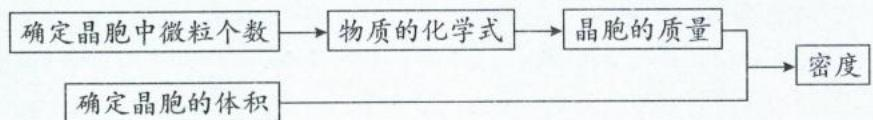

计算公式: $\rho=\frac{N\cdot M}{N_{A}\cdot V}$ ，式中N与晶胞的组成粒子数目有关，M为晶体的摩尔质量， $N_{A}$ 为阿伏加德罗常数的值，V为晶胞的体积，其单位为 $cm^{3}$ ， $\rho$ 为晶体的密度，其单位为 $g\cdot cm^{-3}$ 。

2. 计算晶胞中微粒间的距离或晶胞参数

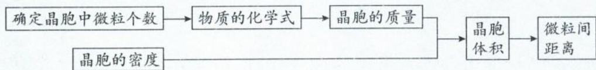

立方晶胞参数 $a=\sqrt[3]{\frac{N\cdot M}{N_{A}\cdot\rho}}$ 。

3. 长度换算关系式: $1 \, nm = 1 \times 10^{-7} \, cm$ ; $1 \, pm = 1 \times 10^{-10} \, cm$

## 三、典型晶胞重要考点速记(以下为教材典型晶胞,务必熟悉掌握!)

<table><tr><td>晶体</td><td>晶体结构</td><td>结构分析</td></tr><tr><td>Cu(金属晶体)</td><td></td><td>1.每个晶胞含Cu个数: $\frac{1}{8} \times 8 + \frac{1}{2} \times 6 = 4$ 。2.每个Cu配位数为12。3.晶胞密度 $\rho = \frac{4 \times 64}{N_A \times a^3} \text{ g} \cdot \text{cm}^{-3}$ (a为晶胞边长,单位cm; $N_A$ 为阿伏加德罗常数的值)。4.两个Cu原子最短距离: $\frac{\sqrt{2}}{2} a$ (a为晶胞边长)。</td></tr><tr><td>干冰(分子晶体)</td><td></td><td>每个晶胞含 $CO_2$ 个数为: $\frac{1}{8} \times 8 + \frac{1}{2} \times 6 = 4$ 。每个 $CO_2$ 分子周围紧邻的 $CO_2$ 分子有12个,即分子采用密堆积(只含范德华力的分子晶体其晶胞模型均为面心立方最密堆积,原因是范德华力没有方向性和饱和性)。密度 $\rho = \frac{4 \times 44}{N_A \times a^3} g \cdot cm^{-3}$ ( $a$ 为晶胞边长, $N_A$ 为阿伏加德罗常数的值)。</td></tr><tr><td>金刚石(共价晶体)</td><td></td><td>每个晶胞含C个数: $\frac{1}{8} \times 8 + \frac{1}{2} \times 6 + 4 = 8$ 。每个C与相邻4个C以共价键结合,形成正四面体结构,键角均为 $109^\circ 28'$ ,每个C皆为 $sp^3$ 杂化,配位数是4。每个C处于最近的4个C构成正四面体中,正四面体的空隙利用率为50%。密度 $\rho = \frac{8 \times 12}{N_A \times a^3} g \cdot cm^{-3}$ ( $a$ 为晶胞边长,单位cm; $N_A$ 为阿伏加德罗常数的值)。两个C原子最短距离: $\frac{\sqrt{3}}{4} a$ ( $a$ 为晶胞边长)。金刚石中的最小环为6元环,且为立体环,其构象为椅式,环内最多4个C原子共面。体内4个C原子的原子坐标分数数值为 $\frac{1}{4}$ 或 $\frac{3}{4}$ 。</td></tr><tr><td>SiC(共价晶体)</td><td></td><td>每个晶胞含C个数4、含Si个数4。每个C位于距离最近且等距离的Si所围成的正四面体中心,每个Si也位于距离最近且等距离的C所围成的正四面体中心,C和Si皆为 $sp^3$ 杂化。每个C配位数为4、每个Si配位数为4;晶体中离C最近的C有12个,晶体中离Si最近的Si也有12个。密度 $\rho = \frac{4 \times (12 + 28)}{N_A \times a^3} g \cdot cm^{-3}$ ( $a$ 为晶胞边长,单位cm; $N_A$ 为阿伏加德罗常数的值)。Si和C最短距离: $\frac{\sqrt{3}}{4} a$ ;C和C(或Si和Si)最短距离: $\frac{\sqrt{2}}{2} a$ ( $a$ 为晶胞边长)。SiC晶体中的最小环为6元环,且为立体环,包含3个C和3个Si。</td></tr><tr><td>ZnS(离子晶体)</td><td></td><td>类似上面的 SiC 晶胞1.每个晶胞含  $Zn^{2+}$  个数: $\frac{1}{8} \times 8 + \frac{1}{2} \times 6 = 4$ ,含  $S^{2-}$  个数:4。2.每个  $Zn^{2+}$  位于距离最近且等距离的  $S^{2-}$  所围成的正四面体中心;每个  $S^{2-}$  也位于距离最近且等距离的  $Zn^{2+}$  所围成的正四面体中心;每个  $Zn^{2+}$  配位数为 4、每个  $S^{2-}$  配位数为 4。3.晶胞密度  $\rho = \frac{4 \times (65 + 32)}{N_A \times a^3} \text{ g} \cdot \text{cm}^{-3}$ (a 为晶胞边长,单位 cm; $N_A$  为阿伏加德罗常数的值)。4. $Zn^{2+}$  和  $S^{2-}$  最短距离: $\frac{\sqrt{3}}{4} a$ (a 为晶胞边长)。</td></tr><tr><td> $CaF_2$ (离子晶体)</td><td></td><td>每个晶胞含  $Ca^{2+}$  个数: $\frac{1}{8} \times 8 + \frac{1}{2} \times 6 = 4$ ,含  $F^-$  个数:8。每个  $F^-$  位于距离最近且等距离的  $Ca^{2+}$  所围成的正四面体中心,每个  $Ca^{2+}$  位于距离最近且等距离的  $F^-$  所围成的正方体中心。 $Ca^{2+}$  构成的正四面体以及  $F^-$  构成的正方体,空隙利用率为 100%。每个  $Ca^{2+}$  配位数为 8、每个  $F^-$  配位数为 4。晶胞密度  $\rho = \frac{4 \times 40 + 8 \times 19}{N_A \times a^3} \text{ g} \cdot \text{cm}^{-3}$ (a 为晶胞边长,单位 cm; $N_A$  为阿伏加德罗常数的值)。 $Ca^{2+}$  和  $F^-$  最短距离: $\frac{\sqrt{3}}{4} a$ (a 为晶胞边长)。</td></tr><tr><td>CsCl(离子晶体)</td><td></td><td>每个晶胞含  $Cs^+$  个数为 1、含  $Cl^-$  个数为  $\frac{1}{8} \times 8 = 1$ 。每个  $Cs^+$  配位数(距离最近的  $Cl^-$ )为 8、每个  $Cl^-$  配位数(距离最近的  $Cs^+$ )为 8。每个  $Cs^+$  距离最近的  $Cs^+$  为 6 个;每个  $Cl^-$  距离最近的  $Cl^-$  为 6 个(都是上、下、左、右、前、后各有 1 个带相同电荷离子)。晶胞密度  $\rho = \frac{1 \times (133 + 35.5)}{N_A \times a^3} \text{ g} \cdot \text{cm}^{-3}$ (a 为晶胞边长,单位 cm; $N_A$  为阿伏加德罗常数的值)。 $Cs^+$  与  $Cl^-$  最短距离为: $\frac{\sqrt{3}}{2} a$ (a 为晶胞边长)。</td></tr><tr><td>NaCl(离子晶体)</td><td>●Cl-○Na+</td><td>每个晶胞含 $Na^{+}$ 个数为 $\frac{1}{4} \times 12 + 1 = 4$ ;含 $Cl^{-}$ 个数为 $\frac{1}{8} \times 8 + \frac{1}{2} \times 6 = 4$ 。每个 $Na^{+}$ 配位数为6、每个 $Cl^{-}$ 配位数为6(都是上、下、左、右、前、后各有1个带相反电荷离子)。每个 $Na^{+}$ 位于距离最近且等距离的 $Cl^{-}$ 所围成的正八面体的中心;每个 $Cl^{-}$ 位于距离最近且等距离的 $Na^{+}$ 所围成的正八面体的中心。每个 $Na^{+}$ 距离最近的 $Na^{+}$ 为12个、每个 $Cl^{-}$ 距离最近的 $Cl^{-}$ 为12。晶胞密度 $\rho = \frac{4 \times (23 + 35.5)}{N_{A} \times a^{3}} \text{g} \cdot \text{cm}^{-3}$ (a为晶胞边长,单位cm; $N_{A}$ 为阿伏加德罗常数的值)。 $Na^{+}$ 与 $Cl^{-}$ 最近距离: $\frac{1}{2}a$ (a为晶胞边长)。</td></tr></table>

类型Ⅰ: 晶胞中的配位数问题

【例 1】(2022·湖北卷)某立方卤化物可用于制作光电材料,其晶胞结构如图所示。下列说法错

$$
\mathrm{Ca} ^ {2 +}
$$

$$
\mathrm{K} ^ {+}
$$

$$
\mathrm{KCaF} _ {3}
$$

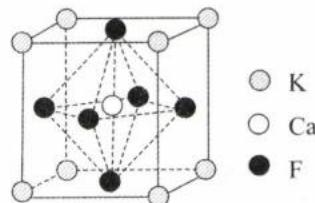

解析：A.与 $\mathrm{Ca^{2 + }}$ 最近的阴离子为 $\mathbf{F}^{-}$ ，因此 $\mathrm{Ca^{2 + }}$ 配位数为与其距离最近且等距离的 $\mathrm{F}^{-}$ 的个数，如图所示， $\mathrm{Ca^{2 + }}$ 位于体心且 $\mathrm{F}^{-}$ 位于面心， $\mathrm{Ca^{2 + }}$ 的上、下、左、右、前、后各有1个 $\mathrm{F}^{-}$ ，所以 $\mathrm{Ca^{2 + }}$ 配位数为6，A选项正确。B. $\mathrm{F}^{-}$ 与 $\mathbf{K}^{+}$ 的最近距离为晶胞棱长的 $\frac{\sqrt{2}}{2}$ （面对角线的一半）， $\mathrm{F}^{-}$ 与 $\mathrm{Ca^{2 + }}$ 的最近距离为晶胞棱长的 $\frac{1}{2}$ ，所以与 $\mathrm{F}^{-}$ 距离最近的是 $\mathrm{Ca^{2 + }}$ ，B选项错误。C. $\mathbf{K}^{+}$ 位于顶点，所以单位晶胞内所含 $\mathbf{K}^{+}$ 个数为 $\frac{1}{8}\times 8 = 1,\mathrm{F}^{-}$ 位于面心，所以单位晶胞内所含 $\mathbf{F}^{-}$ 个数为 $\frac{1}{2}\times 6 = 3,\mathrm{Ca^{2 + }}$ 位于体心，所以单位晶胞内所含 $\mathrm{Ca^{2 + }}$ 个数为1。单位晶胞内离子个数比： $\mathrm{K}^{+}:\mathrm{Ca}^{2 + }:\mathrm{F}^{-} =$ $1:1:3$ ，因此该物质的化学式为 $\mathrm{KCaF_3}$ ，C选项正确。D. $\mathrm{F}^{-}$ 与 $\mathrm{Cl^-}$ 半径不同，替换后晶胞棱长将会改变，D选项正确。

答案:B

【例 2】(2024·东北三省卷)某锂离子电池电极材料结构如图。结构 1 是钴硫化物晶胞的一部分, 可代表其组成和结构; 晶胞 2 是充电后的晶胞结构; 所有晶胞均为立方晶胞。下列说法错误的是()

$\mathrm{Li^{+}}$

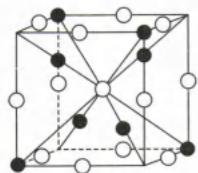  
结构1

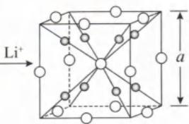  
晶胞2

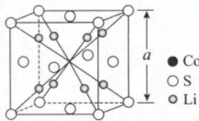  
晶胞3

A.结构1钴硫化物的化学式为 $\mathrm{Co_9S_8}$ B.晶胞2中S与S的最短距离为 $\frac{\sqrt{3}}{2} a$ C.晶胞2中距Li最近的S有4个 D.晶胞2和晶胞3表示同一晶体

解析：A. 利用均摊法可知： $Co=4\times\frac{1}{8}+4\times1=\frac{9}{2}$ 、 $S=12\times\frac{1}{4}+1\times1=4$ ，Co、S 的最简个数比为 9:8，结构 1 钴硫化物的化学式为 $Co_{9}S_{8}$ ，A 选项正确。

B. 晶胞 2 中 S 与 S 的最短距离为 $\frac{\sqrt{2}}{2}a$ ，B 选项错误。

C. 如右图, 以图中的 Li 为例, 与其最近的 S 共 4 个, C 选项正确 (看清楚粒子的上下、左右、前后的位置是解题的关键, 解析选中的 Li, 是在晶胞的 “上、左、后” 的位置, S 也要找偏上、偏左、偏后的位置。这 4 个 S 围起来是个正四面体的形状 (边长为 $\frac{\sqrt{2}}{2}$ a), 而 Li 位于这正四面体的中心。考试中经常出现类似的相对位置, 最经典的就是 “金刚石晶胞”, 大家务必熟悉!)

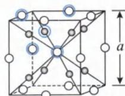  
晶胞2

D. 方法一: 如右图, 当 2 个晶胞 2 放在一起时, 图中蓝框截取的部分就是晶胞 3, 晶胞 2 和晶胞 3 表示同一晶体, D 选项正确。(晶胞是从晶体中“截取”出来具有代表性的最小重复单元, 因此截取的位置不一样, 会出现不同的“长相”的晶胞, 但都能表示同一晶体。)

方法二: 若晶胞 2 和晶胞 3 表示同一晶体, 二者的化学式、配位数都会相同。晶胞 2 和晶胞 3 的化学式都是 $Li_{2}S$ , 且两种晶胞中 Li 的配位数都是 4、S 的配位数都是 8, 因此晶胞 2 和晶胞 3 表示同一晶体

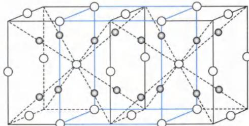

答案:B

【反思】请同学们务必熟悉直角三角形以及立方体的计算。化学的晶胞计算问题,就是简单的平面几何和空间立体几何问题,不要有畏惧感。

类型Ⅱ: 晶胞中原子的最短距离问题

【例 3】(2023·河北卷)锆(Zr)是重要的战略金属,可从其氧化物中提取。下图是某种锆的氧化物晶体的立方晶胞, $N_{A}$ 为阿伏加德罗常数的值。下列说法错误的是()

A.该氧化物的化学式为 $\mathrm{ZrO_2}$ B.该氧化物的密度为 $\frac{123\times 10^{30}}{a^3N_A}\mathrm{g}\cdot \mathrm{cm}^{-3}(\mathrm{Zr} = 91)$ C.Zr原子之间的最短距离为 $\frac{\sqrt{2}}{2} a\mathrm{pm}$ D.若坐标取向不变，将p点Zr原子平移至原点，则q点Zr原子位于晶胞 $xy$ 面的面心

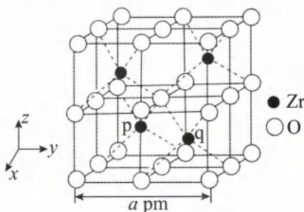

解析: A. 由晶胞结构可知, Zr 原子全在晶胞内部, 因此一个晶胞中含有 Zr 原子个数为 4。利用均摊法计算一个晶胞含 O 原子个数为 $8 \times \frac{1}{8} + 12 \times \frac{1}{4} + 6 \times \frac{1}{2} + 1 = 8$ , 因此立方氧化锆的化学式为 $ZrO_{2}$ , A 选项正确。
B. 晶体密度 $\rho=\frac{4\times(91+2\times16)}{N_{\mathrm{A}}\times(a\times10^{-10})^{3}}\mathrm{g/cm^{3}}=\frac{492\times10^{30}}{a^{3}N_{\mathrm{A}}} \mathrm{g/cm^{3}}$ , B 选项错误。(不要忘记将摩尔质量除以 $N_{A}$ 后, 再扩大一定倍数才是晶胞的质量。)
C. Zr 原子位于其所在的小正方体的中心, 因此 Zr 原子之间的最短距离为晶胞面对角线的一半, 即 $\frac{\sqrt{2}}{2}a$ pm, C

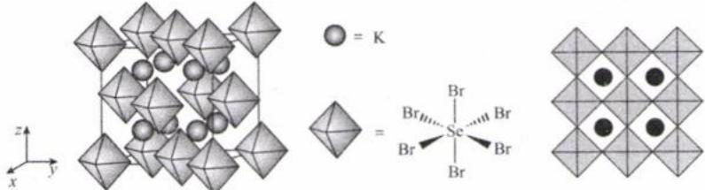  
图1  
图2

选项正确。

D. 方法一: 由于 p 的原子分数坐标为 $\left(\frac{1}{4}, \frac{1}{4}, \frac{1}{4}\right)$ 、q 的原子分数坐标为 $\left(\frac{3}{4}, \frac{3}{4}, \frac{1}{4}\right)$ ，通过平移后，p 的原子分数坐

标为 $(0,0,0)$ ，则 $q$ 的原子分数坐标为 $(\frac{1}{2}, \frac{1}{2}, 0)$ ，则 $q$ 点 $Zr$ 原子位于晶胞 $xy$ 面的面心。

原点

方法二:可以用投影图解决此类问题,由于 p、q 等高,所以 p 下降到下平面时,q 也跟着下降到下平面,二者在 xy 平面的投影位置在下平面的对角线上(如图所示),沿着箭头方向平移,当 p 平移至原点,则 q 会平移到面心的位置。

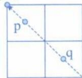

答案:B

【反思】欲求两个 Zr 原子的最短距离, 必须先清楚 Zr 原子位于各自所处的小正立方体的中心, 便可以计算出数值。原子进行平移时, 把握“题给原子怎么移, 所求原子便怎么移”, 即可轻松解出答案!

【例 4】(2022·广东卷)我国科学家发展了一种理论计算方法,可利用材料的晶体结构数据预测其热电性能,该方法有助于加速新型热电材料的研发进程。化合物 X 是通过该方法筛选出的潜在热电材料之一,其晶胞结构如图 1,沿 x、y、z 轴方向的投影均为图 2。

(1)X 的化学式为 \_\_\_\_。

(2)设 X 的最简式的式量为 $M_{r}$ ，晶体密度为 $\rho g \cdot cm^{-3}$ ，则 X 中相邻 K 之间的最短距离为 \_\_\_\_ nm（列出计算式， $N_{A}$ 为阿伏加德罗常数的值）。

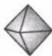

解析:(1)根据晶胞结构图可知, $\left(\text{即 } SeBr_{6}\right)$ 位于晶胞的顶点和面上,因此晶胞内含 $SeBr_{6}$ 个数为 $8\times\frac{1}{8}+6\times\frac{1}{2}=4$ ;K全部在晶胞内,因此晶胞内含K个数为8,因此X的化学式为 $K_{2}SeBr_{6}$ (注意化学式一定要化到最简比)。

(2)设X的晶胞边长为 $a\mathrm{nm}$ ，则晶胞密度 $\rho = \frac{4M_{\mathrm{r}}}{N_{\mathrm{A}}\times(a\times 10^{-7})^{3}}\mathrm{g}\cdot \mathrm{cm}^{-3}$ ，求得 $a = \sqrt[3]{\frac{4M_{\mathrm{r}}}{\rho N_{\mathrm{A}}}}\times 10^{7}\mathrm{nm}$ 。由图2可知，X中相邻K之间的最短距离为 $\frac{1}{2} a = \frac{1}{2}\times \sqrt[3]{\frac{4M_{\mathrm{r}}}{\rho N_{\mathrm{A}}}}\times 10^{7}\mathrm{nm}$ 。

答案: $K_{2}SeBr_{6}\quad\frac{1}{2}\times\sqrt[3]{\frac{4M_{r}}{\rho N_{A}}}\times10^{7}$

## 类型Ⅲ: 利用晶胞截面图判断晶胞结构的计算题型

【例 5】图(a)是 $MgCu_{2}$ 的拉维斯结构，Mg 以金刚石方式堆积，八面体空隙和半数的四面体空隙中，填入以四面体方式排列的 Cu。图(b)是沿立方格子对角面取得的截图。可见，Cu 原子之间最短距离 x= \_\_\_\_ pm，Mg 原子之间最短距离 y= \_\_\_\_ pm。设阿伏加德罗常数的值为 $N_{A}$ ，则 $MgCu_{2}$ 的密度是 \_\_\_\_ g·cm $^{-3}$ （列出计算表达式）。

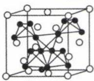  
图(a)

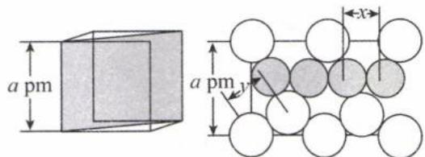  
图(b)

解析: 观察图(b)可知, 4个铜原子(黑球)相切并与面对角线平行, 因此 $8r(\mathrm{Cu})=\sqrt{2}a\ \mathrm{pm}, \mathrm{Cu}$ 原子之间最短距离 $x=2r(\mathrm{Cu})=\frac{\sqrt{2}}{4}a\ \mathrm{pm}$ 。Mg 以金刚石方式堆积, 因此 Mg 原子之间最短距离 $y=\frac{\sqrt{3}}{4}a\ \mathrm{pm}$ (金刚石晶胞是必须掌握的典型晶胞, 两个 C 原子的最短距离为 $\frac{\sqrt{3}}{4}a$ , 其中 a 为晶胞边长)。

根据信息“Mg 以金刚石方式堆积”则晶胞中 Mg 原子个数为 8，再根据化学式 $MgCu_{2}$ 可知晶胞中 Cu 原子个数为 16。则 $MgCu_{2}$ 的密度 $\rho=\frac{8\times24+16\times64}{N_{A}\times(a\times10^{-10})^{3}}\mathrm{g}\cdot\mathrm{cm}^{-3}$ 。

答案: $\frac{\sqrt{2}}{4}a\quad\frac{\sqrt{3}}{4}a\quad\frac{8\times24+16\times64}{N_{A}\times(a\times10^{-10})^{3}}g\cdot cm^{-3}$

【反思】绝大多数晶胞都是在面心立方最密堆积方式，或其基础上变形而来。所以先记住面心立方最密堆积的各种特征，再在其基础上衍生即可。

【例 6】(2024·河北卷)金属铋及其化合物广泛应用于电子设备、医药等领域。如图是铋的一种氟化物的立方晶胞及晶胞中 MNPQ 点的截面图, 晶胞的边长为 a pm, $N_{A}$ 为阿伏加德罗常数的值。下列说法错误的是()

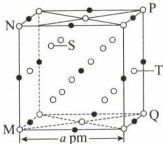

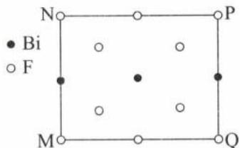

A.该铋氟化物的化学式为 $\mathrm{BiF_3}$ B.粒子S、T之间的距离为 $\frac{\sqrt{11}}{4} a\mathrm{pm}$ C.该晶体的密度为 $\frac{1064}{N_{\mathrm{A}}\times a^{3}\times 10^{-30}}\mathrm{g}\cdot \mathrm{cm}^{-3}$ D.晶体中与铋离子最近且等距的氟离子有6个

解析:本题关键在于利用晶胞的四个顶点 M、N、P、Q 所围成的截面图,推断 $Bi^{3+}$ 、 $F^{-}$ 在该晶胞的位置。根据晶胞结构与 MNPQ 截面图,可知 $Bi^{3+}$ 位于晶胞的棱心和中心。由截面图还可以推出在晶胞里面的 $F^{-}$ 有 4 个,且除了 M、N、P、Q 的另外四个顶点还能再围成一个截面图,这两个截面图的 $F^{-}$ 相对位置一致且无重复,可推得位于晶胞里面的 $F^{-}$ 共有 8 个;由此可知, $F^{-}$ 位于立方体的 8 个顶点、6 个面心以及 8 个体内。

A. 根据上述分析,由均摊法求得每个晶胞中含有 $Bi^{3+}$ 个数为 $1+12\times\frac{1}{4}=4$ 个; $F^{-}$ 在晶胞的位置有顶点、面心(上、下、左、右、前、后)以及晶胞里面(有 8 个),由均摊法求得每个晶胞中含有 $F^{-}$ 个数为 $8+8\times\frac{1}{8}+6\times\frac{1}{2}=12$ 个,故该铋氟化物的化学式为 $BiF_{3}$ , A 选项正确。

B. 由于粒子 S、T 的左右、上下、前后位置皆不同，无法用投影至某一面求两者的最短距离。应建立坐标系，将 S、T 坐标表示出来后，再根据空间中两点的距离公式求出。根据下图所建立的坐标系，可知 S 点坐标为 $\left(\frac{3}{4}a, \frac{1}{4}a, \frac{3}{4}a\right)$ ，T 点坐标为 $\left(\frac{1}{2}a, a, \frac{1}{2}a\right)$ ，所以粒子 S、T 之间的距离为： $\sqrt{\left(\frac{3}{4}a - \frac{1}{2}a\right)^2 + \left(\frac{1}{4}a - a\right)^2 + \left(\frac{3}{4}a - \frac{1}{2}a\right)^2} = \frac{\sqrt{11}}{4}a$ ，B 选项正确。

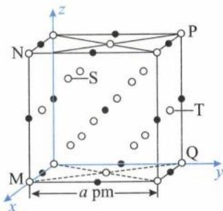

C. 根据 A 选项, 每个晶胞中有 4 个 $Bi^{3+}$ (Bi 相对原子质量 209)、12 个 $F^{-}$ (F 相对原子质量 19), 则晶体密度为: $\rho = \frac{4 \times 209 + 12 \times 19}{N_{A} \times (a \times 10^{-10})^{3}} g \cdot cm^{-3} = \frac{1064}{N_{A} \times a^{3} \times 10^{-30}} g \cdot cm^{-3}$ , C 选项正确。

D. 以晶胞体心处的 $\mathrm{Bi}^{3+}$ 为分析对象, 距离其最近且等距的 $\mathrm{F}^{-}$ , 是位于晶胞体内的 8 个 $\mathrm{F}^{-}$ , 因此晶体中与铋离子最近且等距的氟离子有8个，D选项错误。（本选项答案为“6”，是命题老师根据晶胞体心处的 $Bi^{3+}$ 与晶胞面心上的 $F^{-}$ （上下左右前后）所设计出的答案。根据题给的MNPQ点的截面图，晶胞体心处的 $Bi^{3+}$ 与面心上 $F^{-}$ 的最短距离为 $\frac{1}{2}a$ ，与晶胞内 $F^{-}$ 的最短距离约为 $\frac{\sqrt{3}}{4}a$ ，可知 $Bi^{3+}$ 与面心上的 $F^{-}$ 距离较远，因此D选项的答案不是6。）

答案:D

【反思】请同学务必熟悉立体几何、代数涉及的重点公式在化学中的运用。如空间中两点的距离公式： $\left|P_{1}P_{2}\right|=\sqrt{(x_{1}-x_{2})^{2}+(y_{1}-y_{2})^{2}+(z_{1}-z_{2})^{2}}$ 。

类型Ⅳ: 空间占有率问题

【例 7】(2021·全国乙卷)在金属材料中添加 $AlCr_{2}$ 颗粒, 可以增强材料的耐腐蚀性、硬度和机械性能。 $AlCr_{2}$ 具有体心四方结构, 如图所示。处于顶角位置的是 \_\_\_\_ 原子。设 Cr 和 Al 原子半径分别为 $r_{Cr}$ 和 $r_{Al}$ , 则金属原子空间占有率为 \_\_\_\_%(列出计算表达式)。

解析: 利用均摊法, 求出晶胞中灰球个数为 $8 \times \frac{1}{8} + 1 = 2$ , 白球个数为 $8 \times \frac{1}{4} + 2 = 4$ , 个数之比为 1:2, 根据 $AlCr_{2}$ 可知, 灰球代表 Al, 白球代表 Cr, 故处于顶角位置的原子为 Al。原子空

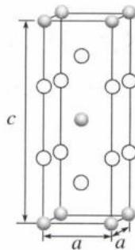

间占有率 $= \frac{\text{原子体积}}{\text{晶胞体积}} \times 100\%$ ，而原子体积则以球体积表示： $\frac{4}{3} \pi r^{3}$ 。晶胞中含 Cr 个数为 4、Al 个数为 2，因此晶胞所含原子的体积为 $4 \times \frac{4}{3} \pi \times r_{\mathrm{Cr}}^{3} + 2 \times \frac{4}{3} \pi \times r_{\mathrm{Al}}^{3}$ ，晶胞的体积为 $a^{2} \times c$ ，则金属原子的空间占有率 $\frac{4 \times \frac{4}{3} \pi \times r_{\mathrm{Cr}}^{3} + 2 \times \frac{4}{3} \pi \times r_{\mathrm{Al}}^{3}}{a^{2} \times c} \times 100\% = \frac{8 \pi (2r_{\mathrm{Cr}}^{3} + r_{\mathrm{Al}}^{3})}{3a^{2}c} \times 100\%$ 。

答案: Al $\frac{8\pi(2r_{Cr}^{3}+r_{Al}^{3})}{3a^{2}c}\times100\%$

【反思】注意区别空间占有率和空隙利用率。空间占有率是指构成晶胞的原子总体积占晶胞体积的百分比；空隙利用率是指某微粒构成的空间四面体、正八面体或立方体体心的填充率。

类型 V: 晶体结构的缺陷与掺杂问题

【例 8】(2023·辽宁卷)晶体结构的缺陷美与对称美同样受关注。某富锂超离子导体的晶胞是立方体(图 1)，进行镁离子取代及卤素共掺杂后，可获得高性能固体电解质材料(图 2)。下列说法错误的是()

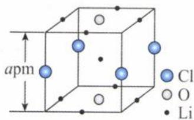  
图1

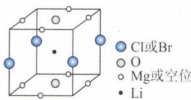  
图2

A. 图1晶体密度为 $\frac{72.5}{N_{\mathrm{A}} \times a^{3} \times 10^{-30} \mathrm{~g} \cdot \mathrm{cm}^{-3}}$ B. 图1中O原子的配位数为6 C. 图2表示的化学式为 $\mathrm{LiMg_2OCl_xBr_{1 - x}}$ D. $\mathrm{Mg^{2 + }}$ 取代产生的空位有利于 $\mathrm{Li^{+}}$ 传导

解析：A.根据图1可知，晶胞中含Li个数为 $8\times \frac{1}{4} +1 = 3$ ，含O个数为 $2\times \frac{1}{2} = 1$ ，含Cl个数为 $4\times \frac{1}{4} = 1$ ，因此晶体的密度 $\rho = \frac{3\times 7 + 1\times 16 + 1\times 35.5}{N_{\mathrm{A}}\times(a\times 10^{-10})^{3}}\mathrm{g}\cdot \mathrm{cm}^{-3} = \frac{72.5}{N_{\mathrm{A}}\times a^{3}\times 10^{-30}}\mathrm{g}\cdot \mathrm{cm}^{-3},$ A选项正确。

B. 图 1 晶胞中，O 位于面心，与 O 等距离且最近的 Li 有 6 个（在 O 的上、下、左、右、前、后），O 原子的配位数为 6，B 选项正确。

C. 图 2 中的晶胞含 Li 个数为 1, Mg 或空位个数为 $8 \times \frac{1}{4} = 2$ , O: $2 \times \frac{1}{2} = 1$ , Cl 或 Br: $4 \times \frac{1}{4} = 1$ , 根据化合物中元素化合价的代数和为 0, 可知图 2 的化学式为 $LiMgOCl_{x}Br_{1-x}$ , C 选项错误。

D. 根据题目信息“镁离子取代及卤素共掺杂后，可获得高性能固体电解质材料”，说明 $Mg^{2+}$ 取代产生的空位有利于 $Li^{+}$ 的传导，D 选项正确。

答案:C

【反思】除了通过均摊来计算晶胞组成外,还可以用正负化合价代数和为零来推导晶胞组成。第二种方法主要针对变价元素较少的晶胞。

【例 9】 $TiO_{2}$ 属于四方晶系，晶胞参数 $\alpha=\beta=\gamma=90^{\circ}$ 。研究表明， $TiO_{2}$ 通过氮掺杂反应生成 $TiO_{2-a}N_{b}$ ，能使 $TiO_{2}$ 对可见光具有活性，反应如图所示。

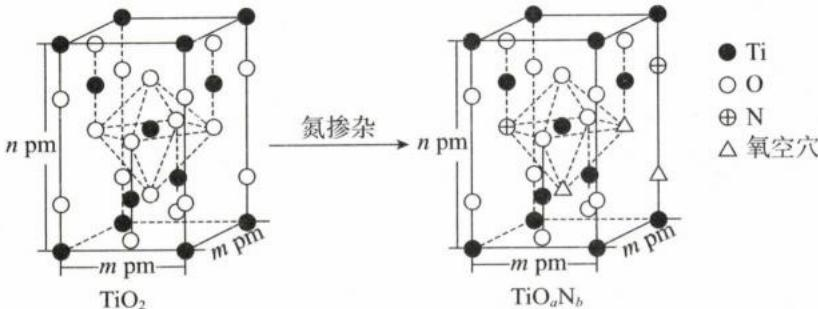

(1) $TiO_{2}$ 的密度为 $\rho g \cdot cm^{-3}$ ，则阿伏加德罗常数的值 $N_{A}=$ \_\_\_\_（列出表达式）。(Ti=48)
(2) $TiO_{2-a}N_{b}$ 晶体化学式中 $a=$ ， $b=$ \_\_\_\_。

解析:(1)根据 $TiO_{2}$ 晶胞结构,Ti 原子有 8 个在晶胞的顶点、4 个在面上、1 个在体内,因此 1 个晶胞中含有 Ti 的个数为 $8 \times \frac{1}{8} + 4 \times \frac{1}{2} + 1 = 4$ 。O 原子有 8 个在晶胞的棱上、8 个在面上、2 个在体内,因此 1 个晶胞中含有 O 的个数为 $8 \times \frac{1}{4} + 8 \times \frac{1}{2} + 2 = 8$ (解题技巧:由于化学式已知,所以只需要计算出其中一种原子的个数即可求得其他原子的个数。一般会选择数个数少的原子)。利用公式计算密度: $\rho = \frac{4 \times 48 + 8 \times 16}{N_{A} \times m^{2} \times n} \times 10^{30}$ ,因此 $N_{A} = \frac{4 \times 48 + 8 \times 16}{\rho \times m^{2} \times n} \times 10^{30} = \frac{320}{\rho m^{2} n} \times 10^{30}$ 。

②根据 $TiO_{2-a}N_{b}$ 晶胞结构，一个晶胞所含 Ti 原子个数和 $TiO_{2}$ 晶胞一样都是 4(Ti 并未被 N 取代，也未形成空穴)。O 原子有 6 个在晶胞的棱上、6 个在面上、1 个在体内，因此 1 个晶胞中含有 O 的个数为 $6 \times \frac{1}{4} + 6 \times \frac{1}{2} + 1 = \frac{11}{2}$ 。N 原子有 1 个在晶胞的棱上、1 个在面上，因此 1 个晶胞中含有 N 的个数为 $1 \times \frac{1}{4} + 1 \times \frac{1}{2} = \frac{3}{4}$ 。根据晶胞中含 Ti、O、N 的个数与化学式 $TiO_{2-a}N_{b}$ ，可得：Ti:O:N=4: $\frac{11}{2}:\frac{3}{4}=1:(2-a):b$ ，则 $a=\frac{5}{8}$ 、 $b=\frac{3}{16}$ 。

答案: $\frac{320}{\rho m^{2}n}\times10^{30}\quad\frac{5}{8}\quad\frac{3}{16}$

【反思】晶胞所含原子个数与化学式系数特别容易搞混，在本题中，一个晶胞所含 Ti 原子个数为 4，对应化学式中 Ti 系数为 1，可知晶胞所含原子的个数除以 4 才是化学式中的系数，所以一个晶胞含 N 个数为 $\frac{3}{4}$ ，但化学式中 N 的系数不是 $\frac{3}{4}$ 而是 $\frac{3}{16}$ ，一定要特别注意！

类型Ⅵ:原子坐标问题

【例 10】 $\left[\mathrm{Co}\left(\mathrm{NH}_{3}\right)_{6}\right]\mathrm{Cl}_{2}$ 晶体的晶胞如下图所示(已知该立方晶胞的边长为 a pm, 阿伏加德罗常数为 $N_{A}, \left[\mathrm{Co}\left(\mathrm{NH}_{3}\right)_{6}\right]\mathrm{Cl}_{2}$ 的摩尔质量为 M g/mol), 以下说法正确的是()

A. $\left[\mathrm{Co}(\mathrm{NH}_{3})_{6}\right]\mathrm{Cl}_{2}$ 中，中心离子的配位数为8  
B. 离 $\left[\mathrm{Co}(\mathrm{NH}_{3})_{6}\right]^{2+}$ 最近的 $\mathrm{Cl}^{-}$ 有4个  
C. 若规定A点原子坐标为(0,0,0)，B点原子坐标为 $\left(\frac{1}{2},\frac{1}{2},0\right)$ ，则C点原子坐标为 $\left(\frac{1}{4},\frac{3}{4},\frac{3}{4}\right)$ D. $\left[\mathrm{Co}(\mathrm{NH}_{3})_{6}\right]\mathrm{Cl}_{2}$ 晶体的密度为 $\frac{4M}{a^3N_A}\times 10^{21}\mathrm{g / cm^3}$

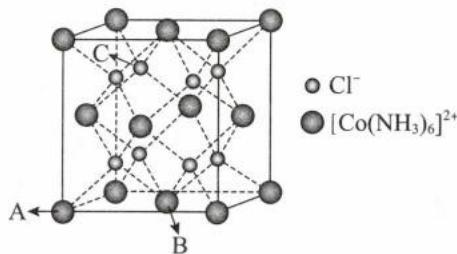

解析: A. $\left[\mathrm{Co}\left(\mathrm{NH}_{3}\right)_{6}\right]\mathrm{Cl}_{2}$ 中的内界为 $\left[\mathrm{Co}\left(\mathrm{NH}_{3}\right)_{6}\right]^{2+}$ ，中心离子为 $Co^{2+}$ ，配体是 $NH_{3}$ ，配位数为 6，A 选项错误。
B.从晶胞结构中的B点来分析,离B点最近的 $Cl^{-}$ 上面有4个,在未画出来的下层晶胞还有4个最近且等距离的 $Cl^{-}$ ,因此离 $\left[\mathrm{Co}\left(\mathrm{NH}_{3}\right)_{6}\right]^{2+}$ 最近的 $Cl^{-}$ 有8个,B选项错误。
C.该晶胞为典型的 $CaF_{2}$ 晶胞,若A点原子坐标为(0,0,0),B点原子坐标为 $\left(\frac{1}{2},\frac{1}{2},0\right)$ ,则C点可以想象为先沿x轴向右走 $\frac{1}{4}$ 、再沿y轴向后走 $\frac{3}{4}$ 、再沿z轴向上走 $\frac{3}{4}$ ,因此C的原子坐标参数为 $\left(\frac{1}{4},\frac{3}{4},\frac{3}{4}\right)$ ,C选项正确。
D.利用均摊法计算,一个晶胞含有 $\left[\mathrm{Co}\left(\mathrm{NH}_{3}\right)_{6}\right]^{2+}$ 的个数为 $8\times\frac{1}{8}+6\times\frac{1}{2}=4$ ,含有 $Cl^{-}$ 的个数为8,故每个晶胞中含有 $\left[\mathrm{Co}\left(\mathrm{NH}_{3}\right)_{6}\right]\mathrm{Cl}_{2}$ 个数为4,晶胞的边长为a pm,则晶体的密度为 $\frac{4M}{a^{3}N_{A}}\times10^{30}g/cm^{3}$ ,D选项错误。
(对比:晶胞的边长为a nm,则密度为 $\frac{4M}{a^{3}N_{A}}\times10^{21}g/cm^{3}$ 。)

答案:C

【反思】①注意区别不同微粒的“配位数”，中心离子的配位数是找内界中的配原子个数， $\left[\mathrm{Co}\left(\mathrm{NH}_{3}\right)_{6}\right]^{2+}$ 的配位数则是找晶体中离其最近的 $Cl^{-}$ 个数。

②请务必记住 $CaF_{2}$ 晶胞中体内的 8 个 $F^{-}$ 的原子坐标分数特征。

【例 11】磷锗锌晶体是一种红外非线性晶体, 其晶胞结构如图所示。以晶胞参数为单位长度建立的坐标系可以表示晶胞中各原子的位置, 称作原子的分数坐标, 图中 A 点 Zn 原子的分数坐标为 $(0,0,0)$ , B 点 P 原子的坐标为 $(0.25,0.25,0.125)$ 。

(1)C点P原子的坐标为\_\_\_\_。

(2)磷锗锌晶体的化学式为\_\_\_\_。

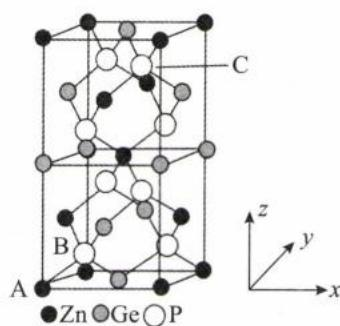

解析:(1)分析晶胞一定要与所学的典型晶胞进行关联,该晶胞可视为两个“类金

“刚石晶胞”堆叠而成的结构；务必熟记金刚石体内的原子坐标分数，并将方位名称与坐标分数建立联系。C原子在晶胞的“右上前”位置，若在金刚石晶胞内，则其原子坐标分数为(0.75,0.25,0.75)，但该晶胞相当于在金刚石基础上拉长了一倍，则z轴的1被分成8等份，xy轴无变化。由此可知，C点P原子的坐标为(0.75,0.25,0.875)。

(2)利用均摊法,晶胞中Zn原子的个数为 $1+\frac{1}{2}\times4+\frac{1}{8}\times8=4$ ,锗原子的个数为 $\frac{1}{2}\times6+\frac{1}{4}\times4=4$ ,磷原子的个数为 $1\times8=8$ ,磷锗锌晶体的化学式为 $ZnGeP_{2}$ 。

答案:(1)(0.75,0.25,0.875) (2) $ZnGeP_{2}$

类型Ⅶ: 晶胞投影问题

【例 12】(2021·河北卷)分别用○、●表示 $H_{2}PO_{4}^{-}$ 和 $K^{+}$ ， $KH_{2}PO_{4}$ 晶体的四方晶胞如图(a)所示，图(b)、图(c)分别显示的是 $H_{2}PO_{4}^{-}$ 、 $K^{+}$ 在晶胞 xz 面、yz 面上的位置：

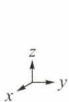

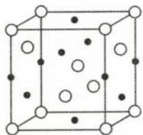

(a)

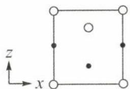

(b)

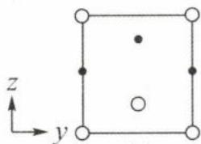

(c)

(1)若晶胞底边的边长均为 $a \mathrm{pm}$ , 高为 $c \mathrm{pm}$ , 阿伏加德罗常数的值为 $N_{\mathrm{A}}$ , 晶体的密度 $\mathrm{g} \cdot \mathrm{cm}^{-3}$ (写出表达式)。(P=31、K=39)

(2) 晶胞在 x 轴方向的投影图为 \_\_\_\_ (填标号)。

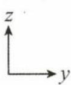

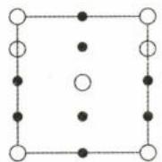

B.

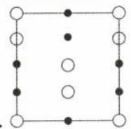

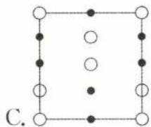

D.

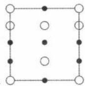

解析:(1)由图(a)并搭配图(b)、图(c)可知, $H_{2}PO_{4}^{-}$ 有8个位于顶点、4个位于面上、1个位于体内,因此一个晶胞中含 $H_{2}PO_{4}^{-}$ 的数目为: $8\times\frac{1}{8}+4\times\frac{1}{2}+1=4$ ; $K^{+}$ 有6个位于面上、4个位于棱上,因此一个晶胞中含 $K^{+}$ 的数目为: $6\times\frac{1}{2}+4\times\frac{1}{4}=4$ ,可知晶胞中含 $KH_{2}PO_{4}$ 数目为4(或先求出计算较为简单的 $H_{2}PO_{4}^{-}$ 个数后,再根据化学式 $KH_{2}PO_{4}$ ,确定晶胞中的 $KH_{2}PO_{4}$ 个数为4)。因此晶体的密度 $\rho=\frac{4\times(39+1\times2+31+16\times4)}{N_{A}\times(a\times10^{-10})^{2}\times(c\times10^{-10})}=\frac{4\times136}{N_{A}a^{2}c\times10^{-30}}$ 。

(2) 晶胞在 x 轴方向的投影图, 可以想象有一束光平行 x 轴方向照射, 这些离子有影子落在 yz 平面上, 推得

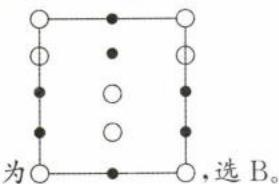

答案:(1) $\frac{4\times136}{N_{A}a^{2}c\times10^{-30}}$ (2)B

【反思】审题时,注意辨析图像是投影图,还是面上的质点分布图。

类型Ⅷ:非立方晶系(或非四方晶系)问题

【例 13】锂与生活息息相关,个人携带的笔记本电脑、手机、蓝牙耳机等数码产品中应用的锂离子电池中就含有丰富的锂元素。锂晶胞为六方最密堆积(如图),图中底边长为 a pm,高为 b pm,设 $N_{A}$ 为阿伏加德罗常数的值:

(1)该结构中 Li 的配位数为 \_\_\_\_。

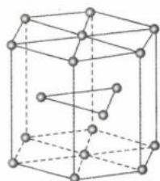

(2)锂晶体的密度为 $g \cdot cm^{-3}$ 。

解析:(1)Li的配位数可从顶面上的Li原子来判断,其直接相邻的Li原子在同一平面上有6个、下方有3个、上方(即未画出来的上层晶胞)也有3个,因此Li的配位数有12个(也可以直接根据晶胞堆积名称中的“最密”可知,Li的配位数为12)。

(2)该晶胞为六方最密堆积,底面为正六边形(可分割成六个正三角形或两个梯形),每个内角为 $120^{\circ}$ 。Li原子在晶胞中有12个位于顶点(每个位于顶点的Li原子被6个晶胞共用),2个位于面上、3个位于体内,因此一个晶胞中含 Li 的数目为: $12 \times \frac{1}{6} + 2 \times \frac{1}{2} + 3 = 6$ 。底边长为 a pm，则每一个正三角形的面积为 $\frac{\sqrt{3}}{4} (a \times 10^{-10})^{2} \, \text{cm}^{2}$ ，因此底面积为 $6 \times \frac{\sqrt{3}}{4} (a \times 10^{-10})^{2} \, \text{cm}^{2}$ ，晶体的密度为 $\rho = \frac{6 \times 7}{N_{\mathrm{A}} \times 6 \times \frac{\sqrt{3}}{4} (a \times 10^{-10})^{2} \times (b \times 10^{-10})} = \frac{28\sqrt{3}}{3 N_{\mathrm{A}} a^{2} b} \times 10^{30} \, \text{g} \cdot \text{cm}^{-3}$ 。(注意换算单位，且六方最密堆积的“六”对应组成原子数为 6。)

答案:12 $\frac{28\sqrt{3}}{3N_{A}a^{2}b}\times10^{30}$

【例 14】(2023·全国乙卷)一种硼镁化合物具有超导性能,晶体结构属于六方晶系,其晶体结构、晶胞沿 c 轴的投影图如下所示,晶胞中含有\_\_\_\_个 Mg。该物质化学式为\_\_\_\_,B-B 最近距离为\_\_\_\_。

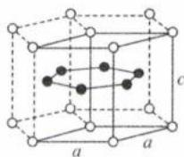

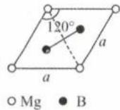

解析:右侧的图为晶胞投影图,则左侧实线围成部分为晶胞。Mg位于晶胞顶点,利用均摊法计算1个晶胞内含Mg的数目为 $4\times\frac{1}{6}+4\times\frac{1}{12}=1$ ;B位于晶胞体内,1个晶胞内含B的数目为2,故该物质化学式为 $MgB_{2}$ 。

根据投影图可知，B位于正三角形的重心，重心到底边的距离为高的 $\frac{1}{3}$ 。正三角形的高为 $\frac{\sqrt{3}}{2} a$ ，因此B-B最近距离为 $\frac{\sqrt{3}}{2} a\times \frac{1}{3}\times 2 = \frac{\sqrt{3}}{3} a$

答案:1 $MgB_{2}\quad\frac{\sqrt{3}}{3}a$

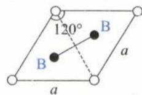

## 模块 9 配合物与超分子(★★★)

习题：P49

## 内容提要

## 一、配位键

1. 概念: 由一个原子单方面提供孤电子对, 而另一个原子提供空轨道而形成的化学键, 即 “电子对给予—接受” 键。

注：配位键是特殊的共价键。

2. 形成条件: 形成配位键的一方是能够提供孤电子对的原子, 另一方是具有能够接受孤电子对的空轨道的原子。例如 $\left[\mathrm{Cu}\left(\mathrm{H}_{2}\mathrm{O}\right)_{4}\right]^{2+}$ 中, 铜离子与水分子之间的配位键是由水分子提供孤电子对给予铜离子, 铜离子接受水分子的孤电子对形成的。

3. 判断结构中是否存在配位键的方法: 若原子周围的化学键数目超标或不达标, 则往往存在配位键。

例 1: $NH_{4}^{+}$ 中的 N 原子, 其标准键数为 3, 但 $NH_{4}^{+}$ 中的 N 原子现在拥有 4 个共价键, 超标了 1 个共价键, 则 $NH_{4}^{+}$ 中存在 1 个配位键。

例 2: CO 与 $N_{2}$ 互为等电子体, C 与 O 之间是 $C \equiv O$ , 由于 C、O 的标准键数分别为 4、2, 所以 CO 分子中, C 的化学键数不达标, 而 O 的化学键数又超标了, 则 CO 分子中存在配位键。

## 二、配合物

1. 概念: 通常把金属离子或原子(称为中心离子或原子)与某些分子或离子(称为配体或配位体)以配位键结合形成的化合物称为配位化合物, 简称配合物, 如 $\left[\mathrm{Cu}\left(\mathrm{NH}_{3}\right)_{4}\right] \mathrm{SO}_{4}$ 、 $\left[\mathrm{Ag}\left(\mathrm{NH}_{3}\right)_{2}\right] \mathrm{OH}$ 等均为配合物。

2. 组成: 配合物 $\left[\mathrm{Cu}\left(\mathrm{NH}_{3}\right)_{4}\right]\mathrm{SO}_{4}$ 的组成如下图所示:

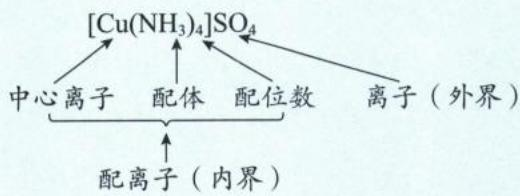

(1)中心原子:提供空轨道接受孤电子对的原子。中心原子一般都是带正电荷的阳离子(此时又叫中心离子),最常见的有过渡金属离子: $Fe^{3+}$ 、 $Ag^{+}$ 、 $Cu^{2+}$ 、 $Zn^{2+}$ 等。

(2)配体:提供孤电子对的阴离子或分子,如 $Cl^{-}$ 、 $NH_{3}$ 、 $H_{2}O$ 等。配体中直接同中心原子配位的原子叫做配位原子。配位原子必须是含有孤电子对的原子,如 $NH_{3}$ 中的 N 原子, $H_{2}O$ 中的 O 原子等。

注:CO也是常见的配体,C、O原子均有孤电子对,由于电负性:C<O,C原子更易提供孤电子。所以CO与其他中心原子形成配位键时,C才是配位原子。

(3)配位数:直接与中心原子形成的配位键的数目。如 $\left[Fe(CN)_{6}\right]^{4-}$ 中 $Fe^{2+}$ 的配位数为6。

注：配位数在不同的物质中，意义相似，但数值不同。

①在配位化合物中,配原子数即配位数。若配体只有一个配原子,则配体数即配位数;若配体有两个配原子(如乙二胺: $H_{2}NCH_{2}CH_{2}NH_{2}$ ),则配体数乘以2才是配位数。常见的配位数是4、6。一般情况下,配位数往往是中心原子稳定化合价的2倍。

②分子晶体的配位数是指晶体中,离分子最近的分子数。若分子为密堆积(只有范德华力)则配位数为12,如干冰、碳60;非密堆积的分子晶体其配位数由分子周围的氢键个数决定,如冰的配位数为4。

③共价晶体的配位数即原子周围的共价键数目。如 $SiO_{2}$ 晶体中，Si 原子周围有 4 个共价键，则 Si 的配位数为 4，O 周围有 2 个共价键，则 O 的配位数为 2。

④离子晶体、金属晶体的配位数关键看晶胞模型,具体问题具体分析。且离子晶体的配位数一定要找离该离子最近的异性电荷离子去计算配位数。

⑤若粒子的配位数不易观察,可以先求化学式,再利用其他粒子的配位数反推即可。如某离子晶体的化学式为 $A_{2}B_{3}$ , 若 B 的配位数为 4, 则 A 的配位数为 6。

## 三、常见配合物的制备实验

<table><tr><td>实验操作</td><td>实验现象</td><td>有关离子方程式</td></tr><tr><td></td><td>滴加氨水后,试管中首先出现蓝色沉淀,氨水过量后沉淀逐渐溶解,得到深蓝色的透明溶液,滴加乙醇后析出深蓝色晶体</td><td> $Cu^{2+} + 2NH_3 \cdot H_2O = Cu(OH)_2 \downarrow + 2NH_4^+$ 、 $Cu(OH)_2 + 4NH_3 = [Cu(NH_3)_4]^{2+} + 2OH^-$ 、 $[Cu(NH_3)_4]^{2+} + SO_4^{2-} + H_2O \xlongequal{乙醇} [Cu(NH_3)_4]SO_4 \cdot H_2O \downarrow$ </td></tr><tr><td></td><td>溶液变为红色</td><td> $Fe^{3+} + 3SCN^- \rightleftharpoons Fe(SCN)_3$ </td></tr><tr><td></td><td>滴加  $AgNO_3$  溶液后,试管中出现白色沉淀,再滴加氨水后沉淀溶解,溶液呈无色</td><td> $Ag^+ + Cl^- = AgCl \downarrow$ 、 $AgCl + 2NH_3 = [Ag(NH_3)_2]^+ + Cl^-$ </td></tr></table>

## 四、超分子

1. 定义: 超分子是由两种或两种以上的分子通过分子间相互作用形成的分子聚集体。

注：超分子定义中的分子是广义的，包括离子；超分子有的是有限的，有的是无限伸展的。

2. 超分子内部分子之间通过非共价键相结合,包括范德华力、氢键、静电作用、疏水作用、一些分子与金属离子形成的弱配位键等,例如 DNA 中两条分子链之间通过氢键的作用而组合在一起、细胞膜中的磷脂分子通过疏水端相互作用形成双层膜结构、冠醚与碱金属离子之间以弱配位键形成超分子等。

3. 超分子的两个重要特征是分子识别和自组装。

(1)分子识别:如分离 $C_{60}$ 和 $C_{70}$ 、不同空腔直径大小的冠醚识别碱金属阳离子等。

(2) 自组装: 如细胞和细胞器的双分子膜。

注：分子在进行分子识别之前，一般某分子需要有空穴，如杯酚或冠醚等。

## 类型 I: 配位键与配合物基本概念

【例 1】下列不能形成配位键的组合是( )

A. $Cu^{2+}$ 、 $H_{2}O$ B. $Ag^{+}$ 、 $H^{+}$ C. $Fe^{3+}$ 、 $SCN^{-}$ D. $BF_{3}$ 、 $NH_{3}$

解析:配位键的形成条件必须是一方能提供孤电子对,另一方能提供空轨道,A、C、D三项中, $Cu^{2+}$ 、 $Fe^{3+}$ 、 $BF_{3}$ (B原子)能提供空轨道, $H_{2}O$ (O原子)、 $SCN^{-}$ (S或N原子)、 $NH_{3}$ (N原子)能提供孤电子对,所以能形成配位键。B项 $Ag^{+}$ 与 $H^{+}$ 都只能提供空轨道,无法提供孤电子对,所以不能形成配位键。

答案:B

【例 2】(2021·全国乙卷)三价铬离子能形成多种配位化合物。 $\left[\mathrm{Cr}\left(\mathrm{NH}_{3}\right)_{3}\left(\mathrm{H}_{2}\mathrm{O}\right)_{2}\mathrm{Cl}\right]^{2+}$ 中提供电子对形成配位键的原子是\_\_\_\_，中心离子的配位数为\_\_\_\_。

解析: $\left[\mathrm{Cr}\left(\mathrm{NH}_{3}\right)_{3}\left(\mathrm{H}_{2}\mathrm{O}\right)_{2}\mathrm{Cl}\right]^{2+}$ 中 +3 价铬离子是中心离子, 提供空轨道; $\mathrm{NH}_{3}$ 、 $\mathrm{H}_{2} \mathrm{O}$ 、 $\mathrm{Cl}^{-}$ 为配体, $\mathrm{N}$ 、 $\mathrm{O}$ 、 $\mathrm{Cl}$ 为配位原子(同一物质的配原子可能有多种), 提供孤对电子与 +3 价铬离子形成配位键。中心离子的配位数为 $\mathrm{N}$ 、 $\mathrm{O}$ 、 $\mathrm{Cl}$ 三种配位原子的个数和: $3+2+1=6$ 。

答案:N、O、Cl 6

【例 3】(2023·全国甲卷)酞菁和钴酞菁的分子结构如图所示。

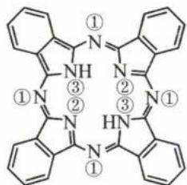  
酞菁

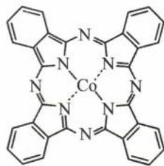  
钴酞菁

酞菁分子中所有原子共平面,其中 p 轨道能提供一对电子的 N 原子是\_\_\_\_(填图 2 酞菁中 N 原子的标号)。钴酞菁分子中,钴离子的化合价为\_\_\_\_,氮原子提供孤对电子与钴离子形成\_\_\_\_键。

解析:由于酞菁分子中所有原子共平面,且由结构可知以 N 为中心所形成的键角不是 $180^{\circ}$ (排除 sp 杂化),推得分子中所有 N 的杂化类型都是 $sp^{2}$ 。从结构图可知,①号 N 与②号 N 都是形成 2 个 $\sigma$ 键,由于杂化轨道用于形成 $\sigma$ 键以及容纳孤电子对,则剩余的 $sp^{2}$ 杂化轨道还会容纳 1 个孤电子对,导致未杂化的 2p 轨道上填充

1个电子形成大 $\pi$ 键。③号N原子，有3个电子形成3个 $\sigma$ 键，剩余2个电子放入未杂化的2p轨道上形成大 $\pi$ 键。因此p轨道能提供1对电子的N原子是③号N原子。

酞菁分子中的2个③号N原子，形成的N—H键断裂后各电离出1个 $H^{+}$ ，H的电子给③号N，使③号N拥有可以形成配位键的孤电子对，并使每个③号N带一个单位负电荷。在钴酞菁分子中，失去了2个 $H^{+}$ 的酞菁离子与钴离子通过配位键(③号N提供孤电子对)结合成电中性的分子，因此钴离子的化合价为+2，氮原子提供孤对电子、钴离子提供空轨道形成配位键。

答案:③ +2 配位

【反思】孤电子对可能容纳在杂化轨道中,也可能容纳在 p 轨道中。最常考查的方式是先告知是平面结构,确定是 $sp^{2}$ 杂化后进行反推,本题是非常好的例子,务必熟悉掌握!

类型Ⅱ:配体的配位能力比较

【例 4】在 $\left[\mathrm{Cu}\left(\mathrm{NH}_{3}\right)_{4}\left(\mathrm{H}_{2}\mathrm{O}\right)_{2}\right]\mathrm{SO}_{4}$ 化合物中，阳离子呈轴向狭长的八面体结构（如图），该阳离子中存在的化学键类型\_\_\_\_，该化合物加热时首先失去的组分是\_\_\_\_。判断理由是\_\_\_\_。

解析:该配合物的阳离子为 $\left[\mathrm{Cu}\left(\mathrm{NH}_{3}\right)_{4}\left(\mathrm{H}_{2}\mathrm{O}\right)_{2}\right]^{2+}$ ， $Cu^{2+}$ 和配体 $\left(\mathrm{NH}_{3},\mathrm{H}_{2}\mathrm{O}\right)$ 之间形成配位键，配体分子内存在极性键。 $H_{2}O$ 的配位原子是 $O,NH_{3}$ 的配位原子是N，由于O的电负性较大对电子吸引力较强，相比于 $NH_{3},H_{2}O$ 的孤电子对与 $Cu^{2+}$ 形成的配位键较弱，因此加热时首先失去的组分是 $H_{2}O$ 。

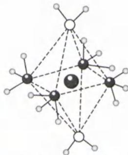

答案: 共价键和配位键 $H_{2}O$ 电负性 O > N, O 对电子的吸引力更大, $H_{2}O$ 和 $Cu^{2+}$ 的配位键比 $NH_{3}$ 与 $Cu^{2+}$ 的弱, 所以该化合物加热时首先失去的组分是 $H_{2}O$ 。

类型Ⅲ: 确定配合物化学式

【例 5】0.01 mol 氯化铬 $\left(\mathrm{CrCl}_{3}\cdot6\mathrm{H}_{2}\mathrm{O}\right)$ 在水溶液中用足量的 $AgNO_{3}$ 处理，产生0.01 mol AgCl沉淀，此氯化铬最可能是（）
A. $\left[\mathrm{Cr}\left(\mathrm{H}_{2}\mathrm{O}\right)_{6}\right]\mathrm{Cl}_{3}$ B. $\left[\mathrm{Cr}\left(\mathrm{H}_{2}\mathrm{O}\right)_{5}\mathrm{Cl}\right]\mathrm{Cl}_{2}\cdot\mathrm{H}_{2}\mathrm{O}$ C. $\left[\mathrm{Cr}\left(\mathrm{H}_{2}\mathrm{O}\right)_{4}\mathrm{Cl}_{2}\right]\mathrm{Cl}\cdot2\mathrm{H}_{2}\mathrm{O}$ D. $\left[\mathrm{Cr}\left(\mathrm{H}_{2}\mathrm{O}\right)_{3}\mathrm{Cl}_{3}\right]\cdot3\mathrm{H}_{2}\mathrm{O}$

解析:0.01 mol 氯化铬 $\left(\mathrm{CrCl}_{3}\cdot6\mathrm{H}_{2}\mathrm{O}\right)$ 在水溶液中用足量的 $AgNO_{3}$ 处理,产生0.01 mol AgCl沉淀,说明1 mol氯化铬 $\left(\mathrm{CrCl}_{3}\cdot6\mathrm{H}_{2}\mathrm{O}\right)$ 中有1 mol氯离子在外界,其余在内界,且+3价铬常见为六配位,则此氯化铬最可能是 $\left[\mathrm{Cr}\left(\mathrm{H}_{2}\mathrm{O}\right)_{4}\mathrm{Cl}_{2}\right]\mathrm{Cl}\cdot2\mathrm{H}_{2}\mathrm{O},C$ 选项正确。

答案:C

【反思】外界离子完全电离易参与离子反应，且配位数往往是中心离子化合价的2倍。

类型Ⅳ:配合物或配离子的结构问题

【例 6】 $\left[\mathrm{Co}\left(\mathrm{NH}_{3}\right)_{6}\right]\mathrm{Cl}_{3}$ 是一种重要的化工产品,实验室可利用 $\mathrm{CoCl}_{2}$ 制取该配合物: $2\mathrm{CoCl}_{2}+10\mathrm{NH}_{3}+2\mathrm{NH}_{4}\mathrm{Cl}+\mathrm{H}_{2}\mathrm{O}_{2}=2\left[\mathrm{Co}\left(\mathrm{NH}_{3}\right)_{6}\right]\mathrm{Cl}_{3}+2\mathrm{H}_{2}\mathrm{O}$ 。已知 $\left[\mathrm{Co}\left(\mathrm{NH}_{3}\right)_{6}\right]^{3+}$ 的空间结构如图,其中1\~6处的小圆圈表示 $NH_{3}$ 分子,各相邻的 $NH_{3}$ 分子间的距离相等,中心离子 $Co^{3+}$ 位于八面体的中心, $NH_{3}$ 分子到中心离子的距离相等(图中虚线长度相等),下列说法正确的是()

A. $\mathrm{NH}_{3} 、 \mathrm{H}_{2} \mathrm{O}$ 与 $\mathrm{Co}^{3+}$ 形成配离子的稳定性: $\mathrm{NH}_{3} < \mathrm{H}_{2} \mathrm{O}$ B. $[\mathrm{Co}(\mathrm{NH}_{3})_{6}] \mathrm{Cl}_{3}$ 中 $\mathrm{Co}^{3+}$ 的杂化方式为 $\mathrm{sp}^{3}$ C. $1 \mathrm{~mol} [\mathrm{Co}(\mathrm{NH}_{3})_{6}] \mathrm{Cl}_{3}$ 含有 $\sigma$ 键的数目为 $27 N_{\mathrm{A}}$ D. 若 $[\mathrm{Co}(\mathrm{NH}_{3})_{6}]^{3+}$ 中四个 $\mathrm{NH}_{3}$ 被 $\mathrm{Cl}^{-}$ 替代, 得到的 $[\mathrm{Co}(\mathrm{NH}_{3})_{2} \mathrm{Cl}_{4}]^{-}$ 有 2 种结构

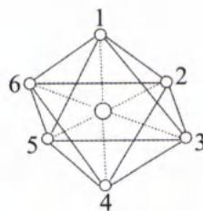

解析:A.由题目所给的反应方程式可知, $Co^{3+}$ 是与 $NH_{3}$ 形成最终稳定的配离子,而非与 $H_{2}O$ ,因此 $NH_{3}$ 与

$Co^{3+}$ 配位能力较 $H_{2}O$ 强，形成配离子的稳定性也较强，A选项错误。

B. $sp^{3}$ 杂化轨道最多形成 4 个 $\sigma$ 键， $\left[\mathrm{Co}\left(\mathrm{NH}_{3}\right)_{6}\right]^{3+}$ 中的 $Co^{3+}$ 位于八面体的中心，有 6 个 $\sigma$ 键，因此 $Co^{3+}$ 的杂化方式不是 $sp^{3}$ （需有 d 轨道参与杂化才能形成 6 个 $\sigma$ 键），B 选项错误。

C. 1个 $\left[\mathrm{Co}\left(\mathrm{NH}_{3}\right)_{6}\right]^{3+}$ 离子中含有 $3\times6$ 个N-H键，还有6个配位键（按电子云重叠方式也是 $\sigma$ 键），则1 mol $\left[\mathrm{Co}\left(\mathrm{NH}_{3}\right)_{6}\right]^{3+}$ 中含24 mol $\sigma$ 键， $\sigma$ 键的数目为 $24N_{A}$ ，C选项错误。（外界 $Cl^{-}$ 与内界之间是离子键，外界 $Cl^{-}$ 之间也无化学键。）

D. 由于 $\left[\mathrm{Co}\left(\mathrm{NH}_{3}\right)_{6}\right]^{3+}$ 中各相邻的 $\mathrm{NH}_{3}$ 分子间的距离相等且 $\mathrm{NH}_{3}$ 分子到中心离子的距离相等，当 $\left[\mathrm{Co}\left(\mathrm{NH}_{3}\right)_{6}\right]^{3+}$ 中的四个 $\mathrm{NH}_{3}$ 被 $\mathrm{Cl}^{-}$ 替代，剩余的两个 $\mathrm{NH}_{3}$ 可以是相邻或是相对两种结构，D选项正确。（利用有机化学中的同分异构体思维（换元法）可以很好解决此类问题。）

答案:D

【反思】由于 N 的电负性小于 O，相比于 $H_{2}O$ 中 O 的孤电子对， $NH_{3}$ 中 N 的孤电子对更容易提供给空轨道形成配位键，配位能力 $NH_{3} > H_{2}O$ 。

类型 V: 螯合配位问题

【例 7】(2020·山东卷)含有多个配位原子的配体与同一中心离子(或原子)通过螯合配位成环而形成的配合物为螯合物。一种 $Cd^{2+}$ 配合物的结构如图所示,1 mol 该配合物中通过螯合作用形成的配位键有 \_\_\_\_ mol,该螯合物中 N 的杂化方式有 \_\_\_\_ 种。

解析:根据题目所给的结构图可知,该配合物有三种配体。配体1:

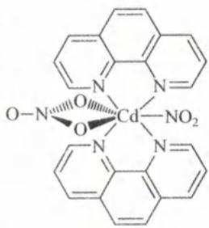

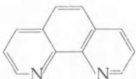

含有两个配位原子 N 与中心离子 $Cd^{2+}$ 形成 2 个配位键并成环。配体 $2:NO_{3}^{-}$ 含有 2 个配位原子 O 与中心离子 $Cd^{2+}$ 形成 2 个配位键并成环，根据题目信息可知，以上两种配体都有通过螯合作用与 $Cd^{2+}$ 形成配位键。配体 $3:NO_{2}^{-}$ 只含有 1 个配位原子 O 与中心离子 $Cd^{2+}$ 形成 1 个配位键，不是通过螯合作用形成的。因此 1 mol 该配合物中通过螯合作用形成的配位键有 6 mol。

$NO_{3}^{-}$ 含有 3 个 $\sigma$ 键 +0 个孤电子对，N 的杂化类型为 $sp^{2}$ ; $NO_{2}^{-}$ 含有 2 个 $\sigma$ 键 +1 个孤电子对，N 的杂化类型

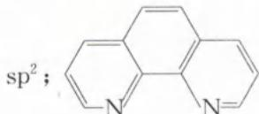

为 $\mathrm{sp}^2$ ； $\left\langle \begin{array}{c|c} \text{N} & \text{N} = \end{array} \right\rangle$ 的两个 N 原子，有 2 个 $\sigma$ 键和 1 个孤电子对参与杂化，N 的杂化类型是 $\mathrm{sp}^2$ ，因此

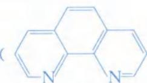

该螯合物中 N 的杂化方式有 1 种。（ $\ce{C6H5N}$ ）的两个 N 原子，各有 1 个电子未填充到杂化轨道中，

而是填充到未杂化的 2p 轨道中, 最后与其余 C 原子中未参与杂化的电子形成大 $\pi$ 键。

答案:6 1

【反思】螯合作用的关键是要“成环”。

类型Ⅵ:超分子基本概念

【例8】下列不属于超分子的结构是（ ）A.DNA双螺旋结构 B.冠醚C.烷基磺酸钠在水中聚集形成的胶束 D. $\mathrm{C}_{60}$ 和杯酚形成的复合物

解析:超分子是由两种或两种以上的分子通过分子间相互作用形成的分子聚集体,该分子间相互作用是非共价键作用力,包括氢键、范德华力、一些分子与金属离子形成的弱配位键等。DNA 双螺旋结构是通过氢键碱基互补配对形成的结构,属于超分子。冠醚与碱金属阳离子通过配位键形成超分子,但冠醚本身不是超分子。表面活性剂在水中会形成亲水基团向外、疏水基团向内的胶束,属于超分子,且可反应超分子“自组装”特征(超分子自组装是分子通过分子间相互作用形成具有有序结构的聚集体)。 $C_{60}$ 分子和杯酚两种分子通过分子间作用力形成的复合物是超分子,因此 B 选项不属于超分子。

答案:B

【反思】教材上提及的超分子,请大家务必进行记忆。

【例 9】有关超分子的说法,正确的是( )

A. 超分子是由两种或两种以上的分子必须通过氢键相互作用形成的分子聚集体

B. 冠醚与碱金属阳离子形成超分子,与阴离子所形成的晶体属于离子晶体

C. 人体细胞和细胞器的膜是双分子膜,双分子膜的特有的排列结构是因为超分子的分子识别特征所决定的

D. 将 $C_{60}$ 、 $C_{70}$ 混合物加入一种空腔大小适配 $C_{60}$ 的“杯酚”中进行分离,该分离过程利用的是超分子的自组装特征

解析: A. 超分子是由两个或两个以上分子通过如范德华力、氢键、疏水作用、弱配位键等形成的分子聚集体,不一定是氢键作用,A 选项错误。

B. 冠醚与碱金属阳离子形成的超分子是带正电荷的阳离子,与阴离子以离子键结合形成离子晶体,B 选项正确。

C. 体细胞和细胞器的膜是双分子膜,双分子膜的特有的排列结构是因为超分子的分子自组装特征所决定的,与分子识别特征无关,C 选项错误。

D. 杯酚与 $C_{60}$ 形成超分子进而与 $C_{70}$ 分离,过程利用的是超分子的分子识别特征,D 选项错误。

答案:B

类型Ⅶ:超分子的分子识别问题

【例 10】利用分子间作用力形成超分子进行“分子识别”，实现分子分离，是超分子化学的重要研究和应用领域。如图表示用“杯酚”对 $C_{60}$ 和 $C_{70}$ 进行分离的过程，下列对该过程的说法正确的是（）

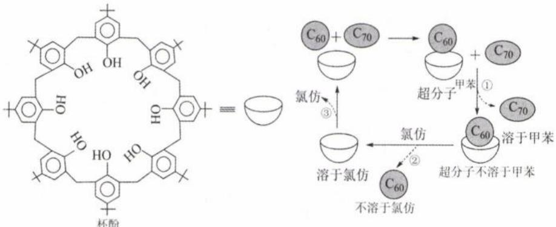

A. $C_{70}$ 能溶于甲苯, $C_{60}$ 不溶于甲苯
B. 图中操作①是过滤、操作②是分液
C. “杯酚”与 $C_{60}$ 之间通过共价键形成超分子
D. “杯酚”能够循环使用

解析：A. $C_{70}$ 能溶于甲苯， $C_{60}$ 与杯酚形成的超分子不溶于甲苯，但不能说明 $C_{60}$ 不溶于甲苯，A选项错误。

B. 操作①和操作②都是将不溶性固体与液体分离的操作,均为过滤,B选项错误。

C.“杯酚”与 $C_{60}$ 之间通过分子间作用力形成超分子,该过程不涉及共价键的形成,C选项错误。

D. 通过溶剂氯仿的作用, 破坏“杯酚”与 $C_{60}$ 形成的超分子, 可实现将 $C_{60}$ 与 $C_{70}$ 分离, 最后“杯酚”和氯仿的混合物可以通过蒸馏分离, 二者均可循环利用, D 选项正确。

答案:D

【反思】请同学们务必将教材实验的每一步理解透彻。

# 模块 10 元素推断综合题(★★★)

习题：P51

## 内容提要

元素推断综合题是高考中的高频题型,出题者会综合元素在周期表位置、原子结构、原子核外电子排布方式、元素及其化合物的性质与应用等信息来设计题目,要求学生推断出元素,并且在选项中设计各种问题考查同学们对元素及其化合物、元素周期表和周期律、物质结构与性质等各方面的掌握能力。

## 一、同一元素的“位—构—性”关系

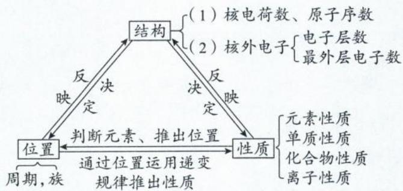

## 二、元素推断高频考法总结：

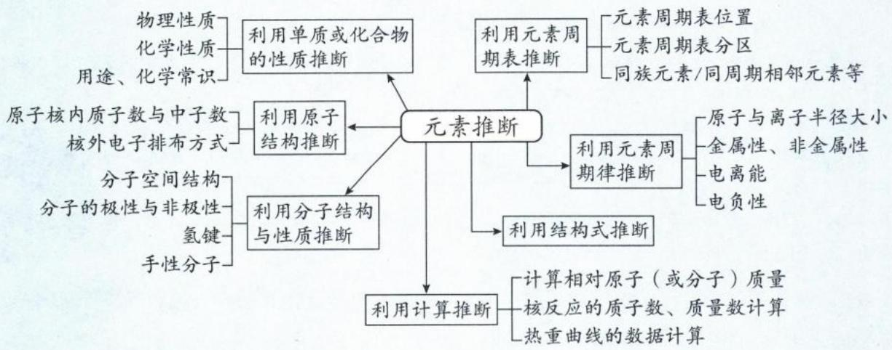

## 三、元素推断题的常见做题方法

1. 一般情况下, 元素推断考查短周期主族元素。若信息中出现了前 20 号元素的信息, 很大概率会考查 K、Ca 两种元素之一。

2. 若定性信息和定量信息均出现, 则一般用定性信息进行推断, 定量信息用于检验。

3. 若出现了化学式的信息, 善于用化合价推断元素的族序数。

4. 若出现了化学式的信息,且化学式描述的是四种或四种以上元素组成的盐,阳离子较复杂,则考查铵盐的概率较高,可以猜测可能的元素有 N、H、O;阴离子较复杂,则考查多元弱酸的酸式酸根,可以猜测可能的元素有 H、O。

5. 若出现周期表格式的信息, 可以先在草稿纸上按照周期表的格式写出短周期的 18 种元素, 然后观察类似周期表排列结构的可能组合。

6. 若不能推出具体的元素, 不要放弃, 勇敢进行假设, 将可能性带入题干或选项进行讨论即可。

7. 若题干信息中有物质转化关系图, 善于用反应条件作为突破口, 推出特征元素, 然后再各个击破。

8. 若出现了结构式信息,善于利用键的数目推导元素组成;若原子周围有 4 个共价键,不要忘记可能含有配位键。

9. 不要漏掉每一个信息, 如“原子序数依次递增”“两元素在周期表中相邻”等。

10. 推出的元素符号写在题干对应字母旁,避免做题时的遗忘。

类型 I: 利用元素形成的单质或化合物的性质推断元素

【例 1】W、X、Y、Z 均为短周期元素且原子序数依次增大, 元素 X 和 Z 同族。盐 YZW 与浓盐酸反应, 有黄绿色气体产生, 此气体同冷烧碱溶液作用, 可得到 YZW 的溶液。下列说法正确的是 ( )

A. 原子半径大小为 W < X < Y < Z

B. X 的氢化物水溶液酸性强于 Z 的

C. $WX_{2}$ 和 $Z_{2}W$ 的分子空间结构不相同

D. W 和 Y 可形成含有非极性共价键的离子化合物

解析: 黄绿色气体为氯气, 通入冷烧碱溶液发生反应: $Cl_{2} + NaOH = NaCl + NaClO$ , 所以 YZW 为 NaClO, 再根据 X 和 Z 同族, 得到 W、X、Y、Z 分别为 O、F、Na、Cl。

A. 同周期由左向右原子半径依次减小 (口诀: 序大径小), 同主族由上向下原子半径依次增大 (口诀: 层多径大), 因此原子半径大小为 F < O < Cl < Na, 即 X < W < Z < Y, A 选项错误。(出题者很喜欢考查电子层相同粒子的半径大小比较。)

B. HCl 是强酸, HF 是弱酸, 所以 X(F) 的氢化物水溶液的酸性弱于 Z(Cl) 的, B 选项错误。请同学们务必记住六大强酸 (HCl、 $H_{2}SO_{4}$ 、 $HNO_{3}$ 、 $HClO_{4}$ 、HBr、HI)。

C. $WX_{2}(OF_{2})$ 和 $Z_{2}W(Cl_{2}O)$ 均含 2 个 $\sigma$ 键, 中心原子 O 的孤电子对数皆为 $\frac{1}{2}(6-2\times1)=2$ , 两者分子空间结构均为 V 形, C 选项错误。

D. O 和 Na 形成的 $Na_{2}O_{2}$ 是由 $Na^{+}$ 和 $O_{2}^{2-}$ 所构成的离子化合物, 其中 $O_{2}^{2-}$ 含非极性共价键, D 选项正确。

答案: D

【例 2】(2024·东北三省卷)如下反应相关元素中，W、X、Y、Z 为原子序数依次增大的短周期元素，基态 X 原子的核外电子有 5 种空间运动状态，基态 Y、Z 原子有两个未成对电子，Q 是 ds 区元素，焰色试验呈绿色。下列说法错误的是（） $QZY_{4}$ 溶液 $\xrightarrow{逐渐通入 XW_{3} 至过量} QZX_{4}Y_{4}W_{12}$ 溶液

A. 单质沸点：Z > Y > W

B. 简单氢化物键角：X > Y

C. 反应过程中有蓝色沉淀产生

D. $QZX_{4}Y_{4}W_{12}$ 是配合物，配位原子是 Y

解析:焰色试验呈绿色的金属主要是 Ba 和 Cu,但处在 ds 区的为 Cu,所以 Q 元素为 Cu。基态 X 原子核外有 5 种空间运动状态的电子,表示电子占据 1 个 1s 轨道、1 个 2s 轨道、3 个 2p 轨道,共 5 个原子轨道,因此 X 可能是 N、O、F。基态 Y、Z 原子有两个未成对电子，且原子序数比 X 大，则 Y、Z 可能为 O、Si、S。由题目所给信息，并结合教材所学的实验内容，可知命题者意图描述的是铜氨溶液的配置过程，再根据上述 X、Y、Z 的可能元素，可推得 $QZY_{4}$ 为 $CuSO_{4}$ ， $XW_{3}$ 为 $NH_{3}$ ，因此 W、X、Y、Z 分别为 H、N、O、S， $QZX_{4}Y_{4}W_{12}$ 为 $CuSN_{4}O_{4}H_{12}$ ，即 $[Cu(NH_{3})_{4}]SO_{4}$ 。（本题要善于将物质推断题和教材实验联系，从整体入手推导物质的可能性，再用题干信息的其他条件进行验证。）

A. Y、W 的单质分别是 $\mathrm{O}_{2}$ （或 $\mathrm{O}_{3}$ ）、 $H_{2}$ ，均为分子晶体且相对分子质量： $\mathrm{O}_{2}$ （或 $\mathrm{O}_{3}$ ）＞ $H_{2}$ ，则单质沸点 Y＞W；Z 的单质在常温常压下为固体，而 Y、W 的单质则是气体，故 Z 的单质沸点最高。因此单质沸点：Z＞Y＞W，A 选项正确。
B. X、Y 的简单氢化物分别是 $NH_{3}$ 、 $H_{2}O$ ，N、O 均为 $sp^{3}$ 杂化，但 $H_{2}O$ 的中心原子 O 所含的孤电子对更多，其孤电子对成键电子对的斥力更大，因此键角： $NH_{3} > H_{2}O$ ，B 选项正确。
C. 往硫酸铜溶液中通入的氨气较少时，将生成 $\mathrm{Cu(OH)}_{2}$ 蓝色沉淀，C 选项正确。
D. $\left[\mathrm{Cu}\left(\mathrm{NH}_{3}\right)_{4}\right]\mathrm{SO}_{4}$ 中，N 原子提供孤电子对和铜离子形成配位键，N 为配位原子，D 选项错误。
答案：D

## 类型Ⅱ: 利用元素周期表、周期律推断元素

【例3】(2022·广东卷)甲\~戊均为短周期元素,在元素周期表中的相对位置如图所示。戊的最高价氧化物对应的水化物为强酸。下列说法不正确的是( )

A.原子半径:丁>戊>乙

B.非金属性:戊>丁>丙

C.甲的氢化物遇氯化氢一定有白烟产生

D.丙的最高价氧化物对应的水化物一定能与强碱反应

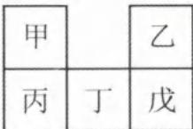

解析: 短周期元素中, 最高价氧化物对应的水化物为强酸的元素有 N、S、Cl, 由题目所给的元素周期表可知, 戊位于第三周期, 则戊可能是 S(最高价氧化物对应的水化物为 $H_{2}SO_{4}$ ) 或 Cl(最高价氧化物对应的水化物为 $HClO_{4}$ )。

若戊是 S: 甲为 C、乙为 O、丙为 Si、丁为 P。

若戊是 Cl: 甲为 N、乙为 F、丙为 P、丁为 S。

A. 同周期主族元素, 原子半径由左至右原子半径逐渐减小 (口诀: 序大径小); 同主族元素, 原子半径为“层多径大”, 因此无论戊是 S 还是 Cl, 原子半径都是 T > 戊 > 乙, A 选项正确。

B. 同周期从左到右, 元素非金属性逐渐增强, 因此非金属性戊 > 丁 > 丙, B 选项正确。

C. 根据推断, 甲有可能是 C 或 N。若甲为 N, 其氢化物为 $NH_{3}$ , 可与氯化氢化合生成 $NH_{4}Cl$ 而有白烟产生, 但甲若为 C, 其氢化物为 $CH_{4}$ , 遇氯化氢不反应, 没有白烟生成, C 选项错误。

D. 根据推断, 丙可能为 Si 或 P, 丙的最高价氧化物对应的水化物可能为 $H_{2}SiO_{3}$ 或 $H_{3}PO_{4}$ , 都能与强碱反应, D 选项正确。

答案:C

【例 4】(2024·浙江 6 月选考)X、Y、Z、M 四种主族元素,原子序数依次增大,分别位于三个不同短周期,Y 与 M 同主族,Y 与 Z 核电荷数相差 2,Z 的原子最外层电子数是内层电子数的 3 倍。下列说法不正确的是( )

A. 键角: $YX_{3}^{+}>YX_{3}^{-}$ B. 分子的极性: $Y_{2}X_{2}>X_{2}Z_{2}$ C. 共价晶体熔点:Y>M

D. 热稳定性: $YX_{4}>MX_{4}$

解析:先找到能确定唯一元素的信息:①Z的原子最外层电子数是内层电子数的3倍,因此Z确定为O元素;②“X、Y、Z、M四种主族元素,原子序数依次增大,分别位于三个不同短周期”,由此可确定原子序数最小的X为H元素。由于Z确定为O元素,Y原子序数小于Z且Y与Z核电荷数相差2,因此Y确定为C元素;Y与M同主族、且原子序数Y小于M、皆位于短周期,因此M为Si元素。由上述分析可知,X、Y、Z、M分别为H、C、O、Si。

A. 比较键角大小, 优先判断中心原子的杂化类型: $\mathrm{YX}_{3}^{+}$ 为 $\mathrm{CH}_{3}^{+}, \mathrm{C}$ 有 3 个 $\sigma$ 键, 孤电子对数为 $\frac{1}{2}(4 - 1 - 3 \times 1) = 0$ , 价层电子对数为 3, C 的杂化类型为 $\mathrm{sp}^{2}$ , 基础键角为 $120^{\circ}$ 。 $\mathrm{YX}_{3}^{-}$ 为 $\mathrm{CH}_{3}^{-}, \mathrm{C}$ 有 3 个 $\sigma$ 键, 孤电子对数为 $\frac{1}{2}(4 + 1 - 3 \times 1) = 1$ , 价层电子对数为 4, C 的杂化类型为 $\mathrm{sp}^{3}$ , 基础键角为 $109^{\circ}28'$ (由于有孤电子对, 实际键角略小于 $109^{\circ}28'$ )。因此键角: $\mathrm{YX}_{3}^{+} > \mathrm{YX}_{3}^{-}$ , A 选项正确。

B. $Y_{2}X_{2}$ 为 $C_{2}H_{2}$ （乙炔），结构式为 $CH\equiv CH$ ，是结构对称的直线形分子，为非极性分子。 $X_{2}Z_{2}$ 为 $H_{2}O_{2}$ ，结构式为 $\ce{H-O-H}$ ，分子中正电中心与负电中心不重合，为极性分子。因此分子的极性： $Y_{2}X_{2}<X_{2}Z_{2}$ ，B 选项错误。
C. 碳元素形成的共价晶体为金刚石，硅元素形成的共价晶体为单晶硅。由于原子半径：C<Si，键能：C—C 键＞Si—Si 键，因此共价晶体熔点较高的是金刚石，C 选项正确。
D. 元素的非金属性越强，其气态氢化物的热稳定性越强。C 的非金属性强于 Si，因此 $CH_{4}$ 的热稳定性较 $SiH_{4}$ 强，D 选项正确。

答案:B

## 类型Ⅲ: 利用核外电子排布方式推断元素

【例 5】(2024·新课标卷)我国科学家最近研究的一种无机盐 $Y_{3}[Z(WX)_{6}]_{2}$ 纳米药物具有高效的细胞内亚铁离子捕获和抗氧化能力。W、X、Y、Z 的原子序数依次增加，且 W、X、Y 属于不同族的短周期元素。W 的外层电子数是其内层电子数的 2 倍，X 和 Y 的第一电离能都比左右相邻元素的高。Z 的 M 层未成对电子数为 4。下列叙述错误的是（）

A. W、X、Y、Z 四种元素的单质中 Z 的熔点最高

B. 在 X 的简单氢化物中 X 原子轨道杂化类型为 $sp^{3}$ C. Y 的氢氧化物难溶于 NaCl 溶液，可以溶于 $NH_{4}Cl$ 溶液

D. $Y_{3}[Z(WX)_{6}]_{2}$ 中 $WX^{-}$ 提供电子对与 $Z^{3+}$ 形成配位键

解析: W 的外层电子数是其内层电子数的 2 倍, 则 W 为 C 元素。第一电离能比左右相邻元素的高, 在短周期主族元素中考虑第 II A 族的 Be、Mg 与第 V A 族的 N、P, 由于 W、X、Y 的原子序数依次增加且 W 为 C 元素, 因此排除 Be 元素; W、X、Y 属于不同族的短周期元素, 因此 X、Y 可能分别为 N、Mg 或 Mg、P, 根据题目所给的无机盐化学式 Y $_{3}$ [Z(WX) $_{6}$ ] $_{2}$ , 可知 Y 为金属元素, 因此确定 X、Y 分别为 N、Mg。Z 的 M 层未成对电子数为 4, 则基态 Z 的核外电子排布式为 1s $^{2}$ 2s $^{2}$ 2p $^{6}$ 3s $^{2}$ 3p $^{6}$ 3d $^{6}$ 4s $^{2}$ , 因此 Z 为 Fe, 该无机盐为 Mg $_{3}$ [Fe(CN) $_{6}$ ] $_{2}$ 。(也可以直接从题干信息: 无机盐 Y $_{3}$ [Z(WX) $_{6}$ ] $_{2}$ 纳米药物具有高效的细胞内“亚铁离子”捕获和抗氧化能力, 以及从化学式推断 Y 的化合价应为 +2, 猜测阴离子为 [Fe(CN) $_{6}$ ] $^{3-}$ )。

A. N 元素形成的单质 (N $_{2}$ ), 其晶体类型属于分子晶体, 熔点极低; Mg 和 Fe 元素形成的单质, 属于金属晶体, 熔点稍高; C 元素形成的单质, 可以是金刚石 (共价晶体) 或石墨 (混合型晶体), 这两种单质熔点极高, 因此 W、X、Y、Z 四种元素的单质中 W 的单质熔点最高, A 选项错误。

B. X 的简单氢化物是 NH $_{3}$ , 中心原子 N 有 3 个 σ 键与 1 个孤电子对, 价层电子对数为 4, N 原子轨道杂化类型为 sp $^{3}$ , B 选项正确。

C. Y 的氢氧化物是 Mg(OH) $_{2}$ , 难溶于水也难溶于 NaCl 溶液, 但由于 NH $_{4}$ Cl 电离产生的 NH $_{4}^{+}$ , 可结合 Mg(OH) $_{2}$ 溶解后电离出的 OH $^{-}$ , 破坏 Mg(OH) $_{2}$ 的沉淀溶解平衡, 因此 Mg(OH) $_{2}$ 可以溶于 NH $_{4}$ Cl 溶液, C 选项正确。

D. Mg $_{3}$ [Fe(CN) $_{6}$ ] $_{2}$ 中, 配体 CN $^{-}$ 的 C 提供电子对, 与 Fe $^{3+}$ 的空轨道形成配位键, D 选项正确。

答案:A

【反思】Z 的 M 层未成对电子数为 4，不能考虑 $1s^{2}2s^{2}2p^{6}3s^{2}3p^{6}3d^{4}4s^{2}$ ，因为基态 Cr 原子的核外电子排布应为 $1s^{2}2s^{2}2p^{6}3s^{2}3p^{6}3d^{5}4s^{1}$ ，M 层未成对电子数为 5。虽然题目没有强调“基态”，但若无特别说明，考试都默认是基态原子的电子排布式。

【例 6】(2023·湖南卷)日光灯中用到的某种荧光粉的主要成分为 $3\mathrm{W}_{3}(\mathrm{ZX}_{4})_{2}\cdot\mathrm{WY}_{2}$ 。已知：X、Y、Z 和 W 为原子序数依次增大的前 20 号元素，W 为金属元素。基态 X 原子 s 轨道上的电子数和 p 轨道上的电子数相等，基态 X、Y、Z 原子的未成对电子数之比为 2:1:3。下列说法正确的是（）

A. 电负性：X > Y > Z > W

B. 原子半径：X < Y < Z < W

C. Y 和 W 的单质都能与水反应生成气体

D. Z 元素最高价氧化物对应的水化物具有强氧化性

解析:基态X原子s轨道上的电子数和p轨道上的电子数相等,可以推测X为O(电子排布式为 $1s^{2}2s^{2}2p^{4}$ )或Mg(电子排布式为 $1s^{2}2s^{2}2p^{6}3s^{2}$ ),但Mg并无未成对电子,因此X确定为O;基态X、Y、Z原子的未成对电子数之比为2:1:3,由于X确定为O有2个未成对电子,因此Z有3个未成对电子,则Z为N或P,由于原子序数X<Z,可知Z为P;Y未成对电子数为1,且原子序数介于X(O)和Z(P)之间,则Y可能是F、Na、Al,结合W为金属元素、化学式 $3\mathrm{W}_{3}(\mathrm{ZX}_{4})_{2}\cdot\mathrm{WY}_{2}$ 可推知,Y应为F、W是化合价为+2的Ca,化学式为 $3\mathrm{Ca}_{3}(\mathrm{PO}_{4})_{2}\cdot\mathrm{CaF}_{2}$ ,因此X、Y、Z、W四种元素分别为O、F、P、Ca。(该题也可以直接从化学式或者名称入手分析。名称中出现“荧光粉”可知可能有萤石“ $CaF_{2}$ ”,从化学式可知盐中的“ $ZX_{4}^{3-}$ ”部分为酸根,则其为磷酸根 $(PO_{4}^{3-})$ 。先从整体勇敢猜测可能性,再用碎片化信息进行检验并进行微调。)

A.同一周期主族元素从左到右电负性依次增大、同主族元素从上到下电负性依次减小,因此四种原子的电负性大小为:F>O>P>Ca,即Y>X>Z>W,A选项错误。

B.同周期主族元素原子半径由左至右逐渐减小、同主族元素原子半径由上至下逐渐增大,故四种原子的原子半径大小为:F<O<P<Ca,即Y<X<Z<W,B选项错误。

C. $F_{2}$ 氧化性极强,与水发生置换反应,生成HF和 $O_{2}$ 气体;Ca还原性极强,也可以与水发生置换反应,生成 $\mathrm{Ca(OH)}_{2}$ 和 $H_{2}$ 气体,因此Y和W的单质都能与水反应生成气体,C选项正确。

D.Z元素的最高价氧化物对应的水化物为 $H_{3}PO_{4}$ ,+5价是P元素的稳价,所以 $H_{3}PO_{4}$ 没有强氧化性,D选项错误。

答案:C

【反思】善于从化学式的组成以及隐藏的化合价进行元素推断。

类型Ⅳ: 利用结构式推断元素

## 内容提要

利用结构式推断元素的解题思路与方法

第一步:先检查题目的文字信息中是否有可确定的元素。

第二步:无法确定的元素,透过结构式“共价键数目”,结合题目信息(如原子序数大小、同族、同周期等)来推断未知的元素。

<table><tr><td>共价键数目</td><td>1</td><td>2</td><td>3</td><td>4</td><td>5</td><td>6</td></tr><tr><td>短周期主族元素原子</td><td>H、F、Cl</td><td>O、S</td><td>B、Al(不满8);N、P(满8)</td><td>C、Si</td><td>P</td><td>S</td></tr><tr><td colspan="7">1.少几个电子满足8电子稳定结构,就会形成几个共价键。2.不满足8电子结构的情况:(1)B、Al若只形成3个共价键、Be只形成2个共价键(且无孤电子对),则不满足8电子结构。</td></tr></table>

续表

(2)P、S分别形成5、6个共价键,也不满足8电子结构(如 $PCl_{5}$ 、 $SF_{6}$ )。

3. 一定要注意阴离子多出的电子落在何种元素？阳离子少的电子从何种元素扣掉？
4. 判定方式为：

(1)与正常的共价键数目不一样,例如O理应2个共价键,但结构式中O若只有1个共价键,可知O多一个电子,最外层7电子,所以形成1个共价键;例如N、P理应3个共价键,但结构式中N、P若有4个共价键,可知二者存在配位键,且整体粒子一般显正电性,如 $NH_{4}^{+}$ ;B、Al理应3个共价键,但结构式中B、Al若有4个共价键,可知二者存在配位键,且整体粒子一般显负电性,如 $[Al(OH)_{4}]^{-}$ 。

(2)元素 X 若有两种共价键数目,则得失电子算在 X 上。如结构中 O 原子既形成 1 个共价键,也有 O 原子形成 2 个共价键,则离子所带负电荷在 O 原子上。

(3) 若有 A、B、C 三种元素组成离子, A 和 B 有多个而 C 只有 1 个, 若 A 和 B 的共价键都只有一种, 则得失电子算在剩下的那 1 个 C 上。如 $\left[\mathrm{P}\left(\mathrm{C}_{2} \mathrm{H}_{5}\right)_{3}\right]^{2-}$ 结构中, 离子所得的 2 个电子, 在 P 原子上。

第三步: 最后逐一检查所有元素是否都符合题目信息。

【例 7】(2024·广东卷)一种可为运动员补充能量的物质,其分子结构式如图。已知 R、W、Z、X、Y 为原子序数依次增大的短周期主族元素,Z 和 Y 同族,则( )

A. 沸点: $ZR_{3}<YR_{3}$ B. 最高价氧化物的水化物的酸性:Z<W

C. 第一电离能:Z<X<W

D. $ZX_{3}^{-}$ 和 $WX_{3}^{2-}$ 空间结构均为平面三角形

解析:利用结构式推断元素时,尽可能找到只对应唯一元素的结构进行突破。由于Y可以形成五个共价键,且为短周期主族元素,因此Y确定是P元素。Z和Y同族且原子序数Z<Y,因此Z为N元素。R、W原子序数小于Z,分别形成的共价键数目为1、4,因此R为H元素、W为C元素。X形成的共价键数目为2,且原子序数介于N与P之间,因此X为O元素。
A. $ZR_{3}$ 为 $NH_{3}$ 、 $YR_{3}$ 为 $PH_{3}$ 。由于 $NH_{3}$ 可形成分子间氢键,而 $PH_{3}$ 不能,因此沸点: $NH_{3}>PH_{3}$ , A选项错误。
B. W 为 C 元素、Z 为 N 元素,由于非金属性:N>C,因此最高价氧化物的水化物的酸性: $HNO_{3}>H_{2}CO_{3}$ , B选项错误。
C. 同周期主族元素,由左至右,第一电离能有逐渐增大的趋势,但ⅡA＞ⅢA、VA＞ⅥA。因此C、N、O三种元素的第一电离能大小为C<O<N,即W<X<Z,C选项错误。
D. $ZX_{3}^{-}$ 为 $NO_{3}^{-}$ ,中心原子 N 含 3 个 σ 键,孤电子对数为 $\frac{1}{2}(5+1-2\times3)=0$ ,价层电子对数为 3,其空间结构为平面三角形。 $WX_{3}^{2-}$ 为 $CO_{3}^{2-}$ ,中心原子 C 含 3 个 σ 键,孤电子对数为 $\frac{1}{2}(4+2-2\times3)=0$ ,价层电子对数为 3,其空间结构亦为平面三角形,D选项正确。

答案:D

【例 8】(2023·辽宁卷)某种镁盐具有良好的电化学性能,其阴离子结构如下图所示。W、X、Y、Z、Q是核电荷数依次增大的短周期元素,W、Y原子序数之和等于Z,Y原子价电子数是Q原子价电子数的2倍。下列说法错误的是( )

A. W与X形成的化合物为极性分子

B. 第一电离能 Z > Y > X

C. Q的氧化物是两性氧化物

D. 该阴离子中含有配位键

解析:由L结构可知,3个Z与X各形成1个共价键(Z可能是H、F、Cl),且Z核电荷数在短周期中不是最大也不是最小,可确定Z是F。由离子结构图可知,四个L与Q都是形成1个共价键,可假定该-1价阴离子中Q多1个电子后形成4个共价键,因此Q最外层为3电子(可能是B或Al),但Q核电荷数大于F,可确定Q为Al;W形成1个共价键(想到H、F、Cl),但W核电荷数小于F,因此W确定是H;X形成4个共价键(想到C、Si),但核电荷数小于F,因此X确定是C;Y形成2个共价键(想到O、S),但核电荷数小于F,因此Y确定是O。最后检查推断出的元素与题目信息是否一致:①W、Y原子序数之和等于Z:H、O原子序数之和等于F,推断正确。②Y原子价电子数是Q原子价电子数的2倍:O原子价电子数6,Al原子价电子数是3,O原子价电子数是Al原子价电子数的2倍,推断正确。
A. W(H)与 X(C)形成的化合物不一定为极性分子,如 CH₄ 就是非极性分子,A 选项错误。
B. 同周期元素从左到右第一电离能呈增大趋势(但 Be、N、Mg、P 例外),则第一电离能 F > O > C,B 选项正确。
C. Q 为 Al,Al 的氧化物 Al₂O₃ 与强酸、强碱反应均生成盐,为两性氧化物,C 选项正确。
D. 阴离子中,Al 最外层 3 个电子分别与 3 个 L 中的 O 形成共价键,第 4 个 L 的 O 在获得 1 个电子后提供孤电子对,与 Al 的空轨道形成配位键,D 选项正确。
答案:A
【反思】若分子结构中出现了 $\left[ \begin{array}{cc} \mathrm{L} & \mathrm{L} \\ \mathrm{Q} & \mathrm{L} \\ \mathrm{L} & \mathrm{L} \end{array} \right]^{-}$ ,则 Q 一般为 Al 或 B。出现了 $\left[ \begin{array}{cc} \mathrm{L} & \mathrm{L} \\ \mathrm{Q} & \mathrm{L} \\ \mathrm{L} & \mathrm{L} \end{array} \right]^+$ ,则 Q 一般为 N 或 P。

【例 9】(2024·湖北卷)主族元素 W、X、Y、Z 原子序数依次增大，X、Y 的价电子数相等，Z 的价电子所在能层有 16 个轨道，4 种元素形成的化合物如图。下列说法正确的是（）

A. 电负性: W > Y

B. 酸性: $W_{2}YX_{3} > W_{2}YX_{4}$ C. 基态原子的未成对电子数: W > X

D. 氧化物溶于水所得溶液的 pH: Z > Y

解析:由于 Y 周围有 6 个共价键,则 Y 元素为 S; X 与其同族,则 X 为 O 元素(此外,X 共价键数目有 1 有 2,可知阴离子多的 1 个电子在 X 上)。W 形成 1 个共价键,且原子序数小于 O,则 W 为 H 元素,阴离子为 $HSO_{4}^{-}$ ; Z 原子序数大于 S 且化合价为 +1 价可以推出 K,再利用价电子所在能层有 16 个轨道进行确认:K 的价电子位于 N 能层,共有 16 个轨道(即 1 个 s 轨道 +3 个 p 轨道 +5 个 d 轨道 +7 个 f 轨道),确认 Z 为 K 元素。

A. W 为 H、Y 为 S，形成的化合物 $H_{2}S$ 中，H 化合价为 +1 且 S 化合价为 -2，可知电负性 W < Y，A 选项错误。（建议熟记常考的电负性大小顺序： $F > O > N \approx Cl > Br > I \approx S \approx C > P \approx H >$ 类金属 (B/Si/Ge) > 前四周期主族金属，可快速得到答案。若实在记不住，就将两种元素组成自己熟悉的化合物，再标注化合价，显负价的元素电负性更强。）
B. $H_{2}SO_{3}$ 是中强酸，而 $H_{2}SO_{4}$ 是强酸，因此在相同条件下，后者的酸性较强，B 选项错误。
C. 基态 H 原子的核外电子排布式为 $1s^{1}$ ，1s 轨道有 1 个未成对电子；基态 O 原子的核外电子排布式为 $1s^{2}2s^{2}2p^{4}$ ，2p 轨道有 2 个未成对电子，因此基态原子的未成对电子数 O > H，C 选项错误。
D. K 元素的氧化物溶于水形成 KOH 溶液，溶液为碱性；S 元素的氧化物为 $SO_{2}$ 或 $SO_{3}$ ，溶于水形成 $H_{2}SO_{3}$ 或 $H_{2}SO_{4}$ 溶液，溶液均为酸性，因此 pH 的大小关系为 Z > Y，D 选项正确。
答案：D

## 模块 1 化学反应中的能量变化

习题：P52

## 第 1 节 反应热与焓变(★★★)

## 内容提要

## 一、基本概念

环境：盛装反应物和产物的反应容器和容器外界的空气等视之为环境
反应热：在等温条件下，化学反应体系向环境释放或从环境吸收的热量，称为化学反应的热效应，简称反应热。
体系：反应物、产物及其发生的反应视之为体系。
（系统）

## 二、反应热、焓变

## 1. 定义

(1) 反应热: 等温(反应前后体系的温度相等)条件下, 化学反应体系向环境释放或从环境吸收的热量。

(2) 焓变: 在等压条件下, 如果反应中物质的能量变化没有与电能、光能等其他形式的能量发生转化 (不做非体积功), 则该反应的反应热等于反应前后体系的焓的变化。

注:高中阶段一般不考虑反应体系做功的限定条件,因此大家只要记住:在等压条件下进行的化学反应其反应热等于反应的焓变即可。

## 2. 符号: $\Delta H$ 。

3. 正负号规定: 当反应体系放热时其焓减小, $\Delta H$ 为负值, 即 $\Delta H < 0$ 。当反应体系吸热时其焓增大, $\Delta H$ 为正值, 即 $\Delta H > 0$ 。

4. 单位：kJ/mol(或 kJ·mol $^{-1}$ )。

5. 影响因素: (1) 物质状态; (2) 反应物、产物的物质的量。

## 三、特殊的反应热

1. 燃烧热: 在 101 kPa 时, 1 mol 纯物质完全燃烧生成指定产物时所放出的热量。

2. 中和热: 在 $25^{\circ}$ C 和 101 kPa 时, 强酸的稀溶液与强碱的稀溶液发生中和反应生成 1 mol 水所释放的能量。

## 3. 燃烧热与中和热的辨析：

<table><tr><td colspan="2">反应热类型</td><td>燃烧热</td><td>中和热</td></tr><tr><td rowspan="2">反应物</td><td>定性要求</td><td>纯净可燃物</td><td>强酸、强碱的稀溶液</td></tr><tr><td>定量要求</td><td>1 mol</td><td>无</td></tr><tr><td colspan="2">反应条件</td><td>101 kPa 下</td><td>在25°C和101 kPa下</td></tr><tr><td rowspan="2">产物</td><td>定性要求</td><td>指定产物 $\mathrm{C} \rightarrow {\mathrm{{CO}}}_{2}\left( \mathrm{\;g}\right) ;\mathrm{H} \rightarrow {\mathrm{H}}_{2}\mathrm{O}\left( 1\right) ;\mathrm{S} \rightarrow {\mathrm{{SO}}}_{2}\left( \mathrm{\;g}\right) ;\mathrm{N} \rightarrow {\mathrm{N}}_{2}\left( \mathrm{\;g}\right)$ </td><td>不生成沉淀</td></tr><tr><td>定量要求</td><td>无</td><td>1 mol ${\mathrm{H}}_{2}\mathrm{O}$ </td></tr><tr><td colspan="2">数值与单位</td><td>燃料不一样,燃烧热数值不一样</td><td>57.3 kJ/mol</td></tr><tr><td colspan="2">ΔH符号</td><td>&lt;0</td><td>&lt;0</td></tr></table>

四、反应过程中能量变化的原因

1. 化学反应的本质: 旧键的断裂和新键的形成。

2. 化学反应中的能量变化本质: 断裂旧键吸收能量, 生成新键释放能量。吸收能量和释放能量的相对大小决定化学反应最终的热效应。

## 五、确定 $\Delta H$ 正、负的方法

## 1. 识记法：

<table><tr><td>类别</td><td>常见放热过程( $\Delta H<0$ )</td><td>常见吸热过程( $\Delta H>0$ )</td></tr><tr><td rowspan="2">物理变化</td><td>液化(g→l)、凝固(l→s)、凝华(g→s)</td><td>熔化(s→l)、汽化(l→g)、升华(s→g)</td></tr><tr><td>强酸、强碱的溶解或稀释</td><td>电解质的电离(电离是断键过程)</td></tr><tr><td rowspan="3">化学变化</td><td>所有的中和反应、燃烧反应、铝热反应</td><td>所有盐类的水解反应</td></tr><tr><td>活泼金属单质或其氧化物与水或酸的反应</td><td>铵盐和强碱的反应</td></tr><tr><td>绝大多数的化合反应(但 $C+CO_{2}\xlongequal{高温}2CO$ 是吸热反应)</td><td>绝大多数的分解反应(但 $2H_{2}O_{2}\xlongequal{催化剂}2H_{2}O+O_{2}\uparrow$ 是放热反应)</td></tr></table>

2. 稳定性法: 物质越稳定, 其储存的内能越少。

<table><tr><td>过程</td><td> $\Delta H<0$ </td><td> $\Delta H>0$ </td></tr><tr><td>稳定性</td><td>不稳定→稳定</td><td>稳定→不稳定</td></tr><tr><td>实例</td><td> $2H_{2}(g)+O_{2}(g)\xlongequal{点燃}2H_{2}O(l)\quad\Delta H<0$ (不稳定)(不稳定)(稳定)</td><td> $C(s)+CO_{2}(g)\xlongequal{高温}2CO(g)\quad\Delta H>0$ (稳定)(稳定)(不稳定)</td></tr></table>

3. 图像法: 能量历程图中, 能量前高后低的反应为放热反应; 能量前低后高的反应为吸热反应。

4. $\Delta G$ 法: 若化学反应的 $\Delta S < 0$ , 但该反应一定条件下可以自发进行 (即 $\Delta G = \Delta H - T \Delta S < 0$ ), 则该反应 $\Delta H$ 必然 $< 0$ 。

5. 速率法: 根据 T 对 v 或 k (速率常数) 影响的相对大小, 可以判断 $\Delta H$ 的正、负。

(1) 若 $\Delta H > 0: T$ 对 $v_{正}$ 或 $k_{正}$ 的影响程度更大。

(2) 若 $\Delta H < 0: T$ 对 $v_{逆}$ 或 $k_{逆}$ 的影响程度更大。

6. 平衡法: 根据温度变化和平衡移动的方向, 可以推导 $\Delta H$ 的正、负。

(1) 若 $\Delta H > 0$ : 温度升高平衡正向移动, 温度降低平衡逆向移动。

(2) 若 $\Delta H < 0$ : 温度升高平衡逆向移动, 温度降低平衡正向移动。

六、计算 $\Delta H$ 的方法

  
放热反应（ $\Delta H<0$ ）

  
吸热反应（ $\Delta H > 0$ ）

1. 图像法: 通过反应机理能垒图求终点和起点的能量差值。

2. 公式法：

(1) $\Delta H=$ 生成物自身能量-反应物自身能量( $\Delta H=E_{生成物}-E_{反应物}$ )

(2) $\Delta H=$ 反应物的总键能—生成物的总键能(该公式中的反应物、产物均为气体)

(3) $\Delta H=$ 反应物断键吸收的能量—生成物成键释放的能量

(4) $\Delta H=$ 正反应的活化能—逆反应的活化能( $\Delta H=E_{1}-E_{2}$ )

(5) $\Delta H=$ 反应物的燃烧热之和—生成物的燃烧热之和

(6) $\Delta H=$ 生成物生成焓之和—反应物的生成焓之和

注:①上述公式中,只有用自身能量或生成焓计算反应热时才是“生成物减反应物”,其他公式均为“反应物减生成物”。

②键能的定义为:气态分子中 1 mol 化学键解离成气态原子所吸收的能量。不考虑反应物和产物的状态,直接带入键能计算反应热,可能导致计算所得反应热与真实反应热的差距较大。

3. 盖斯定律

(1) 内容: 一个化学反应, 不管是一步完成的还是分几步完成的, 其反应热是相同的。

(2) 方法(类比多元一次方程组的解法)

①代入消元法:当单一变量比较多的时候用代入消元法(单一变量是指该物质仅出现在一个方程式中)。

②加减消元法: 当没有单一变量或者单一变量很少时用加减消元法。

【示例】已知下列反应的热化学方程式：

$$
\begin{array}{r l} & {\mathrm {①C_ {6} H_ {5} C_ {2} H_ {5} (g)+ \frac {21}{2} O_ {2} (g) = 8CO_ {2} (g) + 5H_ {2} O(g)\quad \Delta H_ {1} = -4386.9kJ / mol}} \\ & {\mathrm {②C_ {6} H_ {5} CH = CH_ {2} (g) + 10O_ {2} (g) = 8CO_ {2} (g) + 4H_ {2} O(g)\quad \Delta H_ {2} = -4263.1kJ / mol}} \\ & {\mathrm {③H_ {2} (g)+ \frac {1}{2} O_ {2} (g) = H_ {2} O(g)\quad \Delta H_ {3} = -241.8kJ / mol}} \end{array}
$$

计算反应④ $C_{6}H_{5}C_{2}H_{5}(g)=C_{6}H_{5}CH=CH_{2}(g)+H_{2}(g)$ 的 $\Delta H_{4}=$ \_\_\_\_ kJ/mol。

## 方法一:代入消元法

目标方程式中“ $\mathrm{C}_{6} \mathrm{H}_{5} \mathrm{C}_{2} \mathrm{H}_{5} (\mathrm{~g})$ ”、“ $\mathrm{C}_{6} \mathrm{H}_{5} \mathrm{CH} = \mathrm{CH}_{2} (\mathrm{~g})$ ”和“ $\mathrm{H}_{2} (\mathrm{~g})$ ”均为单一变量。“ $\mathrm{C}_{6} \mathrm{H}_{5} \mathrm{C}_{2} \mathrm{H}_{5} (\mathrm{~g})$ ”只来自于反应①，在反应①中其位置与目标方程式同向（即在等号的同一边），其计量数也和目标方程式一样，所以直接代入 $\Delta H_{1}$ 即可。“ $\mathrm{C}_{6} \mathrm{H}_{5} \mathrm{CH} = \mathrm{CH}_{2} (\mathrm{~g})$ ”只来自于反应②，在反应②中其位置与目标方程式中位置异向（即不在等号的同一边），其计量数与目标方程式一样，所以需要变号后再代入，即 $-\Delta H_{2}$ 。“ $\mathrm{H}_{2} (\mathrm{~g})$ ”只来自于反应③，在反应③中其位置与目标方程式中位置异向，其计量数与目标方程式一样，所以需要变号后再代入，即 $-\Delta H_{3}$ 。因此目标方程式的 $\Delta H_{4} = \Delta H_{1} - \Delta H_{2} - \Delta H_{3} = (-4386.9 + 4263.1 + 241.8) \mathrm{kJ/mol} = +118.0 \mathrm{kJ/mol}$ 。

## 方法二:加减消元法

物质在已知方程式中出现,却未在目标方程式中出现,这样的物质就是加减消元法要消掉的“元”。“O₂(g)”、“H₂O(g)”、“CO₂(g)”就是本题需要消掉的“元”。“O₂(g)”、“H₂O(g)”均在已知方程式中出现三次,不易处理。“CO₂(g)”在已知方程式中只出现两次,很容易消掉,所以先消掉“CO₂(g)”。 “CO₂(g)”是反应①、②中的产物,处在等号的同一边,且系数相同。为了消掉“CO₂(g)”,将反应①、②做差即可。由于目标方程中的“C₆H₅C₂H₅(g)”与反应①的“C₆H₅C₂H₅(g)”同向,所以是反应①减反应②。反应①减反应②后,在等号的右侧还剩1 mol “H₂O(g)”,而反应③的右侧有1 mol “H₂O(g)”,为了消掉1 mol “H₂O(g)”,再减去反应③即可(加减消元法的关键是“谁减谁”)。最终确定为 ΔH₄ = ΔH₁ - ΔH₂ - ΔH₃ = (-4386.9 + 4263.1 + 241.8) kJ/mol = +118.0 kJ/mol。

注：i. 若已知方程式较多时，两种方法可以同时使用。

ii. 每个已知方程式只能用一次。

iii. 先用 $\Delta H_{x}$ 来表示, 最后再代入数字和正负号, 计算上不容易出错。

iv. 若目标方程式未给, 需要先通过信息推出目标化学方程式, 再利用盖斯定律求 $\Delta H$ 。

v. $\Delta H$ 数值前的“+”最好不省略。

类型 I: 反应热与焓变的基本概念

【例 1】正误判断, 正确的填“√”, 错误的填“×”

(1)吸热反应需要加热,放热反应不需要加热( )
(2)利用硫酸和氢氧化钡反应可以测定中和热( )
(3)浓硫酸与 NaOH 溶液发生中和反应,生成 1 mol 水所放出的热量为中和热( )
(4)根据热化学方程式: $C(s)+\frac{1}{2}O_{2}(g)=CO(g)\quad\Delta H=-a\ kJ/mol$ , 可知 C 的燃烧热为 a kJ/mol( )
(5)1 mol $H_{2}$ 完全燃烧生成 1 mol 水蒸气时放出的热量为 $H_{2}$ 的燃烧热( )
(6)加入正催化剂后,化学反应的 $\Delta H$ 变小( )

解析:(1)(×)无论是吸热反应还是放热反应,往往需要先吸收能量断键,所以很多放热反应也需要加热,如铝热反应、燃烧反应等。吸热反应不一定需要加热,如 $\mathrm{Ba(OH)_2\cdot8H_2O}$ 与 $NH_4Cl$ 的反应。
(2)(×) $H_{2}SO_{4}$ 和 $\mathrm{Ba(OH)_2}$ 反应时,除了生成 $H_{2}O$ 之外, $Ba^{2+}$ 与 $SO_{4}^{2-}$ 还会生成 $BaSO_{4}$ 沉淀,形成离子键的过程会再放出能量,导致中和时放出的热量更多,因此该反应不适合用来测定中和热。
(3)(×)中和热是指在 $25^{\circ}C$ 和 101 kPa 下,强酸的稀溶液与强碱的稀溶液发生中和反应生成 1 mol 水时所释放的能量。浓硫酸溶于水会大量放热,导致中和时放出的热量更多,因此该反应生成 1 mol 水所放出的热量不能称为中和热。
(4)(×)C 的燃烧热需要指定 C 的燃烧产物为 $CO_{2}(g)$ 。CO 变成 $CO_{2}$ 需要进一步燃烧,还要继续释放热量,所以 C 的燃烧热大于 a kJ/mol。
(5)(×)1 mol $H_{2}$ 完全燃烧生成 1 mol 液态水时放出的热量才是 $H_{2}$ 的燃烧热。
(6)(×)催化剂不能影响 $\Delta H$ 。

答案:(1)× (2)× (3)× (4)× (5)× (6)×

类型Ⅱ: $\Delta H$ 的影响因素和符号判断

【例 2】(2023·广东卷)催化剂Ⅰ和Ⅱ均能催化反应 $R(g)=P(g)$ ，其反应历程图如右下图所示。图中的 M 为中间产物。其他条件相同时，下列说法错误的是（）

A. 在相同条件下稳定性: P>M>R

B. 无论使用哪种催化剂, 第一步、第三步反应的 $\Delta H$ 均大于 0

C. 无论是否使用催化剂, 反应 $R(g)=P(g)$ 的 $\Delta H$ 均小于 0

D. 两种催化剂相比, 使用催化剂Ⅰ时, 反应过程中 M 所能达到的最高

解析: A. 物质自身能量越高就越不稳定。根据图像信息可知, R 具有的能量最高则最不稳定, P 具有的能量最低则最稳定, A 选项正确。

B. 根据反应历程图可知, R→P 可分为四步基元反应。第一、三步反应的产物能量均高于对应反应物能量, 所以第一、三步反应均为吸热反应。第二、四步反应的产物能量均低于对应反应物能量, 所以第二、四步反应均为放热反应。催化剂只改变活化能, 不能影响 $\Delta H$ , 所以无论使用哪种催化剂, 第一、三步反应均为吸热反应。 $\Delta H$ 均大于 0, B 选项正确。

C. R(g) 的能量高, P(g) 的能量低, 则反应: R(g) = P(g) 的 $\Delta H < 0$ 。催化剂不能影响 $\Delta H$ , C 选项正确。

D. 获得中间产物的途径是, 让生成中间产物的基元反应加快, 消耗中间产物的基元反应变慢。为了增大中间

D. 获得中间产物的途径是: 让生成中间产物的基元反应加快, 消耗中间产物的基元反应变慢。为了增大中间产物 M 的浓度, 需要第二步反应(生成 M) 变快, 而第三步反应(消耗 M) 变慢, 即加入的催化剂能使第二步反应的活化能减小, 使第三步反应的活化能增大。相比于催化剂 II, 使用催化剂 I 时, 由 R 生成 M 的反应活化能较低, 生成 M 的速率较快; 消耗 M 的反应活化能较高, 消耗 M 的速率较慢。所以使用催化剂 I 时, 反应过程中 M 所能达到的最高浓度更大, D 选项错误。

答案:D

类型Ⅲ: 利用键能计算 $\Delta H$

【例 3】已知反应中相关化学键的键能数据如下表：

<table><tr><td>化学键</td><td>H—H</td><td>C—O</td><td>C≡O</td><td>H—O</td><td>C—H</td></tr><tr><td>E/(kJ/mol)</td><td>436</td><td>381</td><td>1075</td><td>463</td><td>413</td></tr></table>

则 $\mathrm{CO(g)+2H_{2}(g)\rightleftharpoons CH_{3}OH(g)}$ $\Delta H=$ kJ/mol

解析: CO、 $H_{2}$ 、 $CH_{3}OH$ 的结构式分别为 C≡O、H-H、H-C-O-H。 $\Delta H=$ 反应物的总键能—生成物的总键能 = (1075 kJ/mol + 2×436 kJ/mol) - (3×413 kJ/mol + 381 kJ/mol + 463 kJ/mol) = -136 kJ/mol。
答案: -136

【反思】用键能计算反应热时，一定要书写物质的结构式，避免“漏键”。

【例 4】(2021·浙江 1 月选考)已知共价键的键能与热化学方程式信息如下表：

<table><tr><td>共价键</td><td>H—H</td><td>H—O</td></tr><tr><td>键能/(kJ/mol)</td><td>436</td><td>463</td></tr><tr><td>热化学方程式</td><td colspan="2"> $2{\mathrm{H}}_{2}\left( \mathrm{\;g}\right) + {\mathrm{O}}_{2}\left( \mathrm{\;g}\right) = 2{\mathrm{H}}_{2}\mathrm{O}\left( \mathrm{g}\right)$  $\Delta H = - {482}\mathrm{\;{kJ}}/\mathrm{{mol}}$ </td></tr></table>

则 $2\mathrm{O(g)} = \mathrm{O}_2(\mathrm{g})$ 的 $\Delta H$ 为（ ）A. $428\mathrm{kJ / mol}$ B. $-428\mathrm{kJ / mol}$ C. $498\mathrm{kJ / mol}$ D. $-498\mathrm{kJ / mol}$

解析: $\Delta H =$ 反应物的总键能—生成物的总键能 $=(2 \times 436 \text{ kJ/mol} + O = O \text{ 键能}) - (4 \times 463 \text{ kJ/mol}) = -482 \text{ kJ/mol}$ ，求出 O = O 的键能为 498 kJ/mol。键能是指气态分子中 1 mol 化学键解离成气态原子所吸收的能量。该题的目标式子是求气态氧原子形成气态氧气分子中 1 mol O = O 键的反应热，该反应热数值上和 O = O 键的键能相同，但形成化学键要释放能量， $\Delta H < 0$ 。因此该目标式子对应的 $\Delta H = -498 \text{ kJ/mol}$ ，D 选项正确。

答案:D

【反思】 $\Delta H$ 的选择题型,可以先通过常识判断 $\Delta H$ 的正、负排除一些选项。

类型Ⅳ: 利用能量图计算 $\Delta H$

【例 5】(2023·新课标卷)根据图示数据计算反应: $\frac{1}{2}\mathrm{N}_{2}(\mathrm{g})+\frac{3}{2}\mathrm{H}_{2}(\mathrm{g})=\mathrm{NH}_{3}(\mathrm{g})$ 的 $\Delta H=$ \_\_\_\_ kJ/mol。

解析:根据图像信息可知 $\frac{1}{2}N_{2}(g)+\frac{3}{2}H_{2}(g)=NH_{3}(g)$ 的反应分成5步:(1)吸收473 kJ断裂0.5 mol N≡N键;(2)吸收654 kJ断裂1.5 mol H-H键;(3)形成1 mol N-H释放339 kJ能量;(4)再形成1 mol N-H

释放 397 kJ 能量；(5) 再形成 1 mol N—H 释放 436 kJ 能量（第（3）、（4）、（5）步图中表示的是断键吸收能量，而本题讨论的是成键释放能量，二者数值相同）。 $\Delta H=$ 断键吸收的总能量—成键释放的总能量 = 473 kJ/mol + 654 kJ/mol - 339 kJ/mol - 397 kJ/mol - 436 kJ/mol = -45 kJ/mol。

答案: -45

类型 V: 利用盖斯定律计算 $\Delta H$

【例 6】已知下列反应的热化学方程式：

$$
① 3 \mathrm{O} _ {2} (\mathrm{g}) = 2 \mathrm{O} _ {3} (\mathrm{g}) K _ {1} \Delta H _ {1} = + 2 8 5 \mathrm{kJ/mol}
$$

$$
2 \mathrm{CH} _ {4} (\mathrm{g}) + \mathrm{O} _ {2} (\mathrm{g}) = 2 \mathrm{CH} _ {3} \mathrm{OH} (\mathrm{l}) K _ {2} \Delta H _ {2} = - 3 2 9 \mathrm{kJ/mol}
$$

$$
\text { 反应③ } \mathrm{CH} _ {4} (\mathrm{g}) + \mathrm{O} _ {3} (\mathrm{g}) = \mathrm{CH} _ {3} \mathrm{OH} (\mathrm{l}) + \mathrm{O} _ {2} (\mathrm{g}) \text { 的 } \Delta H _ {3} = \quad \mathrm{kJ/mol}
$$

解析: 目标方程式中的 $\mathrm{CH}_{4}(\mathrm{~g})$ 、 $\mathrm{O}_{3}(\mathrm{~g})$ 、 $\mathrm{CH}_{3}\mathrm{OH}(1)$ 是单一变量。目标方程式中的 $\mathrm{CH}_{4}(\mathrm{~g})$ 与已知方程式②中的 $\mathrm{CH}_{4}(\mathrm{~g})$ 同向, 但计量数是②的一半, 所以有 $\frac{1}{2}\Delta H_{2}$ 。目标方程式中的 $\mathrm{O}_{3}(\mathrm{~g})$ 与已知方程式①中的 $\mathrm{O}_{3}(\mathrm{~g})$ 异向, 且计量数是①的一半, 所以有 $-\frac{1}{2}\Delta H_{1}$ 。综上所述, $\Delta H_{3}=\frac{1}{2}\Delta H_{2}-\frac{1}{2}\Delta H_{1}=\frac{1}{2}(-329\mathrm{kJ/mol})-\frac{1}{2}(285\mathrm{kJ/mol})=-307\mathrm{kJ/mol}$ 。

答案: -307

【反思】计算 $\Delta H$ 时, 每个已知方程只用一次。虽然 $\mathrm{CH}_{3}\mathrm{OH}(1)$ 是单一变量, 但带入 $\mathrm{CH}_{4}(\mathrm{~g})$ 时已经将反应②用过一遍, 所以就不再带入 $\mathrm{CH}_{3}\mathrm{OH}(1)$ 了。

【例 7】以 $\mathrm{CH_{3}OH(g)}$ 和 $\mathrm{CO_{2}(g)}$ 为原料在一定条件下可制备 $\mathrm{HCOOCH_{3}(g)}$ ，发生的主要反应如下：

$$
\begin{array}{l l} \text {①} \mathrm{CH} _ {3} \mathrm{OH(g)} + \mathrm{CO} _ {2} (\mathrm{g}) = \mathrm{HCOOH(g)} + \mathrm{HCHO(g)} & \Delta H _ {1} = + 7 5 7 \mathrm{kJ/mol} \\ \text {②} \mathrm{HCOOH(g)} + \mathrm{CH} _ {3} \mathrm{OH(g)} = \mathrm{HCOOCH} _ {3} (\mathrm{g}) + \mathrm{H} _ {2} \mathrm{O(g)} & \Delta H _ {2} = + 3 1 6 \mathrm{kJ/mol} \\ \text {③} 2 \mathrm{HCHO(g)} = \mathrm{HCOOCH} _ {3} (\mathrm{g}) & \Delta H _ {3} = - 1 6 2 \mathrm{kJ/mol} \\ \text {反应} 4 \mathrm{CH} _ {3} \mathrm{OH(g)} + 2 \mathrm{CO} _ {2} (\mathrm{g}) = 3 \mathrm{HCOOCH} _ {3} (\mathrm{g}) + 2 \mathrm{H} _ {2} \mathrm{O(g)} \text {的} \Delta H = & \text {。} \end{array}
$$

解析: 目标方程式中的 $\mathrm{CO}_{2}(\mathrm{~g})$ 、 $\mathrm{H}_{2}\mathrm{O}(\mathrm{g})$ 是单一变量。目标方程式中的 $\mathrm{CO}_{2}(\mathrm{~g})$ 与已知方程式①中的 $\mathrm{CO}_{2}(\mathrm{~g})$ 同向, 但计量数是①的 2 倍, 所以有 $2\Delta H_{1}$ 。目标中的 $\mathrm{H}_{2}\mathrm{O}(\mathrm{g})$ 与已知方程式②中的 $\mathrm{H}_{2}\mathrm{O}(\mathrm{g})$ 同向, 且计量数是②的 2 倍, 所以有 $2\Delta H_{2}$ 。反应③中的 HCHO 在目标方程式中未出现, 则需要与反应①中的 HCHO 进行抵消。综上所述, $\Delta H = 2\Delta H_{1} + 2\Delta H_{2} + \Delta H_{3} = 2 \times 757 \, \text{kJ/mol} + 2 \times 316 \, \text{kJ/mol} + (-162 \, \text{kJ/mol}) = 1984 \, \text{kJ/mol}$ 。

答案: +1 984 kJ/mol

【反思】该题也可以利用加减消元法，将反应①扩大2倍后与反应③相加消掉“HCHO(g)”;再与扩大2倍的反应②相加消掉“HCOOH(g)”即可。

类型Ⅵ: 利用燃烧热计算 $\Delta H$

【例 8】已知 CO、 $H_{2}$ 的燃烧热分别为 283 kJ/mol、285.8 kJ/mol， $\mathrm{H}_{2}\mathrm{O}(1)=\mathrm{H}_{2}\mathrm{O}(\mathrm{g})$ $\Delta H=+44\ kJ/mol$ ，则 $\mathrm{CO}_{2}(\mathrm{~g})+\mathrm{H}_{2}(\mathrm{~g})\rightleftharpoons\mathrm{CO}(\mathrm{g})+\mathrm{H}_{2}\mathrm{O}(\mathrm{g})$ $\Delta H=$ \_\_\_\_ kJ/mol。

解析: $\Delta H=$ 反应物的燃烧热—生成物的燃烧热(口诀: 反燃减生燃), 且 $H_{2}$ 的燃烧热对应指定产物为 $\mathrm{H}_{2}\mathrm{O}(1)$ , 而目标方程式为 $\mathrm{H}_{2}\mathrm{O}(\mathrm{g})$ , 因此还要考虑 $\mathrm{H}_{2}\mathrm{O}(1)=\mathrm{H}_{2}\mathrm{O}(\mathrm{g})\Delta H=+44\mathrm{kJ/mol}$ 。可知 $\Delta H=[(-285.8\mathrm{kJ/mol})-(-283\mathrm{kJ/mol})]+44\mathrm{kJ/mol}=+41.2\mathrm{kJ/mol}$ 。

答案: +41.2

【反思】1. $CO_{2}$ 、 $H_{2}O$ 不是可燃物，燃烧热为 0。

2. 燃烧热的 $\Delta H < 0$ 。因为燃烧反应一定为放热反应，所以在用文字描述燃烧热时，一般只给数值，但进行 $\Delta H$ 的计算时一定要把“—”带上。

类型Ⅶ: 利用活化能计算 $\Delta H$

【例 9】工业上用丙烯加成法制备 1,2-二氯丙烷，主要副产物为 3-氯丙烯，反应原理为：

$$
① \mathrm{CH} _ {2} = \mathrm{CHCH} _ {3} (\mathrm{g}) + \mathrm{Cl} _ {2} (\mathrm{g}) \rightleftharpoons \mathrm{CH} _ {2} \mathrm{ClCHClCH} _ {3} (\mathrm{g}) \quad \Delta H _ {1} = - 1 5 0 \mathrm{kJ/mol}
$$

$$
② \mathrm{CH} _ {2} = \mathrm{CHCH} _ {3} (\mathrm{g}) + \mathrm{Cl} _ {2} (\mathrm{g}) \rightleftharpoons \mathrm{CH} _ {2} = \mathrm{CHCH} _ {2} \mathrm{Cl} (\mathrm{g}) + \mathrm{HCl} (\mathrm{g}) \quad \Delta H _ {2} = - 1 0 2 \mathrm{kJ/mol}
$$

已知 $\mathrm{CH}_{2}=\mathrm{CHCH}_{2}\mathrm{Cl}(\mathrm{g})+\mathrm{HCl}(\mathrm{g})\rightleftharpoons\mathrm{CH}_{2}\mathrm{Cl}\mathrm{CHClCH}_{3}(\mathrm{g})$ 的活化能 $E_{a}$ (逆) 为 164 kJ/mol，则

该反应的活化能 $E_{\mathrm{a}}$ (正)为 $\mathrm{kJ / mol}$

解析:根据盖斯定律可知, $\Delta H=\Delta H_{1}-\Delta H_{2}=-150\ kJ/mol-(-102\ kJ/mol)=-48\ kJ/mol$ 。又因为 $\Delta H=E_{a}(正)-E_{a}(逆)=-48\ kJ/mol$ ,所以 $E_{a}(正)=-48\ kJ/mol+164\ kJ/mol=116\ kJ/mol$ 。

答案:116

类型Ⅷ:根据题目信息计算 $\Delta H$

【例 10】已知下表中数据是下列反应的相关物质的标准摩尔生成焓( $\Delta_{f}H_{m}^{\theta}$ )(标准摩尔生成焓是指在298.15K、100 kPa条件下，由稳定态单质生成1 mol化合物时的焓变)数据。

<table><tr><td>物质</td><td> $N_{2}(g)$ </td><td> $CO_{2}(g)$ </td><td>CO(g)</td><td>NO(g)</td></tr><tr><td> $\Delta_{f}H_{m}^{\theta}(kJ/mol)$ </td><td>0</td><td>-393.5</td><td>-110.5</td><td>90</td></tr></table>

则 $2\mathrm{CO(g)}+2\mathrm{NO(g)}=\mathrm{N}_{2}(\mathrm{g})+2\mathrm{CO}_{2}(\mathrm{g})$ 的 $\Delta H=$ \_\_\_\_ kJ/mol

解析:根据题目信息,列出 $\mathrm{CO}_{2}(\mathrm{~g})$ 、 $\mathrm{CO}(\mathrm{g})$ 、 $\mathrm{NO}(\mathrm{g})$ 标准摩尔生成焓对应的热化学方程式:

式① $\mathrm{C_{(s)} + O_{2(g)} = CO_{2(g)}}$ $\Delta_{\mathrm{f}}H_{\mathrm{m}}^{\theta} = -393.5\mathrm{kJ / mol}$

式② $\mathrm{C_{(s)}} + \frac{1}{2}\mathrm{O_{2(g)}} = \mathrm{CO_{(g)}}$ $\Delta_{\mathrm{f}}H_{\mathrm{m}}^{\theta} = -110.5\mathrm{kJ / mol}$

式③ $\frac{1}{2}\mathrm{N}_{2(\mathrm{g})} + \frac{1}{2}\mathrm{O}_{2(\mathrm{g})} = \mathrm{NO}_{(\mathrm{g})}$ $\Delta_{\mathrm{f}}H_{\mathrm{m}}^{\theta} = +90\mathrm{kJ / mol}$

利用盖斯定律可知， $2 \times ① - 2 \times ② - 2 \times ③$ 可以组合出目标方程式，因此 $\Delta H = 2 \times (-393.5 \text{ kJ/mol}) - 2 \times (-110.5 \text{ kJ/mol}) - (2 \times 90 \text{ kJ/mol}) = -746 \text{ kJ/mol}$ 。

答案: -746

【反思】根据摩尔生成焓的数据,可利用公式快速求解。 $\Delta H=$ 生成物生成焓之和—反应物生成焓之和= $[0\ \text{kJ/mol}+2\times(-393.5\ \text{kJ/mol})]-[2\times(-110.5\ \text{kJ/mol})-2\times90\ \text{kJ/mol}]=-746\ \text{kJ/mol}$ 。公式口诀为“ $\Delta H=$ 生生减反生”,对比燃烧热公式口诀为“ $\Delta H=$ 反燃减生燃”,两者可以一起记忆,提高解题速度!

## 第2节 热化学方程式(★★)

## 内容提要

一、热化学方程式的定义:既表示物质变化,又表示能量变化的化学方程式。

注: 热化学方程式前面的计量数只表示物质的量, 所以计量数可以是整数, 也可以是分数或小数。

二、热化学方程式的组成

1. 化学方程式(表示物质变化部分)。

2. 各种反应物、产物的状态。

3. $\Delta H$ 的符号、数值和单位。

4. 注明反应时的压强和温度, 若未注明, 默认是 $25^{\circ}$ C、101 kPa 下反应。

注:若研究对象有同素异形体,则还要注明物质的名称,如C(金刚石,s)、C(石墨,s)。因为同种元素构成的同素异形体之间结构不同,稳定性不同,导致其能量不相同。如石墨比金刚石稳定,红磷比白磷稳定。

三、热化学方程式的书写步骤
1. 先通过信息或常识推导化学方程式。
2. 再通过信息或常识注明反应物和产物的状态。
3. 最后根据信息确定 $\Delta H$ 的符号、数值和单位。

## 类型 I: 热化学方程式正误判断

【例1】下列热化学方程式书写正确的是（ ）A. $\mathrm{H}_{2} + \mathrm{Cl}_{2} = 2\mathrm{HCl}$ $\Delta H = -184.6\mathrm{kJ}\cdot \mathrm{mol}^{-1}$ B. $2\mathrm{C}_2\mathrm{H}_2(\mathrm{g}) + 5\mathrm{O}_2(\mathrm{g}) = 4\mathrm{CO}_2(\mathrm{g}) + 2\mathrm{H}_2\mathrm{O(l)}$ $\Delta H = -2599\mathrm{kJ}$ C.C(s,石墨） $+\mathrm{O}_{2}(\mathrm{g}) = \mathrm{CO}_{2}(\mathrm{g})$ $\Delta H = +393.5\mathrm{kJ}\cdot \mathrm{mol}^{-1}$ D. $\mathrm{N}_2(\mathrm{g}) + \mathrm{O}_2(\mathrm{g}) = 2\mathrm{NO}(\mathrm{g})$ $\Delta H = +180.5\mathrm{kJ}\cdot \mathrm{mol}^{-1}$

解析：A. 热化学方程式需标明物质的聚集状态，A 选项错误。
B. 焓变的单位是 $kJ \cdot mol^{-1}$ ，B 选项错误。
C. 石墨与氧气的燃烧反应为放热反应， $\Delta H < 0$ ，C 选项错误。
D. 有标注各种反应物、产物的状态， $\Delta H$ 的符号和单位正确，因此该热化学方程式书写正确，D 选项正确。
答案：D

【例 2】下列说法正确的是( )

A. 若在一定条件下，P(白磷, s) = P(黑磷, s) $\Delta H = -Q \text{ kJ} \cdot \text{mol}^{-1} (Q > 0)$ ，则白磷的稳定性更好

B. 由 $4\mathrm{NH}_{3}(\mathrm{g}) + 5\mathrm{O}_{2}(\mathrm{g}) = 4\mathrm{NO}(\mathrm{g}) + 6\mathrm{H}_{2}\mathrm{O}(\mathrm{l})$ $\Delta H = -a \text{ kJ} \cdot \text{mol}^{-1}$ 可知， $\mathrm{NH}_{3}(\mathrm{g})$ 的燃烧热 $\Delta H = -\frac{a}{4} \text{ kJ} \cdot \text{mol}^{-1}$ C. $\mathrm{CO}(\mathrm{g})$ 的燃烧热是 $283.0 \text{ kJ} \cdot \text{mol}^{-1}$ ，则 $2\mathrm{CO}_{2}(\mathrm{g}) = 2\mathrm{CO}(\mathrm{g}) + \mathrm{O}_{2}(\mathrm{g})$ 反应的 $\Delta H = +566.0 \text{ kJ} \cdot \text{mol}^{-1}$ D. $500^{\circ}\mathrm{C}, 30 \mathrm{MPa}$ 下，将 $0.5 \, mol \, N_{2}$ 和 $1.5 \, mol \, H_{2}$ 置于密闭的容器中充分反应生成 $\mathrm{NH}_{3}(\mathrm{g})$ ，放热 $19.3 \, kJ$ ，其热化学方程式为： $\mathrm{N}_{2}(\mathrm{g}) + 3\mathrm{H}_{2}(\mathrm{g}) \rightleftharpoons 2\mathrm{NH}_{3}(\mathrm{g})$ $\Delta H = -38.6 \, kJ \cdot mol^{-1}$

解析: A. P(白磷, s) = P(黑磷, s) $\Delta H < 0$ , 反应放热, 说明白磷的能量高于黑磷, 由于物质自身能量越低越稳定, 故黑磷更稳定, A 选项错误。

B. 燃烧热指的是 $1 \mathrm{~mol}$ 纯净可燃物完全燃烧生成指定产物时所放出的热量, N 元素的指定产物是 $\mathrm{N}_{2}(\mathrm{g})$ , 因此该热化学方程式的 $\Delta H$ 并不是 $\mathrm{NH}_{3}(\mathrm{g})$ 的燃烧热 $\Delta H$ , B 选项错误。

C. CO(g) 的燃烧热是 $283.0 \mathrm{~kJ/mol}$ , 则 $\mathrm{CO(g)} + \frac{1}{2} \mathrm{O}_{2}(\mathrm{g}) = \mathrm{CO}_{2}(\mathrm{g}) \Delta H = -283.0 \mathrm{~kJ} \cdot \mathrm{mol}^{-1}$ , 则 $2 \mathrm{CO}_{2}(\mathrm{g}) = 2 \mathrm{CO}(\mathrm{g}) + \mathrm{O}_{2}(\mathrm{g}) \quad \Delta H = -2 \times (-283.0 \mathrm{~kJ} \cdot \mathrm{mol}^{-1}) = +566 \mathrm{~kJ} \cdot \mathrm{mol}^{-1}, \mathrm{C}$ 选项正确。

D. $500^{\circ} \mathrm{C}, 30 \mathrm{MPa}$ 下, 将 $0.5 \mathrm{~mol} \mathrm{~N}_{2}$ 和 $1.5 \mathrm{~mol} \mathrm{H}_{2}$ 置于密闭的容器中充分反应生成 $\mathrm{NH}_{3}(\mathrm{g})$ , 放热 $19.3 \mathrm{~kJ}$ , 由于该反应为可逆反应, $0.5 \mathrm{~mol} \mathrm{~N}_{2}$ 和 $1.5 \mathrm{~mol} \mathrm{H}_{2}$ 未反应完全, 可推知若真实反应了 $0.5 \mathrm{~mol} \mathrm{~N}_{2}$ 和 $1.5 \mathrm{~mol} \mathrm{H}_{2}$ , 放出的热量会比 $19.3 \mathrm{~kJ}$ 多 (即 $\Delta H < -19.3 \mathrm{~kJ} \cdot \mathrm{mol}^{-1}$ ), 因此热化学方程式为 $\mathrm{N}_{2}(\mathrm{g}) + 3 \mathrm{H}_{2}(\mathrm{g}) \rightleftharpoons 2 \mathrm{NH}_{3}(\mathrm{g})$ $\Delta H < -38.6 \mathrm{~kJ} \cdot \mathrm{mol}^{-1}$ , D 选项错误。

答案:C

【反思】(1)互逆的两个反应的 $\Delta H$ 数值相同, 符号相反。

(2) $\Delta H$ 数值与计量数成正比。

(3) 热化学方程式中的计量数表示变化的物质的量, 对于可逆反应而言, 投料不等于变化量, 投料往往远大于变化量。

类型Ⅱ: 热化学方程式的书写

【例 3】已知 $\mathrm{CH_{3}OH(l)、H_{2}(g)、CO(g)}$ 的燃烧热 $\Delta H$ 分别为 -a kJ/mol、-b kJ/mol、-c kJ/mol。请书写用 $\mathrm{H_{2}(g)}$ 和 $\mathrm{CO(g)}$ 制备 $\mathrm{CH_{3}OH(l)}$ 的热化学方程式：\_\_\_\_。

解析:先写出 $H_{2}$ 与 CO 反应制备 $CH_{3}OH$ 的化学方程式: $2H_{2} + CO = CH_{3}OH$ 。再根据信息所给状态将反应物和产物的状态注明, 即: $2H_{2}(g) + CO(g) = CH_{3}OH(l)$ 。最后利用公式 $\Delta H = \text{反应物的燃烧热}-\text{产物的燃烧热计算} \Delta H = [(-2b \text{ kJ/mol}) + (-c \text{ kJ/mol})] - (-a \text{ kJ/mol}) = (a - 2b - c) \text{kJ/mol}$ 。最终得热化学方程式为: $2H_{2}(g) + CO(g) = CH_{3}OH(l) \quad \Delta H = (a - 2b - c) \text{kJ/mol}$ 。
答案: $2H_{2}(g)+CO(g)=CH_{3}OH(l)\quad\Delta H=(a-2b-c)kJ/mol.$

【反思】描述燃烧热时若出现 $\Delta H$ ，则需要带“—”号。

【例 4】新型材料 GaN 和 AlN 应用前景广泛,对其制备过程的研究成为热点。在 $1100^{\circ}$ C 下用镓与氨气制得氮化镓,每生成 $1 ~g H_{2}$ 放出 5.15 kJ 热量,该反应的热化学方程式是 \_\_\_\_ (已知金属镓的熔点是 $29.8^{\circ}C$ ,沸点是 $2403^{\circ}C$ ;氮化镓的熔点为 $1700^{\circ}C$ )。

解析:书写热化学方程式必须标明反应物、生成物的状态。金属镓的熔点是29.8℃,沸点是2403℃,则1100℃时为液态;氮化镓的熔点为1700℃,则1100℃时为固态。在1100℃下用镓与氨气制得氮化镓,反应方程式为 $2\mathrm{Ga}(\mathrm{l})+2\mathrm{NH}_{3}(\mathrm{g})=2\mathrm{GaN}(\mathrm{s})+3\mathrm{H}_{2}(\mathrm{g})$ ,每生成 $1\mathrm{g}\mathrm{H}_{2}$ (即0.5mol $\mathrm{H}_{2}$ ),放出5.15kJ热量,故生成3mol $\mathrm{H}_{2}$ 放出5.15kJ×6=30.9kJ的热量。该反应的热化学方程式为: $2\mathrm{Ga}(\mathrm{l})+2\mathrm{NH}_{3}(\mathrm{g})=2\mathrm{GaN}(\mathrm{s})+3\mathrm{H}_{2}(\mathrm{g})$ $\Delta H=-30.9\mathrm{kJ/mol}$

答案: $2\mathrm{Ga(l)}+2\mathrm{NH_{3}(g)}=2\mathrm{GaN(s)}+3\mathrm{H_{2}(g)}$ $\Delta H=-30.9\ kJ/mol$

【反思】若温度处于物质的熔点之下，则该物质在此温度时为固体；若温度处于物质的熔点和沸点之间，则该物质在此温度时为液体；若温度处于物质的沸点之上，则该物质在此温度时为气体。

【例 5】硫酸是一种重要的基本化工产品, 接触法制硫酸生产中的关键工序是 $SO_{2}$ 的催化氧化:

$$
\mathrm{SO} _ {2} (\mathrm{g}) + \frac {1}{2} \mathrm{O} _ {2} (\mathrm{g}) \xrightarrow {\text {钒催化剂}} \mathrm{SO} _ {3} (\mathrm{g}) \quad \Delta H _ {1} = - 9 8 \mathrm{kJ/mol。}
$$

钒催化剂参与反应的能量变化如图所示, $V_{2}O_{5}(s)$ 与 $SO_{2}(g)$ 反应生成 $VOSO_{4}(s)$ 和 $V_{2}O_{4}(s)$ 的热化学方程式为\_\_\_\_。

解析:第一步:根据反应历程图可知:

$$
(1) \mathrm{V} _ {2} \mathrm{O} _ {4} (\mathrm{s}) + \mathrm{SO} _ {3} (\mathrm{g}) = \mathrm{V} _ {2} \mathrm{O} _ {5} (\mathrm{s}) + \mathrm{SO} _ {2} (\mathrm{g}) \quad \Delta H _ {1} = - 2 4 \mathrm{kJ/mol}
$$

$$
(2) \mathrm{V} _ {2} \mathrm{O} _ {4} (\mathrm{s}) + 2 \mathrm{SO} _ {3} (\mathrm{g}) = 2 \mathrm{VOSO} _ {4} (\mathrm{s}) \quad \Delta H _ {2} = - 3 9 9 \mathrm{kJ/mol}
$$

第二步:根据信息写出 $V_{2}O_{5}(s)$ 与 $SO_{2}(g)$ 反应生成 $VOSO_{4}(s)$ 和 $V_{2}O_{4}(s)$ 的化学方程式为: $2V_{2}O_{5}(s)+2SO_{2}(g)=2VOSO_{4}(s)+V_{2}O_{4}(s)$ 。

第三步:利用盖斯定律求目标方程式的 $\Delta H$ :

目标方程式的单一变量为 $\mathrm{V}_{2}\mathrm{O}_{5}(\mathrm{s})$ 、 $\mathrm{SO}_{2}(\mathrm{g})$ 、 $\mathrm{VOSO}_{4}(\mathrm{s})$ ，利用代入法可解出 $\Delta H = -2\Delta H_{1} + \Delta H_{2} = -2\times (-24\mathrm{kJ/mol}) + (-399\mathrm{kJ/mol}) = -351\mathrm{kJ/mol}$ ，所以最终的热化学方程式为 $2\mathrm{V}_{2}\mathrm{O}_{5}(\mathrm{s}) + 2\mathrm{SO}_{2}(\mathrm{g}) = 2\mathrm{VOSO}_{4}(\mathrm{s}) + \mathrm{V}_{2}\mathrm{O}_{4}(\mathrm{s})$ $\Delta H = -351\mathrm{kJ/mol}$ 。

$$
2 \mathrm{V} _ {2} \mathrm{O} _ {5} (\mathrm{s}) + 2 \mathrm{SO} _ {2} (\mathrm{g}) = 2 \mathrm{VOSO} _ {4} (\mathrm{s}) + \mathrm{V} _ {2} \mathrm{O} _ {4} (\mathrm{s}) \quad \Delta H = - 3 5 1 \mathrm{kJ/mol}
$$

## 模块 2 化学反应速率

习题：P54

## 第 1 节 基元反应 活化能 催化剂(★★)

## 内容提要

## 一、基元反应与反应历程

1. 基元反应:由反应物只经一步就转化成生成物的反应,称为基元反应。大多数化学反应都是分几步完成的,其中的每一步都是一个基元反应。

2. 反应历程: 基元反应构成的反应序列称为反应历程(又称反应机理), 基元反应的总和称为总反应。若总反应只有一步, 则基元反应就是总反应, 这类反应又称为简单反应; 若总反应有多步, 则每一步为一个基元反应, 由几个基元反应组成的总反应也称为复杂反应。

3. 过渡态: 基元反应在从反应物到产物的变化过程中要经历一个中间状态, 这个状态称为过渡态。过渡态是一种旧键没有完全断裂、新键没有完全形成的状态, 是基元反应中具有最高能量的一种结构状态。

$$
\begin{array}{c c c} \mathrm{AB+C} & \longrightarrow [ \mathrm{A} \dots \mathrm{B} \dots \mathrm{C} ] & \longrightarrow \mathrm{A+BC} \\ \text {反应物} & \text {过渡态} & \text {反应产物} \end{array}
$$

4. 中间产物: 物质进行多步反应时, 介于两个过渡态之间的物质称为中间产物。

注: 中间产物不是过渡态, 中间产物往往比过渡态能量稍低, 比过渡态稍稳定。在能垒图中, 过渡态在波峰, 中间产物在波峰之间的谷底。

## 5. 决速步反应

(1) 定义: 在多步反应中, 决定总反应速率的基元反应。

(2) 特征: 在多步反应中, 决速步反应的能垒最大, 反应速率最慢。

## 二、活化能 $(E_{\mathrm{a}})$

1. 定义: 活化分子具有的平均能量与反应物分子具有的平均能量之差, 叫做反应的活化能。

$E_{1}$ 表示反应的活化能, $E_{2}$ 表示活化分子变成生成物分子放出的能量, $E_{1}-E_{2}$ 表示反应热。

2. 意义: 活化能的大小可以反映化学反应发生的难易程度。活化能越小, 反应越容易发生; 活化能越大, 反应越难发生。

3. 影响因素: 主要受催化剂影响, 正催化剂降低活化能, 负催化剂增大活化能。没有特殊说明, 默认为正催化剂。

## 三、催化剂

1. 定义: 能改变化学反应速率且自身质量和化学性质在反应前后不变的物质。

2. 本质: 参与化学反应过程, 因改变活化能而改变化学反应速率。

3. 分类：

(1)根据催化剂对活化能的影响分类：

①正催化剂：降低活化能，加快化学反应速率。

②负催化剂:增大活化能,减慢化学反应速率。

(2)根据催化剂的物质类型分类：

①无机催化剂:如 $MnO_{2}$ 、过渡金属单质(Ni、Ag、Pt、Pd)等。该类催化剂耐高温,但遇到硫化物容易出现催化剂“中毒”现象。

②有机催化剂:主要是“酶”。催化效果往往优于无机催化剂,但易受到温度、酸碱性等的影响,易“变性”而失活。

4. 特征：

(1)“有”: 反应开始时, 体系中就存在反应物和催化剂。

(2)“无”: 反应过程中催化剂参与反应变成了过渡态或者中间产物, 在体系中不存在了。

(3)“有”: 反应结束后, 中间产物又变回了催化剂。

注:①催化剂可同时改变可逆反应的正、逆反应的活化能,且改变的幅度一样。所以催化剂对正、逆反应速率的影响一样。

②催化剂本身参与了化学反应的过程,其某些物理性质(如状态)在反应前后会发生改变。

③催化剂只改变活化能,不能改变焓变 $\Delta H$ 。

④催化剂因为影响速率,所以可以改变可逆反应达到平衡的时间,但不能改变平衡产率。

⑤在多个并列反应同时进行的情况下,选择合适的催化剂,可以增大某种产物的选择性。

## 类型Ⅰ: 基本概念和基本原理的辨析

【例 1】下列关于基元反应、活化能、催化剂的说法中，正确的填“√”，错误的填“×”

(1)所有的化学反应都是由很多基元反应组成的()

(2)催化剂一定能加快化学反应速率()

(3)催化剂不参加化学反应()

(4)正催化剂加快正反应的速率,减慢逆反应的速率()

(5)催化剂能影响活化能,进而影响 $\Delta H()$

(6)决速步反应是活化能最低,反应最快的基元反应()

(7)中间产物就是过渡态()

解析:(1)(×)大多数化学反应是由多个基元反应构成的,但某一些反应其本身就是一个基元反应

(2)(×)催化剂有正、负之分,负催化剂增大活化能,减慢化学反应速率。

(3)(×)催化剂会参加化学反应,如铜催化乙醇和氧气的反应时,铜先和氧气反应生成中间产物氧化铜。

(4)(×)催化剂对可逆反应的正、逆速率影响一样。如正催化剂降低正反应活化能,同时也同等程度降低逆反

应的活化能。从而对正、逆反应速率的加快幅度也一样。

(5)(×)催化剂能影响活化能,但不能影响 $\Delta H$ 。

(6)(×)决速步反应是活化能最高,速率最慢的基元反应。

(7)(×)中间产物不是过渡态,两个过渡态之间的物质为中间产物。过渡态能量一般比中间产物能量高。

答案:(1)× (2)× (3)× (4)× (5)× (6)× (7)×

## 类型Ⅱ: 基元反应与化学反应历程

【例 2】对于反应: $2NO + 2H_{2} \rightleftharpoons N_{2} + 2H_{2}O$ ，科学家根据光谱研究提出如下反应历程：

第一步: $2NO \rightleftharpoons N_{2}O_{2}$ 快反应
第二步: $N_{2}O_{2} + H_{2} \rightarrow N_{2}O + H_{2}O$ 慢反应
第三步: $N_{2}O + H_{2} \rightarrow N_{2} + H_{2}O$ 快反应

上述反应中可近似认为第二步反应不影响第一步反应的平衡,下列叙述不正确的是( )

A. 该反应的速率由第二步反应决定

B. 反应的中间产物有 $N_{2}O_{2}$ 、 $N_{2}O$ C. 第三步反应中 $N_{2}O$ 与 $H_{2}$ 的每一次碰撞不一定是有效碰撞

D. 若第一步反应 $\Delta H < 0$ , 则说明该步反应中正反应活化能大于逆反应活化能

解析: A. 总反应速率由慢反应决定, 所以该反应的速率由第二步反应决定, A 选项正确。

B. 中间产物是指在化学反应过程中最终生成产物前的一个或多个中间状态的物质。根据反应历程, 第一步生成 $\mathrm{N}_{2} \mathrm{O}_{2}$ , 第二步随即消耗 $\mathrm{N}_{2} \mathrm{O}_{2}$ ; 第二步生成 $\mathrm{N}_{2} \mathrm{O}$ , 第三步随即消耗 $\mathrm{N}_{2} \mathrm{O}$ 。且 $\mathrm{N}_{2} \mathrm{O}_{2}, \mathrm{~N}_{2} \mathrm{O}$ 不是反应物或生成物, 可知两者都是中间产物, B 选项正确。  
C. 只有活化分子以合适的取向进行碰撞时, 才属于有效碰撞。因此第三步反应中 $\mathrm{N}_{2} \mathrm{O}$ 与 $\mathrm{H}_{2}$ 的每一次碰撞不一定是有效碰撞, C 选项正确。  
D. $\Delta H = E_{\mathrm{a}}$ (正) - $E_{\mathrm{a}}$ (逆) < 0, 则 $E_{\mathrm{a}}$ (正) < $E_{\mathrm{a}}$ (逆), 该步反应中正反应活化能小于逆反应活化能, D 选项错误。(也可以直接观察能量历程图, 比较正、逆反应的活化能。)

答案:D

## 第 2 节 反应历程图(★★★)

## 内容提要

## 一、能量历程图

总反应: $\mathrm{CH}_{4}+\mathrm{MO}^{+}\rightarrow\mathrm{CH}_{3}\mathrm{OH}+\mathrm{M}^{+}$ 或 $\mathrm{CD}_{4}+\mathrm{MO}^{+}\rightarrow\mathrm{CD}_{3}\mathrm{OD}+\mathrm{M}^{+}$ 的能量历程图如下（两者历程相似，图中以 $\mathrm{CH}_{4}$ 示例）。已知：直接参与化学键变化的元素被替换成更重的同位素时，反应速率会变慢。

<table><tr><td>曲线c、d</td><td>步骤1中氢元素直接参加了断键和成键, $CD_4$ 的D(氘)是比 $CH_4$ 的H更重的同位素,因此 $MO^+$ 与 $CD_4$ 反应的步骤I速率较慢,对应的活化能较高,由此可判定曲线c表示 $CD_4$ 与 $MO^+$ 反应,曲线d表示 $CH_4$ 与 $MO^+$ 反应。</td></tr><tr><td>基元反应</td><td>总反应 $CD_4+MO^+→CD_3OD+M^+$ 包括两个基元反应:步骤1: $CD_4+MO^+→[DO-M-CD_3]^+$ 步骤2: $[DO-M-CD_3]^+→CD_3OD+M^+$ </td></tr><tr><td>决速步反应</td><td> $CD_4+MO^+→CD_3OD+M^+$ 的决速步是“步骤1”对应的基元反应: $CD_4+MO^+→[DO-M-CD_3]^+$ ,因为该步骤的活化能高于步骤2。</td></tr><tr><td>活化能</td><td> $CH_4+MO^+→[HO-M-CH_3]^+$ ,其正反应活化能为(x-y)kJ/mol、逆反应活化能为(x-z)kJ/mol。</td></tr><tr><td>ΔH</td><td>总反应: $CH_4+MO^+→CH_3OH+M^+$ 的ΔH=(w-y)kJ/mol,该反应是放热反应,ΔH&lt;0。步骤1: $CH_4+MO^+→[HO-M-CH_3]^+$ 的ΔH=(z-y)kJ/mol,该基元反应放热,ΔH&lt;0。注:反应物和产物能量的相对大小可以确定ΔH:若 $E_{反应物}>E_{产物}$ ,则ΔH&lt;0;若 $E_{反应物}0。$ </td></tr><tr><td>中间产物</td><td> $[HO-M-CH_3]^+$ 或 $[DO-M-CD_3]^+$ </td></tr></table>

## 二、催化机理能垒图(以 Rh 催化 HCOOH 分解制 $H_{2}$ 反应的历程为例)

<table><tr><td>总反应</td><td>HCOOH(g)→CO2(g)+H2(g)(其中带“*”的物质表示吸附在催化剂Rh表面)</td></tr><tr><td>基元反应</td><td>有三个过渡态,就对应有三个基元反应:基元反应1:HCOOH*=HCOO*+H*  $\Delta H=+0.33N_A$  eV/mol基元反应2:HCOO*+H*=CO2*+2H*或HCOO*=CO2*+H* $\Delta H=-0.19N_A$  eV/mol基元反应3:CO2*+2H*=CO2(g)+H2(g)  $\Delta H=-0.09N_A$  eV/mol注:由于 $\Delta H$ 的单位是eV/mol,即热化学方程式的计量数表示物质的量,所以用eV表示能量时,需要乘以 $N_A$ 。</td></tr><tr><td>决速步反应</td><td>基元反应1: $HCOOH^{*}=HCOO^{*}+H^{*}$ (活化能最大的基元反应即为决速步反应)。</td></tr><tr><td>过渡态</td><td>过渡态ii的能量最高,最不稳定。</td></tr><tr><td>活化能</td><td>基元反应1: $HCOOH^{*}=HCOO^{*}+H^{*}$  $E_{a}=0.99N_{A}eV/mol$ 基元反应2: $HCOO^{*}+H^{*}=CO_{2}^{*}+2H^{*}$ 或 $HCOO^{*}=CO_{2}^{*}+H^{*}$  $E_{a}=0.79N_{A}eV/mol$ 基元反应3: $CO_{2}^{*}+2H^{*}=CO_{2}+H_{2}$  $E_{a}=0.54N_{A}eV/mol$ 注:由于活化能的单位是eV/mol,所以用eV表示能量时,需要乘以 $N_{A}$ 。</td></tr><tr><td> $\Delta H$ </td><td>总反应: $HCOOH(g)=CO_{2}(g)+H_{2}(g)$  $\Delta H=-0.16N_{A}eV/mol$ </td></tr><tr><td>中间产物</td><td> $HCOO^{*}、H^{*}、CO_{2}^{*}$ </td></tr></table>

## 三、物质反应环形机理图

<table><tr><td>反应物特征</td><td>只进不出</td></tr><tr><td>产物特征</td><td>只出不进</td></tr><tr><td>中间产物特征</td><td>在过程中循环,最开始没有</td></tr><tr><td>催化剂特征</td><td>在过程中循环,最开始有</td></tr><tr><td colspan="2">注:1.箭头符号之间的物质是中间产物或催化剂,如 $Cu^{+}(NO_{2})$ ;只处于箭号末端的物质是产物,如 $CO_{2}$ ;其余物质为反应物,如 $O_{2}$ 。2.从产物的出处(此图的左上角),可推导反应的第一步以及总反应的催化剂。该反应的第一步为: $Cu^{+} + O_{2} = Cu^{+}(O_{2})$ , $Cu^{+}$ 是总反应的催化剂。</td></tr></table>

## 类型 I: 能量历程图题型

【例 1】 $CO_{2}$ 催化加 $H_{2}$ 制 $CH_{3}OH$ ，有利于减少温室气体 $CO_{2}$ ，体系能量历程图如右下图所示，下列说法正确的是（）

A. 总反应包括两个基元反应，两个基元反应均为放热反应

B. 决速步反应为： $CO + H_{2}O + 2H_{2} = CH_{3}OH + H_{2}O$ C. 总反应有两种过渡态，两种中间产物

D. 产物水在决速步生成

解析: A. 总反应有两种过渡态, 因此有两个基元反应。根据反应物和产物能量的相对大小可以确定: 第 1 个基元反应吸热(能量前低后高), 第 2 个基元反应放热(能量前高后低), 总反应也放热, A 选项错误。

B. 根据图像可知基元反应 $1: CO_{2} + H_{2} = CO + H_{2}O$ 的活化能更大，其反应速率更小，是决速步反应，B 选项错误。

C. 图像的两个波峰即两种过渡态,中间会出现中间产物;在反应开始阶段,中间产物不存在( $\mathrm{H}_{2}$ 不是中间产物而是反应物)。反应结束后,体系中没有中间产物( $\mathrm{H}_{2}\mathrm{O}$ 不是中间产物而是生成物),中间产物只有CO一种,C选项错误。(中间产物特征:①“多”:中间产物只存在于多步反应中。②“有”:在多步反应的两个过渡态中间会出现中间产物。③“无”:在反应开始阶段,中间产物不存在;反应结束后,体系中没有中间产物。)

D. 基元反应 1 是决速步反应(活化能较高的一步), 该反应生成了水, D 选项正确。

答案:D

【例 2】(2024·广东卷)对反应 $S(g) \rightleftharpoons T(g)$ (I 为中间产物)，相同条件下：①加入催化剂，反应达到平衡所需时间大幅缩短；②提高反应温度， $c_{\text{平}}(S)/c_{\text{平}}(T)$ 增大， $c_{\text{平}}(S)/c_{\text{平}}(I)$ 减小。基于以上事实，可能的反应历程示意图（——为无催化剂，----为有催化剂）为（）

A.

解析:根据信息②:提高反应温度, $c_{\text{平}}(\mathrm{S})/c_{\text{平}}(\mathrm{T})$ 增大,说明总反应的平衡逆向移动。升高温度平衡应往吸热反应方向移动,则总反应 $\Delta H<0$ (即 S 能量高于 T);提高反应温度, $c_{\text{平}}(\mathrm{S})/c_{\text{平}}(\mathrm{I})$ 减小,说明第一步反应的平衡正向移动,则第一步反应 $\Delta H>0$ (即 I 能量高于 S)。根据上述分析可排除 C、D 选项。

根据信息①加入催化剂,反应达到平衡所需时间大幅缩短,可知加入催化剂时,可以使反应中决速步骤的活化能下降,提高反应速率。由于决速步反应的活化能最高,所以第一步反应为决速步反应,加入的催化剂应该降低第一步的活化能,据此可排除B选项。根据以上分析,符合条件的反应历程示意图为A选项。

答案:A

【反思】本题信息①考查“催化剂对速率的影响”，信息②考查“温度对平衡的影响”，同时还考查决速步骤与吸、放热图像的判断，是一道非常经典的题目。本题A、B两图像的对比，更让我们去深入思考，命题者提到的加入催化剂，反应达到平衡所需时间“大幅缩短”，即提示该催化剂降低的是“决速步反应”的活化能，因此答案选A，而不是选B。

【例 3】(2024·贵州卷) AgCN 与 $CH_{3}CH_{2}Br$ 可发生取代反应, 反应过程中 $CN^{-}$ 的 C 原子和 N 原子均可进攻 $CH_{3}CH_{2}Br$ , 分别生成腈 ( $CH_{3}CH_{2}CN$ ) 和异腈 ( $CH_{3}CH_{2}NC$ ) 两种产物。通过量子化学计算得到的反应历程及能量变化如图 (TS 为过渡态, I、II 为后续物)。

由图示信息,下列说法错误的是( )

A. 从 $CH_{3}CH_{2}Br$ 生成 $CH_{3}CH_{2}CN$ 和 $CH_{3}CH_{2}NC$ 的反应都是放热反应

B. 过渡态 TS1 是由 $CN^{-}$ 的 C 原子进攻 $CH_{3}CH_{2}Br$ 的 $\alpha-C$ 而形成的

C. I 中“N--Ag”之间的作用力比 II 中“C--Ag”之间的作用力弱

D. 生成 $CH_{3}CH_{2}CN$ 放热更多, 低温时 $CH_{3}CH_{2}CN$ 是主要产物

解析: A. 由反应历程及能量变化图可知(读该图时, 要从中间往两边看), 两种反应的反应物总能量均高于生成物总能量, 因此从 $CH_{3}CH_{2}Br$ 生成 $CH_{3}CH_{2}CN$ 和 $CH_{3}CH_{2}NC$ 的反应都是放热反应, A 选项正确。

B. 与 Br 原子相连的 C 原子为 $\alpha-C$ ，由过渡态 TS1 的结构 $\ce{C(=N)-CH3}$ 可推知，过渡态 TS1 是由 $CN^{-}$ 的 C 原子 Ag----Br

进攻 $CH_{3}CH_{2}Br$ 的 $\alpha-C$ 而形成的，B 选项正确。

C. 由反应历程及能量变化图可知，I 吸收能量断开 N-Ag 后转化为 $\mathrm{CH}_3\mathrm{CH}_2\mathrm{CN}$ 和 $\mathrm{AgBr}$ ; 同理, II 吸收能量断开 C-Ag 后转化为 $\mathrm{CH}_3\mathrm{CH}_2\mathrm{NC}$ 和 $\mathrm{AgBr}$ 。由图可看出，I 吸收的能量较 II 吸收的能量小，则断 I 中的“N-Ag”键更容易，因此 I 中“N-Ag”之间的作用力比 II 中“C-Ag”之间的作用力弱，C 选项正确。

D. 由反应历程及能量变化图可知, 这两个互为竞争的反应中, 从热力学角度分析 (即考虑平衡的移动), 生成 $\mathrm{CH}_{3} \mathrm{CH}_{2} \mathrm{CN}$ 放热更多, 低温时更趋向生成 $\mathrm{CH}_{3} \mathrm{CH}_{2} \mathrm{CN}$ ; 从动力学角度分析 (即考虑速率的变化), 生成 $\mathrm{CH}_{3} \mathrm{CH}_{2} \mathrm{CN}$ 的反应活化能较大, 而活化能较大的反应受温度影响更大, 因此温度降低, 生成 $\mathrm{CH}_{3} \mathrm{CH}_{2} \mathrm{CN}$ 的反应速率减小幅度较大, 不利于生成 $\mathrm{CH}_{3} \mathrm{CH}_{2} \mathrm{CN}$ 。对本题而言, 由于热力学产物和动力学产物不同, 因此无法确定低温时 $\mathrm{CH}_{3} \mathrm{CH}_{2} \mathrm{CN}$ 是否为主要产物, 还需要题目提供更多信息, D 选项错误。

## 答案:D

【反思】热力学产物关注的是系统最终的平衡状态,衡量的是反应系统最终能达到的最稳定状态,这类产物的特点是稳定性高,能量低,通常是反应的最终产物;动力学产物则关注的是反应速率(在高中题目往往涉及反应活化能),解决的是反应过程中速率如何变化和如何控制反应速率的问题。动力学产物的特点是生成速度快,反应途径难度小。对于互为竞争的反应而言,有可能热力学产物与动力学产物是同一种,但也有可能热力学产物与动力学产物互相竞争,一般而言高温以热力学因素为主、低温以动力学因素为主。

类型Ⅱ: 催化机理能垒图题型

【例 4】(2023·湖北卷改编)纳米碗 $C_{40}H_{10}$ 是一种奇特的碗状共轭体系。高温条件下， $C_{40}H_{10}$ 可以由 $C_{40}H_{20}$ 分子经过连续 5 步氢抽提和闭环脱氢反应生成。 $\mathrm{C}_{40}\mathrm{H}_{20}(\mathrm{~g})\xrightarrow{\mathrm{H}\cdot}\mathrm{C}_{40}\mathrm{H}_{18}(\mathrm{~g})+\mathrm{H}_{2}(\mathrm{~g})$ 的反应机理和能量变化如图所示，回答下列问题。

(1)该过程包括了\_\_\_\_个基元反应。

(2)决速步反应的化学方程式为\_\_\_\_。

(3) 基元反应 2 的活化能为 $kJ \cdot mol^{-1}$ 。

(4)已知 $C_{40}H_{x}$ 中的碳氢键和碳碳键的键能分别为431.0 kJ·mol $^{-1}$ 和298.0 kJ·mol $^{-1}$ ，H—H键能为436.0 kJ·mol $^{-1}$ 。估算 $C_{40}H_{20}(g)\rightleftharpoons C_{40}H_{18}(g)+H_{2}(g)$ 的 $\Delta H=$ \_\_\_\_ kJ·mol $^{-1}$ 。

解析:由题可知,图示历程包含3个基元反应,基元反应 $1:C_{40}H_{20}+H\cdot=C_{40}H_{19}+H_{2}$ ,断裂1个碳氢键,生成1个H-H键。基元反应 $2:C_{40}H_{19}+H_{2}=C_{40}H_{19}^{\prime}+H_{2}$ ,破坏图中左上角的苯环大 $\pi$ 键结构,并生成1个碳碳单键。基元反应 $3:C_{40}H_{19}^{\prime}+H_{2}=C_{40}H_{18}+H\cdot+H_{2}$ ,断裂1个碳氢键并形成苯环大 $\pi$ 键结构。(1)该反应有3个过渡态,因此包含3个基元反应。

(2)第三步基元反应： $C_{40}H_{19}' + H_{2} = C_{40}H_{18} + H \cdot + H_{2}$ 活化能最大，所以该基元反应为决速步反应。

(3) 基元反应 2 的活化能 $E_{a}=110.3\ kJ\cdot mol^{-1}-20.7\ kJ\cdot mol^{-1}=89.6\ kJ\cdot mol^{-1}$

(4)根据分析可知,整个反应过程实际断裂2个碳氢键、生成1个碳碳键与1个H-H键,因此总反应 $C_{40}H_{20}(g)\rightleftharpoons C_{40}H_{18}(g)+H_{2}(g)$ 的 $\Delta H=$ 断键吸收的能量—成键释放的能量= $(431.0\ kJ\cdot mol^{-1}\times2)-(298.0\ kJ\cdot mol^{-1}+436.0\ kJ\cdot mol^{-1})=+128.0\ kJ\cdot mol^{-1}$ 。

答案:(1)3 (2) $C_{40}H_{19}'+H_{2}=C_{40}H_{18}+H\cdot+H_{2}$ (3)89.6 (4)+128.0

【反思】利用键能计算较复杂有机反应的 $\Delta H$ 时, 不需要考虑所有的化学键, 只需要解决局部的断键和成键即可。

【例 5】已知反应: $2\mathrm{N}_{2}\mathrm{O}(\mathrm{g}) \rightleftharpoons 2\mathrm{N}_{2}(\mathrm{g}) + \mathrm{O}_{2}(\mathrm{g})$ 的势能曲线示意图如下（----表示吸附作用，A 表示催化剂，TS 表示过渡态分子），下列有关说法正确的是（）
A. 过程 I、II、III 中都有 $\mathrm{N}_{2}$ 生成
B. 若在任意温度下均能自发进行，则反应为吸热反应
C. 该反应中只有两种物质能够吸附 $\mathrm{N}_{2}\mathrm{O}$ 分子

D. 过程Ⅲ中最大势能垒(活化能)为 $37.49 \, kcal \cdot mol^{-1}$

解析:有 4 个过渡态(TS1～TS4)则有 4 个基元反应。

过程 I： $N_{2}O$ 吸附在催化剂 A 上，发生基元反应 1，生成 $N_{2}$ ，同时催化剂 A 变为 A-O

过程Ⅲ：另一个 $N_{2}O$ 吸附在 $A-O_{2}$ 上，发生基元反应3，生成 $A-O_{3}$ 和 $N_{2}$ ； $A-O_{3}$ 上的 $O_{3}$ 发生基元反应4，转变为A-O和 $O_{2}$ 。A-O可以继续吸附 $N_{2}O$ ，再继续进行过程Ⅱ和过程Ⅲ的反应

过程Ⅱ：另一个 $N_{2}O$ 吸附在A-O上，发生基元反应2，生成 $A-O_{2}$ 和 $N_{2}$ ，部分 $A-O_{2}$ 分解成A和 $O_{2}$ ，部分参与过程Ⅲ

A. 经上述分析可知, 过程 I、II、III 中都有 $N_{2}$ 生成, A 选项正确。

B. 由于 $2\mathrm{N}_2\mathrm{O}(\mathrm{g}) \rightleftharpoons 2\mathrm{N}_2(\mathrm{g}) + \mathrm{O}_2(\mathrm{g})$ ，反应过程中气体分子数增加，则 $\Delta S > 0$ 。反应在任意温度下均能自发进行，需满足 $\Delta H < 0$ 且 $\Delta S > 0$ ，因此该反应为放热反应 ( $\Delta H < 0$ )，B选项错误。本选项也可以用反证法证明，假设该反应为吸热反应，因为 $\Delta G = \Delta H - T\Delta S < 0$ 反应才能自发进行，若 $\Delta H > 0, \Delta S > 0, T > 0$ ，当温度太低，

$T\Delta S$ 值太小, 将导致 $\Delta G>0$ , 反应无法自发进行, 因此该反应为吸热反应不符合题意。

C. 由题图可知，A、A-O、A-O₂ 三种物质都能吸附 N₂O，C 选项错误。

D. 过程Ⅲ中最大能垒(活化能)为 $37.49 \, kcal \cdot mol^{-1} - (-44.68 \, kcal \cdot mol^{-1}) = 82.17 \, kcal \cdot mol^{-1}$ ，D 选项错误。

答案:A

【反思】若总反应的步骤过多,分析所有过程会消耗大量时间。可以先解决与过程无关的选项,再解决与某一过程有关的选项,最后解决与多个过程有关的选项。如此题可以先解决 B 选项,再解决 D 选项,最后解决 C、A 选项。

类型Ⅲ:物质反应环形机理图题型

【例 6】(2024·山东枣庄二模)我国科研团队研究发现使用 $GaZrO_{x}$ 双金属氧化物可形成氧空位,具有催化氧化性能,实现 $CO_{2}$ 加氢制甲醇。其反应机理如图所示,用“\*”表示吸附在催化剂表面的物质。下列说法错误的是( )

A. 增大反应物 $H_{2}$ 或 $CO_{2}$ 分压均能提高甲醇的产量

B. 氢化步骤的反应为: $HCOO^{*} + 2H_{2} \rightarrow H_{3}CO^{*} + H_{2}O$ C. 增大催化剂的比表面积有利于提高平衡转化率

D. 催化剂表面甲醇及时脱附有利于 $CO_{2}$ 的吸附

解析：

补充：蓝色虚线表示大π键

由题干“ $\mathrm{GaZrO_x}$ 双金属氧化物可形成氧空位，具有催化氧化性能”，可知该物质为催化剂。该物质可吸附反应物 $\mathrm{H}_{2}$ ，其氧空位可捕获反应物 $\mathrm{CO}_{2}$ ，生成目标产物 $\mathrm{CH}_3\mathrm{OH}$ 的同时该物质又重新生成，符合催化剂的特性。循环图其余三个含 $\mathrm{Zr}$ 与 $\mathrm{Ga}$ 的物质则为中间产物。

A. 由反应机理图可知总反应为: $CO_{2} + 3H_{2} \rightleftharpoons CH_{3}OH + H_{2}O$ 。增大反应物 $H_{2}$ 或 $CO_{2}$ 分压, 既可以提高反应速率, 又可以使平衡正向移动, 有利于提高甲醇的产量, A 选项正确。
B. 根据反应机理图可知氢化步骤(基元反应3)的反应为: $HCOO^{*} + 2H_{2} \rightarrow H_{3}CO^{*} + H_{2}O$ , B 选项正确。
C. 增大催化剂的比表面积有利于提高反应速率,但不能提高平衡转化率,C选项错误。
D. 催化剂表面甲醇及时脱附后有空位,有利于二氧化碳的吸附,D选项正确。

答案:C

【例 7】(2023·湖南卷) $N_{2}H_{4}$ 是一种强还原性的高能物质,在航天、能源等领域有广泛应用。我国科学家合成的某 Ru(Ⅱ)催化剂(用 $[L-Ru-NH_{3}]^{+}$ 表示)能高效电催化氧化 $NH_{3}$ 合成

$N_{2}H_{4}$ ，其反应机理如图所示。

下列说法错误的是( )

A. Ru(Ⅱ)被氧化至 Ru(Ⅲ)后,配体 $NH_{3}$ 失去质子能力增强

B. M 中 Ru 的化合价为 +3

C. 该过程有非极性键的形成

D. 该过程的总反应式: $4 \mathrm{NH}_{3} - 2 \mathrm{e}^{-} = \mathrm{N}_{2} \mathrm{H}_{4} + 2 \mathrm{NH}_{4}^{+}$

解析：

根据题意可知 $[L-Ru-NH_{3}]^{+}$ 为催化剂，是环形图的起点也是终点

A. Ru(Ⅱ)被氧化至Ru(Ⅲ)后,由于Ru正电性提高,更容易吸引电子,使配体NH₃的N—H键极性增强,H更容易以H⁺的形式失去,即配体NH₃失去质子(H⁺)能力增强,从反应机理图也可以看出,[L—Ru—NH₃]²⁺失去的H⁺和NH₃结合变为NH₄⁺,A选项正确。(也可类比醋酸中,甲基碳上的氢被氟原子或氯原子代替后,导致甲基碳正电性增强,羧基的酸性增强,即失去质子的能力增强。)

B. 根据反应机理图分析可知，M 中 Ru 的化合价为 +2 价，B 选项错误。

C. 该过程 M 变为 $\left[L-Ru-NH_{2}-NH_{2}-Ru-L\right]^{2+}$ 时，有非极性键 N-N 键形成，C 选项正确。

D. 根据反应机理图, 4 个 $\mathrm{NH}_{3}$ “只进不出”是反应物, 2 个 $\mathrm{NH}_{4}^{+}$ 和 1 个 $\mathrm{N}_{2} \mathrm{H}_{4}$ “只出不进”是生成物, 过程中失去 2 个 $\mathrm{e}^{-}$ , 可推出该过程的总反应式: $4 \mathrm{NH}_{3}-2 \mathrm{e}^{-}=\mathrm{N}_{2} \mathrm{H}_{4}+2 \mathrm{NH}_{4}^{+}, \mathrm{D}$ 选项正确。

答案:B

【反思】路易斯电子式是指用短线表示共价键，用小黑点表示未成键的最外层电子的式子，如水的路易斯电子式是 H—O—H。该流程中的 M 用“路易斯电子式”来表示，从该式子可以看出 N 原子上的孤电子的转移，从而确定 M 中 Ru 的化合价为 +2 价。

## 第 3 节 化学反应速率的分类及计算(★★★★)

## 内容提要

## 一、平均速率

1. 定义: 在恒容体系中, 单位时间内反应物浓度的减少或产物浓度的增大。

2. 常用公式: $v = \frac{\Delta c}{\Delta t}$

3. 常用单位: mol/(L·s) 或 mol/(L·min)、mol·L $^{-1}$ ·s $^{-1}$ 或 mol·L $^{-1}$ ·min $^{-1}$

注:(1)平均速率是标量,既可以用反应物表示,也可以用产物表示。

(2)上述常用公式主要针对溶液或气体,气体的速率也可以用单位时间内气体分压的变化或气体体积的变化来表示。固体的速率一般用单位时间内的质量变化或物质的量变化表示。

(3)同一反应,不同物质的平均速率之比等于其计量数之比。

(4)同一反应,用不同物质的速率表示化学反应速率时,可能数值不同,但意义相同。

## 二、瞬时速率

1. 基元反应的瞬时速率方程——以 $aA(g)+bB(g)\rightleftharpoons cC(g)+dD(g)$ 为例：

$$
v _ {\text {正}} = k _ {\text {正}} \cdot c ^ {a} (\mathrm{A}) \cdot c ^ {b} (\mathrm{B});
$$

$$
v _ {\mathrm{逆}} = k _ {\mathrm{逆}} \cdot c ^ {c} (\mathrm{C}) \cdot c ^ {d} (\mathrm{D})
$$

注：(1) $k_{正}$ 为正反应速率常数、 $k_{逆}$ 为逆反应速率常数。(2) $c(A)$ 、 $c(B)$ 、 $c(C)$ 、 $c(D)$ 是瞬时浓度。

## 2. 速率常数

(1)速率常数k受温度、催化剂等影响,与浓度或分压无关。

(2)不论是 $k_{吸}$ (吸热反应的速率常数)还是 $k_{放}$ (放热反应的速率常数)均和温度正相关， $k_{吸}$ 受温度的影响程度更大。

(3)速率常数与平衡常数关系: $\frac{k_{正}}{k_{逆}}=K$ (平衡常数)

## 三、表示速率常数(k)与温度(T)关系的经验公式(阿伦尼乌斯公式)

1. 公式: $k = Ae^{-\frac{E_{a}}{RT}}$ ，其对数表达式为 $\ln k = -\frac{E_{a}}{R} \times \frac{1}{T} + \ln A$ （或 $\lg k = -\frac{E_{a}}{2.303R} \times \frac{1}{T} + \lg A$ ）

式中：k 为速率常数，A 为比例系数，e 为自然对数的底，R 为理想气体常数。 $E_{a}$ 为活化能，单位为 $J \cdot mol^{-1}$ 或 $kJ \cdot mol^{-1}$ 。R、A、 $\ln A$ 、 $\lg A$ 在考试中视为定值。

2. 当 $E_{a}>0$ 时, 升高温度, 反应速率常数增大, 化学反应速率随之提高 (在高中阶段, 遇到的所有反应都是默认 $E_{a}>0$ )。

3. $E_{a}$ 值越大, 改变温度对反应速率的影响程度就越大。

4. 不同反应类型(吸热反应或放热反应)、活化能、温度、速率常数的关系表

<table><tr><td>反应类型</td><td>活化能</td><td colspan="2">温度升高</td><td colspan="2">温度降低</td></tr><tr><td rowspan="2">吸热反应 $(\Delta H>0)$ </td><td rowspan="2"> $E_{\text{a}}(\text{正})>E_{\text{a}}(\text{逆})$ </td><td> $k_{\text{正}} \uparrow \uparrow , k_{\text{逆}} \uparrow$ </td><td> $v_{\text{正}} \uparrow \uparrow , v_{\text{逆}} \uparrow$ </td><td> $k_{\text{正}} \downarrow \downarrow , k_{\text{逆}} \downarrow$ </td><td> $v_{\text{正}} \downarrow \downarrow , v_{\text{逆}} \downarrow$ </td></tr><tr><td colspan="4">吸热反应的温度升高, $k_{\text{正}}(\text{或} v_{\text{正}})$ 增大幅度较 $k_{\text{逆}}(\text{或} v_{\text{逆}})$ 多;温度降低, $k_{\text{正}}(\text{或} v_{\text{正}})$ 减小幅度较 $k_{\text{逆}}(\text{或} v_{\text{逆}})$ 多。</td></tr><tr><td rowspan="2">放热反应 $(\Delta H<0)$ </td><td rowspan="2"> $E_{\text{a}}(\text{正})<E_{\text{a}}(\text{逆})$ </td><td> $k_{\text{正}} \uparrow , k_{\text{逆}} \uparrow \uparrow$ </td><td> $v_{\text{正}} \uparrow , v_{\text{逆}} \uparrow \uparrow$ </td><td> $k_{\text{正}} \downarrow , k_{\text{逆}} \downarrow \downarrow$ </td><td> $v_{\text{正}} \downarrow , v_{\text{逆}} \downarrow \downarrow$ </td></tr><tr><td colspan="4">放热反应的温度升高, $k_{\text{逆}}(\text{或} v_{\text{逆}})$ 增大幅度较 $k_{\text{正}}(\text{或} v_{\text{正}})$ 多;温度降低, $k_{\text{逆}}(\text{或} v_{\text{逆}})$ 减小幅度较 $k_{\text{正}}(\text{或} v_{\text{正}})$ 多。</td></tr></table>

## 类型 I: 平均速率的计算

【例1】在一定温度下，往 $2 \mathrm{~L}$ 恒容密闭容器中加入 $1 \mathrm{~mol} \mathrm{~N}_{2}$ 和 $4 \mathrm{~mol} \mathrm{H}_{2}$ 发生反应 $\mathrm{N}_{2}(\mathrm{g}) + 3 \mathrm{H}_{2}(\mathrm{g}) \rightleftharpoons 2 \mathrm{NH}_{3}(\mathrm{g})$ ，反应 $5 \mathrm{~min}$ 后体系压强变为原来的 $\frac{9}{10}$ ，则 $5 \mathrm{~min}$ 内 $v(\mathrm{N}_{2}) =$ \_\_\_\_。解析：根据理想气体状态方程 $(pV = nRT)$ 可知，同温同体积下气体的压强之比等于气体的物质的量之比。压强减小了 $\frac{1}{10}$ ，即气体物质的量减小了 $\frac{1}{10}, \Delta n = (1 \mathrm{~mol} + 4 \mathrm{~mol}) \times \frac{1}{10} = 0.5 \mathrm{~mol}$

$$
\begin{array}{r l r l r l r l}&&\mathrm {N_ {2} (g)}&+&3 \mathrm {H_ {2} (g)}&\rightleftharpoons&2 \mathrm {NH_ {3} (g)}&\Delta n = 2\\t = 0&n _ {0}&1 \mathrm{mol}&&4 \mathrm{mol}&&0 \mathrm{mol}&0\\t = 5 \mathrm{min}&\Delta n&0. 2 5 \mathrm{mol}&&0. 7 5 \mathrm{mol}&&0. 5 \mathrm{mol}&0. 5 \mathrm{mol}\end{array}
$$

根据公式 $v=\frac{\Delta c}{\Delta t}$ ，求得 $v(N_{2})=\frac{\frac{0.25\ mol}{2\ L}}{5\min}=0.025\ \text{mol/(L}\cdot\text{min)}$ 。

答案: $0.025 \, \text{mol}/(\text{L} \cdot \text{min})$ 或 $0.025 \, \text{mol} \cdot \text{L}^{-1} \cdot \text{min}^{-1}$

【反思】本题为填空题，书写答案时务必写出速率的单位 $\mathrm{mol}/(\mathrm{L}\cdot\mathrm{min})$ 或 $\mathrm{mol}\cdot\mathrm{L}^{-1}\cdot\mathrm{min}^{-1}$ 。

【例 2】(2021·浙江 6 月选考)一定温度下: 在 $N_{2}O_{5}$ 的四氯化碳溶液 (100mL) 中发生分解反应: $2N_{2}O_{5} \rightleftharpoons 4NO_{2} + O_{2}$ 。在不同时刻测量放出的 $O_{2}$ 体积, 换算成 $N_{2}O_{5}$ 浓度如下表:

<table><tr><td>t/s</td><td>0</td><td>600</td><td>1 200</td><td>1 710</td><td>2 220</td><td>2 820</td><td>x</td></tr><tr><td> $c(N_2O_5)/(mol \cdot L^{-1})$ </td><td>1.40</td><td>0.96</td><td>0.66</td><td>0.48</td><td>0.35</td><td>0.24</td><td>0.12</td></tr></table>

下列说法正确的是( )

A. $600 \sim 1200 \, s$ ，生成 $NO_{2}$ 的平均速率为 $5.0 \times 10^{-4} \, mol \cdot L^{-1} \cdot s^{-1}$ B. 反应 $2220 \, s$ 时，放出的 $O_{2}$ 体积为 $11.8 \, L$ （标准状况）

C. 反应达到平衡时， $v_{\text{正}}(\mathrm{N}_{2}\mathrm{O}_{5}) = 2v_{\text{逆}}(\mathrm{NO}_{2})$ D. 推测上表中的 x 为 3930

解析: A. 根据表格数据, 600\~1200 s, $N_{2}O_{5}$ 的浓度变化量为 $0.96\ mol\cdot L^{-1}-0.66\ mol\cdot L^{-1}=0.30\ mol\cdot L^{-1}$ ，由题给方程式可知，在此期间 $NO_{2}$ 的浓度变化量为 $N_{2}O_{5}$ 的 2 倍，即 $0.60\ mol\cdot L^{-1}$ ，因此生成 $NO_{2}$ 的平均速率 $v(\mathrm{NO}_{2})=\frac{0.60\ \mathrm{mol}\cdot\mathrm{L}^{-1}}{600\ \mathrm{s}}=1.0\times10^{-3}\mathrm{mol}\cdot\mathrm{L}^{-1}\cdot\mathrm{s}^{-1}$ ，A 选项错误。

B. 0\~2 220 s, $N_{2}O_{5}$ 的物质的量变化为 $(1.40\ \text{mol} \cdot \text{L}^{-1}-0.35\ \text{mol} \cdot \text{L}^{-1}) \times 0.1\ \text{L}=0.105\ \text{mol}$ ，由方程式可知， $n(\mathrm{O}_{2})=\frac{1}{2}n(\mathrm{N}_{2}\mathrm{O}_{5})=0.0525\ \text{mol}$ ，则放出的 $O_{2}$ 在标准状况下的体积为 $0.0525\ mol \times 22.4\ L/mol=1.176\ L$ ，B 选项错误。（计算标况下气体的体积时，一定要先计算气体的物质的量；利用表格中的数据求出 $N_{2}O_{5}$ 的 $\Delta c$ 时，千万别忘记乘以溶液体积 0.1 L 求出 $N_{2}O_{5}$ 的 $\Delta n$ ，进而根据方程式计量数关系求出生成的 $n(\mathrm{O}_{2})$ 。）

C. 反应达到平衡时，正反应速率等于逆反应速率，且反应速率比等于方程式计量数比，可得 $v_{\text{正}}(\mathrm{N}_{2}\mathrm{O}_{5})$ : $v_{\text{逆}}(\mathrm{NO}_{2})=1:2$ ，整理得 $2v_{\text{正}}(\mathrm{N}_{2}\mathrm{O}_{5})=v_{\text{逆}}(\mathrm{NO}_{2})$ ，C 选项错误。

D. 分析表中数据可知，从 $600 \, s \sim 1710 \, s$ （经过 $1110 \, s$ ）， $N_{2}O_{5}$ 浓度由 $0.96 \, mol \cdot L^{-1}$ 变为 $0.48 \, mol \cdot L^{-1}$ 。从 $1710 \, s \sim 2820 \, s$ （再经过 $1110 \, s$ ）， $N_{2}O_{5}$ 浓度由 $0.48 \, mol \cdot L^{-1}$ 变为 $0.24 \, mol \cdot L^{-1}$ ，由以上规律推测 $N_{2}O_{5}$ 浓度由 $0.24 \, mol \cdot L^{-1}$ 变为 $0.12 \, mol \cdot L^{-1}$ 需要再经过 $1110 \, s$ ，因此 x 为 $(2820 \, s + 1110 \, s) = 3930 \, s$ ，D 选项正确。

答案:D

【反思】类比半衰期概念,更易理解此题浓度变化的规律。

类型Ⅱ:瞬时速率的计算

【例 3】一定温度下， $2\mathrm{ClNO(g)} \rightleftharpoons 2\mathrm{NO(g)} + \mathrm{Cl}_{2}(g)$ 的正反应速率表达式为 $v_{\text{正}} = k \cdot c^{n}(\mathrm{ClNO})$ ，

测得正反应速率和浓度的关系如下表:

<table><tr><td>序号</td><td> $c(\text{ClNO})/(\text{mol/L})$ </td><td> $v_{\text{正}}/(\text{mol} \cdot \text{L}^{-1} \cdot \text{s}^{-1})$ </td></tr><tr><td>1</td><td>0.30</td><td> $3.60 \times 10^{-9}$ </td></tr><tr><td>2</td><td>0.60</td><td> $1.44 \times 10^{-8}$ </td></tr><tr><td>3</td><td>0.90</td><td> $3.24 \times 10^{-8}$ </td></tr></table>

$n = \underline{\hspace{2cm}}$ ; $k = \underline{\hspace{2cm}}$ mol·L $^{-1}$ ·s $^{-1}$

解析:为了减少变量,将①、②数据代入速率方程中做比值: $\frac{3.60\times10^{-9}}{1.44\times10^{-8}}=\frac{1}{4}=\frac{k\times0.30^{n}}{k\times0.60^{n}}=(\frac{1}{2})^{n}$ ,解得n=2,将其代入①数据对应的速率方程: $3.60\times10^{-9}=k\times(0.3)^{3}$ ,解得 $k=4\times10^{-8}$ 。

【反思】①解与速率方程有关的计算题,为了减少计算量和变量,一般会将两组数据代入方程后做比值。

$$
2 \mathrm{ClNO} (\mathrm{g}) \rightleftharpoons 2 \mathrm{NO} (\mathrm{g}) + \mathrm{Cl} _ {2} (\mathrm{g})
$$

答案:2 $4 \times 10^{-8}$

$$
v _ {\text {正}} = k \cdot c ^ {n} (\mathrm{ClNO})
$$

类型Ⅲ: 阿伦尼乌斯公式应用—k 和温度的关系

【例 4】基元反应: $aA(g)+bB(g)\rightleftharpoons cC(g)$ $\Delta H<0$ , 其速率方程式为: $v_{正}=k_{正}\cdot c^{a}(A)\cdot c^{b}(B);v_{逆}=k_{逆}\cdot c^{c}(C)$ 。已知阿伦尼乌斯经验公式 $\ln k=-\frac{E_{a}}{R}\times\frac{1}{T}+C(E_{a}$ 为活化能, k 为速率常数, T 为温度, R 和 C 为常数) 图中
③代表 $\ln k_{逆}$ 随 $\frac{1}{T}$ 的变化关系, 则能代表 $\ln k_{正}$ 随 $\frac{1}{T}$ 的变化关系的是 \_\_\_\_ (填序号)。

解析: 若遇到 $\ln k \sim \frac{1}{T}$ (或 $\lg k \sim \frac{1}{T}$ ) 关系图, 考查的就是阿伦尼乌斯公式: $\ln k = -\frac{E_{a}}{R} \times \frac{1}{T} + \ln A$ 。根据公式可知, $\ln k$ 与 $\frac{1}{T}$ 呈线性关系, 其斜率为 $-\frac{E_{a}}{R}$ ; 由于 $E_{a}, R$ 均为正值, 因此 $\ln k \sim \frac{1}{T}$ 关系图中的直线斜率 <0。由于吸热反应的 $E_{a} >$ 放热反应的 $E_{a}$ , 且 R 为定值, 因此斜率 $(- \frac{E_{a}}{R})$ 的绝对值大, 直线倾斜程度大, 对应的是吸热反应; 斜率 $(- \frac{E_{a}}{R})$ 的绝对值小, 直线倾斜程度小, 对应的是放热反应。根据上述分析, $\ln k \sim \frac{1}{T}$ 关系图中的直线斜率 <0, 为减函数图像, 可以排除①和②。由于该反应 $\Delta H < 0$ , 即正反应为放热反应、逆反应为吸热反应, ③代表 $\ln k_{逆}$ 随 $\frac{1}{T}$ 的变化关系, 则 $\ln k_{正}$ 随 $\frac{1}{T}$ 的变化关系其直线倾斜程度较③小, 故⑤符合题意。

答案:⑤

【反思】若本题 y 轴改为“ $-\ln k$ ”，则斜率 $=\frac{E_{a}}{R}>0$ ，为增函数图像，且吸热反应斜率大、倾斜程度大；放热反应斜率小、倾斜程度小。若图中①代表 $-\ln k_{逆}$ 随 $\frac{1}{T}$ 的变化关系，则②能代表 $-\ln k_{正}$ 随 $\frac{1}{T}$ 的变化关系。

类型Ⅳ:阿伦尼乌斯公式应用—k 和催化剂的关系

【例 5】 $H_{2}$ 和 $CO_{2}$ 合成乙醇反应为 $2CO_{2}(g)+6H_{2}(g)\rightleftharpoons C_{2}H_{5}OH(g)+3H_{2}O(g)$ 。

已知 Arrhenius 经验公式为 $R\ln k=-\frac{E_{a}}{T}+c$ ( $E_{a}$ 为活化能, k 为速率常数, R 和 C 为常数), 为探究 m、n 两种催化剂的催化效能, 进行了实验探究, 依据实验数据获得如图曲线。从图中信息获知催化效率较高的催化剂是（填“m”或“n”）。在 m 催化剂作用下，该反应的活化能 $E_{a}=$ \_\_\_\_ J/mol。

解析:催化剂降低反应活化能 $(E_{\mathrm{a}})$ ， $E_{\mathrm{a}}$ 越小，则反应速率越快，催化效率越高。已知 $R\ln k=-E_{\mathrm{a}}\times\frac{1}{T}+C$ （视为 $y=ax+b$ ），直线斜率为 $-E_{\mathrm{a}}$ ，在判断 $E_{\mathrm{a}}$ 大小时无须考虑“—”，只需考虑直线倾斜程度即可（“—”只管直线为减函数图像，不管直线倾斜大小）。斜率绝对值越小，直线越平缓，即表示 $E_{\mathrm{a}}$ 越小，该催化剂的催化效率越高，因此催化剂n对该反应催化效率较高。用m作催化剂时，对应的直线斜率的绝对值为 $\left|\frac{56.2-27.4}{(7.5-7.2)\times10^{-3}}\right|=9.6\times10^{4}$ ，则活化能 $E_{\mathrm{a}}$ 即为 $9.6\times10^{4}\mathrm{J}\cdot\mathrm{mol}^{-1}$ 。

$$
\mathrm{n} 9. 6 \times 1 0 ^ {4}
$$

【反思】 $\ln k\sim\frac{1}{T}$ 关系图,若是比较不同催化剂的催化效果,则直线平缓的,催化效果好(即催化效果好的 $E_{a}$ 低)。若是问何为吸热反应、何为放热反应,则吸热反应直线比放热反应直线陡峭(即吸热反应受温度影响较大)。

【例 6】反应 $2H_{2}S(g) \rightleftharpoons S_{2}(g) + 2H_{2}(g)$ 的速率方程为： $v_{正} = k_{正} \cdot c^{2}(H_{2}S)$ ， $v_{逆} = k_{逆} \cdot c(S_{2}) \cdot c^{2}(H_{2})(k_{正}, k_{逆}$ 为速率常数）。

(1)某温度下,反应的化学平衡常数 $K=10, k_{逆}=3$ , 则 $k_{正}=$ \_\_\_\_。

(2)已知: $R\ln k_{正}=-\frac{E_{正}}{T}$ （式中，R为常数， $R\ln k_{正}$ 单位为kJ·mol $^{-1}$ ·K $^{-1}$ ，温度T的单位为K，E $_{正}$ 表示正反应的活化能，单位为kJ·mol $^{-1}$ ）。 $R\ln k_{正}$ 与不同催化剂（Cat1、Cat2为催化剂）、温度(T)关系如图所示。在该实验的温度范围内，根据图中

信息,在相同条件下,催化效率较高的是\_\_\_\_(填“Cat1”或“Cat2”),判断依据是\_\_\_\_。在催化剂 Cat2 作用下,正反应的活化能为\_\_\_\_ kJ·mol $^{-1}$ 。

解析:(1)平衡时正、逆反应速率相等,即: $k_{正}c^{2}(H_{2}S)=k_{逆}c^{2}(H_{2})\cdot c(S_{2})$ ,改为比例式为: $\frac{k_{正}}{k_{逆}}=\frac{c(S_{2})\times c^{2}(H_{2})}{c^{2}(H_{2}S)}$ ,得出化学平衡常数 $K=\frac{k_{正}}{k_{逆}}=10,k_{逆}=3$ ,则 $k_{正}=30$ 。

(2) 方法一: 根据 $R \ln k_{正} = -\frac{E_{正}}{T}$ 可知, 温度相同时, $E_{正}$ 越小 (即 $-E_{正}$ 越大), 对应的 $R \ln k_{正}$ 越大 (即 $k_{正}$ 越大)。由图可知, 同温下 $R \ln k_{正}: Cat2 > Cat1$ , 因此 $E_{正}: Cat2 < Cat1$ 。催化剂效率高的, 反应降低的活化能较多, $E_{正}$ 较小、 $k_{正}$ 较大, 因此催化效率较高的是 Cat2。

方法二:可以根据温度对 $\ln k$ 影响的幅度来判断活化能的大小。根据图像可知,温度由 $400 \, K \rightarrow 500 \, K$ , Cat1 对应的 $\ln k$ 变化幅度更大,则其对应 $E_{正}$ 的越大。 $E_{正}$ 越大,催化效率越低,所以 Cat2 的催化效率更高。

在催化剂 Cat2 作用下，把点 $(500, -0.4)$ 代入 $R\ln k_{正} = -\frac{E_{正}}{T}$ ，即 $-0.4\ kJ \cdot mol^{-1} \cdot K^{-1} = -\frac{E_{正}}{500\ K}$ ，解得 $E_{正} = 200\ kJ \cdot mol^{-1}$ 。

答案:(1)30 (2)Cat2 相同温度时,Cat2 对应活化能更小 200

# 第 4 节 影响化学反应速率的因素(★★)

## 内容提要

## 一、有效碰撞理论

1. 基元反应发生的先决条件是反应物的分子必须发生碰撞。碰撞理论认为化学反应中旧键的断裂和新键的形成都是通过反应物分子的相互碰撞来实现的。有些碰撞不能使旧键断裂，有些碰撞可以导致旧键断裂，能够引起旧键断裂并形成新键的碰撞即有效碰撞。

2. 活化分子: 能量足够高, 能发生有效碰撞的分子。

3. 有效碰撞的两个必要条件(能量因素和空间因素)

(1) 分子必须具有足够的能量。

(2) 活化分子碰撞时取向要合适(即活化分子碰撞的位置要准)。

注:①能发生有效碰撞的分子一定是活化分子,但活化分子不一定发生有效碰撞。

②活化分子只是满足发生有效碰撞的能量因素,不一定满足空间因素(即碰撞取向合适)。

4. 活化分子百分数

(1) 定义: 活化分子数在反应物分子数中所占百分比。

(2) 影响因素：①温度(升温会增加活化分子百分数)。

②催化剂(默认正催化剂,降低活化能,增加活化分子百分数)。

二、浓度对反应速率的影响——以 $2CrO_{4}^{2-} + 2H^{+} \rightleftharpoons Cr_{2}O_{7}^{2-} + H_{2}O$ 为例：

<table><tr><td rowspan="2" colspan="2">条件改变</td><td rowspan="2">活化能</td><td colspan="3">单位体积内</td><td rowspan="2">有效碰撞次数</td><td rowspan="2"> $v_{正}$ </td><td rowspan="2"> $v_{逆}$ </td></tr><tr><td>分子总数</td><td>活化分子数</td><td>活化分子百分数</td></tr><tr><td rowspan="6">浓度</td><td>增大 $c_{反}$ </td><td>不变</td><td>增大</td><td>增大</td><td>不变</td><td>增大</td><td>增大</td><td>不变</td></tr><tr><td>减小 $c_{反}$ </td><td>不变</td><td>减小</td><td>减小</td><td>不变</td><td>减小</td><td>减小</td><td>不变</td></tr><tr><td>增大 $c_{产}$ </td><td>不变</td><td>增大</td><td>增大</td><td>不变</td><td>增大</td><td>不变</td><td>增大</td></tr><tr><td>减小 $c_{产}$ </td><td>不变</td><td>减小</td><td>减小</td><td>不变</td><td>减小</td><td>不变</td><td>减小</td></tr><tr><td>稀释</td><td>不变</td><td>减小</td><td>减小</td><td>不变</td><td>减小</td><td>减小</td><td>减小</td></tr><tr><td>浓缩</td><td>不变</td><td>增大</td><td>增大</td><td>不变</td><td>增大</td><td>增大</td><td>增大</td></tr></table>

注：1. 固体或纯液体的浓度为定值，增大其质量或物质的量，v 不变。

2. 加水稀释时， $c_{反}$ 、 $c_{产}$ 变化幅度一样，但是由于基元反应的 v 与浓度的计量数次幂有关，所以稀释溶液，反应物计量数之和大的方向 v 下降幅度更大。如表格中的实例，加水稀释 $v_{正}$ 、 $v_{逆}$ 均减小，但 $v_{正}$ 减小幅度更多。

3. 浓度不影响活化能和活化分子百分数。

4. 表格中的 $v_{正}$ 、 $v_{逆}$ 指的是条件改变时，瞬间的 $v_{正}$ 、 $v_{逆}$ 。

三、压强对反应速率的影响——以 $\mathrm{N}_{2}(\mathrm{~g})+3\mathrm{H}_{2}(\mathrm{~g})\rightleftharpoons2\mathrm{NH}_{3}(\mathrm{~g})$ 为例：

<table><tr><td rowspan="2" colspan="2">条件改变</td><td rowspan="2">活化能</td><td colspan="3">单位体积内</td><td rowspan="2">有效碰撞次数</td><td rowspan="2"> $v_{正}$ </td><td rowspan="2"> $v_{逆}$ </td></tr><tr><td>分子总数</td><td>活化分子数</td><td>活化分子百分数</td></tr><tr><td rowspan="3">压强</td><td>减压</td><td>不变</td><td>减小</td><td>减小</td><td>不变</td><td>减小</td><td>减小</td><td>减小</td></tr><tr><td>加压</td><td>不变</td><td>增大</td><td>增大</td><td>不变</td><td>增大</td><td>增大</td><td>增大</td></tr><tr><td>恒容,通Ar</td><td>不变</td><td>不变</td><td>不变</td><td>不变</td><td>不变</td><td>不变</td><td>不变</td></tr></table>

注:1. 没有特殊说明,默认通过改变容器体积来改变压强。压强对速率的影响本质是浓度对速率的影响。

2. 体系中有气体参加反应或有气体生成才会考虑压强对速率的影响。

3. 压强改变对气体计量数之和大的一方的速率影响更大, 如表格中的实例, 加压时 $v_{正}$ 、 $v_{逆}$ 均增加, 但 $v_{正}$ 增加幅度更多; 减压时 $v_{正}$ 、 $v_{逆}$ 均减小, 但 $v_{正}$ 减小幅度更多。

四、温度对反应速率的影响——以 $\mathrm{N}_{2}(\mathrm{~g})+3\mathrm{H}_{2}(\mathrm{~g})\rightleftharpoons2\mathrm{NH}_{3}(\mathrm{~g})$ $\Delta H<0$ 为例：

<table><tr><td rowspan="2" colspan="2">条件改变</td><td rowspan="2">活化能</td><td colspan="3">单位体积内</td><td rowspan="2">有效碰撞次数</td><td rowspan="2"> $v_{正}$ </td><td rowspan="2"> $v_{逆}$ </td></tr><tr><td>分子总数</td><td>活化分子数</td><td>活化分子百分数</td></tr><tr><td rowspan="2">温度</td><td>升温</td><td>不变</td><td>不变</td><td>增大</td><td>增大</td><td>增大</td><td>增大</td><td>增大</td></tr><tr><td>降温</td><td>不变</td><td>不变</td><td>减小</td><td>减小</td><td>减小</td><td>减小</td><td>减小</td></tr></table>

注: 温度改变, 无论是 $v_{吸}$ 还是 $v_{放}$ 均会改变, 只是 $v_{吸}$ 改变量更大。如表格中的实例, 正反应放热、逆反应吸热, 则升高温度 $v_{正}$ 、 $v_{逆}$ 均增加, $v_{逆}$ 增加更多; 降低温度 $v_{正}$ 、 $v_{逆}$ 均减小, $v_{逆}$ 减小更多。

五、催化剂对反应速率的影响——以 $\mathrm{N}_{2}(\mathrm{~g})+3\mathrm{H}_{2}(\mathrm{~g})\rightleftharpoons2\mathrm{NH}_{3}(\mathrm{~g})$ 为例：

<table><tr><td rowspan="2" colspan="2">条件改变</td><td rowspan="2">活化能</td><td colspan="3">单位体积内</td><td rowspan="2">有效碰撞次数</td><td rowspan="2"> $v_{正}$ </td><td rowspan="2"> $v_{逆}$ </td></tr><tr><td>分子总数</td><td>活化分子数</td><td>活化分子百分数</td></tr><tr><td rowspan="2">催化剂</td><td>正催化剂</td><td>减小</td><td>不变</td><td>增大</td><td>增大</td><td>增大</td><td>增大</td><td>增大</td></tr><tr><td>负催化剂</td><td>增大</td><td>不变</td><td>减小</td><td>减小</td><td>减小</td><td>减小</td><td>减小</td></tr></table>

注：只有催化剂才通过改变活化能而改变速率。且催化剂对 $v_{正}$ 、 $v_{逆}$ 的改变幅度一样。

六、其他因素:若有固体参与反应,固体的接触面积也会影响化学反应速率。除此之外,光、超声波、形成原电池等均可能影响化学反应速率。

类型 I: 基本概念和基本原理的辨析

【例 1】下列关于活化分子与有效碰撞理论的说法,正确的填“√”,错误的填“×”
(1)活化分子一定能发生有效碰撞( )
(2)非活化分子也可以发生有效碰撞( )
(3)化学反应的实质是活化分子有合适取向时的有效碰撞( )
(4)升高温度能使化学反应速率增大,主要原因是增大了反应物分子中活化分子的百分数( )
(5)增大反应物浓度,活化分子百分数增大,有效碰撞次数增多( )
(6)有气体参加的化学反应,若缩小反应容器的体积(增大压强),可增加活化分子的百分数,从而使反应速率增大( )
(7)催化剂能降低反应的活化能,提高活化分子百分数,反应速率增大( )
解析:(1)(×)活化分子之间的碰撞不一定都有效,有效碰撞还需要活化分子有合适的取向。
(2)(×)非活化分子由于能量低,非活化分子间的碰撞不能发生化学反应。
(3)(√)化学反应的实质是旧化学键的断裂和新化学键的形成,碰撞理论认为活化分子有合适取向时的有效碰撞是化学反应发生的前提。
(4)(√)升高温度,反应物分子的能量增加,使一部分原来能量较低的分子变成活化分子,从而增加了反应物分子中活化分子的百分数,使得单位时间内有效碰撞的次数增加,因而化学反应速率增大。
(5)(×)反应物浓度增大,单位体积内活化分子数增多,单位时间内有效碰撞的次数增加,化学反应速率增大。但反应物浓度增大,活化分子百分数不变。
(6)(×)有气体参加的化学反应,若缩小反应容器的体积(增大压强),则单位体积内活化分子数增多,但活化分子百分数不变。
(7)(√)催化剂能降低反应的活化能,使更多的反应物分子成为活化分子,增大了单位体积内反应物分子中活化分子的数目,从而增大了化学反应速率。
答案:(1)× (2)× (3)√ (4)√ (5)× (6)× (7)√

类型Ⅱ:影响化学反应速率的因素

【例 2】正误判断,正确的填“√”,错误的填“×”

(1)为了加快锌和稀硫酸生成氢气的速率,可以将稀硫酸换成浓硫酸( )

(2)往反应: $2CrO_{4}^{2-}+2H^{+}\rightleftharpoons Cr_{2}O_{7}^{2-}+H_{2}O$ 体系中加水, $v_{正}$ 不变, $v_{逆}$ 增大( )

(3)锌和稀硫酸生成氢气的速率从开始到结束会一直减小( )

(4)其他条件不变,升高温度, $v_{吸}$ 增大, $v_{放}$ 减小( )

(5)恒温恒压下进行反应: $N_{2}(g)+3H_{2}(g)\rightleftharpoons 2NH_{3}(g)$ ,加入惰性气体Ar后, $v_{正}$ 、 $v_{逆}$ 均不会变化( )

(6)在恒温密闭容器中进行反应: $A(g)+B(g)\rightleftharpoons 3C(g)$ ,压缩体积, $v_{正}$ 减小, $v_{逆}$ 增大( )

(7)反应体系的压强增大,速率一定增大( )

(8)催化剂通过改变活化能而影响化学反应速率( )

(9)为了加快锌和稀硫酸生成氢气的速率,可以滴加几滴硫酸铜溶液( )

$$
\mathrm{SO} _ {2}
$$

$$
v _ {\text {正}}, v _ {\text {逆}}
$$

(3)(×)锌和稀硫酸反应是剧烈的放热反应,开始阶段以温度升高使速率加快为主,反应后期以反应物浓度下降使速率减小为主。所以反应速率先上升再下降。(当影响速率的多个因素并存时,注意抓主要矛盾。一般情况下是催化剂对速率的影响最大,温度影响次之,浓度影响最小。但温度过高,催化剂可能失活,温度对速率的影响可能超过催化剂。当接近完全反应时,反应物浓度对速率的影响也会超过温度。)

(4)(×)温度升高k一定升高,所以无论是 $v_{吸}$ 还是 $v_{放}$ 均会增大。只是 $v_{吸}$ 的增大幅度会更大。

(5)(×)恒压体系中加入惰性气体 Ar 后,体积会膨胀, $v_{正}$ 、 $v_{逆}$ 均减小,且反应物气体计量数之和大,因此 $v_{正}$ 减小的幅度更大。(向体系中通入惰性气体能否影响化学反应速率,一定要看清楚是“恒温恒容”还是“恒温恒压”。)

(6)(×)压缩体积,反应物和产物的浓度均增大, $v_{正}$ 、 $v_{逆}$ 均增大,且生成物气体计量数之和大,因此且 $v_{逆}$ 增大的幅度更大。

(7)(×)压强是否影响速率,关键看压强变化是否引起了参与反应的物质的浓度变化,若是恒温恒容下加入不反应气体 Ar,虽然总压增加,但各物质浓度不变,正、逆反应速率皆不变。

(8)(√)催化剂能改变活化能,所以催化剂能改变化学反应速率。

(9)(√)硫酸铜和锌生成的少量铜附着在锌表面形成原电池,加快了锌与稀硫酸的反应。(若加入的硫酸铜过多,可能导致生成的铜过多,将锌粒包裹,反而使生成 $H_{2}$ 的速率降低。)

答案:(1)× (2)× (3)× (4)× (5)× (6)× (7)× (8)√ (9)√

【例 3】(2024·甘肃卷) 下列措施能降低化学反应速率的是( )

A. 催化氧化氨制备硝酸时加入铂

B. 中和滴定时, 边滴边摇锥形瓶

C. 锌粉和盐酸反应时加水稀释

D. 石墨合成金刚石时增大压强

解析: A. 催化氧化氨制备硝酸时, 加入铂作催化剂。一般加入催化剂的目的是降低反应活化能, 提高化学反应速率, A 选项不符合题意。(请同学们务必记住一些特殊反应的催化剂。如醇催化氧化成醛的催化剂是 Cu 或 Ag, 乙烯催化氧化成环氧乙烷的催化剂是 Ag, 工业合成氨的催化剂是以 Fe 为主体的多成分催化剂。)
B. 中和滴定时, 边滴边摇锥形瓶, 可以让酸碱均匀混合、充分接触, 提高化学反应速率, B 选项不符合题意。
C. 锌粉和盐酸反应时加水稀释, 会降低盐酸浓度, 使反应速率降低, C 选项符合题意。
D. 石墨合成金刚石, 反应体系中无气体, 增大压强不会改变化学反应速率, D 选项不符合题意。

【例 4】(2023·辽宁卷)一定条件下,酸性 $KMnO_{4}$ 溶液与 $H_{2}C_{2}O_{4}$ 发生反应, $Mn(II)$ 起催化作用,过程中不同价态含 Mn 粒子的浓度随时间变化如图所示。下列说法正确的是()

A. Mn(Ⅲ)不能氧化 $H_{2}C_{2}O_{4}$ B. 随着反应物浓度的减小, 反应速率逐渐减小
C. 该条件下, Mn(Ⅱ) 和 Mn(Ⅶ) 不能大量共存
D. 总反应为: $2MnO_{4}^{-} + 5C_{2}O_{4}^{2-} + 16H^{+} = 2Mn^{2+} + 10CO_{2}\uparrow + 8H_{2}O$

解析: A. 根据图像可知 Mn(Ⅶ) 减少过程中 Mn(Ⅲ) 增

多,随着反应的继续进行 Mn(Ⅲ)减少而 Mn(Ⅱ)增多。说明 Mn(Ⅲ)是中间产物,后期会被 $H_{2}C_{2}O_{4}$ 还原为 Mn(Ⅱ),A 选项错误。
B. 随着反应的进行， $c_{反}$ 减小，但反应生成的 Mn(Ⅱ)对该反应起催化作用，因此随着 Mn(Ⅱ)逐渐生成，反应速率加快，B 选项错误。（通过图像信息可知，0～14 min 的时间段内，表示反应物 $KMnO_{4}$ 的 Mn(VII)，其浓度随时间变化的斜率越来越大，说明 0～14 min 的时间段内，化学反应速率越来越快。）
C. 由图像可知，Mn(VII)的浓度为0后才开始生成Mn(Ⅱ)，可知该条件下Mn(Ⅱ)和Mn(VII)不能大量共存，C选项正确。
D. 草酸是弱酸，书写离子方程式时不能写成离子的形式，正确的离子方程式为： $2MnO_{4}^{-} + 5H_{2}C_{2}O_{4} + 6H^{+} = 2Mn^{2+} + 10CO_{2}\uparrow + 8H_{2}O$ ，D 选项错误。

答案:C

【反思】由题目的关系图我们也可以发现，酸性 $KMnO_{4}$ 氧化 $H_{2}C_{2}O_{4}$ 实质是分步进行的。在酸性环境中，Mn(Ⅶ)、Mn(Ⅳ)、Mn(Ⅲ)均有强氧化性，且它们最终转化为稳定的 Mn(Ⅱ)。

## 类型Ⅲ: 控制变量法在实验中的运用

【例 5】(2022·浙江 6 月选考)恒温恒容的密闭容器中,在某催化剂表面上发生氨的分解反应: $2\mathrm{NH}_{3}(\mathrm{~g}) \xlongequal[\Delta]{催化剂} \mathrm{N}_{2}(\mathrm{~g}) + 3\mathrm{H}_{2}(\mathrm{~g})$ , 测得不同起始浓度和催化剂表面积下氨浓度随时间的变化,如下表所示,下列说法不正确的是()

<table><tr><td>编号</td><td> $c(NH_3)/(10^{-3} mol \cdot L^{-1})$  表面积/ $cm^2$ </td><td>时间/min</td><td>0</td><td>20</td><td>40</td><td>60</td><td>80</td></tr><tr><td>1</td><td>a</td><td>2.40</td><td>2.00</td><td>1.60</td><td>1.20</td><td>0.80</td><td></td></tr><tr><td>2</td><td>a</td><td>1.20</td><td>0.80</td><td>0.40</td><td>x</td><td></td><td></td></tr><tr><td>3</td><td>2a</td><td>2.40</td><td>1.60</td><td>0.80</td><td>0.40</td><td>0.40</td><td></td></tr></table>

A. 实验①, 0\~20 min, $v(\mathrm{N}_{2})=1.00\times10^{-5}\ \mathrm{mol}/(\mathrm{L}\cdot\mathrm{min})$ B. 实验②, 60 min 时处于平衡状态, $x \neq 0.40$ C. 相同条件下，增加氨气的浓度，反应速率增大
D. 相同条件下，增加催化剂的表面积，反应速率增大

解析：A. $0\sim 20\mathrm{min},\Delta c(\mathrm{NH}_3) = 4\times 10^{-4}\mathrm{mol / L},v(\mathrm{NH}_3) = \frac{\Delta c}{\Delta t} = 2.00\times 10^{-5}\mathrm{mol / (L\cdot min)}$ 。根据计量数之比等于速率之比求出 $v(N_{2}) = \frac{\Delta c}{\Delta t} = 1.00\times 10^{-5}\mathrm{mol / (L\cdot min)}$ ，A选项正确。

B. 催化剂表面积不相同, 影响反应速率但不影响平衡状态。实验③在 $60 \mathrm{~min}$ 和 $80 \mathrm{~min}$ 时 $c(\mathrm{NH}_{3})$ 相同, 说明 $60 \mathrm{~min}$ 时该反应处于平衡状态。平衡时氨浓度为 $0.40 \times 10^{-3} \mathrm{~mol} / \mathrm{L}$ , 实验②氨初始浓度只有实验③的一半, 若实验②与实验③等效, 则实验②达到平衡时氨浓度等于 $0.20 \times 10^{-3} \mathrm{~mol} / \mathrm{L}$ ; 由于实验②的初始浓度是实验③的一半, 即实验②的初始压强是实验③的一半, 实验②相当于在实验③的基础上减压, 减压导致平衡往气体系数之和大的方向移动, 即正向移动。所以氨浓度小于 $0.20 \times 10^{-3} \mathrm{~mol} / \mathrm{L}$ , B选项正确。  
C. 根据表格①②的数据可知, 实验①中 $\mathrm{NH}_{3}$ 初始浓度是实验②中 $\mathrm{NH}_{3}$ 初始浓度的两倍, 但每 $20 \mathrm{~min}$ 内的氨气浓度变化量都是 $4.00 \times 10^{-4} \mathrm{~mol} / \mathrm{L}$ , 即氨气的浓度未影响反应速率, C选项错误。  
D. 根据表格①③的数据可知, 实验③中催化剂表面积是实验②的两倍, 单位时间内的氨气浓度变化量增大, D选项正确。

答案:C

【反思】(1)有信息则信息优先,没有信息则常识优先。此题打破常规,反应物的浓度不影响化学反应速率。

(2) 反应物需接触催化剂的活性位点才能降低活化能, 若催化剂表面积太小。不利于反应物接触活性位点, 导致化学反应速率变小。

【例 6】(2024·安徽卷) 室温下, 为探究纳米铁去除水样中 $SeO_{4}^{2-}$ 的影响因素, 测得不同条件下 $SeO_{4}^{2-}$ 浓度随时间变化关系如下图。

<table><tr><td>实验序号</td><td>水样体积/mL</td><td>纳米铁质量/mg</td><td>水样初始pH</td></tr><tr><td>1</td><td>50</td><td>8</td><td>6</td></tr><tr><td>2</td><td>50</td><td>2</td><td>6</td></tr><tr><td>3</td><td>50</td><td>2</td><td>8</td></tr></table>

下列说法正确的是( )

A. 实验①中, 0\~2 小时内平均反应速率 $v(\mathrm{SeO}_{4}^{2-})=2.0\ \mathrm{mol}\cdot\mathrm{L}^{-1}\cdot\mathrm{h}^{-1}$ B. 实验③中, 反应的离子方程式为: $2Fe+SeO_{4}^{2-}+8H^{+}=2Fe^{3+}+Se+4H_{2}O$ C. 其他条件相同时, 适当增加纳米铁质量可加快反应速率

D. 其他条件相同时, 水样初始 pH 越小, $SeO_{4}^{2-}$ 的去除效果越好

解析：A. 根据速率公式 $v=\frac{\Delta c}{\Delta t}$ ，实验①中，0～2 小时内平均反应速率 $v(\mathrm{SeO}_{4}^{2-})=$

$$
\frac {5 . 0 \times 1 0 ^ {- 3} \mathrm{mol} \cdot \mathrm{L} ^ {- 1} - 1 . 0 \times 1 0 ^ {- 3} \mathrm{mol} \cdot \mathrm{L} ^ {- 1}}{2 \mathrm{h}} = 2. 0 \times 1 0 ^ {- 3} \mathrm{mol} \cdot \mathrm{L} ^ {- 1} \cdot \mathrm{h} ^ {- 1}, \mathrm{A}
$$

B. 实验③中水样初始 pH=8，溶液显弱碱性，发生反应的离子方程式中不能用 $H^{+}$ 调平电荷守恒，且在弱碱环境中，+3 价铁的存在形态为 $\mathrm{Fe(OH)}_{3}$ 。正确的离子方程式为： $2\mathrm{Fe}+\mathrm{SeO}_{4}^{2-}+4\mathrm{H}_{2}\mathrm{O}=2\mathrm{Fe(OH)}_{3}+\mathrm{Se}+2\mathrm{OH}^{-}$ ，B 选项错误。

C. 实验①和②控制水样体积、水样初始 $\mathrm{pH}$ 等条件相同, 只有纳米铁质量不相同。由图可知, 在相同时间内, 实验①中 $\mathrm{SeO}_{4}^{2-}$ 浓度的变化量大, 可知在其他条件相同时, 适当增加纳米铁质量可加快反应速率, C 选项正确。

D. 实验②和③控制水样体积、纳米铁质量相同, 只有水样初始 $\mathrm{pH}$ 不相同。由图可知, 在相同时间内, 实验②中 $\mathrm{SeO}_{4}^{2-}$ 浓度的变化量大, 可知在其他条件相同时, 适当减小初始 $\mathrm{pH}, \mathrm{SeO}_{4}^{2-}$ 的去除效果越好。但是如果初始 $\mathrm{pH}$ 太小、 $\mathrm{H}^{+}$ 浓度太大, 纳米铁会直接与 $\mathrm{H}^{+}$ 反应, 导致与 $\mathrm{SeO}_{4}^{2-}$ 反应的纳米铁减少, 反而会降低反应速率。因此, 水样初始 $\mathrm{pH}$ 越小, $\mathrm{SeO}_{4}^{2-}$ 的去除效果不一定越好, D 选项错误。(请同学们务必注意化学中可能出现的“过犹不及”, 改变反应的温度、浓度时, 往往需加上“适当”二字。如化工流程中为了加快盐酸和碱性氧化物反应的速率, 加热温度不宜过高, 温度过高盐酸会挥发损失, 导致反应速率可能减慢。)

## 答案:C

【反思】很明显,命题老师设计 A 选项的数值时故意漏掉了图示的数量级,如果计算时漏看了坐标轴的数量级,就会选出 A 这个错误选项,这种粗心而导致失分的情况在考试中一定要避免!

## 第 5 节 反应速率图像分析(★★★★)

## 内容提要

图像若考查速率的影响因素,图像或文字信息中一般会出现“时间”“速率”参数。

一、时间——浓度(或物质的量、压强、转化率、百分含量)图

一定温度下,在 2 L 的密闭容器中,X、Y、Z 三种气体的物质的量随时间变化的曲线如下图所示:

<table><tr><td>点或线</td><td>图像解读</td></tr><tr><td>起点</td><td>1.通过起点的数据可以确定反应物和产物;2.确定各物质的起点浓度或物质的量。</td></tr><tr><td>终点</td><td>1.通过终点数据可以推导反应是否可逆;2.计算平衡常数。</td></tr><tr><td>起点和终点的差值</td><td>1.计算浓度变化量或物质的量变化量,确定化学方程式的计量数;2.计算化学反应速率。</td></tr><tr><td>各曲线的变化趋势</td><td>1.判断反应物和产物;2.判断平衡建立的方向;3.判断反应是否为可逆反应;4.判断反应什么时候达到平衡。</td></tr></table>

注: 图像中的交点是指对应物质的量相等的点, 此处的交点不是平衡点; 平衡点的特征是各成分的浓度保持不变。

## 二、时间——速率图(以基元反应: A(g) + B(g) ⇌ C(g) $\Delta H < 0$ 为例)

三、速率——温度(或压强)图(以基元反应: $A(g)+B(g)\rightleftharpoons C(g)$ $\Delta H<0$ 为例)  

<table><tr><td>条件</td><td>变化原因</td></tr><tr><td> $t_1$ 加入催化剂</td><td>催化剂同等程度增大 $v_{正}$ 、 $v_{逆}$ 。</td></tr><tr><td> $t_2$ 降温</td><td>降低温度, $v_{正}$ 、 $v_{逆}$ 均减小。由于 $\Delta H<0$ , $v_{逆}$ (即 $v_{吸}$ )减小的程度更大。</td></tr><tr><td> $t_3$ 加压</td><td>加压 $v_{正}$ 、 $v_{逆}$ 均增大,反应物气体计量数之和大的一边速率增加更多, $v_{正}$ 增加较多,使得 $v_{正}>v_{逆}$ 。</td></tr><tr><td> $t_4$ 分离产物</td><td>分离出产物的一瞬间, $v_{正}$ 不变, $v_{逆}$ 减小。</td></tr><tr><td> $t_5$ 升温</td><td>升高温度, $v_{正}$ 、 $v_{逆}$ 均增大。由于 $\Delta H<0$ , $v_{逆}$ (即 $v_{吸}$ )增大的程度更大。</td></tr><tr><td> $t_6$ 减压</td><td>减压 $v_{正}$ 、 $v_{逆}$ 均减小,反应物气体计量数之和大的一边速率减小更多, $v_{正}$ 减小较多,使得\( v_{正}</td></tr></table>

注:速率时间图的关键是分析条件改变的一瞬间 $v_{正}$ 、 $v_{逆}$ 的变化。

<table><tr><td>速率——温度图</td><td>速率——压强图</td></tr><tr><td></td><td></td></tr><tr><td>随着横坐标的增大,纵坐标也在增大,表示温度升高, $v_{正}$ 、 $v_{逆}$ 均增大。由于温度对 $k_{吸}$ 的影响更大,即温度改变对 $v_{吸}$ 的影响更大,所以 $v_{逆}$ 的斜率更大。</td><td>随着横坐标的增大,纵坐标也在增大,表示压强增大, $v_{正}$ 、 $v_{逆}$ 均增大。由于气体计量数之和大的反应,其速率受压强的影响更大,在本例中压强对 $v_{正}$ 影响更大,所以 $v_{正}$ 的斜率更大。</td></tr></table>

四、恒温线(或恒压线)——压强(温度)——平衡转化率(或含量)图

1. 恒压线——温度——平衡转化率图(以基元反应: A(g) + B(g) ⇌ C(g) $\Delta H < 0$ 为例)

<table><tr><td>图像</td><td>推理过程</td></tr><tr><td rowspan="3"></td><td>(1)虚线是等温线,同温时 $p_1$ 压强对应平衡转化率较 $p_2$ 、 $p_3$ 更大。由于该反应气体计量数减小,加压平衡正向移动,转化率增大,所以 $p_1 > p_2 > p_3$ 。</td></tr><tr><td>(2) $p_1$ 、 $p_2$ 、 $p_3$ 三条等压线, $p_1$ 线上的点压强都为 $p_1$ ,同一等压线从左往右,温度升高,因此 $p_d = p_a$ 、 $T_d > T_a$ 。</td></tr><tr><td>(3)由于 $T_d > T_a = T_b = T_c$ 且 $p_d = p_a > p_b > p_c$ ,因此 $v_d > v_a > v_b > v_c$ 。</td></tr></table>

2. 恒温线——压强——平衡含量(或浓度)图(以基元反应: A(g) + B(g) ⇌ C(g) $\Delta H < 0$ 为例)

<table><tr><td>图像</td><td>推理过程</td></tr><tr><td rowspan="3"></td><td>(1)虚线是等压线,同压时 $T_1$ 温度对应产物平衡浓度较 $T_2$ 更大。由于该反应 $\Delta H<0$ ,降温平衡正向移动,产物平衡浓度增大,所以 $T_a<T_b$ (或 $T_1<T_2$ )。</td></tr><tr><td>(2) $T_1$ 、 $T_2$ 两条等温线, $T_2$ 线上的点温度都为 $T_2$ ,同一等温线从左往右,压强升高,因此 $T_b=T_c$ 、\( p_b</td></tr><tr><td>(3)由于\( p_a=p_b</td></tr></table>

五、时间——温度(或压强或催化剂)——浓度(转化率或百分含量)图

1. 时间——温度——百分含量图

<table><tr><td>图像</td><td>读图步骤</td><td>推理过程</td></tr><tr><td rowspan="2"></td><td>第一步</td><td>根据“先拐先平衡”可知, $T_{2}$ 温度下速率更快,即 $v_{b}>v_{a}$ ,则温度 $T_{2}>T_{1}$ 。</td></tr><tr><td>第二步</td><td> $T_{1}$ 温度下,平衡时产物百分含量更多,说明降温平衡正向移动,而降温平衡应往放热方向移动,所以 $\Delta H<0$ 。</td></tr></table>

总结

(1)先根据达到平衡的时间推导速率的大小(先拐先平速率大),并根据速率的大小推导温度的高低。

(2)接着根据不同温度的平衡产量推导平衡与温度的关系。

(3) 最后根据温度对平衡的影响推导 $\Delta H$ 的符号。

## 2. 时间——压强——转化率图

<table><tr><td>图像</td><td>读图步骤</td><td>推理过程</td></tr><tr><td rowspan="2">↑A(反应物)的转化率</td><td>第一步</td><td>根据“先拐先平衡”可知, $p_{2}$ 压强下速率更快,即 $v_{b}>v_{a}$ ,则压强 $p_{2}>p_{1}$ 。</td></tr><tr><td>第二步</td><td> $p_{1}$ 压强下,平衡时反应物转化率更大,说明减压平衡正向移动,而减压平衡应往气体计量数和大的方向移动,所以该反应气体计量数之和:前&lt;后。</td></tr></table>

## 总结

(1)先根据达到平衡的时间推导速率的大小(先拐先平速率大),并根据速率的大小推导压强的高低。

(2)接着根据不同压强的转化率推导平衡与压强的关系。

(3) 最后根据压强对平衡的影响推导反应前后气体计量数的相对大小。

## 3. 时间——催化剂——百分含量图

<table><tr><td>图像</td><td>推理过程</td></tr><tr><td></td><td>根据“先拐先平衡”可知,a曲线速率更快,即a加入了催化剂,则 $v_a > v_b$ 。注:若反应前后气体计量数之和相同,则a曲线变化也可能由加压引起。加压使正、逆反应速率等量增大,因此平衡不移动,生成物的百分含量不变。</td></tr></table>

## 六、多重因素速率图

1. 浓度——温度——速率图(将生锈的铁片放入 $100 \, mL \, 1 \, mol/L$ 的稀硫酸)

<table><tr><td>图像</td><td>读图步骤</td><td>推理过程</td></tr><tr><td rowspan="3"></td><td>O→a</td><td>(1)稀 $H_2SO_4$ 与铁片表面的 $Fe_2O_3$ 反应: $Fe_2O_3 + 6H^+ = 2Fe^{3+} + 3H_2O$ 。(2) $Fe^{3+}$ 与Fe反应: $Fe + 2Fe^{3+} = 3Fe^{2+}$ ,本阶段无 $H_2$ 生成。</td></tr><tr><td>a→b→c</td><td>该过程 $v(H_2)$ 增大,是因为铁与硫酸反应是放热反应,溶液温度升高对速率增大的影响大于 $c(H^+)$ 降低对速率减小的影响。</td></tr><tr><td>c之后</td><td>该过程 $v(H_2)$ 减小,是因为溶液温度升高对速率增大的影响小于 $c(H^+)$ 降低对速率减小的影响。</td></tr></table>

注：当影响速率的因素不唯一时，注意解决问题抓主要矛盾。

## 2. 温度——催化剂——速率图

<table><tr><td colspan="3">以 $TiO_{2}$ 表面覆盖 $Cu_{2}Al_{2}O_{4}$ 为催化剂,将 $CO_{2}$ 和 $CH_{4}$ 直接转化成 $CH_{3}COOH$ 。在不同温度下催化剂的催化效率与生成速率如下图所示。</td></tr><tr><td>图像</td><td>温度</td><td>推理过程</td></tr><tr><td rowspan="3">△乙酸的生成速率 ■催化剂的催化效率</td><td>100°C到250°C</td><td>温度升高,催化剂的活性(效率)增大,生成醋酸的速率增大。</td></tr><tr><td>250°C到300°C</td><td>温度升高催化剂活性减弱。温度升高对速率增大的影响小于催化剂效率降低对速率减小的影响。</td></tr><tr><td>300°C到400°C</td><td>温度升高对速率增大的影响大于催化剂效率降低对速率减小的影响。</td></tr></table>

## 类型 I: 时间——浓度(或物质的量)图

【例 1】某温度时,在 2L 的密闭容器中,X、Y、Z(均为气体)三种物质的量随时间的变化曲线如图所示。

(1)由图中所给数据进行分析,该反应的化学方程式为\_\_\_\_。

(2)反应从开始至反应达平衡时,用 Z 的浓度变化表示的平均反应速率为 $v(Z)=$ \_\_\_\_。

(3)反应达到平衡时体系内的压强比起始时的压强\_\_\_\_（填“大”、“小”、“相等”）；平衡时混合气体密度和起始时相比\_\_\_\_（填“增大”、“减小”、“无变化”）。

(4)下列说法正确的是\_\_\_\_。

A. 使用催化剂不可以使化学平衡发生移动。

B. 已知正反应是吸热反应, 升高温度平衡向右移动, 正反应速率加快, 逆反应速率减慢

C. 增大 Y 的浓度, 正反应速率加快, 逆反应速率减慢

D. 化学反应的限度是不可能改变的

解析:由图可知,反应中 X、Y 的物质的量减小,X、Y 为反应物;Z 的物质的量增多,Z 为生成物。平衡的标志是体系中各成分的浓度保持不变,所以 2 min 时反应达到平衡。

(1)X、Y为反应物、Z为生成物，在0\~2min, $\Delta n(X):\Delta n(Y):\Delta n(Z)=0.3mol:0.1mol:0.2mol=3:1:2$ ，反应在第2min达到平衡，为可逆反应，因此反应的化学方程式为： $3X+Y\rightleftharpoons2Z$ 。

(2)第 $2\mathrm{min}$ 反应达平衡，用Z表示反应的平均速率 $v(Z) = \frac{\Delta c(Z)}{\Delta t} = \frac{\frac{0.2\mathrm{mol}}{2\mathrm{L}}}{2\mathrm{min}} = 0.05\mathrm{mol / (L\cdot min)}$

(3)由 pV=nRT 可知,在恒温恒容下,压强与气体物质的量成正比;根据反应方程式 $3X+Y\rightleftharpoons2Z$ ,随着反应进行气体物质的量减少,因此反应达到平衡时体系内的压强比起始时的压强减小。从开始到平衡,气体质量是守恒的,容器体积固定 2 L,因此气体密度 $\left(\rho=\frac{m}{V}\right)$ 不变。

(4)催化剂只影响反应速率,不影响化学平衡,A选项正确。升高温度正逆反应速率均加快,B选项错误。增大Y的浓度瞬间, $v_{正}$ 加快, $v_{逆}$ 不变。但 $v_{逆}$ 随后也会逐渐增加,最终达到新的平衡,C选项错误。化学反应限度可以通过改变条件进行改变，D选项错误。
答案:(1) $3X+Y\rightleftharpoons2Z$ (2) $0.05\ mol/(L\cdot min)$ (3)小无变化 (4)A

【例 2】(2021·广东卷)反应 X=2Z 经历两步:①X→Y;②Y→2Z。反应体系中 X、Y、Z 的浓度 c

随时间 t 的变化曲线如图所示。下列说法不正确的是（）
A. a 为 $c(X)$ 随 t 的变化曲线
B. $t_{1}$ 时, $c(X)=c(Y)=c(Z)$ C. $t_{2}$ 时, Y 的消耗速率大于生成速率
D. $t_{3}$ 后, $c(Z)=2c_{0}-c(Y)$

解析: 反应 X=2Z 经历两步: ①X→Y; ②Y→2Z, X 是反应物, Y 是中间体, Z 是生成物。随着反应的进行, c(X)减小, c(Y)先增大后减小, c(Z)增大。
A. X 是唯一的反应物, 随着反应的发生, 其浓度不断减小, 因此 a 为 c(X) 随 t 的变化曲线, A 选项正确。
B. 在 $t_{1}$ 时, 三条曲线相交于一点, 此时 $c(X)$ 、 $c(Y)$ 、 $c(Z)$ 浓度均相同, B 选项正确。
C. 浓度先增加后减小的曲线为 c(Y) 随时间 t 的变化曲线, $t_{2}$ 时刻以后, c(Y) 仍在不断减小, 说明 $t_{2}$ 时, Y 的消耗速率大于生成速率, C 选项正确。
D. 由图可知, 在 $t_{3}$ 时 $c(X)=0$ , 说明反应①X→Y 已经进行完全, 生成的 Y 为 $c_{0}$ 。若 $t_{3}$ 后 Y 的浓度为 c(Y), 则发生反应②的 Y 浓度为 $c_{0}-c(Y)$ , 根据反应②Y→2Z, 可知生成的 Z 浓度为 $2[c_{0}-c(Y)]$ , D 选项错误。
答案:D

【反思】涉及多步反应的时间—浓度图像,各物质的变化特征如下:

(1) 反应物: 若反应过程中无反应物的生成, 只有消耗, 则该反应物浓度随时间的增加而减小。

(2) 中间产物: 随着反应的进行, 中间产物浓度先增多, 后减少。

(3)产物:随着反应的进行,浓度一直增多。

【例 3】(2024·辽宁卷)异山梨醇是一种由生物质制备的高附加值化学品,150 ℃时其制备过程及相关物质浓度随时间变化如图所示,15 h后异山梨醇浓度不再变化。下列说法错误的是( )

A. 3 h时,反应②正、逆反应速率相等

B. 该温度下的平衡常数:①＞②

C. 0\~3 h平均速率(异山梨醇)=0.014 mol
· kg $^{-1}$ · h $^{-1}$ D. 反应②加入催化剂不改变其平衡转化率

解析:根据图像的浓度变化,可知反应初期,反应①的速率大于反应②的速率,因此1,4—失水山梨醇的浓度快速升高,同时也发生反应③,因此副产物浓度也升高。当山梨醇浓度降至0,则反应①与③均停止,副产物浓度不再发生变化,且由于反应②的进行;1,4—失水山梨醇的浓度逐渐下降(反应②的 $v_{正}>v_{逆}$ ),异山梨醇浓度逐渐升高。在第15 h后异山梨醇浓度不再变化,说明反应②达到平衡。

A. 由图可知，3 h 时异山梨醇和 1,4—失水山梨醇的浓度相等，但不代表反应②的正、逆反应速率相等。在 3 h 后异山梨醇浓度继续增大、1,4—失水山梨醇浓度继续减小，说明此时 $v_{正} > v_{逆}$ ，因此 3 h 时反应②未达到平衡状态，A 选项错误。（根据题干信息“15 h 后异山梨醇浓度不再变化”可知，15 h 时反应②才达到平衡。）

B. 根据图像可知山梨醇最终没有剩余, 说明反应①的平衡常数表达式其分母为 0 , 则平衡常数 K 视为 +∞ (即反应①向右反应完全)。15 h 后异山梨醇浓度不再变化, 说明反应②达平衡, 且达平衡时异山梨醇和 1,4-失水山梨醇的浓度皆不为 0 , 平衡常数 K 并非 +∞ 。根据以上分析可知, 该温度下的平衡常数: ①＞②, B 选项正确。(几乎能进行彻底的反应, 比不能进行彻底的反应 K 值更大。)
C. 由图可知, 在 0\~3 h 内异山梨醇的浓度变化量为 $0.042 \, mol \cdot kg^{-1}$ , 所以平均速率 (异山梨醇) = $\frac{0.042 \, mol/kg}{3 \, h}$

0.014 mol·kg $^{-1}$ ·h $^{-1}$ ，C选项正确。

D. 催化剂只能改变化学反应速率,不能改变物质平衡转化率,所以反应②加入催化剂不改变其平衡转化率,D选项正确。

答案:A

类型Ⅱ: 时间——速率图

【例 4】(2023·海南卷·双选)工业上苯乙烯的生产主要采用乙苯脱氢工艺: $C_{6}H_{5}CH_{2}CH_{3}(g)\rightleftharpoons C_{6}H_{5}CH=CH_{2}(g)+H_{2}(g)$ 。某条件下无催化剂存在时,该反应的正、逆反应速率 v 随时间 t

的变化关系如图所示。下列说法正确的是( )
A. 曲线①表示的是逆反应的 v-t 关系
B. $t_{2}$ 时刻体系处于平衡状态
C. 反应进行到 $t_{1}$ 时, Q > K (Q 为浓度商)
D. 催化剂存在时, $v_{1}$ 、 $v_{2}$ 都增大

解析：A. t=0 时 $c_{反}$ 最大、 $c_{产}$ 为 0，此时 $v_{正}$ 最大， $v_{逆}$ 最小。随着反应进行， $c_{反}$ 逐渐减

小、 $c_{\text{产}}$ 逐渐增大，则 $v_{\text{正}}$ 逐渐减小、 $v_{\text{逆}}$ 逐渐增大，所以曲线①表示的是 $v_{\text{正}} - t$ 关系，A选项错误。  
B. 由图可知， $t_2$ 时， $v_{\text{正}} = v_{\text{逆}}$ ，反应达到平衡状态，B选项正确。  
C. 反应进行到 $t_1$ 时， $v_{\text{正}} > v_{\text{逆}}$ ，反应正向进行，故 $Q < K$ ，C选项错误。  
D. 催化剂能降低反应的活化能，使反应速率增大，即 $v_1, v_2$ 都增大，D选项正确。

答案:BD

【例 5】如图表示可逆反应: A(g) + 3B(g) ⇌ 2C(g)    ΔH < 0 达平衡后, 改变某一反应条件, 反应速率随时间变化的情况, 根据曲线判断下列说法中正确的是( )

应速率随时间变化的情况,根据曲线判断下列说法中正确的是( )
A. $t_{1}$ 时降低了温度
B. $t_{1}$ 时增大了压强
C. $t_{1}$ 时增大了 A 的浓度, 同时减小了 C 的浓度
D. $t_{1}$ 时可能使用了催化剂

解析：A. $t_1$ 时若降低温度， $v_{\text{正}}$ 、 $v_{\text{逆}}$ 均应下降，但图像中 $t_1$ 瞬间是 $v_{\text{正}}$ 升高，A 选项错误。

B. $t_{1}$ 时若增大压强， $v_{正}$ 、 $v_{逆}$ 均应增大，且新平衡后的 $v_{正}$ 将大于原平衡的 $v_{正}$ ，B 选项错误。

C. $t_{1}$ 时增加 A 的浓度， $v_{正}$ 瞬间增大，同时减小 C 的浓度， $v_{逆}$ 瞬间减小。若 C 的浓度减小很多，会导致新平衡的 $v_{正}$ 、 $v_{逆}$ 均小于原平衡的 $v_{正}$ 、 $v_{逆}$ ，C 选项正确。

D. 催化剂同等程度的影响 $v_{正}$ 、 $v_{逆}$ ，加催化剂的 $t_{1}$ 瞬间 $v_{正}$ 、 $v_{逆}$ 均增大，且增大的幅度一样大，平衡不移动。因此 $t_{1}$ 时刻之后， $v_{正}$ 、 $v_{逆}$ 仍相等，但均大于原平衡的速率，D 选项错误。

答案:C

类型Ⅲ: 温度(或压强)——速率图

【例 6】关于基元反应: A(s) + 2B(g) = 3C(g) $\Delta H < 0$ 的图像, 正确的是()

A

B

C

D

解析: 温度升高, 吸热反应速率增大的幅度较放热反应大。温度升高 $v_{正}$ 、 $v_{逆}$ 均增大, $v_{逆}$ (即 $v_{吸}$ ) 变化幅度更大, 即斜率更大, A 选项正确, B 选项错误。加压 $v_{正}$ 、 $v_{逆}$ 均增大, D 选项错误。增大压强, 气体计量数之和大的方向速率增大幅度更大。产物气体计量数和更大(注意 A 是固体)，则压强改变 $v_{逆}$ 变化幅度更大、斜率更大，C 选项错误。

答案:A

【例 7】(双选)研究表明, $SO_{2}$ 催化氧化(放热反应)的反应速率方程为: $v=k(\frac{\alpha}{\alpha^{\prime}}-1)^{0.8}(1-n\alpha^{\prime})$ 。式中:k为反应速率常数,随温度t升高而增大; $\alpha$ 为 $SO_{2}$ 平衡转化率, $\alpha^{\prime}$ 为某时刻 $SO_{2}$ 转化率,n为常数。在 $\alpha^{\prime}=0.90$ 时,将一系列温度下的k、 $\alpha$ 值代入上述速率方程,得到 $v\sim t$ 曲线,如图所示。曲线上v最大值所对应温度称为该 $\alpha^{\prime}$ 下反应的最适宜温度 $t_{m}$ 。下列说法正确的是()

A. $v$ 达到最大值时， $\mathrm{SO}_2$ 平衡转化率 $\alpha$ 最大  
B. $t < t_{\mathrm{m}}$ 时， $v$ 逐渐提高，原因是升高温度， $k$ 逐渐增大  
C. $t > t_{\mathrm{m}}$ 后， $v$ 逐渐下降，原因是升高温度， $\alpha$ 逐渐降低  
D. 温度是影响反应速率的主要因素，温度越高，反应速率越快

解析:由题给的反应速率方程 $v=k(\frac{\alpha}{\alpha'}-1)0.8(1-n\alpha')$ 可知,在 $\alpha' =$

0.90时,影响速率的有:①反应速率常数k(温度越高、k越大);②平衡转化率α(为放热反应,温度越高、α越小)。本题需通过v\~t曲线的“结果”,反推影响速率的“原因”,并抓住影响速率的“主要矛盾”。

A.由题干可知 $SO_{2}$ 催化氧化为放热反应,温度越低平衡转化率越大,因此v达到最大值时(温度约490℃), $SO_{2}$ 平衡转化率α不会是最大,A选项错误。

B. $t<t_{m}$ 时,v逐渐提高,原因是升高温度,k逐渐增大,且k增大对速率提高的影响,大于α减小对速率降低的影响,因此总体速率加快,B选项正确。

C. $t>t_{m}$ 后,v逐渐下降,原因是升高温度,α逐渐降低,且α降低对速率减小的影响,大于k增大对速率提高的影响,因此总体速率下降,C选项正确。

D.由图可知,t<t\_{m}时,温度是影响反应速率的主要因素,温度越高,反应速率越快。但 $t>t_{m}$ 后,温度升高,反应速率反而降低,可见温度不再是主要影响因素,D选项错误。

答案:BC

类型Ⅳ: 恒温曲线(或恒压曲线)

【例 8】不同温度(T)下,在恒容容器中 $N_{2}O$ 分解反应为: $2N_{2}O(g)=2N_{2}(g)+O_{2}(g)$ , 反应的半衰期随起始压强的变化关系如图所示(图中半衰期指任一浓度 $N_{2}O$ 消耗一半时所需的相应时间), 则 $T_{1}$ \_\_\_\_ $T_{2}$ (填“>”、“=”或“<”)。当温度为 $T_{1}$ 、起始压强为 $p_{0}$ , 反应至 $t_{1}$ min 时, 体系压强 p=\_\_\_\_(用 $p_{0}$ 表示)。

解析: 温度越高, $N_{2}O$ 分解速率越快, $N_{2}O$ 消耗一半时所需的时间越短, 半衰期越短。由图可知, 起始压强相同时, $T_{1}$ 半衰期小于 $T_{2}$ , 则 $T_{1} > T_{2}$ 。其他条件相同时, 压强之比等于气体物质的量之比, 根据反应方程式: $2\mathrm{N}_{2}\mathrm{O}(\mathrm{g}) = 2\mathrm{N}_{2}(\mathrm{g}) + \mathrm{O}_{2}(\mathrm{g})$ , 设起始时有 $2\ \mathrm{mol}\ \mathrm{N}_{2}\mathrm{O}$ , 当有一半分解时, 生成 $1\ \mathrm{mol}\ \mathrm{N}_{2}$ 和 $0.5\ \mathrm{mol}\ \mathrm{O}_{2}$ , 还剩余 $1\ \mathrm{mol}\ \mathrm{N}_{2}\mathrm{O}$ , 此时混合气体总物质的量变为 $(1\ \mathrm{mol} + 1\ \mathrm{mol} + 0.5\ \mathrm{mol}) = 2.5\ \mathrm{mol}$ 。根据 pV = nRT, 在恒温恒容下, 压强与气体物质的量成正比, 即 $\frac{p_{0}}{p} = \frac{2}{2.5}$ , 则 $2p = 2.5p_{0}$ , 因此体系压强 $p = \frac{2.5}{2}p_{0} = 1.25p_{0}$ 。答案: > 1.25p\_{0}

【例 9】已知 $(\mathrm{CH}_{3}\mathrm{COOH})_{2}(\mathrm{g})\rightleftharpoons2\mathrm{CH}_{3}\mathrm{COOH}(\mathrm{g})$ ，经实验测得不同压强下，平衡体系的平均相对分子质量 $(\overline{M}_{r}=\frac{m_{总}}{n_{总}})$ 随温度(T)的变化曲线如图所示，下列说法正确的是() A.该反应的 $\Delta H<0$

B. 气体的压强: $p(a) > p(b) = p(c)$ C. 正反应速率: $v_{b} > v_{c} > v_{a}$ D. 测定乙酸的相对分子质量要在高压、低温条件下

解析: 平均相对分子质量 $\overline{M}_{r}=\frac{m_{总}}{n_{总}}$ ，反应前后均为气体，气体总质量 $(m_{总})$ 为定值，所以 $\overline{M}_{r}$ 和气体总物质的量 $(n_{总})$ 成反比。

A. 根据勒夏特列原理可知, 升温平衡往吸热反应方向移动。根据图像信息可知, 温度升高, $\overline{M}_{r}$ 减小, 说明 $n_{\text{总}}$ 增大, 即平衡正向移动, 因此该反应为吸热反应, $\Delta H > 0$ , A 选项错误。(本题也可用极值法判断, 由于 $(\mathrm{CH}_{3} \mathrm{COOH})_{2}$ 的相对分子质量大于 $\mathrm{CH}_{3} \mathrm{COOH}$ , 升温时相对分子质量减小, 说明往生成 $\mathrm{CH}_{3} \mathrm{COOH}$ 的方向移动, 即温度升高, 平衡正向移动, 该反应为吸热反应, $\Delta H > 0$ 。)

B. 根据勒夏特列原理可知, 减压平衡往气体计量数和大的方向移动, $n_{\text{总}}$ 增大、 $\overline{M}_{r}$ 减小。由此可知相同温度下, $p_{2}$ 的 $\overline{M}_{r}$ 更小, 因此 $p_{2} < p_{1}$ , 则 $p(a) < p(b) = p(c)$ , B 选项错误。

C. 根据 B 选项的分析以及横坐标的温度可知, b 点的温度高且压强大, 速率也最大; a 点压强小且温度也最小, a 点的速率也最小。因此 $v_{\mathrm{b}} > v_{\mathrm{c}} > v_{\mathrm{a}}$ , C 选项正确。

D. 为了测定乙酸的相对分子质量, 需要使平衡体系中 $\mathrm{CH}_{3} \mathrm{COOH}$ 的百分含量尽可能高, 即让平衡尽可能地正向移动。由于该反应是 $\Delta H > 0$ 且气体计量数之和增大的反应, 升温或减压利于该平衡正向移动。即低压高温测得的醋酸相对分子质量较准确, D 选项错误。

答案:C

类型 V: 时间——温度(或压强、或催化剂)——含量(或转化率)图

【例 10】(2023·全国甲卷)电喷雾电离等方法得到的 $M^{+}$ ( $Fe^{+}$ 、 $Co^{+}$ 、 $Ni^{+}$ 等)与 $O_{3}$ 反应可得 $MO^{+}$ 。 $MO^{+}$ 与 $CH_{4}$ 反应能高选择性地生成甲醇。分别在 300 K 和 310 K 下(其他反应条件相同)进行反应: $MO^{+} + CH_{4} = CH_{3}OH + M^{+}$ ，结果如图所示。图中 300 K 的曲线是 \_\_\_\_（填“a”或“b”）。

解析:图像的纵坐标是反应物 $MO^{+}$ 剩余百分数的负对数,负对数为减函数,即纵坐标越大, $MO^{+}$ 剩余百分数越少,则单位时间内 $MO^{+}$ 的消耗量越多, $MO^{+}$ 反应速率越大。由于单位时间内 a 曲线对应纵坐标越

大, 即 a 曲线对应的速率更大, 则其对应的反应温度越高, 因此 a 曲线对应 310 K, b 对应 300 K。

答案:b

【例 11】(2024·山东卷·双选)逆水气变换反应: $\mathrm{CO}_{2}(\mathrm{~g})+\mathrm{H}_{2}(\mathrm{~g})\rightleftharpoons\mathrm{CO}(\mathrm{g})+\mathrm{H}_{2}\mathrm{O}(\mathrm{g})$ $\Delta H>0$ 。一定压力下, 按 $CO_{2}$ 、 $H_{2}$ 物质的量之比 $n(\mathrm{CO}_{2}):n(\mathrm{H}_{2})=1:1$ 投料, $T_{1}$ 、 $T_{2}$ 温度时反应物摩尔分数随时间变化关系如图所示。已知该反应的速率方程为: $v=kc^{0.5}(\mathrm{H}_{2})c(\mathrm{CO}_{2}), T_{1}, T_{2}$ 温度时反应速率常数 k 分别为 $k_{1}, k_{2}$ 。下列说法错误的是()

A. $k_{1} > k_{2}$ B. $T_{1}, T_{2}$ 温度下达平衡时反应速率的比值： $\frac{v(T_1)}{v(T_2)} < \frac{k_1}{k_2}$ C. 温度不变，仅改变体系初始压力，反应物摩尔分数随时间的变化曲线不变  
D. $T_{2}$ 温度下，改变初始投料比例，可使平衡时各组分摩尔分数与 $T_{1}$ 温度时相同

解析:由图可知,随着反应进行,“反应物”的摩尔分数逐渐减小;当反应物的摩尔分数不再变化时,则说明反应已达平衡。比较 $T_{1}$ 和 $T_{2}$ 两条曲线,可知在温度为 $T_{1}$ 时,反应在更短时间内达到平衡,即反应速率更快,因此温度 $T_{1}>T_{2}$ (先拐先平速率大、温度高)。此外,由于反应 $\Delta H>0$ ,因此温度升高,平衡正向移动,达平衡时反应物摩尔分数下降, 即 $T_{1}$ 平衡时反应物的摩尔分数小于 $T_{2}$ 。

A. 温度越高,速率常数越大,根据上述分析可知,由于 $T_{1}$ 更高,则 $k_{1}$ 更大,A 选项正确。

B. 反应的速率方程为 $v = k c^{0.5}(\mathrm{H}_2)c(\mathrm{CO}_2)$ ，则 $\frac{v(T_1)}{v(T_2)} = \frac{k_1c^{0.5}(\mathrm{H}_2)_1c(\mathrm{CO}_2)_1}{k_2c^{0.5}(\mathrm{H}_2)_2c(\mathrm{CO}_2)_2}$ 。该反应前后气体计量数和相同：①气体的总物质的量不变（摩尔分数的分母是定值）；②恒压下，体系的 $V$ 不变，因此 $c(X)$ 与 $n(X)$ 成正比。X 的摩尔分数（即 X 的物质的量分数） $= \frac{n(X)}{n_{\text{总}}} \times 100\%$ ，根据①、②可知， $c(X)$ 与 X 的摩尔分数成正比。达平衡时 $T_1$ 的反应物摩尔分数小于 $T_2$ ，即 $\frac{c^{0.5}(\mathrm{H}_2)_1c(\mathrm{CO}_2)_1}{c^{0.5}(\mathrm{H}_2)_2c(\mathrm{CO}_2)_2} < 1$ ，因此 $\frac{v(T_1)}{v(T_2)} < \frac{k_1}{k_2}$ ，B 选项正确。

C. 该反应是气体计量数之和不变的反应, 初始压力虽然不会影响平衡, 但是会影响速率。反应速率改变, 反应达到平衡的时间也会改变, 因此反应物摩尔分数随时间的变化曲线会有变化, 即 $T_{1}, T_{2}$ 对应纵坐标无变化, 但平衡达到的时间会提前 (或延后), 即图像会往前移 (或往后移), C 选项错误。

D.题目是按 $\mathrm{CO}_{2},\mathrm{H}_{2}$ 物质的量之比 $n(\mathrm{CO}_2):n(\mathrm{H}_2) = 1:1$ 投料，而方程式中反应物 $\mathrm{CO}_{2},\mathrm{H}_{2}$ 的计量数比也是 $1:1$ ，因此无论是 $T_{1}$ 还是 $T_{2}$ ，达平衡时 $\mathrm{CO}_{2},\mathrm{H}_{2}$ 的物质的量比也会是 $1:1$ 。如果改变初始投料比例，即 $n(\mathrm{CO}_2):n(\mathrm{H}_2)\neq 1:1$ ，则达到平衡时 $\mathrm{H}_{2}$ 和 $\mathrm{CO}_{2}$ 的物质的量肯定不会是 $1:1$ ，因此各组分摩尔分数与 $T_{1}$ 温度时肯定不相同，D选项错误。

答案: CD

类型Ⅵ:多重因素速率图

【例 12】(2022·北京卷) $CO_{2}$ 捕获和转化可减少 $CO_{2}$ 排放并实现资源利用, 原理如图 1 所示。反应①完成之后, 以 $N_{2}$ 为载气, 以恒定组成的 $N_{2}$ 、 $CH_{4}$ 混合气, 以恒定流速通入反应器, 单位时间流出气体各组分的物质的量随反应时间变化如图 2 所示。反应过程中始终未检测到 $CO_{2}$ , 在催化剂上有积碳。

  
图1

  
图 2

下列说法不正确的是()

A. 反应①为: $CaO + CO_{2} = CaCO_{3}$ ; 反应②为: $CaCO_{3} + CH_{4} \xlongequal{催化剂} CaO + 2CO + 2H_{2}$ B. $t_{1} \sim t_{3}, n(H_{2})$ 比 $n(CO)$ 多，且生成 $H_{2}$ 速率不变，可能有副反应 $CH_{4} \xlongequal{催化剂} C + 2H_{2}$ C. $t_{2}$ 时刻，副反应生成 $H_{2}$ 的速率大于反应②生成 $H_{2}$ 速率
D. $t_{3}$ 之后，生成 CO 的速率为 0，是因为反应②不再发生

解析: A. 根据图 1 可知反应①的反应物为 $CO_{2}$ 和 CaO, 生成物为 $CaCO_{3}$ , 因此反应①的化学方程式为: $CaO + CO_{2} = CaCO_{3}$ ; 反应②的反应物为 $CaCO_{3}$ 和 $CH_{4}$ , 生成物为 CaO、CO、 $H_{2}$ , 配平后得反应②的化学方程式为: $CaCO_{3} + CH_{4} \xlongequal{催化剂} CaO + 2CO + 2H_{2}$ , A 选项正确。

B. 根据图 2 可知， $t_{1} \sim t_{3}$ 时流出的 $H_{2}$ 速率不变，若只发生反应②，生成氢气的速率应该等于生成 CO 的速率，但图中 CO 流速却减小，结合题干信息“催化剂上有积碳”可知，甲烷在催化剂表面发生了催化裂解反应： $CH_{4} \xlongequal{催化剂} C + 2H_{2}$ ，B 选项正确。

C. 根据反应②，生成 $H_{2}$ 的速率应该等于生成 CO 的速率。图像中 $t_{2}$ 时生成 $H_{2}$ 的速率为 2 mmol/min，而生成 CO 的速率约为 1.7 mmol/min，可推出副反应生成 $H_{2}$ 的速率约为 0.3 mmol/min，即副反应比主反应更慢，C 选项错误。
D. 根据图 2 可知生成 CO 速率为 0，因为 CO 只来自于反应②，没有 CO 则反应②不再发生，D 选项正确。
答案：C

# 模块 3 化学平衡

习题：P57

# 第 1 节 化学平衡状态(★★★)

## 内容提要

## 一、可逆反应

1. 定义: 在相同条件下, 既可以正向进行, 同时又可逆向进行的反应。

2. 特征

(1) 正、逆反应同时发生。

(2) 正、逆反应的条件相同。

(3) 反应一旦进行, 体系中反应物和产物并存。

(4)反应物的转化率不可能达到100%。

## 二、化学平衡状态

1. 定义: 在一定条件下, 可逆反应的正反应速率等于逆反应速率, 体系中各成分的浓度 (或百分含量) 保持不变的状态称为化学平衡状态, 简称化学平衡。

2. 对于只加入反应物从正向建立的平衡,从反应开始直至达平衡的过程如下:

<table><tr><td>反应开始时</td><td>反应物浓度最大, v(正)最大, 生成物浓度为0, v(逆)为零</td></tr><tr><td>反应进行时</td><td>反应物浓度逐渐减小→v(正)逐渐减小。生成物浓度由零逐渐增大→v(逆)从零逐渐增大</td></tr><tr><td>达到平衡时</td><td>v(正)=v(逆), 反应混合物中各组分的浓度保持不变</td></tr></table>

3. 特征及其意义：

<table><tr><td>特征</td><td>意义</td></tr><tr><td>逆</td><td>化学平衡的研究对象是可逆反应</td></tr><tr><td>等</td><td>平衡后 $v_{正} = v_{逆}$ ,这是平衡的本质</td></tr><tr><td>动</td><td>化学平衡是动态平衡,即 $v_{正} = v_{逆} \neq 0$ </td></tr><tr><td>定</td><td>体系中各成分的浓度和百分含量保持“定值”,这是平衡的现象</td></tr><tr><td>变</td><td>条件改变,平衡可能会移动</td></tr></table>

## 三、判断平衡的标志

1. 本质法: $v_{\text{正}} = v_{\text{逆}}$ , 即达平衡。

注:(1)必须同时出现 $v_{正}$ 和 $v_{逆}$ 。

(2) 若为同一物质, 则 $v_{正} = v_{逆}$ 达平衡。

(3) 若为不同物质, 则 $v_{正}$ 与 $v_{逆}$ 之比等于化学计量数之比达平衡。

2. 现象法: 任何一个可逆反应, 只可能有三种状态, 这三种状态分别为: 正向建立平衡的过程、逆向建立平衡的过程、平衡状态。平衡特有的现象才可以作平衡的标志。

(1)体系中某成分的质量、物质的量保持不变一定可以作为平衡的标志。

注:体系中“所有物质的总质量不变”无法作为平衡的标志;体系中反应前后“气体计量数相同”,则“气体总物质的量不变”也无法作为平衡的标志。

(2)体系中某气体或溶液的浓度保持不变一定可以作为平衡的标志。

注:浓度只能针对“气体”和“溶液”两种状态。

(3) 浓度比例不变能否作为平衡的标志的总结：

瞬间比例:不能作为平衡的标志

浓度

比例

时间段

比例

计量数比:不能作为平衡的标志
非计量数比:能作为平衡的标志

<table><tr><td colspan="4">恒温恒容体系中,以反应:A(g)+2B(g)⇌C(g)+3D(g)为例</td></tr><tr><td rowspan="4">瞬间比</td><td>浓度比例</td><td>能否作为平衡的标志</td><td>解释</td></tr><tr><td>c(A):c(B)=1:1</td><td>不能</td><td>某瞬间 c(A):c(B)=1:1,但瞬间后 c(A):c(B)未知</td></tr><tr><td>c(A):c(B)=1:2</td><td>不能</td><td>某瞬间 c(A):c(B)=1:2,但瞬间后 c(A):c(B)未知</td></tr><tr><td>c(A):c(D)=1:3</td><td>不能</td><td>某瞬间 c(A):c(D)=1:3,但瞬间后 c(A):c(D)未知</td></tr><tr><td rowspan="5">时间段比</td><td colspan="3">反反比(反应物与反应物的浓度比)或产产比(产物与产物的浓度比)</td></tr><tr><td>c(A):c(B)=1:2且保持不变</td><td>不能</td><td>若投料时 c(A):c(B)=1:2,且反应时c(A)、c(B)的变化量之比也为1:2,则任何时候c(A):c(B)均为1:2,该现象不是平衡特有现象,不能作为平衡的标志。</td></tr><tr><td>c(A):c(B)=1:1且保持不变</td><td>能</td><td>假设某瞬间c(A):c(B)=1:1未平衡,c(A)、c(B)的变化量之比为1:2,则瞬间后c(A):c(B)≠1:1,所以c(A):c(B)=1:1且保持不变能作为平衡的标志。</td></tr><tr><td>c(C):c(D)=1:3且保持不变</td><td>不能</td><td>假设某瞬间c(C):c(D)=1:3未平衡,c(C)、c(D)的变化量之比为1:3,则瞬间后c(C):c(D)仍等于1:3,所以c(C):c(D)=1:3且保持不变不能作为平衡的标志。</td></tr><tr><td>c(C):c(D)=1:2且保持不变</td><td>能</td><td>假设某瞬间c(C):c(D)=1:2未平衡,c(C)、c(D)的变化量之比为1:3,则瞬间后c(C):c(D)≠1:3,所以c(C):c(D)=1:2且保持不变能作为平衡的标志。</td></tr><tr><td rowspan="3">时间段比</td><td colspan="3">反产比(反应物与产物的浓度比)</td></tr><tr><td> $c(A):c(D)=1:3$ 且保持不变</td><td>能</td><td>假设某瞬间 $c(A):c(D)=1:3$ 未平衡, $c(A)$ 增大时 $c(D)$ 减小, $c(A):c(D)$ 增大; $c(A)$ 减小时 $c(D)$ 增大, $c(A):c(D)$ 减小。所以 $c(A):c(D)=1:3$ 且保持不变能作为平衡的标志。</td></tr><tr><td> $c(A):c(D)=1:1$ 且保持不变</td><td>能</td><td>假设某瞬间 $c(A):c(D)=1:1$ 未平衡, $c(A)$ 增大时 $c(D)$ 减小, $c(A):c(D)$ 增大; $c(A)$ 减小时 $c(D)$ 增大, $c(A):c(D)$ 减小。所以 $c(A):c(D)=1:1$ 且保持不变能作为平衡的标志。</td></tr></table>

(4)总压强不变能否作为平衡的标志的总结——利用“pV=nRT”判断：

恒压体系:总压不变,不能作为平衡标志

$p_{总}$ 不变
能否作为
平衡标志？
恒容体系
恒温
体系
前后气体计量数相同: 总压不变, 不能作为平衡的标志
前后气体计量数不相同: 总压不变, 能作为平衡的标志
绝热体系: 总压不变, 能作为平衡的标志 (恒容绝热体系, 反应开始至达到平衡的过程中, 温度会有变化, 总压也会有变化)

(5)绝大多数时候某气体的百分含量(物质的量分数或体积分数)保持不变可以作为平衡的标志。

注:对于反应:A(s)⇌B(g)+3C(g),在真空容器中投入一定量的A(s),由于反应物为固体,生成物B气体和C气体始终按物质的量比1∶3生成,B、C的体积分数(或物质的量分数)始终固定是25%及75%,因此B或C的百分含量保持不变不能作为平衡的标志。该反应的混合气体平均摩尔质量也不能作为平衡的标志。

(6)体系颜色不变能否作为平衡的标志,关键看体系中是否出现有色气体物质。如 $H_{2}(g)+I_{2}(g)\rightleftharpoons2HI(g)$ , $I_{2}(g)$ 为紫色蒸气,则该体系颜色不变可作为平衡的标志。

(7)根据 $\rho=\frac{m}{V}$ 、外加条件(如恒容或恒压)以及物质状态等,判断 $\rho$ 不变能否作为平衡的标志。

(8)根据 $M_{\mathrm{r}_{\text{平}}}(g)=\frac{m_{\text{总}}(g)}{n_{\text{总}}(g)}$ 、气体计量数以及物质状态，判断 $M_{\mathrm{r}_{\text{平}}}(g)$ 不变能否作为平衡的标志。

注:利用“现象法”判断反应是否达到平衡,可利用“变量不变、即达平衡”的口诀流畅解题,即反应过程中不断在变的现象,一旦不再改变,表示反应已经达平衡。

## 类型 I: 可逆反应与化学平衡的基本概念

【例1】正误判断，正确的填“√”，错误的填“×”
(1) $2H_{2}O\xlongequal{电解}2H_{2}+O_{2}$ 与 $2H_{2}+O_{2}\xlongequal{点燃}2H_{2}O$ 互为可逆反应（）
(2)一个可逆反应达到的平衡状态就是这个反应在该条件下所能达到的限度（）
(3)将 $H_{2}$ 和足量 $N_{2}$ 混合，在一定条件下充分反应， $H_{2}$ 的转化率不可能达到100%（）
(4)化学平衡的建立需要一定的条件，条件改变平衡一定会改变（）
解析：(1)(×)同一条件下，正、逆反应同时进行才能称之为可逆反应。选项中两个反应的条件不同，并不是同时进行的正、逆反应，不符合可逆条件的定义。
(2)(√)可逆反应中反应物不能完全转化为生成物，反应物和生成物共存。当一个可逆反应达到平衡状态时，就是这个反应在该条件下所能达到的最大限度。
(3)(√)人工合成氨的反应是可逆反应， $H_{2}$ 的转化率不可能达到100%。
(4)(×)若条件的改变没有影响 $v_{正}$ 和 $v_{逆}$ （例如恒温恒容体系中加入稀有气体He）或对 $v_{正}$ 、 $v_{逆}$ 的影响程度一样（例如添加催化剂），则 $v_{正}$ 和 $v_{逆}$ 依然保持相等，平衡不会发生改变。
答案：(1)× (2)√ (3)√ (4)×
【反思】速率与平衡的关系如同物理中的速度与加速度的关系，速率改变平衡不一定移动，速度改变加速度也不一定改变。

类型Ⅱ: 判断平衡的标志

【例 2】向恒温恒容的密闭容器中,加入 1 mol A(s) 和 2 mol B(g) 进行反应: A(s) + 2B(g) ⇌ C(g) + D(g)    ΔH < 0,能作为该反应达到平衡状态标志的有\_\_\_\_。
①气体总质量保持不变    ②气体总的物质的量不变
③D 的浓度保持不变    ④C 的百分含量保持不变
⑤D、C 的浓度值比为 1:1,且保持不变    ⑥B、C 的浓度值比为 2:1,且保持不变
⑦混合气体的总压强不变    ⑧混合气体的密度不变
⑨混合气体的平均摩尔质量不变    ⑩单位时间内消耗 2 mol B 的同时,消耗 1 mol C

解析: 判断反应是否达平衡:(1)利用本质法: $v_{正}=v_{逆}$ 即达平衡;(2)利用现象法:变量不变,即达平衡。

①化学反应遵循质量守恒,反应物 A 为固体,随着反应的进行气体总质量会逐渐增大,当气体总质量保持不变时(变量不变),则反应达到平衡。①能作为平衡的标志。

②反应前后的“气体”计量数之和相等，无论反应是否平衡，“气体”的总的物质的量均不变。②不能作为平衡的标志。

③平衡建立过程中，D的浓度逐渐增大，当D的浓度保持不变时（变量不变），则反应达到平衡。③能作为平衡的标志。

④平衡建立过程中，C 的百分含量逐渐增大，当 C 的百分含量保持不变时（变量不变），则反应达到平衡。④能作为平衡的标志。

⑤D、C 在整个平衡建立过程中均按照 1:1 的比例生成，与反应是否达到平衡无关。⑤不能作为平衡的标志。

⑥平衡建立过程中，B的浓度减小，C的浓度增大，二者的浓度比一直在变化，当B、C的浓度比为2∶1且保持不变（变量不变），说明反应已经平衡。⑥能作为平衡的标志。

⑦根据 pV=nRT 可知，恒温恒容体系中气体的 $p_{总}$ 与气体的 $n_{总}$ 成正比。该反应前后的气体计量数之和相等（注意 A 为固体），则无论反应是否平衡，气体的 $n_{总}$ 均不变，即体系 $p_{总}$ 一直都不变。⑦不能作为平衡的标志。

⑧根据恒容容器以及 $\rho=m/V$ 可知，混合气体的密度( $\rho$ )与混合气体的总质量(m)成正比。化学反应遵循质量守恒，反应物 A 为固体，随着反应的进行 m 逐渐增大， $\rho$ 也会逐渐增大。当 $\rho$ 保持不变（变量不变），则反应达到平衡。⑧能作为平衡的标志。

⑨平衡建立过程中气体总质量逐渐增大、气体总物质的量维持不变,根据 $M_{\mathrm{r}_{\text{平}}}(g)=\frac{m_{\text{总}}(g)}{n_{\text{总}}(g)}$ 可知,混合气体的平均摩尔质量随着反应的进行逐渐增大,当 $M_{\mathrm{r}_{\text{平}}}(g)$ 不变时(变量不变),则反应达到平衡。⑨能作为平衡的标志。

⑩单位时间内消耗2 mol B指的是正反应速率,而消耗1 mol C指的是逆反应速率。不同物质的正、逆速率之比等于计量数之比时反应达平衡,⑩能作为平衡的标志。

答案:①③④⑥⑧⑨⑩

【例 3】在恒温恒压容器中,能作为反应: $A(g)+2B(g)\rightleftharpoons C(g)+D(g)$ $\Delta H<0$ 达到平衡状态标志的有\_\_\_\_。
①混合气体的体积不变    ②混合气体的密度不变
③混合气体的平均摩尔质量不变    ④C 的百分含量保持不变

解析:①根据 pV=nRT 可知,恒温恒压体系中 V 与 n 成正比。反应前后的气体计量数之和不相等,平衡建立过程中, $n_{总}$ 不断改变,因此 V 也不断改变。当 V 保持不变时,则反应达平衡。①能作为平衡的标志。

②反应物和产物全为气体,反应前后气体质量守恒,m始终为定值。根据 $\rho=m/V$ 可知, $\rho$ 与V成反比,由①知V保持不变可以作为平衡的标志,则 $\rho$ 保持不变也能作为平衡的标志。

③反应物与生成物都是气体， $m_{\text{总}}(\mathrm{g})$ 固定不变。反应前后的气体计量数之和不相等，平衡建立过程中， $n(\mathrm{g})_{\text{总}}$ 不断改变，根据 $M_{\mathrm{r}_{\text{平}}}(\mathrm{g}) = \frac{m_{\text{总}}(\mathrm{g})}{n_{\text{总}}(\mathrm{g})}$ 可知， $M_{\mathrm{r}_{\text{平}}}(\mathrm{g})$ 也不断改变。当混合气体的平均摩尔质量 $M_{\mathrm{r}_{\text{平}}}(\mathrm{g})$ 不变，则反应达平衡。③能作为平衡的标志。

④平衡建立过程中，C的百分含量不断增大，当C的百分含量保持不变时，说明反应达平衡。④能作为平衡的标志。

答案:①②③④

【例 4】在绝热恒容容器中,能作为反应: $A(s)+2B(g)\rightleftharpoons C(g)+D(g)$ $\Delta H<0$ 达到平衡状态标志的有\_\_\_\_。
①体系温度不变
②混合气体压强不变
③混合气体的平均摩尔质量不变
④D 的百分含量保持不变

解析: 在绝热恒容容器中, 发生吸热反应, 则体系温度降低; 发生放热反应, 则体系温度升高。

①该反应 $\Delta H<0$ ，平衡建立过程中绝热体系温度一直在升高，当体系温度不变，说明反应达平衡，①能作为平衡的标志。

②根据 pV=nRT 可知，绝热恒容体系中 p 与 T、n 均成正比。反应前后的“气体”计量数之和相等， $n_{\text{总}}(\mathrm{g})$ 一直不变，但建立平衡过程中温度一直变化，导致混合气体压强也一直变化。当温度不变，混合气体压强也不变，说明反应达平衡，②能作为平衡的标志。

③根据 $M_{\mathrm{r}_{\text{平}}}(g)=\frac{m_{\text{总}}(g)}{n_{\text{总}}(g)}$ 可知，由于反应前后的“气体”计量数之和相等，在平衡建立过程中 $n_{\text{总}}(g)$ 一直不变，但 $m_{\text{总}}(g)$ 一直改变，因此 $M_{\mathrm{r}_{\text{平}}}(g)$ 也一直改变。当 $M_{\mathrm{r}_{\text{平}}}(g)$ 保持不变，说明反应达平衡，③能作为平衡的标志。

④平衡建立过程中，D的百分含量不断增大，当D的百分含量保持不变时，说明反应达平衡。④能作为平衡的标志。

答案:①②③④

【反思】判断平衡的标志,一定要看清楚条件“恒温恒容”“恒温恒压”“恒容绝热”。一定要将非气体状态物质圈出加以强调。

# 第 2 节 影响平衡的因素(★★★★)

## 内容提要

## 一、化学平衡的移动及其移动方向

1. 化学平衡移动的本质: 化学平衡的本质是 $v_{正} = v_{逆}$ ，外界条件（温度、浓度、压强）的改变，导致 $v_{正}$ 、 $v_{逆}$ 发生改变。若 $v_{正}$ 、 $v_{逆}$ 仍然相等，平衡不移动；若 $v_{正} \neq v_{逆}$ ，平衡会移动。

注:条件改变的瞬间 $v_{正}$ 、 $v_{逆}$ 的相对大小决定了平衡是否发生移动以及移动的方向。所以分析平衡是否移动以及移动的方向,即分析条件改变的瞬间 $v_{正}$ 、 $v_{逆}$ 如何变化以及二者的相对大小关系。

## 2. 化学平衡移动的方向：

<table><tr><td>瞬间 $v_{正}$ 、 $v_{逆}$ 的相对大小关系</td><td>平衡移动的方向</td></tr><tr><td> $v_{正}=v_{逆}$ </td><td>平衡不移动</td></tr><tr><td> $v_{正}>v_{逆}$ </td><td>平衡正向移动(右移)</td></tr><tr><td>\( v_{正}平衡逆向移动(左移)</td><td>平衡逆向移动(左移)</td></tr><tr><td colspan="2">注:根据“谁强显谁性”的规则,平衡移动的方向即瞬间速率相对较大的方向。</td></tr></table>

## 二、影响化学平衡移动的因素(假设研究对象均为基元反应)

根据平衡移动的本质分析可知,影响平衡移动的因素即影响速率的某些因素。

<table><tr><td colspan="3">条件的改变</td><td>瞬间速率的变化和相对大小</td><td>平衡移动的方向</td></tr><tr><td rowspan="4">浓度</td><td colspan="2">增大 $c_{反}$ </td><td>瞬间 $v_{正}$ 增大, $v_{逆}$ 不变, $v_{正} >v_{逆}$ </td><td>正移(右移)</td></tr><tr><td colspan="2">减小 $c_{反}$ </td><td>瞬间 $v_{正}$ 减小, $v_{逆}$ 不变, $v_{正} < v_{逆}$ </td><td>逆移(左移)</td></tr><tr><td colspan="2">增大 $c_{产}$ </td><td>瞬间 $v_{正}$ 不变, $v_{逆}$ 增大, $v_{正} < v_{逆}$ </td><td>逆移(左移)</td></tr><tr><td colspan="2">减小 $c_{产}$ </td><td>瞬间 $v_{正}$ 不变, $v_{逆}$ 减小, $v_{正} >v_{逆}$ </td><td>正移(右移)</td></tr><tr><td rowspan="3">压强</td><td rowspan="2">反应前后气体计量数之和不同</td><td>加压</td><td>瞬间 $v_{正}$ 、 $v_{逆}$ 均增大,计量数之和大的 $v$ 增大幅度更大</td><td>往气体减少方向移动(口诀:大压小移)</td></tr><tr><td>减压</td><td>瞬间 $v_{正}$ 、 $v_{逆}$ 均减小,计量数之和大的 $v$ 减小幅度更大</td><td>往气体增多方向移动(口诀:小压大移)</td></tr><tr><td colspan="4">注:1.没有特殊说明,默认是改变容器体积而改变压强。2.看清楚改变压强的措施,压强若没有导致浓度改变,压强就不会影响速率,也不影响平衡。如恒温恒容下加入稀有气体Ar,虽然总压变大(多了Ar的分压),但反应物与生成物的浓度皆不变,正、逆反应速率皆不变,平衡不移动。3.反应前后气体计量数之和相同,压强改变同等程度影响 $v_{正}$ 、 $v_{逆}$ ,平衡不移动。</td></tr><tr><td rowspan="2">温度</td><td>升高温度</td><td>瞬间 $v_{吸}$ 、 $v_{放}$ 均增大, $v_{吸}$ 增大幅度更大, $v_{吸} > v_{放}$ </td><td colspan="2">往吸热方向移动</td></tr><tr><td>降低温度</td><td>瞬间 $v_{吸}$ 、 $v_{放}$ 均减小, $v_{吸}$ 减小幅度更大, $v_{吸} < v_{放}$ </td><td colspan="2">往放热方向移动</td></tr><tr><td colspan="5">注:催化剂同等程度影响 $v_{正}$ 、 $v_{逆}$ ,加催化剂后 $v_{正} = v_{逆}$ 平衡不移动,但催化剂可以缩短达到平衡的时间。</td></tr></table>

## 三、平衡移动原理(勒夏特列原理)

如果改变影响平衡的一个因素(温度、浓度、压强),平衡就向着能够减弱这种改变的方向移动。勒夏特列原理是一条经验规律,能解释绝大多数的平衡移动。

注:1. 平衡移动在瞬间改变之后发生,根据“先下手为强”的原则,平衡的移动只能“减弱”瞬间条件的改变,不能“抵消”瞬间的改变。(近年高考喜欢考的例外:恒温恒容的密闭体系中,向已经达到平衡的体系:A(s)+B(g)⇌C(s)中再加入B(g),平衡的移动可以抵消瞬间B的增多量;瞬间压缩体积导致压强增加,平衡的移动也可以将增加的压强抵消。)

2. 勒夏特列原理、楞次定律、生态平衡原理分别是化学、物理、生物中的三大原理，三者有着相似的特征，学习过程中注意学科之间的联系。

## 四、平衡后再加反应物的平衡转化率变化总结

1. 恒温恒容体系,两种反应物的投料比会影响其转化率。提高某一种反应物的比例,则另一种反应物的转化率增大,比例增大的那一种反应物转化率反而降低。

2. 恒温恒容体系, 反应物只有 1 种气体, 其转化率的规律为“大大等等小小”, 即转化率和反应物计量数正相关。如反应物计量数“大”于生成物计量数之和, 则再增加反应物时, 反应物转化率增“大”; 反应物计量数“等”于生成物计量数之和, 则再增加反应物时, 反应物转化率前后相“等”; 反应物计量数“小”于生成物计量数之和, 则再增加反应物时, 反应物转化率减“小”。

3. 恒温恒压体系, 当稀有气体(或无关气体) 占比越多, 则参与反应的气体分压减小越多, 则按“减小体系压强”的方法(即小压大移) 判断平衡移动方向与转化率的增减。

类型 I: 基本理论的理解与辨析

【例 1】正误判断, 正确的填“√”, 错误的填“×”

(1)速率改变,平衡一定会移动()

(2) 温度改变平衡一定会移动()

(3)压强不一定影响速率,也不一定影响平衡的移动()

(7) 向平衡体系: $\mathrm{FeCl}_{3} + 3\mathrm{KSCN} \rightleftharpoons \mathrm{Fe(SCN)}_{3} + 3\mathrm{KCl}$ 中加入适量 KCl 固体, 平衡逆向移动, 溶液的颜色变浅()

(8)对于 $2\mathrm{NO}_{2}(\mathrm{~g}) \rightleftharpoons \mathrm{N}_{2}\mathrm{O}_{4}(\mathrm{~g})$ 的平衡体系, 压缩体积, 平衡正向移动, 混合气体的颜色变浅()

解析:(1)(×)速率改变后若 $v_{正}\neq v_{逆}$ ，则平衡会移动；速率改变后若 $v_{正}=v_{逆}$ ，则平衡不会移动。(速率改变但平衡不移动的两种情况：①加入催化剂；②反应前后气体计量数和相同，改变压强。)

(2)(√)温度对 $v_{正}$ 、 $v_{逆}$ 的影响程度不一样,所以温度改变平衡一定会移动。

(3)(√)压强的改变若导致了浓度的改变,则可以使速率改变,但平衡不一定发生移动(只有压强改变导致正、逆反应速率改变量不同,才会使平衡移动)。若压强改变未影响浓度,则压强既不能影响速率,也不能影响平衡的移动(例如恒温恒容加入无关气体)。

(4)(√)催化剂改变活化能而影响化学反应速率,但其对 $v_{正}$ 、 $v_{逆}$ 的影响程度一样,所以不能使平衡移动。

(5)(×)增大反应物浓度,平衡会正向移动,但反应物的转化率可能会减小、不变或增大。如恒温恒容条件下向已经达到平衡的体系: $\mathrm{N}_{2}\mathrm{O}_{4}(\mathrm{~g})\rightleftharpoons2\mathrm{NO}_{2}(\mathrm{~g})$ 中再加 $N_{2}O_{4}$ ,平衡会正向移动,但 $N_{2}O_{4}$ 的转化率会减小。

$$
\mathcal {V} _ {\mathrm{正}}
$$

$$
, v _ {\mathrm{逆}}
$$

$$
v _ {\text {正}} > v _ {\text {逆}}
$$

$$
\mathrm{小}, v _ {\mathrm{逆}}
$$

$$
\upsilon_ {\mathrm{正}}
$$

$$
\upsilon_ {\mathrm{正}}, \upsilon_ {\mathrm{逆}}
$$

(7)(×)根据离子方程式: $\mathrm{Fe}^{3+}+3\mathrm{SCN}^{-}\rightleftharpoons\mathrm{Fe}(\mathrm{SCN})_{3}$ 可知, $K^{+}$ 、 $Cl^{-}$ 均不参加反应,加入KCl固体后平衡不移动,溶液颜色不变。

(8)(×)根据勒夏特列原理可知,压缩体积的瞬间气体颜色会加深,瞬间之后平衡正向移动,混合气体的颜色会变浅,达到新平衡后颜色仍比原平衡的颜色更深。(没有特殊说明,问浓度、压强、温度等的变化,默认是新旧平衡的对比;问速率的变化,默认是改变条件瞬间与瞬间之前的对比。)

答案:(1)× (2)√ (3)√ (4)√ (5)× (6)× (7)× (8)×

类型Ⅱ:影响平衡移动的因素与平衡移动的方向

【例 2】一定条件下: $2\mathrm{NO}_{2}(\mathrm{g}) \rightleftharpoons \mathrm{N}_{2}\mathrm{O}_{4}(\mathrm{g})$ $\Delta H < 0$ 。在测定 $NO_{2}$ 的相对分子质量时,下列条件中,测定结果误差最小的是( )

A. 温度 0 ℃、压强 50 kPa

B. 温度 130 ℃、压强 300 kPa

C. 温度 25 ℃、压强 100 kPa

D. 温度 130 ℃、压强 50 kPa

解析:为了准确测定 $NO_{2}$ 的相对分子质量,希望体系中 $N_{2}O_{4}$ 越少越好,即上述可逆反应尽可能逆向移动。逆反应是吸热反应,升高温度,平衡逆向移动;逆反应为气体计量数增大的反应,减小体系的压强,平衡逆向移动。综上所述,温度越高、压强越小测得的 $NO_{2}$ 的相对分子质量越准确,所以 D 选项符合要求。

【例 3】(2024·浙江 6 月选考)为探究化学平衡移动的影响因素,设计方案并进行实验,观察到相关现象。其中方案设计和结论都正确的是()

<table><tr><td>选项</td><td>影响因素</td><td>方案设计</td><td>现象</td><td>结论</td></tr><tr><td>A</td><td>浓度</td><td>向1mL 0.1 mol/L  $K_{2}CrO_{4}$  溶液中加入1mL 1.0 mol/L HBr溶液</td><td>黄色溶液变橙色</td><td>增大反应物浓度,平衡向正反应方向移动</td></tr><tr><td>B</td><td>压强</td><td>向恒温恒容密闭玻璃容器中充入100 mL气体,分解达到平衡后再充入100 mL Ar</td><td>气体颜色不变</td><td>对于反应前后气体总体积不变的可逆反应,改变压强平衡不移动</td></tr><tr><td>C</td><td>温度</td><td>将封装有 $NO_{2}$ 和 $N_{2}O_{4}$ 混合气体的烧瓶浸泡在热水中</td><td>气体颜色变深</td><td>升高温度,平衡向吸热反应方向移动</td></tr><tr><td>D</td><td>催化剂</td><td>向1mL乙酸乙酯中加入1mL 0.3 mol/L  $H_{2}SO_{4}$ 溶液,水浴加热</td><td>上层液体逐渐减少</td><td>使用合适的催化剂可使平衡向正反应方向移动</td></tr></table>

解析：A. 溶液中存在以下平衡： $2CrO_{4}^{2-} + 2H^{+} \rightleftharpoons Cr_{2}O_{7}^{2-} + H_{2}O$ ，若溶液中 $c(H^{+})$ 增大，平衡正向移动，溶液由黄色 $\left(\mathrm{CrO}_{4}^{2-}\right)$ 变为橙色 $\left(\mathrm{Cr}_{2}\mathrm{O}_{7}^{2-}\right)$ 。但由于加入的 HBr 具有较强还原性，在酸性条件下，足量的 $Br^{-}$ 可将 $Cr_{2}O_{7}^{2-}$ 还原为 $Cr^{3+}$ ，使溶液变为绿色 $\left(\mathrm{Cr}^{3+}\right)$ 。欲探究 $c(H^{+})$ 对平衡移动的影响，应将 HBr 换成不与含铬离子发生氧化还原反应的 $H_{2}SO_{4}$ ，防止发生氧化还原反应干扰实验，A 选项错误。

B. 在恒温恒容密闭容器中加入 Ar，虽然总压增加，但由于 Ar 不与平衡体系中的任何气体反应，因此反应物和产物的浓度不变，正、逆反应速率也不变，平衡不移动。B 选项的实验设计，只能验证恒温恒容密闭容器中，若压强的改变是通过加入 Ar（或不反应气体），则压强即使改变，平衡也不发生移动，但无法验证加入任何气体而导致的压强变化，平衡都不发生移动。例如在恒温恒容密闭容器中加入反应物气体（或生成物气体），总压会改变，且平衡也会发生移动，B 选项错误。（改变压强的措施可以是改变容器体积、可以是恒温恒容充入惰性气体，还可以是增减气体反应物或产物等。在高中题目，一般默认是通过改变容器体积而改变压强。在恒温体系中，压强对平衡的影响，实际上是浓度对平衡的影响。）

C. $2\mathrm{NO}_2 \rightleftharpoons \mathrm{N}_2\mathrm{O}_4$ 是放热反应，升高温度，气体颜色变深，说明体系中的 $\mathrm{NO}_2$ 浓度增大，平衡逆向移动；即升高温度，向吸热反应方向移动，C选项正确。（ $2\mathrm{NO}_2 \rightleftharpoons \mathrm{N}_2\mathrm{O}_4$ 是熵减的反应，能自发进行则其必为放热反应。该反应也可以看成化合反应，绝大多数化合反应是放热反应。）D. 催化剂只会改变化学反应速率，不影响平衡移动，D选项错误。

答案:C

【反思】教材上出现的实验结论,请同学们务必记住。如各种版本的教材中出现的反应: $2NO_{2}\rightleftharpoons N_{2}O_{4}$ 是放热反应。

类型Ⅲ:平衡转化率问题

【例 4】工业上常用甲烷、水蒸气重整制备氢气，体系中发生如下反应。
I. $\mathrm{CH_{4}(g)+H_{2}O(g)\rightleftharpoons CO(g)+3H_{2}(g)}$ II. $\mathrm{CO(g)+H_{2}O(g)\rightleftharpoons CO_{2}(g)+H_{2}(g)}$

I. $\mathrm{CH}_{4}(\mathrm{~g})+\mathrm{H}_{2}\mathrm{O}(\mathrm{g})\rightleftharpoons\mathrm{CO}(\mathrm{g})+3\mathrm{H}_{2}(\mathrm{g})$ Ⅱ. $\mathrm{CO}(\mathrm{g})+\mathrm{H}_{2}\mathrm{O}(\mathrm{g})\rightleftharpoons\mathrm{CO}_{2}(\mathrm{g})+\mathrm{H}_{2}(\mathrm{g})$ 下列操作中，能提高 $\mathrm{CH}_{4}(\mathrm{~g})$ 平衡转化率的是 \_\_\_\_（填字母）。

A. 增加 $\mathrm{CH}_{4}(\mathrm{~g})$ 用量

B. 恒温恒压下通入惰性气体

C. 移除 $\mathrm{CO}(\mathrm{g})$ D. 加入催化剂

解析: A. 增加 $CH_{4}$ 用量, 反应 I 正向移动, $H_{2}O$ 的转化率会增大, 但 $CH_{4}$ 转化率减小, A 选项错误。
B. 恒温恒压下通入惰性气体, 相当于扩大容器体积, 使反应体系压强减小。反应 I 是气体计量数增大的反应, 减小压强平衡正向移动, $CH_{4}$ 转化率增大, B 选项正确。
C. 移除 CO, 反应 I 正向移动, $CH_{4}$ 转化率增大, C 选项正确。
D. 催化剂只影响速率, 不影响平衡的移动, D 选项错误。

答案:BC

【例 5】燃油汽车尾气中含有 NO 和 CO 等有毒气体, 某研究小组用新型催化剂对 NO、CO 在不

同条件下的催化转化进行研究, 反应原理为: $2\mathrm{NO}(g) + 2\mathrm{CO}(g) \rightleftharpoons \mathrm{N}_{2}(g) + 2\mathrm{CO}_{2}(g) \quad \Delta H < 0$ 。在密闭容器中充入 2 mol NO 和 2 mol CO, 平衡时 NO 的体积分数随温度、压强的变化关系如图。下列说法正确的是 ( )
A. a 点 CO 的平衡转化率为 25%
B. c 点和 b 点的反应速率可能相同
C. 若在 e 点扩大容器体积并加热, 可能达到 c 点状态
D. 恒温恒压条件下, 向 d 点平衡体系中再充入 2 mol NO 和 2 mol CO, 重新达到平衡后, 与 d 点相比, NO 的转化率将减小

解析: A. 假设达平衡时, NO 转化的物质的量为 x mol, 根据题目信息列三段式:

2NO(g) + 2CO(g) ⇌ N₂(g) + 2CO₂(g)
起始/(mol) 2 2 0 0
转化/(mol) x x 0.5x x
平衡/(mol) 2-x 2-x 0.5x x

由图可知， $a$ 点NO体积分数为 $40\%$ ，即 $\frac{2 - x}{(2 - x) + (2 - x) + 0.5x + x} \times 100\% = 40\%$ ，解出 $x = 0.5$ ，则CO的平衡转化率为 $= \frac{\text{转化了的} n(\mathrm{CO})}{\text{起始的} n(\mathrm{CO})} \times 100\% = \frac{0.5}{2} \times 100\% = 25\%$ ，A选项正确。

B. 该反应 $\Delta H < 0$ ，温度升高，平衡往吸热方向移动，即平衡逆向移动，NO体积分数增大。由图可知，在压强为 $40\mathrm{MPa}$ 下，NO体积分数： $b > d$ ，因此温度 $T_{1} > T_{2}$ 。 $c$ 点和 $b$ 点相比较， $c$ 点温度低且压强小，因此 $c$ 点反应速率小于 $b$ 点，B选项错误。

C. 升温和扩大容器体积(减压)，都会使平衡逆向移动，导致 NO 的体积分数增大。图中 e 点和 c 点 NO 的体积分数相同，该操作无法实现 e 点达到 c 点，C 选项错误。

D. 恒温恒压条件下，原充入 2 mol NO 和 2 mol CO，平衡后再充入 2 mol NO 和 2 mol CO，即按原比例再投料，NO 的平衡转化率不变，D 选项错误。

答案:A

【反思】分析此题的关键是先比较 $T_{1}$ 、 $T_{2}$ 的大小；再分析压强、温度对平衡的影响。请同学务必熟悉“大压小移、小压大移”“升呼吸（升温则平衡向吸热方向移动）”。

【例 6】在不同温度下, 向 2 L 密闭容器中加入 1 mol NO 和 1 mol 活性炭, 发生反应: $2\mathrm{NO}(g) + \mathrm{C}(s) \rightleftharpoons \mathrm{N}_{2}(g) + \mathrm{CO}_{2}(g)$ $\Delta H = -213.5 \, kJ/mol$ , 达到平衡时的数据如下:

<table><tr><td>温度/°C</td><td>n(活性炭)/mol</td><td>n(CO2)/mol</td></tr><tr><td>T1</td><td>0.70</td><td>_</td></tr><tr><td>T2</td><td>_</td><td>0.25</td></tr></table>

下列说法不正确的是()

A. 上述信息可推知: $T_{1}<T_{2}$

B. $T_{1}^{\circ}C$ 时,该反应的平衡常数 $K=\frac{9}{16}$

C. $T_{1}^{\circ}C$ 时, 若开始时反应物的用量均减小一半, 平衡后 NO 的转化率减小

D. $T_{2}^{\circ}C$ 时，平衡后，再充入 1.5 mol NO, 0.75 mol $N_{2}$ , 0.75 mol $CO_{2}$ 和足量的碳，平衡不移动

解析: A. 温度 $T_{1}$ 时, 活性炭平衡时物质的量为 0.70 mol, 则消耗的 n(活性炭) = 1 mol - 0.7 mol = 0.3 mol,故消耗的 $n(\mathrm{NO})=0.6\ \mathrm{mol}$ ，平衡时 $n(\mathrm{NO})=1\ \mathrm{mol}-0.6\ \mathrm{mol}=0.4\ \mathrm{mol}$ ，生成的 $n(\mathrm{N}_{2})=n(\mathrm{CO}_{2})=0.3\ \mathrm{mol}$ 。温度 $T_{2}$ 时，生成的 $n(\mathrm{CO}_{2})=0.25\ \mathrm{mol}$ ，表示温度由 $T_{1}\rightarrow T_{2}$ 时，平衡逆向移动。温度升高，平衡应该往吸热方向移动，即逆向移动，因此 $T_{1}<T_{2}$ ，A 选项正确。

B. 根据 A 选项分析, 温度 $T_{1}$ , 平衡时 $n(\mathrm{NO}) = 0.4 \, \mathrm{mol}, n(\mathrm{N}_{2}) = n(\mathrm{CO}_{2}) = 0.3 \, \mathrm{mol}$ , 平衡常数 $K = \frac{c(\mathrm{CO}_{2}) \cdot c(\mathrm{N}_{2})}{c^{2}(\mathrm{NO})} = \frac{\frac{0.3}{2} \times \frac{0.3}{2}}{(\frac{0.4}{2})^{2}} = \frac{9}{16}$ , B 选项正确。

C. 在恒温恒容下, 开始时反应物的用量均减小一半, 相当于对体系减压, 由于该反应前后气体计量数总和不变, 因此平衡不移动, 达平衡时 NO 的转化率不变, C 选项错误。

D. 由题干表中数据可知， $T_{2}^{\circ}C$ 达到平衡时， $n(\mathrm{CO}_{2})=n(\mathrm{N}_{2})=0.25\ \mathrm{mol}, n(\mathrm{N}_{2})=1\ \mathrm{mol}-0.5\ \mathrm{mol}=0.5\ \mathrm{mol}$ ，该温度下的平衡常数 $K=\frac{c(\mathrm{CO}_{2})\cdot c(\mathrm{N}_{2})}{c^{2}(\mathrm{NO})}=\frac{\frac{0.25}{2}\times\frac{0.25}{2}}{(\frac{0.5}{2})^{2}}=\frac{1}{4}$ ；平衡后，再充入1.5 mol NO, 0.75 mol N₂, 0.75 mol CO₂ 和足量的碳，此时 $Q=\frac{c(\mathrm{CO}_{2})\cdot c(\mathrm{N}_{2})}{c^{2}(\mathrm{NO})}=\frac{\frac{1}{2}\times\frac{1}{2}}{(\frac{2}{2})^{2}}=\frac{1}{4}=K$ ，故平衡不移动，D选项正确。

答案:C

【反思】(1)反应达平衡后,再加“反应物”,则按照内容概要第四点的思维导图,判断平衡转化率的变化。若是反应达平衡后,再任意加入“反应物与生成物”,则往往利用Q与K相比,判断平衡的移动或 $v_{正}$ 与 $v_{逆}$ 的相对大小。

(2)A、C选项是定性研究，B、D选项是定量研究。做选择题时，一般先解决定性选项，再解决定量选项。B、D虽都定量，但解决D就必须先计算K，所以四个选项只需要解决三个即可，且解决的顺序依次为：A、C、B。考场上不需要同学们将每个选项分析透彻，答题策略极为关键。高中化学学科对定性理解的要求比定量计算的要求更高，所以遇到选择题，能不算尽量不算。

## 类型Ⅳ: 恒压体系含无关气体对转化率的影响问题

【例 7】(2022·全国乙卷) $H_{2}S$ 热分解反应为 $2H_{2}S(g)=S_{2}(g)+2H_{2}(g)$ 。在1373 K、100 kPa反应条件下，对于 $n(H_{2}S):n(Ar)$ 分别为4:1、1:1、1:4、1:9、1:19的 $H_{2}S-Ar$ 混合气，热分解反应过程中 $H_{2}S$ 转化率随时间的变化如下图所示。

(1) $n(\mathrm{H}_{2}\mathrm{S}):n(\mathrm{Ar})$ 越小, $H_{2}S$ 平衡转化率\_\_\_\_,理由是\_\_\_\_。
(2) $n(\mathrm{H}_{2}\mathrm{S}):n(\mathrm{Ar})=1:9$ 对应图中曲线\_\_\_\_,计算其在0-0.1s之间, $H_{2}S$ 分压的平均变化率\_\_\_\_kPa/s(保留一位小数)。

解析:(1)恒温恒压时, $n(\mathrm{H}_{2}\mathrm{S}):n(\mathrm{Ar})$ 越小,表示稀有气体Ar占比越多,则参与反应的 $H_{2}S$ 压强减小越多。加入Ar相当于对 $2H_{2}S(g)\rightleftharpoons S_{2}(g)+$

$2H_{2}(g)$ 减压,平衡正向移动(口诀:小压大移),因此 $H_{2}S$ 转化率变大。

(2)根据(1)的结论可知，a、b、c、d、e分别对应的 $n(\mathrm{H}_{2}\mathrm{S}):n(\mathrm{Ar})$ 的比例为：4：1、1：1、1：4、1：9、1：19，因此 $n(\mathrm{H}_{2}\mathrm{S}):n(\mathrm{Ar})=1:9$ 对应图中曲线d，且 $p_{0}(\mathrm{H}_{2}\mathrm{S})=100\ \mathrm{kPa}\times\frac{1}{10}=10\ \mathrm{kPa}$ 。设 $n_{0}(\mathrm{H}_{2}\mathrm{S})=1\ \mathrm{mol}$ 、 $n_{0}(\mathrm{Ar})=9\ \mathrm{mol}$ ，列出三段式计算：

<table><tr><td></td><td> $2{\mathrm{H}}_{2}\mathrm{\;S}\left( \mathrm{g}\right)$ </td><td> $\rightleftharpoons$ </td><td> ${\mathrm{S}}_{2}\left( \mathrm{\;g}\right)$ </td><td>+</td><td> $2{\mathrm{H}}_{2}\left( \mathrm{\;g}\right)$ </td><td>Ar</td></tr><tr><td> ${n}_{0}/\left( \mathrm{{mol}}\right)$ </td><td>1</td><td></td><td>0</td><td></td><td>0</td><td>9</td></tr><tr><td> $\Delta n/\left( \mathrm{{mol}}\right)$ </td><td>0.24</td><td></td><td>0.12</td><td></td><td>0.24</td><td>0</td></tr><tr><td> ${n}_{\text{平 }}/\left( \mathrm{{mol}}\right)$ </td><td>0.76</td><td></td><td>0.12</td><td></td><td>0.24</td><td>9 达平衡时  ${n}_{\text{总 }} = {10.12}\mathrm{\;{mol}}$ </td></tr></table>

第 0.1 s 时， $p(\mathrm{H}_{2}\mathrm{S})=100\times\frac{0.76}{10.12}\approx7.51\ \mathrm{kPa}$ ，则 0-0.1 s 之间， $H_{2}S$ 分压的平均变化率 $v(\mathrm{H}_{2}\mathrm{S})=\frac{\left[p_{0}(\mathrm{H}_{2}\mathrm{S})-p(\mathrm{H}_{2}\mathrm{S})\right]}{\Delta t}=\frac{(10\ \mathrm{kPa}-7.51\ \mathrm{kPa})}{0.1\ \mathrm{s}}=24.9\ \mathrm{kPa/s}$

答案:(1)变大 恒温恒压时, $n(\mathrm{H}_{2}\mathrm{S}):n(\mathrm{Ar})$ 越小,相当于对该可逆反应减压,平衡正向移动, $H_{2}S$ 转化率变大。(2)d 24.9

## 类型 V: 竞争反应的转化率、选择性问题

## 内容提要

一、要了解反应的转化率与选择性,我们以下面这个题目为例,举个简单的数字来解释。在某温度下,若投料100个 $C_{2}H_{6}$ ,测得5 min时有80个 $C_{2}H_{6}$ 发生反应,则 $C_{2}H_{6}$ 的转化率为 $\frac{80}{100}\times100\%=80.0\%$ 。转化的80个 $C_{2}H_{6}$ 中,有56个 $C_{2}H_{6}$ 反应变为56个 $C_{2}H_{4}$ ,其余变为CO,则 $C_{2}H_{4}$ 的选择性为 $\frac{56}{80}\times100\%=70.0\%$ 。由此可知,最后目标产物乙烯的收率,同时受到 $C_{2}H_{6}$ 转化率和 $C_{2}H_{4}$ 选择性影响,投料100个 $C_{2}H_{6}$ ,最后获得的 $C_{2}H_{4}$ 为100个×80.0%×70.0%=56个。

二、如果是“某时间内”的转化率(且该时间内反应未达平衡), 其大小主要考虑速率因素, 即速率越快, 单位时间内的转化量越多, 转化率越大。如果是“平衡”转化率, 其大小主要考虑平衡因素, 即平衡正向移动越彻底, 则平衡转化率越大。

三、某时间内的选择性则主要考虑“催化剂”因素。选择合适的催化剂，只催化主反应但对副反应不影响（或影响很小），在相同时间内，主反应速率远高于副反应速率，则目标产物的选择性就可以大幅提高。

四、转化率高产率不一定大，还必须考虑“选择性”，若是高转化率但低选择性，最后的产率（或收率）不见得高。因此，需要综合考量反应物转化率、目标产物的选择性，并同时考虑浓度、温度、压强、催化剂、成本、环境保护等因素，选择最合适的化工生产条件。

【例 8】(2024·浙江 6 月选考) $CO_{2}$ 氧化乙烷制备乙烯,主要发生如下两个反应:

$$
\mathrm{I.C} _ {2} \mathrm{H} _ {6} (\mathrm{g}) + \mathrm{CO} _ {2} (\mathrm{g}) \rightleftharpoons \mathrm{C} _ {2} \mathrm{H} _ {4} (\mathrm{g}) + \mathrm{CO} (\mathrm{g}) + \mathrm{H} _ {2} \mathrm{O} (\mathrm{g}) \quad \Delta H _ {1} > 0
$$

$$
\mathrm{II.C} _ {2} \mathrm{H} _ {6} (\mathrm{g}) + 2 \mathrm{CO} _ {2} (\mathrm{g}) \rightleftharpoons 4 \mathrm{CO} (\mathrm{g}) + 3 \mathrm{H} _ {2} (\mathrm{g}) \quad \Delta H _ {2} > 0
$$

向容积为 10 L 的密闭容器中投入 2 mol $C_{2}H_{6}$ 和 3 mol $CO_{2}$ ，不同温度下，测得 5 min 时（反应均未平衡）的相关数据见下表，下列说法不正确的是（）

<table><tr><td>温度(°C)</td><td>400</td><td>500</td><td>600</td></tr><tr><td>乙烷转化率(%)</td><td>2.2</td><td>9.0</td><td>17.8</td></tr><tr><td>乙烯选择性(%)</td><td>92.6</td><td>80.0</td><td>61.8</td></tr></table>

注：乙烯选择性= $\frac{转化为乙烯的乙烷的物质的量}{转化的乙烷的总物质的量}\times100\%$

A. 反应活化能: I < II
B. 500 ℃时, 0\~5 min 反应Ⅰ的平均速率为: $v(\mathrm{C}_{2}\mathrm{H}_{4}) = 2.88 \times 10^{-3} \, \mathrm{mol} \cdot \mathrm{L}^{-1} \cdot \mathrm{min}^{-1}$ C. 其他条件不变, 平衡后及时移除 $H_{2}O(g)$ , 可提高乙烯的产率
D. 其他条件不变, 增大投料比 $\left[n\left(\mathrm{C}_{2}\mathrm{H}_{6}\right)/n\left(\mathrm{CO}_{2}\right)\right]$ 投料, 平衡后可提高乙烷转化率

解析:本题的关键在于“测得5 min时(反应均未平衡)”的相关数据,因此考虑的是“速率大小”而不是“平衡移动”。温度升高,乙烷转化率增大,主要是因为反应速率提高,所以在相同时间内转化了更多的 $C_{2}H_{6}$ 。而乙烯选择性随着温度提高而降低,可能的原因是温度升高,反应Ⅱ速率增大的幅度比反应I更大,因此在相同时间内(反应均未平衡),更高比例的 $C_{2}H_{6}$ 转化为CO,因此导致 $C_{2}H_{6}$ 转化为乙烯的比例(即乙烯选择性)降低。A.根据表格数据可知,在题目所给的这几个温度下,生成乙烯的选择性始终大于生成CO的选择性,由此可推出反应I更快,则反应I的活化能越小,A选项正确。(本题还可以验证“活化能大的反应,温度对速率的影响更加显著”的概念。活化能是反应Ⅱ大于反应I,因此温度升高,反应Ⅱ速率增加幅度更大,这也解释为何温度升高,乙烯选择性会降低。学习需要时刻总结,将所学知识点联系起来构建体系,如此解题才能更加无往不利!)

B. 根据表格 500 ℃ 时的数据带入公式: v(乙烯) = $\frac{\Delta c}{\Delta t} = \frac{\frac{(2 \, \text{mol} \times 9.0\% \times 80\%)}{10 \, \text{L}}}{5 \, \text{min}} = 2.88 \times 10^{-3} \, \text{mol} \cdot \text{L}^{-1} \cdot \text{min}^{-1}$ , B 选项正确。
C. 其他条件不变，平衡后及时移除 $H_{2}O(g)$ ，即移除反应①产物的浓度，反应①平衡正向移动，乙烯产量增大，C 选项正确。
D. 增大投料比 $[n(\mathrm{C}_{2}\mathrm{H}_{6})/n(\mathrm{CO}_{2})]$ 投料，则 $CO_{2}$ 平衡转化率增大， $C_{2}H_{6}$ 平衡转化率降低，D 选项错误。
答案:D

【反思】做此题时,如果先定性,再定量,则无需计算即可获得正确答案。

## 第 3 节 化学平衡常数(★★★★★)

## 内容提要

## 一、意义

平衡常数是衡量一个可逆反应进行程度的物理量。K 越大,说明正反应进行的程度越大,即该反应进行得越完全。若 $K>10^{5}$ ,则视为不可逆反应或认为该反应进行得基本完全了。

二、常见分类及其表达式(以 $\mathrm{CH}_{4}(\mathrm{g})+\mathrm{H}_{2}\mathrm{O}(\mathrm{g})\rightleftharpoons\mathrm{CO}(\mathrm{g})+3\mathrm{H}_{2}(\mathrm{g})$ 为例)
1. $K_{c}=\frac{c(CO)\cdot c^{3}(H_{2})}{c(CH_{4})\cdot c(H_{2}O)}$ 2. $K_{p}=\frac{p(CO)\cdot p^{3}(H_{2})}{p(CH_{4})\cdot p(H_{2}O)}$ ，其中 $p(CO)=\frac{n(CO)}{n_{总}(气)}\times100\%\times p_{总}$

注:(1)K 没有特殊说明,默认是 $K_{c}$ 。

(2)由于纯液体和固体的浓度是定值,其浓度不写入平衡常数表达式。

## 三、K 的影响因素

1. K 只受温度的影响, 吸热反应对应的 K 与温度正相关, 放热反应对应的 K 与温度负相关。

2. $K$ 与 $\Delta H$ 的关系—— $K$ 的运算比 $\Delta H$ 的运算高一级

<table><tr><td>方程式的运算\物理量变化</td><td> $\Delta H$ (焓变)</td><td> $K$ (平衡常数)</td></tr><tr><td>方程式 $n$ 倍</td><td> $n$ 倍</td><td> $n$ 次幂</td></tr><tr><td>方程式逆写</td><td>相反数</td><td>倒数</td></tr><tr><td>化学方程式相加(或相减)</td><td>相加(或相减)</td><td>相乘(或相除)</td></tr></table>

四、K 的计算——“三段式”

1. 若计算 $K_{c}$ ，最好带入 c 进行计算，避免忘记将 n 转化成 c。

2.“恒温恒压”条件求 $K_{p}$ ，先将n带入三段式进行计算，后将n转化成p。若体系有惰性气体，其虽不参加反应，但会分走一部分压强，计算气体总物质的量时，必须加上惰性气体。

3.“恒温恒容”条件求 $K_{p}$ ，可直接将分压带入三段式进行计算(根据pV=nRT，恒温恒容下，p与n成正比)。

## 五、K的应用

1. 根据 K 与温度的关系, 推导 $\Delta H$ 的符号: 温度升高 K 值增大, 该反应为吸热反应; 温度升高 K 值减小, 该反应为放热反应。

2. 根据 K 与 Q（瞬间浓度商）的关系，判断 $v_{正}$ 、 $v_{逆}$ 的相对大小、反应是否平衡以及化学反应进行的方向。

<table><tr><td>K与Q的相对大小</td><td> $v_{正}$ 、 $v_{逆}$ 的相对大小</td><td>反应进行的方向</td></tr><tr><td>Q=K</td><td> $v_{正}=v_{逆}$ </td><td>平衡状态</td></tr><tr><td>Q $v_{正}>v_{逆}$ 反应正向进行</td><td> $v_{正}>v_{逆}$ </td><td>反应正向进行</td></tr><tr><td>Q&gt;K</td><td>\( v_{正}反应逆向进行</td><td>反应逆向进行</td></tr></table>

## 类型 I: 化学平衡常数的基本常识判断

【例 1】正误判断, 正确的填“√”, 错误的填“×”

(1)平衡正向移动,K增大;平衡逆向移动,K减小()

(2)同一反应的 K 改变,温度一定改变,平衡一定移动()

(3)温度一定,对于给定的化学反应,正、逆反应的平衡常数互为倒数()

(4)平衡常数表达式中不可能有水的浓度()

解析:(1)(×)K 只受温度的影响。平衡的移动可能是温度改变引起的,这种改变会影响 K 值;但也可能是浓

度或者压强改变引起的,这种改变不会影响K值。

(2)(√)K 改变则温度一定改变。由于温度对 $v_{正}$ 、 $v_{逆}$ 影响程度不一样，温度改变平衡一定移动。

(3)(√)温度一定时,对于确定的化学反应,其化学平衡常数不变。对于给定的化学反应,由于正反应、逆反应的反应物与生成物相反,则正、逆反应的平衡常数互为倒数。

(4)(×)若反应中的水是气态可以写入平衡常数表达式。

答案:(1)× (2)√ (3)√ (4)×

## 类型Ⅱ: 组合化学方程式计算 K

【例 2】(2022·全国甲卷) $TiO_{2}$ 转化为 $TiCl_{4}$ 有直接氯化法和碳氯化法。在 1 000 ℃ 时反应的热化学方程式及其平衡常数如下：

(i) 直接氯化: $\mathrm{TiO_{2}(s)+2Cl_{2}(g)\rightleftharpoons TiCl_{4}(g)+O_{2}(g)}$ $\Delta H_{1}=+172\ kJ/mol, K_{p1}=1.0\times10^{-2}$ (ii) 碳氯化: $\mathrm{TiO_{2}(s)+2Cl_{2}(g)+2C(s)=TiCl_{4}(g)+2CO(g)}$ $\Delta H_{2}=-51\ kJ/mol, K_{p2}=1.2\times10^{12}\ Pa$

反应: $2\mathrm{C(s)}+\mathrm{O}_{2}(\mathrm{g})=2\mathrm{CO(g)}$ 的 $\Delta H$ 为 \_\_\_\_ kJ/mol, $K_{p}=$ \_\_\_\_ Pa。

解析:根据盖斯定律,将“反应 $\parallel-$ 反应 $\parallel$ ”得到反应 $2\mathrm{C}(\mathrm{s})+\mathrm{O}_{2}(\mathrm{g})=2\mathrm{CO}(\mathrm{g})$ , 则 $\Delta H=\Delta H_{2}-\Delta H_{1}=-51\ kJ/mol-172\ kJ/mol=-223\ kJ/mol$ 。由于 K 的运算比 $\Delta H$ 的运算高一级, 方程式相减则 K 相除, 因此 $K_{p}=K_{p2}/K_{p1}=1.2\times10^{14}\mathrm{Pa}$ 。

答案: -223 $1.2 \times 10^{14}$

## 类型Ⅲ:速率常数与平衡常数的关系

【例 3】乙烯、环氧乙烷是重要的化工原料,用途广泛。实验测得 $2\mathrm{CH}_{2}=\mathrm{CH}_{2}(\mathrm{~g})+\mathrm{O}_{2}(\mathrm{~g}) \rightleftharpoons 2\bigtriangleup^{\mathrm{O}}(\mathrm{~g})$ $\Delta H<0$ 中, $v_{逆}=k_{逆}\cdot c^{2}(\bigtriangleup^{\mathrm{O}}),v_{正}=k_{正}\cdot c^{2}(\mathrm{CH}_{2}=\mathrm{CH}_{2})\cdot c(\mathrm{O}_{2})(k_{正},k_{逆}$ 为速率常数,只与温度有关)。

若在 1 L 的密闭容器中充入 $1 \, \text{mol CH}_{2} = \text{CH}_{2}(\text{g})$ 和 $1 \, \text{mol O}_{2}(\text{g})$ ，在一定温度下只发生上述反应，经过 10 min 反应达到平衡，体系的压强变为原来的 0.875 倍， $\frac{k_{逆}}{k_{正}} =$ \_\_\_\_ 。

解析:依题意可知,起始时 $\mathrm{CH}_{2}=\mathrm{CH}_{2}(\mathrm{~g})$ 、 $\mathrm{O}_{2}(\mathrm{~g})$ 各 1 mol,设达平衡时 $O_{2}$ 变化 a mol,则:

$2CH_{2}=CH_{2}(g)+O_{2}(g)\rightleftharpoons2\bigtriangleup(g)$ 起始 n/(mol) 1 1 0 起始时总物质的量为 2 mol

变化 n/(mol) 2a a 2a

平衡 n/(mol) 1-2a 1-a 2a 平衡时总物质的量为 2-a mol

根据 $pV = nRT$ ，恒温恒容体系中， $p$ 与 $n$ 成正比，即 $\frac{p_{\text{后}}}{p_{\text{前}}} = \frac{n_{\text{后}}}{n_{\text{前}}} = 0.875 = \frac{2 - a}{2}$ 则 $2 - a = 0.875 \times 2 = 1.75$ ，求得 $a = 0.25$ 。 $K = \frac{\left(\frac{2 \times 0.25}{1}\right)^2}{\left(\frac{1 - 2 \times 0.25}{1}\right)^2 \times \left(\frac{1 - 0.25}{1}\right)} = \frac{4}{3}$ ，因为 $K = \frac{k_{\text{正}}}{k_{\text{逆}}}$ 所以 $\frac{k_{\text{逆}}}{k_{\text{正}}} = \frac{1}{K} = \frac{3}{4}$ 。

答案: $\frac{3}{4}$ (或 0.75)

类型Ⅳ: $K_{c}$ 的计算

【例 4】 $CO_{2}$ 转化为 $CH_{3}OH$ 有利于实现碳中和。

(1) $CO_{2}$ 合成 $CH_{3}OH$ 经历以下两步：

$$
\mathrm{CO} _ {2} (\mathrm{g}) + \mathrm{H} _ {2} (\mathrm{g}) = \mathrm{CO} (\mathrm{g}) + \mathrm{H} _ {2} \mathrm{O} (\mathrm{g}) \quad \Delta H _ {1} = + 4 1 \mathrm{kJ} \cdot \mathrm{mol} ^ {- 1}
$$

$$
\mathrm{CO(g)} + 2 \mathrm{H} _ {2} (\mathrm{g}) = \mathrm{CH} _ {3} \mathrm{OH(g)} \quad \Delta H _ {2} = - 9 0 \mathrm{kJ} \cdot \mathrm{mol} ^ {- 1}
$$

则合成总反应: $\mathrm{CO}_{2}(\mathrm{~g}) + 3\mathrm{H}_{2}(\mathrm{~g}) = \mathrm{CH}_{3}\mathrm{OH}(\mathrm{g}) + \mathrm{H}_{2}\mathrm{O}(\mathrm{g})$ $\Delta H = \_\_\_\_\mathrm{kJ} \cdot mol^{-1}$

(2)573K 时, 在体积为 2 L 的刚性容器中, 投入 2 mol CO₂ 和 6 mol H₂, 合成总反应达到平衡时, CO₂ 的平衡转化率为 60%。

①该反应的平衡常数 K= \_\_\_\_（保留 1 位小数）。

②有利于提高 $\mathrm{CO}_{2}$ 平衡转化率的是\_\_\_\_（填标号）。A.降低温度 B.继续通入 $\mathrm{CO}_{2}$ C.及时将 $\mathrm{CH}_{3} \mathrm{OH}$ 分离 D.使用合适催化剂

解析:(1)已知:① $\mathrm{CO}_{2}(\mathrm{~g})+\mathrm{H}_{2}(\mathrm{~g})=\mathrm{CO}(\mathrm{g})+\mathrm{H}_{2}\mathrm{O}(\mathrm{g})\quad\Delta H_{1}=+41\ \mathrm{kJ}\cdot\mathrm{mol}^{-1};$ ② $\mathrm{CO(g)}+2\mathrm{H}_{2}(\mathrm{~g})=\mathrm{CH}_{3}\mathrm{OH}(\mathrm{g})\quad\Delta H_{2}=-90\ \mathrm{kJ}\cdot\mathrm{mol}^{-1}$ ，根据盖斯定律，由①+②得合成总反应： $\mathrm{CO}_{2}(\mathrm{~g})+3\mathrm{H}_{2}(\mathrm{~g})=\mathrm{CH}_{3}\mathrm{OH}(\mathrm{g})+\mathrm{H}_{2}\mathrm{O}(\mathrm{g})\quad\Delta H=\Delta H_{1}+\Delta H_{2}=-49\ \mathrm{kJ}\cdot\mathrm{mol}^{-1}$ 。

(2)① $CO_{2}$ 转化率= $\frac{CO_{2}变化浓度}{CO_{2}起始浓度}\times100\%=60\%$ , 则 $CO_{2}$ 的变化浓度= $60\%\times\frac{2mol}{2L}=0.6mol/L$ 。代入三段式计算：

$$
\mathrm{CO} _ {2} (\mathrm{g}) + 3 \mathrm{H} _ {2} (\mathrm{g}) \rightleftharpoons \mathrm{CH} _ {3} \mathrm{OH} (\mathrm{g}) + \mathrm{H} _ {2} \mathrm{O} (\mathrm{g})
$$

起始浓度/(mol/L) 1 3 0 0  
变化浓度/(mol/L) 0.6 1.8 0.6 0.6  
平衡浓度/(mol/L) 0.4 1.2 0.6 0.6

平衡常数 $K=\frac{0.6\ \text{mol}\cdot\text{L}^{-1}\times0.6\ \text{mol}\cdot\text{L}^{-1}}{0.4\ \text{mol}\cdot\text{L}^{-1}\times(1.2\ \text{mol}\cdot\text{L}^{-1})^{3}}\approx0.5\ \text{L}^{2}\cdot\text{mol}^{-2}$

② $\mathrm{CO}_{2}(\mathrm{~g})+3\mathrm{H}_{2}(\mathrm{~g})\rightleftharpoons\mathrm{CH}_{3}\mathrm{OH}(\mathrm{g})+\mathrm{H}_{2}\mathrm{O}(\mathrm{g})$ 为放热反应，温度降低，平衡正向移动， $CO_{2}$ 转化率增大，A项符合题意。继续通入 $CO_{2}$ ，虽然平衡正向移动，但 $CO_{2}$ 转化率降低，B项不符合题意。及时将 $CH_{3}OH$ 分离，平衡正向移动， $CO_{2}$ 转化率增大，C项符合题意。催化剂只改变反应速率，不能使平衡发生移动，因此加入催化剂， $CO_{2}$ 平衡转化率不变，D项不符合题意。

答案:(1)-49 (2)①0.5 mol $^{-2}$ · L $^{2}$ ②AC

【反思】①计算 K 值时, 一定要注意代入的是物质的量浓度。若三段式用物质的量计算, 最后计算 K 值时不要忘记将物质的量除以体积!

②K 值的单位可写，也可不写。若要写就一定要写对。

【例 5】298 K 时，将 $20 \, mL \, 3x \, mol \cdot L^{-1} \, Na_{3}AsO_{3}$ 、 $20 \, mL \, 3x \, mol \cdot L^{-1} \, I_{2}$ 和 $20 \, mL \, NaOH$ 溶液混合，发生反应： $\mathrm{AsO}_{3}^{3-}(\mathrm{aq}) + \mathrm{I}_{2}(\mathrm{aq}) + 2\mathrm{OH}^{-}(\mathrm{aq}) \rightleftharpoons \mathrm{AsO}_{4}^{3-}(\mathrm{aq}) + 2\mathrm{I}^{-}(\mathrm{aq}) + \mathrm{H}_{2}\mathrm{O}(\mathrm{l})$ 。溶液中 $c(\mathrm{AsO}_{4}^{3-})$ 与反应时间 (t) 的关系如图所示。

(1)下列可判断反应达到平衡的是\_\_\_\_（填字母）。
a. 溶液的 pH 不再变化
b. $v(\mathrm{I}^{-}) = 2v(\mathrm{AsO}_{3}^{3-})$ c. $\frac{c(\mathrm{AsO}_{4}^{3-})}{c(\mathrm{AsO}_{3}^{3-})}$ 不再变化
d. $c(\mathrm{I}^{-})=y\ \mathrm{mol/L}$

(2) $t_{m}$ 时, $v_{正}$ $v_{逆}$ (填“大于”“小于”或“等于”)。

(3) $t_{m}$ 时 $v_{逆}$ \_\_\_\_ $t_{n}$ 时 $v_{逆}$ （填“大于”“小于”或“等于”），理由是 \_\_\_\_。

(4)若平衡时溶液的 pH=14, 则该反应的平衡常数 K 为 \_\_\_\_。

解析:(1)a. 若反应未平衡, 正向建立平衡的过程中 pH 会减小, 逆向建立平衡的过程中 pH 会增大, 所以 pH 不变说明已经达到平衡(即变量不变), a 选项正确。b. 没有指明是正反应速率还是逆反应速率, 无法说明正逆反应速率相等(用反应物表示的速率不一定是正反应速率, 用产物表示的速率也不一定是逆反应速率!), b 选项错误。c. 反应物和产物的浓度比例保持不变, 一定可以作为平衡的标志, c 选项正确。d. $c(I^{-})$ 是$c(\mathrm{AsO}_{4}^{3-})$ 的2倍，即平衡时 $c(\mathrm{I}^{-})=2y\ \mathrm{mol/L}$ ，d选项错误。

(2) $t_{m}$ 时反应正在正向建立平衡,此时 $v_{正}$ 大于 $v_{逆}$ 。

(3) $t_{m}$ 到 $t_{n}$ 的时间段, 反应正在正向建立平衡, 产物的浓度越来越大, 逆反应速率也越来越大, 因此 $t_{m}$ 时 $v_{逆}$ 小于 $t_{n}$ 时 $v_{逆}$ 。

(4) 将 $20 \, mL \, 3x \, mol \cdot L^{-1} \, Na_{3}AsO_{3}$ 、 $20 \, mL \, 3x \, mol \cdot L^{-1} \, I_{2}$ 和 $20 \, mL \, NaOH$ 溶液混合，对 $Na_{3}AsO_{3}$ 溶液而言，溶液体积由 $20 \, mL$ 扩大为 $60 \, mL$ ，因此初始浓度由 $3x \, mol \cdot L^{-1}$ 降为 $x \, mol \cdot L^{-1}$ 。同理， $I_{2}$ 溶液的初始浓度由 $3x \, mol \cdot L^{-1}$ 降为 $x \, mol \cdot L^{-1}$ （当多种溶液混合时，开始浓度是其混合后瞬间的浓度，而非混合前的浓度）。根据图信息，平衡时 $c(\mathrm{AsO}_{4}^{3-}) = y \, \mathrm{mol} \cdot \mathrm{L}^{-1}$ ，列三段式计算：

$\mathrm{AsO_{3}^{3-}(aq)+I_{2}(aq)+2OH^{-}(aq)}\rightleftharpoons\mathrm{AsO_{4}^{3-}(aq)+2I^{-}(aq)+H_{2}O(l)}$ 起始浓度/(mol·L $^{-1}$ ) x x 0 0
变化浓度/(mol·L $^{-1}$ ) y y y 2y
平衡浓度/(mol·L $^{-1}$ ) x-y x-y 1 y 2y

$K=\frac{y\cdot(2y)^{2}}{(x-y)\cdot(x-y)\cdot1^{2}}=\frac{4y^{3}}{(x-y)^{2}}$ 平衡时溶液 pH=14, $c(H^{+})=10^{-14}$ mol/L, 则 298 K 时, $c(OH^{-})=1$ mol/L

答案:(1)ac (2)大于 (3)小于 $t_{m}$ 时生成物浓度小于 $t_{n}$ 时的生成物浓度 (4) $\frac{4y^{3}}{(x-y)^{2}}$

类型 V: 恒温恒压体系中 $K_{p}$ 的计算

【例 6】研究表明 $\mathrm{CO}_{2}(\mathrm{~g})$ 和 $\mathrm{CH}_{4}(\mathrm{~g})$ 在催化剂存在下可发生反应制得合成气：

$\mathrm{CO}_{2}(\mathrm{~g})+\mathrm{CH}_{4}(\mathrm{~g})\rightleftharpoons2\mathrm{CO}(\mathrm{g})+2\mathrm{H}_{2}(\mathrm{~g})\quad\Delta H>0$ 将原料按 $n(\mathrm{CH}_{4}):n(\mathrm{CO}_{2})=1:1$ 充入密闭容器中，保持体系压强为 50 kPa 发生反应，达到平衡时 $CO_{2}$ 体积分数与温度的关系（图中黑线）如图所示。
(1) $T_{1}^{\circ}C$ 、50 kPa 下，初始容器体积与平衡时容器体积之比为 \_\_\_\_；该温度下，此反应的平衡常数 $K_{p}=$

$(kPa)^{2}$ （用平衡分压代替平衡浓度计算，分压=总压×物质的量分数，结果保留一位小数）

(2)若 A、B、C 三点表示不同温度和压强下已达平衡时 $CO_{2}$ 的体积分数，A、B、C 三点对应的平衡常数由小到大的顺序 \_\_\_\_（填字母，后同），\_\_\_\_ 点对应的压强最大。

解析:(1)假设反应初始 $CO_{2}$ 和 $CH_{4}$ 各 1 mol, 平衡时 $\mathrm{CO}_{2}(\mathrm{~g})$ 反应 x mol, 列三段式计算:

$\mathrm{CO}_{2}(\mathrm{~g}) + \mathrm{CH}_{4}(\mathrm{~g}) \rightleftharpoons 2\mathrm{CO}(\mathrm{g}) + 2\mathrm{H}_{2}(\mathrm{~g})$ 起始 $n/(\mathrm{mol})$ 1 1 0 0

变化 $n/(\mathrm{mol})$ x x 2x 2x

平衡 $n/(\mathrm{mol})$ 1-x 1-x 2x 2x

根据图像可知， $T_{1}^{\circ}C$ 达平衡时 $CO_{2}$ 的体积分数为 30%， $\frac{1-x}{(1-x)+(1-x)+2x+2x}=30\%$ ，计算出 x=0.25，即反应后的 $n_{平}=2.5\ mol$ 。根据 pV=nRT 可知，恒温恒压条件下，V 与 n 成正比，体积分数等于物质的量分数， $\frac{V_{0}}{V_{平}}=\frac{n_{0}}{n_{平}}=\frac{2}{2.5}=\frac{20}{25}=\frac{4}{5}$ 。

$K_{\mathrm{p}} = \frac{p^{2}(\mathrm{CO})\bullet p^{2}(\mathrm{H}_{2})}{p(\mathrm{CO}_{2})\bullet p(\mathrm{CH}_{4})} = \frac{\left(\frac{0.5}{2.5}\times 50\right)^{2}\times\left(\frac{0.5}{2.5}\times 50\right)^{2}}{\left(\frac{0.75}{2.5}\times 50\right)\times\left(\frac{0.75}{2.5}\times 50\right)}\approx 44.4$ 。（计算 $K$ 时，一定要先约分，减少计算量。）

(2)平衡常数只受温度的影响,该反应 $\Delta H > 0, K$ 与温度正相关。温度关系为: C > B > A, 则 K 关系为: C > B > A。增大压强平衡向气体计量数之和小的方向移动(口诀: 大压小移)。C 的温度最高,但达平衡时 $CO_{2}$ 的体积分数最大,即反应物的转化率最低,说明该点的压强最大,不利于平衡正向移动。

答案:(1)4:5 44.4 (2)A<B<C C

【例 7】甲醇是一种化工产品,也是清洁能源。工业上利用废气中的 $CO_{2}$ 制备 $CH_{3}OH$ 的方案如下:

主反应: $\mathrm{CO}_{2}(\mathrm{~g}) + 3\mathrm{H}_{2}(\mathrm{~g}) \rightleftharpoons \mathrm{CH}_{3}\mathrm{OH}(\mathrm{g}) + \mathrm{H}_{2}\mathrm{O}(\mathrm{g})$ 副反应: $\mathrm{CO}_{2}(\mathrm{~g})+\mathrm{H}_{2}(\mathrm{~g})\rightleftharpoons\mathrm{CO}(\mathrm{g})+\mathrm{H}_{2}\mathrm{O}(\mathrm{g})$

一定温度下，在总压保持 2.5a kPa 下。向反应器中充入 1 mol CO₂ 和 2.3 mol H₂，发生上述两个反应，达到平衡时测得 CO₂ 的转化率为 50%，CH₃OH 的选择性为 80%[CH₃OH 的选择性 = $\frac{n(\text{CH}_3\text{OH})}{n(\text{CO}) + n(\text{CH}_3\text{OH})} \times 100\%$ ]。该温度下，主反应的 $K_{\text{p}} =$ \_\_\_\_ kPa⁻² ( $K_{\text{p}}$ 为用分压替代浓度计算的平衡常数，分压 = 总压 × 物质的量分数)。

解析:达到平衡时测得 $CO_{2}$ 的转化率为 50%, 则 $\Delta n(\mathrm{CO}_{2})=1\ \mathrm{mol}\times50\%=0.5\ \mathrm{mol}$ 。 $CH_{3}OH$ 的选择性为 80%, 根据公式: $CH_{3}OH$ 的选择性 $=\frac{n(CH_{3}OH)}{n(CO)+n(CH_{3}OH)}\times100\%$ , 并根据碳原子守恒: $n(\mathrm{CH}_{3}\mathrm{OH})+n(\mathrm{CO})=$ 转化的 $n(\mathrm{CO}_{2})$ , 则有 $80\%=\frac{n(\mathrm{CH}_{3}\mathrm{OH})}{0.5}\times100\%$ , 求得 $n(\mathrm{CH}_{3}\mathrm{OH})$ 为 0.4 mol。表示参与反应的 0.5 mol $CO_{2}$ 中, 有 0.4 mol $CO_{2}$ 发生主反应生成 $CH_{3}OH$ 、0.1 mol $CO_{2}$ 发生副反应生成 CO。据此列出主反应、副反应以及各物质的物质的量变化 ( $\Delta n$ ):
主反应: $\mathrm{CO}_{2}(\mathrm{g})+3\mathrm{H}_{2}(\mathrm{g})\rightleftharpoons\mathrm{CH}_{3}\mathrm{OH}(\mathrm{g})+\mathrm{H}_{2}\mathrm{O}(\mathrm{g})$ 副反应: $\mathrm{CO}_{2}(\mathrm{g})+\mathrm{H}_{2}(\mathrm{g})\rightleftharpoons\mathrm{CO}(\mathrm{g})+\mathrm{H}_{2}\mathrm{O}(\mathrm{g})$ $\Delta n/\mathrm{mol}$ 0.4 1.2 0.4 0.4 $\Delta n/\mathrm{mol}$ 0.1 0.1 0.1 0.1

达平衡时， $n(\mathrm{CO}_{2})=1\ \mathrm{mol}-0.5\ \mathrm{mol}=0.5\ \mathrm{mol},n(\mathrm{H}_{2})=2.3\ \mathrm{mol}-1.2\ \mathrm{mol}-0.1\ \mathrm{mol}=1.0\ \mathrm{mol},n(\mathrm{CH}_{3}\mathrm{OH})=0.4\ \mathrm{mol},n(\mathrm{H}_{2}\mathrm{O})=0.4\ \mathrm{mol}+0.1\ \mathrm{mol}=0.5\ \mathrm{mol},n(\mathrm{CO})=0.1\ \mathrm{mol}$ 。平衡时气体总物质的量 $n_{总}=0.5\ mol+1.0\ mol+0.4\ mol+0.5\ mol+0.1\ mol=2.5\ mol$ ，则该温度下主反应的 $K_{p}=\frac{p_{CH_{3}OH}\times p_{H_{2}O}}{p_{CO_{2}}\times p_{H_{2}}^{3}}=\frac{(2.5a\times\frac{0.4}{2.5})\times(2.5a\times\frac{0.5}{2.5})}{(2.5a\times\frac{0.5}{2.5})\times(2.5a\times\frac{1.0}{2.5})^{3}}=\frac{0.4}{a^{2}}\ kPa^{-2}$

答案: $\frac{0.4}{a^{2}}$

【反思】恒温恒压条件下计算 $K_{p}$ ，由于平衡前后总压皆相同，因此解题关键在于“物质的量分数”的计算。多平衡体系中，物质的量分数的“分母”（即平衡时气体总物质的量），一定要考虑体系内所有气体，例如其他平衡的反应物、生成物，或是类似 Ar 这种无关气体，全都需要纳入计算！

【例 8】(2024·新课标卷)在总压分别为 0.10、0.50、1.0、2.0 MPa 下，Ni(s)和 CO(g)反应达平衡时，Ni(CO) $_{4}$ 体积分数 $x$ 与温度的关系如图所示。反应 Ni(s) + 4CO(g) = Ni(CO) $_{4}$ (g) 的 $\Delta H$ \_\_\_\_ 0（填“大于”或“小于”）。从热力学角度考虑，\_\_\_\_有利于 Ni(CO) $_{4}$ 的生成（写出两点）。 $p_{3}$ 、100 °C时 CO 的平衡转化率 $\alpha$ = \_\_\_\_,该温度下平衡常数 $K_{\text{p}}$ = \_\_\_\_ (MPa) $^{-3}$ 。

解析:由图可知,其他条件相同时,随着温度升高,平衡时 $\mathrm{Ni(CO)_{4}}$ 的体积分数减小,说明温度升高平衡逆移,因此该反应的 $\Delta H<0$ 。所谓“从热力学角度考虑”,在高中就是

考虑①外界条件对平衡的影响；②化学反应进行的方向（即考虑 $\Delta G = \Delta H - T \Delta S$ ）。由于该反应为气体分子数减小的放热反应，因此温度降低、压强增大，均能使平衡正向移动，有利于 $\mathrm{Ni(CO)_4}$ 的生成。在相同温度下，压强越大，平衡时 $\mathrm{Ni(CO)_4}$ 的体积分数增大，由图可知压强： $p_{4} > p_{3} > p_{2} > p_{1}$ ，因此 $p_{3}$ 对应的压强是 1.0 MPa。设初始投入的 CO 为 4 mol，反应达平衡时生成的 $\mathrm{Ni(CO)_4}$ 为 x mol，列三段式：

$\mathrm{Ni(s)} + 4\mathrm{CO(g)} \rightleftharpoons \mathrm{Ni(CO)}_{4}(\mathrm{g})$ 起始 n/mol

4

0

变化 n/mol

4x

x

平衡 n/mol

4-4x

x

由图可知，在 $p_3$ 、100 ℃条件下达到平衡时， $\mathrm{Ni(CO)_4}$ 和 CO 的体积分数（在恒温恒压体系中即物质的量分数）分别为 0.9、0.1，则 $\frac{x}{4-3x} = 0.9$ ，解得 $x = \frac{36}{37}$ ，所以 CO 的平衡转化率 $\alpha = \frac{4 \times \frac{36}{37} \, \text{mol}}{4 \, \text{mol}} \times 100\% \approx 97.3\%$ 。气体的分压 = 总压强 × 该气体的物质的量分数，则该温度下的压强平衡常数 $K_{\mathrm{p}} = \frac{p[\mathrm{Ni(CO)}_4]}{p^4(\mathrm{CO})} = \frac{0.9 \times 1.0 \, \mathrm{MPa}}{(0.1 \times 1.0 \, \mathrm{MPa})^4} = 9000(\mathrm{MPa})^{-3}$ 。

答案: 小于 降低温度、增大压强 97.3% 9000

类型Ⅵ: 恒温恒容体系中 $K_{p}$ 的计算

【例 9】向恒容密闭容器中投入 $0.2 \, mol \, Cl_{2}$ 和 $0.2 \, mol \, PCl_{3}(g)$ ，发生反应： $\mathrm{PCl}_{3}(g) + \mathrm{Cl}_{2}(g) \rightleftharpoons \mathrm{PCl}_{5}(g)$ ，在不同条件下进行，反应体系总压强随时间的变化如图所示。

(1)相对于曲线 b, 曲线 a 改变的条件可能是 \_\_\_\_；曲线 c 改变的条件可能是 \_\_\_\_。

(2)曲线 b 条件下,该反应平衡常数 $(K_{\mathrm{p}})$ 为\_\_\_\_。[提示:用分压计算的平衡常数为压强平衡常数 $K_{p}$ , 分压=总压×物质的量分数。]

解析:(1)当 $t=0\ min$ 时,曲线 a、b 对应的容器体积、反应物的物质的量相同,根据 pV=nRT,温度越高、压强越大,即温度 a>b,因此相对于曲线 b,曲线 a 改

变的条件可能是升高温度。曲线 b、c 对应的容器体积、反应物的物质的量、总压均相同，根据 pV=nRT，可知两曲线对应的温度也相同。曲线 c 和 b 达到相同的平衡状态，且反应速率 c>b，这种现象有两种情况：①对反应前后气体计量数之和相同的反应进行加压；②加入催化剂。由于 $\mathrm{PCl}_{3}(\mathrm{~g})+\mathrm{Cl}_{2}(\mathrm{~g})\rightleftharpoons\mathrm{PCl}_{5}(\mathrm{~g})$ 反应前后气体计量数之和不相同，排除①，因此曲线 c 改变的条件可能是加催化剂（或加入效率更高的催化剂）。

(2)方法一:根据题目信息,设达平衡时 $PCl_{3}$ 变化物质的量为 x mol,列三段式求解:

$\mathrm{PCl}_3(\mathrm{g}) + \mathrm{Cl}_2(\mathrm{g}) \rightleftharpoons \mathrm{PCl}_5(\mathrm{g})$ 起始 $n / \mathrm{mol}$ 0.2 0.2 0 变化 $n / \mathrm{mol}$ $x$ $x$ $x$ 平衡 $n / \mathrm{mol}$ 0.2-x 0.2-x $x$

同温同容条件下，压强之比等于物质的量之比： $\frac{160\ kPa}{120\ kPa}=\frac{(0.2+0.2)\mathrm{mol}}{[(0.2-x)+(0.2-x)+x]\mathrm{mol}}$ ，解得x=0.1。 $n(\mathrm{PCl}_{3})=n(\mathrm{Cl}_{2})=n(\mathrm{PCl}_{5})=0.1\ \mathrm{mol}, p(\mathrm{PCl}_{3})=p(\mathrm{Cl}_{2})=p(\mathrm{PCl}_{5})=120\ \mathrm{kPa}\times\frac{0.1\ \mathrm{mol}}{(0.1+0.1+0.1)\mathrm{mol}}=40$ kPa, $K_{p}=\frac{p(\mathrm{PCl}_{5})}{p(\mathrm{PCl}_{3})\cdot p(\mathrm{Cl}_{2})}=\frac{40\ kPa}{40\ kPa\times40\ kPa}=0.025(kPa)^{-1}$ 。

方法二:根据 pV=nRT 可知,恒温恒容体系中 p 与 n 成正比。初始总压为 160 kPa,由于反应物起始的物质的量相等,则二者的起始分压相等,均为 80 kPa。根据差量法可知,压强差量为 160 kPa-120 kPa=40 kPa,则各物质的变化压强也为 40 kPa。将分压代入三段式计算:

通入气体中 $C_{3}H_{8}$ 的物质的量分数

<table><tr><td></td><td> ${\mathrm{{PCl}}}_{3}\left( \mathrm{\;g}\right)$ </td><td>+</td><td> ${\mathrm{{Cl}}}_{2}\left( \mathrm{\;g}\right)$ </td><td> $\rightleftharpoons$ </td><td> ${\mathrm{{PCl}}}_{5}\left( \mathrm{\;g}\right)$ </td></tr><tr><td>起始分压/kPa</td><td>80</td><td></td><td>80</td><td></td><td>0</td></tr><tr><td>变化压强/kPa</td><td>40</td><td></td><td>40</td><td></td><td>40</td></tr><tr><td>平衡分压/kPa</td><td>40</td><td></td><td>40</td><td></td><td>40</td></tr></table>

$$
K _ {\mathrm{p}} = \frac {p (\mathrm{PCl} _ {5})}{p (\mathrm{PCl} _ {3}) \cdot p (\mathrm{Cl} _ {2})} = \frac {4 0 \mathrm{kPa}}{4 0 \mathrm{kPa} \times 4 0 \mathrm{kPa}} = 0. 0 2 5 (\mathrm{kPa}) ^ {- 1} 。
$$

答案:(1)升高温度 加催化剂(或加入效率更高的催化剂)(2) $0.025(kPa)^{-1}$

【反思】恒温恒容条件下求 $K_{p}$ ，需注意反应前后总压会随着气体物质的量变化而变化，一般解题思路为：①已知初始总压、初始投料量、平衡转化率等信息，利用三段式求出平衡时各气体n与 $n_{总}$ ，利用 $\frac{p_{平}}{p_{0}}=\frac{n_{平}}{n_{0}}$ 求出平衡时气体总压，再计算 $K_{p}$ 。

②已知初始总压、初始投料量、平衡时总压，假设平衡变化量列出三段式，利用 $\frac{p_{平}}{p_{0}}=\frac{n_{平}}{n_{0}}$ ，求出平衡时各气体n与 $n_{总}$ ，进而计算 $K_{p}$ 。

③恒温恒容条件下，平衡前后气体总压可能发生变化，因此计算 $K_{p}$ 时一定要代入“平衡总压”计算 $K_{p}$ ，而不是代入“初始压强”，请同学务必注意！

④恒温恒容体系，压强和物质的量成正比，可以直接将分压带入三段式。

类型Ⅶ:平衡体系含无关气体的 $K_{p}$ 计算

【例 10】(2021·湖北卷节选)丙烯是一种重要的化工原料,可以在催化剂作用下,由丙烷直接脱氢或氧化脱氢制备。

$$
\text { 反应   I(直接脱氢): } \mathrm{C} _ {3} \mathrm{H} _ {8} (\mathrm{g}) = \mathrm{C} _ {3} \mathrm{H} _ {6} (\mathrm{g}) + \mathrm{H} _ {2} (\mathrm{g}) \quad \Delta H _ {1} = + 1 2 5 \mathrm{kJ} \cdot \mathrm{mol} ^ {- 1}
$$

反应Ⅱ（氧化脱氢）： $C_{3}H_{8}(g)+\frac{1}{2}O_{2}(g)=C_{3}H_{6}(g)+H_{2}O(g)$ $\Delta H_{2}=-118kJ\cdot mol^{-1}$

对于反应 I，总压恒定为 100 kPa，在密闭容器中通入 $C_{3}H_{8}$ 和 $N_{2}$ 的混合气体 ( $N_{2}$ 不参与反应)，从平衡移动的角度判断，达到平衡后“通入 $N_{2}$ ”的作用是 \_\_\_\_。在温度为 $T_{1}$ 时， $C_{3}H_{8}$ 的平衡转化率与通入气体中 $C_{3}H_{8}$ 的物质的量分数的关系如右图所示，计算 $T_{1}$ 时反应 I 的平衡常数 $K_{p}=$ \_\_\_\_ kPa（以分压表示，分压 = 总压 × 物质的量分数，保留一位小数）。

解析: 当反应达到平衡后通入 $N_{2}$ ，则 $N_{2}$ 的分压增加，在恒压条件下，反应 I 体系中的 $C_{3}H_{8}$ 、 $C_{3}H_{6}$ 、 $H_{2}$ 的压强减小。因此通入不反应气体 $N_{2}$ ，可视为对 $C_{3}H_{8}(g)\rightleftharpoons C_{3}H_{6}(g)+H_{2}(g)$ 反应体系减压，则平衡向

着气体系数之和增大的方向移动(口诀:小压大移),即平衡正向移动,可以提高 $C_{3}H_{8}(g)$ 转化率。
由图像可知,通入气体中 $C_{3}H_{8}$ 的物质的量分数为 0.4 时, $C_{3}H_{8}$ 的平衡转化率为 50%,假设通入气体 1 mol,
则 $C_{3}H_{8}$ 为 0.4 mol、 $N_{2}$ 为 0.6 mol,平衡时 $C_{3}H_{8}$ 转化 0.2 mol,列出反应三段式:

<table><tr><td></td><td colspan="3"> $C_3H_8(g) \rightleftharpoons C_3H_6(g)+H_2(g)$ </td><td> $N_2$ </td></tr><tr><td>起始n/(mol)</td><td>0.4</td><td>0</td><td>0</td><td>0.6</td></tr><tr><td>变化n/(mol)</td><td>0.2</td><td>0.2</td><td>0.2</td><td>0</td></tr><tr><td>平衡n/(mol)</td><td>0.2</td><td>0.2</td><td>0.2</td><td>0.6</td></tr></table>

平衡分压/(kPa) $100 \times \frac{0.2}{1.2} = \frac{100}{6}$ $100 \times \frac{0.2}{1.2} = \frac{100}{6}$ $100 \times \frac{0.2}{1.2} = \frac{100}{6}$

因此 $K_{\mathrm{p}} = \frac{\frac{100}{6}\mathrm{kPa}\times\frac{100}{6}\mathrm{kPa}}{\frac{100}{6}\mathrm{kPa}}\approx 16.7\mathrm{kPa}$

答案: 当反应达到平衡后通入 $N_{2}$ ，可使反应Ⅰ平衡正移，提高 $C_{3}H_{8}(g)$ 转化率 16.7

【反思】无关气体不参与反应,物质的量不变,但务必注意:平衡时气体总物质的量、平衡时总压,都必须纳入无关气体进行计算!

## 类型Ⅷ: 多反应体系中的平衡常数计算

【例 11】先进的甲醇低压羰基合成乙酸工艺的普及推广,导致我国乙酸产能过剩。使用特定催化剂进行乙酸直接加氢制备乙醇的反应原理如下:

$$
\mathrm{CH} _ {3} \mathrm{COOH(g)} + 2 \mathrm{H} _ {2} (\mathrm{g}) \rightleftharpoons \mathrm{CH} _ {3} \mathrm{CH} _ {2} \mathrm{OH(g)} + \mathrm{H} _ {2} \mathrm{O(g)} \quad \Delta H _ {1}
$$

$$
\mathrm{CH} _ {3} \mathrm{COOH(g)} + \mathrm{CH} _ {3} \mathrm{CH} _ {2} \mathrm{OH(g)} \rightleftharpoons \mathrm{CH} _ {3} \mathrm{CH} _ {2} \mathrm{OOCCH} _ {3} (\mathrm{g}) + \mathrm{H} _ {2} \mathrm{O(g)} \quad \Delta H _ {2} <   0
$$

一定温度和恒定压强下，向初始体积为 1 L 容积可变的密闭容器中通入 2 mol H₂ 和 1 mol CH₃COOH，同时发生主反应和副反应，测得平衡时 n[H₂O(g)] = 0.8 mol，体系中气体物质的量减小 20%，则平衡时，c(H₂) = \_\_\_\_ mol/L，主反应的 Kc = \_\_\_\_。

$$
\Delta n =
$$

(2 mol+1 mol)×20%=0.6 mol。
计算切入点:根据方程式气体系数之和前3后2,得 $\Delta n=1$ 。真实的 $\Delta n=0.6\ mol$ ,则可根据比例求出各物质的 $\Delta n$ 。

根据平衡时 $n[H_{2}O(g)]=0.8\ mol$ ，可知副反应生成的 $n[H_{2}O(g)]=0.8\ mol-0.6\ mol=0.2\ mol$ 。

副反应： $CH_{3}COOH(g)+CH_{3}CH_{2}OH(g)\rightleftharpoons CH_{3}CH_{2}OOCCH_{3}(g)+H_{2}O(g)$ $\Delta n/(mol)$ 0.2 0.2 0.2 0.2

根据 $pV = nRT$ 可知，恒温恒压下， $V$ 与 $n$ 成正比，因此 $\frac{V_{\text{平}}}{V_{\text{初}}} = \frac{n_{\text{平}}}{n_{\text{初}}} = \frac{n_{\text{初}} - n_{\text{变}}}{n_{\text{初}}} = \frac{3 - 0.6}{3} = 0.8$ ，则 $V_{\text{平}} = 0.8\mathrm{L}$ 。 $c(\mathrm{H}_2) = \frac{2\mathrm{mol} - 1.2\mathrm{mol}}{0.8\mathrm{L}} = 1\mathrm{mol / L}$ 。达平衡时， $c(\mathrm{CH}_3\mathrm{COOH}) = \frac{1\mathrm{mol} - 0.6\mathrm{mol} - 0.2\mathrm{mol}}{0.8\mathrm{L}} = 0.25\mathrm{mol}\cdot \mathrm{L}^{-1}, c(\mathrm{H}_2) = \frac{2\mathrm{mol} - 1.2\mathrm{mol}}{0.8\mathrm{L}} = 1\mathrm{mol}\cdot \mathrm{L}^{-1}, c(\mathrm{CH}_3\mathrm{CH}_2\mathrm{OH}) = \frac{0.6\mathrm{mol} - 0.2\mathrm{mol}}{0.8\mathrm{L}} = 0.5\mathrm{mol}\cdot \mathrm{L}^{-1}, c(\mathrm{H}_2\mathrm{O}) = \frac{0.8\mathrm{mol}}{0.8\mathrm{L}} = 1\mathrm{mol}\cdot \mathrm{L}^{-1}$ 。因此主反应 $K_{\mathrm{c}} = \frac{c(\mathrm{CH}_3\mathrm{CH}_2\mathrm{OH})\cdot c(\mathrm{H}_2\mathrm{O})}{c^2(\mathrm{H}_2)\cdot c(\mathrm{CH}_3\mathrm{COOH})} = \frac{0.5\mathrm{mol}\cdot \mathrm{L}^{-1}\times 1\mathrm{mol}\cdot \mathrm{L}^{-1}}{(1\mathrm{mol}\cdot \mathrm{L}^{-1})^2\times 0.25\mathrm{mol}\cdot \mathrm{L}^{-1}} = 2\mathrm{L}\cdot \mathrm{mol}^{-1}$ 。

答案:1 2 L·mol $^{-1}$

## 【反思】多反应体系中 K 的计算方法

(1) 尽可能寻找单一变量作为解题突破口, 若没有“单一变量”还可以寻找“差量”; 若“差量”也没有, 设“变化量”为未知数, 解方程式组即可。

(2)若反应过程中没有“单一变量”，还可以利用“原子守恒”计算。利用守恒计算的好处是不用分析烦杂的中间过程。

(3)不需要“三段式”草稿,只需要注明各反应的变化量草稿。

(4)计算某反应的 $K_{c}$ 时,不能只代入该反应该物质所涉及的c,而是要考虑体系中该物质的所有剩余量。如上题计算主反应 $K_{c}$ 时, $c(\mathrm{H}_{2}\mathrm{O})$ 不能代入0.6 mol÷0.8 L,而是代入体系中的总水量(0.6 mol+0.2 mol)÷0.8 L。该题也不能只考虑主反应消耗的醋酸,还要考虑副反应消耗的醋酸。

【例 12】一定温度下，向体积为 2 L 的恒容密闭容器中充入 1 mol NH₃(g) 和 2 mol NO(g)，在催化剂作用下发生反应：① 4NH₃(g) + 6NO(g) ⇌ 5N₂(g) + 6H₂O(g)；② 2NH₃(g) + 8NO(g) ⇌ 5N₂O(g) + 3H₂O(g)。达到平衡时，NO 转化率为 70%，N₂ 的选择性为 50% [N₂ 的选择性 = $\frac{n(N_2)}{n(N_2) + n(N_2O)} \times 100\%$ ]。该温度下，反应①的平衡常数 K = \_\_\_\_ mol·L⁻¹（列出计算式即可）。

解析:题目给到转化率、选择性两组数据,设“变化量”为未知数,两个方程式、两个未知数,联立解方程式即可。设达平衡时,反应①的 $\Delta n(\mathrm{NO})=a\ \mathrm{mol}$ 、反应②的 $\Delta n(\mathrm{NO})=b\ \mathrm{mol}$ ,则反应①生成 $N_{2}$ 的物质的量为 $\frac{5}{6}a\ mol$ 、反应②生成 $N_{2}O$ 的物质的量为 $\frac{5}{8}b\ mol$ 。

根据NO转化率为 $70\%$ ， $\mathrm{N}_2$ 的选择性为 $50\%$ ，列式求解： $\left\{ \begin{array}{l} \frac{a + b}{2} = 70\% \\ \frac{\frac{5}{6}a}{\frac{5}{6}a + \frac{5}{8}b} = 50\% \end{array} \right.$ 解得 $a = 0.6, b = 0.8$ 。可知平衡时NO的物质的量为 $2\mathrm{mol} - 0.6\mathrm{mol} - 0.8\mathrm{mol} = 0.6\mathrm{mol}$ ；反应①和反应②消耗 $\mathrm{NH}_3$ 的物质的量分别为 $0.4\mathrm{mol},0.2\mathrm{mol}$ ，因此平衡时 $\mathrm{NH}_3$ 的物质的量为 $1\mathrm{mol} - 0.4\mathrm{mol} - 0.2\mathrm{mol} = 0.4\mathrm{mol}$ ；反应①和反应②生成的水的物质的量分别为 $0.6\mathrm{mol},0.3\mathrm{mol}$ ，平衡时 $\mathrm{H}_2\mathrm{O}$ 的物质的量为 $0.9\mathrm{mol}$ ；平衡时 $\mathbf{N}_2$ 的物质的量为 $\frac{5}{6}\times$ $0.6\mathrm{mol} = 0.5\mathrm{mol}$ 。则反应①的平衡常数 $K = \frac{\left(\frac{0.5\mathrm{mol}}{2\mathrm{L}}\right)^5\times\left(\frac{0.9\mathrm{mol}}{2\mathrm{L}}\right)^6}{\left(\frac{0.4\mathrm{mol}}{2\mathrm{L}}\right)^4\times\left(\frac{0.6\mathrm{mol}}{2\mathrm{L}}\right)^6} = \frac{0.25^5\times 0.45^6}{0.2^4\times 0.3^6}\mathrm{mol}\cdot \mathrm{L}^{-1}$ 。答案： $\frac{0.25^5\times 0.45^6}{0.2^4\times 0.3^6}$

## 第 4 节 等效平衡(★★★)

## 内容提要

## 一、等效平衡的定义

在一定条件下,对于同一个可逆反应,不同投料达到平衡时,同种物质的百分含量均对应相同,这样的平衡互称为等效平衡。

注：1.“一定条件”一般指“恒温恒容”或“恒温恒压”。

2.“不同投料”有四类情况,只投反应物,使平衡从正向建立;只投产物,使平衡从逆向建立;既投反应物,又投产物,使平衡从中间建立;反应物或产物可以一次性加入,也可以分批加入。等效平衡的建立与途径无关,只与温度、浓度(压强)有关。

3.“百分含量相同”指的是“物质的量分数相同”“体积分数相同”或“质量分数相同”。百分含量相同，不等于物质的量、物质的量浓度或速率的相同。

## 二、等同平衡的定义

在一定条件下,对于同一个可逆反应,不同投料达到平衡时,同种物质的浓度对应相同,这样的平衡互称为等同平衡。

注:等同平衡是特殊的等效平衡。等同平衡肯定互为等效平衡,等效平衡却不一定是等同平衡。

## 三、等效平衡的判断方法

“一边倒”即“极值法”，是指将投料通过化学方程式的计量数关系换算成一边后，再进行比较。

下列表格可帮助同学们理解“一边倒”的意义：

<table><tr><td colspan="8">以化学反应: $N_{2}+3H_{2}\rightleftharpoons 2NH_{3}$ 为例</td></tr><tr><td>投料</td><td> $N_{2}$ </td><td> $H_{2}$ </td><td> $NH_{3}$ </td><td rowspan="5">极值后(一边倒)若均往“左倒”,即将投料中的 $NH_{3}$ 转化成 $N_{2}$ 、 $H_{2}$ 的意思</td><td> $N_{2}$ </td><td> $H_{2}$ </td><td> $NH_{3}$ </td></tr><tr><td>投料1</td><td>1 mol</td><td>3 mol</td><td>2 mol</td><td>2 mol</td><td>6 mol</td><td>0 mol</td></tr><tr><td>投料2</td><td>0 mol</td><td>0 mol</td><td>4 mol</td><td>2 mol</td><td>6 mol</td><td>0 mol</td></tr><tr><td>投料3</td><td>1.5 mol</td><td>4.5 mol</td><td>1 mol</td><td>2 mol</td><td>6 mol</td><td>0 mol</td></tr><tr><td>投料4</td><td>2 mol</td><td>6 mol</td><td>0 mol</td><td>2 mol</td><td>6 mol</td><td>0 mol</td></tr><tr><td>投料5</td><td>0 mol</td><td>1 mol</td><td>3 mol</td><td></td><td>1.5 mol</td><td>5.5 mol</td><td>0 mol</td></tr><tr><td colspan="8">由数据可知,投料1~4通过极值换算后,相当于投料一样。</td></tr></table>

## 四、等效平衡的本质

影响平衡的因素有温度、浓度(压强的本质就是浓度)。在恒温条件下,影响平衡的因素只有浓度(或压强)。判断两个体系是否为等效平衡,就是将投料极值换算后或“一边倒”后,比较两个体系的浓度或压强是否影响平衡。

五、等效平衡的思维模式——虚拟“中间态”

1. 构建“恒温恒容”平衡思维模式：

新平衡状态可认为是两个原平衡态简单地叠加并压缩而成,相当于增大压强。

2. 构建“恒温恒压”平衡思维模式(以气体物质的量增加的反应为例):

新平衡状态可认为是两个原平衡状态简单叠加,压强不变,平衡不移动。

六、等效平衡的常见类型

<table><tr><td>实例</td><td>条件</td><td>结论</td></tr><tr><td rowspan="2"> $N_{2}(g)+3H_{2}(g)\rightleftharpoons 2NH_{3}(g)$ 反应前后气体计量数不同</td><td>恒温恒容</td><td>极值换算(一边倒)后,等量等效(且为等同平衡)</td></tr><tr><td>恒温恒压</td><td>极值换算(一边倒)后,等比等效</td></tr><tr><td rowspan="2"> $H_{2}(g)+I_{2}(g)\rightleftharpoons 2HI(g)$ 反应前后气体计量数相同</td><td>恒温恒容</td><td>极值换算(一边倒)后,等比等效</td></tr><tr><td>恒温恒压</td><td>极值换算(一边倒)后,等比等效</td></tr></table>

注:根据“记少不记多”的原则,只有恒温恒容体系中反应前后气体计量数不同的反应,投料极值换算后要求“等量等效”(投料量要完全相同才互为等效平衡),其他均为“等比等效”(投料量只要比例相同即互为等效平衡)。

## 类型 I: 比较百分含量

【例 1】一容积恒定的密闭容器中盛有 $1 \, mol \, PCl_{5}$ ，加热到 $200^{\circ}C$ 时发生反应： $\mathrm{PCl}_{5}(\mathrm{~g}) \rightleftharpoons \mathrm{PCl}_{3}(\mathrm{~g}) + \mathrm{Cl}_{2}(\mathrm{~g})$ ，反应达到平衡时， $PCl_{5}$ 所占体积百分数为 a%，若在同一温度下和同一容器中，最初投入的是 $2 \, mol \, PCl_{3}$ 和 $2 \, mol \, Cl_{2}(\mathrm{~g})$ ，反应达到平衡时， $PCl_{5}$ 所占体积百分数为 b%，则 M 和 N 的正确关系是（）

A. a > b    B. a < b    C. a = b    D. 无法比较

解析:先将投料进行极值转化即“一边倒”处理,1 mol $PCl_{5}$ 以为基准,将 2 mol $PCl_{3}$ 和 2 mol $Cl_{2}$ (g) 向左一边倒后转化成 2 mol $PCl_{5}$ 。进行对比的两个体系,反应条件均为“恒温恒容”,体系中发生的是前后气体计量数不等的反应,两个体系必须满足一边倒后“等量才等效”。两次投料不等量,所以两次平衡不等效,则两个体系中的各物质百分含量并不对应相等,排除 C 选项。可以将一边倒后的 2 mol $PCl_{5}$ 拆分成两个 1 mol $PCl_{5}$ ,待其平衡后,再进行合并。根据“等量等效”原则,合并之前的平衡体系 $PCl_{5}$ 所占体积百分含量相同。恒容下合并,相当于增大压强,增大压强平衡向气体计量数之和减小的方向移动(大压小移),即增大压强该反应逆向移动(左移), $PCl_{5}$ 所占体积百分含量增大,则 b > a,B 选项正确。

答案:B

类型Ⅱ: 比较转化率

【例 2】体积相同的甲、乙两个容器中，分别都充有等物质的量的 $SO_{2}$ 和 $O_{2}$ ，在相同温度下发生反应： $2SO_{2} + O_{2} \rightleftharpoons 2SO_{3}$ ，并达到平衡。在这过程中，甲容器保持体积不变，乙容器保持压强不变，若甲容器中 $SO_{2}$ 的转化率为 p%，则乙容器中 $SO_{2}$ 的转化率（）

A. 等于 p%

B. 大于 p%

C. 小于 p%

D. 无法判断

解析:进行对比的两个体系,反应条件甲为“恒温恒容”,乙为“恒温恒压”,体系中发生的是前后气体计量数之和不相等的反应,若乙也为“恒温恒容”,则根据“等量等效”原则,甲、乙两容器等效。但乙的条件并非“恒温恒容”,则甲、乙两容器不等效,乙容器中的 $SO_{2}$ 转化率不等于 p%,所以排除 A 选项。由于该反应是从正向建立的平衡,且正向为气体计量数之和减小的反应,甲容器维持体积不变,随着反应的进行,气体的物质的量减小,根据公式:pV=nRT 可知,体系压强越来越小,而乙容器整个过程维持压强不变,即乙容器相对于甲容器而言,相当于在增大压强。增大压强平衡向气体计量数之和减小的方向移动(大压小移),即增大压强该反应正向移动(右移),乙容器中的 $SO_{2}$ 转化率大于 p%,B 选项正确。

答案:B

【例 3】一定温度下, 在 3 个体积均为 1 L 的恒容密闭容器中反应: $2\mathrm{H}_{2}(\mathrm{~g}) + \mathrm{CO}(\mathrm{~g}) \rightleftharpoons \mathrm{CH}_{3}\mathrm{OH}(\mathrm{~g})$ 达到平衡, 下列说法正确的是()

<table><tr><td rowspan="2">容器</td><td rowspan="2">温度(°C)</td><td colspan="3">物质的起始浓度/(mol·L-1)</td><td>物质的平衡浓度/(mol·L-1)</td></tr><tr><td>c(H2)</td><td>c(CO)</td><td>c(CH3OH)</td><td>c(CH3OH)</td></tr><tr><td>I</td><td>400</td><td>0.20</td><td>0.10</td><td>0</td><td>0.080</td></tr><tr><td>II</td><td>400</td><td>0.40</td><td>0.20</td><td>0</td><td></td></tr><tr><td>III</td><td>500</td><td>0</td><td>0</td><td>0.10</td><td>0.025</td></tr></table>

A.该反应的正反应吸热  
B.达到平衡时，容器I中反应物转化率比容器II中的大  
C.达到平衡时，容器Ⅱ中 $c(\mathrm{H}_2)$ 大于容器Ⅲ中 $c(\mathrm{H}_2)$ 的两倍  
D.达到平衡时，容器Ⅲ中 $\mathrm{CH}_3\mathrm{OH}$ 的转化率与容器I中CO的转化率之和大于1

解析：A. 将实验Ⅲ向左“一边倒”后， $c(\mathrm{H}_{2})$ 、 $c(\mathrm{CO})$ 、 $c(\mathrm{CH}_{3}\mathrm{OH})$ 分别为0.20 mol/L、0.10 mol/L、0 mol/L，即实验Ⅲ的投料与实验Ⅰ相同。实验Ⅲ在实验Ⅰ的基础上升高温度， $c(\mathrm{CH}_{3}\mathrm{OH})$ 的浓度降低，则说明升高温度平衡逆向移动。而升高温度平衡应该往吸热方向移动（升呼吸），则逆向为吸热反应，正向为放热反应，A选项错误。

B. 三组实验的条件为“恒温恒容”，反应的前后气体计量数之和不相等。实验Ⅰ和实验Ⅱ欲等效，必须“等量才等效”。实验Ⅱ相当于将两个实验Ⅰ的体系（各1L）进行合并，且压缩体积至1L（题目条件为恒容），此过程相当于加压，加压使平衡往气体计量数之和减小的方向移动（大压小移），即加压使该反应正向移动。实验Ⅱ中反应物转化率大于实验Ⅰ，B选项错误。

C. ①与 B 选项的分析方法相同, 实验Ⅱ相当于将两个实验 I 的体系 (各 1 L) 进行合并, 且体积压缩至 1 L 的瞬间, 其 $c(\mathrm{H}_{2})$ 是实验 I 中 $c(\mathrm{H}_{2})$ 的 2 倍, 但由于体积的压缩促使平衡正向移动, $c(\mathrm{H}_{2})$ 减小。所以达到平衡时, 容器 Ⅱ中 $c(\mathrm{H}_{2})$ 小于容器 I 中 $c(\mathrm{H}_{2})$ 的两倍。②若实验 I、Ⅲ温度皆为 $400^{\circ} \mathrm{C}$ , 则二者为等同平衡, 平衡时各物质浓度皆相同。由于该反应正向为放热反应, 实验 Ⅲ相当于实验 I 升温, 则平衡逆向移动, 因此 Ⅲ平衡时 $c(\mathrm{H}_{2})$ 大于 I 中 $c(\mathrm{H}_{2})$ 。根据上述 ①②分析, 可知容器 Ⅱ中 $c(\mathrm{H}_{2})$ 小于容器 Ⅲ中 $c(\mathrm{H}_{2})$ 的两倍, C 选项错误。

## 方法一: 定性推理法

将实验Ⅲ向左“一边倒”后， $c(\mathrm{H}_{2})$ 、 $c(\mathrm{CO})$ 、 $c(\mathrm{CH}_{3}\mathrm{OH})$ 分别为0.20 mol/L、0.10 mol/L、0 mol/L，即实验Ⅲ的投料与实验Ⅰ相同。若实验Ⅲ与实验Ⅰ等效，则两组实验达到同样的目的地，则其反应物和产物的转化率符合相遇问题规律，即 $\alpha(\mathrm{CO})+\alpha(\mathrm{CH}_{3}\mathrm{OH})=100\%$ 。但实验Ⅲ在实验Ⅰ的基础上升温，升温平衡往吸热方向移动。根据A选项的推导可知，该反应为放热反应，升温该反应往逆向移动，实验Ⅲ中的 $\alpha(\mathrm{CH}_{3}\mathrm{OH})$ 会增大，使 $\alpha(\mathrm{CO})+\alpha(\mathrm{CH}_{3}\mathrm{OH})>100\%$ ,D选项正确。

## 方法二: 定量计算法

实验I中 $\alpha (\mathrm{CO}) = \frac{\mathrm{CO}\text{的化量}}{\mathrm{CO}\text{的起始量}}\times 100\% = \frac{0.080}{0.1}\times 100\% = 80\%$ ，实验Ⅲ中 $\alpha (\mathrm{CH}_3\mathrm{OH}) = \frac{\text{甲醇的转化量}}{\text{甲醇的起始量}}\times$ $100\% = \frac{0.1 - 0.025}{0.1}\times 100\% = 75\% ,75\% +80\% >100\%$ ，所以D选项正确。

答案:D

类型Ⅲ: 比较 $\Delta H$

【例 4】一定温度下,在体积均为 2 L 的 4 个恒容密闭容器中反应: $3\mathrm{A}(\mathrm{g}) + \mathrm{B}(\mathrm{g}) \rightleftharpoons x\mathrm{C}(\mathrm{g})$ $\Delta H = -89 \, kJ/mol$ , 按不同方式投入反应物, 测得反应达到平衡时的有关数据如下, 下列说法正确的是()

<table><tr><td>容器</td><td>甲</td><td>乙</td><td>丙</td><td>丁</td></tr><tr><td>起始投料</td><td>3 mol A、2 mol B</td><td>6 mol A、4 mol B</td><td>2 mol C</td><td>3 mol A、1 mol B</td></tr><tr><td>平衡时混合气体密度/ $(g \cdot L^{-1})$ </td><td> $ρ_1$ </td><td> $ρ_2$ </td><td></td><td></td></tr><tr><td>A的浓度/ $(mol \cdot L^{-1})$ </td><td> $c_1$ </td><td> $c_2$ </td><td></td><td></td></tr><tr><td>C的体积分数/%</td><td> $φ_1$ </td><td></td><td> $φ_3$ </td><td></td></tr><tr><td>反应的能量变化/kJ</td><td></td><td></td><td> $Q_3$ </td><td> $Q_4$ </td></tr></table>

A. 若 $x < 4$ ，则 $2c_{1} < c_{2}$ B. 若 $x = 4$ ，则 $\varphi_{1} = \varphi_{3}$ C. 平衡时混合气体密度， $\rho_{1} = \rho_{2}$ D. 若 $x = 2, Q_{3} + Q_{4} = 89 \mathrm{~kJ}$

解析: A. 四组的条件均为“恒温恒容”, 若 x<4, 该反应气体的前后计量数之和不同, 投料极值换算后必须“等量才等效”。甲、乙两组是等比投料, 不是等量投料, 所以甲、乙不等效。乙可以视为有两份甲(各 2 L), 合并且压缩体积至 2 L。合并与压缩的一瞬间 $c_{2}=2c_{1}$ , 而压缩体积相当于加压, 压强增大平衡向气体计量数减小的方向移动(大压小移), 即乙中反应向正向移动(右移), A 的浓度会减小, 则 $c_{2}<2c_{1}$ , A 选项错误。

B. 若 $x = 4$ (即反应前后气体计量数之和相同), 不管是恒温恒压还是恒温恒容, 投料极值换算后必须“等比才等效”。将丙容器中 $2 \mathrm{~mol} \mathrm{C}$ 极值转化为 A、B 后, A、B 的物质的量分别为 $1.5 \mathrm{~mol}, 0.5 \mathrm{~mol}$ , 即 $n(\mathrm{A}): n(\mathrm{B}) = 3: 1$ , 而甲容器中 $n(\mathrm{A}): n(\mathrm{B}) = 3: 2$ , 两个体系的投料不满足等比关系, 则两体系不等效, 则 $\varphi_{1} \neq \varphi_{3}$ , B 选项错误。

C. 根据公式: $\rho=m/V$ 可知, 恒容体系, $\rho$ 与气体的 m 成正比。反应前后全为气体, m 一直为定值。由于容器乙的投料是容器甲投料的 2 倍, 则 $2\rho_{1}=\rho_{2}$ , C 选项错误。

D. 将丙的投料极值转化(向右一边倒)后, $2 \mathrm{~mol} \mathrm{C}$ 即转化成 $3 \mathrm{~mol} \mathrm{A}, 1 \mathrm{~mol} \mathrm{B}$ 。这两个体系的条件均为恒温恒容, 前后气体计量数之和不相等的反应, 投料极值换算后必须“等量才等效”, 所以丙、丁等效。则二者平衡达到的目的地一样, 即丁中 A 的转化率与丙中 C 的转化率之和为 1 。假设丁中的 A 转化率为 $10\%$ ，丙中 C 的转化率为 $90\%$ ，丁释放的热量为 $Q_{3} = 10\% \times 89 \mathrm{~kJ} / \mathrm{mol} = 8.9 \mathrm{~kJ}$ ，丙吸收的热量为 $Q_{4} = 90\% \times 89 \mathrm{~kJ} / \mathrm{mol} = 80.1 \mathrm{~kJ}$ ，则 $Q_{3} + Q_{4} = 89 \mathrm{~kJ}$ ，D 选项正确。

答案:D

## 第 5 节 反应进行的方向(★★★)

## 内容提要

一、自发反应:一定条件下,无需外力,一经引发即能向着某方向自发进行的反应称为自发反应。

## 二、熵和熵变

1. 熵(S): 衡量体系“混乱度”的物理量, 熵和混乱度正相关。一般情况下, 体系中物质种类越多、分子数越多就越混乱, 即熵就越大。同一种物质状态不同, 熵也不同, $S(g) > S(l) > S(s)$ 。

2. 熵变( $\Delta S$ ): $\Delta S = S$ (生成物) - S (反应物)。化学反应的 $\Delta S$ 越大, 越有利于反应自发进行。

<table><tr><td rowspan="2">△G&lt;0:反应能自发进行
△G=0:反应处于平衡状态
△G&gt;0:反应不能自发进行</td><td>△H&lt;0
△S&gt;0
所有温度下
反应能自发进行</td><td>△H&gt;0
△S&gt;0
高温下
反应自发进行
口诀“大大高”</td></tr><tr><td>△H&lt;0
△S&lt;0
低温下
反应自发进行
口诀“小小低”</td><td>△H&gt;0
△S&lt;0
所有温度下
反应不能自发进行</td></tr></table>

## 类型 I: 基本概念和基本原理的辨析

【例 1】正误判断, 正确的填“√”, 错误的填“×”

(1)同一物质的固、液、气三种状态的熵值相同()

(2)在常温下,放热反应一般能自发进行,吸热反应都不能自发进行()

(3)化学反应的方向受焓变、熵变、温度共同影响()

(4)在其他外界条件不变的情况下,使用催化剂可以改变化学反应进行的方向()

(5)非自发反应在任何条件下都不能发生()

(6) $\Delta H<0,\Delta S>0$ 时,反应自发进行,如金属钠和水的反应()

解析:(1)(×)熵与混乱度正相关,混乱度越大,熵值越大。同一物质的固态、液态、气态熵值依次增大。(2)(×)反应是否能自发,必须综合考虑体系的焓变和熵变。依据 $\Delta G=\Delta H-T\Delta S$ 分析, $\Delta G<0$ 时可自发进行,当 $\Delta H>0,\Delta S>0$ 时,只要熵增较大,常温下可以有 $\Delta G<0$ ,如 $\mathrm{Ba(OH)}_{2}\cdot8\mathrm{H}_{2}\mathrm{O}$ 与 $NH_{4}Cl$ 虽然是吸热反应,但常温下也可以自发进行。

(3)(√)根据自由能的变化: $\Delta G=\Delta H-T\Delta S$ , 可知反应自发进行的方向, 受焓变、熵变、温度共同影响。

(4)(×)催化剂只能降低反应活化能,增加反应速率,但不能改变化学反应进行的方向。

(5)(×)非自发反应在一定条件下可进行,例如水在常温下分解成 $H_{2}$ 和 $O_{2}$ 是非自发反应,但在电解条件下水是可以发生分解反应的。
(6)(√)金属钠和水反应生成氢气并大量放热, $\Delta H<0,\Delta S>0$ ,所以 $\Delta G=\Delta H-T\Delta S<0$ ,该反应在任何温度下都能自发进行。
答案:(1)× (2)× (3)√ (4)× (5)× (6)√

【例 2】下列判断正确的是( )

A. 一定温度下，反应 $2H_{2}(g)+O_{2}(g)=2H_{2}O(g)$ 能自发进行，该反应的 $\Delta H<0$ B. 反应 $4Fe(s)+3O_{2}(g)=2Fe_{2}O_{3}(s)$ 常温下可自发进行，该反应为吸热反应

C. 反应 $N_{2}(g)+3H_{2}(g)=2NH_{3}(g)$ 的 $\Delta H<0, \Delta S>0$ D. 常温下，反应 $C(s)+CO_{2}(g)=2CO(g)$ 不能自发进行，则该反应的 $\Delta H<0$

解析: A、B 选项反应后气体分子数均减少, 都是熵减反应 ( $\Delta S<0$ ), 且在一定温度下均能自发进行, 根据 $\Delta H-T\Delta S<0$ 反应能自发进行, 可知这两个反应均属于放热反应 ( $\Delta H<0$ ), A 选项正确、B 选项错误。C 选项反应后气体分子数减少, $\Delta S<0$ , C 选项错误; D 选项反应为气体分子数增加的熵增反应 ( $\Delta S>0$ ), 常温下不能自发进行, 则该反应 $\Delta H>0$ , D 选项错误。

答案:A

类型Ⅱ:自由能变化( $\Delta G$ )—温度图像题

【例 3】(2024·上海卷)已知反应 $\mathrm{Al}_{2}\mathrm{Br}_{6}(\mathrm{l})\rightleftharpoons2\mathrm{Al}(\mathrm{g})+6\mathrm{Br}(\mathrm{g})$ 。由图可知，若该反应自发，则该反应的 \_\_\_\_。
A. $\Delta H > 0, \Delta S > 0$ B. $\Delta H < 0, \Delta S > 0$ C. $\Delta H > 0, \Delta S < 0$ D. $\Delta H < 0, \Delta S < 0$

解析:根据方程式: $\mathrm{Al_{2}Br_{6}(l)\rightleftharpoons2Al(g)+6Br(g)}$ 可知,反应后气体分子数增多,因此 $\Delta S>0$ ,C、D不符合题意。若该反应自发,则 $\Delta G=\Delta H-T\Delta S<0$ ,由图像可知该反应在较低温度时 $\Delta G>0$ ,在较高温度时 $\Delta G<0$ ,且反应 $\Delta S>0$ ,由此可判断该反应的 $\Delta H>0$ (或直接利用口诀“大大高”判断),A选项正确。B选项中 $\Delta H<0,\Delta S>0$ ,可在任意温度下自发进行,与题目所给的图像不相符。

答案:A

【反思】该反应为分解反应,绝大多数分解反应是吸热反应。该过程也是化合物变成气态原子的断键过程,断键需要吸收能量。

【例 4】(2022·湖南卷)已知 $\Delta G = \Delta H - T\Delta S$ ， $\Delta G$ 的值只决定于反应体系的始态和终态，忽略 $\Delta H, \Delta S$ 随温度的变化。若 $\Delta G < 0$ ，则该反应可以自发进行。根据下图判断：600℃时，下列反应不能自发进行的是（）

A. C(s) + O₂(g) == CO₂(g)

B. 2C(s) + O₂(g) == 2CO(g)

C. TiO₂(s) + 2Cl₂(g) == TiCl₄(g) + O₂(g)

$$
\mathrm{TiO} _ {2} (\mathrm{s}) + \mathrm{C} (\mathrm{s}) + 2 \mathrm{Cl} _ {2} (\mathrm{g}) = \mathrm{TiCl} _ {4} (\mathrm{g}) + \mathrm{CO} _ {2} (\mathrm{g})
$$

解析:由图可知, $600^{\circ}C$ 时 $C(s)+O_{2}(g)=CO_{2}(g)$ 和 $2C(s)+O_{2}(g)=2CO(g)$ ，两个反应的 $\Delta G<0$ ，反应皆能自发进行。 $600^{\circ}C$ 时 $TiO_{2}(s)+2Cl_{2}(g)=TiCl_{4}(g)+O_{2}(g)$ 的 $\Delta G>0$ ，反应不能自发进行。在 $600^{\circ}C$ 时， $C(s)+O_{2}(g)=CO_{2}(g)$ 的 $\Delta G$ 约为 $-400kJ\cdot mol^{-1}$ ， $TiO_{2}(s)+2Cl_{2}(g)=TiCl_{4}(g)+O_{2}(g)$ 的 $\Delta G$ 约为 $+180kJ\cdot mol^{-1}$ ， $TiO_{2}(s)+C(s)+2Cl_{2}(g)=TiCl_{4}(g)+CO_{2}(g)$ 可由 $C(s)+O_{2}(g)=CO_{2}(g)$ 和 $TiO_{2}(s)+2Cl_{2}(g)=TiCl_{4}(g)+O_{2}(g)$ 相加得到，且 $\Delta G$ 的值由反应体系的始态和终态决定，可推知 $TiO_{2}(s)+C(s)+2Cl_{2}(g)=TiCl_{4}(g)+CO_{2}(g)$ 的 $\Delta G<0$ ，符合题意的为C选项。

【反思】未知方程式的 $\Delta G$ 运算方法和 $\Delta H$ 相似。

## 类型Ⅲ: 计算 $\Delta G$ 判断反应是否能自发

【例 5】电子工业中清洗硅片上 $\mathrm{SiO}_{2}(\mathrm{s})$ 的反应为: $\mathrm{SiO}_{2}(\mathrm{s}) + 4\mathrm{HF}(\mathrm{g}) = \mathrm{SiF}_{4}(\mathrm{g}) + 2\mathrm{H}_{2}\mathrm{O}(\mathrm{g})$ $\Delta H(298.15\mathrm{K}) = -94.0\mathrm{kJ}\cdot\mathrm{mol}^{-1}, \Delta S(298.15\mathrm{K}) = -75.8\mathrm{J}\cdot\mathrm{mol}^{-1}\cdot\mathrm{K}^{-1}$ ，设 $\Delta H$ 和 $\Delta S$ 不随温度而变化，则此反应自发进行的温度范围是 \_\_\_\_。

解析:由题目信息可知, $\Delta G=\Delta H-T\Delta S<0$ ,反应能自发进行,即 $-94.0\ kJ\cdot mol^{-1}-T\times(-75.8\times10^{-3}\ kJ\cdot mol^{-1}\cdot K^{-1})<0$ ,求得 $T<\frac{94.0\ kJ\cdot mol^{-1}}{75.8\times10^{-3}\ kJ\cdot mol^{-1}\cdot K^{-1}}\approx1\ 240\ K$ 注意将 $\Delta S$ 的单位由 $J\cdot mol^{-1}\cdot K^{-1}$ 改为 $kJ\cdot mol^{-1}\cdot K^{-1}$ ,让 $T\Delta S$ 和 $\Delta H$ 单位一致,都是 $kJ\cdot mol^{-1}$

【例6】 $\mathrm{CO}_{2}$ 甲烷化反应为： $\mathrm{CO}_{2}(\mathrm{g}) + 4\mathrm{H}_{2}(\mathrm{g})\rightleftharpoons \mathrm{CH}_{4}(\mathrm{g}) + 2\mathrm{H}_{2}\mathrm{O}(\mathrm{g})$ $\Delta H$

已知 298 K 时由稳定态单质生成 1 mol 化合物的焓变称为该物质的标准摩尔生成焓( $\Delta_{f}H_{m}^{\theta}$ ), 几种物质的标准摩尔生成焓和标准摩尔熵( $S_{m}^{\theta}$ )如下表所示, 据此计算 $\Delta H=$ \_\_\_\_ kJ/mol。 $CO_{2}$ 甲烷化主反应在常温下 \_\_\_\_ (填“能”或“不能”)自发。

<table><tr><td>物质</td><td>C(s)</td><td> $CH_4(g)$ </td><td>CO(g)</td><td> $CO_2(g)$ </td><td> $H_2(g)$ </td><td> $H_2O(g)$ </td><td> $H_2O(l)$ </td></tr><tr><td> $\Delta_fH_m^\theta (kJ/mol)$ </td><td>0</td><td>-74.6</td><td>-110.5</td><td>-393.5</td><td>0</td><td>-241.8</td><td>-285.8</td></tr><tr><td> $S_m^\theta [J/(mol·K)]$ </td><td>5.7</td><td>186.3</td><td>197.7</td><td>213.8</td><td>130.7</td><td>188.8</td><td>70</td></tr></table>

解析: 方法一: $\mathrm{CO}_{2}(\mathrm{~g})$ 标准摩尔生成焓 $(\Delta_{\mathrm{f}}H_{\mathrm{m}}^{\theta})$ 对应的热化学方程式为: $\mathrm{C}(\mathrm{s})+\mathrm{O}_{2}(\mathrm{~g})=\mathrm{CO}_{2}(\mathrm{~g})$ $\Delta_{f}H_{m}^{\theta}=-393.5\ kJ/mol$ , 同理可写出 $\mathrm{CH}_{4}(\mathrm{~g})$ 和 $\mathrm{H}_{2}\mathrm{O}(\mathrm{g})$ 标准摩尔生成焓对应的热化学方程式, 再利用盖斯定律组合出 $\mathrm{CO}_{2}(\mathrm{~g})+4\mathrm{H}_{2}(\mathrm{~g})\rightleftharpoons\mathrm{CH}_{4}(\mathrm{~g})+2\mathrm{H}_{2}\mathrm{O}(\mathrm{g})$ , 计算 $\Delta H$ 。

方法二:上述方法可以总结出公式“ $\Delta H=\Delta_{f}H_{m}^{\theta}$ （生成物） $-\Delta_{f}H_{m}^{\theta}$ （反应物）”（口诀：生生减反生），代入数值计算 $\Delta H$ 。 $\Delta H=\Delta_{f}H_{m}^{\theta}$ （生成物） $-\Delta_{f}H_{m}^{\theta}$ （反应物）= $[-74.6\ kJ/mol+2\times(-241.8\ kJ/mol)]-(-393.5\ kJ/mol)=-164.7\ kJ/mol$ 。 $\Delta S=S_{生成物}-S_{反应物}=[186.3\ J/(mol\cdot K)+2\times188.8\ J/(mol\cdot K)]-[213.8\ J/(mol\cdot K)+4\times130.7\ J/(mol\cdot K)]=-172.7\ J/(mol\cdot K)$ 。 $\Delta G=\Delta H-T\Delta S=(-164.7\ kJ/mol)-[298\ K\times(-172.7\times10^{-3})kJ/(mol\cdot K)]=-113.235\ 4\ kJ/mol<0$ ，因此 $CO_{2}$ 甲烷化主反应在常温下能自发。注意将 $\Delta S$ 的单位由 $J\cdot mol^{-1}\cdot K^{-1}$ 改为 $kJ\cdot mol^{-1}\cdot K^{-1}$ 。

让 $T\Delta S$ 和 $\Delta H$ 单位一致, 都是 $kJ \cdot mol^{-1}$

答案: -164.7 能

【反思】(1) $\Delta S$ 常用单位为 $J \cdot mol^{-1} \cdot K^{-1}$ , $\Delta H$ 单位一般为 $kJ \cdot mol^{-1}$ , 由此可知 $\Delta G$ 的主要影响因素为 $\Delta H$ 。若考查定性判断能否自发进行, 则只需要估算即可。

(2) 常温为 $25^{\circ}C$ ，开尔文温度 = 摄氏度 + 273.15，则常温下的开尔文温度 = $25 + 273.15 = 298.15$ K。

## 第6节 平衡图像分析(★★★★★)

类型 I: 时间——压强(或温度)——百分含量(或转化率)图像

图像分析示例

已知某可逆反应: $mA(g)+nB(g)\rightleftharpoons qC(g)$ 在密闭容器中进行, 如图表示在不同反应时间(t)时, 温度(T)和压强(p)与反应物 B 在混合气体中的体积分数 $[\varphi(B)]$ 的关系曲线。

<table><tr><td>读图步骤</td><td>推导过程</td></tr><tr><td>第一步</td><td>利用“控制单一变量”思维进行分类,23为等温线(温度皆为 $T_1$ );12为等压线(压强皆为 $p_2$ )。</td></tr><tr><td>第二步</td><td>根据“先拐先平速率大”,对比1、2可知 $T_1 > T_2$ ;再对比2、3可知 $p_2 > p_1$ 。</td></tr><tr><td>第三步</td><td>(1)根据2、3的等温线推导压强对平衡的影响:由于 $p_2 > p_1$ 且 $\varphi(B)$ :2&gt;3,可知从 $p_1 \to p_2$ ,压强增大,平衡逆向移动,B的百分含量增大;加压平衡往气体计量数减小的方向移动,因此 $m + n < q$ 。(2)根据1、2的等压线推导温度对平衡的影响:由于 $T_1 > T_2$ 且 $\varphi(B)$ :1&gt;2,可知从 $T_2 \to T_1$ ,温度升高,平衡正向移动,B的百分含量减少;升温平衡往吸热方向移动,可推知正向为吸热反应,即 $\Delta H > 0$ 。</td></tr><tr><td colspan="2">【方法总结】平衡的本质是 $v_{正} = v_{逆}$ ,先通过时间与速率的关系推温度、压强的相对大小(口诀:先拐先平速率大,对应温度高、压强大),再通过温度、压强对平衡的影响分别推断 $\Delta H$ 、方程式前后气体计量数之和的相对大小。即解决此类图像的顺序是,先解读横坐标,再解读纵坐标。</td></tr></table>

【例 1】在密闭容器中,加入 2 mol A 和 1 mol B 发生如下反应: $2\mathrm{A}(\mathrm{g}) + \mathrm{B}(?) \rightleftharpoons 2\mathrm{C}(\mathrm{g}) + \mathrm{D}(\mathrm{g})$ , C 的体积分数 $[\varphi(\mathrm{C})]$ 随时间的变化趋势符合下图关系,下列说法正确的是()

A.若在 $F$ 点时给容器加压，达新平衡时C的浓度将增大  
B. $E$ 点的 $\upsilon_{\text{逆}}$ 大于 $E$ 点的 $\upsilon_{\text{正}}$ C.若给容器加热，该反应的平衡常数 $K$ 将增大  
D.恒温恒容下达平衡后，向容器中再加入 $2\mathrm{mol}$ A和 $1\mathrm{mol}$ B,A的转化率不发生改变

解析:第一个图像,根据“先拐先平速率大、温度高”,可知温度 $T_{1}>T_{2}$ ; $T_{2}$ 温度低但 $\varphi(C)$ 大,说明温度低有利平衡正向移动,降温平衡向放热方向移动,因此正反应 $\Delta H<0$ 。第二个图像,根据“先拐先平速率大、压强大”,可知压强 $p_{1}>p_{2}$ ; $p_{2}$ 压强小但 $\varphi(C)$ 大,说明压强小有利平衡正向移动,减压平衡向气体计量数增大的方向移动,因此生成物气体计量数之和大于反应物,可知B不是气体。

A. 压缩体积加压的一瞬间,体系中气体的浓度均增大。增大压强,该平衡虽然逆向移动, $\varphi(\mathrm{C})$ 减小,但瞬间的改变程度大于平衡移动导致的改变程度,所以达新平衡时 C 的浓度还是比未加压前大,A 选项正确。(c(C) 和 $\varphi(\mathrm{C})$ 不是同一物理量,c(C)增大, $\varphi(\mathrm{C})$ 可能增大、减小或不变。)

B. E 点后 $\varphi(\mathrm{C})$ 仍在增加，表示 E 点处于正向建立平衡的阶段， $v_{正} > v_{逆}$ ，B 选项错误。（比较某时刻 $v_{正}$ 、 $v_{逆}$ 的相对大小的最佳方法是画 v-t 图。）

C. 放热反应的 K 与 T 负相关。该反应 $\Delta H < 0$ ，温度升高，平衡常数 K 将减小，C 选项错误。

D. 恒温恒容下达平衡后, 向容器中再加入 2 mol A 和 1 mol B (即按照原比例投料), 相当于加压, 平衡逆向移动, A 的转化率减小, D 选项错误。

答案:A

类型Ⅱ: 投料比——转化率图像

图像分析示例
在保持体系总压为 $1.0 \times 10^{5}$ Pa 的条件下进行反应: $\mathrm{SO}_{2}(\mathrm{~g}) + \frac{1}{2}\mathrm{O}_{2}(\mathrm{~g}) \rightleftharpoons \mathrm{SO}_{3}(\mathrm{~g})$ ，原料气中 $SO_{2}$ 和 $O_{2}$ 的物质的量之比 $m\left[\frac{n(\mathrm{SO}_{2})}{n(\mathrm{O}_{2})}\right]$ 不同时， $SO_{2}$ 的平衡转化率与温度 (T) 的关系如图所示：

<table><tr><td>读图步骤</td><td>推导过程</td></tr><tr><td>第一步</td><td>通过曲线随温度变化的趋势可推出:温度越高反应物转化率越低,即升温平衡逆移,而温度升高应该向吸热反应方向移动,所以逆反应为吸热反应,正反应为放热反应, $\Delta H < 0$ 。</td></tr><tr><td>第二步</td><td>画一条等温线作辅助线。反应物有两种或两种以上的气体,投料比重越大的成分其转化率反而越小。 $m_1$ 曲线对应 $SO_2$ 的转化率最小,即 $m_1$ 曲线 $m = \frac{n(SO_2)}{n(O_2)}$ 最大。所以 $m_1 > m_2 > m_3$ 。</td></tr></table>

【例 2】在 600 K 下, 按初始投料比 $n(\mathrm{CO}):n(\mathrm{H}_{2})$ 分别为 1:1、1:2、1:3 投料, 发生反应为 $\mathrm{CO(g)}+2\mathrm{H}_{2}(\mathrm{g})\rightleftharpoons\mathrm{CH}_{3}\mathrm{OH}(\mathrm{g})$ $\Delta H<0$ 。测得不同压强下, CO 平衡转化率如图所示。下列说法错误的是( )

A. 曲线 Z 代表起始投料比为 1:1

B. m 点对应的转化率: $\alpha(\mathrm{H}_{2})=\alpha(\mathrm{CO})$ C. 若其他条件不变, 降低温度会使对应的曲线上移

D. 若其他条件不变, 通过压缩体积增大压强, 达到平衡后, $\frac{c(\mathrm{CH}_{3}\mathrm{OH})}{c(\mathrm{CO})\cdot c(\mathrm{H}_{2})}$ 的值减小

  
压强

解析: A. 相同条件下, 投料时 $H_{2}$ 占比越多, 则 CO 的平衡转化率越大, 因此投料比 $n(\mathrm{CO}): n(\mathrm{H}_{2})$ 分别为 1:1、1:2、1:3, 分别对应曲线 Z、Y、X, A 选项正确。

B. m 点初始投料比 $n(\mathrm{CO}): n(\mathrm{H}_{2}) = 1:2$ , 恰好按照方程式计量数比投料, 则反应过程中转化率: $\alpha(\mathrm{H}_{2}) = \alpha(\mathrm{CO})$ , B 选项正确。

C. 该反应为放热反应, 降低温度, 平衡正向移动, CO 的平衡转化率增大, 对应的曲线上移, C 选项正确。

D. 反应的平衡常数 $K = \frac{c(\mathrm{CH}_{3}\mathrm{OH})}{c(\mathrm{CO}) \cdot c^{2}(\mathrm{H}_{2})}$ , 则 $\frac{c(\mathrm{CH}_{3}\mathrm{OH})}{c(\mathrm{CO}) \cdot c(\mathrm{H}_{2})} = K \times c(\mathrm{H}_{2})$ 。若其他条件不变, 通过压缩体积增大压强, $c(\mathrm{H}_{2})$ 增大且 K 不变, 因此 $K \times c(\mathrm{H}_{2})$ 将增大, 即 $\frac{c(\mathrm{CH}_{3}\mathrm{OH})}{c(\mathrm{CO}) \cdot c(\mathrm{H}_{2})}$ 的值增大, D 选项错误。

答案: D

【反思】若反应物按照计量数之比投料，则各反应物的转化率相等。

类型Ⅲ: 温度——平衡常数图像

图像分析示例

$CH_{4}$ 与 $CO_{2}$ 重整是 $CO_{2}$ 利用的研究热点之一。该重整反应体系主要涉及以下反应：
(a) $\mathrm{CH}_{4}(\mathrm{g})+\mathrm{CO}_{2}(\mathrm{g})\rightleftharpoons2\mathrm{CO}(\mathrm{g})+2\mathrm{H}_{2}(\mathrm{g})\quad\Delta H_{1}$ (b) $\mathrm{CO}_{2}(\mathrm{g})+\mathrm{H}_{2}(\mathrm{g})\rightleftharpoons\mathrm{CO}(\mathrm{g})+\mathrm{H}_{2}\mathrm{O}(\mathrm{g})\quad\Delta H_{2}$ (c) $\mathrm{CH}_{4}(\mathrm{g})\rightleftharpoons\mathrm{C}(\mathrm{s})+2\mathrm{H}_{2}(\mathrm{g})\quad\Delta H_{3}$ (d) $2\mathrm{CO}(\mathrm{g})\rightleftharpoons\mathrm{CO}_{2}(\mathrm{g})+\mathrm{C}(\mathrm{s})\quad\Delta H_{4}$ (e) $\mathrm{CO}(\mathrm{g})+\mathrm{H}_{2}(\mathrm{g})\rightleftharpoons\mathrm{H}_{2}\mathrm{O}(\mathrm{g})+\mathrm{C}(\mathrm{s})\quad\Delta H_{5}$

设 $K_{p}^{r}$ 为相对压力平衡常数，在浓度平衡常数表达式中，用相对分压代替浓度。气体的相对分压等于其分压（单位为 kPa）除以 $p_{0}(p_{0}=100\ \mathrm{kPa})$ 。反应 a、c、e 的 $\ln K_{p}^{r}$ 随 $\frac{1}{T}$ （温度的倒数）的变化如图所示。

图像解读:随着 $\frac{1}{T}$ 增大(即T减小),a、c反应的 $\ln K$ 减小,则a、c反应 $\Delta H>0$ ;e反应的 $\ln K$ 增大,则e反应 $\Delta H<0(K_{吸}$ 与T正相关; $K_{放}$ 与T负相关)。

拓展: 范特霍夫方程: 由① $\Delta G = \Delta H - T \Delta S$ 和② $\Delta G = -RT \ln K$ (高中不用掌握), 联立得范特霍夫方程表达式: $\ln K = -\frac{\Delta H}{R} \times \frac{1}{T} + \frac{\Delta S}{R}$ (或表示为 $\ln K = -\frac{\Delta H}{R} \times \frac{1}{T} + C$ , 其中 $R$ 和 $C$ 为常数)。将 $\ln K$ 对 $\frac{1}{T}$ 作图, 可以得到线性关系图像, 利用直线斜率 $(- \frac{\Delta H}{R})$ 可以判断 $\Delta H$ 的正负和相对大小。

①、②斜率>0，即 $-\frac{\Delta H}{R}>0$ ，由于R>0，因此 $\Delta H<0$ ；斜率：①＞②＞0，且 $\Delta H$ 的绝对值：①＞②，则 $\Delta H$ ：①＜②＜0。

③、④斜率<0，即 $-\frac{\Delta H}{R}<0$ ，由于R>0，因此 $\Delta H>0$ ；斜率的绝对值：③＞④，则 $\Delta H:③＞④＞0$ 。

【例 3】氢能是一种举足轻重的能源,氢的制取,储存、运输、应用技术也是当今世界备受关注的焦点。国际上最为有效的制氢工艺是甲烷水蒸气重整反应,涉及的主要反应如下:

反应Ⅰ： $CH_{4}(g)+H_{2}O(g)\rightleftharpoons CO(g)+3H_{2}(g)\quad\Delta H_{1}=+206\ kJ\cdot mol^{-1}$ 反应Ⅱ： $CH_{4}(g)+2H_{2}O(g)\rightleftharpoons CO_{2}(g)+4H_{2}(g)\quad\Delta H_{2}$ 反应Ⅲ： $CO(g)+H_{2}O(g)\rightleftharpoons CO_{2}(g)+H_{2}(g)\quad\Delta H_{3}=-165\ kJ\cdot mol^{-1}$

回答下列问题：

(1) $\Delta H_{2}=$ \_\_\_\_ kJ·mol $^{-1}$ ，反应Ⅱ的正反应活化能 $Ea_{正}$ 和逆反应活化能 $Ea_{逆}$ 中较大的是\_\_\_\_（填“ $Ea_{正}$ ”或“ $Ea_{逆}$ ”）。

(2)已知: $\ln K=-\frac{\Delta H}{R}\cdot\frac{1}{T}+C(R,C$ 均为常数,T为热力学温度),反应Ⅰ、反应Ⅱ、反应Ⅲ的平衡常数与温度T的变化关系如图所示。

①表示反应Ⅰ的曲线为\_\_\_\_（填“L₁”、“L₂”或“L₃”），原因为\_\_\_\_。

② $T_{1}$ 温度下,反应Ⅲ的平衡常数 $K(Ⅲ)=$ \_\_\_\_。

解析:(1)由于反应Ⅱ=反应I+反应Ⅲ,根据盖斯定律, $\Delta H_{2}=\Delta H_{1}+\Delta H_{3}=(+206\ kJ\cdot mol^{-1})+(-165\ kJ\cdot$ $mol^{-1})=+41\ kJ\cdot mol^{-1}$ 。根据活化能计算焓变的公式： $\Delta H=Ea_{正}-Ea_{逆}$ ，由于反应Ⅱ的 $\Delta H>0$ ，可知 $Ea_{正}$ 大于 $Ea_{逆}$ 。

(2)①根据题目已知信息 $\ln K = -\frac{\Delta H}{R} \cdot \frac{1}{T} + C, \ln K \sim \frac{1}{T}$ 作图时，直线的斜率为 $-\frac{\Delta H}{R}$ 。从图像的变化趋势可以看出， $L_1$ 的斜率为正，即 $\Delta H < 0$ ，因此 $L_1$ 表示反应Ⅲ的曲线。曲线 $L_2$ 或 $L_3$ 的斜率为负，因此 $\Delta H > 0$ ，且 $L_3$ 的直线较陡，表示斜率较大，对应的 $\Delta H$ 较大，因此 $L_3$ 表示反应Ⅰ的曲线、 $L_2$ 表示反应Ⅱ的曲线。

②反应Ⅲ=反应Ⅱ-反应Ⅰ，因此反应Ⅲ的平衡常数 $K(Ⅲ)=K(Ⅱ)\div K(Ⅰ)$ 。 $T_{1}$ 温度下， $L_{2}$ 与 $L_{3}$ 的 $\ln K$ 相等即 $K(Ⅱ)=K(Ⅰ)$ ，故 $K(Ⅲ)=K(Ⅱ)\div K(Ⅰ)=1$ 。

答案:(1)+41 $Ea_{正}$ (2) $L_{3}$ 反应Ⅰ和反应Ⅱ均为吸热反应,故两个反应对应的lnK均随 $\frac{1}{T}$ 的增大而减小,但由于 $\Delta H_{1}$ 更大,则由 $\ln K=-\frac{\Delta H}{R}\cdot\frac{1}{T}+C$ 可知表示反应Ⅰ的是斜率更大的曲线 $L_{3}$ 1

## 类型Ⅳ: 温度——百分含量(转化率)图像

## 图像分析示例

对于化学反应: $mA(g)+nB(g)\rightleftharpoons pC(g)+qD(g)$ $\Delta H<0$ , 在体积相同的几个不同容器中均投入 a mol A、b mol B 和催化剂, 在不同温度下反应相同时间后, 测得 C 的百分含量与温度的关系如图所示。

<table><tr><td>区间</td><td>图像解读</td></tr><tr><td>M点之前</td><td>M点之前是平衡的建立过程。随着温度的升高,反应速率增大,单位时间内生成的C越来越多。</td></tr><tr><td>M点之后</td><td>M点之后C的百分含量下降的可能原因是:(1) $\Delta H < 0$ ,升高温度平衡逆向移动,C的百分含量减少。(2)M点后催化剂的活性降低,反应速率变慢,相同时间内生成的C减少。(3)M点后发生了副反应,生成的C减少。</td></tr></table>

注:①题干出现了“时间”或“催化剂”,要考虑温度对速率的影响。

②题干出现了 $\Delta H$ 的信息, 要考虑温度对平衡移动的影响。

③温度过高还可能会发生副反应。

## 类型 V: 温度——选择性——转化率图像

## 图像分析示例

$CO_{2}$ 和 $H_{2}$ 在某种催化剂作用下可同时发生以下两个反应：

$$
\begin{array}{r l}&\mathrm {I. CO_ {2} (g) + 3H_ {2} (g)\rightleftharpoonsCH_ {3} OH(g)+ H_ {2} O(g)} \quad \Delta H _ {1} =\\&- 4 8. 5 \mathrm{kJ} \cdot \mathrm{mol} ^ {- 1}\\&\mathrm {II. 2CO_ {2} (g) + 5H_ {2} (g)\rightleftharpoons C_ {2} H_ {2} (g) + 4H_ {2} O(g)} \quad \Delta H _ {2} =\\&+ 3 7. 1 \mathrm{kJ} \cdot \mathrm{mol} ^ {- 1}\end{array}
$$

在压强为 $p, \mathrm{CO}_{2}, \mathrm{H}_{2}$ 的起始投料比为 $1:3$ 的条件下，发生反应I、II。实验测得 $\mathrm{CO}_{2}$ 的平衡转化率和平衡时 $\mathrm{CH}_3\mathrm{OH}$ 的选择性随温度的变化如图所示。已知： $\mathrm{CH}_3\mathrm{OH}$ 的选择性 $= \frac{\mathrm{CH}_3\mathrm{OH}\text{物质的量}}{\text{反应的}\mathrm{CO}_2\text{物质的量}} \times 100\%$

<table><tr><td>曲线</td><td>图像解读</td></tr><tr><td>b</td><td>(1)升高温度反应I逆向移动: $CH_3OH$ 与反应的 $CO_2$ 物质的量均减小(2)升高温度反应II正向移动:反应的 $CO_2$ 物质的量增大由(1)与(2)可知, $CH_3OH$ 的减小程度会大于反应的 $CO_2$ 物质的量减小程度,所以 $CH_3OH$ 的选择性会随着温度升高而降低,因此b代表 $CH_3OH$ 的选择性随温度的变化曲线。</td></tr><tr><td>a</td><td>a表示 $CO_2$ 的平衡转化率:(1) $300°C$ 之前,升高温度反应I逆向移动,反应II正向移动。且反应I逆向移动的程度大于反应II正向移动的程度,导致了 $CO_2$ 的平衡转化率降低。(2) $300°C$ 之后,升高温度反应I逆向移动,反应II正向移动。且反应I逆向移动的程度小于反应II正向移动的程度,导致了 $CO_2$ 的平衡转化率升高。</td></tr></table>

注：①当曲线变化不单一时，先将温度分段，再分段描述温度对转化率或选择性的影响。

②当温度改变对转化率或选择性的影响出现矛盾时,解决问题抓主要矛盾。

【例 4】(2022·江苏卷)乙醇-水催化重整可获得 $H_{2}$ 。其主要反应有反应 I: $C_{2}H_{5}OH(g)+3H_{2}O(g)=2CO_{2}(g)+6H_{2}(g)$ $\Delta H=+173.3\ kJ\cdot mol^{-1}$ ，反应 II: $CO_{2}(g)+H_{2}(g)=CO(g)+H_{2}O(g)$ $\Delta H=+41.2\ kJ\cdot mol^{-1}$ ，在 $1.0\times10^{5}\ Pa$ 、 $n_{\text{始}}(C_{2}H_{5}OH):n_{\text{始}}(H_{2}O)=1:3$ 时，若仅考虑上述反应，平衡时 $CO_{2}$ 和 CO 的选择性及 $H_{2}$ 的产率随温度的变化如图所示。CO 的选择性 $=\frac{n_{\text{生成}}(\mathrm{CO})}{n_{\text{生成}}(\mathrm{CO}_{2})+n_{\text{生成}}(\mathrm{CO})}\times100\%$ ，下列说法正确的是（）

A.图中曲线①表示平衡时 $\mathrm{H}_{2}$ 产率随温度的变化  
B.升高温度，平衡时CO的选择性增大  
C.一定温度下，增大 $\frac{n(\mathrm{C}_2\mathrm{H}_5\mathrm{OH})}{n(\mathrm{H}_2\mathrm{O})}$ 可提高乙醇平衡转化率  
D.一定温度下，加入CaO(s)或选用高效催化剂，均能提高平衡时 $\mathrm{H}_{2}$ 产率  
解析：A.根据CO的选择性 $= \frac{n_{\text{生成}}(\mathrm{CO})}{n_{\text{生成}}(\mathrm{CO}_2) + n_{\text{生成}}(\mathrm{CO})} \times 100\%$ 、 $\mathrm{CO}_{2}$ 的选择性 $= \frac{n_{\text{生成}}(\mathrm{CO}_2)}{n_{\text{生成}}(\mathrm{CO}_2) + n_{\text{生成}}(\mathrm{CO})} \times 100\%$ ，可知CO的选择性 $+\mathrm{CO}_{2}$ 的选

择性=100%，由图像可知，在同温下曲线①和曲线③各点相加是100%，因此曲线②表示平衡时 $H_{2}$ 产率随温度的变化，A选项错误。

B. 由平衡时 $\mathrm{H}_{2}$ 产率曲线可知, 在温度超过约 $300^{\circ} \mathrm{C}$ 时, 升高温度会使 $\mathrm{H}_{2}$ 产率降低, 由此判定反应 I (生成 $\mathrm{H}_{2}$ ) 和反应 II (消耗 $\mathrm{H}_{2}$ ) 两者相比, 是反应 II 占主导。因此温度升高, 平衡时生成的 CO 增多, CO 的选择性增高, 判定曲线③为平衡时 CO 的选择性、曲线①为平衡时 $\mathrm{CO}_{2}$ 的选择性, B 选项正确。

C. 一定温度下, 增大 $\frac{n(\mathrm{C}_{2}\mathrm{H}_{5}\mathrm{OH})}{n(\mathrm{H}_{2}\mathrm{O})}$ , 可视为开始时水蒸气物质的量不变, 增大乙醇物质的量, 则乙醇的平衡转化率降低(两种反应物, 再增加的物质平衡转化率降低, 而另一反应物的平衡转化率升高), C 选项错误。

D. 加入 $\mathrm{CaO(s)}$ 吸收 $\mathrm{CO}_{2}$ 后既能促进反应Ⅰ正向移动，又能促进反应Ⅱ逆向移动，均能使氢气平衡产率增大。但催化剂只影响反应速率，不改变平衡产率，D选项错误。

答案:B

类型Ⅵ: 温度——压强——转化率(或选择性)的三坐标图像

## 图像分析示例

先进的甲醇低压羰基合成乙酸工艺的普及推广,导致我国乙酸产能过剩。使用特定催化剂进行乙酸直接加氢制备乙醇的反应原理如下:

$$
\begin{array}{r l}&\text { 主反应: } \mathrm{CH} _ {3} \mathrm{COOH(g)} + 2 \mathrm{H} _ {2} (\mathrm{g}) \rightleftharpoons \mathrm{CH} _ {3} \mathrm{CH} _ {2} \mathrm{OH(g)} +\\&\mathrm{H} _ {2} \mathrm{O(g)} \quad \Delta H _ {1} <   0\end{array}
$$

$$
\begin{array}{r l}&\text {   副反应:   } \mathrm {CH_ {3} COOH(g) + CH_ {3} CH_ {2} OH(g)\rightleftharpoons}\\&\mathrm {CH_ {3} CH_ {2} OOCCH_ {3} (g)+ H_ {2} O(g)} \quad \Delta H _ {2} <   0\end{array}
$$

其中副反应的反应热绝对值远远小于主反应的反应热绝对值。在 $n(\mathrm{H}_{2})/n(\mathrm{CH}_{3}\mathrm{COOH})=10$ :

2 MPa 下, 平衡时 S(乙醇) 和 S(乙酸乙酯) 随温度的变化; 250 ℃ 下, 平衡时 S(乙醇) 和 S(乙酸乙酯) 随压强的变化均如右图所示。

$$
\mathrm{已知}: S (\mathrm{乙醇}) = \frac {n (\mathrm{乙醇})}{n (\mathrm{乙醇}) + 2 n (\mathrm{乙酸乙酯})} \times 100
$$

<table><tr><td>图像解读</td></tr><tr><td>(1)根据图像中的箭头指向可知,c是S随温度的变化曲线,d是S随压强的变化曲线。(2)由于主反应是气体计量数之和减小的反应,增大压强主反应正向移动,S(乙醇)增大,且两种产物的选择性存在此消彼长的关系,因此a为250°C时S(乙醇)随压强的变化曲线、d为250°C时S(乙酸乙酯)随压强的变化曲线。(3)主反应、副反应的ΔH&lt;0,升高温度,平衡均逆向移动,但副反应的反应热绝对值远远小于主反应的反应热绝对值,温度对主反应的影响程度更大,因此主反应逆向程度大于副反应。因此S(乙醇)随温度升高而降低,S(乙酸乙酯)随温度升高增大。c为2MPa下S(乙酸乙酯)随温度的变化曲线、b为2MPa下S(乙醇)随温度的变化曲线。</td></tr><tr><td>注:1主反应产物的选择性一般高于副反应产物的选择性。所以上图选择性大的曲线a、b为S(乙醇)的选择性曲线。c、d为S(乙酸乙酯)的选择性曲线。2主反应和副反应产物的选择性存在此消彼长的关系。</td></tr></table>

## 第 7 节 化学反应的调控(★★★)

## 内容提要

## 一、化工生产条件选择原则

<table><tr><td>条件</td><td>原则</td></tr><tr><td>从吉布斯自由能分析</td><td>化学反应在一定条件下能自发进行</td></tr><tr><td>从化学反应速率分析</td><td>速率要适当</td></tr><tr><td>从化学平衡移动分析</td><td>(1)平衡尽可能往正向移动(2)兼顾该条件下的速率大小</td></tr><tr><td>从原料的利用率分析</td><td>(1)尽量寻找廉价原料(2)增大廉价原料的投料比使高价原料充分转化(3)考虑分离过量原料所带来的成本增加</td></tr><tr><td>从实际生产能力分析</td><td>(1)高温导致能耗增加(2)高压导致设备成本和动力成本增加(3)高压导致沸点高的物质液化,对平衡造成影响</td></tr><tr><td>从催化剂的使用活性分析</td><td>(1)催化剂的活性需要合适的温度(2)原料要提纯,避免催化剂中毒</td></tr></table>

## 二、控制反应条件的措施

<table><tr><td>调控速率的措施</td><td>调控平衡的措施</td></tr><tr><td>适当增大反应物浓度</td><td>适当增大反应物浓度、及时分离出产物</td></tr><tr><td>适当增大压强</td><td>根据前后气体计量数的相对大小选择高压或低压</td></tr><tr><td>适当升温</td><td>根据ΔH的符号选择高温或低温</td></tr><tr><td>选择合适催化剂</td><td>当体系存在多个竞争反应时,提高“指定产物”的选择性</td></tr><tr><td>改变固体面积或催化剂接触面积</td><td>——</td></tr></table>

## 三、人工合成氨的条件控制 $\left(\mathrm{N}_{2}(\mathrm{g})+3\mathrm{H}_{2}(\mathrm{g})\rightleftharpoons2\mathrm{NH}_{3}(\mathrm{g})$ $\Delta H=-92.4\ kJ/mol$

<table><tr><td rowspan="2">理论与实际</td><td rowspan="2">速率与平衡</td><td colspan="4">条件</td></tr><tr><td>浓度</td><td>压强</td><td>温度</td><td>催化剂</td></tr><tr><td rowspan="2">理论</td><td>加快速率</td><td>增大反应物浓度</td><td>高压</td><td>高温</td><td>使用</td></tr><tr><td>增大平衡产率</td><td>增大反应物浓度的同时分离出产物</td><td>高压</td><td>低温</td><td>无影响</td></tr><tr><td>实际</td><td>增大效率</td><td>迅速冷却分离液氨;原料气循环使用;及时补充 $N_2$ 和 $H_2$ </td><td>10 MPa~30 MPa之间</td><td>400~500°C之间</td><td>铁触媒</td></tr></table>

【例 1】(2022·辽宁卷)工业合成氨是人类科学技术的一项重大突破,目前已有三位科学家因其获得诺贝尔奖,其反应为: $\mathrm{N}_{2}(\mathrm{~g})+3\mathrm{H}_{2}(\mathrm{~g})\rightleftharpoons2\mathrm{NH}_{3}(\mathrm{~g})$ $\Delta H=-92.4\ kJ/mol$ $\Delta S=-200\ J/(K\cdot mol)$ 。

(1)合成氨反应在常温下 (填“能”或“不能”)自发。

(2) \_\_\_\_温(填“高”或“低”,下同)有利于提高反应速率, \_\_\_\_温有利于提高平衡转化率,综合考虑催化剂(铁触媒)活性等因素,工业常采用400\~500℃。

(3)针对反应速率与平衡产率的矛盾,我国科学家提出了两种解决方案。

方案二: M-LiH 复合催化剂。

下列说法正确的是\_\_\_\_（填字母）。
a. $300^{\circ}$ C时，复合催化剂比单一催化剂效率更高
b. 同温同压下，复合催化剂有利于提高氨的平衡产率
c. 温度越高，复合催化剂活性一定越高

(4)某合成氨速率方程为: $v=kc^{\alpha}(N_{2})\cdot c^{\beta}(H_{2})\cdot c^{\gamma}(NH_{3})$ ，根据表中数据， $\gamma=$ \_\_\_\_。

<table><tr><td>实验</td><td> $c(N_2)/mol·L^{-1}$ </td><td> $c(H_2)/mol·L^{-1}$ </td><td> $c(NH_3)/mol·L^{-1}$ </td><td> $v/mol·L^{-1}·s^{-1}$ </td></tr><tr><td>1</td><td>m</td><td>n</td><td>p</td><td>q</td></tr><tr><td>2</td><td>2m</td><td>n</td><td>p</td><td>2q</td></tr><tr><td>3</td><td>m</td><td>n</td><td>0.1p</td><td>10q</td></tr><tr><td>4</td><td>m</td><td>2n</td><td>p</td><td>2.828q</td></tr></table>

在合成氨过程中,需要不断分离出氨的原因为\_\_\_\_(填字母)。
a. 有利于平衡正向移动    b. 防止催化剂中毒    c. 提高正反应速率

解析:(1)常温为 $25^{\circ}C$ ，热力学温度为 298.15 K，作答时一般用 298 K 计算即可，计算 $\Delta G$ 判断反应是否自发： $\Delta G = \Delta H - T \Delta S = -92.4 \, \text{kJ/mol} - [298 \, \text{K} \times (-200 \times 10^{-3}) \, \text{kJ/(K} \cdot \text{mol)}] = -32.8 \, \text{kJ/mol} < 0$ ，所以合成氨反应可以在常温下自发进行。

(2)升高温度,速率增大,所以高温有利于提高反应速率; $\Delta H<0$ ,降温平衡正向移动,所以低温有利于提高平衡转化率。

(3)根据第一幅图像可知,有 LiH 的复合催化剂效率高于无 LiH 的单一催化剂,a 选项正确。催化剂不改变平衡产率,b 选项错误。温度过高,催化剂可能失活,效率会降低,c 选项错误。

(4)欲求 $\gamma$ ，可以选择 $\mathrm{N}_2$ 和 $\mathrm{H}_{2}$ 浓度相同的数据代入方程，相除即可以消去 $k, \alpha, \beta$ ；将实验1、3中数据分别代入合成氨的速率方程可得：① $q = k \cdot m^{a} \cdot n^{\beta} \cdot p^{\gamma}$ ，③ $10q = k \cdot m^{a} \cdot n^{\beta} \cdot (0.1p)^{\gamma}$ ，将①÷③可计算出 $\gamma = -1$ 。分离出氨气可以使平衡正向移动，提高平衡产率，a项正确。氨气不和催化剂反应，不会使催化剂中毒，b项错误。分离出氨气使产物浓度降低，无法提高正反应速率，c项错误。

答案:(1)能 (2)高 低 (3)a (4)-1 a

## 模块 4 化学反应原理综合考查(★★★★★)

习题：P60

【例 1】(2024·全国甲卷)甲烷转化为多碳化合物具有重要意义。一种将甲烷溴化再偶联为丙烯 $\left(\mathrm{C}_{3}\mathrm{H}_{6}\right)$ 的研究所获得的部分数据如下。回答下列问题：

1. 已知如下热化学方程式：

$\mathrm{CH_{4}(g)+Br_{2}(g)=CH_{3}Br(g)+HBr(g)}\quad\Delta H_{1}=-29\ \mathrm{kJ}\cdot\mathrm{mol}^{-1}$ $3CH_{3}Br(g)=C_{3}H_{6}(g)+3HBr(g)\quad\Delta H_{2}=+20\ \mathrm{kJ}\cdot\mathrm{mol}^{-1}$ 计算反应: $3\mathrm{CH}_{4}(\mathrm{g}) + 3\mathrm{Br}_{2}(\mathrm{g}) = \mathrm{C}_{3}\mathrm{H}_{6}(\mathrm{g}) + 6\mathrm{HBr}(\mathrm{g})$ 的 $\Delta H =$ \_\_\_\_  kJ·mol $^{-1}$ 。

2. $CH_{4}$ 与 $Br_{2}$ 反应生成 $CH_{3}Br$ ，部分 $CH_{3}Br$ 会进一步溴化。将 8 mmol $CH_{4}$ 和 8 mmol $Br_{2}$ ，通入密闭容器，平衡时， $n(\mathrm{CH}_{4})$ 、 $n(\mathrm{CH}_{3}\mathrm{Br})$ 与温度的关系见右图（假设反应后的含碳物质只有 $CH_{4}$ 、 $CH_{3}Br$ 和 $CH_{2}Br_{2}$ ）。
(1) 图中 $CH_{3}Br$ 的曲线是 \_\_\_\_ (填“a”或“b”)。
(2) 560 ℃ 时， $CH_{4}$ 的转化率 a = \_\_\_\_， $n(HBr)=\_\_\_\_mmol$ (3) 560 ℃ 时，反应 $\mathrm{CH}_{3}\mathrm{Br}(g)+\mathrm{Br}_{2}(g)=\mathrm{CH}_{2}\mathrm{Br}_{2}(g)+\mathrm{HBr}(g)$ 的平衡常数 K = \_\_\_\_。

3. 少量 $I_{2}$ 可提高生成 $CH_{3}Br$ 的选择性。500 ℃

时,分别在有 $I_{2}$ 和无 $I_{2}$ 的条件下,将 8 mmol $CH_{4}$ 和 8 mmol $Br_{2}$ ,通入密闭容器,溴代甲烷的物质的量(n)随时间(t)的变化关系见下图。

(1)在 $11\sim 19~\mathrm{s}$ 之间，有 $\mathrm{I}_2$ 和无 $\mathrm{I}_2$ 时 $\mathrm{CH}_3\mathrm{Br}$ 的生成速率之比 $\frac{v(\text{有} \mathrm{I}_2)}{v(\text{无} \mathrm{I}_2)} =$

(2)从图中找出 $I_{2}$ 提高了 $CH_{3}Br$ 选择性的证据：\_\_\_\_。

(3)研究表明, $I_{2}$ 参与反应的可能机理如下:

$$
① \mathrm{I} _ {2} (\mathrm{g}) = \bullet \mathrm{I} (\mathrm{g}) + \bullet \mathrm{I} (\mathrm{g})
$$

$$
② \cdot \mathrm{I} (\mathrm{g}) + \mathrm{CH} _ {2} \mathrm{Br} _ {2} (\mathrm{g}) = \mathrm{IBr} (\mathrm{g}) + \cdot \mathrm{CH} _ {2} \mathrm{Br} (\mathrm{g})
$$

$$
③ \cdot \mathrm{CH} _ {2} \mathrm{Br(g)} + \mathrm{HBr(g)} = \mathrm{CH} _ {3} \mathrm{Br(g)} + \cdot \mathrm{Br(g)}
$$

$$
④ \bullet \mathrm{Br(g)} + \mathrm {CH_ {4} (g)} = \mathrm{HBr(g)} + \bullet \mathrm {CH_ {3} (g)}
$$

$$
⑤ \cdot \mathrm{CH} _ {3} (\mathrm{g}) + \mathrm{IBr} (\mathrm{g}) = \mathrm{CH} _ {3} \mathrm{Br} (\mathrm{g}) + \cdot \mathrm{I} (\mathrm{g})
$$

$$
⑥ \cdot \mathrm{I(g)} + \cdot \mathrm{I(g)} = \mathrm {I_ {2} (g)}
$$

根据上述机理,分析 $I_{2}$ 提高 $CH_{3}Br$ 选择性的原因: \_\_\_\_。

解析:1. 目标方程式为 $3\mathrm{CH}_{4}(\mathrm{g}) + 3\mathrm{Br}_{2}(\mathrm{g}) = \mathrm{C}_{3}\mathrm{H}_{6}(\mathrm{g}) + 6\mathrm{HBr}(\mathrm{g})$ ，观察“ $3\mathrm{CH}_{4}(\mathrm{g})$ ”以及“ $C_{3}H_{6}(\mathrm{g})$ ”可知第一个方程式乘以3加上第二个方程式，可得出目标方程式。利用盖斯定律可知，目标方程式的 $\Delta H = 3\Delta H_{1} + \Delta H_{2} = 3 \times (-29 \, \text{kJ/mol}) + 20 \, \text{kJ/mol} = -67 \, \text{kJ/mol}$ 。

2.(1)根据第一个方程式信息可知, $\mathrm{CH}_{4}(\mathrm{~g})$ 与 $\mathrm{Br}_{2}(\mathrm{~g})$ 反应生成 $\mathrm{CH}_{3}\mathrm{Br}(\mathrm{g})$ 是放热反应,温度升高不利于生成溴代烃,因此温度越高, $n(\mathrm{CH}_{3}\mathrm{Br})$ 越少,则曲线a表示 $CH_{3}Br$ 、曲线b表示 $n(\mathrm{CH}_{4})$ 与温度的关系。

(2)560 ℃达平衡时,甲烷的剩余量为 1.6 mmol,则甲烷的转化率= $\frac{\Delta n(\mathrm{CH}_{4})}{n_{0}(\mathrm{CH}_{4})}\times100\%= \frac{8\ \mathrm{mmol}-1.6\ \mathrm{mmol}}{8\ \mathrm{mmol}}\times$

100%=80%。根据图像可知，560℃时 $n(\mathrm{CH}_{3}\mathrm{Br})=5\ \mathrm{mmol}$ ，根据C原子守恒可知， $n(\mathrm{CH}_{2}\mathrm{Br}_{2})=8\ \mathrm{mmol}-n(\mathrm{CH}_{4})-n(\mathrm{CH}_{3}\mathrm{Br})=8\ \mathrm{mmol}-1.6\ \mathrm{mmol}-5\ \mathrm{mmol}=1.4\ \mathrm{mmol}$ 。 $Br_{2}$ 和 $CH_{4}$ 发生取代反应时，取代氢原子的溴原子个数等于生成的HBr分子数，平衡时生成 $n(\mathrm{CH}_{3}\mathrm{Br})=5\ \mathrm{mmol},n(\mathrm{CH}_{2}\mathrm{Br}_{2})=1.4\ \mathrm{mmol}$ ，因此生成的 $n(\mathrm{HBr})=5\ \mathrm{mmol}+2\times1.4\ \mathrm{mmol}=7.8\ \mathrm{mmol}$ 。

(3) $\mathrm{CH}_4$ 的溴代反应, 关系式为 $\mathrm{Br}_2 \sim \mathrm{HBr}$ , 根据 (2) 所得的数据 $n(\mathrm{HBr}) = 7.8 \mathrm{mmol}$ , 可知反应消耗的 $n(\mathrm{Br}_2) = 7.8 \mathrm{mmol}$ , 则达平衡时 $n(\mathrm{Br}_2) = 8 \mathrm{mmol} - 7.8 \mathrm{mmol} = 0.2 \mathrm{mmol}$ 。设平衡时容器体积为 $V$ , $K = \frac{c(\mathrm{CH}_2\mathrm{Br}_2) \times c(\mathrm{HBr})}{c(\mathrm{CH}_3\mathrm{Br}) \times c(\mathrm{Br}_2)} = \frac{\left(\frac{1.4}{V}\right) \times \left(\frac{7.8}{V}\right)}{\left(\frac{5}{V}\right) \times \left(\frac{0.2}{V}\right)} = 10.92$ （由于该反应前后气体计量数总和相同, 分子与分母各自 $c$ 的总次方会相同, 因此体积最后可以约掉, 这也是题目没有给容器体积的原因。未来遇到相同的情况, 就可以直接代入物质的量计算 $K$ ）。

3.(1)在 $11\sim 19~\mathrm{s}$ 之间，根据图中 $\mathrm{CH}_3\mathrm{Br}$ （有 $\mathrm{I}_2$ )曲线的数据， $v[\mathrm{CH}_3\mathrm{Br}(\text{有}\mathrm{I}_2)] = \frac{3.2\mathrm{mmol} - 2.6\mathrm{mmol}}{8\mathrm{s}} =$ $0.075\mathrm{mmol}\cdot \mathrm{s}^{-1}$ 。根据图中 $\mathrm{CH}_3\mathrm{Br}$ （无 $\mathrm{I}_2$ )线段的数据， $v[\mathrm{CH}_3\mathrm{Br}(\text{无}\mathrm{I}_2)] = \frac{2.2\mathrm{mmol} - 1.8\mathrm{mmol}}{8\mathrm{s}} =$ $0.050\mathrm{mmol}\cdot \mathrm{s}^{-1}$ ，则有 $\mathrm{I}_2$ 和无 $\mathrm{I}_2$ 时 $\mathrm{CH}_3\mathrm{Br}$ 的生成速率之比 $\frac{v(\text{有}\mathrm{I}_2)}{v(\text{无}\mathrm{I}_2)} = \frac{0.075\mathrm{mmol}\cdot \mathrm{s}^{-1}}{0.050\mathrm{mmol}\cdot \mathrm{s}^{-1}} = 1.5$ （该题是比较相同时间内的 $v$ 比，也可以直接比较这段时间内的物质的量变化之比，可以减少计算量）。

(2)从图像可知,有 $I_{2}$ 时, $n(\mathrm{CH}_{3}\mathrm{Br}):n(\mathrm{CH}_{2}\mathrm{Br}_{2})>1$ ,无 $I_{2}$ 时, $n(\mathrm{CH}_{3}\mathrm{Br}):n(\mathrm{CH}_{2}\mathrm{Br}_{2})<1$ 。说明有 $I_{2}$ 时, $CH_{3}Br$ 的占比更大,证明 $I_{2}$ 提高了 $CH_{3}Br$ 选择性。

(3)根据题目信息, $I_{2}(g)$ 生成的·I(g),在②、③中会消耗 $CH_{2}Br_{2}(g)$ 并同时生成 $CH_{3}Br(g)$ 。此外,③生成的·Br(g),在④以及后续的⑤中也会生成 $CH_{3}Br(g)$ 。根据上述机理,可发现有 $I_{2}(g)$ 时,可以消耗 $CH_{2}Br_{2}(g)$ 并同时增加 $CH_{3}Br(g)$ ,也会有部分的 $CH_{4}(g)$ 再进一步转化为 $CH_{3}Br(g)$ ,都会导致 $CH_{3}Br$ 的选择性增大。
答案:1. -67 2.(1)a (2)80% 7.8 (3)10.92 3.(1)1.5(或 $\frac{3}{2}$ )

(2)从图像可知,有 $I_{2}$ 时, $n(\mathrm{CH}_{3}\mathrm{Br}):n(\mathrm{CH}_{2}\mathrm{Br}_{2})>1$ ,而无 $I_{2}$ 时, $n(\mathrm{CH}_{3}\mathrm{Br}):n(\mathrm{CH}_{2}\mathrm{Br}_{2})<1$ 。说明有 $I_{2}$ 时, $CH_{3}Br$ 的占比更大,证明 $I_{2}$ 提高了 $CH_{3}Br$ 选择性。

(3) $I_{2}$ 的加入会消耗部分 $CH_{2}Br_{2}$ 并同时增加 $CH_{3}Br$ ，也会有部分的 $CH_{4}(g)$ 再进一步转化为 $CH_{3}Br(g)$ 。

【例 2】(2024·辽宁卷节选)为实现氯资源循环利用,工业上采用 $RuO_{2}$ 催化氧化法处理 HCl 废气: $2\mathrm{HCl(g)} + \frac{1}{2}\mathrm{O}_{2}(g) \rightleftharpoons \mathrm{Cl}_{2}(g) + \mathrm{H}_{2}\mathrm{O}(g) \quad \Delta H_{1} = -57.2\ \mathrm{kJ} \cdot \mathrm{mol}^{-1} \quad \Delta S \quad K$

将 HCl 和 $O_{2}$ 分别以不同起始流速通入反应器中，在 $360^{\circ}C$ 、 $400^{\circ}C$ 和 $440^{\circ}C$ 下反应，通过检测流出气成分绘制 HCl 转化率 ( $\alpha$ ) 曲线，如下图所示（较低流速下转化率可近似为平衡转化率）。

  
图1

  
图2

回答下列问题：

(1) $\Delta S$ \_\_\_\_ 0(填“>”或“<”); $T_{3}=$ \_\_\_\_ ℃。

(2)结合以下信息, 可知 $H_{2}$ 的燃烧热 $\Delta H = \_\_\_\_\_$ kJ·mol $^{-1}$ 。

$$
\mathrm{H} _ {2} \mathrm{O(l)} = \mathrm{H} _ {2} \mathrm{O(g)} \quad \Delta H _ {2} = + 4 4. 0 \mathrm{kJ} \cdot \mathrm{mol} ^ {- 1}
$$

$$
\mathrm{H} _ {2} (\mathrm{g}) + \mathrm{Cl} _ {2} (\mathrm{g}) = 2 \mathrm{HCl} (\mathrm{g}) \quad \Delta H _ {3} = - 1 8 4. 6 \mathrm{kJ} \cdot \mathrm{mol} ^ {- 1}
$$

(3)下列措施可提高 M 点 HCl 转化率的是\_\_\_\_（填标号）
A. 增大 HCl 的流速
B. 将温度升高 $40^{\circ}$ C
C. 增大 $n(\mathrm{HCl}):n(\mathrm{O}_{2})$ D. 使用更高效的催化剂

(4)图中较高流速时, $\alpha(T_{3})$ 小于 $\alpha(T_{2})$ 和 $\alpha(T_{1})$ ,原因是\_\_\_\_。

(5)设 N 点的转化率为平衡转化率,则该温度下反应的平衡常数 K=\_\_\_\_（用平衡物质的量分数代替平衡浓度计算）。

解析:(1)反应 $2\mathrm{HCl}(g)+\frac{1}{2}\mathrm{O}_{2}(g)\rightleftharpoons\mathrm{Cl}_{2}(g)+\mathrm{H}_{2}\mathrm{O}(g)$ 是气体计量数之和减小的反应, $\Delta S<0$ 。根据题干信息“较低流速下转化率可近似为平衡转化率”,我们要读懂命题人的意图,去选择 HCl 流速较慢(即图形右侧)的数据,并利用平衡移动的概念分析题目。该反应 $\Delta H<0$ ,温度降低,平衡正向移动,反应物的转化率会增大。图右侧区域中, $T_{3}$ 对应的 HCl 平衡转化率最高,即 $T_{3}$ 时温度最低,因此 $T_{3}$ 为 $360^{\circ}C$ 。

(2)表示氢气燃烧热的热化学方程式为 $\mathrm{H}_{2}(\mathrm{g})+\frac{1}{2}\mathrm{O}_{2}(\mathrm{g})=\mathrm{H}_{2}\mathrm{O}(\mathrm{l})$ $\Delta H$ ，根据盖斯定律可知： $\Delta H=\Delta H_{1}+\Delta H_{3}-\Delta H_{2}=(-57.2\mathrm{kJ}/\mathrm{mol})+(-184.6\mathrm{kJ}/\mathrm{mol})-44\mathrm{kJ}/\mathrm{mol}=-285.8\mathrm{kJ}/\mathrm{mol}$ 。

(3) A. 根据图像可知, 增大 HCl 的流速, HCl 的转化率减小, A 选项错误。

B. 根据第(1)问答案: $T_{3}$ 为 $360^{\circ} \mathrm{C}$ , 因此 M 点对应温度为 $360^{\circ} \mathrm{C}$ 。由图以及第(1)问的分析可知, $400^{\circ} \mathrm{C}$ 的曲线 (即小白圈曲线) 在横坐标为 0.17 时, HCl 的转化率大于 $61 \%$ ，因此将温度升高 $40^{\circ} \mathrm{C}$ ，可提高 HCl 转化率，B 选项正确。

C. 相比于图 1, 图 2 是减少 $n(\text{HCl}) : n(\text{O}_2)$ 投料比的图像。图 2 中 HCl 流速为 1.7 时, HCl 的转化率 $>61\%$ , 即减少 $n(\text{HCl}) : n(\text{O}_2)$ 投料比, HCl 的转化率增大, C 选项错误。

D. M 点时未达到平衡, 使用高效催化剂, 可以增加该温度下的反应速率, 使单位时间内 HCl 的转化率增加, D 选项正确。综上所述, 可提高 M 点 HCl 转化率的有 BD。(由于 $2\mathrm{HCl}(g) + \frac{1}{2}\mathrm{O}_{2}(g) \rightleftharpoons \mathrm{Cl}_{2}(g) + \mathrm{H}_{2}\mathrm{O}(g)$

$\Delta H<0$ , 且 $T_{3}<T_{2}<T_{1}$ , 若 M 点为平衡状态, 对于放热反应而言, 温度低的 M 点, 其“平衡”转化率应该是最高的, 但图中 M 点转化率反而是最低的, 因此可以推得 M 点并不是平衡状态, 其转化率是“某段时间内”测得的 HCl 转化率, 因此要用“速率”的角度进行分析。由于 M 点温度低, 反应速率慢, 因此在相同时间内测得的 HCl 转化率最小。有许多题目不会明确告知是“平衡转化率”还是“某段时间内的转化率”, 必须要自己去判断, 最常见的就是类似本题这样的考法。其中在考查“催化剂”的影响时, 更要清楚知道, 催化剂可以提高非平衡状态下的“单位时间转化率”, 但无法提高“平衡转化率”, 这个易错点请大家特别注意。

(4)图中较高流速时,反应尚未达到平衡状态,因为我们讨论的是“某段时间内的转化率”,需要从“速率”的角度分析原因。该反应在建立平衡的过程中,由于反应物HCl流速太快,导致反应物与催化剂表面接触不充分,催化效率降低,反应速率较慢。此外 $T_{3}$ 温度最低,反应速率也最小。根据以上分析可知, $T_{3}$ 时反应速率慢,相同时间内反应的HCl较少,因此 $\alpha(T_{3})$ 小于 $\alpha(T_{2})$ 和 $\alpha(T_{1})$ 。

(5)N点的投料比为 $n(\mathrm{HCl}):n(\mathrm{O}_{2})=4:4$ ，假设 $n(\mathrm{HCl})=n(\mathrm{O}_{2})=4\ \mathrm{mol}$ ，根据N点其HCl平衡转化率为80%，列出三段式：

$$
2 \mathrm{HCl(g)} + \frac {1}{2} \mathrm {O_ {2} (g)} \rightleftharpoons \mathrm {Cl_ {2} (g)} + \mathrm {H_ {2} O(g)}
$$

起始 $n / (\mathrm{mol})$ 4 4 0 0  
转化 $n / (\mathrm{mol})$ 3.2 0.8 1.6 1.6  
平衡 $n / (\mathrm{mol})$ 0.8 3.2 1.6 1.6 平衡时总物质的量为7.2 mol

按照题目要求:用平衡物质的量分数代替平衡浓度计算,则 $K=\frac{\left(\frac{1.6}{7.2}\right)\times\left(\frac{1.6}{7.2}\right)}{\left(\frac{0.8}{7.2}\right)^{2}\times\left(\frac{3.2}{7.2}\right)^{\frac{1}{2}}}=6$ 。

答案:(1)< 360 ℃ (2)-285.8 (3)BD (4)流速过快,反应物分子来不及在催化剂表面接触而发生反

温度 $T$

应,导致转化率下降;同时, $T_{3}$ 温度低,反应速率小,故单位时间内HCl的转化率低(5)6

【例 3】(2024·山东卷)水煤气是 $H_{2}$ 的主要来源,研究 CaO 对 $C-H_{2}O$ 体系制 $H_{2}$ 的影响,涉及

$$
\mathrm{C(s)} + \mathrm {H_ {2} O(g)} = \mathrm{CO(g)} + \mathrm {H_ {2} (g)} \quad \Delta H _ {1} > 0
$$

$$
\mathrm{CO(g)} + \mathrm{H} _ {2} \mathrm{O(g)} = \mathrm{CO} _ {2} (\mathrm{g}) + \mathrm{H} _ {2} (\mathrm{g}) \quad \Delta H _ {2} <   0
$$

$$
\mathrm{CaO} (\mathrm{s}) + \mathrm{CO} _ {2} (\mathrm{g}) = \mathrm{CaCO} _ {3} (\mathrm{s}) \quad \Delta H _ {3} <   0
$$

(1) $C(s)+CaO(s)+2H_{2}O(g)\rightleftharpoons CaCO_{3}(s)+2H_{2}(g)$ 的焓变 $\Delta H=$ （用代数式表示）。

(2) 压力 p 下, $C-H_{2}O-CaO$ 体系达平衡后, 图示温度范围内 $C(s)$ 已完全反应, $CaCO_{3}(s)$ 在 $T_{1}$ 温度时完全分解。气

相中 $CO, CO_{2}$ 和 $H_{2}$ 摩尔分数随温度的变化关系如图所示，则 a 线对应物种为 \_\_\_\_（填化学式）。当温度高于 $T_{1}$ 时，随温度升高 c 线对应物种摩尔分数逐渐降低的原因是 \_\_\_\_。

(3) 压力 p 下、温度为 $T_{0}$ 时，图示三种气体的摩尔分数分别为 0.50, 0.15, 0.05，则反应 $\mathrm{CO(g)} + \mathrm{H}_{2}\mathrm{O(g)} \rightleftharpoons \mathrm{CO}_{2}(g) + \mathrm{H}_{2}(g)$ 的平衡常数 $K_{p} =$ \_\_\_\_ ；此时气体总物质的量为 4.0 mol，则 $\mathrm{CaCO}_{3}(s)$ 的物质的量为 \_\_\_\_ mol；若向平衡体系中通入少量 $\mathrm{CO}_{2}(g)$ ，重新达平衡后，分压 $p(\mathrm{CO}_{2})$ 将 \_\_\_\_（填“增大”、“减小”或“不变”）， $p(\mathrm{CO})$ 将 \_\_\_\_（填“增大”、“减小”或“不变”）。解析：(1) 目标方程式可由题目所给的三个方程式加和所得，根据盖斯定律可知： $\Delta H = \Delta H_{1} + \Delta H_{2} + \Delta H_{3}$ 。

(2)根据题干信息可知,图示温度范围内 C(s)已完全反应,即反应 I 已经进行完全,判断平衡移动时无须考虑反应 I。反应 II、III 均为放热反应,温度 $T_{1}$ 之前,温度升高平衡逆向移动, $H_{2}$ 的摩尔分数(物质的量分数)减少, $CO、CO_{2}$ 的摩尔分数则可能增大或减小(关键看温度对反应 II、III 影响程度)。 $T_{1}$ 时, $CaCO_{3}$ 已经分解完全,即 $T_{1}$ 后升温,反应 III 不存在,判断平衡移动时无须考虑。温度 $T_{1}$ 之后,体系只存在放热的反应 II,升温则反应 II 往逆向移动, $H_{2}$ 、 $CO_{2}$ 的摩尔分数逐渐减小, $H_{2}O$ 、CO 的摩尔分数逐渐增大。综上所述,摩尔分数随温度升高而一直减小的是 $H_{2}$ ,即 a 曲线表示 $H_{2}$ 。 $T_{1}$ 之后摩尔分数升高的是 CO,即 b 曲线表示 CO。c 曲线在 $T_{1}$ 之前摩尔分数上升,但 $T_{1}$ 之后减小,则 c 曲线表示 $CO_{2}(CO_{2})$ 的摩尔分数在温度 $T_{1}$ 之前,随温度升高而增加,即反应 III 占主导)。

(3)由于 $T_{0}$ 时体系中的气体有 $\mathrm{H}_{2}$ （摩尔分数0.50）、CO（摩尔分数0.15）、 $\mathrm{CO}_{2}$ （摩尔分数0.05）、 $\mathrm{H}_{2}\mathrm{O}$ ，且四者的摩尔分数之和为1，因此水的摩尔分数为0.3。在总压为 $p$ 下，反应 $\mathrm{CO(g)} + \mathrm{H}_{2}\mathrm{O(g)} \rightleftharpoons \mathrm{CO}_{2}(\mathrm{g}) + \mathrm{H}_{2}(\mathrm{g})$ 的平衡常数 $K_{\mathrm{p}} = \frac{p(\mathrm{CO}_{2}) \times p(\mathrm{H}_{2})}{p(\mathrm{CO}) \times p(\mathrm{H}_{2}\mathrm{O})} = \frac{0.05p \times 0.5p}{0.15p \times 0.3p} = \frac{5}{9}$ 。

平衡时时气体总物质的量为 4.0 mol，可知 $n(\mathrm{H}_{2})=2.0\ \mathrm{mol}, n(\mathrm{CO})=0.6\ \mathrm{mol}, n(\mathrm{CO}_{2})=0.2\ \mathrm{mol}, n(\mathrm{H}_{2}\mathrm{O})=1.2\ \mathrm{mol}$ 。假设一开始只发生反应 I: C(s) + H₂O(g) = CO(g) + H₂(g)，接着发生反应 II: CO(g) + H₂O(g) = CO₂(g) + H₂(g)，将反应 I 生成的 CO、H₂ 的物质的量设为 x mol，反应 II 消耗的 CO 以及生成的 H₂ 的物质的量设为 y mol，达平衡时 $n(\mathrm{CO})=0.6\ \mathrm{mol}, n(\mathrm{H}_{2})=2.0\ \mathrm{mol}$ ，则有 x-y=0.6 和 $x+y=2$ ，求得 x=1.3，y=0.7。根据反应 II 可知 $n(\mathrm{CO}_{2})_{\text {生成}}=n(\mathrm{H}_{2})_{\text {生成}}=0.7\ \mathrm{mol}$ ，且平衡时 $n(\mathrm{CO}_{2})=0.2\ \mathrm{mol}$ ，则参与反应 III 的 $n(\mathrm{CO}_{2})=0.7\ \mathrm{mol}-0.2\ \mathrm{mol}=0.5\ \mathrm{mol}$ ，推得 CaCO₃(s) 的物质的量为 0.5 mol。

若向平衡体系中通入少量 $\mathrm{CO}_{2}(\mathrm{g})$ ，关键点在于反应Ⅲ的温度不变，则 $K_{\mathrm{p}} = \frac{1}{p(\mathrm{CO}_{2})}$ 不变，因此重新达平衡后，分压 $p(\mathrm{CO}_{2})$ 不变。对于反应Ⅱ而言， $K_{\mathrm{p}}(\mathrm{II}) = \frac{p(\mathrm{CO}_{2})\times p(\mathrm{H}_{2})}{p(\mathrm{CO})\times p(\mathrm{H}_{2}\mathrm{O})}$ ，温度不变且 $p(\mathrm{CO}_{2})$ 不变，则 $\frac{p(\mathrm{H}_2)}{p(\mathrm{CO})\times p(\mathrm{H}_2\mathrm{O})}$ 不变。向平衡体系中通入少量 $\mathrm{CO}_{2}(\mathrm{g})$ ，重新达平衡后，若 $p(\mathrm{CO})$ 增大，则 $p(\mathrm{H}_2\mathrm{O})$ 增大， $p(\mathrm{H}_2)$ 减小，则 $\frac{p(\mathrm{H}_2)}{p(\mathrm{CO})\times p(\mathrm{H}_2\mathrm{O})}$ 减小；若 $p(\mathrm{CO})$ 减小，则 $p(\mathrm{H}_2\mathrm{O})$ 减小， $p(\mathrm{H}_2)$ 增大，则 $\frac{p(\mathrm{H}_2)}{p(\mathrm{CO})\times p(\mathrm{H}_2\mathrm{O})}$ 增大。由于 $\frac{p(\mathrm{H}_2)}{p(\mathrm{CO})\times p(\mathrm{H}_2\mathrm{O})}$ 不变，所以只能 $p(\mathrm{CO})$ 保持不变才能符合题意。

答案:(1) $\Delta H_{1}+\Delta H_{2}+\Delta H_{3}$ (2) $H_{2}$ 当温度高于 $T_{1},CaCO_{3}(s)$ 已完全分解,只发生反应Ⅱ,温度升高,反应Ⅱ逆向移动,所以 $CO_{2}$ 的摩尔分数减小。(3) $\frac{5}{9}$ 0.5 不变 不变

【反思】本题存在多种平衡,看似难度很大,但实际上题目的信息,可以让我们在判断平衡移动时不需要考虑反应Ⅰ、在温度高于 $T_{1}$ 后不用考虑反应Ⅲ。再次提醒同学审题非常重要,如果在考场上忽略题干信息,将会让本题变得极为复杂,既费时还得不到正确答案,甚至破坏做题节奏,影响做题心态!

【例 4】(2024·湖北卷)用 $BaCO_{3}$ 和焦炭为原料, 经反应 I、II 得到 $BaC_{2}$ , 再制备乙炔是我国科研人员提出的绿色环保新路线。

反应 I: $BaCO_{3}(s) + C(s) \rightleftharpoons BaO(s) + 2CO(g)$

反应Ⅱ：BaO(s) + 3C(s) ⇌ BaC₂(s) + CO(g)

回答下列问题：

(1)写出 $BaC_{2}$ 与水反应的化学方程式 \_\_\_\_。

(2)已知 $K_{\mathrm{p}}=(p_{\mathrm{CO}})^{n}$ 、 $K=\left(\frac{p_{\mathrm{CO}}}{10^{5}\mathrm{Pa}}\right)^{n}$ (n 是 CO 的化学计量系数)。反应Ⅱ的 $\lg K$ 与温度的关系曲线见图 1。

①反应 $\mathrm{BaCO_{3}(s)+4C(s)\rightleftharpoons BaC_{2}(s)+3CO(g)}$ 在 1585 K 的 $K_{p}=$ \_\_\_\_ Pa $^{3}$ 。

  
图1 1gK与T的关第曲线

  
图2 $BaC_{2}$ 产率与时间的关系曲线

②保持 1320 K 不变, 假定恒容容器中只发生反应 I, 达到平衡时 $p_{CO} =$ \_\_\_\_  Pa, 若将容器体积压缩到原来的 $\frac{1}{2}$ , 重新建立平衡后 $p_{CO} =$ \_\_\_\_  Pa。

(3)恒压容器中,焦炭与 $BaCO_{3}$ 的物质的量之比为 4:1,Ar 为载气。1 400 K 和 1 823 K 下, $BaC_{2}$ 产率随时间的关系曲线依实验数据拟合得到图 2(不考虑接触面积的影响)。

①初始温度为 900 K, 缓慢加热至 1400 K 时, 实验表明 $BaCO_{3}$ 已全部消耗, 此时反应体系中含 Ba 物种为 \_\_\_\_。

②1 823 K 下, 反应速率的变化特点为 \_\_\_\_ , 其原因是 \_\_\_\_ 。

解析:(1) $BaC_{2}$ 由 $Ba^{2+}$ 和 $C_{2}^{2-}$ 构成,与水反应时, $Ba^{2+}$ 、 $C_{2}^{2-}$ 分别与水电离的 $OH^{-}$ 、 $H^{+}$ 结合形成 $\mathrm{Ba(OH)}_{2}$ 、 $C_{2}H_{2}$ ,对应的化学方程式为: $\mathrm{BaC}_{2}+2\mathrm{H}_{2}\mathrm{O}\rightarrow\mathrm{Ba(OH)}_{2}+\mathrm{C}_{2}\mathrm{H}_{2}\uparrow$ (在选择性必修三,我们学过实验室制备乙炔的反应,即用 $CaC_{2}$ 与 $H_{2}O$ 反应生成乙炔,化学方程式为 $\mathrm{CaC}_{2}+2\mathrm{H}_{2}\mathrm{O}\rightarrow\mathrm{Ca(OH)}_{2}+\mathrm{C}_{2}\mathrm{H}_{2}\uparrow$ 。Ca 与 Ba 为同族元素,化学性质相似,因此本题只需要将 Ca 换成 Ba 就可以写出正确的方程式了!)

(2)①根据题目已知 $K_{\mathrm{p}} = (p_{\mathrm{CO}})^{n}, K = \left(\frac{p_{\mathrm{CO}}}{10^{5}\mathrm{Pa}}\right)^{n}$ 以及图1可知，温度为 $1585\mathrm{K}$ 时， $\lg K(\mathrm{I}) = 2.5$ ，则 $K(\mathrm{I}) = \left(\frac{p_{\mathrm{CO}}}{10^{5}\mathrm{Pa}}\right)^{2} = 10^{2.5}$ ，因此 $(p_{\mathrm{CO}})^{2} = 10^{2.5}\times (10^{5})^{2} = 10^{12.5} = K_{\mathrm{p}}(\mathrm{I})$ 。 $\lg K(\mathrm{II}) = -1.5$ ，则 $K(\mathrm{II}) = \left(\frac{p_{\mathrm{CO}}}{10^{5}\mathrm{Pa}}\right)^{1} = 10^{-1.5}$ ，因此 $(p_{\mathrm{CO}})^{1} = 10^{-1.5}\times (10^{5})^{1} = 10^{3.5} = K_{\mathrm{p}}(\mathrm{II})$ 。反应I与反应Ⅱ加和可得 $\mathrm{BaCO_3(s)} + 4\mathrm{C(s)}\rightleftharpoons$ $\mathrm{BaC}_{2}(\mathrm{s}) + 3\mathrm{CO(g)}$ ，该反应 $K_{\mathrm{p}} = K_{\mathrm{p}}(\mathrm{I})\times K_{\mathrm{p}}(\mathrm{II}) = 10^{12.5}\times 10^{3.5} = 10^{16}$

②根据图1可知 $1320\mathrm{K}$ 时，反应 $\mathrm{I}: \mathrm{BaCO}_3(\mathrm{s}) + \mathrm{C}(\mathrm{s}) \rightleftharpoons \mathrm{BaO}(\mathrm{s}) + 2\mathrm{CO}(\mathrm{g})$ 的 $\lg K = 0$ ，即 $K(\mathrm{I}) = 1 = \left(\frac{p_{\mathrm{CO}}}{10^5\mathrm{Pa}}\right)^2$ ，则 $K_{\mathrm{p}}(\mathrm{I}) = (p_{\mathrm{CO}})^2 = 10^{10}$ ，因此平衡时 $p_{\mathrm{CO}} = 10^{5}\mathrm{Pa}$ 。 $K_{\mathrm{p}}$ 只受温度的影响，压缩体积，压强增大， $K_{\mathrm{p}}(\mathrm{I}) = (p_{\mathrm{CO}})^2 = 10^{10}$ 不变，因此重新建立平衡后 $p_{\mathrm{CO}}$ 还是 $10^{5}\mathrm{Pa}$ 。

(3)①由图2可知，1400 K时， $BaC_{2}$ 的产率为0，即反应体系中没有 $BaC_{2}$ （没有发生反应Ⅱ），根据题目信息，加热至1400 K时， $BaBO_{3}$ 已全部消耗，观察反应Ⅰ、Ⅱ可知，此时反应体系中含Ba物种为BaO。

②1 823 K 下，反应速率的变化特点为：时间在 $t_{1} \sim t_{2}$ 时， $BaC_{2}$ 的产率由 0 开始匀速增加，即生成 $BaC_{2}$ 的反应速率保持不变；在 $t_{2}$ 后， $BaC_{2}$ 的产率不再随时间发生变化，生成 $BaC_{2}$ 的净反应速率为 0。该速率变化的原因为：由①可知，反应 I 在 1400 K 时， $BaBO_{3}$ 完全消耗生成 BaO 和 CO，接着升温至 1823 K 时容器中发生反应 II: $\mathrm{BaO(s)+3C(s)\rightleftharpoons BaC_{2}(s)+CO(g)}$ 。由于反应物皆为固体，温度保持 1823 K，且不考虑接触面积对速率的影响，因此正反应速率为定值（命题者的意图是要考查同学是否知道，在不考虑接触面积对速率的影响下，固体质量减少并不会影响反应速率）。逆反应速率只和 CO 的分压（或浓度）有关，由于体系恒压，即 CO 的压强始终保持不变，因此逆反应速率为定值。由于正、逆反应速率皆为定值，可以解释时间在 $t_{1} \sim t_{2}$ 时，生成 $BaC_{2}$ 的反应速率保持不变。在 $t_{2}$ 后，BaO 与 C 反应完全，生成 $BaC_{2}$ 的反应速率为 0，因此 $BaC_{2}$ 的产率不再随时间发生变化。（本题虽然反应可逆也给到平衡常数，但根据“实验表明 $BaCO_{3}$ 已全部消耗”，分析时可以按照反应未达平衡状态来思考，即该条件下正反应速率始终大于逆反应速率，因此在 1823 K 时的 $t_{2}$ 以后，反应Ⅱ的 BaO 和 C 已完全反应导致 $BaC_{2}$ 产率不再增加为较合理原因。）

$$
(1) \mathrm{BaC} _ {2} + 2 \mathrm{H} _ {2} \mathrm{O} \rightarrow \mathrm{Ba(OH)} _ {2} + \mathrm{HC} \equiv \mathrm{CH} \uparrow \quad (2) 1 0 ^ {1 6} \quad 1 0 ^ {5} \quad 1 0 ^ {5} \quad (3) ① \mathrm{BaO}
$$

②时间在 $t_1 \sim t_2$ 时，生成 $\mathrm{BaC}_2$ 的反应速率保持不变；在 $t_2$ 后，生成 $\mathrm{BaC}_2$ 的净反应速率为01823K时容器中发生反应Ⅱ： $\mathrm{BaO(s)} + 3\mathrm{C(s)} \rightleftharpoons \mathrm{BaC}_2(\mathrm{s}) + \mathrm{CO(g)}$ “原因”见解析。

【例 5】空气中 $CO_{2}$ 含量的控制和 $CO_{2}$ 资源利用具有重要意义。回答下列问题：

$$
\mathrm{CO} _ {2}
$$

(1)利用铟氧化物催化 $CO_{2}$ 、 $H_{2}$ 制取甲醇: $\mathrm{CO}_{2}(\mathrm{~g}) + 3\mathrm{H}_{2}(\mathrm{~g}) \rightleftharpoons \mathrm{CH}_{3}\mathrm{OH}(\mathrm{g}) + \mathrm{H}_{2}\mathrm{O}(\mathrm{g}) \quad \Delta H = -49.4\ \mathrm{kJ} \cdot \mathrm{mol}^{-1}$ 。将固定比例的 $CO_{2}$ 、 $H_{2}$ 混合气体以不同流速通过装有催化剂的反应管， $CH_{3}OH$ 选择性、 $CO_{2}$ 转化率随气体流速变化曲线如图 1 所示。

  
图1

  
图2

制取甲醇时,同时发生反应: $\mathrm{CO}_{2}(\mathrm{g})+\mathrm{H}_{2}(\mathrm{g})\rightleftharpoons\mathrm{CO}(\mathrm{g})+\mathrm{H}_{2}\mathrm{O}(\mathrm{g})$ $\Delta H=+41.2\ kJ\cdot mol^{-1}$ ，
气体流速分别为 $15\ 000\ mL\cdot h^{-1}$ 和 $21\ 000\ mL\cdot h^{-1}$ ，相同时间内生成 $CH_{3}OH$ 的质量，前者\_\_\_\_后者（填“大于”“小于”或“等于”）。保持气体流速不变，反应管内温度从 $300^{\circ}C$ 升高到 $320^{\circ}C$ ，测得出口处 $CH_{3}OH$ 和 $CO_{2}$ 的物质的量均减小，可能的原因是\_\_\_\_。
(2) $CO_{2}$ 催化加氢制甲醇过程中的主要反应有：
反应 i: $\mathrm{CO}_{2}(\mathrm{~g}) + 3\mathrm{H}_{2}(\mathrm{~g}) \rightleftharpoons \mathrm{CH}_{3}\mathrm{OH}(\mathrm{g}) + \mathrm{H}_{2}\mathrm{O}(\mathrm{g})$ $\Delta H_{1} = -49.4\ kJ\cdot mol^{-1}$ 反应 ii: $\mathrm{CO}_{2}(\mathrm{~g}) + \mathrm{H}_{2}(\mathrm{~g}) \rightleftharpoons \mathrm{CO}(\mathrm{g}) + \mathrm{H}_{2}\mathrm{O}(\mathrm{g})$ $\Delta H_{2}=+41.2\ kJ\cdot mol^{-1}$ 反应 iii: $\mathrm{CO}(\mathrm{g}) + 2\mathrm{H}_{2}(\mathrm{g}) \rightleftharpoons \mathrm{CH}_{3}\mathrm{OH}(\mathrm{g})$ $\Delta H_{3}$ ①反应 iii 的 $\Delta H_{3}=$ \_\_\_\_，反应 iii \_\_\_\_ 正向自发进行（填标号）。
A. 任何温度下都能
B. 任何温度下都不能

## C. 高温下能

## D. 低温下能

②已知反应 i 的速率方程为 $v_{\text{正}} = k_{\text{正}} \cdot x(\mathrm{CO}_{2}) \cdot x^{3}(\mathrm{H}_{2})$ , $v_{\text{逆}} = k_{\text{逆}} \cdot x(\mathrm{CH}_{3}\mathrm{OH}) \cdot x(\mathrm{H}_{2}\mathrm{O})$ , $k_{\text{正}}, k_{\text{逆}}$ 均为速率常数且只与温度有关, x 为物质的量分数。则反应 i 用物质的量分数表示的平衡常数 $K_{x} =$ \_\_\_\_  (用 $k_{正}, k_{逆}$ 表示)。

③反应ⅲ在 10 MPa 下, 将 $H_{2}$ 、CO 按一定比例投料, 恒压下平衡状态时各组分的物质的量与温度的关系如图 2 所示。曲线 c 代表的物质为 \_\_\_\_ (填化学式)。温度为 700 K 时, 反应ⅲ的平衡常数 $K_{p}=$ \_\_\_\_ (MPa) $^{-2}$ (结果用分数表示)。

## Ⅱ. 萨巴蒂尔(Sabatier)反应合成甲烷

(3)空间站必须给航天员提供基本的生存条件,涉及氧气供给、二氧化碳清除、水处理等。电解水技术除用于供氧外,生成的氢气通过萨巴蒂尔反应,实现了二氧化碳的清除,同时将氢气转化为更安全的甲烷,反应原理为: $\mathrm{CO}_{2}(\mathrm{~g})+4\mathrm{H}_{2}(\mathrm{~g})\xlongequal{\text{催化剂}}\mathrm{CH}_{4}(\mathrm{~g})+2\mathrm{H}_{2}\mathrm{O}(\mathrm{g}) \quad \Delta H=-168.5\ \mathrm{kJ}\cdot\mathrm{mol}^{-1}$ 。在恒容密闭容器中加入等物质的量的 $CO_{2}$ 和 $H_{2}$ ,分压均为20 kPa,一定温度下发生萨巴蒂尔反应,随着反应的进行, $CO_{2}$ 的物质的量的分数\_\_\_\_(填“逐渐增大”“逐渐减小”或“保持不变”)。某时刻测得 $H_{2}O(g)$ 的分压为5 kPa,若 $CH_{4}$ 的反应速率 $v(CH_{4})=1.2\times10^{-6}\cdot p(CO_{2})\cdot p^{4}(H_{2})kPa\cdot s^{-1}$ ,则同时刻 $v(H_{2})=\underline{\hspace{1cm}}kPa\cdot s^{-1}$ (保留2位小数)。

解析:(1)根据题目信息,通入 $CO_{2}$ 和 $H_{2}$ 发生反应,可能生成 $CH_{3}OH$ 或 CO,两者相互竞争。设固定比例的 $CO_{2}$ 、 $H_{2}$ 混合气体中 $CO_{2}$ 的体积分数为 a,反应历经 1 h:

<table><tr><td>气体流速</td><td>CO2体积分数</td><td>CO2转化率</td><td>CH3OH选择性</td><td>反应1h生成的CH3OH</td></tr><tr><td>15000mL·h-1</td><td>a</td><td>5%</td><td>约60%</td><td>15000mL·h-1×a×1h×5%×60%=450amL</td></tr><tr><td>21000mL·h-1</td><td>a</td><td>4%</td><td>约70%</td><td>21000mL·h-1×a×1h×4%×70%=588amL</td></tr></table>

由上述分析可知,相同时间内生成 $CH_{3}OH$ 的质量: $15\ 000\ mL \cdot h^{-1} < 21\ 000\ mL \cdot h^{-1}$ 。保持气体流速不变,反应管内温度从 $300^{\circ}C$ 升高到 $320^{\circ}C$ , 分析体系内的两个可逆反应受温度的影响情况:

<table><tr><td>反应方程式</td><td>温度升高</td><td>影响</td><td>最终结果与结论</td></tr><tr><td>1 $CO_{2}(g)+3H_{2}(g)\rightleftharpoons CH_{3}OH(g)+H_{2}O(g) \quad \Delta H<0$ </td><td>平衡逆移</td><td> $n(CO_{2})\uparrow$ 、 $n(CH_{3}OH)\downarrow$ </td><td rowspan="2">根据题目信息: $CH_{3}OH$ 和 $CO_{2}$ 的物质的量均减小,可推知温度从300°C升高到320°C过程中,反应2正向移动的程度大于反应1逆向移动的程度。</td></tr><tr><td>2 $CO_{2}(g)+H_{2}(g)\rightleftharpoons CO(g)+H_{2}O(g) \quad \Delta H>0$ </td><td>平衡正移</td><td> $n(CO_{2})\downarrow$ </td></tr></table>

根据上述分析可回答问题:生成 $CH_{3}OH$ 的反应为放热反应,温度升高平衡逆向移动;生成 CO 的反应为吸热反应,温度升高平衡正向移动,且以生成 CO 的反应为主。

(2)①由盖斯定律可知, 反应 $\mathrm{iii}=\text{反应}|\text{-反应}||$ , 则 $\mathrm{CO(g)+2H_{2}(g)\rightleftharpoons CH_{3}OH(g)}$ $\Delta H_{3}=\Delta H_{1}-\Delta H_{2}=-49.4\ kJ\cdot mol^{-1}-41.2\ kJ\cdot mol^{-1}=-90.6\ kJ\cdot mol^{-1}$ 。反应 $\mathrm{iii}: \mathrm{CO(g)+2H_{2}(g)\rightleftharpoons CH_{3}OH(g)}$ , 反应前后气体计量数之和减小, $\Delta S<0$ , 即反应 $\mathrm{iii}$ 的 $\Delta H<0$ , $\Delta S<0$ , 根据 $\Delta G=\Delta H-T\Delta S<0$ 反应正向自发进行, 可知反应 $\mathrm{iii}$ 在低温下能正向自发进行, 故选 D。

②反应 i 达到平衡时 $v_{正}=v_{逆}$ ，即 $k_{正}\cdot x(\mathrm{CO}_{2})\cdot x^{3}(\mathrm{H}_{2})=k_{逆}\cdot x(\mathrm{CH}_{3}\mathrm{OH})\cdot x(\mathrm{H}_{2}\mathrm{O})$ ，所以反应 i 用物质的量分数表示的平衡常数 $K_{x}=\frac{x(\mathrm{CH}_{3}\mathrm{OH})\cdot x(\mathrm{H}_{2}\mathrm{O})}{x(\mathrm{CO}_{2})\cdot x^{3}(\mathrm{H}_{2})}=\frac{k_{正}}{k_{逆}}$ 。

③反应ⅲ: $\mathrm{CO(g)+2H_{2}(g)\rightleftharpoons CH_{3}OH(g)}$ 为放热反应, 温度升高平衡逆向移动, CO 和 $H_{2}$ 物质的量增加、 $CH_{3}OH$ 物质的量减少, 因此曲线 a 代表的物质为 $CH_{3}OH$ 。由题图可知, 温度由 300 K 升高到 700 K, b、c 的物质的量分别增加 0.2 mol、0.1 mol, 根据反应系数可知, 平衡移动时 $H_{2}$ 和 CO 转化的物质的量之比为 2:1, 因此曲线 b 代表的物质为 $H_{2}$ , 曲线 c 代表的物质为 CO。温度为 700 K 时, $CO、H_{2}、CH_{3}OH$ 平衡时的物质的量分别为 0.4 mol、0.4 mol、0.2 mol，则 $p(\mathrm{CO})=\frac{0.4}{0.4+0.4+0.2}\times10\ \mathrm{MPa}=4\ \mathrm{MPa}$ ，同理 $p(\mathrm{H}_{2})=4\ \mathrm{MPa}$ 、 $p(\mathrm{CH}_{3}\mathrm{OH})=2\ \mathrm{MPa}$ ，所以反应 iii 的平衡常数 $K_{p}=\frac{p(\mathrm{CH}_{3}\mathrm{OH})}{p(\mathrm{CO})p^{2}(\mathrm{H}_{2})}=\frac{2}{4\times4^{2}}(\mathrm{MPa})^{-2}=\frac{1}{32}(\mathrm{MPa})^{-2}$ 。

(3)根据题目信息,反应在恒温恒容下进行,根据pV=nRT,在同温同压下,气体压强比等于气体物质的量比,可以直接用气体分压在三段式中计算,假设达平衡时 $CO_{2}$ 的压强变化为x kPa:

<table><tr><td></td><td> $CO_{2}(g)$ </td><td>+</td><td> $4H_{2}(g)$ </td><td> $\rightleftharpoons$ </td><td> $CH_{4}(g)$ </td><td>+</td><td> $2H_{2}O(g)$ </td></tr><tr><td>起始压强/kPa</td><td>20</td><td></td><td>20</td><td></td><td>0</td><td></td><td>0</td></tr><tr><td>变化压强/kPa</td><td>x</td><td></td><td>4x</td><td></td><td>x</td><td></td><td>2x</td></tr><tr><td>平衡压强/kPa</td><td>20-x</td><td></td><td>20-4x</td><td></td><td>x</td><td></td><td>2x</td></tr></table>

起始时 $CO_{2}$ 的物质的量的分数为 $\frac{1}{2}$ ，平衡时 $CO_{2}$ 的物质的量的分数为 $\frac{20-x}{(20-x)+(20-4x)+x+2x}=\frac{1}{2}$ ， $CO_{2}$ 的物质的量的分数保持不变。某时刻测得 $H_{2}O(g)$ 的分压为 5 kPa，据此列出三段式如下：

$$
\begin{array}{l l l l l}&\mathrm{CO} _ {2} (\mathrm{g}) + 4 \mathrm{H} _ {2} (\mathrm{g}) \rightleftharpoons \mathrm{CH} _ {4} (\mathrm{g}) + 2 \mathrm{H} _ {2} \mathrm{O} (\mathrm{g})\\\text {起始压强 / kPa}&2 0&2 0&0&0\\\text {变化压强 / kPa}&2. 5&1 0&2. 5&5\\\text {某时刻压强 / kPa}&1 7. 5&1 0&2. 5&5\end{array}
$$

$v(\mathrm{CH}_{4})=1.2\times10^{-6}\cdot p(\mathrm{CO}_{2})\cdot p^{4}(\mathrm{H}_{2})\mathrm{kPa}\cdot\mathrm{s}^{-1}=1.2\times10^{-6}\times17.5\times10^{4}\mathrm{kPa}\cdot\mathrm{s}^{-1}=0.21\mathrm{kPa}\cdot\mathrm{s}^{-1}$ ，则 $v(\mathrm{H}_{2})=4v(\mathrm{CH}_{4})=4\times0.21\mathrm{kPa}\cdot\mathrm{s}^{-1}=0.84\mathrm{kPa}\cdot\mathrm{s}^{-1}$

答案:(1)小于 生成 $CH_{3}OH$ 的反应为放热反应,温度升高平衡逆向移动;生成 CO 的反应为吸热反应,温度升高平衡正向移动,且以生成 CO 的反应为主

$$
(2) - 9 0. 6 \mathrm{kJ} \cdot \mathrm{mol} ^ {- 1} \quad \mathrm{D} \quad \frac {k _ {\text {正}}}{k _ {\text {逆}}} \quad \mathrm{CO} \quad \frac {1}{3 2} \quad (3) \text {保持不变} \quad 0. 8 4
$$