## 普通高等教育“十一五”国家级规划教材配套教材

21世纪化学规划教材
基础课系列

## 普通化学原理（第4版）习题解析

北京大学化学学院普通化学原理教学组 编

## 普通化学原理（第4版）习题解析

◎ 本书是北京大学化学学院普通化学基础课教材的配套教材

◎ 教材第2版在1995年国家教育委员会举办的全国优秀教材评选中荣获国家级优秀教材奖

◎ 教材第3版为普通高等教育“十五”国家级规划教材

◎ 教材第4版为普通高等教育“十一五”国家级规划教材

## 目录

第1章 绪论 …… (1)
内容提要 …… (1)
第2章 气体 …… (3)
内容提要 …… (3)
习题解析 …… (5)
第3章 相变·液态 …… (12)
内容提要 …… (12)
习题解析 …… (13)
第4章 溶液 …… (19)
内容提要 …… (19)
习题解析 …… (21)
第5章 化学热力学 …… (27)
内容提要 …… (27)
习题解析 …… (30)
第6章 化学平衡 …… (39)
内容提要 …… (39)
习题解析 …… (42)
第7章 化学反应速率 …… (52)
内容提要 …… (52)
习题解析 …… (54)
第8章 酸碱平衡 …… (64)
内容提要 …… (64)
习题解析 …… (66)
第9章 沉淀溶解平衡 …… (76)
内容提要 …… (76)
习题解析 …… (77)
第10章 氧化还原·电化学 …… (85)
内容提要 …… (85)
习题解析 …… (88)
第11章 原子结构 …… (96)
内容提要 …… (96)
习题解析 …… (100)

第12章 化学键与分子结构 …… (107)
内容提要 …… (107)
习题解析 …… (111)
第13章 晶体与晶体结构 …… (120)
内容提要 …… (120)
习题解析 …… (124)
第14章 配位化合物 …… (130)
内容提要 …… (130)
习题解析 …… (133)
第15章 元素化学 …… (144)
内容提要 …… (144)
习题解析 …… (147)
第16章 化学与社会发展 …… (156)
内容提要 …… (156)
附录
A. 元素名称和相对原子质量 …… (158)
B. 1 SI单位制的词头 …… (159)
B. 2 一些非推荐单位、导出单位与SI单位的换算 …… (160)
B. 3 一些常用的物理化学常数 …… (160)
C. 1 不同温度下的水蒸气压 …… (161)
C. 2 常见物质的 $\Delta_{f}H_{m}^{\ominus}$ 、 $\Delta_{f}G_{m}^{\ominus}$ 和 $S_{m}^{\ominus}$ …… (162)
C. 3 弱酸、弱碱的电离平衡常数 …… (168)
C. 4 常见难溶电解质的溶度积 …… (169)
C. 5 酸性溶液中的标准电极电势 …… (170)
C. 6 碱性溶液中的标准电极电势 …… (172)
C. 7 常见配(络)离子的稳定常数 …… (174)
D. 1 元素周期表与原子价层的电子结构 …… (175)
D. 2 原子半径 …… (176)
D. 3 元素的第一电离能 …… (177)
D. 4 主族元素的第一电子亲和能 …… (178)
D. 5 元素的电负性 …… (179)
D. 6 金属原子化热和熔点 …… (180)
D. 7 离子半径 …… (181)
D. 8 地壳与海水中元素的丰度 …… (182)

## 第2章 气体

气体是我们认识宏观物质世界的第一步。前人通过实验经验和理论推理，清晰地描述了气体的基本运动规律。气体运动服从统计规律。本章的重点是学习和掌握理想气体定律并能熟练应用。对于初学者，特别要注意清晰地理解分压、分体积和扩散速率等基本概念，通过习题练习来复习和巩固相关的知识。

2.1～2.4节介绍关于气体定律的实验总结；2.5和2.6节是从微观角度论证气体定律，将实验可测的宏观量与气体分子的质量、气体运动的速率等关联起来；2.7节讨论的是实际气体的状态方程，学习时应从实际气体的特点出发，在与理想气体的对比中加深对气体的理解。

## 内容提要

## 2.1 理想气体定律

理想气体定律(又称理想气体状态方程、Clapeyron 方程):

$$
p V = n R T
$$

理想气体定律是本章最重要的公式之一。使用时需特别注意的两点是：它的前提条件以及公式中各物理量的单位。

## 1. 使用理想气体定律的前提条件

(1) 气体分子间距离很大, 分子间吸引力可忽略不计;

(2) 气体分子自身很小, 分子所占体积可忽略不计。

## 2. 理想气体定律中各物理量的单位

使用理想气体定律时最易出现的一个错误是摩尔气体常数 $R$ 单位的误用。由于 $R$ 的单位与 $p$ 和 $V$ 的单位相关，所以应当熟悉各单位之间的换算关系，这是保证正确解题的前提。

(1) 压力(又称压强)单位的换算

$$
\begin{array}{r l} & 1 \mathrm{Pa} = 1 \mathrm{N} \cdot \mathrm{m} ^ {- 2} \\ & 1 \mathrm{bar} = 1 \times 1 0 ^ {5} \mathrm{Pa} = 1 0 0 \mathrm{kPa} \\ & 1 \mathrm{atm} = 7 6 0 \mathrm{mmHg} = 1. 0 1 3 \times 1 0 ^ {5} \mathrm{Pa} = 1 0 1. 3 \mathrm{kPa} \end{array}
$$

(2) R 的不同取值

$$
\begin{array}{r l} R & = \frac {p V}{n T} \\ & = 8. 3 1 \mathrm{kPa} \cdot \mathrm{dm} ^ {3} \cdot \mathrm{mol} ^ {- 1} \cdot \mathrm{K} ^ {- 1} \\ & = 8. 3 1 \mathrm{J} \cdot \mathrm{mol} ^ {- 1} \cdot \mathrm{K} ^ {- 1} \\ & = 0. 0 8 3 1 \mathrm{bar} \cdot \mathrm{dm} ^ {3} \cdot \mathrm{mol} ^ {- 1} \cdot \mathrm{K} ^ {- 1} \\ & = 0. 0 8 2 1 \mathrm{atm} \cdot \mathrm{dm} ^ {3} \cdot \mathrm{mol} ^ {- 1} \cdot \mathrm{K} ^ {- 1} \\ & = 6 2. 4 \mathrm{mmHg} \cdot \mathrm{dm} ^ {3} \cdot \mathrm{mol} ^ {- 1} \cdot \mathrm{K} ^ {- 1} \end{array}
$$

## 2.2 气体化合体积定律和 Avogadro 假说(定律)

Avogadro 假说在 19 世纪末得以证明, 故现在叫做 Avogadro 定律。这两个定律的重要意义是在化学领域中建立起了分子的概念, 并成为现代化学的核心。它们的表述如下:

气体化合体积定律——在恒温恒压下，气体反应中各气体的体积互成简单整数比。

Avogadro定律——在相同的温度与相同的压力下，相同体积的气体的物质的量相同。

## 2.3 气体分压定律

Dalton 气体分压定律表述为: 在温度与体积恒定时, 混合气体的总压力等于各组分气体分压力之和; 某气体分压等于总压力乘该气体摩尔分数或体积分数。

以二组分混合气体为例，混合气体总压等于各气体分压之和：

$$
p _ {\text { total }} = p _ {1} + p _ {2}
$$

混合气体中某种气体的分压力等于该组分气体独占总体积时的压力：

$$
p _ {1} = \frac {n _ {1} R T}{V _ {\mathrm{total}}}
$$

同理，二组分混合气体的总体积等于各组分气体分体积之和：

$$
V _ {\mathrm{total}} = V _ {1} + V _ {2}
$$

混合气体中某种气体的分体积等于该组分气体在总压力下的体积：

$$
V _ {1} = \frac {n _ {1} R T}{p _ {\mathrm{total}}}
$$

## 2.4 气体扩散定律

Graham 气体扩散定律表述为: 等温等压条件下, 气体的隙流速率 $(v, \mathrm{mol} \cdot \mathrm{s}^{-1})$ 和它的密度 $(\rho)$ 的平方根成反比。由于气体的密度与其摩尔质量 (M) 成正比, 有

$$
\frac {t _ {1}}{t _ {2}} = \frac {v _ {2}}{v _ {1}} = \sqrt {\frac {\rho_ {1}}{\rho_ {2}}} = \sqrt {\frac {M _ {1}}{M _ {2}}}
$$

## 2.5 气体分子运动论

气体分子运动论从微观上描述气体分子的运动规律,是本章的难点之一。理解气体分子运动论的关键是理解它的三点假设,即

(1) 气体由大量分子组成, 分子是具有一定质量的微粒。与气体所占体积以及分子间的距离相比, 分子本身的体积是很小的, 分子间距离很大, 分子间作用力很小, 所以分子运动自由, 并且容易被压缩。

（2）分子不断做无规则热运动，并均匀分布于整个容器空间。无规则的分子运动不做功，就没有能量损失，体系的温度不会自动降低。

（3）分子运动时不断相互碰撞，同时也撞击器壁而产生压力，这种碰撞是完全弹性的，撞击后能量没有损失。

从微观粒子箱模型出发,可以导出如下结论:

(1) 气体分子统计速率(均方根速率)与温度的关系

$$
\overline {{{{v ^ {2}}}}} = \frac {3 R T}{M}
$$

(2) 理想气体分子平均动能与温度的关系

$$
\overline {{{{E _ {\mathrm{k}}}}}} = \frac {3}{2} k T
$$

气体分子运动论的意义在于,从一个简单的微观模型出发,推导出本章前几节介绍的各个气体定律,如理想气体状态方程、气体扩散定律以及气体分压定律等,从而将微观世界的规律与宏观世界的现象联系在一起。因此,气体分子运动论反映了经典粒子运动的基本规律。

## 2.6 分子的速率分布和能量分布

大量气体分子的行为服从经典统计规律，即 Maxwell-Boltzmann 分布律。

气体分子速率分布和能量分布分别为

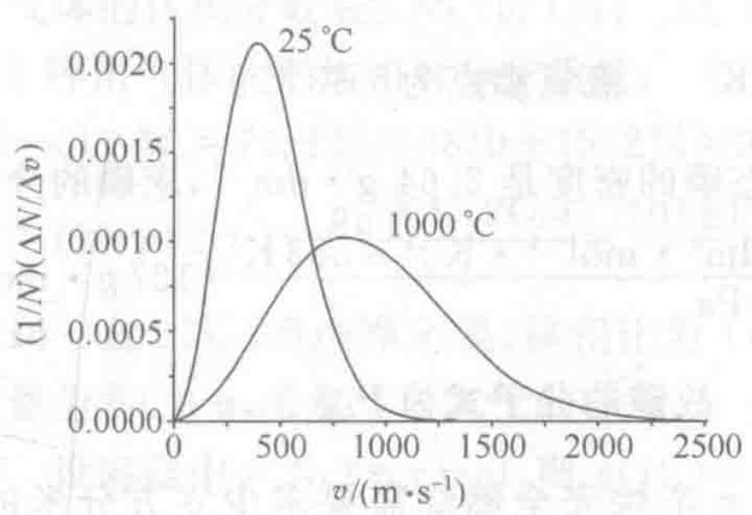

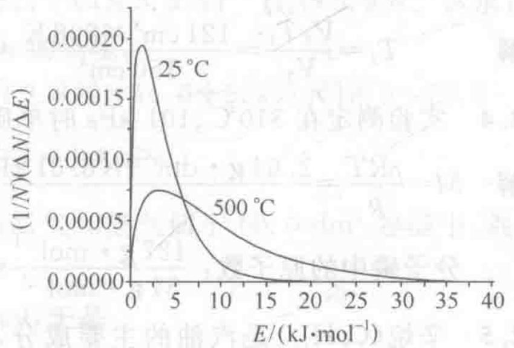

## 2.7 实际气体和 van der Waals 方程

理想气体状态方程只是对于实际情况的近似, 只有在温度不太低和压力不太高的条件下才适用, 而在实际情况下要作相应的校正。van der Waals 气体方程就是对理想气体状态方程的一种修正。

van der Waals 实际气体状态方程为

$$
\left(p + a \frac {n ^ {2}}{V ^ {2}}\right) (V - n b) = n R T
$$

其中，a 和 b 称为 van der Waals 常数，a 用于校正压力，b 用于校正体积。

实际气体的压缩系数 Z，用于比较实际气体的实验值与理想值之间的偏差：

$$
Z = \frac {p V}{n R T}
$$

## 习题解析

2.1 在 $25^{\circ}$ C 时, 若电视机用显像管的真空度为 $4.0 \times 10^{-7}$ Pa, 体积为 $2.0 \, dm^{3}$ , 试求管中气体的分子数 (N)。

解

$$
n = \frac {p V}{R T} = \frac {4 . 0 \times 1 0 ^ {- 1 0} \mathrm{kPa} \times 2 . 0 \mathrm{dm} ^ {3}}{8 . 3 1 \mathrm{kPa} \cdot \mathrm{dm} ^ {3} \cdot \mathrm{mol} ^ {- 1} \cdot \mathrm{K} ^ {- 1} \times 2 9 8 \mathrm{K}} = 3. 2 \times 1 0 ^ {- 1 3} \mathrm{mol}
$$

$$
N = 3. 2 \times 1 0 ^ {- 1 3} \mathrm{mol} \times 6. 0 2 \times 1 0 ^ {2 3} \mathrm{mol} ^ {- 1} = 1. 9 \times 1 0 ^ {1 1}
$$

2.2 一个体积为 $40.0 \mathrm{dm}^{3}$ 的氮气钢瓶（黑色），在 $22.5^{\circ} \mathrm{C}$ 时，使用前压力为 $12.6 \mathrm{MPa}$ ，使用后压力降为 $10.1 \mathrm{MPa}$ ，估计总共用了多少千克氮气。

解

$$
\begin{array}{r l} n & = n _ {\mathrm{前}} - n _ {\mathrm{后}} = \frac {p _ {\mathrm{前}} V}{R T} - \frac {p _ {\mathrm{后}} V}{R T} = \frac {(p _ {\mathrm{前}} - p _ {\mathrm{后}}) V}{R T} \\ & = \frac {(1 2 . 6 - 1 0 . 1) \mathrm{MPa} \times 1 0 ^ {3} \mathrm{kPa/MPa} \times 4 0 . 0 \mathrm{dm} ^ {3}}{8 . 3 1 \mathrm{kPa} \cdot \mathrm{dm} ^ {3} \cdot \mathrm{mol} ^ {- 1} \cdot \mathrm{K} ^ {- 1} \times 2 9 5 . 7 \mathrm{K}} \\ & = 4 1 \mathrm{mol} \\ m (\mathrm{N} _ {2}) & = 4 1 \mathrm{mol} \times 2 8. 0 \times 1 0 ^ {- 3} \mathrm{kg} \cdot \mathrm{mol} ^ {- 1} = 1. 1 \mathrm{kg} \end{array}
$$

2.3 标准参考温度计都是气体体积温度计,根据气体体积膨胀划分刻度,优质的水银温度计常用气体体积温度计校准。某定压氢气温度计在 $25.0^{\circ}C$ 、101 kPa 时体积为 $150 \, cm^{3}$ ，在沸腾的液氨中体积降为 $121 \, cm^{3}$ ，求液氨的沸点。

解

$$
T _ {2} = \frac {V _ {2} T _ {1}}{V _ {1}} = \frac {1 2 1 \mathrm{cm} ^ {3} \times 2 9 8 \mathrm{K}}{1 5 0 \mathrm{cm} ^ {3}} = 2 4 0 \mathrm{K} \quad \text {液氨沸点为} - 3 3 ^ {\circ} \mathrm{C。}
$$

2.4 实验测定在 $310^{\circ}C$ 、101 kPa 时单质气态磷的密度是 $2.64 \, g \cdot dm^{-3}$ ，求磷的分子式。

$$
\mathrm{解} M = \frac {\rho R T}{p} = \frac {2 . 6 4 \mathrm{g} \cdot \mathrm{dm} ^ {- 3} \times 8 . 3 1 \mathrm{kPa} \cdot \mathrm{dm} ^ {3} \cdot \mathrm{mol} ^ {- 1} \cdot \mathrm{K} ^ {- 1} \times 5 8 3 \mathrm{K}}{1 0 1 \mathrm{kPa}} = 1 2 7 \mathrm{g} \cdot \mathrm{mol} ^ {- 1}
$$

分子磷中的原子数： $\frac{127\mathrm{g}\cdot\mathrm{mol}^{-1}}{31\mathrm{g}\cdot\mathrm{mol}^{-1}}\approx 4$ ，故磷的分子式为 $\mathbf{P}_4$ 。

2.5 辛烷 $\left(\mathrm{C}_{8}\mathrm{H}_{18}\right)$ 是汽油的主要成分,100 g辛烷完全燃烧需要多少立方分米的空气(22.5℃, 101 kPa)?

$$
\begin{array}{r l} & {\text {解} 2 \mathrm{C} _ {8} \mathrm{H} _ {1 8} + 2 5 \mathrm{O} _ {2} \longrightarrow 1 6 \mathrm{CO} _ {2} + 1 8 \mathrm{H} _ {2} \mathrm{O}} \\ & {\qquad 2 \times 1 1 4 \mathrm{g} \quad 2 5. 0 \mathrm{mol}} \\ & {\qquad 1 0 0 \mathrm{g} \quad n (\mathrm{O} _ {2})} \\ & {n (\mathrm{O} _ {2}) = \frac {2 5 . 0 \mathrm{mol} \times 1 0 0 \mathrm{g}}{2 \times 1 1 4 \mathrm{g}} = 1 1. 0 \mathrm{mol}, \quad n (\text {空气}) = \frac {1 1 . 0 \mathrm{mol}}{0 . 2 1} = 5 2 \mathrm{mol}} \\ & {V (\text {空气}) = \frac {n (\text {空气}) R T}{p} = \frac {5 2 \mathrm{mol} \times 8 . 3 1 \mathrm{kPa} \cdot \mathrm{dm} ^ {3} \cdot \mathrm{mol} ^ {- 1} \cdot \mathrm{K} ^ {- 1} \times 2 9 5 . 7 \mathrm{K}}{1 0 1 \mathrm{kPa}} = 1. 3 \times 1 0 ^ {3} \mathrm{dm} ^ {3}} \end{array}
$$

2.6 在标准状态下 $1.00 \, m^{3} CO_{2}$ 通过炽热的炭层后，完全转变为 CO，这时温度为 $900^{\circ}C$ 、压力为 $101 \, kPa$ ，求 CO 的体积。

解 $CO_{2}+C\longrightarrow2CO$ $1.00\ m^{3}\ CO_{2}$ 通过炭层后生成 $2.00\ m^{3}\ CO$ 。

$$
\frac {V _ {1}}{T _ {1}} = \frac {V _ {2}}{T _ {2}}, V _ {2} = \frac {V _ {1} T _ {2}}{T _ {1}} = \frac {2 . 0 0 \mathrm{m} ^ {3} \times (2 7 3 + 9 0 0) \mathrm{K}}{2 7 3 \mathrm{K}} = 8. 5 9 \mathrm{m} ^ {3}
$$

2.7 在 $20^{\circ}C$ 、99.0 kPa 时用排水集气法要收集 $1.50 \, dm^{3}$ 氧气，至少要取多少克 $KClO_{3}$ （用 $MnO_{2}$ 作催化剂）进行热分解？已知：在 $20^{\circ}C$ ， $p(\mathrm{H}_{2}\mathrm{O}) = 2.34 \, \mathrm{kPa}$ 。

解

$$
\begin{array}{r l} & n (\mathrm{O} _ {2}) = \frac {p (\mathrm{O} _ {2}) V}{R T} = \frac {(9 9 . 0 - 2 . 3 4) \mathrm{kPa} \times 1 . 5 0 \mathrm{dm} ^ {3}}{8 . 3 1 \mathrm{kPa} \cdot \mathrm{dm} ^ {3} \cdot \mathrm{mol} ^ {- 1} \cdot \mathrm{K} ^ {- 1} \times 2 9 3 \mathrm{K}} = 5. 9 5 \times 1 0 ^ {- 2} \mathrm{mol} \\ & 2 \mathrm{KClO} _ {3} \longrightarrow 2 \mathrm{KCl} + 3 \mathrm{O} _ {2} \\ & 2. 0 0 \times 1 2 3 \mathrm{g} \quad 3. 0 0 \mathrm{mol} \\ & m \quad 5. 9 5 \times 1 0 ^ {- 2} \mathrm{mol} \\ & m (\mathrm{KClO} _ {3}) = \frac {2 . 0 0 \times 1 2 3 \mathrm{g} \times 5 . 9 5 \times 1 0 ^ {- 2} \mathrm{mol}}{3 . 0 0 \mathrm{mol}} = 4. 8 8 \mathrm{g} \end{array}
$$

2.8 在恒温条件下, 将下列 3 种气体装入 $250 \mathrm{~cm}^{3}$ 的真空瓶中, 混合气体的分压力、总压力各是多少?

(1) 250 Pa 的 $N_{2}$ 50 cm $^{3}$ ; (2) 350 Pa 的 $O_{2}$ 75 cm $^{3}$ ; (3) 750 Pa 的 $CO_{2}$ 150 cm $^{3}$ 。

解

$$
p (\mathrm{N} _ {2}) = \frac {2 5 0 \mathrm{Pa} \times 5 0 \mathrm{cm} ^ {3}}{2 5 0 \mathrm{cm} ^ {3}} = 5 0 \mathrm{Pa}
$$

$$
p (\mathrm{O} _ {2}) = \frac {3 5 0 \mathrm{Pa} \times 7 5 \mathrm{cm} ^ {3}}{2 5 0 \mathrm{cm} ^ {3}} = 1 0 5 \mathrm{Pa}
$$

$$
p (\mathrm{CO} _ {2}) = \frac {7 5 0 \mathrm{Pa} \times 1 5 0 \mathrm{cm} ^ {3}}{2 5 0 \mathrm{cm} ^ {3}} = 4 5 0 \mathrm{Pa}
$$

$$
p _ {\mathrm{总}} = 5 0 \mathrm{Pa} + 1 0 5 \mathrm{Pa} + 4 5 0 \mathrm{Pa} = 6 0 5 \mathrm{Pa}
$$

2.9 人在呼吸时,呼出气体的组成与吸入空气的组成不同,在 $36.8^{\circ}\mathrm{C}$ 与 $101\mathrm{kPa}$ 时某典型呼出气体的体积分数是: $\mathrm{N}_{2}75.1\%$ ; $\mathrm{O}_{2}15.2\%$ ; $\mathrm{CO}_{2}3.8\%$ ; $\mathrm{H}_{2}\mathrm{O}5.9\%$ 。试求:

(1) 呼出气体的平均相对分子质量；(2) $CO_{2}$ 的分压。

解 (1) $M_{\mathrm{r}} = 75.1\% \times 28.0 + 15.2\% \times 32.0 + 3.8\% \times 44.0 + 5.9\% \times 18.0 = 28.6$

$$
(2) p (\mathrm{CO} _ {2}) = \frac {p _ {\text {总}} \times V (\mathrm{CO} _ {2})}{V _ {\text {总}}} = \frac {1 0 1 \mathrm{kPa} \times 3 . 8}{1 0 0} = 3. 8 \mathrm{kPa}
$$

2.10 在 $27^{\circ}C$ ，将纯净干燥、体积比为 1:2 的氮气和氢气储于 $60.0 \, dm^{3}$ 容器中，混合气体总质量为 64.0 g，求氮气与氢气的分压。

解 设容器中 $n(\mathrm{N}_2) = x\mathrm{mol}$ ，则 $n(\mathrm{H}_2) = 2x\mathrm{mol}$ ，于是

$$
\begin{array}{r l} & 6 4. 0 \mathrm{g} = x \mathrm{mol} \times 2 8. 0 \mathrm{g} \cdot \mathrm{mol} ^ {- 1} + 2 x \mathrm{mol} \times 2. 0 0 \mathrm{g} \cdot \mathrm{mol} ^ {- 1} \\ & x = 2. 0 0, \quad n (\mathrm{N} _ {2}) = 2. 0 0 \mathrm{mol}, \quad n (\mathrm{H} _ {2}) = 4. 0 0 \mathrm{mol} \\ & p (\mathrm{N} _ {2}) = \frac {2 . 0 0 \mathrm{mol} \times 8 . 3 1 \mathrm{kPa} \cdot \mathrm{dm} ^ {3} \cdot \mathrm{mol} ^ {- 1} \cdot \mathrm{K} ^ {- 1} \times 3 0 0 \mathrm{K}}{6 0 . 0 \mathrm{dm} ^ {3}} = 8 3. 1 \mathrm{kPa} \end{array}
$$

2.11 $200 \mathrm{~cm}^{3} \mathrm{~N}_{2}$ 和 $\mathrm{CH}_{4}$ 的混合气与 $400 \mathrm{~cm}^{3} \mathrm{O}_{2}$ 点燃起反应后, 用干燥剂除去水分, 干气的体积为 $500 \mathrm{~cm}^{3}$ 。求原来混合气中 $\mathrm{N}_{2}$ 和 $\mathrm{CH}_{4}$ 的体积比 (各气体体积都是在相同的温度、压力下测定的)。

解

$$
\mathrm {CH_ {4} + 2O_ {2} \longrightarrow CO_ {2} + 2H_ {2} O}
$$

反应式表明,除去水分后,体积由起始的3体积变成1体积,即减少的体积为起始 $CH_{4}$ 体积的2倍。现体积减少

$$
\begin{array}{l} \Delta V = (2 0 0 \mathrm{cm} ^ {3} + 4 0 0 \mathrm{cm} ^ {3}) - 5 0 0 \mathrm{cm} ^ {3} = 1 0 0 \mathrm{cm} ^ {3} \\ V (\mathrm{CH} _ {4}) = \frac {1}{2} \times 1 0 0 \mathrm{cm} ^ {3} = 5 0. 0 \mathrm{cm} ^ {3}, \quad V (\mathrm{N} _ {2}) = 2 0 0 \mathrm{cm} ^ {3} - 5 0. 0 \mathrm{cm} ^ {3} = 1 5 0 \mathrm{cm} ^ {3} \\ V (\mathrm{N} _ {2}): V (\mathrm{CH} _ {4}) = 3: 1 \end{array}
$$

2.12 $45 \mathrm{~cm}^{3} \mathrm{CO}, \mathrm{CH}_{4}, \mathrm{C}_{2} \mathrm{H}_{2}$ 的混合气体与 $100 \mathrm{~cm}^{3} \mathrm{O}_{2}$ 完全燃烧并冷却到室温且干燥后, 体积变为 $80 \mathrm{~cm}^{3}$ ; 用 KOH 吸收 $\mathrm{CO}_{2}$ 并干燥之后, 体积缩减为 $15 \mathrm{~cm}^{3}$ 。求原混合气中 CO、 $\mathrm{CH}_{4}, \mathrm{C}_{2} \mathrm{H}_{2}$ 的体积分数。

解 混合气中 $\mathrm{CO},\mathrm{CH}_4,\mathrm{C}_2\mathrm{H}_2$ 完全燃烧后，产生 $\mathrm{CO}_{2}$ 及消耗 $\mathrm{O}_2$ 的体积列于下表中：

<table><tr><td>反应式</td><td>产生的CO2的体积</td><td>消耗O2的体积</td></tr><tr><td>2CO+O2→2CO2</td><td>V(CO)</td><td>1/2V(CO)</td></tr><tr><td>CH4+2O2→CO2+2H2O</td><td>V(CH4)</td><td>2V(CH4)</td></tr><tr><td>2C2H2+5O2→4CO2+2H2O</td><td>2V(C2H2)</td><td>5/2V(C2H2)</td></tr></table>

产生的 $\mathrm{CO}_{2}$ 的体积 $= 80\mathrm{cm}^{3} - 15\mathrm{cm}^{3} = 65\mathrm{cm}^{3}$

消耗的 $\mathrm{O}_2$ 的体积 $= 100\mathrm{cm}^3 -15\mathrm{cm}^3 = 85\mathrm{cm}^3$

$$
\left\{ \begin{array}{l} V (\mathrm{CO}) + V (\mathrm{CH} _ {4}) + 2 [ 4 5 \mathrm{cm} ^ {3} - V (\mathrm{CO}) - V (\mathrm{CH} _ {4}) ] = 6 5 \mathrm{cm} ^ {3} \\ \frac {1}{2} V (\mathrm{CO}) + 2 V (\mathrm{CH} _ {4}) + \frac {5}{2} [ 4 5 \mathrm{cm} ^ {3} - V (\mathrm{CO}) - V (\mathrm{CH} _ {4}) ] = 8 5 \mathrm{cm} ^ {3} \end{array} \right.
$$

解之，得

$$
V (\mathrm{CO}) = 10 \mathrm{cm} ^ {3}, \quad \varphi (\mathrm{CO}) = 10 \mathrm{cm} ^ {3} / 45 \mathrm{cm} ^ {3} = 22
$$

$$
V (\mathrm{CH} _ {4}) = 15 \mathrm{cm} ^ {3}, \quad \varphi (\mathrm{CH} _ {4}) = 15 \mathrm{cm} ^ {3} / 45 \mathrm{cm} ^ {3} = 33
$$

$$
V (\mathrm{C} _ {2} \mathrm{H} _ {2}) = 20 \mathrm{cm} ^ {3}, \quad \varphi (\mathrm{C} _ {2} \mathrm{H} _ {2}) = 20 \mathrm{cm} ^ {3} / 45 \mathrm{cm} ^ {3} = 44
$$

2.13 在 $57^{\circ}C$ ，让空气通过水，用排水集气法在 $1.00 \times 10^{5}$ Pa 下，把气体收集在一个带活塞的瓶中。此时，湿空气体积为 $1.00 \, dm^{3}$ 。已知：在 $57^{\circ}C, p(\mathrm{H}_{2}\mathrm{O}) = 17 \, \mathrm{kPa}$ ; 在 $10^{\circ}C, p(\mathrm{H}_{2}\mathrm{O}) = 1.2 \, \mathrm{kPa}$ ，问：

(1) 温度不变, 若压力降为 $5.00 \times 10^{4}$ Pa 时, 该气体体积变为多少?

(2) 温度不变, 若压力增为 $2.00 \times 10^{5}$ Pa 时, 该气体体积又变为多少?

(3) 压力不变, 若温度升高到 $100^{\circ}$ C, 该气体体积应是多少?

(4) 压力不变, 若温度降为 $10^{\circ}C$ , 该气体体积应是多少?

解 (1) $V_{2} = \frac{p_{1}V_{1}}{p_{2}} = \frac{1.00\times 10^{5}\mathrm{Pa}\times 1.00\mathrm{dm}^{3}}{5.00\times 10^{4}\mathrm{Pa}} = 2.00\mathrm{dm}^{3}$

(2) $57^{\circ} \mathrm{C}, p(\mathrm{H}_{2} \mathrm{O}) = 17 \mathrm{kPa}$

$$
p _ {2} (\mathrm{空气}) V _ {2} = p _ {1} (\mathrm{空气}) V _ {1}, \quad V _ {2} = \frac {(1 0 0 - 1 7) \mathrm{kPa} \times 1 . 0 0 \mathrm{dm} ^ {3}}{(2 0 0 - 1 7) \mathrm{kPa}} = 0. 4 5 \mathrm{dm} ^ {3}
$$

$$
(3) V _ {2} = \frac {V _ {1} \times T _ {2}}{T _ {1}} = \frac {1 . 0 0 \mathrm{dm} ^ {3} \times 3 7 3 \mathrm{K}}{3 3 0 \mathrm{K}} = 1. 1 3 \mathrm{dm} ^ {3}
$$

$$
(4) \frac {p _ {2} (\mathrm{空气}) V _ {2}}{T _ {2}} = \frac {p _ {1} (\mathrm{空气}) V _ {1}}{T _ {1}}, V _ {2} = \frac {(1 0 0 - 1 7) \mathrm{kPa} \times 1 . 0 0 \mathrm{dm} ^ {3} \times 2 8 3 \mathrm{K}}{(1 0 0 - 1 . 2) \mathrm{kPa} \times 3 3 0 \mathrm{K}} = 0. 7 2 \mathrm{dm} ^ {3}
$$

2.14 已知在 $40^{\circ}\mathrm{C}$ 三氯甲烷 $(\mathrm{CHCl}_3)$ 的蒸气压为 $49.3\mathrm{kPa}$ 。若有 $4.0\mathrm{dm}^3$ 干空气在 $40^{\circ}\mathrm{C}, 98.6\mathrm{kPa}$ 条件下缓慢通过三氯甲烷，并收集之。试求：

(1) 为 $CHCl_{3}$ 所饱和的空气, 在该条件下的体积应是多少?

(2) 这 $4.0 \, dm^{3}$ 干空气带走多少克 $CHCl_{3}$ ?

解 (1) $n$ (空气) 不变, $T = 313\mathrm{K}$

$$
p _ {1} (\mathrm{空气}) V _ {1} = p _ {2} (\mathrm{空气}) V _ {2}
$$

$$
V _ {2} = \frac {9 8 . 6 \mathrm{kPa} \times 4 . 0 \mathrm{dm} ^ {3}}{9 8 . 6 \mathrm{kPa} - 4 9 . 3 \mathrm{kPa}} = 8. 0 \mathrm{dm} ^ {3}
$$

$$
\begin{array}{r l} m (\mathrm{CHCl} _ {3}) & = \frac {M (\mathrm{CHCl} _ {3}) \times p (\mathrm{CHCl} _ {3}) \times V _ {2}}{R T} \\ & = \frac {1 1 9 . 4 \mathrm{g} \cdot \mathrm{mol} ^ {- 1} \times 4 9 . 3 \mathrm{kPa} \times 8 . 0 \mathrm{dm} ^ {3}}{8 . 3 1 \mathrm{kPa} \cdot \mathrm{dm} ^ {3} \cdot \mathrm{mol} ^ {- 1} \cdot \mathrm{K} ^ {- 1} \times 3 1 3 \mathrm{K}} = 1 8 \mathrm{g} \end{array} \tag {2}
$$

2.15 在 $250^{\circ}C$ ， $PCl_{5}$ 全部气化并部分解离为 $\mathrm{PCl}_{3}(\mathrm{~g})$ 和 $\mathrm{Cl}_{2}(\mathrm{~g})$ 。将 $2.98\ g\ PCl_{5}$ 置于 $1.00\ dm^{3}$ 容器中，在 $250^{\circ}C$ 全部气化之后，测得体系总压力为 113 kPa，那么其中含有哪些气体？它们的分压各是多少？

解 假设气体 $PCl_{5}$ 没有解离, 则应有的压力 ( $p'$ ) 为

$$
\begin{array}{r l} p ^ {\prime} (\mathrm{PCl} _ {5}) & = \frac {n (\mathrm{PCl} _ {5}) R T}{V} \\ & = \frac {(2 . 9 8 \mathrm{g} / 2 0 8 \mathrm{g} \cdot \mathrm{mol} ^ {- 1}) \times 8 . 3 1 \mathrm{kPa} \cdot \mathrm{dm} ^ {3} \cdot \mathrm{mol} ^ {- 1} \cdot \mathrm{K} ^ {- 1} \times 5 2 3 \mathrm{K}}{1 . 0 0 \mathrm{dm} ^ {3}} \\ & = 6 2. 3 \mathrm{kPa} \end{array}
$$

但由于测得的总压力大于 $62.3\mathrm{kPa}$ ，故可确定 $\mathrm{PCl}_5$ 已按下式部分解离：

$$
\mathrm{PCl} _ {5} (\mathrm{g}) \stackrel {\triangle} {\rightleftharpoons} \mathrm{PCl} _ {3} (\mathrm{g}) + \mathrm{Cl} _ {2} (\mathrm{g})
$$

由上式可知， $1\mathrm{mol}\mathrm{PCl}_5$ 分解，产生 $1\mathrm{mol}\mathrm{PCl}_3$ 和 $1\mathrm{mol}\mathrm{Cl}_2$ ，所以达平衡时

$$
p (\mathrm{PCl} _ {3}) = p (\mathrm{Cl} _ {2}), \quad p (\mathrm{PCl} _ {5}) = 6 2. 3 \mathrm{kPa} - p (\mathrm{Cl} _ {2})
$$

现 $p_{\text{总}} = 113 \mathrm{kPa}$ ，根据分压定律， $p_{\text{总}} = p(\mathrm{PCl}_5) + p(\mathrm{PCl}_3) + p(\mathrm{Cl}_2)$ ，即

$$
1 1 3 \mathrm{kPa} = 6 2. 3 \mathrm{kPa} - p (\mathrm{Cl} _ {2}) + p (\mathrm{PCl} _ {3}) + p (\mathrm{Cl} _ {2})
$$

$$
p \left(\mathrm{PCl} _ {3}\right) = 5 1 \mathrm{kPa}, \quad p \left(\mathrm{Cl} _ {2}\right) = 5 1 \mathrm{kPa}, \quad p \left(\mathrm{PCl} _ {5}\right) = 1 1 \mathrm{kPa}
$$

2.16 臭氧的分子式是 1868 年 Soret 用气体扩散法测定的。臭氧和氯气扩散速率的比值是 1.193。试核算臭氧的相对分子质量及分子式。

$$
\mathrm{解} \frac {v (\text {臭氧})}{v (\mathrm{Cl} _ {2})} = \sqrt {\frac {M _ {\mathrm{r}} (\mathrm{Cl} _ {2})}{M _ {\mathrm{r}} (\text {臭氧})}} = 1. 1 9 3, M _ {\mathrm{r}} (\text {臭氧}) = \frac {M _ {\mathrm{r}} (\mathrm{Cl} _ {2})}{(1 . 1 9 3) ^ {2}} = \frac {3 5 . 4 5 \times 2}{(1 . 1 9 3) ^ {2}} = 4 9. 8 2
$$

臭氧中氧原子数为：49.82/16.0≈3，故臭氧分子式为 $O_{3}$ 。

2.17 声速与气体扩散速率的关系可表示为

$$
\mathrm{声速} = \sqrt {r R T / M}
$$

其中 r 是校正因子，单原子分子的 r=1.67，双原子分子的 r=1.41。试求在 $25^{\circ}$ C、0.1 MPa 空气中声音传播的速率，并和在氦气中的声速比较。

$$
\mathrm{解} \quad (\mathrm{声速}) _ {\mathrm{空}} = \sqrt {\frac {1 . 4 1 \times 8 . 3 1 \times 1 0 ^ {3} \mathrm{g} \cdot \mathrm{m} ^ {2} \cdot \mathrm{s} ^ {- 2} \cdot \mathrm{mol} ^ {- 1} \cdot \mathrm{K} ^ {- 1} \times 2 9 8 \mathrm{K}}{2 8 . 8 \mathrm{g} \cdot \mathrm{mol} ^ {- 1}}} = 3. 4 8 \times 1 0 ^ {2} \mathrm{m} \cdot \mathrm{s} ^ {- 1}
$$

$$
(\text {声速}) _ {\text {氦}} = \sqrt {\frac {1 . 6 7 \times 8 . 3 1 \times 1 0 ^ {3} \mathrm{g} \cdot \mathrm{m} ^ {2} \cdot \mathrm{s} ^ {- 2} \cdot \mathrm{mol} ^ {- 1} \cdot \mathrm{K} ^ {- 1} \times 2 9 8 \mathrm{K}}{4 . 0 0 \mathrm{g} \cdot \mathrm{mol} ^ {- 1}}} = 1. 0 2 \times 1 0 ^ {3} \mathrm{m} \cdot \mathrm{s} ^ {- 1}
$$

在氦气中声速差不多是空气中的3倍。

2.18 扩散法分离同位素时，分离因子 $f = \frac{n_1' / n_2'}{n_1 / n_2}$ ，其中 $n_1 / n_2$ 为分离前物质的量之比，而 $n_1' / n_2'$ 则为分离后物质的量之比。天然铀中 $^{235}\mathrm{U}$ 的摩尔分数仅为 $0.70\%$ ， $^{238}\mathrm{U}$ 则为 $99.30\%$ ，若实用核燃料要求 $^{235}\mathrm{U}$ 富集到 $5.0\%$ (摩尔分数)，试求 $^{235}\mathrm{U}$ 的分离因子。

解

2.19 一次扩散操作分离因子 $f'$ 是由扩散速率比决定的,那么 $UF_6$ 的一次扩散分离因子 $f'$ 是多少?由天然铀得到丰度为 $5.0\%$ (摩尔分数)的 $^{235}U$ ,理论上应经过几次扩散操作?

解

$$
f ^ {\prime} = \frac {v (^ {2 3 5} \mathrm{UF} _ {6})}{v (^ {2 3 8} \mathrm{UF} _ {6})} = \sqrt {\frac {M (^ {2 3 8} \mathrm{UF} _ {6})}{M (^ {2 3 5} \mathrm{UF} _ {6})}} = \sqrt {\frac {3 5 2 . 0}{3 4 9 . 0}} = 1. 0 0 4
$$

$$
(1. 0 0 4) ^ {x} = 7. 5, \quad x = 5. 1 \times 1 0 ^ {2}
$$

2.20 40.0℃时 1.00 mol CO₂(g) 在 1.20 dm³ 容器中, 实验测定其压力为 1.97 MPa。试分别用理想气体状态方程和 van der Waals 方程计算 CO₂ 的压力, 并和实验值比较。

解

$$
\begin{array}{r l} p _ {\mathrm{理}} & = \frac {n R T}{V} = \frac {1 . 0 0 \mathrm{mol} \times 8 . 3 1 \mathrm{kPa} \cdot \mathrm{dm} ^ {3} \cdot \mathrm{mol} ^ {- 1} \cdot \mathrm{K} ^ {- 1} \times 3 1 3 \mathrm{K}}{1 . 2 0 \mathrm{dm} ^ {3}} \\ & = 2. 1 7 \times 1 0 ^ {3} \mathrm{kPa} = 2. 1 7 \mathrm{MPa} \end{array}
$$

按 van der Waals 方程计算：

$$
\begin{array}{r l} & {\left[ p + \frac {(1 . 0 0 \mathrm{mol}) ^ {2} \times 3 6 5 . 8 \mathrm{dm} ^ {6} \cdot \mathrm{kPa} \cdot \mathrm{mol} ^ {- 2}}{(1 . 2 0 \mathrm{dm} ^ {3}) ^ {2}} \right] \times (1. 2 0 - 0. 0 4 2 9) \mathrm{dm} ^ {3}} \\ & {\qquad = 1. 0 0 \mathrm{mol} \times 8. 3 1 \mathrm{kPa} \cdot \mathrm{dm} ^ {3} \cdot \mathrm{mol} ^ {- 1} \cdot \mathrm{K} ^ {- 1} \times 3 1 3 \mathrm{K}} \\ & {p = 1. 9 9 \times 1 0 ^ {3} \mathrm{kPa} = 1. 9 9 \mathrm{MPa}} \end{array}
$$

可见，用 van der Waals 方程计算的结果和实验值相当接近。

2.21 0℃时，11.3 mg He 盛于 1.25 dm³ 容器中，实验测定其压力为 5.10 kPa。试分别用理想气体状态方程和 van der Waals 方程计算其压力，并比较计算结果。

解

$$
n (\mathrm{He}) = \frac {1 1 . 3 \mathrm{mg}}{4 . 0 0 \mathrm{g} \cdot \mathrm{mol} ^ {- 1}} \times 1 0 ^ {- 3} \mathrm{g} \cdot \mathrm{mg} ^ {- 1} = 2. 8 3 \times 1 0 ^ {- 3} \mathrm{mol}
$$

$$
p _ {\mathrm{理}} = \frac {n R T}{V} = \frac {2 . 8 3 \times 1 0 ^ {- 3} \mathrm{mol} \times 8 . 3 1 \mathrm{kPa} \cdot \mathrm{dm} ^ {3} \cdot \mathrm{mol} ^ {- 1} \cdot \mathrm{K} ^ {- 1} \times 2 7 3 \mathrm{K}}{1 . 2 5 \mathrm{dm} ^ {3}} = 5. 1 4 \mathrm{kPa}
$$

按 van der Waals 方程计算：

$$
\begin{array}{r l} & {\left[ p + \frac {(2 . 8 3 \times 1 0 ^ {- 3} \mathrm{mol}) ^ {2} \times 3 . 4 6 \mathrm{dm} ^ {6} \cdot \mathrm{kPa} \cdot \mathrm{mol} ^ {- 2}}{(1 . 2 5 \mathrm{dm} ^ {3}) ^ {2}} \right] (1. 2 5 \mathrm{dm} ^ {3} - 2. 8 3 \times 1 0 ^ {- 3} \mathrm{mol}} \\ & {\times 0. 0 2 3 8 \mathrm{dm} ^ {3} \cdot \mathrm{mol} ^ {- 1})} \\ & {\qquad = 2. 8 3 \times 1 0 ^ {- 3} \mathrm{mol} \times 8. 3 1 \mathrm{kPa} \cdot \mathrm{dm} ^ {3} \cdot \mathrm{mol} ^ {- 1} \cdot \mathrm{K} ^ {- 1} \times 2 7 3 \mathrm{K}} \\ & {p = 5. 1 4 \mathrm{kPa}} \end{array}
$$

两种方程计算结果相等，并与实验值接近。He 是沸点最低的气体，在 $0^{\circ}$ C 且压力又低的条件下接近理想状态。

2.22 某有机卤化物，在 $0^{\circ} \mathrm{C}$ 、实验测定不同压力 $(p)$ 下，其密度 $(\rho)$ 数据如下表。试用外延法求该化合物的精确相对分子质量 $(M_{\mathrm{r}})$ 。

<table><tr><td>p/kPa</td><td>101.3</td><td>67.54</td><td>50.65</td><td>33.76</td><td>25.33</td></tr><tr><td>ρ/(g·dm-3)</td><td>2.307</td><td>1.526</td><td>1.140</td><td>0.7571</td><td>0.5666</td></tr></table>

解 整理已知数据,所得结果列于下表中:

<table><tr><td>p/kPa</td><td>101.3</td><td>67.54</td><td>50.65</td><td>33.76</td><td>25.33</td></tr><tr><td> $\frac{\rho / p}{g \cdot dm^{-3} \cdot kPa^{-1}}$ </td><td>0.02277</td><td>0.02259</td><td>0.02251</td><td>0.02243</td><td>0.02237</td></tr></table>

根据表中数据，以 $\frac{\rho / p}{\mathrm{g} \cdot \mathrm{dm}^{-3} \cdot \mathrm{kPa}^{-1}}$ 对 $(p / \mathrm{kPa})$ 作图，外延至 $p / \mathrm{kPa} \approx 0$ 时， $\rho / p = 0.02225 \mathrm{~g} \cdot \mathrm{dm}^{-3} \cdot \mathrm{kPa}^{-1}$ 。

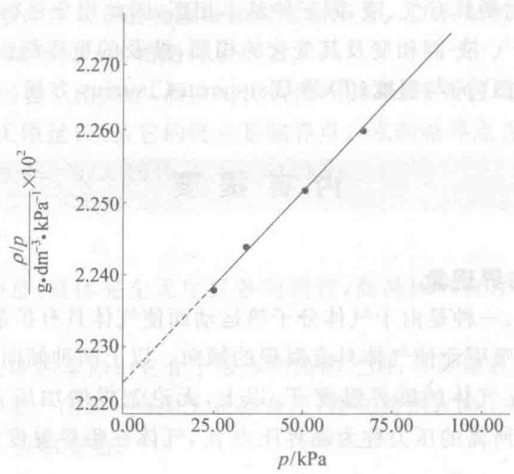

$$
\begin{array}{r l} M & = (\rho / p) R T \\ & = 0. 0 2 2 2 5 \mathrm{g} \cdot \mathrm{dm} ^ {- 3} \cdot \mathrm{kPa} ^ {- 1} \times 8. 3 1 4 \mathrm{kPa} \cdot \mathrm{dm} ^ {3} \cdot \mathrm{mol} ^ {- 1} \cdot \mathrm{K} ^ {- 1} \times 2 7 3. 2 \mathrm{K} \\ & = 5 0. 5 4 \mathrm{g} \cdot \mathrm{mol} ^ {- 1} \end{array}
$$

即该化合物的相对分子质量 $M_{r}=50.54$ 。

# 第 3 章 相变·液态

在自然界,大多数物质具有气、液、固三种基本相态,因此相变是物质世界最基本的变化过程之一。本章主要讨论气-液-固相变及其变化的相图,涉及的重要概念有临界现象和蒸气压,给出关联液体饱和蒸气压(p)与温度(T)的Clapeyron-Clausius方程。

## 内容提要

## 3.1 气体的液化·临界现象

气体具有两种倾向:一种是由于气体分子热运动而使气体具有扩散膨胀的倾向,另一种是由于气体分子之间相互吸引而使气体具有凝聚的倾向。以上两种倾向相互作用的结果是使气体产生临界现象。即,在气体的临界温度 $T_{c}$ 以上,无论怎样增加压力,都不能使气体液化。气体在临界温度下液化所需的压力称为临界压力 $p_{c}$ , 气体在临界温度和临界压力下所具有的体积称为临界体积 $V_{c}$ 。

沸点和临界温度都低于室温的气体,称为永久气体;沸点低于室温而临界温度高于室温的气体,称为可凝聚气体;沸点和临界温度都高于室温的物质,在常温常压下就是液体。

气体在临界温度以上,无论怎么加压都不会液化,这类气体称为超临界流体(SCF)。

## 3.2 液体的蒸发·蒸气压

当温度恒定时,密闭容器里的液体可以与其蒸气形成气-液平衡,此时液体的蒸发和气体的冷凝处于动态平衡过程。与液相处于动态平衡的气体称为饱和蒸气;它的压力称为饱和蒸气压,简称蒸气压。

描述液体蒸气压与温度关系的公式为 Clapeyron-Clausius 方程：

$$
\lg \left(\frac {p _ {2}}{p _ {1}}\right) = - \frac {\Delta H _ {\mathrm{vap}}}{2 . 3 0 3 R} \left(\frac {1}{T _ {2}} - \frac {1}{T _ {1}}\right)
$$

其中， $p_{1}$ 和 $p_{2}$ 分别为液体在温度 $T_{1}$ 和 $T_{2}$ 的蒸气压， $\Delta H_{vap}$ 为液体的摩尔蒸发热，R 为摩尔气体常数。

当液体的蒸气压等于外压时,液体出现沸腾现象,此时的温度称为沸点。在实际情况下,液体经常在沸点以上才会沸腾,这种现象称为过热现象。过热现象的出现是由于液体气化需要气化中心。在液体中加入沸石或者搅拌,都可以减少过热现象。

## 3.3 液体的凝固·固体的熔化

液体的凝固和固体的熔化互为相反过程。由于液体凝固的过程需要有成核中心，成核中心有助于克服成核过程的能垒。因此，液体凝固过程中有时会出现过冷现象，即当温度降低到

凝固点以下，才有晶体析出的现象。

在凝固点(也称熔点)处, 固、液两相处于平衡状态; “三相点”是特殊的凝固点, 此时固、液、气三相平衡, 固、液两相的蒸气压相等, 即 $p_{\text{液}} = p_{\text{固}}$ 。

## 3.4 水的相图

相图可以简洁、直观地描述一定条件下物质的存在状态及其变化关系。在不考虑重力场、磁场等因素时，影响体系存在状态的物理量是温度和压力。以水为例，水的气、液、固三相之间的相平衡可以通过一个简单的 $p - t$ 相图表示出来。

在相图中，三相点代表三相共存，而曲线代表两相共存，平面区域分别代表各单相区。要注意的是，气液线不是无限延长的，它的终点是临界点。水的临界点为 $t_{\mathrm{c}} = 374^{\circ}\mathrm{C}, p_{\mathrm{c}} = 2.21 \times 10^{4} \mathrm{kPa}$ 。水的三相点为 $T_{\mathrm{t}} = 273.16 \mathrm{~K}, p_{\mathrm{t}} = 0.611 \mathrm{kPa}$ 。

## 3.5 液体和液晶

液体与晶体的区别是:液体完全无序且各向同性,而晶体为有序固体且通常具有各向异性。

液晶是一类有序流体的总称。它介于液体和晶体之间，可以像液体一样有流动性，同时也具有晶体的各向异性性质：在某一方向上长程有序，而在其他方向上短程有序，因此被称为液态晶体(liquid crystal)，简称液晶。

## 习题解析

3.1 参考临界点数值, 判断 $O_{2}$ 、 $H_{2}$ 、 $Cl_{2}$ 、 $NH_{3}$ 、 $C_{4}H_{10}$ 几种物质常温下在高压钢瓶里的存在状态。在使用过程中, 氧气钢瓶的压力逐渐降低, 而氯气钢瓶的压力几乎不变, 为什么?

解 气态： $O_{2}$ ， $H_{2}$ ；液态： $Cl_{2}$ ， $NH_{3}$ ， $C_{4}H_{10}$

$O_{2}$ 钢瓶内为高压气体,随着消耗,气体分子数减少而压力下降; $Cl_{2}$ 钢瓶内为气-液共存,只要温度不变,虽消耗气体,但有液体不断气化以保持气-液平衡,可保持压力不变。

3.2 丙烯的蒸气压数据如下,试用作图法求: (1) 丙烯的正常沸点, (2) 丙烯的摩尔蒸发热。

<table><tr><td>温度/K</td><td>150</td><td>200</td><td>225</td><td>250</td></tr><tr><td>蒸气压/kPa</td><td>0.509</td><td>26.4</td><td>98.6</td><td>276.5</td></tr></table>

解 (1)

<table><tr><td> $\frac{1}{T} \times 10^{3}/K^{-1}$ </td><td>6.67</td><td>5.00</td><td>4.44</td><td>4.00</td></tr><tr><td>lg(p/kPa)</td><td>-0.293</td><td>1.422</td><td>1.994</td><td>2.442</td></tr></table>

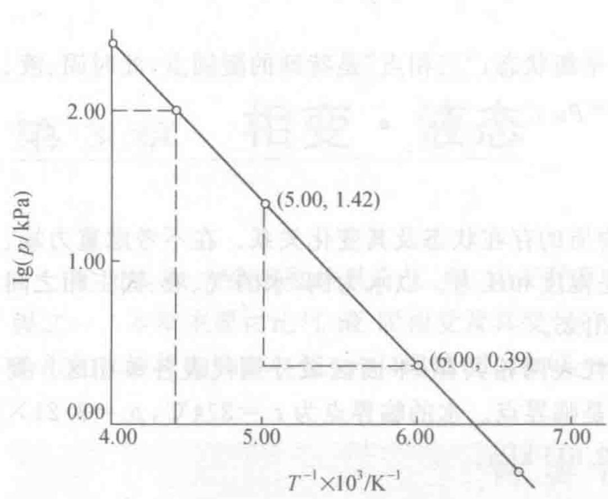

以 $\lg (p / \mathrm{kPa})$ 对 $(T^{-1}\times 10^{3} / \mathrm{K}^{-1})$ 作图。当蒸气压等于外压[101.3kPa，即 $\lg (p / \mathrm{kPa}) = 2.006]$ 时，由图可知：

相应 $\frac{1}{T_{\mathrm{b}}}\times 10^{3} = 4.42\mathrm{K}^{-1}$ ，则正常沸点

$$
\begin{array}{c} {T _ {\mathrm{b}} = 2 2 6 \mathrm{K}} \\ {(\text {或} t _ {\mathrm{b}} = - 4 7 ^ {\circ} \mathrm{C})} \end{array}
$$

(2) 由图中直线斜率求 $\Delta H_{vap}$

$$
\begin{array}{r l} \text {   斜率   } & = \frac {1 . 4 2 - 0 . 3 9}{(5 . 0 0 - 6 . 0 0) \times 1 0 ^ {- 3}} \\ & = - \frac {\Delta H _ {\mathrm{vap}}}{2 . 3 0 R} \mathrm{K} ^ {- 1} \\ & \Delta H _ {\mathrm{vap}} = 1 9. 7 \mathrm{kJ} \cdot \mathrm{mol} ^ {- 1} \end{array}
$$

3.3 已知丙酮的正常沸点是 $56.5^{\circ}C$ ，摩尔蒸发热是 $30.3 \, kJ \cdot mol^{-1}$ 。试求在 $20.0^{\circ}C$ 时丙酮的蒸气压。

$$
\begin{array}{r l} {\mathrm{解}} & {\lg \frac {p _ {2}}{1 0 1 . 3 \mathrm{kPa}} = \frac {3 0 . 3 \times 1 0 ^ {3} \mathrm{J} \cdot \mathrm{mol} ^ {- 1}}{2 . 3 0 3 \times 8 . 3 1 \mathrm{J} \cdot \mathrm{mol} ^ {- 1} \cdot \mathrm{K} ^ {- 1}} \left(\frac {2 9 3 . 2 \mathrm{K} - 3 2 9 . 7 \mathrm{K}}{2 9 3 . 2 \mathrm{K} \times 3 2 9 . 7 \mathrm{K}}\right)} \\ & {p _ {2} = 2 5. 6 \mathrm{kPa}} \end{array}
$$

3.4 参考附录 C.1 的数据,作图求水的摩尔蒸发热,并求 $51.0^{\circ}$ C 时水的蒸气压。
解 由附录 C.1 得到下列数据：

<table><tr><td>t/°C</td><td>20</td><td>30</td><td>40</td><td>50</td><td>60</td><td>70</td><td>80</td></tr><tr><td>T/K</td><td>293</td><td>303</td><td>313</td><td>323</td><td>333</td><td>343</td><td>353</td></tr><tr><td> $\frac{1}{T} \times 10^3 /K^{-1}$ </td><td>3.41</td><td>3.30</td><td>3.19</td><td>3.10</td><td>3.00</td><td>3.92</td><td>2.83</td></tr><tr><td>p/kPa</td><td>2.34</td><td>4.25</td><td>7.38</td><td>12.35</td><td>19.95</td><td>31.20</td><td>47.41</td></tr><tr><td>lg(p/kPa)</td><td>0.369</td><td>0.627</td><td>0.868</td><td>1.091</td><td>1.300</td><td>1.494</td><td>1.676</td></tr></table>

以 $\lg (p / \mathrm{kPa})$ 对 $(T^{-1}\times 10^{3} / \mathrm{K}^{-1})$ 作图。

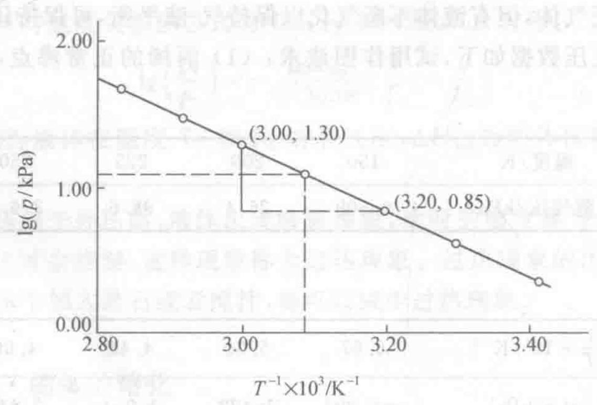

由图中直线的斜率求 $\Delta H_{\mathrm{vap}}$ ，即

$$
\begin{array}{r l} & {\frac {1 . 3 0 - 0 . 8 5}{(3 . 0 0 - 3 . 2 0) \times 1 0 ^ {- 3}} = - \frac {\Delta H _ {\mathrm{vap}}}{2 . 3 0 R} \mathrm{K} ^ {- 1}} \\ & {\qquad \Delta H _ {\mathrm{vap}} = 4 3 \mathrm{kJ} \bullet \mathrm{mol} ^ {- 1}} \\ & {t = 5 1 ℃ \text {时,lg(p / kPa) = 1.10,p = 13kPa}} \end{array}
$$

3.5 在青藏高原某山地，测得水的沸点为 $93^{\circ}$ C，估计该地大气压是多少。

解 由 3.4 题知, 水的 $\Delta H_{vap}=43\ kJ\cdot mol^{-1}$

$$
\lg \frac {p _ {2}}{1 0 1 . 3 \mathrm{kPa}} = \frac {4 3 \times 1 0 ^ {3} \mathrm{J} \cdot \mathrm{mol} ^ {- 1}}{2 . 3 0 3 \times 8 . 3 1 \mathrm{J} \cdot \mathrm{mol} ^ {- 1} \cdot \mathrm{K} ^ {- 1}} \left(\frac {3 6 6 \mathrm{K} - 3 7 3 \mathrm{K}}{3 6 6 \mathrm{K} \times 3 7 3 \mathrm{K}}\right)
$$

$p_{2}=78\ kPa$ ，即该处的大气压为78kPa。

3.6 在一个体积为 $482 \, cm^{3}$ 的密闭容器里有 0.105 g 水。在 $50^{\circ}C$ 时，其中蒸气和液体各是多少？

解 若全部气化,则

$$
p = \frac {n R T}{V} = \frac {(0 . 1 0 5 \mathrm{g} / 1 8 . 0 \mathrm{g} \cdot \mathrm{mol} ^ {- 1}) \times 8 . 3 1 \mathrm{kPa} \cdot \mathrm{dm} ^ {3} \cdot \mathrm{mol} ^ {- 1} \cdot \mathrm{K} ^ {- 1} \times 3 2 3 \mathrm{K}}{0 . 4 8 2 \mathrm{dm} ^ {3}} = 3 2. 5 \mathrm{kPa}
$$

已知 $50^{\circ}$ C 时，水的蒸气压 = 12.3 kPa，水不能全部气化，容器内气液共存。

$$
m (\text {气}) = \frac {p V M}{R T} = \frac {1 2 . 3 \mathrm{kPa} \times 0 . 4 8 2 \mathrm{dm} ^ {3} \times 1 8 . 0 \mathrm{g} \cdot \mathrm{mol} ^ {- 1}}{8 . 3 1 \mathrm{kPa} \cdot \mathrm{dm} ^ {3} \cdot \mathrm{mol} ^ {- 1} \cdot \mathrm{K} ^ {- 1} \times 3 2 3 \mathrm{K}} = 0. 0 4 0 \mathrm{g}
$$

$$
m (\text {液}) = 0. 1 0 5 \mathrm{g} - 0. 0 4 0 \mathrm{g} = 0. 0 6 5 \mathrm{g}
$$

3.7 实验测定液态溴在 $25.0^{\circ}C$ 的饱和蒸气密度是 $0.00194 \, g \cdot cm^{-3}$ ，计算液溴在 $25.0^{\circ}C$ 时的蒸气压。

$$
\begin{array}{r l} \text {解} & p = \frac {\rho R T}{M} \\ & = \frac {0 . 0 0 1 9 4 \mathrm{g} \cdot \mathrm{cm} ^ {- 3} \times 1 0 ^ {3} \mathrm{cm} ^ {3} \cdot \mathrm{dm} ^ {- 3} \times 8 . 3 1 \mathrm{kPa} \cdot \mathrm{dm} ^ {3} \cdot \mathrm{mol} ^ {- 1} \cdot \mathrm{K} ^ {- 1} \times 2 9 8 \mathrm{K}}{7 9 . 9 \times 2 \mathrm{g} \cdot \mathrm{mol} ^ {- 1}} \\ & = 3 0. 1 \mathrm{kPa} \end{array}
$$

3.8 “0 ℃以下，100℃以上， $H_{2}O$ 都不能以液态存在。”这种说法对吗？

解 不对。纯组分物质以何种状态存在,不只是取决于温度,还取决于压力。此外,还可以有过冷液体和过热液体。

3.9 在 $20^{\circ}$ C 及恒定外压的条件下, 若有 $1.00 \, dm^{3}$ 含饱和水蒸气的空气通过焦性没食子酸溶液后, 其中 $O_{2}$ 全部被吸收, 求剩余气体的总体积。(干燥空气的体积分数: $O_{2}$ 为 21%, $N_{2}$ 为 79%; 忽略焦性没食子酸对水蒸气压的影响。)

解 湿空气通过焦性没食子酸后, 其中 $O_{2}$ 被吸收了。因总压不变, 总体积缩小后, 为了保持 $20^{\circ}C$ 的恒定饱和水蒸气压, 会有部分水蒸气凝结为水。湿空气中只有 $N_{2}$ 气分子数没有变化, 故可以对 $N_{2}$ 气应用分压定律或 Boyle 定律, 从而求得剩余气体总体积 ( $V_{x}$ ):

$$
\begin{array}{r l} {[ p _ {\mathrm{总}} - p (\mathrm {H_ {2} O}) ] \times 0. 7 9 \times 1. 0 0 \mathrm{dm} ^ {3} = [ p _ {\mathrm{总}} - p (\mathrm {H_ {2} O}) ] V _ {x}} \\ & {V _ {x} = 0. 7 9 \mathrm{dm} ^ {3}} \end{array}
$$

3.10 在 293 K 和 101.3 kPa 条件下, 有 $1.00 \, dm^{3}$ 干燥空气 (设其体积分数为: $O_{2}$ 21.0%, $N_{2}$ 79.0%) 通过盛水气瓶后, 饱和湿空气的总体积应是多少? 湿空气中各气体的分压又是多少?

解

$$
V _ {\mathrm{总}} = \frac {p _ {\mathrm{总}} V (\mathrm{O} _ {2} , \mathrm{N} _ {2})}{p (\mathrm{O} _ {2} , \mathrm{N} _ {2})} = \frac {1 0 1 . 3 \mathrm{kPa} \times 1 . 0 0 \mathrm{dm} ^ {3}}{1 0 1 . 3 \mathrm{kPa} - 2 . 3 4 \mathrm{kPa}} = 1. 0 2 \mathrm{dm} ^ {3}
$$

湿空气中： $p(\mathrm{H}_{2}\mathrm{O})=2.34\mathrm{kPa}$

$$
p \left(\mathrm{O} _ {2}, \mathrm{N} _ {2}\right) = 1 0 1. 3 \mathrm{kPa} - 2. 3 4 \mathrm{kPa} = 9 9. 0 \mathrm{kPa}
$$

$$
p (\mathrm{O} _ {2}) = p (\mathrm{O} _ {2}, \mathrm{N} _ {2}) \times 21.0 \% = 99.0 \mathrm{kPa} \times 0.210 = 20.8 \mathrm{kPa}
$$

$$
p (\mathrm{N} _ {2}) = p (\mathrm{O} _ {2}, \mathrm{N} _ {2}) \times 79.0 \% = 99.0 \mathrm{kPa} \times 0.790 = 78.2 \mathrm{kPa}
$$

3.11 0.0396 g Zn-Al 合金片与过量的稀盐酸作用放出氢气，用排水集气法收集到氢气的体积为 $27.10 \, cm^{3}$ ( $24.3^{\circ}C$ , 101 kPa)。求该合金的组成。

解

$$
\begin{array}{r l} n (\mathrm{H} _ {2}) & = \frac {p (\mathrm{H} _ {2}) V}{R T} = \frac {(1 0 1 - 3 . 0 4) \mathrm{kPa} \times 2 7 . 1 0 \mathrm{cm} ^ {3} \times 1 0 ^ {- 3} \mathrm{dm} ^ {3} \cdot \mathrm{cm} ^ {- 3}}{8 . 3 1 \mathrm{kPa} \cdot \mathrm{dm} ^ {3} \cdot \mathrm{mol} ^ {- 1} \cdot \mathrm{K} ^ {- 1} \times 2 9 7 . 3 \mathrm{K}} \\ & = 1. 0 7 \times 1 0 ^ {- 3} \mathrm{mol} \end{array}
$$

1 g 锌置换氢 $n_{1}(H_{2})=\frac{1.00\ \text{g}}{65.4\ \text{g}\cdot\text{mol}^{-1}}=0.0153\ \text{mol}$

$1\mathrm{g}$ 铝置换氢 $n_2(\mathrm{H}_2) = \frac{1.00\mathrm{g}}{2 / 3\times 27.0\mathrm{g}\cdot\mathrm{mol}^{-1}} = 0.0556\mathrm{mol}$

设合金含 $\mathrm{Zn}x\%$ （质量分数 $w$ )，含 $\mathrm{Al}(100 - x)\%$ （质量分数 $w$ )，则

$$
\begin{array}{r l} & n (\mathrm {H_ {2}}) = 1. 0 7 \times 1 0 ^ {- 3} \mathrm{mol} \\ & \qquad = 0. 0 3 9 6 \mathrm{g} \times x \% \times 0. 0 1 5 3 \mathrm{mol} \cdot \mathrm{g} ^ {- 1} + 0. 0 3 9 6 \mathrm{g} \\ & \qquad \times (1 0 0 - x) \% \times 0. 0 5 5 6 \mathrm{mol} \cdot \mathrm{g} ^ {- 1} \\ & x = 7 0. 9 \end{array}
$$

该合金片组成为： $w(\mathrm{Zn})$ 70.9%， $w(\mathrm{Al})$ 29.1%。

3.12 0.100 mol $H_{2}$ 和 0.050 mol $O_{2}$ 在一个 20.0 dm $^{3}$ 的密闭容器中，用电火花使它们完全起反应生成水，然后冷却到 27℃，试求容器中的压力。（已知 27℃ 水蒸气压为 3.57 kPa。）

解 反应生成 0.100 mol $H_{2}O$ 。若生成的水全部气化，则

$$
p (\mathrm{H} _ {2} \mathrm{O}) = \frac {0 . 1 0 0 \mathrm{mol} \times 8 . 3 1 \mathrm{kPa} \cdot \mathrm{dm} ^ {3} \cdot \mathrm{mol} ^ {- 1} \cdot \mathrm{K} ^ {- 1} \times 3 0 0 \mathrm{K}}{2 0 . 0 \mathrm{dm} ^ {3}} = 1 2. 5 \mathrm{kPa}
$$

当 $p(\mathrm{H}_{2}\mathrm{O})=12.5\mathrm{kPa}$ 时，已大于 $27^{\circ}C$ 时水的饱和蒸气压，水汽部分凝聚成水，容器内的压力即为 $27^{\circ}C$ 的水蒸气压，为 $3.57kPa$ 。

3.13 在 $120^{\circ}$ C 的 $5.0 \, dm^{3}$ 密闭容器中有 $2.5 \, g \, H_{2}O$ 。用计算说明：

(1) $H_{2}O$ 完全以气态存在；(2) 冷却到什么温度，水汽开始凝聚为液态？

解 (1) $n(\mathrm{H}_2\mathrm{O}) = \frac{2.5\mathrm{g}}{18\mathrm{g}\cdot\mathrm{mol}^{-1}} = 0.14\mathrm{mol}$

设完全气化时，

$$
\begin{array}{r l} p (\mathrm{H} _ {2} \mathrm{O}) & = \frac {n R T}{V} = \frac {0 . 1 4 \mathrm{mol} \times 8 . 3 1 \mathrm{kPa} \cdot \mathrm{dm} ^ {3} \cdot \mathrm{mol} ^ {- 1} \cdot \mathrm{K} ^ {- 1} \times 3 9 3 \mathrm{K}}{5 . 0 \mathrm{dm} ^ {3}} \\ & = 9 0 \mathrm{kPa} \end{array}
$$

90 kPa<198.5 kPa(120℃时水的饱和蒸气压)，故 $H_{2}O$ 完全以气态存在。

(2) $120^{\circ} \mathrm{C}, 0.14 \mathrm{~mol}$ 的水汽压力在逐渐冷却至出现液态水之前按照理想气体定律改变:

$$
\begin{array}{r l} \frac {p}{T} = & \frac {n R}{V} = \frac {0 . 1 4 \mathrm{mol} \times 8 . 3 1 \mathrm{kPa} \cdot \mathrm{dm} ^ {3} \cdot \mathrm{mol} ^ {- 1} \cdot \mathrm{K} ^ {- 1}}{5 . 0 \mathrm{dm} ^ {3}} \\ & = 0. 2 3 \mathrm{kPa} \cdot \mathrm{K} ^ {- 1} (\text {常数}) \end{array}
$$

当开始有液相出现时,此压力又等于该温度下水的饱和蒸气压 $p(\mathrm{H}_{2}\mathrm{O})$ 。按附录 C.1 中 $p(\mathrm{H}_{2}\mathrm{O})-t$ 数据,得到下表:

<table><tr><td>t/°C</td><td>90</td><td>92</td><td>94</td><td>96</td></tr><tr><td> $\frac{p(H_2O)/T}{kPa \cdot K^{-1}}$ </td><td>0.193</td><td>0.207</td><td>0.222</td><td>0.238</td></tr></table>

据上表中数据，以 $\frac{p(\mathrm{H}_2\mathrm{O}) / T}{\mathrm{kPa}\cdot\mathrm{K}^{-1}}$ 对 $\frac{t}{^\circ\text{C}}$ 作图，求得 $p(\mathrm{H}_2\mathrm{O}) / T = 0.23\mathrm{kPa}\cdot \mathrm{K}^{-1}$ 时的温度为 $95^{\circ}\mathrm{C}$ ，此即水汽刚开始凝聚为液相的温度。

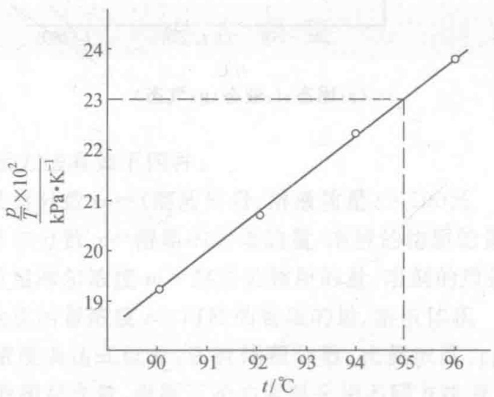

3.14 参考教材中图 3.7 和表 3.3, 判断在下表 4 种条件下 $\mathrm{H}_{2} \mathrm{O}$ 的存在状态各是什么?

<table><tr><td>温度/°C</td><td>15</td><td>20</td><td>30</td><td>30</td></tr><tr><td>压力/kPa</td><td>1.71</td><td>4.07</td><td>2.00</td><td>4.24</td></tr><tr><td>存在状态</td><td>(1)</td><td>(2)</td><td>(3)</td><td>(4)</td></tr></table>

解 存在状态：（1）单一饱和蒸气或气-液共存；（2）液；（3）气；（4）单一饱和蒸气或气-液共存。

3.15 国际单位制里, 热力学温标选水的三相点为标准, 而不用 $H_{2}O$ 的冰点和沸点, 为什么?

解 因为三相点是纯 $H_{2}O$ 的气、液、固三相共存状态，这是个稳定不变的状态；而冰点或沸点则是在 101.3 kPa 被空气饱和的水的凝固点或沸腾的温度，其数值会因外界条件的不同而略有差异。显然，应该把稳定不变的状态选为标准点。

3.16 已知苯的临界点是 $289^{\circ}C$ ，4.86 MPa，沸点是 $80^{\circ}C$ ；三相点是 $5^{\circ}C$ ，2.84 kPa。在三相点液态苯的密度是 $0.894 g \cdot cm^{-3}$ ，固态苯的密度是 $1.005 g \cdot cm^{-3}$ 。根据上述数据，画出苯在 $0 \sim 300^{\circ}C$ 范围内的相图。（参照教材图 3.11，坐标可以不按比例。）

解

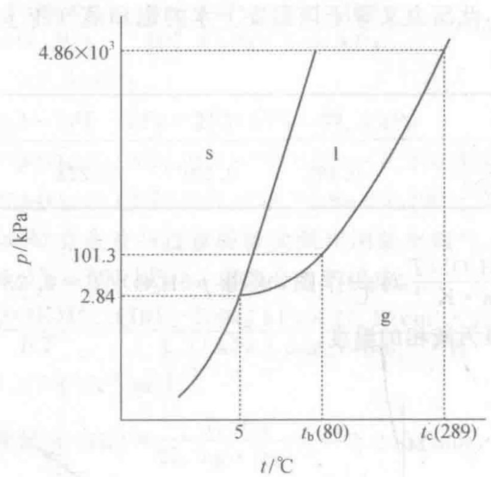  
(s:固态;l:液态;g:气态)

文点有所，已发现不至整个单元，在其中大中问题，那么的“1”是可选三式图。顾问不听书章界长假会前道其，直击的圆角如点围到出大的源宽扩大是92F.01在基四点将

## 第4章 溶液

溶液化学是化学中最重要的领域之一。许多化学合成和化学分析实验都在溶液中进行，因此化学工作者长期以来积累了大量有关溶液化学的经验和知识。本章的重点是非电解质稀溶液的依数性规律，同时也介绍了溶液浓度的若干表示方法、溶解度的基本规律。

## 内容提要

## 4.1 溶液的浓度

常用溶液浓度的表示方法有如下四种：

$$
\mathrm{质量分数} w = (\mathrm{溶质质量/溶液质量}) \times 100
$$

$$
\mathrm{摩尔分数} x = \mathrm{溶质的物质的量} / \mathrm{溶液的物质的量}
$$

$$
\mathrm{质量摩尔浓度} m = \mathrm{溶质的物质的量/溶剂的质量}
$$

$$
\mathrm{物质的量浓度} c = \mathrm{溶质的物质的量/溶液体积}
$$

除以上四种常用的浓度表达式以外,还有体积分数、比例浓度、ppm $^{①}$ 等表示方法。浓度表明溶液中溶剂和溶质的相对含量,根据不同的需要采用不同方法表示,它们之间可以相互换算。

## 4.2 溶解度

溶解度是在一定温度和压力下,溶质在溶剂中的饱和浓度,这是实验室中经常用到的数据。溶质溶解的最基本原则就是“相似相溶”,这个经验规则中包含了溶质与溶剂分子相互作用的一般规律。

固体溶于液体，与温度有关；气体溶于液体，同时与温度和压力有关。

在饱和溶液中,溶质的溶解和析出形成动态平衡。由于溶质析出需要晶核,因此在某些情况下会出现过饱和现象。当然,这只是一种亚稳态,在受到外部扰动时,过剩的溶质会很快析出,使溶液恢复平衡状态。

## 4.3 非电解质稀溶液的依数性

溶质的溶解会引起溶剂的某些物理性质发生变化,有些性质只与溶液的浓度有关,而与溶质的种类无关,因此被称为溶液的依数性。这些性质包括蒸气压下降、沸点升高、凝固点下降和渗透压等。非挥发性电解质溶液符合以下公式,而挥发性电解质溶液则情况比较复杂。

## 1. 蒸气压下降(Raoult定律)

溶液蒸气压的相对降低值( $\Delta p$ )与溶质的摩尔分数( $x_{2}$ )成正比,即

$$
\Delta p = p _ {0} x _ {2}
$$

## 2. 沸点升高

溶液沸点的升高 $(\Delta T_{\mathrm{b}})$ 与质量摩尔浓度 $(m)$ 成正比，其比值 $K_{\mathrm{b}}$ 为摩尔沸点升高常数，单位为 $\mathrm{K} \cdot \mathrm{kg} \cdot \mathrm{mol}^{-1}$ ，即

$$
\Delta T _ {\mathrm{b}} = K _ {\mathrm{b}} m
$$

## 3. 凝固点下降

溶液凝固点的降低 $(\Delta T_{\mathrm{f}})$ 与溶液的质量摩尔浓度 $(m)$ 成正比，其比值 $K_{\mathrm{f}}$ 为摩尔凝固点降低常数，单位为 $\mathrm{K} \cdot \mathrm{kg} \cdot \mathrm{mol}^{-1}$ ，即

$$
\Delta T _ {\mathrm{f}} = K _ {\mathrm{f}} m
$$

## 4. 渗透压

在一定温度下，渗透压( $\Pi$ )与溶液的浓度(c)成正比，即

$$
\Pi / c = \text { 常数 } \qquad \text { 或 } \qquad \Pi V = n R T
$$

其中， $V$ 为溶液的体积。

注意,上述几个公式的适用范围是:溶质为非电解质的稀溶液。

## 4.4 电解质溶液的依数性与导电性

非电解质稀溶液的依数性有较强的规律性,而电解质溶液则要复杂得多,这主要是由于电解质在溶液中会发生电离。根据依数性实验值与计算值的差别可以估算电解质电离的程度,即电离度 $\alpha$ 。

此外，电解质在溶液中的电离度 $(\alpha)$ 也可用测定电导率来求算：

$$
\alpha = \frac {\lambda}{\lambda_ {\infty}}
$$

其中， $\lambda$ 为溶液的当量电导率， $\lambda_{\infty}$ 为溶质完全电离时（通常是指无限稀的溶液）的当量电导率。导电性和依数性是两种毫不相干的性质，但电导法和依数性法所求得的 $\alpha$ 相符，这是Arrhenius建立电离学说的实验依据，曾对化学的发展起到过很大的作用。随着实验技术的进步，又发现电解质溶液浓度较大或离子电价较高时，这两种方法所得 $\alpha$ 的差别超出了实验允许的误差范围。究其原因，在于实际溶液中物种之间存在相互作用，与理想溶液有偏差。

20 世纪初 Lewis 提出了有效浓度的概念, 并取名为活度, 定义为

$$
a = \gamma c
$$

其中，a 为活度， $\gamma$ 为活度系数，c 为溶液的实际浓度。此后，科学家用多种方法测定了大量的活度系数，推出了活度系数的计算经验式，以方便实际体系的处理。目前，在物理化学中，活度是个无量纲（或量纲为 1）的量，指的是有效浓度和标准浓度的比值。

## 4.5 胶体溶液

真溶液是一种溶质完全分散在溶剂中的分散体系。当然，实际上有很多溶液并不能达到完全分散，这类溶液属于粗分散体系，例如悬浊液和乳浊液。此外，分散相粒子大小介于真溶液和粗分散体系之间（尺寸1～1000 nm）的溶液称为胶体溶液。

胶体溶液有溶胶、大分子溶液、缔合胶体等类型。胶体溶液的物理特性包括 Tyndal 效应、电泳、渗析和聚沉等性质。由于胶体溶液的这些特点，胶体化学在现代工业中得到了广泛的应用。

## 习题解析

4.1 现需 1500 g 86.0%(质量分数)的酒精作溶剂。实验室存有 70.0%(质量分数)的回收酒精和 95.0%(质量分数)的酒精,应各取多少进行配制?

解 设需 70.0% 的回收酒精 x g，则

$$
1500 \mathrm{g} \times 86.0 \% = x \mathrm{g} \times 70.0 \% + (1500 \mathrm{g} - x \mathrm{g}) \times 95.0 \%, \quad x = 540
$$

即取 540 g 70% 的回收酒精和 960 g (=1500 g - 540 g) 95% 的酒精混合而成。

4.2 腐蚀印刷线路版常用质量分数为 $35\%$ 的 $\mathrm{FeCl}_3$ 溶液，怎样用 $\mathrm{FeCl}_3 \cdot 6\mathrm{H}_2\mathrm{O}$ 配制 $1.50\mathrm{kg}$ 这种溶液？这种溶液的摩尔分数是多少？

解

$$
\begin{aligned} m(\mathrm{FeCl}_{3}\cdot 6\mathrm{H}_{2}\mathrm{O}) & = 1.50\mathrm{kg}\times 35\% \times \frac{M(\mathrm{FeCl}_{3}\cdot 6\mathrm{H}_{2}\mathrm{O})}{M(\mathrm{FeCl}_{3})}\\ & = 1.50\mathrm{kg}\times 35\% \times \frac{270\mathrm{g}\cdot\mathrm{mol}^{-1}}{162\mathrm{g}\cdot\mathrm{mol}^{-1}}\\ & = 0.88\mathrm{kg} \end{aligned}
$$

$$
m (\mathrm{H} _ {2} \mathrm{O}) = 1. 5 0 \mathrm{kg} - 0. 8 8 \mathrm{kg} = 0. 6 2 \mathrm{kg}
$$

取 $0.88 \, kg FeCl_{3} \cdot 6H_{2}O$ ，加含有适量盐酸（防止 $Fe^{3+}$ 水解）的水 0.62 kg，即得所配溶液。

此溶液中： $n(\mathrm{FeCl}_3) = \frac{1.50\times 10^3\mathrm{g}\times 0.35}{162\mathrm{g}\cdot\mathrm{mol}^{-1}} = 3.2\mathrm{mol}$

$$
n (\mathrm{H} _ {2} \mathrm{O}) = \frac {1 . 5 0 \times 1 0 ^ {3} \mathrm{g} \times (1 . 0 0 - 0 . 3 5)}{1 8 . 0 \mathrm{g} \cdot \mathrm{mol} ^ {- 1}} = 5 4 \mathrm{mol}
$$

$$
x(\mathrm{FeCl}_{3}) = \frac{n(\mathrm{FeCl}_{3})}{n(\mathrm{FeCl}_{3}) + n(\mathrm{H}_{2}\mathrm{O})} = \frac{3.2\mathrm{mol}}{3.2\mathrm{mol} + 54\mathrm{mol}} = 0.056 = 5.6\%
$$

此溶液中， $\mathrm{FeCl}_3$ 的摩尔分数为 $5.6\%$ 。

4.3 下表所列几种商品溶液都是常用试剂,分别计算它们的物质的量浓度 $(\mathrm{mol}\cdot\mathrm{dm}^{-3})$ 和摩尔分数:

<table><tr><td></td><td>溶质</td><td>w(溶质)</td><td>ρ/(g·cm-3)</td></tr><tr><td>(1)浓盐酸</td><td>HCl</td><td>37%</td><td>1.19</td></tr><tr><td>(2)浓硫酸</td><td> $H_2SO_4$ </td><td>98%</td><td>1.84</td></tr><tr><td>(3)浓硝酸</td><td> $HNO_3$ </td><td>70%</td><td>1.42</td></tr><tr><td>(4)浓氨水</td><td> $NH_3$ </td><td>28%</td><td>0.90</td></tr></table>

解

$$
(1) c (\mathrm{HCl}) = \frac {1 0 0 0 \mathrm{cm} ^ {3} \cdot \mathrm{dm} ^ {- 3} \times 1 . 1 9 \mathrm{g} \cdot \mathrm{cm} ^ {- 3} \times 3 7 \%}{3 6 . 5 \mathrm{g} \cdot \mathrm{mol} ^ {- 1}} = 1 2 \mathrm{mol} \cdot \mathrm{dm} ^ {- 3}
$$

$$
x (\mathrm{HCl}) = \frac {\frac {3 7 \mathrm{g}}{3 6 . 5 \mathrm{g} \cdot \mathrm{mol} ^ {- 1}}}{\frac {3 7 \mathrm{g}}{3 6 . 5 \mathrm{g} \cdot \mathrm{mol} ^ {- 1}} + \frac {6 3 \mathrm{g}}{1 8 \mathrm{g} \cdot \mathrm{mol} ^ {- 1}}} = 0. 2 2
$$

$$
(2) c (\mathrm{H} _ {2} \mathrm{SO} _ {4}) = \frac {1 0 0 0 \mathrm{cm} ^ {3} \cdot \mathrm{dm} ^ {- 3} \times 1 . 8 4 \mathrm{g} \cdot \mathrm{cm} ^ {- 3} \times 9 8 \%}{9 8 \mathrm{g} \cdot \mathrm{mol} ^ {- 1}} = 1 8 \mathrm{mol} \cdot \mathrm{dm} ^ {- 3}
$$

$$
x (\mathrm{H} _ {2} \mathrm{SO} _ {4}) = \frac {\frac {9 8 \mathrm{g}}{9 8 \mathrm{g} \cdot \mathrm{mol} ^ {- 1}}}{\frac {9 8 \mathrm{g}}{9 8 \mathrm{g} \cdot \mathrm{mol} ^ {- 1}} + \frac {2 \mathrm{g}}{1 8 \mathrm{g} \cdot \mathrm{mol} ^ {- 1}}} = 0. 9 0
$$

$$
(3) c (\mathrm{HNO} _ {3}) = \frac {1 0 0 0 \mathrm{cm} ^ {3} \cdot \mathrm{dm} ^ {- 3} \times 1 . 4 2 \mathrm{g} \cdot \mathrm{cm} ^ {- 3} \times 7 0 \%}{6 3 \mathrm{g} \cdot \mathrm{mol} ^ {- 1}} = 1 6 \mathrm{mol} \cdot \mathrm{dm} ^ {- 3}
$$

$$
x (\mathrm{HNO} _ {3}) = \frac {\frac {7 0 \mathrm{g}}{6 3 \mathrm{g} \cdot \mathrm{mol} ^ {- 1}}}{\frac {7 0 \mathrm{g}}{6 3 \mathrm{g} \cdot \mathrm{mol} ^ {- 1}} + \frac {3 0 \mathrm{g}}{1 8 \mathrm{g} \cdot \mathrm{mol} ^ {- 1}}} = 0. 4 0
$$

$$
(4) c (\mathrm{NH} _ {3}) = \frac {1 0 0 0 \mathrm{cm} ^ {3} \cdot \mathrm{dm} ^ {- 3} \times 0 . 9 0 \mathrm{g} \cdot \mathrm{cm} ^ {- 3} \times 2 8 \%}{1 7 \mathrm{g} \cdot \mathrm{mol} ^ {- 1}} = 1 5 \mathrm{mol} \cdot \mathrm{dm} ^ {- 3}
$$

$$
x \left(\mathrm{NH} _ {3}\right) = \frac {\frac {2 8 \mathrm{g}}{1 7 \mathrm{g} \cdot \mathrm{mol} ^ {- 1}}}{\frac {2 8 \mathrm{g}}{1 7 \mathrm{g} \cdot \mathrm{mol} ^ {- 1}} + \frac {7 2 \mathrm{g}}{1 8 \mathrm{g} \cdot \mathrm{mol} ^ {- 1}}} = 0. 2 9
$$

4.4 现需 $2.2 \, dm^{3}$ 、浓度为 $2.0 \, mol \cdot dm^{-3}$ 的盐酸。问：

(1) 应该取多少 $cm^{3}$ 的 20%、密度为 $1.10 \, g \cdot cm^{-3}$ 的浓盐酸来配制？

(2) 若已有 $550 \, cm^{3} \, 1.0 \, mol \cdot dm^{-3}$ 的稀盐酸, 那么应该加多少 $cm^{3}$ 的 20% 的浓盐酸来配制?

$$
\begin{array}{r l} & \text {解} \quad (1) 2. 2 \mathrm{dm} ^ {3} \times 2. 0 \mathrm{mol} \cdot \mathrm{dm} ^ {- 3} \times 3 6. 5 \mathrm{g} \cdot \mathrm{mol} ^ {- 1} = V \times 1. 1 0 \mathrm{g} \cdot \mathrm{cm} ^ {- 3} \times 2 0 \% \\ & \qquad V = 7. 3 \times 1 0 ^ {2} \mathrm{cm} ^ {3} \end{array}
$$

$$
\begin{array}{l} (2) 0.55 \mathrm{dm} ^ {3} \times 1.0 \mathrm{mol} \cdot \mathrm{dm} ^ {- 3} \times 36.5 \mathrm{g} \cdot \mathrm{mol} ^ {- 1} + V \times 1.10 \mathrm{g} \cdot \mathrm{cm} ^ {- 3} \times 20 \% \\ = 2.2 \mathrm{dm} ^ {3} \times 2.0 \mathrm{mol} \cdot \mathrm{dm} ^ {- 3} \times 36.5 \mathrm{g} \cdot \mathrm{mol} ^ {- 1} \\ V = 6.4 \times 10^{2} \mathrm{cm}^{3} \end{array}
$$

4.5 某污染空气中 CO 浓度为 10 ppm, 试用下列各种方式表示它的浓度(设总压力为 101 kPa, 温度为 25℃): (1) 摩尔分数; (2) 每升 $\left(\mathrm{dm}^{3}\right)$ 空气中的 n(CO); (3) CO 的分压。

解（1）摩尔分数 $x = \frac{10\mathrm{mol}}{10^6\mathrm{mol}}\times 100\% = 1.0\times 10^{-3}\%$

$$
\begin{array}{r l} & (2) n (\text {空气}) = \frac {p V}{R T} = \frac {1 0 1 \mathrm{kPa} \times 1 . 0 \mathrm{dm} ^ {3}}{8 . 3 1 \mathrm{kPa} \cdot \mathrm{dm} ^ {3} \cdot \mathrm{mol} ^ {- 1} \cdot \mathrm{K} ^ {- 1} \times 2 9 8 \mathrm{K}} = 0. 0 4 1 \mathrm{mol} \\ & n (\mathrm{CO}) = 0. 0 4 1 \mathrm{mol} \times 1. 0 \times 1 0 ^ {- 3} \% = 4. 1 \times 1 0 ^ {- 7} \mathrm{mol} \end{array}
$$

$$
\begin{array}{r l} p (\mathrm{CO}) & = 1 0 1 \mathrm{kPa} \times \frac {4 . 1 \times 1 0 ^ {- 7} \mathrm{mol}}{4 . 1 \times 1 0 ^ {- 7} \mathrm{mol} + 0 . 0 4 1 \mathrm{mol}} = 1 0 1 \mathrm{kPa} \times 1. 0 \times 1 0 ^ {- 5} \\ & = 1. 0 \mathrm{Pa} \end{array} \tag {3}
$$

4.6 $100\mathrm{cm}^3 30.0\%$ 的过氧化氢 $(\mathrm{H}_2\mathrm{O}_2)$ 水溶液（密度 $1.11\mathrm{g}\cdot \mathrm{cm}^{-3}$ )在 $\mathrm{MnO_2}$ 催化剂的

作用下,完全分解变成 $O_{2}$ 和 $H_{2}O$ 。问:

(1) 在 $18.0^{\circ}$ C、102 kPa 下用排水集气法收集氧气(未经干燥时)的体积是多少?

(2) 干燥后,体积又是多少?

解 (1) $2\mathrm{H}_{2}\mathrm{O}_{2}\longrightarrow \mathrm{O}_{2} + 2\mathrm{H}_{2}\mathrm{O}$

$$
n (\mathrm{O} _ {2}) = \frac {1}{2} n (\mathrm{H} _ {2} \mathrm{O} _ {2}) = \frac {1}{2} \times \frac {100 \mathrm{cm} ^ {3} \times 1 . 1 1 \mathrm{g} \cdot \mathrm{cm} ^ {- 3} \times 30.0 \%}{34.0 \mathrm{g} \cdot \mathrm{mol} ^ {- 1}} = 0. 490 \mathrm{mol}
$$

$$
V _ {\mathrm{总}} = \frac {n (\mathrm{O} _ {2}) R T}{p (\mathrm{O} _ {2})} = \frac {0 . 4 9 0 \mathrm{mol} \times 8 . 3 1 \mathrm{kPa} \cdot \mathrm{dm} ^ {3} \cdot \mathrm{mol} ^ {- 1} \cdot \mathrm{K} ^ {- 1} \times 2 9 1 \mathrm{K}}{1 0 2 \mathrm{kPa} - 2 . 0 6 \mathrm{kPa}} = 1 1. 9 \mathrm{dm} ^ {3}
$$

$$
(2) p (\mathrm{O} _ {2}) V _ {\mathrm{总}} = p _ {\mathrm{总}} V (\mathrm{O} _ {2}), \quad V (\mathrm{O} _ {2}) = \frac {(1 0 2 - 2 . 0 6) \mathrm{kPa} \times 1 1 . 9 \mathrm{dm} ^ {3}}{1 0 2 \mathrm{kPa}} = 1 1. 7 \mathrm{dm} ^ {3}
$$

4.7 在 $20^{\circ}\mathrm{C}, \mathrm{I}_{2}$ 在水中的溶解度为 $0.0285\mathrm{g} / (100\mathrm{gH}_{2}\mathrm{O})$ ，求这种饱和溶液的摩尔分数。解 $x(\mathrm{I}_2) = \frac{0.0285\mathrm{g} / (254\mathrm{g}\cdot\mathrm{mol}^{-1})}{0.0285\mathrm{g} / (254\mathrm{g}\cdot\mathrm{mol}^{-1}) + 100\mathrm{g} / (18.0\mathrm{g}\cdot\mathrm{mol}^{-1})} = 2.02\times 10^{-5}$

4.8 分别比较下列各组中的物质，指出其中最易溶于苯的一种：

(1) He, Ne, Ar; (2) $CH_{4}$ , $C_{5}H_{12}$ , $C_{31}H_{64}$ ; (3) NaCl, $C_{2}H_{5}Cl$ , $CCl_{4}$ .
解 (1) Ar; (2) $C_{5}H_{12}$ ; (3) $CCl_{4}$ .

4.9 气体的溶解度与气相中气体分压成正比，即 $c(A)=kp(A)$ 。式中 $p(A)$ 为 A 气体的分压， $c(A)$ 为 A 气体的溶解度，k 是比例常数。若已知在 101 kPa 及 20℃时，纯 $O_{2}$ 在水中的溶解度为 $1.38 \times 10^{-3} \, mol \cdot dm^{-3}$ ，那么 20℃ 空气的饱和水溶液中， $O_{2}$ 的浓度应是多少？解 纯氧时，即 $p(O_{2}) = 101 \, kPa$ 时

$$
c (\mathrm{O} _ {2}) = 1. 3 8 \times 1 0 ^ {- 3} \mathrm{mol} \cdot \mathrm{dm} ^ {- 3}
$$

$$
k = \frac {c (\mathrm{O} _ {2})}{p (\mathrm{O} _ {2})} = \frac {1 . 3 8 \times 1 0 ^ {- 3} \mathrm{mol} \cdot \mathrm{dm} ^ {- 3}}{1 0 1 \mathrm{kPa}} = 1. 3 7 \times 1 0 ^ {- 5} \mathrm{mol} \cdot \mathrm{dm} ^ {- 3} \cdot \mathrm{kPa} ^ {- 1}
$$

空气中 $x(\mathrm{O}_{2})=0.21,\quad p^{\prime}(\mathrm{O}_{2})=0.21\times101\mathrm{kPa}=21\mathrm{kPa}$ ，则

$$
c ^ {\prime} \left(\mathrm{O} _ {2}\right) = k p ^ {\prime} \left(\mathrm{O} _ {2}\right) = 1. 3 7 \times 1 0 ^ {- 5} \mathrm{mol} \cdot \mathrm{dm} ^ {- 3} \cdot \mathrm{kPa} ^ {- 1} \times 2 1 \mathrm{kPa} = 2. 9 \times 1 0 ^ {- 4} \mathrm{mol} \cdot \mathrm{dm} ^ {- 3}
$$

4.10 气体的溶解度若用 $\mathrm{mol} \cdot \mathrm{dm}^{-3}$ 表示，则与分压成正比；若用单位体积溶剂内所溶解气体的体积表示，则溶解度不随压力变化，而是常数。试说明之。

解 如上题所示, $c(\mathrm{A}) = k p(\mathrm{A})$ , 称为 Henry 定律 (Henry's law), 适用于气态溶质分压不大、溶解度小、溶质与溶剂不发生反应 (包括电离) 的情况, 气体的溶解度用 $\mathrm{mol} \cdot \mathrm{dm}^{-3}$ 或 $\mathrm{mol} \cdot \mathrm{kg}^{-1}$ 表示。若溶解度 $c'$ 用单位质量 (或体积) 溶剂中所溶解气体的体积表示 [如化学手册里常用 $\mathrm{cm}^{3}/(100 \mathrm{~g} \mathrm{H}_{2} \mathrm{O})$ 表示气体的溶解度], 那么 $c'$ 是不随压力而变的常数 (因为随着气体压力增大, 只有当单位溶剂中溶解气体的体积不变时, 气体溶解度才能与压力成正比, 才能符合 Henry 定律, 所以 $c'$ 不变), 用这种方法表示气体溶解度比较方便。

进一步的证明为：因气体压力不大，溶解度小，故有 $V_{0} = 1\mathrm{dm}^{3}$ 溶液 $\approx 1\mathrm{dm}^3$ 溶剂。在 $1\mathrm{dm}^3$ 溶液中，溶解气体的物质的量 $n(\mathrm{A})(\mathrm{mol})$ 为

$$
\begin{array}{l} n (\mathrm{A}) = c (\mathrm{A}) \cdot V _ {0} = \frac {p (\mathrm{A}) \cdot V (\mathrm{A})}{R T} \\ c (\mathrm{A}) = k p (\mathrm{A}) \\ \frac {p (\mathrm{A}) \cdot V (\mathrm{A})}{R T} = k p (\mathrm{A}) \cdot V _ {0} \\ V (\mathrm{A}) = R T k V _ {0} \end{array}
$$

当温度不变时， $V(A)$ 就是常数。

4.11 在 100 kPa、37 ℃ 时，空气在血液中的溶解度为 $6.6 \times 10^{-4} \, mol \cdot dm^{-3}$ 。若潜水员在深海呼吸了 1000 kPa 的压缩空气，当他返回地面时，参照溶解度估算每毫升血液将放出多少毫升的空气？

$$
\mathrm{解} c (\mathrm{A}) = k p (\mathrm{A}), \quad k = \frac {c (\mathrm{A})}{p (\mathrm{A})} = \frac {6 . 6 \times 1 0 ^ {- 4} \mathrm{mol} \cdot \mathrm{dm} ^ {- 3}}{1 0 0 \mathrm{kPa}} = 6. 6 \times 1 0 ^ {- 6} \mathrm{mol} \cdot \mathrm{dm} ^ {- 3} \cdot \mathrm{kPa} ^ {- 1}
$$

1000 kPa 时

$$
c ^ {\prime} (\mathrm{A}) = 6. 6 \times 1 0 ^ {- 6} \mathrm{mol} \cdot \mathrm{dm} ^ {- 3} \cdot \mathrm{kPa} ^ {- 1} \times 1 0 0 0 \mathrm{kPa} = 6. 6 \times 1 0 ^ {- 3} \mathrm{mol} \cdot \mathrm{dm} ^ {- 3}
$$

返回地面时,血液所含空气的溶解度为

$$
\begin{array}{r l} c ^ {\prime} (\mathrm{A}) - c (\mathrm{A}) & = (6. 6 \times 1 0 ^ {- 3} - 6. 6 \times 1 0 ^ {- 4}) \mathrm{mol} \cdot \mathrm{dm} ^ {- 3} = 5. 9 \times 1 0 ^ {- 3} \mathrm{mol} \cdot \mathrm{dm} ^ {- 3} \\ & = 5. 9 \times 1 0 ^ {- 6} \mathrm{mol} \cdot \mathrm{cm} ^ {- 3} \end{array}
$$

因此，返回地面时，每毫升 $(\mathrm{cm}^3)$ 血液放出的气体的体积为

$$
V = \frac {n R T}{p} = \frac {5 . 9 \times 1 0 ^ {- 6} \mathrm{mol} \times 8 . 3 1 \mathrm{kPa} \cdot \mathrm{dm} ^ {3} \cdot \mathrm{mol} ^ {- 1} \cdot \mathrm{K} ^ {- 1} \times 3 1 0 \mathrm{K}}{1 0 0 \mathrm{kPa}} = 1. 5 \times 1 0 ^ {- 4} \mathrm{dm} ^ {3} = 0. 1 5 \mathrm{cm} ^ {3}
$$

4.12 生化实验将小白鼠放在一个密闭的盒子里,以便研究它的生理变化。盒子的体积是 $295\ dm^{3}$ ,每分钟都要通过相同体积的净化干燥空气来更换盒中气体,并要求控制进入盒中空气的相对湿度为40%(22℃)。问每分钟需加入多少克水到干燥空气流中?

解 查得 $22^{\circ}$ C 时水的蒸气压为 2.64 kPa，则

$$
m (\mathrm{H} _ {2} \mathrm{O}) = \frac {p V}{R T} M = \frac {2 . 6 4 \mathrm{kPa} \times 0 . 4 0 \times 2 9 5 \mathrm{dm} ^ {3}}{8 . 3 1 \mathrm{kPa} \cdot \mathrm{dm} ^ {3} \cdot \mathrm{mol} ^ {- 1} \cdot \mathrm{K} ^ {- 1} \times 2 9 5 \mathrm{K}} \times 1 8. 0 \mathrm{g} \cdot \mathrm{mol} ^ {- 1} = 2. 3 \mathrm{g}
$$

4.13 将 101 mg 胰岛素溶于 $10.0 \, cm^{3}$ 水，该溶液在 $25.0 \, ^{\circ}C$ 时的渗透压是 4.34 kPa，求：

(1) 胰岛素的摩尔质量；

(2) 溶液的蒸气压下降 $\Delta p$ (已知在 $25.0^{\circ}C$ 时, 水的饱和蒸气压是 3.17 kPa)。

$$
\begin{array}{r l} \text { 解 } & (1) M = \frac {m R T}{\Pi V} = \frac {1 0 1 \mathrm{mg} \times (1 0 ^ {- 3} \mathrm{g/mg}) \times 8 . 3 1 \mathrm{kPa} \cdot \mathrm{dm} ^ {3} \cdot \mathrm{mol} ^ {- 1} \cdot \mathrm{K} ^ {- 1} \times 2 9 8 \mathrm{K}}{4 . 3 4 \mathrm{kPa} \times 1 0 . 0 \mathrm{cm} ^ {3} \times (1 0 ^ {- 3} \mathrm{dm} ^ {3} / \mathrm{cm} ^ {3})} \\ & = 5. 8 \times 1 0 ^ {3} \mathrm{g} \cdot \mathrm{mol} ^ {- 1} \end{array}
$$

$$
(2) x (\text {胰岛素}) = \frac {\frac {1 0 1 \times 1 0 ^ {- 3} \mathrm{g}}{5 . 8 \times 1 0 ^ {3} \mathrm{g} \cdot \mathrm{mol} ^ {- 1}}}{\frac {1 0 1 \times 1 0 ^ {- 3} \mathrm{g}}{5 . 8 \times 1 0 ^ {3} \mathrm{g} \cdot \mathrm{mol} ^ {- 1}} + \frac {1 0 . 0 \mathrm{g}}{1 8 . 0 \mathrm{g} \cdot \mathrm{mol} ^ {- 1}}} = 3. 1 \times 1 0 ^ {- 5}
$$

$$
\Delta p = p _ {0} x (\mathrm{胰岛素}) = 3. 1 7 \mathrm{kPa} \times 3. 1 \times 1 0 ^ {- 5} = 9. 8 \times 1 0 ^ {- 5} \mathrm{kPa}
$$

4.14 烟草中有害成分尼古丁的最简化学式是 $C_{5}H_{7}N$ 。今将 496 mg 尼古丁溶于 10.0 g 水，所得溶液在 101 kPa 下的沸点是 100.17 ℃。求尼古丁的分子式。

解 $\Delta T_{\mathrm{b}} = K_{\mathrm{b}}m$

$$
0. 1 7 \mathrm{K} = 0. 5 1 3 \mathrm{K} \cdot \mathrm{kg} \cdot \mathrm{mol} ^ {- 1} \times \frac {4 9 6 \times 1 0 ^ {- 3} \mathrm{g}}{M} \times \frac {1 0 0 0}{1 0 . 0} \mathrm{kg} ^ {- 1}, M = 1. 5 \times 1 0 ^ {2} \mathrm{g} \cdot \mathrm{mol} ^ {- 1}
$$

$C_{5}H_{7}N$ 的式量 = 81，故尼古丁的分子式为 $C_{10}H_{14}N_{2}$ 。

4.15 甲醇和乙醇混合而成的溶液可看做是理想溶液，它们都遵守 Raoult 定律。所以，溶液的蒸气压等于溶剂分压和溶质分压之和，即

$$
\mathrm{溶液蒸气压} p = p _ {\mathrm{甲}} + p _ {\mathrm{乙}} = p _ {0, \mathrm{甲}} x _ {\mathrm{甲}} + p _ {0, \mathrm{乙}} x _ {\mathrm{乙}}
$$

已知在 $20.0^{\circ}$ C 纯甲醇的蒸气压 $p_{0,甲}=11.83\ kPa$ ，纯乙醇的 $p_{0,乙}=5.93\ kPa$ 。将等质量的甲醇和乙醇配制成的溶液在 $20.0^{\circ} \mathrm{C}$ 的蒸气压是多少？其中甲醇的分压是多少？蒸气中甲醇的摩尔分数是多少？

解 等质量(m)的甲醇 $(M=32\ g\cdot mol^{-1})$ 和乙醇 $(M=46\ g\cdot mol^{-1})$ 混合，则甲醇、乙醇的摩尔分数分别为

$$
x _ {\mathrm{甲}} = \frac {\frac {m}{3 2 \mathrm{g} \cdot \mathrm{mol} ^ {- 1}}}{\frac {m}{3 2 \mathrm{g} \cdot \mathrm{mol} ^ {- 1}} + \frac {m}{4 6 \mathrm{g} \cdot \mathrm{mol} ^ {- 1}}} = 0. 5 9
$$

$$
x _ {\text {乙}} = \frac {\frac {m}{4 6 \mathrm{g} \cdot \mathrm{mol} ^ {- 1}}}{\frac {m}{3 2 \mathrm{g} \cdot \mathrm{mol} ^ {- 1}} + \frac {m}{4 6 \mathrm{g} \cdot \mathrm{mol} ^ {- 1}}} = 0. 4 1
$$

根据 Raoult 定律, 溶液蒸气压为

$p=p_{0,甲}x_{甲}+p_{0,乙}x_{乙}=11.83kPa\times0.59+5.93kPa\times0.41=9.4kPa$ 甲醇的分压为

$$
p _ {\mathrm{甲}} = 1 1. 8 3 \mathrm{kPa} \times 0. 5 9 = 7. 0 \mathrm{kPa}
$$

根据 Dalton 定律, 在蒸气中, 甲醇的摩尔分数为

$$
x _ {\mathrm{甲}} ^ {\prime} = \frac {n _ {\mathrm{甲}} ^ {\prime}}{n _ {\mathrm{甲}} ^ {\prime} + n _ {\mathrm{乙}} ^ {\prime}} = \frac {p _ {\mathrm{甲}}}{p _ {\mathrm{甲}} + p _ {\mathrm{乙}}} = \frac {7 . 0 \mathrm{kPa}}{9 . 4 \mathrm{kPa}} = 0. 7 4
$$

4.16 估算 $10\mathrm{kg}$ 水中需加多少甲醇，才能保证它在 $-10^{\circ}\mathrm{C}$ 不结冰？

$$
\mathrm{解} \Delta T _ {\mathrm{f}} = K _ {\mathrm{f}} m, 1 0 \mathrm{K} = 1. 8 6 \mathrm{K} \cdot \mathrm{kg} \cdot \mathrm{mol} ^ {- 1} \times \frac {m}{3 2 \mathrm{g} \times 1 0 ^ {- 3} \mathrm{kg} \cdot \mathrm{mol} ^ {- 1}} \times \frac {1}{1 0 \mathrm{kg}}
$$

4.17 将磷溶于苯配制成饱和溶液，取此饱和溶液 3.747 g 加入 15.401 g 苯中，混合溶液的凝固点是 5.155 ℃，而纯苯的凝固点是 5.400 ℃。已知磷在苯中以 $P_{4}$ 分子存在，求磷在苯中的溶解度 (g/100 g 苯)。

解 设 3.747g 饱和溶液中有 $P_{4}$ x g。据 $\Delta T_{f}=K_{f}m$ ，则有

$$
\begin{array}{r l} (5. 4 0 0 - 5. 1 5 5) \mathrm{K} & = 5. 0 7 \mathrm{K} \cdot \mathrm{kg} \cdot \mathrm{mol} ^ {- 1} \times \frac {x \mathrm{g}}{3 1 . 0 \times 4 \mathrm{g} \cdot \mathrm{mol} ^ {- 1}} \times \frac {1 0 0 0 \mathrm{g}}{1 5 . 4 0 1 \mathrm{g} + (3 . 7 4 7 \mathrm{g} - x \mathrm{g})} \mathrm{kg} ^ {- 1} \\ & x = 0. 1 1 4 \end{array}
$$

磷在苯中的溶解度为

$$
\frac {0 . 1 1 4 \mathrm{g}}{3 . 7 4 7 \mathrm{g} - 0 . 1 1 4 \mathrm{g}} \times 1 0 0 \mathrm{g} = 3. 1 4 \mathrm{g} / 1 0 0 \mathrm{g} \text {苯}
$$

4.18 取 $0.324 \, \text{g Hg(NO}_{3})_{2}$ 溶于 100 g 水，其凝固点是 $-0.0588^{\circ}\text{C}$ ; $0.542 \, g \, HgCl_{2}$ 溶于 50 g 水，其凝固点是 $-0.0744^{\circ}\text{C}$ 。用计算结果判断这两种盐在水中的电离状况。

解 (1) $\mathrm{Hg(NO_3)_2}$

$$
m = \frac {\Delta T _ {\mathrm{f}}}{K _ {\mathrm{f}}} = \frac {0 . 0 5 8 8 \mathrm{K}}{1 . 8 6 \mathrm{K} \cdot \mathrm{kg} \cdot \mathrm{mol} ^ {- 1}} = 0. 0 3 1 6 \mathrm{mol} \cdot \mathrm{kg} ^ {- 1}
$$

所配溶液浓度为

$$
\frac {0 . 3 2 4 \mathrm{g}}{3 2 5 \mathrm{g} \cdot \mathrm{mol} ^ {- 1}} \times 0. 1 0 0 \mathrm{kg} ^ {- 1} = 0. 0 1 0 0 \mathrm{mol} \cdot \mathrm{kg} ^ {- 1}
$$

(2) $HgCl_{2}$

$$
m = \frac {\Delta T _ {\mathrm{f}}}{K _ {\mathrm{f}}} = \frac {0 . 0 7 4 4 \mathrm{K}}{1 . 8 6 \mathrm{K} \cdot \mathrm{kg} \cdot \mathrm{mol} ^ {- 1}} = 0. 0 4 0 0 \mathrm{mol} \cdot \mathrm{kg} ^ {- 1}
$$

所配溶液浓度为

$$
\frac {0 . 5 4 2 \mathrm{g}}{2 7 2 \mathrm{g} \cdot \mathrm{mol} ^ {- 1}} \times 0. 0 5 0 0 \mathrm{kg} ^ {- 1} = 0. 0 3 9 9 \mathrm{mol} \cdot \mathrm{kg} ^ {- 1}
$$

$\mathrm{Hg(NO_{3})_{2}}$ 几乎全部电离， $HgCl_{2}$ 几乎不电离。

4.19 密闭钟罩内有两杯溶液，甲杯中含 $1.68\mathrm{g}$ 蔗糖 $(\mathrm{C}_{12}\mathrm{H}_{22}\mathrm{O}_{11})$ 和 $20.00\mathrm{g}$ 水，乙杯中含 $2.45\mathrm{g}$ 某非电解质和 $20.00\mathrm{g}$ 水。在恒温下放置足够长的时间达到动态平衡，甲杯水溶液总质量变为 $24.90\mathrm{g}$ ，求该非电解质的摩尔质量。

解 达平衡时,乙杯的水向甲杯转移了 $3.22 \, \text{g} (=24.90 \, \text{g} - 21.68 \, \text{g})$ , 两杯溶液蒸气压相等。 $p=p_{0}x_{剂}$ ，所以两杯溶液的 $x_{水}$ 相等，即

$$
\frac {\frac {(2 0 . 0 0 + 3 . 2 2) \mathrm{g}}{1 8 . 0 2 \mathrm{g} \cdot \mathrm{mol} ^ {- 1}}}{\frac {2 3 . 2 2 \mathrm{g}}{1 8 . 0 2 \mathrm{g} \cdot \mathrm{mol} ^ {- 1}} + \frac {1 . 6 8 \mathrm{g}}{3 4 2 \mathrm{g} \cdot \mathrm{mol} ^ {- 1}}} = \frac {\frac {(2 0 . 0 0 - 3 . 2 2) \mathrm{g}}{1 8 . 0 2 \mathrm{g} \cdot \mathrm{mol} ^ {- 1}}}{\frac {1 6 . 7 8 \mathrm{g}}{1 8 . 0 2 \mathrm{g} \cdot \mathrm{mol} ^ {- 1}} + \frac {2 . 4 5 \mathrm{g}}{M}} M = 6 9 7 \mathrm{g} \cdot \mathrm{mol} ^ {- 1}
$$

4.20 若海水的浓度与 $0.70 \, mol \cdot kg^{-1}$ 的 NaCl 水溶液相近，粗略计算其渗透压是多少？若使海水淡化并得到 50% 收率，要向海水一边施加多大压力？

解 按 NaCl 完全电离计算, $c=c(\mathrm{Na}^{+})+c(\mathrm{Cl}^{-})=2\times0.70\ \mathrm{mol}\cdot\mathrm{dm}^{-3}$ ,则

$$
\begin{array}{r l} \Pi & = c R T \\ & = 2 \times 0. 7 0 \mathrm{mol} \cdot \mathrm{dm} ^ {- 3} \times 0. 0 0 8 3 1 \mathrm{MPa} \cdot \mathrm{dm} ^ {3} \cdot \mathrm{mol} ^ {- 1} \cdot \mathrm{K} ^ {- 1} \times 2 9 8 \mathrm{K} \\ & = 3. 5 \mathrm{MPa} \end{array}
$$

收率 $50\%$ 指一半海水变为淡水，剩下海水浓度就相当于原浓度的两倍，所以向海水一边施加的压力应为

$$
2 \times 3. 5 \mathrm{MPa} = 7. 0 \mathrm{MPa}
$$

4.21 计算 $0.020 \, mol \cdot kg^{-1}$ NaCl 溶液在 $25^{\circ}C$ 时的渗透压。将计算结果和实验值 ( $\approx 85 \, kPa$ ) 进行比较。假设 NaCl 完全电离，离子浓度按 $0.040 \, mol \cdot kg^{-1}$ 计算。

$$
\mathrm{解} \quad \Pi = c R T = 0. 0 4 0 \mathrm{mol} \cdot \mathrm{dm} ^ {- 3} \times 8. 3 1 \mathrm{kPa} \cdot \mathrm{dm} ^ {3} \cdot \mathrm{mol} ^ {- 1} \cdot \mathrm{K} ^ {- 1} \times 2 9 8 \mathrm{K} = 9 9 \mathrm{kPa}
$$

计算值与实验值有一定的差别,这是因为计算时溶液按理想溶液处理。而实际溶液中,溶质与溶剂、溶质分子或离子之间存在复杂的相互作用。

# 第5章 化学热力学

化学热力学是物理化学的一个重要分支。它主要是把热力学定律用于溶液、相平衡和化学平衡之中，解决化学和物理变化进行的方向和限度的问题，特别是对化学反应的可能性和平衡条件作出预示，即在一定条件下化学反应能否发生？如果发生，则进行到什么程度？化学热力学的主要内容包括热力学基本规律、溶液、相平衡、化学平衡、电化学等。

本章主要介绍4种热力学函数——内能 $(U)$ 、焓 $(H)$ 、Gibbs自由能 $(G)$ 和熵 $(S)$ ，并以热力学定律为基础讨论这些函数以及功、热等物理量在化学变化中的关系。本课程对热力学定律不作展开（这些内容将在物理化学课程中全面讨论），主要要求理解各术语的意义并能够正确应用。

## 内容提要

## 5.1 基本概念与术语

## 1. 体系与环境

(1) 体系指研究的对象。可根据需要划分，有一定的人为性，可以是实际的或想象的。

(2) 环境除去体系以外的一切事物。一般指与体系密切相关且相互影响的部分。

(3) 开放体系与环境既有能量交换,又有物质交换。

(4) 封闭体系与环境有能量交换,但没有物质交换。

(5) 孤立体系 与环境既没有能量交换,也没有物质交换。

## 2. 体系的性质

（1）强度性质 只取决于体系自身的特性而与体系中物质的量无关的性质。相应的物理量称为强度量，不具有加和性。如密度 $(\rho)$ 、温度 $(T)$ 、压力 $(p)$ 等等。

(2) 广度性质 与体系中物质的量相关的性质。相应的物理量称为广度量，与物质的量成正比，在一定条件下具有加和性。如体积(V)、质量(m)、内能(U)、焓(H)等等。

## 3. 状态和状态函数

(1) 状态 体系的物理性质和化学性质(如质量、温度、压力、体积、密度等)的总和。当这些性质不发生变化时,体系处于一定的状态;若任一性质发生变化,则体系的状态也随之改变。变化前称始态,变化后的状态称终态。

(2) 状态函数 仅由体系状态决定的函数, 在定态下有定值。其改变量仅取决于体系的始态和终态, 而与变化的路径无关。如温度、压力、体积、内能 $(U)$ 、焓 $(H)$ 、熵 $(S)$ 和 Gibbs 自由能 $(G)$ 等等。

功和热与变化的路径有关,不是状态函数。

## 4. 可逆过程与不可逆过程

(1) 可逆过程 体系发生某一过程后, 若能沿该过程的反方向变化而使体系和环境都恢复到原来的状态而不留下任何影响，则该过程为可逆过程。可逆过程最经济、效率最高。当体系对外做功时，它做最大功；当环境对体系做功时，只需做最小功。可逆过程是一种科学抽象的理想过程，实际过程变化速度无限慢时可趋近它。

(2) 不可逆过程 若体系和环境发生变化后,不能恢复到原状或者恢复原状后会引起其他变化,则相应的过程为不可逆过程。

## 5.自发过程与非自发过程

（1）自发过程是指某一过程一旦引发，无需外力便可以自动进行下去，直到达到与此条件相应的限度。

(2) 非自发过程 是自发过程的反过程,需要借助外界作用才能实现和进行。

我们熟悉的很多过程,如:气体向真空扩散,水在 $-10^{\circ}C$ 结冰,氢气和氧气化合生成水等都是自发过程。如何考虑化学反应的方向——化学反应的自发性,需要将焓和熵结合起来讨论。

## 5.2 热力学状态函数的意义与关系

$U, H, S$ 和 $G$ 都是状态函数。体系状态发生改变后， $\Delta U, \Delta H, \Delta S$ 和 $\Delta G$ 由最终状态和起始状态决定，而与变化的路径无关。它们之间的相互关系可由以下方程式相联系：

$$
\begin{array}{r l r} {H = U + p V} & {\text {或}} & {\Delta H = \Delta U + p \Delta V \quad (\text {恒压条件下})} \\ {G = H - T S} & {\text {或}} & {\Delta G = \Delta H - T \Delta S \quad (\text {恒温条件下})} \end{array}
$$

## 1. 内能 $(U)$

内能是物质的一种属性,指体系内物质所含分子及原子的动能、势能、核能、电子能等能量的总和。内能不包括体系宏观运动的动能和体系在外力场中的势能。化学反应的内能变化也不涉及与核反应相关的能量。一定量物质的内能是无法直接测定的,但在化学变化的过程中,体系内能的变化( $\Delta U=U_{终}-U_{始}$ )可以准确得到。根据热力学第一定律,体系内能的改变等于体系与环境之间交换的热量(Q)与功(W)的加和:

$$
\Delta U = Q + W
$$

其中，功又可分为体积功 $(W_{e})$ 与其他功 $(W^{\prime}$ ，除体积功以外的功，如电功）：

$$
W = W _ {\mathrm{e}} + W ^ {\prime}
$$

当体系在等压条件下变化且只做体积功 $(W_{\mathrm{e}} = -pV)$ 时，则

$$
\Delta U = Q _ {p} - p \Delta V
$$

当体系在等容条件下变化且不做其他功( $\Delta V=0,W_{e}=0,W^{\prime}=0$ )时，则

$$
\Delta U = Q _ {V}
$$

化学反应在密闭的氧弹中进行时,所测定的反应热即为恒容反应热 $Q_{V}$ ,具体实验方法见教材相关内容(pp.78,79)。

## 2. 焓 $(H)$

焓是一种与内能相联系的物理量。根据其热力学定义 $H = U + pV$ ，可得在等压条件下，焓变

$$
\Delta H = \Delta U + p \Delta V
$$

又知当体系在等压条件下只做体积功时， $\Delta U=Q_{p}-p\Delta V$ ，所以

$$
\Delta H = Q _ {p}
$$

当化学反应在恒压下进行时，反应热为恒压反应热 $Q_{p}$ 。

一定温度下，若化学反应过程中有气体参与，且反应前后气体的物质的量变化为 $\Delta n$ ；若将

气体按理想气体处理,则有

$$
\Delta H = \Delta U + \Delta (p V) = \Delta U + \Delta n R T
$$

反应的等压热效应与等容热效应的关系为

$$
Q _ {p} = Q _ {V} + \Delta n R T
$$

## 3. 熵(S)

熵是另一种热力学状态函数,可以形象地把熵看做体系混乱度(或有序度)的量度。混乱度与体系中可能存在的微观状态的数目有关。一个确定的宏观状态可以有许许多多微观状态,微观状态数目越多,熵值越大。热力学第三定律指出,理想晶体在热力学零度时熵等于零。因此,可以按统计热力学的方法计算体系在一定状态时熵的大小,也可以根据实验数据进行推算。可逆过程体系的熵变(dS)可由该过程的热量(Qr)除以温度得到

$$
\mathrm{d} S = Q _ {\mathrm{r}} / T
$$

熵即由其定义“热温商”而得名。熵值变化的规律如下：

(1) 同一物质的熵值, 随温度的升高而增大, 气态 > 液态 > 固态。

(2) 气态多原子分子的熵值比单原子的大。

(3) 同类物质, 摩尔质量越大, 熵值越大。

(4) 摩尔质量相同的不同物质, 结构越复杂, 熵值越大。

（5）压力对固态、液态物质的熵值影响较小，而对气态物质的熵值影响较大。压力越大，熵值越小。

## 4. Gibbs 自由能(G)

Gibbs 自由能(G)是从热力学第二定律出发, 将 H 和 S 归并起来而得到的热力学状态函数。

$$
G = H - T S
$$

在等温变化过程中

$$
\Delta G = \Delta H - T \Delta S \quad (\mathrm{Gibbs-Helmholtz方程})
$$

该方程把 $\Delta G$ 和 $\Delta H$ 、 $\Delta S$ 及温度联系在一起，可作为化学反应自发进行方向的判据：

$$
\Delta G <   0 \qquad \text { 反应正向自发 }
$$

$$
\Delta G = 0 \qquad \text { 反应处于动态平衡 }
$$

$$
\Delta G > 0 \quad \text { 反应逆向自发 }
$$

在等温等压可逆过程中,可以导出

$$
\Delta G = W ^ {\prime}
$$

即 Gibbs 自由能的变化等于等温等压条件下体系所能做的最大其他功。

## 5.3 热力学数据的应用

U、H、S 和 G 都是状态函数。体系状态发生改变后， $\Delta U$ 、 $\Delta H$ 、 $\Delta S$ 和 $\Delta G$ 由最终状态和起始状态决定，而与变化的路径无关。化学反应的热效应仅与反应物的起始状态和生成物的终了状态有关，而与中间的步骤无关。Hess's Law（盖斯定律）指出，在相同的条件下正向反应与逆向反应的 $\Delta H$ 数值相等、符号相反；一个反应若能分成两步或几步实现，则总反应的 $\Delta H$ 等于各分步反应 $\Delta H$ 之和（即 $\Delta H_{总} = \Delta H_{1} + \Delta H_{2} + \Delta H_{3} + \cdots$ ）； $\Delta S$ 和 $\Delta G$ 等也是如此。

化学反应成千上万,化学手册不可能一一刊载,能从手册查阅的仅是物质在温度 298 K 下的标准生成焓 $\Delta_{f}H_{m}^{\ominus}$ 、标准生成 Gibbs 自由能 $\Delta_{f}G_{m}^{\ominus}$ 和标准熵 $S_{m}^{\ominus}$ 。热力学中的标准状态为: 气体压力 $100\mathrm{kPa}$ ，溶液中溶质浓度为 $1\mathrm{mol} \cdot \mathrm{dm}^{-3}$ ，而纯液体和固体即为其标准态。正确使用这些数据和热化学定律，可以获得大量化学变化的 $\Delta_{\mathrm{r}}H_{\mathrm{m}}^{\ominus}, \Delta_{\mathrm{r}}G_{\mathrm{m}}^{\ominus}$ 和 $\Delta_{\mathrm{r}}S_{\mathrm{m}}^{\ominus}$ ：

$$
\begin{array}{r l} & {\Delta_ {\mathrm{r}} H _ {\mathrm{m}} ^ {\ominus} (T) = \sum_ {i} \nu_ {i} \Delta_ {\mathrm{f}} H _ {\mathrm{m}} ^ {\ominus} (T, \text {生成物}) - \sum_ {i} \nu_ {i} \Delta_ {\mathrm{f}} H _ {\mathrm{m}} ^ {\ominus} (T, \text {反应物})} \\ & {\Delta_ {\mathrm{r}} S _ {\mathrm{m}} ^ {\ominus} (T) = \sum_ {i} \nu_ {i} S _ {\mathrm{m}} ^ {\ominus} (T, \text {生成物}) - \sum_ {i} \nu_ {i} S _ {\mathrm{m}} ^ {\ominus} (T, \text {反应物})} \\ & {\Delta_ {\mathrm{r}} G _ {\mathrm{m}} ^ {\ominus} (T) = \sum_ {i} \nu_ {i} \Delta_ {\mathrm{f}} G _ {\mathrm{m}} ^ {\ominus} (T, \text {生成物}) - \sum_ {i} \nu_ {i} \Delta_ {\mathrm{f}} G _ {\mathrm{m}} ^ {\ominus} (T, \text {反应物})} \end{array}
$$

式中， $\nu_{i}$ 代表相应的化学反应式中反应物或生成物的计量系数。在一定的温度范围内，可以近似认为焓变 $\Delta H$ 和熵变 $\Delta S$ 保持不变，可以根据 $298\mathrm{K}$ 时的数据，利用Gibbs-Helmholtz方程 $\Delta G = \Delta H - T\Delta S$ 判断化学反应的自发性。根据化学反应焓变 $\Delta H$ 和熵变 $\Delta S$ 的正负号不同，化学反应正向自发性随温度不同的改变如下：

<table><tr><td>类别</td><td>ΔH</td><td>ΔS</td><td>ΔG</td><td>化学反应正向自发性</td></tr><tr><td>1</td><td>-</td><td>+</td><td>-</td><td>任意温度自发</td></tr><tr><td>2</td><td>+</td><td>-</td><td>+</td><td>任意温度不自发</td></tr><tr><td>3</td><td>+</td><td>+</td><td>HT-LT+</td><td>高温自发低温不自发</td></tr><tr><td>4</td><td>-</td><td>-</td><td>HT+LT-</td><td>高温不自发低温自发</td></tr></table>

HT: 高温; LT: 低温。

在处理实际问题时，常见的一种反应类型为 $(+, +)$ 型，当 $\Delta G = 0$ 时，有

$$
T = \frac {\Delta H}{\Delta S}
$$

对应的温度称为转变温度 $T_{转}$ 。 $T < T_{转}$ ，反应正向不自发； $T > T_{转}$ ，反应正向可自发进行。这类反应又被称为“熵驱动反应”。

$U, H, S$ 和 $G$ 四种热力学函数都是广度量，在使用各种热力学数据和书写热化学方程式时要注意有关物质的量的关系。

此外,因为化学键改组时键焓的变化是化学反应热效应的根源,所以可以由键焓(也称键能,用缩写符号 BE 表示)估算化学反应的焓变 $\Delta H$ :

$$
\Delta H = \sum \mathrm{BE} (\text { 反应物 }) - \sum \mathrm{BE} (\text { 生成物 })
$$

应当注意,键能是指在一定温度 T 和标准状态下气态分子断开 1 mol 化学键时的焓变,键能是平均数据。因此,当化学反应式中存在固体或液体时,还需一并考虑蒸发热、熔化热或升华热等数据,才可以求出反应的焓变。焓变与化学反应的热效应密切相关,是本章的重点之一。本章要解决的关键问题是利用 Gibbs 自由能变( $\Delta G$ )判断反应进行的方向,在学习过程中可结合教材中的例题和习题了解这些方法。

## 习题解析

5.1 用保温杯式量热计可测定溶解热。若有 $1.50 \, g \, NH_{4}NO_{3}$ 溶于 200 g 水，温度降低了0.551℃。溶解过程是吸热，还是放热？设热量计常数 $C=46.8\ J\cdot^{\circ}C^{-1}$ ，求 $NH_{4}NO_{3}$ 的摩尔溶解热。（因溶液很稀，可假定其密度和比热容都近似地和纯水的相等。）

解 水的质量热容 c 为 $4.18 \, J \cdot g^{-1} \cdot ^{\circ}C^{-1}$ , $NH_{4}NO_{3}$ 溶解过程所吸的热等于量热计和溶液所放的热，即

$$
\begin{array}{r l} Q _ {\text {吸}} & = Q _ {1} + Q _ {2} \\ & = (2 0 0 + 1. 5 0) \mathrm{g} \times 4. 1 8 \mathrm{J} \cdot \mathrm{g} ^ {- 1} \cdot {} ^ {\circ} \mathrm{C} ^ {- 1} \times 0. 5 5 1 ^ {\circ} \mathrm{C} + 4 6. 8 \mathrm{J} \cdot {} ^ {\circ} \mathrm{C} ^ {- 1} \times 0. 5 5 1 ^ {\circ} \mathrm{C} \\ & = 4 9 0 \mathrm{J} \\ \Delta H _ {\mathrm{m}} (\mathrm{NH} _ {4} \mathrm{NO} _ {3}) & = 4 9 0 \mathrm{J} \times \frac {8 0 . 0 \mathrm{g} \cdot \mathrm{mol} ^ {- 1}}{1 . 5 0 \mathrm{g}} = 2 6. 1 \times 1 0 ^ {3} \mathrm{J} \cdot \mathrm{mol} ^ {- 1} \\ & = 2 6. 1 \mathrm{kJ} \cdot \mathrm{mol} ^ {- 1} \end{array}
$$

5.2 已知某弹式量热计常数 $C=826\ J\cdot^{\circ}C^{-1}$ 。505 mg 萘 $\left(\mathrm{C}_{10}\mathrm{H}_{8}\right)$ 和过量 $O_{2}$ 在钢弹中燃烧所放热量使温度由 25.62 ℃ 升高到 29.06 ℃，水浴中盛有 1215 g 水。求萘燃烧反应的 $\Delta U$ 及 $\Delta H^{\ominus}$ 。

解 0.505 g 萘燃烧放热：

$$
\begin{array}{r l} Q & = - (Q _ {\text {水}} + Q _ {\text {弹}}) \\ & = - [ 1 2 1 5 \mathrm{g} \times 4. 1 8 \mathrm{J} \cdot \mathrm{g} ^ {- 1} \cdot {} ^ {\circ} \mathrm{C} ^ {- 1} \times (2 9. 0 6 - 2 5. 6 2) ^ {\circ} \mathrm{C} + 8 2 6 \mathrm{J} \cdot {} ^ {\circ} \mathrm{C} ^ {- 1} \times (2 9. 0 6 - 2 5. 6 2) ^ {\circ} \mathrm{C} ] \\ & = - 2 0. 3 \times 1 0 ^ {3} \mathrm{J} = - 2 0. 3 \mathrm{kJ} \end{array}
$$

萘燃烧反应: $C_{10}H_{8}(s)+12O_{2}(g)\longrightarrow10CO_{2}(g)+4H_{2}O(l)\quad\Delta n_{g}=10-12=-2$

$$
\begin{array}{r l} \Delta U & = Q _ {v} = \frac {- 2 0 . 3 \mathrm{kJ}}{0 . 5 0 5 \mathrm{g} / (1 2 8 \mathrm{g} \cdot \mathrm{mol} ^ {- 1})} = - 5. 1 5 \times 1 0 ^ {3} \mathrm{kJ} \cdot \mathrm{mol} ^ {- 1} \\ \Delta H & = \Delta U + R T \Delta n _ {\mathrm{g}} \\ & = - 5. 1 5 \times 1 0 ^ {3} \mathrm{kJ} \cdot \mathrm{mol} ^ {- 1} + 8. 3 1 \times 1 0 ^ {- 3} \mathrm{kJ} \cdot \mathrm{mol} ^ {- 1} \cdot \mathrm{K} ^ {- 1} \times 2 9 8. 6 \mathrm{K} \times (- 2) \\ & = - 5. 1 5 \times 1 0 ^ {3} \mathrm{kJ} \cdot \mathrm{mol} ^ {- 1} \end{array}
$$

5.3 大豆所含脂肪、蛋白质、碳水化合物和水分的组成如下, 它们的发热量也一并列出。计算 100 g 大豆在人体代谢过程中的总发热量。

<table><tr><td></td><td>脂肪</td><td>蛋白质</td><td>碳水化合物</td><td>水分</td></tr><tr><td>质量分数  $w_b/(%)$ </td><td>17.2</td><td>37.0</td><td>28.0</td><td>17.8</td></tr><tr><td>发热量  $Q/(kJ·g^{-1})$ </td><td>38</td><td>17</td><td>17</td><td>—</td></tr></table>

解 100 g 大豆总发热量为

$$
1 7. 2 \mathrm{g} \times 3 8 \mathrm{kJ} \cdot \mathrm{g} ^ {- 1} + 3 7. 0 \mathrm{g} \times 1 7 \mathrm{kJ} \cdot \mathrm{g} ^ {- 1} + 2 8. 0 \mathrm{g} \times 1 7 \mathrm{kJ} \cdot \mathrm{g} ^ {- 1} = 1. 8 \times 1 0 ^ {3}
$$

$$
\mathrm{H} _ {2} \mathrm{O} _ {2} (\mathrm{l}) \longrightarrow \mathrm{H} _ {2} \mathrm{O} (\mathrm{l}) + \frac {1}{2} \mathrm{O} _ {2} (\mathrm{g})
$$

$$
\Delta H ^ {\ominus} = - 9 8. 0 \mathrm{kJ} \cdot \mathrm{mol} ^ {- 1}
$$

$$
(b) \mathrm{H} _ {2} \mathrm{O} (l) \longrightarrow \mathrm{H} _ {2} \mathrm{O} (\mathrm{g})
$$

$$
\Delta H ^ {\ominus} = + 4 4. 0 \mathrm{kJ} \cdot \mathrm{mol} ^ {- 1}
$$

问：(1) $100 \, g \, H_{2}O_{2}$ (1) 分解时放热多少？

$$
(2) \mathrm{H} _ {2} \mathrm{O(g)} + \frac {1}{2} \mathrm{O} _ {2} (\mathrm{g}) \longrightarrow \mathrm{H} _ {2} \mathrm{O} _ {2} (\mathrm{l})
$$

$$
\Delta H ^ {\ominus} = ?
$$

$$
(3) 2 \mathrm{H} _ {2} \mathrm{O} _ {2} (1) \longrightarrow 2 \mathrm{H} _ {2} \mathrm{O} (1) + \mathrm{O} _ {2} (\mathrm{g})
$$

$$
\Delta H ^ {\ominus} = ?
$$

$$
(4) \mathrm{H} _ {2} \mathrm{O} _ {2} (\mathrm{l}) \longrightarrow \mathrm{H} _ {2} \mathrm{O(g)} + \frac {1}{2} \mathrm{O} _ {2} (\mathrm{g})
$$

$$
\Delta H ^ {\ominus} = ?
$$

解 (1) $\mathrm{H}_2\mathrm{O}_2(\mathrm{l})\longrightarrow \mathrm{H}_2\mathrm{O}(\mathrm{l}) + \frac{1}{2}\mathrm{O}_2(\mathrm{g})$

$$
\Delta H ^ {\ominus} = - 9 8. 0 \mathrm{kJ} \cdot \mathrm{mol} ^ {- 1}
$$

即 $1 \, mol \, H_{2}O_{2}(l)$ 分解放热 $98.0 \, kJ, 100 \, g \, H_{2}O_{2}(l)$ 分解放热为

$$
\frac {1 0 0 \mathrm{g}}{3 4 . 0 \mathrm{g} \cdot \mathrm{mol} ^ {- 1}} \times 9 8. 0 \mathrm{kJ} \cdot \mathrm{mol} ^ {- 1} = 2 8 8 \mathrm{kJ}
$$

(2) 所求反应为 $-\left[(a)+(b)\right]$ ，则

$$
\Delta H ^ {\ominus} = - 4 4. 0 \mathrm{kJ} \cdot \mathrm{mol} ^ {- 1} + 9 8. 0 \mathrm{kJ} \cdot \mathrm{mol} ^ {- 1} = 5 4. 0 \mathrm{kJ} \cdot \mathrm{mol} ^ {- 1}
$$

(3) 所求反应为(a)反应的2倍, 则

$$
\Delta H ^ {\ominus} = 2 \times (- 9 8. 0) \mathrm{kJ} \cdot \mathrm{mol} ^ {- 1} = - 1 9 6. 0 \mathrm{kJ} \cdot \mathrm{mol} ^ {- 1}
$$

(4) 所求反应为反应(2)的逆反应, 其 $\Delta H^{\ominus} = -54.0 \, kJ \cdot mol^{-1}$

5.5 由以下两个反应热求 NO 的生成焓，并和附录 C.2 数据比较。

$$
4 \mathrm{NH} _ {3} (\mathrm{g}) + 5 \mathrm{O} _ {2} (\mathrm{g}) \longrightarrow 4 \mathrm{NO} (\mathrm{g}) + 6 \mathrm{H} _ {2} \mathrm{O} (\mathrm{l}) \quad \Delta H ^ {\ominus} = - 1 1 6 6 \mathrm{kJ} \cdot \mathrm{mol} ^ {- 1}
$$

$$
(2) 4 \mathrm{NH} _ {3} (\mathrm{g}) + 3 \mathrm{O} _ {2} (\mathrm{g}) \longrightarrow 2 \mathrm{N} _ {2} (\mathrm{g}) + 6 \mathrm{H} _ {2} \mathrm{O} (\mathrm{l})
$$

$$
\Delta H ^ {\ominus} = - 1 5 3 1 \mathrm{kJ} \cdot \mathrm{mol} ^ {- 1}
$$

解 反应(1)-(2)，得 $2O_{2}(g)+2N_{2}(g)\longrightarrow4NO(g)$

$$
\Delta H ^ {\ominus} = [ - 1 1 6 6 - (- 1 5 3 1) ] \mathrm{kJ} \cdot \mathrm{mol} ^ {- 1} = 3 6 5 \mathrm{kJ} \cdot \mathrm{mol} ^ {- 1}
$$

$$
\Delta H _ {\mathrm{f}} ^ {\ominus} (\mathrm{NO}, \mathrm{g}) = \frac {1}{4} \times 3 6 5 \mathrm{kJ} \cdot \mathrm{mol} ^ {- 1} = 9 1. 3 \mathrm{kJ} \cdot \mathrm{mol} ^ {- 1}
$$

(附录 C.2 中为 $91.3 \, kJ \cdot mol^{-1}$ ，二者吻合)

5.6 阿波罗登月火箭用 $N_{2}H_{4}(l)$ 作燃料，用 $N_{2}O_{4}(g)$ 作氧化剂，燃烧后产生 $N_{2}(g)$ 和 $H_{2}O(l)$ 。写出配平的化学方程式，利用 $\Delta H_{f}^{\ominus}$ 计算 $N_{2}H_{4}(l)$ 的摩尔燃烧热。

解 $2\mathrm{N}_2\mathrm{H}_4(\mathrm{l}) + \mathrm{N}_2\mathrm{O}_4(\mathrm{g})\longrightarrow 3\mathrm{N}_2(\mathrm{g}) + 4\mathrm{H}_2\mathrm{O}(\mathrm{l})$

$$
\begin{array}{r l} \Delta H ^ {\ominus} & = 3 \times \Delta H _ {f} ^ {\ominus} (N _ {2}, g) + 4 \times \Delta H _ {f} ^ {\ominus} (H _ {2} O, l) - 2 \times \Delta H _ {f} ^ {\ominus} (N _ {2} H _ {4}, l) - \Delta H _ {f} ^ {\ominus} (N _ {2} O _ {4}, g) \\ & = [ 0 + 4 \times (- 2 8 5. 8) - 2 \times 5 0. 6 - 1 1. 1 ] k J \cdot m o l ^ {- 1} \\ & = - 1 2 5 5. 5 k J \cdot m o l ^ {- 1} \end{array}
$$

$N_{2}H_{4}(l)$ 的摩尔燃烧热为： $\frac{1}{2}\Delta H^{\ominus}=-627.8kJ\cdot mol^{-1}$

5.7 利用以下各反应热，计算 $N_{2}H_{4}(l)$ 的生成焓和燃烧热。

$$
2 \mathrm{NH} _ {3} (\mathrm{g}) + 3 \mathrm{N} _ {2} \mathrm{O} (\mathrm{g}) \longrightarrow 4 \mathrm{N} _ {2} (\mathrm{g}) + 3 \mathrm{H} _ {2} \mathrm{O} (\mathrm{l}) \quad \Delta H _ {1} ^ {\ominus} = - 1 0 1 0 \mathrm{kJ} \cdot \mathrm{mol} ^ {- 1}
$$

$$
\mathrm{N} _ {2} \mathrm{O} (\mathrm{g}) + 3 \mathrm{H} _ {2} (\mathrm{g}) \longrightarrow \mathrm{N} _ {2} \mathrm{H} _ {4} (\mathrm{l}) + \mathrm{H} _ {2} \mathrm{O} (\mathrm{l}) \quad \Delta H _ {2} ^ {\ominus} = - 3 1 7 \mathrm{kJ} \cdot \mathrm{mol} ^ {- 1}
$$

$$
2 \mathrm{NH} _ {3} (\mathrm{g}) + \frac {1}{2} \mathrm{O} _ {2} (\mathrm{g}) \longrightarrow \mathrm{N} _ {2} \mathrm{H} _ {4} (\mathrm{l}) + \mathrm{H} _ {2} \mathrm{O} (\mathrm{l}) \quad \Delta H _ {3} ^ {\ominus} = - 1 4 3 \mathrm{kJ} \cdot \mathrm{mol} ^ {- 1}
$$

$$
(4) \mathrm{H} _ {2} (\mathrm{g}) + \frac {1}{2} \mathrm{O} _ {2} (\mathrm{g}) \longrightarrow \mathrm{H} _ {2} \mathrm{O} (l)
$$

$$
\Delta H _ {4} ^ {\ominus} = - 2 8 6 \mathrm{kJ} \cdot \mathrm{mol} ^ {- 1}
$$

解 求 $N_{2}H_{4}(1)$ 的生成焓, 即为求出下列(5)式的 $\Delta H_{i}^{\ominus}$ :

$$
2 \mathrm{H} _ {2} (\mathrm{g}) + \mathrm{N} _ {2} (\mathrm{g}) \longrightarrow \mathrm{N} _ {2} \mathrm{H} _ {4} (\mathrm{l}) \quad \Delta H _ {5} ^ {\ominus} = \Delta H _ {\mathrm{f}} ^ {\ominus} (\mathrm{N} _ {2} \mathrm{H} _ {4}, \mathrm{l})
$$

$3 \times (2)$ 式-(1)式+(3)式-(4)式, 可得(6)式, 即

$$
(6) 8 \mathrm{H} _ {2} (\mathrm{g}) + 4 \mathrm{N} _ {2} (\mathrm{g}) \longrightarrow 4 \mathrm{N} _ {2} \mathrm{H} _ {4} (\mathrm{l})
$$

$$
3 \mathrm{N} _ {2} \mathrm{O(g)} + 9 \mathrm{H} _ {2} (\mathrm{g}) \longrightarrow 3 \mathrm{N} _ {2} \mathrm{H} _ {4} (\mathrm{l}) + 3 \mathrm{H} _ {2} \mathrm{O(l)} \quad (\Delta H ^ {\ominus}) ^ {\prime} = 3 \Delta H _ {2} ^ {\ominus}
$$

$$
4 \mathrm{N} _ {2} (\mathrm{g}) + 3 \mathrm{H} _ {2} \mathrm{O} (\mathrm{l}) \longrightarrow 2 \mathrm{NH} _ {3} (\mathrm{g}) + 3 \mathrm{N} _ {2} \mathrm{O} (\mathrm{g}) \quad (\Delta H ^ {\ominus}) ^ {\prime \prime} = - \Delta H _ {1} ^ {\ominus}
$$

$$
2 \mathrm{NH} _ {3} (\mathrm{g}) + \frac {1}{2} \mathrm{O} _ {2} (\mathrm{g}) \longrightarrow \mathrm{N} _ {2} \mathrm{H} _ {4} (\mathrm{l}) + \mathrm{H} _ {2} \mathrm{O} (\mathrm{l}) \quad (\Delta H ^ {\ominus}) ^ {\prime \prime \prime} = \Delta H _ {3} ^ {\ominus}
$$

+）

$$
\mathrm{H} _ {2} \mathrm{O} (1) \longrightarrow \mathrm{H} _ {2} (\mathrm{g}) + \frac {1}{2} \mathrm{O} _ {2} (\mathrm{g}) \quad (\Delta H ^ {\ominus}) ^ {\prime \prime \prime} = - \Delta H _ {4} ^ {\ominus}
$$

$$
\begin{array}{r l} \Delta H _ {6} ^ {\ominus} & = 3 \Delta H _ {2} ^ {\ominus} - \Delta H _ {1} ^ {\ominus} + \Delta H _ {3} ^ {\ominus} - \Delta H _ {4} ^ {\ominus} \\ & = [ 3 \times (- 3 1 7) - (- 1 0 1 0) + (- 1 4 3) - (- 2 8 6) ] \mathrm{kJ} \cdot \mathrm{mol} ^ {- 1} \\ & = 2 0 2 \mathrm{kJ} \cdot \mathrm{mol} ^ {- 1} \end{array}
$$

$$
\Delta H _ {\mathrm{f}} ^ {\ominus} (\mathrm{N} _ {2} \mathrm{H} _ {4}, 1) = \frac {1}{4} \Delta H _ {6} ^ {\ominus} = \frac {1}{4} \times 2 0 2 \mathrm{kJ} \cdot \mathrm{mol} ^ {- 1} = 5 0. 5 \mathrm{kJ} \cdot \mathrm{mol} ^ {- 1}
$$

求 $N_{2}H_{4}(1)$ 的燃烧热，即求下列燃烧反应的 $\Delta H^{\ominus}$ :

$$
\begin{array}{r l} & {\mathrm {N_ {2} H_ {4} (l)+ O_ {2} (g)\longrightarrow N_ {2} (g) + 2H_ {2} O(l)} \quad [ \text {此式} = 2 \times (4) \text {式} - (5) \text {式} ]} \\ & {\Delta H _ {\mathrm{燃}} ^ {\ominus} = 2 \times \Delta H _ {\mathrm{f}} ^ {\ominus} (\mathrm {H_ {2} O,l}) - \Delta H _ {\mathrm{f}} ^ {\ominus} (\mathrm {N_ {2} H_ {4} ,l})} \\ & {\qquad = [ 2 \times (- 2 8 5. 8) - 5 0. 5 ] \mathrm{kJ} \cdot \mathrm{mol} ^ {- 1} = - 6 2 2. 1 \mathrm{kJ} \cdot \mathrm{mol} ^ {- 1}} \end{array}
$$

5.8 已知在 $298\mathrm{K}$ 时， $\mathrm{CH}_4(\mathrm{g})$ 的 $\Delta H_{\mathrm{f}}^{\ominus} = -74.6\mathrm{kJ}\cdot \mathrm{mol}^{-1}$ ， $\mathrm{C_2H_6(g)}$ 的 $\Delta H_{\mathrm{f}}^{\ominus} = -84.0$ $\mathrm{kJ}\cdot \mathrm{mol}^{-1}$ ，且

$$
\mathrm{H} _ {2} (\mathrm{g}) \longrightarrow 2 \mathrm{H(g)}
$$

$$
\Delta H ^ {\ominus} = 4 3 6 \mathrm{kJ} \cdot \mathrm{mol} ^ {- 1}
$$

根据上述数据,计算 C—H 和 C—C 的键焓。

$$
\begin{array}{r l r} {\text {解}} & {\mathrm{①} \mathrm{C(石墨)} + 2 \mathrm{H} _ {2} (\mathrm{g}) \longrightarrow \mathrm{CH} _ {4} (\mathrm{g})} & {\Delta H _ {1} ^ {\ominus} = \Delta H _ {\mathrm{f}} ^ {\ominus} (\mathrm{CH} _ {4}, \mathrm{g}) = - 7 4. 6 \mathrm{kJ} \cdot \mathrm{mol} ^ {- 1}} \\ & {\mathrm{②} 2 \mathrm{C(石墨)} + 3 \mathrm{H} _ {2} (\mathrm{g}) \longrightarrow \mathrm{C} _ {2} \mathrm{H} _ {6} (\mathrm{g})} & {\Delta H _ {2} ^ {\ominus} = \Delta H _ {\mathrm{f}} ^ {\ominus} (\mathrm{C} _ {2} \mathrm{H} _ {6}, \mathrm{g}) = - 8 4. 0 \mathrm{kJ} \cdot \mathrm{mol} ^ {- 1}} \\ & {\mathrm{③} \mathrm{C(石墨)} \longrightarrow \mathrm{C(g)}} & {\Delta H _ {3} ^ {\ominus} = 7 1 6. 7 \mathrm{kJ} \cdot \mathrm{mol} ^ {- 1}} \\ & {\mathrm{④} \mathrm{H} _ {2} (\mathrm{g}) \longrightarrow 2 \mathrm{H(g)}} & {\Delta H _ {4} ^ {\ominus} = 4 3 6 \mathrm{kJ} \cdot \mathrm{mol} ^ {- 1}} \end{array}
$$

③式-①式+2×④式，得

$$
\begin{array}{r l} & \mathrm {CH_ {4} (g)} \longrightarrow \mathrm{C(g)} + 4 \mathrm{H(g)} \\ & \Delta H ^ {\ominus} = \Delta H _ {3} ^ {\ominus} - \Delta H _ {1} ^ {\ominus} + 2 \times \Delta H _ {4} ^ {\ominus} = 1 6 6 3 \mathrm{kJ} \cdot \mathrm{mol} ^ {- 1} = 4 \mathrm{EB(C-H)} \\ & \mathrm{EB(C-H)} = \frac {1}{4} \Delta H ^ {\ominus} = 4 1 6 \mathrm{kJ} \cdot \mathrm{mol} ^ {- 1} \end{array}
$$

$2 \times ③$ 式 - ②式 + $3 \times ④$ 式，得

$$
\begin{array}{r l} & {\mathrm {C_ {2} H_ {6} (g)} \longrightarrow 2 \mathrm{C(g)} + 6 \mathrm{H(g)}} \\ & {(\Delta H ^ {\ominus}) ^ {\prime} = 2 \times \Delta H _ {3} ^ {\ominus} - \Delta H _ {2} ^ {\ominus} + 3 \times \Delta H _ {4} ^ {\ominus} = 2 8 2 5 \mathrm{kJ} \cdot \mathrm{mol} ^ {- 1}} \\ & {(\Delta H ^ {\ominus}) ^ {\prime} = \mathrm{EB(C-C)} + 6 \mathrm{EB(C-H)}} \end{array}
$$

$$
\mathrm{EB(C-C)} = (\Delta H ^ {\ominus}) ^ {\prime} - 6 \mathrm{EB(C-H)} = (2 8 2 5 - 6 \times 4 1 6) \mathrm{kJ} \cdot \mathrm{mol} ^ {- 1} = 3 2 9 \mathrm{kJ} \cdot \mathrm{mol} ^ {- 1}
$$

5.9 已知 1 mol 甲醚 $CH_{3}OCH_{3}$ 完全燃烧生成 $CO_{2}$ 和 $H_{2}O(l)$ 时 $\Delta H^{\ominus}(298\mathrm{K}) = -1461\mathrm{kJ}\cdot\mathrm{mol}^{-1}$ 。

(1) 求甲醚的 $\Delta H_{f}^{\ominus}$ ; (2) 由键焓估算甲醚的 $\Delta H_{f}^{\ominus}$ ，并与(1)比较。

解

$$
\begin{array}{r l} & (1) \mathrm {CH_ {3} OC H_ {3} (g)} + 3 \mathrm {O_ {2} (g)} \longrightarrow 2 \mathrm {CO_ {2} (g)} + 3 \mathrm {H_ {2} O(l)} \quad \Delta H ^ {\ominus} = - 1 4 6 1 \mathrm{kJ} \cdot \mathrm{mol} ^ {- 1} \\ & \Delta H ^ {\ominus} = 2 \times \Delta H _ {\mathrm{f}} ^ {\ominus} (\mathrm {CO_ {2}}, \mathrm{g}) + 3 \times \Delta H _ {\mathrm{f}} ^ {\ominus} (\mathrm {H_ {2} O,l}) - \Delta H _ {\mathrm{f}} ^ {\ominus} (\mathrm {CH_ {3} OC H_ {3}}, \mathrm{g}) - 3 \Delta H _ {\mathrm{f}} ^ {\ominus} (\mathrm {O_ {2}}, \mathrm{g}) \\ & - 1 4 6 1 \mathrm{kJ} \cdot \mathrm{mol} ^ {- 1} = [ 2 \times (- 3 9 3. 5) + 3 \times (- 2 8 5. 8) ] \mathrm{kJ} \cdot \mathrm{mol} ^ {- 1} - \Delta H _ {\mathrm{f}} ^ {\ominus} (\mathrm {CH_ {3} OC H_ {3}}, \mathrm{g}) \end{array}
$$

$$
\Delta H _ {\mathrm{f}} ^ {\ominus} (\mathrm{CH} _ {3} \mathrm{OCH} _ {3}, \mathrm{g}) = - 1 8 3 \mathrm{kJ} \cdot \mathrm{mol} ^ {- 1}
$$

$$
(2) 2 \mathrm{C} (\text {石墨}) + 3 \mathrm{H} _ {2} (\mathrm{g}) + \frac {1}{2} \mathrm{O} _ {2} (\mathrm{g}) \longrightarrow \mathrm{CH} _ {3} \mathrm{OCH} _ {3} (\mathrm{g}) \quad \Delta H _ {\mathrm{f}} ^ {\ominus} (\mathrm{CH} _ {3} \mathrm{OCH} _ {3}, \mathrm{g}) = ?
$$

$$
\begin{array}{r l} \Delta H _ {\mathrm{f}} ^ {\ominus} (\mathrm {CH_ {3} OC H_ {3}}, \mathrm{g}) & = 2 \times \Delta H ^ {\ominus} (\mathrm{C}, \mathrm{s}, \text {升华热}) + 3 \mathrm{EB(H-H)} + \frac {1}{2} \mathrm{EB(O=O)} \\ & - 6 \mathrm{EB(C-H)} - 2 \mathrm{EB(C-O)} \\ & = (2 \times 7 1 7 + 3 \times 4 3 6 + \frac {1}{2} \times 4 9 5 - 6 \times 4 1 3 - 2 \times 3 4 3) \mathrm{kJ} \cdot \mathrm{mol} ^ {- 1} \\ & = - 1 7 4 \mathrm{kJ} \cdot \mathrm{mol} ^ {- 1} \end{array}
$$

由反应焓变计算的结果与由键焓估算的结果很接近。

5.10 若苯环是由 3 个双键和 3 个单键组成, 根据键焓估算 $C_6H_6(g)$ 的 $\Delta H_f^\ominus$ 。如实验测定它的 $\Delta H_f^\ominus = +82.9\mathrm{kJ}\cdot \mathrm{mol}^{-1}$ , 比较计算值和实验值, 讨论苯的结构式 $\boxed{\text{ }}$ 是否确切。

解 $6\mathrm{C}(\text{石墨})+3\mathrm{H}_{2}(\mathrm{g})\longrightarrow\mathrm{C}_{6}\mathrm{H}_{6}(\mathrm{g})$ $\Delta H_{f}^{\ominus}(\mathrm{C}_{6}\mathrm{H}_{6},\mathrm{g})=?$

$$
\begin{array}{r l} \Delta H _ {\mathrm{f}} ^ {\ominus} (\mathrm{C} _ {6} \mathrm{H} _ {6}, \mathrm{g}) & = 6 \times \Delta H ^ {\ominus} (\mathrm{C}, \mathrm{s}, \text {升华热}) + 3 \mathrm{EB(H-H)} - 3 \mathrm{EB(C-C)} \\ & - 3 \mathrm{EB(C=C)} - 6 \mathrm{EB(C-H)} \\ & = (6 \times 7 1 7 + 3 \times 4 3 6 - 3 \times 3 4 4 - 3 \times 6 1 4 - 6 \times 4 1 3) \mathrm{kJ} \cdot \mathrm{mol} ^ {- 1} \\ & = 2 5 8 \mathrm{kJ} \cdot \mathrm{mol} ^ {- 1} \end{array}
$$

实验测定的 $\Delta H_{f}^{\ominus}(C_{6}H_{6},g)=82.9\mathrm{kJ}\cdot\mathrm{mol}^{-1}$ ，由键焓估算的 $\Delta H_{f}^{\ominus}(C_{6}H_{6},g)$ 与实际相差甚远，所以苯的结构式用 3 个 C—C、3 个 C=C 表示是不够确切的。

## 5.11 比较下列各对物质的熵值,哪个大些?

(1) $1\mathrm{mol}\mathrm{O}_2(298\mathrm{K},1\times 10^5\mathrm{Pa})$ $1\mathrm{mol}\mathrm{O}_2(373\mathrm{K},1\times 10^5\mathrm{Pa})$

(2) $0.1\mathrm{molH_2O(s,273K,10\times 10^5Pa)}$ $0.1\mathrm{molH_2O(1,273K,10\times 10^5Pa)}$

(3) $1\mathrm{g}\mathrm{He}(298\mathrm{K},1\times 10^{5}\mathrm{Pa})$ $1\mathrm{mol}\mathrm{He}(298\mathrm{K},1\times 10^{5}\mathrm{Pa})$

(4) $n\mathrm{mol}\mathrm{C}_2\mathrm{H}_4(293\mathrm{K},1\times 10^5\mathrm{Pa})$ $2\mathrm{mol}(-\mathrm{CH}_2)_n(293\mathrm{K},1\times 10^5\mathrm{Pa})$

(5) $1\mathrm{mol}\mathrm{Li}(323\mathrm{K},2\times 10^{5}\mathrm{Pa})$ $1\mathrm{mol}\mathrm{K}(323\mathrm{K},2\times 10^{5}\mathrm{Pa})$

## 答 后者大：(1)，(2)，(3)，(5)；前者大：(4)。

5.12 估计下列各变化过程是熵增,还是熵减?

(1) $\mathrm{NH_4NO_3}$ 爆炸 $2\mathrm{NH_4NO_3(s)}\longrightarrow 2\mathrm{N_2(g)} + 4\mathrm{H_2O(g)} + \mathrm{O_2(g)}$

(2) 水煤气转化 $\mathrm{CO(g)+H_{2}O(g)\longrightarrow CO_{2}(g)+H_{2}(g)}$

(3) 臭氧生成 $3O_{2}(g) \longrightarrow 2O_{3}(g)$

答 （1）熵增；（2）估计熵变很小；（3）熵减。

5.13 已知 $F_{2}(g)$ 的 $S_{m}^{\ominus}=202.8\ J\cdot mol^{-1}\cdot K^{-1}$ ， $F(g)$ 的 $S_{m}^{\ominus}=158.8\ J\cdot mol^{-1}\cdot K^{-1}$

$$
\mathrm{F} _ {2} (\mathrm{g}) \longrightarrow 2 \mathrm{F} (\mathrm{g}) \quad \Delta_ {\mathrm{r}} G _ {\mathrm{m}} ^ {\ominus} = 1 2 4. 6 \mathrm{kJ} \cdot \mathrm{mol} ^ {- 1}
$$

试计算 F—F 的键焓。

解 $\mathrm{F}_2(\mathrm{g})\longrightarrow 2\mathrm{F}(\mathrm{g})$

$$
\Delta S ^ {\ominus} = 2 S ^ {\ominus} (\mathrm{F}, \mathrm{g}) - S ^ {\ominus} (\mathrm{F} _ {2}, \mathrm{g}) = (2 \times 1 5 8. 8 - 2 0 2. 8) \mathrm{J} \cdot \mathrm{mol} ^ {- 1} \cdot \mathrm{K} ^ {- 1} = 1 1 4. 8 \mathrm{J} \cdot \mathrm{mol} ^ {- 1} \cdot \mathrm{K} ^ {- 1}
$$

$$
\Delta G ^ {\ominus} = \Delta H ^ {\ominus} - T \Delta S ^ {\ominus}
$$

$$
\begin{array}{r l} \Delta H ^ {\ominus} & = \Delta G ^ {\ominus} + T \Delta S ^ {\ominus} = 1 2 4. 6 \mathrm{kJ} \cdot \mathrm{mol} ^ {- 1} + 2 9 8. 1 5 \mathrm{K} \times 1 1 4. 8 \times 1 0 ^ {- 3} \mathrm{kJ} \cdot \mathrm{mol} ^ {- 1} \cdot \mathrm{K} ^ {- 1} \\ & = 1 5 8. 8 \mathrm{kJ} \cdot \mathrm{mol} ^ {- 1} \end{array}
$$

EB (F—F) = $\Delta H^{\ominus} = 158.8 \, kJ \cdot mol^{-1}$

5.14 已知 $\mathrm{Cu}_{2}\mathrm{O}(\mathrm{s})+\frac{1}{2}\mathrm{O}_{2}(\mathrm{g})\longrightarrow2\mathrm{CuO}(\mathrm{s})$ $\Delta G^{\ominus}(400\mathrm{K})=-102\mathrm{kJ}\cdot\mathrm{mol}^{-1},\Delta G^{\ominus}(300\mathrm{K})=-113\mathrm{kJ}\cdot\mathrm{mol}^{-1}$ ，求该反应的 $\Delta H^{\ominus}$ 和 $\Delta S^{\ominus}$ 。

解 $\Delta G^{\ominus} = \Delta H^{\ominus} - T\Delta S^{\ominus}$

解之，得

$$
\left\{ \begin{array}{l} - 1 0 2 \mathrm{kJ} \cdot \mathrm{mol} ^ {- 1} = \Delta H ^ {\ominus} - 4 0 0 \mathrm{K} \times \Delta S ^ {\ominus} \\ - 1 1 3 \mathrm{kJ} \cdot \mathrm{mol} ^ {- 1} = \Delta H ^ {\ominus} - 3 0 0 \mathrm{K} \times \Delta S ^ {\ominus} \\ \Delta H ^ {\ominus} = - 1 4 6 \mathrm{kJ} \cdot \mathrm{mol} ^ {- 1} \\ \Delta S ^ {\ominus} = - 1. 1 \times 1 0 ^ {2} \mathrm{J} \cdot \mathrm{mol} ^ {- 1} \cdot \mathrm{K} ^ {- 1} \end{array} \right.
$$

5.15 白云石的化学式可写做 $\mathrm{CaCO_3\cdot MgCO_3}$ ，其热分解性质也可看做是 $\mathrm{CaCO_3}$ 与 $\mathrm{MgCO_3}$ 的混合物遇热分解放出 $\mathrm{CO}_{2}$ ，试用热力学数据推论在 $600\mathrm{K}$ 和 $1200\mathrm{K}$ 的分解产物各是什么？

$$
\begin{array}{r l} & {\mathrm {MgCO_ {3} (s)} \longrightarrow \mathrm {MgO(s) + CO_ {2} (g)}} \\ & {\Delta H ^ {\ominus} = [ - 6 0 1. 6 + (- 3 9 3. 5) - (- 1 0 9 5. 8) ] \mathrm {kJ\cdot mol^ {-1}} = 1 0 0. 7 \mathrm {kJ\cdot mol^ {-1}}} \\ & {\Delta S ^ {\ominus} = (2 1 3. 8 + 2 7. 0 - 6 5. 7) \mathrm {J\cdot mol^ {-1} \cdot K^ {-1}} = 1 7 5. 1 \mathrm {J\cdot mol^ {-1} \cdot K^ {-1}}} \\ & {T _ {\text {转}} = \frac {1 0 0 . 7 \mathrm {kJ\cdot mol^ {-1}}}{0 . 1 7 5 1 \mathrm {kJ\cdot mol^ {-1} \cdot K^ {-1}}} = 5 7 5. 1 \mathrm{K}} \\ & {\mathrm {CaCO_ {3} (s)} \longrightarrow \mathrm {CaO(s) + CO_ {2} (g)}} \\ & {\Delta H ^ {\ominus} = [ - 3 9 3. 5 + (- 6 3 4. 9) - (- 1 2 0 7. 6) ] \mathrm {kJ\cdot mol^ {-1}} = 1 7 9. 2 \mathrm {kJ\cdot mol^ {-1}}} \\ & {\Delta S ^ {\ominus} = (2 1 3. 8 + 3 8. 1 - 9 1. 7) \mathrm {J\cdot mol^ {-1} \cdot K^ {-1}} = 1 6 0. 2 \mathrm {J\cdot mol^ {-1} \cdot K^ {-1}}} \\ & {T _ {\text {转}} = \frac {1 7 9 . 2 \mathrm {kJ\cdot mol^ {-1}}}{0 . 1 6 0 2 \mathrm {kJ\cdot mol^ {-1} \cdot K^ {-1}}} = 1 1 1 9 \mathrm{K}} \end{array}
$$

因此，600 K 时，分解产物为 MgO、CO₂；1200 K 时，分解产物为 MgO、CaO、CO₂。

5.16 碘钨灯泡外壳是用石英 $\left(\mathrm{SiO}_{2}\right)$ 制作的。试用热力学数据论证“用玻璃取代石英的设想是不能实现的”。灯泡内局部高温可达623K，玻璃主要成分之一是 $Na_{2}O$ ，它能和碘蒸气起反应生成NaI。

解

$$
\begin{array}{r l} & \mathrm {Na_ {2} O(s)+ I _ {2} (g)\longrightarrow 2NaI(s)+ \frac {1}{2} O_ {2} (g)} \\ & \Delta H ^ {\ominus} = [ 2 \times (- 2 8 7. 8) + 0 - (- 4 1 4. 2) - 6 2. 4 ] \mathrm{kJ} \cdot \mathrm{mol} ^ {- 1} = - 2 2 3. 8 \mathrm{kJ} \cdot \mathrm{mol} ^ {- 1} \\ & \Delta S ^ {\ominus} = \left(2 \times 9 8. 5 + \frac {2 0 5 . 2}{2} - 7 5. 1 - 2 6 0. 7\right) \mathrm{J} \cdot \mathrm{mol} ^ {- 1} \cdot \mathrm{K} ^ {- 1} = - 3 6. 2 \mathrm{J} \cdot \mathrm{mol} ^ {- 1} \cdot \mathrm{K} ^ {- 1} \end{array}
$$

623 K 时，

$$
\begin{array}{r l} \Delta G ^ {\ominus} & = \Delta H ^ {\ominus} - T \Delta S ^ {\ominus} \\ & = - 2 2 3. 8 \mathrm{kJ} \cdot \mathrm{mol} ^ {- 1} - 6 2 3 \mathrm{K} \times (- 0. 0 3 6 2) \mathrm{kJ} \cdot \mathrm{mol} ^ {- 1} \cdot \mathrm{K} ^ {- 1} \\ & = - 2 0 1. 2 \mathrm{kJ} \cdot \mathrm{mol} ^ {- 1} \end{array}
$$

在 $623 \, K, Na_{2}O$ 可和 $I_{2}$ 反应，所以不能用玻璃取代石英。

5.17 求下列两个反应的 $\Delta G^{\ominus}(298\mathrm{~K})$ ，并说明：“ $SiO_{2}(s)$ 和 $HF(g)$ 能起反应，而 $SiO_{2}(s)$ 和 $HCl(g)$ 不能起反应。”

$$
\begin{array}{r l} & \mathrm {SiO_ {2} (s) + 4HF(g)\longrightarrow SiF_ {4} (g) + 2H_ {2} O(l)} \\ & \mathrm {SiO_ {2} (s) + 4HCl(g)\longrightarrow SiCl_ {4} (g) + 2H_ {2} O(l)} \end{array}
$$

解

$$
\begin{array}{r l} \mathrm {SiO_ {2} (s) + 4HF(g)\longrightarrow SiF_ {4} (g) + 2H_ {2} O(l)} \\ \Delta G ^ {\ominus} (2 9 8 \mathrm{K}) & = \Delta G _ {\mathrm{f}} ^ {\ominus} (\mathrm {SiF_ {4} ,g}) + 2 \times \Delta G _ {\mathrm{f}} ^ {\ominus} (\mathrm {H_ {2} O,l}) - \Delta G _ {\mathrm{f}} ^ {\ominus} (\mathrm {SiO_ {2} ,s}) - 4 \times \Delta G _ {\mathrm{f}} ^ {\ominus} (\mathrm{HF,g}) \\ & = [ - 1 5 7 2. 8 + 2 \times (- 2 3 7. 1) - (- 8 5 6. 3) - 4 \times (- 2 7 5. 4) ] \mathrm{kJ} \cdot \mathrm{mol} ^ {- 1} \\ & = - 9 0. 1 \mathrm{kJ} \cdot \mathrm{mol} ^ {- 1} \end{array}
$$

$$
\begin{array}{r l} & \mathrm {SiO_ {2} (s) + 4HCl(g)\longrightarrow SiCl_ {4} (g) + 2H_ {2} O(l)} \\ & \Delta G ^ {\ominus} (2 9 8 \mathrm{K}) = [ - 6 1 7. 0 + 2 \times (- 2 3 7. 1) - (- 8 5 6. 3) - 4 \times (- 9 5. 3) ] \mathrm{kJ} \cdot \mathrm{mol} ^ {- 1} \\ & = + 1 4 6. 3 \mathrm{kJ} \cdot \mathrm{mol} ^ {- 1} \end{array}
$$

由上述两个反应的 $\Delta G^{\ominus}$ 可知： $SiO_{2}$ 可与 HF 反应，而不能与 HCl 起反应。

5.18 求下列反应的 $\Delta H^{\ominus}$ 、 $\Delta G^{\ominus}$ 和 $\Delta S^{\ominus}$ ，并用这些数据讨论利用此反应净化汽车尾气中NO和CO的可能性。

$$
\mathrm{CO(g)} + \mathrm{NO(g)} \longrightarrow \mathrm {CO_ {2} (g)} + \frac {1}{2} \mathrm {N_ {2} (g)}
$$

解 $\mathrm{CO(g) + NO(g)\longrightarrow CO_2(g) + \frac{1}{2} N_2(g)}$

$$
\begin{array}{r l} \Delta H ^ {\ominus} & = \Delta H _ {\mathrm{f}} ^ {\ominus} (\mathrm{CO} _ {2}, \mathrm{g}) + \frac {1}{2} \Delta H _ {\mathrm{f}} ^ {\ominus} (\mathrm{N} _ {2}, \mathrm{g}) - \Delta H _ {\mathrm{f}} ^ {\ominus} (\mathrm{CO}, \mathrm{g}) - \Delta H _ {\mathrm{f}} ^ {\ominus} (\mathrm{NO}, \mathrm{g}) \\ & = [ - 3 9 3. 5 + 0 - (- 1 1 0. 5) - 9 1. 3 ] \mathrm{kJ} \cdot \mathrm{mol} ^ {- 1} \\ & = - 3 7 4. 3 \mathrm{kJ} \cdot \mathrm{mol} ^ {- 1} \end{array}
$$

$$
\begin{array}{r l} \Delta S ^ {\ominus} & = S ^ {\ominus} (\mathrm{CO} _ {2}, \mathrm{g}) + \frac {1}{2} S ^ {\ominus} (\mathrm{N} _ {2}, \mathrm{g}) - S ^ {\ominus} (\mathrm{CO}, \mathrm{g}) - S ^ {\ominus} (\mathrm{NO}, \mathrm{g}) \\ & = (2 1 3. 8 + \frac {1}{2} \times 1 9 1. 6 - 1 9 7. 7 - 2 1 0. 8) \mathrm{J} \cdot \mathrm{mol} ^ {- 1} \cdot \mathrm{K} ^ {- 1} \\ & = - 9 8. 9 \mathrm{J} \cdot \mathrm{mol} ^ {- 1} \cdot \mathrm{K} ^ {- 1} \end{array}
$$

$$
T _ {\mathrm{转}} = \frac {\Delta H ^ {\ominus}}{\Delta S ^ {\ominus}} = \frac {- 3 7 4 . 3 \mathrm{kJ} \cdot \mathrm{mol} ^ {- 1}}{- 9 8 . 9 \times 1 0 ^ {- 3} \mathrm{kJ} \cdot \mathrm{mol} ^ {- 1} \cdot \mathrm{K} ^ {- 1}} = 3. 7 8 \times 1 0 ^ {3} \mathrm{K}
$$

$$
\begin{array}{r l} \Delta G ^ {\ominus} (2 9 8 \mathrm{K}) & = \Delta G _ {\mathrm{f}} ^ {\ominus} (\mathrm{CO} _ {2}, \mathrm{g}) + \frac {1}{2} \Delta G _ {\mathrm{f}} ^ {\ominus} (\mathrm{N} _ {2}, \mathrm{g}) - \Delta G _ {\mathrm{f}} ^ {\ominus} (\mathrm{CO}, \mathrm{g}) - \Delta G _ {\mathrm{f}} ^ {\ominus} (\mathrm{NO}, \mathrm{g}) \\ & = [ - 3 9 4. 4 + 0 - (- 1 3 7. 2 + 8 7. 6) ] \mathrm{kJ} \cdot \mathrm{mol} ^ {- 1} \\ & = - 3 4 4. 8 \mathrm{kJ} \cdot \mathrm{mol} ^ {- 1} \end{array}
$$

此反应的 $\Delta G^{\ominus}(298\mathrm{K})$ 为较大的负值，且是 $(-,-)$ 型反应；从热力学看，在标准状态下，温度低于 $T_{转}$ ，反应都可自发进行。有害气体 CO 和 NO 可转化为无害的 $N_{2}$ 和 $CO_{2}$ 。

5.19 由锡石 $\left(\mathrm{SnO}_{2}\right)$ 炼制金属锡(白锡)可以有以下3种方法,按热力学原理应推荐哪一种方法?

(1) $\mathrm{SnO}_2(\mathrm{s}) \longrightarrow \mathrm{Sn}(\mathrm{s}) + \mathrm{O}_2(\mathrm{g})$

(2) $\mathrm{SnO}_2(\mathrm{s}) + \mathrm{C}(\mathrm{s}) \longrightarrow \mathrm{Sn}(\mathrm{s}) + \mathrm{CO}_2(\mathrm{g})$

(3) $\mathrm{SnO}_2(\mathrm{s}) + 2\mathrm{H}_2(\mathrm{g}) \longrightarrow \mathrm{Sn}(\mathrm{s}) + 2\mathrm{H}_2\mathrm{O}(\mathrm{g})$

解

$$
\begin{array}{r l} & {\Delta H ^ {\ominus} = - \Delta H _ {\mathrm{f}} ^ {\ominus} (\mathrm {SnO_ {2} ,s}) = 5 7 7. 6 \mathrm{kJ} \bullet \mathrm{mol} ^ {- 1}} \\ & {\Delta S ^ {\ominus} = S ^ {\ominus} (\mathrm{Sn,s}) + S ^ {\ominus} (\mathrm {O_ {2} ,g}) - S ^ {\ominus} (\mathrm {SnO_ {2} ,s})} \\ & {\qquad = (5 1. 2 + 2 0 5. 2 - 4 9. 0) \mathrm{J} \bullet \mathrm{mol} ^ {- 1} \bullet \mathrm{K} ^ {- 1}} \\ & {\qquad = 2 0 7. 4 \mathrm{J} \bullet \mathrm{mol} ^ {- 1} \bullet \mathrm{K} ^ {- 1}} \\ & {(+, +) \text {型}, T _ {\text {转}} = \frac {5 7 7 . 6 \mathrm{kJ} \bullet \mathrm{mol} ^ {- 1}}{0 . 2 0 7 4 \mathrm{kJ} \bullet \mathrm{mol} ^ {- 1} \bullet \mathrm{K} ^ {- 1}} = 2 7 8 5 \mathrm{K}} \end{array}
$$

$$
\Delta H ^ {\ominus} = [ - 3 9 3. 5 - (- 5 7 7. 6) ] \mathrm{kJ} \cdot \mathrm{mol} ^ {- 1} = 1 8 4. 1 \mathrm{kJ} \cdot \mathrm{mol} ^ {- 1}
$$

$$
\Delta S ^ {\ominus} = (2 1 3. 8 + 5 1. 2 - 4 9. 0 - 5. 7) \mathrm{J} \cdot \mathrm{mol} ^ {- 1} \cdot \mathrm{K} ^ {- 1} = 2 1 0. 3 \mathrm{J} \cdot \mathrm{mol} ^ {- 1} \cdot \mathrm{K} ^ {- 1}
$$

$$
(+, +) \mathrm{型}, T _ {\mathrm{转}} = \frac {1 8 4 . 1 \mathrm{kJ} \cdot \mathrm{mol} ^ {- 1}}{0 . 2 1 0 3 \mathrm{kJ} \cdot \mathrm{mol} ^ {- 1} \cdot \mathrm{K} ^ {- 1}} = 8 7 5. 4 \mathrm{K}
$$

(3) $\Delta H^{\ominus} = [2\times (-241.8) - (-577.6)]\mathrm{kJ}\cdot \mathrm{mol}^{-1} = 94.0\mathrm{kJ}\cdot \mathrm{mol}^{-1}$ $\Delta S^{\ominus} = (2\times 188.8 + 51.2 - 49.0 - 2\times 130.7)\mathrm{J}\cdot \mathrm{mol}^{-1}\cdot \mathrm{K}^{-1}$ $= 118.4\mathrm{J}\cdot \mathrm{mol}^{-1}\cdot \mathrm{K}^{-1}$ $(+, + )$ 型， $T_{\text{转}} = \frac{94.0\mathrm{kJ}\cdot\mathrm{mol}^{-1}}{0.1184\mathrm{kJ}\cdot\mathrm{mol}^{-1}\cdot\mathrm{K}^{-1}} = 794\mathrm{K}$

比较三反应的 $T_{转}$ ，推荐反应（3）或（2）为好。

5.20 计算下列两个反应的 $\Delta H^{\ominus}$ 、 $\Delta G^{\ominus}$ 、 $\Delta S^{\ominus}$ ，并讨论用焦炭还原 $Al_{2}O_{3}$ 炼制金属铝的可能性。

(1) $2\mathrm{Al}_{2}\mathrm{O}_{3}(\mathrm{s}) + 3\mathrm{C}(\mathrm{s}) \longrightarrow 4\mathrm{Al}(\mathrm{s}) + 3\mathrm{CO}_{2}(\mathrm{g})$

$$
\mathrm{Al} _ {2} \mathrm{O} _ {3} (\mathrm{s}) + 3 \mathrm{CO(g)} \longrightarrow 2 \mathrm{Al(s)} + 3 \mathrm{CO} _ {2} (\mathrm{g})
$$

解 (1) $2\mathrm{Al}_{2}\mathrm{O}_{3}(\mathrm{s}) + 3\mathrm{C}(\mathrm{s}) \longrightarrow 4\mathrm{Al}(\mathrm{s}) + 3\mathrm{CO}_{2}(\mathrm{g})$

$$
\Delta H ^ {\ominus} = [ 3 \times (- 3 9 3. 5) - 2 \times (- 1 6 7 5. 7) ] \mathrm{kJ} \cdot \mathrm{mol} ^ {- 1} \cdot \mathrm{K} ^ {- 1} = 2 1 7 0. 9 \mathrm{kJ} \cdot \mathrm{mol} ^ {- 1}
$$

$$
\begin{array}{r l} \Delta S ^ {\ominus} & = (3 \times 2 1 3. 8 + 4 \times 2 8. 3 - 2 \times 5 0. 9 - 3 \times 5. 7) \mathrm{J} \cdot \mathrm{mol} ^ {- 1} \cdot \mathrm{K} ^ {- 1} \\ & = 6 3 5. 7 \mathrm{J} \cdot \mathrm{mol} ^ {- 1} \cdot \mathrm{K} ^ {- 1} \end{array}
$$

$$
T _ {\mathrm{转}} = \frac {2 1 7 0 . 9 \mathrm{kJ} \cdot \mathrm{mol} ^ {- 1}}{0 . 6 3 5 7 \mathrm{kJ} \cdot \mathrm{mol} ^ {- 1} \cdot \mathrm{K} ^ {- 1}} = 3 4 1 5 \mathrm{K}
$$

$$
\Delta G ^ {\ominus} (2 9 8 \mathrm{K}) = [ 3 \times (- 3 9 4. 4) - 2 \times (- 1 5 8 2. 3) ] \mathrm{kJ} \cdot \mathrm{mol} ^ {- 1} = 1 9 8 1. 4 \mathrm{kJ} \cdot \mathrm{mol} ^ {- 1}
$$

$$
\mathrm{Al} _ {2} \mathrm{O} _ {3} (\mathrm{s}) + 3 \mathrm{CO(g)} \longrightarrow 2 \mathrm{Al(s)} + 3 \mathrm{CO} _ {2} (\mathrm{g}) \tag {2}
$$

$$
\Delta H ^ {\ominus} = [ 3 \times (- 3 9 3. 5) - (- 1 6 7 5. 7) - 3 \times (- 1 1 0. 5) ] \mathrm{kJ} \cdot \mathrm{mol} ^ {- 1} = 8 2 6. 7 \mathrm{kJ} \cdot \mathrm{mol} ^ {- 1}
$$

$$
\Delta S ^ {\ominus} = (3 \times 2 1 3. 8 + 2 \times 2 8. 3 - 5 0. 9 - 3 \times 1 9 7. 7) \mathrm{J} \cdot \mathrm{mol} ^ {- 1} \cdot \mathrm{K} ^ {- 1} = 5 4. 0 \mathrm{J} \cdot \mathrm{mol} ^ {- 1} \cdot \mathrm{K} ^ {- 1}
$$

$$
T _ {\mathrm{转}} = \frac {8 2 6 . 7 \mathrm{kJ} \cdot \mathrm{mol} ^ {- 1}}{0 . 0 5 4 0 \mathrm{kJ} \cdot \mathrm{mol} ^ {- 1} \cdot \mathrm{K} ^ {- 1}} = 1. 5 3 \times 1 0 ^ {4} \mathrm{K}
$$

$$
\begin{array}{r l} \Delta G ^ {\ominus} (2 9 8 \mathrm{K}) & = [ 3 \times (- 3 9 4. 4) - (- 1 5 8 2. 3) - 3 \times (- 1 3 7. 2) ] \mathrm{kJ} \cdot \mathrm{mol} ^ {- 1} \\ & = 8 1 0. 7 \mathrm{kJ} \cdot \mathrm{mol} ^ {- 1} \end{array}
$$

$\Delta G^{\ominus}(298\mathrm{K})$ 都为很大的正值， $T_{转}$ 都很高，因此不能用焦炭还原 $Al_{2}O_{3}$ 。

5.21 计算下列 3 个反应的 $\Delta H^{\ominus}$ 、 $\Delta G^{\ominus}$ 和 $\Delta S^{\ominus}$ ，从中选择制造丁二烯的反应。

(1) 丁烷脱氢 $\mathrm{C}_{4}\mathrm{H}_{10}(\mathrm{~g})\longrightarrow\mathrm{C}_{4}\mathrm{H}_{6}(\mathrm{~g})+2\mathrm{H}_{2}(\mathrm{~g})$

(2) 丁烯脱氢 $\mathrm{C}_{4}\mathrm{H}_{8}(\mathrm{~g})\longrightarrow\mathrm{C}_{4}\mathrm{H}_{6}(\mathrm{~g})+\mathrm{H}_{2}(\mathrm{~g})$

(3) 丁烯氧化脱氢 $\mathrm{C_4H_8(g)} + \frac{1}{2}\mathrm{O}_2(\mathrm{g}) \longrightarrow \mathrm{C_4H_6(g)} + \mathrm{H_2O(g)}$

解 (1) 丁烷脱氢 $\mathrm{C_4H_{10}(g)}\longrightarrow \mathrm{C_4H_6(g)} + 2\mathrm{H}_2(\mathrm{g})$ $\Delta H^{\ominus} = [165.5 - (-124.7)]\mathrm{kJ}\cdot \mathrm{mol}^{-1} = 290.2\mathrm{kJ}\cdot \mathrm{mol}^{-1}$ $\Delta S^{\ominus} = (293.3 + 2\times 130.7 - 310.0)\mathrm{J}\cdot \mathrm{mol}^{-1}\cdot \mathrm{K}^{-1} = 244.7\mathrm{J}\cdot \mathrm{mol}^{-1}\cdot \mathrm{K}^{-1}$ $(+, + )$ 型， $T_{\text{转}} = \frac{290.2\mathrm{kJ}\cdot\mathrm{mol}^{-1}}{0.2447\mathrm{kJ}\cdot\mathrm{mol}^{-1}\cdot\mathrm{K}^{-1}} = 1186\mathrm{K}$ $\Delta G^{\ominus}(298\mathrm{K}) = [201.7 - (-15.7)]\mathrm{kJ}\cdot \mathrm{mol}^{-1} = 217.4\mathrm{kJ}\cdot \mathrm{mol}^{-1}$

$$
\begin{array}{r l} & {(2) \text {丁烯脱氢} \quad \mathrm{C} _ {4} \mathrm{H} _ {8} (\mathrm{g}) \longrightarrow \mathrm{C} _ {4} \mathrm{H} _ {6} (\mathrm{g}) + \mathrm{H} _ {2} (\mathrm{g})} \\ & {\Delta H ^ {\ominus} = (1 6 5. 5 - 1. 2) \mathrm{kJ} \cdot \mathrm{mol} ^ {- 1} = 1 6 4. 3 \mathrm{kJ} \cdot \mathrm{mol} ^ {- 1}} \\ & {\Delta S ^ {\ominus} = (2 9 3. 3 + 1 3 0. 7 - 3 0 7. 4) \mathrm{J} \cdot \mathrm{mol} ^ {- 1} \cdot \mathrm{K} ^ {- 1} = 1 1 6. 6 \mathrm{J} \cdot \mathrm{mol} ^ {- 1} \cdot \mathrm{K} ^ {- 1}} \\ & {(+, +) \text {型}, T _ {\text {转}} = \frac {1 6 4 . 3 \mathrm{kJ} \cdot \mathrm{mol} ^ {- 1}}{0 . 1 1 6 6 \mathrm{kJ} \cdot \mathrm{mol} ^ {- 1} \cdot \mathrm{K} ^ {- 1}} = 1 4 0 9 \mathrm{K}} \\ & {\Delta G ^ {\ominus} (2 9 8 \mathrm{K}) = (2 0 1. 7 - 7 2. 0 4) \mathrm{kJ} \cdot \mathrm{mol} ^ {- 1} = 1 2 9. 7 \mathrm{kJ} \cdot \mathrm{mol} ^ {- 1}} \end{array}
$$

$$
\begin{array}{r l} & {(3) \text {丁烯氧化脱氢} \quad \mathrm {C_ {4} H_ {8} (g)+ \frac {1}{2} O_ {2} (g)\longrightarrow C_ {4} H_ {6} (g)+ H_ {2} O(g)}} \\ & {\Delta H ^ {\ominus} = [ 1 6 5. 5 + (- 2 4 1. 8) - 1. 2 ] \mathrm {kJ\cdot mol^ {-1}} = - 7 7. 5 \mathrm {kJ\cdot mol^ {-1}}} \\ & {\Delta S ^ {\ominus} = \left(2 9 3. 3 + 1 8 8. 8 - 3 0 7. 4 - \frac {1}{2} \times 2 0 5. 2\right) \mathrm {J\cdot mol^ {-1} \cdot K^ {-1}}} \\ & {\qquad = 7 2. 1 \mathrm {J\cdot mol^ {-1} \cdot K^ {-1}}} \\ & {\Delta G ^ {\ominus} (2 9 8 \mathrm{K}) = [ 2 0 1. 7 + (- 2 2 8. 6 - 7 2. 0 4) ] \mathrm {kJ\cdot mol^ {-1}} = - 9 8. 9 \mathrm {kJ\cdot mol^ {-1}}} \end{array}
$$

反应(1)、(2)的 $\Delta G^{\ominus}(298\mathrm{K})$ 值均为较大的正值, 常温下反应不自发, 并且均为 $(+,+)$ 型反应, 均需在高温下反应才转为自发; 反应(3)的 $\Delta G^{\ominus}$ 为负值, 且为 $(-,+)$ 型反应, 在任意温度下均自发, 即选择反应条件的余地较大, 故应选择反应(3)为制造丁二烯的反应。

5.22 四氯化钛是制备金属钛的原料，在 $900\sim 1000^{\circ}\mathrm{C}$ ，由氯气通入二氧化钛和石油焦炭混合物制得，再经蒸馏提纯。试用热力学计算说明添加焦炭的必要性。

解 不添加焦炭,可发生反应

$$
\begin{array}{r l} & \mathrm {TiO_ {2} (s) + 2Cl_ {2} (g)\longrightarrow TiCl_ {4} (g)+ O_ {2} (g)} \\ & \Delta H ^ {\ominus} = [ - 7 6 3. 2 - (- 9 4 4. 0) ] \mathrm{kJ} \cdot \mathrm{mol} ^ {- 1} = 1 8 0. 8 \mathrm{kJ} \cdot \mathrm{mol} ^ {- 1} \\ & \Delta S ^ {\ominus} = (2 0 5. 2 + 3 5 3. 2 - 5 0. 6 2 - 2 \times 2 2 3. 1) \mathrm{J} \cdot \mathrm{mol} ^ {- 1} \cdot \mathrm{K} ^ {- 1} = 6 1. 6 \mathrm{J} \cdot \mathrm{mol} ^ {- 1} \cdot \mathrm{K} ^ {- 1} \\ & T _ {\text {转}} = \frac {1 8 0 . 8 \mathrm{kJ} \cdot \mathrm{mol} ^ {- 1}}{0 . 0 6 1 6 \mathrm{kJ} \cdot \mathrm{mol} ^ {- 1} \cdot \mathrm{K} ^ {- 1}} = 2. 9 4 \times 1 0 ^ {3} \mathrm{K} \\ & \Delta G ^ {\ominus} (2 9 8 \mathrm{K}) = [ - 7 2 6. 3 - (- 8 8 8. 8) ] \mathrm{kJ} \cdot \mathrm{mol} ^ {- 1} = 1 6 2. 5 \mathrm{kJ} \cdot \mathrm{mol} ^ {- 1} \end{array}
$$

$\Delta G^{\ominus}(298\ K)>0,(+,+)$ 型反应,转变温度高达 $2660^{\circ}C$ 以上。

若加入焦炭，则可发生反应

$$
\begin{array}{r l} & \mathrm {TiO_ {2} (s) + 2Cl_ {2} (g) + 2C(s)\longrightarrow TiCl_ {4} (g) + 2CO(g)} \\ & \Delta H ^ {\ominus} = [ 2 \times (- 1 1 0. 5) - 7 6 3. 2 - (- 9 4 4. 0) ] \mathrm {kJ\cdot mol^ {-1}} = - 4 0. 2 \mathrm {kJ\cdot mol^ {-1}} \\ & \Delta S ^ {\ominus} = (2 \times 1 9 7. 7 + 3 5 3. 2 - 2 \times 5. 7 - 2 \times 2 2 3. 1 - 5 0. 6 2) \mathrm {J\cdot mol^ {-1} \cdot K^ {-1}} \\ & = 2 4 0. 4 \mathrm {J\cdot mol^ {-1} \cdot K^ {-1}} \end{array}
$$

$\Delta G^{\ominus}(298\mathrm{K}) = [2\times (-137.2) - 726.3 - (-888.8)]\mathrm{kJ}\cdot \mathrm{mol}^{-1} = -111.9\mathrm{kJ}\cdot \mathrm{mol}^{-1}$ $\Delta G^{\ominus}(298\mathrm{K}) <   0$ ，是焓降熵增 $(-, + )$ 型反应，任意温度都自发，因此可以用来制备四氯化钛。

## 第6章 化学平衡

化学反应在一定条件下发生后,可以达到与此条件相对应的平衡状态。在化学平衡状态,反应体系中各种物质的量不随时间而改变,且生成物浓度(或压力)与反应物浓度(或压力)之间存在一定的定量关系——这种定量关系可以用平衡常数来描述。本章主要介绍化学平衡的特点,平衡常数的表达、求算与应用,以及随反应条件变化化学平衡的移动方向。可以通过测定平衡时各物质的浓度(或压力),由实验数据求算平衡常数;也可以由热力学数据(Gibbs自由能)求算平衡常数。

## 内容提要

## 6.1 化学平衡与平衡常数

## 1. 化学平衡的特点

（1）化学平衡是动态平衡。达平衡时反应并没有停止，只是正向反应速率与逆向反应速率相等。

(2) 化学反应达到平衡后,体系的各种性质保持不变。

（3）反应体系可以从不同方向达到平衡。由于起始条件的不同，平衡时各物质的浓度（压力）也不同，但生成物浓度（压力）幂的乘积与反应物浓度（压力）幂的乘积之比为常数，即为平衡常数。

## 2. 化学平衡常数的表达

对于化学反应

$$
a \mathrm{A(g)} + b \mathrm{B(aq)} \rightleftharpoons c \mathrm{C(g)} + d \mathrm{D(aq)}
$$

当反应达到平衡时,生成物浓度(压力)幂的乘积与反应物浓度(压力)幂的乘积之比为常数,即为平衡常数 K:

$$
K = \frac {\left[ p _ {\mathrm{C}} \right] ^ {c} \left[ c _ {\mathrm{D}} \right] ^ {d}}{\left[ p _ {\mathrm{A}} \right] ^ {a} \left[ c _ {\mathrm{B}} \right] ^ {b}}
$$

式中， $p_{A}$ 、 $p_{C}$ 分别表示气体 A、C 的分压， $c_{B}$ 、 $c_{D}$ 分别表示溶质 B、D 的浓度，[ ] 表示反应处于平衡状态。由实验数据求算得到的平衡常数称为实验平衡常数。

对于气相反应,平衡常数可以用 $K_{p}$ (平衡时各物质分压的关系) 或 $K_{c}$ (平衡时各物质浓度的关系) 表示。以合成氨反应为例,有

$$
\mathrm{N} _ {2} (\mathrm{g}) + 3 \mathrm{H} _ {2} (\mathrm{g}) \rightleftharpoons 2 \mathrm{NH} _ {3} (\mathrm{g})
$$

$$
K _ {p} = \frac {p ^ {2} (\mathrm{NH} _ {3})}{p (\mathrm{N} _ {2}) \cdot p ^ {3} (\mathrm{H} _ {2})}, K _ {c} = \frac {[ \mathrm{NH} _ {3} ] ^ {2}}{[ \mathrm{N} _ {2} ] [ \mathrm{H} _ {2} ] ^ {3}}
$$

不同表述形式的平衡常数之间的关系为

$$
K _ {p} = K _ {c} (R T) ^ {\Delta n}
$$

其中， $\Delta n$ 为化学反应式中生成物与反应物的计量系数之差。对上述合成氨反应而言， $\Delta n = 2 - (1 + 3) = -2$ 。一定温度下， $K_{p}$ 和 $K_{c}$ 为常数。此外，在进行计算时要注意，压力应取以bar为单位的数值，常数 $R$ 取0.0831， $T$ 为热力学温度。

通常,对于气相反应,平衡常数用 $K_{p}$ 表示;对于溶液反应,平衡常数用 $K_{c}$ 表示;对于既有气体参与又涉及溶液的反应,则用混合平衡常数 K 表达,其中气体采用分压,而溶液中的溶质采用浓度。决定化学反应进行的限度——化学平衡状态的根本原因仍是化学热力学,因此,平衡常数可以由热力学数据(标准 Gibbs 自由能变)求算。

## 6.2 平衡常数与 Gibbs 自由能变

第5章“化学热力学”指出，可以利用Gibbs自由能变判断反应方向。化学手册中给出的热力学数据是标准状态下的数据。一定温度下，若反应在非标态下进行，此时反应的 $\Delta G(T)$ 与 $\Delta G^{\ominus}(T)$ 的关系符合van'tHoff等温式：

$$
\Delta G (T) = \Delta G ^ {\ominus} (T) + 2. 3 0 R T \lg Q
$$

式中， $Q$ 为反应商。对于以下反应：

$$
\begin{array}{r l}&a \mathrm{A(g)} + b \mathrm{B(aq)} \rightleftharpoons c \mathrm{C(g)} + d \mathrm{D(aq)}\\&Q = \frac {(p _ {\mathrm{C}} / p _ {\mathrm{C}} ^ {\ominus}) ^ {c} (c _ {\mathrm{D}} / c _ {\mathrm{D}} ^ {\ominus}) ^ {d}}{(p _ {\mathrm{A}} / p _ {\mathrm{A}} ^ {\ominus}) ^ {a} (c _ {\mathrm{B}} / c _ {\mathrm{B}} ^ {\ominus}) ^ {b}}\end{array}
$$

式中， $p_{A}$ 、 $p_{C}$ 分别表示气体 A、C 的分压； $c_{B}$ 、 $c_{D}$ 分别表示溶质 B、D 的浓度； $p_{A}^{\ominus}$ 、 $p_{C}^{\ominus}$ 分别表示气体 A、C 的标准分压，均为 1 bar； $c_{B}^{\ominus}$ 、 $c_{D}^{\ominus}$ 分别表示 B、D 的标准浓度，均为 $1\ mol\cdot dm^{-3}$ 。

当反应达平衡时， $\Delta G(T)=0$ ，可得

$$
\Delta G ^ {\ominus} (T) = - 2. 3 0 R T \lg K ^ {\ominus}
$$

或

$$
\lg K ^ {\ominus} = - \frac {\Delta G ^ {\ominus} (T)}{2 . 3 0 R T}
$$

即通过热力学数据可以求出反应的平衡常数,通常称之为标准平衡常数:

$$
K ^ {\ominus} = \frac {([ p _ {\mathrm{C}} ] / p _ {\mathrm{C}} ^ {\ominus}) ^ {c} ([ c _ {\mathrm{D}} ] / c _ {\mathrm{D}} ^ {\ominus}) ^ {d}}{([ p _ {\mathrm{A}} ] / p _ {\mathrm{A}} ^ {\ominus}) ^ {a} ([ c _ {\mathrm{B}} ] / c _ {\mathrm{B}} ^ {\ominus}) ^ {b}}
$$

式中， $[p_{\mathrm{A}}]$ 、 $[p_{\mathrm{C}}]$ 分别表示平衡时气体A、C的分压， $[c_{\mathrm{B}}]$ 、 $[c_{\mathrm{D}}]$ 分别表示平衡时溶质B、D的浓度。由于 $p_{\mathrm{A}}^{\ominus} = p_{\mathrm{C}}^{\ominus} = 1$ bar(1bar $= 10^{5}\mathrm{Pa} = 100\mathrm{kPa})$ ， $c_{\mathrm{B}}^{\ominus} = c_{\mathrm{D}}^{\ominus} = 1\mathrm{mol}\cdot \mathrm{dm}^{-3}$ ，上式可简化为

$$
K = \frac {\left[ p _ {\mathrm{C}} \right] ^ {c} \left[ c _ {\mathrm{D}} \right] ^ {d}}{\left[ p _ {\mathrm{A}} \right] ^ {a} \left[ c _ {\mathrm{B}} \right] ^ {b}}
$$

此处 $p_{A}$ 、 $p_{C}$ 已是无量纲的相对分压， $c_{B}$ 、 $c_{D}$ 也是无量纲的相对浓度。

上式将实验平衡常数与标准平衡常数自然地关联起来。通过合理选择压力和浓度的单位（压力单位为 bar，浓度的单位为 $mol \cdot dm^{-3}$ ），实验平衡常数与标准平衡常数的数值可以完全相同。实验可以测得平衡常数的根源就在于客观存在着标准平衡常数。实际使用时，除非特别指明，一般均用标准平衡常数，简称为“平衡常数”，无量纲。

## 6.3 反应方向的判断

将平衡常数代入 van't Hoff 等温式, 可得

$$
\Delta G (T) = 2. 3 0 R T \lg (Q / K)
$$

可见，通过反应商与反应平衡常数的比较，也可以判断化学反应进行的方向：

$$
\begin{array}{l l} {Q <   K} & {\text { 反应正向进行 }} \\ {Q > K} & {\text { 反应逆向进行 }} \\ {Q = K} & {\text { 反应处于平衡状态 }} \end{array}
$$

## 6.4 化学平衡的移动

化学平衡是在一定条件(压力、温度、浓度)下的动态平衡,若反应条件发生变化,化学平衡也随之移动。

## 1. Le Châtelier 原理

当处于平衡状态的体系的某一物理量发生改变时,体系总是要向使这种改变减小的方向移动,Le Châtelier原理是有关化学平衡移动方向的一种定性描述,是把握移动方向的原则。下面给出几种具体的变化情况:

(1) 温度升高, 反应向吸热方向进行; 温度降低, 反应向放热方向进行。

（2）压力增大，反应向气体物质的量减少的方向进行；压力降低，反应向气体物质的量增加的方向进行。

（3）反应物浓度增大，反应向产生更多生成物的方向移动（正向进行）；生成物浓度增大，反应向产生更多反应物的方向移动（逆向进行）。

## 2. 浓度、压力对反应方向的影响

可利用 $\Delta G(T)=2.30\ RT\lg(Q/K)$ ，通过比较反应商和平衡常数来判断（见前文）。

## 3. 温度对反应方向的影响

这是本章的重点内容,其关系式为

$$
\begin{array}{r l} \lg K ^ {\ominus} & = - \frac {\Delta G ^ {\ominus} (T)}{2 . 3 0 R T} \\ & = - \frac {\Delta H _ {T} ^ {\ominus} - T \Delta S _ {T} ^ {\ominus}}{2 . 3 0 R T} \\ & = - \frac {\Delta H _ {T} ^ {\ominus}}{2 . 3 0 R T} + \frac {\Delta S _ {T} ^ {\ominus}}{2 . 3 0 R} \end{array}
$$

当焓变 $\Delta H^{\ominus}$ 和熵变 $\Delta S^{\ominus}$ 随温度变化不大时，平衡常数与温度的关系可以表示为

$$
\lg \left(\frac {K _ {2}}{K _ {1}}\right) = - \frac {\Delta H ^ {\ominus}}{2 . 3 0 R} \left(\frac {1}{T _ {2}} - \frac {1}{T _ {1}}\right) = \frac {\Delta H ^ {\ominus}}{2 . 3 0 R} \left(\frac {T _ {2} - T _ {1}}{T _ {1} T _ {2}}\right)
$$

## 6.5 多重平衡

若在某一体系中存在相互关联的多个化学反应,当体系达平衡时,每种物质的浓度或分压只可能是某一定值,各反应的平衡常数存在一定的关系。例如对于以下反应:

$$
\begin{array}{l l}(1) \mathrm{A(g)} + \mathrm{B(g)} \rightleftharpoons \mathrm{C(g)}&K _ {1}\\(2) \mathrm{D(g)} \rightleftharpoons \mathrm{B(g)} + \mathrm{E(g)}&K _ {2}\\(3) \mathrm{A(g)} + \mathrm{D(g)} \rightleftharpoons \mathrm{C(g)} + \mathrm{E(g)}&K _ {3}\end{array}
$$

各反应之间的关系为： $(1) + (2) = (3)$ ，则反应平衡常数的关系为

$$
K _ {3} = K _ {1} K _ {2}
$$

平衡常数是非常重要的内容,使用中需注意平衡常数应与反应方程式相对应。本课程要求正确掌握平衡常数的物理意义、表达方法,并能熟练运用平衡常数进行有关的计算。

## 习题解析

本章以及第8～10和14章等章节在平衡常数计算式中的分压项或浓度项皆按无量纲处理，它们是已被 $p^{\ominus}$ 或 $c^{\ominus}$ 除过的相对压力 $p/p^{\ominus}(p^{\ominus}=1\mathrm{~bar})$ 和相对浓度 $c/c^{\ominus}(c^{\ominus}=1\mathrm{~mol}\cdot\mathrm{dm}^{-3})$ 。而计算结果和初始压力或浓度，则应有压力、浓度单位（详见教材中的讨论，pp.113～114）。

6.1 写出下列反应的平衡常数表达式 $(K_{p}, K_{c}$ 都可以 $)$ 。

(1) $\mathrm{CH}_4(\mathrm{g}) + 2\mathrm{O}_2(\mathrm{g}) \rightleftharpoons \mathrm{CO}_2(\mathrm{g}) + 2\mathrm{H}_2\mathrm{O}(\mathrm{l})$

(2) $2H_{2}S(g)\rightleftharpoons2H_{2}(g)+2S(s)$

(3) $\mathrm{PbI}_2(\mathrm{s}) \rightleftharpoons \mathrm{Pb}^{2+}(\mathrm{aq}) + 2\mathrm{I}^-$ (aq)

(4) $\mathrm{AgCl(s)} + 2\mathrm{NH}_3(\mathrm{aq}) \rightleftharpoons \mathrm{Ag(NH_3)_2^+ (aq)} + \mathrm{Cl^- (aq)}$

解 (1) $K_{p} = \frac{p(\mathrm{CO}_{2})}{p(\mathrm{CH}_{4})\cdot p^{2}(\mathrm{O}_{2})}$ ; (2) $K_{p} = \frac{p^{2}(\mathrm{H}_{2})}{p^{2}(\mathrm{H}_{2}\mathrm{S})}$ ; (3) $K_{c} = [\mathrm{Pb}^{2+}][\mathrm{I}^{-}]^{2}$

$$
K _ {c} = \frac {[ \mathrm{Ag} (\mathrm{NH} _ {3}) _ {2} ^ {+} ] [ \mathrm{Cl} ^ {-} ]}{[ \mathrm{NH} _ {3} ] ^ {2}} \tag {4}
$$

6.2 已知 $\mathrm{N}_2 + 3\mathrm{H}_2 \rightleftharpoons 2\mathrm{NH}_3$ $K_{p}(673\mathrm{K}) = 6.1 \times 10^{-4}$ 。问此 $K_{p}$ 与下述3个 $K$ 的意义是否相同？在进行合成氨反应的平衡计算时，是否可用任意一种 $K_{p}$ ？

$$
(1) \frac {1}{2} \mathrm{N} _ {2} + \frac {3}{2} \mathrm{H} _ {2} \rightleftharpoons \mathrm{NH} _ {3} K _ {p} ^ {\prime} = ?
$$

$$
(2) \frac {1}{3} \mathrm{N} _ {2} + \mathrm{H} _ {2} \rightleftharpoons \frac {2}{3} \mathrm{NH} _ {3} K _ {p} ^ {\prime \prime} = ?
$$

$$
(3) 2 \mathrm{NH} _ {3} \rightleftharpoons \mathrm{N} _ {2} + 3 \mathrm{H} _ {2} \qquad K _ {p} ^ {\prime \prime \prime} = ?
$$

解 (1) $K_{p}^{\prime} = \sqrt{K_{p}} = 0.025$ ；(2) $K_{p}^{\prime \prime} = \sqrt[3]{K_{p}} = 0.085$ ；(3) $K_{p}^{\prime \prime \prime} = \frac{1}{K_{p}} = 1.6 \times 10^{3}$

这 4 个 K 意义相同, 讨论合成氨反应时, 可用任一种 $K_{p}$ 。注意, 当选定一种 $K_{p}$ 后, 必须按照它所对应的化学方程式进行计算。

6.3 在 698 K, 往 $10 \, dm^{3}$ 真空容器中注入 $0.10 \, \text{mol} \, \text{H}_{2}(\text{g})$ 和 $0.10 \, \text{mol} \, \text{I}_{2}(\text{g})$ , 反应平衡后 $\text{I}_{2}(\text{g})$ 的浓度为 $0.0021 \, \text{mol} \cdot \text{dm}^{-3}$ 。试求：

(1) 在 698 K 时, $H_{2} + I_{2} \rightleftharpoons 2HI$ 的平衡常数;

(2) 平衡时各物质的分压。

解 (1) $\mathrm{H}_{2}$ + $\mathrm{I}_{2}\rightleftharpoons 2\mathrm{HI}$ $\frac{\text{起始浓度}}{\mathrm{mol} \cdot \mathrm{dm}^{-3}}$ $0.10 / 10 = 0.010$ $0.10 / 10 = 0.010$ 0 $\frac{\text{平衡浓度}}{\mathrm{mol} \cdot \mathrm{dm}^{-3}}$ 0.0021 0.0021 $2 \times 0.0079$

$$
K _ {c} = \frac {[ \mathrm{HI} ] ^ {2}}{[ \mathrm{H} _ {2} ] [ \mathrm{I} _ {2} ]} = \frac {(2 \times 0 . 0 0 7 9) ^ {2}}{(0 . 0 0 2 1) ^ {2}} = 5 7
$$

该反应的 $\Delta n=0,\quad K_{p}=K_{c}(RT)^{\Delta n}=57$ 。

(2) 平衡时总物质的量

$$
n _ {\mathrm{总}} = (0. 0 0 2 1 + 0. 0 0 2 1 + 2 \times 0. 0 0 7 9) \mathrm{mol} \cdot \mathrm{dm} ^ {- 3} \times 1 0 \mathrm{dm} ^ {3} = 0. 2 0 \mathrm{mol}
$$

$$
p _ {\mathrm{总}} = \frac {n R T}{V} = \frac {0 . 2 0 \mathrm{mol} \times 8 . 3 1 \mathrm{kPa} \cdot \mathrm{dm} ^ {3} \cdot \mathrm{mol} ^ {- 1} \cdot \mathrm{K} ^ {- 1} \times 6 9 8 \mathrm{K}}{1 0 \mathrm{dm} ^ {3}} = 1. 2 \times 1 0 ^ {2} \mathrm{kPa}
$$

$$
p (\mathrm{H} _ {2}) = p (\mathrm{I} _ {2}) = p _ {\mathrm{总}} x (\mathrm{H} _ {2}) = 1 2 0 \mathrm{kPa} \times \frac {0 . 0 2 1 \mathrm{mol}}{0 . 2 0 \mathrm{mol}} = 1 3 \mathrm{kPa}
$$

$$
p (\mathrm{HI}) = 1 2 0 \mathrm{kPa} \times \frac {2 \times 0 . 0 7 9 \mathrm{mol}}{0 . 2 0 \mathrm{mol}} = 9 5 \mathrm{kPa}
$$

6.4 已知 $\mathrm{FeO(s) + CO(g)}\rightleftharpoons \mathrm{Fe(s) + CO_2(g)}$ 的 $K_{c}(1273\mathrm{K}) = 0.50$ 。若起始浓度 $c(\mathrm{CO}) = 0.050\mathrm{mol}\cdot \mathrm{dm}^{-3},c(\mathrm{CO}_2) = 0.010\mathrm{mol}\cdot \mathrm{dm}^{-3}$ ，问：

(1) 反应物、生成物的平衡浓度各是多少?

(2) CO 的转化率是多少?

(3) 增加 FeO 的量, 对平衡有何影响?

$$
\begin{array}{r l r}{\mathrm{解}}&{(1) \mathrm{FeO(s)} + \mathrm{CO(g)} \rightleftharpoons \mathrm{Fe(s)} + \mathrm {CO_ {2} (g)}}&{K _ {c} (1 2 7 3 \mathrm{K}) = 0. 5}\\{\frac {\text {起始浓度}}{\mathrm{mol} \cdot \mathrm{dm} ^ {- 3}}}&{0. 0 5 0}&{0. 0 1 0}\\{\frac {\text {平衡浓度}}{\mathrm{mol} \cdot \mathrm{dm} ^ {- 3}}}&{0. 0 5 0 - x}&{0. 0 1 0 + x}\end{array}
$$

$$
K _ {c} = \frac {[ \mathrm{CO} _ {2} ]}{[ \mathrm{CO} ]} = \frac {0 . 0 1 0 + x}{0 . 0 5 0 - x} = 0. 5 0, \qquad x = 0. 0 1 0
$$

$$
[ \mathrm{CO} ] = 0. 0 4 0 \mathrm{mol} \cdot \mathrm{dm} ^ {- 3}, \quad [ \mathrm{CO} _ {2} ] = 0. 0 2 0 \mathrm{mol} \cdot \mathrm{dm} ^ {- 3}
$$

(2) CO 转化率为 $\frac{0.010\mathrm{mol}\cdot\mathrm{dm}^{-3}}{0.050\mathrm{mol}\cdot\mathrm{dm}^{-3}}\times 100\% = 20\%$

(3) 增加 FeO 的量, 对平衡无影响。

6.5 已知下列反应的平衡常数,试求 298 K 时反应 $2\mathrm{N}_{2}\mathrm{O}(\mathrm{g}) + 3\mathrm{O}_{2}(\mathrm{g}) \rightleftharpoons 2\mathrm{N}_{2}\mathrm{O}_{4}(\mathrm{g})$ 的 $K_{c} = ? K_{p}^{bar} = ?$

$$
(1) \mathrm{N} _ {2} (\mathrm{g}) + \frac {1}{2} \mathrm{O} _ {2} (\mathrm{g}) \rightleftharpoons \mathrm{N} _ {2} \mathrm{O} (\mathrm{g}) \qquad K _ {c _ {1}} (2 9 8 \mathrm{K}) = 3. 4 \times 1 0 ^ {- 1 8}
$$

$$
(2) \mathrm{N} _ {2} \mathrm{O} _ {4} (\mathrm{g}) \rightleftharpoons 2 \mathrm{NO} _ {2} (\mathrm{g}) \quad K _ {c _ {2}} (2 9 8 \mathrm{K}) = 4. 6 \times 1 0 ^ {- 3}
$$

$$
\frac {1}{2} \mathrm{N} _ {2} (\mathrm{g}) + \mathrm{O} _ {2} (\mathrm{g}) \rightleftharpoons \mathrm{NO} _ {2} (\mathrm{g}) \quad K _ {c _ {3}} (2 9 8 \mathrm{K}) = 4. 1 \times 1 0 ^ {- 9}
$$

解 $4 \times (3)$ 式 $-2 \times (1)$ 式 $-2 \times (2)$ 式，或

$4 \times (3)$ 式 $+2 \times (1)$ 式的逆反应式 $+2 \times (2)$ 式的逆反应式，即得所求式。

$$
\begin{array}{r l r}&2 \mathrm{N} _ {2} (\mathrm{g}) + 4 \mathrm{O} _ {2} (\mathrm{g}) \rightleftharpoons 4 \mathrm{NO} _ {2} (\mathrm{g})&K _ {c} ^ {\prime} = K _ {c _ {3}} ^ {4}\\&2 \mathrm{N} _ {2} \mathrm{O} (\mathrm{g}) \rightleftharpoons 2 \mathrm{N} _ {2} (\mathrm{g}) + \mathrm{O} _ {2} (\mathrm{g})&K _ {c} ^ {\prime \prime} = 1 / K _ {c _ {1}} ^ {2}\\+)&4 \mathrm{NO} _ {2} (\mathrm{g}) \rightleftharpoons 2 \mathrm{N} _ {2} \mathrm{O} _ {4} (\mathrm{g})&K _ {c} ^ {\prime \prime \prime} = 1 / K _ {c _ {2}} ^ {2}\\\hline&2 \mathrm{N} _ {2} \mathrm{O} (\mathrm{g}) + 3 \mathrm{O} _ {2} (\mathrm{g}) \rightleftharpoons 2 \mathrm{N} _ {2} \mathrm{O} _ {4} (\mathrm{g})\\&K _ {c} = K _ {c} ^ {\prime} K _ {c} ^ {\prime \prime} K _ {c} ^ {\prime \prime \prime} = \frac {K _ {c _ {3}} ^ {4}}{K _ {c _ {1}} ^ {2} K _ {c _ {2}} ^ {2}} = \frac {(4 . 1 \times 1 0 ^ {- 9}) ^ {4}}{(3 . 4 \times 1 0 ^ {- 1 8} \times 4 . 6 \times 1 0 ^ {- 3}) ^ {2}} = 1. 2 \times 1 0 ^ {6}\\&K _ {p} ^ {\text {bar}} = K _ {c} (R T) ^ {\Delta n} = 1. 2 \times 1 0 ^ {6} \times (0. 0 8 3 \times 2 9 8) ^ {- 3} = 7 9\end{array}
$$

6.6 根据以下数据,计算甲醇和一氧化碳化合生成醋酸反应的 $K^{\ominus}(298\mathrm{K})$ 。

<table><tr><td></td><td> $CH_3OH(g)$ </td><td>CO(g)</td><td> $CH_3COOH(g)$ </td></tr><tr><td> $\Delta H_f^\ominus/(kJ·mol^{-1})$ </td><td>-200.8</td><td>-110.5</td><td>-435</td></tr><tr><td> $S^\ominus/(J·mol^{-1}·K^{-1})$ </td><td>+238</td><td>+198</td><td>+293</td></tr></table>

解 $\mathrm{CH}_3\mathrm{OH(g)} + \mathrm{CO(g)}\rightleftharpoons \mathrm{CH}_3\mathrm{COOH(g)}$

$$
\Delta H ^ {\ominus} = \left[ - 4 3 5 - (- 2 0 0. 8) - (- 1 1 0. 5) \right] \mathrm{kJ} \cdot \mathrm{mol} ^ {- 1} = - 1 2 4 \mathrm{kJ} \cdot \mathrm{mol} ^ {- 1}
$$

$$
\Delta S ^ {\ominus} = (2 9 3 - 2 3 8 - 1 9 8) \mathrm{J} \cdot \mathrm{mol} ^ {- 1} \cdot \mathrm{K} ^ {- 1} = - 1 4 3 \mathrm{J} \cdot \mathrm{mol} ^ {- 1} \cdot \mathrm{K} ^ {- 1}
$$

$$
\Delta G ^ {\ominus} = \left[ - 1 2 4 - 2 9 8 \times (- 1 4 3 \times 1 0 ^ {- 3}) \right] \mathrm{kJ} \cdot \mathrm{mol} ^ {- 1} = - 8 1 \mathrm{kJ} \cdot \mathrm{mol} ^ {- 1}
$$

$$
\lg K ^ {\ominus} = \frac {- \Delta G ^ {\ominus}}{2 . 3 0 R T} = \frac {- (- 8 1 \times 1 0 ^ {3}) \mathrm{J} \cdot \mathrm{mol} ^ {- 1}}{2 . 3 0 \times 8 . 3 1 \mathrm{J} \cdot \mathrm{mol} ^ {- 1} \cdot \mathrm{K} ^ {- 1} \times 2 9 8 \mathrm{K}} = 1 4. 2, K ^ {\ominus} = 2 \times 1 0 ^ {1 4}
$$

6.7 氧化银遇热分解： $2\mathrm{Ag}_{2}\mathrm{O}(\mathrm{s}) \rightleftharpoons 4\mathrm{Ag}(\mathrm{s}) + \mathrm{O}_{2}(\mathrm{g})$ 。已知 $298\,K, Ag_{2}O(s)$ 的 $\Delta H_{f}^{\ominus} = -31.1\,kJ \cdot mol^{-1}, \Delta G_{f}^{\ominus} = -11.2\,kJ \cdot mol^{-1}$ 。求：

(1) 在 298 K 时 $Ag_{2}O-Ag$ 体系的 $p(O_{2})$ ;

(2) $Ag_{2}O$ 的热分解温度。[在分解温度, $p(O_{2})=100\ kPa$ 。]

解 (1) $\Delta G^{\ominus} = -2\times \Delta G_{\mathrm{f}}(\mathrm{Ag}_{2}\mathrm{O},\mathrm{s}) = -2\times (-11.2)\mathrm{kJ}\cdot \mathrm{mol}^{-1} = 22.4\mathrm{kJ}\cdot \mathrm{mol}^{-1}$

$$
\lg K ^ {\ominus} = \frac {- 2 2 . 4 \times 1 0 ^ {3} \mathrm{J} \cdot \mathrm{mol} ^ {- 1}}{2 . 3 0 \times 8 . 3 1 \mathrm{J} \cdot \mathrm{mol} ^ {- 1} \cdot \mathrm{K} ^ {- 1} \times 2 9 8 \mathrm{K}} = - 3. 9 3, \quad K ^ {\ominus} = 1. 2 \times 1 0 ^ {- 4}
$$

设 $p(\mathrm{O}_2) = x$ bar，则 $K^{\ominus} = x$

$$
x = 1. 2 \times 1 0 ^ {- 4}, \quad p (\mathrm{O} _ {2}) = 1. 2 \times 1 0 ^ {- 4} \mathrm{bar} = 1. 2 \times 1 0 ^ {- 2} \mathrm{kPa}
$$

$$
p \left(\mathrm{O} _ {2}\right) = 1 0 0 \mathrm{kPa} = 1. 0 0 \mathrm{bar}, K ^ {\ominus} = p \left(\mathrm{O} _ {2}\right) = 1. 0 0
$$

$$
\Delta H ^ {\ominus} = - 2 \times \Delta H _ {f} (\mathrm{Ag} _ {2} \mathrm{O}, \mathrm{s}) = - 2 \times (- 3 1. 1) \mathrm{kJ} \cdot \mathrm{mol} ^ {- 1} = 6 2. 2 \mathrm{kJ} \cdot \mathrm{mol} ^ {- 1}
$$

$$
\lg \frac {1 . 2 \times 1 0 ^ {- 4}}{1 . 0 0} = \frac {6 2 . 2 \times 1 0 ^ {3} \mathrm{J} \cdot \mathrm{mol} ^ {- 1}}{2 . 3 0 \times 8 . 3 1 \mathrm{J} \cdot \mathrm{mol} ^ {- 1} \cdot \mathrm{K} ^ {- 1}} \left(\frac {2 9 8 \mathrm{K} - T _ {1}}{2 9 8 \mathrm{K} \times T _ {1}}\right)
$$

$T_{1}=464K$ ，即 $Ag_{2}O$ 的热分解温度是 $191^{\circ}C$ 。

6.8 已知反应 $C(s)+CO_{2}(g)\rightleftharpoons 2CO(g)$ ; 且其 $K^{\ominus}(1040\mathrm{K})=4.6, K^{\ominus}(940\mathrm{K})=0.50$ 。问：

(1) 上述反应是吸热还是放热反应？ $\Delta H^{\ominus}=$ ?

(2) 在 940 K 的 $\Delta G^{\ominus} = ?$

(3) 该反应的 $\Delta S^{\ominus} = ?$

解（1）为吸热反应

$$
\lg \frac {4 . 6}{0 . 5 0} = \frac {\Delta H ^ {\ominus}}{2 . 3 0 \times 8 . 3 1 \mathrm{J} \cdot \mathrm{mol} ^ {- 1} \cdot \mathrm{K} ^ {- 1}} \left(\frac {1 0 4 0 \mathrm{K} - 9 4 0 \mathrm{K}}{1 0 4 0 \mathrm{K} \times 9 4 0 \mathrm{K}}\right), \quad \Delta H ^ {\ominus} = 1. 8 \times 1 0 ^ {2} \mathrm{kJ} \cdot \mathrm{mol} ^ {- 1}
$$

$$
\begin{array}{r l} (2) \Delta G ^ {\ominus} (9 4 0 \mathrm{K}) & = - 2. 3 0 \times 8. 3 1 \times 1 0 ^ {- 3} \mathrm{kJ} \cdot \mathrm{mol} ^ {- 1} \cdot \mathrm{K} ^ {- 1} \times 9 4 0 \mathrm{K} \times \lg 0. 5 0 \\ & = 5. 4 \mathrm{kJ} \cdot \mathrm{mol} ^ {- 1} \end{array}
$$

$$
\Delta S ^ {\ominus} = \frac {\Delta H ^ {\ominus} - \Delta G ^ {\ominus}}{T} = \frac {(1 . 8 \times 1 0 ^ {5} - 5 . 4 \times 1 0 ^ {3}) \mathrm{J} \cdot \mathrm{mol} ^ {- 1}}{9 4 0 \mathrm{K}} = 1. 9 \times 1 0 ^ {2} \mathrm{J} \cdot \mathrm{mol} ^ {- 1} \cdot \mathrm{K} ^ {- 1}
$$

6.9 将空气中的单质氮转变成各种含氮的化合物的反应叫做固氮反应。根据 $\Delta G_{\mathrm{f}}^{\ominus}$ ，计算下列三种固氮反应 $25^{\circ} \mathrm{C}$ 的 $\Delta G^{\ominus}$ 及 $K^{\ominus}$ 。从热力学的角度看，选择哪个反应最好？

$$
(1) \mathrm{N} _ {2} + \mathrm{O} _ {2} \rightleftharpoons 2 \mathrm{NO}
$$

$$
(2) 2 \mathrm{N} _ {2} + \mathrm{O} _ {2} \rightleftharpoons 2 \mathrm{N} _ {2} \mathrm{O}
$$

$$
(3) \mathrm{N} _ {2} + 3 \mathrm{H} _ {2} \rightleftharpoons 2 \mathrm{NH} _ {3}
$$

解 (1) $\Delta G^{\ominus} = 2 \times \Delta G_{\mathrm{f}}^{\ominus} (\mathrm{NO}, \mathrm{g}) = 2 \times 87.6 \mathrm{~kJ} \cdot \mathrm{mol}^{-1} = 175.2 \mathrm{~kJ} \cdot \mathrm{mol}^{-1}$

$$
\lg K ^ {\ominus} = \frac {- 1 7 5 . 2 \times 1 0 ^ {3} \mathrm{J} \cdot \mathrm{mol} ^ {- 1}}{2 . 3 0 \times 8 . 3 1 \mathrm{J} \cdot \mathrm{mol} ^ {- 1} \cdot \mathrm{K} ^ {- 1} \times 2 9 8 \mathrm{K}} = - 3 0. 8, \quad K ^ {\ominus} = 2 \times 1 0 ^ {- 3 1}
$$

$$
\Delta G ^ {\ominus} = 2 \times \Delta G _ {1} ^ {\ominus} (\mathrm{N} _ {2} \mathrm{O}, \mathrm{g}) = 2 \times 1 0 3. 7 \mathrm{kJ} \cdot \mathrm{mol} ^ {- 1} = 2 0 7. 4 \mathrm{kJ} \cdot \mathrm{mol} ^ {- 1}
$$

$$
\lg K ^ {\ominus} = \frac {- 2 0 7 . 4 \times 1 0 ^ {3} \mathrm{J} \cdot \mathrm{mol} ^ {- 1}}{2 . 3 0 \times 8 . 3 1 \mathrm{J} \cdot \mathrm{mol} ^ {- 1} \cdot \mathrm{K} ^ {- 1} \times 2 9 8 \mathrm{K}} = - 3 6. 4, \quad K ^ {\ominus} = 4 \times 1 0 ^ {- 3 7}
$$

$$
\Delta G ^ {\ominus} = 2 \times \Delta G _ {f} ^ {\ominus} (\mathrm{NH} _ {3}, \mathrm{g}) = 2 \times (- 1 6. 4) \mathrm{kJ} \cdot \mathrm{mol} ^ {- 1} = - 3 2. 8 \mathrm{kJ} \cdot \mathrm{mol} ^ {- 1}
$$

$$
\lg K ^ {\ominus} = \frac {3 2 . 8 \times 1 0 ^ {3} \mathrm{J} \cdot \mathrm{mol} ^ {- 1}}{2 . 3 0 \times 8 . 3 1 \mathrm{J} \cdot \mathrm{mol} ^ {- 1} \cdot \mathrm{K} ^ {- 1} \times 2 9 8 \mathrm{K}} = 5. 7 6, \quad K ^ {\ominus} = 5. 8 \times 1 0 ^ {5}
$$

计算结果表明,第三个反应的平衡常数比第一、二个反应大得多,故选择第三个反应较好。

6.10 根据 298 K 的 $\Delta H_{f}^{\ominus}$ 、 $\Delta G_{f}^{\ominus}$ 和 $S^{\ominus}$ ，计算下列相平衡的转变温度：

$$
\mathrm{H} _ {2} \mathrm{O(l)} \rightleftharpoons \mathrm{H} _ {2} \mathrm{O(g)}
$$

再分别计算上述相平衡的 $\Delta G^{\ominus}(300\mathrm{K})$ 和 $\Delta G^{\ominus}(400\mathrm{K})$ ，判定在 300K 和 400K 相变发生的方向，并和水的相图对照。

解 $\mathrm{H}_2\mathrm{O(l)}\rightleftharpoons \mathrm{H}_2\mathrm{O(g)}$

$$
\Delta H ^ {\ominus} = [ (- 2 4 1. 8) - (- 2 8 5. 8 3) ] \mathrm{kJ} \cdot \mathrm{mol} ^ {- 1} = 4 4. 0 \mathrm{kJ} \cdot \mathrm{mol} ^ {- 1}
$$

$$
\Delta S ^ {\ominus} = (1 8 8. 8 - 7 0. 0) \mathrm{J} \cdot \mathrm{mol} ^ {- 1} \cdot \mathrm{K} ^ {- 1} = 1 1 8. 8 \mathrm{J} \cdot \mathrm{mol} ^ {- 1} \cdot \mathrm{K} ^ {- 1}
$$

$$
T _ {\mathrm{转}} = \frac {\Delta H ^ {\ominus}}{\Delta S ^ {\ominus}} = \frac {4 4 . 0 \mathrm{kJ} \cdot \mathrm{mol} ^ {- 1}}{1 1 8 . 8 \times 1 0 ^ {- 3} \mathrm{kJ} \cdot \mathrm{mol} ^ {- 1} \cdot \mathrm{K} ^ {- 1}} = 3 7 0 \mathrm{K}
$$

$$
\begin{array}{r l} \Delta G ^ {\ominus} (3 0 0 \mathrm{K}) & = \Delta H ^ {\ominus} - T \Delta S ^ {\ominus} \\ & = 4 4. 0 \mathrm{kJ} \cdot \mathrm{mol} ^ {- 1} - 3 0 0 \mathrm{K} \times 0. 1 1 8 8 \mathrm{kJ} \cdot \mathrm{mol} ^ {- 1} \cdot \mathrm{K} ^ {- 1} \\ & = 8. 3 \mathrm{kJ} \cdot \mathrm{mol} ^ {- 1} \end{array}
$$

$$
\Delta G ^ {\ominus} (4 0 0 \mathrm{K}) = 4 4. 0 \mathrm{kJ} \cdot \mathrm{mol} ^ {- 1} - 4 0 0 \mathrm{K} \times 0. 1 1 8 8 \mathrm{kJ} \cdot \mathrm{mol} ^ {- 1} \cdot \mathrm{K} ^ {- 1} = - 3. 6 \mathrm{kJ} \cdot \mathrm{mol} ^ {- 1}
$$

$$
\mathrm{H} _ {2} \mathrm{O(g)} \longrightarrow \mathrm{H} _ {2} \mathrm{O(l)}
$$

$$
4 0 0 \mathrm{K} \text {   时,相变方向为   } \mathrm{H} _ {2} \mathrm{O(l)} \longrightarrow \mathrm{H} _ {2} \mathrm{O(g)}
$$

上述判定与相图一致。

6.11 根据热力学数据计算 $\mathrm{BCl}_3$ 在 $298\mathrm{K}$ 时的饱和蒸气压及正常沸点。在 $298\mathrm{K}$ 和 $100\mathrm{kPa}$ 条件下， $\mathrm{BCl}_3$ 呈液态还是气态？

解

$$
\begin{array}{r l} \mathrm{BCl} _ {3} (1) & \longrightarrow \mathrm{BCl} _ {3} (\mathrm{g}) \\ \Delta G ^ {\ominus} & = [ (- 3 8 8. 7) - (- 3 8 7. 4) ] \mathrm{kJ} \cdot \mathrm{mol} ^ {- 1} = - 1. 3 \mathrm{kJ} \cdot \mathrm{mol} ^ {- 1} \\ \Delta G ^ {\ominus} & = - 2. 3 0 R T \lg K _ {p} \end{array}
$$

设 $p(\mathrm{BCl}_3) = x$ bar，则有

$$
\begin{array}{r l} & K _ {p} = p (\mathrm{BCl} _ {3}) \\ & 1. 3 \mathrm{kJ} \cdot \mathrm{mol} ^ {- 1} = 2. 3 0 \times 0. 0 0 8 3 1 \mathrm{kJ} \cdot \mathrm{mol} ^ {- 1} \cdot \mathrm{K} ^ {- 1} \times 2 9 8 \mathrm{K} \times \lg x \\ & x = 1. 7, \quad p (\mathrm{BCl} _ {3}) = 1. 7 \mathrm{bar} = 1. 7 \times 1 0 ^ {2} \mathrm{kPa} \\ & \Delta H ^ {\ominus} = [ (- 4 0 3. 8) - (- 4 2 7. 2) ] \mathrm{kJ} \cdot \mathrm{mol} ^ {- 1} = 2 3. 4 \mathrm{kJ} \cdot \mathrm{mol} ^ {- 1} \\ & \Delta S ^ {\ominus} = (2 9 0. 1 - 2 0 6. 3) \mathrm{J} \cdot \mathrm{mol} ^ {- 1} \cdot \mathrm{K} ^ {- 1} = 8 3. 8 \mathrm{J} \cdot \mathrm{mol} ^ {- 1} \cdot \mathrm{K} ^ {- 1} \end{array}
$$

$$
T _ {\mathrm{b}} = \frac {\Delta H ^ {\ominus}}{\Delta S ^ {\ominus}} = \frac {2 3 . 4 \mathrm{kJ} \cdot \mathrm{mol} ^ {- 1}}{0 . 0 8 3 8 \mathrm{kJ} \cdot \mathrm{mol} ^ {- 1} \cdot \mathrm{K} ^ {- 1}} = 2 7 9 \mathrm{K}
$$

在 298 K 和 100 kPa 条件下， $BCl_{3}$ 是气态。

6.12 $\mathrm{CuSO_4\cdot 5H_2O}$ 的风化若用式 $\mathrm{CuSO_4\cdot 5H_2O(s)}\rightleftharpoons \mathrm{CuSO_4(s)} + 5\mathrm{H}_2\mathrm{O(g)}$ 表示，求 $25^{\circ}C$ 时：

(1) $\Delta G^{\ominus}$ 和 $K_{p}^{\ominus}$ 。

(2) 若空气的相对湿度为 60%, 在敞口容器中, 上述反应的 $\Delta G$ 是多少? 此时 $CuSO_{4} \cdot 5H_{2}O$ 是否会风化成 $CuSO_{4}$ ?

解 (1) $\Delta G^{\ominus}(298\mathrm{K}) = [(-662.2) - 228.6\times 5 - (-1880.04)]\mathrm{kJ}\cdot \mathrm{mol}^{-1}$ $= 74.8\mathrm{kJ}\cdot \mathrm{mol}^{-1}$

$$
\lg K _ {p} ^ {\ominus} (2 9 8 \mathrm{K}) = \frac {- \Delta G ^ {\ominus} (2 9 8 \mathrm{K})}{2 . 3 0 R T} = \frac {- 7 4 . 8 \times 1 0 ^ {3} \mathrm{J} \cdot \mathrm{mol} ^ {- 1}}{2 . 3 0 \times 8 . 3 1 \mathrm{J} \cdot \mathrm{mol} ^ {- 1} \cdot \mathrm{K} ^ {- 1} \times 2 9 8 \mathrm{K}}
$$

$$
K _ {p} ^ {\ominus} (2 9 8 \mathrm{K}) = 7 \times 1 0 ^ {- 1 4}
$$

(2) 298 K, $p(\mathrm{H}_{2}\mathrm{O})=3.167\mathrm{kPa}$

$$
\begin{array}{r l} 2 9 8 \mathrm{K}, p (\mathrm{H} _ {2} \mathrm{O}) & = 3. 1 6 7 \mathrm{kPa} \\ \Delta G (2 9 8 \mathrm{K}) & = \Delta G ^ {\ominus} + 2. 3 0 R T \lg Q \\ & = 7 4. 8 \mathrm{kJ} \cdot \mathrm{mol} ^ {- 1} + 2. 3 0 \times 0. 0 0 8 3 1 \mathrm{kJ} \cdot \mathrm{mol} ^ {- 1} \cdot \mathrm{K} ^ {- 1} \times 2 9 8 \mathrm{K} \\ & \times \lg \left(\frac {3 . 1 6 7 \mathrm{kPa} \times 0 . 6 0}{1 0 0 \mathrm{kPa}}\right) ^ {5} \\ & = 2 5. 8 \mathrm{kJ} \cdot \mathrm{mol} ^ {- 1} \end{array}
$$

此时 $CuSO_{4} \cdot 5H_{2}O$ 不会风化成 $CuSO_{4}$ 。

6.13 已知反应 $\mathrm{N}_2 + \mathrm{O}_2 \rightleftharpoons 2\mathrm{NO}$ 的 $\Delta G^{\ominus}(2273\mathrm{K}) = +43.4\mathrm{kJ} \cdot \mathrm{mol}^{-1}$ 。判断在 $2273\mathrm{K}$ 时，下列各种起始状态反应自发进行的方向。

<table><tr><td rowspan="2">状态</td><td colspan="3">起始浓度/(mol·dm-3)</td></tr><tr><td>c(N2)</td><td>c(O2)</td><td>c(NO)</td></tr><tr><td>I</td><td>0.81</td><td>0.81</td><td>0</td></tr><tr><td>II</td><td>0.98</td><td>0.68</td><td>0.26</td></tr><tr><td>III</td><td>1.0</td><td>1.0</td><td>1.0</td></tr></table>

解 $\lg K_{p}^{\ominus} = \frac{-43.4\times 10^{3}\mathrm{J}\cdot\mathrm{mol}^{-1}}{2.30\times 8.31\mathrm{J}\cdot\mathrm{mol}^{-1}\cdot\mathrm{K}^{-1}\times 2273\mathrm{K}} = -0.999,\quad K_{p}^{\ominus} = 0.100$

此反应 $\Delta n=0,\quad K_{c}^{\ominus}$ 在数值上和 $K_{p}^{\ominus}$ 相同。

状态I： $Q_{c} = \frac{0^{2}}{(0.81)^{2}} = 0 < K_{c}^{\ominus}$ ，反应正向进行

状态Ⅱ： $Q_{c}=\frac{(0.26)^{2}}{0.98\times0.68}=0.10=K_{c}^{\ominus}$ ，反应达平衡态

状态Ⅲ： $Q_{c}=\frac{(1.0)^{2}}{(1.0)^{2}}=1.0>K_{c}^{\ominus}$ ，反应逆向进行

6.14 已知 $2\mathrm{NO(g)} + \mathrm{Br}_2(\mathrm{g}) \rightleftharpoons 2\mathrm{NOBr(g)}$ 是放热反应， $K_p^\ominus (298\mathrm{K}) = 1.17\times 10^2$ 。判断下列各种起始状态反应自发进行的方向。

<table><tr><td rowspan="2">状态</td><td rowspan="2">温度T/K</td><td colspan="3">起始分压p/100kPa</td></tr><tr><td>p(NO)</td><td>p(Br2)</td><td>p(NOBr)</td></tr><tr><td>I</td><td>298</td><td>0.0100</td><td>0.0100</td><td>0.0450</td></tr><tr><td>II</td><td>298</td><td>0.100</td><td>0.0100</td><td>0.0450</td></tr><tr><td>III</td><td>273</td><td>0.100</td><td>0.0100</td><td>0.108</td></tr></table>

解 状态 I: $Q_{p}=\frac{(0.0450)^{2}}{(0.0100)^{2}(0.0100)}=203>K_{p}^{\ominus}(117)$ ，反应逆向进行

$$
Q _ {p} = \frac {(0 . 0 4 5 0) ^ {2}}{(0 . 1 0 0) ^ {2} (0 . 0 1 0 0)} = 2 0. 3 <   K _ {p} ^ {\ominus} (1 1 7)
$$

状态Ⅲ： $Q_{p}=\frac{(0.108)^{2}}{(0.100)^{2}(0.0100)}=117=K_{p}^{\ominus}(117)$ ，反应处于平衡状态

此反应为放热反应， $K_{p}(273\mathrm{K})>K_{p}(298\mathrm{K})$ ; $Q_{p}<K_{p}^{\ominus}$ ，反应正向进行。

6.15 按下列数据, 将反应 $2\mathrm{SO}_{2}(\mathrm{~g}) + \mathrm{O}_{2}(\mathrm{~g}) \rightleftharpoons 2\mathrm{SO}_{3}(\mathrm{~g})$ 的 $\lg K^{\ominus}$ 对 $T^{-1}$ 作图, 求反应热。

<table><tr><td>T/K</td><td>800</td><td>900</td><td>1000</td><td>1100</td><td>1170</td></tr><tr><td> $K^{\ominus}$ </td><td>910</td><td>42</td><td>3.2</td><td>0.39</td><td>0.12</td></tr></table>

解

<table><tr><td> $lgK^{\ominus}$ </td><td>2.96</td><td>1.62</td><td>0.51</td><td>-0.41</td><td>-0.92</td></tr><tr><td> $T^{-1} \times 10^{3}/K^{-1}$ </td><td>1.25</td><td>1.11</td><td>1.00</td><td>0.91</td><td>0.86</td></tr></table>

以 $\lg K^{\ominus}$ 对 $(T^{-1} \times 10^{3}/K^{-1})$ 作图，且其中：

$$
\lg K ^ {\ominus} = - \frac {\Delta H ^ {\ominus}}{2 . 3 0 R} \times T ^ {- 1} + C
$$

$$
\mathrm{斜率} = - \frac {\Delta H ^ {\ominus}}{2 . 3 0 R} \: \mathrm{K} ^ {- 1}
$$

$$
\begin{array}{r l} \Delta H ^ {\ominus} & = - 2. 3 0 R \times \text {斜率} / \mathrm{K} ^ {- 1} \\ & = - 2. 3 0 \times 8. 3 1 \mathrm{J} \cdot \mathrm{mol} ^ {- 1} \cdot \mathrm{K} ^ {- 1} \times \\ & \frac {2 . 4 5 - 0 . 2 5}{(1 . 2 0 - 0 . 9 8) \times 1 0 ^ {- 3}} \mathrm{K} \\ & = - 1. 9 \times 1 0 ^ {5} \mathrm{J} \cdot \mathrm{mol} ^ {- 1} \\ & = - 1. 9 \times 1 0 ^ {2} \mathrm{kJ} \cdot \mathrm{mol} ^ {- 1} \end{array}
$$

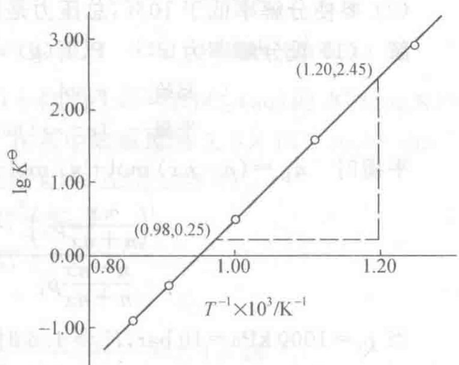

6.16 参考教材例题 6.7 中 NaHCO₃ 热分解反应的 K°, 求当体系平衡气体总压力达 200 kPa 时, 温度是多少?

$$
2 \mathrm{NaHCO} _ {3} (\mathrm{s}) \rightleftharpoons \mathrm{Na} _ {2} \mathrm{CO} _ {3} (\mathrm{s}) + \mathrm{CO} _ {2} (\mathrm{g}) + \mathrm{H} _ {2} \mathrm{O} (\mathrm{g})
$$

由反应方程式知,产生的 $CO_{2}$ 、 $H_{2}O$ 的物质的量相等,即 $p(\mathrm{CO}_{2})=p(\mathrm{H}_{2}\mathrm{O})$

$$
p _ {\mathrm{总}} = 2 0 0 \mathrm{kPa} \mathrm{时}, \quad p (\mathrm {CO_ {2}}) = p (\mathrm {H_ {2} O}) = 1 0 0 \mathrm{kPa} = 1. 0 0 \mathrm{bar}
$$

$$
K ^ {\ominus} = p (\mathrm{CO} _ {2}) \times p (\mathrm{H} _ {2} \mathrm{O}) = 1. 0 0 \times 1. 0 0 = 1. 0 0
$$

设此时温度为 $T_{1}$ ，又知 $T_{2}=373\ K$ 时， $K_{p}^{\ominus}=2.31\times10^{-1}$ ；反应的 $\Delta H^{\ominus}=129\ kJ\cdot mol^{-1}$ 。

则

$$
\lg \frac {2 . 3 1 \times 1 0 ^ {- 1}}{1 . 0 0} = \frac {1 2 9 \times 1 0 ^ {3} \mathrm{J} \cdot \mathrm{mol} ^ {- 1}}{2 . 3 0 \times 8 . 3 1 \mathrm{J} \cdot \mathrm{mol} ^ {- 1} \cdot \mathrm{K} ^ {- 1}} \left(\frac {3 7 3 \mathrm{K} - T _ {1}}{3 7 3 \mathrm{K} \times T _ {1}}\right), \quad T _ {1} = 3 8 7 \mathrm{K}
$$

6.17 $\mathrm{PCl}_5$ 遇热按式 $\mathrm{PCl}_5(\mathrm{g}) \rightleftharpoons \mathrm{PCl}_3(\mathrm{g}) + \mathrm{Cl}_2(\mathrm{g})$ 分解。2. $695\mathrm{g}$ $\mathrm{PCl}_5$ 装在 $1.00\mathrm{dm}^3$ 的密闭容器中，在 $523\mathrm{K}$ 达平衡时总压力为 $100\mathrm{kPa}$ 。求 $\mathrm{PCl}_5$ 的分解率及平衡常数 $K_{p}, K_{c}$ 。

解

$$
n (\mathrm{PCl} _ {5}) = \frac {2 . 6 9 5 \mathrm{g}}{2 0 8 . 2 \mathrm{g} \cdot \mathrm{mol} ^ {- 1}} = 0. 0 1 2 9 \mathrm{mol}
$$

$$
\mathrm{PCl} _ {5} (\mathrm{g}) \quad \Longleftrightarrow \mathrm{PCl} _ {3} (\mathrm{g}) + \mathrm{Cl} _ {2} (\mathrm{g})
$$

起始 0.0129 mol 0 0

平衡 (0.0129-x) mol x mol x mol

平衡时 $n_{\text{总}} = \frac{pV}{RT} = \frac{100\mathrm{kPa}\times 1.00\mathrm{dm}^3}{8.31\mathrm{kPa}\cdot\mathrm{dm}^3\cdot\mathrm{mol}^{-1}\cdot\mathrm{K}^{-1}\times 523\mathrm{K}} = 0.0230\mathrm{mol}$

$$
(0. 0 1 2 9 - x) \mathrm{mol} + x \mathrm{mol} + x \mathrm{mol} = 0. 0 2 3 0 \mathrm{mol}, \quad x = 0. 0 1 0 1
$$

$$
\mathrm{PCl} _ {5}
$$

$$
= \frac {0 . 0 1 0 1 \mathrm{mol}}{0 . 0 1 2 9 \mathrm{mol}} \times 100 \% = 78 \%
$$

$$
p \left(\mathrm{PCl} _ {3}\right) = p \left(\mathrm{Cl} _ {2}\right) = 1 0 0 \mathrm{kPa} \times \frac {0 . 0 1 0 1 \mathrm{mol}}{0 . 0 2 3 0 \mathrm{mol}} = 4 4 \mathrm{kPa} = 0. 4 4 \mathrm{bar}
$$

$$
p (\mathrm{PCl} _ {5}) = 1 0 0 \mathrm{kPa} \times \frac {0 . 0 0 2 8 \mathrm{mol}}{0 . 0 2 3 0 \mathrm{mol}} = 1 2 \mathrm{kPa} = 0. 1 2 \mathrm{bar}
$$

$$
K _ {p} = \frac {(0 . 4 4) ^ {2}}{0 . 1 2} = 1. 6, K _ {c} = 1. 6 \times (0. 0 8 3 \times 5 2 3) ^ {- 1} = 0. 0 3 7
$$

6.18 用 6.17 题的平衡常数, 求 523 K 时:

(1) 当总压力为 $1000 \, kPa$ 时, $PCl_{5}$ 的分解率是多少?

(2) 要使分解率低于 10%, 总压力是多少?

解（1）设分解率为 $x$ $\mathrm{PCl}_5(\mathrm{g})\rightleftharpoons \mathrm{PCl}_3(\mathrm{g}) + \mathrm{Cl}_2(\mathrm{g})$

平衡时 $n_{\text{总}}=(n-nx)\ \text{mol}+nx\ \text{mol}+nx\ \text{mol}=n\ \text{mol}+nx\ \text{mol}$

$$
\frac {\left(\frac {n x}{n + n x} p _ {t}\right) ^ {2}}{\frac {n - n x}{n + n x} p _ {t}} = K _ {p}, \quad \frac {x ^ {2}}{(1) ^ {2} - x ^ {2}} p _ {t} = K _ {p}
$$

当 $p_{t}=1000\ kPa=10\ bar, K_{p}=1.6$ 时，有

$$
1. 6 = 1 0 \times \frac {x ^ {2}}{(1) ^ {2} - x ^ {2}}, \quad x = 0. 3 7
$$

$$
\mathrm{分解率} = \frac {0 . 3 7 \mathrm{mol}}{1 . 0 \mathrm{mol}} \times 1 0 0 \% = 3 7 \%
$$

(2) 当分解率低于 10%，即 $x=10\%=0.10$ ，设总压力 p=y bar，则有

$$
1. 6 = \frac {y \times (0 . 1 0) ^ {2}}{(1) ^ {2} - (0 . 1 0) ^ {2}}
$$

$$
y = 1. 6 \times 1 0 ^ {2}, \quad p = 1. 6 \times 1 0 ^ {2} \mathrm{bar} = 1. 6 \times 1 0 ^ {4} \mathrm{kPa}
$$

6.19 光气 $\left(\mathrm{COCl}_{2}\right)$ 是一种有毒气体,它遇热按下式分解:

$$
\mathrm{COCl} _ {2} (\mathrm{g}) \rightleftharpoons \mathrm{CO(g)} + \mathrm{Cl} _ {2} (\mathrm{g}) \quad K _ {p} (6 6 8 \mathrm{K}) = 4. 4 4 \times 1 0 ^ {- 2}
$$

在某密闭容器中，当混合气体总压力为 300 kPa 时，计算该混合气体的平均相对分子质量。

解

$$
\begin{array}{r l r}&{\mathrm {COCl_ {2} (g)\rightleftharpoons CO(g)+Cl_ {2} (g)}}\\{\text {设起始时}}&{1. 0 0 \mathrm{mol}}&{0 \quad 0}\\{\text {平衡时}}&{(1. 0 0 - x) \mathrm{mol}}&{x \mathrm{mol} \quad x \mathrm{mol}}\end{array}
$$

平衡时 $n_{\text{总}}=(1.00-x)\mathrm{mol}+x\mathrm{mol}+x\mathrm{mol}=(1.00+x)\mathrm{mol}$ ，且其总压力为3.00 bar，则

$$
K _ {p} = \frac {\left(3 . 0 0 \times \frac {x}{1 . 0 0 + x}\right) ^ {2}}{3 . 0 0 \times \frac {1 . 0 0 - x}{1 . 0 0 + x}} = 3. 0 0 \times \frac {x ^ {2}}{(1 . 0 0) ^ {2} - x ^ {2}}
$$

$$
x = \sqrt {\frac {K _ {p}}{3 + K _ {p}}} = \sqrt {\frac {4 . 4 4 \times 1 0 ^ {- 2}}{3 + 4 . 4 4 \times 1 0 ^ {- 2}}} = 0. 1 2 1
$$

即 $1 \, mol \, COCl_{2}$ 达平衡时，含 $0.121 \, mol \, CO, 0.121 \, mol \, Cl_{2}, 0.879 \, mol \, COCl_{2}$ 。

$$
\overline {{{M}}} _ {\mathrm{r}} = \frac {(2 8 \times 0 . 1 2 1) + (7 1 \times 0 . 1 2 1) + (9 9 \times 0 . 8 7 9)}{0 . 1 2 1 + 0 . 1 2 1 + 0 . 8 7 9} = 8 8
$$

6.20 $Ag_{2}CO_{3}$ 遇热容易分解：

$$
\mathrm{Ag} _ {2} \mathrm{CO} _ {3} (\mathrm{s}) \rightleftharpoons \mathrm{Ag} _ {2} \mathrm{O} (\mathrm{s}) + \mathrm{CO} _ {2} (\mathrm{g}) \quad \Delta G ^ {\ominus} (3 8 3 \mathrm{K}) = 1 4. 8 \mathrm{kJ} \cdot \mathrm{mol} ^ {- 1}
$$

在 $110^{\circ}$ C 烘干时, 空气中掺入一定量的 $CO_{2}$ 就可避免分解。参考给出的数据, 估算气相中 $CO_{2}$ 的摩尔分数。

$$
\begin{array}{r l} \text {解} & \Delta G ^ {\ominus} (3 8 3 \mathrm{K}) = 1 4. 8 \mathrm{kJ} \cdot \mathrm{mol} ^ {- 1}, \Delta G ^ {\ominus} = - 2. 3 0 R T \lg p (\mathrm{CO} _ {2}), \text {设} p (\mathrm{CO} _ {2}) = x \text {bar, 则有} \\ & \lg x = \frac {- 1 4 . 8 \mathrm{kJ} \cdot \mathrm{mol} ^ {- 1}}{2 . 3 0 \times 0 . 0 0 8 3 1 \mathrm{kJ} \cdot \mathrm{mol} ^ {- 1} \cdot \mathrm{K} ^ {- 1} \times 3 8 3 \mathrm{K}} \\ & x = 9. 5 \times 1 0 ^ {- 3}, p (\mathrm{CO} _ {2}) = 9. 5 \times 1 0 ^ {- 3} \mathrm{bar} = 0. 9 5 \mathrm{kPa} \\ & \frac {n (\mathrm{CO} _ {2})}{n _ {\text {总}}} = \frac {p (\mathrm{CO} _ {2})}{p _ {\text {总}}} = \frac {0 . 9 5 \mathrm{kPa}}{1 0 1 \mathrm{kPa}} = 0. 9 4 \% (1 0 1 \mathrm{kPa} \text {是大气的压力}) \end{array}
$$

6.21 已知血红蛋白(Hb)的氧化反应 $\mathrm{Hb(aq)+O_{2}(g)\rightleftharpoons HbO_{2}(aq)}$ 的 $K_{1}^{\ominus}(292\mathrm{~K})=85.5$ 。若在 292 K 时，空气中 $p(\mathrm{O}_{2})=20.2\mathrm{kPa},\mathrm{O}_{2}$ 在水中溶解度为 $2.3\times10^{-4}\mathrm{~mol}\cdot\mathrm{dm}^{-3}$ ，试求反应 $\mathrm{Hb(aq)+O_{2}(aq)\rightleftharpoons HbO_{2}(aq)}$ 的 $K_{2}^{\ominus}(292\mathrm{~K})$ 和 $\Delta_{r}G_{m}^{\ominus}(292\mathrm{~K})$ 。

解 ① $\mathrm{Hb(aq) + O_2(g)\rightleftharpoons HbO_2(aq)}$ $K_{1}^{\ominus} = 85.5$

$$
\mathrm{Hb(aq)} + \mathrm{O} _ {2} (\mathrm{aq}) \rightleftharpoons \mathrm{HbO} _ {2} (\mathrm{aq}) \quad K _ {2} ^ {\ominus} = ?
$$

$$
K _ {3} ^ {\ominus} = \frac {2 . 3 \times 1 0 ^ {- 4} \mathrm{mol} \cdot \mathrm{dm} ^ {- 3} / (1 . 0 0 \mathrm{mol} \cdot \mathrm{dm} ^ {- 3})}{2 0 . 2 \mathrm{kPa} / 1 0 0 \mathrm{kPa}} = 1. 1 \times 1 0 ^ {- 3}
$$

①式一③式得②式，故

$$
\begin{array}{r l} & K _ {2} ^ {\ominus} = \frac {K _ {1} ^ {\ominus}}{K _ {3} ^ {\ominus}} = \frac {8 5 . 5}{1 . 1 \times 1 0 ^ {- 3}} = 7. 8 \times 1 0 ^ {4} \\ & \Delta G ^ {\ominus} = - 2. 3 0 R T \times \lg K _ {2} ^ {\ominus} \\ & \quad = - 2. 3 0 \times 0. 0 0 8 3 1 \mathrm{kJ} \cdot \mathrm{mol} ^ {- 1} \cdot \mathrm{K} ^ {- 1} \times 2 9 2 \mathrm{K} \times \lg (7. 8 \times 1 0 ^ {4}) \\ & \quad = - 2 7 \mathrm{kJ} \cdot \mathrm{mol} ^ {- 1} \end{array}
$$

6.22 已知 $\mathrm{CaCO_3(s)}\rightleftharpoons \mathrm{CaO(s)} + \mathrm{CO_2(g)}$ 的 $K_{c}(1500\mathrm{K}) = 0.50$ ，在此温度下 $\mathrm{CO_2}$ 又有部分分解成 CO, 即 $\mathrm{CO}_{2} \rightleftharpoons \mathrm{CO} + \frac{1}{2}\mathrm{O}_{2}$ 。若将 $1.00\,mol\,CaCO_{3}$ 装入 $1.00\,dm^{3}$ 真空容器中，加热到 $1500\,K$ ，达平衡时，气体混合物中 $O_{2}$ 的摩尔分数为 0.15。计算容器中 CaO 的物质的量 $n(\mathrm{CaO})$ 。

$$
\begin{array}{r l}&{\mathrm {CaCO_ {3} (s)} \rightleftharpoons \mathrm {CaO(s) + CO_ {2} (g)} \qquad K _ {c} (1 5 0 0 \mathrm{K}) = 0. 5 0}\\&{K _ {c} = [ \mathrm {CO_ {2}} ] = 0. 5 0, \quad n (\mathrm {CO_ {2}}) = 0. 5 0 \times 1. 0 0 \mathrm{mol} = 0. 5 0 \mathrm{mol}}\\&{\mathrm {CO_ {2}} \rightleftharpoons \mathrm{CO} + \frac {1}{2} \mathrm {O_ {2}}}\\&{\text {平衡时} \quad 0. 5 0 \mathrm{mol} \quad y \mathrm{mol} \quad \frac {1}{2} y \mathrm{mol}}\\&{x (\mathrm {O_ {2}}) = \frac {n (\mathrm {O_ {2}})}{n _ {\text {总}}} = \frac {(y / 2) \mathrm{mol}}{0 . 5 0 \mathrm{mol} + y \mathrm{mol} + (y / 2) \mathrm{mol}} = 0. 1 5}\\&{y = 0. 2 7, \quad \text {即} n (\mathrm{CO}) = 0. 2 7 \mathrm{mol}}\\&{n (\mathrm{CaO}) = n (\mathrm {CO_ {2}}) + n (\mathrm{CO}) = (0. 5 0 + 0. 2 7) \mathrm{mol} = 0. 7 7 \mathrm{mol}}\end{array}
$$

6.23 在 1073 K 时, HCl 气体通过铁管时, 发生腐蚀反应:

$$
\mathrm{Fe(s)} + 2 \mathrm{HCl(g)} \rightleftharpoons \mathrm {FeCl_ {2} (s)} + \mathrm {H_ {2} (g)}
$$

为防止腐蚀,可往 HCl 气体中加入一定量的 $H_{2}$ 。当总压为 100 kPa 的 HCl 和 $H_{2}$ 混合气体通过铁管时, $H_{2}$ 和 HCl 的体积比不得小于多少? 已知 1073 K 时:

$$
\begin{array}{l l}\text {①} \mathrm{Fe(s)} + \mathrm{Cl} _ {2} (\mathrm{g}) \rightleftharpoons \mathrm{FeCl} _ {2} (\mathrm{s})&\Delta_ {\mathrm{r}} G _ {\mathrm{m}} ^ {\ominus} = - 1 9 6 \mathrm{kJ} \cdot \mathrm{mol} ^ {- 1}\\\text {②} \mathrm{H} _ {2} (\mathrm{g}) + \mathrm{Cl} _ {2} (\mathrm{g}) \rightleftharpoons 2 \mathrm{HCl(g)}&\Delta_ {\mathrm{r}} G _ {\mathrm{m}} ^ {\ominus} = - 2 0 6 \mathrm{kJ} \cdot \mathrm{mol} ^ {- 1}\end{array}
$$

解 ①式一②式, 得

$$
\begin{array}{r l}&\mathrm {Fe(s) + 2HCl(g)\rightleftharpoons FeCl_ {2} (s)+ H_ {2} (g)}\\&\Delta_ {\mathrm{r}} G ^ {\ominus} = 1 0 \mathrm{kJ} \cdot \mathrm{mol} ^ {- 1}, \quad K ^ {\ominus} = 0. 3 3\end{array}
$$

设当 $H_{2}$ 与 HCl 体积比(等于物质的量之比)为 x:1, 可防止腐蚀反应发生, 则

$$
Q = \frac {p (\mathrm{H} _ {2})}{p ^ {2} (\mathrm{HCl})} = \frac {1 . 0 0 \times \frac {x}{1 + x}}{\left(1 . 0 0 \times \frac {1}{1 + x}\right) ^ {2}} \geqslant 0. 3 3
$$

解得 $x \geqslant 0.26$ ，即 $H_{2}$ 和 HCl 的体积比不得小于 0.26。

6.24 下图表示生成几种氯化物反应的 $\Delta_{\mathrm{r}}G_{\mathrm{m}}^{\ominus}$ 随温度变化情况，试回答：

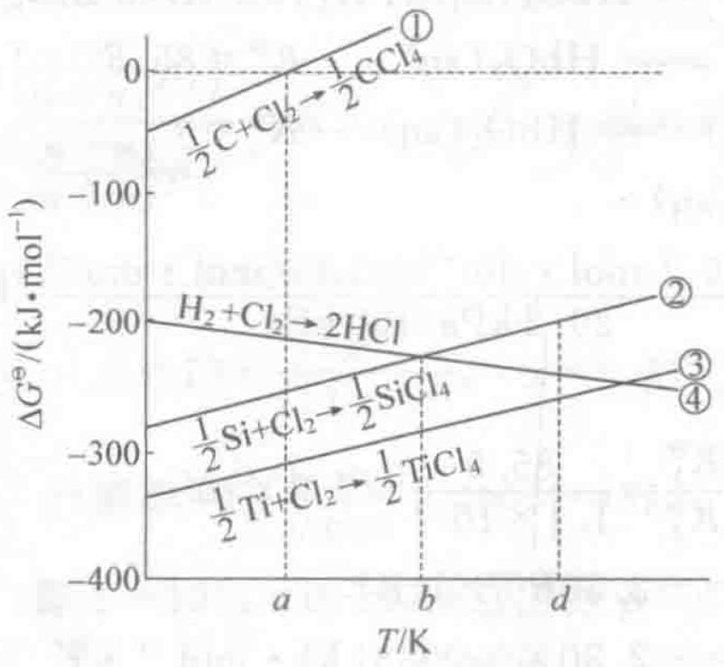

(1) 反应①在温度 a 时, $K^{\ominus}$ 等于多少?

(2) 反应②是吸热反应还是放热反应？为什么？

(3) 反应④是熵增反应还是熵减反应？为什么？

(4) 在温度 a 时, Ti 能否从 $SiCl_{4}$ 中置换出 Si? 为什么?

(5) 在温度 d 时, 能否用 $H_{2}$ 还原 $SiCl_{4}$ 制备 Si? 温度低于 b 时, 又怎么样?

解（1）反应①在温度 $a$ 时， $\Delta_{\mathrm{r}}G^{\ominus} = 0$ ，所以 $K^{\ominus} = 1$ 。

(2) 反应②是熵减反应, $\Delta_{\mathrm{r}}G^{\ominus} = \Delta_{\mathrm{r}}H^{\ominus} - T\Delta_{\mathrm{r}}S^{\ominus}, \Delta_{\mathrm{r}}G^{\ominus}$ 为负值, $-T\Delta_{\mathrm{r}}S^{\ominus}$ 为正值, 因此 $\Delta_{\mathrm{r}}H_{\mathrm{m}}^{\ominus}$ 一定是负值, 为放热反应。

(3) 反应④的 $\Delta_{r}G^{\ominus}$ 随温度升高不断减小, 是熵增反应。

（4）置换反应 $\frac{1}{2}\mathrm{Ti} + \frac{1}{2}\mathrm{SiCl}_4\rightleftharpoons \frac{1}{2}\mathrm{Si} + \frac{1}{2}\mathrm{TiCl}_4$ 为反应③一②。温度 $a$ 时，反应③的 $\Delta_{\mathrm{r}}G^{\ominus}$ 小于反应②的，置换反应的 $\Delta_{\mathrm{r}}G^{\ominus}$ 为负值，反应可自发进行，Ti可置换出Si。

(5) 置换反应 $\mathrm{H}_{2} + \frac{1}{2}\mathrm{SiCl}_{4} \rightleftharpoons \frac{1}{2}\mathrm{Si} + 2\mathrm{HCl}$ 为反应④-②。温度 $d$ 时，反应④的 $\Delta_{\mathrm{r}}G^{\ominus}$ 小于反应②的，置换反应的 $\Delta_{\mathrm{r}}G^{\ominus}$ 为负值，反应可自发进行， $\mathrm{H}_{2}$ 能还原 $\mathrm{SiCl}_{4}$ 制备 Si；温度低于 $b$ 时，情况相反，置换反应的 $\Delta_{\mathrm{r}}G^{\ominus}$ 为正值，标准状态下 $\mathrm{H}_{2}$ 不能还原 $\mathrm{SiCl}_{4}$ 。

的背景内容，是全球主要国家和主要国际主要市场重点投资的新兴市场。在这些背景下具有更丰富的市场格局，未来自2017年至今出现新的经济结构，新成立并成为全球主要国家和地区。目前该部已向印度尼西亚、印度尼西亚、印度尼西亚、印度尼西亚、印度尼西亚、印度尼西亚、印度尼西亚、印度尼西亚、印度尼西亚、印度尼西亚、印度尼西亚、印度尼西亚、印度尼西亚、印度尼西亚、印度尼西亚、印度尼西亚、印度尼西亚、印度尼西亚、印度尼西亚、印度尼西亚、印度尼西亚、印度尼西亚、印度尼西亚、印度尼西亚、印度尼西亚、印度尼西亚。

## 第 7 章 化学反应速率

化学的核心问题之一就是研究化学反应的机理和历程。本章简要介绍了化学反应速率的表达方法以及与化学反应机理有关的基本概念，包括基元反应、非基元反应、反应级数、活化能、过渡态和催化剂等。以上概念是本章的重点内容。此外，本章还介绍了两种反应动力学理论，即碰撞理论和过渡态理论。它们从微观角度描述了化学反应的历程，是进一步理解化学反应机理的理论基础。

## 内容提要

## 7.1 反应速率的意义

对于反应 $aA + bB \longrightarrow cC + dD$ ，反应物 A 在某一时刻 t 的瞬时反应速率定义为

$$
v _ {\mathrm{A}} = \lim _ {\Delta t \rightarrow 0} \frac {- \Delta (\mathrm{A})}{\Delta t} = - \frac {\mathrm{d(A)}}{\mathrm{dt}}
$$

在此，(A)代表反应物 A 在 t 时刻的浓度，也可用 c(A) 来表示。

若将上述反应速率除以反应方程式中的计量系数,则同一反应中各物种具有统一的反应速率:

$$
v = - \frac {1}{a} \frac {\mathrm{d(A)}}{\mathrm{dt}} = - \frac {1}{b} \frac {\mathrm{d(B)}}{\mathrm{dt}} = \frac {1}{c} \frac {\mathrm{d(C)}}{\mathrm{dt}} = \frac {1}{d} \frac {\mathrm{d(D)}}{\mathrm{dt}}
$$

化学反应具有可逆性,实际测定的反应速率为正反应速率与逆反应速率之差,称为净反应速率。当反应刚开始的瞬间,逆反应速率为零,故此时的净反应速率等于正反应速率。当体系达到平衡时,正、逆反应速率相等,净反应速率为零。

## 7.2 浓度与反应速率

化学反应速率与反应路径有关,有些反应可以一步完成,这些反应称为基元反应;而另外一些反应则相对复杂,通常要经过几步甚至很多步才能完成,这些反应称为非基元反应。

基元反应服从质量作用定律,即反应速率与反应物的浓度的幂的乘积成正比。以基元反应 $aA+bB \longrightarrow cC$ 为例,反应速率与反应物浓度的关系为

$$
v = - \frac {1}{a} \frac {\mathrm{d(A)}}{\mathrm{dt}} = - \frac {1}{b} \frac {\mathrm{d(B)}}{\mathrm{dt}} = \frac {1}{c} \frac {\mathrm{d(C)}}{\mathrm{dt}} = k (\mathrm{A}) ^ {a} (\mathrm{B}) ^ {b}
$$

其中 k 为反应速率常数，主要与反应的温度有关。上式又称为微分反应速率方程。

若 $a\mathrm{A} + b\mathrm{B}\longrightarrow c\mathrm{C}$ 是非基元反应，则

$$
v = k (\mathrm{A}) ^ {m} (\mathrm{B}) ^ {n}
$$

其中， $m$ 和 $n$ 由实验确定。

## 7.3 反应级数

对于基元反应 $aA + bB \longrightarrow cC$ ，微分反应速率方程可写为

$$
v = k (\mathrm{A}) ^ {a} (\mathrm{B}) ^ {b}
$$

其中，a 称为反应物 A 的反应级数，b 称为反应物 B 的反应级数，总反应级数为 $a + b$ 。

若上述反应为非基元反应，则 $v = k(A)^m (B)^n$ ，A的反应级数为 $m$ ，B的反应级数为 $n$ ，总反应级数为 $m + n$ 。

对于一级反应 A $\longrightarrow$ P, 微分反应速率方程为

$$
- \frac {\mathrm{d(A)}}{\mathrm{dt}} = k (\mathrm{A})
$$

上式可改写为

$$
- \frac {\mathrm{d(A)}}{(\mathrm{A})} = k \mathrm{dt}
$$

对上式两边积分,可得到一级反应的积分反应速率方程:

$$
\ln (\mathrm{A}) - \ln (\mathrm{A}) _ {0} = - k t \quad \text {或} \quad \lg (\mathrm{A}) = \lg (\mathrm{A}) _ {0} - \frac {k}{2 . 3 0} t
$$

半衰期是指反应进行一半所需的时间，一级基元反应的半衰期公式为

$$
t _ {1 / 2} = \frac {0 . 6 9 3}{k}
$$

虽然微分速率方程和积分速率方程相互关联,具有相同的理论基础,但是微分速率方程反映了反应物浓度(A)与反应速率 $v_{A}$ 之间的关系;而积分速率方程则反映了反应时间t与反应物浓度(A)之间的关系(见下表)。

<table><tr><td>反应类型</td><td>积分速率方程</td></tr><tr><td>二级反应B→P</td><td> $\frac{1}{(B)} = \frac{1}{(B)_0} + kt$ </td></tr><tr><td>三级反应C→P</td><td> $\frac{1}{(C)^2} = \frac{1}{(C)_0^2} + 2kt$ </td></tr><tr><td>零级反应D→P</td><td>(D)−(D)_0=−kt</td></tr></table>

## 7.4 温度与反应速率·活化能

## 1. Arrhenius 经验公式

$$
k = A \mathrm{e} ^ {- E _ {\mathrm{a}} / R T}
$$

其中，k 为反应速率常数， $E_{a}$ 为实验活化能，R 为摩尔气体常数，T 为热力学温度。

活化能(或称实验活化能)为活化分子与反应物分子之间的平均能量差。关于活化能的理论解释,有碰撞理论和过渡态理论两种。

## 2. 碰撞理论

碰撞理论建立在气体分子运动论的基础之上。通过对气体分子反应的统计分析,可以导出质量作用定律以及 Arrhenius 经验公式。

从碰撞理论出发,可以导出基元反应 A+B $\longrightarrow$ C 的速率方程:

$$
v = - \frac {1}{a} \frac {\mathrm{d(A)}}{\mathrm{dt}} = Z _ {0} P \mathrm{e} ^ {- E _ {\mathrm{c}} / R T} (\mathrm{A}) (\mathrm{B}) = k (\mathrm{A}) (\mathrm{B})
$$

其中，速率常数 $k = Z_{0}P\mathrm{e}^{-E_{\mathrm{c}} / RT}$ ； $E_{\mathrm{c}}$ 是有效碰撞相向平动能的临界值，近似于反应的活化能； $Z_{0}$ 是单位浓度时的碰撞频率； $P$ 是反应的方位因子。

## 3. 过渡态理论

过渡态理论建立在量子力学的基础之上。根据过渡态理论，在反应物生成产物之前，必然经历一个活化络合物的过渡态，即

$$
\begin{array}{r l} & {\mathrm{A+BC} \longrightarrow \mathrm{A} \dots \mathrm{B} \dots \mathrm{C} \longrightarrow \mathrm{AB+C}} \\ & {\text {   过   渡   态   }} \end{array}
$$

反应物与活化络合物的能量之差为反应的活化能。

## 7.5 反应机理

反应机理是对反应过程的微观描述,包括构成非基元反应的各个基元反应步骤,它们反映了化学反应的本质和规律。

需要说明的是：化学反应的机理研究是化学领域中最具挑战性的课题之一。即使是最简单的气相反应，其微观机理中也仍然有很多尚未了解的方面。例如， $\mathrm{Cl}_2$ 、 $\mathrm{Br}_2$ 、 $\mathrm{I}_2$ 虽属于同族元素，但它们与 $\mathrm{H}_2$ 反应的机理却相去甚远，这反映了微观反应机理的多样性和复杂性。

## 7.6 催化

## 1. 催化剂

催化剂是能改变反应历程,但自身性质在反应前后不发生变化的物质。其特点是:

(1) 可以显著地改变反应的速率,但本身的量、组成、化学性质不变;

(2) 不可实现热力学上判定不能发生的反应, 不能使化学平衡发生移动;

(3) 催化剂可以改变反应历程,降低活化能;

(4) 催化剂有选择性, 易中毒, 可再生。

## 2. 酶催化,锁钥模型

酶催化的基本原理是德国化学家 Emil Fischer 提出的锁钥模型, 即“一把钥匙开一把锁”的专一催化模型。后来, 又改进为“柔软口袋”模型, 或称“捕蝇器”(venus flytrap) 模型, 即允许在反应过程中酶的结构发生柔性变化, 以适应反应底物的结构。

酶催化的特点：

(1) 高度的选择性；

(2) 催化效率高；

(3) 常温常压下可以使反应进行。

## 3. 均相催化与非均相催化

均相催化是指反应物与催化剂同处一相，均相催化可以是气相或者液相的；而非均相催化则指反应物与催化剂分处两相，通常情况下催化剂为固体而反应物为气体或液体。

## 习题解析

7.1 现有化学反应 $\mathrm{S}_2\mathrm{O}_8^{2-} + 3\mathrm{I}^- \longrightarrow 2\mathrm{SO}_4^{2-} + \mathrm{I}_3^-$ ，当反应速率 $\frac{-\mathrm{d}c(\mathrm{S}_2\mathrm{O}_8^{2-})}{\mathrm{d}t} = 2.0\times 10^{-3}$

$\mathrm{mol} \cdot \mathrm{dm}^{-3} \cdot \mathrm{s}^{-1}$ 时，那么 $-\frac{\mathrm{d}c(\mathrm{I}^{-})}{\mathrm{d}t} = ? + \frac{\mathrm{d}c(\mathrm{SO}_4^{2-})}{\mathrm{d}t} = ?$

$$
\mathrm{S} _ {2} \mathrm{O} _ {8} ^ {2 -} + 3 \mathrm{I} ^ {-} \longrightarrow 2 \mathrm{SO} _ {4} ^ {2 -} + \mathrm{I} _ {3} ^ {-} - \frac {\mathrm{d} c (\mathrm{S} _ {2} \mathrm{O} _ {8} ^ {2 -})}{\mathrm{d} t} = - \frac {1}{3} \frac {\mathrm{d} c (\mathrm{I} ^ {-})}{\mathrm{d} t} = \frac {1}{2} \frac {\mathrm{d} c (\mathrm{SO} _ {4} ^ {2 -})}{\mathrm{d} t} = \frac {\mathrm{d} c (\mathrm{I} _ {3} ^ {-})}{\mathrm{d} t}
$$

当 $-\frac{\mathrm{d}c(\mathrm{S}_2\mathrm{O}_8^{2-})}{\mathrm{d}t} = 2.0\times 10^{-3}\mathrm{mol}\cdot \mathrm{dm}^{-3}\cdot \mathrm{s}^{-1}$ 时，则

$$
\begin{array}{r l} - \frac {\mathrm{d} c (\mathrm{I} ^ {-})}{\mathrm{d} t} & = 3 \times \frac {- \mathrm{d} c (\mathrm{S} _ {2} \mathrm{O} _ {8} ^ {2 -})}{\mathrm{d} t} = 3 \times (2. 0 \times 1 0 ^ {- 3}) \mathrm{mol} \cdot \mathrm{dm} ^ {- 3} \cdot \mathrm{s} ^ {- 1} \\ & = 6. 0 \times 1 0 ^ {- 3} \mathrm{mol} \cdot \mathrm{dm} ^ {- 3} \cdot \mathrm{s} ^ {- 1} \end{array}
$$

$$
\begin{array}{r l} \frac {\mathrm{d} c (\mathrm{SO} _ {4} ^ {2 -})}{\mathrm{d} t} & = 2 \times \frac {- \mathrm{d} c (\mathrm{S} _ {2} \mathrm{O} _ {8} ^ {2 -})}{\mathrm{d} t} = 2 \times (2. 0 \times 1 0 ^ {- 3}) \mathrm{mol} \cdot \mathrm{dm} ^ {- 3} \cdot \mathrm{s} ^ {- 1} \\ & = 4. 0 \times 1 0 ^ {- 3} \mathrm{mol} \cdot \mathrm{dm} ^ {- 3} \cdot \mathrm{s} ^ {- 1} \end{array}
$$

7.2 $\mathrm{N}_2\mathrm{O}_5$ 的分解反应是 $2\mathrm{N}_2\mathrm{O}_5 \longrightarrow 4\mathrm{NO}_2 + \mathrm{O}_2$ ，由实验测得在 $67^{\circ}\mathrm{C}$ 时 $\mathrm{N}_2\mathrm{O}_5$ 的浓度随时间的变化如下：

<table><tr><td>t/ min</td><td>0.0</td><td>1.0</td><td>2.0</td><td>3.0</td><td>4.0</td><td>5.0</td></tr><tr><td> $c(N_2O_5)/(mol·dm^{-3})$ </td><td>1.00</td><td>0.71</td><td>0.50</td><td>0.35</td><td>0.25</td><td>0.17</td></tr></table>

试计算：

(1) 在 $0 \sim 2.0 \, min$ 内的平均反应速率 $\Delta c(\mathrm{O}_{2}) / \Delta t = ?$

(2) 在第 2.0 min 时的瞬时速率 $-\mathrm{dc}(\mathrm{N}_{2}\mathrm{O}_{5})/\mathrm{dt}=$ ?

(3) $N_{2}O_{5}$ 浓度为 $1.00\ mol \cdot dm^{-3}$ 时的初速率 $-dc(N_{2}O_{5})/dt=$ ?

解 (1) $\frac{\Delta c(\mathrm{O}_2)}{\Delta t} = \frac{1}{2} \times \frac{(0.50 - 0.00) \mathrm{~mol} \cdot \mathrm{dm}^{-3}}{2.0 \mathrm{~min}} = 0.13 \mathrm{~mol} \cdot \mathrm{dm}^{-3} \cdot \mathrm{min}^{-1}$

(2) 由上述数据作图, 第 2 min 时的瞬时速率为

$$
\begin{array}{r l} & - \frac {\mathrm{d} c (\mathrm{N} _ {2} \mathrm{O} _ {5})}{\mathrm{d} t} \\ & = \frac {- (0 . 6 6 - 0 . 3 0) \mathrm{mol} \cdot \mathrm{dm} ^ {- 3}}{- 2 . 0 \mathrm{min}} \\ & = 0. 1 8 \mathrm{mol} \cdot \mathrm{dm} ^ {- 3} \cdot \mathrm{min} ^ {- 1} \end{array}
$$

（3）由图可知， $N_{2}O_{5}$ 浓度为 $1.00\ mol\cdot dm^{-3}$ 时的初速率为

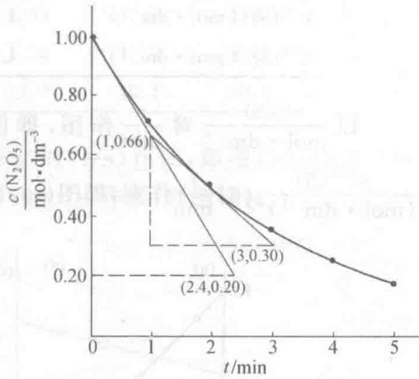

$$
\begin{array}{r l} & - \frac {\mathrm{d} c (\mathrm{N} _ {2} \mathrm{O} _ {5})}{\mathrm{d} t} \\ & = \frac {- (1 . 0 0 - 0 . 2 0) \mathrm{mol} \cdot \mathrm{dm} ^ {- 3}}{- 2 . 4 \mathrm{min}} \\ & = 0. 3 3 \mathrm{mol} \cdot \mathrm{dm} ^ {- 3} \cdot \mathrm{min} ^ {- 1} \end{array}
$$

7.3 已知在 $320^{\circ} \mathrm{C}$ 反应 $\mathrm{SO}_2 \mathrm{Cl}_2(\mathrm{~g}) \longrightarrow \mathrm{SO}_2(\mathrm{g}) + \mathrm{Cl}_2(\mathrm{g})$ 是一级反应, 速率常数为 $2.2 \times 10^{-5} \mathrm{~s}^{-1}$ 。问:

(1) $10.0 \, g \, SO_{2}Cl_{2}$ 分解一半需多少时间？

(2) $2.00 \, g \, SO_{2}Cl_{2}$ 经 $2 \, h$ 之后还剩多少?

解 (1)

$$
t _ {1 / 2} = \frac {0 . 6 9 3}{k} = \frac {0 . 6 9 3}{2 . 2 \times 1 0 ^ {- 5} \mathrm{s} ^ {- 1}} = 3. 2 \times 1 0 ^ {4} \mathrm{s}
$$

(2) 设 $2.00 \, g \, SO_{2}Cl_{2}$ 经 $2 \, h$ 后剩 x g，则

$$
\lg \frac {x \mathrm{g}}{2 . 0 0 \mathrm{g}} = \frac {- 2 . 2 \times 1 0 ^ {- 5} \mathrm{s} ^ {- 1} \times 3 6 0 0 \mathrm{s} \times 2}{2 . 3 0}, x = 1. 7
$$

2.00 g $SO_{2}Cl_{2}$ 经 2 h 后，还剩 1.7 g。

7.4 活着的动植物体内 $^{14}$ C 和 $^{12}$ C 两种同位素的比值和大气中 CO $_{2}$ 所含这两种碳同位素的比值是相等的,但动植物死亡后,由于 $^{14}$ C 不断衰变

$$
{ } _ { 6 } ^ { 1 4 } \mathrm{C} \longrightarrow { } _ { 7 } ^ { 1 4 } \mathrm{N} + { } _ { - 1 } ^ { 0 } \mathrm{e} \quad t _ { 1 / 2 } = 5 7 3 0 \mathrm{~a}
$$

$^{14}$ C/ $^{12}$ C 便不断下降。考古工作者根据 $^{14}$ C/ $^{12}$ C 的变化推算生物化石的年龄。如周口店山顶洞遗址出土的斑鹿骨化石的 $^{14}$ C/ $^{12}$ C 是当今活着的动植物的 0.109 倍，估算该化石的年龄。

解

$$
t _ {1 / 2} = \frac {0 . 6 9 3}{k}, \quad k = \frac {0 . 6 9 3}{t _ {1 / 2}} = \frac {0 . 6 9 3}{5 7 3 0 \mathrm{a}} = 1. 2 1 \times 1 0 ^ {- 4} \mathrm{a} ^ {- 1}
$$

$$
\lg \frac {0 . 1 0 9}{1} = - \frac {1 . 2 1 \times 1 0 ^ {- 4} a ^ {- 1}}{2 . 3 0} t, \quad t = 1. 8 3 \times 1 0 ^ {4} a
$$

7.5 测定化合物 S 的某一种酶催化反应速率时获得的实验数据如下表。试判定在下述浓度范围内的反应级数。

<table><tr><td>t/min</td><td>0</td><td>20</td><td>60</td><td>100</td><td>160</td></tr><tr><td>c(S)/(mol·dm-3)</td><td>1.00</td><td>0.90</td><td>0.70</td><td>0.50</td><td>0.20</td></tr></table>

解

<table><tr><td>t/min</td><td>0</td><td>20</td><td>60</td><td>100</td><td>160</td></tr><tr><td> $c(S)/(mol·dm^{-3})$ </td><td>1.00</td><td>0.90</td><td>0.70</td><td>0.50</td><td>0.20</td></tr><tr><td> $lg\frac{c(S)}{mol·dm^{-3}}$ </td><td>0</td><td>-0.046</td><td>-0.15</td><td>-0.30</td><td>-0.70</td></tr><tr><td> $c^{-1}(S)/(mol·dm^{-3})^{-1}$ </td><td>1.0</td><td>1.1</td><td>1.4</td><td>2.0</td><td>5.0</td></tr><tr><td> $c^{-2}(S)/(mol·dm^{-3})^{-2}$ </td><td>1.0</td><td>1.2</td><td>2.0</td><td>4.0</td><td>25</td></tr></table>

以 $\frac{c(S)}{\mathrm{mol}\cdot\mathrm{dm}^{-3}}$ 对 $\frac{t}{\min}$ 作图，即图（a）；以 $\frac{c^{-1}(S)}{(\mathrm{mol}\cdot\mathrm{dm}^{-3})^{-1}}$ 对 $\frac{t}{\min}$ 作图，即图（b）；以 $\frac{c^{-2}(S)}{(\mathrm{mol}\cdot\mathrm{dm}^{-3})^{-2}}$ 对 $\frac{t}{\min}$ 作图，即图（c）；以 $\lg \frac{c(S)}{\mathrm{mol}\cdot\mathrm{dm}^{-3}}$ 对 $\frac{t}{\min}$ 作图，即图（d）。

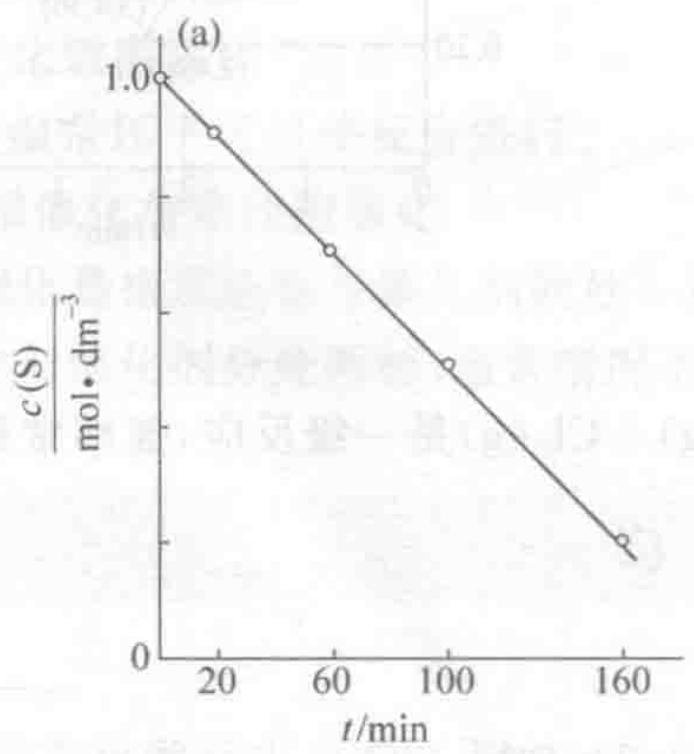

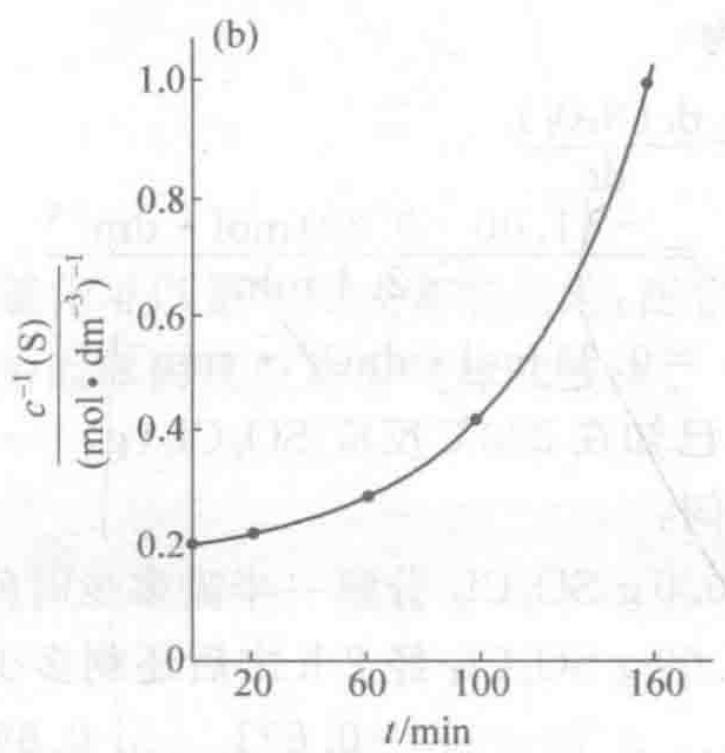

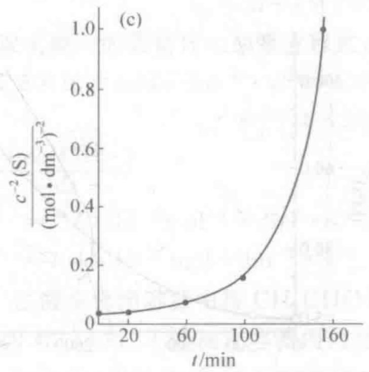

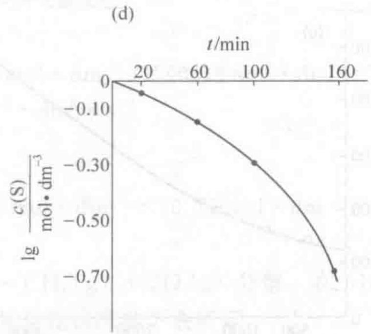

由图(a)可见， $\frac{c(S)}{\mathrm{mol}\cdot\mathrm{dm}^{-3}}-\frac{t}{\mathrm{min}}$ 图为直线，此反应为零级反应。

7.6 一个密闭容器中，在 $504^{\circ} \mathrm{C}$ 二甲醚按 $(\mathrm{CH}_3)_2 \mathrm{O}(\mathrm{g}) \longrightarrow \mathrm{CH}_4(\mathrm{g}) + \mathrm{H}_2(\mathrm{g}) + \mathrm{CO}(\mathrm{g})$ 式分解，测得二甲醚的分压随时间的变化如下表所示：

<table><tr><td>t/s</td><td>0</td><td>390</td><td>777</td><td>1195</td><td>3155</td></tr><tr><td> $p((CH_3)_2O)/kPa$ </td><td>41.6</td><td>35.2</td><td>29.9</td><td>24.9</td><td>10.5</td></tr></table>

试求：（1）反应级数；（2）速率常数；（3）在第1000s时气体总压力。

解

<table><tr><td>t/s</td><td>0</td><td>390</td><td>777</td><td>1195</td><td>3155</td></tr><tr><td>p/kPa</td><td>41.6</td><td>35.2</td><td>29.9</td><td>24.9</td><td>10.5</td></tr><tr><td>lg(p/kPa)</td><td>1.62</td><td>1.55</td><td>1.48</td><td>1.40</td><td>1.02</td></tr><tr><td> $p^{-1} \times 10^{2}/(kPa)^{-1}$ </td><td>2.40</td><td>2.84</td><td>3.34</td><td>4.02</td><td>9.52</td></tr><tr><td> $p^{-2} \times 10^{4}/(kPa)^{-2}$ </td><td>5.78</td><td>8.07</td><td>11.2</td><td>16.1</td><td>90.7</td></tr></table>

(1) 以 $(p / \mathrm{kPa})$ 对 $(t / \mathrm{s})$ 作图，即图 (a)；以 $\lg (p / \mathrm{kPa})$ 对 $(t / \mathrm{s})$ 作图，即图 (b)；以 $p^{-1} \times 10^{2} / (\mathrm{kPa})^{-1}$ 对 $(t / \mathrm{s})$ 作图，即图 (c)；以 $p^{-2} \times 10^{4} / (\mathrm{kPa})^{-2}$ 对 $(t / \mathrm{s})$ 作图，即图 (d)。

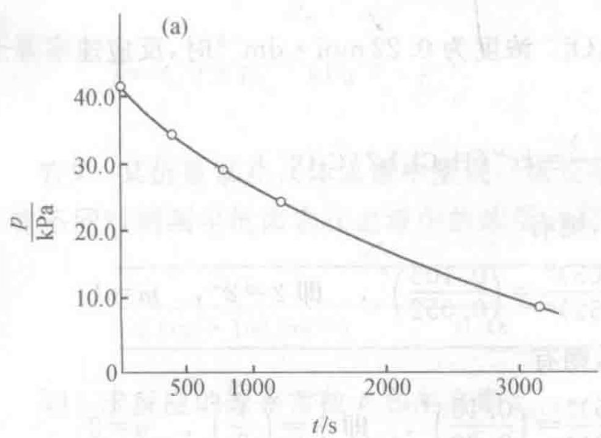

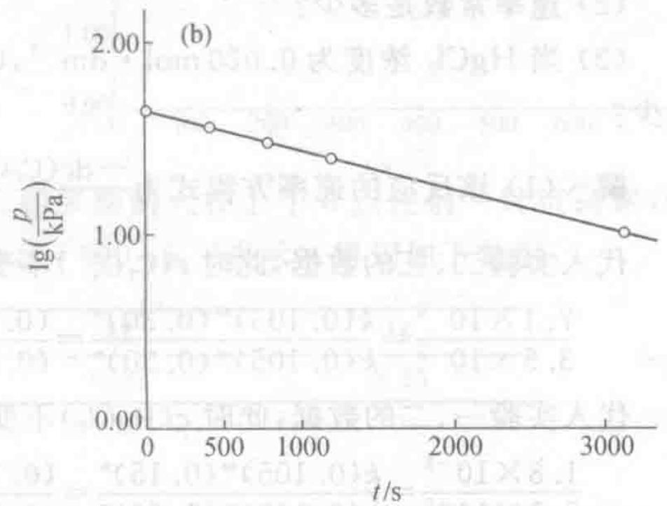

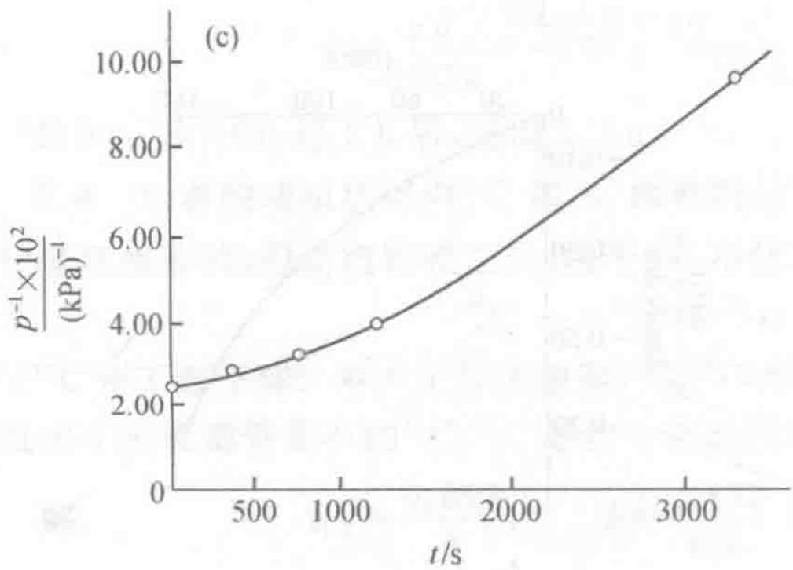

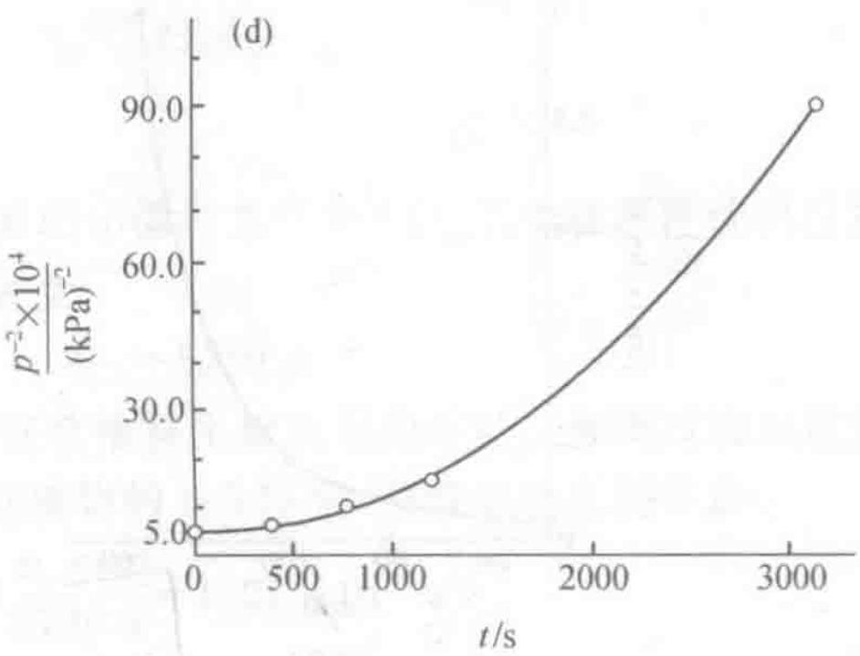

由图(b)可见， $\lg(p/\mathrm{kPa})-(t/\mathrm{s})$ 为线性关系，是一级反应。

(2) 斜率 $= \frac{1.40 - 1.48}{1195 - 777} = -1.9 \times 10^{-4}, k = 2.30 \times 1.9 \times 10^{-4} \mathrm{s}^{-1} = 4.4 \times 10^{-4} \mathrm{s}^{-1}$

$$
\lg \frac {p}{\mathrm{kPa}} = \lg \frac {p _ {0}}{\mathrm{kPa}} - \frac {k t}{2 . 3 0} = 1. 6 2 - \frac {4 . 4 \times 1 0 ^ {- 4} \times 1 0 0 0}{2 . 3 0} = 1. 4 3
$$

$p=27\ kPa$ ，即 $\left(\mathrm{CH}_{3}\right)_{2}\mathrm{O}$ 分解部分相当于(41.6-27)kPa=15kPa。

由计量方程式知：产生的 $\mathrm{CH}_4$ 、 $\mathrm{H}_{2}$ 、CO的分压均为 $15\mathrm{kPa}$ ，则第 $1000\mathrm{s}$ 时气体总压力为 $(27 + 3\times 15)\mathrm{kPa} = 72\mathrm{kPa}$

7.7 $\mathrm{HgCl}_2$ 和 $\mathrm{C}_2\mathrm{O}_4^{2-}$ 在室温发生下列反应：

$$
2 \mathrm{HgCl} _ {2} (\mathrm{aq}) + \mathrm{C} _ {2} \mathrm{O} _ {4} ^ {2 -} (\mathrm{aq}) \longrightarrow 2 \mathrm{Cl} ^ {-} (\mathrm{aq}) + 2 \mathrm{CO} _ {2} (\mathrm{g}) + \mathrm{Hg} _ {2} \mathrm{Cl} _ {2} (\mathrm{s})
$$

由 $\mathrm{Hg_2Cl_2}$ 沉淀量可以计算反应速率，4次实验数据如下：

<table><tr><td></td><td>实验一</td><td>实验二</td><td>实验三</td><td>实验四</td></tr><tr><td> $c(HgCl_2)/(mol·dm^{-3})$ </td><td>0.105</td><td>0.105</td><td>0.052</td><td>0.052</td></tr><tr><td> $c(C_2O_4^{2-})/(mol·dm^{-3})$ </td><td>0.15</td><td>0.30</td><td>0.30</td><td>0.15</td></tr><tr><td> $\frac{-dc(C_2O_4^{2-})/dt}{mol·dm^{-3}·s^{-1}}$ </td><td> $1.8\times 10^{-5}$ </td><td> $7.1\times 10^{-5}$ </td><td> $3.5\times 10^{-5}$ </td><td> $8.9\times 10^{-6}$ </td></tr></table>

试求：（1） $HgCl_{2}$ 、 $C_{2}O_{4}^{2-}$ 及总反应的级数各是多少？

(2) 速率常数是多少?

(3) 当 $HgCl_{2}$ 浓度为 $0.020 \, mol \cdot dm^{-3}$ , $C_{2}O_{4}^{2-}$ 浓度为 $0.22 \, mol \cdot dm^{-3}$ 时, 反应速率等于多少?

解（1）该反应的速率方程式为 $\frac{-\mathrm{d}c(\mathrm{C}_2\mathrm{O}_4^{2-})}{\mathrm{d}t} = kc^m (\mathrm{HgCl}_2)c^n (\mathrm{C}_2\mathrm{O}_4^{2-})$

代入实验二、三的数据，此时 $c(\mathrm{C}_2\mathrm{O}_4^{2-})$ 不变，则有

$\frac{7.1\times10^{-5}}{3.5\times10^{-5}}=\frac{k(0.105)^{m}(0.30)^{n}}{k(0.105)^{m}(0.30)^{n}}=\frac{(0.105)^{m}}{(0.052)^{m}}=\left(\frac{0.105}{0.052}\right)^{m}$ ，即 $2=2^{m}$ ，m=1

代入实验一、二的数据，此时 $c(\mathrm{HgCl}_{2})$ 不变，则有

$$
\frac {1 . 8 \times 1 0 ^ {- 5}}{7 . 1 \times 1 0 ^ {- 5}} = \frac {k (0 . 1 0 5) ^ {m} (0 . 1 5) ^ {n}}{k (0 . 1 0 5) ^ {m} (0 . 3 0) ^ {n}} = \frac {(0 . 1 5) ^ {n}}{(0 . 3 0) ^ {n}} = \left(\frac {0 . 1 5}{0 . 3 0}\right) ^ {n}
$$

$$
\frac {1}{4} = \left(\frac {1}{2}\right) ^ {n}, \quad n = 2
$$

$m = 1$ ，对 $\mathrm{HgCl_2}$ 为一级； $n = 2$ ，对 $\mathrm{C_2O_4^{2 - }}$ 为二级。总反应级数为

$$
m + n = 1 + 2 = 3 \quad (\text {为三级反应})
$$

(2) 取实验一的数据代入速率方程式, 则有

$$
\begin{array}{r l} 1. 8 \times 1 0 ^ {- 5} \mathrm{mol} \cdot \mathrm{dm} ^ {- 3} \cdot \mathrm{s} ^ {- 1} & = k \times (0. 1 0 5 \mathrm{mol} \cdot \mathrm{dm} ^ {- 3}) \times (0. 1 5 \mathrm{mol} \cdot \mathrm{dm} ^ {- 3}) ^ {2} \\ k & = 7. 6 \times 1 0 ^ {- 3} \mathrm{mol} ^ {- 2} \cdot \mathrm{dm} ^ {6} \cdot \mathrm{s} ^ {- 1} \end{array}
$$

$$
\begin{array}{r l} & \frac {- \mathrm{d} c (\mathrm{C} _ {2} \mathrm{O} _ {4} ^ {2 -})}{\mathrm{d} t} \\ & = 7. 6 \times 1 0 ^ {- 3} \mathrm{mol} ^ {- 2} \cdot \mathrm{dm} ^ {6} \cdot \mathrm{s} ^ {- 1} \times 0. 0 2 0 \mathrm{mol} \cdot \mathrm{dm} ^ {- 3} \times (0. 2 2 \mathrm{mol} \cdot \mathrm{dm} ^ {- 3}) ^ {2} \\ & = 7. 4 \times 1 0 ^ {- 6} \mathrm{mol} \cdot \mathrm{dm} ^ {- 3} \cdot \mathrm{s} ^ {- 1} \end{array}
$$

7.8 乙醛在密闭容器中按 $\mathrm{CH}_3\mathrm{CHO(g)}\longrightarrow \mathrm{CH}_4(\mathrm{g}) + \mathrm{CO(g)}$ 分解。在 $518^{\circ}\mathrm{C}$ ，乙醛起始压力为 $48.4\mathrm{kPa}$ ，不断测定容器内的总压力，其变化情况如下表所示：

<table><tr><td>t/s</td><td>0</td><td>105</td><td>190</td><td>310</td><td>480</td><td>665</td></tr><tr><td>p总/kPa</td><td>48.4</td><td>58.2</td><td>63.6</td><td>68.9</td><td>74.3</td><td>78.3</td></tr></table>

试证明它是二级反应，并计算速率常数。

解

$$
\begin{array}{c c c} \mathrm {CH_ {3} CHO(g)} & \longrightarrow & \mathrm {CH_ {4} (g) + CO(g)} \\ p _ {0} & 0 & 0 \\ p _ {0} (1 - x) & p _ {0} x & p _ {0} x \end{array}
$$

反应后总压力为 $p_{0}(1+x)$ , $CH_{3}CHO$ 分压为 p

$$
p = p _ {0} (1 - x) = p _ {0} - p _ {0} x = p _ {0} - [ p _ {0} (1 + x) - p _ {0} ] = 2 p _ {0} - p _ {0} (1 + x) = 2 p _ {0} - p _ {\mathrm{总}}
$$

按此式计算 $p$ 随时间的变化，列于下表：

<table><tr><td>t/s</td><td>0</td><td>105</td><td>190</td><td>310</td><td>480</td><td>665</td></tr><tr><td>p/kPa</td><td>48.4</td><td>38.6</td><td>33.2</td><td>27.9</td><td>22.6</td><td>18.6</td></tr><tr><td> $p^{-1} \times 10^{2}/(kPa)^{-1}$ </td><td>2.07</td><td>2.59</td><td>3.01</td><td>3.58</td><td>4.42</td><td>5.38</td></tr></table>

由右图可见， $\frac{p^{-1}\times10^{2}}{(kPa)^{-1}}-\frac{t}{s}$ 图是一条直线，为二级反应，且其中

$$
\begin{array}{r l} \text {   斜率   } & = \frac {(3 . 0 1 - 2 . 5 9)}{1 9 0 - 1 0 5} \\ & = 4. 9 \times 1 0 ^ {- 3} \end{array}
$$

即

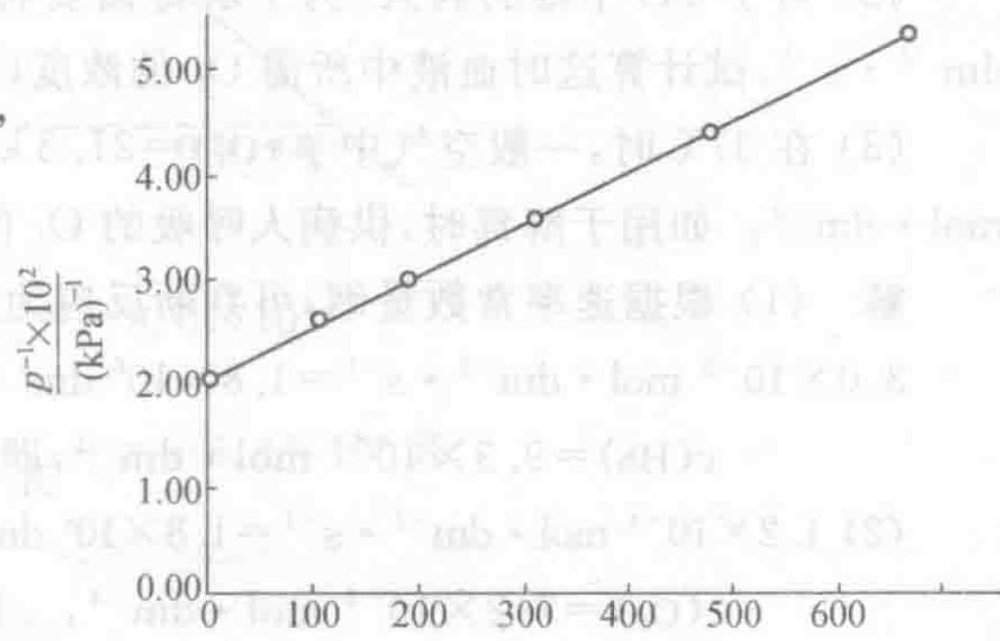

$$
k = 4. 9 \times 1 0 ^ {- 5} \mathrm{kPa} ^ {- 1} \cdot \mathrm{s} ^ {- 1}
$$

7.9 某抗菌素在人体血液中呈现一级反应,如果给病人在上午8点注射一针抗菌素,然后在不同时刻测定抗菌素在血液中的浓度c(以mg·100 cm $^{-3}$ 表示),得到如下数据:

<table><tr><td>t/h</td><td>4</td><td>12</td><td>16</td></tr><tr><td>c/(mg·100 cm-3)</td><td>0.48</td><td>0.22</td><td>0.15</td></tr></table>

(1) 求反应的速率常数 k 和半衰期 $t_{1/2}$ 。

(2) 抗菌素在血液中的浓度不低于 $0.37 \, mg \cdot 100 \, cm^{-3}$ 才有效, 那么何时注射第二针?

(3) 为了避免因注射量过大而产生意外, 要求第二针注射完时, 血液中抗菌素的浓度尽量

接近上午8点第一针注射完时的浓度,则第二针的注射量约为第一针注射量的几分之几?

解 (1) 由 $\ln c(A) = \ln c_0(A) - kt$ 和已知条件, 得反应速率常数 $k$ : 由 $\ln 0.22 = \ln 0.48 - k_1(12 - 4)$ , 得 $k_1 = 0.098\mathrm{h}^{-1}$ 由 $\ln 0.15 = \ln 0.48 - k_2(16 - 4)$ , 得 $k_2 = 0.098\mathrm{h}^{-1}$ 由 $\ln 0.15 = \ln 0.22 - k_3(16 - 12)$ , 得 $k_3 = 0.096\mathrm{h}^{-1}$ $k = (k_{1} + k_{2} + k_{3}) / 3 = 0.097\mathrm{h}^{-1}$ , $t_{1/2} = 0.693 / 0.097 = 7.1\mathrm{h}$

也可以用 $\ln\left[c(A)/c_{0}(A)\right]$ 对 t 作图，求 k。

(2) $\ln0.37=\ln0.48-0.097\ t,\ t=2.7\ h$ ，即约到下午2:42应注射第二针。

（3）由 $\ln 0.22 = \ln c_0(A) - 0.097\times 12, c_0(A) = 0.70\mathrm{mg}\cdot 100\mathrm{cm}^{-3}$ ，即为上午8点第一针注射完时的浓度。

注射第二针时血液中的抗菌素浓度为 $0.37 \, mg \cdot 100 \, cm^{-3}$ ，为了达到 $0.70 \, mg \cdot 100 \, cm^{-3}$ ，注射第二针时的追加量应为

$$
(0. 7 0 - 0. 3 7) \mathrm{mg} \cdot 1 0 0 \mathrm{cm} ^ {- 3} = 0. 3 3 \mathrm{mg} \cdot 1 0 0 \mathrm{cm} ^ {- 3}
$$

所以，第二针的注射量约为第一针注射量的 $\frac{0.33\mathrm{mg}\cdot 100\mathrm{cm}^{-3}}{0.70\mathrm{mg}\cdot 100\mathrm{cm}^{-3}} = 0.47$ ，即第二针的注射量约为第一针的一半。

7.10 血红蛋白 Hb 和 $O_{2}$ 结合生成 $HbO_{2}$ ，CO 能和 Hb 结合生成 HbCO，CO 和血红蛋白结合力比 $O_{2}$ 约大 200 倍。所以若空气中含有一定浓度的 CO，会使人中毒。

(1) 生成 $\mathrm{HbO_2}$ 反应 $(\mathrm{Hb} + \mathrm{O}_2 \longrightarrow \mathrm{HbO}_2)$ 的速率与 $\mathrm{Hb}$ 和 $\mathrm{O}_2$ 的浓度都有关, 速率常数 $k = 1.8 \times 10^{6} \mathrm{dm}^{3} \cdot \mathrm{mol}^{-1} \cdot \mathrm{s}^{-1}$ 。人肺血液中 $\mathrm{O}_2$ 的溶解度可达 $1.8 \times 10^{-6} \mathrm{~mol} \cdot \mathrm{dm}^{-3}$ , 相应的 $\mathrm{HbO_2}$ 的生成速率为 $3.0 \times 10^{-5} \mathrm{~mol} \cdot \mathrm{dm}^{-3} \cdot \mathrm{s}^{-1}$ 。求血液中 $\mathrm{Hb}$ 的浓度。

(2) 对于 CO 中毒的病人, 为了解毒需要将 $\mathrm{HbO}_{2}$ 的生成速率提高到 $1.2 \times 10^{-4} \mathrm{~mol} \cdot \mathrm{dm}^{-3} \cdot \mathrm{s}^{-1}$ , 试计算这时血液中所需 $\mathrm{O}_{2}$ 的浓度 (设血液中 $\mathrm{Hb}$ 的浓度是恒定的)。

（3）在 $37^{\circ}\mathrm{C}$ 时，一般空气中 $p(\mathrm{O}_2) = 21.3\mathrm{kPa}$ ，此时 $\mathrm{O}_2$ 在血液中的溶解度为 $1.8\times 10^{-6}$ mol·dm $^{-3}$ 。如用于解毒时，供病人呼吸的 $\mathrm{O}_2$ 的压力必须提高到多少kPa？

解（1）根据速率常数量纲，可判断反应为二级反应： $v = kc(\mathrm{O}_2)c(\mathrm{Hb})$ $3.0 \times 10^{-5} \, mol \cdot dm^{-3} \cdot s^{-1} = 1.8 \times 10^{6} \, dm^{3} \cdot mol^{-1} \cdot s^{-1} \times 1.8 \times 10^{-6} \, mol \cdot dm^{-3} \times c(\mathrm{Hb})$ $c(\mathrm{Hb})=9.3\times10^{-6}\mathrm{mol}\cdot\mathrm{dm}^{-3}$ ，即血液中Hb的浓度。
(2) $1.2 \times 10^{-4} \, mol \cdot dm^{-3} \cdot s^{-1} = 1.8 \times 10^{6} \, dm^{3} \cdot mol^{-1} \cdot s^{-1} \times c(\mathrm{O}_{2}) \times 9.3 \times 10^{-6} \, mol \cdot dm^{-3}$ $c(\mathrm{O}_{2})=7.2\times10^{-6}\mathrm{mol}\cdot\mathrm{dm}^{-3}$ ，即血液中所需 $O_{2}$ 的浓度。
(3) $1.8 \times 10^{-6} \, mol \cdot dm^{-3} : 21.3 kPa = 7.2 \times 10^{-6} mol \cdot dm^{-3} : x kPa, \quad x = 85$ $p(\mathrm{O}_{2})=85\mathrm{kPa}$ ，即氧的分压必须提高到85kPa。

7.11 蔗糖催化水解反应 $C_{12}H_{22}O_{11} + H_{2}O \xrightarrow{催化剂} 2C_{6}H_{12}O_{6}$ 是一级反应，在 $25^{\circ}C$ 速率常数为 $5.7 \times 10^{-5}s^{-1}$ 。问：

(1) 浓度为 $1 \, mol \cdot dm^{-3}$ 的蔗糖溶液分解 10% 需要多少时间?

(2) 若反应活化能为 $110 \, kJ \cdot mol^{-1}$ ，那么在什么温度时反应速率是 $25^{\circ}C$ 时的 1/10?

解 (1) $\lg \frac{c(A)}{c_0(A)} = -\frac{kt}{2.30}$

$$
\lg \frac {1 \times (1 - 0 . 1 0)}{1} = - \frac {5 . 7 \times 1 0 ^ {- 5} \mathrm{s} ^ {- 1}}{2 . 3 0} t, \quad t = 1. 8 \times 1 0 ^ {3} \mathrm{s}
$$

$$
\begin{array}{r l} & {\lg \left(\frac {k _ {2}}{k _ {1}}\right) = \frac {E _ {\mathrm{a}}}{2 . 3 0 R} \left(\frac {T _ {2} - T _ {1}}{T _ {2} T _ {1}}\right)} \\ & {\lg \left(\frac {k _ {1} / 1 0}{k _ {1}}\right) = \frac {1 1 0 \times 1 0 ^ {3} \mathrm{J} \cdot \mathrm{mol} ^ {- 1}}{2 . 3 0 \times 8 . 3 1 \mathrm{J} \cdot \mathrm{mol} ^ {- 1} \cdot \mathrm{K} ^ {- 1}} \left(\frac {T _ {2} - 2 9 8 \mathrm{K}}{T _ {2} \times 2 9 8 \mathrm{K}}\right)} \\ & {T _ {2} = 2 8 3 \mathrm{K}} \end{array}
$$

7.12 在不同温度测定 $\mathrm{H}_{2} + \mathrm{I}_{2}\longrightarrow 2\mathrm{HI}$ 的反应速率常数如下表所示：

<table><tr><td>T/K</td><td>556</td><td>629</td><td>666</td><td>700</td><td>781</td></tr><tr><td> $k/(mol^{-1} \cdot dm^{3} \cdot s^{-1})$ </td><td> $4.45 \times 10^{-5}$ </td><td> $2.52 \times 10^{-3}$ </td><td> $1.41 \times 10^{-2}$ </td><td> $6.43 \times 10^{-2}$ </td><td>1.24</td></tr></table>

试用作图法求反应活化能,并求在 $300^{\circ}$ C 和 $400^{\circ}$ C 的速率常数各是多少?

<table><tr><td> $T^{-1} \times 10^{3}/K^{-1}$ </td><td>1.80</td><td>1.59</td><td>1.50</td><td>1.43</td><td>1.28</td></tr><tr><td> $lg\frac{k}{(mol^{-1} \cdot dm^{3} \cdot s^{-1})}$ </td><td>-4.352</td><td>-2.599</td><td>-1.851</td><td>-1.192</td><td>0.0934</td></tr></table>

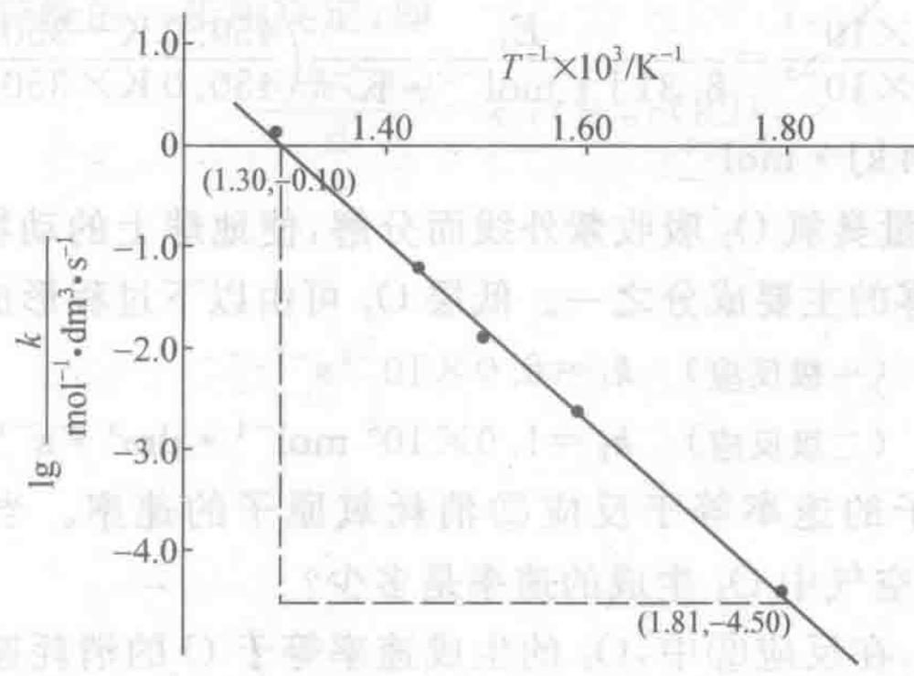

$$
\mathrm{斜率} = \frac {- 0 . 1 0 - (- 4 . 5 0)}{1 . 3 0 \times 1 0 ^ {- 3} - 1 . 8 1 \times 1 0 ^ {- 3}} = - 8. 6 \times 1 0 ^ {3}
$$

$$
\frac {- E _ {\mathrm{a}}}{2 . 3 0 \times 8 . 3 1 \times 1 0 ^ {- 3} \mathrm{kJ} \cdot \mathrm{mol} ^ {- 1} \cdot \mathrm{K} ^ {- 1}} = - 8. 6 \times 1 0 ^ {3} \mathrm{K}
$$

$$
E _ {\mathrm{a}} = 1. 6 \times 1 0 ^ {2} \mathrm{kJ} \cdot \mathrm{mol} ^ {- 1}
$$

$300^{\circ}\mathrm{C}(573\mathrm{K}), T^{-1} \times 10^{3}$ 为1.75，由图可知：

$$
\lg \frac {k (5 7 3 \mathrm{K})}{\mathrm{mol} ^ {- 1} \cdot \mathrm{dm} ^ {3} \cdot \mathrm{s} ^ {- 1}} = - 4. 0 0, k = 1. 0 \times 1 0 ^ {- 4} \mathrm{mol} ^ {- 1} \cdot \mathrm{dm} ^ {3} \cdot \mathrm{s} ^ {- 1}
$$

$400^{\circ}\mathrm{C}(673\mathrm{K}), T^{-1} \times 10^{3}$ 为1.49，则

$$
\lg \frac {k (6 7 3 \mathrm{K})}{\mathrm{mol} ^ {- 1} \cdot \mathrm{dm} ^ {3} \cdot \mathrm{s} ^ {- 1}} = - 1. 7 0, k = 2. 0 \times 1 0 ^ {- 2} \mathrm{mol} ^ {- 1} \cdot \mathrm{dm} ^ {3} \cdot \mathrm{s} ^ {- 1}
$$

7.13 某酶催化反应的活化能是 $51 \, kJ \cdot mol^{-1}$ ，正常人的体温为 $37.0^{\circ}C$ ，问病人发烧至 $39.5^{\circ}C$ 时，酶催化反应速率增加的百分数为多少？

解 由公式 $\lg \frac{k_2}{k_1} = \frac{E_{\mathrm{a}}}{2.30R}\left(\frac{T_2 - T_1}{T_2T_1}\right)$

$$
\lg \frac {k _ {2}}{k _ {1}} = \frac {5 1 \times 1 0 ^ {3} \mathrm{J} \cdot \mathrm{mol} ^ {- 1}}{2 . 3 0 \times 8 . 3 1 \mathrm{J} \cdot \mathrm{mol} ^ {- 1} \cdot \mathrm{K} ^ {- 1}} \left(\frac {3 1 2 . 5 \mathrm{K} - 3 1 0 . 0 \mathrm{K}}{3 1 2 . 5 \mathrm{K} \times 3 1 0. 0 \mathrm{K}}\right) = 0. 0 6 9
$$

$\frac{k_{2}}{k_{1}}=1.17$ ,所以酶催化反应速率增加了17%。

7.14 电机在运转中的发热，导致所用漆包线表面发生热降解作用而失重。当漆膜失重 $40.0\%$ 时，漆包线就失去绝缘性而报废。如漆膜热降解服从一级反应规律，实验测定在 $450.0\mathrm{K}$ 时的使用寿命为 $362.0\mathrm{h}$ ，又测定了 $350.0\mathrm{K}$ 时速率常数为 $5.00 \times 10^{-7}\mathrm{h}^{-1}$ 。问：

(1) 在 350.0 K 下漆包线的使用寿命为多少小时?

(2) 漆包线热降解反应的活化能是多少?

解（1）在此可以用“失重”表示漆膜热降解的速率，即

$$
\ln \frac {c (\mathrm{A})}{c _ {0} (\mathrm{A})} = - k _ {1} t _ {1}, \quad \ln 0. 6 0 0 = (- 5. 0 0 \times 1 0 ^ {- 7} \mathrm{h} ^ {- 1}) t _ {1}
$$

$$
t _ {1} = 1. 0 2 \times 1 0 ^ {6} \mathrm{h}, \quad \text { 即寿命为 } 1. 0 2 \times 1 0 ^ {6} \mathrm{h}.
$$

(2) 由已知 $\ln 0.600 = -k_{2}t_{2} = -k_{2}\times 362.0\mathrm{h}, k_{2} = 1.41\times 10^{-3}\mathrm{h}^{-1}$

$$
\begin{array}{l} \ln \frac {k _ {2}}{k _ {1}} = \frac {E _ {\mathrm{a}}}{R} \left(\frac {T _ {2} - T _ {1}}{T _ {2} T _ {1}}\right) \\ \ln \frac {1 . 4 1 \times 1 0 ^ {- 3}}{5 . 0 0 \times 1 0 ^ {- 7}} = \frac {E _ {\mathrm{a}}}{8 . 3 1 \mathrm{J} \cdot \mathrm{mol} ^ {- 1} \cdot \mathrm{K} ^ {- 1}} \left(\frac {4 5 0 . 0 \mathrm{K} - 3 5 0 . 0 \mathrm{K}}{4 5 0 . 0 \mathrm{K} \times 3 5 0 . 0 \mathrm{K}}\right) \\ E _ {\mathrm{a}} = 1 0 4 \mathrm{kJ} \cdot \mathrm{mol} ^ {- 1} \end{array}
$$

7.15 高层大气中微量臭氧 $\mathrm{O}_3$ 吸收紫外线而分解，使地球上的动物免遭辐射之害，但低层 $\mathrm{O}_3$ 却是造成光化学烟雾的主要成分之一。低层 $\mathrm{O}_3$ 可由以下过程形成：

$$
① \mathrm{NO} _ {2} \longrightarrow \mathrm{NO} + \mathrm{O} \quad (\text {一级反应}) \quad k _ {1} = 6. 0 \times 1 0 ^ {- 3} \mathrm{s} ^ {- 1}
$$

$$
\mathrm{O} + \mathrm{O} _ {2} \longrightarrow \mathrm{O} _ {3} \qquad (\text {二级反应}) \quad k _ {2} = 1. 0 \times 1 0 ^ {6} \mathrm{mol} ^ {- 1} \cdot \mathrm{dm} ^ {3} \cdot \mathrm{s} ^ {- 1}
$$

假设由反应①产生氧原子的速率等于反应②消耗氧原子的速率。当空气中 $NO_{2}$ 浓度为 $3.0 \times 10^{-9} \, mol \cdot dm^{-3}$ 时，空气中 $O_{3}$ 生成的速率是多少？

解 由反应方程式知,在反应②中, $O_{3}$ 的生成速率等于O的消耗速率;而反应②中O的消耗速率等于反应①中O的生成速率;在反应①中,O的生成速率又等于 $NO_{2}$ 的消耗速率。所以, $O_{3}$ 的生成速率等于 $NO_{2}$ 的消耗速率,即

$$
\begin{array}{r l} \frac {\mathrm{d} c (\mathrm{O} _ {3})}{\mathrm{d} t} & = - \frac {\mathrm{d} c (\mathrm{NO} _ {2})}{\mathrm{d} t} \\ - \frac {\mathrm{d} c (\mathrm{NO} _ {2})}{\mathrm{d} t} & = k _ {1} c (\mathrm{NO} _ {2}) \\ & = 6. 0 \times 1 0 ^ {- 3} \mathrm{s} ^ {- 1} \times 3. 0 \times 1 0 ^ {- 9} \mathrm{mol} \cdot \mathrm{dm} ^ {- 3} \\ & = 1. 8 \times 1 0 ^ {- 1 1} \mathrm{mol} \cdot \mathrm{dm} ^ {- 3} \cdot \mathrm{s} ^ {- 1} \\ \frac {\mathrm{d} c (\mathrm{O} _ {3})}{\mathrm{d} t} & = 1. 8 \times 1 0 ^ {- 1 1} \mathrm{mol} \cdot \mathrm{dm} ^ {- 3} \cdot \mathrm{s} ^ {- 1} \end{array}
$$

7.16 若基元反应 A $\longrightarrow$ 2B 的活化能为 $E_{a}$ ，而 2B $\longrightarrow$ A 的活化能为 $E_{a}^{\prime}$ 。问：

(1) 加催化剂后, $E_{a}$ 和 $E_{a}^{\prime}$ 各有何变化? $\Delta H$ 有何变化?

(2) 加不同的催化剂对 $E_{a}$ 的影响是否相同?

(3) 提高反应温度, $E_{a}$ 和 $E_{a}^{\prime}$ 各有何变化?

(4) 改变起始浓度后, $E_{a}$ 有何变化?

解 （1） $E_{a}$ 和 $E_{a}^{\prime}$ 同时降低相同的值， $\Delta H$ 不变；

(2) 不同；

(3) 基本不变；

(4) 无变化。

7.17 已知基元反应 A $\longrightarrow$ B 的 $\Delta H=67\ kJ\cdot mol^{-1}, E_{a}=90\ kJ\cdot mol^{-1}$ 。问：

(1) B → A 的 $E_{a}^{\prime} = ?$

(2) 若在 $0^{\circ}C, k_{1}=1.1\times10^{-5}\min^{-1}$ ，那么在 $45^{\circ}C$ 时， $k_{2}=$ ?

解（1） $E_{\mathrm{a}} - E_{\mathrm{a}}^{\prime} = \Delta H$ ， $E_{\mathrm{a}}^{\prime} = E_{\mathrm{a}} - \Delta H = (90 - 67)\mathrm{kJ}\cdot \mathrm{mol}^{-1} = 23\mathrm{kJ}\cdot \mathrm{mol}^{-1}$

$$
\lg \left(\frac {k _ {2}}{1 . 1 \times 1 0 ^ {- 5} \mathrm{min} ^ {- 1}}\right) = \frac {9 0 \times 1 0 ^ {3} \mathrm{J} \cdot \mathrm{mol} ^ {- 1}}{2 . 3 0 \times 8 . 3 1 \mathrm{J} \cdot \mathrm{mol} ^ {- 1} \cdot \mathrm{K} ^ {- 1}} \left(\frac {3 1 8 \mathrm{K} - 2 7 3 \mathrm{K}}{3 1 8 \mathrm{K} \times 2 7 3 \mathrm{K}}\right) \tag {2}
$$

$$
k _ {2} = 3. 0 \times 1 0 ^ {- 3} \min ^ {- 1}
$$

7.18 $2\mathrm{ICl}+\mathrm{H}_{2}\longrightarrow2\mathrm{HCl}+\mathrm{I}_{2}$ 的反应历程若是：

$$
① \mathrm{H} _ {2} + \mathrm{ICl} \longrightarrow \mathrm{HI} + \mathrm{HCl} \quad (\text {   慢   })
$$

$$
② \mathrm{ICl} + \mathrm{HI} \longrightarrow \mathrm{HCl} + \mathrm{I} _ {2}\tag{快}
$$

试推导速率方程式。

$$
\frac {- \mathrm{d} c (\mathrm{H} _ {2})}{\mathrm{d} t} = k _ {1} c (\mathrm{H} _ {2}) c (\mathrm{ICl})
$$

解 反应速率由较慢的一步所决定, 即

## 第8章 酸碱平衡

本章主要介绍酸碱质子理论。凡有质子传递的反应都是酸碱反应。溶剂间的质子传递反应称为自耦反应，溶剂和溶质间的质子传递反应称为电离反应，溶质和溶质间的质子传递反应则称为中和反应。前面两类为本章重点。缓冲溶液和指示剂变色范围等将在分析化学课程中详述，本课程只作初步介绍。

## 内容提要

## 8.1 酸碱质子理论(Bronsted-Lowry 酸碱理论)

酸碱质子理论的要点：在反应中，凡是能给出质子的分子或离子都是质子给体，称为酸；凡是能接受质子的分子或离子都是质子受体，称为碱。如 $\mathrm{HCl}$ 、 $\mathrm{HNO}_3$ 、 $\mathrm{NH_4^+}$ 等，能给出质子，因此是酸；而 $\mathrm{OH}^-$ 、 $\mathrm{CO}_3^{2-}$ 等，能接受质子，因此是碱。而 $\mathrm{HCO}_3^-$ 既可以接受一个质子生成 $\mathrm{H}_2\mathrm{CO}_3$ ，也可以失去一个质子形成 $\mathrm{CO}_3^{2-}$ ，因此属于两性物。酸与其失去一个质子后的物种（碱）互为共轭酸碱对，如 $\mathrm{HCl}$ 和 $\mathrm{Cl}^-$ ， $\mathrm{NH_4^+}$ 与 $\mathrm{NH_3}$ 等。

酸碱的强弱通常用酸碱的电离平衡常数来表示：

酸电离平衡：

$$
\mathrm{HA} + \mathrm{H} _ {2} \mathrm{O} \rightleftharpoons \mathrm{H} _ {3} \mathrm{O} ^ {+} + \mathrm{A} ^ {-} \qquad K _ {\mathrm{a}} = \frac {[ \mathrm{H} _ {3} \mathrm{O} ^ {+} ] [ \mathrm{A} ^ {-} ]}{[ \mathrm{HA} ]}
$$

碱电离平衡：

$$
\mathrm{A} ^ {-} + \mathrm{H} _ {2} \mathrm{O} \rightleftharpoons \mathrm{OH} ^ {-} + \mathrm{HA} \qquad K _ {\mathrm{b}} = \frac {[ \mathrm{OH} ^ {-} ] [ \mathrm{HA} ]}{[ \mathrm{A} ^ {-} ]} = \frac {K _ {\mathrm{w}}}{K _ {\mathrm{a}}}
$$

电离平衡常数可以由实验测定,也可以由热力学数据计算:

$$
\lg K _ {\mathrm{a}} = \frac {- \Delta G ^ {\ominus} (2 9 8 \mathrm{K})}{2 . 3 0 3 R T}
$$

此外，电解质的相对强弱也用电离度 $\alpha$ 来表示：

$$
\alpha = \frac {\mathrm{已电离的电解质分子数}}{\mathrm{溶液中原有的电解质分子总数}}
$$

电离度的大小与浓度有关,而电离常数与浓度无关,所以 K 比 $\alpha$ 能更准确地表明酸碱强弱。

## 8.2 水的自耦电离平衡——溶剂间的质子传递

在水中,存在如下电离平衡:

$$
\mathrm{H} _ {2} \mathrm{O} + \mathrm{H} _ {2} \mathrm{O} \rightleftharpoons \mathrm{H} _ {3} \mathrm{O} ^ {+} + \mathrm{OH} ^ {-}
$$

该平衡被称为水的自耦电离平衡。常温下其平衡常数为 $K_{\mathrm{w}} = 1.0\times 10^{-14}$ ，称为水的离子积。

由于 $\left[\mathrm{H}_{3} \mathrm{O}^{+}\right] = \left[\mathrm{OH}^{-}\right] = 1.0 \times 10^{-7} \mathrm{~mol} \cdot \mathrm{dm}^{-3}$ , 所以纯水的 $\mathrm{pH} = -\lg \left[\mathrm{H}_{3} \mathrm{O}^{+}\right] = 7.00$ , 此时体系为中性。因此, $\mathrm{pH} < 7$ 时, 溶液为酸性; $\mathrm{pH} > 7$ 时, 溶液为碱性。

由于水的电离为吸热反应,所以温度越高, $K_{w}$ 越大。

## 8.3 弱酸弱碱电离平衡——溶剂和溶质间的质子传递

## 1. 一元弱酸、弱碱的电离平衡

对于一元弱酸的电离反应 $\mathrm{HA} + \mathrm{H}_2\mathrm{O} \rightleftharpoons \mathrm{H}_3\mathrm{O}^+ + \mathrm{A}^-$ ，若溶液中 HA 的初始浓度为 $c$ （单位： $\mathrm{mol} \cdot \mathrm{dm}^{-3}$ ），平衡常数为 $K_{\mathrm{a}}$ ，则有

$$
K _ {\mathrm{a}} = \frac {[ \mathrm{H} _ {3} \mathrm{O} ^ {+} ] [ \mathrm{A} ^ {-} ]}{[ \mathrm{HA} ]} = \frac {[ \mathrm{H} _ {3} \mathrm{O} ^ {+} ] ^ {2}}{c - [ \mathrm{H} _ {3} \mathrm{O} ^ {+} ]}
$$

当 $c / K_{\mathrm{a}}\geqslant 400$ 时，上式可近似为

$$
\left[ \mathrm{H} _ {3} \mathrm{O} ^ {+} \right] = \sqrt {K _ {\mathrm{a}} c}
$$

按照酸碱质子理论,所谓的水解反应也是酸碱电离平衡,如

$$
\mathrm{NH} _ {4} ^ {+} + \mathrm{H} _ {2} \mathrm{O} \rightleftharpoons \mathrm{NH} _ {3} + \mathrm{H} _ {3} \mathrm{O} ^ {+}
$$

$$
K = \frac {[ \mathrm{NH} _ {3} ] [ \mathrm{H} _ {3} \mathrm{O} ^ {+} ]}{[ \mathrm{NH} _ {4} ^ {+} ]} = \frac {[ \mathrm{NH} _ {3} ] [ \mathrm{H} _ {3} \mathrm{O} ^ {+} ]}{[ \mathrm{NH} _ {4} ^ {+} ]} \cdot \frac {[ \mathrm{OH} ^ {-} ]}{[ \mathrm{OH} ^ {-} ]} = \frac {K _ {\mathrm{w}}}{K (\mathrm{NH} _ {4} ^ {+})}
$$

## 2. 多元弱酸、弱碱的电离平衡

二元弱酸有如下两级电离平衡：

$$
\begin{array}{r l}&\mathrm {H_ {2} A+ H_ {2} O\rightleftharpoons H_ {3} O^ {+} + HA^ {-}}\\&\mathrm {HA^ {-} + H_ {2} O\rightleftharpoons H_ {3} O^ {+} + A^ {2 - }}\end{array}\quad\begin{array}{r l}&K _ {\mathrm {a_ {1}}}\\&K _ {\mathrm {a_ {2}}}\end{array}
$$

通常二元弱酸的电离常数 $K_{\mathrm{a_1}} \gg K_{\mathrm{a_2}}$ ，所以在计算多元弱酸的 $[\mathrm{H}_3\mathrm{O}^+]$ 时，可以忽略第二步及其后的电离。

## 3. 两性物质的酸碱性

两性物质在水溶液中既可以进行酸式电离，也可以进行碱式电离。判断两性物质水溶液的酸碱性，就需要看它的 $K_{\mathrm{a}}$ 和 $K_{\mathrm{b}}$ 哪个更大， $K$ 大者占优。

## 8.4 酸碱电离平衡的移动

当外界条件改变时,电离平衡也会发生移动。在弱电解质(例如,HA)溶液中加入同一种离子 $\left(\mathrm{H}^{+}\right.$ 或 $\left.\mathrm{A}^{-}\right)$ 的强电解质时,平衡会向反向移动,从而降低弱电解质的电离度,称为同离子效应。

酸碱指示剂是一类有机弱酸碱,弱酸的通式写为 HIn。在水溶液里,酸碱指示剂具有如下电离平衡:

$$
\mathrm{HIn} + \mathrm{H} _ {2} \mathrm{O} \rightleftharpoons \mathrm{H} _ {3} \mathrm{O} ^ {+} + \mathrm{In} ^ {-}
$$

$$
K (\mathrm{HIn}) = \frac {[ \mathrm{H} _ {3} \mathrm{O} ^ {+} ] [ \mathrm{In} ^ {-} ]}{[ \mathrm{HIn} ]}, \quad \frac {[ \mathrm{In} ^ {-} ]}{[ \mathrm{HIn} ]} = \frac {K (\mathrm{HIn})}{[ \mathrm{H} _ {3} \mathrm{O} ^ {+} ]}
$$

因此，溶液中 $\left[\mathrm{In}^{-}\right] / \left[\mathrm{HIn}\right]$ 之比依赖于溶液的 $\left[\mathrm{H}_{3} \mathrm{O}^{+}\right]$ 。由于酸碱指示剂的共轭酸碱对具有明显的颜色差别，因此可以用于检验溶液的酸碱性，特别是用于指示酸碱滴定的终点。

## 8.5 缓冲溶液

由弱酸或弱碱的共轭酸碱对(HA 和 A $^{-}$ )组成的混合溶液能缓解外加少量酸、碱或水的影响,从而可以保持溶液的 pH 不发生显著变化,这种溶液称为缓冲溶液。

配制缓冲溶液需要考虑的因素为：

(1) 要选用 $pK_{a}$ 等于或接近目标 pH 的共轭酸碱对；

(2) 弱酸及其共轭碱的最佳浓度比为 1:1;

(3) 适当提高缓冲溶液的浓度。

## 8.6 酸碱中和反应——溶质间的质子传递

前面讨论的基本上是弱酸与弱碱的电离平衡,它们的共同特点是平衡常数 K 很小,而酸碱中和反应的 K 都很大。

如强酸与强碱的中和反应,其实就是水的自耦电离的逆反应:

$$
\mathrm{H} _ {3} \mathrm{O} ^ {+} + \mathrm{OH} ^ {-} \rightleftharpoons \mathrm{H} _ {2} \mathrm{O} + \mathrm{H} _ {2} \mathrm{O} \quad K = 1 / K _ {\mathrm{w}} = 1. 0 \times 1 0 ^ {1 4}
$$

同样，强酸与弱碱、强碱与弱酸以及某些弱酸与弱碱的反应也属于酸碱中和反应，它们的K值也很大。

## 8.7 关于平衡计算的一般注意事项

利用化学平衡求解之前及求解过程中,概念应该正确,有一些基本判断,能够从所给条件出发,将相关数据合理组织起来,逻辑上正确。具体可以从以下几个方面考虑:

(1) 体系中有哪些基本物种？

(2) 它们之间存在怎样的反应关系？

(3) 哪些物种、哪些反应可以忽略？

(4) 计算过程中,哪些条件已知?可以进行哪些假设、简化?

(5) 答案合理吗?

以上几方面不仅适合于酸碱平衡计算，也适合其他所有平衡的计算处理。

## 习题解析

8.1 标明下列反应中各个共轭酸碱对,写出它们的电离平衡常数表达式,并计算平衡常数值。

(1) $\mathrm{HCN} + \mathrm{H}_2\mathrm{O} \rightleftharpoons \mathrm{H}_3\mathrm{O}^+ + \mathrm{CN}^-$

(2) $\mathrm{NO}_2^- + \mathrm{H}_2\mathrm{O} \rightleftharpoons \mathrm{HNO}_2 + \mathrm{OH}^-$

(3) $\mathrm{S}^{2-} + \mathrm{H}_{2}\mathrm{O} \rightleftharpoons \mathrm{HS}^{-} + \mathrm{OH}^{-}$

(4) $\mathrm{PO}_4^{3-} + \mathrm{H}_2\mathrm{O} \rightleftharpoons \mathrm{HPO}_4^{2-} + \mathrm{OH}^-$

解 (1) $\mathrm{HCN} + \mathrm{H}_2\mathrm{O} \rightleftharpoons \mathrm{H}_3\mathrm{O}^+ + \mathrm{CN}^-$ 酸1 碱2 酸2 碱1

$$
K _ {\mathrm{a}} = \frac {[ \mathrm{H} _ {3} \mathrm{O} ^ {+} ] [ \mathrm{CN} ^ {-} ]}{[ \mathrm{HCN} ]} = 6. 2 \times 1 0 ^ {- 1 0}
$$

$$
(2) \mathrm{NO} _ {2} ^ {-} + \mathrm{H} _ {2} \mathrm{O} \rightleftharpoons \mathrm{HNO} _ {2} + \mathrm{OH} ^ {-}   \text {   碱   } 1 \quad \text {   酸   } 2 \quad \text {   酸   } 1 \quad \text {   碱   } 2
$$

$$
K _ {\mathrm{b}} = \frac {[ \mathrm{HNO} _ {2} ] [ \mathrm{OH} ^ {-} ]}{[ \mathrm{NO} _ {2} ^ {-} ]} = \frac {K _ {\mathrm{w}}}{K (\mathrm{HNO} _ {2})} = \frac {1 . 0 \times 1 0 ^ {- 1 4}}{5 . 6 \times 1 0 ^ {- 4}} = 1. 8 \times 1 0 ^ {- 1 1}
$$

(3) $S^{2-} + H_{2}O \rightleftharpoons HS^{-} + OH^{-}$ 碱1 酸2 酸1 碱2

$$
K _ {\mathrm{b}} = \frac {[ \mathrm{HS} ^ {-} ] [ \mathrm{OH} ^ {-} ]}{[ \mathrm{S} ^ {2 -} ]} = \frac {K _ {\mathrm{w}}}{K _ {\mathrm{a} _ {2}}} = \frac {1 . 0 \times 1 0 ^ {- 1 4}}{1 . 2 \times 1 0 ^ {- 1 3}} = 8. 3 \times 1 0 ^ {- 2}
$$

$$
\begin{array}{r l}&{(4) \mathrm{PO} _ {4} ^ {3 -} + \mathrm{H} _ {2} \mathrm{O} \rightleftharpoons \mathrm{HPO} _ {4} ^ {2 -} + \mathrm{OH} ^ {-}}\\&{\text {   碱   } 1 \quad \text {   酸   } 2 \quad \text {   酸   } 1 \quad \text {   碱   } 2}\\&{\qquad K _ {\mathrm{b}} = \frac {[ \mathrm{HPO} _ {4} ^ {2 -} ] [ \mathrm{OH} ^ {-} ]}{[ \mathrm{PO} _ {4} ^ {3 -} ]} = \frac {K _ {\mathrm{w}}}{K _ {\mathrm{a} _ {3}}} = \frac {1 . 0 \times 1 0 ^ {- 1 4}}{4 . 8 \times 1 0 ^ {- 1 3}} = 2. 1 \times 1 0 ^ {- 2}}\end{array}
$$

8.2 弱电解质的电离度,早期主要通过测定溶剂的凝固点降低来推算。反过来,通过计算预计 $0.050 \, mol \cdot dm^{-3} \, HAc(aq)$ 的凝固点降低值。

解

$$
\mathrm{HAc} + \mathrm{H} _ {2} \mathrm{O} \rightleftharpoons \mathrm{H} _ {3} \mathrm{O} ^ {+} + \mathrm{Ac} ^ {-}
$$

平衡浓度 $\mathrm{mol}\cdot \mathrm{dm}^{-3}$

$$
\begin{array}{r l} & K (\mathrm{HAc}) = \frac {[ \mathrm{H} _ {3} \mathrm{O} ^ {+} ] [ \mathrm{Ac} ^ {-} ]}{[ \mathrm{HAc} ]}, \quad \frac {x ^ {2}}{0 . 0 5 0 - x} = 1. 7 5 \times 1 0 ^ {- 5} \\ & x = 9. 4 \times 1 0 ^ {- 4}, \quad [ \mathrm{H} _ {3} \mathrm{O} ] ^ {+} = [ \mathrm{Ac} ^ {-} ] = 9. 4 \times 1 0 ^ {- 4} \mathrm{mol} \cdot \mathrm{dm} ^ {- 3} \\ & [ \mathrm{HAc} ] = (0. 0 5 0 - 9. 4 \times 1 0 ^ {- 4}) \mathrm{mol} \cdot \mathrm{dm} ^ {- 3} = 0. 0 4 9 \mathrm{mol} \cdot \mathrm{dm} ^ {- 3} \end{array}
$$

质点总浓度

$$
\begin{array}{r l} & c = (0. 0 4 9 + 2 \times 9. 4 \times 1 0 ^ {- 4}) \mathrm{mol} \cdot \mathrm{dm} ^ {- 3} = 0. 0 5 1 \mathrm{mol} \cdot \mathrm{dm} ^ {- 3} \\ & m \approx 0. 0 5 1 \mathrm{mol} \cdot \mathrm{kg} ^ {- 1} \\ & \Delta T _ {\mathrm{f}} = K _ {\mathrm{f}} m = 1. 8 6 ^ {\circ} \mathrm{C} \cdot \mathrm{kg} \cdot \mathrm{mol} ^ {- 1} \times 0. 0 5 1 \mathrm{mol} \cdot \mathrm{kg} ^ {- 1} = 0. 0 9 5 ^ {\circ} \mathrm{C} \end{array}
$$

即 $0.050 \, mol \cdot dm^{-3}$ HAc 溶液的凝固点降低值为 $0.095^{\circ}C$ 。

8.3 计算下列溶液的 pH:

(1) $0.10 \, mol \cdot dm^{-3}$ HCN 溶液；

(2) $0.10 \, mol \cdot dm^{-3}$ 氯代乙酸 $ClCH_{2}COOH$ 溶液；

(3) $0.10 \, mol \cdot dm^{-3} \, H_{2}SO_{4}$ 溶液。

解 (1) $c / K = 0.10 / (6.2 \times 10^{-10}) = 1.6 \times 10^{8} \gg 400$ ，可简化计算。设 $[\mathrm{H}_{3}\mathrm{O}^{+}] = x\mathrm{mol} \cdot \mathrm{dm}^{-3}$

$$
\left[ \mathrm{H} _ {3} \mathrm{O} ^ {+} \right] = \sqrt {K _ {\mathrm{a}} c}, \quad x = \sqrt {6 . 2 \times 1 0 ^ {- 1 0} \times 0 . 1 0} = 7. 9 \times 1 0 ^ {- 6}
$$

$$
[ \mathrm{H} _ {3} \mathrm{O} ^ {+} ] = 7. 9 \times 1 0 ^ {- 6} \mathrm{mol} \cdot \mathrm{dm} ^ {- 3}, \quad \mathrm{pH} = 5. 1 0
$$

(2) $c / K = 0.10 / (1.3 \times 10^{-3}) = 77 < 400$ ，不可简化计算。设 $[\mathrm{H}_3\mathrm{O}^+] = x\mathrm{mol}\cdot \mathrm{dm}^{-3}$

$$
\frac {x ^ {2}}{0 . 1 0 - x} = 1. 3 \times 1 0 ^ {- 3}   x = 0. 0 1 1, \quad [ \mathrm{H} _ {3} \mathrm{O} ^ {+} ] = 0. 0 1 1 \mathrm{mol} \cdot \mathrm{dm} ^ {- 3}, \quad \mathrm{pH} = 1. 9 6
$$

(3) $\mathrm{H}_{2} \mathrm{SO}_{4}$ 第一步完全电离, 第二步为不完全电离。第一步电离产生的 $\mathrm{H}_{3} \mathrm{O}^{+}$ 会对第二步电离产生同离子效应, 即

$$
\begin{array}{r l}&{\mathrm {HSO_ {4} ^ {-}} + \mathrm {H_ {2} O} \rightleftharpoons \mathrm {H_ {3} O^ {+}} + \mathrm {SO_ {4} ^ {2 - }}}\\&{\frac {\text {平衡浓度}}{\mathrm{mol} \cdot \mathrm{dm} ^ {- 3}} = 0. 1 0 - y, \quad 0. 1 0 + y, \quad y}\\&{\frac {(0 . 1 0 + y) y}{0 . 1 0 - y} = 1. 0 \times 1 0 ^ {- 2}, \quad y = 8. 4 \times 1 0 ^ {- 3}}\\&{[ \mathrm {H_ {3} O^ {+}} ] = (0. 1 0 + 8. 4 \times 1 0 ^ {- 3}) \mathrm{mol} \cdot \mathrm{dm} ^ {- 3} = 0. 1 1 \mathrm{mol} \cdot \mathrm{dm} ^ {- 3}, \quad \mathrm{pH} = 0. 9 6}\end{array}
$$

8.4 有机酸 $\left(\mathrm{HC}_{6}\mathrm{H}_{11}\mathrm{O}_{2}\right)$ 饱和水溶液的质量浓度为 $11\mathrm{g}\cdot\mathrm{dm}^{-3}$ ，pH为2.94，求此酸的 $K_{a}$ 。

解 此有机酸饱和水溶液的浓度 $c = \frac{11\mathrm{g}\cdot\mathrm{dm}^{-3}}{116\mathrm{g}\cdot\mathrm{mol}^{-1}} = 0.095\mathrm{mol}\cdot \mathrm{dm}^{-3}$

$\mathrm{pH} = 2.94$ ，即 $[\mathrm{H}_3\mathrm{O}^+ ] = 1.1\times 10^{-3}\mathrm{mol}\cdot \mathrm{dm}^{-3}$

$$
\begin{array}{r l}&{\mathrm {HC_ {6} H_ {11} O_ {2} + H_ {2} O\rightleftharpoons H_ {3} O^ {+} + C_ {6} H_ {11} O_ {2} ^ {-}}}\\&{\frac {\mathrm{平衡浓度}}{\mathrm{mol} \cdot \mathrm{dm} ^ {- 3}} \quad 0. 0 9 5 - x \qquad \qquad x \qquad \qquad x}\\&{K _ {\mathrm{s}} = \frac {x ^ {2}}{0 . 0 9 5 - x} = \frac {(1 . 1 \times 1 0 ^ {- 3}) ^ {2}}{0 . 0 9 5 - 1 . 1 \times 1 0 ^ {- 3}} = 1. 3 \times 1 0 ^ {- 5}}\end{array}
$$

8.5 在 $25^{\circ}C$ , $CO_{2}$ 气体压力等于 1 个标准大气压时, 则 $CO_{2}$ 饱和水溶液中 $CO_{2}$ 的浓度约为 $0.034 \, mol \cdot dm^{-3}$ , 计算溶液的 pH 和 $[CO_{3}^{2-}]$ 。通常可把溶入的 $CO_{2}$ 都当成 $H_{2}CO_{3}$ , 利用如下平衡式计算:

解

$$
\begin{array}{r l}&{\mathrm {H_ {2} CO_ {3} + H_ {2} O\rightleftharpoons HC O _ {3} ^ {-} + H_ {3} O^ {+} \quad K_ {a _ {1}} = 4.5\times 10^ {-7}}}\\&{\qquad \mathrm {H_ {2} CO_ {3} \quad + H_ {2} O\rightleftharpoons H_ {3} O^ {+} + HC O _ {3} ^ {-}}}\\&{\frac {\text {平衡浓度}}{\mathrm{mol} \cdot \mathrm{dm} ^ {- 3}} \quad 0. 0 3 4 - x \quad x \quad x}\\&{\qquad x = \sqrt {K _ {a _ {1}} c} = \sqrt {4 . 5 \times 1 0 ^ {- 7} \times 0 . 0 3 4} = 1. 2 \times 1 0 ^ {- 4}}\\&{[ \mathrm {H_ {3} O^ {+}} ] = 1. 2 \times 1 0 ^ {- 4} \mathrm{mol} \cdot \mathrm{dm} ^ {- 3}, \quad \mathrm{pH=3.92}}\\&{K _ {a _ {2}} = 4. 7 \times 1 0 ^ {- 1 1}, \quad [ \mathrm {CO_ {3} ^ {2 - }} ] = 4. 7 \times 1 0 ^ {- 1 1} \mathrm{mol} \cdot \mathrm{dm} ^ {- 3}}\end{array}
$$

8.6（1）在 $101\mathrm{kPa}, 20^{\circ}\mathrm{C}$ 时，1体积水可溶解2.61体积 $\mathrm{H}_{2}\mathrm{S}$ ，求饱和 $\mathrm{H}_{2}\mathrm{S}$ 水溶液的物质的量浓度。

(2) 计算(1)中饱和 $H_{2}S$ 水溶液的 $\left[H_{3}O^{+}\right]$ 和 $\left[S^{2-}\right]$ 。

（3）如用 HCl 调节溶液的酸度到 pH=2.00 时，溶液中的 $S^{2-}$ 浓度又是多少？计算结果说明什么问题？

解（1）设 $\mathrm{H}_2\mathrm{O}$ 为 $1\mathrm{dm}^3$ ，则溶解的 $\mathrm{H}_2\mathrm{S}$ 为 $2.61\mathrm{dm}^3$ ，有

$$
\begin{array}{r l} & n = \frac {p V}{R T} = \frac {1 0 1 \mathrm{kPa} \times 2 . 6 1 \mathrm{dm} ^ {3}}{8 . 3 1 \mathrm{kPa} \cdot \mathrm{dm} ^ {3} \cdot \mathrm{mol} ^ {- 1} \cdot \mathrm{K} ^ {- 1} \times 2 9 3 \mathrm{K}} = 0. 1 0 8 \mathrm{mol} \\ & c (\mathrm{H} _ {2} \mathrm{S}) = 0. 1 0 8 \mathrm{mol} \cdot \mathrm{dm} ^ {- 3} \end{array}
$$

$$
\begin{array}{r l} & {(2) \text {设} [ \mathrm{H} _ {3} \mathrm{O} ^ {+} ] = x \mathrm{mol} \cdot \mathrm{dm} ^ {- 3}} \\ & {\qquad x = \sqrt {8 . 9 \times 1 0 ^ {- 8} \times 0 . 1 0 8} = 9. 8 \times 1 0 ^ {- 5}, \quad [ \mathrm{H} _ {3} \mathrm{O} ^ {+} ] = 9. 8 \times 1 0 ^ {- 5} \mathrm{mol} \cdot \mathrm{dm} ^ {- 3}} \\ & {\qquad K _ {\mathrm{a} _ {2}} = 1. 2 \times 1 0 ^ {- 1 3}, \quad [ \mathrm{S} ^ {2 -} ] = 1. 2 \times 1 0 ^ {- 1 3} \mathrm{mol} \cdot \mathrm{dm} ^ {- 3}} \end{array}
$$

(3) pH=2.00, 即 $\left[H_{3}O^{+}\right]=0.010\ mol\cdot dm^{-3}$ ，设 $\left[S^{2-}\right]=x\ mol\cdot dm^{-3}$ ，则

$$
\begin{array}{r l} & [ \mathrm {S^ {2 - }} ] = \frac {K _ {\mathrm{a} _ {1}} K _ {\mathrm{a} _ {2}} [ \mathrm {H_ {2} S} ]}{[ \mathrm {H_ {3} O^ {+}} ] ^ {2}} \\ & x = \frac {8 . 9 \times 1 0 ^ {- 8} \times 1 . 2 \times 1 0 ^ {- 1 3} \times 0 . 1 0 8}{(0 . 0 1 0) ^ {2}} = 1. 2 \times 1 0 ^ {- 1 7} \\ & [ \mathrm {S^ {2 - }} ] = 1. 2 \times 1 0 ^ {- 1 7} \mathrm{mol} \cdot \mathrm{dm} ^ {- 3} \end{array}
$$

计算结果说明， $\left[S^{2-}\right]$ 的大小与 $\left[H_{3}O^{+}\right]$ 相关： $\left[H_{3}O^{+}\right]$ 增大， $\left[S^{2-}\right]$ 减小。

8.7 将 $10 \, g \, P_{2}O_{5}$ 溶于热水，冷却至室温稀释至 $500 \, cm^{3}$ ，计算溶液中的 $[H_{3}O^{+}]$ 、 $[H_{2}PO_{4}^{-}]$ 、 $[HPO_{4}^{2-}]$ 和 $[PO_{4}^{3-}]$ 各是多少？（已知： $P_{2}O_{5} + 3H_{2}O \xrightarrow{\triangle} 2H_{3}PO_{4}$ 。）

解 (1) $\mathrm{P_2O_5 + 3H_2O\xrightarrow{\triangle} 2H_3PO_4}$ $1\mathrm{mol}$ $2\mathrm{mol}$ $\frac{10\mathrm{g}}{142\mathrm{g}\cdot\mathrm{mol}^{-1}}$ $x\mathrm{mol}$

$$
\begin{array}{r l}&c (\mathrm {H_ {3} PO_ {4}}) = \frac {x \mathrm{mol}}{0 . 5 0 \mathrm{dm} ^ {3}} = \frac {1 0 \mathrm{g} \times 2 \mathrm{mol}}{1 4 2 \mathrm{g} \cdot \mathrm{mol} ^ {- 1}} \times \frac {1}{0 . 5 0 \mathrm{dm} ^ {3}} = 0. 2 8 \mathrm{mol} \cdot \mathrm{dm} ^ {- 3}\\&\text {(2)} \quad\begin{array}{c}H _ {3} P O _ {4} + H _ {2} O \rightleftharpoons H _ {3} O ^ {+} + H _ {2} P O _ {4} ^ {-}\\\frac {\text {平衡浓度}}{\mathrm{mol} \cdot \mathrm{dm} ^ {- 3}} 0. 2 8 - y&y y\\\frac {y ^ {2}}{0 . 2 8 - y} = 6. 9 \times 1 0 ^ {- 3}, y = 4. 0 \times 1 0 ^ {- 2}\\[ H _ {3} O ^ {+} ] = [ H _ {2} P O _ {4} ^ {-} ] = 4. 0 \times 1 0 ^ {- 2} \mathrm{mol} \cdot \mathrm{dm} ^ {- 3}\\K _ {\mathrm{a} _ {2}} = 6. 2 \times 1 0 ^ {- 8}, [ H P O _ {4} ^ {2 -} ] = 6. 2 \times 1 0 ^ {- 8} \mathrm{mol} \cdot \mathrm{dm} ^ {- 3}\end{array}\end{array}
$$

(3) $\mathrm{H}_3\mathrm{PO}_4 + 3\mathrm{H}_2\mathrm{O}\rightleftharpoons 3\mathrm{H}_2\mathrm{O}^+ +\mathrm{PO}_4^{3 - }$ $\frac{[\mathrm{H}_3\mathrm{O}^+]^3[\mathrm{PO}_4^{3 - }]}{[\mathrm{H}_3\mathrm{PO}_4] = K_{a_1}K_{a_2}K_{a_3}}$ ，即 $[\mathrm{PO}_4^{3 - }] = K_{a_1}K_{a_2}K_{a_3}\frac{[\mathrm{H}_3\mathrm{PO}_4]}{[\mathrm{H}_3\mathrm{O}^+]^3}$

设 $[\mathrm{PO}_4^{3-}] = x\mathrm{mol}\cdot \mathrm{dm}^{-3}$ ，则

$$
\begin{array}{r l} x & = 6. 9 \times 1 0 ^ {- 3} \times 6. 2 \times 1 0 ^ {- 8} \times 4. 8 \times 1 0 ^ {- 1 3} \times \frac {(0 . 2 8 - 4 . 0 \times 1 0 ^ {- 2})}{(4 . 0 \times 1 0 ^ {- 2}) ^ {3}} \\ & = 7. 7 \times 1 0 ^ {- 1 9} \\ [ \mathrm{PO} _ {4} ^ {3 -} ] & = 7. 7 \times 1 0 ^ {- 1 9} \mathrm{mol} \cdot \mathrm{dm} ^ {- 3} \end{array}
$$

8.8 (1) 每 $100 \mathrm{~cm}^{3}$ 纯碱溶液中含 $5.7 \mathrm{~g} \mathrm{Na}_{2} \mathrm{CO}_{3} \cdot 10 \mathrm{H}_{2} \mathrm{O}$ 时, 溶液的 $\left[\mathrm{CO}_{3}^{2-}\right]$ 和 $\mathrm{pH}$ 是多少? (2) $0.10 \mathrm{~mol} \cdot \mathrm{dm}^{-3} \mathrm{Na}_{3} \mathrm{PO}_{4}$ 溶液中, $\left[\mathrm{PO}_{4}^{3-}\right]$ 和 $\mathrm{pH}$ 各是多少?

解 (1) $c(\mathrm{CO}_3^{2-}) = \frac{5.7\mathrm{g / (286\mathrm{g}\cdot mol^{-1})}}{0.100\mathrm{dm}^3} = 0.20\mathrm{mol}\cdot \mathrm{dm}^{-3}$ $\mathrm{CO_3^{2-}} + \mathrm{H_2O}\rightleftharpoons \mathrm{HCO_3^-} + \mathrm{OH^-},\quad K_{\mathrm{b}}(\mathrm{CO}_{3}^{2-}) = \frac{K_{\mathrm{w}}}{K_{\mathrm{a}_{2}}} = \frac{1.0\times 10^{-14}}{4.7\times 10^{-11}} = 2.1\times 10^{-4}$ $\frac{\text{平衡浓度}}{\mathrm{mol}\cdot \mathrm{dm}^{-3}} = 0.20 - x$

$$
\begin{array}{r l} & {\frac {x ^ {2}}{0 . 2 0 - x} = 2. 1 \times 1 0 ^ {- 4}} \\ & {c / K _ {\mathrm{b}} = 0. 2 0 / (2. 1 \times 1 0 ^ {- 4}) = 9. 5 \times 1 0 ^ {2} > 4 0 0, \quad \text {可简化计算。}} \\ & {x = \sqrt {2 . 1 \times 1 0 ^ {- 4} \times 0 . 2 0} = 6. 5 \times 1 0 ^ {- 3}, \quad [ \mathrm{OH} ^ {-} ] = 6. 5 \times 1 0 ^ {- 3} \mathrm{mol} \cdot \mathrm{dm} ^ {- 3}} \\ & {\mathrm{pOH} = 2. 1 9, \quad \mathrm{pH} = 1 1. 8 1, \quad [ \mathrm{CO} _ {3} ^ {2 -} ] = 0. 1 9 \mathrm{mol} \cdot \mathrm{dm} ^ {- 3}} \end{array}
$$

$$
\begin{array}{r l} & {\mathrm {PO_ {4} ^ {3 - } + H_ {2} O\xlongequal   HPO_ {4} ^ {2 - } +OH^ {-} \quad K _ {b} (PO_ {4} ^ {3 - }) = \frac {K _ {w}}{K_ {a_ {3}}} = \frac {1.0\times1 0 ^ {- 14}}{4.8\times1 0 ^ {- 13}} = 0.021}} \\ & {\frac {\text {平衡浓度}}{\mathrm{mol} \cdot \mathrm{dm} ^ {- 3}} \quad 0. 1 0 - x \qquad \qquad \qquad x \qquad x} \\ & {\frac {x ^ {2}}{0 . 1 0 - x} = 0. 0 2 1} \\ & {c / K _ {\mathrm{b}} = 0. 1 0 / 0. 0 2 1 = 4. 8 <   4 0 0, \text {不可简化计算。}} \\ & {x = 0. 0 3 7, [ \mathrm{OH} ^ {-} ] = 0. 0 3 7 \mathrm{mol} \cdot \mathrm{dm} ^ {- 3}} \\ & {\mathrm{pOH} = 1. 4 3, \mathrm{pH} = 1 2. 5 7} \\ & {[ \mathrm{PO} _ {4} ^ {3 -} ] = (0. 1 0 - 0. 0 3 7) \mathrm{mol} \cdot \mathrm{dm} ^ {- 3} = 0. 0 6 3 \mathrm{mol} \cdot \mathrm{dm} ^ {- 3}} \end{array}
$$

8.9 计算 $10 \mathrm{~cm}^{3}$ 浓度为 $0.30 \mathrm{~mol} \cdot \mathrm{dm}^{-3} \mathrm{HAc}$ 与 $20 \mathrm{~cm}^{3}$ 浓度为 $0.15 \mathrm{~mol} \cdot \mathrm{dm}^{-3} \mathrm{HCN}$ 的混合溶液中 $\left[\mathrm{H}_{3} \mathrm{O}^{+}\right]、\left[\mathrm{Ac}^{-}\right]$ 和 $\left[\mathrm{CN}^{-}\right]$ 各是多少？（忽略混合时的体积变化。）

$$
\begin{array}{r l} \text {   解   混合后   } & c (\mathrm{HAc}) = \frac {1 0 \mathrm{cm} ^ {3} \times 0 . 3 0 \mathrm{mol} \cdot \mathrm{dm} ^ {- 3}}{(1 0 + 2 0) \mathrm{cm} ^ {3}} = 0. 1 0 \mathrm{mol} \cdot \mathrm{dm} ^ {- 3} \\ & c (\mathrm{HCN}) = \frac {2 0 \mathrm{cm} ^ {3} \times 0 . 1 5 \mathrm{mol} \cdot \mathrm{dm} ^ {- 3}}{(2 0 + 1 0) \mathrm{cm} ^ {3}} = 0. 1 0 \mathrm{mol} \cdot \mathrm{dm} ^ {- 3} \end{array}
$$

由于 HAc 的 $K_{a}(1.75 \times 10^{-5}) \gg \mathrm{HCN}$ 的 $K_{a}(6.2 \times 10^{-10})$ ，故混合溶液中的 $H^{+}$ 主要来自 HAc 的电离，可忽略 HCN 的电离。

$$
\begin{array}{r l}&{\mathrm {HAc + H_ {2} O\rightleftharpoons H_ {3} O^ {+} + Ac^ {-}}}\\{\frac {\text {平衡浓度}}{\mathrm{mol} \cdot \mathrm{dm} ^ {- 3}}}&{0. 1 0 - x \qquad \qquad x \qquad x}\\&{\frac {x ^ {2}}{0 . 1 0 - x} = 1. 7 5 \times 1 0 ^ {- 5}, \quad \text {可简化计算。}}\\&{x = 1. 3 \times 1 0 ^ {- 3}, \quad [ \mathrm{H} _ {3} \mathrm{O} ^ {+} ] = [ \mathrm{Ac} ^ {-} ] = 1. 3 \times 1 0 ^ {- 3} \mathrm{mol} \cdot \mathrm{dm} ^ {- 3}}\\{\frac {\text {平衡浓度}}{\mathrm{mol} \cdot \mathrm{dm} ^ {- 3}}}&{\mathrm{HCN} + \mathrm{H} _ {2} \mathrm{O} \rightleftharpoons \mathrm{H} _ {3} \mathrm{O} ^ {+} \qquad + \mathrm{CN} ^ {-}}\\&{\frac {(1 . 3 \times 1 0 ^ {- 3} + y) y}{0 . 1 0 - y} = 6. 2 \times 1 0 ^ {- 1 0}, \quad \text {可简化计算。}}\\&{y = 4. 8 \times 1 0 ^ {- 8}, \quad [ \mathrm{CN} ^ {-} ] = 4. 8 \times 1 0 ^ {- 8} \mathrm{mol} \cdot \mathrm{dm} ^ {- 3}}\end{array}
$$

8.10 浓度为 $0.20 \, mol \cdot dm^{-3}$ 氨水的 pH 是多少？若向 $100 \, cm^{3}$ 浓度为 $0.20 \, mol \cdot dm^{-3}$ 的氨水中加入 7.0 g 固体 $NH_{4}Cl$ （设体积不变），溶液的 pH 变为多少？

解 $\mathrm{NH_3 + H_2O\rightleftharpoons NH_4^+ + OH^-}$ ，设 $[\mathrm{OH}^{-}] = x\mathrm{mol}\cdot \mathrm{dm}^{-3}$ ，则

$$
\begin{array}{r l}&{[ \mathrm {OH^ {-}} ] = \sqrt {K _ {\mathrm{b}} c}, \quad x = \sqrt {1 . 8 \times 1 0 ^ {- 5} \times 0 . 2 0} = 1. 9 \times 1 0 ^ {- 3}}\\&{[ \mathrm {OH^ {-}} ] = 1. 9 \times 1 0 ^ {- 3} \mathrm{mol} \cdot \mathrm{dm} ^ {- 3}, \quad \mathrm{pOH} = 2. 7 2, \quad \mathrm{pH} = 1 1. 2 8}\\&{\qquad \mathrm {NH_ {3}} + \mathrm {H_ {2} O} \rightleftharpoons \mathrm {NH_ {4} ^ {+}} + \mathrm {OH^ {-}}}\\&{\frac {\text {平衡浓度}}{\mathrm{mol} \cdot \mathrm{dm} ^ {- 3}} \quad 0. 2 0 - x \quad \frac {7 . 0}{5 3 . 5 \times 0 . 1 0} + x \quad x}\\&{\frac {\left(\frac {7 . 0}{5 3 . 5 \times 0 . 1 0} + x\right) x}{0 . 2 0 - x} = 1. 8 \times 1 0 ^ {- 5}}\\&{x = 2. 8 \times 1 0 ^ {- 6}, [ \mathrm {OH^ {-}} ] = 2. 8 \times 1 0 ^ {- 6} \mathrm{mol} \cdot \mathrm{dm} ^ {- 3}}\\&{\mathrm{pOH} = 5. 5 5, \quad \mathrm{pH} = 8. 4 5}\end{array}
$$

8.11 在 $250 \, cm^{3}$ 浓度为 $0.20 \, mol \cdot dm^{-3}$ 氨水中，需加入多少克固体 $(\mathrm{NH}_{4})_{2}\mathrm{SO}_{4}$ ，才能使溶液中的 $OH^{-}$ 浓度降低 100 倍？

解 $0.20\mathrm{mol}\cdot \mathrm{dm}^{-3}$ 氨水中，设 $[\mathrm{OH}^{-}] = x\mathrm{mol}\cdot \mathrm{dm}^{-3}$ ，则

$$
x = \sqrt {1 . 8 \times 1 0 ^ {- 5} \times 0 . 2 0} = 1. 9 \times 1 0 ^ {- 3}, [ \mathrm{OH} ^ {-} ] = 1. 9 \times 1 0 ^ {- 3} \mathrm{mol} \cdot \mathrm{dm} ^ {- 3}
$$

$OH^{-}$ 浓度降低 100 倍, 即

$$
[ \mathrm{OH} ^ {-} ] = 1. 9 \times 1 0 ^ {- 5} \mathrm{mol} \cdot \mathrm{dm} ^ {- 3}, \quad \mathrm{pOH} = 4. 7 2
$$

$\mathrm{pOH} = \mathrm{pK_b} + \lg \frac{c(\text{共轭酸})}{c(\text{共轭碱})}$ , 设 $c(\mathrm{NH}_4^+) = y\mathrm{mol}\cdot \mathrm{dm}^{-3}$ , 则

$$
4. 7 2 = 4. 7 4 + \lg \frac {y}{0 . 2 0}, \quad y = 0. 1 9, \quad c (\mathrm{NH} _ {4} ^ {+}) = 0. 1 9 \mathrm{mol} \cdot \mathrm{dm} ^ {- 3}
$$

则 $\left(\mathrm{NH}_{4}\right)_{2}\mathrm{SO}_{4}$ 的质量为

$$
m = \frac {1}{2} \times 0. 1 9 \mathrm{mol} \cdot \mathrm{dm} ^ {- 3} \times 0. 2 5 0 \mathrm{dm} ^ {3} \times 1 3 2 \mathrm{g} \cdot \mathrm{mol} ^ {- 1} = 3. 1 \mathrm{g}
$$

8.12 计算下列溶液中的 $H_{3}O^{+}$ 和 $Ac^{-}$ 离子的浓度：

(1) HAc (0.050 mol·dm $^{-3}$ );

(2) HAc (0.10 mol·dm $^{-3}$ ) 加等体积的 NaAc (0.050 mol·dm $^{-3}$ );

(3) HAc (0.10 mol·dm $^{-3}$ ) 加等体积的 HCl (0.050 mol·dm $^{-3}$ );

(4) HAc (0.10 mol·dm $^{-3}$ ) 加等体积的 NaOH (0.050 mol·dm $^{-3}$ )。

解（1） $[\mathrm{H}_3\mathrm{O}^+ ] = [\mathrm{Ac}^- ] = x\mathrm{mol}\cdot \mathrm{dm}^{-3},\quad x = \sqrt{1.75\times 10^{-5}\times 0.050} = 9.4\times 10^{-4}$

$$
\left[ \mathrm{H} _ {3} \mathrm{O} ^ {+} \right] = \left[ \mathrm{Ac} ^ {-} \right] = 9. 4 \times 1 0 ^ {- 4} \mathrm{mol} \cdot \mathrm{dm} ^ {- 3}
$$

(2) 等体积混合, 浓度减半, 即

$$
\begin{array}{r l} & c (\mathrm{HAc}) = 0. 0 5 0 \mathrm{mol} \cdot \mathrm{dm} ^ {- 3}, \quad c (\mathrm{Ac} ^ {-}) = 0. 0 2 5 \mathrm{mol} \cdot \mathrm{dm} ^ {- 3} \\ & \frac {\text {平衡浓度}}{\mathrm{mol} \cdot \mathrm{dm} ^ {- 3}} \begin{array}{l l l l} & \mathrm{HAc} + \mathrm{H} _ {2} \mathrm{O} \rightleftharpoons \mathrm{H} _ {3} \mathrm{O} ^ {+} + & \mathrm{Ac} ^ {-} \\ & 0. 0 5 0 - x & x & 0. 0 2 5 + x \\ & \frac {0 . 0 2 5 x}{0 . 0 5 0} = 1. 7 5 \times 1 0 ^ {- 5}, \quad x = 3. 5 \times 1 0 ^ {- 5} \\ & [ \mathrm{H} _ {3} \mathrm{O} ^ {+} ] = 3. 5 \times 1 0 ^ {- 5} \mathrm{mol} \cdot \mathrm{dm} ^ {- 3} \\ & [ \mathrm{Ac} ^ {-} ] = (0. 0 2 5 + 3. 5 \times 1 0 ^ {- 5}) \mathrm{mol} \cdot \mathrm{dm} ^ {- 3} \approx 0. 0 2 5 \mathrm{mol} \cdot \mathrm{dm} ^ {- 3} \end{array}
$$

可见，由于 $Ac^{-}$ 加入而产生的同离子效应，使 $\left[H_{3}O^{+}\right]$ 减小。

(3) 等体积混合, 浓度减半, 即

$$
\begin{array}{r l}&c (\mathrm{HAc}) = 0. 0 5 0 \mathrm{mol} \cdot \mathrm{dm} ^ {- 3}, \quad c (\mathrm{HCl}) = 0. 0 2 5 \mathrm{mol} \cdot \mathrm{dm} ^ {- 3}\\&\mathrm{HAc} + \mathrm{H} _ {2} \mathrm{O} \rightleftharpoons \mathrm{H} _ {3} \mathrm{O} ^ {+} + \mathrm{Ac} ^ {-}\end{array}
$$

$$
\frac {0 . 0 2 5 x}{0 . 0 5 0} = 1. 7 5 \times 1 0 ^ {- 5}, \quad x = 3. 5 \times 1 0 ^ {- 5}, \quad [ \mathrm{Ac} ^ {-} ] = 3. 5 \times 1 0 ^ {- 5} \mathrm{mol} \cdot \mathrm{dm} ^ {- 3}
$$

$$
\left[ \mathrm{H} _ {3} \mathrm{O} ^ {+} \right] = (0. 0 2 5 + 3. 5 \times 1 0 ^ {- 5}) \mathrm{mol} \cdot \mathrm{dm} ^ {- 3} = 0. 0 2 5 \mathrm{mol} \cdot \mathrm{dm} ^ {- 3}
$$

$H_{3}O^{+}$ 的同离子效应,使 $[Ac^{-}]$ 减小。

(4) 等体积混合, 浓度减半, 即

$$
\begin{array}{r l} c (\mathrm{HAc}) & = 0. 0 5 0 \mathrm{mol} \cdot \mathrm{dm} ^ {- 3}, \quad c (\mathrm{NaOH}) = 0. 0 2 5 \mathrm{mol} \cdot \mathrm{dm} ^ {- 3} \\ & \mathrm{HAc} + \mathrm{OH} ^ {-} \longrightarrow \mathrm{Ac} ^ {-} + \mathrm{H} _ {2} \mathrm{O} \end{array}
$$

中和反应前浓度/ $(\mathrm{mol}\cdot\mathrm{dm}^{-3})$ 0.050 0.025

中和反应后浓度/ $(\mathrm{mol}\cdot\mathrm{dm}^{-3})$ 0.025

反应后为 $\mathrm{HAc - Ac^{-}}$ 缓冲体系，设其中 $[\mathrm{H}_3\mathrm{O}^+ ] = x\mathrm{mol}\cdot \mathrm{dm}^{-3}$

$$
x = 1. 7 5 \times 1 0 ^ {- 5} \times \frac {0 . 0 2 5}{0 . 0 2 5} = 1. 8 \times 1 0 ^ {- 5}, [ \mathrm{H} _ {3} \mathrm{O} ^ {+} ] = 1. 8 \times 1 0 ^ {- 5} \mathrm{mol} \cdot \mathrm{dm} ^ {- 3}
$$

$$
[ \mathrm{Ac} ^ {-} ] \approx 0. 0 2 5 \mathrm{mol} \cdot \mathrm{dm} ^ {- 3}
$$

8.13 于 $\mathrm{pH}$ 分别维持在9.0和13.0的两溶液中， $\mathrm{CO}_{2}$ 各以何种形态为主？为什么？解 $\mathrm{H}_{2} \mathrm{CO}_{3}: K_{1} = 4.5 \times 10^{-7}, \quad \mathrm{pK}_{1} = 6.35; \quad K_{2} = 4.7 \times 10^{-11}, \quad \mathrm{pK}_{2} = 10.33$

$\mathrm{pH} = 9.0$ 时： $\mathrm{pK}_1 <   \mathrm{pH} <   \mathrm{pK}_2$ ，以 $\mathrm{HCO_3^-}$ 为主。

$\mathrm{pH} = 13.0$ 时： $\mathrm{pH} > \mathrm{pK}_2$ ，以 $\mathrm{CO_3^{2 - }}$ 为主。

8.14 酚红是一种常用的酸碱指示剂，其 $K_{\mathrm{a}} = 1\times 10^{-8}$ 。它的酸形是黄色的，而它的共轭碱是红色的。问这种指示剂在 $\mathrm{pH}$ 分别为6、7、8、9、12的溶液中各显什么颜色？

解 HIn(aq) $\rightleftharpoons$ H $^{+}$ (aq) + In $^{-}$ (aq) $K_{a}=1\times10^{-8}$ (黄)
(红)

由 $[\mathrm{In}^{-}] / [\mathrm{HIn}] = K_{\mathrm{a}} / [\mathrm{H}^{+}]$ ，计算不同 $\mathrm{pH}$ 下 $[\mathrm{In}^{-}] / [\mathrm{HIn}]$ 比值（见下表），其变色范围为 $\mathrm{pK}_{\mathrm{a}} \pm 1$ （ $\mathrm{pH}7 \sim 9$ ）。

<table><tr><td>pH</td><td>6</td><td>7</td><td>8</td><td>9</td><td>12</td></tr><tr><td> $[H^{+}]/(mol·dm^{-3})$ </td><td> $1\times 10^{-6}$ </td><td> $1\times 10^{-7}$ </td><td> $1\times 10^{-8}$ </td><td> $1\times 10^{-9}$ </td><td> $1\times 10^{-12}$ </td></tr><tr><td> $[In^{-}]/[HIn]$ </td><td> $1\times 10^{-2}$ </td><td> $1\times 10^{-1}$ </td><td>1</td><td>10</td><td> $1\times 10^{4}$ </td></tr><tr><td>颜色</td><td>黄</td><td>黄</td><td>橙</td><td>红</td><td>红</td></tr></table>

8.15 下列各组水溶液等体积相混合时,哪些可以作为缓冲溶液,为什么?

(1) NaOH (0.100 mol·dm $^{-3}$ ) 和 HCl (0.200 mol·dm $^{-3}$ );

(2) HCl (0.100 mol·dm $^{-3}$ ) 和 NaAc (0.200 mol·dm $^{-3}$ );

(3) HCl (0.100 mol·dm $^{-3}$ ) 和 NaNO $_{2}$ (0.050 mol·dm $^{-3}$ );

(4) $HNO_{2}(0.300\ \text{mol} \cdot \text{dm}^{-3})$ 和 NaOH (0.150 mol·dm $^{-3}$ )。

解（1）混合后： $c(\mathrm{NaOH}) = 0.0500\mathrm{mol}\cdot \mathrm{dm}^{-3},\quad c(\mathrm{HCl}) = 0.100\mathrm{mol}\cdot \mathrm{dm}^{-3}$

$$
\mathrm{H} _ {3} \mathrm{O} ^ {+} + \mathrm{OH} ^ {-} \longrightarrow \mathrm{H} _ {2} \mathrm{O} + \mathrm{H} _ {2} \mathrm{O}
$$

$$
/ (\mathrm{mol} \cdot \mathrm{dm} ^ {- 3}) \quad 0. 1 0 0 \quad 0. 0 5 0
$$

$$
/ (\mathrm{mol} \cdot \mathrm{dm} ^ {- 3})
$$

中和反应后，无共轭酸碱对，不能作为缓冲溶液。

(2) 混合后: $c(\mathrm{HCl}) = 0.050 \, \mathrm{mol} \cdot \mathrm{dm}^{-3}$ , $c(\mathrm{Ac}^-) = 0.100 \, \mathrm{mol} \cdot \mathrm{dm}^{-3}$ $\mathrm{H}_3\mathrm{O}^+ + \mathrm{Ac}^- \longrightarrow \mathrm{HAc} + \mathrm{H}_2\mathrm{O}$ 中和反应前浓度/( $\mathrm{mol} \cdot \mathrm{dm}^{-3}$ ) 0.050 0.100  
中和反应后浓度/( $\mathrm{mol} \cdot \mathrm{dm}^{-3}$ ) 0.050 0.050

中和反应后，有 HAc、Ac 共存，浓度相等、浓度大小适当，能用做缓冲溶液。

(3) 混合后: $c(\mathrm{HCl}) = 0.050 \mathrm{~mol} \cdot \mathrm{dm}^{-3}$ , $c(\mathrm{NO}_2^-) = 0.025 \mathrm{~mol} \cdot \mathrm{dm}^{-3}$

$$
\mathrm{H} _ {3} \mathrm{O} ^ {+} + \mathrm{NO} _ {2} ^ {-} \longrightarrow \mathrm{HNO} _ {2} + \mathrm{H} _ {2} \mathrm{O}
$$

$$
/ (\mathrm{mol} \cdot \mathrm{dm} ^ {- 3}) \quad 0. 0 5 0 \quad 0. 0 2 5
$$

$$
/ (\mathrm{mol} \cdot \mathrm{dm} ^ {- 3}) \quad 0. 0 2 5
$$

中和反应后，为强酸(HCl)与弱酸( $HNO_{2}$ )的混合液，不能用做缓冲溶液。

（4）混合后： $c(\mathrm{HNO}_2) = 0.150\mathrm{mol}\cdot \mathrm{dm}^{-3},\quad c(\mathrm{NaOH}) = 0.075\mathrm{mol}\cdot \mathrm{dm}^{-3}$

$$
\mathrm{HNO} _ {2} + \mathrm{OH} ^ {-} \longrightarrow \mathrm{NO} _ {2} ^ {-} + \mathrm{H} _ {2} \mathrm{O}
$$

中和反应前浓度/ $(\mathrm{mol}\cdot\mathrm{dm}^{-3})$ 0.150 0.075

中和反应后浓度/ $(\mathrm{mol}\cdot\mathrm{dm}^{-3})$ 0.075

中和反应后，有 $HNO_{2}$ 、 $NO_{2}^{-}$ 共存，浓度相等、浓度大小适当，能用做缓冲溶液。

8.16 分别往 $10\mathrm{cm}^3\mathrm{pH} = 5.00$ 的HCl溶液中加2滴 $(0.10\mathrm{cm}^3)$ $1.0\mathrm{mol}\cdot \mathrm{dm}^{-3}$ 的HCl溶液或2滴 $1.0\mathrm{mol}\cdot \mathrm{dm}^{-3}$ 的NaOH溶液后，计算所得溶液的 $\mathsf{pH}$ 各是多少？并将其与HAc-NaAc混合液在加入少量酸碱时 $\mathsf{pH}$ 的变化(教材p.171)进行对比。

解 pH=5.00，则 $\left[H_{3}O^{+}\right]=1.0\times10^{-5}\ mol\cdot dm^{-3}$

$10\mathrm{cm}^3\mathrm{pH} = 5.00$ 的HCl溶液加 $0.10\mathrm{cm}^3 1.0\mathrm{mol}\cdot \mathrm{dm}^{-3}$ 的HCl溶液时：

$$
\begin{array}{r l} {[ \mathrm {H_ {3} O^ {+}} ] =} & {\frac {1 . 0 \times 1 0 ^ {- 5} \mathrm{mol} \cdot \mathrm{dm} ^ {- 3} \times 1 0 \mathrm{cm} ^ {3} + 1 . 0 \mathrm{mol} \cdot \mathrm{dm} ^ {- 3} \times 0 . 1 0 \mathrm{cm} ^ {3}}{(1 0 + 0 . 1 0) \mathrm{cm} ^ {3}}} \\ & {= 1. 0 \times 1 0 ^ {- 2} \mathrm{mol} \cdot \mathrm{dm} ^ {- 3}} \\ {\mathrm{pH} = 2. 0 0} \end{array}
$$

$10\mathrm{cm}^3\mathrm{pH} = 5.00$ 的HCl溶液加 $0.10\mathrm{cm}^3 1.0\mathrm{mol}\cdot \mathrm{dm}^{-3}$ 的NaOH溶液时：

$$
\begin{array}{r l} {[ \mathrm {OH^ {-}} ] =} & {\frac {1 . 0 \mathrm{mol} \cdot \mathrm{dm} ^ {- 3} \times 0 . 1 0 \mathrm{cm} ^ {3} - 1 . 0 \times 1 0 ^ {- 5} \mathrm{mol} \cdot \mathrm{dm} ^ {- 3} \times 1 0 \mathrm{cm} ^ {3}}{(1 0 + 0 . 1 0) \mathrm{cm} ^ {3}}} \\ & {= 1. 0 \times 1 0 ^ {- 2} \mathrm{mol} \cdot \mathrm{dm} ^ {- 3}} \end{array}
$$

$$
\mathrm{pOH} = 2. 0 0, \quad \mathrm{pH} = 1 2. 0 0
$$

可见， $\mathrm{pH} = 5.00$ 的 HCl 溶液，在加入少量酸或碱时， $\mathrm{pH}$ 都发生显著变化；而 $\mathrm{pH} = 5.00$ 的 HAc-NaAc 混合液，则能缓解加入少量的酸或碱，保持 $\mathrm{pH}$ 不发生明显变化。

8.17 $10.0\mathrm{cm}^3 0.20\mathrm{mol}\cdot \mathrm{dm}^{-3}$ 的HCl溶液与 $10.0\mathrm{cm}^3 0.50\mathrm{mol}\cdot \mathrm{dm}^{-3}$ 的NaAc溶液混合后，计算：

(1) 溶液的 pH 是多少?

(2) 在混合溶液中加入 $1.0 \, cm^{3}$ $0.50 \, mol \cdot dm^{-3}$ 的 NaOH, 溶液的 pH 变为多少?

(3) 在混合溶液中加入 $1.0 \, cm^{3}$ $0.50 \, mol \cdot dm^{-3}$ 的 HCl，溶液的 pH 变为多少？

(4) 将最初的混合溶液用水稀释一倍, 溶液的 pH 又是多少?

以上计算结果说明什么问题？

解（1）混合后： $c(\mathrm{HCl})=0.10\ \mathrm{mol}\cdot\mathrm{dm}^{-3}$ ， $c(\mathrm{NaAc})=0.25\ \mathrm{mol}\cdot\mathrm{dm}^{-3}$

反应后生成 HAc，剩余 $Ac^{-}$ ： $c(\mathrm{HAc})=0.10\ \mathrm{mol}\cdot\mathrm{dm}^{-3}$ ， $c'(\mathrm{Ac}^{-})=0.15\ \mathrm{mol}\cdot\mathrm{dm}^{-3}$

$$
\mathrm{pH} = 4. 7 6 + \lg \frac {0 . 1 5}{0 . 1 0} = 4. 9 4
$$

(2) 加 $1.0 \, cm^{3}$ $0.50 \, mol \cdot dm^{-3}$ 的 NaOH 后：

$$
c (\mathrm{HAc}) = \frac {0 . 1 0 \mathrm{mol} \cdot \mathrm{dm} ^ {- 3} \times 2 0 \mathrm{cm} ^ {3} - 0 . 5 0 \mathrm{mol} \cdot \mathrm{dm} ^ {- 3} \times 1 . 0 \mathrm{cm} ^ {3}}{(2 0 . 0 + 1 . 0) \mathrm{cm} ^ {3}} = 7. 1 \times 1 0 ^ {- 2} \mathrm{mol} \cdot \mathrm{dm} ^ {- 3}
$$

$$
c (\mathrm{Ac} ^ {-}) = \frac {0 . 1 5 \mathrm{mol} \cdot \mathrm{dm} ^ {- 3} \times 2 0 \mathrm{cm} ^ {3} + 0 . 5 0 \mathrm{mol} \cdot \mathrm{dm} ^ {- 3} \times 1 . 0 \mathrm{cm} ^ {3}}{(2 0 . 0 + 1 . 0) \mathrm{cm} ^ {3}} = 0. 1 7 \mathrm{mol} \cdot \mathrm{dm} ^ {- 3}
$$

$$
\mathrm{pH} = 4. 7 6 + \lg \frac {0 . 1 7}{7 . 1 \times 1 0 ^ {- 2}} = 5. 1 4
$$

(3) 加 $1.0 \, cm^{3}$ $0.50 \, mol \cdot dm^{-3}$ 的 HCl 后：

$$
c (\mathrm{HAc}) = \frac {0 . 1 0 \mathrm{mol} \cdot \mathrm{dm} ^ {- 3} \times 2 0 \mathrm{cm} ^ {3} + 0 . 5 0 \mathrm{mol} \cdot \mathrm{dm} ^ {- 3} \times 1 . 0 \mathrm{cm} ^ {3}}{(2 0 . 0 + 1 . 0) \mathrm{cm} ^ {3}} = 0. 1 2 \mathrm{mol} \cdot \mathrm{dm} ^ {- 3}
$$

$$
c (\mathrm{Ac} ^ {-}) = \frac {0 . 1 5 \mathrm{mol} \cdot \mathrm{dm} ^ {- 3} \times 2 0 \mathrm{cm} ^ {3} - 0 . 5 0 \mathrm{mol} \cdot \mathrm{dm} ^ {- 3} \times 1 . 0 \mathrm{cm} ^ {3}}{(2 0 . 0 + 1 . 0) \mathrm{cm} ^ {3}} = 0. 1 2 \mathrm{mol} \cdot \mathrm{dm} ^ {- 3}
$$

$$
\mathrm{pH} = 4. 7 6 + \lg \frac {0 . 1 2}{0 . 1 2} = 4. 7 6
$$

（4）用水稀释一倍后： $c(\mathrm{HAc}) = 0.050\mathrm{mol}\cdot \mathrm{dm}^{-3},\quad c(\mathrm{Ac}^{-}) = 0.075\mathrm{mol}\cdot \mathrm{dm}^{-3}$

$$
\mathrm{pH} = 4. 7 6 + \lg \frac {0 . 0 7 5}{0 . 0 5 0} = 4. 9 4
$$

可见,向适量盐酸和醋酸钠配成的混合液中,加入少量强酸、强碱或加水稀释,混合液 pH

变化都不大；混合液具有缓冲作用。

8.18 根据 $\mathrm{HAc}, \mathrm{NH}_3 \cdot \mathrm{H}_2\mathrm{O}, \mathrm{H}_2\mathrm{C}_2\mathrm{O}_4, \mathrm{H}_3\mathrm{PO}_4$ 4种酸碱的电离常数，选取适当的酸及其共轭碱来配制 $\mathrm{pH} = 7.51$ 的缓冲溶液，其共轭酸碱的浓度比应是多少？

解 将 4 种酸碱的 pK 列于下表：

<table><tr><td></td><td>HAc</td><td> $H_2C_2O_4$ </td><td> $H_3PO_4$ </td><td></td><td> $NH_3·H_2O$ </td></tr><tr><td> $pK_a$ </td><td>4.76</td><td>1.25, 3.82</td><td>2.16, 7.21, 12.32</td><td> $pK_b$ </td><td>4.75</td></tr></table>

选 $H_{2}PO_{4}^{-}-HPO_{4}^{2-}$ 溶液为好，其 $pK_{a_{2}}=7.21$ ，接近所需配制的缓冲溶液的 pH(=7.51)。

$$
7. 5 1 = 7. 2 1 + \lg \frac {c (\mathrm{HPO} _ {4} ^ {2 -})}{c (\mathrm{H} _ {2} \mathrm{PO} _ {4} ^ {-})}, \quad \text { 浓度比 } \quad \frac {c (\mathrm{HPO} _ {4} ^ {2 -})}{c (\mathrm{H} _ {2} \mathrm{PO} _ {4} ^ {-})} = 2
$$

8.19 把 HCOOH、HAc、 $H_{3}PO_{4}$ 、HCOONa、NaAc、 $NaH_{2}PO_{4}$ 几种溶液中的哪两种溶液相混合，可以配制成 pH=3.50 的缓冲溶液？请说明理由，并表述配制这个缓冲溶液的方法。（提示：上述各溶液的浓度均为 $0.100 \, mol \cdot dm^{-3}$ 。）

解 有关的 $\mathrm{pK}$ 如下：

<table><tr><td></td><td>HCOOH</td><td>HAc</td><td> $H_3PO_4$ </td></tr><tr><td> $pK_a$ </td><td>3.74</td><td>4.76</td><td>2.16, 7.21, 12.32</td></tr></table>

选用 HCOOH-HCOONa 溶液为好, 其 $pK_{a}=3.7$ , 接近所需配制的缓冲溶液的 pH(3.50)。

$$
\begin{array}{r l} \lg \frac {c (\mathrm{HCOO} ^ {-})}{c (\mathrm{HCOOH})} & = \mathrm{pH} - \mathrm{pK} _ {\mathrm{a}} = 3. 5 0 - 3. 7 4 = - 0. 2 4 \\ & \frac {c (\mathrm{HCOO} ^ {-})}{c (\mathrm{HCOOH})} = 0. 5 8 \end{array}
$$

取 $1.00 \, dm^{3}$ $0.100 \, mol \cdot dm^{-3}$ HCOOH 溶液（含 HCOOH 0.100 mol）和 $0.58 \, dm^{3}$ $0.100 \, mol \cdot dm^{-3}$ HCOONa 溶液（含 HCOONa 0.058 mol）相混合，即配得。

8.20 某生化实验有一 pH 为 7.50 的动脉血浆样品 $20.00 \, cm^{3}$ 。

(1) 若在 298 K、101 kPa 气压下酸化此样品后, 能释放出 $12.2 \, cm^{3}$ 的 $CO_{2}$ , 求血液中 $CO_{2}$ ( $CO_{2} + H_{2}CO_{3}$ ) 和 $HCO_{3}^{-}$ 的浓度。

(2) 已知在 $101 \mathrm{kPa} \mathrm{CO}_{2}$ 的气压下, 被 $\mathrm{CO}_{2}$ 饱和的动脉血浆中含 $0.031 \mathrm{~mol} \mathrm{CO}_{2} (\mathrm{CO}_{2} + \mathrm{H}_{2} \mathrm{CO}_{3})$ , 则上述动脉血浆样品上方 $\mathrm{CO}_{2}$ 的分压是多少? (参看 8.5 题。)

解（1）释放出的 $\mathrm{CO}_{2}$ 总量

$$
\begin{array}{l} n = \frac {p V}{R T} = \frac {1 0 1 \mathrm{kPa} \times 0 . 0 1 2 2 \mathrm{dm} ^ {3}}{8 . 3 1 \mathrm{kPa} \cdot \mathrm{dm} ^ {3} \cdot \mathrm{mol} ^ {- 1} \cdot \mathrm{K} ^ {- 1} \times 2 9 8 \mathrm{K}} = 4. 9 8 \times 1 0 ^ {- 4} \mathrm{mol} \\ c (\mathrm{H} _ {2} \mathrm{CO} _ {3}) + c (\mathrm{HCO} _ {3} ^ {-}) = 4. 9 8 \times 1 0 ^ {- 4} \mathrm{mol} \times \frac {1 0 0 0 \mathrm{cm} ^ {3} \cdot \mathrm{dm} ^ {- 3}}{2 0 . 0 \mathrm{cm} ^ {3}} = 0. 0 2 4 9 \mathrm{mol} \cdot \mathrm{dm} ^ {- 3} \\ 7. 5 0 = p K _ {\mathrm{a} _ {1}} + \lg \frac {c (\mathrm{HCO} _ {3} ^ {-})}{c (\mathrm{H} _ {2} \mathrm{CO} _ {3})} = 6. 3 5 + \lg \frac {c (\mathrm{HCO} _ {3} ^ {-})}{c (\mathrm{H} _ {2} \mathrm{CO} _ {3})}, \quad \frac {c (\mathrm{HCO} _ {3} ^ {-})}{c (\mathrm{H} _ {2} \mathrm{CO} _ {3})} = 1 4 \\ c (\mathrm{HCO} _ {3} ^ {-}) = 0. 0 2 3 3 \mathrm{mol} \cdot \mathrm{dm} ^ {- 3}, \quad c (\mathrm{H} _ {2} \mathrm{CO} _ {3}) = 0. 0 0 1 6 \mathrm{mol} \cdot \mathrm{dm} ^ {- 3} \end{array}
$$

$$
\frac {p (\mathrm{CO} _ {2})}{1 0 1 \mathrm{kPa}} = \frac {0 . 0 0 1 6 \mathrm{mol}}{0 . 0 3 1 \mathrm{mol}}, \quad p (\mathrm{CO} _ {2}) = 5. 2 \mathrm{kPa}
$$

8.21 将 $100.0 \, cm^{3}$ $0.030 \, mol \cdot dm^{-3}$ 的 $NaH_{2}PO_{4}$ 溶液与 $50.0 \, cm^{3}$ $0.020 \, mol \cdot dm^{-3}$ 的 $Na_{3}PO_{4}$ 溶液相混合后，其中磷酸根的主要形式是哪些？该混合液是否有缓冲作用？pH 是多少？

解 混合后： $c(\mathrm{H}_{2}\mathrm{PO}_{4}^{-})=\frac{100.0\ \mathrm{cm}^{3}\times0.030\ \mathrm{mol}\cdot\mathrm{dm}^{-3}}{(100.0+50.0)\mathrm{cm}^{3}}=0.020\ \mathrm{mol}\cdot\mathrm{dm}^{-3}$

$$
c (\mathrm{PO} _ {4} ^ {3 -}) = \frac {5 0 . 0 \mathrm{cm} ^ {3} \times 0 . 0 2 0 \mathrm{mol} \cdot \mathrm{dm} ^ {- 3}}{(1 0 0 . 0 + 5 0 . 0) \mathrm{cm} ^ {3}} = 0. 0 0 6 7 \mathrm{mol} \cdot \mathrm{dm} ^ {- 3}
$$

$$
\mathrm{H} _ {2} \mathrm{PO} _ {4} ^ {-} + \mathrm{PO} _ {4} ^ {3 -} \longrightarrow 2 \mathrm{HPO} _ {4} ^ {2 -}
$$

$$
K = \frac {K _ {\mathrm{a} _ {2}}}{K _ {\mathrm{a} _ {3}}} \approx 1 0 ^ {5}
$$

反应后生成 $\mathrm{HPO_4^{2 - }}$ ： $2\times 0.0067\mathrm{mol}\cdot \mathrm{dm}^{-3} = 0.0134\mathrm{mol}\cdot \mathrm{dm}^{-3}$ 余 $\mathrm{H}_2\mathrm{PO}_4^-$ ：(0.020-0.0067)mol·dm-3=0.0133mol·dm-3组成 $\mathrm{HPO_4^{2 - } - H_2PO_4^-}$ 缓冲溶液。

$$
\mathrm{pH} = \mathrm{pK} _ {\mathrm{a} _ {2}} + \lg \frac {c (\mathrm{HPO} _ {4} ^ {2 -})}{c (\mathrm{H} _ {2} \mathrm{PO} _ {4} ^ {-})} = 7. 2 1 + \lg \frac {0 . 0 1 3 4}{0 . 0 1 3 3} = 7. 2 1
$$

8.22 将某一元弱酸 HA 溶于未知量水中, 并用一未知浓度的强碱去滴定: 当用去 $3.05 \mathrm{~cm}^{3}$ 强碱时, 溶液 $\mathrm{pH}=4.00$ ; 用去 $12.91 \mathrm{~cm}^{3}$ 强碱时, $\mathrm{pH}=5.00$ 。问该弱酸的电离常数是多少?

解 设中和完毕应用去体积为 $V(\mathrm{cm}^{3})$ 的碱，加入 $3.05 \, cm^{3}$ 碱时，pH = 4.00，溶液中

$$
\frac {c (\mathrm{A} ^ {-})}{c (\mathrm{HA})} = \frac {3 . 0 5 \mathrm{cm} ^ {3}}{V - 3 . 0 5 \mathrm{cm} ^ {3}}
$$

$$
4. 0 0 = \mathrm{p} K _ {\mathrm{a}} + \lg \frac {3 . 0 5 \mathrm{cm} ^ {3}}{(V - 3 . 0 5 \mathrm{cm} ^ {3})}\tag{①}
$$

加入 $12.91 \, cm^{3}$ 的碱时，pH=5.00，溶液中

$$
\frac {c (\mathrm{A} ^ {-})}{c (\mathrm{HA})} = \frac {1 2 . 9 1 \mathrm{cm} ^ {3}}{V - 1 2 . 9 1 \mathrm{cm} ^ {3}}
$$

$$
5. 0 0 = \mathrm{p} K _ {\mathrm{a}} + \lg \frac {1 2 . 9 1 \mathrm{cm} ^ {3}}{(V - 1 2 . 9 1 \mathrm{cm} ^ {3})}
$$

②式一①式，得

$$
V = 2 0. 1 5 \mathrm{cm} ^ {3}
$$

代入①式中，得

$$
\mathrm{p} K _ {\mathrm{a}} = 4. 0 0 - \lg \frac {3 . 0 5 \mathrm{cm} ^ {3}}{(2 0 . 1 5 - 3 . 0 5) \mathrm{cm} ^ {3}} = 4. 7 5, \quad K _ {\mathrm{a}} = 1. 8 \times 1 0 ^ {- 5}
$$

# 第 9 章 沉淀溶解平衡

沉淀溶解平衡是一类非常有用的化学反应，广泛应用于无机物的制备和分析实验中。本章的概念较易掌握，重点在于计算和应用。掌握本章内容的关键是准确理解溶度积和溶度积规则，并在沉淀溶解反应中合理应用。

## 内容提要

## 9.1 溶度积

难溶电解质在水溶液中具有如下的电离平衡：

$$
\mathrm{A} _ {m} \mathrm{B} _ {n} (\mathrm{s}) \rightleftharpoons m \mathrm{A} ^ {n +} (\mathrm{aq}) + n \mathrm{B} ^ {m -} (\mathrm{aq}) \quad K ^ {\ominus} = [ \mathrm{A} ^ {n +} ] ^ {m} [ \mathrm{B} ^ {m -} ] ^ {n}
$$

平衡常数 $K^{\ominus}$ 称为溶度积，常写为 $K_{sp}$ 。

## 9.2 沉淀的生成

对于下列平衡：

$$
\mathrm{MA(s)} \rightleftharpoons \mathrm {M^ {n + } (aq) + A^ {n - } (aq)}
$$

反应商 Q 代表离子浓度乘积,有如下三种情况:

(1) $Q=K_{sp}$ 体系处于平衡状态；

(2) $Q>K_{sp}$ 逆向反应自发进行,沉淀析出;

(3) $Q < K_{sp}$ 正向反应自发进行, 沉淀溶解。

以上结论统称溶度积规则。

定量分析中，沉淀完全的条件一般是溶液中剩余离子的浓度 $\leqslant1\times10^{-6}\ mol\cdot dm^{-3}$ 。

在难溶盐溶液中加入强电解质(具有不同离子)后,沉淀的溶解度增加,这种现象称为盐效应。盐效应的起因是难溶盐电离后的离子被强电解质中的异性电荷包围,形成离子氛,因而难于沉淀。

在沉淀物 MA 的饱和溶液中加入同一离子(如 $A^{-}$ )的强电解质时,平衡会反向移动,从而使 MA 进一步沉淀并使 $M^{+}$ 在溶液中浓度更小,此为沉淀反应的同离子效应。

## 9.3 沉淀的溶解

促使沉淀溶解有很多种方式,如加入过量溶剂,改变温度等。此外,还可以使沉淀平衡与其他平衡如酸碱平衡、络合平衡、氧化还原平衡偶联。该方法的特点是:溶液中的阴离子或阳离子与加入试剂反应,从而浓度降低,促使平衡移动,沉淀溶解。该方法要求偶联反应的 K 要足够大。本节重点讨论酸碱平衡与沉淀溶解平衡的联系。

## 9.4 沉淀的转化

沉淀之间可以发生相互转化。沉淀转化的程度取决于沉淀转化前后溶度积的相对大小以及转化试剂的浓度和转化次数。

## 9.5 分步沉淀

分步沉淀是指通过控制 pH 和沉淀剂浓度,使其中一种离子首先完全沉淀,而此时另一种离子还未开始沉淀,然后在另一条件下将第二种离子完全沉淀的过程。两种离子的 $K_{sp}$ 相差越大,也就越好分离。分步沉淀可用于离子分离和离子定性分析实验中。

## 习题解析

本章习题的计算过程中,一般都不考虑离子的副反应及混合时的体积效应,并且设溶液密度等于纯水密度。

9.1 根据下列物质在 $25^{\circ}$ C 时的溶解度求其溶度积。

(1) $PbI_{2}$ 在纯水中的溶解度为 $7.64 \times 10^{-2} \, \text{g/(100 g H}_{2}\text{O)}$ 。

(2) $BaCrO_{4}$ 在纯水中的溶解度为 $2.91 \times 10^{-3} \, \text{g}/(\text{dm}^{3} \, \text{H}_{2}\text{O})$ 。

解 设溶解度 $s = x\mathrm{mol}\cdot \mathrm{dm}^{-3}$

(1) $\mathrm{PbI}_2 \rightleftharpoons \mathrm{Pb}^{2+} + 2\mathrm{I}^-$

$$
K _ {\mathrm{sp}} = [ \mathrm{Pb} ^ {2 +} ] [ \mathrm{I} ^ {-} ] ^ {2} = x (2 x) ^ {2} = 4 x ^ {3} = \left(\frac {7 . 6 4 \times 1 0 ^ {- 2} \times 1 0}{4 6 1}\right) ^ {3} \times 4 = 1. 8 2 \times 1 0 ^ {- 8}
$$

$$
\mathrm{BaCrO} _ {4} \rightleftharpoons \mathrm{Ba} ^ {2 +} + \mathrm{CrO} _ {4} ^ {2 -} \tag {2}
$$

$$
K _ {\mathrm{sp}} = [ \mathrm{Ba} ^ {2 +} ] [ \mathrm{CrO} _ {4} ^ {2 -} ] = x ^ {2} = \left(\frac {2 . 9 1 \times 1 0 ^ {- 3}}{2 5 3}\right) ^ {2} = 1. 3 2 \times 1 0 ^ {- 1 0}
$$

9.2 根据下列各物质的 $K_{sp}$ 数据，求其溶解度(s)。

(1) $BaCO_{3}, K_{sp}=2.58\times10^{-9}[s$ 分别用 $mol\cdot dm^{-3}$ 与 g/(100 g $H_{2}O$ ) 表示];

(2) $PbF_{2}, K_{sp}=3.3\times10^{-8}$ (s 以 mol·dm $^{-3}$ 表示);

(3) $\mathrm{Ag}_{3}[\mathrm{Fe(CN)}_{6}], K_{\mathrm{sp}} = 9.8 \times 10^{-26}[\mathrm{s}$ 以 $\mathrm{mol} \cdot \mathrm{dm}^{-3}$ 表示，沉淀电离生成 $\mathrm{Ag^{+}}$ 和 $\mathrm{Fe(CN)}_{6}^{3-}$ 配（络）离子]。

解 设 $s = x\mathrm{mol}\cdot \mathrm{dm}^{-3}$

$$
x = \sqrt {K _ {\mathrm{sp}}} = \sqrt {2 . 5 8 \times 1 0 ^ {- 9}} = 5. 1 \times 1 0 ^ {- 5}, \quad s = 5. 1 \times 1 0 ^ {- 5} \mathrm{mol} \cdot \mathrm{dm} ^ {- 3}
$$

$$
s = 5. 1 \times 1 0 ^ {- 5} \mathrm{mol} \cdot \mathrm{dm} ^ {- 3} \times 1 9 7. 3 \mathrm{g} \cdot \mathrm{mol} ^ {- 1} \times \frac {1 0 0 \mathrm{g}}{1 0 0 0 \mathrm{g} \cdot \mathrm{dm} ^ {- 3}} = 1. 0 \times 1 0 ^ {- 3} \mathrm{g/(100gH} _ {2} \mathrm{O)}
$$

$$
x = \sqrt [ 3 ]{\frac {K _ {\mathrm{sp}}}{4}} = \sqrt [ 3 ]{\frac {3 . 3 \times 1 0 ^ {- 8}}{4}} = 2. 0 \times 1 0 ^ {- 3}, \quad s = 2. 0 \times 1 0 ^ {- 3} \mathrm{mol} \cdot \mathrm{dm} ^ {- 3}
$$

$$
K _ {\mathrm{sp}} = (3 x) ^ {3} x = 2 7 x ^ {4}, \quad x = \sqrt [ 4 ]{\frac {K _ {\mathrm{sp}}}{2 7}} = \sqrt [ 4 ]{\frac {9 . 8 \times 1 0 ^ {- 2 6}}{2 7}} = 2. 5 \times 1 0 ^ {- 7}, \quad s = 2. 5 \times 1 0 ^ {- 7} \mathrm{mol} \cdot \mathrm{dm} ^ {- 3}
$$

9.3 当 $\mathrm{SrCO_3}$ 固体在 $\mathrm{pH}$ 为8.60的缓冲溶液中达溶解平衡后，溶液中 $[\mathrm{Sr}^{2+}] = 2.2\times$ $10^{-4}\mathrm{mol}\cdot \mathrm{dm}^{-3}$ ，试计算 $\mathrm{SrCO_3}$ 的溶度积。

解

$$
\left[ \mathrm{Sr} ^ {2 +} \right] = \left[ \mathrm{HCO} _ {3} ^ {-} \right] + \left[ \mathrm{CO} _ {3} ^ {2 -} \right] = 2. 2 \times 1 0 ^ {- 4} \mathrm{mol} \cdot \mathrm{dm} ^ {- 3}
$$

$$
\frac {[ \mathrm{H} ^ {+} ] [ \mathrm{CO} _ {3} ^ {2 -} ]}{[ \mathrm{HCO} _ {3} ^ {-} ]} = K _ {\mathrm{a} _ {2}} = 4. 7 \times 1 0 ^ {- 1 1}
$$

由 pH=8.60， $\left[H^{+}\right]=2.5\times10^{-9}\ mol\cdot dm^{-3}$ 整理，得

$$
\frac {(2 . 5 \times 1 0 ^ {- 9}) [ \mathrm{CO} _ {3} ^ {2 -} ]}{[ \mathrm{HCO} _ {3} ^ {-} ]} = 4. 7 \times 1 0 ^ {- 1 1}
$$

$$
\frac {[ \mathrm{CO} _ {3} ^ {2 -} ]}{[ \mathrm{HCO} _ {3} ^ {-} ]} = 1. 9 \times 1 0 ^ {- 2}
$$

将②式代入①式，得

$$
\left(\frac {1}{1 . 9 \times 1 0 ^ {- 2}} + 1\right) [ \mathrm{CO} _ {3} ^ {2 -} ] = 2. 2 \times 1 0 ^ {- 4} \mathrm{mol} \cdot \mathrm{dm} ^ {- 3}
$$

$$
[ \mathrm{CO} _ {3} ^ {2 -} ] = 4. 1 \times 1 0 ^ {- 6} \mathrm{mol} \cdot \mathrm{dm} ^ {- 3}
$$

$$
K _ {\mathrm{sp}} = (2. 2 \times 1 0 ^ {- 4}) \times (4. 1 \times 1 0 ^ {- 6}) = 9. 0 \times 1 0 ^ {- 1 0}
$$

9.4 室温下 $\mathrm{Mg(OH)_2}$ 的溶度积是 $5.61\times 10^{-12}$ 。若 $\mathrm{Mg(OH)_2}$ 在饱和溶液中完全电离，试计算：

(1) $\mathrm{Mg(OH)}_{2}$ 在水中的溶解度及 $Mg^{2+}$ 、 $OH^{-}$ 的浓度；

(2) 在 $0.010 \, mol \cdot dm^{-3}$ 的 NaOH 溶液中 $Mg^{2+}$ 的浓度；

(3) $\mathrm{Mg(OH)}_{2}$ 在 $0.010\,mol\cdot dm^{-3}\,MgCl_{2}$ 溶液中的溶解度。

解 $\mathrm{Mg(OH)}_2 \rightleftharpoons \mathrm{Mg}^{2+} + 2\mathrm{OH}^-$

设 $[\mathrm{Mg}^{2+}] = x\mathrm{mol}\cdot \mathrm{dm}^{-3}$

$$
\begin{array}{r l} x & = \sqrt [ 3 ]{\frac {K _ {\mathrm{sp}}}{4}} = \sqrt [ 3 ]{\frac {5 . 6 1 \times 1 0 ^ {- 1 2}}{4}} = 1. 1 2 \times 1 0 ^ {- 4} \\ s & = [ \mathrm{Mg} ^ {2 +} ] = 1. 1 2 \times 1 0 ^ {- 4} \mathrm{mol} \cdot \mathrm{dm} ^ {- 3}, \quad [ \mathrm{OH} ^ {-} ] = 2. 2 4 \times 1 0 ^ {- 4} \mathrm{mol} \cdot \mathrm{dm} ^ {- 3} \end{array} \tag {1}
$$

(2) $x = \frac{K_{\mathrm{sp}}}{[\mathrm{OH}^{-}]^2} = \frac{5.61\times 10^{-12}}{(0.010)^2} = 5.6\times 10^{-8},$ $[\mathrm{Mg}^{2 + }] = 5.6\times 10^{-8}\mathrm{mol}\cdot \mathrm{dm}^{-3}$

(3) 设溶解度 $s = x \, mol \cdot dm^{-3}$ ，则

$$
[ \mathrm{Mg} ^ {2 +} ] [ \mathrm{OH} ^ {-} ] ^ {2} = (x + 0. 0 1 0) (2 x) ^ {2} = 5. 6 1 \times 1 0 ^ {- 1 2}
$$

$$
x = 1. 2 \times 1 0 ^ {- 5}, \quad s = 1. 2 \times 1 0 ^ {- 5} \mathrm{mol} \cdot \mathrm{dm} ^ {- 3}
$$

9.5 $1.00 \, cm^{3}$ $0.0100 \, mol \cdot dm^{-3}$ 的 $AgNO_{3}$ 和 $99.0 \, cm^{3}$ $0.0100 \, mol \cdot dm^{-3}$ 的 KCl 溶液混合，能否析出沉淀？沉淀后溶液中的 $Ag^{+}$ 、 $Cl^{-}$ 浓度各是多少？

解 混合后： $c(\mathrm{Ag}^{+})=\frac{1.00\mathrm{cm}^{3}\times0.0100\mathrm{mol}\cdot\mathrm{dm}^{-3}}{(1.00+99.0)\mathrm{cm}^{3}}=1.00\times10^{-4}\mathrm{mol}\cdot\mathrm{dm}^{-3}$

$$
c (\mathrm{Cl} ^ {-}) = \frac {9 9 . 0 \mathrm{cm} ^ {3} \times 0 . 0 1 0 0 \mathrm{mol} \cdot \mathrm{dm} ^ {- 3}}{(1 . 0 0 + 9 9 . 0) \mathrm{cm} ^ {3}} = 9. 9 \times 1 0 ^ {- 3} \mathrm{mol} \cdot \mathrm{dm} ^ {- 3}
$$

$$
Q = c (\mathrm{Ag} ^ {+}) c (\mathrm{Cl} ^ {-}) = 1. 0 0 \times 1 0 ^ {- 4} \times 9. 9 \times 1 0 ^ {- 3} = 9. 9 \times 1 0 ^ {- 7}
$$

因 $9.9 \times 10^{-7} > K_{\mathrm{sp}}(\mathrm{AgCl}) (= 1.77 \times 10^{-10})$ ，故有沉淀析出。

设 $[\mathrm{Ag^{+}}] = x\mathrm{mol}\cdot \mathrm{dm}^{-3}$

$$
\mathrm{Ag} ^ {+} + \mathrm{Cl} ^ {-} \rightleftharpoons \mathrm{AgCl}
$$

起始浓度/ $(\mathrm{mol}\cdot\mathrm{dm}^{-3})$ $1.00\times10^{-4}$ $9.9\times10^{-3}$

平衡浓度/ $(\mathrm{mol}\cdot\mathrm{dm}^{-3})$ x $(9.9\times10^{-3}-1.00\times10^{-4})+x$

$$
x (9. 9 \times 1 0 ^ {- 3} - 1. 0 0 \times 1 0 ^ {- 4} + x) = K _ {\mathrm{sp}} = 1. 7 7 \times 1 0 ^ {- 1 0}, \quad x = 1. 8 1 \times 1 0 ^ {- 8}
$$

$$
[ \mathrm{Ag} ^ {+} ] = 1. 8 1 \times 1 0 ^ {- 8} \mathrm{mol} \cdot \mathrm{dm} ^ {- 3}
$$

$$
\begin{array}{r l} \left[ \mathrm{Cl} ^ {-} \right] & = (9. 9 \times 1 0 ^ {- 3} - 1. 0 0 \times 1 0 ^ {- 4} + 1. 8 1 \times 1 0 ^ {- 8}) \mathrm{mol} \cdot \mathrm{dm} ^ {- 3} \\ & = 9. 8 \times 1 0 ^ {- 3} \mathrm{mol} \cdot \mathrm{dm} ^ {- 3} \end{array}
$$

9.6 在 $100 \, cm^{3}$ 0.20 mol·dm $^{-3}$ 的 $MnCl_{2}$ 溶液中加入 $100 \, cm^{3}$ 含有 $NH_{4}Cl$ 的 0.010 mol·dm $^{-3}$ 的 $NH_{3} \cdot H_{2}O$ 溶液，计算在氨水中含有多少 $NH_{4}Cl$ 才不致生成 $\mathrm{Mn(OH)}_{2}$ 沉淀？

解1 混合后： $c(\mathrm{Mn}^{2 + }) = \frac{100\mathrm{cm}^3\times 0.20\mathrm{mol}\cdot\mathrm{dm}^{-3}}{200\mathrm{cm}^3} = 0.10\mathrm{mol}\cdot \mathrm{dm}^{-3}$ $c(\mathrm{NH}_3\cdot \mathrm{H}_2\mathrm{O}) = 0.0050\mathrm{mol}\cdot \mathrm{dm}^{-3}$

不致生成 $\mathrm{Mn(OH)}_{2}$ 沉淀所允许的 $OH^{-}$ 最大浓度为 $x\,mol\cdot dm^{-3}$ ，则

$$
\begin{array}{l} x = \sqrt {\frac {K _ {\mathrm{sp}}}{[ \mathrm{Mn} ^ {2 +} ]}} = \sqrt {\frac {1 . 9 \times 1 0 ^ {- 1 3}}{0 . 1 0}} = 1. 4 \times 1 0 ^ {- 6} \\ [ \mathrm{OH} ^ {-} ] = 1. 4 \times 1 0 ^ {- 6} \mathrm{mol} \cdot \mathrm{dm} ^ {- 3} \end{array}
$$

设 $[\mathrm{NH}_4^+ ] = y\mathrm{mol}\cdot \mathrm{dm}^{-3}$

$$
\begin{array}{r l}&{\mathrm {NH_ {3} + H_ {2} O\rightleftharpoons NH_ {4} ^ {+} + OH^ {-}}}\\{\frac {\text {平衡浓度}}{\mathrm {mol\cdot dm^ {- 3}}}}&{0. 0 0 5 0 \qquad \qquad y \qquad 1. 4 \times 1 0 ^ {- 6}}\\&{\frac {y (1 . 4 \times 1 0 ^ {- 6})}{0 . 0 0 5 0} = 1. 8 \times 1 0 ^ {- 5}, \quad y = 6. 4 \times 1 0 ^ {- 2}}\\{[ \mathrm {NH_ {4} ^ {+}} ] = 6. 4 \times 1 0 ^ {- 2} \mathrm {mol\cdot dm^ {- 3}}}\end{array}
$$

初始氨水溶液中：

$$
\begin{array}{l} c (\mathrm{NH} _ {4} ^ {+}) = 2 \times 6. 4 \times 1 0 ^ {- 2} \mathrm{mol} \cdot \mathrm{dm} ^ {- 3} = 1. 3 \times 1 0 ^ {- 1} \mathrm{mol} \cdot \mathrm{dm} ^ {- 3} \\ m (\mathrm{NH} _ {4} \mathrm{Cl}) = 0. 1 3 \mathrm{mol} \cdot \mathrm{dm} ^ {- 3} \times 5 3. 5 \mathrm{g} \cdot \mathrm{mol} ^ {- 1} \times \frac {1 0 0 \mathrm{cm} ^ {3}}{1 0 0 0 \mathrm{cm} ^ {3} \cdot \mathrm{dm} ^ {- 3}} = 0. 7 0 \mathrm{g} \end{array}
$$

当氨水溶液中 $NH_{4}Cl$ 的质量大于 0.70 g，即 $OH^{-}$ 浓度小于 $1.4 \times 10^{-6} \, mol \cdot dm^{-3}$ 时，不会有 $\mathrm{Mn(OH)}_{2}$ 沉淀产生。

解 2 用同时平衡法：维持溶液中 $\left[Mn^{2+}\right]=0.10\ mol\cdot dm^{-3}$

$$
\begin{array}{r l}&{c (\mathrm{NH} _ {3} \cdot \mathrm{H} _ {2} \mathrm{O}) = 0. 0 0 5 0   \mathrm{mol} \cdot \mathrm{dm} ^ {- 3}, c (\mathrm{NH} _ {4} ^ {+}) = 2 x   \mathrm{mol} \cdot \mathrm{dm} ^ {- 3}, \text {不生成沉淀。}}\\&{\frac {\text {平衡浓度}}{\mathrm{mol} \cdot \mathrm{dm} ^ {- 3}} \quad \mathrm{Mn} ^ {2 +} + 2 \mathrm{NH} _ {3} \cdot \mathrm{H} _ {2} \mathrm{O} \rightleftharpoons \mathrm{Mn(OH)} _ {2} + 2 \mathrm{NH} _ {4} ^ {+} \quad K = \frac {(K _ {\mathrm{b}}) ^ {2}}{K _ {\mathrm{sp}}} = 1. 7 \times 1 0 ^ {3}}\\&{\frac {x ^ {2}}{(0 . 1 0) (0 . 0 0 5 0) ^ {2}} = 1. 7 \times 1 0 ^ {3}, x = 0. 0 6 5}\\&{c (\mathrm{NH} _ {4} ^ {+}) = 0. 1 3   \mathrm{mol} \cdot \mathrm{dm} ^ {- 3}, m (\mathrm{NH} _ {4} \mathrm{Cl}) = 0. 7 0   \mathrm{g}}\end{array}
$$

9.7 现有浓度可调的 $\mathrm{Fe(NO_{3})_{3}}$ 水溶液，已知三价铁水合离子 $\mathrm{Fe(H_{2}O)_{6}^{3+}}$ 是一个 $pK_{a}=2.20$ 的弱酸。试问当三价铁离子浓度为何值时，恰好有 $\mathrm{Fe(OH)_{3}}$ 沉淀析出？

解 设 $\left[\mathrm{H}_{3} \mathrm{O}^{+}\right] = x \mathrm{~mol} \cdot \mathrm{dm}^{-3}, \left[\mathrm{Fe}(\mathrm{H}_{2} \mathrm{O})_{6}^{3+}\right] = c \mathrm{~mol} \cdot \mathrm{dm}^{-3}$

$$
\mathrm{Fe} (\mathrm{H} _ {2} \mathrm{O}) _ {6} ^ {3 +} + \mathrm{H} _ {2} \mathrm{O} \rightleftharpoons [ \mathrm{Fe} (\mathrm{H} _ {2} \mathrm{O}) _ {5} \mathrm{OH} ] ^ {2 +} + \mathrm{H} _ {3} \mathrm{O} ^ {+} \quad K _ {\mathrm{a}} = 6. 3 \times 1 0 ^ {- 3}
$$

$$
\mathrm{Fe(OH)} _ {3} \rightleftharpoons \mathrm{Fe} ^ {3 +} + 3 \mathrm{OH} ^ {-} K _ {\mathrm{sp}} = 2. 8 \times 1 0 ^ {- 3 9}   c - x \frac {1 . 0 0 \times 1 0 ^ {- 1 4}}{x}
$$

$$
\left\{ \begin{array}{l} \frac {x ^ {2}}{c - x} = 6. 3 \times 1 0 ^ {- 3} \\ (c - x) \left(\frac {1 . 0 0 \times 1 0 ^ {- 1 4}}{x}\right) ^ {3} = 2. 8 \times 1 0 ^ {- 3 9} \end{array} \right. \tag {①}
$$

由①式及②式，得

$$
x = 0. 0 5 7, \quad c = 0. 5 7
$$

当铁离子浓度为 $0.57 \, mol \cdot dm^{-3}$ 时，恰好有 $\mathrm{Fe(OH)}_{3}$ 沉淀析出。

9.8 当 $H_{2}S$ 气通入 $0.10\ mol \cdot dm^{-3}HAc$ 和 $0.10\ mol \cdot dm^{-3}CuSO_{4}$ 混合溶液达饱和时，是否有硫化物沉淀生成（饱和 $H_{2}S$ 水溶液中 $H_{2}S$ 的浓度为 $0.10\ mol \cdot dm^{-3}$ ）?

$$
\begin{array}{r l} & {\text {解 设} [ \mathrm{H} _ {3} \mathrm{O} ^ {+} ] = x \mathrm{mol} \cdot \mathrm{dm} ^ {- 3}, \quad [ \mathrm{S} ^ {2 -} ] = y \mathrm{mol} \cdot \mathrm{dm} ^ {- 3}} \\ & {[ \mathrm{H} _ {3} \mathrm{O} ^ {+} ] = \sqrt {K _ {\mathrm{a}} c}, \quad x = \sqrt {1 . 7 5 \times 1 0 ^ {- 5} \times 0 . 1 0} = 1. 3 \times 1 0 ^ {- 3}} \\ & {[ \mathrm{H} _ {3} \mathrm{O} ^ {+} ] = 1. 3 \times 1 0 ^ {- 3} \mathrm{mol} \cdot \mathrm{dm} ^ {- 3}} \\ & {[ \mathrm{S} ^ {2 -} ] = \frac {K _ {1} K _ {2} [ \mathrm{H} _ {2} \mathrm{S} ]}{[ \mathrm{H} ^ {+} ] ^ {2}}, \quad y = \frac {8 . 9 \times 1 0 ^ {- 8} \times 1 . 2 \times 1 0 ^ {- 1 3} \times 0 . 1 0}{(1 . 3 \times 1 0 ^ {- 3}) ^ {2}} = 6. 3 \times 1 0 ^ {- 1 6}} \\ & {[ \mathrm{S} ^ {2 -} ] = 6. 3 \times 1 0 ^ {- 1 6} \mathrm{mol} \cdot \mathrm{dm} ^ {- 3}} \\ & {Q = c (\mathrm{Cu} ^ {2 +}) c (\mathrm{S} ^ {2 -}) = 0. 1 0 \times 6. 3 \times 1 0 ^ {- 1 6} = 6. 3 \times 1 0 ^ {- 1 7}.} \end{array}
$$

因 $6.3 \times 10^{-17} > K_{\mathrm{sp}}(\mathrm{CuS}) (= 6.3 \times 10^{-36})$ ，故有沉淀生成。

9.9 往 $\mathrm{Cd(NO_{3})_{2}}$ 溶液中通入 $H_{2}S$ ，生成 CdS 沉定。要使溶液中所剩 $Cd^{2+}$ 浓度不超过 $2.0 \times 10^{-6} \, mol \cdot dm^{-3}$ ，计算溶液允许的最大酸度。

解 设 $\left[\mathrm{H}_{3} \mathrm{O}^{+}\right] = x \mathrm{~mol} \cdot \mathrm{dm}^{-3}, \quad \left[\mathrm{S}^{2-}\right] = y \mathrm{~mol} \cdot \mathrm{dm}^{-3}$

$$
\begin{array}{r l} & [ \mathrm {S^ {2 - }} ] = \frac {K _ {\mathrm{sp}}}{[ \mathrm {Cd^ {2 + }} ]}, \quad y = \frac {8 . 0 \times 1 0 ^ {- 2 7}}{2 . 0 \times 1 0 ^ {- 6}} = 4. 0 \times 1 0 ^ {- 2 1} \\ & [ \mathrm {S^ {2 - }} ] = 4. 0 \times 1 0 ^ {- 2 1} \mathrm{mol} \cdot \mathrm{dm} ^ {- 3} \\ & x = \sqrt {\frac {1 . 1 \times 1 0 ^ {- 2 1}}{4 . 0 \times 1 0 ^ {- 2 1}}} = 0. 5 2 \end{array}
$$

即允许的最大酸度为 $0.52 \, mol \cdot dm^{-3}$ 。

9.10 在下列溶液中通入 $H_{2}S$ 至饱和，计算溶液中残留的 $Cu^{2+}$ 离子浓度。

(1) $0.10 \, mol \cdot dm^{-3} CuSO_{4}$

(2) $0.10 \, mol \cdot dm^{-3} \, CuSO_{4}$ 和 $1.0 \, mol \cdot dm^{-3} \, HCl$ 。

(提示：考虑反应 $Cu^{2+} + H_{2}S + 2H_{2}O \rightleftharpoons CuS + 2H_{3}O^{+}$ 和 $H_{3}O^{+} + SO_{4}^{2-} \rightleftharpoons HSO_{4}^{-} + H_{2}O$ )

解 (1) $\mathrm{Cu}^{2+} + \mathrm{H}_{2}\mathrm{S} + 2\mathrm{H}_{2}\mathrm{O} \rightleftharpoons \mathrm{CuS} \downarrow + 2\mathrm{H}_{3}\mathrm{O}^{+}$

由于 CuS 的 $K_{sp}$ 很小，可认为 $0.10 \, mol \cdot dm^{-3} \, Cu^{2+}$ 完全生成 $CuS \downarrow$ ，并产生 $H_{3}O^{+}$ ，且

$$
c \left(\mathrm{H} _ {3} \mathrm{O} ^ {+}\right) = 2 \times 0. 1 0 \mathrm{mol} \cdot \mathrm{dm} ^ {- 3} = 0. 2 0 \mathrm{mol} \cdot \mathrm{dm} ^ {- 3}
$$

同时

$$
\mathrm{H} _ {3} \mathrm{O} ^ {+} + \mathrm{SO} _ {4} ^ {2 -} \rightleftharpoons \mathrm{HSO} _ {4} ^ {-} + \mathrm{H} _ {2} \mathrm{O}
$$

$$
\frac {\mathrm{平衡浓度}}{\mathrm {mol\cdot dm^ {- 3}}} \quad 0. 2 0 - x \quad 0. 1 0 - x \quad x
$$

$$
\frac {x}{(0 . 2 0 - x) (0 . 1 0 - x)} = \frac {1}{K _ {2}} = \frac {1}{1 . 0 \times 1 0 ^ {- 2}}, \quad x = 0. 0 9
$$

$$
\left[ \mathrm{H} _ {3} \mathrm{O} ^ {+} \right] = (0. 2 0 - 0. 0 9) \mathrm{mol} \cdot \mathrm{dm} ^ {- 3} = 0. 1 1 \mathrm{mol} \cdot \mathrm{dm} ^ {- 3}
$$

$$
\mathrm{设} [ \mathrm{S} ^ {2 -} ] = y \mathrm{mol} \cdot \mathrm{dm} ^ {- 3}, y = \frac {K _ {1} K _ {2} [ \mathrm{H} _ {2} \mathrm{S} ]}{[ \mathrm{H} _ {3} \mathrm{O} ^ {+} ] ^ {2}} = \frac {1 . 1 \times 1 0 ^ {- 2 1}}{(0 . 1 1) ^ {2}} = 9. 1 \times 1 0 ^ {- 2 0}
$$

$$
[ \mathrm{S} ^ {2 -} ] = 9. 1 \times 1 0 ^ {- 2 0} \mathrm{mol} \cdot \mathrm{dm} ^ {- 3}
$$

$$
\mathrm{设} [ \mathrm {Cu^ {2 + }} ] = z \mathrm{mol} \cdot \mathrm{dm} ^ {- 3}, \quad z = \frac {K _ {\mathrm{sp}}}{[ \mathrm {S^ {2 - }} ]} = \frac {6 . 3 \times 1 0 ^ {- 3 6}}{9 . 1 \times 1 0 ^ {- 2 0}} = 6. 9 \times 1 0 ^ {- 1 7}
$$

$$
\mathrm{残留} [ \mathrm {Cu^ {2 + }} ] = 6. 9 \times 1 0 ^ {- 1 7} \mathrm{mol} \cdot \mathrm{dm} ^ {- 3}
$$

(2) $Cu^{2+}$ 完全沉淀后产生 $0.20\ mol \cdot dm^{-3}H_{3}O^{+}$

$$
\left[ \mathrm{H} _ {3} \mathrm{O} ^ {+} \right] = (1. 0 + 0. 2 0) \mathrm{mol} \cdot \mathrm{dm} ^ {- 3} = 1. 2 \mathrm{mol} \cdot \mathrm{dm} ^ {- 3}
$$

$$
\mathrm{H} _ {3} \mathrm{O} ^ {+} + \mathrm{SO} _ {4} ^ {2 -} \rightleftharpoons \mathrm{HSO} _ {4} ^ {-} + \mathrm{H} _ {2} \mathrm{O}
$$

$$
\frac {\mathrm{平衡浓度}}{\mathrm {mol\cdot dm^ {-3}}} \quad 1. 2 - x \quad 0. 1 0 - x \quad x
$$

$$
\frac {x}{(1 . 2 - x) (0 . 1 0 - x)} = \frac {1}{K _ {2}} = \frac {1}{1 . 0 \times 1 0 ^ {- 2}}, x = 0. 1 0
$$

$$
\left[ \mathrm{H} _ {3} \mathrm{O} ^ {+} \right] = (1. 2 - 0. 1 0) \mathrm{mol} \cdot \mathrm{dm} ^ {- 3} = 1. 1 \mathrm{mol} \cdot \mathrm{dm} ^ {- 3}
$$

设 $[\mathrm{S}^{2-}] = y\mathrm{mol}\cdot \mathrm{dm}^{-3},y = \frac{1.1\times 10^{-21}}{(1.1)^{2}} = 9.1\times 10^{-22}$

$$
[ \mathrm{S} ^ {2 -} ] = 9. 1 \times 1 0 ^ {- 2 2} \mathrm{mol} \cdot \mathrm{dm} ^ {- 3}
$$

$$
\mathrm{设} [ \mathrm {Cu^ {2 + }} ] = z   \mathrm{mol} \cdot \mathrm{dm} ^ {- 3}, z = \frac {6 . 3 \times 1 0 ^ {- 3 6}}{9 . 1 \times 1 0 ^ {- 2 2}} = 6. 4 \times 1 0 ^ {- 1 5}
$$

$$
\mathrm{残留} [ \mathrm {Cu^ {2 + }} ] = 6. 4 \times 1 0 ^ {- 1 5} \mathrm{mol} \cdot \mathrm{dm} ^ {- 3}
$$

9.11 分别计算下列各反应的多重平衡常数，并讨论反应的方向。

(1) $\mathrm{PbS} + 2\mathrm{HAc} \rightleftharpoons \mathrm{Pb}^{2+} + \mathrm{H}_{2}\mathrm{S} + 2\mathrm{Ac}^{-}$

$$
(2) \mathrm{Mg(OH)} _ {2} + 2 \mathrm{NH} _ {4} ^ {+} \rightleftharpoons \mathrm{Mg} ^ {2 +} + 2 \mathrm{NH} _ {3} \cdot \mathrm{H} _ {2} \mathrm{O}
$$

$$
\mathrm{Cu} ^ {2 +} + \mathrm{H} _ {2} \mathrm{S} + 2 \mathrm{H} _ {2} \mathrm{O} \rightleftharpoons \mathrm{CuS} + 2 \mathrm{H} _ {3} \mathrm{O} ^ {+}
$$

解 (1) $\mathrm{PbS} + 2\mathrm{HAc} \rightleftharpoons \mathrm{Pb}^{2+} + \mathrm{H}_{2}\mathrm{S} + 2\mathrm{Ac}^{-}$

此反应可由以下三反应组合而成：

$$
\mathrm{PbS} \rightleftharpoons \mathrm{Pb} ^ {2 +} + \mathrm{S} ^ {2 -}
$$

$$
\mathrm{HAc} + \mathrm{H} _ {2} \mathrm{O} \rightleftharpoons \mathrm{H} _ {3} \mathrm{O} ^ {+} + \mathrm{Ac} ^ {-}\tag{②}
$$

$$
\mathrm{H} _ {2} \mathrm{S} + 2 \mathrm{H} _ {2} \mathrm{O} \rightleftharpoons 2 \mathrm{H} _ {3} \mathrm{O} ^ {+} + \mathrm{S} ^ {2 -}
$$

①式+2×②式-③式得此反应，故

$$
K = \frac {K _ {\mathrm{sp}} (\mathrm{PbS}) \times K ^ {2} (\mathrm{HAc})}{K _ {\mathrm{a} _ {1}} (\mathrm{H} _ {2} \mathrm{S}) \times K _ {\mathrm{a} _ {2}} (\mathrm{H} _ {2} \mathrm{S})} = \frac {8 . 0 \times 1 0 ^ {- 2 8} \times (1 . 7 5 \times 1 0 ^ {- 5}) ^ {2}}{1 . 1 \times 1 0 ^ {- 2 0}} = 2. 2 \times 1 0 ^ {- 1 7}
$$

K 太小, 正向酸溶反应不能自发进行。

$$
(2) \mathrm {Mg(OH) _ {2} + 2NH_ {4} ^ {+} \rightleftharpoons Mg^ {2 + } + 2NH_ {3} \cdot H_ {2} O}
$$

$$
K = \frac {K _ {\mathrm{sp}} (\mathrm{Mg} (\mathrm{OH}) _ {2})}{K _ {\mathrm{b}} ^ {2} (\mathrm{NH} _ {3})} = \frac {5 . 6 1 \times 1 0 ^ {- 1 2}}{(1 . 8 \times 1 0 ^ {- 5}) ^ {2}} = 1. 7 \times 1 0 ^ {- 2}
$$

K 不大不小, 反应方向不能确定, 取决于起始浓度商的大小。

$$
(3) \mathrm{Cu} ^ {2 +} + \mathrm{H} _ {2} \mathrm{S} \rightleftharpoons \mathrm{CuS} \downarrow + 2 \mathrm{H} ^ {+}
$$

$$
K = \frac {K _ {\mathrm{a} _ {1}} (\mathrm{H} _ {2} \mathrm{S}) \times K _ {\mathrm{a} _ {2}} (\mathrm{H} _ {2} \mathrm{S})}{K _ {\mathrm{sp}} (\mathrm{CuS})} = \frac {1 . 1 \times 1 0 ^ {- 2 0}}{6 . 3 \times 1 0 ^ {- 3 6}} = 1. 7 \times 1 0 ^ {1 5}
$$

K 很大, 正向反应能自发进行, 反应相当彻底。

9.12 已知CdS的 $K_{\mathrm{sp}} = 8.0\times 10^{-27}$ ，求：

(1) CdS 在稀硫酸中酸溶反应的 K。

(2) 某溶液中 $\mathrm{H}_{2} \mathrm{~S}$ 的起始浓度为 $0.10 \mathrm{~mol} \cdot \mathrm{dm}^{-3}, \mathrm{H}_{3} \mathrm{O}^{+}$ 浓度为 $0.30 \mathrm{~mol} \cdot \mathrm{dm}^{-3}$ , 计算 CdS 在该溶液中的溶解度。

(3) 若 $Cd^{2+}$ 浓度是 $0.10 \, mol \cdot dm^{-3}$ ，在(2)的条件下溶液中剩余的 $Cd^{2+}$ 浓度为多少？

解 (1) $\mathrm{CdS} + 2\mathrm{H}_3\mathrm{O}^+ \rightleftharpoons \mathrm{Cd}^{2+} + \mathrm{H}_2\mathrm{S} + 2\mathrm{H}_2\mathrm{O}$

$$
K = \frac {[ \mathrm{Cd} ^ {2 +} ] [ \mathrm{H} _ {2} \mathrm{S} ]}{[ \mathrm{H} _ {3} \mathrm{O} ^ {+} ] ^ {2}} = \frac {K _ {\mathrm{sp}}}{K _ {\mathrm{a} _ {1}} \times K _ {\mathrm{a} _ {2}}} = \frac {8 . 0 \times 1 0 ^ {- 2 7}}{1 . 1 \times 1 0 ^ {- 2 0}} = 7. 3 \times 1 0 ^ {- 7}
$$

(2)

$$
\mathrm{CdS} + 2 \mathrm{H} _ {3} \mathrm{O} ^ {+} \rightleftharpoons \mathrm{Cd} ^ {2 +} + \mathrm{H} _ {2} \mathrm{S} + 2 \mathrm{H} _ {2} \mathrm{O}
$$

平衡浓度 $mol \cdot dm^{-3}$

$$
\frac {0 . 1 0 x}{(0 . 3 0) ^ {2}} = 7. 3 \times 1 0 ^ {- 7}, \quad x = 6. 6 \times 1 0 ^ {- 7}
$$

即 CdS 在该溶液中的溶解度为 $6.6 \times 10^{-7} \, mol \cdot dm^{-3}$ 。

(3)

$$
\mathrm{Cd} ^ {2 +} + \mathrm{H} _ {2} \mathrm{S} + 2 \mathrm{H} _ {2} \mathrm{O} \rightleftharpoons \mathrm{CdS} + 2 \mathrm{H} _ {3} \mathrm{O} ^ {+} \quad K = \frac {1}{7 . 3 \times 1 0 ^ {- 7}} = 1. 4 \times 1 0 ^ {6}
$$

$$
\frac {(0 . 3 0 + 0 . 2 0) ^ {2}}{y ^ {2}} = 1. 4 \times 1 0 ^ {6}, \quad y = 4. 2 \times 1 0 ^ {- 4}
$$

溶液中剩余的 $Cd^{2+}$ 浓度为： $4.2 \times 10^{-4} \, mol \cdot dm^{-3}$ 。

9.13 $\mathrm{CaCO_3}$ 能溶解于HAc中，设沉淀溶解达平衡时[HAc]为 $1.0\mathrm{mol}\cdot \mathrm{dm}^{-3}$ 。已知在室温下，反应产物 $\mathrm{H}_2\mathrm{CO}_3$ 的饱和浓度为 $0.040\mathrm{mol}\cdot \mathrm{dm}^{-3}$ 。求在 $1.0\mathrm{dm}^3$ 溶液中能溶解多少 $\mathrm{CaCO_3}$ ?HAc的起始浓度是多少？

解 设平衡时溶解的 $CaCO_{3}$ 达 $x\ mol\cdot dm^{-3}$

$$
\mathrm{CaCO} _ {3} + 2 \mathrm{HAc} \rightleftharpoons \mathrm{Ca} ^ {2 +} + \mathrm{H} _ {2} \mathrm{CO} _ {3} + 2 \mathrm{Ac} ^ {-}   1. 0 \quad x \quad 0. 0 4 0 \quad 2 x
$$

平衡浓度 $\frac{\text{mol} \cdot \mathrm{dm}^{-3}}{1.0}$ $x$ 0.040 $2x$

$$
\begin{array}{r l} K = & \frac {K _ {\mathrm{sp}} (\mathrm{CaCO} _ {3}) \times K _ {\mathrm{a}} ^ {2} (\mathrm{HAc})}{K _ {\mathrm{a} _ {1}} (\mathrm{H} _ {2} \mathrm{CO} _ {3}) K _ {\mathrm{a} _ {2}} (\mathrm{H} _ {2} \mathrm{CO} _ {3})} = \frac {3 . 3 6 \times 1 0 ^ {- 9} \times (1 . 7 5 \times 1 0 ^ {- 5}) ^ {2}}{4 . 5 \times 1 0 ^ {- 7} \times 4 . 7 \times 1 0 ^ {- 1 1}} = 4. 9 \times 1 0 ^ {- 2} \\ & \frac {x \times 0 . 0 4 0 \times (2 x) ^ {2}}{(1 . 0) ^ {2}} = 0. 0 4 9, \quad x = 0. 6 7 \end{array}
$$

即在 $1 \, dm^{3}$ 溶液中能溶解 $CaCO_{3}$ 0.67 mol，溶解此 $CaCO_{3}$ 所需 HAc 的起始浓度为

$$
c (\mathrm{HAc}) = (1. 0 + 2 \times 0. 6 7) \mathrm{mol} \cdot \mathrm{dm} ^ {- 3} = 2. 3 \mathrm{mol} \cdot \mathrm{dm} ^ {- 3}
$$

9.14 AgI 分别用 $Na_{2}CO_{3}$ 和 $(\mathrm{NH}_{4})_{2}\mathrm{S}$ 溶液处理, 沉淀能不能转化? 为什么?
解 $2AgI+CO_{3}^{2-}\rightleftharpoons Ag_{2}CO_{3}+2I^{-}$

$$
K = \frac {K _ {\mathrm{sp}} ^ {2} (\mathrm{AgI})}{K _ {\mathrm{sp}} (\mathrm{Ag} _ {2} \mathrm{CO} _ {3})} = \frac {(8 . 5 2 \times 1 0 ^ {- 1 7}) ^ {2}}{8 . 4 6 \times 1 0 ^ {- 1 2}} = 8. 5 8 \times 1 0 ^ {- 2 2}
$$

K 太小, 正向反应不能自发进行, 即 AgI 沉淀不能转化为 $Ag_{2}CO_{3}$ 。

$$
2 \mathrm{AgI} + \mathrm{S} ^ {2 -} \rightleftharpoons \mathrm{Ag} _ {2} \mathrm{S} + 2 \mathrm{I} ^ {-}
$$

$$
K = \frac {K _ {\mathrm{sp}} ^ {2} (\mathrm{AgI})}{K _ {\mathrm{sp}} (\mathrm{Ag} _ {2} \mathrm{S})} = \frac {(8 . 5 2 \times 1 0 ^ {- 1 7}) ^ {2}}{6 . 3 \times 1 0 ^ {- 5 0}} = 1. 2 \times 1 0 ^ {1 7}
$$

K 很大, 正向反应能进行, 即 AgI 沉淀容易转化为 $Ag_{2}S$ 。

9.15 向 $0.250 \mathrm{~mol} \cdot \mathrm{dm}^{-3} \mathrm{NaCl}$ 和 $0.0022 \mathrm{~mol} \cdot \mathrm{dm}^{-3} \mathrm{KBr}$ 的混合溶液中慢慢加入 $\mathrm{AgNO}_{3}$ 溶液，并忽略溶液的体积变化。

(1) 哪种化合物先沉淀出来?

(2) $Cl^{-}$ 和 $Br^{-}$ 离子能否通过分步沉淀得到有效分离？

解（1）开始沉淀时需要的 $[\mathrm{Ag}^{+}] = x\mathrm{mol}\cdot \mathrm{dm}^{-3}$

$$
\mathrm{AgCl:} x = \frac {1 . 7 7 \times 1 0 ^ {- 1 0}}{0 . 2 5 0} = 7. 1 \times 1 0 ^ {- 1 0}
$$

$\mathrm{AgBr:} x = \frac{5.35\times 10^{-13}}{0.0022} = 2.4\times 10^{-10}$ 故 $\mathrm{AgBr}$ 先沉淀。

(2) AgCl 开始沉淀时, 需 $[\mathrm{Ag}^{+}] = 7.1 \times 10^{-10} \mathrm{~mol} \cdot \mathrm{dm}^{-3}$ , 此时设 $[\mathrm{Br}^{-}] = y \mathrm{~mol} \cdot \mathrm{dm}^{-3}$ $y = \frac{5.35 \times 10^{-13}}{7.1 \times 10^{-10}} = 7.5 \times 10^{-4}, [ \mathrm{Br}^{-}] = 7.5 \times 10^{-4} \mathrm{~mol} \cdot \mathrm{dm}^{-3}$

即 AgCl 开始沉淀时， $Br^{-}$ 浓度仍比较大，还有 $\frac{7.5 \times 10^{-4} \, mol \cdot dm^{-3}}{0.0022 \, mol \cdot dm^{-3}} = 34\%$ 未沉淀，故用此法不能有效地分离 $Cl^{-}$ 和 $Br^{-}$ 。

9.16 向含有 $Cd^{2+}$ 和 $Fe^{2+}$ 的溶液(离子浓度均为 $0.020\ mol\cdot dm^{-3}$ ) 中通入 $H_{2}S$ 至饱和以分离 $Cd^{2+}$ 和 $Fe^{2+}$ ，pH 应控制在什么范围？

解 CdS、FeS 均为 AB 型化合物，离子浓度又相同。由 $K_{sp}$ 可知， $K_{sp}$ 小的 CdS 先沉淀。

设CdS沉淀完全时， $[\mathrm{S}^{2 - }] = x\mathrm{mol}\cdot \mathrm{dm}^{-3}$ ， $[\mathrm{H}_3\mathrm{O}^+ ] = y\mathrm{mol}\cdot \mathrm{dm}^{-3}$

$$
x = \frac {8 . 0 \times 1 0 ^ {- 2 7}}{1 . 0 \times 1 0 ^ {- 6}} = 8. 0 \times 1 0 ^ {- 2 1}, [ S ^ {2 -} ] = 8. 0 \times 1 0 ^ {- 2 1} \mathrm{mol} \cdot \mathrm{dm} ^ {- 3}
$$

$$
y = \sqrt {\frac {1 . 1 \times 1 0 ^ {- 2 1}}{8 . 0 \times 1 0 ^ {- 2 1}}} = 0. 3 7, [ \mathrm{H} _ {3} \mathrm{O} ^ {+} ] = 0. 3 7 \mathrm{mol} \cdot \mathrm{dm} ^ {- 3}, \quad \mathrm{pH} = 0. 4 3
$$

设 FeS 开始沉淀时， $\left[S^{2-}\right]=x\ mol\cdot dm^{-3}$ ， $\left[H_{3}O^{+}\right]=y\ mol\cdot dm^{-3}$

$$
x = \frac {6 . 3 \times 1 0 ^ {- 1 8}}{0 . 0 2 0} = 3. 2 \times 1 0 ^ {- 1 6}, [ S ^ {2 -} ] = 3. 2 \times 1 0 ^ {- 1 6} \mathrm{mol} \cdot \mathrm{dm} ^ {- 3}
$$

$$
y = \sqrt {\frac {1 . 1 \times 1 0 ^ {- 2 1}}{3 . 2 \times 1 0 ^ {- 1 6}}} = 1. 9 \times 1 0 ^ {- 3}
$$

$$
[ \mathrm{H} _ {3} \mathrm{O} ^ {+} ] = 1. 9 \times 1 0 ^ {- 3} \mathrm{mol} \cdot \mathrm{dm} ^ {- 3}, \quad \mathrm{pH} = 2. 7 2
$$

只要控制 0.43 < pH < 2.72，就可分离 $Cd^{2+}$ 和 $Fe^{2+}$ 。

9.17 $100 \, cm^{3}$ 溶液中含有 $1.0 \times 10^{-3} \, mol$ 的 NaI、 $2.0 \times 10^{-3} \, mol$ 的 NaBr 及 $3.0 \times 10^{-3} \, mol$ 的 NaCl，若将 $4.0 \times 10^{-3} \, mol \, AgNO_{3}$ 加入其中（设溶液体积不变），则最后溶液中残留的 I⁻ 浓度是多少？

解 根据 AgI、AgBr、AgCl 的 $K_{sp}$ 数据可判断，加入 $4.0 \times 10^{-3} \, mol$ 的 $AgNO_{3}$ 后，应先后生成 $1.0 \times 10^{-3} \, mol$ 的 AgI 沉淀、 $2.0 \times 10^{-3} \, mol$ 的 AgBr 沉淀、 $1.0 \times 10^{-3} \, mol$ 的 AgCl 沉淀；还有 $2.0 \times 10^{-3} \mathrm{~mol}$ 的 $\mathrm{Cl}^{-}$ 过剩，其浓度为 $0.020 \mathrm{~mol} \cdot \mathrm{dm}^{-3}$ 。设 $[\mathrm{Ag}^{+}] = x \mathrm{~mol} \cdot \mathrm{dm}^{-3}$ ， $[\mathrm{I}^{-}] = y \mathrm{~mol} \cdot \mathrm{dm}^{-3}$

$$
\begin{array}{l} x = \frac {1 . 7 7 \times 1 0 ^ {- 1 0}}{0 . 0 2 0} = 8. 9 \times 1 0 ^ {- 9}, [ \mathrm{Ag} ^ {+} ] = 8. 9 \times 1 0 ^ {- 9} \mathrm{mol} \cdot \mathrm{dm} ^ {- 3} \\ y = \frac {8 . 5 2 \times 1 0 ^ {- 1 7}}{8 . 9 \times 1 0 ^ {- 9}} = 9. 6 \times 1 0 ^ {- 9}, [ \mathrm{I} ^ {-} ] = 9. 6 \times 1 0 ^ {- 9} \mathrm{mol} \cdot \mathrm{dm} ^ {- 3} \end{array}
$$

9.18 牙形石是一种微型古生物遗体,主要成分为 $\mathrm{Ca}_{3}(\mathrm{PO}_{4})_{2}$ ,一般混杂于灰岩(主要成分为 $CaCO_{3}$ )之中。为了去除灰岩显示出牙形石的形态,进而分析当时的地层环境,一般是选用过量 HAc 而不选用过量 HCl 或 $H_{3}PO_{4}$ 溶液来处理有关的样品。用有关反应的平衡常数,说明选用 HAc 处理样品的合理性。

解 用 HAc 处理牙形石时

$$
\begin{array}{r l}&{\mathrm {CaCO_ {3} + 2HAc\rightleftharpoons Ca^ {2 + } + 2Ac^ {-} + H_ {2} CO_ {3}}}\\&{K = \frac {K _ {\mathrm{sp}} (\mathrm {CaCO_ {3}}) K _ {\mathrm{a}} ^ {2} (\mathrm{HAc})}{K _ {\mathrm{a} _ {1}} (\mathrm {H_ {2} CO_ {3}}) K _ {\mathrm{a} _ {2}} (\mathrm {H_ {2} CO_ {3}})} = \frac {3 . 3 6 \times 1 0 ^ {- 9} \times (1 . 8 \times 1 0 ^ {- 5}) ^ {2}}{4 . 5 \times 1 0 ^ {- 7} \times 4 . 7 \times 1 0 ^ {- 1 1}} = 5. 1 \times 1 0 ^ {- 2}}\\&{\mathrm {Ca_ {3} (PO_ {4}) _ {2} + 4HAc\rightleftharpoons 3Ca^ {2 + } + 4Ac^ {-} + 2H_ {2} PO_ {4} ^ {-} (\text {为什么不写成} H_ {3} PO_ {4})?}}\\&{K = \frac {K _ {\mathrm{sp}} (\mathrm {Ca_ {3} (PO_ {4}) _ {2}}) \times K _ {\mathrm{a}} ^ {4} (\mathrm{HAc})}{K _ {\mathrm{a} _ {3}} ^ {2} (\mathrm {H_ {3} PO_ {4}}) K _ {\mathrm{a} _ {2}} ^ {2} (\mathrm {H_ {3} PO_ {4}})} = \frac {2 . 0 7 \times 1 0 ^ {- 3 3} \times (1 . 8 \times 1 0 ^ {- 5}) ^ {4}}{(4 . 8 \times 1 0 ^ {- 1 3} \times 6 . 2 \times 1 0 ^ {- 8}) ^ {2}} = 2. 5 \times 1 0 ^ {- 1 3}}\end{array}
$$

醋酸溶解 $\mathrm{CaCO_3}$ 的酸溶常数为 $5.1\times 10^{-2}$ ，加大醋酸浓度即可使灰岩中的 $\mathrm{CaCO_3}$ 溶解；醋酸溶解磷酸钙的酸溶常数为 $2.5\times 10^{-13}$ ，很小，古生物遗体中的磷酸钙不溶于醋酸。因此，用醋酸处理牙形石样品是合理的。通过类似酸溶反应平衡常数的计算可以知道，磷酸、盐酸既可溶解 $\mathrm{CaCO_3}$ ，也可溶解 $\mathrm{Ca_3(PO_4)_2}$ ，因此均不宜使用。

# 第 10 章 氧化还原·电化学

凡有电子转移的反应均为氧化还原反应。由化学反应产生电流的装置为原电池，借外加电流产生化学反应的装置为电解池。单电极的电势不能直接测定，人们将标准氢电极的电势[即 $E^{\ominus}(H^{+}/H_{2})$ ]定为零，其他氧化还原电对构成的电极与之比较而得到其电极电势。这是本章的核心内容，各种概念和应用都围绕电极电势来进行。

## 内容提要

## 10.1 氧化数和氧化还原方程式的配平

氧化还原反应是一类有电子转移的化学反应，它涉及反应物的氧化和还原。

氧化数反映了电子转移或者偏移的数目,有电化学实验依据。如在 $H_{2}O$ 中,O 的氧化数为 -2,H 的氧化数为 +1。在化学反应中,氧化数升高(失电子)的过程叫氧化,氧化数降低(得电子)的过程叫还原。

## 1. 氧化数概念及确定氧化数的原则

氧化数是物质中原子氧化程度的量度,可定义为按一定原则分配电子时原子可能带有的电荷。确定物质中元素氧化数的基本原则如下:

(1) 元素在单质中的氧化数等于 0。

(2) 在二元离子化合物中, 各元素的氧化数等于该离子的电荷数; 在共价化合物中, 将成键电子对人为分配给电负性大的元素, 这些元素的原子带负电荷。

（3）在中性分子中，所有元素氧化数的代数和等于零；在离子团中，所有元素氧化数的代数和等于该离子团的电荷数。

(4) 某一元素在一个化合物中的氧化数一般取平均值。

2. 配平氧化还原反应方程式的步骤

(1) 确定反应物和生成物, 注明反应条件;

(2) 确定有关元素氧化数的变化；

(3) 氧化还原过程中得失电子数必须相等；

(4) 反应方程式前后原子数目不变；

(5) 离子反应方程式中, 左右两边离子电荷平衡。

## 10.2 电池的电动势和电极电势

## 1. 原电池——化学变化产生电流

原电池由电极、电解质溶液、盐桥和导线组成。对于铜锌电池，总反应为

$$
\mathrm{Zn} + \mathrm{Cu} ^ {2 +} \longrightarrow \mathrm{Zn} ^ {2 +} + \mathrm{Cu}
$$

负极反应：

$$
\mathrm{Zn} \rightleftharpoons \mathrm{Zn} ^ {2 +} + 2 \mathrm{e}
$$

正极反应：

$$
\mathrm{Cu} ^ {2 +} + 2 \mathrm{e} \rightleftharpoons \mathrm{Cu}
$$

电池符号为：

$$
(-) \mathrm{Zn} | \mathrm{Zn} ^ {2 +} \| \mathrm{Cu} ^ {2 +} | \mathrm{Cu} (+)
$$

其中，“|”表示相界面，“||”代表盐桥。一般负极放在左边，而正极放在右边。

## 2. 电极电势

由于在实验上不可能测量单一电极的电势,因此必须选定一个标准电极作为标准。根据IUPAC规定,标准氢电极的电极电势被设为零,即 $E^{\ominus}(H^{+}/H_{2})=0.00\ V$ 。

## 10.3 标准电极电势和氧化还原平衡

水溶液中各氧化还原电对的标准电极电势 $(E^{\ominus})$ 是以标准氢电极电势为零得到的一组数据，它们可以用来表达相应电对的氧化还原能力。电极电势越正，表示该物质氧化态的氧化性越强；电极电势越负，表示该物质还原态的还原性越强。以Fe的两个电对为例：

$$
\begin{array}{l l}\mathrm {Fe^ {3 + } + e\rightleftharpoons Fe^ {2 + }}&E ^ {\ominus} (\mathrm {Fe^ {3 + } /Fe^ {2 + }}) = + 0. 7 7 \mathrm{V}\\\mathrm {Fe^ {2 + } +2e\rightleftharpoons Fe}&E ^ {\ominus} (\mathrm {Fe^ {2 + } /Fe}) = - 0. 4 5 \mathrm{V}\end{array}
$$

根据上述原则，在水溶液中， $\mathrm{Fe}^{3+}$ 的氧化性大于 $\mathrm{Fe}^{2+}$ ，而 $\mathrm{Fe}$ 的还原性大于 $\mathrm{Fe}^{2+}$ 。

在电池反应中,若电子转移数为 n,则转移的电量为 nF。F 为 1 mol 电子的电量,其数值为

$$
1 F = 6. 0 2 2 \times 1 0 ^ {2 3} \mathrm{mol} ^ {- 1} \times 1. 6 0 2 \times 1 0 ^ {1 9} \mathrm{C} = 9. 6 4 8 \times 1 0 ^ {4} \mathrm{C} \cdot \mathrm{mol} ^ {- 1}
$$

则电池反应所做的电功为

$$
- W _ {\mathrm{max}} ^ {\prime} = n F E _ {\mathrm{池}} ^ {\ominus} = - \Delta G ^ {\ominus} (T)
$$

上式表明了 Gibbs 自由能的物理意义, 即恒温恒压下, 体系 Gibbs 自由能的降低等于体系所做的最大其他功。

由于 $\Delta G^{\ominus}(T) = -2.303RT\lg K^{\ominus}$ ，所以

$$
E _ {\mathrm{池}} ^ {\ominus} = \frac {2 . 3 0 3 R T}{n F} \lg K ^ {\ominus}
$$

当 $T = 298.15\mathrm{K},R = 8.314\mathrm{J}\cdot \mathrm{mol}^{-1}\cdot \mathrm{K}^{-1}$ 时，则

$$
E _ {\mathrm{池}} ^ {\ominus} = \frac {0 . 0 5 9 2 \mathrm{V}}{n} \mathrm{lg} K ^ {\ominus}
$$

$E_{池}^{\ominus}$ 可以直接测定，按上述关系式可求算该氧化还原反应的平衡常数 $K^{\ominus}$ 。反之，也可由 $K^{\ominus}$ 求 $E_{池}^{\ominus}$ 。

## 10.4 电极电势的间接计算

电极电势也可以由其他的 $E^{\ominus}$ 间接计算。需要特别注意的是，电极电势是强度量，而非广度量，因此不能直接进行加和，必须首先转化为 $\Delta G^{\ominus}$ ，然后进行计算。如以Fe的电对为例。

已知：(1) $Fe^{3+} + e \rightleftharpoons Fe^{2+}$ $E_{1}^{\ominus} = +0.77 V$

$$
(2) \mathrm{Fe} ^ {2 +} + 2 \mathrm{e} \rightleftharpoons \mathrm{Fe} \quad E _ {2} ^ {\ominus} = - 0. 4 5 \mathrm{V}
$$

求：（3） $\mathrm{Fe}^{3 + } + 3\mathrm{e}\rightleftharpoons \mathrm{Fe}$ $E_3^{\ominus} = ?$

解 尽管(1)+(2)=(3)，但不能直接利用 $E_{1}^{\ominus} + E_{2}^{\ominus}$ 求 $E_{3}^{\ominus}$ ，而要根据下式求算：

$$
\Delta G ^ {\ominus} \left(\mathrm{Fe} ^ {3 +} / \mathrm{Fe}\right) = \Delta G ^ {\ominus} \left(\mathrm{Fe} ^ {3 +} / \mathrm{Fe} ^ {2 +}\right) + \Delta G ^ {\ominus} \left(\mathrm{Fe} ^ {2 +} / \mathrm{Fe}\right)
$$

因此， $3E^{\ominus}(\mathrm{Fe}^{3 + } / \mathrm{Fe}) = E^{\ominus}(\mathrm{Fe}^{3 + } / \mathrm{Fe}^{2 + }) + 2E^{\ominus}(\mathrm{Fe}^{2 + } / \mathrm{Fe})$ ，所以

$$
E ^ {\ominus} (\mathrm{Fe} ^ {3 +} / \mathrm{Fe}) = \frac {0 . 7 7 \mathrm{V} + 2 \times (- 0 . 4 5) \mathrm{V}}{3} = - 0. 0 4 3 \mathrm{V}
$$

## 10.5 浓度对电极电势的影响——Nernst 方程式

当溶液浓度或者气体压力为非标态时,电池电动势和电极电势都会发生变化,这时就需要应用 Nernst 方程来进行计算。

电池反应 $a\mathrm{ox}_1 + b\mathrm{red}_2 \rightleftharpoons c\mathrm{red}_1 + d\mathrm{ox}_2$ 的Nernst方程为

$$
E _ {\mathrm{池}} = E _ {\mathrm{池}} ^ {\ominus} - \frac {0 . 0 5 9 2 \mathrm{V}}{n} \times \lg \frac {(\mathrm{red} _ {1}) ^ {c} (\mathrm{ox} _ {2}) ^ {d}}{(\mathrm{ox} _ {1}) ^ {a} (\mathrm{red} _ {2}) ^ {b}}
$$

该电池反应的两个电极反应分别为

正极

$$
a \mathrm{ox} _ {1} + n \mathrm{e} \rightleftharpoons c \mathrm{red} _ {1}
$$

负极

$$
b \mathrm{red} _ {2} \rightleftharpoons d \mathrm{ox} _ {2} + n \mathrm{e}
$$

因此，电极反应的 Nernst 方程为

$$
E _ {\mathrm{正}} = E _ {\mathrm{正}} ^ {\ominus} + \frac {0 . 0 5 9 2 \mathrm{V}}{n} \times \lg \frac {(\mathrm{ox} _ {1}) ^ {a}}{(\mathrm{red} _ {1}) ^ {c}}
$$

$$
E _ {\mathrm{负}} = E _ {\mathrm{负}} ^ {\ominus} + \frac {0 . 0 5 9 2 \mathrm{V}}{n} \times \lg \frac {(\mathrm{ox} _ {2}) ^ {d}}{(\mathrm{red} _ {2}) ^ {b}}
$$

## 10.6 由电势测定求 $K_{\mathrm{sp}}$ 或 $\mathbf{pH}$

利用浓度对电极电势的影响,可以设计电池来测定电极电势,从而确定溶液的浓度,测定反应常数,如 $K_{a}$ 或者 $K_{sp}$ 。以对 $H^{+}$ 敏感的玻璃电极与饱和甘汞电极组合为例,总电池电动势为

$$
E _ {\mathrm{池}} = E _ {\mathrm{饱和甘汞}} - E _ {\mathrm{玻}} = 0. 2 4 4 \: \mathrm{V} - \left(E _ {\mathrm{G}} ^ {\prime} - \frac {0 . 0 5 9 2 \: \mathrm{V}}{1} \mathrm{pH}\right) = (\mathrm{常数} + 0. 0 5 9 2 \: \mathrm{pH}) \: \mathrm{V}
$$

其中， $E_{G}^{\prime}$ 为玻璃电极常数，可以用已知浓度溶液测定和校正。上述电池电动势公式表达了实验室中测定溶液 pH 的原理。

难溶盐的离子浓度很小,不能用一般化学分析方法测定,但可以通过设计电池的方法进行实验测定。

## 10.7 分解电势和超电势

电解池是从外部加反向电压，且反向电压大于电池电动势，促使电池反应反向进行。

## 1. 电解池与原电池的差别

(1) 原电池反应为自发反应,而电解池为非自发反应。

(2) 原电池着眼于外电路电势的高低, 电势高的为正极, 电势低的为负极; 而电解池着眼于电极反应, 发生氧化反应的为阳极, 发生还原反应的为阴极。

电解池的理论分解电压等于电池电动势。但是，实际分解电压总是高于理论值，这是由于电解池存在超电势 $(\eta)$ 。

## 2. 超电势产生的原因

(1) 导线、电解质都有电阻。

(2) 浓差极化。以电解水为例, 电极附近的 $\left[\mathrm{H}^{+}\right]$ 、 $\left[\mathrm{OH}^{-}\right]$ 低于标准浓度, 使 $E_{+}$ 提高, $E_{-}$

下降。

（3）电化学极化（动力学原因，有气体参与的电极反应活化能较大，与电极表面状态、电流密度、体系温度有关）。

## 10.8 化学电源

化学电源可以分为一次电池和二次电池(充电电池)两大类。常见的一次电池有锌锰干电池、锂碘电池和银锌电池等；常见的二次电池有铅蓄电池、镍镉电池、镍氢电池和锂(离子)电池等。

近年来，一类新的化学电池——燃料电池，也开始进入到商用阶段。由于燃料电池具有电功转化效率高以及污染小等特点，这类电池受到了很大的关注，并且将发展成为一种重要的化学能源。

## 习题解析

本章利用 Nernst 方程式计算时，压力、浓度项皆代入相对压力和相对浓度。

10.1 配平下列各氧化还原反应方程式，并注明有关元素氧化数的变化。

(1) $SO_{2} + MnO_{4}^{-} \rightarrow Mn^{2+} + SO_{4}^{2-}$ (酸性溶液)

(2) $(\mathrm{NH}_4)_2\mathrm{Cr}_2\mathrm{O}_7\longrightarrow \mathrm{N}_2 + \mathrm{Cr}_2\mathrm{O}_3$

(3) $\mathrm{HNO}_3 + \mathrm{P} \longrightarrow \mathrm{H}_3\mathrm{PO}_4 + \mathrm{NO}$

(4) $\mathrm{H}_2\mathrm{O}_2 + \mathrm{PbS}\longrightarrow \mathrm{PbSO}_4$

(5) $I^{-} + IO_{3}^{-} \longrightarrow I_{2}$ (酸性溶液)

(6) $\mathrm{MnO_2 + KClO_3 + KOH\longrightarrow K_2MnO_4 + KCl}$

解 (1) $5\mathrm{SO}_2 + 2\mathrm{MnO}_4^- + 2\mathrm{H}_2\mathrm{O} \longrightarrow 2\mathrm{Mn}^{2+} + 5\mathrm{SO}_4^{2-} + 4\mathrm{H}^+$

(2) $(\mathrm{NH}_4)_2 + \mathrm{Cr}_2\mathrm{O}_7 \longrightarrow \mathrm{N}_2 + \mathrm{Cr}_2\mathrm{O}_3 + 4\mathrm{H}_2\mathrm{O}$

(3) $5\mathrm{HNO}_3 + 3\mathrm{P} + 2\mathrm{H}_2\mathrm{O}\longrightarrow 3\mathrm{H}_3\mathrm{PO}_4 + 5\mathrm{NO}$

$$
(4) 4 \mathrm{H} _ {2} \mathrm{O} _ {2} + \mathrm{PbS} \longrightarrow \mathrm{PbSO} _ {4} + 4 \mathrm{H} _ {2} \mathrm{O}
$$

$$
(5) 5 \mathrm{I} ^ {-} + \mathrm{IO} _ {3} ^ {-} + 6 \mathrm{H} ^ {+} \longrightarrow 3 \mathrm{I} _ {2} ^ {0} + 3 \mathrm{H} _ {2} \mathrm{O}
$$

$$
3 \mathrm{MnO} _ {2} + \mathrm{KClO} _ {3} + 6 \mathrm{KOH} \longrightarrow 3 \mathrm{K} _ {2} \mathrm{MnO} _ {4} + \mathrm{KCl} + 3 \mathrm{H} _ {2} \mathrm{O}
$$

10.2 写出下列电池的电极反应、电池反应，并利用附录 C.5、C.6 数据计算它们的电池电动势(25 ℃)。

(1) $Zn|Zn^{2+}(1.0\times10^{-6}\ \text{mol}\cdot\text{dm}^{-3})||Cu^{2+}(0.010\ \text{mol}\cdot\text{dm}^{-3})|Cu$

(2) $\mathrm{Cu}|\mathrm{Cu}^{2+}(0.010\mathrm{mol}\cdot\mathrm{dm}^{-3})||\mathrm{Cu}^{2+}(2.0\mathrm{mol}\cdot\mathrm{dm}^{-3})|\mathrm{Cu}$

(3) $\mathrm{Pt}|\mathrm{H}_2(p^\ominus)|\mathrm{HAc}(0.10\mathrm{mol}\cdot \mathrm{dm}^{-3})||\mathrm{KCl}$ （饱和） $|\mathrm{Hg}_2\mathrm{Cl}_2|\mathrm{Hg}$

解（1）正极： $\mathrm{Cu^{2 + } + 2e\rightleftharpoons Cu}$ 负极： $\mathrm{Zn\rightleftharpoons Zn^{2 + } + 2e}$

电池反应： $\mathrm{Cu^{2 + } + Zn\rightleftharpoons Cu + Zn^{2 + }}$

$$
(0. 0 1 0 \mathrm{mol} \cdot \mathrm{dm} ^ {- 3}) (1. 0 \times 1 0 ^ {- 6} \mathrm{mol} \cdot \mathrm{dm} ^ {- 3})
$$

$$
\begin{array}{r l} & E _ {\text {池}} = E _ {\text {池}} ^ {\ominus} - \frac {0 . 0 5 9 2 \mathrm{V}}{n} \times \lg \frac {c (\mathrm{Zn} ^ {2 +})}{c (\mathrm{Cu} ^ {2 +})} = (0. 3 4 + 0. 7 6) \mathrm{V} - \frac {0 . 0 5 9 2 \mathrm{V}}{2} \times \lg \frac {1 . 0 \times 1 0 ^ {- 6}}{0 . 0 1 0} \\ & = 1. 2 2 \mathrm{V} \end{array}
$$

(2) 正极: $Cu^{2+} + 2e \rightleftharpoons Cu$ ，负极: $Cu \rightleftharpoons Cu^{2+} + 2e$

电池反应： $\mathrm{Cu^{2 + } + Cu\rightleftharpoons Cu^{2 + } + Cu}$

$$
(2. 0 \mathrm{mol} \cdot \mathrm{dm} ^ {- 3}) (0. 0 1 \mathrm{mol} \cdot \mathrm{dm} ^ {- 3})
$$

$$
E _ {\mathrm{池}} = 0 - \frac {0 . 0 5 9 2 \mathrm{V}}{2} \times \lg \frac {0 . 0 1 0}{2 . 0} = 0. 0 6 8 \mathrm{V}
$$

(3) 正极: $\mathrm{Hg}_{2} \mathrm{Cl}_{2} + 2 \mathrm{e} \rightleftharpoons 2 \mathrm{Hg} + 2 \mathrm{Cl}^{-}$ $E_{\text {饱和甘汞}} = 0.24 \mathrm{~V}$

负极： $\mathrm{H}_{2} = 2\mathrm{H}^{+} + 2\mathrm{e}$ $E(\mathrm{H}^{+} / \mathrm{H}_{2}) = E^{\ominus}(\mathrm{H}^{+} / \mathrm{H}_{2}) + \frac{0.0592\mathrm{V}}{2}\times \lg [\mathrm{H}^{+}]^{2}$ (0.10mol·dm-3HAc)

电池反应： $\mathrm{Hg_2Cl_2 + H_2\rightleftharpoons 2H^+ + 2Cl^- + 2Hg}$

$$
\begin{array}{r l} & E _ {\mathrm{池}} = E _ {\mathrm{饱和甘汞}} - E (\mathrm {H^ {+} / H_ {2}}) = 0. 2 4 \mathrm{V} - \left[ 0 + \frac {0 . 0 5 9 2 \mathrm{V}}{2} \times \lg (\sqrt {1 . 7 5 \times 1 0 ^ {- 5} \times 0 . 1 0}) ^ {2} \right] \\ & = 0. 4 1 \mathrm{V} \end{array}
$$

10.3 若设 $\mathrm{Hg_2Cl_2 + 2e\rightleftharpoons 2Hg + 2Cl^- (1.0mol\cdot dm^{-3})}$ 的 $E^{\ominus}$ 为零，那么 $E^{\ominus}(\mathrm{Cu^{2+}/Cu})$ 、 $E^{\ominus}(\mathrm{Zn^{2+}/Zn})$ 各是多少？

解 当设 $E^{\ominus}(\mathrm{H^{+} / H_{2}}) = 0$ 时

$$
E ^ {\ominus} (\mathrm{Hg} _ {2} \mathrm{Cl} _ {2} / \mathrm{Hg}) = + 0. 2 7 \mathrm{V}, E ^ {\ominus} (\mathrm{Cu} ^ {2 +} / \mathrm{Cu}) = + 0. 3 4 \mathrm{V}, E ^ {\ominus} (\mathrm{Zn} ^ {2 +} / \mathrm{Zn}) = - 0. 7 6 \mathrm{V}
$$

若 $E^{\ominus}(\mathrm{Hg}_{2}\mathrm{Cl}_{2} / \mathrm{Hg}) = 0$ ，则

$$
E \left(\mathrm{Cu} ^ {2 +} / \mathrm{Cu}\right) = (0. 3 4 - 0. 2 7) \mathrm{V} = 0. 0 7 \mathrm{V}, \quad E ^ {\ominus} \left(\mathrm{Zn} ^ {2 +} / \mathrm{Zn}\right) = (- 0. 7 6 - 0. 2 7) \mathrm{V} = - 1. 0 3 \mathrm{V}
$$

10.4 在许多生物化学变化过程中常常伴有质子的转移。生物体体液的 $\mathrm{pH}$ 接近7，因此在生物化学界用 $\mathrm{H}^{+}$ 浓度 $10^{-7}\mathrm{mol}\cdot \mathrm{dm}^{-3}$ 或 $\mathrm{pH} = 7$ 作为标准状态，并用 $\Delta G^{\ominus \prime},E^{\ominus \prime}$ 代替化学热力学中相应的 $\Delta G^{\ominus}$ 和 $E^{\ominus}$ 等。

(1) $NAD^{+} + H^{+} + 2e \rightleftharpoons NADH$ (烟酰胺核苷酸) 是重要生物氧化还原半反应, 且已知: $E^{\ominus} = -0.11 V$ , 求 $E^{\ominus'} = ?$

(2) 已知 $\mathrm{CH}_3\mathrm{CHO} + 2\mathrm{H}^+ + 2\mathrm{e} \rightleftharpoons \mathrm{CH}_3\mathrm{CH}_2\mathrm{OH}$ 的 $E^{\ominus \prime} = -0.163\mathrm{V}$ , 求反应 $\mathrm{CH}_3\mathrm{CHO} + \mathrm{NADH} + \mathrm{H}^+ \rightleftharpoons \mathrm{CH}_3\mathrm{CH}_2\mathrm{OH} + \mathrm{NAD}^+$ 的 $K^{\ominus \prime} = ?$

$$
\begin{array}{r l} \text {解} & (1) E ^ {\ominus \prime} = E ^ {\ominus} + \frac {0 . 0 5 9 2 \mathrm{V}}{2} \times \lg \frac {[ \mathrm{NHD} ^ {+} ] [ \mathrm{H} ^ {+} ]}{[ \mathrm{NADH} ]} = - 0. 1 1 \mathrm{V} + \frac {0 . 0 5 9 2 \mathrm{V}}{2} \times \lg 1 0 ^ {- 7} \\ & = - 0. 3 3 \mathrm{V} \end{array}
$$

$$
(2) \lg K ^ {\ominus \prime} = \frac {n E _ {\text {池}} ^ {\ominus \prime}}{0 . 0 5 9 2 \mathrm{V}} \rightarrow \frac {2 \times [ - 0 . 1 6 3 - (- 0 . 3 2) ] \mathrm{V}}{0 . 0 5 9 2 \mathrm{V}} = 5. 3, \quad K ^ {\ominus \prime} = 2 \times 1 0 ^ {5}
$$

10.5 参考 $E^{\ominus}$ 数据, 判断:

(1) 在酸性溶液中 $I_{2}$ 能否使 $Mn^{2+}$ 氧化为 $MnO_{2}$ ?

(2) 在酸性溶液中 $\mathrm{KMnO}_4$ 能否使 $\mathrm{Fe}^{2+}$ 氧化为 $\mathrm{Fe}^{3+}$ ?

(3) $Sn^{2+}$ 能否使 $Fe^{3+}$ 还原为 $Fe^{2+}$ ?

(4) $Sn^{2+}$ 能否使 $Fe^{2+}$ 还原为 Fe?

解 (1) $\mathrm{I}_2 + 2\mathrm{e}\rightleftharpoons 2\mathrm{I}$

$$
E ^ {\ominus} = 0. 5 4 \mathrm{V}
$$

$$
\mathrm{MnO} _ {2} + 4 \mathrm{H} ^ {+} + 2 \mathrm{e} \rightleftharpoons \mathrm{Mn} ^ {2 +} + 2 \mathrm{H} _ {2} \mathrm{O} \quad E ^ {\ominus} = 1. 2 2 \mathrm{V}
$$

$E^{\ominus}(I_{2}/I^{-})$ 比 $E^{\ominus}(MnO_{2}/Mn^{2+})$ 小得多， $I_{2}$ 不能氧化 $Mn^{2+}$ 。

$$
\mathrm{Fe} ^ {3 +} + \mathrm{e} \rightleftharpoons \mathrm{Fe} ^ {2 +} \tag {2}
$$

$$
E ^ {\ominus} = + 0. 7 7 \mathrm{V}
$$

$$
\mathrm{MnO} _ {4} ^ {-} + 8 \mathrm{H} ^ {+} + 5 \mathrm{e} \rightleftharpoons \mathrm{Mn} ^ {2 +} + 4 \mathrm{H} _ {2} \mathrm{O} \quad E ^ {\ominus} = + 1. 5 1 \mathrm{V}
$$

$E^{\ominus}(\mathrm{MnO}_{4}^{-}/\mathrm{Mn}^{2+})$ 比 $E^{\ominus}(\mathrm{Fe}^{3+}/\mathrm{Fe}^{2+})$ 大得多， $MnO_{4}^{-}$ 能氧化 $Fe^{2+}$ 。

$$
(3) \mathrm{Sn} ^ {4 +} + 2 \mathrm{e} \rightleftharpoons \mathrm{Sn} ^ {2 +}
$$

$$
E ^ {\ominus} = 0. 1 5 \mathrm{V}
$$

$$
\mathrm{Fe} ^ {3 +} + \mathrm{e} \rightleftharpoons \mathrm{Fe} ^ {2 +}
$$

$$
E ^ {\ominus} = 0. 7 7 \mathrm{V}
$$

$E^{\ominus}(Fe^{3+}/Fe^{2+})$ 比 $E^{\ominus}(Sn^{4+}/Sn^{2+})$ 大得多， $Sn^{2+}$ 能使 $Fe^{3+}$ 还原为 $Fe^{2+}$ 。

$$
(4) \mathrm{Fe} ^ {2 +} + 2 \mathrm{e} \rightleftharpoons \mathrm{Fe}
$$

$$
E ^ {\ominus} = - 0. 4 5 \mathrm{V}
$$

$$
\mathrm{Sn} ^ {4 +} + 2 \mathrm{e} \rightleftharpoons \mathrm{Sn} ^ {2 +}
$$

$$
E ^ {\ominus} = + 0. 1 5 \mathrm{V}
$$

$E^{\ominus}(\mathrm{Sn}^{4+}/\mathrm{Sn}^{2+})$ 比 $E^{\ominus}(\mathrm{Fe}^{2+}/\mathrm{Fe})$ 大得多， $Sn^{2+}$ 不能使 $Fe^{2+}$ 还原为 Fe。

10.6 根据 $E^{\ominus}$ 数据计算下列反应的平衡常数，并比较反应可能进行的程度。

(1) $\mathrm{Fe}^{3+} + \mathrm{Ag} \rightleftharpoons \mathrm{Fe}^{2+} + \mathrm{Ag}^{+}$

(2) $6\mathrm{Fe}^{2+} + \mathrm{Cr}_{2}\mathrm{O}_{7}^{2-} + 14\mathrm{H}^{+} \rightleftharpoons 6\mathrm{Fe}^{3+} + 2\mathrm{Cr}^{3+} + 7\mathrm{H}_{2}\mathrm{O}$

$$
(3) 2 \mathrm{Fe} ^ {3 +} + 2 \mathrm{Br} ^ {-} \rightleftharpoons 2 \mathrm{Fe} ^ {2 +} + \mathrm{Br} _ {2}
$$

解 (1) $\mathrm{Fe}^{3+} + \mathrm{Ag} \rightleftharpoons \mathrm{Fe}^{2+} + \mathrm{Ag}^+$

$$
\lg K = \frac {n E _ {\mathrm{池}} ^ {\ominus}}{0 . 0 5 9 2 \mathrm{V}} = \frac {1 \times (0 . 7 7 1 - 0 . 8 0 0) \mathrm{V}}{0 . 0 5 9 2 \mathrm{V}} = - 0. 4 9 0, \quad K = 0. 3 2 4
$$

$$
6 \mathrm{Fe} ^ {2 +} + \mathrm{Cr} _ {2} \mathrm{O} _ {7} ^ {2 -} + 1 4 \mathrm{H} ^ {+} \rightleftharpoons 6 \mathrm{Fe} ^ {3 +} + 2 \mathrm{Cr} ^ {3 +} + 7 \mathrm{H} _ {2} \mathrm{O}
$$

$$
\lg K = \frac {n E _ {\mathrm{池}} ^ {\ominus}}{0 . 0 5 9 2 \mathrm{V}} = \frac {6 \times (1 . 3 6 - 0 . 7 7 1) \mathrm{V}}{0 . 0 5 9 2 \mathrm{V}} = 5 9. 7, \quad K = 5 \times 1 0 ^ {5 9}
$$

$$
(3) 2 \mathrm{Fe} ^ {3 +} + 2 \mathrm{Br} ^ {-} \rightleftharpoons 2 \mathrm{Fe} ^ {2 +} + \mathrm{Br} _ {2}
$$

$$
\lg K = \frac {n E _ {\mathrm{池}} ^ {\ominus}}{0 . 0 5 9 2 \mathrm{V}} = \frac {2 \times (0 . 7 7 1 - 1 . 0 6 6) \mathrm{V}}{0 . 0 5 9 2 \mathrm{V}} = - 9. 9 7, \quad K = 1. 1 \times 1 0 ^ {- 1 0}
$$

比较 K 的大小, 可见: $Fe^{2+}$ 和 $Cr_{2}O_{7}^{2-}$ 在酸性介质中的反应进行得很彻底; $Fe^{3+}$ 和 Ag 的反应方向不能确定; 而 $Fe^{3+}$ 和 $Br^{-}$ 的反应几乎不发生。

10.7 利用附录 C.2 中已知的 $\Delta G_{f}^{\ominus}$ 数据, 求下列电极反应的标准电极电势:

(1) $\mathrm{ClO}_3^-$ +6H $^+$ +6e $\rightleftharpoons$ Cl $^-$ +3H $_2$ O

(2) $\mathrm{H}_{2} \mathrm{O}_{2} + 2 \mathrm{H}^{+} + 2 \mathrm{e} \rightleftharpoons 2 \mathrm{H}_{2} \mathrm{O}$

$$
\begin{array}{r l}&1) \mathrm{ClO} _ {3} ^ {-} (\mathrm{aq}) + 6 \mathrm{H} ^ {+} (\mathrm{aq}) + 6 \mathrm{e} \rightleftharpoons \mathrm{Cl} ^ {-} (\mathrm{aq}) + 3 \mathrm{H} _ {2} \mathrm{O} (\mathrm{l})\\&\Delta G ^ {\ominus} = \Delta G _ {\mathrm{f}} ^ {\ominus} (\mathrm{Cl} ^ {-}, \mathrm{aq}) + 3 \times \Delta G _ {\mathrm{f}} ^ {\ominus} (\mathrm{H} _ {2} \mathrm{O}, \mathrm{l}) - \Delta G _ {\mathrm{f}} ^ {\ominus} (\mathrm{ClO} _ {3} ^ {-}, \mathrm{aq}) - 6 \times \Delta G _ {\mathrm{f}} ^ {\ominus} (\mathrm{H} ^ {+}, \mathrm{aq})\\&= [ - 1 3 1. 2 + 3 \times (- 2 3 7. 1 3) - (- 8. 0) - 6 \times 0 ] \mathrm{kJ} \cdot \mathrm{mol} ^ {- 1}\\&= - 8 3 4. 6 \mathrm{kJ} \cdot \mathrm{mol} ^ {- 1}\\&- \Delta G ^ {\ominus} = n F E ^ {\ominus}, \quad E ^ {\ominus} = \frac {- \Delta G ^ {\ominus}}{n F} = \frac {- (- 8 3 4 . 6) \times 1 0 ^ {3} \mathrm{J} \cdot \mathrm{mol} ^ {- 1}}{6 \times 9 . 6 5 \times 1 0 ^ {4} \mathrm{C} \cdot \mathrm{mol} ^ {- 1}} = 1. 4 5 \mathrm{V}\end{array}
$$

$$
\begin{array}{r l}&{(2) \mathrm {H_ {2} O_ {2} (aq) + 2 H^ {+} (aq) + 2e\rightleftharpoons 2 H_ {2} O(l)}}\\&{\Delta G ^ {\ominus} = 2 \times \Delta G _ {\mathrm{f}} ^ {\ominus} (\mathrm {H_ {2} O,l}) - \Delta G _ {\mathrm{f}} ^ {\ominus} (\mathrm {H_ {2} O_ {2} ,aq}) - 2 \times \Delta G _ {\mathrm{f}} ^ {\ominus} (\mathrm {H^ {+} ,aq})}\\&{\qquad = [ 2 \times (- 2 3 7. 1 3) - (- 1 3 4. 1) - 2 \times 0 ] \mathrm{kJ} \cdot \mathrm{mol} ^ {- 1}}\end{array}
$$

$$
= - 3 4 0. 2 \mathrm{kJ} \cdot \mathrm{mol} ^ {- 1} - \Delta G ^ {\ominus} = n F E ^ {\ominus}, \quad E ^ {\ominus} = \frac {- \Delta G ^ {\ominus}}{n F} = \frac {- (- 3 4 0 . 2) \times 1 0 ^ {3} \mathrm{J} \cdot \mathrm{mol} ^ {- 1}}{2 \times 9 . 6 5 \times 1 0 ^ {4} \mathrm{C} \cdot \mathrm{mol} ^ {- 1}} = 1. 7 6 \mathrm{V}
$$

10.8 已知 $Cu^{2+} + e \rightleftharpoons Cu^{+}$ $E^{\ominus} = +0.15 V$

$$
\mathrm{Cu} ^ {+} + \mathrm{e} \rightleftharpoons \mathrm{Cu} \quad E ^ {\ominus} = + 0. 5 2 \mathrm{V}
$$

求： $\mathrm{Cu^{2 + } + 2e\rightleftharpoons Cu}$ 的 $E^{\ominus} = ?$

解 ① $\mathrm{Cu}^{2+} + \mathrm{e} \rightleftharpoons \mathrm{Cu}^{+}$ $E_{1}^{\ominus} = 0.15\mathrm{V}$

$$
② \mathrm{Cu} ^ {+} + \mathrm{e} \rightleftharpoons \mathrm{Cu} \qquad E _ {2} ^ {\ominus} = 0. 5 2 \mathrm{V}
$$

①式+②式，即为所求反应式，则有

$$
\Delta G ^ {\ominus} = \Delta G _ {1} ^ {\ominus} + \Delta G _ {2} ^ {\ominus}, n F E ^ {\ominus} = n _ {1} F E _ {1} ^ {\ominus} + n _ {2} F E _ {2} ^ {\ominus}
$$

$$
E ^ {\ominus} = \frac {n _ {1} E _ {1} ^ {\ominus} + n _ {2} E _ {2} ^ {\ominus}}{n} = \frac {(1 \times 0 . 1 5 + 1 \times 0 . 5 2) \mathrm{V}}{2} = 0. 3 4 \mathrm{V}
$$

10.9 已知 $MnO_{4}^{-} + 8H^{+} + 5e \rightleftharpoons Mn^{2+} + 4H_{2}O$ $E^{\ominus} = 1.51 V$

$$
\mathrm{MnO} _ {2} + 4 \mathrm{H} ^ {+} + 2 \mathrm{e} \rightleftharpoons \mathrm{Mn} ^ {2 +} + 2 \mathrm{H} _ {2} \mathrm{O} \quad E ^ {\ominus} = 1. 2 2 \mathrm{V}
$$

求： $\mathrm{MnO_4^- + 4H^+ + 3e\rightleftharpoons MnO_2 + 2H_2O}$ 的 $E^{\ominus} = ?$

解 ① $\mathrm{MnO_4^- + 8H^+ + 5e\rightleftharpoons Mn^{2 + } + 4H_2O}$ $E_{1}^{\ominus} = 1.51\mathrm{V}$

$$
② \mathrm{MnO} _ {2} + 4 \mathrm{H} ^ {+} + 2 \mathrm{e} \rightleftharpoons \mathrm{Mn} ^ {2 +} + 2 \mathrm{H} _ {2} \mathrm{O} \quad E _ {2} ^ {\ominus} = 1. 2 2 \mathrm{V}
$$

①式一②式，即为所求反应式，则有

$$
\Delta G ^ {\ominus} = \Delta G _ {1} ^ {\ominus} - \Delta G _ {2} ^ {\ominus}, \quad n F E ^ {\ominus} = n _ {1} F E _ {1} ^ {\ominus} - n _ {2} F E _ {2} ^ {\ominus}
$$

$$
E ^ {\ominus} = \frac {n _ {1} E _ {1} ^ {\ominus} - n _ {2} E _ {2} ^ {\ominus}}{n} = \frac {(5 \times 1 . 5 1 - 2 \times 1 . 2 2) \mathrm{V}}{3} = 1. 7 0 \mathrm{V}
$$

10.10 已知 $NO_{3}^{-} + 3H^{+} + 2e \rightleftharpoons HNO_{2} + H_{2}O$ ， $E_{1}^{\ominus} = 0.93 V$ 。查必要数据，求：反应 $NO_{3}^{-} + H_{2}O + 2e \rightleftharpoons NO_{2}^{-} + 2OH^{-}$ 的 $E_{2}^{\ominus} = ?$

解

$$
E _ {1} = E _ {1} ^ {\ominus} + \frac {0 . 0 5 9 2 \mathrm{V}}{2} \times \lg \frac {[ \mathrm{H} ^ {+} ] ^ {3} [ \mathrm{NO} _ {3} ^ {-} ]}{[ \mathrm{HNO} _ {2} ]}
$$

$E_{2}^{\ominus}$ 可由 $E_{1}$ 求得，且当 $[OH^{-}]=1.0\ mol\cdot dm^{-3}$ 时有

$$
\left[ \mathrm{H} ^ {+} \right] = 1. 0 \times 1 0 ^ {- 1 4} \mathrm{mol} \cdot \mathrm{dm} ^ {- 3}, \quad \left[ \mathrm{NO} _ {3} ^ {-} \right] = 1. 0 \mathrm{mol} \cdot \mathrm{dm} ^ {- 3}
$$

查附录C.3，知 $\mathrm{HNO}_2\rightleftharpoons \mathrm{H}^+ +\mathrm{NO}_2^-$ $K_{\mathrm{a}} = \frac{[\mathrm{H}^{+}][\mathrm{NO}_{2}^{-}]}{[\mathrm{HNO}_{2}]} = 5.6\times 10^{-4}$ ，则

$$
[ \mathrm{HNO} _ {2} ] = \frac {1 . 0 \times 1 . 0 \times 1 0 ^ {- 1 4}}{5 . 6 \times 1 0 ^ {- 4}} \mathrm{mol} \cdot \mathrm{dm} ^ {- 3}
$$

$$
\begin{array}{r l} E _ {2} ^ {\ominus} & = E _ {1} ^ {\ominus} + \frac {0 . 0 5 9 \mathrm{V}}{2} \times \lg \frac {(1 . 0 \times 1 0 ^ {- 1 4}) ^ {3} \times 1 . 0}{1 . 0 \times 1 0 ^ {- 1 4} / (5 . 6 \times 1 0 ^ {- 4})} \\ & = 0. 9 3 \mathrm{V} + \frac {0 . 0 5 9 \mathrm{V}}{2} \times \lg (5. 6 \times 1 0 ^ {- 3 2}) = 0. 0 1 \mathrm{V} \end{array}
$$

10.11 银不能置换 $1.00\mathrm{mol}\cdot \mathrm{dm}^{-3}\mathrm{HCl}$ 里的氢，但银可以和 $1.00\mathrm{mol}\cdot \mathrm{dm}^{-3}\mathrm{HI}$ 起反应产生氢气。试用电极电势解释上述现象。

解 $2H^{+} + 2e \rightleftharpoons H_{2}$ $E^{\ominus} = 0.00 V$

$$
\mathrm{Ag} ^ {+} + \mathrm{e} \rightleftharpoons \mathrm{Ag} \quad E ^ {\ominus} = 0. 8 0 \mathrm{V}
$$

$$
E (\mathrm{Ag} ^ {+} / \mathrm{Ag}) = E ^ {\ominus} (\mathrm{Ag} ^ {+} / \mathrm{Ag}) + 0. 0 5 9 2 \mathrm{V} \times \lg [ \mathrm{Ag} ^ {+} ]
$$

<table><tr><td></td><td> $K_{sp}$ </td><td> $[Cl^-]或[I^-]/(mol·dm^{-3})$ </td><td> $[Ag^+]/(mol·dm^{-3})$ </td></tr><tr><td>AgCl</td><td> $1.77×10^{-10}$ </td><td>1.00</td><td> $1.77×10^{-10}$ </td></tr><tr><td>AgI</td><td> $8.52×10^{-17}$ </td><td>1.00</td><td> $8.52×10^{-17}$ </td></tr></table>

HCl: $E(\mathrm{Ag}^{+}/\mathrm{Ag})=0.80\mathrm{V}+0.0592\mathrm{V}\times\lg(1.77\times10^{-10})=0.22\mathrm{V}$ ，即 $E^{\ominus}(\mathrm{AgCl}/\mathrm{Ag})$ HI: $E'(\mathrm{Ag}^{+}/\mathrm{Ag})=0.80\mathrm{V}+0.0592\mathrm{V}\times\lg(8.52\times10^{-17})=-0.15\mathrm{V}$ ，即 $E^{\ominus}(\mathrm{AgI}/\mathrm{Ag})$ $E^{\ominus}(\mathrm{AgI}/\mathrm{Ag})<E^{\ominus}(\mathrm{H}^{+}/\mathrm{H}_{2}),\mathrm{Ag}$ 能和 $1\ mol\cdot dm^{-3}HI$ 起反应，反应方程式为

$$
2 \mathrm{Ag} + 2 \mathrm{HI} \rightleftharpoons 2 \mathrm{AgI} + \mathrm{H} _ {2}
$$

而 $E^{\ominus}(\mathrm{AgCl / Ag}) > E^{\ominus}(\mathrm{H^{+} / H_{2}})$ ，故 $\mathrm{Ag}$ 不和 $1\mathrm{mol}\cdot \mathrm{dm}^{-3}\mathrm{HCl}$ 起反应。

10.12 实验测定下列电池 E=0.780 V，求该溶液的 $[H^{+}]$ 。

$$
\mathrm{Pt} \left| \mathrm{H} _ {2} (p ^ {\ominus}) \right| \mathrm{H} ^ {+} (x) \| \mathrm{Ag} ^ {+} (1. 0 0 \mathrm{mol} \cdot \mathrm{dm} ^ {- 3}) | \mathrm{Ag}
$$

解 正极 $2\mathrm{Ag}^{+} + 2\mathrm{e}\rightleftharpoons 2\mathrm{Ag}$

负极 $\mathrm{H}_{2} \rightleftharpoons 2\mathrm{H}^{+} + 2\mathrm{e}$

电池反应： $2Ag^{+} + H_{2} \rightleftharpoons 2Ag + 2H^{+}$

$$
E _ {\mathrm{池}} = E _ {\mathrm{池}} ^ {\ominus} - \frac {0 . 0 5 9 2 \mathrm{V}}{2} \times \lg \frac {[ \mathrm{H} ^ {+} ] ^ {2}}{[ \mathrm{Ag} ^ {+} ] ^ {2} \cdot p (\mathrm{H} _ {2})} = E _ {\mathrm{池}} ^ {\ominus} - 0. 0 5 9 2 \mathrm{V} \times \lg [ \mathrm{H} ^ {+} ]
$$

$$
\mathrm{lg} [ \mathrm{H} ^ {+} ] = \frac {E _ {\mathrm{池}} ^ {\ominus} - E _ {\mathrm{池}}}{0 . 0 5 9 2 \mathrm{V}} = \frac {(0 . 8 0 0 - 0 . 7 8 0) \mathrm{V}}{0 . 0 5 9 2 \mathrm{V}} = 0. 3 4, \quad [ \mathrm{H} ^ {+} ] = 2. 2 \mathrm{mol} \cdot \mathrm{dm} ^ {- 3}
$$

10.13 实验测定 $0.10\mathrm{mol}\cdot \mathrm{dm}^{-3}\mathrm{HX}$ 的氢电极 $[p(\mathrm{H}_2) = 100\mathrm{kPa}]$ 与饱和甘汞电极所组成电池的电动势为 $0.48\mathrm{V}$ ，求HX的电离常数。

解 $E_{\text{池}} = E_{\text{甘汞}} - E(\mathrm{H}^{+} / \mathrm{H}_{2})$ ，则

解 $E_{\text{池}} = E_{\text{甘汞}} - E(\mathrm{H}^{+}/\mathrm{H}_{2})$ ，则 $E(\mathrm{H}^{+}/\mathrm{H}_{2}) = E_{\text{甘汞}} - 0.48\mathrm{V} = (0.24 - 0.48)\mathrm{V} = -0.24\mathrm{V}$ 而 $E(\mathrm{H}^{+}/\mathrm{H}_{2}) = E^{\ominus}(\mathrm{H}^{+}/\mathrm{H}_{2}) + \frac{0.0592\mathrm{V}}{2}\times \lg [\mathrm{H}^{+}]^{2} = 0 + 0.0592\mathrm{V}\times \lg [\mathrm{H}^{+}]$ ，即 $-0.24\mathrm{V} = 0.0592\mathrm{V}\times \lg [\mathrm{H}^{+}],\quad [\mathrm{H}^{+}] = 8.8\times 10^{-5}\mathrm{mol}\cdot \mathrm{dm}^{-3}$ $\mathrm{HX}\rightleftharpoons \mathrm{H}^{+} + \mathrm{X}^{-},\quad K(\mathrm{HX}) = \frac{[\mathrm{H}^{+}][\mathrm{X}^{-}]}{[\mathrm{HX}]} = \frac{(8.8\times 10^{-5})^{2}}{0.10} = 7.7\times 10^{-8}$

10.14 利用下述电池可测定溶液中 $Cl^{-}$ 的浓度, 当用这种方法测定某地下水含 $Cl^{-}$ 量时, 测得电池的电动势为 0.280 V, 求某地下水中 $Cl^{-}$ 的含量 (以 $mol \cdot dm^{-3}$ 表示)。

解

$$
\mathrm{Hg} | \mathrm {Hg_ {2} Cl_ {2}} | \mathrm{KCl(饱和)} | | \mathrm {Cl^ {-}} | \mathrm{AgCl} | \mathrm{Ag}
$$

查得饱和甘汞电极 $E_{SCE}=0.244V$ ， $E^{\ominus}(AgCl/Ag)=0.222V$

$$
E (\mathrm{AgCl/Ag}) - 0. 2 4 4 \mathrm{V} = 0. 2 8 0 \mathrm{V}
$$

$$
E (\mathrm{AgCl/Ag}) = 0. 5 2 4 \mathrm{V} = E ^ {\ominus} (\mathrm{AgCl/Ag}) + 0. 0 5 9 2 \mathrm{V} \times \lg \frac {1}{[ \mathrm{Cl} ^ {-} ]}
$$

$$
0. 5 2 4 \mathrm{V} = 0. 2 2 2 \mathrm{V} + 0. 0 5 9 2 \mathrm{V} \times \lg \frac {1}{[ \mathrm{Cl} ^ {-} ]}
$$

$$
0. 3 0 2 \mathrm{V} = - 0. 0 5 9 2 \mathrm{V} \times \lg [ \mathrm{Cl} ^ {-} ], \quad [ \mathrm{Cl} ^ {-} ] = 7. 9 \times 1 0 ^ {- 6} \mathrm{mol} \cdot \mathrm{dm} ^ {- 3}
$$

10.15 已知 $\mathrm{Hg_2Cl_2(s) + 2e\rightleftharpoons 2Hg + 2Cl^-}$ $E^{\ominus} = +0.2681\mathrm{V}$ $\mathrm{Hg_2^{2 + } + 2e\rightleftharpoons 2Hg}$ $E^{\ominus} = +0.7973\mathrm{V}$

求： $\mathrm{Hg_2Cl_2(s)}\rightleftharpoons \mathrm{Hg}_2^{2 + } + 2\mathrm{Cl}^-$ 的 $K_{\mathrm{sp}} = ?$

解 ① $\mathrm{Hg_2Cl_2(s) + 2e\rightleftharpoons 2Hg + 2Cl^-}$ $E_{1}^{\ominus} = 0.2681\mathrm{V}$

$$
② \mathrm{Hg} _ {2} ^ {2 +} + 2 \mathrm{e} \rightleftharpoons 2 \mathrm{Hg} \quad E _ {2} ^ {\ominus} = 0. 7 9 7 3 \mathrm{V}
$$

①、②两电极可组成一浓差电池：①式一②式，即为所求式。所求式的

$$
E _ {\mathrm{池}} ^ {\ominus} = E _ {1} ^ {\ominus} - E _ {2} ^ {\ominus} = (0. 2 6 8 1 - 0. 7 9 7 3) \: \mathrm{V} = - 0. 5 2 9 2 \: \mathrm{V}
$$

$$
\lg K _ {\mathrm{sp}} = \frac {n E _ {\mathrm{池}} ^ {\ominus}}{0 . 0 5 9 2 \mathrm{V}} = \frac {2 \times (- 0 . 5 2 9 2)}{0 . 0 5 9 2} = - 1 7. 8 8, \quad K _ {\mathrm{sp}} = 1. 3 \times 1 0 ^ {- 1 8}
$$

10.16 往 0.200 mmol AgCl 沉淀中加少量 $H_{2}O$ 和过量 Zn 粉，使溶液总体积为 $2.00 \, cm^{3}$ 。试用计算说明 AgCl 能否被 Zn 全部转化为 Ag(s) 和 $Cl^{-}(aq)$ 。

$$
\text { 解 } 2 \mathrm{AgCl} + \mathrm{Zn} \rightleftharpoons \mathrm{Zn} ^ {2 +} + 2 \mathrm{Cl} ^ {-} + 2 \mathrm{Ag}
$$

$$
\begin{array}{r l} E ^ {\ominus} (\mathrm{AgCl/Ag}) & = E ^ {\ominus} (\mathrm {A g ^ {+} /Ag}) + 0. 0 5 9 2 \mathrm{V} \times \lg K _ {\mathrm{sp}} \\ & = 0. 7 9 9 6 \mathrm{V} + 0. 0 5 9 2 \mathrm{V} \times \lg (1. 7 7 \times 1 0 ^ {- 1 0}) = 0. 2 2 2 \mathrm{V} \end{array}
$$

$$
E ^ {\ominus} (Z n ^ {2 +} / Z n) = - 0. 7 6 1 8 V
$$

$$
\lg K ^ {\ominus} = \frac {2 E _ {\mathrm{池}} ^ {\ominus}}{0 . 0 5 9 2 \mathrm{V}} = \frac {2 \times [ 0 . 2 2 2 - (- 0 . 7 6 1 8) ] \mathrm{V}}{0 . 0 5 9 2 \mathrm{V}} = 3 3. 2, \quad K ^ {\ominus} = 2 \times 1 0 ^ {3 3}
$$

$K^{\ominus}\gg10^{7}$ ，正向反应彻底，AgCl能被Zn全部转化。设AgCl刚好完全转化为Ag(s)和 $Cl^{-}(aq)$ ，则

$$
c (\mathrm{Cl} ^ {-}) = 0. 1 0 \mathrm{mol} \cdot \mathrm{dm} ^ {- 3}, c (\mathrm{Zn} ^ {2 +}) = 0. 0 5 0 \mathrm{mol} \cdot \mathrm{dm} ^ {- 3}
$$

$$
Q = \frac {0 . 1 0 ^ {2} \times 0 . 0 5 0}{1} = 5. 0 \times 1 0 ^ {- 4} \ll K ^ {\ominus} (= 2 \times 1 0 ^ {3 3})
$$

说明 AgCl 能被 Zn 还原并全部转化成 Ag(s) 和 Cl $^{-}$ (aq)。

10.17 试用两种方法计算下列氧化还原反应的平衡常数：

$$
6 \mathrm{CuI} + 4 \mathrm{NO} _ {3} ^ {-} + 1 6 \mathrm{H} ^ {+} \rightleftharpoons 6 \mathrm{Cu} ^ {2 +} + 3 \mathrm{I} _ {2} + 4 \mathrm{NO} + 8 \mathrm{H} _ {2} \mathrm{O}
$$

解1 查有关各物的 $\Delta G_{\mathrm{f}}^{\ominus}$ ，计算 $\Delta_{\mathrm{r}}G^{\ominus}$ ，再由 $\Delta_{\mathrm{r}}G^{\ominus}$ 求 $K^{\ominus}$ ：

$$
\begin{array}{r l} \Delta_ {\mathrm{r}} G ^ {\ominus} & = [ 8 \times (- 2 3 7. 1 3) + 6 \times 6 5. 5 + 4 \times 8 7. 6 - 4 \times (- 1 1 1. 3) - 6 \times (- 6 9. 5) ] \mathrm{kJ} \cdot \mathrm{mol} ^ {- 1} \\ & = - 2 9 1. 4 \mathrm{kJ} \cdot \mathrm{mol} ^ {- 1} \end{array}
$$

$$
\Delta_ {\mathrm{r}} G ^ {\ominus} = - 2. 3 0 3 R T \lg K ^ {\ominus}
$$

$$
\lg K ^ {\ominus} = - \frac {\Delta_ {r} G ^ {\ominus}}{2 . 3 0 3 R T} = \frac {2 9 1 . 4 \times 1 0 0 0 \mathrm{J} \cdot \mathrm{mol} ^ {- 1}}{2 . 3 0 3 \times 8 . 3 1 4 \mathrm{J} \cdot \mathrm{mol} ^ {- 1} \cdot \mathrm{K} ^ {- 1} \times 2 9 8 . 1 6 \mathrm{K}} = 5 1. 0 4, K ^ {\ominus} = 1. 1 \times 1 0 ^ {5 1}
$$

解 2 把上述反应分解成若干分反应之和,再由分反应求总反应的 $K^{\ominus}$ :

$$
① \mathrm{CuI} \rightleftharpoons \mathrm{Cu} ^ {+} + \mathrm{I} ^ {-} \quad K _ {\mathrm{I}} ^ {\ominus} = K _ {\mathrm{sp}} = 1. 2 7 \times 1 0 ^ {- 1 2}
$$

$$
② 3 \mathrm{Cu} ^ {+} + \mathrm{NO} _ {3} ^ {-} + 4 \mathrm{H} ^ {+} \rightleftharpoons 3 \mathrm{Cu} ^ {2 +} + \mathrm{NO} + 2 \mathrm{H} _ {2} \mathrm{O}
$$

$$
\lg K _ {2} ^ {\ominus} = \frac {n E _ {\mathrm{池}} ^ {\ominus}}{0 . 0 5 9 2} = \frac {3 \times (0 . 9 5 7 - 0 . 1 5 3) \mathrm{V}}{0 . 0 5 9 2 \mathrm{V}} = 4 0. 7, K _ {2} ^ {\ominus} = 5 \times 1 0 ^ {4 0}
$$

$$
③ 6 \mathrm{I} ^ {-} + 2 \mathrm{NO} _ {3} ^ {-} + 4 \mathrm{H} ^ {+} \rightleftharpoons 3 \mathrm{I} _ {2} + 2 \mathrm{NO} + 4 \mathrm{H} _ {2} \mathrm{O}
$$

$$
\lg K _ {3} ^ {\ominus} = \frac {6 \times (0 . 9 5 7 - 0 . 5 3 6) \mathrm{V}}{0 . 0 5 9 2 \mathrm{V}} = 4 2. 7, K _ {3} ^ {\ominus} = 5 \times 1 0 ^ {4 2}
$$

总反应=6×①式+2×②式+③式，则

$$
K ^ {\ominus} = (K _ {1} ^ {\ominus}) ^ {6} \times (K _ {2} ^ {\ominus}) ^ {2} \times K _ {3} ^ {\ominus} = 5 \times 1 0 ^ {5 2}
$$

10.18 按理论计算, 将 $1.00 \, A \cdot h$ (安培小时) 的电量通入 $AgNO_{3}$ 溶液电解槽, 在阴极能析出几克金属银？用相同的电量通入 $CuSO_{4}$ 溶液，能得多少克金属铜？将这些电量通入 $\mathrm{Al}_{2}(\mathrm{SO}_{4})_{3}$ 溶液，阴极是否能得到金属铝？

解

$$
\begin{array}{l}n (\mathrm{Ag}) = \frac {3 . 6 0 \times 1 0 ^ {3} \mathrm{C}}{9 . 6 5 \times 1 0 ^ {4} \mathrm{C} \cdot \mathrm{mol} ^ {- 1}} = 0. 0 3 7 3 \mathrm{mol}\\\mathrm{Ag} ^ {+} + \mathrm{e} \rightleftharpoons \mathrm{Ag} \quad m (\mathrm{Ag}) = 1 0 8 \mathrm{g} \cdot \mathrm{mol} ^ {- 1} \times 0. 0 3 7 3 \mathrm{mol} = 4. 0 3 \mathrm{g}\\\mathrm{Cu} ^ {2 +} + 2 \mathrm{e} \rightleftharpoons \mathrm{Cu} \quad m (\mathrm{Cu}) = \frac {1}{2} \times 6 3. 5 \mathrm{g} \cdot \mathrm{mol} ^ {- 1} \times 0. 0 3 7 3 \mathrm{mol} = 1. 1 8 \mathrm{g}\end{array}
$$

由于铝的 $E^{\ominus} = -1.66 \, V$ ，电解铝盐水溶液在阴极得到 $H_{2}$ ，得不到铝 $^{①}$ ；只有电解熔融盐，才能在阴极得到金属铝。

10.19 在常温常压下电解 $(\mathrm{H}^{+}) = 1.0\mathrm{mol}\cdot \mathrm{dm}^{-3}$ 的 $\mathrm{H}_2\mathrm{SO}_4$ 溶液，阳极放出 $\mathrm{O}_2(p^{\ominus})$ ，阴极放出 $\mathrm{H}_2(p^\ominus)$ 。

(1) 利用下述反应的相关数据, 计算理论分解电势。

$$
\begin{array}{l l}2 \mathrm{H} ^ {+} + 2 \mathrm{e} \rightleftharpoons \mathrm{H} _ {2}&E ^ {\ominus} = 0. 0 0 \mathrm{V}\\\mathrm{H} _ {2} \mathrm{O} + \frac {1}{2} \mathrm{O} _ {2} + 2 \mathrm{e} \rightleftharpoons 2 \mathrm{OH} ^ {-}&E ^ {\ominus} = + 0. 4 0 \mathrm{V}\end{array}
$$

(2) 若用 $0.10 \, mol \cdot dm^{-3}$ 的 NaOH 代替 $H_{2}SO_{4}$ ，理论分解电势是否相同？

解

$$
2 \mathrm{H} ^ {+} + 2 \mathrm{e} \rightleftharpoons \mathrm{H} _ {2} \quad E ^ {\ominus} = 0. 0 0 \mathrm{V}
$$

$$
\mathrm{H} _ {2} \mathrm{O} + \frac {1}{2} \mathrm{O} _ {2} + 2 \mathrm{e} \rightleftharpoons 2 \mathrm{OH} ^ {-} \quad E ^ {\ominus} = 0. 4 0 \mathrm{V}
$$

当 $[\mathrm{H}^{+}] = 1.0\mathrm{mol}\cdot \mathrm{dm}^{-3}$ 时， $[\mathrm{OH}^{-}] = 1.0\times 10^{-14}\mathrm{mol}\cdot \mathrm{dm}^{-3}$

$$
E (\mathrm{H} ^ {+} / \mathrm{H} _ {2}) = E ^ {\ominus} (\mathrm{H} ^ {+} / \mathrm{H} _ {2}) = 0. 0 0 \mathrm{V}
$$

$$
\begin{array}{r l} E (\mathrm {O_ {2} /OH^ {-}}) & = E ^ {\ominus} (\mathrm {O_ {2} /OH^ {-}}) + \frac {0 . 0 5 9 2 \mathrm{V}}{2} \times \lg \frac {p ^ {1 / 2} (\mathrm {O_ {2}})}{[ \mathrm {OH^ {-}} ] ^ {2}} \\ & = 0. 4 0 \mathrm{V} + \frac {0 . 0 5 9 2 \mathrm{V}}{2} \times \lg \frac {1}{(1 . 0 \times 1 0 ^ {- 1 4}) ^ {2}} \\ & = 1. 2 3 \mathrm{V} \end{array}
$$

$E_{池}=(0-1.23)\mathrm{V}=-1.23\mathrm{V}$ ，即需加1.23V，可使 $1.0\ mol\cdot dm^{-3}$ 的 $H_{2}SO_{4}$ 溶液电解放出 $H_{2}$ 和 $O_{2}$ 。若用 $0.10\ mol\cdot dm^{-3}\mathrm{NaOH}$ ，则有

$$
\left[ \mathrm{OH} ^ {-} \right] = 0. 1 0 \mathrm{mol} \cdot \mathrm{dm} ^ {- 3}, \quad \left[ \mathrm{H} ^ {+} \right] = 1. 0 \times 1 0 ^ {- 1 3} \mathrm{mol} \cdot \mathrm{dm} ^ {- 3}
$$

$$
E (\mathrm{H} ^ {+} / \mathrm{H} _ {2}) = 0 + \frac {0 . 0 5 9 2 \mathrm{V}}{2} \times \lg (1. 0 \times 1 0 ^ {- 1 3}) ^ {2} = - 0. 7 7 \mathrm{V}
$$

$$
E (\mathrm{O} _ {2} / \mathrm{OH} ^ {-}) = 0. 4 0 \mathrm{V} + \frac {0 . 0 5 9 2 \mathrm{V}}{2} \times \lg \frac {1}{(0 . 1 0) ^ {2}} = 0. 4 6 \mathrm{V}
$$

$$
E _ {\mathrm{池}} = (- 0. 7 7 - 0. 4 6) \mathrm{V} = - 1. 2 3 \mathrm{V}
$$

即在理论上也需加 1.23 V，则可使 $0.1 \, mol \cdot dm^{-3}$ 的 NaOH 溶液电解。

10.20 根据 Nernst 公式, 有些与酸碱度有关的电极电势, 其数值与 pH 具有线性关系, 如 $IO_{3}^{-}-I_{2}$ : $2IO_{3}^{-}+12H^{+}+10e\rightleftharpoons I_{2}+6H_{2}O$

$$
E (\mathrm{IO} _ {3} ^ {-} / \mathrm{I} _ {2}) = E ^ {\ominus} (\mathrm{IO} _ {3} ^ {-} / \mathrm{I} _ {2}) - \frac {0 . 0 5 9 2 \mathrm{V}}{1 0} \times \lg \frac {1}{[ \mathrm{IO} _ {3} ^ {-} ] ^ {2} [ \mathrm{H} ^ {+} ] ^ {1 2}}
$$

当把 $\left(\mathrm{H}^{+}\right)$ 换成pH,而其他物质的浓度都为标准态浓度,则有

$$
E (\mathrm{IO} _ {3} ^ {-} / \mathrm{I} _ {2}) = E ^ {\ominus} (\mathrm{IO} _ {3} ^ {-} / \mathrm{I} _ {2}) - 0. 0 7 1 \mathrm{pH} = 1. 2 0 - 0. 0 7 1 \mathrm{pH}
$$

再由 E 对 pH 作图, 即得 E-pH 图。根据如下 E-pH 图(坐标未按比例), 回答问题:

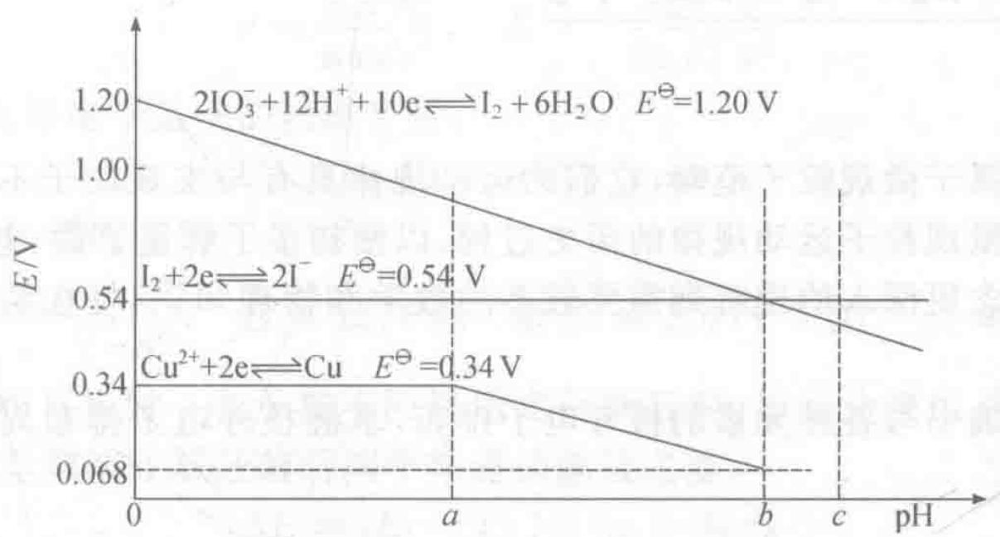

(1) 写出由 $IO_{3}^{-}-I_{2}$ 及 $I_{2}-I^{-}$ 发生的氧化还原反应的方程式；

(2) 当 pH 为 a、b、c 时, 分别指出 (1) 中反应所进行的方向;

(3) 计算上述反应的 $K^{\ominus}$ 和 $\Delta G^{\ominus}(298\mathrm{K})$ ;

(4) 计算 pH=b 时的 b 值, 此时反应的 $K^{\ominus}$ 为多少?

(5) $Cu^{2+}/Cu$ 的 E-pH 图从 a 开始变成了斜率为负的斜线, 其原因何在?

(6) 根据图中的数据, 求 $\mathrm{Cu(OH)_2}$ 的 $K_{sp}$ 。

解（1）所发生反应的方程式为

$$
\mathrm{IO} _ {3} ^ {-} + 5 \mathrm{I} ^ {-} + 6 \mathrm{H} ^ {+} \rightleftharpoons 3 \mathrm{I} _ {2} + 3 \mathrm{H} _ {2} \mathrm{O}
$$

(2) 反应进行的方向分别为：正向、平衡、逆向。

$$
\lg K ^ {\ominus} = \frac {n E _ {\mathrm{池}} ^ {\ominus}}{0 . 0 5 9 2 \: \mathrm{V}} = \frac {5 \times (1 . 2 0 - 0 . 5 4) \: \mathrm{V}}{0 . 0 5 9 2 \: \mathrm{V}} = 5 5. 7, K ^ {\ominus} = 5 \times 1 0 ^ {5 5}\tag{3}
$$

$$
\Delta G ^ {\ominus} = - n E _ {\mathrm{池}} ^ {\ominus} F = - 5 \times (1. 2 0 - 0. 5 4) \mathrm{V} \times 9 6. 5 \mathrm{kC} \cdot \mathrm{mol} ^ {- 1} = - 3 1 8 \mathrm{kJ} \cdot \mathrm{mol} ^ {- 1}
$$

(4) pH=b 时, 反应处于平衡状态, 则

$$
E _ {\mathrm{池}} = 0 = E _ {\mathrm{池}} ^ {\ominus} + \frac {0 . 0 5 9 2 \mathrm{V}}{5} \times \lg [ \mathrm{H} ^ {+} ] ^ {6}, (1. 2 0 - 0. 5 4) \mathrm{V} = - \frac {0 . 0 5 9 2 \mathrm{V}}{5} \times \lg [ \mathrm{H} ^ {+} ] ^ {6}
$$

$$
[ \mathrm{H} ^ {+} ] = 5 \times 1 0 ^ {- 1 0} \mathrm{mol} \cdot \mathrm{dm} ^ {- 3}, \quad \mathrm{pH} = 9. 3, \quad b = 9. 3
$$

此时的 $K^{\ominus}$ 仍然为 $5 \times 10^{55}$ ，因为温度没有改变。

(5) 从 pH > a 开始, $\mathrm{Cu(OH)}_{2}$ 开始生成沉淀, $Cu^{2+}$ 浓度随 pH 增大而减小, $E(\mathrm{Cu}^{2+}/\mathrm{Cu})$ 值也线性减小:

$$
\begin{array}{r l} E & = E ^ {\ominus} + \frac {0 . 0 5 9 2 \mathrm{V}}{2} \times \lg \frac {K _ {\mathrm{sp}}}{[ \mathrm{OH} ^ {-} ] ^ {2}} = E ^ {\ominus} + \frac {0 . 0 5 9 2 \mathrm{V}}{2} \times \lg \frac {K _ {\mathrm{sp}} [ \mathrm{H} ^ {+} ] ^ {2}}{K _ {\mathrm{w}} ^ {2}} \\ & = E ^ {\ominus} + \frac {0 . 0 5 9 2 \mathrm{V}}{2} \times \lg \frac {K _ {\mathrm{sp}}}{K _ {\mathrm{w}} ^ {2}} - 0. 0 5 9 2 \mathrm{V} \times \mathrm{pH} \end{array}
$$

(6) 因为 pH=b=9.3，此时 $\left[OH^{-}\right]=2\times10^{-5}mol\cdot dm^{-3}$ ，而对应的 E=0.068V

$$
\begin{array}{r l} 0. 0 6 8 \mathrm{V} & = E ^ {\ominus} + \frac {0 . 0 5 9 2 \mathrm{V}}{2} \times \lg [ \mathrm{Cu} ^ {2 +} ] = 0. 3 4 \mathrm{V} + \frac {0 . 0 5 9 2 \mathrm{V}}{2} \times \lg \frac {K _ {\mathrm{sp}}}{[ \mathrm{OH} ^ {-} ] ^ {2}} \\ & = 0. 3 4 \mathrm{V} + \frac {0 . 0 5 9 2 \mathrm{V}}{2} \times \lg \frac {K _ {\mathrm{sp}}}{(2 \times 1 0 ^ {- 5}) ^ {2}} \end{array}
$$

$$
K _ {\mathrm{sp}} = 2 \times 1 0 ^ {- 1 9}
$$

## 第11章 原子结构

原子核外电子属于微观粒子范畴,它们的运动规律具有与宏观粒子不同的特点。本章简要介绍了人们认识微观粒子运动规律的历史过程,以便初步了解量子数、电子云等比较抽象的概念。对于上述概念更深入的理解则需要较多的数学和物理知识,将在结构化学和量子化学课程中深入讲述。

本章要求能正确书写各种元素的核外电子排布,掌握核外电子排布周期性与元素周期律的关系。

## 内容提要

## 11.1 经典核原子模型的建立

经典核原子模型的建立基于一系列重要的实验发现：

(1) Thomson 阴极射线实验(1897) 测定了电子的荷质比；

(2) Millikan 油滴实验(1909) 测定了电子的电荷；

(3) Rutherford $\alpha$ 粒子散射实验(1911) 建立了原子的经典核型结构。

## 11.2 氢原子光谱和 Bohr 氢原子理论

## 1. Bohr 氢原子结构模型

模型的提出基于下述重要的实验现象及对实验的解释：

(1) 黑体辐射 Planck 能量量子化假说；

(2) 光电效应 Einstein 光子假说；

(3) 氢原子线状光谱 Rydberg 经验式:

$$
\widetilde {\nu} = \frac {1}{\lambda} = R _ {\mathrm{H}} \left(\frac {1}{n _ {1} ^ {2}} - \frac {1}{n _ {2} ^ {2}}\right)
$$

其中， $R_{H}$ 为 Rydberg 常数； $n_{1}$ 和 $n_{2}$ 为正整数，并且 $n_{2} > n_{1}$ 。

## 2. 氢原子结构模型的三个假设

在此基础上，Bohr从Rutherford原子模型出发，提出了氢原子结构模型的三个假设：

(1) 定态假设 核外电子只能在具有确定半径(r)和能量(E)的特定轨道上围绕原子核运动, 电子在这些轨道上运动时并不辐射出能量。若电子的质量为 m, 原子核电荷数为 Z, 电子电荷为 e, 电子在轨道上的运动速度为 v, 根据经典电磁学, 存在如下关系:

$$
r = \frac {Z e ^ {2}}{4 \pi \varepsilon_ {0} m v ^ {2}} (\varepsilon_ {0} \mathrm{为真空介电常数})
$$

(2) 角动量量子化假设 核外电子在上述轨道上运动时, 角动量(L)是量子化的:

$$
L = n \frac {h}{2 \pi} (n = 1, 2, 3, 4 \dots)
$$

即角动量等于 $h / 2\pi$ 的整数倍。这里， $n$ 称为量子数， $h$ 是Planck常数。

在圆形轨道运动的电子,其角动量为

$$
L = m v r
$$

从而可求得电子绕核运动的轨道半径(r)和能量(E):

$$
r = \frac {\varepsilon_ {0} n ^ {2} h ^ {2}}{\pi m Z e ^ {2}}, E = - \frac {m e ^ {4}}{8 \varepsilon_ {0} ^ {2} h ^ {2}} \frac {Z ^ {2}}{n ^ {2}}
$$

代入相关的常数,可得电子运动的轨道半径:

$$
r = 5 2. 9 3 n ^ {2} / Z (\mathrm{pm})
$$

以及电子在轨道上运动的能量：

$$
E = - B \frac {Z ^ {2}}{n ^ {2}}, \quad B = 1 3. 6 \mathrm{eV/电子} = 2. 1 7 9 \times 1 0 ^ {- 1 8} \mathrm{J/电子}
$$

（3）光子的吸收与辐射 电子在不同轨道之间跃迁时，原子会吸收或辐射出光子。吸收或辐射出的光子能量取决于跃迁前后两个轨道的能量之差：

$$
\Delta E = | E _ {2} - E _ {1} | = h \nu = h c / \lambda
$$

基于如上假设,Bohr建立了原子核外电子运动的模型,通常称为Bohr原子模型。假设(3)则直接将电子在不同原子轨道之间跃迁时的能量变化与光谱关联起来,解释了氢原子光谱。

对于氢原子,核电荷 Z=1, 轨道半径、能量与量子数的关系如下:

$$
r = 5 2. 9 3 n ^ {2} (\mathrm{pm}), \quad E = - 1 3. 6 / n ^ {2} (\mathrm{eV})
$$

电子在不同轨道跃迁时

$$
\Delta E = E _ {2} - E _ {1} = B \left(\frac {1}{n _ {1} ^ {2}} - \frac {1}{n _ {2} ^ {2}}\right) = h c / \lambda
$$

据此，可以完美地解释 Rydberg 由氢原子光谱实验数据拟合得到的经验式。

## 11.3 微观粒子特性及其运动规律

微观世界具有与宏观世界不同的规律，这些规律反映了微观世界的独特性。

## 1. 波粒二象性

法国物理学家 de Broglie 在光子说的启发下, 大胆提出电子等实物粒子也具有波动性, 即实物粒子的波粒二象性。给出了 de Broglie 关系式:

$$
\lambda = \frac {h}{P} = \frac {h}{m v}
$$

式中， $\lambda$ 为物质波的波长； $h$ 为 Planck 常数； $P$ 为实物粒子的动量， $P = mv$ 。

## 2. 不确定性关系

1926 年, Heisenberg 提出测不准关系, 也称不确定性关系:

$$
\Delta x \cdot \Delta P \geqslant \frac {h}{4 \pi}
$$

其中， $\Delta x$ 和 $\Delta P$ 分别代表实物粒子位置的不确定性和动量的不确定性。此式表明，不可能同时确定微观粒子的位置和动量。

## 11.4 氢原子的量子力学模型

## 1. 波函数

为描述原子中电子的波动性,Schrödinger提出了波动力学方程式。该方程式的合理解只限于若干分立的能量值,这也就是量子化。Schrödinger方程的解是描述电子在原子轨道上运

动的波函数 $\psi$ ，又称为原子轨道。

波函数没有直观的物理意义,而波函数的平方的物理意义是电子在空间某点出现的概率密度。

## 2. 量子数

一个原子轨道由三个量子数决定,分别是主量子数 n、角量子数 l、磁量子数 m;而一个电子的状态由四个量子数决定,除以上三个量子数之外,还有自旋量子数 $m_{s}$ 。

对于氢原子以及类氢离子,决定原子轨道能量的参数是主量子数 n;而对于多电子原子,原子轨道能不仅取决于 n,还依赖于角量子数 l。

各个量子数之间的取值范围为： $n$ 为正整数， $l$ 为0到 $n - 1$ 之间的正整数， $m$ 为- $l$ 到 $+l$ 之间的整数， $m_{s}$ 为 $+1 / 2$ 或 $-1 / 2$ 。

## 3. 氢原子波函数和电子云图像

原子轨道和电子云的图像对于理解化学键和分子结构具有重要意义,教材中介绍了三种径向分布、两种角度分布以及总的电子云分布,它们分别是(见下表):

<table><tr><td>径向分布</td><td>角度分布</td><td>总的电子云分布</td></tr><tr><td>电子云径向密度分布  $R^{2}(r)$ 电子云径向分布  $r^{2}R^{2}(r)$ 或  $D(r)$ 波函数径向分布  $R(r)$ </td><td>电子云角度分布  $Y^{2}(\theta,\phi)$ 波函数角度分布  $Y(\theta,\phi)$ </td><td>电子云空间分布  $\psi^{2}(r,\theta,\phi)$ </td></tr></table>

这些图形的确切含义将在结构化学课程中详述。本课程仅要求对它们有初步了解，以便进一步学习化学键、周期律等基本知识。

## 11.5 多电子原子结构与周期律

## 1. 多电子原子的轨道能级

多电子体系与类氢原子(离子)体系不同的是,前者电子之间存在相互作用,而后者只有一个电子。由于多电子体系电子之间的相互作用,产生了原子能级的分裂和能级交错现象。

例如,不同主量子数原子轨道的能级关系为

$$
E _ {1 \mathrm{s}} <   E _ {2 \mathrm{s}} <   E _ {3 \mathrm{s}} <   E _ {4 \mathrm{s}}; \quad E _ {2 \mathrm{p}} <   E _ {3 \mathrm{p}} <   E _ {4 \mathrm{p}}; \quad \dots
$$

相同主量子数、不同角量子数的多电子原子轨道的能量关系为

$$
E _ {n s} <   E _ {n p} <   E _ {n d} <   E _ {n f}
$$

由于能级分裂,因此不同主量子数的原子轨道还会发生能级交错,即

$$
E _ {4 \mathrm{s}} <   E _ {3 \mathrm{d}} <   E _ {4 \mathrm{p}}; \quad E _ {5 \mathrm{s}} <   E _ {4 \mathrm{d}} <   E _ {5 \mathrm{p}}; \quad E _ {6 \mathrm{s}} <   E _ {4 \mathrm{f}} <   E _ {5 \mathrm{d}} <   E _ {6 \mathrm{p}}; \quad \dots
$$

## 2. 屏蔽效应和钻穿效应

轨道能量简并、能级的分裂和交错等现象可以用屏蔽效应和钻穿效应进行解释。

在单电子体系中,电子受到的唯一作用就是带正电的核的吸引。然而在多电子体系里,除了原子核对电子的吸引力之外,电子之间还存在着相互排斥作用,表现为外层电子会受到内层电子的屏蔽作用。由于这种屏蔽,客观上降低了原子核对外层电子的吸引力,因此外层电子感受到的核电荷有所下降,称之为有效核电荷 $Z^{*}$ ,即

$$
Z ^ {*} = Z - \sigma
$$

式中，Z 为核电荷； $\sigma$ 为屏蔽常数。屏蔽常数可以用 Slater 规则估算。

因此，多电子体系的原子轨道能量(eV)公式可以修改为

$$
E _ {i} = - 1 3. 6 \frac {(Z ^ {*}) ^ {2}}{n ^ {2}}
$$

## 3. 核外电子排布的基本原则

(1) Pauli 不相容原理 在同一原子中没有两个 4 个量子数完全相同的电子, 换句话说, 同一原子轨道仅可容纳自旋相反的两个电子。

(2) 能量最低原理 核外电子在各个原子轨道的排布方式应使整个原子处于最低的能态。

（3）Hund 规则 电子在能量相同的轨道上分布时,总是尽可能以自旋相同的方向分占不同的轨道。

根据以上规则,可以写出各种元素原子的核外电子的排布,确定其在周期表中的位置。

## 11.6 元素基本性质的周期性变化规律

19 世纪中叶,科学家们归纳比较已知元素物理化学性质的相似性、相异性,将元素按相对原子质量大小顺序排列,得到最初的元素周期表。经过约半个世纪,随着对原子微观结构的揭示,才认识到周期律的本质。周期律是认识元素基本性质的入门工具,是科技工作者应该掌握的基本知识。

## 1. 原子半径

同一主族，由上至下，原子半径一般是增大的；同一短周期，由左至右，原子半径减小；过渡元素，从左至右，半径也呈减小的趋势，但减小幅度比主族元素的小。参见附录D.2。

## 2. 电离能

基态的气体原子失去最外层第一个电子所需的能量称为第一电离能，符号为 I。依次还有第二电离能、第三电离能等等。

同一主族中，自上而下，随原子半径增加电离能减小；同一周期中，从左至右，电离能一般是增大的，增大幅度随周期数的增大而减小。一般来说，具有半充满价电子构型的元素都有比较大的电离能，例如N的电离能大于O。参见附录D.3。

## 3. 电子亲和能

原子的电子亲和能指一个气态原子得到一个电子所放出的能量,符号为 $E_{ea}$ 。通常,元素的第一电子亲和能为正值。

电子亲和能的周期变化规律与电离能相似,即具有较高电离能的元素也具有较大电子亲和能,但一般第二周期元素的电子亲和能小于第三周期元素。这是由于第二周期非金属元素原子半径较小,电子之间排斥力较强,以至于电子亲和能较小。参见附录 D.4。

## 4. 电负性

Pauling 将电负性( $\chi$ )定义为：分子中原子对成键电子吸引能力的量度。

Pauling 电负性公式：

$$
\chi_ {\mathrm{A}} - \chi_ {\mathrm{B}} = 0. 0 8 9 \sqrt {\Delta}
$$

式中， $\Delta = \mathrm{EB(A - B)} - \sqrt{\mathrm{EB(A - A)} \times \mathrm{EB(B - B)}}$ 。其中， $\mathrm{EB(A - A)}$ 和 $\mathrm{EB(B - B)}$ 分别为单质分子 A-A 和 B-B 的键能， $\mathrm{EB(A - B)}$ 为化合物 A-B 的键能。EB 的单位为 $\mathrm{kJ} \cdot \mathrm{mol}^{-1}$ 。

Mulliken 电负性公式：

$$
\chi = \frac {1}{2} (I + E)
$$

注意， $I$ 和 $E$ 的单位都是 $\mathrm{eV}$ 。经过适当拟算，当 $\chi = 0.18(I + E)$ 时，Mulliken电负性和Pauling电负性的数据是吻合的。现行手册一般采用Pauling电负性数据。

同族元素，由上到下电负性依次减小；同一周期元素，从左向右电负性增大。参见教材的图11.25(p.261)，以及本书附录D.5。

## 习题解析

11.1 根据 Balmer 氢原子可见光谱经验公式 $\lambda=\frac{3646\times n^{2}}{n^{2}-4}$ ，计算：

(1) Balmer 系中波长最长的谱线 n 和 $\lambda(\mathrm{pm})$ 各为多少?

(2) Balmer 系中某谱线的波长为 379 800 pm, 其 n 是多少?

(3) Balmer 系中波长最短的谱线 n 和 $\lambda(\mathrm{pm})$ 各为多少？ $\lambda$ 如以 nm（纳米）表示，是多少？

解 (1) $n = 3$ ， $\lambda = \frac{3646\AA\times n^2}{n^2 - 4} = \frac{3646\AA\times 3^2}{3^2 - 4} = 6563\AA = 6.563\times 10^{5}\mathrm{pm}$

(2) $\lambda = \frac{3646\AA \times n^2}{n^2 - 4}$ , $3.798\times 10^{5}\mathrm{pm} = 3798\AA$ , $3798\AA = \frac{3646\AA \times n^2}{n^2 - 4}$ , $n = 10$

$$
(3) n \rightarrow \infty , \quad \lambda = 3 6 4 6 \mathrm{A} \times \left(\frac {n ^ {2}}{n ^ {2} - 4}\right) = 3 6 4 6 \mathrm{A} = 3. 6 4 6 \times 1 0 ^ {5} \mathrm{pm} = 3 6 4. 6 \mathrm{nm}
$$

11.2 根据 Bohr 理论计算第五个 Bohr 轨道半径 (nm) 和电子在此轨道上的能量。
解 n=5 时

$$
r = 5 3 \mathrm{pm} \times n ^ {2} = 5 3 \mathrm{pm} \times 5 ^ {2} = 1. 3 \times 1 0 ^ {3} \mathrm{pm} = 1. 3 \mathrm{nm}
$$

$$
E = \frac {- B}{n ^ {2}} = \frac {- 2 . 1 8 \times 1 0 ^ {- 1 8} \mathrm{J}}{5 ^ {2}} = - 8. 7 \times 1 0 ^ {- 2 0} \mathrm{J}
$$

11.3 (1) 计算氢原子中的电子由 $n = 4$ 能级跃迁到 $n = 3$ 能级时发射光的频率和波长 $(\mu \mathrm{m})$ ;

(2) 该辐射的波长属于电磁波的哪一个光谱区?

$$
\mathrm{解} \quad (1) \frac {1}{\lambda} = R _ {\mathrm{H}} \left(\frac {1}{n _ {\mathrm{i}} ^ {2}} - \frac {1}{n _ {\mathrm{f}} ^ {2}}\right) = 1 0 9 6 7 7 \mathrm{cm} ^ {- 1} \times \left(\frac {1}{3 ^ {2}} - \frac {1}{4 ^ {2}}\right) = 5. 3 3 \times 1 0 ^ {3} \mathrm{cm} ^ {- 1}
$$

$$
\lambda = 1. 8 8 \times 1 0 ^ {- 4} \mathrm{cm} = 1. 8 8 \mu \mathrm{m}
$$

$$
\nu = \frac {c}{\lambda} = \frac {2 . 9 9 8 \times 1 0 ^ {8} \mathrm{m} \cdot \mathrm{s} ^ {- 1}}{1 . 8 8 \times 1 0 ^ {- 6} \mathrm{m}} = 1. 5 9 \times 1 0 ^ {1 4} \mathrm{s} ^ {- 1} = 1. 5 9 \times 1 0 ^ {1 4} \mathrm{Hz}
$$

(2) 这个波长的辐射属于电磁波的红外部分。

11.4 光解作用使 $\mathrm{NO}_2$ 分解为NO和原子氧。分解所吸收的能量为 $304\mathrm{kJ}\cdot \mathrm{mol}^{-1}$ ，问此能量相当于波长是多少的电磁波？

$$
\lambda = \frac {h c}{\Delta E} = \frac {6 . 6 2 6 \times 1 0 ^ {- 3 4} \mathrm{J} \cdot \mathrm{s} \times 2 . 9 9 8 \times 1 0 ^ {1 7} \mathrm{nm} \cdot \mathrm{s} ^ {- 1}}{3 0 4 \times 1 0 ^ {3} \mathrm{J} \cdot \mathrm{mol} ^ {- 1} / (6 . 0 2 3 \times 1 0 ^ {2 3} \mathrm{mol} ^ {- 1})} = 3 9 4 \mathrm{nm}
$$

11.5 试根据 Bohr 理论求证单电子离子(或原子)如 $He^{+}$ 与 $Li^{2+}$ 在第 n 态的能量为 $-\frac{Z^{2}B}{n^{2}}$ ; 此处 Z 为核电荷数, $B=2.179\times10^{-18}J$ 。在此基础上, 求 $He^{+}$ 离子的电离能(先以

①

②

$J \cdot atom^{-1}$ ，再以 $kJ \cdot mol^{-1}$ 表示）。

解 根据 Bohr 理论 $\frac{mv^2}{r} = \frac{Ze^2}{4\pi\varepsilon_0r^2}$ ，即 $mv^2 = \frac{Ze^2}{4\pi\varepsilon_0r} \longrightarrow E_{\text{动}} = \frac{1}{2} mv^2 = \frac{Ze^2}{8\pi\varepsilon_0r}$

$$
E _ {\mathrm{总}} = E _ {\mathrm{动}} + E _ {\mathrm{位}} = \frac {Z e ^ {2}}{8 \pi \varepsilon_ {0} r} - \frac {Z e ^ {2}}{4 \pi \varepsilon_ {0} r} = - \frac {Z e ^ {2}}{8 \pi \varepsilon_ {0} r}
$$

又 $mv^{2} = \frac{Ze^{2}}{4\pi\varepsilon_{0}r}$ ，则 $mv^2 r = \frac{Ze^2}{4\pi\varepsilon_0}$ ，而

$$
m v r = \frac {n h}{2 \pi}
$$

将 $v = \frac{Ze^2}{2\varepsilon_0nh}$ 代入②式，得

$$
r = \frac {\varepsilon_ {0} n ^ {2} h ^ {2}}{\pi m Z e ^ {2}}\tag{③}
$$

③式代入①式，得

$$
E _ {\mathrm{总}} = - \frac {m e ^ {4}}{8 \varepsilon_ {0} ^ {2} h ^ {2}} \cdot \frac {Z ^ {2}}{n ^ {2}} = - B \frac {Z ^ {2}}{n ^ {2}}
$$

单电子 $\mathrm{He}^{+}$ 在 $n = 1$ 时的能量为

$$
- B \frac {Z ^ {2}}{n ^ {2}} = - 2. 1 7 9 \times 1 0 ^ {- 1 8} \mathrm{J} \times \frac {2 ^ {2}}{1 ^ {2}} = - 8. 7 1 6 \times 1 0 ^ {- 1 8} \mathrm{J}
$$

$\mathrm{He^{+}}$ 的电离能为 $8.716\times 10^{-18}\mathrm{J}\cdot \mathrm{atom}^{-1}$ ，则 $1\mathrm{molHe^{+}}$ 的电离能为

$$
7 1 6 \times 1 0 ^ {- 1 8} \mathrm{J} \cdot \text {atom} ^ {- 1} \times 6. 0 2 3 \times 1 0 ^ {2 3} \text {atom} \cdot \mathrm{mol} ^ {- 1} = 5. 2 4 9 \times 1 0 ^ {3} \mathrm{kJ} \cdot \mathrm{mol} ^ {- 1}
$$

11.6 计算下列光子的质量和能量：

(1) 波长为 401400 pm 相当于钾的紫光的光子。

(2) 波长为 0.20 pm 的 $\gamma$ 射线光子。

解 (1) $P = mc = \frac{h}{\lambda}, m = \frac{h}{c\lambda} = \frac{6.626 \times 10^{-34} \mathrm{~J} \cdot \mathrm{s}}{3.0 \times 10^{8} \mathrm{~m} \cdot \mathrm{s}^{-1} \times 401400 \times 10^{-12} \mathrm{~m}} = 5.5 \times 10^{-36} \mathrm{~kg}$

$$
E _ {\mathrm{光子}} = \frac {h c}{\lambda} = \frac {6 . 6 2 6 \times 1 0 ^ {- 3 4} \mathrm{J} \cdot \mathrm{s} \times 3 . 0 \times 1 0 ^ {8} \mathrm{m} \cdot \mathrm{s} ^ {- 1}}{4 0 1 4 0 0 \times 1 0 ^ {- 1 2} \mathrm{m}} = 5. 0 \times 1 0 ^ {- 1 9} \mathrm{J}
$$

$$
m = \frac {h}{c \lambda} = \frac {6 . 6 2 6 \times 1 0 ^ {- 3 4} \mathrm{J} \cdot \mathrm{s}}{3 . 0 \times 1 0 ^ {8} \mathrm{m} \cdot \mathrm{s} ^ {- 1} \times 0 . 2 0 \times 1 0 ^ {- 1 2} \mathrm{m}} = 1. 1 \times 1 0 ^ {- 2 9} \mathrm{kg}
$$

$$
E _ {\mathrm{光子}} = \frac {h c}{\lambda} = \frac {6 . 6 2 6 \times 1 0 ^ {- 3 4} \mathrm{J} \cdot \mathrm{s} \times 3 . 0 \times 1 0 ^ {8} \mathrm{m} \cdot \mathrm{s} ^ {- 1}}{0 . 2 0 \times 1 0 ^ {- 1 2} \mathrm{m}} = 1. 0 \times 1 0 ^ {- 1 2} \mathrm{J}
$$

11.7 如果一束电子的 de Broglie 波长为 1 nm, 则其速度应该是多少?

解

$$
\lambda = \frac {h}{m v}, \quad v = \frac {h}{m \lambda} = \frac {6 . 6 2 6 \times 1 0 ^ {- 3 4} \mathrm{J} \cdot \mathrm{s}}{9 . 1 \times 1 0 ^ {- 3 1} \mathrm{kg} \times 1 \times 1 0 ^ {- 9} \mathrm{m}} = 7 \times 1 0 ^ {5} \mathrm{m} \cdot \mathrm{s} ^ {- 1}
$$

11.8 设子弹质量为 $10\mathrm{g}$ ，速度为 $1000\mathrm{m}\cdot \mathrm{s}^{-1}$ 。根据 de Broglie 式和不确定性关系式，用计算说明宏观物质主要表现为粒性，它们的运动服从经典力学规律（设子弹速度的不确定程度为 $\Delta v_{x} = 10^{-3}\mathrm{m}\cdot \mathrm{s}^{-1}$ ）。

解

$$
\lambda = \frac {h}{m v} = \frac {6 . 6 \times 1 0 ^ {- 3 4} \mathrm{J} \cdot \mathrm{s}}{1 . 0 \times 1 0 ^ {- 2} \mathrm{kg} \times 1 . 0 \times 1 0 ^ {3} \mathrm{m} \cdot \mathrm{s} ^ {- 1}} = 6. 6 \times 1 0 ^ {- 3 5} \mathrm{m} = 6. 6 \times 1 0 ^ {- 2 6} \mathrm{nm}
$$

γ射线是最短的电磁波, 其 $\lambda=1\times10^{-5}$ nm; 子弹的波长为 $6.6\times10^{-26}$ nm, 根本无法测量, 可忽略。子弹等宏观物质主要表现为粒性。

或 $\Delta x\cdot \Delta P_{x} = h$ ，又 $\Delta P_{x} = m\Delta v_{x}$ ，则

$$
\Delta x = \frac {h}{m \Delta v _ {x}} = \frac {6 . 6 \times 1 0 ^ {- 3 4} \mathrm{J} \cdot \mathrm{s}}{1 . 0 \times 1 0 ^ {- 2} \mathrm{kg} \times 1 . 0 \times 1 0 ^ {- 3} \mathrm{m} \cdot \mathrm{s} ^ {- 1}} = 6. 6 \times 1 0 ^ {- 2 9} \mathrm{m}
$$

位置的不确定性 $\Delta x$ 很小, 可忽略, 说明子弹可有确定的运动轨道。

11.9 写出 $n = 4$ 主层中各个电子的 $n, l, m$ 量子数与轨道符号，并指出各亚层中的轨道数和最多能容纳的电子数、总的轨道数和电子数（列表表示）。

解

<table><tr><td>n</td><td>4</td><td>4</td><td>4</td><td>4</td><td>4</td><td>4</td><td>4</td><td>4</td><td>4</td><td>4</td><td>4</td><td>4</td><td>4</td><td>4</td><td>4</td><td></td></tr><tr><td>l</td><td>0</td><td>1</td><td>1</td><td>1</td><td>2</td><td>2</td><td>2</td><td>2</td><td>2</td><td>3</td><td>3</td><td>3</td><td>3</td><td>3</td><td>3</td><td></td></tr><tr><td>m</td><td>0</td><td>-1</td><td>0</td><td>1</td><td>-2</td><td>-1</td><td>0</td><td>1</td><td>2</td><td>-3</td><td>-2</td><td>-1</td><td>0</td><td>1</td><td>2</td><td>3</td></tr><tr><td>轨道符号</td><td>4s</td><td>4p</td><td>4p</td><td>4p</td><td>4d</td><td>4d</td><td>4d</td><td>4d</td><td>4d</td><td>4f</td><td>4f</td><td>4f</td><td>4f</td><td>4f</td><td>4f</td><td>4f</td></tr><tr><td>亚层轨道数</td><td>1</td><td></td><td>3</td><td></td><td></td><td></td><td>5</td><td></td><td></td><td></td><td></td><td></td><td>7</td><td></td><td></td><td></td></tr><tr><td>电子数</td><td>2</td><td></td><td>6</td><td></td><td></td><td></td><td>10</td><td></td><td></td><td></td><td></td><td></td><td>14</td><td></td><td></td><td></td></tr><tr><td>总轨道数</td><td></td><td></td><td></td><td></td><td></td><td></td><td></td><td></td><td>16</td><td></td><td></td><td></td><td></td><td></td><td></td><td></td></tr><tr><td>总电子数</td><td></td><td></td><td></td><td></td><td></td><td></td><td></td><td></td><td>32</td><td></td><td></td><td></td><td></td><td></td><td></td><td></td></tr></table>

11.10 用原子轨道符号表示下列各套量子数：

(1) n=2, l=1, m=-1; (2) n=4, l=0, m=0; (3) n=5, l=2, m=0.

解（1） $2p_{-1}$ （由 $2p_{1}$ 与 $2p_{-1}$ 组合成 $2p_{x}$ 和 $2p_{y}$ ）；(2)4s；(3) $5d_{z^{2}}$

11.11 假定有下列电子的各套量子数，指出哪几套不可能存在，并说明原因。

(1) 3,2,2, $\frac{1}{2}$ ; (2) 3,0,-1, $\frac{1}{2}$ ; (3) 2,2,2,2; (4) 1,0,0,0; (5) 2,-1,0, $\frac{1}{2}$ ; (6) 2,0,-2, $\frac{1}{2}$ 。

解 (2)～(6)都不可能存在,因为:

(2) l=0 时, m 只能为 0

(3) n=2 时, l 只能为 0 或 1; m 只能为 0 或 1 或 -1; $m_{s}$ 只能为 $+\frac{1}{2}$ 或 $-\frac{1}{2}$

(4) $m_{s}$ 只能为 $+\frac{1}{2}$ 或 $-\frac{1}{2}$

(5) n=2 时, l 只能为 0 或 1

(6) l=0 时, m 只能为 0

11.12 第四周期中，基态原子中有2个未成对电子的元素有哪些？写出其符号和名称。

解 符合题意的有：

$$
\mathrm{Ti} (\text {钛}) 3 \mathrm{d} ^ {2} 4 \mathrm{s} ^ {2}, \mathrm{Ni} (\text {镍}) 3 \mathrm{d} ^ {8} 4 \mathrm{s} ^ {2}, \mathrm{Ge} (\text {锗}) 4 \mathrm{s} ^ {2} 4 \mathrm{p} ^ {2}, \mathrm{Se} (\text {硒}) 4 \mathrm{s} ^ {2} 4 \mathrm{p} ^ {4}
$$

11.13 用 s、p、d、f 等符号表示 Al, Cr, $Fe^{2+}$ , As, $Ag^{+}$ , $Pb^{2+}$ 原子或离子的核外电子构型，判断它们属于第几周期、第几主族（或副族）的元素。

$$
\begin{array}{l l} {\text {解}} & {\mathrm{Al} \quad 1 s ^ {2} 2 s ^ {2} 2 p ^ {6} 3 s ^ {2} 3 p ^ {1}} \\ & {\mathrm{Cr} \quad 1 s ^ {2} 2 s ^ {2} 2 p ^ {6} 3 s ^ {2} 3 p ^ {6} 3 d ^ {5} 4 s ^ {1}} \\ & {\mathrm{Fe} ^ {2 +} \quad 1 s ^ {2} 2 s ^ {2} 2 p ^ {6} 3 s ^ {2} 3 p ^ {6} 3 d ^ {6}} \\ & {\mathrm{As} \quad 1 s ^ {2} 2 s ^ {2} 2 p ^ {6} 3 s ^ {2} 3 p ^ {6} 3 d ^ {1 0} 4 s ^ {2} 4 p ^ {3}} \end{array}
$$

属第三周期 ⅢA
属第四周期 ⅥB
属第四周期 Ⅷ
属第四周期 VA

$$
\mathrm{Ag} ^ {+} \quad 1 \mathrm{s} ^ {2} 2 \mathrm{s} ^ {2} 2 \mathrm{p} ^ {6} 3 \mathrm{s} ^ {2} 3 \mathrm{p} ^ {6} 3 \mathrm{d} ^ {1 0} 4 \mathrm{s} ^ {2} 4 \mathrm{p} ^ {6} 4 \mathrm{d} ^ {1 0}
$$

属第五周期 IB

$$
\mathrm{Pb} ^ {2 +} \quad 1 \mathrm{s} ^ {2} 2 \mathrm{s} ^ {2} 2 \mathrm{p} ^ {6} 3 \mathrm{s} ^ {2} 3 \mathrm{p} ^ {6} 3 \mathrm{d} ^ {1 0} 4 \mathrm{s} ^ {2} 4 \mathrm{p} ^ {6} 4 \mathrm{d} ^ {1 0} 4 \mathrm{f} ^ {1 4} 5 \mathrm{s} ^ {2} 5 \mathrm{p} ^ {6} 5 \mathrm{d} ^ {1 0} 6 \mathrm{s} ^ {2}
$$

属第六周期 ⅣA

## 11.14 以(1)为范例,填充下表中各题的空白。

<table><tr><td>元素符号</td><td>原子序数Z</td><td>电子构型</td></tr><tr><td>(1) Na</td><td>11</td><td> $1s^{2}2s^{2}2p^{6}3s^{1}$ </td></tr><tr><td>(2) —</td><td>—</td><td> $1s^{2}2s^{2}2p^{6}3s^{2}3p^{3}$ </td></tr><tr><td>(3) Zr</td><td>40</td><td>[Kr] $4d^{()}5s^{2}$ </td></tr><tr><td>(4) —</td><td>—</td><td>[Kr] $4d^{()}5s^{2}5p^{4}$ </td></tr><tr><td>(5) —</td><td>—</td><td>[Kr] $4d^{()}5s^{()}5p^{5}$ </td></tr><tr><td>(6) Bi</td><td>83</td><td>[Xe] $4f^{()}5d^{()}6s^{()}6p^{()}$ </td></tr></table>

<table><tr><td>元素符号</td><td>原子序数Z</td><td>电子构型</td></tr><tr><td>(1) Na</td><td>11</td><td> $1s^{2}2s^{2}2p^{6}3s^{1}$ </td></tr><tr><td>(2) P</td><td>15</td><td> $1s^{2}2s^{2}2p^{6}3s^{2}3p^{3}$ </td></tr><tr><td>(3) Zr</td><td>40</td><td>[Kr] $4d^{(2)}5s^{2}$ </td></tr><tr><td>(4) Te</td><td>52</td><td>[Kr] $4d^{(10)}5s^{2}5p^{4}$ </td></tr><tr><td>(5) I</td><td>53</td><td>[Kr] $4d^{(10)}5s^{(2)}5p^{5}$ </td></tr><tr><td>(6) Bi</td><td>83</td><td>[Xe] $4f^{(14)}5d^{(10)}6s^{(2)}6p^{(3)}$ </td></tr></table>

## 11.15 画出 V、Si、Fe 电子轨道图，并指出这些原子各有几个未成对电子？解

<table><tr><td></td><td>1s</td><td>2s</td><td colspan="3">2p</td><td>3s</td><td colspan="3">3p</td><td colspan="3">3d</td><td>4s</td><td>未成对电子数</td></tr><tr><td>V</td><td>↑↓</td><td>↑↓</td><td>↑↓</td><td>↑↓</td><td>↑↓</td><td>↑↓</td><td>↑↓</td><td>↑↓</td><td>↑↓</td><td>↑</td><td>↑</td><td>↑</td><td>↑↓</td><td>3</td></tr><tr><td>Si</td><td>↑↓</td><td>↑↓</td><td>↑↓</td><td>↑↓</td><td>↑↓</td><td>↑↓</td><td>↑</td><td>↑</td><td></td><td></td><td></td><td></td><td></td><td>2</td></tr><tr><td>Fe</td><td>↑↓</td><td>↑↓</td><td>↑↓</td><td>↑↓</td><td>↑↓</td><td>↑↓</td><td>↑↓</td><td>↑↓</td><td>↑↓</td><td>↑↓</td><td>↑</td><td>↑</td><td>↑</td><td>4</td></tr></table>

## 11.16 已知下列元素在周期表中的位置,写出它们的价层电子构型和元素符号。

(1) 第四周期ⅣB族；(2) 第四周期ⅦB族；(3) 第五周期ⅦA族；(4) 第六周期ⅡA族。
解

<table><tr><td></td><td>价层电子构型</td><td>元素符号</td></tr><tr><td>(1)第四周期IVB族</td><td> $3d^{2}4s^{2}$ </td><td>Ti</td></tr><tr><td>(2)第四周期VII B族</td><td> $3d^{5}4s^{2}$ </td><td>Mn</td></tr><tr><td>(3)第五周期VII A族</td><td> $5s^{2}5p^{5}$ </td><td>I</td></tr><tr><td>(4)第六周期IIA族</td><td> $6s^{2}$ </td><td>Ba</td></tr></table>

11.17 价层电子构型满足下列条件之一的是哪一类或哪一种元素？

(1) 具有 2 个 p 电子；

(2) 有 2 个量子数为 n=4 和 l=0 的电子, 6 个量子数为 n=3 和 l=2 的电子;

(3) 3d 为全充满、4s 只有 1 个电子的元素。

解 (1) $ns^2 np^2$ ⅣA族； (2) $3d^6 4s^2$ Fe； (3) $3d^{10} 4s^1$ Cu。

11.18 完成下表：

<table><tr><td rowspan="2">序号</td><td>量子数</td><td rowspan="2">轨道符号</td><td rowspan="2">轨道角度分布图</td><td rowspan="2">电子云径向分布图</td></tr><tr><td>n l m</td></tr><tr><td>1</td><td></td><td>2s</td><td></td><td></td></tr><tr><td>2</td><td>3 0</td><td></td><td></td><td></td></tr><tr><td>3</td><td></td><td> $3{\mathrm{p}}_{\mathrm{z}}$ </td><td></td><td></td></tr><tr><td>4</td><td>2</td><td></td><td></td><td></td></tr><tr><td>5</td><td>3</td><td></td><td></td><td></td></tr></table>

解 填表结果如下：

<table><tr><td rowspan="2">序号</td><td colspan="3">量子数</td><td rowspan="2">轨道符号</td><td rowspan="2">轨道角度分布图</td><td rowspan="2">电子云径向分布图</td></tr><tr><td>n</td><td>l</td><td>m</td></tr><tr><td>1</td><td>2</td><td>0</td><td>0</td><td>2s</td><td></td><td></td></tr><tr><td>2</td><td>3</td><td>0</td><td>0</td><td>3s</td><td></td><td></td></tr><tr><td>3</td><td>3</td><td>1</td><td>0</td><td> $3p_z$ </td><td></td><td></td></tr><tr><td>4</td><td>2</td><td>1</td><td>(±1)</td><td> $2p_x$ </td><td></td><td></td></tr><tr><td>5</td><td>3</td><td>2</td><td>0</td><td> $3d_{z^2}$ </td><td></td><td></td></tr></table>

11.19 据理判定下列各对原子(或离子)中,哪一个半径大,并简述理由。
H 与 He; Ba 与 Sr; Sc 与 Ca; Cu 与 Ni; Zr 与 Hf;
La 与 Gd; S²⁻ 与 S; Na 与 Al³⁺; Fe²⁺ 与 Fe³⁺; Pb²⁺ 与 Sn²⁺。

解 (1) $r(\mathrm{He}) > r(\mathrm{H})$ $r(\mathrm{He})$ 是范氏半径；

(2) $r(\mathrm{Ba})>r(\mathrm{Sr})$ 二者属同一主族，Ba比Sr多一电子层；

(3) $r(\mathrm{Ca})>r(\mathrm{Sc})$ 二者属同一周期，Sc的核电荷大；

(4) $r(\mathrm{Cu})>r(\mathrm{Ni})$ d 电子满层, 相互规避远离, 占有较大的空间;

(5) $r(Z_{\mathrm{r}})\approx r(\mathrm{Hf})$ 镧系收缩的结果；

(6) $r(\mathrm{La})>r(\mathrm{Gd})$ 同一层，Gd 的核电荷大；

(7) $r(S^{2-})>r(S)$ 同一元素, $S^{2-}$ 的电子数大于S;

(8) $r(\mathrm{Na})>r(\mathrm{Al}^{3+})$ 同一周期, $Al^{3+}$ 核电荷多,外层电子少;

(9) $r(\mathrm{Fe}^{2+})>r(\mathrm{Fe}^{3+})$ 同一元素,电子数越少,半径越小;

(10) $r(\mathrm{Pb}^{2+})>r(\mathrm{Sn}^{2+})$ 同一族， $Pb^{2+}$ 比 $Sn^{2+}$ 多一电子层。

11.20 试说明下列等电子体的离子半径值为什么在数值上有差别：

$$
\mathrm{F} ^ {-} (1 3 3 \mathrm{pm}), \quad \mathrm{O} ^ {2 -} (1 4 0 \mathrm{pm}), \quad \mathrm{Na} ^ {+} (1 0 2 \mathrm{pm}), \quad \mathrm{Mg} ^ {2 +} (7 2 \mathrm{pm}), \quad \mathrm{Al} ^ {3 +} (5 4 \mathrm{pm}) 。
$$

解 这 5 个离子是等电子体, 它们的核电荷数按 $O^{2-}$ , $F^{-}$ , $Na^{+}$ , $Mg^{2+}$ , $Al^{3+}$ 的次序增加。随核电荷数目的增加, 对外层电子的引力增加, 半径减小。

11.21 解释下列现象：

(1) Na 的第一电离能小于 Mg, 而 Na 的第二电离能却大大超过 Mg。

(2) $\mathrm{Na}^{+}$ 和 $\mathrm{Ne}$ 是等电子体, 为什么它们的第一电离能 $(I_{1})$ 的数值差别较大? $[I_{1}(\mathrm{Ne},\mathrm{g}) = 21.6\mathrm{eV}, I_{1}(\mathrm{Na}^{+},\mathrm{g}) = 47.3\mathrm{eV}]$

（3）Be 原子的第一、二、三、四各级电离能 $(I_{1}\sim I_{4})$ 分别为：899，1757， $1.484\times10^{4}$ ， $2.100\times10^{4}kJ\cdot mol^{-1}$ 。解释各级电离能逐渐增大并有突跃的原因。

解（1）Na、Mg 的 $I_{1}$ 都是丢失 1 个 3s 电子所需之能量。 $r(\mathrm{Na}) > r(\mathrm{Mg})$ ，且 Na 的有效核电荷比 Mg 小， $I_{1}(\mathrm{Na}) < I_{1}(\mathrm{Mg})$ 。第二电离能 Mg 是再丢掉 1 个 3s 电子所需之能量，而 Na 是丢掉内层 $2s^{2}2p^{6}$ 满层上的 1 个电子，故

$$
\begin{array}{r l r} {I _ {2} (\mathrm{Na})} & {>} & {I _ {2} (\mathrm{Mg})} \\ {(4 5 6 2 \mathrm{kJ} \cdot \mathrm{mol} ^ {- 1})} & {} & {(1 4 5 1 \mathrm{kJ} \cdot \mathrm{mol} ^ {- 1})} \end{array}
$$

(2) $\mathrm{Na}^{+}$ 和 $\mathrm{Ne}$ 的电离能 $I$ 都是从稳定的惰性气体电子结构 $(2\mathrm{s}^{2}2\mathrm{p}^{6})$ 中丢失 1 个电子所需之能量。但电子从带正电荷的 $\mathrm{Na}^{+}$ 失去，远比从中性原子 $\mathrm{Ne}$ 中失去要困难得多，故

$$
I (\mathrm{Na} ^ {+}) > I (\mathrm{Ne})
$$

（3）Be 的电子构型是 $1s^{2}2s^{2}$ ，Be 的 $I_{1}$ 是失去处于外层的 1 个 2s 电子所需之能量， $I_{1}$ 较小；失去 1 个电子后成 $Be^{+}$ ，而再失去 2s 上的电子则较困难， $I_{2}>I_{1}$ ；失去 2 个电子后的 $Be^{2+}$ ，如再失去电子是从 $1s^{2}$ 上丢失，则更为困难， $I_{3}$ 的数值增大很多； $I_{4}$ 是从 $Be^{3+}$ 失去电子，就更困难。

11.22 计算：

(1) 1.00 g 气态 Cl 原子完全转化为气态 Cl⁻ 离子所释放出的能量 (以 kJ 为单位表示)。已知 Cl 原子的电子亲和能为 $3.6 \, eV \cdot atom^{-1}$ 。

(2) 氢原子的电离能, 试根据氢原子能级图的数据并以 $eV \cdot atom^{-1}$ 为单位表示之。

解 (1) $\mathrm{Cl(g)} + \mathrm{e} \rightleftharpoons \mathrm{Cl}^{-}(g)$ 电子亲和能 $E = +3.6\mathrm{eV}\cdot \mathrm{atom}^{-1}$

$$
\begin{array}{r l} & 1. 0 0 \mathrm{g} \text {气态Cl} \text {原子完全转化为气态Cl} ^ {-} \text {所释放的能量} \\ & = + 3. 6 \mathrm{eV} \cdot \mathrm{atom} ^ {- 1} \times 6. 0 2 \times 1 0 ^ {2 3} \mathrm{atom} \cdot \mathrm{mol} ^ {- 1} \times 1. 6 0 \times 1 0 ^ {- 2 2} \mathrm{kJ} \cdot \mathrm{eV} ^ {- 1} \times \\ & \frac {1}{3 5 . 5 \mathrm{g} \cdot \mathrm{mol} ^ {- 1}} \times 1. 0 0 \mathrm{g} \\ & = 1 0 \mathrm{kJ} \end{array}
$$

$$
\begin{array}{r l} (2) \Delta E & = E _ {\mathrm{f}} - E _ {\mathrm{i}} = E _ {\infty} - E _ {1} = 0 - \frac {- B}{n ^ {2}} = \frac {B}{1 ^ {2}} = B \\ & = 2. 1 7 9 \times 1 0 ^ {- 1 8} \mathrm{J} \cdot \mathrm{atom} ^ {- 1} \\ & = 1 3. 6 \mathrm{eV} \cdot \mathrm{atom} ^ {- 1} \end{array}
$$

11.23 下列不同原子的价层电子构型,其中哪一个第一电离能最大?哪一个第一电离能最小?

$$
2 s
$$

$$
2 p
$$

(1) $\uparrow\downarrow$ \_\_\_\_ \_\_\_\_

(2) $\uparrow\downarrow$ $\uparrow$ \_\_\_\_

(3) $\uparrow\downarrow$ $\uparrow\downarrow$ $\uparrow$ $\uparrow$ $\uparrow$

(4) $\uparrow\downarrow$ $\uparrow$ $\uparrow$ $\uparrow$

解 第一电离能最大的是(4)，最小的是(2)。

11.24 判断常温下，以下气相反应能否自发发生，并计算(2)的反应热。

(1) $\mathrm{Na} + \mathrm{Rb}^{+} \longrightarrow \mathrm{Na}^{+} + \mathrm{Rb}$ ;

(2) $\mathrm{F}^{-} + \mathrm{Cl}^{-} \longrightarrow \mathrm{Cl}^{-} + \mathrm{F}$ ;

(3) $\mathrm{N}^{+} + \mathrm{O} \longrightarrow \mathrm{N} + \mathrm{O}^{+}$ ;

(4) $\mathrm{Br}^{-} + \mathrm{I} \longrightarrow \mathrm{I}^{-} + \mathrm{Br}$ 。

解 由于四个反应都是气相反应,且每个反应的左右系数相同,所以每个反应的 $\Delta S$ 的绝对值都很小,决定反应方向的应是 $\Delta H$ 。而 Na 的电离能大于 Rb; N 的电离能大于 O; Cl 的电子亲和能大于 F; Br 的电子亲和能大于 I。所以,(1),(4)不能自发进行;(2),(3)可以自发进行。其中(2)的反应热可由

$$
\mathrm{Cl} + \mathrm{e} \rightleftharpoons \mathrm{Cl} ^ {-} \quad \Delta H _ {1} ^ {\ominus} = - 3 4 9 \mathrm{kJ} \cdot \mathrm{mol} ^ {- 1}\tag{①}
$$

$$
\mathrm{F} + \mathrm{e} \rightleftharpoons \mathrm{F} ^ {-} \quad \Delta H _ {2} ^ {\ominus} = - 3 2 8 \mathrm{kJ} \cdot \mathrm{mol} ^ {- 1}
$$

两式相减(①式一②式),得到

$$
\mathrm{F} ^ {-} + \mathrm{Cl} \rightleftharpoons \mathrm{Cl} ^ {-} + \mathrm{F} \quad \Delta H ^ {\ominus} = - 2 1 \mathrm{kJ} \cdot \mathrm{mol} ^ {- 1}\tag{②}
$$

## 第 12 章 化学键与分子结构

使原子结合在一起而形成独立的分子实体的作用力称为化学键。离子键、共价键和金属键是三类典型的化学键，其中离子键和金属键比较简明，而共价键相对复杂。近一个世纪以来，人们对于化学键的认识逐步深化。自 Lewis 的八隅体规则（1916 年）到 Heitler-London 的价键理论（1927 年），再到 Pauling 的杂化轨道概念和共振论（1931 年），以及同一时期 Mulliken 和 Hund 等人提出的分子轨道理论，人们关于共价键的认识经历了不断深化的过程。1940 年，Sidgwick 提出了价层电子对互斥（VSEPR）理论，提供了一种预测和解释分子的构型的简明方法。

价键理论和分子轨道理论都在化学领域得到了广泛应用。它们各有优缺点，并相互补充。价键理论具有简明直观、符合化学习惯的优点，而分子轨道理论具有数学形式完整和便于运用计算机计算的特点。

除化学键之外，分子间作用力也同样非常重要。分子间作用力包括 van der Waals 力和氢键，它们都是弱相互作用力。分子间作用力对于溶解过程、分子识别、分子组装和大分子构象等具有重要影响，是近年来广受关注的课题。

## 内容提要

## 12.1 离子键理论

离子键的本质是正负离子之间的静电吸引力。离子键的主要特点是既没有方向性，也没有饱和性。离子键的强度通过晶格能给出。

## 1. 晶格能 $(U)$

晶格能指气态正离子与负离子结合形成 1 mol 离子晶体时所释放出来的能量。

$$
m \mathrm{M} ^ {x +} (\mathrm{g}) + x \mathrm{X} ^ {m -} (\mathrm{g}) \longrightarrow \mathrm{M} _ {m} \mathrm{X} _ {x} (\mathrm{s}) \quad \Delta H = - U
$$

晶格能的实验测量比较困难。利用 Born-Haber 循环就可以从其他热力学数据计算晶体的晶格能，其依据是 Hess 定律，具体可参考教材中的有关内容，以及习题中的求解。也可以应用理论方法计算晶格能。晶格能的表达式为

$$
U = \frac {N _ {\mathrm{A}} A Z _ {1} Z _ {2} e ^ {2}}{4 \pi \varepsilon_ {0} r _ {0}} \left(1 - \frac {1}{n}\right)
$$

式中， $N_{A}$ 为 Avogadro 常数；A 为 Madelung 常数，与晶格类型有关； $Z_{1}$ 和 $Z_{2}$ 为正、负离子的电荷数；e 为电子电荷； $\varepsilon_{0}$ 为真空介电常数； $r_{0}$ 为正负离子间距；n 为与原子电子构型相关的因子。

## 2. 离子半径

与原子一样,严格来说,离子没有严格的边界,难以获得准确的半径。但是在晶体中,如果把离子看做是带电的刚性球体,就可以通过正负离子间的距离来计算离子半径。同一离子在不同化合物中的半径不一定完全相同,所以计算离子半径时所采用的标准将决定整个数据组的可靠性。目前已有的离子半径计算方案有 Goldschmidt 半径、Pauling 半径、Shannon 半径等,使用时要注意数据的一致性。

## 12.2 经典 Lewis 学说

1916—1919年，G. N. Lewis（美国），I. Langmuir（美国）和W. Kossel（德国）根据当时对于原子的认识，在考虑原子之间相互结合的驱动力时认为，“形成惰性气体原子的电子构型是化学结合的根源”。这一理论被称为Lewis学说，其要点是：

(1) 电子, 特别是外层价电子在化学结合中起根本作用。

(2) 某些情况下, 电子可以从一个原子转移到另一个原子上而形成正负离子, 正负离子相互吸引而结合, 形成离子键。

(3) 原子之间也可以通过共享(一对或多对)电子对而结合,形成共价键。

（4）电子转移或共享的推动力在于倾向于形成惰性气体电子构型。

由于惰性气体最外层的电子构型除 He 为 2 电子外, 其余均为 8 电子, 因此又称八隅律 (Octet)。

由于离子键的形成比较简单,所以,Lewis 理论更多应用于讨论原子通过共享电子对,即通过共价键而形成分子方面,也就是常说的 Lewis 结构。Lewis 结构核心是 8 电子规则。如何正确书写 Lewis 结构,参见教材 12.2 节。八隅体规则能够比较好地解释某些主族元素化合物,特别是第二周期元素化合物的成键情况。

八隅体规则的局限性在于:① 不能说明共价键的本质;② 无法解释 $PCl_{5}$ 等分子的形成;③ 不能解释某些分子体系的现象,如 $O_{2}$ 的顺磁性。因此,Lewis 八隅体规则只是一个经验规则,而更准确地描述化学键则需要引入量子力学。

## 12.3 价键理论

## 1. 价键理论的核心

1927 年, Heitler 和 London 将量子力学用于处理分子结构, 提出了价键理论。价键理论的核心是: 原子之间由于静电吸引而相互靠近, 具有未成对电子的原子轨道发生重叠; 原子通过共用自旋相反的电子使能量降低而成键。

价键理论对于共价键本质的认识是:共价键本质也是静电作用,是电子对占据原子轨道重叠(波函数叠加)而形成的新轨道。共价键的特点是具有方向性与饱和性。由于轨道重叠方向不同,可以形成不同类型 的键,如 $\sigma$ 键、 $\pi$ 键,等等。

## 2. 杂化轨道理论

为解释原子数目及其形成分子的结构,1931年Pauling发展了价键理论,提出了“杂化轨道”的概念:同一原子中能量相近的不同类型轨道可以相互叠加,组成相同数目的、能量完全相同的杂化原子轨道。杂化轨道概念的引入可以很好地解释某些分子的结构,如 $CH_{4}$ 为四面体型。常见杂化轨道的类型有 $sp,sp^{2},sp^{3},sp^{3}d,sp^{3}d^{2},dsp^{2}$ 和 $d^{2}sp^{3}$ 等等。分子的形状与中心原子的杂化轨道相关。

## 3. 共振论

价键理论从原子的价轨道的相互重叠形成考虑化学键的形成，即化学键中电子是定域的。然而，很多常见分子体系中化学键具有明显的离域性，例如苯分子结构中C—C化学键完全等同且介于单双键之间，不存在单双键交替的现象。为此，Pauling引入了共振的概念：即某些分子的结构是两种或两种以上结构的共振体。由此，在价键理论中引入离域概念，从而解释了这些体系中化学键等同的结构特征。例如苯，可看做是多种结构的共振体，最典型的共振体是两个Kekule式：

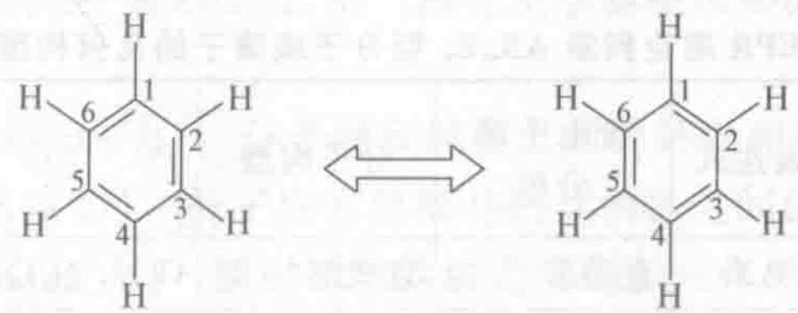

## 12.4 分子轨道理论

分子轨道理论的要点：

（1）分子轨道可由原子轨道线性组合而成，原子轨道组成分子轨道时，轨道数不变。例如，双原子分子的分子轨道可表达为两个原子轨道 $\psi_{1}$ 和 $\psi_{2}$ 的线性组合（此处，忽略了波函数 $\psi_{1}$ 和 $\psi_{2}$ 组合的系数）：

$$
\psi = \psi_ {1} \pm \psi_ {2}
$$

(2) 分子轨道的能量可以低于、等于或高于原子轨道, 分别称为成键、非键和反键轨道。原子轨道组成分子成键轨道时, 必须满足对称性匹配原则、能量近似原则和最大重叠原则。

（3）电子在分子轨道上的排布与在原子轨道中的排布规则相同，仍然遵循三大原则，即能量最低原理、Pauli不相容原理和Hund规则。

$$
\text {   电子在分子轨道排布后,所成化学键的键级   } = \frac {\text {   成键电子数   } - \text {   反键电子数   }}{2}.
$$

分子轨道理论具有更完善的数学形式,可以很好地解释 $O_{2}$ 的顺磁性以及离域电子体系的结构和性质。因此随着计算机技术的普及,分子轨道理论的发展更快、应用更广。

## 12.5 价层电子对互斥(VSEPR)理论

这是一个简捷地判断分子形状的经验规则。VSEPR理论认为，分子中的价层电子对[包括成键电子对(键对，BP)和孤对电子(孤对，LP)]之间因静电排斥趋向于尽可能远离。应用VSEPR理论判断分子形状的核心在于，合理计算中心原子的键对和孤对；要点在于，中心原子与端基成键时端基满足8电子。

(1) 计算键对和孤对的数目 键对包括单键、双键、叁键，后两者均按一个键对处理。

对任一分子 $AX_{m}$ ，中心原子为 A，A 与 X 成键的键对数 BP=m。

孤对 LP=n= $\frac{中心原子的价电子数-周围原子为满足8电子所需的电子数}{2}$ 。

(2) 计算价电子对总数 价电子对总数= $m+n$ 。

(3) 价电子对在中心原子周围分布时尽可能远离, 即采取尽可能对称的分布。

(4) 分子构型判断 不含孤对电子时, 分子构型与价层电子对分布相同; 当存在孤对电子时, 分子的形状与孤对电子无关——但孤对和键对的相对分布位置影响分子形状。键对与孤对如何分布? 需要考虑以下因素:

价电子对相互排斥作用: LP-LP > LP-BP > BP-BP;

价电子对之间的排斥随夹角不同的大小顺序为： $90^{\circ}\gg120^{\circ}\gg180^{\circ}$ ;

因此，尽量避免孤对相互成 $90^{\circ}$ 的分布。

VSEPR 理论判断 $AX_{m}E_{n}$ 型分子或离子的几何构型

<table><tr><td>价电子对 $m+n$ </td><td>键对  $m$ </td><td>孤对  $n$ </td><td>表达式</td><td>价电子对分布</td><td>分子构型</td><td>举例</td></tr><tr><td>2</td><td>2</td><td>0</td><td>AX2</td><td>直线形</td><td>直线形</td><td> $CO_2,N_2O,NO_2^+,OCN-,N_3^-$ </td></tr><tr><td rowspan="2">3</td><td>3</td><td>0</td><td>AX3</td><td rowspan="2">三角形</td><td>三角形</td><td> $BF_3,BO_3^{3-},CO_3^{2-},NO_3-,SO_3,COCl_2$ </td></tr><tr><td>2</td><td>1</td><td>AX2E</td><td>V形</td><td> $O_3,SO_2,NO_2^-$ </td></tr><tr><td rowspan="3">4</td><td>4</td><td>0</td><td>AX4</td><td rowspan="3">四面体形</td><td>四面体形</td><td> $B(OH)_4^- ,CX_4,SiO_4^{4-},PO_4^{3-},SO_4^{2-} ,ClO_4^- ,SO_2Cl_2$ </td></tr><tr><td>3</td><td>1</td><td>AX3E</td><td>三角锥形</td><td> $SO_3^{2-},ClO_3^- ,XeO_3$ </td></tr><tr><td>2</td><td>2</td><td>AX2E2</td><td>V形</td><td> $OF_2,SF_2$ </td></tr><tr><td rowspan="4">5</td><td>5</td><td>0</td><td>AX5</td><td rowspan="4">三角双锥形</td><td>三角双锥形</td><td> $PCl_5,SbCl_5$ </td></tr><tr><td>4</td><td>1</td><td>AX4E</td><td>变形四面体</td><td> $SF_4,SbF_4^-$ </td></tr><tr><td>3</td><td>2</td><td>AX3E2</td><td>T形</td><td> $ClF_3$ </td></tr><tr><td>2</td><td>3</td><td>AX2E3</td><td>直线形</td><td> $I_3-ICl_2^-$ </td></tr><tr><td rowspan="3">6</td><td>6</td><td>0</td><td>AX6</td><td rowspan="3">八面体形</td><td>八面体形</td><td> $SF_6,PCI_6-,AlF_6^{3-}$ </td></tr><tr><td>5</td><td>1</td><td>AX5E</td><td>四角锥形</td><td> $BrF_5,IF_5$ </td></tr><tr><td>4</td><td>2</td><td>AX4E2</td><td>正方形</td><td> $ICl_4-,XeF_4$ </td></tr></table>

E 代表孤对电子。

## 12.6 分子的极性

分子的极性由键的极性及分子的结构决定。当分子中正负电荷中心不重合时，分子为极性分子。同核双原子分子之间的键是非极性的，分子也是非极性的；而异核双原子分子的共价键有极性，分子亦是极性分子。多原子分子需要综合考虑键的极性与分子结构。

分子的极性强弱可用偶极矩表示为

$$
\mu = q d
$$

其中， $q$ 为偶极电荷量， $d$ 为正负电荷重心的间距。偶极矩的单位为 Debye(德拜，D)，1 D= $10^{-18} \mathrm{~cm} \cdot \mathrm{esu}(1 \mathrm{esu}=3.336 \times 10^{-10} \mathrm{C})$ 。通过红外光谱等数据分析，可以得到偶极矩。

## 12.7 金属键理论

金属具有如下典型特征:金属光泽、良导电性、良导热性和延展性。

关于金属键的理论,有如下两种:

（1）自由电子模型 在金属中，价电子处于自由运动状态，而正离子浸泡在自由电子形成的海洋中。自由电子模型可以解释金属的良导电性、导热性以及金属的延展性。

(2) 能带理论 能带理论基于分子轨道理论,从金属原子轨道的组合形成能带的角度分析金属的成键,对金属电子结构的描述更准确。

## 12.8 分子间作用力和氢键

## 1. 分子间作用力

分子间作用力又称 van der Waals 力, 是一种比化学键弱得多的相互作用。van der Waals 力有三种:

(1) 取向力(又称 Coulomb 力) 分子固有偶极之间的静电相互作用。

(2) 诱导力(又称 Debye 力) 分子固有偶极与诱导偶极之间的相互作用。

(3) 色散力(又称 London 力) 瞬时诱导偶极之间的相互作用。

需要特别指出的是,极性分子与极性分子之间同时存在以上三种力,极性分子与非极性分子之间存在诱导力和色散力,而非极性分子之间只有色散力。此外,对于变形性较大而极性弱的分子而言,色散力通常是分子间作用力中最重要的部分。

分子间作用力对于物质的物理性质有较大影响,如沸点、熔点、气化热、熔化热、溶解度以及黏度等等。

## 2. 氢键

氢键是一种氢给体(XH)与氢受体(Y)之间通过氢原子的相互作用：

$$
\mathrm{X} - \mathrm{H} \dots \mathrm{Y}
$$

其中，X 与 Y 具有电负性高、半径小的特点，通常为 F、O、N 原子。

氢键的强度介于 van der Waals 力和化学键之间，约为 $10 \sim 40 \, kJ \cdot mol^{-1}$ 。可以存在分子间，也可以存在分子内。氢键的存在，对于物质的熔点、沸点以及溶解度有很大影响。氢键对于生命体来说也非常重要。生命体分子中存在着大量的氢键，它们维系着生物大分子的结构和功能。

## 习题解析

12.1 写出下列各离子的核外电子构型，并指出其各属于哪一类的离子构型： $Al^{3+}$ ， $Fe^{2+}$ ， $Bi^{3+}$ ， $Cd^{2+}$ ， $Mn^{2+}$ ， $Hg^{2+}$ ， $Ca^{2+}$ ， $Br^{-}$ 。

解 在讨论离子性质时,除了考虑它们的电荷、半径外,还要考虑到它们的外围电子构型。题中各离子的电子构型分述如下:

$$
\begin{array}{l l} \mathrm{Al} ^ {3 +}: 1 \mathrm{s} ^ {2} 2 \mathrm{s} ^ {2} 2 \mathrm{p} ^ {6} & \text {属8电子构型} \\ \mathrm{Fe} ^ {2 +}: 1 \mathrm{s} ^ {2} 2 \mathrm{s} ^ {2} 2 \mathrm{p} ^ {6} 3 \mathrm{s} ^ {2} 3 \mathrm{p} ^ {6} 3 \mathrm{d} ^ {6} & \text {属9~\sim17电子构型} \\ \mathrm{Bi} ^ {3 +}: 1 \mathrm{s} ^ {2} 2 \mathrm{s} ^ {2} 2 \mathrm{p} ^ {6} 3 \mathrm{s} ^ {2} 3 \mathrm{p} ^ {6} 3 \mathrm{d} ^ {1 0} 4 \mathrm{s} ^ {2} 4 \mathrm{p} ^ {6} 4 \mathrm{d} ^ {1 0} 4 \mathrm{f} ^ {1 4} 5 \mathrm{s} ^ {2} 5 \mathrm{p} ^ {6} 5 \mathrm{d} ^ {1 0} 6 \mathrm{s} ^ {2} & \text {属18+2电子构型} \\ \mathrm{Cd} ^ {2 +}: 1 \mathrm{s} ^ {2} 2 \mathrm{s} ^ {2} 2 \mathrm{p} ^ {6} 3 \mathrm{s} ^ {2} 3 \mathrm{p} ^ {6} 3 \mathrm{d} ^ {1 0} 4 \mathrm{s} ^ {2} 4 \mathrm{p} ^ {6} 4 \mathrm{d} ^ {1 1} & \text {属18电子构型} \\ \mathrm{Mn} ^ {2 +}: 1 \mathrm{s} ^ {2} 2 \mathrm{s} ^ {2} 2 \mathrm{p} ^ {6} 3 \mathrm{s} ^ {2} 3 \mathrm{p} ^ {6} 3 \mathrm{d} ^ {5} & \text {属9~\sim17电子构型} \\ \mathrm{Hg} ^ {2 +}: 1 \mathrm{s} ^ {2} 2 \mathrm{s} ^ {2} 2 \mathrm{p} ^ {6} 3 \mathrm{s} ^ {2} 3 \mathrm{p} ^ {6} 3 \mathrm{d} ^ {1 0} 4 \mathrm{s} ^ {2} 4 \mathrm{p} ^ {6} 4 \mathrm{d} _ {} ^ {1 0} 4 \mathrm{f} _ {} ^ {1 4} 5 \mathrm{s} _ {} ^ {2} 5 \mathrm{p} _ {} ^ {6} 5 \mathrm{d} _ {} ^ {1 0} & \text {属18电子构型} \\ \mathrm{Ca} ^ {2 +}: 1 \mathrm{s} ^ {2} 2 \mathrm{s} ^ {2} 2 \mathrm{p} ^ {6} 3 \mathrm{s} _ {} ^ {2} 3 \mathrm{p} ^ {6} & \text {属8电子构型} \\ \mathrm{Br-}: 1 \mathrm{s} ^ {2} 2 \mathrm{s} ^ {2} 2 \mathrm{p} ^ {6} 3 \mathrm{s} _ {} ^ {2} 3 \mathrm{p} _ {} ^ {6} 3 \mathrm{d} _ {} ^ {1 0} 4 \mathrm{s} _ {} ^ {2} 4 \mathrm{p} _ {} ^ {6} & \text {属8电子构型} \end{array}
$$

12.2 试由以下数据画出 Born-Haber 循环，并计算氯化钾的晶格能 $(\mathrm{kJ}\cdot\mathrm{mol}^{-1})$ 。

$$
\mathrm{K(s)} \longrightarrow \mathrm{K(g)}
$$

$$
\Delta H _ {1} = 8 9. 0 \mathrm{kJ} \cdot \mathrm{mol} ^ {- 1}
$$

$$
\mathrm{Cl} _ {2} (\mathrm{g}) \longrightarrow 2 \mathrm{Cl(g)}
$$

$$
\Delta H _ {2} = 2 4 3 \mathrm{kJ} \cdot \mathrm{mol} ^ {- 1}
$$

$$
\mathrm{K(g)} \longrightarrow \mathrm {K^ {+} (g) + e}
$$

$$
\Delta H _ {3} = 4 1 9 \mathrm{kJ} \cdot \mathrm{mol} ^ {- 1}
$$

$$
\mathrm{Cl(g)+e} \longrightarrow \mathrm {Cl^ {-} (g)}
$$

$$
\Delta H _ {4} = - 3 4 9 \mathrm{kJ} \cdot \mathrm{mol} ^ {- 1}
$$

$$
\mathrm{K(s)} + \frac {1}{2} \mathrm{Cl} _ {2} (\mathrm{g}) \longrightarrow \mathrm{KCl(s)}
$$

$$
\Delta H _ {5} = - 4 3 6. 5 \mathrm{kJ} \cdot \mathrm{mol} ^ {- 1}
$$

解

$$
\begin{array}{c} \text {KCl(s)} \\ \text {K(g) + \frac {1}{2} Cl_2(g)} \\ \text {K(s) + \frac {1}{2} Cl_2(g)} \\ \text {K(g) + Cl(g)} \\ \text {K(g) + Cl(g)} \\ \text {K(s) + Cl(g)} \\ \text {K+ (g) + Cl(g) + e} \\ \text {K+ (g) + Cl(g) + e} \\ \text {K+ (g) + Cl(g) + e} \\ \text {K+ (g) + Cl(g) + e} \\ \text {K+ (g) + Cl(g) + e} \\ \text {K+ (g) + Cl(g) + e} \\ \text {K+ (g) + Cl(g) + e} \\ \text {\Delta H_{3}} \\ \text {\Delta H_{4}} \\ \text {\Delta H_{3}} \\ \text {\Delta H_{2}} \\ \text {\Delta H_{1}} \\ \text {\Delta H_{5}} \\ \text {\Delta H = -U} \\ \text {\Delta H} _ {5} \\ \text {\Delta H} _ {1} \\ \text {\Delta H} _ {5} \\ \text {\Delta H} _ {1} \\ \text {\Delta H} _ {5} \\ \text {\Delta H} _ {1} \\ \text {\Delta H} _ {5} \\ \text {\Delta H} _ {1} \\ \text {\Delta H} _ {5} \\ \text {\Delta H} _ {1} \\ \text {\Delta H} _ {5}. \end{array}
$$

$\Delta H_{1}+\frac{1}{2}\Delta H_{2}+\Delta H_{3}+\Delta H_{4}+\Delta H=\Delta H_{5}$ ，即

$$
\begin{array}{r l} & \Delta H _ {1} + \frac {1}{2} \Delta H _ {2} + \Delta H _ {3} + \Delta H _ {4} + (- U) = \Delta H _ {5} \\ & U = \Delta H _ {1} + \frac {1}{2} \Delta H _ {2} + \Delta H _ {3} + \Delta H _ {4} - \Delta H _ {5} \\ & \quad = \left[ 8 9. 0 + \frac {1}{2} \times 2 4 3 + 4 1 9 + (- 3 4 9) - (- 4 3 6. 5) \right] \mathrm{kJ} \cdot \mathrm{mol} ^ {- 1} \\ & \quad = 7 1 7 \mathrm{kJ} \cdot \mathrm{mol} ^ {- 1} \end{array}
$$

12.3 根据查得的 BaO 生成焓及其他数据, 按 Born-Haber 循环计算氧的第二电子亲和能 (Ba 的 $I_{2}=10.00\ eV$ , BaO 的晶格能为 $3054\ kJ\cdot mol^{-1}$ )。

解

$$
\begin{array}{c c c} \mathrm {Ba(s)} & + & \frac {1}{2} \mathrm {O_ {2} (g)} \xrightarrow {\Delta H _ {\mathrm{f}}} \mathrm{BaO(s)} \\ \Biggl \downarrow \Delta H _ {1} = S & & \\ \mathrm{Ba(g)} & & \mathrm {O(g)} \\ \Biggl \downarrow \Delta H _ {2} = I _ {1} + I _ {2} & & \\ \mathrm {Ba^ {2 + } (g)} & + & \mathrm {O^ {2 - } (g)} \end{array}
$$

$$
\Delta H _ {\mathrm{f}} = \Delta H _ {1} + \Delta H _ {2} + \Delta H _ {3} + \Delta H _ {4} + \Delta H _ {5} = S + I _ {1} + I _ {2} + \frac {1}{2} D - E _ {1} - E _ {2} - U
$$

$$
\begin{array}{r l} & E _ {2} = S + I _ {1} + I _ {2} + \frac {1}{2} D - E _ {1} - U - \Delta H _ {\mathrm{f}} \\ & = (1 7 7. 8 + 5. 2 1 2 \times 9 6. 5 + 1 0. 0 0 \times 9 6. 5 + \frac {1}{2} \times 4 9 5 - 1. 4 6 1 \times 9 6. 5 - 3 0 5 4 + 5 4 8. 0) \mathrm{kJ} \cdot \mathrm{mol} ^ {- 1} \\ & = - 7 5 1 \mathrm{kJ} \cdot \mathrm{mol} ^ {- 1} \end{array}
$$

12.4 根据查得的 $NH_{4}Cl(cr)$ 生成焓、晶格能 $(663\ \mathrm{kJ}\cdot\mathrm{mol}^{-1})$ 以及其他必要数据组成循环，计算气态 $NH_{3}$ 的质子亲和焓。

解

$$
\begin{array}{c c c} \frac {1}{2} \mathrm{N} _ {2} (\mathrm{g}) + \frac {3}{2} \mathrm{H} _ {2} (\mathrm{g}) + \frac {1}{2} \mathrm{H} _ {2} (\mathrm{g}) & + & \frac {1}{2} \mathrm{Cl} _ {2} (\mathrm{g}) \xrightarrow {\Delta H _ {\mathrm{f}} (\mathrm{NH} _ {4} \mathrm{Cl})} \mathrm{NH} _ {4} \mathrm{Cl} (\mathrm{s}) \\ \Biggl \downarrow_ {\Delta H _ {1} = \Delta H _ {\mathrm{f}}} & \Biggl \downarrow_ {\Delta H _ {2} = \frac {1}{2} D} & \Biggl \downarrow_ {\Delta H _ {4} = \frac {1}{2} D} \\ \mathrm{NH} _ {3} (\mathrm{g}) + & \mathrm{H} (\mathrm{g}) & \mathrm{Cl} (\mathrm{g}) \\ & \Biggl \downarrow_ {\Delta H _ {3} = I _ {1}} & \Biggl \downarrow_ {\Delta H _ {5} = - E} \\ & \mathrm{H} ^ {+} (\mathrm{g}) \xrightarrow {\Delta H} \mathrm{NH} _ {4} ^ {+} (\mathrm{g}) & \mathrm{Cl} ^ {-} (\mathrm{g}) \\ & & \Delta H _ {6} = - U \end{array}
$$

$$
\Delta H _ {\mathrm{f}} (\mathrm{NH} _ {4} \mathrm{Cl}) = \Delta H _ {1} + \Delta H _ {2} + \Delta H _ {3} + \Delta H _ {4} + \Delta H _ {5} + \Delta H + \Delta H _ {6}
$$

$$
\begin{array}{r l} \Delta H & = \Delta H _ {\mathrm{f}} (\mathrm{NH} _ {4} \mathrm{Cl}) - \Delta H _ {1} - \Delta H _ {2} - \Delta H _ {3} - \Delta H _ {4} - \Delta H _ {5} - \Delta H _ {6} \\ & = (- 3 1 4. 4 + 4 5. 9 - \frac {1}{2} \times 4 3 6 - 1 3. 6 0 \times 9 6. 5 - \frac {1}{2} \times 2 4 3 + 3. 6 1 \times 9 6. 5 + 6 6 3) \mathrm{kJ} \cdot \mathrm{mol} ^ {- 1} \\ & = - 9 0 8 \mathrm{kJ} \cdot \mathrm{mol} ^ {- 1} \end{array}
$$

12.5 试总结第二周期元素 Be、B、C、N、O、F 生成共价单键的规律性，并填入下表中。

<table><tr><td></td><td>Be</td><td>B</td><td>C</td><td>N</td><td>O</td><td>F</td></tr><tr><td>元素的电子层结构</td><td></td><td></td><td></td><td></td><td></td><td></td></tr><tr><td>最外层的总轨道数</td><td></td><td></td><td></td><td></td><td></td><td></td></tr><tr><td>成键时的最高未配对电子数(即生成共价键数)</td><td></td><td></td><td></td><td></td><td></td><td></td></tr><tr><td>成键后最高孤电子对对数</td><td></td><td></td><td></td><td></td><td></td><td></td></tr><tr><td>成键后余下的空轨道数</td><td></td><td></td><td></td><td></td><td></td><td></td></tr></table>

<table><tr><td></td><td>Be</td><td>B</td><td>C</td><td>N</td><td>O</td><td>F</td></tr><tr><td>元素的电子层结构</td><td> $1s^{2}2s^{2}$ </td><td> $1s^{2}2s^{2}2p^{1}$ </td><td> $1s^{2}2s^{2}2p^{2}$ </td><td> $1s^{2}2s^{2}2p^{3}$ </td><td> $1s^{2}2s^{2}2p^{4}$ </td><td> $1s^{2}2s^{2}2p^{5}$ </td></tr><tr><td>最外层的总轨道数</td><td>4</td><td>4</td><td>4</td><td>4</td><td>4</td><td>4</td></tr><tr><td>成键时的最高未配对电子数(即生成共价键数)</td><td>2</td><td>3</td><td>4</td><td>3</td><td>2</td><td>1</td></tr><tr><td>成键后最高孤电子对对数</td><td>0</td><td>0</td><td>0</td><td>1</td><td>2</td><td>3</td></tr><tr><td>成键后余下的空轨道数</td><td>2</td><td>1</td><td>0</td><td>0</td><td>0</td><td>0</td></tr></table>

第二周期元素有 4 个轨道, 当外层电子数大于 4 时, 成键后就有孤对电子存在。

12.6 画出下列各分子(或离子的)的 Lewis 结构: $\mathrm{CO}_{2}$ , $\mathrm{Cl}_{2} \mathrm{CO}$ , $\mathrm{ClO}_{3}^{-}$ , $\mathrm{PH}_{4}^{+}$ , $\mathrm{HO}_{2}^{-}$ , $\mathrm{CN}^{-}$ , $\mathrm{F}_{2} \mathrm{~N}-\mathrm{NF}_{2}$ , $\mathrm{H}_{2} \mathrm{C}=\mathrm{CHCl}$ , $\mathrm{HO}-\mathrm{NO}_{2}$ , $\mathrm{H}_{3} \mathrm{C}-\mathrm{CHO}$ , $\mathrm{N}_{2} \mathrm{O}_{3}$ 。

解

<table><tr><td>分子或离子</td><td>Lewis结构</td><td>分子或离子</td><td>Lewis结构</td></tr><tr><td> $CO_2$ </td><td>:O=C=O:</td><td> $NF_2NF_2$ </td><td></td></tr><tr><td> $Cl_2CO$ </td><td></td><td></td><td></td></tr><tr><td rowspan="2"> $ClO_3^-$ </td><td></td><td> $CH_2CHCl$ </td><td></td></tr><tr><td></td><td> $HONO_2$ </td><td></td></tr><tr><td> $PH_4^+$ </td><td></td><td> $CH_3CHO$ </td><td></td></tr><tr><td> $HO_2^-$ </td><td>(H—O—O):</td><td></td><td></td></tr><tr><td> $CN^-$ </td><td>(:C≡N):)</td><td> $N_2O_3$ </td><td></td></tr></table>

12.7 画出 Si、P、S 三元素在生成(1) $SiF_{4}$ ; (2) $PCl_{3}$ ; (3) $SF_{4}$ 三种化合物时的杂化轨道类型(注明是等性或不等性)。

解 (1) $\mathrm{SiF}_4$

Si 用 4 个 $sp^{3}$ 杂化轨道(等性)与 4 个 F 成键。

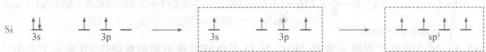  
形成 4 个 $sp^{3}$ 杂化轨道(等性)

(2) $PCl_{3}$

P 用 3 个 $sp^{3}$ 杂化轨道与 3 个 Cl 成键，而另一个 $sp^{3}$ 杂化轨道被孤对电子占据。

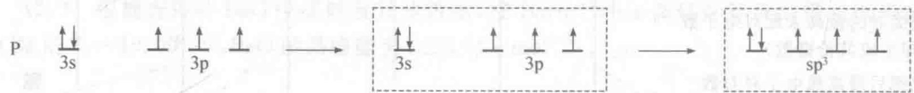  
形成 4 个 $sp^{3}$ 杂化轨道(不等性)

(3) $SF_{4}$

S用4个 $\mathrm{sp}^3\mathrm{d}$ 杂化轨道与4个F成键，而另一个 $\mathrm{sp}^3\mathrm{d}$ 杂化轨道被孤对电子占据。

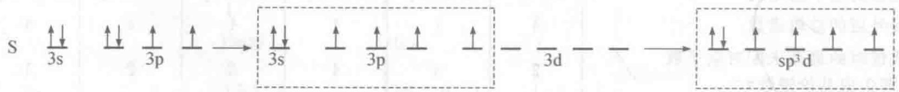  
形成 5 个 $sp^{3}d$ 杂化轨道(不等性)

12.8 指出下列各分子中各个 C 原子所采用的杂化轨道：（1） $CH_{4}$ ；（2） $C_{2}H_{2}$ ；

$$
\mathrm{C} _ {2} \mathrm{H} _ {4}
$$

$$
\mathrm{H} _ {3} \mathrm{COH}
$$

$$
\mathrm{CH} _ {2} \mathrm{O};
$$

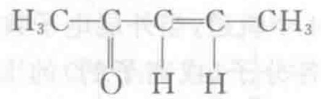

解

<table><tr><td>编号</td><td>(1)</td><td>(2)</td><td>(3)</td><td>(4)</td><td>(5)</td><td>(6)</td></tr><tr><td>化学式</td><td> $CH_4$ </td><td> $C_2H_2$ </td><td> $C_2H_4$ </td><td> $H_3COH$ </td><td> $CH_2O$ </td><td> $H_3C-C-C=C-CH_3$  $\parallel \mid \mid$  $O \quad H \quad H$ </td></tr><tr><td>C原子杂化轨道</td><td> $sp^3$ </td><td>sp</td><td> $sp^2$ </td><td> $sp^3$ </td><td> $sp^2$ </td><td>从左到右,C所取杂化轨道依次是: $sp^3,sp^2,sp^2,sp^2,sp^3$ </td></tr></table>

12.9 (1) 指出在 $\mathrm{OF}_2$ 、 $\mathrm{NF}_5$ 、 $\mathrm{XeF}_4$ 中，可能存在的分子及其几何构型。

(2) 已知 $N_{2}H_{4}$ 分子具有极性, N 原子以何种杂化轨道成键, 最多可有几个原子共面?

解（1）由于N为第二周期元素，最多只能以4个共价键与其他元素原子结合，所以 $\mathrm{NF}_5$ 不能存在；而 $\mathrm{OF}_2$ 、 $\mathrm{XeF_4}$ 则能存在，它们分别为V形和平面正方形。

(2) N 原子以 $sp^{3}$ 杂化, 最多有 4 个原子共平面。

12.10 含碘的化合物常用来制备防腐和消毒用的药物,其中某一种碘化合物的分子式是 $\mathrm{HC}_{4}\mathrm{NI}_{4}$ ,写出它的 Lewis 结构(其中 4 个 C 和 1 个 N 组成五元环)。

解

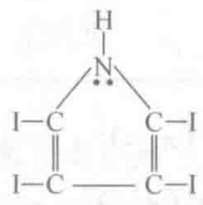

其中有 $\pi_{5}^{6}$ 离域键。

12.11 蛋白质是由多肽链组成, 多肽链的基本单元如右下图。注明各原子间是什么类型的键, 并由此推测 6 个原子能共平面的主要原因。

解 由于中间的 C、N 为 $sp^{2}$ 杂化，故图中 6 个原子共平面。中间的 N、C、O 间有 $\pi_{3}^{4}$ 离域键。

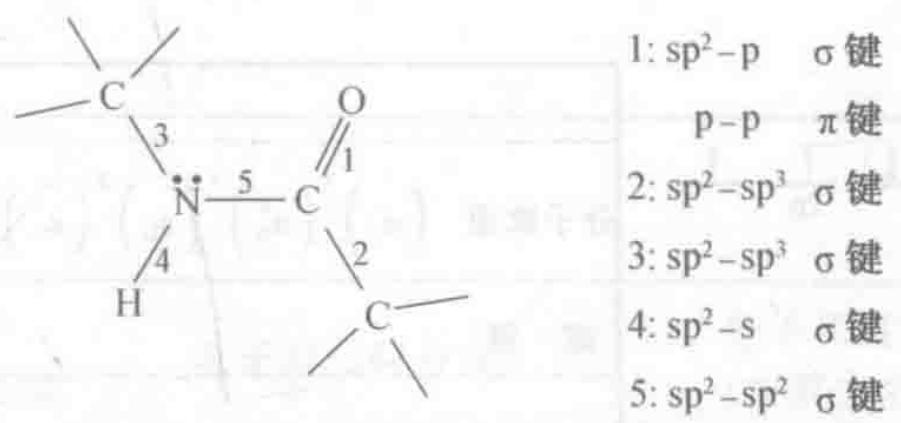

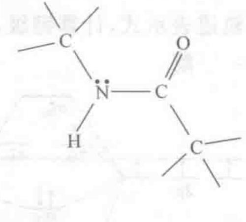

12.12 写出下列分子或离子可能的共振体：（1） $NO_{2}^{-}$ 和 $O_{3}$ ；（2） $SO_{3}$ 和 $CO_{3}^{2-}$ 。解

(1) $\mathrm{NO}_2^-$ 和 $\mathrm{O}_3$

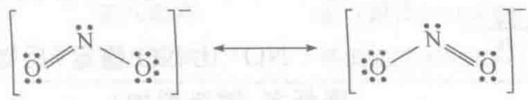

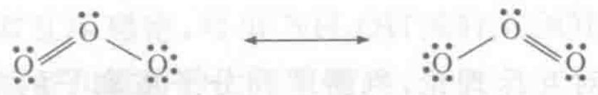

(2) $\mathrm{SO}_3$ 和 $\mathrm{CO}_3^2$

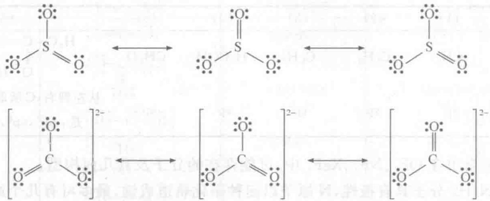

12.13 写出所有第二周期同核双原子分子的分子轨道表示式,其中哪些分子不能稳定存在?哪些分子是顺磁性,哪些是反磁性?

解 $\mathrm{Li}_2$ $(\sigma_{1s})^2 (\sigma_{1s}^*)^2 (\sigma_{2s})^2$

$$
\mathrm{Be} _ {2} \quad (\sigma_ {1 s}) ^ {2} (\sigma_ {1 s} ^ {*}) ^ {2} (\sigma_ {2 s}) ^ {2} (\sigma_ {2 s} ^ {*}) ^ {2}\tag{不能存在}
$$

$$
\mathrm{B} _ {2} \quad \left(\sigma_ {1 \mathrm{s}}\right) ^ {2} \left(\sigma_ {1 \mathrm{s}} ^ {*}\right) ^ {2} \left(\sigma_ {2 \mathrm{s}}\right) ^ {2} \left(\sigma_ {2 \mathrm{s}} ^ {*}\right) ^ {2} \left(\pi_ {2 p _ {v}}\right) ^ {1} \left(\pi_ {2 p _ {z}}\right) ^ {1}\tag{稳定,顺磁性}
$$

$$
\mathrm{C} _ {2} \quad \left(\sigma_ {1 s}\right) ^ {2} \left(\sigma_ {1 s} ^ {*}\right) ^ {2} \left(\sigma_ {2 s}\right) ^ {2} \left(\sigma_ {2 s} ^ {*}\right) ^ {2} \left(\pi_ {2 p _ {v}}\right) ^ {2} \left(\pi_ {2 p _ {z}}\right) ^ {2}\tag{稳定,反磁性}
$$

$$
\mathrm{N} _ {2} \quad \left(\sigma_ {1 \mathrm{s}}\right) ^ {2} \left(\sigma_ {1 \mathrm{s}} ^ {*}\right) ^ {2} \left(\sigma_ {2 \mathrm{s}}\right) ^ {2} \left(\sigma_ {2 \mathrm{s}} ^ {*}\right) ^ {2} \left(\pi_ {2 \mathrm{p} _ {\mathrm{v}}}\right) ^ {2} \left(\pi_ {2 \mathrm{p} _ {\mathrm{z}}}\right) ^ {2} \left(\sigma_ {2 \mathrm{p} _ {\mathrm{x}}}\right) ^ {2}\tag{稳定,反磁性}
$$

$$
\mathrm{O} _ {2} \quad (\sigma_ {1 s}) ^ {2} (\sigma_ {1 s} ^ {*}) ^ {2} (\sigma_ {2 s}) ^ {2} (\sigma_ {2 s} ^ {*}) ^ {2} (\sigma_ {2 p _ {x}}) ^ {2} (\pi_ {2 p _ {y}}) ^ {2} (\pi_ {2 p _ {z}}) (\pi_ {2 p _ {y}} ^ {*}) ^ {1} (\pi_ {2 p _ {z}} ^ {*}) ^ {1}
$$

$$
F _ {2} \quad \left(\sigma_ {1 s}\right) ^ {2} \left(\sigma_ {1 s} ^ {*}\right) ^ {2} \left(\sigma_ {2 s}\right) ^ {2} \left(\sigma_ {2 s} ^ {*}\right) ^ {2} \left(\sigma_ {2 p _ {x}}\right) ^ {2} \left(\pi_ {2 p _ {y}}\right) ^ {2} \left(\pi_ {2 p _ {z}}\right) ^ {2} \left(\pi_ {2 p _ {v}} ^ {*}\right) ^ {2} \left(\pi_ {2 p _ {z}} ^ {*}\right) ^ {2}
$$

$$
\mathrm{Ne} _ {2} \left(\sigma_ {1 s}\right) ^ {2} \left(\sigma_ {1 s} ^ {*}\right) ^ {2} \left(\sigma_ {2 s}\right) ^ {2} \left(\sigma_ {2 s} ^ {*}\right) ^ {2} \left(\sigma_ {2 p _ {x}}\right) ^ {2} \left(\pi_ {2 p _ {y}}\right) ^ {2} \left(\pi_ {2 p _ {z}}\right) ^ {2} \left(\pi_ {2 p _ {y}} ^ {*}\right) ^ {2} \left(\pi_ {2 p _ {z}} ^ {*}\right) ^ {2} \left(\sigma_ {2 p _ {x}} ^ {*}\right) ^ {2}
$$

12.14 画出 NO 分子轨道能级图(能级高低次序与 $N_{2}$ 相似)，分别写出 NO、 $NO^{+}$ 的分子轨道表示式，计算键级，比较稳定性，并解释之。

解

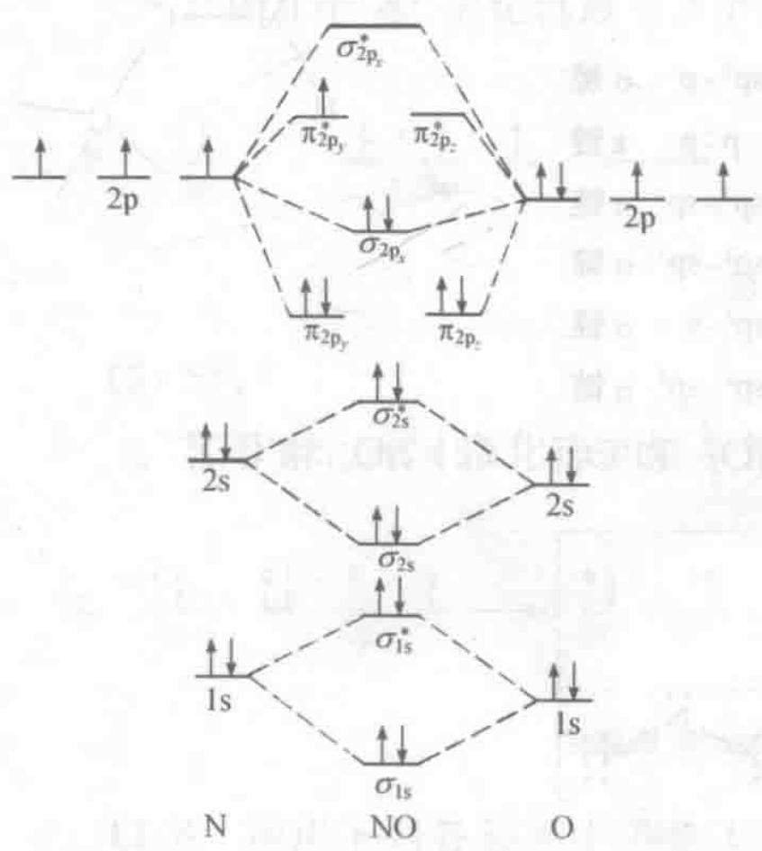

<table><tr><td colspan="2">NO</td></tr><tr><td colspan="2">分子轨道 $\left( {\sigma }_{1\mathrm{\;s}}\right) ^{2}\left( {\sigma }_{1\mathrm{\;s}}^{ * }\right) ^{2}\left( {\sigma }_{2\mathrm{\;s}}\right) ^{2}\left( {\sigma }_{2\mathrm{\;s}}^{ * }\right) ^{2}\left( {\pi }_{2\mathrm{p}_{\mathrm{s}}}\right) ^{2}\left( {\pi }_{2\mathrm{p}_{\mathrm{s}}}\right) ^{2}\left( {\sigma }_{2\mathrm{p}_{\mathrm{s}}}\right) ^{2}\left( {\pi }_{2\mathrm{p}_{\mathrm{s}}}^{ * }\right) ^{1}$ 键级 2.5</td></tr><tr><td colspan="2"> $NO^+$ </td></tr><tr><td colspan="2">分子轨道 $\left( {\sigma }_{1\mathrm{\;s}}\right) ^{2}\left( {\sigma }_{1\mathrm{\;s}}^{ * }\right) ^{2}\left( {\sigma }_{2\mathrm{\;s}}\right) ^{2}\left( {\sigma }_{2\mathrm{\;s}}^{ * }\right) ^{2}\left( {\pi }_{2p_{\mathrm{s}}}\right) ^{2}\left( {\pi }_{2p_{\mathrm{s}}}\right) ^{2}\left( {\sigma }_{2p_{\mathrm{s}}}\right) ^{2}$ 键级 3</td></tr></table>

NO $^{+}$ 比 NO 稳定(反键轨道上少 1 个电子, 能量降低多, 键级增加)。

12.15 试用价层电子对互斥理论, 判断下列分子或离子的空间几何构型: $\mathrm{NO}_{2}, \mathrm{NF}_{3}$ , $\mathrm{SO}_{3}^{2-}, \mathrm{ClO}_{4}^{-}, \mathrm{CS}_{2}, \mathrm{BO}_{3}^{3-}, \mathrm{SiF}_{4}, \mathrm{H}_{2} \mathrm{~S}, \mathrm{AsO}_{3}^{3-}, \mathrm{ClO}_{3}^{-}$ 。

<table><tr><td>分子或离子</td><td colspan="2">空间几何构型(图示)</td><td>分子或离子</td><td colspan="2">空间几何构型(图示)</td></tr><tr><td> $NO_{2}$ </td><td>属  $AX_{2}E$ V形</td><td></td><td> $BO_{3}^{3-}$ </td><td>属  $AX_{3}$ 平面三角形</td><td></td></tr><tr><td> $NF_{3}$ </td><td>属  $AX_{3}E$ 三角锥形</td><td></td><td> $SiF_{4}$ </td><td>属  $AX_{4}$ 四面体形</td><td></td></tr><tr><td> $SO_{3}^{2-}$ </td><td>属  $AX_{3}E$ 三角锥形</td><td></td><td> $H_{2}S$ </td><td>属  $AX_{2}E_{2}$ V形</td><td></td></tr><tr><td> $ClO_{4}^{-}$ </td><td>属  $AX_{4}$ 四面体形</td><td></td><td> $AsO_{3}^{3-}$ </td><td>属  $AX_{3}E$ 三角锥形</td><td></td></tr><tr><td> $CS_{2}$ </td><td>属  $AX_{2}$ 直线形</td><td>S=C=S</td><td> $ClO_{3}^{-}$ </td><td>属  $AX_{3}E$ 三角锥形</td><td></td></tr></table>

12.16 填充下表：

<table><tr><td>分子或离子</td><td>中心原子杂化轨道类型</td><td>电子对几何分布</td><td>分子几何构型 (中英文名称)</td><td>VSEPR 符号</td></tr><tr><td> $H_2S$ </td><td></td><td></td><td></td><td></td></tr><tr><td> $SbCl_5$ </td><td></td><td></td><td></td><td></td></tr><tr><td> $ICl_3$ </td><td></td><td></td><td></td><td></td></tr><tr><td> $AlF_6^{3-}$ </td><td></td><td></td><td></td><td></td></tr><tr><td> $XeF_4$ </td><td></td><td></td><td></td><td></td></tr></table>

<table><tr><td>分子或离子</td><td>中心原子杂化轨道类型</td><td>电子对几何分布</td><td>分子几何构型(中英文名称)</td><td>VSEPR符号</td></tr><tr><td> $H_2S$ </td><td>不等性  $sp^3$ </td><td>四面体</td><td>弯曲形(bent)</td><td> $AX_2E_2$ </td></tr><tr><td> $SbCl_5$ </td><td> $sp^3d$ </td><td>三角双锥</td><td>三角双锥(trigonal bipyramid)</td><td> $AX_5$ </td></tr><tr><td> $ICl_3$ </td><td> $sp^3d$ </td><td>三角双锥</td><td>T字形(T-shape)</td><td> $AX_3E_2$ </td></tr><tr><td> $AlF_6^{3-}$ </td><td> $sp^3d^2$ </td><td>正八面体</td><td>正八面体(octahedron)</td><td> $AX_6$ </td></tr><tr><td> $XeF_4$ </td><td> $sp^3d^2$ </td><td>正八面体</td><td>平面正方形(planar square)</td><td> $AX_4E_2$ </td></tr></table>

12.17 根据价层电子对互斥理论, 写出 $NH_{2}OH$ 、 $CH_{3}COOH$ 、 $CH_{3}OCH_{3}$ 几种分子的几何构型, 并注明每一个键的键型和键角的大概数值。

解 列入下表,其中各 $sp^{3}$ 杂化轨道均为不等性。

<table><tr><td>分子</td><td>几何构型</td><td>键型</td><td>键角</td></tr><tr><td> $NH_2OH$ </td><td></td><td>1,2,4:s-sp3σ键3:sp3-sp3σ键</td><td>1,2,3键间≈107°3,4键间≈104°</td></tr><tr><td> $CH_3COOH$ </td><td></td><td>1,2,3,8:s-sp3σ键4,7:sp2-sp3σ键5:sp2-pσ键6:p-pπ键</td><td>1,2,3,4键间≈109°4,5,7键间≈120°7,8键间≈104°</td></tr><tr><td> $CH_3OCH_3$ </td><td></td><td>1,2,3,6,7,8:s-sp3σ键4,5:sp3-sp3σ键</td><td>C周围各键角≈109°4,5键间≈104°</td></tr></table>

12.18 光化烟雾中最有害的化合物有过氧化乙酰基硝酸酯和丙烯醛，其分子骨架分别为

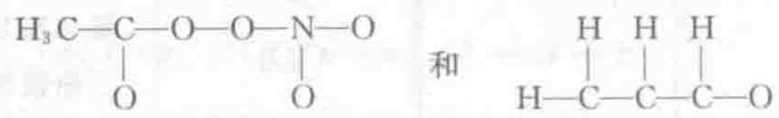

试粗略画出其几何构型和 Lewis 结构，并指出各键角约为多少。

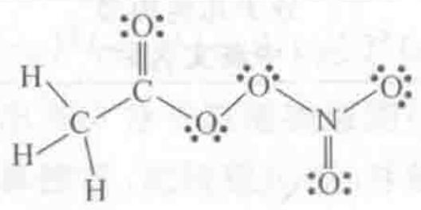

第1个C原子周围键角 $\approx 109^{\circ}$ 第2个C原子周围及N原子周围键角 $\approx 120^{\circ}$ 两个O原子周围键角 $\approx 104^{\circ}$ N原子周围键角 $\approx 120^{\circ}$

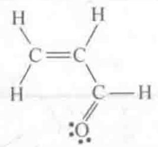

所有键角 $\approx 120^{\circ}$

12.19 判断下列各组化合物中,哪种化合物键的极性较大:

(1) ZnO, ZnS; (2) HI, HCl, HF, HBr; (3) $H_{2}S$ , $H_{2}Se$ , $H_{2}Te$ ; (4) $NH_{3}$ , $NF_{3}$ ;
(5) $F_{2}O$ , $H_{2}O$ .

解 键的极性大小一般根据电负性差值判断,电负性差值大,其极性一般就大。

(1) Zn—O 键的极性大。

(2) 键的极性大小顺序是 HF>HCl>HBr>HI。

(3) 键的极性大小顺序是 $H_{2}S > H_{2}Se > H_{2}Te$ 。

(4) N—H 键的极性大: 虽 N、F 电负性差值 (1.0) 略大于 N、H 电负性差值 (0.8), 但键矩是从偶极矩推算来的, 由于 N 上孤对电子的影响, $NH_{3}$ 分子中孤对矩与键矩相加合, 而 $NF_{3}$ 分子中孤对矩与键矩相互抵消, $NH_{3}$ 分子的偶极矩 (1.5 D) 远大于 $NF_{3}$ 的偶极矩 ( $\mu = 0.20 D$ ), 计算结果 N—H 键矩为 1.33 D, 面 N—F 键矩只有 0.15 D。

(5) O—H 键的极性大。

12.20 指出题 12.15 所有分子(或离子)中哪些是偶极子？哪些是非偶极子？

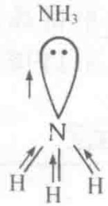

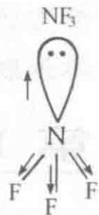

解 $NO_{2}, NF_{3}, SO_{3}^{2-}, H_{2}S, AsO_{3}^{3-}, ClO_{3}^{-}$ 是偶极子； $ClO_{4}^{-}, CS_{2}, H_{H} \updownarrow H$ $F \downarrow F$ $BO_{3}^{3-}, SiF_{4}$ 是非偶极子。

12.21 判断下列各组中同种或异种分子之间存在什么形式的分子间作用力：

(1) $\mathrm{H}_{2} \mathrm{~S}$ ; (2) $\mathrm{CH}_{4}$ ; (3) Ne 与 $\mathrm{H}_{2} \mathrm{O}$ ; (4) $\mathrm{CH}_{3} \mathrm{Br}$ ; (5) $\mathrm{NH}_{3}$ ; (6) $\mathrm{Br}_{2}$ 与 $\mathrm{CCl}_{4}$ 。解

<table><tr><td>(1)  $H_2S$ </td><td>色散力,诱导力,取向力</td></tr><tr><td>(2)  $CH_4$ </td><td>色散力</td></tr><tr><td>(3) Ne 与  $H_2O$ </td><td>色散力,诱导力</td></tr><tr><td>(4)  $CH_3Br$ </td><td>色散力,诱导力,取向力</td></tr><tr><td>(5)  $NH_3$ </td><td>色散力,诱导力,取向力,氢键</td></tr><tr><td>(6)  $Br_2$  与  $CCl_4$ </td><td>色散力</td></tr></table>

12.22 按沸点由低到高的顺序依次排列下列两个系列中的各个物质，并说明理由。

(1) $H_{2}$ , CO, Ne, HF; (2) $CI_{4}$ , $CF_{4}$ , $CBr_{4}$ , $CCl_{4}$ .

解 沸点由低到高的次序是(见下表):

<table><tr><td>顺序</td><td>(1)  $H_2$  &lt; Ne &lt; CO &lt; HF</td><td>(2)  $CF_4$  &lt;  $CCl_4$  &lt;  $CBr_4$  &lt;  $Cl_4$ </td></tr><tr><td>理由</td><td>相对分子质量依次增大,色散力存在较强增大;CO还具有取向力、诱导力氢键</td><td>非极性分子相对分子质量依次增大,色散力增大</td></tr></table>

12.23 比较下列各组中两种物质的熔点高低, 简单说明原因: (1) $NH_{3}$ , $PH_{3}$ ;

(2) $PH_{3}$ , $SbH_{3}$ ;

(3) $Br_{2}$ , ICl。

解（1） $NH_{3}$ 高( $NH_{3}$ 间有氢键)；

(2) $SbH_{3}$ 高( $SbH_{3}$ 的分子量大, 色散力大);

(3) ICl 高 $\left(\mathrm{Br}_{2}\right.$ 和 ICl 分子量相近, 色散力相近, 但 ICl 是极性分子, 还存在取向力和诱导力)。

12.24 利用键能数据估算：(1) $P_{4}$ 原子化能；(2) 金刚石气化热；(3) 冰的气化热。

<table><tr><td colspan="2">(1)  $P_{4}(g) \longrightarrow 4P(g)$ </td><td>(2) C(金刚石) → C(g)</td><td>(3)  $H_{2}O(冰) \longrightarrow H_{2}O(g)$ </td></tr><tr><td> $\Delta H = 6E(P-P)$  $= 6 \times 214 kJ \cdot mol^{-1}$  $= 1284 kJ \cdot mol^{-1}$ </td><td></td><td> $\Delta H = 2E(C-C)$  $= 2 \times 344 kJ \cdot mol^{-1}$  $= 688 kJ \cdot mol^{-1}$ </td><td> $\Delta H = 2E(OH\cdots O)$  $= 2 \times 18.8 kJ \cdot mol^{-1}$  $= 37.6 kJ \cdot mol^{-1}$ </td></tr></table>

# 第13章 晶体与晶体结构

晶体是固体物质存在的一种主要形态,有关晶体结构的知识是认识物质性质的重要基础。晶体结构最基本的特征是周期性——晶体中的结构单元(原子、分子、原子团或离子)在空间作有规则的周期性排列。晶体的外形取决于其内在的结构特征,反映了晶体的对称性。测定晶体结构最快捷有效的方法是 X 射线衍射。

## 内容提要

## 13.1 晶体的特征

从宏观、外在的角度来看，晶体主要有以下几个特征：

(1) 晶体通常具有自发形成的规则的几何外形；

(2) 晶体具有固定的熔点,而非晶体没有固定熔点;

(3) 晶体呈现各向异性。

## 13.2 晶体结构的周期性

从微观、内在的角度来看，晶体的特征是结构的周期性。因此，需要了解并掌握描述晶体结构的方法。

## 1. 点阵与结构基元

将晶体结构中的每个重复单元在其相同的位置抽象为一个点所形成的三维空间阵列称为点阵, 空间点阵的基本特性是周期性。点阵中每个点都具有完全相同的周围环境, 每个点所代表的重复单元的具体内容, 称为晶体的结构基元。点阵点连接起来可以形成空间格子, 故点阵也称晶格。

$$
\mathrm{晶体结构} = \mathrm{点阵} + \mathrm{结构基元}
$$

## 2. 晶格单位

将点阵按一定方式划分，在点阵中以三维空间3个周期 $a, b$ 和 $c$ 为边长而形成的平行六面体格子，也称点阵单位。

## 3. 晶胞

将组成晶体的结构基元置于晶格的结点上，可以得到与晶格单位相对应的实际结构单元——晶胞。晶胞在空间平移无间隙地堆砌而形成三维晶体结构。晶胞的大小和形状可用平行六面体的3个边长 $a, b, c$ 及其所成的3个夹角 $\alpha(b \wedge c), \beta(c \wedge a), \gamma(a \wedge b)$ 进行描述，这6个参数总称为晶胞参数。

点阵、晶格、晶格单位和晶胞都是描述晶体周期性结构的方法。点阵、晶格、晶格单位是一种几何概念，是从晶体结构中抽象出的简化的数学描述。晶胞是一个大小和形状与晶格单位相同的平行六面体。它代表晶体的基本重复单位，既包括晶格单位的形式和大小，也包括对应于点阵点的结构基元的内容。它们之间的相互关系可以示意性地表示如下：

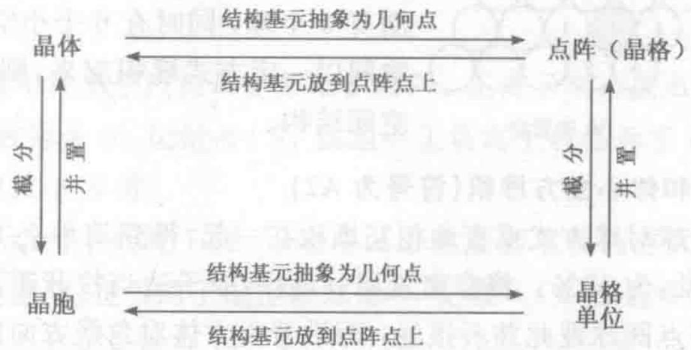

## 4. 晶系与点阵型式

按照结构中对称性特征的不同,晶体可分为7个晶系,14种空间点阵型式(又称Bravias点阵型式)。描述晶格单元或晶胞的形状和大小的6个参数(边长a、b、c及夹角 $\alpha$ 、 $\beta$ 、 $\gamma$ )的取值见教材表13.1。某一晶体属于哪个晶系由晶体对称性决定,某一晶系的晶胞参数必然满足教材表13.1中的要求;但反过来,若晶胞参数符合表中所列数值,却不一定必然为对应的晶系,若对称性不满足的话,有可能取低一点的晶系。鉴于本课程只介绍晶体学最基本的知识,未涉及对称性问题,因此在通常情况下,还是可以按照晶胞参数的取值来判断晶系,这样做在大多数情况下也是正确的。

晶体的14种点阵型式见教材图13.4。立方晶系有简单立方、体心立方、面心立方三种点阵型式；正交晶系有简单、体心、面心、底心四种型式；四方晶系有简单、体心两种型式；单斜晶系有简单、底心两种型式；六方晶系和三斜晶系都只有简单一种型式；三方晶系情况稍微复杂一点，简单三方的点阵型式与六方晶系相同，而菱面体格子（简称 $R$ 格子三方）可以给出一种菱形的简单点阵型式，也可以画成带心的六方点阵型式。本课程只要求掌握立方晶系的点阵型式。

## 5. 晶体的 X 射线衍射与 Bragg 方程

晶体由原子(或分子、离子等)有规则地排列而成,可以抽象成三维点阵结构。若将点阵中的点按一定规律相连接,可以形成一系列的平面点阵,平面点阵间距的量级为 $10^{-10}m$ ( $10^{-8}cm$ , Å),落在X射线的波长范围。因此,X射线照射到晶体上,可以发生衍射现象。Bragg从平面点阵的角度出发,给出了晶体中各组晶面发生衍射条件的方程:

$$
2 d \sin \theta = n \lambda
$$

式中，d 为晶面间距； $\lambda$ 为入射 X 射线波长； $\theta$ 为衍射角；n 为衍射级数，取正整数。不同物质各有其特征的 X 射线衍射图。X 射线衍射分析已经成为鉴定物相、分析晶体结构的最快捷有效的方法。

## 13.3 等径圆球的堆积

等径圆球的密堆积模型可以给出较为清晰的三维空间几何图像,这对于分析和描述晶体

结构非常有用。

将大小和形状相同的圆球在一个平面上排列时，常见的有两种方式，见左下图：（a）中

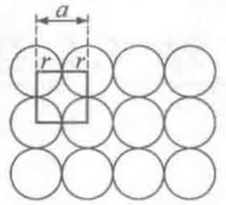  
(a) 一种常见的非密置层

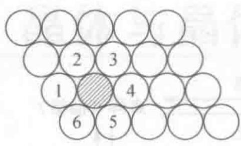  
(b) 密置层

圆球间的空隙较大,称为非密置层;(b)中球的排列则是最紧密的,称为密置层。密置层中每个球周围有6个球,同时有6个小空隙。将这些层在三维空间以一定方式堆积起来,则可以形成不同的三维空间结构。

## 1. 简单立方堆积和体心立方堆积(符号为 A2)

将非密置层(a)以球对球方式垂直地相互堆积在一起,得到简单立方堆积结构,这种堆积方式的空间利用率较低,为52%。将非密置层(a)内的原子适当拉开距离,再将这种非密置层间相互错开放置,各顶点圆球彼此并不接触,而沿着立方体对角线方向的圆球互相接触,则可形成体心立方堆积(bcp),这种堆积的空间利用率为68%。

## 2. 立方密堆积(A1)和六方密堆积(A3)

等径圆球按密置层(b)相互错开的方式堆积,可以形成最密堆积,常见的有立方密堆积(ccp)和六方密堆积(hcp)两种形式。若密置层的相互位置关系为 ABCABC…,三层为一重复周期,形成的结构中可以划分出面心立方晶胞,称为立方密堆积;若密置层的相互位置关系为 ABAB…,两层为一重复周期,形成的结构中可以划分出六方晶胞,称为六方密堆积。这两种密堆积的空间利用率均为 74%。

等径球做密堆积时,每个球的配位数均为12。由N个等径球组成的三维结构中,可形成2N个由4个球围成的“四面体空隙”、N个由6个球围成的“八面体空隙”。若圆球半径为r,则四面体空隙可容纳半径为0.225r的小球,八面体空隙可容纳半径为0.414r的小球。

## 13.4 晶体的基本类型及其结构

根据晶体中原子间作用力的差别,可将晶体分成 4 种基本类型:金属晶体、离子晶体、分子晶体和共价晶体。可以从晶体中原子的堆积方式及原子间相互作用力的角度讨论各类晶体结构的特征及其与晶体性质的关系。

## 1. 金属晶体

金属键没有方向性,金属原子可以近似地看做球体,每个金属原子通常倾向于与尽可能多的邻接金属原子堆积在一起,以使体系能量最低。金属单质的结构多属于 A1 型、A2 型和 A3 型,其中约有 2/3 的金属常温常压下采取配位数为 12 的密堆积结构。就目前所知,只有 84 号元素 Po 有简单立方结构。

## 2. 离子晶体

离子晶体中正离子和负离子通过静电吸引结合在一起。离子键没有方向性和饱和性，所以离子在晶体中常常也趋向于采取尽可能紧密的堆积形式。许多离子晶体中的结构也可以通过等径球的堆积模型来处理和描述。将离子化合物中半径较大的负离子 $(\mathrm{X}^{-}, \mathrm{O}^{2-}$ 或 $\mathrm{S}^{2-}$ 看做等径圆球，较小的正离子处在负离子堆积形成的空隙之中。为了降低晶体体系的能量，正离子所选择的负离子空隙一般是既要有尽可能高的负离子配位数，又要使正负离子尽可能接触。故正负离子的半径比对离子晶体的结构起主导作用，可以通过半径比值预测某些物质的结构和配位数。

常见的 AB 型离子晶体类型有 NaCl 型、CsCl 型、立方 ZnS 型。

(1) NaCl 型 结构中负离子 $\left(\mathrm{Cl}^{-}\right)$ 按面心立方密堆积排布, 正离子 $\left(\mathrm{Na}^{+}\right)$ 则处于负离子堆积形成的八面体空隙中, 正负离子的配位数都是 6 , 记做 6 : 6 , 晶胞中有 4 个 NaCl 单位, 亦即正负离子数均为 4 。具有这种结构类型的典型 AB 型化合物有 KCl、CaO、BaS、MnO 等。

(2) CsCl 型 结构中负离子按简单立方堆积排列，正离子则占据由负离子所构成的立方体空隙，正负离子配位数都是 8，记做 8:8，晶胞中正负离子数各等于 1。具有 CsCl 型结构的化合物有 RbCl、TlCl、CuCN 等。

(3) 立方 ZnS 型 结构中负离子 $(\mathrm{S}^{2-})$ 采用面心立方密堆积的方式排列, 阳离子 $(\mathrm{Zn}^{2+})$ 填充在半数的四面体空隙中, 正负离子配位数都是 4 , 记做 $4:4$ , 晶胞中正负离子数也各为 4 。采用这种结构类型的 AB 型化合物有 BeS、CuCl、CuBr、ZnO、CdS 等。

## 3. 分子晶体

分子晶体是指分子内部存在较强的共价键,而分子之间通过分子间作用力而规则排列所形成的晶体。若分子间作用力主要为 van der Waals 力,由于其作用较弱,对于球形或近似球形的分子(分子会发生旋转,近似球形),结构中也倾向于采取密堆积的排列方式;对于直线形或其他形状复杂的分子,结构也比较复杂,多采用单斜等对称性低的晶系。若分子间存在较强的氢键作用,由于氢键有一定的方向性和饱和性,氢键对分子结构影响显著。

## 4. 共价晶体

共价晶体是指原子之间通过共价键相结合而形成由“无限”多的原子规则排列构成的晶体。可以将整个晶体看成一个巨大的分子。共价键对晶体结构起决定性作用。由于共价键作用强，有方向性和饱和性，因此共价晶体不再以密堆积为特征，而具有配位数低、空间利用率低、密度小但硬度大、熔点高的特点。例如，金刚石是典型的共价晶体，其配位数为4，空间利用率为 $34\%$ ，是已知硬度最大的晶体。

## 13.5 化学键键型和晶体构型的变异

在实际晶体中,原子之间的成键往往不是单一键型,而存在一系列过渡性的键型,其中离子键与共价键的混合键型比较常见,研究也较多。

可以用离子的极化现象来说明离子键向共价键的变异。理想的离子键中，离子的电子云呈球形对称；而实际上，离子在周围异性电荷电场的作用下电子云会发生变形，这一现象称为离子的极化。电子云偏离球形后分布在正负离子之间，使键的共价成分增加。极化程度的大小可以从离子的极化能力和变形性（被极化能力，又称可极化性）两个方面来考察。极化能力指离子周围电场的强度，离子所带电荷量越高，半径越小，则极化能力越强，通常正离子影响显著。离子的变形性指电子云发生变形的能力，取决于核电荷对外层电子吸引的紧密程度。离子半径越大，负离子价数越高，正离子价数越低，则变形性越大，一般负离子的变形起主要作用。

对于双原子分子,键的离子性大小可通过实验数据求算,即

$$
\mathrm{键的离子性} = \frac {\mathrm{偶极矩}}{\mathrm{离子电荷} \times \mathrm{键长}} \times 1 0 0
$$

通过拟合已知的实验数据,Pauling 给出由参与成键的 A、B 原子的电负性差值( $\Delta\chi=\chi_{A}-\chi_{B}$ )计算化学键离子性的经验公式:

$$
\mathrm{键的离子性} = 1 - \exp [ - (\chi_ {\mathrm{A}} - \chi_ {\mathrm{B}}) ^ {2} / 4 ]
$$

$\Delta \chi = 1.7$ ，键的离子性为 $48\%$ ，为共价键-离子键混合键型；

$\Delta\chi<1.7$ ，共价性为主；

$\Delta\chi>1.7$ ，离子性为主。

化学键键型的变异会导致晶体构型的变异,进而导致物质性质的变异,我们在研究结构与讨论物质性质时应加以注意。

## 习题解析

13.1 根据晶胞参数,判断下列物质各属什么晶系:

<table><tr><td>化合物</td><td>a/pm</td><td>b/pm</td><td>c/pm</td><td>α</td><td>β</td><td>γ</td><td>晶系</td></tr><tr><td> $K_2S_2O_8$ </td><td>510</td><td>683</td><td>540</td><td>106°54&#x27;</td><td>90°10&#x27;</td><td>102°35&#x27;</td><td></td></tr><tr><td> $FeSO_4·7H_2O$ </td><td>1534</td><td>1098</td><td>2002</td><td>90°</td><td>104°15&#x27;</td><td>90°</td><td></td></tr><tr><td>CsCl</td><td>411</td><td>411</td><td>411</td><td>90°</td><td>90°</td><td>90°</td><td></td></tr><tr><td> $TiO_2$ </td><td>458</td><td>458</td><td>295</td><td>90°</td><td>90°</td><td>90°</td><td></td></tr><tr><td>Sb</td><td>623</td><td>623</td><td>623</td><td>57°5&#x27;</td><td>57°5&#x27;</td><td>57°5&#x27;</td><td></td></tr></table>

解

<table><tr><td>化合物</td><td>晶胞参数</td><td>晶系</td></tr><tr><td> $K_2S_2O_8$ </td><td>a≠b≠c; α≠β≠γ</td><td>三斜晶系</td></tr><tr><td> $FeSO_4·7H_2O$ </td><td>a≠b≠c; α=γ=90°, β≠90°</td><td>单斜晶系</td></tr><tr><td>CsCl</td><td>a=b=c; α=β=γ=90°</td><td>立方晶系</td></tr><tr><td>TiO2</td><td>a=b≠c; α=β=γ=90°</td><td>四方晶系</td></tr><tr><td>Sb</td><td>a=b=c; α=β=γ≠90°</td><td>三方晶系</td></tr></table>

13.2 已知金(Au)的晶格型式是面心立方，a=0.409 nm，求金的原子半径。

解 $r = \frac{1}{2\sqrt{2}} a = \frac{1}{2\sqrt{2}} \times 0.409\mathrm{nm} = 0.145\mathrm{nm}$

13.3 金属铁的晶格型式是体心立方，a=0.286 nm，求：

(1) 铁的原子半径；(2) 晶胞体积；(3) 一个晶胞中铁的原子数；(4) 铁的密度。

解 (1) $r = \frac{\sqrt{3}}{4} a = \frac{\sqrt{3}}{4} \times 0.286 \mathrm{~nm} = 0.124 \mathrm{~nm}$

(2) $V_{\text{晶胞}} = a^3 = (2.86 \times 10^{-8} \mathrm{~cm})^3 = 2.34 \times 10^{-23} \mathrm{~cm}^3$

(3) Fe 原子数=8× $\frac{1}{8}$ +1=2

$$
\rho = \frac {m}{V} = \frac {(2 / 6 . 0 2 \times 1 0 ^ {2 3} \mathrm{mol} ^ {- 1}) \times 5 5 . 8 5 \mathrm{g} \cdot \mathrm{mol} ^ {- 1}}{2 . 3 4 \times 1 0 ^ {- 2 3} \mathrm{cm} ^ {- 3}} = 7. 9 3 \mathrm{g} \cdot \mathrm{cm} ^ {- 3}
$$

13.4 金属 Ni 的晶格型式是面心立方, 密度为 $8.90 \mathrm{~g} \cdot \mathrm{cm}^{-3}$ 。计算:

(1) Ni 晶体中最邻近原子之间的距离。

(2) 能放入到 Ni 晶体空隙中的最大原子半径是多少?

解（1）设晶胞参数为 $a$ ，在一个面心立方晶胞中有4个Ni原子，则

$$
\frac {a ^ {3} \times 8 . 9 0 \mathrm{g} \cdot \mathrm{cm} ^ {- 3} \times 6 . 0 2 \times 1 0 ^ {2 3} \mathrm{mol} ^ {- 1}}{4} = 5 8. 6 9 \mathrm{g} \cdot \mathrm{mol} ^ {- 1}
$$

$$
a = 3. 5 3 \times 1 0 ^ {- 8} \mathrm{cm} = 3 5 3 \mathrm{pm}
$$

最近原子间的距离 $= 2r = \frac{\sqrt{2}}{2} a = \frac{\sqrt{2}}{2}\times 353\mathrm{pm} = 250\mathrm{pm}$

(2) 八面体空隙, 设其半径为 $r'$ , 则

$$
a - \frac {\sqrt {2}}{2} a = 2 r ^ {\prime}
$$

$$
r ^ {\prime} = 0. 1 4 6 a = 5 1. 5 \mathrm{pm}
$$

13.5 经 X 射线分析鉴定, 钛酸钡离子晶体属于立方晶系(如下图所示, 并知 $Ti^{4+}$ 、 $Ba^{2+}$ 都分别和 $O^{2-}$ 互相接触), 其晶胞参数 a=403.1 pm。请据此回答或计算:

(1) 写出该晶体的化学式；

(2) 分别指出 $Ti^{4+}$ 和 $Ba^{2+}$ 的配位氧原子的个数；

(3) $O^{2-}$ 半径为 140 pm, 计算两种正离子的半径。

解（1）一个晶胞中的 $\mathrm{Ba}^{2+}$ 数为 $1, \mathrm{Ti}^{4+}$ 数为 $8 \times (1/8) = 1, \mathrm{O}^{2-}$ 数为 $12 \times (1/4) = 3$ 。所以晶体的化学式为 $\mathrm{BaTiO_3}$ 。

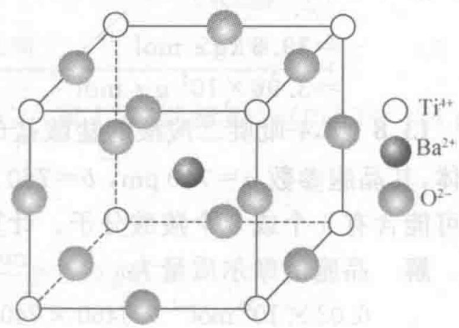

(2) $Ti^{4+}$ 的氧配位数为 6, $Ba^{2+}$ 的氧配位数为 12。

(3) 在晶胞的棱上, $Ti^{4+}$ 和 $O^{2-}$ 互相接触, 因而

$$
r (\mathrm{Ti} ^ {4 +}) = \frac {1}{2} a - r (\mathrm{O} ^ {2 -}) = \frac {1}{2} \times 4 0 3. 1 \mathrm{pm} - 1 4 0 \mathrm{pm} = 6 2 \mathrm{pm}
$$

$Ba^{2+}$ 和 $O^{2-}$ 在高度为 1/2a 且平行于立方晶胞的面的对角线方向上互相接触，因而 $Ba^{2+}$ 的半径为

$$
r (\mathrm{Ba} ^ {2 +}) = \frac {1}{2} \sqrt {2} a - r (\mathrm{O} ^ {2 -}) = \frac {1}{2} \sqrt {2} \times 4 0 3. 1 \mathrm{pm} - 1 4 0 \mathrm{pm} = 1 4 5 \mathrm{pm}
$$

13.6 灰锡(Sn)为面心立方金刚石型结构,晶胞参数a=648.9 pm。

(1) 算出 Sn 的原子半径；

(2) 灰锡的密度为 $5.77 \times 10^{3} \, kg \cdot m^{-3}$ ，求 Sn 的相对原子质量；

（3）其同素异形体白锡(Sn)为四方晶系， $a = 583.1\mathrm{pm}$ ， $c = 318.2\mathrm{pm}$ ，晶胞中含4个锡原子，请通过计算说明白锡变成灰锡，体积是膨胀还是收缩；

(4) 已知白锡中的平均键长为 310 pm, 判断哪一种晶型中的 Sn—Sn 键强。

解（1）键长为立方晶胞对角线的 $1 / 4$

$$
\frac {\sqrt {3} a}{4} = \frac {\sqrt {3}}{4} \times 6 4 8. 9 \mathrm{pm} = 2 8 1. 0 \mathrm{pm}
$$

原子半径： $r(\mathrm{Sn}) = \frac{1}{2}\times 281.0\mathrm{pm} = 140.5\mathrm{pm}$

(2) 晶胞中含 8 个 Sn 原子, 故原子的摩尔质量为

$$
\begin{array}{r l} M = \frac {\rho V N _ {0}}{N} & = \frac {5 . 7 7 \times 1 0 ^ {3} \mathrm{kg} \cdot \mathrm{m} ^ {- 3} \times (6 . 4 8 9 \times 1 0 ^ {- 1 0}) ^ {3} \mathrm{m} ^ {3} \times 6 . 0 2 \times 1 0 ^ {2 3} \mathrm{mol} ^ {- 1} \times 1 0 0 0 \mathrm{g} \cdot \mathrm{kg} ^ {- 1}}{8} \\ & = 1 1 9 \mathrm{g} \cdot \mathrm{mol} ^ {- 1}, \quad \mathrm{Sn} \text {的相对原子质量为} 1 1 9 。 \end{array}
$$

(3) 白锡密度：

$$
\begin{array}{r l} \rho = \frac {N M}{V N _ {\mathrm{A}}} = & \frac {4 \times 1 1 9 \mathrm{g} \cdot \mathrm{mol} ^ {- 1}}{(5 . 8 3 1 \times 1 0 ^ {- 1 0}) ^ {2} \mathrm{m} ^ {2} \times 3 . 1 8 2 \times 1 0 ^ {- 1 0} \mathrm{m} \times 6 . 0 2 3 \times 1 0 ^ {2 3} \mathrm{mol} ^ {- 1} \times 1 0 0 0 \mathrm{g} \cdot \mathrm{kg} ^ {- 1}} \\ = & 7. 3 0 \times 1 0 ^ {3} \mathrm{kg} \cdot \mathrm{m} ^ {- 3} \end{array}
$$

从两者的密度数据可知，由白锡变为灰锡，体积膨胀。

（4）从键长数据可知灰锡中的 Sn—Sn 键较强。由密度数据可推测在白锡中 Sn 的配位数较高。（实际上，灰锡中 Sn 的配位数为 4，白锡中每个 Sn 原子周围有 4 个距离为 301.6 pm 的原子和 2 个距离为 317.5 pm 的原子。）

13.7 某蛋白质是正交晶体，晶胞参数为 $a=130\times10^{2}$ pm, $b=74.8\times10^{2}$ pm, $c=30.9\times10^{2}$ pm，每个晶胞中有6个分子。若晶体密度为 $1.315\ kg\cdot dm^{-3}$ ，求此蛋白质的摩尔质量。

解

$$
\begin{array}{r l} & \frac {6 . 0 2 \times 1 0 ^ {2 3} \mathrm{mol} ^ {- 1} \times 1 3 0 \times 7 4 . 8 \times 3 0 . 9 \times 1 0 ^ {- 3 0} \mathrm{m} ^ {3} \times 1 . 3 1 5 \mathrm{kg} \cdot \mathrm{dm} ^ {- 3} \times 1 0 0 0 \mathrm{dm} ^ {3} \cdot \mathrm{m} ^ {- 3}}{6} \\ & = 3 9. 6 \mathrm{kg} \cdot \mathrm{mol} ^ {- 1} \\ & = 3. 9 6 \times 1 0 ^ {4} \mathrm{g} \cdot \mathrm{mol} ^ {- 1} \end{array}
$$

13.8 3,4-吡啶二羧酸的盐酸盐 $(\mathrm{C}_7\mathrm{H}_5\mathrm{NO}_4\cdot n\mathrm{HCl})$ 从水中结晶为一透明的单斜平行六面体，其晶胞参数 $a = 740~\mathrm{pm}$ ， $b = 760~\mathrm{pm}$ ， $c = 1460~\mathrm{pm}$ ， $\beta = 99.5^{\circ}$ ，密度为 $1.66\mathrm{g}\cdot \mathrm{cm}^{-3}$ ，其晶胞可能含有4个或8个羧酸分子。计算晶胞中每个酸分子结合HCl的分子数 $n$ 。

解 晶胞的摩尔质量为

$$
\begin{array}{r l} & 6. 0 2 \times 1 0 ^ {2 3} \mathrm{mol} ^ {- 1} \times 1 4 6 0 \times 7 4 0 \times 7 6 0 \times 1 0 ^ {- 3 6} \mathrm{m} ^ {3} \times 1. 6 6 \times 1 0 ^ {6} \mathrm{g} \cdot \mathrm{m} ^ {- 3} \times \sin (1 8 0 ^ {\circ} - 9 9. 5 ^ {\circ}) \\ & = 8 0 9 \mathrm{g} \cdot \mathrm{mol} ^ {- 1} \end{array}
$$

$$
\begin{array}{r l} & {\mathrm {C_ {7} H_ {5} NO_ {4} \cdot nHCl的摩尔质量M(C_ {7} H_ {5} NO_ {4} \cdot nHCl) = 167 + 36.5n,则有}} \\ & {\qquad 4 \times (1 6 7 + 3 6. 5 n) = 8 0 9, \quad n = 1} \end{array}
$$

晶胞中有 4 个羧酸分子, 每个羧酸分子结合 1 个 HCl 分子。

13.9 铜靶产生的 X 射线波长为 154 pm，射到 NaCl 晶体上，对一组晶面能产生光波叠加的衍射角为： $\theta=15.85^{\circ}(n=1)$ ， $\theta=33.09^{\circ}(n=2)$ ， $\theta=54.97^{\circ}(n=3)$ 。计算这组晶面间的距离。

解 $2d\sin \theta = n\lambda ,d = \frac{n\lambda}{2\sin\theta}$ ，则

$$
\begin{array}{l} n = 1, \theta = 1 5. 8 5 ^ {\circ}, d _ {1} = \frac {1 \times 1 5 4 \mathrm{pm}}{2 \sin 1 5 . 8 5 ^ {\circ}} = 2 8 2 \mathrm{pm} \\ n = 2, \theta = 3 3. 0 9 ^ {\circ}, d _ {2} = \frac {2 \times 1 5 4 \mathrm{pm}}{2 \sin 3 3 . 0 9 ^ {\circ}} = 2 8 2 \mathrm{pm} \\ n = 3, \theta = 5 4. 9 7 ^ {\circ}, d _ {3} = \frac {3 \times 1 5 4 \mathrm{pm}}{2 \sin 5 4 . 9 7 ^ {\circ}} = 2 8 2 \mathrm{pm} \end{array}
$$

这组晶面间的距离为 282 pm。

13.10 黄铜(brass)实际上是 $\mathrm{Cu},\mathrm{Zn}$ 合金，纯金属 $\mathrm{Cu}$ 和纯金属 $\mathrm{Zn}$ 的晶体分别都是ABCABC…密堆积结构，当 $\mathrm{Zn}$ 的质量分数低于 $33\%$ 时，X射线衍射证明黄铜结构仍然与纯金属相同。假定当 Zn 原子取代了 Cu 晶胞中所有顶点的 Cu 原子时，黄铜晶胞的质量是多少？Zn 在黄铜中的质量分数是多少？

解 当 Zn 原子取代了铜晶胞中顶点的 Cu 原子时，晶胞中有 1 个 Zn 原子、3 个 Cu 原子。

$$
\mathrm{晶胞的质量} m = \frac {(3 \times 6 3 . 5 5 + 1 \times 6 5 . 4 1) \mathrm{g}}{6 . 0 2 \times 1 0 ^ {2 3}} = 4. 2 5 \times 1 0 ^ {- 2 2} \mathrm{g}
$$

$\mathrm{Zn}$ 在黄铜中的质量分数 $w(\mathrm{Zn}) = \frac{(1\times 65.41)\mathrm{g}}{(3\times 63.55 + 1\times 65.41)\mathrm{g}}\times 100\% = 25.5\%$

13.11 试根据晶体中正负离子半径比值,判断 AX 型离子化合物 CaS、BeO、NaBr、CsBr、MgTe 的晶体构型。(注:本题 $r_{+}$ 、 $r_{-}$ 采用附录 D.7 中的数据。)

解

<table><tr><td>化合物</td><td> $r_{+}/r_{-}$ </td><td>晶体构型</td></tr><tr><td>CaS</td><td>0.54,在0.414~0.732之间</td><td>NaCl型</td></tr><tr><td>BeO</td><td>0.32,在0.225~0.414之间</td><td>ZnS型</td></tr><tr><td>NaBr</td><td>0.52,在0.414~0.732之间</td><td>NaCl型</td></tr><tr><td>CsBr</td><td>0.85,在0.732~1之间</td><td>CsCl型</td></tr><tr><td>MgTe</td><td>0.33,在0.225~0.414之间</td><td>ZnS型</td></tr></table>

13.12 CsI 晶体结构类型与 CsCl 相同, 相邻的 $Cs^{+}$ 和 $I^{-}$ 彼此接触, $r(\mathrm{Cs}^{+}) = 174 \, \mathrm{pm}$ , $r(\mathrm{I}^{-}) = 224 \, \mathrm{pm}$ 。计算 CsI 晶胞参数 a 和晶体密度。

解

$$
\begin{array}{r l} & 3 a ^ {2} = \left[ 2 r (\mathrm{Cs} ^ {+}) + 2 r (\mathrm{I} ^ {-}) \right] ^ {2} \\ & a = \frac {2 \left[ r (\mathrm{Cs} ^ {+}) + r (\mathrm{I} ^ {-}) \right]}{\sqrt {3}} = \frac {2 (1 7 4 + 2 2 4) \mathrm{pm}}{\sqrt {3}} = 4 6 0 \mathrm{pm} \\ & \rho = \frac {(1 3 3 + 1 2 7) \mathrm{g} \cdot \mathrm{mol} ^ {- 1} / (6 . 0 2 \times 1 0 ^ {2 3} \mathrm{mol} ^ {- 1})}{(4 . 6 0 \times 1 0 ^ {- 8} \mathrm{cm}) ^ {3}} = 4. 4 4 \mathrm{g} \cdot \mathrm{cm} ^ {- 3} \end{array}
$$

13.13 说明导致下列各组化合物间熔点差别的原因：

(1) NaF(992℃), MgO(2800℃);

(2) MgO(2800℃), BaO(1923℃);

(3) BeO(2530℃), MgO(2800℃), CaO(2570℃), SrO(2430℃), BaO(1923℃);

(4) NaF(992℃), NaCl(800℃), AgCl(455℃);

(5) $CaCl_{2}(782^{\circ}C)$ , $ZnCl_{2}(215^{\circ}C)$ ;

(6) $\mathrm{FeCl}_{2}(672^{\circ}\mathrm{C})$ , $\mathrm{FeCl}_{3}(282^{\circ}\mathrm{C})$ .

解 （1）NaF 和 MgO 都是 NaCl 型晶体，其熔点高低与晶格能大小有关，而晶格能与离子电价成正比，与正负离子间距离成反比。MgO 中的正负离子半径比 NaF 中的正负离子半径小，电荷高，晶格能大，故 MgO 的熔点高。

(2) MgO 和 BaO 皆为 NaCl 型晶体, 正负离子电荷相同; 但 $Ba^{2+}$ 半径比 $Mg^{2+}$ 大, MgO 的晶格能大, 故其熔点高。

(3) $\mathrm{MgO}$ 、CaO、SrO、BaO同属NaCl型离子晶体，它们的负离子相同，电价相同；而由 $\mathrm{Mg}^{2+}\rightarrow \mathrm{Ba}^{2+}$ 半径增大，晶格能减小，熔点依次降低。BeO属ZnS型离子晶体，由于离子极化作用，BeO中有共价成分，故熔点低于 $\mathrm{MgO}$ 。

(4) NaF、NaCl 属 NaCl 型离子晶体, 离子电价相同, $Cl^{-}$ 半径比 $F^{-}$ 大, 晶格能小, NaCl 的熔点比 NaF 低。由于 AgCl 中 $Ag^{+}$ 为 $d^{10}$ 电子构型, 其极化率和变形都较大, 使 AgCl 有明显的共价成分, 熔点显著下降。

(5) $Zn^{2+}$ 的极化能力远比 $Ca^{2+}$ 强, $ZnCl_{2}$ 中有明显的共价性, 故熔点较低。

(6) $Fe^{3+}$ 的极化能力比 $Fe^{2+}$ 强, $FeCl_{3}$ 有明显的共价成分, 故熔点显著下降。

13.14 AX型化合物中，如A与X电负性相差1.7，则该化合物离子性约 $50\%$ 。如 $\mathrm{Mg}$ 与O和Al与N形成键时，粗略估计各键中离子性所占百分数。

解

<table><tr><td>化合物</td><td>电负性</td><td>离子性百分数</td></tr><tr><td>Mg—O</td><td>3.44-1.31=2.23</td><td>50%/1.7=x/2.23, x=66%</td></tr><tr><td>Al—N</td><td>3.04-1.61=1.43</td><td>50%/1.7=x/1.43, x=42%</td></tr></table>

13.15 通过计算比较化合物 HCl、CsCl 和 TlCl 的离子性百分数的大小, 解释计算结果 (H—Cl 键长和偶极矩分别为 127 pm、1.08 D; Tl—Cl 键长和偶极矩分别为 320 pm、4.44 D; 而 Cs—Cl 键长和偶极矩分别为 290 pm、10.42 D)。

解

<table><tr><td>化合物</td><td>R</td><td>μ计(=eR)</td><td>μ实</td><td>离子性百分数*</td></tr><tr><td>HCl</td><td>127 pm</td><td>6.10 D</td><td>1.08 D</td><td>18%</td></tr><tr><td>CsCl</td><td>290 pm</td><td>13.9 D</td><td>10.42 D</td><td>75%</td></tr><tr><td>TlCl</td><td>320 pm</td><td>15.4 D</td><td>4.44 D</td><td>29%</td></tr></table>

离子性百分数= $\frac{\mu_{实}}{\mu_{计}}\times100\%$ .

对于 AX 型化合物, 其键的离子性百分数与电负性差值有关, 差值越大, 离子性就越强。Cs 是碱金属, 电负性很低 (0.7), Cs、Cl 间电负性差值大。计算结果表明, CsCl 离子性百分数最高, 是典型的离子晶体; 而在 HCl、TlCl 化合物中, 由于 H、Tl 的电负性较高 (分别为 2.20, 1.8), 与 Cl 的电负性差值较小, 离子性百分率降低, 实际上 H—Cl、Tl—Cl 键已是共价成分为主了。

13.16 若在高温下 NaCl 晶体导电是由于 $Na^{+}$ 迁移到另一空位而造成，其中 $Na^{+}$ 要经过一个由 3 个 $Cl^{-}$ 组成的最小三角形窗孔 ( $Cl^{-}$ 相互不接触)。

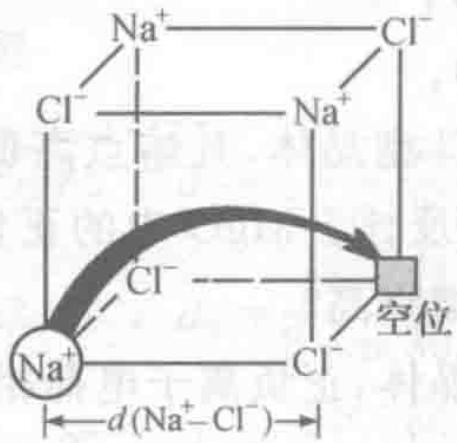  
( I )

如已知： $a / 2 = 282\mathrm{pm}$ ， $r(\mathrm{Cl}^{-}) = 181\mathrm{pm}$ ， $r(\mathrm{Na}^{+}) = 102\mathrm{pm}$ ，请计算三角形窗孔半径，并参考计算结果说明：离子晶体 $\mathrm{NaCl}$ 在室温是绝缘体；在接近熔点时电导率明显增加；熔融之后，

则是导体。

解

NaCl离子晶体中 $r_{+} / r_{-} = 102 / 181 = 0.56$ ，大于0.414，小于0.732，所以 $\mathrm{Cl^-}$ 按面心立方密堆积，但 $\mathrm{Cl^-}$ 相互不接触而稍有撑开， $\mathrm{Na^{+}}$ 则位于 $\mathrm{Cl^-}$ 的八面体空隙中， $\mathrm{Na^{+}}$ 和 $\mathrm{Cl^-}$ 相互接触[见教材p.320图13.11(a)以及例题13.2]。附图（I）不是NaCl的晶胞，只是晶胞的1/8，其中 $\mathrm{Na^{+}}$ 和 $\mathrm{Cl^-}$ 间距 $d(\mathrm{Na^{+} - Cl^{-}}) = a / 2 = 282\mathrm{pm}$ 。

参看图(Ⅱ)，位于3个不同面上的 $\mathrm{Cl}^{-}(1),\mathrm{Cl}^{-}(2)$ 和 $\mathrm{Cl}^{-}(3)$ 连线可成一等边三角形，其边长是 $\mathrm{Cl}^{-}$ 的间距（不等于 $2\times r_{-}$ ）：

$$
d (\mathrm{Cl} ^ {-} - \mathrm{Cl} ^ {-}) = \sqrt {\left(\frac {a}{2}\right) ^ {2} + \left(\frac {a}{2}\right) ^ {2}} = 3 9 9 \mathrm{pm}
$$

这 3 个 Cl $^{-}$ 相互不接触, 中间就形成了一个窗孔。

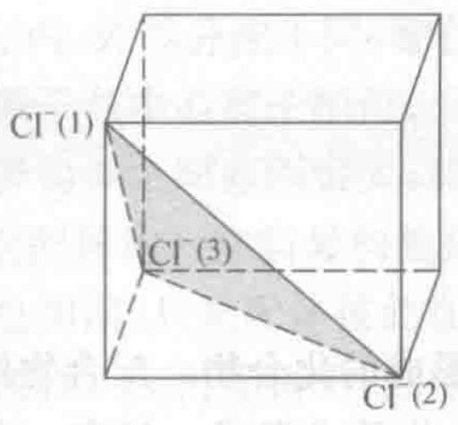  
(Ⅱ)

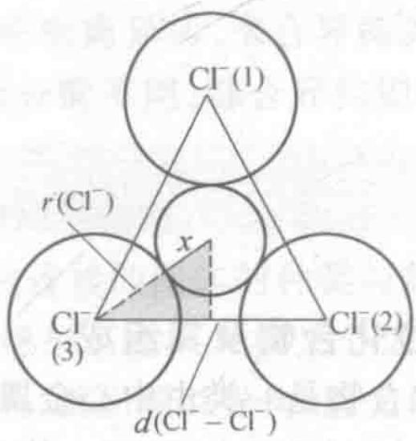  
(Ⅲ)

将此等腰三角形放到平面上, 即为图(Ⅲ), 就可以看到 3 个 Cl⁻ 之间的窗孔。设其半径为 x, 根据带阴影的三角形, 即可知

$$
(r _ {-} + x) \cos 3 0 ^ {\circ} = \frac {1}{2} d (\mathrm{Cl} ^ {-} - \mathrm{Cl} ^ {-})
$$

当 $r = 181 \mathrm{pm}, d(\mathrm{Cl}^{-}-\mathrm{Cl}^{-}) = 399 \mathrm{pm}, x = 49 \mathrm{pm}$ , 窗孔的半径比 $\mathrm{Na}^{+}$ 半径小得多。NaCl 晶体在常温不能导电, 随着温度的升高, 结构会松弛变形, 电导率会有所增加, 但 $\mathrm{Na}^{+}$ 的迁移也还是困难的; NaCl 熔融之后才可导电。

## 第 14 章 配位化合物

配位化学是无机化学的重要分支之一,配合物的成键与结构是科学探讨的重要问题之一。一百多年前,Werner 提出了配位理论。随着对原子结构的认识,建立了关于配合物的价键理论、晶体场理论、配体场理论等,对于中心原子和配体的作用有了本质的认识。鉴于配合物中许多配体是有机分子,配位化学也是无机化学和有机化学交叉融合的研究领域。学习配合物,一是要理解结构,二是要运用平衡处理配合物的生成与解离,并进一步把四大平衡关联起来综合处理。

## 内容提要

## 14.1 配位化合物及其组成

配位化合物是一类由中心金属离子(或原子)及其配体形成的化合物。配合物的中心体通常为过渡金属原子或离子,而配体则是可以提供孤对电子的分子或离子。只有一个配位原子与中心原子相结合的配体称为单齿配体;有两个或两个以上配位原子与中心原子相结合的配体称为多齿配体。

配合物可以分为内界和外界两个部分,中心离子(或原子)与配体共同形成内界,而平衡配离子的电荷离子则称为外界。例如 $\left[\mathrm{Cu}\left(\mathrm{NH}_{3}\right)_{4}\right]\mathrm{SO}_{4}$ 中, $\left[\mathrm{Cu}\left(\mathrm{NH}_{3}\right)_{4}\right]^{2+}$ 为内界, $SO_{4}^{2-}$ 为外界。配位数是指中心离子(或原子)接受电子对的数目。如果每个配体提供一对电子,配位数即等于配位原子的数目。

## 14.2 配位化合物的类型和命名

## 1. 配位化合物的类型

配位化合物可以分为简单配合物和螯合物两类。前者每个配体只提供一个配位原子给中心原子，如 $Na_{3}[AlF_{6}]$ ，而后者每个配体提供两个或两个以上配位原子，如 $[Cu(en)_{2}]^{2+}$ 。常见的螯合配体有：乙二胺（en）、邻菲罗啉（o-phen）、乙二胺四乙酸（EDTA）等。

## 2. 配位化合物的命名法

对于含有多个配体的配合物,命名的原则是:

(1) 无机配体列前,有机配体列后,如

$$
\mathrm{Na} \left[ \mathrm{SbCl} _ {5} \left(\mathrm{C} _ {6} \mathrm{H} _ {5}\right) \right], \text {五氯} \cdot \text {苯基合锑(V)} \text {酸钠}
$$

(2) 先阴离子, 再中性, 后阳离子, 如

$$
\left[ \mathrm{PtCl} _ {4} (\mathrm{NH} _ {3}) _ {2} \right], \text {   四氯·二氨合铂(IV)   }
$$

(3) 同类配体, 按照配位原子元素符号的英文字母顺序, 如

$$
[ \mathrm{CoCl} _ {2} (\mathrm{NH} _ {3}) _ {2} (\mathrm{H} _ {2} \mathrm{O}) _ {2} ] \mathrm{Cl}, \text {   一氯化二氯·二氨·二水合钴(Ⅲ)   }
$$

(4) 若配位原子相同, 按配体原子数, 先少后多, 如

$$
\left[ \mathrm{PtNO} _ {2} \mathrm{NH} _ {3} \mathrm{NH} _ {2} \mathrm{OH} (\mathrm{py}) \right] \mathrm{Cl}, \text {   氯化硝基·氨·羟氨·吡啶合铂(II)   }
$$

（5）若配位原子相同，配体中所含原子数目也相同，按配体中与配位原子相邻原子的英文字母顺序，如

$$
\left[ \mathrm{PtNH} _ {2} \mathrm{NO} _ {2} (\mathrm{NH} _ {3}) _ {2} \right], \text { 氨基 } \cdot \text { 硝基 } \cdot \text { 二氨合铂(II) }
$$

## 14.3 配位化合物的异构现象

两种或两种以上化合物,若具有相同的化学式(原子种类和数目相同),但结构和性质不相同,则它们互称为异构体。配合物中,配体与中心原子的连接方式可以变化,或者配体在中心原子周围的分布不同,因而异构现象非常普遍。配合异构分为结构异构和空间异构两大类。

(1) 结构异构 结构异构是指配合物的基本结构或化学键类型不同的情况, 包括电离异构、水合异构、配位异构、键合异构和配体异构等形式。其中电离异构、水合异构源于配体 (例如 $\mathrm{H}_{2} \mathrm{O}$ ) 在内、外界分配不同; 配位异构是配体在配离子间分配不同; 键合异构则对应于配体中不同的原子与中心离子配位。

结构异构体之间差别很大，其颜色及物理、化学性质等均不相同。

(2) 空间异构 空间异构是指配合物中,与中心原子相连接的配体的种类与数目都相同,配位原子也相同,只是配体彼此在空间的相对位置不同的情形。空间异构又分为几何异构和旋光异构两种。几何异构中,配体分布的相对位置关系不同,例如顺反异构;旋光异构中,配体之间的相对位置分布相同,但彼此互成镜像关系。

## 14.4 配合物的价键理论

配合物价键理论认为:中心原子与配体之间的结合,通过配位原子孤对电子轨道与中心离子(或原子)的空轨道重叠,两者共享该电子对而形成。因此,配位键本质上是共价性的。简单说来就是:中心原子提供空轨道,配体提供孤对电子,配位键是共价键。

随配体的不同,中心原子可以提供不同的轨道接纳孤对电子。凡配体孤对电子填入中心原子外层杂化轨道所形成的配合物均称为外轨型配合物;凡配体孤对电子填入中心离子内层杂化轨道所形成的配合物均称为内轨型配合物。例如:

（1）外轨型配合物 $\left[\mathrm{NiCl}_4\right]^{-}$ $\mathrm{Ni}^{2+}$ 具有充满的 $3\mathrm{d}^8$ 电子构型，当 $\mathrm{Cl}^{-}$ 配位时， $\mathrm{Ni}^{2+}$ 中的 d 轨道不参与成键，而采用外层 $\mathfrak{sp}^3$ 杂化轨道接受配体孤对电子，呈四面体形。

$$
\begin{array}{r l} & \text {   3d   } \quad \text {   4s   } \quad \text {   4p   } \end{array} \xrightarrow {\mathrm{sp} ^ {3} \text {杂化，四面体形}}
$$

(2) 内轨型配合物 $\left[\mathrm{Ni}\left(\mathrm{NH}_{3}\right)_{4}\right]^{2+}$ 当 $\mathrm{NH}_{3}$ 作配体时, $\mathrm{Ni}^{2+}$ 中的 d 轨道参与成键, 与外层的 s 与 p 轨道共同形成 $\mathrm{dsp}^{2}$ 杂化轨道, 呈平面正方形。

$$
\begin{array}{c c c c c} \uparrow \downarrow & \uparrow \downarrow & \uparrow \downarrow & \uparrow \downarrow \\ \hline & 3 d & & 4 s & 4 p \end{array} \xrightarrow {\text {dsp} ^ {2} \text {杂化，平面正方形}}
$$

由于在外轨型配合物中配体电子填充在外层，对(过渡元素)中心原子的d电子排布几乎没有影响，因此内层d电子会尽可能分占d轨道，它们的单电子多，顺磁磁矩大，故又称为高自旋配合物；反之，对于内轨型配合物，配体的电子对挤占中心原子内层轨道，促使d电子尽可能配对，它们的单电子少，磁矩变小，甚至电子均成对而显抗磁性，故又称为低自旋配合物。

## 14.5 晶体场理论

## 1. 晶体场理论的要点

(1) 配合物中的中心原子和配体之间通过静电相互吸引作用相互结合。

(2) 在配体所形成的电场作用下, 中心离子的 d 轨道发生分裂, 即晶体场分裂。

(3) 配合物的几何结构不同, 晶体场的分裂也不同。

中心离子 d 轨道在八面体场中的分裂如下：

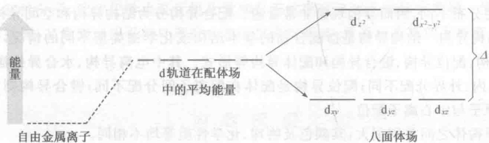

晶体场分裂能 $\Delta$ 为分裂后能量最高的 d 轨道与能量最低的 d 轨道之间的能量差，八面体场的分裂能记为 $\Delta_0$ ，四面体场的分裂能记为 $\Delta_t$ 。

（4）相同中心离子和几何结构的配合物，晶体场分裂的大小与配体的性质有关，即依赖于配体的光谱化学序列。

按照配体场强由弱到强的顺序,配体的光谱化学序列为

$$
\mathrm{I} ^ {-} <   \mathrm{Br} ^ {-} <   \mathrm{Cl} ^ {-} <   \mathrm{F} ^ {-} <   \mathrm{OH} ^ {-} <   \mathrm{H} _ {2} \mathrm{O} <   \mathrm{SCN} ^ {-} <   \mathrm{NH} _ {3} <   \mathrm{en} <   \mathrm{NO} _ {2} <   \mathrm{CO} <   \mathrm{CN}
$$

## 2. 晶体场理论的应用

根据晶体场理论,可以很好地解释配合物的若干性质。

(1) 高自旋与低自旋 当晶体场分裂能( $\Delta$ )大于电子配对能(P)的时候,配合物形成低自旋配合物;而当电子配对能大于晶体场分裂能时,形成高自旋配合物。

(2) 配合物的颜色 第一过渡金属配合物的晶体场分裂能多处于可见光区, 中心离子发生 d-d 跃迁, 吸收可见光而显示出互补色, 这是很多配合物显示颜色的原因。

## 14.6 配位平衡及其平衡常数

中心原子和配体在水溶液中会逐级发生配合，配位化合物生成时的平衡常数称为形成常数，或稳定常数。例如，水溶液中 $\left[\mathrm{Cu}\left(\mathrm{NH}_{3}\right)_{4}\right]^{2+}$ 的形成，对应于下列平衡：

$$
\begin{array}{l l}\mathrm {Cu^ {2 + } +NH_ {3} \rightleftharpoons[Cu(NH_ {3}) ] ^ {2 + }}&K _ {1} = 5. 0 \times 1 0 ^ {- 5}\\[ \mathrm {Cu(NH_ {3}) ] ^ {2 + } +NH_ {3} \rightleftharpoons[Cu(NH_ {3}) _ {2} ] ^ {2 +}}&K _ {2} = 2. 1 \times 1 0 ^ {- 4}\\[ \mathrm {Cu(NH_ {3}) _ {2} ] ^ {2 + } +NH_ {3} \rightleftharpoons[Cu(NH_ {3}) _ {3} ] ^ {2 +}}&K _ {3} = 9. 1 \times 1 0 ^ {- 4}\\[ \mathrm {Cu(NH_ {3}) _ {3} ] ^ {2 + } +NH_ {3} \rightleftharpoons[Cu(NH_ {3}) _ {4} ] ^ {2 +}}&K _ {4} = 5. 0 \times 1 0 ^ {- 3}\end{array}
$$

上述过程的总平衡常数为

$$
K _ {\mathrm{稳}} = K _ {1} K _ {2} K _ {3} K _ {4} = 2. 1 \times 1 0 ^ {1 3}
$$

$K_{1}, K_{2}, K_{3}$ 和 $K_{4}$ 分别是一级、二级、三级、四级稳定常数，其乘积 $K_{\text{稳}}$ 称为累积稳定常数。由于各级配位平衡常数数值相差不大（不像酸碱电离平衡常数往往是 $K_{1} \gg K_{2}$ ），因此，处理配位平衡时,往往加入过量的配体,使中心原子与配体充分结合,从而利用总稳定平衡常数 $(K_{\text{稳}})$ 来处理配位平衡问题。

## 14.7 配位平衡的移动

在配位平衡中,凡是能改变中心离子和配体浓度的变化都会引起平衡的移动,例如,加入酸碱、沉淀剂、氧化还原剂或其他配体,因此配位平衡能与其他平衡相互影响。这些相互影响的平衡包括:

(1) 配位平衡与酸碱平衡；

(2) 配位平衡与沉淀溶解平衡；

(3) 配位平衡与氧化还原平衡；

(4) 配合物之间的转化和平衡。

在水溶液中, 这几种平衡往往同时存在, 常利用它们之间的相互影响, 开展化学制备、化学分离分析等工作。

## 习题解析

14.1 无水 $\mathrm{CrCl}_3$ 和氨作用能形成两种配合物, 组成相当于 $\mathrm{CrCl}_3 \cdot 6\mathrm{NH}_3$ 及 $\mathrm{CrCl}_3 \cdot 5\mathrm{NH}_3$ 。加入 $\mathrm{AgNO}_3$ 溶液能从第一种配合物水溶液中将几乎所有的氯沉淀为 $\mathrm{AgCl}$ , 而从第二种配合物水溶液中仅能沉淀出相当于组成中含氯量 $2/3$ 的 $\mathrm{AgCl}$ 。加入少许 $\mathrm{NaOH}$ 并加热时, 两种溶液都无氨味。试从配合物的形式推算出它们的内界和外界, 并指出配离子的电荷数、中心离子的价数和配合物的名称。

解

<table><tr><td></td><td>配合物</td><td>配离子电荷数</td><td>中心离子价数</td><td>名称</td></tr><tr><td>第一种</td><td> $[Cr(NH_3)_6]Cl_3$ </td><td> $[Cr(NH_3)_6]^{3+}$ </td><td>+3</td><td>三氯化六氨合铬(III)</td></tr><tr><td>第二种</td><td> $[CrCl(NH_3)_5]Cl_2$ </td><td> $[CrCl(NH_3)_5]^{2+}$ </td><td>+3</td><td>二氯化一氯五氨合铬(III)</td></tr></table>

14.2 指出下列配合物的中心离子及价数、配位体及配位数、配合离子的电荷和配合物名称：(1) $\mathrm{K}_{2}[\mathrm{PtCl}_{6}]$ ; (2) $\mathrm{K}_{4}[\mathrm{Fe(CN)}_{6}]$ ; (3) $[\mathrm{Ag(NH_3)_2}] \mathrm{Cl}$ ; (4) $[\mathrm{CrCl}_2(\mathrm{H}_2\mathrm{O})_4] \mathrm{Cl}$ ;

(5) $\left[\mathrm{Co}(\mathrm{NO}_2)_3(\mathrm{NH}_3)_3\right]$ ; (6) $\mathrm{K}_2\mathrm{Na}\left[\mathrm{Co}(\mathrm{ONO})_6\right]$ ; (7) $\mathrm{Ni}(\mathrm{CO})_4$ ; (8) $\left[\mathrm{Co}(\mathrm{en})_3\right]\mathrm{Cl}_3$ 。解

<table><tr><td>配合物</td><td>中心离子及价数</td><td>配位体</td><td>配位数</td><td>配合离子电荷数</td><td>配合物名称</td></tr><tr><td>(1)  $K_2[PtCl_6]$ </td><td> $Pt^{4+}$ </td><td> $Cl^-$ </td><td>6</td><td>2-</td><td>六氯合铂(IV)酸钾</td></tr><tr><td>(2)  $K_4[Fe(CN)_6]$ </td><td> $Fe^{2+}$ </td><td> $CN^-$ </td><td>6</td><td>4-</td><td>六氰合铁(II)酸钾</td></tr><tr><td>(3)  $[Ag(NH_3)_2]Cl$ </td><td> $Ag^+$ </td><td> $NH_3$ </td><td>2</td><td>1+</td><td>一氯化二氨合银(I)</td></tr><tr><td>(4)  $[CrCl_2(H_2O)_4]Cl$ </td><td> $Cr^{3+}$ </td><td> $H_2O,Cl^-$ </td><td>6</td><td>1+</td><td>一氯化二氯四水合铬(III)</td></tr><tr><td>(5)  $Co(NO_2)_3(NH_3)_3$ </td><td> $Co^{3+}$ </td><td> $NH_3,NO_2^-$ </td><td>6</td><td>0</td><td>三硝基三氨合钴(III)</td></tr><tr><td>(6)  $K_2Na[Co(ONO)_6]$ </td><td> $Co^{3+}$ </td><td> $ONO^-$ </td><td>6</td><td>3-</td><td>六亚硝酸根合钴(III)酸钠二钾</td></tr><tr><td>(7)  $Ni(CO)_4$ </td><td> $Ni^0$ </td><td>CO</td><td>4</td><td>0</td><td>四羰基合镍</td></tr><tr><td>(8)  $[Co(en)_3]Cl_3$ </td><td> $Co^{3+}$ </td><td>en</td><td>6</td><td>3+</td><td>三氯化三(乙二胺)合钴(III)</td></tr></table>

14.3 根据下列配合物的名称写出它们的化学式：

(1) 二硫代硫酸合银(I)酸钠；(2) 四硫氰二氨合铬(Ⅲ)酸铵；(3) 四氯合铂(Ⅱ)酸六氨合铂(Ⅱ)；(4) 硫酸氯·氨·二(乙二胺)合铬(Ⅲ)；(5) 二氯·(草酸根)·(乙二胺)合铁(Ⅲ)酸根离子。

答 (1) $\mathrm{Na}_{3}[\mathrm{Ag}(\mathrm{S}_{2}\mathrm{O}_{3})_{2}]$ ; (2) $\mathrm{NH}_{4}[\mathrm{Cr}(\mathrm{SCN})_{4}(\mathrm{NH}_{3})_{2}]$ ; (3) $[\mathrm{Pt}(\mathrm{NH}_{3})_{6}][\mathrm{PtCl}_{4}]$ ;

$$
\left[ \mathrm{CrCl} (\mathrm{NH} _ {3}) (\mathrm{en}) _ {2} \right] \mathrm{SO} _ {4}; (5) \left[ \mathrm{FeCl} _ {2} (\mathrm{ox}) (\mathrm{en}) \right] ^ {-} 。
$$

14.4 （1）指出在下列化合物中，哪些可能作为有效的螯合剂。

$$
\mathrm{H} _ {2} \mathrm{O}; \text {过氧化氢} \mathrm{HO} - \mathrm{OH}; \mathrm{H} _ {2} \mathrm{N} - \mathrm{CH} _ {2} - \mathrm{CH} _ {2} - \mathrm{CH} _ {2} - \mathrm{NH} _ {2}; (\mathrm{CH} _ {3}) _ {2} \mathrm{N} - \mathrm{NH} _ {2}
$$

(2) 下列配合物具有平面四方或八面体几何构型, 问其中哪种 $\mathrm{CO}_{3}^{2-}$ 作为螯合剂? $\left[\mathrm{Co}\left(\mathrm{CO}_{3}\right)\left(\mathrm{NH}_{3}\right)_{5}\right]^{+};\left[\mathrm{Co}\left(\mathrm{CO}_{3}\right)\left(\mathrm{NH}_{3}\right)_{4}\right]^{+};\left[\mathrm{Pt}\left(\mathrm{CO}_{3}\right)(\mathrm{en})\right];\left[\mathrm{Pt}\left(\mathrm{CO}_{3}\right)\left(\mathrm{NH}_{3}\right)(\mathrm{en})\right]$ (a) (b) (c) (d)

解（1）(c)可作为有效的螯合剂；

(2) (b), (c) 中 $CO_{3}^{2-}$ 可作为螯合剂。

14.5 画出下列物质的几何图形：

(1) $\left[\mathrm{CuCl}\left(\mathrm{H}_{2}\mathrm{O}\right)_{3}\right]^{+}$ （平面四方形）；(2)顺式 $-\left[\mathrm{CoBrCl}\left(\mathrm{NH}_{3}\right)_{4}\right]^{+}$ ；(3)反式 $-\mathrm{NiCl}_{2}\left(\mathrm{H}_{2}\mathrm{O}\right)_{2}$ ；(4)反式 $-\left[\mathrm{CrCl}_{2}\left(\mathrm{en}\right)_{2}\right]^{+}$ ；(5) $\mathrm{Pt(en)}_{2}^{2+}$ （平面四方形）。

(1)

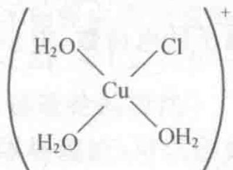

(2)

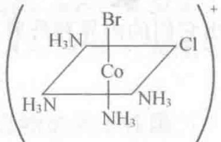

(3)

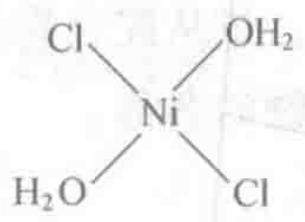

(4)

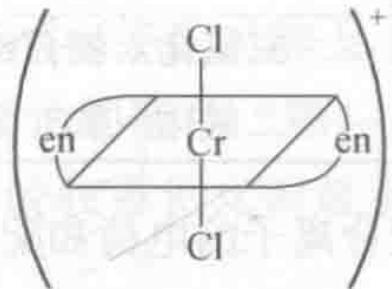

(5)

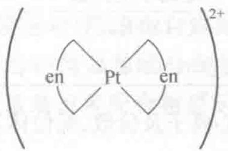

14.6 下列配合物各有多少种几何异构体？(M 代表金属离子；A、B、C 代表配位体)。

(1) $\mathrm{MA}_{4} \mathrm{BC}$ ; (2) $\mathrm{MA}_{3} \mathrm{~B}_{2} \mathrm{C}$ ; (3) $\mathrm{MA}_{2} \mathrm{~B}_{2} \mathrm{C}_{2}$ ; (4) $\mathrm{MA}_{2} \mathrm{BC}$ (四面体形); (5) $\mathrm{MA}_{2} \mathrm{BC}$ (平面四方形)。

解

(1) 有两种异构体

(2) 有三种异构体

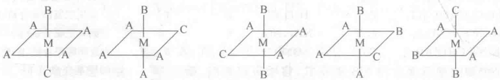

(3) 有五种异构体

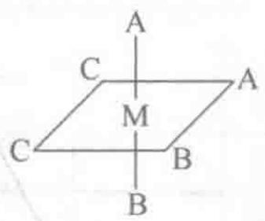

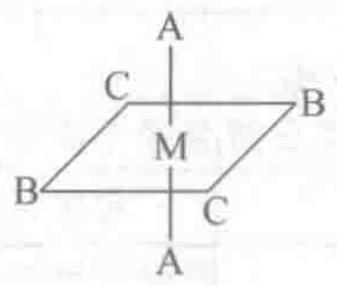

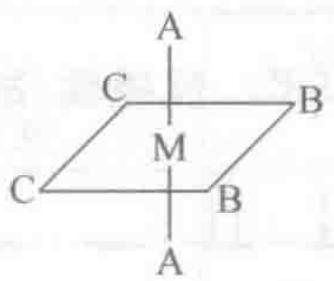

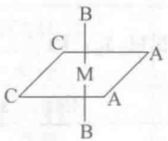

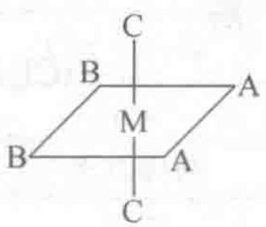

(4) 无异构体

(5) 有两种异构体

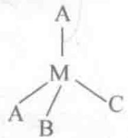

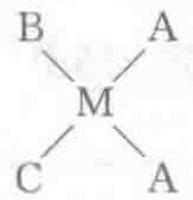

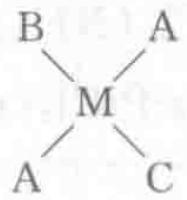

14.7 给出下列各配离子的空间构型和可能的几何异构体：

(1) $\left[\mathrm{FeCl}_4(\mathrm{en})\right]^{-}$ ; (2) $\left[\mathrm{FeCl}_2(\mathrm{ox})(\mathrm{en})\right]^{-}$ ; (3) $\left[\mathrm{Fe}(\mathrm{ox})_3\right]^{3-}$ ; (4) $\left[\mathrm{Fe}(\mathrm{EDTA})\right]^{2-}$ 。解

(1)

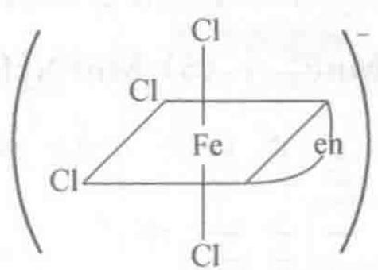

(2)

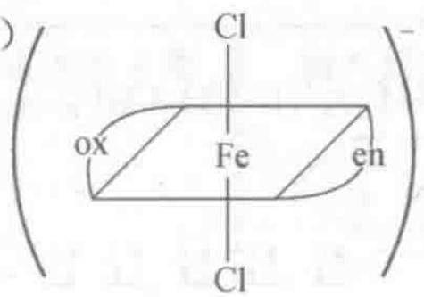

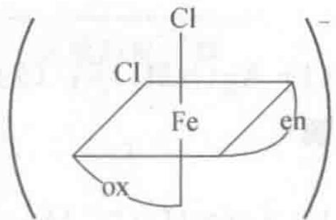

(3)

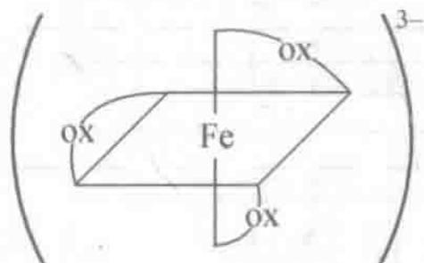

(4)

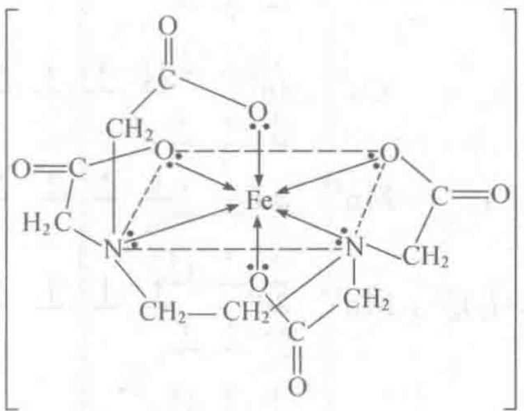

14.8 指出下列各物质有无异构现象。如有异构现象，分别属于哪类异构？

(1) $\left[\mathrm{Zn}(\mathrm{NH}_3)_4\right]\left[\mathrm{CuCl}_4\right]$ ; (2) $\left[\mathrm{Fe}(\mathrm{CN})_5\mathrm{SCN}\right]^{4-}$ ; (3) $\left[\mathrm{PtCl}_3(\mathrm{py})\right]^{-}$ ;

$$
\left[ \mathrm{Cr} (\mathrm{OH}) _ {2} \left(\mathrm{NH} _ {3}\right) _ {4} \right] ^ {+} 。
$$

解（1）可有配位异构： $\left[\mathrm{Zn}\left(\mathrm{NH}_{3}\right)_{4}\right]\left[\mathrm{CuCl}_{4}\right]$ 与 $\left[\mathrm{Cu}\left(\mathrm{NH}_{3}\right)_{4}\right]\left[\mathrm{ZnCl}_{4}\right]$ ，

$$
\left[ \mathrm{ZnCl} \left(\mathrm{NH} _ {3}\right) _ {3} \right] \left[ \mathrm{CuCl} _ {3} \left(\mathrm{NH} _ {3}\right) \right] \text {与} \left[ \mathrm{CuCl} \left(\mathrm{NH} _ {3}\right) _ {3} \right] \left[ \mathrm{ZnCl} _ {3} \left(\mathrm{NH} _ {3}\right) \right];
$$

(2) 可有键合异构(两种异构体): $\left[\mathrm{Fe}(\mathrm{CN})_{5}(\mathrm{SCN})\right]^{4-},\left[\mathrm{Fe}(\mathrm{CN})_{5}(\mathrm{NCS})\right]^{4-}$ ;

(3) 无异构体；

(4) 可有几何异构(顺、反两种异构体)。

14.9 已知一些铂金属配合物，如 $cis - \mathrm{PtCl}_4(\mathrm{NH}_3)_2$ 、 $cis - \mathrm{PtCl}_2(\mathrm{NH}_3)_2$ 和 $cis - \mathrm{PtCl}_2(\mathrm{en})$ ，可以作为活性抗癌试剂（所有反式异构体抗癌无效），实验测得它们都是反磁性物质。试用价键理论画出这些配合物的杂化轨道图，它们是内轨型还是外轨型配合物？各采用哪种类型的

杂化轨道？

解

$$
c i s - \mathrm{PtCl} _ {4} (\mathrm{NH} _ {3}) _ {2}: \mathrm{Pt} ^ {4 +} \quad 5 \mathrm{d} ^ {6} \text {反磁性,故为}
$$

$$
\begin{array}{c c c} \uparrow \downarrow & \uparrow \downarrow & \uparrow \downarrow \\ \hline \end{array} - - - - - - - - d ^ {2} s p ^ {3} \text {内轨型}
$$

$$
\left. \begin{array}{c} {c i s - \mathrm{PtCl} _ {2} (\mathrm{NH} _ {3}) _ {2}} \\ {c i s - \mathrm{PtCl} _ {2} (\mathrm{en})} \end{array} \right\} \mathrm{Pt} ^ {2 +} \quad 5 \mathrm{d} ^ {8} \quad \text {反磁性,故为}
$$

$$
\updownarrow \quad \updownarrow \quad \updownarrow \quad \updownarrow \quad \text {   } \quad - \quad - \quad - \quad - \quad - \quad d s p ^ {2}
$$

14.10 用价键模型绘出轨道图,以表示中心离子的电子结构,其中(3)\~(5)是高自旋物质。

(1) $\mathrm{Ag(NH_3)_2^+}$ ; (2) $\mathrm{Cu(NH_3)_4^{2+}}$ ; (3) $\mathrm{CoF}_6^{3-}$ ; (4) $\mathrm{MnF}_6^{4-}$ ; (5) $\mathrm{Mn(NH_3)_6^{2+}}$ 。

解

$$
\mathrm{Ag} \left(\mathrm{NH} _ {3}\right) _ {2} ^ {+}: \mathrm{Ag} ^ {+} 4 \mathrm{d} ^ {1 0} \quad \updownarrow \downarrow \updownarrow \downarrow \updownarrow \downarrow \updownarrow \downarrow \updownarrow \downarrow - - - - - s p
$$

$$
\mathrm{Cu} \left(\mathrm{NH} _ {3}\right) _ {4} ^ {2 +}: \mathrm{Cu} ^ {2 +} 3 \mathrm{d} ^ {9} \quad \updownarrow \downarrow \updownarrow \downarrow \updownarrow \downarrow \updownarrow - - - - - \updownarrow \quad \mathrm{dsp} ^ {2}
$$

$$
\mathrm{CoF} _ {6} ^ {3 -}: \quad \mathrm{Co} ^ {3 +} 3 \mathrm{d} ^ {6} \quad \updownarrow \updownarrow \updownarrow \updownarrow \updownarrow \updownarrow - - - - - - - - s p ^ {3} d ^ {2}
$$

$$
\mathrm{MnF} _ {6} ^ {4 -}: \quad \mathrm{Mn} ^ {2 +} 3 \mathrm{d} ^ {5} \quad \uparrow \uparrow \uparrow \uparrow \uparrow \quad - - - - - - - - s p ^ {3} d ^ {2}
$$

$$
\mathrm{Mn} \left(\mathrm{NH} _ {3}\right) _ {6} ^ {2 +}: \mathrm{Mn} ^ {2 +} 3 \mathrm{d} ^ {5} \quad \uparrow \uparrow \uparrow \uparrow \uparrow \uparrow - - - - - - - - s p ^ {3} d ^ {2}
$$

14.11 实验测得 $\mathrm{Co(NH_{3})_{6}^{3+}}$ 呈反磁性，而 $\mathrm{Co(NH_{3})_{6}^{2+}}$ 为顺磁性（磁矩 $\mu=4.5\mu_{B}$ ），完成下表：

<table><tr><td></td><td></td><td> $\text{Co(NH}_3\text{)}_6^{3+}$ </td><td> $\text{Co(NH}_3\text{)}_6^{2+}$ </td></tr><tr><td rowspan="2">价键理论</td><td>中心离子杂化轨道类型</td><td></td><td></td></tr><tr><td>几何形状</td><td></td><td></td></tr><tr><td rowspan="2">晶体场理论</td><td>场的相对强弱</td><td></td><td></td></tr><tr><td>中心离子d电子排布</td><td></td><td></td></tr><tr><td colspan="2">磁矩计算值( $\mu_B$ )</td><td></td><td></td></tr></table>

解

<table><tr><td></td><td></td><td> $Co(NH_3)_6^{3+}$ </td><td> $Co(NH_3)_6^{2+}$ </td></tr><tr><td rowspan="2">价键理论</td><td>中心离子杂化轨道类型</td><td> $d^2sp^3$ </td><td> $sp^3d^2$ </td></tr><tr><td>几何形状</td><td>正八面体</td><td>正八面体</td></tr><tr><td rowspan="2">晶体场理论</td><td>场的相对强弱</td><td>强场</td><td>弱场</td></tr><tr><td>中心离子d电子排布</td><td> $e_g$  $\uparrow\downarrow\uparrow\downarrow\uparrow\downarrow t_{2g}$ </td><td> $\uparrow\uparrow e_g$  $\uparrow\downarrow\uparrow\downarrow\uparrow t_{2g}$ </td></tr><tr><td colspan="2">磁矩计算值( $μ_B$ )</td><td>0</td><td>3.87</td></tr></table>

14.12 $\mathrm{Cr}^{3+}$ 、 $\mathrm{Cr}^{2+}$ 、 $\mathrm{Mn}^{2+}$ 、 $\mathrm{Fe}^{2+}$ 、 $\mathrm{Co}^{3+}$ 、 $\mathrm{Co}^{2+}$ 离子在强八面体晶体场中和弱八面体晶体场中各有多少未成对的电子？绘图说明 $t_{2g}$ 和 $e_g$ 电子数目。

<table><tr><td>解</td><td>强八面体场</td><td>未成对电子数</td><td>弱八面体场</td><td>未成对电子数</td></tr><tr><td> $Cr^{3+} 3d^{3}$ </td><td></td><td>3</td><td></td><td>3</td></tr><tr><td> $Cr^{2+} 3d^{4}$ </td><td></td><td>2</td><td></td><td>4</td></tr><tr><td> $Mn^{2+} 3d^{5}$ </td><td></td><td>1</td><td></td><td>5</td></tr><tr><td> $Fe^{2+} 3d^{6}$ </td><td></td><td>0</td><td></td><td>4</td></tr><tr><td> $Co^{3+} 3d^{6}$ </td><td></td><td>0</td><td></td><td>4</td></tr><tr><td> $Co^{2+} 3d^{7}$ </td><td></td><td>1</td><td></td><td>3</td></tr></table>

## 14.13 现有物种(a)～(e):

$$
\begin{array}{r l} \left[ \mathrm{CrCl} _ {2} (\mathrm{H} _ {2} \mathrm{O}) _ {4} \right] ^ {+}; & \mathrm{Na} _ {3} \left[ \mathrm{Co} (\mathrm{NO} _ {2}) _ {6} \right]; \\ & \left[ \mathrm{Al} (\mathrm{C} _ {2} \mathrm{O} _ {4}) _ {3} \right] ^ {3 -}; \\ & \mathrm{K} [ \mathrm{Fe} (\mathrm{en}) (\mathrm{C} _ {2} \mathrm{O} _ {4}) \mathrm{Cl} _ {2} ]; \\ & \mathrm{K} _ {2} [ \mathrm{Zn} (\mathrm{CN}) _ {4} ] _ {\circ} \\ (a) & (b) \\ & (c) \\ & (d) \\ & (e) \end{array}
$$

请指出：

(1) 其中哪些可能会显示颜色？哪些具有反磁性？

(2) (d) 的名称及中心离子配位数。

(3) (b)、(e)的中心离子采用的杂化轨道。

解（1）(a)，(b)，(d)有颜色；(b)，(c)，(e)具有反磁性。

(2) 二氯·草酸根·乙二胺合铁(Ⅲ)酸钾, 配位数为 6。

(3) (b)、(e)的中心离子采用的杂化轨道分别为 $d^{2}sp^{3}$ ， $sp^{3}$ 。

14.14 写出配平方程式并计算反应平衡常数：

(1) 碘化银溶解在 NaCN 水溶液中；

(2) 溴化银微溶在 $NH_{3}$ 水中, 但当酸化溶液时又析出沉淀。(分别写出两个方程式。)

解 (1) $\mathrm{AgI} + 2\mathrm{CN}^{-} \rightleftharpoons \mathrm{Ag(CN)}_{2}^{-} + \mathrm{I}^{-}$

$$
\begin{array}{r l}&\mathrm {AgI + 2CN\rightleftharpoons Ag(CN) _ {2} + I}\\&K = \frac {[ \mathrm {Ag(CN) _ {2} ^ {-}} ] [ \mathrm {I^ {-}} ]}{[ \mathrm {CN^ {-}} ] ^ {2}} \times \frac {[ \mathrm {Ag^ {+}} ]}{[ \mathrm {Ag^ {+}} ]} = K _ {\mathrm{sp}} (\mathrm{AgI}) \times K _ {\text {稳}} (\mathrm {Ag(CN) _ {2} ^ {-}})\\&= 8. 5 2 \times 1 0 ^ {- 1 7} \times 1. 3 \times 1 0 ^ {2 1} = 1. 1 \times 1 0 ^ {5}\end{array}
$$

$$
\begin{array}{r l}&{(2) \mathrm {AgBr + 2NH_ {3} \rightleftharpoons Ag(NH_ {3}) _ {2} ^ {+} + Br^ {-}}}\\&{\qquad K = \frac {[ \mathrm {Ag(NH_ {3}) _ {2} ^ {+}} ] [ \mathrm {Br^ {-}} ]}{[ \mathrm {NH_ {3}} ] ^ {2}} = K _ {\mathrm{sp}} (\mathrm{AgBr}) \times K _ {\mathrm{稳}} (\mathrm {Ag(NH_ {3}) _ {2} ^ {+}})}\\&{\qquad = 5. 3 5 \times 1 0 ^ {- 1 3} \times 1. 1 \times 1 0 ^ {7} = 5. 9 \times 1 0 ^ {- 6}}\end{array}
$$

$$
\mathrm{Ag} (\mathrm{NH} _ {3}) _ {2} ^ {+} + \mathrm{Br} ^ {-} + 2 \mathrm{H} ^ {+} \rightleftharpoons \mathrm{AgBr} \downarrow + 2 \mathrm{NH} _ {4} ^ {+}
$$

$$
\begin{array}{r l} K & = \frac {[ \mathrm{NH} _ {4} ^ {+} ] ^ {2}}{[ \mathrm{Ag(NH} _ {3}) _ {2} ^ {+} ] [ \mathrm{Br} ^ {-} ] [ \mathrm{H} ^ {+} ] ^ {2}} \times \frac {[ \mathrm{Ag} ^ {+} ]}{[ \mathrm{Ag} ^ {+} ]} \times \frac {[ \mathrm{NH} _ {3} ] ^ {2}}{[ \mathrm{NH} _ {3} ] ^ {2}} \\ & = \frac {1}{K _ {\mathrm{sp}} (\mathrm{AgBr}) \times K _ {\text {稳}} (\mathrm{Ag(NH} _ {3}) _ {2} ^ {+}) \times K ^ {2} (\mathrm{NH} _ {4} ^ {+})} \\ & = \frac {(1 . 8 \times 1 0 ^ {- 5}) ^ {2}}{5 . 3 5 \times 1 0 ^ {- 1 3} \times 1 . 1 \times 1 0 ^ {7} \times (1 . 0 \times 1 0 ^ {- 1 4}) ^ {2}} \\ & = 5. 5 \times 1 0 ^ {2 3} \end{array}
$$

14.15 往硝酸银溶液中加入过量的 $NH_{3} \cdot H_{2}O$ ，达平衡时 $[NH_{3} \cdot H_{2}O] = 1.0 \, mol \cdot dm^{-3}$ 。求此时 $\mathrm{Ag(NH_{3})_{2}^{+}}$ 、 $\mathrm{Ag(NH_{3})^{+}}$ 、 $Ag^{+}$ 各离子浓度的比值。

[已知 $\mathrm{Ag}^{+} + \mathrm{NH}_{3}\rightleftharpoons \mathrm{Ag(NH_{3})}^{+}$ ，其 $K_{1} = 2.2\times 10^{3}$ 。]

解

$$
\mathrm{Ag} ^ {+} + 2 \mathrm{NH} _ {3} \rightleftharpoons \mathrm{Ag} (\mathrm{NH} _ {3}) _ {2} ^ {+} \quad K = 1. 1 \times 1 0 ^ {7}, \quad \frac {[ \mathrm{Ag} ^ {+} ] [ \mathrm{NH} _ {3} ] ^ {2}}{[ \mathrm{Ag} (\mathrm{NH} _ {3}) _ {2} ^ {+} ]} = \frac {1}{1 . 1 \times 1 0 ^ {7}}
$$

$$
\left[ \mathrm{Ag} ^ {+} \right]: \left[ \mathrm{Ag} (\mathrm{NH} _ {3}) ^ {+} \right]: \left[ \mathrm{Ag} (\mathrm{NH} _ {3}) _ {2} ^ {+} \right] = 1: 2. 2 \times 1 0 ^ {3}: 1. 1 \times 1 0 ^ {7}
$$

上述计算结果说明，当 $NH_{3} \cdot H_{2}O$ 过量时，溶液中的主要物种是 $\mathrm{Ag(NH_{3})_{2}^{+}}$ 。

14.16 某溶液中含 $0.10 \mathrm{~mol} \cdot \mathrm{dm}^{-3}$ 的游离 $\mathrm{NH}_{3} \cdot \mathrm{H}_{2} \mathrm{O}, 0.10 \mathrm{~mol} \cdot \mathrm{dm}^{-3}$ 的 $\mathrm{NH}_{4} \mathrm{Cl}$ 和 $0.15 \mathrm{~mol} \cdot \mathrm{dm}^{-3}$ 的 $[\mathrm{Cu(NH_3)_4}]^{2+}$ 。用计算说明有无 $\mathrm{Cu(OH)_2}$ 沉淀生成。 $[\mathrm{Cu(OH)_2}$ 的 $K_{\mathrm{sp}} = 2.6 \times 10^{-19}$ 。]

解

$$
\mathrm{Cu} ^ {2 +} + 4 \mathrm{NH} _ {3} \rightleftharpoons \mathrm{Cu(NH} _ {3}) _ {4} ^ {2 +} \qquad K _ {\mathrm{稳}} = 2. 1 \times 1 0 ^ {1 3}, \quad \mathrm{设} [ \mathrm{Cu} ^ {2 +} ] = x \mathrm{mol} \cdot \mathrm{dm} ^ {- 3}
$$

$$
\frac {\left[ \mathrm{Cu} \left(\mathrm{NH} _ {3}\right) _ {4} ^ {2 +} \right]}{\left[ \mathrm{Cu} ^ {2 +} \right] \left[ \mathrm{NH} _ {3} \right] ^ {4}} = \frac {0 . 1 5}{x (0 . 1 0) ^ {4}} = 2. 1 \times 1 0 ^ {1 3}, x = 7. 1 \times 1 0 ^ {- 1 1}, \left[ \mathrm{Cu} ^ {2 +} \right] = 7. 1 \times 1 0 ^ {- 1 1} \mathrm{mol} \cdot \mathrm{dm} ^ {- 3}
$$

$$
\mathrm{NH} _ {3} + \mathrm{H} _ {2} \mathrm{O} \rightleftharpoons \mathrm{NH} _ {4} ^ {+} + \mathrm{OH} ^ {-} \qquad K _ {\mathrm{b}} = 1. 8 \times 1 0 ^ {- 5}, \quad \text { 设 } [ \mathrm{OH} ^ {-} ] = y \mathrm{mol} \cdot \mathrm{dm} ^ {- 3}
$$

$$
\frac {[ \mathrm{NH} _ {4} ^ {+} ] [ \mathrm{OH} ^ {-} ]}{[ \mathrm{NH} _ {3} ]} = \frac {0 . 1 0 y}{0 . 1 0} = 1. 8 \times 1 0 ^ {- 5}, \quad y = 1. 8 \times 1 0 ^ {- 5}, [ \mathrm{OH} ^ {-} ] = 1. 8 \times 1 0 ^ {- 5} \mathrm{mol} \cdot \mathrm{dm} ^ {- 3}
$$

$$
\begin{array}{r l} {Q = [ \mathrm{Cu} ^ {2 +} ] [ \mathrm{OH} ^ {-} ] ^ {2}} & {= 7. 1 \times 1 0 ^ {- 1 1} \times (1. 8 \times 1 0 ^ {- 5}) ^ {2}} \\ & {= 2. 3 \times 1 0 ^ {- 2 0} <   K _ {\mathrm{sp}} (\mathrm{Cu(OH)} _ {2}), \text {故不能生成} \mathrm{Cu(OH)} _ {2} \text {沉淀。}} \\ & {(= 2. 6 \times 1 0 ^ {- 1 9})} \end{array}
$$

14.17 计算 AgBr 在 $1.00 \, mol \cdot dm^{-3} \, Na_{2}S_{2}O_{3}$ 中的溶解度。 $500 \, cm^{3}$ 浓度为 $1.00 \, mol \cdot dm^{-3}$ 的 $Na_{2}S_{2}O_{3}$ 溶液可溶解 AgBr 多少克？

$$
\begin{array}{r l}&{\text {解} \quad \mathrm {AgBr + 2S_ {2} O_ {3} ^ {2 - } \rightleftharpoons Ag(S_ {2} O_ {3}) _ {2} ^ {3 - } + Br^ {-}} \quad \text {设溶解度} s = x \mathrm{mol} \cdot \mathrm{dm} ^ {- 3}}\\&{\frac {\text {平衡浓度}}{\mathrm{mol} \cdot \mathrm{dm} ^ {- 3}} \quad 1. 0 0 - 2 x \qquad \qquad x \qquad x}\\&{\qquad K = K _ {\mathrm{sp}} (\mathrm{AgBr}) \times K _ {\text {稳}} (\mathrm {Ag(S_ {2} O_ {3}) _ {2} ^ {3 - }}) = 5. 3 5 \times 1 0 ^ {- 1 3} \times 2. 9 \times 1 0 ^ {1 3} = 1 6}\\&{\qquad \frac {x ^ {2}}{(1 . 0 0 - 2 x) ^ {2}} = 1 6, \qquad x = 0. 4 4, \quad s = 0. 4 4 \mathrm{mol} \cdot \mathrm{dm} ^ {- 3}}\end{array}
$$

$500\mathrm{cm}^3$ 1.00mol· $\mathrm{dm}^{-3}$ $\mathrm{Na_2S_2O_3}$ 溶液可溶解 $\mathrm{AgBr}$ 的量为

$$
0. 4 4 \mathrm{mol} \cdot \mathrm{dm} ^ {- 3} \times 0. 5 0 \mathrm{dm} ^ {3} \times 1 8 8 \mathrm{g} \cdot \mathrm{mol} ^ {- 1} = 4 1 \mathrm{g}
$$

14.18 分别计算 $\mathrm{Zn(OH)_2}$ 溶于氨水生成 $\mathrm{Zn(OH)}_4^{2-}$ 和 $\mathrm{Zn(NH_3)}_4^{2+}$ 时的平衡常数 $K$ 。若控制 $[\mathrm{NH}_3 \cdot \mathrm{H}_2\mathrm{O}] = [\mathrm{NH}_4^+] = 0.10\mathrm{mol} \cdot \mathrm{dm}^{-3}$ ，则 $\mathrm{Zn(OH)_2}$ 溶于 $\mathrm{NH}_3 \cdot \mathrm{H}_2\mathrm{O}$ 中主要生成哪一种配离子？ $\mathrm{Zn(NH_3)}_4^{2+}$ 和 $\mathrm{Zn(OH)}_4^{2-}$ 浓度比值是多少？

$$
\begin{array}{r l}&{\text {解} \quad Z n (O H) _ {2} + 4 N H _ {3} \cdot H _ {2} O \rightleftharpoons Z n (N H _ {3}) _ {4} ^ {2 +} + 2 O H ^ {-}}\\&{\qquad K = \frac {[ Z n (N H _ {3}) _ {4} ^ {2 +} ] [ O H ^ {-} ] ^ {2}}{[ N H _ {3} ] ^ {4}} = K _ {\text {稳}} K _ {\mathrm{sp}} = 2. 9 \times 1 0 ^ {9} \times 3 \times 1 0 ^ {- 1 7} = 9 \times 1 0 ^ {- 8}}\\&{\qquad Z n (O H) _ {2} + 2 N H _ {3} \cdot H _ {2} O \rightleftharpoons Z n (O H) _ {4} ^ {2 -} + 2 N H _ {4} ^ {+}}\\&{\qquad K = \frac {[ Z n (O H) _ {4} ^ {2 -} ] [ N H _ {4} ^ {+} ] ^ {2}}{[ N H _ {3} ] ^ {2}} = K _ {\text {稳}} K _ {\mathrm{sp}} K _ {\mathrm{b}} ^ {2} (N H _ {3} \cdot H _ {2} O)}\\&{\qquad = 4. 6 \times 1 0 ^ {1 7} \times 3 \times 1 0 ^ {- 1 7} \times (1. 8 \times 1 0 ^ {- 5}) ^ {2} = 4 \times 1 0 ^ {- 9}}\\&{\text {当} [ N H _ {3} \cdot H _ {2} O ] = [ N H _ {4} ^ {+} ] = 0. 1 0   \mathrm{mol} \cdot \mathrm{dm} ^ {- 3} \text {时}, [ O H ^ {-} ] = 1. 8 \times 1 0 ^ {- 5}   \mathrm{mol} \cdot \mathrm{dm} ^ {- 3}}\\&{\qquad \frac {[ O H ^ {-} ] ^ {2} [ Z n (N H _ {3}) _ {4} ^ {2 +} ]}{[ N H _ {3} ] ^ {4}} = 9 \times 1 0 ^ {- 8}, [ Z n (N H _ {3}) _ {4} ^ {2 +} ] = 3 \times 1 0 ^ {- 2}   \mathrm{mol} \cdot \mathrm{dm} ^ {- 3}}\\&{\qquad \frac {[ N H _ {4} ^ {+} ] ^ {2} [ Z n (O H) _ {4} ^ {2 -} ]}{[ N H _ {3} ] ^ {2}} = 4 \times 1 0 ^ {- 9}, [ Z n (O H) _ {4} ^ {2 -} ] = 4 \times 1 0 ^ {- 9}   \mathrm{mol} \cdot \mathrm{dm} ^ {- 3}}\\&{\qquad [ Z n (N H _ {3}) _ {4} ^ {2 +}: [ Z n (O H) _ {4} ^ {2 -} ] = 8 \times 1 0 ^ {6}}\end{array}
$$

$\mathrm{Zn(OH)_2}$ 溶于氨水中, 主要生成 $\mathrm{Zn(NH_3)_4^{2+}}$ 。

14.19 电极反应 $\mathrm{Au}^{3+} + 3\mathrm{e} \rightleftharpoons \mathrm{Au}$ 的标准电极电势为 $1.52\mathrm{V}$ ，若向溶液中加入足够的 $\mathrm{Cl}^{-}$ 以形成 $\mathrm{AuCl}_4^-$ ，当溶液中 $\mathrm{Cl}^{-}$ 和 $\mathrm{AuCl}_4^-$ 的浓度均为 $1.00\mathrm{mol} \cdot \mathrm{dm}^{-3}$ 时，电极电势降为 $1.00\mathrm{V}$ 。试计算反应 $\mathrm{Au}^{3+} + 4\mathrm{Cl}^{-} \rightleftharpoons \mathrm{AuCl}_4^-$ 的配位平衡常数（ $K_{\text{稳}}$ ）。

解 $\mathrm{Au}^{3+} + 3\mathrm{e}\rightleftharpoons \mathrm{Au}$

$$
E ^ {\ominus} = 1. 5 2 \mathrm{V}
$$

加 $Cl^{-}$ 后， $Au^{3+} + 4Cl^{-} \rightleftharpoons AuCl_{4}^{-}$

$$
K _ {\mathrm{稳}} = \frac {[ \mathrm {AuCl_ {4} ^ {-}} ]}{[ \mathrm {Au^ {3 + }} ] [ \mathrm {Cl^ {-}} ] ^ {4}}
$$

$$
[ \mathrm{Au} ^ {3 +} ] = \frac {[ \mathrm{AuCl} _ {4} ^ {-} ]}{K _ {\mathrm{稳}} [ \mathrm{Cl} ^ {-} ] ^ {4}}
$$

$$
\begin{array}{r l} E (\mathrm {Au^ {3 + } /Au}) & = E ^ {\ominus} (\mathrm {Au^ {3 + } /Au}) + \frac {0 . 0 5 9 2 \mathrm{V}}{3} \times \lg [ \mathrm {Au^ {3 + }} ] \\ & = E ^ {\ominus} (\mathrm {Au^ {3 + } /Au}) + \frac {0 . 0 5 9 2 \mathrm{V}}{3} \times \lg \frac {[ \mathrm {AuCl_ {4} ^ {-}} ]}{K _ {\text {稳}} [ \mathrm {Cl^ {-}} ] ^ {4}} \end{array}
$$

$$
1. 0 0 \mathrm{V} = 1. 5 2 \mathrm{V} + \frac {0 . 0 5 9 2 \mathrm{V}}{3} \times \lg \frac {1}{K _ {\mathrm{稳}}}, K _ {\mathrm{稳}} = 2 \times 1 0 ^ {2 6}
$$

14.20 某溶液中原来 $Fe^{3+}$ 和 $Fe^{2+}$ 的浓度相等, 若向溶液中加入 KCN 固体, 最终使 CN 离子浓度为 $1.0 \, mol \cdot dm^{-3}$ , 计算这时电极反应 $Fe^{3+} + e \rightleftharpoons Fe^{2+}$ 的电极电势。

解

$$
\begin{array}{r l} & {\mathrm {Fe^ {3 + } + 6CN^ {-} \longrightarrow Fe(CN) _ {6} ^ {3 - }}} \\ & {\frac {[ \mathrm {Fe(CN) _ {6} ^ {3 - }} ]}{[ \mathrm {Fe^ {3 + }} ] [ \mathrm {CN^ {-}} ] ^ {6}} = 1. 0 \times 1 0 ^ {4 2}, [ \mathrm {CN^ {-}} ] = 1. 0 \mathrm{mol} \cdot \mathrm{dm} ^ {- 3}, [ \mathrm {Fe^ {3 + }} ] = \frac {[ \mathrm {Fe(CN) _ {6} ^ {3 - }} ]}{1 . 0 \times 1 0 ^ {4 2}}} \\ & {\mathrm {Fe^ {2 + } + 6CN^ {-} \longrightarrow Fe(CN) _ {6} ^ {4 - }}} \\ & {\frac {[ \mathrm {Fe(CN) _ {6} ^ {4 - }} ]}{[ \mathrm {Fe^ {2 + }} ] [ \mathrm {CN^ {-}} ] ^ {6}} = 1. 0 \times 1 0 ^ {3 5}, [ \mathrm {CN^ {-}} ] = 1. 0 \mathrm{mol} \cdot \mathrm{dm} ^ {- 3}, [ \mathrm {Fe^ {2 + }} ] = \frac {[ \mathrm {Fe(CN) _ {6} ^ {4 - }} ]}{1 . 0 \times 1 0 ^ {3 5}}} \end{array}
$$

起始时 $c(\mathrm{Fe}^{3+}) = c(\mathrm{Fe}^{2+})$ ，且两个配离子的 $K_{\text{稳}}$ 都很大，可认为

$$
[ \mathrm{Fe(CN)} _ {6} ^ {3 -} ] \approx [ \mathrm{Fe(CN)} _ {6} ^ {4 -} ]
$$

$$
\frac {[ \mathrm{Fe} ^ {3 +} ]}{[ \mathrm{Fe} ^ {2 +} ]} = \frac {[ \mathrm{Fe(CN)} _ {6} ^ {3 -} ] / (1 . 0 \times 1 0 ^ {4 2})}{[ \mathrm{Fe(CN)} _ {6} ^ {4 -} ] / (1 . 0 \times 1 0 ^ {3 5})} = 1. 0 \times 1 0 ^ {- 7}
$$

$$
\begin{array}{r l} E (\mathrm {Fe^ {3 + } /Fe^ {2 + }}) & = E ^ {\ominus} (\mathrm {Fe^ {3 + } /Fe^ {2 + }}) + 0. 0 5 9 \mathrm{V} \times \lg \frac {[ \mathrm {Fe^ {3 + }} ]}{[ \mathrm {Fe^ {2 + }} ]} \\ & = 0. 7 7 \mathrm{V} + 0. 0 5 9 \mathrm{V} \times \lg (1. 0 \times 1 0 ^ {- 7}) \\ & = 0. 3 6 \mathrm{V} \end{array}
$$

14.21 已知反应 $\mathrm{Au}^{+} + \mathrm{e} \rightleftharpoons \mathrm{Au}$ 的 $E^{\ominus} = 1.70\mathrm{V}$ 。再查找必要的数据，回答下列问题：

(1) 计算反应 $4Au + 8CN^{-} + 2H_{2}O + O_{2} \rightleftharpoons 4Au(CN)_{2}^{-} + 4OH^{-}$ 的平衡常数。

(2) 在中性条件下, 溶液中氰化物浓度 $[c(\mathrm{HCN}) + c(\mathrm{CN}^{-})]$ 为 $0.10 \mathrm{~mol} \cdot \mathrm{dm}^{-3}, \mathrm{Au}(\mathrm{CN})_{2}$ 浓度为 $0.10 \mathrm{~mol} \cdot \mathrm{dm}^{-3}$ 。若向溶液中通入 $101.3 \mathrm{kPa}$ 的空气, 计算上述反应的 $\Delta G$ 。

(1) 解 1 $4Au + 8CN^{-} + 2H_{2}O + O_{2} \rightleftharpoons 4Au(CN)_{2}^{-} + 4OH^{-}$

上述反应涉及 $\mathrm{Au}$ 被 $\mathrm{O}_2$ 氧化为 $\mathrm{Au}^+$ ，它又和 $\mathrm{CN}^-$ 生成了 $\mathrm{Au(CN)}_2^-$ ，该反应可以分解为下列两个电极反应：

$$
\begin{array}{l l}\text {①} \mathrm{O} _ {2} + 2 \mathrm{H} _ {2} \mathrm{O} + 4 \mathrm{e} \rightleftharpoons 4 \mathrm{OH} ^ {-}&E _ {1} ^ {\ominus} = 0. 4 0 1 \mathrm{V}\\\text {②} \mathrm{Au(CN)} _ {2} ^ {-} + \mathrm{e} \rightleftharpoons \mathrm{Au} + 2 \mathrm{CN} ^ {-}&E _ {2} ^ {\ominus} = ?\end{array}
$$

$E_{2}^{\ominus}$ 则可以由下列两个数据求算：

$$
\begin{array}{r l r}{\mathrm {Au^ {+} +e\rightleftharpoons Au}}&&{E _ {3} ^ {\ominus} = 1. 7 0 \mathrm{V}}\\{\mathrm {Au^ {+} +2CN^ {-} \rightleftharpoons Au(CN) _ {2} ^ {-}}}&&{K _ {\mathrm{稳}} = 2. 0 \times 1 0 ^ {3 8}}\end{array}
$$

$$
E _ {2} ^ {\ominus} = E _ {3} ^ {\ominus} + \frac {0 . 0 5 9 2 \mathrm{V}}{1} \times \lg [ \mathrm{Au} ^ {+} ] = E _ {2} ^ {\ominus} + 0. 0 5 9 2 \mathrm{V} \times \lg \frac {1}{2 . 0 \times 1 0 ^ {3 8}} = - 0. 5 6 \mathrm{V}
$$

$$
\lg K ^ {\ominus} = \frac {n E _ {\mathrm{池}} ^ {\ominus}}{0 . 0 5 9 2 \mathrm{V}} = \frac {4 \times (E _ {1} ^ {\ominus} - E _ {2} ^ {\ominus})}{0 . 0 5 9 2 \mathrm{V}} = \frac {4 \times (0 . 4 0 1 \mathrm{V} + 0 . 5 6 \mathrm{V})}{0 . 0 5 9 2 \mathrm{V}}, K ^ {\ominus} = 1. 1 \times 1 0 ^ {6 5}
$$

解2 ① $\mathrm{O_2 + 2H_2O + 4e\rightleftharpoons 4OH^-}$ $\Delta G_{1}^{\ominus} = -nE_{1}^{\ominus}F = -4\mathrm{mol}\times 0.401\mathrm{V}\times 96.5\mathrm{kC}\cdot \mathrm{mol}^{-1}$

$$
② 4 \mathrm{Au} \rightleftharpoons 4 \mathrm{Au} ^ {+} + 4 \mathrm{e} \quad \Delta G _ {2} ^ {\ominus} = + n E _ {2} ^ {\ominus} F = + 4 \mathrm{mol} \times 1. 7 0 \mathrm{V} \times 9 6. 5 \mathrm{kC} \cdot \mathrm{mol} ^ {- 1}
$$

③ $4Au^{+} + 8CN^{-} \rightleftharpoons 4Au(CN)_{2}^{-}$ $\Delta G_{3}^{\ominus}$ 可以由稳定常数计算

$$
\Delta G _ {3} ^ {\ominus} = - 2. 3 0 R T \lg K ^ {\ominus} = - 2. 3 0 \times 0. 0 0 8 3 1 \mathrm{kJ} \cdot \mathrm{mol} ^ {- 1} \cdot \mathrm{K} ^ {- 1} \times 2 9 8 \mathrm{K} \times \lg (2. 0 \times 1 0 ^ {3 8}) ^ {4}
$$

①式 + ②式 + ③式, 得④式

$$
4 \mathrm{Au} + 8 \mathrm{CN} ^ {-} + \mathrm{O} _ {2} + 2 \mathrm{H} _ {2} \mathrm{O} \longrightarrow 4 \mathrm{Au(CN)} _ {2} ^ {-} + 4 \mathrm{OH} ^ {-}
$$

$$
\Delta G ^ {\ominus} = \Delta G _ {1} ^ {\ominus} + \Delta G _ {2} ^ {\ominus} + \Delta G _ {3} ^ {\ominus} = - 3 7 1 \mathrm{kJ} \cdot \mathrm{mol} ^ {- 1}
$$

$$
\lg K ^ {\ominus} = - \frac {\Delta G ^ {\ominus}}{2 . 3 0 R T} = \frac {3 7 1 \mathrm{kJ} \cdot \mathrm{mol} ^ {- 1}}{2 . 3 0 \times 0 . 0 0 8 3 1 \mathrm{kJ} \cdot \mathrm{mol} ^ {- 1} \cdot \mathrm{K} ^ {- 1} \times 2 9 8 \mathrm{K}}, \quad K ^ {\ominus} = 1. 4 \times 1 0 ^ {6 5}
$$

(2) 解 $c(\mathrm{HCN}) + c(\mathrm{CN}^{-}) = 0.10 \, \mathrm{mol} \cdot \mathrm{dm}^{-3}$ ..... ①

$$
\mathrm{HCN} \rightleftharpoons \mathrm{H} ^ {+} + \mathrm{CN} ^ {-} \quad \frac {c (\mathrm{H} ^ {+}) c (\mathrm{CN} ^ {-})}{c (\mathrm{HCN})} = \frac {1 0 ^ {- 7} \times c (\mathrm{CN} ^ {-})}{c (\mathrm{HCN})} = K _ {\mathrm{a}} = 6. 2 \times 1 0 ^ {- 1 0}
$$

$$
\frac {c (\mathrm{CN} ^ {-})}{c (\mathrm{HCN})} = 6. 2 \times 1 0 ^ {- 3}\tag{②}
$$

由①式和②式，得

$$
\begin{array}{r l} & c (\mathrm{CN} ^ {-}) = 6. 2 \times 1 0 ^ {- 4} \mathrm{mol} \cdot \mathrm{dm} ^ {- 3} \\ & \Delta G = \Delta G ^ {\ominus} + 2. 3 0 R T \lg Q \\ & = - n E ^ {\ominus} F + 2. 3 0 \times 0. 0 0 8 3 1 \mathrm{kJ} \cdot \mathrm{mol} ^ {- 1} \cdot \mathrm{K} ^ {- 1} \times 2 9 8 \mathrm{K} \times \lg \frac {c ^ {4} (\mathrm{OH} ^ {-}) c ^ {4} (\mathrm{Au(CN)} _ {2} ^ {-})}{p (\mathrm{O} _ {2}) c ^ {8} (\mathrm{CN} ^ {-})} \\ & = - 4 \mathrm{mol} \times 0. 9 6 1 \mathrm{V} \times 9 6. 5 \mathrm{kC} \cdot \mathrm{mol} ^ {- 1} + 2. 3 0 \times 0. 0 0 8 3 1 \mathrm{kJ} \cdot \mathrm{mol} ^ {- 1} \cdot \mathrm{K} ^ {- 1} \\ & \times 2 9 8 \mathrm{K} \times \lg \frac {(1 \times 1 0 ^ {- 7}) ^ {4} \times (0 . 1 0) ^ {4}}{0 . 2 0 \times (6 . 2 \times 1 0 ^ {- 4}) ^ {8}} \\ & = - 4 0 3 \mathrm{kJ} \cdot \mathrm{mol} ^ {- 1} \end{array}
$$

14.22 将 $20 \, cm^{3}$ $0.025 \, mol \cdot dm^{-3}$ 的 $AgNO_{3}$ 溶液与 $2.0 \, cm^{3}$ $1.0 \, mol \cdot dm^{-3}$ 的氨溶液混合，所得溶液中 $\mathrm{Ag(NH_{3})_{2}^{+}}$ 浓度是多少？在此溶液中再加入 $2.0 \, cm^{3}$ $1.0 \, mol \cdot dm^{-3}$ 的 KCN，求所得溶液中 $\mathrm{Ag(NH_{3})_{2}^{+}}$ 浓度是多少（忽略 $CN^{-}$ 水解）？配位反应的方向与配合物稳定性关系如何？

解

$$
\begin{array}{r l} & c (\mathrm{Ag} ^ {+}) = \frac {0 . 0 2 5 \mathrm{mol} \cdot \mathrm{dm} ^ {- 3} \times 2 0 \mathrm{cm} ^ {3}}{2 2 \mathrm{cm} ^ {3}} = 0. 0 2 3 \mathrm{mol} \cdot \mathrm{dm} ^ {- 3} \\ & c (\mathrm{NH} _ {3}) = \frac {1 . 0 \mathrm{mol} \cdot \mathrm{dm} ^ {- 3} \times 2 . 0 \mathrm{cm} ^ {3}}{2 2 \mathrm{cm} ^ {3}} = 0. 0 9 1 \mathrm{mol} \cdot \mathrm{dm} ^ {- 3} \end{array}
$$

$\mathrm{NH_3}$ 过量， $\mathrm{Ag^{+}}$ 基本上全变成 $\mathrm{Ag(NH_3)_2^+}$ ， $[\mathrm{Ag(NH_3)_2^+}]\approx 0.023\mathrm{mol}\cdot \mathrm{dm}^{-3}$

加入 KCN 后， $\mathrm{Ag(CN)_2^-}$ 与 $\mathrm{Ag(NH_3)_2^+}$ 为同类型配离子，且

$$
\begin{array}{r l r} {K _ {\mathrm{稳}} (\mathrm{Ag(CN)} _ {2} ^ {-})} & {\gg} & {K _ {\mathrm{稳}} (\mathrm {Ag(NH_ {3}) _ {2} ^ {+}})} \\ {(= 1. 3 \times 1 0 ^ {2 1})} & {} & {(= 1. 1 \times 1 0 ^ {7})} \end{array}
$$

$\mathrm{Ag(CN)_2^-}$ 比 $\mathrm{Ag(NH_3)_2^+}$ 稳定得多，可认为 $\mathrm{Ag(NH_3)_2^+}$ 全部转化为 $\mathrm{Ag(CN)_2^-}$ 。

$$
\left[ \mathrm{Ag} (\mathrm{CN}) _ {2} ^ {-} \right] = \frac {0 . 0 2 5 \mathrm{mol} \cdot \mathrm{dm} ^ {- 3} \times 2 0 \mathrm{cm} ^ {3}}{2 4 \mathrm{cm} ^ {3}} = 0. 0 2 1 \mathrm{mol} \cdot \mathrm{dm} ^ {- 3}
$$

$$
\begin{array}{r l} & {[ \mathrm {CN^ {-}} ] = \frac {1 . 0   \mathrm{mol} \cdot \mathrm{dm} ^ {- 3} \times 2 . 0   \mathrm{cm} ^ {3}}{2 4   \mathrm{cm} ^ {- 3}} - (0. 0 2 1 \times 2   \mathrm{mol} \cdot \mathrm{dm} ^ {- 3}) = 0. 0 4 2   \mathrm{mol} \cdot \mathrm{dm} ^ {- 3}} \\ & {[ \mathrm {NH_ {3}} ] = \frac {1 . 0   \mathrm{mol} \cdot \mathrm{dm} ^ {- 3} \times 2 . 0   \mathrm{cm} ^ {3}}{2 4   \mathrm{cm} ^ {3}} = 0. 0 8 3   \mathrm{mol} \cdot \mathrm{dm} ^ {- 3}} \\ & {\mathrm {Ag(NH_ {3}) _ {2} ^ {+} +2CN^ {-} \longrightarrow Ag(CN) _ {2} ^ {-} +2NH_ {3}}} \\ & {\text {设} [ \mathrm {Ag(NH_ {3}) _ {2} ^ {+}} ] = x   \mathrm{mol} \cdot \mathrm{dm} ^ {- 3}} \\ & {\text {x}    0. 0 4 2    0. 0 2 1    0. 0 8 3} \end{array}
$$

$$
\begin{array}{r l} & K = \frac {[ \mathrm {Ag(CN) _ {2} ^ {-}} ] [ \mathrm {NH_ {3}} ] ^ {2}}{[ \mathrm {Ag(NH_ {3}) _ {2} ^ {+}} ] [ \mathrm {CN^ {-}} ] ^ {2}} \times \frac {[ \mathrm {Ag^ {+}} ]}{[ \mathrm {Ag^ {+}} ]} = \frac {K _ {\text {稳}} (\mathrm {Ag(CN) _ {2} ^ {-}})}{K _ {\text {稳}} (\mathrm {Ag(NH_ {3}) _ {2} ^ {+}})} = \frac {1 . 3 \times 1 0 ^ {2 1}}{1 . 1 \times 1 0 ^ {7}} = 1. 2 \times 1 0 ^ {1 4} \\ & \frac {0 . 0 2 1 \times (0 . 0 8 3) ^ {2}}{x (0 . 0 4 2) ^ {2}} = 1. 2 \times 1 0 ^ {1 4}, x = 6. 8 \times 1 0 ^ {- 1 6} \\ & [ \mathrm {Ag(NH_ {3}) _ {2} ^ {+}} ] = 6. 8 \times 1 0 ^ {- 1 6} \mathrm{mol} \cdot \mathrm{dm} ^ {- 3} \end{array}
$$

配位反应是向生成更稳定配合物的方向进行。

14.23 分别判断在标准状态下,下列两个歧化反应能否发生:

(1) $2\mathrm{Cu}^{+}\rightleftharpoons \mathrm{Cu}^{2 + } + \mathrm{Cu}$

(2) $2\mathrm{Cu(NH_3)_2^+}\rightleftharpoons \mathrm{Cu + Cu(NH_3)_4^{2 + }}$

解 (1) ① $\mathrm{Cu}^{2+} + \mathrm{e} \rightleftharpoons \mathrm{Cu}^{+}$ $E_{1}^{\ominus} = 0.153\mathrm{V}$

$$
② \mathrm{Cu} ^ {+} + \mathrm{e} \rightleftharpoons \mathrm{Cu} \qquad E _ {2} ^ {\ominus} = 0. 5 2 1 \mathrm{V}
$$

②式一①式，得

$$
2 \mathrm{Cu} ^ {+} \rightleftharpoons \mathrm{Cu} ^ {2 +} + \mathrm{Cu} \quad E _ {\text {池}} ^ {\ominus} = (0. 5 2 1 - 0. 1 5 3) \mathrm{V} = 0. 3 6 8 \mathrm{V}
$$

$E_{池}^{\ominus}$ 为正值, $Cu^{+}$ 可以歧化为 $Cu^{2+}$ 和Cu。

$$
\begin{array}{r l} & (2) \left\{ \begin{array}{l l} {\mathrm {Cu^ {2 + } + e\rightleftharpoons Cu^ {+}}} & {E ^ {\ominus} (\mathrm {Cu^ {2 + } /Cu^ {+}}) = 0. 1 5 3 \mathrm{V}} \\ {\mathrm {Cu(NH_ {3}) _ {4} ^ {2 + } + e\rightleftharpoons Cu(NH_ {3}) _ {2} ^ {+} + 2NH_ {3}}} & {E ^ {\ominus} (\mathrm {Cu(NH_ {3}) _ {4} ^ {2 + } /Cu(NH_ {3}) _ {2} ^ {+}}) = ?} \\ & {E ^ {\ominus} (\mathrm {Cu(NH_ {3}) _ {4} ^ {2 + } /Cu(NH_ {3}) _ {2} ^ {+}}) = E ^ {\ominus} (\mathrm {Cu^ {2 + } /Cu^ {+}}) + 0. 0 5 9 2 \mathrm{V} \times \lg \frac {[ \mathrm {Cu^ {2 + }} ]}{[ \mathrm {Cu^ {+}} ]}} \\ & {E _ {1} ^ {\ominus} = 0. 1 5 3 \mathrm{V} + 0. 0 5 9 2 \mathrm{V} \times \lg \frac {K _ {\text {稳}} (\mathrm {Cu(NH_ {3}) _ {2} ^ {+}})}{K _ {\text {稳}} (\mathrm {Cu(NH_ {3}) _ {2} ^ {2 + }})}} \\ & {\qquad = 0. 1 5 3 \mathrm{V} + 0. 0 5 9 2 \mathrm{V} \times \lg \frac {7 . 2 \times 1 0 ^ {1 0}}{2 . 1 \times 1 0 ^ {1 3}}} \\ & {\qquad = 0. 0 0 7 \mathrm{V}} \\ & {\left\{ \begin{array}{l l} {\mathrm {Cu^ {+} + e\rightleftharpoons Cu}} & {E ^ {\ominus} (\mathrm {Cu^ {+} /Cu}) = 0. 5 2 1 \mathrm{V}} \\ {\mathrm {Cu(NH_ {3}) _ {2} ^ {+} + e\rightleftharpoons Cu + 2NH_ {3}}} & {E ^ {\ominus} (\mathrm {Cu(NH_ {3}) _ {2} ^ {+} /Cu}) = ?} \\ & {\qquad E ^ {\ominus} (\mathrm {Cu(NH_ {3}) _ {2} ^ {+} /Cu}) = E ^ {\ominus} (\mathrm {Cu^ {+} /Cu}) + 0. 0 5 9 2 \mathrm{V} \times \lg [ \mathrm {Cu^ {+}} ]} \\ & {\qquad E _ {2} ^ {\ominus} = 0. 5 2 1 \mathrm{V} + 0. 0 5 9 2 \mathrm{V} \times \lg \frac {1}{7 . 2 \times 1 0 ^ {1 0}} = - 0. 1 2 1 \mathrm{V}} \end{array} \right.} \end{array}
$$

$E_{2}^{\ominus}<E_{1}^{\ominus}$ ，反应(2)不能发生。在水溶液中 $Cu^{+}$ 不稳定，容易发生歧化；而 $\mathrm{Cu(NH_{3})_{2}^{+}}$ 稳定，不易发生歧化。

14.24 利用过量无色的 $\mathrm{Cu(NH_3)_2^+}$ 、 $\mathrm{NH_3\cdot H_2O}$ 混合液与 $\mathrm{O}_2$ 发生反应生成有色 $\mathrm{Cu(NH_3)_4^{2 + }}$ 的方法，可以测量 $\mathbf{N}_2$ 、 $\mathrm{O}_2$ 混合气中 $\mathrm{O}_2$ 的含量。取体积为 $8.00\mathrm{dm}^3$ 的一容器使其充满 $N_{2}$ 、 $O_{2}$ 混合气（压力为 101 kPa，温度为 $25^{\circ}C$ ），然后向其中加入 $500\ cm^{3}$ 的 $\mathrm{Cu(NH_{3})_{2}^{+}}$ 、 $NH_{3}\cdot H_{2}O$ 混合液。经过摇晃和振荡使液气充分混合反应后，用比色法测得 $\mathrm{Cu(NH_{3})_{4}^{2+}}$ 的浓度为 $2.35\times10^{-3}\ mol\cdot dm^{-3}$ 。（设反应过程中混合液的体积不变。）

(1) 写出测量中所发生的化学反应方程式；

(2) 求所写反应方程式的平衡常数；

(3) 求算 $N_{2}$ 、 $O_{2}$ 混合气中 $O_{2}$ 的体积分数；

(4) 为了使保存的 $\mathrm{Cu(NH_3)_2^+}$ 、 $\mathrm{NH_3} \cdot \mathrm{H_2O}$ 混合液不变色, 需向其中加入单质铜屑, 为什么?

解 (1) $4\mathrm{Cu(NH_3)_2^+ + O_2 + 8NH_3 + 2H_2O \longrightarrow 4Cu(NH_3)_4^{2+} + 4OH^-}$

(2) $E^{\ominus}(\mathrm{O}_{2}/\mathrm{OH}^{-}) = 0.401\mathrm{V}$ , 计算 $\mathrm{Cu(NH_3)_4^{2+}} + \mathrm{e} \longrightarrow \mathrm{Cu(NH_3)_2^+} + 2\mathrm{NH}_3$ 的 $E^{\ominus}$

$$
\begin{array}{r l} E ^ {\ominus} (\mathrm {Cu(NH_ {3}) _ {4} ^ {2 + } /Cu(NH_ {3}) _ {2} ^ {+}}) & = E ^ {\ominus} (\mathrm {Cu^ {2 + } /Cu^ {+}}) - 0. 0 5 9 2 \mathrm{V} \times \lg \frac {c (\mathrm {Cu^ {+}})}{c (\mathrm {Cu^ {2 + }})} \\ & = 0. 1 5 3 \mathrm{V} - 0. 0 5 9 2 \mathrm{V} \times \lg \frac {K _ {\text {稳}} (\mathrm {Cu^ {2 + }})}{K _ {\text {稳}} (\mathrm {Cu^ {+}})} \\ & = 0. 0 0 7 \mathrm{V} \end{array}
$$

$$
\lg K = \frac {4 \times (0 . 4 0 1 - 0 . 0 0 7) \mathrm{V}}{0 . 0 5 9 2 \mathrm{V}}, \quad K = 5 \times 1 0 ^ {2 6}
$$

(3) $\mathrm{O}_2$ 物质的量，即 $n(\mathrm{O}_2) = 2.35 \times 10^{-3} \mathrm{~mol} \cdot \mathrm{dm}^{-3} \times 0.500 \mathrm{dm}^3 / 4 = 2.94 \times 10^{-4} \mathrm{~mol}$

混合气物质的量： $\frac{8.00\times 101\mathrm{kPa}}{8.31\mathrm{kPa}\cdot\mathrm{mol}^{-1}\cdot\mathrm{K}^{-1}\times 298\mathrm{K}} = 0.326\mathrm{mol}$

混合气中 $\mathrm{O}_2$ 的体积分数： $\varphi (\mathrm{O}_2) = 2.94\times 10^{-4}\mathrm{mol / 0.326mol = 0.090\%}$

(4) 因为存在反应 $\mathrm{Cu(NH_{3})_{4}^{2+}} + \mathrm{Cu} \longrightarrow 2\mathrm{Cu(NH_{3})_{2}^{+}}$ ，加入 Cu 屑，当有 $\mathrm{Cu(NH_{3})_{4}^{2+}}$ 生成时，Cu 屑即可使之还原成 $\mathrm{Cu(NH_{3})_{2}^{+}}$ 。

# 第 15 章 元素化学

元素化学内容非常丰富而繁杂，在本课程中只给出简要的介绍。对这百余种元素的认识，可以从“点、线、面”出发考察分析，并学会查寻所需资料，根据所学基础自己分析。

元素周期表以原子核外电子排布为依据，分为s、p、d、f四个区，各区重点有所不同。所谓的“点”，是指某元素在周期表中位于哪个位置，它的核外电子排布情况与许多化学物理性质有关。所谓的“线”，是指竖向的一族或横向的一个周期内各元素之间的相似、相异和递变状况。所谓的“面”，则是指这四个区内元素的总体情况。在主族元素中，还存在若干对角关系，即Li与 $\mathrm{Mg},\mathrm{Be}$ 与Al,B与Si等具有相似的化学性质。

第 15.5 节引入了一些数据, 简要描述地球上元素的丰度状况, 给读者一个大概印象。

最后一节“无机物的制备”举了几个例子，说明化学工作者是怎样巧用化学原理进行化学变化、创造新物质的。

本章习题较多，旨在引导读者自学、查阅、归纳，为今后掌握更多更好的元素化学知识打下基础。

## 内容提要

## 15.1 s区元素

本区元素的通性比较明显,许多书中都有类似于教材中表15.1的通性表。利用这些数据可以看到它们的递变规律,金属的活泼性和氢氧化物的碱性是它们的共同特征。

s区元素包括周期表中ⅠA族的碱金属和ⅡA族的碱土金属元素。碱金属具有软、轻和熔点较低的特点，这是由于这些金属原子半径大，金属键较弱之故。同时，s区元素还具有清晰的同族周期性：从上至下，原子半径、离子半径依次增大，电离能依次减小。

s区元素除氢外均为活泼金属元素,能与活泼的非金属如 $O_{2}$ 、 $F_{2}$ 和 $Cl_{2}$ 等剧烈反应。该区元素与水反应生成氢氧化物,其中多数为强碱。在 s 区元素中,锂和铍具有特殊性,都有较小的原子半径、较大的单质硬度和较高的熔点,单质和化合物的性质也与同族元素差别较大。

在 s 区里, 氢是一个独特的元素。氢是周期表中的第一号元素, 易失去电子形成氢离子, 即质子; 也可以得到一个电子, 生成氢负离子。常见氢化物包括分子型氢化物、负离子型氢化物和金属型氢化物三种。

## 15.2 p区元素

周期表中ⅢA～ⅦA族以及零族属于p区。p区元素价电子构型的通式为 $ns^{2}np^{1\sim6}$ 。p区又常被分为两个部分，在B、Si、As、Te左下划线，右上方为非金属区，左下方为金属区。

p区元素最为复杂，既有非金属也有金属。卤族和氧族元素是典型的非金属元素，同族元素相似性较多。而氮族、碳族和硼族元素相互之间的差异就比较显著，由上而下，非金属性质减弱，金属性增强。

元素电势图和含氧酸及其盐是 p 区元素化学的重要内容, 其他方面只能择要略加介绍。例如, 在 p 区元素中, C、N、P、O 与生命现象关系密切, O、S 和 Si、Al 等是天然矿物的主要成分, Si、As、Ga 等是半导体材料的主要成分; p 区左下方的 9 种金属元素的氧化态和酸碱性递变具有相似的规律, 等等。

## 1. p 区元素的含氧酸

(1) 命名 常见价态为“正”，氧化态比“正”氧化态高为“高”，低为“亚”，再低为“次”。例如， $HClO_{3}$ 为（正）氯酸， $HClO_{4}$ 为高氯酸， $HClO_{2}$ 为亚氯酸，HClO 为次氯酸。

(2) 酸性 设含氧酸的通式为 $\mathrm{MO}_{m}(\mathrm{OH})_{n}, m$ 代表非羟基氧的个数, n 表示羟基氧的个数。非羟基氧越多, 含氧酸的酸性越强。因为非羟基氧可以很好地分散 $H^{+}$ 离去后剩下的负电荷, 稳定酸根离子。

例如，氯的含氧酸的酸性顺序为 $HClO_{4}>HClO_{3}>HClO_{2}>HClO$ 。

## (3) 热稳定性

## 2. p区元素单质的结构

p区元素单质具有丰富的结构形式，有双原子分子（如 $\mathrm{O}_2$ ），环状分子（ $\mathrm{S}_8$ ），链形结构（ $\mathrm{Se}_6$ ），四面体（ $\mathrm{P}_4$ ），层状结构（石墨），球体（ $\mathrm{C}_{60}$ ），三维网状（金刚石）等等。

## 3. 稀有气体元素化合物

零族元素曾被称为惰性气体,主要是因为这些元素的化学性质非常不活泼,不易参与化学反应。1962年,Bartlett合成出来第一个惰性气体化合物 $XePtF_{6}$ ,打开了通向稀有气体化学之门。

## 15.3 d区元素

d区元素包括IB～VII B族和VIII族，全部都是金属元素。它们位于s区和p区之间，因此被称为过渡元素。IB和IIB两族元素也常被单列为ds区。除了了解它们的氧化还原性和酸碱性之外，还要看到d区元素化合物具有丰富的颜色，这主要来自过渡元素的d-d跃迁。由于过渡元素离子的核外有较多能量相近的空轨道，可以形成多种杂化轨道形式，容易接受配位电子对，因此具有丰富的配位化学现象和反应。

## 15.4 f区元素

f区元素由镧系元素和锕系元素组成,共有30种元素,位于周期表的下方,多数具有f电子。其中,镧系15种元素以及ⅢB族的钪(Sc)、钇(Y)共计17种元素又被称为“稀土元素”。锕系元素位于第七周期ⅢB族,在镧系的下面。镧系和锕系元素都有重要的应用价值。镧系元素已经广泛应用于各种新材料和功能材料中,而锕系元素因与核燃料有关,其战略意义更显重要。

镧系元素离子的颜色非常丰富。这主要来自于f轨道分裂，即f-f跃迁。

镧系元素具有镧系收缩现象。由于镧系元素的电子几乎是依次填入内层的4f轨道，而f轨道对外层电子的屏蔽效应显著，因此导致镧系元素的原子半径随原子序数增加而缓慢下降，单质和化合物性质也非常相似。

锕系元素都是放射性元素。它们的变化与普通的化学反应不同，涉及原子核内中子和质子的重新组合。核化学反应可分为三类，即核衰变、核裂变和核聚变。在核化学方程式中，元素符号的左下角写原子序数，即质子数；左上角写质量数，即质子数和中子数之和。质子数、中子数都相同的一类原子称为一种核素，质子数相同、中子数不同的核素互为同位素。如 $^{235}_{92}$ U 和 $^{238}_{92}$ U 互为同位素，它们的原子核内都含 92 个质子，核外有 92 个电子，它们的物理化学性质很相似，难分难离。但它们的核化学性质差别却很大，作为轻水反应堆核电燃料，需要将 $^{235}_{92}$ U 的含量由天然的 0.7% 富集到 2%\~4%，重水反应堆可用天然铀作燃料。

## 15.5 元素在自然界的丰度

元素的丰度表示元素在自然界存在的多少,可以用质量分数或原子分数来表示,前者称质量克拉克,后者叫原子克拉克。

在地壳中，(质量)丰度最高的8种元素(由高到低)依次为

$$
\mathrm{O}, \mathrm{Si}, \mathrm{Al}, \mathrm{Fe}, \mathrm{Ca}, \mathrm{Na}, \mathrm{Mg}, \mathrm{K}
$$

在大气中，(体积或原子)丰度最高的6种元素(由高到低)依次为N, O, Ar, C, Ne, He

## 15.6 无机物的制备

无机制备是化学合成的一个重要分支。本节举例介绍了几种无机制备的方法以及所用的化学原理。

## 1. 由 NaCl 制 $Na_{2}CO_{3}$

海水中有取之不尽的 NaCl, 而 $Na_{2}CO_{3}$ 是重要的化工原料。制备方法中应用了酸碱平衡的移动和溶解度的大小, 还涉及热分解条件和原子利用率等问题。

## 2. 分子筛的水热合成

目标物质不只是要求化学组成,还要求具有特定的孔径大小。控制反应的起始原料比例、温度和 pH,是该合成反应的关键。

## 3. 以软锰矿为原料制备高锰酸钾

本例涉及矿石的分解和氧化还原。在该制备反应中需要考虑用何种氧化剂，在何种条件下氧化，以及为什么要分两步氧化等问题。

## 4. 冶炼铁、铝和铜的化学原理的比较

Fe、Al、Cu 在自然界都有以氧化物或氢氧化物为存在形式的矿物，但把它们还原成单质需要使用不同的方法。可以通过热力学数据分析各种方法的原理。

## 5. 超纯硅的冶炼

高新技术的发展需要高纯的材料,这是典型实用的超纯物的制备。

## 6. 实验室制备几种铁的化合物

这几种制备方法都很简单,其目的在于使读者了解如何巧妙利用废旧金属铁屑制备化学试剂。可以说,节约型社会的建设离不开化学家的创造力。

通过以上无机制备实例,可以了解到化学原理与应用之间的紧密联系,注意到化学合成过程中条件控制的重要性。

化学合成需要缜密的计划和反复的实践,很多制备方案都是在不断探索和失败中总结得到的。目前人们仍在摸索新的化学合成设计方法，以期大幅度改善现有的合成方案，并且提高设计新方案的速度。

## 习题解析

15.1 硫酸、硝酸、盐酸都是强酸,不论是稀的还是浓的都可用玻璃瓶保存。为什么弱酸HF却不能储在玻璃瓶中? NaOH溶液可储于玻璃瓶中,但不能用玻璃塞,而必须用橡皮塞,这又是为什么?

解 玻璃中主要成分 $SiO_{2}$ 不与强酸反应,但与氢氟酸或氢氧化钠起反应:

$$
\begin{array}{r l} & {\mathrm {SiO_ {2} + 6HF\longrightarrow H_ {2} SiF_ {6} + 2H_ {2} O}} \\ & {\mathrm {SiO_ {2} + 2NaOH\longrightarrow Na_ {2} SiO_ {3} + H_ {2} O}} \end{array}
$$

氢氟酸会腐蚀玻璃,所以不能用玻璃瓶储放氢氟酸。装有 NaOH 溶液的玻璃瓶,如果也用玻璃塞的话,由于 NaOH 对玻璃也有腐蚀作用,会使瓶塞和瓶口粘连而打不开,所以必须改用橡皮塞。

15.2 医用生理盐水所用的 NaCl 是以粗盐为原料进行提纯的。粗盐中的杂质有 $K^{+}$ 、 $Ca^{2+}$ 、 $Mg^{2+}$ 、 $Fe^{3+}$ 、 $SO_{4}^{2-}$ 、 $CO_{3}^{2-}$ 等。试设计提纯的方案。

提示 参考有关实验教科书,设计提纯方案。

15.3 重晶石的主要成分是 $\mathrm{BaSO_4}$ , 它既不溶于酸也不溶于碱, 但它是制备各种钡盐的资源。试用化学反应方程式, 表述如何由 $\mathrm{BaSO_4}$ 制备 $\mathrm{BaCl_2}$ 和 $\mathrm{Ba(OH)_2}$ 。

解

$$
\begin{array}{r l} & {\mathrm {BaSO_ {4} + 4C\xrightarrow [ \triangle ]{1000\sim1300°C} BaS + 4CO}} \\ & {\mathrm {BaS + 2HCl + 2H_ {2} O\longrightarrow BaCl_ {2} \cdot 2H_ {2} O+ H_ {2} S}} \\ & {\mathrm {BaCl_ {2} \cdot 2H_ {2} O\xrightarrow [ \triangle ]{270°C} BaCl_ {2} + 2H_ {2} O}} \\ & {\mathrm {BaCl_ {2} + 2NaOH + 8H_ {2} O\longrightarrow Ba(OH) _ {2} \cdot 8H_ {2} O + 2NaCl}} \\ & {\mathrm {Ba(OH) _ {2} \cdot 8H_ {2} O\xrightarrow [ \text {真空脱水} ]{70\sim90°C} Ba(OH) _ {2} \cdot H_ {2} O + 7H_ {2} O}} \end{array}
$$

15.4 如何以 $MgCO_{3}$ 为原料制备无水 $MgCl_{2}$ ?

解 由 $\mathrm{MgCO_3}$ 和盐酸反应，经蒸发、结晶、分离制得 $\mathrm{MgCl_2\cdot 6H_2O}$ ；再由 $\mathrm{MgCl_2\cdot 6H_2O}$ 在 HCl 气氛下加热脱水制得 $\mathrm{MgCl_2}$ 。 $\mathrm{MgCl_2\cdot 6H_2O}$ 与 $\mathrm{NH_4Cl}$ 混合，加热脱水亦可制得 $\mathrm{MgCl_2}$ 。直接加热 $\mathrm{MgCl_2\cdot 6H_2O}$ ，因 $\mathrm{MgCl_2}$ 水解而不能得到无水 $\mathrm{MgCl_2}$ 。

15.5 合成氨所用 $\mathrm{H}_{2}$ 的一般制法为: 让 $\mathrm{H}_{2} \mathrm{O}(\mathrm{~g})$ 先通过 $1000^{\circ} \mathrm{C}$ 以上的煤炭, 生成水煤气 (CO 和 $\mathrm{H}_{2}$ 的混合气体), 然后再让 $\mathrm{H}_{2} \mathrm{O}(\mathrm{~g})$ 和水煤气在 $400^{\circ} \mathrm{C}$ 左右催化生成更多的 $\mathrm{H}_{2}$ 。写出有关的反应方程式。

解

$$
\mathrm{H} _ {2} \mathrm{O(g)} + \mathrm{C(s)} \xrightarrow {> 1 0 0 0 ^ {\circ} \mathrm{C}} \mathrm{CO(g)} + \mathrm{H} _ {2} (\mathrm{g})
$$

$$
\mathrm {H_ {2} O(g) + CO(g)} \xrightarrow [ \text {催化剂} ]{4 0 0 ^ {\circ} \mathrm{C}} \mathrm {CO_ {2} (g)+ H_ {2} (g)}
$$

15.6 在天然气产地,可以用甲烷分解法制备 $\mathrm{H}_{2}$ 。实际生产时是将 $\mathrm{H}_{2} \mathrm{O}(\mathrm{g})$ 和 $\mathrm{O}_{2}(\mathrm{~g})$ 同时通入高温反应塔, $\mathrm{CH}_{4}$ 分别和它们起反应。写出这两个化学反应方程式,分别计算 $\Delta_{\mathrm{r}} H_{\mathrm{m}}^{\ominus}$ 、 $\Delta_{\mathrm{r}} S_{\mathrm{m}}^{\ominus}$ 和 $\Delta_{\mathrm{r}} G_{\mathrm{m}}^{\ominus}$ ,并说明通入 $\mathrm{O}_{2}$ 的目的。

$$
\begin{array}{r l} & {\text {解} \quad \mathrm {CH_ {4}} + \mathrm {H_ {2} O(g)} \longrightarrow \mathrm{CO} + 3 \mathrm {H_ {2}}} \\ & {\Delta_ {\mathrm{f}} G _ {\mathrm{m}} ^ {\ominus} / (\mathrm{kJ} \cdot \mathrm{mol} ^ {- 1}) - 5 0. 5 - 2 2 8. 6 - 1 3 7. 2 0} \\ & {\Delta_ {\mathrm{f}} H _ {\mathrm{m}} ^ {\ominus} / (\mathrm{kJ} \cdot \mathrm{mol} ^ {- 1}) - 7 4. 6 - 2 4 1. 8 - 1 1 0. 5 0} \\ & {S _ {\mathrm{m}} ^ {\ominus} / (\mathrm{J} \cdot \mathrm{mol} ^ {- 1} \cdot \mathrm{K} ^ {- 1}) 1 8 6. 4 1 8 8. 8 1 9 7. 7 1 3 0. 7} \\ & {\Delta_ {\mathrm{r}} G _ {\mathrm{m}} ^ {\ominus} = 1 4 1. 9 \mathrm{kJ} \cdot \mathrm{mol} ^ {- 1}, \quad \Delta_ {\mathrm{r}} H _ {\mathrm{m}} ^ {\ominus} = 2 0 5. 9 \mathrm{kJ} \cdot \mathrm{mol} ^ {- 1},} \\ & {\Delta_ {\mathrm{r}} S _ {\mathrm{m}} ^ {\ominus} = 2 1 4. 6 \mathrm{J} \cdot \mathrm{mol} ^ {- 1} \cdot \mathrm{K} ^ {- 1}, T _ {\text {转}} = 9 5 9 \mathrm{K}} \\ & {\quad \mathrm {CH_ {4}} + \mathrm {O_ {2}} \longrightarrow \mathrm {CO_ {2}} + 2 \mathrm {H_ {2}}} \\ & {\Delta_ {\mathrm{f}} G _ {\mathrm{m}} ^ {\ominus} / (\mathrm{kJ} \cdot \mathrm{mol} ^ {- 1}) - 5 0. 5 0 - 3 9 4. 4 0} \\ & {\Delta_ {\mathrm{f}} H _ {\mathrm{m}} ^ {\ominus} / (\mathrm{kJ} \cdot \mathrm{mol} ^ {- 1}) - 7 4. 6 0 - 3 9 3. 5 0} \\ & {S _ {\mathrm{m}} ^ {\ominus} / (\mathrm{J} \cdot \mathrm{mol} ^ {- 1} \cdot \mathrm{K} ^ {- 1}) 1 8 6. 4 2 0 5. 2 2 1 3. 8 1 3 0. 7} \\ & {\Delta_ {\mathrm{r}} G _ {\mathrm{m}} ^ {\ominus} = - 3 4 3. 9 \mathrm{kJ} \cdot \mathrm{mol} ^ {- 1}, \quad \Delta_ {\mathrm{r}} H _ {\mathrm{m}} ^ {\ominus} = - 3 1 8. 9 \mathrm{kJ} \cdot \mathrm{mol} ^ {- 1},} \\ & {\Delta_ {\mathrm{r}} S _ {\mathrm{m}} ^ {\ominus} = 8 3. 6 \mathrm{J} \cdot \mathrm{mol} ^ {- 1} \cdot \mathrm{K} ^ {- 1}} \end{array}
$$

由上述热力学数据可以看出, 反应①为吸热熵增反应, $T_{\text{转}} = 959 \mathrm{~K}$ , 所需温度较高; 而反应②为放热熵增反应, 其进行时的放热能维持反应①所需的温度, 同时反应②也能产生 $\mathrm{H}_{2}$ 。这就是通入 $\mathrm{O}_{2}(\mathrm{g})$ 的原因。当然, 控制 $\mathrm{O}_{2}(\mathrm{g})$ 的通入量是至关重要的。

15.7 查阅有关电极反应的标准电势 $E^{\ominus}$ , 说明 $\mathrm{H}_{2} \mathrm{O}_{2}$ 在 $\mathrm{MnO}_{2}$ 和 $\mathrm{Mn(II)}$ 相互转化过程中, 既可以作为氧化剂, 又可作为还原剂。 $\mathrm{H}_{2} \mathrm{O}_{2}$ 水溶液是怎样制备的? 在保存和使用过程中应注意什么?

解 查得

$$
\begin{array}{l l} \mathrm {HO_ {2} ^ {-} + H_ {2} O + 2e\longrightarrow3OH^ {-}} & E _ {1} ^ {\ominus} = 0. 8 7 8 \mathrm{V} \\ \mathrm {O_ {2} + 2H^ {+} + 2e\longrightarrow H_ {2} O_ {2}} & E _ {2} ^ {\ominus} = 0. 6 9 5 \mathrm{V} \\ \mathrm {MnO_ {2} + 4H^ {+} + 2e\longrightarrow Mn^ {2 + } + 2H_ {2} O} & E _ {3} ^ {\ominus} = 1. 2 2 4 \mathrm{V} \\ \mathrm {MnO_ {2} + 2H_ {2} O + 2e\longrightarrow Mn(OH) _ {2} + 2OH^ {-}} & E _ {4} ^ {\ominus} = - 0. 0 5 \mathrm{V} \end{array}
$$

则

$$
\begin{array}{r l} & {\mathrm {MnO_ {2} + 2H^ {+} + H_ {2} O_ {2} \longrightarrow Mn^ {2 + } + 2H_ {2} O+ O_ {2}} E _ {\text {池}} ^ {\ominus} = (1. 2 2 4 - 0. 6 9 5) \mathrm{V=0.529V}} \\ & {\mathrm {Mn(OH) _ {2} + HO_ {2} ^ {-} \longrightarrow MnO_ {2} + H_ {2} O + 2OH^ {-}} E _ {\text {池}} ^ {\ominus} = 0. 8 7 8 \mathrm{V-(-0.05V)=0.93V}} \end{array}
$$

由 $E_{池}^{\ominus}$ 的数值可以看出，在碱性介质中 $H_{2}O_{2}$ 可以作为氧化剂，把 $\mathrm{Mn(II)}$ 氧化成 $MnO_{2}$ ；在酸性介质中 $H_{2}O_{2}$ 又可以作为还原剂，把 $MnO_{2}$ 还原成 $\mathrm{Mn(II)}$ 。

$H_{2}O_{2}$ 具有强氧化性, 所以可用电解法制 $H_{2}O_{2}$ , 如: 先电解 $NH_{4}HSO_{4}$ 水溶液得 $(\mathrm{NH}_{4})_{2}\mathrm{S}_{2}\mathrm{O}_{8}$ , 再在减压下进行水解蒸馏, 即

$$
\begin{array}{r l} & 2 \mathrm{NH} _ {4} \mathrm{HSO} _ {4} \xrightarrow {\text {电解}} (\mathrm{NH} _ {4}) _ {2} \mathrm{S} _ {2} \mathrm{O} _ {8} + \mathrm{H} _ {2} \uparrow \\ & (\mathrm{NH} _ {4}) _ {2} \mathrm{S} _ {2} \mathrm{O} _ {8} + 2 \mathrm{H} _ {2} \mathrm{O} \longrightarrow 2 \mathrm{NH} _ {4} \mathrm{HSO} _ {4} + \mathrm{H} _ {2} \mathrm{O} _ {2} \end{array}
$$

也可用乙基蒽醌法制 $\mathrm{H}_2\mathrm{O}_2$ ：用 $\mathrm{O}_2$ 将乙基蒽醇氧化成乙基蒽醌和 $\mathrm{H}_2\mathrm{O}_2$ ，分离出 $\mathrm{H}_2\mathrm{O}_2$ 的乙基蒽醌还可以在 Pt 或 Ni 催化下被 $H_{2}$ 还原成乙基蒽醌醇，过程中只消耗 $O_{2}$ 和 $H_{2}$ 而做到“零排放”，这是一个理想的“绿色化学工艺”。

解  
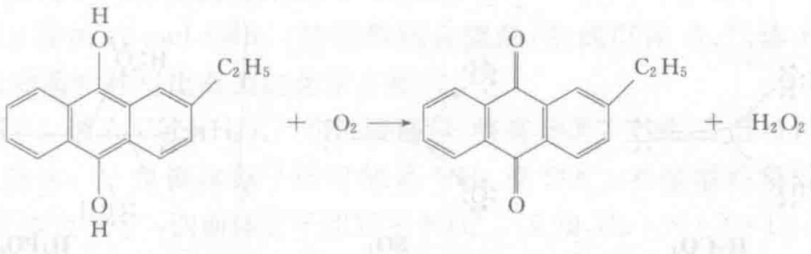

与电解法相比，乙基蒽醌法还具有电能消耗低、水的消耗也低的特点。

$H_{2}O_{2}$ 受光照射、接触杂质或在碱性条件下容易分解产生 $O_{2}$ ，所以在其保存和使用过程中要避光放置阴凉处，避免混进金属杂质。还可加入一些阻化剂，如锡酸钠 $\mathrm{Na}_{2}\mathrm{Sn}(\mathrm{OH})_{6}$ 。

15.8 写出 $\mathrm{O}_2$ 、 $\mathrm{O}_2^{2-}$ 、 $\mathrm{O}_2^-$ 、 $\mathrm{O}_2^+$ 分子或离子的分子轨道，计算它们的键级，比较它们的稳定性和磁性。

解 $\mathrm{O}_2$ 的分子轨道式为

$$
\left(\sigma_ {1 \mathrm{s}}\right) ^ {2} \left(\sigma_ {1 \mathrm{s}} ^ {*}\right) ^ {2} \left(\sigma_ {2 \mathrm{s}}\right) ^ {2} \left(\sigma_ {2 \mathrm{s}} ^ {*}\right) ^ {2} \left(\sigma_ {2 \mathrm{p} _ {x}}\right) ^ {2} \left(\pi_ {2 \mathrm{p} _ {y}}\right) ^ {2} \left(\pi_ {2 \mathrm{p} _ {z}}\right) ^ {2} \left(\pi_ {2 \mathrm{p} _ {y}} ^ {*}\right) ^ {1} \left(\pi_ {2 \mathrm{p} _ {z}} ^ {*}\right)
$$

存在 1 个 $\sigma$ 键和 2 个三电子 $\pi$ 键，由于存在未成对电子，故 $O_{2}$ 具有顺磁性。

过氧离子 $O_{2}^{2-}$ 的分子轨道式为

$$
\left(\sigma_ {1 s}\right) ^ {2} \left(\sigma_ {1 s} ^ {*}\right) ^ {2} \left(\sigma_ {2 s}\right) ^ {2} \left(\sigma_ {2 s} ^ {*}\right) ^ {2} \left(\sigma_ {2 p _ {x}}\right) ^ {2} \left(\pi_ {2 p _ {y}}\right) ^ {2} \left(\pi_ {2 p _ {z}}\right) ^ {2} \left(\pi_ {2 p _ {y}} ^ {*}\right) ^ {2} \left(\pi_ {2 p _ {z}} ^ {*}\right) ^ {2}
$$

其中只有1个 $\sigma$ 键，且电子都成对，故呈反磁性。

超氧离子 $O_{2}^{-}$ 的分子轨道式为

$$
\left(\sigma_ {1 s}\right) ^ {2} \left(\sigma_ {1 s} ^ {*}\right) ^ {2} \left(\sigma_ {2 s}\right) ^ {2} \left(\sigma_ {2 s} ^ {*}\right) ^ {2} \left(\sigma_ {2 p _ {x}}\right) ^ {2} \left(\pi_ {2 p _ {y}}\right) ^ {2} \left(\pi_ {2 p _ {z}}\right) ^ {2} \left(\pi_ {2 p _ {y}} ^ {*}\right) ^ {2} \left(\pi_ {2 p _ {z}} ^ {*}\right) ^ {1}
$$

存在 1 个 $\sigma$ 键和 1 个三电子 $\pi$ 键，存在未成对电子，故也显顺磁性。

$\mathrm{O}_2^+$ 的分子轨道式为

$$
\left(\sigma_ {1 \mathrm{s}}\right) ^ {2} \left(\sigma_ {1 \mathrm{s}} ^ {*}\right) ^ {2} \left(\sigma_ {2 \mathrm{s}}\right) ^ {2} \left(\sigma_ {2 \mathrm{s}} ^ {*}\right) ^ {2} \left(\sigma_ {2 p _ {x}}\right) ^ {2} \left(\pi_ {2 p _ {y}}\right) ^ {2} \left(\pi_ {2 p _ {z}}\right) ^ {2} \left(\pi_ {2 p _ {y}} ^ {*}\right) ^ {1}
$$

存在 1 个 $\sigma$ 键和 1 个三电子 $\pi$ 键，存在未成对电子，故也显顺磁性。

$O_{2}^{2-}$ 、 $O_{2}^{-}$ 、 $O_{2}$ 、 $O_{2}^{+}$ 中的键级分别为1、1.5、2、2.5，故 $O_{2}^{2-}$ 、 $O_{2}^{-}$ 的稳定性较差。

15.9 试用 VSEPR 理论, 判断下列分子或离子的几何构型: $\mathrm{H}_{2} \mathrm{~S}, \mathrm{CO}_{3}^{2-}, \mathrm{XeF}_{4}, \mathrm{PCl}_{5}, \mathrm{AlF}_{6}^{3-}, \mathrm{O}_{3}, \mathrm{N}_{3}^{-}, \mathrm{I}_{3}^{-}$ 。

<table><tr><td>分子或离子</td><td> $H_2S$ </td><td> $CO_3^{2-}$ </td><td> $XeF_4$ </td><td> $PCl_5$ </td><td> $AlF_6^{3-}$ </td><td> $O_3$ </td><td> $N_3^-$ </td><td> $I_3^-$ </td></tr><tr><td>几何构型</td><td>角形</td><td>正三角形</td><td>正方形</td><td>三角双锥</td><td>正八面体</td><td>角形</td><td>直线</td><td>直线</td></tr></table>

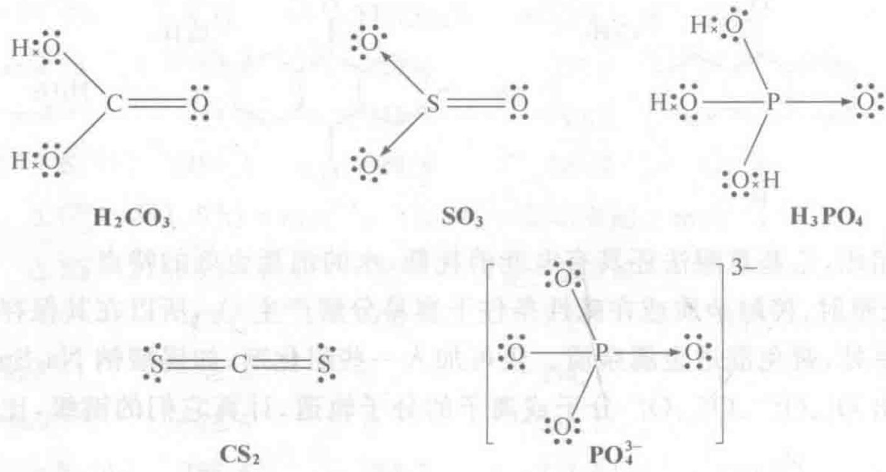

15.10 写出下列分子或离子的 Lewis 结构, 并画出它们的几何构型: $\mathrm{H}_{2} \mathrm{CO}_{3}, \mathrm{SO}_{3}, \mathrm{H}_{3} \mathrm{PO}_{4}, \mathrm{CS}_{2}, \mathrm{PO}_{4}^{3-}$ 。

解

15.11 固体 $BeCl_{2}$ 被称为“缺电子化合物”，其中的 Be 采用四配位方式与氯结合，试推测 $BeCl_{2}$ 中 Be-Cl 的连接方式。气态 $AlCl_{3}$ 中存在的是二聚体 $Al_{2}Cl_{6}$ ，写出其结构简式。

解 固体 $BeCl_{2}$ 中 Be 以 $sp^{3}$ 杂化轨道成键, 形成多聚体; 气态 $AlCl_{3}$ 为二聚体。它们的结构简式分别为

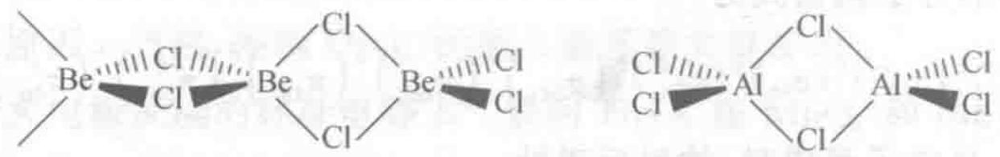

15.12 在碱性介质中氮有如下的元素电势图：

$$
\mathrm{NO} _ {3} ^ {-} \xrightarrow {- 0 . 8 5 \mathrm{V}} \mathrm{NO} _ {2} \xrightarrow {0 . 8 8 \mathrm{V}} \mathrm{NO} _ {2} ^ {-} \xrightarrow {- 0 . 4 6 \mathrm{V}} \mathrm{NO}
$$

根据此元素电势图,说明利用碱液来吸收废气中的有害成分 $NO_{2}$ 和 $NO(NO \text{ 少、 } NO_{2} \text{ 多的情况})$ 是可行的。

解 如把含有 $NO_{2}$ 和 $NO(NO \text{ 少、 } NO_{2} \text{ 多的情况})$ 的废气通入碱液，由上述碱性介质中的元素电势图可以看出： $NO_{2}$ 可以歧化为 $NO_{3}^{-}$ 和 $NO_{2}^{-}$ ，它们可溶于碱液，而 $NO_{2}$ 还可以和 NO 反应生成 $NO_{2}^{-}$ ，达到去除有害气体 $NO_{2}$ 和 NO 的目的。

15.13 已知 In(铟)有如下元素电势图, 求 $\mathrm{In(OH)}_{3}$ 的 $K_{sp}$ 。

酸性： $\mathrm{In}^{3 + }\frac{-0.444\mathrm{V}}{\mathrm{In}^{+}\frac{-0.126\mathrm{V}}{\mathrm{In}}}$ In

碱性： $\mathrm{In(OH)_3\xrightarrow{-0.99V}In}$

解 由电势图, 得

$$
E ^ {\ominus} (\mathrm{In} ^ {3 +} / \mathrm{In}) = \frac {(- 0 . 4 4 4 \times 2 - 0 . 1 2 6) \mathrm{V}}{3} = - 0. 3 3 8 \mathrm{V}
$$

又有

$$
E ^ {\ominus} (\mathrm{In(OH)} _ {3} / \mathrm{In}) = - 0. 9 9 \mathrm{V} = E ^ {\ominus} (\mathrm{In} ^ {3 +} / \mathrm{In}) - \frac {0 . 0 5 9 2 \mathrm{V}}{3} \times \lg \frac {1}{K _ {\mathrm{sp}}}, K _ {\mathrm{sp}} = 8 \times 1 0 ^ {- 3 4}
$$

15.14 向 $\left[\mathrm{Cu}\left(\mathrm{NH}_{3}\right)_{4}\right]\mathrm{SO}_{4}$ 的水溶液通入 $\mathrm{SO}_{2}$ 至溶液呈微酸性，生成白色沉淀 $\mathrm{Q}$ 。对物质 $\mathrm{Q}$ 的分析表明：Q由 $\mathrm{Cu},\mathrm{N},\mathrm{H},\mathrm{S},\mathrm{O}$ 五种元素组成，而且其物质的量之比 $n(\mathrm{Cu}):n(\mathrm{N})$ ：

$n(S)=1:1:1,Q$ 的晶体中有一种呈三角锥体和一种呈正四面体的原子团(离子或分子),Q为反磁性物质。

(1) 写出 Q 的化学式及生成 Q 的化学方程式。

(2) 将 Q 和足量的 $10 \, mol \cdot dm^{-3}$ 的硫酸混合微热，生成沉淀 A、气体 B 和溶液 C，指出 A、B、C 各是什么物质？并写出有关的化学方程式。

解 (1) 当 $\mathrm{SO}_2$ 通入 $\mathrm{Cu(NH_3)_4^{2+}}$ 的水溶液后, 将有 $\mathrm{SO}_3^{2-}$ 生成, 并且可以将 $\mathrm{Cu(II)}$ 还原为 $\mathrm{Cu(I), Cu(I)}$ 为反磁性。三角锥体原子团可能是 $\mathrm{NH}_3$ 或 $\mathrm{SO}_3^{2-}$ , 在微酸性条件下, $\mathrm{NH}_3$ 已变成 $\mathrm{NH}_4^+$ , 所以三角锥体为 $\mathrm{SO}_3^{2-}$ , 四面体原子团则是 $\mathrm{NH}_4^+$ 。又知, $\mathrm{Cu:N:S=1:1:1}$ 。综上所述, Q 的化学式为 $\mathrm{NH}_4\mathrm{CuSO}_3$ , 生成 Q 的化学方程式为

$$
2 \mathrm{Cu} (\mathrm{NH} _ {3}) _ {4} ^ {2 +} + 3 \mathrm{SO} _ {2} + 4 \mathrm{H} _ {2} \mathrm{O} \longrightarrow 2 \mathrm{NH} _ {4} \mathrm{CuSO} _ {3} \downarrow + \mathrm{SO} _ {4} ^ {2 -} + 6 \mathrm{NH} _ {4} ^ {+}
$$

$$
2 \mathrm{NH} _ {4} \mathrm{CuSO} _ {3} + 4 \mathrm{H} ^ {+} \longrightarrow \mathrm{Cu} + 2 \mathrm{SO} _ {2} + \mathrm{Cu} ^ {2 +} + 2 \mathrm{NH} _ {4} ^ {+} + 2 \mathrm{H} _ {2} \mathrm{O}
$$

由上可知：A 为 Cu；B 为 $SO_{2}$ ；C 为 $CuSO_{4}$ 和 $(NH_{4})_{2}SO_{4}$ 。

## 15.15 查阅有关 Mn 的元素电势图, 并回答:

（1）在酸性介质中，锰的哪些氧化态物种能稳定存在？哪些不能稳定存在？哪些不能两两共存？

(2) 强氧化剂 $\left(\mathrm{NH}_{4}\right)_{2}\mathrm{S}_{2}\mathrm{O}_{8}$ 、 $NaBiO_{3}$ 和 $PbO_{2}$ 能否将 $\mathrm{Mn(II)}$ 氧化为 $\mathrm{Mn(VI)}$ ，应在酸性还是碱性介质中进行？

解 （1）Mn 在酸性介质中的元素电势图为

$$
\mathrm{MnO} _ {4} ^ {-} \xrightarrow [ 1 . 5 1 \mathrm{V} ]{0 . 5 6 \mathrm{V}} \mathrm{MnO} _ {4} ^ {2 -} \xrightarrow [ 1 . 5 1 \mathrm{V} ]{2 . 2 6 \mathrm{V}} \mathrm{MnO} _ {2} \xrightarrow [ 1 . 5 1 \mathrm{V} ]{0 . 9 5 \mathrm{V}} \mathrm{Mn} ^ {3 +} \xrightarrow [ 1 . 5 1 \mathrm{V} ]{1 . 5 1 \mathrm{V}} \mathrm{Mn} ^ {2 +} \xrightarrow [ - 1 . 1 9 \mathrm{V} ]{- 1 . 1 9 \mathrm{V}} \mathrm{Mn}
$$

由电势图可以看出,能单独稳定存在的物种有: $Mn^{2+}$ , $MnO_{2}$ , $MnO_{4}^{-}$ ; 不能稳定存在的物种有: $Mn, Mn^{3+}, MnO_{4}^{2-}$ ; 两两不能共存的有: $MnO_{4}^{-}$ 和 $Mn^{2+}, MnO_{2}$ 和 $Mn, MnO_{4}^{-}$ 和 Mn 等。

(2) 应在酸性介质中进行,作为氧化剂的含氧酸盐或氧化物一般在酸性介质中才能显示出更强的氧化性。

15.16 配制 $SnCl_{2}$ 水溶液, 必须加适量的盐酸和锡粒, 为什么? 久置空气中的 $SnCl_{2}$ 水溶液, 其酸度是变大还是变小?

解 加盐酸是为了防止 $Sn^{2+}$ 水解；加锡粒是因为一旦 $Sn^{2+}$ 被空气中的 $O_{2}$ 氧化成 $Sn^{4+}$ ，则 Sn 就可以和 $Sn^{4+}$ 反应，都变成 $Sn^{2+}$ 。

久置空气中的 $SnCl_{2}$ 溶液由于发生下述反应,使酸度逐渐降低:

$$
2 \mathrm{Sn} ^ {2 +} + \mathrm{O} _ {2} + 4 \mathrm{H} ^ {+} \longrightarrow 2 \mathrm{Sn} ^ {4 +} + 2 \mathrm{H} _ {2} \mathrm{O}
$$

15.17 如何用微溶性的橙黄色固体 $V_{2}O_{5}$ 分别配制 $NaVO_{3}$ 、 $(VO_{2})_{2}SO_{4}$ 和 $VOCl_{2}$ 溶液？

解 可用 $V_{2}O_{5}$ 分别和 NaOH 溶液、浓硫酸、盐酸反应来配制 $NaVO_{3}$ 、 $(VO_{2})_{2}SO_{4}$ 和 $VOCl_{2}$ 溶液，反应方程式分别为

$$
\mathrm{V} _ {2} \mathrm{O} _ {5} + 2 \mathrm{NaOH} \longrightarrow 2 \mathrm{NaVO} _ {3} + \mathrm{H} _ {2} \mathrm{O}
$$

$$
\mathrm{V} _ {2} \mathrm{O} _ {5} + \mathrm{H} _ {2} \mathrm{SO} _ {4} (\text {浓}) \longrightarrow (\mathrm{VO} _ {2}) _ {2} \mathrm{SO} _ {4} + \mathrm{H} _ {2} \mathrm{O}
$$

$$
\mathrm{V} _ {2} \mathrm{O} _ {5} + 6 \mathrm{HCl} \longrightarrow 2 \mathrm{VOCl} _ {2} + 3 \mathrm{H} _ {2} \mathrm{O} + \mathrm{Cl} _ {2}
$$

15.18 (1) 根据电极电势计算以下反应的平衡常数：

$$
\mathrm{O} _ {2} + 4 \mathrm{Co} (\mathrm{NH} _ {3}) _ {6} ^ {2 +} + 2 \mathrm{H} _ {2} \mathrm{O} \rightleftharpoons 4 \mathrm{Co} (\mathrm{NH} _ {3}) _ {6} ^ {3 +} + 4 \mathrm{OH} ^ {-}
$$

(2) 现将空气 $[p(\mathrm{O}_2) = 20.3\mathrm{kPa}]$ 通入到含有 $0.10\mathrm{mol}\cdot \mathrm{dm}^{-3}\mathrm{Co(NH_3)_6^{3 + }}$ 、 $0.10\mathrm{mol}\cdot \mathrm{dm}^{-3}$ $\mathrm{Co(NH_3)_6^{2 + }}$ 、 $2.0\mathrm{mol}\cdot \mathrm{dm}^{-3}\mathrm{NH}_4^+$ 和 $2.0\mathrm{mol}\cdot \mathrm{dm}^{-3}\mathrm{NH}_3\cdot \mathrm{H}_2\mathrm{O}$ 的混合溶液中，能否发生上述反应？

解 (1) 查得 $\mathrm{Co(NH_3)_6^{3+} + e \longrightarrow Co(NH_3)_6^{2+}}$ $E_{1}^{\ominus} = 0.108\mathrm{V}$

$$
\mathrm{O} _ {2} + 2 \mathrm{H} _ {2} \mathrm{O} + 4 \mathrm{e} \longrightarrow 4 \mathrm{OH} ^ {-} \quad E _ {2} ^ {\ominus} = 0. 4 0 1 \mathrm{V}
$$

$$
\lg K ^ {\ominus} = \frac {4 \times (0 . 4 0 1 - 0 . 1 0 8) \mathrm{V}}{0 . 0 5 9 2 \mathrm{V}}, \quad K ^ {\ominus} = 6. 8 \times 1 0 ^ {1 9}
$$

(2) $c(\mathrm{NH}_3\cdot \mathrm{H}_2\mathrm{O}) = c(\mathrm{NH}_4^+) = 2.0\mathrm{mol}\cdot \mathrm{dm}^{-3}$

$$
\mathrm{pOH} = \mathrm{p} K _ {\mathrm{b}} - \lg \frac {c (\mathrm{NH} _ {3} \cdot \mathrm{H} _ {2} \mathrm{O})}{c (\mathrm{NH} _ {4} ^ {+})} = \mathrm{p} K _ {\mathrm{b}}, \quad c (\mathrm{OH} ^ {-}) = K _ {\mathrm{b}} = 1. 8 \times 1 0 ^ {- 5} \mathrm{mol} \cdot \mathrm{dm} ^ {- 3}
$$

反应商 $Q = \frac{[\mathrm{Co(NH_3)}_{6}^{3 + }]^4[\mathrm{OH}^- ]^4}{[\mathrm{Co(NH_3)}_{6}^{2 + }]^4\times p(\mathrm{O}_2)} = \frac{(0.10)^4\times(1.8\times 10^{-5})^4}{\left(\frac{20.3}{100.0}\right)\times(0.10)^4} = 5.2\times 10^{-19}\ll K^\ominus$

在所给条件下，反应能正向进行。在水溶液中 $\mathrm{Co(III)}$ 的 $\mathrm{Co(NH_3)_6^{3 + }}$ 比 $\mathrm{Co(II)}$ 的 $\mathrm{Co(NH_3)_6^{2 + }}$ 更稳定，但 $\mathrm{Co}^{3 + }$ 在水溶液中很不稳定。

15.19 $\mathrm{AgNO_3}$ 溶液中 $(50.0\mathrm{cm}^3, 0.100\mathrm{mol}\cdot \mathrm{dm}^{-3})$ 加入密度为 $0.932\mathrm{g}\cdot \mathrm{cm}^{-3}$ 含 $\mathrm{NH}_3$ $18.2\%$ 的氨水 $30.0\mathrm{cm}^3$ 后，再加水冲稀至 $100\mathrm{cm}^3$ 。

(1) 求算溶液中 $Ag^{+}$ 、 $\mathrm{Ag(NH_{3})_{2}^{+}}$ 和 $NH_{3}$ 的浓度。

(2) 向此溶液中加 0.0745g 固体 KCl, 有无 AgCl 沉淀析出? 如若阻止 AgCl 生成, 在原来 $AgNO_{3}$ 和氨的混合溶液中, 氨的最低浓度应是多少 $mol \cdot dm^{-3}$ ?

(3) 如加入 $0.120 \mathrm{~g}$ 固体 $\mathrm{KBr}$ , 有无 $\mathrm{AgBr(s)}$ 生成? 如若阻止 $\mathrm{AgBr}$ 生成, 在原来 $\mathrm{AgNO}_{3}$ 和氨的混合溶液中, 氨的最低浓度应是多少 $\mathrm{mol} \cdot \mathrm{dm}^{-3}$ ? 根据 (2)、(3) 的计算结果, 可得到什么结论?

解

$$
c (\mathrm{Ag} ^ {+}) = \frac {0 . 1 0 0 \mathrm{mol} \cdot \mathrm{dm} ^ {- 3} \times 5 0 \mathrm{cm} ^ {3}}{1 0 0 \mathrm{cm} ^ {3}} = 0. 0 5 0 \mathrm{mol} \cdot \mathrm{dm} ^ {- 3}
$$

$$
c (\mathrm{NH} _ {3}) = \frac {3 0 . 0 \mathrm{cm} ^ {3} \times 0 . 9 3 2 \mathrm{g} \cdot \mathrm{cm} ^ {- 3} \times 1 8 . 2 \%}{1 7 \mathrm{g} \cdot \mathrm{mol} ^ {- 1} \times 0 . 1 0 0 \mathrm{dm} ^ {3}} = 3. 0 \mathrm{mol} \cdot \mathrm{dm} ^ {- 3}
$$

$$
\mathrm{Ag} ^ {+} + \quad 2 \mathrm{NH} _ {3} \quad \Longrightarrow \quad \mathrm{Ag(NH} _ {3}) _ {2} ^ {+} \quad K _ {\text {稳}} = 1. 1 \times 1 0 ^ {7}, \quad \text {设} [ \mathrm{Ag} ^ {+} ] = x \mathrm{mol} \cdot \mathrm{dm} ^ {- 3}
$$

$\frac{\text{平衡浓度}}{\mathrm{mol}\cdot\mathrm{dm}^{-3}}$ $x$ $3.0 - 2\times 0.050 + 2x$ $0.050 - x$ $\mathrm{Ag^{+}}$ 几乎全部转化为 $\mathrm{Ag(NH_3)_2^+}$

$$
\frac {0 . 0 5 0}{x \times (2 . 9) ^ {2}} = 1. 1 \times 1 0 ^ {7}, \quad x = 5. 4 \times 1 0 ^ {- 1 0}, \quad [ \mathrm{Ag} ^ {+} ] = 5. 4 \times 1 0 ^ {- 1 0} \mathrm{mol} \cdot \mathrm{dm} ^ {- 3}   [ \mathrm{Ag} (\mathrm{NH} _ {3}) _ {2} ^ {+} ] = 0. 0 5 0 \mathrm{mol} \cdot \mathrm{dm} ^ {- 3}, \quad [ \mathrm{NH} _ {3} ] = 2. 9 \mathrm{mol} \cdot \mathrm{dm} ^ {- 3}
$$

$$
c (\mathrm{Ag} ^ {+}) c (\mathrm{Cl} ^ {-}) = 5. 4 \times 1 0 ^ {- 1 0} \times 0. 0 1 0 = 5. 4 \times 1 0 ^ {- 1 2} <   K _ {\mathrm{sp}} (\mathrm{AgCl}) = 1. 7 7 \times 1 0 ^ {- 1 0}
$$

故无AgCl↓生成。为阻止 AgCl 的生成，所需 $NH_{3}$ 的最低浓度为

$$
[ \mathrm{Ag} ^ {+} ] \leqslant \frac {K _ {\mathrm{sp}}}{[ \mathrm{Cl} ^ {-} ]} = \frac {1 . 7 7 \times 1 0 ^ {- 1 0}}{0 . 0 1 0 0} = 1. 7 7 \times 1 0 ^ {- 8} \mathrm{mol} \cdot \mathrm{dm} ^ {- 3}
$$

$$
\mathrm{Ag} ^ {+} \quad + \quad 2 \mathrm{NH} _ {3} \rightleftharpoons \mathrm{Ag(NH} _ {3}) _ {2} ^ {+} \quad \text {设[NH} _ {3} ] = y \mathrm{mol} \cdot \mathrm{dm} ^ {- 3}
$$

平衡浓度 $\mathrm{mol}\cdot \mathrm{dm}^{-3}$

$$
\frac {0 . 0 5 0}{1 . 7 7 \times 1 0 ^ {- 8} \times y ^ {2}} = 1. 1 \times 1 0 ^ {7}, \quad y = 0. 5 1, \quad [ \mathrm{NH} _ {3} ] = 0. 5 1 \mathrm{mol} \cdot \mathrm{dm} ^ {- 3}
$$

原混合溶液中 $NH_{3}$ 的最低浓度为

$$
(0. 5 1 + 2 \times 0. 0 5 0) \mathrm{mol} \cdot \mathrm{dm} ^ {- 3} = 0. 6 1 \mathrm{mol} \cdot \mathrm{dm} ^ {- 3}
$$

$$
(3) c (\mathrm{Br} ^ {-}) = \frac {0 . 1 2 0 \mathrm{g}}{1 1 9 \mathrm{g} \cdot \mathrm{mol} ^ {- 1} \times 0 . 1 0 \mathrm{dm} ^ {3}} = 0. 0 1 0 \mathrm{mol} \cdot \mathrm{dm} ^ {- 3}
$$

$$
c (\mathrm{Ag} ^ {+}) c (\mathrm{Br} ^ {-}) = 5. 4 \times 1 0 ^ {- 1 0} \times 0. 0 1 0 = 5. 4 \times 1 0 ^ {- 1 2} > K _ {\mathrm{sp}} (\mathrm{AgBr}) = 5. 3 5 \times 1 0 ^ {- 1 3}
$$

故有 $\mathrm{AgBr}\downarrow$ 生成。为阻止 $\mathrm{AgBr}$ 的生成，所需 $\mathrm{NH_3}$ 的最低浓度为 $z\mathrm{mol}\cdot \mathrm{dm}^{-3}$ ，则

$$
[ \mathrm{Ag} ^ {+} ] \leqslant \frac {K _ {\mathrm{sp}}}{[ \mathrm{Br} ^ {-} ]} = \frac {5 . 3 5 \times 1 0 ^ {- 1 3}}{0 . 0 1 0} = 5. 4 \times 1 0 ^ {- 1 1} \mathrm{mol} \cdot \mathrm{dm} ^ {- 3}
$$

$$
\mathrm{Ag} ^ {+} + 2 \mathrm{NH} _ {3} \rightleftharpoons \mathrm{Ag} (\mathrm{NH} _ {3}) _ {2} ^ {+}
$$

平衡浓度 $mol \cdot dm^{-3}$

$$
\frac {0 . 0 5 0}{5 . 4 \times 1 0 ^ {- 1 1} \times z ^ {2}} = 1. 1 \times 1 0 ^ {7}, \quad z = 9. 2, \quad [ \mathrm{NH} _ {3} ] = 9. 2 \mathrm{mol} \cdot \mathrm{dm} ^ {- 3}
$$

原混合溶液中 $\mathrm{NH}_3$ 的最低浓度为 $(9.2 + 0.10)\mathrm{mol}\cdot \mathrm{dm}^{-3} = 9.3\mathrm{mol}\cdot \mathrm{dm}^{-3}$

结论 由于 $K_{\mathrm{sp}}(\mathrm{AgBr}) < K_{\mathrm{sp}}(\mathrm{AgCl})$ ，在向 $\mathrm{Ag(NH_3)_2^+ (c = 0.050 mol \cdot dm^{-3})}$ 和 $\mathrm{NH_3}$ ( $c = 2.9 \, \mathrm{mol} \cdot \mathrm{dm}^{-3}$ ) 的混合液中分别加入相同浓度（均为 $0.0100 \, \mathrm{mol} \cdot \mathrm{dm}^{-3}$ ）的 KBr、KCl 时， $\mathrm{AgBr}$ 沉淀会生成，而 $\mathrm{AgCl}$ 沉淀则不会产生。或者说， $\mathrm{AgBr}$ 比起 $\mathrm{AgCl}$ 难溶于氨水生成 $\mathrm{Ag(NH_3)_2^+}$ 。上述计算表明，如由 $\mathrm{AgCl}$ 和氨水反应生成 $0.050 \, \mathrm{mol} \cdot \mathrm{dm}^{-3}$ 的 $\mathrm{Ag(NH_3)_2^+}$ 的溶液，则所需 $\mathrm{NH_3}$ 的最低浓度只为 $0.61 \, \mathrm{mol} \cdot \mathrm{dm}^{-3}$ ；如由 $\mathrm{AgBr}$ 和 $\mathrm{NH_3}$ 反应，则所需 $\mathrm{NH_3}$ 的最低浓度高达 $9.3 \, \mathrm{mol} \cdot \mathrm{dm}^{-3}$ 。

## 15.20 请查阅有关资料，说明 $Hg_{2}Cl_{2}$ 的结构、键合方式和磁性。

解 磁性实验表明,氯化亚汞为反磁性物质。如把氯化亚汞的化学式写成 $\mathrm{HgCl}$ , 则 $\mathrm{Hg}^{+}$ 的外层电子构型应为 $6\mathrm{s}^{1}$ , 有未成对电子, 应显顺磁性, 但这与实际不符; 如把氯化亚汞的化学式写成 $\mathrm{Hg}_{2} \mathrm{Cl}_{2}$ , 就意味着结构为: $\mathrm{Cl}^{-}[\mathrm{Hg}-\mathrm{Hg}]^{2+} \mathrm{Cl}^{-}$ , 其中两个 $\mathrm{Hg}^{+}$ 各用 $6\mathrm{s}^{1}$ 电子配对形成一个共价键, 无未成对电子, 物质则为反磁性。

15.21 查阅有关数据说明 Cu 虽为 IB 族金属,但在水溶液中 $\mathrm{Cu^{+}(aq)}$ 却不能稳定存在,而易生成的是 $\mathrm{Cu^{2+}(aq)}$ 。(Cu 的第二电离焓为 $1966\ kJ \cdot mol^{-1}$ , $Cu^{+}$ 的水合焓为 $-581.6\ kJ \cdot mol^{-1}$ , $Cu^{2+}$ 的水合焓为 $-2121\ kJ \cdot mol^{-1}$ 。)

解 Cu 为 I B 族金属, 它的外围电子构型为 $3 \mathrm{~d}^{10} 4 \mathrm{~s}^{1}$ , 第一电离能确实比第二电离能要小, 也有氧化态为 +1 的铜的化合物, 如 $\mathrm{CuCl(s)}$ 、 $\mathrm{Cu}_{2} \mathrm{O(s)}$ 、 $\mathrm{NH}_{4} \mathrm{CuSO}_{3}(\mathrm{s})$ 等。但在水中由于生成 $\mathrm{Cu}^{2+}(\mathrm{aq})$ 的水合焓要比生成 $\mathrm{Cu}^{+}(\mathrm{aq})$ 的大得多, 所以水溶液中 $\mathrm{Cu}^{+}(\mathrm{aq})$ 却不能稳定存在, 而易生成的是 $\mathrm{Cu}^{2+}(\mathrm{aq})$ 。这可由下面有关的焓变及电极电势进一步说明。

生成水合离子的焓变 $(\mathrm{kJ}\cdot\mathrm{mol}^{-1})$ :

$$
\begin{array}{r l r} {2 \mathrm{Cu(s)} {\xrightarrow {2 1 6 6 \mathrm{kJ} \cdot \mathrm{mol} ^ {- 1}}} 2 \mathrm {Cu^ {+} (g)} {\xrightarrow {- 1 1 6 3 \mathrm{kJ} \cdot \mathrm{mol} ^ {- 1}}} 2 \mathrm {Cu^ {+} (aq)}} & {} & {\Delta H _ {\text {总}} ^ {\ominus} = 1 0 0 3 \mathrm{kJ} \cdot \mathrm{mol} ^ {- 1}} \\ {\mathrm{Cu(s)} {\xrightarrow {3 0 4 9 \mathrm{kJ} \cdot \mathrm{mol} ^ {- 1}}} \mathrm {Cu^ {2 + } (g)} {\xrightarrow {- 2 1 2 1 \mathrm{kJ} \cdot \mathrm{mol} ^ {- 1}}} \mathrm {Cu^ {2 + } (aq)}} & {} & {\Delta H _ {\text {总}} ^ {\ominus} = 9 2 8 \mathrm{kJ} \cdot \mathrm{mol} ^ {- 1}} \end{array}
$$

Cu 的元素电势图：

$$
\mathrm{Cu} ^ {2 +} \underline {{0 . 1 5 3 \mathrm{V}}} \mathrm{Cu} ^ {+} \underline {{0 . 5 2 1 \mathrm{V}}} \mathrm{Cu}
$$

由焓变看,生成 $\mathrm{Cu^{2+}(aq)}$ 要比生成 $\mathrm{Cu^{+}(aq)}$ 有利;由电势图可知,水中 $\mathrm{Cu^{+}(aq)}$ 可歧化为 Cu 和 $\mathrm{Cu^{2+}(aq)}$ 。参见习题 14.23 的计算结果。

15.22 固态 $SmH_{2}$ 、 $LaH_{2}$ 等能导电，而固态 $EuH_{2}$ 、 $LaH_{3}$ 等不能导电，为什么？

解 因为固态 $\mathrm{EuH_2}$ 、 $\mathrm{LaH_3}$ 为离子型氢化物，所以不能导电；而固态 $\mathrm{SmH_2}$ 、 $\mathrm{LaH_2}$ 则为金属型氢化物，所以能导电。

15.23 已知： $\mathrm{Fe}^{3+} + \mathrm{e} \rightleftharpoons \mathrm{Fe}^{2+}$ $E^{\ominus} = 0.77\mathrm{V}$

$$
\mathrm{Ce} ^ {4 +} + \mathrm{e} \rightleftharpoons \mathrm{Ce} ^ {3 +} \qquad E ^ {\ominus} = 1. 4 5 \mathrm{V}
$$

是否可以用已知浓度的 $Ce^{4+}$ 溶液测定 $Fe^{2+}$ 的含量？

$$
\mathrm{Ce} ^ {4 +} + \mathrm{Fe} ^ {2 +} \rightleftharpoons \mathrm{Ce} ^ {3 +} + \mathrm{Fe} ^ {3 +} \qquad E _ {\text {池}} ^ {\ominus} = (1. 4 5 - 0. 7 7)   \mathrm{V} = 0. 6 8   \mathrm{V}, \quad K = 3 \times 1 0 ^ {1 1}
$$

这说明反应能进行得很彻底,所以可以用 $Ce^{4+}$ 溶液测定 $Fe^{2+}$ 的含量。

15.24 分别写出与下列两个核化学反应有关的方程式：

(1) 实验室用的中子源是利用半衰期很长的镭放出的 $\alpha$ 粒子轰击铍( $^{9}_{4}Be$ ) 获得的；

(2) ⅦB族的锝 $\left(^{99}\mathrm{Tc}\right)$ 是在1973年用氘核轰击钼 $\left(^{98}\mathrm{Mo}\right)$ 而发现的。

解 (1) $^{226}_{88}\mathrm{Ra}\longrightarrow^{222}_{86}\mathrm{Rn}+\alpha(_{2}^{4}\mathrm{He})$ ， $^{9}_{4}\mathrm{Be}+\alpha(_{2}^{4}\mathrm{He})\longrightarrow^{12}_{6}\mathrm{C}+\frac{1}{0}\mathrm{n}$

(2) $^{98}_{42}\mathrm{Mo}+\mathrm{^{2}_{1}H}\longrightarrow\mathrm{^{99}_{43}Tc+\mathrm{^{1}_{0}n}}$

15.25 镍(Ni)是制造合金钢和催化剂的重要元素,它在地壳中的丰度如何?在我国的储量如何?

解 镍在地壳中的丰度为 $8.4 \times 10^{1} \, mg \cdot kg^{-1}$ 。

我国镍总储量约为 $7.8 \times 10^{2}$ 万吨，居世界第9位。主要为硫化物型。镍矿产地有近百处，分布于18个省(区)。其中以甘肃省为最，储量占全国的 $60\%$ 左右，新疆、吉林、四川等省(区)次之。甘肃金川镍矿规模仅次于加拿大的萨德伯里镍矿，为世界第二大镍矿。

## 15.26 如何由闪锌矿(ZnS)制取纯 Zn?

解 矿粉焙烧,硫酸浸取,纯化(通空气,并加入 ZnO 调 pH 3\~5,除去杂质 Fe 等;加入锌粉控制 pH 和温度,除去 Co、Cd、Tl、Ge 等杂质),电解制备纯锌。

15.27 查阅数据,在 Ellingham 图(教材图 15.9)上画出 $\mathrm{TiO}_2$ 的 Ellingham 直线,并分析铝热法、焦炭法能否制取金属钛?怎样获得高纯钛?

解 查热力学数据得 $\mathrm{TiO_2}$ 的Ellingham直线方程为： $\Delta G^{\ominus} / (\mathrm{kJ}\cdot \mathrm{mol}) = -944 + 0.185T$ ，并作图（下图中直线⑤所示）。由下图可见，铝线⑦在钛线⑤的下方，并且几乎与钛线⑤平行，所以可以用铝热法制取金属钛，且从热力学考虑，温度高低都可以。如用焦炭，由图中可以看出，只要温度高一些（如接近 $1600^{\circ}\mathrm{C}$ 时），炭似乎也可以将 $\mathrm{TiO_2}$ 还原成Ti；不过高温时，钛和炭可形成稳定的TiC，所以不能用炭还原钛的氧化物得到钛。

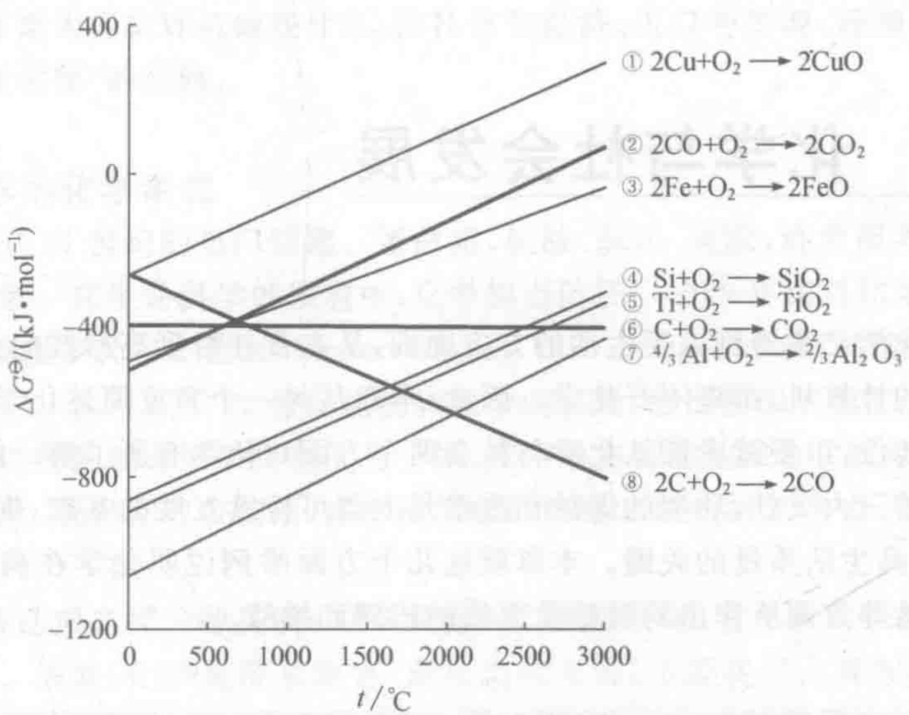

要制高纯钛，可让粗钛和碘在 $250^{\circ}\mathrm{C}$ 起反应制得 $\mathrm{TiI_4}$ ，然后将 $\mathrm{TiI_4}$ 装入密闭的容器内，在 $1100\sim 1500^{\circ}\mathrm{C}$ 的电热钨丝上受热分解为高纯钛沉积物和 $\mathbf{I}_2$ 。

$$
\mathrm{Ti} + 2 \mathrm{I} _ {2} \xrightarrow [ 1 1 0 0 \sim 1 5 0 0 ^ {\circ} \mathrm{C} ]{2 5 0 ^ {\circ} \mathrm{C}} \mathrm{TiI} _ {4}
$$

15.28 工厂含有 $\mathrm{Cd(CN)_{4}^{2-}}$ 的电镀废水或实验室含有 NaCN 的废液，都可以在碱性条件下，用漂白粉或通 $Cl_{2}$ 进行无害化处理。写出有关的化学反应方程式。

$$
\begin{array}{r l} \text {   解   } & \mathrm {Cd(CN) _ {4} ^ {2 - } +5Ca(ClO) _ {2} +6OH^ {-} \longrightarrow 4CaCO_ {3} \downarrow + Cd(OH) _ {2} \downarrow + Ca^ {2 + } + 2N_ {2} +10Cl^ {-} + 2H_ {2} O} \\ & 2 \mathrm {CN^ {-} +5ClO^ {-} +2OH^ {-} \longrightarrow N_ {2} +5Cl^ {-} +2CO_ {3} ^ {2 - } + H_ {2} O} \\ & 2 \mathrm {CN^ {-} +5Cl_ {2} +12OH^ {-} \longrightarrow N_ {2} +10Cl^ {-} +2CO_ {3} ^ {2 - } +6H_ {2} O} \end{array}
$$

15.29 在实验室长久盛放下列试剂的容器,常常会产生一些固体沉积物沾在器壁或留在器底,这些沉积物分别是什么?为了去除这些沉积物,分别常用哪些试剂?

石灰水， $KMnO_{4}$ 溶液， $FeSO_{4}$ 溶液，饱和 $H_{2}S$ 水，碘水。

<table><tr><td>试剂</td><td>石灰水</td><td>KMnO4溶液</td><td>FeSO4溶液</td><td>饱和H2S水</td><td>碘水</td></tr><tr><td>沉积物</td><td>CaCO3</td><td>MnO2</td><td>Fe2O3·xH2O</td><td>S</td><td>I2</td></tr><tr><td>去除沉积物试剂</td><td>盐酸</td><td>浓盐酸</td><td>盐酸</td><td>NaOH溶液</td><td>NaOH溶液</td></tr></table>

15.30 用2000字左右的短文描述有关铜的丰度、矿物、冶炼、精炼、常见化合物及其重要性质。解略