# 教师教学用书

PUTONG GAOZHONG JIAOKESHU

JIAOSHI JIAOXUE YONGSHU

HUAXUE

登录“教师网络培训和服务平台”
即刻免费获得优质、专业、全面的服务

◇ 独家权威解读新版本新课标教材

◇ 全面系统推出各科教材配套资源

◇ 在线活动引领课程教材教法改革

◇ 网络研修助力一线教师专业成长

请通过人教网顶部“培训服务”菜单访问本平台，或使用微信搜索并关注“人教教材培训”公众号，获取更多最新培训资讯和精彩内容。

人民教育出版社 课程教材研究所

化学课程教材研究开发中心

编著

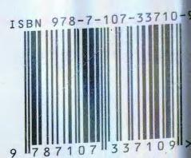

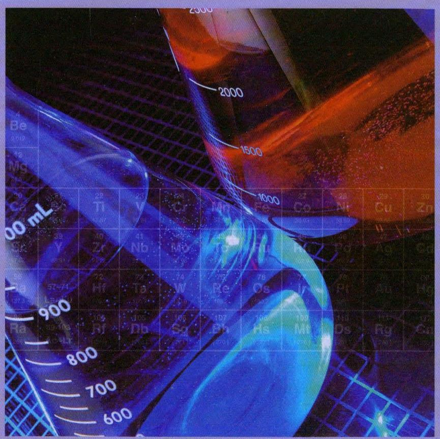

## 化学

必修

第一册

普通高中教科书

# 教师教学用书

化学

人民教育出版社 课程教材研究所

化学课程教材研究开发中心

编著

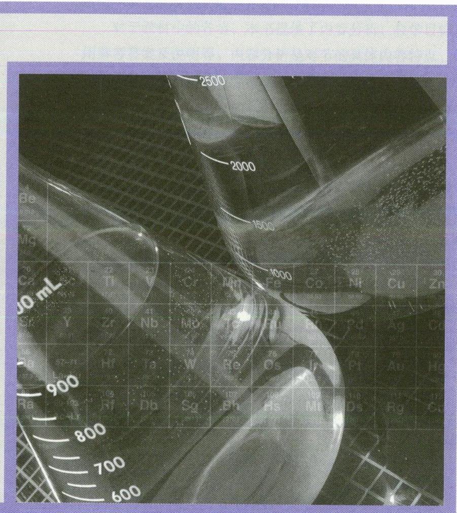

必修

第一册

人民教育出版社

普通高中教科书教师教学用书．化学：必修．第一册／人民教育出版社课程教材研究所化学课程教材研究开发中心编著．一北京：人民教育出版社,2019.07

ISBN 978-7-107-33710-9

I. ①普… II. ①人… III. ①中学化学课—高中—教学参考资料 IV. ①G633

中国版本图书馆 CIP 数据核字(2019)第 170462 号

普通高中教科书 教师教学用书 化学 必修 第一册

出版发行 人民教育出版社
（北京市海淀区中关村南大街17号院1号楼 邮编：100081）

网址 http://www.pep.com.cn

经销全国新华书店

印刷 山东临沂新华印刷物流集团有限责任公司

版 次 2019年7月第1版

印 次 2019年8月第1次印刷

开 本 890 毫米 × 1240 毫米 1/16

印 张 10.75

字 数 265 千字

定 价 36.70 元

版权所有·未经许可不得采用任何方式擅自复制或使用本产品任何部分·违者必究

如发现内容质量问题、印装质量问题，请与本社联系。电话：400-810-5788

## 说明

本书是根据教育部制订的《普通高中化学课程标准（2017年版）》和人民教育出版社课程教材研究所化学课程教材研究开发中心编著的《普通高中教科书 化学 必修 第一册》的内容和要求，以突出育人功能、确保科学规范、注重核心基础、体现时代要求为原则，结合高中化学教学实际情况编写的，供使用《普通高中教科书 化学 必修 第一册》的高中化学教师教学时参考。

从利于教师理解和体会课程标准，更好地使用教材，更高效地实施教学出发，全书对教材的内容按照章节进行了分析，提出教学建议，提供教学资源和典型教学案例。

本书按教材顺序对每章进行了整体说明，包括教材分析、学业要求和课时建议。教材分析从地位和功能、内容的选择与呈现、教学深广度及内容结构等方面对全章内容作出分析；学业要求指出本章在发展学生化学学科核心素养方面所要达到的目标；课时建议则是建议本章的教学课时。

对于教材中的各节，本书提供了内容分析、教学目标、教学建议、栏目使用建议、练习与应用参考答案及说明等。内容分析是对节的具体内容特点、知识结构进行较详细的介绍；教学目标指出本节需要达到的教学目的，以及教学重点和难点；教学建议是围绕节的内容，对教学设计思路、教学策略、教学方法等提出建议；栏目使用建议是对“实验”“思考与讨论”“探究”等栏目提出具体的指导和建议，并对栏目所涉及的有关问题给予解答或提示；练习与应用参考答案及说明则是对节后的习题给予解答或提示。

教学资源和教学案例是按章编写的。教学资源主要编入一些与本章内容有关的化学知识、疑难问题解答，以及联系实际、新的科技信息和化学史等内容，以帮助教师更好地理解教材，并在教学时参考。教学案例主要选择本章中的典型课题，立足课堂教学实际，展示优秀案例。

本书内容仅供教师参考，授课时的教学方法由教师根据具体情况决定。

本书总主编：王晶、周业虹。

本册主编：乔国才、夏建华。

本册编写人员（按编写顺序）：乔国才、张建国、周业虹、李俊、徐泓、王晶、任峰。

责任编辑：王维臻。

责任绘图：郭威。

本书内容难免有不妥之处，希望广大教师和教学研究人员提出意见和建议，以便修改和完善。

人民教育出版社 课程教材研究所
化学课程教材研究开发中心
2019年6月

## 目录

第一章 物质及其变化 …… 1
本章说明 …… 1
第一节 物质的分类及转化 …… 4
第二节 离子反应 …… 11
第三节 氧化还原反应 …… 17
教学资源 …… 24
教学案例 …… 33

第二章 海水中的重要元素——钠和氯 …… 37
本章说明 …… 37
第一节 钠及其化合物 …… 40
第二节 氯及其化合物 …… 48
第三节 物质的量 …… 54
实验活动 1 配制一定物质的量浓度的溶液 …… 60
教学资源 …… 62
教学案例 …… 73

第三章 铁 金属材料 …… 85
本章说明 …… 85
第一节 铁及其化合物 …… 88
第二节 金属材料 …… 97
实验活动 2 铁及其化合物的性质 …… 104
教学资源 …… 106
教学案例 …… 117

第四章 物质结构 元素周期律 …… 128
本章说明 …… 128
第一节 原子结构与元素周期表 …… 131
第二节 元素周期律 …… 139
第三节 化学键 …… 146
实验活动 3 同周期、同主族元素性质的递变 …… 152
教学资源 …… 154
教学案例 …… 163

## 第一章物质及其变化

## 本章说明

作为高中化学的第一章，本章具有承前启后的作用。“承前”是指复习初中化学的重要内容；“启后”是指在初中复习的基础上进一步提高和拓展，从而为高中化学必修课程的学习，乃至整个高中阶段化学课程的学习奠定基础。

本章所介绍的离子反应和氧化还原反应等内容，是中学化学重要的理论知识。这些理论知识，以及本章初步建立的认识物质及其变化的两个重要视角——物质类别和元素价态，是元素化合物、水溶液中的离子反应与平衡、化学反应与能量等后续内容学习的基础。因此，本章内容具有重要的功能，是整个高中化学的教学重点之一。

## 一、教材分析

物质及其变化是化学的重要研究对象。对于超过1亿种的物质和更为丰富的化学变化，人们要想认识它们的规律性，就必须运用分类的方法。这既反映了化学的发展规律，也符合学生的认知特点。《普通高中化学课程标准（2017年版）》（以下简称课程标准）在“课程目标”中指出：通过观察能辨识一定条件下物质的形态及变化的宏观现象，初步掌握物质及其变化的分类方法，能运用符号表征物质及其变化；能从不同视角对纷繁复杂的化学变化进行分类研究，逐步揭示各类变化的特征和规律。因此，对物质及其变化进行分类研究是本章教材编写的一条基本线索，如下图所示。

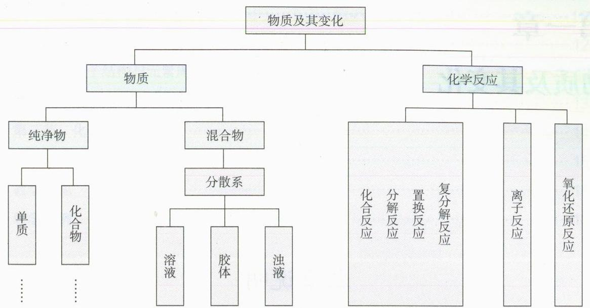

考虑到学生在开始高中化学学习时，一般都需要先复习初中化学的知识，如化学基本概念和原理、物质之间的化学反应及其规律等。因此，把物质及其变化编排在高中化学的第一章，可以使物质的分类及转化、离子反应、氧化还原反应等知识的学习，既源于初中又高于初中，既有利于初、高中知识的衔接，又有利于学生运用分类的方法提升对物质及其变化的认识水平。

从物质的分类来看，纯净物的分类在初中化学已初步介绍过，本章第一节主要是通过复习使之进一步系统化。第一节中的分散系及其分类是高中化学的新知识，是在初中溶液、乳浊液和悬浊液的基础上，重点介绍胶体的概念及其重要性质——丁达尔效应。然后，第一节在物质分类的基础上，引导学生进一步认识不同类别物质之间的转化关系。

从化学反应的分类来看，本章依据不同的标准对化学反应进行分类研究。

（1）根据化学反应前后物质的种类，以及反应物和生成物的类别，可将化学反应分为化合反应、分解反应、置换反应和复分解反应。这4种基本反应类型在初中化学已介绍过，本章没有过多涉及。

（2）根据化学反应中是否有离子参加、是否有电子转移，本章介绍两种重要的反应类型——离子反应和氧化还原反应，即第二节和第三节的内容。这两种反应是新知识，也是本章的重点内容。


## 二、学业要求

1. 能依据物质类别列举 $\mathrm{Ca}$ 、C等元素的典型代表物。

2. 能举例说明胶体的典型特征。

3. 能用电离方程式表示某些酸、碱、盐的电离。

4. 能利用离子反应、氧化还原反应等概念对常见的反应进行分类和分析说明。

5. 能运用实验基本操作实施实验方案，具有安全意识和环保意识。

6. 能观察并如实记录实验现象和数据，进行分析和推理，得出合理的结论。

7. 能从物质类别和元素价态变化的视角说明物质的转化路径。

8. 能举例说明与化学有关的职业，简单分析这些职业与化学的关系。


## 三、课时建议

第一节 物质的分类及转化 2课时

第二节 离子反应 2课时

第三节 氧化还原反应 3课时

全章复习 1课时

# 第一节 物质的分类及转化


## 一、内容分析

根据课程标准的要求，以及初、高中化学教学衔接的实际需要，本节安排了两部分内容：物质的分类，物质的转化。

根据物质的组成和性质对纯净物进行分类，学生在初中化学课上已经学过。在初中的基础上，教材重点介绍了“树状分类法”和“交叉分类法”这两种常用的分类方法，以及同素异形体、酸性氧化物和碱性氧化物的概念。这既有利于初、高中的衔接，又可以为后面元素化合物知识的学习打下基础。

溶液、乳浊液和悬浊液都是混合物，学生在初中化学课上也都接触过。教材以此为基础介绍了分散系、分散质和分散剂的概念，然后以分散质粒子的直径大小作为分类依据，引入胶体的概念，并通过实验1-1引出胶体的重要性质——丁达尔效应。

在物质分类的基础上，教材以“思考与讨论”的形式，引导学生复习酸、碱、盐的主要化学性质，如列举反应实例，说明反应类型等。这样安排的主要目的是通过学生活动的形式进一步巩固初中化学的重点知识，加深学生对物质间发生化学反应规律的认识，为介绍物质之间的转化作准备。

教材指出，考虑如何实现物质之间的转化时最基本的依据是化学变化过程中元素不会改变，这是化学的基本观念之一。随后通过“思考与讨论”，以含Ca、C元素的物质为例，引导学生认识不同类别物质之间的转化关系及反应规律。同时强调，物质转化的价值在于制备人类生活和生产所需要的新物质，并指出工业生产中制取某种物质时要考虑的因素，目的是培养学生综合考虑问题的意识。

本节内容的特点是源于初中，高于初中。在编排思路上，教材注意与初中化学相关知识的合理衔接，以物质的分类、物质的转化为线索，复习和巩固旧知识，适当引入新知识。在科学方法和科学观念方面，教材突出分类方法在化学研究中的应用，强调物质转化的价值。这样编排，既可以减轻学生进入高中化学学习的不适感，有利于激发学生的学习兴趣；又能够使学生站在更高的角度学习化学，有利于发展化学学科核心素养。


## 二、教学目标

## 1. 教学目标

(1) 通过对生活实例的反思, 提炼分类的意义和方法, 并迁移至物质分类, 能对酸、碱、

盐、氧化物及它们之间的反应进行描述和符号表征。

（2）通过归纳相关物质间的化学反应关系，建立物质转化模型，认识物质的变化规律。

(3) 通过对 $\mathrm{Fe(OH)}_{3}$ 胶体性质的讨论, 能从微观粒子尺度和宏观性质相结合的角度解释相关自然现象。

## 2. 教学重点和难点

重点：应用分类法建立各类物质的转化关系模型。

难点：各类物质间的转化关系。


## 三、教学建议

## 1. 用学生熟悉的事物提炼分类的意义和方法

从生活经验出发的教学能使概念更易形成，利于学生将感性认识上升为理性认识，重新认识生活，提高将化学知识与社会生活相联系的意识。以下两个教学片段供参考。

## (1) 图书码放

课前发放纸质表格（可以是学案）。

环节一 请学生课前考察自家或书店的书籍码放情况并拍成照片，课堂上随机选取4名学生分别展示自己的照片，说明自家或书店这样码放的依据、目的各是什么。其他同学在表格上做记录。

<table><tr><td rowspan="2">方案</td><td colspan="2">分类标准的选定</td><td rowspan="2">目的(不唯一)</td></tr><tr><td>相同点</td><td>不同点</td></tr><tr><td>1</td><td>均有内容</td><td>内容可分属不同学科</td><td>方便按学科取用</td></tr><tr><td>2</td><td>封皮颜色</td><td>各种颜色</td><td></td></tr><tr><td>3</td><td>尺寸</td><td></td><td></td></tr><tr><td>4</td><td>......</td><td></td><td></td></tr></table>

说明：“相同点”即被分类的对象所具备的共同属性，例如书籍都有内容、标注出版社等；“不同点”即被分类的对象表现出不同特点的属性，例如书籍内容可以是语文、数学、化学等，出版社也不同。

## 环节二 讨论分类标准。

## (2) 冰箱储物

由用冰箱储存食物的讨论可得如下结论：放入冰箱的食物的共同特点是需要低温储藏；食物应按“生熟”和“需冷冻还是冷藏”进行分类，放在冰箱内的不同区域。这就为“交叉分类法”的讨论奠定了基础。

## 2. 提出合理问题和任务，驱动学习活动

关于物质分类的教学内容有以下三部分，建议更多采用学生活动的方式来组织学习，以问题或任务驱动。

（1）为使学生更好地理解物质分类的系统，建议让其对系统中各级分类标准进行判断、表述和分享，最终形成统一的结果。在各层级分类中，大部分是以物质的组成为标准进行分类，而单质则是以性质为标准进行进一步分类的。至于对无机化合物进一步分类的标准，则应从组成和性质两个方面综合考虑才能得到“既方便理解又总结反应规律”的分类结果（目的）。无机化合物情况复杂，不必深究，但应使学生知晓，有时会遇到较复杂的局面，任何分类方法都必须为目的服务。

（2）作为交叉分类的应用，可以开展下列活动。

环节一 提出问题: 工业生产中需要 $\mathrm{K}_{2} \mathrm{SO}_{4}$ , 如何选定原料来制备 $\mathrm{K}_{2} \mathrm{SO}_{4}$ ?

环节二 原料分析：根据 $\mathrm{K}_{2} \mathrm{SO}_{4}$ 的组成，可知原料中应包括能提供钾元素的物质（如 $\mathrm{K}_{2} \mathrm{CO}_{3}$ ，可来自草木灰）和能提供硫酸根的物质（如 $\mathrm{H}_{2} \mathrm{SO}_{4}$ ，来自硫酸工业产品），或同时能提供钾元素和硫酸根的物质 [如 $\mathrm{KAl(SO}_{4})_{2} \cdot 12 \mathrm{H}_{2} \mathrm{O}$ ]。分析过程如图 1-1 所示。

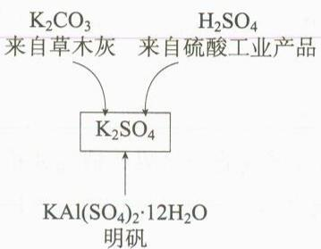  
图 1-1 制备 $K_{2}SO_{4}$ 的原料选择

环节三 制备方案设计：通过化学反应实现二者的结合或除去原料中的其他成分。

环节四 方案评价：结合原料来源、价格、环保、能耗、反应条件等因素评价方案。

## 3. 在胶体性质的讨论中建立粒子尺度与宏观性质的关系

物质的性质与它的尺度有着密切关系，即所谓尺度效应。在中学阶段，分散系是体现这种关系的最典型的内容，应该通过这部分的教学将尺度效应的观念传达给学生。具体做法可参考以下三个环节。

环节一 浊液和溶液的比较：通过观察，指出浊液和溶液的外观差异——分散质颗粒大小和稳定性差异——浊液不稳定而溶液稳定（表现在分散质是否出现沉降或漂浮而与分散剂脱离的现象）。

环节二 提出假设：①不同分散系，其分散系的性质与分散质颗粒大小有关。②查阅资料可知，溶液和浊液粒子直径分别为小于1 nm和大于100 nm，则分散质颗粒直径介于二者之间的分散系（即胶体）可能具有介于二者之间，甚至与二者不同的性质。

环节三 实验验证假设：讨论 $\mathrm{Fe(OH)}_{3}$ 胶体的制备、性质（稳定性、丁达尔效应）并与溶液、浊液进行对比，验证假设。

此外还可以补充一些实验，以强调胶体的性质和应用。如：①将硫粉放入试管中，用少量酒精浸润后再加入约 $5 \mathrm{~mL}$ 水, 振荡, 静置后观察现象 (硫沉降); 向另一试管中加入 $5 \mathrm{~mL}$ 水, 再滴加数滴硫的酒精溶液 (硫微溶于酒精), 振荡, 然后用激光笔照射 (发生丁达尔效应)。②取两支试管, 分别加入较浓的牛奶和蒸馏水各 $5 \mathrm{~mL}$ , 再向盛水的试管中加入 3 滴浓牛奶, 振荡; 用激光笔分别照射两支试管内的液体 (稀牛奶中可观察到光的通路, 浓牛奶则在靠近光源处发生散射现象, 而远端光路变弱或消失)。③用激光笔照射具有剖面的原料玉石或出示照片 (出现类似光照浓牛奶时的现象)。

## 4. 以 Na、S 元素为例建立典型元素从单质到盐的转化关系

除含钙元素（Ca）和碳元素（C）的物质系列外，可以引导学生进行拓展训练，尝试构建含其他元素的物质的转化关系。具体做法参考如下。

(1) 钠（Na）元素与硫（S）元素物质系列建构。

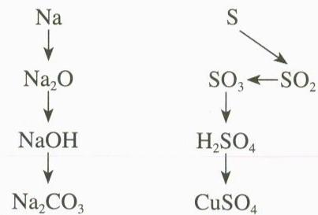

(2) 讨论两个物质系列之间可能发生的反应。下图仅为示例。

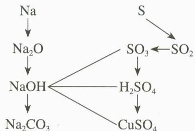

化学反应是化学学科的核心内容，各类物质之间的反应规律对学习理解具体反应具有指导意义，为后续课程中关于元素化合物知识的学习奠定基础。两个物质系列之间的反应关系可以概括为“化学性质‘对立’的物质之间容易发生反应”。如果把碱性氧化物、碱、溶液显碱性的盐归结为碱性物质，把酸性氧化物、酸、溶液呈酸性的盐归结为酸性物质，那么，碱性物质与酸性物质性质“对立”，发生反应的可能性就会比较大。掌握了这样的规律就能帮助学生增强判断力，扩大知识视野，提高学习效率。


## 四、栏目使用建议

## 1. 实验

【实验1- 1】

实验所用的 ${\mathrm{{FeCl}}}_{3}$ 溶液要饱和但不能浑浊。烧杯里的蒸馏水煮沸后,滴加 ${\mathrm{{FeCl}}}_{3}$ 溶液时要不断振荡，不宜用玻璃棒搅拌，也不宜使液体沸腾时间过长，以免发生聚沉。所得胶体应透明、呈红褐色。


做丁达尔效应的实验时，也可预先用木板或硬纸板做一个暗箱，暗箱用带小孔的隔板分为大小两室，小室装一个聚光灯泡，大室可并排放置两个烧杯，同时大室侧面要留有可看到两个烧杯的观察孔。实验时，两个烧杯中一个盛放胶体，另一个盛放溶液。注意溶液中不要混有灰尘或胶体。

## 2. 思考与讨论

## 【思考与讨论1】

建议利用本栏目组织学生活动，可分为三步。第一，提供三个表格（分别用于归纳酸、碱、盐的化学性质），请学生根据已有知识独立填写表格中的化学方程式。第二，以小组为单位分享各自的成果，尽其所知，形成小组意见。第三，各小组选出代表在全班分享，最终形成关于酸、碱、盐与其他各类物质反应的一般规律。

## (1) 归纳酸的化学性质

<table><tr><td>酸的主要化学性质</td><td>反应实例(写出化学方程式)</td></tr><tr><td>酸与活泼金属反应</td><td> $H_2SO_4 + Zn = ZnSO_4 + H_2 \uparrow$ </td></tr><tr><td>酸与碱性氧化物反应</td><td> $2HCl + CaO = CaCl_2 + H_2O$ </td></tr><tr><td>酸与碱反应</td><td> $H_2SO_4 + 2NaOH = Na_2SO_4 + 2H_2O$ </td></tr><tr><td>酸与某些盐反应</td><td> $H_2SO_4 + BaCl_2 = BaSO_4 \downarrow + 2HCl$ </td></tr></table>

## (2) 归纳碱的化学性质

<table><tr><td>碱的主要化学性质</td><td>反应实例(写出化学方程式)</td></tr><tr><td>碱与酸性氧化物反应</td><td> $2NaOH + CO_{2} = Na_{2}CO_{3} + H_{2}O$ </td></tr><tr><td>碱与酸反应</td><td> $NaOH + HCl = NaCl + H_{2}O$ </td></tr><tr><td>碱与某些盐反应</td><td> $2NaOH + CuSO_{4} = Na_{2}SO_{4} + Cu(OH)_{2} \downarrow$ </td></tr></table>

## (3) 归纳盐的化学性质

<table><tr><td>盐的主要化学性质</td><td>反应实例(写出化学方程式)</td></tr><tr><td>盐与较活泼金属反应</td><td> $CuSO_4 + Zn = ZnSO_4 + Cu$ </td></tr><tr><td>盐与碱反应</td><td> $CuSO_4 + 2NaOH = Cu(OH)_2 \downarrow + Na_2SO_4$ </td></tr><tr><td>盐与酸反应</td><td> $Na_2CO_3 + 2HCl = 2NaCl + CO_2 \uparrow + H_2O$ </td></tr><tr><td>盐与某些盐反应</td><td> $Na_2CO_3 + CaCl_2 = CaCO_3 \downarrow + 2NaCl$ </td></tr></table>

（4）酸、碱、盐的主要化学性质所涉及到的反应类型：置换反应、复分解反应（含中和反应）。

【思考与讨论2】

$$
(1) 2 \mathrm{Ca} + \mathrm{O} _ {2} = 2 \mathrm{CaO} \quad \mathrm{CaO} + \mathrm{H} _ {2} \mathrm{O} = \mathrm{Ca(OH)} _ {2} \quad \mathrm{Ca(OH)} _ {2} + \mathrm{H} _ {2} \mathrm{SO} _ {4} = \mathrm{CaSO} _ {4} + 2 \mathrm{H} _ {2} \mathrm{O}
$$

$$
\mathrm{C} + \mathrm{O} _ {2} \xlongequal {\text {点燃}} \mathrm{CO} _ {2} \qquad \mathrm{CO} _ {2} + \mathrm{H} _ {2} \mathrm{O} = \mathrm{H} _ {2} \mathrm{CO} _ {3} \qquad \mathrm{H} _ {2} \mathrm{CO} _ {3} + \mathrm{Ca(OH)} _ {2} = \mathrm{CaCO} _ {3} \downarrow + 2 \mathrm{H} _ {2} \mathrm{O}
$$

(2) 物质可以依据其组成进行分类, 而组成相似的物质在性质上也有相似性。可以基于这种规律预测物质间的转化关系。某些类别的物质之间较易发生化学反应, 如酸性物质 (包括酸、酸性氧化物) 和碱性物质 (包括碱、碱性氧化物) 之间较易发生反应, 其中以酸碱中和反应最为典型。

根据学生的学习能力和水平，还可以向学生介绍各类物质反应关系图，如图1-2所示。

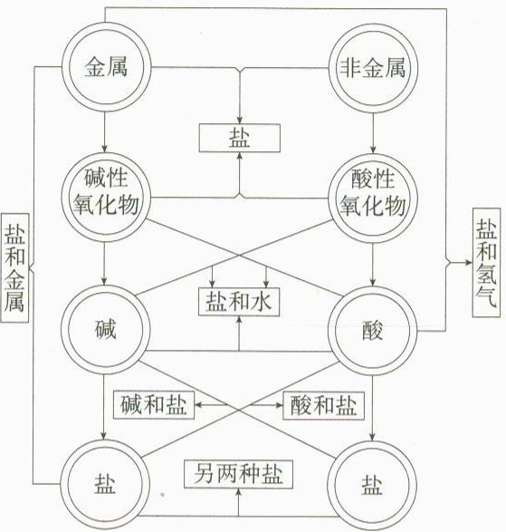  
图 1-2 各类物质的反应关系图

## 五、练习与应用参考答案及说明

## 1. (1) ⑨⑩ ⑤ ③ ④ ⑥⑦

提示：⑩汽油是由有机物组成的混合物。

(2) 单质 $\mathrm{O}_{3}$

2. 以是否含有氧元素为依据，可分为含氧酸和无氧酸（或称不含氧酸）；以每个分子中所含的氢原子个数为依据，可分为一元酸、二元酸、三元酸（其中二元酸和三元酸可以合称多元酸）。

3.

<table><tr><td>分散系</td><td>分散质粒子的直径大小</td><td>举例</td></tr><tr><td>溶液</td><td>小于1nm</td><td>硫酸铜溶液</td></tr><tr><td>胶体</td><td>大于1nm,小于100nm</td><td>Fe(OH)3胶体</td></tr><tr><td>乳浊液或悬浊液</td><td>大于100nm</td><td>豆浆、泥浆水</td></tr></table>

提示：云、雾中的小水滴直径有大有小，因其会产生丁达尔效应而可以判断一定含有胶体粒子。

5. (1) 化合反应: $\mathrm{Na}_{2} \mathrm{O} + \mathrm{H}_{2} \mathrm{O} = 2 \mathrm{NaOH}$

(2) 分解反应: $2 \mathrm{KClO}_{3} \xrightarrow[\triangle]{\mathrm{MnO}_{2}} 2 \mathrm{KCl} + 3 \mathrm{O}_{2} \uparrow$

(3) 置换反应: $\mathrm{{Zn}} + {\mathrm{{CuCl}}}_{2} = {\mathrm{{ZnCl}}}_{2} + \mathrm{{Cu}}\;{\mathrm{{Zn}}} + {\mathrm{H}}_{2}{\mathrm{{SO}}}_{4} = {\mathrm{{ZnSO}}}_{4} + {\mathrm{H}}_{2} \uparrow$

(4) 复分解反应: $\mathrm{BaCl}_{2} + \mathrm{Na}_{2} \mathrm{SO}_{4} = \mathrm{BaSO}_{4} \downarrow + 2 \mathrm{NaCl}$ $\mathrm{BaCl}_{2} + \mathrm{H}_{2} \mathrm{SO}_{4} = \mathrm{BaSO}_{4} \downarrow + 2 \mathrm{HCl}$

$$
2 \mathrm{NaOH} + \mathrm{CuCl} _ {2} = \mathrm{Cu(OH)} _ {2} \downarrow + 2 \mathrm{NaCl} \quad 2 \mathrm{NaOH} + \mathrm{H} _ {2} \mathrm{SO} _ {4} = \mathrm{Na} _ {2} \mathrm{SO} _ {4} + 2 \mathrm{H} _ {2} \mathrm{O}
$$

$$
\mathrm{Na} _ {2} \mathrm{O} + \mathrm{H} _ {2} \mathrm{SO} _ {4} = \mathrm{Na} _ {2} \mathrm{SO} _ {4} + \mathrm{H} _ {2} \mathrm{O}
$$

6.（1） $2\mathrm{Cu} + \mathrm{O}_2\xrightarrow{\triangle} 2\mathrm{CuO}$ $\mathrm{CuO + H_2SO_4 = CuSO_4 + H_2O}$

$$
\mathrm{CuSO} _ {4} + 2 \mathrm{NaOH} = \mathrm{Cu(OH)} _ {2} \downarrow + \mathrm{Na} _ {2} \mathrm{SO} _ {4} \quad \mathrm{Cu(OH)} _ {2} + \mathrm{H} _ {2} \mathrm{SO} _ {4} = \mathrm{CuSO} _ {4} + 2 \mathrm{H} _ {2} \mathrm{O}
$$

$$
\mathrm{CuSO} _ {4} + \mathrm{Zn} = \mathrm{Cu} + \mathrm{ZnSO} _ {4}
$$

(2) $\mathrm{C} + \mathrm{O}_2\xrightarrow{\text{点燃}}\mathrm{CO}_2$ $\mathrm{CO_2 + CaO = CaCO_3}$ $\mathrm{CaCO_3\xrightarrow{\text{高温}}CaO + CO_2\uparrow}$

$$
\mathrm{CaO} + \mathrm{H} _ {2} \mathrm{O} = \mathrm{Ca(OH)} _ {2} \quad \mathrm{Ca(OH)} _ {2} + 2 \mathrm{HCl} = \mathrm{CaCl} _ {2} + 2 \mathrm{H} _ {2} \mathrm{O}
$$

7.(1) 方法①: $\mathrm{CuO} + \mathrm{H}_{2} \mathrm{SO}_{4} = \mathrm{CuSO}_{4} + \mathrm{H}_{2} \mathrm{O}$ $\mathrm{Fe} + \mathrm{CuSO}_{4} = \mathrm{FeSO}_{4} + \mathrm{Cu}$

方法②: $\mathrm{Fe} + \mathrm{H}_{2} \mathrm{SO}_{4} = \mathrm{FeSO}_{4} + \mathrm{H}_{2} \uparrow$ $\mathrm{CuO} + \mathrm{H}_{2} \xlongequal{\triangle} \mathrm{Cu} + \mathrm{H}_{2} \mathrm{O}$

(2) 方法①: $\mathrm{Mg} + 2\mathrm{HCl} = \mathrm{MgCl}_{2} + \mathrm{H}_{2}\uparrow$

方法②: $\mathrm{MgO} + 2\mathrm{HCl} = \mathrm{MgCl}_{2} + \mathrm{H}_{2}\mathrm{O}$

方法③: $\mathrm{Mg(OH)}_{2} + 2\mathrm{HCl} = \mathrm{MgCl}_{2} + 2\mathrm{H}_{2}\mathrm{O}$

8.(1)CaO 碱性氧化物、金属氧化物

提示：按照不同的标准，一种物质可以分属不同类型。

$$
(2) \mathrm{CaO} + \mathrm{H} _ {2} \mathrm{O} = \mathrm{Ca(OH)} _ {2}
$$

（3）酸、酸性氧化物、水。如 $\mathrm{CaO + 2HCl = CaCl_2 + H_2O}$ $\mathrm{CaO + SiO_2\xrightarrow{\text{高温}} CaSiO_3}$

$$
\mathrm{CaO} + \mathrm{H} _ {2} \mathrm{O} = \mathrm{Ca(OH)} _ {2}
$$

提示：应从碱性氧化物的共性出发进行预测。

(4) 浓硫酸、五氧化二磷、硅胶、无水氯化钙

## 第二节 离子反应


## 一、内容分析

在介绍离子反应之前，需要介绍电解质、电离的概念。因此，本节内容分为两部分：电解质的电离，离子反应。

首先，教材结合生活常识（给电器设备通电时，湿手操作容易发生触电事故）创设情境，以真实、有意义的问题来激发学生的学习兴趣，引发学生思考。然后以实验1-2为基础介绍电解质和电离的概念。

需要说明的是，实验1-2的设计目的有3个：①认识物质的导电性，②引入电解质的概念，③为学习电离的概念提供实验证据。

教材基于实验证据提出问题：为什么 $\mathrm{NaCl}$ 、 $\mathrm{KNO}_3$ 等电解质，在干燥时不导电，而溶于水或熔化后却能导电呢？随后，教材结合构成 $\mathrm{NaCl}$ 固体的粒子、 $\mathrm{NaCl}$ 固体在水中溶解和形成水合离子的过程，以及 $\mathrm{NaCl}$ 固体受热熔化时粒子运动的变化等，从微观角度对上述问题作出解释。为了帮助学生深入理解，教材辅以相应的微观过程示意图（图1-10、图1-11、图1-12）。在此基础上，介绍电离的概念和电离方程式，并结合电离方程式，引导学生从电离的角度认识酸、碱的本质。

在学习电离和电离方程式的基础上，教材通过实验1-3的现象和分析，得出 $Na_{2}SO_{4}$ 稀溶液与 $BaCl_{2}$ 稀溶液反应的微观实质，从而引出离子反应和离子方程式，并介绍离子方程式的书写步骤。然后，教材以“思考与讨论”的形式，得出中和反应的实质，引导学生深入认识离子反应。最后，教材说明酸、碱、盐在水溶液中发生复分解反应的微观实质，并总结这类离子反应发生的条件等。

本节内容的特点是概念多、抽象，理论性强。在呈现方式上，教材一方面紧密结合实验引入概念，充分发挥实验在化学概念形成中的重要功能，如现象直观、易懂，有利于激发学习兴趣等；另一方面注重基于实验证据（宏观现象）进行分析和推理，逐步引导学生认识物质导电性及电解质在溶液中反应的本质特征（微观实质），建立电离与离子反应的概念模型，体会模型在解释化学现象、揭示现象的本质中所发挥的重要作用，发展化学学科核心素养。


## 二、教学目标

## 1. 教学目标

（1）通过实验、假设、推理等过程，以探究的方式建构电离模型，并以此认识电解质；能用

电离方程式表示某些酸、碱、盐的电离过程。

(2) 通过分析酸、碱、盐之间的反应事实, 认识离子反应, 归纳离子反应发生的条件, 正确书写这些反应的离子方程式。

(3) 通过实验了解常见离子的检验方法, 进一步理解离子反应。

## 2. 教学重点和难点

重点：离子方程式的书写。

难点：电解质概念，离子反应发生的条件。


## 三、教学建议

## 1. 在电离概念建立过程中培养证据推理与模型认知的核心素养

理解电离概念并不难，但由于其微观过程不可见，因此只能在实验事实的基础上通过推理、假设、验证等探究过程，建立微观模型，从而对实验事实作出合理解释。

建议如下。（情境及后续内容略）

环节一 导电性实验：测试①NaCl固体、②纯水、③NaCl溶液的导电性。

板书如下图所示。

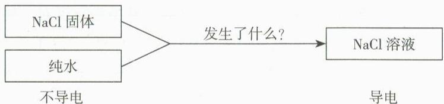

提出问题：在NaCl溶于水的过程中究竟发生了什么？（提示：微观角度）

环节二 分组讨论：各抒己见，用语言、文字或图画描述想象的微观过程。

环节三 分享：小组代表阐述本小组意见（不唯一）。如有可能，教师可播放模拟电离过程的动画。

环节四 达成共识：评价以上意见的合理性，形成微观模型——NaCl在水分子作用下解离成自由移动的 $Na^{+}$ 和 $Cl^{-}$ ，脱离固体表面，进入水中形成溶液，即发生电离。

## 2. 提出挑战性问题引发科学探究，实现深度学习

在离子反应概念建立初期，宜使用伴有沉淀生成等明显现象的反应。为了让学生更深入地理解离子反应概念，可以给出更具挑战性的问题，引发科学探究过程。

探究问题：下列反应过程中均产生白色沉淀，表观现象无差异。反应装置如图1-3所示。

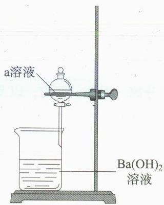  
图 1-3 离子反应实验装置示意图

判断下列情况对应的离子方程式是否正确。

反应① a为硫酸钠时： $Ba^{2+}+SO_{4}^{2-}=BaSO_{4}\downarrow$

反应② a为稀硫酸时： $Ba^{2+}+SO_{4}^{2-}=BaSO_{4}\downarrow$

问题分析：反应中除 $\mathrm{Ba}^{2+}$ 和 $\mathrm{SO}_4^{2-}$ 结合生成可见的白色沉淀 $\mathrm{BaSO}_4$ 外，还有其他离子吗？它们是否也能结合？有可见的现象吗？如果不可见，可以通过实验来证明吗？怎么证明？

(反应①中还有 $\mathrm{Na}^{+}$ 、 $\mathrm{OH}^{-}$ , 反应②中还有 $\mathrm{H}^{+}$ 和 $\mathrm{OH}^{-}$ , 它们能否分别结合决定了溶液中是否仍存在自由移动的离子。二者的差异可以由溶液导电性实验予以外显。)

溶液导电性实验：按图1-4所示装置进行实验。

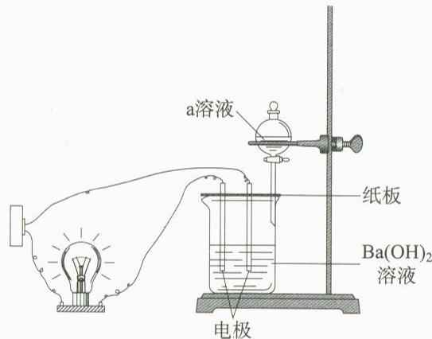  
图 1-4 溶液导电性实验装置示意图

实验现象：反应①发生时，灯泡亮度变化不大；反应②发生时，灯泡亮度先变小至熄灭，再变大。

## 3. 设计评价性活动，引导学生关注社会

可以通过学生活动来评价电离和离子反应知识的学习效果。例如，设计实验方案，除去饮用水中过多的 $Ca^{2+}$ 、 $Mg^{2+}$ 、 $SO_{4}^{2-}$ 等。

情境设计：水体中含量过高的 $Ca^{2+}$ 、 $Mg^{2+}$ 既会造成锅炉结垢，也会降低洗涤衣物时肥皂的使用效率。

问题：如何在不引入新杂质的情况下除去这些离子，使水得到净化？

方案设计：①选择药品（溶液），确定加药顺序和操作顺序；②确保所加药品（应适当过

量）在后续反应中被清除。

学生活动：①根据要求分小组设计方案；②实施实验方案，并做好记录；③分享实验结果并作出评价。

此外，离子反应在物质的制备、分离、提纯、鉴定，以及除去水中污染物等方面都有很多应用，可酌情选择合适的材料设计成学生活动。


## 四、栏目使用建议

## 1. 实验

【实验1-2】

(1) NaCl、KNO $_{3}$ 固体一般使用粉末，若能使用体积较大的晶体则可使对电离过程的分析更易理解。

（2）测纯水导电性时应保证蒸馏水较纯，且应强调“在这种情况下测不到水导电”。

（3）做溶液导电性实验时，在纯水导电性实验基础上，向蒸馏水中加入NaCl粉末，展现灯泡逐渐变亮的过程，并引导学生边看边思考溶解的微观过程。

（4）可使用实物投影仪将实验过程和现象放大，支持学生的观察与思考。

【实验1-3】

（1）在完成教材中表格的填写后可做进一步讨论：怎样判断反应中两种离子的结合？能够通过实验现象直接判断其他离子没有结合吗？如何用实验加以证明？

(可以取反应后的滤液加入 ${\mathrm{{HNO}}}_{3}$ 酸化的 ${\mathrm{{AgNO}}}_{3}$ 溶液检验其中的 ${\mathrm{{Cl}}}^{ - }$ 。)

（2）可对本实验进行深入分析，用导电性对比实验确定反应中哪些离子反应（结合）了，哪些没有。可参考“教学建议”中的第2条。

## 2. 思考与讨论

【思考与讨论1】

要求学生在书写三种碱的电离方程式时要上下对齐。可在板书或课件上框定三者电离出的共同的离子 $OH^{-}$ ，如下所示。

$$
\begin{array}{r l} \mathrm{NaOH} & = \mathrm{Na} ^ {+} + \mathrm{OH} ^ {-} \\ \mathrm{Ca(OH)} _ {2} & = \mathrm{Ca} ^ {2 +} + 2 \mathrm{OH} ^ {-} \\ \mathrm{Ba(OH)} _ {2} & = \mathrm{Ba} ^ {2 +} + 2 \mathrm{OH} ^ {-} \end{array}
$$

对于学习能力较强的学生，可引导其分析 $\mathrm{Cu}_{2}(\mathrm{OH})_{2}\mathrm{CO}_{3}$ 是否属于碱。

【思考与讨论2】

<table><tr><td>反应物</td><td>化学方程式</td><td>离子方程式</td><td>两种方程式的不同</td></tr><tr><td>HCl+NaOH</td><td> $\mathrm{{HCl}} + \mathrm{{NaOH}} = \mathrm{{NaCl}} + {\mathrm{H}}_{2}\mathrm{O}$ </td><td> ${\mathrm{H}}^{ + } + {\mathrm{{OH}}}^{ - } = {\mathrm{H}}_{2}\mathrm{O}$ </td><td rowspan="4">化学方程式表示一个具体反应,离子方程式表示一类反应的本质。</td></tr><tr><td>HCl+KOH</td><td> $\mathrm{{HCl}} + \mathrm{{KOH}} = \mathrm{{KCl}} + {\mathrm{H}}_{2}\mathrm{O}$ </td><td> ${\mathrm{H}}^{ + } + {\mathrm{{OH}}}^{ - } = {\mathrm{H}}_{2}\mathrm{O}$ </td></tr><tr><td> ${\mathrm{H}}_{2}{\mathrm{{SO}}}_{4} + \mathrm{{NaOH}}$ </td><td> ${\mathrm{H}}_{2}{\mathrm{{SO}}}_{4} + 2\mathrm{{NaOH}} = {\mathrm{{Na}}}_{2}{\mathrm{{SO}}}_{4} + 2{\mathrm{H}}_{2}\mathrm{O}$ </td><td> ${\mathrm{H}}^{ + } + {\mathrm{{OH}}}^{ - } = {\mathrm{H}}_{2}\mathrm{O}$ </td></tr><tr><td> ${\mathrm{H}}_{2}{\mathrm{{SO}}}_{4} + \mathrm{{KOH}}$ </td><td> ${\mathrm{H}}_{2}{\mathrm{{SO}}}_{4} + 2\mathrm{{KOH}} = {\mathrm{K}}_{2}{\mathrm{{SO}}}_{4} + 2{\mathrm{H}}_{2}\mathrm{O}$ </td><td> ${\mathrm{H}}^{ + } + {\mathrm{{OH}}}^{ - } = {\mathrm{H}}_{2}\mathrm{O}$ </td></tr></table>


## 五、练习与应用参考答案及说明

1. 水溶液 熔融状态 电离 能自由移动的带电粒子——阴、阳离子提示：电流是带电粒子的定向移动，离子是带电粒子的一种。

2. C

提示：A. 电解质固体不导电是因为所含离子不能自由移动；B. 电解质是化合物，不包括单质；D. 电离与通电无关。

3. B

提示: A. 在金属活动性顺序中, 铜位于氢之后, 不能与稀硫酸发生反应; C. 书写离子方程式应做到电荷守恒; D. $\mathrm{H}_{2} \mathrm{CO}_{3}$ 不稳定, 会分解生成 $\mathrm{CO}_{2}$ 和 $\mathrm{H}_{2} \mathrm{O}$ , 因此作为生成物, 应将 $\mathrm{H}_{2} \mathrm{CO}_{3}$ 写成 $\mathrm{CO}_{2} + \mathrm{H}_{2} \mathrm{O}$ 。

4. D

提示：能相互结合生成 $\mathrm{H}_2\mathrm{O}(\mathrm{A})$ 、沉淀（B）和气体（C）的离子不能在溶液中共存。

$$
5. (1) \mathrm{HNO} _ {3} = \mathrm{H} ^ {+} + \mathrm{NO} _ {3} ^ {-}
$$

$$
(2) \mathrm{KOH} = \mathrm{K} ^ {+} + \mathrm{OH} ^ {-}
$$

$$
(3) \mathrm{Fe} _ {2} (\mathrm{SO} _ {4}) _ {3} = 2 \mathrm{Fe} ^ {3 +} + 3 \mathrm{SO} _ {4} ^ {2 -}
$$

$$
(4) \mathrm{NH} _ {4} \mathrm{NO} _ {3} = \mathrm{NH} _ {4} ^ {+} + \mathrm{NO} _ {3} ^ {-}
$$

$$
6. (1) \mathrm{Na} _ {2} \mathrm{SO} _ {4} + \mathrm{BaCl} _ {2} = 2 \mathrm{NaCl} + \mathrm{BaSO} _ {4} \downarrow \quad \mathrm{SO} _ {4} ^ {2 -} + \mathrm{Ba} ^ {2 +} = \mathrm{BaSO} _ {4} \downarrow
$$

$$
2 \mathrm{Al} + 3 \mathrm{CuSO} _ {4} = \mathrm{Al} _ {2} (\mathrm{SO} _ {4}) _ {3} + 3 \mathrm{Cu} \quad 2 \mathrm{Al} + 3 \mathrm{Cu} ^ {2 +} = 2 \mathrm{Al} ^ {3 +} + 3 \mathrm{Cu}
$$

$$
(3) 2 \mathrm{HCl} + \mathrm{Na} _ {2} \mathrm{CO} _ {3} = 2 \mathrm{NaCl} + \mathrm{CO} _ {2} \uparrow + \mathrm{H} _ {2} \mathrm{O} \quad 2 \mathrm{H} ^ {+} + \mathrm{CO} _ {3} ^ {2 -} = \mathrm{CO} _ {2} \uparrow + \mathrm{H} _ {2} \mathrm{O}
$$

（4）不反应，没有离子能够结合生成沉淀、气体或水，即不符合复分解反应发生的任何一个条件。

$$
7. (1) \mathrm{CuSO} _ {4} + 2 \mathrm{NaOH} = \mathrm{Cu(OH)} _ {2} \downarrow + \mathrm{Na} _ {2} \mathrm{SO} _ {4}
$$

$$
(2) \mathrm{HCl} + \mathrm{NaOH} = \mathrm{NaCl} + \mathrm{H} _ {2} \mathrm{O}
$$

$$
(3) 2 \mathrm{HCl} + \mathrm{Na} _ {2} \mathrm{CO} _ {3} = 2 \mathrm{NaCl} + \mathrm{H} _ {2} \mathrm{O} + \mathrm{CO} _ {2} \uparrow
$$

$$
(4) \mathrm{CuSO} _ {4} + \mathrm{Fe} = \mathrm{Cu} + \mathrm{FeSO} _ {4}
$$

$$
8. (1) \mathrm{Zn} + 2 \mathrm{H} ^ {+} = \mathrm{Zn} ^ {2 +} + \mathrm{H} _ {2} \uparrow
$$

$$
(2) \mathrm{Zn} + \mathrm{Cu} ^ {2 +} = \mathrm{Zn} ^ {2 +} + \mathrm{Cu}
$$

(3) $\mathrm{H^{+} + OH^{-} = H_{2}O}$

$$
(4) \mathrm{Ba} ^ {2 +} + 2 \mathrm{OH} ^ {-} + \mathrm{Cu} ^ {2 +} + \mathrm{SO} _ {4} ^ {2 -} = \mathrm{BaSO} _ {4} \downarrow + \mathrm{Cu(OH)} _ {2} \downarrow
$$

$$
9. (1) \mathrm{Ba} ^ {2 +} + 2 \mathrm{OH} ^ {-} + 2 \mathrm{H} ^ {+} + \mathrm{SO} _ {4} ^ {2 -} = \mathrm{BaSO} _ {4} \downarrow + 2 \mathrm{H} _ {2} \mathrm{O}
$$

## (2) ②④

10.（1）碳酸钙：盐 二氧化硅：氧化物

(2) 作为牙膏中的摩擦剂, 二氧化硅应是难溶于水的。

(3) ① $\text{CaCO}_3 \xlongequal{\text{高温}} \text{CaO} + \text{CO}_2 \uparrow \quad \text{CaO} + \text{H}_2\text{O} = \text{Ca(OH)}_2$

$\mathrm{Ca(OH)_2 + Na_2CO_3 = CaCO_3\downarrow + 2NaOH}$

②优点：反应步骤少、节约能源（其他合理答案均可）

$$
\mathrm{CaCO} _ {3} + 2 \mathrm{H} ^ {+} = \mathrm{Ca} ^ {2 +} + \mathrm{H} _ {2} \mathrm{O} + \mathrm{CO} _ {2} \uparrow
$$

$$
\mathrm{Ca} ^ {2 +} + \mathrm{CO} _ {3} ^ {2 -} = \mathrm{CaCO} _ {3} \downarrow
$$

## 第三节 氧化还原反应


## 一、内容分析

本节包括两部分内容：氧化还原反应，氧化剂和还原剂。

教材首先设置了“思考与讨论”，以初中学过的两个化学反应为载体，引导学生从三个方面（①得氧物质、失氧物质及其发生的反应，②反应前后元素化合价的变化情况，③氧化反应或还原反应与元素化合价升降的关系）进行分析，在此基础上，得出氧化还原反应的概念，并将物质发生氧化反应或还原反应与元素化合价升降联系起来。

然后, 教材以 $\mathrm{Fe}$ 与 $\mathrm{CuSO}_{4}$ 的反应为例, 将氧化还原反应的内涵从得氧、失氧扩展到反应前后有元素化合价发生变化, 并说明元素化合价发生变化是氧化还原反应的重要特征。

最后, 教材从微观角度引导学生认识氧化还原反应的本质, 这是本节的重点内容。教材以 $\mathrm{Na}$ 与 $\mathrm{Cl}_{2} 、 \mathrm{H}_{2}$ 与 $\mathrm{Cl}_{2}$ 的反应为例, 从原子结构的角度讨论氧化还原反应中电子得失、共用电子对偏移的情况, 引导学生认识氧化还原反应中一定存在着电子转移, 从而形成认识氧化还原反应的微观视角。同时, 教材给出4种基本类型的反应与氧化还原反应的关系示意图, 将依据不同标准对化学反应进行的分类有机地联系在一起, 起到了帮助学生巩固概念和提高认识的作用。

在认识氧化还原反应本质的基础上，教材从电子转移的角度定义氧化剂和还原剂，并以CuO与 $H_{2}$ 、Na与 $Cl_{2}$ 的反应为例，说明氧化剂和还原剂的关系，同时介绍了中学化学中常用的氧化剂和还原剂等。随后，教材安排了“思考与讨论”，以汽车尾气系统的催化转化器中发生的化学反应为例，引导学生从科学·技术·社会·环境（STSE）视角感受氧化还原反应的社会价值，形成“绿色化学”的理念，增强社会责任感。

本节内容的特点是概念多、抽象，理论性强。在呈现方式上，教材一方面注意初、高中的衔接，结合具体的化学反应实例，以氧化还原反应概念的发展过程为线索，即“得氧、失氧→元素化合价升降→电子转移”，从宏观视角（元素）到微观视角（电子），由表及里，环环相扣，逐步揭示氧化还原反应的本质，引导学生建构氧化还原反应的认识模型。另一方面，充分发挥氧化还原反应的社会价值，引导学生从化学的视角分析和解决实际问题，体会化学对人类文明和社会发展的促进作用。


## 二、教学目标

## 1. 教学目标

(1) 通过对化合价的分析, 认识氧化还原反应的规律, 并对常见的化学反应进行分类。

(2) 基于化合价变化与电子转移的相关性, 从微观上认识氧化还原反应的本质, 能对其进行分析。

（3）能利用氧化还原反应概念判断物质的氧化性和还原性，归纳常见的氧化剂和还原剂。

## 2. 教学重点和难点

重点：氧化还原反应相关概念。

难点：氧化还原反应相关概念间的联系。


## 三、教学建议

## 1. 关注氧化还原反应概念的形成过程，揭示反应分类的意义

对氧化还原反应的认识角度从得氧、失氧转变为化合价升降，这一转变对学生而言“来得并不那么自然”，只有阐明从化合价角度认识化学反应的意义，才能揭示这一转变的意义：某些反应如果具有相同特点（例如变价）就会表现出一定的规律，掌握这些规律就能更好理解、把握和控制这类化学反应。活动建议如下。

活动一 根据化学方程式分析给定化学反应的共同特点，尝试分类。教师需适时引导学生关注反应中元素化合价的变化。

教师提供4类“有意义”的化学反应的化学方程式各2\~3个，包括：①学生较熟悉的，②用4个基本反应类型无法归类的，③工业生产中涉及的，④较复杂的，等等。

活动二 根据所给信息，解释几种金属与水反应的差异。

教师提供：①Li、Na、K、Rb等金属与水反应的实验现象（真实实验或视频），②4种金属原子结构示意图和原子半径数据。

期待结论：①4种金属都具有给出电子的倾向，即还原性；②4种金属还原性的不同可以由原子结构（半径）解释；③研究物质氧化性、还原性强弱对认识氧化还原反应的规律是有意义的。

## 2. 适时归纳氧化还原反应相关概念间的联系

建立氧化还原反应相关概念之间的联系难度较大，可以用框图等方式加以总结，降低学习难度。例如下图所示。

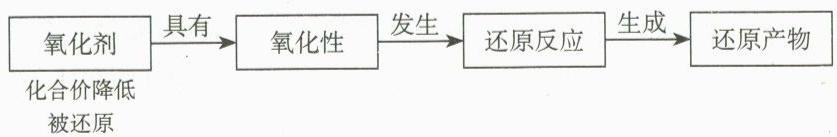

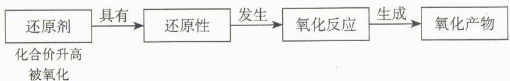

## 3. 关注对物质氧化性和还原性的认识

物质的氧化性、还原性是比较复杂的问题，教学中应该注意以下几点。

（1）元素处于最高价只具有氧化性，处于最低价只具有还原性，处于中间价态既具有氧化性，又具有还原性。然而，化合价只能判断氧化性、还原性的有无，无法判断其强弱。

(2) 按照物质类别, 常见氧化剂有: 部分非金属单质 $\left(\mathrm{F}_{2} 、 \mathrm{Cl}_{2} 、 \mathrm{Br}_{2} 、 \mathrm{O}_{2}\right.$ 等), 部分含最高价元素的物质 $\left(\mathrm{HNO}_{3} 、 \text {浓硫酸、KMnO}_{4}\right.$ 等), 部分中间价态物质 $\left[\mathrm{HClO} 、 \mathrm{H}_{2} \mathrm{O}_{2} 、 \mathrm{Ca(ClO)}_{2}\right.$ 等]。

常见还原剂有：金属单质（金属活动性顺序），部分非金属单质（C、S、P、 $H_{2}$ 等），含最低价元素的物质（HI、 $H_{2}S$ 、 $NH_{3}$ 等），其他（CO、NO、 $H_{2}O_{2}$ 等）。

(3) 决定物质氧化性、还原性强弱的因素是反应过程中电子转移的难易, 而非电子转移数的多少。例如, $\mathrm{{Na}}$ 、 $\mathrm{{Mg}}$ 、 $\mathrm{{Al}}$ 作为还原剂,电子转移数依次增多,但还原性依次减弱。

## 4. 组织专题性活动

专题性活动可以帮助学生进一步理解概念，在解决综合问题的过程中实现知识的整合与结构化。可设计开展的活动很多，例如氧化还原反应本质探究，过氧化氢氧化性、还原性的研究，日常生活中的氧化还原反应等。下例是过氧化氢氧化性、还原性的研究。

## 题目：过氧化氢氧化性、还原性的研究

## (1) 氧化性、还原性的预测


## (2) 实验验证

①还原性的验证

实验目的：验证过氧化氢具有还原性。

实验用品：过氧化氢溶液、高锰酸钾溶液、稀硫酸、稀氢氧化钠溶液；试管、胶头滴管。实验操作与现象：

<table><tr><td>1</td><td colspan="3">在三支试管中分别加入2mL高锰酸钾溶液</td></tr><tr><td>2</td><td>向试管1中滴加5滴稀硫酸酸化</td><td>试管2不做处理</td><td>向试管3中滴加5滴稀氢氧化钠溶液碱化</td></tr><tr><td>3</td><td colspan="3">向三支试管中分别滴加5滴过氧化氢溶液,振荡并观察现象</td></tr><tr><td>现象</td><td></td><td></td><td></td></tr></table>

结论：\_\_\_\_。


②氧化性的验证

请模仿验证过氧化氢还原性的实验设计，选择合适的试剂设计实验方案。

结论：\_\_\_\_。

(3) 总结归纳 (略)


## 四、栏目使用建议

【思考与讨论1】

(1) 教材中的表格应填写如下。

<table><tr><td></td><td>反应物</td><td>发生的反应(氧化反应或还原反应)</td></tr><tr><td>得氧物质</td><td>C CO</td><td>氧化反应</td></tr><tr><td>失氧物质</td><td>CuO  $Fe_{2}O_{3}$ </td><td>还原反应</td></tr></table>

(2) 各物质所含元素化合价及其变化过程应标注如下。

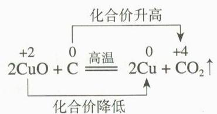

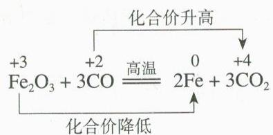

（3）物质发生氧化反应时，相应元素化合价升高；物质发生还原反应时，相应元素化合价降低。

【思考与讨论2】

(1) $2 \mathrm{CO} + 2 \mathrm{NO} \xrightarrow{\text {催化剂}} 2 \mathrm{CO}_{2} + \mathrm{N}_{2}$

(2) 是氧化还原反应, 氧化剂为NO, 还原剂为CO。

(3) NO、CO 均有毒，二者在催化剂作用下发生氧化还原反应，生成的产物 $N_{2}$ 和 $CO_{2}$ 都是无毒物质，从而减少了汽车尾气排放所造成的空气污染。

## 五、练习与应用参考答案及说明

1. (1) $2\mathrm{H}_2\mathrm{O}_2 \xlongequal{\mathrm{MnO}_2} 2\mathrm{H}_2\mathrm{O} + \mathrm{O}_2 \uparrow$ (2) $2\mathrm{KClO}_3 \xlongequal[\triangle]{\mathrm{MnO}_2} 2\mathrm{KCl} + 3\mathrm{O}_2 \uparrow$ (3) $2\mathrm{KMnO}_4 \xlongequal{\triangle} \mathrm{K}_2\mathrm{MnO}_4 + \mathrm{MnO}_2 + \mathrm{O}_2 \uparrow$ 均属于氧化还原反应  
2. 氧化 还原  
3. $2\mathrm{Al} + \mathrm{Fe}_2\mathrm{O}_3 \xlongequal{\text {高温}} \mathrm{Al}_2\mathrm{O}_3 + 2\mathrm{Fe}$ Al $\mathrm{Fe}_2\mathrm{O}_3$

4. ①②③
提示：钟乳石的生成只涉及复分解反应，而所有复分解反应均属于非氧化还原反应。
5. ③ ④ ①②
提示：置换反应中既有单质变成化合物，又有化合物变成单质，元素化合价必然发生变化。
6. C
7. C B

提示: HCl 中, +1 价氢元素具有氧化性, 如能氧化活泼金属, 本身变为 0 价 (氢气); -1 价氯元素具有还原性, 如可以还原二氧化锰, 而本身变为 0 价 (氯气)。因此, HCl 既有氧化性又有还原性。

提示：在NaH中，氢元素的化合价为-1价。

8. C  
9. D

$$
\begin{array}{c} \mathrm {1 e ^ {-}} \\ \mathrm{NaH} + \mathrm {H_ {2} O} = \mathrm{NaOH} + \mathrm {H_ {2}} \uparrow \\ \text {还原剂} \quad \text {氧化剂} \end{array}
$$

$$
\begin{array}{c} 4 \mathrm{e} ^ {-} \\ \text {还原剂} + \mathrm{O} _ {2} \xlongequal {\text {点燃}} 2 \mathrm{H} _ {2} \mathrm{O} \end{array}
$$

(2) $4P + 5O_{2} \xlongequal{\text{点燃}} 2P_{2}O_{5}$ 还原剂 氧化剂

$$
\begin{array}{c} 2 \mathrm{e} ^ {-} \\ \mathrm{Fe} + \mathrm{H} _ {2} \mathrm{SO} _ {4} = \mathrm{FeSO} _ {4} + \mathrm{H} _ {2} \uparrow \\ \text {还原剂} \quad \text {氧化剂} \end{array}
$$

$$
2 \mathrm{HgO} \xlongequal {\triangle} 2 \mathrm{Hg} + \mathrm{O} _ {2} \uparrow
$$

11.(1) 氧化剂 (2) 还原剂 (3) 既是氧化剂, 又是还原剂

12.

$$
\begin{array}{c} + 1 \\ 3 \mathrm{ClO} ^ {-} \quad + \quad 2 \mathrm{Fe} ^ {3 +} \quad + \quad 1 0 \mathrm{OH} ^ {-} = \quad 2 \mathrm{FeO} _ {4} ^ {2 -} + 3 \mathrm{Cl} ^ {-} + 5 \mathrm{H} _ {2} \mathrm{O} \end{array}
$$

化合价降低，被还原

氧化剂: $\mathrm{ClO}^{-}$ 还原剂: $\mathrm{Fe}^{3+}$

13.

<table><tr><td>年份</td><td>代表人物</td><td>主要观点</td></tr><tr><td>1774年</td><td>[法]拉瓦锡</td><td>物质与氧结合的反应叫做氧化反应;氧化物失去氧的反应叫做还原反应。</td></tr><tr><td>1852年</td><td>[英]弗兰克兰</td><td>化合价升高的反应叫做氧化反应;化合价降低的反应叫做还原反应。</td></tr><tr><td>1897年</td><td>[英]汤姆孙</td><td>原子失去电子(或电子对偏离)的过程叫做氧化;原子得到电子(或电子对偏向)的过程叫做还原。</td></tr></table>

启示示例：科学概念往往有一定的适用范围，人们对科学概念的认识有一个逐步完善、发展的过程。

## 复习与提高参考答案及说明

1.(1)

<table><tr><td>组别</td><td>A组</td><td>B组</td><td>C组</td><td>D组</td></tr><tr><td>分类标准</td><td>碱性氧化物</td><td>非金属单质</td><td>金属单质</td><td>酸</td></tr><tr><td>不属于该类别的物质</td><td> $CO_{2}$ </td><td>Cu</td><td> $O_{2}$ </td><td> $H_{2}O$ </td></tr></table>

(2) $2\mathrm{Cu} + \mathrm{O}_2 + \mathrm{CO}_2 + \mathrm{H}_2\mathrm{O} = \mathrm{Cu}_2(\mathrm{OH})_2\mathrm{CO}_3$

2. 还原性
3. C S、KNO₃
4. Cr₂O₇²⁻ Fe²⁺
5. (1) ZnCO₃ + 2C 高温 Zn + 3CO↑ (2) C ZnCO₃
6. A
7. B
8. C 9. B 10. D

11.① C + $O_{2}\xlongequal{点燃}CO_{2}$ 氧化还原反应
还原剂 氧化剂

② $2\mathrm{C} + \mathrm{O}_{2}\xlongequal{\text{点燃}}2\mathrm{CO}$ 氧化还原反应

还原剂 氧化剂

③ $2\mathrm{CO} + \mathrm{O}_2\xrightarrow{\text{点燃}} 2\mathrm{CO}_2$ 氧化还原反应还原剂 氧化剂

④ $CO_{2}$ + C $\xlongequal{高温}$ 2CO 氧化还原反应
氧化剂 还原剂

⑤ $\mathrm{CO}_{2} + \mathrm{CaO} = \mathrm{CaCO}_{3}$ 非氧化还原反应

⑥ $CaCO_{3}\xlongequal{高温}CaO+CO_{2}\uparrow$ 非氧化还原反应

12. 所选物质为 $\mathrm{H}_{2} \mathrm{SO}_{4}$ 。

与之反应没有明显现象的是NaOH。

化学方程式: $2 \mathrm{NaOH} + \mathrm{H}_{2} \mathrm{SO}_{4} = \mathrm{Na}_{2} \mathrm{SO}_{4} + 2 \mathrm{H}_{2} \mathrm{O}$

离子方程式: ${\mathrm{{OH}}}^{ - } + {\mathrm{H}}^{ + } = {\mathrm{H}}_{2}\mathrm{O}$

与之反应生成气体的是 $Na_{2}CO_{3}$ 。

化学方程式： $H_{2}SO_{4}+Na_{2}CO_{3}=Na_{2}SO_{4}+CO_{2}\uparrow+H_{2}O$

离子方程式： $2H^{+}+CO_{3}^{2-}=H_{2}O+CO_{2}\uparrow$

与之反应有白色沉淀生成的是 $\mathrm{Ba(OH)}_2$ 。

化学方程式： $\mathrm{H_2SO_4 + Ba(OH)_2 = BaSO_4\downarrow + 2H_2O}$

离子方程式: $2 \mathrm{H}^{+} + \mathrm{SO}_{4}^{2-} + \mathrm{Ba}^{2+} + 2 \mathrm{OH}^{-} = \mathrm{BaSO}_{4} \downarrow + 2 \mathrm{H}_{2} \mathrm{O}$

13. 肯定含有的物质: $\mathrm{K}_{2} \mathrm{CO}_{3} 、 \mathrm{CaCl}_{2}$ ; 可能含有的物质: $\mathrm{Ba(NO_{3})_{2}}$

一定发生的反应：

$$
\mathrm{CO} _ {3} ^ {2 -} + \mathrm{Ca} ^ {2 +} = \mathrm{CaCO} _ {3} \downarrow
$$

$$
2 \mathrm{H} ^ {+} + \mathrm{CaCO} _ {3} = \mathrm{Ca} ^ {2 +} + \mathrm{H} _ {2} \mathrm{O} + \mathrm{CO} _ {2} \uparrow
$$

$\mathrm{Cl}^{-} + \mathrm{Ag}^{+} = \mathrm{AgCl}\downarrow$

可能发生的反应:

$$
\mathrm{Ba} ^ {2 +} + \mathrm{CO} _ {3} ^ {2 -} = \mathrm{BaCO} _ {3} \downarrow
$$

$$
2 \mathrm{H} ^ {+} + \mathrm{BaCO} _ {3} = \mathrm{Ba} ^ {2 +} + \mathrm{H} _ {2} \mathrm{O} + \mathrm{CO} _ {2} \uparrow
$$

提示：由（1）、（2）可知溶液中有 $CO_{3}^{2-}$ （即 $K_{2}CO_{3}$ ）存在；由（3）可知有 $Cl^{-}$ （即 $CaCl_{2}$ ）存在。根据题目所给信息不能确定 $\mathrm{Ba(NO_{3})_{2}}$ 是否存在。

## 教学资源

## 1. 科学方法简介

<table><tr><td>类别</td><td>名称</td><td>定义</td><td>方法举例</td></tr><tr><td rowspan="3">获取科学事实的方法</td><td>观察</td><td>通过感官或借助一定仪器,有目的、有计划地考察和描述客观对象的方法</td><td>直接观察间接观察</td></tr><tr><td>实验</td><td>根据一定的研究目的,运用一定的物质手段(通常是科学仪器和设备),在人为控制或模拟自然现象的条件下获取科学事实、探索其本质和规律的方法</td><td>定性实验定量实验对照实验模拟实验</td></tr><tr><td>思想实验</td><td>按照实验的模型展开的思维活动,是一种特殊实验方法</td><td>理想实验想象实验</td></tr><tr><td rowspan="7">整理科学事实的方法</td><td>比较</td><td>通过相关对象之间的对比,确定它们的差异点和共同点,并发现其共同规律的思维方法</td><td>求同比较求异比较综合比较</td></tr><tr><td>分类</td><td>根据对象的共同点和差异点,将对象区分为不同的种类,而且形成有一定从属关系的不同等级的系统的逻辑方法</td><td>树状分类法二元分类法多元分类法</td></tr><tr><td>类比</td><td>根据两类对象之间某些相同或相似之处,推出它们在其他方面也可能相同或相似的逻辑推理方法</td><td>共存类比法因果类比法对称类比法综合类比法</td></tr><tr><td>归纳</td><td>从个别到一般的逻辑思维方法</td><td>完全归纳法不完全归纳法科学归纳法</td></tr><tr><td>演绎</td><td>与归纳法相反,从一般到个别的逻辑思维方法</td><td></td></tr><tr><td>分析</td><td>把整体分解为部分,或把复杂事物分解为简单要素,或把过程分解为阶段,或把动态凝固为静态来研究的思维方法</td><td></td></tr><tr><td>综合</td><td>与分析相反,把各个部分、各个方面、各个层次、各种因素结合起来,动态地考察对象的思维方法</td><td></td></tr></table>

续表

<table><tr><td>类别</td><td>名称</td><td>定义</td><td>方法举例</td></tr><tr><td rowspan="3">构造科学理论体系的方法</td><td>假说</td><td>根据科学原理和事实,对未知的新事实作出的假定性说明</td><td></td></tr><tr><td>模型</td><td>通过研究模型来解释原型(被模拟的对象)的形态、特征和本质的方法</td><td>理想模型物理模型数学模型</td></tr><tr><td>科学理论</td><td>是系统化了的科学知识体系,它用概念、判断、推理的形式完整地反映客观对象的本质及其规律</td><td></td></tr><tr><td rowspan="5">横向科学方法</td><td>系统方法</td><td>按照事物的系统性把对象放在系统的模式中加以考察的方法</td><td></td></tr><tr><td>信息方法</td><td>把系统的过程当作信息传递和转换的过程,通过对信息流程的分析和处理,以达到对某个复杂系统运动过程的规律性认识的方法</td><td></td></tr><tr><td>反馈控制</td><td>用系统活动的结果来调整系统活动的方法</td><td></td></tr><tr><td>功能模拟</td><td>以功能和行为的相似为基础,用模型模仿原型的功能和行为的方法</td><td></td></tr><tr><td>黑箱方法</td><td>利用外部观测、试验,通过输入、输出信息来研究黑箱功能和特征,探究其构造和机理的方法</td><td></td></tr></table>

## 2. 胶体

胶体的概念是19世纪60年代初由英国科学家格雷哈姆（T. Graham）提出的，他在研究各种物质在水溶液中的扩散性质及能否通过半透膜时，发现有些物质，如某些无机盐、糖和甘油等，在水中扩散很快，容易通过半透膜；而另一些物质，如蛋白质、明胶和硅胶类水合氧化物等，扩散很慢或不扩散。前者容易形成晶态，他将其称为晶质；后者不易形成晶态，多呈胶态，他将其称为胶体。这种分类没有说明胶体的本质，因为胶状的胶体在适当条件下可以转化成晶体，而晶质也可以变成胶态。直到20世纪初，随着超显微镜的发明及后来电子显微镜的应用，人们对胶体才逐渐有了较清楚的了解。

经典的胶体是高度分散的分散体系，其分散质粒子的直径在1\~100 nm。这种分散质粒子的直径远大于一般经典化学所研究的分子，可以是胶态，也可以是晶质。由这一概念出发，胶体的不稳定、不易扩散、渗透压很低等不同于经典分子分散体系的性质，都可以得到明确的解释。需要指出的是，上述定义中的粒子直径大小范围并非严格标准。实际上，粗分散系（悬浊液和乳浊液）有许多性质与胶体相似，所以广义的胶体常常把粗分散系也包括在内。分散系的分类和主要特征如下表所示。

<table><tr><td>类型</td><td>分散质粒子的直径大小</td><td>主要特征</td></tr><tr><td>悬浊液、乳浊液</td><td>&gt;100 nm</td><td>粒子不能通过滤纸或半透膜,不扩散,一般显微镜下可以看见</td></tr><tr><td>胶体(液溶胶)</td><td>1~100 nm</td><td>粒子能透过滤纸,但不能通过半透膜,扩散很慢,普通显微镜下看不见,但超显微镜下可以看见</td></tr><tr><td>溶液</td><td>&lt;1 nm</td><td>粒子能通过滤纸及半透膜,扩散很快,普通显微镜、超显微镜下均看不见</td></tr></table>

## 3. 丁达尔效应和光散射

在光的传播过程中，当光线照射到粒子时，如果粒子直径大于入射光的波长很多倍，则发生光的反射；如果粒子直径小于入射光的波长，则发生光的散射，这时观察到的是光波环绕粒子而向其四周放射的光，称为散射光或乳光。丁达尔效应就是光的散射现象或称乳光现象。由于溶胶粒子的直径一般不超过100 nm，小于可见光的波长（400\~700 nm），因此，当可见光透过溶胶时会产生明显的散射作用。而对于溶液，虽然分子或离子的直径更小，但因散射光的强度随散射粒子体积的减小而明显减弱，因此，溶液对光的散射作用很微弱。此外，散射光的强度还随分散系中粒子浓度的增大而增强。因此，在进行观察丁达尔效应的实验时，溶胶中粒子的浓度不要太小。

## 4. 阿伦尼乌斯与电离理论

溶质溶解在溶剂中，会使溶剂的性质发生变化。例如，在一定量的溶剂中溶解一定量的溶质以后，所形成溶液的蒸气压比纯溶剂的低一些；溶液的沸点比纯溶剂的高一些；溶液的凝固点比纯溶剂的低一些。对于非电解质的溶液来说，蒸气压降低的数值与溶质的浓度成正比。如果溶质是酸、碱、盐，则实验测得的数值与理论计算值会产生相当大的偏差。而且，酸、碱、盐稀溶液的蒸气压降低、沸点升高、凝固点下降都比同浓度的非电解质溶液的数值要大一些。通常把酸、碱、盐溶液的这种性质称为“反常行为”，溶液越稀，“反常程度”越突出。

荷兰化学家范托夫（J.H.van't Hoff）指出：在计算酸、碱、盐溶液的蒸气压降低、沸点升高、凝固点下降和渗透压时，应该引入校正系数，而且溶液越稀，校正系数越大。但是，他并不能从理论上解释，为什么会存在这些“反常行为”？为什么必须使用校正系数？解决这些问题的是与范托夫同时代的瑞典化学家阿伦尼乌斯（S.Arrhenius）。

阿伦尼乌斯在1882年开始研究浓度很稀的电解质溶液的导电情况，并于1883年写出了博士论文——《电解质的导电性研究》，提出了电解质在水溶液中自动离解成游离的带电粒子的概念。

对电解质电离的研究，可以追溯到英国物理学家、化学家法拉第（M.Faraday）时代。法拉第在研究电解反应时，把电解以前未被分解的物质叫做电解质，意思是用电流能够使它分解的物质。他还认为，溶液中的电流是由被分解、带电荷的物质输送的，这种物质叫做离子，它的含义是被电流分解出来的物质。德国化学家希托夫（J.W.Hittorf）和柯尔劳希（F.Kohlrausch）都研究过离子在溶液中的迁移，他们也都认为离子是通电以后才产生的。

在众多研究电解质电离的化学家中，只有英国化学家威廉森（A.Williamson）和德国物理学家、化学家克劳修斯（R.Clausius）具有与阿伦尼乌斯相类似的见解。他们认为：电解质的分子与形成它们的原子之间存在着动态平衡，电解质分子与邻近的分子之间不断交换原子，因此，分子的离解和原子的化合永远在连续不断地进行。但是，他们认为这些离解出来的原子只能在很短的时间内存在，即他们相信电解质只有极小的离解度，认为在常温下溶液中的分子不可能大量地离解。

阿伦尼乌斯正是在前人研究的基础上，通过研究电解质稀溶液的导电性，提出了电离理论。他的观点与法拉第、希托夫、柯尔劳希的差别在于：后面三位科学家认为离子是通电以后才产生的；阿伦尼乌斯则认为，在通电以前，电解质在水溶液中就已经离解了。阿伦尼乌斯的观点与威廉森、克劳修斯的区别在于：后者认为电解质在水溶液中的离解度极小；前者则认为离解度很大，而且溶液越稀，离解度越大。

阿伦尼乌斯的观点在当时的化学界引起了很大争论，许多化学家和物理学家都表示难以接受。1887年，阿伦尼乌斯通过进一步的实验研究，发表了另一篇论文——《关于溶质在水中的离解》。论文不但重申了电解质溶于水会自发、大量地离解成离子，而且还作出了更重要的贡献，即对电解质的电离进行了定量计算，这是他的工作与前人工作的又一不同之处。他在论文中指出，把等量的电解质溶解在不同量的水中，则溶液越稀，离解度越大，即分子电导（用 $\mu$ 表示）越大。当将溶液进行无限稀释时，电解质分子已经几乎全部变成了离子，这时测得的溶液的分子电导为 $\mu_{\infty}$ ，它达到了最大值。他将 $\mu/\mu_{\infty}$ 叫做“活度系数”，用 $\alpha$ 表示（即现在的电离度）。以上就是电离理论的主要论点。

电离理论很好地解释了前面提到的酸、碱、盐溶液所出现的“反常情况”。阿伦尼乌斯指出，只有在水溶液中不会发生离解的非电解质的溶液才遵守凝固点下降公式和渗透压公式。酸、碱、盐的溶液之所以不遵守这两个公式，是由于它们在水溶液中离解成离子，使溶液中溶质的粒子数增加了，所以需要在公式中乘以校正系数，使实验结果与理论计算相吻合。

电离理论还解释了酸、碱的强度，即离解度大的是强酸和强碱，离解度小的是弱酸和弱碱。电离理论还能说明中和反应和水解反应的本质，以及缓冲作用的机理。例如，强酸和强碱之间的中和反应在本质上都是氢离子与氢氧根离子的反应，因此，无论是什么强酸和强碱，只要它们是稀释的水溶液，其中和热必然是相同的。

虽然阿伦尼乌斯在1887年发表的论文中以大量的实验事实和合理的论证阐明了电离理论，但是他仍然遭到一些保守的科学家的反对。他们反对的理由只有一个，就是这种理论不符合当时流行的说法——离子是通电以后才产生的。

阿伦尼乌斯的电离理论为物理化学的发展作出了重要贡献，同时也促进了整个化学科学的进步，阿伦尼乌斯也因此获得1903年诺贝尔化学奖。最初反对过电离理论的瑞典化学家、地质学家克利夫（P.T.Cleve）在阿伦尼乌斯获得诺贝尔奖以后认为：“这一新的理论是在困难中成长起来的，化学家不认为它是一种化学理论，物理学家也不认为它是一种物理学理论。但是，这种理论却在化学与物理学之间架起了一座新的桥梁。”

（改编自：袁翰青，应礼文.化学重要史实.北京：人民教育出版社，2000：317-323.）

## 5. 酸、碱概念的历史演变

从化学发展史来看，人类对酸、碱的认识已有三百多年的历史，经历了一个由浅入深、由表及里的过程。酸、碱的概念也随着人们对物质的性质、组成和结构的认识而不断深化、不断完善。

## (1) 从性质的角度定义酸、碱

最初，人们根据物质所表现出来的不同性质来区分酸和碱。17世纪后期，英国化学家波义耳（R.Boyle）根据实验中所得到的酸、碱的性质，第一次为酸、碱下了明确的定义：凡是有酸味，水溶液能溶解某些金属，与碱接触会失去原有的特性，能使蓝色石蕊试纸变红的物质，叫做酸；凡水溶液有苦涩味、滑腻感，与酸接触后会失去原有的特性，能使红色石蕊试纸变蓝的物质，叫做碱。

## (2) 从组成的角度定义酸、碱

为什么不同的酸（或碱）都具有类似的性质呢？是不是它们的组成中都含有相同的成分呢？于是人们开始从组成的角度研究酸和碱。18世纪后期，法国化学家拉瓦锡（A.-L.Lavoisier）提出一切酸中都含有氧元素，氧元素是造成酸具有酸性的原因。到了19世纪初，英国化学家戴维（S.H.Davy）从有些酸（如盐酸）并不含有氧，却具有酸的性质这一事实出发，提出“判断一种物质是不是酸，要看它是否含有氢”的观点。然而，氨和许多有机化合物都含有氢，但并不是酸。因此，1838年，德国化学家李比希（J.V.Liebig）为酸和碱下了定义：酸是氢的化合物，但是酸中的氢必须是可以被金属所置换的；碱则是能够中和酸并产生盐的物质。

## （3）从电离的角度定义酸、碱

19世纪后期，瑞典化学家阿伦尼乌斯提出了电离理论，并从电离的角度定义酸、碱。他认为，在水溶液中凡是能电离出 $H^{+}$ 的物质叫做酸；能电离出 $OH^{-}$ 的物质叫做碱。酸碱中和反应的实质是 $H^{+}$ 和 $OH^{-}$ 化合而生成水的过程。酸碱电离理论，是人类对酸、碱的认识从现象到本质、从宏观到微观的一次飞跃。然而，这种理论的局限性是把酸、碱限于水溶液中，而对于非水溶液体系则不适用。针对上述不足，1905年，英国化学家富兰克林（E.C.Franklin）提出了酸碱溶剂理论：凡能电离产生溶剂阳离子的物质为酸；产生溶剂阴离子的物质为碱。酸碱中和反应的实质是阳离子和阴离子化合而生成溶剂分子的过程。溶剂理论把酸、碱的概念从以水为溶剂扩大到了任何能够产生阴、阳离子的溶剂中，扩大了酸、碱的范围。

## （4）从质子的角度定义酸、碱

HCl是酸， $\mathrm{NH}_{3}$ 是碱，它们在苯中并不电离（苯也不电离），然而它们在苯中却能相互反应生成 $\mathrm{NH}_{4} \mathrm{Cl}$ ；HCl和 $\mathrm{NH}_{3}$ 能在气相进行反应。类似这样的事实是电离理论和溶剂理论无法解释的。因此，1923年，丹麦化学家布朗斯特（J.N.Brönsted）和英国化学家劳莱（T.M.Lowry）各自独立地提出了酸碱质子理论：凡能放出质子（ $\mathrm{H}^{+}$ ）的任何含氢原子的分子或离子都是酸；凡能与质子结合的分子或离子都是碱。例如，HCl、 $\mathrm{NH}_{4}^{+}$ 都能放出质子，所以它们都是酸。当HCl、 $\mathrm{NH}_{4}^{+}$ 放出质子后，剩余的 $\mathrm{Cl}^{-}$ 、 $\mathrm{NH}_{3}$ 又都能接受质子，因此它们都是碱。酸与碱之间的这种关系可表示为：酸 $\rightleftharpoons$ 碱+质子。酸碱中和反应的实质是质子传递反应。质子理论不仅适用于水和其他能电离的溶剂组成的溶液中发生的酸碱反应，而且适用于不能电离的溶剂组成的溶液和气相中发生的酸碱反应，但对于没有质子参加的酸碱反应则不适用。

## (5) 从电子的角度定义酸、碱

电离理论和质子理论都把酸的分类局限于含氢的物质，而有些物质如 $SO_{3}$ 、 $BCl_{3}$ 等，根据上述理论都不是酸，但它们确实能发生类似的酸碱反应。例如， $SO_{3}+Na_{2}O=Na_{2}SO_{4}$ ， $BCl_{3}+NH_{3}=BCl_{3}\cdot NH_{3}$ ，上述反应中 $SO_{3}$ 和 $BCl_{3}$ 都起着酸的作用。因此，1923年，美国化学家路易斯（G.N.Lewis）提出了酸碱电子理论：凡是可以接受电子对的分子或离子都是酸；凡是可以给出电子对的分子或离子都是碱。酸是电子对的接受体，必须具有可以接受电子对的空轨道；碱是电子对的给予体，必须具有未共享的孤对电子。酸碱反应的实质是酸与碱之间共享电子对，形成配位共价键，生成酸碱配合物。电子理论很好地解释了一些不能放出质子的物质也是酸，一些不能接受质子的物质也是碱，加深了人们对于酸、碱结构的认识，扩大了酸、碱的范围。但是，电子理论也存在不足，如它不能用来比较酸、碱的相对强弱，适用的范围过于广泛等。

在酸碱电子理论的基础上，人们又提出了软硬酸碱理论等。到目前为止，还没有一种在所有场合下都完全适用的酸碱理论。

## 6. 化合价

从化学发展史来看，化合价概念的萌芽、形成和发展，与化学家探索物质的组成和结构是紧密联系在一起的，涉及原子之间相互作用的数量、原子之间相互作用的本质两个方面。

## (1) 化合价概念的萌芽

早在1799年，法国化学家普罗斯（J.-L.Proust）就提出了定组成定律：每种化合物都有固定的组成，不管这种化合物是天然的还是人造的。他的实验依据之一是，天然碳酸铜和人造碳酸铜的组成完全相同。

1803年，英国化学家道尔顿（J.Dalton）提出了原子学说，其中指出：不同元素的原子以简单数目的比例相结合，形成了化学中的化合现象。

1804年，道尔顿在分析甲烷（ $\mathrm{CH}_4$ ）和乙烯（ $\mathrm{CH}_2 = \mathrm{CH}_2$ ）的组成时，发现它们均含碳、氢两种元素；而且，在甲烷和乙烯中，与相同质量的碳相化合的氢质量之比是 $2:1$ 。类似的情况还出现在 $\mathrm{CO}$ 和 $\mathrm{CO}_2$ 等其他成对的化合物中。据此，道尔顿提出了倍比定律：如果甲、乙两种元素能互相化合而生成几种不同的化合物，则在这些化合物中，与一定质量的甲元素相化合的乙元素的质量，互成简单的整数比。倍比定律为原子学说提供了有力的实验依据。

随着原子学说和倍比定律等一些定量定律的建立，人们已经知道1个氯原子可以和1个氢原子化合形成氯化氢，1个氧原子可以和2个氢原子化合形成水等。不同元素的原子以简单数目比相结合，形成化合物——这种对物质组成的认识可以看作“化合价”概念的萌芽。

## (2) 化合价概念的形成

1852年，英国化学家弗兰克兰（E.Frankland）在研究金属有机化合物时发现，N、P、As等原子总是倾向于与3个或5个其他原子相结合，当处于这种比例关系时，原子的亲合力得到最好满足。于是他提出，每一个原子在化合时具有一种特殊的性质，叫做“化合力”，即任何一个原子都倾向于和一定数目的其他原子相结合。

1857年，德国化学家凯库勒（F.A.Kekulé）和英国化学家库帕（A.S.Couper）发展了弗兰克兰的见解，把各种元素的“化合力”以“原子数”或“亲合力单位”来表示，并指出，不同元素的原子相化合时总是遵循亲合力单位数是等价的原则。他们根据氢元素在各种化合物（如HCl、 $\mathrm{H}_2\mathrm{O}$ 、 $\mathrm{NH}_3$ 等）中1个氢原子最多只能与另一种元素的1个原子相结合，而确定H的亲合力单位为1，并以此为标准来确定其他元素的亲合力单位。例如，确定Cl、Br、I等的亲合力单位为1；O、S等为2；N、P、As等为3；C为4。这是化合价概念的重要突破，为化合价概念的形成奠定了基础。

1864年，德国化学家迈尔（J.L.Meyer）建议用“原子价”代替“原子数”或“亲和力单位”。至此，化合价的概念基本形成。我国早期使用“原子价”，1991年公布的《化学名词》中称为“化合价”，并在注释中说明又称“原子价”。

## (3) 化合价概念的发展

从化合价概念的形成中可以看出，化合价是在研究化合物的组成时提出来的，用来表示元素的一个原子与其他元素的原子相结合的数目，即用来揭示原子之间相互作用的数量关系。但是，化合价的本质是什么？即原子之间相互作用的本质是什么？这个问题的研究则与化学家探索物质的结构密切相关。

1861年，俄国化学家布特列洛夫（A.M.Butlerov）第一次使用“化学结构”这一术语，认为“假定一个原子具有一定的和有限的化学亲合力，借助于这种亲合力，原子形成化合物，那么，这种关系，或者说在组成的化合物中各原子间的相互连接，就可以用化学结构这一术语来表示。”在布特列洛夫看来，原子之间相互作用形成化合物是借助于“化学亲合力”（化合价的早期含义）。那么，“化学亲合力”的本质是什么？这个问题直到20世纪初原子结构被揭示以后才逐渐得到解答。

1916年，德国物理学家柯塞尔（W.Kossel）提出了“电价键”理论，认为“原子在获得（或失去）电子以后，就达到了稀有气体原子的电子构型，形成了稳定的离子。金属元素容易失去电子成为带正电荷的阳离子；非金属元素则容易获得电子成为带负电荷的阴离子。带正电荷的阳离子与带负电荷的阴离子以库仑引力结合成化合物，正负离子间的静电吸引力（库仑引力）使离子间形成电价键。”“电价键”就是今天所说的“离子键”。而美国化学家路易斯1916年提出的“共价键”理论，则认为“两个（或多个）原子可以共有一对或多对电子，以便达到稀有气体原子的电子层结构，从而形成稳定的分子。”“电价键”理论和“共价键”理论实际上表明了形成化合物时，原子之间的两种相互作用方式——静电引力和共用电子对，二者构成了经典化学键理论。在此基础上，形成了原子价的电子理论，认为：①原子价可分为电价和共价两种，电价是由阴、阳离子间的静电引力形成的，共价是由两个原子共用一对电子形成的。②原子在化合时失去、获得或共用电子，以使它的外层电子结构与周期表中最接近的稀有气体原子的电子层结构相同（即著名的“八隅律”）。

原子价的电子理论将化合价与原子最外层电子的得失或共用联系起来，将化合价与离子键或共价键的形成联系起来，使化合价这一抽象的概念变得具体，对于认识化合价的本质、解释化学键的形成起到了重要作用。当然，这个理论还存在缺陷，如无法解释共价键的方向性问题，无法解释单个电子和3个电子所形成的价键等。

随着现代化学键理论（如价键理论、分子轨道理论）的建立，化学家对于原子之间相互作用本质的认识进一步深化，化合价的概念不断深化。

## 7. 氧化数

根据经典化学键理论，要想确定化合价，需要事先知道分子中化学键的类型，即分子的结构。在利用化合价说明氧化还原反应时，对于一些组成复杂、结构不易确定的化合物，常会遇到其组成元素的化合价不易确定的困难。于是，1948年，美国化学教授格拉斯通（S.Glasston）明确提出用氧化数（氧化态或氧化值）代替氧化还原反应配平中的价数。

20世纪60年代以前, 化合价和氧化数在许多情况下是混用的。1970年, 国际纯粹与应用化学联合会 (IUPAC) 定义了氧化数的概念: 氧化数是某元素1个原子的电荷数, 该电荷数是假定把每一个化学键中的电子指定给电负性更大的原子而求得的。同时, 确定了求算氧化数的规则。例如: ①在离子化合物中, 元素的氧化数等于该离子的电荷数; ②在共价化合物中, 把两个原子的共用电子对指定给其中电负性较大的一个原子后, 两个原子所表现出的形式电荷数就是它们的氧化数; 等等。

利用以上规则求算氧化数时不够方便。目前化学界普遍接受的计算氧化数的规则是：

①在单质中，元素的氧化数为零。

②在单原子离子中，元素的氧化数等于离子所带的电荷数。

③在大多数化合物中, 氢的氧化数为 $+ 1$ ; 只有在金属氢化物 (如 $\mathrm{NaH} 、 \mathrm{CaH}_{2}$ ) 中氢的氧化数为 -1。

④通常，在化合物中氧的氧化数为-2；但是，在 $H_{2}O_{2}$ 、 $Na_{2}O_{2}$ 、 $BaO_{2}$ 等过氧化物中，氧的氧化数是-1；在氧的氟化物如 $OF_{2}$ 和 $O_{2}F_{2}$ 中，氧的氧化数分别为+2、+1。

⑤在所有的氟化物中，氟的氧化数为-1。

⑥碱金属和碱土金属在化合物中的氧化数分别为+1和+2。

⑦在中性分子中，各元素氧化数的代数和为零。在多原子离子中，各元素氧化数的代数和等于离子所带的电荷数。

## (1) 化合价和氧化数的联系

可以看出，氧化数的概念由化合价发展而来，人们制定的氧化数计算规则继承了前人对化合价的研究成果并加以补充。但氧化数的概念避开了具体的物质结构，只关注整体的形式电荷，使很多与物质结构有关的化合价问题变得简单。

## (2) 化合价和氧化数的区别

①意义不同：化合价与物质的组成和结构有关，它反映原子结合成化合物时形成离子的电荷数（电价）或形成共价键的个数（共价）。而氧化数是根据一定的规则计算出来的，它反映的是化合物中各元素原子的形式电荷数，不考虑分子结构和化学键的类型。

②数值范围不同: 化合价表示得失电子数或共价键个数, 因此只能是不为零的整数。电价有正负之分, 而共价没有。而氧化数可以为整数、分数, 同时可以为正数、负数或零。同一物质中同种元素的氧化数和化合价的数值不一定相等。例如, $\mathrm{H}_{2}$ 中氢的化合价为 1 , $\mathrm{N}_{2}$ 中氮的化合价为 3 , 而 $\mathrm{H}_{2}$ 和 $\mathrm{N}_{2}$ 中氢和氮的氧化数均为 0 ; $\mathrm{Fe}_{3} \mathrm{O}_{4}$ 中铁的化合价为 +2 和 +3 , 而铁的氧化数为 $+\frac{8}{3}$ ; 在 $\mathrm{CH}_{3} \mathrm{Cl}$ 、 $\mathrm{CH}_{2} \mathrm{Cl}_{2}$ 和 $\mathrm{CHCl}_{3}$ 中, 碳的氧化数分别为 -2 、 0 和 +2 , 而碳的化合价均为 4 。

③适用范围不同：从概念的来源看，化合价的形成、发展与人类认识原子之间相互作用的数量、本质密切相关，这决定了化合价在解释物质结构问题时应用较多；而氧化数的提出与“氧化”概念有关，因此在分析氧化还原的概念，以及氧化还原反应的配平时更加实用。

需要说明的是，考虑到学生的知识基础和接受能力，我国现行中学化学教材中没有出现氧化数的概念。但中学教材中给出的化合价的计算规则实质上是氧化数的计算规则。例如，化合物里正负化合价的代数和为零；单质里元素的化合价为零；在共价化合物中，化合价的正负由电子对的偏移来决定（前已提及，共价没有正负之分）等。这里的“化合价”都是指氧化数。

## 8. 氧化还原反应在工农业生产、科学技术和日常生活中的意义

在这里，只能对氧化还原反应在工农业生产、科学技术等方面的作用和意义作一些简单的介绍。

我们所需要的各种各样的金属，都是通过氧化还原反应从矿石中提炼而得到的。例如，制造活泼的有色金属要用电解或置换的方法；制造黑色金属和别的有色金属都是在高温条件下用还原的方法；制备贵、重金属常用湿法还原；等等。

许多重要化工产品的制造，如合成氨、合成盐酸、接触法制硫酸、氨氧化法制硝酸、食盐水电解制烧碱等，主要反应也是氧化还原反应。石油化工中的催化去氢、催化加氢、链烃氧化制羧酸、环氧树脂的合成等也都是氧化还原反应。

在农业生产中，植物的光合作用、呼吸作用是复杂的氧化还原反应。施入土壤的肥料的变化，如铵态氮转化为硝态氮， $SO_{4}^{2-}$ 转化为 $H_{2}S$ 等，虽然需要有细菌起作用，但就其实质来说，也是氧化还原反应。土壤中铁或锰的氧化态的变化直接影响着作物的营养，晒田和灌田主要就是为了控制土壤中氧化还原反应的进行。

我们通常应用的干电池、蓄电池，以及在空间技术上应用的高能电池都发生着氧化还原反应，否则就不可能把化学能转变成电能、把电能转变成化学能。

人和动物通过呼吸作用吸入氧气，在体内把葡萄糖氧化为二氧化碳和水，同时放出能量，并把能量转变为存在于三磷酸腺苷（ATP）的高能磷酸键的化学能。这种化学能再供给人和动物进行机械运动、维持体温、合成代谢、细胞的主动运输等所需要的能量。煤、石油和天然气等燃料的燃烧更是供给人们生活和生产所必需的大量的能量。

由此可见，在许多领域里都涉及氧化还原反应，引导学生学习和逐步掌握氧化还原反应对于他们今后参加生产、走向社会等都是有意义的。

## 教学案例

## 离子反应（第一课时）

北京师范大学附属实验中学 张建国


## 教学目标

通过探究NaCl电离的过程，建立电离模型和电解质概念，能用电离方程式描述酸、碱、盐的电离过程。

通过对溶液导电性的分析，从宏观、微观、符号三个方面建立对电离的初步认识。


## 教学重点

用电离方程式表示物质的电离过程。


## 教学难点

从微观视角理解电离及相关概念。

## 教学流程

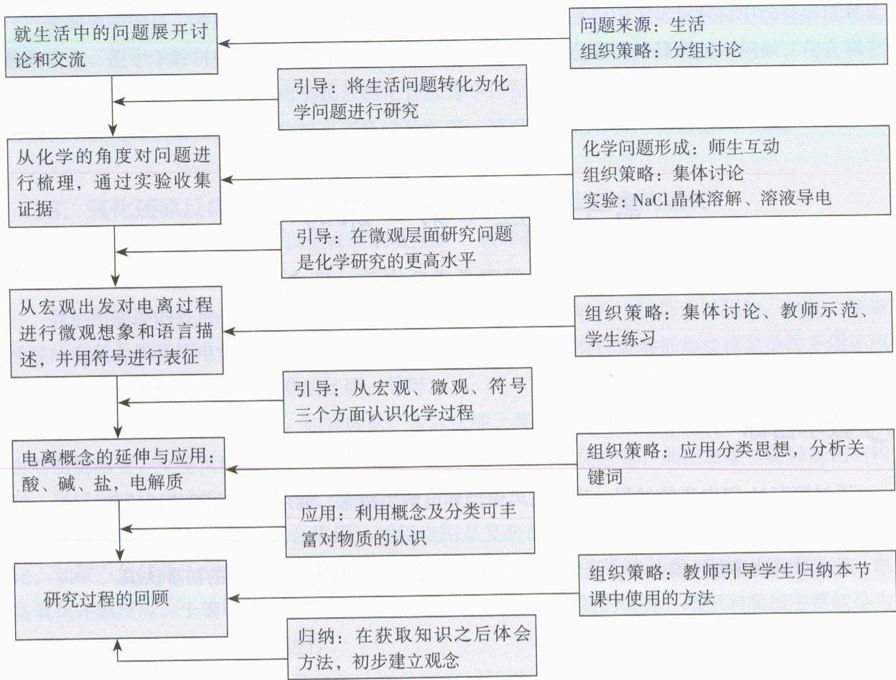

教学环节二、NaCl电离过程的存在

教学环节三、NaCl电离过程的描述

<table><tr><td>教师活动</td><td>学生活动</td><td>设计意图</td></tr><tr><td>【展示】NaCl溶液导电性研究专题。【演示实验】1. 水的导电性2. NaCl晶体导电性【展示】上述实验结论与问题。【提问】NaCl在溶解的过程中究竟发生了什么?水分子起什么作用?【讲解】梳理、评价学生结论。【过渡】对NaCl溶解微观过程的表述。</td><td>【观看】【分组讨论】预期结论:溶解过程中有能自由移动的离子产生,水帮助 $Na^{+}$ 和 $Cl^{-}$ 脱离晶体表面进入溶液。</td><td>从宏观层面感知NaCl。引起学生对离子存在形式(是否“自由”)的关注,从而将其注意力从宏观转向微观。</td></tr></table>

<table><tr><td>教师活动</td><td>学生活动</td><td>设计意图</td></tr><tr><td>【动画】NaCl电离过程模拟。【引导】动画与学生想法是否一致;用化学用语表达: $NaCl=Na^{+}+Cl^{-}$ 【过渡】电离概念及其符号表达需要规范;它们有重要的应用。</td><td>【观看】思考电离过程的表示方法,表述自己理解的电离过程。</td><td>建立电离过程的动态模型。</td></tr></table>

## 教学过程

<table><tr><td>教师活动</td><td>学生活动</td><td>设计意图</td></tr><tr><td>【展示】安全常识图片、文字。【提问】湿手易触电可能的原因是什么?【过渡】梳理学生观点,将生活中的问题转化为化学问题。</td><td>【分组讨论】湿手易触电的原因。</td><td>使学生进入问题情境。</td></tr></table>

教学环节一、引入新课

教学环节四、电离及相关概念的形成与应用

<table><tr><td>教师活动</td><td>学生活动</td><td>设计意图</td></tr><tr><td>1.电离和电离方程式【板书】电离和电离方程式的概念。(略)【提问】 $H_{2}SO_{4}$ 的电离问题。【过渡】看来酸、碱、盐等化合物均能发生电离。【课件】电离方程式书写练习。【讲解】在实物展台上展示学生练习纸,引导学生进行分析、评价,归纳书写规则与注意事项。【过渡】寻找练习题中出现的离子方程式的特点和规律。</td><td>【练习】书写电离方程式,思考电离方程式的书写规则。【观察】发现电离方程式中共同的电离产物—— $H^{+}$ 。</td><td>以 $H_{2}SO_{4}$ 为例,从宏观、微观、符号三个方面认识电离的概念。落实常见酸、碱、盐电离方程式的书写。从电离的角度归纳并形成酸、碱、盐的定义,在应用中进一步巩固电离的概念。</td></tr><tr><td>2.酸、碱、盐的概念【板书】酸、碱、盐的概念。(略)【讲解】归纳学生观点,完善理解。【展示】酸、碱、盐的概念。【过渡】酸、碱、盐具有共同的性质——电离,可将此作为分类标准将它们归为同一类,这类物质叫做电解质。3.电解质的概念【讲解】关键词——电离。重回对NaCl电离的讨论。【提问】寻找能使NaCl晶体中的离子从“不自由”到“自由”的另一个原因。【展示】熔融状态的KNO3导电的视频。【展示】电解质概念。(略)【展示】判断BaSO4是否为电解质。</td><td>【讨论】得出碱和盐的概念。【思考】指出另一个原因为加热熔融。【练习】判断电解质。</td><td>形成电解质概念并明确其分类标准。</td></tr></table>

教学环节五、小结

<table><tr><td>教师活动</td><td>学生活动</td><td>设计意图</td></tr><tr><td>【小结】NaCl及其溶液导电性→电离概念→酸、碱、盐概念→电解质电离方程式书写【讲解】特别说明实验的作用。</td><td>【思考】巩固相关概念及其相互关系。</td><td>明确知识结构、体会获得知识的过程和方法。</td></tr></table>

## 第二章

## 海水中的重要元素——钠和氯

## 本章说明

继“物质及其变化”之后，本章开始学习常见无机物及其应用。这部分内容不仅是中学化学的基础，也是学生今后在工作和生活中经常要接触、了解和应用的基本知识。金属元素、非金属元素构成了许许多多的物质，形成了丰富多彩的物质世界。要想了解物质世界，就要从组成常见物质的典型元素入手。本章选取了典型金属元素——钠，典型非金属元素——氯。这些知识既可以为前面所学习的物质的分类、化学反应的分类补充丰富的感性认识材料，又可以为后面继续学习其他元素及其化合物、建构物质结构和元素周期律、了解化学反应与能量等理论知识打下基础。同时，本章可以帮助学生了解并逐步掌握研究物质的一般思路和方法，认识化学在促进社会发展、改善人类生活条件等方面所起到的重要作用。

在定性研究物质的基础上，本章引入一个新的物理量——物质的量，建立物质的一些宏观数量与微观粒子数量之间的联系，让学生在初中化学的基础上更进一步地从定量角度认识物质间的反应规律。


## 一、教材分析

本章包含三部分内容：钠及其化合物、氯及其化合物、物质的量。这些内容分别属于课程标准中“内容标准”的“常见的无机物及其应用”“化学科学与实验探究”这两个主题，涉及金属、非金属、化学基本概念等，知识的跨度较大。在节的设计上，本章按元素类别编排，第一节是典型金属元素，第二节是典型非金属元素；每一节内部都按照物质分类、化学反应分类研究物质的性质和变化，突出了第一章中分类研究的思想。本章具体内容结构如下页图所示。

考虑到学生在初中阶段已经学习过氢氧化钠、碳酸钠、碳酸氢钠等含钠化合物的物理性质、化学性质和用途，且钠的原子结构简单，原子的最外电子层只有1个电子，容易通过结构得出钠原子易失电子的性质，因此教材将钠及其化合物作为常见的无机物及其应用的开篇，这样无形中降低了学习难度，使学生较容易接受。

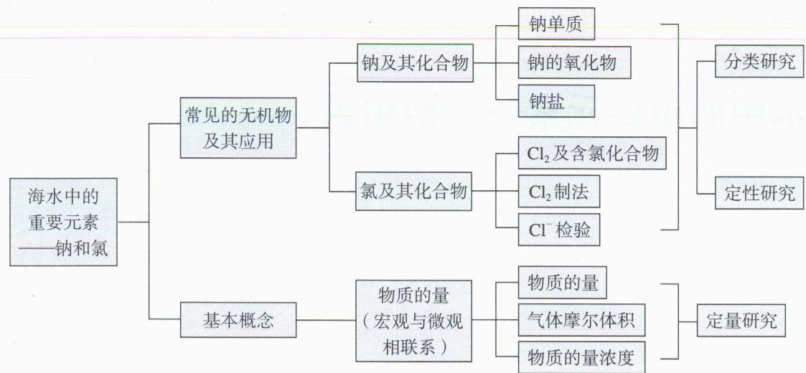

对于非金属元素氯，教材没有采取第一节的编排方式，而是以氯气的知识为主线，将含氯化合物穿插在氯气的化学性质中进行介绍，这样做有利于帮助学生构建含不同化合价的氯元素的物质间的转化关系。

为分散学习的难点，教材采用了元素化合物和概念、理论穿插编排的方式。在学习了钠及其化合物、氯及其化合物之后，学生在第三节进行化学基本概念——物质的量的学习，从定量的角度再认识物质的性质和物质间发生的反应。教材在内容编排上注重了宏观与微观相结合，引导学生建立可称量的宏观物质与不可称量的微观粒子间的联系，初步建构“宏观辨识与微观探析”的学科核心素养，为后面进一步研究分子、原子及离子间的相互作用打下基础。

1. 能依据钠及其化合物、氯及其化合物的物质类别和元素的化合价列举相应的典型代表物。能利用电离、离子反应、氧化还原反应等概念对含钠元素和氯元素物质的常见反应进行分类。

2. 能够列举、描述、辨识钠及其化合物、氯及其化合物的重要物理、化学性质及实验现象。能用化学方程式、离子方程式正确表示这些典型物质的主要化学性质。

3. 能从物质类别、元素价态的角度，依据复分解反应和氧化还原反应原理，预测钠及其化合物、氯及其化合物的化学性质和变化，设计实验进行初步验证，并能分析、解释有关实验现象。

## 三、课时建议

物质的量浓度之间的相互关系进行简单计算。

4. 能利用钠和氯的典型代表物的性质和反应，设计常见物质制备、分离、提纯、检验等简单任务的方案。能从钠及其化合物的物质类别和氯元素的价态变化的视角说明物质的转化路径。


第一节 钠及其化合物 2课时


第二节 氯及其化合物 3课时

## 二、学业要求

第三节 物质的量 3课时

全章复习 1课时

实验活动1 配制一定物质的量浓度的溶液 1课时

5. 能根据钠及其化合物、氯及其化合物等物质的性质分析实验室、生产、生活以及环境中的某些常见问题，说明妥善保存、合理使用化学品的常用方法。

7. 能基于物质的量认识物质组成及其化学变化, 运用物质的量、摩尔质量、气体摩尔体积、

6. 能说明钠及其化合物、氯及其化合物的应用对社会发展的价值、对环境的影响。能有意识运用所学的知识或寻求相关证据参与有关环境保护、工业生产等社会性议题的讨论。

# 第一节 钠及其化合物


## 一、内容分析

钠是典型的金属元素，将其编排在第一节主要是考虑了学生的前概念：一是义务教育阶段介绍了铁等金属，学生初步接触了金属的研究方法，已经可以从金属活动性顺序入手思考金属具有的共性和个性特征；二是学生已经学习过氯化钠、碳酸钠和碳酸氢钠等钠的化合物知识，以此展开，继续深入学习碳酸钠和碳酸氢钠的性质、构建钠的单质及化合物的转化关系会比较容易；三是借助于第一章所学习的知识，让学生运用物质的分类及离子反应、氧化还原反应等反应的分类，预测、分析并学习钠单质、钠的化合物的性质，有助于学生学会从分类的视角认识丰富多彩的物质及其变化。

考虑到无机物种类较多，知识繁杂而琐碎，不可能一一进行研究，因此教材注重引导学生建构研究思路和方法。从钠到氧化钠和过氧化钠，再到碳酸钠和碳酸氢钠，既突出了物质的分类思想，又明确了研究金属单质及其化合物的方法，即单质—氧化物—碱（初中已学过氢氧化钠，故本节没涉及）—盐。在研究时，对每一类物质都沿着物理性质、化学性质、用途的顺序展开，并有效地利用了实验手段。本节共安排了6个实验、1个探究，将钠及其化合物的学习融合在其中，给学生以大量的感性认识，引导学生通过对实验现象的分析，找出规律性的知识，并依据这些规律性知识，进一步对钠及其化合物的性质作出推断和预测。如钠与水的反应，教材将其设计成探究活动，且探究的开放度较大，让学生先尝试从第一章所学习的氧化还原反应的视角进行预测，之后引导学生进行实验探究，对获取的信息进行分析、解释。在这个过程中，观察法、对比法、类比法、归纳法等各种科学方法交织运用。这类活动的目的是让学生亲历预测—实验—解释—得出结论的过程。

可以说，教材在本节以钠及其化合物的研究为载体，建构了金属及其化合物的研究模型，为学生后续学习铁及其化合物等奠定了基础。


## 二、教学目标

## 1. 教学目标

(1) 了解钠及其化合物的主要性质, 正确书写有关的化学方程式。

（2）以钠及其化合物知识的学习为线索，逐步形成金属及其化合物的研究思路。

（3）在研究钠及其化合物性质的过程中，能依据研究目的设计探究方案，形成证据推理意

识，培养求实、创新的良好品质。

(4) 通过学习钠及其化合物在生产和生活中的应用, 感受化学的魅力, 发展社会参与意识。

（5）了解与纯碱有关的化学史，感受化学工业发展中技术进步的重要性，体会建设生态文明的意义。

## 2. 教学重点和难点

重点：钠与水的反应，碳酸钠和碳酸氢钠的性质比较；钠及其化合物的研究思路和方法的建构。

难点：钠与水反应的探究实验。


## 三、教学建议

## 1. 在钠与水反应的教学中加强对实验的指导

做好钠与水反应的实验，可以加深学生对钠的性质的认识，培养学生观察、获取证据并进行分析的能力。

教学中，可首先引导学生回忆初中所学常见金属的物理性质、化学性质和金属活动性顺序等知识，之后让学生关注钠这种活泼金属。与铁、铝、铜等常见金属不同，在自然界中不存在游离态的钠，学生从未见过钠，更谈不上了解它的性质。于是，可将实验2-1与“钠与水的反应”这一探究活动整合在一起，带领学生认识钠与水的反应，突破教学难点。教学中可设计如下问题串来启发学生根据实验现象进行推理：

钠可以用小刀切割，说明什么？

新切开的钠的断面有何变化？为什么？

钠投入水中之后，处于水中的什么位置？说明什么？

钠的状态有何变化？说明什么？

钠如何运动？说明什么？

滴有酚酞的溶液的颜色有何变化？说明什么？

能否设计实验证明产生气体的成分？

对于钠与水反应的探究，教材给了非常明确的探究步骤，即预测、实验、结论，让学生在探究的过程中，按照教材的提示，观察和描述实验现象，基于实验得到的证据进行分析、推理，最终得出结论。对于学生在实验中可能会观察到的冒烟、有火光、有气味等“异常”现象，教师要引导学生分析其原因。

## 2. 运用对比的策略进行钠的化合物的教学

钠的化合物的教学内容中，重点是氧化钠、过氧化钠，碳酸钠、碳酸氢钠的性质。教学中应尽量采用对比研究的策略。如碳酸钠和碳酸氢钠的性质可进行如下对比教学。

引入：碳酸钠和碳酸氢钠在厨房中很常见，二者在用途上有一些共性和差异性。根据性质决定用途的思想，你能预测二者性质上的共性和差异性吗？

## 探究1：比较溶解性。

引导学生完成实验2-4中的（1）（2）（3），观察实验现象，分析现象得出结论。同时给出溶解度的数据： $20^{\circ}$ C时， $Na_{2}CO_{3}$ 溶解度为21.5 g， $NaHCO_{3}$ 溶解度为9.60 g，让学生从量的角度认识二者的溶解性。

## 探究2：比较水溶液的酸碱性。

引导学生设计并完成实验2-4中的（4），比较溶液的酸碱性。要注意强调控制变量问题。

教师演示实验: 用 $\mathrm{pH}$ 计测定相同物质的量浓度的碳酸钠溶液、碳酸氢钠溶液的 $\mathrm{pH}$ 。引导学生读出数据, 定量比较两种溶液的碱性强弱。这里不要涉及碱性强弱的原因分析, 教师可以告诉学生这些内容将在《化学反应原理》中学习。

探究3：比较与酸反应的差异。

引导学生设计实验，比较 $Na_{2}CO_{3}$ 、 $NaHCO_{3}$ 分别与盐酸反应的差异。

教师做演示实验, 利用压强传感器: ①测量等物质的量浓度、等体积的碳酸钠溶液和碳酸氢钠溶液分别与过量稀盐酸反应所产生的 $\mathrm{CO}_{2}$ 气体的压强差异; ②测量等质量的碳酸钠、碳酸氢钠固体分别与过量稀盐酸反应所产生的 $\mathrm{CO}_{2}$ 气体的压强差异。

## 进一步引导学生分析两组实验现象产生差异的原因。

总结：根据组成、结构决定性质的观念，引导学生从物质的类别、组成的微粒等角度分析 $Na_{2}CO_{3}$ 与 $NaHCO_{3}$ 性质的共性和差异性。

应用1：利用两种物质的共性和差异性可以对二者进行鉴别，或实现二者的转化。引导学生完成实验2-5，讲解两物质间的转化。

应用2：解答实际问题。①制作面包类食品时，常用碳酸氢钠和固体酸性材料做成的膨松剂，这种膨松剂在接触水时会产生气体，烘焙时会产生更多气体，使面包更为松软。②厨房去油污，为什么建议使用 $Na_{2}CO_{3}$ 而不用 $NaHCO_{3}$ ？③治疗胃酸过多的药物为什么选用 $NaHCO_{3}$ 而不用 $Na_{2}CO_{3}$ ？

氧化钠和过氧化钠组成相似，都属于金属氧化物，但物理性质、化学性质差异很大，教学时也可采用对比的策略，便于学生从物质类别、结构的角度理解物质的性质，建立结构决定性质、性质决定用途的辩证思想。

## 3. 从纯碱的生产历史切入, 设计碳酸钠和碳酸氢钠的教学

教材 “科学史话” “研究与实践” 两个栏目中都提到侯德榜和侯氏制碱法，教学中可抓住化学史这一线索组织碳酸钠和碳酸氢钠内容，向学生渗透 “科学态度与社会责任” 核心素养教育。

(1) “研究与实践”栏目的目的是让学生通过查阅资料, 了解纯碱的生产历史, 感受化学工业发展过程中技术进步的重要性, 体会建设生态文明的意义。在具体实施过程中, 可提前布置任务: ①查阅资料, 了解三种制碱法; ②比较三种制碱法的差别, 特别是后一种方法与前一种方法相比的优越性; ③对于学有余力的学生, 教师可引导其适当关注反应原理, 在教师的带领下进行实验模拟, 分析得到碳酸氢钠的原因; ④从生态文明的角度, 评价侯德榜制碱法的意义。可让学生将查阅资料获取的内容制作成科技小报、课件、小论文等。

（2）课堂上让学生阅读“科学史话”，提炼关键词“侯氏制碱法”“索尔维法”“高度评价”，提出问题：为什么“侯氏制碱法”会得到高度评价呢？学生可以在课堂上展示已制作好的课件、小论文等成果，向全班介绍，宣扬侯德榜先生的重大贡献和爱国主义精神，进一步认识化学对创造更多物质财富和精神财富、满足人民日益增长的美好生活需要的重大贡献。

（3）提出问题：碳酸钠到底有何用途呢？从化学的角度看，它有哪些性质呢？以此展开对碳酸钠和碳酸氢钠的性质研究。

## 4. 注重钠及其化合物的研究方法和思路的建构

本节是学生第一次系统学习以元素为核心的无机化合物知识。因此，帮助学生建构研究金属及其化合物的方法和思路就显得尤为重要，它会对继续学习氯、铁、硫、氮及其化合物等知识起到引领作用。教学中要突出方法和思路的重要性。

第一，从原子结构出发，根据原子最外电子层只有1个电子的结构特征，预测钠可能具有的化学性质。

第二，根据前面的预测研究钠单质的物理性质、化学性质和保存方法，在实验、探究的过程中，运用对比、类比等方法，得出钠的保存和钠着火后灭火的方法，从而形成对钠单质的完整的认识。

第三，对于钠的氧化物，类比初中学习过的氧化钙的知识研究氧化钠的性质；将氧化钠和过氧化钠进行对比教学，引导学生认识这两种氧化物的区别和联系。由性质入手，得出过氧化钠的用途。

第四，关于钠盐，重点学习碳酸钠和碳酸氢钠。由用途出发，引入研究的问题，对比学习两种物质之后分别得出它们的性质，最终结合性质解释生活中关于碳酸钠和碳酸氢钠用途的问题。

最后，让学生回顾钠及其化合物的研究思路，引导学生提炼出以下几个方面。

## (1) 形成研究思路

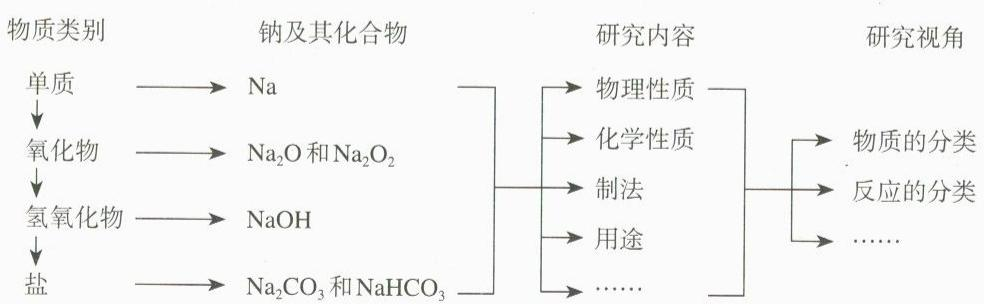

## (2) 归纳重点物质的性质

可让学生围绕物理性质、化学性质等研究内容，选择钠、过氧化钠、碳酸钠和碳酸氢钠中的一种或几种，列表进行总结归纳。

## （3）构建转化关系

让学生尝试设计钠及其化合物的转化线索，如下图所示，并围绕转化关系书写相应的化学方

程式，以此促使学生建构金属及其化合物的研究模型，为后续学习奠定基础。

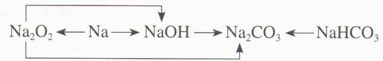


## 四、栏目使用建议

## 1. 实验

【实验2-1】

切开金属钠之前，要先观察钠的表面，以便切后进行比较。切割金属钠要在玻璃片上进行。切口处可观察到银白色光泽，暴露在空气中很快变暗，这是因为钠迅速被空气中的氧气氧化而生成了氧化钠。这一实验不仅说明钠具有金属光泽，还说明钠质软。

实验现象：取出的金属钠表面有一灰黄色层，切开后的切口处露出银白色光泽；切口在空气中迅速变暗。

观察钠的金属光泽还可以用以下方法。

(1) 取两支口径不同而长短适当的试管, 一支试管较小, 可以紧密地放到另一只试管里而不留下较多空隙。先在口径较大的试管里注入 $1 \mathrm{~mL}$ 洁净的煤油, 取一小块 (黄豆大小) 金属钠, 切去表面已经发生变化的部分, 露出金属光泽, 放入盛有煤油的试管里。在试管底部缓缓加热, 等钠熔化后, 插入口径较小的试管, 把钠挤压在两个试管之间, 形成薄层, 此时, 钠的颜色和光泽可以清楚地显现出来。然后在两支试管口间的缝隙涂上石蜡, 以隔绝空气。这样可使钠的金属光泽在较长的时间内不消失。

（2）选取一根管壁较薄的玻璃管，用布包裹着玻璃管，像使用钻孔器一样，将其慢慢地钻入大的钠块里。玻璃管中将填有一段银白色的金属钠。用玻璃棒把钠推到管的中央，然后用蜡封好玻璃管的两端，以使样品可以长期保存和使用。

【实验2-2】

选择干净的坩埚，先对其进行加热，之后放入切去表面氧化层的金属钠，待钠开始燃烧后，立即撤掉酒精灯。实验时请注意安全，提醒学生不要近距离俯视坩埚。

此实验也可在干净的石棉网上或蒸发皿里进行。在火焰上方罩一个干燥的小烧杯，则可观察到烧杯壁上附着淡黄色固体。

【实验2-3】

由于反应剧烈，故过氧化钠的用量不宜过多。将带火星的木条伸入到氧气浓度较大的试管中部，可观察到木条迅速复燃。

实验现象：滴入水后有大量气泡产生，生成的气体使带火星的木条复燃；试管外壁发热；pH试纸变蓝。

【实验2-4】

此实验的目的是从外观、在水中的溶解性、水溶液的酸碱性等几个方面比较碳酸钠和碳酸氢钠的性质。

<table><tr><td>盐</td><td>Na2CO3</td><td>NaHCO3</td></tr><tr><td>(1)</td><td>白色粉末</td><td>细小白色粉末</td></tr><tr><td>(2)</td><td>加几滴水后,结块变成晶体;温度上升</td><td>加几滴水后,少部分溶解;温度略有下降</td></tr><tr><td>(3)</td><td>振荡后可溶解</td><td>固体量有所减少</td></tr><tr><td>(4)</td><td>溶液变红(较深)</td><td>溶液微红</td></tr><tr><td>初步结论</td><td>加水先变成含结晶水的晶体,溶于水放热,溶液碱性比NaHCO3的强</td><td>加水少量溶解,溶于水吸热,溶液碱性比Na2CO3的弱</td></tr></table>

对于碳酸钠溶液、碳酸氢钠溶液为什么显碱性，碱性的强弱为什么会不同，可以让学生自己查阅资料解决。

【实验2-5】

在这个实验中，分别加热碳酸钠和碳酸氢钠，目的是让学生了解碳酸钠比较稳定，在这样的实验条件下不会分解，而碳酸氢钠则容易分解。

碳酸钠的熔点是851℃，当超过熔点时碳酸钠才稍稍分解。而碳酸氢钠超过100℃即开始分解，温度升高，分解加快。从图2-1可知，在170\~180℃，约经过35min，碳酸氢钠即全部分解为碳酸钠。

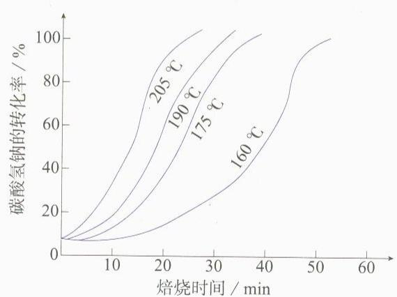  
图 2-1 碳酸氢钠转化为碳酸钠

实验现象：加热碳酸钠，澄清石灰水不变浑浊；加热碳酸氢钠，试管口有小液滴出现，澄清石灰水变浑浊。

【实验2-6】

（1）因酒精灯火焰略带黄色，因此本实验中火源最好用酒精喷灯或煤气灯，它们的火焰无色。

(2) 做焰色试验前, 铂丝 (或纯净的铁丝) 应灼烧到无色。也可以先用盐酸清洗, 再灼烧至无色。实验时, 溶液的浓度大一些效果会较好, 或者用铂丝蘸一些蒸馏水后再蘸一些盐的粉末, 然后进行灼烧, 这样效果更明显。实验完毕, 要把铂丝放在盐酸里浸泡 $2 \sim 3 \mathrm{~min}$ , 再用蒸馏水洗

## 净，使它清洁无垢，便于保存。

（3）做钾元素的焰色试验时，要透过蓝色钴玻璃片进行观察。蓝色钴玻璃能吸收黄光，排除钠的化合物的焰色干扰。

该实验也可以采用如下改进的实验方案。

方案1：配制金属盐溶液，装入喷雾器向火焰处喷射。

方案2：将粉笔先吸足酒精，然后蘸金属化合物粉末（或金属化合物的溶液），在火焰上进行焰色试验。

## 2. 探究

【探究】 钠与水的反应

此探究活动的目的有三：一是让学生获取实验证据，通过对实验现象的观察与分析，了解钠与水反应的生成物；二是让学生学会运用第一章中氧化还原反应的原理、初中阶段学习的质量守恒定律，预测钠与水反应的生成物；三是进一步深化学生对于科学探究方法和步骤的认识和理解。

该探究可由学生完成，但在操作时，烧杯口应该盖一塑料片或者玻璃片，以防止反应时钠块或液体飞溅而伤人。应提示学生观察反应时钠所处的位置、形态、运动、大小的变化，周围水雾的产生和发出的声音，以及滴有酚酞的溶液的颜色变化。

可以补充对气体生成物的收集和检验的实验。

实验现象：钠浮在水面，熔成光亮的小球，在水面上迅速游动；钠球周围有水雾出现，有时可能有火花或伴有爆鸣声；钠球在反应中逐渐变小，最后消失；滴有酚酞的溶液变成红色。

## 3. 思考与讨论

本活动的目的是运用类比的方法，让学生通过类比氧化钙，完成对氧化钠的学习；进而由氧化钠入手，引出对过氧化钠的研究，让学生关注氧化钠与过氧化钠性质的差异。

（1）氧化钠是白色固体，过氧化钠是淡黄色固体。

(2)氧化钠与水反应的化学方程式是: $\mathrm{Na}_{2} \mathrm{O} + \mathrm{H}_{2} \mathrm{O} = 2 \mathrm{~NaOH}$


## 五、练习与应用参考答案及说明

1. 加热 $2 \mathrm{NaHCO}_{3} \xlongequal{\triangle} \mathrm{Na}_{2} \mathrm{CO}_{3} + \mathrm{H}_{2} \mathrm{O} + \mathrm{CO}_{2} \uparrow$

2.（1）金属氧化物 焰色试验，火焰呈黄色

(2) 淡黄 过氧化钠与水反应放热，且有氧气产生

(3) $2 \mathrm{Na}_{2} \mathrm{O}_{2} + 2 \mathrm{CO}_{2} = 2 \mathrm{Na}_{2} \mathrm{CO}_{3} + \mathrm{O}_{2}$ 、 $2 \mathrm{Na}_{2} \mathrm{O}_{2} + 2 \mathrm{H}_{2} \mathrm{O} = 4 \mathrm{NaOH} + \mathrm{O}_{2} \uparrow$ 既做氧化剂，又做还原剂 $401.3 \mathrm{~kg}$

3. B 
4. A 
5. D

6.（1）白色固体 （2）盐酸、碱、盐

(3)

<table><tr><td>实验步骤</td><td>实验现象</td><td>结论或解释(用离子方程式表示)</td></tr><tr><td></td><td>产生白色沉淀</td><td> $Ca^{2+} + CO_{3}^{2-} = CaCO_{3} \downarrow$ </td></tr><tr><td></td><td>产生白色沉淀</td><td> $Ca^{2+} + CO_{3}^{2-} = CaCO_{3} \downarrow$ </td></tr><tr><td></td><td></td><td>2 $HCO_{3}^{-} + H^{+} = H_{2}O + CO_{2} \uparrow$ </td></tr></table>

（4）①先研究物理性质，再研究化学性质；运用了观察、对比、定性研究、实验探究等方法。

②与酸反应的速率快慢、热稳定性等。

# 第二节 氯及其化合物


## 一、内容分析

在本章的第一节中，学生对典型金属元素钠进行了学习，了解了研究金属元素及其化合物的思路和方法，初步构建了含同种元素的物质间的转化关系。氯是一种典型的非金属元素，具有多种化合价，可以形成食盐、漂白粉等多种含氯化合物，学生在日常生活中对这些物质比较熟悉。因此，教材在本节并未采取第一节的编写思路，而是以学生不熟悉的氯气为主线，选择氯气的性质、用途、实验室制备方法及Cl⁻的检验等内容，将含氯化合物穿插在其中进行介绍，让学生在重点学习氯气单质的过程中，关注这些含氯元素物质间的转化，引导学生建构不同价态物质间的转化关系，形成非金属及其化合物的研究思路和方法。

本节教材在编写中有以下特点。

从物质种类上来看，重点介绍氯元素的单质——氯气。在氯气性质的学习中，融入次氯酸、次氯酸盐等，突出了含氯元素物质间的转化，构建典型非金属元素及其化合物的研究思路和方法（模型）。从氯气的知识结构来看，重点介绍氯气的强氧化性，并引导学生从离子反应、氧化还原反应的视角对反应的产物进行预测、探究，体现了宏观与微观相结合的思想，强化证据推理意识。从内容的选取看，重视氯及其化合物的应用价值，如氯气用于自来水消毒，84消毒液、漂白粉是日常生活中重要的消毒剂和漂白剂等，有助于学生更好地了解化学知识的应用。氯气有毒又有用的编写方式，可以使学生认识到要学好知识并正确运用，才能让资源更好地为人类服务，从而发展社会参与意识，建立社会责任感。从氯气的实验室制法看，介绍氯气制备的原理和装置特征，帮助学生构建实验室制备气体的一般思路，为以后学习更多的物质的制备方法奠定基础。

可见，本节教材以氯及其化合物的研究为载体，建构了非金属及其化合物的研究模型，突出了对学生化学学科核心素养的培养，有利于后续硫、氮及其化合物的学习。

## 二、教学目标

## 1. 教学目标

（1）能通过实验探究氯气的物理性质、化学性质，体会实验对认识和研究物质性质的重要作用，培养证据推理意识。

(2) 能用氧化还原反应、离子反应的观点预测并解释氯气的化学性质, 并能用化学方程式正

确表达。

（3）以氯及其化合物知识的学习为线索，建立含氯元素的物质间的转化关系，进一步了解研究物质的思路和方法。

（4）通过含氯物质性质和用途的学习，感受物质性质与用途的关系，体会化学对生活、环境保护的重要意义，增强社会责任感。

（5）了解氯气的发现史，学习科学家的研究精神及勤于钻研、严谨求实的科学态度。

## 2. 教学重点和难点

重点：氯气的化学性质、氯离子的检验；氯及其化合物的研究思路和方法的建构。

难点：氯气分别与水、氢氧化钠的反应。

## 三、教学建议

## 1. 从回忆钠及其化合物的知识开始学习氯气的性质

学生在第一章中学习了有关分类的知识，认识了氧化还原反应、离子反应等化学反应类型。在本章第一节中又学习了钠及其化合物的知识，初步了解了金属元素的研究思路，即贯彻分类的思想，从单质到化合物，从物理性质到化学性质，再到用途。因此，本节可从复习钠及其化合物的研究思路入手，提出问题：“我们学习了含钠元素的哪些物质？这些物质的研究顺序是什么？具体到每一种物质，又是从哪些方面展开研究的？”由此强调金属单质及其化合物的研究思路，之后引入本节课的教学。在教学中应紧紧围绕氧化还原反应、离子反应的特征来分析氯气分别跟金属、非金属、化合物所发生的反应，引导学生理解氯气的氧化性，最终建立非金属及其化合物的研究方法，为进一步学习硫、氮及其化合物的知识奠定基础。

在初中化学的学习中，学生已了解了盐酸、NaCl分别与 $\mathrm{AgNO}_3$ 溶液的反应。在介绍 $\mathrm{Cl}^-$ 的检验时，可以先复习这两个反应，带领学生完成实验并观察现象，引出“与银离子反应生成白色沉淀的是否只有氯离子”的问题，最终通过实验让学生掌握氯离子的检验方法。

## 2. 精心设计有关氯气性质的实验，突破教学难点

本节教学内容的重点之一是氯气的化学性质。教材围绕氯气的性质，设置了“探究”“实验”等活动，教学中应充分利用。

可设计多组对比实验，如将干燥的氯气分别通入干燥的、湿润的有色布条；氯气分别与水、氢氧化钠溶液反应；硝酸银溶液分别与氯离子、碳酸根离子反应后，再滴加稀硝酸等。通过对比实验，让学生获取证据并进行分析，最终获得相应的知识。

氯气分别与水、氢氧化钠的反应是教学的重点和难点。可采用如下任务教学的方式。

任务一：请根据氧化还原反应原理、质量守恒定律及已掌握的 $\mathrm{Cl}_2$ 的性质预测， $\mathrm{Cl}_2$ 与 $\mathrm{H}_2\mathrm{O}$ 反应的生成物可能是什么？

任务二：根据预测的结果，讨论、设计实验方案，实施实验方案，证明推理是否成立，完成化学方程式的书写，并且从氧化还原反应的角度分析该反应。在此任务中，对于学习能力较强的学生，可引导其设计探究活动，探究氯气与水的反应及氯水的成分。有条件的学校可借助数字化实验帮助学生认识氯水的成分。

任务三：如果将 $\mathrm{Cl}_{2}$ 通入 $\mathrm{NaOH}$ 溶液中会发生怎样的反应？结合 $\mathrm{Cl}_{2}$ 与 $\mathrm{H}_{2} \mathrm{O}$ 的反应进行分析，由此完成氯气与氢氧化钠溶液反应的学习。教学中可采用对比的方法，将氯气分别与水、氢氧化钠的反应对比学习。

对比方法 1 分别向两个充满氯气的集气瓶中注入等体积的水、氢氧化钠溶液，观察、比较，分析现象差异的原因，由此进一步得出氢氧化钠溶液与氯气反应的生成物。

对比方法2 取一个装满氯气的矿泉水瓶（将瓶盖换成橡皮塞），先让学生观察氯气的颜色。然后用注射器向矿泉水瓶中注入少量水（约5 mL），振荡，观察现象（瓶内气体颜色变浅，水溶液呈现黄绿色，矿泉水瓶变瘪）。继续用注射器向此矿泉水瓶中注入等体积的浓氢氧化钠溶液，振荡，观察现象并与前面的现象进行对比（注入浓氢氧化钠溶液的瓶里黄绿色褪去，溶液颜色也褪去，同时矿泉水瓶变瘪程度加深）。据此证据，可说明氯气与氢氧化钠溶液发生了反应。由氯气和水反应生成盐酸、次氯酸，进一步推知氯气和氢氧化钠溶液反应生成了氯化钠和次氯酸钠。

若学生的学习能力较强，可继续深入完成任务四。

任务四：往稀氢氧化钠溶液中滴加酚酞溶液，再逐滴滴加氯水，会有什么现象？实验中酚酞褪色的原因是什么？是因为 $\mathrm{Cl}_2$ 与碱发生了反应，还是因为氯水中含有的HClO起了漂白作用？你能否设计实验证明哪种猜测是对的呢？

在此过程中，教师应充分调动学生主动参与探究学习的积极性，引导学生通过实验、观察、调查、阅读、讨论、辩论等多种方式进行学习，培养学生提出问题、分析问题，以及通过实验解决问题的能力。

## 3. 注重建构氯及其化合物的研究思路和方法

学习本节课的目的，不仅仅在于掌握氯及其化合物的知识，更重要的是要让学生学会认识化学物质，学会研究化学物质。在教学中要时刻关注这一目标。

在第一节研究钠及其化合物时，教材的编写线索是引导学生根据钠的原子结构特征，分析钠元素的性质，即钠元素原子的最外电子层只有1个电子，在化学反应中容易失去这个电子，表现较强的还原性。在本节教学中，教师可继续结合氯元素的原子结构特征，引导学生得出氯元素的性质，进而预测氯气可能具有的化学性质，逐步渗透原子结构与元素性质的关系，为后面学习物质结构、元素周期律奠定基础。

本节内容中出现氯气、盐酸、次氯酸、次氯酸钠等物质，加上学生在初中阶段接触到的氯酸钾，这些物质中都含有氯元素，但化合价不同。在教学中，教师应有意识地提出这个问题，引导学生关注这些含氯的物质间的相互转化，例如，可让学生尝试绘制以氯元素为线索的转化关系图（如下页图所示）、以氯元素为中心的思维导图等，让学生依据关系图书写相关反应的化学方程式，分析物质转化的条件、化合价的变化等，逐步建构物质的转化观，并在之后的铁、硫、氮单质及其化合物的转化学习中强化。

$$
\mathrm{Cl} \longleftrightarrow \mathrm{Cl} \longleftrightarrow \mathrm{Cl} \longleftrightarrow \mathrm{Cl}
$$

本节教学要以氯元素为载体，突出非金属及其化合物的研究思路和方法，如围绕同一种非金属元素，从单质到化合物，从物理性质、化学性质，到用途、实验室制法。在实验室制法的学习中，可结合初中所学习的氧气、二氧化碳气体的制备，帮助学生梳理出从实验原理的分析到实验装置的选择，再到实验仪器的连接的基本思路，构建制取气体的方法模型。

## 4. 挖掘氯及其化合物教学内容中蕴含的培养学生核心素养的价值

在教学中，应注意抓住教材中的科学史、正确使用含氯化学品的方法等内容进行情境创设，挖掘本节内容所蕴含的培养学生学科核心素养的价值。可以采用如下几种设计线索。

## (1) 以科学史为情境线索

教材中有关氯气的科学史内容统计如下表所示。

<table><tr><td>教材中出现的位置(栏目)</td><td>内容</td></tr><tr><td>正文</td><td>舍勒得到氯气,戴维确认氯气</td></tr><tr><td>资料卡片</td><td>氯气名称的由来</td></tr><tr><td>思考与讨论</td><td>从氯气发现的史实中得到的启示</td></tr><tr><td>练习与应用</td><td>第8题:氯气的应用与毒害</td></tr></table>

教学中可以抓住科学史这条线索创设情境设计如下教学：

①让学生阅读正文及“资料卡片”，发现、获取信息，了解氯气可以从氧化盐酸中的氯离子得到，及氯气是黄绿色、有刺鼻气味的气体等物理性质。

②完成“思考与讨论”，让学生感受科学家勇于探索、执着追求的精神。

③学习氯气的化学性质和用途之后，再次阅读舍勒得到氯气的史实材料，得出氯气的实验室制法。

④结合“练习与应用”第8题，讨论如何正确看待氯气的制备与研究。

这样的教学方式，在学习氯气知识的同时，突出了对“科学态度与社会责任”这一学科核心素养的培养。

## (2) 以日常生活中的应用为情境线索

提出问题: 84消毒液与洁厕灵（酸）能否混合使用?

实验探究：探究84消毒液与酸反应得到的气体产物的性质，包括实验中观察到的物理性质，分别遇干、湿红色石蕊试纸的现象等，获取证据进行推理，培养证据意识。

实验结论：得出84消毒液与洁厕灵不能混合使用的结论，发展学生的社会参与意识。

这样的教学设计，问题来自于实际生活，探究中突出了对证据意识的培养，也突出了化学学习的社会价值。

此外，在进行氯气性质与用途的教学过程中，可利用教材中的“化学与职业”栏目介绍水质检验员，让学生了解与“氯及其化合物”有关的职业。限于教材的篇幅，内容不可能展开太多，因此建议教师们让学生自行查阅更多与水质检验员这一职业相关的资料及更多相关职业，在课堂上进行交流，激发学生学习本节内容的兴趣，发展社会参与意识。

## （3）以教材中的栏目内容为情境线索

①阅读“化学与职业”栏目，了解水质检验员的工作，并提出问题：自来水中为什么会有氯离子？

②引入对氯气性质的学习，其中重点学习氯气与水反应。

③阅读“思考与讨论”栏目，了解氯气可用于自来水的杀菌、消毒，回应之前提到的“自来水中为什么会有氯离子”的问题。

④学生分小组汇报课前查阅的资料，向同学介绍各类企业中水质检验员的工作内容，明确职业价值，树立化学学习自信。


## 四、栏目使用建议

## 1. 实验

【实验2-7】

盛氯气的集气瓶要干燥。瓶中的氯气要浓。为了防止氯气逸散，可在集气瓶口涂一点凡士林，使玻璃片与瓶口更密合。因为这是第一个关于氯气性质的实验，实验时要提醒学生注意观察氯气的颜色（黄绿色），并注意氢气在空气里燃烧与在氯气里燃烧火焰的颜色是不同的。实验前务必要检验 $\mathrm{H}_{2}$ 的纯度，在确保 $\mathrm{H}_{2}$ 纯净的前提下完成本实验。

【实验2-8】

（1）实验所用氯气和有色布条一定要干燥。有色布条的颜色最好是自行染上的。可取白纱布条，用红墨水染成红色，晾干备用。

（2）所用的花朵尽可能选择含水分较多、颜色鲜艳的，这样可使颜色变化明显。

建议增加一个氯气与水反应和氯气与碱反应的对比实验。

【实验2-9】

对于此实验，地区不同，自来水中滴入 $\mathrm{AgNO}_3$ 溶液的现象可能不同。分别向稀盐酸和 $\mathrm{NaCl}$ 溶液中加入 $\mathrm{AgNO}_3$ 溶液都产生白色沉淀，再加稀硝酸，沉淀都不溶解。向 $\mathrm{Na}_2\mathrm{CO}_3$ 溶液中加入 $\mathrm{AgNO}_3$ 溶液产生白色沉淀，再加稀硝酸，沉淀溶解，且放出气泡。

## 2. 思考与讨论

【思考与讨论1】

启示1：科学研究需要有可靠的理论作指导，否则只能浪费时间和精力。

启示2：科学研究需要以大量事实为依据。

启示3：科学研究需要有对科学的热爱和奉献科学的精神。

【思考与讨论2】

提示：燃烧不一定要有氧气参加，物质并不是只有在氧气中才可以燃烧。燃烧的本质是氧化

还原反应，所有发光、发热的剧烈的化学反应都称为燃烧。

【思考与讨论3】

启示1：要一分为二地看待物质，正确认识物质的性质，合理使用物质。

启示2：化学研究的方向之一就是根据需要发现、合成并使用新物质。

【思考与讨论4】

(1) $\mathrm{{NaOH}}$ 溶液的作用是吸收多余的氯气,防止环境污染。

（2）选择和组装实验室制取气体的装置时，应考虑装置的选取依据和装置的连接顺序。


## 五、部分练习与应用参考答案及说明

## 1. B  2. C  3. C

4. (1) $\mathrm{Cl}_{2} + 2\mathrm{OH}^{-} = \mathrm{Cl}^{-} + \mathrm{ClO}^{-} + \mathrm{H}_{2}\mathrm{O}$ 次氯酸钠

(2) 向溶液中加入稀硝酸酸化后, 再加入硝酸银溶液, 观察是否产生白色沉淀 $\mathrm{Ag}^{+} + \mathrm{Cl}^{-} = \mathrm{AgCl} \downarrow$ 5. (1) $2 \mathrm{Cl}^{-} + 2 \mathrm{H}_{2} \mathrm{O} \xlongequal{\text {通电}} 2 \mathrm{OH}^{-} + \mathrm{Cl}_{2} \uparrow + \mathrm{H}_{2} \uparrow$ 氢气在氯气中安静燃烧, 发出苍白色火焰, 瓶口有白雾出现

(2) $2Cl_{2}+2Ca(OH)_{2}=CaCl_{2}+Ca(ClO)_{2}+2H_{2}O$ 既做氧化剂、又做还原剂

6.（1）氯气溶于水发生反应： $Cl_{2}+H_{2}O=HCl+HClO$ ，HClO具有强氧化性，能杀灭水中的病菌。

(2) 观察包装袋是否密封, 漂白粉中有无结块, 注意使用期限, 现买现用, 购买之后应密闭保存在干燥的地方等。

7.（1）14.26 g （2）实际实验中不能实现全部转化，要考虑损耗。

8. 提示：应该进行研究，因为氯气有广泛的用途。但是要正确认识这类物质，避免人类受到伤害。

# 第三节 物质的量


## 一、内容分析

物质的量是国际单位制中的7个基本物理量之一，属于重要的基本概念。以物质的量概念为基础，可以得出摩尔质量、气体摩尔体积、物质的量浓度等一些在化学中有重要应用的概念。因此，物质的量被广泛地应用于工业、农业、医疗及科学研究中。物质的量及其相关概念的建构，可以引导学生进一步从定量的角度研究物质间所发生的化学反应，有助于学生深入理解宏观物质与微观粒子之间的联系。

本节包含三部分内容，按照知识的内在联系，这三部分内容是不可分割的整体。第一部分着重介绍物质的量及其单位、摩尔质量，通过列举事实，让学生知道宏观物质与微观粒子之间存在一定的联系。第二部分介绍气体摩尔体积，通过“思考与讨论”栏目，引导学生分析影响气体体积大小的因素。第三部分介绍物质的量浓度，学生将在理解概念的基础上，应用概念完成“配制一定物质的量浓度的溶液”的实验。

本节内容的突出特点是概念多而抽象，如物质的量、摩尔质量、阿伏加德罗常数、气体摩尔体积、物质的量浓度等。这些词汇对学生来说比较陌生，与头脑中原有的认识如物质的质量、气体的体积等会产生冲突。考虑到学生的接受能力，教材有意识地降低了难度，并没有要求学生对这部分内容理解得很透彻；特别是降低了化学计算的难度，只要求学生学会关于概念的简单计算，将物质的量在化学方程式中的计算分散到第三章中进行介绍。正是由于概念的抽象性，教材中穿插了丰富的素材，如图片、探究活动等，不仅丰富了版面，还达到了将抽象概念可视化的效果，直观地引导学生从宏观与微观两个视角认识物质，着力帮助学生理解物质的量是连接宏观与微观的桥梁，进而加深学生对物质的量等概念的理解。

物质的量是高中化学学习中重要的工具性内容。为了在后续学习中更好地发挥其工具作用，教材以例题的方式，引导学生理解概念、应用概念，并规范解题步骤，让学生进一步体会宏观物质的质量、气体的体积、物质的量浓度等与物质的量的关系，将概念的理解和概念的应用两个环节交织进行，突出定量研究的特点。


## 二、教学目标

1. 教学目标

(1) 了解物质的量的单位——摩尔。

（2）通过对比、类比、归纳、演绎等多种思维活动，了解摩尔质量、气体摩尔体积和物质的量浓度的含义，体会从物质的量层次定量研究化学问题的意义。

（3）能基于物质的量认识物质组成及其化学变化；运用物质的量、摩尔质量、气体摩尔体积和物质的量浓度之间的相互关系进行简单计算。知道从定量的角度认识宏观物质和微观粒子的相互关系是研究化学问题的科学方法之一。

（4）认识容量瓶，初步学会配制一定物质的量浓度溶液的方法和技能，通过对实验细节的分析，发展定量研究的意识。

（5）通过了解生产、生活、科研中的多种计量方法，认识化学计量方法的选择取决于实际需要，初步学会从实际需求的角度审视化学问题。

## 2. 教学重点和难点

重点：物质的量的概念；建构以物质的量为中心的转化关系，感受宏观与微观相结合的思想。难点：物质的质量、气体摩尔体积、物质的量之间转化关系的建构。


## 三、教学建议

## 1. 突出学习物质的量及有关知识的重要性

教学中可创设情境，突出学习物质的量这一概念的必要性和重要性。例如，可从生活中的计量引入。以下提供两个情境示例。

情境1 将曲别针分别放在两个信封中，一个信封装200只零散的曲别针，另一个装2盒曲别针（规格为100个/盒），将两个信封分发给两名学生，请他们分别拿出100个曲别针，看谁能更快地拿出来，并提问为什么他能这么快。

情境2 请完成下表，用“能”或“否”回答，并思考从中得到哪些启示。

<table><tr><td></td><td>集团计量购买</td><td>单个计量购买</td><td>单个计量使用</td></tr><tr><td>纸张</td><td></td><td></td><td></td></tr><tr><td>曲别针</td><td></td><td></td><td></td></tr><tr><td>大米</td><td></td><td></td><td></td></tr></table>

这些情境的创设，目的是引导学生关注生活中的计量方式，引出集团计量的意义，为学习集团计量微观粒子、引入物质的量的概念打下基础。

也可以从本节内容入手直接引入。以下提供两个情境示例。

情境1. 展示一瓶矿泉水，提出问题：从宏观角度看，矿泉水的质量和体积都可以测量，那么这瓶矿泉水中有多少个水分子呢？这就需要建立起宏观物质水与微观粒子水分子间的关系。为此，我们引入“物质的量”这一概念。

情境2 原子是化学变化中的最小粒子。分子与分子、原子与原子按一定的比例定量地进行化学反应，而原子或分子都很小，我们肉眼不可能观察到，更不可能一个一个地进行称量。怎样将微观的粒子数目与宏观的物质质量联系起来，来研究分子、原子或离子所进行的化学反应呢？这就需要一个新的物理量。

以上述情境引入物质的量的概念之后，可向学生介绍：1971年第14届国际计量大会通过了以“物质的量”作为化学计量的基本物理量，规定其单位为摩尔（mol）；2018年第26届国际计量大会对摩尔这个基本单位进行了重新定义，规定 $1\mathrm{mol}$ 任何粒子的粒子数为阿伏加德罗常数，以阿伏加德罗常数这一基本物理常数定义摩尔，可大大提高摩尔这一单位的稳定性和精确度。在实际应用时， $1\mathrm{mol}$ 任何物质的质量以克为单位时，其数值恰好等于该物质的相对原子质量或相对分子质量，这样使用起来就十分方便。当物质的量小于 $0.1\mathrm{mol}$ 或大于 $1000\mathrm{mol}$ 时，正像小于 $0.1\mathrm{m}$ 或大于 $1000\mathrm{m}$ 一样，需要采用“摩”的倍数单位。

## 2. 引导学生正确理解并运用物质的量的相关概念

要强调 “物质的量” 是一个基本物理量，四个字是一个整体，不能拆开理解，也不能压缩为 “物质量”，否则就改变了原有的意义。要说明 “摩尔” 是 “物质的量” 的单位，不要将两者混淆起来，如 “某物质的物质的量是多少” 不要说成 “某物质的摩尔数是多少”。

应该强调，物质的量这个物理量只适用于微观粒子，即原子、分子、离子等，使用摩尔（简称“摩”）作单位时，所指粒子必须十分明确，且粒子的种类要用化学式表示。如写成2 mol H、1 mol $H_{2}$ 、1.5 mol NaOH、1 mol $OH^{-}$ 和1 mol $e^{-}$ 等。

摩尔质量是单位物质的量的物质所具有的质量，单位是克/摩（g/mol）或千克/摩（kg/mol）等。摩尔质量以克/摩为单位时，在数值上与物质的相对分子质量或相对原子质量相等。对于某一纯净物来说，它的摩尔质量是固定不变的，而物质的质量则随着物质的量不同发生变化。例如，1 mol O₂的质量是32 g，2 mol O₂的质量是64 g，但O₂的摩尔质量并不会发生任何变化，还是32 g/mol。

有关物质的量浓度概念的教学，可让学生收集资料，查阅生活中各种溶液组成、浓度的表示方法，如饮料、医用酒精、生理盐水等，比较各种浓度表示方法的含义，并将这些浓度与物质的量浓度进行对比，整理成表格，如下表所示。

<table><tr><td></td><td>溶质的质量分数</td><td>溶质的物质的量浓度</td></tr><tr><td>表示溶质的物理量</td><td>质量</td><td>物质的量</td></tr><tr><td>单位</td><td>1(是质量比)</td><td> $\text{mol} \cdot \text{L}^{-1}$ </td></tr><tr><td>特点</td><td>相同质量分数、相同体积的不同溶液,所含溶质的质量相同,但溶质的物质的量不相同</td><td>相同物质的量浓度、相同体积的不同溶液,所含溶质的物质的量相同,但溶质的质量不相同</td></tr></table>

化学反应中物质的粒子数目之间存在一定的比例关系，用质量表示有时不方便，所以有必要引入物质的量浓度。学生在初学阶段容易产生的困难是不能理解无论取用的溶液体积是多少，溶液中溶质的物质的量浓度不变。不能让学生产生“取用体积较大的溶液时，溶质的物质的量大，

## 3. 引导学生认识配制一定物质的量浓度溶液的意义，讲清配制的要点

配制一定物质的量浓度溶液的方法，是高中学生必须学会的化学实验操作技能之一。教学中可先结合生产、生活、科研等领域中的具体案例，引导学生认识配制一定物质的量浓度溶液的重要意义，激发学生学习的兴趣。然后运用“资料卡片”栏目，向学生介绍容量瓶的特点和使用方法。在演示实验的过程中讲解为什么转移溶液时要用玻璃棒；为什么要用水将烧杯和玻璃棒洗涤2\~3次，并将洗涤液转入容量瓶中；容量瓶中溶液接近瓶颈刻度时，为什么要改用胶头滴管加水等。

配制一定物质的量浓度溶液的步骤可归纳为：计算、称量、溶解、转移、洗涤、定容、摇匀、装瓶、贴标签等。应结合配制步骤，讲解其中的操作注意事项，如称量有腐蚀性或者潮解性的试剂时，要在小烧杯中称量；溶解固体，如氢氧化钠，或者稀释浓溶液，如浓硫酸时，要冷却到室温才能转入到容量瓶中等。同时，要引导学生分析操作中可能产生的误差，及这些误差对所配溶液浓度可能产生的影响。让学生通过对这些实验细节的分析，认识到配制步骤对确保所配制溶液浓度准确性的重要意义，并提高定量研究的意识。

## 4. 引导学生建立与物质的量有关的概念之间的联系

在本节中，应使学生建立物质的量等概念之间的联系，会进行简单的计算。可结合本章后的整理与提升，引导学生建立各个概念间的转化关系，进一步认识宏观与微观的联系。可通过设计有效的评价方式对学习效果进行检测。以下提供两种评价示例。

评价1：展示学生熟悉的宏观物质，如18 mL水，请学生结合所学习的各种计量方式，思考可以从哪些角度计量这18 mL水。

评价2：从质量、标准状况下的体积、分子数、原子数等方面描述 $1 \mathrm{~mol} \mathrm{CO}_{2}$ ，思考宏观物质与微观粒子之间是如何建立联系的。

上述两例不同于常规的习题类评价，既可以考查学生对化学计量方法的认识，根据物质的量及相关概念实现计量方法的转化，又可以引导学生从宏观和微观两个视角看待化学物质。

当然，对计算技能的适当训练与评价在本节内容的学习过程中必不可少。但应注意把握教学要求，考虑学生的接受能力，不要提高计算难度。像质量分数与物质的量浓度转化、分子中所含质子数和电子数的计算等这类难度较大的内容可在后续的教学中逐步渗透。


## 四、栏目使用建议

## 1. 实验

【实验2-10】

选择配制氯化钠溶液，原因之一是氯化钠价廉。要求配制100 mL溶液也是从减少浪费的角度考虑的。称量氯化钠固体可用托盘天平，要向学生简单说明天平的精度问题。若条件允许，也可用分析天平。此实验的目的是让学生学习配制溶液的方法和技能。

## 2. 思考与讨论

## 【思考与讨论1】

此活动的目的是让学生了解物质的量与气体体积的关系，以及在相同条件下，相同物质的量的气体、液体、固体体积的差异，为学习影响物质体积大小的因素积累感性材料，最终形成气体摩尔体积的概念。

教学中要充分利用本活动，让学生分析数据，定量认识1 mol物质的体积，引导学生得出结论：相同条件下，1 mol不同的气体的体积相等，1 mol不同的固体或液体的体积不相等。

## 【思考与讨论2】

（1）配制一定物质的量浓度的溶液时，烧杯中的溶液转移到容量瓶后，烧杯的内壁和玻璃棒上还沾有少量溶液，若不用蒸馏水洗涤烧杯，容量瓶中的溶质就会减少，即容量瓶内溶质的物质的量减少，导致所配溶液中溶质的物质的量浓度偏低。为了减少溶质的损失，应用蒸馏水洗涤烧杯和玻璃棒2\~3次，并将洗涤后的溶液也转移到容量瓶中。

（2）如果将烧杯中的溶液转移到容量瓶中时不慎洒到容量瓶外，最后配成的溶液中溶质的实际浓度会比所要求的小。因为洒出的溶液中含有溶质，所以转移到容量瓶内的溶质比称量时少，即容量瓶内溶质的物质的量减少。

(3) 读数时, 如果仰视刻度线, 则所加水的体积多, 最后配成的溶液中溶质的实际浓度会比所要求的小; 如果俯视刻度线, 则所加水的体积少, 最后配成的溶液中溶质的实际浓度会比所要求的大。


## 五、部分练习与应用参考答案及说明

## 1. B  2. B  3. B

4. (1) d (2) 略 (3) 70\~110 mg/dL 正常

5. 这种做法不对, 会造成结果偏低。这是因为倒出的部分溶液中含有溶质, 结果导致容量瓶内的溶质减少, 即容量瓶内溶质的物质的量减少, 溶质的物质的量浓度也减小。

6. $14 \mathrm{~mL}$ 。

提示：根据稀释前后，溶液中溶质的物质的量相等列方程：

$$
0. 2 5 \mathrm{L} \cdot 1. 0 \mathrm{mol/L} = 1 8 \mathrm{mol/L} \cdot V (\text {浓硫酸})
$$

7. $n(\mathrm{Ca}):n(\mathrm{Mg}):n(\mathrm{Cu}):n(\mathrm{Fe}) = 224:140:35:2$

8. (1) $0.2 \mathrm{mmol} / \mathrm{L}$ (2) $0.071 \mathrm{mmol}$

$$
9. (1) 0. 2 \mathrm{mol} (2) c (\mathrm{Cu} ^ {2 +}) = 0. 2 \mathrm{mol/L} \quad c (\mathrm{Cl} ^ {-}) = 0. 4 \mathrm{mol/L}
$$

10. 提示：可利用互联网、图书馆等查阅资料，了解物质的量及其相关的物理量在科学研究、生活、生产等各方面的应用。

## 复习与提高参考答案及说明

1. B 2. B 3. C 4. C
5. Na₂CO₃ CO₃²⁻ + Ca²⁺ = CaCO₃ ↓
6. (1) 0.25 mol 7 g (2) 5.6 L (3) 22 : 21
7. (1) X: H Y: O Z: Cl
(2) CO₃²⁻ + 2H⁺ = H₂O + CO₂ ↑ (3) Cl₂ + H₂O = HCl + HClO

8.（1）次氯酸钠中的Cl化合价为+1价，稀盐酸中的Cl化合价为-1价，在酸性条件下这两种物质发生氧化还原反应，生成有毒的氯气。（2）略

9. 根据氯化钠和碳酸钠的化学性质区分, 如: ①分别与盐酸混合, 观察是否产生气体; ②分别与石灰水混合, 观察是否产生白色沉淀; ③分别与氯化钙溶液混合, 观察是否产生白色沉淀; ④分别与硝酸酸化的硝酸银溶液混合, 观察是否产生白色沉淀。

10. (1) $\mathrm{CaCO_3 + 2H^+ = Ca^{2 + } + H_2O + CO_2\uparrow}$

(2)

<table><tr><td>装置序号</td><td>加入的试剂</td><td>加入该试剂的目的</td></tr><tr><td>B</td><td></td><td>除去二氧化碳中混有的氯化氢气体</td></tr><tr><td>D</td><td>氢氧化钠溶液</td><td>除去生成氧气中混有的未反应的二氧化碳气体</td></tr></table>

$$
(3) 2 \mathrm{Na} _ {2} \mathrm{O} _ {2} + 2 \mathrm{H} _ {2} \mathrm{O} = 4 \mathrm{NaOH} + \mathrm{O} _ {2} \uparrow \quad 2 \mathrm{Na} _ {2} \mathrm{O} _ {2} + 2 \mathrm{CO} _ {2} = 2 \mathrm{Na} _ {2} \mathrm{CO} _ {3} + \mathrm{O} _ {2}
$$

(4) 氧气 把E中的导管移出水面, 关闭分液漏斗活塞, 用拇指堵住试管口, 取出试管, 将试管正立, 松开拇指, 立即把带火星的木条伸入试管内, 木条复燃, 证明试管中收集的气体是氧气。

11.（1）①可能是氯水中的酸与氢氧化钠发生中和反应，将氢氧化钠消耗完所致；②可能是氯水中的次氯酸的强氧化性，使红色褪去所致。

(2) 取褪色后的溶液置于试管中, 向其中滴加氢氧化钠溶液, 如果溶液变红, 则是原因①; 若不再变红, 则是原因②。

## 12.(1)①②④③或②①④③

$$
(2) \mathrm{CaCO} _ {3} + 2 \mathrm{H} ^ {+} = \mathrm{Ca} ^ {2 +} + \mathrm{H} _ {2} \mathrm{O} + \mathrm{CO} _ {2} \uparrow , \mathrm{H} ^ {+} + \mathrm{OH} ^ {-} = \mathrm{H} _ {2} \mathrm{O}
$$

(3) $250 \mathrm{~mL}$ 4次实验理论上共消耗盐酸 $100 \mathrm{~mL}$ , 实验时要考虑损耗, 故需要使用 $250 \mathrm{~mL}$ 容量瓶。

(4) 为减小实验误差, 取 4 次实验中消耗氢氧化钠溶液的体积的平均值 $13 \mathrm{~mL}$ 。

氢氧化钠中和过量的盐酸的物质的量为 $0.10 \times 0.013 \mathrm{~mol}$ 。

用于与碳酸钙反应的HCl为 $0.10 \times 0.025 \mathrm{~mol} - 0.10 \times 0.013 \mathrm{~mol} = 0.10 \times 0.012 \mathrm{~mol}$ 。

根据 $n(\mathrm{CaCO}_3): n(\mathrm{HCl}) = 1:2$ ，碳酸钙的物质的量为 $0.10 \times 0.006 \mathrm{~mol}$ ，质量为 $0.06 \mathrm{~g}$ 。

$\frac{0.06\mathrm{g}}{0.10\mathrm{g}} \times 100\% = 60\%$ ，则这种药片中碳酸钙的质量分数是 $60\%$ 。


# 实验活动1 配制一定物质的量浓度的溶液

本实验是学生进入高中阶段所做的第一个定量实验。该实验从知识层面来看，可让学生进一步理解物质的量的概念及物质的量、物质的质量、物质的量浓度之间的转化关系；从技能层面来看，可让学生复习用天平称量固体试剂、用量筒量取液体试剂的操作，认识容量瓶并练习用容量瓶配制溶液、熟悉配制一定物质的量浓度溶液的步骤；从素养层面来看，可让学生关注实验中的误差，进一步落实从定量的角度研究物质的思路，体会宏观与微观的结合。

## 一、配制 $100 \mathrm{~mL} 1.00 \mathrm{~mol} / \mathrm{L} \mathrm{NaCl}$ 溶液

## 1. 活动安排建议

## (1) 做好实验前的预习

应提前布置预习作业，让学生了解实验目的、内容和步骤。可以提出一些可思考的问题，引导学生在接下来的实验中随时关注可能产生的误差。

## (2) 准确计算

复习物质的量、物质的质量之间的换算关系，根据所配溶液的浓度和体积，计算实验中所需要称量的氯化钠固体的质量。

## (3) 认真实验

将称量好的固体倒入烧杯中，严格按照配制溶液的基本步骤配制溶液。

## 2. 注意事项

（1）称量氯化钠固体时，可根据学校的实验条件，选择使用分析天平、托盘天平等。所称量固体的质量应根据天平的精度确定有效数字位数。

(2) 称量时, 对于像氢氧化钠固体等具有腐蚀性、潮解性的试剂, 要用烧杯称量。

（3）固体不能在容量瓶中直接溶解，而应在烧杯中进行。如固体溶于水时放热，则要先冷却至室温，再将溶液转移到容量瓶中。

（4）移液时要用玻璃棒引流；移液后，要洗涤烧杯和玻璃棒2\~3次，洗涤液也要转移至容量瓶中。

(5) 定容时, 要逐滴滴加蒸馏水, 至凹液面最低点与刻度线相切为止。若液面超过刻度线, 则要将溶液倒掉, 重新配制。

（6）容量瓶是配制溶液用的，配好的溶液不应放在容量瓶中，特别是有些溶液（如碱液）会腐蚀玻璃，盛放久了会影响容量瓶的精度。

## 二、用 $1.00 \mathrm{~mol} / \mathrm{L} \mathrm{NaCl}$ 溶液配制 $100 \mathrm{~mL} 0.50 \mathrm{~mol} / \mathrm{L} \mathrm{NaCl}$ 溶液

## 1. 活动安排建议

## (1) 做好实验前的预习

除预习实验内容外，应特别布置思考题，让学生确认溶液在稀释前与稀释后，所含溶质的物质的量相等的重要内容，为顺利完成实验奠定理论基础。

## (2) 准确计算

依据稀释前与稀释后溶液中所含溶质的物质的量相等，准确计算所需要量取的 $1.00 \mathrm{~mol} / \mathrm{L}$ NaCl溶液的体积。

## (3) 认真实验

将量取好的液体倒入烧杯中，严格按照稀释并配制溶液的基本步骤配制溶液。

## 2. 注意事项

（1）用量筒量取液体后，必须将液体倒入烧杯中进行稀释。如果是浓硫酸，则要注意实验安全，应将量取好的浓硫酸注入事先盛有少量蒸馏水的烧杯中进行稀释。

(2) 对于稀释后放热的溶液, 要先冷却到室温再转移到容量瓶中。

其他要求与配制 $100 \mathrm{~mL} 1.00 \mathrm{~mol} / \mathrm{L} \mathrm{NaCl}$ 溶液的实验要求相同。

## 三、问题和讨论答案或提示

配制一定物质的量浓度的溶液时，烧杯中的溶液转移到容量瓶后，烧杯的内壁、玻璃棒上都沾有少量溶液。若不用蒸馏水洗涤烧杯内壁及玻璃棒，则容量瓶内溶质的物质的量减少，导致所配溶液中溶质的浓度偏低。为了减少溶质的损失，应用蒸馏水洗涤烧杯内壁和玻璃棒2\~3次，并将洗涤后的溶液一并转移到容量瓶中。

## 教学资源

## 1. 钠

钠不能以游离态存在于自然界，因为它的化学性质很活泼。在自然界，钠存在于许多无机物中（如氯化钠、碳酸钠、硫酸钠、硝酸钠、硼酸钠等）。在海水、矿泉水、盐湖水中都有可溶性钠盐。地壳中含有2.63%化合形式的钠，其含量在元素中占第6位。 $^{23}$ Na是唯一的天然同位素，还有6种人工放射性同位素： $^{20}$ Na、 $^{21}$ Na、 $^{22}$ Na、 $^{24}$ Na、 $^{25}$ Na、 $^{26}$ Na。

钠能与许多气体发生反应: ① 在空气中 $120^{\circ} \mathrm{C}$ 时着火, $160^{\circ} \mathrm{C}$ 以下氧气不足时反应的主要产物是 $\mathrm{Na}_{2} \mathrm{O}, 250 \sim 300^{\circ} \mathrm{C}$ 与足量氧气反应生成的是 $\mathrm{Na}_{2} \mathrm{O}_{2}$ 和少量的 $\mathrm{NaO}_{2}$ 。② 与 $\mathrm{H}_{2}$ 在室温下不反应, 在隔绝空气并加热的条件下反应生成 $\mathrm{NaH}$ 。③ 与 $\mathrm{N}_{2}$ 通常不反应。有在放电条件下反应生成氮化钠和叠氮化钠的报道。④ 钠能在 $\mathrm{CO}_{2}$ 中燃烧, 生成碳酸钠和碳。有在撞击条件下钠与 $\mathrm{CO}_{2} (\mathrm{s})$ 反应发生爆炸生成碳化钠的报道。

钠能与 $\mathrm{H}_2\mathrm{O}$ 反应，也能与酸、盐溶液反应。钠能与熔融碱反应，如：

$$
\mathrm{Na} + \mathrm{KOH} \rightleftharpoons \mathrm{K} + \mathrm{NaOH} \quad 2 \mathrm{Na} + \mathrm{NaOH} = \mathrm{Na} _ {2} \mathrm{O} + \mathrm{NaH}
$$

金属钠的用途：在过去，相当一部分钠用于制造汽油抗爆震剂——四乙基铅 $^{①}$ ，它能降低汽油的爆震性，减少汽油发动机的噪音。四乙基铅通常是用氯乙烷与金属钠和铅（钠铅齐）的合金起反应而制成的，化学方程式为 $4C_{2}H_{5}Cl+4Na+Pb=(C_{2}H_{5})_{4}Pb+4NaCl$ 。金属钠能从钛、锆、铌、钽等金属的化合物中把它们置换出来，如 $TiCl_{4}+4Na\xlongequal{800^{\circ}C}Ti+4NaCl$ 。钠还用于制造过氧化钠等钠的化合物。在核工业上钠可用作传热介质。在电力工业上用于制钠灯，钠灯能在不降低照度水平的前提下减少能源消耗。

金属钠的制法：工业上钠的制法很多，有碳还原碳酸钠法、NaCl加石灰用硅铁还原法、电解熔融NaOH法等，目前世界上钠的工业生产多数用电解熔融氯化钠的方法。反应通常在电解槽里进行，如图2-2所示。

电解时，氯化钠需要熔融，氯化钠的熔点为801℃，在技术上有困难，采取的方法是用质量分数为40%的氯化钠和60%的氯化钙混合形成低共熔物（熔点为580℃），降低了电解时所需的温度，从而也减低了钠的蒸气压。电解时，氯气在阳极放出，金属钠和钙同时在阴极被还原出来，浮在阴极熔盐的上方，从管道溢出。把熔融的金属混合物冷却到105\~110℃，金属钙成晶体析出，经过滤就可以把金属钠与金属钙分离。

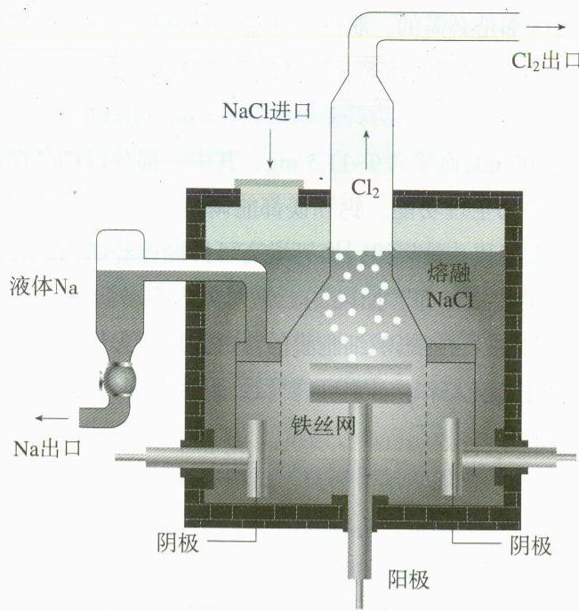  
图 2-2 电解熔融氯化钠示意图

## 2. $\mathrm{Na}^{+} 、 \mathrm{K}^{+} 、 \mathrm{Mg}^{2+} 、 \mathrm{Ca}^{2+}$ 的生理作用

钠、钾、镁、钙是生物生长和正常发育所需要的元素。 $Na^{+}$ 、 $K^{+}$ 、 $Mg^{2+}$ 、 $Ca^{2+}$ 四种离子占人体内金属离子总量的99%。对高等动物来说，钠、钾浓度在细胞内液和细胞外液中有较大不同。如在人体血浆中， $c(\mathrm{Na}^{+})\approx0.15\;\mathrm{mol/L}$ ， $c(\mathrm{K}^{+})\approx0.005\;\mathrm{mol/L}$ ；在细胞内液中， $c(\mathrm{Na}^{+})\approx0.005\;\mathrm{mol/L}$ ， $c(\mathrm{K}^{+})\approx0.16\;\mathrm{mol/L}$ 。这种浓度差别决定了高等动物的各种电物理功能——神经脉冲的传送、膈膜端电压、膈膜之间离子的迁移、渗透压的调节等。由于钠在高等动物细胞外液中的浓度高于钾的浓度，因此，对动物来说钠是较重要的碱金属元素，而对植物来说钾则是较重要的碱金属元素。

食盐是人类日常生活中不可缺少的无机盐。如果得不到足量的食盐，就会患缺钠症，其主要症状是恶心、肌肉痉挛、神经紊乱等，严重时会导致死亡。人可以从肉、奶等食物中获取一定量的钠，从果实、谷类、蔬菜等食物中吸取适量的钾。神经细胞、心肌和其他重要器官功能都需要钾，肝脏、脾脏等内脏中钾比较富集。胚胎中的钠、钾比值与海水中十分接近，这一事实被一些科学家视为陆上动物起源于海生有机体的直接证据之一。

植物对钾的需要同高等动物对钠的需要一样，钾是植物生长所必需的一种元素。植物体通过根系从土壤中选择性地吸收钾。钾同植物的光合作用和呼吸作用有关，缺少钾会引起叶片收缩、发黄或出现棕褐色斑点等症状。

镁和钙对动植物的生存也起着重要作用。对植物来说，镁存在于叶绿素中。已经发现谷类光合作用的活性与 $Mg^{2+}$ 、 $Ca^{2+}$ 浓度有关。对人体来说，镁占人体重量的0.05%。人体内的镁主要以磷酸盐形式存在于骨骼和牙齿中，其余分布在软组织和体液中， $Mg^{2+}$ 是细胞内液中除 $K^{+}$ 之外的重要离子。镁是体内多种酶的激活剂，对维持心肌正常生理功能有重要作用。若缺镁会导致冠状动脉病变，心肌坏死，出现抑郁、肌肉软弱无力和晕眩等症状。成年人每天镁的需要量为200\~300 mg。

钙对于所有细胞生物体都是必需的。肌肉、神经、黏液和骨骼中都有 $Ca^{2+}$ 结合的蛋白质。钙占人体重量的1.5%\~2.0%，一般成年人体内含钙量约为1200 g，成年人每天需要钙量为0.7\~1.0 g。钙是构成骨骼和牙齿的主要成分，一般为羟基磷酸钙 $\left[\mathrm{Ca}_{5}\left(\mathrm{PO}_{4}\right)_{3}\mathrm{OH}\right]$ ，占人体钙总量的99%。在血液中钙的正常浓度为每100 mL血浆含9\~11.5 mg，其中一部分以 $Ca^{2+}$ 存在，而另一部分则与血红蛋白结合。钙有许多重要的生理功能。钙和镁都能调节植物和动物体内磷酸盐的输送和沉积。钙能维持神经肌肉的正常兴奋和心跳规律，血钙增高可抑制神经肌肉的兴奋；若血钙降低，则引起兴奋性增强，而产生手足抽搐（即“抽风”）。钙对体内多种酶也有激活作用，钙参与血凝过程和抑制毒物（如铅）的吸收；它还影响细胞膜的渗透作用。人体缺钙，对儿童来说，将影响正常生长，或出现佝偻病；对成年人来说，则可能导致软骨病，易骨折，易发生出血、瘫痪等。高血压、脑血管病等也与缺钙有关。

## 3. 钠的化合物

## (1) 过氧化钠

$\mathrm{Na}_{2} \mathrm{O}_{2}$ 是离子型化合物, 淡黄色粉末, 商品常制成圆形小颗粒。它的熔点为 $675^{\circ} \mathrm{C}$ , 有二水合物和八水合物。 $\mathrm{Na}_{2} \mathrm{O}_{2}$ 具有强氧化性, 例如, 在碱性溶液中, 能把正三价的 Cr 氧化成正六价。在熔融状态下, $\mathrm{Na}_{2} \mathrm{O}_{2}$ 几乎不分解, 但遇到棉花、炭粉或铝粉时可发生爆炸。 $\mathrm{Na}_{2} \mathrm{O}_{2}$ 易潮解, 与水或稀酸作用时生成过氧化氢并放热, 过氧化氢不稳定, 立即分解放出氧气。 $\mathrm{Na}_{2} \mathrm{O}_{2}$ 可与空气中的 $\mathrm{CO}_{2}$ 作用放出氧气, 因此常用在缺乏空气的场合, 如矿井、坑道、潜水、宇宙飞船等, 以供人们呼吸应急用。 $\mathrm{Na}_{2} \mathrm{O}_{2}$ 与强氧化剂 (如 $\mathrm{KMnO}_{4}$ ) 作用时表现还原性。它不溶于乙醇。 $\mathrm{Na}_{2} \mathrm{O}_{2}$ 在工业上常用作漂白剂、杀菌剂、消毒剂、去臭剂、氧化剂等。通常可通过在不含 $\mathrm{CO}_{2}$ 的干燥空气流中把金属钠加热到 $300^{\circ} \mathrm{C}$ 来制取 $\mathrm{Na}_{2} \mathrm{O}_{2}$ 。

## (2) 碳酸钠、碳酸氢钠

$\mathrm{Na}_{2} \mathrm{CO}_{3}$ 又叫纯碱, 俗称苏打。无水碳酸钠是白色粉末或细粒, 加热至 ${851}^{ \circ  }\mathrm{C}$ 时熔化而不分解。 ${\mathrm{{Na}}}_{2}{\mathrm{{CO}}}_{3}$ 易溶于水,溶解时放热。由于 ${\mathrm{{Na}}}_{2}{\mathrm{{CO}}}_{3}$ 是强碱弱酸盐,所以其水溶液呈碱性。碳酸钠以水合物存在时有 ${\mathrm{{Na}}}_{2}{\mathrm{{CO}}}_{3} \cdot  {\mathrm{H}}_{2}\mathrm{O}$ 、 ${\mathrm{{Na}}}_{2}{\mathrm{{CO}}}_{3} \cdot  7{\mathrm{H}}_{2}\mathrm{O}$ 、 ${\mathrm{{Na}}}_{2}{\mathrm{{CO}}}_{3} \cdot  {10}{\mathrm{H}}_{2}\mathrm{O}$ ,日常的食用碱主要是 ${\mathrm{{Na}}}_{2}{\mathrm{{CO}}}_{3} \cdot  {10}{\mathrm{H}}_{2}\mathrm{O}$ ,俗称洗涤碱。我国内地的盐碱湖中有 ${\mathrm{{Na}}}_{2}{\mathrm{{CO}}}_{3}$ ,低温时,湖面上会析出晶体, 叫做天然碱。透明晶状的 ${\mathrm{{Na}}}_{2}{\mathrm{{CO}}}_{3} \cdot  {10}{\mathrm{H}}_{2}\mathrm{O}$ 在干燥空气中易失去结晶水而变成粉末,主要转变成 ${\mathrm{{Na}}}_{2}{\mathrm{{CO}}}_{3} \cdot  {\mathrm{H}}_{2}\mathrm{O}$ 。碳酸钠吸湿性很强,吸湿后可结成硬块。碳酸钠的主要用途之一是制玻璃,它也是造纸、肥皂、洗涤剂、纺织、制革、石油、染料、食品等工业的重要原料。在工业上纯碱可代替氢氧化钠来中和酸,冶金工业用它作助熔剂,水的净化中用它作软化剂。纯碱还被用作机械零件表面的去油剂,也被用来制钠的其他化合物。碳酸钠可由天然碱矿物(如倍半碳酸钠 ${\mathrm{{Na}}}_{2}{\mathrm{{CO}}}_{3} \cdot  {\mathrm{{NaHCO}}}_{3} \cdot  2{\mathrm{H}}_{2}\mathrm{O}$ )加工而得,更多的是以氨、二氧化碳和饱和食盐水为原料制得。

$\mathrm{NaHCO}_{3}$ 俗称小苏打, 也叫生碳酸钠、重碱或酸式碳酸钠。它是白色粉末, 在水中的溶解度比碳酸钠的略小, 水溶液呈微碱性, 固体碳酸氢钠受热即分解。 $\mathrm{NaHCO}_{3}$ 是发酵粉的主要成分,也是制灭火剂、焙粉或清凉饮料等的原料, 在橡胶工业中作发泡剂。碳酸钠溶液或结晶碳酸钠吸收 $\mathrm{CO}_{2}$ 可制得碳酸氢钠。碳酸氢钠也是氨碱法制纯碱的中间产物。

一般说来，碳酸和碳酸盐的热稳定性有下列规律：

① $H_{2}CO_{3}<MHCO_{3}<M_{2}CO_{3}(M$ 为碱金属）；

②同一主族元素（如碱金属元素）的碳酸盐： $Li_{2}CO_{3}<Na_{2}CO_{3}<K_{2}CO_{3}<Rb_{2}CO_{3}$

③碱金属碳酸盐＞碱土金属碳酸盐＞过渡金属碳酸盐。

## 4. 舍勒

卡尔·威廉·舍勒（K. W. Scheele）1742年12月19日出生于瑞典南部，是18世纪中期到18世纪后期的一位相当出名的科学家。

舍勒很早就对化学产生了兴趣，对于当时一些有名的化学书里的实验，他都重复做过。他进行了大量的实验研究，在实验研究中发现了许多新物质。1775年2月4日，舍勒当选为瑞典科学院院士。

舍勒早年曾在哥德堡、马尔默、乌普萨拉、斯德哥尔摩等地的药房短期工作过，大部分时间是在小城镇彻平的药房工作。舍勒经常处于穷困之中，大量的实验工作是用简陋的仪器在寒冷的实验室中完成的。他还经常在夜里工作，这大大损害了他的健康，最终他得了哮喘病，在1786年5月21日过早地病故了，终年仅44岁。

舍勒的生命是短暂的，但他所取得的成果却相当多，他一生中发现的新物质有30多种，这在当时是绝无仅有的。在舍勒一生的发现中，最为突出的贡献是发现氧气和氯气。

## 5. 氯气的毒性

氯气主要通过呼吸道侵入人体，氯气对上呼吸道黏膜会造成有害的影响。它会溶解在黏膜所含的水分里，生成次氯酸和盐酸。次氯酸使组织受到强烈的氧化；盐酸刺激黏膜发生炎性肿胀，使呼吸道黏膜浮肿，大量分泌黏液，造成呼吸困难，所以氯气中毒的明显症状是发生剧烈的咳嗽。症状重时，会发生肺水肿，使循环作用困难而致死亡。由食道进入人体的氯气会使人恶心、呕吐、胸口疼痛和腹泻等。

## 6. 漂白粉

1774年，舍勒发现氯气的同时也发现了氯水对纸张、蔬菜和花具有永久性的漂白作用。1785年，法国化学家贝托雷（C. L. Berthollet）提出把漂白作用应用于生产，并注意到氯气溶于草木灰水形成的溶液比氯水漂白能力更强，而且无氯气逸出。1789年，英国化学家台耐特（S. Tennant）把氯气溶解在石灰乳中，制成了漂白粉。

现在工业上还是采用把氯气通入消石灰或石灰乳的方法制取漂白粉。消石灰要含略少于 $1\%$ （质量分数）的水，因为极为干燥的消石灰是不跟氯气反应的。生产漂白粉的反应过程比较复杂，主要反应可以表示如下：

$$
3 \mathrm{Ca} (\mathrm{OH}) _ {2} + 2 \mathrm{Cl} _ {2} = \mathrm{Ca} (\mathrm{ClO}) _ {2} + \mathrm{CaCl} _ {2} \cdot \mathrm{Ca} (\mathrm{OH}) _ {2} \cdot \mathrm{H} _ {2} \mathrm{O} + \mathrm{H} _ {2} \mathrm{O}
$$

在较高级的漂白粉中，氯化可按下面的化学方程式进行，反应比较安全。

$$
2 \mathrm{CaCl} _ {2} \cdot \mathrm{Ca(OH)} _ {2} \cdot \mathrm{H} _ {2} \mathrm{O} + 2 \mathrm{Cl} _ {2} + 8 \mathrm{H} _ {2} \mathrm{O} = \mathrm{Ca(ClO)} _ {2} + 3 \mathrm{CaCl} _ {2} \cdot 4 \mathrm{H} _ {2} \mathrm{O}
$$

漂白粉是混合物，有效成分是 $\mathrm{Ca(ClO)_2}$ 。商品漂白粉往往还含有 $\mathrm{Ca(OH)_2}$ 、 $CaCl_2$ 等杂质。当溶液碱性增强时，漂白作用减缓。所以工业上使用漂白粉时要加入少量弱酸，如醋酸等，或加入少量稀盐酸。家庭使用漂白粉不必加酸，因为空气中的二氧化碳溶在水里也起弱酸的作用：

$$
\mathrm{Ca(ClO)} _ {2} + \mathrm{H} _ {2} \mathrm{O} + \mathrm{CO} _ {2} = \mathrm{CaCO} _ {3} \downarrow + 2 \mathrm{HClO}
$$

漂白粉的质量是按它的“有效氯”以及它能长时间保持有效氯的能力来决定的。有效氯是根据它同盐酸作用时产生的氯气的量来计算的。反应的化学方程式是：

$$
\begin{array}{r l} & \mathrm {Ca(ClO) _ {2} +4HCl = 2Cl_ {2} +CaCl_ {2} +2H_ {2} O} \\ & \mathrm {Cl_ {2} +2HI = 2HCl+ I _ {2}} \\ & 2 \mathrm {Na_ {2} S_ {2} O_ {3} + I_ {2} = Na_ {2} S_ {4} O_ {6} +2NaI} \end{array}
$$

$$
\mathrm{漂白粉的有效氯} = \frac {\mathrm{漂白粉加酸所释放出的氯气的质量}}{\mathrm{漂白粉的质量}} \times 1 0 0
$$

反应生成的碘用硫代硫酸钠 $\left(\mathrm{Na}_{2}\mathrm{S}_{2}\mathrm{O}_{3}\right)$ 溶液来滴定，再计算出漂白粉所释放出的氯气的质量。漂白粉的氧化能力通常用有效氯的质量分数来表示，工业品漂白粉一般含有效氯35%，高的可以达到40%。

## 7. 饮用水消毒

饮用水消毒的方法有很多，如煮沸、紫外线照射、通 $O_{3}$ 等。曾经，世界各国的饮用水消毒主要用液氯。消毒的主要作用是杀灭可引起霍乱、伤寒、痢疾等疾病的病菌。

用 $Cl_{2}$ 消毒的水可能有臭味，氯使水中的有机物氯化，产生危害人体健康的有机氯化物如 $CHCl_{3}$ 等，而这些有机氯化物是潜在的致癌物质。鉴于此，世界各国开始陆续开发、采用新的自来水杀菌消毒剂，如臭氧（ $O_{3}$ ）、二氧化氯（ $ClO_{2}$ ）、高铁酸钠（ $Na_{2}FeO_{4}$ ）等。

约从20世纪40年代起, 国外就出现了用 $\mathrm{ClO}_{2}$ 消毒饮用水的报道。 $\mathrm{ClO}_{2}$ 杀菌、漂白能力优于 $\mathrm{Cl}_{2}$ , 且没有臭味生成。有文献报道, 按 $\mathrm{ClO}_{2} 、 \mathrm{Cl}_{2}$ 质量及其产物计算发现, $\mathrm{ClO}_{2}$ 消毒能力是等质量 $\mathrm{Cl}_{2}$ 的 2.63 倍。把 $\mathrm{Cl}_{2}$ 通入 $\mathrm{NaClO}_{2}$ 溶液即得 $\mathrm{ClO}_{2}$ :

$$
2 \mathrm{NaClO} _ {2} + \mathrm{Cl} _ {2} = 2 \mathrm{ClO} _ {2} + 2 \mathrm{NaCl}
$$

因 $ClO_{2}$ 成本高，所以有前期用 $Cl_{2}$ 、后期用 $ClO_{2}$ 的饮用水消毒方法。

臭氧具有很强的氧化性，能杀死水中的细菌，且没有副作用。

$Na_{2}FeO_{4}$ 为紫色物质，溶于水后溶液呈紫红色（像 $MnO_{4}^{-}$ 溶液的颜色），能氧化细菌达到消毒的目的并转化为 $\mathrm{Fe(OH)}_{3}$ 沉淀，不生成致癌、致畸的物质。

## 8. 物质的量的单位——摩尔

摩尔一词来源于拉丁文moles，原意为大量、堆积。早在20世纪40至50年代，该词就曾在欧美的化学教科书中作为克分子量的符号。1961年，化学家古根海姆（E.A.Guggenheim）将摩尔称为“化学家的物质的量”，并阐述了它的含义。同年，在美国《化学教育》杂志上展开了热烈的讨论，许多化学家发表文章表示赞同使用摩尔作为物质的量的单位。1971年，在由41个国家参加的第14届国际计量大会上，正式宣布了“物质的量”是国际单位制中的一个基本物理量，其单位为摩尔。摩尔是由克分子发展而来的，起着统一克分子、克原子、克离子、克当量等许多概念的作用，同时把物理上的光子、电子及其他粒子群等物质的量也概括在内，使在物理和化学

中计算物质的量时有了一个统一的单位。

第14届国际计量大会批准的摩尔的定义为：

①摩尔是一系统的物质的量，该系统中所含的基本单元数与 $0.012 \mathrm{~kg}^{12} \mathrm{C}$ 的原子数目相等；

②在使用摩尔时，基本单元应予指明，可以是原子、分子、离子、电子及其他粒子，或这些粒子的特定组合。

根据摩尔的定义, $12 \mathrm{~g}^{12} \mathrm{C}$ 中所含的碳原子数目就是 $1 \mathrm{~mol}$ , 即摩尔这个单位是以 $12 \mathrm{~g}^{12} \mathrm{C}$ 中所含原子的个数为标准, 来衡量其他物质中所含基本单元数目的多少。

摩尔跟其他的基本计量单位一样，也有它的倍数单位。

```txt
1 Mmol=1 000 kmol
1 kmol=1 000 mol
1 mol=1 000 mmol
那么，什么样的特定组合才符合摩尔定义中所规定的基本单元的含义呢？
```

凡是物质系统中能以化学式表示，同时又可以计数的特定组合都可以计量它的物质的量。国际纯粹与应用化学联合会于1979年出版的《物理化学量和单位的符号与术语手册》（第二次修订本）中对摩尔的应用示例作了重要的增补，即：

$$
\begin{array}{l l} {1 \mathrm{molHgCl}} & {\text {其质量为236.04g}} \\ {1 \mathrm {mol H g _ {2} Cl_ {2}}} & {\text {其质量为472.08g}} \\ {1 \mathrm {mol H g _ {2} ^ {2 + }}} & {\text {其质量为401.8g，带有192.97kC的电量}} \\ {1 \mathrm {mol \frac {1}{2} Ca^ {2 + }}} & {\text {其质量为20.04g，带有96.49kC的电量}} \\ {1 \mathrm {mol e ^ {-}}} & {\text {其质量为548.60μg，带有-96.49kC的电量}} \end{array}
$$

1 mol某种混合物，其组分的摩尔分数（x）为：

其具有的质量为28.964 g。

1 mol 频率为 $10^{14}$ Hz 的光子，具有 39.90 kJ 的能量。

在2018年第26届国际计量大会上，摩尔以全新的面貌呈现，其新定义为包含 $6.022\ 140\ 76\times10^{23}$ 个指定基本粒子的系统的物质的量。

摩尔的新定义与现行定义并不矛盾，也不会对使用摩尔单位的日常分析测量和生产活动有任何影响。但从计量溯源的角度，以阿伏加德罗常数定义摩尔，摩尔不再依赖于质量单位“千克”而独立存在，其定义更加明确和容易理解。摩尔重新定义势必对计量科学提出新的挑战，物质的量溯源由原来仅对精确物理测量技术的要求，增加了对精密测量化学的要求，如对物质材料的超高纯制备和分析，对元素同位素组成和相对原子质量的精准测量等，对物质的量溯源途径和溯源体系研究提出了新诉求。

摩尔的重新定义将对众多领域的研究发展和科技进步产生长远而深刻的影响，将促进实现生物、材料等领域中更多特性量测量向国际单位制溯源，推动相关基础科学理论的发展、精密测量技术的创新和新学科体系的产生，促进人们对微观世界的深度了解与认知。

[参考自：王军，任同祥，王松.物质的量——摩尔的重新定义.中国计量，2018(09):34-35.]

## 9. 在使用摩尔时，必须指明粒子的种类

摩尔是微观粒子的计量单位，它所量度的对象是构成物质的基本粒子（如原子、分子、离子、电子等）或是它们的特定组合。即凡是可以使用化学式表示的微观粒子或它们的特定组合，都可以使用摩尔来量度。因此，在使用摩尔时，必须要指明所量度的微观粒子的名称或微观粒子特定组合的名称。在表示所量度的微观粒子的名称或微观粒子特定组合的名称时，必须要使用名称的符号，而不能使用中文。例如，说 $1 \mathrm{~mol}$ 氢，概念就模糊了，是毫无意义的，违反了物质的量的单位的使用规则。因为氢是元素的名称，不是粒子的名称，也不是粒子的符号或化学式。

## 10. 国际单位制简介

在日常生活、工农业生产和科学研究中，经常要使用一些物理量来表示物质及其运动的多少、大小、强度等。例如，1 m布、2 kg糖、30 s等。有了米、千克这样的计量单位，就能表达这些东西的数量。但是，由于世界各国、各民族的文化及发展程度的不同，往往会形成各自的单位制，如英国的英制、法国的米制等，因而使得同一个物理量常用不同的单位来表示。例如，压强的单位有千克/平方厘米、磅/平方英寸、标准大气压、毫米汞柱、巴、托等多种。这样多的单位在换算过程中很容易出现差错，这对于国际科学技术的交流和商业往来是非常不方便的。因此，就有了实行统一标准的必要。

1960年以来，国际计量大会以米、千克、秒制为基础，制定了国际单位制（简称SI）。国际单位制是在米制基础上发展起来的，于1960年第11届国际计量大会通过。目前已有80多个国家宣布采用国际单位制，工业比较发达的国家几乎全部采用了国际单位制。

2018年第26届国际计量大会经包括中国在内的各成员国表决，通过了关于“修订国际单位制（SI）”的决议。根据决议，千克、安培、开尔文和摩尔4个国际单位制的基本单位将被重新定义，并于2019年5月20日起正式生效。这4个基本单位的具体变化为：千克将用普朗克常数（h）定义；安培将用电子电荷（e）定义；开尔文将用玻尔兹曼常数（k）定义；摩尔将用阿伏加德罗常数（ $N_{A}$ ）定义。这是国际测量体系第一次全部建立在不变的常数上，保证了国际单位制（SI）的长期稳定性。

1977年5月，我国国务院颁布了《中华人民共和国计量管理条例（试行）》，并在第三条中明确规定“我国的基本计量制是米制（即公制），逐步采用国际单位制”。1981年4月，经国务院批准颁发了《中华人民共和国计量单位名称与符号方案（试行）》，要求在全国各地试行。

经过多次的增补，现在的国际单位制组成部分如下图所示。

$$
\text { 国际单位制（SI） } \left\{ \begin{array}{l l} \text { SI单位 } & \left\{ \begin{array}{l l} \text { SI基本单位 } \\ \text { SI导出单位 } \end{array} \right. \left\{ \begin{array}{l l} \text { 包括SI辅助单位在内的具有专门名称的SI导出单位 } \\ \text { 组合形式的SI导出单位 } \end{array} \right. \\ \text { SI单位的倍数单位 } \end{array} \right.
$$

国际单位制的主要优点在于它的统一性。它不仅是一个统一的单位制，有利于国际交流，其优点还表现在每一个物理量只用一个单位来表示。例如，不论是机械能、电能、热能、化学能或是原子能，只要是能量就都可以用焦[尔]（符号是J）来表示。国际单位制的另一个优点就是它能够分清质量、力和重量的关系。它采用牛[顿]（符号是N）作为力的单位，其他有关力的单位，如压强、重量等，则都是由牛[顿]这一单位导出的。

下表列出一些用SI单位表示的在中学常用的物理量：

<table><tr><td>物理量名称</td><td>符号</td><td>SI单位数值</td></tr><tr><td>元电荷</td><td> $e$ </td><td> $1.602\ 177\ 33 \times 10^{-19}\ C$ </td></tr><tr><td>阿伏加德罗常数</td><td> $N_{A}$ </td><td> $6.022\ 136\ 7 \times 1023\ mol^{-1}$ </td></tr><tr><td>电子[静]质量</td><td> $m_{e}$ </td><td> $9.109\ 389\ 7 \times 10^{-31}\ kg$ </td></tr><tr><td>质子[静]质量</td><td> $m_{p}$ </td><td> $1.672\ 623\ 1 \times 10^{-27}\ kg$ </td></tr><tr><td>中子[静]质量</td><td> $m_{n}$ </td><td> $1.674\ 928\ 6 \times 10^{-27}\ kg$ </td></tr><tr><td>法拉第常数</td><td> $F$ </td><td> $9.648\ 530\ 9 \times 104\ C \cdot mol^{-1}$ </td></tr><tr><td>摩尔气体常数</td><td> $R$ </td><td> $8.314\ 510\ J \cdot mol^{-1} \cdot K^{-1}$ </td></tr><tr><td>标准状况时压强和温度</td><td> $p、T$ </td><td> $101.325\ kPa、273.15\ K$ </td></tr><tr><td>标准状况时气体摩尔体积</td><td> $V_{m,0}$ </td><td> $0.022\ 414\ 10\ m^{3} \cdot mol^{-1}$ </td></tr></table>

## 11. SI 单位的倍数单位

（1）SI单位的倍数单位根据使用方便的原则选取。通过适当的选择，可使数值处于实用范围内。

（2）倍数单位的选取，一般应使量的数值处于0.1\~1 000。

例 1: $1.2 \times 10^{4}$ g 可写成 12 kg。

例2：0.003 94 mol可写成3.94 mmol。

例3：1401 Pa可写成1.401 kPa。

例 $4:3.1 \times 10^{-8} \mathrm{~m}$ 可写成 $31 \mathrm{~nm}$ 。

（3）组合单位的倍数单位一般只用一个词头，并尽量用于组合单位中的第一个单位。

通过相乘构成的组合单位的词头通常加在第一个单位之前。例如：力矩的单位 $kN \cdot m$ ，不宜写成 $N \cdot km$ 。

通过相除构成的组合单位，或通过相乘和除构成的组合单位，其词头一般都应加在分子的第一个单位之前，分母中一般不用词头，但质量单位kg在分母中时例外。

例1：摩尔热力学能的单位 $\mathrm{kJ} / \mathrm{mol}$ ，不宜写成 $\mathrm{J} / \mathrm{mmol}$ 。

例2：质量能单位可以是 $\mathrm{kJ / kg}$ 。

当组合单位分母是长度、面积和体积单位时，分母中可以选用某些词头构成倍数单位。例如：体积质量的单位可以选用 $g/cm^{3}$ 。

一般不在组合单位的分子和分母中同时采用词头。下表是常见倍数单位的词头。

<table><tr><td rowspan="2">因数</td><td colspan="2">词头名称</td><td rowspan="2">符号</td></tr><tr><td>英文</td><td>中文</td></tr><tr><td> $10^6$ </td><td>mega</td><td>兆</td><td>M</td></tr><tr><td> $10^3$ </td><td>kilo</td><td>千</td><td>k</td></tr><tr><td> $10^2$ </td><td>hecto</td><td>百</td><td>h</td></tr><tr><td> $10^1$ </td><td>deca</td><td>十</td><td>da</td></tr><tr><td> $10^{-1}$ </td><td>deci</td><td>分</td><td>d</td></tr><tr><td> $10^{-2}$ </td><td>centi</td><td>厘</td><td>c</td></tr><tr><td> $10^{-3}$ </td><td>milli</td><td>毫</td><td>m</td></tr><tr><td> $10^{-6}$ </td><td>micro</td><td>微</td><td>μ</td></tr><tr><td> $10^{-9}$ </td><td>nano</td><td>纳[诺]</td><td>n</td></tr><tr><td> $10^{-12}$ </td><td>pico</td><td>皮[可]</td><td>p</td></tr><tr><td> $10^{-15}$ </td><td>femto</td><td>飞[母托]</td><td>f</td></tr></table>

## 12. 怎样理解标准状况下的气体摩尔体积

气体摩尔体积的定义为 “单位物质的量的气体所占的体积”，即 “气体摩尔体积是气体的体积与气体的物质的量之比”。从气体摩尔体积的定义中我们可以看出，气体摩尔体积的数学表达式为：

$$
\mathrm{气体摩尔体积} (V _ {\mathrm{m}}) = \frac {\mathrm{气体的体积} (V)}{\mathrm{气体的物质的量} (n)}
$$

气体摩尔体积的一个特例就是在标准状况下的气体摩尔体积（ $V_{m,0}$ ）。在标准状况下，1 mol 任何气体的体积都约等于22.4 L。在理解标准状况下的气体摩尔体积时，不能简单地认为“22.4 L 就是气体摩尔体积”，因为这个22.4 L 是有特定条件的。这些条件就是：

（1）标准状况，即0℃和101.325 kpa，气体的物质的量为1 mol，只有符合这些条件的气体的体积才约是22.4 L。因此，22.4 L是1 mol任何气体在标准状况下的体积。

(2) 这里所说的标准状况指的是气体本身所处的状况, 而不是指其他外界条件的状况。例如, “ $1 \mathrm{~mol} \mathrm{H}_{2} \mathrm{O}(\mathrm{g})$ 在标准状况下的体积为 $22.4 \mathrm{~L}$ ” 是错误的, 因为在标准状况下, 我们是无法得到气态水的。

(3) 根据 $pV = nRT$ 的气态方程可知, $1 \mathrm{~mol}$ 任何气体的体积若为 $22.4 \mathrm{~L}$ , 它所处的状况不一定就是标准状况。因此不能简单地认为, 只有在标准状况下, $1 \mathrm{~mol}$ 任何气体的体积才约为 $22.4 \mathrm{~L}$ 。

## 13. 应用气体摩尔体积进行计算时应注意的一些问题

气体摩尔体积在化学计算中具有十分重要的意义。首先，可以通过一定质量的气体在标准状况下所占的体积，计算出气态物质的相对分子质量；其次，可以计算出一定质量的气态物质在标准状况下所占的体积；再次，可以计算化学反应中气态物质的体积。

在利用这一概念进行化学计算时，必须注意下列几个问题。

(1)22.4 L 是 1 mol 任何气体在标准状况下的体积，因此，在非标准状况时不能使用 22.4 L/mol。

(2) 只适用于气态物质, 对于固态物质和液态物质来讲是不适用的。

(3) 气体摩尔体积约为 $22.4 \mathrm{~L} / \mathrm{mol}$ , 22.4 这个数值是专指标准状况而言的。如果温度或压强有所变化, 则要根据气体状态方程进行换算 (应用气体状态方程计算气态物质的体积, 在中学化学中不作为教学要求, 但教师对此应心中有数, 在教学时要留有余地)。

## 14. 阿伏加德罗和阿伏加德罗定律

## (1) 阿伏加德罗

阿伏加德罗(A. Avogadro)是意大利人，1776年8月9日出生于都灵市的一个律师家庭，16岁时取得了法学学士学位，20岁时取得了法学博士学位。从24岁起，阿伏加德罗的兴趣转到数学和物理学方面，1820年被聘为都灵大学数学物理教授。尽管他的学识很渊博，但由于政治原因，不久他就失去了这个职位。在1834年11月28日，阿伏加德罗重新被任命为都灵大学的教授，直到1850年退休为止。他于1856年7月9日在都灵市病故，享年80岁。

1804年，阿伏加德罗被都灵的科学院推选为通信院士。1819年，正式被选为科学院院士。他曾经是意大利统计委员会的成员，后来还担任过度量衡学会的会长，由于他的努力，量度的公制在意大利得到推广。1848年之后，他担任过教育委员会委员。

阿伏加德罗在1811年提出了一种假说，使分子理论在后来获得很大发展。这就是现在化学书上所讲的“同体积的气体，在温度相同、压力相同时，含有同数目的分子。”这就是阿伏加德罗定律。

## (2) 阿伏加德罗定律

1805年，盖·吕萨克（J. L. G. -Lussac）在用定量的方法研究反应中气体体积间的关系时，发现了气体反应定律：当压强不变时，反应前的气体与反应后生成的气体体积间互成简单的整数比。

这一定律的发现，引起了当时许多科学家的注意。贝采里乌斯（J. J. Berzelius）首先提出了一个假设：在同温同压时，同体积的任何气体都含有相同数目的原子。由此可知，如果在同温同压时，把某气体的质量与同体积的氢气的质量相比较，便可以求出该气体的相对原子质量。但是，有一系列的事实是这种假设所不能解释的。例如，在研究氢气和氯气的反应时，假设同体积的气体中含有相同数目的原子，那么，1体积的氢气和1体积的氯气绝不可能生成多于1体积的氯化氢。但是，在实验中却得到了2体积的氯化氢。在研究其他反应时，也出现了类似的矛盾。

为了解决上述矛盾，1811年，阿伏加德罗在化学中引入了分子概念，提出了阿伏加德罗假说，即在同温同压下，同体积的任何气体都含有相同数目的分子。

根据这个观点，阿伏加德罗圆满地解释了盖·吕萨克的气体反应定律。例如，1体积氢气和1体积氯气化合，之所以生成了2体积氯化氢，是由于1个氢分子是由2个氢原子构成的，1个氯分子是由2个氯原子构成的，它们相互化合就生成2体积氯化氢。

阿伏加德罗假说不仅解释了盖·吕萨克的实验结果，还确定了气体分子含有的原子数目，开辟了一条确定相对分子质量和相对原子质量的新途径。但是，这个假说在当时并没有得到公认。当时，化学界的权威道尔顿（J. Dalton）和贝采里乌斯反对阿伏加德罗假说，他们认为由相同原子组成分子是绝不可能的。

在19世纪60年代，由于意大利化学家康尼查罗（S. Cannizzaro）的工作，阿伏加德罗假说才得到了公认。现在，阿伏加德罗假说已经被物理学和化学中的许多事实所证实，被公认为一条定律。

利用阿伏加德罗定律，我们可以做出下面几个重要的推论。

①同温同压下，同体积的任何气体的质量比等于它们的相对分子质量之比。即：

$$
m _ {1}: m _ {2} = M _ {\mathrm{r} 1}: M _ {\mathrm{r} 2 \circ}
$$

②同温同压下，任何气体的体积比等于它们的物质的量之比。即： $V_{1}:V_{2}=n_{1}:n_{2}$ 。

③同温同压下，相同质量的任何气体的体积比等于它们的相对分子质量的反比。即：

$$
V _ {1}: V _ {2} = M _ {\mathrm{r} 2}: M _ {\mathrm{r} 1}
$$

④同温同压下，任何气体的密度比等于它们的相对分子质量之比。即： $\rho_{1}:\rho_{1}=M_{r1}:M_{r2}$

⑤恒温恒容下，气体的压强比等于它们的物质的量之比。即： $p_{1}:p_{2}=n_{1}:n_{2}$ 。

## 教学案例

# 钠的几种化合物 ——碳酸钠和碳酸氢钠

北京市第五十五中学 陈鑫


## 教学目标

1. 掌握 $Na_{2}CO_{3}$ 和 $NaHCO_{3}$ 的性质及二者性质的差异，了解 $Na_{2}CO_{3}$ 和 $NaHCO_{3}$ 在生产、生活中的应用及相互转化。

2. 学会运用比较的方法研究 $Na_{2}CO_{3}$ 和 $NaHCO_{3}$ 的性质。通过探究 $Na_{2}CO_{3}$ 和 $NaHCO_{3}$ 的性质，进一步体验科学探究过程，提高观察能力和分析问题的能力；能够运用控制变量、定性与定量相结合的思想设计简单的实验。

3. 通过 $\mathrm{Na}_{2} \mathrm{CO}_{3}$ 和 $\mathrm{NaHCO}_{3}$ 性质的探究, 发展学习化学的兴趣, 培养实事求是的科学态度, 建立将化学知识应用于生产、生活的意识。

4. 通过从微观组成角度再认识 $Na_{2}CO_{3}$ 与 $NaHCO_{3}$ 的相同点和不同点，加深对“由表及里，透过现象看本质”的认识。


## 教学重点

$Na_{2}CO_{3}$ 和 $NaHCO_{3}$ 的化学性质对比。


## 教学难点

通过变量控制, 设计 $\mathrm{Na}_{2} \mathrm{CO}_{3}$ 和 $\mathrm{NaHCO}_{3}$ 的对比探究实验; 应用 $\mathrm{Na}_{2} \mathrm{CO}_{3}$ 与 $\mathrm{NaHCO}_{3}$ 的差异完成二者的相互转化。

## 教学流程

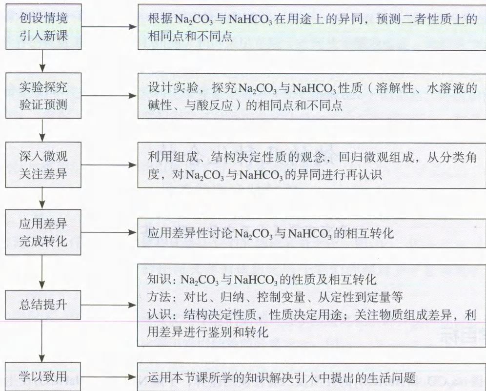

## 教学过程

教学环节一、创设情境，引入新课

<table><tr><td>教师活动</td><td>学生活动</td><td>设计意图</td></tr><tr><td>【提问】碳酸钠(俗名:纯碱、苏打)和碳酸氢钠(小苏打)在厨房中很常见,你能说说它们的用途吗?【提问】我们发现二者在用途上有一些相同点,也有一些不同点。根据性质决定用途的思想,你能预测二者性质上的相同点和不同点吗?【过渡】如何验证我们的预测?实验为证。</td><td>【回答】碳酸钠和碳酸氢钠均可用作食用碱;碳酸钠可用作洗涤剂,去油污;碳酸氢钠可用于治疗胃酸。【回答】相同点:物理性质:均可溶于水(已有经验)。化学性质:1水溶液显碱性(均可用作食用碱);2能与酸反应(均可用作食用碱)。不同点:溶解度、水溶液碱性、与酸反应等方面可能会有差异。</td><td>了解碳酸钠和碳酸氢钠在生活中的用途。从生活走进化学亲切、自然,激发学习热情。加深对“性质决定用途”的认识。</td></tr></table>

教学环节二、实验探究碳酸钠与碳酸氢钠性质的相同点和不同点

<table><tr><td>教师活动</td><td>学生活动</td><td>设计意图</td></tr><tr><td>1.溶解性【提问】如何设计实验比较二者的溶解性呢?【引导】分别将等质量的碳酸钠和碳酸氢钠溶解于等体积水中,充分振荡,观察现象。【介绍】20°C时, $Na_{2}CO_{3}$ 溶解度为21.5g, $NaHCO_{3}$ 溶解度为9.60g。</td><td>【实验】现象:碳酸钠全部溶解,试管中溶液澄清,碳酸氢钠未能全部溶解。结论:碳酸钠和碳酸氢钠均能溶于水,碳酸钠溶解性更强。</td><td>通过溶解度数据感受物质溶解度的差异,使学生进一步体会定量研究的价值。</td></tr><tr><td>2.水溶液酸碱性【提问】如何设计实验比较二者水溶液的碱性强弱呢?【提示】同学们的方法都是可行的,但所比较的溶液需控制何种变量?【追问】那如何定量比较两种溶液的碱性强弱呢?【实验】用pH计测定同为0.3mol/L的两种溶液的pH。碳酸钠溶液pH为10.5,碳酸氢钠溶液pH为8.4。</td><td>【设计实验】1加入酚酞溶液,观察颜色变化;2利用pH试纸测定溶液的pH。【思考】比较两种溶液酸碱性时,应控制两种溶液中溶质的物质的量浓度相等。【得出结论】两种物质的水溶液均呈碱性,且碱性: $Na_{2}CO_{3} > NaHCO_{3}$ 。</td><td>加深对控制变量这一科学方法的认识。</td></tr><tr><td>3.与酸反应【提问】如何设计实验比较 $Na_{2}CO_{3}$ 、 $NaHCO_{3}$ 分别和盐酸的反应?【强调】设计比较型实验的科学性。【展示】利用压强传感器,测量等体积、等浓度、过量的HCl分别与等物质的量的 $Na_{2}CO_{3}$ 、 $NaHCO_{3}$ 固体反应所产生的 $CO_{2}$ 气体的压强的曲线图。重复测量一次。【提问】为什么 $NaHCO_{3}$ 与盐酸的反应比 $Na_{2}CO_{3}$ 与盐酸的反应更剧烈?</td><td>【比较方案】1等物质的量的固体与足量酸反应;2向等浓度、等体积的盐溶液中滴入等浓度、等体积的盐酸。【观察】 $Na_{2}CO_{3}$ 与盐酸反应较慢, $NaHCO_{3}$ 与盐酸反应较快。【观察】压强图中,碳酸氢钠与酸反应时容器内压强变化曲线的斜率大。表明碳酸氢钠与盐酸反应放出气体更快。 $CO_{3}^{2-} + 2H^{+} = H_{2}O + CO_{2} \uparrow$  $HCO_{3}^{-} + H^{+} = H_{2}O + CO_{2} \uparrow$ 缓慢滴加盐酸时,碳酸钠溶液最初没有明显现象,后有气泡产生(分步反应): $CO_{3}^{2-} + H^{+} = HCO_{3}^{-}$  $HCO_{3}^{-} + H^{+} = H_{2}O + CO_{2} \uparrow$ </td><td>引导学生用控制变量的思路设计实验。通过思考如何提高实验的科学性并使现象更明显,深入感受科学探究的严密性与表征的多样性。</td></tr></table>

教学环节三、深入微观，关注差异

<table><tr><td>教师活动</td><td colspan="3">学生活动</td><td>设计意图</td></tr><tr><td rowspan="5">【过渡】 $Na_{2}CO_{3}$ 与 $NaHCO_{3}$ 的性质为什么既有相同点又有不同点?根据组成、结构决定性质的观念,对比分析 $Na_{2}CO_{3}$ 与 $NaHCO_{3}$ 的构成微粒与物质所属的类别的相同点及不同点。【小结】从微观角度认识 $Na_{2}CO_{3}$ 与 $NaHCO_{3}$ 性质上的异同。</td><td colspan="3">【分析】</td><td rowspan="5">加深对“透过现象看本质”观点的认识。利用组成、结构决定性质的观念,回归物质的微观构成,从分类角度,对碳酸钠和碳酸氢钠性质的相同点和不同点进行再认识。</td></tr><tr><td>物质</td><td>类别</td><td>构成微粒</td></tr><tr><td>碳酸钠</td><td>钠盐碳酸盐正盐</td><td> $Na^{+}$ 、 $CO_{3}^{2-}$ </td></tr><tr><td>碳酸氢钠</td><td>钠盐碳酸氢盐酸式盐</td><td> $Na$ 、 $HCO_{3}^{-}$ </td></tr><tr><td colspan="3">二者的构成微粒有相似性,所以性质上有共性。(均可以溶解,均能与盐酸反应,水溶液均呈碱性)。而碳酸氢钠是酸式盐,碳酸钠是正盐,由此导致性质上存在差异。(溶解度、水溶液碱性、与酸反应的差异)</td></tr></table>

教学环节四、应用差异，完成转化

<table><tr><td>教师活动</td><td>学生活动</td><td>设计意图</td></tr><tr><td>【过渡】利用差异性可以进行二者的鉴别,也可以完成二者的转化。【提问】如何根据二者差异使 $Na_{2}CO_{3}$ 转化为 $NaHCO_{3}$ ?【实验】 $Na_{2}CO_{3}$ 溶液与 $CO_{2}$ 的反应。(为使现象更明显,可利用矿泉水瓶完成)【提问】如何根据二者差异使 $NaHCO_{3}$ 转化为 $Na_{2}CO_{3}$ ?</td><td>【小结】1 $CO_{3}^{2-}+H^{+}=HCO_{3}^{-}$ 。2 $Na_{2}CO_{3}+H_{2}O+CO_{2}=2NaHCO_{3}$ 。【小结】1加碱。2 $2NaHCO_{3}\xlongequal{\Delta}Na_{2}CO_{3}+H_{2}O+CO_{2}\uparrow$ (碳酸钠受热不易分解,碳酸氢钠受热易分解)</td><td>利用碳酸钠与碳酸氢钠性质上的差异完成二者的相互转化。</td></tr></table>

续表

<table><tr><td>教师活动</td><td>学生活动</td><td>设计意图</td></tr><tr><td>【介绍】制作面包等食品时,常用泡打粉做膨大剂。泡打粉的主要成分是碳酸氢钠和固体酸性材料。泡打粉在接触水时会产生气体,在烘焙时会产生更多气体,使面包更为松软。【实验】 $NaHCO_3$ 固体受热分解。【资料】纯碱工业。</td><td>【倾听,思考】</td><td>结合碳酸氢钠受热易分解介绍纯碱工业,反映化学与社会、技术之间的联系。</td></tr></table>

教学环节五、总结提升，学以致用

<table><tr><td>教师活动</td><td>学生活动</td><td>设计意图</td></tr><tr><td>【提问】通过本课的学习,你在知识、方法、认识上有什么收获?</td><td>【小结】知识:碳酸钠与碳酸氢钠的性质,碳酸钠与碳酸氢钠的相互转化。方法:对比、归纳、控制变量、从定性到定量等。认识:组成、结构决定性质,性质决定用途;可以利用物质组成的差异进行物质的鉴别和转化。</td><td>总结,提升,初步形成有关 $Na_{2}CO_{3}$ 和 $NaHCO_{3}$ 的结构化知识体系。</td></tr><tr><td>【提问】通过今天的学习,你能解释以下问题吗?1厨房去油污,为什么建议使用 $Na_{2}CO_{3}$ 而不是 $NaHCO_{3}$ ?2为什么治疗胃酸过多的药物选用 $NaHCO_{3}$ ,而不是 $Na_{2}CO_{3}$ ?</td><td>【回答】1 $Na_{2}CO_{3}$ 碱性强。2 $NaHCO_{3}$ 碱性弱,对人体伤害小,且 $NaHCO_{3}$ 与盐酸反应快,见效迅速。</td><td>呼应引入环节,引导学生学以致用。体现了从生活到化学,再从化学回归生活的思想。</td></tr></table>

# 物质的量

# ——配制一定物质的量浓度的溶液

北京中学 李丹

北京市朝阳区教育考试中心 兰俊耀

## 教学目标

1. 结合物质的量浓度公式，通过探究配制一定物质的量浓度溶液的方案，认识精确配制溶液浓度的操作步骤的依据，发展“科学探究与创新意识”的学科核心素养。

2. 通过对容量瓶的创造性设计和不断修改完善，感受科学实验设计的巧妙与艰辛，发展创新意识。

3. 通过与同伴合作完成配制 $100 \mathrm{~mL} 1.00 \mathrm{~mol} / \mathrm{L} \mathrm{NaCl}$ 溶液的实验操作, 记录实验过程中出现的问题, 分析其对实验结果产生的影响, 并分享交流, 发展问题意识和科学探究能力。

## 教学重点

容量瓶的特点，配制一定物质的量浓度溶液的步骤。

## 教学难点

基于影响物质的量浓度精准度的因素，分析操作步骤和对实验仪器的要求。

## 教学流程

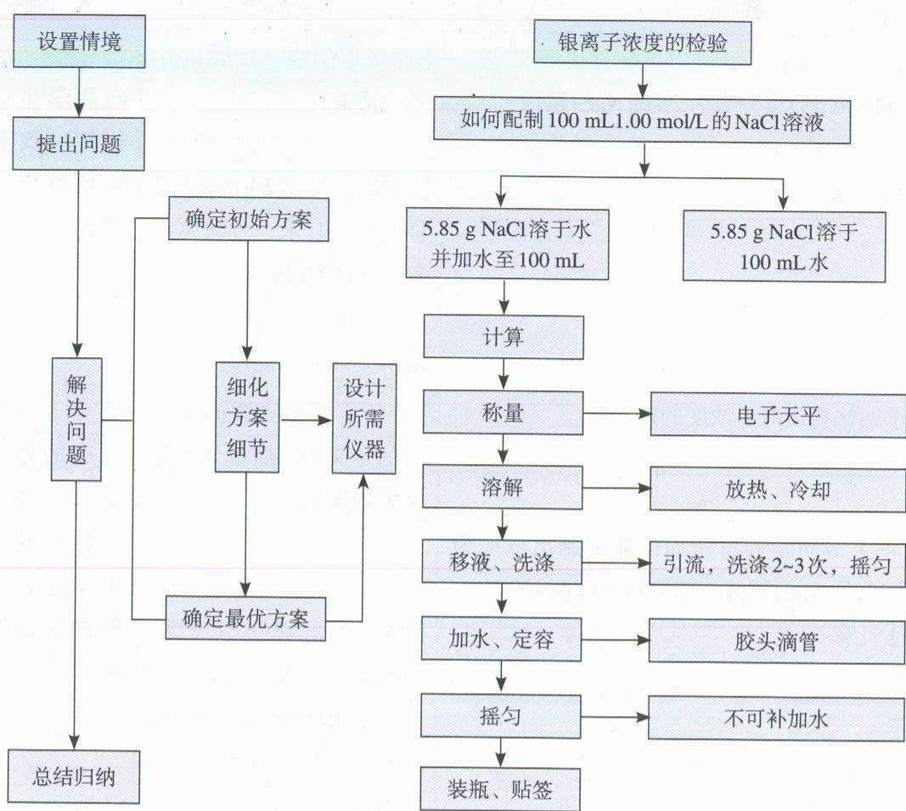


## 教学过程

教学环节一、提出问题

<table><tr><td>教师活动</td><td>学生活动</td><td>设计意图</td></tr><tr><td>【展示】图片:银离子的杀菌消毒作用;表格:国家重金属离子排放标准。【提问】如何监测这些物质中 $Ag^{+}$ 含量是否达标?【明确总任务】配制100mL 1.00mol/L的NaCl溶液。【板书】配制一定物质的量浓度的溶液【提问】1.00mol/L与1mol/L有何区别?【板书】准:(参见后面的板书设计)</td><td>【倾听】思考,应用 $Ag^{+}+Cl^{-}=AgCl \downarrow$ 制定解决方案。</td><td>认识物质的量浓度在生活和生产中的价值和应用。感受实验要求的精准。</td></tr></table>

教学环节二、初步探索配制溶液的过程和方法

<table><tr><td>教师活动</td><td>学生活动</td><td>设计意图</td></tr><tr><td>【提问】如何配制100g质量分数为2%的NaCl溶液?</td><td>【回忆】配制一定质量分数的溶液。【计算】需要2g NaCl固体与98mL水,步骤为:称量(NaCl),量取(水),溶解(玻璃棒搅拌)。</td><td>唤醒学生已有认知,找到学生思维生长的起点。</td></tr><tr><td>【分析】回忆物质的量浓度的定义式。【板书] $c=\frac{n}{V}$ 【任务一】请同学们思考如何能配制出浓度为1.00mol/L的NaCl溶液,简要描述配制过程。【板书】计算称量溶解加水装瓶、贴签【讨论】液体混合后,总体积会发生变化吗?溶解固体溶质后,溶液体积会发生变化吗?【提问】根据原理,如何能保证物质的量浓度的准确?</td><td>【分析】对比物质的量浓度的定义式与质量分数定义式的区别。【思考】展现初始思维,创设认知冲突:1称量溶质,加100mL水,溶解;2称量溶质,溶解后加水至100mL。【分析】解决认知冲突。【回答】明确要确保n和V的准确。</td><td>从学生初始、无序的思维入手,通过对细节的讨论,帮助学生建构配制溶液的基本模型。</td></tr><tr><td>【提问】如何计算需要称量的溶质NaCl的质量?【板书】计算【分析】根据 $c=\frac{n}{V}$ 定义式计算得溶质质量为5.85g。【提问】要称量准确的5.85g固体,应选择什么仪器?写出操作步骤。</td><td>【计算】应用 $c=\frac{n}{V}$ 和 $n=\frac{m}{M}$ 计算。【回忆】托盘天平的使用规则。</td><td>巩固对物质的量浓度定义式的理解和认识。</td></tr></table>

续表

<table><tr><td colspan="4">教师活动</td><td>学生活动</td><td>设计意图</td></tr><tr><td colspan="4">【板书】称量【演示实验】分别用托盘天平和电子天平称量同一个小纸片的质量,比较不同天平的区别。</td><td rowspan="3">【思考】明确可以使用更加精确的天平确保溶质的物质的量准确。【思考】完善称量步骤。</td><td rowspan="3">通过实验现象的区别,直观感受实验仪器的精确度差异。</td></tr><tr><td></td><td>托盘天平</td><td>普通电子天平</td><td>电子分析天平</td></tr><tr><td>精确度</td><td>0.1g</td><td>0.01g、0.001g</td><td>0.0001g</td></tr></table>

教学环节三、尝试设计实验仪器

<table><tr><td>教师活动</td><td>学生活动</td><td>设计意图</td></tr><tr><td>【提问】如何确保溶液体积(V)的准确呢?【展示】100mL的饮料瓶,用这个饮料瓶配制100mL溶液,体积准确吗?【任务二】请画出你需要的能配制100mL溶液的准确体积的容器。如需对容器进行修改,可直接改在已绘制好的图上。</td><td>【回忆】量筒、烧杯的精确度和使用规则。【质疑】烧杯不准确,量筒不可以溶解固体。【小组讨论】画出自己设计的容器简图。</td><td>引导学生根据实验需求设计并画出实验容器,发展创新精神。</td></tr></table>

教学环节四、继续探索配制溶液的过程和方法

<table><tr><td>教师活动</td><td>学生活动</td><td>设计意图</td></tr><tr><td>【提问】假设要使用你设计的容器将固体溶解并配制成100mL溶液,请写出操作步骤。</td><td>【思考】将配制一定质量分数溶液的方法与物质的量浓度的意义相结合,写出简单的操作步骤:固体加水溶解后再加水至100mL。</td><td>在学生自主生成的过程中,根据学生暴露出的认知困难提供必要的实验证据支撑,鼓励学生独立思考、提出问题,并在小组讨论中解决问题。</td></tr><tr><td>【引导】从实验精准的原则出发,分析操作细节:溶解放热(感受溶解NaOH的烧杯温度变化);移液后的溶质残留(展示转移溶液后滴入品红溶液的烧杯)。【板书】(补充)溶解移液、洗涤</td><td>【分析】根据实验证据,按照以下思维过程解决认知困境:溶解放热对容器和溶液体积有影响→将溶解与加水分开→溶液需要转移→转移不能洒出来→需要玻璃棒引流→转移有残留→需要洗涤→如何确保n准确→洗涤2~3次并将洗涤液也转入容器。</td><td></td></tr><tr><td>【提问】怎样操作才能准确加水到100mL呢?写出操作步骤。【板书】(补充)加水、定容</td><td>【思考】从量筒的使用迁移到定容操作,认识到为确保定容精准,需使用胶头滴管。</td><td rowspan="2">通过解决真实问题,让学生体验科学严谨的实验设计过程。</td></tr><tr><td>【提问】如何操作才能使溶液尽快混合均匀?写出操作步骤。【任务】在接近充满水的瓶中加入蜂蜜,请尝试使蜂蜜迅速溶解。【板书】(补充)摇匀</td><td>【操作】尝试上下颠倒摇匀操作,以使蜂蜜迅速溶解。【思考】从原理上认识到此时摇匀操作导致的液面下降对溶液浓度没有影响。</td></tr></table>

教学环节五、修改与完善自己设计的实验仪器

<table><tr><td>教师活动</td><td>学生活动</td><td>设计意图</td></tr><tr><td>【任务三】修改、完善你设计的100mL的容器。【展示】实验室各种规格的容量瓶。【小结】根据不同的需求,容量瓶有不同的规格、材质、形状以及一些功能性部件,同学们设计的容量瓶也各有所长。</td><td>【修改】由摇匀操作迁移到容器设计:容器需加瓶塞。【展示设计】说明设计原因:标示准确容积(有准确刻度);标示使用温度;形状:细颈大肚;有瓶塞(检漏)。</td><td>引导学生进一步改进自己的设计,体验从实验需求出发创造性地设计实验仪器的过程。通过讨论,真正认识到容量瓶的特点和设计意图。</td></tr><tr><td>【实验】配制100mL 1.00mol/L的NaCl溶液。</td><td>【操作】验证设计方案。</td><td>让学生感受科学实验的准确性和严谨性。</td></tr></table>

教学设计六、配制溶液，总结拓展

<table><tr><td>教师活动</td><td>学生活动</td><td>设计意图</td></tr><tr><td>【总结】对于配制一定物质的量浓度溶液这个定量实验,我们从“确保溶液浓度准确”这个实验目的出发,对物质的量浓度定义式中n和V的准确性进行了深入的讨论;结合某些溶质如NaOH溶解放热等性质,确定了实验方案,或选择或创造了实验仪器,例如为确保n的准确我们选择了电子天平,讨论了洗涤、引流操作;为确保V的准确我们创造了容量瓶,讨论了溶解后需要冷却操作等。这种从实验目的出发,通过不断分析实验原理,设计、完善实验方案的思维方法,也会在后续的学习中给我们提供解决问题的思路。【展示】物质性质:NaCl性质实验原理: $c=\frac{n}{V}$ 实验目的实验方案实验仪器冷却洗涤引流振荡电子天平容量瓶</td><td>【倾听】感受科学实验的严谨性,体验实验仪器设计的成就感。</td><td>归纳、提炼本节课解决真实问题的思路和方法,帮助学生回顾实验方案的设计过程,建构配制溶液的思维模型。</td></tr><tr><td>【课后作业】请设计用14 mol/L浓硫酸配制100 mL 0.14 mol/L稀硫酸的实验方案。</td><td>完成课后作业。</td><td>巩固本课建构的配制溶液的思路和方法。</td></tr></table>

## 板书设计

## 配制一定物质的量浓度的溶液

目的 $\rightarrow$ 原理 $\rightarrow$ 操作与方法 $\rightarrow$ 仪器

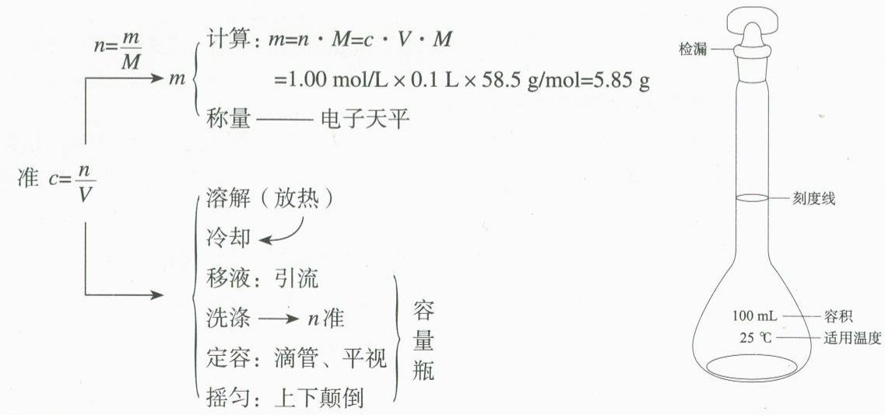

## 第三章

## 铁 金属材料

## 本章说明

第二章介绍了典型金属元素钠及其化合物和典型非金属元素氯及其化合物，本章将继续学习元素化合物知识——铁及其化合物。钠和氯都是典型的主族元素，而铁是副族元素。这些典型的元素化合物知识，既可以为已经学过的理论知识补充感性认识材料，使学生有机会运用已学的理论知识指导元素化合物的学习，从而对理论知识有进一步的理解和应用；又可以为第四章将要介绍的物质结构、元素周期律，以及后续的化学反应与能量等理论知识打下重要的基础。本章内容不仅可以帮助学生进一步掌握一些学习化学的基本方法，还能使学生认识化学在促进社会发展、改善人类的生活条件等方面所起到的重要作用。

## 一、教材分析

本章主要介绍了铁及其化合物、金属材料、物质的量在化学方程式计算中的应用等内容。本章将上述内容分为两节，第一节介绍铁及其化合物，第二节介绍金属材料及物质的量在化学方程式计算中的应用。教材主要围绕“铁和铁合金”这条线索进行编排。

铁是课程标准要求学习的典型金属元素之一。因此，对于这一重要的金属及其化合物知识，教材单独安排了一节内容，即第一节“铁及其化合物”。教材引导学生在复习、拓展已学知识的基础上，从氧化还原反应和离子反应的视角，提升对铁及其化合物知识的认识，强化铁元素不同价态间的转化关系，发展“宏观辨识与微观探析”的学科核心素养。教材还关注学生的探究活动和实践活动，运用来自生产或生活的素材创设真实情境，发展学生解决真实问题的能力。

铁合金是重要的金属材料。鉴于金属材料在国民经济中的重要地位和日常生活中的广泛应用，教材安排了第二节“金属材料”的内容，反映化学与生产、生活实际的联系，让学生了解金属材料的重要作用和面临的挑战，激发学生的爱国热情和社会责任感。值得一提的是，课程标准“主题2：常见的无机物及其应用”中，没有把铝作为典型的金属元素，但在“主题3：物质结构基础与化学反应规律”的“原子结构与元素周期律”中提及了铝元素。因此，教材没有设立单独的一节来介绍铝及其化合物，而是基于铝和铝合金也是常用的金属材料，把该部分内容和铁合金一起编排在本章的第二节“金属材料”里。在介绍铝和铝合金时，教材没有系统介绍铝及其化合物的性质，只是从金属材料的腐蚀与保护的视角，介绍了铝与酸、碱的反应，氧化铝与酸、碱的反应，以及两性氧化物的概念等。第二节的最后一部分内容是介绍物质的量在化学方程式计算中的应用，把这部分内容编排在这里，而没有安排在第二章的第三节，其主要目的是分散教学的难点。

本章的内容结构如下图所示。

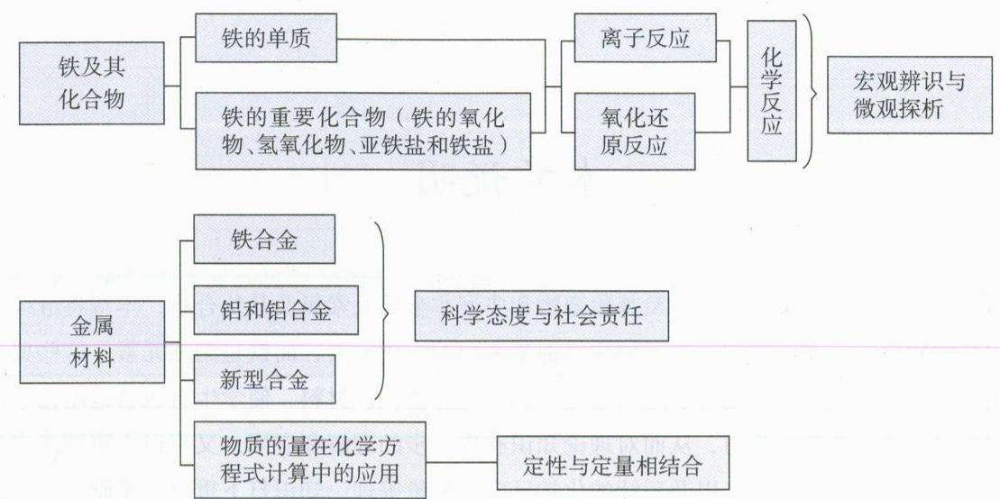


## 二、学业要求

1. 能依据物质类别和元素价态列举铁元素的典型代表物。能利用离子反应、氧化还原反应等概念对铁及其化合物的相关反应进行分类和分析说明。

2. 能列举、描述、辨识铁及其化合物重要的物理、化学性质及实验现象。能用化学方程式、离子方程式正确表示铁及其化合物的主要化学性质。

3. 能从物质类别、元素价态的角度，依据复分解反应和氧化还原反应原理，预测铁及其化合物的化学性质和变化，设计实验进行初步验证，并能分析、解释有关实验现象。

4. 能利用铁及其化合物的性质和反应，设计常见含铁物质制备、分离、提纯、检验等简单任务的方案。能从物质类别和元素价态变化的视角说明物质的转化路径。

5. 能说明常见金属材料对社会发展的价值及对环境的影响。能有意识地运用所学的知识或寻求相关证据参与有关金属材料的社会性议题的讨论。


## 三、课时建议

第一节 铁及其化合物 3课时  
第二节 金属材料 2课时  
全章复习 1课时  
实验活动 1课时

# 第一节 铁及其化合物


## 一、内容分析

本节内容主要包括两部分：①铁单质；②铁的重要化合物，主要是铁的氧化物、氢氧化物、铁盐和亚铁盐。教材按照“铁单质→铁的氧化物→铁的氢氧化物→铁盐和亚铁盐”的顺序编排。

学生在初中阶段学习过铁单质的一些性质，如物理性质，与氧气、氯气、盐酸、硫酸铜溶液等反应；在铁的化合物中，学生知道了一些铁的氧化物和氢氧化物的性质。本节运用氧化还原反应原理，重点介绍了氢氧化亚铁被氧化成氢氧化铁，以及铁离子和亚铁离子间的相互转化。在介绍铁的单质时，教材在“思考与讨论”里要求学生复习初中已学习过的铁单质的性质，并从氧化还原反应的角度分析反应的特点，提升学生对铁单质性质的认识。介绍铁与水蒸气反应时，教材联系生产创设真实情境，呈现了钢铁生产中钢水注入模具的真实图片，以此情境为素材，提出问题“炽热的铁水或钢水注入模具之前，模具必须进行充分的干燥处理，不得留有水。这是为什么呢？”，教材再呈现铁粉与水蒸气反应的实验照片，引导学生深入思考与讨论，明确反应原理，从而回答了问题。

教材在介绍铁的化合物时，分为铁的氧化物、铁的氢氧化物、铁盐和亚铁盐三部分内容。

（1）铁的氧化物。学生在初中已学习过铁的氧化物的性质，教材用离子方程式的方式来表达它们的化学性质。

(2) 铁的氢氧化物。教材通过实验的方式引导学生制取氢氧化亚铁和氢氧化铁, 并观察到白色的氢氧化亚铁变成红褐色的氢氧化铁的实验现象。由于白色的氢氧化亚铁易被溶解在溶液中的氧气氧化成红褐色的氢氧化铁, 那么怎样才能制取氢氧化亚铁呢? 教材通过 “思考与讨论” 的方式引导学生积极思考并讨论制取氢氧化亚铁的方法。

(3) 铁盐和亚铁盐。教材先通过实验介绍铁离子的检验, 在此基础上, 再通过实验讨论了铁离子被还原成亚铁离子及亚铁离子被氧化成铁离子, 并运用氧化还原反应原理, 总结出铁离子和亚铁离子的相互转化关系。最后, 通过 “思考与交流” 栏目把铁及其化合物的相互转化关系进一步系统化和网络化。

介绍了铁及其化合物的基本知识后，为了充分体现这部分内容对发展学生学科核心素养的意义，教材一方面在“方法导引”中总结了认识元素及其化合物性质的视角，另一方面依托多种真实情境设计了多个栏目。例如，以电子工业中制作印刷电路板的真实情境为背景，结合“探究”栏目，通过实现 $Fe^{3+}$ 和 $Fe^{2+}$ 的相互转化，引导学生利用氧化还原反应原理解决实际问题；再如，联系生活创设真实情境，设置“研究与实践”栏目，选择常见食品作为研究对象，如食用菠菜、芹菜、黑木耳、蛋黄和动物内脏等，通过研究检验这些食品中是否含有铁元素。


## 二、教学目标

## 1. 教学目标

（1）了解铁元素在自然界中的存在形态、与人体健康的关系，体会化学对人类生活的重要意义；从我国古代应用铁的化学史感受中华民族在科技发展进程中的贡献，增强文化自信。

(2) 能用氧化还原反应原理进一步认识铁的化学性质, 基于实验事实写出铁与水蒸气反应的化学方程式, 并用于解释生产中简单的化学问题, 培养安全意识。

（3）通过实验探究铁的氢氧化物、铁盐和亚铁盐的化学性质，并能用化学方程式或离子方程式正确表示。体会实验对认识和研究物质性质的重要作用，形成证据意识。

（4）通过学习铁及其化合物，学会从物质类别和元素价态的视角认识具有变价元素物质间的转化关系，并建立认识模型，丰富研究物质的思路和方法。

(5) 结合应用实例, 将铁及其化合物性质的知识运用于解决生产、生活中简单的化学问题, 强化性质决定用途的观念。

## 2. 教学重点和难点

重点: 铁盐与亚铁盐的转化、 $\mathrm{Fe}^{3+}$ 的检验。

难点：制备 $\mathrm{Fe(OH)_2}$ 的实验设计；Fe、 $\mathrm{Fe}^{2+}$ 、 $\mathrm{Fe}^{3+}$ 转化关系模型的建构。


## 三、教学建议

## 1. 在真实、生动、有意义的情境中学习铁及其化合物的具体性质

铁及其化合物广泛存在并应用于生产和生活实际，从中发现有助于学生学习、贴近教学实际的素材，从而创设出真实、生动、有意义的教学情境，不仅可以激发学生的学习兴趣，引导学生积极主动地学习；还可以使学生学会在真实情境中运用知识解决简单的化学问题，促进学科核心素养的形成。本节教学情境的创设，可遵循以下几种思路。第一种思路是从生产、生活中遴选相关素材，创设真实的学习情境。与本节内容相关的素材有：添加铁粉的燕麦片，打印机（或复印机）使用的墨粉中铁的氧化物（利用磁性性质），补铁剂（如含有硫酸亚铁等亚铁盐）的使用，菠菜或黑木耳中铁元素的检验，红色土壤中铁元素的检验，印刷电路板的制作等。如在学习 $Fe^{3+}$ 的检验时，可创设如下情境：长江以南的低山丘陵区普遍存在着红色土壤，有人说主要是由于其中含铁质（三价铁）相对较多，如何判断这种说法是否正确？在这样的真实情境中，学生通过思考并设计简单实验，习得利用KSCN溶液检验 $Fe^{3+}$ 的知识，同时培养证据意识，能基于证据对物质的组成进行分析。也可结合教材“研究与实践”栏目，利用检验菠菜中的铁元素创设学习情境。第二种思路是结合学生已有知识和经验，创设有意义的学习情境。如在进行铁单质性质的教学时，可通过教材中的“思考与讨论”创设教学情境，在让学生回忆初中和前两章学过的铁与盐酸、铁与硫酸铜、铁与氯气等反应的基础上展开教学。这样做不仅可以唤醒学生的已有认知，还可以让学生在回忆有关反应的宏观现象、化学方程式的前提下，进一步用离子方程式进行表征，培养宏观辨识与微观探析的素养。第三种思路是结合教学内容呈现相关图片或视频资料，创设生动的学习情境，如通过呈现我国古代的铁制品图片，铁元素在自然界中的存在形态，铁与人体健康的关系等资料，激发学生学习兴趣，展现化学学科的价值。第四种思路是通过实验创设学习情境，如学习铁的氢氧化物性质时，可利用演示或学生实验让学生对 $\mathrm{Fe(OH)}_{3}$ 和 $\mathrm{Fe(OH)}_{2}$ 进行辨识，并产生对 $\mathrm{Fe(OH)}_{2}$ 颜色变化原因的探究欲。

## 2. 从物质类别和元素价态的视角自主构建铁元素知识结构和认知模型

铁元素是典型的具有变价的金属元素，涉及物质种类多、知识零散。学生在学习过程中常常会有知识不系统，物质性质繁多、零乱的感受。教学中可以先引导学生回忆已有关于铁及其化合物的知识，在此基础上依次列举出铁、氧化铁、氧化亚铁、四氧化三铁、氢氧化铁、氯化铁、硫酸亚铁等具体物质；再从物质类别和元素价态两个维度形成结构化的物质框架。借助前面学习氯、钠两种元素及其化合物的方法和思路，以及物质分类、离子反应、氧化还原反应原理等，引导学生对典型含铁物质的性质进行预测，并结合实验证据形成完整的元素化合物性质知识，同时要让学生能用相关化学方程式或离子方程式进行表征。如学习硫酸亚铁的性质时，学生既可从其物质类别即属于盐的角度，利用已有关于盐的通性认知经验，预测其能与碱、与盐溶液反应等性质，并通过实验加以证实；又可从铁元素价态的角度，结合氧化还原反应原理，预测其可能具有氧化性和还原性，再在给定试剂的前提下（半开放性条件）开展实验探究活动。

从物质类别和元素价态的视角认识、研究铁元素及其化合物知识的思路，不仅有助于学生更加系统、深入地理解铁元素的有关知识，其更大的价值还在于可以帮助学生丰富研究元素化合物的方法，深化对物质及其变化多样性的认识，促进“元素观”的发展。

## 3. 围绕铁元素及其化合物性质进行实验探究和理论探讨，借助问题解决达成教学目标

教学中应充分利用 “思考与讨论” “实验” “探究” 等栏目，设计围绕主题的有效问题，在问题解决中达成教学目标。

(1) 通过 “思考与讨论” 等栏目, 发挥理论知识对铁元素及其化合物学习的指导作用。

在实施 “思考与讨论” 栏目的教学时，要关注问题和学生活动的设计，侧重于问题解决过程中的理论分析和探讨。教学中应注意在给定的具体情境中，通过精心设计不同类型、不同层次的有效问题，促进学生认识的发展。如铁与水蒸气反应的 “思考与讨论” 栏目教学设计如下。

情境：结合教材图3-4及正文“在钢铁厂的生产中，炽热的铁水或钢水注入模具之前，模具必须进行充分的干燥处理，不得留有水”创设问题情境。

问题1：从理论上看，铁是否具备与水反应的可能性？说明理由。

评价1：要求学生迁移并运用金属活动性顺序，从金属置换酸（或水）中氢的角度分析铁置换水中氢的可能性，建立新旧知识间的联系。

问题2：铁若能与水蒸气反应，产物可能是什么？理由是什么？

评价2：要求学生运用已有的钠与水反应的知识对铁与水反应的产物进行预测，初步建构活泼金属与水反应的模型。

问题3：教材图3-5所示装置各部分的作用是什么？如何进一步设计实验，证实产物为四氧化三铁？

评价3：能根据教材“思考与讨论”提供的实验装置，结合实验现象寻找产物证据，进一步用符号正确表征铁与水蒸气的反应。

通过上述问题和评价引导学生在回忆已有金属活动性顺序、钠与水反应的事实、氧化还原反应原理等基础上，结合实验事实，形成对铁与水蒸气反应的认知，完善金属与水反应的模型，并从中体验通过理论分析预测反应产物，再利用实验事实证实，最终形成结论的探究过程。在此基础上回归到情境，使学生理解钢铁厂注模时不能有水的真正原因，落实“培养安全意识”的教学目标。

## （2）利用“实验”“探究”等栏目，发挥实验探究对铁元素及其化合物学习的实证功能。

教材安排了铁的氢氧化物制备、 $\mathrm{Fe}^{3+}$ 的检验、 $\mathrm{Fe}^{2+}$ 和 $\mathrm{Fe}^{3+}$ 的转化等 3 个实验活动，和“利用覆铜板制作图案”的 1 个探究活动。实验活动虽然较多，但操作大多并不复杂，必要时可将几个实验进行整合。教学中，教师应尽可能安排学生实验活动，在提供学生动手机会的同时，引导他们针对实验过程中的现象自主提出问题，做到边思考边实验。如可将铁的氢氧化物的制备和 $\mathrm{Fe}^{3+}$ 的检验实验进行整合，要求学生完成实验：先向 2 支盛有 $\mathrm{FeSO}_4$ 溶液的试管中分别滴加几滴 NaOH 溶液和几滴 KSCN 溶液，观察并记录现象；再向 2 支盛有 $\mathrm{FeCl}_3$ 溶液的试管中分别滴加几滴 NaOH 溶液和几滴 KSCN 溶液，观察并记录现象。针对实验过程中的现象，学生有更多提出问题的机会。这种活动安排方式在引导学生寻求问题解决的过程中实现教学目标：掌握二价铁的还原性，体会实验对认识和研究物质性质的重要作用，形成证据推理意识。

## 4. 基于学科核心素养培养的教学设计的具体建议

教学中应注意充分挖掘铁及其化合物这一知识载体中所蕴含的发展化学学科核心素养的价值，如Fe、 $\mathrm{Fe}^{2+}$ 、 $\mathrm{Fe}^{3+}$ 的化学性质及 $\mathrm{Fe}^{3+}$ 的检验具有培养宏观辨识与微观探析素养的价值；Fe、 $\mathrm{Fe}^{2+}$ 、 $\mathrm{Fe}^{3+}$ 之间的转化关系具有培养证据推理与模型认知素养的价值等。同时也应兼顾学生的需求和能力水平，合理选择教学素材和教学策略，提高教学设计的针对性和有效性。以下是基于学科核心素养培养的教学设计的具体建议。

## (1) 基于知识结构化的教学设计

知识结构化是实现学科知识向学科核心素养转化的关键。知识关联的结构化、认识思路的结构化和核心观念的结构化等方式，有助于提升学生化学知识的结构化水平，促进学生学科核心素养的形成。本节教学可以教材内容编排顺序为主要线索，注意发挥相关栏目的作用，从知识的结构化角度设计如下教学。

①引导学生通过阅读教材中有关铁的存在和发现史等内容，体会化学对人类生活的重要意义，感受中华民族在科技发展史中的贡献，增强文化自信。

②在学生回忆关于铁单质性质已有知识的基础上，利用氧化还原反应的认知模型重建铁单质性质的知识结构。发挥铁与水蒸气反应的“思考与讨论”栏目对培养学生证据推理与模型认知素养

的价值。

③通过阅读教材和实验探究活动，从化合价、物理性质、化学性质等方面比较铁的氧化物和氢氧化物，归纳整理，引导学生为更加全面认识铁的化合物积累经验。

④启发学生以氧化还原反应理论为指导，通过对亚铁盐和铁盐性质的猜想、设计探究实验等进一步认识铁盐与亚铁盐的转化关系，并建构“铁三角”的知识模型。

⑤最后的归纳总结阶段，利用“方法导引”栏目引导学生从物质类别和元素价态的视角自主构建铁元素及其化合物的知识体系，实现知识的结构化。

## (2) 基于问题解决的教学设计①

环节1：以某品牌燕麦片中添加还原铁粉引起的公众恐慌事件创设情境，提出“燕麦片中是否真的含有铁粉”的问题，要求学生利用有关铁单质的物理性质解决问题，以诊断和发展学生“运用所学知识解决生活中简单的化学问题”和“设计简单的实验方案，对现象作出解释”等能力。

环节2：提出“为什么要加入铁粉”“铁粉进入人体后会与胃液中的盐酸发生什么反应”“铁在空气中最终会变成什么”等问题，要求学生运用已有知识进行回答，并能初步了解铁单质分别转化为 $Fe^{2+}$ 和 $Fe^{3+}$ 的条件。通过要求学生书写相关化学方程式渗透对宏观辨识与微观探析素养的培养。

环节3：提出“如何更好地促进铁元素在人体中的吸收”“如何防止亚铁盐的氧化”等问题，在实验探究的基础上，强化“变化观”的形成。

环节4：创设补铁剂质量检测员的角色情境，提出“补铁剂中是否含有铁”“如何判断某补铁剂（亚铁盐）是否变质”等问题，引导学生通过讨论和实验等活动解决问题，提升“科学态度与社会责任”这一核心素养。

教学中还可围绕 “补铁剂与维生素C搭配为什么更有效” “茶水变色的原因” 等素材进行教学设计。


## 四、栏目使用建议

## 1. 实验

## 【实验3- 1】

向分别盛有 $\text{FeCl}_3$ 溶液和 $\text{FeSO}_4$ 溶液的两支试管中滴入 $\text{NaOH}$ 溶液，可以观察到 $\text{FeSO}_4$ 溶液中产生的沉淀颜色迅速由白色变为灰绿色，最终变为红褐色。分析原因，结合“思考与讨论”栏目，改进实验：将吸有 $\text{NaOH}$ 溶液的长滴管伸入到 $\text{FeSO}_4$ 溶液的液面下，挤出 $\text{NaOH}$ 溶液，观察现象；或向盛有 $\text{FeSO}_4$ 溶液的试管里加入少量煤油，以隔绝空气，再将吸有 $\text{NaOH}$ 溶液的长滴管伸入到 $\text{FeSO}_4$ 溶液的液面下，挤出 $\text{NaOH}$ 溶液，观察现象。

实验现象: 向 $\mathrm{FeCl}_{3}$ 溶液中滴入 $\mathrm{NaOH}$ 溶液生成红褐色沉淀; 在 $\mathrm{FeSO}_{4}$ 溶液中滴入 $\mathrm{NaOH}$ 溶液, 先生成白色絮状沉淀, 而后沉淀迅速变成灰绿色, 最终变成红褐色。

该实验的作用在于: ①帮助学生通过比较, 基于宏观现象对 $\mathrm{Fe(OH)}_{3}$ 和 $\mathrm{Fe(OH)}_{2}$ 进行辨识, 形成对铁的两种氢氧化物物理性质的认知; ②引导学生基于 $\mathrm{Fe(OH)}_{2}$ 沉淀颜色变化的实验事实, 结合已有的氧化还原反应知识提出假设, 既为 $\mathrm{Fe}^{2+}$ 的还原性提供实验证据, 也为后面 “如何得到 $\mathrm{Fe(OH)}_{2}$ ” 的 “思考与讨论” 埋下伏笔。

## 【实验3-2】

完成该实验时，必须注意 $FeCl_{2}$ 溶液要用新配制的，并加铁粉还原。本实验主要介绍利用 $Fe^{3+}$ 的特殊性质（与 $SCN^{-}$ 络合生成配合物）检验 $Fe^{3+}$ 的方法。

实验现象: 向 $\mathrm{FeCl}_{3}$ 溶液中滴入KSCN溶液, 溶液呈红色; 向 $\mathrm{FeCl}_{2}$ 溶液中滴入KSCN溶液, 溶液颜色无变化。

本实验也可与后面的“研究与实践”栏目的“检验食品中的铁元素”合并进行，让学生在真实的情境中开展实验活动，习得 $\mathrm{Fe}^{3+}$ 的检验方法。

## 【实验3- 3】

在盛有 $2 \mathrm{~mL} \mathrm{FeCl}_{3}$ 溶液的试管中加入少量铁粉, 振荡试管并静置后, 黄色溶液变为浅绿色, 说明 $\mathrm{Fe}^{3+}$ 具有氧化性; 滴入 KSCN 溶液后无明显变化, 进一步说明溶液中不存在 $\mathrm{Fe}^{3+}$ (已被完全还原为 $\mathrm{Fe}^{2+}$ )。在上层清液中再滴入几滴氯水时, 溶液又迅速变为红色, 说明又生成了 $\mathrm{Fe}^{3+}$ , 证实了 $\mathrm{Fe}^{2+}$ 具有还原性。

本实验意在通过 $Fe^{2+}$ 和 $Fe^{3+}$ 的相互转化，证实从元素价态的角度对二者性质的预测，同时可与前面的铁单质性质联系在一起，为构建“铁三角”的知识结构模型提供支持。

做 $Fe^{3+}$ 的氧化性实验时，试管中可能会因为加入铁粉过量而产生沉淀，所以，可从加铁粉和KSCN溶液后的试管中取上层清液做加氯水的实验。还可对 $Fe^{3+}$ 的氧化性实验略作展开，介绍 $Fe^{3+}$ 与其他还原剂如Cu、 $SO_{2}$ 的反应等。做 $Fe^{2+}$ 的还原性实验时，应注意控制滴入氯水的量，不宜过量。否则，会因过量氯水进一步氧化 $SCN^{-}$ 而使溶液红色又褪去，对学生学习产生干扰。也可对 $Fe^{2+}$ 的还原性实验略作展开，介绍 $Fe^{2+}$ 与学生熟悉的氧化剂如双氧水、酸性 $KMnO_{4}$ 溶液的反应等。

## 2. 思考与讨论

## 【思考与讨论1】

设置本栏目的目的在于通过唤醒学生对已知的涉及铁单质化学性质的几个反应的记忆（必要时可要求学生写出相关反应的化学方程式）引导学生运用分类、比较和归纳的方法，重构铁单质的化学性质。除了整理铁分别与非金属单质、酸、盐溶液的反应，学生还要能运用第一章学习过的氧化还原反应知识，形成“铁单质与强弱不同的氧化剂反应的产物不同”的认识，同时认识化学反应的复杂性，为后续学习打下基础。

## 【思考与讨论2】

本实验中，加热湿棉花的目的是提供水蒸气，使之与还原铁粉在高温下发生反应；装置末端将产生的气体导入肥皂液中是为了产生气泡，便于通过点燃验证产物中的气体。教学中应首先对实验原理进行讨论, 可从以下方面引导学生。一是通过对铁单质还原性的分析, 利用氧化还原反应知识推理出水被还原的产物 $\mathrm{H}_{2}$ 和可能的氧化产物; 二是通过前面学习的金属钠与水反应的原理分析可能的产物—— $\mathrm{H}_{2}$ 和氢氧化物; 三是通过回忆金属活动性顺序, 分析铁置换出水中氢的可能性等。其次, 通过演示实验或实验视频调动学生积极性, 让学生在观察实验现象的基础上辨识、证实或分析反应的产物, 如证实产生的可燃性气体产物是氢气, 根据反应后试管中仍存在黑色固体排除氧化铁和氢氧化铁的可能性, 从而提出更合理的假设。围绕黑色固体的成分还可继续设计实验加以探究, 如试管冷却后, 可用磁铁在试管外侧吸一吸。最后, 形成对铁与水蒸气反应的认识并能用化学方程式进行正确表征。

教材介绍的是用一支试管完成铁粉与水蒸气反应的实验，试管底部塞有一团湿棉花，在湿棉花右侧放有还原铁粉，蒸发皿中放肥皂水（或在水中加几滴洗涤剂）。整套装置试管口应低于试管底部。铁粉与湿棉花的距离可近一些，实验时先加热湿棉花，再加热铁粉。待反应后蒸发皿中产生足够多的气泡，再用燃着的火柴去点燃，可听到爆鸣声。

## 【思考与讨论3】

通过前面实验3-1呈现的实验事实, 学生已知 $\mathrm{Fe}^{2+}$ 具有还原性, 易被空气中的氧气氧化, 因此, 实验室中得到 $\mathrm{Fe(OH)}_{2}$ 的关键是防止氧气的干扰, 可采取三种措施。一是在新制的 $\mathrm{FeSO}_{4}$ 溶液中加入少量铁粉; 二是通过将 $\mathrm{NaOH}$ 溶液煮沸的方法减少溶解在溶液中的氧气含量; 三是通过将胶头滴管伸入到液面以下的方法, 减少带入空气中的氧气。针对第三种措施, 提供两种具体操作方法。方法①: 将吸有 $3 \mathrm{~mL} 8 \mathrm{~mol} / \mathrm{L}$ 的 $\mathrm{NaOH}$ 溶液 (煮沸过) 的长胶头滴管伸入到新制的 $0.5 \mathrm{~mol} / \mathrm{L} \mathrm{FeSO}_{4}$ 溶液的液面以下, 挤出 $\mathrm{NaOH}$ 溶液。方法②: 在试管中加入 $5 \mathrm{~mL} 8 \mathrm{~mol} / \mathrm{L}$ 煮沸后的 $\mathrm{NaOH}$ 溶液, 用长滴管吸入新制的 $0.1 \mathrm{~mol} / \mathrm{L} \mathrm{FeSO}_{4}$ 溶液, 伸入到 $\mathrm{NaOH}$ 溶液液面以下, 挤出 $\mathrm{FeSO}_{4}$ 溶液。

## 【思考与讨论4】

(1) 要求学生能通过 $\mathrm{Fe} 、 \mathrm{FeSO}_{4} 、 \mathrm{Fe}_{2}(\mathrm{SO}_{4})_{3}$ 三种物质中核心元素铁的价态特征, 预测物质的性质, 并能用符号表征方式描述、说明物质转化的本质和规律。

（2）要求学生能用模型、符号等多种方式对物质及其变化进行综合表征。基于知识关联的结构化建构铁元素的转化关系认识模型（如下图所示）。

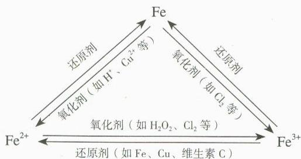

在组织该栏目的教学时,还应注意通过对学生讨论、回答的评价,促进学生化学学科核心素养发展。如在学生能初步构建“铁三角”基本模型的基础上,通过追问进一步使学生的思维过程外显,从素养发展的角度对学生进行指导;对于仅能列举个别氧化剂和还原剂的学生,教师应启发他们进一步提升概括知识的水平,引导他们从一类氧化剂和还原剂的角度进一步抽象、丰富“铁三角”的转化关系认识模型。

## 3. 探究

## 【探究】利用覆铜板制作图案

本探究活动选择“印刷电路板”这一素材创设活动情境，以 $FeCl_{3}$ 为代表物质，通过生动有趣的实验探究活动，引导学生从实验中寻找反应产物的证据，通过氧化还原反应原理分析、推理出 $FeCl_{3}$ 与Cu的反应事实，并用化学方程式进行正确表征，加深对 $Fe^{3+}$ 氧化性的认识。实验活动后进一步引导学生思考与讨论：如何处理使用后的腐蚀液？要求学生能应用已经习得的铁的还原性置换并回收废液中的铜，利用氯水等氧化剂氧化废液中的 $Fe^{2+}$ ，实现腐蚀液的循环利用。这一思考与讨论环节既体现了“能依据实际条件并运用所学的化学知识和方法解决生产、生活中简单的化学问题”，也渗透了“绿色化学”理念，凸显了对“科学态度与社会责任”核心素养的培养。

具体建议如下。

（1）组织探究活动前，应先让学生通过对背景材料的阅读，体会化学与生活的密切联系，学会赞赏化学对人类生活和生产所作的贡献。

(2) 工业上通常用 $30 \%$ 的 $\mathrm{FeCl}_{3}$ 溶液作腐蚀液, 但腐蚀速率较慢, 为提高速率可水浴加热。本活动中腐蚀液的配制可采取如下方法: 向 $10 \mathrm{~g} \mathrm{FeCl}_{3}$ 中加 $2 \mathrm{~mL}$ 浓盐酸和 $3 \mathrm{~mL}$ 水, 搅拌均匀后用水慢慢稀释至 $100 \mathrm{~mL}$ 。

有条件的学校还可在此探究的基础上，以“从印刷电路板废液中回收铜，并再生 $\mathrm{FeCl}_{3}$ 溶液”为实验主题，进一步开展多轮次探究，突出实验方案的设计环节，即：先加入适量的铁粉与废液中 $\mathrm{Cu}^{2+}$ 反应，回收铜；再向废液中加入氯水等氧化剂，实现 $\mathrm{FeCl}_{3}$ 溶液的再生。


## 五、练习与应用参考答案及说明

1. $3\mathrm{Fe} + 4\mathrm{H}_2\mathrm{O(g)} \stackrel{\text{高温}}{=} \mathrm{Fe}_3\mathrm{O}_4 + 4\mathrm{H}_2$ $\mathrm{H}_2\mathrm{O}$ $2\mathrm{Fe} + 3\mathrm{Cl}_2 \stackrel{\text{点燃}}{=} 2\mathrm{FeCl}_3$ Fe

2. (1) 所用试剂为 $\mathrm{Fe}$ , 反应的离子方程式是: $\mathrm{Fe} + 2\mathrm{Fe}^{3+} = 3\mathrm{Fe}^{2+}$

(2)所用试剂为 $\mathrm{Cl}_{2}$ , 反应的离子方程式是: $2 \mathrm{Fe}^{2 + } + \mathrm{Cl}_{2} = 2 \mathrm{Fe}^{3 + } + 2 \mathrm{Cl}^{-}$

(3)所用试剂为Fe, 反应的离子方程式是: $\mathrm{Fe} + \mathrm{Cu}^{2+} = \mathrm{Fe}^{2+} + \mathrm{Cu}$

提示：在选择试剂时，一定要注意既要去除杂质又要易于分离，同时还不能引入新杂质。如（1）不能选择硝酸或酸性 $\mathrm{KMnO}_4$ 溶液作除杂试剂。

5.

<table><tr><td>序号</td><td>实验操作</td><td>实验现象</td><td>离子方程式</td><td>实验结论</td></tr><tr><td>1</td><td></td><td></td><td></td><td>Fe2+具有氧化性</td></tr><tr><td>2</td><td>在FeCl2溶液中加入氯水</td><td>溶液由浅绿色变为黄色</td><td>2Fe2++Cl2=2Fe3++2Cl-</td><td></td></tr><tr><td>3</td><td></td><td></td><td>Fe+2Fe3+=3Fe2+</td><td></td></tr></table>

6. (1) ${\mathrm{{FeCl}}}_{2}\;\mathrm{{KCl}}$

(2) $4\mathrm{Fe(OH)}_2 + \mathrm{O}_2 + 2\mathrm{H}_2\mathrm{O} = 4\mathrm{Fe(OH)}_3$

(3) $\mathrm{Fe} + 2\mathrm{Fe}^{3+} = 3\mathrm{Fe}^{2+}$

提示: 可从转化关系图示中的特征现象入手, 如由 “白色沉淀E在空气中转化为红褐色沉淀F” 可推理出该变化反映的是 $\mathrm{Fe(OH)}_{2}$ 转化为 $\mathrm{Fe(OH)}_{3}$ , 由 D 与 $\mathrm{AgNO}_{3}$ 溶液反应可得到不溶于稀硝酸的白色沉淀 H 和焰色试验呈紫色的现象, 推理出 D 为 KCl, 再由 D 和 E 反推 B 为 $\mathrm{FeCl}_{2}$ 。

## 第二节 金属材料


## 一、内容分析

本节内容包括“金属材料”和“物质的量在化学方程式计算中的应用”两部分内容。教材按照“铁合金 $\rightarrow$ 铝和铝合金 $\rightarrow$ 新型合金”的顺序介绍了金属材料。在第二章的第三节“物质的量”里，教材介绍了摩尔、摩尔质量、气体摩尔体积、物质的量浓度等基本概念，为了分散学习难点，把“物质的量在化学方程式计算中的应用”安排在本节里。

学生在初中学习了合金的概念。本节在介绍金属材料之前，先介绍了合金的结构特点。在介绍铁合金时，教材介绍了生铁和钢，联系实际创设真实情境，配合图片说明了它们的用途，并采取框图的方式重点介绍了碳素钢。教材还介绍了特种钢，并在“资料卡片”中介绍钢中合金元素的主要作用，在“科学·技术·社会”中介绍了2017年我国成功研制的超级钢。另外，结合金属材料的检测，在“化学与职业”栏目介绍了测试工程师这个与化学专业相关的职业。

在介绍铝和铝合金时，由于课程标准中没有要求系统介绍铝及其化合物的知识，因此，教材只从材料的角度简单介绍了铝单质和氧化铝的化学性质。通过实验、比较，得出铝和氧化铝既能与碱反应又能与酸反应，并在此基础上引出两性氧化物的概念。教材紧接着介绍了铝和铝合金的特点及应用。

为了体现金属材料的发展趋势，拓展学生的视野，教材特意安排了“三、新型合金”这部分内容，结合图片介绍了新型材料的应用。在“科学·技术·社会”中介绍了用途广泛的稀土金属。

教材在这一节的最后安排了物质的量在化学方程式计算中的应用，利用化学方程式中各物质的化学计量数之比等于各物质的物质的量之比，通过一个例题，把在第二章里学习的物质的量、摩尔质量、气体摩尔体积、物质的量浓度等知识应用到化学方程式的计算中，分散了在第二章集中学习物质的量及相关概念的难点。

## 二、教学目标

## 1. 教学目标

(1) 结合生活中对常见合金的优良性能的认识经验, 阅读教材中合金的结构介绍, 了解合金的概念, 并能联系纯金属与合金的微观结构解释二者性能的差异。

(2) 以铁合金、铝合金为例, 能从元素组成上对合金进行分类, 并认识不同类型金属材料组成、性能与应用的联系, 强化性能决定用途的观念。

（3）通过实验探究铝和氧化铝的性质及转化，认识两性氧化物，丰富对金属多样性的认识，体会实验对认识和研究物质性质的重要作用。

（4）了解储氢合金、钛合金等新型合金，感受化学科学对创造更多新材料以满足人类生活需要和促进科技发展的重要作用。

（5）能基于物质的量认识化学变化，运用物质的量及相关物理量根据化学方程式进行简单计算，感受定量研究对化学科学的重要作用。

## 2. 教学重点和难点

重点：性能决定用途的观念；物质的量在化学方程式计算中的应用。

难点：物质的量在化学方程式计算中的应用。


## 三、教学建议

1. 组织开展多种形式的学生活动，拓展学生对金属材料的认识，培养学生的自主学习能力、实践能力和责任意识

针对本节关于金属材料部分拓展性内容较多、认知要求不高和学习难度不大的特点，建议在教学中通过围绕“金属材料”开展社会调查、组织小型辩论会、撰写科技小论文等多种形式的学生活动，拓宽学生认识金属材料的视野，使其感受化学科学对创造更多新材料以满足人类生活需要和促进科技发展的重要作用，同时提高学生自主学习、合作交流的能力。教学中要避免把本节内容的教学变成形式单一、枯燥的讲授，或者一味放任学生自行阅读，要尽可能体现本节内容的教学价值。如可以“身边的金属材料”“建筑业中的金属材料”等为主题，组织学生以小组为单位对周围的金属材料的组成、来源、性能、价格和用途等方面展开调查，从不同角度丰富学生对金属材料的认识，强化性能决定用途的观念，同时提高学生的实践能力。又如，可以“金属材料能否被新型材料所替代”“金属材料的功与过”等为话题，组织课堂辩论会，通过让学生课前查找相关资料，培养学生自主学习的能力。再如，可以“我国稀土金属资源的开发与利用”为主题，结合教材中“科学·技术·社会”栏目内容，要求学生撰写科技小论文，在进一步了解稀土金属重要性的基础上，关注与环境保护、资源开发等有关的社会热点问题，培养学生的社会责任感。

## 2. 充分利用现代教育信息技术支持课堂教学，拓宽教学时空，提高学习效率

本节内容既有对铁合金、新型合金等有关金属材料的知识性介绍，又有对铝、氧化铝等元素化合物性质的研究，还有物质的量等有关概念在化学反应方程式计算中的应用，涉及不同类型的教学内容。教学中应注意发挥现代教育信息技术的作用，结合不同教学内容的特点，利用动画、视频、微课、实验直播等技术手段，拓宽课堂教学时空，改进教学方式，达到提高课堂教学效率的目的。在进行合金性能与结构的关系教学时，可通过纯金属与合金的微观结构模型的动画，直观地呈现出合金中由于加入其他原子而使原子层之间更难相对滑动，以帮助学生更好地理解合金硬度变大的原因，同时促进学生宏观辨识与微观探析素养的形成。在进行“新型合金”内容的教学时，可广泛搜集如我国“蛟龙”号载人潜水器、记忆合金、新能源汽车中的储氢合金等目前最新合金材料应用的视频，以激发学生学习兴趣，拓宽知识视野，使学生感受到金属材料发展对人类的积极贡献。在关于铝和氧化铝性质的演示实验教学时，可利用温度传感器、实验视频直播的方式，提高实验现象的可视度。通过让学生对比打磨过的铝条与未打磨过的铝条分别与同浓度、同体积的NaOH溶液反应产生气泡的速率、体系温度变化等宏观现象的差异，引发对反应本质的更深层次的思考，实现深度学习。在进行“物质的量在化学方程式计算中的应用”这一难点教学时，可制作相关内容的微课供有需要的学生在课后自主选择学习。要注意引导学生在理解相关概念的基础上进行有关物理量的转换，强调计算过程的规范性。有条件的学校也可利用校园网络平台，采用线上、线下相结合的教学方式，通过在线学习平台推送相关资料和微视频等学习资源，发布学习任务单、提供作业展示和交流空间。学生可根据各自需求，在规定的时间内自主安排在线学习，提交学习成果，反馈学习问题；线下的课堂教学可实施翻转课堂的教学模式。

## 3. 通过金属材料发展史，引导学生体会化学、技术与社会的重要关系，了解化学工作者对社会发展的贡献

金属材料的发展历史可以从人类社会生产力的发展反映出来，比如人类历史上的青铜器时代、铁器时代、硅器时代（信息时代）等。了解金属材料的发展历史，有利于学生体会化学、技术与社会的重要关系，激发社会责任感，提高求知欲。金属材料的发展对技术、社会有重要意义，例如，古代冶炼铜就体现了化学的发展对社会各行业发展的影响，当时冶炼铜的技术对于国家军事和经济的发展具有很大的促进作用，同时也改善了百姓的生活条件。

近年来，金属材料的发展面临前所未有的压力。一方面，新型高分子材料（如工程塑料）、新型陶瓷材料的崛起，从性能到应用等许多方面已和传统的金属材料不相上下，加上原料丰富、价格便宜，其产量正在以惊人的速度增长。另一方面，金属材料经近百年的大力开发，某些主要的金属矿产资源日渐紧张。从资源、能源和环境等方面考虑，金属材料的发展确实面临巨大的挑战。这就要求化学工作者，既要保证对已有金属材料的最大限度的利用，又要不断开拓金属材料的新功能，同时还要建立废旧金属的回收和再利用机制。在教学中，可以从这些方面，结合具体的案例，如通过教材“化学与职业”栏目中“测试工程师”的职业介绍，让学生了解化学工作者的重要职责及对社会发展所做的巨大贡献，激发学生热爱化学、投身化学、贡献社会的情感，渗透职业生涯规划教育。

## 4. 引导学生在充分理解化学方程式意义的基础上，应用物质的量进行化学方程式的计算

为分散物质的量学习的难点，本节在继第二章介绍了物质的量及相关物理量之后，安排了“物质的量在化学方程式计算中的应用”相关内容，这也是本节教学的难点。由于学生在初中进行有关化学方程式的计算时，更多地是习惯于用质量、质量分数等宏观物理量进行换算。因此，在进行该内容教学时，可设计如下。

学习任务1：以氢气和氧气的反应为例，从物质的量的角度认识化学方程式的意义。

## 活动（1）从宏观（质量关系）引入

<table><tr><td></td><td>2H2</td><td>+</td><td>O2</td><td>点燃</td><td>2H2O</td></tr><tr><td>化学计量数之比</td><td>2</td><td>:</td><td>1</td><td>:</td><td>2</td></tr><tr><td>质量之比</td><td>4g</td><td>:</td><td>32g</td><td>:</td><td>36g</td></tr><tr><td>物质的量之比</td><td>2mol</td><td>:</td><td>1mol</td><td>:</td><td>2mol</td></tr></table>

活动（2）从微观（微粒数目）引入

<table><tr><td></td><td> $2{\mathrm{H}}_{2}$ </td><td>+</td><td> ${\mathrm{O}}_{2}$ </td><td>点燃</td><td> $2{\mathrm{H}}_{2}\mathrm{O}$ </td></tr><tr><td>化学计量数之比</td><td>2</td><td>:</td><td>1</td><td>:</td><td>2</td></tr><tr><td>粒子数之比</td><td>2</td><td>:</td><td>1</td><td>:</td><td>2</td></tr><tr><td>扩大 ${6.02} \times {10}^{23}$ 倍</td><td colspan="2"> $2 \times {6.02} \times {10}^{23}$ </td><td colspan="2"> $6.02 \times {10}^{23}$ </td><td> $2 \times {6.02} \times {10}^{23}$ </td></tr></table>

设计意图：从学生对化学方程式意义的已有认知出发，结合物质的量及相关物理量之间的换算理解“化学方程式中各物质的计量数之比等于各物质的物质的量之比”，建立新旧知识间的联系，为后续应用物质的量进行计算奠定基础。

评价任务1：要求学生能从宏观与微观相结合的视角，基于物质的量认识化学变化，并认识物质的量在化学定量研究中的重要作用。

学习任务2：以教材例题为例，学会应用物质的量进行化学方程式的计算。

活动（1）在教师指导下阅读例题解析过程，必要时教师可进行讲解。

活动（2）完成教师提供的变式练习，如：56 g 铁屑与足量 2 mol/L 的硫酸反应，计算参加反应的硫酸的物质的量及生成的 $H_{2}$ 的体积（标准状况下）。

活动（3）根据学生的学习进度，鼓励同学间互编类似习题并完成练习。

设计意图：通过进阶型的练习活动，使学生在学会应用物质的量进行化学方程式计算的基础上，能独立完成相关练习并规范表达，同时为学习进程较快的同学提供一定空间。

评价任务2：要求学生能应用物质的量计算物质转化前后的相关物理量，如质量等。

教学中应注意把握教学要求，不要强化计算。


## 四、栏目使用建议

## 1. 实验

【实验3-4】

该实验中，盐酸的浓度应稍大，如可用6 mol/L的盐酸。铝片不宜太纯，因为要保证一定的反应速率和有足量的氢气产生。另外，所用试管应细而长。可以加上一个带导气管的单孔塞，再点燃生成的气体。也可采用爆鸣的检验方法。

实验现象：铝片表面有大量气泡产生，试管壁有发热现象。一段时间后，将点燃的木条放在试管口（务必注意安全）可观察到淡蓝色火焰。

【实验3-5】

该实验中，NaOH溶液的浓度应稍大，如可用 $30\%$ 的 $\mathrm{NaOH}$ 溶液（实验时应注意戴好防护手

套，防止腐蚀）。另外，铝片经砂纸打磨后应较快速地放入NaOH溶液中，否则氧化膜很快再次生成，不易对比实验现象。也可先将铝丝放入盐酸中反应一段时间除去氧化膜，再拿出并用蒸馏水冲洗后，放入NaOH溶液中，这样对比现象时差异会更明显。检验氢气应注意的事项同实验3-4。

实验现象：用砂纸打磨过的铝片立即剧烈反应，表面有大量气泡产生，试管壁有发热现象。未经打磨过的铝片刚开始反应较慢，后逐渐加快，产生大量气泡，试管壁有发热现象。一段时间后，将点燃的木条分别放在两支试管口（务必注意安全），均可观察到淡蓝色火焰。

## 2. 思考与讨论

结合教材的内容，引导学生思考在不同的合金中，合金元素不同，其性能就有差异，进而理解物质的结构决定性能，且能从宏观与微观相结合的视角分析与解决问题。还要引导学生认识到可通过改变合金元素来开发具有新功能的金属材料，以激发学生的创新意识。该“思考与讨论”设置的问题较开放，可从以下几个方面思考：研究物质的性能应从研究物质的结构入手，研制新材料的过程中应加强对组成元素的定性和定量研究等。


## 五、练习与应用参考答案及说明

## 1. 钢 碳素钢 合金钢 铬和镍

2. 酸碱 两性

3. NaOH溶液与 $CO_{2}$ 气体发生反应，导致易拉罐内压强变小 $CO_{2}+2OH^{-}=CO_{3}^{2-}+H_{2}O$ Al与NaOH溶液反应产生 $H_{2}$ ，易拉罐内压强又变大 $2Al+2OH^{-}+2H_{2}O=2AlO_{2}^{-}+3H_{2}\uparrow$ 4. D

5. D

6. A

7. 提示：可以从材料的来源、制造工艺、成本、性能、日常维护、对环境的影响等角度考虑。

8. 提示：管道疏通剂能快速有效地对下水道的油脂、头发、菜叶剩饭、厨房垃圾等堵塞物进行分解，主要原因是铝粉与NaOH溶液反应产生大量气体，产生气压，同时NaOH具有一定的腐蚀性，从而疏通管道。

9. 提示：选择铸造硬币的金属材料时，应该考虑的因素有硬度、价格、光泽、耐磨性、耐腐蚀性、易加工程度等。

10. $6.72 \mathrm{~L}$

11. $55\%$ $2\times 10^{6}\mathrm{t}$

提示：可利用反应过程中铁元素质量守恒进行计算。

# 复习与提高参考答案及说明

1. $\mathrm{Fe} + 2\mathrm{H}^{+} = \mathrm{Fe}^{2 + } + \mathrm{H}_{2}\uparrow$

2. $\mathrm{Fe(OH)}_{3} \quad \mathrm{Fe}_{2} \mathrm{O}_{3}$

提示: 废铁屑中主要含有铁和少量氧化铁, 加入过量稀硫酸可得到硫酸亚铁溶液, 经氯水氧化得到 $\mathrm{Fe}^{3+}$ , 再加过量氨水可得到红褐色的 $\mathrm{Fe(OH)}_{3}$ 沉淀, 加热后分解得到红棕色 $\mathrm{Fe}_{2} \mathrm{O}_{3}$ 。

3. $\mathrm{Fe}^{2+}$

4. 铁粉, 防止 $\mathrm{Fe}^{2+}$ 被氧化为 $\mathrm{Fe}^{3+}$

5. 2:3

提示：根据离子方程式： $2Fe^{3+}+Fe=3Fe^{2+}$ ，若得到3 mol $Fe^{2+}$ ，则已反应的 $Fe^{3+}$ 为2 mol；此时溶液中未反应的 $Fe^{3+}$ 为3 mol。

6. B

7. C 提示: Fe 分别与 $\mathrm{CuSO}_{4}$ 溶液和 $\mathrm{AgNO}_{3}$ 溶液反应时, 由于置换出相对原子质量更大的 $\mathrm{Cu} 、 \mathrm{Ag}$ , 故溶液质量都减小。

提示: 若铁粉未变质, 加入盐酸后主要为氯化亚铁溶液, 此时滴加KSCN溶液, 不变红; 若铁粉少部分变质, 过量的铁仍能将变质的 $\mathrm{Fe}^{3+}$ 还原为 $\mathrm{Fe}^{2+}$ , 所以加入盐酸后得到溶液仍为氯化亚铁溶液, 再滴加KSCN溶液仍不会变红; 若铁粉全部或大部分变质, 加入盐酸后得到的溶液中含有 $\mathrm{Fe}^{3+}$ , 此时滴加KSCN溶液会变红。C选项由于加入氯水会将 $\mathrm{Fe}^{2+}$ 氧化成 $\mathrm{Fe}^{3+}$ , 再滴加KSCN溶液, 无论是否变质都会变红, 所以错误。

10. (1) $2\mathrm{Fe}^{3+} + \mathrm{Fe} = 3\mathrm{Fe}^{2+}$

(2) $\mathrm{FeCl}_3 + 3\mathrm{NaOH} = \mathrm{Fe(OH)}_3 \downarrow + 3\mathrm{NaCl}$

$$
2 \mathrm{Fe(OH)} _ {3} \xlongequal {\triangle} \mathrm{Fe} _ {2} \mathrm{O} _ {3} + 3 \mathrm{H} _ {2} \mathrm{O}
$$

11.（1）①Fe和Cu ② $FeSO_{4}$ 溶液 ③Cu ④ $FeSO_{4}$ 和 $H_{2}SO_{4}$ 的混合溶液 ⑤足量的Fe ⑥过滤 ⑦足量稀硫酸 ⑧过滤

(2)氯水和KSCN溶液 溶液先由浅绿色变为黄色,加入KSCN溶液后变为红色 $2{\mathrm{{Fe}}}^{2 + } + {\mathrm{{Cl}}}_{2} = 2{\mathrm{{Fe}}}^{3 + } + 2{\mathrm{{Cl}}}^{ - }$

（3）先生成白色絮状沉淀，迅速变成灰绿色，一段时间后变为红褐色沉淀

$$
\mathrm{H} _ {2} \mathrm{SO} _ {4} + 2 \mathrm{NaOH} = \mathrm{Na} _ {2} \mathrm{SO} _ {4} + 2 \mathrm{H} _ {2} \mathrm{O}
$$

$$
\mathrm{FeSO} _ {4} + 2 \mathrm{NaOH} = \mathrm{Na} _ {2} \mathrm{SO} _ {4} + \mathrm{Fe(OH)} _ {2} \downarrow
$$

$$
4 \mathrm{Fe(OH)} _ {2} + \mathrm{O} _ {2} + 2 \mathrm{H} _ {2} \mathrm{O} = 4 \mathrm{Fe(OH)} _ {3}
$$

提示: 从题干中分析起始物质为 $\mathrm{FeSO}_{4}$ 和 $\mathrm{Cu}^{2+}$ , 最终目标产物为 $\mathrm{FeSO}_{4}$ 和 $\mathrm{Cu}$ 。推理过程可先由目标物质 $\mathrm{FeSO}_{4} \cdot 7 \mathrm{H}_{2} \mathrm{O}$ 逆向分析得出②为 $\mathrm{FeSO}_{4}$ 溶液, ④中有 $\mathrm{FeSO}_{4}$ 溶液; 为实现 $\mathrm{FeSO}_{4}$ 和 $\mathrm{Cu}^{2+}$ 的分离和转化, 从原理上分析加入试剂②应为足量的铁单质, 发生反应 $\mathrm{Fe} + \mathrm{Cu}^{2+} = \mathrm{Fe}^{2+} + \mathrm{Cu}$ , 而得到易于通过过滤分离的铜单质, ①则是 $\mathrm{Cu}$ 和过量的 $\mathrm{Fe}$ ; 为进一步分离 $\mathrm{Cu}$ 和 $\mathrm{Fe}$ 的混合物,得到目标产物 $FeSO_{4}$ 和Cu，可向①中加入足量的稀硫酸⑦，再通过过滤操作⑧进行分离。

12. 人体需要的铁为二价铁 可溶性的亚铁盐易被人体吸收

提示：对于缺铁性贫血患者来说，可通过服用硫酸亚铁、乳酸亚铁、琥珀酸亚铁等补铁剂，或多食用含铁较多的黑木耳、菠菜、蛋黄、动物内脏等食品，也可通过食用铁强化酱油等方式补铁。

13. 提示：制备方案的设计应从原理的科学性、操作的可行性、实验的安全性、成本的节约性等方面考虑。方案的呈现方式可包括流程图、实验原理、实验步骤、注意事项等内容。

14. (1) 0.53 (2) $1: 1$

15. ${2.0}\mathrm{{mol}}/\mathrm{L}$

提示：可根据化学方程式进行计算，或利用反应前后 $\mathrm{SO}_4^{2-}$ 的物质的量守恒进行计算。

# 实验活动2 铁及其化合物的性质

本实验属于认识物质性质及其转化关系的实验，一方面通过宏观的实验现象帮助学生辨识铁单质、铁盐和亚铁盐的性质；另一方面引导学生应用氧化还原反应知识，基于实验证据建构对以铁为例的变价元素的物质间的转化关系。

实验活动过程中，应注意充分发挥氧化还原反应知识对铁元素性质学习的指导作用；同时，要利用铁元素及其化合物丰富的性质促进学生对相关原理知识的理解。


## 一、铁及其化合物的性质

## 1. 活动安排建议

（1）课前布置学生预习实验活动内容，明确实验目的，熟悉实验药品在实验中的作用，能用化学方程式或离子方程式解释、说明各实验步骤的反应原理。

（2）对于学习基础较好的学生，也可将此实验设计为探究性实验，即要求学生先预测Fe、 $\mathrm{Fe}^{3+}$ 、 $\mathrm{Fe}^{2+}$ 的性质，再根据提供的药品设计并完成实验。

## 2. 注意事项

（1）本实验涉及药品较多，在使用胶头滴管时要注意每次使用前先用蒸馏水充分洗涤，避免药品之间的相互污染。

(2) 铁与硫酸铜溶液的反应实验中, 可将铁丝绕成螺旋状, 先用稀盐酸处理以除去表面的氧化物; 硫酸铜溶液浓度不宜过大。

(3) 将铁丝、铜片、锌片等固体放入试管时, 应先将试管横放, 放入固体, 再将试管慢慢竖起, 使固体物质滑落至试管底部。金属应先打磨, 且在实验后回收。

(4) $\mathrm{FeSO_4}$ 溶液和 $\mathrm{FeCl}_2$ 溶液应现用现配，为防止被氧化可加入少量铁粉。


## 二、铁离子的检验

## 1. 活动安排建议

(1) 提供未贴标签的两份待测试液 (分别为 $\mathrm{FeCl}_{3}$ 溶液和 $\mathrm{FeCl}_{2}$ 溶液), 要求学生利用KSCN溶液进行鉴别。

(2) 可增加实验: 利用教材实验步骤1中的 (2) ①, 向其中加入KSCN溶液, 证明该实验

## 2. 注意事项

(1) ${\mathrm{{FeCl}}}_{3}$ 稀溶液可通过将 ${\mathrm{{FeCl}}}_{3}$ 晶体溶于浓盐酸后稀释得到。

(2) 向 $\mathrm{FeCl}_{3}$ 稀溶液中加入铁粉, 轻轻振荡试管后, 应先充分静置, 再向上层清液中加入几滴KSCN溶液。


## 三、问题和讨论答案或提示

从原料分析入手, 铁屑的主要成分是 $\mathrm{Fe}$ 和 $\mathrm{Fe}_{2} \mathrm{O}_{3}$ , 为实现向 $\mathrm{FeSO}_{4}$ 的转化, 可向其中加入稀硫酸, 发生 $\mathrm{Fe} + \mathrm{H}_{2} \mathrm{SO}_{4} = \mathrm{FeSO}_{4} + \mathrm{H}_{2} \uparrow$ , $\mathrm{Fe}_{2} \mathrm{O}_{3} + 3 \mathrm{H}_{2} \mathrm{SO}_{4} = \mathrm{Fe}_{2} (\mathrm{SO}_{4})_{3} + 3 \mathrm{H}_{2} \mathrm{O}$ , $\mathrm{Fe} + \mathrm{Fe}_{2} (\mathrm{SO}_{4})_{3} = 3 \mathrm{FeSO}_{4}$ 等反应。最终通过蒸发浓缩、降温结晶的方法得到硫酸亚铁晶体。设计过程中应遵循科学、安全、易操作、经济实用等原则, 方案可通过流程图方式呈现。如下图所示。


## 教学资源

## 1. 金属的分类

人们根据金属的密度把金属分为重金属和轻金属。重金属的密度大于 $4.5 \mathrm{~g} / \mathrm{cm}^{3}$ ，轻金属的密度小于 $4.5 \mathrm{~g} / \mathrm{cm}^{3}$ 。

冶金工业上还常常把金属分为黑色金属和有色金属。黑色金属有三种：铁、锰、铬。它们或它们的合金的表面常有灰黑色的氧化物，所以称这类金属为黑色金属。除铁、锰、铬以外的金属称为有色金属。有色金属又可以分为九大类：

①重金属：铜、铅、锌等；

②轻金属：铝、镁等；

③轻稀有金属：锂、铍等；

④难熔稀有金属：钨、钛、钒等；

⑤稀散金属：镓、锗等；

⑥稀土金属：钪、钇及镧系元素；

⑦放射性金属：镭、锕等；

⑧贵金属：金、银、铂等；

⑨碱金属：钾、钠等。

## 2. 铁

公元前2500年人类已发现和使用铁，当时的铁是从天空中落下来的陨铁，因此古埃及人称铁为“天石”。约公元前2000年人类发明了铁矿石的冶炼方法。我国在公元前7世纪至公元前6世纪的春秋时代已发明了冶炼生铁的技术，春秋末期（公元前5世纪至公元前4世纪）已出现了炼钢技术。铁的拉丁语是ferrum，因此元素符号是Fe，iron是铁的英语名。

铁是地壳中最丰富的元素之一，含量为4.75%，在金属中仅次于铝。铁分布很广，能稳定地与其他元素结合，常以氧化物的形式存在，有赤铁矿（主要成分是 $Fe_{2}O_{3}$ ）、磁铁矿（主要成分是 $Fe_{3}O_{4}$ ）、褐铁矿（主要成分是 $Fe_{2}O_{3}\cdot3H_{2}O$ ）、菱铁矿（主要成分是 $FeCO_{3}$ ）、黄铁矿（主要成分是 $FeS_{2}$ ）、钛铁矿（主要成分是 $FeTiO_{3}$ ）等。土壤中也含铁1%\~6%。铁是活泼的过渡元素，是一种光亮的银白色金属，常温下呈现体心立方晶格。常见的化合价为+2价和+3价。纯铁相对较软，有良好的延展性和导热性，能导电，能被磁化，又可去磁。

纯铁化学性质比较活泼，是一种良好的还原剂。纯铁在空气中不易起变化，含杂质的铁在潮湿空气里逐渐生锈，外表生成一层褐色的氢氧化铁。铁红热时能与水反应生成氢气。铁易溶于稀酸中，但在浓硫酸或浓硝酸中由于表面发生钝化而不能溶解，因此铁制容器可用来储存浓硫酸或浓硝酸。在通电条件下，浓的碱溶液能腐蚀铁，生成高价铁酸盐。铁加热时能与卤素、硫、磷、硅等非金属反应，但不与氮直接反应。

铁是生命过程所必需的元素，是红细胞（血红蛋白）的主要成分。

铁的最大用途是炼钢，铁也大量用来制造铸铁。铁和它的化合物还用来做磁铁、染料（墨水、晒图纸、胭脂颜料）和磨料（红铁粉）等。还原铁粉大量用于冶金。我国在春秋时代晚期已炼出可供浇铸用的液态生铁，隋唐时开始用煤炼铁，明代已能用焦炭炼铁。铁现在常用焦炭、铁矿石和石灰石为原料炼得。

## 3. 铁的几种重要化合物

铁的几种常见重要化合物见下表（溶解度是指 $100 \mathrm{~g} \mathrm{H}_{2} \mathrm{O}$ 中所溶解的质量）。

<table><tr><td>化合物</td><td>颜色和状态</td><td>密度 $\left( {\mathrm{g} \cdot {\mathrm{{cm}}}^{-3}}\right)$ </td><td>熔点°C</td><td>受热时的变化</td><td>溶解度g(无水盐)</td></tr><tr><td>氯化铁 ${\mathrm{{FeCl}}}_{3}$ </td><td>黑褐色层状晶体</td><td>2.898</td><td>304</td><td>317°C沸腾,部分分解,100°C时已显著挥发,见光还原为 ${\mathrm{{FeCl}}}_{2}$ 。 ${\mathrm{{FeCl}}}_{3} \cdot 6{\mathrm{H}}_{2}\mathrm{O}$ 37°C熔化,100°C挥发,250°C分解出 ${\mathrm{{Fe}}}_{2}{\mathrm{O}}_{3}$ 等</td><td>91.8(20°C),也能溶于乙醇、甘油、乙醚和丙酮中</td></tr><tr><td>硝酸铁 $\mathrm{{Fe}}{\left( {\mathrm{{NO}}}_{3}\right) }_{3} \cdot 9{\mathrm{H}}_{2}\mathrm{O}$ </td><td>淡紫色晶体</td><td>1.684</td><td>47</td><td>50°C时失去一部分 ${\mathrm{{HNO}}}_{3}$ ,高温下分解为 ${\mathrm{{Fe}}}_{2}{\mathrm{O}}_{3}$ (125°C沸腾)</td><td>138(20°C)</td></tr><tr><td>氯化亚铁 ${\mathrm{{FeCl}}}_{2} \cdot 4{\mathrm{H}}_{2}\mathrm{O}$ </td><td>透明淡蓝色晶体</td><td>1.937</td><td></td><td> ${\mathrm{{FeCl}}}_{2} \cdot 2{\mathrm{H}}_{2}\mathrm{O}$ 在空气中部分氧化变为草绿色</td><td>64.5(10°C),能溶于乙醇,不溶于乙醚</td></tr><tr><td>硫酸亚铁 ${\mathrm{{FeSO}}}_{4} \cdot 7{\mathrm{H}}_{2}\mathrm{O}$ </td><td>淡绿色晶体</td><td>1.89</td><td></td><td>在空气中风化变为白色粉末,热至73°C时变白,90°C时熔融,250°C时开始分解,失去 ${\mathrm{{SO}}}_{3}$ </td><td>26.5(20°C),能溶于甘油,不溶于乙醇,水溶液易被氧化</td></tr><tr><td>硫酸亚铁铵 ${\left( {\mathrm{{NH}}}_{4}\right) }_{2}\mathrm{{Fe}}{\left( {\mathrm{{SO}}}_{4}\right) }_{2} \cdot 6{\mathrm{H}}_{2}\mathrm{O}$ </td><td>绿色晶体</td><td>1.864</td><td></td><td>100°C左右失去结晶水</td><td>26.9(20°C),在潮湿空气中和水溶液中较稳定</td></tr></table>

（参考自：大连理工大学无机化学教研室编.无机化学.4版.北京：高等教育出版社，2001）

4. 铁的合金

(1) 生铁

一般地说，含碳量在 $2\% \sim 4.3\%$ 的铁的合金叫做生铁。生铁里除含碳外，还含有硅、锰以及少量的硫、磷等，它可铸不可锻。根据生铁里碳的存在形态不同，又可分为炼钢生铁、铸造生铁和球墨铸铁。

炼钢生铁 碳在这种铁的合金里主要以碳化铁的形态存在。这种生铁质硬而脆，难于加工，一般都用来炼钢，所以叫它炼钢生铁。由于它的断口呈白色，又叫白口铁。

铸造生铁 碳在这种铁的合金里以片状的石墨形态存在。由于石墨质软并有润滑作用，因而这种生铁具有良好的切削、耐磨和铸造性能等。但是，由于有片状石墨的存在，降低了它的抗拉强度，使它不能锻轧，只能用于制造各种铸件，如铸造机床座、铁管等。因此，把这种生铁称为铸造生铁。由于它的断口呈灰色，通常又叫灰口铁。

球墨铸铁 把铸造生铁加热熔化，并用镁合金或稀土合金等处理，就能使铁碳合金里的石墨从片状变为球状。这种球状石墨的形成使铸铁的机械性能大大提高。球墨生铁比普通生铁好，它的某些性能接近于钢，而价格却比钢便宜得多。因此，它可以代替一部分钢材用于制造曲轴、齿轮和阀门等。

按用途不同分，生铁除炼钢生铁、铸造生铁外还有特种生铁。特种生铁为含有特种金属元素的生铁。在高炉冶炼过程中，铁矿中的某些金属元素如铬、镍、钴、钡、钛、铌等大部分被还原进入铁水。

## (2) 钢

含碳量一般在 $0.03\% \sim 2\%$ 的铁的合金叫做钢。钢坚硬，有韧性、弹性，可以锻打、压延，也可以铸造。钢的分类很多，如按化学成分分类，钢可以分为碳素钢和合金钢。

碳素钢 碳素钢又叫普通钢。它所含的碳、硅、锰比生铁少得多，硫和磷的含量也比生铁低得多。根据含碳量的不同，碳素钢的性质也各不相同，含碳量越高硬度越大，含碳量越低韧性越强。工业上一般把含碳量低于0.3%的叫做低碳钢；含碳量在0.3%\~0.6%之间的叫做中碳钢；含碳量在0.6%以上的叫做高碳钢。低碳钢和中碳钢用来制造机器零件、钢管等，高碳钢用来制造刀具、量具和冲压模具等。

合金钢 合金钢也叫特种钢。在碳素里适量地加入一种或几种合金元素，使钢的组织结构发生变化，从而使钢具有各种不同的特殊性能，如强度、硬度大，可塑性、韧性好，耐磨，耐腐蚀，以及其他许多优良性能。下表是一些特种钢的性能和用途。

<table><tr><td>种类</td><td>性能</td><td>用途</td></tr><tr><td>钨钢、锰钢</td><td>硬度很大</td><td>制造金属加工工具、拖拉机履带和车轴等</td></tr><tr><td>锰硅钢</td><td>韧性特别强</td><td>制造弹簧片、弹簧圈等</td></tr><tr><td>钼钢</td><td>抗高温</td><td>制造飞机的曲轴、特别硬的工具等</td></tr><tr><td>钨铬钢</td><td>硬度大,韧性很强</td><td>做机床刀具和模具等</td></tr><tr><td>镍铬钢(不锈钢)</td><td>抗腐蚀性能强,不易氧化</td><td>制造化工生产上的耐酸塔、医疗器械和日常用品等</td></tr></table>

## 5. 铝

铝是自然界中分布最广的金属元素。地壳中铝的含量接近8%，仅次于氧和硅。铝通常以化合状态存在，目前已知的含铝矿物有250多种，其中最常见的是铝硅酸盐类，如长石、云母、高岭石、铝土矿、明矾石等。

铝是银白色金属，其主要特性是密度小，相对密度只有钢铁的1/3。某些铝合金的机械强度甚至超过结构钢。各种铝合金（如硬铝、超硬铝、防锈铝、铸铝等）广泛应用于飞机、汽车、火车、船舶等制造工业。此外，导弹、宇宙飞船、人造卫星等也大量使用铝及其合金。例如，一架超音速飞机约 $70\%$ 由铝及其合金构成，每枚导弹的用铝量约占总质量的 $15\%$ ，一艘1.5万吨级的大型客船用铝量约为2000吨。

铝是一种良好的导电材料。铝的导电能力虽然只有铜的60%\~70%，但密度只有铜的1/3。以传导等量电流而论，铝的导电截面积大约是铜的1.6倍，而铝的质量只有铜的一半。换言之，铝可节省用量，价格远低于铜。同时，铝表面的氧化膜不仅有耐腐蚀作用，而且有一定的绝缘性。所以铝在电器制造工业、电线电缆工业和无线电工业有广泛的用途。

铝是热的良导体。铝的热导率大约是铁的3倍，不锈钢的10倍。因此铝是制造机器活塞、热交换器、饭锅和电熨斗的理想材料。铝对光和热还具有良好反射能力，所以铝既可用来制反光镜，又可作绝缘材料。

铝易于加工，可压成铝板、铝箔，拉成铝线，或挤压成各种异形的材料。在100\~150℃时可制成薄约0.01 mm的铝箔，广泛用于包装香烟、糖果等。铝还可制成铝丝、铝条，并能轧制成各种铝制品。

铝的化学性质活泼。铝在氧气中加热时能剧烈地燃烧，发出炫目的白光，并放出大量的热。铝与氧结合的能力很强，是亲氧元素，它能从许多金属氧化物中夺取氧，而且放出的大量热可使游离出来的金属熔化。冶金工业应用此原理来制取铁、锰、铬、钒等金属，如 $Cr_{2}O_{3}+2Al\xlongequal{高温}Al_{2}O_{3}+2Cr$ ，这种方法叫铝热法。铝可与稀酸（盐酸或硫酸）、强碱溶液反应生成盐，同时放出氢气。把铝放入冷的浓硝酸或浓硫酸中会被钝化，因此，浓硝酸或浓硫酸可用铝的容器储存。纯度为99.95%以上的大片铝，可以抵御大多数酸类的侵蚀。铝和氯在高温下反应生成 $AlCl_{3}$ ，和硫在1000℃以上反应生成 $Al_{2}S_{3}$ ，和碳在800℃以上反应生成 $Al_{4}C_{3}$ 。

## 6. 氧化铝、氢氧化铝

(1) $\text{Al}_2\text{O}_3$ 俗名矾土, 是一种难熔又不溶于水的白色粉末。它的熔点约为 $2055^\circ\text{C}$ , 沸点为 $2980^\circ\text{C}$ 。 $\text{Al}_2\text{O}_3$ 具有不同晶型, 其中最为人们所熟悉的是 $\alpha$ 型和 $\gamma$ 型。自然界存在的 $\alpha$ 型氧化铝称为刚玉, 硬度仅次于金刚石, 混有少量杂质可使刚玉带有各种色泽, 称为宝石, 如红宝石 (含有少量的 $\text{Cr}^{3+}$ ) 和蓝宝石 (含 $\text{Ti}^{3+}$ 和 $\text{Fe}^{2+}$ 、 $\text{Fe}^{3+}$ ), 目前可用熔融氧化铝人工结晶方法制造宝石。人造宝石在性质上不次于天然宝石, 广泛用于工业技术方面。例如, 用做机器快速转动部分的轴承、钟表上的宝石, 以及磨料、耐火材料等。 $\gamma$ 型氧化铝即活性氧化铝, 是一种多孔物质, 每克内表面积可达数百平方米, 有极高的活性, 可吸附水蒸气和许多气体、溶液分子, 常用作吸附剂、催化剂和干燥剂。

$Al_{2}O_{3}$ 是典型的两性氧化物，既可溶于酸也可溶于碱。氧化铝是电解法制金属铝的主要原料，所用的氧化铝越纯，炼出的铝就越纯。由于提纯铝比提纯氧化铝更困难，所以电解前氧化铝的提纯非常重要。天然铝土矿是制取氧化铝的主要原料，杂质主要有二氧化硅、氧化铁及稀散元素等。利用它们化学性质上的共性和特性可将氧化铝与其他杂质分开。

(2) 氢氧化铝又称为氧化铝的水合物, 有三水合氧化铝 $\mathrm{Al}_{2} \mathrm{O}_{3} \cdot 3 \mathrm{H}_{2} \mathrm{O}$ [即 $\mathrm{Al(OH)}_{3}$ ] 和一水合氧化铝 $\mathrm{Al}_{2} \mathrm{O}_{3} \cdot \mathrm{H}_{2} \mathrm{O}$ [即 $\mathrm{AlO(OH)}$ ]。但在这些化合物的晶格中并不存在水分子, 只是在加热这些化合物时会分解成水和氧化铝, 这一点与水合物的性质相似。氢氧化铝是典型的两性氢氧化物, 它既能溶于强酸生成铝盐溶液, 又能溶于强碱生成偏铝酸盐溶液。氢氧化铝可用来制备铝盐, 作吸附剂、媒染剂和离子交换剂, 也用于作瓷釉、耐火材料、防火布等的原料。氢氧化铝凝胶有中和胃酸和保护溃疡面的作用, 可用于治疗胃和十二指肠溃疡、胃酸过多等。

## 7. 铝合金

铝合金广泛应用于运输、建筑、轻工、化工、仪表、机械等部门，以及包装和家用器具等方面。如今，在应用方面铝合金已成为第二大金属品种，其产量仅次于钢铁而超过其他有色金属的总和。铝中添加合金元素的首要目的是提高材料在不同环境条件下的机械强度，并保持能满足使用要求的塑性、韧性与抗腐蚀性。

铝合金按生产工艺可分为铸造铝合金和变形铝合金两大类。

铸造铝合金 又可分为Al-Si系铸造铝合金、Al-Cu系铸造铝合金、Al-Mg系铸造铝合金、Al-Zn系铸造铝合金。它们的主要性质和用途列表如下。

<table><tr><td>种类</td><td>主要性能</td><td>主要用途</td></tr><tr><td>Al-Si系铸造铝合金</td><td>高流动性、低收缩率和低热裂倾向,良好抗腐蚀性及可焊性,低膨胀系数</td><td>适合铸造形状复杂的构件</td></tr><tr><td>Al-Cu系铸造铝合金</td><td>热处理效果突出,热稳定性好</td><td>适合铸造高温工作的构件</td></tr><tr><td>Al-Mg系铸造铝合金</td><td>较高的抗腐蚀性和强度,良好的切削性能和低的表面粗糙度</td><td>用于铸造在海水中工作的构件</td></tr><tr><td>Al-Zn系铸造铝合金</td><td>抗腐蚀性及尺寸稳定性较高,良好的可焊性,有明显的时效硬化能力</td><td>适于砂型铸造压气机活塞、汽缸座等</td></tr></table>

变形铝合金可分为防锈铝、硬铝、锻铝和超硬铝四类。防锈铝包括Al-Mn及Al-Mg系合金，抗腐蚀性好，机械强度高于工业纯铝，同时具有良好的焊接性能，但不能热处理强化。硬铝属Al-Cu-Mg合金系，具有很强的时效硬化能力，可热处理强化。铜是硬铝中的主要合金元素，为了提高强度，铜含量控制在4.0%\~4.8%的范围内。锻铝合金有Al-Mg-Si系普通锻用铝合金、Al-Mg-Si-Cu系普通锻用铝合金、Al-Cu-Mg-Fe-Ni系耐热锻用铝合金三种。该类合金的主要特点是有良好的热塑性，适用于生产锻件。超硬铝属Al-Zn-Mg-Cu系，是铝合金中强度最高的一类。通过控制镁、锌总量，添加适量的铜、铬及锰，可改善合金的抗应力和抗腐蚀能力。

## 8. 金属材料

材料发展的历史从生产力的侧面反映了人类社会发展史，因此，考古学家根据有代表性的材料将人类早期历史划分为石器时代、青铜器时代和铁器时代等。人们在大量地烧制陶瓷的实践中，熟练地掌握了高温加工技术，利用这种技术来烧炼矿石，逐渐冶炼出铜及其合金青铜，这是人类社会最早出现的金属材料。

第二次世界大战后，各国致力于恢复经济、发展工农业生产，对材料提出质量小、强度高、价格低等一系列新的要求。具有优异性能的工程塑料部分代替了金属材料，合成纤维、合成橡胶、涂料和胶黏剂等都得到相应的发展和应用。合成高分子材料的问世是材料发展史上的一次重大突破。从此，以金属材料、陶瓷材料和合成高分子材料为主体的完整的材料体系得以建立，材料科学得以形成。金属材料在一个国家的国民经济中占有举足轻重的地位，因为金属材料的资源比较丰富，已积累有一整套相当成熟的生产技术，有组织大规模生产的经验，产品质量稳定，价格低廉，性能优异。此外，金属材料自身还在不断发展，传统的钢铁工业在冶炼、浇铸、加工和热处理等方面不断出现新工艺。新型的金属材料如高温合金、形状记忆合金、储氢合金、永磁合金、非晶态合金等相继问世，大大扩展了金属材料的应用范围。

金属材料的基本元素是金属。因此，笼统地说，金属材料具有高强度、优良的塑性和韧性，耐热、耐寒，可铸造、锻造、冲压和焊接，还有良好的导电性、导热性和铁磁性，是一切工业和现代科学技术中最重要的材料。

金属材料可分为两大类：钢铁和非铁金属（或有色金属）。

含碳量在2%\~4.3%的铁的合金为铸铁，含碳量一般在0.03%\~2%的铁的合金为钢。在Fe-C合金中，人们有目的地加入各种适量的合金元素，来提高钢铁的强度、硬度、耐磨性和耐腐蚀性等性能。常用的合金元素有Si、Mn、Cr、Ni、Mo、W、V、Ti、Nb、B等，形成了形形色色的合金铸铁或合金钢。

非铁合金大体可分为：轻合金（铝合金、钛合金、镁合金、铍合金等）、重有色合金（铜合金、锌合金、锰合金、镍合金等）、低熔点合金（铅、锡、镉、铋、铟、镓、汞及其合金等）、难熔合金（钨合金、钼合金、铌合金、钽合金等）、贵金属（金、银、铂、钯等）和稀土金属等。其中应用最广的是铝合金。据统计，协和式超音速飞机全部结构的71%是用特殊的铝合金制造的；高速火车、汽车等交通工具对铝型材的用量需求不断加大；建筑装饰用的铝材越来越多，既漂亮，又耐腐蚀；电力系统和家用电器中铝导线的用量超过铜导线；铝箔可用于包装食品和香烟；铝合金还可用作电容器等。

## 9. 新型金属材料

## (1) 金属纤维

除了由大单晶组成的钨纤维，所有其他的金属纤维均是多晶无机纤维。它们多通过物理形变制得，而很少使用化学制备法。品种有钢丝、铝丝、钨丝、铍丝等。

金属纤维具有许多重要的特性，如导电、导热性，高抗拉强度、高弹性模量及高熔点等。由于金属纤维的密度很高，所以它们只能增强那些对减轻重量无特别要求的材料，如混凝土和橡胶。1959年人类首次将钢纤维用作轮胎帘子线，目前90%以上的汽车轮胎使用钢纤维。将0.5%\~6%的不锈钢丝混在织物中可起到消除静电的作用。直径为12 $\mu$ m的钨丝用于制备B或SiC纤维以及白炽灯的灯丝。在纺织行业中，人们用铝丝制作带金属光泽的装饰线。

## (2) 超导材料

超导现象最早是由荷兰科学家昂内斯（H.K.Onnes）于1911年发现的。他在测量水银的低温电阻时发现电阻随温度降低而下降，然后突然降为0，并将这种电阻为0时的温度（4.2K）称为临界温度，用 $T_{c}$ 表示。后来这种在一定条件下电阻可以变为0的材料被称为超导材料。

1911\~1986年期间，超导体的 $T_{c}$ 提高很小。其中，1973年发现了 $Nb_{3}Ge$ 合金超导材料， $T_{c}$ 为23.2 K，并保持 $T_{c}$ 最高值达10年以上，当时认为超过该值是极为困难的。1986年瑞士的贝德诺尔茨（J.G.Bednoz）和谬勒（K.A.Muller）发现了 $T_{c}$ 为35 K的La-Ba-Cu-O系氧化物超导体，从此开创了超导材料研究的崭新局面。1987年美国与中国科学院物理研究所相继发现了Y-Ba-Cu-O系超导体， $T_{c}$ 为90 K，超导临界温度第一次突破了液氮温度（77 K）。1988年初美国和日本相继报道了不含稀土的Bi-Ca-Cu-O和Tl-Ba-Ca-Cu-O两系列超导体，其 $T_{c}$ 分别为110 K和125 K。

超导特性通常用 $T_{c}$ 进行比较，但实际上除了 $T_{c}$ 以外，还有两个重要的评价超导的指标，即临界磁场强度 $H_{c}$ 和临界电流密度 $J_{c}$ 。

超导的主要应用有以下几方面。

核磁共振成像 核磁共振成像一般是从氢原子核的核自旋变化信号中获得的。人体中 $75\%$ 是水，因此可以利用这项技术进行人体医学诊断。氢原子核需要的磁声较小，相应的电磁辐射在兆赫范围内，很容易进入人体。与X射线层析照相比，核磁共振成像所用的电磁辐射和磁声对人体无害。

核磁共振谱仪 自从1950年第一台核磁共振谱仪磁体系统(NMR)问世以来，NMR作为决定物质结构的有效工具在世界各大实验室广泛使用，成为当代生物医学、化学以及材料学的重要分析工具。目前普遍使用的NMR磁体具有标准孔径54\~89 mm，磁场为2.35\~23.1 T,对应频率为200\~1000 MHz。高磁场NMR磁体对磁场稳定度和均匀度的要求都非常高。目前，超导磁体科学发展的最明显标志是950 MHz\~1 GHz NMR达到了商业应用水平，用于分析和确定蛋白质和其他大分子的结构，极大地提高了共振谱线的分辨率。当前，世界范围内正在开发1.3 GHz NMR系统，以发现新型药物和解开遗传变异之谜。

超导储能 超导储能是一种利用超导磁体的电感储能技术。与常规储能方法相比，由于它不需要能量形式的转换，因而具有储能密度大和储能效率高于90%，以及只要几十毫秒就可以作出从充电向放电转变的反应等优点。

超导电缆 随着电力需求的不断增长，发电站的容量逐渐增大，大功率、长距离、低损耗的输电技术成为研究热点。由于具有零电阻特性，超导体可以输送极大的电流和功率而没有功率损耗。超导技术的关键是制作超导电缆。

超导磁悬浮列车 将一块磁铁放在超导盘上，磁铁可以悬浮在超导盘的上方。超导磁悬浮列车就是将这种超导悬浮技术应用在工程技术中的例子。让列车悬浮起来，与轨道脱离接触，这样就降低了列车运行时的阻力，使列车沿轨道运行的速度大幅提高。

日本研制的低温超导磁悬浮列车在2015年创造了地面轨道交通工具载人速度603 km/h的新纪录。如果高温超导能够实现工程运用，超导磁悬浮列车各方面的性能将会大幅提高。我国西南交通大学的相关研究走在世界前列，相继推出“世纪号”载人高温超导磁悬浮试验车以及真空管道磁悬浮试验平台。德国、日本、巴西及美国也在开展高温超导磁悬浮交通系统的研制，但均处于试验阶段，并未开展商业化运营的探索。

在高速磁悬浮交通技术领域，相比于超导磁悬浮，常导磁悬浮交通工程化技术更为成熟。令人振奋的是，我国的高速磁悬浮技术实现重大突破。2019年5月23日，我国时速600公里的高速磁悬浮试验样车在青岛下线。该样车主要采用成熟的常导技术和永磁电磁混合悬浮技术组合的技术方案。

[参考自：①刘建华，程军胜，王秋良，严陆光. 高场超导磁体研究进展及其应用. 电工电能新技术，2017，36(11)：1-13. ②孙玉玲，秦阿宁，董璐. 全球磁浮交通发展态势、前景展望及对中国的建议 [J/OL]. 世界科技研究与发展，2019：1-10.]

## (3) 磁性材料

淬火马氏体碳钢是最早生产和使用的永磁材料，其最大磁能积仅为1\~2 kJ/m $^{3}$ 。20世纪30\~60年代是永磁材料发展的第一个时期，如Fe-Ni-Al系、Fe-Cr-Co系、Cu-Ni-Fe系、Cu-Ni-Co系、Fe-Co-V系和Mn-Al-C系等永磁材料，它们的磁能积为40\~88 kJ/m $^{3}$ 。此外还有钡铁氧体和锶铁氧体永磁材料，其磁能积可达到25 kJ/m $^{3}$ 。由于铁氧体永磁材料的化学稳定性好而且生产工艺简单，成本较低，磁性也不错，至今仍是工业产量最大的永磁材料。永磁材料发展的第二个时期始于1966年，K.Strnat发现YCo $_{5}$ 具有极高的磁晶各向异性常数，导致第一代稀土永磁体SmCo $_{5}$ 的诞生。之后，Sm $_{2}$ Co $_{17}$ 第二代和Nd $_{2}$ Fe $_{14}$ B第三代稀土永磁材料相继研究成功。

稀土永磁材料的最大特点是使得器件体积大幅度减小，结构紧凑，有助于电器设备小型化。主要应用领域：①机电类：电动机、发电机、磁选机、电磁式仪表、传感器、电磁开关等；②家用电器及设备类：照相机、收录机、激光唱机、录像机、空调、冰箱等；③医疗器械类：心电图仪、核磁共振成像仪、X射线成像仪、磁疗仪、磁按摩器以及外科手术器械等；④办公用品类：计算机、打印机、复印机等；⑤其他：卫星导航的微波器件、航天飞机和陀螺仪的磁轴承、磁悬浮列车等。

## 10. 新型合金

## (1) 轻质合金

铝锂合金具有高比强度（断裂强度/密度）、高比刚度且相对密度小的特点，如用作现代飞机蒙皮材料，一架大型客机可减轻重量50 kg。以波音747为例，每减轻1 kg，一年可获利2 000美元。钛合金比钢轻、耐腐蚀、无磁性、强度高，是用于航空和舰艇的理想材料。

## (2) 储氢合金

由于石油和煤炭的储量有限，而且在使用过程中会带来环境污染等问题，再加上20世纪70年代全球石油危机，氢能作为新的清洁燃料成为研究热点。在氢能利用过程中，氢的储运是重要环节。1969年荷兰飞利浦公司研制出 $LaNi_{5}$ 储氢合金，具有可逆地吸收、释放大量氢气的性质，其合金氢化物 $LaNi_{5}H_{6}$ 中氢的密度约比标准状况下氢气的密度大1000倍。

储氢合金是由两种特定金属构成的合金，其中一种可以大量吸氢，形成稳定的氢化物，而另一种金属虽然与氢的亲和力小，但氢很容易在其中移动。Mg、Ca、Ti、Zr、Y和La等属于第一种金属，Fe、Co、Ni、Cr、Cu和Zn等属于第二种金属。前者控制储氢量，后者控制释氢的可逆性。通过两者合理配制，调节合金的吸、放氢性能，制得在室温下能够可逆吸、放氢的较理想的储氢材料。

## (3) 超耐热合金

镍钴合金能耐1200℃的高温，可用于喷气飞机和燃气轮机的构件。镍钴铁非磁性耐热合金在1200℃时仍具有高强度、韧性好的特点，可用于航天飞机的部件和原子反应堆的控制棒等。寻找符合耐高温、可长时间运行（10000 h以上）、耐腐蚀、高强度等要求的合金材料，仍是今后研究的方向。

## (4) 形状记忆合金

形状记忆合金具有高弹性、金属橡胶性能、高强度等特点，在较低温度下受力发生塑性变形后，经过加热，又可恢复到受热前的形状。如Ni-Ti、Ag-Cd、Cu-Cd、Cu-Al-Ni、Cu-Al-Zn等合金，可用于制造调节装置的弹性元件（如离合器、节流阀、控温元素等）、热引擎材料、医疗材料（如牙齿矫正材料）等。

形状记忆效应来源于一种热弹性马氏体相变。一般的马氏体相变作为钢的淬火强化的方法，就是把钢加热到某个临界温度以上保温一段时间，然后迅速冷却，如直接插人冷水中（称为淬火），这时钢转变为一种马氏体的结构，并使钢硬化。后来，人们在某些合金中发现了不同于上述的另一种所谓热弹性马氏体相变，热弹性马氏体一旦产生便可以随着温度降低继续长大。相反，当温度回升时，长大的马氏体又可以缩小，直至恢复到原来的状态，即马氏体随着温度的变化可以可逆地长大或缩小。热弹性马氏体相变时随之伴有形状的变化，其晶体结构的变化如图3-1所示（图中 $M_{s}$ 表示冷却时开始产生热弹性马氏体的转变温度， $M_{f}$ 表示冷却时转变的终止温度， $A_{s}$ 表示升温时逆转的温度， $A_{f}$ 表示逆转完全的温度）。

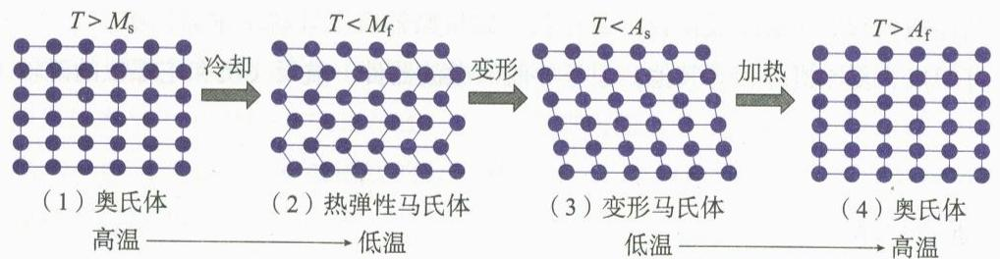  
图 3-1 形状记忆合金晶体结构随温度的变化

新型金属功能材料除上述几类以外，还有能降低噪音的减振合金；具有替代、增强和修复人体器官和组织功能的生物医学材料；具有在材料或结构中植入传感器、信号处理器、通信与控制器及执行器，使材料或结构具有自诊断、自适应，甚至损伤自愈合等智能功能与生命特征的智能材料等。

## 11. 课外实验: 常见食物中某种成分的检验

## 实验目的

(1) 学习检验常见食物中碘元素、铁元素和维生素C的方法。

(2) 初步了解食品检验的一般过程, 体验化学知识的实际运用。

## 实验原理

食品的分析和检验一般包括样品的采集、制备、预处理、样品的检验和结果计算等步骤。常用感官检验、物理检验、化学分析和仪器分析等方法。

海带中含有碘元素。海带经灼烧后，灰烬中的碘可转化为能溶于水的 $\Gamma$ 。在一定条件下， $\Gamma^{-}$ 可被一些氧化剂氧化生成 $\mathrm{I}_{2}$ 。例如， $\mathrm{H}_{2} \mathrm{O}_{2} + 2 \mathrm{H}^{+} + 2 \mathrm{I}^{-} = \mathrm{I}_{2} + 2 \mathrm{H}_{2} \mathrm{O}$ 。

某些蔬菜（如芹菜）、食用菌类（如木耳）、蛋黄、动物肝脏等富含铁。铁元素的检验方法很多，本实验依据含有 $Fe^{3+}$ 的溶液遇到KSCN溶液时变成红色来检验食物中铁元素的存在。

蔬菜和水果中富含维生素C。维生素C是一种无色、无臭结晶，味酸，易溶于水。可用于治疗缺乏维生素C引起的病症，如坏血病等。因此，维生素C又称抗坏血酸。本实验利用的原理是：维生素C具有还原性，在酸性溶液中可以被某些氧化剂（如 $I_{2}$ 、 $Fe^{3+}$ 等）氧化，维生素C被氧化为脱氢维生素C。

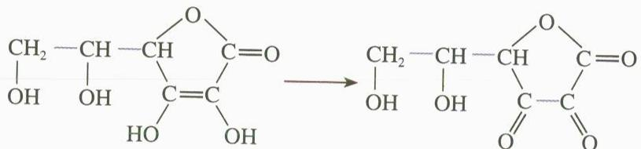

## 实验用品

锥形瓶、烧杯、试管、容量瓶、移液管、天平、玻璃棒、酒精灯、量筒、胶头滴管、坩埚、坩埚钳、铁架台、三脚架、泥三角、玻璃棒、托盘天平、刷子、剪刀、漏斗、滤纸。

鲜湿样（如蔬菜、水果等）、干海带、维生素C药片、稀硝酸、稀硫酸、25% KSCN溶液、2%的淀粉溶液、碘水、0.1 mol/L $FeCl_{3}$ 溶液、3% $H_{2}O_{2}$ 溶液、3 mol/L 硫酸、酒精、蒸馏水。

## 实验步骤

## (1) 碘元素的检验

①取约3 g的干海带，把干海带表面的附着物用刷子刷净（不要用水冲洗），用剪刀剪碎后，用酒精润湿，放入坩埚中。点燃酒精灯，灼烧海带至完全变成灰烬 $^{①}$ （装置如图3-2所示），停止加热，冷却。

②将海带灰转移到小烧杯中，向其中加入10 mL蒸馏水，搅拌、煮沸2\~3分钟，过滤。

③在滤液中滴入几滴稀硫酸，再加入约 $1 \mathrm{~mL} \mathrm{H}_{2} \mathrm{O}_{2}$ 溶液，观察现象。加入几滴淀粉溶液，观察现象。

## (2) 铁元素的检验

①将蔬菜样品用水冲洗，再用蒸馏水洗涤干净。称取 $10 \mathrm{~g}$ 样品于研钵中研磨，然后倒入烧杯中，加入 $30 \mathrm{~mL}$ 蒸馏水，搅拌，过滤。

②取少量滤液为样品加入试管中，加入少量稀硝酸，再加入几滴25%的KSCN溶液，观察现象。

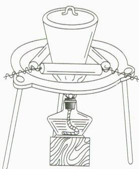

## (3) 维生素C的检验

图 3-2 灼烧干海带


①取一片维生素C药片（其辅料对本实验不产生影响），在研钵中研碎，放入试管中，加入10 mL蒸馏水，搅拌使其充分溶解。

②取 $5 \mathrm{~mL} 2 \%$ 的淀粉溶液加入试管中, 滴入 2 滴碘水, 振荡, 得到碘-淀粉溶液。取 $1 \mathrm{~mL}$ 碘-淀粉溶液于试管, 向其中慢慢滴加维生素 C 溶液, 观察现象。

③取 $1 \mathrm{~mL} 0.1 \mathrm{~mol} / \mathrm{L} \mathrm{FeCl}_{3}$ 溶液于试管中, 向其中慢慢滴加维生素 C 溶液, 观察现象。滴入几滴 KSCN 溶液, 观察现象。

④用滴管取少量碘-淀粉溶液，滴在新鲜水果的切面上，观察现象。

## 问题与讨论

(1) 在铁元素的检验实验中, 选用稀硝酸处理样品的主要目的是什么?

(2) 本实验用到的氧化剂和还原剂分别是什么?

（3）维生素C在水溶液中或受热时很容易被氧化，在碱性溶液中比在酸性溶液中更易被氧化。那么，生活中储存和食用新鲜蔬菜、水果时应该注意哪些问题？

## 教学案例

# 铁及其化合物

——铁的重要化合物

安徽省宣城市教学研究室 徐泓

## 教学目标

1. 认识铁的重要化合物的化学性质，知道 $\mathrm{Fe}^{3+}$ 的检验方法，能由氢氧化亚铁性质实验分析并设计出制备氢氧化亚铁的实验，初步构建“铁三角”转化关系模型。

2. 以铁及其化合物知识的学习为代表，从物质类别和元素价态的视角建立含变价元素物质的转化关系，丰富研究物质的思路和方法。

3. 通过阅读硫酸亚铁药片说明书，培养获取信息和初步加工信息的能力，初步学会设计简单实验的方法。

4. 运用所学有关铁及其化合物性质的知识和方法，从实际条件出发，解决生产、生活中的简单问题，进一步感受化学与生活的紧密联系，赞赏化学对人类所作的贡献。


## 教学重点

$\mathrm{Fe}^{2+}$ 的还原性、 $\mathrm{Fe}^{3+}$ 的氧化性和 $\mathrm{Fe}^{3+}$ 的检验。

## 教学难点

从物质类别和元素价态的视角建构铁及其化合物知识的学习方法。

## 教学过程

教学环节一、引入教学，建立研究视角

利用学生已有知识和经验引入教学，初步分类，建构学习元素化合物的两个视角——物质类别和化合价。

【教师活动】本课我们将学习铁的重要化合物。

【学生活动】列举含铁的化合物，并简单归类。

【教师活动】展示 $Fe_{2}O_{3}$ 、FeO、 $\mathrm{Fe(OH)}_{2}$ 、 $\mathrm{Fe(OH)}_{3}$ 、 $FeCl_{3}$ 、 $FeSO_{4}$ 等图片，带学生进入丰富的铁的世界，并引导学生进行分类。

【学生活动】交流、回答：举例说明这些化合物在生活中的用途。

教学环节二、探究硫酸亚铁片——认识硫酸亚铁的性质

设置生活情境，引导学生通过阅读常见补血药物硫酸亚铁片的说明书获取有关信息，运用分类观和已有的知识预测硫酸亚铁的性质，通过设计实验方案和动手实验，认识硫酸亚铁的性质。

【教师活动】展示一瓶硫酸亚铁片及说明书。

关键信息示例：①每片含硫酸亚铁0.3 g，着色剂为氧化铁；②本品为包衣片，除去包衣后显淡蓝绿色；③维生素C与本品同服，有利于吸收。

【学生活动1】阅读说明书并思考、交流：从中获得哪些信息？还有哪些问题？

【学生活动2】结合 $\mathrm{FeSO}_4$ 的物质类别，预测其化学性质。

【学生活动3】讨论并设计实验方案，汇报交流。

【教师活动】根据学生回答, 总结实验方案并投影展示实验步骤: ①取除去包衣后的硫酸亚铁片, 研碎后置于试管中并加入适量蒸馏水 (约试管体积的 $\frac{1}{3}$ ), 充分振荡, 分别装入三支试管中; ②向第一支试管中加入少量 NaOH 溶液, 观察现象; ③向第二支试管中加入少量氯水或双氧水, 观察现象; ④第三支试管留后续实验使用。

【学生活动4】在教师指导下分组合作进行实验探究。

【学生活动5】观察现象，形成结论，写出相关反应的离子方程式。

【学生活动6】解释、回答将硫酸亚铁片制成包衣片的原因。

教学环节三、 $\mathrm{Fe(OH)}_{2}$ 的制备

带领学生学习 $\mathrm{Fe(OH)}_{2}$ 的制备方法，并运用已有知识解释实验操作的原因，让学生感知 $\mathrm{Fe(OH)}_{2}$ 的还原性。

【教师活动】演示 $\mathrm{Fe(OH)}_2$ 的制备。

【学生活动1】观察、质疑。

【学生活动2】交流讨论, 统一认识, 写出 $\mathrm{Fe(OH)}_{2}$ 被空气中氧气氧化的化学方程式。

教学环节四、认识 $Fe^{3+}$ 的性质

了解 $\mathrm{Fe}^{3+}$ 的检验方法, 并运用这一知识解决问题。之后, 借助前面学习 $\mathrm{FeSO}_{4}$ 性质的方法预测 $\mathrm{FeCl}_{3}$ 的性质, 并利用 $\mathrm{Fe}^{3+}$ 的检验进行实验设计, 完成实验, 得出结论。

【学生活动1】利用上一环节学生活动中的第二、第三支试管中的试剂完成教材中的实验3-2，观察现象。

【学生活动2】如何检验药片的包衣层（含氧化铁）中有铁元素？设计实验并动手检验。

【教师活动】 $\mathrm{FeCl}_{3}$ 可能有哪些化学性质？如何研究？

【学生活动3】思考、交流、讨论，形成自己的预测（物质类别角度、化合价角度）。

【学生活动4】运用实验方法验证预测并得出结论。

【学生活动5】向本环节学生活动1得到的红色溶液中加入维生素C药片，观察现象，解释说明书中“维生素C与本品同服，有利于吸收”的原因。

## 教学环节五、总结

帮助学生自主形成对 $Fe^{2+}$ 、 $Fe^{3+}$ 的整体认识，构建较为完整的知识体系，巩固通过物质类别和化合价预测性质，并通过实验探究性质的方法，从中体验合作学习，在应用中感受化学学科的价值。全面实现本课时教学目标。

【学生活动】总结 $\mathrm{Fe}^{3+}$ 的氧化性，以及 $\mathrm{Fe}^{2+}$ 和 $\mathrm{Fe}^{3+}$ 的相互转化。

# 测定黑木耳中铁元素含量的探究思路和方法

北京市第四中学 杨利军


## 教学目标

1. 通过设计实验，从定性检验到定量测定黑木耳中的铁元素，巩固铁及其化合物的相关知识，提升物质检验、转化、分离提纯等基础实验技能。

2. 通过定性检测黑木耳中是否含有铁元素以及铁元素的存在形态，初步形成物质特性决定检验方法的认识模型。

3. 通过设计测定黑木耳中铁元素含量的方案，建立物质性质与测量方法的关联，并利用证据推理体会复杂体系中具有相同性质的物质对于测定的干扰。


## 教学重点

铁及其化合物的相关知识及应用。


## 教学难点

通过设计实验检验铁元素的存在并测定黑木耳中铁元素的含量，建立物质性质与检验、测定方法的关联，初步建立解决问题的角度和思路。

## 教学流程

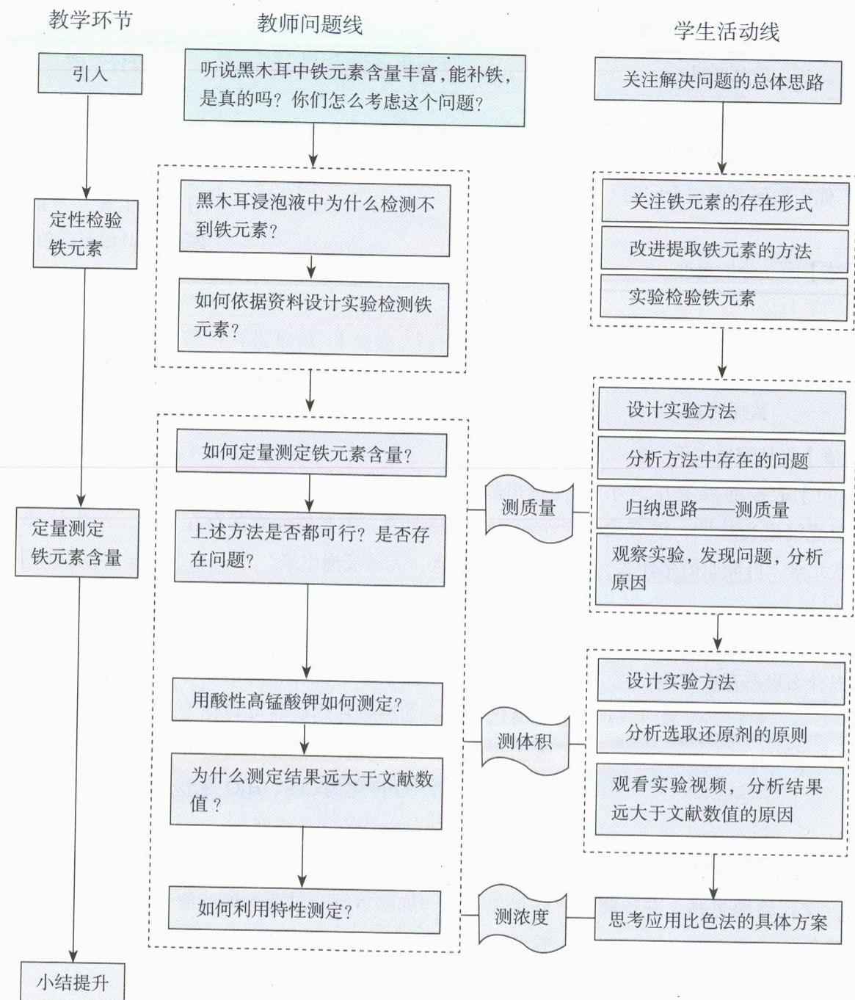

## 教学过程

教学环节一、创设情境

<table><tr><td>教师活动</td><td>学生活动</td><td>设置意图</td></tr><tr><td>【提问】听说“黑木耳中铁元素含量丰富,可以补铁”,是真的吗?你们如何考虑这个问题?【小结】确立分析角度。</td><td>【回答】要考虑有没有铁(定性)、含铁量多还是少(定量)、能否被人体吸收。</td><td>以真实的问题情境引入,激发学生兴趣。引导学生建立考虑问题的意识和宏观角度。</td></tr></table>

教学环节二、定性检验

<table><tr><td>教师活动</td><td>学生活动</td><td>设计意图</td></tr><tr><td>【过渡】先从定性入手。【提问】取浸泡黑木耳24小时的浸泡液进行检测,没有检测到铁元素。可能原因是什么?【追问】无法浸泡出来的铁元素是以什么形态存在的呢?【提供资料】【提问】在资料中寻找关键信息,设计检测思路,并预测实验现象。【板书】 $Fe^{2+}$ 、 $Fe^{3+}$ 的检验方法【展示】获得提取液的实验视频和照片。【布置任务】检验过滤好的提取液中铁元素的存在形式。</td><td>【提出假设】1不含铁;2含铁,但是铁元素的存在形式不溶于水,无法浸泡出来。【阅读资料】关键信息:1黑木耳中含有有机铁、有机钙化合物;2黑木耳灼烧后可转化为铁的氧化物;3灼烧可以使黑木耳中的有机物C、H、O转化为 $CO_{2}$ 、 $H_{2}O$ 等形式除去,使灰分中铁的含量浓缩。【提出方案】灼烧黑木耳→加酸溶解→过滤→取滤液检验。用铁氰化钾检验 $Fe^{2+}$ 的现象:蓝色沉淀;用硫氰化钾检验 $Fe^{3+}$ 的现象:红色溶液。【动手实验】分别向点滴板内的硫氰化钾溶液和铁氰化钾溶液中滴加黑木耳提取液3滴。</td><td>发现从浸泡液中无法检测到铁元素,产生认知冲突;通过思考和推理,提出可能原因,并依据探究流程自行提出解决问题的方法——查阅资料。培养逻辑推理能力和利用科学探究解决问题的能力。通过动手实验检验黑木耳提取液中铁元素的存在形式,激发学习兴趣。</td></tr></table>

续表

<table><tr><td>教师活动</td><td>学生活动</td><td>设计意图</td></tr><tr><td>【提问】实验现象是什么?得到什么结论?</td><td>【汇报现象,得出结论】加入铁氰化钾出现蓝色沉淀;加入硫氰化钾溶液变为红色。说明黑木耳提取液中既含 $Fe^{2+}$ ,又含 $Fe^{3+}$ 。</td><td>巩固、落实二价铁、三价铁的检测方法。</td></tr></table>

教学环节三、测定铁元素——测质量

<table><tr><td>教师活动</td><td>学生活动</td><td>设计意图</td></tr><tr><td>【过渡】如何测定黑木耳提取液中铁元素的含量呢?【布置任务】小组讨论:测定黑木耳提取液中铁元素含量的具体实验方案。【板书】思路1:测质量【提问】上述方法是否都可行?是否存在问题?【追问】铁粉和锌粉能否分离?【点评】巧妙地利用特性分离!</td><td>【交流、讨论、汇报】1氢氧化钠沉淀法 $\ce{Fe^{2+}}$ 氧化剂 $\ce{Fe^{3+}} \xrightarrow{\ce{NaOH}} \ce{Fe(OH)_3}$ 测氢氧化铁质量2还原法 $\ce{Fe^{3+}} \xrightarrow{\ce{Zn/Fe}} \ce{Fe^{2+}} \xrightarrow{\ce{Zn}} \ce{Fe}$ 测铁质量【思考、分析】还原法的问题:1会引入铁元素,使测定结果中铁元素含量增多;2为了使提取液中铁元素全部被置换出来,锌粉要过量,会影响铁质量的称量结果。【回答】用磁铁将铁粉分离出来。对氢氧化钠沉淀法的改进:改进1: $\ce{Fe^{2+}} \xrightarrow{\ce{NaOH}} \ce{Fe(OH)_2}$  $\ce{Fe^{3+}} \xrightarrow{\ce{NaOH}} \ce{Fe(OH)_3}$ 测氢氧化铁质量改进2:得到的氢氧化铁沉淀需要洗涤、烘干再称量,测氧化铁质量会更准确。 $\ce{Fe(OH)_3} \xrightarrow{\triangle} \ce{Fe_2O_3}$ 测氧化铁质量</td><td>对不同方法进行具体的分析和评价,培养批判性思维和化学思维能力,提升分析问题、解决问题的能力。</td></tr><tr><td>【过渡】大家根据已学知识提出了不同的方案,并且进行了修改和完善。接下来我们进行实验。【演示实验】向提取液中滴加浓氢氧化钠溶液。【提问】白色浑浊是铁的氢氧化物吗?出现白色浑浊的原因可能是什么?你推测的依据是什么?</td><td>【观察】出现白色浑浊。【回答】白色浑浊不是铁的氢氧化物。可以依据铁的氢氧化物的颜色判断。白色浑浊可能是氢氧化钙,可以依据前面提供的资料(黑木耳中含有有机钙化合物)判断。</td><td>分析复杂体系中存在的干扰,提升分析复杂体系问题的能力。</td></tr></table>

教学环节四、测定铁元素——测体积

<table><tr><td>教师活动</td><td>学生活动</td><td>设计意图</td></tr><tr><td>【过渡】还有别的方法能更准确测定铁元素吗?【提问】如果提供已知浓度的酸性高锰酸钾溶液,你能测定出铁元素的含量吗?【追问】提取液中的 $Fe^{3+}$ 含量怎么测定?</td><td>【小组讨论、汇报】利用高锰酸钾与 $Fe^{2+}$ 按照特定比例发生氧化还原反应计算 $Fe^{2+}$ 的量。【思考】先将 $Fe^{3+}$ 转化成 $Fe^{2+}$ ,再与高锰酸钾反应。</td><td>建立思维模型——利用物质转化测定物质含量。</td></tr><tr><td>【追问】用什么试剂可将 $Fe^{3+}$ 转化成 $Fe^{2+}$ ?【追问】四种还原剂都可行吗?【板书】记录将 $Fe^{3+}$ 转化为 $Fe^{2+}$ 的途径和思维过程。</td><td>【回答】还原剂,如碘离子、锌粉、铁粉、铜粉等。【讨论、汇报】为使 $Fe^{3+}$ 完全转化成 $Fe^{2+}$ ,还原剂需过量。过量还原剂如果留在溶液中会与高锰酸钾反应,需除去:1过量的碘离子无法除去,故不行;2若锌粉过量,则 $Fe^{2+}$ 会被还原成Fe,故不行;3铁粉会与体系中的硫酸发生反应,引入铁元素,故不行。</td><td>分析复杂体系中同类性质物质的干扰,提升分析复杂体系问题的能力。</td></tr></table>

续表

<table><tr><td>教师活动</td><td>学生活动</td><td>设计意图</td></tr><tr><td>【追问】选择还原剂的原则是什么?【板书】思路2:测体积【视频】【提问】上述实验过程中,操作没有任何问题,测定出提取液中铁元素的结果是文献数值的三倍,可能是什么原因引起的?</td><td>4铜粉将 $Fe^{3+}$ 还原成 $Fe^{2+}$ 后,可过滤除去过量的铜粉,铜离子与酸性高锰酸钾不发生反应。故可行。【回答】能且只能与 $Fe^{3+}$ 反应生成 $Fe^{2+}$ ,自身氧化产物不与高锰酸钾反应,过量还原剂能够除去。【观看、思考】明确实验原理、步骤、操作。 $2Fe^{3+} + Cu = 2Fe^{2+} + Cu^{2+}$  $5Fe^{2+} + MnO_{4}^{-} + 8H^{+} = 5Fe^{3+} + Mn^{2+} + 4H_{2}O$  $\frac{5}{c_{x}V_{2}} = \frac{1}{c_{1}V_{1}}$ 【回答】提取液中可能含有其他还原性杂质,消耗大量酸性高锰酸钾。</td><td></td></tr></table>

教学环节五、测定铁元素——测浓度

<table><tr><td>教师活动</td><td>学生活动</td><td>设计意图</td></tr><tr><td>【过渡】利用沉淀反应测沉淀质量,可能有其他沉淀杂质干扰;利用氧化还原反应测体积,可能有其他还原性杂质干扰。那么,还有别的方法能准确测量吗?【方法介绍】目视比色法。配制标准液(配制已知的、4种浓度的 $Fe^{3+}$ 标准液)→配制待测液(氧化提取液,滴加等量KSCN溶液)→通过颜色对比,估读黑木耳提取液中 $Fe^{3+}$ 的浓度。</td><td>【思考】利用特性完成准确测定。</td><td>体会对比法在定量测定中的应用,拓展视野,发展科学素养。</td></tr><tr><td>【提问】上述方法存在什么问题?【改进】色度计测量法。配制已知浓度的 $Fe^{3+}$ 标准液和待测液→色度计测量→原理(浓度越大,颜色越深,数值越大;浓度与数值成正相关)→绘制标准曲线,求算铁离子的浓度。</td><td>【质疑】估读浓度不准确。【思考】理解色度计测量法的原理,感受这种方法的价值。</td><td></td></tr></table>

教学环节六、小结与提升

<table><tr><td>教师活动</td><td>学生活动</td><td>设计意图</td></tr><tr><td>【总结】从化学思想方法、定量实验方法、科学态度与社会责任等角度提升。</td><td>【化学思想方法】特性——→物质检验物质性质——→物质转化元素守恒——→定量测定有机 $Fe \rightarrow Fe^{2+}$ 、 $Fe^{3+} \rightarrow Fe(OH)_3 \rightarrow Fe_2O_3$ [IMAGE]【定量实验方法】沉淀法———测质量↓滴定法———测体积↓比色法———测浓度↓食品安全局测定方法:原子发射光谱【科学态度与社会责任】黑木耳中铁元素含量:12.4 mg/100 g探索真理的道路上:实事求是,不要以讹传讹!</td><td>突出核心方法,提升思维品质。</td></tr></table>

## 板书设计

测定黑木耳中铁元素含量的探究思路和方法

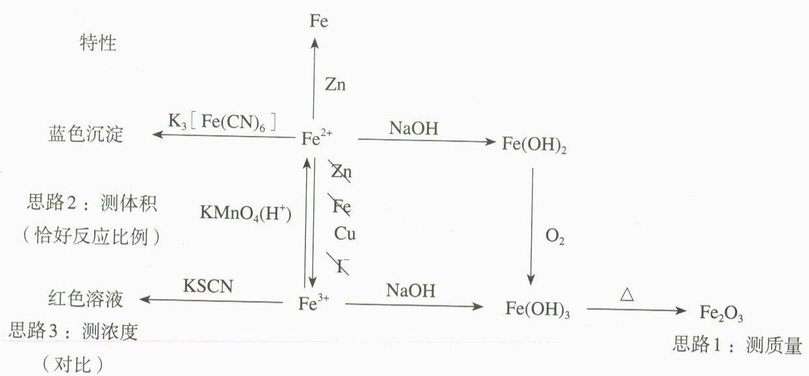  
思路1：测质量

## 第四章

## 物质结构 元素周期律

## 本章说明

物质结构和元素周期律是中学化学的重要基础理论知识，也是中学化学教学的重要内容。初中化学已经介绍了原子结构、分子形成，以及氧、氢、碳、铁等元素及其化合物的知识，本册教材的前几章又介绍了钠、氯、铁等元素及其化合物，为学生在本章从微观结构的角度认识物质和反应打下了一定基础。通过本章内容的学习，学生可以在认识已有知识的基础上，进行深化、概括、综合，并从理论上进一步认识物质的性质和化学反应的本质，实现从宏观到微观，从感性到理性的认识提升。原子结构、元素周期律为后续学习中探索、研究元素化合物及化学反应原理打下理论基础。


## 一、教材分析

本章内容包括原子结构、分子结构和元素周期系等知识。教材以原子结构知识为基础，通过两条线索搭建体系结构框架，如下图所示。

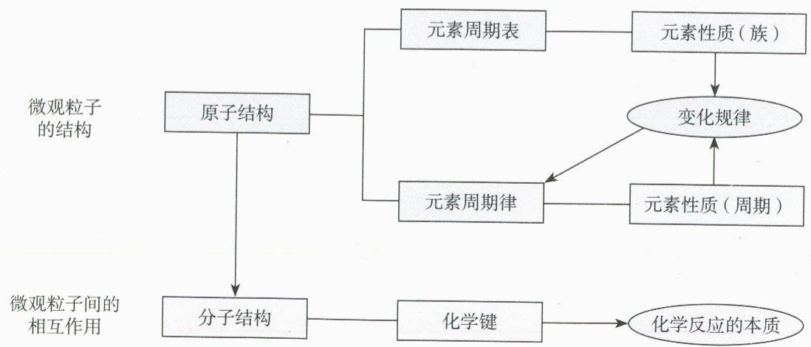

第一条线索：从微观粒子结构（原子结构）的视角，引导学生研究元素周期表（律），认识和解释元素性质及其变化规律，探索元素间的内在联系。教材从原子结构入手，以典型金属元素族（碱金属）和典型非金属元素族（卤族元素）为代表，引出元素性质的相似性和递变性；以第三周期元素为代表，引出元素性质的差异性及变化规律；最终归纳出元素周期律；突出“构”“位”“性”的关系，体现结构决定性质的观念。

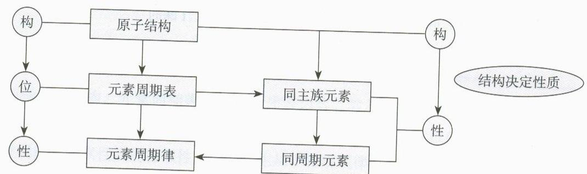

按这一线索编写的第一、第二节内容，将周期表安排在周期律之前，主要有三方面原因。一是学生在初中已经有对元素周期表的初步认识，从基础经验出发；二是突出“构”“位”的关系，使学生可以较为直观地发现性质变化特点和规律；三是体现周期表的发现和周期律的确立过程，体现科学家的研究方法，突出周期表的工具性。

第二条线索：从微观粒子间相互作用的视角，在原子结构的基础上，引导学生探究分子的结构，认识化学反应的本质。教材从学生熟悉的物质入手，分析构成分子的原子的结构，呈现分子的形成过程，从微观视角揭示化学反应实质。

本章内容理论性强，概念抽象，涉及较多新的元素化合物知识。教材的编写主要从三方面考虑：在内容选择和编排上，将理论知识与元素化合物知识穿插、融合，并引入化学史资料，体现发展过程，揭示科学本质；在呈现形式上，较多地利用直观模型图示、表格对比，帮助学生认识抽象的原子结构及化学反应的本质；在活动安排上，利用实验探究、比较的方法，帮助学生发现元素性质及其变化规律。


## 二、学业要求

1. 能画出 1\~20 号元素的原子结构示意图。

2. 能用原子结构解释元素性质及其递变规律，并能结合实验及事实进行说明；能观察并如实记录实验现象和数据，进行分析和推理，得出合理的结论。

3. 能利用元素在元素周期表中的位置和原子结构，分析、预测、比较元素及其化合物的性质。

4. 能判断简单离子化合物和共价化合物中的化学键类型。

5. 能结合有关资料说明元素周期表对合成新物质、寻找新材料的指导作用。

6. 能对关于碱金属、卤素、第三周期元素等元素性质进行预测和假设，并对某些性质如酸碱性、氧化性等进行实验验证。

## 三、课时建议

第一节 原子结构与元素周期表 4课时  
第二节 元素周期律 2课时  
第三节 化学键 2课时  
全章复习 1课时  
实验活动3 同周期、同主族元素性质的递变 1课时

## 第一节 原子结构与元素周期表

## 一、内容分析

本节包括原子结构、元素周期表、元素性质等内容。教材在构建内容体系时，注重知识的逻辑性。教材将原子结构与元素性质的关系、元素周期表作为重点，以碱金属元素和卤族元素为代表，呈现同族元素性质的相似性，引导学生从中发现规律。

原子结构奥秘的揭示，是元素周期表趋于完美的关键。所以，教材以原子结构知识为基础，先介绍原子结构（“构”）与元素周期表（“位”）的关系；从原子核外电子数不同的角度，介绍周期表的结构（“位”）；从原子核内中子数不同的角度，介绍核素（同位素）。在“构”“位”关系的基础上，通过元素周期表中两族元素的性质，建构出“构”“位”“性”的关系，使学生初步认识同类物质的共性及性质变化规律，形成结构决定性质的观念。

关于原子结构，以初中已有知识为基础，教材通过“思考与讨论”，引导学生观察稀有气体元素原子核外电子排布，发现规律，从而归纳出1\~20号元素的原子核外电子排布。这样的呈现方式，重在启发学生思考，培养逻辑思维能力。第一章“方法导引”介绍了科学方法——模型，而本节呈现的科学史话——原子结构模型的演变，有利于学生进一步理解科学模型的含义。学生阅读后，可以了解人类对原子结构的认识逐步深入的过程，能够体会到现在学习的科学理论只代表人类对客观事物认识的一个阶段，而人们对客观事物的认识，还会不断深入和发展。

关于元素周期表，学生在初中已了解概貌，教材中这部分内容编写的目的是要使学生了解和熟悉周期表的结构。本节采用“思考与讨论”的方式，让学生发现、归纳原子结构与周期表的关系，这里重点讨论的是周期表的族序数（“位”）与原子核外电子（“构”）的关系，为后面讨论元素性质打下基础。之后呈现的核素的知识，是对元素概念的扩大，教材是从周期表的同“位”与原子核（“构”）的关系这一视角来讨论的。有关放射性同位素的知识，中学物理中已有较多的介绍，此处只是简单介绍应用。元素周期表与核素这两部分内容，可以使学生初步建立“构”“位”“性”的关系。

关于原子结构与元素性质的关系，教材编排依托于元素周期表中的两族元素，即典型的金属元素族——碱金属，典型的非金属元素族——卤素。教材重点阐述元素的金属性、非金属性与元素在周期表中的位置和原子结构的关系，目的是帮助学生提高应用周期表分析问题和解决问题的能力；进一步建构“构”“位”“性”的关系，形成结构决定性质的观念。

本节内容既涉及基础理论知识，又涉及元素化合物知识，内容量大，理论性强。教材的编排考虑以下几方面。

第一，本节的内容重点体现“构”“位”“性”的关系，教材的呈现重视知识逻辑性，采用在 “构” “位” 基础上，以 “演绎—归纳” 的方式得出性质及变化规律。教材从原子结构和元素周期表出发，演绎元素的性质，再以理论和事实为依据，归纳得出同主族元素性质的变化规律。

第二，元素周期表的发现过程，充分体现了科学研究方法、观念和科学精神，教材在本节特别重视化学史情境的创设。通过节引言、元素周期表的引入段落、科学史话、研究与实践等形式，呈现周期表的发现过程和意义。例如，在元素周期表的引入段落，以门捷列夫编制第一张周期表引入，并特别强调其是“在前人研究的基础上”编制出来的；在科学史话“元素周期表的发展”中，简述了门捷列夫周期表之前的基础和之后的发展；在研究与实践“认识元素周期表”中，还以学生体验的形式，通过关注周期表发展过程中的不同形式，引导学生认识和理解周期表。这条化学史情境线索的呈现，能使学生发现和体会科学家的研究方法和科学态度。

第三，周期表的重要作用之一，是使学生能够通过周期表的位置和元素的原子结构，预测元素的性质，发现新元素。教材在本节的呈现突出体现了这一作用。教材呈现的周期表中两族元素的性质，都是从“预测”出发的。例如，碱金属的性质，是通过探究活动“碱金属性质的比较”，采用“预测—验证（实验）—分析—结论”的思路归纳出来的；卤素的性质，是通过“思考与讨论”栏目，采用“预测—验证（事实）—分析—结论”的思路归纳出来的。学生可以通过这样的过程体会元素周期表的作用。同时，教材在“方法导引”中介绍了“预测”这一科学方法。这些编排都有利于学生认识到科学方法对研究和学习的意义。


## 二、教学目标

## 1. 教学目标

（1）知道原子的结构及构成原子的微粒间的关系；根据原子核外电子的排布规律，能画出1\~20号元素的原子结构示意图。了解预测、假设、模型等方法在科学家研究原子结构中的作用。

（2）通过了解元素周期表的结构，认识原子结构与元素在周期表中位置间的关系。

(3) 知道质量数和 $A_{2} \mathrm{~X}$ 的含义, 知道元素、核素、同位素的含义。

（4）以 IA、VII A 族元素为例，通过探究认识同主族元素性质的递变规律，并能用原子结构理论初步加以解释；培养分析、处理数据的能力，尝试运用比较、归纳等方法对信息进行加工。

## 2. 教学重点和难点

重点：元素周期表的结构；元素在元素周期表中的位置及其性质的递变规律。

难点：原子结构与元素性质的关系。

## 三、教学建议

## 1. 以化学史为线索进行原子结构教学

学生在初中时已经初步学习了原子结构，知道原子的基本构成、拉瓦锡发现氧气、卢瑟福α粒子轰击金箔实验、电子扫描隧道显微镜等，有了一定的知识储备，为深入研究原子结构做好了准备。因此，教师在讲授原子结构的内容时要在教材的基础上深入挖掘相关知识，使隐性知识显性化，以满足学生对原子结构的探索欲望，帮助学生提高化学学科核心素养。

教材中的“科学史话”栏目从道尔顿模型、汤姆孙原子模型、卢瑟福原子模型、玻尔原子模型、电子云模型五个阶段来介绍原子结构模型的演变过程。在教学时，可适当补充五个阶段之间的衔接与过渡，向学生介绍五个阶段分别对应的“实心球”“葡萄干面包”“行星式”“量子化轨道”“现代电子云”模型，将学生置身于历史情境中，使他们体验原子结构模型的建立、修正、完善的过程，体会到理论的暂时性，认识到科学理论并非是亘古不变的永恒真理，科学始终经历着推翻与革新。在现代原子结构模型演变的不同阶段，科学家提出的每个新的模型总是建立在证据推理的基础之上，每个模型都体现了当时科学家对原子的一种认识。通过了解原子结构模型的演变历程，学生可以认识到从宏观和微观结合的视角分析与解决实际问题的重要性，知道科学研究过程中常需要依据物质及其变化的信息建构模型，提高模型认知能力。

## 2. 设置问题串，以问题驱动元素周期表的学习

元素周期表是元素周期律的具体体现，是中学生学习化学的重要工具，具有很强的指导性。理解元素周期表的结构是后续学习的基础，也是应用元素周期表解决相关问题的基础。教材把元素周期表的教学安排在原子结构的内容之后，目的是引导学生在了解原子结构的基础上认识元素周期表的排布规律。

本部分内容可以以问题为向导，以情境为平台，引导学生阅读教材、分析归纳、探究发现，促成学生自主建构元素周期表的基础知识和“结构决定位置，位置反映结构”的基本观念。通过层层深入、环环相扣的问题串的设置，引导学生寻找问题的答案；通过互动交流、适时点评，帮助学生全面认识元素周期表的结构及其排布规律。一组问题串的设计示例如下。

引入：介绍周期表的发展史：“三素组—六元素—八音律—门捷列夫周期表”。

问题 1：什么叫原子序数？原子序数与元素的原子结构之间有什么内在联系？

问题 2：在元素周期表中，元素排列的原则是什么？

问题 3：元素周期表中有几个横行？构成几个周期？周期分为几类？分类依据是什么？

问题 4：元素周期表中有几个纵列？构成几个族？族分为几类？分类依据是什么？

问题 5：画出元素周期表的轮廓，标出周期序数和族序数，标明碱金属元素、卤族元素、稀有气体元素、过渡元素所处的区域，找出其中包含元素种类最多的周期和族。

问题6：同周期ⅡA、ⅢA族元素的原子序数的差值存在哪些可能？

问题7：每周期各有多少种元素？你发现各周期的元素种数有什么规律？

问题8：如果将来第八、第九周期的元素全部被发现，请预测这两周期各有多少种元素，其中稀有气体元素的原子序数分别为多少？

上述问题串中，设置问题1\~6的主要目的是引导学生认识元素周期表结构及相关概念。设置问题7\~8的目的是让学生总结周期表中元素的排布规律，并运用规律对元素周期表的未来发展趋势做出预测和判断。对于问题7，可以结合教材中的“思考与讨论”栏目进行教学，让学生在完成“思考与讨论”中的表格后，再继续填写下表并归纳规律。由此不难预测：第八、第九周期的元素种类将各有50种，对应的稀有气体元素的原子序数分别为168和218，从而回答问题8。

<table><tr><td>周期序数</td><td>元素种类数</td><td>规律</td></tr><tr><td>1</td><td>2</td><td> $2 \times 1^{2}$ </td></tr><tr><td>2、3</td><td>8</td><td> $2 \times 2^{2}$ </td></tr><tr><td>4、5</td><td>18</td><td> $2 \times 3^{2}$ </td></tr><tr><td>6、7</td><td>32</td><td> $2 \times 4^{2}$ </td></tr><tr><td>8、9</td><td>?</td><td>?</td></tr></table>

## 3. 发挥 “研究与实践” 栏目的功能，让学生自行设计并制作元素周期表

本节的“研究与实践”栏目提供了一种让学生自主学习元素周期表的方案。教学中，教师可以先给学生总结元素周期表的编排原则（行、列）及元素周期表的结构（周期、族），再要求学生自己设计并制作元素周期表。学生通过设计并制作元素周期表，可以体会科学研究的方法，熟悉元素周期表的结构，加深对元素周期表编排规律的理解，认识原子结构与周期表的关系。然后通过师生共同评价选出优秀作品，供学生间交流和学习，提高活动效果。

在让学生阅读 “科学史话” 栏目中元素周期表的发展史时，可以展示对应时期的各种元素周期表，让学生体会科学发展曲折、螺旋式前进的过程，体会理论在发展中不断被完善的过程。

## 4. 运用 POE 策略进行原子结构与元素的性质教学

POE策略即“预测—观察—解释”（Predict-Observe-Explain）策略。这种策略要求在实验演示前，学生先根据自己已有的知识对实验现象进行预测；演示实验时，学生观察现象；实验结束后，学生对所观察到的现象进行解释。

根据 POE 策略，碱金属元素的教学可按下述过程进行。

学生先由碱金属元素的原子结构预测Na和K的化学性质，接下来通过观察或者动手实验Na、K分别在氧气中燃烧及分别与水的反应，再经过讨论得出碱金属元素化学性质的相似性和递变性，并从原子结构角度解释原因，最终形成金属族元素金属性的递变规律。

接下来，经过类比得出Li常见的化学性质，并注意由于原子结构的差异产生的其与其他碱金属元素性质间的差别；预测Rb、Cs与水反应可能的现象，并通过观察实验视频验证。最后思考问题：Ca与Mg是同一主族元素，谁的金属性更强？如何设计实验加以证明？

在通过实验归纳得出元素金属性强弱的判断依据及碱金属元素金属性的递变规律后，可再次运用POE策略进行卤族元素的教学：学生先预测卤族元素化学性质的相似性与递变性，再通过阅读反应事实及观察实验4-1寻找证据进行验证，最后从原子结构角度解释卤族元素非金属性的递变规律。

## 5. 通过方法导引，引导学生认识原子结构与元素性质的关系

教材对元素性质与原子结构关系的揭示，主要是通过探究碱金属和卤族元素的性质得出同一主族元素得失电子的能力、金属性和非金属性递变的趋势完成的，这是本节的重点，也是难点。教学中要注意教给学生思考问题的思路和方法，为学习元素周期律奠定基础。

(1) 使学生建立 “结构决定性质” 的观念, 在对常见金属元素和非金属元素的性质有了进一步的认识和研究的基础上, 适当提升对学生在学科知识科学性和系统性方面的要求。

（2）注意提醒学生运用第一章学过的理论工具（氧化还原反应原理）来分析物质的化学性质。比如，碱金属单质的还原性，或者卤素单质的氧化性，既有相似之处，又有规律性的变化，而它们都与同主族元素的原子结构的递变有着紧密的联系。

（3）对于卤素单质与氢气的反应，由于实验条件的限制，教材中并没有安排相关实验，而是通过直接给出实验事实，让学生用归纳的方法得出卤素单质与氢气反应的相同点和不同点。可以告诉学生规律不一定非得通过从零开始的实验探究得出，也可通过分析已经存在的科学事实归纳得出。

(4) 卤素之间的置换反应实验说明, 同主族元素的递变性不仅可以通过和同一种物质反应 (如碱金属单质与水反应, 卤素单质与氢气反应) 的难易程度对比得出, 也可以通过置换反应得出。


## 四、栏目使用建议

## 1. 实验

【实验4-1】

此实验中的氯水必须新制，用棕色瓶存放。同时，实验所用的KBr溶液、KI溶液、氯水浓度应尽量大一些，以使实验现象更明显。该实验也可设计如下：向KBr溶液中加入氯水，振荡后静置，观察现象；向上述溶液中加入KI溶液，再次振荡后静置，观察现象。引导学生思考：若要证明氧化性 $Cl_{2}>Br_{2}>I_{2}$ ，上述实验中加入的氯水应该为少量还是过量？为什么？

## 2. 思考与讨论

【思考与讨论1】

引导学生阅读并讨论表格给出的稀有气体元素原子的核外电子排布，对表中数据进行分析、归纳、总结，从而得出原子核外电子排布的一般性规律。栏目中设置的4个问题层层递进，由浅入深。在教学时可以在问题（2）（3）之间增加两个问题：倒数第三层最多容纳的电子数是多少？K、L、M、N层最多容纳的电子数各是多少？通过上述问题，可以归纳出以下核外电子排布的规律：

(1) 各个电子层最多容纳的电子数分别为: 最外层不超过8个 (K层不超过2个), 次外层不超过18个, 倒数第三层不超过32个。

(2) 第 $n$ 层最多容纳的电子为 $2n^{2}$ 个。

得出结论后，教师可以指出上述规律存在的原因将会在后续课程中继续学习，在现阶段不做

要求，并建议感兴趣的同学在课外自行阅读相关书籍。

【思考与讨论2】

引导学生观察元素周期表，经过思考、讨论后填写表格；再根据表格归纳总结，从而得出结论：周期序数=原子核外电子层数。

类似的这种讨论可以延续到对元素周期表中族的学习。通过比较同主族元素原子的最外层电子数得出结论：主族序数 $=$ 最外层电子数。

【思考与讨论3】

本栏目中的表格主要呈现了碱金属元素的原子结构示意图和原子半径。学生可以根据表中的原子结构示意图填写核电荷数、最外层电子数、电子层数等空格。阅读表格时，还可以提醒学生留意原子半径的数量级，并与宏观物体的大小做比较。

通过对本栏目中两个问题的思考与讨论，学生可以得出碱金属元素的原子结构具有以下特点：

（1）相同点：原子核外最外层电子数都为1。

(2) 递变性: 从上到下随原子序数递增, 碱金属元素的原子核外电子层数递增, 原子半径递增。

学生在初中时已经认识到元素的化学性质与原子的最外层电子关系最为密切，因此可以根据碱金属元素原子结构的相同点得出碱金属化学性质相似的结论。教师在此还可以指出，除了相同点之外，碱金属元素的原子结构的递变性还决定了它们的性质会呈现出一定的变化规律，为探究碱金属元素的化学性质埋下伏笔。

【思考与讨论4】

由于学生已经有了学习碱金属的经历，积累了探究同主族元素原子结构和元素性质关系的学习方法，完全可以把此学习方法迁移到卤素的学习中。本栏目主要为学习卤素的化学性质而设置，教学时要充分利用教材提供的相关素材（如卤素原子结构示意图、卤素单质与氢气的反应事实、相关注释等）。

对于问题①，可以引导学生先观察卤素的原子结构示意图，分析、归纳卤素原子结构的相同点与递变性。在此基础上，再推测氟、氯、溴、碘在化学性质上可能表现出的相似性和递变性。对于问题②，可以结合教材表4-4中卤素单质与氢气的反应事实展开讨论，并提醒学生阅读教材相关注释中判断非金属性强弱的实验依据，最后得出结论，依次回答教材中的三个问题。

按 $F_{2}$ 、 $Cl_{2}$ 、 $Br_{2}$ 、 $I_{2}$ 的顺序：

①与氢气反应的难易程度：由易到难。

②生成的氢化物的稳定性：由强到弱。

③卤素的非金属性强弱：由强到弱。

## 3. 探究

【探究】碱金属化学性质的比较

本探究分为三个环节。

环节一 问题与预测。先让学生回顾钠的化学性质，为接下来的性质预测做好铺垫。再让学生结合Li、Na、K的原子结构特点，预测Li、K可能具有哪些与Na相似的化学性质。在此，只要学生能够说出预测的理由，不管预测正确与否，教师可不予评价，以使他们保持好奇心。学生期待的答案马上就会在接下来的环节二揭示出来。

环节二 实验和观察。本环节先让学生回忆Na分别与氧气、水反应的现象，以和接下来的实验现象做对比。在K与氧气反应的实验过程中，要提醒学生注意观察：钾在燃烧前是否熔化，熔化后的钾的颜色与光泽，燃烧时有无烟和焰，烟、焰及固体产物的颜色等。在钾与水的实验过程中，要提醒学生注意观察钾在水面的浮、熔、游，以及溶液颜色的变化、反应的剧烈程度等现象。

钾在空气中燃烧的实验可设计为学生分组实验；而钾与水的反应，最好由教师在实物投影仪上演示。钾块不要太大，取绿豆大小即可，以免发生危险。钾与氧气反应的实验，需要先加热坩埚，再投入用滤纸吸去表面煤油的钾块，目的是缩短加热的时间，避免因为缓慢氧化而不利于观察熔化后的钾的色泽。在此两个实验过程中需要戴上护目镜，如不具备条件，也可在钾与水反应的烧杯口放一只表面皿以防止溅出。

环节三 分析和结论。本环节设置了三个问题。第一个问题是根据实验现象展开讨论，总结钠、钾相似的化学性质，解决学生心中的疑惑，与环节一前后呼应。第二个问题是通过比较钾、钠分别与水反应的难易程度，再次预测锂与水反应的难易程度，目的是让学生认识锂、钠、钾化学性质的差异性和递变性。设置第三个问题的目的，是让学生运用碱金属元素原子结构的递变性来解释锂、钠、钾化学性质的递变性，并运用由个别到一般的归纳方法，归纳出碱金属化学性质的相似性和递变规律。


## 五、练习与应用参考答案及说明

1. (1) $^{6}_{3}$ Li $^{7}_{3}$ Li

(2) $^{14}_{6}C$ $^{14}_{7}N$

(3) $^{23}_{11}$ Na $^{24}_{12}$ Mg

2. B 
3. C 
4. C

5. (1)

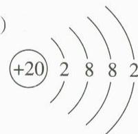

(2) $2\mathrm{Na} + 2\mathrm{H}_{2}\mathrm{O} = 2\mathrm{Na}^{+} + 2\mathrm{OH}^{-} + \mathrm{H}_{2}\uparrow$

(3) $\mathrm{Cl}_{2} + \mathrm{H}_{2} \mathrm{O} = \mathrm{HCl} + \mathrm{HClO}$

(4) $\mathrm{CH}_4$ $\mathrm{NH}_3$ $\mathrm{H}_2\mathrm{O}$

6.

<table><tr><td></td><td>金</td><td>银</td><td>铜</td><td>铁</td><td>锌</td><td>钛</td></tr><tr><td>周期</td><td>六</td><td>五</td><td>四</td><td>四</td><td>四</td><td>四</td></tr><tr><td>族</td><td>IB</td><td>IB</td><td>IB</td><td>VIII</td><td>IIB</td><td>IVB</td></tr><tr><td>核电荷数</td><td>79</td><td>47</td><td>29</td><td>26</td><td>30</td><td>22</td></tr></table>

7. 可获取的信息主要有：元素在周期表中的位置、原子序数、元素名称、元素符号、相对原子质量等。示例如图所示。

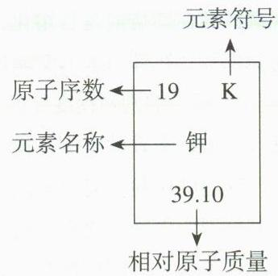

8. 提示：食品、调味品中含有的非金属元素主要有C、H、O、N等；金属元素可能有Na、K、Fe、Ca等。洗涤剂、清洁剂中含有的元素主要有C、H、O、P、Na等。

## 第二节 元素周期律

## 一、内容分析

本章第一节已经分别讨论了碱金属元素的金属性和卤族元素的非金属性变化规律，构建了同主族元素性质变化的相似性和递变性规律，使学生初步认识了“构”“位”“性”的关系。本节则在此基础上，以第三周期元素为代表，阐述元素性质的周期性变化，揭示同周期元素从金属元素到非金属元素性质的变化规律。学习族和周期元素性质的变化，可以使学生综合认识元素性质的周期性递变规律，从而归纳出元素周期律，了解元素周期表和周期律的应用，对“构”“位”“性”的关系有进一步的认识。

本节教材内容的呈现，仍是以原子结构为基础的。由于第一节已经通过两族元素初步建构了“构”“位”“性”的认识模型，本节应用认识模型，通过“思考与讨论”和“探究”活动，引导学生思考并参与知识的建构。

对于中学阶段重要的理论知识，教材编写体现学科知识的逻辑性，重视推理，借助实验和事实进行分析；应用演绎、归纳的方法，培养学生的逻辑思维能力。教材中核外电子排布、原子半径、化合价的变化规律，是应用归纳的方法由学生讨论得出；元素的金属性、非金属性变化规律，则是在原子结构知识的基础上先演绎，后通过探究归纳得出。

本节教材主要研究第三周期元素的性质变化，重在引导学生从中发现规律，所以一些知识是作为发现规律的载体编排进来的。例如，关于铝的知识，课程标准并无明确要求，教材中是将其作为信息给出，目的是使学生从中发现变化的趋势，总结出规律。

探究 “第三周期元素性质的递变”，是应用预测方法模型，通过设计 “问题提出—实验（事实）验证—结论分析” 的探究思路，并运用比较、信息处理等方法，引导学生体验探索规律的过程，学习科学研究的方法。

## 二、教学目标

## 1. 教学目标

（1）结合有关数据和实验事实认识原子核外电子排布、元素最高化合价和最低化合价、原子半径等随元素原子序数递增而呈周期性变化的规律。

（2）以第三周期元素为例，认识同周期元素的金属性、非金属性等随元素原子序数递增而呈周期性变化的规律，建构元素周期律。

(3) 基于元素 “位置—结构—性质” 认识元素性质, 基于物质 “结构—性质—用途” 认识物

质性质，基于元素性质递变的本质原因认识物质世界。

（4）加深对分类法、归纳法等科学方法的认识，提高逻辑推理能力、论证能力，从而发展证据推理与模型认知的化学学科核心素养。

## 2. 教学重点和难点

重点：元素周期律的含义和实质；元素性质与原子结构的关系。

难点：元素性质与原子结构的关系。


## 三、教学建议

## 1. 明确元素周期律在高中化学学习中的功能与价值

元素周期律是对元素性质呈现周期性变化实质的揭示。通过学习元素周期律，学生可以加深对元素化合物性质的理解和记忆，同时也对元素化合物知识进行拓展和归类。例如，通过学习元素周期律、周期表，学生会在原来学习的一个个零散的单质、化合物知识的基础上，明确同一周期元素及化合物性质的递变性和同一主族元素及化合物性质的相似性，使元素化合物知识得以迁移与拓展。学生通过对已有知识进行概括、综合，实现由感性认识上升到理性认识；同时，也会以新认识来指导后续学习。所以，对于元素周期律的教学不要拘泥于对某一两种元素的性质的挖掘，而应该着眼于启发学生去发现元素的性质随着原子序数的递增而呈现出的规律性变化。

## 2. 注意概念原理教学的逻辑性

元素周期律属于化学概念原理知识，概念原理教学应具有严密的逻辑性。从课堂教学的结构上，应当体现出教学内容本身逻辑系统的要求；要重视理论推理，借助实验和事实分析，应用归纳法和演绎法，培养学生的逻辑思维能力。概念原理的教学可以采用以下模式：个例性质—问题（实验）探究—归纳（抽象）结论—应用概念解决具体问题。教师要充分利用学生的已有知识，引导学生通过对个例的研究，归纳总结出一般规律。针对每一个要学习的知识点，以学生学过的某种元素化合物为模型，设置合适的情境，如问题串、实验等，让学生通过对问题的思考或对实验现象的描述、分析，解答问题，归纳总结得出结论，在此基础上，再给出概念原理定义。这样，学生不仅记住了元素周期律、周期表，还可以感受和体验这一规律性知识的形成过程，学会研究化学概念原理的方法。

元素周期律、周期表的教学如果处理不好会使学生感到乏味，甚至思维混乱，对化学学习失去兴趣。而实验探究或问题探究式的教学均能激发学生的学习兴趣，但一定要注意从学生已有的经验出发，最大程度地调动学生思考问题的积极性，提高学生的逻辑思维水平。

## 3. 建构解决问题的模型——“结构决定性质”

教学中要注意引导学生建构解决问题的模型，即“结构决定性质”，让学生学会从原子结构入手进行分析，从而解释元素的各种性质呈周期性变化的原因。原子结构（核外电子排布）决定元素在周期表中的位置和性质（化合价、半径、金属性和非金属性）；元素在周期表中的位置，反映了元素的原子结构和元素的性质。在元素周期表和周期律的教学中，要引导学生建构解决问题的模型，使他们能把元素的性质、元素在周期表中的位置与相关的粒子结构联系起来，并能通过对“位置”“结构”“性质”三者关系的分析，提升推理能力及分析、解决问题的能力。

## 4. 基于数据分析的方法论证元素化合价、原子核外电子排布、原子半径的周期性变化

教材中的表4-5中给出了短同期元素的原子核外电子排布、原子半径和主要化合价等丰富的信息。在教学时可以让学生在比较、分析的基础上对所搜集的信息进行加工处理。学生可以通过下列活动得出原子核外的最外层电子数、元素的原子半径、元素的主要化合价的变化规律。

## 环节1 元素化合价的数据加工与处理

观察教材中的表4-5，以1\~18号元素为例，以原子序数为横坐标，原子最外层电子数及化合价（最高正价、最低负价）为纵坐标，制作折线图和柱状图，并观察所得图形。（如图4-1所示）

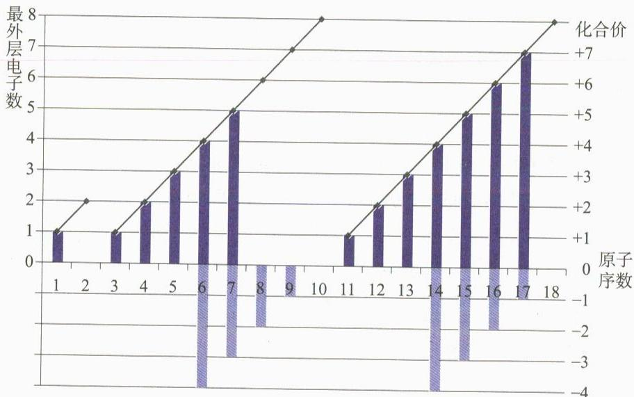  
图 4-1 原子序数与化合价、最外层电子数关系图

## 环节2 原子半径的数据加工与处理

根据教材表4-5中原子半径数据，以原子序数为横坐标，原子半径为纵坐标，绘制折线图如图4-2所示。从点（同主族元素）、线（同周期元素）、面（不同周期的变化趋势）三个层次进行数据分析，归纳规律。

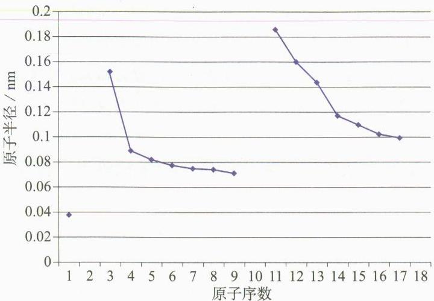  
图 4-2 原子序数与原子半径关系图

## 环节3 数据分析与规律预测

预测元素原子核外电子排布规律、原子半径及化合价变化规律，并通过填写“思考与讨论”栏目中的表格，发现规律并“水到渠成”地得出结论：随着原子序数的递增，元素原子的电子层排布、原子半径和化合价都呈现周期性的变化。

## 环节4 规律解释

再次引导学生分析以下问题：为什么同周期元素的原子半径会随着核电荷数的增加逐渐变小？原因是在电子层数相同的情况下，随着原子序数的增加，原子核对核外电子的电性作用增强，使得最外层电子与原子核之间的距离缩小，从而使得原子半径减小。

上述设计通过4个环节完成数据分析及对元素的原子半径、化合价、核外电子排布递变规律的预测、分析与解释任务，促进学生理解元素的原子半径、核外电子排布、化合价的递变规律，以及“位置”“结构”“性质”之间的关系。上述活动可以促使学生掌握证据收集的方法，提升对物质性质和变化规律进行科学假设的意识。

## 5. 基于实验证据论证元素的金属性和非金属性的周期性变化

关于第三周期元素的金属性和非金属性的递变规律，可结合教材中的探究栏目，通过探究式教学组织教学过程。下列设计思路可供参考。

提出问题（如元素的金属性、非金属性是否随元素原子序数的变化而呈周期性变化？）→实验探究（如钠、镁、铝元素化学性质的比较）→得出结论→提供信息（如硅、磷、硫、氯元素的性质事实）→思考与讨论→概括出元素的金属性、非金属性递变规律→提出新问题：从原子结构角度如何解释元素的金属性、非金属性递变规律？（提示：结构决定性质）→再结合元素在周期表中的位置，总结出元素性质、原子结构与周期表中元素位置的关系→应用。

探究过程的主要环节可设计如下。

## 环节 1 第三周期元素金属性递变规律的探究

回顾碱金属元素金属性强弱的判断标准，从同主族元素迁移到同周期元素，设计实验方案来探究钠、镁、铝元素的金属性强弱，两种方案如下表所示。小组讨论方案可行性和实验中需要控制的变量，最终选择其中一个方案进行实验。

<table><tr><td>编号</td><td>实验方案</td><td>实验原理或依据</td></tr><tr><td>1</td><td>探究金属单质与水或等体积、等浓度稀盐酸反应置换出氢气的难易程度</td><td>反应条件反映反应的难易程度</td></tr><tr><td>2</td><td>探究金属元素最高价氧化物对应的水化物的碱性强弱</td><td>氢氧化钠、氢氧化镁、氢氧化铝化学性质的差异</td></tr></table>

## 环节2 第三周期元素非金属性递变规律的探究

回顾卤族元素非金属性强弱的判断依据，从同主族元素迁移到同周期元素，设计方案来探究硅、磷、硫、氯元素的非金属性强弱。设计方案如下表所示。

<table><tr><td>编号</td><td>实验方案</td><td>实验原理或依据</td></tr><tr><td>1</td><td>探究非金属单质之间能否发生置换反应</td><td>非金属单质氧化性的强弱</td></tr><tr><td>2</td><td>探究非金属元素最高价氧化物对应水化物的酸性强弱</td><td>最高价含氧酸化学性质的差异</td></tr></table>

小组讨论方案可行性，通过收集教材中的事实证据和查阅资料（如下表所示信息），分析非金属单质氧化性的强弱及最高价氧化物对应的水化物酸性的强弱，进而归纳、论证元素非金属性的强弱顺序。可以告诉学生，规律不一定非得通过从零开始的实验探究得出，也可通过分析归纳已经存在的科学事实得出。

<table><tr><td>判断标准</td><td>Si</td><td>P</td><td>S</td><td>Cl</td></tr><tr><td>最高价含氧酸的酸性强弱</td><td colspan="4"> $H_{2}SiO_{3} < H_{3}PO_{4} < H_{2}SO_{4} < HClO_{4}$ </td></tr><tr><td>所得结论</td><td colspan="4">元素非金属性: Si &lt; P &lt; S &lt; Cl</td></tr></table>

## 环节 3 规律解释

通过上面两个环节的科学探究活动，学生已经认识到第三周期元素随着原子序数的递增，元素的金属性逐渐减弱，非金属性逐渐增强。在此，可以通过阅读教材或者直接讲述等方式告诉学生：这个规律不仅存在于第三周期，若对其他同周期元素进行研究，一般情况下也会得出类似的结论。然后再请学生从原子结构角度与原子得失电子能力角度，分析同周期元素的性质呈现出这种递变性的原因。


## 四、栏目使用建议

## 1. 思考与讨论

本栏目的目的是引导学生对教材表4-5中呈现的数据进行处理，并从中找出元素的原子核外电子排布、原子半径和化合价的变化规律。教学中，除了通过归纳数据填写栏目中的表格外，还可以引导学生采取多样化的数据处理方法，如绘制直方图、折线图等。为了提高课堂效率，教师可以在课前发给学生空白坐标图。

## 2. 探究

【探究】第三周期元素性质的递变

钠、镁、铝的性质实验简单易做，现象比较明显且安全。有条件的学校可将钠、镁、铝的性质实验设计为学生的分组实验，实验方案不做统一规定，要求各小组自行设计实验方案，然后全班进行交流，最后综合总结出最佳方案。活动中要注意培养学生的求异思维能力。

镁与水的反应，看不到产生的氢氧化镁，因此可通过酚酞指示剂的变色去确定氢氧化镁的生成。镁与水反应产生的氢气量较少，不易点燃。为了清楚地看到生成物产生的气泡，而不是加热时由于水沸腾而产生的气泡，应该在停止加热、水不再沸腾时立即观察。也可利用KCl、NaCl等有阻止氢氧化镁薄膜在镁条上形成的作用，将水改成食盐水等进行实验。

实验步骤：取一段擦去表面氧化膜的镁条，卷成螺旋状，插入盛有食盐水的试管中，再将试管倒插在盛有食盐水的烧杯中，可以观察到镁持续不断地跟水反应，几分钟后，白色的氢氧化镁沉淀聚积在烧杯底部。

在镁与水反应的基础上，可引导学生分析铝与水是否反应，并联系铝制品可作炊具的生活实际。

注意事项：①食盐水可以用饱和食盐水稀释一倍获得；②提示学生，氢氧化钠溶液与镁盐溶液反应生成氢氧化镁沉淀，但不能用此实验来证明氢氧化钠的碱性比氢氧化镁强。


## 五、练习与应用参考答案及说明

1. 减小 减弱 增强 Na Al Cl

2. (1)7 He、Ne、Ar

(2)Na

(3) N Si

(4) $\mathrm{Na}_{2} \mathrm{O}$ $\mathrm{Na}_{2} \mathrm{O}_{2}$

3. B

4. (1) 金属性: $\mathrm{Na} < \mathrm{K}$

(2) 非金属性: $\mathrm{P} < \mathrm{Cl}$

(3) 非金属性: $S < C l$

(4) 非金属性: $O > S$

5. (1) 酸性: $\mathrm{H}_{3} \mathrm{PO}_{4} < \mathrm{HNO}_{3}$

(2) 碱性: $\mathrm{KOH} > \mathrm{Mg(OH)}_{2}$

(3) 碱性: $\mathrm{Al(OH)}_{3} < \mathrm{Mg(OH)}_{2}$

6. 第七周期，0族元素。与稀有气体元素具有相似的性质，化学性质不活泼，具有放射性。

7. 提示：可了解人体内元素的分类及分类依据，不同人群（如年龄段、地域差异等）对元素需求的差异，某种元素在人体中的作用，等等。

8.（1）提示：立意角度可选择①理论指导实践，实践检验理论；②勇于创新，敢于质疑的

科学精神对推动科学进步的作用；③严谨求实的科学态度在科学实验中的意义；等等。

(2) 提示: 门捷列夫还预言了 “类硼” (钪)、“类硅” (锗)。

# 第三节 化学键


## 一、内容分析

初中化学中讨论了离子的概念，学生知道带正电的 $\mathrm{Na}^{+}$ 与带负电的 $\mathrm{Cl}^{-}$ 形成了 $\mathrm{NaCl}$ ，也知道了物质是由分子、原子或离子构成的，但学生并不知道离子化合物、共价化合物的概念，也不知道它们是如何形成的。本节从微观粒子间相互作用的视角，讨论物质的构成，并揭示化学反应的本质。

本节基本概念较多且抽象，教材内容采用归纳的呈现方法，从个别到一般，在离子键和共价键的基础上，归纳出化学键的概念。

学生已经知道活泼的金属钠与活泼的非金属氯可以反应生成氯化钠，所以，本节从学生非常熟悉的物质入手，提出“从原子结构的角度来看，钠原子和氯原子是怎样形成氯化钠的呢”这一问题，接下来从微粒间相互作用的视角，讨论钠原子和氯原子如何相互作用以达到稳定结构，来解释NaCl的形成，从而引出离子键的概念。与共价键相比，离子键的概念相对容易理解，先介绍离子键，再利用“相互作用达到稳定结构”这一思路来讨论共价键，可以使学生认识共价键的概念更容易些。

教材引入了电子式、分子结构模型等，以帮助学生形象地认识微观、抽象的概念，电子式的呈现突出其工具性，以使学生易于理解原子核外电子排布，说明物质的形成过程；分子结构模型是一种实物模型，在本节呈现重在体现分子的结构，帮助学生认识到分子是有一定的空间结构的；并且，还可以形象地解释化学反应的本质。

化学键对于学生来说是个新的概念，在必修阶段学业要求不高，教材只介绍了简单的离子化合物和共价化合物中的化学键类型。例如，关于离子键，只以NaCl的形成为例，并只说明“由活泼金属与活泼非金属形成离子化合物”，列举的也是简单的物质；关于共价键的概念，与离子键的处理方式类似，是以HCl的形成为例，并列举其他结构简单的物质；此外，通过共价化合物，简单说明了分子具有一定的空间结构，并简介了极性键和非极性键。必修阶段的化学键内容只是为了使学生更好地认识分子的结构和微粒间的相互作用，并没有深入讨论，更多相关内容将在选择性必修课程中做系统介绍。

## 二、教学目标

## 1. 教学目标

（1）以典型物质为例认识离子键和共价键的形成，建立化学键的概念。

（2）能用电子式对离子键和共价键进行表征。能描述和表示化学键理论模型，指出模型表示的含义，并用模型解释和推测物质的组成、结构、性质及变化。

（3）能从宏观现象及化学键等不同角度对物质进行分类。能对典型物质的微粒间相互作用进行分析，能从物质的构成微粒及相互作用角度说明物质性质的共性、差异及其原因，解释同类物质性质变化的规律。

（4）知道分子存在一定的空间结构。认识化学键的断裂和形成是化学反应中物质变化的实质及能量变化的主要原因。

## 2. 教学重点和难点

重点：离子键、共价键、离子化合物、共价化合物的概念；电子式的书写。

难点：从微粒间相互作用的视角，认识化学反应的本质。


## 三、教学建议

## 1. 了解学生已有的关于物质结构与性质的认识

学生从微观角度认识物质结构、性质及其变化是伴随相关具体知识的学习而逐渐深入的。梳理不同阶段学生学习的相关内容，有利于找寻学生需要发展的方面。

初中阶段，通过分子、原子等相关知识的学习，学生的认识角度开始从宏观物质转向微观粒子，学生能够从构成物质的微粒（分子、原子）角度来认识物质及其变化，知道分子、原子、离子是构成物质的基本粒子，由分子构成的物质分子是保持其化学性质的最小粒子；知道化学变化是原子的重新组合；能够用分子的观点解释常见的现象；知道物质发生化学变化时伴随有能量变化，如物质燃烧会释放热量等。

本册教材中，通过氧化还原反应的学习，学生从微观角度认识了氧化还原反应的本质是反应中有电子转移，知道原子之间的重新组合与原子核外最外层电子有关。在本章的前两节中，学生进一步认识了原子的构成、核外电子的排布规律，以及原子结构与元素性质之间的关系，初步建立起“结构决定性质”的化学观念。上述内容为学生学习化学键知识提供了基础，教学时需要加以利用，使之与新知识建立联系。

至于原子或离子是怎样结合形成分子或物质的、化学变化中原子重新组合的实质和原因是什么、化学变化为什么会伴随能量变化等，是学生需要学习和发展的方面。特别是要发展学生从化学键的角度看物质及其化学变化，其认识角度需要从微粒拓展到微粒间相互作用，从单一地认识物质结构或化学变化转向综合地认识化学键与物质结构的关系、化学键与物质性质的关系及化学键与化学反应的关系，由此探讨物质的宏观性质与变化的微观本质原因。相应的，学生在符号表征方面也要从掌握化学式和原子结构示意图转向掌握电子式等。

## 2. 联系物质的性质，从宏观角度感受化学键的存在

化学键对物质性质的影响可以为一些物质的宏观性质与变化所证实。例如，在通常情况下，

1 mol $H_{2}O$ 加热到 $100^{\circ}C$ 由液态变为气态，需要吸收 44 kJ 能量，而 1 mol $H_{2}O$ 加热到 $2000^{\circ}C$ ，需要 286 kJ 能量才能解离成氢气和氧气 $^{①}$ 。这说明水分子内部的氢原子和氧原子之间存在相互作用，并且这种作用比水分子之间的作用要强得多。类似的例子还有，干冰受热升华转化为二氧化碳气体，而二氧化碳气体在加热条件下却不易被分解等。这些事实说明化学键是一种强相互作用，利用化学键知识可以解释通常情况下某些物质为什么可以稳定存在等问题。又如，氯化钠在熔融状态下能够导电，而液态氯化氢却不具有导电性。由此说明，化学键的类型与物质的性质有着密切的关系，离子化合物和共价化合物因化学键的类型不同，其性质存在很大差异。找寻与化学键知识相关联的事实性知识，使微观抽象的化学概念与具体生动的宏观事实和现象建立联系，有助于帮助学生获得形成化学概念所必需的感性认识，以及应用概念所需要的有关条件等场景性认识。

## 3. 合理使用微观表征，增强微观世界的可视化

微观世界是人类肉眼看不见的，只能通过想象来完成，这对学生的要求较高。因此在授课时，教师需采用模型、图片、动画等微观模拟方式，增强微观世界的可视化，加深学生对微观世界的理解。如在进行离子键和共价键教学时，可采取多媒体辅助教学，动画演示离子键、共价键的形成过程，从化学键的角度来揭示化学反应的实质；再如进行分子的空间结构教学时，可以展示 $CO_{2}$ 、 $H_{2}O$ 、 $CH_{4}$ 的球棍模型，给学生留下直观的印象。各类微观模拟方式在帮助学生理解抽象的知识时会有独到的效果。

## 4. 运用符号表征，加深对离子键和共价键的理解

从宏观、微观和符号三个维度认识和理解化学知识，并建立三者之间的内在联系，这是化学学科特有的思维方式，是化学学科教与学的有效方法。化学键的学习，不但要引导学生从宏观层面感受化学键的真实存在，从微观层面认识化学键的形成和本质，还必须学会用化学符号表征化学键的形成过程，将复杂的化学问题简单化，抽象的化学问题具体化、显性化。

用原子结构示意图表示化学键的形成清晰、直观，但相对比较烦琐，所以通常都用电子式表征化学键的形成过程。教学中，要根据化学键的形成方式和成键本质，引导学生理解并掌握电子式的正确书写。

例如，在用电子式来表征离子键的形成时，要强调离子键是阴、阳离子间的相互作用，异性离子间相互吸引，同性离子间相互排斥；对于不是1∶1型离子化合物的电子式书写，同种离子不能合并，氯化钙的电子式是 $\left[:\dot{C}\dot{I}\dot{:}\right]^{-}Ca^{2+}\left[:\dot{C}\dot{I}\dot{:}\right]^{-}$ 而不是 $Ca^{2+}\left[:\dot{C}\dot{I}\dot{:}\right]_{2}^{-}$ ，氧化钠的电子式是 $Na^{+}\left[:\ddot{O}\dot{:}\right]^{2-}Na^{+}$ 而不是 $Na_{2}^{+}\left[:\ddot{O}\dot{:}\right]^{2-}$ 。

要让学生体会到对电子式书写的每一个要求和规则都有其必要性。学习化学的价值就在于能将复杂问题简单化，能用化学特有的符号、以简洁的方式表征“微观—宏观”之间复杂的内在联系。

## 5. 合理设计问题的梯度，为概念的建构做好铺垫

本节概念、理论较多。要设计好问题的梯度，应低起点、小台阶设计教学，逐步突破教学难点、重点。如对离子键的学习可设置如下一组任务：

① 认真观察实验或视频（氯气与钠的反应），记录实验现象，写出化学方程式。

② 讨论：氯化钠中的微粒是什么？从微粒组合的角度看，上述反应的过程和结果如何？

③ 画出钠原子、氯原子的结构示意图，分析它们是否稳定。如果不稳定，它们怎样才能形成稳定结构？

④ 用示意图的方式表示氯化钠的形成过程。

⑤ 思考氯化钠中氯离子、钠离子是如何结合在一起的。

## 6. 利用好各种素材，对学生做出合适的学习评价

化学键内容重在突出化学学科的核心概念、基本理念和基本思想方法，内容本身的学科性和逻辑性较强，适宜采用以纸笔测验为主的评价方法。在测试中要想办法努力创设情境联系实际，激发学生的兴趣。

虽然本节知识比较抽象，但也有不少内容和实际联系紧密，所以要注意设计一些探究活动，让同学运用所学知识解决实际问题，自己记录在学习、探究过程中的体会，教师也可在此过程中通过观察、问答对学生做出评价，做到师生评价与生生评价相结合，过程性评价与结果性评价相结合。

例如，在进行化学键知识的运用教学时，可设计如下问题：

问题1 通常情况下，水在加热至 $100^{\circ}\mathrm{C}$ 时可以变为水蒸气；在通电情况下水能分解为氢气和氧气。这说明了什么？请从微粒间相互作用的角度加以分析。

问题2 在元素周期律的学习中，我们知道“随核电荷数递增，卤族元素气态氢化物稳定性依次降低”（为学生提供卤化氢的稳定性与键能方面的数据资料），请从化学键的角度谈谈对这一现象的看法。

通过利用所学知识分析上述问题，学生可以进一步认识化学键与分子间作用力的不同，化学键与物质的稳定性等密切相关；认识同为共价键，因成键元素的不同，化学键也有差别，其稳定性等物质的性质也会随之有所不同。这些问题可以引导学生把化学键作为认识工具，实现宏观、微观与符号之间的关联，促进学生初步形成从化学键的角度分析物质及其变化的思维方式。


## 四、练习与应用参考答案及说明

1. ① $\mathrm{K}^{+}[\cdot \dot{\mathrm{Cl}}\cdot ]^{-}$ ② $[\cdot \dot{\mathrm{Cl}}\cdot ]^{-}\mathrm{Mg}^{2 + }[\cdot \dot{\mathrm{Cl}}\cdot ]^{-}$ ③ $\dot{\mathrm{Cl}}\cdot \dot{\mathrm{Cl}}\times$

3. D

4. D

5. 提示：可以从成键元素、成键粒子、键的实质、含有两种键的物质类别等角度来进行回答。

6. 稀有气体原子最外层电子已达到2个或8个电子的稳定结构。

7. (1): \(\dot{\mathrm{C}}\dot{\mathrm{i}}\cdot +^{\times}\mathrm{Mg}^{x} + \dot{\mathrm{C}}\dot{\mathrm{i}}\rightarrow [\dot{\mathrm{C}}\dot{\mathrm{i}}^{\times}]^{-}\mathrm{Mg}^{2+}[\dot{\mathrm{C}}\dot{\mathrm{i}}:\]

(2): $\ddot{\mathbf{Br}}\cdot +_{\times}\dot{\mathbf{Br}}\times \rightarrow : \ddot{\mathbf{Br}}\cdot \dot{\mathbf{Br}}\times$

8.（1）非极性键（2）非极性键（3）极性键（4）极性键（5）极性键

9.（1）只含有共价键的有：HCl、 $\mathrm{CO}_{2}$ 、 $\mathrm{H}_{2} \mathrm{O}$ 、 $\mathrm{H}_{2}$ 、 $\mathrm{Cl}_{2}$ 、 $\mathrm{CH}_{4}$ 。其中 $\mathrm{H}_{2}$ 、 $\mathrm{Cl}_{2}$ 只含有非极性键，

HCl、 $CO_{2}$ 、 $H_{2}O$ 、 $CH_{4}$ 只含有极性键；

只含有离子键的有: $\mathrm{NaF} 、 \mathrm{MgCl}_{2} 、 \mathrm{CaO}$ ;

既含有离子键又含有共价键的有: $\mathrm{NaOH}$ 。

(2)离子化合物: $\mathrm{{NaOH}}\text{、}\mathrm{{NaF}}\text{、}\mathrm{{MgCl}}{}_{2}\text{、}\mathrm{{CaO}}$

共价化合物: $\mathrm{{HCl}}\text{、}{\mathrm{{CO}}}_{2}\text{、}{\mathrm{H}}_{2}\mathrm{O}\text{、}{\mathrm{{CH}}}_{4}$

## 复习与提高参考答案及说明

1. (1) A: Na B: K C: Mg D: Al E: C F: O G: Cl H: Br R: Ar Ar

(2) $\mathrm{Al(OH)}_3 + \mathrm{OH}^- = \mathrm{AlO}_2^- + 2\mathrm{H}_2\mathrm{O}$

(3) $\mathrm{K} > \mathrm{Na} > \mathrm{Mg}$

(4) $\mathrm{H}_2\mathrm{O}$ $2\mathrm{H}_2\mathrm{O} + 2\mathrm{K} = 2\mathrm{KOH} + \mathrm{H}_2\uparrow$ 大于

(5)NaBr 黄

2. C 3. A 4. A

5. (1) A: Na B: $O_{2}$ C: $H_{2}$ D: $Cl_{2}$ E: $Na_{2}O_{2}$ F: HCl G: $Na_{2}CO_{3}$

(2) $2\mathrm{Na} + \mathrm{O}_2\xlongequal{\triangle}\mathrm{Na}_2\mathrm{O}_2$

$$
2 \mathrm{Na} _ {2} \mathrm{O} _ {2} + 2 \mathrm{CO} _ {2} = 2 \mathrm{Na} _ {2} \mathrm{CO} _ {3} + \mathrm{O} _ {2}
$$

(3) $\mathrm{CO_3^{2 - } + 2H^+ = H_2O + CO_2\uparrow}$

6. (1) 1

(2) 钾

(3) 剧烈反应, 发生爆炸

(4) 铯的金属性强 因为铯原子的核外电子层数多, 原子半径大, 更容易失去最外层的 1 个电子

(5) 密封保存, 防止与水、空气接触, 少量铯可以保存在煤油中

(6) 离子化合物

7.（1）略

(2) 氧、硫、硒、碲的熔、沸点依次升高, 密度依次增大。

(3) 提示: ①从实验角度, 比较单质与氢气化合的难易程度、气态氢化物的稳定性、最高价氧化物的水化物的酸性等; ②从元素周期律角度, 观察分析四种元素在周期表中的位置; ③从原子结构角度, 分析四种元素的原子结构的递变性。

8. 提示: 119号元素将位于第八周期 IA族, 属于碱金属元素, 应具有碱金属元素的性质并符合元素周期律。

9.（1）提示：牛奶是包含着溶液、胶体、浮浊液及多种过渡状态的复杂多级分散系统。钙主要存在于牛奶的矿物质（无机盐）中，其中以磷酸盐和柠檬酸盐数量最多。钙的磷酸盐和柠檬酸盐，除一部分可溶外，其他部分呈不溶性的胶体状态存在。

(2)

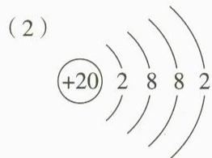

(3) 略

（4）提示：取大小相近的镁和钙，去除镁表面的氧化膜，吸干钙表面的煤油，分别与冷水反应，比较反应的剧烈程度。

（5）提示：根据钙的原子结构，在周期表中的位置，预测其化学性质，再解释其在牛奶中为什么主要以无机盐的形式存在，而非单质等其他形式。


# 实验活动3 同周期、同主族元素性质的递变

物质结构和元素周期律是重要的化学理论知识，通过学习可以使学生深入理解已学元素化合物知识及其相互间的联系。本活动引导学生以卤族元素为代表认识同主族元素性质的相似性和递变性，以第三周期金属元素为代表认识同周期元素性质的递变规律，由此将对元素周期律的认识从感性层面逐步上升到理性层面，体验和感悟到从实验事实得到结论的研究方法，并通过实验培养观察、思考的能力，训练思维能力。


## 一、活动安排建议

## 1. 同主族元素性质的递变

本实验的目的是通过置换反应，来证明同主族元素随着核电荷数的递增，原子核外电子层数增加，原子核对最外层电子的引力逐渐减弱，非金属性逐渐减弱的规律。实验教学中，要让学生在进行充分的理性分析和思考后再开展实验。比如，可以先让学生回顾氯、溴、碘的原子结构，比较其最外层电子数和原子半径，然后引导学生得出结论：可以通过对比卤素单质的氧化性或其简单阴离子的还原性来比较非金属性的强弱。先让学生分组讨论并设计实验方案，教师再组织学生交流、评价实验方案，然后以分组实验的方式实施方案。

实验中注意提醒学生观察好 “三色”，即实验前 NaBr、NaI 溶液的颜色，加入氯水、溴水后溶液的颜色，以及反应后溶液的颜色。通过引导学生对比颜色的变化，培养其观察能力。

## 2. 同周期元素性质的递变

本实验的目的是通过钠、镁、铝的金属性的强弱比较来验证同周期元素性质的递变规律。实验教学时，可以先请学生回答金属性强弱的比较依据，再提供相关的实验用品，由学生自主设计实验方案并开展探究。

## (1) 钠、镁分别与水反应

钠与水反应的实验既可以让学生回忆实验现象，也可让学生按以下操作进行：取100 mL小烧杯，向烧杯中注入约50 mL水，然后用镊子取一块绿豆大小的钠，用滤纸将其表面的煤油吸去，放入烧杯中，盖上玻璃片，观察现象。反应完毕后，向烧杯中滴入2\~3滴酚酞溶液，观察现象。

镁与水反应的实验可按以下操作进行：取两支试管，各注入约5 mL的水，取等长的两小段镁带，用砂纸擦去氧化膜，分别投入两支试管中。把其中一支试管放在酒精灯上加热，反应一段时间后，分别向两支试管中加入2\~3滴酚酞溶液，观察现象。

(2)比较 $\mathrm{Mg(OH)}_{2} 、 \mathrm{Al(OH)}_{3}$ 碱性的强弱

实验室通常没有现成的 $\mathrm{Mg(OH)}_{2}$ 和 $\mathrm{Al(OH)}_{3}$ ，可以提供 $1 \mathrm{~mol} / \mathrm{L} \mathrm{MgCl}_{2}$ 溶液、 $1 \mathrm{~mol} / \mathrm{L} \mathrm{AlCl}_{3}$ 溶液和氨水，由学生自己制备这两种氢氧化物。然后把生成的两种沉淀各分成两份，分别向其中加入 $2 \mathrm{~mol} / \mathrm{L} \mathrm{NaOH}$ 溶液和 $2 \mathrm{~mol} / \mathrm{L}$ 盐酸。 $\mathrm{Mg(OH)}_{2}$ 只能溶于盐酸而不溶于 $\mathrm{NaOH}$ 溶液，说明 $\mathrm{Mg(OH)}_{2}$ 只有碱性。而 $\mathrm{Al(OH)}_{3}$ 既能溶于盐酸又能溶于 $\mathrm{NaOH}$ 溶液，说明 $\mathrm{Al(OH)}_{3}$ 是两性氢氧化物，进而判断铝虽然是金属，却表现出一定的非金属性。

## 二、注意事项

## 1. 同主族元素性质的递变

（1）本实验进行了微型化处理，可以最大程度地降低实验对环境的影响。同时，实验在点滴板上进行操作，在白色背景的衬托下，可让学生观察到非常明显的颜色变化。

（2）氯水、溴水有一定的挥发性，实验时应打开抽风机或换气扇。溴水具有强腐蚀性，学生在实验前最好戴护目镜、橡胶手套等，做好自我安全防护。

## 2. 同周期元素性质的递变

（1）使用镁条时，要用砂纸打磨掉表面的氧化膜，达到金属与水接触的目的。

(2) 镁和水反应时, 表面会形成一层氢氧化镁膜, 阻碍内部金属与水继续反应, 所以只有在加热的条件下, 才能观察到镁与水反应产生气泡的缓慢过程。为避免酒精灯加热时产生的水蒸气的气泡干扰对氢气的观察, 可以把试管放在热水浴中加热。

(3) 向 $\mathrm{MgCl}_{2}$ 溶液中加入 $\mathrm{NaOH}$ 溶液, 生成白色沉淀 $\mathrm{Mg(OH)}_{2}$ , 并不能证明 $\mathrm{NaOH}$ 的碱性强于 $\mathrm{Mg(OH)}_{2}$ 。例如, 把比 $\mathrm{Mg(OH)}_{2}$ 碱性弱的氨水加到 $\mathrm{MgCl}_{2}$ 溶液中, 也可得到 $\mathrm{Mg(OH)}_{2}$ 沉淀。

(4) 本实验得出的结论—— $\mathrm{Mg(OH)}_{2}$ 比 $\mathrm{Al(OH)}_{3}$ 的碱性强, 依据是 $\mathrm{Al(OH)}_{3}$ 属于两性氢氧化物, 说明铝有一定的非金属性, 而镁只有金属性, 所以镁的金属性比铝强, 从而间接证明 $\mathrm{Mg(OH)}_{2}$ 比 $\mathrm{Al(OH)}_{3}$ 的碱性强。


## 三、问题和讨论答案或提示

1. 氯水中的次氯酸不稳定，容易发生分解，促使氯水中的氯气分子继续与水反应。因此，长久放置的氯水，其化学成分相当于稀盐酸，已经失去了强氧化性。

2. 提示：同周期元素从左到右，金属性渐弱，非金属性渐强；同主族元素从上到下，非金属性渐弱，金属性渐强。原子结构决定了元素的性质。元素周期律是元素的原子核外电子排布周期性变化的必然结果。

## 教学资源

## 1. 元素周期表的发展——几个重要时期的元素周期表

(1) 拉瓦锡的元素分类表 (1789年)

1789年，拉瓦锡在《化学概要》一书中提出了第一个元素分类表，将33种元素分成四大类：

①气体：氧、氮、氢、光、热等；

②金属：铜、银、锡、锑、铋、钴、铁、锰、汞、钼、镍、金、铂、铅、钨、锌等；

③非金属：硫、磷、碳、盐酸素、氟酸素、硼酸素等。

④能成盐的土质：石灰、镁土、钡土、铝土、硅土等。

## (2) 德贝莱纳 (J.Diobereiner) 的 “三元素组” (1829年)

1829年，德国化学家德贝莱纳发现，可以将当时已知的44种元素中的15种分成5组，每组的3种元素性质相似，且中间元素的相对原子质量约为较轻和较重的两种元素相对原子质量之和的一半。5组元素为：①锂、钠、钾；②钙、锶、钡；③氯、溴、碘；④硫、硒、碲；⑤磷、砷、锑。他由此提出了“三元素组”的概念，为发现元素性质的规律性打下了基础。

## （3）门捷列夫的第一张元素周期表（1869年）

1867年，门捷列夫开始研究元素的分类，他将当时已经发现的63种元素中相对原子质量相近的排在一起，反复研究，最终在1869年编制出了第一张元素周期表（如图4-3所示）。

$$
\begin{array}{l l l l l} & & \mathrm{Ti=50} & \mathrm{Zr=90} & ? = 1 8 0. \\ & & \mathrm{V=51} & \mathrm{Nb=94} & \mathrm{Ta=182}. \\ & & \mathrm{Cr=52} & \mathrm{Mo=96} & \mathrm{W=186}. \\ & & \mathrm{Mn=55} & \mathrm{Rh=104.4} & \mathrm{Pt=197.4} \\ & & \mathrm{Fe=56} & \mathrm{Pu=104.4} & \mathrm{Ir=198}. \\ & & \mathrm{Ni=Co=59} & \mathrm{P1=106.6} & \mathrm{Os=199}. \\ \mathrm{H=1} & & \mathrm{Cu=63.4} & \mathrm{Ag=108} & \mathrm{Hg=200}. \\ \mathrm{Be=9.4} & \mathrm{Mg=24} & \mathrm{Zn=65.2} & \mathrm{Cd=112} \\ \mathrm{B=11} & \mathrm{Al=27.4} & ? = 6 8 & \mathrm{Ur=116} & \mathrm{Au=197?} \\ \mathrm{C=12} & \mathrm{Si=28} & ? = 7 0 & \mathrm{Sn=118} \\ \mathrm{N=14} & \mathrm{P=31} & \mathrm{As=75} & \mathrm{Sb=122} & \mathrm{Bi=210?} \\ \mathrm{O=16} & \mathrm{S=32} & \mathrm{Se=79.4} & \mathrm{Te=128?} \\ \mathrm{F=19} & \mathrm{Cl=35.5} & \mathrm{Br=80} & \mathrm{I=127} \\ \text {Li = 7 Na = 23} & \mathrm{K=38} & \mathrm{Rb=85.4} & \mathrm{Cs=133} & \mathrm{Tl=204}. \\ & \mathrm{Ca=40} & \mathrm{Sr=87.5} & \mathrm{Ba=137} & \mathrm{Pb=207}. \\ & ? = 4 5 & \mathrm{Ce=92} \\ & ? \mathrm{Er=56} & \mathrm{La=94} \\ & ? \mathrm{Yt=60} & \mathrm{Di=95} \\ & ? \mathrm{In=75.6} & \mathrm{Th=118?} \end{array}
$$

## (4) 迈耶尔的元素周期表 (1870年发表)

早在1864年，德国化学家迈尔的第一张研究元素周期性的表就出现在他的《现代化学理论》第一版中；1868年又完成了第二张周期表，发表在《现代化学理论》第二版中。1870年，他发表了第三张元素周期表（如表4-1所示），采用了竖式周期表的形式。他还发表了一张曲线图（如图4-4所示），表示了随着固体元素的相对原子质量的递增，原子体积呈现周期性的变化。

图4-3 门捷列夫的第一张元素周期表（1869年）  
表4-1 迈尔的第三张元素周期表（1870年）

<table><tr><td>I</td><td>II</td><td>III</td><td>IV</td><td>V</td><td>VI</td><td>VII</td><td>VIII</td><td>IX</td></tr><tr><td rowspan="2"></td><td>B=11.0C=11.97</td><td>Al=27.3Si=28</td><td>—</td><td>—</td><td>—</td><td>?In=113.4Sn=117.8</td><td>—</td><td>Tl=202.7Pb=206.4</td></tr><tr><td>N=14.01O=15.96</td><td>P=30.9S=31.98</td><td>Ti=48V=51.2</td><td>As=74.9Se=78</td><td>Zr=89.7Nb=93.7</td><td>Sb=112.1Te=128?</td><td>Ta=182.2</td><td>Bi=207.5—</td></tr><tr><td></td><td>F=19.1</td><td>Cl=35.38</td><td>Cr=52.4Mn=54.8</td><td>Br=79.75</td><td>Mo=95.6Ru=103.5</td><td>Ro=103.5</td><td>W=183.5J=183.5Os=198?</td><td>—</td></tr><tr><td>Li=7.01</td><td>Na=22.99</td><td>K=39.04</td><td>Fe=55.9Co=Ni=58.6</td><td>Rb=85.2</td><td>Rb=104.1Pd=106.2</td><td>Cs=132.7</td><td>Ir=196.7Pt=196.7</td><td></td></tr><tr><td>?Be=9.3</td><td>Mg=23.9</td><td>Ca=39.9</td><td>Cu=63.3ZN=64.9</td><td>Sr=87.0</td><td>Ag=107.66Cd=111.6</td><td>Ba=136.8</td><td>Au=196.2Hg=198.2</td><td></td></tr></table>

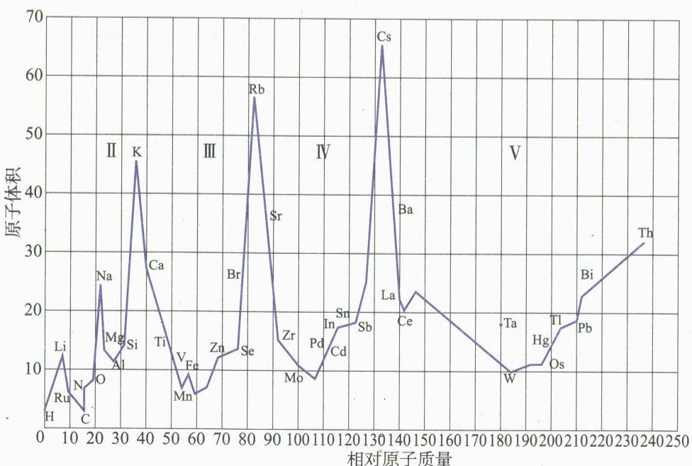  
图4-4 迈尔的原子体积与相对原子质量关系图

## (5) 门捷列夫的第二张元素周期表 (1871年)

1871年，门捷列夫对第一张元素周期表作了修改，发表了第二张元素周期表（如表4-2所示）。他将周期表由竖式改为横排，使同族元素位于同一竖列。他采纳了迈尔的见解，在同族元素中划分主族和副族，还增添了第Ⅷ族元素；他将为未知元素留下的空位增加到5个，并预言了它们的相对原子质量。他在论文中为周期律下了定义：元素的性质周期性地随着它们的相对原子质量而改变。

表4-2 门捷列夫的第二张元素周期表（1871年12月）

<table><tr><td>最高氢化物最高氧化物</td><td>I族 $R_2O$ </td><td>II族RO</td><td>III族 $(RH_5?)$  $R_2O_3$ </td><td>IV族 $RH_4$  $RO_2$ </td><td>V族 $RH_3$  $R_2O_3$ </td><td>VI族RH $RO_3$ 或 $R_2O_6$ </td><td>VII族RHR $R_2O_7$ </td><td>VIII族 $RO_4$ 或 $R_2O_8$ </td></tr><tr><td></td><td>H=1</td><td>—</td><td>—</td><td>—</td><td>—</td><td>—</td><td>—</td><td>—</td></tr><tr><td>典型元素第一周期 $\begin{cases} 1\text{类}\\ 2\text{类}\end{cases}$ </td><td>Li=7Na=23K=39</td><td>Be=9.4Mg=24Ca=40</td><td>B=11Al=27.3—=44</td><td>C=12Si=28Ti=50?</td><td>N=14P=31V=51</td><td>O=16S=32Cr=52</td><td>F=19Cl=35.5Mn=55</td><td>Fe=56 Co=59 Ni=59Ca=63</td></tr><tr><td>第一周期 $\begin{cases} 3\text{类}\\ 4\text{类}\end{cases}$ </td><td>(Cu=63)Rb=85</td><td>Zn=65Sr=87</td><td>—=68(?Yi=88?)</td><td>—=72Zr=90</td><td>As=75Nb=94</td><td>Se=78Mn=96</td><td>Br=80—=100</td><td>Ru=104 Rh=104 Pd=104Ag=108</td></tr><tr><td>第一周期 $\begin{cases} 5\text{类}\\ 6\text{类}\end{cases}$ </td><td>(Ag=108)Cs=133</td><td>Cd=112Ba=137</td><td>In=113—=137</td><td>Sn=118Ce=138?</td><td>Sb=122—</td><td>Te=128?—</td><td>I=127—</td><td rowspan="3">Os=199? Ir=198?Pt=197 Au=197</td></tr><tr><td>第一周期 $\begin{cases} 7\text{类}\\ 8\text{类}\end{cases}$ </td><td>(—)—</td><td>——</td><td>——</td><td>——</td><td>—Ta=182</td><td>—W=184</td><td>——</td></tr><tr><td>第一周期 $\begin{cases} 9\text{类}\\ 10\text{类}\end{cases}$ </td><td>(Au=197)—</td><td>Hg=200—</td><td>Tl=204—</td><td>Pb=207Th=232</td><td>Bi=208—</td><td>—Ur=240</td><td>——</td></tr></table>

（参考自：袁翰青，应礼文.重要化学史实.北京：人民教育出版社，2000.）

## 2. 元素的金属性、非金属性与原子结构的关系

从化学的观点来看，金属原子易失电子而变成阳离子，非金属原子易跟电子结合而变成阴离子。元素的原子得失电子的能力显然与原子核对外层电子特别是最外层电子的引力有着十分密切的关系。原子核对外层电子吸引力的强弱主要与原子的核电荷数、原子半径和原子的电子层结构等有关。

我们常用电离能来表示气态原子失电子的难易，并用电子亲和能来表示气态原子与电子结合的难易。

从元素的一个基态的气态原子中去掉1个电子成为一价气态阳离子时所需消耗的能量叫元素的第一电离能，从一价气态阳离子中再去掉1个电子所需消耗的能量叫第二电离能，单位常用电子伏特（eV）。

电离能的数据表明，同主族元素从上到下电离能减小，即越向下，元素的气态原子越易失去电子。同周期元素从左到右，电离能增大。一般说来，元素的电离能数值越大，它的金属性越弱。

原子的电子亲和能是元素的一个气态原子获得1个电子成为一价气态阴离子时所放出的能量。电子亲和能越大，元素的原子就越容易跟电子结合。一般说来，元素的电子亲和能越大，它的非金属性越强。

元素的原子在化合物分子中对电子吸引能力大小的量度叫做元素的电负性。元素的电负性与电离能、电子亲和能有一定的联系。我们可把电负性的数值作为元素金属性或非金属性的综合量度。金属的电负性较小，金属的电负性越小，它的金属性越强。非金属的电负性较大，非金属的电负性越大，它的非金属性越强。

同一周期中，各元素的原子核外电子层数相同，但从左到右，核电荷数依次增多，原子半径逐渐减小，电离能趋于增大，失电子越来越难，得电子能力逐渐增强，表现为金属性逐渐减弱，非金属性逐渐增强。在短周期中这种递变很显著，但在长周期中，自左至右，元素的金属性减弱较慢。因为长周期中过渡元素增加的电子进入尚未填满的次外层，即填入d轨道（第六周期镧系元素电子进入倒数第三层，即填入f轨道），所以在长周期的前半部各元素的原子中，最外层电子数不超过2个，由于这些元素的原子半径和电离能依次仅略有改变，因此金属性减弱较慢。在长周期的后半部分各元素的原子中，最外层电子数依次增加，因此金属性的减弱和非金属性的增强才变得显著。

在各主族内，从上到下，随原子序数的增加，虽然原子的核电荷数是增加了，但原子的电子层数也随着增多，原子半径也增大，内层电子的屏蔽效应也加大。由于这些原因，原子核对外层电子的引力减弱，原子易失去电子，因而元素的金属性也增强。

## 3. 元素周期表的终点在哪里？

1869年俄国化学家门捷列夫将当时已发现的63种元素列成元素周期表，并留下一些空格，预示着尚未被发现元素的存在。在元素周期表的指导下，人们“按图索骥”找出了这些元素。

## 元素周期表有终点吗？

20世纪30\~40年代，人们发现了92号元素，当时就有人提出92号元素是否是周期表的最后一种元素。然而从1937年起，人们用人工合成法在近50年时间里又合成出20多种元素，元素周期表的“尾巴”增长了。这时又有人预言，105号元素该是周期表的尽头了，其理由是核电荷越来越大，核内质子数也越来越大，质子间的排斥力将远远超过核子间作用力，导致它发生蜕变，然而不久，又陆续合成了106\~109号元素。这些元素存在的时间很短，如107号元素半衰期只有2 μs，照此推算，元素周期表是否到尽头了？

1969年起，理论物理学家从理论上探索“超重元素”存在的可能性，他们认为具有2, 8, 14, 28, 50, 82, 114, 126, 184等这些“幻数”的质子和中子，其原子核比较稳定，这就是说，随着原子序数的递增，其原子核不一定不稳定。因此在109号元素之后还能合成一大批元素，这样，第七周期32种元素将会被填满。

正如科学家所预测的那样，在109号元素之后，一些新元素相继被合成。2015年12月30日，国际纯粹与应用化学联合会（IUPAC）对113、115、117、118号元素的发现予以确认，至此，元素周期表的第七周期最终被填满。通过研究，科学家还认为，第八周期也将被填满，按理论计算，第八周期元素共50种，其中包括7种主族元素，1种稀有气体元素，10种过渡元素，还有32种超锕系元素列在元素周期表下方。

能否不断合成新元素呢？科学家将上天（如到月球）入地（如海底），反复在粒子回旋加速器中进行实验，努力探索，合成新元素，其结果如何，人们正拭目以待。

更为有趣的是，有些科学家还提出元素周期表可以向负方向发展，这是由于科学上发现了正电子，负质子（反质子），那么，在其他星球上是否存在由这些反质子和正电子以及中子组成的反原子呢？这种观点若有一朝被实践证实，元素周期表当然可以出现核电荷数为负数的反元素，向负方向发展也就顺理成章了。

## 4. 人工合成元素的新进展

<table><tr><td>原子序数</td><td>元素符号</td><td>元素名称</td><td>合成年份</td><td>合成者</td></tr><tr><td rowspan="2">104</td><td rowspan="2">Rf</td><td rowspan="2">铲</td><td>1964</td><td>[苏]弗列罗夫</td></tr><tr><td>1969</td><td>[美]乔索等</td></tr><tr><td rowspan="2">105</td><td rowspan="2">Db</td><td rowspan="2">鉏</td><td>1967</td><td>[苏]杜布纳研究所</td></tr><tr><td>1970</td><td>[美]乔索等</td></tr><tr><td rowspan="2">106</td><td rowspan="2">Sg</td><td rowspan="2">镨</td><td>1974</td><td>[苏]杜布纳研究所</td></tr><tr><td>1974</td><td>[美]乔索等</td></tr><tr><td rowspan="2">107</td><td rowspan="2">Bh</td><td rowspan="2">铍</td><td>1976</td><td>[苏]杜布纳研究所</td></tr><tr><td>1981</td><td>[德]明岑贝格等</td></tr><tr><td>108</td><td>Hs</td><td>鐸</td><td>1984</td><td>[德]明岑贝格等,达姆施塔特重离子研究中心</td></tr><tr><td>109</td><td>Mt</td><td>镀</td><td>1982</td><td>[德]明岑贝格等,达姆施塔特重离子研究中心</td></tr><tr><td>110</td><td>Ds</td><td>钛</td><td>1994</td><td>[德]达姆施塔特重离子研究中心</td></tr><tr><td>111</td><td>Rg</td><td>铊</td><td>1994</td><td>[德]达姆施塔特重离子研究中心</td></tr><tr><td>112</td><td>Cn</td><td>镉</td><td>1996</td><td>[德]P.阿尔穆勃鲁斯特和S.霍夫曙等,达姆施塔特重离子研究中心</td></tr><tr><td>113</td><td>Nh</td><td>弥</td><td>2004</td><td>[日]理化学研究所</td></tr><tr><td rowspan="2">114</td><td rowspan="2">Fl</td><td rowspan="2">铁</td><td rowspan="2">1999</td><td>[俄]杜布纳研究所</td></tr><tr><td>[美]劳伦斯利弗莫尔国家实验室等合作</td></tr><tr><td rowspan="2">115</td><td rowspan="2">Mc</td><td rowspan="2">镤</td><td rowspan="2">2004</td><td>[俄]杜布纳研究所</td></tr><tr><td>[美]劳伦斯利弗莫尔国家实验室等合作</td></tr><tr><td rowspan="2">116</td><td rowspan="2">Lv</td><td rowspan="2">钇</td><td rowspan="2">2000</td><td>[俄]杜布纳研究所</td></tr><tr><td>[美]劳伦斯利弗莫尔国家实验室等合作</td></tr><tr><td rowspan="2">117</td><td rowspan="2">Ts</td><td rowspan="2">硼</td><td rowspan="2">2010</td><td>[俄]杜布纳研究所</td></tr><tr><td>[美]劳伦斯利弗莫尔国家实验室</td></tr><tr><td rowspan="2">118</td><td rowspan="2">Og</td><td rowspan="2">氮</td><td rowspan="2">2006</td><td>[俄]杜布纳研究所</td></tr><tr><td>[美]劳伦斯利弗莫尔国家实验室等合作</td></tr></table>

## 5. 元素周期律和元素周期表的重要意义

元素周期律和周期表，揭示了元素之间的内在联系，反映了元素性质与原子结构的关系，在哲学、自然科学、生产实践等方面都有重要意义。

（1）在哲学方面 元素周期律揭示了元素原子核电荷数递增引起元素性质发生周期性变化的事实，有力地论证了事物变化的量变引起质变的规律性。元素周期表是周期律的具体表现形式，它把元素纳入一个系统内，反映了元素间的内在联系，打破了曾经认为元素是互相孤立的形而上学观点。通过元素周期律和周期表的学习，可以加深对物质世界对立统一规律的认识。

（2）在自然科学方面 周期表为发展物质结构理论提供了客观依据。原子的电子层结构与元素周期表有密切关系，周期表为发展过渡元素结构、镧系和锕系结构理论，甚至为指导新元素的合成、预测新元素的结构和性质都提供了线索。元素周期律和周期表在自然科学的许多领域，特别是化学、物理学、生物学、地球化学等方面，都是重要的工具。

（3）在生产上的某些应用 由于在周期表中位置靠近的元素性质相似，这就启发人们在周期表中一定的区域内寻找新的物质。

① 农药多数是含 Cl、P、S、N、As 等元素的化合物。

② 半导体材料都是周期表里金属与非金属接界处的元素，如 Ge、Si、Ga、Se 等。

③ 催化剂的选择：人们在长期的生产实践中已发现，过渡元素对许多化学反应有良好的催化作用。进一步研究发现，这些元素的催化性能与它们原子的d轨道没有充满有密切关系。于是，人们努力在过渡元素（包括稀土元素）中寻找各种优良催化剂。例如，目前人们已能用铁、镍熔剂作催化剂，使石墨在高温和高压下转化为金刚石；石油化工方面，如石油的催化裂化、重整等反应，广泛采用过渡元素作催化剂，特别是近年来发现少量稀土元素能大大改善催化剂的性能。

④ 耐高温、耐腐蚀的特种合金材料的制取：在周期表里从ⅢB到VI B的过渡元素，如钛、钽、钼、钨、铬，具有耐高温、耐腐蚀的特点。它们是制作特种合金的优良材料，是制造火箭、导弹、宇宙飞船、飞机、坦克等的不可缺少的金属。

⑤ 矿物的寻找：地球上化学元素的分布与它们在元素周期表里的位置有密切的联系。科学实验发现如下规律：相对原子质量较小的元素在地壳中含量较多，相对原子质量较大的元素在地壳中含量较少；偶数原子序的元素较多，奇数原子序的元素较少。处于地球表面的元素多数呈现高价，处于岩石深处的元素多数呈低价；碱金属一般是强烈的亲石元素，主要富集于岩石圈的最上部；熔点、原子半径、电负性大小相近的元素往往共生在一起，同处于一种矿石中。

有的科学家按性质相似的原则把周期表中的元素分为十个区域，并认为同一区域的元素往往是伴生矿，这对探矿具有指导意义。

## 6. 化学键理论发展简介

化学键理论应该回答原子怎样形成分子（或晶体），以及分子为什么可以稳定存在等问题。历史上曾出现各种理论，从贝采里乌斯的二元论起，到热拉尔的类型论、凯库勒和布特列洛夫的结构理论、维尔纳的配位理论、路易斯等的电子理论等，经过了一个多世纪的努力，终于逐渐形成现代的化学键理论。

1812年，贝采里乌斯发表了二元论。当时已知道水经电解后，氢气从负极析出，氧气从正极析出。贝采里乌斯从电解现象中得到启发，认为每种化合物都是由电性相反的两部分组成。电解时，正的部分在负极析出，负的部分则在正极析出。例如：

$$
\mathrm{K} _ {2} \mathrm{O}, \quad \mathrm{ZnO}, \quad \mathrm{Al} _ {2} \mathrm{O} _ {3}, \quad \mathrm{SO} _ {3}, \quad \mathrm{CO} _ {2}, \quad \mathrm{P} _ {2} \mathrm{O} _ {5}
$$

它们靠正电性和负电性两部分以静电吸引结合而形成稳定分子。二元论较好地解释了无机化合物，而解释有机化合物则遇到了困难。

热拉尔完全抛弃了二元论，提出类型论，他把化合物分为四类：

(1) 氢类型 (2) 氯化氢类型 (3) 氨类型 (4) 水类型 $\left. \begin{array}{c} H \\ H \end{array} \right\} \quad \left. \begin{array}{c} H \\ Cl \end{array} \right\} \quad \left. \begin{array}{c} H \\ H \end{array} \right\}_{N} \quad \left. \begin{array}{c} H \\ H \end{array} \right\}_{O}$

这四个母体化合物中的氢被各种基团所取代，可得到各种各样的化合物。例如：（1）乙烷 （2）氯代乙烷 （3）乙胺 （4）乙醇

$\left.\begin{array}{c}\mathrm{C}_{2}\mathrm{H}_{5}\\\mathrm{H}\end{array}\right\}\quad\left.\begin{array}{c}\mathrm{C}_{2}\mathrm{H}_{5}\\\mathrm{Cl}\end{array}\right\}\quad\left.\begin{array}{c}\mathrm{C}_{2}\mathrm{H}_{5}\\\mathrm{H}\\\mathrm{H}\end{array}\right\}\mathrm{N}\quad\left.\begin{array}{c}\mathrm{C}_{2}\mathrm{H}_{5}\\\mathrm{H}\end{array}\right\}\mathrm{O}$

类型论只能总结实验结果，使有机化合物初步系统化，但没有预见性。

1857年，凯库勒提出碳是四价，并注意到碳的原子价不分正负，因而碳与碳原子可以结合形成链状。后来，凯库勒又提出在芳香族化合物里，碳具有环状结构，对于苯分子提出了凯库勒结构式，并指出原子间可以单键、双键和三键连接。凯库勒的理论对有机化学的发展起了很大的推动作用。

1861年，布特列洛夫提出了化学结构理论。他认为分子不是原子的简单堆积，而是原子按一定顺序排列的化学结合；这样结合起来的每个原子之间有复杂的化学力相互作用。这种化学力的分配叫做物质的化学结构，或称分子中原子间的相互作用。分子中原子间的相互作用包含相邻原子间的直接相互作用和不相邻原子间的间接相互作用。他还认为每一个分子只能有一个确定的结构，物质的化学性质决定于它的化学结构。

1893年，维尔纳提出了配位理论来解释配合物的结构。他认为金属有两种原子价，即主价和副价，后者或称配位数。每一种金属都有一定副价。主价必须由负离子来满足，而副价则可由负离子或中性分子来满足。副价有方向性，如副价为6时，指向正八面体的六个顶点。副价为4时有两种情况，可以指向正方形的四个角，或指向正四面体的四个顶点。

以上是19世纪发展起来的经典结构理论，它们是概括了大量化学事实而提出来的，又能解释许多事实，但限于当时的科学水平，对许多问题还搞不清楚，例如，分子中原子相互结合的本质是什么？副价是怎样产生的？非相邻原子之间的相互作用是怎样的？进入20世纪后，随着电子、放射性的发现，玻尔在普朗克的量子论和卢瑟福的原子模型基础上提出了原子结构理论，这些为创立化学键的电子理论打下了基础。

1914\~1919年，路易斯等人创立和发展了电子理论。他们认为：① 原子价可分为共价和电价，共价是由两个原子共有电子对而成，电价是靠正负离子的静电引力而成；② 原子得失电子或共有电子，当外层电子达到稀有气体的结构时最稳定（即所谓八隅律）。

用八隅律解释共价键的饱和性，有很多例外，而共价键的方向性，电子理论也不能解释。但是电子理论已经明确指出分子中原子间的相互作用是价电子和各原子核间的相互作用，原子间的一个化学键是一对电子。由于电子理论中引进的电子概念是静止的，还不能解释清楚共价键的本质问题。

1927年，德国化学家海特勒和美国物理学家伦敦用量子力学处理氢分子获得成功，开创了现代的化学键理论。目前流行的化学键理论有电子配对理论（或称价键理论）、分子轨道理论以及配位场理论。价键理论认为，成键的电子只是价电子，而其他电子仍是在各自的原子周围运动。价键法与化学家熟悉的电子配对、八隅律等概念符合，因此较易为人们接受，同时，用它处理分子结构问题，价键的概念较明晰，因而一直为许多教科书所采用。分子轨道理论将整个分子看作一个整体，整个分子中的各原子核形成一定的势场，所有的电子都在这势场的一定的分子轨道中运动。电子在分子轨道中运动同样遵循能量最低原理。近年来，由于分子轨道对称守恒原理的发现及广泛应用，分子轨道理论发展较快。

## 7. 共价键理论简介

对共价键本质问题的探讨一直是化学键理论中的重大研究课题。为了阐明共价键的形成，20世纪30年代以后建立了两种化学键理论：一种是现代价键理论，另一种是分子轨道理论。现行中学教材中介绍的基本上是现代价键理论。

由于20世纪初建立的经典价键理论遇到许多不能解决的矛盾，对共价键的本质也解释不清，为了解决这些矛盾，1927年海特勒和伦敦首先将量子力学理论应用到分子结构中。后来鲍林等又发展了这一理论，建立了现代价键理论（Valence Bond Theory），简称VB法，又称电子配对法。该理论认为：原子在未化合前有未成对电子，这些未成对的电子，如果自旋方向相反的话，则可两两结合成电子对，这时原子轨道发生重叠，电子在两核间出现机会较多，电子云密度较大，体系的能量降低，就能形成一个共价键；一个电子与另一个电子配对后就不能再与第三个电子配对；原子轨道重叠越多，所形成的共价键就越稳定；等等。

现代价键理论不但可解释共价键的饱和性和方向性问题，而且在得到杂化轨道理论充实后，还能解释许多分子的几何构型问题。值得注意的是，现代价键理论不受经典价键概念的所谓八隅律的束缚，如Cl—Be—Cl，H—O—B $\begin{array}{c} \text{O-H} \\ | \\ \text{O-H} \end{array}$ 中的Be和B原子的最外层并不是8个电子，而分别是4个和6个电子。

但现代价键理论在解释有些分子的形成时，也遇到了困难。例如，它只能从原子轨道的重叠定性地说明共价键的稳定性，而不能给予定量的解释；它也无法解释氧分子和硼分子等为什么具有顺磁性等问题。另外，在解释较复杂的分子以及有大 $\pi$ 键的有机分子结构时也与实际偏差较大，因为该理论缺乏对分子作为一个整体的全面考虑。如果认为分子中的电子已不再从属于任何一个组成原子的原子轨道，而是在属于整个分子的若干分子轨道中运动，这似乎还比较合理，于是分子轨道理论（Molecular Orbital Theory），简称MO法，便应运而生。

MO理论认为：能量相近的原子轨道可以组合成分子轨道。由原子轨道组合成分子轨道的数目不变，而轨道能量改变。能量低于原子轨道的分子轨道为成键轨道，反之为反键轨道，能量等于原子轨道的分子轨道为非键轨道。分子中的电子在一定的分子轨道上运动。在不违背每一个分子轨道只容纳两个自旋方向相反的电子的原则下，分子中的电子将优先占据能量最低的分子轨道，并尽可能分占不同的轨道，且自旋方向相同。在成键时，原子轨道重叠越多，所生成的键越稳定。分子轨道中电子的排布也遵从原子轨道电子排布的原则，即泡利不相容原理、能量最低原理、洪特规则和轨道最大重叠原理等对它都适用。

利用分子轨道理论不仅可解释现代价键理论所不能解释的问题（如 $\mathrm{O}_2$ 和 $\mathrm{B}_2$ 分子的顺磁性等问题），并且提出了三电子键及单电子键等概念。分子轨道理论从分子整体出发，对于处理许多原子 $\pi$ 键体系，解释离域效应和诱导效应等方面的问题，都能更好地反映客观实际。1965年在大量实验的基础上，伍德沃德和霍夫曼又提出了分子轨道对称守恒原理。它对解释和预测一系列化学反应进行的难易程度，以及了解产物的立体构型等问题都有指导作用，它使化学键理论进入到了研究化学反应的新阶段。

## 教学案例

# 元素周期表

中央民族大学附属中学 赵长宏


## 教学目标

1. 阅读元素周期表的相关史料，了解元素周期表的发现、发展和完善过程，体会化学研究由宏观到微观、由表面到本质的发展过程，感悟科学家不懈努力的科学研究精神，认识科学研究方法的重要性。

2. 以碱金属元素为例，探究同主族元素原子结构和元素性质的关系，构建元素原子结构、元素位置、元素性质的关系。在基于元素原子结构特点和实验事实的分析推理过程中，发展“宏观辨识与微观探析”及“证据推理与模型认知”的学科核心素养。

3. 渗透分析、预测的科学研究方法，学会从元素位置和原子结构角度分析、预测元素性质，建立“结构决定性质”的观念，在应用预测等科学方法解决实际问题的过程中，加深对元素周期表中元素原子结构、元素位置、元素性质关系的认识。


## 教学重点

元素周期表的结构，元素原子结构、元素位置、元素性质的关系及分析、预测的科学研究方法。

## 教学难点

“结构决定性质”观念的建构及应用。

## 教学过程

教学环节一、研读史料，“走近”元素周期表

梳理化学史料，了解元素周期表编制和发展的艰辛过程，感知、领悟蕴含其中的科学本质和科学研究方法；体会科学家的科学精神和思维方法；为继续探究元素周期表中蕴含的相关规律做准备。

【引入】上节课我们学习了元素周期表的知识，了解了元素周期表的结构，也发现了元素位置和原子结构的关系。那么，在科学史上，元素周期表是如何编制、发展，才变成我们现在看到的这张元素周期表的样子呢？

【任务】阅读教材 “科学史话” ——元素周期表的发展，沿着科学家的足迹，了解元素周期表的编制、发展过程。

【学生活动】阅读“科学史话”，体会：

（1）科学精神：在研究元素周期表的艰辛过程中，科学家们所表现出来不懈努力、勇于探索的精神；

（2）科学方法：在研究元素周期性变化规律的过程中，应用分类、实验、总结归纳等方法使零散无序的元素变得有序；

（3）科学本质：元素周期表的排序依据由最初的“相对原子质量”到后来的“原子序数”，表明人们对元素及元素性质规律的研究变得越来越微观，越来越本质。

## 教学环节二、分析预测，“走进”元素周期表

厘清原子结构和元素性质的关系，在教师驱动性问题的引导下，学会通过原子结构预测元素性质，再利用物质性质进行实验验证的科学研究方法，学会自主进行基于事实的分析推理，构建起原子结构到元素性质的分析模型，夯实“结构决定性质”的认知，建立“原子结构”“元素位置”“元素性质”之间的联系。从宏观事实到微观结构，从分析推理到模型认知，切实落实化学学科核心素养。

【引入】元素周期表是如何体现原子结构和元素性质的关系的？以碱金属元素为例，探究元素原子结构和元素性质之间的关系。

【问题1】Na具有哪些化学性质？从原子结构角度，如何解释Na的这些化学性质？

【学生活动】回忆Na的化学性质，结合Na的原子结构特点进行分析并得出结论：Na原子最外层只有1个电子，在反应中容易失去电子，所以能分别和氧气、水等发生反应，形成+1价化合物。Na具有金属性，表现在Na具有还原性，NaOH溶液具有碱性。

【问题2】结合Na和K的原子结构特点，预测K会具有怎样的性质，说出预测根据。

【学生活动】对比Na和K的原子结构，发现K和Na原子结构的相同点——最外层都是1个电子，由此预测K和Na性质相似，也具有金属性，也能分别发生和 $O_{2}$ 、 $H_{2}O$ 的反应。

【实验验证】教师演示K和 $O_{2}$ 、K和 $H_{2}O$ 的反应。

【问题3】Na与水反应、K与水反应现象有何不同？从原子结构角度解释原因。

【学生活动】观察Na和水、K和水反应的实验现象，对比分析：从Na到K，随着核电荷数增大，电子层数增多，原子半径增大，原子核对最外层电子引力减弱，失电子能力增强，元素金属性增强，因此K与水的反应现象更剧烈。

【问题4】Li、Rb、Cs能和水反应吗？反应现象如何？从原子结构角度解释原因。

【视频】Li、Rb、Cs分别和水反应的过程。

【小结】同主族元素原子结构的相同点决定了元素性质的相似性，原子结构的不同点决定了元素性质的递变性。

【问题5】除了化学性质外，碱金属单质的物理性质是否具有相似性和递变性？

【学生活动】阅读教材中关于碱金属单质的主要物理性质的表格，体会碱金属单质主要物理性质的相似性和递变性。

## 教学环节三、实践体验，“应用”元素周期表

通过应用实践，体会基于元素原子结构和位置特点预测元素性质的科学方法，夯实元素结构、位置、性质的关系，提升模型认知素养。在基于化学史的反思中，夯实元素周期表中蕴含的元素“结构决定性质”的思路方法，体会元素周期表对于化学研究的重要指导作用。

【任务】在1875年，法国化学家布瓦博得朗发现并分离得到了ⅢA族元素镓（Ga）。请结合已学知识，大胆预测Ga的化学性质，并说出预测依据。

【学生活动】

观察元素周期表中 Ga 的位置：和 Al 同主族，比 Al 多 1 个周期；和 Al 相比，最外层电子数相同，电子层数增多。

回忆 Al 性质: Al 的最高化合价为 +3, 最高价氧化物为 $Al_{2}O_{3}$ ; Al 具有金属性, Al 单质能够和 $O_{2}$ 反应, 能够从酸中置换出氢气; $\mathrm{Al(OH)}_{3}$ 具有碱性。

依据同主族元素原子结构和元素性质的相似性预测：Ga最高化合价为+3价，最高价氧化物 $Ga_{2}O_{3}$ ；具有金属性，单质能和 $O_{2}$ 反应，能和酸反应生成盐和氢气； $\mathrm{Ga(OH)}_{3}$ 具有碱性。

依据同主族元素原子结构和元素性质的递变性预测：Ga 比 Al 金属性强，单质从酸中置换出氢气的能力更强； $\mathrm{Ga(OH)}_{3}$ 比 $\mathrm{Al(OH)}_{3}$ 碱性更强。

【资料】

在常温下，表面产生致密的氧化膜阻止进一步氧化。加热时与卤素、硫迅速反应；

室温时与水反应缓慢，与沸水反应剧烈生成氢氧化镓，放出氢气。加热时在无机酸中逐渐溶解形成盐；

最高价氧化物化学式为 $Ga_{2}O_{3}$ ;

其氢氧化物能溶于酸生成盐。

【展示】门捷列夫的第一张元素周期表。

【解释】门捷列夫的第一张元素周期表发表在1869年，而Ga的发现是在6年后的1875年。在镓元素还没有被发现之前，门捷列夫就已经科学地预测到周期表中某些元素是缺失的，还有待被发现，所以他在表格中提前为这些元素留出了空间，并准确地预测了缺失元素的部分性质。预测，是一种重要的科学研究方法。

【学法指导】阅读教材中的“方法导引（预测）。

【小结】理解元素周期表中蕴含的元素原子结构、元素位置、元素性质之间的关系，学会利用元素周期表，基于元素位置、原子结构特点，分析、预测和解释元素性质的科学研究方法。

## 板书设计

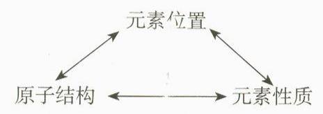

最外层电子数——最高化合价

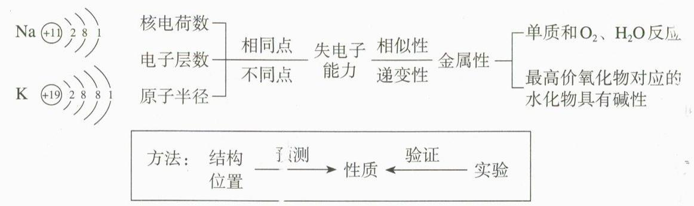