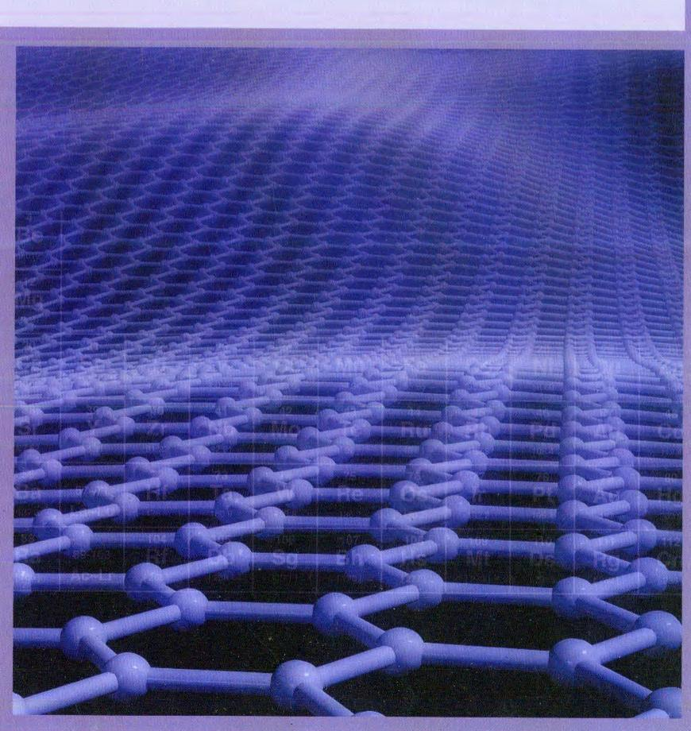

# 教师教学用书

PUTONG GAOZHONG JIAOKESHU

JIAOSHI JIAOXUE YONGSHU

HUAXUE

人民教育出版社 课程教材研究所

化学课程教材研究开发中心

编著

登录“教师网络培训和服务平台”即刻免费获得优质、专业、全面的服务

◇ 独家权威解读新版本新课标教材

◇ 全面系统推出各科教材配套资源

◇ 在线活动引领课程教材教法改革

◇ 网络研修助力一线教师专业成长

请通过人教网顶部 “培训服务” 菜单访问本平台，或使用微信搜索并关注 “人教教材培训” 公众号，获取更多最新培训资讯和精彩内容。

# 化学

必修

第二册

普通高中教科书

# 教师教学用书

化学

必修

人民教育出版社 课程教材研究所

化学课程教材研究开发中心

编著

第二册

## 图书在版编目（CIP）数据

普通高中教科书教师教学用书. 化学：必修. 第二册/人民教育出版社课程教材研究所化学课程教材研究开发中心编著. —北京：人民教育出版社，2019.7
ISBN 978-7-107-33840-3

I. ①普… II. ①人… III. ①中学化学课—高中—教学参考资料 IV. ①G633

中国版本图书馆 CIP 数据核字（2019）第 170463 号

## 普通高中教科书 教师教学用书 化学 必修 第二册

出版发行 人民教育出版社
(北京市海淀区中关村南大街17号院1号楼 邮编：100081)

网址 http://www.pep.com.cn

经销 全国新华书店

印刷 唐山市润丰印务有限公司

版 次 2019年7月第1版

印 次 2019 年 10 月第 1 次印刷

开 本 890 毫米 × 1240 毫米 1/16

印 张 13.5

字 数 336 千字

定 价 43.00 元

版权所有·未经许可不得采用任何方式擅自复制或使用本产品任何部分·违者必究如发现内容质量问题、印装质量问题，请与本社联系。电话：400-810-5788

## 说明

本书是根据教育部制订的《普通高中化学课程标准（2017年版）》和人民教育出版社课程教材研究所化学课程教材研究开发中心编著的《普通高中教科书 化学 必修 第二册》的内容和要求，以突出育人功能、确保科学规范、注重核心基础、体现时代要求为原则，结合高中化学教学实际情况编写的，供使用《普通高中教科书 化学 必修 第二册》的高中化学教师教学时参考。

从利于教师理解和体会课程标准，更好地使用教材，更高效地实施教学出发，全书对教材的内容按照章节进行了分析，提出教学建议，提供教学资源和典型教学案例。

本书按教材顺序对每章进行了整体说明，包括教材分析、学业要求和课时建议。教材分析从地位和功能、内容的选择与呈现、教学深广度及内容结构等方面对全章内容作出分析；学业要求指出本章在发展学生化学学科核心素养方面所要达到的目标；课时建议则是建议本章的教学课时。

对于教材中的各节，本书提供了内容分析、教学目标、教学建议、栏目使用建议、练习与应用参考答案及说明等。内容分析是对节的具体内容特点、知识结构进行较详细的介绍；教学目标指出本节需要达到的教学目的，以及教学重点和难点；教学建议是围绕节的内容，对教学设计思路、教学策略、教学方法等提出建议；栏目使用建议是对“实验”“思考与讨论”“探究”等栏目提出具体的指导和建议，并对栏目所涉及的有关问题给予解答或提示；练习与应用参考答案及说明则是对节后的习题给予解答或提示。

教学资源和教学案例是按章编写的。教学资源主要编入一些与本章内容有关的化学知识、疑难问题解答，以及联系实际、新的科技信息和化学史等内容，以帮助教师更好地理解教材，并在教学时参考。教学案例主要选择本章中的典型课题，立足课堂教学实际，展示优秀案例。

本书内容仅供教师参考，授课时的教学方法由教师根据具体情况决定。

本书总主编：王晶、周业虹。

本册主编：周业虹、郭震。

本册编写人员（按编写顺序）：毕华林、孙旭、冷燕平、白建娥、郭震、孙京、吴海建、刘四方。

责任编辑：郭震。

责任绘图：郭威。

本书内容难免有不妥之处，希望广大教师和教学研究人员提出意见和建议，以便修改和完善。

人民教育出版社 课程教材研究所
化学课程教材研究开发中心
2019年6月

## 目录

第五章 化工生产中的重要非金属元素……1
本章说明 …… 1
第一节 硫及其化合物 …… 4
第二节 氮及其化合物 …… 11
第三节 无机非金属材料 …… 17
实验活动 4 用化学沉淀法去除粗盐中的杂质离子 …… 21
实验活动 5 不同价态含硫物质的转化 …… 23
教学资源 …… 24
教学案例 …… 33

第六章 化学反应与能量…… 45
本章说明 …… 45
第一节 化学反应与能量变化 …… 47
第二节 化学反应的速率与限度 …… 53
实验活动 6 化学能转化成电能 …… 60
实验活动 7 化学反应速率的影响因素 …… 62
教学资源 …… 63
教学案例 …… 72

第七章 有机化合物 …… 79
本章说明 …… 79
第一节 认识有机化合物 …… 82
第二节 乙烯与有机高分子材料 …… 87
第三节 乙醇与乙酸 …… 92
第四节 基本营养物质 …… 98
实验活动 8 搭建球棍模型认识有机化合物分子结构的特点 …… 104

实验活动9 乙醇、乙酸的主要性质 …… 107
教学资源 …… 111
教学案例 …… 117
第八章 化学与可持续发展 …… 127
本章说明 …… 127
第一节 自然资源的开发利用 …… 130
第二节 化学品的合理使用 …… 143
第三节 环境保护与绿色化学 …… 154
教学资源 …… 163
教学案例 …… 190

## 第五章化工生产中的重要非金属元素

## 本章说明

本章内容安排在原子结构与元素周期律学习之后，具体知识包括硫、氮等非金属元素及其化合物的相关性质，硫酸、硝酸和氨的工业生产原理，重要的无机非金属材料等。根据硫和氮在元素周期表中的位置，利用原子结构与元素周期律的相关知识，以及氧化还原反应、离子反应的理论知识，认识和学习硫、氮的单质及其化合物的性质。以硫酸和硝酸的工业生产原理为背景知识，从物质类别和元素价态角度认识物质间的转化，采用实验探究的方法学习物质的性质并实现物质间的转化。

本章内容一方面突出物质间的相互转化，帮助学生认识物质及其转化的重要价值，形成变化观念。教材的活动设置要求学生应用氧化还原反应原理，实现含有不同价态同种元素的物质的相互转化，认识控制条件对物质转化的重要影响，同时体会物质转化在自然界中的物质循环、化工生产和环境保护中的重要作用。另一方面，教材通过应用原子结构与元素周期律的知识，预测和推断元素及其化合物的性质，引导学生从物质类别和元素价态的视角，通过实验探究来认识非金属元素及其化合物的性质，帮助学生形成认识非金属元素及其化合物的基本思路和方法，同时进一步加深学生对“结构决定性质”化学观念的理解。

## 一、教材分析

本章作为系统学习非金属元素的典型章节，主要目的是通过对硫和氮等非金属元素的学习，帮助学生掌握认识非金属元素及其化合物的基本思路和方法，了解物质间的相互转化规律，促进化学学科核心素养的形成。在内容组织上考虑到学生已有化学概念的理解和应用，包括原子结构与元素周期律、物质分类、离子反应、氧化还原反应等，将这些核心概念的应用与具体知识的学习紧密结合，加强理论知识对元素化合物知识学习的指导作用。教材编写的基本思路是从硫、氮等非金属元素在周期表中的位置和原子结构入手，分析和预测非金属元素的主要性质，然后按照单质、氧化物（氢化物）、酸、盐的顺序依次认识和学习。在此基础上设计探究活动，并以硫酸和硝酸的工业制取原理为背景，运用所学知识实现含不同价态同种元素的物质的相互转化。这一编写思路既体现了“结构决定性质、性质决定用途”的化学观念，也符合“整体—部分—整体”的认识世界的基本思路。

另外，为全面落实化学学科核心素养，本章教材内容的选择努力贴近学生生活和社会实际，突出典型性，以硫酸、硝酸和氨的工业生产原理为背景去认识含不同价态同种元素的物质间的相互转化，而不涉及生产设备和流程等技术细节。教材内容突出物质转化主线，引导学生从物质类别和价态变化的角度实现不同价态含硫物质的转化，从氮气的不同转化条件认识环境和条件对化学变化的影响，从物质转化的角度认识自然界中物质的循环，了解大气污染的产生及防治。教材编写突出环境保护意识和绿色化学理念，在化学实验的设计上注重安全和环保，通过实际的操作使学生体验环境保护与资源利用的和谐统一。

本章教材的内容结构如下图所示。

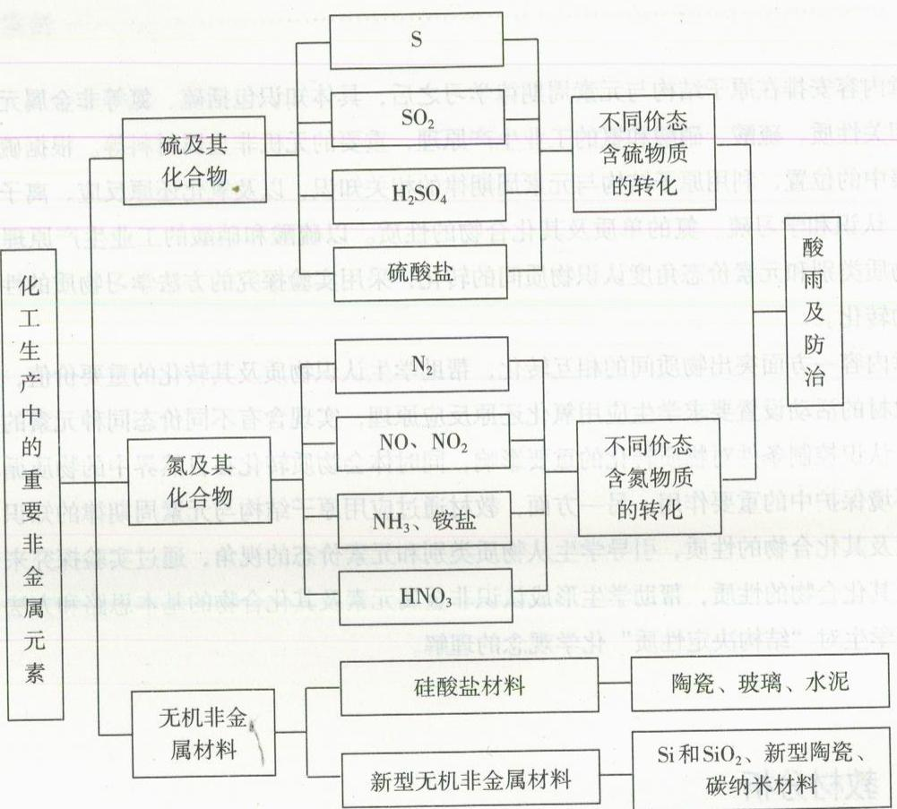

## 二、学业要求

1. 能依据物质类别和元素价态分别列举含硫元素、氮元素的典型代表物质。

2. 能从物质类别和元素价态的角度，依据氧化还原反应原理，预测硫及其化合物、氮及其化合物的化学性质和变化。

3. 能从物质类别和元素价态变化的角度，设计含硫物质、含氮物质的转化路径。

4. 能根据实验目的和假设设计实验方案，选择适当的实验试剂，探究不同价态含硫物质的转化；能观察并如实记录实验现象和数据，进行分析和推理，得出合理的结论。

5. 能利用二氧化硫、氨、硫酸根和铵根的性质和反应，选择适当的实验试剂，设计检验二氧化硫、检验溶液中硫酸根和铵根等离子及实验室制取氨的实验方案。

6. 能根据硫酸、硝酸和氨的性质，分析实验室、工业生产及环境保护中的某些常见问题。

7. 能说明硫及其化合物、氮及其化合物（如二氧化硫、氨等）的应用对社会发展的价值和对环境的影响，能有意识地运用所学的知识或寻求相关证据参与社会性议题（如酸雨及防治）的讨论。

8. 能从材料组成的角度对生活中常见的无机非金属材料进行分析，能根据使用需求选择适当的材料，能解释其使用注意事项，并能科学合理地使用。

## 三、课时建议

第一节 硫及其化合物 3课时

第二节 氮及其化合物 3课时

第三节 无机非金属材料 1课时

实验活动4 用化学沉淀法去除粗盐中的杂质离子 1课时

实验活动5 不同价态含硫物质的转化 1课时

全章复习 1课时

## 第一节 硫及其化合物

## 一、内容分析

本节内容主要包括：硫、二氧化硫和硫酸的性质，硫酸根离子的检验，不同价态含硫物质的转化。教材首先根据硫在元素周期表中的位置，利用原子结构和元素周期律的相关知识，从化学变化的视角考虑硫单质能否与金属单质、非金属单质、化合物等发生反应，使学生掌握研究非金属单质性质的基本思路；之后，根据物质类别研究硫的化合物（包括二氧化硫、硫酸）的化学性质。教材以工业制硫酸的生产原理为载体，从氧化还原的角度来综合认识含硫化合物的氧化性和还原性，并结合浓硫酸与铜反应的实验，基于证据探究浓硫酸的氧化性。接下来，设计“硫酸根离子的检验”实验，对构成物质的离子进行检验，提升学生“宏观辨识与微观探析”的学科核心素养。最后，设置“不同价态含硫物质的转化”探究活动，要求学生从物质类别和元素价态变化的角度，应用氧化还原反应原理设计实验方案，选择适当的实验试剂，探究不同价态含硫物质的转化，提升学生“变化观念”等学科核心素养。

## 二、教学目标

## 1. 教学目标

（1）通过分析硫的原子结构，推断硫元素可能的化学性质并进行证实，理解物质的微观结构与宏观性质之间的关系。

(2) 结合实验探究, 了解二氧化硫的物理性质和化学性质, 能说出二氧化硫的主要用途。

(3) 通过二氧化硫与水、与氧气反应的学习, 初步建立可逆反应的概念。

(4) 通过实验探究, 了解硫酸的酸性和浓硫酸的特性, 能设计实验检验硫酸根离子。

（5）知道含不同价态硫元素的物质可以相互转化，并能设计实验进行探究或验证，增强对氧化还原反应的认识。

（6）能说出含硫物质进入大气的主要途径，知道二氧化硫进入大气能形成酸雨危害环境，增强环保意识，培养社会责任感。

## 2. 教学重点和难点

重点：硫及其化合物的性质与相互转化；浓硫酸的特性，硫酸根离子的检验；可逆反应。难点：浓硫酸的特性。

## 三、教学建议

## 1. 结合学生已有知识，以元素周期律为指导，逐步完成硫及其化合物的知识体系建构

学生在前面已经学习了氧和氯等非金属元素的知识、氧化还原反应的概念和元素周期律等知识，教学中要注意硫与氧、氯等非金属元素的性质比较，并利用元素周期律的理论指导硫及其化合物的学习，以便强化已学知识，并使新学知识纳入学生已掌握的知识系统中。例如，在本节的引言中，教材分析了硫的原子结构特征，并与氧的原子结构进行了比较，教学中可以通过进一步比较硫和氯的原子结构，得出硫单质的氧化性比氧气、氯气的氧化性弱的结论。这样，在学习硫与铁、与铜的反应时，就能较好地解释氧气和氯气可以把铁、铜氧化为较高价态的化合物，而硫单质只能把铁、铜氧化为较低价态的化合物。

硫酸和亚硫酸都是含氧酸，具有酸的通性。教学中要结合此前学习的盐酸的性质，比较不同种类的酸在性质上的异同。从而使学生认识到由于酸的水溶液都含有相同的阳离子（ $\mathbf{H}^{+}$ ）而具有酸性，又由于不同的酸的水溶液含有不同的酸根离子（阴离子）而具有一定的特殊性，感受同类物质的共性与个性的辩证关系。这在化学学习中是比较普遍的现象。

## 2. 根据教学需要，选择关于硫、二氧化硫等的情境素材，创设教学情境，发展学生思维

硫在自然界中广泛存在，硫的化合物与我们的日常生活有紧密联系，二氧化硫是导致酸雨形成的主要污染物，教学中可以利用这些素材设置教学情境，引入教学或引发学生思考。例如，可以从火山喷发的视频引入对硫的学习；还可以提前准备几只装有硫黄的小试管（塞上橡胶塞），开始上课时发给学生，让学生轮流观察，再结合阅读教材了解硫的物理性质。这样引入教学较为简单自然。

从硫单质的学习转入二氧化硫的学习时，要注意教学环节的自然过渡。教材在介绍硫与氧气反应生成二氧化硫之后，接着介绍二氧化硫的知识，给教学环节的自然过渡提供了方便。教学时可以在介绍硫的化学性质后设问：“硫与氧气反应生成二氧化硫，二氧化硫又是一种什么样的物质呢？”然后出示装有二氧化硫的试管，演示【实验5-1】引入对二氧化硫的探究学习，这样使教学环节的转换自然流畅。

教学中也可以通过展示与酸雨相关的图片引入对二氧化硫的学习；通过播放硫酸工业生产的视频或通过浓硫酸与蔗糖反应的实验（“黑面包”实验）引入对硫酸的学习。

## 3. 正确把握教材中关于二氧化硫和硫酸的教学要求，合理控制知识的深广度

教学中既要帮助学生理解所学知识，又要适当控制深度和广度，减轻学生学习负担。例如，在学习二氧化硫与水反应时，要强调二氧化硫是酸性氧化物，具有酸性氧化物的通性。这里可以适当拓展，让学生说出二氧化硫与氧化钙、二氧化硫与氢氧化钙反应的化学方程式，以巩固酸性氧化物的概念。二氧化硫中硫元素的化合价为+4价，处于中间价态，所以它既能被氧气等氧化剂氧化，又能被硫化氢还原。二氧化硫还具有漂白性，能与某些有色物质结合，生成无色物质，该物质不稳定，受热易分解。这些二氧化硫的特性有别于次氯酸和过氧化氢。学习时可以从漂白的原理和颜色能否复原进行比较，但不要求书写化学方程式。二氧化硫的排放是形成酸雨的主要原因，但不是全部。在这里不宜过多解释酸雨的成因，建议根据教材的安排，在下一节学习氮的氧化物之后再全面学习酸雨及防治的知识。

可逆反应的概念比较简单但却重要，是培养学生“变化观念与平衡思想”的典型素材。由于是初次学习，在这里要请学生注意，可逆反应必须是“同一条件、同一时间”向两个相反方向进行的反应。可以举例：氢气与氧气反应生成水，水可以电解生成氢气和氧气，但这两个方向相反的反应不能叫做可逆反应（为什么？）。教材结合教学内容介绍了二氧化硫与水反应、二氧化硫与氧气反应两个可逆反应，在这里不建议补充其他可逆反应的例子，因为缺少背景知识支撑的素材容易增加学习的负担。

硫酸是重要的化工原料，浓硫酸的特性（吸水性、脱水性、氧化性）是本节内容的重点和难点之一，教学中要突出重点、突破难点，但也要注意度的把握。浓硫酸的吸水性是浓硫酸吸收环境中的水分子形成水合硫酸，所以浓硫酸可以用作某些气体（氨、硫化氢等除外）的干燥剂。浓硫酸的脱水性主要是其能将有机物中的氢和氧元素按照水的组成比例脱去，使有机物炭化。这也是浓硫酸具有强腐蚀性的原因之一，所以使用浓硫酸时要特别注意安全。浓硫酸的强氧化性可以表现为其能将大部分金属（包括铜等不太活泼的金属）和某些非金属单质氧化，其主要特征是硫酸中的硫元素由+6价降低为+4价，即硫酸被还原为二氧化硫。其间没有氢气生成，不同于稀硫酸中氢离子与较活泼的金属铁、锌等反应产生氢气（稀硫酸的酸性）。金属铁、铝遇冷的浓硫酸时会发生钝化，也是浓硫酸的强氧化性的表现，这里不要求书写相关化学方程式。

## 4. 注重对硫及其化合物的知识进行归纳、整合，使所学知识系统化、结构化

教学中对所学知识进行及时归纳、整合，使所学知识系统化、结构化，这是促进学生从掌握学科知识向形成学科核心素养转化的关键。教材根据课程标准的要求，结合各物质在社会生产和日常生活中的重要性程度的差别，对不同物质采取不同要求和呈现方式。例如，教材对二氧化硫和硫酸的知识介绍就比较系统全面，对硫单质的介绍就比较简单，而硫化氢、三氧化硫虽然在教材中出现了，但没有专门介绍。

从元素周期律的角度认识硫及其化合物的知识，是实现知识系统化的有效途径之一。如在单元复习时，可以对硫单质的氧化性、硫的氢化物的稳定性、硫酸的酸性等，按照同周期从左到右、同主族从上到下的顺序，与已学过的元素及其对应化合物进行比较，掌握变化规律，形成知识系统。

从相关知识之间的内在联系出发，建立物质之间的关系图，是实现知识结构化的常用方法。如将硫化氢、硫、二氧化硫、三氧化硫、硫酸等物质按相互间的转化关系连接起来，形成简洁直观的“硫三角”（如下图）。

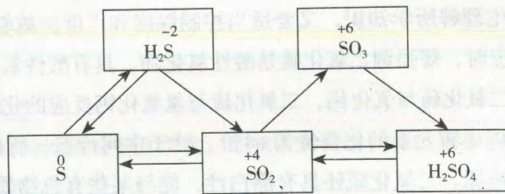

## 5. 认真设计和组织实验教学，发挥实验探究的教育教学价值

化学实验和科学探究对创设教学情境、激发学习兴趣、调动学生思维、掌握学科知识、锻炼动手能力、培养科学精神、激发创新潜能、培育核心素养等方面具有重要作用，要认真落实和研究实验教学，充分发挥实验探究的教育教学价值。在教学中要规范操作、仔细观察、认真分析。具体实验教学建议见“栏目使用建议”。

本节教学建议增补铁粉与硫粉反应、浓硫酸与蔗糖反应两个趣味性较强的实验。因反应会生成二氧化硫，实验时要注意通风。

## 四、栏目使用建议

## 1. 实验

【实验5-1】

本实验适用于课堂演示，用于验证二氧化硫在水中的溶解性和生成物亚硫酸的酸性。

实验现象：试管内液面上升，pH试纸测得溶液的pH小于7。

实验分析：二氧化硫易溶于水，使试管内气体压强减小，导致液面上升，同时生成了亚硫酸，使溶液显酸性。

注意事项：①实验时试管内二氧化硫的纯度要高，否则实验现象不明显，可用亚硫酸钠与浓硫酸反应制取二氧化硫；②教材中检验生成的亚硫酸采用pH试纸而不用石蕊溶液，是为了保留产物做下面的二氧化硫的漂白性实验。

【实验5-2】

本实验用于探究二氧化硫的漂白性，可由教师演示，但要注意防止二氧化硫污染空气。

实验现象：振荡时品红溶液褪色，加热后溶液恢复红色。

实验分析：二氧化硫与品红反应生成了无色物质，加热时无色物质分解，恢复为原来的颜色。

注意事项：①实验用品红溶液的浓度不能太高；②若要增补二氧化硫漂白其他物质的实验，要预先试验，因为二氧化硫不能漂白所有的有色物质。

【实验5-3】

本实验用于探究铜与浓硫酸的反应，并检验生成的二氧化硫的性质。铜与浓硫酸需要加热才能反应，由于实验综合性强，操作复杂，适合教师演示。

实验现象：加热时左测试管内有气泡生成，中间试管中的品红溶液褪色，右测试管中的石蕊溶液逐渐变红，反应后左测试管内的物质经稀释后显蓝色。

实验分析：铜与浓硫酸加热时可以发生反应，有气体生成，该气体能使品红溶液褪色、使石蕊溶液变红，证明生成的气体是二氧化硫；反应后的物质经稀释显蓝色，说明生成了硫酸铜。可以指导学生在分析的基础上逐步写出化学方程式，体现思维的逻辑性：先根据分析确定反应物是硫酸和铜，生成物有硫酸铜和二氧化硫，再配平主要物质的化学计量数，最后通过观察确定生成物中的水及其化学计量数。

注意事项：①浓硫酸、二氧化硫、酒精灯都可能有安全隐患，使用时要规范操作，注意安全。②此实验中铜丝内外相通是为了控制反应的发生和终止，连接装置时将铜丝插入凹槽或小孔后，可以涂上凡士林，并检验装置的气密性。③此实验中浸有碱液的棉团的作用是除去尾气中的二氧化硫，防止空气污染。④此实验开始时有黑色颗粒物（含有CuS、 $\mathrm{Cu}_{2}\mathrm{S}$ 等）生成，一段时间后黑色颗粒物逐渐减少，由于反应机理复杂，教学时不宜详细介绍。

## 【实验5-4】

本实验的目的是探究 $SO_{4}^{2-}$ 的检验方法，其原理是 $Ba^{2+} + SO_{4}^{2-} = BaSO_{4} \downarrow$ ， $BaSO_{4}$ 是既难溶于水又难溶于酸的白色沉淀，有别于 $CaCO_{3}$ 、 $BaCO_{3}$ 等可溶于酸的白色沉淀。

实验现象及分析见下表：

<table><tr><td>试剂</td><td>稀硫酸</td><td>Na2SO4溶液</td><td>Na2CO3溶液</td></tr><tr><td>加入BaCl2溶液后的实验现象</td><td>产生白色沉淀</td><td>产生白色沉淀</td><td>产生白色沉淀</td></tr><tr><td>加入稀盐酸后的实验现象</td><td>沉淀不溶解</td><td>沉淀不溶解</td><td>沉淀溶解</td></tr><tr><td>离子方程式</td><td> $Ba^{2+} + SO_{4}^{2-} = BaSO_{4} \downarrow$ </td><td> $Ba^{2+} + SO_{4}^{2-} = BaSO_{4} \downarrow$ </td><td> $Ba^{2+} + CO_{3}^{2-} = BaCO_{3} \downarrow$  $BaCO_{3} + 2H^{+} = Ba^{2+} + CO_{2} \uparrow + H_{2}O$ </td></tr><tr><td>实验分析</td><td colspan="3">白色固体BaSO4不溶于盐酸,而BaCO3可溶于盐酸,因此可用稀盐酸和BaCl2溶液检验SO42-。</td></tr><tr><td>实验结论</td><td colspan="3">若向溶液中加入稀盐酸时无明显现象,再滴加BaCl2溶液时有白色沉淀产生,则证明该溶液中含有SO42-。</td></tr><tr><td>注意事项</td><td colspan="3">1. 检验SO42-时,应先加稀盐酸排除CO32-等离子的干扰;2. 若溶液中混有SO32-,当加入稀硝酸时,会将SO32-氧化为SO42-;3. 若溶液中混有Ag+,当加入稀盐酸时,会产生不溶于酸的白色AgCl沉淀。可以加入过量稀盐酸,过滤除去AgCl后再检验SO42-。</td></tr></table>

## 2. 探究

## (1) 明确问题

实现不同价态含硫物质的转化，首先要明确有哪些不同价态的含硫物质，其次是用什么方法实现这些物质间的转化。教学时可以通过讨论或问答的形式归纳不同价态的含硫物质：

<table><tr><td colspan="5"> $-2$ S ⇌ 0S ⇌ +4S ⇌ +6S</td></tr><tr><td>FeS</td><td>S</td><td>SO2</td><td>SO3</td><td></td></tr><tr><td>H2S</td><td></td><td>H2SO3</td><td>H2SO4</td><td></td></tr><tr><td>Na2S</td><td></td><td>Na2SO3</td><td>Na2SO4</td><td></td></tr><tr><td>HgS</td><td></td><td></td><td>CuSO4</td><td></td></tr><tr><td></td><td></td><td></td><td>BaSO4</td><td></td></tr></table>

## (2) 设计方案

通过小组讨论的形式整理不同价态含硫物质间实现转化的可能方案（见表5-1）。

表5-1 不同价态含硫物质的转化方案

<table><tr><td>实验序号</td><td>价态变化</td><td>转化前的含硫物质</td><td>选择试剂</td><td>转化后的含硫物质</td><td>预期现象</td></tr><tr><td>1</td><td>0→-2</td><td>S</td><td>Fe</td><td>FeS</td><td>剧烈反应,生成黑色固体</td></tr><tr><td>2</td><td>+6→+4</td><td> $H_{2}SO_{4}$ </td><td>Cu</td><td> $SO_{2}$ </td><td>产生有刺激性气味的气体,该气体能使品红溶液褪色</td></tr><tr><td>3</td><td>+4→0</td><td> $SO_{2}$ </td><td> $H_{2}S$ </td><td>S</td><td>生成淡黄色固体</td></tr><tr><td>4</td><td>-2→0</td><td> $H_{2}S$ </td><td> $H_{2}O_{2}$ </td><td>S</td><td>生成淡黄色固体</td></tr><tr><td>5</td><td>0→+4</td><td>S</td><td>空气</td><td> $SO_{2}$ </td><td>硫燃烧,发出淡蓝色火焰,产生有刺激性气味的气体</td></tr><tr><td>6</td><td>+4→+6</td><td> $H_{2}SO_{3}$ </td><td> $H_{2}O_{2}$ </td><td> $H_{2}SO_{4}$ </td><td>反应前后的溶液用pH试纸检验,其pH变小;向反应后的溶液中滴加稀盐酸无明显现象,再滴加氯化钡溶液,产生白色沉淀</td></tr></table>

根据以上方案可知，该方案所需的试剂有：硫粉、还原铁粉、铜丝、浓硫酸、过氧化氢溶液、稀盐酸、氯化钡溶液等。为了减少药品用量，体现绿色化学思想，可以合理设计实施方案。例如，用实验1制得的FeS制取 $H_{2}S$ ，把实验2制得的 $SO_{2}$ 溶于水中，制得亚硫酸。

## （3）实施方案

实验1：将还原铁粉和少量硫粉混合，置于石棉网（或陶土网）上，用酒精灯加热，待反应开始时停止加热，观察现象。并用生成的FeS制取 $H_{2}S$ ，将其溶于水形成氢硫酸，备用。

实验2：参阅教材【实验5-3】，进行浓硫酸与铜的反应，并将生成的气体溶于水，制取亚硫酸，备用。

实验3：向亚硫酸中滴加氢硫酸，观察现象。

实验4：向氢硫酸中滴加过氧化氢溶液，观察现象。

实验5：在燃烧匙中点燃少量硫粉（注意通风），观察现象。

实验6：向亚硫酸中滴加适量过氧化氢溶液，用pH试纸检验反应前后溶液的酸碱度，溶液的pH变小；向反应后的溶液中滴加稀盐酸无明显现象，再滴加氯化钡溶液，产生白色沉淀。

为了节约时间，以上实验可以分组进行，然后汇总实验结果，交流共享。

（4）整合信息，得出结论

根据上述实验探究，完成各物质间相互转化关系图（如下图），并写出相关的化学方程式。

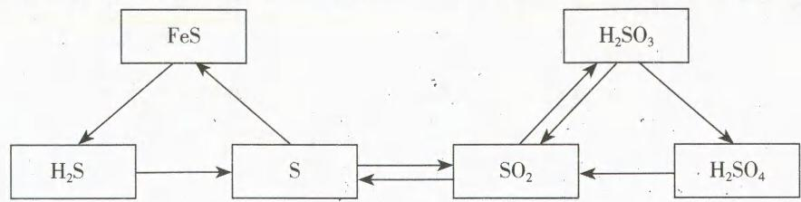

## (5) 交流共享

学生集中交流探究成果，提出改进和完善建议，分享成功的喜悦，完成探究报告。

(6) 成果应用

应用所学知识，解决学习或生活中的具体问题。

## 3. 思考与讨论

## 【思考与讨论1】

在学习了浓硫酸的性质后，教材设置该栏目，就硫酸的酸性和浓硫酸的强氧化性提出问题，目的是巩固前面学习的重点内容。教学中注意提示学生回顾初中学过的酸的一般性质，结合实例进行分析。

## 【思考与讨论2】

在学习了硫酸根离子的检验之后，教材在该栏目中以设问的形式提出了三个问题，目的是通过分析和讨论让学生掌握粗盐提纯的原理和方法。这是一个很好的实验探究素材，教学中可以结合本章实验活动4的内容组织讨论，为后面开展实验活动打好基础，提高教学效率。

## 五、练习与应用参考答案及说明

## 1. A  2. C  3. D

4. (1) C (2) $SO_{2}$ $C + 2H_{2}SO_{4}$ (浓) $\xlongequal{\triangle} CO_{2} \uparrow + 2SO_{2} \uparrow + 2H_{2}O$ (3) cd

5. 提示：若用pH试纸检验雨水呈酸性，说明其中含有酸电离出的 $H^{+}$ ；若滴加稀盐酸无明显现象，再滴加 $BaCl_{2}$ 溶液时有白色沉淀产生，说明雨水中含有 $SO_{4}^{2-}$ ，由此可以证明雨水中含有 $H_{2}SO_{4}$ 。

6. 提示：与稀硫酸相比，浓硫酸的密度较大、黏度较大、可以使有机物炭化等性质，可以作为鉴别的依据。

## 7. (1) $1.28 \mathrm{t} 448 \mathrm{~m}^{3}$ (2) $730 \mathrm{t}$

8. 地壳中的硫元素通过火山喷发以 $SO_{2}$ 、 $H_{2}S$ 等形式进入大气，动植物中的硫元素在生物遗体腐败时以 $H_{2}S$ 等形式进入大气，煤和石油中的硫元素在燃烧时以 $SO_{2}$ 等形式进入大气。大气中的 $SO_{2}$ 、 $SO_{3}$ 等遇到雨水时，硫元素通过酸雨进入地面或海洋。

人类大量使用含硫的煤和石油，加剧了酸雨的形成，造成了大气污染。人类应该开发清洁能源，减少煤和石油等化石燃料的用量，保护生态环境。

## 第二节 氮及其化合物

## 一、内容分析

本节内容主要包括：氮及氮的固定、一氧化氮和二氧化氮、氨和铵盐、硝酸、酸雨及其防治。教材首先根据氮的原子结构知识，应用前一节掌握的研究非金属单质性质的基本思路预测氮的化学性质，渗透条件对化学反应的影响，引出氮的固定对人类生存的重要意义。之后，根据物质类别研究氮的化合物，包括一氧化氮、二氧化氮、硝酸、氨和铵盐的化学性质。以工业合成氨、工业制硝酸的生产原理为载体，应用氧化还原反应原理，设计含氮化合物的转化，使学生认识到从一种原料转化成多种产品，路径之一是通过氧化还原反应改变主要元素的化合价，提升“变化观念”等学科核心素养。教材设置铵根离子的检验、实验室制取氨的实验活动，让学生根据氨、铵根离子的性质和反应，选择合适的试剂，设计检验或者制取物质的方案，提升其科学探究的能力。最后，教材编入“酸雨及其防治”内容以及“测定雨水的pH”的研究与实践活动，综合运用硫和氮及其化合物的相关知识，寻求证据参与社会性议题的讨论，分析硫酸工业、合成氨工业对社会发展的价值和对环境的影响，有意识地渗透资源合理利用和环境保护的意识。

## 二、教学目标

## 1. 教学目标

（1）通过分析氮的原子结构，推断含氮物质可能的化学特性，理解结构与性质的关系。

(2) 通过实验探究, 了解一氧化氮与氧气反应、二氧化氮与水反应等性质, 感受化学变化的奇妙。

(3) 结合化学实验, 了解氨与水、酸或氧气的反应, 知道氨的催化氧化反应是工业上制取硝酸的基础, 知道铵盐是重要的氮肥。

（4）通过对铵盐性质的学习，了解氨的实验室制法，知道铵盐的检验方法，培养学以致用的理念。

（5）结合实验探究，了解硝酸的主要性质——不稳定性和强氧化性，知道硝酸是重要的化工原料。

（6）了解酸雨的概念，知道酸雨形成的主要原因是二氧化硫和二氧化氮进入大气，知道酸雨会严重危害环境，增强环保意识，培养社会责任感。

2. 教学重点和难点

重点：氮及其重要化合物的性质与相互转化，硝酸的不稳定性和强氧化性，酸雨的概念。

难点：二氧化氮的化学性质，硝酸的强氧化性。

## 三、教学建议

1. 参照非金属元素学习的一般模式，以元素周期表为依据，完成氮及其化合物知识体系的建构

氮和硫都是典型的非金属元素, 含有它们的无机物一般可分为单质、氢化物、氧化物、氧化物的水化物 (含氧酸)、含氧酸盐等 5 个大类。根据各物质在生产、生活中的用途不同, 教科书的介绍各有侧重, 但 5 类物质都有出现。如本节中涉及含氮的 5 类物质有 $\mathrm{N}_{2} 、 \mathrm{NH}_{3} 、 \mathrm{NO} 、 \mathrm{NO}_{2} 、 \mathrm{HNO}_{3} 、 \mathrm{Cu(NO}_{3})_{2}$ 等, 教学中要注意它们与硫元素对应的物质 (S、 $\mathrm{H}_{2} \mathrm{~S} 、 \mathrm{SO}_{2} 、 \mathrm{SO}_{3} 、 \mathrm{H}_{2} \mathrm{SO}_{4} 、 \mathrm{CuSO}_{4}$ ) 在性质上的异同, 感受同类物质性质的相似性和差异性, 在比较和分析中增强对知识的理解。

元素周期表是学习元素单质及其化合物的重要工具，教学中要引导学生有意识地用好元素周期表。如在单元小结时，可以比较C、N、O三种元素的性质差异，体现知识的规律性，提高对元素周期律的认识。

## 2. 选择适当的素材，设置有效教学情境，提高教学效率

“雷雨发庄稼”可以作为本节开始时设置的情境，在播放情境视频后，可以设问：“空气中性质稳定的氮气是怎样被氧化的呢？今天我们就一起来研究这个问题，”然后开始新课的进程。但在教学时要注意，雷雨虽然有益，但雷电灾害却是严重的自然灾害之一，雷击可能毁坏建筑物、破坏电力设备、引发火灾甚至致人死亡，所以要提醒学生注意安全，远离灾害。

“酸雨的危害”是学习酸雨及其防治时的情境素材，教学中可以先播放相关视频或展示图片，再提出问题：“什么是酸雨？酸雨是怎样形成的？怎样防止酸雨的形成？”然后指导学生阅读教材，完成学习任务。

本节教学中的情境素材还有氮的循环与固定、工业合成氨、工业制硝酸等。

## 3. 正确把握教材中关于氮气、二氧化氮、氨、硝酸等的教学要求，合理控制知识的深广度

关于氮气性质的稳定性，可以从结构分析入手，先展示氮分子的结构模型，指出由于断开氮氮三键需要较多的能量，所以氮气性质稳定。再从原子结构分析，由于氮原子的最外电子层有5个电子，所以既不太容易失去5个电子形成+5价的阳离子，也不太容易得到3个电子形成-3价的阴离子。但在高温、放电和有适当催化剂等条件下，氮气也能与一些物质发生反应。

氮的氧化物种类较多，可以告诉学生氮从+1价到+5价的氧化物都有。教材重点介绍了NO 和 $NO_{2}$ ，教学时对氮的其他价态的氧化物不宜作过多的介绍。

氨的学习可以充分利用氨的结构模型和化学实验提供的直观信息。在介绍氨分子的结构时，可以告诉学生其空间结构是三角锥形。由于学生没有学习极性分子和非极性分子的概念，所以在这里不要涉及分子的极性。氨与水的反应属于可逆反应，可以借此回顾可逆反应的知识。

硝酸的强氧化性是本节教学的难点，要使学生明确：硝酸与铜反应时不需要加热；浓硝酸的还原产物是 $NO_{2}$ 且反应较快，稀硝酸的还原产物是NO且开始时反应较慢；常温下浓硝酸与铁或铝接触时会发生钝化现象，但加热后则可以持续发生反应。在此基础上，可以让学生写出红热的木炭与浓硝酸反应的化学方程式，通过练习突破难点。这里不要介绍硝酸被还原为其他价态物质的反应，以免增加学生的学习负担。

## 4. 通过对比、归纳、整理等方法，使所学知识系统化、结构化

浓硝酸的强氧化性是难点，可以通过浓硝酸、浓硫酸分别与铜发生反应的比较加深理解，帮助记忆（表5-2）。

表5-2 浓硝酸、浓硫酸分别与铜等物质反应的比较

<table><tr><td>反应</td><td>浓硝酸与铜反应</td><td>浓硫酸与铜反应</td></tr><tr><td>化学方程式</td><td> $Cu+4HNO_{3}(浓) \xlongequal{} Cu(NO_{3})_{2} + 2NO_{2} \uparrow + 2H_{2}O$ </td><td> $Cu+2H_{2}SO_{4}(浓) \xlongequal{\Delta} CuSO_{4} + SO_{2} \uparrow + 2H_{2}O$ </td></tr><tr><td rowspan="2">不同点</td><td>反应条件:常温</td><td>反应条件:加热</td></tr><tr><td>现象:生成红棕色气体,溶液逐渐变蓝</td><td>现象:生成有刺激性气味的气体,稀释后溶液变蓝</td></tr><tr><td>相同点</td><td colspan="2">1. 都是含氧酸的中心元素被还原,酸中的氢离子都不被还原;2. 都能与不活泼金属(如铜、汞)以及一些非金属单质等反应;3. 常温下与铁、铝都能发生钝化现象;4. 都是浓度越大,氧化性越强。</td></tr></table>

在单元复习时可以将本节的主要物质 $N_{2}$ 、 $NH_{3}$ 、NO、 $NO_{2}$ 、 $HNO_{3}$ 、 $Cu(NO_{3})_{2}$ 间的关系进行整合，形成简洁直观的“氮三角”（如下图），并按箭头方向写出相关反应的化学方程式，使所学知识结构化。

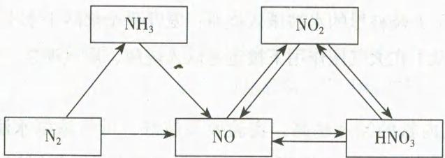

对重要的物质如氨、硝酸等，可以从物质的组成、结构、性质（物理性质）、变化（化学性质）、用途、制备、检验等方面全面总结，以便使学生掌握学习元素单质及其化合物的一般思路。

## 5. 注重实验的趣味性和探究性，激发学生的学习兴趣，提高学习效率

本节教材中氨的喷泉实验、氨与氯化氢反应生成“白烟”的实验等，都具有很强的趣味性，教师要用好这些实验激发学生的学习兴趣，并引导学生把兴趣转化为学习化学的动力。如在做氨的喷泉实验时，先提醒学生注意观察实验现象，完成实验后，通过连续提问引导学生分析实验现象。相关问题有：①同学们看到了什么现象？②出现喷泉现象说明了什么？③喷泉的原理是什么？④溶液变成红色说明了什么？⑤你知道还有哪些气体可以做喷泉实验？在分析的基础上得出实验结论，并写出氨与水反应（可逆反应）的化学方程式。

## 四、栏目使用建议

## 1. 实验

## 【实验5-5】

该实验的目的是探究 $NO_{2}$ 与NO的相互转化，巧妙地使用注射器，方便灵活，微型环保，可以演示也可以分组实验。

实验现象：第一次振荡时，无明显现象；吸入空气后气体变为红棕色；再振荡后气体又变为无色，同时注射器的活塞向内移动。

实验分析: NO不溶于水, 吸入空气后, NO与 $O_{2}$ 反应生成 $NO_{2}$ , 气体变为红棕色; 振荡后, $NO_{2}$ 溶于水生成硝酸和NO, 气体又变为无色, 同时气体的总体积有所减小。

注意事项：①操作时要注意控制好吸入气体或液体的体积；②注射器的体积小，为了让学生看清楚，可以走到学生中间操作或通过实物投影仪放大实验现象；③实验结束时可以吸入过量的空气，充分振荡后将液体注入烧杯，滴加紫色石蕊溶液，观察现象。

## 【实验5-6】

该实验是利用氨极易溶于水的性质设计的趣味性实验，喷泉现象是该实验吸引学生的亮点。本实验操作要求较高，适宜在课堂演示。

实验现象：烧杯里的液体经玻璃管喷入烧瓶，形如喷泉，溶液变成红色。

实验分析：挤压胶头滴管，滴管里少量的水进入烧瓶，氨溶于其中，使烧瓶内气体压强减小，在大气压作用下，下方烧杯里的水被压入烧瓶；氨几乎全部溶于水中，使烧瓶内气压迅速降低，烧杯里的水（含酚酞）在大气压作用下被迅速压入烧瓶，形成喷泉；由于氨水显碱性，导致酚酞溶液显红色。

注意事项：①烧瓶内氨的纯度越高，实验效果越好，可将浓氨水滴加在适量生石灰中制取氨；②装置的密封性要好；③氨在烧瓶内保存时间不要太长，最好当天制取当天实验；④连接装置时要迅速，以防空气进入烧瓶，影响实验效果；⑤可将2\~3 mL浓氨水倒入圆底烧瓶，用酒精灯微热，振荡后迅速塞上带有玻璃管的橡胶塞（注意通风），立即用于喷泉实验，效果较好。

## 【实验5-7】

铵盐都能与碱反应生成氨，这是实验室检验铵盐和制取氨的化学原理。

实验现象：加热时有气泡产生，试管口湿润的红色石蕊试纸变蓝。

实验分析：两种溶液混合时发生反应 $NH_{4}^{+}+OH^{-}\xlongequal{\Delta}NH_{3}\uparrow+H_{2}O$ ，氨水显碱性，使湿润的红色石蕊试纸变蓝。

注意事项：①实验所用溶液的浓度宜大，体积宜小；②氨有刺激性气味，操作时应注意通风，防止空气污染；③根据这一原理，实验室可用铵盐与碱石灰反应制取氨。

## 【实验5-8】

浓硝酸和稀硝酸都能与铜反应，但反应速率和产物都不相同，实验时要注意比较其差别。

实验现象：浓硝酸与铜反应时，试管内产生大量红棕色气体，溶液逐渐变绿，铜丝逐渐变细；稀硝酸与铜反应时，试管内开始产生少量无色气体，反应逐渐加快，气体在试管上部变为红棕色，溶液逐渐变蓝，铜丝逐渐变细。

实验分析：浓硝酸与铜在常温下能迅速反应，生成红棕色的 $NO_{2}$ ，硝酸铜溶液显蓝色，当溶液中同时溶有较多 $NO_{2}$ 时，其混合溶液显绿色；稀硝酸与铜在常温下能缓慢反应，生成无色的NO，随着反应进行，溶液温度升高，反应速率逐渐加快，NO与 $O_{2}$ 在常温下反应生成红棕色的 $NO_{2}$ ，硝酸铜溶液显蓝色。

注意事项：①硝酸有腐蚀性和挥发性，NO 和 $NO_{2}$ 都有毒，实验时要注意防护和通风；②选用 1:2 的稀硝酸反应，现象比较明显；③为了便于观察气体的颜色，可以在试管背面用白纸衬托；④观察时注意比较反应速率大小和生成气体的颜色。

## 2. 思考与讨论

## 【思考与讨论1】

在演示 $NO_{2}$ 溶于水及NO与 $NO_{2}$ 在注射器中的相互转化实验后，教材设置该栏目，有针对性地提出了三个问题，其目的是引导学生分析实验现象，然后联系工业生产实际进行思考，体现了学以致用和节约环保的理念。在该实验中，当 $O_{2}$ 过量时，NO可以完全溶于水生成硝酸。

## 【思考与讨论2】

在学习了铵盐与碱反应生成氨的性质之后，教材设置了关于氨的实验室制法的思考与讨论，其目的是要学生利用已经掌握的实验室制取氧气的方法，学习实验室制取氨的方法。教学时可以要求学生根据化学反应原理，设计合理的操作步骤：①按装置图连接好装置；②检验装置的气密性；③添加药品；④加热制取气体；⑤用向下排空气法收集气体。

注意：在试管口放置干燥棉花是为了防止氨与空气对流而泄漏。当室内气温较低时，用普通玻璃试管，加热氯化铵与氢氧化钙制取氨，试管容易破裂。若用硫酸铵与碱石灰反应制取氨，可以降低试管破裂的可能性。

## 【思考与讨论3】

在介绍氮及其主要化合物的性质之后，教材设置该栏目的主要目的，是让学生在归纳这些物质化学性质的基础上，进一步从物质类别和元素价态的视角来认识物质的转化关系。同时，这里也简单介绍了硝酸在生产中的用途和工业制备硝酸的方法。

## 五、练习与应用参考答案及说明

1. D 
2. D 
3. D 
4. D

5. 适宜采用第3种方法。该方法可以使铜和硝酸完全转化为产品硝酸铜，而且无污染物排放。

6. (1) $4\mathrm{HNO}_{3}\xlongequal[\text{或光照}]{\triangle}4\mathrm{NO}_{2}\uparrow+\mathrm{O}_{2}\uparrow+2\mathrm{H}_{2}\mathrm{O}$

(2) ① $3 \mathrm{Cu} + 8 \mathrm{H}^{+} + 2 \mathrm{NO}_{3}^{-} = 3 \mathrm{Cu}^{2+} + 2 \mathrm{NO} \uparrow + 4 \mathrm{H}_{2} \mathrm{O}$ ② $2 \mathrm{NO} + \mathrm{O}_{2} = 2 \mathrm{NO}_{2}$

(3) ① $\mathrm{Cu} + 4\mathrm{HNO}_3$ (浓) $= \mathrm{Cu(NO_3)_2 + 2NO_2\uparrow + 2H_2O}$ ② $3\mathrm{NO}_2 + \mathrm{H}_2\mathrm{O} = 2\mathrm{HNO}_3 + \mathrm{NO}$

7. 发动机气缸工作时产生高温，导致气缸内空气中的氮气被氧化而产生NO，反应的化学方程式为： $N_{2}+O_{2}\xlongequal{高温}2NO$ 。

8. (1) $\mathrm{N}_{2} 、 \mathrm{NH}_{3}$ 、铵盐、硝酸盐、动植物体内的蛋白质等。

(2) 人体内的蛋白质主要来源于食物。

(3) 豆科植物的根瘤菌固氮、雷电固氮等。

（4）工业合成氨、农业中氮肥的使用、汽车尾气排放等。

## 第三节 无机非金属材料

## 一、内容分析

本节内容主要包括传统硅酸盐材料和新型无机非金属材料。教材首先从物质的组成和结构入手，介绍无机非金属材料的性能特点，包括耐高温、抗腐蚀等性能。从材料组成的角度，对生活中常见的无机非金属材料进行分类，介绍陶瓷、玻璃和水泥等传统硅酸盐材料在人类日常生活中的广泛应用，以及材料对人类文明的推动作用。之后，介绍新型无机非金属材料，包括硅和二氧化硅、新型陶瓷、碳纳米材料，以及这些材料在信息、能源等领域产生的影响，展现化学科学对新材料研发的重要作用，让学生了解化学学科对社会进步的价值，提升“科学态度与社会责任”等学科核心素养。

## 二、教学目标

## 1. 教学目标

（1）通过阅读和讨论，了解陶瓷、玻璃、水泥等传统硅酸盐材料的生产原料、性能和主要用途，知道普通玻璃的主要成分，感受传统硅酸盐材料在城乡建设中发挥的重要作用。

（2）通过学习，了解晶体硅、二氧化硅、新型陶瓷、碳纳米材料的性能和用途，感受新型无机非金属材料的奇特性能及其在高科技领域所发挥的重要作用，激发学生学习化学的兴趣。

（3）结合身边的生活用品、电子产品、建筑物等用到的无机非金属材料，感受化学就在身边，化学材料作用巨大，提高学生努力学习化学、投身国家建设的社会责任感。

## 2. 教学重点

重点：玻璃、水泥、硅、二氧化硅、新型陶瓷等无机非金属材料的主要性能和用途，普通玻璃的主要成分。

## 三、教学建议

本节内容主要为无机非金属材料知识的常识性介绍，呈现方式主要为正文描述结合图片和资料卡片等栏目的形式，信息多，阅读量大。建议教学时提前布置学生自学，在课堂上以讲授与讨论相结合的形式进行归纳整合，具体建议如下。

## 1. 注重学习方法指导，让学生通过阅读、查阅资料等方式了解无机非金属材料

由于本节课容量大、难度低（复杂的反应原理等不作要求），建议在课前布置学生自学，阅读教材或查阅资料，并提出具体问题，例如：①传统无机非金属材料有哪些？新型无机非金属材料有哪些？②这些无机非金属材料各有什么特性和用途？③无机非金属材料有哪些共性？使学生通过自学完成对无机非金属材料的一般了解。

## 2. 结合我国当代利用无机非金属材料建设大型工程所取得的巨大成就，设置有效教学情境，提高教学效率

三峡工程、珠港澳大桥工程中使用的水泥，载人航天器外壳中的耐高温陶瓷，磁悬浮技术使用的超导陶瓷，计算机芯片中的高纯硅，材料新宠石墨烯等都是很好的情境素材，教学中要合理运用，以激发学生学习的积极性，提高学习效率，增强社会责任感。

## 3. 教学中要抓住要点，适当取舍，把握好教材对无机非金属材料的基本要求

本节的重点是要求学生了解无机非金属材料的主要性能和用途，感受化学对社会发展和人类生活的巨大贡献。对不同材料，教材介绍的内容也有所不同。如陶瓷的生产原料黏土中含有铝硅酸盐，普通玻璃的主要成分为 $Na_{2}SiO_{3}$ 、 $CaSiO_{3}$ 和 $SiO_{2}$ ，水泥中加入石膏是为了调节水泥的硬化速率，新型陶瓷金刚砂（SiC），碳纳米材料富勒烯、石墨烯、碳纳米管，等等。对于制备过程中的化学反应原理、工艺要求、商业标准等一般不作要求，以减轻学生的学习负担。

## 4. 将重要的无机非金属材料进行分类整理，使所学知识系统化、结构化

教学时可以参考表5-3的形式对几种主要无机非金属材料进行整理，便于学生更清楚地了解所学知识。

表5-3 几种无机非金属材料的比较

<table><tr><td>分类</td><td>名称</td><td>性能</td><td>主要用途</td></tr><tr><td rowspan="3">传统硅酸盐材料</td><td>陶瓷</td><td>熔点高、硬度大、耐腐蚀、性质稳定</td><td>建筑材料、日用器皿、卫生洁具等</td></tr><tr><td>玻璃</td><td>透光性好、硬度大、无固定熔点</td><td>建筑材料、各种器皿、光学仪器等</td></tr><tr><td>水泥</td><td>遇水逐渐变硬(水硬性)、硬化后性质稳定</td><td>大量用于建筑、水利、道路等工程中</td></tr></table>

续表

<table><tr><td>分类</td><td>名称</td><td>性能</td><td>主要用途</td></tr><tr><td rowspan="5">新型无机非金属材料</td><td>晶体硅</td><td>导电性介于导体与绝缘体之间</td><td>半导体材料、计算机芯片、太阳能电池等</td></tr><tr><td>二氧化硅</td><td>性质稳定、透光性好</td><td>光导纤维、玻璃仪器、装饰品等</td></tr><tr><td>新型陶瓷</td><td>分别具有光学、热学、电学、磁学等方面的特性</td><td>分别用于激光、火箭发动机、压电陶瓷(点火器)、磁悬浮技术、人工关节等</td></tr><tr><td>石墨烯</td><td>电阻率低、热导率高、强度大</td><td>光电器件、超级电容、电池、复合材料等</td></tr><tr><td>碳纳米管</td><td>比表面积大、电学性能好、强度大</td><td>传感器、电池、复合材料等</td></tr></table>

## 四、练习与应用参考答案及说明

1. A

2. (1) ⑧⑩ (2) ⑤⑥⑦⑨ (3) ①②③④

3. ${\mathrm{{SiO}}}_{2} + 4\mathrm{{HF}} = {\mathrm{{SiF}}}_{4} \uparrow   + 2{\mathrm{H}}_{2}\mathrm{O}$

玻璃的主要成分为 $Na_{2}SiO_{3}$ 、 $CaSiO_{3}$ 和 $SiO_{2}$ ，氢氟酸会与 $SiO_{2}$ 发生反应而使部分玻璃溶解，使玻璃表面呈现磨砂状。

4. 若使用带玻璃塞的试剂瓶盛放碱液，碱液能与玻璃中的 $SiO_{2}$ 发生反应生成 $Na_{2}SiO_{3}$ ，导致玻璃塞与瓶口内侧发生粘连而无法打开。 $SiO_{2} + 2NaOH = Na_{2}SiO_{3} + H_{2}O$

5. (1) acd

(3) 提示: 材料的基础研究是用理论和实验相结合的方法, 研究材料的性质和工业生产的最佳条件, 为实际生产和应用提供科学依据。受科技水平和社会需求等因素的影响, 材料基础研究的成果并不一定能很快应用于生产。同时, 社会需求是推动材料基础研究的主要动力, 有了相应的需求, 基础研究的成果才能较快地应用于实际生产。

# 复习与提高参考答案及说明

## 1. B 2. B

3.(1) $N_{2}$ 氮气的化学性质稳定

(2) $NH_{3}$ 氨易液化，且液氨汽化时要吸收大量的热

(3) $\mathrm{NH}_{3} \mathrm{NH}_{3} + \mathrm{H}^{+} = \mathrm{NH}_{4}^{+}$

(4) 铵盐 $NH_{4}^{+} + OH^{-} \xlongequal{\triangle} NH_{3} \uparrow + H_{2}O$

4.（1）① ${\mathrm{H}}_{2}{\mathrm{{SO}}}_{4}$ ②酸雨

(2) ① $N_{2}$ $NO_{2}$ ② $Cu+4HNO_{3}(浓)=Cu(NO_{3})_{2}+2NO_{2}\uparrow+2H_{2}O$ 属于

5.(1) 白色粉末变蓝 水

(2) 品红溶液褪色 二氧化硫

(3) C可以除去混合气体中的二氧化硫，D可以检验产物中有二氧化碳。

6. (1) $\begin{array}{c}\mathrm{H}:\ddot{\mathrm{N}}:\mathrm{H}\\ \dot{\mathrm{H}}\end{array}$ $\mathrm{O}_2$

$$
(2) 3 \mathrm{NO} _ {2} + \mathrm{H} _ {2} \mathrm{O} = 2 \mathrm{HNO} _ {3} + \mathrm{NO}
$$

$$
3 \mathrm{Cu} + 8 \mathrm{H} ^ {+} + 2 \mathrm{NO} _ {3} ^ {-} = 3 \mathrm{Cu} ^ {2 +} + 2 \mathrm{NO} \uparrow + 4 \mathrm{H} _ {2} \mathrm{O}
$$

7. (1)-3 $\mathrm{N}_2$ 、C (2) 11.7 g

8. 取少量该无色晶体于试管中, 加水溶解, 再将溶液分成两份。向其中一支试管中加入适量 $\mathrm{NaOH}$ 溶液, 加热, 并在试管口处放置湿润的红色石蕊试纸, 若试纸变蓝, 则说明该晶体中含有 $\mathrm{NH}_{4}^{+}$ 。再向另一支试管中滴加稀盐酸, 若无明显现象, 再滴加 $\mathrm{BaCl}_{2}$ 溶液, 有白色沉淀生成, 则说明该晶体中含有 $\mathrm{SO}_{4}^{2-}$ 。由此可证明该晶体为 $(\mathrm{NH}_{4})_{2} \mathrm{SO}_{4}$ 。

9. (1) $\mathrm{N}_{2} + 3\mathrm{H}_{2}\xrightarrow[\text{催化剂}]{\text{高温、高压}} 2\mathrm{NH}_{3}$ $4\mathrm{NH}_{3} + 5\mathrm{O}_{2}\xrightarrow[\triangle]{\text{催化剂}} 4\mathrm{NO} + 6\mathrm{H}_{2}\mathrm{O}$ 氧化剂还原剂还原剂氧化剂

(2) A是空气。向吸收塔中通入A是为了氧化NO。

$$
\begin{array}{r l} & {(3) \mathrm{c}} \\ & {(4) 4 \mathrm{NO} _ {2} + \mathrm{O} _ {2} + 2 \mathrm{Na} _ {2} \mathrm{CO} _ {3} = 4 \mathrm{NaNO} _ {3} + 2 \mathrm{CO} _ {2}} \\ & {6 \mathrm{NO} _ {2} + 8 \mathrm{NH} _ {3} \xlongequal {\text {催化剂}} 7 \mathrm{N} _ {2} + 1 2 \mathrm{H} _ {2} \mathrm{O}} \\ & {1 0. \frac {3 . 2}{a b} \mathrm{g/L}} \end{array}
$$

# 实验活动4 用化学沉淀法去除粗盐中的杂质离子

本实验是通过除去粗盐中的 $Ca^{2+}$ 、 $Mg^{2+}$ 和 $SO_{4}^{2-}$ 制取精盐，使学生掌握溶解、沉淀、过滤、蒸发、结晶等实验操作方法，学会除去可溶性固体中杂质的方法。该实验的原理和操作比较复杂，实验操作顺序和试剂用量控制直接影响实验结果，认真完成该实验活动有利于培养学生的实验探究能力和创新意识。

## 一、活动安排建议

1. 课前1\~2天布置学生预习，使学生了解实验原理和实验基本要求。指导学生查阅附录Ⅱ——部分酸、碱和盐的溶解性表（室温），知道 $\mathrm{Ca(OH)}_{2}$ 和 $\mathrm{MgCO}_{3}$ 等都是微溶物质，不能通过过滤完全除去相关的杂质离子； $\mathrm{Mg(OH)}_{2}$ 、 $CaCO_{3}$ 和 $BaCO_{3}$ 难溶于水但可溶于酸； $BaSO_{4}$ 既难溶于水又难溶于酸。

表5-4 实验分步操作时体系中的主要离子和沉淀成分

<table><tr><td>步骤</td><td>操作</td><td>主要离子</td><td>杂质离子</td><td>沉淀成分</td></tr><tr><td>1</td><td>溶解</td><td> $Na^{+}$ 、 $Cl^{-}$ </td><td> $Ca^{2+}$ 、 $Mg^{2+}$ 、 $SO_{4}^{2-}$ </td><td>—</td></tr><tr><td>2</td><td>加入过量的 $BaCl_{2}$ 溶液</td><td> $Na^{+}$ 、 $Cl^{-}$ </td><td> $Ca^{2+}$ 、 $Mg^{2+}$ 、 $Ba^{2+}$ </td><td> $BaSO_{4}$ </td></tr><tr><td>3</td><td>加入过量的NaOH溶液</td><td> $Na^{+}$ 、 $Cl^{-}$ </td><td> $Ca^{2+}$ 、 $Ba^{2+}$ 、 $OH^{-}$ </td><td> $BaSO_{4}$ 、 $Mg(OH)_{2}$ </td></tr><tr><td>4</td><td>加入过量的饱和 $Na_{2}CO_{3}$ 溶液</td><td> $Na^{+}$ 、 $Cl^{-}$ </td><td> $OH^{-}$ 、 $CO_{3}^{2-}$ </td><td> $BaSO_{4}$ 、 $Mg(OH)_{2}$ 、 $CaCO_{3}$ 、 $BaCO_{3}$ </td></tr><tr><td>5</td><td>过滤</td><td> $Na^{+}$ 、 $Cl^{-}$ </td><td> $OH^{-}$ 、 $CO_{3}^{2-}$ </td><td>—</td></tr><tr><td>6</td><td>加入适量稀盐酸</td><td> $Na^{+}$ 、 $Cl^{-}$ </td><td>—</td><td>—</td></tr><tr><td>7</td><td>蒸发结晶</td><td colspan="3">得到NaCl晶体</td></tr></table>

2. 课堂上老师要先了解学生的预习情况，引导学生的思维。可以提问：怎样确认所加试剂（沉淀剂）已经过量？过滤时要注意什么？蒸发时要怎样操作？等等。

3. 学生实验时老师要现场巡视，及时处理偶发事件，必要时对学生进行示范和讲解。

## 二、注意事项

1. 本实验的加热蒸发和玻璃仪器的使用都有一定的危险性，实验前要提醒学生注意安全，进行操作时要戴上护目镜。

进行操作时要戴工作口说。
2. 在依次加入过量的 $BaCl_{2}$ 、NaOH 和 $Na_{2}CO_{3}$ 溶液时，都有沉淀生成，但不需要多次过滤，只要在加入 $Na_{2}CO_{3}$ 溶液后一次过滤即可。

3. 如果过滤后滤液仍然浑浊，则须重做过滤器，再次过滤。

## 三、问题与讨论答案或提示

1. 本次实验加入试剂的顺序是: $BaCl_{2}$ 溶液、 $NaOH$ 溶液、 $Na_{2}CO_{3}$ 溶液、稀盐酸。其他顺序如 $NaOH$ 溶液、 $BaCl_{2}$ 溶液、 $Na_{2}CO_{3}$ 溶液、稀盐酸也可以达到同样的目的。在实际生产中, 一般先除去较多的杂质, 综合考虑试剂用量、成本和操作便利性等因素来设计方案。

2. 在加入沉淀剂时略微过量, 是为了保证完全除去杂质离子。加入盐酸的目的是除去溶液中的 $\mathrm{CO}_{3}^{2-}$ , 并调节溶液的 $\mathrm{pH}$ 。

3. 先过滤再加盐酸的操作顺序不能颠倒。若在过滤前加入稀盐酸，会使生成的沉淀溶解，产生新的杂质。

## 实验活动5 不同价态含硫物质的转化

## 一、活动安排建议

1. 本实验活动可以安排在“第一节 硫及其化合物”的学习全部完成后，结合“探究不同价态含硫物质的转化”统筹安排。

2. 建议探究活动侧重理论分析和方案设计，可安排在教室进行。本实验活动则侧重实验操作和验证，须在实验室中进行。

3. 在本实验的操作中，涉及几种含硫物质间的转化，如：

$$
\mathrm{Na} _ {2} \mathrm{S} \rightarrow \mathrm{S}, \mathrm{Na} _ {2} \mathrm{S} \rightarrow \mathrm{H} _ {2} \mathrm{S}, \mathrm{H} _ {2} \mathrm{S} \rightarrow \mathrm{S}, \mathrm{SO} _ {2} \rightarrow \mathrm{S}, \mathrm{H} _ {2} \mathrm{SO} _ {4} \rightarrow \mathrm{SO} _ {2}, \mathrm{S} \rightarrow \mathrm{FeS}
$$

建议增加 $H_{2}SO_{3}$ 被 $H_{2}O_{2}$ 氧化为 $H_{2}SO_{4}$ 的实验，这既可以使不同价态含硫物质的转化更全面，也能深化对酸雨形成机理的认识。

## 二、注意事项

1. 实验中要注意安全，防止 $SO_{2}$ 、 $H_{2}S$ 气体污染空气。

2. 铜片与浓硫酸反应，实验结束时应先将导气管口置于品红溶液的液面以上，再撤离酒精灯，以防止倒吸。

3. 硫粉与还原铁粉反应时，会有少量 $\mathrm{SO}_2$ 生成，要注意通风。

## 三、问题与讨论答案或提示

1. 在上述反应中，硫元素的价态变化依次有： $-2\rightarrow0,\quad+4\rightarrow0;\quad+6\rightarrow+4;\quad0\rightarrow-2$ 。

2. 可能发生的反应有: $\mathrm{Fe} + \mathrm{S} \xlongequal{\triangle} \mathrm{FeS}, \mathrm{S} + \mathrm{O}_{2} \xlongequal{\text {点燃}} \mathrm{SO}_{2}, 3\mathrm{Fe} + 2\mathrm{O}_{2} \xlongequal{\text {点燃}} \mathrm{Fe}_{3}\mathrm{O}_{4}$ 。

3. 可能遇到的问题有：① $SO_{2}$ 的污染问题；②浓硫酸与铜反应后装置内出现倒吸；③铁粉与硫粉不反应（铁粉过期失效）；等等。

## 教学资源

## 1. 硫在不同温度下的状态与分子结构

硫受热到113 ℃时开始熔化，变成淡黄色容易流动的液体。温度上升到160 ℃以上，液体很快变成棕色，并具有黏滞性。在200 ℃左右时，黏度达最高点。以后，黏度随着温度上升而减小，接近硫的沸点445 ℃时，又恢复为易流动的液体。

这种现象可以这样解释：根据相对分子质量测定，单质硫分子的化学式为 $S_{8}$ ，这个分子具有环状结构（图5-1）。加热时发生上述性质的变化，是由于硫内部结构的变化而引起的。在通常情况下，硫具有图5-1所示的环状结构，熔化时容易流动。高于160℃时， $S_{8}$ 的环开始破裂，转为开链结构，链与链之间可以互相连接而发生聚合作用，形成长的硫链，因而黏度增加，颜色变深。在200℃左右，黏度达到最高点。进一步加热时，长链又开始断裂，长链大分子断裂为短链分子，黏度又重新降低。

  
图 5-1 $S_{8}$ 分子结构示意图

硫在 $445^{\circ} \mathrm{C}$ 时沸腾。由蒸气密度可知，硫的蒸气中有 $\mathrm{S}_{8} 、 \mathrm{S}_{6} 、 \mathrm{S}_{4} 、 \mathrm{S}_{2}$ 等分子存在，每种分子数目的多少视温度的高低而定。下列平衡随着温度的升高而向正反应的方向移动。

$$
3 \mathrm{S} _ {8} \rightleftharpoons 4 \mathrm{S} _ {6} \rightleftharpoons 6 \mathrm{S} _ {4} \rightleftharpoons 1 2 \mathrm{S} _ {2}
$$

750 ℃时，硫蒸气大部分是 $S_{2}$ 。2 000 ℃时， $S_{2}$ 分子大部分分解为单原子S。

$$
\mathrm{d} \vec {r}
$$

## 2. 二氧化硫的漂白性

$SO_{2}$ 溶解于水生成亚硫酸，亚硫酸与一些有色的有机物直接结合生成无色化合物。例如，把 $SO_{2}$ 通入品红溶液里，溶液颜色就由红色变为无色，这是亚硫酸直接与有色物质结合的结果。其中的一个反应可以用下面的化学方程式表示：

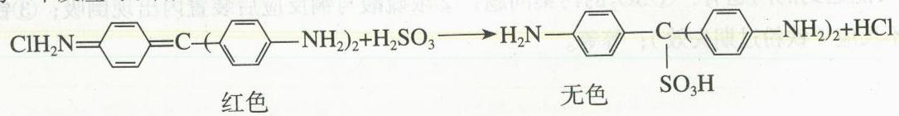

品红的结构里有一个发色团，该发色团遇到亚硫酸后，生成不稳定的无色化合物，改变了发色团的结构。这种无色化合物不稳定，加热时，又生成发色团。

## 3. 浓硫酸的吸水作用与脱水作用

## (1) 浓硫酸的吸水作用

浓硫酸发生吸水作用时, 硫酸分子与水分子结合, 生成一系列水合物, 例如 $\mathrm{H}_{2} \mathrm{SO}_{4} \cdot \mathrm{H}_{2} \mathrm{O}$ (SO₃·2H₂O)、 $\mathrm{H}_{2} \mathrm{SO}_{4} \cdot 2 \mathrm{H}_{2} \mathrm{O}$ (SO₃·3H₂O) 和 $\mathrm{H}_{2} \mathrm{SO}_{4} \cdot 4 \mathrm{H}_{2} \mathrm{O}$ (SO₃·5H₂O)。这些水合物很稳定, 所以浓硫酸是很好的干燥剂。它不但能吸收空气中的水分, 还能夺取结晶水合物中的结晶水。浓硫酸与水生成水合分子的同时, 会放出大量的热。

## (2) 浓硫酸的脱水作用

浓硫酸可将许多有机化合物（尤其是糖类，如纤维素、蔗糖等）脱水。反应时，按水分子中氢、氧原子数的比（2：1）夺取这些有机物分子里的氢原子和氧原子。例如，浓硫酸与蔗糖混合时，主要起脱水作用，同时浓硫酸又使游离出来的炭氧化而生成二氧化碳，它自身被还原而生成二氧化硫，反应时放出的热使水分蒸发。这些作用使有机物脱水后生成的炭的体积膨胀，并呈疏松多孔状。但是，浓硫酸使有机物脱水时，并不一定都有炭游离出来。例如，用甲酸制取一氧化碳或用乙醇制取乙烯时，虽然都用浓硫酸作脱水剂，但没有炭游离出来。这两个反应如下：

$$
\mathrm{HCOOH} \xrightarrow [ \triangle ]{\text {浓硫酸}} \mathrm{CO} \uparrow + \mathrm{H} _ {2} \mathrm{O}
$$

$$
\mathrm{C} _ {2} \mathrm{H} _ {5} \mathrm{OH} \xrightarrow [ \triangle ]{\text {浓硫酸}} \mathrm{C} _ {2} \mathrm{H} _ {4} \uparrow + \mathrm{H} _ {2} \mathrm{O}
$$

## 4. 浓、稀硫酸的氧化作用不同的原因

浓硫酸是一种氧化作用相当强的氧化剂，特别是当加热时，它的氧化性就更强了。浓硫酸的氧化作用是由分子里氧化数为+6的硫所引起的。

加热时, 绝大多数金属 (Au、Pt除外) 都能与浓硫酸发生反应, 但都没有氢气生成。在金属活动性顺序中氢前面的金属, 根据它们还原性的不同, 硫酸分子里氧化数为 $+6$ 的硫能被还原成不同氧化数的产物, 如 $\mathrm{SO}_{2} 、 \mathrm{~S}$ 和 $\mathrm{H}_{2} \mathrm{~S}$ 等。在一般情况下, 大多生成 $\mathrm{SO}_{2}$ 。在加热情况下, 当还原性强的锌与浓硫酸作用时, 主要生成 $\mathrm{SO}_{2}$ , 但往往同时有单质 $\mathrm{S}$ 和 $\mathrm{H}_{2} \mathrm{~S}$ 生成。

$$
\begin{array}{r l} & \mathrm {Zn + 2H_ {2} SO_ {4} (\text {浓}) \xlongequal {\triangle} ZnSO_ {4} +SO_ {2} \uparrow + 2H_ {2} O} \\ & 3 \mathrm {Zn + 4H_ {2} SO_ {4} (\text {浓}) \xlongequal {\triangle} 3ZnSO_ {4} +S\downarrow + 4H_ {2} O} \\ & 4 \mathrm {Zn + 5H_ {2} SO_ {4} (\text {浓}) \xlongequal {\triangle} 4ZnSO_ {4} + H_ {2} S\uparrow + 4H_ {2} O} \end{array}
$$

金属的还原性越强，生成S和 $H_{2}S$ 的倾向就越大。在金属活动性顺序里氢以后的金属，在加热情况下与浓硫酸反应，都生成 $SO_{2}$ ，而不生成S和 $H_{2}S$ 。例如：

$$
\mathrm{Cu} + 2 \mathrm{H} _ {2} \mathrm{SO} _ {4} (\text {浓}) \xlongequal {\triangle} \mathrm{CuSO} _ {4} + \mathrm{SO} _ {2} \uparrow + 2 \mathrm{H} _ {2} \mathrm{O}
$$

稀硫酸与活泼金属反应，能放出 $H_{2}$ 。

$$
\mathrm{Zn} + \mathrm{H} _ {2} \mathrm{SO} _ {4} (\text {   稀   }) = \mathrm{ZnSO} _ {4} + \mathrm{H} _ {2} \uparrow
$$

这种氧化作用，实际上是金属与硫酸电离出来的氢离子反应而引起的。因此，稀硫酸的氧化作用是一般酸类共有的性质。但氢离子只能氧化金属活动性顺序中位于氢前面的金属，例如Mg、Zn、Fe等，或者说是这些活泼金属把氢离子还原了。而位于氢后面的金属，例如Cu、Ag、Hg等，则不能与稀硫酸反应。

## 5. 神奇的一氧化氮分子

美国《科学》杂志自1989年起，每年度评选一个对科学和社会发展有重要影响的分子，授予“明星分子”的荣誉称号。NO分子曾是一个不起眼的小分子，1992年因其神奇的生物活性被评选为明星分子。

## (1) NO 分子的结构

NO分子的电子式为: $\dot{N}::\ddot{O}$ : 。根据分子轨道理论，第二周期电子数小于或等于14的双原子分子的能级次序与 $N_{2}$ 分子的相同，电子数等于或大于16的双原子分子的能级次序与 $O_{2}$ 分子的相同。那么电子数为15的NO分子的能级次序究竟与 $O_{2}$ 的相同还是与 $N_{2}$ 的相同呢？有人根据NO与 $O_{2}^{+}$ 为等电子体，提出NO分子的能级次序类似 $O_{2}$ 。然而量子化学计算和NO分子的紫外光电子能谱表明，NO分子的能级次序与 $N_{2}$ 的相同，其电子组态为 $1\sigma^{2}2\sigma^{2}3\sigma^{2}4\sigma^{2}1\pi^{4}5\sigma^{2}2\pi^{1}$ 。N和O之间的三键由一个双电子 $\sigma$ 键、一个双电子 $\pi$ 键和一个三电子 $\pi$ 键组成。NO与 $N_{2}$ 、 $O_{2}$ 分子的键长、键解离能与磁性比较见表5-5。

表5-5 NO与 $\mathbf{N}_2$ 、 $\mathrm{O}_2$ 分子的比较

<table><tr><td>分子</td><td>键长/pm</td><td>键解离能/(kJ·mol-1)</td><td>磁性</td></tr><tr><td>N2</td><td>111</td><td>942</td><td>反磁性</td></tr><tr><td>NO</td><td>105</td><td>678</td><td>顺磁性,单自由基分子</td></tr><tr><td>O2</td><td>121</td><td>494</td><td>顺磁性,双自由基分子</td></tr></table>

## (2) NO 的物理和化学性质

NO的相对分子质量为30.01，熔点为-163.6℃，沸点为-151.8℃，密度为1.3402 g/L，微溶于水，但不与水反应。NO溶于乙醇，具有脂溶性，这使NO不需要任何中介机制就可快速扩散通过生物膜。

## (3) NO 分子的生物活性

NO的生物活性最早发现于1980年。美国科学家在一项研究中发现了一种小分子的物质具有使血管平滑肌松弛的作用，后来将这种物质命名为内皮细胞源性血管舒张因子（简称EDRF），它是一种不稳定的生物自由基。EDRF被确认为NO，NO在 $O_{2}$ 及 $O_{2}^{-}$ 存在时可迅速被氧化成 $NO_{2}$ ，以 $NO_{3}^{-}$ 和 $NO_{2}^{-}$ 的形式存在于细胞内、外液中而失去生物活性；在超氧化物歧化酶（SOD）和酸性条件下化学性质较稳定。

细胞依靠一氧化氮合成酶，以L-精氨酸和分子氧为底物，同时在某种辅助因子的帮助下，从L-精氨酸上脱去5个电子而生成NO和另一种氨基酸。NO的生物半衰期只有3\~5 s。

## (4) NO在神经系统中的作用

NO有时承担着作为神经系统递质的作用。但与一般递质不同的是，它没有特殊的“储存设备”，也没有特殊的释放过程。只要需要，它就简单地从制造细胞中释放出来。NO的传送过程也杂乱无章，它不需要接收的入口而直接穿透膜层。NO已知的目标是细胞内层的酶，可以载着信息将其传送到任何它所能及的地方。

## 6. 合成氨工业的奠基人——哈伯

弗里茨·哈伯，德国化学家，1868年12月9日出生在德国布雷斯劳(现为波兰的弗罗茨瓦夫)的一个犹太人家庭。父亲是知识丰富又善经营的染料商人，家庭环境的熏陶使他从小和化学有缘。哈伯天资聪颖，勤学好问，曾先后在柏林、海德堡、苏黎世求学。大学毕业后在耶拿大学任助教，从事有机化学研究，后转入卡尔斯鲁厄高等工业学院任教。20世纪初，哈伯的研究转向物理化学。1909年，人工合成氨的研究取得成功，哈伯因此于1918年获得诺贝尔化学奖。1912年，哈伯出任德国威廉皇家物理化学和电化学研究所所长兼柏林大学教授。第一次世界大战期间，哈伯研究将氯气等物质用作化学武器，开启了化学毒气战的先例，也因此遭到了人们的谴责。第一次世界大战结束后，哈伯曾致力于研究从海水中提取黄金，但未能成功。1933年，德国纳粹上台后，哈伯由于其犹太人的身份而受到排挤，流落异国他乡，1934年病逝于瑞士巴塞尔。

合成氨的发明是哈伯一生对人类社会作出的最大贡献，其研究过程也是艰难曲折的。哈伯曾赴美国考察，了解了电弧作用下氮的氧化研究和工业应用的进展。哈伯回国后也进行了高压放电固氮研究，实际效果不够理想。后来他从法国化学家勒夏特列用高温、高压条件合成氨的研究中获得启示，也决定在这个方向进行研究。在试验了多种温度条件、压力条件和催化剂，历经无数次失败和艰难探索后，1909年7月，哈伯终于在600℃、约20 MPa和用稀有金属锇（或铀）作催化剂的条件下合成氨取得成功。通过高温、高压下的气相循环工艺，每小时可生成80 g氨，且能耗较低。

哈伯的研究成果使德国巴登苯胺和苏打公司确信这种合成方法具有很高的经济价值，于是该公司不惜耗费巨资并投入强大的技术力量，委任著名的化工专家博施负责将哈伯的研究成果付诸大规模的工业试验。由于饿和铀价格太高且有难以克服的缺陷，为了找到经济适用的催化剂，博施和他的同事花了大量时间进行了上万次试验，最后选定了含碱金属化合物的铁催化剂。博施的另一项攻关项目是建造能够耐高温、高压的合成氨装置。当时能承受20 MPa的低碳钢在高温下易被氢气腐蚀。博施想了许多办法，最后决定将合成塔衬以软铁，总算攻克了难关。经过不懈努力，终于在1913年建立了世界上第一个合成氨工厂，年产量约7 000 t。

由于对合成氨技术实现工业化生产作出了巨大贡献，博施和柏吉斯获得1931年诺贝尔化学奖，创造了一项技术成果使三人获得诺贝尔奖的奇迹。

[摘编自：袁翰青，应礼文.化学重要史实.北京：人民教育出版社，2000年]

## 7. 硝酸与金属反应的一般规律

硝酸与金属的反应是相当复杂的。在这些氧化还原反应中有许多平行反应，因此可以得到多种还原产物，而且在还原产物之间还可能发生氧化还原反应。

某些金属（如镁、锌）与小于2 mol/L的硝酸反应时，还会产生一定量的氢气。

硝酸的还原产物，除取决于硝酸的浓度、还原剂的还原能力外，还与反应温度和反应中间产物（ $HNO_{2}$ 、 $NO_{2}$ ）的催化作用有关。反应虽复杂，但硝酸与金属的反应是有规律的。

（1）在金属活动性顺序中，位于氢后面的金属如铜、汞、银等，与浓硝酸反应时，主要得到 $\mathrm{NO}_2$ ，与稀硝酸反应时，主要得到NO。

(2) 在常温下, $\mathrm{Fe}$ 、 $\mathrm{Co}$ 、 $\mathrm{Ni}$ 、 $\mathrm{Al}$ 等金属在浓硝酸中发生“钝化”, 在金属表面生成一层致密的金属氧化物薄膜, 阻止反应进一步发生。这些金属与稀硝酸作用主要生成 $\mathrm{N}_{2} \mathrm{O}$ (有人认为是 $\mathrm{NO}$ )。这是由于它们的还原性较强, 能将硝酸还原成较低价的 $\mathrm{N}_{2} \mathrm{O}$ 。如与更稀的硝酸反应则生成氨 (钴在同样条件下则生成氮气)。

(3) Mg、Zn等金属与不同浓度的硝酸作用能得到氮的不同低价态的还原产物。例如，当硝酸中 $HNO_{3}$ 的质量分数为 9%\~33%（密度为 $1.05 \sim 1.20 \, g/cm^{3}$ ）时，反应按下式进行：

$$
4 \mathrm{Zn} + 1 0 \mathrm{HNO} _ {3} = 4 \mathrm{Zn} (\mathrm{NO} _ {3}) _ {2} + \mathrm{N} _ {2} \mathrm{O} \uparrow + 5 \mathrm{H} _ {2} \mathrm{O}
$$

若硝酸更稀，反应会生成氨，氨与过量的硝酸进一步反应生成硝酸铵。

$$
4 \mathrm{Zn} + 1 0 \mathrm{HNO} _ {3} = 4 \mathrm{Zn} (\mathrm{NO} _ {3}) _ {2} + \mathrm{NH} _ {4} \mathrm{NO} _ {3} + 3 \mathrm{H} _ {2} \mathrm{O}
$$

(4) Au、Pt、Ir、Rh等金属与浓、稀硝酸都不反应，因为它们特别稳定，不易被氧化。

(5) Sn、Sb、W、V等金属与浓硝酸作用, 生成金属氧化物, 而不是硝酸盐 (因为这些金属的氧化物不溶于硝酸, 反应不再继续发生)。

## 8. 氮肥

植物生长需要不断从外界摄取各种营养元素，如碳、氢、氧、氮、磷、钾、硫、钙、镁、铁、铜、锰、锌、硼、钼等。前10种元素植物需要量较多，称为大量元素；后面几种元素植物需要量很少，称为微量元素。其中碳、氢、氧可以从空气中的 $CO_{2}$ 和土壤里的水分中获得，其他元素除部分地区缺乏个别微量元素外，一般土壤里都供给有余。只是氮、磷、钾三种元素，土壤里供给不足，而植物生长时需要量又较大。因此，针对这三种元素的人工施肥在农业生产上具有重要意义，所以把氮、磷、钾三种元素称为肥料三要素。

氮是形成植物细胞里原生质的主要成分——蛋白质的重要元素，也是形成核酸和叶绿素的重要元素。因此，要使庄稼生长茂盛，就不能缺少氮肥。

绿色植物一般不能从空气里直接摄取它们所需要的氮，也不能直接利用土壤里复杂的含氮有机物。植物从土壤里摄取的氮主要是铵盐和硝酸盐里的氮。

土壤里的氮被植物所吸取，含氮量就会减少。同时，土壤里有些细菌能够使含氮的物质分解，使化合态的氮变为游离态的氮。另外，雨水、河水也会冲洗掉一部分土壤里的含氮化合物。这些作用都会使土壤里含氮量减少。但是，自然界里还有另外一些过程在补充着土壤里减少的氮。例如，动植物的残体腐败的时候，其中的有机化合物中的氮在某些细菌的作用下，大部分转化为氨。一部分氨与土壤里的酸如碳酸、有机酸等反应，变成铵盐；一部分氨在硝化细菌的作用下逐渐氧化为硝酸。生成的硝酸与土壤里的盐类（如碳酸盐）反应变成了硝酸盐。这样，有机物里的氮就转化为铵盐和硝酸盐，回到土壤里，供植物摄取。

土壤里的固氮菌和豆科植物根部的根瘤菌能够直接摄取空气里的氮气，把氮气转化为氮的化合物。这也是增加土壤里含氮量的途径之一。

自然界里虽然进行着增加土壤里化合态氮的作用，但仍不能满足农业增产、高产的需要。我们必须采取各种方法，如施用氮肥和细菌肥料、轮种豆科作物等，来增加土壤里的氮，提高土壤的肥力。

氮肥可以根据它们的来源分为农家氮肥和化学氮肥两类。农家氮肥有厩肥、饼肥等，化学氮

肥有硫酸铵、硝酸铵、碳酸氢铵、氨水和尿素等。

现将几种主要氮肥的性质及施用、保存方法列于表5-6中。

表5-6 一些主要氮肥的性质和施用、保存方法

<table><tr><td>肥料类型</td><td>名称</td><td>化学式</td><td>含氮量(氮的质量分数)</td><td>水溶性</td><td>熔点</td><td>施用和保存方法</td></tr><tr><td rowspan="5">铵态氮肥</td><td>硫酸铵</td><td> $(NH_4)_2SO_4$ </td><td>20%~21%</td><td>易溶</td><td>235°C分解</td><td>较稳定,可撒施</td></tr><tr><td>氯化铵</td><td> $NH_4Cl$ </td><td>24%</td><td>易溶</td><td>320°C分解</td><td>同上</td></tr><tr><td>碳酸氢铵</td><td> $NH_4HCO_3$ </td><td>16%~17%</td><td>能溶</td><td>36~60°C迅速分解</td><td>不稳定,用时应深施覆土。保存时应密封存放在干燥阴凉处</td></tr><tr><td>硝酸铵</td><td> $NH_4NO_3$ </td><td>34%~35%</td><td>易溶</td><td>210°C分解</td><td>较稳定,可撒施</td></tr><tr><td>氨水</td><td> $NH_3·H_2O$ </td><td>16%~17%</td><td>和水可以任何比例混合</td><td>—</td><td>易挥发,有碱性和腐蚀性,使用时要稀释,施后应覆土</td></tr><tr><td rowspan="2">硝态氮肥</td><td>硝酸钙</td><td> $Ca(NO_3)_2$ </td><td>17%</td><td>易溶</td><td>561°C</td><td>易吸潮结块,较稳定,可撒施</td></tr><tr><td>硝酸钾</td><td> $KNO_3$ </td><td>14%</td><td>易溶</td><td>337°C</td><td>较稳定,可撒施</td></tr><tr><td>酰胺态氮肥</td><td>尿素</td><td> $CO(NH_2)_2$ </td><td>42%~46%</td><td>易溶</td><td>135°C</td><td>较稳定,可撒施或深施</td></tr></table>

当在土壤中施用硫酸铵时，由于植物吸收 $NH_{4}^{+}$ 比吸收 $SO_{4}^{2-}$ 快且吸收数量多，最后硫酸根留在土壤里，使土壤的酸性增加。所以，长期施用硫酸铵，会使土壤板结硬化。

由于氯化铵中的Cl $^{-}$ 会降低烟草的燃烧性，使烟草味道变坏，而且Cl $^{-}$ 也会使薯类的淀粉含量降低，因此氯化铵不适用于糖类、淀粉作物及烟草等。

硝酸铵既含有硝态氮又含有铵态氮，都易被植物吸收，是含氮量较高的氮肥。但 $NO_{3}^{-}$ 容易流失，特别在水田里施用更易流失。

碳酸氢铵与硫酸铵的肥效相近，因为它不含硫酸根，不会使土壤变酸性。但碳酸氢铵容易分解。

氨水也是很好的氮肥。如果施用得法，肥效与硫酸铵的大致相同。但施用时不能与种子和茎叶接触，以防止烧伤。氨水施入土壤后，氨水里的一部分 $NH_{4}^{+}$ 可被植物直接吸收，另一部分被土壤吸收，然后逐渐供给作物；或在硝化细菌的作用下，转变为硝酸根，再被作物吸收。由于在稻田施用氨水能杀死鱼蟹，因此在这种情况下不宜施用氨水作肥料。

尿素是目前含氮量最高的固体氮肥。它不能直接被植物吸收，但在土壤细菌的作用下，尿素转变为铵盐后，能被植物吸收。经常施用尿素，对土壤一般没有不良影响。

## 9. 硅

## (1) 硅在高新技术中的应用

信息材料技术是新材料技术的重要组成部分，也是信息技术尤其是电子信息技术发展的基础。从目前情况来看，硅半导体仍然是集成电路的主要材料。单晶硅作为半导体器件的核心材料，大大促进了信息技术的革命。自20世纪中叶以来，单晶硅的生产随着半导体工业的需要而迅速发展。光纤材料是发展现代通信的关键材料。目前的光纤以远距离通信用石英材质光纤为主，发展方向是减少损耗，降低成本。微电子与生物技术紧密结合的基因芯片是高技术领域的另一个研究热点和新的经济增长点。采用微电子加工技术，可以在指甲盖大小的硅片上制作出含有几十万种DNA片段的芯片。利用这种芯片可以在极短的时间内检测或发现与遗传基因相关的生物信息。这无疑对遗传学研究、疾病诊断与治疗等具有极其重要的作用。

## (2) 硅与碱的反应

(2) 硅与碱的反应

硅与强碱反应会生成氢气，可以用这种方法来制备氢气。在野外，为了迅速得到氢气，用硅粉与干燥的 $\mathrm{Ca(OH)}_{2}$ 和 NaOH 混合，并加强热，即可迅速得到氢气。

$$
\mathrm{Si} + \mathrm{Ca(OH)} _ {2} + 2 \mathrm{NaOH} \xlongequal {\triangle} \mathrm{Na} _ {2} \mathrm{SiO} _ {3} + \mathrm{CaO} + 2 \mathrm{H} _ {2} \uparrow
$$

## 10. 无机非金属材料简介

## (1) 传统陶瓷

陶瓷在我国有悠久的历史，是中华民族古老文明的象征。从秦始皇陵中出土的大批陶兵马俑，气势宏伟，形象逼真，被认为是世界奇迹。唐代的唐三彩、明清的景德镇瓷器均久负盛名。传统陶瓷材料的主要成分是硅酸盐。自然界存在大量天然的硅酸盐，有许多矿物如云母、滑石、石棉、高岭石等，它们都属于天然的硅酸盐。此外，人们为了满足生产和生活的需要，生产了大量人造硅酸盐材料，主要有玻璃、水泥、陶瓷、水玻璃以及某些分子筛等。硅酸盐制品性质稳定，熔点较高，难溶于水，有很广泛的用途。

硅酸盐制品多以含高岭石、石英和长石等的原料经高温烧结而成。高岭石的化学组成为 $\mathrm{Al}_{2}\mathrm{O}_{3} \cdot 2\mathrm{SiO}_{2} \cdot 2\mathrm{H}_{2}\mathrm{O}$ ，石英为 $\mathrm{SiO}_{2}$ ，长石为 $\mathrm{K}_{2}\mathrm{O} \cdot \mathrm{Al}_{2}\mathrm{O}_{3} \cdot 6\mathrm{SiO}_{2}$ （钾长石）或 $\mathrm{Na}_{2}\mathrm{O} \cdot \mathrm{Al}_{2}\mathrm{O}_{3} \cdot 6\mathrm{SiO}_{2}$ （钠长石）。硅酸盐材料多为多相结构物质，其中含有晶态部分和非晶态部分，但以晶态为主。硅酸盐晶体中硅氧四面体 $\left[\mathrm{SiO}_{4}\right]^{4-}$ 是硅酸盐结构的基本单元。在硅氧四面体中，硅原子以 $sp^{3}$ 杂化轨道与氧原子成键，Si—O键长约为162 pm，比 $Si^{4+}$ 和 $O^{2-}$ 的离子半径之和有所缩短，故Si与O的结合是比较强的。

## (2) 精细陶瓷

精细陶瓷又称特种陶瓷、先进陶瓷，其化学组成已远远超出了传统硅酸盐的范围。例如，透明的氧化铝陶瓷、耐高温的二氧化锆（ $\mathrm{ZrO}_{2}$ ）陶瓷、高熔点的氮化硅（ $\mathrm{Si}_{3} \mathrm{~N}_{4}$ ）和碳化硅（ $\mathrm{SiC}$ ）陶瓷等，它们都是无机非金属材料，是传统陶瓷材料的发展。精细陶瓷是为适应社会经济和科学技术的需要而发展起来的。信息科学、能源技术、宇航技术、生物工程、超导技术、海洋技术等现代科学技术需要大量特殊性能的新材料，促使人们研制精细陶瓷，并在超硬陶瓷、高温结构陶瓷、电子陶瓷、磁性陶瓷、光学陶瓷、超导陶瓷和生物陶瓷等方面取得了很好的进展。下面选择一些实例作简要介绍。

## ①高温结构陶瓷

汽车发动机一般用铸铁铸造，耐热性能有一定限度。由于需要用冷却水冷却，热能散失严重，热效率只有30%左右。如果用高温结构陶瓷制造陶瓷发动机，发动机的工作温度能稳定在1 300 ℃左右，由于燃料充分燃烧而又不需要水冷系统，可使热效率大幅度提高。用陶瓷材料做发动机，还可减轻汽车的质量。

目前已有多个国家的汽车公司试制无冷却式陶瓷发动机汽车，我国也在1990年研制出了样车。陶瓷发动机选用的氮化硅等材料，其机械强度高、硬度高、热膨胀系数低、导热性好、化学稳定性高，是很好的高温陶瓷材料。氮化硅可用多种方法合成，工业上可采用高纯硅与纯氮在1300℃反应制备：

$$
3 \mathrm{Si} + 2 \mathrm{N} _ {2} \xlongequal {1 3 0 0 ^ {\circ} \mathrm{C}} \mathrm{Si} _ {3} \mathrm{N} _ {4}
$$

高温结构陶瓷除了氮化硅外，还有碳化硅（SiC）、二氧化锆（ $\mathrm{ZrO}_2$ ）、氧化铝等。

## ②透明陶瓷

一般陶瓷是不透明的，但光学陶瓷像玻璃一样透明，故称透明陶瓷。一般陶瓷不透明的原因是其内部存在杂质和气孔，前者能吸收光，后者使光产生散射。因此如果选用高纯原料，并通过工艺手段排除气孔就可能获得透明陶瓷。早期就是采用这样的办法得到透明的氧化铝陶瓷，后来陆续研究出如烧结白刚玉、氧化镁、氧化铍、氧化钇、氧化钇-二氧化锆等多种氧化物系列透明陶瓷，以及非氧化物透明陶瓷，如砷化镓（GaAs）、硫化锌（ZnS）、硒化锌（ZnSe）、氟化镁（ $\mathrm{MgF_2}$ ）、氟化钙（ $\mathrm{CaF_2}$ ）等。这些透明陶瓷不仅有优异的光学性能，而且耐高温，它们的熔点一般都在 $2000^{\circ}\mathrm{C}$ 以上。如氧化钍-氧化钇透明陶瓷的熔点高达 $3100^{\circ}\mathrm{C}$ ，比普通硼酸盐玻璃高 $1500^{\circ}\mathrm{C}$ 。透明陶瓷的重要用途是制造高压钠灯，它的发光效率比高压汞灯能提高一倍，使用寿命长。高压钠灯的工作温度高达 $1200^{\circ}\mathrm{C}$ ，在高温、高压下钠蒸气的腐蚀性很强，选用氧化铝透明陶瓷则解决了这个问题。透明陶瓷的透明度、强度和硬度都高于普通玻璃，它们耐磨损、耐划伤。用透明陶瓷可以制造防弹汽车车窗、坦克观察窗、轰炸机的轰炸瞄准器和高级防护眼镜等。

## ③光导纤维

从高纯度的二氧化硅或石英玻璃熔融体中，拉出直径约100 $\mu$ m的细丝，可制成石英玻璃纤维。玻璃可以透光，但在传输过程中光损耗很大，用石英玻璃纤维可以降低光损耗。这种纤维称为光导纤维，是精细陶瓷中的一种。

利用光导纤维可进行光纤通信。与电波通信相比，光纤通信能提供更多的通信通路，可满足大容量通信系统的需要。

光导纤维一般由两层组成，里面一层称为内芯，直径几十微米，但折射率较高；外面一层称为包层，折射率较低。从光导纤维一端入射的光线，经无数次全反射而传到末端。由于两层折射率的差别，进入内芯的光始终保持在内芯中传输。光的传输距离与光导纤维的光损耗大小有关，光损耗小，传输距离就长，否则就需要中继站把衰减的信号放大。用新材料制成的光导纤维，可以把光信号传输到太平洋彼岸而不需要中继站。

在实际使用时，常把千百根光导纤维组合在一起并加以增强处理，制成像电缆一样的光缆。这样既提高了光导纤维的强度，又大大增加了通信容量。

用光缆代替通信电缆, 可以节省大量有色金属, 每千米可节省铜 $1.1 \mathrm{t}$ 、铅 $2 \sim 3 \mathrm{t}$ 。光缆有质量轻、体积小、结构紧凑、绝缘性能好、寿命长、输送距离长、保密性好、成本低等优点。光纤通信与数字技术及计算机结合起来, 可以用于传送电话、图像、数据, 控制电子设备和智能终端等, 起到部分取代通信卫星的作用。

光损耗大的光导纤维可在短距离使用，特别适合制作各种人体内窥镜，如胃镜、膀胱镜、直肠镜、子宫镜等，对诊断和治疗各种疾病极为有利。

## ④生物陶瓷

④生物陶瓷

人体器官和组织由于种种原因需要修复或再造时，选用的材料要求生物相容性好，对肌体无免疫排异反应；血液相容性好，无溶血、凝血反应；不会引起代谢作用异常现象；对人体无毒，不会致癌。目前已发展起来的生物合金、生物高分子和生物陶瓷基本上能满足这些要求。利用这些材料制造了许多人工器官，在临床上得到广泛的应用。但是这类人工器官一旦植入体内，要经受体内复杂生理环境的长期考验。例如，不锈钢在常温下是非常稳定的材料，但把它做成人工关节植入体内，三五年后便会出现腐蚀斑，并且还会有微量金属离子析出，这是生物合金的缺点。有机高分子材料做成的人工器官容易老化。相比之下，生物陶瓷是惰性材料，耐腐蚀，更适合植入体内。

氧化铝陶瓷做成的假牙与天然牙十分接近，它还可以做人工关节用于很多部位，如膝关节、肘关节、肩关节、指关节、髋关节等。氧化锆陶瓷的强度、韧性和耐磨性比氧化铝陶瓷好，也可用以制造牙根、骨和股关节等。羟基磷灰石 $\left[\mathrm{Ca}_{10}(\mathrm{PO}_{4})_{6}(\mathrm{OH})_{2}\right]$ 是骨组织的主要成分，人工合成的羟基磷灰石与骨的生物相容性非常好，可用于颌骨、耳听骨修复和人工牙种植等。人们发现用熔融法制得的生物玻璃，如 $\mathrm{CaO}-\mathrm{Na}_{2}\mathrm{O}-\mathrm{SiO}_{2}-\mathrm{P}_{2}\mathrm{O}_{5}$ ，具有与骨骼结合的能力。

熔融法制得的生物玻璃，如CuO $_{2}$ Na $_{2}$ O $_{2}$ 、Na $_{2}$ 、Na $_{2}$ 、Na $_{2}$ 、Na $_{2}$ 、Na $_{2}$ 、Na $_{2}$ 、Na $_{2}$ 、Na $_{2}$ 、Na $_{2}$ 、Na $_{2}$ 、

## (3) 纳米陶瓷

陶瓷材料的发展历史经历了三次飞跃。由陶器进入瓷器是第一次飞跃，由传统陶瓷发展到精细陶瓷是第二次飞跃。在此期间，不论是原材料，还是制备工艺、产品性能和应用等许多方面都有了长足的进步和提高。然而陶瓷材料的致命弱点——脆性问题仍没有得到根本的解决。精细陶瓷粉体的颗粒较大，属微米级（ $10^{-6} \mathrm{~m}$ ）。有人用新的制备方法把陶瓷粉体的颗粒加工到纳米级（ $10^{-9} \mathrm{~m}$ ），用这种超细微粉体粒子来制造陶瓷材料，得到新一代纳米陶瓷，这是陶瓷材料的第三次飞跃。纳米陶瓷具有延性，有的甚至出现超塑性。如室温下合成的 $\mathrm{TiO}_{2}$ 纳米陶瓷，它可以弯曲，韧性极好。因此人们寄希望于发展纳米技术去解决陶瓷材料的脆性问题。纳米陶瓷被称为21世纪陶瓷。

[摘编自：唐有祺、王夔.化学与社会.北京：高等教育出版社，1997]

## 教学案例

## 第一节 硫及其化合物（第3课时）

北京市第五十五中学 梅芳

## 教学目标

1. 通过对自然界中含硫化合物的化合价及其氧化还原性的分析和讨论，巩固从氧化还原角度认识物质的思路。初步形成转化意识，通过对自然界中硫的转化条件的分析，形成化学变化是有条件的观念。培养学生多角度、动态分析化学变化的能力。

2. 通过实验室中常见含硫物质的转化，将转化思路分解、细化，明确转化角度。通过对转化思路的梳理，完善转化思维模型。

3. 通过设计常见含硫物质的转化实验，提升学生实验探究能力，发展学生证据推理的核心素养。

4. 通过分析 $\mathrm{SO}_2$ 在水果保鲜中的应用, 提升基于思维模型分析、解决实际问题的能力。让学生感受化学物质及其转化在社会生产、生活中的应用, 认识化学的价值, 发展学生科学探究与创新意识等核心素养。

## 教学重点

物质转化思维模型的构建。

## 教学难点

不同价态含硫物质的转化实验方案的设计。

## 教学过程

教学环节一：自然界中硫的转化。

教学环节一：自然界中硫的转化。通过对自然界含硫物质的化合价分析，使学生认识到物质存在形式和化学变化的多样性，巩固认识物质的基本思路，形成变化观念。

【任务1】展示火山图片等资料，分析自然界中硫的存在形式。同时给出信息：

①含硫矿物： $FeS_{2}$ 、 $CuFeS_{2}$ 、 $Na_{2}SO_{4}\cdot10H_{2}O$ 、 $CaSO_{4}\cdot2H_{2}O$ 、 $S_{0}$

①含硫矿物: ${\mathrm{{FeS}}}_{2}$ 、 ${\mathrm{{CuFeS}}}_{2}$ 、 ${\mathrm{{Na}}}_{2}{\mathrm{{SO}}}_{4}$ \_\_\_\_②火山喷发后当地的空气质量变得非常糟糕,有刺激性气味的气体弥漫空中,含有 ${\mathrm{H}}_{2}\mathrm{\;S}$ 和 ${\mathrm{{SO}}}_{2}$ 等。

$SO_{2}$ 等。
【学生活动1】观察图片，分析自然界中硫的存在。通过对火山爆发后空气质量的了解，认识到自然界中存在着含硫物质的转化；形成对硫的转化的感性认知，将实际信息转化为化学问题；体验硫及其化合物在自然界中存在形式的丰富多样。

【任务2】阅读栏目内容，对自然界中的含硫物质进行分类。

【任务2】阅读栏目内容，对自然开中的含硫化合物进行分类整理。主要产生两种分类结果，一种是基于物质类别（组成）的分类，一种是基于化合价的分类。

【任务3】请试着从资料中分析，火山喷发时，自然界中的含硫物质发生了哪些变化，空气中刺鼻的气味是如何产生的。

【学生活动3】对图中物质进行分析，从条件入手，分析化合价的变化。讨论后得出结论：刺鼻的味道来自含硫物质在高温条件下被空气中的氧气氧化产生的 $SO_{2}$ 。

【设计意图】利用自然界中硫的存在的多样性，对自然界中的含硫物质分类，巩固从物质类别和元素价态角度认识物质的思路。利用火山喷发后空气中含有大量 $SO_{2}$ 的事实，将宏观的现象与微观的粒子结合起来，将生活中的问题转化为化学问题。帮助学生认识到，物质是运动变化的，在一定条件下，物质间可以相互转化。培养学生多角度、动态地分析化学变化的意识和能力。

教学环节二：形成转化意识，构建并完善转化思路。

通过整理含硫化合物，强化认识物质的角度。通过分析不同价态含硫物质之间相互转化的实验方案，使学生能够运用氧化还原反应寻找合适的氧化剂和还原剂，实现转化。通过梳理以上转化，构建完整的转化思路。

【任务1】我们知道自然界中有多种含硫物质，大家还知道哪些含硫的物质？请将其归类。

【学生活动1】从物质类别和元素价态的角度对含硫物质进行整体梳理。

【学生活动1】从物质类别和元素分析的可知

【任务2】请根据这些含硫物质中硫元素的化合价预测他们的性质。我们在实验室里是否也能实现不同价态含硫物质间的转化呢？实验室有哪些试剂可以帮助我们实现这些转化？

【学生活动2】分析硫元素的化合价，预测物质的氧化性、还原性，预测物质在转化过程中的化学性质。要实现硫元素的化合价升高需要氧化剂，实现硫元素的化合价降低需要还原剂。列举实验室常见的氧化剂（ $O_{2}$ 、 $KMnO_{4}$ 、 $HNO_{3}$ 、浓硫酸、氯水、溴水、碘水、 $Fe^{3+}$ 、 $MnO_{2}$ 、 $Na_{2}O_{2}$ 、 $H_{2}O_{2}$ 、HClO、NaClO等）和常见的还原剂（ $Fe^{2+}$ 、 $I^{-}$ 、 $Br^{-}$ 、 $SO_{2}$ 、 $S^{2-}$ 、Na、Mg、Fe、C、 $H_{2}$ 、CO等）。

【任务3】如果我们要想实现转化，需要考虑哪些问题？

【学生活动3】梳理不同价态含硫物质转化的基本思路和方法：

①分析物质中硫元素的化合价，分析价态差异；

②应用氧化还原反应原理预测物质的氧化性、还原性，明确转化目标；

③应用氧化还原反应原理选择氧化剂或还原剂，实现转化。

物质转化思路：价态分析→转化目标→试剂选择。

【设计意图】学生对物质性质的认识能力弱的原因之一，在于学生没有从化合价入手分析物质性质的习惯和意识。因此，借助梳理含硫物质这一环节，不断地从化合价角度去分析物质，可以达到强化学生认识物质的角度等目的。这一过程中，在复习相关反应的同时梳理常见的氧化剂和还原剂，梳理转化思路，可以让学生认识到通过氧化还原反应可以实现含有不同价态同种元素的物质的相互转化，掌握转化方法，构建完整的转化思维模型。

## 教学环节三：实验验证。

通过不同价态含硫物质的转化实验方案的设计（如选择合适的试剂，设计实验寻找证据加以验证等），进一步认识转化模型。

【任务1】选择你感兴趣的转化，设计实验，验证转化的发生。

【学生活动1】学生依据经验进行选择，对比物质的氧化性或还原性，体验科学探究的过程。

【任务2】展示转化方案，请同学评价其可行性。

【学生活动2】学生展示转化方案，在思维碰撞的过程中，不断完善科学探究的思维角度，逐步建立评价思路。使学生能够考虑到是否有有毒、有害气体产生，如何避免污染，实验现象是否明显，实验结论是否可靠，干扰因素如何排除，等等。

【任务3】综合以上评价结论，思考设计验证实验应该考虑哪些因素。

【学生活动3】思考如何设计能获取可靠证据，验证推测的实验方案：

①预测物质性质，设计反应，选择试剂。思考验证反应发生的两个角度，分别为反应物的减少和产物的生成。

②实验现象明显，易于观察。

③操作简单。

④安全、环保。

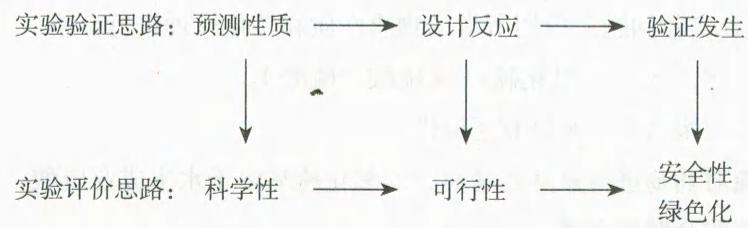

【任务4】请根据以上分析修改设计，任选两个感兴趣的转化进行实验。结合氧化还原原理，对实验现象进行分析解释。

【学生活动4】进行实验，大部分学生会选择有颜色的高锰酸钾、碘水、溴水等试剂进行试验，便于验证反应物的减少。对于无色的反应体系，如 $SO_{2}$ 与漂白液反应，能够通过验证产物硫酸根离子来证明反应的发生。观察、记录实验现象，通过分析推理得出结论。

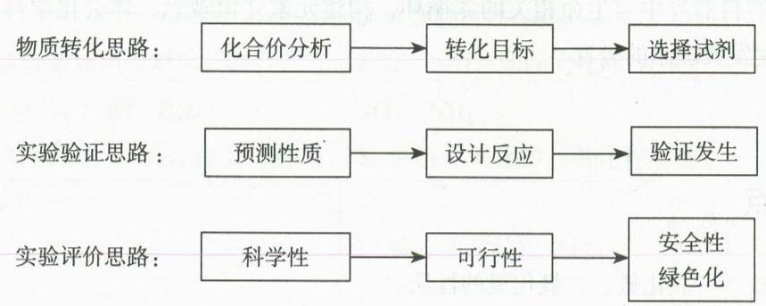

【任务5】归纳探究物质转化的一般思路。

【学生活动5】归纳探究物质转化的一般思路：

①预测（分析元素的化合价，预测物质的氧化性、还原性）；

②设计（依据氧化还原原理选择合适的试剂并预测产物）；

③验证（根据反应物和产物的特点设计验证实验，注意遵循科学性、可行性、安全性、绿色化等原则）；

④结论（综合分析）。

【总结与归纳】教师板书，归纳、展示学生在各个环节的思路和方法，形成完善的思维体系。

【设计意图】建立并巩固探究反应的一般思路，培养学生选择观察角度，预测、观察和描述实验现象的能力，强化依据实验现象分析物质性质和化学反应的能力。提升根据目标设计实验的探究能力，巩固转化模型，发展学生证据推理的核心素养。在这个过程中，学生自己设计方案，积极思考，进行讨论和分析总结，在活动中体验科学探究过程之艰难，同时也体会到了获得成功时的喜悦，由此培养他们的科学探究能力和合作意识。通过在实验过程中讨论减少污染的方法，增强学生的环保意识。

教学环节四：利用 $SO_{2}$ 的性质和物质转化的思路，分析 $SO_{2}$ 在水果保鲜中的应用。

通过硫元素在生产、生活中转化的实例，使学生了解硫及其化合物在生产、生活中的应用，体会化学的意义和作用。利用含硫物质的转化思路，分析 $SO_{2}$ 在水果保鲜中的应用。

【任务1】葡萄中含有大量糖和水分，容易腐烂。同时，采收后的葡萄仍在进行呼吸作用，吸收氧气，释放二氧化碳。因此，随着储藏时间的延长，葡萄中营养成分的含量也会逐渐降低。为延长葡萄的保鲜期，可以通过硫黄燃烧生成的二氧化硫对葡萄进行熏蒸。在熏蒸处理时，应注意控制二氧化硫的浓度；仓库中的机械装置应涂抹抗酸剂，并注意及时检查；工作人员进入库房应做好个人防护。

请回答下列问题：

①以上处理过程涉及了哪些含硫物质的转化？

②使用二氧化硫对葡萄进行保鲜，可能利用了二氧化硫的哪些性质？

③仓库中的机械装置为什么要涂抹抗酸剂？

④在葡萄的储藏和运输过程中，还有哪些含硫物质有可能被用作保鲜剂？

【学生活动】结合实际问题，应用所学的物质性质和转化原理进行分析。

①含硫物质的转化：硫→二氧化硫→亚硫酸（硫酸）。

②二氧化硫可以杀菌消毒，并具有还原性。

③使用二氧化硫对葡萄进行熏蒸处理时，二氧化硫易溶于水生成亚硫酸，并可能被继续氧化为硫酸。亚硫酸和硫酸会腐蚀金属。

④亚硫酸氢钠或亚硫酸钠。

【设计意图】在解决实际问题时，除了要引导学生考虑化学问题，还需综合分析多方面因素，注意培养学生思维的完整性和严谨性，建立解决实际问题的思路和方法。通过分析，让学生感受化学物质及其转化在生产和生活中的应用，了解化学的价值。同时，让学生学会辩证地看待问题，参与社会性问题的讨论，培养其科学精神和创新意识，提高综合素养。

## 板书设计

<table><tr><td>最低价态还原性</td><td>中间价态还原性+氧化性</td><td>最高价态氧化性</td></tr><tr><td>-2</td><td>0</td><td>+4</td></tr><tr><td colspan="2">化合价下降,加还原剂</td><td>化合价上升,加氧化剂</td></tr></table>

物质转化思路：

化合价分析

转化目标

选择试剂

实验验证思路：

预测性质

设计反应

验证发生

实验评价思路：

科学性

可行性安全性绿色化

# 第二节 氮及其化合物

北京市第六十五中学 秦琳琳

## 教学目标

1. 通过对人工固氮路径的探究，了解氨、铵盐、一氧化氮、二氧化氮的性质，认识并实现氮及其化合物之间的转化，构建物质转化的一般思路。

2. 通过了解自然界中与生命相关的氮循环，构建元素守恒观念，体会化学与自然的密切联系，进行可持续发展理念的教育。

## 教学重点

1. 氨、铵盐、一氧化氮、二氧化氮的性质。

2. 物质转化的一般思路及元素守恒观念。

## 教学难点

物质转化的一般思路。

## 教学流程

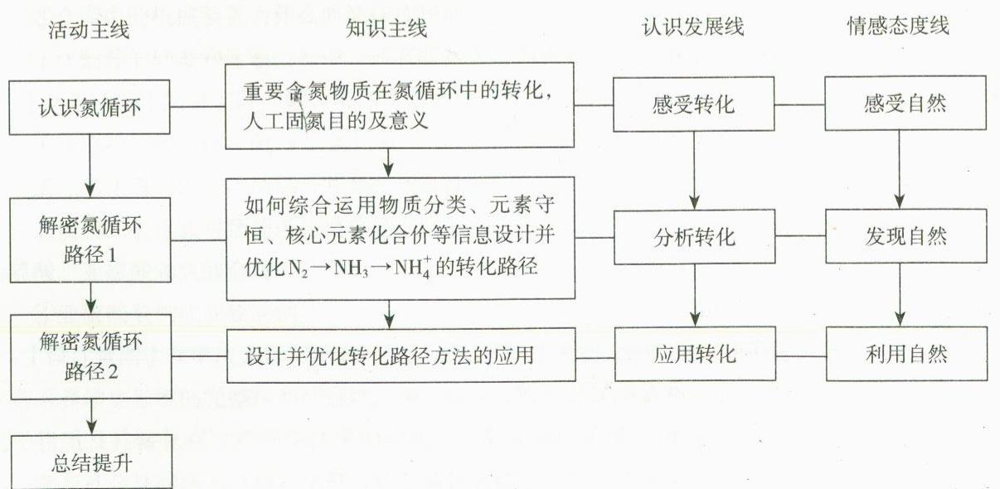

## 教学过程

<table><tr><td>教师活动</td><td>学生活动</td><td>设计意图</td></tr><tr><td>展示教材图5-9自然界中氮循环示意图。【提出问题】1. 参与循环的含氮物质有哪些?2. 这些物质分别属于哪种类别?3. 除了物质类别之外,还有什么研究物质性质的角度?综合物质类别和化合价两个角度,可得到物质的“价态-类别”二维图。【提出任务】1. 将上述含氮物质写在二维图中的相应位置。2. 依据氮循环示意图,将可转化的物质在二维图中用箭头连接。【讲授】以大气中的氮气为原料,可以制备多种氮的化合物,这种将游离态氮转化为氮的化合物的过程称为氮的固定,分为自然固氮和人工固氮。【提出任务】找出氮循环示意图中人工固氮及自然固氮的实例。</td><td>观察,思考。回答问题:1. $N_{2}$ 、 $NH_{3}$ 、NO、 $NO_{2}$ 、 $HNO_{3}$ 、 $NO_{3}^{-}$ 、 $NH_{4}^{+}$ 。2. 单质、氢化物、氧化物、酸、盐。3. 核心元素的化合价。[IMAGE]观察,思考,回答:雷电,合成氨。</td><td>以氮循环为情境,突出氮及其化合物的重要应用,同时培养学生的图像分析能力。巩固分析物质性质及转化的两个角度:物质类别及元素价态。</td></tr></table>

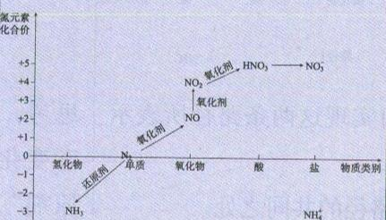

续表

续表

<table><tr><td>教师活动</td><td>学生活动</td><td>设计意图</td></tr><tr><td>【发现问题】既然已经有自然固氮,为什么还要进行人工固氮?展示各种固氮途径固氮量的图示。提问:为什么氮需求量如此之多?介绍氮对于人类及动植物的重要性,指出氮是生命元素,但易于被吸收的是含氮元素的离子。因此人工固氮的目标为:合成铵盐和硝酸盐。根据目标,在二维图中可快速发现两条转化路径:</td><td>观察,聆听,体会人工固氮的意义。</td><td>明确学习意义,引入下一环节。</td></tr><tr><td></td><td></td><td></td></tr><tr><td>【提出问题】如何实现这两条路径所表示的转化?整体分析:两条路径的共同之处。如何实现不同价态含氮物质间的转化?</td><td>思考,回答:都有氮元素的价态变化。将“氧化剂”或“还原剂”分别写在相应物质转化的箭头上。</td><td></td></tr><tr><td>解码路径1: $N_{2} \rightarrow NH_{3} \rightarrow NH_{4}^{+}$ 【提出问题】 $N_{2} \rightarrow NH_{3}$ 所需还原剂有何要求?为什么?预测还原剂可能是哪种物质。验证假设,阅读“科学史话——合成氨”,了解化学史。【讲解】实现人工合成氨的重要意义。氨能否转化成铵盐?我们首先要了解氨的性质。【提出问题】某地制冷车间液氨泄漏的新闻资料中,体现了氨的哪些性质?</td><td>回答:含氢元素;元素守恒; $H_{2}$ 。阅读资料,并据此写出合成氨的化学方程式。聆听,体会,回答:有刺激性气味,易液化,极易溶于水。</td><td>初步构建转化中元素守恒的观念。培养获取并加工信息的能力。</td></tr></table>

续表

<table><tr><td>教师活动</td><td>学生活动</td><td>设计意图</td></tr><tr><td>说明书中提示了铵盐的哪些重要性质?固态铵盐受热易分解: $NH_4HCO_3\xlongequal{\Delta}NH_3\uparrow+CO_2\uparrow+H_2O$ 铵盐遇碱能否反应呢?【实验探究2】向盛有 $(NH_4)_2SO_4$ (或 $NH_4Cl$ )溶液的试管中加入浓NaOH溶液,用镊子夹住一片湿润的红色石蕊试纸放在试管口,观察有无现象;然后加热试管,仍用镊子夹住湿润的红色石蕊试纸放在试管口,观察。(每组所用NaOH溶液浓度可能不同,液体取用体积要相同。实验完毕,请用橡胶塞塞紧试管。)【提出问题】实验现象是什么?有哪些共同之处?结论是什么?根据本实验,请设计实验室制备并收集氨的装置。【总结】综合素质分类、核心元素化合价、元素守恒等信息可以实现物质转化路径的设计与优化。【发现问题】阅读展现氨用途的资料,发现氨可以制备硝酸。结合氮循环示意图,氨最终可转化为硝酸盐,说明氨具有什么性质?为什么?这一反应的发现对路径2中硝酸的制备有何重要意义呢?</td><td>观察,回答:易分解,可能会与碱反应。实验,观察,记录,汇报交流及总结。相同点:加热后试纸均明显变蓝。氢氧化钠浓度小或不加热时,试纸不变蓝或只微微变蓝。结论:铵盐与碱反应可生成氨;因氨极易溶于水,所以碱溶液浓度较大且加热时利于氨逸出。实验室制备氨需要固体药品,加热,向下排气法收集。装置如教材图5-13所示。相关反应的化学方程式为: $2NH_4Cl+Ca(OH)_2\xlongequal{\Delta}CaCl_2+2NH_3\uparrow+2H_2O$ 思考,回答:氨具有还原性,因为氨中的氮元素为-3价,是最低价。氨氧化制硝酸的关键反应的化学方程式为: $4NH_3+5O_2\xlongequal[\Delta]{催化剂}4NO+6H_2O$ </td><td>培养实验设计能力。培养信息获取及加工能力。</td></tr><tr><td>解码路径2: $N_2\rightarrow NO\rightarrow NO_2\rightarrow HNO_3$ 【提出任务】每一步转化所需物质分别是什么?理由是什么?【验证假设】播放实验视频:NO被空气中的氧气氧化; $NO_2$ 与水的反应。以上反应中可证明有硝酸生成,如何分析还有没有其他产物?</td><td>思考,回答: $O_2$ 、 $O_2$ 、 $H_2O$ ;元素守恒、化合价变化。根据氧化还原反应过程中同时存在化合价的上升和下降,所</td><td>路径1中所体会到的路径设计及优化方法的巩固与应用。</td></tr></table>

续表

<table><tr><td>教师活动</td><td>学生活动</td><td>设计意图</td></tr><tr><td> $N_{2}+O_{2} \xlongequal{放电或高温} 2NO$  $2NO+O_{2}=2NO_{2}$  $3NO_{2}+H_{2}O=2HNO_{3}+NO$ 【发现问题】NO是工业制备硝酸的重要中间体。 $NH_{3}$ 和 $N_{2}$ 都可以被氧气氧化生成NO,应选择哪种气体为原料?选择的原则是什么?资料1:空气通过高温电弧,使 $N_{2}$ 与 $O_{2}$ 在放电条件下反应,然后将混合气体迅速冷却,可制得NO。资料2: $NH_{3}$ 氧化的催化剂可选择铂铑合金网,反应温度约800°C。</td><td>以还应该生成一种氮元素化合价降低后的产物。结合实验视频,该物质是气体。思考,讨论:原料是否方便易得,反应条件是否容易实现。综合考虑各项因素,选择以 $NH_{3}$ 为原料制备硝酸。</td><td></td></tr></table>

## 板书设计

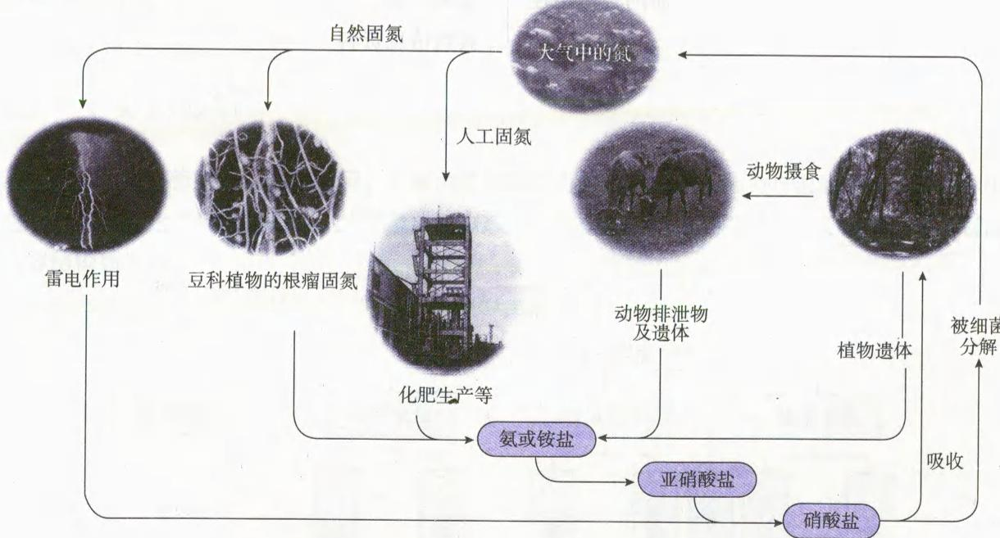

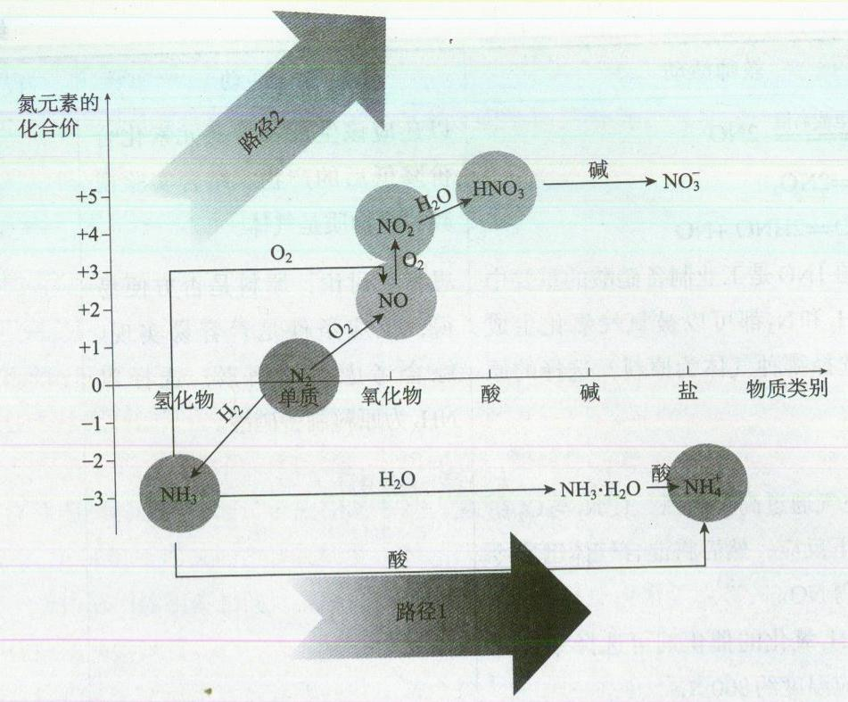

设计并优化物质的转化路径
物质分类
化合价
元素守恒
其他信息资料

## 第六章化学反应与能量

## 本章说明

本章内容包括化学反应中的能量变化、化学反应的速率与限度，知识上涉及化学热力学、化学动力学和电化学等多个领域，是高中化学重要的基础理论知识。

化学反应中的物质变化和能量变化是化学反应的基本特征，与人类生活、生产活动密切相关。化学反应的速率与限度是调控和有效利用化学反应的理论基础。初步学习化学反应中的能量变化、化学反应的速率与限度，形成变化观念与平衡思想，既是继续学习高中化学相关选修知识的基础，也是现代社会公民应具备的科学素养。

## 一、教材分析

作为高中必修阶段的化学课程，本章内容的编写力图在初中化学相关知识的基础上，使学生进一步加深对化学反应相关知识的了解，初步形成较为全面的认识。围绕化学反应，本章教材的内容结构如下：

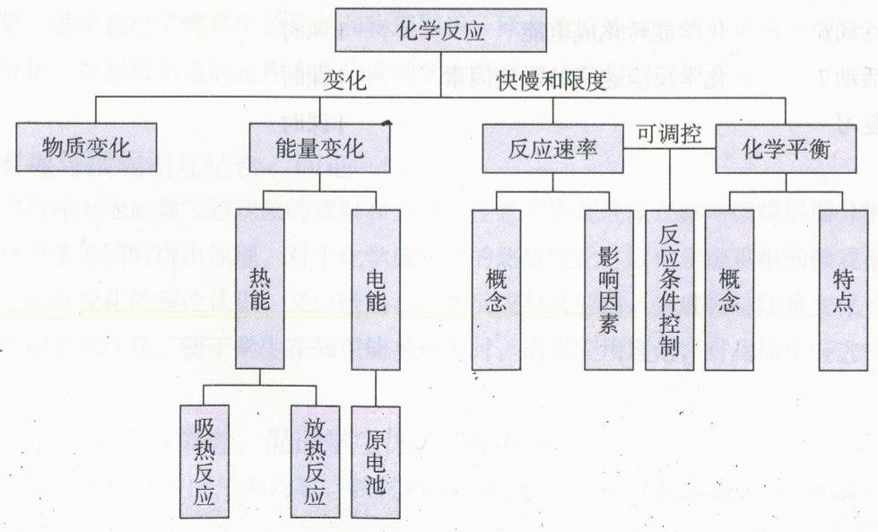

学生在初中学习了化学反应中的物质变化，初步认识了化学反应中的能量变化。在此基础上，本章进一步介绍化学反应中能量变化的基本知识及其应用，拓展学生原有的化学反应认识视角；另外，本章介绍化学反应速率和限度的基本知识及其应用，开启认识化学反应的新视角。能量变化侧重介绍热能和电能，并揭示化学反应中能量变化的本质；速率和限度重点介绍反应速率及其影响因素，并探讨化学反应的调控。教材中通过多角度认识化学变化和运用化学反应原理解决化学实际问题的例子，使学生在掌握化学反应的实质、能量变化的本质、反应速率和限度及其调控等学科核心知识的同时，体会科学分析与探究的方法，认识化学学科价值，感受化学的魅力。

## 二、学业要求

1. 能从化学反应限度和快慢的角度解释生产、生活中简单的化学现象。

2. 能描述化学平衡状态，判断化学反应是否达到平衡。

3. 能运用变量控制的方法探究化学反应速率的影响因素，并初步解释化学实验和化工生产中反应条件的选择问题。

4. 能举出化学能转化为电能的实例，能辨识简单原电池的构成要素，并能分析简单原电池的工作原理。

5. 能从物质及能量变化的角度评价燃料的使用价值。能举例说明化学电源对提高生活质量的重要意义。

## 三、课时建议

<table><tr><td>第一节</td><td>化学反应与能量变化</td><td>2课时</td></tr><tr><td>第二节</td><td>化学反应的速率与限度</td><td>2课时</td></tr><tr><td>实验活动6</td><td>化学能转化成电能</td><td>1课时</td></tr><tr><td>实验活动7</td><td>化学反应速率的影响因素</td><td>1课时</td></tr><tr><td>全章复习</td><td></td><td>1课时</td></tr></table>

## 第一节 化学反应与能量变化

## 一、内容分析

本节内容主要包括化学反应中的热能和电能。对于化学反应中的热能，教材除引出化学反应中的吸热、放热反应等热量变化现象和概念外，主要是借助化学反应中的热量变化揭示化学反应中能量变化的本质，并探讨其与社会、生产、生活的联系。其主要内容和思路如下：

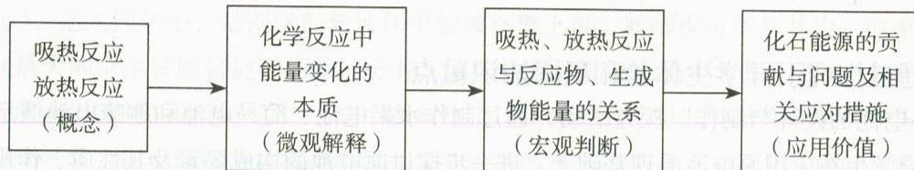

对于化学反应中的电能，教材主要介绍原电池原理及应用——化学电池。热能和电能作为化学反应中能量变化的例子，教材的侧重不同，前者侧重揭示能量变化的本质，后者侧重化学能转变为电能的原理。本节重点知识理论性强，微观分析多，较为抽象；知识内涵丰富，信息量大。本节的内容编排特别注意了以下几个方面。

## 1. 从已有知识或生活经验引出新知识

教材利用实验或结合化学反应中热能、电能研究与利用的历史，从学生已有的学科知识和生活经验引出并分析新知识，以降低学生对新知识的陌生感，减缓认知坡度。教材中放热反应和吸热反应的概念是在实验事实的基础上引出的；对化学反应中能量变化本质的介绍，则利用了学生学过的氢气与氯气的反应及相关数据。原电池原理的引出从火力发电入手，主要是考虑其在生产中较为常见，学生也已了解其中的化学和物理知识。原电池原理的介绍，则是利用分步实验现象的观察和分析，在层层剥茧的过程中充分调动学生已有的化学和物理知识。

## 2. 宏观与微观相互结合、印证

教材中对原电池原理实验现象的观察和分析，注意了宏观现象观察与微观层面分析的紧密配合，在解释现象的同时得出原理。对于化学反应中的热量变化，以化学键重组的微观推理深化学生对反应中能量变化的理论认识；又以吸热、放热反应与反应物、生成物总能量变化关系的宏观分析使抽象理论具体化，便于学生在知识储备较少时，适当应用理论，对具体反应进行分析。

## 3. 利用自主学习渠道，促进学生体验学科价值

对于体现学科价值的应用类内容，教材利用“思考与讨论”“信息搜索”“科学·技术·社会”等栏目，配合教材正文中相关内容进行简略介绍，为实际教学中学生阅读、思考、讨论和搜索资源等自主学习活动的组织和开展提供空间与途径，拓展学习内容。

化石能源的利用与面临的问题，教材着墨不多但内涵丰富。从化石能源在人类发展中的作用到社会发展与能源需求的关系，从化石能源储量到能源消费需求，再到其燃烧排放对环境的污染和开发清洁新能源，这些无一不与现代生活息息相关，均属社会热点问题，是体现学科价值与培养学科核心素养的教学素材。但这类内容的信息量很大，难以详述，相关问题只能点到为止。教材设计了“思考与讨论”“信息搜索”两个活动性栏目，以期通过教师引导下的学生自主学习活动的开展，使学生了解更多信息，体会相关问题的重要性以及化学在其中的作用。

类似地，化学电池的种类与发展前景等内容信息量较大，教材也只简单介绍了两种典型电池——锌锰干电池和铅酸蓄电池，并在栏目中介绍新型电池——燃料电池，意在向学生展现电池类型和发展前景的粗略轮廓。更多、更深入的了解，则有待教师在教学中利用“信息搜索”栏目引导学生自主查阅相关信息，以此达到了解电池发展历史和前景、理解研发新型电池意义的目的。

## 4. 通过探究引导学生体验和巩固知识重点

“简易电池的设计与制作”探究活动，通过制作水果电池、简易电池和趣味电池演示实验的设计，引导学生在应用原电池原理基础上，进一步探讨原电池的构成要素及其性质、作用。不仅使学生学习、体验了科学探究的过程和方法，还能巩固其对原电池装置的认识，将教材隐含的原电池的构成要素、原电池电极的选择等重要知识点显性化地落实。

## 二、教学目标

## 1. 教学目标

(1) 通过实验和已有知识、经验感受化学反应中的能量变化, 知道常见的吸热反应和放热反应, 树立物质变化中伴随能量变化的观念。

（2）能从反应物与生成物所具有的能量、化学键的断裂与形成两个角度理解化学反应中能量变化的主要原因，提升证据推理能力。

（3）通过多种渠道了解人类对化学反应中能量的利用情况，了解节能的意义和方法，感受化学学科的社会价值，培养科学态度与社会责任。

（4）借助原电池装置和原理的学习，体会化学能到电能的直接转化，提高模型认知能力，学习科学探究方法。

## 2. 教学重点和难点

重点：化学反应中能量变化的本质；化学能转化为电能的装置特点及原理。

难点：化学能转化为电能的装置特点及原理。

## 三、教学建议

## 1. 关于化学能与热能的教学

化学反应在物质变化过程中伴随着能量变化，教学中首先要让学生充分感受化学反应过程中的热量变化，然后在此基础上探究化学反应中能量变化的本质。教材正文安排了两个实验帮助学生感受吸热反应与放热反应，教学过程中一定要充分发挥这两个实验的作用。可以采取让学生演示的方式完成这两个实验。如【实验6-1】，请两位学生上讲台分工合作，一人向试管中倾倒盐酸，另外一人打磨镁条、测量温度。提醒实验者一定要用试管夹（或铁夹）夹持试管，同时请学生思考这样做的原因（放热明显、试管很烫）。除了实验者测量温度后公布温度上升数值，也可以请演示实验的学生在反应后迅速走入同学当中，让同学们触摸试管外壁，感受反应放出的热。放热现象不能用眼睛直接观察到，而创造机会让学生触摸试管、近距离观察温度计示数可以增强学生的感性认识。再如【实验6-2】，请演示实验的学生在反应结束后，用手拿起烧杯（烧杯将木片带起），走入同学中，请同学们轮流用手触摸杯壁下部。教师也可参与其中，故意夸张地请全班力气最大的学生试图将烧杯与木片分开（实验效果好的话，则不容易分开），这样可使学生对吸热反应产生深刻的印象。总之，学生参与演示，比教师演示更能够激发学生的兴趣，不仅可以活跃课堂气氛，还可能在该过程中生成非常宝贵的教学资源。有了宏观上直接的体验，后面的理论分析教学就有了事实依据。

接下来可以引领学生结合已有知识经验探究化学反应中能量变化的本质。通过初中化学的学习，学生已经知道化学反应在宏观上生成了新物质，其微观实质是反应物分子破裂为原子，原子重新结合成生成物分子；对教材呈现过的氧化汞分解，以及氢气与氯气化合为氯化氢的模型有一定印象。学生在高中又学习了化学键，认识了原子（离子）之间以化学键结合成分子（物质）。教学过程中，教师可以通过幻灯片展示初中教材中氧化汞分解和氢气与氯气反应生成氯化氢的模型示意图（如图6-1和图6-2），引导学生从宏观和微观两个角度理解化学反应过程中能量变化的本质。从微观角度看，化学反应是旧的化学键断裂、新的化学键形成的过程。断裂旧键需要吸收能量，生成新键放出能量（此处可以结合教材数据加以说明）。所以，化学反应在物质变化的过程中一定伴随着能量变化。然后再结合教材的图6-3从宏观角度解释：根据能量守恒定律，如果反应物的总能量高，生成物的总能量低，由反应物变成生成物的过程中自然要释放能量，该反应为放热反应；反之，如果反应物的总能量低，生成物的总能量高，由反应物变成生成物的过程中则需要吸收能量，反应为吸热反应。

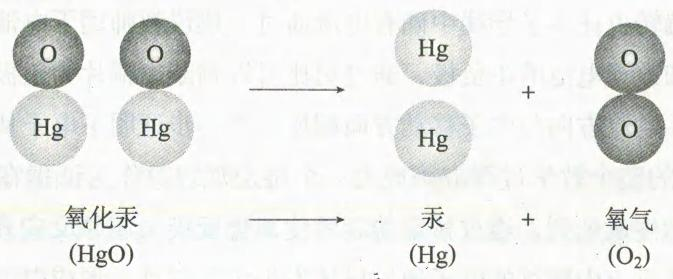  
图6-1 氧化汞分解反应示意图

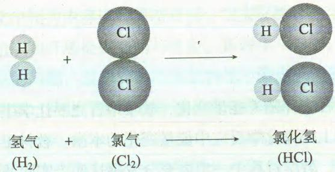  
图6-2 氢气与氯气反应的示意图

需要注意的是，化学反应与热能这部分内容在选择性必修课程模块“化学反应原理”中还将继续深化。因此在必修课程阶段，一定要控制内容的深广度。例如，虽然教材通过氢气与氯气反应中化学键的键能数据说明了化学反应中能量变化的原因，但切不可将运用键能数据计算反应热作为教学重点。定量计算化学反应的焓变是“化学反应原理”模块承载的功能，提前拓展会大大增加学生的学习负担。

## 2. 关于化学能与电能的教学

原电池装置与原理既是教学重点，又是难点。教师可以结合【实验6-3】的现象进行微观推理，帮助学生认识原电池装置，理解其原理。【实验6-3】分三步操作，有助于学生对原电池装置的构成要素进行逐步建构。建议采取教师演示的方式，有目的、分层次地引导学生观察相应的实验现象，为后面的理论分析提供实证。如果有条件，可以利用实物投影或笔记本电脑的摄像头放大实验现象，聚焦关键部位，会使观察的效果更好。

第一步，将锌片和铜片插入稀硫酸中，锌片上产生大量气泡，铜片上没有。第二步，用导线连接锌片与铜片，请学生主要观察铜片上现象的变化。当然，锌片上仍然会有较大量的气泡（不可避免），教师不要回避这个现象，因为锌片与稀硫酸接触发生反应很正常，学生也不会觉得奇怪。此处教师提问的重点应放在“铜片上为什么会产生气泡”上，引发学生思考。第三步，用导线在锌片和铜片之间串联一个电流表，请学生观察电流表的指针是否偏转。实验结束后，教师要引导学生结合宏观现象进行微观推理，培养学生宏观辨识与微观探析的学科核心素养。

根据之前所学的离子反应的相关知识，稀硫酸在溶液中以 $H^{+}$ 和 $SO_{4}^{2-}$ 形式存在（中学阶段可以这样认为），锌可以与 $H^{+}$ 反应放出氢气而铜片不与 $H^{+}$ 反应，所以单独将锌片与铜片放入稀硫酸时，锌片上产生大量气泡，铜片上没有。二者用导线连接后浸入稀硫酸，既然铜片上产生气泡，说明溶液中的 $H^{+}$ 在铜片表面得到电子，电子从哪里来呢？只能是锌失去的电子通过导线到达铜片。电流表指针偏转也证实了导线中确有电流通过。建议教师用干电池等连接电流表进行对照实验。由于学生都知道干电池的正负极，通过对比可以判断出铜片为正极，锌片为负极。根据学生已有的物理知识，电流方向与电子移动方向相反，进一步证明了电子从锌片流向铜片。

利用【实验6-3】的整个教学过程应该成为一个将宏观现象作为证据在微观层面进行严密推理的过程。最终要使学生认识到，通过特定的装置使氧化反应与还原反应分别在两个不同的区域进行，可以使氧化还原反应中转移的电子通过导体发生定向移动，形成电流，从而实现化学能向电能的直接转化。如果没有这个特殊的装置，锌与稀硫酸反应，电子则直接从锌转移给 $\mathrm{H^{+}}$ ，化学能转化为热能等其他形式。

教师也可以利用伏打电池的发明等化学史素材让学生感受化学能转化为电能的社会价值，加深学生对原电池装置和原理的认识。教师还可以继续拓展，进一步挖掘化学能转化为电能的重大意义。进入19世纪，英国化学家尼科尔森和卡莱尔利用伏打电池电解了水，证明了水是由氢、氧两种元素组成的化合物。英国化学家戴维利用串联的伏打电池组，通过电解法发现了几种活泼金属元素。有了伏打电池提供的稳恒电流，物理学家们开始研究电与磁的相互作用，使电磁学获得了蓬勃发展。

同样，原电池的教学也分必修和选择性必修两个阶段呈现，教学中一定要注意控制教学内容的难度。必修阶段的教学要求是通过【实验6-3】的宏观现象能够推理得出原电池原理，知道锌失去的电子通过导线到达铜片，这一过程中电子的定向移动形成了电流，化学能转化为电能。至于为什么锌失去的电子会通过导线到达铜片，相关解释涉及电极电势等概念，不宜在必修阶段讲述，以免加重学生的学习负担。

## 3. 化学反应与热能、电能的融合教学

家用汽车逐渐成为越来越普遍的代步工具。教材与时俱进，设置了“研究与实践”栏目——了解车用能源。教学中可以结合这个活动，以项目的形式将化学能与热能、电能融合进行教学。如首先提出问题“汽车的动力来源是什么？”接着分燃油汽车与电动汽车两类进行讨论。前者涵盖化学反应与热能，后者包含了化学反应与电能。在化学反应与热能的教学过程中，可以引导学生通过查阅资料了解汽车发动机的工作原理，以及选择燃料需要考虑的因素。教学过程中要不断提出问题，如“汽油燃烧为什么会放出热量？”“燃烧过程中如何断键、成键？”引导学生从宏观与微观两方面进行分析。讨论化学反应与电能时，针对氢气、甲烷作为燃料的局限性和汽油燃烧带来的环境污染问题，引出开发电动汽车的迫切性。引导学生通过合作学习了解电动汽车的内部结构和电池的基本组成。教学中仍然采取问题驱动的方式推动学习进程，继续提出问题，如“化学反应是如何产生电能的呢？”“电路中电流方向如何判断？”“说说回路是如何形成的？”为了使问题简化，可以回到锌铜原电池的模型进行讨论。这种“在做中学”的方式将知识作为解决真实问题的工具，可以使学生充分体会所学知识的价值。项目完成的过程，就是化学反应与能量的必备知识与关键能力内化的过程。

## 四、栏目使用建议

## 1. 实验

## 【实验6-1】

镁条与稀盐酸反应速率快，热效应明显。如果让学生演示，一定要事先提醒学生用试管夹或铁夹夹持试管，以免烫伤。而且盐酸的用量一定不能太多，防止反应过于剧烈使酸液冲出试管。

## 【实验6-2】

实验旨在让学生感受吸热反应，反应吸收大量的热使烧杯与木片间的水凝结成冰的效果十分明显，会给学生留下特别深刻的印象。本实验的药品用量不必十分严格， $\mathrm{Ba(OH)}_{2}\cdot8\mathrm{H}_{2}\mathrm{O}$ 与

$NH_{4}Cl$ 的质量大约2:1即可。将晶体研碎，混合均匀，确保在短时间内发生反应是实验成功的关键。由于产生的氨具有刺激性气味，因此一定要及时用玻璃片盖上烧杯，并考虑对氨进行吸收处理。
【实验6-3】

实验中使用的铜片面积要大一些，锌片面积可小些。锌片越纯越好，可以减少连接铜片后锌片上的气泡。有资料表明，室温下，使用3%\~5%的稀硫酸，用较大表面积的“电解铜”（取细铜丝，再以硫酸铜溶液为电解液在其上镀一层铜）与较小表面积的锌片做电极，且两个电极之间的距离小于5 cm，实验效果较好。

## 2. 探究

建议将“简易电池的设计与制作”安排成学生进实验室亲自操作体验的探究活动。探究的目的是在设计和制作简易电池的过程中，让学生体会原电池的构成要素。提出问题“形成一个原电池需要哪些要素”之后，先请学生根据教材【实验6-3】的原电池模型进行猜想与假设。然后分小组设计实验方案，并用表格的形式展示各小组同学的设计思路；通过小组之间交流和讨论比较评价方案的优劣。此环节中，教师要强调科学探究过程中“控制变量”进行对比的思想，使学生养成科学的态度，学会科学研究方法。最后再让学生带着明确的问题和清晰的思路进行实验操作。实验过程中，要求学生及时记录实验现象，鼓励学生提出有价值的问题。

“问题与讨论”中原电池的构成要素不要让学生仅仅就本探究实验形成绝对化的结论，如“一定要有两个活泼性不同的金属电极”等，要为后面燃料电池中相同的电极材料及其他情况留有余地。可以简单概括为，一般要有一个自发的氧化还原反应，有电极材料，形成闭合回路等。

## 3. 思考与讨论

建议以“情景剧”的形式组织学生活动，让学生以小组合作的方式选择“角色”，站在社会不同人群的角度，提出想法和建议。

## 五、练习与应用参考答案及说明

## 1. 能量的变化 热量

2. 化学能 电能 氧化还原反应 （正、负极）电极材料、还原剂与氧化剂、闭合回路

3. BC 
4. D 
5. C 
6. D

7.（1）电极间距离 （2）锌片 化学能 （3）2 3 （4）电极材料、电极材料的横截面积、电极插入水果的深度、同种水果的成熟程度、水果的个数等合理答案均可以。

8. 建议通过网络等多种渠道了解应对气候变化的《巴黎协定》，以及我国的能源结构、新能源的发展状况、我国在节能减排方面作出的努力以及未来承担的责任等。

9. 建议通过文献了解电池的发展史、电池的工作原理、电极材料的发展史，并与老师和同学进行交流。

## 第二节 化学反应的速率与限度

## 一、内容分析

本节包含三个问题：化学反应的速率、限度和调控。前两个问题是化学基本原理，后一个问题是原理的应用。三个问题密切相关，但依据课程标准要求和学生知识基础的不同，内容深浅不一，呈现方式各异。

## 1. 化学反应的速率，重点是影响化学反应速率的因素

考虑到通过初中和高中的化学学习，学生对化学反应速率与反应条件相关，改变反应条件（如使用催化剂）可调控反应速率等知识已有所了解。教材中化学反应速率影响因素的内容，以新旧兼容、详略有别的方式编排。教材结合学生学过的相关知识，补充一些生活、生产中需要通过反应条件调控反应速率的实例，说明认识化学反应速率影响因素的重要性，并借此体现调控反应速率的意义和价值。在已知催化剂这一反应速率影响因素的基础上，通过“探究”，重点引导学生探讨反应温度和反应物浓度对化学反应速率的影响，并结合浓度影响因素，针对气体反应说明压强的影响。

“探究”中安排的两个实验和一个讨论，教材采取了学生自主参与度不同的设计。对反应温度的影响的探究给出了具体步骤，学生只需自主操作并观察、比较；对反应物浓度的影响的探究只给出探究设计提示，学生需要根据要求选择实验用品，设计并实施实验。“问题与讨论”则需要学生自主提出问题、进行假设、设计实验方案。这种探究水平的进阶式设计，意在体现一定探究性的前提下保证可操作性，同时也照顾到全国范围内化学教学的实际可行性。

除 “探究” 之外，教材还利用 “思考与讨论” 引导学生探讨得出影响化学反应速率的其他一些因素，如反应物颗粒大小、反应物接触面积等。这样将教材中提及的各种不同影响因素分层次处理，既突出浓度（压强）、温度、催化剂的影响因素等重点内容，又不局限于这几个因素，表明影响化学反应速率的因素还有很多。

## 2. 化学反应的限度，只限于介绍化学平衡状态

这部分内容以事实和分析推理的方式呈现。通过学生已知的反应实例说明可逆反应并不能进行到底，进而利用学生刚刚学过的可逆反应、反应速率概念进行分析，说明一个可逆反应为什么会有限度。一个反应达到限度时，处于表面静止的化学平衡状态，此时反应物的转化率最高。然后简要提及改变反应条件可以改变反应限度，这既是对化学平衡状态的必要说明，也是学习后续内容的知识基础。

这部分内容的文字不多，涉及化学平衡状态的基本概念，但核心观念不少。化学平衡内容的详尽探讨将在选择性必修课程中进行。

## 3. 化学反应条件的控制，重在相关意识的形成

受学生的知识基础所限，教材对反应条件的控制问题没有十分深入，而是通过实例分析和讨论的形式呈现，旨在使学生初步建立反应条件控制的基本意识。

教材通过合成氨工业中反应条件控制的实例分析，说明实际生产中反应条件的控制不仅要考虑反应的因素，还要考虑设备条件、成本控制等因素。教材通过“思考与讨论”引导学生思考、讨论如何通过控制燃烧反应的条件提高燃料的燃烧效率。让学生在运用所学原理解决实际问题的情境中，通过思考与讨论了解化学反应条件控制的基本思路并体会其重要意义。

## 二、教学目标

## 1. 教学目标

(1) 通过化学反应速率的概念及其影响因素的学习, 学会 “变量控制” 的科学方法, 增强证据推理的意识。

（2）结合实例体会可逆反应存在限度，理解化学平衡状态的特征，发展“变化观念与平衡思想”的学科核心素养。

（3）发展认识化学反应的基本角度，能从化学反应限度和快慢的角度解释生产、生活中简单的化学现象。体会从限度和快慢两个方面去认识和调控化学反应的重要性，认识控制反应条件在生产和科学研究中的作用。

（4）能从微观角度理解浓度和压强对速率的影响，发展宏观辨识与微观探析的化学学科核心素养。

## 2. 教学重点和难点

重点：化学反应速率的概念及其影响因素；化学反应的限度。

难点：化学反应的限度。

## 三、教学建议

## 1. 关于化学反应速率及其影响因素的教学

围绕化学反应速率的概念及其影响因素，教材呈现了丰富多彩的栏目。要充分利用这些栏目加深学生对化学反应速率及其影响因素的理解。第一个“思考与讨论”栏目涉及的都是学生在生活中非常熟悉的关于反应快慢的实例，其中的图片形象直观，给人以亲切感。教学中可以结合这几幅图片设计指向性更加明确的问题，如“这些反应有快有慢，快到什么程度？慢到什么程度？”促使学生关注速率概念中“时间”这个关键因素。教师还可以带领学生通过回忆学过的各类反应，归纳出常见化学反应发生的体系为气体和溶液，使学生理解为什么用单位时间内反应物浓度的减少量或生成物浓度的增加量来表示化学反应速率更加科学合理。

第二个“思考与讨论”针对的是影响速率的外界条件，所举实例是学生有感性体验的，也有讨论的价值和基础。当然，生活中还能找到更多的实例，可以组织学生尽可能多地列举，并要求他们具体说出其中影响速率的因素是什么，分别是如何影响速率变化的。交流表达的过程是一个外显学生思维的过程，可以诊断学生对概念的理解。教学过程中一定要舍得花这个时间，把课堂节奏放慢。学生的理解能力、语言表达能力、证据推理能力正是在这个过程中得到提升的。基于生活经验理解科学概念，有助于学生进行有效迁移，理解概念的价值。

另外，建议将教材中介绍变量控制的“方法导引”栏目与“探究”栏目结合起来，先带领学生阅读“方法导引”栏目，了解什么叫控制变量，为什么要控制变量。接着在科学方法的指导下进行实验，在实验过程中学会“如何控制变量”。这样既知其然又知其所以然，可以使学生有目的、有步骤、有方法地进行实验，有利于内化影响化学反应速率的外界条件，让学生学会科学探究的方法，增强其证据推理意识。“科学·技术·社会”栏目介绍了神奇的催化剂，对拓展学生知识、开阔眼界、培养学生学习的兴趣也颇有裨益，教师可以鼓励学生主动阅读。

## 2. 关于化学反应限度的教学

与化学反应速率相比，化学平衡的概念比较抽象，与学生生活经验有一定的距离。要理解化学平衡的含义，先要理解化学反应存在限度。教学中可以充分利用好化学实验这个重要的手段。如可以回忆氯气与水反应的实验，氯水仍然略显黄绿色表明溶于水的氯气没有反应完，也就是说一定条件下氯气与水反应存在限度。还可以通过 $Fe^{3+}$ 与I-反应建立可逆反应存在限度的概念（具体操作见“栏目使用建议”）。有传感器的学校还可以设计二氧化碳与水反应的实验，帮助学生认识化学反应存在限度。具体做法如下：二氧化碳溶于水，水溶液可使紫色石蕊溶液变红，说明二氧化碳可与水反应生成碳酸；再利用压强传感器测得容器中依然存在二氧化碳，说明二氧化碳没有反应完全。利用传感器，学生可以“看”到宏观现象背后的微观实质，在惊喜之余心悦诚服。

除了化学实验，教师还可以利用工业生产中的真实数据作为证据。例如合成氨，当氮气与氢气体积比为1:3投料时，理论上可以完全反应，但是当各物质含量不再发生变化时，氨的含量远远达不到理论值，说明合成氨反应存在限度。“实验是化学的最高法庭”，真实数据的获得要建立在实践基础上，明显的实验现象和客观真实的数据无疑具有很强的说服力。待学生认识到可逆反应存在限度之后，教师带领学生应用刚刚学习的影响反应速率的因素，结合教材图6-18分析化学平衡状态的建立过程就显得水到渠成，学生对平衡状态特征的理解就会顺利得多。这样分步骤、有层次的教学方式符合学生的认知发展规律，可以有效突破化学平衡这个教学难点。

教学过程中，还可以利用化学史创设问题情境引入化学反应限度，剖析化学平衡状态的特征。教材“科学史话”栏目“炼铁高炉尾气之谜”再现了人们对可逆反应的认识过程，可以在“化学反应限度”概念引入时创设情境使用，引起学生的好奇心，激发学生的求知欲。教学中也可以介绍其他史实，如早在19世纪初，法国化学家贝托莱就提出了可逆反应和化学平衡的概念。

19世纪中期，另一位法国化学家威廉米通过研究蔗糖的水解反应提出了化学反应动态平衡的概念，表明化学平衡是两种相反的变化以相同的速率进行时的结果。介绍这些史实意在让学生感受化学反应限度和化学平衡早已引起了科学界的关注，然而科学研究并不是一路坦途，不能一蹴而就，而是不断实践、认识、再实践、再认识的结果。科学家也不是高不可攀，如果我们能具有科学家那样对科学的痴迷和执着，学会科学研究方法，我们也可以成为未来的科学家。由于化学史料浩如烟海，教学中需要教师去粗取精，选取史实中特别典型的部分，进行适当的加工，编写成生动有趣的故事，再现当时科学家的研究情境。这样才能有针对性地突出教学重点，并激发学生的学习热情。

关于调控化学反应的意义，教师可以工业合成氨为例，再现科学家用空气中的氮气制造出氮肥的艰辛过程。当人畜粪便等有机肥与世界上储量有限的智利硝石等矿石资源不能满足日益增长的粮食生产需要时，英国科学家克鲁克斯心系天下苍生，向化学家提出“向空气要氮肥”的号召。科学家、企业家共同迎接挑战，奋力攻坚，表现出令人赞赏的“科学态度与社会责任”。由于合成氨反应存在限度，为了提高氨的产率，实现工业化生产，科学家们先后从理论和实践两个方面展开工作。教师可以重点介绍德国化学家哈伯和博施获得诺贝尔奖的成果，让学生学习他们的“科学探究与创新意识”。由于必修阶段不宜拓展到影响平衡的外界因素，教师可以重点突出合成氨的适宜条件而暂时忽略选择这些条件的理论依据，让学生深切体会到化学平衡是有条件的，通过改变外界条件可以调控平衡、改变反应的限度就可以了。

利用科学史创设情境，可以使学生对概念的来龙去脉有比较清晰的认识，同时学习科学家的科学精神、科学品质和科学的思维方法，有利于学科核心素养的发展。需要注意的是，教师应根据教学内容的需要和学情选择化学史素材，切不可喧宾夺主，将化学课上成化学史课。

## 四、栏目使用建议

## 1. 实验

由于教材在探究反应速率的影响条件时设计了“探究”栏目，因此没有再安排专门的实验。建议教师在建立可逆反应平衡状态的概念时演示以下实验。

取 5 mL 0.1 mol/L KI 溶液，向其中滴入 0.1 mol/L $FeCl_{3}$ 溶液 5\~6 滴，继续加入 2 mL $CCl_{4}$ ，充分振荡。取上层清液，滴入 2 滴 KSCN 溶液。

根据氧化还原反应的相关知识，学生可以写出 $Fe^{3+}$ 与 $I^{-}$ 反应的离子方程式。本实验通过 $CCl_{4}$ 萃取 $I_{2}$ ，说明该反应已发生；在 $Fe^{3+}$ 不足量的前提下依然能在反应后的溶液中检验到 $Fe^{3+}$ ，充分说明了该反应有一定的限度，达到了该条件下的平衡状态。

本实验现象明显，检验手段均为学生所熟悉，对学生建立化学平衡的概念能起到很好的辅助作用。

## 2. 探究

建议重温科学探究的一般程序。首先提出问题：“除了催化剂，还有哪些反应条件会影响化学反应的速率？”强调科学探究总是始于问题。然后进行猜想与假设。一定要提醒学生，猜想不是瞎想，它需要建立在已有知识与经验的基础之上。如根据已有知识“铁与浓盐酸比与稀盐酸反应快”或生活经验“加热可以使反应变快”等进行合理猜想：反应温度和反应物的浓度可能会影响化学反应速率。

接下来设计实验方案，这是探究最主要的环节。教材示例了探究“反应温度的影响”的设计方案，让学生自行设计方案探究“反应物浓度的影响”。建议教师结合“方法导引”栏目，引导学生学习“变量控制”的方法，分析在反应温度影响的设计中是如何控制变量的，再让学生进行设计并相互交流。

进行实验时，教材的呈现方式提醒学生要及时记录操作步骤、相关的实验现象以及获得的结论。这些都是探究过程中必不可少的环节，是良好实验素养的体现。最后一步的“问题与讨论”给学生留下了进一步思考的空间，供学有余力的学生继续探究。

总之，为了落实学科核心素养中的“科学探究与创新意识”，教师一定要利用好教材中的每一个探究活动，注重实验思维的培养。

## 3. 思考与讨论

## 【思考与讨论1】

建议设计成小组交流的形式，先请学生思考“这些反应有快有慢，快到什么程度？慢到什么程度？”提醒学生对反应快慢的描述与“时间”有关。爆炸在瞬间完成；金属生锈以年月计，因金属的性质与其存在的环境不同而差异很大；食物腐败以天计，与温度关系甚大；溶洞形成以万年计，极其缓慢。然后以教材中的图片抛砖引玉，提出问题：“你还能举出哪些涉及反应快慢的实例？”启发学生联系自己身边的反应，增强对反应快慢的感性认识。

## 【思考与讨论2】

建议课堂交流，让学生充分外显其思维。向炉膛内鼓风，用煤粉代替煤块分别是为了增大氧气浓度、增大反应物的接触面积，加快燃烧速率；把食物存放在冰箱里，糕点包装内放置除氧剂，则分别是降低温度和反应物浓度，减小反应速率；做化学实验时，研碎药品、配成溶液都是为了将反应物分散成尽可能小的粒子以增大接触面积，加快反应速率；纯氧比空气中的氧气浓度大，反应更剧烈。学生在交流的过程中，生活问题转化成了化学问题，生活经验升华成科学理论。经过充分的思考与讨论，学生会认识到，反应的快慢与我们的生活、学习、科研、环境等息息相关，有利的反应通常适当快一些好，有害的反应则越慢越好。

## 【思考与讨论3】

本栏目结合生产和生活实例，对化学反应条件的控制进行了具体应用。教学中可以让学生将教材提示的几个方面与影响化学反应速率和限度的因素联系起来，结合生活经验进行讨论。同时，教师还应鼓励学生深入思考，提出更多的调控方法。

## 五、练习与应用参考答案及说明

1. 其他条件一定时，升温加快反应速率：常温下铜与稀硝酸反应慢，加热后反应变快。其他条件一定时，增加反应物浓度加快反应速率：同等条件下，铁与浓盐酸比与稀盐酸反应快。其他条件一定时，增加固体表面积（即减小固体颗粒）反应速率加快：同等条件下，铁粉与稀盐酸反应比铁块快。其他条件一定时，加入催化剂（正催化剂）加快反应速率：向过氧化氢中加入二氧化锰粉末后，产生气体的速率大大加快。

2. 增大 减小 增大 增大 增大 不变

3. A 4. BD 5. C 6. D 7. C

8. ①②④ ①降低了反应物的浓度，②减小了接触面积，④降低了温度，都能使化学反应速率减小。

9.(1) 曲线表示不同浓度的盐酸与镁条反应时, 产生气体的压强随着时间的变化关系, 曲线斜率可表征反应速率。

(2) 两个实验中盐酸均过量, 镁条均不足, 理论上若时间足够长, 最终反应生成的气体的量应该相同。实际上, 实验1中氢离子的浓度大, 反应速率快, 表现在图像上其曲线斜率大, 相同时间内比实验2生成的气体多, 压强大。

10. 食品变质是由于受到微生物作用或自身被氧化等，温度、湿度等因素会对食品变质的速率产生影响。

11. 面粉悬浮在空气中，细小的面粉颗粒与空气中氧气的接触面积大大增加。一旦遇到明火，就会发生剧烈的反应，反应能量集中释放，导致爆炸。

12. 从反应物纯碱方面考虑，纯碱可以是固体，还可以配成不同浓度的溶液；从盐酸方面考虑，可以使用不同浓度的盐酸。通过在常温下采取控制变量的方法多次实验，最终可选出适宜浓度的纯碱溶液与盐酸反应用于实验室制备二氧化碳。

## 复习与提高参考答案及说明

1.（1）化学反应

(2) ① 化学 热 ② 化学能与电能相互转化 ③ 热能转化为化学能 ④ 光能转化为化学能

(3) ①②④

2. (1) 0.375 mol/(L·min) (2) 2.75 mol/L (3) ① 增大 ② 增大 ③ 减小

3. C 4. C 5. A

6.（1）不相同。实验1中铝作正极，实验2中铝作负极。
(2) 负 正 $2Al + 6H^{+} = 2Al^{3+} + 3H_{2}\uparrow$

(3.) 负 铝能与NaOH溶液反应而镁不能 $Al-3e^{-}+4OH^{-}=AlO_{2}^{-}+2H_{2}O$

（4）在原电池中，相对活泼的金属作正极还是负极，除了与金属本身的还原性有关外，还与电解质溶液的成分有关。

7.（1）可以用注射器收集气体直接测量，也可以通过排水法收集气体，通过测量排出水的体积获得气体的体积。

(2) 等质量的锌粉与未知浓度的盐酸反应更快, 因此其浓度高于 $1 \mathrm{~mol} / \mathrm{L}$ 。

(3) 不相同。锌粉与酸反应本质是与 $\mathrm{H}^{+}$ 反应, 等物质的量浓度的稀硫酸比盐酸的 $\mathrm{H}^{+}$ 浓度大, 反应更快。

8. 通过比较, $1 \mathrm{~mol} \mathrm{C}$ 完全燃烧比不完全燃烧会放出更多的热量, 而且生成无污染的 $\mathrm{CO}_{2}$ ; 不完全燃烧既产生有毒气体 $\mathrm{CO}_{2}$ , 放出相同的热量时还需要消耗更多的燃料。

9. (1) bd

(2) ①d ②d ③b

(3) ${\mathrm{{Na}}}_{2}{\mathrm{{CO}}}_{3} \cdot  {10}{\mathrm{H}}_{2}\mathrm{O} + 2{\mathrm{{NH}}}_{4}{\mathrm{{NO}}}_{3} = 2{\mathrm{{NaNO}}}_{3} + 2{\mathrm{{NH}}}_{3} \uparrow   + {\mathrm{{CO}}}_{2} \uparrow   + {11}{\mathrm{H}}_{2}\mathrm{O}$ 该反应的反应物的总能量低于生成物的总能量,发生反应时需要从环境吸收能量。

(4) 提示: 第一种冷敷袋使用的冰很安全, 但冰在野外不易获得, 且无法长久保存和携带; 第二种冷敷袋使用的硝酸铵有一定危险性, 但水在野外比冰易于获得; 第三种冷敷袋使用的硝酸铵有一定危险性, 产生的氨有刺激性气味, 但这种冷敷袋不需要额外的水或冰, 便于携带和使用。

10.（1） $2A \rightleftharpoons B$ （2） $0.05\ \text{mol/(L} \cdot \text{min)}$ （3）否 =

11.（1）铜片与锌片相连，锌片为负极，铜片为正极，导线中电流方向由铜片到锌片；当铜片与另一种银白色金属片相连时，电流表指针偏转方向相反，说明导线中电流由银白色金属片流向铜片，银白色金属片为正极，铜片为负极，该金属不如铜活泼。

(2) 可以用水果、不同材质的废旧钥匙等设计并制作简易电池, 用发光二极管是否发光 (或其他手段) 检验是否产生电流。也可以用厨房用纸浸盐水后作电解液和隔离膜, 用不同活动性的金属作电极, 用小灯泡或电子音乐卡片作用电器。

（3）纸电池可能具有质量小、成本低、可裁剪、柔韧性好等特点。

# 实验活动6 化学能转化成电能

本实验活动旨在让学生通过亲自动手实验，体验化学能直接转化成电能的过程，认识形成原电池的条件。该实验与本章第一节“简易电池的设计与制作”探究活动看似殊途同归，实则有所发展。如果说“简易电池的设计与制作”较为侧重趣味性，使学生对化学能转化成电能的装置获得感性认识；那么本实验活动则更加注重科学性，让学生从原电池装置中理性地总结出其中的构成要素。

## 一、活动安排建议

通过本章第一节的探究活动——简易电池的设计与制作，学生已经对原电池的构成条件有了感性的体验，因此本实验活动主要是帮助学生进一步理解原电池的构成要素，理解氧化还原反应在化学能转化成电能过程中的作用。第一步“电极材料的实验”说明只有活性不同的电极材料和闭合回路，但没有电解质溶液（没有发生氧化还原反应）不能形成原电池，凸显氧化还原反应在原电池中的重要性；有了电极材料和电解质溶液（即有了氧化还原反应）而没有形成闭合回路，同样也不能形成原电池。第二步“原电池实验”表明电极、闭合回路、氧化还原反应等几个要素同时具备才能形成原电池。

既然有了本章第一节的“探究”基础，建议这个实验活动不要浅尝辄止，仅仅停留在定性的层面，可以根据学生的程度适当地向半定量层面拓展，如探究一下原电池的电流大小与电极材料活性的差异、电极材料表面积大小、电极插入电解质溶液的深浅、两个电极之间距离的远近、电解质溶液的类型等因素之间的关系。这样才在第一节“探究”的基础上获得了发展，否则容易使实验流于形式，而使学生的思维缺乏进一步提升。因此，建议教师增加一些必要的实验器材（如铝片、铁片）和试剂（食盐水、硫酸铜溶液等）供学生选择。

实验过程中，教师要强调科学探究过程中“控制变量”的思想方法，严格要求学生及时记录实验现象，鼓励学生发现并提出有价值的问题，促进学生深度思维的发展，培养其良好的实验素养。

## 二、注意事项

实验过程中应提醒学生注意以下几点：（1）注意电流表的量程和正确的连接方式，以免将电流表烧坏；（2）更换实验组之前要冲洗电极，以免由于不当操作得出错误结论；（3）锌片不要一直插在硫酸中，避免过度消耗，防止锌片不纯导致生成更多的有刺激性气味的污染性气体。

## 三、问题与讨论答案或提示

对于原电池的构成要素，一定不要让学生仅就本实验活动涉及的装置形成绝对化的结论，要为燃料电池中相同的电极材料等其他情况留有余地。可以简单概括为有一个自发的氧化还原反应，有电极，形成闭合回路，等等。

# 实验活动7 化学反应速率的影响因素

本实验活动通过控制变量进行对比实验，使学生体验反应物的浓度、温度和催化剂对化学反应速率的影响，理解改变反应条件可以调控化学反应的速率。

## 一、活动安排建议

首先请学生分析作为实验对象的化学反应：浓度均为0.1 mol/L的硫代硫酸钠溶液与硫酸反应，以及10%的过氧化氢溶液分解。体会之所以选择这两个反应体系，一是因为它们有明显的实验现象，如溶液出现浑浊、产生气泡；二是因为反应快慢适中，便于观察和记录。让学生认识到实验对象的选择应放在首位。接着请学生认真观察教材呈现的两个表格，分析实验步骤是否合理，每一步操作有何意图，相关变量如何控制，还能采取什么方法进行方案设计。这个过程是一个对学生进行思维训练的过程，是一个帮助学生内化思路方法的科学理性过程。这个过程中可以请学生对实验现象进行预测。这样，接下来的实验过程就可以保证学生头脑清醒、有条不紊地进行规范操作，有意识地记录实验现象，检验自己的预测是否合理，并思考哪些证据支撑了自己的预测，证据与结论之间存在怎样的逻辑关联。这种安排不仅使学生锻炼了动手操作能力，更发展了其进行深度思维的能力；使学生不仅知其然，而且知其所以然，从而有效避免了单纯地“照方抓药”和漫无目的地走过场，使实验真正成为科学探究的一种手段。

## 二、注意事项

由于采用了对比实验，操作时应注意反应物的用量尽可能相同，试管规格也要相同。尽量保证两支试管中的试剂同时发生反应，这样比较溶液出现浑浊的先后才科学合理。

## 三、问题与讨论答案或提示

温度对铁与水反应的影响至关重要，升高到一定温度可以加快该反应的速率，观察到较为明显的实验现象。

## 教学资源

## 1. 电池的发展历程

伏打发明的伏打电池开创了现代电池发展的新纪元。200多年来，在材料科学的进步、应用的需求、环保的限制等多重刺激下，电池发生了天翻地覆的变化。

## (1) 电池的历史

18世纪晚期，电学处于发展初期，电流还没有被发现。意大利解剖学家伽伐尼把青蛙剥了皮后放在靠近起电机导体旁的桌子上，当刀尖碰到蛙腿时，起电机立刻出现电火花，而蛙腿也痉挛起来。伽伐尼还发现，不论是将青蛙放在起电机旁，挂在铁丝上，还是放在真空中，只要与金属相碰，就会产生电流。电流来自金属还是来自肌肉呢？伽伐尼得出的结论是：蛙腿的痉挛来自青蛙自身的生物电，金属在其中起导线的作用。于是，伽伐尼把他的发现连同他的解释写成论文发表了。意大利物理学家伏特读到了伽伐尼的论文，在自己的实验室多次重复了伽伐尼的实验。伏特的注意点主要集中在那一对金属线上，而不是蛙的神经。他通过实验证明，只要两种金属片间以用盐水或碱水浸泡过的硬纸、麻布、皮革或其他海绵状的东西间隔，并用金属线把它们连接起来，不管有没有青蛙的肌肉，都会有电流通过。这说明电并不是从青蛙的组织中产生的，蛙腿只不过是一种非常灵敏的“验电器”而已。他先后采用不同的金属放在多种液体中进行试验，终于发明了两种金属材料相互交替插在电解质溶液中生电的特殊装置——伏打电池。

电池分为化学电池和物理电池。化学电池是指将物质化学反应所产生的能量直接转变为电能的一种装置，包括原电池、蓄电池、储备电池和燃料电池等几大类。物理电池则包括太阳能电池和温差电池等。

1859年，普兰特发明铅酸蓄电池。最初的开口式铅酸蓄电池需经常加硫酸和加水维护，容易腐蚀周围设备，并污染环境。后来，阀控式铅酸蓄电池基本取代了传统的开口式蓄电池。它是产量最大和应用最广的二次电池，在将来的很长时间内仍具有不可替代的作用。

1865年，勒克朗谢发明了以氯化铵水溶液为电解质的锌锰电池。锌锰电池在经过了普通干电池和碱性锌锰电池等阶段后，逐步向着无汞电池和可充电碱性电池的方向发展。

镉镍电池最早是在 1899 年由瑞典科学家荣格发明的，又称碱性镉镍电池或镍镉电池。镉镍电池的循环寿命长，自放电较小，性能稳定，并可以大电流放电，但是存在记忆效应。

镍氢电池的记忆效应小，具有较大的能量密度，这意味着使用镍氢电池能有效地延长设备的工作时间。镍氢电池包括高压镍氢电池和低压镍氢电池。美国的克莱因和施托克尔于20世纪70年代初首先研制成功高压镍氢电池。高压镍氢电池充电后，氢气压力较高，容易引起爆炸事故，安全隐患大。与镉镍电池和高压镍氢电池相比，金属氢化物镍氢电池能量密度高，可以快速充电和放电，耐过充和放电性能好，不易污染环境。

锂离子电池是在锂电池基础上发展起来的，其研究始于20世纪80年代，并于20世纪90年代得到迅速发展。锂离子电池广泛应用于医疗、电子、通信、航空和军事等领域。

聚合物锂离子电池是以聚合物固体电解质代替液体电解质来制造的电池，是锂离子电池的一个重大进步，具有安全、易加工、比能量高等优点，而且可以制成全塑结构，从而使人们制造超薄电池的愿望得以实现。20世纪90年代末，聚合物锂离子电池实现了商业化生产，这标志着锂离子电池发展的一个新高潮的到来。

燃料电池的概念是由蒙德和兰格于1889年首先提出来的。就在这一时期，内燃机的发明使人们对燃料电池的兴趣推迟了几十年。1959年，培根等人研制成功氢氧燃料电池，奠定了燃料电池发展的基础。20世纪60年代，随着航天技术的发展，美国对培根的氢氧燃料电池进行了改进，并分别于1965年和1966年成功地将其应用于“双子星座”号和“阿波罗”号飞船上，为其提供电力。

20世纪70年代，中东战争导致了世界性石油危机。此后，美国、加拿大、日本和欧洲的一些国家投入大量人力和财力开发燃料电池，在20世纪90年代实现了技术上的真正突破，不少公司都发布了自己的产品，燃料电池进入了应用阶段。

## (2) 电池的现状

科学技术的发展推动了各种新型电极材料的应用研究与开发，各种高能或新型电池不断涌现，其中聚合物电解质锂离子电池和直接甲醇燃料电池发展速度较快。

电极制备工艺和电池装配技术的完善和发展促进了电池技术的发展，铅酸蓄电池和锌锰电池等传统电池的性能有了很大提高，拓宽了应用领域。锂离子电池中正、负极活性材料的性能和制备技术是提高电池性能的关键因素。目前，电动汽车动力电池使用的铅酸蓄电池，将逐步被锂离子电池、镍氢电池等高性能电池所取代。

人们环境保护意识的增强促进了绿色电池的发展。我国年产铅酸蓄电池超过5000万只，其中含铅量达30多万吨。如果处理不当，废弃的电池将对土壤和水产生严重污染。高污染的电池将被逐步淘汰。电池的事故频发引起了人们对电池安全问题的关注。电池生产厂家正在对电池的结构、制造工艺以及充电器的结构进行改进，以提高电池使用的安全性。

石油供需矛盾加剧和人们环境保护意识的增强为太阳能电池产业创造了巨大的市场空间，带动了上游多晶硅材料和太阳能电池设备的发展。由于多晶硅和非晶硅薄膜电池具有较高的能量转换效率和相对较低的成本，它们将最终取代单晶硅电池，成为市场的主导产品。

除作为电子信息领域迫切需求的小型移动电源外，镍氢电池将成为电动车的电源之一。有关公司对各种电动车用电池的性能以及发展潜力进行了比较论证，综合考虑电池的可靠性、安全性、电池材料的资源与环境问题及电池性能的发展趋势，确定镍氢电池是近期主要的电动车用动力电池。根据市场需求，新型绿色环保型镍氢电池正朝着高容量、小型化、高功率方向发展。

目前，笔记本电脑大多使用锂离子电池。随着技术的迅速发展，人们对笔记本电池的稳定性、使用时间、体积乃至充电次数、充电时间等方面都提出了更高的要求。电池技术也紧随市场需求，在诸多方面进行了相应的改进和发展。为减小体积，同时达到延长使用时间、增加使用次数、减少记忆效应等目的，考虑到电池的成本及使用的安全性，电池在选材上不断优化。以锂离子电池的正极材料为例，目前已出现了锂钴氧化物、锂镍氧化物、锂锰氧化物等众多材料。

从整体上看，发展替代锂离子电池的新一代电池已迫在眉睫，而专业电池生产厂商也在积极进行选材和研发工作。金属锂充电电池能充分发挥负极材料金属锂的电化学性能，使这种新型电池的能源储备量达到传统锂离子电池的2倍以上，而在放电容量方面，甚至能达到传统产品的10倍。聚合物锂离子电池的商业化生产，标志着锂离子电池发展的一个新高潮的到来。聚合物锂离子电池将逐步替代目前的锂离子电池。直接甲醇燃料电池是在质子交换膜燃料电池的基础上研究和发展起来的。它直接以甲醇为燃料，是目前燃料电池研究开发的重点和热点，适于为手机、笔记本电脑等电子设备供电。锌-空气电池也有望取代传统锂离子电池。目前，锌-空气电池在自由充电方面还存在一定问题，但广大电池生产厂商正积极寻求解决方案，成熟的锌-空气电池产品将很快问世。

## (3) 电池的未来

化学电池与物理电池是新能源和可再生能源的重要组成部分，它们直接关系到21世纪可持续发展战略的实现，已成为全球关注与致力发展的焦点。近年来，全球电池产量增长迅速。其中，密封铅酸蓄电池和锂离子电池产量的增速较快。

随着电子信息技术的发展，移动通信终端、笔记本电脑等便携式设备需求量增大，这促使传统电池和新型电池向小型、轻便、高能和绿色的方向发展。

预计，在全球二次电池市场中，铅酸蓄电池由于有强大的汽车工业作为支撑，仍将占有较大的份额。小型二次电池中，镉镍电池主要用在电动工具中，仍将占有一定的份额，但是由于它有记忆效应和镉污染，其产量会逐渐减少。锂离子电池由于性能优良，在移动通信和笔记本电脑中得到广泛应用，同时也在向电动工具和混合动力车辆中的应用发展。国际能源价格的上涨和《中华人民共和国可再生能源法》的诞生，都将极大地促进我国太阳能电池等新型能源技术与产业的发展。

## 2. 蓄电池爆炸的原因

对于蓄电池系统，从电池本身到充电器都设有一定的安全防护措施，包括充电电流保护、充电电压保护和温度控制保护等。导致蓄电池安全事故的原因主要有电池材料、电池制造技术和电池使用三个方面。

某些蓄电池材料本身存在一定安全隐患。例如，使用有机电解质的电池比使用水溶性电解质的电池电压高，但是有机溶剂易挥发，容易燃烧或爆炸；金属锂电极材料与水或空气反应易发生爆炸。

在蓄电池制造过程中，由于工艺本身的某些纰漏（非正规生产厂家尤为突出）而使电池存在安全隐患。例如，应当绝缘的两极之间出现的金属粉尘或铜箔、铝箔等金属杂物会穿破隔膜，造成短路；短路使电池大量发热，导致部分电解质溶液的溶剂汽化，将电池外壳撑大，甚至造成电池爆炸。

电池过充电是蓄电池爆炸的主要原因，这是因为电池过充电可能引发电镀效应，导致过度放热而引起安全事故。经常对蓄电池进行大电流充放电也可能导致电池无法正常使用，造成安全隐患，极端情况下甚至会使电池发生爆炸。

总之，任何蓄电池的安全性都是相对的。所以我们要了解所用电池的种类、型号和性能特点，使用专用充电器正确充电。当电池长期不用时，要从用电器中取出，以延长电池的寿命，保障安全。

## 3. 衡量电池性能的几项指标

衡量电池的性能主要看电压、容量、能量、功率和循环寿命这5个方面。

电池电压包括理论充放电电压、电池的工作电压、电池的充电电压、电池的终止电压等。蓄电池的理论放电电压和理论充电电压相同，等于电池的开路电压。电池的工作电压为电池的实际放电电压，它与电池的放电方法、使用温度、充放电次数等有关。电池的充电电压大于开路电压，充电电流越大，工作电压越高，电池发热量越大，充电过程中电池的温度越高。电池的终止电压是指电池在放电过程中，电压下降到不宜再继续放电的最低工作电压。

电池容量是指在一定的放电条件下，电池放电到终止电压时所能输出的电量。电池容量分为理论容量和实际容量。电池的理论容量是按照电化学反应计算出来的容量。实际容量是指在一定放电条件下，电池实际所能放出的电量。电池比容量是指在一定的放电条件下，可以从单位质量（体积）电池中获得的电量。

电池的能量是指电池在一定放电条件下，对外做功所能输出的电能。由于活性物质不可能完全被利用，而且工作电压总是小于电池的电动势，所以电池的实际能量总是小于理论能量。电池的比能量（能量密度）是指单位质量（体积）电池所能输出的能量，即质量比能量或体积比能量。实际比能量是指电池实际输出的能量与电池的质量或体积之比。

电池的功率是指电池在一定放电条件下，单位时间内输出的电能。电池比功率是指单位质量（体积）电池所能输出的功率。

## 4. 汽车用新型电池

当今世界新能源科技日新月异，但新能源电动汽车却始终因电池问题发展缓慢。近几十年来电动汽车的发展史，就是人类寻求动力电池技术最佳解决方案的历史。动力电池技术的重大突破主要源自新材料的创新应用。近年来，新一代锂离子电池、燃料电池、金属-空气电池及其他新型电池，在材料结构和性能方面不断进步，形成了相互竞争的态势。

各种新型电池改进了安全性，缩短了充电、充气或更换金属氧化物等的时间，提高了能量密度和功率密度，延长了续驶里程，并不断降低生产成本和使用成本，从而为电动汽车的发展提供了重要的支持。目前，我国和许多国家都在不断强化节能环保法律法规，加大对新能源汽车及动力电池研发的支持力度，极大地推进了传统电池的更新换代和新型电池的发展。

以下分别就目前汽车用主要新型电池的新进展和竞争态势，以及相关新材料的发展进行介绍。

## (1) 锂离子电池

## ① 发展近况

具有代表性的动力锂离子电池有3大类，即以磷酸铁锂、锰酸锂和以镍钴铝酸锂三元体系为正极材料的电池。近年来，由于技术瓶颈被逐步突破，锂离子电池获得了较快发展，对传统的铅酸蓄电池形成了挑战。

目前，大量电池市场由相对廉价、性能稳定但技术落后的铅酸蓄电池所占据。但其增长速度逐年递减，市场份额有所下降。

近年来，一些电动汽车等使用的新一代锂离子电池提高了能量密度，充电时间由原来的6\~8 h缩短至1 h以下。现在，越来越多的国家正在建设快速充电网络，如澳大利亚建成的快充网络连接了北部的主要城市，只需充电20 min就可达到50%的电量。

我国 “863” 计划支持下的高性能锂离子电池已开始批量生产，新能源汽车产销量大幅增加。多家公司都加大了对锂离子电池研发的投资，投资规模将达几千亿元。

## ②存在的问题及发展趋势

磷酸铁锂为正极材料的锂离子电池，虽然充电、放电速度快，自放电低，存放一个月的自放电率只有2%左右，但容量较低，实际能量密度只有150\~200 W·h/kg，过度充电和放电会降低寿命。要增加电动车的续驶里程，须加大电池堆的数量，不仅增加了整车的成本和价格，其安全和回收问题也尚未得到有效解决。

使用新一代三元体系（镍钴铝酸锂）锂离子电池的电动汽车虽然在汽车发展史上具有里程碑式意义，但电极材料稀有且昂贵，没有根本解决安全问题。一辆2.5 t的轿车须承载8 000个单电池，质量达800 kg，充一次电汽车可续驶500 km。锂离子电池与金属-空气电池相组合的新型电动汽车，一次充电最长可续驶650 km，但电池的循环寿命短。

为了进一步缩短充电时间，提高能量密度和安全性等，很多国家和地区都从正极和负极的材料与结构、电解质、电池隔膜及添加剂等方面进行卓有成效的改进。例如，韩国科学家研发出具有高容量（215 mA·h/g）的高富镍锂过渡金属氧化物，其中镍浓度从每个粒子的中心向外层逐步下降，而镁浓度逐渐增高。他们的试验结果显示，这种纳米功能材料可用于需要高能量、使用周期长的电池应用领域，如电动汽车。

日本某公司开发了含纳米硅碳素复合材料的负极材料，使电池的能量密度提高2倍，2015年已生产电池约7610万块。在正极材料方面，使用纳米结构过渡金属硫化物电极材料的电池比传统的嵌入式电极材料电池具有更高的比容量，且可通过纳米微粒合成、纳米结构设计、复合材料制造来改进可循环性。韩国和美国科学家在电池中采用了一种复合材料，如 $FeF_{2}-LiF$ 纳米复合材料，通过新的机理来显示电化学活性，可达到50\~190 mA·h/g，比结晶 $LiFePO_{4}$ 的能量密度更高。

我国某公司开发了安全性高的氧化铁锂正极材料和高容量型硅系及高功率型钛酸锂负极材料，比目前广泛使用的碳系负极材料的安全性更高。我国制订的“2012—2020年节能与新能源汽车规划”提出，到2020年，动力电池的能量密度要达到300 W·h/kg以上。而不少电池都达不到要求，因此今后正极材料的研发可以关注硅酸盐复合正极材料、层状富锂锰基材料及硫基正极材料等。

近年来，锂离子电池发生了一些燃烧事故，如电动汽车发生过多起自燃事故，手机电池也发生过着火、爆炸等事故。因此电池的安全性也是人们重点要解决的问题。相关事故的主要原因有：叠层单电池的膨胀、破裂和起火；内部发生短路；滞留、积蓄气体的引燃和爆炸；等等。

为了提高锂离子电池隔膜的耐热性，日本某公司开发了高容量、高电压的耐热电池隔膜。它是在聚丙烯非织造布等多孔基材上沉积纳米氧化铝微粒，即使在高温状态下也不收缩。日本一家公司开发了在间位芳酰胺纤维的非织造布上涂覆聚偏氟乙烯的电池隔膜，可耐250℃的高温，厚度只有5μm，可实现锂离子的高传导性和电池的高功率。为了防止内部短路而发生安全事故，可在电解液中添加过充电防止剂。

为防止电池发生过热和自燃，日本的另一家公司开发了聚酰亚胺清漆。通过在电极上涂覆清漆并热处理，形成100\~300 nm厚的微孔膜，就可防止过热的发生，提高安全性。美国的研究者为防止因电池内部杂质或过充引起膜穿刺而导致锂离子堆积成锂枝晶，进而引发短路和自燃，在电池阳极一侧的聚合物顶部导入铜层作为第3电极。它可检测阳极和聚合物电池隔膜间的电压，当枝晶达到铜层时，电池会自动报警并使电压降至0，从而避免事故的发生。

## (2) 燃料电池

## 氢燃料电池

氢燃料电池是在铂等贵金属催化剂存在下，依靠氢和空气中的氧气反应产生电能和水，属于清洁能源，其能量转化效率一般只有40%\~60%，若利用释放的热量可提高至85%。它所用的电池隔膜一般是碳纤维布或芳酰胺纤维非织造布。

目前，氢燃料电池量产车已经在日本上市，配备了2个内压为70 MPa的氢气瓶，输出功率为100 kW，0到100 km/h的加速时间为10 s左右，续航里程约480 km。今后要扩大氢燃料电池汽车的应用，要相应配套生产高压容器，建设高压充氢站；在技术上还要不断改进氢气的低价合成法和储氢材料等，降低催化剂的成本，并解决氢气的长途运输问题。图6-3和图6-4分别展示了氢燃料电池的市场和经济成本发展情况及预测趋势。

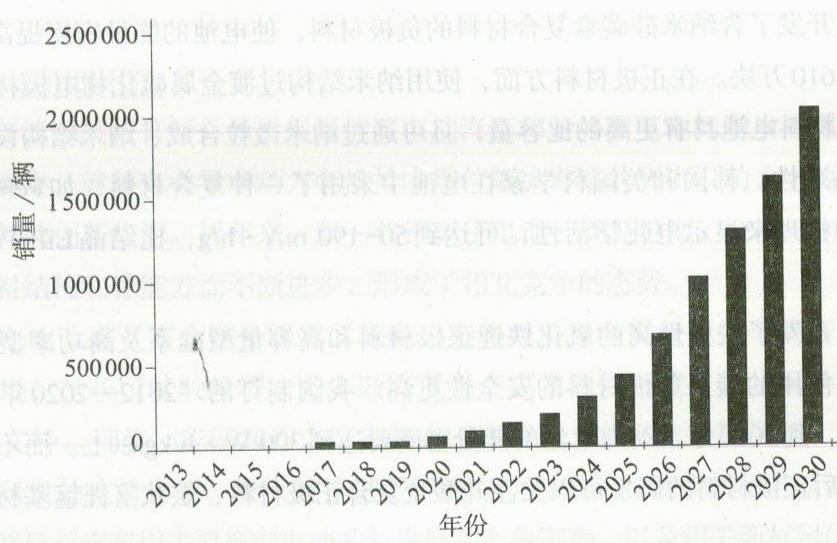  
图6-3 2013—2030年全球氢燃料电池汽车市场发展情况及预测趋势

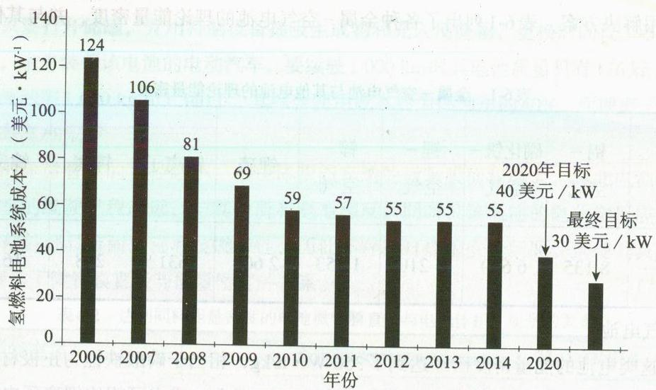  
图6-4 全球氢燃料电池经济成本发展情况及预测趋势

## 甲醇燃料电池

直接甲醇燃料电池是固体高分子型燃料电池，用甲醇水溶液取代氢作为燃料，不需要为了制造氢气而采用特殊设备，因此电池可以做到小型化、轻量化，具有产业化意义。

日本科学家开发了直接甲醇燃料电池用的高活性电极催化剂，为今后甲醇燃料电池的商品化打下良好的基础。它是在碳纳米纤维的表面先浸渍氧化钛前驱体溶液，然后将氧化处理后的氧化钛修饰多孔质用作金属微粒的载体。这种新催化剂除了可削减铂等贵金属的使用量，与以往市售的催化剂相比，其活性提高了2倍。

## (3) 钠硫电池

钠硫电池相对廉价，能量密度高，寿命长，充放电效率高（82%\~89%）。使用钠硫电池的电动汽车可续驶500 km，但操作温度为300\~350 ℃，所用工作物质具有强腐蚀性，曾发生过数起燃烧事故。

某种钠硫电池的正极采用单质硫，负极为钠，固体电解质采用陶瓷，能量密度约为铅酸蓄电池的3倍。该电池曾因着火事故一度中止生产，随后通过使用碳纤维材料解决了耐热和阻燃问题。

## (4) 镍-碳电池

我国某公司发明的高能镍-碳电池，一次充电可使汽车续驶200\~300 km，可实现5 000次以上充放电。它曾在公交线上实现了3年9个月的安全稳定运行，其废弃物可回收再利用。

## (5) 石墨烯电池

某公司开发的石墨烯电池的能量密度比锂电池的高3倍，据称一次充电只需8 min，就可使汽车续驶1 000 km，其成本据称只有锂电池的一半，但尚未产业化。该电池存在的问题是石墨烯价格昂贵，要使汽车达到上述续驶里程，电池堆质量约为300\~400 kg。该公司研制的试制品的能量密度仅150 W·h/kg，充电时间约15 min。

## (6) 金属-空气电池

该类电池靠金属和空气中的氧气在催化剂存在下发生电化学反应产生电流，理论能量密度很高，近年来在技术上获得重要突破，发展迅猛。但能否实现产业化并取得高能量密度，取决于有无有效的实用解决方案。表6-1列出了各种金属-空气电池的理论能量密度，并与其他电池进行了对比。

表6-1 金属－空气电池与其他电池的理论能量密度

<table><tr><td>电池种类</td><td>铝-空气</td><td>硼化钒-空气</td><td>锂-空气</td><td>锌-空气</td><td>锂硫</td><td>锂离子</td><td>镍氢</td><td>镍镉</td><td>铅酸</td></tr><tr><td>能量密度 $\left( {\mathrm{W} \cdot \mathrm{h} \cdot {\mathrm{{kg}}}^{-1}}\right)$ </td><td>8135</td><td>6600</td><td>5210</td><td>1353</td><td>2600</td><td>631</td><td>208</td><td>161</td><td>83</td></tr></table>

## 铝-空气电池

目前，这类电池的能量密度已经达到了 $350 \mathrm{~W} \cdot \mathrm{h} / \mathrm{kg}$ ，相当于磷酸铁锂为正极材料的锂电池的2.3倍、镍氢电池的5.8倍。据称可使汽车行驶 $500 \mathrm{~km}$ 以上，成本可望比锂离子电池的低，但尚未产业化。其主要问题是比功率低，充放电时间慢，自放电率较高，依然存在阳极腐蚀和安全问题。电池释放出的氢气会造成阳极过度消耗并耗电，所用银催化剂较贵。同时，须选用创新的电池隔膜结构，使空气中的氧气能透过而二氧化碳不能透过，方能避免阳极的碳化，延长循环寿命至20年以上。

## 锂-空气电池

其能量密度高而功率密度低，接近于汽油的能量密度，成本比锂离子电池的低。缺点是催化剂较贵，阴极反应产物的再生有难度，尚须解决2种电解液的隔膜慢性渗漏问题，因此迄今尚未产业化。有研究者采用多层次的大孔石墨烯作为正极材料，利用水和碘化锂作为电解液添加剂，最终产生和分解的是较稳定的氢氧化锂，大大降低了电池中的副反应，提高了电池性能。其中的碘化锂除了帮助分解氢氧化锂外，还起到了保护锂金属负极的作用。据称该试验电池可使汽车的续航里程达到650 km。

## 锌-空气电池

其原料价廉易得，能量密度可达到250\~350 W·h/kg，国内已试用于电动公共汽车，但存在腐蚀性问题。其阴极反应产物的再生成本较高，电池组总质量达1.25 t，须建设换电池站，靠机械进行电池装卸。德国某公司采用锌粉取代锌板，并提出全新的设计方案，其电池的能量密度达到250 W·h/kg，可使电动汽车续驶300 km以上。同时，不用将电池卸下，只要打开锌粉储存器，用特制设备将产物吸出，再将锌粉充入，电动车就可以续驶，更换时间只需3\~5 min，且氧化锌粉易于被还原成锌粉循环使用。

## 硼化钒-空气电池

该电池与汽油及其他传统电池的理论体积能量密度相比具有很大优势，是汽油和锌-空气电池的2.9倍，是锂电池的220倍和氢-空气电池的9.6倍；其质量能量密度与汽油的相当，是锂电池的26倍。

该电池的设计理念新颖，将传统电池的平板式隔膜改成微管膜，使单位体积的膜面积增大，初期能量密度可达400\~600 W·h/kg。由于该电池设计成反应器和硼化钒纳米粉体储存器两部分，并靠小泵将硼化钒在反应器内循环。因此使用它的电动汽车续驶500\~1 000 km后，不用更换电池组，只要打开储罐，并用特制设备抽吸生成物和充入反应物，更换时间仅3\~5min。

据预测, 未来装载该电池的电动汽车, 要续驶 $1000 \mathrm{~km}$ 时其电池质量只有 $176 \mathrm{~kg}$ , 体积 $78 \mathrm{~L}$ , 而锂离子电池约需 $1080 \mathrm{~kg}$ 和 $1340 \mathrm{~L}$ 。其综合使用成本约为燃油车的 $40 \%$ ，而锂离子电池电动汽车约比燃油车高 $68 \%$ 。

更重要的是微管膜的直径越小，单位体积能容纳的微管膜面积越大，因此电池体积和质量越小，电动车的续驶里程越远，与其他所有电池相反。同时，该电池的电化学反应温度不超过60℃，所用部件都具有耐高温和抗燃特性，因此不存在自燃等安全问题。这使其具有划时代意义。表6-2展示了微管膜直径与能量密度的关系。

表6-2 达到同样能量密度的电池微管膜直径与电池体积、质量的关系

<table><tr><td>微管膜直径/mm</td><td>电池质量/kg</td><td>体积/L</td></tr><tr><td>3</td><td>144</td><td>72</td></tr><tr><td>1</td><td>54</td><td>27</td></tr><tr><td>0.1</td><td>5.4</td><td>2.7</td></tr><tr><td>0.01</td><td>0.5</td><td>0.3</td></tr></table>

[摘编自：罗益锋，罗晰.新型电池的新进展与竞争态势.新材料产业，2016(5)：32-37]

## 点重光媒

## 教学案例

## 第一节 化学反应与能量变化（第2课时）

北京市第五中学 朱群英

## 教学目标

1. 通过对设计原电池装置必要性的论证，提升学生将化学知识应用于生产和生活的社会责任感，并逐步形成绿色化学观念。

2. 通过对设计原电池装置可行性的论证，加深对氧化还原反应本质的理解，并能从多角度分析和利用化学反应中的能量变化。

3. 通过对原电池形成条件的探究, 锻炼学生的探究能力, 并且深化学生对化学实验 “提出假设→实验证实或证伪→发现新问题→提出新假设→得出结论” 研究模式的认识, 加强实验探究能力。知道可以通过分析、推理、实验等方法认识氧化还原反应的本质特征、原电池的构成要素及其相互关系, 建立认知模型。

## 教学重点

理解氧化还原反应与原电池原理之间的联系，了解原电池的形成条件，分析简单原电池的原理。

## 教学难点

原电池装置的设计。

## 教学流程

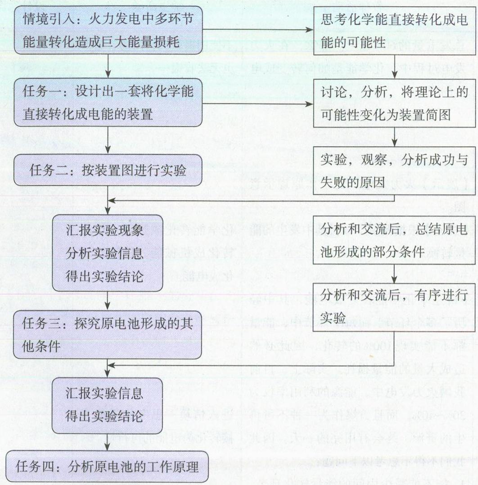

## 教学过程

<table><tr><td>教学环节</td><td>教师活动</td><td>学生活动</td><td>设计意图</td></tr><tr><td>情境引入</td><td>【讲述】有一部电影描述了没有电之后的生活。那么同学们你们能想象一下没有电之后的生活吗?实际上,没有电,我们已经寸步难行了。电的使用早已进入了我们生活的每一个角落。由于原料来源丰富,建厂占地面积小,成本和技术要求都比较低,所以火力发电目前在我国仍占</td><td>想象没有电之后的生活:不能看电视,不能听音乐,不能上网,不能打电话,不能用电饭锅、微波炉、电烤箱,不能用冰箱、洗衣机,不能用空调、电扇,没有自来水,不能用电灯,飞机停飞,火车停开,不能用电梯,</td><td>创设问题情境,体现化学知识的应用性,说明设计一套化学能直接转化成电能的装置的必要性,增强学生的社会责任感。</td></tr><tr><td>情境引入</td><td>总发电量的60%以上。那么,在火力发电过程中,化学能是如何转变成电能的呢?【展示】火力发电厂的工作原理示意图。【提问】根据图示,分析其中发生的能量转换。【讲述】化学能转变成电能,其中经历了多个环节。而每个环节中,能量都不能实现100%的转化,因此必然造成大量的能量损耗。实际上,目前我国火力发电中,能源的利用率仅为30%~40%。而且,煤作为一种不可再生的资源,终会有用完的一天。因此我们不得不思考以下问题:1. 能不能减少中间的能量转化环节,将化学能直接转化为电能?2. 能不能找到一类物质来代替煤进行发电?</td><td>不能用提款机,商场、超市也无法收银......化学能转化成热能,热能转化成机械能,机械能转化成电能。进入情境,思考化学能直接转化为电能的可行性。</td><td></td></tr><tr><td>原电池装置的设计</td><td>【提问】我们能不能利用某一类反应,将化学能直接转化成电能?如果可以,该反应属于哪一类反应?【观察学生情况】可适当提示:1. 电流的实质是什么?2. 我们已经学过哪些类型的化学反应?这些不同类型反应的特点是什么?3. 哪一类反应最有可能实现将化学能转变为电能的设想?</td><td>思考、交流后得出结论:要想产生电能,需要有电流产生,而电流的实质是带电粒子的定向移动;我们学过的反应中,氧化还原反应都具有这一特征,电子从还原剂转移至氧化剂。</td><td>加强对氧化还原反应与原电池原理之间的联系,让学生深刻理解自发的氧化还原反应是原电池形成的前提条件这一事实。进行化学能直接转化成</td></tr></table>

续表

<table><tr><td>教学环节</td><td>教师活动</td><td>学生活动</td><td>设计意图</td></tr><tr><td rowspan="2">原电池装置的设计</td><td>部分学生会提出离子反应,因此需要强调电流的实质是带电粒子的定向移动,而离子反应中离子的移动一般都是不定向的,由此让学生认识到氧化还原反应是最有可能设计成原电池的反应。对浓差电池等的介绍则留待选择性必修课程中再进行。</td><td></td><td>电能装置的可行性研究。</td></tr><tr><td>【演示实验】锌粉与稀硫酸反应。【提问】是否观察到电流产生?为什么?【提问】通过同学们刚才的分析,我们知道化学能转化成电能会有电流产生,而刚才的实验中我们并没有观察到产生电流。那么我们如何检测反应中是否有电流产生呢?请以反应 $Zn+2H^{+}=Zn^{2+}+H_{2}\uparrow$ 为例,设计一套实验装置来验证你的猜想,并用实验证明。【板书】化学能与电能一、原电池1. 定义:将化学能转化成电能的装置。</td><td>观察现象:有无色气体产生。没有观察到电流产生,因为没有外电路。思考、交流之后画出不同的装置简图,并用实验验证。汇报实验事实。</td><td>让学生深刻理解原电池将氧化还原反应中的氧化反应和还原反应放在两个不同的场所发生。</td></tr><tr><td>原电池形成条件的探究</td><td>【讲述】通过实验,我们知道使用锌片、铜片(碳棒)和稀硫酸等可以形成原电池。但是刚才大家所设计的装置中,不是所有的装置都产生了电流,这说明原电池的形成是需要一定条件的。请大家分析刚才的装置,分析原电池的形成需要哪些条件。【板书】2. 形成条件:1形成闭合回路。</td><td>分析和交流后回答:需要形成闭合回路。</td><td>进行阶段性总结,让学生认识到要想形成原电池,必须形成闭合回路。对后面探究形成原电池的其他条件的实验起指导作用。</td></tr></table>

## 续表

<table><tr><td>教学环节</td><td>教师活动</td><td>学生活动</td><td>设计意图</td></tr><tr><td rowspan="2">原电池形成条件的探究</td><td>【提问】电极材料除了Zn、Cu,能否是别的材料?反应液除了稀硫酸,能否是别的液体?请设计实验方案,探究原电池形成的其他条件。绘制表格,记录学生汇报的实验信息,询问选择该实验顺序的理由。</td><td>设计并实施实验,整理、记录实验信息,汇报。</td><td>培养学生思维的有序性及实验方案的设计能力和口头表达能力。</td></tr><tr><td>根据学生要求,用电子表格的筛选功能整理实验信息。【提问】对刚才产生电流和未产生电流的实验装置进行分析,总结形成原电池的其他条件。【板书】2有自发的氧化还原反应。3有电极。</td><td>根据汇总的实验信息总结形成原电池的其他条件。</td><td>根据实验信息总结出共性和规律,形成模型化认知,加强对原电池形成条件的认识,培养学生信息处理能力。</td></tr><tr><td>原电池工作原理分析</td><td>【提问】我们已经设计出了一套完整的原电池装置,成功实现了化学能向电能的转变。那么原电池是如何实现这一转变的呢?以铜锌原电池为例,指出电池的正、负极,并分析两极上可能发生的反应,试着写出两极上的电极反应式。【板书】3. 工作原理负极  $Zn: Zn-2e^{-}=Zn^{2+}$  氧化反应正极  $Cu: 2H^{+}+2e^{-}=H_{2}\uparrow$  还原反应</td><td>讨论,交流,分析原电池的工作原理。书写电极反应式。</td><td>通过分析和交流,理解原电池的工作原理:将一个氧化还原反应分成两个半反应,在不同的场所发生。提升学生分析问题和解决问题的能力。</td></tr><tr><td>反馈练习</td><td>分析 $Zn-C-CuSO_{4}$ 原电池中,正极上可能出现的实验现象。</td><td>分析后回答:碳棒上附着一层红色的金属。</td><td>课堂反馈,评价学习效果。</td></tr><tr><td>课后思考</td><td>原电池装置给我们的生活带来了巨大的便利,也为我们研究氧化还原反应提供了重要的研究手段。我们生活中的大量化学电源就是以原电池为雏形的。那么从简单的原电池到各种各样的化学电源,我们还有多远的路要走呢?请大家选择一种或几种自己感兴趣的化学电源,查阅相关资料,了解其中的化学原理。</td><td>查阅资料,了解一种或多种化学电源的工作原理。</td><td>进一步强化对原电池原理的认识。从知识的实用性出发,强化对化学知识应用性的认识,并为下一节化学电源的学习做准备。</td></tr></table>

# 第二节 化学反应的速率与限度（第2课时）

清华大学附属中学 白建娥

## 教学目标

1. 通过观察 $\mathrm{Fe}^{3+}$ 与 $\Gamma^{-}$ 反应的实验现象，体会可逆反应在一定条件下能达到化学平衡，能描述化学平衡状态。

2. 能从反应速率的角度解释一定条件下可逆反应存在限度的原因，同时发展证据推理与模型认知能力。

3. 能将化学反应限度的概念应用在实际问题的解决中，能熟练进行“数形转换”。

## 教学重点和难点

化学平衡的含义。

## 教学过程

教学环节一：建立“化学反应有限度”的概念。

<table><tr><td colspan="4">教师活动</td><td colspan="3">学生活动</td><td colspan="3">设计意图</td></tr><tr><td colspan="4">请大家写出 $Fe^{3+}$ 与 $I^-$ 反应的离子方程式。如果二者发生反应,如何检验产物?怎么保证 $Fe^{3+}$ 反应完全?请学生动手演示该实验。刚才两位同学演示实验的结果,证明 $Fe^{3+}$ 与 $I^-$ 确实发生了反应。但是,即使 $I^-$ 过量, $Fe^{3+}$ 也无法反应完全。我们说这个反应在一定条件下存在限度。剖析平衡状态的定义和特点。在500°C和101kPa条件下,将一定量的SO2和O2充入含有催化剂的密闭容器中,二者发生反应。随着反应的进行,用气体传感器测量各组分的浓度(见下表)。据此画出各物质的浓度随时间的变化示意图。用幻灯片呈现课堂练习(判断是否达到平衡状态的相关习题)。</td><td colspan="3">两个学生合作演示实验:取5mL 0.1 mol/L KI溶液,加入0.1 mol/L  $FeCl_3$ 溶液5~6滴,继续加入2mL  $CCl_4$ ,充分振荡。取上层清液,加入2滴KSCN溶液。其他同学认真观察实验现象,思考实验目的和产生该现象的原因。</td><td colspan="3">通过实验引发学生的认知冲突,在学生的“愤悱”状态中建立概念。</td></tr><tr><td colspan="4"></td><td colspan="3">思考,画图(见下图)。思考,交流。</td><td colspan="3">在概念的运用过程中进一步理解并内化概念。</td></tr><tr><td>反应时间/s</td><td>0</td><td>10</td><td>20</td><td>30</td><td>40</td><td>50</td><td>60</td><td>70</td><td>100</td></tr><tr><td>c(SO2)/(mol·L-1)</td><td>10</td><td>7</td><td>5</td><td>3.5</td><td>2</td><td>1</td><td>1</td><td>1</td><td>1</td></tr><tr><td>c(O2)/(mol·L-1)</td><td>5</td><td>3.5</td><td>2.5</td><td>1.75</td><td>1</td><td>0.5</td><td>0.5</td><td>0.5</td><td>0.5</td></tr><tr><td>c(SO3)/(mol·L-1)</td><td>0</td><td>3</td><td>5</td><td>6.5</td><td>8</td><td>9</td><td>9</td><td>9</td><td>9</td></tr></table>

教学环节二：理解“化学反应有限度”的原因。

<table><tr><td>教师活动</td><td>学生活动</td><td>设计意图</td></tr><tr><td>提示学生运用刚刚学过的反应速率的影响因素,分析Fe3+与I-反应中,正反应与逆反应的速率(用同一物质的消耗或生成速率表示)随着时间的变化关系,画出相应的图像。结合学生画出的图像进一步讲解。</td><td>思考,画图,交流。</td><td>在完成挑战性任务的思考过程中,建立速率与平衡的关联。</td></tr></table>

教学环节三：诊断学生对“化学平衡”概念的理解和应用。

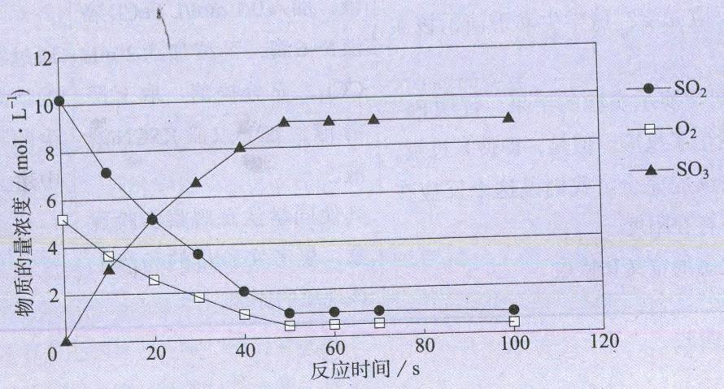

## 第七章 有机化合物

## 本章说明

目前，自然界中和人工合成的上亿种物质中，绝大多数都属于有机化合物；生命的形成、进化和发展的物质基础主要是有机化合物；人类社会发展所引发的能源、资源、环境、安全、健康等问题的解决也与有机化学息息相关。有机化学已成为当代化学研究和应用的主要方向，在学科领域的地位十分重要。高中化学必修模块在本章之前已经介绍了化学基本概念、原理和典型的金属、非金属元素及其化合物，尚未涉及有机化合物；而接下来第八章“化学与可持续发展”的教学需要学生具备一定的有机化学知识基础。从构建完整的学科知识体系和进行必修模块的化学教学这两个方面出发，都需要在初中有机化合物常识的基础上继续深入，使学生了解有机化学的概貌。

必修模块的有机化学从学生熟悉的有机化合物入手，提供有机化学最基本的核心知识，让学生认识到有机化学已渗透生活和生产的各个方面，使其能运用所学知识解释相关物质的用途和一些现象。这将有助于提高学生的基本科学素养，并为选择性必修阶段有机化学及高中生物的学习打下坚实的基础。同时，本章选取的代表性有机物与生活联系密切，有助于学生在上一章较抽象的理论性知识的学习之后，继续保持学习的兴趣与热情。

## 一、教材分析

本章在编写上遵循“结构决定性质”的化学学科基本观念，首先从碳原子的成键方式入手，让学生站在结构的视角，从微观层次上初步认识有机化合物；再以最简单的有机物甲烷为例，介绍烷烃和有机物的基本物理和化学性质，让学生初步了解有机物与无机物在结构和性质上的区别。接下来的各节以具体有机物为线索，按照从简单到复杂的顺序，依次介绍乙烯、乙醇和乙酸这三种代表性有机物，以及合成高分子、糖类、蛋白质和油脂等较复杂的有机物。根据课程标准和学时要求，本章不涉及烷烃的系统命名，以及苯和芳香烃的性质，不求在有限篇幅内全方位展现有机化学的学科体系，而是在内容安排上有所侧重：对有限的几种代表性有机物，教材在分析其分子结构的基础上着重介绍化学性质；对较复杂的有机物，则主要从材料或营养物质的角度突出应用，体现有机化学的应用价值。

在介绍具体有机物的组成、结构、性质和变化等事实性知识的同时，教材注意落实学科核心素养，将宏观性质与微观结构结合起来，先后编入有机物中碳原子的成键特点、烃的分类、官能团与有机物分类等内容，并通过“方法导引”“整理与提升”等栏目建立认知模型，给出碳骨架和官能团这两个辨识有机物的重要视角，以及在此基础上认识有机物的一般思路。同时，本章结合代表性有机物的性质和基本有机反应类型，给出一些简单有机物间的转化关系，在无机化学的基础上进一步深化化学中的变化观念。教材较多地体现有机物的结构和分类在学习中的指导作用，在教学中要充分考虑学生的实际情况，避免随意扩充内容和提高难度；应立足基本知识，渗透观念和方法，提升学生的认知水平，落实素养要求。本章的内容结构框架如下图所示。

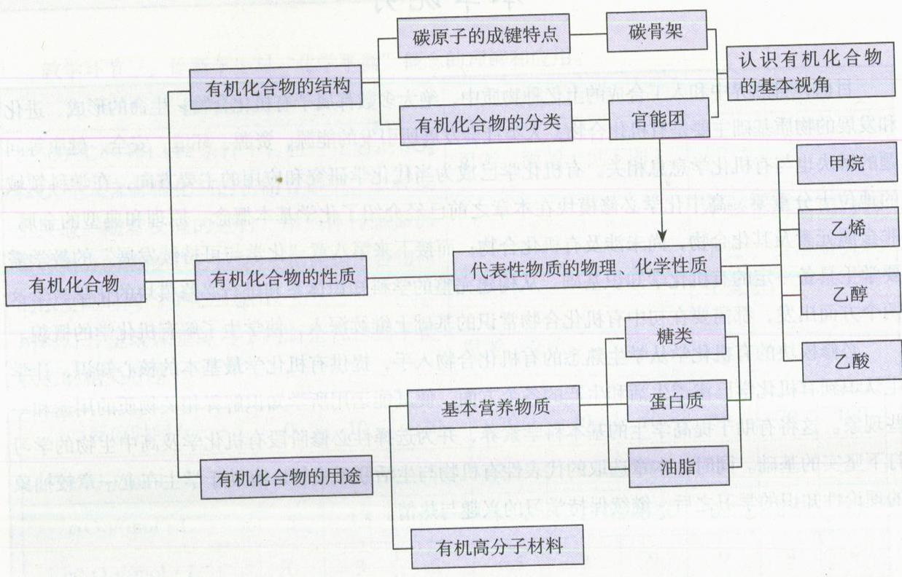

## 二、学业要求

1. 能辨识常见有机化合物分子中的碳骨架和官能团，概括其分子中碳原子的成键类型。能描述甲烷、乙烯、乙炔的分子结构特征，并能搭建甲烷和乙烷的立体模型，能写出了丁烷和戊烷的同分异构体。

2. 能描述乙烯、乙醇、乙酸的主要化学性质及相应性质实验的现象，能书写相关的化学方程式，能利用这些物质的主要性质进行鉴别。能预测简单有机化合物的某些性质，并进行实验验证。

3. 能列举合成高分子、油脂、糖类、蛋白质等有机化合物在生产、生活中的重要应用，并结合这些物质的主要性质进行简单说明。

4. 能列举事实说明有机化学在生产、生活中的应用价值及其对推动社会发展的贡献。从有机化合物及其性质的角度对有关能源、材料、饮食、健康、环境等实际问题进行分析、讨论和评价。能从材料组成的角度对生活中常见的材料进行分类，根据需求选择和使用适当的材料，解释使用注意事项。能妥善保存、科学合理地使用常见有机化学品。

## 三、课时建议

第一节 认识有机化合物 3课时  
第二节 乙烯与有机高分子材料 2课时  
第三节 乙醇与乙酸 3课时  
第四节 基本营养物质 2课时  
实验活动8 搭建球棍模型认识有机化合物分子结构的特点  
实验活动9 乙醇、乙酸的主要性质 1课时  
全章复习 1课时

## 第一节 认识有机化合物

## 一、内容分析

本节是在初中化学有机物常识的基础上，以最简单的有机物——甲烷和最基本的有机物类别——烷烃为例，对有机物结构和性质的一般特点进行介绍，使学生了解有机物和无机物的不同之处，为接下来学习含官能团的烃的衍生物打下基础。

教材以目前已知物质中绝大多数种类都属于有机物的事实，冲击学生头脑中的固有观念，激发学习兴趣。同时，引发学生思考“到底是什么原因造成了有机物的数量如此繁多”，由此引入碳原子成键特点的教学主题。然后以学生熟悉的甲烷为例，应用此前已学习过的化学键知识，介绍两个碳原子间的成键方式和多个碳原子间的结合方式，在平面位置关系的层次上给出有机物碳骨架的基本特征。

在此基础上，教材给出甲烷的正四面体结构模型，进一步从空间位置关系的层次深化学生对甲烷和有机物结构的认识。教材在此处的“资料卡片”中给出了使用模型的化学研究方法，还通过其中的插图，结合此前的“思考与讨论”栏目使学生认识到有机物不仅具有立体结构，还可以通过碳原子结合成长链形成更复杂的结构。通过以上铺垫，接下来的“思考与讨论”栏目要求学生应用刚学到的碳原子成键规律和甲烷的结构特点，结合插图中的分子结构模型，自行归纳烷烃的组成和结构特点；同时设置问题，引出下文对烷烃、同系物、同分异构体等概念的介绍。教材在这里给出烷烃使用天干或汉字数字表示碳原子数的命名基本原则，但根据课程标准的要求，没有给出系统命名法。教学时应注意控制难度，不再继续深化。

在学生初步了解烷烃和有机物的结构特点之后，教材设置栏目让学生根据生活常识指出一些含烷烃物质的性质和用途，并由此推测烷烃可能具有的物理性质和化学性质。在此基础上，再结合用途讲烷烃的燃烧（氧化反应）和高温分解反应，并以甲烷为例，结合演示实验介绍烷烃与卤素的取代反应。在本节最后，教材希望学生从“烷烃是其他有机物母体”的高度来认识其结构和性质上的重要意义，通过烷烃的物理、化学性质和取代反应的特征来概括有机物的性质和有机化学反应的特点。

本节教材中出现的新概念较多，有机物结构和性质的特点与无机物相比也存在巨大差异。为了让学生顺利地接受这些内容，教材通过大量示意图直观地呈现微观结构，并在栏目活动中使用了分子结构模型，促使学生对有机物结构的认识从平面层次上升到立体层次，由实物模型转化为头脑中的思维模型。

## 二、教学目标

## 1. 教学目标

（1）通过认识有机化合物中碳原子的成键特点，从微观的化学键视角探析有机化合物的分子结构。

(2) 通过认识有机化合物的同分异构现象, 从分子结构的多样性角度探析有机化合物性质的多样性。

（3）通过认识烷烃的命名法和同系物的概念，从物质分类的角度辨识各类有机化合物的结构和性质特点。

（4）以烷烃的代表物——甲烷的结构和性质为模型，认知烷烃的结构和性质。

## 2. 教学重点和难点

重点：从物质分类、化学键、有机分子结构的多样性角度辨识和探析有机化合物的结构和性质。

难点：甲烷与氯气发生取代反应的实验探究和反应原理的微观探析。

## 三、教学建议

## 1. 以搭建分子结构模型活动的方式认识有机化合物中碳原子的成键特点

首先，教师应做好活动的指导。建议采用标准球棍模型。活动时先指导学生观察并思考模型箱中各种球、棍代表的是什么原子、什么化学键，特别是要注意代表碳原子的黑球上存在不同孔位的意义是什么；再指导学生观察教材中各有机化合物的分子结构模型，进行有意义的搭建活动。如果采用橡皮泥、牙签等代用品，就一定要指导学生，适时指出有机物分子有一定的空间结构，搭建分子模型需考虑键的长度和化学键间的夹角。

其次，搭建完成只是第一步，还要让学生对搭建好的各种分子模型进行观察、分析和比较，并记录下来，再进行小组讨论和全班交流活动，以帮助学生进一步提高对有机化合物分子结构的微观探析能力。

## 2. 以问题驱动法认识同分异构体、同系物等概念

问题最好来源于学生，因此有必要先让学生进行自学，在此基础上让学生提出有关问题。教师要对学生提出问题予以鼓励，并筛选出有代表性的问题，推动课堂讨论活动展开。

有关同分异构体的参考问题如下：

(1) 正丁烷、异丁烷的组成是怎样的?

(2) 正丁烷、异丁烷的结构有什么相同点和不同点?

（3）正丁烷、异丁烷的物理性质和化学性质有什么相同点和不同点？

（4）从语文的角度，如何理解同分异构体的概念？

(5) 为什么说同分异构现象的广泛存在是有机化合物种类繁多的原因之一?

有关同系物的参考问题如下：

(1) 根据甲烷、乙烷、丙烷和正丁烷的分子结构模型, 它们的结构式和分子式是怎样的?

(2) 根据甲烷、乙烷、丙烷和正丁烷的分子式, 它们的组成有什么相同点和不同点?

(3) 根据甲烷、乙烷、丙烷和正丁烷的结构式, 它们的结构有什么相同点和不同点?

(4) 根据资料中的数据, 甲烷、乙烷、丙烷和正丁烷的物理性质有什么变化规律?

(5) 根据甲烷、乙烷、丙烷和正丁烷的组成和结构, 预测它们的化学性质。

(6) 烷烃的通式 $C_{n}H_{2n+2}$ 是怎样得出的?

(7) 同系物概念中的 “相似” “相差” 的含义是什么? “同系物” 中的 “同” 的含义是什么?

(8) 一氯甲烷、二氯甲烷、三氯甲烷和四氯甲烷是否互为同系物？为什么？

## 3. 以实验探究结合微观探析的方式构建甲烷结构和性质的认知模型

首先，依据学生的认知规律，按照从宏观到微观、从现象到本质的思路进行教学设计。先通过实验探究甲烷与氯气在光照下发生取代反应时的现象及其原因，可采用个人观察记录、小组讨论、全班交流的活动方式，注意对比黑暗和光照条件下的现象有什么不同。其次，结合球棍模型和动画演示，探析甲烷与氯气取代反应的微观过程，帮助学生从化学键和官能团变化的角度深刻理解反应的规律。

## 4. 以深入浅出的方式帮助学生认识取代反应的概念

首先，从生活角度认识，以同学间让座位的例子帮助学生理解取代是怎样的一种行为。

其次，从语文角度认识，从字面上理解取代的含义是“取而代之”。

最后，从化学角度认识，从反应形式、化学键变化、官能团变化、物质转化、应用价值等方面认识甲烷的取代反应。

反应形式：物质1+物质2→新物质1+新物质2。

化学键变化: C—H断裂, C—Cl形成。

官能团变化：无官能团 $\rightarrow$ 碳氯键。

物质的转化：烷烃 $\rightarrow$ 卤代烃（烃的衍生物）。

反应的应用价值：从石油、天然气等化石能源合成多种有机化合物。

## 四、栏目使用建议

## 1. 实验

## 【实验7-1】

该实验通过比较甲烷与氯气的混合气分别在黑暗和光照条件下的变化，帮助学生认识光照的作用和甲烷的氯代反应。观察现象、分析原因是该实验探究中的主要活动。学生观察实验，在学案中记录现象，在小组中讨论、分析产生现象的原因，再全班讨论交流。实验中，观察到的现象

和相关解释如下。

(1) 光照时, 试管内的混合气颜色逐渐变浅, 原因是反应过程中氯气逐渐被消耗。

(2) 试管壁上有油珠, 而且油珠会向下滑落并沉入水底, 原因是反应生成的有机化合物中有不溶于水且密度比水大的液体, 如二氯甲烷、三氯甲烷和四氯化碳。

（3）在一定条件下，可能观察到试管中有白雾，原因是反应生成的HCl溶于水形成了小液滴。

(4) 试管中液面逐渐上升, 主要原因是随着气体的反应, 试管内气体的压强逐渐减小。

(5) 反应过程相对缓慢, 这是有机反应的特点之一。

实验中也可以控制甲烷和氯气的体积比为 $1:4$ ，可在倒置于饱和 $\mathrm{NaCl}$ 溶液的水槽中用 $100 \mathrm{~mL}$ 量筒先后收集 $20 \mathrm{~mL}$ 甲烷和 $80 \mathrm{~mL}$ 氯气备用。另外，光照不能过于强烈，避免强烈日光直接照射可能导致的爆炸。

## 2. 思考与讨论

## 【思考与讨论1】

该活动是通过展示4个碳原子的多种结合方式，帮助学生认识有机化合物种类繁多的特点，同时培养其创新意识。教学中，教师可以利用教材中的素材让学生小组讨论，然后提出若干个相关问题。教师把这些问题在不同小组间交流传递，从而帮助学生在认识碳原子不同成键方式的基础上，认识有机化合物种类繁多的原因。参考问题如下：

(1) 这些有机化合物的分子式分别是什么?

(2)哪些是链状的结构？哪些是环状的结构？

（3）碳原子有几种成键方式？分别在哪些分子中有所呈现？

## 【思考与讨论2】

该活动是通过归纳推理、类比推理的方法，帮助学生认识烷烃同系物的组成和分子结构特点。

首先，教师可以利用思考与讨论的素材，创设讨论学习的环境，采用实物模型和抽象符号相结合的方法，引导学生一步一步地深入思考，认识烷烃同系物组成和结构的特点，建立同系物的概念。

其次，运用比较与分析、归纳与演绎的方法，引导学生思考讨论，帮助学生理解烷烃同系物概念的内涵——通式相同（ $C_{n}H_{2n+2}$ ）、结构相似（链状、单键、饱和）、组成相差 $(CH_{2})_{n}$ 的同一类有机化合物。

最后，留下进一步思考的空间。根据丁烷可能出现的不同拼接方式，还可以预留出同分异构体概念的思考空间。

## 【思考与讨论3】

该栏目作为化学与生活的密切联系在烷烃同系物学习中的实例，可以帮助学生认识烷烃的性质及其应用。可采用体验式学习活动，让学生通过将护肤品“凡士林”在手上涂抹，用蜡笔在纸上书写后再用水冲洗等活动，体会烷烃有哪些性质。

## 五、练习与应用参考答案及说明

1. 单键 双键 三键 链状结构 环状结构

2. 4 4 共价 正四面体 正四面体中心 正四面体的4个顶点 相同 相等
3. C 4. A 5. D 6. AC

7. $CH_{3}CH_{2}CH_{2}CH_{2}CH_{3}$ $CH_{3}-CH-CH_{2}-CH_{3}$ $CH_{3}-C-CH_{3}$

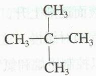

8. $C_{4}H_{10}$ $CH_{3}CH_{2}CH_{2}CH_{3}$ 或 $CH_{3}-CH-CH_{3}$

$\mathrm{CH}_{3}$ 解析：一定量的该烷烃中碳原子的物质的量： $n(\mathrm{C})=\frac{17.6\ \mathrm{g}}{44\ \mathrm{g}\cdot\mathrm{mol}^{-1}}=0.4\ \mathrm{mol}$ 相同量的该烷烃中氢原子的物质的量： $n(\mathrm{H})=\frac{9.0\ \mathrm{g}\times2}{18\ \mathrm{g}\cdot\mathrm{mol}^{-1}}=1.0\ \mathrm{mol}$ 该烷烃分子中碳原子与氢原子的个数比为 4:10，其分子式为 $C_{4}H_{10}$ 。

9.（1）（2）略

(3) 天然气

(4) 改大。可能导致天然气燃烧不完全，产生黑烟或CO。

10. 提示：第一个表示的甲烷组成与结构都是错误的；第二个只能表示出甲烷的组成，没有体现结构；第三个体现了组成和结构，但平面的结构是错误的；第四个结构式体现了组成和化学键，但空间结构仍没有体现出来；第五个体现了甲烷的组成和空间结构，是甲烷结构的正确表示。本题的答案具有开放性，其他合理答案也可以。

## 第二节 乙烯与有机高分子材料

## 一、内容分析

乙烯是石油化学工业重要的基本原料，通过有机化学反应可以由乙烯得到多种烃的衍生物及高分子材料；同时，乙烯也是较简单的含有官能团的有机物。通过对乙烯的学习，学生可以更深入地了解有机物的结构、性质、用途及相互转化规律，并将初步接触决定有机物分类与化学性质的特征基团（官能团）。基于此，本节教材在编排上依次从物理性质、分子结构、化学性质和用途这几个方面介绍乙烯，给出在中学阶段认识有机物的一般流程，建立认知模型，使学生进一步认识有机物的结构特点，体会物质结构对性质和用途的决定作用。

本节教材在介绍乙烯的物理性质后，给出乙烯的分子式、结构式和分子结构模型，让学生直观地了解乙烯与烷烃在结构上的差异，引出下文对二者化学性质差异的讨论。乙烯的化学性质围绕碳碳双键展开。氧化反应先讲学生熟悉的燃烧氧化（有机物的共性），再讲被高锰酸钾等氧化剂氧化（含双键等不饱和基团的有机物的特性）。由于后者的反应产物较为复杂，教材只介绍反应现象，不涉及产物和化学方程式。

介绍加成反应时，教材选择乙烯与溴反应的实验，使用四氯化碳作为溶剂，明确了反应产物，避免在教材和教学中解释使用溴水时的副产物。教材通过实验和化学方程式中结构式的变化引入加成反应的概念，同时指出乙烯还可与其他试剂发生加成反应，生成一系列产物，借此体现有机物转化的思想。

初中化学曾简单介绍过小分子相互连接形成高分子的聚合反应，因此教材在这里侧重通过化学方程式、结构式和分子结构模型具体展示化学键与有机物的分子结构在聚合反应前后的变化，使学生初步认识加成反应与聚合反应的关系，了解聚合物的分子结构，深化对结构决定性质这一化学基本观念的理解。同时，教材还以聚乙烯为例介绍了链节、单体、聚合度等高分子基本概念，以利于接下来学习合成高分子与生物高分子。

在学习了甲烷和乙烯这两种饱和烃和不饱和烃的代表性物质之后，学生对烃的结构与性质已经有了初步的认识。在此基础上，教材给出烃、饱和烃、不饱和烃等概念，并结合树状图和代表物的结构式介绍烃的分类：一种是根据分子中的特征性基团分类，另一种是根据碳骨架类型分类。由此体现辨识有机物的两个基本视角（碳骨架与官能团）和物质分类的学科思想，提升学生的认识水平。

课程标准对乙炔和苯的要求较低，只要求学生知道其基本结构特征，不涉及性质。因此教材只简单描述二者分子中碳原子的成键特点，并通过栏目让学生用模型探究乙炔的分子结构。“科学史话”中有关芳香族化合物和苯的拓展性内容，供学有余力的学生自行阅读，不作教学要求。

对于有机高分子材料，本节结合大量实例介绍塑料、橡胶与纤维的组成、类别、性质与应用，突出有机化学的社会价值。与初中教材相比，“这里进一步介绍材料的化学成分，并以天然橡胶和硫化橡胶为例，结合有机物结构与性质的关系对材料的发展与性能优化进行说明，提升学生对材料的认识层次。最后，教材通过“思考与讨论”栏目让学生整理已学过的各类材料的知识，借此深化学生对无机物和有机物的分类及组成、结构、性质与用途的认识。

## 二、教学目标

## 1. 教学目标

(1) 以不饱和烃的代表物——乙烯的结构和性质为模型, 认知不饱和烃的结构和性质。

（2）通过认识乙烯与水的加成反应和乙烯的加聚反应，知道合成新物质是有机化学研究价值的重要体现，知道合成高分子材料使我们的生活更美好。

（3）通过认识烃的分类方法，知道分类是研究有机化合物的重要方法之一。

## 2. 教学重点和难点

重点：从宏观和微观两个方面研究乙烯的结构如何决定其性质。

难点：乙烯加成反应、加聚反应的基本规律。

## 三、教学建议

乙烯是最具工业价值的石油化工基础原料，也是最简单的不饱和烃。对乙烯结构和性质的学习，其重点是从化学键和官能团视角认识有机化合物的结构决定性质的学科思想，帮助学生发展“宏观辨识与微观探析”的学科核心素养。同时，乙烯的结构和性质的学习模型可以帮助学生认知不饱和烃的结构和性质特点。

## 1. 以对比问题驱动法帮助学生认识饱和烃和不饱和烃的结构和性质特点

首先，教师向学生布置自学任务，主要包括教材研读，对教材中的有关内容提出问题，查阅相关资料并分析问题。自学的主要目的在于以培养学生的问题意识为基础发展他们的创新精神。

其次，课堂学习活动围绕学生的问题展开，这些问题可集中在乙烯和甲烷、乙烷结构和性质的对比方面，让学生小组在寻找问题答案中发展他们的能力和素养。教师通过展示、启发、点拨、引导等方法引导学生自主学习，实现学习目标。

关于乙烯的结构和性质的参考问题如下：

(1) 乙烯和甲烷各属于哪类有机化合物?

(2) 乙烯和甲烷、乙烷的结构有什么相同点和不同点?

(3) 乙烯有哪些物理性质和化学性质？与甲烷的性质相比，有哪些相似点和不同点？

(4) 乙烯的化学性质与其结构的关系是什么?

(5) 怎样理解乙烯的加成反应和加聚反应规律?

(6) 为什么说乙烯的产量可以衡量一个国家石油化工的发展水平?

## 2. 以实验探究结合微观探析的方式构建乙烯结构和性质的认知模型

首先，通过让学生观察乙烯的燃烧，以及乙烯与酸性高锰酸钾溶液、溴的四氯化碳溶液反应的实验现象，并对比甲烷的相关反应，帮助学生认识不饱和烃的性质特点。可通过让学生填写以下表格对比说明。

<table><tr><td>化学反应</td><td>乙烯</td><td>甲烷</td><td>结论</td></tr><tr><td>与氧气</td><td>能燃烧,有黑烟</td><td>能燃烧,无黑烟</td><td>乙烯含碳量较高</td></tr><tr><td>与酸性高锰酸钾溶液</td><td>溶液褪色</td><td>无明显现象</td><td>乙烯能被酸性高锰酸钾溶液氧化,甲烷不能</td></tr><tr><td>与溴的四氯化碳溶液</td><td>溶液褪色</td><td>无明显现象</td><td>乙烯能与溴发生加成反应,甲烷不能</td></tr></table>

其次，结合甲烷、乙烷和乙烯的球棍模型，探析其结构的不同，使学生认识到乙烯的加成反应和加聚反应与其分子结构中碳碳双键（官能团）的关系，帮助学生建立结构决定性质的学科思想。

最后，利用动画演示和生活化实例，帮助学生理解加成反应和加聚反应的基本规律。例如，加成反应可以通过一个人开始双手插入口袋，然后再把手拿出来双手提物的形象化实例来类比；加聚反应可以通过许多同学手拉手连成长队的形象化实例来类比。

## 3. 以课堂微型研究性学习的方式帮助学生了解合成高分子材料及其应用

研究性学习是新课程的必修内容，它是指学生在教师指导下，从学习和社会生活中选择和确定研究专题，主动地获取知识、应用知识、解决问题的一种学习活动。课堂微型研究性学习是以研究性学习的流程开展课程学习活动的学习方式，其基本流程是：选取课题→文献研究→设计方案→探究实践→撰写报告→答辩质疑→总结提高。

首先，教师可以给出有关合成高分子材料的不同选题，让每个小组领一个选题任务开展学习活动。活动包括任务分工、阅读教材、网上查阅相关资料、设计制作海报或幻灯片、交流讨论等。然后，每个小组按照研究性学习答辩的方式进行全班交流，接受同学和老师的提问和质疑，从而使全体学生对合成高分子材料的不同方面有所了解。最后，教师就学生普遍关心的重点问题进行总结提高。

## 四、栏目使用建议

## 1. 实验

## 【实验7-2】

该实验通过乙烯的燃烧、乙烯与酸性高锰酸钾溶液的作用，帮助学生认识乙烯的氧化反应。主要活动内容建议为：观察实验，在学案中记录现象；小组内讨论分析产生现象的原因，同时与甲烷的燃烧、甲烷与酸性高锰酸钾溶液的作用进行对比；全班讨论交流，教师引导学生对比乙烯与甲烷在组成和结构上的相似点和不同点，帮助学生树立有机化合物结构决定性质的学科思想。实验中，观察到的现象和相关解释如下。

(1) 点燃乙烯时, 乙烯能立即燃烧起来, 并有黑烟生成。这说明乙烯能在点燃条件下被空气中的氧气氧化。同样, 甲烷也能燃烧, 这与乙烯和甲烷的组成中均含碳、氢元素有关。由于乙烯中碳的质量分数 (85.7%) 较高, 因此会有黑烟产生, 而甲烷 (碳的质量分数为 $75\%$ ) 的燃烧一般没有黑烟。

(2) 乙烯通入酸性高锰酸钾溶液, 会迅速使其褪色, 这说明乙烯能被酸性高锰酸钾溶液氧化。氧化产物二氧化碳则不要求学生掌握。甲烷不能使酸性高锰酸钾溶液褪色, 说明甲烷比乙烯稳定, 不能与高锰酸钾反应。对比乙烯和甲烷的结构, 说明乙烯能被酸性高锰酸钾溶液氧化与其分子中的碳碳双键 (官能团) 有关。

## 【实验7-3】

该实验通过乙烯与溴的四氯化碳溶液的作用，帮助学生认识乙烯的加成反应。主要活动内容建议为：观察实验，在学案中记录现象；小组内讨论，分析产生现象的原因，同时对比甲烷与溴的四氯化碳溶液的作用；全班讨论交流，教师引导学生思考该实验现象与乙烯和甲烷结构的关系，并通过动画演示帮助学生理解加成反应的过程。

乙烯通入溴的四氯化碳溶液，一段时间后，溴的四氯化碳溶液变为无色。对比实验中，甲烷不能使溴的四氯化碳溶液褪色，说明乙烯能与溴发生加成反应，而甲烷不能与溴发生反应。对比乙烯和甲烷的结构，进一步说明乙烯与溴的加成反应与其分子中的碳碳双键（官能团）有关。

## 2. 探究

该活动通过学生搭建甲烷、乙烯和乙炔的分子结构模型进行归纳总结和对比分析的活动方式，帮助学生认识三种常见烃类物质的分子结构（化学键、空间结构）特点，并进一步帮助学生从微观的分子结构和化学键的视角来探析有机化合物的结构和性质。可以按以下顺序进行探究活动。

①观察表达：让学生搭建并观察甲烷、乙烯和乙炔的分子结构模型，并进一步总结出它们的电子式、化学键类型和分子结构特点等，填写在相应的表格中。

②对比分析：引导学生分析三种物质在组成、结构（化学键、官能团）上的相似点和不同点。

③思考讨论：引导学生思考讨论甲烷和乙烯的组成、结构与其性质之间的关系。

④迁移应用：对比乙烯和乙炔的分子结构，以乙烯的化学性质迁移推测乙炔的化学性质。

## 五、练习与应用参考答案及说明

1. 乙烯分子中含有碳碳双键，甲烷分子中全部都是单键 活泼 不饱和烃 加成 氧化

2. BC 
3. C 
4. AD

5. ⑤ ②④ ①③

6.

<table><tr><td>反应物</td><td>反应类型</td><td>反应条件</td><td>生成物</td><td>现象</td></tr><tr><td>甲烷、氯气</td><td>取代</td><td>光照</td><td> $CH_3Cl$ 、 $CH_2Cl_2$ 、 $CHCl_3$ 、 $CCl_4$ 、HCl</td><td>黄绿色褪去,有油状液体生成</td></tr><tr><td>乙烯、溴</td><td>加成</td><td> $CCl_4$ 溶液</td><td> $CH_2BrCH_2Br$ </td><td>溴的 $CCl_4$ 溶液褪色</td></tr><tr><td>甲烷、氧气</td><td>氧化</td><td>点燃</td><td> $CO_2$ 、 $H_2O$ </td><td>燃烧,火焰呈淡蓝色</td></tr><tr><td>乙烯、氧气</td><td>氧化</td><td>点燃</td><td> $CO_2$ 、 $H_2O$ </td><td>燃烧,火焰明亮,有黑烟</td></tr></table>

7. (1) $\mathrm{CH}_{2}=\mathrm{CH}_{2}+\mathrm{Cl}_{2}\rightarrow\mathrm{CH}_{2}\mathrm{ClCH}_{2}\mathrm{Cl}$

$$
(2) \mathrm{CH} _ {2} = \mathrm{CH} _ {2} + \mathrm{HCl} \xrightarrow [ \triangle ]{\text { 催化剂 }} \mathrm{CH} _ {3} \mathrm{CH} _ {2} \mathrm{Cl}
$$

$$
(3) n \mathrm{CH} _ {2} = \mathrm{CH} \xrightarrow {\text {一定条件}} \left[ \mathrm{CH} _ {2} - \mathrm{CH} \right] _ {n}
$$

8. 对于汽车生产厂来说，塑料的成本较低、密度较低，可减小汽车自重，降低生产成本；对车主来说，购车费用较低，汽车自重小可节约燃油消耗，降低用车成本；对行人来说，万一与汽车发生碰撞，塑料可迅速变形，一定程度上可降低行人被伤害的程度。汽车上使用了有机高分子材料的部件还有：汽车轮胎使用了橡胶；汽车保险杠等零件采用了聚丙烯等材料；汽车内电线的绝缘层使用了聚氯乙烯材料；汽车灯罩等部件采用了聚碳酸酯材料。

# 第三节 乙醇与乙酸

## 一、内容分析

乙醇与乙酸是人类较早发现、制备和应用的有机化合物，在生活和生产中的用途广泛，学生十分熟悉；二者也是醇类和羧酸这两类烃的含氧衍生物的典型代表。教材在第二节介绍了乙烯，反应产物中涉及卤代烃，学生已经初步接触了含有官能团的有机物。本节在此基础上，结合乙醇的实例给出官能团的概念，让学生从结构的角度理解决定有机物分类与化学性质的特征基团，并从官能团转化和物质类别变化的角度认识有机物之间的转化，初步认识有机合成。同时，教材在本节最后结合官能团的作用，从结构和性质的角度对常见有机物进行分类，通过“方法导引”栏目初步总结认识有机物的一般思路，使学生掌握方法，进一步强化有机物的认知模型。

本节教材从化学史实和生活实例引入乙醇，学生容易就此根据经验总结出乙醇的物理性质。然后再通过分析分子结构引入取代基和烃的衍生物概念，指出衍生物的分子中含有官能团，与母体化合物烃的结构不同，因此性质也有所区别，深化学生对“结构决定性质”这一化学基本观念的理解。教材编入乙醇与钠反应的实验，并分析乙醇与乙烷具有不同化学性质的原因，由此引入官能团的概念。这样既介绍了代表性物质的化学性质，又让学生认识到官能团对有机物化学性质的决定作用。

教材中乙醇的氧化反应重点在于催化氧化，其中包含了生物体内酶催化的氧化反应，以及乙醇与高锰酸钾等氧化剂的反应，由此打通了从乙烯到乙醇、乙醛、乙酸的物质转化链。教材在本节和本章最后编入相关习题和“整理与提升”，帮助学生分析这一转化过程中的官能团和物质类别变化，深化其对有机物性质与转化关系的认识。

在介绍乙酸时，教材通过学生熟悉的食醋引入乙酸的物理性质，再通过结构简式引入羧基。基于学生的生活经验和已学过的无机酸的通性，学生容易理解乙酸的酸性。因此教材对这部分内容未作更多介绍，而是通过栏目让学生自行设计实验方案比较酸性，进行知识迁移，培养证据推理与科学探究的学科核心素养。这些内容可与“实验活动9”适当整合，以提高教学效率。酯化反应是重要的有机化学反应，教材用了较多篇幅进行介绍，并结合具体性质与用途附带介绍酯类物质。由于选择性必修模块“有机化学基础”还要继续学习该反应，此处的教材不涉及同位素示踪等与反应机理相关的内容，而是结合该反应的特征复习和应用化学反应速率与限度的知识。

## 二、教学目标

## 1. 教学目标

(1) 通过乙醇的结构及其主要性质与应用, 认识有机化合物中羟基与其性质的关系。

(2) 通过乙酸的结构及其主要性质与应用, 认识有机化合物中羧基与其性质的关系。

（3）通过有机化合物的类别、官能团和典型代表物，从官能团分类的角度辨识各类有机化合物并探析它们的结构和性质。

## 2. 教学重点和难点

重点：乙醇、乙酸的结构和性质。

难点：乙醇的催化氧化，乙酸的酯化反应。

## 三、教学建议

在初中化学的学习中，学生已经初步认识了乙醇和乙酸是生活中的两种常见有机化合物，因此本节的教学重点是帮助学生从乙醇和乙酸分子结构的视角来认识它们，并从官能团角度建立结构决定性质的学科观念。

## 1. 以分组实验探究的方式认识乙醇的结构和性质

教学设计的重点是让学生在探究乙醇化学性质（与钠的反应、催化氧化反应）的过程中，认识有机化合物中羟基的特点，帮助学生建立有机化合物中官能团决定其化学性质的学科思想。主要教学策略一是在教学设计上层层递进，逐渐深入，先感知，再深入，后运用；二是充分发挥学生在课堂学习活动中的主体作用，教师创设环境给予学生任务驱动，学生小组合作实验探究，全班交流讨论，激发学生学习的兴趣和解决问题的动力，最终达到促进全体学生素养发展的目标。

驱动性任务问题参考如下：

(1) 乙醇在生活中有哪些实际应用？这些应用利用了乙醇的组成和性质上的什么特点？

(2) 乙醇分子结构中存在怎样的化学键？什么是羟基？为什么说羟基是乙醇的官能团？

(3) 乙醇与钠的反应中, 观察到哪些实验现象? 这些现象说明乙醇有什么性质, 反映了乙醇怎样的分子结构特点?

（4）乙醇的催化氧化反应中，观察到哪些实验现象？这些现象说明乙醇有什么性质，反映了乙醇可通过怎样的反应转化为其他有机化合物？

（5）请从化学键变化、官能团变化、物质类别变化和反应类型等角度分析乙醇与钠的反应，以及乙醇的催化氧化反应，认识其反应规律。

## 2. 以演示实验探究的方式认识乙酸的结构和性质

教学设计的重点是让学生在探究乙酸化学性质（重点是酯化反应）的过程中，认识有机化合物中羧基的特点，帮助学生进一步建立有机化合物中官能团决定其化学性质的学科思想。本节中乙酸的酸性不属于有机化学研究的重点内容，不必作为课堂探究活动的重点。酯化反应在有机合成中的应用非常广泛，因此乙酸的酯化反应是教学重点和难点，课堂探究活动应围绕酯化反应展开。

乙酸和乙醇的酯化反应实验涉及浓硫酸的使用和加热操作，有一定的危险性，以教师演示较为适宜。在课堂活动中，实验操作部分由教师完成，但观察实验、发现问题、探究规律的任务由学生完成，因此教师也要设计一系列驱动性问题帮助学生达成学习目标。

驱动性任务问题参考如下：

(1) 乙酸在生活中有哪些实际应用？这些应用利用了乙酸的什么性质？

(2) 乙酸分子结构中存在怎样的化学键? 什么是羧基? 为什么说羧基是乙酸的官能团?

(3) 从分子结构上看, 乙醇和乙酸都含有一OH, 为什么前者没有酸性, 后者有弱酸性?

(4) 乙酸与乙醇的酯化反应实验中, 为什么先加入乙醇, 再加入浓硫酸?

(5) 乙酸与乙醇的酯化反应实验中, 哪些实验现象说明生成了新的有机化合物——乙酸乙酯?

(6) 乙酸乙酯有哪些与乙醇、乙酸不同的物理性质？这反映了它们在结构上的哪些区别？

(7) 乙酸与乙醇的酯化反应实验中, 有哪些重要的安全措施?

(8) 请从化学键变化、官能团变化、物质类别变化和反应类型等角度分析乙酸与乙醇的酯化反应，认识其反应规律。

## 3. 以分析对比、迁移应用的方式认识有机化合物的官能团分类法

首先，分析对比。以乙烯为例分析常见链烃类物质中官能团的组成、结构（化学键类型和极性）与其主要化学性质的关系；以乙醇、乙酸为例对比常见烃的衍生物中官能团的组成、结构与其主要化学性质的关系；通过对比乙醇、乙酸分子结构中羟基的极性不同及其对化学性质的影响，帮助学生认识有机化合物中基团的相互作用（学生接受能力较强时可适当涉及）。

其次，迁移应用。以乙烯的化学性质为模型，让学生分析丙烯等烯烃类物质有哪些化学性质，以此帮助学生深入认识碳碳双键的加成反应、加聚反应的基本规律；以乙醇的化学性质为模型，让学生分析丙醇等醇类物质有哪些化学性质，帮助学生深入认识羟基与钠反应、催化氧化反应和酯化反应的基本规律；以乙酸的化学性质为模型，让学生分析丙酸等羧酸类物质有哪些化学性质，帮助学生深入认识羧基的酸性和酯化反应的基本规律。

最后, 综合应用。让学生在认识陌生有机化合物中的官能团及其性质的过程中, 进一步辨识、探析各类有机化合物的结构和性质。例如, 某有机化合物的结构简式为 $\mathrm{HOCH}_{2} \mathrm{CH}=\mathrm{CHCH}_{2} \mathrm{COOH}$ , 它含有哪些官能团? 能发生怎样的化学反应? 这些化学反应中, 化学键和官能团发生了怎样的变化?

## 四、栏目使用建议

## 1. 实验

【实验7-4】

该实验通过乙醇与钠的反应，帮助学生认识乙醇中羟基的活泼性。主要活动内容为：观察实验，记录现象，小组内讨论分析产生现象的原因，然后全班讨论交流。教师要引导学生透过现象看本质，引导学生分析反应中乙醇的官能团和化学键的变化。建议同时做水与钠的反应，通过对比说明问题。实验中，观察到的现象和相关解释如下。

（1）将一小块钠投入适量无水乙醇中，钠先沉入液体底部，这是因为钠的密度比乙醇的大。然后在钠的表面有气泡产生，这是钠与乙醇反应生成的氢气。随后钠会逐渐浮到液面上来，这是因为钠表面的氢气泡产生了浮力。最后钠会逐渐消失，反应终止。

（2）乙醇与钠的反应是放热的，实验中能感觉到试管壁发热。这一点不必强调，但如果有学生观察到这个现象并提出来，教师应给予肯定并引导学生思考其原因。

（3）由于放出的氢气中含有少量乙醇蒸气，而且使用了玻璃尖嘴导管，因此点燃氢气并不能产生淡蓝色火焰，而是火焰呈黄色。同时，氢气与少量乙醇蒸气一起燃烧，可能会影响燃烧产物的检验，如果相关实验出现异常现象，可以进行合理解释。

【实验7-5】

该实验通过乙醇的催化氧化反应，帮助学生认识乙醇的还原性，认识羟基转化为醛基、乙醇转化为乙醛的反应规律。教师要引导学生透过现象看本质，引导学生分析反应的类型、反应中乙醇的官能团和化学键的变化，以及反应中有机物类别的转化。实验中，观察到的现象和相关解释如下。

(1) 将下端绕成螺旋状的铜丝在酒精灯火焰（外焰）上灼烧，铜丝表面会生成黑色的氧化铜。反应的化学方程式为：

$$
2 \mathrm{Cu} + \mathrm{O} _ {2} \stackrel {\triangle} {=} 2 \mathrm{CuO}
$$

(2) 将表面变黑的铜丝灼热后立即插入盛有无水乙醇的试管中, 可以看到乙醇沸腾, 铜丝表面恢复红亮。由于反应放热, 乙醇的沸腾会持续一段时间。注意试管中的无水乙醇不要加得过多, 并且要防止试管过热而烫伤手。反应的化学方程式为:

$$
\mathrm{CuO} + \mathrm{CH} _ {3} \mathrm{CH} _ {2} \mathrm{OH} \xrightarrow {\triangle} \mathrm{Cu} + \mathrm{CH} _ {3} \mathrm{CHO} + \mathrm{H} _ {2} \mathrm{O}
$$

（3）上述实验操作反复几次后，可以闻到乙醛的刺激性气味。上述反应的总的化学方程式为：

$$
2 \mathrm{CH} _ {3} \mathrm{CH} _ {2} \mathrm{OH} + \mathrm{O} _ {2} \xrightarrow [ \triangle ]{\mathrm{Cu}} 2 \mathrm{CH} _ {3} \mathrm{CHO} + 2 \mathrm{H} _ {2} \mathrm{O}
$$

铜参与了反应，但在反应前后其质量不变，因此铜是乙醇氧化反应的催化剂。

【实验7-6】

该实验通过乙酸与乙醇的酯化反应，帮助学生认识羧基与羟基发生酯化反应的规律，认识乙酸、乙醇转化为乙酸乙酯的反应过程。教师要引导学生分析反应的类型、反应中乙醇和乙酸的官能团和化学键的变化，以及反应中有机物类别的转化，还要强调实验中的安全问题。实验操作注

意事项、观察到的现象和相关解释如下。

(1) 向一支大试管中加入 $3 \mathrm{~mL}$ 无水乙醇, 然后沿试管内壁慢慢加入 $2 \mathrm{~mL}$ 浓硫酸, 振荡试管使液体混合均匀。浓硫酸溶于乙醇会明显放热, 因此要稍冷却后再加入 $2 \mathrm{~mL}$ 冰醋酸, 防止因温度过高在没有安装好仪器之前就发生酯化反应, 导致乙酸乙酯挥发。

(2) 大试管中要放入几片碎瓷片, 防止加热时产生暴沸。安装好仪器后开始加热时, 先使试管均匀受热, 然后再固定加热位置。保持酒精灯小火加热, 温度不宜过高, 否则浓硫酸会使有机物炭化。

(3) 饱和碳酸钠溶液中可加入两滴酚酞溶液, 便于观察液面。注意导管口要保持在液面上,以防止倒吸。待收集到约 $2 \mathrm{~mL}$ 油状液体时, 即可停止加热。根据液体分层, 且油状液体在碳酸钠溶液上面, 可初步判断乙酸乙酯不溶于水且密度比水的小。

(4) 振荡收集乙酸乙酯的试管, 可观察到有气泡产生, 说明乙酸乙酯中含有乙酸杂质。振荡后静置, 液面重新分层, 可以闻到上层油状液体有特殊香味。说明乙酸乙酯是不溶于水、密度比水的小、有香味的液体。

(5) 实际上, 乙酸乙酯中除含有乙酸外, 还含有挥发性比乙酸更强的乙醇, 而且乙酸乙酯是微溶于水的, 因此饱和碳酸钠溶液主要有以下4点作用: 中和乙酸, 溶解乙醇, 降低乙酸乙酯在水中的溶解度, 提高水溶液的密度以加速乙酸乙酯与水溶液的分层。一般只需要学生了解乙酸乙酯的主要物理性质 (水溶性、密度、气味) 和碳酸钠溶液最主要的作用 (中和乙酸) 即可。

(6) 浓硫酸的作用是催化剂和吸水剂, 主要让学生了解其催化作用即可。

（7）酯化反应的机理一般来说是酸脱羟基、醇脱氢原子，教师可以视学生情况简单地提一下，必修阶段不要求学生掌握。

## 2. 思考与讨论

(1) 食醋清除水垢是利用了乙酸的酸性, 可结合乙酸表现酸的通性的具体反应实例, 开展课堂讨论。注意水垢中还含有的一种成分是氢氧化镁。可以让学生在家里的厨房中完成相关的研究性学习活动。

(2) 比较乙酸、碳酸、盐酸的酸性强弱, 可采用学生小组设计探究实验的方式, 画出实验装置图, 然后分析比较并讨论。也可以由教师给出装置示意图, 学生小组进行讨论、预测现象、分析结论和对实验方案进行评价等活动。

## 五、练习与应用参考答案及说明

1. 烃 氢原子 其他原子或原子团 相似 官能团

2. 羟基 羧基 氧化 醛基 浓硫酸、加热 酯化 酯基

3. D 
4. B 
5. D

<table><tr><td>物质</td><td>现象</td><td>解释</td></tr><tr><td>溴水</td><td>溶液颜色变浅</td><td>溴水被稀释</td></tr><tr><td> $CH_3CH_2OH$ </td><td>得到无色透明溶液</td><td>乙醇易溶于水</td></tr><tr><td> $CH_3COOH$ </td><td>得到无色透明溶液</td><td>乙酸易溶于水</td></tr><tr><td> $CCl_4$ </td><td>得到分两层的无色液体(水在上层)</td><td>四氯化碳不溶于水且密度比水的大</td></tr><tr><td> $CH_3COOC_2H_5$ </td><td>得到分两层的无色液体(水在下层)</td><td>乙酸乙酯不溶于水且密度比水的小</td></tr><tr><td> $C_6H_{14}$ </td><td>得到分两层的无色液体(水在下层)</td><td>己烷不溶于水且密度比水的小</td></tr></table>

<table><tr><td>化学方程式</td><td>官能团变化</td><td>有机物类别的变化</td></tr><tr><td> $CH_2=CH_2 + H_2O \xrightarrow[\text{加热、加压}]{\text{催化剂}} CH_3CH_2OH$ </td><td>碳碳双键→羟基</td><td>烯烃→醇</td></tr><tr><td> $2CH_3CH_2OH + O_2\xrightarrow[\Delta]{\text{催化剂}} 2CH_3CHO + 2H_2O$ </td><td>羟基→醛基</td><td>醇→醛</td></tr><tr><td> $CH_3CH_2OH + CH_3COOH\xrightleftharpoons[\Delta]{\text{浓硫酸}} CH_3COOCH_2CH_3 + H_2O$ </td><td>羟基、羧基→酯基</td><td>醇、羧酸→酯</td></tr></table>

9. 参考答案：酒在存放的过程中，其中含有的乙醇被空气中的氧气缓慢氧化成乙酸，导致酒变酸。

# 第四节 基本营养物质

## 一、内容分析

糖类、蛋白质和油脂这三类有机物是重要的营养物质，与生命活动密切相关，在生产和生活中有广泛应用，学生根据生活常识和初中化学的学习对此已有初步了解。教材在此基础上进一步介绍糖类、蛋白质和油脂的性质和用途，体现有机化学的应用价值。教材在此前介绍了含单官能团的有机小分子，在本节进一步引入含多官能团的生物大分子，有助于学生形成对有机物更为完整、全面的认识，为化学选择性必修模块和生物课的学习做好准备。本节涉及的有机物结构都比较复杂，学生此时还难以仅从结构的角度认识这些物质的性质。因此，教材注意从生活经验和实验活动出发来介绍物质的性质，让学生了解糖类、蛋白质和油脂的基本组成、特征反应与用途。

教材首先介绍这三类物质中学生最熟悉的糖类，从组成的角度对其进行分类，通过表格加以呈现，再以葡萄糖为例介绍单糖的性质。葡萄糖的结构与小分子有机物相比较为复杂，教材给出结构简式的目的是让学生对此产生直观认识，程度较好的学生可以从碳骨架和官能团这两个视角继续深入分析。但根据课程标准的要求，并考虑到大多数学生的实际认识水平，教材此处没有继续深入，而是通过接下来的实验直接介绍葡萄糖的特征反应，不涉及具体反应原理和化学方程式；二糖和多糖则主要介绍其生理作用和工业应用，其中包含了水解反应和利用生物质生产燃料乙醇的反应。

蛋白质的结构十分复杂，教材只从组成元素和结构单元的角度进行简单介绍，同时通过“思考与讨论”栏目让学生初步认识简单氨基酸的结构特征，为下面介绍蛋白质的生理功能进行铺垫。最后通过实验介绍蛋白质的特征反应，由此解释蛋白质在生产和生活中的应用。油脂这部分内容首先根据生活中人们的经验和直观认识介绍油脂的分类和物理性质，然后再通过其结构通式说明油脂的化学性质，进一步解释其用途和生理作用。最后的“研究与实践”栏目结合生活中的热点问题，要求学生查阅资料，搜集多方面观点，从社会不同人群的角度分析油脂的用途和对健康的影响。通过栏目活动促使学生全面、正确地认识化学物质和化学学科，帮助其树立健康生活理念，培养科学态度和社会责任。

## 二、教学目标

## 1. 教学目标

(1) 通过葡萄糖和淀粉的组成、结构和性质, 认识糖类物质在生产、生活中的重要应用, 并

能根据糖类物质的主要性质进行简单说明。

（2）通过认识蛋白质和油脂的主要性质及应用，引导学生认识化学与科学、技术、社会的密切联系。

## 2. 教学重点和难点

重点：葡萄糖、淀粉、蛋白质和油脂的主要性质。

难点：葡萄糖结构与性质的关系。

## 三、教学建议

在初中化学的学习中，学生已经初步认识了糖类、蛋白质和油脂是人类重要的营养物质。因此，本节的教学目标是帮助学生进一步认识糖类、蛋白质、油脂的结构和性质，并通过典型代表物葡萄糖的结构与性质的关系发展“宏观辨识与微观探析”的学科核心素养；同时，通过本节课的学习提高学生健康生活的意识，认识化学与科学、技术、社会的密切联系。

## 1. 以分组实验探究的方式认识葡萄糖的结构和性质

教学设计的重点是让学生在分组探究葡萄糖化学性质的过程中，认识有机化合物中醛基的特征反应，帮助学生巩固有机化合物中官能团决定其化学性质的学科思想。教师可以设计驱动性任务问题促进学生的探究和讨论，可参考如下问题：

(1) 葡萄糖分子结构中含有什么官能团?

（2）葡萄糖溶液与新制氢氧化铜反应时有什么现象？这些现象是哪个官能团的特性？

（3）葡萄糖溶液与银氨溶液反应时有什么现象？这些现象是哪个官能团的特性？查阅资料，说明该反应在生产中有什么应用。

(4) 葡萄糖与新制氢氧化铜、与银氨溶液的反应, 说明葡萄糖有怎样的性质。

（5）举例说明葡萄糖在生产、生活中的应用，并结合葡萄糖的性质给予解释。

## 2. 以课堂微型研究性学习的方式认识淀粉、蛋白质和油脂的主要性质

淀粉、蛋白质和油脂都是食品中的主要营养物质，有关知识难度不大，同时在生活中的应用非常广泛，适合用课堂微型研究性学习的方式，结合本节中的研究与实践、思考与讨论、化学与职业、信息搜索、资料卡片、科学·技术·社会等栏目提供的信息，很好地促进学生能力和素养的发展。

首先，教师给出一些参考选题，也可以让学生围绕淀粉、蛋白质和油脂自定选题。参考选题如下：

(1) 淀粉的性质及应用;

(2) 传统酿酒、制醋工艺中的淀粉及其变化;

(3) 食物中的淀粉在人体内的变化；

(4) 蛋白质的组成和性质探究;

(5) 油脂的结构和性质探究;

(6) 蛋白质在生活中的应用；

(7) 油脂在生活中的应用;

(8) 结晶牛胰岛素的合成简介;

(9) 消毒杀菌的原理及其应用;

(10) 营养师的作用。

其次，学生小组在确定选题后，开展资料搜集、文献研究、设计方案、探究实践、撰写报告等活动。

最后，全班交流。每个小组的代表讲解，其他同学提问，教师点评并总结。

## 四、栏目使用建议

## 1. 实验

## 【实验7-7】

该实验通过葡萄糖分别与新制氢氧化铜、银氨溶液的反应来探究葡萄糖的性质和检验方法。这里只需要学生掌握实验操作方法，了解现象和结论，不需要掌握化学方程式的书写。

## (1) 葡萄糖与新制氢氧化铜的反应

①向试管中加入 $2 \mathrm{~mL} 10 \% \mathrm{NaOH}$ 溶液, 再滴入 5 滴 $5 \% \mathrm{CuSO}_{4}$ 溶液, 得到蓝色的氢氧化铜沉淀。注意这里的试剂用量, NaOH 是大大过量的。

②向上述氢氧化铜悬浊液中加入2 mL10%葡萄糖溶液，可得到深蓝色的澄清透明溶液，这是由于葡萄糖与 $Cu^{2+}$ 形成了配合物。

③用试管夹夹住试管在酒精灯火焰上加热，可观察到溶液中逐渐产生砖红色沉淀（ $Cu_{2}O$ ）。反应的化学方程式为：

$$
\mathrm{CH} _ {2} \mathrm{OH} (\mathrm{CHOH}) _ {4} \mathrm{CHO} + 2 \mathrm{Cu} (\mathrm{OH}) _ {2} + \mathrm{NaOH} \xrightarrow {\triangle} \mathrm{CH} _ {2} \mathrm{OH} (\mathrm{CHOH}) _ {4} \mathrm{COONa} + \mathrm{Cu} _ {2} \mathrm{O} \downarrow + 3 \mathrm{H} _ {2} \mathrm{O}
$$

## (2) 葡萄糖与银氨溶液的反应

①向洁净的试管中加入 $1 \mathrm{~mL} 2 \% \mathrm{AgNO}_{3}$ 溶液, 滴加 $2 \%$ 稀氨水, 先观察到有土黄色沉淀产生,这是生成的氢氧化银 (白色) 和其部分分解产生的氧化银 (棕色)。继续滴加氨水至沉淀刚好溶解, 得到无色透明的银氨溶液。请注意硝酸银溶液一定要使用新配制的, 陈放的硝酸银溶液不容易形成好的银镜。

②向上述银氨溶液中加入1 mL 10%葡萄糖溶液，振荡均匀后放到热水浴（约80℃为宜）中加热。几分钟后可观察到试管壁上产生了银镜。反应的化学方程式为：

$$
\mathrm{CH} _ {2} \mathrm{OH} (\mathrm{CHOH}) _ {4} \mathrm{CHO} + 2 [ \mathrm{Ag} (\mathrm{NH} _ {3}) _ {2} ] \mathrm{OH} \xrightarrow {\triangle} \mathrm{CH} _ {2} \mathrm{OH} (\mathrm{CHOH}) _ {4} \mathrm{COONH} _ {4} + 2 \mathrm{Ag} \downarrow + 3 \mathrm{NH} _ {3} + \mathrm{H} _ {2} \mathrm{O}
$$

注意事项：本实验中使用的氢氧化铜和银氨溶液都必须现用现制。

【实验7-8】

该实验的目的是了解淀粉的检验方法和探究淀粉的水解反应。需要学生掌握实验操作方法、实验现象和结论，以及淀粉水解的化学方程式。

## (1) 淀粉的检验

方案一，按照教材中的方法，将碘水滴到馒头或土豆片上，可观察到淀粉与碘反应显蓝色，说明馒头或土豆中含有淀粉。

方案二，取淀粉溶液，滴加碘水，得到蓝色溶液。注意淀粉溶液需要用新配制的，并且经过加热溶解；碘水不能加过量，否则显示的可能是棕色。如果淀粉或碘的浓度较大，得到的蓝色较深，不易观察出试管内是沉淀还是溶液。可以进行适当稀释，方便观察。

## (2) 淀粉的水解

在试管中加入淀粉（或淀粉溶液）和稀硫酸，加热几分钟（最好是水浴加热）。冷却后的溶液可分为两份，一份加入几滴碘水，不显蓝色，说明淀粉已完全水解；另一份加入NaOH溶液中和，再加入新制氢氧化铜，加热，可观察到砖红色沉淀，说明淀粉水解产生了葡萄糖。也可以不冷却，趁热先加入几滴硫酸铜溶液，再滴加NaOH溶液至碱性，即可观察到砖红色沉淀。

## 【实验7-9】

该实验的目的是探究蛋白质的主要性质。

## (1) 蛋白质的变性

向盛有鸡蛋清溶液的试管中加入醋酸铅溶液（或其他重金属盐的溶液），可观察到产生白色沉淀，该沉淀加入蒸馏水后不能再溶解（与盐析产生的沉淀不同）。

## (2) 蛋白质的显色反应

向盛有鸡蛋清溶液的试管中加入少量浓硝酸，加热，可观察到产生黄色沉淀，该沉淀加入蒸馏水后不能再溶解。该过程中也伴随着蛋白质遇酸发生变性，产生黄色的原因是硝酸与蛋白质中的苯环发生硝化反应，生成黄色的物质。

## (3) 蛋白质的灼烧气味

利用灼烧法可鉴别纯毛织品和纯棉织品。在酒精灯火焰上分别灼烧纯毛织品或丝织品、头发和纯棉织品。前者的主要成分是蛋白质，灼烧会产生烧焦羽毛的气味；后者的主要成分是纤维素，灼烧会产生烧纸的气味。

## 2. 思考与讨论

## 【思考与讨论1】

该思考与讨论可以帮助学生认识氨基酸的结构特点。教学中要引导学生通过对比寻找两个氨基酸结构的相同点和不同点，引导学生辨识氨基酸中的官能团，引导学生思考氨基酸分子结构中的羧基和氨基可能有怎样的化学性质，从而培养学生“宏观辨识与微观探析”的学科核心素养。建议引导学生从乙酸的酸性迁移到氨基酸的酸性，从氨的碱性迁移到氨基酸的碱性。

## 【思考与讨论2】

首先，利用思考与讨论的素材，帮助学生认识在生活中广泛使用的消毒、防腐的原理是利用了蛋白质的变性，体会化学与生活的密切联系，提高健康生活的意识。

其次，还可以让学生进一步列举生活中的消毒杀菌实例，并总结其中的化学原理。

其次，还可以让学生进一步学习食品防腐。最后，可以通过“为什么甲醛不能用于食品防腐”等生活中的问题，让学生思考其中的化学原理，从而体会蛋白质的性质及应用。

## 五、练习与应用参考答案及说明

1. C 
2. CD 
3. B 
4. A 
5. AD

6.（1）不正确，淀粉、纤维素和蛋白质都是高分子。

(2) 不正确, 糖类和油脂都是由 C、H、O 三种元素组成的。

(3) 正确。

(4) 不正确，不饱和油脂能使溴水褪色。

7. (1)b

(2) 向冷却后的溶液中先加入 $\mathrm{NaOH}$ 溶液中和酸, 再加入银氨溶液, 水浴加热。

8. $1.3 \mathrm{t}$

9. (1) 未成熟苹果的果肉中含有淀粉, 成熟过程中淀粉发生了水解反应, 成熟苹果的汁液中含有葡萄糖。

(2) 取淀粉水解液, 加入碘水。若溶液变成蓝色, 说明淀粉没有完全水解; 若溶液不变蓝色, 说明淀粉已经完全水解。

(3) 油脂在热的碱性溶液中发生皂化反应, 生成易溶于水的物质。

(4) 取少量织物纤维，在火焰上灼烧，若有烧焦羽毛的气味则是蚕丝，若有烧纸的气味则是人造丝。

## 复习与提高参考答案及说明

1. CD 2. C 3. C 4. B 5. A 6. C

7.（1）不正确；分子式相同而结构不同的化合物互为同分异构体。

(2) 不正确; 某有机物完全燃烧后生成 $\mathrm{CO}_{2}$ 和 $\mathrm{H}_{2} \mathrm{O}$ , 说明该有机物只含 $\mathrm{C} 、 \mathrm{H}$ 两种元素或 $\mathrm{C} 、 \mathrm{H} 、 \mathrm{O}$ 三种元素。

(3) 不正确; 等体积 $\mathrm{CH}_{4}$ 与 $\mathrm{Cl}_{2}$ 的混合气体在光照下反应, 生成物中含 $\mathrm{CH}_{3} \mathrm{Cl} 、 \mathrm{CH}_{2} \mathrm{Cl}_{2} 、 \mathrm{CHCl}_{3} 、 \mathrm{CCl}_{4}$ 和 $\mathrm{HCl}$ 。

(4) 正确。

(5) 不正确; 为了判断蔗糖水解产物中是否含有葡萄糖, 可以取少量水解液, 加入 $\mathrm{NaOH}$ 溶液中和, 再加入新制的 $\mathrm{Cu(OH)}_{2}$ , 加热, 有砖红色沉淀生成, 说明蔗糖水解液中含有葡萄糖。

(6) 正确。

8. 取代反应（或酯化反应）、加成反应、氧化反应、加聚反应等

9. (1)

<table><tr><td>物质</td><td>结构简式</td><td>官能团名称</td><td>类别</td></tr><tr><td>A</td><td> $CH_2=CH_2$ </td><td>碳碳双键</td><td>烯烃</td></tr><tr><td>B</td><td> $CH_3CH_2OH$ </td><td>羟基</td><td>醇</td></tr><tr><td>C</td><td> $CH_3CHO$ </td><td>醛基</td><td>醛</td></tr><tr><td>D</td><td> $CH_3COOH$ </td><td>羧基</td><td>羧酸</td></tr><tr><td>E</td><td> $CH_3COOCH_2CH_3$ </td><td>酯基</td><td>酯</td></tr><tr><td>F</td><td> $CH_3CH_2Br$ </td><td>碳溴键</td><td>卤代烃</td></tr></table>

(2)① $CH_{2}=CH_{2}+HBr \longrightarrow CH_{3}CH_{2}Br$ 加成反应

② $2CH_{3}CH_{2}OH + O_{2} \xrightarrow[\Delta]{催化剂} 2CH_{3}CHO + 2H_{2}O$ 氧化反应

③ $CH_{3}COOH + CH_{3}CH_{2}OH \xrightarrow[\Delta]{浓硫酸} CH_{3}COOCH_{2}CH_{3} + H_{2}O$ 取代反应（酯化反应）

10.（1）淀粉 $(\mathbf{C}_6\mathbf{H}_{10}\mathbf{O}_5)_n$ 不能

(2) 葡萄糖 $\mathrm{C}_{6} \mathrm{H}_{12} \mathrm{O}_{6}$ 不能

（3）乙醇 参考答案：以乙烯为原料制乙醇，生产成本低，缺点是消耗不可再生的化石能源；以淀粉或纤维素为原料制乙醇，原料属于可再生能源，对环境友好。

11. (1) $\mathrm{C}_{2} \mathrm{H}_{5} \mathrm{O}_{2} \mathrm{~N}$

(2) $\mathrm{H}_{2} \mathrm{NCH}_{2} \mathrm{COOH} + \mathrm{CH}_{3} \mathrm{CH}_{2} \mathrm{OH} \xrightarrow[\triangle]{\text {催化剂}} \mathrm{H}_{2} \mathrm{NCH}_{2} \mathrm{COOCH}_{2} \mathrm{CH}_{3} + \mathrm{H}_{2} \mathrm{O}$

12.（1）加成反应

(2) 羧基、碳碳双键 $\mathrm{CH}_{3} \mathrm{CH}_{2} \mathrm{OH} + \mathrm{CH}_{2} = \mathrm{CHCOOH} \xrightarrow[\Delta]{\text {催化剂}} \mathrm{CH}_{2} = \mathrm{CHCOOCH}_{2} \mathrm{CH}_{3} + \mathrm{H}_{2} \mathrm{O}$ 酯化反应（取代反应）

$$
(3) \mathrm{CH} _ {2} = \mathrm{CHCOOC} _ {2} \mathrm{H} _ {5} \xrightarrow [ \text {一定条件} ]{} \left[ \mathrm{CH} _ {2} - \mathrm{CH} \right] _ {n}
$$

（4）密度比水的小，有水果香味，常温下为液体；能发生加成反应、水解反应、氧化反应（燃烧）。

# 实验活动8 搭建球棍模型认识有机化合物分子结构的特点

本实验活动是创设学生在活动中学习的环境，通过学生小组活动拼接简单有机化合物分子模型的方式，认识碳原子的成键方式和特点，帮助学生从微观的分子结构和化学键的视角来探析有机化合物的结构特点。

## 一、搭建甲烷分子的球棍模型

建议采用小组合作的活动方式，最好采用标准球棍模型进行搭建活动。首先，观察模型箱中各种球、棍，思考其代表的是什么原子、什么化学键，特别是要思考代表碳原子的黑球上存在不同孔位的意义是什么。其次，观察教材中甲烷的分子结构模型，搭建甲烷分子的球棍模型。然后，对搭建好的甲烷分子的球棍模型进行观察，分析其结构特点，并记录在教材的表格中。最后，小组讨论，提出关于甲烷分子结构特点的有关问题，提交全班交流和讨论。

甲烷分子结构的特点见下表:

<table><tr><td colspan="2">甲烷</td></tr><tr><td>分子式</td><td>结构式</td></tr><tr><td>CH4</td><td>H-C-HH</td></tr><tr><td colspan="2">结构特点</td></tr><tr><td colspan="2">(1)正四面体空间结构,碳原子位于中心,4个氢原子位于4个顶点。(2)4个C—H是极性键,键长相等。(3)4个C—H之间的夹角(键角)相等,都是109°28′。(4)4个氢原子在空间位置上是等同的,用1个氯原子取代任意1个氢原子都得到相同的物质,即一氯甲烷没有同分异构体;用2个氯原子取代任意2个氢原子也得到相同的物质,即二氯甲烷也没有同分异构体;同样,三氯甲烷和四氯化碳都是各自只有一种结构。</td></tr></table>

## 二、搭建乙烷、乙烯和乙炔分子的球棍模型

建议采用小组合作的活动方式用标准球棍模型进行搭建活动。首先，观察模型箱中代表碳原子的黑球上存在的不同孔位，思考其意义是什么，找出分别适合搭建乙烷、乙烯和乙炔的不同碳原子。其次，观察模型箱中的硬棍和软棍，思考其代表的是什么化学键，找出分别适合搭建单键、双键和三键的棍；观察教材图7-1中碳碳单键、碳碳双键和碳碳三键的连接方式，思考空着的化学键应该连接什么原子，再开始搭建活动。然后观察搭建好的乙烷、乙烯和乙炔分子的球棍模型，分析其结构特点并记录在教材的表格中。最后，小组讨论，提出有机化合物中碳原子的成键方式特点的有关问题，提交全班交流和讨论。

## 乙烷、乙烯和乙炔分子结构的特点见下表：

<table><tr><td colspan="2">乙烷</td><td colspan="2">乙烯</td><td colspan="2">乙炔</td></tr><tr><td>分子式</td><td>结构式</td><td>分子式</td><td>结构式</td><td>分子式</td><td>结构式</td></tr><tr><td> $C_{2}H_{6}$ </td><td></td><td> $C_{2}H_{4}$ </td><td></td><td> $C_{2}H_{2}$ </td><td> $H-C \equiv C-H$ </td></tr><tr><td colspan="2">结构特点</td><td colspan="2">结构特点</td><td colspan="2">结构特点</td></tr><tr><td colspan="2">(1)立体结构(2)键角:109°28&#x27;(3)1个分子内有1个C—C(非极性键)和6个C—H(极性键)(4)6个氢原子的位置等同</td><td colspan="2">(1)平面结构(2)键角:120°(3)1个分子内有1个C=C(非极性键)和4个C—H(极性键)(4)4个氢原子的位置等同</td><td colspan="2">(1)直线结构(2)键角:180°(3)1个分子内有1个C≡C(非极性键)和2个C—H(极性键)(4)2个氢原子的位置等同</td></tr></table>

## 三、问题与讨论答案或提示

<table><tr><td>碳原子的成键特征</td><td>在有机化合物中,碳原子都是形成4个共价键,可以形成单键、双键或三键</td></tr><tr><td>烃分子中化学键的类型</td><td>单键:C—C,非极性键C—H,极性键双键:C=C,非极性键三键:C≡C,非极性键</td></tr></table>

2. 提示：可采用任务驱动方式让学生在活动中解决问题。首先提出问题：二氯甲烷的结构式可表示如下，它们二者是否互为同分异构体？

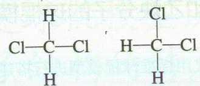

然后，学生通过分别按照图示结构搭建二氯甲烷的模型，自然会发现二者属于同一种结构。最后，引导学生思考为什么在纸面上看似不同的两种结构其实是同一种结构。

3. 提示：本活动的目的是让学生认识有机物种类繁多的原因之一是碳骨架连接方式的复杂性。首先，让学生观察教材中的图7-3，了解碳原子之间分别是哪种成键方式，并引导学生思考每个碳原子上还会连接几个氢原子。然后，让学生小组合作，用球棍模型搭建各种结构。最后，让学生小组根据所搭建的结构模型进行讨论，并提交问题在全班内交流。

驱动性任务问题参考如下：

(1) 这些有机化合物的分子式是什么?

(2) 哪些是链状的结构？哪些是环状的结构？

(3) 碳原子有几种成键方式? 分别在哪些分子中有所体现?

(4) 哪些分子中碳原子是在同一平面内？哪些分子中碳原子是在一条直线上？

(5) 哪些分子互为同系物？哪些分子互为同分异构体？

## 实验活动9 乙醇、乙酸的主要性质

本实验活动是创设学生实验探究的环境，通过探究乙醇和乙酸的性质来认识烃的衍生物的性质，帮助学生从有机化合物的官能团和化学键的视角来探析有机化合物的结构和性质，帮助学生初步了解有机化合物的制备方法，提高实验探究能力。

## 一、乙醇的性质

## 1. 活动安排建议

建议采用小组合作的探究活动方式。首先探究乙醇的物理性质，再设计实验探究乙醇燃烧的产物和乙醇的催化氧化反应。然后记录实验现象，并讨论这些现象如何解释或这些现象说明了什么问题。最后通过小组讨论提出有关乙醇的结构和性质特点的有关问题，提交全班交流和讨论。

## (1) 探究乙醇的物理性质

建议增加乙醇水溶性的探究。对乙醇物理性质的探究结果见下表：

<table><tr><td>性质</td><td>特点</td><td>结论及解释</td></tr><tr><td>1颜色、状态</td><td>无色液体</td><td>乙醇的沸点较高,所以常温下呈液态</td></tr><tr><td>2气味</td><td>有特殊香味</td><td>乙醇有挥发性</td></tr><tr><td>3溶解性</td><td>极易溶于水</td><td>乙醇能与水分子形成氢键,因此极易溶于水(供学有余力的学生了解)</td></tr></table>

## (2) 探究乙醇的燃烧产物

可让学生点燃酒精灯，观察火焰。将一个干燥烧杯罩在火焰上，观察现象，得出结论。再将一个用澄清石灰水润湿内壁的烧杯罩在火焰上，观察现象，得出结论。探究结果见下表：

<table><tr><td>操作</td><td>现象</td><td>结论</td></tr><tr><td>1点燃酒精灯</td><td>燃烧,火焰呈黄色</td><td>乙醇能在空气中燃烧</td></tr><tr><td>2将一个干燥烧杯罩在火焰上</td><td>烧杯内壁有水珠</td><td>乙醇的燃烧产物中有水</td></tr><tr><td>3将一个用澄清石灰水润湿内壁的烧杯罩在火焰上</td><td>烧杯内壁附着的石灰水变浑浊</td><td>乙醇完全燃烧的产物中有二氧化碳</td></tr></table>

## (3) 探究乙醇的催化氧化

按照教材中的实验方案开展实验探究，观察现象，得出结论。探究结果见下表：

<table><tr><td>操作</td><td>现象</td><td>结论</td></tr><tr><td>1将铜丝置于酒精灯外焰上灼烧</td><td>铜丝表面出现黑色物质</td><td>铜在加热条件下被氧化成氧化铜</td></tr><tr><td>2将表面变黑的铜丝在酒精灯上灼烧至红热后插入盛有无水乙醇的试管中</td><td>铜丝表面恢复光亮的红色,乙醇出现沸腾状态,并且持续一段时间</td><td>氧化铜被乙醇还原为铜,反应放热</td></tr><tr><td>3将上述操作反复几次后,闻试管中液体的气味</td><td>气味刺激难闻,与乙醇的气味不同</td><td>乙醇被氧化成乙醛</td></tr></table>

## 2. 注意事项

探究乙醇的燃烧产物的实验中，要注意烧杯在酒精灯火焰上的时间不能过长，否则可能会很烫手。

探究乙醇的催化氧化实验中要选用粗细合适的铜丝，铜丝的直径在0.5 mm为宜。试管中乙醇在反应时的温度可能会较高，要防止乙醇逸出，也要防止试管过热而烫手，建议用试管夹或铁架台的铁夹夹住试管。乙醛有一定毒性，闻乙醛气味时应小心，时间不要太久。

## 二、乙酸的性质

## 1. 活动安排建议

探究乙酸的物理性质和酸性，建议采用小组合作的探究活动方式。首先探究乙酸的物理性质，再设计实验探究乙酸的酸性。记录实验现象，并讨论如何解释这些现象或这些现象说明了什么问题。最后通过小组讨论提出有关乙酸的结构和性质特点的有关问题，提交全班交流和讨论。

## (1) 探究乙酸的物理性质

建议增加乙酸水溶性的探究。对乙酸物理性质特点的探究结果见下表：

<table><tr><td>性质</td><td>特点</td><td>结论及解释</td></tr><tr><td>1颜色、状态</td><td>无色液体</td><td>乙酸的沸点较高,在常温下呈液态</td></tr><tr><td>2气味</td><td>有刺激性气味</td><td>乙酸有挥发性</td></tr><tr><td>3溶解性</td><td>易溶于水</td><td>乙酸与水分子间形成氢键,因此易溶于水(供学有余力的学生参考)</td></tr></table>

## (2) 探究乙酸的酸性

可设计乙酸与酸碱指示剂、与镁、与氢氧化铜、与碳酸钠作用的实验探究乙酸的酸性。探究结果见下表：

<table><tr><td>操作</td><td>现象</td><td>结论及化学方程式</td></tr><tr><td>1取少量乙酸,加入2滴石蕊溶液</td><td>溶液呈红色</td><td>乙酸具有酸性 $CH_3COOH \rightleftharpoons CH_3COO^- + H^+$ </td></tr><tr><td>2取少量乙酸,加入一小段镁条</td><td>立即放出大量无色气体</td><td> $Mg + 2CH_3COOH = (CH_3COO)_2Mg + H_2 \uparrow$ </td></tr><tr><td>3向氢氧化铜悬浊液中加入足量乙酸</td><td>蓝色沉淀溶解</td><td> $Cu(OH)_2 + 2CH_3COOH = (CH_3COO)_2Cu + 2H_2O$ </td></tr><tr><td>4向碳酸钠固体中加入乙酸</td><td>固体溶解,有无色气体放出</td><td> $Na_2CO_3 + 2CH_3COOH = 2CH_3COONa + CO_2 \uparrow + H_2O$ </td></tr></table>

## (3) 乙酸乙酯的制备

乙酸与乙醇制备乙酸乙酯的实验由于涉及浓硫酸和加热，有一定危险性，教师要提前讲解操作要点和安全注意事项，并引导学生思考为什么要这样操作。其次，教师要让学生仔细观察并记录制备过程中的现象和产物乙酸乙酯的物理性质，引导学生思考观察到的现象说明了什么。然后，教师组织学生以小组讨论的方式分析所观察到的实验现象如何解释或说明了什么，并提出供全班交流和讨论的有价值的问题。最后，组织全班交流和讨论，强调重难点。

探究结果见下表：

<table><tr><td>操作</td><td>现象</td><td>解释或结论</td></tr><tr><td>1在一支试管中加入2mL乙醇,然后沿试管内壁慢慢加入0.5mL浓硫酸,振荡试管使液体混合均匀,用手接触试管壁</td><td>浓硫酸溶于乙醇时明显放热</td><td>类似于稀释浓硫酸时“注酸入水”的安全操作</td></tr><tr><td>2稍冷却后再加入2mL乙酸</td><td>无明显现象</td><td>防止因温度过高在没有安装好仪器之前就发生酯化反应,导致乙酸乙酯挥发</td></tr><tr><td>3在试管中放入几片碎瓷片,安装好仪器后开始加热。先使试管均匀受热,然后再固定加热位置,使用酒精灯小火加热</td><td>液体沸腾,导管中逐渐有油状液体流出</td><td>加入碎瓷片的目的是防止加热时发生暴沸;小火加热使温度不致过高,防止浓硫酸使有机物炭化</td></tr><tr><td>4向饱和碳酸钠溶液中加入两滴酚酞溶液,注意导管口要保持在液面上</td><td>红色的液面上逐渐出现一层无色液体</td><td>产物是不溶于水、密度小于水的液体。导管口保持在液面上是为了防止倒吸</td></tr></table>

续表

The image is too blurry to recognize any text content.

<table><tr><td>操作</td><td>现象</td><td>解释或结论</td></tr><tr><td>5待收集到约2mL油状液体时,停止加热。振荡收集乙酸乙酯的试管,静置</td><td>有气泡放出,静置后分层,下层碳酸钠溶液的红色变浅,上层为无色透明液体</td><td>有气泡说明乙酸乙酯中含有乙酸杂质。振荡后静置,液面重新分层,说明乙酸乙酯不溶于水,密度比水的小</td></tr><tr><td>6用滴管取少量上层液体加入培养皿中,闻气味</td><td>有特殊香味</td><td>乙酸乙酯是有特殊香味的液体</td></tr></table>

## 2. 注意事项

实验中要注意与浓硫酸有关的安全操作，反应后的废液不能直接向其中加水。要先冷却，再将其倒入废液缸后再用水清洗试管。反应中，导管和盛有饱和碳酸钠溶液的试管可能会比较烫，小心不要被烫伤。乙酸乙酯和乙醇都是易燃液体，操作时要注意远离明火。

## 三、问题与讨论答案或提示

1. 热铜丝插入一次，反应生成的乙醛量很少，多次操作可增加生成乙醛的量，提高乙醛的浓度，便于在后续实验中闻到乙醛的气味。

2. 浓硫酸的作用是催化剂和吸水剂。反应生成的乙酸乙酯中除含有乙酸外，还含有挥发性比乙酸更强的乙醇，而且乙酸乙酯微溶于水，因此饱和碳酸钠溶液主要有以下4个作用：中和乙酸，溶解乙醇，降低乙酸乙酯在水中的溶解度，提高水溶液的密度以加速乙酸乙酯与水溶液的分层。

实验过程中，饱和碳酸钠溶液的液面上逐渐形成一层无色油状液体，原因是乙酸乙酯不溶于水且密度比水的小。反应后振荡试管，有气泡放出，原因是乙酸乙酯中含有的乙酸杂质与碳酸钠反应放出二氧化碳。静置后再次分层，上层的无色透明液体是除去乙酸、乙醇杂质后的乙酸乙酯。

3.（1）乙醇的燃烧： $CH_{3}CH_{2}OH + 3O_{2} \xrightarrow{点燃} 2CO_{2} + 3H_{2}O$

(2) 乙醇的催化氧化: $2 \mathrm{CH}_{3} \mathrm{CH}_{2} \mathrm{OH} + \mathrm{O}_{2} \xrightarrow[\triangle]{\text {催化剂}} 2 \mathrm{CH}_{3} \mathrm{CHO} + 2 \mathrm{H}_{2} \mathrm{O}$

(3)乙酸比碳酸的酸性强: ${\mathrm{{Na}}}_{2}{\mathrm{{CO}}}_{3} + 2{\mathrm{{CH}}}_{3}\mathrm{{COOH}} = 2{\mathrm{{CH}}}_{3}\mathrm{{COONa}} + {\mathrm{{CO}}}_{2} \uparrow   + {\mathrm{H}}_{2}\mathrm{O}$

(4) 乙酸乙酯的制备: $\mathrm{CH}_{3} \mathrm{COOH} + \mathrm{CH}_{3} \mathrm{CH}_{2} \mathrm{OH} \xrightarrow[\triangle]{\text {浓硫酸}} \mathrm{CH}_{3} \mathrm{COOCH}_{2} \mathrm{CH}_{3} + \mathrm{H}_{2} \mathrm{O}$

## 教学资源

## 1. 人们对甲烷分子结构的认识过程

甲烷是一种人们熟知的最简单的有机化合物。然而就是对于这样一种物质，人类为认识它的分子结构已花去上百年的时间。1808年，化学家道尔顿用图7-1中式(1)表示了甲烷分子的结构。从该式中可以看出，甲烷是由一个碳原子和两个氢原子结合而成的微粒。虽然这个图式由于受到当时分析方法的限制，和我们今天认识的甲烷结构有着一定的差距，但在该式中已经体现了道尔顿原子论，可以说是化学科学中出现最早的一个结构式。它的提出开创了深入认识物质本性的先例，为今天高耸的化学大厦奠定了一块牢固的基石。

继道尔顿之后，瑞典化学家贝采利乌斯就把现在大部分仍在使用着的元素符号引入有机化学。德国化学家凯库勒提出了碳原子是四价和碳原子本身可以互相连接的观点。俄国的布特列洛夫提出了化学结构理论，认为分子的化学性质取决于其组成单元的性质、数量和化学结构，化合物中的原子能相互影响。这些理论为认识甲烷分子的结构提供了依据，人们就在这些认识的基础上又提出了表示甲烷分子结构的（2）、（3）、（4）式（如图7-1）。

1874年，荷兰化学家范托夫和法国化学家勒贝尔在研究旋光异构体时，各自提出了碳原子具有四面体结构的假说。这个假说以及据此引出的一些重要推论，不但给分子一个明确的形象，同时也满足了对称性和原子团稳定性的要求，很快为后来大量的实践所证明，开辟了立体化学的新篇章。根据该假说，甲烷分子中的碳原子位于正四面体的中心，连接氢原子的四个键伸向四面体的四个顶点。这样，甲烷的分子结构可以用图7-1中的（5）式来表示。近代的X射线衍射等技术进一步证明了甲烷的正四面体结构。

(1)  

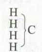  
(2)

  
(3)

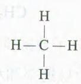  
(4)

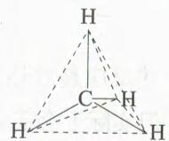  
(5)  
图 7-1 人们在不同时期提出的甲烷分子结构图示

[摘自：吴祺，人对甲烷分子结构的认识．中学化学教学参考，1979（Z1）：26-29]

## 2. 乙醇的工业制法

乙醇的生产是在酿酒的基础上发展起来的。远古时代的人们已使用含淀粉的物质发酵制酒。12世纪，人们在蒸馏葡萄酒时，第一次从酒中分离出酒精。20世纪30年代以前，发酵法是乙醇的唯一工业生产方法。1930年，美国联合碳化物公司建立了第一个用石油热裂化生产的乙烯为原料，将乙烯经硫酸吸收再水解制乙醇的工业装置，实现了乙烯间接水合制取乙醇。1947年，美国壳牌化学公司又实现了乙烯直接水合制取乙醇。由于该法与间接水合法相比有显著优点，现已成为生产乙醇的主要方法。

目前，乙醇的工业生产方法主要有两类：以淀粉和纤维素等碳水化合物为原料的发酵法和以乙烯为原料的水合法。

(1) 发酵法 将富含淀粉的农产品如谷类、薯类或野生植物果实等经水洗、粉碎后, 进行加压蒸煮, 使淀粉糊化。再加入一定量的水, 冷却至 $60^{\circ} \mathrm{C}$ 左右, 加入淀粉酶, 使淀粉依次水解为麦芽糖和葡萄糖, 然后加入酵母菌进行发酵, 制得乙醇。

$$
\begin{array}{r l} & 2 (\mathrm{C} _ {6} \mathrm{H} _ {1 0} \mathrm{O} _ {5}) _ {n} \xrightarrow {\mathrm{H} _ {2} \mathrm{O}} n \mathrm{C} _ {1 2} \mathrm{H} _ {2 2} \mathrm{O} _ {1 1} \xrightarrow {\mathrm{H} _ {2} \mathrm{O}} 2 n \mathrm{C} _ {6} \mathrm{H} _ {1 2} \mathrm{O} _ {6} \\ & \mathrm{C} _ {6} \mathrm{H} _ {1 2} \mathrm{O} _ {6} \xrightarrow {\text {酶}} 2 \mathrm{CH} _ {3} \mathrm{CH} _ {2} \mathrm{OH} + 2 \mathrm{CO} _ {2} \uparrow \end{array}
$$

发酵液中含乙醇的质量分数为6%\~10%，并含有乙醛、高级醇、酯类等杂质，经精馏得到质量分数为95%的工业乙醇，并副产杂醇油。

糖厂的副产物糖蜜中含有50%\~60%(质量分数)的蔗糖、葡萄糖等糖类,是发酵法制乙醇的良好原料。糖蜜经用水稀释、酸化和加热灭菌处理后,加入硫酸铵、磷酸盐、镁盐等营养盐以及酵母菌,便可发酵生成乙醇。

以含纤维素的工、农业副产物如木屑、秸秆等为原料时，需先用盐酸或硫酸进行加压、加热处理，使纤维素水解为葡萄糖，中和后再用酵母菌发酵。造纸厂的废液中含有可发酵糖，也可用于发酵制乙醇。这两种方法由于技术经济指标差，在工业上尚未得到广泛应用。

（2）乙烯水合法 工业上有两种方法，一种是以硫酸为吸收剂的间接水合法；另一种是乙烯催化直接水合法。

①间接水合法 也称硫酸酯法，反应分两步进行。首先将乙烯在一定温度、压力条件下通入浓硫酸中，生成硫酸酯，再将硫酸酯在水解塔中加热水解得到乙醇，同时有副产物乙醚生成。间接水合法以低纯度的乙烯为原料，反应条件较温和，乙烯转化率高，但设备腐蚀严重，生产流程长，已为直接水合法所取代。

②直接水合法 在一定条件下，乙烯通过固体酸催化剂直接与水反应生成乙醇：

$$
\mathrm{CH} _ {2} = \mathrm{CH} _ {2} + \mathrm{H} _ {2} \mathrm{O} \xrightarrow [ \triangle ]{\text { 催化剂 }} \mathrm{CH} _ {3} \mathrm{CH} _ {2} \mathrm{OH}
$$

上述反应是放热、分子数减少的可逆反应，理论上低温、高压有利于平衡向生成乙醇的方向移动，但实际上会受到反应速率和水蒸气饱和蒸气压的限制。工业上采用负载于硅藻土上的磷酸催化剂，反应温度260\~290℃，压强约7 MPa，水与乙烯的物质的量比为0.6左右，此条件下乙烯的单程转化率仅5%左右，大量乙烯需要在系统中循环。主要副产物是乙醚，此外尚有少量乙醛、丁烯、丁醇和乙烯聚合物等。

无论用发酵法或乙烯水合法，制得的乙醇通常都是乙醇和水的共沸物，要得到无水乙醇需进一步脱水。

## 3. 无水乙醇的制取

普通试剂乙醇含乙醇95.57%（质量分数）和水4.43%，这是恒沸点混合物即共沸物，它的沸点是78.15℃，比纯乙醇的沸点（78.5℃）低。把这种混合物蒸馏时，气相和液相的组成是相同的，即乙醇和水始终以这个混合比率蒸出，因此不能用蒸馏法制得无水乙醇。

在实验室中制备无水乙醇时，是在95.57%的普通乙醇中加入生石灰（CaO）加热回流，使乙醇中的水跟氧化钙反应，生成不挥发的氢氧化钙来除去水分，然后再蒸馏，这样可得到99.5%的无水乙醇。如果还要去掉残留的少量水，可以加入金属镁来处理，得到绝对乙醇。

工业上制备无水乙醇的方法是在普通乙醇中加入一定量的苯，再进行蒸馏。在64.9℃沸腾时蒸出苯、乙醇和水的三元恒沸混合物，这样可将水全部蒸出。继续升高温度，于68.3℃蒸出苯和乙醇的二元混合物，可将苯全部蒸出。最后升高温度到78.5℃，蒸出的是无水乙醇。近年来，工业上也使用强酸性阳离子交换树脂（具有极性基团，能强烈吸水）来制取无水乙醇。

## 4. 乙醇的生理作用

乙醇以不同的比例存在于各种酒中，它在人体内可以很快发生作用，改变人的情绪和行为。这是因为乙醇在人体内不需要经过消化作用，就可直接扩散进入血液中，并分布于全身。乙醇被吸收的过程可能在口腔中就开始了，到了胃部，也有少量乙醇可直接被胃壁吸收，到了小肠后，小肠会很快地大量吸收乙醇。乙醇进入血液后，随血液流到各个器官，主要是分布在肝脏和大脑中。

乙醇在体内的代谢过程主要在肝脏中进行。少量乙醇可在进入人体之后，马上随肺部呼吸或经汗腺排出体外，绝大部分乙醇在肝脏中先与乙醇脱氢酶作用，生成乙醛。乙醛对人体有害，但它很快会在乙醛脱氢酶的作用下转化成乙酸。乙酸是乙醇进入人体后产生的唯一有营养价值的物质，它可以提供人体需要的热量。乙醇在人体内的代谢速率是有限度的，如果一个人饮酒的速率大于体内代谢的速率，乙醇就会在体内器官，特别是在肝脏和大脑中积蓄，积蓄至一定程度即出现中毒症状。

如果在短时间内大量饮酒，开始乙醇会使人兴奋，减轻抑郁程度。这是因为乙醇压抑了某些大脑中枢的活动，这些中枢在平时对兴奋行为起抑制作用。这个阶段不会维持很久，接下来，大部分人会变得安静、忧郁、恍惚，直至不省人事，严重时甚至会因心脏被麻醉或呼吸中枢失去功能而造成窒息死亡。

## 5. 淀粉和碘的显色机理

直链淀粉遇碘呈蓝色，支链淀粉遇碘呈紫红色，糊精遇碘呈蓝紫、紫、橙等颜色。这些显色反应的灵敏度很高，可以用作鉴别淀粉的定量和定性的方法，也可以用它来分析碘的含量。纺织工业上用它来衡量布匹退浆的程度。

为什么碘遇淀粉或糊精会呈现不同的颜色呢？以前人们认为淀粉能吸附碘，使碘吸收的可见光的波长向短波长方向移动，棕色的碘液就变成蓝色。同理，支链淀粉和糊精也能吸附碘，不过吸附的程度不同，因此呈现的颜色不同。这种解释的有力证据是加碘的淀粉溶液在加热时蓝色消失。这被认为是加热后分子动能增大，引起解吸造成的。

近年来，人们用先进的分析技术（如X射线衍射谱、红外光谱等）研究碘与淀粉生成的蓝色物质，发现碘和淀粉的显色除吸附原因外，主要是由于生成了包合物。什么是包合物呢？直链淀粉是由 $\alpha$ -葡萄糖分子缩合而成的长链状螺旋体，每个葡萄糖单元都仍有羟基暴露在螺旋外。碘分子与这些羟基作用，使自身嵌入淀粉螺旋体的轴心部位。碘与淀粉的这种作用被称为包合作用，生成物被称为包合物。

淀粉与碘生成的包合物的颜色，跟淀粉的聚合度或相对分子质量有关。在一定的聚合度或相对分子质量范围内，随聚合度或相对分子质量的增加，包合物的颜色由无色、橙色、淡红、紫色到蓝色。例如，直链淀粉的聚合度是200\~980时，包合物的颜色是蓝色。分支很多的支链淀粉，在支链上的直链平均聚合度是20\~28，这样形成的包合物是紫色的。糊精的聚合度更低，形成的包合物显棕红色、红色、淡红色等。

## 6. 陈君石院士谈“垃圾食品”

在生活中，我们经常会听到“垃圾食品”这个说法，也会有媒体整理出各种“垃圾食品”名单，而方便面、薯条、可乐、汉堡、炸鸡、火腿等一般都会榜上有名。不少人对“垃圾食品”真是又爱又恨，很多人干脆敬而远之。

我并非对“垃圾食品”很有兴趣或对“垃圾食品”很有研究，但在不少场合都有媒体朋友询问我对“垃圾食品”的看法，在此就把我的一些观点写出来供大家参考。

“垃圾食品”这个说法来源于英文词junk food。根据牛津词典，junk的意思是无用或无价值的东西，而junk food则为“垃圾食品”（制作、食用方便，却有害健康的食品）。在西方，它最开始是指汉堡包、薯条等快餐食品，后来扩展到炸鸡和可乐等碳酸饮料。在中国，不知何时，方便面、油条也很“荣幸”地入选了。

在讨论“垃圾食品”是否有害健康之前，需要澄清的是，网络上流传的所谓“世界卫生组织（WHO）公布全球十大垃圾食品名单”并不属实。世界卫生组织自己已经辟谣，从未公布过最差食品或者垃圾食品名单。

大家之所以把汉堡包、薯条、炸鸡、可乐等食品列入“垃圾食品”名单，当然是因为它们有一些共同特点：从营养成分的角度来看，它们所含的能量高或脂肪高，而维生素、矿物质等其他营养素却很少；如果多吃、常吃，容易导致体重增加。

不过，是不是只有上述食品才是高能量、高脂肪的呢？查阅2002年和2004年的中国食物成分表，以每100 g可食部分计算，将几种相关食物的常量营养素含量分别列出，如下表所示。

表7-1 一些食物的常量营养素含量

<table><tr><td>食物</td><td>能量/kJ</td><td>蛋白质/g</td><td>脂肪/g</td><td>碳水化合物/g</td></tr><tr><td>可乐</td><td>180</td><td>0</td><td>0</td><td>10.8</td></tr><tr><td>薯条</td><td>1247</td><td>4.3</td><td>15.5</td><td>40.5</td></tr><tr><td>鸡肉汉堡包</td><td>1222</td><td>7.9</td><td>16.3</td><td>25.2</td></tr><tr><td>鸡柳汉堡包</td><td>1125</td><td>13.9</td><td>13.6</td><td>23.8</td></tr><tr><td>羊肉串(烤)</td><td>862</td><td>26</td><td>10.3</td><td>2.4</td></tr><tr><td>烤鸭</td><td>1824</td><td>16.6</td><td>38.4</td><td>6.0</td></tr><tr><td>方便面</td><td>1975</td><td>9.5</td><td>21.1</td><td>61.6</td></tr></table>

从表里可以看出，像烤鸭、烤羊肉串这些很受大家欢迎的食品，它们的能量和脂肪含量相当高，看起来也符合“垃圾食品”的特点啊！例如，每100 g烤鸭的能量含量差不多是同样重量汉堡包的1.5倍，脂肪含量也是汉堡包的2倍多。烤羊肉串的能量和脂肪含量也不低，好在其蛋白质含量比较高。

照此，我们是不是要把烤鸭和烤羊肉串也纳入“垃圾食品”的名单呢？继而，红烧肉、狮子头、水煮鱼等传统中国菜肴也都要上榜？要这样，“垃圾食品”的名单是不是太长了，而且有违大家的“观感”？

我认为，应该深思一下，在中国照搬国外的名词到底是否合适。

作为营养学家，我们从不认为食品有好坏之分（即“垃圾食品”与“非垃圾食品”）。因为一个人吃的是否营养、健康，关键在于食物搭配是否合理。比如，如果我中午吃了汉堡包，那晚上就应该多吃一点蔬菜。同样，中午吃了方便面，那晚上就补上一点肉食和蔬菜。红烧肉脂肪太多，但也不是不能吃，只要不多吃，不天天吃，完全可以作为平衡膳食的一部分。当然，从正面来看，“垃圾食品”的说法笼统概括了某些食品能量高和脂肪高的特点，可以提醒人们要控制对它的“口腹之欲”，但并非完全不能碰。

还有一点误解需要澄清，现在人们越来越多地把超重和肥胖现象归罪于摄入“垃圾食品”，特别是汉堡包、热狗、薯条及可乐等甜味饮料。超重和肥胖的原因是多方面的，即使从饮食方面来说，它的发生也是因为总的能量“收支不平衡”，即摄入远大于支出。因此，要保持健康体重，除了控制摄入量，还要“敢于支出”。偶尔吃多了，那就要加强运动，把多吃进去的能量消耗掉。体重控制说白了就是健康生活方式的问题，仅仅把它归罪于少数食品种类，你确定不是在为自己的“懒惰”找借口？

总之，“垃圾食品”不是一个科学的定义，食物本身并没有“垃圾”还是“健康”之分，没有垃圾的食品，只有垃圾的搭配。当然，消费者还是可以多了解各种食物的营养特点，尽量参照《中国居民膳食指南》的建议去做，根据其中的“平衡膳食宝塔”做到食物多样化，每种食物都吃一些，每种食物都不多吃。

[摘自：陈君石.我对“垃圾食品”的看法.中国食品安全报，2016-03-01（A02）]

## 7. 棕榈油

棕榈油是从油棕树的果实中榨取的植物油，原产于非洲。19世纪以来，其主要产地逐渐转移到东南亚。棕榈油的饱和脂肪含量高，稳定性好，不易氧化变质，耐储藏和高温烹炸，不需要氢化即可用于食品加工，可作为起酥油和人造奶油的原料。它还含有较丰富的维生素A和维生素E，营养价值较高。棕榈油被人类食用已有上千年的历史，在现代食品工业中的用途十分广泛。油棕是一种高产的多年生油料植物，相同面积土地的棕榈油产量约为菜籽油的10倍，因此棕榈油的价格较为低廉。目前，棕榈油是世界消费量最大的植物油品种，也是我国进口量最大、消费量仅次于大豆油的植物油品种。

## 8. 营养师

营养师是运用营养学的知识和技能进行营养和膳食指导的工作者。营养师主要分为临床营养师、公共营养师、食品营养师、运动营养师和餐饮营养师等。临床营养师主要在医院负责根据不同疾病为患者制定食谱，指导患者合理膳食；公共营养师主要负责调查人群营养状况和宣传营养知识；食品营养师主要负责对食品生产企业的产品进行营养强化搭配；运动营养师主要针对运动员或运动量大的群众进行营养和膳食指导；餐饮营养师主要在餐饮服务行业设计营养配餐食谱，同时培训餐饮服务人员。

我国的营养师培养起步较晚，目前大多数医院、社区和大型餐馆都没有配备营养师，营养师的人均配比率远低于发达国家。为了正确引导居民的食物消费，提高人民健康水平，国务院于2001年公布了《中国食物与营养发展纲要（2001—2010年）》，明确指出：“提高营养师的社会地位，逐步在医院、幼儿园、学校、企事业单位的公共食堂及餐饮服务业推行营养师制度。”国家相关规定的出台，促进了营养师人才的社会需求和健康产业的发展，也将有助于国民身体素质的提高。

[部分内容摘自：柴巍中，赵尔萍. 中国营养师的现状、需求与发展前景. 中国食物与营养，2004(9):8-11；刘娟. 营养师的发展前景展望. 生物技术世界，2014(12):66]

## 教学案例

# 第一节 认识有机化合物（第1课时）

北京市回民学校 丁 芬

## 教学目标

1. 通过拼插有机物分子结构模型，建立宏观物质与微观组成的联系，将微观结构可视化。

2. 利用螺旋上升式的活动串，在动手拼插的过程中，让学生体验并落实“碳四价”原则，理解和掌握有机物中碳原子的成键特点，进而能分析有机物种类繁多的原因。

3. 在模型拼插的活动中，借助探究角度，发展学生模型认知和科学探究的能力。

4. 通过列举事实和数字，激发探究未知知识的兴趣，享受探索的乐趣，进一步培养科学精神。

## 教学重点

有机化合物中碳原子的成键特点。

## 教学难点

同分异构现象。

## 教学流程

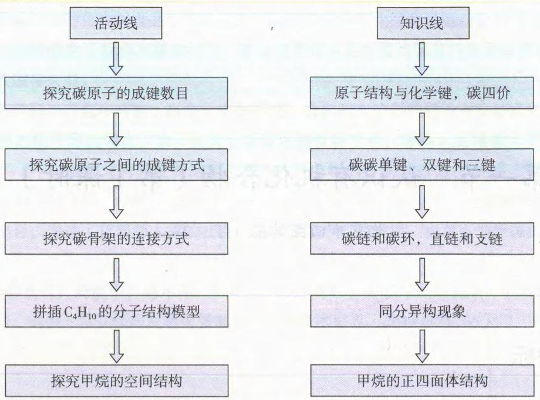

## 教学过程

教学环节一：引出课题。

展示生活中广泛存在的有机物的图片，感受有机物种类繁多的客观事实，激发学生主动思考原因。展示身边的宏观物质的分子组成，提炼有机物的组成特点，并结合原理讨论有机物中碳原子的成键特点。

<table><tr><td>教师活动</td><td>学生活动</td><td>设计意图</td></tr><tr><td>我们生活在一个生机勃勃的世界里。有机化合物不仅构成了生命体本身,同时也为人类的生存和发展提供了必需的食物、药物、材料和燃料等。人们在自然界发现和人工合成的物质已超过1亿种,其中大多数是有机物,而且新的有机物仍在源源不断地被发现或合成出来。有机化合物为什么如此繁多呢?</td><td>倾听教师描述,观看图片,体会有机物的存在。感受有机物种类繁多。</td><td>展示生活中的有机物,学生感受到有机物种类繁多,同时自主体会有机物对生活、生产的重要作用,产生研究有机物的动力。</td></tr><tr><td>展示一些物质中有机物的结构简式。从图片中你发现有机物在组成上有什么特点?</td><td>观察有机物的分子组成,初步感知有机物都含有碳元素。</td><td>从宏观物质深入到分子组成,提炼有机物的组成特点。</td></tr></table>

<table><tr><td>教师活动</td><td>学生活动</td><td>设计意图</td></tr><tr><td>碳在地壳中的含量很低,但含碳的有机物却如此繁多。碳原子有怎样的成键特点呢?“碳四价”理论。</td><td>结合已有认知,书写碳原子结构示意图,小组讨论碳原子的成键特点。碳原子最外层有4个电子,要通过共用4对电子达到稳定结构。</td><td>聚焦于核心元素——碳,水到渠成地引出本节课的任务。应用原子结构的相关知识分析、体会原理的指导价值。</td></tr></table>

教学环节二：原子成键数目探究。

通过化学史引出研究物质结构的有效方法——模型法；通过【活动1】拼插含1个碳原子的碳氢化合物和含1个碳原子、1个氯原子、氢原子数目任选的有机物的分子结构模型，使学生在动手拼插的过程中内化“碳四价”理论，感受碳原子可以和多种原子连接形成化学键的事实。

<table><tr><td>教师活动</td><td>学生活动</td><td>设计意图</td></tr><tr><td>使用实物模型可以将微观的分子结构直观呈现出来,便于我们获取更多的分子结构信息。著名化学家鲍林就使用模型来研究物质结构。今天我们也效仿科学家,采用实物模型来研究有机物中碳原子的成键特点。【活动1】1选用1个碳原子,氢原子数目任选,拼插出你认为合理的有机物,并说明理由。2选用1个碳原子、1个氯原子,氢原子数目任选,拼插出你认为合理的有机物,并说明理由。小结:碳原子不仅可以与氢原子、氯原子相连,也可以与氧原子、氮原子等其他原子相连接。</td><td>倾听,感悟模型的价值。根据要求拼插有机物模型,展示作品,分享理由。从原子结构的角度分析:1碳原子半径大于氢原子半径。2碳原子最外层有4个电子,要通过共用4对电子形成稳定结构;而氢原子最外层只有1个电子,所以选择1个碳原子和4个氢原子相连接。氯原子最外层有7个电子,需要共用一对电子。</td><td>将模型法引入有机化学的学习中,为后续有机物的球棍模型和空间填充模型的引入进行铺垫。在亲自拼插的过程中,进一步体会“碳四价”的含义;用学生理解的“价键理论”拼插模型;在动手中感悟碳原子能与多种原子成键。</td></tr></table>

教学环节三：碳原子间成键方式探究。

通过【活动2】拼插含2个碳原子的碳氢化合物，总结碳原子间的成键方式——碳碳单键、双键和三键；结合动手拼插过程，体会拼插（书写）有机物结构的一般思路——先碳骨架，再依照“碳四价”原则补充氢原子和其他原子。

<table><tr><td>教师活动</td><td>学生活动</td><td>设计意图</td></tr><tr><td>碳原子和碳原子之间能不能连接,怎样连接呢?【活动2】用2个碳原子,氢原子数目任选,拼插出你认为合理的有机物,并说明理由。总结搭建思路:先关注碳原子,搭建碳骨架,再按照“碳四价”原则补充连接其他原子。</td><td>根据要求拼插有机物模型。碳原子之间可以形成碳碳单键、双键和三键。结合拼插经验,体会有机物搭建的一般思路:先碳骨架,再其他原子。</td><td>在拼插活动中,将微观的共用电子对以实物“牙签”替代,化无形于有形,便于学生想出碳碳之间不同的成键方式。结合拼插过程中的先后步骤,体会构建有机物的一般思路。</td></tr></table>

教学环节四：碳骨架的连接方式探究。

通过【活动3】拼插含3个碳原子的有机物的碳骨架和4个碳原子通过碳碳单键相连的有机物的链状碳骨架，感受碳骨架连接方式的多样性；通过为含4个碳原子的碳骨架补充氢原子的活动，感受同分异构现象。

<table><tr><td>教师活动</td><td>学生活动</td><td>设计意图</td></tr><tr><td>碳骨架又有哪些连接方式呢?【活动3】1用3个碳原子,拼插你认为合理的有机物的碳骨架。2用4个碳原子,以碳碳单键相连,拼插你认为合理的有机物的链状碳骨架。3给含4个碳原子的碳骨架补充氢原子,书写分子式。初识同分异构现象。</td><td>根据要求拼插有机物模型。结合拼插体验,明确碳骨架的连接方式——链状和环状;链状又有直链和支链之分。在补充氢原子的过程中,再一次体会“碳四价”原则的指导作用。根据模型书写分子式,感悟同分异构现象。</td><td>在游戏中探究3个或4个小球的不同连接方式,总结出碳链(直链和支链)和碳环,化抽象为具体,有效降低了认识有机物的起点。在拼插 $C_4H_{10}$ 模型的基础上,提炼出分子组成,初步认识同分异构现象。</td></tr></table>

教学环节五：呼应引言，小结。

结合讨论活动，再一次归纳整理有机物中碳原子的成键特点。通过甲烷的正四面体结构与本节课学生拼插的甲烷模型之间的冲突，为有机物中原子的空间连接方式的探究留下悬念。通过作业延伸并拓展教学内容。

<table><tr><td>教师活动</td><td>学生活动</td><td>设计意图</td></tr><tr><td>【讨论】请结合教材图7-3显示的4个碳原子相互结合的几种方式,分析以碳为骨架的有机物种类繁多的原因。</td><td>阅读教材,分析讨论。</td><td>首尾呼应,用本节课的内容分析有机物种类繁多的原因。</td></tr><tr><td>【小结】在必修第一册元素周期律的学习中,我们已经知道甲烷的正四面体结构。在【活动1】中我们了解了甲烷分子中C、H原子的连接顺序,那么甲烷分子中原子的空间位置关系如何,我们在下一节课将进一步学习。</td><td>倾听,思考,思维延伸。</td><td>延伸思考,分子中的原子不仅有连接顺序,还有空间伸展的问题。承前启后,为后续教学埋下伏笔。</td></tr><tr><td>【作业】用5个碳原子,氢原子数目任选,尽可能多地画出你认为合理的有机物的结构。实验数据表明:甲烷分子中的5个原子不在同一平面上,分子中4个C—H的长度和强度相同,相互之间的夹角相等。请结合此信息,判断本节课拼插的甲烷分子模型是否合理。若不合理,请尝试改进。</td><td></td><td></td></tr></table>

## 板书设计

第一节 认识有机化合物  
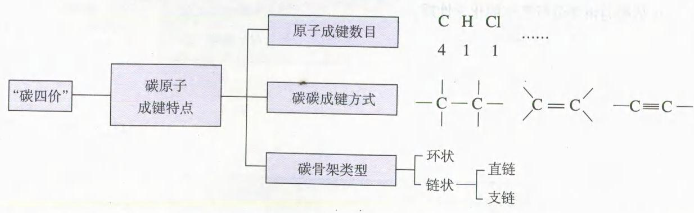

# 乙醇与乙酸（第1课时）

北京市十一学校 孙 京

## 教学目标

1. 通过探究乙醇的结构、性质及应用，从乙醇的分子结构（化学键、官能团）分析其性质和变化，认识有机化合物中官能团与性质的关系。以乙醇的结构和性质为基本模型，认识含有羟基的有机化合物的结构和性质。

2. 通过探究乙醇的催化氧化反应实验并分析其反应规律，认识一种有机反应类型——氧化反应的基本规律，知道乙醇在一定条件下可以转化为乙醛、乙酸，了解有机化合物的转化。

3. 通过乙醇在生产、生活中的实际应用，认识乙醇在能源、饮食、健康等方面的应用价值，知道如何合理使用常见有机化学品。

## 教学重点

乙醇的结构和化学性质，官能团的概念。

## 教学难点

从结构的角度分析乙醇的化学性质。

## 教学流程

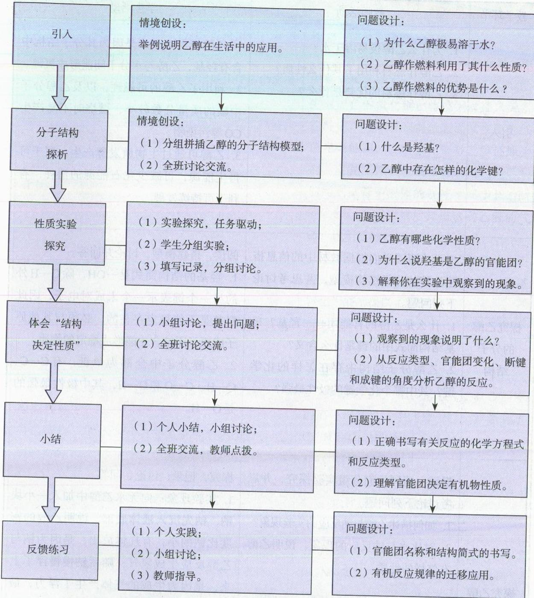

## 教学过程

<table><tr><td>教学环节</td><td>教师活动</td><td>学生活动</td></tr><tr><td>引入</td><td>提示:请同学们阅读教材,查阅资料,举例说明乙醇在生活中有哪些实际应用,并思考和讨论下列问题。</td><td>讨论并回答:各种含酒精的饮料、乙醇汽油、医用酒精等。</td></tr><tr><td>引入</td><td>为什么乙醇极易溶于水?乙醇作燃料利用了其什么性质?乙醇作燃料的优势是什么?</td><td>乙醇极易溶于水是因为其分子结构中含有羟基,乙醇与水分子间能形成氢键。利用了乙醇的可燃性,以及乙醇分子中碳的质量分数较小,燃烧时不易产生CO等污染物。乙醇可通过生物质发酵产生,属于可再生能源,可减少化石能源的消耗,有利于可持续发展。</td></tr><tr><td>探究乙醇的分子结构</td><td>提示:请同学们根据教材中的信息搭建乙醇的分子结构模型,并思考讨论下列问题。什么是乙醇的官能团——羟基?羟基结构简式中的键是什么含义?乙醇分子结构中存在怎样的化学键?其中哪个化学键的极性最强?</td><td>阅读,搭建模型,讨论并回答。羟基的结构简式是—OH,除O—H外的另一个键表示一个未成对电子,因此羟基是不能稳定存在的,必须与其他原子或原子团结合才能形成稳定的物质。乙醇分子中全部为单键,有C—C、C—H、C—O和O—H,其中极性最强的是O—H。</td></tr><tr><td>探究乙醇与钠的反应</td><td>提示:请同学们分组实验探究,并思考讨论下列问题。如何描述乙醇与钠反应的实验现象?对比水与钠反应的现象,说明乙醇有怎样的性质。</td><td>探究,记录,讨论,回答。实验现象:向无水乙醇中加入一小块钠,钠先沉入液体底部,说明乙醇的密度比钠的小;有气体放出,是因为钠与乙醇反应生成氢气;随后钠慢慢浮了上来,是因为生成的气体产生了浮力;最后钠消失,反应结束。相同条件下,乙醇与钠的反应没有水与钠的反应剧烈,说明乙醇分子中的羟基没有水分子中的羟基活泼。</td></tr></table>

续表

<table><tr><td>教学环节</td><td>教师活动</td><td>学生活动</td></tr><tr><td>探究乙醇的催化氧化反应</td><td>提示:请同学们分组实验探究,并思考讨论下列问题。1. 如何描述乙醇催化氧化反应的实验现象?2. 乙醇的催化氧化反应在有机物转化中的意义是什么?</td><td>探究,记录,讨论,回答。1. 在酒精灯上灼烧铜丝,铜丝变黑,原因是加热条件下铜被空气中的氧气氧化,生成黑色的氧化铜;将该铜丝插入无水乙醇中,可以看到铜丝表面又恢复为红色光亮的铜,说明氧化铜被乙醇还原为铜;反复操作几次现象都相同,最后我们闻到试管中液体的气味不同于开始时的乙醇。查阅资料后知道这是乙醛的气味,说明乙醇被氧化生成了乙醛。2. 乙醇的催化氧化反应使乙醇转化为乙醛,为醇类物质转化为醛类物质、羟基转化为醛基提供了范例。</td></tr><tr><td>探究羟基与乙醇性质的关系</td><td>提示:乙醇的化学性质与其官能团——羟基有怎样的关系?反应1:乙醇与钠反应。反应2:乙醇的催化氧化反应。1. 反应中官能团是如何变化的?2. 反应中化学键是如何变化的?3. 反应中物质类别是如何变化的?4. 反应类型是什么?</td><td>思考,讨论,回答。1. 1—OH→—ONa2—OH→—CHO2. 1 断裂了O—H,形成了 $C_2H_5ONa$ 中的离子键和氢气中的H—H。2断裂了O—H和C—H,形成了C=O。3. 1醇→醇钠2醇→醛4. 1取代反应(或置换反应)2氧化反应</td></tr><tr><td>总结提高</td><td>提示:有机物的结构决定其化学性质,化学反应可以用化学方程式来表达。1. 请同学写出上述反应的化学方程式。2. 为什么说羟基是乙醇的官能团?3. 研究乙醇的结构和性质的意义是什么?</td><td>书写,思考,讨论,回答。1.  $2Na+2CH_3CH_2OH \rightarrow 2CH_3CH_2ONa + H_2 \uparrow 2CH_3CH_2OH + O_2 \xrightarrow[\Delta]{催化剂} 2CH_3CHO + 2H_2O$ 2. 官能团是决定有机物化学特性的原子或原子团。乙醇的化学性质,如乙醇与钠的反应、乙醇的催化氧化都与羟基密切相关,因此羟基是乙醇的官能团。3. 乙醇是醇类物质的代表,羟基是醇类物质的官能团,我们可以根据乙醇的性质和反应规律来认识醇类物质的性质和反应规律,实现有机物的转化。</td></tr><tr><td>学习反馈</td><td>提示:完成反馈练习,并与小组同学交流你的答案,希望你能再发现新的问题。</td><td>练习,讨论。</td></tr></table>

## 第八章化学与可持续发展

## 本章说明

20世纪中期以来，世界上许多国家相继走上了以工业化为主要特征的发展道路。随着生产力的极大提高和经济规模的不断扩大，支撑人类社会发展的自然资源和生态环境面临着巨大的压力，自然资源过度消耗、生态环境趋于恶化等问题日益突出。当前，走可持续发展道路已经得到国际社会的普遍认同。遵循这一发展模式，要解决资源、能源、材料、环境、健康和安全等人类所面临的重要问题，化学将面临新的机遇和挑战，同时，也将一如既往地发挥不可取代的重要作用。

按照课程标准的要求和教材的总体安排，本章教学内容自始至终围绕着“化学与可持续发展”这一核心主题展开。从自然资源开发利用、化学品合理使用和环境保护这三个相互联系的方面，使学生初步认识、体会化学在可持续发展中的重要作用，进一步提升他们在科学态度与社会责任等方面的学科核心素养水平。“化学与可持续发展”这一宏大主题，内涵丰富，意义深刻，高中必修课程中只能通过一些典型实例，帮助学生形成对该主题管中窥豹式的体会和认识。教学内容的选择必须紧密结合学生的知识基础和生活经验，教学活动的安排必须有利于调动学生的学习积极性，避免流于空泛的说教。

从学科知识及其运用的角度来看，本章教学有利于学生将前面所学过的知识进行梳理、归纳，并运用于实际生产、生活之中。这些知识主要是指物质之间的转化，包括无机物之间的转化（如金属及其化合物、非金属及其化合物）和有机物之间的转化（如裂解反应、聚合反应），能使学生体会化学在自然资源综合利用、资源保护和环境保护中的作用，并引导他们关注各类化学品在满足人类生产、生活需要的同时，从生产、使用到废弃各阶段的物质形态都有可能对人类健康和生态环境产生影响。从树立观念与创新精神的角度来看，本章教学应有利于学生了解在可持续发展总要求下化学的应用特点和发展方向，思考在可持续发展这一制约条件下如何实现化学反应中物质和能量的转化，学会辩证、全面地看待人类和自然协调发展中遇到的各种问题，培养科学决策的意识、创新精神与实践能力。作为高中必修课程的结尾，本章教学目的不仅在于帮助学生将所学知识进行复习、归纳并运用于实际，而且在于对化学与可持续发展有关思路和观念的总结与提升，这对于他们学习后续课程以及未来的升学和就业都将会产生一定的影响。

## 一、教材分析

自然资源为人类提供了生存和发展的物质、能源基础。从化学角度看，开发利用自然资源的过程就是利用化学变化获得有用物质、获取能量的过程。教材以金属矿物、海水、化石燃料的开发利用为例，让学生了解化学在资源开发利用中的地位和作用，以及伴随这一过程产生的环境问题；以化肥、农药的合理施用，合理用药和安全使用食品添加剂为例，让学生认识化学品在农业生产、人体营养与健康中的重要作用，体会生态系统中人与自然“你中有我、我中有你”的紧密联系。资源开发利用与保护资源、保护环境，这是自然界中人类始终面临的、需要协调的问题。坚持可持续发展，树立“绿色化学”的观念为当前化学的应用与发展指明了方向。

教材按照产品源于自然、归于自然的物质转化过程安排教学内容，从资源的利用、生产，到产品的使用、消费，再到资源、环境保护，将化学品生命周期的循环链条呈现完整，使本章主题的内涵更加丰富、全面；更加突出学生作为使用者和消费者的角色，有利于使教学过程贴近工农业生产和个人生活实际，进一步提高学生在教学和实践中的参与程度。

本章的内容结构如下图所示。

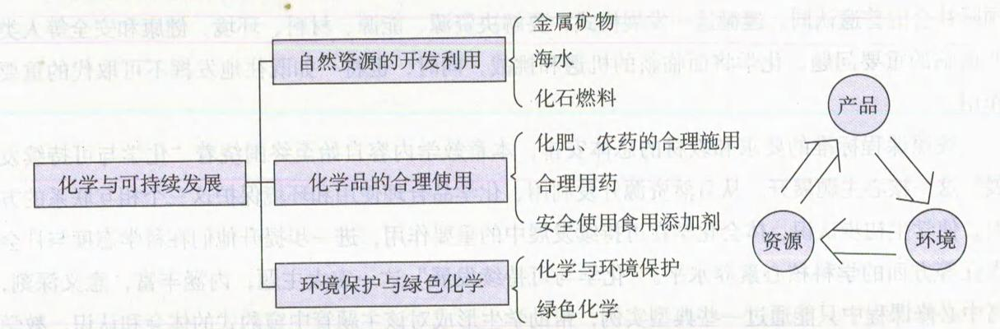

本章的内容选择与安排体现了下列编写思路和特点。

## 1. 突出学科核心素养，将科学教育与人文教育融为一体

本章编写主要依据课程标准中“化学与社会发展”主题的要求，突出课程标准提出的科学态度与社会责任等方面的学科核心素养，注意在科学教育中渗透人文教育的思想。自然资源开发利用与保护资源、保护环境是人与自然和谐相处的两个相辅相成的重要方面。走可持续发展的道路是社会发展的历史性选择。在这一背景中聚焦化学及其应用，一方面利用化学变化创造、提供人类生存和发展的物质基础与条件，使生活更加舒适、方便和安全；另一方面树立“绿色化学”“原子经济”“循环经济”等观念，做到合理使用化学品，保护自然资源和环境，维护生态平衡。本章教学的落脚点在于化学知识，提升点在于学科核心素养。

## 2. 注重基础性，坚持选择性，反映时代性

注重基础性，表现在教材突出金属矿物、海水和化石燃料等综合利用中的基本化学原理和基础知识，如氧化还原反应及其应用，金属活动性顺序，典型金属与非金属及其化合物之间的转化，分离混合物的基本操作——蒸馏、分馏，等等。坚持选择性，表现在教材只是提供具有典型性、示范性的教学内容，教师可以结合自己的教学经验、学校条件和学生实际情况，对教材内容进行必要的调整和补充。有条件的可以指导学生利用网络、图书馆、科技馆和博物馆等资源，或到实际生产中进行参观、调查和访问。也可以进行专题研讨，满足学生的不同兴趣与爱好，启发和指导他们对某些课题进行更深入地学习和长期研究。反映时代性，除了表现在更新教材内容（如铝的生产和回收铝制品、海水提溴等“思考与讨论”栏目），还表现在关注当前可持续发展所面临的一些热点问题，揭示解决这些问题时化学的作用和价值，编入了化学与环境监测，“三废”治理，生物质资源开发，化学与药物设计、合成，次生污染物，人工光合作用，以及“绿色化学”的原理等内容。

## 3. 更新呈现方式，促进有效教学

教材通过呈现方式的多样化，促进学生学习方式的多样化，帮助学生多视角、开放创新地认识和体会化学与可持续发展这一主题。促进被动的接受式学习向积极主动的多样化学习方式转变；促进教学从只重视理解和掌握知识向重视过程的理解和体会、追求多元化学习目标转变；改变教材内容封闭、单向的倾向，向开放、互动和创新转变。

## 二、学业要求

1. 以金属矿物、海水资源的开发利用为例，认识化学在实现无机化合物转化中的作用和贡献。

2. 认识煤、石油和天然气等化石燃料综合利用的方法和意义，了解化学在开发利用自然资源中的重要作用。

3. 以化肥、农药的合理施用，合理用药，安全使用食品添加剂为例，认识化学在发展工农业生产、创建良好生态和健康生活等方面的作用。在化学品使用、食品与药品安全等方面树立自觉遵守有关法律、法规的意识。

4. 能列举和分析大气、水体和土壤的常见污染物及其防治措施，认识化学在治理污染和保护环境中的重要作用，树立“绿色化学”的观念。

5. 培养节约资源、物质和能量循环利用的意识，形成简约适度、绿色低碳的生活态度和生活方式。

## 三、课时建议

第一节 自然资源的开发利用 3课时  
第二节 化学品的合理使用 2课时  
第三节 环境保护与绿色化学 1课时  
全章复习 1课时

## 第一节 自然资源的开发利用

## 一、内容分析

本节重点在于揭示和说明化学在金属矿物、海水资源和化石燃料开发利用中的作用，突出了两个方面的主题，一是化学为开发利用自然资源提供了科学依据；二是保护资源和保护环境对化学的应用和发展提出新的要求。简言之，自然资源的开发利用离不开化学，化学只有不断创新和发展才能满足人类社会可持续发展的需求。

教材从金属矿物的开发利用引入，通过金属冶炼的基本原理使学生认识到化学是冶金工业的重要依据，化学（包括电化学）方法是金属由化合物转变成单质的基本方法，从而对金属冶炼的常用方法进行比较系统的学习。此外，教材通过一些栏目，如“思考与讨论”中铝的冶炼和铝制品的回收，帮助学生认识金属冶炼过程往往需要消耗大量的能量，也容易造成严重的环境污染，因此，改进工艺条件、节能降耗、回收废旧金属制品等，就成了与金属冶炼同样重要的问题。

海洋约占地球表面积的71%，海洋资源的深度开发是人类生存和发展必须面对的问题。仅以海水为例，将其中溶解的大量有用物质提取出来就是一个极具挑战性的课题。同金属冶炼、海水晒盐等古老产业相比，其他海水资源的综合利用程度还不高。仅从化学变化角度来看，从海水中提取有用元素绝不像试管实验那样简便，其中的想象和创造的空间像海洋一样广阔而深远。教材通过对一些典型生产工艺的分析（如海水提溴），会使学生认识到一些化学原理并不复杂的过程在实际生产中会遇到很多复杂的问题，甚至是非常巨大的挑战（如可燃冰的开采和利用）。

基于日常生活经验，学生对煤气、天然气和多种燃料油等化石燃料作为能源形式的利用比较熟悉，但对其提炼原理和生产过程并不了解，对化石燃料作为重要化工生产原料也了解不多。限于课时和学生的知识基础，这里只能使学生形成一些粗略的认识，主要包括化石燃料的化学成分，石油化工、煤化工生产的一般原理和过程，应用广泛的石油化工、煤化工产品及其生产工艺的发展趋势等。例如，以化石燃料为原料，通过化学反应获得塑料、合成纤维和合成橡胶等有机合成高分子以及各种精细化学品，由此体会石油化工、煤化工给人类带来的诸多好处（如教材图8-7“石油化工产品的应用及投入产出示意图”），了解化学在物质生产领域创造的重要价值，提高学习化学和化工的兴趣。同时，引导学生积极面对诸如目前多数石油产品仍作为燃料使用和合成材料废弃物带来的环境污染等现实问题，思考提高化石燃料综合利用率、开发生物质资源等绿色、可持续发展的新途径。

## 二、教学目标

## 1. 教学目标

（1）通过金属冶炼原理的学习和冶炼方法的归纳，理解氧化还原反应在金属矿物开发中的应用，构建金属冶炼的思维模型。

(2) 通过铝的冶炼成本的计算, 认识合理开发和利用金属资源的重要性和必要性。

(3) 以海水资源中的氯化钠为原料, 构建物质间的转化关系和思维导图。

（4）通过海水提溴工艺流程图的设计与分析，形成工业上提取物质的一般思路和方法，培养学生模型认知和证据推理的能力。

（5）能从化学的角度分析从自然资源到产品的转化途径，认识化学方法在实现物质转化中的作用和贡献，感受化学科学在生产、生活中的应用价值。

（6）能举例说明重要资源和能源的主要类型、成分和作用，能对资源的开发利用和能源的使用方案进行评价。认识资源综合利用的重要意义。

## 2. 教学重点和难点

重点：金属冶炼原理；海水提溴的工艺流程、原理和分离提纯方法。

难点：金属活动性顺序与金属冶炼方法的关系；物质提取的一般思路和方法。

## 三、教学建议

## 1. 注重初、高中知识的衔接和整合

金属矿物的开发利用是本节第一部分内容。本节关于金属冶炼原理的教学，学生已有一定的基础。学生在初中化学中已经学习了利用还原剂一氧化碳、氢气或碳单质与金属氧化物在加热或高温条件下反应，将金属从其化合物中还原出来。初中教材对于金属的冶炼重点介绍了工业上铁的冶炼原理，学生已逐步建立起利用还原剂从金属氧化物中获取金属单质的方法；同时通过对金属活动性顺序的学习，知道了金属与盐反应的一般规律。这些知识的学习为高中系统学习金属冶炼的一般原理、总结提炼金属的一般方法提供了知识储备。高中化学必修第一册中，学生又学习了有关金属及其化合物的化学性质和氧化还原反应等知识。此时，再对金属矿物的开发利用进行系统化学习也就顺理成章、水到渠成。

本节中海水资源的开发利用，是在初中学生已经学习了海水制盐原理，以及学习了高中必修第二章“海水中的重要元素——钠和氯”的基础上，将海水制盐获得的食盐、镁盐、钾盐和溴化物等盐类物质作为化工原料，进一步用于生产化工产品，如金属单质钠、镁、钾，非金属单质溴、氯气和氢气，以及烧碱、纯碱、盐酸等物质。从海水中提取物质的过程中，涉及物质的除杂、分离和提纯等基本实验方法，涉及离子反应、氧化还原反应、元素化合物等基础知识。这些内容既是对已学知识的复习巩固，更是以常见物质为主线构建物质转化思维导图的好素材。

## 2. 组织探究活动，完成金属冶炼认识思路的结构化

金属的冶炼是本节的重点内容，教师在进行这部分内容的教学时，不能仅简单地停留在几种常见金属的冶炼原理上，而应该引导学生结合氧化还原反应原理、金属活动性顺序及其应用等化学基本原理和基础知识，充分调动学生思维，采用探究、比较、归纳等教学手段总结金属冶炼的一般原理和方法。尤其是在具体知识的学习过程中，要促进学生化学核心观念的形成。例如，教学内容中涉及金属元素在自然界的存在形式，体现了元素观；根据金属活泼性的差异采用不同的冶炼方法，体现了分类观；冶炼的过程，就是通过化学反应实现无机物之间的转化，体现了转化观。教师在进行教学设计时，既要看到具体的化学知识，也要看到具体知识背后隐藏的学科观念，更要看到知识建构过程中所蕴含的学科核心素养以及研究问题的科学方法，最终帮助学生完成金属冶炼认识思路的结构化。根据课程标准的要求和对教材内容的分析，可以形成如下图所示的本节内容第1课时“金属矿物的开发利用”教学设计主线图。

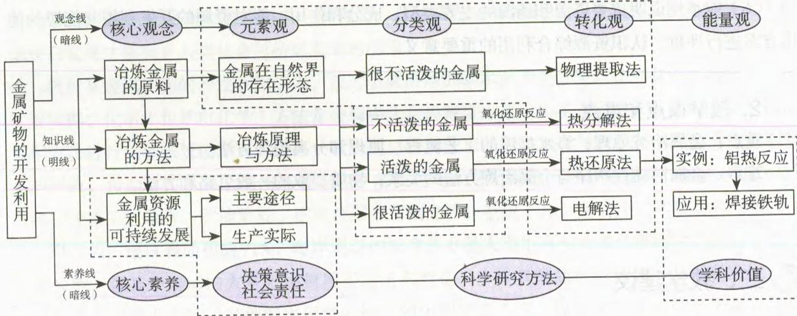

在学习“金属矿物的开发利用”时，要精心设计教学过程，创设有意义的学习情境，激发学生的学习兴趣。例如，从科学技术发展的史料中寻找“化学”的足迹，从中撷取相关片断创设学习情境。

## 案例1：金属的冶炼教学片断

教学情境1：古代炼丹术士葛洪所著《抱朴子》中记载：“丹砂烧之成水银。”唐代诗人刘禹锡在《浪淘沙九首》（之六）中有云：“日照澄洲江雾开，淘金女伴满江隈。美人首饰侯王印，尽是沙中浪底来。”北宋科学家沈括在《梦溪笔谈》中写道：“信州铅山县有苦泉，流以为涧。挹其水熬之，则成胆矾，烹胆矾则成铜。熬胆矾铁釜，久之亦化为铜。”

## 问题：以上文献中涉及了哪些金属的“冶炼”？写出相关的化学方程式。

教学情境2: 1886年是铝冶炼史上具有划时代意义的一年。美国大学生霍尔和法国大学生埃鲁各自独立地研究出电解制铝法。在实验中霍尔发现向氧化铝中加入冰晶石，可以将氧化铝的熔化温度从2050℃降低到950℃左右。这一创新方法大大降低了能耗，使人们能够大规模工业化生产铝。

问题：说说霍尔电解制铝法的创新之处，指出冰晶石的作用，写出上述过程中冶炼铝的化学方程式。

设计意图：将金属冶炼的化学知识融入鲜活的史料之中，从化学的视角了解我国古代璀璨的科技文明，体会文献研究的价值和意义；感悟“创新”在推动人类文明和科技进步中的重要作用，激发学生热爱科学的情感，感悟化学知识的价值，感受化学的魅力。

上述情境中还暗含金属冶炼方法和金属活动性的关系，为完成金属冶炼认识思路的结构化作好铺垫。讨论、交流上述教学情境中的问题后，教师再结合常用金属铁、铜的冶炼过程的视频，归纳和展示从金属矿石中提炼金属的一般步骤：矿石富集→金属冶炼→精炼。教学中教师要设计具有思考价值的驱动性问题组合，引导学生积极思考：如何运用化学方法从金属矿物中获取金属单质？针对这一问题，教师引导学生回顾所学金属制备的知识，写出获取金属单质的具体反应，帮助学生从氧化还原反应的角度归纳总结从金属矿物中提取金属的转化思路： $M^{n+}$ （化合态） $\xrightarrow{+ne^{-}}$ M（游离态）。得出一般情况下金属冶炼的实质：用还原的方法使金属化合物中的金属离子得到电子变成金属原子，从而形成获取金属单质的结构化认识。在此基础上，可以进一步提出问题：为什么不同的金属冶炼方法不同？由此引出导致金属冶炼方法不同的根本原因：不同的金属离子得电子能力不同。设置这个铺垫性问题的目的是引出金属活动性顺序在金属冶炼中所起的指导作用，帮助学生搭建起金属活动性顺序与金属冶炼关系的桥梁，突出分类方法在科学研究与技术应用中的重要作用。为了进一步加深学生对二者关系的深入理解，教师可继续提问：“为什么人类使用铁器比使用铜器晚？”让学生先了解金属使用的先后顺序与金属冶炼难易的关系，再组织学生讨论金属冶炼的三种常用方法与金属活动性顺序的关系，形成以下认识。

一是形成金属活动性顺序对金属冶炼难易程度影响的认识。金属活动性顺序中，金属的位置越靠后，越容易被还原，用一般的还原方法就能使金属还原。金属的位置越靠前，越难被还原。很活泼的金属本身就具有很强的还原性，因而只能用最强的还原手段来还原，即采用电解熔融状态下活泼金属化合物的方法得到金属单质。在此学习过程中，分类学习金属的冶炼原理及方法，形成分类观和转化观。常见金属的冶炼原理如表8-1所示。

表8-1 常见金属的冶炼原理

<table><tr><td>金属</td><td>冶炼原理</td></tr><tr><td>Fe</td><td> $Fe_{2}O_{3} + 3CO \xlongequal{高温} 2Fe + 3CO_{2}$ (高炉炼铁) $Fe_{2}O_{3} + 2Al \xlongequal{高温} 2Fe + Al_{2}O_{3}$ (铝热法炼铁)</td></tr><tr><td>Cu</td><td> $Cu_{2}S + O_{2} \xlongequal{高温} 2Cu + SO_{2}$ (火法炼铜) $Fe + CuSO_{4} = FeSO_{4} + Cu$ (湿法制铜)</td></tr><tr><td>Mg</td><td> $MgO + C \xlongequal{高温} Mg \uparrow + CO \uparrow$  $MgCl_{2}$ (熔融) $\xlongequal{电解} Mg + Cl_{2} \uparrow$ </td></tr><tr><td>Al</td><td> $2Al_{2}O_{3} \xlongequal[冰晶石]{电解} 4Al + 3O_{2} \uparrow$ </td></tr><tr><td>Na</td><td> $2NaCl$ (熔融) $\xlongequal{电解} 2Na + Cl_{2} \uparrow$ </td></tr></table>

二是形成金属冶炼一般规律的结构化认识，了解金属的冶炼方法与金属活动性顺序有一定相关性。

<table><tr><td>金属活动性顺序:K Ca Na Mg Al</td><td>Zn Fe Sn Pb (H) Cu</td><td>Hg Ag</td><td>Pt Au</td></tr><tr><td>主要冶炼方法:电解法</td><td>热还原法常用还原剂:C、CO、 $H_{2}$ 、Al</td><td>热分解法</td><td>物理提取法</td></tr></table>

教学中，通过上述总结，不仅可以提升学生对金属冶炼原理的认知深度，也对学生学以致用提供了方法指导。

另外，教材在介绍金属的冶炼方法时，提到了“一些活泼金属也可做还原剂，将相对不活泼的金属从其化合物中置换出来”，并以铝热反应举例说明。通过对铝热反应的学习，有助于学生理解铝热法炼铁的实用价值——焊接铁轨，从而彰显化学的学科价值。所以，无论是从学科价值还是从学生的兴趣出发，铝热反应作为金属冶炼热还原法中的一种，都是很好的教学素材。建议在学习铝热反应时，有条件的学校可在课堂上补充演示该实验（也可播放视频或课前制作的微课）。铝热反应实验具体操作如下：

（1）把两张圆形滤纸分别折叠成漏斗状套在一起，取出内层滤纸，在其底部剪一小孔后用水润湿，再套回原处，并架在铁圈上（如图8-1所示），下面放置一盛沙子的蒸发皿。

（2）将5 g干燥的氧化铁粉末和2 g铝粉均匀混合后放入纸漏斗中，在混合物上面加少量氯酸钾固体，中间插一根用砂纸打磨过的镁条。

（3）用燃着的小木条点燃镁条，观察现象（反应时会产生高温、发出强光，观察时请注意安全，不要直视）。

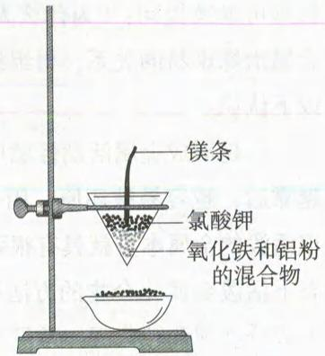  
图8-1 铝热反应的实验装置

铝热反应的原理是利用铝的强还原性，在高温条件下将某些金属从其氧化物（如 $Fe_{2}O_{3}$ 、 $Cr_{2}O_{3}$ 、 $MnO_{2}$ 等）中还原出来。铝热反应是一个放热反应。其中镁条为引燃剂，氯酸钾为助燃剂。镁条在空气中可以燃烧，氧气是氧化剂。但插入混合物中的部分镁条燃烧时，氯酸钾则是氧化剂，以保证镁条的继续燃烧，放出足够的热量引发金属氧化物和铝粉的反应。

实验建议：

（1）确保实验安全。建议由教师演示该实验。学生和教师观察时均应戴上护目镜，且与反应中心保持3 m以上安全距离。

（2）注意质量配比。氧化铁粉末和铝粉按照质量比3:1混合均匀，建议铝粉可稍微过量，以使金属氧化物完全反应。

（3）使用四氧化三铁代替氧化铁。因为氧化铁高温分解生成四氧化三铁和氧气，气体易造成高温熔融物喷溅，发生危险。

## 3. 采用多种教学策略，有效突破教学难点

海水提溴既是本节的重点，也是本节的难点。海水提溴的内容是化学知识在化工生产中综合利用的典型案例，蕴含丰富的发展学科核心素养的素材。教材在处理这部分内容时，将其放在“思考与讨论”栏目中，并且呈现了清晰的工艺流程示意图。一方面，通过含不同价态溴元素的物质的转化及分离、提纯，培养学生的粒子观、元素观和变化观；另一方面，海水提溴涉及物质的富集、循环利用、节约成本、安全高效、绿色环保等技术思想，能完整体现自然界物质提取的一般流程和方法，有利于学生形成从自然界提取物质的一般思路和方法的结构化认识，逐步建立起解决较为复杂的真实化学问题的思维框架。基于此，可以形成如下图所示的第2课时“海水资源的开发利用”之“海水提溴”教学设计主线图。

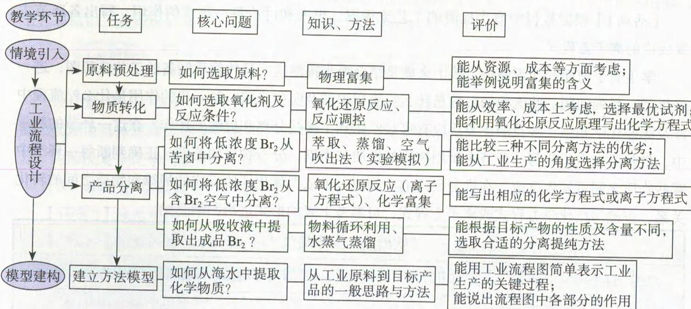

教师在组织教学时，可采取以下教学策略。

（1）策略1：问题驱动——以问题为线索，注重学科知识的整合。

【任务1】海水中溴元素的提取。

问题1：为什么要从海水中提溴？

教师创设问题情境，用多媒体展示溴的用途，并提供数据信息：溴是海洋元素，地球上99%的溴分布在海水中，以 $Br^{-}$ 的形式存在。海水中溴元素的含量约为67 mg/L。

设计意图：了解溴的重要用途和溴元素的存在，进一步认识开发海水资源的必要性。

问题2：实际工业生产中，为什么要先对海水中的溴进行富集？

教学情境：学生阅读教材“资料卡片——海水中的化学元素”，教师补充海水中主要元素的含量表（或布置学生课前查阅资料获得），学生指出海水中元素含量的特点。

设计意图：用真实的数据强化学生对海水的资源性、丰富性和复杂性的认识，了解实际工业生产中富集的目的（流程设计的基础），引导学生从原料除杂浓缩、节约成本、降低能耗等多角度来综合考虑。

问题3：海水提溴的原理是什么？请结合教材中的流程图用一句话简述。

设计意图：了解海水中溴元素的存在形式，教师引导学生分析从起始核心原料到最终产品的转化路径，重点关注物质的始态（Br）和终态（Br₂）。通过讨论交流得出海水提溴的原理：以海水中的含溴物质为原料，通过化学和物理方法分离提纯，得到溴单质。

追问1: 如何将 $\mathrm{Br}^{-}$ 转化为 $\mathrm{Br}_{2}$ ?

设计意图：引导学生回顾氧化还原反应和物质分类，从溴元素化合价变化和物质类别变化等角度思考物质转化的思路和方法，回归问题本质。

追问2: 实际工业生产中, 为什么要选择氧化剂氯气来氧化 $\mathrm{Br}^{-}$ ?

引导学生从三方面回答：一是从氧化还原角度，氯气的氧化性大于溴单质；二是从成本上考虑，教师可列举一些常见氧化剂的价格，让学生从中选择；三是从生成物对环境的影响上考虑。

设计意图：培养学生基于证据进行推理的意识，从成本、氧化效果、反应条件、设备要求、环境影响等多角度综合考虑氧化剂的选择。

(2) 策略2: 聚焦素养——外显海水提溴的一般思路和方法。

【活动1】根据教材中海水提溴的工艺流程图，思考和讨论每一环节的作用，写出各环节主要反应的离子方程式。

学生有了前面的知识铺垫，接下来就是结合海水提溴这一具体物质制备的工艺流程图，进一步思考一系列问题：此流程的目的是什么？流程中涉及哪些步骤？每一步的作用是什么？流程中涉及哪些化学知识？涉及的主要反应有哪些？用到了哪些分离和提纯的操作？在这一环节的教学中，教师要重点关注每一环节中所用物质的性质和类别，分析物质的流向，正确判断每一环节中哪些物质之间可发生反应。在推测反应的产物时，可依据氧化还原反应的规律和物质之间的转化关系，正确写出化学方程式或离子方程式，可参考下表的形式进行归纳总结。

<table><tr><td colspan="3">“吹出法”海水提溴</td></tr><tr><td>环节</td><td>作用</td><td>化学方程式(或离子方程式)</td></tr><tr><td></td><td></td><td></td></tr><tr><td></td><td></td><td></td></tr><tr><td></td><td></td><td></td></tr><tr><td></td><td></td><td></td></tr></table>

本环节教学中，方程式书写的难点主要是吸收塔中的相关反应。为顺利写出这些反应的化学方程式，建议先向学生提出问题：进入吸收塔中的物质有哪些？教师带领学生分析，让学生明白箭头指向就是物质的流向，从而快速找出吸收塔中存在的三种主要物质。接着引导学生在箭头流出方向找到生成物之一的溴化氢溶液，从溴元素化合价的变化得出溴单质在反应中作氧化剂，则另一种物质二氧化硫在反应中作还原剂；硫元素化合价升高，由+4价升高到+6价，由此得出二氧化硫的氧化产物——硫酸，并写出反应的化学方程式。

值得注意的是，教师在教学中要关注课堂预设与生成。由于流程中两次得到溴单质，学生也许会提出这样问题：第一步已经得到溴单质，为什么还要通入空气？通入二氧化硫将溴单质还原后再通入氯气生成溴单质，是否多此一举？这里教师要强调，通入空气和二氧化硫是为了富集溴，进一步帮助学生理解“富集”的含义。

设计意图：复习和巩固卤素单质化学性质的递变规律，通过元素化合价的变化建构物质的变化观念，从而掌握高中化学元素化合物学习的典型方法。

【活动2】根据教材海水提溴工艺流程图，自己动手绘制简易工艺流程图（可参考下图），并把绘制的简图与同学们展示交流。

教师巡视指导，将学生绘制的简易工艺流程图通过多媒体展示，用于学生交流讨论。

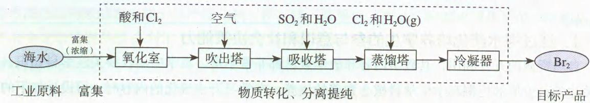

至此，通过海水提溴过程的研究，学生已初步认识了工艺流程图，了解了工艺流程图的一般结构和特点，在脑海中初步形成了从海水中提取物质的方法模型。最后，在学生充分讨论的基础上，总结由工业原料到具体产品的一般思路和方法（可参考下图）。

设计意图：从个别（海水提溴）到一般（从自然界提取化学物质），归纳物质提取的方法模型，实现由具体思维到抽象思维的水平进阶，实现从知识讲解到问题解决再到模型建构的能力提升，为解决复杂化学问题建立思维框架。

（3）策略3：学以致用——将方法应用于工业生产实验方案的流程设计。

【任务2】海水提钠工艺流程图的绘制。

【活动3】根据教材图8-3“海水的综合利用示意图”以及金属的冶炼原理，小组合作设计完整方案，完成从海水中提取钠的工艺流程设计，写出流程中发生反应的化学方程式和离子方程式。

设计意图：教师布置明确具体的任务，提供相关信息，促进学生利用所学工艺流程图的分析思路和方法解决实际生产中的新问题，同时让学生注意原料的成本，体现绿色化学理念，多角度考虑实验方案的设计。

为了降低海水提钠工艺流程设计的难度，教师可提问：“海水提钠过程的中间产物是什么？”进而将海水提钠过程分解为“海水制盐（氯化钠）”和“氯化钠的电解”两个过程。前者又可进一步分解为海水晒盐（所得粗盐含氯化钙、氯化镁、硫酸钠等杂质）和粗盐的提纯（分离提纯，除去可溶性和不溶性杂质，得到纯净的氯化钠）。由于钠属于活泼金属，根据金属冶炼与金属活动性的关系，学生可以得出采用电解熔融氯化钠的方法来获取钠单质的结论。绘制海水提钠工艺流程图时，既要联系已学过的“粗盐提纯”的有关知识，更要充分发挥物质提取的一般思路和方法的指导作用。以下为海水提钠的工艺流程简图，可供参考。

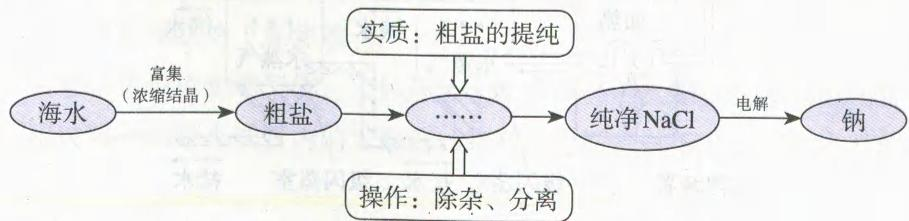

教师在开展这部分内容的教学时，要充分利用“信息搜索”栏目中提供的关键词，课前布置学生上网查阅相关资料，在课堂进行交流分享。课后可进一步扩大搜索面，将“海带提碘”“海水提镁”作为课外拓展性作业。教师提出明确要求，如打印或画出“海带提碘”“海水提镁”的工艺流程简图，让学生指出流程中每一步的作用和主要反应的化学方程式或离子方程式。这样的教学处理，可以拓展知识获取的渠道，将其从课内延伸到课外，进一步提高学生对海水资源综合利用途径的认识。

## 4. 通过海水淡化培养学生的参与意识和社会决策能力

自然资源的开发利用，其教学内容和教学素材都非常丰富。教学中不仅要关注学科知识，更要关注学科价值的挖掘和学生学科核心素养的培养。在学习海水淡化的内容时，可设计如下的教学流程：播放视频，创设情境→提出问题，讨论交流→归纳总结，发散思维→构建流程，升华认识。具体教学过程如下。

教师可先播放海水淡化的视频，再让学生阅读教材“海水资源的开发利用”前三段文字内容，引导学生思考：为什么要淡化海水？海水水资源利用的主要途径有哪些？海水淡化的方法有哪些？传统的蒸馏法淡化海水的优点和缺点有哪些？教学中，可配合问题适时展示海水淡化的原理示意图，加深学生对原理的理解。

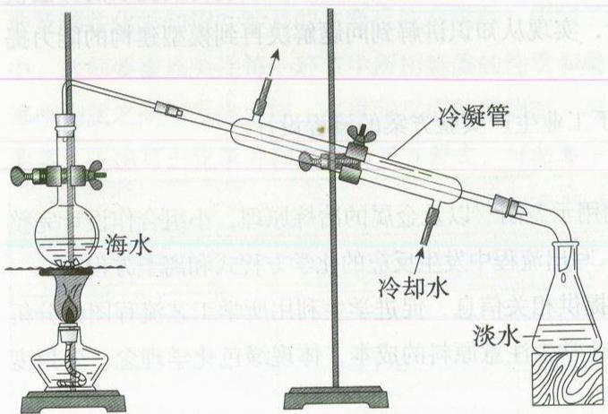  
图 8-2 海水蒸馏原理示意图

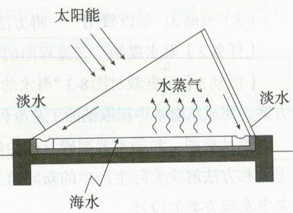  
图 8-3 太阳能蒸发原理示意图

针对传统蒸馏法淡化海水的缺点，教师指出现代工业上淡化海水的流程要复杂得多，并展示图8-4，引导学生思考：以下流程图中采用了何种措施来降低生产成本？还可采用何种措施进一步降低成本？

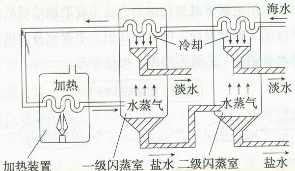  
图 8-4 工业海水淡化流程示意图

通过讨论和问题引导，教师将海水淡化的单一问题拓展到海水资源的综合利用上来，组织学生进一步讨论“如何通过海水化学资源的综合利用来降低生产成本”。

在讨论的基础上，学生逐渐认识到海水淡化也是一个物质分离和提纯的复杂过程，需要有先进的设备，消耗大量的能源，且淡化后长距离的输送提高了成本。据此，再引导学生从能源的角度思考降低成本的方法：广泛使用太阳能、风能和发电厂的余热。降低成本的另一个途径就是将海水淡化后的浓缩海水用于生产氯化钠、钾、镁、溴等化工产品，将海水淡化的单一问题拓展到海水中化学资源的综合利用上来，从而帮助学生顺利构建海水综合利用的联合工业体系流程图（教材图8-3）。

以上教学能使学生体会实际工业生产的复杂性和综合性，积极参与有关化学问题的社会决策，赞赏化学对生产、生活的重大贡献，逐步培养学生科学合理利用自然资源的意识。

5. 运用实验、对比、归纳和信息技术等多种教学方法和手段，加深学生对煤、石油和天然气综合利用途径的认识

（1）实验 煤的干馏是煤综合利用的重要方法，是本节教学的重点之一，教学中可补充这个实验（或播放实验视频）。通过对实验现象的观察和部分产物的检验，加深学生对煤干馏实验原理的理解和主要产品的认识。

【补充实验】煤的干馏

实验用品

大试管、小试管、玻璃导管、橡胶塞、玻璃棒、酒精喷灯、烧杯、铁架台、煤、红色石蕊试纸。

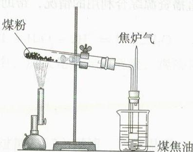  
图8-5 煤的干馏

实验过程

①在大试管里装入约6 g煤粉。在小试管中装入少量水，把小试管浸在冷水里，如图8-5所示安装仪器装置。

②用酒精喷灯加热大试管放有煤粉的部位。约2\~3 min后有气体放出，冷却后在小试管的底部凝结成水和黑色黏稠油状物（煤焦油）。

③点燃从尖嘴导管中放出的气体，气体燃烧，发出明亮的火焰，这是焦炉气在燃烧。

④实验后用玻璃棒蘸取小试管内的水溶液，滴在红色石蕊试纸上。溶液使石蕊试纸变蓝，说明有氨产生。

⑤反应完毕，停止加热。冷却后用粗铁丝取出大试管里的块状物，可以看到煤粉已变成坚硬而又多孔的灰黑色固体，这就是焦炭。

实验注意事项：小试管中的玻璃导管不要伸入水中，以防止倒吸。

(2) 对比针对这部分内容概念多的特点, 教学中可以通过列表的方式来对概念进行分析比较。如煤的干馏、液化和气化可以从原理、主要反应、产品及用途上进行对比; 石油的分馏、裂化和裂解可以从目的、原理、主要原料、主要产品和主要变化类型上进行对比。另外, 干馏、分馏以及以前学过的蒸馏这三个概念可以从原理、产物和反应类型上进行对比。通过列表比较, 有助于学生了解概念的区别和联系。

（3）归纳 学习这部分内容时，可将相关知识进行有机整合，利用思维导图简要画出各知识之间的联系，以帮助学生理解煤、石油和天然气综合利用的途径和方法。如对煤的综合利用进行归纳总结后，可形成如下思维导图。

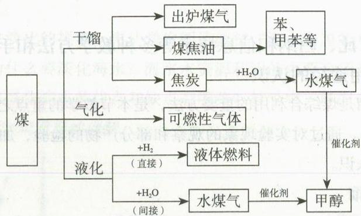

（4）信息技术 加强信息技术与课堂教学的深度融合，是提高课堂教学效率的有效手段。教学中，可组织学生观看煤、石油和天然气综合利用的图片和影像，或与当地化工厂、炼油厂联系，采用实景课堂的形式，现场直播资源综合利用的情况，帮助学生进一步体会和认识化学特有的应用价值和魅力。

## 四、栏目使用建议

【思考与讨论1】

教材图8-1简明扼要地展示了铝的生产原理，抽取了铝冶炼过程中的核心物质和主要反应；图8-2则直观地展示了生产 $1\mathrm{kg}$ 铝相关的消耗——实际生产过程中所涉及的多种具体物质和它们的质量以及能耗。教学中通过对教材数据的分析和两幅图片的比较，引导学生思考和讨论，获取以下启示。

启示1：从铝土矿制铝消耗的能量要远远高于回收铝质饮料罐得到铝消耗的能量，因而在实际生产过程中必须考虑投入与产出，要考虑成本。

启示2：加强废旧金属的回收和再利用是合理开发和利用金属资源的重要途径。要树立金属垃圾也是一种宝贵资源的理念。在日常生活中，要大力倡导金属垃圾的分类回收和再利用，养成自觉珍惜自然资源、节约资源、爱惜环境和保护环境的意识。

启示3：实际工业生产中，从金属矿物到纯净金属的冶炼过程是一个复杂的过程，往往涉及许多其他物质和反应，在得到所需产品的同时，也会产生废弃物。因此必须考虑废弃物的处理和生产对环境的影响，形成绿色化学观念和可持续发展意识。

上述启示的获得，正是教材设置这个思考与讨论栏目的目的所在。讨论时，应要求学生敢于提出自己的观点，基于证据，言之有理，培养学生的思辨能力和证据意识。

【思考与讨论2】

氧化环节: 向海水中通入氯气, 将溴离子氧化为溴单质, 发生反应 $2 \mathrm{Br}^{-} + \mathrm{Cl}_{2} = 2 \mathrm{Cl}^{-} + \mathrm{Br}_{2}$ 。

蒸馏塔中：通入的氯气与溴化氢溶液反应，化学方程式为 $2HBr+Cl_{2}=2HCl+Br_{2}$ ，离子方程式为 $2Br^{-}+Cl_{2}=2Cl^{-}+Br_{2}$ 。

吸收环节：在吹出塔中，用空气将生成的溴吹出，溴单质进入吸收塔后，与二氧化硫和水发生反应 $SO_{2}+2H_{2}O+Br_{2}=2HBr+H_{2}SO_{4}$ ，离子方程式为 $SO_{2}+2H_{2}O+Br_{2}=4H^{+}+2Br^{-}+SO_{4}^{2-}$ 。

## 五、练习与应用参考答案及说明

1. B

2. $SnO_{2} + 2C \xlongequal{\triangle} Sn + 2CO$ $WO_{3} + 3H_{2} \xlongequal{\triangle} W + 3H_{2}O$ $2PbS + 3O_{2} \xlongequal{\triangle} 2PbO + 2SO_{2}$ $UF_{4} + 2Mg \xlongequal{\triangle} U + 2MgF_{2}$ 氧化剂: $SnO_{2}$ 还原剂: C

氧化剂: $WO_{3}$ 还原剂: $H_{2}$ 氧化剂: $O_{2}$ 还原剂: PbS

氧化剂: $UF_{4}$ 还原剂: Mg

3. $2[2\mathrm{CuCO}_3 \cdot \mathrm{Cu(OH)}_2] + 3\mathrm{C} \xlongequal{\triangle} 6\mathrm{Cu} + 7\mathrm{CO}_2 \uparrow + 2\mathrm{H}_2\mathrm{O}$ 氧化还原反应  
4. $55.0\%$

5. (1) acd (2) 过滤 (3) $2I^{-} + H_{2}O_{2} + 2H^{+} = I_{2} + 2H_{2}O$

(4) 取少量水溶液于试管中，加入几滴淀粉溶液，观察是否出现蓝色。如果变蓝，则说明含有碘单质。

(5)⑤

6. (1) $\mathrm{Ca(OH)_2}$ (或 NaOH) 过量 (2) 过滤 (3) 盐酸 (4) $MgCl_2 \xlongequal{\text{电解}} Mg + Cl_2 \uparrow$

7. 制取 $\mathrm{O}_{2}$ , 可采用热分解法: $2 \mathrm{KClO}_{3} \xlongequal[\triangle]{\mathrm{MnO}_{2}} 2 \mathrm{KCl} + 3 \mathrm{O}_{2} \uparrow$

$$
2 \mathrm{KMnO} _ {4} \xlongequal {\triangle} \mathrm{K} _ {2} \mathrm{MnO} _ {4} + \mathrm{MnO} _ {2} + \mathrm{O} _ {2} \uparrow 2 \mathrm{H} _ {2} \mathrm{O} _ {2} \xlongequal {\text {催化剂}} 2 \mathrm{H} _ {2} \mathrm{O} + \mathrm{O} _ {2} \uparrow
$$

制取 $Br_{2}$ ，可采用置换法： $Cl_{2}+2NaBr=2NaCl+Br_{2}$

制取 $Cl_{2}$ ，可采用电解法： $2NaCl+2H_{2}O\xlongequal{电解}2NaOH+Cl_{2}\uparrow+H_{2}\uparrow$

$2\mathrm{NaCl}(\text{熔融}) \xlongequal{\text{电解}} 2\mathrm{Na} + \mathrm{Cl}_{2} \uparrow$

8.

<table><tr><td>阶段</td><td>主要污染</td><td>减轻或消除污染应采取的措施</td></tr><tr><td>采矿</td><td>噪音、粉尘和烟雾</td><td>采用隔音技术或设置消音器;粉尘和烟雾可采用烟雾聚集器使其聚集并回收再利用</td></tr><tr><td>选矿</td><td>污水和固体废弃物</td><td>污染的水要净化后再排放或循环使用;固体废料要回收利用</td></tr><tr><td>冶炼</td><td>粉尘和烟雾、有害气体和固体废料</td><td>有害气体要将其吸收转化为化工原料或燃料;粉尘、烟雾和固体废料要回收利用</td></tr></table>

9.（1）主要从经济、社会、环境友好等方面进行考虑。例如：①储量丰富，且易于开发、利用；②相同质量下能够产生更多的能量；③便于安全储存和运输；④释放的能量应该远远大于生产它所消耗的能量；⑤开发利用时，不会产生环境、社会等问题。

(2) 使用下列能源还存在一些问题。例如：

氢能无污染，是最有开发前景的能源之一，但目前其开发、运输和使用成本太高。生物质能是一种很好的可再生新能源，但目前开发技术不够成熟，其资源分散，难于收集，使用成本高。

核能存在长久安全的使用和废弃物无害化处置等问题。

风能是一种可再生能源，其使用受自然因素影响较大，难以连续稳定地供应。

（3）提示：如何开发替代能源，如何更好地利用有限的化石燃料是人类社会可持续发展所面临的重要问题，需要进行认真思考和抉择。这些问题确实复杂，而且涉及方方面面的利益，教师要引导学生用一分为二的观点来看待这些问题，启发学生思维，为增强学生的社会责任感和使命感打下基础，体会化学物质的应用价值。

员顺，蓝变果成。方蕴出否量桑賊，新客保寄商入人时，中普局王新客水量小郑（本）

$$
\begin{array}{c} \text {OnM} \\ \text {invarious} \\ \triangle \end{array}
$$

## 第二节 化学品的合理使用

## 一、内容分析

本节是教材修订的新增内容，被安排在自然资源的开发利用与环境保护这两节之间，内容与前后两节紧密相关。例如，就产品的生命周期而言，这样的安排体现了产品“从自然中来又回到自然中去”的物质转化全过程：第一节侧重原料、材料的获得，本节侧重生产、生活中化学产品的使用，第三节侧重生产、生活中废弃物的处理。尽管在第一节和第三节中也涉及化学品的使用，但本节内容旨在进一步拉近“化学与可持续发展”这一主题与工农业生产、日常生活的距离，使学生深入思考化学品在生产、生活中的作用，切实理解“化学就在身边”的含义，突出每个人作为化学品使用者和消费者的责任。

限于学生的知识基础，与初中化学课程有关内容的处理方式相似，本节对化肥、农药、医药和食品添加剂等使用的介绍依然是初步的。与初中化学不同的是，教学的侧重点有所变化。例如，初中化学有关化肥、农药的教学内容主要从元素组成和化合物类型上对化肥、农药进行初步介绍。本节则在更加广阔的背景中讨论化肥、农药的施用问题，侧重化肥、农药与有机肥、天然杀虫剂等的区别，以及不合理施用可能带来的危害，如讨论滴滴涕的功与过和如何看待化肥、农药的施用等。对于医药和食品添加剂也是常识性的介绍，通过一些“思考与讨论”“研究与实践”等活动，了解化学与药物设计合成，认识合理用药的基本问题和滥用药物的危害，了解常见的食品添加剂，重视食品安全，注重观念的形成和学科核心素养的培育。

## 二、教学目标

## 1. 教学目标

（1）通过阅读资料“滴滴涕的功与过”，举办有关“农业生产中是否应该继续施用化肥和农药”等社会性议题的辩论赛，辩证地看待农药、化肥使用的利弊及其对环境和社会的影响。

(2) 以阿司匹林的制备为例, 了解药物合成的一般思路和方法, 认识化学在促进人类健康方面的重大贡献, 形成 “结构 $\xrightarrow{\text{决定}}$ 性质 $\xrightarrow{\text{决定}}$ 用途” 的结构化认识。

(3) 通过对抗酸药有效成分的探究，培养学生的证据意识和推理能力。

（4）通过调查包装食品等活动，能从分类的视角认识常见食品添加剂的种类、功能、性质和作用，促进学生实现“知、情、意、行”的统一。

## 2. 教学重点和难点

重点：合理使用化学品的意识；抗酸药有效成分验证方案的设计；常见食品添加剂的种类和功能。

难点：合理使用化学品的意识；化学科学的应用价值。

## 三、教学建议

## 1. 创设真实、有意义的问题情境，激发学生学习的兴趣

真实、具体的问题情境是学生化学学科核心素养形成和发展的重要平台。由于本节教学内容与生产、生活联系非常紧密，在学习本节内容时，可通过丰富多彩的多媒体展示创设问题情境。

（1）在导入“化肥、农药的合理施用”教学内容时，可展示滴滴涕的功与过的图片或播放视频等，导出本部分内容所要解决的核心问题：“施用农药、化肥有哪些利和弊？”“如何合理施用农药、化肥？”从课堂一开始，问题的提出就贯穿一分为二的观点，引导学生辩证地看待有关问题。

(2) 在导入 “合理用药” 教学内容时, 教师可先展示药店琳琅满目的药品图片或视频, 再聚焦一种常用药品的包装及说明书, 进而提出问题: “药品包装盒上的 OTC 是什么含义?” “如何合理使用药物?” 再结合具体药物如阿司匹林、抗酸药的使用方法说明合理用药的重要性。

（3）在导入“安全使用食品添加剂”教学内容时，教师可先播放视频，如《舌尖上的中国》和社会上关于食品添加剂的负面新闻。在学生观赏视频的同时，引导学生有针对性地提出并思考一系列问题：诱人的色、香、味是通过什么方法形成的？什么是食品添加剂？如何安全使用食品添加剂？

这些具有探究价值问题的提出，均是从学生已有的生活经验和生活实际出发，有助于激发学生学习的兴趣。

## 2. 精心设计实践活动，引导学生形成合理使用化学品的意识

(1) 在 “化肥、农药的合理施用” 教学中, 组织好班级小组辩论赛, 促进观念的形成。

由于学生在初中化学学习中对化肥已有所了解，因此这里的教学难度不是很大。教师可先通过复习几种典型的化肥如硝酸铵、碳酸铵、硫酸铵和硫酸钾的性质，让学生了解施用时的注意事项，特别是过量施用和不合理施用对水体和土壤等产生的影响。进而引导学生概括总结合理施用化肥应考虑的三个主要因素：土壤酸碱性、作物营养状况和化肥本身的性质。

在农药的教学中，既要突出农药在农作物病虫害综合防治中的正面作用，也要通过列举实例帮助学生认识农药对环境、人体及其他生物的负面影响，由此揭示今后农药研究和开发的趋势——高效、低毒和低残留。课堂上，教师可先让学生阅读教材“科学·技术·社会”栏目的内容“滴滴涕的功与过”，再谈读后感。要让学生充分尊重既有事实，客观辩证地看待问题，引导其感受化学科学在生产、生活中的应用价值和对人类文明作出的巨大贡献。同时也要让学生认识到农药的大量使用对环境的污染和对人体健康的危害，从中体会环境保护的重要性，增强环境保护的意识。还可以让学生分析从DDT到DDE分子结构的变化导致性质的变化，从而进一步形成结构决定性质的认识思路。通过阅读交流，引导学生用一分为二的观点正确认识农药的功过是非。课外还可让学生阅读《寂静的春天》等课外读物和资料，总结归纳其中的观点，从化学的角度进行分析和说明。

帮助学生形成合理施用农药和化肥的意识是本节教学的难点之一。为此，教材在“思考与讨论”栏目中安排了辩论题“农业生产中是否应该继续施用化肥和农药”。建议教师教学时要充分利用该辩题，将学生分为正方和反方两个小组进行辩论比赛。活动前要鼓励学生通过实地调查、上网查阅资料获取信息。提醒学生教材中的论点可作参考，允许学生基于证据发表自己的见解，形成自己的观点。通过辩论培养学生的合作能力、收集和整理信息的能力以及表达与交流的能力。辩论结束后，教师要及时总结、归纳学生的观点并予以条理化。当然，教学中也可将上述辩题一分为二，分别以“施用化肥的利与弊”和“施用农药的利与弊”两个独立辩题展开讨论，主题更加鲜明，指向更加明确。

(2) 在 “合理用药” 教学中, 以阿司匹林的使用为例, 形成合理用药的意识。

教师在组织这部分内容的教学时，可课前布置学生收集阿司匹林、抗酸药等药品，阅读药品说明书。课堂上，学生展示药品包装和说明书，借助多媒体设备投影到屏幕上，教师引导学生总结这几种药品的有效成分（包括结构式、相关化学方程式等）、功能主治、用法和用量、注意事项、禁忌和不良反应等。结合药品说明书，重点介绍阿司匹林的作用和可能对机体的有害作用，依据课前查找的资料对阿司匹林的功与过展开讨论，帮助学生形成以下认识：

①化学科学的发展对研究和开发药物、促进人体健康作出了重大贡献；

②大部分药物都有毒副作用，滥用药物有极大的危害；

③正确使用药物非常重要，从药物和机体方面考虑，合理用药应遵循安全、有效、经济和适当的原则。

为加深学生对毒品危害的认识，可组织学生参观有关毒品危害的展览，或举办讲座，进行一次禁毒宣传活动。以活动为载体，使学生树立“珍爱生命、拒绝毒品”的意识。

值得说明的是，合理用药一定要把安全放在首位。因而教师在教材简单介绍处方药和非处方药的概念和获取途径的基础上，要向学生进一步强调：作为用药常识，处方药一定要遵医嘱服药，并了解药物的不良反应；对于非处方药（OTC drug，“over-the-counter drug”的简写，意为“可在柜台上买到的药物”）也应对症用药，使用非处方药时一定要仔细阅读药品说明书，并按照说明书使用或在药师指导下购买和使用。教学中，可要求学生事先收集1\~2种非处方药的包装盒和说明书，了解非处方药标识“OTC”的含义，帮助学生正确区分处方药和非处方药，形成合理用药的意识。

教学中可以充分发挥“科学·技术·社会”栏目“化学与药物设计、合成”的作用，理解教材编写的意图。教材以我国传统中药中分离提纯得到的青蒿素作为代表物，简要介绍了青蒿素的神奇功效，以及通过对青蒿素分子结构进行修饰和改造，衍生出一类具有过氧基团结构的青蒿素类药物，药效得到进一步的提高。通过以上内容的学习，引导学生获得以下认识：

①化学在药物设计、合成中发挥着不可替代的作用，要体会化学科学发展对药物合成的重要意义，初步建立依据物质性质分析健康问题的意识。

②通过化学方法对天然药物分子进行结构修饰和改造，是合成新药和提高药效的重要途径，为人类开发新药指明了方向。

③屠呦呦荣获2015年诺贝尔生理学或医学奖，进一步证明了我国传统中医药的科学价值，推动了中医药的创新发展，使古老的传统医学焕发活力，造福人类。

④科学成果的取得需要锲而不舍和团结协作精神。屠呦呦获奖正是建立在对传统中医药的传承和群体协作的基础之上，需要几十年如一日献身科研，永不放弃，奋力攀登科技高峰。

学习这部分内容时，教师可适当补充屠呦呦及其团队研究过程的材料，也可要求学生课外以“青蒿素”“蒿甲醚”“屠呦呦”等为关键词上网查阅资料，感受药物的神奇魅力和榜样的激励力量。

（3）围绕问题线索设置学生活动，培养安全使用食品添加剂的认识，发展学科核心素养。

从发展学生学科核心素养的角度分析“安全使用食品添加剂”教学内容。教材呈现了非常清晰的基于“生活领域”化学核心素养的编写结构（如下图）。

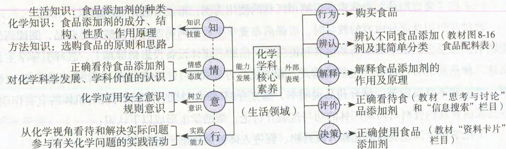

基于对上述教材编写结构的认识，教师在进行本课题内容的教学设计时，不能仅局限于化学知识的获取，而应该从培养与生活密切相关的化学核心素养出发，创设真实的问题情境；以解决不同类型的真实生活问题为教学活动主线，让学生在参与实际生活问题解决的过程中学习相关的生活知识、化学知识，以及在此过程中形成的解决生活问题的一般思路等方法性知识；既而形成从化学的视角看待生活问题的正确态度，培养学生化学应用的安全意识和规则意识。在教学中，应从学生的外部表现“行为、辨认、解释、评价和决策”中来综合评价学生的学习效果，了解学生在学习关键点和能力上获得的发展，有效促进学生实现“知、情、意、行”的有机统一，树立“从生活走进化学、用化学指导生活”的基本理念。

因此，可以确定教学设计的主要思路：以解决“你在超市如何选购包装食品”这一生活实际问题作为主线，将学生面临的关于食品添加剂的一系列生活问题融入该实际问题的解决过程中；通过设置“你知道哪些食品添加剂→你周围的人如何看待食品添加剂→你了解常见食品添加剂的种类、成分、结构、性质和作用原理吗→如何正确看待食品添加剂→如何科学选购包装食品→如何制作豆腐”等教学问题线，创设问题情境；采取学生独立学习和小组合作学习相结合的形式，组织学生开展形式多样的教学活动，如查看食品标签、课外调查访问、课内讨论交流、模拟超市购物、参与实践制作等，最后形成对食品添加剂的正确认识，学会正确选购包装食品。本内容的教学设计思路与流程图如下：

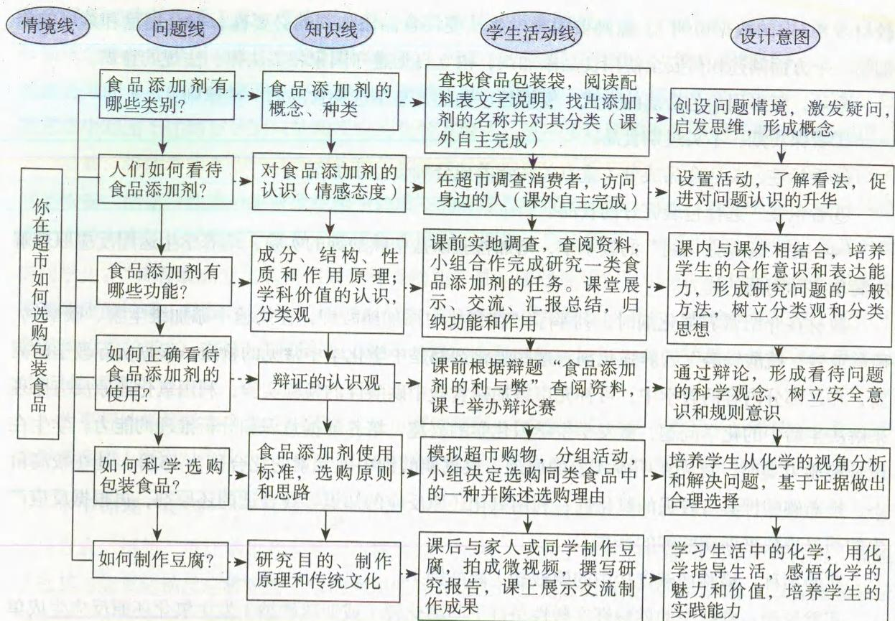

在教学中，课前布置学生收集食品标签，调查市场上出售的食品中所含的添加剂并对其进行分类，课堂上学生分组介绍着色剂、增味剂、防腐剂、营养强化剂等食品添加剂的性质和作用。在学生对食品添加剂有了初步的认识后，再组织学生讨论教材中的问题：如何正确看待食品广告中的“零添加”“绝不含防腐剂”这样的说法？澄清对食品添加剂的片面和不正确认识，全面、客观、正确评价食品添加剂。

可上网搜索2\~3起典型的食品安全事件，组织学生讨论，按照“信息搜索”栏目中的要求，归纳和总结安全使用食品添加剂的注意事项：

①不隐瞒使用食品添加剂 在食品包装盒（袋）上明确标示所用食品添加剂的名称。有使用禁忌的，应当有警示标志或中文警示说明。

②不超量、超范围使用食品添加剂 如作为防腐剂和护色剂的亚硝酸钠，本身具有一定的毒性，过量添加对身体有害，甚至会引发安全事故。

③不违法使用食品添加物 将不能作为食品添加剂的物质当作食品添加剂使用，是引发食品安全事件的罪魁祸首。

通过这样的信息搜索和讨论交流，引导学生正确认识食品添加剂的作用，纠正学生对添加剂认识的盲区，使其能辩证地看待使用食品添加剂的利与弊，树立安全、合理使用食品添加剂的意识。

这里需要说明和强调的是，某些食品安全事件的发生是不法分子滥用食品添加剂或在食品中添加了违禁物质而造成的，不能将食品安全事件归罪于食品添加剂，更不能归罪于化学。正确规范地使用食品添加剂，需要严格执行《食品安全国家标准 食品添加剂使用标准》（此处可结合教材表8-2中的数据说明）。教师要引导学生从使用食品添加剂的必要性、安全用量和禁用的添加物三个方面阐述如何安全使用食品添加剂，树立自觉遵守国家相关法律、法规的意识。

最后，可采用角色扮演的方式，模拟超市购物，总结选购食品的一些原则：

①看保质期，不买过期食品；

②看标签，关注食品成分（重点关注营养成分和食品添加剂）；

③看包装，选择包装完好的食品。

（4）在“营养强化剂”的教学中，增加检验碘盐中碘酸钾的实验，培养学生运用反应原理解决简单实际问题的能力。

教材在介绍营养强化剂时，列举了“在食盐中添加碘酸钾，在奶粉中添加维生素、碳酸钙、硫酸亚铁、硫酸锌等”营养强化剂，这些强化剂都是中学化学中常见的物质。根据实际教学的需要，在这部分内容的教学中，可补充市售加碘食盐中碘酸钾的检验实验，利用氧化还原反应原理来解决生活中的化学问题，激发学生学习化学的兴趣，培养证据意识和分析推理的能力。学生在设计检验方案时，首先要明确实验的原理：根据碘酸钾中碘元素的化合价为+5价，处在较高价态，推断碘酸钾具有较强的氧化性；利用氧化还原反应的知识寻找合适的还原剂，再根据反应产生的明显现象推断碘酸钾的存在。

实验名称：检验加碘食盐中的碘酸盐（碘酸钾）。

实验原理：食盐中的碘酸钾在酸性条件下与碘化钾（或亚硫酸钠）发生氧化还原反应生成单质碘，碘与淀粉作用显蓝色。

$$
\begin{array}{r l} & 5 \mathrm{I} ^ {-} + \mathrm{IO} _ {3} ^ {-} + 6 \mathrm{H} ^ {+} = 3 \mathrm{I} _ {2} + 3 \mathrm{H} _ {2} \mathrm{O} \\ & 5 \mathrm{SO} _ {3} ^ {2 -} + 2 \mathrm{IO} _ {3} ^ {-} + 2 \mathrm{H} ^ {+} = 5 \mathrm{SO} _ {4} ^ {2 -} + \mathrm{I} _ {2} + \mathrm{H} _ {2} \mathrm{O} \end{array}
$$

实验用品：淀粉溶液、稀硫酸、碘化钾溶液（或亚硫酸钠溶液）、市售碘盐（包装无破损）、蒸馏水、试管、胶头滴管。

实验过程：

①取1 g碘盐于试管中，加入约5 mL蒸馏水，振荡溶解后，再加入5滴淀粉溶液，观察现象。
②在上述溶液中滴入5滴稀硫酸，再滴加碘化钾（或亚硫酸钠）溶液。

实验现象：步骤①中无明显现象，步骤②中溶液变蓝色。

实验结论：市售碘盐中无碘单质，市售碘盐中含有碘酸盐。

实验分析：市售碘盐中的碘元素以可溶性碘酸盐的形式存在； $IO_{3}^{-}$ 具有氧化性，在酸性条件下，还原剂碘化钾或亚硫酸钠可将其还原成碘单质；依据淀粉溶液的颜色变化得出结论。

3. 在“抗酸药有效成分的检验”实验方案的设计中, 渗透科学研究方法的教学实验探究是渗透科学研究方法的重要途径。教材在“思考与讨论”栏目中安排“抗酸药有效成分的检验”这一活动, 其中就蕴含有“结构 $\xrightarrow{\text{决定}}$ 性质 $\xrightarrow{\text{决定}}$ 用途”的化学核心观念。教学中,要把这一核心观念运用到具体的实验方案设计中。

教学时，可先引导学生回顾胃酸的主要成分，使其了解当胃酸过多时就要服用抗酸药。此时再提出问题：“抗酸药的作用是什么？抗酸药的有效成分应该具有什么性质？想一想，学过的哪些物质可作为抗酸药的有效成分？”教师带领学生进行分析，将学生的思维从抗酸药的用途引导到抗酸药的化学性质上来，学生很自然得出抗酸药中的有效成分能中和盐酸（或与盐酸反应），依据该化学性质推测有效成分的组成（结构）和类别——碱或碳酸盐（酸式碳酸盐），进而得出抗酸药可能含有的具体物质——碳酸钙、碳酸氢钠、碳酸镁、氢氧化铝和氢氧化镁等。此时，可要求学生写出上述物质分别与盐酸反应的化学方程式，进一步巩固前面所学的元素化合物知识。

接着，将教学的重心转移到“抗酸药有效成分的检验”实验方案的设计上。如果说前面的学习是依据“用途→性质→组成或结构→物质”的有序思维展开的话，那么“抗酸药有效成分的检验”实验方案的设计则刚好是以上思维的逆过程。例如，当抗酸药为胃舒平时，教师应有意识地提问学生：“其有效成分氢氧化铝属于哪类物质？具有哪些性质？”引导学生根据物质的组成来推测物质的性质，依据性质来选定检验试剂，建立结构决定性质的观念。在检验物质时，教师还要强调物质检验的一般思路和程序：取样→加入试剂→观察现象→得出结论（具体设计方案见“栏目使用建议”）。

为更好地指导学生合理使用药物，还可继续提问：“含碳酸氢钠的抗酸药，是否适合胃酸过多的胃溃疡病人服用？为什么？”进一步强化学生从药物的组成和性质的角度树立合理用药的意识。

本节体现“结构 $\xrightarrow{决定}$ 性质 $\xrightarrow{决定}$ 用途”这一化学学科核心观念的内容还有药物的选择性设计与合成。例如，可让学生观察阿司匹林的分子结构，从分子含有的官能团来推测其性质，设想通过其与氢氧化钠反应将难溶于水的阿司匹林转化为疗效更好的可溶性阿司匹林；以青蒿素分子为母体，在保留活性基团的前提下，对分子进行结构修饰和改造，可得到一系列抗疟疾新药。同时，让学生了解开发新药的一种基本思路：具有相同生物活性的药物常包含相同的结构成分，某些药物分子的结构稍加改变则可能失去生物活性。

## 4. 适当整合教学内容，合理选用评价方式

## (1) 适当整合教学内容

本节内容的教学中，实践活动较多，教师可以对教学内容进行整体设计，合理安排教学进程。可以将学生课下能够自己完成的活动提前布置，为后续的教学进行充分的准备。例如，在学习本节之前，就可提前布置学生收集和查阅化学品包装上的说明文字和说明书；就教材上与化学品使用相关的争议性社会议题广泛搜集资料；还可以2\~3人为一小组，每一小组负责一类化学品（如化肥、农药、药物、食品添加剂）的调查。学生走上街头，采访普通市民，调查市民对使用化学品的认识和态度。可录制视频，用于后续课堂展示和交流。

## (2) 合理选用评价方式

本节内容的教学，较少涉及具体知识的讲解，也不涉及实验技能培养，主要是引导学生形成正确的认识。因此，对学生学业成就的评价应该以活动表现性评价为主，纸笔测试评价为辅，注重过程性评价和结果性评价的有机结合。例如，在收集和查阅化学品的信息时是否积极主动？思考和讨论有关辩题时是否主动参与？是否具有小组合作的意识？发表自己的见解时是否基于证据，条理清晰？能否辩证地认识使用化学品的利与弊？是否能倾听其他同学的意见？在评价学生检验抗酸药成分的实验方案设计时，重点评价学生能否基于物质的性质和用途之间的对应关系设计简单的实验方案，能否基于实验事实得出结论等。

## 5. 参与豆腐制作，感受化学的应用价值和传统饮食文化的魅力

“研究与实践”是本节教材的重要栏目，建议将豆腐的制作作为课外实践作业，由学生单独或与家长、与同学一道利用周末共同完成（有条件的学校也可让学生在教师的指导下走进实验室，以小组合作的方式完成）。可要求学生将制作豆腐的主要过程拍成微视频，连同自己的劳动成果和研究报告一同在课堂上（或班级QQ群、微信群、学校网站等平台）与同学们分享交流。同时，让学生上网查阅资料，了解豆腐的营养价值，收集与豆腐有关的诗文，体会中华传统饮食文化的价值。教师在布置这项实践作业时，可建议学生的研究报告从制作原理、原料及用具、工艺流程图、制作过程、营养价值、文化价值、收获与体会、注意事项等方面进行撰写，让学生通过参与豆腐制作的过程感受化学的应用价值。下面给出了豆腐的制作原理、制作过程和注意事项，供教学时参考。

## 【制作原理】

黄豆富含蛋白质，经泡豆、磨豆、过滤、煮浆，得到富含蛋白质的胶体。再加入凝固剂使胶体中的蛋白质分子发生聚沉，形成凝胶——豆腐。

【原料及用具】

①原料：优质黄豆、食品级硫酸钙（生石膏）（或食品级氯化镁、葡萄糖酸钙）、水。

②用具：豆浆机（或榨汁机）1台、棉纱布袋1只、容积为2000 mL左右的器皿2只。

【制作过程】

①泡豆 取优质黄豆200 g，洗净后加水浸泡（冬天浸泡4\~5 h，夏天2.5\~3 h）。

②磨豆 黄豆泡好后，洗净捞出，放入豆浆机（或榨汁机），加水1200 mL，磨浆5\~8 min。

③过滤 用布袋将磨出的浆液装好，捏紧袋口，用力将豆浆挤出。打开布袋，再加水600 mL稀释豆渣，继续挤榨。将两次榨汁混合均匀后倒入容器中。

④煮浆 将容器中的生豆浆加热，不必盖锅盖，边煮边撇去表面的泡沫，将豆浆煮沸。

⑤点卤 将焙烧后的生石膏19 g研成细粉末，用约50 mL温开水调匀，再转入容积约2 000 mL的器皿内（在煮豆浆前即准备好）。迅速将沸腾的豆浆（约1 500 mL）倒入上述器皿内，静置2\~3 min后，即形成豆腐脑。

⑥成形 豆腐脑凝结约15 min后，将其用勺子轻轻舀进已铺好包布的木盆（或其他容器）里。盛满后，用包布包好，盖上板，压10\~20 min，即成豆腐。

## 【注意事项】

①黄豆浸泡时间一定要掌握好，不能过长。

②生石膏要放入火中焙烧，这是一个关键工序，石膏的焙烧程度一定要掌握好（用锤子轻轻敲碎石膏，看到其刚“烧”至中心即可）。

③按1 kg黄豆加6 kg水的比例磨浆。

④最好将烧开的豆浆冲入石膏浆中，以便快速混合均匀。

制做豆腐是我国的一项传统手工技艺，不仅包含丰富的化学知识，而且蕴含着丰富的文化价值。我国历代的文人墨客，留下许多赞美豆腐的诗文与典故。元代的郑允端用诗描述豆腐：“磨砻流玉乳，蒸煮结清泉。色比土酥净，香逾石髓坚。”明代诗人苏平对豆腐的发明、制法和特点作了较为精湛的描述：“传得淮南术最佳，皮肤褪尽见精华。旋转磨上流琼液，煮月铛中滚雪花。瓦罐浸来蟾有影，金刀剖破玉无瑕。个中滋味谁得知，多在僧家与道家。”豆腐文化作为中华饮食文化的重要组成部分，历久弥新，长盛不衰，足见其魅力与价值。在教学中渗透中华优秀传统文化，挖掘传统文化的内涵，彰显了传统文化的育人功能。

## 四、栏目使用建议

## 【思考与讨论1】

对 “农业生产中是否应该继续施用化肥和农药” 这一具有争议性问题的辩论，目的是促进学生运用一分为二的观点辩证地看待问题，培养学生参与社会决策的意识，在应用化学成果时能主动考虑其对自然和社会可能带来的影响，权衡化学成果在生产、生活中应用的利与弊。围绕这一辩题，教师可事先布置学生上网查阅资料，就化肥与农药的功过收集证据，形成观点，再开展辩论赛，培养学生基于证据作出判断的意识。辩论时，教师可进一步细化问题。

（1）通过一些实例说明化肥和农药的功与过，讨论介于两种极端之间的情况时我们应该怎样选择。

（2）教材图8-12表明滥用杀虫剂出现了恶性循环，为什么会出现这种问题？

（3）如果完全不用化肥和农药，对农业生产会带来哪些影响？

（4）要求学生在观看辩论赛时，分析归纳正方和反方观点，你同意哪些观点？你不同意哪些观点？你还有需要补充的观点吗？你认为应该怎么做？

【思考与讨论2】

设计此栏目的目的是引导学生关注药品包装盒和药品说明书上丰富的信息内容，培养学生科学、合理、安全用药的意识。在设计实验方案验证抗酸药的有效成分时，必须依据物质的性质，借助明显的实验现象来判断其有效成分的存在。下表是抗酸药胃舒平的有关信息，以及检验该药中是否含有氢氧化铝的实验设计方案。

<table><tr><td>药品名称</td><td>胃舒平(又名复方氢氧化铝)</td></tr><tr><td>有效成分</td><td>氢氧化铝和三硅酸镁</td></tr><tr><td>功能主治</td><td>治疗由于胃酸过多导致的胃痛、胃及十二指肠溃疡</td></tr><tr><td>不良反应</td><td>可能引起便秘</td></tr><tr><td>实验原理</td><td>氢氧化铝具有两性,既能溶解在盐酸中,又能溶解在氢氧化钠溶液中</td></tr><tr><td>实验步骤</td><td>1. 取药品3~4片研碎,然后向其中滴加过量的盐酸,过滤,得到澄清溶液;2. 向滤液中滴加氢氧化钠溶液,观察到溶液中产生白色沉淀;3. 继续滴加氢氧化钠溶液,观察到白色沉淀逐渐溶解,最后变成无色溶液。</td></tr><tr><td>结论</td><td>胃舒平中含有氢氧化铝</td></tr></table>

此外，常用的抗酸药斯达舒中含有氢氧化铝，胃速乐中含有碱式硝酸铋、碳酸镁、碳酸氢钠等。

抗酸药又称胃酸中和药，含有弱碱性化合物。口服后能中和过多的胃酸，降低胃内酸度和胃蛋白酶活性，解除胃酸对胃黏膜及溃疡面的侵蚀和刺激，从而缓解疼痛，促进溃疡愈合。抗酸药一般为片剂，由多种物质组成。有效成分为氢氧化镁、氢氧化铝、碳酸镁、碳酸钙、碳酸氢钠等物质中的一种或几种。调味剂可改善药品的味道，便于患者服用。黏合剂，如淀粉，使药中的各种成分黏结，便于加工成形。

## 【思考与讨论3】

我国规定，食品包装的配料表上应标出所用食品添加剂的名称。本栏目通过学生亲自收集和阅读食品配料表，对食品添加剂产生感性认识，对食品添加剂的作用、种类等有大致的了解，从而为学习食品添加剂打下基础。针对食品广告中“零添加”“绝不含防腐剂”这样的说法，课堂上可结合具体的商品种类组织学生讨论，形成以下认识。

（1）这是一种营销策略，企业涉嫌误导消费者。一般消费者认为“不含防腐剂”“零添加”更安全，商家正是瞄准了这一点，使用这样的广告语来迎合消费者对防腐剂的恐惧心理，趁机卖出更高的价格。

（2）防腐剂主要是用来防止食品腐败变质，否则有些食品还未出厂就坏掉了，甚至还可能产生毒素。从这一角度讲，防腐剂使我们的超市货架上的食品更丰富，也使我们的食品更安全。凡是国家标准允许使用的防腐剂都经过安全性评价，规范使用不会给消费者的健康带来损害。也有一些食品天然就不需要添加防腐剂，因为它们不会给微生物提供宜居环境来“生儿育女”，例如蜂蜜（高糖）、挂面（干燥）、腐乳（高盐）等。因此这些食品的广告如声称“不含防腐剂”完全是一种营销策略。

（3）“零添加”不靠谱。首先，完全不使用食品添加剂的食品在现代食品工业环境下已经很难找到。其次，规范使用食品添加剂本来就有保障食品安全的作用，“零添加”不可能使食品更加安全。我国的《食品添加剂使用标准》明确规定了食品添加剂的使用原则、允许使用的添加剂品种、使用范围和最大使用量等。

## 五、练习与应用参考答案及说明

1. D
2. A
3. (1) ⑦ (2) ① (3) ② (4) ③ (5) ⑤ (6) ④⑥⑧

4.（1）提示：设计实验方案时，注意控制变量，进行对比实验。（2）可参考下表进行比较。

<table><tr><td>物质</td><td>碳酸钠</td><td>碳酸氢钠</td></tr><tr><td>颜色和状态</td><td>白色粉末</td><td>白色粉末</td></tr><tr><td>溶解性</td><td>易溶于水,溶解时放热,其水溶液呈碱性</td><td>易溶于水,溶解度比Na2CO3的小,其水溶液呈弱碱性</td></tr><tr><td>与酸反应</td><td>与酸先发生反应生成NaHCO3,继续反应生成CO2</td><td>与酸反应产生CO2</td></tr><tr><td>热稳定性</td><td>较稳定,Na2CO3·10H2O易风化</td><td>不稳定,受热易分解</td></tr></table>

5.（1）调查和了解各种病虫害的起因和发生条件，做好预测预报，对症下药；混合和交替施用不同的农药，防止害虫产生抗药性；保护害虫的天敌；注意农药使用的安全间隔期；严格按照使用说明（浓度、剂型、适用范围和使用条件等）合理施用；等等。

(2) 在厨房中, 可采取一些措施减少由于可能的农药残留而造成的危害。例如, 瓜果可以去皮, 将残留在表面的农药去除, 将蔬菜放入滴加洗洁精的水中浸泡也可以不同程度地降低农药残留的危害, 这主要是利用了农药在水中的溶解性以及合成洗涤剂的表面活性作用。需要注意的是, 上述方法并不是任何情况下都有效, 最好的方法是从源头上加以治理, 防止农药残留超标的农产品流入市场。

$$
6. (1) \mathrm{CaCO} _ {3} + 2 \mathrm{HCl} = \mathrm{CaCl} _ {2} + \mathrm{H} _ {2} \mathrm{O} + \mathrm{CO} _ {2} \uparrow \quad \mathrm{Mg(OH)} _ {2} + 2 \mathrm{HCl} = \mathrm{MgCl} _ {2} + 2 \mathrm{H} _ {2} \mathrm{O}
$$

(2) 将抗酸药嚼碎后吞服, 可以防止整片抗酸药不能充分与酸作用, 以及可能导致呕吐等不良反应。

7.（1）建议教师先让学生上网查阅有关毒品危害的资料，然后组织学生交流讨论；或组织学生参观有关毒品危害的展览，观看禁毒宣传片，感受毒品的巨大危害；或组织学生参与一次禁毒宣传活动，引导学生牢固树立“珍爱生命、拒绝毒品”的意识。

（2）可将学生设计的毒品危害宣传画在学校或班级展览，让学生交流宣传画的创作意图，从思想上自觉抵制毒品，从行动上远离毒品。

## 第三节 环境保护与绿色化学

## 一、内容分析

环境保护是人类社会可持续发展所面临的又一个重大课题。本节教材主要使学生了解化学在环境保护工作中发挥作用的三个主要领域，即环境监测、“三废”治理以及绿色化学和原子经济原则的应用。教材围绕着与人类生存紧密相关的大气、水和土壤等环境因素，通过一些思考与交流活动，使学生认识含硫氧化物、含氮氧化物形成酸雨及其化学控制的原理，分析水华、赤潮等水体污染现象的成因，讨论在化学实验室中应该注意的环境保护问题，等等。20世纪90年代，绿色化学观念的提出是化学及其应用进入新发展阶段的一个重要标志。绿色化学被称为环境友好化学，它要求以环境保护、可持续发展为制约条件实现化学反应中物质和能量的转化。在化学品设计和生产中，从反应物到产物的全过程按照“原子经济”原则做到物尽其用；在化工行业规划和研究中，按照“循环经济”原则做到可持续发展。教材介绍了生物质炼油、以生物质资源替代化石燃料的生产路线、人工光合作用研究等内容，使绿色化学的思想观念得到了重视和提倡。

本次修订按照反映时代性的要求，增加了诸如次生污染物（如酸雨、雾霾和光化学烟雾等）的形成、污水的处理等内容，也增加了“化学与职业”栏目介绍环境保护工程师，以增强学生珍惜资源、珍爱生命、爱护地球等现代公民应该具有的意识，提高他们爱护环境“从我做起、从身边做起”的自觉性和行动能力。

## 二、教学目标

## 1. 教学目标

（1）能列举常见的大气、水体和土壤的污染物及其危害，说明常见污染的成因和防治措施的化学原理，树立“绿水青山就是金山银山”的理念。

（2）以酸雨防治和污水处理为例，设计简单的防治方案，体会化学原理的应用对环境保护的作用，说明化学科学在生产、生活中的应用价值。

（3）通过环氧乙烷两种制备方法的讨论，树立“绿色化学”的观念，并能运用“绿色化学”思想分析和讨论化工生产的相关问题，形成节约和循环利用的可持续发展的意识。

## 2. 教学重点和难点

重点: $\mathrm{SO}_{2}$ 等污染物的控制、消除和回收利用; 污水处理的流程、方法及原理。

难点：绿色化学观念的形成和绿色化学思想的运用。

## 三、教学建议

## 1. 合理把握教学的深广度

学生在前面已经学习了有关硫、氮及其化合物的性质，知道硫和氮的氧化物是大气污染物的主要成分；本章又学习了自然资源的开发利用和化学品的合理使用，认识到人类在利用自然资源和使用化学品的过程中，可能会带来环境问题——大气污染、水污染和土壤污染；知道工业“三废”以及生活污水和垃圾处理不当是造成环境污染的主要原因。上述内容学生并不陌生，对这部分内容的学习，教师可引导学生进行回顾和总结。根据教材内容的安排和课程标准的要求，结合学生已有的知识基础，可确定本节课的教学重点应该放在环境污染的防治措施上。通过选取酸雨防治和污水处理这两种典型的环境课题，将绿色化学的观念渗透在具体污染问题的解决之中；让学生体会化学在防治污染和保护环境中的重要作用，增强学生的社会责任感，使其理解化学、技术、社会和环境之间的相互关系。

## 2. 通过认识污水处理过程，体会化学对环境保护的作用

教学中，要充分利用教材中的污水处理流程图，了解污水处理的常用方法，体会化学方法在污水处理中的重要作用。在组织这部分内容的教学时，可先展示学生拍摄的几幅不同的水体污染图片，学生分组简要介绍不同类型的水体污染。在给学生以强烈的视觉冲击的同时，让学生在内心深处受到震撼，认识到防治水体污染迫在眉睫。教师再顺势抛出“受污染的水是怎样处理的？”“常用的污水处理方法有哪些？”等问题，组织学生观看工业污水处理过程的视频（或实地参观工业污水处理设施），让学生带着问题边看视频边思考。教学中，要利用学生已有的化学知识，针对污水中的悬浮物、氢离子、氢氧根离子、重金属离子等不同类型的污染物，让学生选择适当的试剂进行处理，并写出可能发生的化学反应的化学方程式。教学中重点介绍混凝法、中和法和沉淀法等污水处理常用的方法及其原理。例如，对于酸性或碱性废水，可利用中和反应调节污水的pH；使用混凝剂明矾可使悬浮颗粒凝聚；向含 $Hg^{2+}$ 的废水中加入沉淀剂 $Na_{2}S$ ，可使 $Hg^{2+}$ 转变为HgS沉淀而除去。让学生了解上述处理方法中的试剂要依据污染物的性质来确定，培养学生通过观察辨识物质的组成和类别，理解其组成、结构和性质的联系，形成“结构决定性质、性质决定用途”的观念。

为使学生对污水处理厂处理污水的过程有一个清晰的认识，有条件的学校可以采用“互联网+”模式下的实景课堂教学形式，将污水处理的动态过程通过互联网技术实时接入课堂。以下展示的是污水处理实景课堂教学中的一个教学片段。

<table><tr><td>活动单元</td><td>学生活动</td><td>设计意图</td></tr><tr><td rowspan="4">实景体验,认识污水处理过程</td><td>1. 连线外景教师,学生跟随外景镜头和讲解观看污水处理厂的工作流程和设备,重点学习污水处理工艺流程中涉及的化学原理。学生与外景教师、技术人员进行现场互动,实时提问与解答。</td><td>实景学习,拉近学生与学习对象之间的距离,让学生能身临其境、动态地获取知识;增强学生的学习体验,培养学生发现问题、从多角度解决问题的能力。</td></tr><tr><td>2. 梳理污水处理流程示意图。</td><td>学习化学知识与技能,培养学生建立解决复杂化学问题思维框架的能力。</td></tr><tr><td>3. 模拟污水处理实验:小组内设计方案→交流方案→确定方案→小组实验→展示成果。</td><td>培养学生科学探究的能力与创新意识,运用化学反应原理解决实际问题,学会合作,学会质疑。</td></tr><tr><td>4. 小结:教师小结污水处理的实质和解答化工流程题的一般思路。</td><td>归纳总结,提炼思路和方法。</td></tr></table>

实景课堂不拘泥于传统教学模式，尝试将信息技术与学科教学进行深度融合，创新教学方式，应用新技术和新手段促进教学方式的变革。

## 3. 以酸雨的防治为载体，创新教学设计，促进素养显性化

教材在介绍污水的处理方法后，在“思考与讨论”栏目中以讨论题的形式要求学生写出酸雨防治中发生反应的化学方程式。在设计这部分内容的教学时，不能仅简单地要求学生写出化学方程式，应该从环境保护的视角，领会教材内容设计的初衷，大胆创新教学设计，在教学中尽可能使学科素养显性化。基于以上要求，可以设计如下图所示的教学流程。

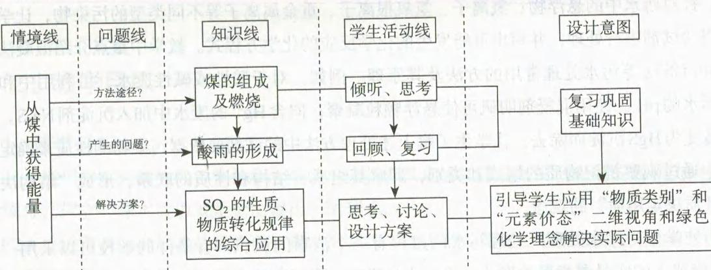

教学中可先提出问题：“煤燃烧可提供能量，那么工厂中如何解决煤燃烧产生的 $SO_{2}$ ？”引导学生从“物质类别”视角分析： $SO_{2}$ 属于酸性氧化物，具有酸性氧化物的通性，可用碱、碱性氧化物或某些弱酸盐溶液吸收。从“元素价态”视角分析： $SO_{2}$ 中硫元素为+4价，处于中间价态，因而既有氧化性，也有还原性，可用某些还原剂或氧化剂吸收。由此，引导学生从化学反应原理上领悟选择 $SO_{2}$ 吸收剂的思路和方法。

接着，进一步提出问题：“结合工业实际，选取 $SO_{2}$ 吸收剂还应考虑哪些条件？”学生在讨论的基础上形成共识：廉价易得、效果显著、不产生新污染物。学生依据此原则将选择的吸收剂进一步缩小范围，进而指向具体的物质——氢氧化钙、氧化钙、石灰石等。此时教师展示脱硫工艺示意图（图8-6），要求学生写出相关反应的化学方程式。

在此基础上，还可进一步展示如下图所示的碱液吸收法、石灰-石膏法吸收尾气的流程图。

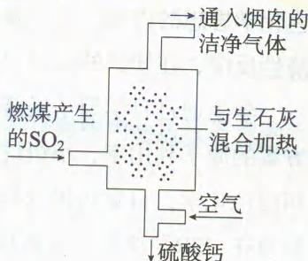  
图 8-6 燃煤脱硫工艺示意图

$$
\begin{array}{r l} & \text {   NaOH   } \\ & \mathrm {SO_ {2}} \longrightarrow \text {   吸收   } \longrightarrow \mathrm {Na_ {2} SO_ {3}} \\ & \text {   Ca(OH) _ {2}   } \\ & \mathrm {SO_ {2}} \longrightarrow \text {   吸收   } \longrightarrow \mathrm {CaSO_ {3}} \longrightarrow \text {   氧化   } \longrightarrow \mathrm {CaSO_ {4}} \end{array}
$$

再结合所学知识，通过对比分析，从不同角度评价两种吸收方法的优劣。如从吸收效率、成本以及产物的扩散性等方面进行评价，培养学生多向思维的能力。此时，若学生的认知能力较强，还可继续提出问题，布置具有挑战性的任务：在上述两种方法的基础上，请你设计一个改进的、能实现物料循环的“双碱法”烟气脱硫方案。学生分组讨论，并将设计的方案展示交流（可参考下图）。在此过程中，教师应充分调动学生主动参与探究学习的积极性，激发学生的兴趣，启发学生的思维，引导学生寻找两种吸收方法的“结合点”，从而设计出新的实验方案。

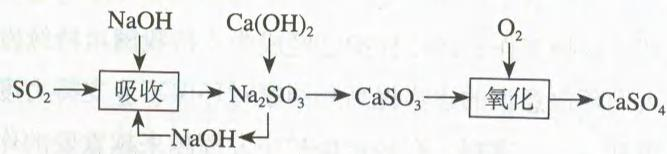

教学中，让学生将该方法与前两种吸收方法进行对比，讨论上述吸收流程的优点，从中感悟方案设计中所体现的绿色化学观念。例如，中间产物NaOH可循环利用，有利于降低成本（渗透资源再循环的原则）；副产物加工成有用物质石膏（环境友好产品）；污染物零排放（消除有害物质的产生）。经过这样的教学处理，隐含于方案设计中的素养元素得到彰显，从而为绿色化学概念的提出奠定基础。

## 4. 注重运用绿色化学思想分析有关问题，在运用中有效突破难点

学习本节课的目的，不仅在于了解污水的处理过程和原理、硫酸型酸雨的形成过程和石灰法脱硫的具体方法，更重要的是要让学生运用绿色化学的思想分析和讨论化工生产中的相关问题，学会分析问题的方法，提出解决问题的思路。例如，在学习了绿色化学的概念之后，为帮助学生理解绿色化学的核心思想，在教材原有“思考与讨论”中问题的基础上，可进一步提出问题：“从源头减少或消除酸雨对环境的污染，你还能提出哪些措施？”引导学生从酸雨产生前和产生后两个方面进行思考，前者是如何减少或消除原料煤中存在的有害元素硫的问题，后者则是如何减少或消除煤燃烧后产生的污染物二氧化硫的问题。这样处理后，问题的指向更加明确。教师再组织学生讨论，总结出防治酸雨的主要措施。例如，针对煤中有害元素硫的减少，可提出“采用原煤脱硫技术，降低原煤的含硫量”，“改进燃烧装置和燃烧技术，使煤充分燃烧，提高燃烧效率，减少二氧化硫和氮氧化物的排放量”等合理化建议。通过讨论让学生理解教材图8-24中绿色化学思想的内涵，进一步领会绿色化学的核心思想——从源头上预防污染的产生，倡导原子经济性反应，在知识的运用中有效突破难点。

学生通过自学原子经济性反应的概念并计算“思考与讨论”栏目中两种制备环氧乙烷的不同方案的原子利用率，小组讨论完成教材上所提出的问题，从原子经济性反应的角度再次领悟什么叫绿色化学，自觉运用绿色化学的思想分析有关化学问题。最后，归纳出开发和利用自然资源必须遵守“3R”原则，在各项实践活动中树立环境保护的意识，自觉践行绿色发展的理念。

目前，化学科学与技术的合理使用日益重要，化学科学与技术的不断创新与发展为解决人类社会发展中遇到的环境问题、实现可持续发展提供了有效途径。本部分“科学·技术·社会”栏目中的“人工光合作用”就是化学与技术结合的典范。人类受植物自然光合作用原理的启发，提出了运用化学科学实现人工光合作用的伟大构想：固定二氧化碳；制造燃料和基本化工原料；光能发电；光解水制氢。人工光合作用技术的开发和应用，是当前面对世界资源消耗、环境污染等难题所提出的一个极具吸引力的解决方案。教材安排这部分内容，反映了人类在解决自身面临的重大难题时所展示的超常智慧和能力，以及新技术广阔的发展前景。

教材还设置了“化学与职业”栏目。教学中，教师要充分利用这一栏目，让学生了解环境保护工程师这一职业的工作内容、工作特点、工作职责和所应具备的相关专业知识，认识到环境保护工程师在预防和治理环境污染方面所发挥的重要作用，同时也为学生今后的职业规划提供参考。

我国历来十分重视环境保护工作，环境保护已经成为支持我国可持续发展的重要环节。随着我国经济的迅速发展、人们环保意识的逐步提高和国家对环保事业支持力度的不断加大，环境保护工程师这一职业也将得到进一步重视，在环境保护中发挥越来越重要的作用。

## 四、栏目使用建议

【思考与讨论1】

(1) 酸雨是指 $\mathrm{pH}$ 小于 5.6 的酸性降水, 其主要溶质是硫酸和硝酸, 会对土壤、森林、水生动植物和建筑物等造成大范围危害。酸雨主要是由化石燃料的燃烧, 金属矿物的冶炼, 生产和使用硫酸、硝酸的工厂等排放的硫氧化物 $\left(\mathrm{SO}_{x}\right)$ 和氮氧化物 $\left(\mathrm{NO}_{x}\right)$ 所造成的。

利用化学方法可以控制硫氧化物和氮氧化物的排放，进而控制酸雨的危害。例如，针对我国使用的能源以煤炭为主、酸雨类型属于硫酸型的特点，可采取燃料预脱硫、炉内脱硫和烟囱排气除硫等措施，用 $CaCO_{3}$ 、CaO、 $\mathrm{Ca(OH)}_{2}$ 和氨水等吸收脱硫。

$CaO+SO_{2}=CaSO_{3}$ （化合反应）

$$
2 \mathrm{CaSO} _ {3} + \mathrm{O} _ {2} = 2 \mathrm{CaSO} _ {4} (\text {   化合反应、氧化还原反应   })
$$

$$
\mathrm{SO} _ {2} + 2 \mathrm{NH} _ {3} + \mathrm{H} _ {2} \mathrm{O} = (\mathrm{NH} _ {4}) _ {2} \mathrm{SO} _ {3} (\text {   化合反应   })
$$

同时，机动车辆的尾气排放也同样需要控制。汽车尾气中的氮氧化物是光化学污染的主要成因，它比硫氧化物的消除难度大，一般采用 $CH_{4}$ 、 $H_{2}$ 、 $NH_{3}$ 等在Pt、Pd等的催化作用下使氮氧化物还原，生成 $N_{2}$ 、 $CO_{2}$ 、 $H_{2}O$ 等无害气体。

$CH_{4}+4NO_{2}\xlongequal[\Delta]{Pt}4NO+CO_{2}+2H_{2}O$ （氧化还原反应）

$$
\mathrm{CH} _ {4} + 2 \mathrm{NO} _ {2} \xlongequal [ \triangle ] {\mathrm{Pt}} \mathrm{N} _ {2} + \mathrm{CO} _ {2} + 2 \mathrm{H} _ {2} \mathrm{O} (\text {   氧化还原反应   })
$$

(2) 城市中工业生产废水和生活污水的不当排放、农村中化肥的不合理使用会造成严重的水体污染。例如, 含有大量氮、磷的污水排向湖泊、水库和近海海域, 造成了水体的富营养化, 使藻类大量繁殖, 形成赤潮、水华等。我们日常使用的合成洗涤剂如使用多聚磷酸盐作为助洗剂, 在水体中经藻类等微生物作用, 容易水解为磷酸盐, 成为引起水体富营养化的污染物。

课前可布置学生收集有关污染及治理情况的图片和文字资料，制成幻灯片，在课堂上与同学们进行交流。注意通过对酸雨防治原理的应用，让学生体会化学在解决环境问题中的重要作用。
【思考与讨论2】

(1) 以乙烯为原料通过氯代乙醇法生产环氧乙烷, 其原子利用率为:

$$
\frac{m(\text{环氧乙烷})}{m(\text{环氧乙烷}) + m(\mathrm{CaCl}_{2}) + m(\mathrm{H}_{2}\mathrm{O})} = 25.4\%
$$

采用银催化一步合成环氧乙烷的原子利用率为100%。

(2) 原子利用率为 $100\%$ 的化学反应类型是加成 (加聚) 反应和化合反应, 这几类反应中反应物的原子全部转化为期望的最终产物。例如:

乙烯的水化（加成）反应制乙醇： $CH_{2}=CH_{2}+H_{2}O\xrightarrow[加热、加压]{催化剂}CH_{3}-CH_{2}-OH$

乙烯（加聚）合成聚乙烯： $nCH_{2}=CH_{2}\xrightarrow{催化剂} \left[CH_{2}-CH_{2}\right]_{n}$

（3）原子利用率与产率不相同。

$$
\mathrm{原子利用率} = \frac {\mathrm{期望产物的总质量}}{\mathrm{生成物的总质量}} \times 100
$$

$$
\mathrm{产率} = \frac {\mathrm{产品的实际产量(质量)}}{\mathrm{产品的理论产量(质量)}} \times 100
$$

（4）绿色化学是对传统化学思维方式的更新和发展，教师在引导学生讨论时，要结合前面的分析解答以及教材图8-24“绿色化学示意图”进行回答。

①在原料、溶剂的选择上提出了新要求。原料、溶剂要无毒、无害，应致力于开发无溶剂存在下的反应；在起始端就采用实现污染预防的科学手段。

②在反应路线的选择上提出了新要求。开发、应用“原子经济性”的反应路线，最大限度地利用反应物分子中的每一个原子，充分利用资源，实现废物的零排放。

③在反应条件的选择上提出了新要求。生产过程应尽量在温和的温度和压力下进行，节约能源；寻找新型、高效、对环境友好、可回收、高选择性的催化剂。

④在资源和能源的选择上提出了新要求。绿色化学要求充分利用可再生资源，合理利用资源和能源，降低生产成本，使之符合可持续发展的理念。

## 五、练习与应用参考答案及说明

1. ACD

2. B

3. AB（说明：废弃塑料制品难以降解，掩埋处理会改变土壤结构，污染土壤。）

4. CD

5. (1) ${\mathrm{{SO}}}_{2}$ 、 $\mathrm{{CO}}$ 、 ${\mathrm{{NO}}}_{2}$ 和可吸入颗粒物等。

(2) 含铅汽油燃烧后排放的废气中, 含铅颗粒物会分散到空气中造成污染。人体吸入后会使人体的造血机能和中枢神经等受损。

(3) ①调整能源结构：减少化石燃料的燃烧；开发和使用清洁能源（如使用新能源汽车）；发展循环经济，建设低碳城市。

②控制空气污染源，加强污染治理：加强废气排放的监测和监管；提高机动车排放标准；发展废气处理技术，降低处理成本；集中供热，锅炉尾气必须除尘、脱硫、脱硝；解决建筑施工扬尘问题；鼓励乘坐公共交通工具；加大对大气污染治理的经费投入，鼓励环境保护和治理的研究和技术革新；增加城市绿色空间，吸收消纳空气污染物。

③开展环保教育，增强全民环境意识。

6. $4 \mathrm{NH}_{3} + 6 \mathrm{NO} \xrightarrow[400^{\circ} \mathrm{C}]{催化剂} 5 \mathrm{~N}_{2} + 6 \mathrm{H}_{2} \mathrm{O}$

7.（1）石灰厂排放的碱性污水使b处河水的pH升高；火力发电厂净化烟气的酸性废水治理未达标就排放，造成c处河水的pH降低（或火力发电厂燃烧产生的 $SO_{2}$ 会导致酸雨，使c处河水的pH降低）。

(2) 化肥厂、农田及生活污水使 $d$ 处河水富营养化, 藻类等水生植物大量生长, 消耗了河水中的溶解氧, 导致鱼类死亡。

8.（1）发电厂 焦化厂 炼铁厂 水泥厂

(2) $Fe_{2}O_{3}+3CO\xlongequal{高温}2Fe+3CO_{2}$

(3) 用炼铁厂的炉渣作为水泥厂的原料; 用发电厂的煤矸石和粉煤灰作为水泥厂的原料; 将石灰石煅烧成生石灰, 用于吸收发电厂和焦化厂燃煤时产生的酸性气体 $\mathrm{SO}_{2}$ , 减少酸雨的形成, 防止空气污染; 建立污水处理系统 (合理答案均可)。

# 复习与提高参考答案及说明

1. B

2. ①蛋白质 ②脂肪 ③可溶性化合物 ④有机酸 ⑤肥料 ⑥ ${\mathrm{{CO}}}_{2}$ 、 ${\mathrm{H}}_{2}\mathrm{\;S}$ 等气体

3.（1）热能

(2) $\mathrm{CH}_2 = \mathrm{CH}_2 + \mathrm{Cl}_2 \longrightarrow \mathrm{CH}_2\mathrm{Cl} - \mathrm{CH}_2\mathrm{Cl}$ 加成反应 $n\mathrm{CH}_3 - \mathrm{CH} = \mathrm{CH}_2 \xrightarrow{\text{催化剂}} [\mathrm{CH}-\mathrm{CH}_2]_n$ 加聚反应

\$\begin{array}{c}\vert \\ \mathrm{CH}\_{3}\end{array}\$(3) 乙烯是石油化工最重要的基础原料, 乙烯聚合生成的聚乙烯可制造塑料生活用品,如保鲜膜等; 乙烯也用于制造合成纤维、乙酸、乙醇等化工产品; 乙烯还可用作植物生长调节剂和果实催熟剂等。丙烯也是一种重要的有机化工原料, 其重要的用途之一是生产聚丙烯塑料, 丙烯还可制丙烯腈和丙烯颜料。

4. (1) 固体: 焦炭; 液体: 苯、甲苯、酚类、萘、氨水; 气体: CO、 $CH_{4}$ 、 $H_{2}$ 、 $H_{2}S$ 、 $CH_{2}=CH_{2}$ 。
(2) 128; $CO_{2}$ 和 $H_{2}O$ 。

（3）氨有刺激性气味，可采用小心地闻气味的方法；也可将水层中的液体滴在红色石蕊试纸上，观察试纸颜色的变化，若试纸变蓝，则所得水层中含有氨。用硫酸回收氨以生产化肥硫酸铵，其中氮元素的质量分数为21.2%。

5. $CH_{4} \cdot 8H_{2}O$ (提示: 8个分子笼中共有6个 $CH_{4}$ 和48个 $H_{2}O$ ， $CH_{4}$ 与 $H_{2}O$ 的粒子数比为1:8，所以其平均组成为 $CH_{4} \cdot 8H_{2}O$ 。)

6.（1）丁烷， $C_{4}H_{10}$ ， $CH_{3}(CH_{2})_{2}CH_{3}$ [或 $CH_{3}CH(CH_{3})_{2}$ ]。

(2) 合成纤维具有良好的化学稳定性, 在自然界中很难降解, 因而对环境易产生污染。而天然纤维则可自然降解, 不会对环境造成影响。

(3) 光合作用; $6 \mathrm{CO}_{2} + 6 \mathrm{H}_{2} \mathrm{O} \xrightarrow{\text {光}} \mathrm{C}_{6} \mathrm{H}_{12} \mathrm{O}_{6} + 6 \mathrm{O}_{2}$ 。

（说明：本题一方面体现了化学的应用价值，凸显化学在改善人们生活中的重要作用，另一方面提醒我们要关注由此带来的环境问题，应开发、使用可降解的有机合成材料，提倡绿色化学。）

7. ① $\text{Al}_2\text{O}_3 + 2\text{NaOH} = 2\text{NaAlO}_2 + \text{H}_2\text{O}$ ② $\text{NaAlO}_2 + \text{CO}_2 + 2\text{H}_2\text{O} = \text{Al(OH)}_3 \downarrow + \text{NaHCO}_3$ ③ $2\text{Al(OH)}_3 \xlongequal{\Delta} \text{Al}_2\text{O}_3 + 3\text{H}_2\text{O}$ ④ $2\text{Al}_2\text{O}_3 \xlongequal[\text{冰晶石}]{\text{电解}} 4\text{Al} + 3\text{O}_2 \uparrow$

过程④中消耗的能量最多，因为该步骤中氧化铝的电解消耗了大量电能。

8.（1）孔雀石溶解，有气泡产生，溶液变为蓝色。

(2) 铁（或锌）；因为铁的还原性强于铜，能将其从 $\mathrm{CuSO}_{4}$ 溶液中置换出来。

(3) 在滤液中加入 $\mathrm{NaOH}$ 溶液, 然后过滤, 洗涤, 将滤渣加热分解, 再将分解得到的固体物质用 $\mathrm{H}_{2}$ 还原即得到 $\mathrm{Cu}$ 。

9. $\mathrm{TiO_{2}+2C+2Cl_{2}\xlongequal{高温}TiCl_{4}+2CO}$

$$
\mathrm{TiCl} _ {4} + 2 \mathrm{Mg} \xlongequal [ \triangle ] {\mathrm{Ar保护}} \mathrm{Ti} + 2 \mathrm{MgCl} _ {2}
$$

Ar作为保护气，防止钛被氧化。

10. 提示：目前，人类利用的能量主要是通过化学反应来获取。其中最重要的能源是化石能源——煤、石油和天然气等不可再生能源。这些能源的开发和利用，为人类提供了生产、生活所必需的能量。随着化石能源的不断消耗，在可预见的未来终有枯竭的一天，能源危机迫在眉睫。同时，人们对自然资源的不合理开发和利用也给环境带来了重大影响，如工业“三废”未经处理直接排放，农药和化肥的不合理施用，对水体、土壤和空气等自然资源造成不同程度的污染，影响了这些资源的继续使用，资源危机日益凸显。能源是发展工业、农业，开发资源，改善人民生活必不可少的燃料和动力来源。从这个意义上讲，能源将更多地制约着人类的生存和发展。

11. 提示：自然资源是人类文明和社会进步的物质基础。随着人们物质生活水平的提高和人口的增长，人类对自然资源的需求量日益增大。人类社会的进步伴随着自然资源与能源利用方式与利用效率的进步，能源利用方式的进步也是人类文明进步的标志。如第一次科技革命利用蒸汽为工业机械提供动力，第二次科技革命则利用电力提供动力。能源利用方式的进步提高了资源的利用效率，拓展了资源的范围，人类在开发可再生资源和替代性能源领域已取得可喜的成绩。人类社会的不断进步和科学技术的不断发展，必然会带来新一轮的能源革命。我们有理由相信，未来的新能源一定能够大规模替代煤、石油和天然气等不可再生的常规能源。科学、安全、有效和合理地开发自然资源，使人与自然和谐相处，实现自然资源开发利用与人类社会的可持续发展，化学将发挥更加重要的作用。

# 教学资源

## 1. 海洋——人类未来的财富

海洋是人类可持续发展的重要基础。浩瀚的海洋中蕴藏着极其丰富的矿物资源、生物资源和药物资源，其经济价值可观，开发前景十分诱人。

开发利用海洋是解决当前人类社会面临的人口膨胀、资源短缺和环境恶化等一系列难题的重要途径。在陆地资源日渐枯竭的今天，海洋正成为人类发展的生命线。

## (1) 海洋石油和天然气

海洋石油资源量约 $1.35 \times 10^{11} \mathrm{t}$ ，海洋天然气资源量约 $1.4 \times 10^{14} \mathrm{~m}^3$ ，已探明的海上油气储量约占世界总储量的四分之一。

## (2) 海洋金属矿藏

海水中溶解有80多种化学元素，被誉为“液体矿山”。从海水中可以提取镁、钾、铀、锶等多种元素。海底有大量锰结核，也称多金属结核。锰结核是20世纪70年代才进行开采试验的深海矿产。褐色的锰结核外观像土豆，切开来看，一层层的又像葱头。这种结核体往往是以贝壳、珊瑚、鱼骨为核心，将其他物质聚集在周围。锰结核的生长速度很缓慢，平均100万年生长几毫米至几厘米。锰结核含有锰、铁、镍、钴等多种元素。其经济价值很高，总储量约为 $3 \times 10^{12} \mathrm{t}$ 。现在一般利用采矿船来采集锰结核。装有深海监视器的采矿机在海底收集锰结核，然后通过软管抽气，像吸尘器一样把锰结核经软管连续地吸到水面上的采矿船中，每天采矿量可达上千吨。

## (3) 海洋生物

在生物资源方面，海洋中有20多万种生物。专家测算，海洋的初级生产力每年约为 $6 \times 10^{11}$ t，其中可供人类利用的鱼类、贝类、虾类、藻类等水产资源的可捕资源量约为 $2 \times 10^{8}$ t，而现在全世界的捕捞量仅为 $9 \times 10^{7}$ t左右。海产品已成为人类生活中不可缺少的重要食品来源，目前海产品提供的蛋白质约占人类食用蛋白质的22%。在不破坏生态平衡的前提下，海洋每年产出的水产品足够300亿人食用，海洋向人类提供食物的能力等于全球所有耕地提供农产品的1000倍。

不仅如此，包括鱼类在内的海洋生物，已成为新型药物和保健品的原料来源，引起国际医药界的日益关注。据估计，从海洋生物中可提取上万种药品，世界各国为此展开了激烈的竞争。

## (4) 海洋能源

除石油、天然气外，海洋蕴藏着巨大的动力能源。据估算，其理论蕴藏量约为 $1.5 \times 10^{12}$ kW。其中，波浪能约 $7 \times 10^{10}$ kW，潮汐能超过 $2 \times 10^{9}$ kW，海流能约 $5 \times 10^{7}$ kW，温差能约 $5 \times 10^{10}$ kW，盐度差能约 $3 \times 10^{10}$ kW。海洋能具有安全、无污染和可永久利用等优点，具备良好的开发前景。

另外，海水中含有上万亿吨重水，其中所含的氘是受控核聚变的宝贵原料。核聚变能是被广泛看好的21世纪全球电力的潜在来源之一。

## 2. 海水化学资源概况和海水利用

海洋化学也称化学海洋学，它是海洋科学的四大基础学科之一。海洋化学研究海洋环境中化学物质的分布、转移、循环的规律及其在开发利用中的化学问题。海水的成分非常复杂，全球海洋的含盐量就达 $5 \times 10^{16}$ t，此外还含有大量非常稀有的元素，是地球上最大的矿产资源库。海洋资源的可持续利用是人类生存发展的重要前提。目前，全世界每年从海洋中提取淡水超过 $3 \times 10^{9}$ t、食盐超过 $5 \times 10^{7}$ t。水是生命之源，世界上缺水的地区越来越多，海水淡化已成为获得淡水的重要途径。所有这些都是海洋化学要研究的。海洋化学的研究和海洋开发正方兴未艾，必将越来越多的造福人类。

水荒目前已成为世界性的问题，是制约社会进步和经济发展的瓶颈。据统计，全球用水总量每15年就翻一番，到2030年地球上将有三分之一的人口面临淡水资源危机。地球的表面虽然有71%被水覆盖，但其中97.2%是海水，在2.8%的淡水中，又有69%是人类难以利用的两极冰盖。人类可利用的淡水只占全球水总量的0.77%。有人比喻在地球这个大水缸里可用的淡水只有一汤匙。节约用水是可持续发展的重要课题。然而，节水并不能增加淡水的总量。大量地利用海水就成为21世纪解决淡水缺乏的重要途径。

海水利用包括海水直接利用、海水淡化和海水综合利用等。

海水直接利用是用海水代替淡水作为工业用水和生活用水。到21世纪上半叶，随着海洋生物污损防治技术的提高和耐腐蚀材料的进一步发展，沿海城市的大部分工业冷却水都将采用海水，生活中使用海水冲厕也有望得到大面积推广。

海水淡化是海水利用的重点。到了21世纪中叶，也许我们会看到这样一幅景象，每个岛屿或缺水的沿海城市都建有海水淡化工厂。这些工厂里大多采用蒸馏法和反渗透技术来制取淡水。届时全世界使用的水资源中有五分之一以上来自海洋。反渗透法是利用孔径比1 nm还小的半透膜滤去盐分来制取淡水的。出海远洋只要有一台海水淡化设备就可以满足船上的淡水供应。采用蒸馏法制取淡水主要是利用热能来实现，在有核电厂和热电厂的条件下采用这种技术可以充分利用电厂余热来大大减少能耗。

## 3. 石油的成分

在石油中，由碳、氢两种元素组成的化合物的成分很复杂。按其结构可分为烷烃（包括直链和支链烷烃）、环烷烃（多数为烷基环戊烷和烷基环己烷）和芳香烃（多数是烷基苯）。在石油中一般不含烯烃。

在石油中含硫的化合物主要有硫醇（RSH）、硫醚（RSR'）、二硫化物（RSSR'）和噻吩（Ⅱ）等。

在石油中含氧的化合物主要有环烷酸和酚（以苯酚为主），此外还含有少量的脂肪酸。这些环烷酸的分子中含有一个或多个骈合脂环，是碳原子数为11\~30个的羧酸。羧基既可以在脂环上，也可以在侧链上。如单环烷酸（n=1\~5）： $\mathrm{(CH_{2})_{n}COOH}$ 。在炼油生产中，常将环烷酸和酚统称为石油酸。

在石油中含氮的化合物主要有吡啶（N）、吡咯（N）、喹啉（N）和胺类（RNH₂）等。吡咯在空气中容易被氧化，颜色逐渐变深，汽油久置后颜色变深与此有关。

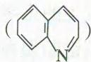

石油的化学组成不是固定的，而是随产地的不同而不同。根据石油中所含烃的成分的不同，一般将石油分为烷烃基石油、环烷基石油、混合基石油和芳烃基石油等几大类。但各产油国常根据本国的资源情况有不同的分类。

## 4. 汽油

汽油是一种重要燃料，主要用于交通工具的发动机，如汽车、摩托车的发动机等。在发动机中，汽油应在燃烧冲程燃烧。但有的汽油在压缩过程就燃烧爆炸，不仅影响汽缸的正常运行，而且由于强烈地震动，影响发动机的寿命。这种汽油在汽缸中的不正常的燃烧现象称为爆震。汽油的爆震性与汽油的成分有密切的关系，芳烃的抗震性最好（即爆震性最小），环烷烃和异构烷烃次之，烯烃再次之，烷烃中正构（直链）烷烃的抗震性较差。汽油的抗震性能一般用辛烷值来表示。

提高汽油辛烷值的方法之一是增加汽油中芳烃的含量，减少正构烷烃的含量；另一种方法是加入少量的四乙基铅 $\left[\mathrm{Pb}(\mathrm{C}_{2}\mathrm{H}_{5})_{4}\right]$ 。一般来说，只要在汽油中加入 $0.2\% \sim 0.5\%$ （质量分数）的四乙基铅就可以显著地提高汽油的抗震性。但是，在汽油中使用四乙基铅存在着许多问题。一方面是四乙基铅有毒，只需少量就可以使人体中毒。因此，加入四乙基铅的汽油通常被染成红色或蓝色。另一方面是四乙基铅在汽缸中燃烧后，其中的铅会变成氧化铅沉积下来，增加积炭量，引起汽缸过热，增大发动机零件的磨损。为了克服这个缺点，通常在四乙基铅中加入一种导出剂，使铅成为挥发性物质从汽缸中排出。但含铅化合物的排放造成了一定程度的环境污染。目前，我国已经禁止汽车使用含铅汽油，以减少对大气的污染和对人体健康的危害。

## 5. 催化裂化

用加热蒸馏的方法所得轻油占原油的 $\frac{1}{3}\sim\frac{1}{4}$ 。经催化裂化，从重油中能获得更多乙烯、丙烯、丁烯等化工原料，也能获得更多、更好的汽油。

催化裂化就是将原油（常用的馏分是重质油，如减压馏分、焦化柴油及石蜡等，也可使用常压重油）在催化剂存在下，在460\~520℃及100\~200 kPa的条件下进行裂解反应。与热裂化相比较，催化裂化的条件，如温度和压强要低一些，但对原料的要求却相对高一些。如果在原料中含有镍、铁、铜、钒等重金属，就会影响催化剂的催化效率，使其选择性显著降低，从而降低汽油的产量，增加气体和焦炭的产量。所以，催化裂化所用的原料油中重金属的含量必须要有一定限制。

在催化裂化中常用的催化剂是铝硅酸盐，它的主要成分含 $SiO_{2}$ 和 $Al_{2}O_{3}$ 。按照铝硅酸盐的结构，又可以分为无定形（普通铝硅酸盐催化剂）和结晶形（分子筛催化剂）两种。目前最常用的是分子筛催化剂，它的催化活性和选择性都比较好，汽油的产率较高。

催化裂化所发生的化学反应与热裂化的反应没有本质上的区别。除了发生分解反应，使碳链较长的烃发生碳碳键断裂而生成碳链较短的烃以外，由于有催化剂的存在，使得异构化和芳构化的反应加速。例如，十四烷在催化裂化的条件下，首先分解为庚烷和庚烯：

$$
\mathrm{C} _ {1 4} \mathrm{H} _ {3 0} \longrightarrow \mathrm{C} _ {7} \mathrm{H} _ {1 6} + \mathrm{C} _ {7} \mathrm{H} _ {1 4}
$$

生成的庚烷和庚烯可以进一步发生异构化、芳构化、氢转移等反应。

异构化反应是指正构烷烃变成异构烷烃，如带侧链的环戊烷变成环己烷，使产品中异构烃的含量增加。例如：

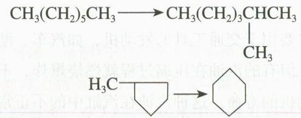

芳构化反应是指开链烷烃变成环状化合物和环状化合物脱氢生成芳烃等，使产品中的芳烃含

量增加。例如：

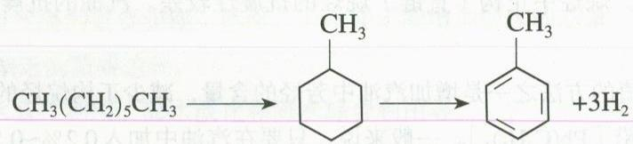

氢转移反应是指烃类在反应中产生的氢与烯烃反应而生成饱和烃。例如：

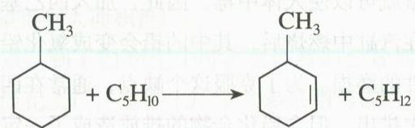

另外，分解反应产物还可进一步发生碳碳键断裂，生成分子中碳原子数较少的裂化气。

## 6. 煤的组成

煤是由植物转变而成的。由高等植物变成的煤称为腐植煤，这种煤的储量多，用途广。由低等植物变成的煤称为腐泥煤。自然界中的各种煤尽管种类不同，但都是由有机物和无机物组成的。

（1）碳 碳是煤的主要成分。煤的含碳量随着煤变质的程度而有规律地增加。所以，含碳量的多少可以表示煤的变质程度。

（2）氢 氢是煤中有机物的主要元素。煤的含氢量随煤变质程度的加深而减少。

（3）氧 煤中的氧在燃烧过程中并不放出热量，含氧多的煤热值较低。

（4）硫 煤中的硫以有机硫和无机硫的形式存在，是煤中的有害成分。在煤的储存过程中，黄铁矿氧化放热会加速煤的氧化变质。在炼焦过程中产生的硫化物气体对设备有一定的腐蚀作用，残留在焦炭中的硫使焦炭的质量降低。

（5）磷 煤中的磷存在于矿物质中，一般含量较低，最高不超过1%。煤中的磷虽然不多，但危害极大。在炼焦时，磷全部转入焦炭中。在用焦炭炼铁时又转入生铁中，使生铁变脆。

(6) 氮氮是组成煤中有机物的次要元素, 含量较少, 且变化不大。煤中的氮在煤燃烧时常以游离状态分解出来, 炼焦时因温度较高, 氮也会转化为氨或其他氮的化合物。

(7) 水分 煤中的水分有内在水分和外在水分的区别。煤中的内在水分指在煤风干后, 将煤加热到 $102 \sim 105 ^{\circ} \mathrm{C}$ 时逸出的水分。这部分水分是依靠吸附力而保持在煤粒气孔中的水分。外在水分是保持在煤粒表面和煤粒之间的水滴, 这部分水在风干时即可除去。内在水和外在水之和就是煤的总水分。

(8) 矿物质 煤中的矿物质组分非常复杂, 含量的变化也很大, 主要是铁、铝、钙、镁等以碳酸盐、硅酸盐、硫酸盐和硫化物等形式存在。煤中矿物质的含量和成分与煤的形成过程有关。煤在燃烧过程中, 矿物质发生一系列的变化, 煤燃烧后的残留物称为灰分。一般来说, 灰分的含量可以反映出煤中矿物质的大致含量。因此, 有时也笼统地将矿物质称为灰分。对于工业用煤来说, 灰分是非常有害的。在炼焦的过程中, 灰分全部转入焦炭, 不但降低了焦炭的强度, 也降低了焦炭的含碳量。灰分高的煤发热量较低。因此, 灰分是影响煤质的重要指标。

上述煤的组成是元素分析的结果。但由于元素含量的测定手续繁杂，在工业上很少应用。目前，工业评定煤的品质，大多采用工业分析方法来测定煤的发热量、挥发分、固定碳、水分和灰分等项目。

## 7. 煤的气化和液化

直接烧煤不仅对热的利用率低，煤燃烧时生成的烟和燃烧后剩余的灰分也会对环境造成污染。

## (1) 气化

目前，煤的气化主要是通过碳和水蒸气的反应。

$$
\mathrm{C} + \mathrm{H} _ {2} \mathrm{O} \xlongequal {\text {高温}} \mathrm{CO} + \mathrm{H} _ {2}
$$

这是一个吸热反应，反应所需的能量一般是由间歇进行的碳的燃烧来提供。

根据不同的生产工艺，煤的气化主要有三种途径。依据以上反应，如果使用空气、煤和水蒸气为原料必然会引入大量的氮气，使煤气的热值降低，约为4.7\~5.6 MJ/m $^{3}$ ，成为低热值煤气。如果使用氧气、煤和水蒸气为原料，就能得到中热值煤气，其热值约为11.2\~13.0 MJ/m $^{3}$ 。如果要得到高热值的煤气，就需要使氧气、煤和水蒸气在高压、催化作用下反应，生成含大量甲烷的煤气，其热值约为35.4\~37.3 MJ/m $^{3}$ 。

$$
\mathrm{CO} + 3 \mathrm{H} _ {2} \xrightarrow [ \text {高压} ]{\text {催化剂}} \mathrm{CH} _ {4} + \mathrm{H} _ {2} \mathrm{O}
$$

利用焦炉生产煤气，在目前仍然是最便宜的产生煤气的方法。利用褐煤在鲁奇炉加压气化，生成中热值煤气供居民使用是比较成熟的方法。

## (2) 液化

煤的液化方法主要分为煤的直接液化和煤的间接液化两大类。

①煤直接液化 煤在氢气和催化剂作用下，通过加氢裂化转变为液体燃料的过程称为直接液化。裂化是一种使烃类分子分裂为几个较小分子的反应过程。因煤直接液化过程采用了加氢手段，故又称煤的加氢液化。

②煤间接液化 间接液化是以煤为原料，先气化制成合成气，然后通过催化剂作用将合成气转化成烃类燃料、醇类燃料和化学品的过程。

煤间接液化工艺流程主要包括煤气化、气体净化、合成及产品分离等。煤间接液化技术具有下述特点：①使用一氧化碳和氢气，可利用廉价碳资源；②可按需要调整产品结构；③工艺过程中各单元与石油炼制工业相似，可以借鉴。

1923年，德国开发成功费托合成技术，将一氧化碳、氢气合成烃类燃料。第二次世界大战后，仅有南非出于政治和地理因素，在20世纪50年代后建立了以煤为原料的费托法合成油的大型工厂。1973年，石油大幅度涨价以后，在人们寻找替代能源的过程中，甲醇及低碳醇的优异抗爆震性能，以及对汽油混合燃料的助溶性能，使醇类燃料的应用前景引人瞩目。同时，美国公司开发的将甲醇直接转化为高辛烷值汽油的技术在新西兰投入工业应用，促进了煤间接液化技术的发展。

随着我国经济和社会的发展，化石能源的需求量不断增加。2016年，石油和天然气消费量分别为5.8亿吨和2103亿立方米，而产量分别为2.0亿吨和1384亿立方米。我国石油和天然气储量相对较少，分别只占世界总储量的1.5%和2.9%，大量石油和天然气依赖进口。2016年，煤炭消费量占能源消费总量的62%。我国已探明的煤炭储量占世界储量的21.4%，在我国能源体系中占有重要地位。然而，近年来空气污染问题日益突出，煤炭的清洁利用已成为应对气候变化、解决能源安全问题和环境保护的重要途径。现代煤化工是煤炭清洁利用的重要方式，主要包括煤制油（煤的液化）、煤制气（煤的气化）和煤制化学品。我国已经建成了神华鄂尔多斯煤直接液化项目、神华宁煤煤炭间接液化项目、大唐克什克腾旗煤制气项目、庆华伊犁煤制气项目、汇能鄂尔多斯煤制气项目和神华包头煤制烯烃项目等。现代煤化工适应我国“富煤、贫油、少气”的能源结构，已成为应对石油安全问题的战略支撑，将向绿色、高效、低碳和集约化方向发展。

## 8. 碳一化学的发展前景

碳一化学，又称 $C_{1}$ 化学或一碳化学，是指以分子中只含一个碳原子的化合物（如CO、 $CH_{3}OH$ ）为原料来合成化工产品的化学体系。 $C_{1}$ 化学的原料为合成气，以天然气或煤为原料都能生产富含一氧化碳和氢气的合成气。

甲醇成本的高低在很大程度上决定着 $C_{1}$ 化学的命运。甲醇是一种重要的基本有机原料，也是 $C_{1}$ 化学的起始化合物，许多化工产品都要由甲醇来制取。在基本有机原料中，甲醇的重要性一般仅次于乙烯、丙烯和苯而居第4位。由合成气合成甲醇已有多年的工业化实践，技术上比较成熟，能量利用效率已接近工艺本身可以达到的最佳程度。目前的甲醇合成仍然是一个能耗较高、操作费用相当昂贵的工艺过程。降低甲醇成本的途径有两类：一是用更先进的气化技术来制取合成气，另一条途径是采用新的催化体系以降低甲醇生产过程中的能耗和提高甲醇的回收率。

乙烯是现代石油化学工业最重要的基础原料，它是由石脑油、柴油或乙烷等的热裂解而生产的。如果能用其他方法由煤制得廉价乙烯，那么就可以在不改变现有石油化工装置的情况下，使有机化学工业由石油转到以煤为基础。目前，合成气制烯烃已成为费托合成化学（即由氢气和一氧化碳在催化剂的作用下合成烃类和含氧有机化合物）中新的研究方向之一，一些研究已显示出很好的工业化前景。据报道，有的研究已取得了 $1 \mathrm{~m}^{3}$ 合成气生产低碳烯烃 $70 \mathrm{~g}$ 的结果，前景诱人，但离实际工业化尚有一定距离。

$C_{1}$ 化学的另一个研究方向是合成液体燃料。合成气制汽油已经工业化的技术有费托合成工艺和甲醇制汽油工艺。南非已建成大型工厂，合成汽油产量已达350万吨/年，并副产乙烯。新西兰采用该技术已建成了年产50万吨无铅汽油的工厂。

甲醇以及一氧化碳也可以用于合成其他含氧化合物。醇羰基化制醋酸及醋酐近年来有重要进展，在美国和英国均已实现了工业化。目前，世界醋酸生产能力中，甲醇羰基合成法已占50%以上。甲醇还可以用于制乙二醇、甲酸、醋酸乙烯等。一氧化碳通过氧化偶联制草酸也是一项新技术。

随着石油供应日趋紧张， $C_{1}$ 化学的发展将使化学工业的面貌发生显著的变化。而且以上述技术为基础，可以衍生出更多新的生产工艺，生产更多、性能更好的化工产品。也许在不久的将来， $C_{1}$ 化学将会发展成为现代化学工业的一个重要基础部门。

[摘编自：匡跃平.现代化学工业概览.北京：中国石化出版社，2003]

## 9. 产品系统与生命周期

获得产品是生产活动的基本目标。产品不但是工业生产各种效益的载体，也是体现工业生产与环境相互作用的基本单元。产品通过市场连接了生产过程和消费过程。产品包括有形产品和无形产品。无形产品如通讯、旅游、金融、教育、娱乐等服务，需要消耗物质和能量，也会产生一定的环境效应。

所谓产品系统是指为实现一个或多个特定功能，由物质和能量联系起来的单元过程的集合。一个产品系统可能会与其他产品系统和环境系统发生关系，这些关系如图8-7所示。图中a、b、c、d为部分包含在产品系统中的过程，a为产品的合作生产，b为废料的联合处理，c为可再循环物料的生产，d为其他产品系统的再循环物料在该产品系统中的利用。e、f则为不包括在该产品系统中的过程，g为从环境的摄取过程和向环境的排放过程。

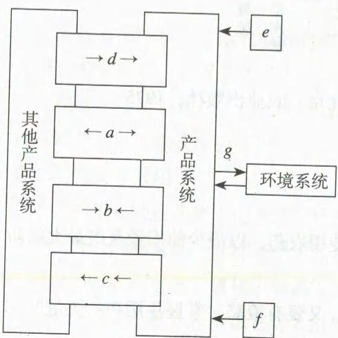

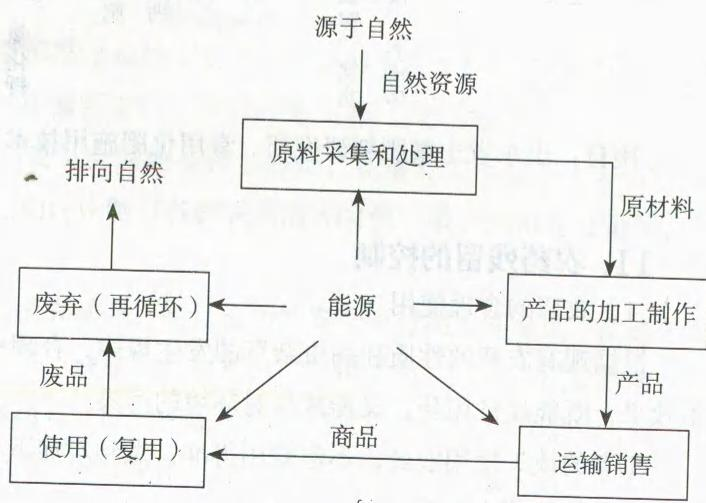  
图8-7 产品系统和其他系统的关系  
图8-8 产品生命周期示意图

人们认识到，要争取实现工业生产与环境相容的目标，只注意生产过程中污染物的排放和处理是不够的，还应当从产品抓起，考察其整个生命周期对环境的影响。产品生命周期是指产品系统从原料采集和处理、加工制作、运销、使用（复用）、再循环，直至最终处置和废弃等环节组成的生命链。生命周期有时被形象地称作“从摇篮到坟墓”，体现了产品从自然中来又回到自然中去的物质转化全过程（图8-8）。

不同产品的生命周期在时间和空间尺度上可以有很大的差别。例如，一座建筑物的生命周期可能长达200年，而某些包装材料只有数周或数月的寿命。产品的生命周期可以局限于某一地区，也可以遍及世界。生命周期概念为我们提供了一种新的思想原则，即考察产品的某种性能不能停留在一时或一地，而应该遍及它生命周期的各个阶段，这样才能得出科学、全面的结论。

[摘自：钱易，唐孝炎.环境保护与可持续发展.北京：高等教育出版社，2010年]

## 10. 各种肥料混合施用情况表

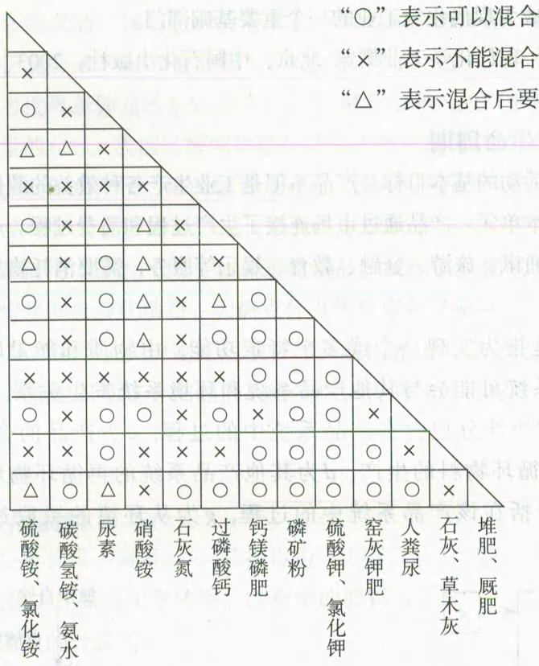  
[摘自：山东省土壤肥料研究所．常用化肥施用技术．北京：农业出版社，1975]

## 11. 农药残留的控制

## (1) 农药的合理使用

根据现有农药的性质和病虫杂草的发生规律，合理地使用农药，以最少的用量获得最大的防治效果，既能经济用药，又能减少对环境的污染。

①有的放矢使用农药，不但要用得准，做到对症下药，又要有策略，掌握住用药的关键时刻与最有效的施药方法等。

②注意用药的浓度与用量，掌握正确的施药量。

③提高药效，降低用量。例如，将农药与表面活性剂一同使用，改善药液的附着性能，改进施药工具的效能，等等。这些措施均可提高对病虫害的防治效果，降低用量或减少用药次数，间接地减少了农药的污染。

## ④合理混用农药。

⑤合理调配农药，即农药销售部门可根据各地病虫害的发生情况，科学地进行农药的合理调配，这样也可避免乱用，减少污染。尤其对某种农药已发生污染的地区或害虫已产生抗药性的地区，应避免再调入这些农药，以免加重污染。

应该指出，现有农药的合理使用是预防农药污染的积极措施，做好病虫害和农药知识的普及工作，使广大农民正确掌握农药的使用方法，对减少农药污染具有重要的意义。

## (2) 农药的安全使用

制订一些安全用药的规章制度也是防止产生农药残留非常重要的措施。

①通过对作物、食品、自然环境中农药残留情况的普查，以及农药对人畜慢性毒性的研究制订农药的允许应用范围。

一些农药在某些地区使用若干年后，通过普查了解其是否对当地环境、作物、食品、水产等方面造成污染，并制订今后的用药方针，是控制农药污染的一个重要环节。这项工作如能及早地、系统地进行，对控制农药污染的发生更有积极的意义。

②了解农药对人畜生理的毒害特点，制订各种农药的每日允许摄入量（简写为ADI），并根据人们的取食习惯，制订各种作物与食品中的农药最大残留允许量。

各种农药的每日允许摄入量是根据当前已知该农药对动物生理的影响，包括对下一代影响的全部知识而制订的，在一生当中每日摄入该剂量的物质不会有明显的毒害。ADI是以每千克体重摄入药物的毫克数来表示（mg/kg）。

最大残留允许量是指按适宜的施药方法规定的食品中可允许的农药残留浓度。它是一种从食品卫生保健角度考虑，防止农药残留的安全措施。一种农药的最大残留允许量可以从该种农药的ADI值推算而得。

$$
\text {   最大残留允许量   } = \frac {\mathrm{ADI值} \times \text {   人体标准体重   }}{\text {   食品系数   }}
$$

某种食品中某一农药残留的允许含量标准是有法律意义的，它根据医学科研单位提出的允许含量，考虑农业、经济、外贸等多方面的因素而制订，并经过有关部门共同批准后实施。

在联合国粮农组织（FAO）设有农药委员会农药残留工作部，在世界卫生组织（WHO）也设有农药残留专家委员会等机构。他们定期讨论制订各种农药的ADI值、最大残留允许量等，推荐给各国参考采用。

③了解农药在作物上的残留、代谢、消失动态，制订施药的安全等待期，即最后一次施药与作物收割的间隔天数，也称安全间隔期。在一种农药大面积推广应用之前，应通过试验摸清它在作物上的吸收、运转、氧化、降解等代谢动态，以及原始吸收量和沉积量在自然环境中的消失动态。根据研究结果，并考虑它对人畜生理毒害等特点制订出安全用药必需的间隔天数。

由于我国幅员广大，各地气候条件相差悬殊，耕作制度也有差异，制订农药的安全等待期需要结合当地的具体条件。

## (3) 进行去污处理

一般说来，如果农药仅污染作物、果蔬表面，进行去污处理则稍为简便，用水或溶剂漂洗或用蒸气洗涤可以收到一定效果。

目前使用的农药多数是有机化合物，加工形式也以乳剂（喷雾）或油剂（超低容量喷雾）为主，施用在作物上后有些能渗透作物表面进入作物体内。这种情况下要找出简易有效的去污措施是不容易的。总的说来，残留农药的去污处理仍处于试验阶段，还未能在实际中广泛应用。

## (4) 采用避毒措施

作物种类不同，对各种农药的吸收率有很大的差异。一般说来，大多数根菜类和薯类的吸收率较大，叶菜类和果实类吸收率较小。另外，不同的土壤和耕作条件下，农药在土壤中的残留情况也不一样。

鉴于上述情况，在遭受污染的地区，一定时期内不栽种易吸收农药的作物，代之以吸收农药较少的作物品种，或者改变栽培制度，可以减少农药的污染。

## (5) 发展高效、低毒、低残留的农药

农药所引起的毒害大致可分为两类：一种是农药对人畜表现出的无选择性毒性（如有机磷杀虫剂中的对硫磷、乙拌磷、硫特普等）；另一种是由于农药的稳定性在环境中不易消失，通过蓄积、富集等形式造成高残留，从而有可能产生毒害（如有机氯杀虫剂中的滴滴涕、六六六、环戊二烯类农药等高残留品种）。因此，理想的农药发展方向应该是高效、低毒、低残留，即不对一般的动物而只对防治对象的害虫、微生物、杂草等特有的酶起抑制作用，使用时它们也易于被日光和微生物分解，即使大量使用也不致污染环境。

一般说来，用自然界没有的化学结构的物质作为农药，如滴滴涕、六六六等，微生物就难以分解。如果农药的结构选用了自然界中天然存在的物质的结构，由于自然界中原有的物质一般都有相应分解它的微生物群，因而这类农药也较易被分解，不致造成环境污染。所以有人认为，作为今后的农药开发资源，第一是天然生理活性物质（如抗生素、激素、生物碱等）；第二是与天然物质十分相似的合成化合物，这类化合物还应避免用重金属元素和活体元素外的元素。

[摘编自：华南农学院．植物化学保护．北京：农业出版社，1983]

## 12. 药物化学家是怎样设计和发现新药的

化学家与其他科学家一样，探索自然界并试图了解它。可是化学家还要扩大这个世界，创造新的化学物质和发现新的化学反应。其中，新药的设计和研制是当前很活跃的领域。化学家责无旁贷地担负着开发新药的重任。

药物化学家进行探索新药的研究时，主要经过两个阶段：第一阶段是要找到一种先导化合物。所谓先导化合物对生物学指标有效果，但有可能具有效果较差的某种分子结构。一般来讲，先导化合物可以从已知成药的分子结构模拟中获得，也可以从天然药物提取物中分离得到，或者通过药物设计得到。第二个阶段是对找到的先导化合物进行结构修饰与改造，合成具有较高生物活性的化合物。新药的研制开发是一项耗时、耗资的工程，从启动研究到取得国家颁发的新药证书，周期一般在8\~12年，耗资2亿美元以上。目前我国的新药创制工作比较欠缺，一方面是因为我国创新药物的基础研究比较薄弱；另一方面是因为我国长期以来没有建立起完善的知识产权保护体系，97%以上的药品是仿制国外的药物。随着我国各种体制的不断健全和科技水平的提高，我国的新药研制也会不断向前发展。

过去传统的药物研究方法是先合成出化合物，确定其结构，然后进行生理活性试验，以便找到新药。这种方法大约需筛选8 000\~10 000种化合物，才有可能找到一个新药，完全是靠实验来随机筛选，带有极大的盲目性。随着科技的发展，各种测试手段的出现和计算机科学技术的快速发展使人们可以根据所掌握的理论知识与实际经验进行药物分子设计。通过动物模型试验及化合物结构与生物活性之间的关系（简称构效关系），对化合物的生物活性进行估计，对有可能成为药物的化合物再进行合成，这样就大大减少了随机筛选量，降低了盲目性，加快了寻找新药的步伐。

在研究新药的过程中，最关键、最困难的就是寻找先导化合物。从已知成药分子结构中及天然化合物中获得先导化合物的局限性太大，而且往往会对要治疗的靶分子（药物受体或酶）不起作用，而最近发展起来的“组合化学”可以解决这个问题。组合化学是以有机化学为基础，与生物化学、药物化学密不可分，并涉及数学、物理、计算机等的新兴交叉学科。它经过一定设计，能在短时间内快速合成出数目庞大的有机化合物，并试验其对同一靶分子的作用，从中找到作用于靶分子的新结构，发现一批具有生物活性的药物前体，为发现先导化合物、筛选药物等方面开辟了更为广阔的天地。

组合化学应用于药物开发已有不少成功的例子。例如，美国某公司要寻找一个具有激活生长激素释放活性的化合物，他们找到了这样的一个母体化合物，通过组合化学合成其类似物。在制备了大量的类似物后，发现一个活性比母体化合物强40倍的化合物，该化合物已进入临床研究阶段。

[摘编自：浙江大学普通化学教研组．普通化学（第五版）．北京：高等教育出版社，2002]

## 13. 食品添加剂

食品添加剂的作用可概括为：①控制食品的化学变化、物理变化、微生物变化，以减少因食品变质而引起的损耗，降低微生物的危害，保证食品的质量；②延长食品的有效保存期；③便于食品加工，有利于加工工艺；④改善食品的色、香、味和营养价值。

食品添加剂的种类繁多，主要有着色剂、食用香料、甜味剂、增味剂、酸度调节剂、抗氧化剂、防腐剂、乳化剂、营养强化剂，等等。

## (1) 着色剂

着色剂是一类调节食品色泽的食品添加剂，也称食用色素。色泽是食品的一项极其重要的感官指标。着色剂首先必须能溶解且均匀分散在食品中，按色素溶解性的不同，可分为水溶性色素和脂溶性色素；按色泽的不同，可分为绿色色素（如叶绿素铜钠）、橙红色色素（如胡萝卜素）、红色色素（如番茄红素）等；按照来源不同，又可分为天然食用色素和人工合成食用色素。

在现代化的社会中，天然产的东西往往在人们的心目中享有较高的声誉，而且符合人们的使用习惯。因此，天然食用色素越来越引起人们的重视。例如，从热带经济作物玫瑰茄成熟的花萼中提取的玫瑰茄红；从植物姜黄根茎中提取的一种黄色色素姜黄素；从胭脂虫中提取的红色色素胭脂虫红。天然食用色素经过长期使用，比较安全可靠。

人工合成食用色素具有着色力强、稳定性好、成本低等特点，常用于制饮料、糕点、面包、冰淇淋等。由于安全性问题，人工合成食用色素的品种和用量受到严格限制，但仍有少数不法奸商超标准使用人工合成食用色素，甚至利用不能用作食品添加剂的染料，严重地危害了人民的健康。

亚硝酸钠是一种常用的护色剂。原料肉的红色来自其中的肌红蛋白（Mb）和血红蛋白（Hb），以肌红蛋白为主。鲜肉中为还原型肌红蛋白 [含有Fe(Ⅱ)]，呈暗紫色，在空气中与氧结合后形成氧合肌红蛋白，色泽鲜红。当被进一步氧化时则形成氧化型肌红蛋白 [含有Fe(Ⅲ)] 而呈褐色。在肉类食品加工时如添加少量硝酸盐、亚硝酸盐，硝酸盐可以在细菌作用下生成亚硝酸盐，亚硝酸盐在乳酸等作用下生成亚硝酸。亚硝酸不稳定，分解产生的NO可与肌红蛋白结合，生成亮红色的MbNO，该反应可表示为：

$$
\mathrm{Mb} + \mathrm{NO} \longrightarrow \mathrm{MbNO}
$$

(暗紫色) (亮红色)

亚硝酸盐急性毒性较强。它会将血红蛋白中的Fe(Ⅱ)氧化为Fe(Ⅲ)，形成高铁血红蛋白，其中的Fe(Ⅲ)与氧结合牢固，使 $O_{2}$ 无法释放出来，造成组织缺氧，严重时会危及生命。另外，亚硝酸盐还有一定的致癌性。尽管亚硝酸盐作为食品添加剂存在安全风险，但目前还没有找到比它更好的替代品。在保证安全和产品质量的前提下，必须严格控制亚硝酸盐的使用范围和用量。

## (2) 食用香料

香味会使人神清气爽、心旷神怡。为了改善或增强食品的香味，在加工过程中常要添加少量香料或香精。食用香料大多数是从植物、动物中提取得到的，也有少数是人工合成的。为了满足人们的不同需要，这些食用香料常经过混合，调制为水溶性香精或油溶性香精加以使用。因此，食用香精的配方千变万化，品种繁多。

世界各国对味感的分类并不一致，除了甜、酸、苦、咸4种基本味道外，我国还区分辣、鲜和涩等味道。适当的辣味有增进食欲、促进消化液分泌的作用。一些主要的辛辣味化合物存在于辣椒、胡椒和姜中。一些辛辣食物有着相类似的分子结构。

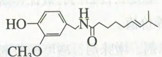  
辣椒素

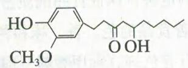  
姜辣素

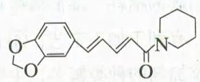  
胡椒碱

## (3) 甜味剂

食品添加剂中的甜味剂并不是指蔗糖、蜂蜜等有甜味的食品，而是指本身具有甜味，但几乎不产生热量并且其营养价值又很低的物质，通常又称它们为低热甜味剂。这种甜味剂可用于控制血糖升高，避免肥胖，控制体重和预防心血管疾病的发生，它还是某些疾病患者（如糖尿病患者）所必需的食糖代用品。

人们最熟悉的甜味剂是糖精（实际上用的是糖精钠），它的化学名称是邻磺酰苯酰亚胺，为无色晶体，难溶于水，其钠盐则易溶于水，甜味约为蔗糖的300\~500倍。食品中只要含有十万分之一的糖精钠，我们就能够尝得出甜味。所以在使用糖精时，用量要很少，放多了反而会使食物发苦。糖精在少量使用时，不会被人体吸收并长时间地留在体内，一般在24小时内就会被排出体外。所以少量糖精对人体没有毒性，但也无营养价值。

现在，较受欢迎的是天然低热甜味剂，它们是从一些植物的根（如甘草的根）、叶（如甜叶菊的叶）、果（如罗汉果的果）中取得的，其安全性比人工合成的糖精高。甜叶菊苷是多种苷的混合物，又称甜菊糖，是从甜叶菊的叶子中提取的，它的甜度为蔗糖的300倍。罗汉果苷是从我国云南、广西产的罗汉果中分离出来的非糖甜味剂，甜度约为蔗糖的300倍。

用稀硫酸使玉米芯、棉籽壳或木材发生水解反应，可制得木糖。再用镍作催化剂，经加氢反应，就可以制得木糖醇。它的甜度虽然只有蔗糖的1.25倍，但它的化学性质稳定，不像蔗糖那样能被细菌利用，所以不会损伤牙齿，可作防龋齿的甜味剂。木糖醇在人体内的代谢与胰岛素无关，不会增加血糖，是糖尿病患者的理想甜味剂。

天然存在的蛋白质甜味剂引起了化学家的极大兴趣，它们是氨基酸和糖的聚合物，特点是安全性高，甜度极大。例如，每升酸牛奶中只要含有2.5 mg某种蛋白质甜味剂就会有甜味，该甜味剂的甜度约为蔗糖的几千倍。

## (4) 增味剂

人们最熟悉的增味剂是味精，它是能使食品呈鲜味的一种物质。味精最初是从海带中所含的鲜味物质中发现的。味精的学名是L-谷氨酸一钠，是一种无色的结晶或粉末，易溶于水，有鲜味。实际上，如果食物中不含氯化钠，味精就难以显示鲜味。

经过分析，肉类具有鲜味主要是由于含有肌苷酸，蕈类具有鲜味主要是由于含有鸟苷酸。于是，这两种增味剂成了比味精更新型的品种，而且它们比味精具有更突出的优点，即它们单独存在时鲜味虽不强，但如果与味精混合使用，可使味精的鲜味增加20\~30倍。

## (5) 抗氧化剂、防腐剂

食品在加工、储存和运输过程中，为了防止发生化学变化以及酶、微生物所引起的食品色、香、味异常，防止营养损失和食品腐败，使用抗氧化剂和防腐剂是必要的。

防腐剂是能抑制微生物的生长，对人体毒性极小的物质。它不改变食品的色、香、味，避免了一般的加热方法对食品进行灭菌。最常用的防腐剂有：苯甲酸（即安息香酸， $C_{6}H_{5}COOH$ ）、山梨酸（ $CH_{3}CH=CH-CH=CHCOOH$ ）、山梨酸钾、丙酸钙 $\left[\left(\mathrm{CH}_{3}\mathrm{CH}_{2}\mathrm{COO}\right)_{2}\mathrm{Ca}\right]$ 。

防腐剂只能防止或减少由于微生物造成的食品变质现象，但不能防止因空气中的氧气而造成的食物变质。例如，食物中的油脂氧化变质，是由于不饱和脂肪酸被氧化造成的。氧化作用还能使水果和蔬菜失去维生素C，使苹果和梨的表面变成褐色。能防止食物被氧化的食品添加剂叫做抗氧化剂，主要有：维生素C、二丁基羟基甲苯、丁基羟基茴香醚、 $\alpha$ -生育酚（维生素E）。

## (6) 营养强化剂

营养强化剂是一类特别的食品添加剂，它具有特别重要的意义。正常人每天需要各种营养成分，而食物内某种营养成分不足就会引起各种疾病。例如，缺铁会引起贫血，缺少维生素A会引起夜盲症，缺乏赖氨酸会影响人体有效地吸收其他必需氨基酸，从而影响人体的生长发育和健康。

众所周知，任何食物都不是完美无缺的，它不可能是所有的营养物质（糖、脂肪、蛋白质、维生素、矿物质）含量都很丰富。只能是某些营养成分多一些，某些营养成分少一些，甚至严重不足。另外，对于地区性的缺陷（如山区缺碘）、不良饮食习惯（如偏食）、不良烹饪方法造成的营养缺乏，营养强化剂则可以解决部分问题。所谓“强化”，就是添加不足的营养成分。人们熟悉的例子有在粮食及其制品中添加赖氨酸。一般来说，大米、小麦粉和玉米中的赖氨酸的含量都很少，如果在大米和小麦粉中添加赖氨酸，就可以使人体均衡地吸收各种必需氨基酸。市售的赖氨酸面包和赖氨酸饼干都是适合儿童生长发育的营养强化食品。又如，在食盐中添加碘，就成了营养强化调味品——加碘盐，对预防甲状腺肿大有一定效果。

目前，食品添加剂已经进入了千家万户，而且多数食品添加剂都是人工合成的化学品，或多或少地具有各种各样的毒性。因此，加强对食品添加剂的管理是十分重要的。管理的基本要求是：①可疑的化学品不能作为食品添加剂使用；②在出售的食品包装上，都应标明使用的食品添加剂的名称；③要积极研究因摄取食品添加剂造成的毒害，并作出评价；④强化食品卫生监督体制；⑤制订统一的食品卫生法规。

从某种意义上来说，食品添加剂是为食品预防“疾病”的一种“药物”。一般来说，人们并不忌讳吃药，但人们也必须知道，现在绝大多数药物也都是人工合成的化学品。因此，我们也不必对食品添加剂产生恐惧心理，而应该采取积极的态度，既要使用它，也要管理它。

## 14. 生态系统和生态平衡

人类的生存环境可以分为非生物环境（如空气、水、土壤、光、热等）和生物环境（如植物、动物、微生物等），二者不是孤立存在的。自然界某一范围内，由相互依存的一定种类的动物、植物、微生物等组成了生物群落。生物群落同其生存环境之间，以及生物群落内不同种群生物之间不断进行着物质交换和能量交换，构成了大小不一、多种多样的生态系统。

生态系统发展到成熟阶段，它的生物种类的组成，各个种群的数量及比例，以及能量和物质的输入、输出等，都处于相对稳定的状态，这种状态被称为生态平衡。

生态系统能自动调节并维持自己的正常功能。但是，这种自动调节能力和代替补偿功能是有一定限度的。当干扰因素的影响超过其调节能力时，就会破坏生态平衡，造成生态失调。影响生态平衡的因素有自然因素和人为因素。自然因素包括火山喷发、地震、海啸、泥石流、雷击、火灾等。自然因素对生态系统的破坏在地域上有一定局限性，而且出现频率一般不高。而人为因素对生态平衡的破坏却是大量和长期的，甚至是多方面的。

人体从环境中摄取空气、水和食物，经过消化、吸收、合成，组成人体的细胞和组织的各种成分，并产生能量，维持着人体的生命活动。同时，人体内不需要的代谢产物通过各种途径排出体外，进入环境。环境和人之间不断地进行着物质与能量的交换。

食物链是人类同周围环境进行物质与能量交换的重要途径。和人类有关的食物链主要有两条：一条是陆生生物食物链，另一条是水生生物食物链。因此，如果大气、水或土壤受到某种污染，那么污染物均有可能沿食物链逐级传递，最终影响到居于食物链顶端的人类。污染物能沿食物链富集，使本来浓度很低的污染物富集到危险的高浓度水平。如有机氯农药DDT在水中浓度很低，但从水到鱼类、鸟类的富集，其浓度可提高几千万倍。由此引起的有机氯农药在人体内的蓄积是世界性的问题，这与食物链有密切关系。为此，我国和其他许多国家已停止生产和使用像DDT这样的高残留农药。

## 15. 大气主要污染物及其危害

人为排放的大气污染物种类很多，下面介绍危害较大的5种主要大气污染物的来源、危害及其在大气中的迁移转化等。

## (1) 颗粒物

大气是由各种固体或液体微粒分散在气体中形成的一个庞大的分散系统（气溶胶），气溶胶中分散的各种微粒（除水外）称为大气颗粒物，包括尘、烟、雾等。

颗粒物的来源可分为天然来源和人为来源，以人为来源为主。人为来源主要是燃料燃烧过程中形成的煤烟、飞灰等，各种工业过程排放的原料或产品的微粒，汽车排放的尾气中的颗粒物，以及化石燃料燃烧排放的 $SO_{2}$ 在一定条件下生成的硫酸盐等。天然来源，如风起尘埃、海浪溅起的浪沫、火山灰、森林火灾的燃烧物以及植物的花粉等。

颗粒物是需要监测的大气污染物，大气中的一些有毒物质大都存在于颗粒物中，对人及动植物的危害很大。尤其是颗粒大小在0.1\~10 $\mu$ m的有可能深深地侵入肺部，危害最大。颗粒物的吸附沉积，会使电气装置接触不良或引起短路，使金属材料容易产生电化学腐蚀。此外，大气中的颗粒物还会遮挡阳光，使气温降低，或形成冷凝核心，使云雾和雨水增多，以致影响气候。

由于重力沉降和雨雪，部分悬浮颗粒物质可以自然地从大气中除掉。

## (2) 硫氧化物 ( $SO_{x}$ )

大气中的硫氧化物主要是 $SO_{2}$ ，还有小部分是 $SO_{3}$ 。主要来自发电厂和供热厂中含硫化石燃料（其中80%是煤）的燃烧，其次是冶炼厂、硫酸厂的排放气，有机物的分解和燃烧，海洋及火山活动等。自20世纪70年代以来，全球 $SO_{2}$ 排放总量平均每年递增5%，1980年达到2亿吨。但自20世纪90年代后， $SO_{2}$ 的排放在不少国家得到了有效控制，全球总排放量可能有所下降。

$SO_{2}$ 不但对人的呼吸道有强烈的刺激性，而且还会使植物产生漂白的斑点，抑制其生长，损害叶片和降低农作物产量。当与空气中的颗粒物共存时，其危害可增大3\~4倍。 $SO_{x}$ 的许多不良作用是由于 $SO_{3}$ 与水作用生成的 $H_{2}SO_{4}$ 造成的。

## (3) 氮氧化物 (NO $_{x}$ )

氮氧化物的种类很多，造成大气污染的主要是NO和 $NO_{2}$ 。它们主要来自化石燃料的高温燃烧（如汽车、飞机及工业窑炉中燃料的燃烧）过程，也有来自生产和使用 $HNO_{3}$ 的工厂废气，还有氮肥厂、有机中间体厂、有色及黑色金属冶炼厂的某些生产过程。现在，人类每年向大气排放的 $NO_{x}$ 已超过5000万吨。

氮氧化物浓度高的气体呈棕黄色，从工厂高大烟囱排出来的含 $NO_{x}$ 的气体，人们称它为“黄龙”。NO会刺激呼吸系统，还能与血红蛋白（其功能主要是运载 $O_{2}$ 和 $CO_{2}$ ）结合成亚硝基血红蛋白而使人中毒。 $NO_{2}$ 能严重刺激呼吸系统，并能使血红蛋白硝基化，危害比NO的更大。另外， $NO_{2}$ 还会毁坏棉花、尼龙等织物，使柑橘落叶和发生萎黄病等。然而，大气中 $NO_{2}$ 更严重的危害可能是其在形成光化学烟雾的过程中所起的关键作用。另外，氮氧化物也会形成硝酸酸雨产生危害。

光化学烟雾的形成机理是美国加利福尼亚大学有机化学教授斯密特于20世纪50年代首先提出来的。他认为，洛杉矶烟雾是由南加利福尼亚的强阳光照射引发了大气中的烯烃和氮氧化物产生一系列光化学反应而形成的。他同时还指出，大气中的碳氢化合物和氮氧化物的主要来源是汽车尾气。

光化学烟雾的形成从 $NO_{2}$ 的光化学分解开始:

$$
\mathrm{NO} _ {2} \xrightarrow {h \nu} \mathrm{NO} + \mathrm{O}
$$

然后在强阳光作用下引起一系列复杂的链式反应，与大气中的一次污染物烃类（尤其是烯烃）、 $\mathrm{NO}_x$ 等作用，生成 $\mathrm{O}_3$ 、PAN（过氧酰基硝酸酯类）、醛等为主要成分的二次污染物，它们与一次污染物一起，共同形成光化学烟雾。

## (4) CO 和 $CO_{2}$

CO是人类向大气排放量最大的污染物（约占大气中污染物总量的三分之一），主要来自燃料的不完全燃烧。但是近年来的研究指出天然产生的CO也不容忽视。由于近代人们对燃烧装置和燃烧技术的改进，所以从固定燃烧装置排放的CO量逐渐减少，而由汽车等移动源燃烧产生的CO每年约有2.5亿吨，占人为污染源排放CO总量的70%左右。现代发达国家城市空气中的CO有80%是由汽车排放的。汽车尾气的CO浓度可高达40\~115 mg/m³。

低层大气中相当丰富的 $CH_{4}$ 可与氢氧自由基（·OH）作用生成甲基自由基（· $CH_{3}$ ），继而转变成CO。海洋是CO的另一个重要的天然来源。以前人们认为海洋是吸收CO的重要渠道，但现在发现海洋中CO是过饱和的，这样海洋中的CO浓度反而高于大气中的CO浓度。

近一个多世纪以来，随着工业、交通和能源工业的高速发展，排入大气中的 $CO_{2}$ 日益增多，超过了植物的光合作用等自然界消除 $CO_{2}$ 的能力，使 $CO_{2}$ 浓度迅速增加。 $CO_{2}$ 是一种温室气体，其含量的不断增加会引起全球气候变暖。

## (5) 烃类 ( $C_{x}H_{y}$ )

烃类污染主要来自汽车尾气。除非采取特别措施保证燃烧完全，尾气中总含有相当量的未燃尽的烃类。这些烃类大多是饱和烃（如 $CH_{4}$ 、 $C_{2}H_{6}$ 、 $C_{8}H_{18}$ 等），更为严重的是其中一小部分由饱和烃裂解而产生的活性较高的烯烃，如辛烷裂解：

$$
\mathrm{C} _ {8} \mathrm{H} _ {1 8} (\mathrm{l}) \stackrel {\triangle} {=} 2 \mathrm{C} _ {2} \mathrm{H} _ {4} (\mathrm{g}) + \mathrm{H} _ {2} (\mathrm{g}) + \mathrm{C} _ {4} \mathrm{H} _ {8} (\mathrm{g})
$$

裂解产物乙烯、丙烯、丁烯等不饱和烃更易与O、NO及 $O_{3}$ 等发生反应，生成光化学烟雾中的某些有害成分。

烃类的生物来源也是不容忽视的，其中主要释放物有 $CH_{4}$ （主要是牛体内的发酵过程和稻田耕作产生）和萜烯类化合物（广泛存在于某些植物的叶、花或果实中）等。这些物质释放量虽大，但分散在广阔的大自然中，所以并未构成对环境或人类的直接危害。但研究表明，从1978年到1987年，全球范围的低层大气中 $CH_{4}$ 浓度已上升11%。 $CH_{4}$ 浓度的增加会强化温室效应。还应特别提出的其他大气有机污染物有氟氯代烷和苯并芘。研究表明，氟氯代烷是破坏高空臭氧层的主要物质，苯并芘是致癌物质。

大气污染物主要通过呼吸道进入人体，也有少量通过体表进入人体。人体吸入的空气经过鼻腔、咽部、气管、支气管后进入肺泡，并在肺泡中进行气体交换。当血液通过肺泡毛细血管时，放出二氧化碳，吸收氧气。含氧的血液被输送到人体各部分，供细胞新陈代谢之用。如果生活在烟雾弥漫的环境中，空气中的有毒、有害污染物就会溶于体液或沉积在肺泡上。轻者会使上呼吸道受到刺激而有不适感，重者会引起疾病，使呼吸道和肺功能损害，引起病变。

大气污染对人体健康的危害大致可分为急性中毒、慢性中毒和致畸致癌作用。

急性中毒发生在某些特殊条件下。例如，工厂在生产过程中发生事故，造成大量有害气体泄漏或外界气候条件突然变化等，都会引起人群的急性中毒。例如，震惊世界的伦敦烟雾事件、美国联合碳化物公司印度博帕尔市农药厂剧毒气体泄漏事件等。

慢性中毒主要表现在人体长期连续地吸入低浓度的污染物导致患病率上升。二氧化硫、颗粒物、氮氧化物等即使浓度很低也能刺激呼吸系统，诱发呼吸道的各种炎症。日本“四日市哮喘病”是慢性中毒的典型例子。

致畸致癌作用指的是随着空气污染的加剧，空气中致畸致癌物质的含量日益增多，造成婴儿畸形和成人癌症的发病率增高。城市中肺癌发病率、死亡率往往高于农村，就是一个典型的例子。

除硫氧化物、氮氧化物、颗粒物等对人体健康有很大危害外，大气污染物中的氯化物、砷，有毒重金属如铅、镉、锌、锰、钒、钡、汞等，都可能引起人体慢性中毒，有的可引起癌症。

## 16. 对煤燃烧产生的污染物的控制

## (1) 消烟除尘

首先是改进燃烧方式和设备，使燃料完全燃烧；其次是靠机械设备收集粉尘。常用的除尘设备有沉降室、旋风收尘器、电除尘器、水浴除尘器等。

## (2) 对二氧化硫的控制

对二氧化硫的控制有三种方式：烟气脱硫、燃料预先脱硫、燃烧中脱硫。

①烟气脱硫是将二氧化硫经过适当的化学反应变为有用的化工产品或肥料。如对含高浓度二氧化硫烟气的处理是把二氧化硫经催化反应生成硫酸。对低浓度二氧化硫烟气可以用多种处理方法，下面简单介绍利用液相碱性物质的吸收法。

氨酸法 用氨水吸收二氧化硫的主要过程为:

$$
\mathrm{NH} _ {3} (\mathrm{aq}) \xrightarrow {\mathrm{SO} _ {2} (\mathrm{g})} (\mathrm{NH} _ {4}) _ {2} \mathrm{SO} _ {3} (\mathrm{aq}) \xrightarrow {\mathrm{SO} _ {2} (\mathrm{g})} \mathrm{NH} _ {4} \mathrm{HSO} _ {3} (\mathrm{aq})
$$

再用93%的浓硫酸分解亚硫酸氢铵，可得到高纯度二氧化硫。

石灰乳法 用石灰乳来吸收含二氧化硫的尾气，并产生副产品——石膏。其化学反应如下：

$$
\begin{array}{r l} & 2 \mathrm {Ca(OH) _ {2}} + 2 \mathrm {SO_ {2}} = 2 \mathrm {CaSO_ {3}} \cdot \frac {1}{2} \mathrm {H_ {2} O} + \mathrm {H_ {2} O} \\ & 2 \mathrm {CaSO_ {3}} \cdot \frac {1}{2} \mathrm {H_ {2} O} + 2 \mathrm {SO_ {2}} + \mathrm {H_ {2} O} = 2 \mathrm {Ca(HSO_ {3}) _ {2}} \\ & 2 \mathrm {Ca(HSO_ {3}) _ {2}} + \mathrm {O_ {2}} + 4 \mathrm {H_ {2} O} = 2 \mathrm {CaSO_ {4}} \cdot 2 \mathrm {H_ {2} O} + 2 \mathrm {H_ {2} SO_ {3}} \end{array}
$$

石膏

石膏在工业中用途较多，可以用作建筑材料（石膏板），还可以作为高密度树脂材料和复合材料中的填料。

②燃料预先脱硫是在煤炭洗选中实现的。洗煤的方法有物理的和化学的两种。物理洗选是利用煤中硫铁矿与其他组分间物理性质的差异进行分离。化学方法脱硫是利用化学反应对硫铁矿中的硫进行脱除。

③燃烧中脱硫是采用流化床燃烧技术进行的。这种方法是向炉内喷射石灰或白云石作流动介质，与煤粒混合在炉内进行多级燃烧，二氧化硫以硫酸钙的形式除去。这种燃烧方式不仅能脱除二氧化硫，而且因燃烧温度较低，可以减少氮氧化物的产生，因此国内外对这项技术十分重视。

[摘编自：浙江大学普通化学教研组．普通化学（第五版）．北京：高等教育出版社，2002]

## 17. 水体污染

水的污染有两类。一类是自然因素造成的，如地下水流动把地层中某些矿物溶解，使某些地区水中盐分、某些元素含量偏高，或因动植物腐烂产生的毒物而影响了当地的水质。另一类是人为因素造成的，主要是工业排放的废水。此外，还包括生活污水、农田排水，以及大气中的污染物和地面垃圾经降雨淋洗流入水体的污水。

## 造成水体污染的物质有哪些？

①需氧有机物 包括淀粉、糖类、蛋白质、脂肪、纤维素、氨基酸、脂肪酸、脂类等，主要来自生活污水，肉类加工废水，食品、造纸、制革、制糖、印染、焦化、石油化工等工业废水。我国造纸行业排放的需氧有机物占全国排放总量的30%以上。

需氧有机物本身不一定有毒性，它们在生化作用下易分解，分解时需要大量消耗水中的溶解氧，所以叫需氧有机物。水体中需氧有机物越多，耗氧就越多，水体污染也就越严重。严重时可使水体发生恶臭，破坏水生生态系统，对渔业生产影响甚大。

需氧有机物的浓度测定，通常间接地用单位体积水中需氧有机物生化分解过程中所消耗的氧量（以mg/L为单位）来表示，即用生化需氧量（BOD）来表示。一般用水温在20℃时5天的生化需氧量（ $BOD_{5}$ ）作为统一指标，用来反映需氧有机物的含量与水体污染的关系。

②难降解有机物 指那些难以被生物分解的有机物，如有机氯农药、多氯联苯、芳香胺、合成高分子（塑料、合成橡胶、合成纤维）、染料等有机物。它们一旦污染环境，难以被生物降解，危害时间较长。有机氯农药由于化学性质稳定，在环境中毒性降低一半需十几年，甚至几十年，因此对人体危害严重。

③重金属 污染水体的重金属主要有汞、镉、铅、铬、铜等。其中以汞的毒性为大，镉次之，铬、铅等也有相当大的毒性。砷不属于重金属，但毒性与重金属相似，习惯上在重金属类讨论。有研究认为，砷、铬、镍、铍和镉的某些化合物是致癌的。目前，我国地表水和地下水污染比较普遍存在的重金属有汞、铬、砷和镉。重金属对人体危害甚大。饮用水中含有微量重金属，即可对人体产生毒性效应。一般重金属产生毒性的浓度范围大致是1\~10 mg/L，毒性强的汞、镉产生毒性的浓度为0.01\~0.1 mg/L。重金属可以通过饮水、空气、食物进入人体，而农产品、畜产品、水产品都有富集重金属的特性，特别是鱼、贝类，富集程度更高，往往对人体健康造成严重威胁。重金属进入人体后不容易排泄，容易在一些脏器中累积，造成慢性中毒。发病的潜伏期都很长，一旦发病，治疗十分困难。

重金属在水体中不能被微生物降解，只能发生各种形态之间的相互转化，以及分散和富集，这种过程被称为金属迁移。重金属在水中可以化合物形态存在，也可以离子形式存在。如汞在海水中以 $\left[\mathrm{HgCl}_{4}\right]^{2-}$ 形式存在，还有少量的汞以甲基汞离子（ $\mathrm{CH}_{3} \mathrm{Hg}^{+}$ ）的形式存在。

在地表水中，重金属化合物的溶解度很小，经过混凝、沉淀等作用，往往沉积于水底，其浓度比水体中的高几个数量级。重金属离子由于带正电，在水中很容易被带负电的胶体颗粒吸附。吸附重金属离子的胶体可以随水流向下游迁移，但大多会很快沉降。以上两个因素大大限制了重金属在水体中的扩散，使它们主要富集在排水口下游一定范围的底泥中，很难治理。

④植物营养物质 包括氮、磷及其他一些物质，它们是植物生长、发育所需要的养料。但过多的植物营养物质进入水体会恶化水质，影响渔业生产和危害人体健康。其来源主要有：

农业废水 以氮为例，一般农作物对氮元素的利用率不足50%，利用率低的甚至仅有30%。未被农作物吸收的大部分化肥和农家肥被农田排水和地表径流携带至地下水或地表水中。

生活用水 粪便、泔水、洗涤水中的含磷洗涤剂增大了生活污水中的含磷量，发达国家的生活污水中氮、磷含量都比较高。

工业废水 如造纸、皮革、制糖、食品、化肥等工业废水。

地面径流 雨水淋溶垃圾、磷灰石、硝石、鸟粪等，使一定量的植物营养物质进入水体。

植物营养物质在水体中的迁移转化是有规律的。植物营养物质可以是无机物，也可以是有机物。含氮有机物中最普通的蛋白质在水中的分解过程如下：

## 蛋白质→氨基酸→氨

在分解过程中，含氮有机化合物不断减少，而含氮无机化合物不断增加。氨在微生物参与下可以进一步被氧化成亚硝酸，进而被氧化成硝酸，最后生成硝酸盐。具体过程如下：

氨氧化成亚硝酸：

$$
2 \mathrm{NH} _ {3} + 3 \mathrm{O} _ {2} \xlongequal {\text {微生物}} 2 \mathrm{HNO} _ {2} + 2 \mathrm{H} _ {2} \mathrm{O}
$$

亚硝酸氧化成硝酸：

$$
2 \mathrm{HNO} _ {2} + \mathrm{O} _ {2} \xlongequal {\text {   微生物   }} 2 \mathrm{HNO} _ {3}
$$

水体中植物营养物质过多，会造成缓流水体的富营养化。富营养化是湖泊分类与演化的概念，是水体衰老的一种表现。湖泊、水库、内海、河口以及水网地区，水流缓慢，既适于植物营养物质的积累，又适于水生植物的繁殖。当这些水体中植物营养物质积聚到一定程度后，水体过分肥沃，藻类繁殖特别迅速，使水生生态系统遭到破坏，这种现象被称为水体的富营养化。

在富营养化的水体中，往往出现以蓝藻、绿藻等占优势的情况。这时，水面上可出现由这些藻类形成的一片片的“水华”，又称“藻衣”，在海洋上会产生“赤潮”。这些藻类有恶臭，有的有毒，表面有一层胶质膜，鱼不能食用。藻类聚集在水体上层，发生光合作用，放出大量的氧气，使水体表层的溶解氧达到过饱和。藻类遮蔽阳光，底生植物因光合作用受到阻碍而死去。在水体底部，藻类和底生植物残体在厌氧条件下腐烂、分解，又将氮、磷等植物营养物质重新释放到水中，再供藻类利用。这样周而复始，形成了植物营养物质在水体中的物质循环，使植物营养物质长期保留在水体中。由于每年有大量藻类残体沉积，水体逐渐变浅。日久天长，这些湖泊、水库等水体会演变成沼泽。富营养化水体的上层处于溶解氧过饱和状态，下层处于缺氧状态，底层则处于厌氧状态，这对鱼类生长不利。水体中溶解氧过饱和，严重时会引起鱼类循环系统中的溶解气体从血液中逸出而形成气栓，阻碍血液流通，造成鱼类死亡。此外，藻类会堵塞鱼鳃，影响鱼类呼吸。因此，随着水体富营养化程度的加剧，鱼产量会逐渐减少，甚至在藻类大量繁殖的季节出现大批死鱼的现象。

⑤酸、碱和一般无机盐 酸性或碱性物质进入水体使pH发生变化。酸、碱物质在水体中可以彼此中和，也可以分别跟地表物质发生反应生成无机盐类。由此引起水体中酸、碱、盐浓度超过常量而使水质变坏。

水体中的酸主要来源于冶金、金属加工的酸洗工序，人造纤维、硫酸、农药等工厂的废酸水，矿山排水以及进入水体的酸雨等。水体中的碱主要来源于碱法造纸、化学纤维、印染、制革、炼油等工业排放的污水。天然水体中的无机悬浮物，如黏土等矿物可以与废水中的酸、碱成分发生化学反应而生成盐类。例如：

$$
\begin{array}{r l} & \mathrm{H} _ {2} \mathrm{SO} _ {4} + \mathrm{CaSO} _ {3} = \mathrm{CaSO} _ {4} + \mathrm{H} _ {2} \mathrm{O} + \mathrm{SO} _ {2} \uparrow \\ & 2 \mathrm{NaOH} + \mathrm{SiO} _ {2} = \mathrm{Na} _ {2} \mathrm{SiO} _ {3} + \mathrm{H} _ {2} \mathrm{O} \end{array}
$$

自然环境对污染物都有一定的承受量，即环境容量。水体可以在它的环境容量范围以内，经过水体的物理、化学和生物作用，使排入的一定数量的污染物浓度降低，逐步恢复原有的水质，这个过程被称为水体自净。上面的两个反应式即酸、碱废水在天然水体中的某种自净过程，会使水体中的无机盐含量增加。

水体受酸、碱污染后，pH会发生变化。弱碱性水比较适于应用，但当pH小于6.5或大于8.5时，水中微生物的生长会受到抑制，降低了水体对需氧有机物的净化能力。如果水体长期受酸、碱污染，会使水生生物的种群逐渐变化，鱼类减少，甚至绝迹。酸会腐蚀船舶、水下建筑，破坏土壤理化性质，影响农作物生长。酸还可以腐蚀鱼类的鳃，降低吸收氧的能力；腐蚀鱼的内脏，使血液滞流，排泄器官失去作用。当pH小于5，鱼类就难以生存。农田灌溉长期使用pH小于5.5的水，土壤中硝化细菌的生长会受到抑制，硝化作用减弱，氮肥不能充分释放，磷酸盐的肥效也要降低，土壤中的钙、镁容易损失。pH大于9的水会对水生生物和农作物有明显影响。碱性污染物进入鱼类消化系统会引起消化道黏膜糜烂、出血甚至穿孔。碱性污染物会影响农作物生长，造成土壤盐碱化。我国渔业用水标准对淡水域规定pH为6.5\~8.5，海水为7.0\~8.5，农田灌溉用水标准要求pH为5.5\~8.5。

⑥石油类物质 近年来，石油及其油类制品对水体的污染比较突出。在石油的开采、储运、炼制和使用过程中排出的废油和含油废水会使水体遭受污染。石油化工、机械制造行业排放的废水中也含有各种油类。

另外，水中还有病原微生物污染。病原微生物包括：病菌（如霍乱弧菌、痢疾杆菌、沙门氏菌、大肠杆菌、结核杆菌等，每升生活污水中的细菌总数可高达数百万个）、病毒（如肝炎病毒等）、寄生虫等。

[摘编自：梁英豪．化学与环境．南宁：广西教育出版社，1999]

## 18. 废水处理

排放到污水处理厂的污水及工业废水，可利用多种分离和转化方法进行无害化处理，其基本方法可分为物理法、化学法、物理化学法和生物法。各种方法的基本原理和单元技术如表8-2所示。

## 表8-2 污水处理方法

<table><tr><td>基本方法</td><td>基本原理</td><td>单元技术</td></tr><tr><td>物理法</td><td>物理或机械的分离过程</td><td>过滤、沉淀、离心分离等</td></tr><tr><td>化学法</td><td>加入化学物质与污水中有害物质发生化学反应的转化过程</td><td>中和、氧化、还原、分解、混凝、化学沉淀等</td></tr><tr><td>物理化学法</td><td>物理化学的分离过程</td><td>吸附、萃取、离子交换、电渗析、反渗透等</td></tr><tr><td>生物法</td><td>微生物在污水中对有机物进行氧化、分解的新陈代谢过程</td><td>活性污泥、生物滤池、生物转盘、氧化塘、厌气消化等</td></tr></table>

废水按水质状况及处理后出水的去向确定其处理程度。废水处理程度可分为一级、二级和三级处理。

一级处理由筛滤、重力沉淀和浮选等物理方法串联组成，主要是除去废水中大部分粒径在0.1 mm以上的大颗粒物质（固体悬浮物），且减轻废水的腐化程度。经一级处理后的水一般还达不到排放标准，故通常将一级处理作为预处理，以减轻后续处理工序的负荷和提高处理效率。

二级处理是采用生物处理方法（又称微生物法）及某些化学法，以除去水中的可降解有机物和部分胶体污染物。在自然界中，存在大量依靠有机物生存的微生物，它们具有氧化分解有机物的巨大能力。生物法处理废水就是利用微生物的代谢作用，使废水中的有机污染物氧化降解成无害物质。二级处理中采用的化学法主要是混凝法。废水中的某些污染物常以细小悬浮颗粒或胶体颗粒的形式存在，很难用自然沉降法除去。向废水中投入混凝剂，使细小悬浮颗粒和胶体颗粒聚集成较粗大的颗粒而沉淀，与水分离。常用的混凝剂有硫酸铝、明矾、硫酸亚铁、硫酸铁、三氯化铁等无机混凝剂和多种有机高分子混凝剂。

经过二级处理后的水一般可达到农灌标准和废水排放标准。但水中还存留一定量的悬浮物、生物不能分解的有机物、溶解性无机物和氮、磷等藻类增殖营养物，并含有病毒和细菌，因而还不能满足较高要求的排放标准，也不能用于生产自来水。要作为某些工业用水和地下水的补给水，则需要继续对水进行三级处理。

三级处理可采用化学法（化学沉淀法、氧化还原法等）、物理化学法（吸附、离子交换、萃取、电渗析、反渗透法等），这是除去某些特定污染的一种“深度处理”方法。化学法就是通过化学反应改变废水中污染物的化学性质和物理性质，使之发生化学和物理状态的变化，进而将其从水中除去。例如，化学沉淀法就是利用某些化学物质作沉淀剂，与废水中的污染物（主要是重金属离子）进行化学反应，生成难溶于水的沉淀而析出，从废水中分离。如可用石灰 $\left[\mathrm{Ca(OH)}_{2}\right]$ 与废水中的 $Cd^{2+}$ 等重金属离子形成难溶于水的氢氧化物沉淀：

$$
\mathrm{Cd} ^ {2 +} + 2 \mathrm{OH} ^ {-} = \mathrm{Cd(OH)} _ {2} \downarrow
$$

金属硫化物的溶解度一般都比较小，因此，用硫化钠或硫化氢作沉淀剂能更有效地处理含重金属离子的废水。特别是对于经过氢氧化物沉淀法处理后，尚不能达到排放标准的含 $Hg^{2+}$ 和 $Cd^{2+}$ 的废水，再通过反应可生成难溶于水的硫化物沉淀：

$$
\begin{array}{r l} & \mathrm {Hg^ {2 + } + S^ {2 - } = HgS\downarrow} \\ & \mathrm {Cd^ {2 + } + S^ {2 - } = CdS\downarrow} \end{array}
$$

沉淀自然沉降后的出水中， $Hg^{2+}$ 含量可由起始的400 mg/L左右降至1 mg/L以下。

化学氧化法常用来处理工业废水，特别适宜处理难以被生物降解的有机物，如大部分农药、染料、酚、氰化物，以及其他引起色度和臭味的物质。常用的氧化剂有含氯类（液态氯、次氯酸钠、漂白粉等）和含氧类（空气、臭氧、过氧化氢、高锰酸钾等）氧化剂。

氯、次氯酸钠、漂白粉等可以用来氧化废水中的有机物、某些还原性无机物，以及杀菌、除臭、脱色等。氯氧化法处理含氰废水是废水处理的一个典型实例。在碱性条件下（pH=8.5\~11），液氯可将氰化物氧化成氰酸盐：

$$
\mathrm{CN} ^ {-} + 2 \mathrm{OH} ^ {-} + \mathrm{Cl} _ {2} = \mathrm{CNO} ^ {-} + 2 \mathrm{Cl} ^ {-} + \mathrm{H} _ {2} \mathrm{O}
$$

氰酸盐的毒性仅为氰化物的千分之一。若投加过量氧化剂，可将氰酸盐进一步氧化为二氧化碳和氮气，使水质得以进一步净化：

$$
2 \mathrm{CNO} ^ {-} + 4 \mathrm{OH} ^ {-} + 3 \mathrm{Cl} _ {2} = 2 \mathrm{CO} _ {2} + \mathrm{N} _ {2} + 6 \mathrm{Cl} ^ {-} + 2 \mathrm{H} _ {2} \mathrm{O}
$$

空气中的氧是最廉价的氧化剂，但氧化能力不够强，只能氧化易于氧化的污染物。过氧化氢具有强氧化能力，适于处理多种含有毒、有味化合物的废水及难以处理的有机废水，如含硫、苯酚等的废水。高锰酸钾也是强氧化剂，主要用于除去锰、铁和某些有机污染物。

化学还原法主要用于处理含有汞、铬等重金属离子的废水。例如，用废铁屑、废铜屑、废锌粒等比汞活泼的金属作还原剂处理含汞废水，可将上述金属放在过滤装置中，当废水流过金属滤层时，废水中的 $Hg^{2+}$ 即被还原为金属汞：

$$
\mathrm{Fe} (\text {或Zn、Cu}) + \mathrm{Hg} ^ {2 +} = \mathrm{Fe} ^ {2 +} (\text {或Zn} ^ {2 +}, \mathrm{Cu} ^ {2 +}) + \mathrm{Hg}
$$

沉渣经焙烧炉加热，可以回收金属汞。

对于含铬废水，可先用硫酸酸化（pH=3\~4），然后加硫酸亚铁，使废水中的六价铬还原为三价铬：

$$
6 \mathrm{Fe} ^ {2 +} + \mathrm{Cr} _ {2} \mathrm{O} _ {7} ^ {2 -} + 1 4 \mathrm{H} ^ {+} = 6 \mathrm{Fe} ^ {3 +} + 2 \mathrm{Cr} ^ {3 +} + 7 \mathrm{H} _ {2} \mathrm{O}
$$

然后再加入石灰，降低酸度，将pH调至8\~9，三价铬离子形成难溶于水的氢氧化铬沉淀，即可自然沉降而与水分离。

$$
2 \mathrm{Cr} ^ {3 +} + 6 \mathrm{OH} ^ {-} = 2 \mathrm{Cr(OH)} _ {3} \downarrow
$$

物理化学处理法是指运用物理和化学的综合作用使废水得到净化的方法。常用的有吸附、萃取、离子交换、电解等方法，有时也将其归类于化学方法。处理废水的常用化学方法的原理和处理对象见表8-3。

## 表8-3 处理废水的常用化学方法

<table><tr><td>方法</td><td>原理</td><td>设备及原材料</td><td>处理对象</td></tr><tr><td>混凝</td><td>向浑浊液体中投入电解质,凝聚水中胶状物质,使之和水分开</td><td>混凝剂有硫酸铝、明矾、聚羟基氯化铝、硫酸亚铁、三氯化铁等</td><td>含油废水、印染废水、煤气站废水、洗毛废水等</td></tr><tr><td>中和</td><td>酸碱中和</td><td>石灰、石灰石、白云石等中和酸性废水, $CO_2$ 等中和碱性废水</td><td>硫酸厂废水、印染废水等</td></tr><tr><td>氧化还原</td><td>投入氧化(或还原)剂,将废水中物质氧化(或还原)为无害物质</td><td>氧化剂有空气( $O_2$ )、漂白粉、氯气、臭氧等</td><td>含酚、氰化物、硫、铬、汞废水,印染废水,医院废水等</td></tr><tr><td>电解</td><td>在废水中插入电极,通电后,废水中带电离子变为电中性物质</td><td>电源、电极板等</td><td>含铬、含氰(电镀)废水,毛纺废水</td></tr><tr><td>萃取</td><td>将不溶于水的溶剂投入废水中,使废水中的溶质溶于此溶剂中,然后利用溶剂与水的相对密度差,将溶剂分离出来</td><td>萃取剂:醋酸丁酯、苯等;设备有脉冲筛板塔、离心萃取机等</td><td>含酚废水等</td></tr><tr><td>吸附(包含离子交换)</td><td>将废水通过固体吸附剂,使废水中溶解的有机或无机物吸附在吸附剂上,使废水得到处理</td><td>吸附剂有活性炭、煤渣、土壤等,设备有吸附塔、再生装置等</td><td>印染废水;还可吸附酚、汞、铬等,除去异味,用于深度处理</td></tr></table>

应该指出的是，不同的处理方法有其自身的特点和适应的处理对象，应合理地选择和采用。例如，对成分复杂的废水，化学沉淀法往往难以达到排放或回用的要求，需要与其他处理方法联合使用。

[摘编自：唐有祺、王夔．化学与社会．北京：高等教育出版社，1997]

## 19. 土壤的污染及防治

长期以来，人们把大地看作处理废弃物的场所，将城市垃圾、工矿企业固体废弃物向地面倾倒。城市污水、工业废水、大气沉降物也会进入土壤。土壤污染物按其来源主要有以下几种。

## (1) 城市污水、工业废水

城市污水、工业废水中常含有氮、磷、钾及其他植物的营养成分，一些地区合理使用污水灌溉农田，可使农作物增产。通过污水灌溉，氮、磷及生物能降解的有机物可去除90%以上，一些有毒、有害物质也可以被氧化分解。因此，合理适度的污水灌溉可节约农业用水，充分利用污水中的营养元素，是一种经济的、节省能源的污水处理方法。

但是，城市污水和工业废水中也含有汞、铅、镉、砷、酚、氰化物、三氯乙醛、苯并芘等有害污染物，有些污染物不能降解，会在土壤中积累，造成严重后果。土壤污染使农作物产量和质量下降，土壤盐碱化，环境卫生恶化。因此，利用污水灌溉，特别是用工业废水灌溉时，必须要进行预处理，以除去其中的有毒、有害物质。

## (2) 垃圾及工矿企业固体废弃物

随着生产的发展和消费的增加，堆放垃圾和工矿企业固体废弃物占用了大量土地。这些废弃物不仅占用土地，而且会污染土壤、水体和大气。固体废弃物经日晒雨淋，它们的渗出液中所含有毒物质渗入土壤后，会改变土壤结构，影响土壤中微生物的活动，妨碍植物根系生长或在植物体内积累。垃圾堆放地往往也是蚊、蝇滋生地和老鼠猖狂活动地区，容易导致传染病的发生。

## (3) 化肥、农药

农田所施用的任何化肥都不可能全部被植物吸收利用，流失的化肥会随土壤中的水分向下渗透，被转移到植物根系以下或进入江河湖泊，造成污染。磷矿石中含有镉、铅等杂质，也会造成土壤污染。

农药也会造成土壤污染。目前农药污染主要是有机氯、有机磷和含氮农药。含氮农药一般在土壤中残留时间不长，但有些有致癌、致畸作用。有机磷农药较容易降解。农药污染危害人体健康，主要是通过食用含有农药的动、植物食品造成的。此外，大气沉降物、牲畜排泄物、生物残体也是土壤的重要污染源。

土壤污染防治要与综合利用结合，工矿企业固体废弃物中也含有各种资源，主要利用途径为：①利用矿物废料作建筑材料、道路工程材料、填垫材料及冶金、化工、轻工等工业原料；②利用含有机物质的废物，从中回收燃料；

③利用含有土壤、植物所需元素的废物，作土壤改良剂和肥料。

由于城市规模不断扩大，人口迅速向城市集中，垃圾的数量剧增。城市垃圾成分主要有煤灰、建筑渣土、果皮、菜叶、纸张、塑料、金属、玻璃等。处理城市垃圾，应首先通过分类，回收其中可利用的废旧物资，如废纸、废金属、旧织物、玻璃等，然后再进行以下处理：

①垃圾填埋 利用坑洼地填埋垃圾，是一种既可处置废弃物又可造地的环保措施。但应防止垃圾液渗出对土壤和水源的污染。

②垃圾焚化 垃圾在现代焚化炉内燃烧后，剩余物的体积比原体积大大缩小，便于填埋。同时消灭了各种病原体，把一些有毒、有害物质转化为无害物质。通过燃烧还可以回收热能，用来供热和发电等。

③垃圾压缩处理 垃圾经压缩可以减小体积，便于运输和填埋。近年来，日本采用高压压缩垃圾，制成垃圾块，用作填海造地材料。

防治土壤污染还应包括土壤保护、植树造林等措施，以及对已污染土壤的治理等。

## 20. 绿色化学

## (1) 绿色化学的含义

绿色化学（Green Chemistry）又称环境无害化学（Environmentally Benign Chemistry）、环境友好化学（Environmentally Friendly Chemistry）、清洁化学（Clean Chemistry）。

20世纪90年代初，化学家提出与传统的“治理污染”观念不同的“绿色化学”的观念，它要求任何一个与化学有关的活动（包括化学原料以及最终产品的使用、化学工程）对人类的健康和环境都应该是友好的。绿色化学的理想在于不再使用有毒、有害的物质，不再产生废物。从科学观点看，绿色化学是化学科学基础内容和观念的更新；从环境观点看，它强调从源头上消除污染；从经济观点看，它提倡合理利用资源和能源，降低生产成本，这是符合可持续发展要求的。

绿色化学有如下基本原则：防治污染的产生优于治理污染；原子经济性（设计的合成方法应将反应过程中所用的材料尽可能全部地转化到最终产品中）；只要可行，应尽量采用对人类和环境低毒或无毒的合成路线；设计的化学品应能保留其功效，降低其毒性；应尽可能避免使用辅助物质（如溶剂、分离试剂等），如使用也应是无毒的；应考虑到能源消耗对环境和经济的影响，并应尽量少地使用能源（在常温、常压下进行）；只要技术和经济上可行，原料应是可再生的，而不是即将耗竭的；尽量避免不必要的衍生步骤（引入阻断基团、保护和脱保护等）；催化剂（尽可能好的选择性）优于化学计量性试剂；化工产品在完成其使命后，应能降解为无害的物质，而不应残留在环境中；应进一步发展分析方法，使有害物质在生成前能够进行即时在线跟踪和控制；在化学转换过程中，所选用的物质和物质的形态尽可能地降低发生事故的可能性（包括泄漏、爆炸、火灾等）。

上述12项绿色化学的原则，反映了人们近年来在绿色化学领域中所开展的多方面的研究工作内容，也指明了未来绿色化学发展的方向，目前逐渐为国际化学界所接受。

化学反应的“原子经济性”（atom economy）概念是绿色化学的核心内容之一，最早由美国斯坦福大学的特罗斯特教授提出。他针对传统上一般仅用经济性来衡量化学工艺是否可行的做法，明确指出应该用一种新的标准来评估化学工艺过程，即选择性和原子经济性。原子经济性考虑的是在化学反应中究竟有多少原料的原子进入到了产品之中，这一标准既要求尽可能地节约不可再生资源，又要求最大限度地减少废弃物排放。理想的原子经济反应是原料分子中的原子百分之百地转变成产物，不产生副产物或废物，实现废物的“零排放”（zero emission）。“原子经济性”的概念目前也被普遍承认。特罗斯特教授获得了1998年美国“总统绿色化学挑战奖”。

## (2) 绿色化学在行动

绿色化学作为未来化学工业发展的方向和基础，越来越受到各国政府、企业和学术界的关注。例如，美国于1995年设立了“总统绿色化学挑战奖”，旨在奖励在创造性研究、开发和应用绿色化学基本原理方面取得杰出成就的个人、集体或组织。它共包括5个奖项：学术奖、中小企业奖、新合成路线奖、新工艺奖和安全化学品设计奖。

在1998年出版的《绿色化学的理论与实践》一书是绿色化学的经典之作，其中详细阐述了绿色化学的定义、原则、评估方法及发展趋势。由英国皇家化学会主办的国际性杂志《绿色化学》于1999年创刊，其内容涉及清洁化工生产技术的多方面研究成果、综述和其他信息，并涵盖了国际上通过化学品的应用或加工来减轻对环境影响的学术研究活动。

沿着一些美国“总统绿色化学挑战奖”的颁奖轨迹，我们可以看出绿色化学工艺与技术研究的主要成果和趋势。

## ①开发“原子经济性”反应

近年来，开发原子经济性反应已成为绿色化学研究的热点之一。例如，环氧丙烷是生产聚氨酯塑料的重要原料，传统上主要采用二步反应的氯醇法，不仅使用可能带来危险的氯气，而且还产生大量污染环境的含氯化钙废水，国内外均在开发催化氧化丙烯制环氧丙烷的原子经济性反应新方法。再如，某公司采用钛硅分子筛催化剂，催化环己酮与氨和过氧化氢反应，可直接合成环己酮肟。对于已在工业上应用的原子经济性反应，也还需要从环境保护和技术经济等方面继续研究和改进。实现反应的高原子经济性，就要通过开发新的反应途径，用催化反应代替一般化学反应。例如，布洛芬是一种广泛使用的非甾体解热止痛药，传统生产工艺包括6步化学反应，原子的有效利用率低于40%。某公司开发了一种合成布洛芬的新工艺，获得了新合成路线奖。新工艺采用3步催化反应，原子的有效利用率达80%，如果再考虑副产物乙酸的回收利用，则原子利用率达到99%。

## ②采用无毒、无害的原料

为了人类健康和环境安全，需要用无毒、无害的原料代替有毒、有害的原料生产所需的化工产品。例如，孟山都公司以无毒、无害的二乙醇胺为原料，经过催化脱氢，开发了安全生产氨基二乙酸钠的工艺，改变了过去的以氨、甲醛和氢氰酸为原料的二步合成路线，并因此获得了新合成路线奖。另外，国外还开发了由异丁烯生产甲基丙烯酸甲酯的新合成路线，取代了以丙酮和氢氰酸为原料的丙酮氰醇法。

## ③采用无毒、无害的催化剂

目前烃类的烷基化反应一般使用氢氟酸、硫酸、三氯化铝等酸性催化剂。这些催化剂的共同缺点是对设备的严重腐蚀和对人身的危害，以及产生废渣污染环境。目前，国内外正从分子筛、杂多酸、超强酸等新催化材料中大力开发烷基化的固体酸催化剂。例如，异丁烷与丁烯的烷基化是炼油工业中提供高辛烷值组分的一项重要工艺，目前主要使用氢氟酸或硫酸为催化剂。有些公司开发了一种负载型磺酸盐二氧化硅催化剂和固体酸催化的异丁烷、丁烯烷基化新工艺。

## ④采用无毒、无害的溶剂、助剂

大量与化工生产相关的污染问题不仅来源于原料和产品，而且来源于制造过程中使用的物质，最常见的是反应介质、配方和分离中所用的溶剂。当前广泛使用的溶剂是挥发性有机化合物，使用过程中有的会破坏臭氧层，有的会危害人体健康。因此，需要限制这类溶剂的使用。采用无毒、无害的溶剂代替挥发性有机化合物溶剂已成为绿色化学的重要研究方向。目前，最活跃的研究项目是开发超临界流体，特别是超临界二氧化碳作溶剂。曾荣获学术奖的德西蒙教授设计了一类表面活性剂，这些表面活性剂是亲二氧化碳的物质，具有亲二氧化碳和亲溶质的两亲性，从而使二氧化碳可广泛地作为溶剂使用以代替含卤素的常规有机溶剂。

除采用超临界溶剂外，还有研究关注水或近临界水作为溶剂，以及有机溶剂/水相界面反应。以水为介质的有机合成反应是环境友好合成反应的一个重要组成部分。水相中的有机反应，操作简便、安全，没有有机溶剂的易燃、易爆等问题，溶剂资源丰富、成本低、无污染。虽然水是潜在的环境友好的反应介质，但以水为介质必然引出许多新问题，如有机底物在水中的疏水作用，反应底物和试剂在水中的稳定性，水中大量存在的氢键有可能改变反应的机理等。因此，水相有机合成反应的研究成为有机合成化学一个活跃的研究领域。李朝军教授曾获得美国“总统绿色化学挑战奖”的学术奖，也表明水相有机反应的研究正在受到越来越多的关注。他在设计和发展水中和空气中进行过渡金属催化有机反应方面取得了一系列引人瞩目的创新成果。水相催化反应在药物合成、精细化学品合成以及高聚物的合成等方面都有广阔的应用前景，为传统上只能在稀有气体和有机溶剂中进行的有机合成反应开辟了崭新的领域。

## ⑤利用可再生的资源合成化学品

利用可再生的生物质（biomass）资源代替当前广泛使用的不可再生的石油，是一个具有重大意义的长远发展方向。将生物质转化为动物饲料、工业化学品和燃料的技术是十分活跃的研究领域。总的来说，生物转化非常符合绿色化学的要求，具有高效、高选择性和清洁生产的特点，反应产物单纯，易分离纯化，可避免使用贵金属和有机溶剂，能源消耗低，并且可以合成一些化学方法难以合成的化合物。曾获学术奖的德克萨斯农工大学霍尔特萨普尔教授开发了一系列技术，可以把废弃的生物质转化成动物饲料、工业化学品和燃料。

## ⑥环境友好产品

随着环境保护成为现代社会的共识，社会越来越需要环境友好的产品，各国政府制定的标准对产品在这方面的质量要求也在不断提高。例如，随着环境保护要求的日益严格，为了减小由汽车尾气中一氧化碳以及烃类引发的臭氧破坏和光化学烟雾等空气污染，美国政府逐步推广使用新配方汽油。它要求限制汽油的蒸汽压和苯的含量，还将逐步限制其他芳烃和烯烃含量，并要求在汽油中加入含氧化合物（如甲基叔丁基醚、甲基叔戊基醚）。这种新配方汽油质量要求的提高，已推动了有关炼油技术的发展。罗门哈斯公司由于开发成功一种环境友好的海洋生物防垢剂，用于阻止船底污物的形成，获得了安全化学品设计奖。开发了代替丙烯酸的生物可降解产品聚天冬氨酸高效生产工艺的公司获得了中小企业奖。

## （3）我国的绿色化学

我国在绿色化学方面的研究也逐渐活跃。1995年，中国科学院组织了《绿色化学与技术——推进化工生产可持续发展的途径》院士咨询活动，对国内外绿色化学的现状与发展趋势进行了大量调研，并结合国内情况，提出了发展绿色化学与技术、减少和消灭环境污染源的七条建议。1997年，由国家自然科学基金委员会和中国石油化工集团公司联合资助的“九五”重大基础研究项目《环境友好石油化工催化化学与化学反应工程》正式启动。项目涉及我国石油化工的一些重要过程，即导向基础性研究、技术可行性的初步探索和技术可行与经济合理性的重点探索三个层次，开展采用无毒无害原料、催化剂和“原子经济”反应等新技术的探索研究，为解决现有生产工艺存在的环境问题奠定基础。2016年，石油和化学工业联合会发布了《石油和化学工业绿色发展行动计划（2016—2020）》，以推动我国石油和化学工业走创新驱动引领的绿色发展之路。

## 教学案例

## 第一节 自然资源的开发利用（第2课时）

湖北省宜昌市夷陵中学 李欣

## 教学目标

1. 能运用物质分类的方法，通过课前搜索选择信息资源，课堂交流共享资源，初步认识海水资源的广泛性和多样性。

2. 能运用分析、推理的方法，从数据列表、图片、视频等多种形式的信息中认知研究对象的本质，逐步掌握海水资源的特点，以及水资源和其他化学资源的获取方法及原理。

3. 能运用对比、演绎的方法，从一般物质的提取工艺中归纳工艺流程的一般规律和普遍性问题。

4. 能运用归纳的方法，感受化学在海水资源开发利用中的重要性，以及海水资源开发利用中的可持续发展原则。

## 教学重点

了解各种物理及化学方法在海水资源开发中的作用。

## 教学难点

理解从海水中提取溴的工业原理和方案设计，思考从海水中提取物质工艺流程中的普遍性问题。

## 教学流程

方法线

可用分类的方法认识物质的多样性

素养体现

知识线

通过分析、推理等方法认识研究对象的本质，建立认知模型宏观辨识

环节一 认识海水资源的广泛性和多样性

设计探究方案，运用对比法、演绎法进行科学实践活动

环节二 体验海水资源综合利用的一般方法

模型认知

环节三 初探从海水中提取物质的工艺流程

科学探究
创新意识

运用归纳法形成绿色化学的理念和正确的价值观

环节四 展望海水资源开发与可持续发展

环节五 学有所获，学有所感

科学态度
社会责任

## 教学过程

教学环节一：认识海水资源的广泛性和多样性。

<table><tr><td>教师活动</td><td>学生活动</td><td>设计意图</td></tr><tr><td>【引入】在有海浪声音的背景音乐下展示美妙的海洋图片,以及地球表面海洋和陆地面积所占比例的饼状图。</td><td>认识海水资源的广泛性和多样性。</td><td>多种方式呈现信息,体现海水资源的特点,激发学生探索如何利用海水资源的学习热情。</td></tr></table>

教学环节二：体验海水资源综合利用的一般方法。

<table><tr><td>教师活动</td><td>学生活动</td><td>设计意图</td></tr><tr><td>【过渡】海水资源开发是个大工程,同学们分工学习研究了几种主要资源的开发,下面让我们一起分享各小组的学习成果,共同学习开发海水资源的方法。</td><td>【课题汇报】1. 海水淡化的方法:蒸馏法、电渗析法、离子交换法。蒸馏法——通过加热海水使之汽化,再将蒸汽冷凝成淡水。蒸馏法海水淡化技术是最早投入工业化应用的淡化技术,特点是即使在污染较严重的海水环境中也适用,产水纯度高。电渗析法——利用电场的作用,使离子向电极处集中,电极之间部位的离子浓度大为下降,从而制得淡水。离子交换法——利用离子交换剂中的可交换基团与海水中的离子发生交换来淡化海水。2. 利用海水作为火电厂、核电厂的循环冷却水。展示相关示意图。3. 海水制氯化钠,并将其作为化工原料用于生产烧碱、纯碱、钠、氯气、盐酸等。</td><td>充分利用网络资源,扩展有限的课堂空间。让学生获得感性认识,培养其自学能力和收集、整理信息的能力。</td></tr><tr><td>【过渡】三组同学的课题汇报都非常精彩,但海洋还是一个远未被充分开发的巨大的化学资源宝库。【讲解】通过表格中的数据展示海水中的化学元素及含量。</td><td>【自主学习】学生阅读教材第100页“资料卡片”栏目和教师提供的海水中某些元素含量的数据表格。</td><td>用数据和实例增强感性认识。</td></tr><tr><td>【过渡】海水资源虽然数量大、分布广,但富集程度低,难以直接使用。下面我们一起通过阅读教材了解“海水提溴”技术。</td><td>【自主学习】学生阅读教材第101页“思考与讨论”栏目的内容。</td><td>培养学生自主学习的能力。</td></tr></table>

续表

<table><tr><td>教师活动</td><td>学生活动</td><td>设计意图</td></tr><tr><td>【提问】请同学们分析并讨论“海水提溴”的生产流程,写出氧化和吸收环节主要反应的离子方程式。</td><td>【分组讨论】【回答】归纳海水提溴方法:将氯气通入预先酸化的浓缩海水中。通入空气将溴单质从海水中吹出来。吹出的溴蒸气和吸收塔中的二氧化硫反应。在蒸馏塔中用氯气将溴化氢氧化得到溴单质,并利用沸点的差异获得溴蒸气。最后通过冷凝器获得液溴。书写方程式: $2Br^{-} + Cl_{2} = 2Cl^{-} + Br_{2}$  $Br_{2} + SO_{2} + 2H_{2}O = 4H^{+} + 2Br^{-} + SO_{4}^{2-}$ </td><td>在分析筛选信息的过程中理解海水提溴的原理,突破难点。复习卤素和二氧化硫的性质。</td></tr><tr><td>配合学生讲解提纯方法,用幻灯片同步展示“海水提溴”的工艺流程图(教材图8-4)。</td><td></td><td></td></tr><tr><td colspan="3">教学环节三:初探从海水中提取物质的工艺流程。</td></tr><tr><td>教师活动</td><td>学生活动</td><td>设计意图</td></tr><tr><td>【过渡】通过以上学习,我们了解了海水淡化的方法,知道海水可以作为火电厂、核电厂的循环冷却水,从海水中提取的氯化钠可作为化工原料生产烧碱、纯碱、钠、氯气、盐酸等,以及海水提溴(结合教材图8-3“海水的综合利用示意图”来讲解)。【讲解】下面给大家展示“海水提镁”的工艺流程图(结合流程图的展示同步讲解)。</td><td>【分组讨论】</td><td>从了解特定物质的提取工艺拓展到思考从海水中提取物质时要注意的普遍性问题,培养了学生发现问题、勇于探究的科学素养。</td></tr><tr><td>【提问】对比从海水中提取溴和从海水中提取镁的工艺流程图,你认为从海水中提取物质应主要考虑哪些问题?</td><td>【回答】从海水中提取物质要考虑:1. 原料的分离提纯及富集的原理;2. 加入辅料的来源和成本;3. 除去副产物的操作;4. 中间产物的循环利用;5. 对环境的保护。</td><td></td></tr></table>

教学环节四：展望海水资源开发与可持续发展。

<table><tr><td>教师活动</td><td>学生活动</td><td>设计意图</td></tr><tr><td>【过渡】从海水中获得其他物质和能量也具有广阔的前景。例如,铀和重水是核能开发中的重要原料,从海水中提取铀和重水有一定的意义;潮汐能、波浪能等新型能源的开发和利用也越来越受到重视。【提问】指出海水资源开发给人类带来便利与资源消耗、生态环境破坏的矛盾。我们要怎样面对和解决这一矛盾呢?【课后探究】分析教材图8-3。本节课没有介绍从海水中提取钾的方法,请同学们利用相关资料进一步了解。</td><td>【回答】海洋资源的开发不能以牺牲环境为代价,应合理开发,坚持可持续发展原则。</td><td>进行人文教育,形成正确的态度和价值观,强化学生爱护自然资源的意识和社会责任感。</td></tr></table>

教学环节五：学有所获，学有所感。

<table><tr><td>教师活动</td><td>学生活动</td><td>设计意图</td></tr><tr><td>【过渡】学习了本节课内容,相信同学们一定有很多收获,大家一起交流一下吧。</td><td>【分组讨论】【回答】1. 了解了海水淡化的方法,海水作循环冷却水的原理,从海水中提取的氯化钠用于生产烧碱、纯碱、钠、氯气、盐酸等的相关知识,海水提溴、提镁的原理。2. 通过课题准备以及与同学们交流共享资源,学会了自主查阅资料和信息整合,体验了团队合作学习。3. 学习了海水资源开发利用中的可持续发展原则,提升了我们爱护自然资源的意识和社会责任感。</td><td>从知识、方法、情感等多视角对本节学习进行小结,让学生学有所获,学有所感。</td></tr></table>

## 板书设计

## 二、海水资源的开发利用

1. 海水资源的广泛性、多样性

2. 海水资源中水资源的利用

(1) 海水的淡化 (方法: 蒸馏法、电渗析法、离子交换法)

(2) 直接利用海水进行循环冷却

3. 海水资源的综合利用

(1) 海水制盐

(2) 从海水中提取溴

$$
2 \mathrm{NaBr} + \mathrm{Cl} _ {2} = 2 \mathrm{NaCl} + \mathrm{Br} _ {2}
$$

$$
\mathrm{Br} _ {2} + \mathrm{SO} _ {2} + 2 \mathrm{H} _ {2} \mathrm{O} = 2 \mathrm{HBr} + \mathrm{H} _ {2} \mathrm{SO} _ {4}
$$

$$
2 \mathrm{HBr} + \mathrm{Cl} _ {2} = 2 \mathrm{HCl} + \mathrm{Br} _ {2}
$$

(3) 从海水中提取镁

(4) 从海水中提取物质需要考虑的主要问题

# 第二节 化学品的合理使用（第2课时）

湖北省宜昌市葛洲坝中学 刘 杰 胡智灵

## 教学目标

1. 通过调查实例，了解食品添加剂的种类，初步研究各类食品添加剂的性质、作用和原理，将化学知识与实际生活紧密联系，培养学生对自然和社会的责任感。

2. 通过交流辨析，正确看待食品添加剂的使用，培养辩证看待问题的思维方法。对与化学有关的社会热点问题作出正确的判断，形成正确的价值观。

3. 通过课外社会调查、课内小组交流讨论、动手实践等活动，发现问题，解决问题。培养学生合作精神，学会科学探究方法。

## 教学重点

食品添加剂的种类、性质和作用。食品添加剂的正确使用。

## 教学难点

食品添加剂的正确使用。

## 教学流程

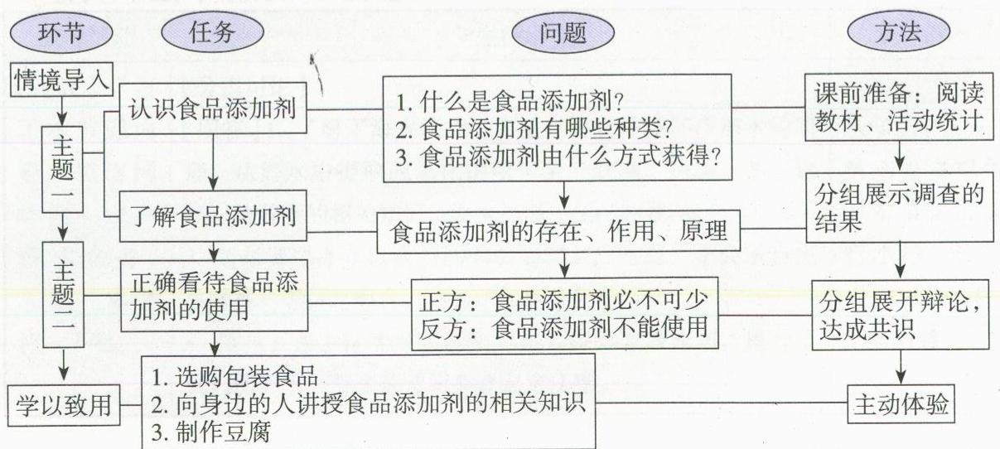

## 教学过程

## 1. 课前准备

结合教材中介绍的食品添加剂，初步认识食品添加剂的种类、性质、作用和原理；通过调查访问，了解人们对食品添加剂的认识和态度。

(1) 将全班学生分为7组, 分别是糖果饮料组 (主要负责着色剂)、面包饼干组 (主要负责膨松剂)、豆腐果冻组 (主要负责凝固剂)、肉制品组 (主要负责防腐剂)、罐头组 (主要负责抗氧化剂)、牛奶食盐组 (主要负责营养强化剂)、社会活动组 (主要负责调查研究人们对食品添加剂的认识和态度, 并录制视频)。

（2）请学生周末查看家里的食品包装说明，或是去超市认真阅读食品标签，找出食品中的添加剂并进行分类。通过家庭交流了解家人对食品添加剂的态度，完成以下表格。初步归纳出食品添加剂的种类、性质、作用和含量。

<table><tr><td colspan="2">食品添加剂</td><td>着色剂</td><td>增味剂</td><td>膨松剂</td><td>凝固剂</td><td>防腐剂</td><td>抗氧化剂</td><td>营养强化剂</td></tr><tr><td rowspan="2">糖果饮料组</td><td>成分</td><td></td><td></td><td></td><td></td><td></td><td></td><td></td></tr><tr><td>性质</td><td></td><td></td><td></td><td></td><td></td><td></td><td></td></tr><tr><td rowspan="2">面包饼干组</td><td>成分</td><td></td><td></td><td></td><td></td><td></td><td></td><td></td></tr><tr><td>性质</td><td></td><td></td><td></td><td></td><td></td><td></td><td></td></tr><tr><td rowspan="2">豆腐果冻组</td><td>成分</td><td></td><td></td><td></td><td></td><td></td><td></td><td></td></tr><tr><td>性质</td><td></td><td></td><td></td><td></td><td></td><td></td><td></td></tr><tr><td rowspan="2">肉制品组</td><td>成分</td><td></td><td></td><td></td><td></td><td></td><td></td><td></td></tr><tr><td>性质</td><td></td><td></td><td></td><td></td><td></td><td></td><td></td></tr><tr><td rowspan="2">罐头组</td><td>成分</td><td></td><td></td><td></td><td></td><td></td><td></td><td></td></tr><tr><td>性质</td><td></td><td></td><td></td><td></td><td></td><td></td><td></td></tr><tr><td rowspan="2">牛奶食盐组</td><td>成分</td><td></td><td></td><td></td><td></td><td></td><td></td><td></td></tr><tr><td>性质</td><td></td><td></td><td></td><td></td><td></td><td></td><td></td></tr><tr><td rowspan="2">社会活动组</td><td>是否需要食品添加剂</td><td></td><td></td><td></td><td></td><td></td><td></td><td></td></tr><tr><td>用量控制</td><td></td><td></td><td></td><td></td><td></td><td></td><td></td></tr></table>

## 2. 课堂活动

教学环节一：阅读——看教材中的食品配料表。

<table><tr><td>教师活动</td><td>学生活动</td><td>设计意图</td></tr><tr><td>【创设情境】俗话说“民以食为天”,大家对每日所吃的食物有什么样的要求呢?如何达到这样的要求呢?</td><td>阅读教材图8-16中的食品配料表并回答,各抒己见:卫生第一,其次是色美味香;可使用一些食品添加剂实现上述要求。</td><td>创设情境,使学生关注食品添加剂,激发学习兴趣。</td></tr><tr><td>【提出问题】通过课前准备活动,大家已经知道很多食品中都使用了食品添加剂,提问:什么是食品添加剂?食品添加剂有哪些种类?请举例说明。通过什么方式能获得食品添加剂?</td><td>学生已经预习,能很快答出食品添加剂的定义:食品添加剂是指为改善食品品质和色、香、味,以及防腐、保鲜和加工工艺的需要而加入食品中的人工合成或天然物质。食品添加剂种类很多......可以从天然物质中提取,或通过人工合成。</td><td>通过生活常识列举归纳,学生对食品添加剂的了解更加具体。</td></tr><tr><td>【讲授】列表展示食品添加剂的来源和种类。</td><td>学生边看边听。</td><td>使学生了解食品添加剂来源于天然提取物或人工合成的化学品,知道食品添加剂的种类很多,我们所收集整理的只是其中最常见的几种。</td></tr></table>

教学环节二：交流——小组内交流课前调查结果。

<table><tr><td>教师活动</td><td>学生活动</td><td>设计意图</td></tr><tr><td>【布置任务】请各小组组内认真交流各自负责的食品添加剂的存在、作用和工作原理,做好在全班展示的准备。教师在巡视的过程中给予指导。</td><td>各小组拿出课前调查记录的资料,结合教材中的知识,讨论完善,整理讲解思路。</td><td>培养学生收集材料、分析归纳以及组织语言表达交流的能力。</td></tr></table>

教学环节三：展示——各小组向全班展示交流成果。

<table><tr><td>教师活动</td><td>学生活动</td><td>设计意图</td></tr><tr><td>【布置任务】请1~6小组上台展示各自的成果。展示完成后,同学们可以质疑。</td><td>1~6小组分别汇报整理好的资料,讲解食品添加剂的存在、作用和工作原理。</td><td>培养学生归纳整理能力,通过讲解展示提高语言表达能力,增强自信心。</td></tr><tr><td>【引导解惑】部分小组描述不具体时,教师给予指导。对于同学们的质疑,小组回答不了的,教师给予解答。</td><td>认真思考,质疑互动,达成共识。</td><td>对于学生提出的问题和疑惑,先由学生自己解决。对于有一定难度的问题,通过教师引导,实现自主学习中的生生互助和师生互助。</td></tr><tr><td>【归纳板书】在每组展示完成后,对遗漏的知识进行及时补充,并同步投影,归纳不同食品添加剂的作用原理。</td><td>学生边看边听,同时进行记录。</td><td>使学生进一步掌握这几种食品添加剂的工作原理,真正体会到“化学改变生活,生活离不开化学”。培养学生对自然和社会的责任感。</td></tr></table>

教学环节四：辩论——正确看待食品添加剂。

<table><tr><td>教师活动</td><td>学生活动</td><td>设计意图</td></tr><tr><td>【讲授】有人认为“食品添加剂是现代食品工业的灵魂”,有人对此不以为然。你的观点是什么呢?请大家就此展开辩论。1~4组为正方,5~7组为反方。</td><td>观看第7小组制作的视频——市民对食品添加剂的看法。正方观点:食品添加剂必不可少,满足了人们对食品色、香、味、形等多样化的需求。反方观点:食品添加剂存在安全隐患,应回归自然,不使用食品添加剂。主持人总结:随着食品工业的发展,食品添加剂已成为生活中必不可少的物质,但人们在使用时要注意安全问题。例如,什么物质可以作为食品添加剂,用量是多少,最大残留量是多少,都要严格按照相关标准执行。也就是说,在规定范围内合理使用食品添加剂,对人体健康不会产生不良影响。</td><td>在辩论中引导学生树立科学的生活态度,学会用“一分为二”的辩证观点看待问题,形成正确的价值观。</td></tr></table>

续表

<table><tr><td>教师活动</td><td>学生活动</td><td>设计意图</td></tr><tr><td>【展示】我国在2014年颁布了新的《食品安全国家标准 食品添加剂使用标准》。用幻灯片展示部分防腐剂和抗氧化剂的使用标准。</td><td>对照教材,认真观看表8-2(不局限于表8-2,可进行拓展)。</td><td>进一步体会食品添加剂的安全使用是有据可依的,培养学生的法律意识。</td></tr><tr><td>【讲授】请大家阅读教材第114页的资料卡片,提出问题:食品添加剂使用时应符合哪些基本要求?</td><td>阅读资料卡片内容,并回答问题。</td><td>明确食品添加剂的使用要求,以及哪些情况下才能使用食品添加剂。</td></tr></table>

教学环节五：学以致用——学会选择和实践应用。

<table><tr><td>教师活动</td><td>学生活动</td><td>设计意图</td></tr><tr><td>【展示】分屏展示果蔬类饮品、糕点、瓶(袋)装腌制品、厨房酱醋制品等同类食品中的2种,请你选购其中一种并说出选购的理由,小组交流。</td><td>观看、比较同类食品包装标签上的食品配料表,以及所含食品添加剂的名称、种类和含量,综合运用所学知识作出合理选择,陈述选择的理由。并向身边的人讲授食品添加剂的相关知识。</td><td>学以致用,培养学生从化学的视角分析食品配料表,并作出合理的选择,培养学生的决策意识。</td></tr><tr><td>【课后作业】阅读教材中本节的“研究与实践”栏目——豆腐的制作,周末在家完成豆腐的制作。教师提出制作要求。</td><td>社会实践活动:可与家人或同学合作完成豆腐的制作,也可以单独完成。拍成视频,分享制作的要点,撰写研究报告。</td><td>学以致用,通过制作豆腐的实践活动,了解其中蕴含的化学原理,加深对胶体和蛋白质性质等知识的理解,培养热爱生活的态度及运用科学知识解决实际问题的动手能力,促进学生实现“知、情、意、行”的统一,发展化学学科素养。</td></tr></table>

# 研究与实践 豆腐的制作

——基于“互联网+”的翻转课堂教学设计

湖北省宜昌市第一中学 徐海波 董颖超 郑勇

## 教学目标

1. 指导学生通过自主查阅资料和访问豆腐制作者，了解豆腐及其制作的相关知识，如成分、发展历史、制作工艺、营养价值等。

2. 通过制作豆腐的实践活动，使学生体会豆腐制作过程中所蕴含的化学原理，加深对胶体和蛋白质性质等相关知识的理解。

3. 使学生体会合理使用食品添加剂对提高人们生产、生活水平的重要作用，培养学生合理运用化学知识和学以致用的责任意识。

4. 通过学习过程中的自主性、开放性、合作性活动，促进学生利用网络和社会交往进行个性化学习和合作学习，提升信息应用素养和团队合作意识。

## 教学重点

豆腐的制作工艺，活动成果的课堂展示交流。

## 教学难点

学生课外活动的落实，研究报告的撰写。

## 教学过程

教学分三个大的环节进行，分别是“任务驱动”“实践探究”和“课堂展示”。

教学环节一：任务驱动，布置课前学习任务（此环节建议在上一课时结束时利用几分钟时间来展开）。

<table><tr><td>教师活动</td><td>学生活动</td><td>设计意图</td></tr><tr><td>【创设情境】播放纪录片《舌尖上的中国》里有关豆腐的视频剪辑。</td><td>【感知情境】观看视频,感知影片中由黄豆到豆腐的变化。</td><td>引入任务主体(豆腐),激发兴趣。</td></tr><tr><td>【设疑激趣】看了这一片段,除了“想吃”以外,结合本节刚刚学过的内容,您最想做的事情是什么?</td><td>【创意联想】学生分别发表自己的观点:去参观豆腐生产过程,了解豆腐的营养价值,想亲手制作......</td><td>唤醒学生的探究意识,给每个学生表达的机会。</td></tr><tr><td>【任务定向】看来多数同学都想体验一下制作豆腐的过程。那我们本周末的家庭作业就是制作豆腐,好吗?</td><td>【任务驱动】同学们表态,求同存异,明确本周末的家庭作业。</td><td>将任务引导、定向到活动主题上来。</td></tr><tr><td>【任务布置】教师分发“学习活动任务单”,播放预先准备好的幻灯片,展示、讲解活动要求。1. 自主成立活动小组(6人一组,按家庭就近原则初步分工)。2. 按“学习活动任务单”完成任务。3. 课堂展示交流要求。4. 务必告知家长,家长签字后才能启动。</td><td>【观察领会】同学们观看投影,听老师讲解,明确任务要求。【任务启动】同学们自由组合成活动小组,进行初步的任务分工;预习分发的“学习活动任务单”。</td><td>通过讲解,使每个学生了解活动目的和内容要求,并通过“任务单”的指引,确保学习活动能够顺利开展并达到预期效果。</td></tr></table>

教学环节二：豆腐制作实践活动（此环节建议利用周末或者活动课展开，便于学生利用家庭或者实验室的仪器设备进行探究。如在家里进行，需要家长知晓并签字以监督安全；如在校内活动课开展，实验室教师或授课教师务必在场指导）。

<table><tr><td>教师活动</td><td>学生活动</td><td>设计意图</td></tr><tr><td>【启动群组】教师启动“××班豆腐制作活动”群组,并提出入群要求,提示同学们互相提醒,及时加入。</td><td>【加入群组】同学们加入该群组,注明所属小组和个人真实信息,并接收任务通知。</td><td>凝聚人心,营造合作、竞争的群体氛围。</td></tr><tr><td>【启动任务】教师在群中发布通告,启动任务:1提醒学生注意时间控制和安全防护;2提醒学生按照任务单进行活动;3请学生及时回复和上传资料,有任何问题可随时在群内咨询、讨论、分享。</td><td>【前期准备】1学生根据任务单依次完成查阅资料和人物访谈的任务,做好记录。2进行活动准备。可将方案传给老师和同学们征询改进建议。3在群内上传家长签字图片。</td><td>做好知识准备,以便后续方案设计更科学,活动更顺利。获得家长认可和监督,保证安全。</td></tr></table>

续表

<table><tr><td>教师活动</td><td>学生活动</td><td>设计意图</td></tr><tr><td>【指点督促】教师通过群组了解各组学生任务进度,并根据实际情况进行适当指点和督促:1尽量进行小样本实验,所用仪器可就地取材,使用家里的替代品;2所需化学药品如石膏等必须是食品添加剂级的,一般大型超市有售。</td><td>【实施探究】各小组同学按方案实施探究活动,主要做到:1画出装置图示;2设计观察记录表格并做好观察记录;3适当拍摄影像记录并上传;4随时在群内交流讨论。</td><td>这是本课的主体活动,让学生通过可感知、可控制的实操性活动,亲身体验个体和团队合作探究的过程。</td></tr><tr><td>【进度控制】教师密切关注群内动向,了解各小组进度,并在群内回答咨询,提出参考性建议。尤其要督促同学们将自身的体验进行文字提炼和反思总结,形成研究报告。建议学生从标题、关键词、摘要、知识背景、生活背景、方案设计与改进(含图示)、操作要点、数据资料分析、研究结论与心得体会等方面进行准备。</td><td>【讨论评价】同学们回顾活动全程经历,反思得失。【撰写报告】按照任务单要求,先由每个同学各自撰写所承担任务相应的内容,然后整合为总报告,大家认可后打印出来粘贴在任务单上的相应位置。</td><td>此部分为知识技能的建构与内化环节,设计的目的是让学生将感性认识上升到理性认知,最终从化学视角来认识生活。</td></tr><tr><td>【任务促进】任务结束,教师鼓励同学们进行拓展研究。如探究豆腐的其他做法、寻找石膏的替代品、进行豆腐的后续加工,等等。</td><td>【延伸拓展】每个同学按照个人兴趣独立进行拓展研究,可通过收集样品、访谈、查阅资料等方式进行。同样在任务单上做好相应记录。</td><td>充分体现活动类教学的开放性,促进学生个性化、差异化发展。</td></tr><tr><td>教师活动</td><td>学生活动</td><td>设计意图</td></tr><tr><td>【投影展示】教师开场白之后,投影课堂流程及活动要求:1课堂流程(见任务单);2提出要求:组长负责;展示要点应形成文字,做到条目化;循环交流要快捷守时;评价要客观公正。</td><td>【感知情境】观看投影,明确课堂要求、个人职责和展示要求。</td><td>为下一步的课堂活动做好准备。</td></tr><tr><td>【活动调控1】教师组织学生按计划进行组内研讨,各组组长主持、记录、决策。期间,教师不间断巡视全场,接受咨询,指导活动,收集记载点评素材。</td><td>【组内研讨】各组学生针对本组情况进行讨论,完善任务单,提出本组优缺点和展示要点。每组推举一份最佳任务单,以代表本组参与循环和展示。</td><td>凝聚小组团队合力,激发竞争意识。促进学生反思,提高认知能力。</td></tr><tr><td>【活动调控2】1按预设时间逐次启动和完成小组间的循环——8个组按序号顺序循环传递各组的任务单(3分钟一次)。2督促学生进行评价和记录。</td><td>【组际循环】小组循环查阅任务单,评出等次并记载优点。将等次记载在所评对象的任务单上,写出简短评语和建议,直至看完所有组的任务单。</td><td>相互学习,取长补短,并为下一环节推选出优秀展示组进行铺垫。</td></tr><tr><td>【活动调控3】1教师组织学生分组统计本组得分并评出等次,推举出前三名的小组。2组织这三个小组的代表进行展示(利用实物投影仪)。再次强调展示要求——先展示产品,进行自评,然后按“研究报告”进行展示,最后回应其他组所提建议,并进行自我评价。</td><td>【典型展示】1各小组统计总分并上报分数等次,整理其他组为本组提出的建议。2前三名的小组按要求推举学生代表,按要求展示。3其他同学认真倾听并记录,各组展示完成后,其他同学可质疑。</td><td>让每个学生学会倾听和汲取他人观点,学会从不同视角看待问题,培养学生的表达能力和表现意识。</td></tr><tr><td>【教师点评】对教学过程进行简短的点评。1预先从群组中收集整理图片等资料,制作幻灯片;2结合课堂观察收集的精彩瞬间和典型状况,从学习内容、环节、表现、结果、收获以及思想碰撞等方面入手,恰如其分地肯定长处,指出不足,并提出继续努力的建议。</td><td>【倾听领会】学生认真观察和倾听,做好笔记。仔细体会老师对学习过程的回顾和梳理,回忆相关知识,使化学原理与实践活动相结合,反思全程的收获与不足。</td><td>形成对相关知识(胶体、蛋白质等)和化学操作技能(加热、过滤等)的实践性认识,领会实验研究与实际生产之间的紧密联系与差异。</td></tr><tr><td>【回顾总结】请每个学生结合整个学习过程进行总结提炼,形成对全课时内容的系统认知。</td><td>【完善提高】全程回顾,再次完善自学任务清单。</td><td>总结,系统建构课时学习目标。</td></tr></table>

附表 《研究与实践——豆腐的制作》学习活动任务单

<table><tr><td>《研究与实践——豆腐的制作》学习活动任务单班级____组长____成员____活动时间__________家长签字__________</td></tr><tr><td>一、活动指南</td></tr><tr><td>1. 学习目标:(1)了解豆腐及其制作的相关知识,如成分、发展历史、制作工艺、营养价值等。(2)体会豆腐制作所蕴含的化学原理,加深对胶体和蛋白质的性质及相关实验的理解。(3)体会合理使用食品添加剂对提高人们生产、生活水平的重要作用。</td></tr><tr><td>2. 老师制作的以下微课视频可能对你有所帮助,链接地址为:(1)《豆腐的起源与发展历史》____(2)《怎样设计一份科学的活动记录》____(3)《如何撰写研究报告》____</td></tr><tr><td>3. 学习方法建议:建议先加入教师建立的“豆腐制作活动”群组,然后阅读教材,再完成任务单上的任务,必要时观看以上微课视频,并根据视频调整、优化学习活动。</td></tr><tr><td>4. 课堂学习形式预告:课堂学习将按以下流程进行,请你做好准备。组内研讨→组际循环→典型展示→教师点评→总结提高</td></tr><tr><td>二、活动实施(将你的判断和结论填写在每项任务下的空白处)</td></tr><tr><td>1.【资料查询】通过关键词检索,使用网络查询关于豆腐及其制作的相关知识。(1)我们选定的关键词是__________。(2)通过查询,我们摘录以下关键信息(注意注明出处):1232.【人物访谈】通过亲友联系并选定一家制作豆腐的作坊主,拜访并咨询,尽可能全面地得到其指点和帮助。(1)我们访谈的关键人物是__________。(2)通过访谈,我们认为他提供的以下信息很重要:1233.【活动准备】为了顺利完成这项活动,我们进行了充分的准备工作。(1)设备用品:(2)原料:(3).基本步骤设计:</td></tr></table>

续表

<table><tr><td colspan="9">四、循环评价(此部分供课堂交流使用:A-90分、B-80分、C-70分、D-60分)</td></tr><tr><td>循环次数</td><td>第一次</td><td>第二次</td><td>第三次</td><td>第四次</td><td>第五次</td><td>第六次</td><td>第七次</td><td>平均分</td></tr><tr><td>等次</td><td></td><td></td><td></td><td></td><td></td><td></td><td></td><td></td></tr><tr><td colspan="9">建议或评价留言:</td></tr></table>