# 教师教学用书

PUTONG GAOZHONG JIAOKESHU

JIAOSHI JIAOXUE YONGSHU

HUAXUE

人民教育出版社 课程教材研究所

编著

化学课程教材研究开发中心

登录“教师网络培训和服务平台”即刻免费获得优质、专业、全面的服务

◇ 独家权威解读新版本新课标教材

◇ 全面系统推出各科教材配套资源

◇ 在线活动引领课程教材教法改革

◇ 网络研修助力一线教师专业成长

请通过人教网顶部“培训服务”菜单访问本平台，或使用微信搜索并关注“人教教材培训”公众号，获取更多最新培训资讯和精彩内容。

## 化学

选择性必修 1

化学反应原理

普通高中教科书

# 教师教学用书

化学

人民教育出版社 课程教材研究所

化学课程教材研究开发中心

编著

选择性必修1

化学反应原理

·北京·

图书在版编目（CIP）数据

普通高中教科书教师教学用书. 化学. 选择性必修1：化学反应原理 / 人民教育出版社课程教材研究所化学课程教材研究开发中心编著. —北京：人民教育出版社，2020.6

ISBN 978-7-107-34751-1

I. ①普… II. ①人… III. ①中学化学课—高中—教学参考资料 IV. ①G633

中国版本图书馆 CIP 数据核字（2020）第 107423 号

普通高中教科书 教师教学用书 化学 选择性必修1 化学反应原理

出版发行 人民教育出版社
（北京市海淀区中关村南大街17号院1号楼 邮编：100081）

网址 http://www.pep.com.cn

经销 全国新华书店

印刷 北京天宇星印刷厂

版 次 2020年6月第1版

印 次 2020年8月第1次印刷

开 本 890 毫米 × 1240 毫米 1/16

印 张 10.75

字 数 265 千字

定 价 26.70 元

版权所有·未经许可不得采用任何方式擅自复制或使用本产品任何部分·违者必究

如发现内容质量问题、印装质量问题，请与本社联系。电话：400-810-5788

## 说明

本书是根据教育部制订的《普通高中化学课程标准（2017年版）》和人民教育出版社课程教材研究所化学课程教材研究开发中心编著的《普通高中教科书 化学 选择性必修1 化学反应原理》的内容和要求，以突出育人功能、确保科学规范、注重核心基础、体现时代要求为原则，结合高中化学教学实际情况编写的，供使用《普通高中教科书 化学 选择性必修1 化学反应原理》的高中化学教师教学时参考。

从利于教师理解和体会课程标准，更好地使用教材，更高效地实施教学出发，全书对教材的内容按照章节进行了分析，提出教学建议，提供教学资源和典型教学案例。

本书按教材顺序对每章进行了整体说明，包括教材分析、学业要求和课时建议。教材分析从地位和功能、内容的选择与呈现、教学深广度及内容结构等方面对全章内容作出分析；学业要求指出本章在发展学生化学学科核心素养方面所要达到的目标；课时建议则是建议本章的教学课时。

对于教材中的各节，本书提供了内容分析、教学目标、教学建议、栏目使用建议、练习与应用参考答案及说明等。内容分析是对节的具体内容特点、知识结构进行较详细的介绍；教学目标指出本节需要达到的教学目的，以及教学重点和难点；教学建议是围绕节的内容，对教学设计思路、教学策略、教学方法等提出建议；栏目使用建议是对“实验”“思考与讨论”“探究”等栏目提出具体的指导和建议，并对栏目所涉及的有关问题给予解答或提示；练习与应用参考答案及说明则是对节后的习题给予解答或提示。

教学资源和教学案例是按章编写的。教学资源主要编入一些与本章内容有关的化学知识、疑难问题解答，以及联系实际、新的科技信息和化学史等内容，以帮助教师更好地理解教材，并在教学时参考。教学案例主要选择本章中的典型课题，立足课堂教学实际，展示优秀案例。

本书内容仅供教师参考，授课时的教学方法由教师根据具体情况决定。

本书总主编：王晶、周业虹。

本册主编：周业虹、兰俊耀。

本册编写人员（按编写顺序）：乔国才、胡晓萍、周业虹、王慧、朱成东、吴海建、贾同改。  
责任编辑：周业虹。

责任绘图：郭威。

本书内容难免有不妥之处，希望广大教师和教学研究人员提出意见和建议，以便修改和完善。

人民教育出版社 课程教材研究所
化学课程教材研究开发中心
2020年6月

## 目录

第一章 化学反应的热效应 …… 1
本章说明 …… 1
第一节 反应热 …… 3
第二节 反应热的计算 …… 9
复习与提升建议 …… 13
教学资源 …… 15
教学案例 …… 24

第二章 化学反应速率与化学平衡 …… 28
本章说明 …… 28
第一节 化学反应速率 …… 31
第二节 化学平衡 …… 36
第三节 化学反应的方向 …… 43
第四节 化学反应的调控 …… 46
复习与提升建议 …… 50
实验活动 1 探究影响化学平衡移动的因素 …… 52
教学资源 …… 55
教学案例 …… 65

第三章 水溶液中的离子反应与平衡 …… 71
本章说明 …… 71
第一节 电离平衡 …… 74
第二节 水的电离和溶液的 pH …… 80
第三节 盐类的水解 …… 85
第四节 沉淀溶解平衡 …… 91
复习与提升建议 …… 97

实验活动2 强酸与强碱的中和滴定 99  
实验活动3 盐类水解的应用 101  
教学资源 102  
教学案例 112

第四章 化学反应与电能 …… 116
本章说明 …… 116
第一节 原电池 …… 119
第二节 电解池 …… 125
第三节 金属的腐蚀与防护 …… 130
复习与提升建议 …… 136
实验活动4 简单的电镀实验 …… 138
实验活动5 制作简单的燃料电池 …… 140
教学资源 …… 142
教学案例 …… 160

## 第一章化学反应的热效应

## 本章说明

在初中和必修阶段，学生对于化学反应与能量变化已经有了一定的了解。本章是在初中和必修阶段的基础上进行拓展和提高。通过本章的学习，学生能够在定性认识化学能与热能相互转化的基础上，从反应热的测定、表示、计算等定量角度深入认识化学反应的热效应，从微观角度了解反应热的实质。同时，学生能够基于内能及内能的变化认识反应热，并进一步感受反应热在生活、生产和科学研究中的广泛应用，体会研究反应热的重要价值。

## 一、教材分析

在初中阶段，学生已经知道化学反应伴随着能量变化，而能量变化通常表现为热量的变化。在必修阶段，学生通过实验建立了吸热反应和放热反应的概念；了解到化学键的断裂和形成是化学反应中能量变化的主要原因；知道一个化学反应释放热量还是吸收热量，与反应物总能量和生成物总能量的相对大小有关。因此，在初中和必修阶段主要是从定性角度讨论化学能与热能的相互转化，本章则是从定量角度来讨论化学反应中的热量变化，引导学生认识化学反应中的热量变化是以物质变化为基础的，热量变化的多少与参加反应的物质种类和多少密切相关。从定量角度研究化学反应的热效应是本章教材编写的一条基本线索，如下图所示。

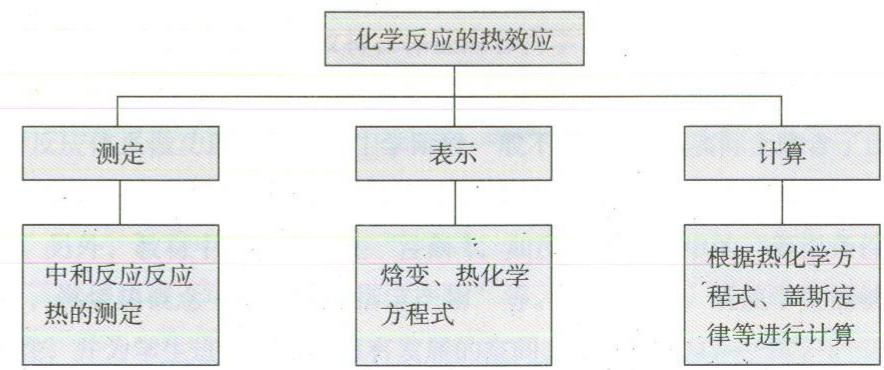

本章包括两节内容：第一节反应热，第二节反应热的计算。第一节介绍了反应热的概念、中和反应反应热的测定、焓变、热化学方程式和燃烧热等，第二节介绍了盖斯定律和反应热的计算。从全章内容的逻辑关系来看，反应热的概念是引入焓变的基础；反应热的测定和焓变是介绍热化学方程式及其书写的基础；热化学方程式和盖斯定律是计算反应热的基础。因此，本章在内容编排上由浅入深、层层递进、环环相扣，逻辑性很强。此外，本章在正文、栏目、图画、例题和习题等素材的选择上，突出反应热在实际中的广泛应用，体现研究反应热的重要价值。

本章的“整理与提升”注重对化学认识视角和认识思路的提炼。从认识视角来看，强调从反应前后体系内能的变化、体系与环境的能量转化与守恒来认识化学反应中的能量变化；强调从物质变化和能量变化、定性和定量相结合的角度认识热化学方程式。从认识思路来看，强调从宏观表征（体系与环境间的热交换）、微观表征（从化学键断裂和形成的角度）和符号表征（ $\Delta H$ ）三个维度来认识吸热反应和放热反应，引导学生建构宏观、微观、符号三重表征模型，形成化学科学表征的一般思路。

## 二、学业要求

1. 能从体系和环境的角度认识反应热的概念。

2. 能利用简易量热计测定中和反应的反应热。

3. 能从体系内能变化的角度认识反应热。

4. 能从化学键断裂和形成时的能量变化认识反应热的微观实质。

5. 能用热化学方程式表示反应热。

6. 能根据热化学方程式、盖斯定律等计算反应热。

7. 能结合燃烧热、反应热的计算等体会研究反应热的价值。

## 三、课时建议

第一节 反应热 3课时

第二节 反应热的计算 2课时

全章复习 1课时

## 第一节 反应热

## 一、内容分析

本节主要围绕反应热展开，包括三部分内容：反应热与焓变、热化学方程式、燃烧热，编排思路如下。

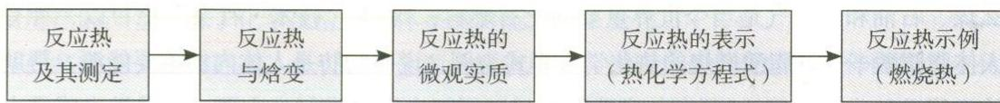

由编排思路可以看出，教材首先从体系和环境的角度明确反应热的概念，并以“探究”的形式，利用简易量热计测定中和反应的反应热。然后从体系内能及其变化的角度说明化学反应为什么会产生反应热，引出等压条件下化学反应的反应热等于反应的焓变，并结合具体的反应实例，从化学键断裂和形成时的能量变化分析反应热的微观实质。在此基础上，教材介绍反应热的表示方法——热化学方程式，其中以热化学方程式的书写作为重点内容。最后，介绍一种在实际中应用较广的反应热——燃烧热。

本节内容具有以下特点。

## 1. 注意处理好与初中及必修阶段的衔接

本节教材在编写时注意处理好与初中及必修阶段的衔接。一方面，避免与初中及必修阶段的内容重复；另一方面，注意以学生已有的知识为基础，引导学生深入认识反应热。例如，从定量的角度测定反应热，从微观角度分析反应热的实质，学习反应热的定量表示方法，从内能及其变化的角度认识反应热等。

## 2. 在保证内容科学性的同时，充分考虑学生的可接受性

本节教材涉及较多与热化学有关的概念，如体系与环境、反应热、内能、焓与焓变、热化学方程式、燃烧热等。在叙述方式上，教材在保证内容科学性的同时，充分考虑学生的可接受性。例如，在介绍等压条件下化学反应的反应热等于反应的焓变时，以括号的形式标注了一句话——“严格地说，对反应体系做功还有限定，中学阶段一般不考虑”，这实际上隐含了反应热用焓变表示时的另外一个条件——反应体系不做非体积功。但考虑到高中生的知识基础，教材并没有明确说明这个条件。另外，教材中增加了一些“注解”，如反应热概念中的“等温条件”， $\Delta H$ 的常用单位“kJ/mol”，燃烧热概念中的“生成指定产物”等。这样处理，既使学生能够接受，又保证了内容的科学性，并为学生进一步学习留有发展的空间。

## 3. 注意将抽象的内容形象化

本节内容概念多, 抽象、理论性强, 学生学习有一定的困难。在呈现方式上, 教材注意结合具体的实例, 并利用图示的方法将抽象的内容形象化, 以帮助学生更好地理解概念。例如, 以盐酸与 $\mathrm{NaOH}$ 溶液的反应为例, 结合图1-2说明体系与环境的含义; 以 $\mathrm{H}_{2}$ 与 $\mathrm{Cl}_{2}$ 反应生成 $\mathrm{HCl}$ 为例, 结合图1-5从微观角度说明化学键断裂和形成时的能量变化是化学反应中能量变化的主要原因; 以冰熔化为水、水蒸发为水蒸气为例, 结合图1-6说明物质的聚集状态不同, 它们所具有的内能、焓也均不同, 从而帮助学生理解书写热化学方程式时必须注明物质聚集状态的原因; 等等。

## 4. 注意理论联系实际

在素材的选择方面，教材注意将理论知识与学生的生活实际、工农业生产实际及科技发展实际密切结合。例如，介绍煤、石油和天然气的主要成分燃烧的热化学方程式，可以帮助学生理解为什么煤、石油和天然气是当今世界重要的化石燃料；“科学·技术·社会”栏目以一种有代表性的人体脂肪酸——软脂酸燃烧的热化学方程式为例，说明脂肪是人体内的重要能源，帮助学生正确认识脂肪的生理功能；“研究与实践”栏目以了解火箭推进剂为主题，引导学生感受火箭推进剂的发展对人类社会进步的促进作用。这些素材能够体现化学反应中能量变化的应用价值，激发学生学习的兴趣。

## 二、教学目标

## 1. 教学目标

（1）了解反应热的概念；能解释中和反应反应热的测定原理；能根据实验中测定并记录的数据计算反应热。

（2）能从宏观和微观两个角度建构模型，并解释反应热产生的原因。

（3）理解热化学方程式的意义，能正确书写热化学方程式。

（4）知道燃烧热的概念；通过燃烧热的学习，认识能源在生产、生活中的重要意义。

## 2. 教学重点和难点

（1）重点：从宏观和微观两个视角认识反应热；热化学方程式的书写。

(2) 难点: 从宏观和微观两个视角认识反应热。

## 三、教学建议

1. 由表及里，认识化学反应伴随着物质变化和能量变化

本节内容的教学可设计为4个环节。

环节一、从定性和定量两个角度感受反应热。

教学中应充分利用教材中的素材。例如，利用“研究与实践”栏目，让学生查阅火箭推进剂的成分与反应原理，使学生意识到化学反应不但有物质变化，而且伴随着能量变化；通过教材中的案例，让学生理解体系与环境的概念；利用“探究”栏目，通过中和反应反应热的测定，使学生从定量的角度感受反应热，体验到某些反应热是可以测量的，并且利用实验数据，计算生成1 mol水放出的热量，为学习热化学方程式的书写打下基础。

环节二、从宏观和微观角度分析原因，形成模型。

教学中可以选取某个具体的化学反应，如天然气、肼、乙醇等的燃烧反应，说明为什么化学反应伴随能量变化。首先，让学生从宏观物质的变化入手，分析出化学反应前后每种物质具有的内能不同，所以化学反应伴随能量变化。授课中要注意明确我们研究的是等压条件下的反应热——焓变（ $\Delta H$ ）。紧接着，教师可以让学生围绕所选取的化学反应，自行分析并绘制化学反应中焓的变化示意图。也可以由教师通过板书带领学生绘制并理解该示意图，使学生能从宏观角度解释反应热的产生是由于化学反应前后体系的内能发生了变化。

在此基础上，教师可进一步引导学生深入微观层面，说明为什么化学反应伴随能量变化。可以利用教材中的图示，结合物质结构知识，使学生理解化学反应从微观角度看是旧化学键断裂和新化学键形成的过程。断裂化学键需要吸收能量，形成化学键则释放能量，它们综合的结果决定了一个化学反应是吸热的还是放热的。

根据教学的需要，教师还可以补充一些键能数据，让学生计算反应热。

环节三、运用符号表征反应热，学会书写热化学方程式。

书写热化学方程式是本节教学的重点。为突出重点，教师首先要让学生理解热化学方程式的意义，然后围绕教材中给出的书写热化学方程式的注意事项设计相关问题，带领学生解决问题，最终达到让学生准确并熟练书写热化学方程式的目的。例如，可设计如下问题：

(1) 反应的 $\Delta H$ 与温度和压强有关吗?

（2）如何实现水从固态到液态、再到气态的转化？

（3）教材中有如下两个反应，它们表示的意义有何不同？

$$
\mathrm{H} _ {2} (\mathrm{g}) + \mathrm{Cl} _ {2} (\mathrm{g}) = 2 \mathrm{HCl} (\mathrm{g}) \quad \Delta H = - 1 8 4. 6 \mathrm{kJ/mol}
$$

$$
\frac {1}{2} \mathrm{H} _ {2} (\mathrm{g}) + \frac {1}{2} \mathrm{Cl} _ {2} (\mathrm{g}) = \mathrm{HCl} (\mathrm{g}) \quad \Delta H = - 9 2. 3 \mathrm{kJ/mol}
$$

在解决这些问题的基础上，教师可以带领学生书写热化学方程式。

环节四、体会反应热的应用，介绍燃烧热。

在学习热化学方程式之后，教材介绍了一种具体的反应热，即燃烧热。在这部分教学中，一定要突出其应用价值。

可以采用如下三种方法进行教学。

方法一：以生活中的燃料为主题，创设情境，让学生从物质变化和能量变化的角度体会生活中燃料的变迁。

方法二：以火箭推进剂为主题，从能量释放和环境保护的角度分析几种推进剂的优劣。

方法三：利用“科学·技术·社会”栏目，比较单位质量的葡萄糖和软脂酸完全氧化放出能量的多少，理解脂肪是人体内重要的能源。

## 2. 运用实例促进概念的形成与理解，突破难点

本节教材中引入了几个新概念，教师要讲清引入这些概念的目的、概念的内涵及如何应用这些概念解决问题。

## (1) 体系与环境

教学中可以用举例的方法简单介绍封闭体系和敞开体系，根据学生的情况也可以提及孤立体系。例如，以教材中的图1-2为例，分析体系中包含哪些物质，环境指的是什么，该体系属于哪种体系。

引入体系与环境这两个概念对于学生今后的学习有重要的意义，可以使学生在遇到复杂问题（如多因素问题）时，有分析问题和解决问题的抓手。

## (2) 反应热、内能与焓变

教学中应注意强调反应热的适用条件，即在等温条件下，化学反应体系向环境释放或从环境吸收的热量。

关于内能的教学，建议模仿教材中关于焓变的图示，向学生说明内能是体系内物质各种能量的总和，受温度、压强和物质的聚集状态等影响，其绝对值无法测量，但可以测得其变化前后的差值。

焓与焓变是学生新接触到的两个物理量，依照课程标准的要求，不做过多拓展。对于焓，让学生知道其是为了使用方便（描述等压条件下的反应热）而定义的与内能有关的物理量即可，由于无法测得内能的绝对值，所以焓的绝对值也无法测定。对于焓变，可结合教材中的图1-4让学生知道，物质在发生变化时，可以测得其变化前后焓的差值，即焓变。同时，可以列举一些实例，帮助学生建立反应体系吸热或放热与 $\Delta H$ 正、负号的关系。在这部分学习中，学生往往会对 $\Delta H$ 的单位产生疑问，建议教师引导学生阅读教材中的“资料卡片”。

## 四、栏目使用建议

## 探究

本探究在高中阶段非常重要，其功能是让学生认识反应热，知道反应热是可以测量的，由此逐步形成定量研究的意识。

围绕本探究的目的，教师可提出如下问题。

1. 实验中需要获取哪些数据？

2. 怎样才能使获得的数据准确？

3. 实验可能的误差来自哪里？怎样避免？

教师也可以让学生针对探究目的自行设计方案，之后由学生展开讨论，找到可能引起实验误差的原因，并寻求解决的办法。

数据处理是该探究的重要组成部分。建议教师不要直接给出计算式，要让学生结合已经具备的物理知识，围绕“如何利用实验数据计算生成1 mol水所放出的热量”进行讨论。

实验注意事项如下。

1. 盐酸和NaOH溶液必须采用稀溶液，否则会因为阴、阳离子间的相互牵制作用大而造成误差。

2. 温度计的水银球部分必须完全浸在溶液中。

3. 有条件的学校可以使用温度传感器来完成探究，学生能够清楚地看到反应中热量变化的情况，而且测定结果更准确。

如果学生接受能力较强，教学中也可以选取多个反应完成本活动。例如，将NaOH溶液替换为弱碱，将盐酸替换为弱酸，学生在计算生成1 mol水所放出的热量时就会发现，计算结果与强酸和强碱的稀溶液发生中和反应生成1 mol水放出的热量（理论值为57.3 kJ）不同，这可以为今后学习弱电解质的电离打下基础。

## 五、研究与实践

本活动设计的目的是让学生体会化学反应中的热量变化在军事、航天和科技等领域的重要应用。由于活动涉及知识较多，建议教师在本章教学开始就将这个研究任务布置给学生，要求学生利用课余时间查阅资料，并随着学习的深入，不断提出自己的思考，尝试提出解决的方案。以下内容可供参考。

1. 让学生查阅资料，了解火箭推进剂的发展历史和发展趋势。要求学生不只是简单地罗列查阅的资料，还要从物质变化和能量变化角度对资料进行分析。

2. 让学生查阅资料，了解我国目前常用的火箭推进剂的类型、成分、特点及适用范围。

3. 让学生选取本活动中自己感兴趣的角度展开研究。

4. 让学生在课上或课下进行汇报、讨论，进一步引导学生认识燃料在其他领域的应用。

对于研究成果，教师要以一定的形式展出，如墙报、微信推送等，让学生在分享中进一步感受化学反应中热量变化的应用价值。

## 六、练习与应用参考答案及说明

1. (1) $\mathrm{Cu(s)} + \frac{1}{2}\mathrm{O}_2(\mathrm{g}) = \mathrm{CuO(s)}$ $\Delta H = -157.3\mathrm{kJ / mol}$ (2) $\mathrm{C_2H_4(g)} + 3\mathrm{O_2(g)} = 2\mathrm{CO_2(g)} + 2\mathrm{H_2O(l)}$ $\Delta H = -1411.0\mathrm{kJ / mol}$ (3) $\mathrm{C(s)} + \mathrm{H_2O(g)} = \mathrm{CO(g)} + \mathrm{H_2(g)}$ $\Delta H = +131.5\mathrm{kJ / mol}$ 2. $\mathrm{N}_2(\mathrm{g}) + \mathrm{O}_2(\mathrm{g}) = 2\mathrm{NO(g)}$ $\Delta H = +180\mathrm{kJ / mol}$ 3. $\mathrm{H_2(g)} + \frac{1}{2}\mathrm{O_2(g)} = \mathrm{H_2O(l)}$ $\Delta H = -285.8\mathrm{kJ / mol}$

4. 不正确。因为 $\Delta H$ 的单位中 “ $mol^{-1}$ ” 表示的是 “每摩尔反应”。第一个 $\Delta H$ 表示 “2 mol CO(g) 与 1 mol O₂(g) 反应生成 2 mol CO₂(g)” 放出的热量。第二个 $\Delta H$ 表示 “1 mol CO(g)

与 $\frac{1}{2}$ mol O $_{2}$ (g) 反应生成 1 mol CO $_{2}$ (g) 放出的热量。

5.（1）氢气燃烧产物为水，无污染，因此氢能是一种理想的绿色能源。

(2) 根据燃烧热数据进行计算, 在 $25^{\circ} \mathrm{C}$ 和 $101 \mathrm{kPa}$ 时, 质量均为 $1 \mathrm{~g}$ 的氢气、甲烷和乙醇燃烧时所放出的热量分别为 $142.9 \mathrm{~kJ} 、 55.6 \mathrm{~kJ}$ 和 $29.7 \mathrm{~kJ}$ , 所以相同质量的上述三种物质, 氢气燃烧后放出热量最多。同时, 氢气的燃烧产物无污染。这些都是氢气作为能源的优点。

(3) 提示: 目前氢能在利用过程中还有一些问题需要解决, 如寻找恰当的催化剂使获得氢气的反应易于进行、氢气的制备和存储等。

## 第二节 反应热的计算

## 一、内容分析

本节教材主要介绍反应热的计算，包括两部分内容：盖斯定律、反应热的计算。反应热的计算要用到盖斯定律，因此教材先介绍盖斯定律，后介绍反应热的计算。

首先，教材创设情境——以C与 $O_{2}$ 反应生成CO为例，说明有些在工业生产中非常有用的反应热是无法直接测定的。然后提出问题——无法直接测定的反应热应该如何获得呢？能否利用一些已知反应的反应热来计算其他反应的反应热呢？在此基础上引入盖斯定律。

对于盖斯定律，教材是直接给出的，并以登山时人的势能变化与上山的途径无关为例，帮助学生理解盖斯定律。然后通过C与 $O_{2}$ 反应生成CO的反应热的计算，引导学生认识盖斯定律的应用，并以此说明盖斯定律在科学研究中的重要意义。此外，教材编写了“科学史话”栏目，介绍了热化学研究的先驱——盖斯，以及盖斯定律提出的实验基础及意义，目的是开阔学生的视野。

对于反应热的计算，教材以三道例题来呈现。从计算类型来看，例题1和例题2都是根据热化学方程式进行计算，例题3是根据盖斯定律进行计算。从例题选择的素材来看，例题1和例题3涉及的计算与工业生产实际密切相关，例题2涉及的计算则与学生的日常生活有关。

本节内容的特点是抽象、理论性强。在编排思路上，教材注意结合工业生产实际提出问题，以类比的方式帮助学生理解理论（盖斯定律），并在问题解决过程中体会理论（盖斯定律）的重要价值。反应热的计算则把重点放在理解热化学方程式的意义、应用理论（盖斯定律）上，并突出计算反应热对于化工生产的重要意义。

## 二、教学目标

## 1. 教学目标

（1）理解盖斯定律的含义，认识同一个化学反应的反应热与反应进行的途径无关。

（2）通过计算反应热，体会反应热与反应条件、能量利用的关系，能合理利用反应热，感受定量研究的意义。

## 2. 教学重点和难点

(1) 重点：盖斯定律的理解与应用。

(2) 难点：盖斯定律的理解。

## 三、教学建议

## 1. 引导学生理解盖斯定律的意义、价值

盖斯定律的教学可设计为两个环节。

环节一、发现盖斯定律。

盖斯定律是在大量实验的基础上总结得到的，不是通过推导获得的，学生在学习之初难以认同。教师可以引导学生利用教材中的一些资源进行学习。例如，回顾教材第一节中的图1-4，引导学生讨论并得出结论：反应热研究的是化学反应前后能量的变化，与途径无关；利用教材中的图1-7，让学生认识登山的路径与人的势能变化无关，势能变化只与始态和终态的海拔差有关。

为促进学生对盖斯定律的理解，教学中教师可以通过创设问题情境引发学生的好奇心，促使其思考。可供参考的教学片段如下。

展示：物理化学手册中庞大的反应热数据库。

提出问题1：这么多的数据是如何获得的？

提出问题2：能否通过实验直接测定 $2C(s)+O_{2}(g)=2CO(g)$ 的 $\Delta H$ ？若可以，请说明理由；若不可以，能否设计路径使之可测定？

布置任务1：用图示的方法设计测定路径。

布置任务2：用图示的方法设计测定 $N_{2}(g)+2O_{2}(g)=2NO_{2}(g)$ 的 $\Delta H$ 的路径。

总结归纳：发现盖斯定律。

巩固应用：根据常见反应的 $\Delta H$ ，讨论并设计测定 $2C(s) + O_2(g) = 2CO(g)$ 的 $\Delta H$ 的方案。

<table><tr><td>反应</td><td> $\Delta H/(kJ·mol^{-1})$ </td></tr><tr><td> $C(s)+O_2(g)=CO_2(g)$ </td><td>-393.5</td></tr><tr><td> $2CO(g)+O_2(g)=2CO_2(g)$ </td><td>-566.0</td></tr><tr><td> $4Fe(s)+3O_2(g)=2Fe_2O_3(s)$ </td><td>-1648.4</td></tr><tr><td> $3C(s)+2Fe_2O_3(s)=4Fe(s)+3CO_2(g)$ </td><td>+467.9</td></tr><tr><td> $3CO(g)+Fe_2O_3(s)=2Fe(s)+3CO_2(g)$ </td><td>-24.8</td></tr></table>

形成认识：从不同的方案中得到的 $\Delta H$ 均相同，由此形成对盖斯定律的认识。

环节二、应用盖斯定律。

本环节的目的是让学生应用盖斯定律解决问题，教学中可采用以下方法。

方法一：利用教材中的素材，让学生设计反应路径，得出 $2C(s)+O_{2}(g)=2CO(g)$ 的 $\Delta H$ 。

还可以再举一例： $\mathrm{C(s)} + \mathrm{H_{2}O(g)} = \mathrm{CO(g)} + \mathrm{H_{2}(g)} \quad \Delta H = +131.5 \, \mathrm{kJ/mol}$

$$
\mathrm{C(s)} + \mathrm {CO_ {2} (g)} = 2 \mathrm{CO(g)} \quad \Delta H = + 1 7 2. 5 \mathrm{kJ/mol}
$$

设计反应路径，求得 $C(s) + 2H_{2}O(g) = CO_{2}(g) + 2H_{2}(g)$ 的 $\Delta H$ 。

方法二：举出一些反应的实例让学生分析。

例如，已知在微生物的作用下， $NH_{4}^{+}$ 经过两步反应被氧化成 $NO_{3}^{-}$ ，两步反应的焓变如图1-1所示。

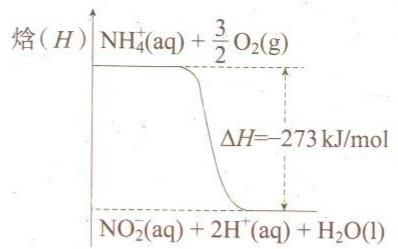  
第一步反应

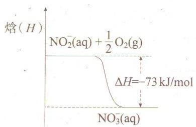  
第二步反应  
图 1-1 $NH_{4}^{+}$ 被氧化成 $NO_{3}^{-}$ 的焓变示意图

根据图示信息，计算 $1 \, \text{mol} \, \text{NH}_{4}^{+}(\text{aq})$ 全部被氧化成 $\text{NO}_{3}^{-}(\text{aq})$ 的 $\Delta H$ 。

总之，不论通过哪种形式，最终目的是帮助学生进行归纳总结，理解并熟练应用盖斯定律。

## 2. 利用焓变、盖斯定律进行计算

通过前面的学习，学生知道了化学反应中反应物和生成物之间的质量关系、物质的量的关系等，而这一部分内容则是讨论在特定条件下，化学反应中的能量变化以热量的形式表现时的“质”“能”关系，这是理论联系实际的重要内容，对于学生进一步认识化学反应具有重要意义。

教材中列举了三道例题，例题1和例题2是利用热化学方程式直接求算，例题3是应用盖斯定律计算。这三道例题体现了反应热的应用价值。教学中要用好这些例题，讲清计算的格式、要求等。还可以结合以下案例进一步说明盖斯定律的价值。

【案例】研究人员提出利用含硫物质的热化学循环实现太阳能的转化与存储，过程如图1-2所示。

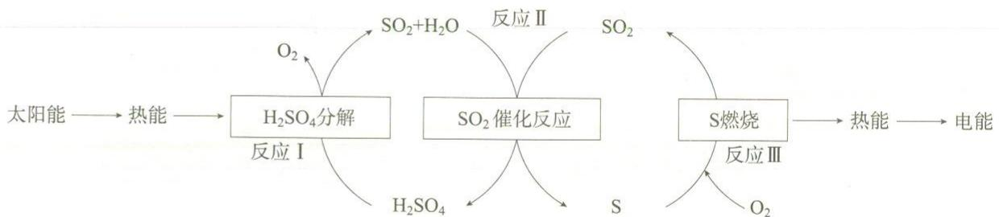  
图 1-2 太阳能的转化与存储过程示意图

反应 I: $2H_{2}SO_{4}(l)=2SO_{2}(g)+2H_{2}O(g)+O_{2}(g)$ $\Delta H_{1}=+551\ kJ/mol$

反应Ⅲ： $S(s)+O_{2}(g)=SO_{2}(g)\quad\Delta H_{3}=-296\ kJ/mol$

写出反应Ⅱ的热化学方程式：\_\_\_\_。

若将反应Ⅰ、Ⅱ和Ⅲ相加，会得到什么结果？说明什么？

学生在对该案例进行分析后能够发现，若将反应Ⅰ、Ⅱ和Ⅲ相加，则该热化学循环过程没有实质意义上的物质转化，物质转化的作用是传递能量，含硫物质在该热化学循环中是储能物质。这一案例说明了盖斯定律在调控、利用能量中的作用。

## 四、练习与应用参考答案及说明

$$
1. \mathrm{S(s)} + \mathrm {O_ {2} (g)} = \mathrm {SO_ {2} (g)} \quad \Delta H = - 2 9 6 \mathrm{kJ/mol}
$$

2. $2 \mathrm{H}_{2}(\mathrm{~g}) + \mathrm{O}_{2}(\mathrm{~g}) = 2 \mathrm{H}_{2} \mathrm{O}(\mathrm{g})$ $\Delta H = -483.6 \mathrm{~kJ} / \mathrm{mol}$ $\Delta H = -285.8 \mathrm{~kJ} / \mathrm{mol}$

3. (1) $C_{4}H_{10}(g) + \frac{13}{2}O_{2}(g) = 4CO_{2}(g) + 5H_{2}O(l)$ $\Delta H = -2900\ kJ/mol$ (2) 2680 kJ

4. $2\mathrm{N}_2\mathrm{H}_4(\mathrm{l}) + 2\mathrm{NO}_2(\mathrm{g}) = 3\mathrm{N}_2(\mathrm{g}) + 4\mathrm{H}_2\mathrm{O}(\mathrm{g})$ $\Delta H = -1134.4\mathrm{kJ / mol}$

$$
\mathrm{CH} _ {4} (\mathrm{g}) + 2 \mathrm{O} _ {2} (\mathrm{g}) = \mathrm{CO} _ {2} (\mathrm{g}) + 2 \mathrm{H} _ {2} \mathrm{O} (\mathrm{l}) \quad \Delta H = - 8 9 0. 3 \mathrm{kJ/mol}
$$

$$
\mathrm{CO(g)} + \mathrm {H_ {2} O(g)} = \mathrm {CO_ {2} (g)} + \mathrm {H_ {2} (g)} \quad \Delta H = - 4 1. 2 \mathrm{kJ/mol}
$$

## 复习与提升建议

## 一、复习与提升教学建议

在复习中，应引导学生对熟悉的反应进行分析和整理，从宏观、微观、符号等维度认识化学反应中的热量变化。可采用如下教学方式。

## 1. 建构思维导图，认识化学反应中能量变化的本质

以教材中的“整理与提升”为依托，课前让学生完成本章知识梳理或绘制思维导图，可以 $H_{2}$ 与 $Cl_{2}$ 生成HCl、 $H_{2}O(g)$ 分解为 $H_{2}$ 和 $O_{2}$ 等反应为例，从宏观现象、微观实质和符号表征三个维度加以分析，明确化学反应中既有物质变化又有能量变化，并从定性与定量两个角度加深理解。

## 2. 以火箭推进剂为主题，体会知识的应用价值

借助教材中的“研究与实践”栏目，以目前火箭推进剂中较普遍的组合—— $\mathrm{N}_{2} \mathrm{H}_{4}(\mathrm{l})$ （作燃烧剂）与 $\mathrm{NO}_{2}$ （实际为 $\mathrm{N}_{2} \mathrm{O}_{4}$ ，作氧化剂）的反应为例，围绕以下几个方面进行研究。

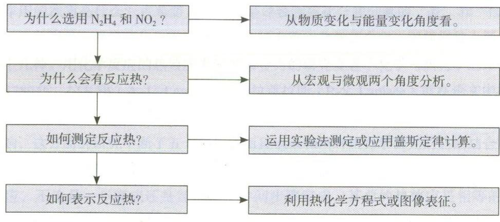

## 3. 自选主题，自主研究

在完成 “整理与提升” 的基础上，教师可以让学生模仿上述研究过程，自选某个主题，围绕其中的化学反应，从物质变化和能量变化两个视角进行研究并表征。

## 二、复习与提高参考答案及说明

2. B

3. B

4. +92.3 kJ/mol

5. (1) $\mathrm{CH}_4$ (2) $\mathrm{CH}_4(\mathrm{g}) + 2\mathrm{O}_2(\mathrm{g}) = \mathrm{CO}_2(\mathrm{g}) + 2\mathrm{H}_2\mathrm{O}(\mathrm{l})$ $\Delta H = -890.3\mathrm{kJ / mol}$

6.(1)① (2)③ (3)1209kJ

$$
(4) \mathrm{CO(g)} + \frac {1}{2} \mathrm{O} _ {2} (\mathrm{g}) = \mathrm{CO} _ {2} (\mathrm{g}) \quad \Delta H = - 2 8 3. 0 \mathrm{kJ/mol}
$$

7. (1) $\mathrm{C}_2\mathrm{H}_2(\mathrm{g}) + \frac{5}{2}\mathrm{O}_2(\mathrm{g}) = 2\mathrm{CO}_2(\mathrm{g}) + \mathrm{H}_2\mathrm{O}(\mathrm{l})$ $\Delta H = -1299.6\mathrm{kJ / mol}$

$$
(2) \mathrm{C} _ {2} \mathrm{H} _ {5} \mathrm{OH} (\mathrm{l}) + 3 \mathrm{O} _ {2} (\mathrm{g}) = 2 \mathrm{CO} _ {2} (\mathrm{g}) + 3 \mathrm{H} _ {2} \mathrm{O} (\mathrm{l}) \quad \Delta H = - 1 3 6 6. 8 \mathrm{kJ/mol}
$$

8. $2 \mathrm{Mg}(\mathrm{s}) + \mathrm{CO}_{2}(\mathrm{~g}) = 2 \mathrm{MgO}(\mathrm{s}) + \mathrm{C}(\mathrm{s})$ $\Delta H = -809.9 \mathrm{~kJ/mol}$

9. $\Delta H = +124.2 \mathrm{~kJ} / \mathrm{mol}$

10. (1) $1:1$

$$
(2) \mathrm{C} _ {3} \mathrm{H} _ {8} (\mathrm{g}) + 5 \mathrm{O} _ {2} (\mathrm{g}) = 3 \mathrm{CO} _ {2} (\mathrm{g}) + 4 \mathrm{H} _ {2} \mathrm{O} (\mathrm{g}) \quad \Delta H = - 2 0 4 3. 9 \mathrm{kJ/mol}
$$

## 教学资源

## 1. 热化学简介

## (1) 热化学的研究对象

热力学第一定律是自然界的一条普遍规律，它是人们在生产实践和科学实验的基础上总结出来的，又叫做能量守恒和转化定律，恩格斯将它誉为19世纪自然科学中具有决定意义的三大发现之一。这个定律的主要内容是：能量有各种不同的形式，能从一种形式转化为另一种形式，从一个物体传递给另一个物体，而在转化和传递中，能量的数值保持不变。

把热力学第一定律具体运用到化学反应中，用实验测定和计算化学反应的热量，研究这方面问题的科学称为热化学。

热化学主要研究化学反应中的热量转化问题。化学反应除了以热的形式与环境进行能量交换，往往还以功的形式进行交换。例如，火药爆炸产生体积功，化学电池在电动势作用下输送电荷而做电功等。热化学中所讨论的化学反应，都是在一定条件下只做体积功，而不做非体积功（如电功）的反应。

## (2) 热化学发展简史

化学作用的本质是什么？古希腊人认为它是导致物质化合和分解的“爱”和“憎”。早期化学家接受了这种观点，把导致化学反应得以发生的力称为化学亲合力。近代有较大影响的亲合力理论不下十几种。用化学反应的热效应来量度亲合力的研究促进了化学与热力学的结合。

早在1780年，拉瓦锡（A.-L. Lavoisier）和拉普拉斯（P.-S. Laplace）就在论文中报道了他们关于化学反应热的研究。他们设计了一台简陋的量热计，想用它来测定反应的热量。由于受到热质论的影响，这方面的研究中断了五十多年，而且也未和当时热力学研究的热潮结合起来。

1836年，化学家盖斯（G. H. Hess）在俄国测量了许多反应的热效应，总结出一条规律：一个化学反应，不论是一步完成还是经过几个中间步骤完成，其总的热效应是相等的。1840年，他在圣彼得堡发表了他的研究结果，并将其称为“总热量守恒定律”，后来人们以他的名字将这个规律命名为盖斯定律。这是热化学领域发现的第一个定律，也是自然科学上首先得出的能量守恒和转化的规律性结论。

19世纪50年代，法夫尔（P. A. Favre）等人进行了热化学研究工作，得到了比较精确的反应热数据。

物理学家汤姆生（H. P. J. J. Thomsen）的研究工作在热化学发展方面占有重要地位。他在1882～1886年出版了四卷本的《热化学》，提出了吸热和放热的概念，把反应热作为反应物化学亲合力的量度。

贝特洛（P.-E. M. Berthelot）发明了精确测定燃烧热的方法。他在发展汤姆生关于反应热是化学亲合力的量度的原理时指出，只有伴随放热过程的反应才能自发进行，在几个可能发生的反应中，只有放出最大热量的反应才能发生。这一原理就叫做贝特洛-汤姆生最大功原理。亥姆霍兹（H. v. Helmholtz）对贝特洛的观点提出质疑，引起了很大争论，也由此促进了热力学的发展。

在化学家研究反应热的前后，热力学接连取得许多成就，其中特别重要的是确立了热力学第一定律（1842年）和热力学第二定律（1865年）。

热力学第一定律和热力学第二定律的确立，为科学的发展提供了新的思想。第一定律强调的是能量转化时的守恒性和等值性，它要求从能量的转化恒等性上把握运动形式的变化，突破了仅用物质要素和成分解释世界的僵化模式，为边缘学科的形成提供了基础。第二定律强调的是能量实际转化的不可逆性（即变化有一定的方向与限度），否定了从牛顿理论衍生出来的用可逆反应的观点处理一切问题的简单方法。这两个定律在学术界的影响越来越大。直到1869年由霍斯特曼（A. F. Horstmann）的工作开始，化学家才逐步把热力学的成果引入化学研究。霍斯特曼用热力学第二定律研究了热分解反应中分解压力与温度的作用，研究了升华过程的热力学，建立了最大功与反应热的关系。随后，越来越多的物理学家和化学家走进了热力学和化学结合的领域，形成了物理化学的重要分支——化学热力学。

## 2. 体系与环境

我们用实验、观察等方法进行科学研究时，必须先确定所要研究的对象，把一部分物质与其余的分开（分开可以是实际的，也可以是想象的）。这种被划定的研究对象就称为体系或系统；在体系以外与体系密切相关的、影响所能及的部分则称为环境。

根据体系与环境之间的关系，可以把体系分为三种。

(1) 隔离体系 (或孤立体系): 完全不受环境影响, 并与环境之间没有物质交换和能量交换的体系。但是, 在地球上还找不到一种材料能隔离重力场, 因此只能在近似意义上应用隔离体系的概念。

（2）封闭体系：与环境之间没有物质交换，但可以发生能量交换的体系。

（3）敞开体系：与环境之间既有物质交换又有能量交换的体系。

## 3. 内能

在热力学中，内能（U）是体系内部能量的总和，其中包括分子的动能，分子之间相互作用的势能，以及分子内部各种粒子（如电子、原子核及原子核内的各种粒子等）的动能和它们相互作用的势能等。

可以看出，内能是体系自身的性质，内能的值只决定于体系的状态。状态确定，内能的值就确定；状态改变，内能的值就改变。内能的改变值只决定于体系的起始和最终状态，而与变化的途径无关，即内能是状态函数。另外，由于内能是体系内部所有粒子具有的能量总和，而体系内部的粒子数是和体系内物质的物质的量成正比的，所以内能的数值也是和体系内物质的物质的量成正比的，即内能是容量性质的状态函数。

由于人们对物质内部运动形式的认识还在不断深入，因此内能的绝对值是无法确定的。但这并不妨碍内能在解决实际问题中的应用，因为热力学是通过外界的变化来测定或计算状态函数的变化值，这是热力学解决实际问题的一种常用方法。

## 4. 焓与焓变

热力学第一定律的数学表达式为：

$$
\Delta U = Q + W
$$

其中， $\Delta U$ 是体系内能的变化，是最终状态内能（ $U_{2}$ ）和起始状态内能（ $U_{1}$ ）的差值，即 $\Delta U = U_{2} - U_{1}$ ；Q 是体系与环境交换的热量；W 是环境对体系或体系对环境所做的功，包括机械功、电功、体积功等各种形式。

在应用 $\Delta U=Q+W$ 时，要特别注意各物理量的正、负号，如下表所示。

<table><tr><td>物理量</td><td>&gt;0</td><td>&lt;0</td></tr><tr><td>ΔU</td><td>体系内能增加</td><td>体系内能减小</td></tr><tr><td>Q</td><td>体系从环境吸收热量</td><td>体系向环境释放热量</td></tr><tr><td>W</td><td>环境对体系做功</td><td>体系对环境做功</td></tr></table>

许多体系在变化时往往只做体积功（ $W_{体积}$ ，是指体系的体积变化时反抗外压所做的功）而不做其他类型的功（如机械功、电功等）。当压强为p、体积变化为 $\Delta V(\Delta V=V_{\text{最终}}-V_{\text{起始}})$ 时， $W_{体积}=-p\Delta V$ 。

这是因为，根据规定，体系对环境做功，W<0；环境对体系做功，W>0。如果体系对环境只做体积膨胀功，p为外压（取正值）， $\Delta V=V_{最终}-V_{起始}$ ， $\Delta V>0$ ，所以 $W_{体积}=-p\Delta V$ ；当环境对体系只做体积压缩功时， $\Delta V=V_{最终}-V_{起始}$ ， $\Delta V<0$ ，p仍为正值，所以也是 $W_{体积}=-p\Delta V$ 。

如果体系的变化过程只做体积功，且是等容过程（Q用 $Q_{V}$ 表示），即 $\Delta V=0$ ， $W_{体积}=-p\Delta V=0$ ，则：

$$
\Delta U = Q + W = Q _ {V} + W _ {\mathrm{体积}} = Q _ {V} - p \Delta V = Q _ {V}
$$

如果体系的变化过程只做体积功，且是等压过程（Q用 $Q_{p}$ 表示），则：

$$
\Delta U = Q + W = Q _ {p} + W _ {\mathrm{体积}} = Q _ {p} - p \Delta V = Q _ {p} - p (V _ {2} - V _ {1})
$$

$$
U _ {2} - U _ {1} = Q _ {p} - p (V _ {2} - V _ {1})
$$

$$
(U _ {2} + p V _ {2}) - (U _ {1} + p V _ {1}) = Q _ {p}
$$

在热力学中，把（ $U+pV$ ）定义为焓（H），即：

$$
H = U + p V
$$

$$
H _ {2} - H _ {1} = \Delta H = Q _ {p}
$$

综上所述，可知：

（1）焓的定义为 $H=U+pV$ ，是人们在处理体系状态变化时引入的状态函数。体系的焓值只与体系所处的状态有关，而与通过什么途径达到这个状态无关；

（2）焓具有能量的量纲，但没有确切的物理意义。热力学中之所以定义焓，是因为它在实际应用中很重要，有了焓这个物理量，我们在处理热力学的问题时要方便得多；

（3）内能的绝对值是无法确定的，所以焓的绝对值也是无法确定的。但是在一定条件下，我们可以通过体系和环境间传递的热量来计算内能和焓的变化值。在等容条件下只做体积功的体系，其内能的变化等于 $Q_{V}$ ，即 $\Delta U=Q_{V}$ ；在等压条件下只做体积功的体系，其焓变等于 $Q_{p}$ ，即 $\Delta H=Q_{p}$ 。由于一般的化学反应是在等压条件下进行的，且只做体积功，所以焓变更具有实用价值。

## 5. 热化学方程式

对于下列热化学方程式：

$$
\begin{array}{l l} \mathrm {H_ {2} (g) + \frac {1}{2} O_ {2} (g) = H_ {2} O(l)} & \Delta_ {\mathrm{r}} H _ {\mathrm{m}} ^ {\ominus} (2 9 8 \mathrm{K}) = - 2 8 5. 8 \mathrm{kJ/mol} \\ \frac {1}{2} \mathrm {N_ {2} (g) + O_ {2} (g) = NO_ {2} (g)} & \Delta_ {\mathrm{r}} H _ {\mathrm{m}} ^ {\ominus} (2 9 8 \mathrm{K}) = + 3 3. 2 \mathrm{kJ/mol} \end{array}
$$

焓（H）左下角的r代表化学反应（reaction）；右下角的m代表摩尔（mol）；右上角的 $\Theta$ 代表热力学标准状态（简称标态）；括号内的298 K代表热力学温度； $\Delta H$ 则为焓变。气态物质的标态用压强表示，过去用101 kPa，目前用100 kPa。溶液的标态则指溶质浓度或活度为1 mol/kg，对稀溶液而言，也可用1 mol/dm $^{3}$ 。液体和固体的标态则指处于标准压强下的纯物质。最常用的焓变值是298 K（25 ℃）的，严格地说焓变值是随温度变化的，但在一定温度范围内变化不大，凡未注明温度的 $\Delta_{r}H_{m}^{\ominus}$ 就代表在298 K及标态时的焓变，可以简写为 $\Delta H^{\ominus}$ 。总之， $\Delta H$ 泛指任意状态的焓变， $\Delta_{r}H_{m}^{\ominus}(T)$ 表示在标态、温度为T时化学反应的摩尔焓变， $\Delta H^{\ominus}$ 则为在标态和298 K时摩尔焓变的简写符号。

$\Delta_{r}H_{m}^{\ominus}(T)$ 的单位是 kJ/mol。焓是容量性质， $\Delta_{r}H_{m}^{\ominus}(T)$ 的大小与物质的量成正比。在书写热化学方程式时，必须注意 $\Delta_{r}H_{m}^{\ominus}(T)$ 应该与化学方程式相对应。例如，在 298 K 时：

$$
\begin{array}{r l} & {\mathrm {H_ {2} (g)+ \frac {1}{2} O_ {2} (g) = H_ {2} O(l)}} \\ & {\Delta_ {\mathrm{r}} H _ {\mathrm{m}} ^ {\ominus} (2 9 8 \mathrm{K}) = - 2 8 5. 8 \mathrm{kJ/mol(或} \Delta H ^ {\ominus} = - 2 8 5. 8 \mathrm{kJ/mol)}} \\ & {2 \mathrm {H_ {2} (g)+ O_ {2} (g) = 2 H_ {2} O(1)}} \\ & {\Delta_ {\mathrm{r}} H _ {\mathrm{m}} ^ {\ominus} (2 9 8 \mathrm{K}) = - 5 7 1. 6 \mathrm{kJ/mol(或} \Delta H ^ {\ominus} = - 5 7 1. 6 \mathrm{kJ/mol)}} \end{array}
$$

由于物质状态变化时总伴随焓变，所以在书写热化学方程式时应注明物质的状态，如下列两个反应：

$$
\begin{array}{r l} \mathrm {H_ {2} (g)} + \frac {1}{2} \mathrm {O_ {2} (g)} = & \mathrm {H_ {2} O(l)} \\ \Delta H ^ {\ominus} = & - 2 8 5. 8 \mathrm{kJ/mol} \\ \mathrm {H_ {2} (g)} + \frac {1}{2} \mathrm {O_ {2} (g)} = & \mathrm {H_ {2} O(g)} \\ \Delta H ^ {\ominus} = & - 2 4 1. 8 \mathrm{kJ/mol} \end{array}
$$

两个 $\Delta H^{\ominus}$ 不同，是因为在标态及 298 K 下， $H_{2}O(l)$ 和 $H_{2}O(g)$ 的焓值不同。液态 $H_{2}O$ 变为气态 $H_{2}O$ 要吸热，所以 1 mol $H_{2}(g)$ 和 0.5 mol $O_{2}(g)$ 化合生成 1 mol $H_{2}O(g)$ 的放热量要比生成 1 mol $H_{2}O(l)$ 的小些。

## 6. 反应进度

我们知道， $H_{2}(g)$ 与 $O_{2}(g)$ 反应生成 $H_{2}O(g)$ 时，其 $\Delta_{r}H_{m}^{\ominus}$ 与化学方程式的写法有关，即：

$$
\begin{array}{r l} \mathrm {H_ {2} (g) + \frac {1}{2} O_ {2} (g) = H_ {2} O(g)} & \Delta_ {\mathrm{r}} H _ {\mathrm{m}} ^ {\ominus} (2 9 8 \mathrm{K}) = - 2 4 1. 8 \mathrm{kJ/mol} \\ 2 \mathrm {H_ {2} (g) + O_ {2} (g) = 2 H_ {2} O(g)} & \Delta_ {\mathrm{r}} H _ {\mathrm{m}} ^ {\ominus} (2 9 8 \mathrm{K}) = - 4 8 3. 6 \mathrm{kJ/mol} \end{array} \tag {1}
$$

也就是说，同一反应体系中各物质的物质的量不同时，其摩尔焓变不同。不仅如此，对于同一

反应体系，当选择不同的物质（如 $H_{2}$ 或 $O_{2}$ ）发生1 mol变化为基准时，其摩尔焓变也不一定相同。

为了处理化学反应的焓变，化学中引入了反应进度这个物理量。反应进度是描述化学反应进展程度的物理量，符号为 $\xi$ ，单位是 mol。

通常我们可以把任何化学方程式写成：

$$
\nu_ {\mathrm{D}} \mathrm{D} + \nu_ {\mathrm{E}} \mathrm{E} + \dots = \nu_ {\mathrm{F}} \mathrm{F} + \nu_ {\mathrm{G}} \mathrm{G} + \dots
$$

式中 $v_{D}$ 、 $v_{E}$ 、 $v_{F}$ 、 $\dot{v}_{G}$ 等是所给化学方程式中各物质的化学计量数。对于反应物，v 取负值，对于生成物，v 取正值。

设某反应：

$$
\nu_ {\mathrm{D}} \mathrm{D} + \nu_ {\mathrm{E}} \mathrm{E} + \dots \dots = \nu_ {\mathrm{F}} \mathrm{F} + \nu_ {\mathrm{G}} \mathrm{G} + \dots \dots
$$

当 $t = 0$ ， $\xi = 0$ 时： $n_{\mathrm{D}}^{0}$ $n_{\mathrm{E}}^{0}$ $n_{\mathrm{F}}^{0}$ $n_{\mathrm{G}}^{0}$ 当 $t = t$ ， $\xi = \xi$ 时： $n_{\mathrm{D}}$ $n_{\mathrm{E}}$ $n_{\mathrm{F}}$ $n_{\mathrm{G}}$

将反应进度定义为：

$$
\xi = \frac {n _ {\mathrm{B}} - n _ {\mathrm{B}} ^ {0}}{\nu_ {\mathrm{B}}}
$$

由此可得：

$$
\mathrm{d} \xi = \frac {\mathrm{d} n _ {\mathrm{B}}}{\nu_ {\mathrm{B}}} \quad \Delta \xi = \frac {\Delta n _ {\mathrm{B}}}{\nu_ {\mathrm{B}}}
$$

式中下标B代表任一组分， $n_{B}^{0}$ 是在反应起始时（即 $\xi=0$ 时）B的物质的量， $n_{B}$ 是在反应进度为 $\xi$ 时B的物质的量。

引入反应进度的最大优点是在反应进行到任意时刻时，可用任一反应物或任一生成物来表示反应进展的程度，所得值总是相等的。即：

$$
\Delta \xi = \frac {\Delta n _ {\mathrm{D}}}{\nu_ {\mathrm{D}}} = \frac {\Delta n _ {\mathrm{E}}}{\nu_ {\mathrm{E}}} = \frac {\Delta n _ {\mathrm{F}}}{\nu_ {\mathrm{F}}} = \frac {\Delta n _ {\mathrm{G}}}{\nu_ {\mathrm{G}}} = \dots \dots
$$

例如，假设 $\mathrm{O}_2$ 和 $\mathrm{H}_2$ 的混合体系在某个时刻发生的净变化为：

$$
\Delta n (\mathrm{O} _ {2}) = - 0. 2 \mathrm{mol} \quad \Delta n (\mathrm{H} _ {2}) = - 0. 4 \mathrm{mol} \quad \Delta n (\mathrm{H} _ {2} \mathrm{O}) = 0. 4 \mathrm{mol}
$$

若按反应式（1）计算，反应进度为：

$$
\begin{array}{r l} \Delta \xi_ {1} & = \frac {\Delta n (\mathrm{H} _ {2})}{\nu (\mathrm{H} _ {2})} = \frac {\Delta n (\mathrm{O} _ {2})}{\nu (\mathrm{O} _ {2})} = \frac {\Delta n (\mathrm{H} _ {2} \mathrm{O})}{\nu (\mathrm{H} _ {2} \mathrm{O})} \\ & = \frac {- 0 . 4 \mathrm{mol}}{- 1} = \frac {- 0 . 2 \mathrm{mol}}{- 0 . 5} = \frac {0 . 4 \mathrm{mol}}{1} = 0. 4 \mathrm{mol} \end{array}
$$

若按反应式（2）计算，反应进度为：

$$
\Delta \xi_ {2} = \frac {- 0 . 4 \mathrm{mol}}{- 2} = \frac {- 0 . 2 \mathrm{mol}}{- 1} = \frac {0 . 4 \mathrm{mol}}{2} = 0. 2 \mathrm{mol}
$$

假设在另一时刻，这个体系发生的净变化为：

$$
\Delta n (\mathrm{O} _ {2}) = - 0. 5 \mathrm{mol} \quad \Delta n (\mathrm{H} _ {2}) = - 1 \mathrm{mol} \quad \Delta n (\mathrm{H} _ {2} \mathrm{O}) = 1 \mathrm{mol}
$$

若按反应式（1）计算，反应进度为：

$$
\Delta \xi_ {1} ^ {\prime} = \frac {- 1 \mathrm{mol}}{- 1} = \frac {- 0 . 5 \mathrm{mol}}{- 0 . 5} = \frac {1 \mathrm{mol}}{1} = 1 \mathrm{mol}
$$

若按反应式（2）计算，反应进度为：

$$
\Delta \xi_ {2} ^ {\prime} = \frac {- 1 \mathrm{mol}}{- 2} = \frac {- 0 . 5 \mathrm{mol}}{- 1} = \frac {1 \mathrm{mol}}{2} = 0. 5 \mathrm{mol}
$$

比较上述结果可得出如下结论：

(1) $\Delta \xi_{1}$ 与 $\Delta \xi_{2}$ 、 $\Delta \xi_{1}^{\prime}$ 与 $\Delta \xi_{2}^{\prime}$ 均不相等，表明反应进度与化学方程式的写法有关；

（2）对于同一反应， $\Delta\xi=\frac{\Delta n_{B}}{\nu_{B}}$ ，说明 $\Delta\xi$ 与物质的选择无关；

(3) $\Delta \xi_{1}^{\prime} > \Delta \xi_{1}$ , $\Delta \xi_{2}^{\prime} > \Delta \xi_{2}$ , 这表明在不同的时刻反应进度不同, 反应进度可量度反应的进展程度。 $\Delta \xi$ 越大, 反应完成的程度越大;

（4）对于指定的反应，化学方程式中化学计量数的绝对值不等，则各物质变化的物质的量 $\left(\Delta n_{\mathrm{B}}\right)$ 的绝对值也不相等。这说明，不能直接用一种物质的 $\Delta n$ 来表示所有物质或整个反应的进展程度。

## 7. 生成焓

化学反应的焓变虽然是重要且常用的数据，但是任何一种化学手册都不可能记载成千上万化学反应的 $\Delta H$ ，因为化学反应的种类太多，能从手册中查到的仅仅是几千种常见纯净物的标准生成焓。在标态和温度为 $T$ 条件下，由稳定态单质生成 $1 \mathrm{~mol}$ 化合物的焓变叫做该物质在 $T$ 时的标准生成焓，简称生成焓，符号是 $\Delta_{\mathrm{f}} H_{\mathrm{m}}^{\ominus}(T)$ ，其中 $H$ 的左下角“f”表示生成 (formation)，在 $298 \mathrm{~K}$ 时的标准生成焓的符号可以简写为 $\Delta H_{\mathrm{f}}^{\ominus}$ 。例如，在 $298 \mathrm{~K}$ 时：

$$
\mathrm{C(石墨)} + \mathrm {O_ {2} (g) = CO_ {2} (g)} \qquad \Delta H _ {\mathrm{f}} ^ {\ominus} = - 3 9 3. 5 \mathrm{kJ/mol}
$$

生成焓并非一个新概念，而是一种特定的 $\Delta H$ 。一种物质焓的绝对值无法测定，生成焓是一种相对值，有些是通过实验测定的，有些则是通过计算间接得到的。当知道了各种物质的生成焓后，我们可以很容易地计算出许多化学反应的摩尔焓变。

任何一个反应的摩尔焓变等于生成物生成焓之和减去反应物生成焓之和：

$$
\Delta_ {\mathrm{r}} H _ {\mathrm{m}} ^ {\ominus} = \sum \nu_ {\mathrm{i}} \Delta_ {\mathrm{f}} H _ {\mathrm{m}} ^ {\ominus} (\mathrm{生成物}) - \sum \nu_ {\mathrm{i}} \Delta_ {\mathrm{f}} H _ {\mathrm{m}} ^ {\ominus} (\mathrm{反应物})
$$

这是一个非常有用的关系式，式中 $v_{i}$ 表示化学计量数。例如，对于反应：

$$
\begin{array}{r l} & \mathrm {CO(g)+ H_ {2} O(g) = CO_ {2} (g)+ H_ {2} (g)} \\ & \Delta_ {\mathrm{r}} H _ {\mathrm{m}} ^ {\ominus} = \{\Delta_ {\mathrm{f}} H _ {\mathrm{m}} ^ {\ominus} [ \mathrm {CO_ {2} (g)} ] + \Delta_ {\mathrm{f}} H _ {\mathrm{m}} ^ {\ominus} [ \mathrm {H_ {2} (g)} ] \} - \{\Delta_ {\mathrm{f}} H _ {\mathrm{m}} ^ {\ominus} [ \mathrm{CO(g)} ] + \Delta_ {\mathrm{f}} H _ {\mathrm{m}} ^ {\ominus} [ \mathrm {H_ {2} O(g)} ] \} \\ & = (- 3 9 3. 5 \mathrm{kJ/mol+0}) - (- 1 1 0. 5 \mathrm{kJ/mol-241.8kJ/mol}) \\ & = - 4 1. 2 \mathrm{kJ/mol} \end{array}
$$

即：

$$
\mathrm{CO(g)} + \mathrm {H_ {2} O(g)} = \mathrm {CO_ {2} (g)} + \mathrm {H_ {2} (g)} \quad \Delta_ {\mathrm{r}} H _ {\mathrm{m}} ^ {\ominus} = - 4 1. 2 \mathrm{kJ/mol}
$$

下表列出的是一些常见化合物在298 K时的标准生成焓。

<table><tr><td>化合物</td><td> $\Delta_{\mathrm {f}}H^{\ominus}_{\mathrm {m}}$  $(\mathrm {kJ} \cdot \mathrm {mol}^{-1})$ </td><td>化合物</td><td> $\Delta_{\mathrm {f}}H^{\ominus}_{\mathrm {m}}$  $(\mathrm {kJ} \cdot \mathrm {mol}^{-1})$ </td><td>化合物</td><td> $\Delta_{\mathrm {f}}H^{\ominus}_{\mathrm {m}}$  $(\mathrm {kJ} \cdot \mathrm {mol}^{-1})$ </td></tr><tr><td>AgCl(s)</td><td>-127.07</td><td> $n-C_{8}H_{18}(g)$ </td><td>-208.45</td><td>MgO(s)(方镁石)</td><td>-601.6</td></tr><tr><td>AgBr(s)</td><td>-100.37</td><td> $C_{2}H_{5}OH(l)$ </td><td>-277.7</td><td> $Mg(OH)_{2}(s)$ </td><td>-924.7</td></tr><tr><td>AgI(s)</td><td>-61.84</td><td> $CH_{3}COOH(l)$ </td><td>-484.5</td><td> $MgSO_{4}(s)$ </td><td>-1 284.9</td></tr><tr><td> $AgNO_{3}(g)$ </td><td>-124.4</td><td> $CrO_{3}(s)$ </td><td>-1 140</td><td> $MnO_{2}(s)$ </td><td>-520.1</td></tr><tr><td> $Ag_{2}O(s)$ </td><td>-31.1</td><td>CuO(s)</td><td>-157.3</td><td>NaCl(s)</td><td>-411.2</td></tr><tr><td> $AlCl_{3}(s)$ </td><td>-704.2</td><td> $Cu_{2}O(s)$ </td><td>-168.6</td><td>NaOH(s)</td><td>-425.1</td></tr><tr><td> $\alpha-Al_{2}O_{3}(s)$ </td><td>-1 675.7</td><td> $Cu_{2}S(s)(\alpha)$ </td><td>-79.5</td><td> $NH_{3}(g)$ </td><td>-45.94</td></tr><tr><td> $B_{2}O_{3}(s)$ </td><td>-1 273.5</td><td>CuS(s)</td><td>-53.1</td><td> $NH_{4}Cl(s)$ </td><td>-314.5</td></tr><tr><td> $BaCl_{2}(s)$ </td><td>-855</td><td> $CuSO_{4}(s)$ </td><td>-771.36</td><td> $NH_{4}NO_{3}(s)$ </td><td>-365.6</td></tr><tr><td> $BaCO_{3}(s)$ </td><td>-1 213</td><td> $CuSO_{4} \cdot 5H_{2}O(s)$ </td><td>-2 279.7</td><td>NO(g)</td><td>+91.29</td></tr><tr><td> $Ba(NO_{3})_{2}(s)$ </td><td>-988</td><td> $Fe_{2}O_{3}(s)(赤铁矿)$ </td><td>-824.2</td><td> $NO_{2}(g)$ </td><td>+33.1</td></tr><tr><td> $Ba(OH)_{2}(s)$ </td><td>-944.7</td><td> $Fe_{3}O_{4}(s)(磁铁矿)$ </td><td>-1 118.4</td><td> $N_{2}O_{4}(g)$ </td><td>+11.1</td></tr><tr><td> $BaSO_{4}(s)$ </td><td>-1 473.19</td><td>HF(g)</td><td>-275.5</td><td> $N_{2}H_{4}(g)$ </td><td>+81.6</td></tr><tr><td> $CaF_{2}(s)$ </td><td>-1 228</td><td>HCl(g)</td><td>-92.31</td><td> $N_{2}D_{4}(l)$ </td><td>+50.6</td></tr><tr><td> $CaCl_{2}(s)$ </td><td>-795.4</td><td>HBr(g)</td><td>-36.29</td><td>NiO(s)</td><td>-240.6</td></tr><tr><td> $CaCO_{3}(s)$ </td><td>-1 207.6</td><td>HI(g)</td><td>+26.5</td><td> $PbCl_{2}(s)$ </td><td>-359.4</td></tr><tr><td>CaO(s)</td><td>-634.92</td><td> $HNO_{3}(l)$ </td><td>-174.1</td><td>PbO(s)(黄)</td><td>-219</td></tr><tr><td> $Ca(OH)_{2}$ </td><td>-985.2</td><td> $H_{2}O(g)$ </td><td>-241.8</td><td> $PbO_{2}(s)$ </td><td>-277.40</td></tr><tr><td> $CaSO_{4}(s)$ </td><td>-1 425.2</td><td> $H_{2}O(l)$ </td><td>-285.84</td><td> $Pb_{3}O_{4}(g)$ </td><td>-718.39</td></tr><tr><td> $CCl_{4}(l)$ </td><td>-135.4</td><td> $H_{2}O_{2}(l)$ </td><td>-187.8</td><td> $PCl_{3}(g)$ </td><td>-227.1</td></tr><tr><td> $CH_{4}(g)$ </td><td>-74.81</td><td> $H_{2}O_{2}(aq)$ </td><td>-191.2</td><td> $PCl_{5}(g)$ </td><td>-374.9</td></tr><tr><td> $CH_{3}OH(l)$ </td><td>-238.7</td><td> $H_{2}S(g)$ </td><td>-20.6</td><td> $SiCl_{4}(l)$ </td><td>-686.9</td></tr><tr><td>CO(g)</td><td>-110.51</td><td> $H_{2}SO_{4}(l)$ </td><td>-813.99</td><td> $SiF_{4}(g)$ </td><td>-1 615</td></tr><tr><td> $CO_{2}(g)$ </td><td>-393.51</td><td>HgO(s)(红)</td><td>-90.83</td><td> $SiO_{2}(s)(石英)$ </td><td>-910.7</td></tr><tr><td> $C_{2}H_{2}(g)$ </td><td>+226.73</td><td>HgS(s)(红)</td><td>-58.2</td><td> $SnCl_{2}(s)$ </td><td>-325.1</td></tr><tr><td> $C_{2}H_{4}(g)$ </td><td>+52.3</td><td>KCl(s)</td><td>-436.5</td><td>SnO(s)</td><td>-280.7</td></tr><tr><td> $C_{2}H_{6}(g)$ </td><td>-84.68</td><td>KBr(s)</td><td>-393.80</td><td> $SnO_{2}(s)$ </td><td>-577.6</td></tr><tr><td> $C_{3}H_{8}(g)$ </td><td>-103.85</td><td>KI(s)</td><td>-327.90</td><td> $SO_{2}(g)$ </td><td>-296.81</td></tr><tr><td> $n-C_{4}H_{10}(g)$ </td><td>-126.15</td><td> $KClO_{3}(s)$ </td><td>-397.7</td><td> $SO_{3}(g)$ </td><td>-395.7</td></tr><tr><td rowspan="2">化合物</td><td> $\Delta_fH_m^\ominus$ </td><td rowspan="2">化合物</td><td> $\Delta_fH_m^\ominus$ </td><td rowspan="2">化合物</td><td> $\Delta_fH_m^\ominus$ </td></tr><tr><td>(kJ·mol-1)</td><td>(kJ·mol-1)</td><td>(kJ·mol-1)</td></tr><tr><td>C6H6(l)</td><td>+49.04</td><td>KOH(s)</td><td>-424.7</td><td>ZnO(s)</td><td>-350.46</td></tr><tr><td>C6H6(g)</td><td>+82.93</td><td>KMnO4(s)</td><td>-837.2</td><td>ZnS(s)(铅锌矿)</td><td>-192.6</td></tr><tr><td>C6H12(g)(环己烷)</td><td>-123.1</td><td>MgCO3(s)(菱镁石)</td><td>-1095.8</td><td>ZnS(s)(闪锌矿)</td><td>-206.0</td></tr></table>

## 8. 中和热

发生中和反应时，由于所用的酸和碱强弱不同，又有一元、二元或多元之分，因而中和热各不相同。

## (1) 一元强酸与一元强碱的中和热

一元强酸的稀溶液与一元强碱的稀溶液中和生成1 mol $H_{2}O$ 时，中和热为57.3 kJ/mol。

(2) 一元强酸与一元弱碱或一元弱酸与一元强碱的中和热

如果有一元弱酸或弱碱参加中和反应，生成 $1 \mathrm{~mol} \mathrm{H}_{2} \mathrm{O}$ 时所放出的热量一般低于 $57.3 \mathrm{~kJ} / \mathrm{mol}$ ，也有个别高于 $57.3 \mathrm{~kJ} / \mathrm{mol}$ 的。这主要取决于弱酸或弱碱电离时吸热还是放热。

一般地说，弱酸或弱碱的电离是吸热的。因此，中和反应所放出的热量还要扣除弱酸或弱碱电离时吸收的那部分热量，放出的热也就低于57.3 kJ/mol。例如，1 mol $CH_{3}COOH$ 与1 mol NaOH反应时，中和热是56.0 kJ/mol。

有的弱电解质电离是放热的。例如，1 mol HF 电离时放出 10.4 kJ 的热量。当它与 1 mol NaOH 反应时，中和热是 67.7 kJ/mol。

## （3）二元酸与一元强碱的中和热

二元酸的电离是分两步进行的，两个 $H^{+}$ 的中和热各不相同。中和第一个 $H^{+}$ 的中和热，等于57.3 kJ/mol减去二元酸电离出第一个 $H^{+}$ 所吸收的热量（ $\Delta H_{1}$ ）；中和第二个 $H^{+}$ 的中和热，等于57.3 kJ/mol减去二元酸电离出第二个 $H^{+}$ 所吸收的热量（ $\Delta H_{2}$ ）。因此，二元酸与一元强碱中和生成2 mol $H_{2}O$ 时，反应的 $\Delta H$ 可用下式表示：

$$
\Delta H = - \left[ 2 \times 5 7. 3 \mathrm{kJ/mol} - (\Delta H _ {1} + \Delta H _ {2}) \right]
$$

## (4) 多元酸与一元强碱的中和热

假设三元酸与一元强碱的中和热为 $\Delta H$ ，三元酸中的三个 $H^{+}$ 电离时所吸收的热量依次是 $\Delta H_{1}$ 、 $\Delta H_{2}$ 、 $\Delta H_{3}$ ，则三元酸与一元强碱中和生成 $3 \, mol \, H_{2}O$ 时：

$$
\Delta H = - \left[ 3 \times 5 7. 3 \mathrm{kJ/mol} - (\Delta H _ {1} + \Delta H _ {2} + \Delta H _ {3}) \right]
$$

## 9. 反应热与化工生产的关系

化学反应中的热量问题对于化工生产具有重要意义。例如，合成氨是放热的，如果不设法将这些热量移走，反应器内的温度就会过高，这不仅会破坏催化剂，使产量降低，还可能发生爆炸事故。在制造水煤气的反应中，需要吸收大量的热，如果不及时供应所需要的热量，反应就不能顺利进行，甚至会停止。因此，在进行化工设计时，为了保证生产的正常进行，必须事先获得准确的反应热数据，作为制造热交换设备和规定工艺操作条件的依据。

在化工生产中，热能的综合利用问题不但直接关系到产品成本的高低，而且影响产率的大小。化工设备中的热交换器、余热锅炉、热风炉等的设计和使用，都是为了综合利用热能，以便提高产品的产率，降低成本。

综上所述，研究反应热对于化工生产适宜条件的选择，设备的设计和使用，以及热能的综合利用等，都有很重要的意义。

## 教学案例

# 从家用燃料到火箭推进剂的选择

北京市朝阳区教育研究中心 陈瑞雪

## 教学目标

1. 理解燃烧热的概念，能根据燃烧热书写热化学方程式；能从物质转化、能量转化及环境保护等方面选择家用燃料，进一步发展定性与定量相结合分析问题的意识。

2. 通过火箭推进剂的变迁，建立依据使用目的及评价标准选择燃料的思路。

3. 通过了解火箭推进剂的发展史，感受我国航空和航天科技的发展，增强民族自豪感。

## 教学重点

燃烧热的概念及燃料燃烧的热化学方程式的书写。

## 教学难点

应用燃烧热概念，形成选择家用燃料与火箭推进剂的思路。

## 教学流程

教学环节

复习巩固，表征反应热教学素材线

$2H_{2}(g)+O_{2}(g)=2H_{2}O(g)$ 的能量变化示意图。

学习新知，认识燃烧热多种燃料燃烧反应的热化学方程式。

迁移应用，选择燃料

梳理总结，建构模型

1. 燃料知识卡。
2. 家用燃料的变迁。
3. 火箭推进剂简介。
4. 我国“冰箭”研制的艰辛之路。

教师问题线

1. 结合数据分析并说明 $2H_{2}(g)+O_{2}(g)=2H_{2}O(g)$ 是放热反应。

2. 绘制能量变化示意图。
3. 写出热化学方程式。

什么是燃烧热？

1. 如何选择家用燃料？  
2. 如何选择火箭推进剂？  
3. 肼类燃料有何特点？  
4. “冰箭”推进剂的主要燃料有何特点？  
5. 你能预测并设计更有前景的火箭推进剂吗？

学生活动线

从宏观、微观、符号三个维度表征反应热。

观察、分析燃烧反应的热化学方程式，形成燃烧热的概念。

初步建立选择燃料的思维框架。
分析火箭推进剂的选择标准。
了解火箭推进剂的历史与现状。
预测并设计未来的火箭推进剂。

## 教学过程

教学环节一、复习巩固，表征反应热

<table><tr><td>教师活动</td><td>学生活动</td><td>设计意图</td></tr><tr><td>【任务1】结合以下数据分析并说明 $2H_{2}(g)+O_{2}(g)=2H_{2}O(g)$ 是放热反应,写出该反应的热化学方程式。[IMAGE]</td><td>【分析】经计算得出,反应中释放能量&gt;吸收能量,是放热反应。【书写】 $2H_{2}(g)+O_{2}(g)=2H_{2}O(g)\Delta H=-483.6\ kJ/mol$ </td><td>回顾反应热的微观、宏观、符号这三重表征方法,引导学生多途径认识化学反应中的能量变化。</td></tr><tr><td></td><td></td><td></td></tr></table>

教学环节二、学习新知，认识燃烧热

<table><tr><td>教师活动</td><td>学生活动</td><td>设计意图</td></tr><tr><td>【任务2】结合C、CO、 $H_{2}$ 、 $CH_{4}$ 和 $C_{8}H_{18}$ 等燃料燃烧的热化学方程式,思考如何比较不同能源的能效。【形成概念】在101 kPa时,1 mol纯物质完全燃烧生成指定产物时所放出的热量,叫做该物质的燃烧热。</td><td>【讨论】需要统一标准,如燃料的质量相同、物质的量相同、指定产物及其状态等。【理解】压强为101 kPa;燃料为1 mol纯物质;生成指定产物,如C变成 $CO_{2}$ 、H变成 $H_{2}O(l)$ 、S变成 $SO_{2}$ 、N变成 $N_{2}$ 等。</td><td>让学生通过分析理解燃料燃烧时释放能量的多少与物质种类、质量、状态等密切相关。形成燃烧热的概念,为选择燃料做好准备。</td></tr></table>

教学环节三、迁移应用，选择燃料

<table><tr><td>教师活动</td><td>学生活动</td><td>设计意图</td></tr><tr><td>【任务3】结合教材附录I及燃料知识卡,选择家用燃料并说明依据。【展示】燃料知识卡:介绍煤的成分,丙烷和丁烷的状态,以及含碳量高的燃料在室内燃烧时可能产生粉尘。【总结】家用燃料经历了“煤→液化石油气→天然气”的变迁,从低成本、易开采到更安全、更环保,家用燃料的变迁历程也是我国经济发展及科技进步的缩影。</td><td>【思考】形成选择燃料的思维框架,即从燃料的燃烧热、燃料的成本(开采、加工、制备等)、燃料的运输与储存、燃料与产物的安全性等角度考虑。【讨论】选择甲烷、丙烷和煤分别作为家用燃料的优点和缺点。</td><td>使学生初步形成选择燃料的思维框架。分析不同燃料的优点和缺点,增强社会决策能力,培养社会责任感。</td></tr><tr><td>【任务4】分析家用燃料是否可以作为火箭推进剂中的燃料,由此讨论火箭推进剂燃料的选择标准。【提出问题】阅读提供的资料,回答以下问题。</td><td>【回答】火箭升空需要足够的动力。【讨论】在家用燃料选择依据的基础上,从燃烧热、燃料的运输与储存、燃料与产物的安全及能否瞬间提供巨大能量的角度进一步分析。</td><td>从家用燃料到火箭推进剂中的燃料,从生活到科技前沿,引导学生在真实情境中进一步完善选择燃料的思维框架。</td></tr><tr><td>1. 肼类燃料有什么特点?2. “冰箭”的推进剂是什么?与以往推进剂相比有哪些优点?发动机研制过程中遇到了哪些困难?3. 请你预测并设计更有前景的火箭推进剂。4. 通过这次研究,你得到什么启示?</td><td>【回答】阅读资料并讨论,结合肼类燃料的优点和缺点、“冰箭”中液氢的特点回答,同时讨论得出未来有可能研究固体推进剂、应用核</td><td>使学生了解火箭推进剂的发展历史,在阅读中获取信息,分析得出燃料的优点和缺点。</td></tr></table>

续表

<table><tr><td>教师活动</td><td>学生活动</td><td>设计意图</td></tr><tr><td>【提供的资料】1.介绍火箭推进剂的发展史。2.介绍我国“冰箭”研制的艰辛之路。</td><td>聚变与核裂变反应等。【启示】研发过程充满挑战,科研团队执着探索,推动着我国航天科技迅速发展。</td><td>让学生体会科学研究的艰辛,培养他们勇于创新、不懈探索的民族精神,增强民族自豪感。</td></tr></table>

教学环节四、梳理总结，建构模型

<table><tr><td>教师活动</td><td>学生活动</td><td>设计意图</td></tr><tr><td>【总结】梳理反应热的研究框架,提炼思维模型。【结语】从科学概念到航天科技,科学精神点燃了同学们心中科技兴国的火种,让我们一起为实现中国的科技强国梦而努力奋斗!</td><td>【倾听并思考】反应热的研究框架与知识要点,建构思维模型。【整理】回顾整节课的研究思路,感受概念的形成与知识的应用价值;学习科学家的探索精神,激发爱国情怀。</td><td>引导学生梳理知识,建构研究反应热的思维模型。使学生进一步增强文化自信。</td></tr></table>

## 板书设计

## 从家用燃料到火箭推进剂的选择

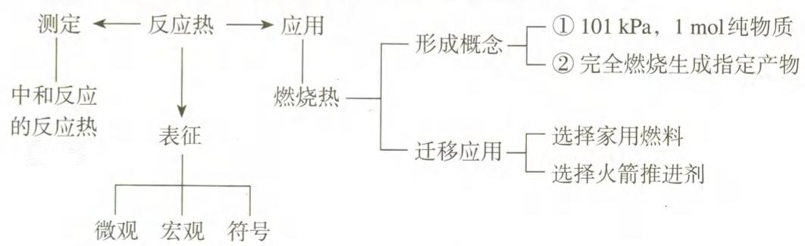

## 第二章

## 化学反应速率与化学平衡

## 本章说明

化学反应速率、化学平衡和化学反应的方向等知识属于课程标准中“化学反应的方向、限度和速率”主题，是学生在学习了化学反应与能量、物质结构与元素周期律等基础上要继续学习的重要理论，它有助于学生理解在必修阶段所学习的元素化合物及化学反应的知识。同时，第三章的电离平衡、水解平衡、沉淀溶解平衡是化学平衡知识的应用。因此，该理论可以对后续知识的学习起指导作用。

## 一、教材分析

本章包含以下三部分内容：第一部分，化学反应速率，属于化学动力学的范畴，着重介绍化学反应速率的概念，从定性和定量两个方面研究反应条件对化学反应速率的影响；第二部分，化学平衡和化学反应的方向，属于化学热力学的范畴，在研究了化学反应速率的基础上，着重介绍化学平衡的建立、化学平衡常数、影响化学平衡的因素及化学反应方向的判断；第三部分，前两部分知识的综合应用，即以工业合成氨为例，以化学反应速率和化学平衡理论为指导，探讨化工生产条件选择的一般思路和方法，认识综合调控在生产、生活和科学研究中的重要作用。内容结构如下。

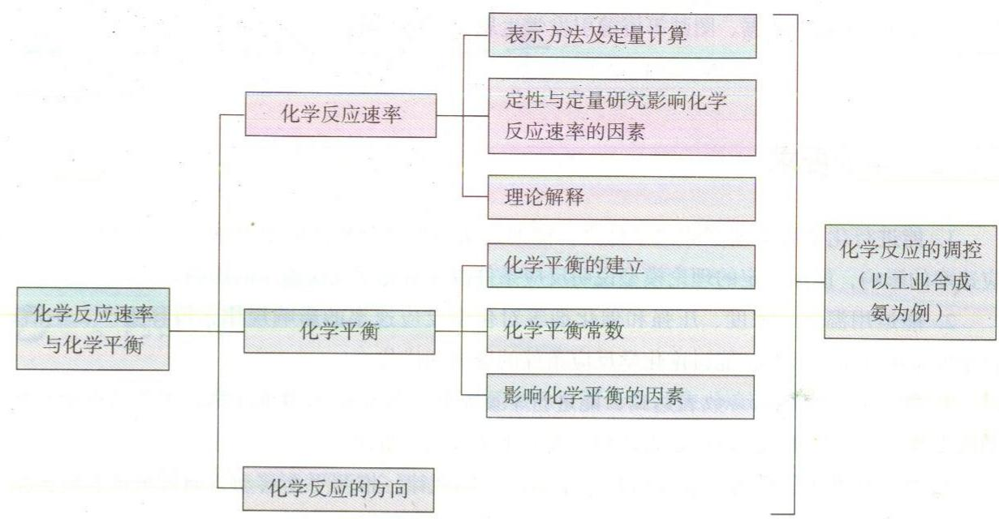

在必修阶段化学反应速率概念和影响因素等知识的基础上，教材直接介绍了速率的表示方法和定量计算，同时说明速率是可以测量的；通过“探究”活动，教材引导学生从定性与定量两个方面研究影响化学反应速率的因素，明确浓度、温度、催化剂等反应条件对化学反应速率的影响，并运用简单碰撞理论进行解释。由此，通过实验和理论分析，学生的认识由感性上升到理性。

当正反应速率和逆反应速率相等时，化学反应就达到该条件下的最大限度，即达到了化学平衡状态。化学平衡常数有利于学生从定量的角度加深对化学平衡的认识。教材通过某一温度下 $H_{2}$ 和 $I_{2}$ 生成HI这一反应体系的浓度数据，带领学生推导出化学平衡常数。在此基础上，教材介绍了浓度、压强、温度等反应条件对化学平衡的影响，并引导学生从浓度商与平衡常数的大小关系判断化学平衡移动的方向。

化学反应方向的判断涉及反应的自由能变化，要用到焓变和熵变等知识，难度比较大。为降低学习难度，力争使知识浅显易懂，教材列举了一些典型的化学反应，分别从焓变、熵变的角度对这些反应进行分析，让学生了解化学反应的方向与焓变和熵变有关。

化学反应速率和化学平衡的综合调控在生产、生活和科学研究中具有重要作用。教材以工业合成氨为例，引导学生通过对具体化学反应的分析，从速率、平衡两个角度综合考虑，选择适宜的生产条件。此过程不仅可以让学生体会化学理论对实际生产的指导作用，还可以帮助学生进一步认识生产条件的选择与科技进步及动力、材料、设备等条件的改善密切相关。

教材中的“整理与提升”提炼了化学反应的认识视角，即历程、速率、限度和方向，引导学生关注针对速率和限度的研究都是从定性和定量两个方面展开的，要求学生能运用碰撞理论、勒夏特列原理等进行解释，从而帮助学生建立化学平衡的观点。同时，进一步明确化学平衡是相对的，帮助学生建立条件发生变化则化学平衡会发生移动的观点，最终再将它们应用于化学反应的调控，体会理论研究的重要价值。

本章内容既抽象又具体。所谓抽象体现在有关速率和平衡的理论解释对学生来说是全新的，有些问题涉及大量微观粒子的宏观状态和变化，学生只能凭借想象，这样就增大了学习的难度；所谓具体体现在生活中有大量鲜活的事实，使得抽象的理论知识直观化，同时，可以利用教材提供的丰富的数据、图画等资源引发学生思考，从而降低学习的难度。

## 二、学业要求

1. 能进行化学反应速率的简单计算，能通过实验探究分析不同组分浓度的改变对化学反应速率的影响，能用一定的理论模型说明反应条件改变对化学反应速率的影响。

2. 能运用温度、浓度、压强和催化剂等对化学反应速率的影响规律，解释生产、生活、科学实验中的实际问题；能讨论化学反应条件的选择和优化。

3. 能正确书写平衡常数表达式，能进行平衡常数、转化率的简单计算，能利用平衡常数和浓度商的关系判断化学反应是否达到平衡及平衡移动的方向。

4. 能运用浓度、压强、温度对化学平衡的影响规律，推测平衡移动方向及浓度、转化率等相关物理量的变化；能讨论化学反应条件的选择和优化。

5. 针对典型案例，能从限度、速率等角度对化学反应和化工生产条件进行综合分析。

## 三、课时建议

第一节 化学反应速率 3课时

第二节 化学平衡 3课时

第三节 化学反应的方向 1课时

第四节 化学反应的调控 1课时

实验活动1 探究影响化学平衡移动的因素 1课时

全章复习 1课时

## 第一节 化学反应速率

## 一、内容分析

学生在必修阶段已经学习了化学反应速率的概念及其影响因素，知道除了反应物的组成、结构和性质等内因，温度、浓度、催化剂等反应条件也可以影响化学反应速率，但是并不清楚速率的定量表示方法及反应条件为什么会影响速率。基于此，本节教材从化学反应速率的定量表示、定性与定量研究影响反应速率的因素及应用简单碰撞理论解释反应条件对化学反应速率的影响这三个方面展开，突出了定性与定量结合、宏观与微观结合等认识化学反应的视角。

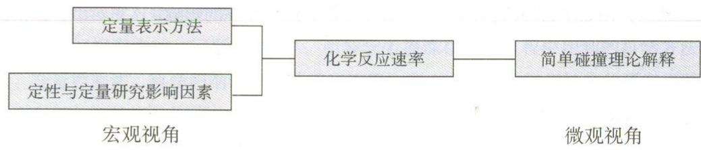

首先，教材通过“如何表示化学反应速率”这一问题的设计，引出了化学反应速率的定量表示方法，明确了同一化学反应用不同物质的浓度变化表示的速率的关系，同时指出，化学反应速率是可以通过实验测定的。

其次，教材设计了一个探究实验，意在让学生回忆必修所学的内容，并进一步从定性研究提升到定量研究。与必修相比，该活动开放度较大，学生要根据研究内容合理地选择实验试剂、设计实验步骤、观察现象，实验中需要关注变量控制、对照实验、定量分析等学科思想方法，最终目的是引导学生从定性与定量两个视角认识反应条件对化学反应速率的影响。

为合理地解释浓度、压强、温度及催化剂等反应条件对化学反应速率的影响，教材引入了简单碰撞理论。通过对HI分解反应的分析，简单介绍了基元反应、反应历程的概念，明确基元反应的发生是反应物分子间有效碰撞的结果。教材中配以HI发生分解反应时几种可能的碰撞示意图，试图让学生理解活化分子之间具有合适取向的碰撞才是有效碰撞，分子之间才能发生化学反应。教材以“思考与讨论”栏目的方式引导学生思考如何运用简单碰撞理论解释浓度和温度对化学反应速率的影响，并围绕“增加反应物分子中活化分子数（或活化分子百分数）→增加有效碰撞次数→增大反应速率”这一线索进行归纳。最后，教材介绍了催化剂对化学反应速率的影响，指出催化剂能改变反应历程、改变反应的活化能，从而改变反应速率。

教材以“科学·技术·社会”栏目的方式，向学生介绍了诺贝尔化学奖获得者泽维尔的研究成果——飞秒化学，拓宽学生的视野，同时将过渡态理论的一些简单内容融入其中，供学有余力的学生学习。

## 二、教学目标

## 1. 教学目标

（1）知道化学反应速率的表示方法，了解测定化学反应速率的方法，能进行化学反应速率的简单计算。

（2）通过实验探究，学习运用变量控制的方法研究化学反应速率；了解反应条件对化学反应速率影响的一般规律，能运用规律解释生产、生活和科学实验中的实际问题。

(3) 知道化学反应是有历程的, 认识基元反应活化能对化学反应速率的影响; 知道催化剂可以改变反应历程, 能从调控化学反应速率的角度分析和选择反应条件。

（4）能用简单碰撞理论说明反应条件对化学反应速率的影响，体会理论模型的建构过程，强化模型认知意识。

## 2. 教学重点和难点

（1）重点：化学反应速率的简单计算；反应条件对化学反应速率的影响。

(2) 难点: 用简单碰撞理论说明反应条件对化学反应速率的影响。

## 三、教学建议

## 1. 在问题解决中促进学生理解化学反应速率的概念

在必修阶段，学生学习了化学反应速率的基础知识，在本节内容中将继续学习化学反应速率的计算，从定量的角度进行深入研究。教学时教师可以针对教材中提供的案例设计如下问题，引导学生进行思考。

（1）怎样用某种物质的浓度变化表示化学反应速率？

（2）在同一反应中，用不同物质的浓度变化表示反应速率时，为什么数值可以不同？所表示的意义是否相同？

（3）用不同物质的浓度变化表示同一反应的速率时，这些速率之间存在怎样的联系？

（4）用实验的方法测量化学反应速率时，除了测量浓度变化，还可以测量哪些物理量的变化？请举例说明。

教学中可以通过讨论这些问题，使学生在掌握反应速率计算方法的同时，深入理解反应速率的概念，为下一步定量研究影响化学反应速率的因素打下基础。

## 2. 从定性和定量两个角度研究反应条件对化学反应速率的影响

教材中设计的“定性与定量研究影响化学反应速率的因素”这一探究活动开放度较大，教师要进行指导，启发学生多角度思考、多途径设计，不要拘泥于某个反应或某种因素，要培养学生分析和解决综合性问题的能力。

以下设计思路可供参考。

思路一：选择同一个化学反应，探究不同反应条件对速率的影响，从定性与定量两个方面展开研究。例如，可选择双氧水的分解反应、 $Na_{2}S_{2}O_{3}$ 溶液与 $H_{2}SO_{4}$ 溶液的反应或Zn与 $H_{2}SO_{4}$ 溶液的反应等，探究浓度、温度、催化剂或固体的表面积等因素对速率的影响。

思路二：选择不同的化学反应，探究同一反应条件对速率的影响，从定性与定量两个方面展开研究。例如，探究浓度对化学反应速率的影响，可选择Zn与不同浓度 $H_{2}SO_{4}$ 溶液的反应、 $Na_{2}S_{2}O_{3}$ 溶液与不同浓度 $H_{2}SO_{4}$ 溶液的反应、不同浓度双氧水的分解反应等。

在定性研究中，要针对所选定的影响因素，引导学生关注变量控制、定性观察、对照实验等科学方法，尽可能让学生收集更多的证据。

在定量研究中，除了上述科学方法，还要带领学生探讨可测量的物理量有哪些、如何测量及测量中需要记录的数据等。

例如，围绕Zn与 $H_{2}SO_{4}$ 溶液的反应，可以先根据教材中的要求，讨论在 $H_{2}SO_{4}$ 的浓度不同时，收集10 mL $H_{2}$ 的方法和操作中的注意事项；紧接着，可以提出问题：除了利用该方法测定速率，还有哪些方法可以测定速率？引导学生讨论得出在相同时间内测量收集的 $H_{2}$ 的体积，测量反应前后锌粒质量的变化、 $H^{+}$ 浓度的变化、体系压强的变化等均可以测定反应速率，并由此从定量的角度得出浓度对化学反应速率的影响。

教学中要用好探究中的“问题和讨论”，引导学生提炼在探究过程中用到的科学方法，如对照实验法、变量控制法、科学归纳法、定性观察法等，突出定性和定量相结合的研究思路，突出科学研究中科学方法的指导作用。

## 3. 建构碰撞理论模型，解释反应条件对速率的影响

## (1) 认识相关概念

简单碰撞理论涉及的概念比较多，如基元反应、反应历程（反应机理）、有效碰撞、活化分子、活化能等。这些概念均立足于微观世界，比较抽象，建议结合教材中HI分解反应中分子碰撞示意图引导学生理解。

首先，从反应本质入手，让学生知道HI的分解反应不是简单碰撞就能完成的，由此介绍基元反应、反应历程的概念。其次，探究HI分子中化学键断裂的原因，引入活化分子、活化能、有效碰撞的概念。最后，分析HI的分解反应，建构碰撞理论模型。

对于基元反应、反应历程等概念，学生知道即可，教学中不必深入讨论。

## (2) 运用简单碰撞理论, 解释浓度和温度对化学反应速率的影响

运用简单碰撞理论解释浓度和温度对化学反应速率的影响是本节的重点。教学中可以先带领学生分析教材中“思考与讨论”栏目的第一个问题，即用碰撞理论解释，在其他条件相同时浓度的改变为什么影响化学反应速率。要引导学生建立“其他条件相同时，增大反应物浓度→单位体积内活化分子数目增多→单位时间内有效碰撞次数增多→化学反应速率增大”的分析模型。在分析“思考与讨论”栏目的第二个问题时，可以让学生进行类比，教师在此过程中要引导学生关注二者的差异，即升高温度，会使原来能量较低的分子变成活化分子，因此活化分子百分数增多，导致有效碰撞次数增多，从而使化学反应速率增大。

## (3) 运用简单碰撞理论, 解释催化剂对化学反应速率的影响

催化剂对化学反应速率的影响是本节的难点。在教学中要让学生明确催化剂是通过改变反应历程、改变反应的活化能来改变反应速率的。可采取以下教学方法。

方法一：依据教材图2-4，结合具体的化学反应分析催化剂是如何改变反应历程、降低反应活化能，从而增大反应速率的。例如， $H_{2}O_{2}$ 在KI催化下发生分解反应，催化过程分为两步进行： $H_{2}O_{2} + I^{-} = H_{2}O + IO^{-}$ ， $H_{2}O_{2} + IO^{-} = H_{2}O + O_{2} + I^{-}$ ，由此引导学生对比催化反应和非催化反应的两条曲线，找出催化剂改变反应速率的原因，再运用碰撞理论进行解释，即“其他条件相同时，使用催化剂→活化能降低→活化分子百分数增多→单位时间内有效碰撞次数增多→化学反应速率增大”。

方法二：分析表示催化剂催化历程的微观示意图。举例如下。

① NSR（ $NO_{x}$ 储存还原）工作原理如图2-1所示，教学中可以让学生分析NO在催化剂表面的储存和还原过程，知道反应是有历程的，体会催化剂是如何通过改变反应历程来影响反应速率的。

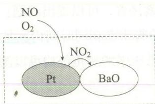  
储存

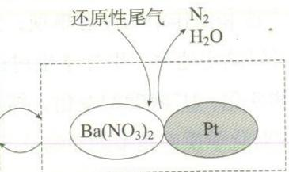  
还原  
图 2-1 $NO_{x}$ 储存还原工作原理示意图

② 由 $\mathrm{CO}_{2}$ 和 $\mathrm{CH}_{4}$ 转化为 $\mathrm{CH}_{3} \mathrm{COOH}$ 的催化反应历程如图2-2所示, 教学中可以让学生观察该示意图, 分析催化剂的催化原理。

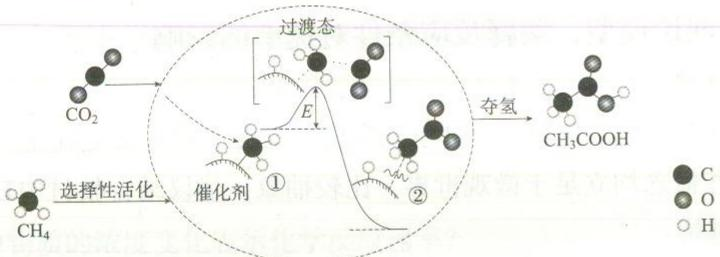  
图2-2 $\mathrm{CO}_{2}$ 和 $\mathrm{CH}_4$ 转化为 $\mathrm{CH}_3\mathrm{COOH}$ 的催化反应历程示意图

对于接受能力较强的学生，还可以让他们结合催化反应历程的微观示意图，尝试绘制催化剂改变反应历程、降低反应活化能的示意图，以此加深对催化剂影响化学反应速率机理的认识。

教材中的“科学·技术·社会”栏目介绍了飞秒化学，这是科学家们在化学反应速率研究方面取得的重要成果，应指导学生进行阅读，让学生了解科学发展动态。还可以布置课外作业，让学生查阅我国及其他国家在催化剂研究领域中的最新进展，拓展学生视野。

## 四、栏目使用建议

## 1. 探究

本探究的目的是引导学生从定性和定量两个角度研究影响化学反应速率的因素。

在探究活动中，可以选择同一个化学反应，研究温度、浓度等条件的改变对速率的影响；也

可以选择不同的化学反应，研究同一条件的改变对不同反应的速率产生的影响。可以根据教材的编排，将定性实验和定量实验分开进行，也可以围绕选择的化学反应将它们融合在一起进行。

实验注意事项如下。

(1) 在定量实验中, 要注意检查装置的气密性, 尤其要检查注射器的内外管是否密合得很好。

（2）所需时间随室温、容器容积、收集方法不同会略有差异。

(3) 为了尽可能排除锌和稀硫酸反应过程中放热带来的影响, 可以选用略大的反应容器。

（4）除了教材中给出的定量研究方法，还可以从反应前后某种离子浓度的变化、容器内气体压强的变化、固体质量的变化等角度进行定量研究。有条件的学校可以根据所选择的化学反应的特点，使用分光光度计、色度计、浊度计等仪器进行测定。

（5）实验结束后要注意引导学生总结、提炼用到的科学方法。

## 2. 思考与讨论

本栏目的目的是引导学生运用简单碰撞理论，从微观角度解释浓度、温度对化学反应速率的影响。

当其他条件相同时，增大反应物浓度，单位体积内活化分子数增多，单位时间内有效碰撞的次数增多，反应速率增大；降低反应物浓度，单位体积内活化分子数减少，单位时间内有效碰撞的次数减少，反应速率减小。

当其他条件相同时，升高温度，一部分原来能量较低的分子变成了活化分子，增加了反应物分子中活化分子的百分数，单位时间内有效碰撞的次数增多，反应速率增大；降低温度，减少了反应物分子中活化分子的百分数，单位时间内有效碰撞的次数减少，反应速率减小。

## 五、练习与应用参考答案及说明

2. B

4. A

5.(1)b (2)放热 $\Delta H$

6. (1) $\mathrm{Pb} + \mathrm{PbO}_{2} + 2\mathrm{H}_{2}\mathrm{SO}_{4} = 2\mathrm{PbSO}_{4} + 2\mathrm{H}_{2}\mathrm{O}$ (2) 催化作用

(3) 向盛有 $\mathrm{PbO}_{2}$ 和硫酸混合物的试管中滴加含 $\mathrm{Fe}^{2+}$ 的溶液, 振荡使其充分反应, 观察现象; 再向其中加入 $\mathrm{Pb}$ , 振荡使其充分反应, 观察现象 (其他答案只要合理均可)。

7.【实验设计】实验Ⅱ：280℃ 6.50×10 $^{-3}$ 4.00×10 $^{-3}$

实验Ⅲ： $6.50 \times 10^{-3}$ $4.00 \times 10^{-3}$

(1) $3.5 \times 10^{-3} \mathrm{~mol} / \mathrm{L}$

## (2) 增大

(3) 在其他条件相同的情况下，升高温度，反应速率增大

## 第二节 化学平衡

## 一、内容分析

在上一节中，我们从动力学的角度研究了化学反应速率。本节从热力学的角度研究化学平衡及其影响因素，在内容的设计上紧紧围绕化学平衡这条线索展开。在学生已经有了化学反应限度基本认识的前提下，本节引言部分直接指出，在科学研究和化工生产中，只考虑化学反应速率是不够的，提示学生还需要考虑化学反应进行的程度，即化学平衡问题，明确学习化学平衡的意义。

本节内容框架如下。

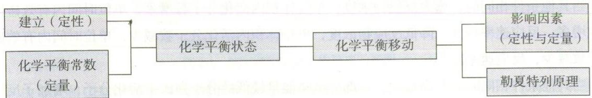

## 1. 化学平衡状态

教材以合成氨为例，通过对反应中有关物质的浓度随时间变化示意图的分析，说明在可逆反应中，当正反应速率和逆反应速率相等，反应物和生成物的浓度均保持不变的状态就是化学平衡状态，由此完成化学平衡状态的建立，帮助学生初步建构变化观和平衡观。但这只是定性分析，如何让学生从定量的角度认识化学平衡状态呢？为此，教材引入了化学平衡常数的内容。

教材提出如下问题：“在一定温度下，处于化学平衡体系中的物质的浓度之间有什么关系呢？”在这个问题的引导下，教材以表格的形式给出了在相同温度下 $H_{2}$ 和 $I_{2}$ 反应生成HI的各种浓度数据，希望学生能够从中找出规律，从而得出化学平衡常数。这样编写的目的，一方面可以让学生在数据分析中了解化学平衡常数的含义，另一方面从定量的角度深化对化学平衡状态的理解。

## 2. 化学平衡移动

研究化学平衡的目的在于从理论上认识化学平衡及其影响因素，以便在科学实验和生产实践中调控化学反应，使化学平衡向人们需要的、有利的方向移动，这是学习本部分内容的实际意义。浓度、温度等反应条件对化学反应速率的影响为本部分内容的学习奠定了一定的基础。化学反应速率发生变化，化学平衡会发生相应的变化。教材从浓度对化学平衡影响的实验入手，引导学生对实验现象进行观察和分析，获取证据，结合“思考与讨论”栏目的三个问题，得出在其他条件不变的情况下，反应物或生成物浓度的改变都可以使化学平衡发生移动。紧接着，教材引导学生从定性认识走向定量认识，让学生学会依据浓度商与平衡常数的大小关系，判断化学平衡移动的方向。对于压强、温度对化学平衡的影响，教材采用了类似的处理方式，即先进行实验，之后引导学生结合实验现象分析化学平衡移动的方向，总结、归纳得出相关结论。

在学生积累了一定的感性认识的基础上，教材介绍了勒夏特列原理，让学生用理论知识解释平衡移动的问题，关注理论对实践的指导意义。有关勒夏特列的研究成果和对社会的贡献，教材以“科学史话”栏目的形式进行了介绍，以此让学生了解理论来自实践，同时又可以指导实践。

本节教材在编写时注重科学方法的培养。图像是表征化学反应速率和化学平衡的重要方式，教材在“方法导引”栏目中介绍了图像分析时需要注意的几个问题，帮助学生形成正确分析图像的方法。另外，对于化学反应达到平衡时各种量的计算，如物质的浓度、转化率、化学平衡常数等，需要有正确的分析和计算方法，为此，教材通过两道典型例题进行了介绍，突出了模型的建构过程。

## 二、教学目标

## 1. 教学目标

（1）认识化学平衡状态，知道化学平衡常数的含义，能书写化学平衡常数表达式并进行简单计算；能利用平衡常数和浓度商的关系判断化学反应是否达到平衡及平衡移动的方向，提升从定量的角度分析化学反应的能力。

（2）通过实验探究，理解温度、浓度、压强等对化学平衡状态的影响，进一步建构“化学变化是有条件的”这一学科观念。

（3）理解勒夏特列原理，能依据原理分析平衡移动的方向，体会理论对实践的指导作用。

## 2. 教学重点和难点

（1）重点：化学平衡常数；从定性和定量两个角度判断化学平衡移动的方向。

（2）难点：反应条件对化学平衡的影响；对勒夏特列原理的理解。

## 三、教学建议

## 1. 结合图像分析理解化学平衡状态，发展变化观和平衡观

学生在必修阶段已经初步建构了化学平衡的概念。为了降低学习难度，让学生顺利地理解化学平衡状态的特征，教学中可以利用教材提供的合成氨的案例，从反应过程中各种物质的浓度、压强随时间的变化出发，引导学生绘制并分析示意图，加深他们对化学平衡状态特征的理解。

例如，以工业合成氨为例进行讲解时，可提出以下问题。

(1) 合成氨的反应有哪些特点?

(2) 什么叫可逆反应?

(3) 在一定条件下, $1 \mathrm{~mol} \mathrm{~N}_{2}$ 和 $3 \mathrm{~mol} \mathrm{H}_{2}$ 发生反应, 是否可以生成 $2 \mathrm{~mol} \mathrm{NH}_{3}$ ?

(4) 以 $1 \mathrm{~mol} / \mathrm{L} \mathrm{~N}_{2}$ 和 $3 \mathrm{~mol} / \mathrm{L} \mathrm{H}_{2}$ 或 $2 \mathrm{~mol} / \mathrm{L} \mathrm{NH}_{3}$ 为起始反应物, 在一定条件下使其发生反应。以时间为横坐标, 浓度为纵坐标, 绘制反应过程中浓度随时间变化的示意图, 并与教材中的图 2-5 对照。

为了加深学生的认识，还可以在讲清合成氨反应的基础上补充其他案例，如高炉炼铁、 $SO_{2}$ 的催化氧化等，仿照上述思路进行分析。

## 2. 结合数据分析建构化学平衡常数的概念, 定量认识化学平衡状态

化学平衡常数是本部分教学的重点，也是下一章学习电离平衡常数、溶度积常数的基础。因此，要充分重视化学平衡常数的建构过程。

化学平衡常数的教学可以设计为三个环节。

## 环节一、认识化学平衡常数。

可利用教材中表2-1的数据，让学生观察并分析在457.6℃时 $H_{2}$ 与 $I_{2}$ 反应生成HI的可逆体系中的各种浓度。如果学生接受能力较强，也可以设计成探究活动，将表格中的一部分数据设计为未知量，让学生根据化学反应计算出这些数据，之后再计算平衡时生成物浓度幂之积与反应物浓度幂之积的比值，分析计算得到的数据，发现规律，归纳出平衡常数表达式。

## 环节二、理解化学平衡常数。

这个环节的目的是让学生理解化学平衡常数与温度有关。在教学中，可再增加几组其他温度下 $H_{2}$ 与 $I_{2}$ 反应生成HI的各种浓度数据，让学生计算平衡常数，并且与457.6℃时反应的平衡常数进行比较。在分析同一反应在不同温度下的实验数据的过程中，引导学生关注平衡常数与温度的关系，明确平衡常数的意义。

## 环节三、应用化学平衡常数。

可针对一个具体的化学反应，引导学生依据化学平衡常数进行分析和计算，进一步加深对化学平衡常数的理解。

## 例如，在教学中可以给出如下情境素材。

工业上制备水煤气的反应为 $\mathrm{CO(g)} + \mathrm{H}_{2}\mathrm{O(g)} \rightleftharpoons \mathrm{CO}_{2}(\mathrm{g}) + \mathrm{H}_{2}(\mathrm{g})$ $\Delta H < 0$ 。830 ℃时，浓度为 0.200 mol/L 的 CO、1.00 mol/L 的 $H_{2}O$ 发生上述反应，达到平衡时 K = 1.0。

围绕这个情境，可以让学生思考的问题有：

(1) 在 $830^{\circ} \mathrm{C}$ 达到平衡时, $\mathrm{H}_{2}$ 和 $\mathrm{CO}_{2}$ 的浓度分别是多少? CO的转化率是多少?

（2）在830℃达到平衡时，其他条件保持不变，向体系中充入一定量的CO，平衡状态是否发生变化？如果变化，平衡向哪个方向移动？此时K是否发生变化？

（3）为提高该反应的产率，可以采取哪些措施？如果采用改变温度的方法，K是否发生变化？如何变化？

在上述讨论之后，应引导学生归纳出利用 $K$ 分析问题的基本思路。

在化学平衡常数的教学中一定要重视对实验数据的分析。如果教学时间允许，教师在充分运用教材中 $H_{2}$ 与 $I_{2}$ 反应的实验数据的基础上，可以再给学生提供其他可逆反应在一定温度下达到平衡时的数据，如 $SO_{2}$ 的催化氧化、利用CO和水蒸气制水煤气、利用 $CO_{2}$ 和 $H_{2}$ 制甲醇等，对多组数据进行分析，有利于学生理解并正确运用平衡常数。

## 3. 理论分析与实验探究相结合，帮助学生发现平衡移动规律

反应条件对化学平衡的影响是本节内容的难点。教学中要注意从获取实验证据和应用数据分析两个方面进行讲解。

在获取实验证据层面，教材中设计了浓度、压强、温度对化学平衡影响的系列实验。实验前，要先引导学生认识化学反应，理解反应原理；实验中，要引导学生观察并记录实验现象；实验后，要引导学生及时对实验现象进行分析，得出反应条件影响化学平衡的结论。下面以浓度为例进行分析。

首先，针对 $FeCl_{3}$ 溶液与 KSCN 溶液的反应，让学生分析可以依据哪些实验现象判断化学平衡发生了移动；可以从哪些角度研究浓度对化学平衡的影响；当多种影响因素并存时，应该如何处理。

其次，根据教材中给出的方案进行实验，让学生观察并记录实验现象，引导学生进行分析，初步得出改变浓度对该平衡体系产生的影响。

最后，结合教材中第一个“思考与讨论”栏目的问题，引导学生从平衡状态是否变化、浓度变化是否引起平衡的变化这两个角度进行思考与归纳，提炼出在其他条件不变的情况下，改变浓度对化学平衡的影响。

在获取实验证据之后，教师可以带领学生进入应用数据分析层面，重点突出 $K$ 和 $Q$ 的大小与平衡移动方向的关系。例如，在 $\mathrm{FeCl}_3$ 溶液和KSCN溶液所建立的平衡体系中， $Q = \frac{c[\mathrm{Fe}(\mathrm{SCN})_3]}{c(\mathrm{Fe}^{3+}) \cdot c^3(\mathrm{SCN}^-)} = K$ ，如果向平衡体系中加入铁粉，会使得 $c(\mathrm{Fe}^{3+})$ 减小，导致 $Q > K$ ，化学平衡向逆反应方向移动。

在利用 K 和 Q 的关系对这个具体的平衡体系进行分析之后，教师要引导学生进行总结、归纳，提炼出依据 K 和 Q 的关系判断平衡移动方向的思维模型。

勒夏特列原理对于判断化学平衡移动的方向具有重要的意义。教师在介绍勒夏特列原理之后，可以再回归 $FeCl_{3}$ 溶液和KSCN溶液所建立的平衡体系，让学生尝试利用原理分析平衡移动方向。例如，加入铁粉，体系中的 $Fe^{3+}$ 浓度减小，平衡将向着促使 $Fe^{3+}$ 浓度增大的方向移动，即平衡向逆反应方向移动。这个结果与前面的实验证据及数据分析所得出的结论是一致的，从而体现了勒夏特列原理的价值。

在影响化学平衡因素的教学中，有条件的学校还可以借助传感器对实验现象进行分析。例如，对于 $NO_{2}$ 和 $N_{2}O_{4}$ 的平衡体系，可以利用透光率进行分析，以曲线的形式反映物质浓度的变化，显示平衡移动的方向。

在教学中，对于接受能力较强的学生，可以引导他们先进行数据分析，依据K与Q的大小预测平衡移动的方向，再设计并完成实验，获得平衡移动的直观现象，最后将数据分析与实验结论相结合，得出勒夏特列原理。教师可以尝试让学生依据该原理判断给定的化学平衡的移动方向。

## 四、栏目使用建议

## 1. 实验

## 【实验2-1】

该实验研究的是浓度对化学平衡的影响。借助 $Fe^{3+}+3SCN\rightleftharpoons Fe(SCN)_{3}$ 的平衡体系，引导学生观察现象，分析改变反应物浓度后平衡的移动方向。

实验注意事项如下。

（1）实验中，既可以改变反应物浓度，也可以改变生成物浓度。可让学生分析，除了教材中给出的方法，是否还有其他改变浓度的方法？

(2) 体系中溶液颜色的深浅与所加铁粉的量有关。

（3）改变浓度时，所加入的KSCN溶液浓度要略大，这样可以使现象更明显。

（4）在实验过程中，应注意变量控制及对比思想的融入。

实验现象：

<table><tr><td>实验</td><td>向试管b中加入少量铁粉</td><td>向试管c中滴加4滴1mol/L KSCN溶液</td></tr><tr><td>现象</td><td>溶液红色变浅</td><td>溶液红色加深</td></tr></table>

实验结论：在其他条件不变的情况下，增大反应物浓度，平衡向正反应方向移动；减小反应物浓度，平衡向逆反应方向移动。

【实验2-2】

该实验研究的是压强对化学平衡的影响。利用反应 $2\mathrm{NO}_{2}(\mathrm{g}) \rightleftharpoons \mathrm{N}_{2}\mathrm{O}_{4}(\mathrm{g})$ ，通过颜色的变化来判断平衡移动方向。

实验注意事项如下。

（1）通过改变容积的方式来改变压强，要区分是因为容器容积变化引起的颜色变化，还是平衡移动引起的颜色变化。

(2) 因 $\mathrm{NO}_{2} 、 \mathrm{~N}_{2} \mathrm{O}_{4}$ 会腐蚀塑料和橡胶, 建议用玻璃注射器。

（3）该实验颜色变化较快，观察时需要认真仔细，避免错过实验现象。操作时要快速拉、推注射器的活塞，避免实验现象不明显。

实验现象：

<table><tr><td>实验</td><td>体系压强增大</td><td>体系压强减小</td></tr><tr><td>现象</td><td>气体颜色先变深又逐渐变浅</td><td>气体颜色先变浅又逐渐变深</td></tr></table>

实验结论：在其他条件不变的情况下，增大压强，平衡向正反应方向移动（向气体体积减小的方向移动）；减小压强，平衡向逆反应方向移动（向气体体积增大的方向移动）。

【实验2-3】

该实验研究的是温度对化学平衡的影响。利用反应 $2\mathrm{NO}_{2}(\mathrm{g}) \rightleftharpoons \mathrm{N}_{2}\mathrm{O}_{4}(\mathrm{g})$ $\Delta H = -56.9 \, kJ/mol$ ，将烧瓶分别浸泡在冰水和热水中来改变温度，通过颜色的变化判断平衡移动方向。

实验注意事项：为了使实验现象更加明显，可将两只烧瓶交替浸泡在冰水和热水中，反复操

作，观察混合气体的颜色变化。

实验现象：

<table><tr><td>实验</td><td>浸泡在热水中</td><td>浸泡在冰水中</td></tr><tr><td>现象</td><td>气体红棕色加深</td><td>气体红棕色变浅</td></tr></table>

实验结论：在其他条件不变的情况下，升高温度，平衡向逆反应方向移动（向吸热反应的方向移动）；降低温度，平衡向正反应方向移动（向放热反应的方向移动）。

## 2. 思考与讨论

## 【思考与讨论1】

（1）在实验2-1中，向试管b和试管c中分别加入少量铁粉和1 mol/L KSCN溶液后，化学平衡状态均发生了变化。可以通过观察颜色的变化来判断化学平衡状态的变化情况。例如，向试管b中加入少量铁粉，溶液红色变浅，说明平衡向逆反应方向移动；向试管c中加入KSCN溶液后，溶液红色加深，说明平衡向正反应方向移动。

（2）在其他条件不变的情况下，增大反应物浓度，平衡向正反应方向移动，减小反应物浓度，平衡向逆反应方向移动；增大生成物浓度，平衡向逆反应方向移动，减小生成物浓度，平衡向正反应方向移动。

（3）在一定温度下，当可逆反应达到平衡时，若浓度商改变，化学平衡状态会发生变化。如果浓度商增大，即 $Q > K$ ，平衡向逆反应方向移动；如果浓度商减小，即 $Q < K$ ，平衡向正反应方向移动。

## 【思考与讨论2】

（1）现以 $m\mathrm{A(g)}+n\mathrm{B(g)}\rightleftharpoons p\mathrm{C(g)}+q\mathrm{D(g)}$ 为例进行说明。若 $m+n=p+q$ ，即反应后气体体积不变，无论压强如何改变，化学平衡均不移动；若 $m+n>p+q$ ，即反应后气体体积减小，增大压强，平衡向正反应方向移动；若 $m+n<p+q$ ，即反应后气体体积增大，增大压强，平衡向逆反应方向移动。

(2) 对于只有固体或液体参加的反应, 体系压强改变不会使化学平衡状态发生变化。

## 五、研究与实践

该活动的目的是让学生通过了解汽车尾气的治理，关注化学反应速率与化学平衡的知识在生产、生活中的应用，培养学生利用化学知识分析身边问题的能力，增强保护环境的意识和责任感。

由于涉及的内容较多，该活动可以让学生在课下进行，课上汇报或以墙报、微信推送等形式分享。建议让学生先利用所学的知识进行分析与讨论，再查阅资料，结合实际情况对比研究，了解我国汽车尾气治理的方法和思路。

对于 “认识尾气的成分及其危害” 这一内容，可引导学生根据燃油车的种类分析燃油结构，进而分析不同燃料产生尾气的情况；结合 “空气燃油比” “温度” 等因素，分析不同条件下产生尾气的情况；查阅资料，了解尾气的成分、来源与危害。

对于 “了解尾气的治理” 这一内容，可结合氧化还原反应、化学反应速率和化学平衡的知识，重点讨论尾气转化的思路和方法，再从政策管理、技术改进等角度，分析从源头治理的可能方法。其中尾气的转化部分可重点引导学生关注目前较为成熟的三元催化转化技术和选择性催化还原技术。可将研究内容进一步细化为以下几点。

（1）从氧化还原反应的角度，分析烃类、CO、 $NO_{x}$ 可能具有的性质，讨论可选择哪些反应使其转化。

（2）从化学反应速率的角度，分析如何提高转化速率，讨论改变哪些条件可以增大反应速率（可综合考虑温度、压强、催化剂对反应速率的影响）。

（3）从化学平衡的角度，研究在什么条件下反应进行得更加彻底，讨论温度影响时建议结合焓变展开。例如，可查阅焓变数据，也可以引导学生利用盖斯定律计算CO与NO反应的焓变，再根据焓变判断温度对化学平衡的影响。

结合以上三个方面的研究，可以引导学生设计治理汽车尾气的方案。然后，让学生查阅有关三元催化转化和选择性催化还原转化的工作原理，将自己设计的方案与实际处理方法进行对比，寻找其中的相似之处和不同之处。

在 “结果与讨论” 部分，学生可以撰写研究报告或者小论文，其中的研究成果可包含汽车尾气的成因及危害、理论分析治理方法、实际治理方法、研究中的启示等内容。

在研究过程中，教师应鼓励学生通过多种渠道查阅资料，从化学的视角进行研究。应告诉学生，随着科学技术的发展，汽车燃料结构会发生改变，尾气成分也可能会改变，治理方法也在不断改进。

## 六、练习与应用参考答案及说明

1. $\frac{c^2(C)}{c(A) \cdot c^3(B)}$ 0.0625  
2. D  
3. A  
4. CD  
5. < >

6. (1) $\frac{c(\mathrm{CH}_3\mathrm{OH}) \cdot c(\mathrm{H}_2\mathrm{O})}{c(\mathrm{CO}_2) \cdot c^3(\mathrm{H}_2)}$

(3) < 从210\~290 ℃，甲醇产率逐渐降低，即升高温度，化学平衡向逆反应方向移动，根据勒夏特列原理，可知正反应为放热反应

7. $50\%$

# 第三节 化学反应的方向

## 一、内容分析

方向、限度、速率和历程是认识化学反应的四个视角。学生已经学习了历程、速率和限度，本节内容围绕化学反应的方向展开，从学科层面看难度较大。《普通高中化学课程标准（2017年版）》对该部分内容的要求是“知道化学反应的方向与反应的焓变和熵变有关”。本节教材在编写过程中严格遵循课程标准的要求，主要从以下四个方面展开。

第一，从学生熟悉的自发进行的放热反应出发，介绍化学反应有向着焓减的方向进行的倾向，于是有人认为可以依据焓变判断自发反应的方向。紧接着，教材通过实例说明，有些吸热反应也能自发进行。由此得出结论，不能只依据焓变判断化学反应的方向。

第二，从学生熟悉的实验现象和化学反应出发，说明体系有向着混乱度增加（熵增）的方向转变的倾向，于是有人认为可以依据熵变判断自发反应的方向。紧接着，教材通过实例说明，有些熵减的化学反应也能自发进行。教材中明确指出，只有孤立体系或者绝热体系，自发过程才向着熵增的方向进行。

第三，让学生明确，判断反应自发进行的方向必须综合考虑焓变和熵变，正确判断反应自发进行的方向对于生产实践具有重要的作用。

第四，以“资料卡片”的形式简单介绍自由能与化学反应自发进行方向的关系，供有兴趣的学生进一步学习和了解。

在编写中，教材试图通过对上述内容的介绍，让学生体会到事物的发展、变化常常受多种因素的制约。因此，要形成全面分析问题的意识。

## 二、教学目标

1. 教学目标

（1）知道化学反应是有方向的；知道化学反应的方向与反应的焓变和熵变有关。

（2）能结合具体事例说明反应自发进行的方向。

## 2. 教学重点和难点

（1）重点：化学反应的方向与反应的焓变、熵变的关系。

(2) 难点: 化学反应的方向与反应的焓变、熵变的关系。

## 三、教学建议

在教学中，教师应以对自发过程的认识为主线，带领学生逐步认识焓变、熵变与化学反应方向的关系。首先，讨论什么是自发过程。可让学生结合身边事例，多角度寻找自发过程，了解化学反应自发进行的含义。其次，研究影响反应自发进行的原因，分别从焓变、熵变两个角度探讨化学反应自发方向的问题。最后，强调要综合考虑焓变和熵变判断化学反应的方向。具体教学建议如下。

## 1. 结合身边事例，认识自发过程

结合教材中“水总是自发地从高处流向低处，而相反的过程却不能自发进行”的案例，引导学生分析自发现象的特点，知道自发过程。在此基础上，可让学生联系生活常识，列举一些能自动发生的具体事例，如花香四溢、酒香扩散、食盐在水中溶解、石头在水中会自动下沉等，进一步认识自发过程。

## 2. 从熟悉的反应入手，研究焓变与反应自发方向的关系

在焓变与反应自发方向的教学中，可以引导学生将从自然界中获得的对自发过程的认识迁移至化学反应中，以熟悉的反应入手，通过对反应的观察和分析，总结出焓变与反应自发方向的关系。

## （1）寻找能自发进行的化学反应

除了教材中给出的 $H_{2}$ 与 $O_{2}$ 、Zn与 $CuSO_{4}$ 溶液的反应，教学中还可以采用让学生列举或教师直接给出的方式补充一些反应。例如：

$$
\mathrm{C(s)} + \mathrm {O_ {2} (g)} = \mathrm {CO_ {2} (g)} \quad \Delta H = - 3 9 3. 5 \mathrm{kJ/mol}
$$

$$
\mathrm{CH} _ {4} (\mathrm{g}) + 2 \mathrm{O} _ {2} (\mathrm{g}) = \mathrm{CO} _ {2} (\mathrm{g}) + 2 \mathrm{H} _ {2} \mathrm{O} (\mathrm{l}) \quad \Delta H = - 8 9 0. 3 \mathrm{kJ/mol}
$$

$$
\mathrm{HCl(aq)} + \mathrm{NaOH(aq)} = \mathrm{NaCl(aq)} + \mathrm {H_ {2} O(l)} \quad \Delta H = - 5 7. 3 \mathrm{kJ/mol}
$$

## (2) 分析自发反应的共同点

结合学生列举的或教师给出的反应，让学生进行观察，分析这些自发反应的共同点，即大多为放热反应。

## 3. 从具体反应出发，研究熵变与反应自发方向的关系

可以按照如下环节完成本部分内容的教学。

## 环节一、引发认知冲突。

教师可以利用教材中提供的自发进行的 $N_{2}O_{5}$ 的分解反应、固体 $NaHCO_{3}$ 与盐酸的反应都是吸热反应的案例，引发学生产生认知冲突，促使其思考：“自发反应一定要 $\Delta H<0$ 吗？”此时教师可演示 $\mathrm{Ba(OH)}_{2}\cdot8\mathrm{H}_{2}\mathrm{O}$ 与 $NH_{4}Cl$ 晶体的反应，让学生直观感受到有些吸热反应也可以自发进行。

## 环节二、分析原因。

结合学生产生的认知冲突，教师可以给学生列举不同种类的气体之间、溶液之间自发混合的事例，引导学生分析此类自发反应的特点，引出熵的概念。结合熵的概念，教师可以引导学生进一步分析同一物质的固态、液态和气态这三种状态的混乱度情况。利用熵的概念，教师可以带领学生分析 $N_{2}O_{5}$ 的分解反应，初步得出熵变与反应自发方向的关系。

## 环节三、寻找特点。

在这个环节中，教师可以先让学生观察自发进行的吸热反应的特点，寻找它们的共同点。再结合熵的概念，让学生分析 $\mathrm{Ba(OH)_2\cdot8H_2O}$ 与 $NH_4Cl$ 晶体这一吸热反应能够自发进行的原因。最后回归 $N_2O_5$ 的分解反应、固体 $NaHCO_3$ 与盐酸的反应，最终总结出熵变与反应自发方向的关系。

在讨论熵变与化学反应自发方向的关系时，教师必须强调自发过程向着熵增方向进行的前提条件是孤立体系或者绝热体系。

## 4. 综合分析反应自发的方向与熵变、焓变的关系

在学生知道反应自发的方向与熵变、焓变均有关系的前提下，教师可以进一步提出问题：是否只有熵增的反应才能自发进行？此时，可结合教材中给出的乙烯聚合为聚乙烯等反应的例子及日常生活中水结冰等实例，说明有些熵减的反应也可以自发进行。由此帮助学生形成认识，即判断化学反应自发进行的方向时，需要综合考虑体系的焓变和熵变。

学有余力的学生可阅读资料卡片，了解自由能与化学反应方向的关系。

## 四、练习与应用参考答案及说明

1. 食盐溶解、花香四溢、墨汁在水中扩散、酒香不怕巷子深等。

2.（1）熵增 （2）熵减 （3）熵增 （4）熵减

3. D

4. A

# 第四节 化学反应的调控

## 一、内容分析

化学反应速率和化学平衡的综合调控在生产、生活和科学研究中具有重要的作用。工业合成氨是人类科学技术的一项重大突破。本节围绕合成氨这个调控化学反应的成功案例，从速率和平衡两个方向展开，引导学生讨论化学反应条件的选择与优化，进一步体会理论的指导意义，加深对所学理论的理解。本节内容按照“原理分析→联系实际→形成思路→研究概况”这一顺序编写。

## 1. 原理分析——讨论合成氨可能的条件

教材从学生熟悉的生活中的实例及化学反应引入，引发对化学反应调控的关注。紧接着，针对合成氨的反应是放热的、气体体积缩小的可逆反应的特点，在“思考与讨论”栏目中，围绕这个反应提出了两个问题，要求学生利用已有的知识进行分析和讨论。一是从合成氨的原理入手，从速率和平衡两个角度预测合成氨的适宜条件；二是从不同条件下达到平衡时氨的含量入手，分析压强和浓度的改变对氨的产量的影响。最终对这两个问题的分析结果进行综合，从反应条件的一致性出发，思考合成氨的适宜条件。

## 2. 联系实际——介绍合成氨的条件

在上述讨论的基础上，教材结合生产的实际情况，如材料的强度和设备的制造要求、工业生产中的效益问题、催化剂的活性等，具体分析了合成氨中压强、温度和催化剂等的选择情况。教材中的两幅插图，即同一温度下平衡时氨的体积分数随压强的变化示意图、同一压强下平衡时氨的体积分数随温度的变化示意图，给了学生直观性的认识，学生可以从中体会到调控合成氨反应的意义。结合合成氨生产过程示意图，教材简单提及浓度等条件对合成氨生产的影响，以及原料的循环使用问题，以使学生理解合成氨条件的选择应以提高综合经济效益为目的。

## 3. 形成思路——形成选择适宜生产条件的基本思路

在工业合成氨适宜条件选择的讨论中，教材让学生明确：化学反应的调控，就是通过改变反应条件使一个可能发生的反应按照某一方向进行；在实际生产中还要综合考虑设备、成本、环境保护、社会效益等诸多因素。由此，帮助学生形成选择适宜生产条件的基本思路。

## 4. 研究概况——介绍合成氨的研究历史和发展前景

教材以“科学·技术·社会”栏目的形式介绍了合成氨从实验室研究到工业化生产的历史、目前正在研究的课题及我国科学家的最新研究成果，一方面让学生认识到合成氨条件的选择与科技进步和动力、材料、设备等条件的改善密切相关，另一方面让学生感受科学家对合成氨适宜条件的不懈研究，培养学生的科学精神。

## 二、教学目标

## 1. 教学目标

（1）通过工业合成氨适宜条件的选择与优化，认识化学反应速率和化学平衡的综合调控在生产、生活和科学研究中的重要作用。

（2）在合成氨适宜条件的讨论中，形成多角度分析化学反应和化工生产条件的思路，体会化学反应原理的应用价值。

## 2. 教学重点和难点

（1）重点：合成氨反应中化学反应速率和化学平衡的综合调控。

(2) 难点: 形成多角度调控化学反应的思路。

## 三、教学建议

本部分教学的重点是结合工业合成氨研究化学反应的调控。首先，从理论层面入手，引导学生从速率和平衡两个方面分析合成氨可能的条件，关注化学反应条件的选择与优化。其次，教材结合能耗、设备、原料利用率、环保等方面介绍实际生产中合成氨的条件。最后，引导学生进行整理，结合生产实际，形成多角度调控化学反应的思路。具体教学建议如下。

## 1. 从速率和平衡两个角度分析合成氨的条件

可以围绕教材中的“思考与讨论”布置以下任务。

（1）填写“原理分析”部分的表格，对比反应条件对增大合成氨的反应速率和提高平衡混合物中氨的含量的影响，分析这些条件对速率和平衡这两个方面的影响哪些是一致的、哪些是相反的，讨论应选择怎样的反应条件。

（2）结合“数据分析”部分，分析在压强相等时，温度的变化对平衡时氨的含量的影响，思考应如何选择温度。

（3）结合“数据分析”部分，分析在温度相等时，压强的变化对平衡时氨的含量的影响，思考应如何选择压强。

（4）分析催化剂对速率和产率是否会产生影响，以及在实际生产中是否有必要加入催化剂。

(5) 展示按照各种投料比投入原料, 反应达到平衡时氨的体积分数, 让学生观察后找出氮气和氢气的最佳投料比。

(6) 综合考虑上述各个方面, 在工业合成氨时应选择哪些反应条件? 让学生介绍选择的依据。

## 2. 结合工业实际，理解合成氨的条件

在本部分教学中要告诉学生，选择合成氨反应的条件时不能一味追求转化率，也不能只追求速率，而是要寻找既有高反应速率，又有高平衡转化率的反应条件。这就要求我们在理论分析的基础上，进一步考虑实践层面，如设备、成本、能耗、环境、操作等方面，权衡利弊，多角度探索合成氨的最佳条件。在教学过程中，可通过比较合成氨的实验室研究与工业化生产的发展过程，分析化学反应调控的发展历程。可带领学生围绕以下活动进行学习。

（1）阅读“科学·技术·社会”栏目，分析从理论到实践的过程中可能遇到哪些困难。

(2) 分析工业上压强采用 $10 \mathrm{MPa} \sim 30 \mathrm{MPa}$ 的原因。可以结合教材中的图2-11, 分析在相同温度下平衡时氨的体积分数与压强的关系。建议让学生阅读教材内容或查阅文献, 分析在实际生产中, 压强增大对材料的强度和设备的制造有何要求, 材料和设备对压强有什么影响及该如何选取适宜的压强。

（3）分析工业上温度采用400\~500℃的原因。可以结合教材中的图2-12，分析在相同压强下平衡时氨的体积分数与温度的关系。建议让学生阅读教材内容或查阅文献，分析在工业生产中，如果低温时物质的转化率高，而高温时反应速率大，此时该如何选择温度；选择适宜的温度时，是否要考虑催化剂、生产成本、材料、设备、动力等因素。

（4）阅读教材内容或查阅文献，了解合成氨反应中催化剂的选择与使用问题。可围绕以下几个问题展开：催化剂对反应的转化率没有影响，在工业生产中为什么还要加入催化剂？选择何种催化剂？催化剂使用过程中要注意哪些问题？催化剂对温度有什么要求？如何保持催化剂的活性？

在上述学习活动完成后，建议引导学生梳理合成氨的实际反应条件，初步形成工业生产中选择适宜温度、压强、催化剂的思路和方法。

## 3. 结合合成氨的研究历史，展望发展前景

在教学中，可以结合合成氨的反应提出相应的研究课题，让学生围绕课题查阅资料，将学习进一步深化。

可以基于已有的案例进行研究，体会研究过程，关注研究前沿。例如，教材“科学·技术·社会”栏目中提到了中国科学院大连化学物理研究所研制的新型催化剂，可以让学生据此查阅资料，一方面了解科学家研究的过程，另一方面关注新型催化剂的结构特点和催化原理；可以针对目前研究较多的催化剂的抗毒性、稳定性、高效性等，合成氨中的污染问题等，引导学生展开调查和讨论；还可以引导学生从原料的制备与净化、尾气的吸收与处理等角度进行研究。

总之，可以让学生选取自己感兴趣的内容进行研究。这种研究不仅能让学生深入了解速率和平衡的综合调控在生产中的重要作用，而且学生亲历科学研究的过程，更能深刻地体会科学研究的思路和方法。

## 四、栏目使用建议

思考与讨论

1. 原理分析

<table><tr><td rowspan="2">对合成氨反应的影响</td><td colspan="4">影响因素</td></tr><tr><td>浓度</td><td>温度</td><td>压强</td><td>催化剂</td></tr><tr><td>增大合成氨的反应速率</td><td>增大</td><td>升高</td><td>增大</td><td>使用</td></tr><tr><td>提高平衡混合物中氨的含量</td><td>增大</td><td>降低</td><td>增大</td><td>无影响</td></tr></table>

## 2. 数据分析

增大合成氨反应速率的措施：升高温度、增大压强。

提高平衡混合物中氨的含量的措施：降低温度、增大压强。

所以，增大合成氨的反应速率和提高平衡混合物中氨的含量，在压强方面采取的措施是一致的，在温度方面采取的措施不一致。

## 五、练习与应用参考答案及说明

1. D

2. (1) $2(a-c)$ (2) $\frac{(3a-3c)}{b} \times 100\%$ (3) 增大 增大 增大

3. (1) $450^{\circ} \mathrm{C}$ 、 $10 \mathrm{MPa}$

（2）温度较低，会使反应速率减小，达到平衡所需时间变长；温度较高，二氧化硫的转化率会降低

(3) 结合表中数据可知, 常压下 $\mathrm{SO}_2$ 的转化率已经很高, 增大压强时, 转化率提升不明显, 但对材料的强度和设备制造的要求均提高很多, 因此实际生产中采用的压强为常压

(4) 增大氧气的浓度, 提高二氧化硫的转化率

（5）防止污染环境，同时提高其转化率

4.（1）低温和高压 （2）高温和低压

5. (1) 增大 $\mathrm{H}_{2} \mathrm{O} (\mathrm{~g})$ 的浓度、降温

(2) $K = 1$

(3) $\mathrm{CO}_{2}$ 与 $\mathrm{CaO}$ 反应, 促使平衡向正反应方向移动, $\mathrm{H}_{2}$ 的体积分数增大。

微米 CaO 的表面积比纳米 CaO 的小，吸收 $CO_{2}$ 略少，导致 $H_{2}$ 的体积分数略小。

## 复习与提升建议

## 一、复习与提升教学建议

在本章复习中，可采用如下教学流程：知识重构→知识再现→知识应用。

知识重构：绘制思维导图，以核心概念为中心，从宏观表征、微观表征、符号表征这三个维度建构知识体系，厘清反应历程、反应速率、化学平衡、反应方向之间的关系，具体可参见教材“整理与提升”部分的“化学反应的认识视角”。

知识再现：再现本章的重点和难点内容，如影响化学反应速率和化学平衡的因素、化学平衡常数、平衡移动原理等。可以让学生填写“整理与提升”中“化学反应速率和化学平衡”的表格，对这些知识进行整理。

知识应用：选择一个实际情境，如 $SO_{2}$ 的催化氧化、国际空间站处理 $CO_{2}$ 的方法、利用水煤气制甲醇、利用甲醇合成甲酸甲酯等，尝试采用与研究合成氨适宜条件类似的思路和方法，从化学反应的四个认识视角进行分析。

例如，可围绕汽车尾气中CO和NO的处理方法展开研究。汽车尾气处理中涉及化学反应： $2\mathrm{CO(g)}+2\mathrm{NO(g)}\rightleftharpoons2\mathrm{CO}_{2}(\mathrm{g})+\mathrm{N}_{2}(\mathrm{g})$ $\Delta H<0$ 。教学设计流程如下。

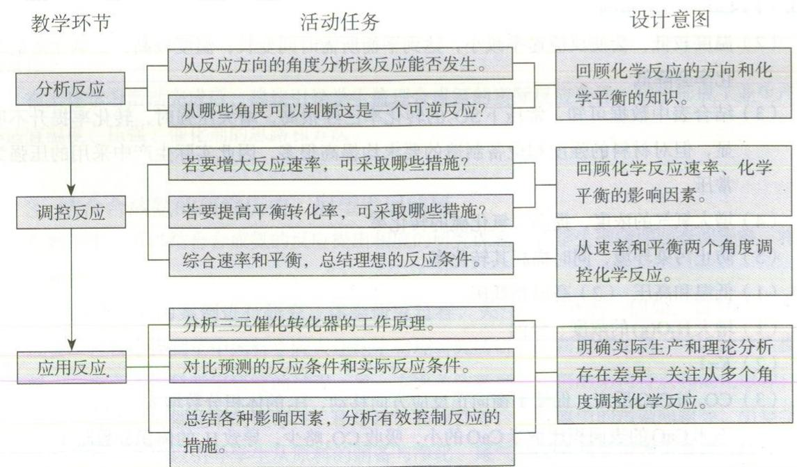

在复习中，教师要注意引导学生关注方法的形成和思路的建构。例如，在回忆相关概念时，要引导学生考虑如何将宏观和微观联系在一起；在复习影响化学反应速率和化学平衡因素的过程中，要引导学生考虑如何将实验和理论相结合；在实验探究过程中，要引导学生考虑如何从定性和定量两个角度进行探究；在化学反应的调控部分，要引导学生综合考虑速率、平衡、成本等因素。

## 二、复习与提高参考答案及说明

1. D

2. D

3. C

4. C

5. 0.8 mol

6.(1)c (2) 放热 (3) $\frac{4}{9}$ 或 0.44

7. (1) -41.8 (2)b

8. (1) $7.00 \times 10^{-4}$ (2) $50\%$ (3) 2.75

(4) 移出 $\gamma$ -丁内酯（减小 $\gamma$ -丁内酯的浓度）

9.（1） $\frac{c(\mathrm{CO})\cdot c(\mathrm{H}_2\mathrm{O})}{c(\mathrm{CO}_2)\cdot c(\mathrm{H}_2)}$ 吸热（2）等于（3）逆反应方向

# 实验活动1 探究影响化学平衡移动的因素

本实验活动的目的是通过探究浓度、温度对化学平衡的影响，加深对平衡移动原理的理解，进一步学习变量控制、对比等科学方法，发展学生的归纳和推理能力。

## 一、活动安排建议

1. 实验前应安排学生进行预习，明确实验目的，熟悉实验用品在实验中的作用，分析实验中各个步骤加入试剂的目的和预期的实验现象。

2. 在探究浓度、温度对化学平衡影响的实验中，注意变量控制、对比等科学方法的运用。

3. 对于接受能力较强的学生，可以适当增加实验的开放度，让学生根据提供的实验用品，自主设计实验方案，经评价、改进后按照最终确定的方案进行实验。

## 二、注意事项

1. 本实验中涉及一些学生不熟悉的反应，在实验前，需要对这些反应进行分析，在学生理解实验原理的基础上进行实验。

2. 在探究浓度对化学平衡影响的实验中，对于 $\mathrm{FeCl}_3$ 溶液与KSCN溶液反应后建立的平衡体系而言，最初得到的 $\mathrm{Fe(SCN)}_3$ 的浓度要小，再滴加较浓的KSCN溶液才能观察到明显的现象。对于 $\mathrm{K}_2\mathrm{Cr}_2\mathrm{O}_7$ 溶液中的平衡体系而言，直接在加碱后的体系中加酸，是为了增强颜色对比，便于观察；滴加的酸、碱的浓度要大一些，以减少加入量，减小溶液体积的影响；所加酸的量要大于所加碱的量，保证在酸与碱中和后酸还有剩余，使实验现象更加明显。

浓度对化学平衡影响的实验结果如下。

I. $\mathrm{FeCl}_{3}$ 溶液与KSCN溶液的反应

<table><tr><td>实验内容</td><td>向试管a中滴入5滴0.05mol/L $FeCl_{3}$ 溶液</td><td>向试管b中滴入5滴0.15mol/LKSCN溶液</td></tr><tr><td>实验现象</td><td>溶液红色加深</td><td>溶液红色加深</td></tr><tr><td>结论</td><td colspan="2">在其他条件不变时,增大反应物的浓度,平衡向正反应方向移动</td></tr></table>

<table><tr><td>实验内容</td><td>向试管a中加入少量铁粉</td><td>向试管b中加入少量铁粉</td></tr><tr><td>实验现象</td><td>溶液红色变浅</td><td>溶液红色变浅</td></tr><tr><td>结论</td><td colspan="2">在其他条件不变时,减小反应物的浓度,平衡向逆反应方向移动</td></tr></table>

II. 浓度对 $\mathrm{K}_{2} \mathrm{Cr}_{2} \mathrm{O}_{7}$ 溶液中平衡的影响

<table><tr><td>实验步骤</td><td>实验现象</td><td>结论</td></tr><tr><td>(1)向试管中滴加5~10滴6 mol/L NaOH溶液</td><td>溶液变为黄色</td><td>在其他条件不变时,减小生成物的浓度,平衡向正反应方向移动</td></tr><tr><td>(2)向试管中继续滴加5~10滴6 mol/L  $H_{2}SO_{4}$ 溶液</td><td>溶液由黄色变为橙色</td><td>在其他条件不变时,增大生成物的浓度,平衡向逆反应方向移动</td></tr></table>

3. 在探究温度对化学平衡影响的实验中，可以使升温和降温交替进行，这样颜色对比会更加明显。另外， $\mathrm{CuCl}_{2}$ 溶液中 $\mathrm{Cl}^{-}$ 的浓度会影响溶液的颜色，观察现象时要考虑这一点。

温度对化学平衡影响的实验结果如下。

I. 温度对 $CuCl_{2}$ 溶液中平衡的影响

<table><tr><td>实验步骤</td><td>实验现象</td><td>结论</td></tr><tr><td>(1)加热试管</td><td>溶液变为黄绿色</td><td>在其他条件不变时,升高温度,平衡向吸热反应方向移动</td></tr><tr><td>(2)将上述试管置于冷水中</td><td>溶液由黄绿色变为蓝绿色</td><td>在其他条件不变时,降低温度,平衡向放热反应方向移动</td></tr></table>

II. 温度对 $NO_{2}$ 和 $N_{2}O_{4}$ 混合气体中平衡的影响

<table><tr><td>烧瓶编号</td><td>1</td><td>2</td></tr><tr><td>实验步骤</td><td>(1)置于热水</td><td>(1)置于冷水</td></tr><tr><td>实验现象</td><td>气体红棕色加深</td><td>气体红棕色变浅</td></tr><tr><td>实验步骤</td><td>(2)置于冷水</td><td>(2)置于热水</td></tr><tr><td>实验现象</td><td>气体颜色由深变浅</td><td>气体颜色由浅变深</td></tr><tr><td>结论</td><td colspan="2">在其他条件不变时,升高温度,平衡向吸热反应方向移动,降低温度,平衡向放热反应方向移动</td></tr></table>

4. 在实验活动完成后，可以让学生展开讨论，引导学生从勒夏特列原理和物质性质的角度，分析在本实验活动中还可以选择哪些试剂来探究浓度、温度对化学平衡的影响。

## 三、问题和讨论答案或提示

1. 应注意变量控制、对照实验、科学归纳法等科学方法的运用。

设计实验证明浓度、温度对化学平衡的影响时，一种方法是针对本实验中的反应，改变物质的浓度、反应温度，探究对化学平衡产生的影响；另一种方法是针对其他化学反应设计实验，研究浓度、温度对化学平衡的影响。

2. 在本实验中，影响化学平衡移动的因素有反应物的浓度、生成物的浓度、温度，可尝试从这几种影响因素入手进行归纳。

3. 无法观察到。在这个平衡体系中， $\left[\mathrm{Cu}\left(\mathrm{H}_{2}\mathrm{O}\right)_{4}\right]^{2+}$ 为蓝色， $\left[CuCl_{4}\right]^{2-}$ 为黄色，因此氯化铜溶液呈绿色。升高温度，平衡向正反应方向移动，可以观察到溶液呈黄绿色。

## 教学资源

## 1. 化学反应速率

在等容体系中进行的化学反应，其反应速率通常是用一种反应物或生成物的浓度在单位时间内的变化来表示。随着反应的不断进行，反应物的浓度在减小，生成物的浓度在增加，反应速率随时都在变化，正反应速率减小，逆反应速率增大。所以，化学反应速率有平均反应速率和即时反应速率之分。

教材中的计算方法求出的速率是平均速率，是在某一时间段内反应物或生成物浓度的变化量：

$$
v = \frac {\Delta c}{\Delta t}
$$

在浓度计算过程中，总是用某一时刻的浓度减去起始浓度来求浓度的变化。为了保证速率值为正值，在求算反应物的浓度变化时，要在差值前加一个负号，即反应物的浓度变化 $= -$ （某一时刻的浓度-起始浓度）。

对于反应：

$$
a \mathrm{A(g)} + b \mathrm{B(g)} \rightleftharpoons c \mathrm{C(g)} + d \mathrm{D(g)}
$$

在进行时，反应物和生成物都是按其化学计量数比消耗和生成的，如果A的消耗浓度为w，B的消耗浓度则为 $\frac{bw}{a}$ ，即A、B的消耗浓度之比为a:b；同理，C、D的生成浓度之比为c:d，所以在同一个化学反应中，以不同物质表示的反应速率其数值可能不同，其关系为：

$$
v (\mathrm{A}): v (\mathrm{B}): v (\mathrm{C}): v (\mathrm{D}) = a: b: c: d
$$

表示化学反应的即时速率要用到高等数学中的微分学知识，如反应物A的即时速率为 $\frac{dc(A)}{dt}$ （无限小的浓度变化与无限小的时间变化之比），但其速率大小关系仍为：

$$
v (\mathrm{A}): v (\mathrm{B}): v (\mathrm{C}): v (\mathrm{D}) = a: b: c: d
$$

测定化学反应速率的方法一般分为化学方法和物理方法两种。

## (1) 化学方法

利用化学分析方法来测定某时刻反应体系中各物质的浓度。使用这种方法测定反应速率时，必须让取出的样品立即停止反应，否则所测定的浓度值就不准确。使反应立即停止的方法有骤冷、冲稀、加入阻化剂或去除催化剂等。要根据具体反应的特点选择适宜的方法，这种方法可以直接得出不同时刻的浓度数据。

## (2) 物理方法

通过测定反应物、生成物的物理性质来求出其对应的浓度。例如，测定体系的旋光度、折光率、电导率、电动势、导热率、吸收光谱、压强或体积的变化等。利用这种方法进行测定，必须要先找出物质浓度与被测物理性质之间的关系。此类方法快速便捷，可以连续测定，自动记录。

## 2. 化学反应的活化能

实验证明，只有发生碰撞的分子的能量等于或超过一定的能量 $E_{c}$ （可称为临界能）时，才可能发生有效碰撞。具有的能量大于或等于 $E_{c}$ 的分子称为活化分子。

在一定温度下，具有一定能量的分子百分数与分子能量的关系如图2-3所示。从图中可以看出，反应物分子的能量可以从0开始无限增大，但是具有很低能量和很高能量的分子都很少，具有平均能量的分子相当多。这种具有一定能量的分子百分数和分子能量的对应关系图，叫做一定温度下的分子能量分布曲线图。

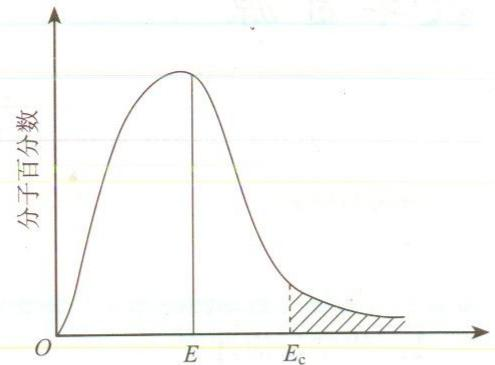  
能量  
图2-3 一定温度下的分子能量分布曲线图

在图2-3中，E表示分子的平均能量， $E_{c}$ 是活化分子具有的最低能量，能量等于或高于 $E_{c}$ 的分子可能产生有效碰撞。活化分子具有的平均能量与反应物分子的平均能量之差叫做活化能（ $E_{a}$ ）。

不同的反应具有不同的活化能。反应的活化能越低，则在指定温度下活化分子数越多，反应就越快。

如图2-4所示，不同温度下分子能量分布是不同的。当温度升高时，气体分子的运动速率增大，不仅使气体分子在单位时间内碰撞的次数增加，更重要的是由于气体分子能量增加，活化分子百

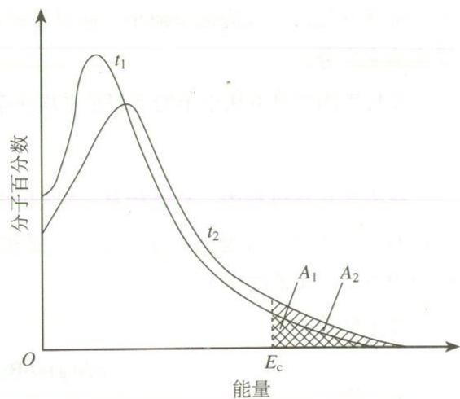  
图 2-4 不同温度下分子能量分布曲线图

分数增大。图中的两条曲线分别表示在 $t_{1}$ 和 $t_{2}$ 温度下的分子能量分布（ $t_{2}>t_{1}$ ）。温度为 $t_{1}$ 时活化分子的多少可由面积 $A_{1}$ 反映出来；温度为 $t_{2}$ 时，活化分子的多少可由面积 $A_{1}+A_{2}$ 反映出来。从图中可以看到，升高温度，可以使活化分子百分数增大，从而使反应速率增大。

一个化学反应体系的活化能 $(E_{\mathrm{a}})$ ，通常是通过温度对反应速率常数的影响来测定的，其关系式为阿伦尼乌斯方程，即：

$$
k = A \mathrm{e} ^ {- \frac {E _ {\mathrm{a}}}{R T}}
$$

## 3. 活化分子不一定都发生有效碰撞

反应物分子之间发生有效碰撞，必须同时满足两个条件，一是反应物分子的能量必须达到某一临界数值，二是反应物分子必须按一定的方向互相碰撞。前者是能量因素，后者是空间因素。现以反应 $NO_{2}+CO=NO+CO_{2}$ 为例来说明。

当 $NO_{2}$ 与CO分子彼此靠近时，它们分子中的价电子云就互相影响，使得分子的键长和分子的形状都发生变化。 $NO_{2}$ 与CO分子在发生有效碰撞时，必须同时满足空间因素和能量因素两个条件。

(1) 空间因素: $\mathrm{NO}_{2}$ 与 $\mathrm{CO}$ 分子只有在一定方向上碰撞, 即 $\mathrm{N}-\mathrm{O}$ 和 $\mathrm{C}-\mathrm{O}$ 要在一条直线上发生碰撞, 才能发生反应, 如图2-5所示。

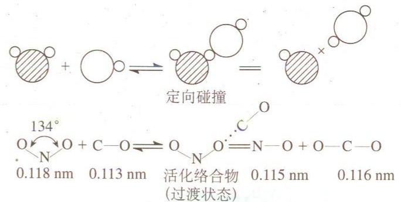  
图 2-5 $NO_{2}$ 与 CO 的反应过程示意图

很显然，当N—O与C—O在一条直线时，两个分子之间电子云相互影响最大，这样有利于形成中间产物——活化络合物。

（2）能量因素： $NO_{2}$ 与 CO 分子发生有效碰撞，必须克服它们价电子云之间的排斥作用。只有那些能量大的分子，当其平均能量具有或超过活化分子所具有的能量时，才能克服这种电子云间的排斥作用，形成一个处于活化状态的中间产物——活化络合物。此时原有的 N—O 部分断裂，新的 C…O 部分形成。这种活化络合物既可以分解成反应物 $NO_{2}$ 和 CO，又可以形成生成物 NO 和 $CO_{2}$ 。图 2-6 所示为上述反应过程中能量的变化情况，其中，A 处表示 $NO_{2}$ 与 CO 系统的平均能量，在此条件下， $NO_{2}$ 与 CO 分子发生碰撞时并不发生反应。只有当 $NO_{2}$ 与 CO 分子的平均能量达到 B 处（或高于 B 处）时，碰撞才能形成活化络合物 ONO…CO，而后发生反应。C 处是反应产物 NO 与 $CO_{2}$ 系

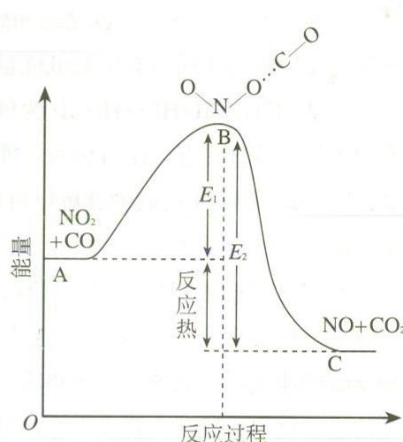  
图 2-6 $NO_{2}$ 与 CO 反应过程中能量的变化示意图

统的平均能量。从图2-6中还可以看到， $E_{1}$ 是正反应的活化能， $E_{2}$ 是逆反应的活化能。 $E_{1}$ 和 $E_{2}$ 之差是该化学反应的反应热。

从以上分析可知，活化分子虽然具有反应所必需的能量，但如果两个活化分子不在特定的位置发生碰撞，则不能发生反应。

## 4. 过渡状态理论

随着人们对原子和分子内部结构认识的深入，在20世纪30年代科学家提出了反应速率的过渡状态理论（transition state theory）。该理论认为反应物在相互接近时要经过一个中间过渡状态，即形成一种活化络合物，然后再转化成产物。这个过渡状态就是活化状态，例如：

A+BC → A…B…C → AB+C
反应物（始态） 活化络合物（过渡态） 产物（终态）

过渡态的位能高于始态也高于终态，由此形成一个能垒，这种关系可用一个简化的图形表示（如图2-7）。

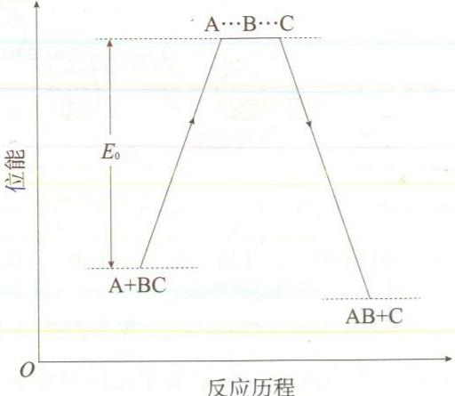  
图 2-7 过渡状态位能示意图

按照过渡状态理论，过渡态和始态的位能差 $E_{0}$ 就是活化能，或者说活化络合物具有的最低能量与反应物分子所具有的最低能量之差为活化能。

以基元反应 $HI+HI\rightarrow H_{2}+2I\cdot$ 为例，当2个HI分子相碰时，若连心线的相向平动能足够大，并使两个分子的H接近，H—I伸长，能量升高，则生成了过渡态化合物 $I\cdots H\cdots H\cdots I$ 。由于不断地振动， $H\cdots H$ 之间微小的收缩就可以自发形成 $H_{2}$ 分子，而 $H\cdots I$ 继续伸长最终断裂，生成 $I\cdot$ 。过渡态化合物与HI分子间势能垒为 $E_{0}$ ，如图2-8所示。

参照这种过渡态模型进行计算， $E_{0}$ 约为 180 kJ/mol，这比 2 个 HI 分子的键能 596 kJ/mol 小得多。若上述反应先经过 HI 分子断键分别生成 2 个 H·和 2 个 I·，然后 2 个 H·再结合成 $H_{2}$ 分子，这样反应的途径所需的能垒就高得多。由反应物到生成物的变化途径可以有多种选择，但总是能垒低的途径优先，犹如人群从一个山谷到另一个山谷，有多种路径可走，而跨越高度最低的路径是行人最多的路径。

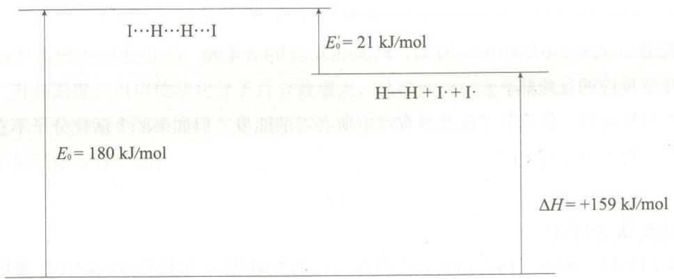  
图 2-8 HI 分解过渡态示意图

[摘编自：华彤文，陈景祖等编著.普通化学原理（第3版）.北京：北京大学出版社，2005]

## 5. 催化剂加速化学反应的原理

催化作用原理十分复杂。凡十年来，有关催化剂的资料积累了许多，研究者也提出过不少催化理论，但至今还缺乏适用范围广泛的理论来阐明催化剂的作用原理。这是由于催化反应，特别是多相催化反应，是十分复杂的问题。它不仅涉及一般的化学反应机理，而且涉及固体物理学、结构化学和表面化学等学科，而这些都是人们至今还在探索的科学领域。另外，催化理论的研究还必须借助于先进的实验手段，但目前研究催化剂反应机理的实验工具还不够完善，至今人们还无法洞察催化反应在进行过程中催化剂表面的结构变化，以及反应物在具体催化过程中的转化情况。目前催化理论落后于催化剂在工业生产中所获得的巨大成就，所以必须加强催化学科基础理论的研究。

催化剂与反应物同处于均匀的气相或液相中的催化称为单相催化（又叫均相催化）。一般认为单相催化是反应物与催化剂先生成一定的中间产物，然后催化剂又从这些中间产物中产生出来。反应物与催化剂形成中间产物，再由中间产物变为产物，其总的活化能要比反应物之间直接反应成为生成物的活化能小得多。例如，乙醛分解为甲烷和一氧化碳的反应：

$$
\mathrm{CH} _ {3} \mathrm{CHO} \longrightarrow \mathrm{CH} _ {4} + \mathrm{CO}
$$

在518 ℃时，如果没有催化剂，此反应的活化能是190 kJ/mol。若有碘蒸气作催化剂，此反应分两步进行：

$$
\begin{array}{r l} & \mathrm {CH_ {3} CHO+ I_ {2} \longrightarrow CH_ {3} I + HI + CO} \\ & \mathrm {CH_ {3} I + HI\longrightarrow CH_ {4} + I_ {2}} \end{array}
$$

两步反应所需的总的活化能为 136 kJ/mol。用碘作催化剂后，活化能降低了 54 kJ/mol，使反应速率增大为原来的约 1 万倍。

在水溶液中的单相催化大都是由 $H^{+}$ 或 $OH^{-}$ 引起的。例如，在水溶液中糖的转化、酯的水解、酰胺及缩醛的水解等，都因有 $H^{+}$ 的参加而加速。

催化剂自成一相（固相），在催化剂表面进行的催化作用叫做多相催化。对于多相催化反应，目前有三种理论：活性中心理论、活化络合物理论和多位理论。

## (1) 活性中心理论

活性中心理论认为，催化作用发生在催化剂表面的某些活性中心。由于这些活性中心对反应物分子产生化学吸附，使反应物分子变形，化学键松弛，呈活化状态，从而发生催化作用。在固体表面，活性中心存在于棱角、凸起或缺陷部位。因为这些部位的价键具有较大的不饱和性，所以具有较强的吸附能力。通常活性中心只占整个催化剂表面的很小部分，例如，合成氨的铁催化剂的活性中心只占总表面积的0.1%。活性中心理论可以解释为什么微量的毒物就能使催化剂丧失活性（毒物破坏或占据活性中心），为什么催化剂的活性与制备条件有关（制备条件能影响晶体结构，即影响活性中心的形成）。

## (2) 活化络合物理论

活化络合物理论阐明了活性中心是怎样使反应物活化的。这种理论认为，反应物分子被催化剂的活性中心吸附以后，与活性中心形成一种具有活性的络合物(称为活化络合物)。由于这种活化络合物的形成，使原来分子中的化学键松弛，因而反应的活化能大大降低，这就为反应的进行创造了有利条件。

## (3) 多位理论

活性中心理论和活化络合物理论都没有注意到催化剂表面活性中心的结构，因而不能充分解释催化剂的选择性。多位理论认为，表面活性中心的分布不是杂乱无章的，而是具有一定的几何规整性。只有活性中心的结构与反应物分子的结构成几何对应时，才能形成多位的活化络合物，从而发生催化作用。这时催化剂的活性中心不仅使反应物分子的某些键变得松弛，而且还由于几何位置的有利条件使新键得以形成。

上述的三种多相催化理论都能解释一些现象，但还有许多事实不能用它们进行解释。在这三种理论中，有两点是共同的。第一，认为催化剂表面有活性中心存在，催化剂表面结构是不均匀的，催化能力各处不同。第二，认为反应物分子与活性中心之间相互作用的结果使化学键发生改组，从而生成产物。至于活性中心的本质和活化络合物的本质，是今后需要进一步研究的重要课题。

## 6. 反应机理

反应机理是对反应历程的描述。从反应机理的角度考虑，化学反应可以分为基元反应和非基元反应两大类。所谓基元反应是指一步完成的反应，它也是构成非基元反应历程的各基本步骤，可以鲜明地反映反应速率的规律性。若正向反应是基元反应，其逆向反应也是基元反应，并且中间活化体也是相同的，该基元反应的 $\Delta H = E_{a} - E_{a}'$ （如图2-9）。例如， $CO + NO_{2} = CO_{2} + NO$ 是基元反应，CO 和 $NO_{2}$ 发生有效碰撞，一步就变成 $CO_{2}$ 和 NO，反应速率和碰撞次数成正比，也就和 $CO$ 、 $NO_{2}$ 的浓度成正比，即：

$$
v = - \frac {\mathrm{d} c (\mathrm{CO})}{\mathrm{d} t} = k \cdot c (\mathrm{CO}) \cdot c (\mathrm{NO} _ {2})
$$

又如， $2HI \longrightarrow H_{2} + 2I \cdot$ 也是基元反应，按照碰撞理论可以视为2个HI分子发生有效碰撞一步就变成 $H_{2}$ 和 $2I\cdot$ ，所以反应速率：

$$
v = - \frac {\mathrm{d} c (\mathrm{HI})}{\mathrm{d} t} = k \cdot c (\mathrm{HI}) \cdot c (\mathrm{HI}) = k c ^ {2} (\mathrm{HI})
$$

当实验已经判定这两个反应都是基元反应时，反应速率方程很容易按化学方程式的计量数直接写出。基元反应的速率常数和平衡常数的关系是一目了然的，如对于反应 $CO+NO_{2}=CO_{2}+NO$ 而言：

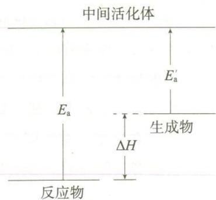  
图 2-9 基元反应的焓变示意图

$$
v _ {\mathrm{正}} = - \frac {\mathrm{d} c (\mathrm{CO})}{\mathrm{d} t} = k _ {\mathrm{正}} \cdot c (\mathrm{CO}) \cdot c (\mathrm{NO} _ {2})
$$

$$
v _ {\mathrm{逆}} = - \frac {\mathrm{d} c (\mathrm{NO})}{\mathrm{d} t} = k _ {\mathrm{逆}} \cdot c (\mathrm{NO}) \cdot c (\mathrm{CO} _ {2})
$$

达到平衡时 $v_{正}=v_{逆}$ ，浓度项都是平衡浓度，所以有：

$$
k _ {\mathrm{正}} \cdot c (\mathrm{CO}) \cdot c (\mathrm{NO} _ {2}) = k _ {\mathrm{逆}} \cdot c (\mathrm{NO}) \cdot c (\mathrm{CO} _ {2})
$$

$$
\frac {k _ {\mathrm{正}}}{k _ {\mathrm{逆}}} = \frac {c (\mathrm{NO}) \cdot c (\mathrm{CO} _ {2})}{c (\mathrm{CO}) \cdot c (\mathrm{NO} _ {2})} = K
$$

上式正向反应速率常数（ $k_{正}$ ）和逆向反应速率常数（ $k_{逆}$ ）之比即为平衡常数（K）。但这一简单关系式只限于基元反应，非基元反应的速率常数与平衡常数之间的关系较为复杂，其速率方程由实验测定反应级数及速率常数之后才能确定，要弄清反应机理还必须有其他实验方法的配合。

通过对反应机理进行研究可以了解决定反应速率的关键步骤，以便我们能主动控制反应速率，能更多、更快地制造产品。要确定一个反应的历程，首先要系统地进行实验，测定速率常数、反应级数、活化能、中间产物等。综合实验结果，参考理论，利用经验规则推测反应历程，再经多方面推敲，才能初步确立一个反应的机理。

[摘编自：华彤文，陈景祖等编著.普通化学原理（第3版）.北京：北京大学出版社，2005]

## 7. 化学平衡常数

## (1) 平衡常数的单位

平衡常数有标准平衡常数和非标准平衡常数之分，前者的量纲为一，后者的量纲取决于平衡常数的表达式。

根据标准热力学函数计算得到的平衡常数是标准平衡常数（ $K^{\ominus}$ ），又称为热力学平衡常数；用平衡时生成物对反应物的压力商或浓度商表示的平衡常数是经验平衡常数（ $K_{p}$ 或 $K_{c}$ ），或称为非标准平衡常数。中学教材中涉及的平衡常数是经验平衡常数，只有标准平衡常数才能用与之相对应的 $\Delta_{r}G_{m}^{\ominus}$ 计算：

$$
K ^ {\ominus} = \exp (- \frac {\Delta_ {\mathrm{r}} G _ {\mathrm{m}} ^ {\ominus}}{R T})
$$

大家知道，一些重要的热力学函数，如 $U$ 、 $H$ 、 $F$ 、 $G$ 等的绝对值是无法确定的。为了计算它们的相对大小，需要统一规定一个状态作为比较的标准，这样才不致引起混乱。我们已经知道，所谓标准状态是指在温度为 $T$ 、标准压力为 $p^{\ominus}$ （过去用 101 kPa，目前用 100 kPa）下物质的特定状态，简称标态。热力学数据表中的标态，国际上都已有明确规定。

对于反应物化学计量数之和等于生成物化学计量数之和的反应，其经验平衡常数是无量纲的纯数，与压力、浓度所用的单位无关，而且也等于标准平衡常数值。

对于反应物化学计量数之和不等于生成物化学计量数之和的反应，其经验平衡常数是有量纲的，其数值就与压力、浓度所用的单位有关。也只有当压力、浓度的单位与热力学数据表中对应标态的单位相同时，所计算的经验平衡常数的数值才与标准平衡常数的数值相同。

## (2) 平衡常数的测定

平衡常数可以用实验方法测定，也可以利用热力学数据计算而得。

实验方法通常有化学方法和物理方法。

化学方法是通过化学分析法测定反应达到平衡时各物质的浓度，但必须防止因测定过程中加入化学试剂而干扰化学平衡。因此，在进行化学分析之前必须使化学平衡“冻结”在原来的平衡状态。通常采用的方法是骤冷、稀释或加入阻化剂使反应停止，然后进行分析。例如，要测定反应 $2H_{2}+O_{2}\rightleftharpoons2H_{2}O$ 在2000℃达到平衡时的平衡常数，可以将一定量的水置于耐高温的合金管中加热，在2000℃时保持一段时间，使之达到化学平衡。然后，将管子骤然冷却，再分析其中 $H_{2}O$ 、 $H_{2}$ 、 $O_{2}$ 的含量，便可计算出在2000℃时这个反应的平衡常数。

物理方法就是利用物质物理性质的变化测定达到平衡时各物质浓度的变化，如通过测定体系的折光率、电导率、颜色、压强或容积的改变来测定物质的浓度。物理方法的优点是在测定时不会干扰或破坏体系的平衡状态。

## 8. 催化剂对反应速率、化学平衡的影响

对于一个确定的可逆反应来说，由于反应前后催化剂的化学组成、质量不变，因此，无论是否使用催化剂，反应的始、终态都是一样的，则反应的标准吉布斯函数变化（ $\Delta G^{\ominus}$ ）是相等的。根据标准吉布斯函数变化（ $\Delta G^{\ominus}$ ）与平衡常数（ $K$ ）的关系式： $\Delta G^{\ominus} = -RT \ln K$ （ $R$ 为摩尔气体常数），在一定温度下， $\Delta G^{\ominus}$ 有确定的数值，则化学平衡常数（ $K$ ）也是确定的，不因是否使用催

化剂而改变，也就说明催化剂不影响化学平衡。

对于一个可逆反应，若 $k_{\text{正}}$ 、 $k_{\text{逆}}$ 分别为正、逆反应的速率常数，则达平衡后：

不使用催化剂时， $A+B\xrightarrow[k_{逆}]{k_{正}}C+D$ $K=\frac{k_{正}}{k_{逆}}$ ;

使用催化剂时， $A+B\xlongequal{k_{正}^{\prime}}C+D$ $K'=\frac{k_{正}^{\prime}}{k_{逆}^{\prime}}$ 。

$$
K = K ^ {\prime} = \frac {k _ {\mathrm{正}}}{k _ {\mathrm{逆}}} = \frac {k _ {\mathrm{正}} ^ {\prime}}{k _ {\mathrm{逆}} ^ {\prime}}
$$

假设使用催化剂后，逆反应的速率常数改变为原来的 $m$ 倍，即 $k_{\text {逆}}^{\prime} = mk_{\text {逆}}$ ，则：

$$
k _ {\mathrm{正}} ^ {\prime} = \frac {k _ {\mathrm{正}}}{k _ {\mathrm{逆}}} \times k _ {\mathrm{逆}} ^ {\prime} = \frac {k _ {\mathrm{正}}}{k _ {\mathrm{逆}}} \times m k _ {\mathrm{逆}} = m k _ {\mathrm{正}}
$$

即正反应的反应速率常数也改变为原来的 $m$ 倍，说明一个化学反应采用同一种催化剂，可以同等程度改变正、逆反应速率。

## 9. 化学反应的方向

自由能 $G \equiv H-TS$ 既是体系的一个重要的热力学性质，也是一个状态函数。可以用自由能的变化 ( $\Delta G$ ) 来判断等温、等压条件下化学反应的自发性，即：当 $\Delta G < 0$ 时，反应自发进行； $\Delta G > 0$ 时，反应不自发进行； $\Delta G = 0$ 时，反应处于平衡状态。

由于 $G \equiv H-TS$ ，所以等温时， $\Delta G = \Delta H - T\Delta S$ ，此式叫吉布斯-亥姆霍兹公式。根据这个公式，可以将焓变、温度和熵变三个因素综合起来判断化学反应进行的方向。

<table><tr><td>类型</td><td> $\Delta H$ </td><td> $\Delta S$ </td><td> $\Delta G$ 及反应方向</td><td>反应实例</td></tr><tr><td>1</td><td>-,焓减</td><td>+,熵增</td><td>-, (任何温度)均自发自由能减少</td><td> $2H_{2}O_{2}(l)=2H_{2}O(l)+O_{2}(g)$ </td></tr><tr><td>2</td><td>+,焓增</td><td>-,熵减</td><td>+, (任何温度)均不自发自由能增加</td><td> $\frac{3}{2}O_{2}(g)=O_{3}(g)$ </td></tr><tr><td>3</td><td>+,焓增</td><td>+,熵增</td><td>+, (常温)不自发-,(高温)自发</td><td> $N_{2}O_{4}(g)=2NO_{2}(g)$ </td></tr><tr><td>4</td><td>-,焓减</td><td>-,熵减</td><td>-, (常温)自发+, (高温)不自发</td><td> $N_{2}(g)+3H_{2}(g)=2NH_{3}(g)$ </td></tr></table>

由上表可以看出，类型1的反应， $\Delta H$ 为负值， $\Delta S$ 为正值，即为焓减、熵增的反应。不论温度多高， $\Delta G$ 总是小于零，因此反应是自发的，向正反应方向进行。类型2的反应， $\Delta H$ 为正值， $\Delta S$ 为负值，即为焓增、熵减的反应，无论温度多高， $\Delta G$ 总是大于零，因而反应总是不自发的，但逆反应却可以自发进行。这两类反应中，焓效应和熵效应对 $\Delta G$ 的贡献（影响）是互相加强的，方向是一致的，因此温度因素不能改变 $\Delta G$ 的符号。类型3和类型4的反应，由于焓效应和熵效应对 $\Delta G$ 作出方向不同的贡献（影响），一般说来，低温时以焓效应影响为主，高温时以熵效应影响为主，而温度影响的大小要看 $\Delta H$ 、 $\Delta S$ 的具体情况而定。

需要注意的是，一个体系的熵不能永远增加，最终是达到一个最大的无序状态，此时，尽管分子水平上的变化仍在发生，但是体系呈现有确定的（不变的）性质。我们研究的化学体系，当它具有不变的、可观察的性质时，化学反应就处于平衡状态。所以，当一个体系达到它的最大熵时，即处于平衡状态。

下面结合典型例题进行分析。

【例1】氨与氯化氢的反应为： $\mathrm{NH_{3}(g)+HCl(g)=NH_{4}Cl(s)} \quad \Delta H=-176\ kJ/mol$ 。这是一个自发反应，它是由气体反应物生成固体产物的熵减小的过程，为什么能自发进行呢？

【解】在 $298 \mathrm{~K} 、 101 \mathrm{kPa}$ 下，上述反应中各物质的熵值如下：

$$
\begin{array}{r l} & S (\mathrm{NH} _ {3}) = 1 9 2 \mathrm{J/(mol} \cdot \mathrm{K)} \\ & S (\mathrm{HCl}) = 1 8 7 \mathrm{J/(mol} \cdot \mathrm{K)} \\ & S (\mathrm{NH} _ {4} \mathrm{Cl}) = 9 5 \mathrm{J/(mol} \cdot \mathrm{K)} \end{array}
$$

则： $\Delta S = S_{\text{产物}} - S_{\text{反应物}} = 95 - (192 + 187) = -284\mathrm{J / (mol\cdot K)}$

$$
\Delta S = \frac {\Delta H}{T}
$$

这是一个放热反应，在反应过程中，释放的热量为 $\Delta H = -176\mathrm{kJ / mol}$ ，即该化学反应体系将释放的能量传递给了周围的环境，导致环境的熵增加，增加的熵（ $\Delta S$ ）与焓变（ $\Delta H$ ）之间存在下列关系：

$$
\Delta S _ {\mathrm{环境}} = \frac {- \Delta H _ {\mathrm{体系}}}{T}
$$

$$
\Delta S _ {\mathrm{环境}} = \frac {- (- 1 7 6)}{T}
$$

在室温298 K(25 ℃)时，

$$
\begin{array}{r l} \Delta S _ {\mathrm{环境}} & = \frac {- (- 1 7 6)}{2 9 8} \\ & = + 0. 5 9 \mathrm {kJ / (mol\cdot K)} \\ & = + 5 9 0 \mathrm {J / (mol\cdot K)} \end{array}
$$

该反应的 $\Delta S = -284 \, \text{J/(mol} \cdot \text{K)}$ ，若仅考虑反应物和生成物时，这是熵减小的反应，不可能发生；若增加对环境的熵的考虑，则该反应总的熵变为：

$$
\begin{array}{r l} \Delta S _ {\text {总}} & = \Delta S _ {\text {体系}} + \Delta S _ {\text {环境}} \\ & = - 2 8 4 + 5 9 0 \\ & = + 3 0 6 \mathrm {J / (mol\cdot K)} \end{array}
$$

由此可见，环境增加的熵超过了反应体系减少的熵，该自发反应总的熵变是增加的， $\Delta S$ 为正值。

【例2】工业上可以用焦炭还原氧化铁得到金属铁，但是冶炼金属铝时，却用电解熔融氧化铝的方法。请从热力学的角度判断，为什么不能用焦炭还原氧化铝炼制金属铝？

$$
\begin{array}{r l} & {\mathrm{在} 2 9 8 \mathrm{K} \text {时,} 2 \mathrm{Al} _ {2} \mathrm{O} _ {3} (\mathrm{s}) + 3 \mathrm{C} (\mathrm{s}) = 4 \mathrm{Al} (\mathrm{s}) + 3 \mathrm{CO} _ {2} (\mathrm{g})} \\ & {\Delta H = + 2 1 7 1 \mathrm{kJ/mol}} \\ & {\Delta S = + 6 3 5. 5 \mathrm{J/(mol} \cdot \mathrm{K)}} \\ & {\Delta G = \Delta H - T \Delta S} \\ & {= + 2 1 7 1 \mathrm{kJ/mol} - 2 9 8 \mathrm{K} \times 6 3 5. 5 \times 1 0 ^ {- 3} \mathrm{kJ/(mol} \cdot \mathrm{K)}} \\ & {= + 1 9 8 2 \mathrm{kJ/mol}} \end{array}
$$

因此，在室温下反应不能自发进行。

该反应为吸热的熵增加反应，升高温度可使 $\Delta H - T\Delta S < 0$ ，反应能自发进行。假设反应焓变与反应熵变不随温度变化而变化，因为当 $\Delta G < 0$ 时，反应才能发生，即：

$$
2 1 7 1 \times 1 0 0 0 - T \times 6 3 5. 5 <   0
$$

$$
T > 3 4 1 6 \mathrm{K}
$$

所以，当 $T > 3416\mathrm{K}$ 时，该反应才能自发进行，而这么高的温度在工业生产中是很难满足的。（本资料中“典型例题分析”由周志华教授提供）

## 10. 熵的生物学意义

熵的概念对于生命的认识具有重要意义。生命体既不是孤立系统，也不是封闭系统，而是一个开放系统。生命体与环境之间不断交换着物质（物质流）和能量（基本上是热流），而且还交换着熵（熵流）。机体摄入的食物，如蛋白质、淀粉、核苷酸等，都是结构复杂的高分子物质，它们的熵值很小。机体排泄的都是小分子代谢产物，它们的熵值很大。假设排泄的总量等于摄入的总量，摄入物来自环境，排泄物回到环境，机体的生命活动将使环境的熵增大。机体还不断向环境释放生化反应产生的热，这也使环境的熵增大。与此同时，机体本身的熵也发生了变化。机体不断产生新的复杂结构（发育成长），是熵减小，而细胞死亡和代谢过程将结构复杂的生化物质转化为简单的小分子，则是熵增大。机体总的熵变取决于年龄的增长。当机体处于生长发育阶段时（年轻人），熵要减小；当机体处于发育成熟阶段时（成年人），熵变几乎等于零；当机体处于衰老阶段时（老年人），熵会增大；机体老死时，熵增至极大。这正如量子化学奠基人薛定谔在《生命是什么》（1956年版）一书中所写到的：“一个生命有机体不断地……产生正的熵……因此就势必接近具有极大熵值的危险状态，即死亡。……新陈代谢作用最基本的内容是有机体成功地使自身释放出它活着时不得不产生的全部熵。”此话不但精辟地指出熵这一热力学概念对理解生命的意义，而且体现了熵的概念对所有过程的重要意义。

[摘编自：北京师范大学无机化学教研室等编. 无机化学（第4版）. 北京：高等教育出版社，2002]

## 教学案例

# 影响化学反应速率的因素

北京市第五十五中学 邹雪连

## 教学目标

1. 能设计实验，从定量的角度研究影响化学反应速率的因素；通过对实验现象的预测和分析，体会多角度获取实验证据在研究化学反应中的作用。

2. 在研究影响化学反应速率因素的过程中，进一步体会变量控制、对照实验和科学归纳法等科学方法。

## 教学重点

1. 从定量的角度研究浓度对化学反应速率的影响。

2. 从多个角度获取证据的意识的培养。

## 教学难点

从定量的角度研究浓度对化学反应速率的影响。

## 教学过程

教学环节一、创设情境，引入定量研究

从影响化学反应速率的内因出发，以锌、铁分别与稀硫酸的反应为载体，创设情境引入新课，帮助学生认识定量研究的意义。

<table><tr><td>教师活动</td><td>学生活动</td><td>设计意图</td></tr><tr><td>【提问】我们知道,反应速率首先是由反应物的组成、结构和性质等因素决定的,浓度、温度、压强及催化剂等因素也会影响反应速率。请大家分析锌、铁分别与稀硫酸反应,哪一个反应速率更大?【任务1】设计实验方案,比较在相同条件下锌、铁分别与稀硫酸反应的速率。【实验】分别向两支盛有等体积 $0.5 \text{ mol/L } \text{H}_2\text{SO}_4$ 溶液的试管中加入表面积相同、质量相等的锌片、铁片。【提问】如何改进实验才能顺利观察到锌与稀硫酸反应的速率比铁与稀硫酸反应的速率大呢?【实验】展示教材实验探究II的装置,用测量相同时间内产生 $\text{H}_2$ 体积的方法,比较等体积 $0.5 \text{ mol/L } \text{H}_2\text{SO}_4$ 溶液分别与表面积相同、质量相等的锌、铁反应的速率。</td><td>【回答】在反应温度、反应物浓度、金属与酸的接触面积等条件相同时,锌与稀硫酸反应速率更大。【讨论后汇报】同时将表面积相同、质量相等的锌片、铁片分别投入等浓度、等体积的稀硫酸中,观察产生气泡的速率。【观察】两者的反应速率比较接近,很难区分。【讨论后汇报】可以测量:1相同时间内产生 $\text{H}_2$ 的体积;2产生相同体积的 $\text{H}_2$ 所需的时间;3相同时间内溶液pH的变化;4相同时间内溶液与固体的总质量的减少量;等等。【观察并记录】计时、读数、记录数据,得出实验结果。</td><td>创设真实的实验情境,引导学生回忆化学反应速率的影响因素,强调变量控制的思想。由预测的现象与观察到的现象的差异,让学生产生认知冲突,激发学生的求知欲。引导学生从定性研究转入定量研究,在对实验现象进行观察和分析的过程中,体会定量研究的意义。</td></tr></table>

教学环节二、测量气体体积，认识定量研究

以锌与不同浓度的稀硫酸反应为例，从定量的角度研究浓度对化学反应速率的影响，进一步认识定量研究的价值。

<table><tr><td>教师活动</td><td>学生活动</td><td>设计意图</td></tr><tr><td>【任务2】以锌与稀硫酸反应为例,探究浓度对反应速率的影响。提供的试剂:锌粒、1 mol/L  $H_{2}SO_{4}$ 溶液及4 mol/L  $H_{2}SO_{4}$ 溶液。要求如下。1. 设计实验方案。2. 选择一种方案完成实验。3. 记录实验时间,并与你的预测进行比较。【提问】在研究浓度对锌与稀硫酸反应速率的影响时,我们采用了测量</td><td>【思考】用表面积相同、质量相等的锌分别与等体积、不同浓度的稀硫酸反应,测量相同时间内产生 $H_{2}$ 的体积,或测量收集相同体积 $H_{2}$ 所需的时间。【实验】记录收集10 mL  $H_{2}$ 所用的时间。【交流】结果与预测一致。 $H_{2}SO_{4}$ 的浓度小,与锌反应速率小,收集相同体积的 $H_{2}$ 所需时间长。</td><td>引导学生运用定量研究的思想探究浓度对反应速率的影响,同时进一步强化变量控制、对照实验等科学方法。引导学生建立证据意识,通过收集实验证据并进行分析获得实验结论。</td></tr></table>

续表

<table><tr><td>教师活动</td><td>学生活动</td><td>设计意图</td></tr><tr><td>收集相同体积的气体所需时间的方法。还有其他测量方法吗?</td><td>【讨论】可以测量:1气体的压强变化;2 $c(H^{+})$ 或 $c(Zn^{2+})$ 的变化等。</td><td></td></tr></table>

教学环节三、收集证据，理解定量研究

对不同的化学反应开展研究，通过对多个物理量的测量，引导学生从多个角度认识浓度对化学反应速率的影响，帮助学生建立定性与定量相结合的研究视角。

<table><tr><td>教师活动</td><td>学生活动</td><td>设计意图</td></tr><tr><td>【介绍】对于有离子浓度变化的反应,可以用离子传感器进行测量,如用pH传感器测量 $c(H^{+})$ 的变化;对于有气体参加或生成的反应,可以用压强传感器测量压强的变化;如果有沉淀生成,可以用浊度计测量浑浊度的变化。【任务3】围绕:1Zn与稀硫酸的反应;2 $H_{2}O_{2}$ 的分解反应;3 $Na_{2}S_{2}O_{3}$ 溶液与稀硫酸的反应,设计并完成实验,探究浓度对化学反应速率的影响,尝试根据预测的实验现象绘制实验曲线图,并与实验结果相对照。</td><td>【讨论】可能的实验方案:1Zn与稀硫酸的反应,可以在密闭条件下测量其压强变化,或测量溶液的pH变化;2 $H_{2}O_{2}$ 的分解反应,可以在密闭条件下测量其压强变化;3 $Na_{2}S_{2}O_{3}$ 溶液与稀硫酸的反应,可以测量反应中的浑浊度变化,或者测量溶液的pH变化。【实验】观察实验现象,并与自己预测时绘制的曲线图作对比。</td><td>打破学生的思维定势,引导学生从不同的角度分析问题,用不同的实验方法获取证据。通过绘制曲线图,学生思维过程外显,使其更清楚地理解浓度对化学反应速率的影响。</td></tr></table>

教学环节四、总结归纳，形成思路

对本节课研究影响化学反应速率因素的方法进行总结归纳，提升认识，形成研究思路。

<table><tr><td>教师活动</td><td>学生活动</td><td>设计意图</td></tr><tr><td>【提问】在本节课中,我们研究了影响化学反应速率的因素,请思考研究中用到了哪些科学方法。</td><td>【思考并回答】对照实验法、变量控制法、定性观察法、定量研究法......</td><td>帮助学生提炼科学方法。</td></tr><tr><td>【讲解】我们知道除了反应物本身的组成、结构和性质,浓度、温度和催化剂等因素也能影响化学反应速率,这些因素为什么能影响速率呢?我们下节课将继续学习。</td><td>【倾听】产生疑问。</td><td>激发学生好奇心,为下节课的学习埋下伏笔。</td></tr></table>

# 从速率和平衡的角度认识汽车尾气的治理 北京市东直门中学 张邱

## 教学目标

1. 以汽车尾气的治理为载体，学会应用化学反应速率和化学平衡的知识解决实际问题，体会理论学习的重要意义。

2. 能选择与优化治理汽车尾气的反应条件，认识平衡思想在研究物质转化中的作用，培养社会责任感。

## 教学重点

从化学反应速率和化学平衡出发，探讨治理汽车尾气的反应条件。

## 教学难点

综合考虑速率和平衡，选择与优化治理汽车尾气的反应条件。

## 教学过程

课前准备：教师制作电子书，将下列资料放入电子书中，供学生课上查阅。

① 汽车尾气的排放标准。

② 处理汽车尾气时用到的铂、铑、钯等催化剂的工作原理及这些金属的物理性质和化学性质。
③ 温度对NO分解反应的影响。

④汽车尾气中 $\frac{c(\mathrm{CO})}{c(\mathrm{NO})}$ 对NO转化率的影响。

教学环节一、确定研究对象

查阅我国汽车尾气的排放标准，了解汽车尾气中的主要污染物及其成因，分析消除或减少有害气体排放时发生的化学反应。

<table><tr><td>教师活动</td><td>学生活动</td><td>设计意图</td></tr><tr><td>【任务1】阅读电子书,对比国VI标准和欧VI标准,了解我国汽车尾气排放标准的变化历程。【提问】汽车尾气中的有害物质有哪些?它们是如何形成的?</td><td>【阅读电子书】获取资料,思考问题。【讨论】汽车尾气中的各种有害气体,着重关注CO和NO的成因。</td><td>引导学生关注我国对环境保护的重视和科技的发展。</td></tr><tr><td>【提问】消除汽车尾气中的有害气体,可以利用的化学反应有哪些?</td><td>【讨论并书写】NO与CO、CO与 $O_{2}$ 等气体之间可能发生的化学反应。</td><td>让学生认识到利用物质间的反应可以消除汽车尾气中的有害气体。</td></tr></table>

教学环节二、从速率出发研究反应条件的优化

结合反应: $2 \mathrm{CO} + \mathrm{O}_{2} = 2 \mathrm{CO}_{2}$ , 了解表面催化剂的催化原理和特征, 研究增大化学反应速率的条件。

<table><tr><td>教师活动</td><td>学生活动</td><td>设计意图</td></tr><tr><td>【任务2】对于 $2CO + O_{2} = 2CO_{2}$ ,探究可能的优化反应条件的措施。提示:阅读电子书,并从增大化学反应速率的角度思考。</td><td>【讨论】可能的措施:升高反应温度、增大 $O_{2}$ 浓度、增大体系压强、使用催化剂、增大反应物的接触面积等。</td><td>将影响化学反应速率的因素与具体反应建立联系,为下一步研究具体措施提供依据。</td></tr><tr><td>【引导讨论】获取相关资料并进行分析。1. 增大该反应速率的措施。2. 结合催化剂的特点和实际情况,分析增大该反应速率的措施的可行性。</td><td>【阅读后讨论】从寻找使催化剂活性较大的适宜温度,氧气浓度和压强,寻找化学性质稳定且疏松多孔的物质作为催化剂的载体,以及不能使用含铅汽油等方面进行分析。</td><td>使学生了解表面催化剂在化学反应中的作用,引导学生结合催化剂特性和实际情况选择与优化反应条件。</td></tr></table>

教学环节三、综合考虑影响速率和平衡的因素

结合反应: $2 \mathrm{NO} \rightleftharpoons \mathrm{N}_{2} + \mathrm{O}_{2}$ , 从增大化学反应速率和促进化学平衡向正反应方向移动两个角度综合考虑, 明确优化反应条件的一般思路。

<table><tr><td>教师活动</td><td>学生活动</td><td>设计意图</td></tr><tr><td>【任务3】对于 $2NO \rightleftharpoons N_{2}+O_{2}$ ,寻找优化反应条件的措施。提示:阅读电子书,并从增大化学反应速率和促进平衡向正反应方向移动两个角度考虑。</td><td>【讨论并回答】从温度、压强、使用催化剂、反应物的接触面积等方面分析增大该反应速率的可能措施;从温度、浓度等方面分析提高平衡转化率的可能措施。</td><td>明确优化可逆反应的条件应该从化学反应速率和化学平衡两个角度综合考虑。</td></tr><tr><td>【引导阅读】获取相关资料并分析以下问题。1. 该反应的催化剂及催化原理。2. 温度对NO分解反应的影响、反应的热效应及NO的分解率随温度变化的原因。3. 汽车尾气中 $\frac{c(CO)}{c(NO)}$ 对NO转化率的影响,以及NO的转化率随CO体积分数变化的原因。</td><td>【阅读后讨论】得出以下结论。从增大反应速率的角度得出, $2CO + O_{2} = 2CO_{2}$ 与 $2NO \rightleftharpoons N_{2} + O_{2}$ 采取的措施应一致,且两个反应之间相互影响。2. 温度升高,NO的分解率增大,780K达到最大值。3. NO的转化率随CO体积分数的增加呈现先升高后下降的趋势,可能的原因是CO消耗了NO分解产生的 $O_{2}$ ,且CO浓度过大,导致催化剂表面被CO占据,从而影响NO与催化剂的接触。</td><td>明确同一容器中发生的不同反应,反应条件是相互制约的。</td></tr><tr><td>【总结】处理汽车尾气应选择的反应条件。</td><td>【总结】适当提高温度,寻找化学性质稳定且疏松多孔的物质作为催化剂的载体,不使用含铅汽油等。</td><td>提升总结、归纳知识的能力。</td></tr></table>

## 教学环节四、结果与讨论

将研究过程进行整理，同时提出新的问题，让学生理解研究工作是无止境的。

<table><tr><td>教师活动</td><td>学生活动</td><td>设计意图</td></tr><tr><td>【讲解】我们讨论了汽车尾气治理中化学反应条件的选择与优化的问题,但有一些问题,如不同催化剂对反应的影响、不同催化剂载体的影响、反应温度的具体控制等还没有涉及,有兴趣的同学可以在课下继续研究。</td><td>【倾听】明确治理汽车尾气的研究是无止境的。</td><td>使学生在感受化学对生态文明的重大贡献的同时,意识到未来的道路还很漫长,并由此培养学生的社会责任感。</td></tr></table>

## 第三章

## 水溶液中的离子反应与平衡

## 本章说明

水溶液中的离子平衡与化学平衡密切相关。本章内容实际上是应用前一章所学的化学平衡理论，探讨水溶液中离子间的相互作用，理论与实践兼而有之：电离平衡、水解平衡、沉淀溶解平衡的过程分析，体现了化学平衡理论的指导作用；pH的应用、盐类水解反应的应用、沉淀溶解平衡的应用等，体现了理论知识在生产、生活中的应用价值；酸碱中和滴定的介绍及相应的实验活动则是在培养学生的实验操作技能。从教学功能看，这一章是前一章所学知识的延伸、拓展和巩固。

## 一、教材分析

本章教材共分为三部分，第一部分为第一节和第二节，从弱电解质电离平衡的建立，到对水这种弱电解质的电离情况进行分析，最终得出酸、碱溶液分别呈酸性、碱性的原因；第二部分为第三节，重点介绍盐类水解的知识，涉及水与盐之间的作用，应用化学平衡理论建立盐类水解平衡，得出盐溶液呈酸性、碱性的原因；第三部分为第四节，结合初中所学溶解度的知识，在化学平衡理论的指导下，以前两部分内容为基础，探讨难溶电解质在水中的沉淀溶解平衡。本章内容结构如下。

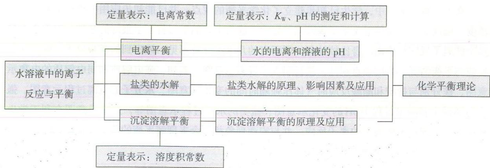

<table><tr><td>第一节</td><td>电离平衡</td><td>2课时</td></tr><tr><td>第二节</td><td>水的电离和溶液的pH</td><td>2课时</td></tr><tr><td>第三节</td><td>盐类的水解</td><td>2课时</td></tr><tr><td>第四节</td><td>沉淀溶解平衡</td><td>2课时</td></tr><tr><td>实验活动2</td><td>强酸与强碱的中和滴定</td><td>1课时</td></tr><tr><td>实验活动3</td><td>盐类水解的应用</td><td>1课时</td></tr><tr><td>全章复习</td><td></td><td>1课时</td></tr></table>

本章内容在选择和编排上有以下特点。

## 1. 突出粒子观、变化观、平衡观等学科观念，核心素养外显

本章内容在编写时，围绕水溶液中的离子反应这一核心知识，帮助学生建构粒子观、变化观、平衡观等学科观念，引导学生从溶液中存在的粒子、粒子间发生的变化、粒子间建立的平衡等视角认识水溶液中的反应。

例如，在水的电离部分，教材既给出了水的电离方程式，又给出了水分子电离的微观过程示意图，突出了粒子观。

又如，对于盐类水解的介绍，教材从探究氯化钠、碳酸钠等7种盐溶液的酸碱性入手，通过对实验现象的分析和讨论，引导学生归纳出盐溶液的酸碱性与组成该盐的酸和碱的强弱之间的关系，以符号表征盐溶液中粒子间发生的反应及建立的平衡，引导学生从微观层面理解盐溶液呈酸碱性的本质，形成思维模型。这样的呈现方式容易激发学生主动参与学习过程，启发思维，培养其证据推理意识。

再如，在沉淀的溶解与转化部分，教材同样是引导学生从微观层面认识沉淀溶解及转化的本质，强化粒子观、变化观和平衡观。

在章末的“整理与提升”部分，教材归纳了水溶液中离子反应与平衡的认识思路，并以醋酸、氯化铵、氯化银等具体物质为载体，帮助学生回顾水溶液中的离子反应与平衡，提炼学科观念和思维方法。

## 2. 将理论知识与实际应用相结合

本章涉及的化学理论的应用内容较丰富，呈现方式多样，在正文、“科学·技术·社会”“研究与实践”“练习与应用”等栏目均有体现。例如，从盐酸与醋酸在生活中用途的差异引入强、弱电解质的概念；结合溶液的酸碱性等知识，教材介绍了测量和调控溶液pH的实际意义，以及人体血液的酸碱平衡等知识；结合盐类的水解，教材介绍了利用盐类水解的原理净水、制备氧化物等；结合沉淀溶解平衡，教材展示了化学沉淀法处理废水的工艺流程，介绍了锅炉中除去水垢的方法，以“科学·技术·社会”栏目的形式介绍了氟化物预防龋齿的化学原理；等等。这些既体现了化学理论的应用价值，又有助于激发学生的学习兴趣。

## 3. 将抽象的内容图示化

在上一章的学习中，学生已初步建立了化学平衡的观点，并已能初步应用平衡移动原理说明浓度、温度等反应条件对化学平衡移动的影响，这为本章的学习打下了很好的基础。但由于水溶液中的离子反应与平衡本身比较抽象，所研究的几乎都是看不见、摸不到的微观分子、离子间的反应与平衡情况。为增加直观性，教材引入了很多示意图。例如，强电解质和弱电解质的电离示意图、镁分别与盐酸和醋酸反应时气体压强随时间的变化示意图、水分子的电离过程示意图、强酸与强碱中和滴定过程中pH的变化示意图、盐类的水解过程示意图等，这些示意图有利于学生从微观层面理解水溶液中的离子反应，并与宏观现象相结合来理解平衡的建立及移动过程，从而降低学习的难度，减少理论学习的枯燥感。

## 二、学业要求

1. 能用化学用语正确表示水溶液中的离子反应与平衡，能通过实验证明水溶液中存在离子平衡，能举例说明离子反应与平衡在生产、生活中的应用。

2. 能从电离、离子反应、化学平衡的角度分析溶液的性质，如酸碱性、导电性等。

3. 能进行溶液 $\mathrm{pH}$ 的简单计算, 能正确测定溶液的 $\mathrm{pH}$ , 能调控溶液的酸碱性。能选择实例说明溶液 $\mathrm{pH}$ 的调控在工农业生产和科学研究中的重要作用。

4. 能综合运用离子反应、化学平衡原理，分析和解决生产、生活中有关电解质溶液的实际问题。

## 三、课时建议

## 第一节 电离平衡

## 一、内容分析

本节教材共分为三部分：强、弱电解质的概念，弱电解质电离平衡的建立，电离平衡常数。这三部分内容间的关系如下。

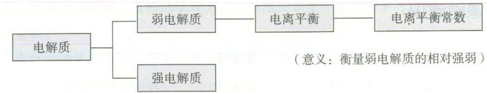  
（依据：电解质是否全部电离）

教材从盐酸与醋酸在生活中用途的差异引入，通过对比实验让学生从宏观上认识相同体积、相同浓度的盐酸与醋酸的性质差异；通过展示二者在水中的电离示意图，从微观层面引导学生关注它们电离时的差异，由此形成强、弱电解质的概念。

弱电解质的电离平衡是本章知识的核心，也是本节的重点。学生在上一章的学习中已经建立了化学平衡的概念，因此教材直接将化学平衡的知识迁移来学习电离平衡。教材使用“与其他化学平衡一样，当浓度、温度等条件改变时，电离平衡会发生移动”的过渡语，引导学生用类比的方法认识浓度等对电离平衡的影响。

对于电离平衡常数概念的介绍，教材在编写时同样采用类比其他化学平衡的方法，引导学生了解电离平衡常数的意义、影响电离平衡常数大小的因素，以及电离平衡常数的大小与弱电解质相对强弱的关系。同时，教材采用多种方式促使学生学会运用电离平衡常数解决问题。例如，通过例题讲解让学生进一步熟悉电离平衡常数表达式，学会计算电离平衡常数；通过实验及对实验现象的分析帮助学生得出“相同温度下，不同种弱酸，电离平衡常数越大，意味着其电离程度越大，酸性越强”的结论。

教材中的“思考与讨论”栏目起到了画龙点睛的作用。在该栏目中，镁分别与盐酸、醋酸反应时气体压强随时间的变化曲线图非常直观，一方面让学生“看”到了醋酸电离平衡移动的过程，另一方面显示了强、弱电解质的差异，同时通过最终所得气体体积相等这个事实，得出“等浓度、等体积的盐酸和醋酸所含氢离子的总的物质的量相等”的结论，由此使学生突破本节学习的难点。

## 二、教学目标

## 1. 教学目标

（1）通过对电解质进行分类，进一步掌握物质分类的方法，并能从微观层面理解强、弱电解质的本质区别。

（2）认识弱电解质的电离平衡，能运用电离平衡描述和解释化学现象，并预测可能的结果，树立对立统一、联系发展和动态平衡的观点。

(3) 建构电离平衡常数模型, 并能应用模型解释弱电解质在水溶液中发生的变化。

## 2. 教学重点和难点

(1) 重点: 弱电解质的电离平衡和电离平衡常数。

(2) 难点: 弱电解质的电离平衡。

## 三、教学建议

1. 利用 “POE”（预测、观察、解释）教学策略，自主建构强、弱电解质的概念

本节内容在教学时可以利用实验3-1引入，让学生通过对比相同浓度的盐酸和醋酸的pH、导电能力及与镁条反应的现象，推理得出盐酸中的HCl完全电离、醋酸中的 $CH_{3}COOH$ 部分电离的事实，引导学生从微观的角度思考盐酸与醋酸的区别，进而得出强电解质与弱电解质的概念。

教学时也可以从物质分类的角度引入，为强电解质与弱电解质的判断埋下伏笔。具体思路为：从物质的分类出发得出概念，然后初步运用概念解决简单问题，再利用“POE”教学策略灵活运用概念解决实际问题。教学过程如下。

环节一、从分类的角度得出概念。

首先，让学生明确，依据不同的标准，化合物有多种分类方法。

例如：

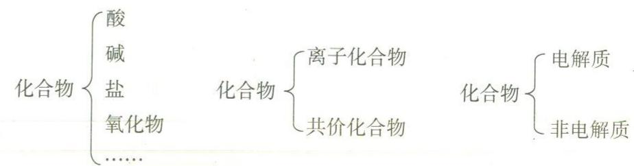

然后指出，依据电解质在水溶液中是否完全电离，可以将电解质分为强电解质与弱电解质。环节二、初步运用概念解决简单问题。

教师可引导学生阅读教材中的图3-1（HCl在水中电离示意图）、图3-2（ $\mathrm{CH}_3\mathrm{COOH}$ 在水中电离示意图），判断HCl与 $\mathrm{CH}_3\mathrm{COOH}$ 分别是强电解质还是弱电解质。环节三、利用“POE”教学策略灵活运用概念。

教师可让学生依据强电解质与弱电解质的概念，先预测实验3-1的现象，之后完成实验，并对实验现象进行解释，最终得出结论。这中间渗透证据推理意识的培养。

对于接受能力较强的学生，教师可以组织其讨论强、弱电解质与离子化合物和共价化合物，或与酸、碱、盐、氧化物等化合物之间的关系。

在教学中，教师应注意引导学生关注电解质的强与弱和导电能力的强与弱之间的差异。可以围绕“醋酸与盐酸的导电能力谁更强”这一问题让学生展开讨论。要使学生明确，电解质的强与弱是指电解质在水中的电离程度，而不是在水溶液中的导电能力；导电能力的强与弱还要考虑电解质的浓度等因素。由此学生可以理解硫酸钡等强电解质的溶解度小，使得溶质浓度小，故硫酸钡溶液导电能力弱。

## 2. 从化学平衡出发学习电离平衡

## (1) 建构电离平衡

教师可让学生回顾教材第二章中的图2-5，尝试运用化学平衡理论来学习电离平衡。以醋酸为例，分析弱电解质在水中达到电离平衡的过程中，溶液中溶质的分子、离子浓度的变化情况，并绘制出溶液中溶质分子、离子浓度随时间变化的曲线图，理解弱电解质的电离平衡建构过程。

## (2) 认识电离平衡的移动

教师可组织学生利用勒夏特列原理进行讨论，改变浓度等反应条件时对电离平衡产生的影响，分析向氨水中加入 $NH_{4}Cl$ 或向 $CH_{3}COOH$ 溶液中加入 $CH_{3}COONa$ 时，溶液中各种粒子浓度的变化。

有条件的学校可以利用pH传感器测定浓度等反应条件的变化对溶液pH产生的影响，用图像进行表征，让学生更加清晰地观察反应条件对电离平衡的影响。例如，同时将0.1 mol/L盐酸和0.1 mol/L醋酸中溶质的浓度稀释到原浓度的 $\frac{1}{10}$ ，用pH传感器测得的稀释过程中溶液pH的变化如图3-1所示。

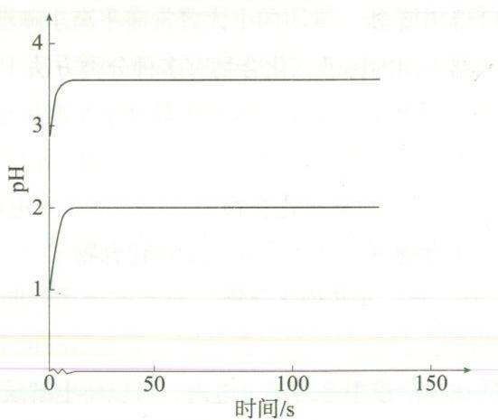  
图 3-1 盐酸和醋酸稀释过程中溶液的 pH 随时间的变化示意图

可以围绕图3-1引导学生讨论以下问题。

① 哪条曲线代表盐酸稀释过程中的pH变化？哪条曲线代表醋酸稀释过程中的pH变化？你

的理由是什么？

② 分别将 0.1 mol/L 盐酸和 0.1 mol/L 醋酸中溶质的浓度稀释到原浓度的 $\frac{1}{10}$ 后，二者的 pH 各变化了多少？为什么？

③你对该实验中两种溶液pH的变化还能提出其他问题吗？

## 3. 将化学平衡常数迁移到电离平衡常数的学习中

电离平衡常数的学习可以结合化学平衡常数来进行，同时应强调电离平衡常数也仅与温度有关。为加深学生对这一问题的理解并熟悉电离平衡常数的计算方法，可以用前面测定的0.1 mol/L醋酸的pH，以及将其溶质的浓度稀释到原浓度的 $\frac{1}{10}$ 后再次测定的pH来计算平衡常数，由于学生是利用自己测得的实验数据进行计算，感受深刻。电离平衡常数的意义，即在相同温度下 $K_{a}$ 越大，酸性越强，则可以结合教材中的实验3-2加以说明。

对于接受能力较强的学生，教学中也可以运用 $K_{a}$ 与Q的关系讨论浓度等反应条件的变化对电离平衡的影响。

需要指出的是，在多元弱酸或多元弱碱的电离平衡常数表达式中，每种粒子的浓度指的是体系中该粒子的总浓度。例如， $\mathrm{H}_{2} \mathrm{CO}_{3}$ 发生两步电离，这两步电离的电离平衡常数表达式分别为： $K_{\mathrm{a}_{1}} = \frac{c(\mathrm{H}^{+}) \cdot c(\mathrm{HCO}_{3}^{-})}{c(\mathrm{H}_{2} \mathrm{CO}_{3})}$ ， $K_{\mathrm{a}_{2}} = \frac{c(\mathrm{H}^{+}) \cdot c(\mathrm{CO}_{3}^{2-})}{c(\mathrm{HCO}_{3}^{-})}$ ，其中的 $c(\mathrm{H}^{+})$ 、 $c(\mathrm{HCO}_{3}^{-})$ 均是指该体系中总的 $c(\mathrm{H}^{+})$ 、 $c(\mathrm{HCO}_{3}^{-})$ 。

## 四、栏目使用建议

## 1. 实验

【实验3-1】

该实验的目的是让学生通过对三组实验现象的观察和分析，理解强、弱电解质在水溶液中电离的差异。

实验注意事项如下。

(1) 建议用 $\mathrm{pH}$ 计测定两种酸的 $\mathrm{pH}$ 。

（2）导电能力的实验可以借助小灯泡来完成。要注意控制实验中的变量，如电压要相同，两电极间的距离要相等。

(3) 镁与酸的反应是放热的, 对实验会产生一定的影响, 因此镁的量要少, 使其与酸在短时间内反应完全。分别取两段长 $1 \mathrm{~cm}$ 、用砂纸打磨过的镁条进行实验, 即可观察到明显现象。有条件的学校可以用压强传感器测量产生氢气的压强, 并以曲线图的形式记录下来, 为解决本节教材最后的 “思考与讨论” 栏目中的问题打下基础。用压强传感器进行实验时, 所取酸的体积要小, $2 \mathrm{~mL}$ 即可, 向其中加入稍过量的镁, 最终容器内的压强相等。

实验现象：

<table><tr><td>酸</td><td>0.1 mol/L盐酸</td><td>0.1 mol/L醋酸</td></tr><tr><td>pH</td><td>1</td><td>约为3</td></tr><tr><td>导电能力</td><td>强</td><td>弱</td></tr><tr><td>与镁条反应</td><td>迅速产生大量气泡</td><td>产生气泡相对缓慢</td></tr></table>

【实验3-2】

该实验的目的是比较醋酸和碳酸的酸性强弱。

该实验操作较简单，对碳酸钠溶液中溶质的浓度没有特别的要求，观察到有气泡产生即可。
向盛有 $2 \, mL \, 1 \, mol/L$ 醋酸的试管中滴加 $1 \, mol/L \, Na_{2}CO_{3}$ 溶液，可以观察到有大量气泡产生。由此可以推测出醋酸的酸性比碳酸的强， $CH_{3}COOH$ 的 $K_{a}$ 大于 $H_{2}CO_{3}$ 的 $K_{a_{1}}$ 。

## 2. 思考与讨论

（1）等质量的镁分别与体积相同、物质的量浓度相同的盐酸和醋酸反应时，与盐酸反应的速率大，与醋酸反应的速率小。

（2）过量的镁分别与体积相同、物质的量浓度相同的盐酸和醋酸反应时，生成氢气的体积相同。

## 五、练习与应用参考答案及说明

1. $K_{\mathrm{a}}(\mathrm{HF}) > K_{\mathrm{a}}(\mathrm{HNO}_{2}) > K_{\mathrm{a}}(\mathrm{HCN})$

2. 逆反应方向 正反应方向 逆反应方向

3. B

4.（1）冰醋酸中不存在自由移动的离子 （2）b<a<c （3）c （4）②④

5.(1) 错。导电能力的强弱主要取决于溶液中自由移动离子的浓度大小与离子所带的电荷数。

（2）错。等体积、等物质的量浓度的盐酸与醋酸中所含 $H^{+}$ 的总的物质的量是相等的，中和它们所需氢氧化钠的物质的量一样多。

(3) 错。氢氧化钠是强电解质, 将其溶液中溶质的浓度稀释至原来的 $\frac{1}{2}$ , $c(\mathrm{OH}^{-})$ 减少为原来的 $\frac{1}{2}$ ; 一水合氨是弱电解质, 稀释会促进一水合氨的电离, 将其溶液中溶质的浓度稀释至原来的 $\frac{1}{2}$ , $c(\mathrm{OH}^{-})$ 的减少不足原来的 $\frac{1}{2}$ 。

(4) 错。盐酸是强酸, HCl完全电离, $c(\mathrm{H}^{+})$ 等于 $c(\mathrm{HCl})$ ; 醋酸是弱酸, $\mathrm{CH}_{3} \mathrm{COOH}$ 在水中部分电离, $c(\mathrm{H}^{+})$ 小于 $c(\mathrm{CH}_{3} \mathrm{COOH})$ 。所以如果盐酸中溶质的浓度是醋酸中溶质浓度的2倍, 则盐酸中的 $c(\mathrm{H}^{+})$ 大于醋酸中 $c(\mathrm{H}^{+})$ 的2倍。

(5) 错。磷酸钠是强电解质, 在水中完全电离; 磷酸是弱电解质, 在水中部分电离, 且电离分步进行, $\mathrm{PO}_{4}^{3-}$ 来自磷酸的非常微弱的第三步电离。所以当物质的量浓度相同时, 磷酸钠溶液中所含 $\mathrm{PO}_{4}^{3-}$ 的浓度比磷酸中所含 $\mathrm{PO}_{4}^{3-}$ 的浓度大。

6.（1） $CH_{3}COOH$ 的电离平衡常数不发生变化。因为弱电解质的电离平衡常数只与温度有关，温度不发生变化，电离平衡常数不变。

(2) $c(\mathrm{H}^{+}) = 4.18 \times 10^{-4} \, \mathrm{mol/L}$ 。

## 第二节 水的电离和溶液的pH

## 一、内容分析

最常见的溶液是水溶液，在水溶液中发生的酸碱中和反应是常见的化学反应之一，溶液的酸碱性在很大程度上影响着许多化学反应及其在生产和生活中的应用。水的电离及电离平衡移动的知识，对于学生了解溶液的酸碱性及pH具有重要意义，也为下一节学习盐类的水解及第四章电化学的知识奠定基础。

本节内容分为三部分：水的电离、溶液的酸碱性与pH、酸碱中和滴定，它们之间的关系如下。

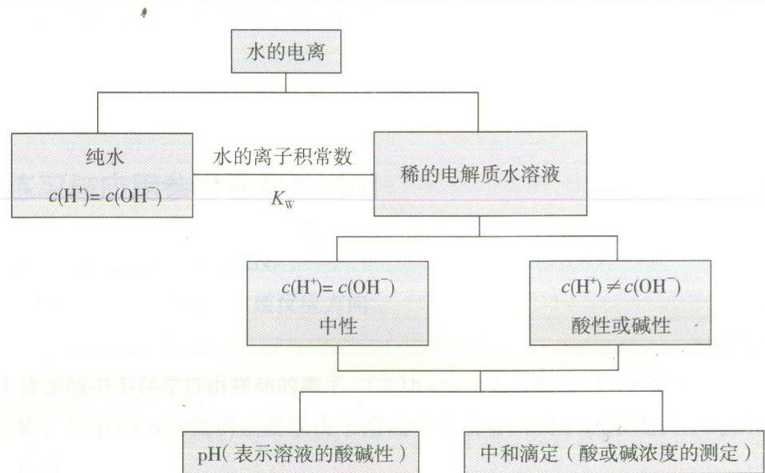

教材以水的电离作为突破口，直接说明水是一种极弱的电解质，能发生微弱的电离，并存在电离平衡，由此引出水的离子积常数。教材中表3-1中的数据可以让学生体会温度对水的电离平衡的影响。

在溶液的酸碱性与pH部分，教材首先设计了“思考与讨论”栏目，通过对问题的分析引导学生关注酸或碱的稀溶液中 $c(\mathrm{H}^{+})$ 和 $c(\mathrm{OH}^{-})$ 的相对大小，为理解pH的大小与溶液酸碱性的关系进行铺垫。在溶液pH的介绍中，教材按照pH的概念、pH的大小与溶液酸碱性的关系、溶液pH的测定方法和pH的应用这一顺序展开。为了扩大学生视野，教材以“资料卡片”的形式介绍了pH的测定方法，以图示和表格的方式介绍了pH与农业生产的密切关系，以“科学·技术·社会”栏目的方式介绍了人体血液内存在的酸碱平衡，这些内容理论联系实际，突出了pH的应用。

教材通过介绍酸碱中和滴定，突出了运用定量方法研究化学反应的视角。这部分内容涉及中和滴定的原理、所用仪器、中和滴定过程中溶液的酸碱性与pH的动态变化等方面。通过中和滴定曲线图，让学生清晰地看到滴定过程中溶液pH的变化；通过“资料卡片”，向学生介绍中和滴定过程中指示剂发生颜色变化的原理；通过例题分析，让学生了解中和滴定实验中数据的分析和处理方法；通过“方法导引”栏目，让学生理解定性分析与定量分析，关注科学方法。这部分内容既体现了pH的应用，又为后面的实验活动打下基础。

## 二、教学目标

## 1. 教学目标

（1）认识水的电离平衡，了解水的离子积常数；能运用弱电解质的电离模型分析水的电离，发展应用模型解决问题的能力。

（2）认识溶液的酸碱性与pH的关系，会计算溶液的pH，了解溶液pH的调控在工农业生产和科学研究中的应用。

（3）能正确测定溶液的pH；能通过酸碱中和滴定的方法测定酸或碱的浓度；掌握数据分析与处理的方法，培养定量研究的意识。

## 2. 教学重点和难点

（1）重点：pH与溶液酸碱性的关系；酸碱中和滴定实验的操作技能。

(2) 难点: 准确判断酸碱中和滴定的终点。

## 三、教学建议

## 1. 运用弱电解质电离模型分析水的电离

水是弱电解质。教学中可以结合 $CH_{3}COOH$ 的电离，对水的电离进行讨论。可围绕几组问题展开教学。

第一组问题包括以下内容。

（1）水可以电离出哪些离子？写出水的电离方程式。

（2）向水中加入酸，水的电离平衡向哪个方向移动？水电离出的 $c(\mathrm{H}^{+})$ 和 $c(\mathrm{OH}^{-})$ 及溶液中的 $c(\mathrm{H}^{+})$ 如何改变？为什么？

（3）向水中加入碱，水的电离平衡向哪个方向移动？水电离出的 $c(\mathrm{H}^{+})$ 和 $c(\mathrm{OH}^{-})$ 及溶液中的 $c(\mathrm{OH}^{-})$ 如何改变？为什么？

设计这些问题的目的是让学生认识酸、碱对水的电离平衡的影响，理解酸中水电离出的 $c(\mathrm{H}^{+})$ 、酸电离出的 $c(\mathrm{H}^{+})$ 及溶液中的 $c(\mathrm{H}^{+})$ 三者间的关系，或碱中水电离出的 $c(\mathrm{OH}^{-})$ 、碱电离出的 $c(\mathrm{OH}^{-})$ 及溶液中的 $c(\mathrm{OH}^{-})$ 三者间的关系。

第二组问题包括以下内容。

(1) 纯水中 $c(\mathrm{H}^{+}) \cdot c(\mathrm{OH}^{-})$ 是定值吗？为什么？

（2）向水中加入酸后，水电离出的 $c(\mathrm{H}^{+})$ 与 $c(\mathrm{OH}^{-})$ 的乘积如何变化？为什么？溶液中的 $c(\mathrm{H}^{+})$ 与 $c(\mathrm{OH}^{-})$ 的乘积又如何变化？为什么？

（3）向水中加入碱后，水电离出的 $c(\mathrm{H}^{+})$ 与 $c(\mathrm{OH}^{-})$ 的乘积如何变化？为什么？溶液中的 $c(\mathrm{H}^{+})$ 与 $c(\mathrm{OH}^{-})$ 的乘积又如何变化？为什么？

设计这些问题的目的是让学生认识水的离子积常数及表达式中 $c(\mathrm{H}^{+})$ 与 $c(\mathrm{OH}^{-})$ 的含义，明确在一般情况下，酸或碱中水电离出的 $c(\mathrm{H}^{+})$ 或 $c(\mathrm{OH}^{-})$ 与酸电离出的 $c(\mathrm{H}^{+})$ 或碱电离出的 $c(\mathrm{OH}^{-})$ 相比比较小，可以忽略。如果学生理解有困难，可以借助向醋酸中加入醋酸钠进行类比， $CH_{3}COOH$ 电离平衡常数表达式中的 $c(\mathrm{CH}_{3}\mathrm{COO}^{-})$ 是指体系中总的 $c(\mathrm{CH}_{3}\mathrm{COO}^{-})$ ，而不是 $CH_{3}COOH$ 电离出的 $c(\mathrm{CH}_{3}\mathrm{COO}^{-})$ 。

第三组问题针对教材中的表3-1“不同温度下水的离子积常数”展开。

（1）温度的变化对 $K_{w}$ 产生什么影响？

(2) 依据表中的数据分析水的电离是吸热还是放热, 说出理由。

(3) 计算在 $25^{\circ} \mathrm{C}$ 和 $100^{\circ} \mathrm{C}$ 时纯水中的 $c(\mathrm{H}^{+})$ 、 $c(\mathrm{OH}^{-})$ 分别是多少。

设计这些问题的目的是让学生认识水的离子积常数与温度之间的关系，为下一环节的学习打下基础。

## 2. 利用学生的认知冲突，重新建构溶液酸碱性与 $\mathrm{pH}$ 的关系

学生已经习惯用比较pH与7大小的方法判断溶液的酸碱性。教师可以利用这一点设置教学情境，使学生产生认知冲突，并重新建构溶液的酸碱性与pH的关系。例如，先明确纯水为中性（仅改变温度，纯水仍为中性），然后给出 $pH = -\lg c(H^{+})$ 这一公式，让学生分别计算25℃和100℃时纯水的pH后，得出虽然二者的pH不同，但均为中性的结论。之后引导学生从微观的角度分析在不同温度下的纯水中 $c(H^{+})$ 与 $c(OH^{-})$ 关系，总结共性，得出结论： $c(H^{+}) = c(OH^{-})$ ，溶液呈中性； $c(H^{+}) > c(OH^{-})$ ，溶液呈酸性；而 $c(H^{+}) < c(OH^{-})$ ，溶液呈碱性。由此，学生可以理解pH仅是 $c(H^{+})$ 的表征方式之一，而溶液酸碱性取决于溶液中 $c(H^{+})$ 与 $c(OH^{-})$ 的相对大小。此时，教师要追问，是否还可以比较pH与7的大小来判断溶液的酸碱性呢？目的是强调其使用是有条件的。

## 3. 理解滴定本质，重视滴定实验操作

酸碱中和滴定实验是中学化学中为数不多的定量实验，教学中如果简单处理为给出实验步骤，让学生练习滴定实验操作，就会成为以锻炼实验技能为主的课堂教学。酸碱中和滴定实验是其他滴定实验的基础，教学中要以滴定目的为出发点，紧紧围绕准确测定溶液中溶质的浓度这一根本任务，在实验前引导学生围绕滴定的原理、如何找到滴定终点、指示剂的作用、可能产生误差的实验操作等问题进行思考。

教学中也可以围绕以往实验中使用的常规仪器和本实验中的新仪器——酸（碱）式滴定管的精确度差异展开。教师可以给学生提供0.100 0 mol/L盐酸、未知浓度的NaOH溶液、酚酞溶液、胶头滴管、量筒等实验用品，组织学生讨论准确测定NaOH溶液中NaOH浓度的实验方案。如果方案设计有难度，可以尝试让学生解决以下问题。

## (1) 反应无明显现象时, 如何判断反应是否完全?

可以提示学生思考：盐酸和氢氧化钠溶液恰好完全反应时所得溶液中溶质是什么？所得溶液的pH是多少？提供的酚酞溶液有何作用？

## (2) 如何测得实验中消耗酸的体积?

可以提示学生思考：可否用量筒先测量反应前酸的体积，再测量反应后酸的体积？测量中胶头滴管能起什么作用？

设计这些问题的目的是引导学生理解滴定原理，同时让学生知道利用量筒与胶体滴管的组合也可以完成实验，但操作烦琐、精确度不高。解决问题的方法是实验仪器的创新，由此引入滴定管，之后教师再给学生介绍滴定管使用时的注意事项等。有条件的学校可在介绍酸式滴定管与碱式滴定管差别的基础上，介绍使用聚四氟乙烯活塞的滴定管，让学生了解随着材料的发展，仪器也在不断更新，进一步培养学生的创新意识。

本实验的难点不是实验操作，而是对滴定终点的理解。强酸与强碱恰好反应时，所得溶液的pH应为7，但在实验中，实际滴定终点的pH却不等于7，对于这一点，学生难以理解。在教学中，教师可以结合实验活动2的“问题和讨论3”，即在NaOH溶液滴定盐酸的过程中，绘制溶液的pH随NaOH溶液体积变化的曲线图，引导学生理解：当接近滴定终点时，滴加很少的NaOH溶液，溶液的pH变化会很大。因此，用酚酞溶液做指示剂，虽然存在误差，但误差很小，可以忽略不计。

有条件的学校可以利用滴数传感器、pH传感器等完成酸碱中和滴定实验，在计算机屏幕上可以直接呈现滴定过程中pH的变化曲线（如图3-2）。实验结束后可以利用数据回放功能，当接近滴定终点时，放慢滴加液体的速度，让学生更清晰地看到接近滴定终点时，滴加半滴溶液就可以使溶液的pH发生很大变化。

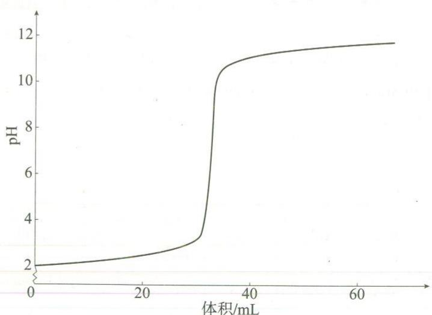  
图 3-2 NaOH 溶液滴定盐酸过程中 pH 的变化曲线图

本实验还具有一个重要功能，就是让学生学会记录并处理实验数据，学会用取平均值的方法减小实验误差。教学中可以结合教材中的例题进行分析。

## 四、栏目使用建议

## 思考与讨论

本栏目的目的是让学生运用化学平衡移动原理，分析纯水及向纯水中加入酸或碱后， $c(\mathrm{H}^{+})$ 、 $c(\mathrm{OH}^{-})$ 的值或变化趋势。还可以追问，向水中加入酸或碱后 $K_{w}$ 是否改变？引导学生从水的离子积常数来思考。例如，温度不变， $K_{w}$ 不变；加入酸后 $c(\mathrm{H}^{+})$ 增大，则 $c(\mathrm{OH}^{-})$ 减小；加入碱后 $c(\mathrm{OH}^{-})$ 增大，则 $c(\mathrm{H}^{+})$ 减小。

(1)酸性溶液中存在 ${\mathrm{{OH}}}^{ - }$ ,碱性溶液中存在 ${\mathrm{H}}^{ + }$ ,因为在水溶液中存在 ${\mathrm{H}}_{2}\mathrm{O} \rightleftharpoons  {\mathrm{H}}^{ + } + {\mathrm{{OH}}}^{ - }$ 。

(2)

<table><tr><td>体系</td><td>纯水</td><td>向纯水中加入少量盐酸</td><td>向纯水中加入少量氢氧化钠溶液</td></tr><tr><td> $c(H^{+})$ </td><td> $10^{-7}$ mol/L</td><td>增大</td><td>减小</td></tr><tr><td> $c(OH^{-})$ </td><td> $10^{-7}$ mol/L</td><td>减小</td><td>增大</td></tr><tr><td> $c(H^{+})$ 和 $c(OH^{-})$ 的大小比较</td><td> $c(H^{+})=c(OH^{-})=10^{-7}$ mol/L</td><td> $c(H^{+})>c(OH^{-})$ </td><td> $c(H^{+})<c(OH^{-})$ </td></tr></table>

## 五、练习与应用参考答案及说明

1. $NH_{3}$ 、 $NH_{3}\cdot H_{2}O$ 、 $H_{2}O$ 、 $NH_{4}^{+}$ 、 $H^{+}$ 、 $OH^{-}$ $Cl_{2}$ 、HClO、 $ClO^{-}$ 、 $Cl^{-}$ 、 $H^{+}$ 、 $OH^{-}$ 、 $H_{2}O$

2. ③＜④＜①＜② ②＜①＜④＜③

3. (1) $10^{-5} \mathrm{~mol} / \mathrm{L}$ (2) d

4. 前者＜后者 $CH_{3}COOH$ 为弱电解质，当 pH 相同时， $CH_{3}COOH$ 的浓度远大于 HCl 的浓度，因此在体积相同时，中和 $CH_{3}COOH$ 溶液所消耗 NaOH 的物质的量远大于中和 HCl 溶液所消耗 NaOH 的物质的量

5. D

6.

<table><tr><td>物品</td><td>醋</td><td>酱油</td><td>白酒</td><td>洗涤灵</td><td>“84”消毒液</td><td>洗发液</td><td>洁厕灵</td><td>洗衣液</td><td>柔软剂</td></tr><tr><td>pH</td><td>5.5</td><td>6.5</td><td>7.0</td><td>7.5</td><td>6.0</td><td>7.5</td><td>1.7</td><td>8.2</td><td>6.0</td></tr><tr><td> $\frac{c(\mathrm {H}^{+})}{(\mathrm {mol}\cdot\mathrm {L}^{-1})}$ </td><td> $10^{-5.5}$ </td><td> $10^{-6.5}$ </td><td> $10^{-7}$ </td><td> $10^{-7.5}$ </td><td> $10^{-6}$ </td><td> $10^{-7.5}$ </td><td> $10^{-1.7}$ </td><td> $10^{-8.2}$ </td><td> $10^{-6}$ </td></tr></table>

(注意: 不同品牌、不同生产厂家、不同批次的物品测出的pH略有不同。)

7.（1）所测土壤的pH起始时为4，呈酸性（2）10 $10^{-4}$ mol/L（3）9 mL

## 第三节 盐类的水解

## 一、内容分析

盐类的水解涉及的知识较多，是电解质的电离、水的电离平衡和水的离子积、溶液的酸碱性，以及平衡移动原理等知识的综合应用。本节的内容框架如下图所示。

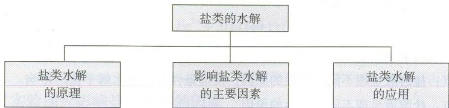

教材首先结合学生的生活经验提出问题: $Na_{2}CO_{3}$ 是日常生活中常用的盐, 为什么可被当作碱使用呢? 以此引入盐类水解的学习。

教材以 “探究” 的形式，引导学生通过实验测试盐溶液的酸碱性，并根据实验结果归纳盐溶液的酸碱性与盐的类型之间的关系。这样不仅使学生认识盐溶液的酸碱性，而且将盐溶液的酸碱性与盐的组成联系起来，为分类讨论盐类的水解奠定基础。

在介绍盐类水解的原理时，教材以 $NH_{4}Cl$ 溶液为例，讨论 $NH_{4}Cl$ 在水中电离出的 $NH_{4}^{+}$ 与水电离出的 $OH^{-}$ 结合生成 $NH_{3} \cdot H_{2}O$ （弱电解质）对水的电离平衡产生的影响，明确 $NH_{4}Cl$ 溶液呈酸性的原因。在此基础上，以“思考与讨论”的形式，引导学生举一反三，分析 $CH_{3}COONa$ 溶液呈碱性的原因。此外，教材对 $Na_{2}CO_{3}$ 分步水解的情况也进行了介绍，这样能够帮助学生全面理解盐类水解的原理。最后，教材对强酸弱碱盐溶液呈酸性、强碱弱酸盐溶液呈碱性、强酸强碱盐溶液呈中性的原因进行了总结。这部分内容是本节的教学重点。

在讨论影响盐类水解的因素时，教材突出了研究化学反应的两个视角——反应物的性质（盐的性质）和反应条件（温度、浓度等）。在学生已经具备化学平衡知识的基础上，教材以“探究”的形式引导学生讨论反应条件对 $FeCl_{3}$ 水解平衡的影响。该“探究”将理论分析、实验设计、对实验现象的观察及解释相结合，具有一定的开放性。

对于盐类水解的应用，教材侧重介绍了人们如何运用盐类水解的原理、反应条件对盐类水解的影响来解决实际问题，突出化学原理的应用价值。

本节内容的特点是与学生前面所学习的知识联系紧密，有一定的综合性。在编排思路上，教材注意从宏观现象（不同盐溶液的pH）入手，从溶液中存在的粒子、粒子之间的反应、水解平衡的建立及其移动等微观视角，引导学生逐步认识盐类水解的原理。在呈现方式上，教材设计了“探究”和“思考与讨论”等多种活动形式，注意引导学生综合运用学过的知识，分析盐类水解

## 二、教学目标

## 1. 教学目标

(1) 通过实验探究盐溶液的酸碱性, 认识盐的类型与其溶液酸碱性之间的关系。

(2) 能分析盐溶液呈现不同酸碱性的原因, 认识盐类水解的原理及盐溶液呈现酸碱性的规律。

（3）能通过实验探究温度、浓度对盐类水解平衡的影响，认识影响盐类水解平衡的主要因素，并能解释反应条件影响盐类水解平衡的原因。

（4）能列举盐类水解在实际生产、生活和科学研究中的应用实例，并依据盐类水解的原理进行解释，体会化学原理的应用价值。

## 2. 教学重点和难点

(1) 重点: 盐溶液呈现不同酸碱性的原因; 反应条件对盐类水解平衡的影响。

(2) 难点: 盐溶液呈现不同酸碱性的原因。

## 三、教学建议

1. 宏观与微观相结合，探究盐溶液呈现不同酸碱性的原因

本部分内容可以按以下环节展开教学。

教学中可以直接通过“探究”栏目入手，让学生用pH计（或pH传感器）测定并记录不同盐溶液的pH，再对盐的类型进行分析，结合实验结果，归纳出盐溶液的酸碱性与盐的类型之间的关系。得出结论后，可让学生运用结论对其他盐溶液的酸碱性进行预测，再通过实验证实，形成从证据到结论、再到实践的分析思路。在学生形成感性认识后，教师可以带领学生结合“思考与讨论”栏目，以氯化铵溶液为例，围绕以下问题从微观角度进行讨论。

(1) 氯化铵溶液中存在哪些电离过程？水电离出的 $c(\mathrm{H}^{+})$ 与 $c(\mathrm{OH}^{-})$ 大小关系如何？

(2) 电离出来的离子之间是否会结合成新的粒子？为什么？

(3) 水的电离平衡是否受到影响? 影响的结果是什么? 这个结果与实验所测得的溶液酸碱性是否一致?

经过上述讨论后，再引导学生分析醋酸钠等其他盐发生水解的过程，最终形成如下盐类水解的分析模型。

盐 $\rightarrow$ 弱酸阴离子 弱碱阳离子 $\leftarrow$ 盐 $\quad \quad \quad \quad \quad \quad \quad \quad \quad \quad \quad \quad \quad \quad \quad \quad \quad \quad \quad \quad \quad \quad \quad \quad \quad \quad \quad \quad \quad \quad \quad \quad \quad \quad \quad \quad \quad \quad \quad \quad \quad$ 弱酸 弱碱

在此基础上，可让学生尝试归纳以下问题。

(1) 什么是盐类的水解?

(2) 盐类水解的实质是什么?

(3) 盐类的水解与酸碱中和反应有什么关系?

(4) 盐类的水解有何规律?

碳酸钠的水解较复杂，其水解是分步进行的，可以结合碳酸的分步电离让学生理解 $CO_{3}^{2-}$ 的分步水解。同时要强调多元弱碱对应的离子，水解虽然也是分步进行的，但为了简化，往往直接写出。例如， $Fe^{3+}$ 水解的离子方程式为： $\mathrm{Fe}^{3+} + 3\mathrm{H}_{2}\mathrm{O} \rightleftharpoons \mathrm{Fe(OH)}_{3} + 3\mathrm{H}^{+}$ ，这可以为探究“反应条件对 $FeCl_{3}$ 水解平衡的影响”打下基础。

## 2. 通过实验探究影响盐类水解的因素

研究盐类的水解应该从内因与外因两个角度入手。关于内因的影响，可以通过实验帮助学生理解。例如，用pH计分别测量物质的量浓度相同的醋酸钠溶液、甲酸钠溶液的pH，并让学生尝试分析两种盐的类型、与盐对应的两种酸的酸性强弱、pH产生差异的原因等，还可以进一步让学生预测物质的量浓度相同的碳酸钠溶液与硅酸钠溶液的pH大小，并说明理由。

内因的影响也可以通过推理的方式得出。例如，在其他条件相同时，强碱弱酸盐对应弱酸的酸性越弱，其电离平衡常数越小，在水溶液中越不易电离出 $H^{+}$ ，意味着酸根离子越易结合 $H^{+}$ ，该强碱弱酸盐越易水解，其水解程度越大，溶液的碱性越强。

外因对盐类水解平衡的影响，可以结合教材中的“探究”活动，从反应条件出发，探究影响 $\mathrm{FeCl}_{3}$ 水解平衡的因素，如加水稀释、改变温度、改变水解产物的浓度等。判断水解平衡移动的方向主要通过溶液颜色的变化、pH的变化等。在教学中，可以在列举影响 $\mathrm{FeCl}_{3}$ 水解平衡的因素后，让学生先依据勒夏特列原理预测水解平衡移动的方向及实验现象，之后再进行实验，并运用盐类水解的分析模型解释观察到的实验现象。

## 3. 利用盐类水解的原理解决实际问题

本部分内容的目的是引导学生利用盐类水解的原理解决实际生活和生产中的问题，加深对盐类水解的理解。教学中可以列举一些实例，让学生运用盐类水解的分析模型进行解释。所举实例可参考如下：

(1) 热的纯碱溶液去除油污的原理;

(2) 氯化铵溶液可以除铁锈的原理;

（3）配制氯化铁溶液时，要先将氯化铁晶体溶解在浓盐酸中的原因；

（4）制备氢氧化铁胶体的原理；

(5) 明矾作为净水剂的原理;

(6) 草木灰不能与铵态氮肥混合使用的原因;

(7) 蒸干灼烧氯化铝溶液, 最终得到氧化铝的原因;

(8)制备无水氯化镁时,要在氯化氢气流中加热氯化镁晶体( $\mathrm{MgCl}_{2} \cdot 6\mathrm{H}_{2}\mathrm{O}$ )的原因。

## 四、栏目使用建议

## 1. 探究

## 【探究1】

本探究的目的是引导学生从宏观上认识盐溶液的酸碱性，并初步建立盐溶液的酸碱性与盐的类型之间的联系。

实验注意事项如下。

(1) 配制溶液时, 最好选择分析纯的 $\mathrm{NaCl}$ 和 $\mathrm{KNO}_{3}$ , 并且用去离子水溶解。

(2) 建议配制相同物质的量浓度的溶液 (如均为 $0.1 \mathrm{~mol} / \mathrm{L}$ ), 用 $\mathrm{pH}$ 计测定溶液的 $\mathrm{pH}$ 。如果用 $\mathrm{pH}$ 试纸测定溶液的 $\mathrm{pH}$ , 为保证实验效果, $\mathrm{Na}_{2} \mathrm{CO}_{3}$ 溶液、 $\mathrm{CH}_{3} \mathrm{COONa}$ 溶液、 $\mathrm{NH}_{4} \mathrm{Cl}$ 溶液、 $(\mathrm{NH}_{4})_{2} \mathrm{SO}_{4}$ 溶液中溶质的浓度要大一些 (1 mol/L 以上)。

实验探究：

<table><tr><td>盐</td><td>NaCl</td><td> $Na_{2}CO_{3}$ </td><td> $NH_{4}Cl$ </td><td> $KNO_{3}$ </td><td> $CH_{3}COONa$ </td><td> $(NH_{4})_{2}SO_{4}$ </td></tr><tr><td>盐溶液的酸碱性</td><td>中性</td><td>碱性</td><td>酸性</td><td>中性</td><td>碱性</td><td>酸性</td></tr><tr><td>盐的类型</td><td>强酸强碱盐</td><td>强碱弱酸盐</td><td>强酸弱碱盐</td><td>强酸强碱盐</td><td>强碱弱酸盐</td><td>强酸弱碱盐</td></tr></table>

结果和讨论：

<table><tr><td>盐的类型</td><td>强酸强碱盐</td><td>强酸弱碱盐</td><td>强碱弱酸盐</td></tr><tr><td>盐溶液的酸碱性</td><td>中性</td><td>酸性</td><td>碱性</td></tr></table>

【探究2】

本探究的目的是引导学生认识反应条件对盐类水解平衡的影响。

实验注意事项如下。

(1) $0.01 \mathrm{~mol} / \mathrm{L} \mathrm{FeCl}_{3}$ 溶液颜色较浅, 观察颜色变化时, 可以用空白实验和白纸衬托。

(2) 若要进行稀释氯化铁溶液的实验, 则需要先测定稀释前溶液的 $\mathrm{pH}$ , 加水稀释使其溶质浓度变为原浓度的 $\frac{1}{10}$ 后, 再测定溶液的 $\mathrm{pH}$ 。如果 $\mathrm{pH}$ 的变化小于 1 , 则可以说明在稀释过程中,氯化铁的水解平衡向正反应方向移动。

实验探究：

<table><tr><td>影响因素</td><td>实验步骤</td><td>实验现象</td><td>解释</td></tr><tr><td>温度</td><td>向甲、乙两支试管中分别加入5mL 0.01 mol/L  $FeCl_3$ 溶液,加热甲试管一段时间,测定两支试管中溶液的pH,对比观察溶液颜色的变化。</td><td>甲试管中溶液的颜色明显加深,溶液的pH减小。</td><td>水解过程是吸热的,加热使水解平衡向正反应方向移动,生成更多的 $Fe(OH)_3$ ,颜色加深, $c(H^+)$ 增大,pH减小。</td></tr><tr><td>反应物的浓度</td><td>向甲、乙两支试管中分别加入10mL 0.01 mol/L  $FeCl_3$ 溶液,向甲试管中加入少量 $FeCl_3$ 晶体,振荡、静置,对比观察溶液颜色的变化。</td><td>甲试管中溶液的颜色加深。</td><td>增大氯化铁浓度,水解平衡向正反应方向移动,溶液的颜色加深。</td></tr><tr><td>生成物的浓度</td><td>向甲、乙两支试管中分别加入10mL 0.01 mol/L  $FeCl_3$ 溶液,向甲试管中加入少量浓盐酸,向乙试管中加入等体积的蒸馏水,振荡、静置,对比观察溶液颜色的变化。</td><td>甲试管中溶液颜色变浅。</td><td>增大氯化氢的浓度,水解平衡向逆反应方向移动,溶液的颜色变浅。</td></tr></table>

结果和讨论：在其他条件相同时，升高温度或增大反应物的浓度， $FeCl_{3}$ 的水解平衡向正反应方向移动；在其他条件相同时，增大生成物的浓度， $FeCl_{3}$ 的水解平衡向逆反应方向移动。

## 2. 思考与讨论

## 【思考与讨论1】

本活动的目的是在学生从宏观上认识盐溶液酸碱性的基础上，引导他们从微观上分析盐溶液呈不同酸碱性的原因。

<table><tr><td>盐溶液</td><td>NaCl溶液</td><td>NH4Cl溶液</td><td>CH3COONa溶液</td></tr><tr><td>溶液中存在的离子</td><td>Na+、Cl-、H+、OH-</td><td>NH4+、Cl-、H+、OH-</td><td>CH3COO-、Na+、H+、OH-</td></tr><tr><td>离子间能否相互作用生成弱电解质</td><td>能(H2O)</td><td>能(H2O、NH3·H2O)</td><td>能(H2O、CH3COOH)</td></tr><tr><td>c(H+)和c(OH-)的相对大小</td><td>c(H+=c(OH-)</td><td>c(H+) &gt; c(OH-)</td><td>c(H+)&lt;c(OH-)</td></tr></table>

## 【思考与讨论2】

本活动的目的是让学生仿照氯化铵溶液呈酸性的分析过程，分析醋酸钠溶液呈碱性的原因，进一步从微观上理解盐类水解的原理。

醋酸钠电离出的 $CH_{3}COO^{-}$ 与水电离出的 $H^{+}$ 相结合，生成弱电解质（ $CH_{3}COOH$ ），促使水的电离平衡向正反应方向移动。当达到新的平衡时，溶液中 $c(H^{+})<c(OH^{-})$ ，溶液呈碱性，其过程如

下：

$$
\mathrm{H} _ {2} \mathrm{O} \rightleftharpoons \mathrm{OH} ^ {-} + \mathrm{H} ^ {+}
$$

$$
\mathrm{CH} _ {3} \mathrm{COONa} = \mathrm{Na} ^ {+} + \mathrm{CH} _ {3} \mathrm{COO} ^ {-} \updownarrow \mathrm{CH} _ {3} \mathrm{COOH}
$$

离子方程式为： $CH_{3}COO^{-} + H_{2}O \rightleftharpoons CH_{3}COOH + OH^{-}$ 。

## 五、练习与应用参考答案及说明

## 1. 酸 $\mathrm{Al}^{3+} + 3\mathrm{H}_{2}\mathrm{O} \rightleftharpoons \mathrm{Al(OH)}_{3} + 3\mathrm{H}^{+}$

2. 硫化钠溶液呈碱性: $\mathrm{S}^{2-} + \mathrm{H}_{2} \mathrm{O} \rightleftharpoons \mathrm{HS}^{-} + \mathrm{OH}^{-}$ , 加入氢氧化钠溶液后, $c(\mathrm{OH}^{-})$ 增大, 水解平衡向逆反应方向移动, 抑制 $\mathrm{S}^{2-}$ 的水解

3. $CO_{3}^{2-}$ 与 $NH_{4}^{+}$ 均发生水解，且溶液分别呈碱性（草木灰）和酸性（铵态氮肥），二者混合使用时会相互促进水解，导致生成的氨逸出，降低氮肥的肥效

4. $10^{-5} \mathrm{~mol} / \mathrm{L}$

5. $c(\mathrm{CH}_3\mathrm{COO}^-) = c(\mathrm{Na}^+)$

6. D

7. C

8. 在相同温度下，等物质的量浓度的 $Na_{2}CO_{3}$ 溶液的 pH 大于 $NaHCO_{3}$ 溶液的 pH，因为 $CO_{3}^{2-}$ 的水解程度远大于 $HCO_{3}^{-}$ 的水解程度。

9. 将 $SbCl_{3}$ 加入大量水中的目的是降低 $SbCl_{3}$ 的浓度，促使水解平衡向正反应方向移动，从而产生较多的 $Sb_{2}O_{3}$ ；反应后期加入少量氨水的目的是中和水解生成的 HCl，使水解平衡继续向正反应方向移动，以此产生更多的 $Sb_{2}O_{3}$ 。

10. (1) $\mathrm{SOCl}_2 + \mathrm{H}_2\mathrm{O} = \mathrm{SO}_2\uparrow + 2\mathrm{HCl}$

(2) $\text{AlCl}_3 + 3\text{H}_2\text{O} \rightleftharpoons \text{Al(OH)}_3 + 3\text{HCl}$ ，水解是吸热反应，加热能促使 $\text{AlCl}_3$ 的水解平衡向正反应方向移动；生成的 HCl 具有挥发性，蒸干溶液会因 HCl 挥发促使平衡向正反应方向移动；所得 $\text{Al(OH)}_3$ 受热分解生成 $\text{Al}_2\text{O}_3$ ，所以将 $\text{AlCl}_3$ 溶液蒸干并灼烧得不到 $\text{AlCl}_3$ 。而将 $\text{SOCl}_2$ 与 $\text{AlCl}_3 \cdot 6\text{H}_2\text{O}$ 混合并加热， $\text{SOCl}_2$ 与其中的结晶水结合生成 HCl，抑制了 $\text{AlCl}_3$ 的水解，可得到无水 $\text{AlCl}_3$ 。

## 第四节 沉淀溶解平衡

## 一、内容分析

难溶电解质在水中溶解达到饱和时存在着沉淀溶解平衡。学习难溶电解质的沉淀溶解平衡，既可以加深学生对水溶液中离子反应与平衡相关理论的认识，又可以引导学生体会化学理论在生活和工农业生产中的广泛应用。本节的内容框架如下图所示。

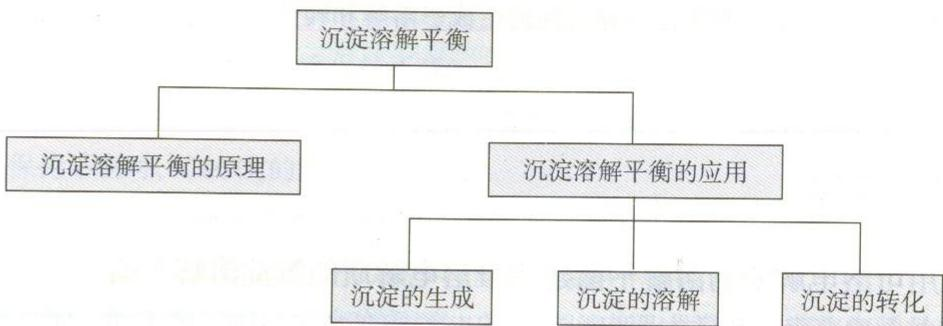

教材首先结合 $AgNO_{3}$ 溶液与 NaCl 溶液反应的离子方程式提出问题，然后引导学生根据表 3-3，以及对化学反应限度、化学平衡原理的认识，形成“难溶电解质的溶解度很小，但在水中并不是绝对不溶”的观念，从而为讨论沉淀溶解平衡的原理奠定基础。

教材以 $Ag^{+}$ 与 $Cl^{-}$ 反应生成 AgCl 沉淀为例，从固体溶解和沉淀生成两个角度进行讨论，引导学生认识到，在一定温度下，AgCl 的饱和溶液中存在沉淀溶解平衡。在此基础上，教材结合 AgCl 和 $Ag_{2}S$ 的沉淀溶解平衡，介绍溶度积常数 ( $K_{sp}$ ) 及其表达式，以及如何根据某温度下 $K_{sp}$ 与溶液中离子积 (Q) 的相对大小，判断溶液中难溶电解质的沉淀或溶解情况，为介绍沉淀溶解平衡的应用打下基础。

沉淀溶解平衡的应用包括沉淀的生成、溶解和转化三个方面。这部分内容主要是利用平衡移动原理，通过改变条件，使沉淀溶解平衡向着需要的方向移动。在沉淀的溶解和转化中，教材还结合 $K_{sp}$ 与Q的大小关系，从定量的角度对沉淀溶解平衡的移动进行分析和说明。

本节的特点是内容新、容量大、理论性强。从编排思路来看，教材先讲难溶电解质的概念，再讲沉淀溶解平衡的原理，最后讲沉淀溶解平衡的应用，即先讲原理后讲应用。从呈现方式来看，对于沉淀溶解平衡的原理，教材注意结合学生的知识基础，侧重从理论上进行分析，培养学生的逻辑思维和推理能力；对于沉淀溶解平衡的应用，教材则是将理论分析和实验活动结合，并注意引导学生运用学过的知识去分析和解决实际问题，突出化学理论的应用价值。此外，教材还特别重视活动性栏目的设计，如设计了3个“思考与讨论”和3个“实验”，引导学生主动参与学习过程，加深对沉淀溶解平衡原理及应用的理解。

## 二、教学目标

## 1. 教学目标

（1）认识难溶电解质在水溶液中存在沉淀溶解平衡，能通过实验证明难溶电解质沉淀溶解平衡的存在，进一步发展粒子观、平衡观。

（2）通过实验了解沉淀的生成、溶解与转化，能应用化学平衡理论解释沉淀的生成、溶解和转化。

（3）学会通过比较 $Q$ 与 $K_{\mathrm{sp}}$ 的大小判断难溶电解质的沉淀与溶解，学会从定量的角度分析沉淀的生成与转化。

## 2. 教学重点和难点

(1) 重点: 难溶电解质沉淀溶解平衡的原理。

（2）难点：应用化学平衡理论解释沉淀的生成、溶解和转化。

## 三、教学建议

## 1. 运用可溶电解质的溶解平衡建构难溶电解质的沉淀溶解平衡

教师在教学中首先要让学生明白，不同的电解质在水中的溶解度不同，而且物质在水中“溶”与“不溶”是相对的。可以选择以下活动加深学生对难溶电解质“可溶”的理解。

活动一：取少量Mg于试管中，向其中加入少量的蒸馏水并加热，冷却后向其中滴加酚酞溶液，可观察到溶液变红。

由此可引发讨论：溶液变红说明什么？生成的氢氧化镁是难溶物，为什么溶液还会变红？

活动二：利用教材中的表3-3，计算20℃时，AgCl、 $\mathrm{Ag_2S}$ 饱和溶液中溶质的物质的量浓度（溶液的密度近似看作 $1\mathrm{g/cm^3}$ ）。

在此基础上，可借助可溶电解质的溶解平衡进行分析。例如，向饱和氯化钠溶液中加入氯化钠固体、向饱和硫酸铜溶液中加入硫酸铜晶体等，以此说明可溶电解质在水中存在溶解平衡。

接下来，可以结合教材内容，以 AgCl 这种难溶电解质为例进行具体分析。对于有条件的学校，教师还可以带领学生进行实验，测定 $CaCO_{3}$ 溶于水后电导率的变化。具体做法是：先测定 100 mL 蒸馏水的电导率，然后向其中加入 1 g $CaCO_{3}$ ；当电导率不变时，再向其中加入 10 mL 蒸馏水，观察电导率的变化；继续向其中加入 10 mL 蒸馏水，再次观察电导率的变化。如果学校不具备完成此实验的条件，可以直接利用图 3-3 进行分析。

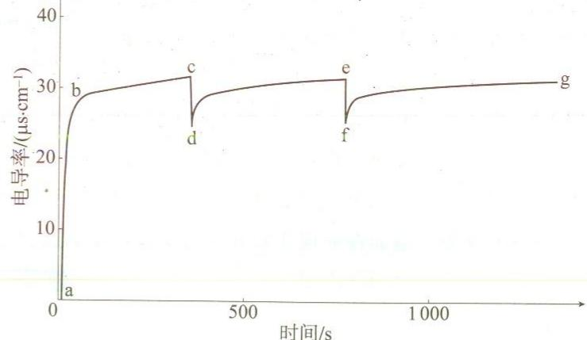  
图 3-3 $CaCO_{3}$ 溶于水后电导率的变化示意图

图3-3可直观地显示溶液中微观粒子的变化情况，有助于学生理解难溶电解质的沉淀溶解平衡。教学中，可结合实验内容或图3-3，带领学生讨论以下问题。

(1) 将 $\mathrm{CaCO}_{3}$ 溶于水后, 溶液的电导率增大, 说明什么?

（2）一段时间后，导电率为什么保持不变？

（3）在c点加入10 mL蒸馏水，电导率为什么先减小后增大？一段时间后，为什么又保持不变？电导率保持不变时， $CaCO_{3}$ 的溶解停止了吗？

（4）在e点再加入10 mL蒸馏水，为什么会重复出现上述现象？

在解决这些问题的过程中，学生可以逐步理解沉淀溶解平衡的原理。

溶度积常数的教学可以类比电离平衡常数，要强调溶度积常数与难溶电解质的性质和温度有关。

## 2. 运用化学平衡移动原理理解沉淀的生成、溶解及转化

## (1) 沉淀的生成和溶解

在教学中，可以结合工业生产、环保工程和科学研究中的一些流程图，引导学生从平衡的移动、 $K_{sp}$ 与Q的关系来理解沉淀的生成与溶解。要让学生明白，生成沉淀是分离或提纯物质的重要方法之一。可以在讨论溶液中 $Fe^{3+}$ 沉淀方法的基础上，着重讨论以下两点。

① 沉淀剂的选择。要求能除去溶液中的某种离子，又不能影响其他离子的存在，并且作为沉淀剂加入溶液时，因其过量而形成的杂质离子要便于除去，如粗盐提纯中 $SO_{4}^{2-}$ 、 $Ca^{2+}$ 的除去。

② 形成沉淀和沉淀完全的条件。由于难溶电解质溶解平衡的存在，在合理选用沉淀剂的同时，有时还需要考虑溶液的pH和温度的调控，如溶液中 $Fe^{3+}$ 的除去。

关于沉淀的溶解，必须以探讨影响沉淀溶解平衡的条件为中心，帮助学生了解促使沉淀溶解的基本方法，如通过温度的改变、溶液pH的调控、弱电解质的形成等，可以结合实验3-3与“思考与讨论”栏目进行教学。

## (2) 沉淀的转化

可以结合实验3-4讨论以下问题。

① AgCl与NaI溶液会发生反应吗？AgI与 $Na_{2}S$ 溶液呢？

② 过量的NaCl溶液与少量的AgNO\_{3}溶液反应后，溶液中是否还存在Ag^{+}?

③ 向上述溶液中再滴加KI溶液，生成的黄色沉淀AgI中的 $\mathrm{Ag^{+}}$ 从何而来？

④ AgCl的溶解度很小，溶液中Ag $^{+}$ 的量很少，生成AgI的量应该也很少，为什么会产生大量的黄色AgI沉淀？

⑤ 向试管中再加入 $Na_{2}S$ 溶液，你预测会有什么现象？为什么？

⑥ 根据溶解度和 $K_{sp}$ 来思考，沉淀间的转化有什么规律？

这些问题的解决有利于学生建构沉淀转化的认识模型。在此之后，可以让学生利用沉淀转化的认识模型，预测实验3-5的现象，继而在完成实验并分析实验现象的过程中，引导学生运用模型预测并解释化学现象、揭示现象的本质和规律。

## 四、栏目使用建议

## 1. 实验

本节三个实验操作简单，实验现象较明显。在实验前，应让学生先预测现象。

【实验3-3】

<table><tr><td>滴加的试剂</td><td>蒸馏水</td><td>盐酸</td></tr><tr><td>现象</td><td>沉淀不溶解</td><td>沉淀溶解</td></tr></table>

【实验3-4】

实验中应注意加入硝酸银溶液的量要少，确保氯化钠溶液过量。

<table><tr><td>步骤</td><td>(1)</td><td>(2)</td><td>(3)</td></tr><tr><td>现象</td><td>产生白色沉淀</td><td>白色沉淀转化为黄色沉淀</td><td>黄色沉淀转化为黑色沉淀</td></tr></table>

【实验3-5】

实验中所加氢氧化钠溶液的量要少，确保氯化镁溶液过量。

<table><tr><td>步骤</td><td>(1)</td><td>(2)</td></tr><tr><td>现象</td><td>产生白色沉淀</td><td>白色沉淀转化为红褐色沉淀</td></tr></table>

## 2. 思考与讨论

【思考与讨论1】

(1) 通常所说的难溶物是指在常温下, 其溶解度小于 $0.01 \mathrm{~g}$ , 并不是在水中完全不能溶解。

(2) 生成 $\mathrm{AgCl}$ 沉淀的离子反应是指进行到一定限度, 并不能完全进行到底, 此时溶液中还有 $\mathrm{Ag}^{+}$ 和 $\mathrm{Cl}^{-}$ 。

【思考与讨论2】

(1) 加入钡盐。因为 $K_{\mathrm{sp}}(\mathrm{BaSO}_{4}) < K_{\mathrm{sp}}(\mathrm{CaSO}_{4})$ ，向溶液中分别加入等物质的量的钡盐和钙盐，钡盐使溶液中剩余的 $c(\mathrm{SO}_{4}^{2-})$ 较小。

(2) 可以增大所用沉淀剂的浓度。

【思考与讨论3】

$$
(1) \mathrm{Mg} (\mathrm{OH}) _ {2} + 2 \mathrm{HCl} = \mathrm{MgCl} _ {2} + 2 \mathrm{H} _ {2} \mathrm{O}
$$

(2) $\mathrm{Mg(OH)}_{2}(\mathrm{s}) \rightleftharpoons \mathrm{Mg}^{2+}(\mathrm{aq}) + 2\mathrm{OH}^{-}(\mathrm{aq})$ ，向其中加入盐酸，中和了 $\mathrm{OH}^{-}$ ，使沉淀溶解平衡向正反应方向移动，促进 $\mathrm{Mg(OH)}_{2}(\mathrm{s})$ 的溶解。

## 五、研究与实践

本活动建立在学生已经具备弱电解质的电离平衡、盐类的水解平衡、沉淀溶解平衡等水溶液体系中平衡知识的基础上。活动内容紧密结合实际，目的是让学生运用相关的平衡理论解决实际问题，引导学生关注与化学有关的社会问题，培养他们的社会责任感。具体教学建议如下。

1. 可将学生分成三组，每组完成一个研究任务。在教师的指导下，以项目学习或者与 STEM（科学、技术、工程、数学）课程相结合的方式进行研究，让每组学生用拍摄视频或照片等形式记录研究过程，完成研究报告，在班内集中进行汇报与展示。

2. 每组的研究流程可参考下图。

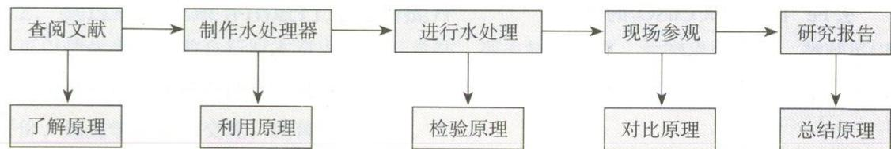

在制作水处理器与进行水处理的环节中，学生可能面临一定的困难，教师要及时给予指导。可引导学生反复实验，发现问题、查阅文献、修改调整，最终解决问题。教师要不断地鼓励学生，帮助学生体会科学研究的过程，了解科学研究的方法。

对于现场参观这一环节，要视实际情况而定。有条件的学校建议带领学生去实地参观，请专业技术人员针对水的处理过程进行讲解。如果条件有限，教师可以通过播放录像、视频等手段，让学生了解实际的水处理过程及其蕴含的化学原理。

## 六、练习与应用参考答案及说明

$$
\mathrm{Mg} (\mathrm{OH}) _ {2} (\mathrm{s}) \rightleftharpoons \mathrm{Mg} ^ {2 +} (\mathrm{aq}) + 2 \mathrm{OH} ^ {-} (\mathrm{aq}) K _ {\mathrm{sp}} = c (\mathrm{Mg} ^ {2 +}) \cdot c ^ {2} (\mathrm{OH} ^ {-})
$$

2. D

3. B

(2) 增大 减小 增大

(3) 减小 增大 减小

5. $BaSO_{4}$ 在水中存在沉淀溶解平衡: $\mathrm{BaSO_{4}(s)} \rightleftharpoons \mathrm{Ba^{2+}(aq)} + \mathrm{SO_{4}^{2-}(aq)}$ , 0.01 mol/L 硫酸中 $c(\mathrm{SO_{4}^{2-}})=0.01\ \mathrm{mol/L}$ ，用此硫酸洗涤，会使上述沉淀溶解平衡向逆反应方向移动，所以 $BaSO_{4}$ 损失少得多。

6. 不能。 $BaCO_{3}$ 在水中存在沉淀溶解平衡： $BaCO_{3}(s) \rightleftharpoons Ba^{2+}(aq) + CO_{3}^{2-}(aq)$ ，胃酸的主要成分是盐酸，盐酸与 $CO_{3}^{2-}$ 反应， $c(CO_{3}^{2-})$ 减小，使上述平衡向正反应方向移动， $c(Ba^{2+})$ 增大，导致人体中毒。

7. $\mathrm{S}^{2-} + \mathrm{Hg}^{2+} = \mathrm{HgS}\downarrow$ FeS(s) $+\mathrm{Hg}^{2+}(\mathrm{aq})\rightleftharpoons \mathrm{HgS}(\mathrm{s}) + \mathrm{Fe}^{2+}(\mathrm{aq})$

8. 盐碱地呈碱性的原因是: $\mathrm{CO}_{3}^{2-} + \mathrm{H}_{2} \mathrm{O} \rightleftharpoons \mathrm{HCO}_{3}^{-} + \mathrm{OH}^{-}$ ; 用石膏降低其碱性的反应原理是: 石膏的主要成分是 $\mathrm{CaSO}_{4}$ , 其与 $\mathrm{CO}_{3}^{2-}$ 反应生成更难溶的 $\mathrm{CaCO}_{3}$ , 降低了 $c(\mathrm{CO}_{3}^{2-})$ , $\mathrm{CaSO}_{4} + \mathrm{CO}_{3}^{2-} \rightleftharpoons \mathrm{CaCO}_{3} + \mathrm{SO}_{4}^{2-}$ , 使 $\mathrm{CO}_{3}^{2-}$ 的水解平衡向逆反应方向移动, $c(\mathrm{OH}^{-})$ 减小, 从而降低了碱性。

9. 在常温下，溶液的 $\mathrm{pH} = 4$ ， $c(\mathrm{OH}^{-}) = 1\times 10^{-10}\mathrm{mol / L}$ 。已知 $K_{\mathrm{sp}}[\mathrm{Fe(OH)}_3] = 2.8\times 10^{-39}$ ，计算可得 $c(\mathrm{Fe}^{3 + }) = 2.8\times 10^{-9}\mathrm{mol / L}$ ， $2.8\times 10^{-9}\mathrm{mol / L} <   1\times 10^{-5}\mathrm{mol / L}$ ，所以此时 $\mathrm{Fe}^{3 + }$ 已沉淀完全。如果此时溶液中 $\mathrm{CuSO_4}$ 是饱和的， $c(\mathrm{Cu}^{2 + }) = 1.41\mathrm{mol / L}$ ， $Q = c(\mathrm{Cu}^{2 + })\cdot c^2 (\mathrm{OH}^-) = 1.41\times 10^{-20}$ $Q <   K_{\mathrm{sp}}[\mathrm{Cu(OH)}_2] = 2.2\times 10^{-20}$ ， $\mathrm{Cu(OH)_2}$ 不会析出；如果此时溶液中 $\mathrm{CuSO_4}$ 是不饱和的， $c(\mathrm{Cu}^{2 + }) <   1.41\mathrm{mol / L}$ ，同样地， $Q <   K_{\mathrm{sp}}[\mathrm{Cu(OH)}_2]$ ， $\mathrm{Cu(OH)_2}$ 不会析出。因此，可以达到除去 $\mathrm{Fe}^{3 + }$ 而不损失 $\mathrm{CuSO_4}$ 的目的。

## 复习与提升建议

## 一、复习与提升教学建议

## 1. 通过知识梳理进行复习与提升

结合 “整理与提升” 中 “电离平衡、水解平衡和沉淀溶解平衡” 的表格，引导学生对本章知识进行梳理，结合化学平衡的知识，从水溶液中平衡的建立、反应条件对平衡的影响及平衡常数出发，总结弱电解质的电离平衡、盐类的水解平衡和沉淀溶解平衡，建构思维模型；同时引导学生从粒子、反应和平衡的视角认识水溶液中的离子反应与平衡，进一步发展粒子观、变化观和平衡观。

## 2. 通过绘制思维导图进行复习与提升

可以请学生在课前自行对本章内容进行总结，列出知识清单，绘制思维导图。教师可以选取具有代表性的思维导图在课堂上进行展示，让学生介绍自己的作品，发动其他同学对这些作品进行评价，通过学生间的交流，完善思维导图。

## 3. 通过解决问题进行复习与提升

可以通过创设情境、解决问题的方式展开。例如，围绕碳酸亚铁的制备这一具体问题，教师可以让学生先提出制备方案，然后依据他们的思路，演示可溶性亚铁盐与碳酸钠溶液反应的实验，引发学生产生认知冲突，由此让学生关注应综合考虑水溶液中的各种平衡知识。在解决完预设的碳酸亚铁的制备方法中出现的问题后，教师告诉学生，工业上制备碳酸亚铁时，选择碳酸氢铵溶液与亚铁盐溶液反应。围绕这个方法，教师可以继续让学生思考为什么会选择碳酸氢铵溶液，使学生的思维水平得以不断提高。这种教学方法重在培养学生发现问题、运用所学知识解决实际问题的能力，也有利于学生用联系发展和动态平衡的观点考察、分析化学反应。

有条件的学校，教师可以创设用数字化仪器完成滴定实验这一情境进行复习与提升。例如，用0.100 0 mol/L NaOH溶液滴定20 mL 0.100 0 mol/L左右的醋酸，用酚酞做指示剂，在得到滴定曲线的同时，一方面让学生观察到达滴定终点时溶液颜色的变化；另一方面对起点、恰好反应的点、pH为7的点及滴入10 mL NaOH溶液时的点等图像中的特殊点进行分析，分析各点对应的溶液中存在的水解平衡、电离平衡，分析溶质的成分、离子种类及电荷守恒、元素质量守恒等。实验结束后，结合得出的滴定曲线，教师可进一步引导学生分析滴入NaOH溶液对醋酸的电离平衡、水的电离平衡的影响，让学生灵活运用平衡移动的知识分析复杂的化学问题。

## 二、复习与提高参考答案及说明

1. A

2. A

3. D

4. C

5. C

## 6. 减小 不变 减小

7.（1）减小

(2) $\mathrm{NH_3\cdot H_2O + H^+ = NH_4^+ + H_2O < NH_4^+ + H_2O\rightleftharpoons NH_3\cdot H_2O + H^+}$

(3) $0.5 \mathrm{~a} \mathrm{~mol} / \mathrm{L}$

8. 小于 将 $SbCl_{3}$ 固体溶解在较浓的盐酸中，再加水稀释到所需浓度

9. $1.8 \times 10^{-5}$ $6.2 \times 10^{-3}$

10. 实验一: $0.1000 \mathrm{~mol} / \mathrm{L}$ (提示: $18.40 \mathrm{~mL}$ 应舍去。)
实验二: (1) 由表中数据可知, 醋酸中 $\mathrm{CH}_{3} \mathrm{COOH}$ 的浓度由 $0.1000 \mathrm{~mol} / \mathrm{L}$ 变成 $0.0010 \mathrm{~mol} / \mathrm{L}$ , 溶质的浓度稀释到原来的 $\frac{1}{100}$ , 而其相应的 $\mathrm{pH}$ 变化仅为 1, 所以 $\mathrm{CH}_{3} \mathrm{COOH}$ 为弱电解质 (其他答案只要合理均可, 例如, 因为 $\mathrm{CH}_{3} \mathrm{COOH}$ 为一元酸, 而 $0.0010 \mathrm{~mol} / \mathrm{L}$ 醋酸对应的 $\mathrm{pH}$ 为 3.88, 所以 $\mathrm{CH}_{3} \mathrm{COOH}$ 为弱电解质。)

(2) 增大

## 实验活动2 强酸与强碱的中和滴定

本实验活动的目的是通过滴定操作，让学生了解酸式滴定管和碱式滴定管的区别，掌握其使用方法和操作技巧，如滴定管的查漏、洗涤、润洗、加液、赶气泡、调零等。通过已知浓度的强酸滴定未知浓度的强碱，了解中和滴定中常用指示剂的变色范围，理解中和滴定的原理，掌握数据分析的方法，体会定量实验在化学研究中的作用。

## 一、练习使用滴定管

## 1. 活动安排建议

（1）本实验活动可安排两人一组，轮换练习使用酸式滴定管和碱式滴定管。

（2）练习使用滴定管时，可用蒸馏水代替酸（或碱）。

（3）教师可以边演示边强调操作要领。

## 2. 注意事项

（1）酸式滴定管可以盛装酸性溶液和强氧化性溶液，碱式滴定管一般盛装碱性溶液，而使用聚四氟乙烯活塞的滴定管则为酸碱通用滴定管。

（2）排出酸式滴定管中的气泡时，应控制活塞使液体快速流下；排出碱式滴定管中的气泡时，应使尖嘴向上，轻轻挤压乳胶管中的玻璃球。

（3）滴定管的“0”刻度在上方，且精确度为0.01 mL。读数时视线要与凹液面的最低处保持水平。俯视会使读数偏小，仰视会使读数偏大。

（4）向滴定管内添加液体时，一般要加到“0”刻度以上。如果排气泡时用的液体量过多，排完气泡后要补加液体。滴定前要将液体的凹液面调到“0”刻度或“0”刻度以下，并记录数据。

(5) 滴加半滴液体时, 要慢慢转动酸式滴定管的活塞 (或轻轻挤压碱式滴定管乳胶管中的玻璃球), 使滴定管的尖嘴处悬挂一滴液体 (不滴落), 用锥形瓶内壁将其靠下来, 并用蒸馏水将其冲入锥形瓶内。

## 二、用已知浓度的强酸滴定未知浓度的强碱

## 1. 活动安排建议

（1）本实验活动可安排两人一组，每组学生至少要完成三组滴定实验，由于课堂时间紧，小组分工要明确，务必相互协调好。

(2) 实验结束后, 各组学生都要提交实验报告。

## 2. 注意事项

(1) 滴定时, 一般用左手控制活塞, 右手摇动锥形瓶, 两眼注视锥形瓶内溶液颜色的变化。

（2）正式滴定前，可以预滴一次，即取25.00 mL待测液于锥形瓶中，滴加2滴酚酞溶液，快速用0.100 0 mol/L的盐酸滴定，判断到达滴定终点时大约需要的盐酸的体积。

（3）进行数据处理时，应根据每次测定所得溶液的体积计算出相应的待测液中溶质的浓度，之后再计算所得浓度的平均值。如果某次测定所得溶液的体积明显偏大（或偏小），则应将其舍去。

（4）在滴定过程中，如果溶液由红色变为粉红色，即接近滴定终点，此时改为滴加半滴酸，直到因加入半滴酸后，溶液颜色由粉红色刚好变为无色，且半分钟内不变色，即表示到达滴定终点。

(5) 滴定管不仅可以用来进行滴定实验, 也可以用来量取一定体积的液体。例如, 实验中可以用碱式滴定管量取 $25.00 \mathrm{~mL}$ 待测液, 量取前也要进行查漏、洗涤、润洗、加液、赶气泡、调零等操作。

## 三、问题和讨论答案或提示

1. 酸式（或碱式）滴定管在洗涤时，内壁会残留少量蒸馏水，因此需要用酸（或碱）润洗滴定管2\~3次，以除去蒸馏水，减少实验误差。

2. 锥形瓶不需要用待测液润洗，也不需要干燥。因为残留的蒸馏水对溶质的物质的量没有影响，对滴定结果没有影响。

3. 提示：以 NaOH 溶液的体积为横坐标，pH 为纵坐标，在坐标纸（或计算机）上描点绘图。

## 实验活动3 盐类水解的应用

本实验活动的目的是通过氯化铁溶液的配制、水的净化、胶体的制备、油污的去除等，了解影响盐类水解的因素，从抑制水解和促进水解两个角度理解盐类的水解在实际生产和生活中的应用，让学生学会运用水解原理解决实际问题，培养他们动态地分析化学反应的能力，建构变化观与平衡观。

## 一、活动安排建议

该实验活动可与第三节中盐类水解应用的教学整合在一起完成。

## 二、注意事项

1. 在制备 $\mathrm{Fe(OH)}_{3}$ 胶体的实验中，饱和氯化铁溶液要酸化，使其 pH 为 1，否则实验中容易产生沉淀。

2. 在洗涤试管内壁的植物油的实验中，植物油对饱和碳酸钠溶液会起到液封的作用，在加热过程中，液体容易因沸腾而冲出。因此，加热时务必注意安全，不要振荡试管，试管口不能对着自己或他人。

## 三、问题和讨论答案或提示

1. 将氯化铁晶体溶解在较浓的盐酸中，然后加水稀释到所需要的浓度。

2. 实验1中： $Fe^{3+} + 3H_{2}O \rightleftharpoons Fe(OH)_{3} + 3H^{+}$ ;

实验2中： $\mathrm{Al}^{3 + } + 3\mathrm{H}_2\mathrm{O}\rightleftharpoons \mathrm{Al(OH)}_3 + 3\mathrm{H}^+$ 、 $\mathrm{Fe}^{3 + } + 3\mathrm{H}_2\mathrm{O}\rightleftharpoons \mathrm{Fe(OH)}_3 + 3\mathrm{H}^+$

实验3中： $Fe^{3+} + 3H_{2}O \xlongequal{\triangle} Fe(OH)_{3}(胶体) + 3H^{+}$ ;

实验4中： $CO_{3}^{2-} + H_{2}O \rightleftharpoons HCO_{3}^{-} + OH^{-}$ 。

3. 草木灰与铵态氮肥不能混合使用、用氯化镁晶体制备无水氯化镁等。

## 教学资源

## 1. 酸碱质子理论

人们对酸和碱的认识经历了很长一段历史。最初把有酸味、能使蓝色石蕊变红的物质叫酸，有涩味、能使红色石蕊变蓝的物质叫碱。1887年，阿伦尼乌斯（S. Arrhenius）根据酸碱电离理论提出：凡是在水溶液中电离出的阳离子皆为 $H^{+}$ 的物质叫做酸，电离出的阴离子皆为 $OH^{-}$ 的物质叫做碱。酸碱电离理论提高了人们对酸碱本质的认识，对化学的发展起了很大作用，至今仍然普遍应用，但这个理论也是有缺陷的。实际上并不是只有含 $OH^{-}$ 的物质才具有碱性，如 $Na_{2}CO_{3}$ 、 $Na_{3}PO_{4}$ 等的水溶液也显碱性，可作为碱来中和酸。 $Al_{2}(SO_{4})_{3}$ 、 $NH_{4}Cl$ 、 $FeCl_{3}$ 等盐的水溶液呈酸性，本身并不含有可电离的 $H^{+}$ 。酸碱电离理论另一个缺陷是将酸碱概念局限于水溶液体系，由于科学的进步和生产的发展，越来越多的反应在非水溶液中进行，对于非水体系的酸碱性，酸碱电离理论就无能为力了。例如，在液氨中 $NH_{4}Cl$ 和 $NaNH_{2}$ 所发生的反应实际上与水溶液中的HCl和NaOH的中和反应十分类似：

$$
\mathrm{NH} _ {4} ^ {+} + \mathrm{NH} _ {2} ^ {-} \rightleftharpoons 2 \mathrm{NH} _ {3}
$$

但这个反应中并不存在 $\mathrm{H}^{+}$ 和 $\mathrm{OH}^{-}$ ，其中的 $\mathrm{NH}_{4}^{+}$ 相当于 $\mathrm{H}_{3} \mathrm{O}^{+}$ （或 $\mathrm{H}^{+}$ ），而 $\mathrm{NH}_{2}^{-}$ 相当于 $\mathrm{OH}^{-}$ 。针对这些情况，丹麦化学家布朗斯特（J. N. Bronsted）和英国化学家劳里（T. M. Lowry）于1923年分别提出了酸碱质子理论。

酸碱质子理论认为，凡是能给出质子的分子或离子都是质子的给体，称为酸；凡是能与质子结合的分子或离子都是质子的受体，称为碱。例如，HCl、HAc（ $CH_{3}COOH$ 的简写）、 $NH_{4}^{+}$ 、 $HCO_{3}^{-}$ 、 $[Al(H_{2}O)_{6}]^{3+}$ 等，都能给出质子，都是酸；而 $OH^{-}$ 、 $Ac^{-}$ 、 $NH_{3}$ 、 $CO_{3}^{2-}$ 等都能接受质子，所以它们都是碱。如以电离方程式来表示，可以写成：

$$
\begin{array}{r l}&{\mathrm{HCl} = \mathrm{H} ^ {+} + \mathrm{Cl} ^ {-}}\\&{\mathrm{HAc} \rightleftharpoons \mathrm{H} ^ {+} + \mathrm{Ac} ^ {-}}\\&{\mathrm{NH} _ {4} ^ {+} \rightleftharpoons \mathrm{H} ^ {+} + \mathrm{NH} _ {3}}\\&{\mathrm{HCO} _ {3} ^ {-} \rightleftharpoons \mathrm{H} ^ {+} + \mathrm{CO} _ {3} ^ {2 -}}\\&{[ \mathrm{Al(H} _ {2} \mathrm{O)} _ {6} ] ^ {3 +} \rightleftharpoons \mathrm{H} ^ {+} + [ \mathrm{Al(OH)(H} _ {2} \mathrm{O)} _ {5} ] ^ {2 +}}\\&{\text {酸} \rightleftharpoons \mathrm{H} ^ {+} + \text {碱}}\end{array}
$$

酸给出质子后余下的部分就是碱，碱接受质子后就成为酸，这种酸与碱的相互依存关系叫做共轭关系。上面这些电离方程式中，左边的酸是右边碱的共轭酸，而右边的碱则是左边酸的共轭碱，彼此联系在一起叫做共轭酸碱对。但这种共轭酸碱对的半反应是不能单独存在的，因为酸并不能自动放出质子，必须同时存在的作为碱的另一物质接受质子后，酸才能变成共轭碱；反之，碱也必须从另外一种酸接受质子后，才能成共轭酸。例如，酸在水中的电离：

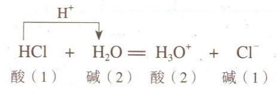

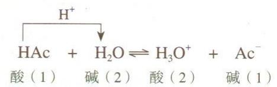

$$
\begin{array}{c}\mathrm{H} ^ {+}\\\mathrm{NH} _ {4} ^ {+} + \mathrm{H} _ {2} \mathrm{O} \rightleftharpoons \mathrm{H} _ {3} \mathrm{O} ^ {+} + \mathrm{NH} _ {3}\\\text {酸（1）碱（2）酸（2）碱（1）}\end{array}
$$

这三个电离方程式中分别包含两个共轭酸碱对的半反应，即HCl、HAc和 $NH_{4}^{+}$ 作为酸放出 $H^{+}$ ，分别变成共轭碱 $Cl^{-}$ 、 $Ac^{-}$ 和 $NH_{3}$ 。 $H_{2}O$ 接受质子成为共轭酸 $H_{3}O^{+}$ 。HCl是强酸，几乎全部电离，逆反应几乎不能进行；而HAc和 $NH_{4}^{+}$ 是弱酸，部分电离，生成的 $Ac^{-}$ 和 $NH_{3}$ 则作为碱接受质子发生逆反应。碱在水中的电离与酸类似，例如：

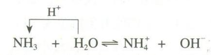

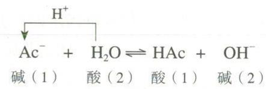

$NH_{3}$ 和 $Ac^{-}$ 作为碱接受了 $H_{2}O$ 给出的质子而成为共轭酸 $NH_{4}^{+}$ 、HAc， $H_{2}O$ 失去质子成为共轭碱 $OH^{-}$ 。因为 $NH_{3}$ 和 $Ac^{-}$ 是较弱的碱，溶液中存在着电离平衡。

总之，酸碱质子理论认为酸和碱是通过给出和接受质子的共轭关系相互依存和相互转化，每一个酸（碱）要表现出它的酸（碱）性必须有另一个碱（酸）同时存在才行。“有酸才有碱，有碱才有酸，酸中有碱，碱可变酸”，用这句话来描写酸碱关系是非常形象的。这是酸碱质子理论与阿伦尼乌斯酸碱理论的区别之一。

酸碱质子理论把平衡称为弱酸和弱碱的电离平衡，它们都是弱酸、弱碱与溶剂水分子间质子传递反应的平衡式。

像 $H_{2}O$ 、 $HSO_{3}^{-}$ 、 $HCO_{3}^{-}$ 、 $HS^{-}$ 等既能给出质子作为酸，也能接受质子作为碱，故称其为两性电解质，简称两性物。例如：

$$
\begin{array}{r l}&\mathrm {H^ {+}}\\&\mathrm {HC O _ {3} ^ {-}} + \mathrm {H_ {2} O\rightleftharpoons H_ {3} O^ {+}} + \mathrm {CO_ {3} ^ {2 - }}\\&\mathrm {H^ {+}}\\&\mathrm {HC O _ {3} ^ {-}} + \mathrm {H_ {2} O\rightleftharpoons OH^ {-}} + \mathrm {H_ {2} CO_ {3}}\end{array}
$$

至于 $\mathrm{HCO}_3^-$ 水溶液到底呈酸性还是呈碱性，则取决于以上两个反应向右进行倾向性的大小。[摘编自：华彤文，陈景祖等编著.普通化学原理（第3版）.北京：北京大学出版社，2005]

## 2. 决定电解质强、弱的因素

决定电解质强、弱的因素较多，有时一种物质在某种情况下是强电解质，而在另一种情况下又可以是弱电解质。下面从键型、键能、溶解度、浓度和溶剂等方面来讨论这些因素对电解质电离的影响。

(1) 电解质的键型不同, 电离程度就不同。已知典型的离子化合物, 如强碱 $\left[\mathrm{NaOH}\right.$ 、 $\mathrm{KOH}$ 、 $\mathrm{Ba(OH)}_{2}$ 等]、大部分盐类 (NaCl、 $\mathrm{CaCl}_{2}$ 等), 以及强极性化合物 (HCl、 $\mathrm{H}_{2} \mathrm{SO}_{4}$ 等), 在极性水分子作用下能够全部电离, 导电性很强, 我们把这种在水溶液中能够完全电离的化合物称为强电解质。而弱极性键的共价化合物, 如 $\mathrm{CH}_{3} \mathrm{COOH}$ 、 $\mathrm{HCN}$ 、 $\mathrm{NH}_{3} \cdot \mathrm{H}_{2} \mathrm{O}$ 等, 在水中仅部分电离, 导电性较弱, 我们把这种在水溶液中只能部分电离的化合物称为弱电解质。所以, 从结构的观点来看, 决定电解质强、弱的因素是键型。但是, 仅从键型来区分强、弱电解质是不全面的, 即使是强极性共价化合物也有属于弱电解质的情况, HF就是一例。因此, 电解质在溶液中电离出离子的多少, 还与其他因素有关。

(2) 相同类型的共价化合物, 由于键能不同, 其电离程度也不同。例如, $\mathrm{{HF}}$ 、 $\mathrm{{HCl}}$ 、 $\mathrm{{HBr}}$ 和 $\mathrm{{HI}}$ ,就其键能来说是依次减小的,这可从它们的电负性差或气体分子的偶极距来说明。

从它们分子内核间距的依次增大、分子的键能依次减小来看，HF的键能最大，分子结合得最牢固，在水溶液中电离最困难。再加上HF分子间由于形成氢键而有缔合作用，虽然在水分子的作用下一部分HF离子化，离解为 $H_{3}O^{+}$ 和 $F^{-}$ ，但离解出来的 $F^{-}$ 很快地又和HF结合成为 $HF_{2}^{-}$ 、 $H_{2}F_{3}^{-}$ 、 $H_{3}F_{4}^{-}$ 等离子。在1 mol/L HF溶液中， $F^{-}$ 仅占1%， $HF_{2}^{-}$ 占10%，而大部分是多分子聚合的离子： $H_{2}F_{3}^{-}$ 、 $H_{3}F_{4}^{-}\cdots\cdots$ 这样就使HF成为一种弱酸，而HCl、HBr、HI都是强酸。从HCl到HI，它们分子内的核间距依次增大，键能依次减小，所以它们的电离程度逐渐增大。但是，仅从键能大小来区分强、弱电解质也是片面的，有些键能较大的极性化合物也属于强电解质。例如，H—Cl的键能（431.3 kJ/mol）比H—S的键能（365.8 kJ/mol）大，在水溶液中HCl却比 $H_{2}S$ 容易电离。

（3）电解质的溶解度直接影响着电解质溶液的导电能力。有些离子化合物，如 $BaSO_{4}$ 、 $CaF_{2}$ 等，它们溶于水时全部电离，属于强电解质，但由于溶解度很小，其水溶液的导电能力很弱，但它们在熔融状态时导电能力很强。

(4) 溶液浓度不同, 电解质的电离程度也不同, 溶液越稀, 其电离程度越大。因此, 有人认为, $\mathrm{HCl}$ 和 $\mathrm{H}_{2} \mathrm{SO}_{4}$ 只有在稀溶液中才是强电解质, 在浓溶液中是弱电解质。由蒸气压的测定知道, $10 \mathrm{~mol} / \mathrm{L}$ 的盐酸中溶质有 $0.3 \%$ 是共价分子, 因此, $10 \mathrm{~mol} / \mathrm{L}$ 的盐酸中 $\mathrm{HCl}$ 是弱电解质。通常当溶质中以分子状态存在的部分少于 $\frac {1}{1000}$ 时就可认为是强电解质, 当然在这里强与弱之间是没有严格界限的。

(5) 溶剂的性质也直接影响电解质的电离。例如, 对于离子化合物来说, 水和其他极性溶剂的作用主要是削弱晶体中离子间的引力, 使之离解。根据库仑定律, 离子间的引力为:

式中 $k$ 为静电力常量， $Q_{1}$ 、 $Q_{2}$ 为离子的电量， $r$ 为离子间距离， $\varepsilon$ 为溶剂的介电常数。从上式可以看出，离子间引力与溶剂的介电常数成反比。水的介电常数 $\varepsilon = 81$ ，所以像LiCl、KCl这些离子化合物在水里易电离，表现出强电解质的性质。而乙醇和苯等介电常数较小（乙醇 $\varepsilon = 27$ ，苯 $\varepsilon = 2$ ），离子化合物在其中难电离，表现出弱电解质的性质。

因此，弱电解质和强电解质并不是物质在本质上的一种分类，而是由于电解质在溶剂等不同条件下所造成的区别，彼此之间没有明显的界限。

## 3. 盐类是否都是强电解质

大多数盐类是强电解质，少数的盐有形成共价键的倾向，电离度很小，属于弱电解质。例如，氯化汞、碘化镉等虽然也是由离子构成的，但是 $Hg^{2+}$ 和 $Cd^{2+}$ 容易被阴离子极化，而 $Cl^{-}$ 、 $I^{-}$ 等又是容易极化的阴离子，由于阳、阴离子间的相互极化作用，电子云产生较大的变形，引起了键的性质的改变，它们的熔点和沸点并不高（如表3-1）。

表3-1 $\mathrm{HgCl}_2$ 和 $\mathrm{CdI}_2$ 的熔点和沸点

<table><tr><td>盐</td><td>HgCl2</td><td>CdI2</td></tr><tr><td>熔点/°C</td><td>276</td><td>388</td></tr><tr><td>沸点/°C</td><td>302</td><td>713</td></tr></table>

实验证明， $\mathrm{HgCl}_{2}$ 的水溶液几乎不导电，即使在很稀的溶液中， $\mathrm{HgCl}_{2}$ 的电离度也不超过 $0.5\%$ 。这说明 $\mathrm{HgCl}_{2}$ 在溶液里主要是以分子形式存在的，只有少量的 $\mathrm{HgCl}^{+}$ 、 $\mathrm{Hg}^{2+}$ 和 $\mathrm{Cl}^{-}$ 。

过渡金属的盐在水溶液中常出现与上述类似的情况。

## 4. 影响弱酸、弱碱电离平衡的因素

弱酸、弱碱的电离平衡是一个暂时的、相对的动态平衡。当反应条件改变时，电离平衡也会发生移动，从而使弱酸或弱碱的电离程度有所增减。因此，可以应用平衡移动原理，通过改变反应条件控制弱酸、弱碱的电离程度。下面主要讨论温度、相同的离子和盐对电离平衡的影响。

## (1) 温度的影响

温度变化能使化学平衡发生移动，但是由于温度变化时，电离平衡常数的改变极小，因此，常温范围内可以认为温度对电离平衡没有影响。

## (2) 同离子效应

离子浓度的改变对弱酸、弱碱电离程度的影响极为显著。

例如，在氨水中加入一些 $CH_{3}COONH_{4}$ 时，由于 $CH_{3}COONH_{4}$ 是强电解质，在水中完全电离，溶液中 $c(\mathrm{NH}_{4}^{+})$ 就会大大增加，使电离平衡 $NH_{3} + H_{2}O \rightleftharpoons NH_{4}^{+} + OH^{-}$ 向左移动，从而降低了一水合氨的电离度。

$$
\begin{array}{r l}&\mathrm{NH} _ {3} + \mathrm{H} _ {2} \mathrm{O} \rightleftharpoons \left[ \mathrm{NH} _ {4} ^ {+} \right] + \mathrm{OH} ^ {-}\\&\mathrm{CH} _ {3} \mathrm{COONH} _ {4} = \left[ \mathrm{NH} _ {4} ^ {+} \right] + \mathrm{CH} _ {3} \mathrm{COO} ^ {-}\end{array}
$$

对于 ${\mathrm{{CH}}}_{3}\mathrm{{COOH}}$ 溶液,情况也是如此。当加入强电解质 ${\mathrm{{CH}}}_{3}{\mathrm{{COONH}}}_{4}$ 时, ${\mathrm{{CH}}}_{3}{\mathrm{{COO}}}^{ - }$ 离子浓度大大增加,电离平衡 ${\mathrm{{CH}}}_{3}\mathrm{{COOH}} \rightleftharpoons  {\mathrm{H}}^{ + } + {\mathrm{{CH}}}_{3}{\mathrm{{COO}}}^{ - }$ 向左移动,这时 ${\mathrm{{CH}}}_{3}\mathrm{{COOH}}$ 的电离度减小。

$$
\begin{array}{r l}\mathrm{CH} _ {3} \mathrm{COOH}&\rightleftharpoons \mathrm{H} ^ {+} + \left[ \mathrm{CH} _ {3} \mathrm{COO} ^ {-} \right]\\\mathrm{CH} _ {3} \mathrm{COONH} _ {4}&= \mathrm{NH} _ {4} ^ {+} + \left[ \mathrm{CH} _ {3} \mathrm{COO} ^ {-} \right]\end{array}
$$

综合上面的分析，可得出下列结论：在弱电解质溶液中，加入与该弱电解质有相同离子的强电解质时，弱电解质的电离平衡会向左移动，导致弱电解质的电离度减小。这种现象叫做同离子效应。同离子效应在生产和科学实验中应用很广。

## (3) 盐效应

在弱电解质溶液中加入其他强电解质盐时，该弱电解质的电离度将会增大。例如，在0.1 mol/L $CH_{3}COOH$ 溶液中加入0.1 mol/L NaCl溶液，则 $c(\mathrm{H}^{+})$ 不再是 $1.33 \times 10^{-3}$ mol/L，而是 $1.68 \times 10^{-3}$ mol/L；其电离度也不是1.33%，而是1.68%。这种影响叫做盐效应。

盐效应的产生是由于强电解质的加入，增大了溶液中离子的浓度，使溶液中离子间的相互牵制作用增强，即活度降低，离子结合为分子的机会减少，降低了分子化的速率。因此，重新达到平衡时， $CH_{3}COOH$ 的电离度要比未加NaCl时的电离度大。

在同离子效应发生的同时，必然伴随着盐效应的发生。盐效应虽然可以使弱酸或弱碱的电离度增加一些，但是数量级一般是不会改变的。例如，在0.1 mol/L $CH_{3}COOH$ 溶液中加入0.1 mol/L NaCl溶液后，电离度从1.33%增加到1.68%， $c(\mathrm{H}^{+})$ 从 $1.33 \times 10^{-3}$ mol/L 增加到 $1.68 \times 10^{-3}$ mol/L，在数值上似乎增加不少（25%），但数量级没有差别。同离子效应的影响则要大得多，0.1 mol/L $CH_{3}COONH_{4}$ 溶液的加入，使0.1 mol/L $CH_{3}COOH$ 溶液中 $CH_{3}COOH$ 的电离度从1.33%减小到0.0176%， $c(\mathrm{H}^{+})$ 从 $1.33 \times 10^{-3}$ mol/L 减小到 $1.76 \times 10^{-5}$ mol/L。这些实例充分说明，同离子效应和盐效应在影响溶液的酸性或碱性的作用上不能相提并论。对于很稀的溶液，假如不考虑盐效应，并不会因此而引起较大误差。

## 5. 影响盐类水解平衡移动的因素

盐类水解程度的大小，除了与盐的本性有关，还受下列因素的影响。

## (1) 温度的影响

中和反应是放热反应，水解反应是吸热反应。升高温度，平衡会向吸热方向移动，即加热可以促进水解。例如，加热 $FeCl_{3}$ 稀溶液时，溶液颜色变深，最后可析出红褐色的 $\mathrm{Fe(OH)}_{3}$ 沉淀。在化学实验中，常采用加热促进水解的方法达到分离或合成的目的。

## (2) 盐浓度的影响

以乙酸盐的水解为例：

$$
\mathrm{CH} _ {3} \mathrm{COO} ^ {-} + \mathrm{H} _ {2} \mathrm{O} \rightleftharpoons \mathrm{CH} _ {3} \mathrm{COOH} + \mathrm{OH} ^ {-}
$$

稀释盐溶液可促进水解。这是因为稀释时，生成物 $c(\mathrm{CH}_{3}\mathrm{COOH})$ 和 $c(\mathrm{OH}^{-})$ 都减小，而反应物中只有 $c(\mathrm{CH}_{3}\mathrm{COO}^{-})$ 减小，所以平衡向右移动。

## (3) 酸度的影响

盐类的水解会引起溶液酸度的变化, 根据平衡移动原理, 通过控制溶液的酸度可以控制水解平衡。例如, 向 $\mathrm{Na}_{2} \mathrm{CO}_{3}$ 溶液中加入酸, $\mathrm{H}^{+}$ 中和了 $\mathrm{CO}_{3}^{2-}$ 水解产生的 $\mathrm{OH}^{-}$ , 水解平衡向右移动,产生 $CO_{2}$ 气体。又如，在 $SnCl_{2}$ 溶液中，由于 $SnCl_{2}$ 水解而产生碱式氯化亚锡沉淀，因此，配制 $SnCl_{2}$ 溶液时常用盐酸而不用蒸馏水，就是利用提高酸度使下列水解平衡向左移动，从而达到减小水解程度而不析出沉淀的目的。

$$
\mathrm{SnCl} _ {2} + \mathrm{H} _ {2} \mathrm{O} \rightleftharpoons \mathrm{Sn(OH)Cl} \downarrow + \mathrm{HCl}
$$

## 6. 溶度积规则

在一定温度下，对于难溶电解质（ $A_{n}B_{m}$ ）的沉淀溶解平衡：

$$
\mathrm{A} _ {n} \mathrm{B} _ {m} (\mathrm{s}) \rightleftharpoons n \mathrm{A} ^ {m +} (\mathrm{aq}) + m \mathrm{B} ^ {n -} (\mathrm{aq})
$$

溶液中离子积（Q）的表达式可写作：

$$
Q = c ^ {n} \left(\mathrm{A} ^ {m +}\right) \cdot c ^ {m} \left(\mathrm{B} ^ {n -}\right)
$$

依据平衡移动原理，将 Q 与该温度下的 $K_{sp}$ 进行比较，可以得出：

当 $Q>K_{sp}$ 时，平衡向左移动，沉淀从溶液中析出；

当 $Q=K_{sp}$ 时，溶液为饱和溶液，沉淀与溶解处于平衡状态；

当 $Q<K_{sp}$ 时，溶液为不饱和溶液，无沉淀析出；若原来体系中有沉淀，则平衡向右移动，沉淀溶解。

以上结论被称为溶度积规则，常用来判断沉淀的生成与溶解能否发生。

## 7. 影响沉淀溶解平衡的因素

## (1) 同离子效应

根据平衡移动原理，在难溶电解质的饱和溶液中，当加入含有相同离子的强电解质时，难溶电解质的沉淀溶解平衡将发生移动。例如，若向 $Ag_{2}CrO_{4}$ 的饱和溶液中加入一定量的 $AgNO_{3}$ 固体或 $Na_{2}CrO_{4}$ 固体，都会有更多的 $Ag_{2}CrO_{4}$ 沉淀生成，使 $Ag_{2}CrO_{4}$ 的溶解度降低。这种因加入含有相同离子的强电解质而使难溶电解质溶解度降低的现象称为同离子效应。

同离子效应在分析鉴定和分离提纯中应用广泛。当利用沉淀反应来分离溶液中的离子时，依据同离子效应，加入适当过量的试剂可使沉淀反应趋于完全。所谓完全，并不是说溶液中被沉淀离子的浓度等于零，实际上这也是做不到的。在定量分析中，只要溶液中被沉淀离子的浓度 $\leqslant1\times10^{-6}$ mol/L，就可以认为沉淀已经完全了。在一般情况下，当溶液中被沉淀离子的浓度 $\leqslant1\times10^{-5}$ mol/L，也可以认为沉淀完全了。对于加入过量试剂而使沉淀更趋于完全的反应，试剂的用量也不是越多越好。有时加入过多试剂，反而会使沉淀的溶解度增大。例如，AgCl沉淀由于与过量Cl $^{-}$ 反应生成配离子——[AgCl $_{2}$ ] $^{-}$ 而使AgCl的溶解度增大：

$$
\mathrm{AgCl(s)} + \mathrm {Cl^ {-} (aq)} \rightleftharpoons [ \mathrm {AgCl_ {2}} ] ^ {-} (\mathrm{aq})
$$

在洗涤沉淀时，为了减少洗涤过程中沉淀的损失，常用与沉淀含有相同离子的溶液来洗涤，而不用蒸馏水洗涤。例如，在洗涤 AgCl 沉淀时，常使用 $NH_{4}Cl$ 溶液洗涤，就是利用同离子效应。

## (2) 盐效应

实验证明，将易溶电解质加入难溶电解质的溶液，在某些情况下，难溶电解质的溶解度比在纯水中的溶解度大。例如， $\mathrm{AgCl}$ 在 $\mathrm{KNO}_3$ 溶液中的溶解度比其在纯水中的溶解度大，而且 $\mathrm{KNO}_3$ 的浓度越大， $\mathrm{AgCl}$ 的溶解度也越大（如表3-2）。

表3-2 AgCl在KNO₃溶液中的溶解度（25℃）

<table><tr><td> $c(KNO_3)/(mol \cdot L^{-1})$ </td><td>0</td><td>0.001 00</td><td>0.005 00</td><td>0.010 0</td></tr><tr><td> $S(AgCl)/(10^{-5}mol \cdot L^{-1})$ </td><td>1.278</td><td>1.325</td><td>1.385</td><td>1.427</td></tr></table>

这种现象是不能用 $KNO_{3}$ 与AgCl沉淀发生化学反应来解释的。因为 $K^{+}$ 、 $NO_{3}^{-}$ 与沉淀中所含的离子不能生成弱电解质和另一种沉淀，也不能生成配离子。那么，为什么AgCl的溶解度有所增大呢？这是由于加入易溶强电解质后，溶液中的各种离子总浓度增大了，增强了离子间的静电作用，在 $Ag^{+}$ 的周围有更多的阴离子（主要是 $NO_{3}^{-}$ ），形成了所谓的“离子氛”；在 $Cl^{-}$ 的周围有更多的阳离子（主要是 $K^{+}$ ），也形成了“离子氛”，使 $Ag^{+}$ 、 $Cl^{-}$ 受到较强的牵制作用，降低了它们的有效浓度，因而在单位时间内与沉淀表面碰撞次数减少，沉淀过程变慢，难溶电解质的溶解过程暂时超过了沉淀过程，平衡向溶解的方向移动。当建立新的平衡时，难溶电解质的溶解度就增大了。

这种因加入易溶强电解质而使难溶电解质溶解度增大的效应，叫做盐效应。能产生盐效应的物质并不限于盐类，如果加入的强电解质是强酸或强碱，在不发生其他化学反应的前提下，强酸或强碱同样能使溶液中各种离子的总浓度增大，有利于“离子氛”的形成，能使难溶电解质的溶解度增大，这也叫做盐效应。

不仅加入不具有相同离子的电解质能产生盐效应，加入具有相同离子的电解质，在产生同离子效应的同时，也能产生盐效应。所以，在利用同离子效应降低难溶电解质的溶解度时，所加入的沉淀试剂不能过量太多，否则将会引起盐效应，使难溶电解质的溶解度增大。表3-3所示是 $PbSO_{4}$ 在 $Na_{2}SO_{4}$ 溶液中溶解度的变化。可以看出，当 $Na_{2}SO_{4}$ 的浓度从0增加到0.04 mol/L时， $PbSO_{4}$ 的溶解度逐渐变小，同离子效应起主导作用；当 $Na_{2}SO_{4}$ 的浓度为0.04 mol/L时， $PbSO_{4}$ 的溶解度最小；当 $Na_{2}SO_{4}$ 的浓度大于0.04 mol/L时， $PbSO_{4}$ 的溶解度逐渐增大，盐效应起主导作用。

表3-3 $\mathrm{PbSO_4}$ 在 $\mathrm{Na_2SO_4}$ 溶液中的溶解度

<table><tr><td> $c(Na_{2}SO_{4})/(mol \cdot L^{-1})$ </td><td>0</td><td>0.001</td><td>0.01</td><td>0.02</td><td>0.04</td><td>0.100</td><td>0.200</td></tr><tr><td> $S(PbSO_{4})/(mmol \cdot L^{-1})$ </td><td>0.15</td><td>0.024</td><td>0.016</td><td>0.014</td><td>0.013</td><td>0.016</td><td>0.023</td></tr></table>

一般来说，当难溶电解质的溶度积很小时，盐效应的影响很小，可忽略不计；当难溶电解质的溶度积较大，溶液中各种离子的总浓度也较大时，就应该考虑盐效应的影响。

[“（2）盐效应”摘编自：大连理工大学无机化学教研室.无机化学（第4版）.北京：高等教育出版社，2001]

## 8. 沉淀的配位溶解

许多难溶电解质在配位剂的作用下能生成配离子而溶解——配位溶解。例如：

$$
\begin{array}{r l}&\mathrm {AgCl(s) + Cl^ {-} (aq)\rightleftharpoons [ AgCl_ {2} ] ^ {-} (aq)}\\&\mathrm {HgI_ {2} (s) + 2 I ^ {-} (aq)\rightleftharpoons [ HgI_ {4} ] ^ {2 - } (aq)}\end{array}
$$

这类配位溶解是难溶电解质溶于具有相同阴离子的溶液中，发生了加合反应。另一类配位溶解是难溶电解质溶于含有不同阴离子（或分子）的溶液中，发生了取代反应。例如，AgCl能溶于氨水中，AgBr能溶于 $Na_{2}S_{2}O_{3}$ 溶液中。在配位溶解过程中，它们分别形成了配离子—— $[Ag(NH_{3})_{2}]^{+}$ 和 $[Ag(S_{2}O_{3})_{2}]^{3-}$ 。反应的离子方程式分别为：

$$
\begin{array}{r l}&\mathrm {AgCl(s) + 2NH_ {3} (aq)\rightleftharpoons[Ag(NH_ {3}) _ {2} ] ^ {+} (aq) + Cl^ {-} (aq)}\\&\mathrm {AgBr(s) + 2S_ {2} O_ {3} ^ {2 - } (aq)\rightleftharpoons[Ag(S_ {2} O_ {3}) _ {2} ] ^ {3 - } (aq) + Br^ {-} (aq)}\end{array}
$$

一般情况下，当难溶电解质的溶度积不是很小，而且生成配合物的反应的平衡常数比较大时，有利于配位溶解反应的发生。此外，配位剂的浓度也是影响难溶电解质能否发生配位溶解的重要因素之一。

有些两性金属氢氧化物，如 $\mathrm{Al(OH)_{3}}$ 、 $\mathrm{Cr(OH)_{3}}$ 、 $\mathrm{Zn(OH)_{2}}$ 和 $\mathrm{Sn(OH)_{2}}$ 等，它们不仅能溶于酸中，而且能溶于强碱中，分别生成羟基配合物—— $[\mathrm{Al(OH)}_{4}]^{-}$ 、 $[\mathrm{Cr(OH)}_{4}]^{-}$ 、 $[\mathrm{Zn(OH)}_{4}]^{2-}$ 和 $[\mathrm{Sn(OH)}_{3}]^{-}$ 等。

## 9. 分步沉淀

在实际应用中，溶液中往往含有多种可被沉淀的离子。当加入某种沉淀试剂时，该试剂可能与溶液中的多种离子分别发生反应而产生沉淀。在这种情况下，沉淀反应将按照怎样的次序进行？哪种离子先被沉淀，哪种离子后被沉淀？先产生沉淀的离子被沉淀到什么程度另一种离子才开始被沉淀？弄清这些问题对离子的分离十分重要。

实验证明，在1.0 L含有相同浓度 $(1\times10^{-3}\ \mathrm{mol/L})$ 的 $I^{-}$ 和 $Cl^{-}$ 的混合溶液中，先加1滴 $(0.05\ \mathrm{mL})1\times10^{-3}\ \mathrm{mol/L}$ 的 $AgNO_{3}$ 溶液，此时只有黄色的AgI沉淀析出；如果继续滴加 $AgNO_{3}$ 溶液（要慢慢滴加并不断搅拌或振荡）才有白色的AgCl沉淀析出。这种先后沉淀的现象叫做分步沉淀或分级沉淀。

根据溶度积规则，可以说明上述实验事实。

$$
\begin{array}{r l}\mathrm {AgI(s)\rightleftharpoons Ag^ {+} (aq)+ I^ {-} (aq)}\\c (\mathrm {Ag^ {+}}) \cdot c (\mathrm {I^ {-}})&= K _ {\mathrm{sp}} (\mathrm{AgI})\end{array}
$$

当 $c(\mathrm{I}^{-})=1.0\times10^{-3}\ \mathrm{mol/L}$ 时，析出 $\mathrm{AgI(s)}$ 的 $Ag^{+}$ 的最低浓度为：

$$
\begin{array}{r l}c _ {1} (\mathrm{Ag} ^ {+}) =&\frac {K _ {\mathrm{sp}} (\mathrm{AgI})}{c (\mathrm{I} ^ {-})} = \frac {8 . 5 \times 1 0 ^ {- 1 7}}{1 . 0 \times 1 0 ^ {- 3}} \mathrm{mol/L} = 8. 5 \times 1 0 ^ {- 1 4} \mathrm{mol/L}\\&\mathrm{AgCl(s)} \rightleftharpoons \mathrm{Ag} ^ {+} (\mathrm{aq}) + \mathrm{Cl} ^ {-} (\mathrm{aq})\\&c (\mathrm{Ag} ^ {+}) \cdot c (\mathrm{Cl} ^ {-}) = K _ {\mathrm{sp}} (\mathrm{AgCl})\end{array}
$$

当 $c(\mathrm{Cl}^{-})=1.0\times10^{-3}\ \mathrm{mol/L}$ 时，析出 $\mathrm{AgCl(s)}$ 的 $Ag^{+}$ 的最低浓度为：

$$
c _ {2} (\mathrm{Ag} ^ {+}) = \frac {K _ {\mathrm{sp}} (\mathrm{AgCl})}{c (\mathrm{Cl} ^ {-})} = \frac {1 . 8 \times 1 0 ^ {- 1 0}}{1 . 0 \times 1 0 ^ {- 3}} \mathrm{mol/L} = 1. 8 \times 1 0 ^ {- 7} \mathrm{mol/L}
$$

由计算结果可知, 开始沉淀 $\mathrm{I}^{-}$ 时所需要的 $c(\mathrm{Ag}^{+})$ 比开始沉淀 $\mathrm{Cl}^{-}$ 时所需要的 $c(\mathrm{Ag}^{+})$ 小得多。当向含有 $\mathrm{I}^{-}$ 和 $\mathrm{Cl}^{-}$ 的混合溶液中慢慢滴入 $\mathrm{AgNO}_{3}$ 稀溶液时, $c(\mathrm{Ag}^{+})$ 逐渐增加, 当 $c(\mathrm{Ag}^{+}) \cdot c(\mathrm{I}^{-}) \geqslant K_{\mathrm{sp}}(\mathrm{AgI})$ 时, AgI 沉淀开始不断析出。只有当 $c(\mathrm{Ag}^{+})$ 增大到一定程度时, $c(\mathrm{Ag}^{+}) \cdot c(\mathrm{Cl}^{-}) \geqslant K_{\mathrm{sp}}(\mathrm{AgCl})$ , AgCl 沉淀才能析出。总之, 在溶液中某种沉淀对应的离子积首先达到或超过其溶度积时, 这种沉淀就先析出。必须指出, 只有对同一类型的难溶电解质, 且被沉淀离子的浓度相同或相近的情况下, 慢慢滴入沉淀试剂时, 才是溶度积小的沉淀先析出, 溶度积大

的沉淀后析出。

在上述实例中，当AgCl沉淀开始析出时，溶液中 $c(\mathrm{I}^{-})$ 是多少呢？

当溶液中 $c_{2}(\mathrm{Ag}^{+}) = 1.8 \times 10^{-7} \mathrm{~mol} / \mathrm{L}$ 时:

$$
c (\mathrm{I} ^ {-}) = \frac {K _ {\mathrm{sp}} (\mathrm{AgI})}{c _ {2} (\mathrm{Ag} ^ {+})} = 4. 7 \times 1 0 ^ {- 1 0} \mathrm{mol/L}
$$

也就是说，当AgCl沉淀开始析出时，I $^{-}$ 早已被沉淀完全了 $[c(I)\ll10^{-5}\ mol/L]$ 。

当体系中同时析出 AgI 和 AgCl 两种沉淀时，溶液中 $c(\mathrm{Ag}^{+})$ 同时满足两个离子平衡，即：

$$
c (\mathrm{Ag} ^ {+}) \cdot c (\mathrm{I} ^ {-}) = K _ {\mathrm{sp}} (\mathrm{AgI})
$$

$$
c (\mathrm{Ag} ^ {+}) \cdot c (\mathrm{Cl} ^ {-}) = K _ {\mathrm{sp}} (\mathrm{AgCl})
$$

$$
c (\mathrm{Ag} ^ {+}) = \frac {K _ {\mathrm{sp}} (\mathrm{AgI})}{c (\mathrm{I} ^ {-})} = \frac {K _ {\mathrm{sp}} (\mathrm{AgCl})}{c (\mathrm{Cl} ^ {-})}
$$

$$
\frac {c (\mathrm{I} ^ {-})}{c (\mathrm{Cl} ^ {-})} = \frac {K _ {\mathrm{sp}} (\mathrm{AgI})}{K _ {\mathrm{sp}} (\mathrm{AgCl})} = \frac {8 . 5 \times 1 0 ^ {- 1 7}}{1 . 8 \times 1 0 ^ {- 1 0}} = 4. 7 \times 1 0 ^ {- 7}
$$

由上式可以推知，难溶电解质的溶度积差别越大，就越有可能利用分步沉淀的方法将相应的离子分离。

显然，分步沉淀的次序不仅与溶度积的数值有关，还与溶液中对应离子的浓度有关。如果溶液中 $\frac{c(\mathrm{Cl}^{-})}{c(\mathrm{I}^{-})}>2.2\times10^{6}$ （海水中的情况与此类似），开始析出 AgCl 沉淀所需要的 $c(\mathrm{Ag}^{+})$ 比开始析出 AgI 沉淀所需要的 $c(\mathrm{Ag}^{+})$ 还小。当逐滴加入 $AgNO_{3}$ 稀溶液时，首先到达 AgCl 的溶度积而析出 AgCl 沉淀。因此，适当改变被沉淀离子的浓度，可以使分步沉淀的次序发生变化。

当溶液中存在多种可被沉淀的离子，加入沉淀试剂生成不同类型的难溶电解质时，也是离子积首先达到溶度积的难溶电解质先析出。

## 10. 沉淀反应在冶金中的应用

湿法冶金中常涉及沉淀反应。这里仅对铝和镁的冶炼中的沉淀反应加以说明。

## (1) 铝

在现代工业和日常生活中，除了铁，铝是应用最广泛的金属。

含铝的主要矿石是铝矾土——含水合氧化铝（ $\mathrm{Al}_{2} \mathrm{O}_{3} \cdot n \mathrm{H}_{2} \mathrm{O}$ ）的混合物，其中常含有 $\mathrm{Fe}_{2} \mathrm{O}_{3}$ 和 $\mathrm{SiO}_{2}$ 。在电解 $\mathrm{Al}_{2} \mathrm{O}_{3}$ 使之被还原为铝之前，必须除去铝矾土中的杂质。通常采用热的浓 $\mathrm{NaOH}$ 溶液，使铝矾土中的 $\mathrm{SiO}_{2} 、 \mathrm{Al}_{2} \mathrm{O}_{3}$ 分别与 $\mathrm{NaOH}$ 发生反应：

$$
\begin{array}{r l} & \mathrm {SiO_ {2} (s) + 2OH^ {-} (aq) + 2H_ {2} O(l) = [Si(OH) _ {6} ] ^ {2 - } (aq)} \\ & \mathrm {Al_ {2} O_ {3} (s) + 2OH^ {-} (aq) + 3H_ {2} O(l) = 2[Al(OH) _ {4} ] ^ {-} (aq)} \end{array}
$$

在上述反应中，分别生成可溶性的 $\left[\mathrm{Si(OH)}_{6}\right]^{2-}$ 和 $\left[\mathrm{Al(OH)}_{4}\right]^{-}$ 。 $Fe_{2}O_{3}$ 不与NaOH发生反应，可经过滤后分离。向滤液中通入 $CO_{2}$ ，可使 $Al_{2}O_{3}$ 沉淀出来：

$$
2 [ \mathrm{Al} (\mathrm{OH}) _ {4} ] ^ {-} + \mathrm{CO} _ {2} (\mathrm{g}) = \mathrm{Al} _ {2} \mathrm{O} _ {3} (\mathrm{s}) + \mathrm{CO} _ {3} ^ {2 -} (\mathrm{aq}) + 4 \mathrm{H} _ {2} \mathrm{O} (\mathrm{l})
$$

经过滤分离，可以得到纯净的 ${\mathrm{{Al}}}_{2}{\mathrm{O}}_{3}$ 。

## (2) 镁

镁是重要的合金元素，镁铝合金常用于飞机制造；镁也是生产铀和钛等的还原剂。镁除了以菱镁矿（ $\mathrm{MgCO_3}$ ）等形式存在于自然界中，它的另一个重要来源是海水和天然卤水。电解氯化镁生产镁的第一步是将海水和卤水中的 $\mathrm{Mg}^{2+}$ 分离、富集起来，常采用的方法是石灰法，即熟石灰与 $\mathrm{Mg}^{2+}$ 反应生成难溶于水的 $\mathrm{Mg(OH)}_2$ ：

$$
\mathrm{Mg} ^ {2 +} (\mathrm{aq}) + \mathrm{Ca(OH)} _ {2} (\mathrm{s}) \rightleftharpoons \mathrm{Mg(OH)} _ {2} (\mathrm{s}) + \mathrm{Ca} ^ {2 +} (\mathrm{aq})
$$

然后再将 $\mathrm{Mg(OH)_2}$ 转化为能用于电解的 $\mathrm{MgCl_2}$ 。

[8、9、10摘编自：大连理工大学无机化学教研室. 无机化学（第4版）. 北京：高等教育出版社，2001]

## 教学案例

# 认识水溶液中的多平衡体系

北京市第五十五中学 张静

## 教学目标

1. 在证明草酸为弱酸的过程中，认识弱电解质的电离平衡和盐类的水解平衡，进一步形成水溶液中离子反应与平衡的认识思路，发展从粒子的角度认识和分析水溶液中离子反应与平衡的能力。

2. 通过研究草酸钙沉淀的形成与溶解，进一步认识难溶电解质的沉淀溶解平衡，在发展粒子观、变化观和平衡观的同时，感受人的生命与健康中蕴含的平衡理念。

## 教学重点

认识和分析水溶液中的离子反应与平衡体系。

## 教学难点

形成水溶液中复杂平衡体系的分析思路。

## 教学流程

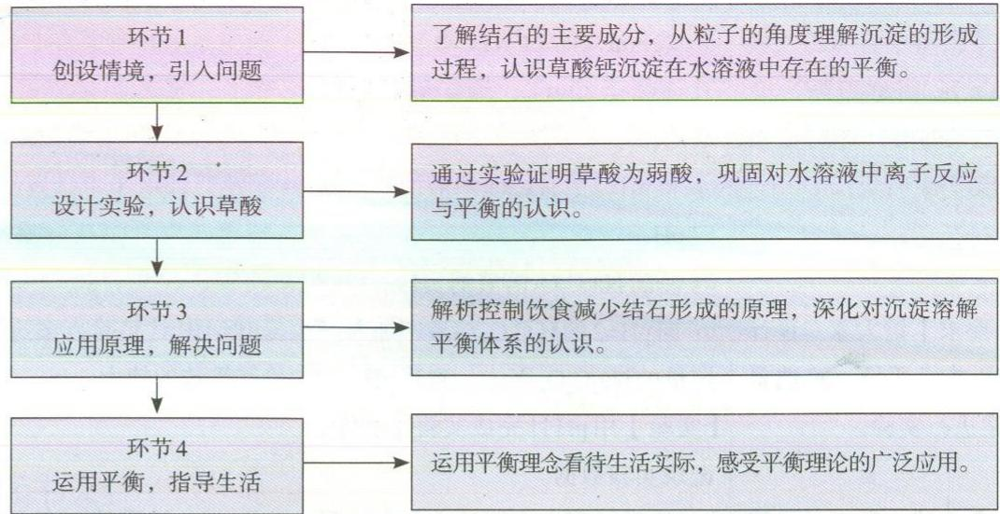

## 教学过程

教学环节一、创设情境，引入问题

<table><tr><td>教师活动</td><td>学生活动</td><td>设计意图</td></tr><tr><td>【引入】结石病是一种常见病,其中草酸钙结石较常见。【实验】向草酸溶液中滴加氯化钙溶液。【提问】从粒子的角度分析草酸钙沉淀形成的原因。</td><td>【阅读资料】了解结石的主要成分。【观察】生成白色沉淀。【回答】草酸电离产生的 $C_{2}O_{4}^{2-}$ 与 $Ca^{2+}$ 存在如下平衡: $C_{2}O_{4}^{2-}(aq)+Ca^{2+}(aq)\rightleftharpoons CaC_{2}O_{4}(s)$ </td><td>以结石的主要成分引入,激发学生的学习兴趣。引导学生从粒子的角度认识沉淀的形成。</td></tr></table>

教学环节二、设计实验，认识草酸

<table><tr><td>教师活动</td><td>学生活动</td><td>设计意图</td></tr><tr><td>【问题1】你能提供实验证据证明菠菜中的草酸是一种弱酸吗?</td><td>【讨论】可能的方案有以下几种。1测定0.01 mol/L草酸溶液的pH。2将等质量且颗粒大小相同的锌粒分别放入等浓度的 $H_{2}SO_{4}$ 溶液和 $H_{2}C_{2}O_{4}$ 溶液中,比较产生气泡的速率。</td><td>回忆弱电解质的概念,引导学生联系弱电解质的电离、盐类的水解等知识,从不同的角度认识弱电解质,同时提升学生依据实验目的设计实验方案的能力。</td></tr><tr><td>【信息】菠菜中含有乙二酸( $H_{2}C_{2}O_{4}$ ),俗称草酸,是一种二元弱酸,能溶于水和乙醇。</td><td rowspan="2">3取1mL pH=2的 $H_{2}C_{2}O_{4}$ 溶液,将其稀释至10mL,测定稀释后溶液的pH。4将pH=2的 $H_{2}C_{2}O_{4}$ 溶液加热,测定pH。5测定 $Na_{2}C_{2}O_{4}$ 溶液的pH。6向pH=2的 $H_{2}C_{2}O_{4}$ 溶液中加入一定量的 $Na_{2}C_{2}O_{4}$ 固体,测其pH。【实验】用pH计完成实验1和5,记录实验数据。</td><td rowspan="5">提升学生对实验方案进行评价和筛选的能力。巩固弱电解质的电离平衡和盐类的水解平衡等知识。深化对弱电解质电离平衡常数的认识。巩固学生对多平衡体系的认识,形成分析水溶液中多种平衡的基本思路。</td></tr><tr><td>【提出要求】请大家对设计的方案进行评价,筛选最优方案进行实验。</td></tr><tr><td>【提问】上述六种实验方案中,水溶液中存在哪些平衡?</td><td>【讨论后回答】水溶液中存在下列平衡。弱电解质的电离平衡:1、2、3和4。盐类的水解平衡:5。多种平衡同时存在:6。</td></tr><tr><td>【提问】证明 $H_{2}C_{2}O_{4}$ 为弱酸的证据有哪些?</td><td>【查找数据】 $H_{2}C_{2}O_{4}:K_{a_{1}}=5.6\times10^{-2},K_{a_{2}}=1.5\times10^{-4}$ 。</td></tr><tr><td>【提问】请从粒子、反应和平衡的角度解释3、5和6的设计原理。</td><td>【汇报】以6为例分析体系中的粒子、体系中存在的电离平衡及水解平衡,并指出加入 $Na_{2}C_{2}O_{4}$ 后溶液中 $c(H^{+})$ 减小,pH增大。</td></tr></table>

教学环节三、应用原理，解决问题

<table><tr><td>教师活动</td><td>学生活动</td><td>设计意图</td></tr><tr><td>【问题2】医学人士认为,结石的形成与饮食有关。下面请大家以菠菜以例,讨论如何正确食用菠菜,减少 $CaC_{2}O_{4}$ 结石的形成。</td><td>【讨论后回答】控制草酸的摄入量,从而降低人体内 $c(C_{2}O_{4}^{2-})$ ,例如,食用菠菜要适量;因 $H_{2}C_{2}O_{4}$ 能溶于水,食用菠菜前可用热水焯洗菠菜,避免与 $Ca^{2+}$ 含量高的食物同食;等等。</td><td>使学生关注化学知识的应用,进一步明确从微观粒子的角度认识和分析沉淀形成的基本思路。</td></tr></table>

教学环节四、运用平衡，指导生活

<table><tr><td>教师活动</td><td>学生活动</td><td>设计意图</td></tr><tr><td>【思考】在生产和生活中还有很多现象可以利用平衡理论来解释。【总结提升】平衡的理念无处不在:自然界中的生态平衡、人类自身的心态平衡......</td><td>【尝试解释】人体中的酸碱平衡、生活中含氟牙膏的作用、工业合成氨的原理等。</td><td>感受平衡的重要作用,让学生学会用平衡的理念看待健康、生活和社会中的问题,建立更广泛的平衡观。</td></tr></table>

## 板书设计

认识水溶液中的多平衡体系  
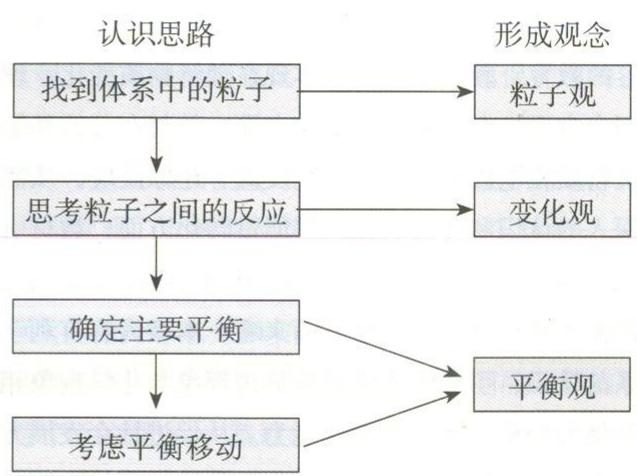

## 第四章化学反应与电能

## 本章说明

在必修第二册第六章化学反应与能量的基础上，与本册教材第一章化学反应的热效应相呼应，本章主要讨论化学反应与电能的有关问题，从而完整、全面地落实课程标准中选择性必修1的主题1“化学反应与能量”的教学内容和要求。

总体而言，本章内容的教育、教学价值主要体现在理解物质变化、理解能量转化、促进学生发展和促进社会发展这四个方面。在理解物质变化方面，教材在分析和解释原电池、电解池的工作原理时，紧紧抓住有关物质在电极上发生的氧化反应、还原反应，从而使学生对氧化还原反应的本质和发生条件有更深入的认识和体会。在理解能量转化方面，教材引导学生重点学习化学能与电能的直接转化需要通过氧化还原反应在一定装置中才能实现，原电池将化学能转化为电能，电解池将电能转化为化学能。从促进学生发展方面来看，本章内容有利于拓展和加深学生对物质变化与能量转化相互联系的认识，引导学生学习从物理现象与化学现象相联系入手研究化学反应原理的方法，培养和提高他们分析、解决问题的能力。从促进社会发展方面来看，向学生展现有关化学反应与电能的研究在能源、材料、环境和健康等领域广阔的应用前景，有利于学生认识和体会化学在提高生活质量、促进社会可持续发展等方面的重要作用。

为了更好地挖掘和体现上述四个方面的教育、教学价值，在内容选择与呈现方面，本章努力做到注重核心基础，体现时代要求；加强化学实验，实验理论并重；确保科学规范，加强教学适应；呈现方式多样，聚焦核心素养。在内容编写与安排方面，注重理论与实际的紧密联系，一方面通过分析和说明电化学装置（原电池和电解池）及其工作原理，揭示其中的化学反应与电现象、化学能与电能的联系；另一方面通过常见的化学电源、电解、电镀、电冶金和金属腐蚀与防护等教学内容，将上述化学反应原理应用于科研、生产和生活之中。

## 一、教材分析

本章包括原电池、电解池和金属的腐蚀与防护三节教学内容，其结构如下图所示。

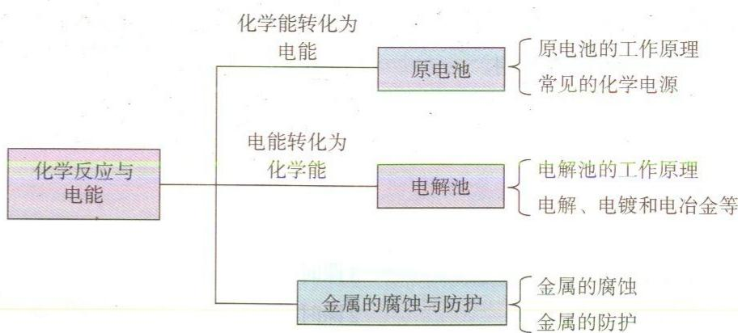

第一节原电池，以锌铜原电池为例，通过多种教学活动引导学生学习原电池的工作原理。随后，教材按照一次电池、二次电池和燃料电池三种类别介绍常见的化学电源，结合实例使学生进一步加深对原电池工作原理及其应用的认识。将原电池的工作原理与常见的化学电源两部分内容编排在同一节中，有利于加强化学反应原理与实际应用的联系。

第二节电解池，是从能量转化的角度对比原电池，并以学生熟悉的电解水引入，以电解氯化铜溶液为例，通过多种教学活动引导学生学习电解池的工作原理。随后，教材结合电解饱和食盐水、电镀和电冶金等具体生产过程介绍电解原理的实际应用。

第三节金属的腐蚀与防护，以钢铁制品的析氢腐蚀、吸氧腐蚀为例，运用原电池原理分析和解释金属的电化学腐蚀过程，并重点介绍电化学保护法在金属保护中的应用，培养学生学以致用的创新精神和实践能力。

纵观全章的教学内容，可以发现和梳理一些贯穿前后的核心问题。例如，一类反应——氧化还原反应，两种装置——原电池、电解池及其工作原理，一项转化——一定条件下化学能与电能的相互转化。因此，在学习了原电池、电解池及金属的腐蚀与防护这三节内容之后，需要引导学生进一步理解氧化还原反应的特殊意义和实用价值，从实验、装置等具体的直观层次上升到抽象、概括的模型层次认识原电池、电解池，把握两种装置之间的区别和联系，形成在一定条件下化学能与电能相互转化与守恒的观念。“整理与提升”为全章复习的教学设计提供了一些思路和参考。本章安排的两个实验活动可以加深学生对有关知识的理解，培养其实验兴趣和能力。通过本章学习，希望进一步促进学生宏观辨识与微观探析、证据推理与模型认知、科学探究与创新意识、科学态度与社会责任等学科核心素养的发展。

## 二、学业要求

1. 能分析、解释原电池的工作原理，并利用相关信息分析常见化学电源的主要工作原理。

2. 能分析、解释电解池的工作原理，并利用相关信息分析典型的电解、电镀和电冶金等实际应用的主要原理。

3. 了解金属发生电化学腐蚀的原理、过程和现象，学会分析、设计和选择合理的金属防护措施。

4. 围绕化学反应与电能这一主题，能举例说明化学在开发和利用自然资源、解决能源危机和保护生态环境等方面的重要作用。

## 第一节 原电池

## 三、课时建议

第一节 原电池 3课时

第二节 电解池 2课时

第三节 金属的腐蚀与防护 1课时

实验活动4 简单的电镀实验 1课时

实验活动5 制作简单的燃料电池 1课时

全章复习 1课时

## 一、内容分析

在必修课程中学生已经了解，将锌片、铜片置于稀硫酸中并以导线连接起来可以组成原电池，这为本节教学奠定了基础。但是，对于大多数学生来说，双液电池在装置和工作原理方面都比单液电池更加复杂，这会导致一些学生产生困惑。为此，本节教材在编写时大致安排了三个阶段，引导学生逐步认识和理解原电池的工作原理及其应用。

第一阶段，以必修已学知识和课堂实验观察、分析为基础，如第一个“思考与讨论”。结合有关锌铜原电池具体、直观的实验，引导学生描述该原电池的组成，分析金属导线及电解质溶液中形成的电流、盐桥的作用，以及在正极、负极上分别发生的还原反应和氧化反应，逐步梳理和理解锌铜原电池的工作原理。教学中需要注意，电极材料与电极（半电池）是有区别的。

第二阶段，引导学生从一种原电池的具体装置抽象形成原电池的一般模型，如第二个“思考与讨论”。通过一般模型的建构，要求学生既要静态地认识原电池的构成，又要动态地了解其工作过程和原理。这时，应充分发挥语言、图示和想象等形式在高级思维活动中的作用，实现用“思维中的具体”来把握原电池及其工作原理。通过第一阶段、第二阶段的学习，完成“从生动的直观到抽象的思维”的过程。

第三阶段，可以看作“从抽象的思维到实践”的过程。安排在第二阶段和第三阶段之间的“方法导引”，体现了学科核心素养的要求。对于一次电池、二次电池和燃料电池的介绍，是由简单到复杂分层递进安排的，目的是引导学生结合实例，应用原电池的原理分析一次电池、二次电池的主要工作原理，二次电池的充电原理则留待第二节电解池中研究。对于燃料电池的引入，采用了1839年格罗夫（W. R. Grove）设计和发明燃料电池的史实和思路。当时格罗夫认为：一切所谓物理力、机械力、热、光、电、磁，甚至还有所谓化学力，在一定条件下都可以互相转化，而不发生任何力的消失。他推断电解水的逆过程也是可行的，据此设计和发明了氢氧燃料电池。可见，本节有关燃料电池的“思考与讨论”有利于拉近学生与科学家、科学史的距离，降低学习难度。后面介绍的“科学史话”也具有鼓励学生进行创新的精神引导和方法提示的作用。

## 二、教学目标

## 1. 教学目标

(1) 通过原电池实验, 认识电极反应、电极材料、离子导体、电子导体是电池构成的四个基

本要素，能设计简单的原电池。

（2）在分析锌铜原电池的过程中，逐渐建立原电池的系统分析思路；能根据电极反应、电流方向或离子的移动方向判断原电池的正极和负极。

（3）了解常见的化学电源，能运用原电池思维模型分析其工作原理，能用电极反应表示其中发生的化学反应，体会变化与守恒思想。

（4）了解化学电源的发展史，能列举常见的化学电源；能从物质变化和能量变化的角度分析新型电池的研发和利用，培养责任意识和创新精神。

## 2. 教学重点和难点

（1）重点：原电池的工作原理；电极反应的分析与表征。

(2) 难点: 原电池思维模型的建构。

## 三、教学建议

## 1. 从能量转化的特点引出锌铜原电池装置

学生已经知道，把铜片和锌片置于稀硫酸中并用导线连接起来可以获得电流。必修阶段的教学要求是“以原电池为例，认识化学能可以转化为电能，从氧化还原反应的角度初步认识原电池的工作原理”，所以，在教学中教师引导学生重点关注的是电流表指针会发生偏转，而对于其中的电流不稳定、溶液温度升高等现象及其产生的原因并没有进行探讨。在本节内容的教学中，教师可利用该实验引入，并用温度计测量反应过程中溶液的温度变化。实验中注意引导学生关注负极表面的变化及电流的稳定性，以获得该体系中化学能没有完全转化为电能的实验证据。围绕此实验，可组织学生讨论以下问题。

(1) 该装置中发生了哪些能量转化?

(2) 在正极、负极上分别发生了什么反应?

（3）电流是否衰减？如果是，衰减的原因可能是什么？

## （4）你能否设计防止电流衰减的装置？

在评价学生设计的实验装置的基础上，教师可以演示教材中的实验4-1，帮助学生明确锌铜原电池中各组成部分的功能，梳理锌铜原电池的工作原理。

## 2. 精心设计学习活动，助力原电池思维模型的建构与应用

在必修阶段，学生对原电池往往会存在很多模糊认识。例如，负极材料必须参与电极反应，锌与稀硫酸接触引发了电池反应才产生电流等。教学中可结合实物、图画或实验创设真实情境，组织学生开展分析解释、推理预测、设计评价等学习活动，转化认识偏差，促使学生认识到电极反应、电极材料、离子导体、电子导体是原电池构成的基本要素，逐步建立系统分析原电池的思路。

## (1) 完善原电池思维模型

可以让学生观察教材中给出的锌铜原电池装置，预测该装置能否产生电流，并说明原因。之后让学生进行实验来验证预测，同时结合教材中的第一个“思考与讨论”中的问题，梳理锌铜原电池的工作原理，如图4-1所示。

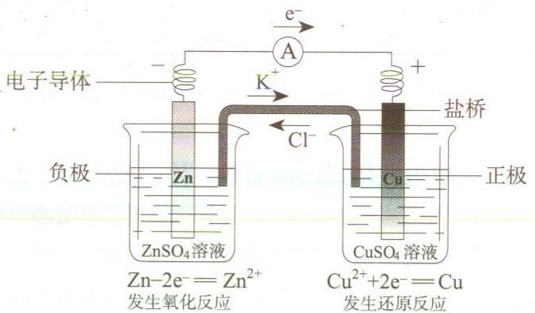  
图 4-1 锌铜原电池的工作原理示意图

明确锌铜原电池的工作原理后，可引导学生结合第二个“思考与讨论”中的问题进行抽象概括，归纳出原电池装置中各组成要素的功能，将构成原电池的四要素进行有序关联，结合本章“整理与提升”的内容，建立对原电池工作过程动态的系统分析思路，如图4-2所示。由此完成原电池思维模型的建构。

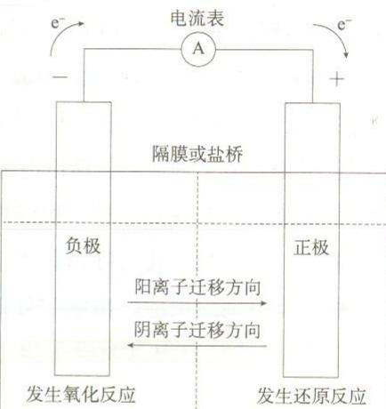  
图 4-2 原电池工作原理示意图

（2）应用思维模型，分析或设计原电池

可以参考如下教学活动。

活动一：展示教材中的氢氧燃料电池工作原理示意图，让学生分析该燃料电池的工作原理，认识质子交换膜的作用，培养他们的迁移能力。

活动二：展示 $NO_{x}$ 传感器的工作原理示意图（如图4-3），分析电极反应，建立原电池装置与电极反应之间的关联，认识原电池原理在实现物质转化、检测 $NO_{x}$ 等解决实际问题中的应用。

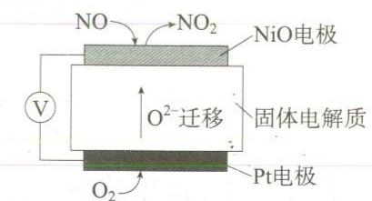  
图 4-3 $NO_{x}$ 传感器工作原理示意图

活动三：依据反应 $2Fe^{3+} + 2I^{-} = I_{2} + 2Fe^{2+}$ ，设计原电池，实现化学能转化为电能，并概括设计原电池的一般思路，即：分析氧化反应和还原反应→与电极反应相对应→选择电极材料→选择正极区、负极区的电解质溶液。

活动四：结合教材中的“研究与实践”，布置课外活动。

这些活动，对于学生理解并运用原电池的思维模型具有重要的作用。

## 3. 剖析化学电源，认识电池构成的四要素，体会变化与守恒思想

在日常生活中，化学电源比比皆是。如何让学生将所学习的原电池原理应用于各种化学电源呢？教学中可设计解构锌锰电池的活动：由学生解剖一款干电池，观察电池内部各物质的性状，与构成原电池的四要素进行一一对应，推测电极反应，并通过实验来验证。再展示教材中碱性锌锰电池的构造示意图，让学生分析该电池各组成部分的功能及产生电流的原因，培养学生运用原电池思维模型分析、解决实际问题的能力。

在进行书写电极反应与电池反应的教学时，要注意挖掘其中蕴含的变化与守恒思想。可结合教材中的“方法导引”栏目，同时引导学生关注介质对电极产物的影响。例如，氢氧燃料电池（电解质溶液为碱性）电极反应的分析思路为：先确定电极上的反应物和产物，再依据化合价的变化确定得到或失去的电子数目，然后根据电子得失守恒书写总反应。具体来说， $H_{2}$ 在负极上失去电子生成 $H^{+}$ ， $H^{+}$ 与电解质溶液中的 $OH^{-}$ 结合生成 $H_{2}O$ ，所以负极反应为 $H_{2}-2e^{-}+2OH^{-}=2H_{2}O$ ，而不能书写为 $H_{2}-2e^{-}=2H^{+}$ ； $O_{2}$ 在正极上得到电子，正极反应为 $O_{2}+4e^{-}+2H_{2}O=4OH^{-}$ ；因为 $H_{2}$ 在负极失去电子的数目等于 $O_{2}$ 在正极得到电子的数目，所以电池总反应为 $2H_{2}+O_{2}=2H_{2}O$ 。

建议在进行化学电源（如碱性锌锰电池、铅酸蓄电池、甲烷燃料电池等）的教学时，采用多种教学方式培养学生的正向和逆向思维，以强化变化与守恒思想。例如，可给出化学电源，让学生书写电极反应和电池总反应，也可给出电池总反应，由学生分析其正极、负极及所发生的电极反应。

## 4. 介绍电池的发展历史，用科学家的研究思路启迪学生智慧

在教学中，建议结合教材中的“科学史话”“资料卡片”等内容，向学生介绍化学电源的发展历史与新型电池的研发工作，使学生理解化学在改善人们生活、推动社会进步中所发挥的巨大作用，同时也要让学生理解，要使一项理论研究成果转化为技术产品，实现其应用价值，需要考虑许多复杂的技术问题和社会问题，由此培养学生的社会责任意识。

## 四、栏目使用建议

## 1. 实验

## 【实验4- 1】

该实验将锌与硫酸铜溶液完全隔开，有利于最大限度地将化学能转化为电能，有利于转化学生在必修阶段产生的认识偏差。

实验注意事项如下。

（1）实验前用砂纸打磨锌片表面，除去氧化膜，以便观察到电流由强到弱的变化情况。所用电解质溶液中溶质的浓度一般控制在 $1 \mathrm{~mol} / \mathrm{L}$ 。

## (2) 盐桥的制作可采用如下两种方法。

① 取 1 g 琼脂置于烧杯中，向其中加入 100 mL 饱和 KCl 溶液，加热，使琼脂熔化成糊状，趁热注入 U 形管中，待冷却后即可充当盐桥。

② 将饱和KCl溶液注入U形管，用棉花堵住两侧管口即可。

教师可以按教材中的装置进行演示，有条件的学校也可以让学生进行实验。实验中可以测量溶液的温度是否发生变化，由此获得该体系的化学能几乎没有转化为热能的实验证据。

## 2. 思考与讨论

## 【思考与讨论1】

本栏目要求学生结合锌铜原电池实验中的宏观现象，从电子的来源、电子的移动方向、溶液内部离子的运动方向等微观角度对宏观现象进行系统分析，并用电极反应和电池总反应来表征电池内发生的化学反应，使学生对锌铜原电池工作原理的认识从宏观深入微观层面。

（1）锌铜原电池工作时，电子由锌片沿导线移向铜片，阴离子 $\left(\mathrm{Cl}^{-},\mathrm{SO}_{4}^{2-}\right)$ 在电解质溶液中移向锌片，阳离子 $\left(\mathrm{K}^{+},\mathrm{Cu}^{2+}\right)$ 移向铜片。

(2) 负极: $Zn - 2e^{-} = Zn^{2+}$

正极： $\mathrm{Cu^{2 + } + 2e^{-} = Cu}$

总反应： $\mathrm{Zn} + \mathrm{Cu}^{2+} = \mathrm{Cu} + \mathrm{Zn}^{2+}$

【思考与讨论2】

建议先采取小组合作的学习方式让学生绘制示意图，再进行集体交流，促使学生认识到电极反应、电极材料、离子导体、电子导体是构成原电池的基本要素，发展学生系统认识原电池的能力。

## 【思考与讨论3】

可将学生分成四个小组，分别围绕干电池、蓄电池、燃料电池和新型电池查阅资料，了解科学家发明化学电源的故事或电池的发展史，使学生体会科学家改进电池的思路，并以展板或科技小报的形式汇报。该活动有利于拉近学生与科学家、科学史的距离，培养学生的科学探究精神。

## 五、练习与应用参考答案及说明

## 5. C

6.（1）普通锌锰电池中的负极材料是锌，电解质的主要成分是氯化铵，正极发生的主要反应为： $MnO_{2}+NH_{4}^{+}+e^{-}=MnO(OH)+NH_{3}$ 。

（2）与普通锌锰电池相比，碱性锌锰电池不易发生电解质溶液的泄漏，因为负极改装在电池的内部；碱性锌锰电池的使用寿命较长，因为在碱性电解质溶液中金属材料的稳定性比在酸性电解质溶液中的稳定性高。

7. 提示：以燃料电池、氢氧燃料电池或生物燃料电池为关键词检索资料，了解相应电池的特点及应用前景。

## 第二节 电解池

## 一、内容分析

与第一节原电池相似，本节教材的设计大致分为三个阶段，其意图在此不再重复。下面重点说明与第一节教材内容设计的不同之处。

第一，就两种装置的构成而言，通常在原电池中作正极、负极区分，在电解池中作阴极、阳极区分，教学中常发现学生在辨识正极、负极或阴极、阳极时会出现混淆。为此，教材以“注解”的方式引入了电化学中关于阴极、阳极的规定：发生氧化反应的为阳极，发生还原反应的为阴极。这种从电极反应本质上进行的规定对电解池和原电池均适用。

第二，就物质转化和能量转化而言，教材除了指明在原电池和电解池中化学能、电能转化方向不同，也提示了两种装置中发生的氧化还原反应具有不同的方向。对于后者，教学中可以根据学生的知识基础和接受能力进行适当处理。限于课程标准的要求和高中阶段的课时等，在教学的初始阶段对于电解池中离子的放电顺序等知识不宜过多展开。

第三，就电解原理的应用而言，电解饱和食盐水、电镀铜、电解精炼铜和冶炼金属钠等典型生产过程都是重要的化工产业。与应用原电池工作原理分析问题一样，在应用电解原理对这些实例进行分析时，教材将重点放在化学反应原理及其应用方面，而不拘泥于生产和技术中的细节。

第四，本节教材加强了对电解池、原电池及其工作原理的对比。这一点在“方法导引”中得到了体现。教学中，我们可能比较重视分析电解池、原电池的区别，而可能忽视分析两者的联系，这并不利于学生对问题本质的理解。其实，不管是电能的输出还是电能的输入，两个装置的电化学基础都是氧化反应和还原反应，这就可以将两者从电化学本质上统一起来，这也是有时将原电池和电解池两种装置只看作一种电化学装置的原因。

## 二、教学目标

## 1. 教学目标

（1）通过对氯化铜溶液电解过程的分析，了解电解、电解池的概念，认识电解是电能转化为化学能的一种重要形式。

(2) 形成系统分析电解池的一般思路和方法, 能初步设计简单的电解池。

（3）初步了解在电解过程中，粒子的放电顺序与其氧化性、还原性的关系，能解释或推测电解反应的产物，并能用电极反应和总反应进行表征。

（4）能分析电解饱和食盐水、电镀、精炼铜和电冶金的反应原理，认识电解在实现物质转化和储存能量中的具体应用，体会电解对人类社会进步的重要贡献。

## 2. 教学重点和难点

(1) 重点: 电解原理; 电极反应的分析与表征。

(2) 难点: 电解池思维模型的建构。

## 三、教学建议

## 1. 创设真实的教学情境，启迪学生思维

可设计如下教学情境引入教学。

（1）生活情境。播放“利用电解器检测自来水中的杂质”的视频，激发学生兴趣，之后让学生思考检测仪的化学原理、如何检测出水中的杂质等问题。

（2）化学史情境。介绍钾、钠、钙、锶等元素的发现过程，由此提出问题：电解时物质是如何发生变化的？

（3）实验情境。演示实验4-2，也可补充以石墨为电极电解水或某些常见电解质溶液的实验，之后围绕这组装置与原电池装置的区别、闭合回路的形成、石墨电极附近区域内的现象及发生的反应等问题引导学生进行思考。

（4）问题情境。让学生观看钠与氯气反应的实验视频，明确告诉学生：钠与氯气在常温下发生反应生成氯化钠，同时放出大量的热，而氯化钠分解生成钠与氯气的过程是非自发的。紧接着，教师可以提出问题：若以氯化钠为原料制备金属钠，如何实现？在播放电解熔融氯化钠制取金属钠的视频后继续提出问题：如何提供电能实现氯化钠的分解？

在教学中，教师可以结合实际情况，选择合适的情境展开教学。

## 2. 开展基于实验现象的证据推理活动，提升学生的思维品质

电解氯化铜溶液的实验是理解电解原理、建构电解池思维模型的突破口。教学中无论是教师演示，还是学生分组完成，均要求学生如实地记录实验过程和现象，并准确地加以表述。教师可以针对学生描述的实验现象，通过下列问题串带领学生展开讨论。

（1）阳极产生的气体和阴极产生的红色物质分别是什么？电极上发生的反应是氧化反应还是还原反应？

(2) 溶液中的离子有哪些? 依据阴极和阳极的实验现象, 推测通电后这些离子的运动方向。

（3）依据电极产物，推测离子氧化性（或还原性）的强弱顺序。

（4）在电解氯化铜溶液的实验结束后，将镀有铜的石墨电极与电源正极相连，另一极与电源负极相连，接通电源后能观察到哪些现象？两极分别发生了什么反应？

这些问题能促使学生对所获得的宏观现象从微观视角进行探析，并由此认识电源的强大作用，明确电极材料对电极反应的影响，理解物质的氧化性（或还原性）强弱会对电极反应产生影响，体会电解质溶液的导电过程本质上是电解质的电解过程。

## 3. 从具体到一般、从静态到动态认识电解原理，培养学生抽象思维

在明确了阴极、阳极的概念之后，教师可以结合“思考与讨论”的内容，让学生绘制反映电解池工作原理的示意图，引导学生从实验和装置这些具体而直观的层次，上升到抽象、概括的模型层次，以此深入认识电解池。分析得出的结果以图示的方式呈现（如图4-4），目的是将这一认识思路显性化，帮助学生建构电解池思维模型。学生可以利用该思维模型对更多的电解原理应用进行分析。

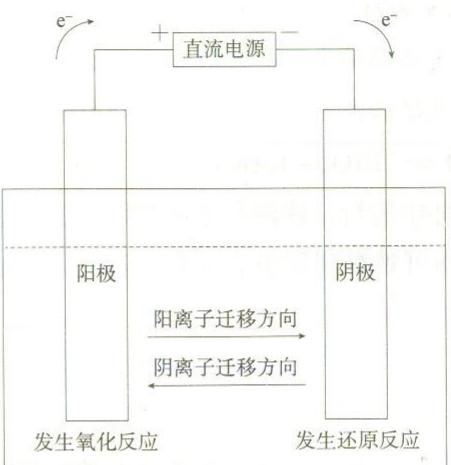  
图 4-4 电解池工作原理示意图

在分析电解池各组成要素之间的关系、建构思维模型时，要引导学生从系统分析电解池工作过程的角度进行抽象、概括。结合“方法导引”的内容，用系统分析的思想与方法对原电池和电解池的异同进行对比，从装置构成、电极反应、离子的运动方向、能量转化形式等方面展开，使学生深化对电解池思维模型的理解。

## 4. 应用电解原理解决实际问题，避免学生思维固化

根据离子的氧化性（或还原性）的差异及大量的实验事实，人们总结出了一些离子的放电顺序。在教学过程中，教师可结合电解 $CuCl_{2}$ 溶液、电解饱和 NaCl 溶液、电解稀硫酸及电镀等实验活动，依据实验现象介绍离子的放电顺序，使学生认识到在一定条件下不是所有的离子都能在电极上发生反应，认识到阳极材料会影响阳极反应等。

但是，电解是一种复杂的过程，参与电极反应的物质及生成物会受电极材料、离子浓度、溶液酸碱性、电源电压等多因素的影响。例如，用惰性电极电解 $FeCl_{2}$ 溶液，控制电压、离子浓度等条件就能做到只有 $Fe^{2+}$ 在阳极放电或 $Fe^{2+}$ 和 $Cl^{-}$ 均在阳极放电。再如，用惰性电极电解1 mol/L NaCl溶液时，可以观察到阳极气体的体积明显少于阴极气体的体积，这是因为在阳极放电的不仅仅有 $Cl^{-}$ ，还有 $OH^{-}$ 。

所以，在学习离子放电顺序时，要让学生认识到物质变化是有条件的，不同条件下会发生不同的化学反应。离子放电顺序是在一定条件下的经验规律，不同的实验条件会导致不同的结果，不能将离子的放电顺序绝对化。

## 四、栏目使用建议

## 1. 实验

【实验4-2】

该实验可以帮助学生认识电能如何转化为化学能，初步建构电解池思维模型。

实验注意事项如下。

(1) 该实验用 $25 \%$ 的 $\mathrm{CuCl}_{2}$ 溶液（呈亮绿色）为宜, 如果溶液中溶质的质量分数太大, 通电后阴极区溶液往往会出现黑色。

(2) 电解所用电压以6\~12V为宜。

（3）碳棒下端平面的边缘应磨得稍尖一些，以利于生成的气体逸出。

（4）湿润的碘化钾淀粉试纸显蓝色后就应移开，若与氯气接触时间过长，因会发生化学反应而使蓝色消失： $5Cl_{2} + I_{2} + 6H_{2}O = 2HIO_{3} + 10HCl$ 。

（5）该实验也可以在小烧杯中进行，使两个电极相距2\~3 cm，平行插入 $CuCl_{2}$ 溶液，这样可以缩短实验时间，通电1 min即可观察到阳极表面有气泡逸出，通电3 min即可观察到阴极表面有一薄层红色的铜。

## 2. 思考与讨论

该活动的目的是以电解氯化铜溶液为载体，帮助学生对电解氯化铜溶液的过程进行归纳、概括，使学生对电解池的认知由具体、形象到一般、抽象，从而提升模型认知能力。建议让学生先独立思考并完成示意图的绘制，再进行展示交流活动，结合本章“整理与提升”中的内容，促使他们多角度认识电解池的工作原理，形成系统的分析思路。

## 五、练习与应用参考答案及说明

1. (1) $2\mathrm{Cl}^{-} - 2\mathrm{e}^{-} = \mathrm{Cl}_{2}\uparrow$ $\mathrm{Ca^{2 + }} + 2\mathrm{e}^{-} = \mathrm{Ca}$ $\mathrm{CaCl_2}$ （熔融） $\xrightarrow{\text{电解}}\mathrm{Ca} + \mathrm{Cl}_2\uparrow$ (2) $4\mathrm{OH}^{-} - 4\mathrm{e}^{-} = \mathrm{O}_{2}\uparrow +2\mathrm{H}_{2}\mathrm{O}$ $2\mathrm{H}_{2}\mathrm{O} + 2\mathrm{e}^{-} = \mathrm{H}_{2}\uparrow +2\mathrm{OH}^{-}$ $2\mathrm{H}_{2}\mathrm{O}\xrightarrow{\text{电解}}2\mathrm{H}_{2}\uparrow +\mathrm{O}_{2}\uparrow$

2. 阳极均发生铜失去电子生成铜离子的反应，阴极均发生铜离子得到电子生成铜的反应，电解质溶液均含有铜离子。

电解精炼铜的阳极反应为： $Cu-2e^{-}=Cu^{2+}$ ，阴极反应为： $Cu^{2+}+2e^{-}=Cu$ 。

3. 正 负 阴极: $Ni^{2+} + 2e^{-} = Ni$ 阳极: $Ni - 2e^{-} = Ni^{2+}$ 不变

4. C

5. BD

6. B

7. 阳极: $\mathrm{PbSO_{4} + 2H_{2}O - 2e^{-} = PbO_{2} + 4H^{+} + SO_{4}^{2-}}$

阴极： $\mathrm{PbSO_4 + 2e^- = Pb + SO_4^{2 - }}$

总反应： $2PbSO_{4} + 2H_{2}O \xlongequal{电解} PbO_{2} + Pb + 2H_{2}SO_{4}$ 8. 阳极析出的气体为 $Cl_{2}$ ；体积是 1.12 L。

9.（1）电路中通过的电子的物质的量是0.1 mol；

(2) 金属M的相对原子质量是64。

## 第三节 金属的腐蚀与防护

## 一、内容分析

金属材料在生产和生活等方面应用广泛，所以金属腐蚀现象很普遍，其危害也非常严重。在初中化学课程中学生已经学习过一些金属腐蚀与防护的知识，对于金属腐蚀的危害、铁制品锈蚀的条件和保护金属的方法等都有所了解。然而，为什么铁制品在潮湿的空气中会生锈？初中阶段无法揭示其中的反应原理，因此保护金属的措施也没有触及问题的本质。金属的腐蚀大部分是由于电化学原因引起的，所以金属的腐蚀与防护成为电化学领域研究的问题，也成为高中阶段应用化学反应原理的一个重要方面。

在高中化学课程中，学生需要了解金属腐蚀的两种途径——电化学腐蚀和化学腐蚀，两者的区别在于前者有腐蚀电流产生，后者则没有。本节的教学重点在于分析和说明金属的电化学腐蚀与防腐，这些内容可以看作原电池和电解池的工作原理在金属腐蚀与防护这一实际问题情境中的应用。

本节内容可以分为金属的腐蚀与金属的防护两部分，后者以前者为基础。对于第一部分金属的腐蚀，为了更好地分析和说明金属如何被腐蚀这一关键问题，教材中安排了实验，并结合图示分析、说明钢铁制品两种典型的电化学腐蚀——析氢腐蚀和吸氧腐蚀，这两种腐蚀过程都是由于形成原电池、伴随正极反应而导致负极金属腐蚀速率增大的。对于第二部分金属的防护，则是从金属、与金属接触的物质及两者反应的条件等方面研究如何破坏金属腐蚀发生的条件展开的，这一分析和解决问题的角度看似与初中化学相同，实则在接近问题本质方面已经有了很大进步。尽管金属腐蚀过程中化学腐蚀和电化学腐蚀往往同时发生，但绝大多数属于电化学腐蚀，而且电化学腐蚀也严重得多。所以，除了采取措施破坏金属发生化学腐蚀的条件，更多情况下需要采取措施破坏原电池形成的条件。因此，除了改变金属材料的组成、在金属表面覆盖保护层，教材重点介绍了金属的电化学保护措施。电化学保护法——牺牲阳极法、外加电流法都是将要保护的金属作为阴极设计的，教材中安排的“思考与讨论”“实验”等栏目，可以加深学生对这两种阴极保护法的认识。

实际上，金属腐蚀与防护问题比较复杂，涉及的行业、领域非常广泛，这也从另一个方面表明了化学研究及其应用的重要性。本节的“研究与实践”栏目，其内容为暖贴的设计与制作，可以作为一项有趣、实用的课外活动加以安排。

## 二、教学目标

## 1. 教学目标

（1）通过查阅金属腐蚀的资料等活动，认识金属腐蚀的严重性及危害；能用电化学原理解释金属腐蚀的现象，进一步增强社会责任感。

（2）通过钢铁腐蚀的实验，了解金属腐蚀的本质；能书写钢铁腐蚀的电极反应及总反应；能根据电化学原理选择并设计金属防护的措施。

## 2. 教学重点和难点

（1）重点：金属的电化学腐蚀及电化学防护原理。

(2) 难点: 金属发生吸氧腐蚀的原理。

## 三、教学建议

## 1. 用对比的教学策略助力学生理解金属腐蚀的原理及防护措施

本节知识难度不大，但新概念比较多，学生容易产生混乱，以致影响对重点内容的理解。运用对比的方法进行教学，充分发挥教材中几组对照实验的功能，可以较好地化解这一难题。

## （1）对比认识两类金属腐蚀

实验4-3（2）中的实验内容是模拟化学腐蚀和电化学腐蚀。作为对照实验，鲜明的实验现象能让学生认识到，原电池的形成会增大金属腐蚀的速率。教学中可以结合实验现象，让学生从金属腐蚀的本质、发生条件及相互关系等角度，对比认识化学腐蚀与电化学腐蚀。

应明确告诉学生，绝大多数金属不是纯金属，所以金属发生的腐蚀大多为电化学腐蚀。

为突出教学效果，有条件的学校可将此实验设计为学生实验。

## (2) 对比学习两类电化学腐蚀

实验4-3（1）中的实验内容是模拟钢铁的吸氧腐蚀。建议教师补充以下模拟钢铁析氢腐蚀的实验：将经过酸洗除锈的铁钉用稀盐酸浸泡一下，放入教材图4-21所示的具支试管中。几分钟后，观察导管中水柱的变化，解释引起这种变化的原因。

结合实验现象，教师可以提出问题引导学生进行讨论：①由导管中水柱的变化推测，具支试管内的物质发生了哪些变化？②如何检验反应中的正极产物和负极产物？

明确这些内容后，再让学生从反应发生的条件、电极反应、总反应等方面列表进行对比，归纳钢铁的析氢腐蚀和吸氧腐蚀。

## （3）对比研究金属的防护措施

在教学中，教师可以利用教材中的图4-25创设情境，请学生思考牺牲船体上镶嵌的锌块，避免船体遭受腐蚀的化学原理，并引导学生设计实验方案模拟上述过程。之后教师可以演示实验4-4（1），建议同时增加下列实验进行对比：将铁片放在酸化的3% NaCl溶液中，过一段时间，取少量溶液于试管中，再向试管中滴加2滴 $K_{3}[Fe(CN)_{6}]$ 溶液，观察现象。学生可以根据产生蓝色沉淀这一现象推测出溶液中存在 $Fe^{2+}$ ，由此判断Fe已被腐蚀。

接下来，教师可以提出“哪些金属能保护钢铁，使钢铁不被腐蚀”这一问题，由学生提出设想并设计实验方案。有条件的学校可以将实验4-4（2）设计成分组实验。

最后，教师可以结合教材中第二个“思考与讨论”的内容，让学生列表对比牺牲阳极法与外加电流法的异同。

## 2. 设置问题串，促使学生探查金属腐蚀的本质及防护措施

通过初中化学的学习和生活经验，学生已经初步了解了金属腐蚀的危害、铁制品锈蚀的条件和金属防护的方法等，但是对铁制品在潮湿的空气中为什么更易生锈及金属的电化学保护法还没有认识。尽管学生已经学习了原电池和电解池原理，但短期内还没有达到熟练掌握的程度，部分学生也缺乏将理论知识应用于解决实际问题的能力。因此，探究金属电化学腐蚀的本质与防护的教学还需要教师搭设台阶进行引导。

例如，在探究钢铁电化学腐蚀的环节中，学生通过实验4-3（1）获得了钢铁吸氧腐蚀的直观感受，此时可以展示铁、石墨、氯化钠溶液组成的原电池装置，并结合以下问题让学生进行分析思考。

（1）该装置能否将化学能转化为电能？请说明理由。

（2）设计方案检验正极和负极反应的产物，书写电极反应。

（3）在实际生活中，钢铁表面水膜中的电解质是什么物质？

（4）设计实验，说明溶液酸碱性的变化是否会影响正极反应。

（5）从电化学原理的角度思考，怎样减小钢铁腐蚀的速率？

在这些环环相扣的问题的解决过程中，学生能体会到电化学思维模型在探讨金属腐蚀与防护措施中的价值，他们的认知也由宏观到微观、由感性到理性逐步深化。

## 3. 融合多种教学手段，帮助学生认识钢铁腐蚀的本质

在钢铁的吸氧腐蚀中，电极反应和产物的确定是学生学习的难点之一。

如何让学生认识到在吸氧腐蚀中氧气在正极得到电子呢？在教学过程中，教师可以采用开展实验探究、演示实验、应用手持技术等方法，引导学生对实验现象进行分析。例如，在实验4-3（1）中，学生可以观察到导管中水柱升高，由此推测试管内气体压强减小，进而得出氧气参与反应的结论；可以借助氧气传感器，检测试管中氧气浓度的变化，进而获得氧气参与反应的直接证据，由此可以确认正极上发生反应的物质是氧气。

铁锈中有 $Fe_{2}O_{3}$ ，那么+3价铁是负极反应直接生成的，还是Fe失去电子生成 $Fe^{2+}$ ，之后 $Fe^{2+}$ 被氧化生成的呢？在书写电极反应时学生往往容易产生混乱。如何让学生认识到负极反应是Fe失去电子生成 $Fe^{2+}$ 呢？教学时可以采用探究法，先让学生设计离子检验的方案，之后让学生阅读教材中的“资料卡片”，学习 $Fe^{2+}$ 的检验方法，再进行实验：取少量负极区的溶液于试管中，滴加铁氰化钾溶液，出现蓝色沉淀，由此确认负极反应的产物为 $Fe^{2+}$ 。

## 四、栏目使用建议

## 1. 实验

【实验4-3(1)】

该实验的目的是让学生通过观察导管中水柱的变化，感知试管中气体压强的变化，推测出试管中的氧气发生了反应，进而认识钢铁发生吸氧腐蚀的原理。

实验注意事项如下。

(1) 多用几枚铁钉, 增大铁钉腐蚀时的耗氧量, 以便在短时间内观察到明显的实验现象。

(2) 对铁钉进行预处理。

① 新购入的铁钉表面往往有一层油脂，要先用10%的NaOH溶液进行浸泡，再用蒸馏水清洗，然后用2 mol/L HCl溶液除去铁钉表面残余的NaOH溶液，并用蒸馏水清洗干净，最后用饱和食盐水浸洗，即可加入具支试管中。

② 生锈的铁钉要先用砂纸打磨除锈，之后用2 mol/L HCl溶液除去铁钉表面残余的铁锈，再用蒸馏水清洗铁钉，避免残留的酸液干扰实验，最后用饱和食盐水浸洗，即可加入具支试管中。

（3）实验前要检查装置的气密性，确保实验装置的气密性良好。

## 【实验4-3（2）】

该实验的目的是让学生直观感受到电化学腐蚀的速率比化学腐蚀的大，从而认识预防金属发生电化学腐蚀的重要性。

实验注意事项如下。

（1）硫酸铜溶液中溶质的浓度要略大，滴加1\~2滴即可。

(2) 稀盐酸中溶质的浓度要适当。用 $0.5 \mathrm{~mol} / \mathrm{L}$ 稀盐酸进行实验, 即可观察到明显的现象。如果用较浓的盐酸进行实验, 生成气泡的速率很大, 再加入硫酸铜溶液, 生成气泡速率的变化不明显。如果用较稀的盐酸进行实验, 生成的气泡肉眼几乎不可见。

【实验4-4（1）】

该实验的目的是通过模拟牺牲船体上镶嵌的锌块而避免船体遭受腐蚀，使学生认识牺牲阳极法的意义和价值。

实验中要注意：酸化的3% NaCl溶液的pH不宜太小，否则Fe电极会有 $H_{2}$ 产生，调节溶液的pH在5左右比较适宜。

该实验中，Zn作负极（阳极），Fe作正极（阴极），经过酸化的3% NaCl溶液作电解质溶液，电极反应如下：

负极（阳极）： $Zn-2e^{-}=Zn^{2+}$

正极（阴极）： $\mathrm{O}_2 + 4\mathrm{e}^- +4\mathrm{H}^+ = 2\mathrm{H}_2\mathrm{O}$

实验中可观察到：电流表指针偏转，Fe电极上无气泡产生；过一段时间，用胶头滴管从Fe电极区域取少量溶液于试管中，再向试管中滴加2滴 $K_{3}[Fe(CN)_{6}]$ 溶液，没有产生蓝色沉淀。这说明溶液中不存在 $Fe^{2+}$ ，证明Fe未被腐蚀。

## 【实验4-4(2)】

该实验的目的是说明铁与活动性不同的金属接触时，其腐蚀程度是有差异的。要避免铁受到腐蚀，需用较活泼的金属（如锌、镁等）与其连接。

这组对比实验趣味性强、现象明显，可设计成学生分组实验。

实验注意事项如下。

（1）将液体倒入培养皿后，立即将裹有锌皮的铁钉或缠有铜丝的铁钉放入液体中。

(2) 锌皮或铜丝一定要紧密地缠绕在铁钉上, 确保锌皮或铜丝与铁钉充分接触。

（3）铜丝缠绕在铁钉上时，铜丝与铜丝间应紧密接触，尽量不留空隙，避免出现的现象不美观，影响观察。

实验中可观察到：靠近锌皮处颜色无变化，靠近裸露在外的铁钉处出现红色；靠近铜丝处出现红色，靠近裸露在外的铁钉处出现蓝色。

## 2. 思考与讨论

## 【思考与讨论1】

本活动的目的是让学生认识到，使用金属的目的不同，金属表面覆盖的保护层就会不同；当金属表面覆盖的保护层破损后，对金属的影响也会不同。建议让学生先查阅白铁皮和马口铁名称的由来、在生产和生活中的应用实例，再由教师展示实物来加深学生的认识，最后组织学生讨论当这些制品的表面出现破损时，白铁皮和马口铁的腐蚀情况。

由于金属活动性锌＞铁＞锡，所以白铁皮破损时，薄钢板表面的镀层锌作负极而被腐蚀；罐装食品用的马口铁出现破损时，薄钢板作负极而被腐蚀。

【思考与讨论2】

建议组织学生列表对比牺牲阳极法与外加电流法的工作原理，同时要使学生认识到在这两种防护方法中，辅助阳极均发生氧化反应。依据原电池工作原理，在牺牲阳极法中，用作辅助阳极的金属的活动性要比被保护的金属的活动性强。依据电解池工作原理，在外加电流法中，辅助阳极与电源的正极相连接，惰性电极或金属均可用作辅助阳极。

## 五、研究与实践

本活动的目的是让学生通过查阅有关暖贴的资料，理解暖贴的发热原理，了解制作暖贴的材料及影响暖贴发热效果的因素等，培养学生利用化学知识解决实际问题的能力，体会化学在提高人类生活质量等方面的重要作用。具体活动建议如下。

本活动可设计为三个环节。

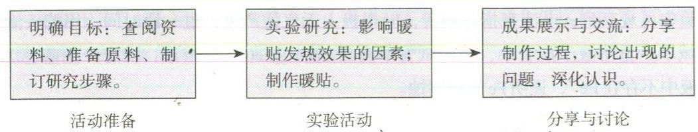

## 1. 活动准备

将学生分组后可布置任务。

任务一：分析暖贴的特点，对制作暖贴所需要的原料及发热原理提出猜想。

任务二：进行调研，并对实际情况进行分析，了解制作暖贴所需的原料和制作方法。

## 2. 实验活动

学生可以根据暖贴的特点选择合适的原料，设计实验方案，以小组合作的形式进行实验论证，从原料种类、用量、配比等方面研究影响暖贴发热效果的因素。在实验与制作过程中，教师需要提供指导，例如，怎样控制变量、怎样保证实验安全等。同时，教师要及时了解学生在研究过程中遇到的问题，为学生答疑解惑，也为第三环节的分享与讨论积累素材。

## 3. 分享与讨论

教师可以先展示一款市场上的暖贴，引导学生从包装是否美观、成本高低、是否环保、携带是否便利、放出热量多少、放热反应快慢和发热持续时间长短等多角度分析，丰富学生对暖贴特点的认识。

学生汇报研究过程与发现的问题时，教师要及时引导学生将所得证据和遇到的问题进行分类整理，强调研究过程中要注意控制变量，重点引导学生分析化学原理。

学生展示自己制作的暖贴成品时，教师要适时给予鼓励和肯定，对不完善的成品要提出改进的建议，同时启发学生思考暖贴用过之后其内容物的处置方法，以培养学生的社会责任感。

## 六、练习与应用参考答案及说明

1. 金属与其表面接触的一些物质直接反应而引起的腐蚀叫做金属的化学腐蚀。

当不纯的金属与电解质溶液接触时会发生原电池反应，比较活泼的金属发生氧化反应而被腐蚀，这种腐蚀叫做金属的电化学腐蚀。

金属被腐蚀后，在外形、色泽及机械性能等方面会发生变化，从而使机器设备、仪器、仪表的精度和灵敏度降低，直至报废；金属腐蚀还会使桥梁、建筑物的金属构架强度降低而造成坍塌；会使地下金属管道发生泄漏；等等。

## 2.（1）吸氧

$$
\mathrm{Fe} - 2 \mathrm{e} ^ {-} = \mathrm{Fe} ^ {2 +} \quad \mathrm{O} _ {2} + 4 \mathrm{e} ^ {-} + 2 \mathrm{H} _ {2} \mathrm{O} = 4 \mathrm{OH} ^ {-} \quad \mathrm{Fe} ^ {2 +} + 2 \mathrm{OH} ^ {-} = \mathrm{Fe(OH)} _ {2}
$$

3. 锌比铁活泼，当它们在潮湿的环境中形成原电池时，锌为负极，不断遭受腐蚀，铁作为锅炉的主体材料则受到保护。

## 复习与提升建议

## 一、复习与提升教学建议

## 1. 用图示法梳理基础知识，明晰电化学认知模型

## (1) 突出一类反应、实现一项转化

阅读教材 “整理与提升” 中的 “一、化学反应与电能”，使学生认识到化学能与电能的直接转化需要通过氧化还原反应在一定的装置中才能实现。原电池和电解池能使氧化反应和还原反应分别在两个电极上进行，原电池实现了化学能转化为电能，电解池实现了电能转化为化学能（如图4-5）。

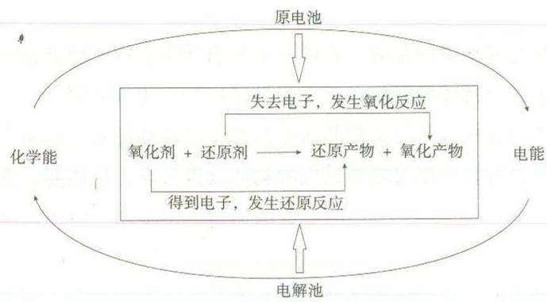  
图 4-5 化学能与电能的相互转化示意图

## (2) 对比两种装置, 辨识原电池、电解池及其工作原理

完成教材 “整理与提升” 中的 “二、原电池与电解池”，带领学生从实验入手，对比原电池和电解池的构成要素及其工作原理，归纳这两种装置的区别与联系（如图4-6），认识电极反应、电极材料、离子导体、电子导体是构成电化学体系的基本要素，帮助学生厘清电化学的系统分析思路。

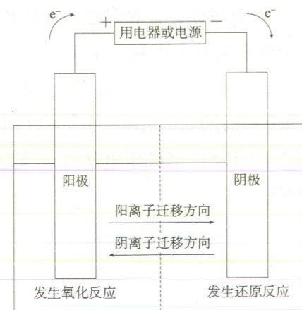  
离子交换膜或盐桥  
图 4-6 电化学装置工作原理示意图

## 2. 在实际问题解决中认识电化学原理的广泛应用

可通过查阅资料、交流研讨等活动，使学生认识电化学原理在实现能量转化、物质转化、探究物质性质和反应原理、进行环境监测及污染物的处理等方面的广泛应用。例如，暖贴的制作、金属铝的冶炼、 $Fe^{3+}$ 与 $I_{2}$ 的氧化性强弱比较、含铬污水的处理等。

## 二、复习与提高参考答案及说明

1. 正极: $\mathrm{Ag_2O + 2e^- + H_2O = 2Ag + 2OH^-}$ 负极: $\mathrm{Zn - 2e^- + 2OH^- = ZnO + H_2O}$

2. 负极: $\mathrm{Al}-3\mathrm{e}^{-}=\mathrm{Al}^{3+}$ 正极: $\mathrm{O}_{2}+2\mathrm{H}_{2}\mathrm{O}+4\mathrm{e}^{-}=4\mathrm{OH}^{-}$ 总反应: $4\mathrm{Al}+3\mathrm{O}_{2}+6\mathrm{H}_{2}\mathrm{O}=4\mathrm{Al(OH)}_{3}$

$$
\mathrm{Li} - \mathrm{e} ^ {-} = \mathrm{Li} ^ {+} \quad 3 \mathrm{SOCl} _ {2} + 8 \mathrm{e} ^ {-} = \mathrm{SO} _ {3} ^ {2 -} + 2 \mathrm{S} + 6 \mathrm{Cl} ^ {-}
$$

(2) $2H_{2}O + 2e^{-} = H_{2}\uparrow + 2OH^{-}$

(3) $2\mathrm{H}_{2}\mathrm{O} - 4\mathrm{e}^{-} = \mathrm{O}_{2}\uparrow +4\mathrm{H}^{+}$

（4）用拇指堵住a管口，取出a管，靠近火焰，移开拇指，有爆鸣声，管口有蓝色火焰

（5）用拇指堵住b管口，取出b管，移开拇指，将带火星的木条伸入试管内，木条复燃10.（1） $\mathrm{Cl}_{2} \quad \mathrm{H}_{2} \quad a\% < b\%$

(2) $\mathrm{O}_2 + 4\mathrm{e}^- + 2\mathrm{H}_2\mathrm{O} = 4\mathrm{OH}^-$ $\mathrm{H}_2 - 2\mathrm{e}^- + 2\mathrm{OH}^- = 2\mathrm{H}_2\mathrm{O}$

（3）燃料电池可以补充电解池消耗的电能；提高产出碱液中溶质的浓度；降低能耗（其他答案只要合理均可）

11. (1) $\mathrm{O}_2 + 2\mathrm{H}_2\mathrm{O} + 4\mathrm{e}^- = 4\mathrm{OH}^- \quad \mathrm{CH}_4 + 10\mathrm{OH}^- - 8\mathrm{e}^- = \mathrm{CO}_3^{2-} + 7\mathrm{H}_2\mathrm{O}$ (2) $\mathrm{H}_2$ $2\mathrm{NaCl} + 2\mathrm{H}_2\mathrm{O}\stackrel{\text{电解}}{=} 2\mathrm{NaOH} + \mathrm{H}_2\uparrow + \mathrm{Cl}_2\uparrow$ (3) 4

12. 镁比铁活泼，当它们在潮湿的土壤中形成原电池时，镁作负极不断遭受腐蚀，铁作为钢铁输水管或铁轨的主体材料则会受到保护。

## 实验活动4 简单的电镀实验

本实验内容属于电解原理的应用，可以帮助学生进一步认识构成电解池的四个要素及电解池的工作原理，培养学生的系统分析能力和动手能力，使他们学会对实际应用中的关键要素进行分析和提炼，从而与建构的电解池模型有效结合。

## 一、活动安排建议

1. 应注意发挥电解原理的指导作用。在学生动手实验之前，要让学生明确实验目的，尝试自行设计实验装置，讨论实验用品在实验中的作用，理解实验原理。

2. 本实验也可设计为项目活动，要求学生不仅完成在铁钉上镀铜，还要关注美观、实用、经济和环保等现实问题。为此，可布置学生查找资料、设计实验方案、分析论证、进行实验，最后在班内进行成果展示。

3. 实验结束后，要组织学生交流并讨论实验过程中遇到的问题。

## 二、注意事项

1. 电镀时最好使用新铁钉（如使用其他铁制品，应预先把镀件打磨光亮），经水洗（除去铁制品表层的尘污）、碱洗（除去油污）、酸洗（中和黏附的碱液）、水洗（除去残留的酸液），洗净后应立即进行电镀。

2. 向 1 mol/L $CuSO_{4}$ 溶液中边搅拌边滴加浓氨水，至溶液全部变为深蓝色的铜氨溶液，此时放入洗净的新铁钉，几秒钟后取出，没有铜析出，表明所配溶液中溶质的浓度适宜。

在室温下，用上述铜氨溶液做电镀液，通电10 s（通电时可用玻璃棒轻轻搅拌），在铁钉表面可看到光亮的紫红色。

3. 本实验中的电镀液也可采用下列配方：将175\~250 g 硫酸铜晶体、22\~38 mL 98% 浓硫酸、1.0\~1.5 g 酚磺酸溶于水配成1 000 mL 溶液。电镀时，控制平均电流密度为1\~2 A/dm²，温度为20\~30 ℃。

## 三、问题和讨论答案或提示

1. 电镀前，如果将铜片与直流电源的负极相连，铁制镀件与直流电源的正极相连，通电后，阳极反应为： $Fe-2e^{-}=Fe^{2+}$ ，阴极反应为： $Cu^{2+}+2e^{-}=Cu$ 。

2. 建议：以电镀为关键词在网上检索资料，了解工业生产中为提高电镀质量采用的方法。

## 实验活动5 制作简单的燃料电池

本实验具有一定的综合性，一方面根据电解原理，通过电解水制备氢气和氧气，实现电能转化为化学能；另一方面根据原电池原理，使氢气、氧气与电解质溶液组成燃料电池，实现化学能转化为电能。

## 一、活动安排建议

1. 充分发挥电化学原理的指导作用，实验前布置预习任务，让学生明确实验原理。

2. 可以要求学生在制作氢氧燃料电池的过程中，关注电流的强度、电流的稳定性、续航时间等问题。

3. 实验结束后，要指导学生分别用图示和符号来表征电解水和氢氧燃料电池的工作原理，进一步提升对电化学模型的认识，实现由实践到理性认识的飞跃。

## 二、注意事项

1. 石墨棒在使用前应该经过烘干活化处理。普通石墨棒表面较光滑，在电解过程中难以吸附较多的氢气和氧气，导致电流表指针偏转时间较短，实验效果不明显。可将石墨棒置于高温火焰上灼烧到红热状态，再投入冷水中，使其表面变得粗糙多孔。

2. 由于石墨电极表面存在差异、材质不纯或表面吸附空气等原因，在没有进行电解水获得氢气和氧气的实验时，也可能会形成微弱的电流。因此，建议不要使用检流计或毫安表来检验。

3. 若采用发光二极管代替电流表，要注意正确判断其正极和负极，防止因二极管的电极接反而导致其不能发光。发光二极管灯脚中，长脚为正极，短脚为负极。

## 三、问题和讨论答案或提示

提示：在氢氧燃料电池中，电解质溶液可以是酸性的，也可以是碱性的。在电解水时，为增强导电性，常在水中滴加几滴稀硫酸或NaOH溶液等电解质溶液。

<table><tr><td>电化学反应</td><td>氢氧燃料电池(电解质溶液为酸性)</td><td>电解水(向水中滴加几滴稀硫酸)</td></tr><tr><td>氧化反应</td><td>负极: $H_2 - 2e^- = 2H^+$ </td><td>阳极: $2H_2O - 4e^- = O_2 \uparrow + 4H^+$ </td></tr><tr><td>还原反应</td><td>正极: $O_2 + 4e^- + 4H^+ = 2H_2O$ </td><td>阴极: $2H_2O + 2e^- = H_2 \uparrow + 2OH^-$ </td></tr><tr><td>能量转化</td><td>化学能转化为电能</td><td>电能转化为化学能</td></tr></table>

## 教学资源

## 1. 电化学简史

电化学研究的最早记录是1789年,伽伐尼（L. Galvani）用外科手术小刀的刀尖触及已被解剖的青蛙的脚杆神经，发现这时青蛙四肢肌肉强烈收缩发生痉挛。伽伐尼认为这是一种生物电现象。伏打（A. Volta）知道这一结果后，从物理学角度进行研究。他认为这种所谓生物电是由两种金属接触所形成，青蛙肌肉起了导电的作用。1799年，他研制了能维持一定电流的电堆。同年，卡里斯尔（A. Carlisle）和尼科尔森（W. Nicholson）用这种电堆进行水的电解，得到了氢气和氧气。1807年，戴维（S. H. Davy）利用伏打电堆电解制得钾和钠。1808年，他利用汞作为阴极，又得到镁、钙、锶、钡。1833年，法拉第（M. Faraday）发表了著名的电解定律。1839年，格罗夫发明了燃料电池，利用氢气和氧气获得电能。1889年，能斯特（W. H. Nernst）提出了计算电极电势的热力学方程。1905年，塔费尔（J. Tafel）发现超电势与电流密度的对数呈线性关系，得出了塔费尔方程。能斯特方程与塔费尔方程分别在热力学和动力学两个方面为电化学研究奠定了基础。然而在20世纪上半叶，热力学的研究占主导地位，动力学研究相对迟缓，除了苏联弗鲁姆金（A. H. Фрумкин）的电极过程动力学研究，几乎都是在能斯特方程基础上的进展。20世纪50年代以后，超电势得到确认，人们开始认识到实际的电化学过程偏离平衡相当远，电化学动力学研究又开始活跃起来。

除了宏观层次的热力学和动力学研究，分子层次的研究也在不断发展。其中，自1879年亥姆霍兹的第一个平板电容器模型以来，电极-溶液界面双电层的结构跨越了一百多年的历史，这种研究的目的是从理论上阐明电极电势的本质，并能对电极电势进行预测，研究中主要应用统计力学和静电学原理。20世纪50年代以后，利用量子力学和固体物理理论研究电极-溶液界面又有新的发展。分子层次的另一类研究是电极反应的机理和速率理论，从1931年格内（R. Gurney）应用薛定谔方程研究金属到溶液的位垒，以及电荷转移的速率开始，特别是20世纪下半叶，出现了许多新的理论和模型。

电化学应用遍及化工、材料、能源、生命及环境各领域，举例如下。

电合成：电解食盐溶液制氯和烧碱，电化还原丙烯腈制己二腈，有机酸的电化氟化。

电催化：制氢，烃类氧化，其中电极材料起关键作用。

电生长：电解法冶炼铝、钽，电镀。

电分离：不同金属由于析出时的电势不同而实现电解分离。

化学电源：蓄电池，干电池（包括纽扣电池），燃料电池（氢-氧、肼-空气、镁-空气、铝-空气、锌-空气电池等）。

材料保护：电化学腐蚀，电化学防腐。

光电化学: 以半导体 $\mathrm{TiO}_{2}$ 或 $\mathrm{Ge}$ 为电极吸收光使水分解, 光电化学电池 (用光使试剂离解形

成燃料电池）。

生物电化学：细胞膜（绝缘体）的电势，血凝对基体电势的依赖，心电图，脑电波。

电化学分析：极谱分析，安培滴定，库仑滴定。

所有这些应用领域，其基本过程都涉及电极-溶液界面所发生的化学反应，都要应用电化学原理。

[摘编自：胡英主编：物理化学（第4版）.北京：高等教育出版社，1999]

## 2. 电极和电极反应

以热力学可逆方式进行的由化学能转化为电能的装置称为可逆电池。可逆电池由两个可逆电极组成，每一个电极由氧化态物质和对应的还原态物质构成（也称半电池），电极上发生的氧化反应或还原反应称为电极反应。在可逆电极上进行的电极反应必须是可逆的。常用的可逆电极有如下三类。

第一类：金属电极和气体电极。

金属电极是将金属浸入含有该金属离子的溶液所构成，用符号表示为 $M|M^{n+}$ ，电极反应为：

$$
\mathrm{M} \rightleftharpoons \mathrm{M} ^ {n +} + n \mathrm{e} ^ {-}
$$

气体电极由气体单质与其相应的离子溶液所构成。由于气体本身不导电，通常用惰性电极（如Pt）作导体，Pt片浸入含有相应离子的溶液中，并有气体流冲击Pt片。如氢电极 $(\mathrm{Pt})\mathrm{H}_{2}|\mathrm{H}^{+}$ 或 $(\mathrm{Pt})\mathrm{H}_{2}|\mathrm{OH}^{-}$ ，氧电极 $(\mathrm{Pt})\mathrm{O}_{2}|\mathrm{H}^{+}$ 或 $(\mathrm{Pt})\mathrm{O}_{2}|\mathrm{OH}^{-}$ 等，电极反应如下：

氢电极： $H^{+} + e^{-} \rightleftharpoons \frac{1}{2}H_{2}$ 酸性溶液

$$
\mathrm{H} _ {2} \mathrm{O} + \mathrm{e} ^ {-} \rightleftharpoons \mathrm{OH} ^ {-} + \frac {1}{2} \mathrm{H} _ {2}
$$

氧电极： $O_{2}+2H_{2}O+4e^{-}\rightleftharpoons4OH^{-}$

$$
\mathrm{O} _ {2} + 4 \mathrm{H} ^ {+} + 4 \mathrm{e} ^ {-} \rightleftharpoons 2 \mathrm{H} _ {2} \mathrm{O}
$$

第二类：难溶性盐电极和难溶性氧化物电极。

难溶性盐（包括微溶性盐）电极是在某种金属的表面覆盖一薄层该金属的一种难溶性盐，然后浸入含有该难溶性盐的阴离子的溶液而构成。这种电极反应的特点是它不与金属离子可逆，而是与难溶性盐的阴离子可逆。在电化学的研究中，本来能与阴离子发生电极反应且互为可逆的电极不多，除了气体电极几乎没有，所以难溶性盐电极的出现大大扩展了电化学的研究范围。常用的难溶性电极有甘汞电极和银-氯化银电极，它们分别用符号 $Hg-Hg_{2}Cl_{2}|Cl^{-}$ 和 $Ag-AgCl|Cl^{-}$ 表示。

甘汞电极的电极反应： $\mathrm{Hg_2Cl_2 + 2e^- \rightleftharpoons 2Hg + 2Cl^-}$

银-氯化银电极的电极反应: $AgCl + e^{-} \rightleftharpoons Ag + Cl^{-}$

难溶性氧化物电极是在金属表面覆盖一薄层该金属的氧化物，然后浸在含有 $H^{+}$ 或 $OH^{-}$ 的溶液中，如Hg-HgO $|H^{+}$ 和Hg-HgO $|OH^{-}$ ，其电极反应分别为：

$$
\begin{array}{l l}\mathrm {HgO + 2 H ^ {+} + 2 e ^ {-} \rightleftharpoons Hg+ H_ {2} O}&\text {酸性溶液}\\\mathrm {HgO+ H_ {2} O + 2 e ^ {-} \rightleftharpoons Hg + 2OH^ {-}}&\text {碱性溶液}\end{array}
$$

其他如 $SO_{4}^{2-}$ 、 $C_{2}O_{4}^{2-}$ 等阴离子都可构成与之可逆的第二类电极。

第三类：氧化还原电极。

任何电极上发生的电化学反应都有电子的失或得，因而都是氧化反应或还原反应。这里所述的氧化还原电极是指具有不同氧化态的同种元素相互转化而构成的电极，由惰性金属Pt片插入含有某种元素的不同价态的离子的溶液构成。以 $Fe^{2+}-Fe^{3+}$ 电极为例，可表示为Pt $|Fe^{2+}, Fe^{3+}$ ，其电极反应为

$$
\mathrm{Fe} ^ {3 +} + \mathrm{e} ^ {-} \rightleftharpoons \mathrm{Fe} ^ {2 +}
$$

以上三类电极的充、放电反应均互为逆反应。用这些电极组成电池，并且在热力学可逆方式下操作，即成为可逆电池。

[摘编自：印永嘉、姚天扬等编.化学原理（第1版）.北京：高等教育出版社，2007]

## 3. 电极电势

用导线连接原电池的两极就有电流通过，可见两个电极之间存在电势差，或者说，构成原电池两个电极的电势是不相等的。

当金属片放入盐溶液时，如果金属离子在金属晶体中所具有的电化学势比它在溶液中成为水合离子的电化学势高，那么金属离子就有成为水合离子而进入溶液的倾向。相反，如果金属离子在晶体中比它在水溶液中成为水合离子所具有的电化学势低，那么溶液中的金属离子就有沉积到金属晶体上的倾向。当金属离子由晶体进入溶液时，就使金属晶体上有过多的电子而带负电荷。随着由晶体进入溶液的金属离子数的增加，金属上所带的负电荷数也就增加，由于静电作用，晶体上的离子进入溶液的速率逐渐减小。另外，盐溶液中的金属离子也可能再从溶液中沉积到晶体上。盐溶液中溶质浓度越大，金属离子沉积到晶体上的速率越大。最后，金属和它的一定浓度的盐溶液必然会达到平衡，金属带一定量的负电荷，盐溶液则带同量的正电荷。金属越活泼，就越容易失去电子，它的离子进入溶液的倾向就越大。进入溶液的金属离子受晶体负电荷的吸引，聚

集到金属表面，成为一个正电荷层，跟晶体上的负电荷层形成所谓的双电层。在正、负电层之间，也就是金属和盐溶液之间，产生了一定的电势差，如图4-7a所示。如果把另一种金属放入盐溶液时，溶液中的金属离子沉积到金属晶体上，当达到平衡时，金属带正电荷，而溶液则由于有过多的阴离子而带负电荷，金属跟盐溶液之间也产生了相反的电势差，形成了双电层，如图4-7b所示。

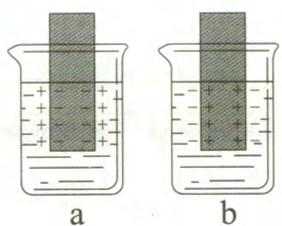  
图 4-7 双电层示意图

## 4. 电极电势的测定

我们现在还无法测定金属与盐溶液之间电极电势的绝对值，只能选用某种电极作为标准，其他电极与之比较，求得电极电势的相对值。通常采用标准氢电极作为比较的标准。

标准氢电极（如图4-8）是这样构成的：在铂片上镀一层蓬松的铂黑，把它放入 $c(\mathrm{H}^{+})$ 为1 mol/kg的硫酸中，在25℃时，不断地通入压强为100 kPa的纯净的 $H_{2}$ ，这时 $H_{2}$ 被铂黑吸收，而被吸收的 $H_{2}$ 又力图把自己的离子投入溶液，因此，这个电极像是由 $H_{2}$ 构成的。被 $H_{2}$ 饱和的铂片与 $c(\mathrm{H}^{+})$ 为1 mol/kg的硫酸之间所产生的电势差叫做标准氢电极的电极电势，规定它为零。

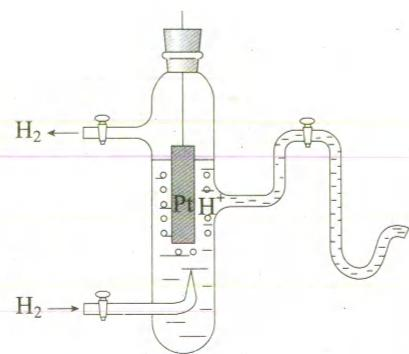  
图 4-8 标准氢电极示意图

为了测定金属的标准电极电势，可以把某种金属放入它的离子浓度为 $1\mathrm{mol / kg}$ 的盐溶液中，并跟标准氢电极构成原电池。测定这个原电池的电动势，就可以求得这种金属的标准电极电势，常用 $\varphi^{\ominus}$ 表示。几种常见电极的标准电极电势列于表4-1中。

表4-1 常见电极的标准电极电势（25℃）

<table><tr><td>电极(氧化态/还原态)</td><td>电极过程</td><td> $\varphi^{\ominus}/V$ </td></tr><tr><td> $Li^{+}/Li$ </td><td> $Li^{+} + e^{-} \rightleftharpoons Li$ </td><td>-3.045</td></tr><tr><td> $K^{+}/K$ </td><td> $K^{+} + e^{-} \rightleftharpoons K$ </td><td>-2.924</td></tr><tr><td> $Ca^{2+}/Ca$ </td><td> $Ca^{2+} + 2e^{-} \rightleftharpoons Ca$ </td><td>-2.76</td></tr><tr><td> $Na^{+}/Na$ </td><td> $Na^{+} + e^{-} \rightleftharpoons Na$ </td><td>-2.7109</td></tr><tr><td> $Mg^{2+}/Mg$ </td><td> $Mg^{2+} + 2e^{-} \rightleftharpoons Mg$ </td><td>-2.375</td></tr><tr><td> $Al^{3+}/Al$ </td><td> $Al^{3+} + 3e^{-} \rightleftharpoons Al$ </td><td>-1.706</td></tr><tr><td> $Zn^{2+}/Zn$ </td><td> $Zn^{2+} + 2e^{-} \rightleftharpoons Zn$ </td><td>-0.7628</td></tr><tr><td> $Fe^{2+}/Fe$ </td><td> $Fe^{2+} + 2e^{-} \rightleftharpoons Fe$ </td><td>-0.409</td></tr><tr><td> $Ni^{2+}/Ni$ </td><td> $Ni^{2+} + 2e^{-} \rightleftharpoons Ni$ </td><td>-0.23</td></tr><tr><td> $Sn^{2+}/Sn$ </td><td> $Sn^{2+} + 2e^{-} \rightleftharpoons Sn$ </td><td>-0.1364</td></tr><tr><td> $Pb^{2+}/Pb$ </td><td> $Pb^{2+} + 2e^{-} \rightleftharpoons Pb$ </td><td>-0.1263</td></tr><tr><td> $H^{+}/H_{2}$ </td><td> $2H^{+} + 2e^{-} \rightleftharpoons H_{2}$ </td><td>0.00</td></tr><tr><td> $Sn^{4+}/Sn^{2+}$ </td><td> $Sn^{4+} + 2e^{-} \rightleftharpoons Sn^{2+}$ </td><td>+0.15</td></tr><tr><td> $Cu^{2+}/Cu$ </td><td> $Cu^{2+} + 2e^{-} \rightleftharpoons Cu$ </td><td>+0.3402</td></tr><tr><td> $O_{2}/OH^{-}$ </td><td> $H_{2}O + \frac{1}{2}O_{2} + 2e^{-} \rightleftharpoons 2OH^{-}$ </td><td>+0.401</td></tr><tr><td> $Cu^{+}/Cu$ </td><td> $Cu^{+} + e^{-} \rightleftharpoons Cu$ </td><td>+0.522</td></tr><tr><td> $I_{2}/I^{-}$ </td><td> $I_{2} + 2e^{-} \rightleftharpoons 2I^{-}$ </td><td>+0.535</td></tr><tr><td> $O_{2}/O_{2}^{2-}$ </td><td> $O_{2} + 2H^{+} + 2e^{-} \rightleftharpoons H_{2}O_{2}$ </td><td>+0.682</td></tr><tr><td> $Fe^{3+}/Fe^{2+}$ </td><td> $Fe^{3+} + e^{-} \rightleftharpoons Fe^{2+}$ </td><td>+0.770</td></tr><tr><td> $Ag^{+}/Ag$ </td><td> $Ag^{+} + e^{-} \rightleftharpoons Ag$ </td><td>+0.7996</td></tr><tr><td> $Br_{2}/Br^{-}$ </td><td> $Br_{2} + 2e^{-} \rightleftharpoons 2Br^{-}$ </td><td>+1.087</td></tr><tr><td> $Cl_{2}/Cl^{-}$ </td><td> $Cl_{2} + 2e^{-} \rightleftharpoons 2Cl^{-}$ </td><td>+1.3583</td></tr><tr><td> $S_{2}O_{8}^{2-}/SO_{4}^{2-}$ </td><td> $S_{2}O_{8}^{2-} + 2e^{-} \rightleftharpoons 2SO_{4}^{2-}$ </td><td>+2.0(+2.05)</td></tr><tr><td> $F_{2}/F^{-}$ </td><td> $F_{2} + 2e^{-} \rightleftharpoons 2F^{-}$ </td><td>+2.87</td></tr></table>

$\varphi^{\ominus}$ 值的大小标志着还原态物质在溶液中失去电子转变为氧化态物质的难易程度。 $\varphi^{\ominus}$ 值越负，

说明该电对中还原态物质失电子的能力越强，是强还原剂，其对应的氧化态物质氧化能力越弱； $\varphi^{\ominus}$ 值越正，说明该电对中氧化态物质得电子的能力越强，是强氧化剂，其对应的还原态物质还原能力越弱。表中物质Li是最强的还原剂， $\mathrm{F}_2$ 是最强的氧化剂。

氧化还原反应总是在得电子本领强的氧化剂和失电子本领强的还原剂间发生，换言之，较强的氧化剂和较强的还原剂相互反应而生成较弱的还原剂和较弱的氧化剂。因此，利用电极电势可以判断氧化还原反应进行的方向。

从在标准电极电势表上的位置来看，右上方的还原剂跟左下方的氧化剂能自发地发生氧化还原反应。例如，判断 $Sn^{2+} + 2Fe^{3+} = Sn^{4+} + 2Fe^{2+}$ 的反应能否自发地向右进行时，我们发现 $Sn^{2+}$ 是还原剂， $Fe^{3+}$ 是氧化剂，查表得：

$$
\begin{array}{l l}\mathrm{Sn} ^ {4 +} + 2 \mathrm{e} ^ {-} \rightleftharpoons \mathrm{Sn} ^ {2 +}&\varphi^ {\ominus} = + 0. 1 5 \mathrm{V}\\\mathrm{Fe} ^ {3 +} + \mathrm{e} ^ {-} \rightleftharpoons \mathrm{Fe} ^ {2 +}&\varphi^ {\ominus} = + 0. 7 7 0 \mathrm{V}\end{array}
$$

电极电势代数值小的电对中的还原态物质是较强的还原剂，而电极电势代数值大的电对中的氧化态物质是较强的氧化剂，所以反应可以进行。反之，以 $Sn^{4+}$ 为氧化剂， $Fe^{2+}$ 为还原剂，反应就不能进行。

必须注意的是，电极电势可以说明氧化还原反应能否进行，但它却不能说明反应的速率。例如，用氧气氧化氢气的电对的电势差（1.23 V）是足够大的，反应能够进行，但在室温下，这个反应的速率小得不能量度，只有在升高温度或加入催化剂时才能使反应速率增大。

## 5. 生物电与膜电位

在研究青蛙抽搐后，伽法尼提出了“生物电”的假说，他还与伏打就产生电的原因发生了争论。其实，后来的大量研究证明他也没有错误，只是两人的认识角度不同罢了。例如，伽法尼后来完成的神经接触肌肉引起肌肉收缩的“无金属收缩”实验，证明了生物电的存在。

生物电是普遍存在的。例如，为了猎食、攻击和防卫，电鳗可以自身放电，由头部到尾部串联而成的几千个肌电板放电时高达几百伏。那么，生物电是怎样产生的呢？20世纪初形成和发展的“膜学说”认为，大多数动物的细胞膜内、外液中的 $Na^{+}$ 、 $K^{+}$ 浓度明显不同：细胞膜内的 $K^{+}$ 浓度高于细胞膜外的，细胞膜外的 $Na^{+}$ 浓度高于细胞膜内的。这种浓度差主要依赖细胞膜上的 $Na^{+}$ 通道、 $K^{+}$ 通道和 $Na^{+}-K^{+}$ 泵等特殊结构的蛋白质来维持。用一种只允许 $M^{+}$ 透过而 $X^{-}$ 不能透过的半透膜（如细胞膜）隔开不同浓度的MX溶液时，由于 $M^{+}$ 在膜两边的浓度不同而产生电势差（膜电势）。当细胞处于静息状态， $K^{+}$ 通道开启、 $Na^{+}$ 通道关闭，离子迁移达到平衡时， $K^{+}$ 在膜内、外的电化学势相等，形成膜内为负、膜外为正的静息电位（电势差）。常温下，神经细胞的静息电位的计算如下式：

$$
\frac {R T}{F} \ln \frac {c _ {\text {膜外}} (\mathrm{K} ^ {+})}{c _ {\text {膜内}} (\mathrm{K} ^ {+})} = \frac {8 . 3 1 4 \mathrm{J} \cdot \mathrm{mol} ^ {- 1} \cdot \mathrm{K} ^ {- 1} \times 2 9 8 \mathrm{K}}{9 6 5 0 0 \mathrm{C} \cdot \mathrm{mol} ^ {- 1}} \ln \frac {1}{3 5} = - 9 1 \mathrm{mV}
$$

通过实验测定的神经细胞的静息电位一般为 $-70 \mathrm{mV}$ ，这是由于活体细胞中溶液不是处于平衡状态所造成的。当细胞受到刺激而兴奋时， $\mathrm{Na}^{+}$ 通道开启，膜外的 $\mathrm{Na}^{+}$ 在短时间内迅速流入膜内，使膜内负电位快速升至零，进而转正，这种跨膜电位的变化称为动作电位（电势差）。这种电位变化时间极短，约为 $0.001 \mathrm{~s}$ ，之后细胞膜上 $\mathrm{Na}^{+}$ 通道关闭、 $\mathrm{K}^{+}$ 通道开启， $\mathrm{Na}^{+}-\mathrm{K}^{+}$ 泵活动增强，膜电位又逐渐恢复为原来的静息电位。多数可兴奋细胞（如神经细胞、骨骼肌细胞和心肌细胞等）沿着一定方向以10\~100 m/s的速率向周围扩散，使整个区域都产生一次类似的电位变化（如神经兴奋传导、肌肉收缩和心脏搏动等）。我们的思维及通过视觉、听觉和触觉器官接受及传递外界信息的过程都与膜电势的变化有关。

随着科学和技术的发展，生物电的研究与应用越来越广泛。例如，心电图（ECG）、脑电图（EEG）、肌电图（EMG）和视网膜电图（ERG）等已经成为临床诊断的重要手段。一定频率、强度的电刺激也可以影响特定组织部位的生理状态和功能，如用心脏起搏器可使一时失控的心脏恢复正常节律活动。生物电在医疗、能源、信息技术、智能学习等领域将会有广阔的创新应用前景。

## 6. pH 计的工作原理

要测定某一溶液的 $\mathrm{pH}$ , 原则上可以用氢电极和甘汞电极构成如下电池:

$$
\mathrm{Pt} \left| \mathrm{H} _ {2} (p ^ {\ominus}) \right| \begin{array}{l} \text {待测溶液} \\ (\mathrm{pH} = x) \end{array} \Bigg | \text {甘汞电极}
$$

在一定温度下，测定该电池的电动势（E）就能求出溶液的pH。氢电极对pH为0\~14的溶液都适用，但实际应用起来有许多不便之处。例如，氢气要很纯且需要维持一定的压力，溶液中不能有氧化剂、还原剂或不饱和的有机物；有些物质如蛋白质、胶体等易于吸附在铂电极上而使电极不灵敏、不稳定，因而导致误差。

玻璃电极是测定pH最常用的一种指示电极。它是一种 $H^{+}$ 选择性电极，在一支玻璃管下端焊接一个特殊原料制成的玻璃球形薄膜，膜内盛有一定pH的缓冲溶液或0.1 mol/kg的HCl溶液，溶液中浸入一根Ag|AgCl电极（称为内参比电极）。玻璃电极膜的组成一般是72%（质量分数，下同） $SiO_{2}$ 、22% $Na_{2}O$ 和6%CaO（这种玻璃电极可用于pH为1\~9的溶液，如改变组成，其使用范围可达1\~14）。玻璃电极具有可逆电极的性质，其工作原理可以认为是由于玻璃膜内、外溶液的pH不同，薄膜与溶液发生离子交换，因而产生了膜电势。当玻璃电极的膜浸入水溶液时，膜表面吸收水分，形成溶胀的硅酸盐层（水化凝胶层），厚度为0.05\~1.0 $\mu$ m，而中间的干玻璃层厚度则约为50 $\mu$ m。溶胀层中的 $Na^{+}$ 与水溶液中的 $H^{+}$ 交换，因而其表面具有一层能与溶液中 $H^{+}$ 达成交换平衡的 $H^{+}$ 层，整个玻璃电极可以看作是如下几层构成：

$$
\begin{array}{c c c c} \text {内参比电极} | \text {膜内部溶液} | \text {溶胀层} | \text {干玻璃层} | \text {溶胀层} | \text {待测溶液} \\ a _ {\text {内}} (\mathrm{H} ^ {+}) & a (\mathrm{H} ^ {+}) & a ^ {\prime} (\mathrm{H} ^ {+}) & a _ {\text {外}} (\mathrm{H} ^ {+}) \\ \mathrm{pH} _ {\text {已知}} & & & \mathrm{pH} _ {\text {未知}} \end{array}
$$

由于溶胀层中的 $c(\mathrm{H}^{+})$ 与所接触溶液的 $c(\mathrm{H}^{+})$ 不相等，因而发生 $\mathbf{H}^{+}$ 的扩散，形成了膜电势 $(\varphi_{\text{膜}})$ ， $\varphi_{\text{膜}}$ 与玻璃的质地及内、外溶液的 $c(\mathrm{H}^{+})$ 有关。

$$
\begin{array}{r l} \varphi_ {\text {玻}} & = \varphi_ {\text {内参}} + \varphi_ {\text {膜}} = \varphi_ {\text {玻}} ^ {\ominus} - \frac {R T}{F} \times 2. 3 0 3 \mathrm{pH} \\ & = \varphi_ {\text {玻}} ^ {\ominus} - 0. 0 5 9 1 6 \mathrm{V} \times \mathrm{pH} \end{array}
$$

当玻璃电极与另一甘汞电极组成电池时，就能依据测得的E求出溶液的pH。

$\mathrm{Ag} \mid \mathrm{AgCl(s)} \mid \mathrm{HCl(0.1 mol/kg)}$ 溶液 $(\mathrm{pH} = x)$ 甘汞电极

## 玻璃电极 玻璃膜

在298 K时，可得：

$$
E = \varphi_ {\mathrm{甘汞}} - \varphi_ {\mathrm{玻}} = 0. 2 8 0 1 \mathrm{V} - (\varphi_ {\mathrm{玻}} ^ {\ominus} - 0. 0 5 9 1 6 \mathrm{V} \times \mathrm{pH})
$$

经整理后得:

$$
\mathrm{pH} = \frac {E - 0 . 2 8 0 1 \mathrm{V} + \varphi_ {\mathrm{玻}} ^ {\ominus}}{0 . 0 5 9 1 6 \mathrm{V}}
$$

式中 $\varphi_{玻}^{\ominus}$ 对某给定的玻璃电极为一常数，但对于不同的玻璃电极，由于玻璃膜的组成不同，制备过程不同，以及使用后表面状态不同程度的改变，致使它们的 $\varphi_{玻}^{\ominus}$ 也不全相同。原则上若用已知 pH 的缓冲溶液测得其 E，就能求出该电极的 $\varphi_{玻}^{\ominus}$ 。但实际上每次使用时，都需要先利用已知 pH 的溶液在 pH 计上进行调整，使 E 和 pH 的关系能满足上式，然后再来测定未知溶液的 pH，并可直接在 pH 计上读出 pH，而不必计算 $\varphi_{玻}^{\ominus}$ 。

因为玻璃膜的电阻很大，所以通过电池的电流很小，否则会由于内阻而造成电位降低，产生不可忽视的误差。此种借助玻璃专门用来测量溶液pH的仪器就称为pH计。

由于玻璃电极不受溶液中存在的氧化剂、还原剂的干扰，也不受各种“毒物”的影响，使用方便，所以得到广泛应用。

除了以上两种 $\mathrm{H^{+}}$ 可逆电极，还有醌-氢醌、 $\mathrm{Sb(s)-Sb_{2}O_{5}(s)}$ 、 $\mathrm{Hg(l)-HgO(s)}$ 等电极，它们均能用于测定溶液的 $\mathrm{pH}$ 。

[摘编自：傅献彩等编. 物理化学（第5版）. 北京：高等教育出版社，2006]

## 7. 化学传感器简介

随着科学技术的不断发展，人们希望在许多化学物质中有选择性地测出某种含量极少的特定物质。近年来发展迅速的化学传感器就是以化学物质为检测参数的传感器，它就像人的感觉器官那样具有“嗅觉”和“味觉”的功能。这种传感器在生物医学、环境保护、工业生产和人民生活等方面起着越来越重要的作用。

化学传感器的基本原理是利用敏感材料与被测物质中的分子、离子相互接触时所引起的电极电势、表面化学势的变化，或所发生的表面化学反应、生物反应，直接或间接地转换为电信号。化学传感器实际上是各种不同的专用电极，由于这种专用电极携带方便、使用简单、得到结果迅速、灵敏度高、可以检测浓度极低的物质（质量分数为 $10^{-6}$ ），所以在矿山开发、石油化工、医学和日常生活中越来越多地被用来作为易燃、易爆、有毒、有害气体的监测预报和自动控制的装置，或用来测定各种pH的溶液中含量极低的物质，甚至可以测量细胞中的离子浓度。

目前，化学传感器可归纳为半导体陶瓷气体传感器、电化学气体传感器、半导体场效应化学传感器和生物传感器等几类。这里仅以 $\mathrm{CO}_{2}$ 气敏电极为例来说明化学传感器的基本原理和使用方法。

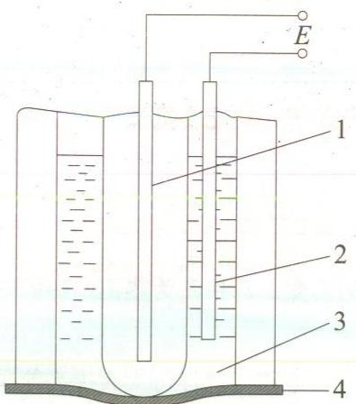  
图 4-9 CO $_{2}$ 气敏电极结构示意图

$CO_{2}$ 气敏电极是一种电化学气体传感器，这类传感器是在离子选择性电极的基础上发展起来的。它利用气敏电极或气体扩散电极测量混合气体或溶解在溶液中的某种气体的含量。这种电极上装有气体渗透膜，图4-9是 $CO_{2}$ 气敏电极的结构示意图。图中底部4是疏水性的微孔气体渗透膜，一般采用聚四氟乙烯微孔膜，只允许被测的 $CO_{2}$ 气体通过，其厚度为 $10^{-4}$ m；图中3是浓度为0.01 mol/L的 $NaHCO_{3}$ 溶液；图中2是参比电极，一般采用Ag|AgCl电极或甘汞电极；图中1是 $H^{+}$ 指示电极， $H^{+}$ 指示电极与参比电极组成原电池。

当该气敏电极插入含有 $CO_{2}$ 的溶液中时，由于 $CO_{2}$ 与 $H_{2}O$ 反应生成 $H_{2}CO_{3}$ ，影响了 $NaHCO_{3}$ 的电离平衡，只要测出 $H^{+}$ 指示电极与参比电极组成的原电池的电动势，就能计算出溶液中 $CO_{2}$ 的分压。

$$
\begin{array}{r l} & \mathrm {CO_ {2} + H_ {2} O\xrightarrow {K_ {1}} H_ {2} CO_ {3} \xrightarrow {K_ {2}} HC O_ {3} ^ {-} + H^ {+}} \\ & K _ {1} = \frac {c (\mathrm {H_ {2} CO_ {3}})}{c (\mathrm {CO_ {2}}) \cdot c (\mathrm {H_ {2} O})}, K _ {2} = \frac {c (\mathrm {H^ {+}}) \cdot c (\mathrm {HC O_ {3} ^ {-}})}{c (\mathrm {H_ {2} CO_ {3}})} \end{array}
$$

因为水的活度为1，所以有：

$$
c (\mathrm{H} ^ {+}) = \frac {K _ {1} \cdot K _ {2} \cdot c (\mathrm{CO} _ {2})}{c (\mathrm{HCO} _ {3} ^ {-})}
$$

由于 $c(\mathrm{HCO}_3^-)$ 很大，在反应中其活度可看作常数，则上式可以写为：

$$
c (\mathrm{H} ^ {+}) = K \cdot c (\mathrm{CO} _ {2}) \text {或} c (\mathrm{H} ^ {+}) = K \cdot p (\mathrm{CO} _ {2})
$$

式中 $K=\frac{K_{1}\cdot K_{2}}{c(\mathrm{HCO}_{3}^{-})}$ ，为常数； $p(\mathrm{CO}_{2})$ 表示 $CO_{2}$ 的分压，其大小与溶解的 $CO_{2}$ 成正比。由此看出，图中3溶液中的 $H^{+}$ 活度与被测溶液中 $CO_{2}$ 的分压成正比，故用pH玻璃电极指示 $H^{+}$ 活度，其膜电势为：

$$
\begin{array}{r l} \varphi_ {\mathrm{膜}} & = \mathrm{常数} + \frac {R T}{F} \ln a (\mathrm{H} ^ {+}) = \mathrm{常数} + \frac {R T}{F} \ln p (\mathrm{CO} _ {2}) \\ & E = \varphi_ {\mathrm{参比}} - \varphi_ {\mathrm{膜}} \end{array}
$$

测出电动势E就可以计算溶液中 $CO_{2}$ 的含量。

在生物医学中将这种气敏电极做成特殊的探针形式，可以检测动脉中 $CO_{2}$ 的含量或表皮上 $CO_{2}$ 的含量，这对危重患者的监护和手术监护起着重要作用。

[摘编自：傅献彩等编.物理化学（第5版）.北京：高等教育出版社，2006]

## 8. 燃料电池及其效率

目前我国使用的能源中，煤、石油、天然气等化石能源的使用量超过80%，将这些能源物质燃烧时所释放能量的利用途径为化学能→热能→机械能→电能。此能量转化途径中，就热能→机械能而言，其效率受热机的限制。

$$
\eta = \frac {- W}{Q} = \frac {- W}{\Delta_ {\mathrm{r}} H _ {\mathrm{m}}} = \frac {T _ {2} - T _ {1}}{T _ {2}}\tag{1}
$$

式（1）中 $\Delta_{r}H_{m}$ 为燃烧反应的焓变， $T_{1}$ 和 $T_{2}$ 为热机两热源的温度。因此，能量转化途径中能量利用率不超过 35%。

燃料电池能使化学能直接转化为电能，这样可大大提高能量利用率。

在电池中的化学反应都是燃料的氧化反应，现以氢氧燃料电池为例说明。

$$
(\mathrm{Ni}) \mathrm{H} _ {2} (\mathrm{g}) | \mathrm{KOH} (27 \%) | \mathrm{O} _ {2} (\mathrm{g}) (\mathrm{Ni})
$$

负极由惰性电极——含有Ni的碳棒（也可用Pt）和燃料 $H_{2}$ 组成，正极由惰性电极——含有Ni的碳棒（也可用Pt）和 $O_{2}$ 组成，电解质溶液为27%的KOH溶液，其电极反应和电池总反应如下。

负极： $\mathrm{H}_2(\mathrm{g}) + 2\mathrm{OH}^- -2\mathrm{e}^- \longrightarrow 2\mathrm{H}_2\mathrm{O}$

正极： $\frac{1}{2}\mathrm{O}_2(\mathrm{g}) + \mathrm{H}_2\mathrm{O} + 2\mathrm{e}^- \longrightarrow 2\mathrm{OH}^-$

电池总反应： $\mathrm{H}_2(\mathrm{g}) + \frac{1}{2}\mathrm{O}_2(\mathrm{g})\longrightarrow \mathrm{H}_2\mathrm{O}(\mathrm{l})$

电池可逆电动势和 $H_{2}$ 、 $O_{2}$ 的压力有关。在标态、25℃时：

$$
E = \varphi^ {\ominus} (\mathrm{O} _ {2} / \mathrm{OH} ^ {-}) - \varphi^ {\ominus} (\mathrm{OH} ^ {-} / \mathrm{H} _ {2}) = 0. 4 0 1 \mathrm{V} - (- 0. 8 2 8 1 \mathrm{V}) = 1. 2 2 9 \mathrm{V}
$$

反应的 $\Delta_{\mathrm{r}}H_{\mathrm{m}}^{\ominus} = \Delta_{\mathrm{r}}H_{\mathrm{m}}^{\ominus}(\mathrm{H}_{2}\mathrm{O},1) = -285.84\mathrm{kJ}\cdot \mathrm{mol}^{-1}$

$$
\eta = \frac {W}{Q} = \frac {\Delta_ {\mathrm{r}} G _ {\mathrm{m}}}{\Delta_ {\mathrm{r}} H _ {\mathrm{m}}} = \frac {\Delta_ {\mathrm{r}} H _ {\mathrm{m}} - T \Delta_ {\mathrm{r}} S _ {\mathrm{m}}}{\Delta_ {\mathrm{r}} H _ {\mathrm{m}}} = 1 - T \frac {\Delta_ {\mathrm{r}} S _ {\mathrm{m}}}{\Delta_ {\mathrm{r}} H _ {\mathrm{m}}}\tag{2}
$$

可以计算氢氧燃料电池理论能量利用率：

$$
\eta = \frac {- n E F}{\Delta_ {\mathrm{r}} H _ {\mathrm{m}}} = \frac {- 237.16 \mathrm{kJ} \cdot \mathrm{mol} ^ {- 1}}{- 285.84 \mathrm{kJ} \cdot \mathrm{mol} ^ {- 1}} \times 100 \% = 83 \%
$$

目前研制的氢氧燃料电池开路电压已达0.9 V。根据式（2），燃料电池能量利用率极高，一般超过80%，有时可达98%，在温度不高时能量利用率接近100%。表4-2中列出了一些燃料电池的能量利用率。

表4-2 一些燃料电池的能量利用率

<table><tr><td>反应</td><td> $\Delta_{\mathrm{r}}H_{\mathrm{m}}^{\ominus} / (\mathrm{kJ} \cdot \mathrm{mol}^{-1})$ </td><td> $E^{\ominus} / \mathrm{V}$ </td><td> $\eta / \%$ </td></tr><tr><td> $\mathrm{H}_{2}+\frac{1}{2}\mathrm{O}_{2}(\mathrm{g}) \longrightarrow \mathrm{H}_{2}\mathrm{O}(\mathrm{l})$ </td><td>-285.84</td><td>1.229</td><td>83</td></tr><tr><td> $\mathrm{CH}_{4}+2\mathrm{O}_{2}(\mathrm{g}) \longrightarrow \mathrm{CO}_{2}+2\mathrm{H}_{2}\mathrm{O}(\mathrm{l})$ </td><td>-890.36</td><td>1.060</td><td>92</td></tr><tr><td> $\mathrm{CH}_{3}\mathrm{OH}+\frac{3}{2}\mathrm{O}_{2} \longrightarrow \mathrm{CO}_{2}+2\mathrm{H}_{2}\mathrm{O}(\mathrm{l})$ </td><td>-719.23</td><td>1.207</td><td>97</td></tr></table>

续表

<table><tr><td>反应</td><td> $\Delta_{r}H_{m}^{\ominus}/(kJ·mol^{-1})$ </td><td> $E^{\ominus}/V$ </td><td> $\eta/\%$ </td></tr><tr><td> $CO + \frac{1}{2}O_{2} \longrightarrow CO_{2}$ </td><td>-282.96</td><td>1.332</td><td>91</td></tr><tr><td> $N_{2}H_{4}(aq) + O_{2} \longrightarrow N_{2} + 2H_{2}O(l)$ </td><td>-605.84</td><td>1.559</td><td>99</td></tr><tr><td> $HCHO(aq) + O_{2} \longrightarrow CO_{2} + H_{2}O(l)$ </td><td>-519</td><td>1.301</td><td>97</td></tr><tr><td> $HCOOH(aq) + \frac{1}{2}O_{2} \longrightarrow CO_{2} + H_{2}O(l)$ </td><td>-269.32</td><td>1.425</td><td>87</td></tr></table>

[摘编自：印永嘉、姚天扬等编.化学原理（第1版）.北京：高等教育出版社，2007]

## 9. 分解电压和电极极化

电解时，电解池两极上的外加电压从零开始逐渐增加。当外加电压很小时，几乎没有电流通过电路，也看不到任何电解现象。直到电压增加到一定数值以后，电流才显著增大，电解才能顺利进行。

下面以铂作电极，电解 $0.100 \, mol/L \, Na_{2}SO_{4}$ 溶液为例进行说明。

将 $0.100 \mathrm{~mol} / \mathrm{L} \mathrm{Na}_{2} \mathrm{SO}_{4}$ 溶液按图 4-10 所示的装置进行电解, 通过可变电阻调节外电压, 从电流表可以读出在一定外加电压下的电流数值。接通电路并逐渐增大外加电压, 可以发现, 在外加电压增大到 $1.23 \mathrm{~V}$ 时, 电流仍很小, 电极上没有气泡产生; 当电压增大到 $1.7 \mathrm{~V}$ 时, 电流开始明显增大; 而后随着电压的增大, 电流迅速增大, 同时, 在两极上有明显的气泡产生, 电解能够顺利进行。通常把能使电解顺利进行的最低电压称为实际分解电压, 简称分解电压。

以电压为横坐标，电流密度（单位面积电极上通过的电流）为纵坐标，可将上述实验结果绘制成曲线图，如图4-11所示。图中D点的电压读数即为实际分解电压。各种物质的分解电压均可通过实验测定。

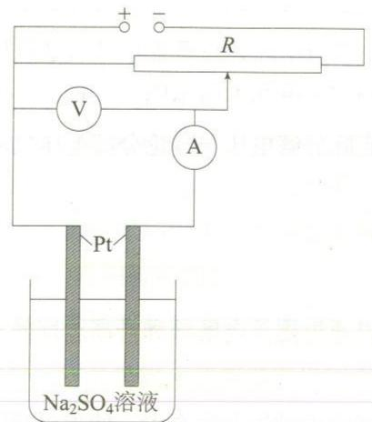  
图 4-10 测定分解电压的装置示意图

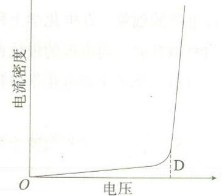  
图4-11 分解电压随电流密度变化的示意图

不同电解反应的分解电压不相同，原因可以从电极反应和电极电势来分析。以电解水为例（以硫酸钠为导电物质）。

阴极反应析出氢气： $2H_{2}O + 2e^{-} = H_{2}\uparrow + 2OH^{-}$ 阳极反应析出氧气: $\mathrm{H}_{2} \mathrm{O}-2 \mathrm{e}^{-}=\frac{1}{2} \mathrm{O}_{2} \uparrow + 2 \mathrm{H}^{+}$

部分氢气和氧气分别吸附在铂电极表面，组成了氢氧原电池：

$$
\mathrm{Pt} \left| \mathrm{H} _ {2} (1 0 0 \mathrm{kPa}) \right| \mathrm{Na} _ {2} \mathrm{SO} _ {4} (0. 1 0 0 \mathrm{mol/L}) \left| \mathrm{O} _ {2} (1 0 0 \mathrm{kPa}) \right| \mathrm{Pt}
$$

该原电池的电动势与外加直流电源的电动势相反。只有当外加直流电源（如蓄电池）的电压大于该原电池的电动势，才能使电解顺利进行。这样看来，分解电压是由于电解产物在电极上形成某种原电池，产生反向电动势而引起的。

分解电压的理论数值可以根据电解产物及溶液中有关离子的浓度计算得到。例如，对于上述电解水时形成的氢氧原电池，容易通过计算得出该原电池的电动势（E）。

0.100 mol/L $Na_{2}SO_{4}$ 溶液的 pH=7，即 $c(\mathrm{H}^{+})=c(\mathrm{OH}^{-})=1.00\times10^{-7}\mathrm{~mol/L}$ 。

氧电极反应： $\mathrm{H_2O + \frac{1}{2} O_2 + 2e^- = 2OH^-}$

氧电极电势： $\varphi (\mathrm{O}_2 / \mathrm{OH}^-) = \varphi^{\ominus} - \frac{RT}{2F}\ln \frac{[c(\mathrm{OH}^{-}) / c^{\ominus}]^{2}}{[p(\mathrm{O}_2) / p^{\ominus}]^{\frac{1}{2}}} = 0.401\mathrm{V} - (0.05917\mathrm{V})\lg (1.00\times 10^{-7}) = 0.815\mathrm{V}$

氢电极反应: $\mathrm{H}_{2}-2 \mathrm{e}^{-}=2 \mathrm{H}^{+}$

氢电极电势： $\varphi (\mathrm{H}^{+} / \mathrm{H}_{2}) = \varphi^{\ominus} - \frac{RT}{2F}\ln \frac{p(\mathrm{H}_2) / p^{\ominus}}{[c(\mathrm{H}^{+}) / c^{\ominus}]^{2}}$

$$
= \frac {(0 . 0 5 9 1 7 \mathrm{V})}{2} \lg (1. 0 0 \times 1 0 ^ {- 7}) ^ {2} = - 0. 4 1 4 \mathrm{V}
$$

此电解产物组成的氢氧电池的电动势为：

$$
E = 0. 8 1 5 \mathrm{V} - (- 0. 4 1 4 \mathrm{V}) = 1. 2 3 \mathrm{V}
$$

这就是说，为使电解水的反应能够发生，外加直流电源的电压不能小于1.23 V，这个由电解产物所形成的原电池产生的反电动势称为理论分解电压。然而，实验中所测得的实际分解电压为1.7 V，比理论分解电压高出很多，这是为什么呢？

按照能斯特方程计算得到的电极电势是在电极上（几乎）没有电流通过条件下的可逆电极电势，但当有可察觉量的电流通过电极时，电极电势会与上述的可逆电势有所不同。这种电极电势偏离可逆电极电势的现象，在电化学上称为极化。电解池中实际分解电压与理论分解电压之间的偏差，除了与电阻有关，与电极的极化也密切相关。

电极极化包括浓差极化和电化学极化两种情况。

## (1) 浓差极化

浓差极化现象是由于离子扩散速率缓慢所引起的，它可以通过搅拌电解液和升高温度使离子扩散速率增大而得到一定程度的消除。

在电解过程中，离子在电极上放电的速率总是比离子在溶液中的扩散速率大，使得电极附近的离子浓度与溶液中间部分的离子浓度有差异（在阴极附近的阳离子浓度小于溶液中间部分的阳离子浓度，而在阳极附近的阳离子浓度大于溶液中间部分的阳离子浓度），这种差异随着电解池中电流密度的增大而增大。不难理解，在浓差极化的情况下，为使电解池阳极上发生氧化反应，外电源加在阳极上的电势必须比没有浓差极化时的更大一些。同样可以理解，为使电解池阴极上发生还原反应，外电源加在阴极上的电势必须比没有浓差极化时的更小一些，也就是说，在浓差极化的情况下，实际分解电压（外电源两极之间的电势差）比理论分解电压要大。

## (2) 电化学极化

电化学极化是由电解产物析出过程中某一步骤（如离子的放电、原子结合为分子、气泡的形成等）反应速率迟缓而引起电极电势偏离可逆电势的现象，即电化学极化是由电化学反应速率决定的。一般情况下，对电解液的搅拌不能消除电化学极化的现象。

有显著的电流通过时电极的电势（ $\varphi_{实}$ ）与没有电流通过时电极的电势（ $\varphi_{理}$ ）之差的绝对值被定义为电极的超电势（ $\eta$ ），即：

$$
\eta = \mid \varphi_ {\mathrm{实}} - \varphi_ {\mathrm{理}} \mid
$$

电解时电解池的实际分解电压 $(E_{\text{实}})$ 与理论分解电压 $(E_{\text{理}})$ 之差则称为超电压 $(E_{\text{超}})$ ，即：

$$
E _ {\mathrm{超}} = E _ {\mathrm{实}} - E _ {\mathrm{理}}
$$

显然，超电压与超电势之间的关系为： $E_{超}=\eta_{阴}+\eta_{阳}$

在上述电解 $0.100 \mathrm{~mol} / \mathrm{L} \mathrm{Na}_{2} \mathrm{SO}_{4}$ 溶液的电解池中, 超电压为:

$$
E _ {\mathrm{超}} = E _ {\mathrm{实}} - E _ {\mathrm{理}} = 1. 7 0 \: \mathrm{V} - 1. 2 3 \: \mathrm{V} = 0. 4 7 \: \mathrm{V}
$$

影响超电势的因素主要有以下三个方面。

①电解产物。金属超电势较小，气体的超电势较大，而氢气、氧气的超电势则更大。

② 电极材料和表面状态。同一电解产物在不同电极上的超电势不同，且电极表面状态不同时超电势也不同。

③ 电流密度。随着电流密度的增大，超电势增大，因此，使用超电势的数据时，必须指明电流密度或具体条件。

电极上超电势的存在，使得电解所需的外加电压增大而消耗更多的能量，因此人们常常设法降低超电势。但是，有时超电势也会给人们带来便利。例如，在铁板上电镀锌时，如果没有超电势，由于 $\varphi(\mathrm{H}^{+}/\mathrm{H}_{2}) > \varphi(\mathrm{Zn}^{2+}/\mathrm{Zn})$ ，在阴极铁板上析出的是氢气而不是金属锌。但是，控制电解条件，使得氢的超电势变得很大，就可以析出金属锌了。

[摘编自：浙江大学普通化学教研组编. 普通化学（第5版）. 北京：高等教育出版社，2002]

## 10. 电解产物

如果电解的是熔融盐，电极采用铂或石墨等惰性电极，则电极产物只可能是熔融盐的阳离子在阴极上被还原和阴离子在阳极上被氧化后所得到的产物。例如，电解熔融 $MgCl_{2}$ ，在阴极得到金属Mg，在阳极得到 $Cl_{2}$ 。

如果电解的是盐类的水溶液，电解液中除了盐类离子，还有 $H^{+}$ 和 $OH^{-}$ 存在，电解时究竟是哪种离子先在电极上析出就值得讨论了。

从热力学角度考虑，在阳极上发生氧化反应的首先是析出电势（考虑超电势因素后的实际电极电势）较小的还原态物质；在阴极上发生还原反应的首先是析出电势较大的氧化态物质。

简单盐类的水溶液电解产物的一般情况如下。

## (1) 阴极析出的物质

①电极电势比 $\varphi(\mathrm{H}^{+}/\mathrm{H}_{2})$ 大的金属阳离子首先在阴极上被还原析出。

② 一些电极电势比 $\varphi (\mathrm{H}^{+} / \mathrm{H}_{2})$ 小的金属阳离子（如 $\mathrm{Zn}^{2+}$ 、 $\mathrm{Fe}^{2+}$ 等），则由于 $\mathrm{H}_{2}$ 的超电势较大，这些金属阳离子的析出电势仍可能大于 $\mathrm{H}^{+}$ 的析出电势（可小于-1.0V），因此，这些金属也会首先析出。

③ 电极电势很小的金属离子（如 $Na^{+}$ 、 $K^{+}$ 、 $Mg^{2+}$ 、 $Al^{3+}$ 等），在阴极不易被还原，而总是水中的 $H^{+}$ 被还原成 $H_{2}$ 而析出。

## (2) 阳极析出的物质

① 用金属材料（除了Pt等惰性电极，如Zn、Cu、Ag等）作阳极时，金属阳极首先被氧化成金属离子而溶解。

② 用惰性材料作电极时，溶液中存在 $S^{2-}$ 、 $Br^{-}$ 、 $Cl^{-}$ 等简单阴离子时，从标准电极电势看， $\varphi^{\ominus}(O_{2}/OH^{-})$ 比它们的小，似乎应该是 $OH^{-}$ 在阳极上易于被氧化而产生 $O_{2}$ 。然而，由于溶液中 $OH^{-}$ 浓度对 $\varphi^{\ominus}(O_{2}/OH^{-})$ 的影响较大，再加上 $O_{2}$ 的超电势较大， $OH^{-}$ 析出电势可大于1.7 V（甚至还要大）。因此，在电解 $S^{2-}$ 、 $Br^{-}$ 、 $Cl^{-}$ 等简单阴离子的盐溶液时，在阳极可以优先析出S、 $Br_{2}$ 和 $Cl_{2}$ 。

③用惰性材料作阳极且溶液中存在复杂离子时，如 $SO_{4}^{2-}$ ，其电极电势 $\varphi^{\ominus}(SO_{4}^{2-}/S_{2}O_{8}^{2-})=+2.01\ V$ ，比 $\varphi^{\ominus}(O_{2}/OH^{-})$ 的还要大，因而一般是 $OH^{-}$ 首先被氧化而析出 $O_{2}$ 。

例如，在电解NaCl浓溶液（以石墨作阳极，铁作阴极）时，在阴极能得到 $H_{2}$ ，在阳极能得到 $Cl_{2}$ ；在电解 $ZnSO_{4}$ 溶液（以石墨作阳极，铁作阴极）时，在阴极能得到Zn，在阳极能得到 $O_{2}$ 。

[摘编自：浙江大学普通化学教研组编.普通化学（第5版）.北京：高等教育出版社，2002]

## 11. 金属腐蚀的几种情况

金属腐蚀以不同的方式发生，这与环境有关。

一种情况是尘埃落在铁制品的表面上，空气中的水蒸气通过毛细管凝结，在尘粒下形成一个薄水层，水吸收空气中的 $CO_{2}$ 、 $SO_{2}$ 等形成电解液。如果水滴本身落在金属表面上，也会发生同样的情况，被溶有 $O_{2}$ 的电解液覆盖（如果NO浓度很高，即为硝酸所覆盖）的金属部分在尘粒下将发生腐蚀。由于对尘粒覆盖的中心部分供氧较少，而在尘粒的边缘有较多的 $O_{2}$ ，因此，金属

的溶解发生在尘粒的中部，而不是在边缘（如图4-12）。同样的情况发生在如图4-13与图4-14所示的腐蚀中，因为金属裂缝的外部被一薄层具有导电性的氧化物所覆盖，在其上面发生 $O_{2}$ 的阴极还原反应，而其内部没有保护层的部分发生腐蚀，由此裂缝内部加速了腐蚀。

另一种情况是金属构件（车身、桥梁等）的保护涂层中有擦伤或裂缝，使得腐蚀发生在涂层的里面，而不是在金属表面（如图4-15）。

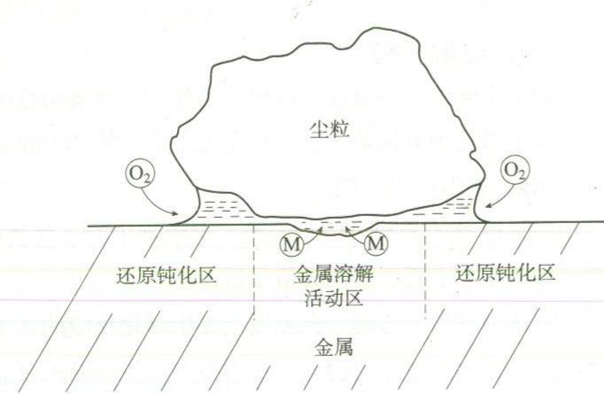  
图 4-12 在尘粒或水滴下，金属中心部位腐蚀示意图

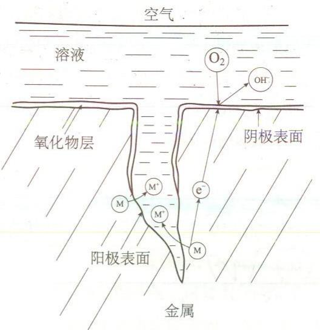  
图 4-13 金属裂缝内部腐蚀示意图

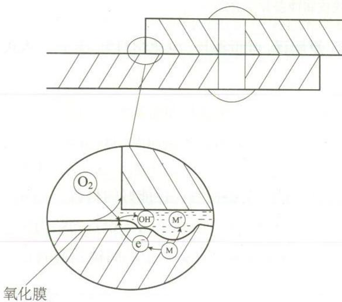  
图 4-14 两块金属板接缝内的腐蚀示意图  
图 4-15 保护涂层裂缝处的腐蚀示意图

地下管道通过不同的土壤（如一种是致密的黏土，另一种是多孔的沙土），由于金属表面的不同部位供氧量不同而产生的腐蚀，如图4-16所示。掩埋在黏土部分的管道比掩埋在沙土部分的管道腐蚀快，形成的腐蚀电池可产生高达5 A的腐蚀电流。这是因为铁在湿润的黏土中与在多孔、干燥的沙土中溶解速率不同，这个效应形成了腐蚀电池，而且如果沙土供氧充分，则铁管表面将部分或完全被钝化，这样就加速了黏土中铁管的腐蚀。

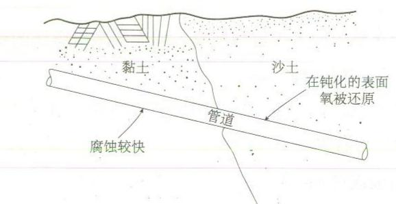  
图4-16 地下管道在黏土和沙土中腐蚀情况的对比示意图

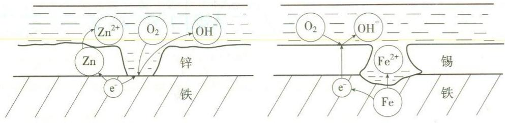  
图 4-17 白铁皮和镀锡的铁皮腐蚀差异示意图

白铁皮和镀锡铁皮的腐蚀情况如图4-17所示。镀锡的铁皮，如果在锡层上产生一个孔洞，则在锡层与孔底部的铁之间形成腐蚀电池。铁的腐蚀电势比锡的腐蚀电势低；若铁作为腐蚀电池的阳极发生溶解，铁皮就会穿孔。而镀锌的白铁皮，锌的腐蚀电势比铁的腐蚀电势低，如果在锌镀层上产生一个孔洞，在形成腐蚀电池时，锌是阳极，铁是阴极，锌被腐蚀，而铁受到了保护。这个原理可用于某些水下构件及船舶的保护。

[摘编自：J. O'M. 博克里斯，D. M. 德拉齐克著. 夏熙译. 叶世源校. 电化学科学. 北京：人民教育出版社，1980]

## 12. 金属的防护

## （1）正确选材和设计

根据金属材料的腐蚀数据，选择在特定环境中腐蚀率低、价格便宜、性能好的材料，是常用的、简便的控制腐蚀的方法，由此可以使设备获得经济、合理的使用寿命。由于设备的结构常常对腐蚀产生影响，所以正确的设计也很重要。另外，选材者也需要具备一定的腐蚀及防腐蚀知识，才能更完善地解决选材问题。

## (2) 调整介质环境

如果能消除金属材料和设备在使用环境中引起腐蚀的各种因素，腐蚀就会中止或减缓。但是多数环境条件是无法控制的，如大气和土壤中的水分、海水中的氧气等都不可能除去。生产流程也是不能任意改动的，这时可以调整局部环境。例如，锅炉进水前先除去水中的溶解氧（加入脱氧剂 $Na_{2}SO_{3}$ 或 $N_{2}H_{4}$ 等），可保护锅炉管少受腐蚀；先除去进入密闭仓库的空气中的水分，可避免贮存的金属部件生锈；在水中经常加入碱或酸以调节pH至最佳范围（通常接近中性），可以防止冷却水对换热器和其他设备的结垢、穿孔；炼制石油的工艺中也常加入碱或氨，使生产流体保持中性至弱碱性；等等。

## (3) 加入缓蚀剂

在可能引起金属腐蚀的介质中加入少量缓蚀剂，能大大减缓金属的腐蚀过程。缓蚀剂可分为无机缓蚀剂、有机缓蚀剂和气相缓蚀剂三类。

有些无机缓蚀剂使阳极氧化过程变慢，称为阳极型缓蚀剂，如促进阳极钝化的氧化剂（铬酸盐、亚硝酸盐、 $Fe^{3+}$ 等）或阳极成膜剂（碱、磷酸盐、硅酸盐、苯甲酸盐等）；另一类无机缓蚀剂能促进阴极极化，称为阴极缓蚀剂，如 $Ca^{2+}$ 、 $Zn^{2+}$ 、 $Mg^{2+}$ 、 $Cu^{2+}$ 、 $Cd^{2+}$ 、 $Mn^{2+}$ 、 $Ni^{2+}$ 等，能与在阴极反应中产生的 $OH^{-}$ 形成不溶性的氢氧化物，以厚膜形态覆盖在阴极表面，因而阻滞氧扩散到阴极，增大浓差极化。也有同时阻滞阳极过程和阴极过程的混合型缓蚀剂。有些溶液中的杂质，如S、Se、As、Sb、Bi等的化合物，能阻滞阴极放氢过程，使阴极极化增大，减缓腐蚀。缓蚀剂的用量一般要通过试验确定。

有机缓蚀剂属于吸附型缓蚀剂，它们吸附在金属表面形成几个分子厚的不可见膜，一般同时阻滞阳极反应和阴极反应，但阻滞效果并不相同。常用品种有含N、S、O或P的有机化合物，如胺类、杂环化合物、长链脂肪酸化合物、硫脲类、醛类和有机磷类等。缓蚀剂的吸附类型有静电吸附和化学吸附两种。静电吸附剂有苯胺及其取代物，吡啶，丁胺，苯甲酸及其取代物等；化学吸附剂有氮和硫的杂环化合物；有些化合物同时具有静电吸附和化学吸附作用。此外，有些螯合剂能在金属表面生成一薄层金属有机化合物。近年来，有机缓蚀剂发展很快，应用广泛。但是，使用这些缓蚀剂也会带来问题，如可能污染产品、可能对生产流程产生不利影响等。

气相缓蚀剂多是挥发性强的物质，也属于吸附型缓蚀剂。它的蒸气被大气中的水分解出有效的缓蚀基团，吸附在金属表面使腐蚀减缓，一般用于金属零部件的保护、贮藏和运输。它必须用于密封包装内，海洋油轮内舱也可用它来保护。常见的有效气相缓蚀剂有脂环胺和芳香胺，聚甲烯胺，亚硝酸盐和硫脲混合物，乌洛托品和乙醇胺，硝基苯和硝基萘等。

## （4）阴极保护

金属电化学腐蚀的过程中，微型电池的阴极是接受电子发生还原反应的电极，阳极是失去电子发生氧化反应的电极，只有阳极才发生腐蚀。阴极保护法就是将需要保护的金属作为腐蚀电池的阴极（原电池的正极）或作为电解池的阴极而不受腐蚀。前一种称为牺牲阳极法，后一种称为外加电流法。牺牲阳极法，就是将电极电位较低（较活泼）的金属或其合金连接在被保护的设备上。例如，在钢铁设备上连接Zn、Mg或Al合金，使它们在形成的原电池中作为阳极而被腐蚀，而金属设备作为阴极受到保护，这种被牺牲的阳极要定时更换。外加电流法，是在体系中连接导流电极（石墨、铂或钌、钛、高硅铁、废钢等）作为阳极，当外部导入的阴极电流使局部阴极电流与局部阳极电流相等、方向相反而相互抵消时，金属腐蚀停止，由此达到保护设备的目的。阴极保护法广泛用于土壤和海水中的金属结构、装置等，如管道、电缆、海船、港湾码头设施、钻井平台、水库闸门、油气井等。为了减少电流输入，延长金属设备的使用寿命，阴极保护法一般和金属表面涂料法联合应用，是一种经济简便、行之有效的金属防腐方法。

## (5) 阳极保护

当从外部通入电流时，一些可以钝化的金属电位随电流上升，达到致钝电位后，腐蚀电流急速下降，后随电位上升，腐蚀电流不变，直到过钝化区为止（如图4-18）。

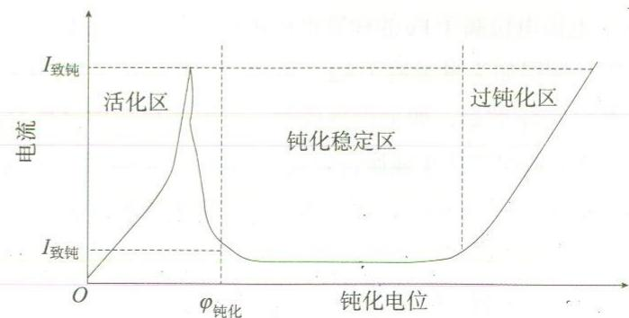  
图 4-18 一些金属阳极钝化曲线图

利用这个原理，以要保护的设备为阳极导入电流，使电位保持在钝化区的中段，腐蚀率可保持很低值。在保持钝化的电位区间，决定金属阳极溶解的电流密度大小的是钝化膜的溶解速率，所以，金属的钝态不是热力学稳定状态，而是一种远离平衡的耗散结构状态。阳极保护法需要一台恒电位仪来控制设备的电位（以免波动时进入活化区或过钝化区）。由于只适用于可钝化金属，所以这种方法的应用受到限制。在工业上，阳极保护法用于处理生产 $H_{2}SO_{4}$ 、 $H_{3}PO_{4}$ 、 $NH_{4}HCO_{3}$ 溶液及 $NH_{4}NO_{3}$ 复合肥等的不锈钢或碳钢制容器和设备等。

## (6) 合金化

在基体金属中加入一定比例的、能促进钝化的合金成分，便得到耐蚀性优良的材料。例如，在Fe中加入Cr，当Cr的含量达12%（质量分数，下同）以上时，就成为不锈钢，在氧化环境中它的表面可以生成钝化膜，有很高的耐蚀性。在铬钢中加入Ni，可扩大钝化范围，还可提高机械性能。含Cr 18%、Ni 9%的Ni-Cr不锈钢是工业和日常生活中应用最广的耐蚀合金。Ni-Cu合金中的Ni大于40%时，在一些环境中它们比纯Cu和纯Ni的耐蚀性更优越。一系列Ni合金是常用的耐蚀材料，例如，镍铸铁有优良的耐碱性；Ni-Mo-Cr合金是少数能耐高温非氧化性酸（如盐酸）的合金；Ni-Al-Cr-Fe合金能耐高温氧化性酸、次氯酸盐、海水等，比一般不锈钢更好。

## (7) 表面处理

金属保护中常用对其表面进行处理的方法来防止腐蚀。在接触使用环境前，先用钝化剂或成膜剂（铬酸盐、磷酸盐、碱、硝酸盐和亚硝酸盐混合液等）处理金属，在金属表面生成稳定密实的钝化膜，使其抗蚀性大大增加。例如，金属Al经过阳极处理，表面可以生成更为致密的膜，这类膜在温和的腐蚀环境（大气和水）中有优良的抗蚀能力。钢铁部件表面发蓝（生成磁性氧化铁的化学转化膜）也是一个广为应用的例子。在处理金属表面时，一般将钢铁部件放在充满Cr、Al、Si的粉末中，或在金属蒸气中将Cr、Mo、Si等易钝化的合金成分渗入钢铁表面（热渗镀）。表面渗镀层在氧化性环境内产生钝化膜，它的抗高温氧化能力和某些耐蚀性优于底层钢。离子注入法是一种较新的技术，一般用离子注入机使B、C、P、Si、N、Mo、Pd、Pt等元素或贵金属的电离加速，高能离子与基体金属相撞击而进入表面，形成一定深度和浓度的非晶态合金层，其耐蚀性大大提高。

## (8) 金属镀层和包覆层

在钢铁底层，常用电镀一薄层更耐腐蚀的金属（如Cr、Ni、Pb等）的方法来保护钢铁制品。如果用金属Zn、Cd等作镀层，构成腐蚀电池的极性则与上述相反，镀层微孔内裸露的钢为阴极，Zn或Cd的镀层为阳极，通过牺牲阳极，使钢得到保护。镀Sn的Fe（马口铁）广泛用于罐头生产，虽然Sn的标准电极电位高于Fe的标准电极电位，但在食品有机酸中Sn的却比Fe的低，也可起牺牲阳极的作用。镀层如为贵金属（Au、Ag等）、易钝化金属（Cr、Ti等）及Ni、Pb等时，由于它们的电极电位比Fe的高，如果出现破损，在电极反应中这些金属将成为阴极，会加速底层铁的腐蚀，因此这类镀层不适于强腐蚀环境（如酸），但可用于大气、水等环境。除了电镀，还常用热浸镀（熔融浸镀）、火焰喷镀和整体金属薄板包镀等方法。

## (9) 涂层

用有机涂料保护大气中的金属结构是应用最广的传统防腐蚀手段。市售各类油漆、清漆等都属于这一类，主要是由合成树脂、植物油、橡胶浆液、溶剂、助干剂、颜料及填料等配制而成，品种极多。过去以植物油为主的油漆现在大多被合成树脂漆所替代。这些涂料覆盖在金属表面，干后形成多孔薄膜，虽然不能使金属与介质完全隔绝，但增大了介质通过微孔的扩散阻力和溶液电阻，使得腐蚀电流下降。在缓和的环境（如大气、海水等）中，由于微孔底金属腐蚀缓慢，使得金属有很长的使用寿命。这种方法不适于强腐蚀溶液（如酸），因为金属腐蚀迅速并产生氢气，会使漆膜破裂。

涂料涂层的程序：首先是表面处理，这是最重要的一环，表面锈垢、油污等要彻底除净，否则会影响涂层与金属的黏结力；其次是选用底漆，一般加入红丹、铅酸钙、铬酸锌和锌粉等缓蚀剂，当微孔中渗入介质后可起缓蚀作用；最后是面漆，除了耐腐蚀，美观也是一个重要的目的，一般要涂几层面漆，使微孔尽量减少。

常用合成树脂的优良品种有环氧树脂、聚氨酯、氯磺化聚乙烯、氯化聚醚、酚醛和呋喃（糠醇）等。沥青是廉价但性能优良的涂料，也常和环氧树脂等混合应用于地下管道。天然树脂生漆是我国的特产，具有优良耐酸性和耐碱性，是一种高级涂料。

无机涂层中以锌粉为主的富锌漆应用广泛，它以合成树脂为黏结剂，干后表面锌膜具有导电性，作用和阴极保护相同，在大气中可以使用很久，也可以用于高温环境。

## (10) 衬里

适用于跟强腐蚀介质接触的设备内部。例如，盐酸、稀硫酸的贮槽用橡胶或塑料衬里，贮放硝酸的钢槽用不锈钢薄板衬里等。耐酸砖（硅砖）也广泛用于衬里。耐火砖衬里则可起隔热作用。搪瓷耐酸性强，广泛用于食品、医药等工业，可保证产品的质量。

## 教学案例

## 应用电解原理在纽扣上镀铜

中国人民大学附属中学朝阳学校 梁德娟

## 教学目标

1. 能依据电解原理设计在纽扣上镀铜的装置；能正确分析电镀池中离子的移动方向，正确书写电极反应。

2. 能准确记录实验数据与实验现象，能基于实验现象、实验事实分析影响电镀的因素，深化对电解原理的认识。

3. 能应用电解原理设计定量检测镀层厚度的装置，能简单分析“库仑法电子测厚仪”的电解原理与测厚方法。

4. 在定性与定量相结合评价电镀效果的过程中，体会电解原理的应用价值。

## 教学重点

电镀池模型的建构；电镀实验操作。

## 教学难点

应用电解原理，设计定量测定镀层厚度的方法。

## 教学流程

创设情境
温故而知新回忆电解原理，提出电镀任务。

将电解原理与真实问题关联。

应用电解原理，建构电镀池模型设计电镀装置，完成电镀实验。

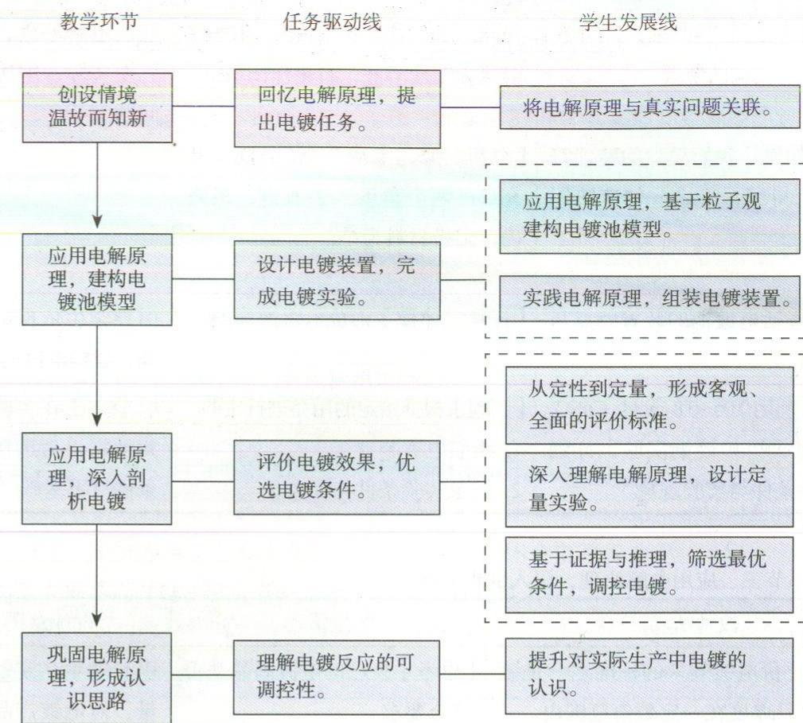

应用电解原理，基于粒子观建构电镀池模型。

实践电解原理，组装电镀装置。

从定性到定量，形成客观、全面的评价标准。

深入理解电解原理，设计定量实验。

基于证据与推理，筛选最优条件，调控电镀。

巩固电解原理，形成认识思路理解电镀反应的可调控性。

提升对实际生产中电镀的认识。

## 教学过程

课前准备：将金属纽扣用砂纸打磨干净，放入1 mol/L NaOH溶液中除去油污，然后用蒸馏水洗净；再放入20%盐酸中除锈，几分钟后取出，用蒸馏水洗净。

教学环节一、创设情境，温故而知新

<table><tr><td>教师活动</td><td>学生活动</td><td>设计意图</td></tr><tr><td>【提问】电解池工作原理。【提问】列举常见的电镀产品,思考电镀的目的。</td><td>【回忆】绘制出电解装置示意图,分析电解池工作原理。【回答】水龙头、门把手等。电镀的目的是美观、防止生锈,或者增加硬度。</td><td rowspan="2">让学生回顾电解原理,为建构电镀池模型打下基础。通过对比纽扣镀铜前后的差异,让学生感受电镀在生活中的应用。</td></tr><tr><td>【展示】银白色金属纽扣和镀铜纽扣。【讲解】电镀是利用电解原理,在某些金属表面镀上一薄层其他金属或合金的加工工艺。</td><td>【倾听】理解电镀和电解的关系。</td></tr></table>

教学环节二、应用电解原理，建构电镀池模型

<table><tr><td>教师活动</td><td>学生活动</td><td>设计意图</td></tr><tr><td>【任务1】依据电解原理,设计在金属纽扣上镀铜的装置。【提问】如何让我们设计的装置符合工业上持续、稳定、匀速镀铜的要求?【追问】概括电镀池的装置特点与工作原理。</td><td>【分析、设计】纽扣作阴极,电解质溶液为铜盐溶液,石墨作阳极。【分析、修正】从补充 $CuSO_{4}$ 、补充 $Cu^{2+}$ 两个角度入手改进,最终确定阳极材料为Cu。【迁移、建模】形成电镀池模型。</td><td>应用电解原理,结合工业实际,解决真实问题。引导学生依据电解原理,建构电镀池模型。</td></tr><tr><td>【任务2】利用0.05~0.8 mol/L  $CuSO_{4}$ 溶液,完成纽扣镀铜实验,详细记录实验条件与实验现象。</td><td>【实验】根据给定的用品进行实验。组装电镀装置。记录实验条件与现象。</td><td>引导学生在实验中寻找证据,为选择电镀条件打下基础。</td></tr></table>

教学环节三、应用电解原理，深入剖析电镀

<table><tr><td>教师活动</td><td>学生活动</td><td>设计意图</td></tr><tr><td>【介绍】评价电镀效果的标准之一是镀层均匀,且厚度在一定数值范围内。</td><td>【思考】自己的电镀制品是否符合要求。</td><td>引导学生从定性到定量,对电镀产品的外观和使用价值进行评价。</td></tr><tr><td>【任务3】根据提供的资料,设计应用电解原理测定镀层金属厚度的装置。【资料】将电压表与电解池并联,可以观测电解池中因溶解的金属种类不同而引起的电压的急剧变化。【介绍】“库仑法电子测厚仪”的特点和工作原理。【提问】结合“库伦法电子测厚仪”装置示意图及原理介绍,对比该装置和自己设计装置的异同。</td><td>【设计】将纽扣作为阳极进行电解。记录电解过程的电流强度和电解时间,结合纽扣表面积计算镀层厚度。【倾听】感受精密仪器设计的精巧之处。【分析】原理相同,但测厚仪固定了电解质溶液与镀层的接触面积,使得测定结果更精准。</td><td>引导学生应用电解原理设计进行定量测定的电解装置,发展思维能力。</td></tr></table>

续表

<table><tr><td>教师活动</td><td>学生活动</td><td>设计意图</td></tr><tr><td>【任务4】对比任务2中的电镀实验数据,分析电镀的影响因素,思考获得优质的镀铜纽扣应选择的电镀条件。</td><td>【分析】影响因素有电解质溶液中溶质的浓度、电镀时的电压、通电时间等。为获得优质的镀铜纽扣,应选择电解质溶液中溶质的浓度小、电压小、电镀时间稍长的电镀条件。</td><td>培养学生获取证据进行推理的能力,同时在对比分析中引导学生选择适宜条件来调控电镀。</td></tr></table>

教学环节四、巩固电解原理，形成认识思路

<table><tr><td>教师活动</td><td>学生活动</td><td>设计意图</td></tr><tr><td>【总结】今天,我们应用电解原理解决了一个真实的电镀问题。我们研究化学反应的目的之一是调控反应。在工业生产中,有更为精确地调控电镀反应的方法,如调控温度、加入络合剂等,有兴趣的同学课下可以继续进行研究。</td><td>【倾听】认识到从实验室到生产实践,还需要考虑更多的问题,体会电镀工业的科学性与复杂性。</td><td>让学生理解化学变化是可调控的。</td></tr></table>

## 板书设计

应用电解原理在纽扣上镀铜  
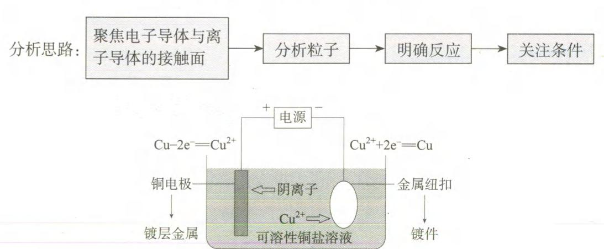  
镀层金属阳离子