# 教师教学用书

PUTONG GAOZHONG JIAOKESHU

JIAOSHI JIAOXUE YONGSHU

HUAXUE

登录“教师网络培训和服务平台”即刻免费获得优质、专业、全面的服务

◇ 独家权威解读新版本新课标教材

◇ 全面系统推出各科教材配套资源

◇ 在线活动引领课程教材教法改革

◇ 网络研修助力一线教师专业成长

请通过人教网顶部 “培训服务” 菜单访问本平台，或使用微信搜索并关注 “人教教材培训” 公众号，获取更多最新培训资讯和精彩内容。

人民教育出版社 课程教材研究所

化学课程教材研究开发中心

编著

## 化学

选择性必修 2

物质结构与性质

普通高中教科书

# 教师教学用书

人民教育出版社 课程教材研究所
化学课程教材研究开发中心 编著

化学

选择性必修2

物质结构与性质

图书在版编目（CIP）数据

普通高中教科书教师教学用书. 化学. 选择性必修2：物质结构与性质/人民教育出版社课程教材研究所化学课程教材研究开发中心编著. — 北京：人民教育出版社，2020.6

ISBN 978-7-107-34774-0

I. ①普… Ⅱ. ①人… Ⅲ. ①中学化学课—高中—教学参考资料 Ⅳ. ①G633

中国版本图书馆 CIP 数据核字（2020）第 107920 号

普通高中教科书 教师教学用书 化学 选择性必修2 物质结构与性质

出版发行 人民教育出版社
（北京市海淀区中关村南大街17号院1号楼 邮编：100081）

网址 http://www.pep.com.cn

经销 全国新华书店

印刷 保定市中画美凯印刷有限公司

版 次 2020年6月第1版

印 次 2020年8月第1次印刷

开 本 890 毫米 × 1240 毫米 1/16

印 张 11.25

字 数 280 千字

定 价 27.80 元

版权所有·未经许可不得采用任何方式擅自复制或使用本产品任何部分·违者必究如发现内容质量问题、印装质量问题，请与本社联系。电话：400-810-5788

## 说明

本书是根据教育部制订的《普通高中化学课程标准（2017年版）》和人民教育出版社课程教材研究所化学课程教材研究开发中心编著的《普通高中教科书 化学 选择性必修2 物质结构与性质》的内容和要求，以突出育人功能、确保科学规范、注重核心基础、体现时代要求为原则，结合高中化学教学实际情况编写的，供使用《普通高中教科书 化学 选择性必修2 物质结构与性质》的高中化学教师教学时参考。

从利于教师理解和体会课程标准，更好地使用教材，更高效地实施教学出发，全书对教材的内容按照章节进行了分析，提出教学建议，提供教学资源和典型教学案例。

本书按教材顺序对每章进行了整体说明，包括教材分析、学业要求和课时建议。教材分析从地位和功能、内容的选择与呈现、教学深广度及内容结构等方面对全章内容作出分析；学业要求指出本章在发展学生化学学科核心素养方面所要达到的目标；课时建议则是建议本章的教学课时。

对于教材中的各节，本书提供了内容分析、教学目标、教学建议、栏目使用建议、练习与应用参考答案及说明等。内容分析是对节的具体内容特点、知识结构进行较详细的介绍；教学目标指出本节需要达到的教学目的，以及教学重点和难点；教学建议是围绕节的内容，对教学设计思路、教学策略、教学方法等提出建议，并提出了一些教学方案参考；栏目使用建议是对“实验”“思考与讨论”“探究”等栏目提出具体的指导和建议，并对栏目所涉及的有关问题给予解答或提示；练习与应用参考答案及说明则是对节后的习题给予解答或提示。

教学资源和教学案例是按章编写的。教学资源主要编入一些与本章内容有关的化学知识、疑难问题解答，以及联系实际、新的科技信息和化学史等内容，以帮助教师更好地理解教材，并在教学时参考。教学案例主要选择本章中的典型课题，立足课堂教学实际，展示优秀案例。

本书内容仅供教师参考，授课时的教学方法由教师根据具体情况决定。

本书总主编：王晶、周业虹。

本册主编：李俊、杨剑春。

本册编写人员（按编写顺序）：李俊、杨剑春、邹正、叶菁、刘前树、陈懿、孙夕礼、崔邑诚。  
责任编辑：李俊。

责任绘图：昌梦洁。

本书内容难免有不妥之处，希望广大教师和教学研究人员提出意见和建议，以便修改和完善。

人民教育出版社 课程教材研究所
化学课程教材研究开发中心
2020年3月

## 目录

第一章 原子结构与性质 …… 1
本章说明 …… 1
第一节 原子结构 …… 3
第二节 原子结构与元素的性质 …… 13
复习与提升建议 …… 21
教学资源 …… 23
教学案例 …… 35

第二章 分子结构与性质 …… 52
本章说明 …… 52
第一节 共价键 …… 55
第二节 分子的空间结构 …… 60
第三节 分子结构与物质的性质 …… 70
复习与提升建议 …… 80
教学资源 …… 83
教学案例 …… 105

第三章 晶体结构与性质 …… 115
本章说明 …… 115
第一节 物质的聚集状态与晶体的常识 …… 118
第二节 分子晶体与共价晶体 …… 123
第三节 金属晶体与离子晶体 …… 127
第四节 配合物与超分子 …… 132
复习与提升建议 …… 138
实验活动 简单配合物的形成 …… 140
教学资源 …… 141
教学案例 …… 160

## 第一章

## 原子结构与性质

## 本章说明

本章在学生已有原子结构知识的基础上，进一步深入研究了原子结构，简述了构造原理及运用构造原理进行原子核外电子排布；运用电子云的概念，图文并茂地描述了原子轨道。在比较系统而深入介绍原子结构知识的基础上，使学生比较容易理解元素周期表的结构及元素周期律的知识，为后续章节内容的学习奠定了基础。

本章内容比较抽象，易成为学习难点。作为本书的第一章，教材从内容和形式上都比较注意激发和保持学生的学习兴趣，注重培养学生的化学学科核心素养。

## 一、教材分析

本章教材充分考虑了初中化学和高中化学（必修）中的原子结构知识的基础，注意知识的衔接与深化。本章内容包括原子结构、元素周期表和元素周期律等知识，教材以原子结构为基础，并在此基础上推演元素的性质。本章的内容结构如下图所示。

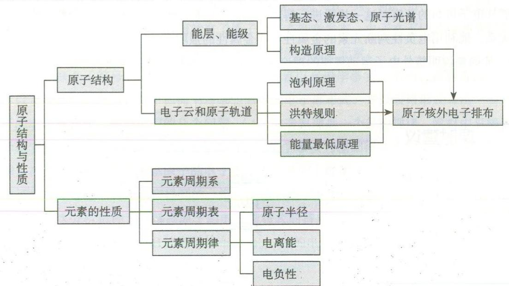

在第一节“原子结构”中，在学生已有原子结构知识的基础上，直接给出核外电子的能层（即“电子层”）和能级（即“电子亚层”）两个概念，给出每一能层有几个能级，每个能级最多可以容纳的电子数，并在能级的基础上引出原子的基态和激发态，以及原子光谱。有了能层和能级的概念，教材直接给出构造原理，并根据构造原理进行核外电子排布。这样一来，教材中没有出现四个量子数的概念，降低了学习难度。构造原理是一个经验规律，构造原理直接给出了原子核外电子排布的次序。该节在描述原子核外电子的运动状态时，借助电子云的概念，形象地引出了原子轨道。有了原子轨道的概念，运用原子轨道对原子核外电子的排布作进一步研究，进而介绍了泡利原理和洪特规则，以及能量最低原理。

在第二节“原子结构与元素的性质”中，首先，从元素周期律、元素周期系的角度说起元素周期表，然后，根据构造原理得出的核外电子排布，解释了元素周期系的基本结构，再通过“探究”栏目要求学生进一步认识元素周期表的结构。关于元素周期律，教材重点讨论原子半径、电离能和电负性的周期性变化。另外，多样化的图表是本章在呈现方式上的特点。

除学科知识外，本章拓展性栏目的选材也注意了对学生进行科学方法、科学态度的教育，如“科学史话”中提供的素材，既有利于对学生进行科学方法、科学态度的教育，也有利于激发学生的学习兴趣。

## 二、学业要求

1. 能说明微观粒子的运动状态与宏观物体运动特点的差异。

2. 能从基态与激发态说明核外电子在一定条件下会发生跃迁产生原子光谱。

3. 能结合能量最低原理、泡利不相容原理、洪特规则书写1\~36号元素基态原子的核外电子排布式和轨道表示式，并说明含义。

4. 能从原子价电子数目和价层电子排布的角度解释元素周期表的分区、周期和族的划分。能列举元素周期律（表）的应用。

5. 能说出元素电离能、电负性的含义，能描述主族元素第一电离能、电负性变化的一般规律，能从电子排布的角度对这一规律进行解释。能说明电负性大小与原子在化合物中吸引电子能力的关系，能利用电负性判断元素的金属性与非金属性的强弱。

6. 能简要说明核外电子运动规律的理论探究对研究元素性质及其变化规律的意义。

## 三、课时建议

第一节 原子结构 4课时  
第二节 原子结构与元素的性质 3课时  
全章复习 2课时

## 第一节 原子结构

## 一、内容分析

初中化学和高中化学必修课程中，已介绍了电子层、原子结构示意图、各电子层能容纳的电子数等知识。本节教材的编写围绕“核外电子排布”这个核心知识点，按两条线索进行编写，一是围绕核外电子排布介绍了构造原理，进而让学生掌握书写1\~36号元素基态原子的核外电子排布式；二是围绕“核外电子运动状态”，引出了原子轨道，再从原子轨道的视角进一步研究核外电子排布。其编写线索可概括如下图所示。

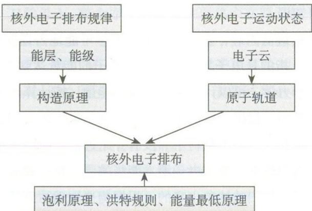

正如课程标准中的要求：知道电子运动的能量状态具有量子化的特征（能量不连续），电子可以处于不同的能级，在一定条件下会发生激发与跃迁。从电子运动的能量状态具有不连续性的视角来认识核外电子的运动，教材通过能级的概念来体现电子运动的能量状态具有量子化的特征，一开始就直接给出能级的概念及能级符号，即1s、2s、2p、3s、3p、3d……这些能级的能量是不连续的，是有高低之分的，进而就有了原子的基态和激发态。电子在不同能量的能级间会发生跃迁而产生原子光谱，可利用原子光谱上的特征谱线来鉴定元素。

有了能级概念（符号及其可容纳电子数），紧接着以光谱学事实为基础，教材直接给出构造原理，以及根据构造原理介绍了如何书写基态原子的电子排布式，并以表格形式写出一些元素基态原子的电子排布式。需要说明的几个问题：（1）构造原理是一个经验规律。教材中只提及“以光谱学事实为基础”，没有进一步解释是如何以光谱学事实为基础得出构造原理的。事实上，构造原理是在分析大量元素的基态原子的电子排布式的基础上抽象出来的经验规律，而这些基态原子的电子排布式是基于光谱事实得到的，把这些基态原子的电子排布式从1号氢元素开始，按核电荷递增，依次分析每种元素基态原子的电子排布式的特点，从而归纳抽象出构造原理。例如，通过光谱分析，可以确定基态H的电子排布为 $1s^{1}$ 、He的电子排布为 $1s^{2}$ 、Li的电子排布为 $1s^{2}2s^{1}$ 、

Be的电子排布为 $1s^{2}2s^{2}$ 、B的电子排布为 $1s^{2}2s^{2}2p^{1}\cdots\cdots$ 依次类推，基于光谱事实可以得到各元素基态原子的电子排布式，分析这些基态原子的电子排布式的特点，从而归纳抽象出构造原理。这便是教材中提及的“以光谱学事实为基础”的内在含义。（2）构造原理所表达的是新增电子填入能级的顺序。即：从氢开始，随核电荷数递增，按照构造原理，元素的核电荷数每递增一个，同时增加一个核电荷和一个核外电子，从而得到一个基态原子的电子排布。因此，构造原理只是新增电子填入能级的顺序，没有涉及能级的能量高低。（3）能级交错现象是源于光谱学事实。例如，钾和钙的最外层电子排布是 $4s^{1}$ 和 $4s^{2}$ ，而不是按 $3p\rightarrow3d\rightarrow4s$ 的顺序填充的，这是由于光谱证实钾和钙的最外层电子是 $4s^{1}$ 和 $4s^{2}$ 。（4）有些过渡金属元素基态原子的电子排布不符合构造原理。其实，在得出构造原理之前，已由原子光谱得知有些过渡金属元素基态原子的电子排布不符合构造原理。例如，Cr和Cu的最后两个能级的电子排布分别为 $3d^{5}4s^{1}$ 和 $3d^{10}4s^{1}$ ，而不是 $3d^{4}4s^{2}$ 和 $3d^{9}4s^{2}$ 。因此，教材中说“可见构造原理是被理想化了的”。

教材在介绍核外电子的空间运动状态时，借用电子云及其轮廓图的方式，形象地引出原子轨道的概念，并把重点集中在原子轨道的“数”和“形”上，“形”仅限于s轨道和p轨道。有了原子轨道的概念后，运用原子轨道进一步研究核外电子的运动状态，从而引出了泡利原理、电子的轨道表示式、洪特规则等知识。

随后，教材介绍了能量最低原理，提及了“电子将尽可能地占据能量最低的原子轨道”，此处“能量最低的原子轨道”指的是电子填入后使整个原子的能量达到最低的轨道。有的教材中，介绍了根据光谱实验和量子力学，可以计算原子轨道的能量，按计算出来的原子轨道的能量高低顺序排列，可绘成近似能级图，根据近似能级图，电子将尽可能地占据能量最低的原子轨道，从而得到各元素原子的电子排布式。但本教材中并没有介绍近似能级图，这是因为近似能级图中的轨道能量的高低顺序与构造原理中的新增电子填入能级的顺序是一致的。再者，构造原理是依据能量最低的基态原子的电子排布归纳抽象出来的，根据构造原理写出的电子排布其实是能量最低的原子轨道组合。最后，教材对基态原子的核外电子排布作了一个小结，即遵循泡利原理、洪特规则和能量最低原理。

本节的编写思路，不同于传统教科书。教材直接给出了构造原理，舍弃了基本粒子的发现、四个量子数的概念、屏蔽效应、钻穿效应、近似能级图等一系列知识。

## 二、教学目标

## 1. 教学目标

（1）知道电子运动的能量状态具有量子化的特征，能从电子跃迁角度初步解释原子光谱的形成，进一步强化“结构决定性质”的观念。

(2) 了解原子核外电子排布的构造原理, 能写出 $1 \sim 36$ 号元素基态原子的电子排布式, 进一步增强证据推理意识。

（3）知道电子的运动状态可通过原子轨道和电子云模型来描述，能说明微观粒子运动状态与宏观物体运动特点的差异，建立对原子结构的模型认知。

（4）认识基态原子中核外电子的排布遵循能量最低原理、泡利原理和洪特规则，能写出1\~36号元素基态原子的轨道表示式，初步学会运用模型解决实际问题。

## 2. 教学重点和难点

重点：根据构造原理写出1\~36号元素的基态原子的电子排布式；核外电子的运动状态，电子云与原子轨道；泡利原理和洪特规则。

难点：基态、激发态与原子光谱；电子云与原子轨道。

## 三、教学建议

## 1. 关于能层与能级的教学

## （1）立足学生对原子结构的已有认识

在初中阶段，学生对原子结构已经有了初步认识，知道原子由原子核与核外电子构成，原子核由质子和中子构成（ ${}^{1}\mathrm{H}$ 除外），整个原子的质量主要集中在原子核上，核外电子是分层排布的。在必修阶段，学生知道在含有多个电子的原子中，电子分别在能量不同的区域内运动，分别用 $n = 1,2,3,4,5,6,7$ 或K、L、M、N、O、P、Q来表示从内到外的电子层；原子核外第 $n$ 层最多能容纳的电子数为 $2n^2$ ，无论原子有几个电子层，其最外层的电子数最多只有8个（最外层为K层时，最多只有2个）；原子最外层有8个电子（最外层为K层时有2个电子）的结构是相对稳定的结构。教学中要充分利用学生对原子结构已有的知识经验，在复习和强化能层的基础上，引入能级的教学，注意指导学生认真阅读教材相关内容，并围绕教材中的【思考与讨论】展开充分讨论，理解能层与能级之间的关系。

## 教学方案参考

提出问题：根据必修阶段的学习，请回答电子在核外空间是怎样排布的。

复习引入：复习强化能层的序号、符号、所能容纳的最多电子数、能量的高低顺序，引入有关能级的教学。

讨论交流：引导学生在阅读教材相关内容的基础上，围绕【思考与讨论】进行讨论、交流与小结。

总结评价：在学生讨论交流的基础上，教师进行归纳总结，在帮助学生理解能层与能级的关系时，可利用形象的比喻：“能层是楼层，能级是楼梯的阶梯。”

## (2) 关注原子结构理论发展史

人类认识原子的历史是漫长的，也是无止境的，可以课前安排学生收集有关原子结构理论发展史的材料，课上组织交流讨论。通过活动使学生了解原子结构理论发展史中各种理论的要点和相关科学家的重要贡献，体会人类对原子结构的认识是一个逐步深入的过程，科学理论的发展是一个逐步完善的过程。在活动中使学生感悟科学家献身科学的精神和进行科学探索所具有的科学态度，激发学生学习和探究原子结构奥秘的积极性。

## 教学方案参考

布置任务：要求每位学生课前查阅和收集有关原子结构理论发展史的资料，并以此为素材制作一份科学小报。

展示交流：利用板报展示学生作品，通过学生互评选出优秀作品，课堂上请优秀作品的作者就学习成果和活动体会进行交流。

总结评价：教师对课堂交流情况进行总结评价，指出随着现代科学技术的发展，人类对原子结构的认识还会不断深化。

## 2. 关于基态与激发态、原子光谱的教学

## (1) 强化对概念的理解和辨析

基态原子和激发态原子、发射光谱和吸收光谱是这部分内容的两组重要概念，且两组概念之间存在着密切的联系。处于最低能量状态的原子叫做基态原子；基态原子吸收能量，它的电子会跃迁到较高能级，变为激发态原子。电子从基态或较低能量的激发态跃迁到较高能量的激发态，吸收光源中某些波长的光，形成吸收光谱；电子从较高能量的激发态跃迁到较低能量的激发态或基态时，释放某些波长的光，形成发射光谱。吸收光谱和发射光谱总称原子光谱。

可用图1-1进一步理解上述概念之间的关系。以图示为例，因为原子的能级是量子化的（能量不连续），当电子从某激发态能级（能量为 $E_{1}$ ）跃迁到基态能级（能量为 $E_{0}$ ）时，如果释放的能量以光的形式表现出来并被记录下来，就形成发射光谱；当电子从基态能级（能量为 $E_{0}$ ）跃迁到某激发态能级（能量为 $E_{1}$ ）时，如果吸收的能量以光的形式表现出来并被记录下来，就形成吸收光谱。引导学生进一步思考：因

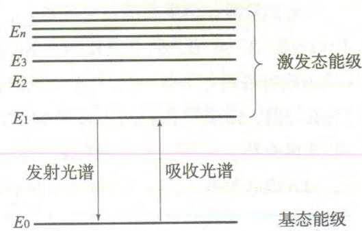  
图 1-1 原子光谱形成示意

为这两个能级的能量差 $(E_{1}-E_{0})$ 是固定的，所以电子在这两个能级之间跃迁时无论是释放的光还是吸收的光，其波长是相同的 $(h\nu=E_{1}-E_{0},\lambda=c/v)$ ，那么形成的发射光谱和吸收光谱有什么联系呢？

引导学生带着上述问题仔细观察教材中的“图1-4”，对比Li、He、Hg的发射光谱和吸收光谱，归纳出二者之间的联系：发射光谱是线状谱，由暗背景和不连续的彩色亮线（某些波长的光被释放）组成；吸收光谱是线状谱和连续彩色谱的叠加，由彩色亮背景（来自于光源）和不连续的暗线（光源中某些波长的光被吸收）组成；同种元素发射光谱中的彩色亮线与吸收光谱中的暗线处于相同位置。由于不同的原子具有不同的结构，能级各不相同，因此电子跃迁时发射（或吸收）光的波长（频率）也不相同。这就是不同元素的原子具有不同的特征谱线的原因。

## (2) 重视知识的实际应用

对于高中学生而言，基态与激发态、原子光谱的相关理论比较深奥，不宜过多拓展，教学中应引导学生重视相关知识的实际应用。例如，从原子中电子能量变化的角度去认识光产生的原因，了解历史上许多元素是通过原子光谱发现的，知道现代化学中常利用原子光谱上的特征谱线来鉴定元素等。

## 教学方案参考

创设情境：播放一些常见的光现象的视频，如焰火、霓虹灯光、激光、荧光、LED灯光等。问题探究：霓虹灯为什么能发出五颜六色的光？引导学生从原子中电子能量变化的角度去认识光产生的原因。

讨论交流：霓虹灯灯管中装载的气体不同，在高压电的激发下发出的光的颜色就不同。例如，在灯管中充入氖气，通电后在电场作用下，氖原子的电子吸收能量跃迁到能量较高的能级，但很快又会以光的形式释放能量而跃迁回能量较低的能级，所发出的光的波长恰好位于可见光区域中的红色波段，所以看见红色光。类似地，在通电后氩气发蓝色光，氦气发粉红色光；等等。

应用反馈：教材中“复习与提高”的第12题。

总结提升：举例说明光谱分析的应用，如科学家分析太阳光谱发现稀有气体氦，化学研究中利用原子光谱上的特征谱线鉴定元素等。布置学生课后查阅有关光谱分析应用的其他资料，以达到拓展知识面、激发学习兴趣的目的。

## （3）开展研究性学习

在完成本节的教学内容之后，可以基于教材的【科学史话】和【资料卡片】，开展有关光谱知识的研究性学习。

首先教师给出几个不同的选题，课前布置给分工好的学习小组。选题可以涉及光谱发展历史、仪器工作原理、电子自旋对光谱的影响、一些具体科研实例等多方面的内容。每个小组领取课题后，在课余时间开展学习活动，小组合作查阅资料，撰写报告并制作PPT。在课堂上由各组组长展示汇报，组织全班学生集体讨论，寻找不同小组的研究成果之间存在的联系。这样的活动有利于增强学生探索化学的兴趣，树立学习和研究化学的志向。

## 3. 关于构造原理与电子排布式的教学

## （1）明确构造原理是基于光谱学事实的经验规律

通过 “基态与激发态、原子光谱” 的学习，学生已经知道：许多情况下光是由原子内部电子的跃迁产生的，因此光谱研究是探索原子结构的一条重要途径。构造原理是基于光谱学事实的经验规律，建议结合教材【科学史话】栏目进行介绍。教学中只要求学生把构造原理作为一个结论，通过教材中的 “图 1-5” 介绍递增电子填入能级的顺序，并能应用构造原理书写一些元素的基态原子的电子排布式，并不要求对构造原理作更多的解释。

## (2) 应用构造原理写出一些元素的基态原子的电子排布式

要求学生能够根据构造原理写出1\~36号元素的基态原子的电子排布式。可以按第一周期元素（1\~2号）、第二周期元素（3\~10号）、第三周期元素（11\~18号）和第四周期元素（19\~36号）的顺序，由易到难，引导学生逐一书写各元素的基态原子的电子排布式。书写前三周期元素的基态原子的电子排布式时，难度不大，重点在于培养书写规范，提高书写速度。书写第四周期元素的基态原子的电子排布式有一定难度，要注意以下几点：①能级交错，即电子是按 $3p\rightarrow4s\rightarrow3d$ 的顺序而不是按 $3p\rightarrow3d\rightarrow4s$ 的顺序填充的；②一般情况下，能层低的能级要写在左边，而不是按构造原理顺序写；③与书末元素周期表对照，发现Cr和Cu的最后两个能级的电子排布分别为 $3d^{5}4s^{1}$ 、 $3d^{10}4s^{1}$ ，不符合构造原理（此时教学中暂不作解释）。

最后，围绕【思考与讨论】组织学生展开充分讨论，理解简化电子排布式和价层电子排布式，并对电子排布式、简化电子排布式和价层电子排布式三者之间进行辨析，提醒学生答题时要认真审题，按要求作答。

## 4. 关于电子云与原子轨道的教学

## (1) 对比微观粒子的运动状态与宏观物体的运动特点

量子力学与经典力学有根本的差别，经典力学只适用于宏观物体而不适用于微观粒子，而量子力学是关于微观粒子运动规律的基本理论。

通过物理学科的学习，学生已经知道一个运动着的宏观物体的速率和它所处的位置是能够同时准确地测定的，即人们能追踪宏观物体的运动轨迹。但是，对于质量非常小、运动极快的微观粒子而言，人们却不能同时准确地测定它的位置和速率（这个原理是由德国物理学家海森堡提出的，称之为测不准原理）。

量子力学指出，一定空间运动状态的电子并不在波尔假定的线性轨道上运行，而在核外空间各处都可能出现，我们不可能同时准确地测定一个核外电子在某一瞬间所处的位置和运动速率，但是我们可以用统计的方法来判断电子在核外空间某区域出现机会的多少。电子在某区域出现的机会称为概率（P），在某区域单位体积内出现的概率则称为概率密度（ $\rho=P/V$ ）。

## （2）对比电子云图和电子云轮廓图

电子云和原子轨道的概念非常抽象，且二者之间密切联系，学生较难理解。条件允许的情况下建议用计算机程序绘制电子云图和电子云轮廓图，通过对两种图像的解释和对比，帮助学生形象化地认识电子云和原子轨道，建立三维空间的思维模型，突破教学难点。

利用教材中的“图1-7”的氢原子的1s电子云图，引导学生思考：氢原子的1s电子云图中有许许多多的小点，这些小点表示氢原子的电子吗？得出结论：氢原子只有一个电子，可见这些小点不是电子本身，而是1s电子在原子核外出现的概率密度的形象表述。小点越密，表示概率密度越大。由于核外电子的概率密度分布看起来像一片云雾，因而被形象化地称作电子云。

顾名思义，电子云轮廓图是用来描述电子云的形状。要充分利用教材上给出的图像，引导学生观察、思考、讨论和归纳。教材中的“图1-8”介绍了在“图1-7”氢原子的1s电子云图的基础上，绘制电子云轮廓图的过程；“图1-9”显示了所有原子的任一能层的s电子的电子云轮廓图都是一个球形，只是球的半径不同；“图1-10”“图1-11”分别展现了哑铃形的p电子云和p电子云轮廓图，发现p能级有3个相互垂直的电子云（ $p_{x}$ 、 $p_{y}$ 、 $p_{z}$ ），也可以说p能级有3个原子轨道，由此引出原子轨道的概念。最后，利用教材中的“表1-2”对不同能层的能级、原子轨道及电子云轮廓图进行对比小结。教学过程中，还可以利用课件动态展示s轨道和p轨道在三维坐标系中的取向分布，引导学生从能量的角度进行认识。另外，还可以提醒有兴趣的同学通过查阅资料，了解d轨道和f轨道的电子云轮廓图的形状与取向。

## 教学方案参考

体验活动：为每个学生准备一张正方形的便签纸，中央画上一个硬币大小的圆圈，让学生用笔在圈内随意点上90个点尽量把圆圈填满，再在圈外周边随机点上10个点（教师可以按比例调整圆圈的大小和点的数目）。

讨论交流：以上体验活动是s电子的电子云轮廓图形成过程的一种反向模拟，圆圈就是以点出现概率为90%的范围画出的轮廓图。

总结提升：提醒学生以上体验活动中的轮廓图是二维平面的圆形，而s电子的电子云轮廓图应是三维空间的球形。结合教材中的“图1-10”和“图1-11”出现的坐标轴，再次强调电子云是三维空间图像，不是二维平面图形。观察p电子云之后引出原子轨道的概念，指出量子力学用原子轨道表示电子在原子核外的空间运动状态，每个原子轨道对应每个空间运动状态不同的电子云。课件展示s轨道和p轨道空间模型或出示实物模型，结合“表1-2”，要求学生对比不同能层的能级、原子轨道及电子云轮廓图。

个性化作业：（布置学生开展课后实践活动）用身边的常用物品自制原子轨道模型。

## 5. 关于泡利原理、洪特规则、能量最低原理的教学

## (1) 泡利原理

回顾本节教材第一部分“能层与能级”的相关内容：“能级的字母代号总是s、p、d、f……排序的，字母前的数字是它们所处的能层序数，它们可容纳的最多电子数依次为自然数中的奇数序列1, 3, 5, 7…的2倍。”学习了原子轨道的概念后，引导学生发现1, 3, 5, 7…其实是ns、np、nd、nf……能级里的原子轨道数。提出问题：为什么每个能级可容纳的最多电子数是那些奇数的2倍？为什么一个原子轨道（一个空间运动状态）允许容纳2个电子？结合教材中的【资料卡片】栏目，介绍电子自旋，了解泡利原理：在一个原子轨道中，最多只能容纳2个电子，它们的自旋相反。泡利原理也称泡利不相容原理，这里的“不相容”解释为同一个原子轨道不能容纳2个自旋取向相同的电子，所以也就容纳不了3个电子。根据泡利原理，可知同一个原子中没有运动状态完全相同的电子，自旋也是决定电子运动状态的因素之一。

根据泡利原理，初步学习轨道表示式（又称电子排布图）的书写方法，注意避免与原子结构示意图、电子排布式、简化电子排布式、价层电子排布式等混淆。在书写某些具有简并轨道的基态原子的轨道表示式时，如写出基态氧原子的轨道表示式，对于4个电子在3个2p轨道上的排布，学生可能写出多种形式，可以利用学生写出的多种形式引起认知冲突，为学习洪特规则埋下伏笔。

## (2) 洪特规则

根据书写基态氧原子的轨道排布式时引发的认知冲突，引出洪特规则：基态原子中，填入简并轨道（能量相同的原子轨道，也叫等价轨道，多电子原子中同一能级的原子轨道能量相同）的电子总是先单独分占，且自旋平行。根据洪特规则，确定基态氧原子的轨道排布式；利用教材中的【思考与讨论】，进一步巩固对泡利原理和洪特规则的理解。

根据泡利原理和洪特规则, 引导学生逐一书写 1\~10 号元素的基态原子的轨道表示式、11\~36 号元素的基态原子的价层电子的轨道表示式。通过书写 Cr 和 Cu 的基态原子的价层电子的轨道表示式: Cr $\boxed{3d}$ $\boxed{4s}$ 、Cu $\boxed{3d}$ $\boxed{4s}$ , 引出洪特规则特例: 简并轨道全充满、半充满或全空的状态是能量较低的稳定状态。根据原子光谱测得, Cr 和 Cu 的基态原子的价层电子排布分别为 $3d^{5}4s^{1}$ 、 $3d^{10}4s^{1}$ , 而不是根据构造原理书写的 $3d^{4}4s^{2}$ 、 $3d^{9}4s^{2}$ , 这是因为 $3d^{5}$ 的半充满结构和 $3d^{10}$ 的全充满结构是能量较低的稳定结构。适时指出, 构造原理是以光谱学事实为基础的经验模型, 当与客观事实出现矛盾时, 必须遵循客观事实。随着原子核电荷数和核外电子数目的增多, 原子核与电子、电子与电子之间的相互作用更加复杂, 基态原子的电子排布不符合构造原理的情况更多, 原因也更复杂。例如, 第六周期的 W 的价层电子排布式按照洪特规则特例应该是 $5 \mathrm{~d}^{5} 6 \mathrm{~s}^{1}$ , 但实际测定却是遵守构造原理的 $5 \mathrm{~d}^{4} 6 \mathrm{~s}^{2}$ 。再如, 第五周期的 Nb 的价层电子排布式为 $4 \mathrm{~d}^{4} 5 \mathrm{~s}^{1}$ 、Ru 的价层电子排布式为 $4 \mathrm{~d}^{7} 5 \mathrm{~s}^{1}$ 、Rh 的价层电子排布式为 $4 \mathrm{~d}^{8} 5 \mathrm{~s}^{1}$ , 既不遵守构造原理, 也不能用洪特规则特例来解释 (简并轨道未达到全充满、半充满或全空的状态)。因此, 随着原子核电荷数和核外电子数目的增多, 基态原子的核外电子排布变得更为复杂。

## (3) 能量最低原理

能量越低越稳定，这是自然界的一个普遍规律。原子中的电子也是如此，电子在原子中所处的状态总是要尽可能使整个体系的能量最低，这样的体系最稳定。由此引出能量最低原理：在构建基态原子时，电子将尽可能地占据能量最低的原子轨道，使整个原子的能量最低。注意此处“能量最低的原子轨道”指的是电子填入后使整个原子能量达到最低的轨道。简单来说，能量最低原理就是电子在原子轨道上的分布要使整个原子的能量最低。要对学生特别强调这里说的“整个原子”！

需要指出的是，绝大多数元素的基态原子的电子排布符合构造原理，而基态原子的电子排布一定是能量最低的原子轨道组合，但这并不意味着构造原理中递增电子填入能级的顺序就是原子轨道能量由低到高的顺序。在多电子原子中，能够确定同一能层各能级的能量顺序是： $E(ns) < E(np) < E(nd) < E(nf)$ ……但对于出现能级交错现象的轨道，如3d轨道和4s轨道，二者的能量高低不是一成不变的，不能因为电子是按 $3p \rightarrow 4s \rightarrow 3d$ 的顺序填充的，就认为3d轨道的能量一定大于4s轨道的，只是电子按照这样的顺序填充之后，能使整个原子处于能量最低的状态（整个原子的能量由核电荷数、电子数和电子状态三个因素共同决定，比较复杂）。还可以Fe和 $Fe^{2+}$ 为例进一步说明，它们的核电荷数都是26，对于核外有26个电子的Fe，原子按 $[Ar]3d^{6}4s^{2}$ 排布所具有的能量小于按 $[Ar]3d^{8}$ 排布的能量，因而基态Fe的电子排布是 $[Ar]3d^{6}4s^{2}$ ；对于核外有24个电子的 $Fe^{2+}$ ，它按 $[Ar]3d^{6}$ 排布所具有的能量小于按 $[Ar]3d^{4}4s^{2}$ 排布的能量，因而基态 $Fe^{2+}$ 的电子排布是 $[Ar]3d^{6}$ 。

最后，围绕教材中的【思考与讨论】组织学生充分讨论，强化基态原子的核外电子排布遵循泡利原理、洪特规则和能量最低原理。

## 教学方案参考

体验活动：准备一定数量的盒子和乒乓球。一个盒子代表一个原子轨道，并在盒子上标出该原子轨道所处的能级，按照1s（1个盒子）、2s（1个盒子）、2p（3个盒子）、3s（1个盒子）、3p（3个盒子）、3d（5个盒子）、4s（1个盒子）、4p（3个盒子）的顺序放置。学生每人手持2个不同颜色的乒乓球，代表自旋取向不同的两个电子，根据学号顺序上台，学号代表原子序数，把乒乓球当作递增电子投入对应的盒子（原子轨道）中，模拟基态原子的电子排布，当出现不遵守构造原理的情况时可以调整已投入盒子的小球。

讨论交流：结合教材中的【思考与讨论】组织学生充分讨论，强化基态原子的电子排布需遵循泡利原理、洪特规则、能量最低原理。体会构造原理方便实用，但也存在不遵守构造原理的特殊情况。

总结提升：无论何种电子排布规律，笼统地讲都可以归结为能量最低原理，即电子在原子轨道上的分布要使整个原子的能量最低。其实无论是基态电中性原子还是阳离子的电子排布，都力求使整个原子或阳离子的能量最低。

个性化作业：新授课之后建议给学生布置个性化的课后作业，可以让学生根据抽签得到的原子序数，写出基态原子的电子排布式，然后用生活中的一些实物搭建个性化的轨道排布模型，如棒棒糖盆栽（花盆代表原子轨道，棒棒糖代表电子）、棋子楼梯（楼梯代表原子轨道，棋子代表电子）等。通过动脑思考、动手操作的趣味课外活动，不仅可以加深学生对知识的理解和运用，也提升了学习积极性。

## 四、栏目使用建议

## 思考与讨论

【思考与讨论1】

在必修阶段，学生对于电子层（即能层）已经有了初步认识，此处教学应注意要在复习和强化能层的基础上，指导学生认真阅读教材相关内容，通过对这几个问题的思考与讨论，重点加深对能层与能级之间关系的理解。

（1）一个能层的能级数与能层序数（n）相等。一个能层最多可容纳的电子数= $2n^{2}$ 。（在必修阶段，学生已经知道原子核外第n电子层最多能容纳的电子数为 $2n^{2}$ ，此处建议引导学有余力的学生对 $2n^{2}$ 这个结论进行数学推导。）

(2) s能级最多可容纳2个电子，p能级最多可容纳6个电子，d能级最多可容纳10个电子，f能级最多可容纳14个电子。3d、4d、5d能级所能容纳的最多电子数相同。

（3）第五能层最多可容纳50个电子。它们分别容纳在5个能级中。5s能级最多容纳2个电子，5p能级最多容纳6个电子，5d能级最多容纳10个电子，5f能级最多容纳14个电子。

## 【思考与讨论2】

通过书写稀有气体的基态原子的最外层电子排布，巩固构造原理的应用，帮助学生理解简化电子排布式的书写，要注意加强对电子排布式、简化电子排布式和价层电子排布式的辨析。

(1) 稀有气体的基态原子的最外层电子排布如下:

He : $1s^{2}$ Ne : $2s^{2}2p^{6}$ Ar : $3s^{2}3p^{6}$ Kr : $4s^{2}4p^{6}$ Xe : $5s^{2}5p^{6}$ Rn : $6s^{2}6p^{6}$

$\mathrm{Og}:7\mathrm{s}^{2}7\mathrm{p}^{6}$

除氦外它们的通式是 $ns^{2}np^{6}$ 。

(2) 简化电子排布式方括号里的符号表示内层电子已达到稀有气体结构的部分（可称为原子实）。氧的简化电子排布式为 $[\mathrm{He}] 2\mathrm{s}^{2}2\mathrm{p}^{4}$ ，硅的简化电子排布式为 $[\mathrm{Ne}] 3\mathrm{s}^{2}3\mathrm{p}^{2}$ ，铜的简化电子排布式为 $[\mathrm{Ar}] 3\mathrm{d}^{10}4\mathrm{s}^{1}$ 。

(3) Na 的价层电子排布为 $3s^{1}$ ，Al 的价层电子排布为 $3s^{2}3p^{1}$ ，Cl 的价层电子排布为 $3s^{2}3p^{5}$ ，Mn 的价层电子排布为 $3d^{5}4s^{2}$ ，Br 的价层电子排布为 $4s^{2}4p^{5}$ 。

## 【思考与讨论3】

通过确认硼、碳的基态原子的轨道表示式，分别强化对泡利原理、洪特规则的理解和应用，并且对轨道表示式的书写起到示范作用。

(1)A 根据泡利原理，在一个原子轨道里，最多只能容纳2个电子，且它们的自旋相反。

(2) A 根据洪特规则，基态原子中，填入简并轨道的电子总是先单独分占，且自旋平行。

## 【思考与讨论4】

与【思考与讨论3】不同，这里的3个问题综合性较强，帮助学生强化对“基态原子的核外电子排布遵循泡利原理、洪特规则和能量最低原理”这个结论的理解。要让学生认识到，无论何种电子排布规律，笼统地讲都可以归结为能量最低原理，即电子在原子轨道上的分布要使整个原子的能量最低。

（1）氦原子核外有2个电子，根据能量最低原理和泡利原理，基态氦原子的2个电子以自旋相反的形式填充在能量最低的1s轨道中。且1s和2s能量相差较大，所以基态氦原子不会出现2个电子单独分占1s、2s轨道的情况。

（2）氮原子核外有7个电子，根据能量最低原理和泡利原理，基态氮原子先有2个电子以自旋相反的形式填充在1s轨道中，又有2个电子以自旋相反的形式填充在2s轨道中；根据洪特规则，余下的3个电子将以自旋平行的方式分别填充在3个取向不同但能量相同的2p轨道中。

（3）根据构造原理书写电子排布式，基态钾原子为 $1s^{2}2s^{2}2p^{6}3s^{2}3p^{6}4s^{1}$ ，基态钙原子为 $1s^{2}2s^{2}2p^{6}3s^{2}3p^{6}4s^{2}$ ，且钾和钙的光谱也证实了它们的最外层电子为 $4s^{1}$ 和 $4s^{2}$ ，而不是 $3d^{1}$ 和 $3d^{2}$ ，说明钾和钙这样的电子排布符合能量最低原理。

## 五、练习与应用参考答案及说明

1. D 
2. A 
3. B 
4. C 
5. D

6. (1) √ (2) × (3) × (4) √ (5) √

7.2 1  
8.N3哑铃形  
9.(1)[Ar] $3\mathrm{d}^2 4\mathrm{s}^2$ (2) $[\mathrm{Ar}]3\mathrm{d}^{5}4\mathrm{s}^{1}$

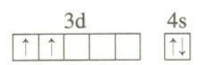

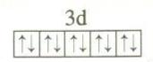

(3) $[\mathrm{Ar}]3\mathrm{d}^{10}$ 3d

10.(1)C或O (2)N (3)Fe $1s^{2}2s^{2}2p^{6}3s^{2}3p^{6}3d^{6}4s^{2}$ (4)Cu $\boxed{\uparrow\downarrow\uparrow\downarrow\uparrow\downarrow\uparrow\downarrow\uparrow\downarrow}$ $\boxed{4s}$ (5)K Cl

## 第二节 原子结构与元素的性质

## 一、内容分析

本节内容分为元素周期表和元素周期律两部分内容。

第一部分内容进一步探究了元素周期表。在必修课程中，已介绍了元素周期表的一些基本知识，如周期表的周期和族、元素周期表的应用等。本部分内容从构造原理得出的核外电子排布出发，进一步研究了元素周期表，重点介绍了两个问题：（1）利用原子的核外电子排布，解释元素周期系的基本结构。例如，解释了每个周期中的元素数。再如，根据核外电子排布的特点，以一个方格代表一种元素，从而形成教材中图1-17的周期表，这是根据核外电子排布得出的元素周期表的基本框架，为进一步研究元素周期表奠定了基础。有了图1-17所示的元素周期表的基本框架，教材通过“思考与讨论”的方式，要求学生解释书末的元素周期表是如何制作的。（2）利用原子的核外电子排布，深入认识元素周期表。教材设置了一个探究，即“再探元素周期表”，探究的问题具有一定的开放性和思考性，涉及元素周期表与原子核外电子排布相关的方方面面的问题，是对元素周期表知识的高度概括。在探究的问题中，既有学过的旧知识，也有要探究的新知识，教学时要注意新旧知识的衔接，但重点要突出新知识的探究。主要的新知识点包括过渡元素的价层电子排布与族序数的关系、元素周期表的分区、半金属或类金属等。另外，探究中还涉及了过渡元素Cr和Cu的电子排布的特殊性。总之，教材通过这个探究活动，把有关元素周期表的知识与原子核外电子排布的知识进行了有机融合。

第二部分内容进一步介绍元素周期律。在必修课程中，介绍了较多的元素周期律方面的知识。例如，结合原子结构示意图，介绍了碱金属和卤族元素的金属性和非金属性的递变规律；介绍了1\~18号元素的原子核外电子排布、原子半径和主要化合价的变化规律；探究了第三周期元素性质的递变规律；介绍了元素周期律的应用；等等。教材在此基础上，进一步介绍原子半径、电离能以及电负性等性质的周期性变化规律，并结合元素的第一电离能和元素的电负性，介绍了一些元素的性质。教材运用了图片方式呈现课程内容，其中的图1-21、图1-22和图1-23三张图的信息量比较大，原子半径、电离能以及电负性等性质的周期性变化规律，就是从这三张图的信息中归纳出来的。观察图1-21和图1-23中的信息，比较容易得出其变化规律，而图1-22中的信息相对比较隐蔽，要注意引导学生如何找出同周期元素的第一电离能和同族元素的第一电离能的变化规律，以及同周期元素的第一电离能的变化规律出现的异常现象。

## 二、教学目标

## 1. 教学目标

(1) 认识元素周期表的基本结构, 能从原子价电子数目和价电子排布的角度解释元素周期表的分区、周期和族的划分, 促进对 “位置” 与 “结构” 关系的理解。

(2) 认识元素的原子半径、第一电离能、电负性等元素性质的周期性变化, 能从电子排布的角度对元素性质的周期性变化进行解释, 促进对 “结构” 与 “性质” 关系的理解。

（3）建构元素周期律（表）模型，能列举元素周期律（表）的应用，进一步建立基于“位置”“结构”“性质”关系的系统思维框架。

## 2. 教学重点和难点

重点：元素的原子结构与元素周期表结构的关系；元素的原子半径、第一电离能和电负性的周期性变化。

难点：元素周期表的分区；电离能、电负性的含义以及与元素其他性质的关系。

## 三、教学建议

## 1. 关于原子结构与元素周期表的教学

## (1) 充分利用科学史进行教学

教材一开始，就借助元素周期律的发现史（1869年，门捷列夫发现元素周期律，但认为原子序数是按元素的相对原子质量由小到大的顺序编号的；1913年，莫塞莱证明原子序数即原子核电荷数），引入元素周期律、元素周期表、元素周期系这三个概念，并阐明三者之间的关系。又通过在【科学史话】栏目中介绍了三张有重要历史意义的周期表，进一步说明元素周期系只有一个，元素周期表多种多样。教学中要充分利用相关科学史作为教学资源，展示人类对元素周期律的认识过程，进一步明确元素的原子结构与元素周期表的关系、元素的原子结构与元素性质的关系，促进学生对科学本质的理解，并激发学习兴趣。

## 教学方案参考

课前布置：将学生分成若干组，分别围绕元素周期律的发现和发展、不同历史阶段的元素周期表这两个主题，课前阅读教材相关内容，并通过查阅资料（包括文献资料、网络资源、视频资源等）进行补充和说明，要求以小组为单位制作ppt，确定发言人，准备上课时进行汇报。

分组汇报：课堂上，围绕元素周期律的发现和发展、不同历史阶段的元素周期表这两个主题，抽查两个小组进行汇报，然后组织其他小组对分组汇报情况积极开展互评和自评。

总结评价：在学生分组汇报、讨论交流、自评互评的基础上，总结归纳出元素周期律、元素周期表、元素周期系三者之间的关系。

## (2) 关注学生对元素周期表的已有认识

在必修阶段，学生已经知道元素周期表的基本结构，如周期（分为短周期和长周期）和族（分为主族、副族和0族）的划分、每个方格中的信息等。教学中要充分利用学生已有的知识经验，铺设阶梯，引导学生深入思考元素的原子结构与元素周期表结构的关系，帮助学生自主建构元素周期表模型。例如，要求学生填写表1-1，并激思设疑：通过必修阶段的学习，我们已经知道周期的序数就是该周期元素所具有的电子层数，可是如何从原子结构角度解释每一周期包括的元素种数？如何从原子结构角度解释族（特别是副族）的划分依据？这将是我们要研究的重点。

表1-1 每一周期中的元素

<table><tr><td>周期序数</td><td>起止元素</td><td>包括元素种数</td><td>核外电子层数</td></tr><tr><td>1</td><td>H~He</td><td>2</td><td>1</td></tr><tr><td>2</td><td></td><td></td><td></td></tr><tr><td>3</td><td></td><td></td><td></td></tr><tr><td>4</td><td></td><td></td><td></td></tr><tr><td>5</td><td></td><td></td><td></td></tr><tr><td>6</td><td></td><td></td><td></td></tr><tr><td>7</td><td>Fr~Og</td><td></td><td>7</td></tr></table>

## (3) 紧扣构造原理解释元素周期表的基本结构

在本章教材 “第一节 原子结构” 中，学生已经学习了构造原理，能够按构造原理书写一些元素的基态原子的电子排布式。教学中一定要紧扣根据构造原理得出的核外电子排布，引导学生展开思考和讨论，进一步认识元素周期表的基本结构。

## 教学方案参考

回忆复习：①构造原理示意图（本章教材“第一节 原子结构”中的“图1-5”）。②根据构造原理写出19\~36号元素的基态原子的电子排布式。③解释Cr和Cu的基态原子的电子排布式不符合构造原理的原因。

提出问题：①19\~36号元素在元素周期表中位于第几周期？此周期包含多少种元素？为什么？②根据构造原理思考，每个周期各包含多少种元素？为什么？

讨论交流：结合前面提出的问题和元素的基态原子的核外电子排布式，组织学生开展课堂讨论，解决每个周期各包含多少种元素的问题。结合教材中的【思考与讨论】，进一步从原子结构的视角认识元素周期表的基本结构。

问题探究：围绕教材中的【探究 再探元素周期表】，引导学生积极思考，充分讨论，整理出对元素周期表的新认识。

总结评价：在学生探究和讨论的基础上，总结归纳出元素的原子结构（特别是价层电子排布）与元素周期表结构的关系，理解元素“位置”与“结构”的关系。

## 2. 关于元素周期律的教学

元素周期律的内涵丰富多样。在必修阶段，学生已经知道，随着原子序数的递增，元素原子的核外电子排布、原子半径、化合价、元素的金属性和非金属性都呈现出周期性的变化，并且初步认识元素性质的周期性变化是元素原子的核外电子排布呈周期性变化的必然结果。教学中要充分引导学生回忆和复习，在已有知识经验的基础上，重点讨论原子半径、电离能和电负性的周期性变化，实现对元素周期律内涵理解上的螺旋式上升，进一步建构基于“位置”“结构”“性质”关系的系统思维框架。

## (1) 注意从原子结构的角度解释原子半径的周期性变化

在必修阶段，学生已经通过短周期元素的原子半径数值（稀有气体除外），得出感性结论：同周期主族元素从左到右原子半径逐渐减小，同主族元素从上到下原子半径逐渐增大。因此，教学中的重点应放在从原子结构的角度对原子半径的变化趋势进行理性解释。

## 教学方案参考

回忆复习：①同周期主族元素从左到右核外电子排布的变化趋势和原子半径的变化趋势。②同主族元素从上到下核外电子排布的变化趋势和原子半径的变化趋势。

讨论交流：结合教材中的【思考与讨论】，重点引导学生讨论：①原子半径的大小取决于哪些因素？②如何从原子结构的角度对原子半径的周期性变化进行解释？

总结评价：①原子半径的大小取决于两个相反的因素：电子的能层数（电子的能层数越多，电子之间的排斥作用将使原子半径增大）和核电荷数（核电荷数越大，核对电子的吸引作用将使原子半径减小）。②当讨论原子半径的变化趋势时，要同时考虑以上两个因素的综合作用，有时要注意分析哪个因素起主导作用，培养学生解决问题要抓住主要矛盾这一思维方式，渗透对立统一规律这一哲学观念。

## (2) 注意突出电离能、电负性与元素其他性质间的关系

对于电离能的教学，在了解电离能概念及其要点的基础上，重点引导学生认识、理解电离能与元素的金属性、化合价间的关系。通过观察教材中的“图1-22”，得出同周期主族元素从左到右、同主族元素从上到下第一电离能的大致变化趋势，尝试引导学生从原子结构角度进行分析，进一步讨论第一电离能与元素的金属性之间的关系。特别要注意指导学生阅读教材中的【资料卡片】，关注B、Al、O、S等元素的第一电离能出现反常的原因。再结合教材中的【思考与讨论】的第一个问题，可知用第一电离能的大小可以判断同主族元素的金属性强弱，但用第一电离能的大小判断同周期主族元素金属性的强弱时，则有可能出现反常的情况。通过【思考与讨论】表格中所列的Na、Mg、Al的逐级电离能的数据，引导学生从原子结构角度分析原子的逐级电离能增大的原因，并找出逐级电离能突变与元素的化合价之间的关系。此外，电离能的教学中需强调：过渡金属原子失电子时，先失去最外层的s电子，后失去次外层的d电子。

对于电负性的教学，在简要介绍电负性概念的基础上，重点引导学生认识、理解电负性与元素的金属性、非金属性间的关系。通过观察教材中的“图1-23”所列的元素电负性数据，得出同周期主族元素从左到右、同主族元素从上到下电负性的变化趋势，尝试引导学生从原子结构角度进行分析；进一步讨论电负性与元素的金属性、非金属性之间的关系。使学生认识到：金属元素的电负性较小（一般小于1.8），非金属元素的电负性较大（一般大于1.8），位于非金属三角区边界的“类金属”的电负性在1.8左右；元素的电负性越小，元素的金属性越强，元素的电负性越大，元素的非金属性越强，电负性的大小可以作为判断元素金属性和非金属性强弱的依据。

## (3) 注意比较第一电离能和电负性周期性变化规律的异同

虽然元素的电离能与电负性是两个完全不同的概念，但第一电离能和电负性的周期性变化规

律既有一致性，也有不同处，要注意围绕教材中的【探究】引导学生展开讨论。

从概念上来看，第一电离能越小，表示元素的原子越容易失去电子，金属性越强。同主族元素从上到下第一电离能依次减小，金属性依次增强；同周期主族元素从左到右第一电离能在总趋势上依次增大（但也有反常情况，具体原因参考【资料卡片】），金属性依次减弱。

从概念上来看，电负性越大的原子，对键合电子的吸引力越大，元素的原子越容易得到电子，非金属性越强；电负性越小的原子，对键合电子的吸引力越小，元素的原子越容易失去电子，金属性越强。同主族元素从上到下电负性依次减小，金属性依次增强，非金属性依次减弱；同周期主族元素从左到右电负性依次增大，非金属性依次增强，金属性依次减弱。

## 四、栏目使用建议

## 1. 探究

## 【探究1】

对于 “问题” 部分，建议引导学生仔细观察书末的元素周期表，结合必修阶段对元素周期表的已有认识和本章教材 “第一节 原子结构” 刚学习的知识，通过小组讨论和组内互评，解答教材提出的已有问题，提出更多问题并自主解答。

对于 “解释与整理” 部分，建议采用分小组汇报的方式，开展组间互评，教师适时进行评价，确保问题有效，解答正确，对元素周期表有新的认识。

对于 “讨论” 部分，一定要引导学生深入思考，逐一展开讨论，对于有思维难度的问题，如元素周期表的分区等，教师应通过启发和讲解帮助学生突破难点。

（1）副族元素介于s区元素（主要是金属元素）和p区元素（主要是非金属元素）之间，处于由金属元素向非金属元素过渡的区域，因此副族元素又称为过渡元素。过渡元素价层电子数跟它们的族序数的关系是：第ⅢB族到第ⅦB族元素的价层电子数等于它们的族序数；第Ⅷ族有3列元素，其族序数等于该族的第1列元素的价层电子数；第IB族、第ⅡB族的族序数等于它们的最外层电子数。过渡元素的价层电子排布通式为 $(n-1)d^{1\sim10}ns^{1\sim2}$ （除镧系和锕系）。

(2)s区有2列，d区有8列，p区有6列。s区元素的价层电子排布通式为 $ns^{1\sim2}$ ，d区元素的价层电子排布通式为 $(n-1)d^{1\sim9}ns^{1\sim2}$ ，ds区元素的价层电子排布通式为 $(n-1)d^{10}ns^{1\sim2}$ ，它们的最外层电子数均不超过2，在化学反应中容易失去电子，所以s区（除氢元素外）、d区和ds区的元素都是金属元素。

（3）由于元素的金属性和非金属性之间并没有严格的界限，处于非金属与金属分界线上的元素既能表现出一定的非金属性，又能表现出一定的金属性，因此这些元素常被称为半金属或类金属。（建议在学习电负性之后，引导学生从电负性的角度进一步进行解释。）

(4) Cr 的价层电子排布式为 $3d^{5}4s^{1}$ ，Cu 的价层电子排布式为 $3d^{10}4s^{1}$ ，不符合构造原理（它们的 3d 轨道达到半充满或全充满结构，是一种能量较低的稳定结构）。此外，Nb、Mo、Ru、Rh、Pd、Ag、Pt、Au、La、Ce、Gd、Ac、Th、Pa、U、Np、Cm 等的基态原子电子排布均不符合构造原理。

(5)119号元素的基态原子最外层电子排布为 $8s^{1}$ 。第八周期应有50种元素。

## 【探究2】

对于 “绘制变化图” 部分，要求学生必须独立完成绘制（可以是折线图、柱状图等多种形式，条件允许也可使用计算机完成绘制），通过亲身体验找出同周期主族元素和同主族元素电负性的变化趋势。

对于 “比较与分析” 部分，既要找出第一电离能与电负性变化趋势的一致性（同主族元素一致，即从上到下第一电离能与电负性均依次减小），也要找出不同之处（同周期主族元素总体趋势一致，即从左到右电负性依次增大，第一电离能总体趋势也是增大，但AI和S的第一电离能出现反常的现象），要结合前面的【资料卡片】中分析第一电离能变化趋势出现反常的原因进行分析。

## 2. 思考与讨论

## 【思考与讨论1】

元素周期律表述为元素的性质随元素原子的核电荷数递增发生周期性递变。元素的这一按其原子核电荷数递增排列的序列称为元素周期系。根据构造原理得出的核外电子排布，可以解释元素周期系的基本结构。教材中的图1-17是左侧对齐的周期表（一周期一行），通过对如何将其变为书末的元素周期表这个问题的思考与讨论，帮助学生理解元素周期表是呈现元素周期系的表格，元素周期系只有一个，元素周期表可有多种多样的；同族元素价层电子数相同，这是同族元素性质相似的结构基础。

将图1-17中第二到第七周期的所有p区与p区上下对齐（即第二到第五周期的p区右移，与第六、七周期的p区对齐）、d区与d区上下对齐（即第四、五周期的d区右移，与第六、七周期的d区对齐），第六、七周期的f区与f区上下对齐，且单列为两行放在主表的下方（即镧系和锕系），确保每列的价层电子数相同，再将电子排布式为 $1s^{2}$ 的He移到第一行最右边，即可得到书末的元素周期表。

## 【思考与讨论2】

在 “第一节 原子结构” 中，学生学习了一些以光谱学事实为基础的经验规则，如构造原理、洪特规则等，而此处的 “对角线规则” 是以实验事实为基础的经验规则。

（1）经验规则是从大量客观事实中总结出来的，是经验的，不是任何理论推导的结果。经验规则是源于经验的思维模型和假想过程，往往是被理想化的，受经验样本数量的制约还会存在局限性，所以有可能出现客观事实与经验规则不相符的情况，此时要遵循客观事实。对于已有的经验规则，可以尝试运用理论进行解释。

(2) 根据必修阶段介绍的判断元素金属性和非金属性的标准, 结合互联网搜索到的资料, 着重比较锂和镁在空气中燃烧的产物、铍和铝的氢氧化物的酸碱性以及硼和硅的含氧酸的酸性强弱。(建议在学习电负性之后, 引导学生通过比较这些元素的电负性, 深化对对角线规则的认识。)

【思考与讨论3】

原子半径的大小取决于两个相反的因素：一个因素是电子的能层数，另一个因素是核电荷数。当讨论原子半径的变化趋势时，要同时考虑以上两个因素的综合作用，有时要注意分析哪个

因素起主导作用。

同周期主族元素从左到右，原子半径逐渐减小。其主要原因是：同周期主族元素电子的能层数相同，从左到右，核电荷数的增加使核对电子的吸引增强而引起原子半径减小的趋势，大于最外层电子数的增加使电子间的排斥增强而引起原子半径增大的趋势。

同主族元素从上到下，原子半径逐渐增大。其主要原因是：同主族元素从上到下，电子能层数的增加使电子间的排斥增强而引起原子半径增大的趋势，大于核电荷数的增加使核对电子的吸引增强而引起原子半径减小的趋势。

## 【思考与讨论4】

第一个问题可以帮助学生理解用第一电离能的大小判断同主族元素的金属性强弱，但用第一电离能的大小判断同周期主族元素金属性的强弱时，则有可能出现反常的情况。可以通过第二个问题引导学生从原子结构角度分析原子的逐级电离能增大的原因，找出逐级电离能突变与元素的化合价之间的关系。

（1）碱金属元素的第一电离能越小，原子越容易失电子，碱金属的活泼性越强。

(2) 随着电子的逐个失去, 阳离子所带的正电荷数越来越大, 再要失去一个电子需克服的电性引力也越来越大, 消耗的能量也越来越多, 所以原子的逐级电离能越来越大。钠的第一电离能比第二电离能小很多, 说明失去第一个电子比失去第二个电子容易得多, 所以钠容易失去一个电子形成 +1 价钠离子; 镁的第一电离能和第二电离能相差不多, 但第二电离能比第三电离能小很多, 说明镁容易失去两个电子形成 +2 价镁离子; 铝的第一电离能、第二电离能、第三电离能相差不多, 但第三电离能比第四电离能小很多, 说明铝容易失去三个电子形成 +3 价铝离子。

## 五、练习与应用参考答案及说明

1. B 
2. B 
3. A 
4. A 
5. C 
6. A

7. (1) × (2) √ (3) × (4) √ (5) × (6) √ (7) ×

8. 主族元素的核外电子排布最后填入的能级是s能级或p能级，副族元素的核外电子排布最后填入的能级是d能级或f能级。主族元素的价电子层为最外层的s、p能级，副族元素的价电子层除最外层的s能级外，还包含次外层的d能级，甚至倒数第三层的f能级。

9.（1）主族元素，第三周期第ⅦA族，p区

（2）主族元素，第五周期第ⅣA族，p区

（3）副族元素，第四周期第VB族，d区

（4）副族元素，第四周期第IB族，ds区

(5) 主族元素, 第四周期第 IA 族, s 区

10. 前三周期元素的原子半径数据可在必修教材中查阅，电负性数据见本节教材中的图

1-23，可借助计算机，按要求绘制变化曲线。11.(1)H O Mg Si Cl (2)Mg Si O (3)O Cl Si (4)Cl Si Mg

12. 钴的核电荷数比镍的小1个，但它的相对原子质量却比镍的略大，这是由于钴有质量较大的同位素。如根据相对原子质量排列，钴应排在镍后面，而门捷列夫是根据元素的性质来定位元素的，根据性质排列，钴应排在镍的前面，因此就出现了矛盾。

13.（略）

## 复习与提升建议

## 一、复习与提升教学建议

《普通高中化学课程标准（2017年版）》指出：“化学教学内容的组织，应有利于促进学生从化学学科知识向化学学科核心素养的转化，而内容的结构化则是实现这种转化的关键。”在本章的复习课教学中，要注重学科知识的结构化，并提升学生的化学观念，发展学生的化学学科核心素养。

## 1. 基于知识关联，使知识结构化

本章的教学注重帮助学生建立基于“位置”“结构”“性质”关系的系统思维框架，而“位置”“结构”“性质”关系中，原子结构是根源。所以，对本章知识的复习思路依次为：原子结构→元素周期表→元素周期律。

在复习原子结构时，重在对模型和原理的应用，要求学生能够根据构造原理写出1\~36号元素的基态原子的电子排布式，并在认识泡利原理、洪特规则和能量最低原理的基础上写出1\~36号元素的基态原子的轨道表示式。

在复习元素周期表时，重在根据构造原理得出的核外电子排布解释元素周期表的基本结构，尤其是过渡元素的核外电子排布特点、元素周期表的分区等。

在复习元素周期律时，重在讨论原子半径、第一电离能和电负性的周期性变化，尤其是要注意比较元素的第一电离能和电负性变化趋势的相同点与不同点。

## 2. 归纳认知思路，形成思维模型

根据以上关联知识的学习，概括出元素的“位置”“结构”“性质”三者间的关系，要注意结合实例进行说明，并能根据元素“位置”“结构”的特点预测和解释元素的性质。

此外，本章教学中涉及多个思维模型的建立或经验规则的提出，如原子结构模型（构造原理等）、元素周期律（表）模型、对角线规则等。要指出：思维模型、经验规则是源于大量客观事实总结出来的，是经验的；思维模型、经验规则往往是被理想化的，有可能出现客观事实与思维模型、经验规则不相符的情况，此时要遵循客观事实（如Cr和Cu的基态原子价层电子排布不符合构造原理）。

## 3. 基于核心观念，发展学生的化学学科核心素养

对元素 “位置” “结构” “性质” 三者的关系，可以进一步概括出 “结构决定性质，性质反映结构”这一化学学科的统摄性观念。该观念有利于进一步发展学生的“宏观辨识与微观探析”的化学学科核心素养。

对于原子光谱与原子结构的模型认知，可以以K和Ca的基态原子的价层电子排布为例，说明二者之间的关系：以原子光谱为证据推理出构造原理，用构造原理可以解释原子光谱。利用该关系进一步发展学生的“证据推理与模型认知”的化学学科核心素养。

## 二、复习与提高参考答案及说明

1. D 
2. A 
3. A 
4. D 
5. A 
6. D 
7. B 
8. A

9. Cr (1) 第 VIB d (2) $1s^{2}2s^{2}2p^{6}3s^{2}3p^{6}3d^{5}4s^{1}$ $\boxed{\uparrow\uparrow\uparrow\uparrow\uparrow\uparrow}$ $\boxed{\uparrow}$

(3)4 7 (4)价层电子的原子轨道为半充满，且电子自旋平行

10.

<table><tr><td>表示方法</td><td>Fe</td><td> $Fe^{3+}$ </td></tr><tr><td>原子(或离子)结构示意图</td><td></td><td></td></tr><tr><td>电子排布式</td><td> $1s^{2}2s^{2}2p^{6}3s^{2}3p^{6}3d^{6}4s^{2}$ </td><td> $1s^{2}2s^{2}2p^{6}3s^{2}3p^{6}3d^{5}$ </td></tr><tr><td>轨道表示式</td><td></td><td></td></tr></table>

四 VIII d

11. $Mn^{2+}$ 的价层电子排布为 $3d^{5}$ ，3d 轨道为半充满，比较稳定； $Fe^{2+}$ 的价层电子排布为 $3d^{6}$ ，再失去一个电子即可达到 3d 轨道半充满的比较稳定状态。所以气态 $Mn^{2+}$ 再失去一个电子比气态 $Fe^{2+}$ 再失去一个电子更难。

12. 当碱金属及其化合物在火焰上灼烧时, 原子中的电子吸收了能量, 从能量较低的轨道跃迁到能量较高的轨道, 但处于能量较高的轨道上的电子是不稳定的, 很快跃迁回能量较低的轨道, 这时就将多余的能量以光的形式释放, 而释放的光的波长在可见光范围内, 因而能使火焰呈现颜色。钾和钠的原子结构不同, 电子跃迁时能量的变化不同, 则放出的光的波长不同, 所以产生的焰色也就不同。

13. (1) > < < > (2) 3

14. (1) ① H N O Na Al Cu ② O N H ③ N O Al Na

(2) Al (3) ds 价层电子排布通式为 $(n - 1)\mathrm{d}^{10}\mathrm{ns}^{1\sim 2}$ , 次外层 d 轨道全充满, 最外层电子数不超过 2

## 教学资源

## 1. 关于原子研究的历史

（1）德谟克利特的原子观点：德谟克利特（Democritus，公元前460—370）认为，世界万物都是由微小的且不可再分的粒子构成，他把这种粒子称为原子。虽然他的原子观点没有实验基础，但仍具有划时代的意义。

（摘编自：Zumdahl、Decoste. Chemical Principles (8th Edition). Cengage Learning, 2017年）

（2）道尔顿原子理论（1803年）：英国化学家道尔顿（John Dalton，1766—1844）提出了原子论，其基本要点是：物质是由极其微小、看不见的、不可再分割的原子构成的；原子既不能创造和毁灭，也不能转化，所以在一切化学反应中都保持自己原有的性质；同一种元素的原子形状、质量及性质相同；而不同元素的原子形状、质量及性质则各不相同；不同元素的原子以整数比例相结合形成化合物。道尔顿的原子论为近代科学原子论的创立构建了新的框架，是继拉瓦锡化学革命之后，化学发展史中又一座光辉灿烂的里程碑。它结束了元素说与原子说旷日持久的隔离状态，第一次把它们融合为一个统一的理论体系。

（摘编自：唐玉海、张雯主编.化学与人类文明（第一版）.北京：化学工业出版社，2020年）

（3）汤姆生的原子模型（1897年）：英国物理学家汤姆生（J.J.Thomson，1856—1940）用如图1-2所示真空管做了一个有关阴极射线的实验。

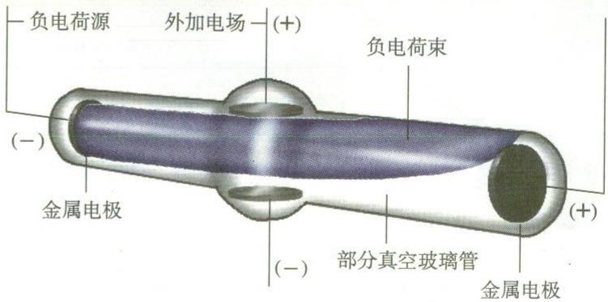  
图 1-2 发现阴极射线性质的实验

他在一个部分真空玻璃管内放入两个金属片，分别与电源的正负极相连。与电源负极相连的金属片称为阴极，与电源正极相连的金属片称为阳极。当接通电源时，阴极就会产生射线至阳极，这个射线被称为阴极射线。阴极射线在外加电场的作用下，会发生偏转，它会偏向外加电场的正极，由此他提出阴极射线就是由金属电极产生的带有负电荷的粒子构成的。由于金属电极是由原子组成的，所以在原子中应该含有带负电荷的粒子，也就是现在所说的电子。众所周知，原子是显电中性的，因此汤姆生进一步推断原子还包含有带正电荷的粒子。由此汤姆生提出了梅子布丁模型（plum pudding model），如图1-3所示。

（摘编自：Zumdahl、Decoste. Chemical Principles (8th Edition). Cengage Learning, 2017年）

（4）卢瑟福的原子模型（1911年）：英国物理学家卢瑟福（Ernest Rutherford，1871—1937）在1911年进行了著名的α粒子散射实验（如图1-4）。

在实验中，一束 $\alpha$ 粒子射向金箔，金箔周围环绕着涂有硫化锌的检测屏。当 $\alpha$ 粒子击中检测屏时，屏幕上会出现亮点。通过实验，他们发现虽然大部分 $\alpha$ 粒子径直穿过金箔，其余的 $\alpha$ 粒子中有许多却发生了大角度的偏转，还有一小部分甚至被反射回来。在此基础上，卢瑟福提出原子的正电荷一定集中于原子中心某个很小的区域，且这个区域具有原子绝大部分的质量，这个区域就叫原子核；原子内部大部分是空的，电子在这个空间中围绕原子核运动。

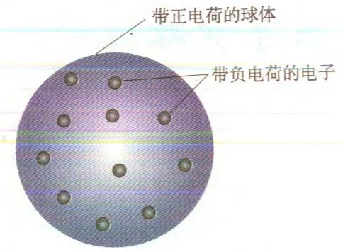  
图 1-3 汤姆生的梅子布丁模型

（摘编自：Zumdahl、Decoste. Chemical Principles (8th Edition). Cengage Learning, 2017年。万学、郑琼等翻译. 科学探索者（第三版）——化学反应. 杭州：浙江教育出版社，2013年）

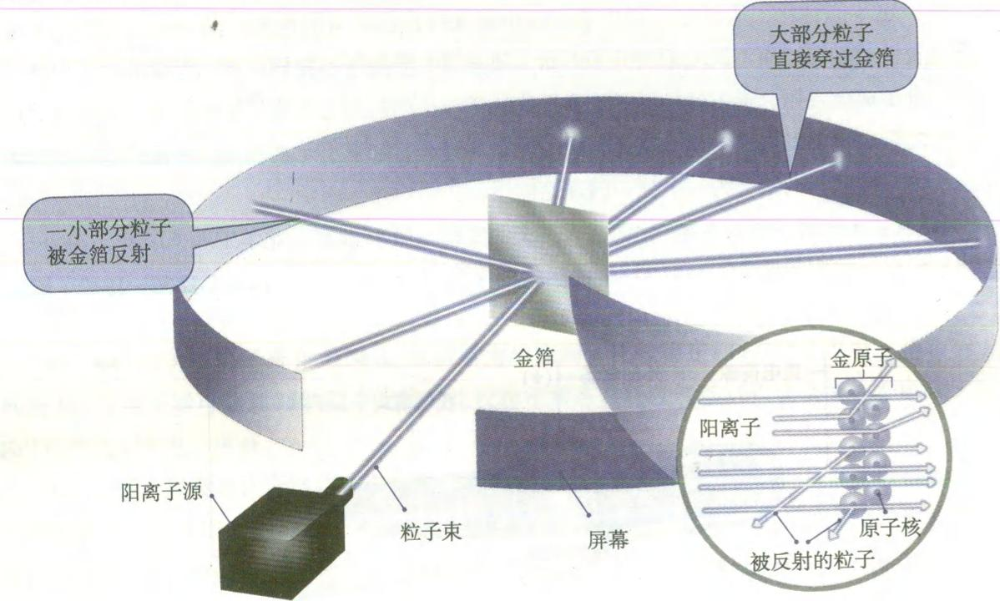  
图 1-4 卢瑟福的 $\alpha$ 粒子散射实验

(5) 玻尔的原子模型 (1913年): 丹麦科学家尼尔斯·玻尔 (Niels Bohr, 1885—1962) 将当时物理学上的量子理论、光子学说等重大成果应用于原子结构的研究, 提出了新的原子结构模型——玻尔模型。其要点为: 原子核外的电子只能在某些特定的轨道上运动, 这些轨道应该符合量子论推导出来的量子化条件, 这些符合量子化条件的轨道称为稳定轨道, 它具有固定的能量; 电子在稳定轨道上运动时, 并不释放也不吸收能量, 只有当电子从一个轨道到另外一个轨道时才释放或吸收能量; 电子在离核越远的轨道上运动, 能量越大。

（摘编自：唐玉海、张雯主编.化学与人类文明（第一版）.北京：化学工业出版社，2020年）

玻尔理论成功地解释了原子的发光现象及氢原子光谱的规律性。

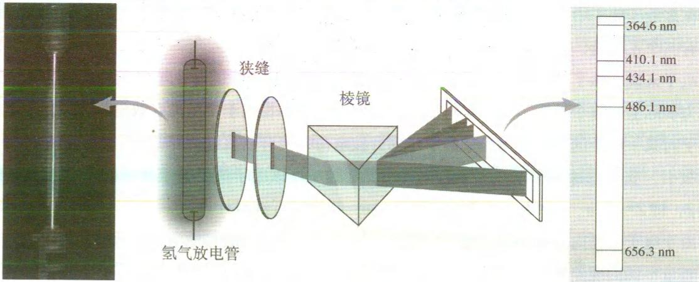  
图 1-5 氢原子发射光谱

如图 1-5 所示，氢原子发射光谱的特定频率的谱线。根据玻尔理论，当电子吸收能量后，就会跃迁到较高能量的状态。当处于激发态的这些电子以光的形式释放出所吸收的能量后，仍会回到原来的能量状态。由于电子只能具有一些特定的能量，因此电子只能在离原子核一定范围内且相当于电子所具有的那些能量的距离上运动。原子核周围电子可以运动的这些区域，就称为能级。

（摘编自：Buthelezi、Dingrando、Wistrom、Zike. Chemistry Matter And Change. The McGraw-Hill Companies, 2008年）

（6）现代原子模型（1935年）：1920年，卢瑟福提出原子核含有带有正电荷的亚原子粒子——质子。1932年，英国物理学家詹姆斯·查德威克（James Chadwick，1891—1974）提出原子核中还有另一种亚原子粒子——中子，中子的质量与质子的几乎相同，但不带电荷。

## （摘编自：Ryan、Norris. Chemistry Coursebook(2nd Edition). Cambridge University Press, 2014年）

1935年现代原子模型产生了，在现代原子模型中，中子和质子构成了居于原子中心的原子核，带有负电荷的电子分布在核外的空间。原子核外部是由电子构成的云状区域，“云”是一个视觉模型，它表示电子可能出现的位置。电子的运动与它的能级有关，电子的能级越高，它们受原子核的束缚就越小，离原子核越远。

（摘编自：万学、郑琼等翻译. 科学探索者（第三版）——化学反应. 杭州：浙江教育出版社，2013年）

## 2. 关于构造原理的说明

以光谱学事实为基础, 从氢开始, 随着核电荷数递增, 新增电子填入能级的顺序称为构造原理 (Aufbau principle)。大多数元素的电中性基态原子的电子按照构造原理的顺序填入相应能级, 但有些原子不符合构造原理, 教材正文中就提到了第四周期的 $\mathrm{Cr}$ 和 $\mathrm{Cu}$ 不符合构造原理, 实际上在第四周期之后的元素中也存在不符合的情况。第四周期的 $\mathrm{Cr}$ 的价电子排布为 $3\mathrm{d}^{5}4\mathrm{s}^{1}$ 是因为 $\mathrm{d}$ 能级倾向半充满稳定结构导致的, $\mathrm{Cu}$ 的价电子排布为 $3\mathrm{d}^{10}4\mathrm{s}^{1}$ 是因为 $\mathrm{d}$ 能级倾向全充满稳定结构导致的。但要注意的是, 第五周期的 $\mathrm{Nb}$ 的价电子排布为 $4\mathrm{d}^{4}5\mathrm{s}^{1}$ 、 $\mathrm{Ru}$ 的价电子排布为 $4\mathrm{d}^{7}5\mathrm{s}^{1}$ 和 $\mathrm{Rh}$ 的价电子排布为 $4\mathrm{d}^{8}5\mathrm{s}^{1}$ , 它们既不遵守构造原理又无法用半充满或全充满来解释; 第六周期的 $\mathrm{W}$ 的价电子排布按照半充满结构预测可能为 $5d^{5}6s^{1}$ ，但实际测定却是 $5d^{4}6s^{2}$ 。

在多电子原子中，一个电子不仅受到原子核的引力，还要受到其他电子的排斥力。如锂原子核带有三个正电荷，核外有三个电子，第一层有两个电子，第二层有一个电子，对于第二层的这一个电子来说，除了受核对它的吸引力以外，还受到第一层两个电子对它的排斥力的作用。这种排斥力实际上相当于减弱了原子核对外层电子的吸引力，相当于使核的有效电荷数减少。由于其他电子对某一电子的排斥作用而抵消了一部分核电荷，使有效核电荷降低，削弱了核电荷对该电子的吸引，我们把这种作用称为屏蔽作用或屏蔽效应。该电子所受有效核电荷 $Z^{*}$ 小于实际的核电荷 $Z$ ，即 $Z^{*} = Z - \sigma$ ， $\sigma$ 称为屏蔽常数。可由 Slater 规则进行近似计算。

由于电子云径向分布不同，电子穿过内层钻穿到核附近回避其他电子屏蔽的能力不同，从而使其能量不同的现象称为钻穿效应。不同能级电子的“钻穿效应”也有所不同，这些都影响核外电子的排布。

其实核外电子的排布主要取决于核对电子的吸引力和电子之间的排斥力，这是两个相反的因素，往往其中之一占主导地位。例如，当核电荷对电子的吸引力居主导地位时，电子填入较弥散的3d轨道可以使内层电子受到原子核更大的吸引，从而引起整个原子能量的下降，若填入4s，则因4s电子具有比3d电子更大的穿透内层电子而被核吸引的能力（钻穿效应），从而使内层电子更加扩展，结果整个原子的能量反而升高；反之，当电子的排斥力居主导时情况相反，电子填入4s是因为其他电子对4s电子的排斥力小于3d电子，这也是由于4s电子比3d电子更大的钻穿效应而受到其他电子较小的排斥，相反3d电子比较弥散，受到其他电子的排斥较大（屏蔽效应）。随着原子序数的增加，核外电子数目的增多以及电子之间的相互作用的更加复杂化，电子排布会出现不同情况。所以，要明确构造原理是一个多数原子符合的一般规律，而不是定理。电子先填最外层的ns，再填次外层的 $(n-1)$ d，甚至填入 $(n-2)$ f的规律叫作“能级交错”。能级交错现象是电子随核电荷数递增而出现的填入电子顺序的交错，并不意味着先填的能级能量一定比后填的能级能量低。

总之，构造原理是实验与理论的综合结果。构造原理的提出是在量子力学建立以前，它是一个经验规律，是通过实验测定的，是经验的总结，而不是任何理论推导的结果，正如教材所言：“后来的理论解释并非构造原理之源”。教材正文提到构造原理是一个思维模型，是个假想过程，所谓“随核电荷数递增，新增电子填入能级的顺序”只是一种形象的说法，事实上某个多电子原子的电子在原子核外排布时并没有先后填入的次序。通过构造原理的教学需要让学生感受到教材上的这样一句话：“理想化常常是建立模型所必需的”。

（摘编自：北京师范大学等编．无机化学（上册第四版）．北京：高等教育出版社，2002年）

## 3. 原子光谱的应用

## (1) 原子发射光谱和原子吸收光谱

原子发射光谱：当基态原子受到加热或光照的激发，原子外层电子跃迁到较高的激发态，激发态的原子是不稳定的，在很短时间内（ $10^{-8}\sim10^{-10}$ s），电子又从高能态回到低能态或基态上，同时以光的形式放出多余的能量，这就是原子发射光谱。原子发射光谱分析的任务是研究原子发射谱线的波长、强度与试样中元素组分和含量的关系。

原子吸收光谱：原子由基态激发至高能态时，需要的能量是一定的，只有符合此能值的光才会被基态原子所吸收，这样由一已知的光源发出辐射透过基态原子蒸气后，在光源光谱中就出现了被蒸气中基态原子所吸收的谱线（暗线），这就是原子吸收光谱。原子吸收光谱分析的任务是研究光源中特征谱线被吸收的情况与试样蒸气中元素组分的含量的关系。

在一般火焰温度下（2 000\~3 000 K），原子蒸气中激发态原子数目（其中绝大多数是在第一激发态）只占极少量的基态原子数目。因此，一般条件下原子蒸气中参与产生吸收光谱的基态原子数远远大于可能产生发射光谱的激发态原子数，这是原子吸收光谱较原子发射光谱具有较高灵敏度的理论依据。

原子吸收光谱中常用待测元素的空心阴极灯作为光源，发射出待测元素由基态到第一激发态所需能量的光，它只能激发待测元素的原子。虽然样品中存在着其他元素，但这些元素的原子不能吸收，干扰较小，测定前可避免大量繁杂的分离手续，实验时，在火焰中基态原子和激发态原子处于动态平衡中，但是由于吸收的光是从空心阴极灯照射到原子化器经过基态原子吸收减弱后，通过光缝进入单色仪，而由激发态原子跃迁回基态发出的光是向四面八方发射的，虽然发射和吸收数量一样，但通过光缝进入单色仪的是极少的一部分，可以忽略。

原子吸收光谱的定量根据是吸光度（A）与火焰中基态原子浓度（c）成正比。设有一波长为 $\lambda$ 的光束，通过长度为L的原子蒸气，吸光度A和吸收系数k、火焰中基态原子的浓度c、光通过原子蒸气长度L之间的关系为：

## $A = kcL$

当试样和标准溶液喷雾、燃烧等条件相同时，火焰中基态原子的浓度正比于试液中待测元素的浓度。同一仪器中L值固定，k为常数，因此吸光度与待测元素的浓度成正比。实验证明，在低浓度时，以吸光度对浓度作图，呈直线关系，可作为工作曲线，进行定量分析。

不同元素的原子产生不同波长的发射光谱或吸收光谱。报据试样光谱中特征谱线的出现，就可判断该元素的存在，这是光谱定性分析的根据。而谱线的强度与试样中的元素的含量有一定的关系，这是光谱定量分析的依据。

## (2) 原子的X射线谱

原子的特征X射线谱是由原子的内层电子跃迁时产生的，当高速电子冲击阳极靶面时，靶面原子的内层电子被击出，转到能级较高的外层，甚至离开原子而电离，这时较外层的电子跃迁至K层以填补空位，发出的X射线称为K系辐射，填补L层空位发出的X射线称L系辐射等。原子的特征X射线谱中各谱线的波长是一定的。由L层 $\rightarrow$ K层称 $\mathrm{K}_{\alpha}$ ，M层 $\rightarrow$ K层称 $\mathrm{K}_{\beta}$ ，等等。

## (3) X射线荧光分析

利用能量足够高的X射线(或电子)照射试样, 激发出来的光叫X射线荧光。利用X射线荧光光谱仪分析X射线荧光光谱, 鉴定样品的化学成分称为X射线荧光分析。

X射线荧光分析是基于这样的原理进行的，当样品中元素的原子受到高能X射线照射时，即发射出具有一定特征的X射线谱，特征谱线的波长只与元素原子的核电荷数(Z)有关，而与激发X射线的能量无关。谱线的强度和元素含量的多少有关，所以测定谱线的波长，就可知道试样中包含什么元素，测定谱线的强度，就可知该元素的含量。

X射线荧光分析和化学分析法比较，它简便快速，特别是对稀土、铌钽、锆铪等不易分离的

元素，更显示出其优越性。所以，X射线荧光分析广泛地用在产品质量鉴定和科学研究等各个方面。

## (4) 电子探针

电子探针全名为电子探针X射线显微分析仪，又叫微区X射线谱分析仪。是对试样进行微小区域成分分析的仪器，可分析体积为数个 $\mu m^{3}$ 内元素的成分，除H，He，Li，Be等几种较轻元素外，都可用它进行定性定量分析。其特点是不必把分析的对象从样品中取出，而直接对大块试样中的微小区域进行分析。

电子探针的原理是利用经过加速和聚焦的极细的电子束(直径为0.1\~1 $\mu$ m)当作探针，激发试样中某一微小区域，使其发出特征X射线，然后测定该X射线的波长和强度，即可对该微区所含的元素作定性或定量分析。

将电子显微镜和电子探针结合，在显微镜下把观察到的显微组织和元素成分联系起来，解决材料显微不均匀性的问题，成为人们研究亚微观结构的有力工具。用于研究材料中元素分布情况和显微不均匀性，研究扩散情况和氧化腐蚀机理，分析矿物、合金、炉渣、耐火材料和催化剂等微细物相的成分和结构。

（摘编自：周公度、段连运．结构化学基础（第四版）．北京：北京大学出版社，2008年）

## 4. 有关电子云的两个问答

## （1）电子云图中的小点的总数可多可少吗？

电子云图中的小点的总数是可多可少的。这要看你“记录”的电子在核外空间出现的次数。通俗地讲，每个小点相当于一次记录。如果电子云图里有500个小点，就相当于记录了500次；如果有10 000个点，就相当于记录了10 000次。记录的次数越多，小点就越多。

## （2）为什么说电子云图是电子的概率密度分布图而不是概率分布图？

首先，我们需要理解概率的概念。无论电子云图里有多少个点，我们都必须设定这张图的总概率 $P = 1$ （即 $100\%$ ）。如图1-6中共有500个点，在图的左上角的方框内有18个点，我们就可以说，在这个长方形区域里找到电子的概率为 $P = 18 / 500 = 0.036$ ；同样，在图的左上角的椭球形区域内找到电子的概率为 $P = 5 / 500 = 0.01$ 。

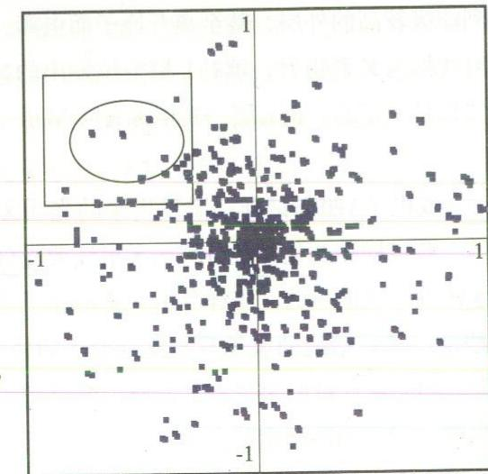  
图 1-6 概率与概率密度

其次，我们来讨论概率密度。概率密度等于概率除以体积，用希腊小写字母 $\rho$ （读音“ru”）为符号，概率与概率密度的关系式是： $\rho = P / V$ 。设图中的某体积为 $V$ 的区域（就说是左上角的椭球内吧）的概率密度为 $\rho = P / V$ 。如果我们再设这个椭球区域里小点的分布是完全均匀的，接着我们仅考察半个椭球的概率密度，我们得到它的概率密度为 $\rho = (P / 2) / (V / 2)$ ，结果仍为 $P / V$ ！如果我们取这个椭球里更小的区域，假设在这个区域里电子的概率分布（即小点的分布）仍是均匀的，结果概率密度还等于 $\rho = P / V$ ！把所取的区域划定得更小，等于小点的体积（只要这个体积不等于零就行），这个微小的区域内的概率密度仍等于 $\rho = P / V$ ！由此可见，电子云图中的每个点都代表了电子在一个微小区域里出现的概率密度，而电子云图给出了这些小点在空间里的分布，小点越密处，电子的概率密度越大，因此，电子云图是电子的概率密度分布图！

## 5. 对泡利原理，洪特规则，能量最低原理的一些说明

泡利原理也称作泡利不相容原理，这里的“不相容”解释为同一个原子轨道不能容纳2个自旋取向相同的电子，所以最多容不下3个电子。“不相容”这个词其实也迎合了教材第一段话最后的设问，用通俗的话说，就是同一个原子中没有运动状态完全相同的电子。从量子力学来说明，就是没有4个量子数（主量子数n，角量子数l，磁量子数m，自旋量子数 $m_{s}$ ）完全相同的电子。4个量子数共同决定了电子的运动状态，自旋也是决定电子运动状态的因素之一，有顺时针和逆时针两种取向。每一种运动状态的电子只能有一个，所以在同一原子轨道（n，l，m相同）上最多只能容纳自旋方向相反的2个电子。其实泡利原理不是从量子力学的基础上推导出来的，而是从实验中归纳出的一种假设，后来人们证明它符合量子力学原理。

基态多电子原子中同一能级的轨道能量相等，称为简并轨道。德国人弗里德里希·洪特（F.Hund）根据大量光谱实验数据总结出一个规律，即电子分布到能量简并的原子轨道时，优先以自旋相同的方式分别占据不同的轨道，因为这种排布方式的原子的总能量最低，称为洪特规则。洪特规则是针对电子填入简并轨道而言的，并不适用于电子填入能量不同的轨道。这是因为当一个轨道中已占有一个电子时，另一个电子要填入而同前一个电子成对，就必须克服它们之间的相互排斥作用，所需能量叫电子成对能，因此电子成单分布到等价轨道中有利于能量降低。根据洪特规则，等价轨道全充满、半充满或全空的状态是比较稳定。

在构建基态原子时，电子将尽可能地占据能量最低的原子轨道，使整个原子的能量最低，这就是能量最低原理。此处“能量最低的原子轨道”指的是电子填入后使整个原子的能量达到最低的轨道。核外电子按洪特规则排布可使整个原子的能量最低，也最稳定。为什么多数基态原子的电子排布符合构造原理而又为何存在不符合构造原理排布的反例呢？这些都归因于能量最低原理。电子排布无论是符合构造原理还是不符合构造原理，无论是基态电中性原子还是阳离子的电子组态，笼统地讲都可以归结为能量最低原理，即保持整个原子的能量最低。

（摘编自：崔爱莉、沈光球、寇会忠、李强.现代化学基础（第二版）.北京：清华大学出版社，2008年）

## 6. 长式周期表中主副族的划分

近年来，长式周期表为许多国家所采用。但是在这种周期表中关于主族和副族的划分方法，曾引起过争议。1923年，戴明（Deming）把包含典型元素的族定为主族，在族序数后标以符号A，把过渡元素的各族定为副族，在族序数后标以符号B。我国以往基本上采用Deming的划分法，只是把稀有气体定为0族，而且对它和第Ⅷ族均不划分主、副族，不标A、B符号。另一种划分法是把碱金属、碱土金属和除铜族、锌族外的过渡元素均定为主族，标以符号A，把铜族、锌族以及其后的各族均定为副族，标以符号B。1970年国际纯粹和应用化学联合会（IUPAC）建议采用这种划分法。由于在长式周期表中主、副族的划分方式不一致，在学术界引起了混乱。因此，在1989年国际纯粹和应用化学联合会建议不再划分主、副族，把长式周期表的各族自左至右统一编号为1\~18列。现在许多国家已经采用了这种表述形式。

在《化学名词》第二版（2016）中，将8\~10族划归副族，故本套教材中，将第Ⅷ族归到副族中。

在长式周期表中氢的位置也有一个演变过程。从前把氢放在长式周期表的上中部，以两条线分别跟碱金属和卤素相连，表示氢既跟碱金属相似，又跟卤素相似。另一些周期表把氢放在碱金属或者卤素的顶部，个别的还在碱金属和卤素的顶部都标上氢。1989年，国际纯粹和应用化学联合会推荐的18列周期表中，把氢列在碱金属的顶部，这跟近年来研究金属氢取得进展及制得 $Na^{-}$ （相当于 $H^{-}$ ）化合物、发现锂键（相当于氢键）等有关。

## 7. 元素周期系的远景

元素的存在，是与原子结构的稳定性，特别是与原子核的稳定性有关。人们发现，原子序数大于83（铋之后）的元素，都是放射性元素，而原子序数在92之后（超铀元素）的元素，全部是用人工方法合成的元素（Np、Pu在自然界中也有，但含量极微）。人们要问：新的人工合成的元素究竟还可以合成多少种？

物理学家根据原子核结构理论计算，认为周期系最后可能出现的是原子序数为175的元素。人工合成的元素，已完成第七周期（零族元素的原子序数为118），并进入第八周期，甚至第九周期。在未来的第八、九周期中，原子中的电子依次填充新的能级——5g能级和6g能级。依照已有的规律，可以推知g能级最多能容纳18个电子。

能级： s p d f g  
电子数： 2 6 10 14 18

由此可以预见，第八、九周期都将有50种元素，是超长周期。在这两个周期里，将有“超锕系”和“新超锕系”的5g\~6f和6g\~7f内过渡系（各为32种元素）。

## 8. 形形色色的元素周期表

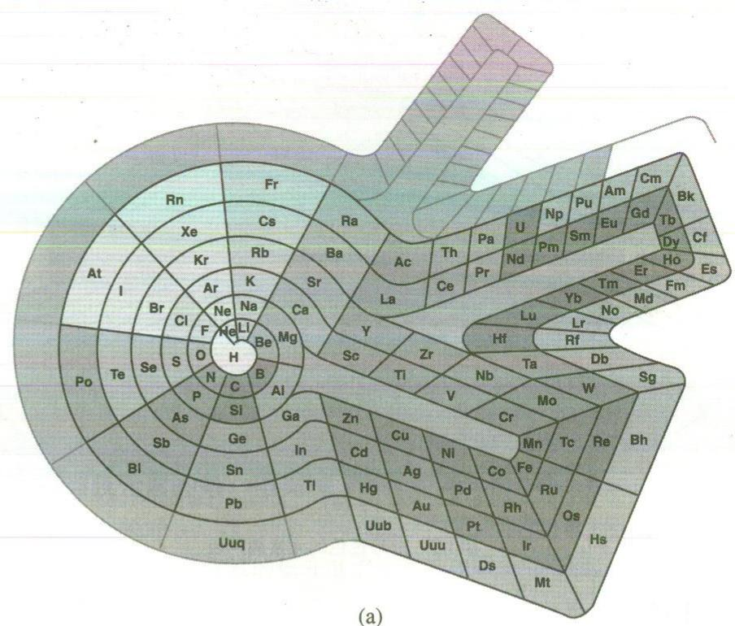  
(a)

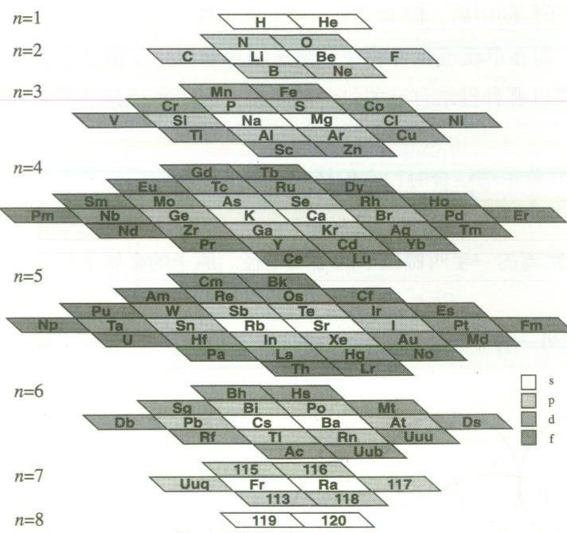  
(b)

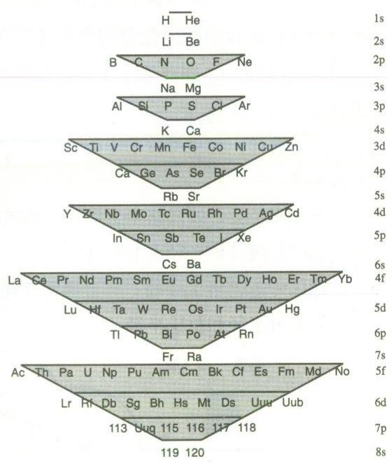  
(c)

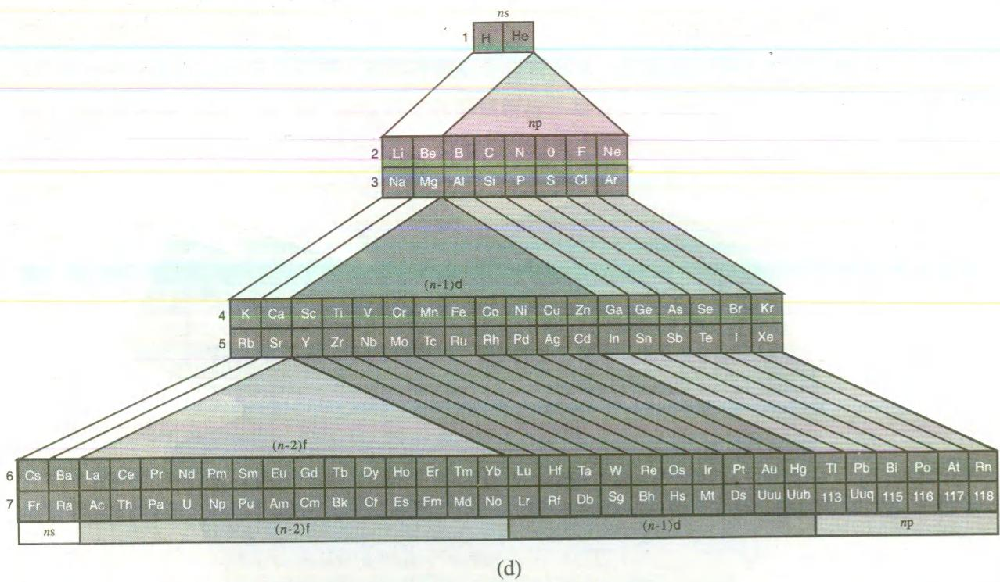  
图 1-7 形形色色的元素周期表

## 9. 原子半径

原子半径，似乎应该是原子核到最外电子层的距离，但事实上，单个原子的半径是无法测定的。原子总是以单质或化合物的形式存在。而在单质或化合物中，原子间总是以化学键结合的（稀有气体除外），因此原子半径就跟原子间以哪种键结合有关。一般来说，原子半径是指共价半径或金属半径。

共价半径：如单质分子中的2个原子以共价单键结合时，它们核间距离的一半叫做该原子的共价半径。

金属半径：金属晶格中金属原子的核间距离的一半叫做原子的金属半径。原子的金属半径一般比它的单键共价半径大10%\~15%。

范氏（范德华）半径：非金属元素还有另一种半径，叫范氏半径。如图1-8所示，表示了氯原子的共价半径和范氏半径。

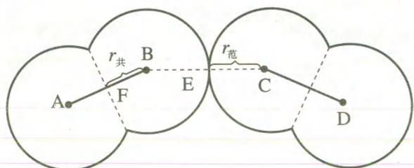  
图 1-8 氯原子的共价半径与范氏半径

对非金属元素， $r_{范}>r_{共}$ ，从图1-8可以清楚地看出这一关系。图1-8表示出2个 $Cl_{2}$ ，在同一个 $Cl_{2}$ 里，2个Cl核间距的一半BF是共价半径（ $r_{共}$ ）；在不同的2个 $Cl_{2}$ 间，2个Cl的核间距的一半CE是范氏半径（ $r_{范}$ ）。显而易见， $r_{范}>r_{共}$ 。

稀有气体在极低的温度下形成单原子分子的分子晶体。在这种晶体里，2个原子核的核间距

的一半，就是稀有气体原子的范氏半径。表1-2列出了非金属元素和稀有气体的范氏半径。

表1-2 非金属元素和稀有气体的范氏半径

<table><tr><td>元素</td><td> $r_{\text{范}}/\text{nm}$ </td><td>元素</td><td> $r_{\text{范}}/\text{nm}$ </td><td>元素</td><td> $r_{\text{范}}/\text{nm}$ </td><td>元素</td><td> $r_{\text{范}}/\text{nm}$ </td></tr><tr><td>N</td><td>0.15</td><td>O</td><td>0.140</td><td>F</td><td>0.135</td><td>Ne</td><td>0.160</td></tr><tr><td>P</td><td>0.19</td><td>S</td><td>0.185</td><td>Cl</td><td>0.180</td><td>Ar</td><td>0.191</td></tr><tr><td>As</td><td>0.20</td><td>Se</td><td>0.200</td><td>Br</td><td>0.195</td><td>Kr</td><td>0.198</td></tr><tr><td>Sb</td><td>0.22</td><td>Te</td><td>0.220</td><td>I</td><td>0.215</td><td>Xe</td><td>0.218</td></tr></table>

从表1-2可以看出， $r_{\text{范}}$ 也有一定的规律性。在同一周期中，从左到右逐渐减小；在同一族中，从上到下逐渐增大。

在一般的资料里，金属元素有金属半径和共价半径的数据，非金属元素则有共价半径和范氏半径的数据，稀有气体只有范氏半径的数据。

## 10. 同周期和同族元素的第一电离能

## (1) 同周期元素

表1-3是第二、第三周期部分元素的核外电子排布式和第一电离能，图1-9是第二周期和第三周期元素的第一电离能。

表1-3 第二、第三周期部分元素的核外电子排布式和第一电离能

<table><tr><td>元素</td><td>核外电子排布式</td><td>第一电离能/(kJ·mol-1)</td></tr><tr><td>Be</td><td> $1s^{2}2s^{2}$ </td><td>900</td></tr><tr><td>B</td><td> $1s^{2}2s^{2}2p^{1}$ </td><td>799</td></tr><tr><td>Mg</td><td> $1s^{2}2s^{2}2p^{6}3s^{2}$ </td><td>736</td></tr><tr><td>Al</td><td> $1s^{2}2s^{2}2p^{6}3s^{2}3p^{1}$ </td><td>577</td></tr><tr><td>N</td><td> $1s^{2}2s^{2}2p^{3}$ </td><td>1400</td></tr><tr><td>O</td><td> $1s^{2}2s^{2}2p^{4}$ </td><td>1310</td></tr></table>

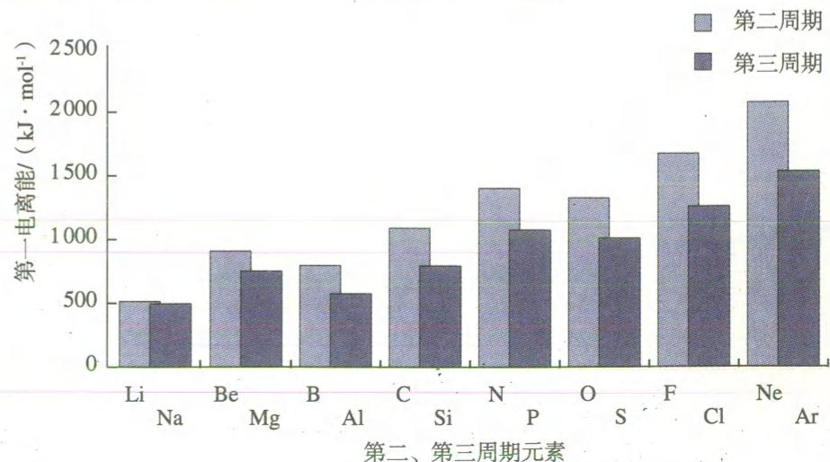  
图1-9 第二、第三周期元素的第一电离能

①同周期元素的第一电离能，从左到右递变的总趋势是依次增大，原因是核电荷数增多，而能层数不变，核电荷对核外电子的吸引力增大；

②为什么B的第一电离能反而比Be小？原因是B失去的电子是2p电子，2p电子的轨道能比2s电子的轨道能高；同理，Al的第一电离能比Mg的第一电离能小；

③氧的第一电离能为什么反而比氮的第一电离能小？原因是氧的第一电离能是失去已经成对的2p电子所需能量，成对电子的相互排斥的能量比核电荷增加吸引2p电子的能量还大，导致氧的第一电离能反比氮的第一电离能低；另外，氮的电子排布是半充满的，比较稳定。同理，硫的第一电离能反而小于磷的第一电离能。

## (2) 同族元素

图 1-10 是碱金属元素的第一电离能。

一般来说，同主族元素的第一电离能，从上到下递变的总趋势是依次降低，原因是核外电子的层数增加而且原子半径递增，核电荷对最外层电子的吸引力降低。

应当注意的是，副族元素的第一电离能从上到下变化趋势与主族不相同，大多是从上到下第一电离能反而增加，原因是虽然核外电子层数增加但原子半径增加却不显著甚至减小，导致核电荷对最外层电子的吸引力增加。

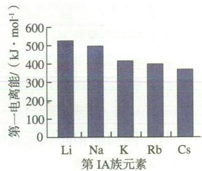  
图1-10 第IA族元素的第一电离能

教学案例

# 第一节 原子结构（第一课时）

南京市第一中学 魏友华

## 教学目标

1. 知道核外电子按能量不同分为能层、同一能层的电子分成不同能级，以及多电子原子中同一能层各能级的能量顺序，进一步认识原子结构。

2. 知道电子运动的能量状态具有量子化的特征（能量不连续），知道基态、激发态与原子光谱，能解释一些金属产生不同焰色的原因。

3. 知道构造原理，能根据构造原理写出1\~36号元素的基态原子的电子排布式。

## 教学重点

1\~36号元素的基态原子的电子排布式、简化的电子排布式的书写，认识价层电子排布。

## 教学难点

基态、激发态与原子光谱。

## 教学过程

## 教学环节一：理解“能层与能级”

<table><tr><td>教师活动</td><td>学生活动</td><td>设计意图</td></tr><tr><td>【引入】1展示:1个完整的球形洋葱和1个剖开的中心嵌有小钢珠的半个洋葱。2投影:必修课程中已学过的电子层模型示意图。3讲述:今天我们在必修课程的基础上,进一步深入认识原子结构。【板书】第一节 原子结构</td><td>观看模型和投影、思考与聆听。</td><td>通过实物展示及投影引入新课。</td></tr><tr><td>【提出任务】要求学生阅读教材中的“一、能层与能级”。【组织讨论】布置讨论题:(1)能级数与该能层序数(n)的关系?(2)以s、p、d、f为符号的能级分别最多可容纳多少个电子?(3)3d、4d、5d能级分别最多可容纳多少个电子?(4)第五能层最多可容纳多少个电子?它们分别容纳在哪几个能级中?一个能层最多可容纳电子数与该能层序数(n)的关系?</td><td>阅读教材。小组讨论。</td><td>自主阅读。讨论交流,思维碰撞。</td></tr><tr><td>【小结】请小组派出代表报告讨论结果,点评学生的讨论结果并提炼主要观点。【投影并讲解】(在归纳讨论结果后投影)多电子原子中:1.  $E(K) < E(L) < E(M) < E(N) < E(O) < E(P) < E(Q)$ 2.  $E(ns) < E(np) < E(nd) < E(nf)\cdots\cdots$ 3. 能级数=该能层序数(n)4. 以s、p、d、f为符号的能级可容纳的最多电子数依次为自然数中的奇数序列1,3,5,7的2倍。5. 一个能层最多可容纳电子数= $2n^{2}$ 。</td><td>小组派出代表汇报讨论结果。聆听、与老师共同提炼讨论结果。</td><td>汇报结论,归纳总结。归纳相关知识。</td></tr></table>

教学环节二：认识“基态与激发态、原子光谱”

<table><tr><td>教师活动</td><td>学生活动</td><td>设计意图</td></tr><tr><td>【投影】播放一些常见的光现象的视频,如焰火、霓虹灯光、激光、荧光、LED灯光等。【提问】在日常生活中,看到的这些发光现象,与原子结构有关,到底有什么关系呢?接下来我们一起来认识:基态与激发态、原子光谱。</td><td>观看并思考。思考、讨论。</td><td>真实情境引入新课。</td></tr></table>

续表

<table><tr><td>教师活动</td><td>学生活动</td><td>设计意图</td></tr><tr><td>【讲解】处于最低能量状态的原子叫做基态原子。基态原子吸收能量,它的电子会跃迁到较高能级,变为激发态原子。电子从较高能量的激发态跃迁到较低能量的激发态乃至基态时,将释放能量。光(辐射)是电子跃迁释放能量的重要形式之一。【投影并讲解】原子光谱形成示意图:EN激发态能级E3E2E1发射光谱吸收光谱E0基态能级</td><td>聆听并思考。观看投影、聆听、理解相关概念。</td><td>利用示意图加深理解相关知识。</td></tr><tr><td>(1)在该图中,电子从某激发态能级(能量为 $E_1$ )跃迁到基态能级(能量为 $E_0$ )时,如果释放的能量以光的形式表现出来并被记录下来,就形成发射光谱。(2)当电子从基态能级(能量为 $E_0$ )跃迁到某激发态能级(能量为 $E_1$ )时,如果吸收的能量以光的形式表现出来并被记录下来,就形成吸收光谱。(3)吸收光谱和发射光谱,总称原子光谱。利用原子光谱上的特征谱线来鉴定元素,称为光谱分析。</td><td></td><td></td></tr></table>

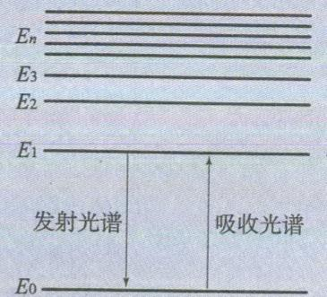

教学环节三：根据构造原理书写电子排布式

<table><tr><td>教师活动</td><td>学生活动</td><td>设计意图</td></tr><tr><td>【提问】基态原子是处于最低能量状态的原子。电子如何填入核外的不同能级以保证原子处于基态呢?有可循的填入顺序吗?我们现在来探讨新的话题“构造原理与电子排布式”。</td><td>聆听、存疑。</td><td>承前启后,探索新知。</td></tr><tr><td>【投影并讲解】下面就是构造原理示意图。</td><td></td><td></td></tr><tr><td rowspan="45">图中的箭头方向表示从氢开始,随核电荷数的递增,新增电子填入能级的顺序。按照构造原理,我们可以写出元素的基态原子核外电子排布的表示式——电子排布式。例如:氢到硼的基态原子的电子排布式: $1s^{1} \rightarrow 1s^{2} \rightarrow 1s^{2}2s^{1} \rightarrow 1s^{2}2s^{2} \rightarrow 1s^{2}2s^{2}2p^{1}$ 氢氦锂铍硼【提出任务】根据构造原理书写1~18号元素的基态原子的电子排布式。【提问】请写出钾、钙的基态原子的电子排布式,为什么没有电子排在3d能级?【讲解】按照构造原理,书写钾、钙和钪的基态原子的电子排布式时,电子是按 $3p \rightarrow 4s \rightarrow 3d \rightarrow 4p$ 的顺序而不是按 $3p \rightarrow 3d \rightarrow 4s \rightarrow 4p$ 的顺序填充的,出现了能级交错现象。【提问】随着核电荷数的增加,基态原子的电子排布式越来越长,太不方便了。怎么办?【讲解】我们可以将电子排布式简化。例如,钠的基态原子的电子排布式可以简化为 $[Ne]3s^{1}$ ;钾的基态原子的电子排布式可以简化为 $[Ar]4s^{1}$ ;钪的基态原子的电子排布式可以简化为 $[Ar]3d^{1}4s^{2}$ 。</td><td rowspan="44">观看投影、聆听、理解。</td><td rowspan="21">建立模型认知。</td></tr><tr></tr><tr></tr><tr></tr><tr></tr><tr></tr><tr></tr><tr></tr><tr></tr><tr></tr><tr></tr><tr></tr><tr></tr><tr></tr><tr></tr><tr></tr><tr></tr><tr></tr><tr></tr><tr></tr><tr></tr><tr><td rowspan="3">强化训练。</td></tr><tr></tr><tr></tr><tr><td rowspan="20">以问题的方式促进学生思考。</td></tr><tr></tr><tr></tr><tr></tr><tr></tr><tr></tr><tr></tr><tr></tr><tr></tr><tr></tr><tr></tr><tr></tr><tr></tr><tr></tr><tr></tr><tr></tr><tr></tr><tr></tr><tr></tr><tr></tr><tr><td></td><td></td></tr></table>

续表

<table><tr><td>教师活动</td><td>学生活动</td><td>设计意图</td></tr><tr><td>【提出任务】钠和镁的基态原子的电子排布式分别为[Ne] $3s^{1}$ 和[Ne] $3s^{2}$ ,请找出与它们的化合价相关的电子。【讲解】(师生讨论后)在钠和镁的简化电子排布式中, $3s^{1}$ 和 $3s^{2}$ 电子与化合价有关。我们把在化学反应中可能发生电子变动的能级称为价电子层(简称价层)。钪的基态原子的电子排布式为[Ar] $3d^{1}4s^{2}$ , $3d^{1}4s^{2}$ 是它的价层电子排布。【布置任务】请查阅书末元素周期表中的价层电子排布。提问:主族元素和过渡元素的价电子层有什么特征?【讲解】(师生讨论后)主族元素的价层电子排布就是其最外层电子排布,而过渡元素的价层电子排布可能包括最外层s电子、次外层d电子、甚至是倒数第三层的f电子。【提问】从元素周期表给出的信息,Cr和Cu的价层电子排布分别为 $3d^{5}4s^{1}$ 和 $3d^{10}4s^{1}$ ,这样的电子排布符合构造原理吗?【讲解】(师生讨论后)这样的电子排布源于光谱学事实,是从实验事实得到的,不符合构造原理。这也说明构造原理是被理想化的。理想化是许多科学原理的共同点,理想化常常是建立模型所必需的。</td><td>思考、讨论、回答问题。聆听、理解。查阅书末元素周期表。思考、讨论、回答。聆听、理解。思考、讨论、回答。聆听、理解。</td><td>以问题任务促进学生积极参与学习活动。以问题任务促进学生积极参与学习活动。</td></tr></table>

教学环节四：课堂小结、布置作业

<table><tr><td>教师活动</td><td>学生活动</td><td>设计意图</td></tr><tr><td rowspan="3">【归纳总结】1.能层和能级:电子运动的能量状态具有量子化的特征(能量不连续)。2.原子光谱:基态和激发态间的跃迁产生吸收光谱和发射光谱。3.构造原理:依据构造原理可以写出元素的基态原子的电子排布式。【布置作业】(略)</td><td>与教师一起归纳总结。</td><td>提炼本节课的主要知识点。</td></tr><tr><td></td><td></td></tr><tr><td></td><td></td></tr></table>

## 第一节 原子结构（第三课时）

南京师范大学附属中学 方诣 南京市第一中学 魏友华

## 教学目标

1. 知道泡利原理和洪特规则，能书写1\~36号元素的基态原子的轨道表示式。

2. 理解能量最低原理，知道基态原子的核外电子排布遵循泡利原理、洪特规则和能量最低原理，能解释一些元素的基态原子的核外电子排布不遵循构造原理的原因。

## 教学重点

1. 泡利原理、洪特规则、能量最低原理。

2. 1\~36号元素的基态原子的轨道表示式的书写。

## 教学难点

1. 洪特规则的特例。

2. 能量最低原理。

## 教学流程

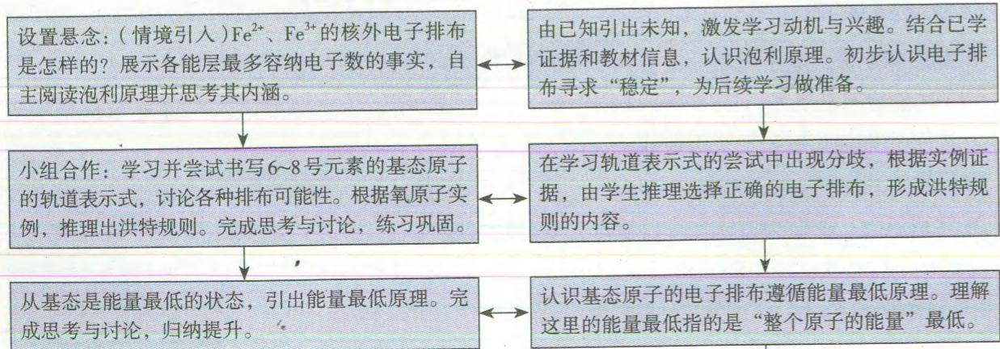

认识基态原子的电子排布遵循能量最低原理。理解这里的能量最低指的是“整个原子的能量”最低。

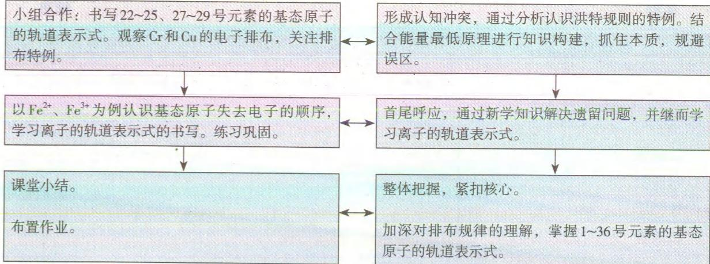

教学环节一：由同一原子轨道最多只能容纳2个电子的事实认识泡利原理  

## 教学过程

<table><tr><td colspan="5">教师活动</td><td>学生活动</td><td>设计意图</td></tr><tr><td colspan="5">【引入】(投影)</td><td></td><td></td></tr><tr><td colspan="5"></td><td></td><td></td></tr><tr><td colspan="5">向FeCl3溶液中滴入KSCN溶液(左)向FeCl2溶液中滴入KSCN溶液(右)</td><td></td><td></td></tr><tr><td colspan="5">【讲解】铁元素有两种常见的离子存在形态:Fe2+和Fe3+。它们的核外电子排布存在怎样的差异呢?今天我们从另一个角度来学习核外电子的排布,认识核外电子的排布规律。</td><td>【思考】回忆构造原理和原子轨道的相关知识。基态铁原子的核外电子排布是怎样的呢?失2个电子变为Fe2+,失3个电子变为Fe3+,Fe2+、Fe3+的核外电子排布又是怎样的呢?</td><td>已知引出未知,激发学生的学习热情。</td></tr><tr><td colspan="5">【板书】第一节 原子结构</td><td></td><td></td></tr><tr><td colspan="5">五、核外电子排布规律</td><td></td><td></td></tr><tr><td colspan="5">【投影】投影下列表格。</td><td rowspan="5">【观看】仔细观看投影的表格。</td><td rowspan="5">温故知新,快速进入学习状态。</td></tr><tr><td>能级</td><td>1s</td><td>2s</td><td>2p</td><td>......</td></tr><tr><td>各能级轨道数</td><td>1</td><td>1</td><td>3</td><td>......</td></tr><tr><td>各能层轨道数</td><td>1</td><td colspan="2">4</td><td>......</td></tr><tr><td>最多容纳电子数</td><td>2</td><td colspan="2">8</td><td>......</td></tr><tr><td colspan="5">【讲解】显然每个轨道最多容纳2个电子。【提问】每个轨道中怎么最多就只有2个电子呢?多1个都不行吗?请同学们阅读教材相关内容。【投影】小结:一个原子轨道里最多容纳2个自旋相反的电子,此原理称为泡利原理(也称泡利不相容原理)。【板书】泡利原理【强调】1.自旋是电子的一种状态,是其内在属性。2.遵循泡利原理的核外电子排布方式是相对稳定的。</td><td>【阅读】教材的第一节第五小节标题至“资料卡片——电子的自旋”。【回答】同一原子轨道内的电子有一种内在属性——自旋,只有顺时针和逆时针两种取向。</td><td>问题驱动,寻找内因。强化概念,初步理解泡利原理的内涵。</td></tr></table>

教学环节二：在尝试书写轨道表示式的过程中认识洪特规则

<table><tr><td>教师活动</td><td>学生活动</td><td>设计意图</td></tr><tr><td>【投影】5号元素的基态原子的电子排布式和轨道表示式。【讲解】用方框(或圆圈)表示原子轨道,能量相同的轨道(简并轨道)的方框相连,箭头表示一种自旋状态的电子,“↑↓”称电子对,“↑”或“↓”称单</td><td>【观看】仔细观看投影内容。</td><td>示例了解轨道表示式。</td></tr></table>

续表

<table><tr><td>教师活动</td><td>学生活动</td><td>设计意图</td></tr><tr><td>电子(或未成对电子)。箭头同向的单电子称自旋平行,通常应在方框下方或上方标记能级符号。有时画出能级上下错落,以表达能量的高低不同。这样画出的式子叫做轨道表示式(又称电子排布图)。【布置任务】小组活动。【投影】几个小组的不同结果。【设问】哪种排布结果符合实际呢?我们一起来看教材中给出的氧的基态原子的轨道表示式。【提问】电子在填入简并轨道的时候需要遵循怎样的规则呢?【追问】填入空轨道时与相邻轨道的电子是否自旋平行?【投影】小结:基态原子中,电子填入简并轨道,总是先单独分占,且自旋平行,称为洪特规则。【板书】洪特规则【强调】洪特规则只针对简并轨道,也适用于基态离子。</td><td>【小组活动】在写出电子排布式的基础上,尝试书写6~8号元素的基态原子的轨道表示式,出现分歧时可以小组讨论。【观看】不同小组的结果展示。【体会】如果没有某些规则,将存在多种不同的排布方案。【回答】与师生共同讨论。【订正】6~8号元素的基态原子的轨道表示式。【练习】完成教材中的“思考与讨论”,并尝试书写13~20号元素的基态原子的轨道表示式。</td><td>在尝试的过程中体会到电子在p轨道的排布方式有多种选择,可能需要通过某些排布规则才能确定。对后续的学习产生期待。给出证据,分析推理,认识洪特规则。学以致用,解决之前小组活动中的遗留问题。巩固提升。</td></tr></table>

教学环节三：核外电子排布遵循能量最低原理

<table><tr><td>教师活动</td><td>学生活动</td><td>设计意图</td></tr><tr><td>【讲解】核外电子排布除遵循上面介绍的泡利原理和洪特规则外,还遵循能量最低原理。能量越低越稳定,这是自然界的一个</td><td></td><td></td></tr><tr><td>普遍规律。基态是能量最低的状态。所以,基态原子的电子排布是能量最低的原子轨道组合。【设问】电子在填入核外不同能级的原子轨道时有什么选择性呢?</td><td></td><td rowspan="2">由同一轨道的排布规则,到简并轨道的排布规则,再到不同能级原子轨道的排布规则,层层推进。理解构造原理和能量最低原理之间的联系,加深认识,领会内涵。</td></tr><tr><td>【讲解】在构建基态原子时,电子尽可能占据能量最低的原子轨道,可以使整个原子的能量最低,这就是能量最低原理。【板书】能量最低原理【强调】这里的能量最低指的是“整个原子”的能量最低。</td><td>【体会】结合构造原理、1~36号元素的基态原子的电子排布式,体会能量最低原理的内涵。【练习】完成教材中的“思考与讨论”。</td></tr></table>

教学环节四：由 Cr 和 Cu 的价层电子排布认识洪特规则的特例

续表

<table><tr><td>教师活动</td><td>学生活动</td><td>设计意图</td></tr><tr><td>【布置任务】小组活动</td><td>【小组活动】书写22~25号、27~29号元素的基态原子的价电子排布式及轨道表示式。</td><td>巩固提升。</td></tr><tr><td>【投影】Cr和Cu的价电子排布的轨道表示式: $\begin{array}{c|cc}3d & 4s \\ \uparrow & \uparrow & \uparrow & \uparrow & \uparrow \\ \uparrow & & & & \uparrow \end{array}$  $\begin{array}{c|cc}3d & 4s \\ \uparrow & & & & \uparrow \end{array}$ 【提问】Cr和Cu的价电子排布均不符合构造原理,但源自事实,其原因是什么呢?【归纳】能量相近的简并轨道中,电子排布为全充满、半充满或全空的状态是能量较低的稳定状态,此为洪特规则的特例。</td><td>【观看】观看投影的内容。【思考】【回答】【体会】核外电子排布出现不遵循构造原理的特例,其原因是可以使整个原子的能量更低。</td><td>特例分析,寻找内因。进一步认识能量最低指的是“整个原子”的能量最低。</td></tr></table>

<table><tr><td>教师活动</td><td>学生活动</td><td>设计意图</td></tr><tr><td>【投影】几种元素的基态原子的价电子排布: $Nb:4d^{4}5s^{1},Ru:4d^{7}5s^{1},Rh:4d^{8}5s^{1},W:5d^{4}6s^{2}$ 【提醒】随着原子核电荷数和核外电子数目的增多,原子核与电子、电子与电子之间的相互作用更加复杂,基态原子的电子排布不符合构造原理的情况会更多,原因也更复杂。有些原子的价层电子排布既不遵守构造原理,也不能用洪特规则特例来解释。</td><td>【观看】投影内容。【体会】这样的排布也是符合能量最低原理的。</td><td>规避思维误区,尊重客观事实。</td></tr></table>

教学环节五：以 $Fe^{2+}$ 、 $Fe^{3+}$ 为例认识基态原子失去电子的顺序

<table><tr><td>教师活动</td><td>学生活动</td><td>设计意图</td></tr><tr><td>【投影】铁原子的轨道表示式: $\text{Fe}^{3d} \uparrow\downarrow \uparrow \uparrow \uparrow \uparrow \uparrow \uparrow \uparrow$ 【提问】我们回到课堂一开始留下的话题,请大家结合今天所学知识讨论一下 $\text{Fe}^{3+}$ 和 $\text{Fe}^{2+}$ 的价电子排布是怎样的?【归纳】基态原子失去电子转化成简单阳离子的时候,失去电子顺序是由外到内:先失去ns电子,再失去(n-1)d电子。所以 $\text{Fe}^{2+}$ 的价电子排布不是 $3d^{5}4s^{1}$ 而是 $3d^{6}, \text{Fe}^{3+}$ 的价电子排布为 $3d^{5}$ 。【小结】离子的轨道表示式的书写方法。</td><td>【讨论】和【汇报】【体会】电子填入顺序与失去顺序并非完全相反。【练习】完成本节“练习与应用”的第9~10题。</td><td>在讨论交流的基础上,教师进行补充,帮助学生用新学知识解决遗留难题。练习巩固。</td></tr></table>

教学环节六：课堂小结、布置作业

<table><tr><td>教师活动</td><td>学生活动</td><td>设计意图</td></tr><tr><td rowspan="5">【讲解】小结:整个原子的能量是由核电荷数、电子数和电子状态三个因素共同决定的。当相邻能级能量相差很大时,电子填入能量低的能级即可使整个原子能量最低;而当相邻能级能量相差不太大时,1~2个电子占据能量稍高的能级可能反而降低了电子之间的相互排斥而使整个原子的能量最低。总之,基态原子的核外电子排布遵循泡利原理、洪特规则和能量最低原理。【布置作业】写出1~20号元素的基态原子的轨道表示式、21~36号元素的基态原子的价层电子排布及对应的轨道表示式。</td><td>【总结】本节课的主要内容。</td><td>归纳本节课的主要内容。</td></tr><tr><td></td><td></td></tr><tr><td></td><td></td></tr><tr><td></td><td></td></tr><tr><td></td><td></td></tr></table>

## 第二节 原子结构与元素的性质（第一课时）

南京市第十二中学 怀龙法 南京市第一中学 余亮

## 教学目标

1. 知道运用构造原理书写元素的基态原子的电子排布式，能运用电子排布式解释元素周期系的基本结构。

2. 知道价层电子及价层电子排布，能从原子价层电子数目和价层电子排布角度解释元素周期表的分区、周期和族的划分。

3. 了解元素周期律的内涵，能从原子结构的视角解释原子半径呈现周期性变化的原因。

## 教学重点

1. 原子结构与元素周期表的关系。

2. 原子半径的周期性变化规律。

## 教学难点

1. 元素周期表的分区。

2. 从原子结构视角解释原子半径的变化规律。

## 教学流程

1. 元素周期表的教学

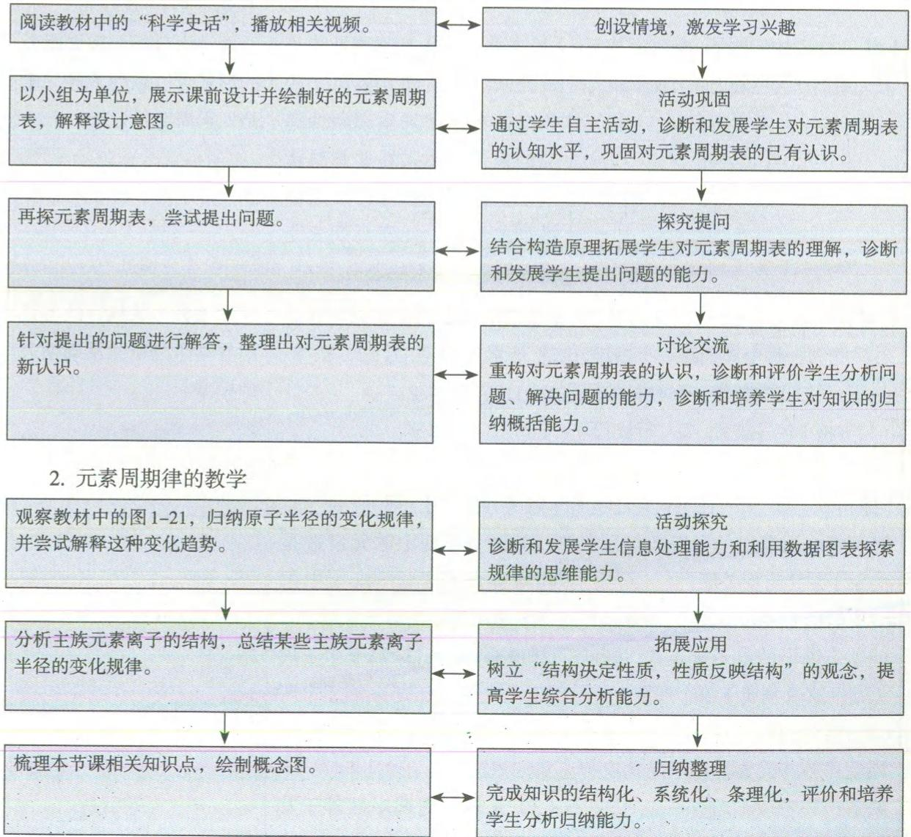

## 教学过程

续表

<table><tr><td>教师活动</td><td>学生活动</td><td>设计意图</td></tr><tr><td>【讲解】按照构造原理,将价层电子排布相似的元素集中起来划分为一个区,以最后填入电子的能级符号作为该区的符号(ds区除外),如价层电子为ns的元素划分为s区。可把元素周期表划分5个区。</td><td>【倾听】观察教材中的图1-19</td><td>运用构造原理,深度挖掘元素周期表蕴含的化学信息。启发学生从原子的价层电子排布的视角解释元素周期表的分区。</td></tr><tr><td>【组织讨论】(1)分析s区、d区、ds区和p区分别有几列?为什么s区(除氢元素)、d区和ds区的元素都是金属元素?(2)为什么在元素周期表中非金属主要集中在右上角三角区内?(3)元素周期表有多少列?同列元素价层电子数是否相等?元素周期表可分为哪些族?族序数有什么规律?</td><td rowspan="4">【思考并回答】(1)s区有2列、d区有8列、ds区有2列、p区有6列。根据元素的价层电子排布信息,发现s区(除氢元素)、d区和ds区的元素在化学反应中容易失去电子达到相对稳定结构,呈现金属性,属于金属元素。(2)右上角三角区的p区元素,能层数少,容易得到电子达到相对稳定结构,呈现非金属性,属于非金属元素。(3)元素周期表有18列,同列元素的价层电子数相等,元素周期表可分为主族、副族、零族。主族从IA~VIIA,价电子总数等于其族序数;第IIIB族到第VIIB族元素的价层电子数等于其族序数;第VIII族有3列元素,其族序数等于该族的第1列元素的价层电子数;第IB族、第IIB族的族序数等于其最外层电子数。</td><td rowspan="4">经过积极探索,使学生的认识得到升华,一步步加深对元素周期表结构的认识;通过展开讨论,激发学生思维碰撞的火花,有助于培养学生的分析归纳能力和语言表达能力。</td></tr><tr><td>【讲解】按照构造原理,将价层电子排布相似的元素集中起来划分为一个区,以最后填入电子的能级符号作为该区的符号(ds区除外),如价层电子为ns的元素划分为s区。可把元素周期表划分5个区。</td></tr><tr><td>【组织讨论】(1)分析s区、d区、ds区和p区分别有几列?为什么s区(除氢元素)、d区和ds区的元素都是金属元素?(2)为什么在元素周期表中非金属主要集中在右上角三角区内?(3)元素周期表有多少列?同列元素价层电子数是否相等?元素周期表可分为哪些族?族序数有什么规律?</td></tr><tr><td>【讲解】按照构造原理,将价层电子排布相似的元素集中起来划分为一个区,以最后填入电子的能级符号作为该区的符号(ds区除外),如价层电子为ns的元素划分为s区。可把元素周期表划分5个区。</td></tr></table>

续表

<table><tr><td>教师活动</td><td>学生活动</td><td>设计意图</td></tr><tr><td>(4)为什么副族元素又称为过渡元素?写出它们的价层电子排布通式。</td><td>(4)副族元素元素处于金属元素向非金属元素过渡的区域,因此又把它称为过渡元素。d区元素的价层电子排布通式为 $(n-1)d^{1-9}ns^{1-2}$ ,ds区元素的价层电子排布通式为 $(n-1)d^{10}ns^{1-2}$ 。</td><td></td></tr><tr><td>【组织探究】(1)以小组为单位,对教材中的“再探元素周期表”进行探究,仔细考察书末的周期表,整理你遇到的新问题。(2)选取典型问题,进行小组讨论。</td><td>【整理新问题】(1)为什么氢元素与碱金属在同列?(2)为什么第6周期和第7周期分别出现了镧系和锕系?(3)预测167号元素在哪个周期,哪个族?【解释与整理】独立思考,小组讨论,合理解释,整理归纳。</td><td>培养学生提出问题和解决问题的能力。重构对元素周期表的认识,培养学生对知识的归纳能力。</td></tr><tr><td>【讲解】(结合教材中的“思考与讨论”)金属锂和镁在过量的氧气中燃烧,不形成过氧化物,只生成氧化物;金属铍和铝的氢氧化物都具有两性;硼和硅的含氧酸酸性的强度很接近,都是弱酸。这种相似性被称为“对角线”规则,它是一种经验规则。</td><td>【交流分享】尝试书写相关化学方程式。</td><td>体会对角线规则,并尝试根据镁、铝、硅的化学性质预测锂、铍、硼的性质,能够列举实例予以说明。</td></tr></table>

教学环节二：探究原子半径周期性变化的规律

<table><tr><td>教师活动</td><td>学生活动</td><td>设计意图</td></tr><tr><td>【组织探究】观察教材中的图1-21主族元素原子半径的周期性变化,描述其变化趋势,并尝试从原子结构视角解释这种趋势。</td><td>【归纳】随着原子序数的递增,原子核外电子排布、原子半径都呈现周期性递变:同主族元素从上到下原子半径依次变大;同周期元素从左到右原子半径依次变小。</td><td>利用所学知识解释递变规律,培养学生证据推理能力。引导学生分析影响原子半径大小的两个因素:电子的能层数和核电荷数,为下一步的离子半径探究做铺垫。</td></tr></table>

续表

<table><tr><td>教师活动</td><td>学生活动</td><td>设计意图</td></tr><tr><td>【组织讨论】(1)比较同种元素的原子与其对应离子半径的大小,如比较 $H^{+}$ 、 $H$ 、 $H^{-}$ 的半径大小。(2)分析同主族元素的阳离子或阴离子的半径变化规律,比较 $Li^{+}$ 、 $Na^{+}$ 、 $K^{+}$ 的半径大小,比较 $F^{-}$ 、 $Cl^{-}$ 、 $Br^{-}$ 的半径大小。</td><td>【思考并回答】(1)同种元素的阴离子半径大于其原子半径,原子半径大于其阳离子半径,即 $r(H^{-}) > r(H) > r(H^{+})$ 。(2)同主族元素的阳离子半径随核电荷数增大而增大,即 $r(Li^{+}) < r(Na^{+}) < r(K^{+})$ ;同主族元素的阴离子半径也随核电荷数增大而增大,即 $r(F^{-}) < r(Cl^{-}) < r(Br^{-})$ 。</td><td>举一反三,能够通过离子的结构(离子核电荷数、离子核外电子排布),分析出离子半径大小的变化规律。</td></tr><tr><td>【归纳整理】梳理元素周期表的相关知识,绘制概念图,下节课分小组展示。</td><td>【合作整理】整理本节课知识点,绘制相关网络图。</td><td>结合板书,引导学生厘清知识脉络,完成知识的结构化、系统化、条理化,培养学生分析归纳能力。</td></tr><tr><td>【布置作业】(略)</td><td></td><td></td></tr></table>

## 板书设计

第二节 原子结构与元素的性质（第一课时）

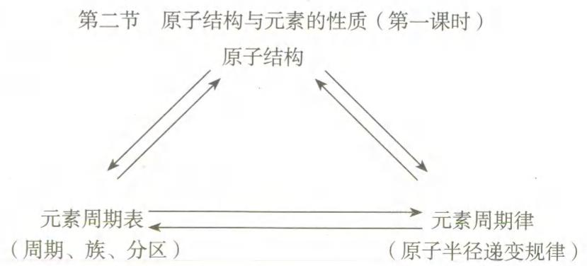

元素周期表 $\xrightarrow{\text{元素周期律}}$ （周期、族、分区） （原子半径递变规律）

## 第二章

## 分子结构与性质

## 本章说明

本章比较系统地介绍了分子的结构和性质，内容比较丰富。在必修教材中，已介绍了化学键，并从电子得失或共用电子对的视角，用电子式的方式表示了离子键或共价键的形成过程，也对分子的空间结构作了简单介绍。本章将对共价键、分子的空间结构、分子的结构对物质性质的影响等内容进行更为深入的探讨。

通过本章的学习，学生能够在分子水平上，从分子结构的视角认识物质的性质，进一步形成有关物质结构的基本观念，提升化学学科核心素养。

## 一、教材分析

教材从两个维度对分子结构进行探讨，一是探讨分子中原子间的相互作用，认识原子间形成共价键的本质和特征，这就是本章教材的第一节内容；二是探讨分子中原子间的几何关系和形状，即分子的空间结构，这就是本章教材的第二节内容。基于对分子结构的基本认识，以及分子间存在相互作用的认识，介绍了分子结构对物质性质的影响，这就是本章教材的第三节内容。本章的内容结构如下图所示。

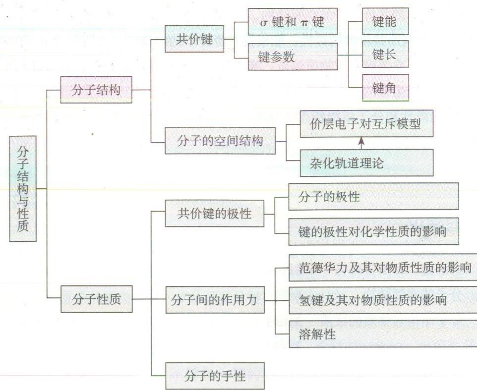

为了帮助学生学习本章中抽象的教学内容，教材多采用图片或表格的呈现方式来形象地引出有关概念或原理。例如，通过图片的方式展示原子轨道重叠，很形象地引出了共价键的主要类型 $\sigma$ 键和 $\pi$ 键；通过原子轨道的杂化图片，很形象地介绍了 $sp^{3}$ 、 $sp^{2}$ 和 sp 杂化，让学生比较容易理解“杂化轨道理论”；通过含孤电子对的 VSEPR 模型和分子的空间结构模型的图片，形象地介绍了“价层电子对互斥模型”和分子的空间结构；等等。

教材的编排尽可能地引导学生开展探究活动和实践活动。例如，通过对“共价键”的探究活动，让学生自主探究共价键的本质和特征；通过“制作分子的空间结构模型”的实践活动，体验实物模型，帮助对分子的空间结构的直观认识，使抽象性极强的分子结构直观化；通过“碘在水和四氯化碳中的溶解性”的实验来帮助学生理解“相似相溶”规则；等等。

在第三节“分子结构与物质的性质”中，教材注重引导学生运用分子结构知识理解物质结构对物质性质的影响。例如，根据共价键及分子的空间结构知识，阐述了键的极性和分子的极性；根据化学键、分子的极性等概念介绍了范德华力的特点及其对物质性质的影响；根据电负性的概念介绍了氢键的特点及其对物质性质的影响；根据极性分子与非极性分子的概念介绍了“相似相溶”规则；等等。

## 二、学业要求

1. 能说出共价键的主要类型、特征与区别；能说明乙烷、乙烯和乙炔等物质的成键类型；能利用键参数解释物质的某些性质。

2. 能根据给定的信息分析常见简单分子的空间结构，能利用价层电子对互斥模型和杂化轨

道理论预测和解释简单的共价分子的空间结构。

3. 能利用电负性判断共价键的极性，能根据共价分子的结构特点说明简单分子的某些性质；能说明分子间作用力（含氢键）对物质熔点、沸点等性质的影响，能列举含有氢键的物质及其性质特点，知道氢键对于生命的重大意义。

4. 能根据键的极性和分子结构特点来判断分子的极性，并据此对分子的一些典型性质及其应用作出解释。

## 三、课时建议

第一节 共价键 2课时  
第二节 分子的空间结构 4课时  
第三节 分子结构与物质的性质 3课时  
全章复习 3课时

## 第一节 共价键

## 一、内容分析

本节内容主要包括共价键和共价键的键参数两部分。

教材的第一部分内容介绍共价键。在必修课程的基础上，教材运用第一章学过的原子轨道的概念，从原子轨道重叠的视角来进一步认识共价键的本质和特征，通过图片的方式描述了原子轨道重叠并形成共价键的过程。原子轨道重叠形成共价键后，电子云形状发生了变化，不同的重叠方式，形成共价键的电子云形状也不一样，有轴对称的、有镜面对称的，很形象地引出了共价键的主要类型——σ键和π键。在σ键和π键的形成过程示意图中，使用的是电子云轮廓图来示意原子轨道重叠，但在表达时，应该描述为原子轨道重叠，而不是电子云重叠。在介绍σ键和π键两种不同类型共价键的强度时，教材是这样描述的：“π键与σ键的强度不同”，不再描述为“σ键的强度比π键的强”。最后，教材设置了一个探究，让学生自主地进一步认识σ键和π键，并且要求学生探究共价双键和三键中的π键是如何形成的。此时，教材还没有介绍杂化轨道理论，学生难以理解双键和三键中的π键是如何通过p轨道和p轨道“肩并肩”重叠形成的。组织探究教学时，可以要求学生先查阅资料，了解相关的知识。

第二部分内容介绍共价键的键参数——键能、键长、键角。这部分内容从定量的角度来研究共价键，键能和键长可以用来描述键的强弱，键角可以用来描述分子的空间结构。教材直接给出键能和键长的概念，并很简洁地用表格形式列出了某些共价键的键能和键长，表格中的这些参数对分子性质是有影响的，教材通过“思考与讨论”中的具体问题让学生运用这些键参数解释对分子性质的影响。化学键的键长与键能是相关的，教材列举实例说明了它们的相关性。教材中的表2-1和表2-2的信息是比较多的，教学中可以利用。例如，可以比较同主族元素单质中各物质的键长和键能的差异；可以比较同种元素形成的单键、双键和三键的键长和键能的差异；可以比较同主族元素的氢化物的键长和键能的差异；等等。再如，在《化学反应原理》模块中，介绍有关化学反应的能量变化时，用到了键能数据，但在本节中没有列举具体例子来说明键能数据的应用，只说明了从键能数据表里查出相关化学键的键能，通过计算相关物质的键能变化可知化学反应的热效应。教学时，可以增加一些利用表2-1的数据进行计算的具体例子。

键角是描述分子空间结构的重要参数。教材介绍键角时，首先给出了什么是键角，然后通过 $CO_{2}$ 和 $H_{2}O$ 等物质的键角，说明了键角与分子空间结构的关系，并进一步说明了共价键具有方向性。本节教材的最后一句话：“键长和键角的数值可通过晶体的X射线衍射实验获得”，既表达了键长和键角的数据可由实验获得，又为教材后续介绍晶体的X射线衍射实验打下伏笔。

## 二、教学目标

## 1. 教学目标

(1)从原子轨道重叠的视角认识共价键的本质,知道共价键具有饱和性和方向性,能用模型、图像和符号等正确表征 $\mathrm{H}_{2} 、 \mathrm{Cl}_{2} 、 \mathrm{HCl}$ 等简单分子中原子轨道的重叠方式。

(2) 知道 $\sigma$ 键和 $\pi$ 键的区别和特征, 能说明 $\mathrm{C}_{2} \mathrm{H}_{6} 、 \mathrm{C}_{2} \mathrm{H}_{4}$ 和 $\mathrm{C}_{2} \mathrm{H}_{2}$ 等分子的成键类型。

(3) 理解键能、键长和键角等键参数的含义, 能利用键参数解释物质的某些性质。

(4) 通过共价键理论模型的发展过程, 初步体会不同理论模型的价值和局限。

## 2. 教学重点和难点

重点：从原子轨道重叠的视角认识共价键的本质；用键能、键长和键角等键参数解释物质的某些性质。

难点：从原子轨道重叠方式的不同理解 $\sigma$ 键和 $\pi$ 键的区别和特征。

## 三、教学建议

## 1. 关于共价键的教学

## （1）创设情境，问题导引

可以从“原子是如何构成物质的？”问题出发引入新课。教师可通过展示一些简单实物及其分子的结构，让学生感受大部分物质是由分子构成的，而分子又由原子构成，即“原子→分子→物质”。可追问：原子是如何构成分子的？分子中的原子间必然存在着某种相互作用，这种相互作用的本质是什么呢？

回答 “原子是如何构成分子的” 这一问题，学生可以运用已学习过的共价键的共用电子对理论加以解释。教师可以 $H_{2}$ 、 $Cl_{2}$ 、HCl 为例，引导学生书写其电子式，讨论难以形成 $H_{3}$ 、 $H_{2}Cl$ 、 $Cl_{3}$ 等分子的原因，并进一步以氮、氧、氟的单质和氢化物的电子式为例，分析共价键的饱和性。

另外, 还可以以化学史实为线索开展教学。抓住 “微粒间的相互作用” 这个主题, 精选化学史素材, 结合学生已有概念, 寻求化学理论发展和学生思路发展的统一。微粒间存在相互作用是一个经验事实, 包括牛顿在内的一代代科学家都试图阐明这种相互作用的本质, “化学亲和力” “化学键” 等概念只是对这种相互作用的形象描述, 直到电子的发现和原子结构理论的发展才真正阐明了化学键的本质。柯塞尔提出的 “离子键” 概念虽能很好地解释 NaCl 等离子化合物的形成, 但不能解释 $\mathrm{H}_{2}$ 等分子的形成。路易斯进而提出了 “共价键” 的概念, 以共用电子对来解释 $\mathrm{H}_{2} 、 \mathrm{HCl}$ 等分子的形成。化学史实的选择和组织一定要精当, 不宜多而杂, 应注重概念发展的逻辑线索, 以及与学生已有知识的关联。

## 教学方案参考

问题导入：诺贝尔物理学奖得主理查德·费曼曾说过，假如发生了大灾难，人类全部的科学知识只能概括为一句话传诸后世，那么这句话应该是“万物皆由原子构成”。展示一些简单实物及其分子的结构，提出问题：原子是如何构成物质的？

问题分析：结合具体物质，引导学生讨论：①讨论原子构成物质的方式。知道自然界的绝大多数物质并非由原子直接构成，而是由原子先构成分子，分子再构成物质。②讨论原子能聚集在一起构成分子的原因。

问题迁移: 从微观和符号的视角分析问题: ①书写 $\mathrm{H}_{2} 、 \mathrm{Cl}_{2} 、 \mathrm{HCl}$ 形成的电子式, 从共用电子对视角解释共价键的本质。②为什么难以形成 $\mathrm{H}_{3} 、 \mathrm{H}_{2} \mathrm{Cl} 、 \mathrm{Cl}_{3}$ 等分子? 从 $\mathrm{CH}_{4} 、 \mathrm{NH}_{3} 、 \mathrm{H}_{2} \mathrm{O} 、 \mathrm{HF}$ 的电子式分析共价键的饱和性。

问题总结：共用电子对理论能解释原子如何形成分子以及共价键的饱和性，后面将以原子轨道重叠的方式进一步学习共价键。

## （2）制作模型，理解概念

教学中可通过实物模型等直观手段，让学生更加形象化和具体化地理解概念，可以让学生主动参与模型制作的学习任务，帮助学生通过模型来建构概念。要及时关注学生在建构概念时的内部思维过程，如在学习 $H_{2}$ 的原子轨道重叠时，学生可能会提出疑问：“为什么两个原子核不靠得更近呢？”这一问题对全面理解共价键的本质和键长概念很有价值。

教学中应让学生体会到以原子轨道重叠阐明共价键并非对共用电子对理论的否定，而是一种发展和深化。共用电子对理论只涉及电子在能层的排布而未涉及原子轨道，如果从原子轨道重叠的视角认识共价键，更能体现共价键的本质和特征。

## 教学方案参考

提出问题：两个原子共用电子，意味着两个原子的距离足够近使其原子轨道在核间出现了重叠，电子在重叠区域出现的概率增大。由于s、p等原子轨道的形状是不一样的，它们如何才能发生有效的重叠呢？

实作任务：学生以提供的或自制的原子轨道模型，以 $H_{2}$ 、HCl为例，研究它们在形成分子时原子轨道的重叠方式，即 $\sigma$ 键的成键过程，体会 $\sigma$ 键的对称性。

表达交流：学生根据实作，演示并说明 $H_{2}$ 、HCl中原子轨道的重叠方式，并提出自己的疑问，教师引导学生相互评价、讨论、交流。

归纳总结： $\sigma$ 键是两原子在成键时，原子轨道采取“头碰头”的方式重叠形成的共价键。 $\sigma$ 键是轴对称的，可以围绕成键的两原子核的连线旋转。p轨道和p轨道除可以形成 $\sigma$ 键外，还可以采取“肩并肩”重叠方式形成 $\pi$ 键。 $\pi$ 键的电子云互为镜像，不可以围绕成键的两原子核的连线旋转。在分子中，共价单键是 $\sigma$ 键，而共价双键中含有1个 $\sigma$ 键和1个 $\pi$ 键，共价三键中有1个 $\sigma$ 键和2个 $\pi$ 键。

实作任务：制作p轨道和p轨道采取“肩并肩”重叠方式形成 $\pi$ 键的模型。

## 2. 关于键参数的教学

## （1）突出宏微结合，强化学科观念

可从“思考与讨论”栏目中的 $H_{2}$ 与卤素单质的宏观反应事实出发，引导学生从微观视角解释反应难易的变化趋势，学生可能会从卤素原子半径的变化来解释这一现象，然而由于参加反应的物质是分子，化学反应中必然会涉及旧化学键的断裂和新化学键的生成，由此强化学生对化学反应微观本质的认识。进而，定量地分析这些反应的反应热与共价键强度的关系，需要引入定量表征共价键强度的物理量，由此引出键能的概念。

键长概念的引入可通过展示分子模型等直观方法，阐明其物理意义，说明其数据可通过晶体的X射线衍射实验获得。我们能通过实验方法间接获得微观数据，而这些微观数据又可以帮助我们预测新的宏观事实。

键角概念的引入可分类呈现 $AB_{2}$ 、 $AB_{3}$ 、 $AB_{4}$ 型典型物质的分子模型，让学生直观感受共价键的方向性和分子的空间结构。可进一步强调“分子结构”主要关注的两个方面：一是分子中原子的成键特征；二是分子的空间结构（可用球棍模型、比例模型等描述），这两个方面是影响分子性质的主要因素。

## (2) 关注论证过程, 强化证据推理

充分利用教材中的表2-1和表2-2中的数据，设置探究性学习任务，引导学生探究键能和键长数据的规律，并与已知的反应事实联系起来，强化结构与性质的联系。如利用表2-1中的数据，可引导学生探究同族的卤素原子和同周期的C、N、O、F与H之间共价键键能的变化规律；也可引导学生探究C—C、C=C、C≡C和N—N、N=N、N≡N的变化规律等。从前者数据中感受乙烯、乙炔分子中的π键不如σ键牢固，从后者数据中感受氮分子中π键的特殊性及氮分子的稳定性。利用表2-2中的键长数据，可引导学生关注卤素单质的键长和C—C、C=C、C≡C的键长，以及第二周期元素氢化物的键长，找出它们的差异；通过与键能数据的比较，分析键长与键能的关系，并加以解释。

需要注意的是，探究时应关注学生的论证过程，不能只停留在从数据中发现规律。此外，也应注意一下反常的数据，如教材中列出的F—F键能，它反而比其他卤族元素单质的键能小，可以鼓励学生去查阅资料寻找原因，这有助于学生不把键能和键长的关系绝对化。

教学方案参考

探究任务：阅读教材中的“表2-1某些共价键的键能”，你能从表格的数据中找出共价键的键能有什么规律吗？

发现规律：引导学生就找出的规律进行相互评价、确认，教师在黑板上一一列出，尽可能鼓励学生找出更多的规律，如同族或同周期元素氢化物的键能变化规律，同种元素形成的单键、双键、三键的键能差异等。对于“反常”数据不回避、不展开，视学生情况给予适当引导。

解释规律：引导学生尝试从微观视角逐一解释键能的变化规律。

## 四、栏目使用建议

## 1. 探究

“问题和预测”：建议让学生通过观察3种分子的球棍模型，进而引导学生根据所学知识推测1个分子中 $\sigma$ 键和 $\pi$ 键的数目。原子轨道重叠的过程很抽象，分析过程中可结合模型和图示说明，鼓励学生在讨论过程中提出问题（可能会涉及其空间结构与原子轨道取向的矛盾，这为后续学习杂化轨道理论埋下伏笔）。

“绘制图示”：略。

“问题与讨论”：引导学生讨论哪些元素之间形成的是共价键，初步形成离子键和共价键并无严格界限的观念。

<table><tr><td>元素</td><td>Na</td><td>Cl</td><td>H</td><td>Cl</td><td>C</td><td>O</td></tr><tr><td>电负性</td><td>0.9</td><td>3.0</td><td>2.1</td><td>3.0</td><td>2.5</td><td>3.5</td></tr><tr><td>电负性之差(绝对值)</td><td colspan="2">2.1</td><td colspan="2">0.9</td><td colspan="2">1.0</td></tr><tr><td colspan="7">结论:当元素的电负性相差很大,化学反应形成的电子对不会被共用,形成的将是离子键;而共价键是元素的电负性相差不大的原子之间形成的化学键。</td></tr></table>

## 2. 思考与讨论

（1）从表2-1数据不难计算出，生成2 mol HCl和2 mol HBr分别放出184.9 kJ和102.3 kJ热量，显然生成氯化氢放热多，所以HCl比HBr更易生成，更难分解，或者说溴化氢分子更容易发生热分解。

（2）由于 $N\equiv N$ 、O=O、F—F的键能依次减小，而N—H、O—H、F—H的键能依次增大，所以， $N_{2}$ 、 $O_{2}$ 、 $F_{2}$ 跟 $H_{2}$ 的反应能力依次增强。

（3）一般来说，分子中共价键的键长越小，键能越大，共价键越稳定。

## 五、练习与应用参考答案及说明

1. C 2. A 3. B 4. B
5. (1) × (2) × (3) × (4) √ (5) √ (6) × (7) ×

6. 略。

7. 键能和键长都能描述共价键的强弱，从Cl到I，原子半径依次增大，可得出从 $Cl_{2}$ 到 $I_{2}$ 其X—X键长依次增大，键能依次下降。

8.

<table><tr><td>键</td><td>键长/pm</td><td>键能/(kJ·mol-1)</td><td>HX在1273K的分解百分数/%</td></tr><tr><td>H—Cl</td><td>127.4</td><td>431.8</td><td>0.0014</td></tr><tr><td>H—Br</td><td>141.4</td><td>366</td><td>0.5</td></tr><tr><td>H—I</td><td>160.9</td><td>298.7</td><td>33</td></tr></table>

以上数据说明：通常键长越小，键能越大，共价键越稳定。

（注：本题的键长数据和热分解温度，需要通过查阅课外资料获得）

## 第二节 分子的空间结构

## 一、内容分析

本节内容主要包括分子的空间结构、价层电子对互斥模型和杂化轨道理论三个部分，教材呈现这些内容的逻辑顺序为“分子是有空间结构的→预测简单分子或离子的空间结构→解释简单分子或离子的空间结构”，教材的具体内容编排顺序如下图所示：

教材通过提供几种常见的三原子、四原子及五原子分子的空间结构，展现多样的分子空间结构，让学生感受分子是有空间结构的

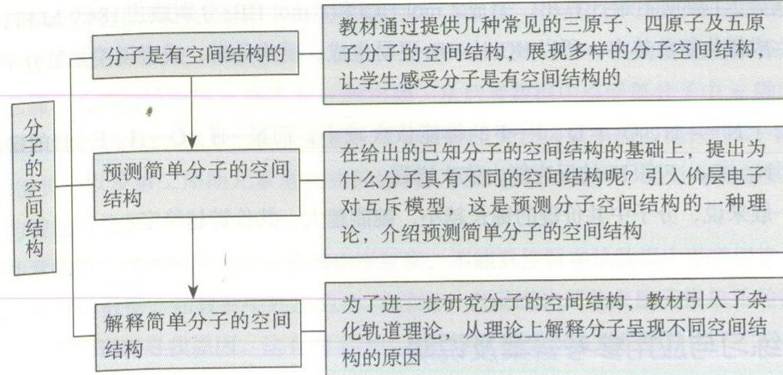

在给出的已知分子的空间结构的基础上，提出为什么分子具有不同的空间结构呢？引入价层电子对互斥模型，这是预测分子空间结构的一种理论，介绍预测简单分子的空间结构

为了进一步研究分子的空间结构，教材引入了杂化轨道理论，从理论上解释分子呈现不同空间结构的原因

教材的第一部分介绍了分子具有空间结构。课程标准要求“知道原子光谱、分子光谱、晶体X射线衍射等是测定物质结构的基本方法和实验手段”。因此，在本节一开始，结合分子结构的测定，介绍了红外光谱，在第三章中还将介绍晶体X射线衍射。

教材介绍红外光谱测定分子结构时，只是简单介绍其原理和方法特征，并配有仪器照片、图谱等图示，还通过一个具体的例子说明红外光谱法测定了未知物中含有羟基。紧接着通过图片的方式介绍了分子的空间结构模型，即三原子分子的空间结构有直线形和V形（又称角形），大多数四原子分子采取平面三角形和三角锥形两种空间结构，五原子分子的形状更多，最常见的是四面体形，让学生感受到分子空间结构的多样性。

第二部分内容介绍价层电子对互斥模型。基于 $CO_{2}$ 、 $H_{2}O$ 、 $CH_{2}O$ 和 $NH_{3}$ 等分子的空间结构各异，教材提出任务：探究不同分子的空间结构不一样的原因，从而引出了价层电子对互斥模型。本部分内容详细介绍了运用价层电子对互斥模型如何预测分子的空间结构，主要内容包括：（1）确定分子中的中心原子，根据化学式确定中心原子的 $\sigma$ 键电子对数；（2）确定中心原子上的孤电子对数。这须通过计算得出，教材给出了具体的确定方法，并通过具体例子进行了说明；（3）确定分子的VSEPR模型。由于价层电子对的相互排斥，根据分子中的中心原子上的价层电子对数（ $\sigma$ 键电子对数+孤电子对数），便可推测出分子结构的VSEPR模型；（4）确定分子的空间结构。略去VSEPR模型中的中心原子上的孤电子对后，便得到分子的空间结构。关于上述内容，教材中通过图片和表格的方式进行了详细的介绍。

教材中涉及两种类型的分子或离子，即 $AX_{n}$ 型和 $AX_{n}E_{m}$ 型。 $AX_{n}$ 型分子的中心原子 A 周围只有 n 个以单键邻接的原子 X（即 n 个单键电子对），而没有孤电子对存在时，一般只要知道 n 的数目（仅限 n 为 1\~4 的分子或离子，不涉及 n 为 5 或 6 的分子或离子），就可以预测分子的空间结构和相应的键角，即 $AX_{2}$ 为直线形、 $AX_{3}$ 为平面三角形、 $AX_{4}$ 为正四面体形。 $AX_{n}E_{m}$ 型分子的中心原子 A 周围不仅有 n 个邻接原子（X）的成键电子对，还有 m 个孤电子对（E）。由于孤电子对的存在，孤电子对只受中心原子一个原子核的束缚，电子云偏向中心原子一侧，从而对邻接的成键电子有较强的排斥作用，使邻近键角发生变化。教材中仅给出了 $H_{2}O$ 的键角为 $105^{\circ}$ ， $NH_{3}$ 的键角为 $107^{\circ}$ ，但没有说明这是由于孤电子对对键角影响的结果。

第三部分内容介绍杂化轨道理论。此部分内容阐述了两个主要问题：一是先介绍了杂化轨道理论的主要内容；二是运用杂化轨道理论去解释分子的空间结构。教材以大家熟知的甲烷的空间结构为例，引入杂化轨道理论，通过图片的呈现方式，介绍了 $sp^{3}$ 、 $sp^{2}$ 和sp杂化，给出了杂化后的杂化轨道的电子云形状。有了杂化轨道理论的知识后，运用该理论可以确定分子中的中心原子的杂化轨道类型，从而解释分子的空间结构。教材中通过表格的方式列举了一些分子的空间结构和中心原子的杂化轨道类型。最后，教材设置了一个“研究与实践”，要求学生动手搭建分子的空间结构模型。

要讨论分子中的中心原子的杂化轨道类型，首先得知道分子的空间结构。因此，如果没有实验数据得出分子的空间结构，可以借助价层电子对互斥模型预测分子的空间结构，从而确定分子中的中心原子的杂化轨道类型。这是教材在编排时，为什么先讨论价层电子对互斥模型，再讨论杂化轨道理论的原因。

## 二、教学目标

## 1. 教学目标

（1）知道分子的结构是可以测定的，红外光谱技术是测定物质结构的基本方法；能说明红外光谱等实验手段在物质结构研究中的应用。

（2）结合实例了解共价分子具有特定的空间结构，体会共价分子的多样性和复杂性。能借助实物模型等建立对分子的空间结构的直观认识。

（3）能运用价层电子对互斥模型预测简单分子的空间结构，发展学生的模型认知能力。

（4）结合实例了解杂化轨道理论的要点和类型 $(sp^{3}、sp^{2}、sp)$ ，能运用杂化轨道理论解释简单共价分子和离子的空间结构。

## 2. 教学重点和难点

重点：应用价层电子对互斥模型预测简单分子或离子的空间结构；应用杂化轨道理论解释分子的空间结构。

难点：中心原子上的孤电子对数的计算；用杂化轨道理论解释含有孤电子对的分子的空间结构。

## 三、教学建议

## 1. 关于分子结构测定的教学

早年测定分子结构主要是定性方法，科学家对物质的化学性质进行系统总结得出规律后进行推测。如今科学家已经创造了许多测定分子结构的现代仪器和方法，红外光谱法就是其中的一种。对于这部分内容的教学，应依据课程标准把握好深度和广度。通过教学要让学生知道分子的结构是可以测定的，红外光谱等技术是测定物质结构的基本方法和实验手段；通过这些手段所获得的信息为建立物质结构模型或相关理论解释提供支撑。学生通过必修课程的学习，初步了解了官能团异构现象。教学中应依据学生已有的知识基础，结合教材中的图2-5、图2-6，简要了解红外光谱仪原理，通过举例分析某未知物的红外光谱图，突出红外光谱分析方法的功能和作用。

## 教学方案参考

问题导入: 分子式为 $\mathrm{C}_{2} \mathrm{H}_{6} \mathrm{O}$ 的物质有两种可能的分子结构: 乙醇 ( $\mathrm{C}_{2} \mathrm{H}_{5} \mathrm{OH}$ ) 和二甲醚 ( $\mathrm{CH}_{3} \mathrm{OCH}_{3}$ ), 怎样利用现代仪器鉴定有机物中的羟基官能团呢?

原理分析：结合教材中的图2-5简要分析红外光谱仪原理，引导学生分析教材中的图2-6谱图中有O—H、C—H和C—O的振动吸收。初步推测该未知物中含有羟基。

拓展延伸：指导学生阅读教材中的【科学·技术·社会】，了解用质谱法测定分子的相对分子质量的简单原理和应用。

## 2. 关于价层电子对互斥模型的教学

## (1) 借助模型探究分子空间结构, 将抽象问题具体化

对于价层电子对互斥模型的学习，学生普遍感觉抽象，难以理解和记忆。在教学中应充分用好模型进行教学，可以展示生活中学生熟悉的形形色色分子的实物模型，也可以引导学生动手搭建分子的模型等，将抽象的结构模型化，使学生直观、感性地认识分子的空间结构，为理解价层电子对互斥模型做铺垫。

①借助气球制作分子的空间结构。以学生熟悉的甲烷的空间结构为例，建议教师演示气球模

型（如图2-1）：将4个相同大小的气球用橡皮筋捆扎在一起，4个气球自动排列成正四面体形。通过该模型启发学生思考，为什么甲烷的空间结构是正四面体形而不是平面正方形？基于甲烷的中心原子碳的价层电子对数为4，正四面体形的空间结构是最稳定的，帮助学生理解甲烷的空间结构。

课堂教学时, 可以组织学生小组合作完成以下气球模型制作 (如图 2-2): 如果将两个相同大小的气球用橡皮筋捆扎在一起, 发现这两个气球自然成直线形, 再向其中加入一个相同大小的气球, 你会发现这三个气球均匀地分开成正三角形分布。依次再向其中加入一个相同大小的气球，四个大小相同的气球成正四面体形分布。

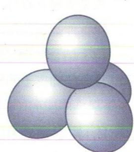  
图2-1 甲烷结构的气球模型

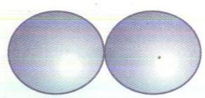

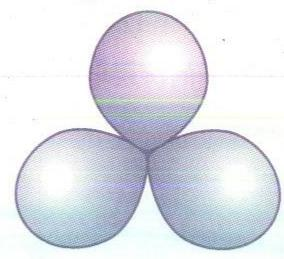

图2-2 气球模型  
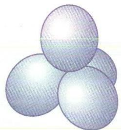

为了解释 $CH_{4}$ 、 $NH_{3}$ 、 $H_{2}O$ 的空间结构，引导学生制作 $CH_{4}$ 、 $NH_{3}$ 、 $H_{2}O$ 的气球模型（如图2-3）。在 $CH_{4}$ 的气球模型中，将4个颜色相同的气球充气成为相同大小，系在一个中心上，气球很容易就排成正四面体形。在 $NH_{3}$ 、 $H_{2}O$ 的气球模型中，一种颜色的小气球代表成键电子对（σ键电子对），另一种颜色的大气球表示孤电子对。相比成键电子对受到左右两端带正电的原子核的吸引，而孤电子对只受到一端原子核的吸引。相比之下，孤电子对较“胖”一些，占据较大的空间；而成键电子对（σ键电子对）较“瘦”，占据较小的空间。孤电子对与成键电子对之间的斥力也要大一些， $NH_{3}$ 和 $H_{2}O$ 中分别有1个和2个孤电子对，所以它们的键角都比 $CH_{4}$ 的小，实验测得分别为107°和105°。

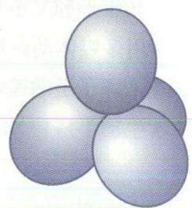

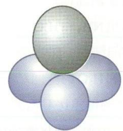

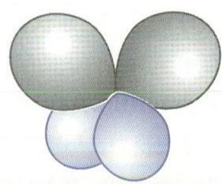  
图 2-3 $CH_{4}$ 、 $NH_{3}$ 、 $H_{2}O$ 的气球模型

②借助橡皮泥和牙签等材料, 制作分子的空间结构模型。学生借助橡皮泥和牙签等材料制作 $\mathrm{CH}_{4} 、 \mathrm{NH}_{3} 、 \mathrm{H}_{2} \mathrm{O}$ 的空间结构模型 (如图 2-4), 教师指导学生通过变化键的角度, 修正键角的大小, 从而使学生能深刻理解中心原子上的孤电子对与成键电子对 ( $\sigma$ 键电子对) 之间的排斥力, 因为排斥力不同, 键角不同, 其分子的空间结构也不同。

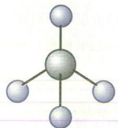

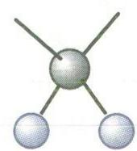

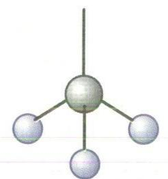  
图 2-4 $CH_{4}$ 、 $NH_{3}$ 、 $H_{2}O$ 的结构模型

## (2) 实物模型抽象化, 建构VSEPR模型

学生有了制作分子的空间结构模型后，对分子的空间结构有了更进一步的认识，教学中可结合球棍模型、气球模型等多种直观手段，引导学生计算和分析分子中的中心原子的价层电子对数（中心原子与结合原子间的 $\sigma$ 键电子对数和中心原子上的孤电子对数之和）与空间结构的关系，可用表2-1所示的方式进行分析、归纳、总结多原子分子的价层电子对数与分子空间结构的关系。

表2-1 几种多原子分子的价层电子对数与空间结构的关系

<table><tr><td>代表物</td><td>中心原子与结合原子间的σ键电子对</td><td>中心原子上的孤电子对</td><td>中心原子的价层电子对</td><td>空间结构</td></tr><tr><td>CO2</td><td>2</td><td>0</td><td>2</td><td>直线形</td></tr><tr><td>CH2O</td><td>3</td><td>0</td><td>3</td><td>平面三角形</td></tr><tr><td>CH4</td><td>4</td><td>0</td><td>4</td><td>正四面体形</td></tr><tr><td>H2O</td><td>2</td><td>2</td><td>4</td><td>V形</td></tr><tr><td>NH3</td><td>3</td><td>1</td><td>4</td><td>三角锥形</td></tr></table>

在完成表2-1的基础上，引导学生根据图2-2的气球模型，以“气球空间互斥”类比“价层电子对互斥”。得出中心原子的价层电子对数分别为2、3、4时，由于价层电子对互相排斥，当价层电子对在中心原子核周围彼此距离最远时，可得到不含有孤电子对的分子的VSEPR模型分别为直线形、平面三角形和正四面体形。

为什么 $NH_{3}$ 和 $H_{2}O$ 的VSEPR模型为正四面体形，而实际的空间结构为三角锥形和V形呢？这是教学的难点，建议教学中由学生写出 $NH_{3}$ 和 $H_{2}O$ 的路易斯结构式，教师用多媒体动画展示含有孤电子对的分子的VSEPR模型的空间结构，然后略去VSEPR模型中的中心原子上的孤电子对，可得到 $NH_{3}$ 的空间结构为三角锥形和 $H_{2}O$ 的空间结构为V形。最后由学生动手搭建 $NH_{3}$ 和 $H_{2}O$ 的球棍模型，感悟和体会 $NH_{3}$ 和 $H_{2}O$ 的键角比 $CH_{4}$ 的小。

如何解释 $NH_{3}$ 和 $H_{2}O$ 的键角比 $CH_{4}$ 的小呢？建议教师比较成键电子对和孤电子对之间斥力的大小来解释键角的大小。如果中心原子上存在孤电子对，则应先考虑不同电子对之间的斥力后，再确定分子的空间结构。不同电子对间斥力大小的顺序为：孤电子对—孤电子对＞孤电子对—成键电子对＞成键电子对—成键电子对。因此，孤电子对的存在影响其分子的空间结构，也解释了 $NH_{3}$ 和 $H_{2}O$ 的键角比 $CH_{4}$ 的小的原因。

## （3）利用VSEPR模型，预测简单分子或离子的空间结构

价层电子对互斥模型是根据中心原子周围的价层电子对的数目，依据价层电子对间斥力最小、体系能量最低确定价层电子对在中心原子周围的理想排布，先确定VSEPR模型，后略去孤电子对，可得到分子的空间结构。

## ① 计算简单分子或离子的中心原子的价层电子对数

VSEPR模型的“价层电子对”是指分子中的中心原子与结合原子间的 $\sigma$ 键电子对和中心原子上的孤电子对。依据分子的化学式 $AB_{n}$ ，可以确定 $\sigma$ 键电子对数为 $n$ 。孤电子对数的计算是难点，中心原子上的孤电子对数可以利用公式进行计算，其公式为：中心原子上的孤电子对数 $= \frac{1}{2}(a - xb)$ 。教学中可以通过教材中的具体例子引导学生理解 $a$ 、 $x$ 、 $b$ 的含义，要求学生熟练掌握中心原子上的孤电子对数的计算，包括阴、阳离子的中心原子上的孤电子对数的计算。确定了中

## 心原子的“价层电子对数”后，再确定分子或离子的VSEPR模型。

需要注意, 多重键只计其中的 $\sigma$ 键电子对, 不计 $\pi$ 键电子对。如果中心原子和相邻原子通过双键或三键结合成分子时, 双键或三键当成 1 个电子对。例如, 二氧化碳分子, 其结构式为 $O = C = O$ , 可将 $C = O$ 之间的双键当成 1 个电子对, 则中心原子 $C$ 的周围相当于 2 个 $\sigma$ 键电子对; 再通过计算可知中心原子 $C$ 的孤电子对数为 0 , 因此, $CO_2$ 的空间结构为直线形。再如可将甲醛分子中的 $C = O$ 之间的双键当成 1 个电子对, 这样就可从甲醛分子式 $CH_2O$ 中推算出中心原子 $C$ 上有 3 个 $\sigma$ 键电子对, 再计算中心原子 $C$ 的孤电子对数为 0 。因此 $CH_2O$ 的空间结构为平面三角形。需要注意的是, 在计算 $CH_2O$ 的中心原子 $C$ 的孤电子对数时, 由于与中心原子 $C$ 结合的原子有 $H$ 和 $O$ 两种原子, 孤电子对数 $= \frac{1}{2} (4 - 1 \times 2 - 2 \times 1) = 0$ 。同理, 我们不难理解氰化氢 $(H - C \equiv N)$ 分子的中心原子 $C$ 上有 2 个 $\sigma$ 键电子对, 孤电子对数 $= \frac{1}{2} (4 - 1 \times 1 - 3 \times 1) = 0$ , 所以氰化氢分子的空间结构为直线形。

## ② 确定简单分子或离子的空间结构

在确定了 $\sigma$ 键电子对数和中心原子上的孤电子对数后，把它们相加就是分子或离子的中心原子上的价层电子对数，然后，可得到 VSEPR 模型，再略去 VSEPR 模型中的中心原子上的孤电子对，就得到了分子的空间结构。教材只要求掌握确定价层电子对数为 4 或 4 以下的分子或离子的空间结构。教学时，可利用表 2-2 方式要求学生应用价层电子对互斥模型对几种分子或离子的空间结构进行预测。

表2-2 应用价层电子对互斥模型对几种分子或离子的空间结构的预测

<table><tr><td>分子或离子</td><td>中心原子上的孤电子对数</td><td>中心原子上的价层电子对数</td><td>VSEPR模型名称</td><td>分子或离子的空间结构名称</td></tr><tr><td> $H_2S$ </td><td></td><td></td><td></td><td></td></tr><tr><td> $NH_2^-$ </td><td></td><td></td><td></td><td></td></tr><tr><td> $BF_3$ </td><td></td><td></td><td></td><td></td></tr><tr><td> $CHCl_3$ </td><td></td><td></td><td></td><td></td></tr><tr><td> $SiF_4$ </td><td></td><td></td><td></td><td></td></tr></table>

## 教学方案参考

创设问题情境：展示 $CO_{2}$ 、 $H_{2}O$ 、 $NH_{3}$ 、 $CH_{2}O$ 、 $CH_{4}$ 等分子的球棍模型（或比例模型），提出问题：（1）什么是分子的空间结构？（2）三原子分子 $CO_{2}$ 和 $H_{2}O$ 、四原子分子 $NH_{3}$ 和 $CH_{2}O$ ，为什么它们的空间结构不同？

讨论交流: 从 $\mathrm{H} 、 \mathrm{C} 、 \mathrm{N} 、 \mathrm{O}$ 的原子结构 (写出电子式), 依据共价键的饱和性和方向性, 讨论 $\mathrm{H} 、 \mathrm{C} 、 \mathrm{N} 、 \mathrm{O}$ 等原子分别可形成 1、4、3、2 个共价键, 并用电子式、结构式描述 $\mathrm{CO}_{2} 、 \mathrm{H}_{2} \mathrm{O} 、 \mathrm{NH}_{3} 、 \mathrm{CH}_{2} \mathrm{O} 、 \mathrm{CH}_{4}$ 等的分子结构。

模型探究：[小组合作任务1]学生制作气球模型，以“气球空间互斥”类比“价层电子对互斥”，认识价层电子对互斥模型。

[小组合作任务2] 学生借助橡皮泥和牙签等材料，搭建 $CH_{4}$ 、 $NH_{3}$ 、 $H_{2}O$ 等的分子结构模型，

探究分子的空间结构。

教师进一步引导学生计算和分析中心原子的价层电子对数与空间结构的关系，用表格形式进行分类、归纳（参见表2-1）。

应用反馈：应用价层电子对互斥模型预测表2-2中的分子或离子的空间结构，进一步认识多原子分子的空间结构。

## 3. 关于杂化轨道理论的教学

## (1) 设置驱动问题, 激发学生的学习动机

依据价层电子对互斥模型预测甲烷分子的空间结构呈正四面体形，且实验测得甲烷分子中的4个C—H的键长相同，H—C—H的键角为 $109^{\circ}28'$ 。依据价键理论，碳原子的4个价层原子轨道是3个相互垂直的2p轨道和1个球型的2s轨道，用它们与4个氢原子的1s原子轨道重叠，不可能得到正四面体形的甲烷分子。因此，由已知的事实引起学生的认知冲突。教学时可首先设置以下驱动问题：怎样解释甲烷分子的空间结构呈正四面体形呢？

## （2）依据学生的认知规律，构建杂化轨道理论模型

杂化轨道理论比较抽象, 教学中应充分考虑学生已有的原子结构、共价键理论和价层电子对互斥模型等知识基础。新课前可以复习梳理, 也可以布置课前预习。教学中应以学生熟悉的甲烷为例, 结合教材中的图 2-15 的 $\mathrm{sp}^{3}$ 杂化轨道图示, 分析 $\mathrm{sp}^{3}$ 杂化的含义。在此基础上, 推测 VSEPR 模型都为正四面体形的氨分子和水分子的中心原子的杂化轨道也为 $\mathrm{sp}^{3}$ 杂化轨道。再分别以 $\mathrm{BF}_{3}$ 和 $\mathrm{BeCl}_{2}$ 为例, 引导学生通过教材中的图 2-16 分析 $\mathrm{sp}^{2}$ 杂化和 sp 杂化。最后学生分组讨论交流, 结合教材中的表 2-5, 总结出 VSEPR 模型与中心原子的杂化轨道类型的关系。

教学时，首先引导学生以甲烷为例，结合教材中图2-15的图示进行分析。当碳原子与4个氢原子形成甲烷分子时，碳原子的1个2s轨道和3个2p轨道会发生混杂，混杂时保持轨道总数不变，得到4个新的能量相同、方向不同的杂化轨道，各指向正四面体的4个顶角，夹角为 $109^{\circ}28'$ ，称为 $sp^{3}$ 杂化轨道。教材中的图2-15表示这4个轨道是由1个s轨道和3个p轨道杂化形成的。当碳原子跟4个氢原子结合时，碳原子以4个 $sp^{3}$ 杂化轨道分别与4个氢原子的1s轨道重叠，形成4个C—Hσ键，因此甲烷分子的空间结构呈正四面体形。

怎样用杂化轨道理论解释氨分子和水分子的空间结构呢？教师可以组织学生通过分析提出问题，氮原子的价层电子排布为 $2s^{2}2p^{3}$ ，3个2p轨道可与3个氢原子的1s轨道重叠形成3个N—Hσ键。由于3个2p轨道相互垂直，那么氨分子中的H—N—H的键角应约为90°。但是，实验测得氨分子中的H—N—H的键角为107°。提出问题：试解释其中的原因，并组织同学们进行交流。

在形成氨分子时, 氮原子的 1 个 2s 轨道和 3 个 2p 轨道发生了 $\mathrm{sp}^{3}$ 杂化, 形成了 4 个 $\mathrm{sp}^{3}$ 杂化轨道。4 个 $\mathrm{sp}^{3}$ 杂化轨道在空间的分布呈正四面体形。其中 3 个 $\mathrm{sp}^{3}$ 杂化轨道与 3 个氢原子的 1s 轨道重叠形成 3 个 N—H $\sigma$ 键, 其中 1 个 $\mathrm{sp}^{3}$ 杂化轨道中已有两个电子 (孤电子对), 不能再与氢原子的 1s 轨道重叠。由于氨分子中存在着未成键的孤电子对, 它对成键电子对的排斥作用较强, 所以氨分子的空间结构与甲烷分子的空间结构不同, 呈三角锥形, 键角为 $107^{\circ}$ 。同理, 学生通过交流, 解释水分子中的中心原子 O 采用 $\mathrm{sp}^{3}$ 杂化, 其空间结构呈 V 形, 键角为 $105^{\circ}$ 。

在学生初步理解 $\mathfrak{sp}^3$ 杂化要点的基础上，引导学生通过教材中的图2-16的图示理解 $\mathfrak{sp}^2$ 杂化和sp杂化。建议以 $BF_{3}$ 和 $BeCl_{2}$ 为例，分析它们的中心原子的杂化。 $BF_{3}$ 的空间结构为平面三角形，引导学生分析中心原子B采用 $sp^{2}$ 杂化。 $BeCl_{2}$ 的空间结构为直线形，引导学生分析中心原子Be采用sp杂化。

最后组织学生讨论 sp 型杂化（ $sp^{3}$ 杂化、 $sp^{2}$ 杂化、sp 杂化）中原子轨道杂化前后的变与不变，将具体内容进行归纳和整理，总结杂化轨道理论的要点。强调在外界条件的影响下，原子内能量相近的原子轨道重新组合为具有不同空间分布特点的新的杂化轨道，使得分子呈现不同的空间结构。杂化轨道只能用于形成 $\sigma$ 键（或者用于容纳孤电子对），形成 $\pi$ 键的电子只能位于未杂化的原子轨道上。

## 教学方案参考

提出问题：为什么甲烷分子中的4个C—H相同，H—C—H的键角皆为 $109^{\circ}28'$ ?

问题探究：以甲烷为例，结合教材中的图2-15的图示讲解 $sp^{3}$ 杂化的要点。解释甲烷分子的空间结构。以 $BF_{3}$ 和 $BeCl_{2}$ 为例，结合球棍模型和教材中的图2-16的图示，引导学生分析 $sp^{2}$ 杂化、sp杂化的要点，最后归纳总结轨道杂化理论的要点。

讨论交流：讨论多原子分子或离子的中心原子的杂化轨道类型的判断方法，并完成表2-3中的空白。

表2-3 分子或离子的中心原子的杂化轨道类型的判断

<table><tr><td>粒子</td><td>中心原子的价层电子对数</td><td>VSEPR模型名称</td><td>中心原子的杂化轨道类型</td><td>分子或离子的空间结构名称</td></tr><tr><td> $CO_2$ </td><td></td><td></td><td></td><td></td></tr><tr><td> $CH_2O$ </td><td></td><td></td><td></td><td></td></tr><tr><td> $SO_2$ </td><td></td><td></td><td></td><td></td></tr><tr><td> $BF_3$ </td><td></td><td></td><td></td><td></td></tr><tr><td> $CH_4$ </td><td></td><td></td><td></td><td></td></tr><tr><td> $NH_3$ </td><td></td><td></td><td></td><td></td></tr><tr><td> $H_2O$ </td><td></td><td></td><td></td><td></td></tr><tr><td> $H_3O^+$ </td><td></td><td></td><td></td><td></td></tr><tr><td> $NH_4^+$ </td><td></td><td></td><td></td><td></td></tr></table>

总结评价：引导学生总结多原子分子或离子的中心原子的杂化类型与VSEPR模型的关系。

## 四、栏目使用建议

## 1. 思考与讨论

【思考与讨论1】

在必修阶段，学生已学习了元素周期表，掌握了主族元素的原子结构、周期表的位置和元素

9.

性质的关系。可先组织学生复习相关内容，通过举例重点分析主族元素的价电子数等于最外层电子数，也等于主族元素的族序数。

(1) 依据元素周期表可判断主族元素的族序数等于最外层电子数, 也等于价电子数。S 和 P 分别处于第三周期第 $VIA$ 族和第 $VA$ 族, 因此 S 和 P 的价电子数分别为 6 和 5。

（2）首先依据N和Cl在元素周期表中的位置，判断其价电子数分别为5和7；它们最多能接受的电子数为“8减去原子的价电子数”，因此N和Cl最多能接收的电子数分别为3和1。

## 【思考与讨论2】

建议此内容安排课堂反馈时使用，进一步巩固分子或离子中的中心原子上的价层电子对数的计算、VSEPR模型的推测，以及VSEPR模型与空间结构的关系。

VSEPR的“价层电子对”是指分子中的中心原子与结合原子间的 $\sigma$ 键电子对和中心原子上的孤电子对。根据化学式确定 $\sigma$ 键电子对数，利用公式计算中心原子上的孤电子对数。 $\mathrm{BF}_{3}$ 的 $\sigma$ 键电子对数为3，中心原子B的孤电子对数为0，所以 $\mathrm{BF}_{3}$ 的价层电子对数为3。 $\mathrm{BF}_{3}$ 的VSEPR模型为平面三角形， $\mathrm{BF}_{3}$ 的空间结构为平面三角形。同理， $\mathrm{NH}_{4}^{+}$ 的 $\sigma$ 键电子对数为4，中心原子N的孤电子对数为0，所以 $\mathrm{NH}_{4}^{+}$ 的价层电子对数为4。 $\mathrm{NH}_{4}^{+}$ 的VSEPR模型为正四面体形， $\mathrm{NH}_{4}^{+}$ 的空间结构为正四面体形。 $\mathrm{SO}_{3}^{2-}$ 的 $\sigma$ 键电子对数为3，中心原子S的孤电子对数为1，所以 $\mathrm{SO}_{3}^{2-}$ 的价层电子对数为4。 $\mathrm{SO}_{3}^{2-}$ 的VSEPR模型为四面体形， $\mathrm{SO}_{3}^{2-}$ 的空间结构为三角锥形。

## 【思考与讨论3】

通过计算中心原子上的价层电子对数，先用 VSEPR 模型预测分子或离子的空间结构，再用杂化轨道理论解释。教师重点讲解方法，通过思考与讨论，进一步促进学生理解 VSEPR 模型和杂化轨道类型之间的关系。

先确定 $\mathrm{BF}_{3}$ 和 $\mathrm{H}_{3} \mathrm{O}^{+}$ 的 VSEPR 模型, 然后再确定中心原子 B 和 O 的杂化轨道类型。 $\mathrm{BF}_{3}$ 的中心原子 B 的孤电子对数为 0 , 价层电子对数为 3 , VSEPR 模型为平面三角形, 中心原子 B 的杂化轨道类型为 $\mathrm{sp}^{2}$ 杂化。同理, $\mathrm{H}_{3} \mathrm{O}^{+}$ 的中心原子 O 的孤电子对数为 1 , 价层电子对数为 4 , VSEPR 模型为四面体形, 中心原子 O 的杂化轨道类型为 $\mathrm{sp}^{3}$ 杂化。

## 2. 研究与实践 制作分子的空间结构模型

实物模型可以帮助学生建立对分子的空间结构的直观认识，通过借助实物搭建分子的空间结构模型的活动，使抽象性极强的分子结构直观化。建议课堂上安排学生依据教材表格中的键长和键角的数据，利用橡皮泥或黏土和牙签等材料，分小组合作动手搭建共价分子的空间结构模型。可以先搭建 $CH_{4}$ 的结构模型，小组派代表展示作品，小组间相互评价，纠错后再制作。搭建 $NH_{3}$ 、 $H_{2}O$ 的结构模型是难点，教师引导学生与甲烷对比， $NH_{3}$ 和 $H_{2}O$ 中分别有1个和2个孤电子对，通过变化键的角度，修正键角的大小，从而使学生能深刻理解中心原子的孤电子对与成键电子对之间的排斥力，因为排斥力不同使其键角不同，其分子的空间结构也不同。

有条件的学校也可安排学生分组搭建球棍模型，并展示学生制作的分子的空间结构模型，组织学生相互评价。

## 五、练习与应用参考答案及说明

1. A 2. C 3. D 4. B 5. D 6. C
7. (1) × (2) × (3) × (4) √ (5) × (6) √

8.

<table><tr><td>ABn</td><td>分子的空间结构</td><td>典型例子</td></tr><tr><td>n=2</td><td>直线形</td><td>CO2、HCN</td></tr><tr><td>n=3</td><td>平面三角形</td><td>BF3、CH2O</td></tr><tr><td>n=4</td><td>正四面体形</td><td>CH4、CCl4</td></tr></table>

<table><tr><td>原子</td><td>粒子</td><td>中心原子上的孤电子对数</td><td>中心原子的杂化轨道类型</td><td>空间结构</td></tr><tr><td rowspan="4">3</td><td> $CO_2$ </td><td>0</td><td>sp</td><td>直线形</td></tr><tr><td> $SO_2$ </td><td>1</td><td> $sp^2$ </td><td>V形</td></tr><tr><td> $H_2O$ </td><td>2</td><td> $sp^3$ </td><td>V形</td></tr><tr><td>HCN</td><td>0</td><td>sp</td><td>直线形</td></tr><tr><td rowspan="4">4</td><td> $BF_3$ </td><td>0</td><td> $sp^2$ </td><td>平面三角形</td></tr><tr><td> $NH_3$ </td><td>1</td><td> $sp^3$ </td><td>三角锥形</td></tr><tr><td> $H_3O^+$ </td><td>1</td><td> $sp^3$ </td><td>三角锥形</td></tr><tr><td> $CH_2O$ </td><td>0</td><td> $sp^2$ </td><td>平面三角形</td></tr><tr><td rowspan="2">5</td><td> $CH_4$ </td><td>0</td><td> $sp^3$ </td><td>正四面体形</td></tr><tr><td> $SO_4^{2-}$ </td><td>0</td><td> $sp^3$ </td><td>正四面体形</td></tr></table>

10. 乙炔分子中的碳原子采取 sp 杂化方式。在乙炔分子中，2 个碳原子各以 1 个 sp 杂化轨道与 1 个氢原子的 1s 轨道重叠形成 1 个 C—H σ 键，同时又各以另 1 个 sp 杂化轨道形成 1 个 C—C σ 键。除此之外，两个碳原子又通过各自的 2 个未参加杂化的 p 轨道（相互垂直）重叠形成了 2 个 π 键。因此，乙炔的三键中有 1 个 σ 键和 2 个 π 键。

## 第三节 分子结构与物质的性质

## 一、内容分析

本节内容主要包括共价键的极性、分子间的作用力和分子的手性三个部分，除分子的手性外，教材主要运用已知的分子结构知识对相关问题进行了阐述。

教材的第一部分内容介绍了共价键的极性及其对物质的某些性质的影响。这部分内容主要介绍了两个问题：一是判断分子的极性；二是共价键的极性对物质化学性质的影响，并拓展到分子结构与物质化学性质的关系。由于共价键的极性，使有些分子也具有极性。教材结合具体的实例介绍了极性分子和非极性分子，以及怎样去判断极性分子和非极性分子。值得说明的是，教材正文中有句话“只含非极性键的分子一定是非极性分子”，依据这句话，认为臭氧分子应该是非极性分子。其实臭氧分子是有极性的，但很微弱，以至于它在四氯化碳里的溶解度高于在水中的溶解度。在“资料卡片”中，介绍了臭氧分子有极性的原因，这是由于臭氧分子的空间结构是V形的，且分子中形成了一个3个氧原子和4个电子的离域π键。因发生了离域，致使臭氧分子中的共价键是极性键，中心氧原子的带电显得正一些，两边氧原子的带电显得负一些。因此，臭氧分子是含有极性键的极性分子。

共价键的极性除对分子的极性有影响外，对物质的化学性质也有影响，教材阐述了共价键的极性对某些羧酸酸性强弱的影响。教材为了进一步体现“分子结构与物质化学性质的关系”，树立“物质结构决定物质性质”的化学观念，除了共价键的极性对某些羧酸酸性强弱的影响这个实例外，教材还通过“思考与讨论”的方式，要求学生从“键的极性”对化学性质的影响，拓展到“分子结构”对化学性质的影响，进一步认识物质结构与物质性质的关系。例如，乙烷、乙烯和乙炔的性质不同，是由于它们的分子结构不同。再如，物质结构的改变会引起物质的性质发生变化，教材通过“科学·技术·社会”栏目，介绍了“分子结构修饰与分子的性质”，以拓展学生的视野。总之，教材在这里强化了“分子结构与物质化学性质的关系”。

第二部分内容介绍分子间作用力。教材分别结合具体实例讨论了范德华力、氢键和溶解性等教学内容。例如，直接介绍了范德华力的特征，即相对分子质量越大，范德华力越大，分子的极性越大，范德华力也越大。然后，通过比较Ar和CO的范德华力，以及HI、HBr和HCl的范德华力来说明影响范德华力的因素，并通过比较卤素单质的熔点和沸点来说明范德华力对物质的熔点和沸点的影响。再如，结合水分子间的氢键，介绍了氢键的形成条件和常见类型，以及氢键对物质的熔点和沸点的影响。在介绍分子间氢键与分子内氢键时，通过教材中的图2-26和图2-27中的信息可知，分子内的氢键X—H…Y不能在同一直线上，而分子间的氢键X—H…Y在同一直线上。最后，教材在介绍“溶解性”时，列举了一些非极性溶质和一些非极性溶剂、一些极性溶质和一些极性溶剂的溶解性实例，归纳出“相似相溶”规律，并通过“思考与讨论”的方式，让学生运用“相似相溶”规律解释一些实际问题。

第三部分内容介绍分子的手性。对于手性，教材通过图示简单介绍了手性异构体及手性分子的概念，以及手性分子在生命科学和生产手性药物方面的应用。课程标准对“分子的手性”的要求不高，即结合实例初步认识分子的手性对其性质的影响。

另外，该节设置了4个“科学·技术·社会”栏目，运用相关的化学知识解释了一些生活中的实际问题，可以拓展学生的视野，有利于发展学生的学科核心素养。

## 二、教学目标

## 1. 教学目标

（1）知道共价键可分为极性共价键和非极性共价键；能利用电负性判断共价键的极性。

（2）知道分子可以分为极性分子和非极性分子，知道分子极性与分子中键的极性、分子的空间结构密切相关；能根据分子结构的特点和键的极性判断分子的极性，并据此对分子的一些典型性质及其应用作出解释。

（3）认识分子间存在相互作用，知道范德华力是常见的分子间作用力；能说明范德华力对物质熔点、沸点等性质的影响，形成“结构决定性质”的基本观念。

（4）知道氢键是常见的分子间作用力；能说明氢键对物质熔点、沸点等性质的影响，能举例说明氢键对于生命的重大意义。

（5）初步认识分子的手性，了解手性分子在药物研究中的应用。

## 2. 教学重点和难点

重点：极性分子和非极性分子的判断；分子间作用力、氢键及其对物质性质的影响。

难点：极性分子和非极性分子的判断；手性分子的概念。

## 三、教学建议

## 1. 关于共价键的极性的教学

## (1) 共价键的极性

关于共价键的极性的教学，应从宏观到微观，从电负性的角度理解键的极性的实质。首先在复习共价键概念的基础上，让学生写出 $H_{2}$ 和HCl的电子式，讨论为什么 $H_{2}$ 中电子对不偏向任何一个原子，而HCl中的电子对发生偏移？在HCl中，电子对偏离氢原子，偏向氯原子，使氢原子呈正电性（δ+），氯原子呈负电性（δ-）。

然后，引导学生归纳得出极性键和非极性键的概念。引导学生从微观的视角分析键的极性产生的原因是由于原子形成共价键时电子对发生了偏移，其实质是键合原子对键合电子的吸引力不同。在学生初步形成极性键和非极性键的概念后，依据教材中的图2-18所示的分子，分析和判断各分子中的键的极性，巩固极性键和非极性键的概念，理解影响共价键极性的因素，总结判断共价键极性的一般方法。

## 教学方案参考

复习旧知: (1) 复习共价键和电负性的概念; (2) 写出 $\mathrm{H}_{2} 、 \mathrm{Cl}_{2} 、 \mathrm{~N}_{2} 、 \mathrm{HCl}$ 的电子式。

提出问题：由相同或不同原子形成的共价键，电子对是否会发生偏移？如发生偏移，是怎样偏移的？

分析讨论：学生通过分析 $H_{2}$ 、 $Cl_{2}$ 、 $N_{2}$ 、HCl中电子对是否发生偏移，比较归纳得出以下结论：一般来说，同种原子形成的共价键中的电子对不发生偏移，是非极性键。而由不同原子形成的共价键，电子对会发生偏移，是极性键。

归纳总结：键的极性产生的原因是由于原子形成共价键时电子对发生偏移，其实质是键合原子对键合电子的吸引力不同，即元素的电负性不同。

## (2) 分子的极性

建议教师利用教材中的【思考与讨论】，结合教材中的图2-18所示的分子，引导学生分类归纳出双原子分子、多原子分子的极性的判断方法。

首先引导学生从概念入手，讨论分析 $H_{2}$ 、 $Cl_{2}$ 、HCl等分子的极性，初步学会判断分子的正电中心和负电中心是否重合的方法，总结得出双原子分子中分子的极性与键的极性是否一致。即由非极性共价键构成的双原子分子一定是非极性分子，如 $H_{2}$ 、 $Cl_{2}$ 、 $O_{2}$ 等分子；由极性共价键构成的双原子分子一定是极性分子，如HCl、HF等分子。

对于多原子分子的极性的判断是难点，建议用好教材中的【思考与讨论】，采用分类举例分析，引导学生建立判断分子是否有极性的认知模型。如白磷（ $\mathrm{P}_{4}$ ）分子和 $\mathrm{C}_{60}$ 分子中化学键均为非极性键，分子的正电中心和负电中心重合，它们为非极性分子。再如 $\mathrm{CO}_{2}$ 、 $\mathrm{BF}_{3}$ 、 $\mathrm{CH}_{4}$ 中的化学键都是极性键， $\mathrm{CO}_{2}$ 是直线形结构， $\mathrm{BF}_{3}$ 是平面三角形结构， $\mathrm{CH}_{4}$ 是正四面体形结构，分子的正电中心和负电中心重合，因此它们都是非极性分子。而 $\mathrm{H}_{2} \mathrm{O}$ 呈 V 形结构， $\mathrm{NH}_{3}$ 呈三角锥形结构，正电中心和负电中心不重合，因此它们都是极性分子。最后引导学生总结出判断分子极性的一般规律：只含有非极性键的分子一定是非极性分子；含有极性键的分子，如果分子空间结构不对称，则为极性分子，如果分子空间结构呈对称（如直线形、平面三角形、正四面体形），则为非极性分子。最后总结得到多原子分子的极性除了与键的极性有关外，还与分子的空间结构有关。

通过上述分析, 引导学生依据分子中极性键的极性的向量和是否为零来确定分子是否有极性。如分子中各极性键的极性的向量和不为零, 该分子是极性分子; 各极性键的极性的向量和为零, 该分子是非极性分子。在教学中, 判断极性键的极性的向量和是否等于零, 这是比较抽象的, 可以结合图示进行分析。如图2-5所示是判断 $\mathrm{CO}_{2}$ 、 $BF_{3}$ 、 $NH_{3}$ 、 $H_{2}O$ 的极性的向量和是否等于零的图解, 在判断时, 首先要弄清分子的空间结构, 再确定向量的方向。极性的向量方向由电负性小的原子指向电负性大的原子, 而中心原子上的孤电子对, 由于没有被共用, 电子云概率密度大, 因此极性的向量方向始终是由原子指向孤电子对。

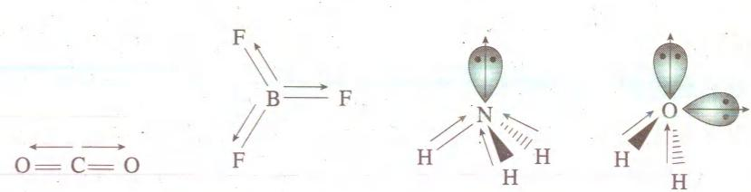

图 2-5 判断 $CO_{2}$ 、 $BF_{3}$ 、 $NH_{3}$ 、 $H_{2}O$ 的极性的向量和的图解

最后引导学生归纳共价键的极性与分子的极性的关系，并完成表2-4。

表2-4 共价键的极性与分子的极性的关系

<table><tr><td>分子</td><td>共价键的极性</td><td>分子中正电中心和负电中心</td><td>结论</td><td>举例</td></tr><tr><td>同种元素的双原子分子</td><td>非极性键</td><td>重合</td><td>非极性分子</td><td> $H_{2}$ 、 $N_{2}$ 、 $O_{2}$ </td></tr><tr><td>不同种元素的双原子分子</td><td>极性键</td><td>不重合</td><td>极性分子</td><td>CO、HF、HCl</td></tr><tr><td rowspan="2">多原子分子</td><td>分子中键的极性的向量和为零</td><td>重合</td><td>非极性分子</td><td> $CO_{2}$ 、 $BF_{3}$ 、 $CH_{4}$ </td></tr><tr><td>分子中键的极性的向量和不为零</td><td>不重合</td><td>极性分子</td><td> $H_{2}O$ 、 $NH_{3}$ 、 $CH_{3}Cl$ </td></tr></table>

## 教学方案参考

问题导课：①共价键有极性键和非极性键之分，分子是否也有极性分子和非极性分子之分呢？②由极性键形成的分子，是否一定是极性分子？分子中键的极性的向量和是否为零？

模型建构：以 $CO_{2}$ 、 $BF_{3}$ 、 $NH_{3}$ 、 $H_{2}O$ 为例，引导学生画出判断键的极性的向量和是否为零的图解，应用物理中学习过的向量合成的方法，归纳判断分子极性的一般方法。

总结归纳：教师引导学生通过列表对键的极性与分子的极性的关系进行总结（如表2-4）。组织完成教材中的【思考与讨论】。

拓展延伸: 学生阅读教材中的【资料卡片】和【科学·技术·社会】，小组讨论与交流。

## （3）键的极性对化学性质的影响

教材选取了不同有机酸的 $pK_{a}$ 数据，通过对数据的比较分析，从电负性的角度探究键的极性强弱与羧酸电离能力大小的关系。教学中要充分考虑学生已有的知识基础，如已学习了乙酸的性质、酸的电离常数 $K_{a}$ 和 $pK_{a}$ 、电负性和共价键等知识，建议先复习相关知识内容，再过渡到对教材的表2-6中的不同组成羧酸的 $pK_{a}$ 数据进行比较和分析。例如，由表格中的数据可知，三氟乙酸的酸性大于三氯乙酸的酸性，这是因为F的电负性比Cl的大，F—C的极性大于Cl—C的极性，使 $F_{3}C$ —的极性大于 $Cl_{3}C$ —的极性，从而导致三氟乙酸中的羟基的极性更大，更易电离出 $H^{+}$ 。通过分析，使学生能深刻理解与羧基相结合的基团，由于基团中键的极性不同，使羧酸的酸性不同，最后得出羧酸的酸性强弱与其分子的组成和结构有关的结论。

## 教学方案参考

复习旧知：以乙酸为例，复习酸的电离常数 $K_{a}$ 和 $pK_{a}$

问题分析：引导学生分析教材中的表2-6的 $pK_{a}$ 的数据：①分析甲酸、乙酸和丙酸的 $pK_{a}$ 数据的变化规律和原因。②分析氯乙酸、二氯乙酸、三氯乙酸的 $pK_{a}$ 数据的变化规律和原因。③分析三氯乙酸、三氟乙酸的 $pK_{a}$ 数据大小的原因。

归纳总结：学生在充分讨论、比较和分析的基础上，归纳总结得到结论，即羧酸的酸性强弱与其分子的组成和结构有关。

## 2. 关于分子间的作用力的教学

## (1) 范德华力及其对物质性质的影响

通过生活中的实例，使学生感悟分子间作用力的存在。引导学生先分析气体在降温加压时会液化，降温时液体会凝固的事实，这些事实表明，分子间存在着相互作用力。然后介绍关于范德华力的化学史，使学生体会科学思想产生的过程，培养学生的科学态度和精神。强调范德华力是分子之间的相互作用力，很弱，比化学键小1\~2个数量级，不属于化学键。

建议结合教材中的表2-7，以小组合作学习的形式，分析表中分子的极性、相对分子质量的大小与范德华力之间的关系，进行全班交流。在师生充分讨论的基础上，引导学生归纳得出结论：范德华力的影响因素有分子的极性和分子的相对分子质量等；分子的极性越大，范德华力越大；组成和结构相似的物质，相对分子质量越大，范德华力越大。

充分利用好教材中的【思考与讨论】组织教学，解释卤素单质的熔点和沸点的变化与其相对分子质量变化和范德华力变化的关系，深刻理解范德华力对物质性质的影响。

## 教学方案参考

创设问题情境：①为什么气体在降温加压时会液化，液体在降温时会凝固？②仔细阅读教材中的表2-7，结合分子结构的特点和数据，能得出什么结论？③分析教材的【思考与讨论】中的表2-8的数据变化，能得出什么结论？

讨论交流：以小组合作学习的形式，进行小组讨论交流，逐一解决上述问题，形成小组观点，进行全班交流。

归纳总结：在师生充分讨论的基础上，分析影响范德华力大小的因素，得出“分子的极性越大，范德华力越大；组成和结构相似的物质，相对分子质量越大，范德华力越大”等结论。

## (2) 氢键及其对物质性质的影响

从学生已有的知识经验出发，分析和比较第ⅣA族、第ⅥA族元素的氢化物的沸点变化规律（如图2-6），第ⅣA族元素的氢化物的沸点随着相对分子质量的增加而升高；而在第ⅥA族元素的氢化物中，水的沸点出现“反常”，在第ⅥA族元素的氢化物中，水的沸点是最高的。然后教师引导学生对 $H_{2}O$ 的沸点出现“反常”的原因进行分析，水分子之间除了存在范德华力外，还存在另一种分子间的作用力——氢键。

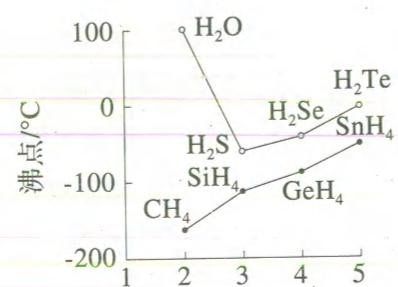  
周期  
图2-6 第ⅣA族、第ⅥA族元素氢化物的沸点变化

在引出了氢键的概念后，引导学生思考和讨论“什么样的原子间可形成氢键”，进而从元素的电负性的视角来认识氢键的形成条件。然后以水分子间形成氢键为例，从氧元素的电负性视角分析，得出氢键的形成条件。氢键普遍存在于已经与N、O、F等电负性很大的原子形成共价键的氢原子与另外的N、O、F等电负性很大的原子之间。例如，氟化氢分子之间、氨分子之间都存在氢键，另外，氟化氢分子与水分子之间、氨分子与水分子之间也存在氢键。注意强调氢键是一种特殊的分子间作用力，它比化学键弱，比范德华力强。

同时，可以通过氢键、范德华力、化学键键能或范德华力的数据（如表2-5）的比较，让学生进一步理解氢键是一种较弱的作用力，而非共价键。

表2-5 氢键、范德华力、化学键的比较

<table><tr><td>类型</td><td>氢键</td><td>范德华力</td><td>化学键</td></tr><tr><td>键能或范德 华力强度</td><td>一般不超过40 kJ/mol</td><td>一般是2~20 kJ/mol</td><td>一般是100~600 kJ/mol</td></tr></table>

关于分子间氢键与分子内氢键的教学，建议先给出邻羟基苯甲醛和对羟基苯甲醛的熔点和沸点（如表2-6），再提出问题，探究两者熔点和沸点差异的原因，且画出氢键的结构示意图，让学生了解氢键有分子内氢键和分子间氢键。因为对羟基苯甲醛能形成分子间氢键，而邻羟基苯甲醛形成分子内氢键，不能形成分子间氢键，所以前者的熔点、沸点比后者的高。

表2-6 邻羟基苯甲醛和对羟基苯甲醛的熔点和沸点

<table><tr><td>名称</td><td>熔点/°C</td><td>沸点/°C</td></tr><tr><td>邻羟基苯甲醛</td><td>2</td><td>196.5</td></tr><tr><td>对羟基苯甲醛</td><td>115</td><td>250</td></tr></table>

建议利用好教材中的【科学·技术·社会】来拓展学生视野，指导学生阅读相关内容，仔细观察教材中的图2-28和图2-29，找出图中不同原子（N、O）形成不同的氢键，加深对氢键的理解和应用。通过阅读DNA中的氢键，使学生感受到氢键与生命的关系。最后，组织学生小组讨论后写出氢键表达式：N—H…O、N—H…N。

## 教学方案参考

问题导入：为什么第ⅣA族元素的氢化物的沸点随着相对分子质量的增加而升高；而在第ⅥA族元素的氢化物的沸点中，水的沸点出现“反常”，水的沸点是最高的。这是为什么？

模型建构：通过分析元素N、O、F的电负性的数据，认识形成氢键的条件。以水分子为例，构建氢键的认知模型。

分析比较：为什么邻羟基苯甲醛和对羟基苯甲醛的熔点、沸点不同？请解释其原因。

拓展提升：指导学生阅读教材中的【科学·技术·社会】，仔细观察教材中的图2-28、图2-29，经小组讨论后，写出氢键的表达式，如N—H…O、N—H…N等。

## (3) 溶解性

教材列举了学生熟悉的物质溶解性的例子，并从溶质和溶剂分子的极性或非极性的视角分析了它们的溶解性，得出了经验性的“相似相溶”规律。建议教学时不宜拓展太多，充分利用教材中的例子以及【思考与讨论】中的问题，使学生体会到“相似相溶”的含义及应用即可。在开展“相似相溶”规律的教学时，应注意引导学生应用极性分子、非极性分子、氢键等知识进行解释；

在组织【思考与讨论】的教学时，可以结合演示实验或分组实验。

“相似相溶”的规律还适用于分子结构的相似性。教学中可以通过举例分析，如请解释为什么乙醇易溶于水，为什么乙醇在水中的溶解度比1-戊醇的大？教师可引导学生进行如下分析：除了乙醇分子与水分子间形成氢键外，因为乙醇分子中的—OH与水分子中的—OH相近，因而乙醇易溶于水；而1-戊醇（ $\mathrm{CH}_{3} \mathrm{CH}_{2} \mathrm{CH}_{2} \mathrm{CH}_{2} \mathrm{CH}_{2} \mathrm{OH}$ ）中的烃基较大，使其分子中的—OH与水分子中的—OH的相似性差异较大，因而1-戊醇在水中的溶解度明显减小。

有关氢键对物质溶解度影响的教学，可以引导学生举例分析，通过图示表示形成的氢键，帮助学生理解氢键的形成条件，解释为什么 $NH_{3}$ 极易溶于水。氨气极易溶于水的原因是氨气是极性分子，易溶于极性的水中，且氨气分子和水分子之间能形成氢键。

## 教学方案参考

实验探究：①探究蔗糖、氨气、萘和碘分别在水和四氯化碳中的溶解性；②结合教材的【思考与讨论】中的相关内容进行实验。

归纳总结：根据实验现象，引导学生从极性分子与非极性分子的角度去解释现象，从而总结出“相似相溶”规则。

应用反馈: (学生讨论以下问题) 碘为什么易溶于四氯化碳而不易溶于水? 氨和氯化氢为什么极易溶于水?

## 3. 关于分子的手性的教学

手性和手性分子是抽象的化学概念，教学设计应通过举例分析、展示模型和图片等方式，建立有关手性和手性分子的感性认识。通过学生动手搭建模型，帮助学生建立正确的认识。即如果模型中两个分子的所有原子分别在三维空间上完全重合即为“完全重叠”，是同种分子；两个互为镜像的分子在三维空间上一定不能完全重合，即为不同种分子。教学设计时可让学生动手搭建 $CH_{2}ClBr$ 的球棍模型，两个 $CH_{2}ClBr$ 的分子球棍模型可以完全重叠（如图2-7）。接着教师提出问题，分别将以上两个分子模型中的1个H换成1个F，让学生再动手搭建CHFCIBr的球棍模型。然后结合搭建好的模型提出问题：你搭建的两个CHFCIBr的球棍模型是否完全重合？组织学生回答问题后，再请每个学生重合自己的左、右手，体验是否可以完全重叠，从而概括出左、右手的关系：左、右手相似而不能重叠，它们是镜像关系。最后引导学生分析：手性的基本特征就是物体与镜像的关系，看似对称，但无论怎样旋转，它们都无法重合。这种关系就好像人的左手和右手，呈镜像对称关系，但却无法重合，即手性关系。具有手性关系的分子叫做手性分子（如图2-8）。这种直观的体验促进学生更好地理解分子的“手性”“手性异构体”和“手性分子”的概念。

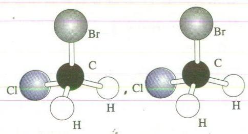

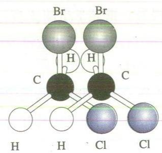  
图2-7 重叠的两个 $\mathrm{CH}_2\mathrm{ClBr}$ 的空间结构模型

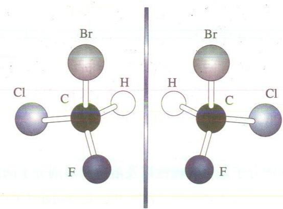  
镜  
图 2-8 互为镜像的两个 CHFClBr 的空间结构模型

## 教学方案参考

制作模型1：（学生分组）动手搭建两个 $CH_{2}ClBr$ 的球棍模型，并展示各小组制作的模型。

制作模型2：（学生分组）将制作好的两个 $CH_{2}ClBr$ 模型中的一个H换成一个F，比较搭建后的两个CHFClBr是否完全重合。

讨论交流：学生讨论 $CH_{2}ClBr$ 可能有的结构，两种结构在空间是完全重叠的。CHFClBr 的两种结构是不能完全重叠的，它们互为镜像关系，如同人的左手和右手。

归纳总结：教师结合教材中的图示和模型分析镜像对称的特点，通过举例构建“手性”“手性异构体”“手性分子”等概念。（拓展）指导学生阅读教材中的【科学史话】。

## 四、栏目使用建议

## 思考与讨论

【思考与讨论1】

引导学生分类归纳：双原子分子中分子的极性与键的极性是一致的；多原子分子的极性除了与键的极性有关外，还与分子的空间结构有关，需要判断分子中各个键的极性的向量和是否等于零。

(1) $H_{2}$ 、 $Cl_{2}$ 、 $O_{2}$ 中化学键均为非极性键，它们均为非极性分子；HCl中化学键为极性键，分子的正电中心和负电中心不重合，HCl为极性分子。

(2) $P_{4}$ 和 $C_{60}$ 中的化学键均为非极性键，分子的正电中心和负电中心重合，为非极性分子。

(3) ${\mathrm{{CO}}}_{2}$ 、 ${\mathrm{{BF}}}_{3}$ 、 ${\mathrm{{CH}}}_{4}$ 中的化学键都是极性键, ${\mathrm{{CO}}}_{2}$ 是直线形结构, ${\mathrm{{BF}}}_{3}$ 是平面三角形结构, ${\mathrm{{CH}}}_{4}$ 是正四面体形结构,分子中正电中心和负电中心相重合,键的极性能抵消,因此它们都是非极性分子。而在 V 形的 ${\mathrm{H}}_{2}\mathrm{O}$ 和三角锥形的 ${\mathrm{{NH}}}_{3}$ 中,正电中心和负电中心不重合,键的极性不能抵消,它们都是极性分子；HCN中的键都是极性键,尽管分子是直线形结构,但正电中心和负电中心不重合,HCN是极性分子； ${\mathrm{{CH}}}_{3}\mathrm{{Cl}}$ 是四面体形结构；正电中心和负电中心不重合,是极性分子。

## 【思考与讨论2】

分子结构对化学性质影响的例子很多，如在乙烷、乙烯、乙炔的分子中，碳碳之间形成的化

学键不同，使含有 $\pi$ 键的乙烯、乙炔与只有 $\sigma$ 键的乙烷的化学性质不同。

## 【思考与讨论3】

引导学生从卤素单质的结构和相对分子质量大小分析解释。一般当分子的组成与结构相似时，相对分子质量越大，范德华力越大。因此，由于 $F_{2}$ 、 $Cl_{2}$ 、 $Br_{2}$ 、 $I_{2}$ 的相对分子质量逐渐增大，范德华力也逐渐增大， $F_{2}$ 、 $Cl_{2}$ 、 $Br_{2}$ 、 $I_{2}$ 的熔点和沸点越来越高。

【思考与讨论4】

引导学生从溶质和溶剂的分子是否有极性以及溶质和溶剂分子间能否形成氢键两个角度分析，巩固“相似相溶”的规律和氢键的应用。教师可以安排问题（1）和（2）为学生小组讨论，把问题（3）安排为学生实验。

(1) ${\mathrm{{NH}}}_{3}$ 为极性分子, ${\mathrm{{CH}}}_{4}$ 为非极性分子,而水是极性分子,根据“相似相溶”规律, ${\mathrm{{NH}}}_{3}$ 易溶于水,而 ${\mathrm{{CH}}}_{4}$ 不易溶于水。且 ${\mathrm{{NH}}}_{3}$ 与水分子之间可形成氢键,使得 ${\mathrm{{NH}}}_{3}$ 更易溶于水。

（2）油漆是非极性分子，有机溶剂（如乙酸乙酯）也是非极性溶剂，而水为极性溶剂，根据“相似相溶”规律，应当用有机溶剂溶解油漆而不能用水溶解油漆。

（3）实验表明碘在四氯化碳溶液中的溶解性较好。这是因为碘和四氯化碳都是非极性分子，非极性溶质一般能溶于非极性溶剂，而水是极性分子。

## 五、练习与应用参考答案及说明

1. A 2. A 3. C 4. B 5. B 6. C
7. (1)√ (2)√ (3)× (4)√ (5)√ (6)× (7)× (8)×

8. (1) $\mathrm{H}_{2} \mathrm{O}$ 中两个 $\mathrm{H}-\mathrm{O}$ 为极性键, 从分子空间结构看, $\mathrm{H}_{2} \mathrm{O}$ 是 $\mathrm{V}$ 形, 因此水分子中极性键的极性的向量和不为零, 即分子的正电中心和负电中心不重合, 因此 $\mathrm{H}_{2} \mathrm{O}$ 是极性分子; 而 $\mathrm{CO}_{2}$ 中有两个 $\mathrm{C}=\mathrm{O}$ 极性键, 但 $\mathrm{CO}_{2}$ 是直线形, 极性键的极性的向量和为零, 因此, $\mathrm{CO}_{2}$ 为非极性分子。

(2) 由于氧和硫为同一主族元素, 所以 $\mathrm{CO}_{2}$ 和 $\mathrm{CS}_{2}$ 是组成和结构相似的分子。组成和结构相似的分子, 相对分子质量越大, 范德华力越大, 物质的沸点越高。由于 $\mathrm{CS}_{2}$ 的相对分子质量比 $\mathrm{CO}_{2}$ 的大, 因此, $\mathrm{CS}_{2}$ 的沸点比 $\mathrm{CO}_{2}$ 的高, 所以常温下 $\mathrm{CO}_{2}$ 是气体而 $\mathrm{CS}_{2}$ 是液体。

(3) 乙醇和1-戊醇的分子结构相似, 都含有烃基和羟基, $\mathrm{CH}_{3} \mathrm{CH}_{2} \mathrm{OH}$ 中的—OH与水分子的一OH相近, 因而乙醇能与水互溶; 而1-戊醇 ( $\mathrm{CH}_{3} \mathrm{CH}_{2} \mathrm{CH}_{2} \mathrm{CH}_{2} \mathrm{CH}_{2} \mathrm{OH}$ ) 中的烃基较大, 其中的—OH跟水分子的一OH的相似性差异较大, 因而它在水中的溶解度明显减小。

(4) ${\mathrm{{NH}}}_{3}$ 是极性分子,易溶于水。 ${\mathrm{{NH}}}_{3}$ 与 ${\mathrm{H}}_{2}\mathrm{O}$ 之间又能形成氢键,因此, ${\mathrm{{NH}}}_{3}$ 极易溶于水。 ${\mathrm{{NH}}}_{3}$ 间也能形成氢键,因此也易于液化。而 ${\mathrm{{PH}}}_{3}$ 与 ${\mathrm{H}}_{2}\mathrm{O}$ 之间不能形成氢键, ${\mathrm{{PH}}}_{3}$ 间也不能形成氢键,因此 ${\mathrm{{PH}}}_{3}$ 不具有 ${\mathrm{{NH}}}_{3}$ 的性质。

9. 右图中的第ⅣA族元素的氢化物从 ${\mathrm{{CH}}}_{4}$ 到 ${\mathrm{{PbH}}}_{4}$ 的沸点逐渐升高,这是由于它们的组成和结构是相似的,随着它们的相对分子质量的增加,范德华力也会增大,因此,沸点逐渐升高。而左图中的第 VA、VIA、VIIA 族的 ${\mathrm{{NH}}}_{3}$ 、 ${\mathrm{H}}_{2}\mathrm{O}$ 和 $\mathrm{{HF}}$ 的沸点,与同主族的其他元素的氢化物相比,它们的沸点更高，这是由于它们的分子间能形成氢键。

10. 对羟基苯甲酸的沸点较高。对羟基苯甲酸分子中的羟基与另一个对羟基苯甲酸分子中的羧基间能形成分子间的氢键，因此沸点较高。而邻羟基苯甲酸分子中的羟基和羧基可以形成分子内的氢键，不能形成分子间的氢键，所以邻羟基苯甲酸的沸点较低。

# 复习与提升建议

## 一、复习与提升教学建议

## 1. 抓住“一条主线”

如上图所示，分子可以解离为原子，原子通过共价键构成分子，物质中存在分子间作用力。共价键和分子间作用力是两种不同类型的相互作用，前者可根据共用电子对数分为单键、双键和三键，可根据原子轨道的重叠方式分为 $\sigma$ 键和 $\pi$ 键，可根据电子对是否发生偏移分为极性键和非极性键；后者可分为范德华力和氢键。教师可以 $H_{2}O$ 为例，提出“为什么水在同族元素的氢化物中沸点最高”“为什么水在同族元素的氢化物中最稳定”两个问题。前者涉及的是物理性质，应通过分子间作用力解释；后者涉及的是化学性质，应通过分子内的共价键解释。由此帮助学生进一步运用分子间作用力和共价键来解释一些物质的性质。

## 2. 强调“两个方面”

如上图所示，分子结构主要关注两个方面：一是分子中原子间的成键特征；二是分子的空间结构。前者可从共价键的本质特征（原子轨道重叠）、极性和强弱（键长和键能）、化学键的表示方式（电子式、结构式）等视角进行总结；后者可从如何预测（价层电子对互斥模型）、如何解释（杂化轨道理论）、如何表征（键角及球棍模型、比例模型）等视角进行总结。同样以 $H_{2}O$ 为例，教师可提出“如何描述水分子的结构”“如何解释水分子的结构”等问题，通过前者帮助学生明确化学式、电子式、结构式以及分子模型等方式描述水分子及其结构，通过后者对本章所学的简单分子或离子的空间结构及杂化轨道理论进行总结提升。

<table><tr><td>简单分子或离子的VSEPR模型名称</td><td>中心原子的杂化轨道类型</td><td>参与杂化的轨道</td><td>典型例子</td></tr><tr><td>正四面体形</td><td> $sp^{3}$ 杂化</td><td>1个s轨道和3个p轨道</td><td> $CH_{4}$ 、 $NH_{3}$ 、 $H_{2}O$ 、 $PO_{4}^{3-}$ 、 $SO_{4}^{2-}$ 、 $C_{2}H_{6}$ </td></tr><tr><td>平面三角形</td><td> $sp^{2}$ 杂化</td><td>1个s轨道和2个p轨道</td><td> $BF_{3}$ 、 $SO_{3}$ 、 $SO_{2}$ 、 $CO_{3}^{2-}$ 、 $NO_{3}^{-}$ 、 $C_{2}H_{4}$ </td></tr><tr><td>直线形</td><td>sp杂化</td><td>1个s轨道和1个p轨道</td><td> $BeCl_{2}$ 、 $CO_{2}$ 、 $C_{2}H_{2}$ </td></tr></table>

3. 突出“结构决定性质、性质反映结构”这一基本学科观念

教师可根据下表进一步归纳“宏观性质”与“微观解释”相联系的问题。

<table><tr><td>物质的宏观性质</td><td>微观解释</td></tr><tr><td>1.分子有极性分子和非极性分子</td><td>共价键有极性共价键和非极性共价键,正电中心和负电中心是否重合</td></tr><tr><td>2.三氟乙酸的酸性大于三氯乙酸的酸性</td><td>F—C的极性大于Cl—C的极性,使F3C—的极性大于Cl3C—的极性,导致前者羧基中O—H的极性更大,更易电离出H+</td></tr><tr><td>3.卤素单质从F2到I2的熔、沸点越来越高</td><td>从F2到I2的相对分子质量逐渐增大,范德华力逐渐增大</td></tr><tr><td>4.对羟基苯甲醛的沸点高于邻羟基苯甲醛的沸点</td><td>对羟基苯甲醛能形成分子间氢键,邻羟基苯甲醛形成分子内氢键</td></tr><tr><td>5.碘易溶于四氯化碳而难溶于水</td><td>I2和CCl4为非极性分子,而H2O为极性分子,根据相似相溶原理,I2易溶于CCl4而难溶于H2O</td></tr></table>

## 二、复习与提高参考答案及说明

1. B 
2. D 
3. A 
4. D 
5. A 
6. B 
7. D

8. (1) $1s^{2}2s^{2}2p^{6}3s^{2}3p^{6}3d^{10}4s^{2}$ （或 [Ar] $3d^{10}4s^{2}$ ）

(2) 平面三角形 $sp^{2}$

9.

<table><tr><td>分子</td><td>中心原子</td><td>a</td><td>x</td><td>b</td><td>孤电子对数</td><td>σ键电子对数</td><td>价层电子对数</td><td>空间结构</td></tr><tr><td>CCl4</td><td>C</td><td>4</td><td>4</td><td>1</td><td>0</td><td>4</td><td>4</td><td>正四面体形</td></tr><tr><td>NH3</td><td>N</td><td>5</td><td>3</td><td>1</td><td>1</td><td>3</td><td>4</td><td>三角锥形</td></tr><tr><td>H2O</td><td>O</td><td>6</td><td>2</td><td>1</td><td>2</td><td>2</td><td>4.</td><td>V形</td></tr></table>

10. 乙烷分子中的碳原子采取 $\mathfrak{sp}^3$ 杂化轨道成键；乙烯分子中的碳原子采取 $\mathfrak{sp}^2$ 杂化轨道形成 $\sigma$ 键，两个碳原子各有一个未参与杂化的p轨道，“肩并肩”重叠形成1个 $\pi$ 键；乙炔分子中的碳原子采取sp杂化轨道形成 $\sigma$ 键，两个碳原子各有两个未参与杂化的p轨道，“肩并肩”重叠形成2个 $\pi$ 键。因此，乙烯分子中的双键包括了1个 $\sigma$ 键和1个 $\pi$ 键，乙炔分子中的三键包括了1个 $\sigma$ 键和2个 $\pi$ 键。乙炔加氢变成乙烯，碳原子的杂化方式由sp杂化变为 $\mathfrak{sp}^2$ 杂化；乙炔加氢变成乙烷，碳原子的杂化方式由sp杂化变为 $\mathfrak{sp}^3$ 杂化。

11. 乙烯分子中的两个碳原子都采取 $\mathfrak{sp}^2$ 杂化，杂化后的3个 $\mathfrak{sp}^2$ 杂化轨道呈平面三角形，而剩下的未杂化的2p轨道垂直于3个 $sp^{2}$ 杂化轨道构成的平面。两个碳原子各以2个 $sp^{2}$ 杂化轨道与氢原子形成2个C—H σ键，而2个碳原子之间又各以1个 $sp^{2}$ 杂化轨道形成1个C—C σ键。两个碳原子各提供1个未杂化的2p轨道“肩并肩”重叠形成不能旋转的π键，而形成π键时必须要求两个碳原子的 $sp^{2}$ 杂化轨道在同一平面，所以四个氢原子也在同一平面上。

12.(1)O—H > 氢键 > 范德华力 $sp^{3}$ 大 孤电子对之间的斥力 > 孤电子对与成键电子对之间的斥力 > 成键电子对之间的斥力， $H_{3}O^{+}$ 的中心原子上的孤电子对数为 1， $H_{2}O$ 的中心原子上的孤电子对数为 2

(2) H: $\ddot{O}:\ddot{O}:H$ H—O—O—H 极性 非极性 极性 $H_{2}O_{2}$ 和 $H_{2}O$ 是极性分子，而 $CCl_{4}$ 是非极性分子，根据相似相溶原理， $H_{2}O_{2}$ 更易溶于水

$$
1 3. (1) \mathrm{sp} ^ {3} \quad \mathrm{H} _ {2} \mathrm{O} _ {2}
$$

(2) 可形成 $\mathrm{HNO}_{3} 、 \mathrm{HNO}_{2} 、 \mathrm{H}_{2} \mathrm{SO}_{4}$ 和 $\mathrm{H}_{2} \mathrm{SO}_{3}$ 等含氧酸, 其中 $\mathrm{NO}_{3}^{-}$ 和 $\mathrm{NO}_{2}^{-}$ 中 N 采取 $\mathrm{sp}^{2}$ 杂化, 空间结构分别为平面三角形和 V 形; $\mathrm{SO}_{4}^{2-}$ 和 $\mathrm{SO}_{3}^{2-}$ 中 S 采取 $\mathrm{sp}^{3}$ 杂化, 空间结构分别为正四面体形和三角锥形

\*14. $\mathrm{OF}_{2}$ 与 $\mathrm{H}_{2} \mathrm{O}$ 的空间结构相似, 同为 V 形, 但水分子的极性很强, 而 $\mathrm{OF}_{2}$ 的极性却很小, 这是因为: (1) 从电负性上看, 氧和氢的电负性差大于氟与氧的电负性差; (2) $\mathrm{OF}_{2}$ 中氧原子上有两个孤电子对, 抵消了 F—O 中共用电子对偏向 F 而产生的极性。

## 教学资源

## 1. 键参数和分子的性质

键参数和分子的性质之间有一定的相关性。从键参数的数据可以归纳出某些定性的或半定量的规律用以说明分子的某些性质。所谓键参数指的是用于表征化学键性质的物理量，如键能、键长、键角等物理量的数据。

## (1) 键能

在 101 kPa 和 25 ℃ 下，将 1 mol 理想气体分子 AB 拆开为中性气态原子 A 和 B 时，所需的能量叫做 AB 的离解能（单位为 kJ/mol），以 D（A—B）表示。例如， $H_{2}$ 的离解能 D（H—H）为 436 kJ/mol。对双原子分子而言，离解能就是键能 E，即 $E(\mathrm{H}-\mathrm{H})=\mathrm{D}(\mathrm{H}-\mathrm{H})=436\ \mathrm{kJ/mol}$ ，它是指破裂 $6.02 \times 10^{23}$ 个键（单键）所需要的能量。键能是决定物质性质的一个重要因素。通常键能愈大，表明该化学键愈牢固，由该键组成的分子也就愈稳定。例如，HCl 的键能 $E(\mathrm{H}-\mathrm{Cl})=431.8\ \mathrm{kJ/mol}$ ，HI 的键能 $E(\mathrm{H}-\mathrm{I})=298.7\ \mathrm{kJ/mol}$ ，HCl 比 HI 稳定，HI 受热时就较易分解。

通常键能的数据是用热化学方法由实验测定的。

## (2) 键长

分子中两个原子核间的平均距离叫做键长（或核间距）。理论上用量子力学的近似方法可以算出键长。实际上通常是用光谱或衍射等实验方法来测定键长。

一般来说，两原子之间所形成的键愈短，键能就愈大，键愈强，愈牢固。综上所述，可以用键能和键长两个键参数定量地描述化学键的特征。

## (3) 键角

键角系指分子中键与键之间的夹角。键角是表示分子的空间结构的一个重要参数。例如， $\mathrm{H}_2\mathrm{S}$ 中2个 $\mathrm{S}-\mathrm{H}$ 之间的夹角是 $92^{\circ}$ ，这表明 $\mathrm{H}_2\mathrm{S}$ 是V形结构。

一般来说，如果已知某分子中的键长和键角的数据，就可确定该分子的空间结构。例如，已知 $CO_{2}$ 的C=O键长是0.116 nm，O—C—O键角等于 $180^{\circ}$ ，就可得知 $CO_{2}$ 是直线形的非极性分子，据此也可推断它的物理性质。又如，已知 $NH_{3}$ 里的H—N—H键角是 $107^{\circ}18'$ ，N—H键长是0.102 nm，就可推断 $NH_{3}$ 是三角锥形的极性分子。

理论上可用量子力学近似方法算出键角，但对于复杂分子来说，实际上是通过光谱、衍射等结构分析实验测定而算出。表2-7是某些分子的键长和键角的数据。

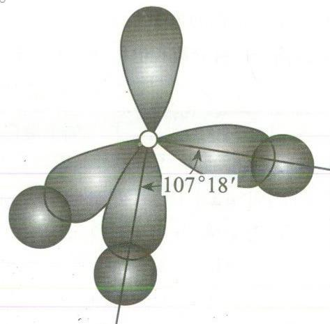  
图2-9 氨分子结构示意图

表2-7 某些分子的键长和键角数据

<table><tr><td rowspan="2">分子式</td><td colspan="2">键角</td><td colspan="2">键长</td><td rowspan="2">分子的空间结构</td></tr><tr><td>计算值</td><td>实验值</td><td>计算值/nm</td><td>实验值/nm</td></tr><tr><td> $O_2$ </td><td>—</td><td>—</td><td>0.1140</td><td>0.1207</td><td>直线形</td></tr><tr><td> $N_2$ </td><td>—</td><td>—</td><td>0.1147</td><td>0.1094</td><td>直线形</td></tr><tr><td> $H_2O$ </td><td>104.7</td><td>104.45</td><td>0.103</td><td>0.098</td><td>角形</td></tr><tr><td> $CO_2$ </td><td>180.0</td><td>180.0</td><td>—</td><td>0.1162</td><td>直线形</td></tr><tr><td> $NH_3$ </td><td>106.4</td><td>107.3</td><td>0.107</td><td>0.1019</td><td>三角锥形</td></tr><tr><td> $CH_4$ </td><td>109.5</td><td>109.5</td><td>0.1116</td><td>0.1093</td><td>正四面体形</td></tr></table>

2. 在共价化合物中形成弱极性键或强极性键是由哪些因素来决定的？电负性差值达到什么程度，极性键就转变为离子键？

在共价化合物中，由于不同元素的原子吸引电子的能力不同，共用电子对就必然或多或少地偏向于对它吸引力较大的那个原子（即电子云密度大的区域将偏近于这个原子），所以形成的键就具有不同程度的极性。两种元素的电负性相差越大，它们之间键的极性就越强，其中，电负性较大的原子为负极，电负性较小的原子为正极。例如，卤素中氟的电负性为4.0，氯为3.0，溴为2.8，碘为2.5，而氢的电负性为2.1。显然，在卤化氢分子中键的极性强弱的程度应为：

$$
\mathrm{HF} > \mathrm{HCl} > \mathrm{HBr} > \mathrm{HI}
$$

其中H—F和H—Cl为强极性键，H—I为弱极性键，而H—Br则介于两者之间。卤素原子是负极，氢原子是正极。又如 $CH_{4}$ 中的C—H，由于碳的电负性为2.5，与氢的相差很小，所以是弱极性键，碳是负极，氢是正极。

电负性差值与键的极性之间有没有严格的定量关系？电负性差值达到什么程度，极性键就转变为离子键？对于诸如此类的问题，很难做出肯定的回答，因为在离子键和共价键之间没有一条绝对分明和固定不变的界限。

近代实验表明，即使在由电负性最小的铯和电负性最大的氟形成的最典型的离子型化合物氟化铯中，键的离子性也不是百分之百，而只有92%。我们可以用离子性百分数来表示键的离子性相对于共价性的大小（说明：计算离子性百分数的方法不同，其数值不同）。对于AB型化合物单键离子性百分数和电负性差值 $(X_{\mathrm{A}}-X_{\mathrm{B}})$ 之间的关系如表2-8所示。

表2-8 单键的离子性百分数与电负性差值之间的关系

<table><tr><td> $X_{A}-X_{B}$ </td><td>离子性百分数/%</td><td> $X_{A}-X_{B}$ </td><td>离子性百分数/%</td></tr><tr><td>0.2</td><td>1</td><td>1.8</td><td>55</td></tr><tr><td>0.4</td><td>4</td><td>2.0</td><td>63</td></tr><tr><td>0.6</td><td>9</td><td>2.2</td><td>70</td></tr><tr><td>0.8</td><td>15</td><td>2.4</td><td>76</td></tr><tr><td>1.0</td><td>22</td><td>2.6</td><td>82</td></tr><tr><td>1.2</td><td>30</td><td>2.8</td><td>86</td></tr><tr><td>1.4</td><td>39</td><td>3.0</td><td>89</td></tr><tr><td>1.6</td><td>47</td><td>3.2</td><td>92</td></tr></table>

从表2-8可知，当两个原子电负性差值约为1.7时，单键约具有 $50\%$ 的离子性，这是一个重要的参考数据。如果两个原子电负性差值大于1.7时，可判断它们之间主要形成离子键，该物质是离子型化合物；如果两个原子电负性差值小于1.7，则可判断它们之间主要形成共价键，该物质为共价化合物。例如，钠的电负性为0.9，氯的电负性为3.0，两原子的电负性差值为2.1，当它们互相结合成NaCl时，其键的离子性百分数约为 $70\%$ 。因此可以判断氯化钠中钠离子与氯离子之间主要是形成离子键，氯化钠为离子型化合物。

## 3. 价层电子对互斥模型（VSEPR）

分子的空间结构是指其原子在空间的排布，可以用现代实验手段测定。例如，通过分子或离子的振动光谱（红外或拉曼光谱）可确定分子或离子的振动模式，进而确定分子的空间结构；通过X-衍射、电子衍射、中子衍射、核磁共振等技术也可测定分子的空间结构。

实验证实，属于同一通式的分子或离子，其结构可能相似，也可能完全不同。例如， $\mathrm{H}_{2} \mathrm{~S}$ 和 $\mathrm{H}_{2} \mathrm{O}$ 属同一通式 $\mathrm{H}_{2} \mathrm{A}$ ，结构很相似，都是 V 形分子，仅夹角度数稍有差别；而 $\mathrm{CO}_{3}^{2-}$ 和 $\mathrm{SO}_{3}^{2-}$ 虽属同一通式 $\mathrm{AO}_{3}^{2-}$ ，结构却不同：前者是平面三角形，后者是三角锥形，前者有 $p - p \pi$ 键，而后者有 $d - p \pi$ 键。

早在1940年，希吉维克（Sidgwick）和坡维尔（Powell）在总结实验事实的基础上提出了一种简单的理论，用以预测简单分子或离子的空间结构。这种理论后经吉列斯比（R.J.Gillespie）和尼霍尔姆（Nyholm）在20世纪50年代加以发展，定名为价层电子对互斥模型，简称VSEPR（Valence Shell Electron Pair Repulsion）。我们不难学会用这种模型来预测分子或离子的空间结构。当然，我们不应忘记，这一模型绝不可能代替实验测定，也不可能没有例外。不过，统计表明，对于我们经常遇到的分子或离子，特别是以非金属原子为中心的单核（即单中心）分子或离子，用这一模型预言的空间结构很少与事实不符。

价层电子对互斥的要点：

(1) 用通式 $AX_{n}E_{m}$ 来表示所有只含一个中心原子的分子或离子的组成, 式中 A 表示中心原子, X 表示配位原子 (也叫端位原子), 下标 $n$ 表示配位原子的个数, E 表示中心原子上的孤电子对, 下标 $m$ 是孤电子对数。已知分子或离子的组成和原子的排列顺序时, $m$ 值可用下式确定。

$m=\frac{1}{2}$ （A的族价-X的化合价×X的个数+/-离子电荷相应的电荷数）

例如：

<table><tr><td>分子</td><td> $SO_{2}$ </td><td> $SO_{3}$ </td><td> $SO_{3}^{2-}$ </td><td> $SO_{4}^{2-}$ </td><td> $NO_{2}^{+}$ </td></tr><tr><td>m</td><td>1</td><td>0</td><td>1</td><td>0</td><td>0</td></tr></table>

可以这样理解这个通式：中心原子的族价等于它的价电子总数，中心原子与端位原子键合用去的电子数取决于端位原子的个数和端位原子的化合价，如果是离子，正离子的电荷相当于中心原子失去的电子，负离子的电荷相当于中心原子得到的电子，因此，用上式计算得到的数值 $m$ 就是中心原子未用于键合的孤电子对数①。

① 有时，计算出来的 $m$ 值不是整数，如 $\mathrm{NO}_2$ ， $m = 0.5$ ，这时应当做 $m = 1$ 来对待，因为，单电子也要占据一个电子轨道。

<table><tr><td>分子</td><td>H2O</td><td>NH3</td><td>CH4</td></tr><tr><td>空间结构</td><td>V形</td><td>三角锥形</td><td>正四面体形</td></tr><tr><td>AYz</td><td></td><td></td><td></td></tr><tr><td>AXn</td><td></td><td></td><td></td></tr></table>

Y  
图2-11 VSEPR模型与分子的空间结构的关系（举例）

(2) 通式 ${\mathrm{{AX}}}_{n}{\mathrm{E}}_{m}$ 里的 $(n + m)$ 的数目称为价层电子对数,令 $n + m = z$ ,则可将通式 ${\mathrm{{AX}}}_{n}{\mathrm{E}}_{m}$ 改写成另一种通式 ${\mathrm{{AY}}}_{z}$ ; 价层电子对互斥模型认为, 分子中的价层电子对总是尽可能地互斥, 均匀地分布在分子中, 因此, $z$ 的数目决定了一个分子或离子中的价层电子对在空间的分布, 由此可以画出 VSEPR 模型:

<table><tr><td>z</td><td>2</td><td>3</td><td>4</td><td>5</td><td>6</td></tr><tr><td>模型</td><td>直线形</td><td>平面三角形</td><td>正四面体</td><td>三角双锥体</td><td>正八面体</td></tr></table>

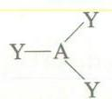

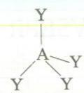

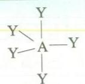

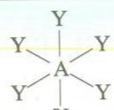  
图 2-10 VSEPR 模型

由此可见，VSEPR模型的“价层电子对”是指孤电子对和 $\sigma$ 键电子对，不包括 $\pi$ 电子对，考虑到孤电子对和键合的 $\sigma$ 电子对的电子云图像具有相同的对称性，我们不妨把它们合称为 $\sigma$ 轨道，那么，价层电子对互斥模型就是分子中 $\sigma$ 轨道的电子在三维空间中互相排斥，达到尽可能对称的图像。

(3) 通常所说的 “分子的空间结构” 是指分子中的原子在空间的排布, 不包括孤电子对, 因此, 在获得 VSEPR 模型后, 需根据 $\mathrm{AX}_{n}$ 写出分子的空间结构, 只有当 $\mathrm{AX}_{n} \mathrm{E}_{m}$ 中的 $m=0$ 时, 即 $\mathrm{AY}_{z}=\mathrm{AX}_{n}$ 时, VSEPR 模型才是分子的空间结构, 否则, 得到 VSEPR 模型后要略去孤电子对, 才得到分子的空间结构。例如, $\mathrm{H}_{2} \mathrm{O} 、 \mathrm{NH}_{3} 、 \mathrm{CH}_{4}$ 都是 $\mathrm{AY}_{4}$ , 它们的分子的空间结构如图 2-11 所示。

可见，对于 $AX_{n}$ 而言，分子的空间结构就不一定越对称越好了，否则会以为水分子应为直线分子，氨应为平面三角形分子，换句话说，只有把孤电子对考虑在内才能得出正确的分子的空间结构，这正是价层电子对互斥模型的成功之处。

(4) $A{Y}_{z}$ 中的 $z$ 个价层电子对之间的斥力的大小有如下顺序：

i.l—l≫l—b>b—b(l为孤电子对；b为键合电子对）

这一斥力顺序是经常要考虑的。可以这样来理解这一斥力顺序：键合电子对受到左右两端带正电的原子核的吸引，而孤电子对只受到一端原子核吸引，相比之下，孤电子对较“胖”，占据较大的空间，而键合电子较“瘦”，占据较小的空间（如图2-12）。

此外，有时还要考虑到如下几种顺序：

ii. $t - t > t - d > d - d > d - s > s - s(t-$ 三键，d-双键，s-单键）

iii. $\chi_{w} - \chi_{w} > \chi_{w} - \chi_{s} > \chi_{s} - \chi_{s}$ ( $\chi$ 代表配位原子的电负性，下标 $w$ 为弱， $s$ 为强）iv.处于中心原子的全充满价层里的键合电子之间的斥力大于处在中心原子的未充满价层里键合电子之间的斥力。

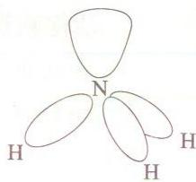

价层电子对之间的以上“斥力顺序”使分子或离子的空间结构偏离由 $AY_{2}$ 确立的VSEPR模型而适当畸变；当VSEPR模型不止一个时，还决定了哪种空间结构更为稳定。这些顺序规则中，最经常要考虑的，最重要的，是第一种斥力顺序。

图 2-12 孤电子对与键合电子对的斥力不同使 VSEPR 模型发生畸变

[例2-1] 试用价层电子对互斥模型预测 $\mathrm{H}_2\mathrm{O}$ 的空间结构。

[解]（1） $\mathrm{H}_2\mathrm{O}$ 属 $\mathrm{AX}_2\mathrm{E}_2 = \mathrm{AY}_4$

(2) VSEPR 模型为正四面体形，价层电子对间夹角均为 $109^{\circ}28'$ 。

（3）分子的空间结构（指 $\mathrm{H}_2\mathrm{O}$ 而不是 $\mathrm{H}_2\mathrm{OE}_2$ ）为V形（非线形分子）。

（4）根据斥力顺序i，应有：

$$
\angle 1 - 0 - 1 > \angle 1 - 0 - H > \angle H - O - H
$$

结论：水分子的空间结构为V形， $\angle H-O-H$ 小于 $109^{\circ}28'$ 。

[例2-2]用价层电子对互斥模型预测 $\mathrm{SO}_2\mathrm{Cl}_2$ 的空间结构。

[解] $SO_{2}Cl_{2}$ 属 $AX_{4}E_{0}=AY_{4}$ ，VSEPR模型为正四面体形，因S=O是双键，S—Cl是单键，据顺序ii，分子的空间结构应为：

$$
\angle O - S - O > 1 0 9 ^ {\circ} 2 8 ^ {\prime} \angle C l - S - C l <   \angle O - S - C l <   1 0 9 ^ {\circ} 2 8 ^ {\prime}
$$

结论： $SO_{2}Cl_{2}$ 的空间结构为正四面体畸变形——四面体形。

[例2-3] 实测值: $\mathrm{SO}_2\mathrm{F}_2$ 中 $\angle \mathrm{F} - \mathrm{S} - \mathrm{F}$ 为 $98^{\circ}$ , $\mathrm{SO}_2\mathrm{Cl}_2$ 中 $\angle \mathrm{Cl} - \mathrm{S} - \mathrm{Cl}$ 为 $102^{\circ}$ , 为什么后者角度较大?

[解] 这种差别可以用斥力顺序iii来解释。

[例2-4] $NH_{3}$ 和 $PH_{3}$ 都是 $AX_{3}E=AY_{4}$ ，故分子（ $AX_{3}$ ）均为三角锥形。实测：氨分子中 $\angle H-N-H$ 为 $106.7^{\circ}$ ，膦分子中 $\angle H-P-H$ 为 $93.5^{\circ}$ ，为什么这两种分子的角度有这种差别？

[解] 这种差别可以用斥力顺序iv来解释。

[例2-5] $\mathrm{SF}_4$ 属 $\mathrm{AX}_4\mathrm{E}_1 = \mathrm{AY}_5$ ，其VSEPR模型为三角双锥体，排除孤电子对的分子的空间结构有两种可能的模型（由于孤电子对的位置不同）：（I）型为类似金字塔的三角锥体（孤电子对占据 $\mathrm{AY}_5$ 的三角双锥体的一个锥顶，又叫极顶位置）；（II）型为跷跷板型（孤电子对占据三角双锥体的“赤道面位置”）（如图2-13）。哪一种空间结构更合理呢？

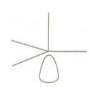

  
I型  
Ⅱ型  
图2-13 $\mathbf{SF}_4$ 的可能立体构型

[解] 在（Ⅰ）型里有3个呈90°的∠1—S—F和3个呈90°的∠F—S—F，而在（Ⅱ）型里只有两个呈90°的∠1—S—F和4个呈90°的∠F—S—F，由于孤电子对的斥力较大，因而（Ⅱ）型比（Ⅰ）型稳定。需要指出的是：该分子中120°夹角的电子对间的斥力与90°夹角的电子对间的斥力相比小得可以忽略不计，故无须加以考虑。实测 $SF_{4}$ 呈（Ⅱ）型。

## 4. 杂化轨道理论

## (1) 杂化轨道理论要点

为了解释分子或离子的空间结构，鲍林以量子力学为基础提出了杂化轨道理论。

我们不妨先以甲烷为例说明杂化轨道理论的出发点：甲烷分子实测的和VSEPR模型预测的空间结构都是正四面体形。若认为 $CH_{4}$ 里的中心原子碳的4个价电子层原子轨道——2s和 $2p_{x}$ ， $2p_{y}$ ， $2p_{z}$ 分别跟4个氢原子的1s原子轨道重叠形成σ键，无法解释甲烷的4个C—H是等同的，因为碳原子的3个2p轨道是相互垂直，而2s轨道是球形的。鲍林假设，甲烷的中心原子——碳原子——在形成化学键时，4个价电子层原子轨道并不维持原来的形状，而是发生所谓“杂化”，得到4个等同的轨道，总称 $sp^{3}$ 杂化轨道。

除 $sp^{3}$ 杂化，还有两种由 s 轨道和 p 轨道杂化的类型，一种是 1 个 s 轨道和 2 个 p 轨道杂化，杂化后得到平面三角形分布的 3 个轨道，总称 $sp^{2}$ 杂化轨道；另一种是 1 个 s 轨道和 1 个 p 轨道杂化，杂化后得到呈直线分布的 2 个轨道，总称 sp 杂化轨道。

图2-14画出了 $sp^{3}$ 、 $sp^{2}$ 和sp三种杂化轨道在空间的排布。在该图最右边画出了未参与 $sp^{2}$ 杂化和sp杂化的剩余p轨道与杂化轨道的空间关系——未参与 $sp^{2}$ 杂化的1个p轨道垂直于杂化轨道形成的平面；未参与sp杂化的2个p轨道与sp杂化轨道形成的直线呈正交关系（即相互垂直）。注意：杂化轨道总是用于构建分子的σ轨道，未参与杂化的p轨道才能用于构建π键，在学习杂化轨道理论时既要掌握杂化轨道的空间分布，也要掌握未杂化的p轨道与杂化轨道的空间关系，否则难以全面掌握分子的化学键结构。

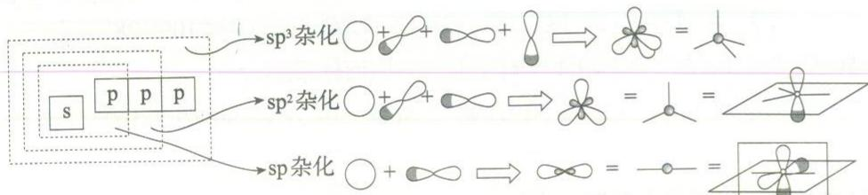  
图 2-14 s 轨道和 p 轨道的三种杂化类型—— $sp^{3}$ 、 $sp^{2}$ 和 sp

讨论分子中的中心原子的杂化轨道类型的基础是预先知道它的空间结构。如果没有实验数据，可以借助VSEPR模型对分子的空间结构作出预言。这是教材为什么在讨论杂化轨道理论之前先讨论价层电子对互斥模型的原因。特别要注意的是，如果分子的中心原子上有采取 $\sigma$ 轨道的孤电子对存在，确定中心原子的杂化轨道类型必须考虑包括孤电子对在内的整个分子的 $\sigma$ 轨道骨架，不应单从分子的 $\sigma$ 键骨架空间结构来确定。杂化轨道类型与VSEPR模型的关系如下表所示：

<table><tr><td>杂化类型</td><td> $sp^{3}$ </td><td> $sp^{2}$ </td><td>sp</td><td> $sp^{3}d$ 或 $dsp^{3}$ </td><td> $sp^{3}d^{2}$ 或 $d^{2}sp^{3}$ </td></tr><tr><td>空间结构</td><td>正四面体</td><td>正三角形</td><td>直线形</td><td>三角双锥体</td><td>正八面体</td></tr><tr><td>VSEPR模型</td><td> $AY_{4}$ </td><td> $AY_{3}$ </td><td> $AY_{2}$ </td><td> $AY_{5}$ </td><td> $AY_{6}$ </td></tr></table>

## (2) $\mathrm{sp}^{3}$ 杂化

凡属于VSEPR模型 ${\mathrm{{AY}}}_{4}$ 的分子中的中心原子A都采取 ${\mathrm{{sp}}}^{3}$ 杂化类型,如 ${\mathrm{{CH}}}_{4}\text{、}{\mathrm{{CCl}}}_{4}\text{、}{\mathrm{{NH}}}_{4}^{ + }$ 、 ${\mathrm{{CH}}}_{3}\mathrm{{Cl}}\text{、}{\mathrm{{NH}}}_{3}\text{、}{\mathrm{H}}_{2}\mathrm{O}$ 等。

前3个例子与中心原子键合的是同一种原子，因此分子呈高度对称的正四面体结构，其中的4个 $sp^{3}$ 杂化轨道自然没有差别，这种杂化类型叫做等性杂化。

后3个例子的中心原子的4个 $sp^{3}$ 杂化轨道用于构建不同的 $\sigma$ 轨道，如 $CH_{3}Cl$ 中C—H和C—Cl的键长、键能都不相同，显然有差别，4个 $\sigma$ 键的键角也有差别，又如 $NH_{3}$ 和 $H_{2}O$ 的中心原子的4个杂化轨道分别用于 $\sigma$ 键和孤电子对，这样的4个杂化轨道显然有差别，叫做不等性杂化。

p能级总共只有3个p轨道，当这些p轨道全部以 $sp^{3}$ 杂化轨道去构建 $\sigma$ 轨道，中心原子就没有多余的p轨道去与键合原子之间形成p-p $\pi$ 键了。因此，像 $SO_{4}^{2-}$ 、 $SO_{2}Cl_{2}$ 、 $PO_{4}^{3-}$ 等中心原子取 $sp^{3}$ 杂化轨道的“物种”，其路易斯结构式中的双键中的 $\pi$ 键是由中心原子的d轨道和端位原子的p轨道形成的，叫做d-p $\pi$ 键。d-p $\pi$ 键的电子云图像比较复杂，可参阅其他资料。

我们可以假设所有烷烃都是 $CH_{4}$ 失去氢原子使碳原子相连形成的。由此，烷烃中的所有碳原子均取 $sp^{3}$ 杂化轨道形成分子的 $\sigma$ 骨架，其中所有C—C和C—H的夹角都近似相等，金刚石则可以看成甲烷完全失去氢的 $sp^{3}$ 杂化的碳原子相连，所以金刚石中所有C—C—C键角等于 $109^{\circ}28'$ 。

## (3) $\mathbf{sp}^2$ 杂化

凡符合VSEPR模型 $AY_{3}$ 通式的分子或离子中的中心原子大多数采取 $sp^{2}$ 杂化轨道。例如， $BCl_{3}$ 、 $CO_{3}^{2-}$ 、 $NO_{3}^{-}$ 、 $H_{2}C=O$ 、 $SO_{3}$ 等。烯烃 $C=C$ 结构中跟3个原子键合的碳原子也是以 $sp^{2}$ 杂化轨道为其 $\sigma$ 骨架的。

以 $sp^{2}$ 杂化轨道构建 $\sigma$ 轨道的中心原子必有一个垂直于 $sp^{2}\sigma$ 骨架的未参与杂化的 p 轨道，如果这个轨道跟邻近原子上的平行 p 轨道重叠，并填入电子，就会形成 $\pi$ 键。例如，乙烯 $H_{2}C=CH_{2}$ 、甲醛 $H_{2}C=O$ 的结构如图 2-15 所示：

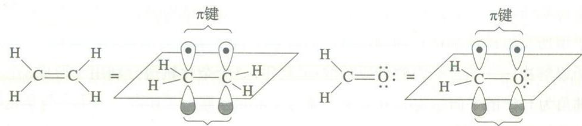  
图 2-15 乙烯和甲醛分子中的化学键

对比它们的路易斯结构式，我们可以清楚看到，乙烯和甲醛的路易斯结构式里除双键中的一根横线外，其他横线均代表由中心原子 $sp^{2}$ 杂化轨道构建的 $\sigma$ 键（图2-15中仍用横线代表 $\sigma$ 键，用小黑点表示孤电子对），而双键中的另一横线则是中心原子上未杂化的p轨道与端位原子的p轨道肩并肩重叠形成的 $\pi$ 键（图2-15中用未键合的p电子云图像表示）。借助路易斯结构式和分子的价电子总数，不难算出电子在分子中的分配。例如，甲醛总共有12个价电子（2个氢贡献2个电子，碳贡献4个电子，氧贡献6个电子），碳用 $sp^{2}$ 杂化轨道构建的分子 $\sigma$ 骨架共用去6个电子（形成3个 $\sigma$ 键），氧原子上有两对孤电子对未参与形成化学键，两项加起来已经用去10个电子，因此，垂直于分子平面的“肩并肩”的2个p轨道形成的 $\pi$ 键里共有2个电子，正相当于路易斯结构式中的C=O双键中的一根横线。

## (4) sp杂化

具有VSEPR模型 $A{Y}_{2}$ 通式的分子中的中心原子采取sp杂化轨道构建分子的 $\sigma$ 骨架,如 ${\mathrm{{CO}}}_{2}$ 中的碳原子、 $\mathrm{H}-\mathrm{C} \equiv \mathrm{N}$ : 中的碳原子、 $\mathrm{BeCl}_{2}$ 中的铍原子等。炔烃中的— $\mathrm{C} \equiv \mathrm{C}$ —的 $\sigma$ 骨架也是由 sp 杂化轨道构建的。

从图2-14我们已经得知, 当中心原子取sp杂化轨道形成直线形的 $\sigma$ 骨架时, 中心原子上有一对垂直于分子的 $\sigma$ 骨架的未参与杂化的p轨道。如乙炔分子的路易斯结构式为H—C≡C—H, 总共有10个价电子, 2个碳原子均取sp杂化, 由此形成的直线形的“H—C—C—H” $\sigma$ 骨架, 总共用去6个电子, 剩下的4个电子填入2套相互垂直的 $\pi$ 键中。这2套 $\pi$ 键的形成过程是: 每个碳原子有2个未参与sp杂化的p轨道, 当碳原子相互靠拢用各自一个sp杂化轨道“头碰头”重叠, 形成 $\sigma$ 键的同时, 未杂化的p轨道经旋转而导致2套相互平行的p轨道, 采用“肩并肩”重叠, 形成2套 $\pi$ 键, 如图2-16所示。

  
（图中的垂直于H—C—C—H $\sigma$ 骨架的上下取向和前后取向的方框表示的是2个 $\pi$ 键的空间取向）
图2-16 乙炔分子中有2个 $\pi$ 键

## 5. 共轭大 $\pi$ 键

资料4中讨论了分子中出现2个平行p轨道形成 $\pi$ 键的图像，即只要邻位的原子有2个相互平行的p轨道，能量接近，若容纳2个电子，就可以形成 $\pi$ 键。有时，分子中数个邻近原子上都有平行的p轨道，这时，就要形成比简单的双轨道双电子 $\pi$ 键复杂的多轨道多电子大 $\pi$ 键。举例讨论如下：

## (1) 苯分子中的p-p大π键

苯的路易斯结构式里的碳碳键有单键和双键之分，这种结构满足了碳的四价，然而，事实上，苯分子里所有碳碳键的键长和键能并没有区别，这个矛盾可用苯环的碳原子形成p-p大 $\pi$ 键的概念予以解决——苯分子中的碳原子取 $sp^{2}$ 杂化，3个杂化轨道分别用于形成3个 $\sigma$ 键，故苯分子有键角为120°的平面结构的 $\sigma$ 骨架；苯分子的每个碳原子还有一个未参与杂化的p轨道，垂直于分子平面而相互平行。显然，每个碳原子左右相邻的碳原子没有区别，认为某个碳原子未参与杂化的p轨道中的电子只与左邻碳原子的平行p轨道中的一个电子形成 $\pi$ 键而不与右邻碳原子的平行p轨道形成 $\pi$ 键或者相反显然是不符合逻辑的，可以认为所有6个“肩并肩”的平行p轨道上总共6个电子在一起形成了弥散在整个苯环的p-p大 $\pi$ 键（如图2-17）。

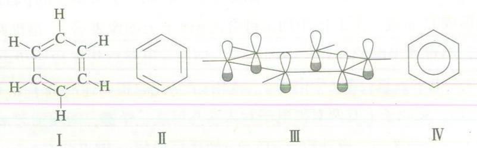

（Ⅰ路易斯结构式；Ⅱ结构简式；Ⅲ分子中有6个平行p轨道；Ⅳ大π键的结构式）

## (2) 丁二烯中的p-p大π键

丁二烯分子式为 $H_{2}C=CH-CH=CH_{2}$ 。4个碳原子均与3个原子相邻，故均取 $sp^{2}$ 杂化，这些杂化轨道互相重叠，形成分子的 $\sigma$ 骨架，使所有原子处于同一个平面。每个碳原子还有一个未参与杂化的 p 轨道，垂直于分子平面，每个 p 轨道里有一个电子。按照上面分析苯分子结构的方式，丁二烯分子里存在一个“4轨道4电子”的 p-p 大 $\pi$ 键（如图2-18）。

图2-17 苯分子的大 $\pi$ 键  
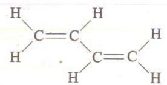  
I

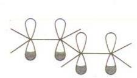  
II

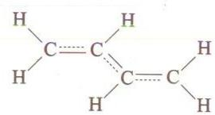  
Ⅲ  
（Ⅰ路易斯结构式；Ⅱ分子中有4个平行p轨道；Ⅲ大π键的结构式）  
图2-18 丁二烯分子中的p-p大 $\pi$ 键

通常采用 $\Pi_{a}^{b}$ 为大 $\pi$ 键的符号，其中 a 表示平行 p 轨道的数目，b 表示在平行 p 轨道里的电子数。理论计算证明，形成大 $\pi$ 键的必要条件是 b < 2a，若 b = 2a 便不能形成大 $\pi$ 键。上面两个例子都是 b = a，苯分子的大 $\pi$ 键的符号为 $\Pi_{6}^{6}$ ，丁二烯分子的大 $\pi$ 键的符号为 $\Pi_{4}^{4}$ ，但有的大 $\pi$ 键中的电子数不等于轨道数。

## (3) $\mathrm{CO}_{2}$ 里的大 $\pi$ 键

根据 VSEPR 模型， $CO_{2}$ 属于 $AX_{2}E_{0}$ 型分子，是直线形的，在中心原子碳原子上没有孤电子对。根据杂化轨道理论， $CO_{2}$ 的碳原子取 sp 杂化轨道。如前所述，当某原子取 sp 杂化轨道时，它的两个未参加杂化的 p 轨道在空间的取向是跟 sp 杂化轨道的轴呈正交关系的，即相互垂直，因而 $CO_{2}$ 有两套相互平行的 p 轨道，每套 3 个 p 轨道，每套是 3 轨道 4 电子，换言之， $CO_{2}$ 里有两套 3 原子 4 电子符号为 $\Pi_{3}^{4}$ 的 p-p 大 $\pi$ 键。

计算大 $\pi$ 键里的电子数的方法很多，一种方法的步骤是：①确定分子中总价电子数；②画出分子中的 $\sigma$ 键以及不与 $\pi$ 键 p 轨道平行的孤电子对轨道；③总电子数减去这些 $\sigma$ 键电子和孤电子对，剩余的就是填入大 $\pi$ 键的电子。如上所述，二氧化碳分子有 16 个价电子，每个氧原子上有 1 个容纳孤电子对的轨道不与 $\pi$ 键 p 轨道平行，这些轨道总共容纳 8 个电子，因此 2 套平行 p 轨道里总共有 8 个电子，平均每套 p 轨道里有 4 个电子（如图 2-19）。

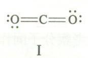

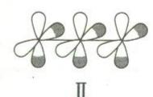

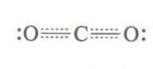  
III  
（Ⅰ路易斯结构式；Ⅱ分子中有2套平行p轨道；Ⅲ大π键的结构式）
图2-19 CO₂中的大π键

另一种计算大 $\pi$ 键中电子数的方法是：把大 $\pi$ 键看成路易斯结构式中的 $\pi$ 键与邻近原子的平行p轨道中的孤电子对“共轭”，参加“共轭的”电子就是大 $\pi$ 键中的电子。例如，二氧化碳的每一个 $\pi$ 键与邻近的一个氧原子的平行p轨道上的1对孤电子对共轭，所以每一套平行的3个p轨道上有4个电子。

## (4) $CO_{3}^{2-}$ 中的大 $\pi$ 键

根据价层电子对互斥模型，碳酸根离子属于 $AX_{3}E=AY_{3}$ 型分子，它的VSEPR模型是平面三角形，分子中的3个C—Oσ键呈平面三角形；按杂化轨道模型，中心碳原子有3个σ轨道，取 $sp^{2}$ 杂化形式，碳原子上还有一个垂直于分子平面的p轨道；端位的3个氧原子也各有1个垂直于分子平面的p轨道；分子的总价电子数等于24，3个C—O σ键有6个电子，每个氧原子上有2个不与分子平面垂直的孤电子对，因此4个平行p轨道中共有 $24-6-3\times4=6$ 个电子，所以 $CO_{3}^{2-}$ 离子中有1个4轨道6电子p-p大π键，符号为 $\Pi_{4}^{6}$ （如图2-20）。

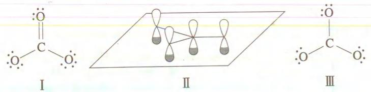  
（Ⅰ路易斯结构式；Ⅱ分子中4个平行p轨道；Ⅲ标出了除大π键外的12个电子）
图 2-20 CO $_{3}^{2-}$ 的结构

## (5) $O_{3}$ 中的大 $\pi$ 键

根据价层电子对互斥模型臭氧分子属于 $AX_{2}E$ 型分子，它的VSEPR模型是平面三角形（包括氧原子上的孤电子对）。根据杂化轨道理论，臭氧分子的中心氧原子有3个 $\sigma$ 轨道（2个 $\sigma$ 键和1个占据 $\sigma$ 轨道的孤电子对），取 $sp^{2}$ 杂化形式，中心氧原子还有一个垂直于分子平面的p轨道，端位的每个氧原子只可能有一个垂直于分子平面的p轨道，另外2对孤电子对占据的轨道在分子平面上，因此，3个平行p轨道中的电子数为 $18-2\times3-2\times4=4$ ，臭氧分子里有一个 $\Pi_{3}^{4}$ 大 $\pi$ 键（如图2-21）。

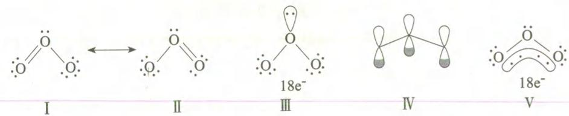  
（Ⅰ和Ⅱ为路易斯结构式；Ⅲ标出了总电子数；Ⅳ表明3个平行p轨道；V大π键的结构式）  
图 2-21 臭氧的分子结构

（资料3、4、5摘编自：北京师范大学等编.无机化学（上册·第四版）.北京：高等教育出版社，2002年）

## 6. 分子间作用力的种类

分子间作用力按其实质来说是一种电性的作用力，因此考察分子间作用力的起源就得研究物质分子的电性及分子结构。分子间作用力可以分为以下三种力。

## (1) 取向力

取向力发生在极性分子与极性分子之间。由于极性分子的电性分布不均匀，一端显正电性，一端显负电性，形成偶极。因此，当两个极性分子相互接近时，由于它们偶极的同极相斥，异极相吸，两个分子必将发生相对转动。这种偶极子的互相转动，就使偶极子的相反的极相对，叫做“取向”。这时由于相反的极相距较近，同极相距较远，结果引力大于斥力，两个分子靠近，当接近到一定距离之后，斥力与引力达到相对平衡。这种由于极性分子的取向而产生的分子间的作用力，叫做取向力。

## (2) 诱导力

在极性分子和非极性分子之间以及极性分子和极性分子之间都存在诱导力。

在极性分子和非极性分子之间，由于极性分子偶极所产生的电场对非极性分子发生影响，使非极性分子电子云变形(即电子云被吸向极性分子偶极的正电的一端)，结果使非极性分子的电子云与原子核发生相对位移，本来非极性分子中的正、负电荷中心是重合的，相对位移后就不再重合，使非极性分子产生了偶极。这种电荷重心的相对位移叫做“变形”，因变形而产生的偶极，叫做诱导偶极，以区别于极性分子中原有的固有偶极。诱导偶极和固有偶极就相互吸引，这种由于诱导偶极而产生的作用力，叫做诱导力。

同样，在极性分子和极性分子之间，除了取向力外，由于极性分子的相互影响，每个分子也会发生变形，产生诱导偶极。其结果使分子的偶极矩增大，既具有取向力又具有诱导力。在阳离子和阴离子之间也会出现诱导力。

## (3) 色散力

非极性分子之间也有相互作用。粗略来看，非极性分子不具有偶极，它们之间似乎不会产生引力，然而事实上却非如此。例如，某些由非极性分子组成的物质，如苯在室温下是液体，碘、萘是固体；又如在低温下， $N_{2}$ 、 $O_{2}$ 、 $H_{2}$ 和稀有气体等都能凝结为液体甚至固体。这些都说明非极性分子之间也存在着分子间的引力。当非极性分子相互接近时，由于每个分子的电子不断运动和原子核的不断振动，经常发生电子云和原子核之间的瞬时相对位移，也即正、负电荷重心发生了瞬时的不重合，从而产生瞬时偶极。而这种瞬时偶极又会诱导邻近分子也产生和它相吸引的瞬时偶极。虽然，瞬时偶极存在时间极短，但上述情况在不断重复着，使得分子间始终存在着引力，这种力可从量子力学理论计算出来，而其计算公式与光色散公式相似，因此，把这种力叫做色散力。

总结以上所述，分子间作用力的来源是取向力、诱导力和色散力。一般来说，极性分子与极性分子之间，取向力、诱导力、色散力都存在；极性分子与非极性分子之间，则存在诱导力和色散力；非极性分子与非极性分子之间，则只存在色散力。这三种类型的力的比例大小，决定于相互作用分子的极性和变形性。极性越大，取向力的作用越重要；变形性越大，色散力就越重要；诱导力则与这两种因素都有关。但对大多数分子来说，色散力是主要的。分子间作用力的大小可从作用能反映出来。表2-9列出了某些分子的三种分子间的作用能的大小。

表2-9 一些分子的分子间作用能的分配

<table><tr><td>分子</td><td> $\frac{{E}_{\text{取向 }}}{\left( {\mathrm{{kJ}} \cdot {\mathrm{{mol}}}^{-1}}\right) }$ </td><td> $\frac{{E}_{\text{诱导 }}}{\left( {\mathrm{{kJ}} \cdot {\mathrm{{mol}}}^{-1}}\right) }$ </td><td> $\frac{{E}_{\text{色散 }}}{\left( {\mathrm{{kJ}} \cdot {\mathrm{{mol}}}^{-1}}\right) }$ </td><td> $\frac{{E}_{\text{总 }}}{\left( {\mathrm{{kJ}} \cdot {\mathrm{{mol}}}^{-1}}\right) }$ </td></tr><tr><td>Ar</td><td>0.000</td><td>0.000</td><td>8.49</td><td>8.49</td></tr><tr><td>CO</td><td>0.0029</td><td>0.0084</td><td>8.74</td><td>8.75</td></tr><tr><td>HI</td><td>0.025</td><td>0.1130</td><td>25.86</td><td>25.98</td></tr><tr><td>HBr</td><td>0.686</td><td>0.502</td><td>21.92</td><td>23.09</td></tr><tr><td>HCl</td><td>3.305</td><td>1.004</td><td>16.82</td><td>21.13</td></tr><tr><td> $NH_3$ </td><td>13.31</td><td>1.548</td><td>14.94</td><td>29.58</td></tr><tr><td> $H_2O$ </td><td>36.38</td><td>1.929</td><td>8.996</td><td>47.28</td></tr></table>

## 7. 分子间作用力与物质的一些性质的关系

## (1) 分子间作用力与物质的沸点和熔点

气体分子能够凝结为液体和固体，是分子间作用力作用的结果。分子间引力越大，则越不易气化，所以沸点越高，气化热越大。固体熔化为液体时也要部分地克服分子间引力，所以分子间引力较大者，熔点较高，熔化热较大。

① 稀有气体和一些简单的对称分子的沸点和熔点随相对分子质量增大而升高。在稀有气体的原子里，电子云和核之间经常产生瞬时的相对位移，因而产生瞬时偶极，这样便产生了原子间的引力。从 He 至 Rn 随着原子序数增加，原子核与最外层的电子联系相应减弱，相应的原子的极化率（在单位电场强度下，由分子极化而产生的诱导偶极矩，用 $\mu$ 表示）也增加，因而加强了色散力。这样一来，就增加了原子间的相互吸引力，所以相对原子质量越大，极化率越大，色散力也越大，反映在沸点上随相对原子质量增大而升高。

② 同系物的沸点和熔点，随相对分子质量增大而升高，这是因为同系物的偶极矩大致相等，电离能也大致相等。所以分子间引力的大小主要决定于极化率 $\alpha$ 的大小。由于在同系物中相对分子质量越大的极化率也越大，因此沸点和熔点也就越高。

③ 同分异构体的极化率 $\alpha$ 相等，所以偶极矩越大的分子，分子间作用力越大，沸点越高。

表2-10 同分异构体的偶极矩与沸点

<table><tr><td>结构(I)</td><td> $\mu (D)$ </td><td>沸点/°C</td><td>结构(II)</td><td> $\mu (D)$ </td><td>沸点/°C</td></tr><tr><td> $C_2H_5NO_2$ </td><td>3.19</td><td>113</td><td> $C_2H_5ONO$ </td><td>2.20</td><td>17</td></tr><tr><td> $C_2H_5CN$ </td><td>3.57</td><td>98</td><td> $C_2H_5NC$ </td><td>3.47</td><td>28</td></tr><tr><td>顺-二氯乙烯</td><td>1.89</td><td>60.5</td><td>反-二氯乙烯</td><td>0</td><td>47.7</td></tr></table>

## (2) 分子间作用力与物质的溶解度

液体的互溶以及固态、气态的非电解质在液体里的溶解度都与分子间力有密切的关系。例如，非极性分子组成的气体像稀有气体、 $H_{2}$ 、 $O_{2}$ 、 $N_{2}$ 和卤素等溶于非极性液体，主要是由于溶质分子与溶剂分子之间色散力的作用；至于溶解于极性溶剂里，虽然有诱导力等，但仍然是色散力起主要作用。因此，溶质或溶剂(指同系物)的极化率增大，溶解度增大，尤其当溶质和溶剂的极化率都增大时，这种效应更为明显。

极性溶剂的缔合作用主要是偶极间的相互作用，此种作用比溶质与溶剂分子间的诱导力大得多，所以非极性溶质在极性溶剂里的溶解度一般是很小的，这也就是平常所说的“相似相溶”的根据之一。

除上述一些性质外，分子间作用力还决定着物质的熵效应、气化热、黏度、表面张力、物理吸附作用，等等。

## 8. 氢键的本质

氢原子似乎可以同时和两个电负性很大而原子半径较小的原子(如O、F、N等)相结合, 一般表示为X—H…Y, 其中H…Y的结合力就是氢键。

关于氢键的本质，到目前为止还没有圆满地解决。一般认为X—H…Y里，X—H基本是共价键，而H…Y则是一种强有力的有方向性的范德华力。把氢键归入范德华力是因为它在本质上是带有部分负电荷的原子Y与极性很强的极性键X—H之间的静电吸引作用。因为X—H的极性很强，H的半径很小，且又无内层电子，所以允许带有部分负电荷的Y原子无空间阻碍地来充分接近它，产生静电吸引作用而构成氢键。这种吸引作用的能量，一般在41.84 kJ/mol以下，比化学键的键能要小得多，但和范德华力的数量级相同，所以有人把氢键归入范德华力。

但是氢键有两个与一般的范德华力不同的特点，即它的饱和性和方向性。其饱和性表现在X—H只能再和一个Y原子相结合，即一个氢原子不可能同时形成两个氢键。如果另有一个Y原子来接近它们，则将受X和Y的排斥力要比受到H的吸引力来得大，所以X—H不能和两个Y原子相结合。

由于X—H与Y的相互作用，只有当X—H…Y在同一直线上的时候最强烈，所以，在可能范围内要尽量使X—H…Y在同一直线上，这是氢键具有方向性的原因。另一方面Y一般含有孤电子对，在可能范围内，氢键的方向要和孤对电子的对称轴相一致。这样可使Y原子中负电荷分布得最多的部分最接近于H。

## 9. 分子间氢键与分子内氢键

氢键可分为分子间氢键与分子内氢键两大类。一个分子的X—H与另一个分子的Y相结合而成的氢键，称为分子间氢键。例如，水、甲酸、乙酸等缔合体就是通过分子间氢键而形成的。除了这种同类分子间的氢键外，不同分子间也可形成氢键，例如：

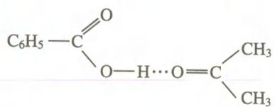

根据红外光谱的研究结果，表明分子间氢键一般是呈直线形(其理由见资料8中氢键的方向性的论述)。由于这样，水结成冰其晶体为四面体形。即每一个水分子，位于四面体中心，在它周围有四个水分子，分别以氢键和它相连。

在某些分子里，如邻位硝基苯酚中的羟基O—H也可与硝基的氧原子生成氢键，即：

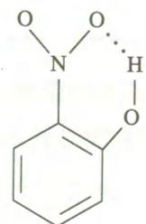

这种一个分子的X—H与它内部的Y相结合而成的氢键称为分子内氢键。

红外吸收光谱表明，由于受环状结构中其他原子的键角限制，分子内氢键X—H…Y不能在同一直线上(一般键角约为 $150^{\circ}$ )。分子内氢键的形成会使分子钳环化。

## 10. 氢键的形成对化合物性质的影响

分子缔合作用，是由于分子间氢键的形成，钳环化则是由于分子内氢键的形成。两者对于化

合物的性质的影响是显著的，并且往往是相反的，现简述如下。

## (1) 对沸点和熔点的影响

分子间氢键的形成使物质的沸点和熔点升高，因为要使液体气化，必须破坏大部分分子间的氢键，这需要较多的能量；要使晶体熔化，也要破坏一部分分子间的氢键。所以，形成分子间氢键的化合物的沸点和熔点都比没有氢键的同类化合物更高。

分子内氢键的生成使物质的沸点和熔点降低，如邻位硝基苯酚的熔点为 $45^{\circ} \mathrm{C}$ ，而间位和对位硝基苯酚的熔点分别是 $96^{\circ} \mathrm{C}$ 和 $114^{\circ} \mathrm{C}$ 。这是由于间位和对位硝基苯酚中存在着分子间氢键，熔化时必须破坏其中的一部分氢键，所以它们熔点较高；但邻位硝基苯酚中已经构成分子内氢键，不能再构成分子间氢键了，所以熔点较低。

## (2) 对溶解度的影响

在极性溶剂里，如果溶质分子与溶剂分子间可以生成氢键，则溶质的溶解度增大。如果溶质分子钳环化，则在极性溶剂里的溶解度减小。例如，对硝基苯酚中O—H基，能同水的氧原子缔合成氢键，促使它在水中溶解，因此溶解度相对大，在水蒸气里不挥发。但邻硝基苯酚的O—H基，通过氢原子能与其邻位上硝基的氧原子钳环化，却不能再同水的氢原子形成氢键，因此溶解度相对小，而且易被水蒸气蒸馏出去。邻位与对位硝基苯酚在20℃的水里的溶解度之比为0.39。钳环化的化合物在非极性溶剂里，其溶解度与上述情况相反。

## (3) 对酸性的影响

如苯甲酸的电离常数为K，则在邻位、间位、对位上带有羟基时，电离常数依次为15.9K、1.26K和0.44K。如左右两边邻位上各取代一羟基，则电离常数为800K。这是由于邻位上的羟基与苯甲酸根生成带氢键的稳定的阴离子，从而增加了羧基中氢原子的电离度。

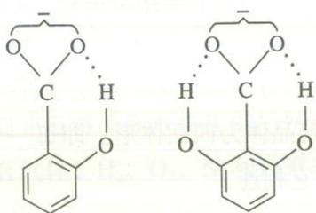

## 11. 药物分子结构修饰

药物在应用的过程中，常会出现一些影响药物发挥应有作用或影响对药物应用的因素。例如，由于化学结构的特点引起代谢速度过快或过慢；化学的不稳定性、溶解性能差、有不良的气味或味道、对机体产生刺激性或疼痛；等等。将药物的化学结构进行修饰，可以克服上述缺点，提高药物的活性和增强疗效。

保持药物分子原有的基本化学结构，仅对其中的某些官能团作一定的化学结构改变称为化学结构修饰。例如，使用克林霉素时，注射会引起疼痛，而在口服时味道又比较苦。为了改变这些不良反应，可以对克林霉素分子结构进行修饰。若将克林霉素形成磷酸酯，可以解决注射后产生疼痛问题；若将克林霉素制备成棕榈酸酯，则可解决口服时味苦的缺陷（如图2-22）。这两个修饰后的克林霉素酯进入体内后，会经过水解生成克林霉素而发挥作用。

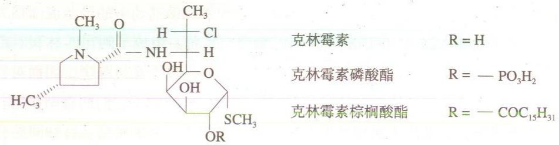  
图 2-22 克林霉素分子结构修饰

药物化学结构修饰的方法有很多，主要根据药物结构中存在的活性基团进行适当的修饰。常用的修饰方法有：酯化、酰胺化、成盐修饰等。酯化和酰胺化修饰是药物化学结构修饰中最常用的修饰方法，主要用于含有羟基、羧酸基、氨基等基团药物的修饰。分子中含羟基或羧基的药物，可选择成酯修饰的方法。羟基成酯后常可延长药物的半衰期，增加脂溶性，提高生物利用度。羧基成酯后可降低药物的极性，减少对胃肠道及皮肤的刺激性，改善生物利用度。含氨基药物常常被修饰成酰胺。成酰胺修饰后，可增加药物的化学稳定性，降低毒副作用，延长药物作用时间。具有酸、碱性的药物，可以转变成适当形式的盐。下面再介绍两种药物分子的结构修饰。

## (1) 阿司匹林

阿司匹林是第一个人工合成的药物。阿司匹林又称乙酰水杨酸，化学名为2-乙酰氧基苯甲酸，是一种常用的解热、抗炎药物。早在公元前3000年，人们发现柳树皮具有解热镇痛功效。1838年，意大利化学家拉菲勒·皮里亚以柳树皮为原料制得水杨酸。但是水杨酸酸性很强，对人的肠胃有刺激性。1897年，德国化学家费利克斯·霍夫曼将水杨酸的羟基乙酰化，成功合成乙酰水杨酸这一“明星药物”。通过结构修饰获得的阿司匹林仍然具有药用功效，但是胃肠道反应却大大降低。

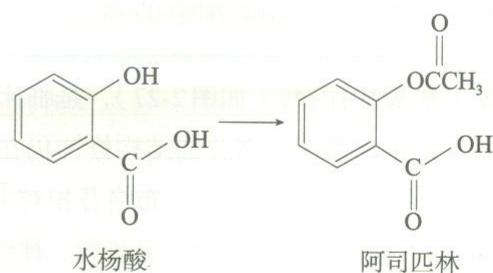  
图 2-23 水杨酸的结构改造

阿司匹林具有抗血栓及抗炎等多种药理活性，近年来发现阿司匹林还具有抗肿瘤等其他活性。但该药若长期或大剂量使用可以诱发并加重溃疡病，甚至导致胃出血，因此对其进行了一系列结构修饰，以寻找疗效更好、毒副作用更小的衍生物。例如，将其制成盐、酯、酰胺等。目前应用于临床的主要有赖氨匹林、阿司匹林铝、乙氧苯酰胺等（如图2-24）。经过结构改造后的药物均在不同程度上减缓了对胃肠道的刺激，而解热、镇痛、抗炎和抗风湿的作用却明显增强。

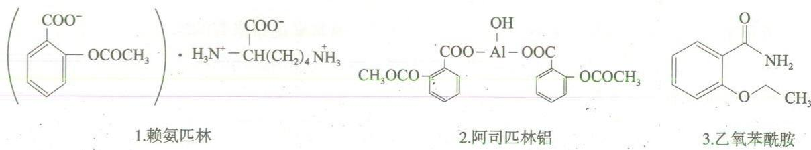  
图 2-24 化合物 1\~3 的结构式

将阿司匹林的羧基与对乙酰氨基酚（扑热息痛，一种解热镇痛药）的羟基成酯得到一种新型解热镇痛药贝诺酯（如图2-25）。贝诺酯在体内因酯键而水解，生成了阿司匹林和对乙酰氨基酚并发挥各自的疗效，同时还具有协同作用。由于其体内分解部位不在胃肠道，因而对胃肠道的刺激作用得以大大减轻，既保留了原有药物的解热镇痛功能，又减少了它们的毒副作用。该药适用于儿童和老年患者使用，主要用于风湿性关节炎及其他发热所引起的疼痛。

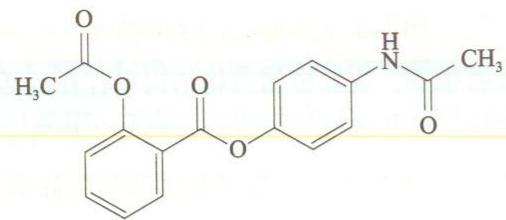  
图2-25 贝诺酯

药物的给药方式会影响药物的疗效。制备能够缓慢释放药物成分的缓释性长效药品在治疗中是非常需要的。将阿司匹林与聚甲基丙烯酸借助乙二醇嫁接起来可以合成长效缓释阿司匹林（如图2-26）。该药在肠胃中缓慢释放出有效成分，能够减少对肠胃的刺激；有利于保证血液或组织中的药物浓度相对稳定，保证药物安全性和有效性，同时降低毒副作用；可减少每天吃药次数，大大方便了人们对药物的使用。

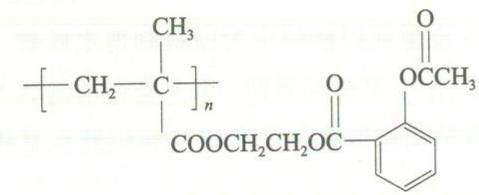  
图 2-26 长效缓释阿司匹林

## (2) 布洛芬

布洛芬的化学名为2-(4-异丁基苯基)丙酸（如图2-27），是临床上广泛应用的一种非甾体抗炎药，有超过50年的使用历史。近年来基于布洛芬的结构修饰仍在进行，以求获得活性更高的化合物或解决其存在的不良反应。许多临床研究显示，布洛芬相对于其他类型的退热药物，退热效果好、不良反应少且能缩短病程，被广泛应用于治疗关节炎、神经炎、强制性脊髓炎及一般的解热镇痛。布洛芬虽然具有良好的安全性，但长期使用仍会引起胃肠黏膜的刺激、溃疡以及肾功能损害等不良反应。

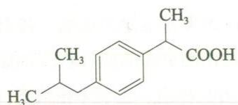  
图 2-27 布洛芬的结构

近年来，许多研究着眼于发展布洛芬前药的开发。通常来说布洛芬的酯或酰胺衍生物更有利于被转运到达活性部位，然后被酶分解成活性药物。由于其代谢途径的改进，这类化合物的胃部不良反应有所降低。

① 酯化 通过烷基链将四乙酰化的核黄素和布洛芬相连，可以合成一系列具有抗肿瘤活

性的布洛芬酯衍生物（如图2-28中的化合物1）。

② 酰胺化 布洛芬与杂环胺形成的酰胺衍生物（如图2-28中的化合物2），研究表明其具有比布洛芬更好的镇痛和抗炎活性。

③羧基的改造 将布洛芬与具有免疫调节活性的药效基团苯并咪唑和2-氨基苯并咪唑偶联，可以合成同时具有抗炎和免疫调节活性的新化合物（如图2-28中的化合物3）。

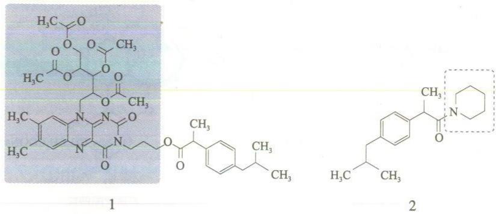  
图 2-28 结构修饰后的化合物结构式

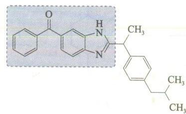  
3

## 12. 以药物分子结构修饰为主题的 2 例习题

为了更好地了解分子结构修饰对物质性质的影响，了解结构研究与利用物质性质进行药物改良的作用，可以以药物分子结构修饰为主题设计一些习题。下面根据学生的已有知识和能力基础，选取青蒿素、阿司匹林等药物分子结构修饰的发展史作为习题设计的背景素材，设计了2例习题。

习题 1：疟疾是危害严重的世界性流行病。20世纪70年代，我国药学家屠呦呦受东晋葛洪典籍《肘后备急方》启发，从植物黄花蒿叶中成功提取出青蒿素。此后屠呦呦等科学家又对青蒿素的结构进行改良，合成出药效更佳的双氢青蒿素、青蒿琥酯钠盐等（如图2-29）。2015年10月8日，屠呦呦获得诺贝尔生理学或医学奖。请完成下列空白。

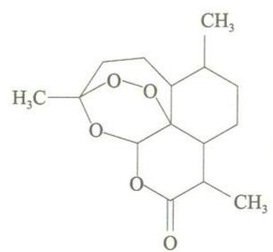  
青蒿素

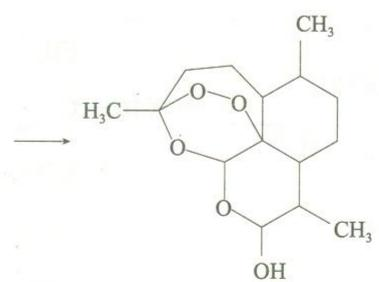  
双氢青蒿素

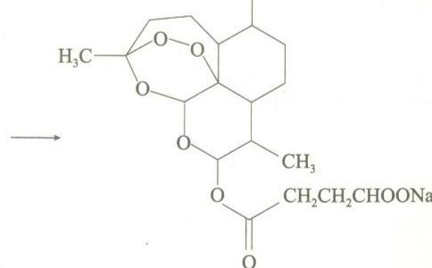  
青蒿琥酯钠盐  
图 2-29 青蒿素的结构改良

(1) 1977年我国科学家确定了青蒿素的结构。请思考以黄花蒿叶为原料，研究确定青蒿素结构的基本步骤为：\_\_\_\_→\_\_\_\_→\_\_\_\_→\_\_\_\_。

(2) 在研究青蒿素在人体内的代谢及作用机制时, 科学家发现双氢青蒿素是青蒿素在人体内的代谢产物, 其抗疟疾的作用是青蒿素的 $4 \sim 8$ 倍, 具有安全、高效、低毒等优点, 双氢青蒿素成为抗疟疾的一种新药被开发使用。2011年屠呦呦因青蒿素和双氢青蒿素的贡献, 获得被誉为

青蒿琥酯钠盐

诺贝尔奖风向标的拉斯克奖。青蒿素转化为双氢青蒿素的反应类型是（ ）。A. 加成反应 B. 氧化反应 C. 还原反应 D. 取代反应 E. 消去反应

(3) 临床使用过程中发现, 双氢青蒿素的水溶性和油溶性都较差, 半衰期短, 导致生物利用率低和抗疟疾复燃率高, 在一定程度上限制了其临床应用。科学工作者采用下列方法对其结构进行修饰 (如图 2-30), 合成出水溶性良好的青蒿琥酯钠盐:

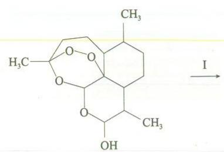  
双氢青蒿素

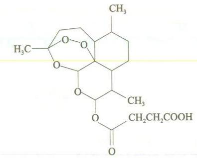

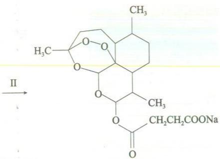  
图 2-30 双氢青蒿素的结构修饰

①经步骤Ⅰ，将双氢青蒿素转化为青蒿琥酯，反应所需试剂和条件是\_\_\_\_。
步骤Ⅱ将青蒿琥酯转化为钠盐，下列试剂合理的是\_\_\_\_。
A. Na    B. NaOH    C. $NaHCO_{3}$ D. $Na_{2}CO_{3}$

请解释青蒿琥酯钠盐比双氢青蒿素水溶性强的原因\_\_\_\_。

② 将双氢青蒿素转化为油溶性强的药剂，可以制成针剂，对抢救危重疟疾患者非常有利。请设想要增强双氢青蒿素的油溶性，可针对双氢青蒿素分子中的何种基团，通过什么类型的反应，与何种类别的试剂反应，才能达到目的。

习题2：早在公元前3000年，人们发现柳树皮具有解热镇痛功效。1838年意大利化学家拉菲勒·皮里亚以柳树皮为原料制得水杨酸，此后科学家对水杨酸的结构进行一系列改造，合成出疗效更佳的长效缓释阿司匹林（如图2-31）。其开发过程蕴含着重要的思想方法，请完成下列空白。

水杨酸  
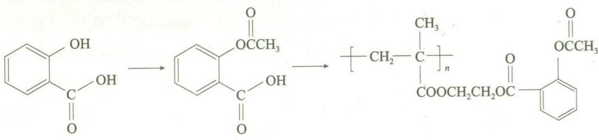  
阿司匹林  
长效缓释阿司匹林  
图 2-31 水杨酸的结构改造

(1) 水杨酸的结构与性质

① 水杨酸中含氧官能团的名称是\_\_\_\_、\_\_\_\_。

② 请根据水杨酸的结构，分析其可能具有的化学性质，完成表1。

表1 依据水杨酸的结构分析性质

<table><tr><td>水杨酸分子中的官能团</td><td>可能发生的反应类型</td><td>反应试剂</td><td>官能团的转化</td></tr><tr><td></td><td></td><td></td><td></td></tr></table>

(2) 水杨酸的合成（如图 2-32）

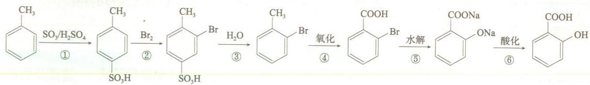  
图2-32 水杨酸合成路线

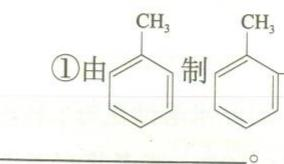

-Br不采取甲苯与Br2直接反应，而是经过步骤①\~③，目的是\_\_\_\_

②步骤④～⑥的顺序能否改为水解、酸化、氧化？请说明理由\_\_\_\_。

（3）水杨酸分子结构修饰

水杨酸具有解热镇痛的功效，但是其酸性很强，对人的肠胃有刺激性，容易引发胃溃疡，1897年德国化学家菲利克斯·霍夫曼对水杨酸的结构进行改造合成出阿司匹林。水杨酸的酸性主要来源于—COOH，将—OH转化为—OCOCH₃，可以使—COOH的酸性大大降低。科学家的这一设计思路依据的原理是\_\_\_\_。

(4) 阿司匹林与另一个解热镇痛药对乙酰氨基酚利用拼合的方法得到一种新药贝诺酯, 口服后在胃肠道不被水解, 避免了对胃肠道的刺激作用。贝诺酯以原形吸收, 吸收后很快代谢为水杨酸和对乙酰氨基酚, 2 种药物同时发挥作用, 且作用时间较阿司匹林和对乙酰氨基酚长。

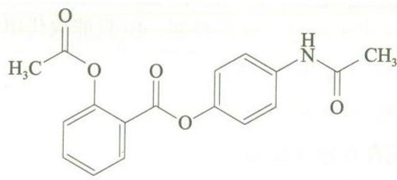  
贝诺酯

请写出阿司匹林转变为贝诺酯反应的化学方程式：\_\_\_\_。

（5）药物的给药方式会影响药物的疗效。一般的给药方式，使人体内的药物浓度只能维持较短的时间，血液或组织中的药物浓度上下波动较大，有时超过病人的药物最高耐受剂量，有时又低于有效剂量，这样不但起不到应有的疗效，而且还可能产生副作用。频繁的小剂量给药可以调节血药浓度，避免上述现象，但往往使患者难以接受，实施起来有很多困难。因此，制备能够缓慢释放药物成分的缓释性长效药品在治疗中是非常需要的。此后科研工作者将阿司匹林与聚甲基丙烯酸借助乙二醇嫁接起来，研制出长效缓释阿司匹林，在肠胃中缓慢释放出有效成分，不仅能够减少对肠胃的刺激，而且有利于保证血液或组织中的药物浓度相对稳定，并且可减少每天吃药次数，大大方便了人们对药物的使用。

(1) 请解释长效缓释阿司匹林的缓释原理是什么?

(2) 已知: $\mathrm{R}-\mathrm{C}-\mathrm{R}' \xrightarrow[\text{② } \mathrm{H}^{+}/\mathrm{H}_{2}\mathrm{O}]{\text{① HCN}} \mathrm{R}-\mathrm{C}-\mathrm{R}'$ (R、 $\mathrm{R}'$ 为烃基或氢原子)。

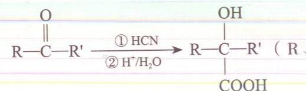

请以丙烯、乙烯、阿司匹林及其他试剂为原料，设计合成长效缓释阿司匹林的路线。

附：习题参考答案

习题1：

（1）分离提纯 $\rightarrow$ 元素定量分析确定实验式 $\rightarrow$ 测定相对分子质量确定分子式 $\rightarrow$ 波谱分析确定结构式

(2) A、C

(3)①试剂： $HOOCCH_{2}CH_{2}COOH$ ；条件：浓硫酸，加热 C、D

② 青蒿琥酯钠盐中含有—COONa，比双氢青蒿素中—OH的极性强，因此水溶性更好；利用双氢青蒿素中的羟基可与醇类发生取代反应成醚的性质，将—OH转化为—OR，或者将羟基与一元羧酸酯化，达到增强油溶性的目的。

习题2：

(1)①羟基、羧基；

②

<table><tr><td>水杨酸分子中的官能团</td><td>可能发生的反应类型</td><td>反应试剂</td><td>官能团的转化</td></tr><tr><td>羟基</td><td>中和</td><td>NaOH</td><td>酚羟基转化为钠盐</td></tr><tr><td>羧基</td><td>中和</td><td>NaOH</td><td>羧基转化为钠盐</td></tr><tr><td>羧基</td><td>取代(酯化)</td><td>醇</td><td>羧基转化为酯基</td></tr></table>

(2)①利用— $\mathrm{SO}_{3} \mathrm{H}$ 占据甲基的对位, 达到控制—Br 只能取代甲基邻位的目的, 若直接与 $\mathrm{Br}_{2}$ 反应将导致甲基的邻、对位均可发生取代反应。

②不能，因为酚羟基易被高锰酸钾氧化。

(3) 有机物分子中基团间存在相互影响。

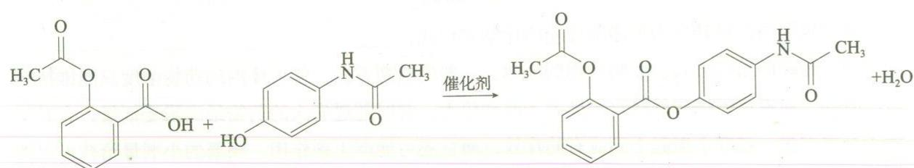

(5) ① 首先高聚物载体中结合了足量的阿司匹林分子, 保证人体所需阿司匹林的总量。其次阿司匹林通过水解反应被释放出来, 水解反应是一种可逆反应, 阿司匹林一旦被消耗, 水解平衡发生移动, 可保持阿司匹林的浓度相对稳定。从而达到长效、缓释的作用。

②长效缓释阿司匹林的合成路线：

$$
\mathrm{CH} _ {2} = \mathrm{CH} _ {2} \xrightarrow {\mathrm{Br} _ {2}} \mathrm{CH} _ {2} \mathrm{BrCH} _ {2} \mathrm{Br} \xrightarrow {\mathrm{NaOH/H} _ {2} \mathrm{O}} \mathrm{CH} _ {2} \mathrm{OHCH} _ {2} \mathrm{OH}
$$

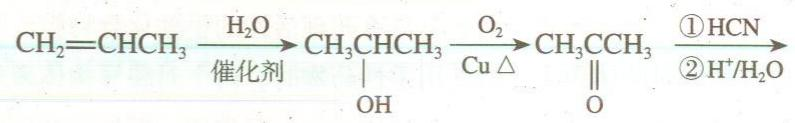

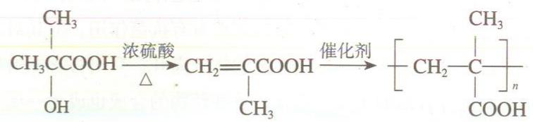

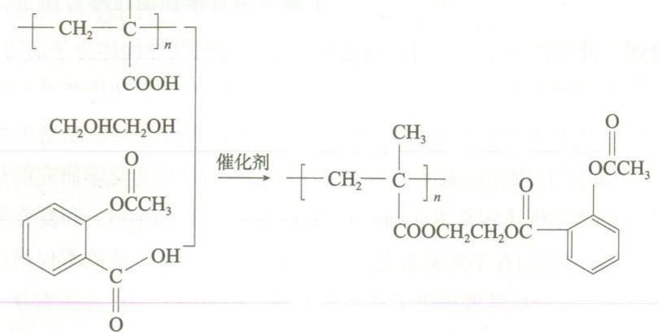

（摘选自徐敏，刘春生，以药物分子结构修饰为主题设计习题发展学生核心素养，化学教育（中英文），2019年第40卷第9期：57-61）

## 13. 手性及手性合成

自然界中手性是很普遍的现象，许多天然产物和人体内的活性分子都是手性分子。例如，作为生命活动重要基础的生物大分子，如蛋白质、多糖、核酸等几乎都是手性的；存在人体内用于合成蛋白质的氨基酸仅有20种，这20种氨基酸中，除了甘氨酸（R=H）外，其他均有手性（如图2-33）。在机体的代谢和调控过程中所涉及的物质（如酶和细胞表面的受体）一般也都具有手性，在生命过程中发生的各种生物——化学反应过程均与手性的识别和变化有关。从分子水平来看，手性是人类赖以生存的自然界的本质属性之一。

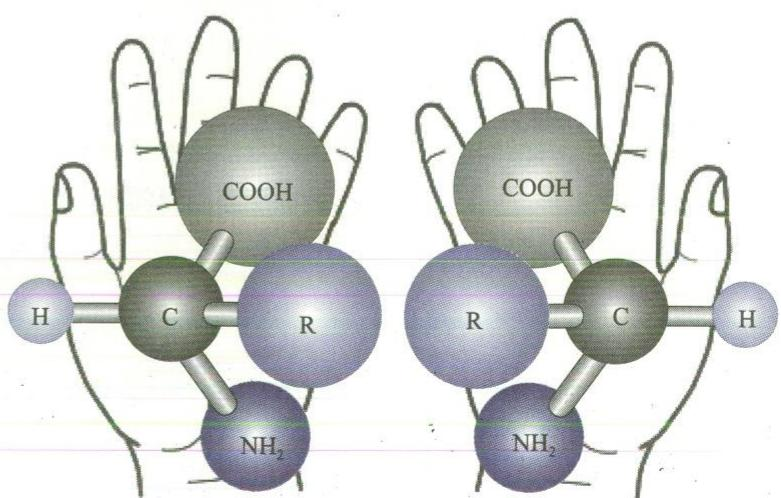  
图 2-33 构成蛋白质的基本单元——氨基酸的手性模型

手性药物是指药物的分子结构中存在手性因素，而且由具有药理活性的手性化合物组成的药物，其中只含有效对映体或者以有效的对映体为主。当使用手性药物时，两个对映异构体表现出来的生物活性往往是不同的，甚至是截然相反的，即一个异构体对疾病起作用，而另一个异构体却疗效甚微，或不起作用，甚至可能有毒副作用。例如，左旋的氯霉素有抗菌作用，但其对映体则无疗效。因此，各国纷纷规定，生产手性药物必须要把手性异构体分离开，只出售含能治病的那种手性异构体的药物。手性药物受到世界各国的关注和重视，手性药物的合成也成为一项迫切的研究任务，手性合成为药物生产带来巨大的经济效益。

手性化合物的获取方法有多种，手性合成是其中之一。手性合成是指利用化学反应进行合成，只得到一种或者主要只得到一种手性分子，不得到或者基本上不得到其异构体分子的方法。在采用手性合成（即不对称合成）方法获得手性化合物的反应中，不对称催化又是获得手性化合物的最有效方法之一，是手性合成技术中最为成熟的技术。一个催化剂分子可以制造出数以百万计的预期的手性产物分子，因此手性催化的效率很高。手性催化反应已成为化学研究的热点和前沿，2001年诺贝尔化学奖授予诺尔斯（W.S. Knowles）、野依良治（R. Noyori）和夏普莱斯（K.B. Sharpless）三位科学家，以奖励他们在不对称催化合成领域的巨大贡献。他们不仅推动了手性催化合成的研究，为这一领域的进一步发展提供了重要的工具，还帮助人们深入探索分子世界中的未知领域，从而促进化学、材料科学、生物学和药学的更快发展。

## 教学案例

## 第二节 分子的空间结构（第一课时）

——价层电子对互斥模型

南京外国语学校 陈静

## 教学目标

1. 知道分子的结构可以借助某些现代仪器和方法来测定，能说明红外光谱等实验手段在物质结构研究中的作用。

2. 了解共价分子具有特定的空间结构，体会分子结构的多样性和复杂性，能描述常见简单分子的空间结构。

3. 通过搭建分子结构模型直观认识分子的空间结构，建立价层电子对互斥的认知模型，能运用价层电子对互斥模型预测简单分子的空间结构。

4. 通过实物模型向理论模型的转化，从宏观和微观相结合的视角分析分子的空间结构，体会价层电子对互斥模型的价值与局限。

## 教学重点和难点

重点：应用价层电子对互斥模型预测简单分子的空间结构。

难点：确定中心原子上的价层电子对数。

## 教学流程

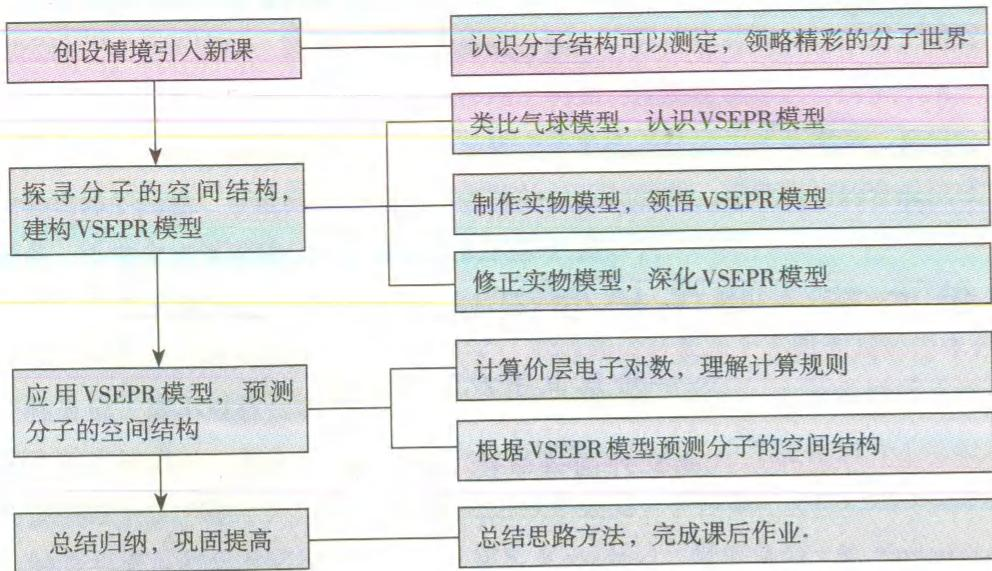

## 教学过程

教学环节一：创设情境，引入新课

<table><tr><td>教师活动</td><td>学生活动</td><td>设计意图</td></tr><tr><td>【图片】2015年,中国科学家屠呦呦获得了诺贝尔奖。青蒿素是从中国传统药物青蒿中提取的抗疟药物。如何测定青蒿素的分子结构呢?【讲解】科学家们已经创造了许多测定分子结构的现代仪器和方法。介绍红外光谱的功能和作用。</td><td>【汇报】课前查阅资料,汇报青蒿素分子结构的测定方法。【思考】分析某未知物的红外光谱图,初步推测该未知物含有的化学键或官能团。</td><td>体会现代仪器和方法在测定青蒿素分子结构中的价值。了解红外光谱在物质结构研究中的作用。</td></tr><tr><td>【展示】 $NH_3$ 、 $CH_2O$ 、 $CH_4$ 、 $P_4$ 、 $C_{60}$ 、 $S_8$ 、 $SF_6$ 等分子的球棍模型。【过渡】为什么分子会呈现不同的空间结构?如何预测分子的空间结构?</td><td>【观察】感知分子结构的多样性和复杂性。</td><td>领略异彩纷呈的分子世界,直观认识分子的空间结构。</td></tr></table>

教学环节二：探寻分子的空间结构，建构VSEPR模型

<table><tr><td>教师活动</td><td>学生活动</td><td>设计意图</td></tr><tr><td>【提问】为什么 $CH_4$ 呈正四面体形?【演示气球模型实验】将4个相同大小的气球系在一起,气球自动排列成正四面体形。</td><td>【讨论交流】预期结论:气球相互排斥,彼此尽可能远离; $CH_4$ 呈正四面体形的空间结构最稳定。</td><td>用宏观气球类比微观电子,启发思考。</td></tr></table>

续表

<table><tr><td>教师活动</td><td>学生活动</td><td>设计意图</td></tr><tr><td>【布置任务一】请变换不同的气球个数,用教师演示的方法搭建气球模型;类比气球模型,初步认识价层电子对互斥模型(VSEPR模型)。【提问】为什么 $NH_3$ 的空间结构不是平面三角形,而是三角锥形?【讲解】梳理学生结论,理解VSEPR模型:分子的空间结构是中心原子周围的“价层电子对”相互排斥的结果。【展示多媒体动画】展示含有孤电子对的分子的VSEPR模型,预测分子的空间结构(以 $NH_3$ 为例)。【布置任务二】请利用橡皮泥和牙签制作 $CH_4$ 和 $NH_3$ 的空间结构模型。【提问】观察制作的空间结构模型, $CH_4$ 和 $NH_3$ 的键角相同吗? $CH_4$ 和 $NH_3$ 的实测键角分别为109°28′、107°,为什么二者并不相同?【布置任务三】请根据 $CH_4$ 和 $NH_3$ 的键角数据,修正它们的空间结构模型;运用相似的方法预测 $H_2O$ 的键角大小,制作 $H_2O$ 的空间结构模型。【过渡】如何根据VSEPR模型预测其他分子的空间结构?</td><td>【小组合作】搭建气球模型。【讨论交流】预期结论: $NH_3$ 的中心原子上有1个孤电子对。【观察】略去VSEPR模型中的中心原子上的孤电子对,便得到分子空间结构。【小组合作】制作分子的空间结构模型。【讨论交流】预期结论: $NH_3$ 的中心原子上的孤电子对有较大斥力,因此 $NH_3$ 的键角小于 $CH_4$ 的键角。【小组合作】修正 $CH_4$ 和 $NH_3$ 的空间结构模型,制作 $H_2O$ 的空间结构模型。</td><td>运用类比的方法,帮助学生初步认识VSEPR模型。形成认知冲突,引发进一步思考。借助视频,将抽象问题形象化。借助实物模型,促进学生对VSEPR模型的理解和认识。讨论键角变化的原因,准确预测分子的空间结构。及时反馈评价,体验逐步完善理论模型的过程。</td></tr></table>

教学环节三：应用VSEPR模型，预测分子的空间结构

<table><tr><td>教师活动</td><td>学生活动</td><td>设计意图</td></tr><tr><td>【讲解】确定分子中的中心原子上的价层电子对数是关键,其方法为:价层电子对数=σ键电子对数+中心原子上的孤电子对数。其中:σ键电子对数可由化学式确定;中心原子上的孤电子对数=1/2(a-xb)。</td><td></td><td></td></tr><tr><td>解释公式中a、x、b的含义。【提问】如何确定中心原子的价电子数和与中心原子结合的原子最多能接受的电子数?(结合教材中的“思考与讨论”内容)</td><td>【思考】根据主族元素在周期表中的位置,确定S和P的价电子数以及N和Cl最多能接受的电子数。【练习】计算 $CO_{2}$ 、 $BF_{3}$ 、 $SO_{2}$ 、 $NH_{4}^{+}$ 、 $CO_{3}^{2-}$ 的σ键电子对数、孤电子对数和价层电子对数。</td><td>结合主族元素在周期表中的位置确定中心原子上的孤电子对数,以突破难点;巩固价层电子对数计算方法的理解和应用。</td></tr><tr><td>【布置任务四】请根据计算结果确定VSEPR模型,再应用VSEPR模型预测 $CO_{2}$ 、 $BF_{3}$ 、 $SO_{2}$ 、 $NH_{4}^{+}$ 、 $CO_{3}^{2-}$ 的空间结构。</td><td>【小组合作】应用VSEPR模型预测简单分子或离子的空间结构,进一步用表格形式进行分类、归纳。</td><td>在应用中掌握预测简单分子或离子的空间结构的方法。</td></tr></table>

教学环节四：总结归纳，巩固提高

<table><tr><td>教师活动</td><td>学生活动</td><td>设计意图</td></tr><tr><td>【提问】通过本节课的学习,你能总结一下如何应用VSEPR模型预测分子的空间结构吗?</td><td>【总结】步骤:识别中心原子→计算价层电子对数→确定VSEPR模型→略去孤电子对→得到分子或离子的空间结构。</td><td>总结预测分子的空间结构的思路和方法,提升学生的化学知识结构化水平。</td></tr><tr><td>【布置作业】VSEPR模型非常简洁地预测许多分子的空间结构,但它也有局限,如不能用于预测以过渡金属为中心原子的分子。请收集20世纪科学家在物质结构探索方面的有关资料。</td><td>完成课后作业。</td><td>体会人类对物质结构的认识是不断发展的。</td></tr></table>

## 板书设计

第二节 分子的空间结构（第一课时）
——价层电子对互斥模型

一、分子结构 $\xleftarrow{测定}$ 现代仪器和方法

## 二、应用VSEPR模型预测分子的空间结构

步骤：

<table><tr><td rowspan="2">“识”中心原子</td><td>→“算”价层电子对数</td><td rowspan="2">→“定”VSEPR模型</td><td rowspan="2">→“略”孤电子对“得”分子的空间结构</td></tr><tr><td>孤电子 σ键电子对数 子对数</td></tr></table>

## 第三节 分子结构与物质的性质（第一课时）

# 南京市雨花台中学 邱荣

## 教学目标

1. 知道共价键的极性及其对分子极性的影响；能判断共价键的极性、极性分子和非极性分子。

2. 通过键的极性对有机羧酸酸性强弱影响的探析，了解依据结构推测分子性质的方法，形成“结构决定性质”的认知模型。

## 教学重点和难点

重点：判断分子的极性。

难点：用分子结构的知识解释和判断物质的性质。

## 教学过程

教学环节一：共价键的极性及其对物质化学性质的影响

<table><tr><td>教师活动</td><td>学生活动</td><td>设计意图</td></tr><tr><td>【回顾】一、共价键(一)本质:原子之间形成共用电子对(二)分类1.从原子轨道重叠方式—σ键和π键(1)σ键:是指成键两原子的原子轨道沿键轴(形成化学键的两原子核的连线)方向“头碰头”重叠形成的共价键。(2)π键:是指成键两原子的原子轨道“肩并肩”重叠形成的共价键。</td><td></td><td></td></tr><tr><td rowspan="5">2.从共用电子对是否偏移——极性共价键和非极性共价键【讲解】极性共价键即两个键合原子,一个呈正电性(δ+),一个呈负电性(δ-),电子对发生偏移。(如下图)氯化氢分子中的极性共价键【讲解】非极性共价键即电子对不发生偏移的共价键(三)键的极性对物质化学性质的影响【提出问题】根据分子结构特点分析下表,你能得出什么规律,为什么?</td><td rowspan="5">小结:极性键和非极性键的异同。</td><td></td></tr><tr><td></td></tr><tr><td></td></tr><tr><td></td></tr><tr><td></td></tr></table>

续表

<table><tr><td colspan="2">教师活动</td><td>学生活动</td><td>设计意图</td></tr><tr><td colspan="2">不同羧酸的 $pK_a$ </td><td rowspan="10"></td><td rowspan="10">分析,掌握影响有机羧酸酸性强弱的因素,使学生学会应用所学知识解决问题的能力。</td></tr><tr><td>羧酸</td><td> $pK_a$ </td></tr><tr><td>丙酸( $C_2H_5COOH$ )</td><td>4.88</td></tr><tr><td>乙酸( $CH_3COOH$ )</td><td>4.76</td></tr><tr><td>甲酸(HCOOH)</td><td>3.75</td></tr><tr><td>氯乙酸( $CH_2ClCOOH$ )</td><td>2.86</td></tr><tr><td>二氯乙酸( $CHCl_2COOH$ )</td><td>1.29</td></tr><tr><td>三氯乙酸( $CCl_3COOH$ )</td><td>0.65</td></tr><tr><td>三氟乙酸( $CF_3COOH$ )</td><td>0.23</td></tr><tr><td colspan="2">【师生讨论】分析物质酸性强弱的原因。O||Cl←CH2←C←O←H</td></tr></table>

<table><tr><td>教师活动</td><td>学生活动</td><td>设计意图</td></tr><tr><td>二、分子的极性(一)分类【讲解】(学生讨论后)非极性分子:如果分子中的键都是非极性的,共用电子对不偏向任何一个原子,这样的分子叫做非极性分子。极性分子:以极性键结合的双原子分子中共用电子对偏向某原子,使分子一端相对地显负电性,另一端相对地显正电性,这样的分子叫做极性分子。</td><td>思考与讨论:(回答下列问题)1.以下双原子分子中,哪些是极性分子,哪些是非极性分子? $H_2$   $O_2$   $Cl_2$   $HCl$   $CO$ 2. $P_4$ 和 $C_{60}$ 是极性分子还是非极性分子?</td><td>在学生的思考与讨论的基础上开展教学活动。</td></tr></table>

<table><tr><td>教师活动</td><td colspan="4">学生活动</td><td>设计意图</td></tr><tr><td>结论:以非极性键结合的多原子分子一般是非极性分子。【讲解】(拓展) $O_3$ 是极性分子。</td><td colspan="4"></td><td></td></tr><tr><td rowspan="8">(二)判断分子的极性的方法【讲解】(师生共同讨论并完成表格后)1.正负电荷中心是否重合凡正、负电荷中心能重合的分子称非极性分子,如 $CO_2$ 。O=C=O</td><td colspan="4">讨论并完成下列表格:</td><td rowspan="8">通过讨论,使学生掌握判断分子的极性的方法。</td></tr><tr><td>分子类型</td><td>实例</td><td>分子模型</td><td>空间结构(名称)分子极性</td></tr><tr><td>双原子分子</td><td>HCl、CO</td><td></td><td>直线形极性</td></tr><tr><td rowspan="2">三原子分子</td><td> $CO_2$ 、 $CS_2$ </td><td></td><td>直线形极性</td></tr><tr><td> $H_2O$ 、 $H_2S$ </td><td></td><td>角形(V形)极性</td></tr><tr><td rowspan="2">四原子分子</td><td> $BF_3$ </td><td></td><td>平面正三角形非极性</td></tr><tr><td> $NH_3$ </td><td>[XBYC]</td><td>三角锥形极性</td></tr><tr><td>五原子分子</td><td> $CH_4$ </td><td></td><td>正四面体形非极性</td></tr><tr><td>凡正、负电荷中心不能重合的分子称极性分子,如 $H_2O$ 。2.化学键极性的向量和【讲解】(结合结构式)C=O是极性键,但从分子总体而言 $CO_2$ 是直线型分子,两个C=O是对称排列的,两键的极性互相抵消,所以整个分子没有极性,电荷分布均匀,是非极性分子。</td><td colspan="4"></td><td></td></tr></table>

续表

## 续表

<table><tr><td colspan="2">教师活动</td><td>学生活动</td><td>设计意图</td></tr><tr><td rowspan="2"></td><td>CH3</td><td></td><td></td></tr><tr><td>→</td><td></td><td></td></tr><tr><td colspan="2">青蒿素双氢青蒿素由于双氢青蒿素的水溶性和油溶性均较差、半衰期短,临床使用过程中导致生物利用率低和抗疟疾复燃率高,一定程度上影响了其临床应用。科学家采用下列方法对其结构进行修饰(见下图),合成出水溶性良好的青蒿琥酯钠盐。</td><td></td><td></td></tr><tr><td></td><td>→</td><td>聆听、阅读、思考、讨论。</td><td>通过阅读,提高学生的自学能力,了解物质性质及转化关系的思路方法,了解分子结构修饰的有关知识,认识化学的学科价值,增强学生学好化学造福人类的信念。</td></tr><tr><td>双氢青蒿素</td><td>青蒿琥酯</td><td></td><td></td></tr><tr><td colspan="2">→青蒿琥酯钠盐【思考与讨论】1.为什么青蒿琥酯钠盐比双氢青蒿素水溶性强?2.将青蒿琥酯转化为钠盐,可以选择的合理试剂是什么?</td><td></td><td></td></tr><tr><td colspan="2">【讲解】(学生阅读材料后)分子结构修饰在药物设计与合成中有广泛的应用。为提高药物的治疗效果,降低毒副作用等,可将药物分子结构进行修饰。对药物分子结构进行修饰的目的:1改善药物的溶解性;2降低药物的毒副作用;3改善药物的吸收;等等。</td><td></td><td></td></tr><tr><td colspan="2">【布置作业】</td><td></td><td></td></tr></table>

## 第三章

课程标准对配合物与超分子的要求不是很高。对配合物的要求：知道配位键的特点，认识简单的配位化合物的成键特征，了解配位化合物的存在与应用；而对超分子的要求：了解从原子、分子、超分子等不同尺度认识物质结构的意义。因此，教材没有单独地设置一章来介绍配合物与超分子，而是作为一节内容编排在本章的最后一节。教材以实验的方式引出问题，从解释实验现象的变化出发，阐述了配位键和配位化合物等内容。而对超分子的介绍是通过典型例子阐述了超分子的重要特征。

本章的内容结构如下图所示。

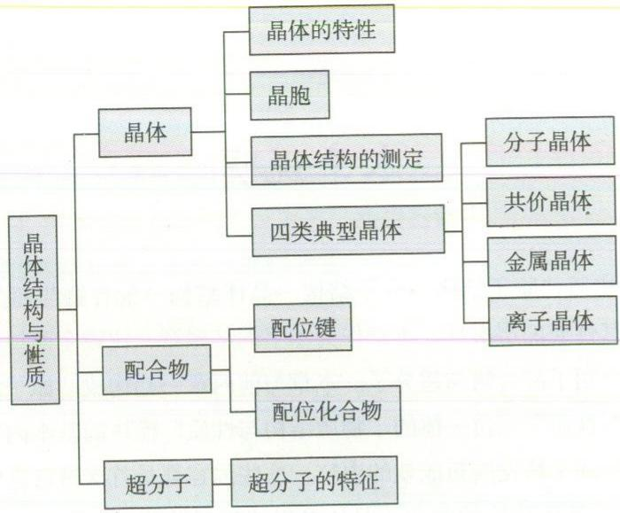

## 二、学业要求

1. 能说出晶体与非晶体的区别；能结合实例描述晶体中粒子排列的周期性规律；能计算晶胞中所含的粒子数。

2. 能借助分子晶体、共价晶体、离子晶体、金属晶体等模型说明晶体中的粒子及其粒子间的相互作用。能举例说明过渡晶体和混合型晶体是普遍存在的。

3. 能说出配位键的特征；能运用配位键解释配合物的某些典型性质；能举例说明配合物在生物、化学等领域的广泛应用。

4. 能举例说明物质在原子、分子、超分子、聚集态等不同尺度上的结构特点对物质性质的影响。

## 三、课时建议

第一节 物质的聚集状态与晶体的常识 3课时

第二节 分子晶体与共价晶体 3课时第三节 金属晶体与离子晶体  
第四节 配合物与超分子  
实验活动 简单配合物的形成  
全章复习

## 第一节 物质的聚集状态与晶体的常识

## 一、内容分析

本节主要内容包括物质的聚集状态、晶体、晶胞和晶体结构的测定四部分（如下图所示）。

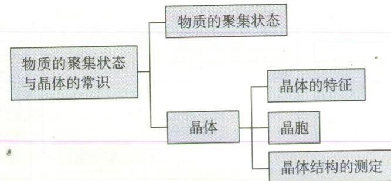

关于物质的聚集状态，这部分内容是首次新增进中学化学教材的内容，教材从大家熟悉的物质三态出发，认为在物质的三态相互转化过程中只是分子间距离发生了变化，而实际上固态、液态和气态物质不一定都由分子构成，教材通过列举具体例子的方式，提出了更多的物质聚集状态，如等离子体、离子液体、晶态和非晶态等。教材还通过“科学·技术·社会”介绍了等离子体和液晶，让学生进一步认识更多的物质聚集状态，知道物质的聚集状态会影响物质的性质。

关于晶体，教材从实验室常见的固体和日常生活中常见的物质入手，引出固体有晶体和非晶体之分，进而介绍晶体与非晶体的本质差异，还以天然水晶球的玛瑙和水晶为例，通过实物照片进一步呈现了晶体与非晶体的不同。为了进一步对晶体有更多的感性认识，教材介绍了得到晶体的三条途径，并安排了得到晶体的实验，通过实验让学生用肉眼看到晶体外形。在介绍晶体的性质时，介绍了晶体的许多物理性质会表现出各向异性，但教材没编排实验，教学时可以安排晶体导热性的各向异性实验。

晶胞是描述晶体结构的基本单元，是研究晶体结构的最基本概念。教材利用图片、比喻等方式介绍了晶胞的概念及特点，并以计算铜晶胞中所含铜原子数为例，介绍了晶胞中所含的粒子数的计算方法，包括晶胞的顶角、棱和面上所含粒子数的计算方法；再结合“思考与讨论”，进一步巩固晶胞中所含粒子数的计算方法。教材在这部分内容的最后还设置了一个探究，要求学生自主查阅资料并撰写小论文，以拓展学生关于晶体认识的视野。

关于晶体结构的测定。这部分内容是首次新增进中学化学教材的内容，教材定性地描述了通过X射线衍射实验对晶体结构进行测定的思路，并以乙酸晶体为例，通过晶体X射线衍射实验，能够得到晶体的晶胞和乙酸分子的空间结构。这部分内容通过图片的方式，让学生感性知道结构分析技术（X射线衍射仪，以及通过该仪器获得的图谱），即教材结合课文内容给出了如下系列图片：①X射线衍射仪照片→②通过X射线衍射仪获得的衍射图谱→③（经过计算，从衍射图谱中获得有关信息）得到的分子的晶胞和分子的空间结构图示。通过学习这部分内容，让学生形成“分子是有空间结构的，分子的空间结构是可以通过实验测定的”的认识。

## 二、教学目标

## 1. 教学目标

（1）能说出包含“固、液、气”在内的更多的物质聚集状态。

（2）能说出晶体和非晶体的区别，了解获得晶体的一般途径。

（3）了解晶体中粒子的空间排布存在周期性，认识简单的晶胞，能计算简单晶胞中粒子的数目。

（4）知道X射线衍射实验是测定晶体结构的常用方法。

## 2. 教学重点和难点

重点：晶体与非晶体的差异，晶体的自范性、各向异性，结晶的方法。

难点：对晶胞的认识。

## 三、教学建议

## 1. 关于晶体与非晶体的教学

从教材 “晶体与非晶体” 正文的第一句话 “走进化学实验室” 引课，走进探究晶体与非晶体的情境之中，挖掘课本素材背后的新意，展示实验室里的一些常见固体，体现宏微结合。创新在于从宏观（肉眼可见）到微观（电子显微镜）的过程中，发现各种颜色掩盖之下，晶体形态的异同，从而引出晶体结构。

关于自范性的教学，以硫酸铜为线索且贯穿始终，从实物到实验，从自然界到实验室。自范性是晶体能自发地呈现多面体外形的性质，晶体表现出自范性是有一定条件的。例如，晶体的生长速率要适当，并以教材中的天然水晶球里的玛瑙和水晶的形成为例帮助学生理解，同时感受地质学中的化学。

对于制备晶体的三条途径，即熔融态物质凝固、气态物质冷却不经液态直接凝固（凝华）和溶质从溶液中析出。教材中的图3-5给出了相应的硫、碘、硫酸铜的晶体，而从教材中的实验3-1可以得到前两幅图片的晶体，但没有安排实验得到硫酸铜晶体。因此，教学设计时可以增加制备硫酸铜晶体的实验，并设计成以下三种方式：①硫酸铜溶液蒸发结晶；②硫酸铜溶液蒸发浓缩，冷却结晶；③向饱和的硫酸铜溶液中加入晶种结晶（兴趣小组课前完成，课堂展示）。

## 教学方案参考

阅读与观察：阅读教材中的“走进化学实验室，你能见到许多固体，如蜡状的白磷（ $\mathrm{P}_{4}$ ）、黄色的硫黄（ $\mathrm{S}_{8}$ ）、紫黑色的碘（ $\mathrm{I}_{2}$ ）和高锰酸钾（ $\mathrm{KMnO}_{4}$ ）、蓝色的硫酸铜（ $\mathrm{CuSO}_{4} \cdot 5 \mathrm{H}_{2} \mathrm{O}$ ）、白色的碳酸钙等。”（阅读完成后，教师展示相关物质的图片与实物）学生由远及近观察。

讨论交流：除了颜色各异外，上述各种固体的形态有何异同？为什么碘是片状，而高锰酸钾、硫黄却是柱状？它们的形状是怎样形成的？

小结：规则的几何外形是晶体的特征之一，这几种固体都是晶体，另外几种固体是非晶体。晶体能自发地呈现多面体外形的性质，称为晶体的自范性，而非晶体没有自范性。

学生实验：硫酸铜结晶实验

①硫酸铜溶液蒸发结晶。说明凝固速率过快，常常只得到看不到多面体外形的、大小不一的粉末。

②硫酸铜溶液蒸发浓缩，冷却结晶。

③向饱和的硫酸铜溶液中加入晶种结晶（兴趣小组课前完成，课堂展示）。

实验②③说明结晶速率逐渐变慢，晶体颗粒变大，最终获得多面体外形的晶体。

提出问题：除上述方法外，得到晶体有还有哪些途径呢？

讨论与实验: (讨论完后) 完成【实验3-1】。

归纳总结：得到晶体一般有三条途径：①熔融态物质凝固；②气态物质冷却不经液态直接凝固（凝华）；③溶质从溶液中析出。

## 2. 关于晶胞的教学

对晶胞的教学，要重点帮助学生理解晶胞的特征。整块晶体可以看作是数量巨大的晶胞“无隙并置”而成，所谓“无隙”，是指相邻晶胞之间没有任何间隙；所谓“并置”，是指所有晶胞都是平行排列的，取向相同。晶胞是8个顶角相同、三套各4根平行棱分别相同、三套各两个平行面分别相同的最小平行六面体。可以结合一些具体例子，如结合如图3-1所示进一步理解晶胞。

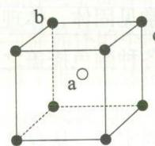  
A

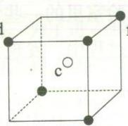  
B

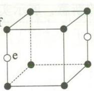  
C

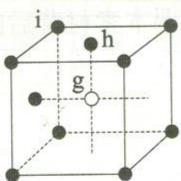  
D  
图 3-1 晶胞图解

A图中的晶体结构满足晶胞的特点，是晶胞。B图中的晶体结构，不满足晶胞“8个顶角相同”的要求，无法进行“无隙并置”，不是晶胞。C图中的晶体结构，不满足晶胞“三套各4根平行棱分别相同”的要求，无法进行“无隙并置”，不是晶胞。D图中的晶体结构，不满足“三套各两个平行面分别相同”的要求，无法进行“无隙并置”，不是晶胞。

晶胞只是晶体微观空间里的一个基本单元，在它的上下左右前后无隙并置地排列着无数晶胞，而且所有晶胞的形状及内部的原子种类、个数及几何排列均完全相同。在一个平行六面体的晶胞中：晶胞顶角的原子为8个晶胞所共用，晶胞棱上的原子为4个晶胞所共用，晶胞面上的原子为2个晶胞所共用，晶胞内的原子为1个晶胞单独所用。因此，一个晶胞平均占有的原子数=晶胞顶角的原子数× $\frac{1}{8}$ +晶胞棱上的原子数× $\frac{1}{4}$ +晶胞面上的原子数× $\frac{1}{2}$ +晶胞体内的原子数×1，如下图所示。

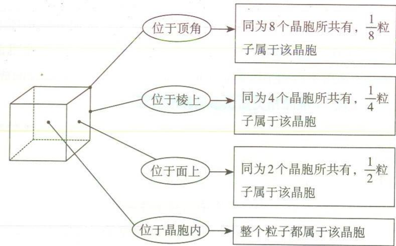

## 教学方案参考

模型引入：出示一个苹果（或者橡皮泥捏成的球）代表一个原子，然后将其不断切割，依次讲解晶胞体内、面上、棱上、顶角上的原子被晶胞所占用。

实例讲解：以教材中的图3-8铜晶胞为例计算晶胞中的原子数。

模型展示：展示如图3-2所以的NaCl晶胞的实物模型。

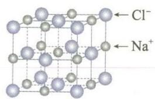  
图 3-2 NaCl 晶胞

讨论交流：结合教材中的图3-10，对比图中原子与直观的NaCl晶胞模型的对应关系，讨论不同位置的原子的切分方法。

学生演示：计算NaCl晶胞含有钠原子和氯原子个数。

分组讨论：分4组分别计算教材中的图3-11所示的钠、锌、碘、金刚石晶胞中的原子个数。

## 四、栏目使用建议

## 1. 实验

【实验3-1】

(1) 硫黄粉末用量不宜太少, 加热时间不宜过长, 硫熔融即可停止加热, 以防硫燃烧。

（2）表面皿的大小要合适，以减少碘蒸气逸出，也可用烧瓶代替。提示该实验是分离碘的方法之一。

(3) 虽然NaCl易溶于水, 但在饱和溶液中也存在沉淀溶解平衡。滴入浓盐酸, 使平衡发生

移动，有利于NaCl析出。

## 2. 探究

学生利用互联网查阅资料，写一篇有关“准晶”的小论文。可采用学生小组分工合作的方式在互联网查阅资料，回答教材上列举的5个问题，其中第一个问题“什么是准晶？”是必答题，后面4个问题有选择性，突出不同的小组侧重不同方向的探究。最后把探究的成果除写成小论文外，还需在课堂上汇报交流。（准晶相关知识参见教学资源）

## 3. 思考与讨论

## 【思考与讨论1】

1. 晶体与非晶体的根本区别在于构成固体中的粒子在微观空间里是否呈现周期性的有序排列。观察教科书中的图3-7玻璃的结构示意图，构成玻璃的粒子无周期性的排列，是无序的，所以玻璃是非晶体。

2. 利用晶体与非晶体的性质差异来鉴别玻璃和宝石。宝石是晶体，具有固定的熔点和各向异性，可用硬度、熔点、折光率等性质来鉴别宝石。

（1）可观察宝石的形状，具有多面体的外形；测试它的硬度，可在玻璃上刻画出痕迹，初步确定它是晶体；

(2) 可利用宝石的折光率鉴别;

（3）可进行X射线衍射实验鉴别。

【思考与讨论2】

（1）晶胞有三套平行棱，三套平行面。

(2) 钠: 2个, 锌: 2个, 碘: 8个, 碳: 8个。

## 五、练习与应用参考答案及说明

1. C 2. B 3. C 4. A  
5. (1) × (2) × (3) √ (4) × (5) × (6) √

6. 晶体中粒子在三维空间里呈周期性有序排列，非晶体中粒子的排列则相对无序。

8.(1)6 (2)氧、钙、钛的粒子个数比是3:1:1
9.2

## 第二节 分子晶体和共价晶体

## 一、内容分析

本节内容主要包括分子晶体和共价晶体两部分。

第一部分内容介绍分子晶体。在这部分内容中，主要介绍了两个问题：一是分子晶体的特性；二是分子晶体的结构特征。在分子晶体中，由于分子间作用力比化学键弱得多，因此，分子晶体具有低熔点、硬度小等特性。教材以表格的方式列举了某些分子晶体的熔点，进一步感知分子晶体的低熔点特性。紧接着，教材介绍了分子晶体的结构特征，在阐述分子晶体的结构特征时，分两种情况，即分子晶体中分子间作用力主要是氢键（当然也存在范德华力）和只是范德华力两种情况。教材以冰为例，介绍了冰晶体里由于存在氢键而使冰晶体具有其特殊性，即由于氢键具有方向性，使冰中一个水分子周围只有4个紧邻分子；以干冰为例，介绍了如果分子晶体中分子间作用力只是范德华力时，分子晶体具有分子密堆积特征，即干冰中一个 $CO_{2}$ 周围有12个紧邻分子。教学时可结合如图3-3所示的方法，帮助学生理解周围的12个紧邻分子。若考察图中的顶角粒子（图a中的“0”号），晶胞中与该粒子距离最近且相等的是其所在三个面心的粒子（图a中的“1”～“3”号），由于晶胞是无隙并置的，可发现三个相互垂直的平面中各有4个粒子（图b）与该粒子距离最近且相等，因此共12个紧邻的粒子。

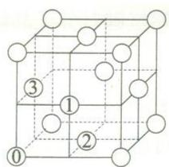  
a

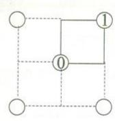

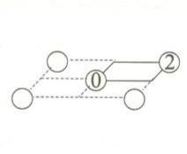  
b

  
图 3-3 分子密堆积的晶胞

第二部分内容介绍共价晶体。在这部分内容中，也主要介绍了两个问题：一是共价晶体的结构特征；二是共价晶体的特性。教材以生活中比较熟悉的金刚石为例，通过图示的方式，介绍了金刚石晶体的结构特征，即每个碳原子以4个共价单键对称地与相邻的4个碳原子结合而形成三维骨架结构。在金刚石的晶胞中，8个碳原子位于立方体的顶点，6个碳原子位于立方体的面心，4个碳原子位于立方体内，因此，一个金刚石的晶胞中含有8个碳原子。由于共价键的键能较大，因此，高硬度、高熔点是许多有共价键三维骨架结构的共价晶体的特性。除金刚石外，教材还介绍了另一种典型的共价晶体 $SiO_{2}$ ，它有多种结构，只介绍了顶角相连的硅氧四面体形成螺旋上升的长链结构。教材还通过“思考与讨论”的方式，让学生运用有关共价晶体的知识解释一些相关问题。另外，本节还设置了“资料卡片”和“科学·技术·社会”两个栏目，以拓展学生视野。

## 二、教学目标

## 1. 教学目标

(1) 知道分子晶体的结构特点, 能借助分子晶体模型说明分子晶体中的粒子及粒子间的相互作用, 以及范德华力与氢键对分子晶体结构与性质的影响。

（2）知道共价晶体的结构特点，认识金刚石晶体中碳原子的三维骨架结构，能借助共价晶体模型说明共价晶体中粒子间的相互作用。

（3）能结合具体实例，说出分子晶体、共价晶体的粒子间相互作用与其性质（熔点、硬度等）的关系。

## 2. 教学重点和难点

重点：分子晶体、共价晶体的结构特点与性质之间的关系，氢键对分子晶体结构与性质的影响。

难点：分子晶体、共价晶体的结构特点，氢键对冰的结构和性质的影响。

## 三、教学建议

## 1. 关于分子晶体的教学

关于分子晶体的教学需要解决两个难点问题：一是如何理解氢键对分子晶体结构的影响，二是分子间只存在范德华力时分子晶体结构的特点。

如何理解氢键对分子晶体结构的影响是本节的难点，可以利用物理现象（如冰浮于水上而干冰沉于水中）和物理性质（如冰、干冰和水的密度），使学生对冰和干冰在物理性质上的差异有所认识，并结合氢键和分子间作用力的区别尝试进行解释。干冰和冰的晶体结构特点是分子晶体结构中的普遍性和特殊性，由于冰中氢键的方向性决定了冰晶体的结构特点有其特殊性。氢键的作用力大于分子间的范德华力，所以冰和干冰的性质存在差异。关于如何数出并理解干冰中的每个 $CO_{2}$ 周围有12个紧邻分子，也是教学难点，可以结合如图3-3所示的方法帮助学生理解。

## 教学方案参考

创设问题情境：讨论雪花、冰糖、食盐、水晶和电木这些固体是否属于晶体？若不是晶体，请说明理由。

交流讨论：雪花、冰糖、食盐、水晶都是晶体；电木（酚醛树脂）不属于晶体，它是高分子聚合物，没有固定的熔点、沸点。

模型展示：展示 $I_{2}$ 、 $CO_{2}$ 的分子结构模型，让学生认真观察，找出两种分子晶体模型中的共同点。（或者使用多媒体课件进行演示）

提出问题：在教科书的表3-2中，水的相对分子质量小于硫化氢的相对分子质量，为什么水的熔点却高于硫化氢的熔点呢？

阅读讨论：引导学生阅读教科书的相关内容，组织学习小组进行交流讨论，然后进行全班的交流讨论。

归纳总结：明确分子间作用力对物质的状态的影响，知道氢键的存在对物质性质的影响，认识到哪些晶体是分子晶体。

评价反馈：描述 $\mathrm{CO}_{2}$ 的分子结构特点，对比冰和干冰的物理性质不同，说明氢键的存在对物质结构与性质的影响。

## 2. 关于共价晶体的教学

在金刚石教学环节，要从碳原子的结构特点出发，即金刚石中的C采取 $sp^{3}$ 杂化轨道形成共价键来理解金刚石的三维骨架结构，并结合金刚石的实物结构模型或多媒体课件，让学生感受金刚石的三维骨架结构。 $SiO_{2}$ 是另一种典型的共价晶体，可要求学生注意从分子晶体和共价晶体的不同点加以分析，组织学生认识共价晶体和分子晶体的区别。

哪些晶体是共价晶体呢？可以碳为中心，在元素周期表上进行发散思维，同族向下的硅、锗、灰锡，以及同周期向左的硼，向右的氮（可考虑补充高聚氮）等单质都是共价晶体。由这些元素组成的化合物也为共价晶体，如碳化硅（SiC，俗称金刚砂）、 $\mathrm{Si}_{3}\mathrm{N}_{4}$ 等。近年来以 $\mathrm{Si}_{3}\mathrm{N}_{4}$ 为基础，用Al取代部分Si，用O取代部分N而获得结构多样化的陶瓷，用于制作LED发光材料。

## 教学方案参考

提出问题：碳元素和硅元素处于元素周期表中同一主族，为什么 $\mathrm{CO}_{2}$ 晶体的熔点很低，而 $\mathrm{SiO}_2$ 晶体的熔点很高？

回忆复习：回忆 $\mathrm{CO}_{2}$ 的分子晶体结构特点，复述分子晶体的构成粒子和分子间的相互作用。

模型展示：展示金刚石晶体的结构模型，认真对比共价晶体和分子晶体在晶体结构上的不同点。

模型探究：分小组探究 $CO_{2}$ 和金刚石的晶体模型的特点，从各自的视角观察两种晶体在结构上的差异。

交流讨论: 固态 $\mathrm{CO}_{2}$ 是分子晶体, $\mathrm{CO}_{2}$ 之间存在分子间作用力, 这种分子间作用力很弱, 较容易破坏它使晶体变成液体或气体, 故 $\mathrm{CO}_{2}$ 晶体的熔点很低。 $\mathrm{SiO}_{2}$ 是共价晶体, 晶体中不存在 $\mathrm{SiO}_{2}$ 分子, 每一个硅原子和4个氧原子形成4个共价键, 每一个氧原子和2个硅原子结合。由于晶体是由硅原子和氧原子按 $1:2$ 的比例通过共价键结合形成的共价晶体, 破坏这些共价键需要很高的能量, 故 $\mathrm{SiO}_{2}$ 晶体的熔点很高。

问题总结：明确形成共价晶体的粒子及粒子间的相互作用是什么？认识哪些晶体是共价晶体？

评价反馈：组织学生利用“思考与讨论”进行交流。

## 四、栏目使用建议

## 思考与讨论

【思考与讨论1】

(1) 冰晶体中水分子间存在氢键, 由于氢键具有方向性, 这迫使在四面体中心的每个水分子与四面体顶角方向的4个相邻水分子形成氢键, 因此, 冰中一个水分子周围只有4个紧邻分子。而硫化氢分子之间没有氢键, 只有范德华力, 范德华力无饱和性与方向性, 能够形成分子密堆积, 因此, 一个硫化氢分子周围有12个紧邻分子。

## 【思考与讨论2】

（1）在金刚石、硅和锗中，每个原子均以 $\mathrm{sp}^3$ 杂化轨道与相邻的4个原子形成 $\sigma$ 键，整体上形成三维骨架结构，同属于共价晶体，熔点和硬度都较高。但金刚石、硅和锗的结构差别在于C、Si、Ge原子半径依次递增，C—C、Si—Si、Ge—Ge的键长依次递增，键长越大，键能越小，所以熔点和硬度依次降低。

(2) 此说法不对。“具有共价键”并不是判断共价晶体的唯一条件, 分子晶体除了单原子分子之外, 如 $\mathrm{H}_{2} \mathrm{O} 、 \mathrm{CO}_{2}$ 等大多数分子中也有共价键, 很多离子晶体, 如 $\mathrm{NH}_{4} \mathrm{Cl} 、 \mathrm{NaOH} 、 \mathrm{KNO}_{3}$ 等, 在阴阳离子的内部也含有共价键。共价晶体除具有共价键外, 还要求形成晶体的粒子是原子, 共价晶体的微观空间里没有分子。

## 五、练习与应用参考答案及说明

1. B 
2. B 
3. B 
4. C

5. 构成分子晶体的粒子是分子，通过分子间作用力（范德华力或氢键）结合成晶体。构成共价晶体的粒子是原子，通过共价键结合成晶体。

6. 冰中含有共价键，它们存在于水分子内部的氢氧原子之间，而冰是由水分子间通过氢键（主要）和范德华力（次要）形成的晶体，而分子间的作用力不是化学键，因此冰是分子晶体，不是共价晶体。

7. 共价晶体：金刚石、石英、金刚砂（SiC）。

分子晶体：干冰、冰、可燃冰、硫黄、 $C_{60}$ 、碘、白磷（ $P_{4}$ ）、苯甲酸、稀有气体的晶体、氧气的晶体、氮气的晶体。

8. 124 冰晶体中存在氢键，氢键具有方向性，这迫使在四面体中心的每个水分子与四面体顶角方向的4个相邻水分子形成氢键，其配位数为4。而在干冰晶体中， $\mathrm{CO}_{2}$ 之间没有氢键，只有范德华力，其分子是密堆的，配位数为12。

9. 建议两种方法: (1) 从一个碳原子出发, 连接4个碳原子, 然后每个碳原子再不断连接下去, 注意其中的六原子环; (2) 从一个金刚石晶胞立方体框架出发, 然后搭建晶胞内部结构。

## 第三节 金属晶体与离子晶体

## 一、内容分析

本节内容主要包括金属晶体、离子晶体、过渡晶体与混合型晶体三部分。

第一部分内容介绍金属晶体。教材只是简单地描述了金属晶体的结构——就好像很多硬球一层一层很紧密地堆积，每一个金属原子的周围有较多相同的原子围绕着。重点阐述了金属键的本质，运用“电子气理论”解释了金属键的本质，以及金属晶体的性质，如金属键的强弱对熔点和硬度的影响、金属的延展性、金属的导电性等。

第二部分内容介绍离子晶体。由于学生已学过离子键的概念，教材直接给出了NaCl和CsCl两种典型离子晶体的晶胞，以及根据离子间存在着较强的离子键，介绍了NaCl和CsCl具有较高的熔点和沸点。值得说明的是，多年来教材中对离子晶体的一般特性都有一概括性的描述，常描述为：“一般地说，离子晶体具有较大的硬度、较高的熔点和沸点。”而事实并非如此，如存在很多熔点较低的离子晶体。因此，教材对离子晶体性质不再有个概括性的描述，而是采取分述的方式，如“在NaCl和CsCl晶体中，离子间存在着较强的离子键，使离子晶体的硬度较大，难于压缩；而且，要使它们由固态变成液态或气态，需要较多的能量破坏这些较强的离子键。因此，NaCl和CsCl具有较高的熔点和沸点。”为了进一步让学生认识离子晶体的熔点差异，教材设置了“思考与讨论”栏目，让学生自己去查找一些离子晶体的熔点，比较这些离子晶体熔点的差异，从而总结归纳出离子晶体的熔点差异。教材还设置了“科学·技术·社会”来拓展学生对离子液体的认识。

第三部分内容介绍过渡晶体与混合型晶体。过渡晶体是首次引入中学教材的新增内容，要求学生知道过渡晶体是普遍存在的，这类晶体是介于典型晶体之间的晶体。例如，晶体中的化学键既不是纯粹的离子键，也不是纯粹的共价键，这些晶体既不是纯粹的离子晶体也不是纯粹的共价晶体，它们是介于离子晶体与共价晶体之间的过渡晶体。对于混合型晶体，要求学生知道混合型晶体是普遍存在的。教材以石墨作为混合型晶体的例子，详细介绍了石墨的结构特点和性质。最后，设置了“资料卡片”和“科学·技术·社会”以拓展学生视野，还设置“研究与实践”，要求学生自制明矾晶体。

至此，教材介绍了分子晶体、共价晶体、金属晶体和离子晶体四类典型晶体，并简介了过渡晶体和混合型晶体，教学时可以通过表格的方式对它们进行总结和比较。

## 二、教学目标

## 1. 教学目标

(1) 知道金属晶体的结构特点, 能借助金属晶体模型说明金属晶体中的粒子及其粒子间的相互作用, 能从微观的视角来解释金属晶体的导电性、导热性、延展性等宏观性质。

(2) 知道离子键的特点, 能以 $\mathrm{NaCl}$ 和 $\mathrm{CsCl}$ 为例解释典型离子化合物的某些性质, 并能举例说明不同离子晶体的熔点差异。

(3) 知道介于典型晶体之间的过渡晶体及混合型晶体是普遍存在的。

（4）知道晶体中粒子间的各种相互作用力，比较四类典型晶体的构成粒子、粒子间的相互作用与物质性质的关系。

## 2. 教学重点和难点

重点：金属晶体的结构特点与性质之间的关系，运用电子气理论解释金属性质。

难点：金属晶体、过渡晶体和混合型晶体的结构特点和性质。

## 三、教学建议

## 1. 关于金属晶体的教学

在日常生活中学生见到过很多金属制品，教学时可以展示一些常见的金属，如铁、铜、铝、镁、锌等，引导学生总结出金属的通性（具有金属光泽、导电性、导热性、延展性等）。然后提出一系列驱动性问题，例如，为什么金属会有一些共同的性质？为什么金属的物理性质与分子晶体、共价晶体的性质有非常明显的区别？金属晶体的结构与分子晶体、共价晶体的结构有什么差异？等等。让学生深入思考，激发他们对金属晶体结构的猜想。

从金属原子结构的视角去认识金属键的本质。金属原子的价电子比较少，有易失去价电子的性质。在金属晶体中，每个金属原子都有机会失去价电子成为金属阳离子，每个阳离子都有机会结合价电子成为金属原子，这些价电子被许多原子或离子所共有，从而把所有的金属原子维系在一起。围绕“电子气”模型，分小组讨论金属具有导电性、导热性和延展性的原因，进一步加深结构决定性质的化学观念。

## 教学方案参考

创设问题情境: (1) 展示一些常见的金属; (2) 师生共同总结金属的物理通性提出问题: 为什么金属会有一些共同的性质? 为什么金属的物理性质与分子晶体、共价晶体的性质有非常明显的区别? 金属晶体的结构与分子晶体、共价晶体的结构有什么差异呢?

分析探究: (1) 用多媒体课件展示金属晶体的电子气理论示意图; (2) 引导学生从金属原子结构的特点认识金属键的本质。讨论: 金属晶体中的原子是怎样结合在一起的? 金属原子之间能否形成稳定的共价键或离子键?

总结归纳：（引导学生应用金属键理论解释金属的物理通性；鼓励学生大胆猜想，积极发表

自己的意见）在总结讨论的基础上，归纳金属键的本质。

反馈应用：引导学生应用金属键理论解释金属的通性。提出下列一些问题让学生讨论解决：

(1) 构成金属晶体的粒子有哪些? (2) 金属导电与电解质在熔融状态下导电、电解质溶液导电有什么不同? (3) 金属在导热过程中粒子的运动情况如何? 热量是通过什么方式传递的? (4) 金属在受到外力时为什么不易断裂? 其晶体结构是如何变化的?

## 2. 关于离子晶体的教学

教材直接给出氯化钠和氯化铯的晶胞，教学时可以利用教材中图3-30的图示，帮助学生掌握离子晶体中的粒子位置，以及粒子和粒子间作用力的特点，利用结构特点，推测离子晶体的一些性质及其差异。由于离子间存在着较强的离子键，使NaCl和CsCl的硬度较大，具有较高的熔点和沸点。

氯化钠是学生日常生活中真实接触的物质，可以让学生通过生活中的一些实例来概括它的一些性质。可以通过对比 $CO_{2}$ 、金刚石、NaCl的晶体结构模型或演示多媒体课件，观察并对比三种晶体模型的各自特点，把分子晶体、共价晶体与离子晶体列表进行对比。为了开阔学生的思路，可以让学生观察硫酸铜晶体结构图，从中发现离子晶体中同时还存在共价键和氢键。

## 教学方案参考

学生活动：让学生揉捏食盐晶体，感受NaCl晶体硬度较大，难以压缩的特点。列举生活中的一些常见现象，如烧烤、爆炒等加入食盐，都未见其熔融，说明其熔点较高。

交流讨论：为什么食盐的熔点较高呢？学生结合教材中图3-30的NaCl的晶胞，在讨论中认识NaCl晶体中存在较强的离子键。

回顾比较：回顾计算NaCl晶胞中含有的 $\mathrm{Na}^{+}$ 、 $\mathrm{Cl}^{-}$ 的个数，然后，呈现CsCl晶胞图，要求学生计算晶胞中 $\mathrm{Cs}^{+}$ 、 $\mathrm{Cl}^{-}$ 的个数。学生由半径因素推测NaCl和CsCl的熔点高低，理解离子键的强弱对物质性质的影响。

模型展示：展示 $CO_{2}$ 、金刚石、NaCl 的晶体结构模型或演示多媒体课件，对比三种晶体模型的各自特点。

分组讨论：分小组讨论三种晶体模型的各自特点，进行小组内交流，形成小组观点，以表格形式对比分子晶体、共价晶体和离子晶体，并进行全班交流。

知识拓展: 复杂的离子晶体, 有的离子不是单原子离子, 如 $\mathrm{CaCO}_{3} 、 \mathrm{K}_{2} \mathrm{SO}_{4} 、 (\mathrm{NH}_{4})_{2} \mathrm{SO}_{4}$ ; 有的还存在电中性分子, 如 $\mathrm{CuSO}_{4} \cdot 5 \mathrm{H}_{2} \mathrm{O}$ (如图 3-4), 除了离子键, 硫酸铜晶体中还有配位键 (后续将学习)、共价键和氢键。

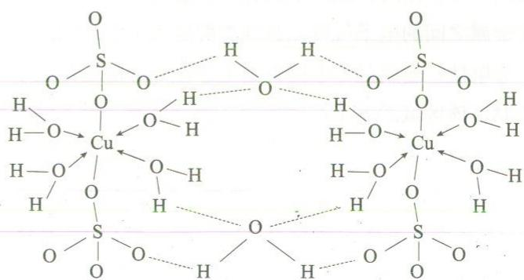  
图 3-4 硫酸铜晶体结构示意（箭头表示配位键）

## 四、栏目使用建议

## 1. 思考与讨论

下表是部分离子化合物的熔点，从表中数据可知，离子晶体的熔点差异也较大。

<table><tr><td>化合物</td><td>熔点/°C</td><td>化合物</td><td>熔点/°C</td></tr><tr><td>CaO</td><td>2613</td><td>Na2SO4</td><td>884</td></tr><tr><td>CuCl2</td><td>1326</td><td>Ca2SiO4</td><td>2130</td></tr><tr><td>NH4NO3</td><td>169.6</td><td>Na3PO4</td><td>340</td></tr><tr><td>BaSO4</td><td>1580</td><td>CH3COOCs</td><td>194</td></tr><tr><td>LiPF6</td><td>200(分解温度)</td><td>NaNO2</td><td>270</td></tr></table>

## 2. 研究与实践

## 【明矾晶体的制备】

结果与讨论: (1) 能得到明矾晶体, 但要得到完美的明矾晶体是比较困难的。颜色: 无色透明; 外形: 块状, 有平滑的晶面与棱角。

(2) 仪器用蒸馏水洗净, 是防止杂质影响结晶的纯度, 也会影响结晶的速率与形状。晶种悬挂在溶液中央位置, 有利于离子对称地扩散、溶解与结晶, 有利于获得外形对称性较好的晶体。离杯底太近, 会与沉底晶体生长在一起, 离液面太近或者杯壁太近, 也会造成同样结果, 使晶体形状不规则。

（3）可通过互联网查阅相关资料并制订实验方案。

## 五、练习与应用参考答案及说明

1. C 
2. B 
3. B 
4. D 
5. C

6. 电子气理论把金属键表述为金属原子脱落下来的价电子形成遍布整块晶体的“电子气”，被所有金属原子共用，从而把所有的金属原子维系在一起。

延展性：当金属受到外力作用时，晶体中的各原子层就会发生相对滑动，但不会改变原来的排列方式，而且弥漫在金属之间的电子气可以起到类似轴承中滚珠间的润滑剂作用，所以大多数金属有良好的延展性。导电性：金属晶体中的自由电子在外加电场作用下可发生定向移动。导热性：当金属某部分受热时，该区域的电子运动加剧，通过碰撞，电子将能量传递给金属原子或离子，这样能量从温度高的区域传递到温度低的区域，因此金属具有导热性。

7. 过渡晶体是介于四类典型晶体之间的过渡型。如第3周期元素最高价氧化物的晶体: $\mathrm{Na}_{2} \mathrm{O} 、 \mathrm{MgO} 、 \mathrm{Al}_{2} \mathrm{O}_{3} 、 \mathrm{SiO}_{2}$ 从离子晶体向共价晶体的过渡; 而 $\mathrm{SiO}_{2} 、 \mathrm{P}_{2} \mathrm{O}_{5} 、 \mathrm{SO}_{3} 、 \mathrm{Cl}_{2} \mathrm{O}_{7}$ 从共价晶体向分子晶体过渡。过渡晶体有所偏向, $\mathrm{Na}_{2} \mathrm{O} 、 \mathrm{MgO}$ 通常被当作离子晶体来处理, $\mathrm{Al}_{2} \mathrm{O}_{3} 、 \mathrm{SiO}_{2}$ 被当作共价晶体，而 $P_{2}O_{5}$ 、 $SO_{3}$ 、 $Cl_{2}O_{7}$ 就都是分子晶体了。

混合型晶体：以石墨为例，每一层的二维结构是平面六元并环，是“巨分子”，层内只有牢固的共价键类似共价晶体，熔点很高。电子可在层内运动，又类似金属晶体，导电性好。层与层之间只靠范德华力维系，类似分子晶体，硬度小，电子不能在平面间跳跃，其导电性只能沿石墨平面的方向。石墨晶体中既有共价键，又有类似金属键的作用力，还有范德华力，不能归属于任何一种典型晶体。

8. 离子晶体：氯化铯、氯酸钾、高锰酸钾。分子晶体：苯酚、水。共价晶体：石英、金刚砂。金属晶体：铁。

9. 离子晶体和共价晶体的晶体类型不同，使它们的性质存在很大差异。在离子晶体中，构成晶体的粒子是阴、阳离子，阴、阳离子间通过离子键相互作用；而在共价晶体中，构成晶体的粒子是原子，原子间以较强的共价键相互作用，而且形成空间网状结构。因此，属于离子晶体的食盐的摩氏硬度和属于共价晶体的石英的摩氏硬度存在很大差异。

## 10. +1

11. 热袋装的是 $CH_{3}COONa$ 的过饱和溶液和金属小圆片。放热原理：当一片金属放在这个过饱和溶液里面，并扭动里面的金属片所产生的轻微震动，便足以使溶质结晶，直至全部结晶完成，变成较稳定的固体。这个结晶过程是放热的过程，从而使“热袋”放出热量。过饱和溶液可循环使用。只要把袋子放入沸水中加热约几分钟，凝结了的溶质便会再次溶解；这是由于在高温下，溶质的可溶性增加。在溶解的过程中，溶质进行吸热反应，再次成为过饱和溶液。

# 第四节 配合物与超分子

## 一、内容分析

本节内容主要包括配合物与超分子两部分。

第一部分内容是配合物。教材通过四个实验中的具体配合化合物，介绍了配位键及其特点、配位化合物的概念。第一个实验以同学熟悉的呈蓝色的四水合铜离子为例，介绍了铜离子与水分子之间的化学键是由水分子提供孤电子对给予铜离子，即 $H_{2}O$ 中的O提供孤电子对给予 $Cu^{2+}$ ，从而形成“电子对给予—接受”的配位键。教材通过这个例子，介绍了配位键的形成条件及特征，以及配合物的概念，对于配合物的结构没有出现内界和外界的概念，教学时可以适当介绍配合物的结构。在书写配离子的结构时，以前习惯使用“→”来表示配位键，教材已改用的是“—”来表示配位键。教材在第一个实验现象的基础上介绍了配位键和配合物的相关知识后，又安排了三个实验，在这三个实验中出现了不同的实验现象，这些实验现象都与配合物有关，要求学生运用相关的配合物知识进行解释。第二个实验介绍了四氨合铜离子， $NH_{3}$ 中的N提供孤电子对给予 $Cu^{2+}$ ；第三个实验是检验 $Fe^{3+}$ 的实验，在必修课程中已做过这个实验，这里从反应原理的视角对该实验现象作了解释，即三价铁离子跟硫氰酸根离子（ $SCN^{-}$ ）形成了配离子，但教材没提供反应的化学方程式，这是由于随 $SCN^{-}$ 的浓度不同，会生成不同的配离子；第四个实验介绍了 $[Ag(NH_{3})_{2}]^{+}$ 配离子，通过该实验，让学生认识到难溶的白色AgCl沉淀，形成配离子后得到了澄清的无色溶液。通过这个实验也让学生对难溶物有个重新认识。紧接着，教材介绍了配合物跟人类生活、生产和科学技术等方面的密切联系和应用。

教材的第二部分内容是超分子。超分子是首次引入中学教材的新增内容，但要求不高。超分子是由两种或两种以上的分子通过分子间相互作用形成的分子聚集体，至于这种分子聚集体以什么样的作用形成超分子，教材没有给出一个肯定的说法。教材列举了两种说法，有人将其概括为非共价键，有人则将其限于分子间作用力。教材运用图片的呈现方式，结合两个具体例子介绍了超分子及其性质。在教材的图3-44和表3-6中，给出了具体的超分子，这些例子反映出来的超分子的特性被称为“分子识别”。超分子的另一特性是自组装，列举了细胞和细胞器的双分子膜作为例子。因此，教材中介绍了超分子的“分子识别”和“自组装”两个重要特征。

## 二、教学目标

## 1. 教学目标

（1）知道配位键的特点，认识简单的配位化合物的成键特征，能举例说明某些配位化合物的典型性质、存在与应用。

（2）认识配位键与共价键、离子键的异同，能运用配位键解释某些沉淀溶解、颜色变化等实验现象。

（3）了解从原子、分子、超分子等不同尺度认识物质结构的意义，能举例说明超分子的特征。

## 2. 教学重点和难点

重点：配位键、配合物、超分子的概念，配合物的合成。

难点：配合物、超分子的结构特点。

## 三、教学建议

## 1. 关于配合物的教学

教学时应充分发挥实验的功能，培养学生的实验能力，引导学生探究配合物的结构特点。学生通过【实验3-2】观察一系列盐溶于水前后的颜色变化，比较异同，得知天蓝色是由四水合铜离子引起的。在对四水合铜离子的组成与结构的不断探究中，总结出以“电子对给予—接受”方式形成的配位键，引出配位键和配合物的概念。归纳配位化合物形成的条件：①配体或配位体含有孤电子对，是“电子对给予体”。②中心原子或离子能接受电子对，是“电子对接受体”。

学生再通过【实验3-3】、【实验3-4】和【实验3-5】，逐步发现配合物有多种颜色，有多样的形成方法，其中心离子与配体的种类也繁多，感受化学在创造新物种方面的巨大贡献。结合每个实验，要求学生写出反应的化学方程式（或离子方程式），写出相关配合物的结构式。

教学方案参考

实验探究：通过【实验3-2】引导学生观察、分析、归纳实验现象。

<table><tr><td>固体</td><td>CuSO4</td><td>CuCl2·2H2O</td><td>CuBr2</td><td>NaCl</td><td>K2SO4</td><td>KBr</td></tr><tr><td>固体颜色</td><td>白色</td><td>绿色</td><td>深褐色</td><td>白色</td><td>白色</td><td>白色</td></tr><tr><td>溶液颜色</td><td>天蓝色</td><td>天蓝色</td><td>天蓝色</td><td>无色</td><td>无色</td><td>无色</td></tr></table>

归纳总结: 由 $\mathrm{NaCl} 、 \mathrm{K}_{2} \mathrm{SO}_{4} 、 \mathrm{KBr}$ 的水溶液呈无色, 得知 $\mathrm{Na}^{+} 、 \mathrm{K}^{+} 、 \mathrm{Cl}^{-} 、 \mathrm{Br}^{-} 、 \mathrm{SO}_{4}^{2-}$ 等离子为无色。而 $\mathrm{CuSO}_{4} 、 \mathrm{CuCl}_{2} \cdot 2 \mathrm{H}_{2} \mathrm{O} 、 \mathrm{CuBr}_{2}$ 水溶液呈天蓝色, 进而分析水分子和铜离子的结构,得出水合铜离子的结构 $[\mathrm{Cu(H_{2}O)}_{4}]^{2+}$ , 引出配位键、配位化合物的概念, 可归纳配位键形成的条件: “电子对给予体” ——含有孤电子对和“接受体” ——中心原子或离子。

进一步探究：除水外是否还有其他电子给予体？分小组完成【实验3-3】、【实验3-4】和【实验3-5】。

小组总结：分组总结【实验3-3】、【实验3-4】和【实验3-5】的实验现象及其原因，并共同完成下列表格。

配合物实验总结

<table><tr><td>配离子</td><td> $[Cu(H_2O)_4]^{2+}$ </td><td> $[Cu(NH_3)_4]^{2+}$ </td><td> $[Fe(SCN)]^{2+}$ </td><td> $[Ag(NH_3)_2]^+$ </td></tr><tr><td>颜色</td><td></td><td></td><td></td><td></td></tr><tr><td>溶解性</td><td></td><td></td><td></td><td></td></tr><tr><td>生成方法</td><td></td><td></td><td></td><td></td></tr><tr><td>中心离子</td><td></td><td></td><td></td><td></td></tr><tr><td>配体</td><td></td><td></td><td></td><td></td></tr><tr><td>配位数</td><td></td><td></td><td></td><td></td></tr></table>

归纳小结: 结合探究过程引导学生书写相关的化学方程式(或离子方程式), 并用结构式表示相关的配离子。如: 用结构式表示 $\left[\mathrm{Cu}\left(\mathrm{H}_{2} \mathrm{O}\right)_{4}\right]^{2+}$ 和 $\left[\mathrm{Cu}\left(\mathrm{NH}_{3}\right)_{4}\right]^{2+}$ :

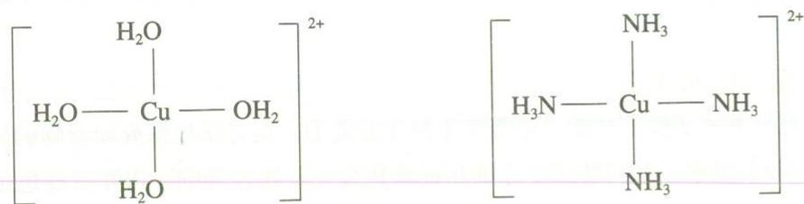

## 2. 关于超分子的教学

对超分子的教学要求不高，重点是帮助学生理解超分子的概念。教材中通过案例和图示的方式给出了具体的超分子，教学设计时，结合案例，可以把“杯酚”和冠醚的结构作进一步的介绍。“杯酚”结构看似几个单体“手牵手”围成圈，通过分离 $C_{60}$ 和 $C_{70}$ 的原理，理解“杯酚”和 $C_{60}$ 形成的超分子，感受化学在分子识别上的精确性。冠醚的形状好似皇冠，类似教材图2-13中的皇冠状分子 $S_{8}$ 。可结合冠醚的分子结构图理解冠醚名称的含义，探究冠醚环上的氧原子在离子识别上的作用。

## 教学方案参考

展示图片：在教材的图3-44中使用了“杯酚”，下面我们来认识一下“杯酚”。展示如图3-5所示的结构示意图，“杯酚”一般是由亚甲基桥连苯酚单元所构成的大环化合物，因其结构像一个酒杯而被称为杯芳烃或“杯酚”。“杯酚”具有大小可调节的空腔，可盛不同尺寸的分子或者离子。

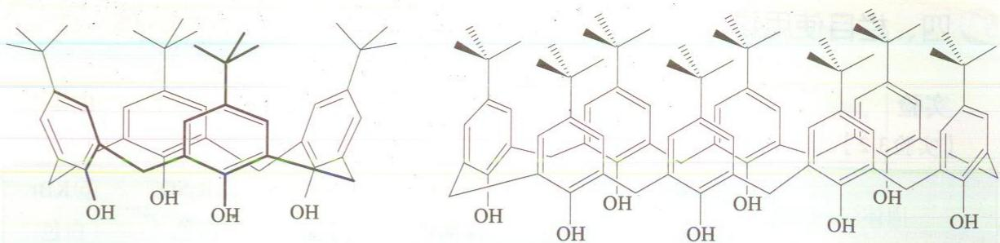  
图 3-5 “杯酚” 结构示意

以史导学：1942年奥地利人金克（Zinke）在研究酚醛树脂的过程中，由对叔丁基苯酚与甲醛溶液的反应，意外合成了“杯酚”。引导学生从“杯酚”的发现体会化学实验的重要性。

阅读与发现：引导学生阅读分离 $C_{60}$ 和 $C_{70}$ 的实验示意图，寻找该实验中的超分子，让学生加深对超分子概念的理解。

问题探究：如何分离 $C_{70}$ 和 $C_{240}$ ？引导学生从“杯酚”的结构特点进行探究。

以图引课：下面我们来看另一个超分子，展示两个冠醚的结构简式，引导学生观察其形状和大小，为冠醚的离子识别埋下伏笔。

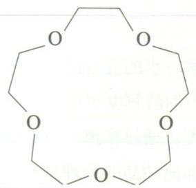  
15-冠-5

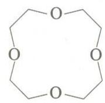  
12-冠-4  
图 3-6 某些冠醚的结构示意

交流讨论：①如图3-6所示的结构简式对应教材中图3-45的球棍模型结构，请猜想这些名称的含义。②画出18-冠-6、21-冠-7的结构简式示意图。

问题探究：①冠醚靠什么原子吸引阳离子？②碱金属离子或大或小，猜想冠醚是如何识别它们的？

归纳总结：①氧原子吸引阳离子的作用；碳原子是环的骨架，稳定了整个冠醚。②环的大小与金属离子匹配，才能识别。

以史总结：1987年诺贝尔化学奖授予三位化学家，以表彰他们在超分子化学理论方面的开创性工作。这是人类在操控分子方面迈出的重要一步。“杯酚”与冠醚形成的超分子，虽然识别的分子、离子不同，但环状结构异曲同工，且尺寸可控。

## 四、栏目使用建议

实验

【实验3-2】

<table><tr><td>固体</td><td>1 $CuSO_{4}$ 白色 2 $CuCl_{2}$ 绿色 3 $CuBr_{2}$ 深褐色 4 $NaCl$ 白色 5 $K_{2}SO_{4}$ 白色 6 $KBr$ 白色</td></tr><tr><td>哪些溶液呈天蓝色</td><td>天蓝色 天蓝色 天蓝色 无色 无色 无色</td></tr><tr><td>实验说明什么离子呈天蓝色,什么离子没有颜色</td><td>水溶液中的 $Cu^{2+}$ 主要以水合离子 $[Cu(H_2O)_4]^{2+}$ 存在,呈天蓝色; $Na^+$ 、 $K^+$ 、 $Cl^-$ 、 $SO_4^{2-}$ 、 $Br^-$ 均无色。</td></tr></table>

在点滴板上实验, 固体的量尽量少, 慎用玻璃棒搅拌, 因为太粗, 易把溶液与其他溶液混合, 可考虑改用牙签。如果是演示实验, 一定要用实物投影, 以便学生能够观察。放置一段时间后观察为宜, 避免未溶解的固体对溶液颜色的影响。另不宜追求浓度大, 如 $\mathrm{CuCl}_{2}$ 溶液浓度大时, 可能呈绿色。

【实验3-3】

乙醇的分子极性弱于水的，乙醇的加入，形成乙醇-水的混合溶剂，极性比水的更弱。根据相似相溶原理，使离子化合物在乙醇-水的混合溶剂中的溶解度更小。

用玻璃棒摩擦试管壁的作用，是为了加快结晶速度。通过摩擦，可在烧杯内壁产生微小的玻璃微晶来充当晶核，容易诱导结晶。这与加入晶种来加速结晶的原理是一样的。

【实验3-4】

向盛有少量 $0.1 \mathrm{~mol} / \mathrm{L} \mathrm{FeCl}_{3}$ 溶液中滴加 1 滴 $0.1 \mathrm{~mol} / \mathrm{L} \mathrm{KSCN}$ 溶液, 可发生如下反应:

$$
\mathrm{Fe} ^ {3 +} + n \mathrm{SCN} ^ {-} = [ \mathrm{Fe(SCN)} _ {n} ] ^ {3 - n} (n = 1 \sim 6,
$$

$$
\mathrm{SCN} ^ {-}
$$

这一系列配离子的颜色从吸收峰的波长来看是相近的。本实验中KSCN的用量是少量的，因此产物主要为 $\left[\mathrm{Fe}(\mathrm{SCN})\right]^{2+}$ 。这是鉴定 $\mathrm{Fe}^{3+}$ 的灵敏反应之一，也常用于 $\mathrm{Fe}^{3+}$ 比色测定。

【实验3-5】

AgCl的溶度积常数 $K_{sp}=1.8\times10^{-10}$ 。

$\mathrm{[Ag(NH_3)_2]^+}$ 的稳定常数 $K_{\text{稳}} = \frac{[\mathrm{Ag}(\mathrm{NH}_3)_2^+]}{[\mathrm{Ag}^+][\mathrm{NH}_3]^2} = 1.1\times 10^7$

$\mathrm{AgCl + 2NH_3 = [Ag(NH_3)_2]^+ + Cl^- 反应平衡常数：}$

$$
K = \frac {[ \mathrm {Ag(NH_ {3}) _ {2} ^ {+}} ] [ \mathrm {Cl^ {-}} ]}{[ \mathrm {NH_ {3}} ] ^ {2}} = K _ {\mathrm{稳}} K _ {\mathrm{sp}} = 1. 1 \times 1 0 ^ {7} \times 1. 8 \times 1 0 ^ {- 1 0} = 2. 0 \times 1 0 ^ {- 3}
$$

从平衡常数可知，选择氨水浓度较大为宜。若在上述 $\left[\mathrm{Ag}\left(\mathrm{NH}_{3}\right)_{2}\right]\mathrm{Cl}$ 溶液中加入 $\mathrm{Br}^{-}$ ，则产生浅黄色的 $\mathrm{AgBr}$ 沉淀，因为 $\mathrm{AgBr}$ 的溶度积常数 $K_{\mathrm{sp}} = 5.0 \times 10^{-13}$ 非常小， $\mathrm{AgBr}$ 仅微溶于浓氨水。

## 五、练习与应用参考答案及说明

<table><tr><td>1. B</td><td>2. B</td><td>3.  ${\mathrm{{Cu}}}^{2 + }$ </td><td> $\mathrm{N}$ </td><td> ${\mathrm{{NH}}}_{3}$ </td><td></td></tr></table>

4. 正四面体形 配位键 N

5. 通常把金属离子或原子（称为中心离子或原子）与某些分子或离子（称为配体或配位体）以配位键结合形成的化合物称为配位化合物，简称配合物。如 $\left[\mathrm{Cu}\left(\mathrm{NH}_{3}\right)_{4}\right]^{2+}$ ，是以 $\mathrm{Cu}^{2+}$ 为中心离子，能接受孤电子对， $\mathrm{NH}_{3}$ 作为配体，提供孤电子对，以配位键（“电子对给予—接受”）结合形成配离子。

6. ${\mathrm{{NH}}}_{4}\mathrm{{Fe}}{\left( {\mathrm{{SO}}}_{4}\right) }_{2}$ 溶液中的 ${\mathrm{{Fe}}}^{3 + }$ 与KSCN溶液中的 ${\mathrm{{SCN}}}^{ - }$ 形成了配离子而呈血红色。

<table><tr><td>配合物</td><td>配离子</td><td>中心离子</td><td>配位体</td><td>配位数</td><td>配位原子</td></tr><tr><td> $K_2[Cu(CN)_4]$ </td><td> $[Cu(CN)_4]^{2-}$ </td><td> $Cu^{2+}$ </td><td> $CN^-$ </td><td>4</td><td>C</td></tr><tr><td> $(NH_4)_2[PtCl_6]$ </td><td> $[PtCl_6]^{2-}$ </td><td> $Pt^{4+}$ </td><td> $Cl^-$ </td><td>6</td><td>Cl</td></tr><tr><td> $[Cd(NH_3)_4](OH)_2$ </td><td> $[Cd(NH_3)_4]^{2+}$ </td><td> $Cd^{2+}$ </td><td> $NH_3$ </td><td>4</td><td>N</td></tr></table>

8. $H^{+}$ 能接受孤电子对， $H_{2}O$ 中的O提供孤电子对，两者形成配位键。

9. 此题为开放性较大的习题，可用多种实验方法来定性证明。例如：（1）取4 mL工业盐酸于试管中，滴加几滴硝酸银饱和溶液，待沉淀后，观察溶液颜色变化，若亮黄色褪去（或变很浅的黄色），则证明 $FeCl_{4}^{-}$ 只有在高浓度 $Cl^{-}$ 的条件下才是稳定的。因为硝酸银的溶解度很大，能有效地降低 $Cl^{-}$ 浓度，且几滴对总体积的影响较小， $FeCl_{4}^{-}$ 分解得到 $Fe^{3+}$ ，浓度小，颜色浅。（2）取一小粒硝酸铁晶体溶于稀硝酸，滴加浓盐酸，观察颜色变化；再将上述溶液滴入蒸馏水中，观察颜色变化。（3）在粗盐酸中加入金属铁，观察溶液颜色变化；再向粗盐酸滴入蒸馏水，观察颜色变化。

## 复习与提升建议

## 一、复习与提升教学建议

本章主要内容包括晶体结构及其性质，以及配合物与超分子的知识。涉及的知识点很多，在本章复习时需要把这些知识进行梳理，进一步巩固本章知识；另外，还要引导学生应用本章所学的知识解决一些实际问题。

## 1. 框图方式梳理知识结构

本章内容包括晶体与非晶体、晶胞、分子晶体、共价晶体、金属晶体、离子晶体、配合物与超分子等知识，对每个具体的知识点都需要进一步梳理。例如，以分子晶体为例，可采取如下图所示的框架方式进行梳理。对于常见的4种晶体类型，还可以通过表格的方式进行比较。

概念：分子间以分子作用力结合而成的晶体

构成晶体的粒子：\_\_\_\_。

粒子间的相互作用 $\left\{\begin{array}{l} 分子内: \\ 分子间: \end{array}\right.$

物理性质：熔点低，硬度较小

典型
实例
{
干冰晶体：每个CO₂周围等距且紧邻的CO₂有\_\_\_\_个。
冰：每个水分子与相邻的\_\_\_\_个水分子以氢键相连接。
}

## 2. 任务驱动方式，运用所学知识解决实际问题

本章复习时，可以创设真实问题情境，运用本章所学知识解决一些实际问题，开展“素养为本”的教学，提升学生的化学学科核心素养。

下面以电解法生产铝为例。

环节一：利用金属矿物制备铝时，其反应的化学方程式为：

$$
2 \mathrm{Al} _ {2} \mathrm{O} _ {3} (\text {   熔融   }) \xrightarrow [ \text {   冰晶石   } ]{\text {   电解   }} 4 \mathrm{Al} + 3 \mathrm{O} _ {2} \uparrow
$$

原料 $Al_{2}O_{3}$ 是教材中的“偏向共价晶体的过渡晶体当作共价晶体来处理”的实例，如果直接电解 $Al_{2}O_{3}$ 有什么缺点？如何解决？

学生从共价晶体具有高熔点的特点预测：直接熔融 $Al_{2}O_{3}$ 的能耗较高。然后提供解决方案：少量的 $Al_{2}O_{3}$ 溶解在熔融的冰晶石中（温度为960\~970℃）再电解。

环节二：冰晶石 $\mathrm{Na}_{3} \mathrm{AlF}_{6}$ 的构成粒子有哪些？粒子间有哪些相互作用？

学生找出离子与离子键的同时，还能够发现配离子。学生通过分析 $\mathrm{AlF}_6^{3-}$ 的结构，提升对中心离子、配体、配位键的认识。

环节三：产物分析。请以AI为例，说明金属晶体的结构特点，以及金属有哪些性质？

复习金属晶体的结构特点，以及金属的导电性、导热性、延展性等。Al的用途很广泛，如饮料罐、电线、散热材料，以及生产与生活中的各种铝制品等。

通过上述真实的问题情境，驱动学生解决实际问题，将多种晶体的性质特点，晶体中粒子间的相互作用、结构与性质进行比较，从而提升解决实际问题的能力。

## 二、复习与提高参考答案及说明

1. A 
2. B 
3. C 
4. C 
5. A 
6. D 
7. C 
8. D

9. 属于分子晶体。

10. 干冰熔化或升华时只破坏 $CO_{2}$ 间的分子间作用力，并不破坏 $CO_{2}$ 内的共价键，即C=O。

11. 在冰的晶体中，由于氢键有方向性和饱和性，迫使在四面体中心的每个水分子与四面体顶角方向的4个相邻水分子形成氢键。这一排列使冰晶体中的水分子的空间利用率不高，留有相当大的空隙，其密度比液态水的小。当冰刚融化为液态时，热运动使冰结构部分解体，水分子间的空隙减小，密度反而增大，超过 $4^{\circ}$ C时，由于热运动加剧，分子间距离加大，密度减小。因此，水的密度在 $4^{\circ}$ C时最大。

水的这一特殊性对于生命的存在有着重要意义。对生命而言，低温时，水表面先结冰，隔绝了冷空气，保护了水中的生命。若冰的密度比液态水的大，地球上的所有水体在冬天结冰时，会把所有水生生物冻死。

12. 钠的卤化物是离子晶体，而硅的卤化物是分子晶体。离子键的强度比分子间的范德华力更强，因此熔点更高。

13. HF间能形成氢键。

14. (1) 4 ZnS (2) $\mathrm{sp}^{3}$ (3) 水和乙醇间能形成氢键, 而 $\mathrm{H}_{2} \mathrm{~S}$ 不能和乙醇形成氢键 (4) 正四面体形

15. (1) $[\mathrm{Ar}]3\mathrm{d}^{10}4\mathrm{s}^2$ (2) $1:2$ (3) $2[\mathrm{Au}(\mathrm{CN})_2]^-$ + $\mathrm{Zn} = 2\mathrm{Au} + [\mathrm{Zn}(\mathrm{CN})_4]^{2-}$

\*16. 共价键；还有阴离子；离子晶体。

# 实验活动 简单配合物的形成

## 一、活动安排建议

本实验旨在了解配合物的形成方法，探究简单离子与配离子的区别。可将该实验活动作如下安排。

1. 本实验可安排在学习配合物的课堂教学中进行，可作为随堂实验。

2. 演示【实验3-3】和【实验3-5】后，组织学生进行分组实验，实验内容为简单配合物的形成。

3. 演示实验【实验3-4】后，组织学生进行分组实验，实验内容为简单离子与配离子的区别。

## 二、注意事项

## (1) $\left[\mathrm{Cu}\left(\mathrm{NH}_{3}\right)_{4}\right]^{2+}$ 的形成

向盛有硫酸铜溶液的试管里滴加氨水，边滴加边振荡，观察滴加过程中先沉淀后溶解的现象；再滴加乙醇，观察又生成沉淀的现象。注意观察几种沉淀与溶液的颜色，解释其原因。

## (2) $[\mathrm{Ag}(\mathrm{NH}_{3})_{2}]^{+}$ 的形成

向盛有氯化钠溶液的试管里滴加几滴硝酸银溶液，再滴入氨水，边滴加边振荡，注意观察滴加过程中先沉淀后溶解的现象。

## (3) $Fe^{3+}$ 与 $SCN^{-}$ 形成配离子

$FeCl_{3}$ 溶液和KSCN溶液浓度都可选取约0.1 mol/L，浓度稍低也可以。KSCN溶液的浓度对颜色影响更大，利用平衡常数表达式也可解释该现象，因此溶液浓度不宜过大，否则颜色过深。

(4) $K_{3}[Fe(CN)_{6}]$ 与 KSCN 溶液混合无明显现象，都可选用稀溶液。实验目的是证明 $[Fe(CN)_{6}]^{3-}$ 的存在。

## 三、问题与讨论答案或提示

$[Fe(CN)_{6}]^{3-}$ 的中心离子是 $Fe^{3+}$ ，配体是 $CN^{-}$ ，配位数是6， $[Fe(CN)_{6}]^{3-}$ 与 $Fe^{3+}$ 的性质不一样。

## 教学资源

## 1. 等离子体

气、液、固三态随着温度的变化可以相互转化，可是如果温度升高到 $10^{4} \mathrm{~K}$ 甚至 $10^{5} \mathrm{~K}$ 时，分子间和原子间的运动十分剧烈，彼此间已难以束缚。原子中的电子因具有相当大的动能而摆脱原子核对它的束缚，成为自由电子，原子失去电子变成带正电的离子。这样，物质就变成了一团由电子和带正电的离子组成的混合物。在气体中电离成分只要超过 $0.1\%$ ，其行为就主要由电子和离子间的库仑力来支配，其主要性质已发生了本质的变化。它成为一种性质独特的全新物质聚集态，常称为“物质的第四态”。又由于这种电离气体中电子的负电荷总数和离子的正电荷总数在数值上相等，故称为等离子体。

（1）等离子体的基本特性：①导电性强。②准电中性。粒子所带正电荷数总是等于负电荷数。③与磁场的可作用性。因为等离子体是由带电粒子组成的导电体，所以可用磁场控制其形状和运动；同时，带电粒子集体运动的结果又可形成电磁场。

(2) 等离子体的应用: ①等离子体光源。霓虹灯的基本原理是将玻璃管抽成真空, 再充入少量的特殊气体, 然后在玻璃管两端封上电极, 接上 10000伏左右的电压, 电流极小, 管内气体在强电场作用下电离, 形成低温等离子体发光, 叫做辉光放电。充入不同气体, 能发出不同颜色的光。②等离子体显示。它是一种利用气体发光高精度的平面显示装置, 由两块相距几百微米的玻璃板组成, 四周用低熔点玻璃密封, 将空腔抽成真空, 再充以某种气体 (如氖气, 气压为几百毫米汞柱)。两块玻璃板内侧的相对两个面喷有 $\mathrm{SnO}_{2}$ 透明导电膜, 作为等离子体显示板的两个电极, 应用光刻技术把导电膜制成一定图案, 然后在电极上覆盖一层透明介质薄膜。当等离子体显示板两电极接上电压后, 空腔内所充气体产生辉光放电, 形成等离子体, 发出鲜艳的霓虹色光, 将图形显示出来。等离子体显示的优点: 结构简单, 制作成本低。显示板厚为 $0.5 \sim 1.2 \mathrm{~cm}$ , 视角大于 $120^{\circ}$ ; 亮度高, 使用寿命长; 响应速度快, 显示精度高。因此, 等离子体显示应用广泛, 如用等离子体显示板做成的平板型电视屏幕, 像一副镜框那样挂在墙壁上就可以收看电视节目。

[摘编自：刘小兵.等离子体与“太阳风”漫谈.现代物理知识，2005(4)]

## 2. 液晶

液晶的发现最早可追溯到1850年，德国人海因茨发现硬脂酸甘油酯在其熔点处有些奇怪的特性，即 $52^{\circ} \mathrm{C}$ 时由固态融为浑浊的液态，在 $58^{\circ} \mathrm{C}$ 时变为更浑浊的液体，而在 $62.5^{\circ} \mathrm{C}$ 时则成为透明的液体。1888年，奥地利人莱尼采尔在加热胆甾醇苯甲酸酯的结晶时发现， $145.5^{\circ} \mathrm{C}$ 时这种结晶熔解成为浑浊黏稠的液体，并发出多彩而美丽的珍珠光泽，继续加热，液体呈现出短暂的蓝色，当加热到 $178.5^{\circ} \mathrm{C}$ 时，液体变得清澈透明。莱尼采尔无法解释，将样品与观察记录寄给德国人莱曼，莱曼研究发现，上述145.5\~178.5℃的黏稠浑浊液体在用偏光显微镜进行观察时，具有双折射现象，而且这类物质并不是从透明的液体形成结晶，而是先变为一种非晶态形式，然后再形成结晶。

液晶既具有晶体所特有的双折射性，又具有液体的流动性。液晶根据成分和呈现液晶相的条件，可分为热致液晶和溶致液晶两大类。热致液晶是指单一成分的纯化合物或均匀混合物在温度变化下出现的液晶相。溶致液晶是两种或两种以上组分形成的液晶，温度的改变及混合物中成分的变化均可以在溶液中形成液晶相，其中一种通常是水或其他的极性溶剂，常见的有肥皂水等。

同一种液晶材料，在不同温度下可以处于不同的相，产生变化多端的相变现象。液晶系统分子间的作用力非常微弱，它的结构易受周围的机械应力、电磁场、温度和化学环境等变化的影响，由于只需很小的电场控制，液晶可以透光或反射光，液晶适合作为显示材料。

TFT（薄膜晶体管）式显示屏是各类笔记本电脑和台式机上的主流显示设备，该类显示屏上的每个液晶像素点都是由集成在像素点后面的薄膜晶体管来驱动。目前用于显示的液晶材料基本上都是热致液晶。而生物系统中则存在大量的溶致液晶，如生物膜，在生命活动中起着重要的作用。德国人海尔弗里奇应用液晶基础理论，对多年未决的人体红血球呈奇异的双凹碟形做出了较成功的解释，启动了生物液晶的研究，并把液晶生物膜的研究推向高潮。

[摘编自：崔英敏、吕刚.液晶的历史.现代物理知识，2006(4)]

## 3. 制备晶体的三种途径

制备晶体一般有三种途径: (1) 熔融态物质凝固; (2) 溶质从溶液中析出; (3) 气态物质冷却不经液态直接凝固 (凝华)。这三种途径都可制得有重要价值的大晶体, 举例如下。

（1）由熔融态硅制备芯片的基质单晶硅，俗称“拉单晶”。工业上用焦炭在电炉中将石英砂还原得到粗硅，然后先氯化，再用氢气还原得到的高纯硅是多晶硅。多晶硅是硅晶体的一种形式。当熔融的元素硅在过冷条件下固化时，硅原子以金刚石晶格形式排列成多个晶核。如果晶核生长成具有不同晶体取向的晶粒，则晶粒结合并结晶成多晶硅。其原子排列仅短程有序，存在晶界。单晶硅是具有完整的点阵结构的晶体。两者结构差异如图3-7所示。

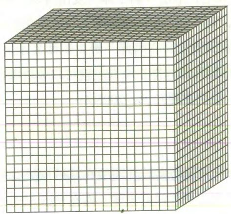  
单晶硅

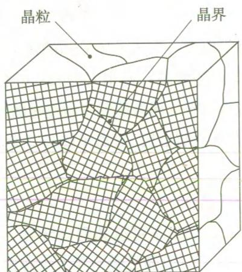  
多晶硅  
图 3-7 两种硅晶体结构示意

多晶硅与单晶硅的差异主要表现在物理性质方面。例如，在力学、光学和热学性质的各向异性方面，远不如单晶硅明显；又如多晶硅的导电性远不如单晶硅，甚至于几乎没有导电性。在化学活性方面，两者的差异极小。

直拉法生长单晶硅，俗称“拉单晶”。是通过电阻加热方式使盛放在石英坩埚中的硅原料熔化成液态，通过控制加热器的功率，升高或降低熔硅的温度，使其达到晶体生长的适宜温度，此时将特定晶向的籽晶与熔硅接触并生长放大，同时向上旋转提拉，从而逐渐生长出一根特定晶向、直径均匀的单晶硅棒。

(2) 水溶液结晶生产制造激光器的 $\mathrm{KH}_{2} \mathrm{PO}_{4}$ 大晶体。制备 $\mathrm{KH}_{2} \mathrm{PO}_{4}$ 晶体时, 对溶液的温度、浓度、杂质含量、pH等条件有很高的要求。我们可以将涂有各种色素的纸树插入 $\mathrm{KH}_{2} \mathrm{PO}_{4}$ 饱和溶液中, 可以观察到 “纸树开花”, 把各种 “纸树开花” 放在一起, 形成一个 “冰雪奇缘” 的童话世界。

(3) 化学气相沉积法 (CVD) 获得人造金刚石。该技术可在相对较低的温度和压力下进行。CVD法是采用甲烷、乙炔等含碳气体作为碳源, 利用电、热等分解原料并生成碳原子或甲基原子团等活性粒子, 并在一定条件下在衬底材料上沉积生长金刚石的工艺。CVD法衍生出多种方法, 常见的有: 热丝化学气相沉积 (HFCVD) 法、直流电弧等离子体喷射 (DCPJ) 法、微波等离子体化学气相沉积 (MPCVD) 法等。HFCVD法最早, 加热金属灯丝使甲烷气体分解并沉积, 灯丝高热而产生蒸发, 将金属元素掺入碳源气体, 对金刚石的沉积造成污染; 同时灯丝高热和氧化, 其寿命严重降低。DCPJ法采用直流电弧进行放电, 对高流速的气体进行激发和电离, 使其产生喷射状的等离子体流, 其等离子体中心温度可高达 $10000^{\circ} \mathrm{C}$ 。该法沉积速率高、气体离化率高。但等离子体喷射在常压下进行, 其形态、密度和温度场难以控制, 且生长速率过高, 金刚石薄膜的沉积质量极差, 产生大量非晶相和石墨相, 膜层厚度不均一。MPCVD法通过高压和电磁场的调控产生稳定的微波, 其功率连续可调, 且气体流量、沉积温度可控; 产生的等离子体球非常均匀稳定, 可实现均匀稳定且大面积的金刚石膜沉积生长, 是目前公认的制备大尺寸单晶金刚石的最佳方法之一。

## 4. 晶体学的主要分支

晶体学是一门庞大的学科，它由晶体学经典理论（如几何晶体学）、晶体形貌学、晶体的测定理论与技术（如X-衍射晶体学）、晶体物理学（如晶体光学）、晶体化学（又称结晶化学）、晶体生长理论与技术（如晶体制备）、描述晶体学、实际晶体理论与应用等分支组成。

几何晶体学是晶体学的基础理论，形成于19世纪中叶，以对称性理论（宏观对称性和微观对称性）为基础，包括空间群、晶系、点阵型等。

## 5. 如何鉴定宝石

宝石有天然的和人工的。如何区别天然的和人工的宝石呢？比如钻石，天然与人工的钻石在成分、硬度、密度上都相同，鉴别难度大。但借助于X射线仪可以区别：人造钻石发黄色荧光和磷光，而天然的钻石发蓝色荧光。钻石是亲油的，用笔或牙签蘸一点油再涂在钻石表面上，油会融在钻石表面上，而假钻石就会呈小油珠状。如果往钻石表面蘸水，水会呈小珠状，而假钻石的

表面水会分散流走。钻石的化学成分是碳。

真假红、蓝宝石也可以区别。一般认为，红宝石和蓝宝石是仅次于钻石的珍贵宝石，也是最主要的宝石种类之一。从矿物学观点看，它们都是刚玉晶体类的矿物，只是颜色不同而已。所谓红宝石是指具有红宝石质量的红色刚玉；而蓝宝石的含义比较广泛，它包括了除红色之外的具有宝石质量的任何颜色的刚玉。

真正的红、蓝宝石，属于三方晶系，化学成分是三氧化二铝，和刚玉的化学成分相同。天然红、蓝宝石在生长过程中表面可形成大大小小的凹坑；而人工的就没这种现象，但可出现一层又一层的“圆弧形生长线”，如果在宝石表面看到这些线状构造，就可断定这不是真的宝石。此外，天然的红、蓝宝石在结晶过程中，周围有一些其他天然矿物晶体，这些矿物常被包入红、蓝宝石晶体中成为包体。这些包体有两大特点：一是呈带棱角的晶形；二是常按一定方向排列，彼此以60°角相交。肉眼观看时，好像红、蓝宝石表面有着许多丝状物，这恰恰是真宝石的重要标志。

相反，人造红、蓝宝石中也可出现包体，它的包体不是各种矿物，而是气泡，气泡的出现通常无规律、密集成群，也可孤立出现。

在实验室里可通过光谱仪来鉴定天然和人造的红、蓝宝石。专业技术人员认为，天然红、蓝宝石在分光镜中光谱的蓝色部分可见到波长450 mm的黑线，这一定是真的天然红、蓝宝石。如果没有这条吸收黑线，那一定是假货——人造红、蓝宝石。

## 6. 关于晶胞

## (1) 晶胞具有平移性

用锤子轻轻敲击具有整齐外形的晶体（如方解石），会发现晶体劈裂出现的新晶面与某一原晶面是平行的，这种现象叫做晶体的解理性。古人由晶体解理性猜测，晶体是由无数肉眼看不见的，形状、大小、取向相同的微小几何体堆积而成的，后来，这种观念发展成晶胞的概念——整块晶体是由完全等同的晶胞无隙并置地堆积而成的。“完全等同”可从“化学上等同”和“几何上等同”两个方面来理解。“化学上等同”指晶胞里原子的数目和种类完全等同；“几何上等同”既指所有晶胞的形状、取向、大小等同，而且指晶胞里原子的排列（包括空间取向）完全等同。“无隙并置”即一个晶胞与它的相邻晶胞是完全共顶角、共面、共棱的，取向一致，无间隙，从一个晶胞到另一个晶胞只需平移，不需转动，进行或不进行平移操作，整个晶体的微观结构不可区别。晶胞的这种本质属性可归纳为晶胞具有平移性。

[例3-1] 图3-8中的晶胞是指实线小立方体呢还是指虚线大立方体？为什么？

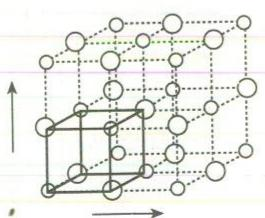  
NaCl

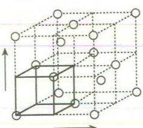  
金刚石  
图 3-8 确定氯化钠晶胞和金刚石晶胞示意

[答] 图3-8中的小立方体不具有平移性，因为它与相邻的小立方体并非等同。相反，大立方体才具有平移性，在它的上下左右前后都有无隙并置的完全等同的立方体，只是没有画出来而已，因此大立方体才是晶胞，小立方体不是晶胞。

晶胞具有相同的顶角、相同的平行面和相同的平行棱是晶胞平移性这一本质特征的必然推论。这里的所谓“相同”，包括“化学上相同”（原子或分子相同）和“几何上相同”（原子的排列与取向），不具有平移性就不是晶胞。

## (2) 晶胞中原子的坐标与计数

原子在晶胞中的位置，科学的表述是原子坐标。坐标必定是对应于一个参考系的术语。晶胞的参考系的原点，习惯上取在晶胞的左-后-下顶角上，并把相交于这个原点的晶胞的三根棱按右手坐标定为a、b、c，通常以向前方（指向观察者）为+a，向右为+b，向上为+c（但并非必定如此，这只是大多数情况下的习惯画法，a、b、c的指向可以改变，但原点和右手坐标系一般不改变，否则利用计算机程序画晶胞时会出现混乱）。在这样一个坐标系中，原子的坐标就是指向量和 $xa+yb+zc$ 中的 $(x,y,z)$ 三数组的三个数字。例如，原点的坐标是0，0，0；体心的坐标是1/2，1/2，1/2；等等。如图3-9画了15个原子，然而，若考察原子坐标，却只有4种原子坐标，可见图中的晶胞只有4个原子！

原子坐标 平均每个晶胞中的原子个数

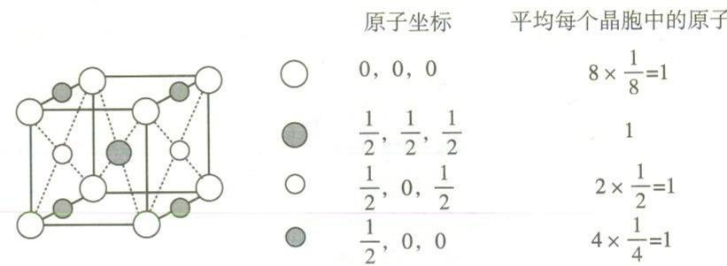  
图 3-9 晶胞中的原子坐标与计数举例

请注意：①x、y、z三个数的取值范围是 $1>x(y,z)>-1$ ，不会等于1或大于1，也不会等于-1或小于-1，可以简单地记忆为“1即是0”；②由此可见，晶胞的8个顶角的坐标是一样的，换句话说，它们是同一个原子。请回过头来看图3-8。若取实线的小立方体为晶胞，8个顶角的原子不一样了，可见错了；③再细致点，我们可以肯定：若一个原子坐标在晶面上，肯定在晶胞图上可以看见一对（位于平行的两个面上），反过来说，三对面如果都有原子，必定有三个原子坐标，而不是一个原子坐标。同样的道理，如果某原子在晶胞的棱上，在晶胞图上将看到4个原子，位于平行的4个棱上。反过来说，如果晶胞的12根棱上全有原子，肯定不会有相同的坐标，而是有3个坐标。

有了原子坐标的概念，数晶胞里的原子数目，变得很简单——有多少种不同的原子坐标，就有多少个原子，至于不同坐标的原子是否同种原子，跟晶胞中有多少个原子毫无关系。

## (3) 晶胞不一定都取平行六面体

可以选为晶胞的多面体很多，只要它们可无隙并置地充满整个微观空间，即具有平移性，都可以选取，如图3-10所示的五种 $^{①}$ 。但应强调指出，若不指明，三维的“习惯采用的晶胞”都是平行六面体，即图3-10中最左边的一种（二维平面上的晶胞则是平行四边形），叫做布拉维晶胞，即通常所指的晶胞。

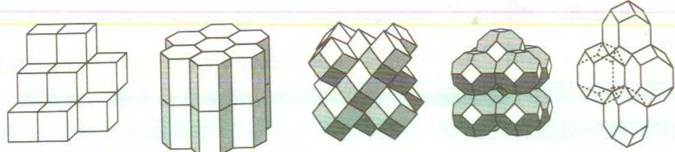

图3-10 多面体只要可无隙并置地充满整个微观空间，都可被选为晶胞用，但习用晶胞是平行六面体

[例3-2]某些晶体，如金属镁，在历史上曾用六方柱体作为它的晶胞。图3-11用实线画出了这种过时的晶胞。有人说，一个六方柱体晶胞包含三个布拉维晶胞（如图3-11中用实线画出了3个平行六面体）。这种说法对吗？

[答] 不对。我们只能选取其中任何一个平行六面体为布拉维晶胞而不能同时选三个。因为在同一个六方柱体里的三个平行六面体尽管无隙却不并置，从一个平行六面体到另一个平行六面体需要转动，并非平移关系。图3-11用虚线画出了选取六方柱体前右平行六面体为晶胞时的相邻晶胞之一（请读者用虚线自行画出更多的相邻晶胞）。习惯使用的晶胞是布拉维晶胞，必为平行六面体；所有晶胞在晶体中取向相同。

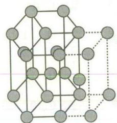  
图 3-11 老的六方柱体晶胞和习用晶胞的关系

## (4) 素晶胞与复晶胞——体心晶胞、面心晶胞和底心晶胞

晶胞是描述晶体微观结构的基本单元，但不一定是最小单元。晶胞有素晶胞和复晶胞之分。素晶胞，符号P，是晶体微观空间中的最小基本单元，不可能再小。素晶胞中的原子集合相当于晶体微观空间中的原子作周期性平移的最小集合，叫做结构基元。复晶胞是素晶胞的多倍体；分体心晶胞（2倍体），符号I；面心晶胞（4倍体），符号F；以及底心晶胞（2倍体）三种。

体心晶胞的特征是晶胞内的任一原子作体心平移 [原子坐标 + ( $\frac{1}{2}$ , $\frac{1}{2}$ , $\frac{1}{2}$ )] 必得到与它完全相同的原子。例如，若晶胞内有一个坐标为 0, 0, 0 的原子（即处于晶胞的顶角），必同时有一个坐标为 $\frac{1}{2}$ , $\frac{1}{2}$ , $\frac{1}{2}$ 相同原子（处于晶胞体心）。

检验某晶胞是否体心晶胞的方法很多。①如果晶胞中的原子很少，可直接考察它们的原子坐标。例如，若在一个晶胞里只有2个原子，一个原子的坐标为0，0，0，另一个原子的坐标为 $\frac{1}{2}$ ， $\frac{1}{2}$ ， $\frac{1}{2}$ ，而且它们是同种原子，这个晶胞是体心晶胞。若它们不是同种原子，表明不能作体心平移，是素晶胞。②将晶胞的框架移至体心，得到的新晶胞与原晶胞毫无差别时，是体心晶胞（为此要在图中按原子的固有排列方式画出更多的原子，而且在移动晶胞框架时不要移动图中的原子）。③考察处于晶胞顶角的原子本身以及其周围环境与处于体心的原子以及周围环境是否相同，如果相同，这种晶胞就是体心晶胞。

[例3-3] 图3-12中哪种晶胞（实线的立方体）是体心晶胞？

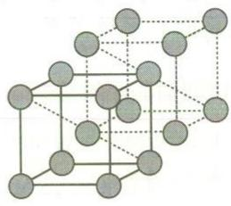  
Na

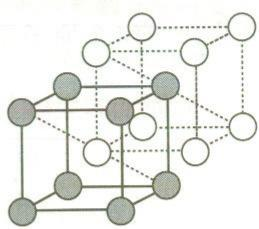  
CsCl  
图 3-12 体心晶胞与非体心晶胞的例子

[答]金属钠的晶胞是体心晶胞而氯化铯是素晶胞。金属钠晶胞中只有2个原子，它们的原子坐标分别为0, 0, 0和 $\frac{1}{2}$ , $\frac{1}{2}$ , $\frac{1}{2}$ ，而且它们是同种原子，说明晶胞具有体心平移的特征，故为体心晶胞。氯化铯晶胞虽也有2个与金属钠晶胞原子坐标相同的原子，但一个是氯，另一个是铯，不具有平移关系（注：平移关系是平移前后结构不可区分），因此是素晶胞。提请读者注意：我国有许多教科书或教学参考资料，特别是中学高考复习资料，错误地将氯化铯说成体心晶胞，应予以纠正。

面心晶胞的特征是可作面心平移，即所有原子均可作在其原子坐标上 $+\left(\frac{1}{2},\frac{1}{2},0;0,\frac{1}{2},\frac{1}{2};\frac{1}{2},0,\frac{1}{2}\right)$ 的平移而得到周围环境完全相同的原子。如晶胞顶角有一个原子，在晶胞三对平行面的中心必有完全相同的原子（周围环境也相同）。

[例3-4] 图3-13中哪个晶胞是面心晶胞？

[答] 金属铜是面心晶胞； $Cu_{3}Au$ 是素晶胞。

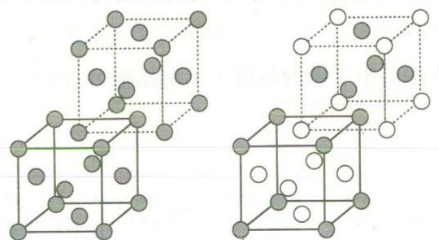  
图3-13 面心晶胞（金属铜）（左）与非面心晶胞（ $\mathrm{Cu}_{3}\mathrm{Au}$ ）（右）举例

[例3-5]金刚石、干冰晶胞（如图3-14）是不是面心晶胞？

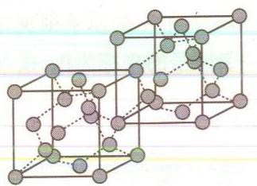

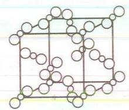  
图 3-14 金刚石晶胞（左）和干冰晶胞（右）

[答] 金刚石晶胞中有8个原子，它们的原子坐标分别是0, 0, 0（顶角原子）； $\frac{1}{2}$ ， $\frac{1}{2}$ ，0； $\frac{1}{2}$ ，0， $\frac{1}{2}$ ；0， $\frac{1}{2}$ ， $\frac{1}{2}$ （3个面心原子）； $\frac{3}{4}$ ， $\frac{1}{4}$ ， $\frac{1}{4}$ ； $\frac{1}{4}$ ， $\frac{3}{4}$ ， $\frac{1}{4}$ ； $\frac{1}{4}$ ， $\frac{1}{4}$ ， $\frac{3}{4}$ 和 $\frac{3}{4}$ ， $\frac{3}{4}$ ， $\frac{3}{4}$ （4个分处晶胞4条体对角线上的原子）；前4个原子无疑是面心平移关系。后4个原子也是面心平移关系，例如，对坐标为 $\frac{3}{4}$ ， $\frac{1}{4}$ ， $\frac{1}{4}$ 的原子的坐标上分别加面心平移坐标： $\frac{3}{4}$ $\frac{1}{4}$ $\frac{1}{4}$ +） $\frac{1}{2}$ $\frac{1}{2}$ 0 $\frac{1}{4}$ $\frac{3}{4}$ $\frac{1}{4}$ $\frac{3}{4}$ $\frac{1}{4}$ $\frac{1}{4}$ +） $\frac{1}{2}$ 0 $\frac{1}{2}$ +） 0 $\frac{1}{2}$ $\frac{1}{2}$ $\frac{3}{4}$ $\frac{3}{4}$ $\frac{3}{4}$

结果得到另外3个原子的坐标，可见，这4个原子也具有面心平移关系，换言之，金刚石晶胞的结构基元为2个原子(0, 0, 0和 $\frac{3}{4}$ , $\frac{1}{4}$ , $\frac{1}{4}$ )的集合，这2个原子分别作面心平移，得到8个原子，结论：金刚石晶胞具有面心平移的特征，是面心晶胞。

干冰晶胞无疑不是面心晶胞。因为该晶胞中有4个取向不同的二氧化碳分子，它们是不可能进行面心平移的。例如，顶角二氧化碳分子是一种取向（为什么8个顶角二氧化碳分子的取向必定相同？），3对面心的二氧化碳分子的取向与顶角二氧化碳分子的取向都不同，而且它们也互不相同。需提请读者注意的是，我国大多数学校的干冰晶胞立体模型是错误的，这些模型中的二氧化碳分子的取向搞错了。

底心晶胞的特征是可作底心平移，即晶胞中的原子能发生如下平移： $+(\frac{1}{2},\frac{1}{2},0)$ ，称为C底心； $+(0,\frac{1}{2},\frac{1}{2})$ ，称为A底心； $+(\frac{1}{2},0,\frac{1}{2})$ ，称为B底心。底心平移是指只能发生其中一种平移。

[例3-6]图3-15中的实线给出了碘的晶胞（正交晶胞），请问：它是什么底心晶胞（A、B、C）?

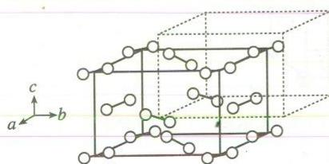  
(a)

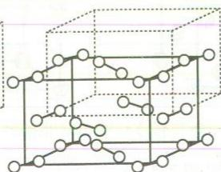  
(b)  
图 3-15 底心晶胞举例 ( $I_{2}$ )

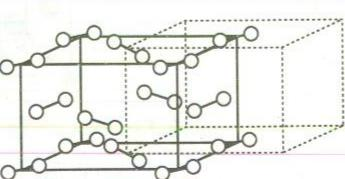  
(c)

[答] 将晶胞原点移至 $bc$ 面心（a）和 $ab$ 面心（c）均不能使所有原子坐标不变，只有将晶胞原点移至 $ac$ 面心（b）才得到所有原子坐标不变的新晶胞，可见碘的晶胞是 B 底心（正交）晶胞。

## (5) 布拉维系

平行六面体的几何特征可用边长关系和夹角关系确定。布拉维晶胞的边长与夹角叫做晶胞参数，其定义如图3-16所示（注意不要弄错夹角与边的相互关系）。共有7种不同几何特征的（三维）晶胞，称为

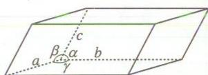  
图3-16 晶胞参数的定义

布拉维系（Bravais system）（如图3-17），它们的名称、英文名称、符号及几何特征如下：
立方 cubic (c) $a = b = c$ ， $\alpha = \beta = \gamma = 90^\circ$ （只有1个晶胞参数 $a$ 是可变动的）
四方 tetragonal (t) $a = b \neq c$ ， $\alpha = \beta = \gamma = 90^\circ$ （有2个晶胞参数 $a$ 和 $c$ ）
正交 orthorhomic (o) $a \neq b \neq c$ ， $\alpha = \beta = \gamma = 90^\circ$ （有3个晶胞参数 $a$ 、 $b$ 和 $c$ ）
单斜 monoclinic (m) $a \neq b \neq c$ ， $\alpha = \gamma = 90^\circ$ ， $\beta \neq 90^\circ$ （有4个晶胞参数 $a$ 、 $b$ 、 $c$ 和 $\beta$ ）
三斜 anorthic (a) $a \neq b \neq c$ ， $\alpha = \beta = \gamma$ （有6个晶胞参数 $a$ 、 $b$ 、 $c$ 、 $\alpha$ 、 $\beta$ 和 $\gamma$ ）
六方 hexagonal (h) $a = b \neq c$ ， $\alpha = \beta = 90^\circ$ ， $\gamma = 120^\circ$ （有2个晶胞参数 $a$ 和 $c$ ）
菱方 rhombohedral (R) $a = b = c$ ， $\alpha = \beta = \gamma$ （有2个晶胞参数 $a$ 和 $\alpha$ ）

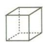

  
四方  
立方  
六方

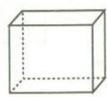  
正交

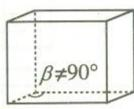  
单斜

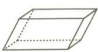  
三斜

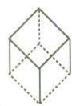  
菱方  
图 3-17 晶胞按平行六面体几何特征的分类——布拉维系

## (6)14种布拉维点阵型

布拉维系有7种不同几何特征的晶胞；晶胞又有素晶胞、体心晶胞、面心晶胞和底心晶胞之分。那么，布拉维系的7种晶胞是否都既有素晶胞又有复晶胞呢？19世纪中叶，法国晶体学家布拉维（Bravais）严密地论证了这个问题，得出结论如下：布拉维系7系和晶胞的素、复结合，总共只有14种晶胞，如表3-1和图3-18所示，在晶体学中，称为布拉维点阵型 $^{①}$ 。表3-1给出了这14种晶胞的符号。其中小写字母c、t、o、m、a、h是所谓“晶族”（crystal family）的代号，大写字母P、I、F分别代表素晶胞、体心晶胞和面心晶胞，A、B、C代表底心晶胞，R则只代表布拉维系的菱方晶胞。小写字母和大写字母结合，是一种既涉及布拉维系又涉及素、复的晶胞代号，例如，cP是素立方晶胞，cI是体心立方晶胞，等等。这些符号是国际晶体学会组织编写的重要工具书晶体学国际表（1983）推荐的，已广泛应用。

① 图3-18中的每个小黑点是晶胞中的一个结构基元的抽象，叫做点阵点。点阵点的系列叫做点阵。所以图3-18叫做点阵型。晶胞的形状与大小与点阵单位的形状与大小完全相等。但晶胞图给出具体的原子而点阵单位图只给出点阵点。注意：晶胞（crystal cell）和点阵单位（lattice unit）在许多文献中是不加区分地混用的。

表3-1 14种布拉维点阵型

<table><tr><td rowspan="2">布拉维系</td><td colspan="5">14种布拉维点阵型</td></tr><tr><td>P</td><td>I</td><td>F</td><td>A(B、C)</td><td>R</td></tr><tr><td>立方</td><td>cP</td><td>cI</td><td>cF</td><td>—</td><td>—</td></tr><tr><td>四方</td><td>tP</td><td>tI</td><td>—</td><td>—</td><td>—</td></tr><tr><td>正文</td><td>oP</td><td>oI</td><td>oF</td><td>oA(oB、oC)</td><td>—</td></tr><tr><td>单斜</td><td>mP</td><td>(mI)</td><td>—</td><td>mC(⋯)</td><td>—</td></tr><tr><td>三斜</td><td>aP</td><td>—</td><td>—</td><td>—</td><td>—</td></tr><tr><td>六方</td><td>hP</td><td>—</td><td>—</td><td>—</td><td>—</td></tr><tr><td>菱方</td><td>—</td><td>—</td><td>—</td><td>—</td><td>hR</td></tr></table>

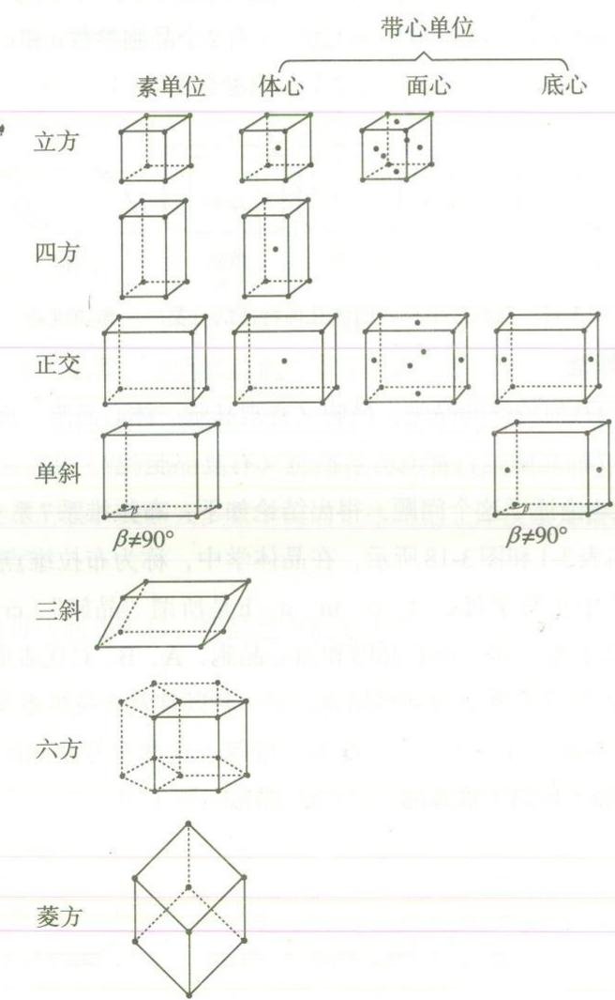  
图3-18 三维点阵的14种布拉维点阵型

## 7. 准晶

准晶，是一种介于晶体和非晶体之间的固体，它是以色列物理学家谢赫特曼发现的。1982年4月8日，谢赫特曼在观察一种急冷的锰铝合金的时候，发现在自己的电子显微镜上，出现了一种旋转36°对称（以一直线为轴，旋转α度，能与原图形重合。n=360°/α，那么该直线就为n重轴。旋转36°对称即十重轴）的图形。没过多久，他又在合金中发现了一种72°旋转对称（五重轴）的图形。

依照传统晶体观点，晶体的平面点阵只能有二、三、四、六重轴；而五重轴和十重轴的图案，不可能形成既平移对称又旋转对称的图形。虽然从晶体理论上来说是不可能存在的，但它又具有明显的规律性。这种由非周期性的图案铺满整个平面的构思，来自和谢赫特曼同时期的英国数学家彭罗斯。他从数学的角度，有力地证明了准晶存在的可能性，肯定了谢赫特曼的工作。彭罗斯获得了1988年的沃尔夫奖，这是数学界的最高奖之一。

1984年中国、美国、法国和以色列等国家的学者几乎同时在淬冷合金中发现了存在有5重轴，确证这些合金相是具有长程定向有序，而没有周期平移有序的一种封闭的正20面体相，并称之为准晶体。以后又陆续发现了具有八重轴、十重轴、十二重轴对称的准晶结构。

1986年后，法国的一个科研小组花了三年时间做出了准晶的X射线衍射图样，谢赫特曼拿着衍射图样说服晶体学的权威们接受了准晶。

## 8. 干冰与镁的反应

由于 $CO_{2}$ 的熔点为 $-78.5^{\circ}C$ ，冰箱冷冻室温度最低 $-18^{\circ}C$ ，若把干冰放在冰箱里，会熔化、气化、升华，体积膨胀1000多倍，冲破冰箱。干冰不可以保存在冰箱，要用专业的干冰保温箱。如果实验室没有干冰，可考虑结合视频或者图片进行教学。关于教材中“资料卡片”里的“干冰与镁的反应”，其涉及的相关内容说明如下：

（1）实验目的：不但证明金属镁可以跟二氧化碳反应，而且也表现出干冰易升华的特性。

(2) 用红热的铁棒点燃（引发）。

（3）燃烧发出耀眼的白光（像冰灯）。

（4）生成白色与黑色固体（产物是两种不同颜色的固体）。

(5) $\mathrm{Mg}$ 能和 $\mathrm{CO}_{2}$ 反应。 $\mathrm{Mg}$ 是强还原剂，而 $\mathrm{CO}_{2}$ 是弱氧化剂，主要依靠镁来推动。

红热的铁棒点燃，从引发开始，镁先与空气中的 $O_{2}$ 反应。因为 $O_{2}$ 的氧化性远强于 $CO_{2}$ ，敞口的干冰正在升华，镁粉周围 $CO_{2}$ 浓度也无法远超 $O_{2}$ 。将另一块干冰盖上，形成较封闭的 $CO_{2}$ 气氛，才能以Mg和 $CO_{2}$ 反应为主。

## 9. 金属键的能带理论

金属键的另一种理论是能带理论。能带理论是分子轨道理论的扩展，要点有：

(1) 原子单独存在时的能级 (1s、2s、2p……) 在 $n$ 个原子构成的一块金属中形成相应的能带 (1s、2s、2p……); 一个能带就是一组能量十分接近的分子轨道, 其总数等于构成能带的相应原子轨道的总和。例如, 金属钠的3s能带是由 $n$ 个钠原子的 $n$ 个3s轨道构成的 $n$ 个分子轨道。通常 $n$ 是一个很大的数值 (不难由金属块的体积、密度和相对原子质量估算出来), 而能带宽度

为清晰起见，我们使金属原子不相接触，以便更好地考察这种堆积的晶胞（下同）

一般不大于2 eV，将能带宽度除以n，就得出能带中分子轨道的能量差，这当然是一个很小的数值，因此可认为能带中的分子轨道在能量上是连续的，参见图3-19。

图3-19表明：一个锂原子有1个2s轨道，2个锂原子有2个2s轨道建造的2个分子轨道，3个锂原子有3个2s轨道建立的3个分子轨道……n个锂原子有n个2s轨道建立的n个连续的分子轨道构成的2s能带。

能带宽度与许多因素有关，它与原子之间的距离有关，也与构成能带的原子轨道的轨道能大小有关。随原子距离渐进，能带

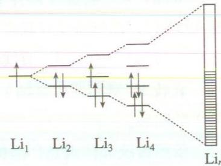  
图3-19 金属晶体中的能带模型

变宽，当金属中的原子处于平衡位置，各能带具有一定宽度；原子轨道能大（即外层轨道），能带宽度大；原子轨道能小（即内层轨道），能带宽度小。另外，温度也影响能带宽度。

(2) 按能带填充电子的情况不同, 可把能带分为满带 (又叫价带)、空带和导带三类——满带中的所有分子轨道全部充满电子; 空带中的分子轨道全都没有电子; 导带中的分子轨道部分地充满电子。例如, 金属钠中的 $1 \mathrm{~s} 、 2 \mathrm{~s} 、 2 \mathrm{p}$ 能带是满带, $3 \mathrm{~s}$ 能带是导带, $3 \mathrm{p}$ 能带是空带。换言之, 金属键在本质上是一种离域键, 形成金属键的电子遍布整个金属, 但其能量不是任意的, 因而它们并非完全自由, 而是处在具有一定能量宽度的能带中。

（3）能带与能带之间存在能量的间隙，简称带隙，又叫“禁带宽度”。有3类不同的带隙：带隙很大、带隙不大、没有带隙（即相邻两能带在能量上是重叠的）。

（4）能带理论对金属导电的解释如下。第一种情况：金属具有部分充满电子的能带，即导带，在外电场作用下，导带中的电子受激，能量升高，进入同一能带的空轨道，沿电场的正极方向移动，同时，导带中原先充满电子的分子轨道因失去电子形成带正电的空穴，沿电场的负极方向移动，引起导电。如金属钠的导电便属于此情况，因为它的3s能带是半充满的导带。第二种情况：金属的满带与空带或者满带与导带之间没有带隙，是重叠的，电子受激可以从满带进入重叠着的空带或者导带，引起导电。如金属镁，它的最高能量的满带是3s能带，最低能量的空带是3p能带，它们是重叠的，没有间隔，3s能带（满带）的电子受激，可以进入3p能带（空带），向正极方向移动，同时满带因失去电子形成带正电的空穴，向负极方向移动，引起导电。又如，铜、银、金的导电性特别强，是由于它们的充满电子的（n-1）d能带（满带）与半充满的ns能带（导带）是重叠的，其间没有间隙，（n-1）d满带的电子受激可以进入ns导带而导电。

（5）能带理论是一种既能解释导体（常为金属与合金），又能解释半导体（常为半金属及其

互化物）和绝缘体（大多数典型非金属单质和典型化合物）性质的理论，还可定量地计算引入杂质引起的固体能带结构的变化而导致固体性质的变化。简单地说，按照能带理论，绝缘体满带与空带之间有很大带隙，电子不可逾越，因而不能导电；典型的半导体（本征半导体）的满带与空带之间的带隙较小，受激电子可以跃过，当电子跃过满带与空带之间的带隙进入空带后，空带的电子向正极移动，同时，满带因失去电子形成带正电的空穴向负极移动，引起导电。有的半

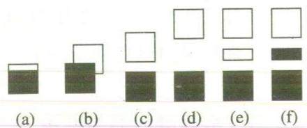  
(图中涂黑的部分充满电子)

(a)、(b) 导体，(c) 本征半导体，

导体需要添加杂质才会导电。杂质的添入，本质上是在禁带之间形成了一个杂质能带（满带或空带），使电子能够以杂质能带为桥梁逾越原先的禁带而导电，参见图3-20。

(6) 由此可见, 按照能带理论, 带隙的大小对固体物质的性质至关重要。

能带理论还可以解释固体的许多物理性质和化学性质。例如，金刚石的满带与空带之间的带隙宽度为5.4 eV，很宽，可见光的能量大大低于5.4 eV，不能使满带的电子激发到空带上去，因而当一束可见光透过金刚石时不发生任何吸收，纯净的金刚石呈无色透明；等等。

（资料6、9摘编自：北京师范大学等编.无机化学（上册·第四版）.北京：高等教育出版社，2002年）

## 10. 金属晶体的原子堆积模型

金属晶体中的原子可看成直径相等的球体。把它们放置在平面上（即二维空间里），可有两种方式，如图3-21所示。

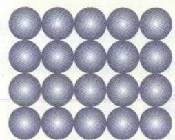

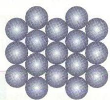  
图3-21 金属原子排列在平面上有两种放置方式——非密置层（左）和密置层（右）

金属原子在二维平面里放置得到的两种方式，配位数分别为4和6，可分别称为非密置层和密置层。

金属晶体可看成金属原子在三维空间中堆积而成。金属原子堆积有如下4种基本模式。

## (1) 简单立方堆积

将非密置层一层一层地在三维空间里堆积，有两种方式：其中一种方式如图3-22所示。

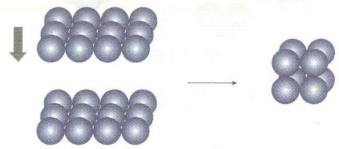

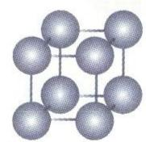  
相邻非密置层原子的原子核在同一直线上的堆积  
图 3-22 金属晶体的堆积方式——简单立方堆积

不难理解，这种堆积方式形成的晶胞是一个立方体，每个晶胞含1个原子，被称为简单立方堆积。这种堆积方式的空间利用率太低，只有金属钋（Po）采取这种堆积方式。

## (2) 体心立方堆积

非密置层的另一种堆积方式是将上层金属原子填入下层的金属原子形成的凹穴中，并使非密置层的原子稍稍分离，每层均照此堆积，如图3-23所示。

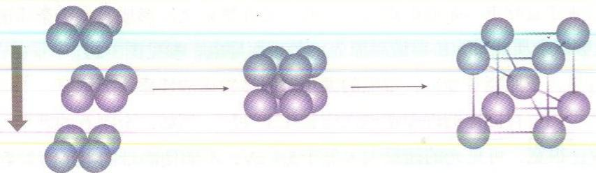  
图3-23 金属晶体的堆积方式——体心立方堆积

由于这种堆积方式所得的晶胞是一个含两个原子的立方体，一个原子在立方体的顶角，另一个原子在立方体的中心，称为体心立方堆积。这种堆积方式的空间利用率显然比简单立方堆积的高多了，许多金属是这种堆积方式，如碱金属。

## (3) 六方最密堆积和面心立方最密堆积

密置层的原子按上述体心立方堆积的方式堆积，会得到两种基本堆积方式——六方最密堆积和面心立方最密堆积。六方最密堆积如图3-24左所示，按ABABABABAB……的方式堆积；面心立方最密堆积如图3-24右所示，按ABCABCABC……的方式堆积。这两种堆积方式都是金属晶体的最密堆积，配位数均为12，空间利用率均为74%，但所得晶胞的形式不同。

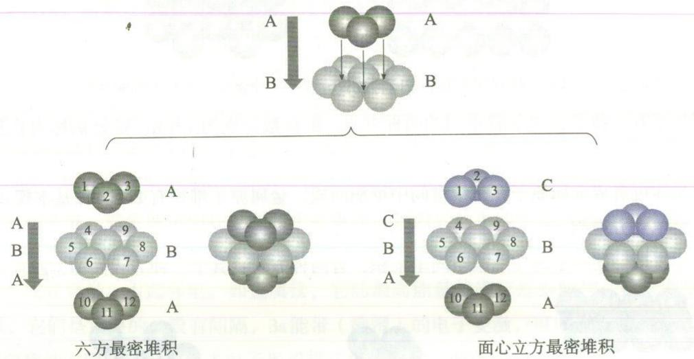  
图 3-24 金属晶体的两种最密堆积方式——六方最密堆积和面心立方最密堆积

## 11. 金属晶体的结构类型

表3-2 金属晶体中常见的三种结构类型

<table><tr><td>三种典型结构类型</td><td>体心立方晶胞</td><td>面心立方晶胞</td><td>六方晶胞</td></tr><tr><td>配位数</td><td>8</td><td>12</td><td>12</td></tr><tr><td>常见金属晶体(有些金属晶体可能有两种或三种晶胞)</td><td>Li Na K Rb Cs Ca SrBa Ti V Nb Ta Cr MoW Fe</td><td>Ca Sr Cu Au Al Pb NiPd Pt</td><td>Be Mg Ca Sr Co Ni ZnCd Ti</td></tr></table>

<table><tr><td>结构示意图</td><td></td><td></td><td></td></tr><tr><td>空间利用率</td><td>68%</td><td>74%</td><td>74%</td></tr><tr><td>堆积形式</td><td>体心立方堆积</td><td>(面心)立方最密堆积</td><td>六方最密堆积</td></tr></table>

## 12. 离子晶体中离子的配位数

与中心离子（或原子）直接成键的离子（或原子）称为配位离子（或原子）。配位离子（或原子）的数目称为配位数，如在氯化钠晶体中，钠和氯的配位数都是6。离子晶体是通过离子键结合而成的，离子键的一个特点是没有方向性。离子是一个带电的质点（近似地认为是球体），根据静电学理论，它在各个方向上的静电效应是等同的。离子键的另一个特点是没有饱和性。只要离子附近空间条件许可，每一个离子就有可能吸引尽量多的带相反电荷的离子。虽然离子键没有饱和性，但是离子的配位数并不是任意的。事实上，离子晶体中每种离子都有一定的配位数。

因为离子键没有方向性，所以离子的电荷不影响配位数。阴、阳离子的半径比值 $(r^{+}/r^{-})$ 影响配位数的多少，半径比值越大，配位数就越大。

<table><tr><td>配位数</td><td>4</td><td>6</td><td>8</td></tr><tr><td>半径比</td><td>0.2~0.4</td><td>0.4~0.7</td><td>0.7~1.0</td></tr><tr><td>离子晶体</td><td>ZnS</td><td>NaCl</td><td>CsCl</td></tr></table>

此外，化合物的组成比，也是影响配位数的一个重要因素。

## 13. 离子晶体的简单结构类型

组成比为1:1的离子晶体称为AB型离子晶体，它是离子晶体中最简单的一类。AB型离子晶体最常见的基本结构有NaCl型、CsCl型和ZnS型。

## (1) NaCl 型

NaCl型离子晶体中，每个离子被6个带相反电荷的离子包围，阴离子和阳离子的配位数都为6。常见的NaCl型离子晶体有碱金属元素（铯除外）的卤化物、银的卤化物（碘化银除外）、碱土金属元素（铍除外）的氧化物、硫化物和硒化物的晶体等。

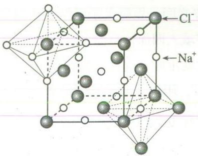  
图 3-25 NaCl 型晶体结构

## (2)CsCl型

CsCl型离子晶体中，每个离子被8个带相反电荷的离子包围，阴离子和阳离子的配位数都为8。常见的CsCl型离子晶体有铯的卤化物（氟化物除外）、TlCl的晶体等。

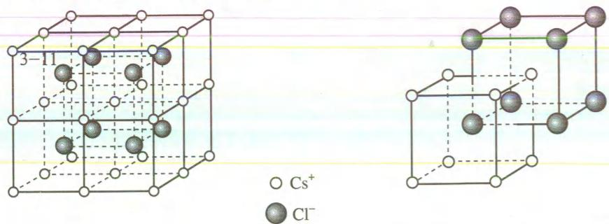  
图 3-26 CsCl 型晶体结构

## (3)ZnS型

ZnS型离子晶体中，阴离子和阳离子的排列类似NaCl型，但相互穿插的位置不同，使阴、阳离子的配位数不是6，而是4。常见的ZnS型离子晶体有硫化锌、碘化银、氧化铍的晶体等。

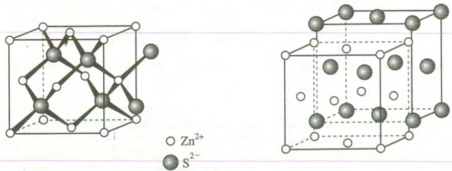  
图 3-27 ZnS 型晶体结构

## 14. 影响离子晶体结构的因素

20世纪40年代，瑞士地球化学家Goldschmidt提出结晶化学定律，指出离子晶体的结构由离子的半径比、电荷比和离子极化三个因素决定。

半径比决定结构最容易理解，如果我们把离子晶体看作大离子（经常是阴离子）堆积，小离子（经常是阳离子）填隙（填入堆积离子之间的空隙中），填隙的离子不能太小，也不能太大，否则晶体就不会稳定，会崩溃，可见正负离子的半径一定需要在一个比例范围内离子晶体才能稳定存在。同样，由于堆积离子形成的空隙经常不止一种，如立方面心堆积有两种空隙——八面体空隙（配位数为6）和四面体空隙（配位数为4），八面体空隙大，四面体空隙小，若填隙离子的半径为堆积离子的半径的0.4\~0.7之间，填隙离子可填入八面体空隙，若填隙离子的半径为堆积离子的0.2\~0.4之间，填隙离子将填入四面体空隙。这正是NaCl和ZnS两种晶体不同的原因。

电荷比不同，化学式的通式就不同，晶体结构自然就不会相同，例如，NaCl和 $CaCl_{2}$ ；ZnS和 $CaF_{2}$ 晶体结构自然不同，而且，阳离子和阴离子的电荷比为1:1时，阳离子和阴离子的配位数相等，而电荷比为1:2时，阳离子和阴离子的配位数不相等，如 $CaF_{2}$ 中，钙离子的配位数为8，而氟离子的配位数为4。

Goldschmidt提出了离子极化的概念，并用以解释为什么有的晶体的结构不同于相同化学式通式的其他晶体。例如， $CdI_{2}$ 晶体是一种层状晶体，更像 $\mathrm{Cd(OH)}_{2}$ 而不像 $CaCl_{2}$ 。用“离子极化”概念来解释，碘离子个儿大，容易受阳离子的电场作用（诱导）而变成椭球状的，不再维持理想模型中的球形，因此 $CdI_{2}$ 晶体就更像 $\mathrm{Cd(OH)}_{2}$ 晶体了。离子极化的后果也可归结为离子键向共价键过渡了，离子键的无方向性向共价键的方向性转化了，结果，离子晶体的配位数将比纯粹用几何因素考虑小，离子之间的核间距变小，离子极化也可称为“键性因素”，它使离子晶体偏离单纯从几何因素考虑得到的标准模型。应当指出，离子极化是一种人为想象的“过程”，并不实际存在，是一种“思维模型”而不是实际过程。

## 15. 晶格能

离子晶体中离子间的化学作用力并不限于一对正、负离子之间，而是遍及所有离子之间。以氯化钠晶体为例，设钠离子与氯离子的最短核间距为 $d$ ，以1个钠离子为中心，它与周围相离 $d$ 的6个氯离子相互吸引，与相离 $\sqrt{2} d$ 的12个钠离子相互排斥，又与相距 $\sqrt{3} d$ 的8个氯离子相互吸引……整个离子晶体中离子之间的静电作用力是所有这些离子的静电吸引力和排斥力的总和，由此形成晶格能（lattice energy，又称“点阵能”）的概念。晶格能（ $U$ ）是指将1摩离子晶体里的正负离子（克服晶体中的静电引力）完全气化而远离所需要吸收的能量（数符为+）。例如：

$$
\mathrm{NaCl(s)} \rightarrow \mathrm {Na^ {+} (g) + Cl^ {-} (g)} \quad U = 7 8 6 \mathrm{kJ} \cdot \mathrm{mol} ^ {- 1}
$$

表3-3给出了某些离子晶体的晶格能。从表中的数据可见，晶格能的大小与离子晶体中离子电荷、离子间核间距等因素有关。此外，晶格能也与离子晶体中离子的排列方式（结构类型）有关（如CsCl与NaCl、CaO与 $\mathrm{Na_2O}$ 的结构类型不同），将影响其晶格能的大小。

表3-3 某些离子晶体的晶格能以及晶体中的离子电荷、核间距、晶体的熔点、硬度

<table><tr><td>AB型离子晶体</td><td>离子电荷</td><td>最短核间距/pm</td><td>晶格能/(kJ·mol-1)</td><td>熔点/°C</td><td>摩氏硬度1</td></tr><tr><td>NaF</td><td>1</td><td>231</td><td>923</td><td>993</td><td>3.2</td></tr><tr><td>NaCl</td><td>1</td><td>282</td><td>786</td><td>801</td><td>2.5</td></tr><tr><td>NaBr</td><td>1</td><td>298</td><td>747</td><td>747</td><td>&gt;2.5</td></tr><tr><td>NaI</td><td>1</td><td>323</td><td>704</td><td>661</td><td>&gt;2.5</td></tr><tr><td>MgO</td><td>2</td><td>210</td><td>3791</td><td>2852</td><td>6.5</td></tr><tr><td>CaO</td><td>2</td><td>240</td><td>3401</td><td>2614</td><td>4.5</td></tr><tr><td>SrO</td><td>2</td><td>257</td><td>3223</td><td>2430</td><td>3.5</td></tr><tr><td>BaO</td><td>2</td><td>256</td><td>3054</td><td>1918</td><td>3.3</td></tr></table>

晶格能越大，表明离子晶体中的离子键越稳定。一般而言，晶格能越高，离子晶体的熔点越高、硬度越大。晶格能大小还影响着离子晶体在水中的溶解度、溶解热等性质。不过，需要提醒注意的是，离子晶体在水中的溶解度与溶解热不但与晶体中离子克服晶格能进入水中吸收的能量有关，还与进入水中的离子发生水化放出的能量（水化热）有关。

晶格能不能直接测定，需用实验方法或理论方法估算，获得晶格能的方法很多，常见的方法有：

波恩-哈伯循环（Born-Haber cycle）：把离子晶体中的离子变成气态离子的过程分解为若干过程之和，例如：

$$
\mathrm{NaCl(s)} \xrightarrow {\mathrm{a}} \mathrm{Na(s)} + 1 / 2 \mathrm{Cl} _ {2} (\mathrm{g}) \xrightarrow {\mathrm{b}} \mathrm{Na(g)} + \mathrm{Cl(g)} \xrightarrow {\mathrm{c}} \mathrm{Na} ^ {+} (\mathrm{g}) + \mathrm{Cl} ^ {-} (\mathrm{g})
$$

过程a的能量变化 $E(a)$ 等于由单质化合成离子晶体的生成热的负值；过程b的能量变化 $E(b)$ 为1摩尔金属钠气化吸收的能量（升华热）与0.5摩尔氯分子的解离能之和；过程c的能量变化 $E(c)$ 为金属钠的电离能与氯原子的电子亲和能之和；晶格能是这些能量项的加和： $U=\{E(a)+E(b)+E(c)\}$ 。由于以上各能项均可用实验方法测定，故这种由波恩和哈伯设计的热化学循环可以估算出许多离子晶体的晶格能。值得指出的是，在这些能项中，只有氯原子获得电子变为负离子（电子亲和能）是放热的（数符为-），其他各项均是吸热的（数符为+），所以加和得到的晶格能的数符为+。若经计算得出某离子晶体的晶格能为负值，意味着这种离子晶体不可能生成。

## 16. 离子液体

离子液体是指在室温或接近室温下呈现液态的、完全由阴阳离子所组成的液体，也称为低温熔融盐（熔点一般小于100 ℃）。离子液体作为离子型化合物，其熔点较低，主要由于某些取代基的不对称性使离子不能规则地堆积成晶体，它一般由有机阳离子和无机阴离子构成。离子液体具有以下特性：

(1) 液态范围宽, 从低于或接近室温到 $300^{\circ} \mathrm{C}$ 以上, 有高的热稳定性和化学稳定性。

（2）蒸气压非常小，不挥发，在使用、储藏中不会蒸发散失，可以循环使用，消除了挥发性有机化合物对环境的污染。

（3）离子液体有良好的导电性，可作为许多物质电化学研究的电解质，并被应用为原电池的电解质。

(4) 对大量无机和有机物质都表现出良好的溶解能力, 且具有溶剂和催化剂的双重功能, 可以作为许多化学反应的溶剂或催化活性载体。由于离子液体的这些特殊性质和表现, 它与超临界 $\mathrm{CO}_{2}$ 、双水相一起构成三大绿色溶剂, 具有广阔的应用前景。

## 17. 氧化铝的晶体类型

$Al_{2}O_{3}$ 有许多同质异晶体，主要有3种晶型，即 $\alpha-Al_{2}O_{3}$ 、 $\beta-Al_{2}O_{3}$ 、 $\gamma-Al_{2}O_{3}$ 。它们结构不同，性质也不同，在1300℃以上的高温时几乎完全转化为 $\alpha-Al_{2}O_{3}$ 。

自然界中的刚玉是 $\alpha-\mathrm{Al}_{2}^{\circ}\mathrm{O}_{3}$ ，属于六方最密堆积，熔点、硬度高，不溶于酸碱，与教科书上讲的既能溶于酸、也能溶于碱的两性氧化物氧化铝不同（教材所指的主要是 $\gamma-Al_{2}O_{3}$ ，它不溶于水，能溶于强酸或强碱溶液，将它加热至1200℃就全部转化为 $\alpha-Al_{2}O_{3}$ ）。

世界上95%的铝业公司都使用拜耳法生产氧化铝，即用浓氢氧化钠溶液将氢氧化铝转化为铝酸钠，通过稀释和添加氢氧化铝晶种或 $CO_{2}$ 使氢氧化铝重新析出。剩余的氢氧化钠溶液重新用于处理下一批铝土矿，实现了连续化生产。氢氧化铝含有部分附着水和结晶水，在回转窑内或流化床经过高温焙烧脱水并进行一系列的晶型转变制得含有一定 $\alpha-Al_{2}O_{3}$ 和 $\gamma-Al_{2}O_{3}$ 的氧化铝产品。

## 18. 硅酸盐

硅酸盐的骨架是由硅氧四面体搭建而成，金属离子填充在部分骨架之间的空隙里以平衡电荷。如教材中的图3-33所示，2个硅氧四面体通过共用一个顶角O形成二聚体；再由二聚体以同样方法形成一维单链。链不是直线型的，而是弯曲的，链与链之间继续通过共用O相连，从单链到双链，是一维向二维发展的开始。硅酸盐的阴离子结构丰富多样，因此硅酸盐矿物种类很多且分布极广，约占矿物种数的四分之一，约占地壳总重量的75%，构成了自然界地壳中千变万化的硅酸盐世界。

铝硅酸盐在硅酸盐中占重要比例，它可看作硅酸盐中部分Si被Al代替。在阴离子骨架中，硅氧四面体之间可相连，而铝氧四面体不能直接相连，只能与硅氧四面体相连。常见的铝硅酸盐矿物有：长石（ $K_{2}O \cdot Al_{2}O_{3} \cdot 6SiO_{2}$ ）、云母（ $K_{2}O \cdot 2Al_{2}O_{3} \cdot 6SiO_{2} \cdot 2H_{2}O$ ）、高岭土（ $Al_{2}O_{3} \cdot 2SiO_{2} \cdot 22H_{2}O$ ）、沸石（ $Na_{2}O \cdot Al_{2}O_{3} \cdot 3SiO_{2} \cdot 22H_{2}O$ ）、石榴石（ $3CaO \cdot Al_{2}O_{3} \cdot 3SiO_{2}$ ）等。硅铝酸盐是陶瓷的原料，也是玻璃、水泥的原料。

## 教学案例

# 第二节 分子晶体与共价晶体（第二课时）

南京市第三高级中学 徐春芸 南京市科利华中学 司璐璐

## 教学目标

1. 认识金刚石晶体中由碳原子形成的三维骨架结构，能运用模型解释物质的性质。

2. 借助实物模型、计算机软件模拟、视频等多种直观手段，认识共价晶体的结构特点，能利用共价晶体的结构特点解释它的性质特点。

## 教学重点

共价晶体的概念；共价晶体结构与性质之间的关系。

## 教学难点

共价晶体的结构特点；依据共价晶体的微观结构，描述或预测共价晶体的性质。

## 教学过程

教学环节一：认识金刚石

<table><tr><td>教师活动</td><td>学生活动</td><td>设计意图</td></tr><tr><td>【引入新课】纯净的金刚石是无色透明、正八面体形状的固体。地壳中含有极少量的金刚石,它是天然存在的最硬的物质。经过仔细打磨后,可以成为璀璨夺目的装饰品——钻石。播放介绍钻石的视频。</td><td>观看视频:将市售的裸钻与切割前的金刚石原石进行比较。</td><td>通过市售的裸钻与切割前的金刚石原石的比较,激发学生学习兴趣。</td></tr><tr><td>【讲解】钻石切割流程:先在钻坯上沿钻石的天然纹理方向画线,再沿线劈割或锯切。“天然纹理”是金刚石微观原子有序排列的宏观表现。在金刚石的晶体中,每个碳原子都是采取 $sp^{3}$ 杂化与相邻4个碳原子形成4个 $σ$ 键,并不断延伸形成三维立体网状结构。请同学们搭建金刚石的结构模型。</td><td>搭建模型:明确在金刚石中碳原子的成键特点,并以小组为单位,用球棍模型自主搭建金刚石的结构模型。</td><td>通过教师的讲解、课件的展示及学生自主搭建模型的过程,把抽象的知识直观地展示给学生,使学生直观形象地认识金刚石晶体的空间结构,为引出共价晶体做好铺垫。</td></tr><tr><td>【组织讨论】(1)在金刚石晶体中相邻C—C间夹角为多少?(2)在金刚石晶体中每个碳原子紧邻的碳原子数是多少?(3)在金刚石晶体中每个碳原子的共价键数是多少?(4)在金刚石晶体中最小环由多少个碳原子构成?是否在同一平面内?</td><td>思考并回答:(1) $109^{\circ}28'$ ;(2)4;(3)4;(4)6,否。</td><td>利用电脑软件,对金刚石结构模型进行自由旋转,引导学生进一步学习金刚石晶体结构的知识。</td></tr><tr><td>【板书】二、共价晶体1.定义:相邻原子间以共价键相结合而形成三维骨架结构的晶体,叫做共价晶体。2.构成粒子:原子3.粒子间作用:共价键4.空间结构:三维骨架结构</td><td>通过上述学习,总结共价晶体的概念和特征。</td><td>引导学生总结共价晶体的概念和特征。</td></tr><tr><td>【课件展示】金刚石晶胞的图片。【组织讨论】(1)依据金刚石的结构模型,找出金刚石的晶胞中的碳原子。(2)一个金刚石晶胞平均占有几个碳原子?</td><td>思考并回答:(1)在金刚石的晶胞中,一个立方体的每个顶点上各有一个碳原子,共8个;在每一个面的中心有一个碳原子,共6个;体内共4个碳原子。(2)8个。</td><td>利用电脑软件,对金刚石晶胞进行自由旋转,结合问题探究,进一步了解金刚石的晶胞结构。</td></tr></table>

教学环节二：认识晶体硅、晶体锗

<table><tr><td colspan="6">教师活动</td><td>学生活动</td><td>设计意图</td></tr><tr><td colspan="6">【布置任务】阅读教材,填写表格。</td><td></td><td rowspan="3">充分发挥学生的主体作用,提高课堂效率,培养学生搜集信息的能力,为后续分析做铺垫。</td></tr><tr><td>物质</td><td>键长/ pm</td><td>键能/(kJ·mol-1)</td><td>键角</td><td>熔点/°C</td><td>摩氏硬度</td><td rowspan="2">填写表格,回答金刚石的键长、键能、键角、熔点和摩氏硬度。</td></tr><tr><td>金刚石</td><td></td><td></td><td></td><td></td><td></td></tr><tr><td colspan="6">【组织讨论】为什么金刚石的熔点高、硬度大?</td><td>思考并回答:共价晶体中,各原子均以共价键结合,形成的是三维骨架结构,使其结构更加牢固,所以共价晶体的硬度大。在熔化时必须破坏其中的共价键,而其共价键的键能相对较大,破坏它们需要很大的能量,因此需要很高的温度,所以共价晶体熔点高。</td><td>通过对数据的分析,从微观角度理解共价晶体熔点高、硬度大的原因。</td></tr><tr><td colspan="6">【回顾】高中必修课程中学过的金刚石的用途。</td><td>回忆并回答:做装饰品、裁玻璃、切割大理石等。</td><td>深化性质决定用途的观念。</td></tr></table>

续表

<table><tr><td>教师活动</td><td>学生活动</td><td>设计意图</td></tr><tr><td>【展示】元素周期表的一部分。【讲解】碳、硅和锗是同一主族的元素,硅和锗形成的晶体与金刚石的结构极其相似,只是将碳原子换成了硅原子或锗原子。【展示】单晶硅、晶体锗的图片及微观结构模型。【组织讨论】怎样从原子结构的角度理解金刚石、硅和锗的熔点和硬度依次下降?</td><td>倾听、思考。思考并回答:金刚石、单晶硅和锗同属于共价晶体,熔点和硬度都较高。而金刚石、硅和锗的结构差别在于碳、硅、锗原子半径依次递增,C—C、Si—Si、Ge—Ge的键长依次递增,键长越大,键能越小,所以熔点和硬度依次下降。</td><td>以碳为中心,结合元素周期表向下拓展到硅和锗,并根据元素周期律,总结出三种晶体的键长、键能、键角以及熔点、硬度的大小。构建原子结构与晶体结构,晶体结构与宏观性质间的关系模型。</td></tr><tr><td>【组织小结】结构相似的共价晶体性质递变有怎样的规律?</td><td>小结:对结构相似的共价晶体来说,原子半径越小,键长越小,键能越大,共价晶体的熔点就越高,硬度也越大。</td><td>结合元素周期律,总结结构相似的共价晶体性质递变的规律。</td></tr></table>

教学环节三：认识碳化硅、二氧化硅

<table><tr><td>教师活动</td><td>学生活动</td><td>设计意图</td></tr><tr><td rowspan="2">【提问】(1)同种原子之间可以形成共价晶体,不同种原子之间可以形成共价晶体吗?(2)如果以金刚石为母体,将其中的部分碳原子换成其他原子,可以换成什么原子呢?【展示】元素周期表的一部分。【讲解】将上述元素进行组合,也可以得到共价晶体,如SiC。碳化硅俗名“金刚砂”,它具有类似金刚石的结构和性质,其空间结构中碳原子和硅原子相间排列。【展示】碳化硅的图片及微观结构模型。</td><td>猜想、回答问题:(1)根据元素周期表,猜想不同原子之间形成的共价晶体的可能组合。(2)可以用硅原子或锗原子等。</td><td>让学生建立从元素周期表中寻找新物质的思维模型,学会使用元素周期表作为学习化学的工具。</td></tr><tr><td>倾听、理解。</td><td>运用类比法学习新知,在金刚石的结构模型上进行拓展,学习碳化硅的结构。</td></tr></table>

<table><tr><td colspan="4">教师活动</td><td>学生活动</td><td>设计意图</td></tr><tr><td colspan="4">【组织讨论】(1)在碳化硅晶体中,碳原子与硅原子的个数比为多少?(2)根据原子结构,对比金刚石、晶体硅,推测碳化硅的键长、键能、键角以及熔点、硬度大约在什么范围?</td><td>思考并回答:(1)1:1;(2)因为硅原子半径大于碳原子,所以键长:晶体硅&gt;碳化硅&gt;金刚石;键能:晶体硅&lt;碳化硅&lt;金刚石;熔点和硬度:晶体硅&lt;碳化硅&lt;金刚石。</td><td>通过原子结构来分析键长、键能的思路,学会运用微观结构与宏观性质的关系模型,推测物质性质的方法。</td></tr><tr><td colspan="4">【讲解】水晶是一种古老的宝石,晶体完好时呈六棱柱钻头形,它的主要成分是二氧化硅。二氧化硅是由地壳中含量最高的两种元素组合形成的化合物。【提问】分析下表数据:推测二氧化硅属于什么晶体?物质 熔点/°C 状态(室温) 晶体类型 $CO_2$  -56.2 气态 分子晶体 $SiO_2$  1710 固态 ?</td><td></td><td>对比共价晶体与分子晶体的性质差异,预测物质结构。</td></tr><tr><td colspan="4">【提问】二氧化硅是一种典型的共价晶体。根据硅和氧的原子结构,并结合二氧化硅中硅元素和氧元素的化合价,猜测一下硅原子和氧原子是怎样成键的?在二氧化硅晶体中原子又是怎样排列的呢?</td><td>思考并回答:硅氧四面体结构,通过顶角的O相连形成螺旋上升的长链。</td><td>引导学生根据硅和氧的原子结构,以及硅氧四面体结构,猜测二氧化硅中硅原子和氧原子的成键方式。</td></tr><tr><td colspan="4">【组织讨论】二氧化硅晶体中,硅原子与氧原子的个数比为多少?</td><td>思考并回答:1:2。</td><td>引导学生进一步理解二氧化硅晶体的结构。</td></tr><tr><td colspan="4">【讲解】二氧化硅是自然界中含量最高的固态二元氧化物。自然界中最常见的二氧化硅晶体是低温石英( $\alpha$ -石英)。请同学阅读教材。</td><td>倾听、阅读教材。</td><td>通过了解石英的用途,让学生更好地了解化学材料的社会价值。</td></tr><tr><td colspan="4">【展示】二氧化硅的用途图片。如制造水泥、玻璃、人造红宝石、单晶硅、硅光电池、芯片和光导纤维等。</td><td>倾听、观看图片。</td><td>让学生感受化学对生产、生活起到的巨大作用。</td></tr></table>

续表

续表

## 板书设计

## 二、共价晶体

1. 定义：相邻原子间以共价键相结合而形成三维骨架结构的晶体，叫做共价晶体。

2. 构成粒子：原子

3. 粒子间作用：共价键

4. 空间结构：三维骨架结构

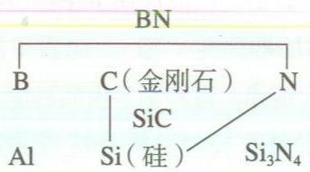

C(金刚石)

5. 物理性质：一般熔点高、硬度大

6. 共价晶体与分子晶体的比较

Ge(锗)

Sn(灰锡)

## 第三节 金属晶体与离子晶体（第二课时）

——离子晶体、过渡晶体与混合型晶体

南京师范大学附属实验学校 高雪 李绍晨

## 教学目标

1. 知道离子晶体的结构特点，能比较一些简单的离子晶体的熔点。

2. 了解第三周期元素的氧化物的晶体类型，能通过元素性质的递变性解释晶体类型的改变原因，认识过渡晶体。

3. 了解石墨晶体的结构特点，能说出石墨晶体的性质与结构的关系，认识混合型晶体的存在，感受化学世界的多样性和复杂性，树立严谨求实的科学态度。

## 教学重点

1. NaCl 晶胞和 CsCl 晶胞的结构特点。

2. 离子晶体的结构与性质的关系。

## 教学难点

理解石墨的结构与性质之间的关系。

## 教学流程

借助对 NaCl 晶体性质的分析，初步建立关于离子晶体的认知模型

离子晶体

通过搭建NaCl和CsCl晶胞模型，体会离子晶体的结构特点

借助晶体模型，从结构上分析影响离子晶体熔点的因素

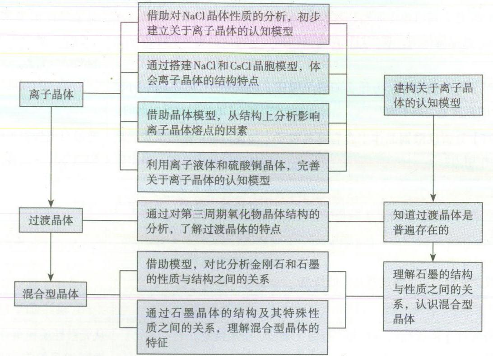

建构关于离子晶体的认知模型

过渡晶体

利用离子液体和硫酸铜晶体，完善关于离子晶体的认知模型

通过对第三周期氧化物晶体结构的分析，了解过渡晶体的特点

混合型晶体

借助模型，对比分析金刚石和石墨的性质与结构之间的关系

知道过渡晶体是普遍存在的

通过石墨晶体的结构及其特殊性质之间的关系，理解混合型晶体的特征

理解石墨的结构与性质之间的关系，认识混合型晶体

## 教学过程

教学环节一：研究NaCl、CsCl晶体的结构与性质特点

<table><tr><td>教师活动</td><td>学生活动</td><td>设计意图</td></tr><tr><td>【展示】视频:硫酸铜等结晶过程。实物:硫酸铜晶体、NaCl晶体。</td><td>观看。</td><td>激发学习兴趣。</td></tr><tr><td>【提问】结合生活常识,描述NaCl晶体的硬度和熔点等性质。【提问】NaCl晶体由哪些粒子构成?粒子间的作用力是什么?【追问】请从结构视角解释NaCl晶体的物理性质。</td><td>交流讨论。回答:钠离子和氯离子;离子键。</td><td>通过探寻NaCl晶体的物理性质与结构之间的关系,归纳NaCl晶体的特点,初步建立关于“离子晶体”的认知模型。</td></tr><tr><td>【小结】离子晶体的定义、构成粒子及粒子间的相互作用力。</td><td></td><td></td></tr><tr><td>【组织探究】利用橡皮泥和牙签制作NaCl和CsCl的晶胞模型,观察对比两者的结构特点。【提问】两种晶体中,为什么阳离子周围结合的氯离子个数不同?</td><td>小组合作制作、观察:分析每个晶胞中实际占有的离子个数。讨论分析:可能是由于 $Na^{+}$ 和 $Cs^{+}$ 的半径差异引起的。</td><td>通过晶体模型搭建,帮助学生体会两种晶胞的结构特点。</td></tr><tr><td>【提问】分析硫酸铜晶体中含有哪些粒子间的作用力?</td><td>交流讨论:依据硫酸铜晶体的结构示意图,得出硫酸铜晶体中存在离子键、共价键、氢键、范德华力等作用力。</td><td>通过对硫酸铜晶体结构的分析,完善关于“离子晶体”的认知模型。</td></tr></table>

教学环节二：了解过渡晶体的特点

<table><tr><td>教师活动</td><td>学生活动</td><td>设计意图</td></tr><tr><td>【指导阅读】阅读教材中有关“过渡晶体”的内容。思考:(1)推测 $P_{2}O_{5}(P_{4}O_{10})$ 、 $SO_{3}$ 、 $Cl_{2}O_{7}$ 的化学键中离子成分的百分数的变化趋势。(2)从元素性质视角解释这一变化趋势产生的原因。(3)描述第三周期主族元素的氧化物的晶体类型的变化趋势。【讲解】在实际晶体中,多数晶体会介于几种晶体类型之间,属于过渡晶体。</td><td>阅读、交流讨论。回答:(1) $P_{2}O_{5}$ 、 $SO_{3}$ 、 $Cl_{2}O_{7}$ 的离子键的百分数应小于33,且呈逐渐减小的趋势。(2)第三周期元素从左到右,电负性逐渐增强,与氧元素的电负性的差值逐渐减小。(3)离子晶体→共价晶体→分子晶体。</td><td>从元素性质视角分析、推断粒子间作用力的情况,认识到元素性质的递变性会引起晶体类型的改变。</td></tr></table>

教学环节三：理解混合型晶体的特点

<table><tr><td>教师活动</td><td>学生活动</td><td>设计意图</td></tr><tr><td>【提问】金刚石质地坚硬、不能导电,而石墨质软,具有良好的导电性。请根据金刚石和石墨的晶体结构模型分析它们性质差异的原因。</td><td>交流讨论。</td><td>理解石墨晶体的结构特点与其特殊性质间的关系,形成关于“混合型晶体”的模型认知。</td></tr></table>

续表

<table><tr><td>教师活动</td><td>学生活动</td><td>设计意图</td></tr><tr><td>【追问】石墨晶体中,体现了哪些晶体的特点?【讲解】像石墨这样的晶体,是一种混合型晶体。</td><td>交流讨论:石墨晶体中兼有共价晶体、金属晶体和分子晶体的特点。</td><td></td></tr></table>

教学环节四：总结归纳，整合提升

<table><tr><td>教师活动</td><td>学生活动</td><td>设计意图</td></tr><tr><td>【梳理总结】引导学生对晶体知识进行梳理和总结。【引导反思】引导学生认识晶体结构的多样性和复杂性。【布置作业】(略)</td><td>交流讨论:晶体的划分依据——构成晶体的粒子及粒子间的作用力。不同晶体体现出的性质也不同。提升:对事物的简单归类虽然条理鲜明,但有可能只是概括了最典型的事实。因此,我们要“具体问题具体分析”。</td><td>归纳总结四类典型晶体结构的特点,同时认识到介于典型晶体之间的过渡晶体及混合型晶体是普遍存在的,树立严谨求实的科学态度。</td></tr></table>

## 板书设计

## 第三节 金属晶体与离子晶体（第二课时） ——离子晶体、过渡晶体与混合型晶体

## 一、离子晶体

1. 定义：离子晶体是由阴离子和阳离子相互作用而形成的晶体

2. 构成粒子：阴离子和阳离子

3. 粒子间的相互作用力：离子键

## 二、过渡晶体

$Na_{2}O$ MgO $Al_{2}O_{3}$ $SiO_{2}$ $P_{2}O_{5}$ $SO_{3}$ $Cl_{2}O_{7}$ 离子晶体 → 共价晶体 → 分子晶体

## 三、混合型晶体

石墨晶体

# 第四节 配合物和超分子（第一课时）

南京市玄武高级中学 刘亚男
南京市玄武教师发展中心 陆建源

## 教学目标

1. 知道配位键的特点，能分析简单配位化合物的成键特征。

2. 了解配位化合物的广泛存在与应用，能运用配位键和配合物的有关知识解释一些化学现象。

## 教学重点

配位键、配合物的概念，配合物的制备。

## 教学难点

配位化合物的成键特征。

## 教学流程

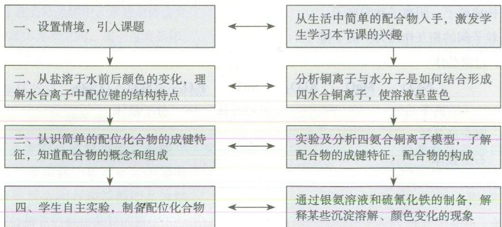

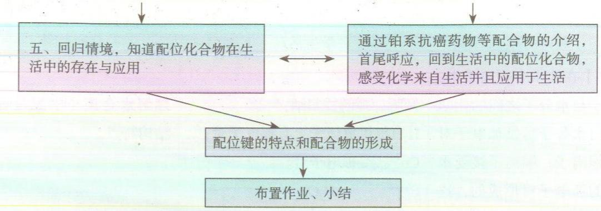

## 教学过程

教学环节一：理解配位键的结构特点

<table><tr><td>教师活动</td><td>学生活动</td><td>设计意图</td></tr><tr><td>【投影】卟啉配合物叶绿素、血红素、抗癌药物顺铂的结构示意图。【提问】无水硫酸铜是白色的,为什么硫酸铜晶体是蓝色的呢?</td><td>观看、交流:感知一些配合物的结构。思考:颜色变化的原因。</td><td>感知配合物结构的复杂性,激发学生研究配合物的兴趣。利用学生熟知的知识情境引发思考。</td></tr><tr><td>【组织实验】完成实验3-2。</td><td>小组实验探究,观察现象并填写表格。</td><td></td></tr><tr><td>【讲解】呈蓝色的物质是水合铜离子: $[Cu(H_2O)_4]^{2+}$ ,可读为四水合铜离子。</td><td>倾听、理解(了解水合铜离子的写法、读法)。</td><td>引导学生从微粒的视角来解释溶液的颜色。</td></tr><tr><td>【展示】 $[Cu(H_2O)_4]^{2+}$ 的模型【提问】根据水合铜离子的结构图,你能分析一下铜离子和 $H_2O$ 之间是通过哪种类型的化学键形成的?</td><td>观察 $[Cu(H_2O)_4]^{2+}$ 的模型。交流讨论:水分子中的氧原子上有孤电子对,铜离子能接受孤电子对,它们结合在一起形成了 $[Cu(H_2O)_4]^{2+}$ ,这种离子是蓝色的,使溶液变蓝。</td><td>帮助学生建构配位键的概念。通过分析 $[Cu(H_2O)_4]^{2+}$ 的结构,了解铜离子与水分子的成键原理。</td></tr><tr><td rowspan="2">【讲解】在四水合铜离子中,铜离子与水分子之间的化学键是由水分子提供孤电子对给予铜离子,铜离子接受水分子的孤电子对形成的,这种“电子对给予——接受”键被称为配位键。</td><td>倾听、理解并归纳:</td><td rowspan="2">理解水合离子中配位键的结构特点。</td></tr><tr><td> $H_2O$ 提供氧原子上有孤电子对; $Cu^{2+}$ 接受孤电子对。</td></tr></table>

教学环节二：进一步认识配位化合物

<table><tr><td>教师活动</td><td>学生活动</td><td>设计意图</td></tr><tr><td>【指导阅读】指导学生阅读相关教材,以硫酸四水合铜为例,概括出配合物的概念。</td><td>阅读并概括出配合物的概念。</td><td>初步了解配位化合物的概念。</td></tr><tr><td>【讲解】注意接受体是金属离子或原子。</td><td>辨析概念:理解接受体为中心原子或离子。</td><td>辨析配合物和配位键的关系,强化概念的理解。</td></tr><tr><td>【组织实验】组织学生以小组合作方式完成实验3-3。【提问】(1)为什么最初会生成难溶物?(2)继续加氨水看到什么现象?</td><td>小组实验。回答问题:(1)氨水呈碱性;(2)继续加入足量氨水,沉淀溶解,得到深蓝色透明溶液。</td><td>培养学生观察能力和记录实验现象的习惯。</td></tr><tr><td>【组织讨论】(1)举例说明哪些粒子可以提供孤对电子?哪些粒子能接受孤电子对?(2)请运用平衡移动原理解释上述实验中为什么沉淀会溶解?</td><td>回答问题:(1) $H_2O$ 、 $NH_3$ 等能提供孤电子对;能接受孤电子对 $Cu^{2+}$ 、 $Fe^{3+}$ 、 $Ag^+$ 等。(2)从溶解平衡移动原理具体分析: $Cu(OH)_2(s) \rightleftharpoons Cu^{2+} + 2OH^-$  $+$  $4NH_3 \cdot H_2O$  $\downarrow$  $[Cu(NH_3)_4]^{2+}$ </td><td>培养运用已学知识解决问题的能力。</td></tr></table>

续表

<table><tr><td>教师活动</td><td>学生活动</td><td>设计意图</td></tr><tr><td></td><td>由于生成了 $[Cu(NH_3)_4]^{2+}$ ,使平衡向生成 $[Cu(NH_3)_4]^{2+}$ 的方向移动,从而使沉淀溶解。</td><td></td></tr><tr><td>【追问】实验中用玻璃棒摩擦试管壁的作用是什么呢?</td><td>思考并回答:加快结晶速度,与加入晶种来加速结晶的原理一样。</td><td>学会知识的迁移。</td></tr><tr><td>【讲解】在 $[Cu(NH_3)_4]^{2+}$ 里, $NH_3$ 的N给出孤电子对, $Cu^{2+}$ 接受孤电子对,以配位键形成了 $[Cu(NH_3)_4]^{2+}$ 。中心离子为 $Cu^{2+}$ ,而配体是 $NH_3$ ,配位数为4。【组织实验】(补充)用NaOH溶液和 $BaCl_2$ 溶液检验硫酸四氨合铜中的离子。</td><td>倾听、理解。完成实验:溶液中几乎没有 $Cu^{2+}$ ,但有大量 $SO_4^{2-}$ 。</td><td>巩固对配位键的理解,培养学生的推理、类比的能力。引发学生思考。</td></tr><tr><td>【讲解】配合物一般是由内界和外界构成,内界由中心离子(或原子)、配位体构成。【讨论】请以硫酸四氨合铜为例说明配合物的构成。</td><td>讨论并汇报:(配离子)</td><td>讨论并归纳配位化合物的相关知识。</td></tr></table>

教学环节三：初步掌握简单配合物的制备

<table><tr><td>教师活动</td><td>学生活动</td><td>设计意图</td></tr><tr><td>【提问】请大家回忆我们是如何检验 $Fe^{3+}$ 的?【组织实验】完成实验3-4。</td><td>回忆旧知。完成实验3-4。</td><td>利用已学知识引入其他配位化合物。</td></tr><tr><td>【讲解】利用该反应可以进行 $Fe^{3+}$ 的检验,这是三价铁离子跟硫氰酸根离子形成了显红色的配离子。又由于该离子颜色极似血液,常被用于电影特技和魔术表演。</td><td>倾听。</td><td>将化学知识应用于生活。</td></tr><tr><td rowspan="2">【提问】常见的配合物还有哪些?还记得银氨溶液吗?【组织实验】完成学生实验3-5。</td><td>回答问题。</td><td></td></tr><tr><td>完成实验3-5。</td><td>通过学生自主实验,提高实验能力。</td></tr><tr><td>【提问】为什么白色的沉淀消失了?请参照刚刚所学的实验3-3的内容进行解释。【讲解】(学生讨论后归纳)AgCl+2NH3=[Ag(NH3)2]Cl</td><td>讨论并解释。倾听。</td><td>引导学生对配离子的知识迁移应用。</td></tr><tr><td>【讲解】配位键的强度有大有小,有的配合物很稳定,有的很不稳定。配合物在生活中的存在与应用。</td><td>倾听。</td><td>进一步认识配合物,体会化学的学科价值。</td></tr><tr><td>【布置作业】</td><td>(1)完成课后习题;(2)查阅资料了解配合物对化学发展的贡献。</td><td>巩固本节所学内容。</td></tr></table>

## 板书设计

## 第四节 配合物和超分子（第一课时）

## 一、配位键

1. 概念: 电子对给予——接受

2. 形成条件：一方提供孤电子对（配体），一方接受孤电子对（中心离子或原子）

## 二、配合物

1. 概念：把金属离子或原子（称为中心离子或原子）与某些分子或离子（称为配体或配位体）以配位键结合形成的化合物称为配位化合物，简称配合物。

2. 组成：

中心原子或离子

内界（配离子）

配合物

外界

配体（配位原子、配位数）