# 教师教学用书

JIAQSHI JIAOXUE YONGSHU

人民教育出版社 课程教材研究所

化学课程教材研究开发中心

编著

HUAXUE

## 化学

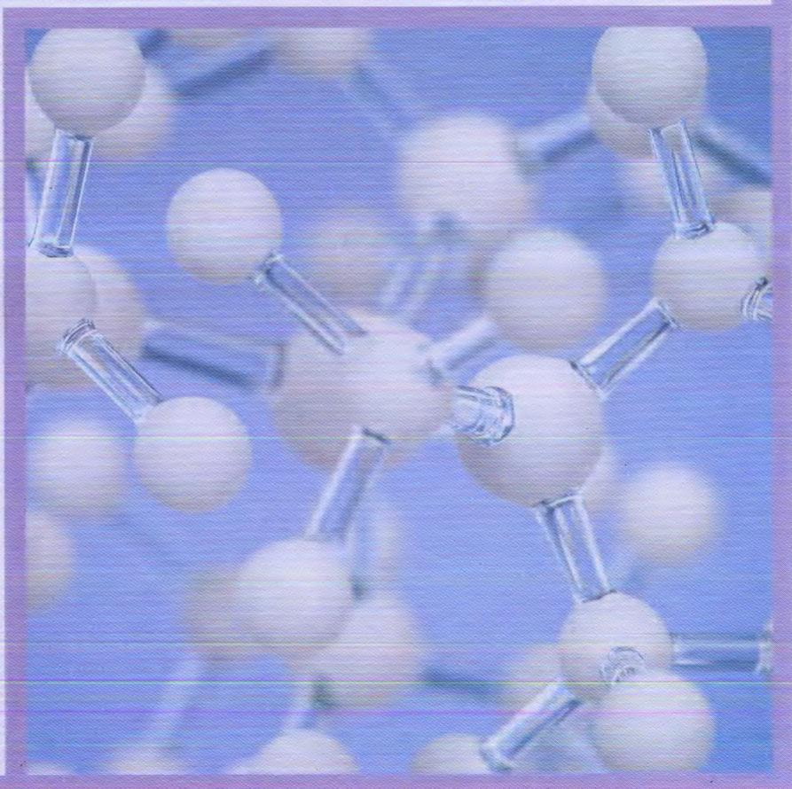

选择性必修 3

有机化学基础

登录“教师网络培训和服务平台”即刻免费获得优质、专业、全面的服务

◇ 独家权威解读新版本新课标教材  
◇ 全面系统推出各科教材配套资源  
◇ 在线活动引领课程教材教法改革  
◇ 网络研修助力一线教师专业成长

请通过人教网顶部“培训服务”菜单访问本平台，或使用微信搜索并关注“人教教材培训”公众号，获取更多最新培训资讯和精彩内容。

普通高中教科书

## 教师教学用书

人民教育出版社 课程教材研究所

化学课程教材研究开发中心

化学

选择性必修3

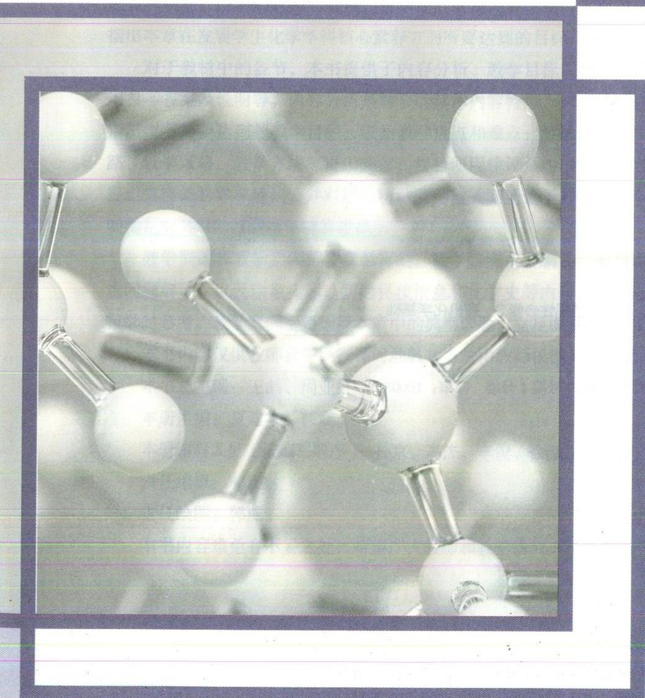

有机化学基础

人民教育出版社

图书在版编目（CIP）数据

普通高中教科书教师教学用书. 化学. 选择性必修3：有机化学基础 / 人民教育出版社课程教材研究所化学课程教材研究开发中心编著. — 北京：人民教育出版社，2020.6

ISBN 978-7-107-34788-7

<table><tr><td colspan="2">I.1普... II.1人... III.1中学化学课—高中—教学参考资料 IV.1G633中国版本图书馆CIP数据核字(2020)第116707号</td></tr><tr><td colspan="2"></td></tr><tr><td colspan="2"></td></tr><tr><td colspan="2"></td></tr><tr><td colspan="2"></td></tr><tr><td colspan="2">普通高中教科书 教师教学用书 化学 选择性必修3 有机化学基础</td></tr><tr><td colspan="2">出版发行 人民教育出版社(北京市海淀区中关村南大街17号院1号楼 邮编:100081)网 址 http://www.pep.com.cn经销 全国新华书店印刷 保定市中画美凯印刷有限公司版 次 2020年6月第1版印 次 2020年8月第1次印刷开 本 890毫米×1240毫米 1/16印 张 13.25字 数 320千字定价 32.40元</td></tr></table>

## 说明

版权所有·未经许可不得采用任何方式擅自复制或使用本产品任何部分·违者必究如发现内容质量问题、印装质量问题，请与本社联系。电话：400-810-5788

人民教育出版社 课程教材研究所
化学课程教材研究开发中心
2020年6月

## 目录

第一章 有机化合物的结构特点与研究方法 …… 1
本章说明 …… 1
第一节 有机化合物的结构特点 …… 4
第二节 研究有机化合物的一般方法 …… 10
复习与提升建议 …… 14
教学资源 …… 17
教学案例 …… 30

第二章 烃…… 35
本章说明 …… 35
第一节 烷烃 …… 38
第二节 烯烃 炔烃 …… 42
第三节 芳香烃 …… 47
复习与提升建议 …… 51
教学资源 …… 53
教学案例 …… 61

第三章 烃的衍生物…… 70
本章说明 …… 70
第一节 卤代烃 …… 73
第二节 醇 酚 …… 80
第三节 醛 酮 …… 87
第四节 羧酸 羧酸衍生物 …… 94
第五节 有机合成 …… 102
复习与提升建议 …… 111
实验活动 1 乙酸乙酯的制备与性质 …… 115

实验活动 2 有机化合物中常见官能团的检验 …… 116
教学资源 …… 117
教学案例 …… 126

第四章 生物大分子…… 135
本章说明 …… 135
第一节 糖类 …… 138
第二节 蛋白质 …… 145
第三节 核酸 …… 153
复习与提升建议 …… 157
实验活动 3 糖类的性质 …… 160
教学资源 …… 162
教学案例 …… 169

第五章 合成高分子…… 173
本章说明 …… 173
第一节 合成高分子的基本方法 …… 175
第二节 高分子材料 …… 179
复习与提升建议 …… 185
教学资源 …… 189
教学案例 …… 196

## 第一章

## 有机化合物的结构特点与研究方法

## 本章说明

本章内容包括有机化合物的结构特点和研究有机化合物的一般方法。在中学阶段，研究有机分子的结构主要关注碳骨架和官能团，研究有机反应的规律需要关注化学键的断裂和形成。确定有机化合物分子结构的主要方法是元素分析、质谱法和波谱法等。

本章介绍的有机化合物的分类方法（依据碳骨架分类和依据官能团分类）是后续章节中按照类别进行研究的方法基础。有机化合物的结构特点（官能团、共价键类型和共价键极性等）是后续章节中研究结构与性质关系的主要出发点。在本章的学习中，教师要帮助学生加深对有机化合物的结构特点和研究方法的认识，为他们以后学习各类有机化合物的组成、结构、性质、变化和应用奠定基础。

## 一、教材分析

本章在编写上遵循“结构决定性质”的化学学科基本观念，在必修阶段学生已经认识碳原子的成键方式的基础上，将选择性必修阶段分析分子结构的重点落在共价键的类型和极性上，使学生认识有机化合物分子中的电子效应及其对性质和反应规律的影响。

有机化合物数量繁多，分类研究是重要的研究方法。按照有机化合物的结构特点，分类的主要依据是有机化合物的碳骨架和官能团。在分类的基础上进一步分析有机化合物的分子结构，需要立足于有机化合物的碳骨架和官能团这两个基本视角，关注共价键的类型和极性，并通过同分异构现象认识有机化合物分子结构的复杂性。这是研究有机化合物性质和反应规律的结构依据，体现了“结构决定性质”的学科观念，有助于发展宏观辨识与微观探析的学科核心素养。

天然产物和新合成的有机化合物一般都是混合物，因此分离和提纯是研究有机化合物的第一步，也是分析有机化合物结构和性质的基础。蒸馏、萃取和重结晶是常用的分离和提纯方法。教师可以通过实验探究的方式帮助学生了解各种分离、提纯方法的原理，初步学会基本操作。研究有机化合物的第二步是通过元素分析确定其实验式（最简式），教师应帮助学生学会燃烧法测定有机化合物实验式的计算方法。第三步是通过现代仪器分析确定其相对分子质量、分子式、分子结构和晶体结构等，教师应使学生知道测定有机化合物分子结构的常用仪器分析方法（质谱法、红外光谱法、核磁共振氢谱法和X射线衍射法等），并帮助学生学会结合简单谱图信息分析推断有机化合物的分子结构。

本章的内容结构如下图所示。

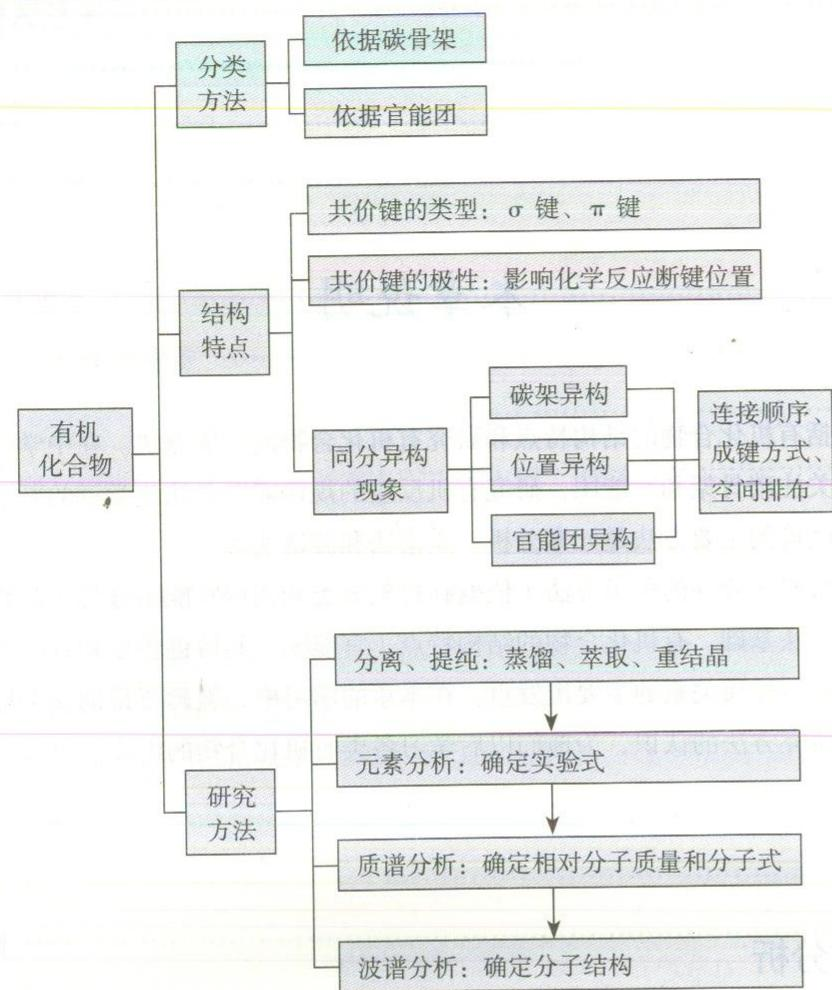

## 二、学业要求

1. 能依据有机化合物分子中原子间的连接顺序、成键方式和空间排布判断有机化合物分子中碳原子的饱和程度、共价键的类型和共价键的极性，能依据碳骨架认识有机化合物的分类。

2. 能辨识有机化合物分子中的官能团（碳碳双键、碳碳三键、羟基、氨基、碳卤键、醛基、酮羰基、羧基、酯基和酰胺基），能依据官能团认识有机化合物的分类。

3. 能依据有机化合物分子的结构特点（官能团、化学键），初步分析有机化合物的化学性质和有机反应规律，初步认识分子中基团之间存在相互影响，知道在一定条件下官能团可以相互转化。

4. 能辨识有机化合物的同分异构现象（碳架异构、位置异构和官能团异构），能写出符合特定条件的同分异构体。

5. 能依据有机化合物分离和提纯的原理，以及有机化合物自身的性质，选择分离和提纯的方法，并初步学会分离和提纯的基本操作。

6. 能说出测定有机化合物分子结构的常用仪器分析方法，能结合简单的谱图信息（质谱、核磁共振氢谱、红外光谱）分析推断有机化合物的分子结构。

## 三、课时建议

第一节 有机化合物的结构特点 2课时  
第二节 研究有机化合物的一般方法 2课时  
全章复习 1课时

## 第一节 有机化合物的结构特点

## 一、内容分析

本节内容主要包括有机化合物的分类方法、结构特点和同分异构现象。教材先帮助学生树立在有机化合物类别层面进行有机化学研究的观念，再帮助学生初步构建依据有机化合物分子结构分析预测其性质和反应规律的方法体系，通过有机化合物的同分异构现象使学生进一步认识有机化合物结构的复杂性。

在甲烷、乙烯、乙醇和乙酸等有机化合物代表物的结构与性质，以及各种烃和烃的衍生物的简单分类的知识基础上，本节进一步学习依据碳骨架和官能团对有机化合物进行系统分类。由于学生已经学习了乙烯中的碳碳双键、乙醇中的羟基和乙酸中的羧基等官能团，教材将学生对官能团的认识拓展到碳碳双键、碳碳三键、羟基、氨基、碳卤键、醛基、酮羰基、羧基、酯基和酰胺基等常见官能团，从而帮助学生学会依据官能团进行有机化合物分类并开展分类研究的方法。依据碳骨架和官能团进行分类也为日后学生学习有机合成时构建碳骨架和官能团打下基础。

在必修阶段碳原子成键方式的知识基础上，本节进一步引导学生将认识视角放在共价键的类型、共价键的极性及基团间的相互作用上，以此来深化学生对有机化合物结构特点及其对化学性质的影响的认识。通过分析乙醇与钠、乙醇与氢溴酸的反应实例，帮助学生初步学会从化学键视角分析有机反应规律，认识有机反应中官能团的变化和化学键的断裂与形成，在后续的学习中能够用官能团和化学键的变化来分析有机反应的规律，提高学生在有机合成中构建碳骨架和官能团的能力。

在分析有机化合物分子中官能团与化学键的特点之后，教材引入有机化合物的同分异构现象，目的是帮助学生进一步认识有机化合物结构的复杂性及其对化学性质的影响。有机化合物的同分异构现象与碳原子的连接顺序、成键方式和空间排布有关。教材在复习烷烃的碳架异构的基础上，帮助学生学会辨识烯烃和卤代烃的官能团位置异构，以及醇和醚的官能团异构。烯烃的顺反异构将在后续章节中学习。教材在“科学史话”栏目中对对映异构进行了简单介绍。为了让学生更好地理解同分异构现象，教材通过分子结构模型示意图直观地呈现微观结构。在教学中也可以采用搭建模型的活动方式帮助学生理解。

## 二、教学目标

## 1. 教学目标

（1）了解有机化合物的分类方法，能依据有机化合物分子的碳骨架和官能团对常见有机化合物进行分类。通过对典型有机化合物中碳骨架和官能团的分析，发展分类研究有机化合物的模型认知的学科素养。

（2）认识有机化合物分子结构中碳原子的成键特点、共价键的类型和共价键的极性，能初步根据有机化合物的分子结构特点对其化学性质和有机反应规律进行分析预测。通过分析共价键的极性对有机化合物性质的影响，深化对“结构决定性质”的理解。

（3）认识有机化合物的同分异构现象，能辨识常见有机化合物的碳架异构、位置异构和官能团异构。通过书写符合特定条件的同分异构体的结构简式，进一步从微观层面理解有机化合物分子结构的复杂性。

## 2. 教学重点和难点

重点：有机化合物分子中官能团的辨识，以及官能团对化学性质的影响；从官能团和化学键的视角分析有机反应的规律。

难点：有机化合物同分异构体的书写。

## 三、教学建议

1. 通过搭建分子结构模型的活动, 认识各类有机化合物分子碳骨架的结构特点

学生在教师指导下搭建各类有机化合物的分子结构模型。建议使用标准球棍模型，提示学生注意代表碳原子的小球上的孔位关系，要求每组学生都分别搭建6个碳原子以内的脂肪烃、脂环烃、芳香烃和脂肪醇的分子结构模型各1个。各组学生在完成分子结构模型的搭建任务后再进行讨论，分析和比较各类有机化合物分子碳骨架的结构特点。教师组织学生进行问题交流，引导学生重点讨论的问题可参考以下内容。

(1) 为什么要对有机化合物进行分类研究?

(2) 怎样依据碳骨架对有机化合物进行分类?

(3) 在连接顺序、成键方式和空间排布上, 脂肪烃、脂环烃和芳香烃各有怎样的结构特点?

(4) 脂肪烃和脂肪醇的组成和结构有什么相同点和不同点?

最后，教师可以给出陌生有机化合物的结构简式，让学生辨识它们的类别，在迁移应用中帮助学生学会碳骨架分类法。

## 2. 通过对比辨识和迁移应用, 认识有机化合物的官能团分类法

教师可利用教材中有机化合物主要类别、官能团和代表物的表格，引导学生从官能团的组成和结构（化学键）角度进行辨识。可以通过小组讨论练习的形式帮助学生认识各种官能团。例如，给出官能团名称写出官能团的结构简式，给出官能团的结构简式写出官能团名称，给出代表物的结构简式找出官能团，等等。可以利用教材中的“思考与讨论”栏目，让学生将各种有机化合物按照官能团进行分类，在迁移应用中帮助学生辨识各种官能团。在复习乙烯、乙醇和乙酸的官能团与化学性质的基础上，还可以利用教材中的栏目，让学生在分析丙烯酸的官能团及性质的过程中，进一步辨识和探析各类有机化合物的结构和性质。可以提出相关问题，例如：丙烯酸发生化学反应时，化学键和官能团是如何变化的？

## 3. 通过设置驱动性问题，帮助学生认识同分异构现象，学会书写同分异构体的结构简式

驱动性问题最好由学生自己在讨论后提出。在复习必修阶段同分异构体知识的基础上，先让学生对本部分内容进行自学和小组讨论，提出有价值的问题。教师引导学生依据有机化合物的组成、结构、性质（物理性质和化学性质）、变化和应用的逻辑顺序对各种问题进行分类归纳，并筛选出有代表性的问题进行全班交流讨论。引导学生重点讨论的问题可参考以下内容。

## (1) 组成: 正戊烷、异戊烷和新戊烷的组成是怎样的?

（2）结构：正戊烷、异戊烷和新戊烷的碳骨架结构有什么相同点和不同点？1-丁烯和2-丁烯的碳骨架结构、成键方式、官能团位置有什么相同点和不同点？乙醇和二甲醚分子中的官能团和化学键有什么不同？

(3) 性质: 正戊烷、异戊烷和新戊烷的物理性质和化学性质有什么相同点和不同点?

（4）变化：乙醇能燃烧，二甲醚能否燃烧？为什么？乙醇能与钠反应放出氢气，二甲醚能否与钠反应放出氢气？为什么？

（5）应用：有机化合物的构造异构有哪些类别？参照正丁烷和异丁烷的碳架异构、1-丁烯和2-丁烯的位置异构，写出戊烯同分异构体的结构简式。

芳香烃的碳架异构（如邻二甲苯、间二甲苯和对二甲苯）可在第二章芳香烃一节中再进行讨论。

## 4. 在化学键层面对有机化合物的结构进行探析

## (1) 共价键的类型对有机反应的影响

在复习选择性必修“物质结构与性质”教材中杂化轨道、 $\sigma$ 键、 $\pi$ 键等知识的基础上，帮助学生认识乙烷和乙烯的结构特点，引导学生思考为什么乙烷能发生取代反应，不能发生加成反应，而乙烯能发生加成反应。

## (2) 共价键的极性对有机化合物性质的影响

在复习选择性必修“物质结构与性质”教材中共价键的极性等知识的基础上，对比水、乙醇和乙酸中氢氧键的极性及化学性质，帮助学生理解化合物分子中基团之间的相互作用对共价键极性的影响，以及共价键的极性对化学性质的影响。不同物质中相邻基团对氢氧键极性的影响如下表所示。

<table><tr><td>物质</td><td>结构简式</td><td>氢氧键的极性</td></tr><tr><td>水</td><td>H—OH</td><td>水中的H—O是极性键</td></tr><tr><td>乙醇</td><td>CH3CH2—OH</td><td>乙醇中H—O的极性比水中H—O的弱</td></tr><tr><td>乙酸</td><td>CH3C—OH</td><td>乙酸中H—O的极性比水中H—O的强</td></tr></table>

由于乙醇中乙基的给电子效应，其分子中H—O的极性比水中H—O的弱，乙醇的电离能力比水的弱，常温下乙醇的电离常数（ $K_{a}=1.3\times10^{-16}$ ）比水的小。教学中，可以先通过实验探究帮助学生认识相同条件下钠与乙醇反应比钠与水反应缓慢，再引导学生比较乙醇和水中H—O的极性。

由于乙酸中羰基的吸电子效应，其分子中H—O的极性比水中H—O的强，乙酸具有弱酸性，常温下乙酸的电离常数是 $1.8 \times 10^{-5}$ 。教学中，可以先让学生复习乙酸弱酸性的具体表现，再引导学生比较乙酸和水中H—O的极性。

在介绍共价键的极性对有机反应中化学键断裂位置的影响时，可以乙醇与钠、乙醇与氢溴酸的反应为例，说明由于乙醇中的H—O和C—O的极性都较强，在反应中容易发生断裂。

以上共价键的类型和共价键的极性影响有机化合物化学性质和反应规律的教学活动，将学生对有机反应规律的认识上升到化学键的层面，能够帮助学生从官能团转化和化学键断裂与形成的视角来认识有机反应的规律。利用教材中的“思考与讨论”栏目，可以让学生在迁移应用中进一步体会这两个认识有机反应规律的视角。

## 四、栏目使用建议

## 1. 实验

【实验1-1】

该实验通过比较钠与水、钠与乙醇反应的不同，帮助学生认识水和乙醇中氢氧键极性的不同对它们化学性质的影响。教学中，教师可以演示实验，也可以设计成学生分组实验。可参考下列问题线索引导学生思考和讨论：观察到哪些现象？这些现象表明乙醇和水的性质有何异同？再结合乙醇和水的分子结构解释这些现象。

（1）把相同大小的两块钠分别投入盛有等体积无水乙醇和蒸馏水的烧杯中。开始阶段，钠浮在水面上，在另一烧杯中则沉入无水乙醇的底部。这是由于钠的密度比水的小，但比乙醇的大。随着反应的进行，钠在乙醇中也可能浮上来。这是由于反应产生的氢气附着在钠块上产生了浮力。所取的钠块不能太大，反应时需要用玻璃片盖住烧杯，防止液体飞溅。

(2) 钠与无水乙醇缓慢地反应, 有气体放出; 钠与水剧烈地反应, 也有气体产生。钠与乙醇、与水反应都产生氢气, 说明乙醇和水都能电离出 $\mathrm{H}^{+}$ , 它们都有相同的基团——羟基。相同条件下, 钠与乙醇反应没有钠与水反应剧烈, 说明乙醇分子中氢氧键的极性比水中氢氧键的极性弱。这是由于乙醇中乙基对羟基的影响使氢氧键的极性变弱。

(3) 钠与水的反应中, 还会有明显放热、钠熔成小球、小球四处游动、发出嘶嘶的响声等现象, 而相应的现象在钠与乙醇的反应中没有出现。

除了对比钠与水、与乙醇反应的不同，还应该引导学生关注这两个反应的相似点，以此证明乙醇与钠的反应是羟基官能团的化学性质。在帮助学生认识乙醇中氢氧键的极性对其化学性质的影响后，可以让学生分析乙酸的分子结构，说明其具有弱酸性的原因。进一步帮助学生认识化学键的极性对化学性质的影响，加深对有机化合物分子中基团之间相互作用的认识。

## 2. 思考与讨论

## 【思考与讨论1】

活动（1）的目的是让学生学会辨识碳骨架和官能团，进一步学习依据官能团将有机化合物进行分类的方法。教学中，可参考下列问题线索引导学生的思考讨论活动。

①6种物质的分子结构有哪些相同点？

②依据6种物质的组成和结构，它们都属于哪类有机化合物？

③6种物质中的官能团分别是什么？依据官能团分类，它们各自属于哪类有机化合物？

教学中，还可以在教材“思考与讨论”的基础上迁移应用，给学生一个真实情境中的有机化合物的结构简式，以帮助学生进一步掌握辨识有机化合物官能团的方法。

活动（2）是让学生将乙烯中碳碳双键官能团、乙酸中羧基官能团的化学性质进行迁移应用，推测丙烯酸的化学性质，帮助学生学会运用类比推理的思维方法，根据官能团分析预测有机化合物的化学性质和反应规律，并进一步落实“结构决定性质”的学科观念。教学中，可参考下列问题。

## ① 丙烯酸分子中的官能团是什么？

② 乙烯分子中的官能团是什么？根据乙烯的化学性质推测丙烯酸中的碳碳双键可能发生哪些反应？

③ 乙酸分子中的官能团是什么？根据乙酸的化学性质推测丙烯酸中的羧基可能发生哪些反应？

教学中，教师可以利用教材中的素材让学生小组讨论，然后提出相关问题，并在不同小组间交流传递，从而帮助全体学生认识和理解概念。

## 【思考与讨论2】

该活动的目的是从学生熟悉的两个有机反应入手，帮助学生认识共价键的类型对有机反应规律的影响；将学生对有机反应规律的认识视角引导到官能团转化、共价键的断裂与形成的层面上，使学生能在后续学习中用官能团和化学键的变化来认识各种有机反应的规律。教学中可参考下列问题。

① 甲烷和乙烯中分别有哪种类型的共价键?

② 乙烯、一氯甲烷和1,2-二溴乙烷中有哪些官能团？
③甲烷发生氯代反应，产生了什么官能团？断裂的化学键是什么？形成的化学键是什么？
④乙烯与溴反应，官能团有什么变化？断裂的化学键是什么？形成的化学键是什么？
⑤结合分子结构特点解释甲烷的取代反应和乙烯的加成反应。

⑥ 迁移应用：下列反应中，官能团和化学键是如何变化的？
a. 一氯甲烷与氯气反应，生成二氯甲烷。
b. 乙烯与水反应，生成乙醇。
c. 乙醇与氧气反应，生成乙醛。
d. 乙酸与乙醇反应，生成乙酸乙酯。

教学活动可以先辨识反应物与生成物的官能团和共价键的类型，再深入分析共价键的变化，用甲烷和乙烯的分子结构特点来解释它们的反应规律。最后，可再列举一些甲烷、乙烯、乙醇和乙酸这4种学生在必修阶段学过的有机化合物的反应，让学生分析其官能团和共价键的变化，以帮助学生落实从官能团转化和化学键变化的视角分析有机反应规律的方法。

## 【思考与讨论3】

学生在必修阶段学习过烷烃的同分异构现象，该活动的目的是帮助学生回忆烷烃同分异构体的有关知识，进一步认识有机化合物的碳架异构、位置异构和官能团异构等构造异构现象，认识有机化合物分子结构的复杂性。

教学中，可以先让学生观察3种戊烷的球棍模型并写出结构简式，再从它们的组成（分子式、通式）、结构（碳骨架）、性质（物理性质、化学性质）等方面归纳总结相同点和不同点，帮助学生理解烷烃碳架异构的含义，并总结书写同分异构体的基本方法。在此基础上，引导学生认识烯烃、二氯代苯的位置异构和醇、醚的官能团异构，帮助学生学会书写烯烃同分异构体的结构简式。

## 五、练习与应用参考答案及说明

## 1. C 2. D 3. D 4. C

5.（1）碳碳双键、醛基 （2）酯基、羧基 （3）碳溴键、羟基
6.（1）烯烃 （2）炔烃 （3）卤代烃 （4）醇 （5）酚
（6）醛 （7）羧酸 （8）酯

$$
7. \mathrm{CH} _ {2} = \mathrm{CH} - \mathrm{CH} _ {3} + \mathrm{Br} _ {2} \longrightarrow \begin{array}{c c} \mathrm{CH} _ {2} - \mathrm{CH} - \mathrm{CH} _ {3} \\ | & | \\ \mathrm{Br} & \mathrm{Br} \end{array}
$$

官能团变化：碳碳双键转化为两个碳溴键。
化学键变化：碳碳双键中的 $\pi$ 键断裂，形成两个 C—Br。 $2CH_{3}CH_{2}OH + O_{2}\xrightarrow[\triangle]{催化剂}2CH_{3}CHO + 2H_{2}O$ 官能团变化：羟基转化为醛基。
化学键变化：O—H 和 C—H 断裂，形成 C=O。

## 第二节 研究有机化合物的一般方法

## 一、内容分析

本节内容旨在帮助学生初步了解研究有机化合物的步骤和方法，在此基础上，让学生感受现代科学技术对有机化学发展的推动作用。教材编排次序如下图所示。

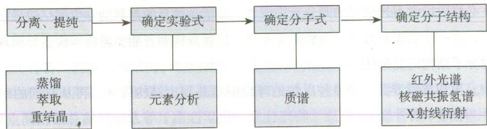

研究有机化合物，第一步一般通过分离、提纯得到纯净的物质，分离和提纯是测定有机化合物分子结构和研究性质的基础。随着科学技术的进步与发展，分离、提纯的方法也越来越多，在这里学生只需要了解有机化合物分离、提纯的基本原理，并初步掌握蒸馏、萃取和重结晶的基本操作。重点是重结晶的原理和操作，色谱法仅作为知识拓展，供学生开展研究性学习活动时参考。

第二步是确定有机化合物的元素组成。主要仪器是元素分析仪，其原理源于李比希的燃烧分析法。教材给出燃烧分析法计算有机化合物实验式的例题，其目的是帮助学生认识元素分析的原理，学会用实验数据计算有机化合物实验式的基本方法。

第三步是测定有机化合物的相对分子质量，并结合其实验式推出分子式。测定有机化合物相对分子质量的方法也有很多，目前被广泛采用的是质谱法。实际工作中多使用色谱-质谱联用仪，将用色谱法分离提纯的有机化合物直接进行质谱分析，得到其相对分子质量。高分辨率质谱仪还可以通过高精度的相对分子质量数据直接计算出有机化合物的分子式。

第四步是通过波谱分析确定有机化合物的分子结构。常见的波谱分析方法有红外光谱、核磁共振谱和X射线衍射等。在教学活动中，需要帮助学生学会从红外光谱图和核磁共振氢谱图中获取有效信息推断简单有机化合物的分子结构。关于X射线衍射，学生只需要知道它也是测定有机化合物晶体和分子结构的重要仪器分析方法即可。

## 二、教学目标

## 1. 教学目标

（1）了解研究有机化合物的一般方法，能说出研究有机化合物的主要步骤。通过了解天然产物或人工合成的有机化合物的实际研究过程，培养创新意识。

（2）了解有机化合物分离、提纯的原理和操作，能结合实际情况应用蒸馏、萃取或重结晶的方法进行有机化合物的分离和提纯。通过苯甲酸重结晶的实验探究，感受科学研究的方法。

（3）了解现代仪器分析在有机化合物组成和结构分析中的应用，能依据元素分析和质谱数据推断有机化合物的分子式，能依据波谱分析数据推断简单有机化合物的分子结构。通过提取和分析谱图中的有效信息推测分子结构，发展证据推理意识。

## 2. 教学重点和难点

重点：重结晶法提纯苯甲酸的实验探究；有机化合物的实验式、分子式和分子结构的确定方法。

难点：元素分析法计算有机化合物的实验式；通过核磁共振氢谱推断有机化合物的分子结构。

## 三、教学建议

## 1. 以实验探究活动的方式学习重结晶法提纯苯甲酸

教学中可首先提出问题：苯甲酸中含有可溶性杂质和不溶性杂质，应该如何提纯？提纯的原理是什么？有哪些步骤？选择什么溶剂？在一系列问题的驱动下，让学生开始探究活动。在进行方案设计时，各小组先要查阅相关资料，再讨论制订合理的实验方案，包括实验目的、原理、仪器、试剂、步骤和操作注意事项等，必要时教师要给予帮助和指导。然后，各小组按照设计的方案进行实验，在实验过程中观察并记录实验现象和数据，特别要注意有无异常现象出现。实验后，学生要讨论实验中发现的现象并说明原因或解释原理，初步得出实验结论；对异常现象提出看法或进行合理的解释。最后，完成实验报告并与其他组学生进行交流。活动后可进行迁移应用，教师组织全班学生讨论：对于一种陌生的有机化合物，欲将其分离、提纯，应该从哪些方面进行考虑？

2. 通过方法指导和实际应用，认识元素分析法确定有机化合物的实验式教学时可参考以下教学环节。

【科学史话】讲述李比希和他的元素分析仪的故事，通过科学史实激发学生的学习兴趣。

【方法指导】利用教材中燃烧法测定有机化合物实验式的例题，帮助学生初步学会根据元素的质量分数计算有机化合物实验式的基本方法。

【迁移应用】设计几道利用燃烧法推断有机化合物实验式的课堂练习题，帮助学生理解元素分析法确定有机化合物实验式的原理，使他们学会利用元素质量分数及其他途径获取的数据推断有机化合物的实验式和分子式。

【综合应用】利用有机合成真实问题情境中的元素分析数据，让学生推断实验式，帮助学生认识元素分析法确定有机化合物实验式在生产和研究实践中的应用，体会其学科价值。

## 3. 通过信息整合和综合应用, 认识波谱分析法确定有机化合物的分子结构

教师应该让学生认识到质谱法是快速、精确测定有机化合物相对分子质量的重要方法，让学生学会从质谱图中找到分子离子峰，再由其质荷比得出有机化合物的相对分子质量。红外光谱法可以获取有机化合物分子中所含有的化学键和官能团的信息。例如，从红外光谱图中找到C—O和O—H的吸收峰，可以初步推测该有机化合物中含有羟基官能团。核磁共振氢谱可以获取有机化合物分子中有几种不同类型的氢原子及它们的相对数目等信息。例如，乙醇分子中有3种不同类型的氢原子，个数比为3:2:1，因此乙醇的核磁共振氢谱中有3组峰，峰面积比在理论上为3:2:1。X射线衍射可以测定有机化合物晶体和分子的结构。

接下来, 教师以分子式为 $\mathrm{C}_{2} \mathrm{H}_{6} \mathrm{O}$ 的有机化合物的结构推断过程为例, 帮助学生学会应用波谱分析确定有机化合物分子结构的方法。先通过资料卡片的形式, 让学生从宏观上辨识有机化合物的性质, 由此发现分子组成为 $\mathrm{C}_{2} \mathrm{H}_{6} \mathrm{O}$ 的有机化合物有 2 种, 它们的物理和化学性质有很大的不同, 应该互为同分异构体。再整合从红外光谱图和核磁共振氢谱图中获取的信息, 推测它们的结构简式分别为 $\mathrm{CH}_{3} \mathrm{CH}_{2} \mathrm{OH}$ 和 $\mathrm{CH}_{3} \mathrm{OCH}_{3}$ 。还可以通过让学生观察球棍模型中氢原子的位置和数目与核磁共振氢谱图中的峰及峰面积的对应关系, 帮助学生理解核磁共振氢谱中氢原子化学环境的含义。

最后，教师可以结合真实情境中应用红外光谱、核磁共振氢谱确定有机化合物分子结构的实例，例如，确定提取青蒿素的萃取剂乙醚的分子结构，提升学生对波谱分析法确定有机化合物分子结构的认识水平。

## 四、栏目使用建议

## 探究

教材设置重结晶法提纯苯甲酸这一探究活动的目的是帮助学生理解有机化合物分离、提纯的方法和原理，使其初步掌握重结晶法提纯的基本操作。建议采用学生分组活动的研究性学习方式。

教师要提示学生注意实验中的安全问题，注意观察实验中的现象并给出合理的解释，注意发现实验中的异常现象并讨论其原因，注意及时记录实验现象和数据，注意实验数据处理中的误差和有效数字等问题。需要注意的是，常规过滤的速率较小，会导致较多的苯甲酸晶体在滤纸上析出。可使用特殊折叠的滤纸，有条件的学校可采用抽滤装置。

## 五、练习与应用参考答案及说明

1. B 
2. A 
3. B 
4. D 
5. C

6. $\mathrm{CH}_{2}$ 质谱

7. (1) $\mathrm{C_4H_5N_2O}$ (2) $\mathrm{C_8H_{10}N_4O_2}$

8. 2-丙醇

9. (1) $\mathrm{CH}_3\mathrm{O}$ (2) 62 (3) $\mathrm{C}_2\mathrm{H}_6\mathrm{O}_2$ (4) $\mathrm{HOCH}_2\mathrm{CH}_2\mathrm{OH}$

## 复习与提升建议

## 一、复习与提升教学建议

本章知识整理的重点是有机化合物的结构特点、分类、同分异构体和研究有机化合物的一般方法。能力提升的重点是依据有机化合物的碳骨架和官能团对有机化合物进行分类研究，依据有机化合物分子中的共价键类型和共价键极性对有机化合物的性质进行分析预测，通过识别和书写有机化合物同分异构体的结构简式认识有机化合物分子结构的复杂性，通过实验探究、信息整合和解决具体问题初步学会有机化合物的分离提纯方法及分子结构的确定原理。

教学时可以通过学生分组讨论完成教材“整理与提升”中的相关表格，进行知识整理。然后，教师给出每个重点内容的迁移应用练习，让学生先独立完成再分组讨论，以帮助学生在应用中提升分析问题和解决问题的能力。例如，在学生完成依据碳骨架分类、依据官能团分类和同分异构体的知识整理任务后，教师可设计以下应用练习。

【示例】有机化合物的分类及同分异构体应用练习

乙酰水杨酸是解热镇痛药阿司匹林的主要成分，丁香酚具有抗菌和降血压等作用，它们的结构简式如下：

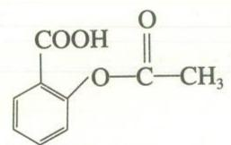  
乙酰水杨酸

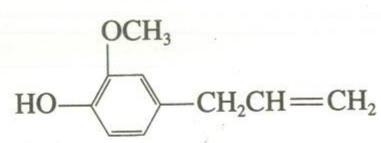  
丁香酚

(1) 乙酰水杨酸的分子式为\_\_\_\_。

（2）依据碳骨架分类，乙酰水杨酸和丁香酚都属于\_\_\_\_。

（3）乙酰水杨酸分子中含有的官能团的名称是\_\_\_\_。

(4) 丁香酚分子中含有的官能团的名称是\_\_\_\_。

(5) 分子式为 $C_{10}H_{12}O_2$ 的芳香族化合物中, 苯环上连接与丁香酚相同的 3 个基团的有机化合物有\_\_\_\_种, 其中羟基和甲氧基 (—OCH₃) 位于对位的有机化合物的结构简式为\_\_\_\_。

参考答案: (1) $\mathrm{C}_{9} \mathrm{H}_{8} \mathrm{O}_{4}$ (2) 芳香烃衍生物 (3) 羧基、酯基 (4) 羟基、醚键、碳碳双键

(5)10  
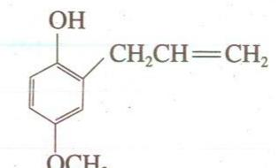  
${\mathrm{{OCH}}}_{3}$

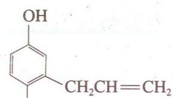  
$\mathrm{OCH}_{3}$

通过小组合作完成综合性任务，帮助学生提高应用知识解决问题的能力。

【示例】探秘青蒿素

我国科学家屠呦呦凭借发现治疗疟疾的青蒿素获得2015年诺贝尔生理学或医学奖。你知道有关青蒿素的知识吗？请你阅读以下资料和教材中的有关内容，并上网查阅相关资料。与同学合作，选择问题卡片中的1\~2个问题，或自选与青蒿素有关的其他问题，开展研究实践活动。通过文献研究、实验探究和调研访谈等方式收集证据，并将小组对问题的分析解释结果做成海报，与其他同学分享。

## 资料

屠呦呦等科学家在抗疟药物的研究中进行了提取分离工作，筛选出上百种中药，最终将青蒿作为研究重点。这是受到了东晋葛洪《肘后备急方》中“青蒿一握，以水二升渍，绞取汁，尽服之”可治疟疾的启发。《肘后备急方》中用青蒿抗疟是通过“绞汁”，而不是传统的“水煎法”。屠呦呦认为很可能是因为高温破坏了药材中的有效成分。根据这个原理，屠呦呦团队改用低沸点的溶剂乙醚来提取青蒿中的有效成分，所得青蒿提取物的抗疟效果有了显著提高。经过反复试验，最终分离获得的青蒿中性提取物对大鼠疟原虫有近100%的抑制率。后来，屠呦呦团队成功分离出一种无色结晶，并将其命名为青蒿素。

问题卡片可参考以下内容。

问题1：在葛洪的著作《肘后备急方》的记载中，水的作用是什么？“以水二升渍，绞取汁”是哪种分离、提纯的操作方法？

问题2：用乙醚作溶剂从青蒿中提取青蒿素的操作方法是什么？进一步分离提取液中的乙醚和青蒿素的操作方法是什么？说明你选择分离、提纯方法的理由。

问题3：为什么乙醚提取法获得产物的药效比“水煎法”的好？

问题4：青蒿素的分子式是什么？

问题5：青蒿素分子中含有哪些官能团？依据有机化合物的官能团分类法，青蒿素属于哪类物质？

问题6：青蒿素分子中的各个碳原子分别采取了怎样的杂化方式？

问题7：从青蒿素的分子结构中找出与 $H_{2}O_{2}$ 的结构中相似的化学键，根据 $H_{2}O_{2}$ 的化学性质预测青蒿素可能有怎样的化学性质。

## 二、复习与提高参考答案及说明

1. B 
2. C 
3. A 
4. D 
5. B 
6. C

7. (1) $\mathrm{C_{6}H_{8}O_{6}}$ 176 $54.5\%$

(2) 羟基、酯基、碳碳双键

(3) 其分子中含有多个羟基

(4) 蓝色褪去

8. (1) a

(2) ①74 ②醚 $\mathrm{C}_{4} \mathrm{H}_{10} \mathrm{O}$ ③ $\mathrm{CH}_{3} \mathrm{CH}_{2} \mathrm{OCH}_{2} \mathrm{CH}_{3}$

## 教学资源

## 1. 有机分子中的电子效应

有机化合物分子中化学键的极性影响着有机反应中化学键的断裂与形成，影响有机化合物分子中化学键极性的电子效应有诱导效应、共轭效应、超共轭效应和场效应。

## (1) 诱导效应

由于有机化合物分子中原子或基团的极性不同而引起成键电子云沿着原子链向某一个方向移动的效应称为诱导效应。其特点是电子云沿着原子链传递，诱导效应随着距离的增加迅速减弱。

诱导效应一般以氢原子为比较标准，如果原子或基团的吸电子能力比氢的强，则称其具有吸电子诱导效应；如果原子或基团的给电子能力比氢的强，则称其具有给电子诱导效应。

诱导效应的强弱可以通过测量偶极矩进行比较。如果一个原子或基团取代了乙酸中的氢原子，诱导效应会改变羧酸的电离常数，通过测量电离常数也可以推断这些原子或基团诱导效应的强弱。诱导效应的强弱一般具有以下规律。

①与碳原子直接相连的原子，电负性越大，其吸电子诱导效应越强。

$$
\begin{array}{r l} & - \mathrm{F} > - \mathrm{Cl} > - \mathrm{Br} > - \mathrm{I} \\ & - \mathrm{OR} > - \mathrm{SR} \\ & - \mathrm{F} > - \mathrm{OR} > - \mathrm{NR} _ {2} > - \mathrm{CR} _ {3} \end{array}
$$

②与碳原子直接相连的基团，不饱和度越大，其吸电子诱导效应越强。

$$
- \mathrm{C} \equiv \mathrm{CR} > - \mathrm{CH} = \mathrm{CR} _ {2} > - \mathrm{CH} _ {2} \mathrm{CR} _ {3}
$$

③带正电荷的基团具有吸电子诱导效应，带负电荷的基团具有给电子诱导效应。

不同原子或基团的诱导效应强弱不同，一般有如下顺序。

吸电子诱导效应： $-NO_{2}>-CN>-F>-Cl>-Br>-I>-C\equiv CR>-OCH_{3}>$ $-OH > -C_{6}H_{5} > -CH = CR_{2} > -H$

给电子诱导效应： $(\mathrm{CH}_3)_3\mathrm{C} - > (\mathrm{CH}_3)_2\mathrm{CH} - > \mathrm{CH}_3\mathrm{CH}_2 - > \mathrm{CH}_3 - > \mathrm{H}-$

诱导效应的大小还可能受原子或基团所在化合物的不同，以及取代后原子间的相互作用等因素的影响而有所不同。

## (2) 共轭效应

在共轭体系中，由于原子间的相互影响而使体系内的 $\pi$ 电子（或 p 电子）分布发生变化的一种电子效应称为共轭效应。

共轭效应也有吸电子效应和给电子效应。若共轭体系上的基团能减小体系的 $\pi$ 电子云密度，则该基团有吸电子共轭效应，如—NO $_2$ 、—CN、—COOH、—CHO、—COR等。若共轭体系上的基团能增大体系的 $\pi$ 电子云密度，则该基团有给电子共轭效应，如—NH $_2$ 、

## —NHCOR、—OH、—OR、—OOCR等。

原子或基团的诱导效应和共轭效应的方向可能一致，也可能不一致，总的电子效应取决于诱导效应和共轭效应的相对强弱（表1-1）。共轭效应只能在共轭体系中传递，但无论共轭体系有多大，共轭效应都能贯穿整个共轭体系。

表1-1 醛基、氨基和氯原子的诱导效应、共轭效应与总的电子效应

<table><tr><td>结构简式</td><td>诱导效应</td><td>共轭效应</td><td>总的电子效应</td></tr><tr><td> $CH_2=CHCH=CHCHO$ </td><td>吸电子</td><td>吸电子</td><td>吸电子</td></tr><tr><td> $CH_2=CHCH=CHNH_2$ </td><td>吸电子</td><td>给电子</td><td>给电子</td></tr><tr><td> $CH_2=CHCH=CHCl$ </td><td>吸电子</td><td>给电子</td><td>吸电子</td></tr></table>

## (3) 超共轭效应

当C—H σ键与π键（或p轨道）处于共轭位置时，也会产生电子的离域现象，这种C—H σ键电子的离域现象，称为超共轭效应。例如，丙烯中甲基上的C—H与碳碳双键中的π键之间存在超共轭效应（图1-1），其结果使得甲基上C—H的电子向π键离域，该C—H的极性变强，氢原子更易于被取代。

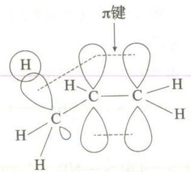  
图1-1 丙烯分子中的 $\sigma -\pi$ 超共轭效应

超共轭效应都是向 $\pi$ 键给电子的，其大小与 $\pi$ 键相邻碳原子上 C—H 的数目有关。C—H 的数目越多，超共轭效应越大。超共轭效应的大小顺序为： $\mathrm{CH}_{3} \longrightarrow \mathrm{RCH}_{2} \longrightarrow \mathrm{R}_{2} \mathrm{CH} \longrightarrow \mathrm{R}_{3} \mathrm{C}$ 。

## (4) 场效应

场效应是一种空间的静电作用，即基团在空间产生电场，对另一端共价键的极性产生影响。例如，丙二酸氢根中的羧基负离子除了对另一端的羧基有给电子诱导效应，还存在场效应（图1-2）。两个效应都使羧基不易电离出氢离子，导致酸性减弱。场效应一般与诱导效应同时存在。场效应与距离的平方成反比，距离越大，作用越小。

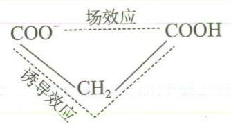  
图1-2 丙二酸氢根的诱导效应和场效应

当基团在合适的位置时，场效应和诱导效应的方向也可能是相反的。例如，如图1-3所示结构的有机化合物，诱导效应使酸性增强，而C—X偶极的场效应使酸性减弱。

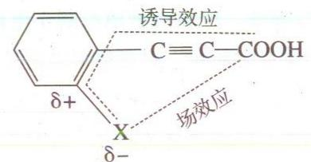  
图 1-3 相反作用的诱导效应和场效应

## (5) 电子效应对有机化合物性质的影响

电子效应影响着有机化合物分子中化学键的极性，因此也影响着有机化合物的某些化学性质。例如，电子效应通过影响羧酸分子中H—O的极性而影响其酸性。

对于羧酸RCOOH，电子效应会影响羧基中H—O的极性，H—O的极性越大，越容易电离出 $H^{+}$ ，羧酸的酸性越强。当R上有吸电子基团时，H—O的极性增强；当R上有给电子基团时，H—O的极性减弱。某些羧酸的电离常数如下表所示。

表1-2 部分羧酸的电离常数

<table><tr><td>羧酸</td><td> $ClCH_2COOH$ </td><td>HCOOH</td><td> $CH_3COOH$ </td><td>HOCOOH</td></tr><tr><td>电离常数(25°C)</td><td> $1.3×10^{-3}$ </td><td> $1.8×10^{-4}$ </td><td> $1.8×10^{-5}$ </td><td> $4.5×10^{-7}(K_{a_1})$ </td></tr></table>

由于Cl—的吸电子诱导效应， $\mathrm{ClCH}_{2}\mathrm{COOH}$ 的酸性比HCOOH的强；而 $\mathrm{CH}_{3}$ —具有给电子的诱导效应，因此 $\mathrm{CH}_{3}\mathrm{COOH}$ 的酸性比HCOOH的弱；HOCOOH中的HO—与—COOH之间存在p-π共轭效应，给电子作用比 $\mathrm{CH}_{3}$ —的强，因此HOCOOH的酸性比 $\mathrm{CH}_{3}\mathrm{COOH}$ 的还弱。

[摘编自：邢其毅，裴伟伟，徐瑞秋，裴坚.基础有机化学：上册（第3版）．北京：高等教育出版社，2005:243-247]

## 2. 质谱法简介

质谱分析法是一种通过测量化学物质分子或分子碎片的质量进行分析的方法，所用的仪器称为质谱仪，所得的谱图称为质谱图。因为质谱法能够提供被测物质分子或分子碎片的质量信息，所以它不但能够给出被测物质的相对分子质量，还可以让人们通过分子碎片的质量信息推测分子的结构。高分辨率质谱仪还可以根据高精度相对分子质量数据直接计算出分子式。

质谱仪的工作原理（图1-4）并不复杂。以常用的电子轰击离子化质谱为例，样品分子进入高度真空的电离室后，在电子束的轰击下，分子失去电子（通常是1个电子）变为正离子，同时也有一部分分子中的共价键被打断，形成若干碎片（包括不带电荷的自由基和带正电的正离子）。它们经过外磁场加速后，通过狭缝进入离子捕集器。质点的飞行轨迹与其质荷比（m/z，通常 $z=+1$ ）有关。通过改变外磁场的强度，可以精密地控制正电荷质点的飞行轨迹，从而能够严格地控制通过狭缝并到达捕集器的质点的质量。质点数则以信号强度的形式被记录下来。通过逐步改变外磁场，就可以改变进入捕集器的质点的质量，并以谱图形式得到所有质点的质荷比和它们在体系中的相对丰度。大量已知化合物的质谱已被录入数据库，计算机可从中进行查对。质谱分析法已成为一种方便而可靠的仪器分析方法。

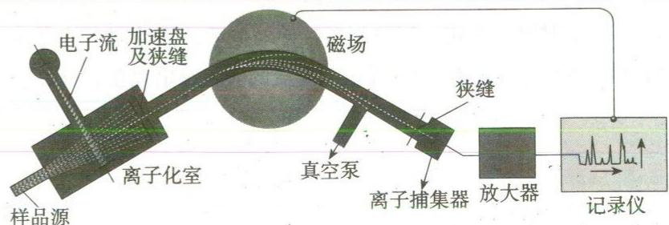  
图 1-4 质谱仪工作原理示意图

图1-5为丙酸甲酯的质谱图。A、B、C、D、E等信号峰中，E为分子离子峰，由此可知丙酸甲酯的相对分子质量为88。其他的峰为碎片离子峰，它们附近的强度很小的离子峰和样品分子中所含的同位素（如 $^{13}$ C、 $^{18}$ O）有关，它们的强度由样品分子中的同位素丰度决定。

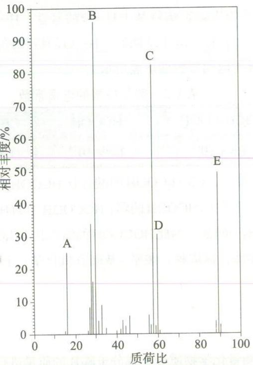  
图 1-5 丙酸甲酯的质谱

## 3. 红外光谱简介

在鉴定有机化合物分子结构的工作中，红外光谱是一种重要的手段，它可以确定有机化合物中存在何种官能团，也可以用来推测物质的纯度。

分子中原子的振动包括伸缩振动与弯曲振动，这两种振动的频率正好位于红外区。

## (1) 伸缩振动

伸缩振动是组成化学键的原子沿着键轴发生伸长和缩短的运动，分为对称伸缩振动与不对称伸缩振动（图1-6），振动时键长变化，键角不变。伸缩振动的振动频率较高。一些化学键（如C—H）和官能团（如C=O、O—H等）的伸缩振动对应的吸收峰出现在1 600\~3 650 cm $^{-1}$ 。

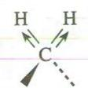

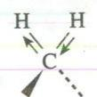  
对称伸缩  
不对称伸缩  
图 1-6 伸缩振动示意图

## (2) 弯曲振动

弯曲振动分为面内弯曲振动与面外弯曲振动，面内弯曲振动又分为剪式振动与平面摇摆，面外弯曲振动分为非平面摇摆与扭曲振动（图1-7）。弯曲振动的特点是键长不变，键角有变化。弯曲振动的振动频率较低，相应的吸收峰均位于 $1600\ cm^{-1}$ 以下的指纹区。例如，C—H的面内弯曲振动对应的吸收峰在 $1300\sim1475\ cm^{-1}$ 。

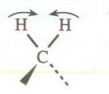  
剪式振动

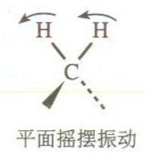  
面内弯曲

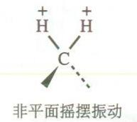

  
面外弯曲  
图 1-7 弯曲振动示意图

当一束红外线通过有机化合物时, 只有那些使偶极矩发生变化的振动才能吸收红外线, 产生能级跃迁。例如, 结构对称的乙炔及2-丁炔等就没有共振吸收。与分子中化学键振动频率相同的红外线引起共振吸收后, 在红外光谱仪的记录仪上便可以看到共振吸收峰, 吸收峰的频率与化学键的强度及成键原子的质量有关。化学键越强, 成键原子的质量越小, 吸收峰的频率就越高。例如, O—H、N—H与C—H的吸收峰分别位于 $2500 \sim 3650 \mathrm{~cm}^{-1}$ 、 $3300 \sim 3500 \mathrm{~cm}^{-1}$ 与 $2850 \sim 3300 \mathrm{~cm}^{-1}$ 。反之, 则吸收峰的频率就低。例如, $\mathrm{C} = \mathrm{C}$ 和 $\mathrm{C} = \mathrm{N}$ 的吸收峰位于 $1600 \sim 1690 \mathrm{~cm}^{-1}$ 。

红外光谱仪的结构与工作原理如图 1-8 所示。

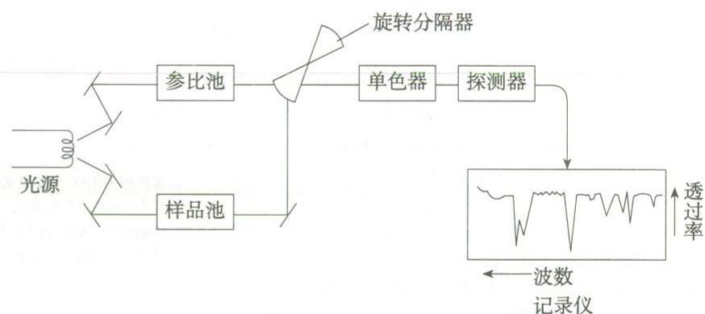  
图 1-8 简易红外光谱仪的结构示意图

两束相同的红外线，分别通过样品池和参比池（空白或纯溶剂）后，旋转分隔器使它们交替通过，先后进入单色器。单色器将入射光按频率展开，使探测器能够检测到按照频率高低顺序透过样品池和参比池的红外线的强度。然后将它们在同一频率下的透射强度之差作为信号传递给记录仪。记录仪以波数（ $\mathrm{cm}^{-1}$ ）或以波长（ $\mu \mathrm{m}$ ）为横轴的单位，透过率为纵轴的单位，同步地将获得的信号记录下来，便形成与样品相对应的红外光谱。大多数已知化合物的红外谱图已被录入数据库，通过对比便可以得到确认。使用红外光谱仪测定的样品可以是固体、液体或溶液。一些醇、酮、羧酸及羧酸酯的红外光谱图分别如图1-9、图1-10、图1-11和图1-12所示。

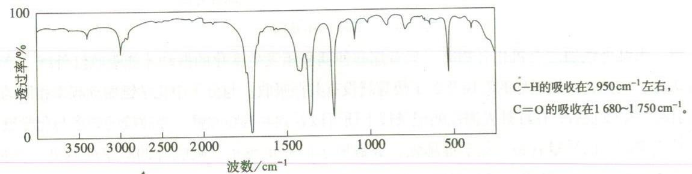

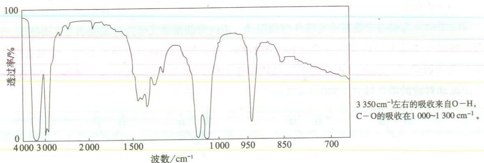  
图 1-9 乙醇的红外光谱  
C-H的吸收在2950cm $^{-1}$ 左右，
C=O 的吸收在 1680\~1750 cm $^{-1}$ 。

图 1-10 丙酮的红外光谱  
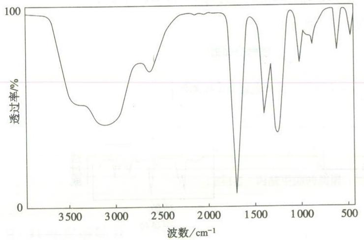  
有机酸中的O-H有很宽的吸收带，位于2500\~3500cm $^{-1}$ 。羧基中C=O的吸收在1680cm $^{-1}$ 左右。C-O在1030\~1200cm $^{-1}$ 有吸收峰。

图 1-11 乙酸的红外光谱  
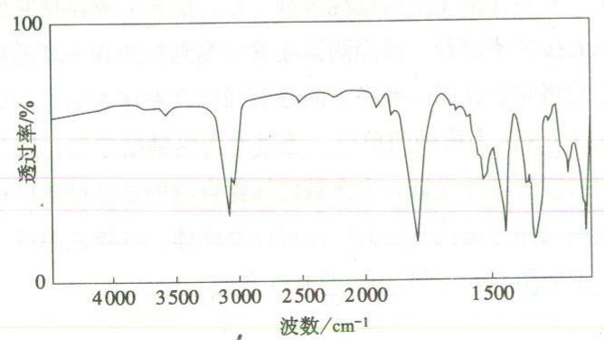  
图 1-12 乙酸乙酯的红外光谱  
1 750cm $^{-1}$ 附近的吸收与C=O有关。
1 200cm $^{-1}$ 附近的吸收与C-O有关。

## 4. 核磁共振氢谱简介

质量数为奇数的原子核，如 ${}^{1}H$ 、 ${}^{13}C$ 、 ${}^{15}N$ 、 ${}^{19}F$ 和 ${}^{31}P$ 的核自旋所产生的弱磁场，在强外磁场中可以对某个特定频率的电磁波发生共振吸收，吸收频率和吸收强度可以提供分子结构的信息。在所有的核中， ${}^{1}H$ 的核磁矩最大，吸收信号最强。 ${}^{1}H$ 的天然丰度很大，又是有机化合物的重要元素组分，而且 ${}^{12}C$ 和 ${}^{16}O$ 原子核的质量数恰好为偶数，没有磁矩，所以 ${}^{1}HNMR$ （质子核磁共振谱或核磁共振氢谱）已经成为测定有机分子结构时不可或缺的一种技术。图1-13是简易核磁共振谱仪的结构示意图。

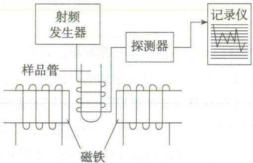  
图 1-13 简易核磁共振谱仪的结构示意图

简易核磁共振谱仪由以下几个部分组成：配有精密调控装置的高质量磁铁（能够精密地调节场强）、射频发生器（发射固定频率的电磁波）、探测器（测量样品的吸收信号）、记录仪（谱图中场强高的一方称为高场，低的一方称为低场）。

## (1) 核的自旋与核磁共振现象

带正电荷的氢核自旋后产生磁矩（图1-14）。在没有外磁场作用时，它是任意排列的。但在外磁场作用下，它可以有两种取向，与外磁场方向一致或与外磁场方向相反（图1-15），前者是低能态，后者是高能态。若向外磁场中的质子辐射一定频率的电磁波，可以使低能态的质子跃迁到高能态（图1-16）。这种在外磁场作用下，质子吸收一定频率的电磁辐射，从核自旋的低能态跃迁到高能态的现象称为核磁共振。质子跃迁所需电磁波频率的大小与外磁场强度成正比。

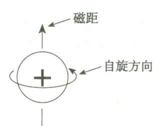

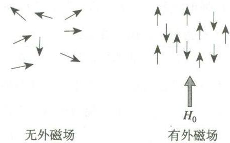  
图 1-14 质子自旋产生的磁矩  
图 1-15 核磁矩在外磁场作用下的取向

只有外磁场强度与电磁辐射的频率相匹配时，才能产生核磁共振现象。由于技术上的原因，核磁共振仪一般采用固定电磁辐射的频率，逐渐改变外磁场强度，即使用扫场的方法来获得核磁共振，而不采用扫频的方法。将样品管放入仪器，以固定频率的电磁波辐照，并逐渐由低场向高场改变磁场强度，当磁场强度与电磁波的频率相匹配时，就产生核磁共振。若以吸收强度为纵坐标，磁场强度为横坐标作图，就可以记录到共振信号（图1-17）。

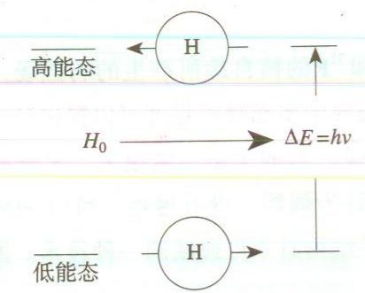  
图 1-16 核磁矩的能级跃迁

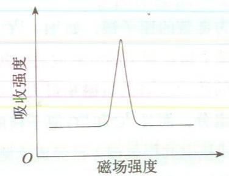  
图 1-17 核磁共振信号

## (2) 化学位移

氢的磁旋比是一常数，按照扫场的方法产生核磁共振，则有机化合物中所有的氢原子都应当在同一磁场强度下产生信号，那就没有任何鉴定结构的价值了。实际上，从核磁共振谱图中可以看出，有机化合物分子中处在不同化学环境的氢原子会在不同的磁场强度下发生共振，给出信号。例如，氯乙烷有两种类型的氢原子，一是甲基上的三个氢原子，二是亚甲基上的两个氢原子。它们在核磁共振仪上可以得到两个信号，甲基的信号在较高场，亚甲基的信号在较低场（图1-18）。

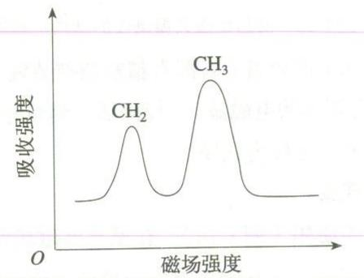  
图 1-18 氯乙烷的核磁共振氢谱（低分辨率示意图）

氢原子核外围的电子云在变化外磁场作用下产生感应电流，伴随此感应电流又有一个感应磁场。根据楞次定律，其方向与外磁场的相反。因此，感应磁场的产生会削弱外磁场强度，使质子实际感受到的磁场强度减弱，也就是质子受到了核外电子的屏蔽（图1-19），受屏蔽的质子要在稍高的外加磁场强度下才能发生共振。在氯乙烷分子中，亚甲基受氯原子电负性影响较大，质子外围电子云密度降低较多，因此产生的感应磁场小，屏蔽作用较小，在稍低场就可以发生共振。而甲基上的质子受氯原子电负性影响较小，外围电子云密度较大，产生的感应磁场较大，屏蔽作用也较大，需在稍高场才发生共振。于是，氯乙烷的核磁共振谱就有两个信号。

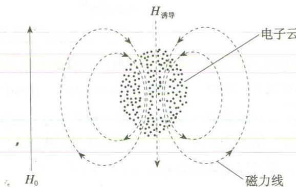  
图 1-19 核外电子的屏蔽作用示意图

但是，乙烯和苯中的质子与氯乙烷中的质子不同，它们处于乙烯和苯的 $\pi$ 电子环流感应磁场的顺磁方向，质子的实受磁场比外磁场强度略大一些，也就是在较低场就能发生共振，质子受到的是去屏蔽作用（图1-20）。

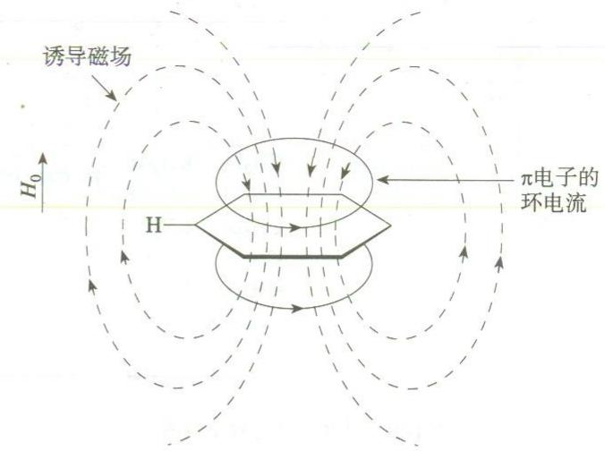  
图 1-20 苯的去屏蔽作用示意图

由于核外电子的屏蔽和去屏蔽作用，引起质子的核磁共振吸收位置发生移动，产生化学位移。在一个分子中，化学环境不同的质子有不同的化学位移，化学环境相同的质子有相同的化学位移。

## （3）化学位移的表示方法

由于核外电子的屏蔽与去屏蔽作用引起的化学位移值相差很小，只有几个ppm（百万分之一），如此微小的磁场强度变化难以精确测定。现在一般使用相对化学位移，通常以四甲基硅烷（TMS，tetramethylsilane）作为标准物质。

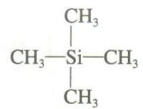  
四甲基硅烷

化学位移常以 $\delta$ 值来表示， $\delta$ 是样品信号与TMS信号的频率差与所用核磁共振仪的电磁辐射频率之比。

$$
\delta = \frac {\nu - \nu_ {\mathrm{TMS}}}{\nu_ {0}}
$$

如某样品在60 MHz核磁共振仪中，测得的信号频率比TMS的低60 Hz，相关化学位移的计算方法为：

$$
\delta = \frac {6 0 - 0}{6 0 \times 1 0 ^ {6}} = 1 \mathrm{ppm}
$$

一般有机化合物的化学位移比TMS的大，即在比TMS的信号更低的磁场发生共振。常见基团的氢原子核（质子）的化学位移见图1-21。

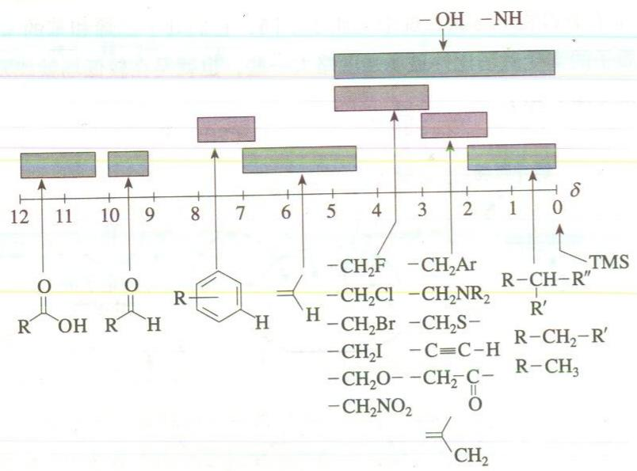  
图 1-21 质子化学位移示意图

核磁共振氢谱除了体现质子的化学位移，还体现了各种氢原子的相对数目，因为吸收峰的面积与氢原子的数目成正比。例如，根据1,2,2-三氯丙烷的核磁共振谱图（图1-22）作出吸收峰的积分曲线，比较各吸收峰积分曲线的高度，就可以得到它们对应的氢原子的相对数目。

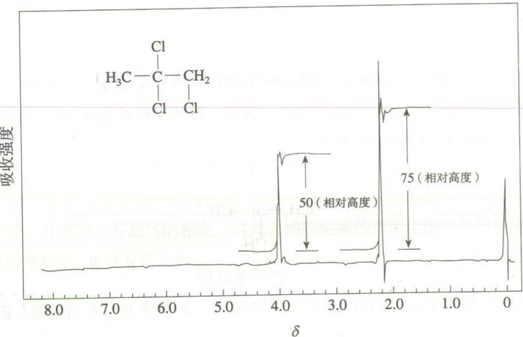  
图 1-22 1,2,2-三氯丙烷的核磁共振氢谱

## (4) 自旋-自旋偶合

对比氯乙烷分别在高分辨率（图1-23）与低分辨率（图1-18）核磁共振仪中得到的图谱，不难发现原来的两个峰都分别成了多重峰，甲基峰裂分成三重峰，亚甲基峰裂分成四重峰（图1-24）。这种峰的裂分现象是相邻氢核自旋产生的磁场相互作用的结果，人们称之为自旋-自旋偶合，或称自旋偶合。

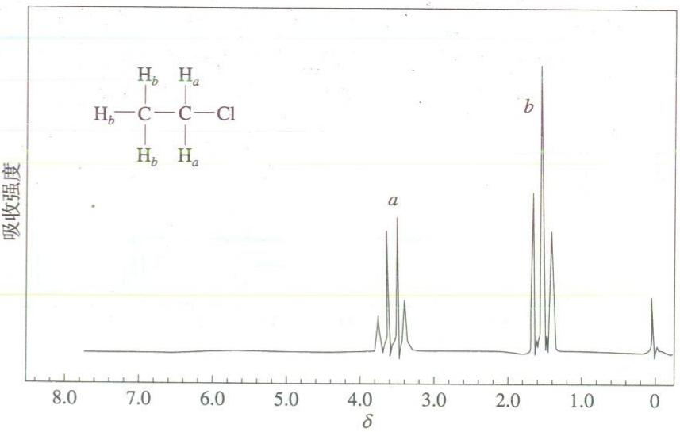  
图 1-23 氯乙烷的核磁共振氢谱

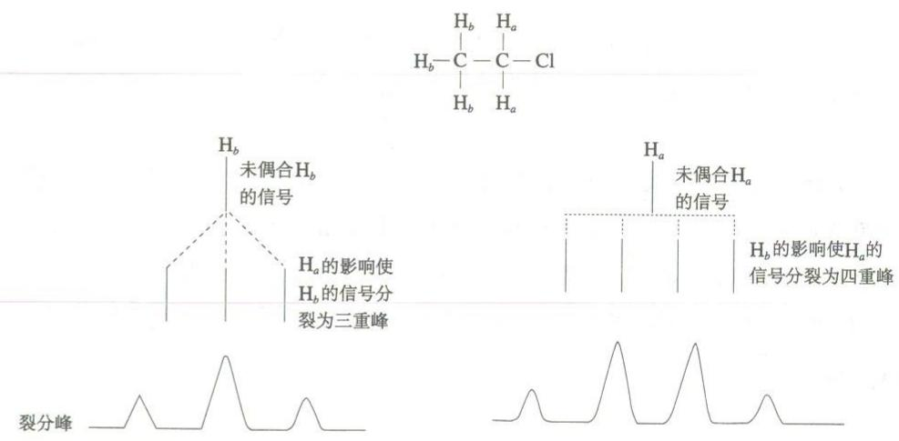  
图 1-24 相邻氢自旋偶合示意图

一般情况下，只有相邻碳上的氢才发生自旋裂分现象。若间隔一个碳原子便无此现象，如1,2,2-三氯丙烷只有两个单峰（图1-22），因为自旋偶合是沿着成键电子传递的。若以 $n$ 代表相邻氢的数目，则该质子裂分峰的数目为 $n + 1$ 。

(5) 综上所述, 从核磁共振氢谱图中可以得到有机化合物分子结构的如下信息:

① 根据峰的组数可知有几种类型的氢原子；

② 根据峰面积（积分曲线的高度）可知各类氢原子的相对数目；

③ 根据峰的裂分数可知相邻氢原子的数目；

④ 根据峰的化学位移数值可知各类型氢原子可能所属的化学构造。

要分析清楚一个有机化合物的分子结构，还要结合其他谱图（如红外光谱图等），以及它的元素分析数据、物理常数、化学性质等进行综合判断，才能获得正确的结果。

核磁共振氢谱解析举例：分子式为 $C_{8}H_{10}$ 的有机化合物的 $^{1}$ HNMR谱图如图1-25所示，试推断其结构。

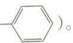

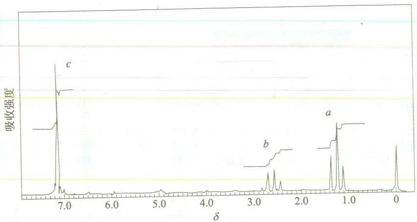  
图 1-25 $C_{8}H_{10}$ 的核磁共振氢谱图

不饱和度 $= 1 + n_{4} + \frac{1}{2}(n_{3} - n_{1})$ （ $n_1$ 、 $n_3$ 、 $n_4$ 分别为一价、三价、四价原子数） $= 1 + 8 + \frac{1}{2}(0 - 10)$ $= 4$

$C_{8}H_{10}$ 的不饱和度为4，可能含有苯环，也可能为多烯或炔烃。它的 $^{1}$ HNMR谱图中有三组吸收峰，表明有三种类型的氢原子，积分曲线的相对高度比为6：4：10，对应的氢原子数比为3：2：5。

c峰（ $\delta=7.15$ ）为芳环上氢原子的吸收峰，按积分曲线计算，对应的氢原子数若为5个，则该化合物为单取代苯。除去苯环后剩下的应为乙基，因此a峰（ $\delta=1.25$ ）为甲基氢原子的信号峰，对应三个氢原子；b峰（ $\delta=2.6$ ）为亚甲基氢原子的信号峰，对应两个氢原子。

按 “n+1 规则”，甲基被亚甲基裂分为三重峰，亚甲基被甲基裂分为四重峰。所以 $C_{8}H_{10}$ 应为乙基苯 $\left(\mathrm{CH}_{3}\mathrm{CH}_{2}-\right.$

## 5. X 射线衍射谱简介

1895年，伦琴发现了X射线。X射线是由高速电子撞击原子产生的一种电磁辐射，波长在0.01\~10.00 nm。产生X射线的途径主要有4种：用高能电子束轰击金属靶；用初级X射线照射物质后产生二级射线——X射线荧光；用放射性同位素源衰变产生；从同步加速器辐射源获得。当X射线照射固体物质时，一部分透过晶体产生热能，另一部分产生散射、衍射和X射线荧光，还有一部分将其能量转移给晶体中的电子。

目前，X射线衍射谱是测定晶体结构的重要手段。晶体衍射X射线的方向与构成晶体的晶胞大小、形状及入射X射线波长有关，衍射光的强度与晶体内原子的类型和晶胞内原子的位置有关。所以，从衍射光的方向和强度来看，每种类型的晶体物质都有自己的特征衍射图，可用作定性分析的依据。

实际工作中常用的是多晶粉末衍射法和单晶衍射法。多晶粉末衍射法常用来测定立方晶系晶体结构的点阵形式、晶胞参数及简单结构的原子坐标，还可以对固体试样进行物相分析。自然界中固态物质多数以多晶形式存在，每一种晶态物质都有其特定的结构，因此实验中得到的各种晶态物质的粉末衍射图都有不同的特征。根据这些特征编成X射线粉末衍射谱图数据库，将未知晶体物质的衍射图进行比对，即可测得该物质的成分。如果试样是混合物，还可以根据谱线的强度和位置确定其组成。另外，多晶粉末衍射法还可以测定固体催化剂、高聚物及蛋白质粒子的大小。

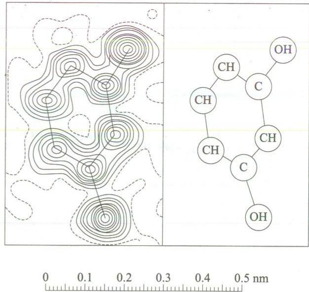  
图 1-26 β-间苯二酚晶体的电子密度图及相应的分子结构

单晶衍射法能获得更多的晶体结构数据，其主要仪器是四圆衍射仪。将四圆衍射仪测出的单晶衍射数据用计算机进行结构解析，能迅速得到有关晶体结构的信息。例如，图1-26是通过该方法获得的β-间苯二酚晶体的电子密度图，可据此获取该晶体的晶胞参数，还可以获取该有机化合物分子中共价键的键长、键角等数据。

[摘编自：武汉大学．分析化学：下册（第5版）．北京：高等教育出版社，2007:127，132，150-154]

## 教学案例

# 第二节 研究有机化合物的一般方法（第2课时）

北京市第四中学 徐晓斌

## 教学目标

1. 以从青蒿中提取青蒿素并进行结构表征的全过程为素材，通过对其化学原理的解读和人文精神的挖掘，建立研究有机化合物的基本思路，发展科学态度和人文素养。

2. 通过分析青蒿素的提取与纯化过程，学习物质的分离和提纯的基本知识和基本技能，建立“通过物质性质的差异选择分离提纯方法”的方法模型。

3. 通过分析青蒿素的结构测定过程及其结构与性质的关系，学习从仪器分析结果确定结构、从结构特征预测或解释性质的研究方法。

## 教学重点

研究有机化合物的一般方法，有机化合物分离、提纯和结构测定过程各环节的基本原理。

## 教学难点

物质分离和提纯的一般思路和基本方法。

## 教学流程

纵览青蒿素研究的全过程，从微观角度解释青蒿素的宏观性质

分析青蒿素的提取和纯化过程

分析青蒿素的结构测定过程

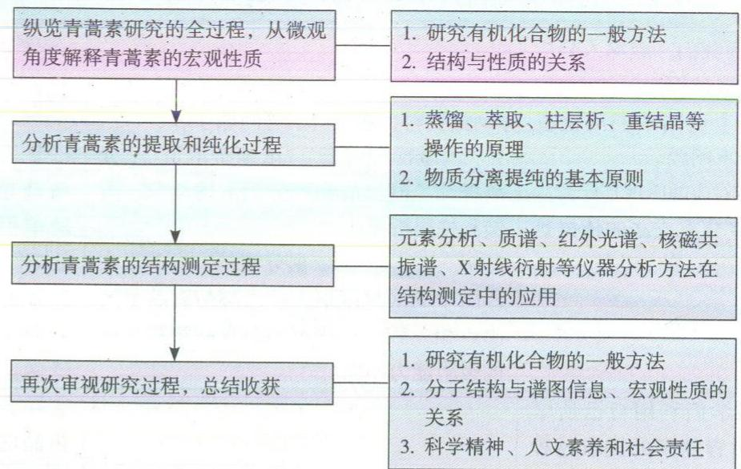

再次审视研究过程，总结收获

1. 研究有机化合物的一般方法  
2. 结构与性质的关系

1. 蒸馏、萃取、柱层析、重结晶等操作的原理  
2. 物质分离提纯的基本原则

元素分析、质谱、红外光谱、核磁共振谱、X射线衍射等仪器分析方法在结构测定中的应用

1. 研究有机化合物的一般方法  
2. 分子结构与谱图信息、宏观性质的关系  
3. 科学精神、人文素养和社会责任

## 教学过程

教学环节一：纵览青蒿素研究的全过程。

<table><tr><td>教师活动</td><td>学生活动</td><td>设计意图</td></tr><tr><td>【引入】2015年,我国科学家屠呦呦因为青蒿素的相关研究,获得了诺贝尔生理学或医学奖。【布置任务】请同学们交流并阅读课前查阅的资料,分享自己对以下问题的思考。问题一:青蒿素的研究经历了哪些步骤?问题二:简单介绍青蒿素的结构和性质特点,及其与药效改进之间的关系。【小结】通过分析青蒿素的构效关系,我们理解了结构对有机化合物研究的重要性,也明确了结构测定的意义。而进行结构测定的前提是得到纯品,因此在研究陌生有机化合物时一般要先分离提纯得到纯品,再测定结构。</td><td>【自主学习,思考,回答问题】问题一:1分离提纯(萃取、蒸馏、柱层析、重结晶等);2结构测定(元素分析、质谱、红外光谱、核磁共振谱、X射线衍射等仪器分析)。问题二:1过氧基是青蒿素分子抗疟活性的重要来源;2过氧基对热不稳定;3保留青蒿素的分子骨架,对基团进行修饰,得到青蒿素的衍生物,抗疟活性得到提升。【倾听,思考】</td><td>查找并阅读资料,在真实复杂的情境中提取有效信息,培养学生团结协作和自主学习的能力。强化“结构决定性质”的观念,明确结构测定的意义。</td></tr></table>

教学环节二：深入分析青蒿素的提取过程。

<table><tr><td>教师活动</td><td>学生活动</td><td>设计意图</td></tr><tr><td>【过渡】下面我们一起深入分析青蒿素的提取过程。【布置任务】请同学们阅读资料,思考以下问题。1.各步骤所对应的原理是什么?2.选取这些分离方法的依据是什么?以小组为单位汇报。</td><td>【阅读资料,思考,回答问题】1.“乙醚冷浸青蒿”“浓缩提取液”“分离提纯乙醚提取物”分别采用萃取、蒸馏和柱层析操作。2.这三步操作的依据分别是:青蒿素在乙醚中的溶解度更大;乙醚与青蒿素的沸点相差较大;固定相对青蒿素和杂质的吸附能力不同。</td><td>1.复习巩固萃取和蒸馏的操作,简单了解柱层析的工作原理。2.初步体会选择分离提纯方法的依据。</td></tr><tr><td>【过渡】同学们利用自己所学的知识,对青蒿素的提取过程进行了解读。那么,在得到乙醚提取物粗品后进行的重结晶操作,怎样才能达到提纯的目的?为了进一步解释这一问题,我们先回顾上节课中苯甲酸的提纯方法。【布置任务】请回忆提纯苯甲酸的实验操作方法。</td><td>【复习回顾】</td><td>直接分析青蒿素粗品的重结晶对学生来说难度较大,所以先选取更简单的苯甲酸体系进行类比。学生回顾重结晶的操作方法。</td></tr><tr><td>【提问,引导,总结】请同学们针对以下问题进行小组讨论,并推选代表进行汇报。问题一:由特殊推广到一般,重结晶实验成功的关键因素是什么?问题二:资料的参考文献中报道了青蒿素粗品重结晶的两种方法,为什么它们都可以达到提纯的目的?</td><td>【思考,讨论,汇报】问题一:重结晶的关键在于选择合适的溶剂;被提纯的有机化合物在此溶剂中的溶解度受温度影响大,杂质在此溶剂中溶解度很小或很大,易于除去。问题二:在第一种溶剂中,高温时杂质的溶解度很小,青蒿素的溶解度大,趁热过滤可以除去杂质;而在第二种溶剂中,低温时杂质的溶解度很大,青蒿素的溶解度小,青蒿素析出后便与杂质分离。可以发现,不管是哪种方法,都是利用溶解度的差异来实现提纯的目的。</td><td>总结重结晶的原理。学以致用,将重结晶原理应用于分析青蒿素的纯化过程,在真实情境中加深对提纯方法的理解。</td></tr><tr><td>问题三:结合上述实验,思考选择物质提纯方法的基本原则是什么。</td><td>问题三:1依据被提纯物质与杂质的性质差异,选择适当的实验手段将杂质除去;2操作过程中不能引进新杂质,要考虑被提纯物质的稳定性。</td><td>总结以上所有分离提纯操作的共同特征,形成分析物质分离提纯问题的统一原则和方法。</td></tr></table>

续表

<table><tr><td>教师活动</td><td>学生活动</td><td>设计意图</td></tr><tr><td>【总结点评】在分析青蒿素的提取过程时,先有分离方法,再去解读其合理性,我们发现这些方法的共同特征就是利用了被提纯物质与杂质的性质差异。反过来,当我们在分离提纯混合物时,也需要从被提纯物质和杂质性质差异的角度进行思考,设计方案。</td><td>【倾听,思考】</td><td>引导学生从正、逆两种思维角度思考物质分离提纯问题。</td></tr></table>

教学环节三：分析青蒿素的结构测定。

<table><tr><td>教师活动</td><td>学生活动</td><td>设计意图</td></tr><tr><td>【布置任务】资料展示了青蒿素的元素分析、质谱、红外光谱、核磁共振谱等仪器分析测试结果。请阅读并分组完成以下任务。1. 请简单描述各仪器的测试原理。2. 分析资料中给出的未知物A的测试结果,确定其分子结构。【小结】通过对化合物A的分析,我们了解了现代仪器在确定有机化合物分子结构中的应用。现在请大家回头去看青蒿素的结构测定信息,相信你会有不一样的发现。</td><td>【阅读,思考,回答】1. 分组介绍各种仪器的测试原理。2. 分析未知物A的元素分析和谱图信息,推测其结构简式为 $CH_3CH_2OH$ 。【阅读,思考,交流】元素分析和质谱确定青蒿素的分子式,红外光谱给出化学键信息,核磁共振氢谱给出氢原子的种类及数目。</td><td>1. 引导学生自主学习仪器分析的基本原理,提高学习效率。2. 建立谱图信息与微观结构的对应关系,为进一步确定分子结构打下基础。学以致用,通过解读青蒿素的结构测定结果,进一步了解现代仪器分析方法的作用。</td></tr></table>

教学环节四：纵览青蒿素研究的全过程，总结研究有机化合物的一般方法，分享情感态度和价值观方面的收获。

<table><tr><td>教师活动</td><td>学生活动</td><td>设计意图</td></tr><tr><td>【过渡,提问】前面我们一起解读了青蒿素研究的全过程,请回答以下问题。</td><td rowspan="2">【思考,回答】1. 研究流程:分离提纯↓元素分析,确定实验式↓质谱,确定分子式↓红外光谱、核磁共振氢谱等,确定分子结构2. 以下内容供参考。</td><td rowspan="2">总结研究有机化合物的一般步骤和方法,形成认知模型。</td></tr><tr><td>1.请总结研究有机化合物的一般方法。</td></tr><tr><td>2.通过学习这段历史,你有哪些收获?</td><td>(1)屠呦呦获得了诺贝尔奖,是祖国的骄傲,是我们学习的榜样。(2)屠呦呦发现青蒿素不是偶然,这源于她的勤奋和努力。(3)在提取青蒿素的过程中,从“绞取汁”中获得灵感,敏锐地发现其中的问题,选取乙醚作为提取溶剂,体现了很强的证据意识和创新思维。(4)整个过程不是屠呦呦一个人在努力,而是很多团队和机构一起合作。(5)化学对人类社会的进步和发展有着重要意义。</td><td>深入挖掘青蒿素素材背后蕴含的科学精神和人文素养,培养学生的社会责任感。</td></tr></table>

## 板书设计

研究有机化合物的一般方法  
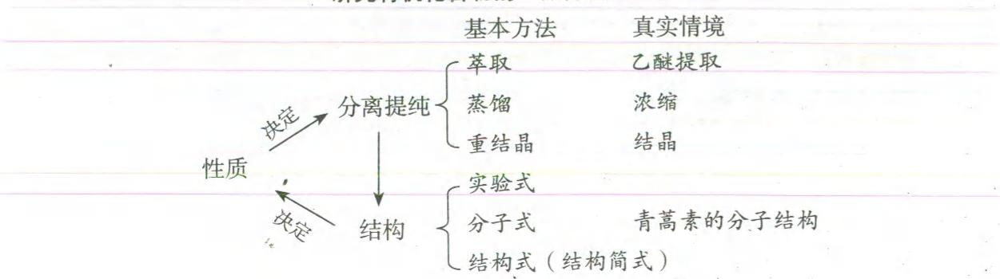

## 本章说明

烃是只含碳、氢两种元素的一类有机化合物。后续章节中的烃的衍生物、生物大分子和合成高分子的学习方法和研究方法都需要以烃的相关内容为基础进行类比迁移。本章在复习具体烃类代表物（甲烷和乙烯）的结构和性质的基础上，进一步在有机化合物类别的层面上研究有机化合物的组成、结构、性质、变化和应用。通过典型代表物（乙炔、苯和甲苯）来研究炔烃和芳香烃的结构和性质，使学生深刻认识不饱和烃的结构特点（π键、大π键）和反应规律。研究的视角主要放在官能团和化学键上，通过官能团的转化、化学键的断裂和形成来认识有机反应（取代反应、加成反应、消去反应、加聚反应等）的基本规律，通过反应规律对真实情境中的有机反应产物作出合理的预测，为后续学习有机合成奠定基础。

## 一、教材分析

本章以烷烃（代表物甲烷）、烯烃（代表物乙烯）、炔烃（代表物乙炔）和芳香烃（代表物苯和甲苯）为重点介绍烃类物质，希望帮助学生认识饱和链烃、不饱和链烃和芳香烃这几类常见烃类物质的组成、结构、性质、变化和应用，帮助学生学会按照有机化合物的类别进行有机化学学习和研究的基本方法。

对于在必修阶段学生已经学习过的知识，教材先通过“思考与讨论”栏目进行复习和回顾，并将甲烷和乙烯的结构、性质和反应规律迁移应用于烷烃和烯烃同系物。然后，介绍系统命名法，帮助学生逐步构建烷烃和烯烃的知识体系。

炔烃和芳香烃的内容在必修阶段没有要求，本章以结构分析、实验探究结合“思考与讨论”的学习方式帮助学生认识典型代表物乙炔、苯和甲苯的结构、性质和反应规律。教材探析典型代表物分子微观结构的视角主要是官能团和化学键（类型和极性），通过杂化轨道理论帮助学生分析和理解分子的空间结构，通过实验探究来帮助学生辨识典型代表物的宏观性质。教材通过结构与性质的关系来分析说明实验探究的结果，以此落实“结构决定性质”的学科观念。

教材在第一章已经将学生对有机化合物分子结构的认识水平提升至共价键的类型和极性的层面，学生已经初步认识了有机化合物分子中的电子效应及其对有机化合物性质和反应规律的影响。本章中，教材通过饱和链烃（烷烃）和不饱和链烃（烯烃、炔烃）的结构和性质对比，帮助学生进一步理解共价键的类型对有机化合物性质和反应规律的影响；通过苯和甲苯的结构和性质对比，帮助学生理解基团相互作用对有机化合物性质和反应规律的影响。

本章还具有承前启后的重要作用。一方面，教材以必修阶段的有机化合物知识和第一章研究有机化合物的方法为基础，进一步帮助学生学习按照有机化合物的碳骨架和官能团进行分类研究的方法；另一方面，本章介绍的烷烃和烯烃的系统命名法、同系物和同分异构体的知识、有机化合物结构和性质的关系、有机反应的规律等内容，为有机化学的后续学习奠定了基础。

本章的内容结构如下图所示。

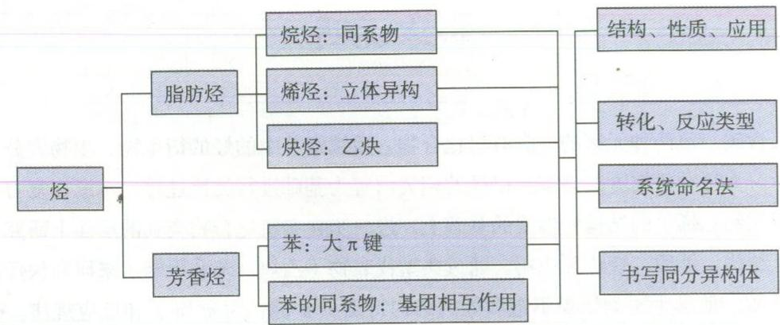

## 二、学业要求

1. 能写出简单烷烃的结构简式和名称，能依据甲烷的结构特点、性质和取代反应规律说出烷烃的结构特点和性质，并推测烷烃发生卤代反应的产物。

2. 能依据同系物的概念写出烷烃、烯烃、炔烃和苯的同系物的通式，认识同系物主要物理性质的变化规律。

3. 能依据同分异构体的概念写出烷烃的碳架异构体，写出烯烃的碳架异构体、位置异构体和立体异构体，写出炔烃的碳架异构体和位置异构体，写出芳香烃的碳架异构体。

4. 能写出简单烯烃的结构简式，能依据乙烯的结构特点和性质说出烯烃的结构特点和性质，能依据碳碳双键官能团的加成反应、加聚反应规律写出烯烃发生加成反应、加聚反应的化学方程式。

5. 能基于官能团和共价键的类型认识乙炔的结构特点，能依据结构特点，结合实验探究认识乙炔的化学性质，能写出乙炔的燃烧、加成和加聚反应的化学方程式，能写出简单炔烃的结构简式。

6. 能基于苯环的大 $\pi$ 键认识苯的结构特点, 能说出苯的取代反应和加成反应的规律, 并能将反应规律与苯的结构特点相联系, 写出相应反应的化学方程式。

7. 能写出简单的苯的同系物的结构简式，能基于苯与甲苯的化学性质，通过对比认识苯的同系物分子中基团的相互作用。

## 三、教学建议

第一节 烷烃 2课时  
第二节 烯烃 炔烃 2课时  
第三节 芳香烃 2课时  
全章复习 1课时

## 第一节 烷烃

## 一、内容分析

烷烃是脂肪烃中的一类饱和烃。本节内容主要包括烷烃的结构、性质和烷烃的系统命名。

本节在编排上先帮助学生复习甲烷的结构和性质，再通过“思考与讨论”中5种烷烃的球棍模型帮助学生复习烷烃的组成和结构，强调结构对性质的决定作用。烷烃的结构与甲烷的相似性决定了烷烃的性质与甲烷的相似。教材在帮助学生复习甲烷的性质的基础上，在烷烃类别的层面研究烷烃的性质和应用；在分析烷烃的组成、结构和性质的基础上，以证据推理的方式帮助学生认识同系物概念的内涵。

烷烃的系统命名法是各类有机化合物系统命名的基础。要让学生明确系统命名法的基本原则，对烷烃进行系统命名时一定要注意规范，思维要有序。“思考与讨论”栏目将己烷同分异构体的书写和系统命名结合起来，目的在于帮助学生学会书写同分异构体的基本方法，提高逻辑思维能力。

## 二、教学目标

## 1. 教学目标

（1）通过微观的化学键视角分析几种简单烷烃分子的结构，以甲烷的结构为模型，认识烷烃的结构。

(2) 能依据甲烷的性质预测烷烃可能具有的化学性质。

（3）通过对典型烷烃代表物的部分物理性质的数据分析，认识烷烃同系物物理性质的递变性与其微观结构的关系。

(4) 学习系统命名法的规则, 掌握烷烃的系统命名法。

## 2. 教学重点和难点

重点：依据甲烷的结构和性质认识烷烃的结构和性质。

难点：烷烃的系统命名法。

## 三、教学建议

## 1. 引导学生以甲烷为模型认识烷烃的结构和化学性质

在必修阶段，学生以甲烷为例了解了烷烃的成键方式和结构特点，学习了甲烷的化学性质，初步讨论了烷烃的性质。建议教师在本节的教学中，借助一些简单烷烃的分子结构模型，分析烷烃成键方式与甲烷的相似性，预测烷烃的性质，突出结构分析对性质学习的指导作用。

在具体教学中，无论是预测烷烃的化学性质，还是预测物理性质的递变规律，都可以结合生活中常见烷烃的用途来进行分析。例如，天然气的主要成分是甲烷，液化石油气罐中主要盛装的是丙烷，打火机中有丁烷，汽油中含有庚烷和辛烷，蜡烛中含有二十二烷，等等。结合它们的存在方式和用途，其物理和化学性质都不难预测，而且预测的结果更具体，更贴近实际，能帮助学生形成从具体到抽象的认知习惯和思维方式。

在教学组织形式上，可以设计以下问题，将知识讲解过程设计成分析讨论。

（1）提出问题：烷烃数量繁多，我们只能选择一些典型代表物进行学习，如何系统地把握所有烷烃的化学性质呢？我们可以总结出哪些基本规律呢？

(2) 分析问题: 组织学生预测烷烃的化学性质, 总结规律。

(3) 解决问题: 因为结构决定性质, 烷烃的成键方式与甲烷的相似, 故化学性质相似。

在预测的基础上，书写辛烷燃烧的化学方程式。以乙烷为例，尝试书写乙烷与氯气在光照条件下生成一氯代物、二氯代物的化学方程式和产物的结构式，并与甲烷的氯代产物进行对比，为同系物化学性质的归纳提供依据。

## 2. 用比较的方法认识烷烃物理性质的递变性

该环节可以先给出甲烷的密度、熔点和沸点等数据，提出问题。

（1）预测乙烷、丙烷等烷烃的密度、熔点和沸点与甲烷的差异，并说明预测依据。

（2）预测烷烃的密度、熔点和沸点等物理性质变化的基本规律，尝试分析可能的原因。

再提供数据，归纳烷烃的物理性质及其递变规律，并说明产生递变性的原因。

## 3. 以探究的方式帮助学生认识系统命名法的必要性和价值

本环节的教学内容可以设计成以下探究活动。

（1）提出问题：回顾戊烷的命名，对于含5个以上碳原子的烷烃，由于其同分异构体数目较多，怎样命名才便于将结构与名称一一对应呢？

（2）分析问题：学生结合生活和学习经验分组讨论，寻找可行的办法。

(3) 解决问题: 介绍系统命名法, 使学生能对不同结构的烷烃进行命名。建议强调规则意识, 严格按照系统命名法的规则进行命名。规则是解决复杂问题的关键, 可以与身份证号码的制定规则进行类比。然后, 应用系统命名法的规则对己烷的同分异构体进行命名, 并选择一些典型的烷烃进行命名练习。

## 四、栏目使用建议

## 【思考与讨论1】

该栏目的价值和功能是结合几种烷烃的球棍模型，引导学生总结烷烃中碳原子的杂化方式和共价键的类型。首先，让学生观察这5种烷烃的分子结构模型；然后，书写相应的结构简式和分子式；最后，分析它们在组成和结构上的相似点，尤其要关注其中碳原子的杂化方式。

【思考与讨论2】

该活动是通过类比推理的方法，帮助学生由甲烷的化学性质预测其他烷烃的化学性质。在上一个“思考与讨论”栏目的基础上，可以直接让学生书写辛烷燃烧、乙烷在光照条件下与氯气反应的化学方程式。

然后，教师点评学生的书写情况，请他们从化学键的角度说明书写的依据。最后，引导学生总结：“因为烷烃中碳原子的杂化方式和分子中共价键的类型相同，所以化学性质相似”，突出结构分析对性质学习的指导作用。

【思考与讨论3】

该活动可以拆分为两个任务环节：任务一是写出己烷所有的同分异构体；任务二是利用系统命名法对己烷的同分异构体进行命名。任务一可以让学生自主书写，然后小组内相互检查书写结果，参考表格中的步骤总结书写方法。接下来布置新的任务，让学生写出丁基的结构简式。书写活动与命名活动相辅相成。例如，可以让学生互相检查书写的同分异构体是否正确，是否完全。此时，系统命名法的教学意义得以彰显：既能比较，又能查漏，还能分析书写的规律，培养有序思维。接下来完成任务二，应用系统命名法对己烷的所有同分异构体进行命名。

## 五、练习与应用参考答案及说明

1. C 
2. C 
3. D 
4. A 
5. B

6. (1) $\mathrm{C_{11}H_{24}}$

(2) $C_{8}H_{18}$ 互为同系物 2,4-二甲基己烷

(3) $\mathrm{CH}_3\text{—C} \begin{array}{c}\mathrm{CH}_3\\|\\\mathrm{CH}_3\end{array} \text{—C} \begin{array}{c}\mathrm{CH}_3\\|\\\mathrm{CH}_3\end{array} \text{—CH}_3$ 1

(4)2,3,3-三甲基戊烷 5

7. 4种， $CH_{4}$ 、 $CH_{3}CH_{3}$ 、 $CH_{3}-C-CH_{3}$ 、 $CH_{3}-C-C-CH_{3}$ 。

$$
8. (1) 3 n _ {1} + 2 n _ {2} + n _ {3} \quad 2 n _ {1} + 2 n _ {2} + 2 n _ {3} + 2 n _ {4} + 2
$$

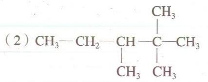

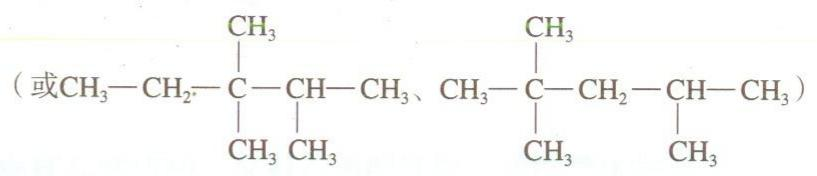

## 第二节 烯烃 炔烃

## 一、内容分析

烯烃和炔烃是两种重要的不饱和脂肪烃。本节内容主要包括烯烃的结构、性质和立体异构，以及以乙炔为代表物的炔烃的结构和性质。

本节在编排上先帮助学生回忆乙烯的结构和性质，通过“思考与讨论”帮助学生复习乙烯的加成反应和加聚反应规律，再向丙烯和异丁烯等烯烃进行迁移应用。由此帮助学生建立“结构决定性质”的化学基本观念。

烯烃的命名在烷烃系统命名的基础上，标注了碳碳双键官能团的位置。可以结合烯烃的碳架异构、官能团位置异构和立体异构进行讨论学习，帮助学生进一步认识有机化合物分子结构的复杂性和多样性。

在必修阶段，学生只是简单地认识了乙炔，有关乙炔的结构和性质的学习是本节的另一个重点。教材在编排上先通过实验探究结合交流讨论帮助学生认识乙炔有哪些化学性质，这些化学性质与其分子结构有什么关系，并将其与乙烯的结构和性质进行对比。再通过化学方程式帮助学生认识有关反应规律，了解乙炔在有机合成中的应用。最后，在炔烃类别的层面帮助学生认识炔烃的结构特点和性质。

## 二、教学目标

## 1. 教学目标

（1）通过回顾和复习乙烯的结构与性质，从官能团和化学键的视角分析和认识烯烃的结构和性质。

(2) 从化学键的视角分析顺反异构产生的原因, 并能识别烯烃的顺式和反式结构。

(3)通过分析乙炔的化学键和结构,能说出碳碳三键与碳碳双键成键方式的异同。

（4）通过实验探究活动，预测、验证和分析乙炔的化学性质与结构的关系，深化“结构决定性质”的化学基本观念。

## 2. 教学重点和难点

重点：烯烃和炔烃的结构与性质的关系。

难点：烯烃的立体异构。

## 三、教学建议

烯烃和炔烃都是含有不饱和键的烃类化合物，结构和性质具有诸多相似性。本节内容的学习对于学生从类别和官能团的视角学习有机化合物具有重要价值。在教学时，可以用类比的方法，烯烃类比乙烯，炔烃类比烯烃。

## 1. 设计互动活动，复习乙烯的性质，通过类比学习烯烃的结构和性质

在必修阶段，乙烯作为不饱和烃的代表物，学生已经对其物理性质、分子结构、化学性质和用途等进行了学习。在本节的教学中，先对乙烯的性质进行复习非常重要。如果仅通过梳理知识点的方式进行复习，虽然也能帮助学生回顾和掌握知识，但是不利于激发学生的学习兴趣。该教学环节中，可以设计一个简短的竞猜活动，让学生根据以下信息推测该物质是乙烯。

①能用排水法收集；

②能使酸性高锰酸钾溶液褪色；

③能使溴的四氯化碳溶液褪色；

④完全燃烧的产物是 $CO_{2}$ 和 $H_{2}O$ ；

⑤1 mol 该物质完全燃烧生成 $1 \, mol CO_{2}$ 和 $2 \, mol H_{2}O$ ，该物质的实验式是 $CH_{2}$ 。

在猜的过程中，学生们自然将饱和烃与不饱和烃的性质进行对比，复习效果更佳。

也可以鼓励学生联系乙烯在生产和生活中的用途，设计其他知识闯关类游戏，帮助他们复习乙烯的性质，引导学生认识乙烯加成反应的实质是碳碳双键官能团的反应。然后，给出同样含有碳碳双键官能团的丙烯、丁烯等烯烃同系物，引导学生预测反应结果并书写化学方程式，填写教材“思考与讨论”栏目中的表格。对于烯烃的加聚反应，同样可以类比乙烯和氯乙烯的加聚反应，设计活动，指导学生书写化学方程式。

## 2. 在动手制作空间结构模型的过程中，认识烯烃的立体异构

有机化合物的空间结构问题是学生刚开始系统学习有机化学时的难点。可以设计以下模型制作活动，以便学生形象直观地学习和理解立体异构。

（1）情境创设：模型制作比赛。

（2）活动设计：分组制作分子式为 $C_{4}H_{8}$ 的烯烃的球棍模型，规定时间内制作模型种类最多的小组获胜。

在模型制作比赛过程中，可以要求学生把模型的结构表达出来，可以画图，也可以尝试命名，以深化对有机化合物结构的认识。

(3) 思考交流: 为什么2-丁烯能形成两种不同的结构? 哪些烯烃能有这样的异构现象?

(4) 总结巩固:

①烯烃能形成顺反异构的关键是有阻碍碳碳键旋转的双键，并且碳碳双键两端都连接了不同的原子或原子团；

②相同的原子或原子团位于双键同一侧的称为顺式结构，相同的原子或原子团位于双键两侧的称为反式结构；

③互为顺反异构体的化合物，化学性质基本相同，物理性质有一定的差异。

(5) 反馈练习。

## 3. 类比烯烃的结构和性质，从结构入手学习炔烃的性质

(1) 情境创设: 可以通过焊接和切割金属的氧炔焰引出乙炔, 然后给出下表。

<table><tr><td>烃</td><td>乙烷</td><td>乙烯</td><td>乙炔</td></tr><tr><td>分子式</td><td> $C_{2}H_{6}$ </td><td> $C_{2}H_{4}$ </td><td> $C_{2}H_{2}$ </td></tr><tr><td>结构简式</td><td> $CH_{3}-CH_{3}$ </td><td> $CH_{2}=CH_{2}$ </td><td> $CH=CH$ </td></tr><tr><td>结构特点</td><td>碳碳单键(σ键),饱和</td><td>碳碳双键(1个σ键、1个π键),不饱和</td><td>碳碳三键(1个σ键、两个π键),不饱和</td></tr></table>

通过结构对比，可以看出碳碳双键和碳碳三键结构的异同。由此推测乙炔和乙烯的化学性质相似，烯烃和炔烃的性质相似。

(2) 类比预测: 引导学生类比乙烯的化学性质, 预测乙炔的化学性质, 并填写下表。

<table><tr><td>不饱和烃</td><td>乙烯</td><td>乙炔</td></tr><tr><td>与 $O_{2}$ 反应</td><td></td><td></td></tr><tr><td>与酸性 $KMnO_{4}$ 溶液反应</td><td></td><td></td></tr><tr><td>加成反应(与 $H_{2}$ 、 $Br_{2}$ 、HCl、 $H_{2}O$ 等反应)</td><td></td><td></td></tr><tr><td>加聚反应</td><td></td><td></td></tr></table>

(3)实验探究:演示或分组实验,探究乙炔与 $\mathrm{Br}_{2}$ 、与酸性 $\mathrm{KMnO}_{4}$ 溶液等的反应。

（4）交流讨论：交流观察到的现象，对现象进行分析，了解乙炔与乙烯性质的异同并说明原因。

## 四、栏目使用建议

## 1. 思考与讨论

## 【思考与讨论1】

（1）建议教师指导学生填写表格时，先不提醒丙烯与氯化氢、与水的反应有两种产物，让学生在自行填写中发现问题，再一起讨论原因。

<table><tr><td>试剂</td><td>乙烯</td><td>丙烯</td></tr><tr><td>溴</td><td> $CH_2=CH_2 + Br_2 \longrightarrow CH_2BrCH_2Br$ </td><td> $CH_2=CHCH_3 + Br_2 \longrightarrow CH_2BrCHBrCH_3$ </td></tr><tr><td rowspan="2">氯化氢</td><td rowspan="2"> $CH_2=CH_2 + HCl \longrightarrow CH_3CH_2Cl$ </td><td> $CH_2=CHCH_3 + HCl \longrightarrow CH_3CHClCH_3$ </td></tr><tr><td> $CH_2=CHCH_3 + HCl \longrightarrow CH_2ClCH_2CH_3$ </td></tr><tr><td rowspan="2">水</td><td rowspan="2"> $CH_2=CH_2 + H_2O \xrightarrow[\Delta, 加压]{催化剂} CH_3CH_2OH$ </td><td> $CH_2=CHCH_3 + H_2O \xrightarrow[\Delta, 加压]{催化剂} CH_3CH(OH)CH_3$ </td></tr><tr><td> $CH_2=CHCH_3 + H_2O \xrightarrow[\Delta, 加压]{催化剂} HOCH_2CH_2CH_3$ </td></tr></table>

让学生说明反应中官能团和化学键的变化，引导学生从官能团的视角认识烯烃的性质，理解结构对性质的决定作用。

（2）类比乙烯的加聚反应书写氯乙烯的加聚反应时，可以借助动画或表演等形式，让学生更加形象直观地理解加聚反应中的断键与成键。

【思考与讨论2】

$$
\mathrm{CH} \equiv \mathrm{C} - \mathrm{CH} _ {2} - \mathrm{CH} _ {2} - \mathrm{CH} _ {3} \quad \mathrm{CH} _ {3} - \mathrm{C} \equiv \mathrm{C} - \mathrm{CH} _ {2} - \mathrm{CH} _ {3} \quad \mathrm{CH} \equiv \mathrm{C} - \mathrm{CH} - \mathrm{CH} _ {3}
$$

指导学生书写戊炔属于炔烃的同分异构体的结构简式，要注意思维有序。可以先写出含5个碳原子的碳骨架的碳架异构，然后改变碳碳三键的位置。

$$
(2) \mathrm{CH} \equiv \mathrm{CCH} _ {2} \mathrm{CH} _ {3} + 2 \mathrm{H} _ {2} \xrightarrow [ \triangle ]{\text { 催化剂 }} \mathrm{CH} _ {3} \mathrm{CH} _ {2} \mathrm{CH} _ {2} \mathrm{CH} _ {3}
$$

1-丁炔与足量氢气完全反应，碳碳三键官能团消失，两个 $\pi$ 键都断开，形成了4个C—H $\sigma$ 键。

（3）该题的分析思路如下：

$$
\begin{array}{c} 1 \quad 2 \quad 3 \quad 4 \quad 5 \\ \mathrm{C-C-C-C-C} \\ \mid \\ \mathrm{C} \end{array}
$$

2号碳原子与相邻的三个碳原子之间不可能形成碳碳三键，所以碳碳三键只能位于3、4号碳原子或4、5号碳原子之间。

## 2. 探究

该探究结合乙炔的结构，对其性质进行预测，再通过实验探究乙炔的性质。同时，教材提供信息资料，帮助学生了解实验原理、净化方式和安全操作注意事项。

<table><tr><td>实验内容</td><td>实验现象</td></tr><tr><td>(1)将饱和氯化钠溶液滴入盛有电石的烧瓶中</td><td>反应剧烈,放热,有气体产生</td></tr><tr><td>(2)将纯净的乙炔通入盛有酸性高锰酸钾溶液的试管中</td><td>酸性高锰酸钾溶液褪色</td></tr><tr><td>(3)将纯净的乙炔通入盛有溴的四氯化碳溶液的试管中</td><td>溴的四氯化碳溶液褪色</td></tr><tr><td>(4)点燃纯净的乙炔</td><td>产生明亮的火焰,有黑烟</td></tr></table>

## 五、练习与应用参考答案及说明

1. CD 
2. BC 
3. D

4. (1) $\mathrm{C}_{7} \mathrm{H}_{14}$ 互为同系物 (2)6

5. 溴的四氯化碳溶液褪色 $CH_{2}=CHCH_{3}+Br_{2}\longrightarrow CH_{2}BrCHBrCH_{3}$ 加成反应

$n\mathrm{CH}_{2}=\mathrm{CHCH}_{3}\xrightarrow{\text{催化剂}}\left[\mathrm{CH}_{2}-\mathrm{CH}\right]_{n}$ 加聚反应 $\mathrm{CH}_{3}$

$$
\begin{array}{c} 6. \mathrm{CH} _ {3} \mathrm{CH} _ {2} \mathrm{CH} _ {2} \mathrm{CH} = \mathrm{CCH} _ {2} \mathrm{CH} _ {2} \mathrm{CH} _ {3} \\ | \\ \mathrm{CH} _ {2} \mathrm{CH} _ {3} \end{array}
$$

7. (1) $\mathrm{CH}_2$ (2) $\mathrm{C}_5\mathrm{H}_{10}$

$$
\begin{array}{c} (3) \mathrm {CH_ {3} CH_ {2} CH_ {2} CH = CH_ {2}} \quad \mathrm {CH_ {3} CH_ {2} CH = CHCH_ {3}} \quad \mathrm {CH_ {2} = CHCH(C H_ {3}) _ {2}} \quad \mathrm {CH_ {3} CH = C(CH_ {3}) _ {2}} \\ \mathrm {CH_ {2} = CC H _ {2} CH_ {3}} \\ | \\ \mathrm {CH_ {3}} \end{array}
$$

## 第三节 芳香烃

## 一、内容分析

苯是最简单的芳香烃，苯的同系物是烷基与苯环相连接的一类芳香烃。本节内容主要包括苯及其同系物的结构、性质和应用。

在必修阶段，学生只知道苯是一种芳香烃。因此，本节教材在介绍苯的结构和性质时，先帮助学生认识苯的结构特点：苯分子中有6个碳原子构成的环状结构，有别于烷烃、烯烃和炔烃的链状结构；分子的不饱和度较高；碳原子采取 $sp^{2}$ 杂化方式，但苯环中没有碳碳双键，苯环的大 $\pi$ 键结构比烯烃的 $\pi$ 键结构稳定。再通过实验探究帮助学生认识苯的化学性质：不能被酸性高锰酸钾溶液氧化，既可以发生类似烷烃的取代反应，又可以发生类似烯烃和炔烃的加成反应。

本节的另一个重点内容是苯的同系物。教材重点对比苯和甲苯在结构上的相同点和不同点，帮助学生认识甲苯中甲基与苯环间的相互作用导致化学键的极性发生变化，而化学键的极性会影响有机化合物的化学性质。在性质方面，重点对比苯、甲烷和甲苯与酸性高锰酸钾溶液的作用，对比苯和甲苯发生的硝化反应，帮助学生根据共价键的类型和基团间的相互作用解释共价键的极性，提高他们的类比思维能力。

## 二、教学目标

## 1. 教学目标

（1）通过实验探究活动，预测、验证并分析苯及其同系物的化学性质。

（2）通过对比、类比等方法，说出苯和苯的同系物的性质异同，举例说明有机化合物中官能团之间的相互影响。

## 2. 教学重点和难点

重点：苯及其同系物的结构和性质。

难点：苯的结构和性质。

## 三、教学建议

在必修阶段，学生已经初步学习了脂肪烃。芳香烃仅出现在必修第二册教材的“科学史话”栏目。芳香烃的分子结构为环状，含有大 $\pi$ 键，这些内容对学生认知的挑战较大。结合化学史设计多样的学生活动方式和评价方式，有利于学生学习本节内容。

## 1. 借助化学史学习苯的结构和性质

必修教材的“科学史话”栏目讲述了苯的发现和研究过程。将该栏目中的资料进行整合和补充，可以设计如下形式的学生活动。

<table><tr><td>资料</td><td>学生活动</td></tr><tr><td>19世纪初,英国科学家法拉第发现了苯,并将其称为“氢的重碳化合物”。</td><td>总结:苯属于烃,且含碳量较高,不饱和程度较高。</td></tr><tr><td>法国化学家热拉尔等人又确定了苯的相对分子质量和分子式。</td><td>总结:苯的相对分子质量为78,分子式为 $C_6H_6$ 。拓展:结合碳四价理论,推测苯可能的结构简式。</td></tr><tr><td>奥地利化学家洛施密特提出苯具有环状结构。</td><td>从写出的结构简式中,挑选出环状化合物的结构简式。</td></tr><tr><td>德国化学家凯库勒在分析了大量实验事实后认为,苯分子中6个碳原子之间的结合非常牢固,形成了一个很稳定的“核”,这个“核”可以与其他碳原子相连形成芳香族化合物;该“核”具有闭合的环状结构,由碳原子以单、双键相互交替结合而成。</td><td>挑选出六元环状化合物的结构简式。拓展:若是单、双键相互交替的结构,苯的化学性质应该和烯烃、炔烃等不饱和烃的相似,能与溴水发生加成反应,能使酸性高锰酸钾溶液褪色。实验验证:苯不能与溴水反应,而是通过萃取溴使试管中的液体出现分层;苯不能使酸性高锰酸钾溶液褪色。</td></tr><tr><td>进入20世纪,科学家用X射线衍射法证实了苯分子结构是平面正六边形;每个碳碳键的键长相等,都是139 pm,介于碳碳单键与碳碳双键的键长之间。邻二氯苯只有一种结构。</td><td>总结探究过程,归纳苯的结构和性质。</td></tr></table>

苯的结构的提出具有划时代的意义，有力地推动了有机化学的发展。引导学生了解化学史，重新经历苯的结构的发现过程，对于培养学生的科学精神和社会责任具有重要价值。

## 2. 对比苯、甲苯和脂肪烃的结构与性质，深化对“结构决定性质”的认识

从分子式、结构简式、结构特点（空间结构）、物理性质、化学性质（反应类型）等方面对比乙烷、乙烯、乙炔、苯和甲苯的性质。

通过对比，引导学生认识苯的结构与化学性质的特殊之处——组成上高度不饱和，结构比较稳定；易取代，难加成，难氧化。类比苯和烷烃的结构和性质，学习甲苯的结构和性质。同系物的化学性质是相似而不是相同，有机化合物分子中基团之间的相互影响会使物质的性质发生改变。这些都能使学生对同系物性质的认识层次得以提升。

## 3. 从物质类别和同系物的视角, 引导学生自主认识苯的同系物的结构和性质

苯的同系物的性质可以与苯的性质进行类比。其分子中基团之间的相互影响，导致其性质与苯的性质有一些不同。在设计活动时，可以让学生去预测和检验。以下教学设计可供参考。

（1）创设情境：苯的“寻亲记”，给出以下有机化合物的结构简式。

A.

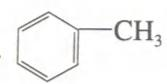

B.

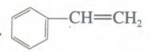

C.

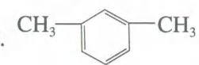

D.

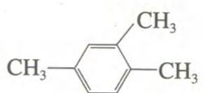

E.

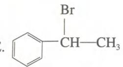

F.

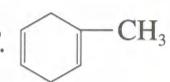

引导学生按照同系物的概念，发现A、C和D属于苯的同系物。然后，总结苯的同系物的定义：苯环上的氢原子被烷基取代所得到的一系列产物称为苯的同系物，通式为 $C_{n}H_{2n-6}$ 。

（2）提出问题：预测甲苯的化学性质。

（3）实验探究：苯和甲苯与溴水或酸性高锰酸钾溶液能否反应。

（4）发现问题：甲苯可以使酸性高锰酸钾溶液褪色。

（5）总结归纳：苯的同系物的化学性质；甲基和苯环之间的相互影响。

## 四、栏目使用建议

【思考与讨论1】

结合苯和甲苯的分子结构特点及【实验2-2】的结果，分析苯和甲苯的物理性质与化学性质的相似点和不同点。可以下表的形式进行呈现。

<table><tr><td>芳香烃</td><td>苯</td><td>甲苯</td></tr><tr><td>分子式</td><td> $C_6H_6$ </td><td> $C_7H_8$ </td></tr><tr><td>结构简式</td><td></td><td></td></tr><tr><td>结构相似点</td><td colspan="2">都含有苯环</td></tr><tr><td>结构不同点</td><td>苯环上没有取代基</td><td>苯环上有甲基取代基</td></tr><tr><td>分子间的关系</td><td colspan="2">结构相似,分子组成相差 $CH_2$ ,互为同系物</td></tr><tr><td>物理性质相似点</td><td colspan="2">无色液体,比水轻,不溶于水</td></tr></table>

<table><tr><td></td><td>与酸性高锰酸钾溶液</td><td>不反应</td><td>被氧化,溶液褪色</td></tr><tr><td>与溴水</td><td>不反应</td><td>不反应</td><td></td></tr></table>

## 【思考与讨论2】

（1）在光照条件下，甲苯与氯气发生取代反应时，氯原子取代甲基上的氢原子。反应后可能的有机产物是甲基上的氢原子分别被1个、2个或3个氯原子取代所生成的氯甲基苯。分离提纯的方法一般是蒸馏。

(2) 在 $\mathrm{FeBr}_3$ 的催化下, 甲苯与溴发生取代反应生成的一溴代甲苯主要有两种: 邻溴甲苯和对溴甲苯。甲基的存在活化了苯环上处于甲基邻位和对位的氢原子, 使相应的C—H更容易断裂, 发生取代反应。该反应对反应条件的要求更低。

活动（1）和活动（2）的目的是引导学生关注条件不同时，发生取代反应的可能是甲基，也可能是苯环。

（3）甲苯与氢气发生加成反应后生成甲基环己烷。该反应与苯的反应相似，相同条件下发生加成反应的是苯环。

（4）对比苯和甲苯的结构，以及二者发生硝化反应产物的结构，可以发现甲基活化了苯环，并使甲基邻位和对位上的氢原子更容易被取代。可以从取代基团影响苯环大 $\pi$ 键的角度进行分析：苯环中原本平均分布的电子云，在甲苯中的分布有了差异，使某些位置上的亲电取代反应变得容易。

## 五、练习与应用参考答案及说明

1. C 
2. D 
3. D 
4. B 
5. C 
6. D 
7. D

8. ${\mathrm{C}}_{20}{\mathrm{H}}_{12}$

9. (1) $\mathrm{C}_n\mathrm{H}_{2n - 6}$ $\mathrm{C_8H_{10}}$

(2)

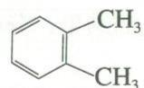

邻二甲苯（1,2-二甲苯）

10. (1)

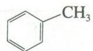

(2)光照,甲苯和 $\mathrm{Cl}_{2} \quad \mathrm{FeBr}_{3}$ 催化剂,甲苯和 $\mathrm{Br}_{2}$

(3) cd

11.（1）烷基被苯环活化，容易被氧化。

(2)

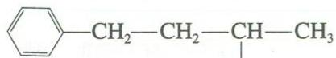

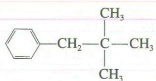

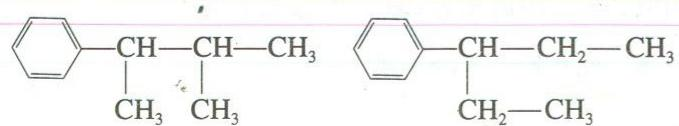

## 复习与提升建议

## 一、复习与提升教学建议

## 可以下表的形式引导学生梳理本章的主要内容。

<table><tr><td colspan="2">烃</td><td>乙烷</td><td>乙烯</td><td>乙炔</td><td>苯</td><td>甲苯</td></tr><tr><td colspan="2">分子式</td><td></td><td></td><td></td><td></td><td></td></tr><tr><td colspan="2">结构简式</td><td></td><td></td><td></td><td></td><td></td></tr><tr><td colspan="2">结构特点</td><td></td><td></td><td></td><td></td><td></td></tr><tr><td colspan="2">空间结构</td><td></td><td></td><td></td><td></td><td></td></tr><tr><td colspan="2">物理性质</td><td></td><td></td><td></td><td></td><td></td></tr><tr><td colspan="2"></td><td></td><td></td><td></td><td></td><td></td></tr><tr><td rowspan="4">化学性质</td><td>燃烧</td><td></td><td></td><td></td><td></td><td></td></tr><tr><td>与Br2的CCl4溶液</td><td></td><td></td><td></td><td></td><td></td></tr><tr><td>与酸性KMnO4溶液</td><td></td><td></td><td></td><td></td><td></td></tr><tr><td>主要反应类型</td><td></td><td></td><td></td><td></td><td></td></tr></table>

烃是有机化学中的基础物质，是后续学习烃的衍生物和高分子的基础。选择性必修阶段中烃的学习，更强调从官能团和化学键的视角来学习各类有机化合物的性质。仅强调从化学键的视角学习烃的性质容易让学生感到抽象，难以理解。在本章的学习和复习中，建议创设情境激发学生的学习兴趣和学习欲望，借助来源于生活的案例，以及宏观的模型和生动形象的表演等帮助学生复习，还可以借助项目式学习活动或研究性学习活动。

例如, 可以选择 “世界三大体育赛事中的有机化合物” 为主题设计复习课、项目式学习活动或研究性学习活动。足球世界杯赛场上使用了复方氯乙烷气雾剂, 复习课上可以 $\mathrm{H}_{2} 、 \mathrm{Cl}_{2} 、 \mathrm{CH}_{2} = \mathrm{CH}_{2} 、 \mathrm{CH}_{3} - \mathrm{CH}_{3} 、 \mathrm{CH}_{3} \mathrm{CH}_{2} \mathrm{CH}_{3} 、 \mathrm{CH}_{2} = \mathrm{CHCH}_{3} 、 \mathrm{CH}_{2} = \mathrm{CHCl}$ 等物质为原料, 引导学生设计氯乙烷的合成路线, 说明反应类型和微观的断键与成键情况。借助世界一级方程式锦标赛创设情境, 寻找燃料、配件、跑道和轮胎等物质中的烷烃、烯烃和芳香烃。由此介绍相关材料及合成路线, 让学生书写化学方程式, 从化学键和官能团的微观视角认识化学反应和物质变化。以奥运火炬为切入点，引导学生调查生活中常见的燃料。以上活动可以让学生意识到这些化学问题来源于生活。通过宏观与微观相结合学习化学知识，可以帮助学生更好地了解问题的来龙去脉，理解知识本身的价值和意义，培养其学习兴趣和社会责任。

## 二、复习与提升参考答案及说明

$$
1. \mathrm{C} 2. \mathrm{C} 3. \mathrm{C} 4. \mathrm{D} 5. \mathrm{B} 6. \mathrm{C} 7. \mathrm{A} 8. \mathrm{C}
$$

9. (1) $\mathrm{CH}_3\mathrm{CH}_3 + \mathrm{Cl}_2 \xrightarrow{\text{光}} \mathrm{CH}_3\mathrm{CH}_2\mathrm{Cl} + \mathrm{HCl}$ 取代反应

(2) $\mathrm{CH}_{2}=\mathrm{CH}_{2}+\mathrm{HCl}\longrightarrow\mathrm{CH}_{3}\mathrm{CH}_{2}\mathrm{Cl}$ 加成反应

（3）第2种加成反应的方式更好，原因是副反应较少，原子利用率高。

10.（1）除去乙炔中的 $\mathrm{H}_2\mathrm{S}$ 等杂质 $\mathrm{CaC}_2 + 2\mathrm{H}_2\mathrm{O} \longrightarrow \mathrm{Ca(OH)}_2 + \mathrm{C}_2\mathrm{H}_2 \uparrow$

$$
(2) n \mathrm{CH} _ {2} = \mathrm{CHCN} \xrightarrow {\text {催化剂}} - [ \mathrm{CH} _ {2} - \mathrm{CH} ] _ {n}
$$

11. (1) ad (2) $\mathrm{C6H5CH=CH_2}$

$$
\mathrm{CH} = \mathrm{CH} _ {2} + \mathrm{Br} _ {2} \longrightarrow \mathrm{CHBrCH} _ {2} \mathrm{Br}
$$

$$
(4) n \xrightarrow {\text { 催化剂 }} \left[ \begin{array}{c} \mathrm{CH} - \mathrm{CH} _ {2} \\ \mathrm{苯环} \end{array} \right] _ {n} \quad \text { 加聚反应 }
$$

## 教学资源

## 1. 乙烯工业

## (1) 乙烯的工业来源

乙烯在工业中主要来自烷烃的裂解。烷烃的主要工业来源是石油。各地生产的石油的成分不尽相同，但主要成分都是烷烃和环烷烃。从油田中开采出原油后，首先分离出溶解于其中的天然气（气态烃），随后分馏出沸程不同的各种石油产品。为提高石油产品的质量，可采用热裂化（500\~700 ℃，加压）与催化裂化（400\~500 ℃，常压，使用催化剂）的方法，使较高级烷烃的碳碳键断裂，发生脱氢、环化和异构化。例如：

$$
\mathrm {CH_3(CH_2) _5CH_3} \xrightarrow [ \text {异构化} ]{\text {脱氢}} \begin{array}{l} \mathrm {CH_3(CH_2)_4CH = CH_2+ H_2} \\ \text {环化} \\ \text {苯环化} \end{array} \xrightarrow [ \text {芳构化} ]{\text {脱氢}} \begin{array}{l} \mathrm {\text {苯环化}} \\ \text {苯环化} \\ \text {苯环化} \end{array} \xrightarrow [ \text {苯环化} ]{\text {脱氢}} \begin{array}{l} \mathrm {\text {苯环化}} \\ \text {苯环化} \\ \text {苯环化} \end{array} \xrightarrow [ \text {苯环化} ]{\text {苯环化}} \begin{array}{l} \mathrm {\text {苯环化}} \\ \text {苯环化} \\ \text {苯环化} \end{array}
$$

为了获得更多的化工原料，人们常在700 ℃以上的高温条件下将烷烃进行裂解（深度的裂化），以获得三烯（乙烯、丙烯、丁二烯）、三苯（苯、甲苯、二甲苯）、乙炔和萘这8种基本化工原料，其中产量最大的是乙烯（表2-1）。

表2-1 石油原料裂解所得乙烯和丙烯的收率

<table><tr><td>原料</td><td>乙烯收率/%</td><td>丙烯收率/%</td></tr><tr><td>乙烷</td><td>76</td><td>3</td></tr><tr><td>丙烷</td><td>42</td><td>16</td></tr><tr><td>丁烷</td><td>40</td><td>21</td></tr><tr><td> $C_{15} \sim C_{18}$ 烷</td><td>25</td><td>15</td></tr></table>

此外，石油炼厂气中含有少量乙烯、丙烯及丁烯。炼焦工业的副产物——焦炉煤气中也含有少量乙烯。

## (2) 乙烯工业概况

乙烯工业以乙烯为起始原料合成其他有机化工原料、中间体及产品（俗称下游产品），是石油化工产业中极其重要的组成部分。由乙烯合成的各类化工产品的种类繁多。乙烯的主要用途如下图所示。

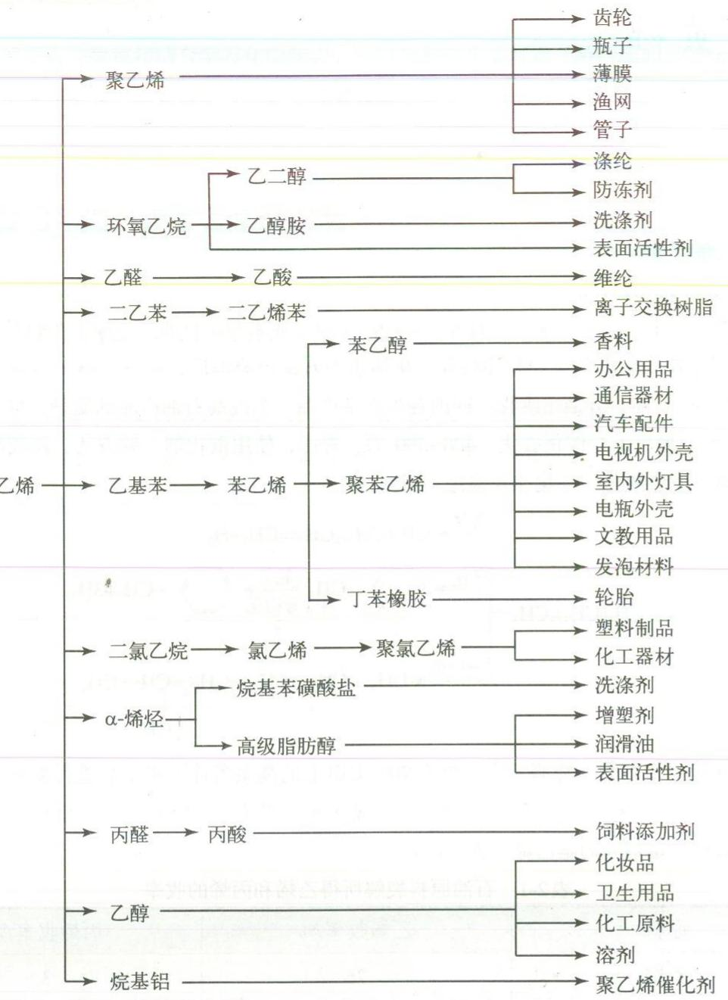

## 2. 乙炔

## (1) 乙炔的气味

纯净的乙炔是无色、无臭的气体。但在一般情况下，用电石制取的乙炔常带有一种令人极不愉快的恶臭。这是由于在电石中含有少量硫化钙、砷化钙、磷化钙等杂质，当这些杂质与水作用时，生成了带有特殊臭味的硫化氢、砷化氢和磷化氢等气体。

$$
\begin{array}{r l} & \mathrm {CaS + 2H_ {2} O = Ca(OH) _ {2} + H_ {2} S\uparrow} \\ & \mathrm {Ca_ {3} As_ {2} +6H_ {2} O = 3Ca(OH) _ {2} +2AsH_ {3} \uparrow} \\ & \mathrm {Ca_ {3} P_ {2} +6H_ {2} O = 3Ca(OH) _ {2} +2PH_ {3} \uparrow} \end{array}
$$

将电石制取的乙炔气体通入盛有酸性重铬酸钾溶液（或氯化汞的稀盐酸溶液、碱溶液）的洗气瓶，可以除去这些带有臭味的气体杂质，得到较纯净的乙炔。

## (2) 乙炔的爆炸与燃烧

乙炔与空气能形成爆炸性的混合物。乙炔在空气中的爆炸极限是3%\~81%(体积分数)。从乙炔的爆炸极限可以看出，乙炔形成的爆炸混合物的组成范围比其他烃类的要大得多。乙炔不仅能与空气形成爆炸混合物，在受到外界的压力时也不稳定。液态乙炔在震动时就会分解，发生爆炸，并放出大量的热。

$$
\mathrm{CH} \equiv \mathrm{CH} \longrightarrow 2 \mathrm{C} + \mathrm{H} _ {2} \quad \Delta H = - 2 1 4. 4 \mathrm{kJ/mol}
$$

乙炔在燃烧时发出明亮的火焰，这是由于在燃烧时有一部分乙炔裂解成细小的碳颗粒，这些碳颗粒受到灼烧而发光。因此乙炔曾被用于照明。

## （3）乙炔与高锰酸钾溶液的反应

乙炔与乙烯一样，都能被高锰酸钾等氧化剂所氧化，氧化的最终产物是二氧化碳。

$$
3 \mathrm{CH} \equiv \mathrm{CH} + 1 0 \mathrm{KMnO} _ {4} + 2 \mathrm{H} _ {2} \mathrm{O} \longrightarrow 6 \mathrm{CO} _ {2} \uparrow + 1 0 \mathrm{KOH} + 1 0 \mathrm{MnO} _ {2} \downarrow
$$

## （4）乙炔的发现和用途

1836年，英国著名化学家汉弗莱·戴维的堂弟，化学家埃德蒙·戴维在加热木炭和碳酸钾以制取金属钾的过程中，将残渣（含碳化钾）投入水中后产生了一种气体，并发生爆炸。他分析后确定这一气体的化学组成是 $C_{2}H$ （当时使用的碳的相对原子质量为6），称它为“一种新的氢的二碳化物”。早在1825年，英国科学家法拉第从加压蒸馏鲸鱼油产生的气体中获得了一种碳和氢的化合物，测得其化学组成是 $C_{2}H$ ，并将其命名为“氢的二碳化物”。实际上，法拉第发现的是苯（ $C_{6}H_{6}$ ），埃德蒙·戴维发现的是乙炔（ $C_{2}H_{2}$ ）。

1867年，德国有机化学家埃伦迈尔确定了乙炔的分子式，并指出碳原子间存在三键。1895年，法国巴黎矿业学院化学教授勒夏特列指出，乙炔在氧气中燃烧的火焰温度超过3 000 ℃，比其他任何气体燃烧产生的温度都高，具有利用价值。但是乙炔在压缩状态时是危险的，有可能发生爆炸。

1897年，法国化学家克洛德发现乙炔很容易被丙酮吸收，将溶解了乙炔的丙酮盛装在钢瓶中可以安全使用。1901年，法国富歇兄弟完成气炬的设计制造。于是，氧炔焰开始应用于金属切割和焊接中，使碳化钙和乙炔有了用武之地。各国纷纷建立制造碳化钙的工厂，使氧化钙与焦炭在电炉中反应，生成碳化钙和一氧化碳。

$$
\mathrm{CaO} + 3 \mathrm{C} \xlongequal {2 5 0 0 \sim 3 0 0 0 ^ {\circ} \mathrm{C}} \mathrm{CaC} _ {2} + \mathrm{CO} \uparrow
$$

在20世纪20年代，乙炔的应用领域不断扩展，开始应用于聚乙烯醇的制造。早在1931年，人们已经掌握用聚乙烯醇制纤维的技术。可是这种纤维具有很强的亲水性，易溶于水，用它制成的纤维在水中洗涤后就消失了，因而不能作为纺织纤维。经过日本和朝鲜化学家研究，人们将聚乙烯醇与甲醛进行缩醛化处理，得到聚乙烯醇缩甲醛纤维，也就是我们今天称为维纶的合成纤维。

乙炔后来又被用于制造另一种合成纤维——聚丙烯腈（腈纶，又称人造毛）。这是20世纪40年代美国杜邦公司研制成功的。乙炔先与氰化氢反应生成丙烯腈，然后再进行聚合。

$$
\begin{array}{r l} & \mathrm {CH\equiv CH + HCN\xrightarrow {\mathrm {CuCl_ {2}}} CH_ {2} = CHCN} \\ & n \mathrm {CH_ {2} = CHCN\longrightarrow\left[CH_ {2} -CH\right] _ {n}} \\ & \quad \mathrm{CN} \end{array}
$$

在20世纪30年代，杜邦公司以乙炔为原料，先制成乙烯基乙炔，然后与氯化氢作用，再进行聚合，制成氯丁橡胶。

$$
\begin{array}{l} 2 \mathrm{CH} \equiv \mathrm{CH} \xrightarrow {\mathrm{CuCl} _ {2} , \mathrm{NH} _ {4} \mathrm{Cl}} \mathrm{CH} _ {2} = \mathrm{CH} - \mathrm{C} \equiv \mathrm{CH} \xrightarrow {\mathrm{HCl}} \mathrm{CH} _ {2} = \mathrm{CH} - \mathrm{CCl} = \mathrm{CH} _ {2} \\ n \mathrm{CH} _ {2} = \mathrm{CH} - \mathrm{CCl} = \mathrm{CH} _ {2} \longrightarrow \left[ \mathrm{CH} _ {2} - \mathrm{CH} = \mathrm{CCl} - \mathrm{CH} _ {2} \right] _ {n} \end{array}
$$

乙炔也可以直接与氯化氢反应，生成氯乙烯，氯乙烯聚合生成聚氯乙烯。乙炔已经成为工业中制造合成纤维、合成橡胶和塑料的基本原料，单靠电炉生产的电石来制取乙炔已经不能满足人们的需要。随着石油化学工业的发展，人们开始利用石油和天然气裂解制取乙炔。

石油裂解制取乙炔的同时还生成乙烯和丙烯。天然气裂解较少有烯烃出现，裂解气中除乙炔外，还有氢气、一氧化碳和少量甲烷。裂解天然气制取乙炔需要在短时间内进行高温加热，然后急骤冷却。时间短是防止乙炔本身继续裂解生成炭黑，急骤冷却使乙炔迅速脱离使其继续裂解的环境。目前，部分国家已淘汰电石法，我国也在更多地使用石油和天然气裂解法生产乙炔。

[摘编自：凌永乐. 电石和乙炔气的发现和发展. 化学教育, 1997(12): 39-41]

## 3. 苯

## (1) 苯的用途

苯的重要用途是制取乙苯、环己烷和苯酚。苯经取代反应、加成反应和氧化反应等生成的一系列化合物可以作为制取塑料、橡胶、纤维、染料、洗涤剂、杀虫剂等的原料。苯也是制造芳香族中间体的基本原料。此外，苯对很多有机化合物具有良好的溶解性能，可作为化工生产中的溶剂。下图给出了苯的主要用途。

$$
\text { 苯 } \xrightarrow {\text { 烷基化 }} \begin{array}{l} \text { 乙苯 } \longrightarrow \text { 苯乙烯 } \longrightarrow \text { 橡胶、塑料 } \\ \text { 异丙苯 } \longrightarrow \text { 苯酚、丙酮 } \longrightarrow \text { 溶剂、有机玻璃、炸药、染料、塑料 } \\ \text { 十二烷基苯 } \longrightarrow \text { 合成洗涤剂 } \\ \text { 加氢 } \longrightarrow \text { 环己烷 } \longrightarrow \text { 己二酸、己内酰胺 } \longrightarrow \text { 合成纤维 } \\ \text { 氧化 } \longrightarrow \text { 顺丁烯二酸酐 } \longrightarrow \text { 醇酸树脂 } \\ \text { 硝化 } \longrightarrow \text { 硝基苯 } \longrightarrow \text { 苯胺 } \longrightarrow \text { 农药、染料 } \\ \text { 磺化 } \longrightarrow \text { 苯磺酸 } \longrightarrow \text { 染料、苯酚 } \\ \text { 卤化 } \longrightarrow \text { 卤代苯 } \longrightarrow \text { 农药、染料 } \\ \text { 卤化 } \longrightarrow \text { 溶剂 } \end{array}
$$

## (2) 苯的毒性

苯有毒，会影响人的中枢神经。严重的急性苯中毒会引起抽搐，甚至使人失去知觉。慢性苯中毒会影响人的造血功能。长期吸入苯及其同系物的蒸气，会损伤肝脏、造血器官及神经系统，并可能导致白血病。

## 4. 有机反应机理简介

## (1) 烷烃的自由基取代反应

甲烷在光照条件下与氯气作用，生成一氯甲烷、二氯甲烷、三氯甲烷和四氯化碳，这是一个自由基型的取代反应。其反应过程包含链引发、链转移和链终止，相应的反应机理如下表所示。

<table><tr><td>反应过程</td><td>化学方程式</td><td>结果</td></tr><tr><td>链引发</td><td> $Cl_{2} \xrightarrow{光照} 2Cl \cdot (共价键均裂)$ </td><td>产生高能自由基 $Cl \cdot$ ,引发反应</td></tr><tr><td>链转移</td><td> $Cl \cdot +CH_{4} \longrightarrow \cdot CH_{3} + HCl$  $\cdot CH_{3} + Cl_{2} \longrightarrow CH_{3}Cl + Cl \cdot$ </td><td>一个自由基消失,产生另一个自由基,反复循环</td></tr><tr><td>链终止</td><td> $Cl \cdot +Cl \cdot \longrightarrow Cl_{2}$  $\cdot CH_{3} + \cdot CH_{3} \longrightarrow CH_{3}CH_{3}$  $Cl \cdot + \cdot CH_{3} \longrightarrow CH_{3}Cl$ </td><td>随着反应物的浓度减小,自由基碰撞的概率增大,自由基消失,反应结束</td></tr></table>

复杂烷烃的自由基取代反应，产物出现的概率取决于碳自由基的稳定性。几种常见的自由基的稳定性顺序为： $R_{3}C\cdot>R_{2}CH\cdot>RCH_{2}\cdot>CH_{3}\cdot$ 。烷烃上的氢原子被取代的概率可通过氯代产物的比例进行估算，如下表所示。

<table><tr><td>反应物</td><td>生成物所占比例</td><td>氢原子被取代的概率</td></tr><tr><td> $CH_3CH_2CH_3 + Cl_2$ </td><td> $CH_3CH_2CH_2Cl \quad 45\%$  $CH_3CHClCH_3 \quad 55\%$ </td><td> $1^\circ H \quad 45\%/6 = 7.5\%$  $2^\circ H \quad 55\%/2 = 27.5\%$ </td></tr><tr><td> $CH_3CH(CH_3)_2 + Cl_2$ </td><td> $(CH_3)_2CHCH_2Cl \quad 64\%$  $(CH_3)_3CCl \quad 36\%$ </td><td> $1^\circ H \quad 64\%/9 = 7.1\%$  $3^\circ H \quad 36\%/1 = 36\%$ </td></tr></table>

由此可见，三种氢原子的反应性： $3^{\circ}$ H > 2° H > 1° H，与之相对应的碳自由基的稳定性越大，氢原子被取代的概率越大。

## (2) 烯烃的加成反应

烯烃的加成反应主要有离子型亲电加成机理和自由基加成机理。烯烃与氢卤酸的加成反应是离子型亲电加成，反应过程中产生了碳正离子中间体，反应过程如下：

$$
\begin{array}{r l} & {\mathrm{HX} \longrightarrow \mathrm{H} ^ {+} + \mathrm{X} ^ {-} \quad (\text {共价键异裂})} \\ & {\mathrm{CH} _ {2} = \mathrm{CH} _ {2} + \mathrm{H} ^ {+} \longrightarrow \mathrm{CH} _ {3} \mathrm{CH} _ {2} ^ {+} (\text {慢反应})} \\ & {\mathrm{CH} _ {3} \mathrm{CH} _ {2} ^ {+} + \mathrm{X} ^ {-} \longrightarrow \mathrm{CH} _ {3} \mathrm{CH} _ {2} \mathrm{X} (\text {快反应})} \end{array}
$$

烯烃的 $\pi$ 电子与氢离子结合生成碳正离子的反应是反应的速率控制步骤。烯烃双键上的电子云密度越高，氢卤酸的酸性越强，反应越容易进行。

不对称烯烃与氢卤酸加成时，卤原子加到氢原子少的碳原子上的产物是主要产物，遵循马尔可夫尼可夫规则（简称马氏规则）。例如，丙烯与氯化氢的反应：

$$
\mathrm{CH} _ {3} \mathrm{CH} = \mathrm{CH} _ {2} + \mathrm{H} ^ {+} \longrightarrow \left\{ \begin{array}{l l} \mathrm{CH} _ {3} ^ {+} \mathrm{CHCH} _ {3} & \xrightarrow {+ \mathrm{Cl} ^ {-}} \mathrm{CH} _ {3} \mathrm{CHClCH} _ {3} (\text {主要产物}) \\ \mathrm{CH} _ {3} \mathrm{CH} _ {2} ^ {+} \mathrm{CH} _ {2} & \xrightarrow {+ \mathrm{Cl} ^ {-}} \mathrm{CH} _ {3} \mathrm{CH} _ {2} \mathrm{CH} _ {2} \mathrm{Cl} (\text {次要产物}) \end{array} \right.
$$

根据电子效应（甲基的给电子诱导效应和超共轭效应），二级碳正离子 $\left(\mathrm{CH}_{3}\right)_{2}\mathrm{CH}^{+}$ 比一级碳正离子 $\mathrm{CH}_{3}\mathrm{CH}_{2}\mathrm{CH}_{2}^{+}$ 稳定，生成二级碳正离子的活化能低，反应速率快，因此2-氯丙烷是主要产物。

马氏规则的适用范围是双键碳原子上有给电子基团的烯烃。如果双键碳原子上有强吸电子基团（—CN、—NO $_{2}$ 、—COOH等），根据电子效应，其加成方向是反马氏规则的。

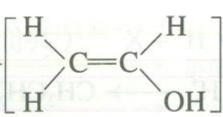

$$
\mathrm{CH} _ {2} = \mathrm{CHCOOH} + \mathrm{HCl} \longrightarrow \mathrm{ClCH} _ {2} \mathrm{CH} _ {2} \mathrm{COOH}
$$

如果双键碳原子上有—Cl、—OH、—NH $_{2}$ 等具有孤电子对的原子或原子团，给电子的p- $\pi$ 共轭效应强于吸电子的诱导效应，因此主要加成产物仍符合马氏规则。

$$
\mathrm{CH} _ {2} = \mathrm{CHCl} + \mathrm{HCl} \longrightarrow \mathrm{CH} _ {3} \mathrm{CHCl} _ {2}
$$

烯烃与氢卤酸的加成反应，由于存在碳正离子中间体，常伴随碳正离子重排的产物。重排的结果是一个较不稳定的碳正离子转变为一个较稳定的碳正离子。碳正离子的稳定性顺序为： $R_{3}C^{+}>R_{2}CH^{+}>RCH_{2}^{+}>CH_{3}^{+}$ 。

在光照或过氧化物作用下，丙烯与溴化氢可发生自由基加成反应，主要产物与马氏规则相反。

$$
\mathrm{CH} _ {3} \mathrm{CH} = \mathrm{CH} _ {2} + \mathrm{HBr} \xrightarrow {\text {过氧化物}} \mathrm{CH} _ {3} \mathrm{CH} _ {2} \mathrm{CH} _ {2} \mathrm{Br}
$$

该反应过程经历链引发、链转移和链终止，其中的链转移过程为：

$$
\begin{array}{r l} & \mathrm {CH_ {3} CH = CH_ {2} + Br\cdot\longrightarrowCH_ {3} \dot {C} HCH_ {2} Br} \\ & \mathrm {CH_ {3} \dot {C} HCH_ {2} Br + HBr\longrightarrowCH_ {3} CH_ {2} CH_ {2} Br+ Br\cdot} \end{array}
$$

$2^{\circ}$ 碳自由基比 $1^{\circ}$ 碳自由基稳定，因此溴原子更倾向于加到丙烯双键末端的碳原子上，生成反马氏规则的产物。

## （3）炔烃的加成反应

炔烃与卤素、氢卤酸、水的加成反应是亲电加成，反应机理与烯烃的亲电加成反应相似。由于sp杂化的碳原子比 $sp^{2}$ 杂化的碳原子吸引电子能力强，碳碳三键的加成反应比碳碳双键的加成反应困难，反应较慢。不对称炔烃与氢卤酸、水的加成反应遵循马氏规则。

乙炔与水的加成反应可在 $10\% \mathrm{H}_{2} \mathrm{SO}_{4}$ 和 $5\% \mathrm{HgSO}_{4}$ 的混合溶液中进行，碳碳三键先与水加成，生成不稳定的产物乙烯醇，乙烯醇很快发生重排，形成稳定的乙醛。

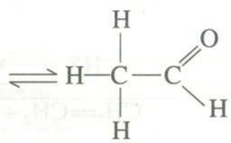  
乙烯醇  
乙醛

有过氧化物存在时，炔烃与HBr发生自由基加成反应，得到反马氏规则的产物。例如，以下反应中，由于 $CH_{3}CH_{2}CHBr\dot{CHBr}$ 自由基比较稳定，因此产物是1,2-二溴丁烷。

$$
\begin{array}{r l} & {\mathrm {CH_ {3} CH_ {2} C\equiv CH + HBr\xrightarrow{\text {过氧化物}} CH_ {3} CH_ {2} CH = CHBr}} \\ & {\mathrm {CH_ {3} CH_ {2} CH = CHBr + HBr\xrightarrow{\text {过氧化物}} CH_ {3} CH_ {2} CHBrCH_ {2} Br}} \end{array}
$$

炔烃还可以发生亲核加成，而烯烃不能发生亲核加成，这是炔烃与烯烃的明显区别。

$$
\mathrm{CH} \equiv \mathrm{CH} + \mathrm{HCN} \xrightarrow [ \triangle ]{\text { 催化剂 }} \mathrm{CH} _ {2} = \mathrm{CHCN}
$$

以上反应中，CN⁻首先与碳碳三键进行亲核加成形成碳负离子，再与氢离子结合生成丙烯腈。乙炔等炔烃与含活泼氢的有机化合物（如醇、硫醇、胺、羧酸等）都能发生亲核加成，生成多种合成高分子的单体。

$$
\mathrm{CH} \equiv \mathrm{CH} + \mathrm{CH} _ {3} \mathrm{CH} _ {2} \mathrm{OH} \xrightarrow [ \triangle ]{\text {催化剂}} \mathrm{CH} _ {2} = \mathrm{CHOCH} _ {2} \mathrm{CH} _ {3}
$$

$$
\mathrm{CH} \equiv \mathrm{CH} + \mathrm{CH} _ {3} \mathrm{COOH} \xrightarrow [ \triangle ]{\text {催化剂}} \mathrm{CH} _ {3} \mathrm{COOCH} = \mathrm{CH} _ {2}
$$

乙炔在不同催化剂作用下可以发生自身加成反应，生成链烃或环烃。

$$
2 \mathrm{CH} \equiv \mathrm{CH} \xrightarrow [ \triangle ]{\text {催化剂}} \mathrm{CH} _ {2} = \mathrm{CH} - \mathrm{C} \equiv \mathrm{CH}
$$

$$
3 \mathrm{CH} \equiv \mathrm{CH} \xrightarrow [ \triangle ]{\text { 催化剂 }} \mathrm{CH} _ {2} = \mathrm{CH} - \mathrm{C} \equiv \mathrm{C} - \mathrm{CH} = \mathrm{CH} _ {2}
$$

$$
3 \mathrm{CH} \equiv \mathrm{CH} \xrightarrow [ \triangle ]{\text { 催化剂 }} \bigcirc
$$

$$
4 \mathrm{CH} \equiv \mathrm{CH} \xrightarrow [ \triangle ]{\text { 催化剂 }}
$$

## (4) 芳香亲电取代反应

芳香亲电取代反应是指亲电试剂取代芳香族化合物苯环上的氢原子的反应，典型的反应有苯环的硝化、卤化、磺化、酰基化和烷基化反应等。这些反应的反应机理基本一致。

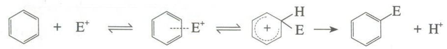

例如，苯与浓硝酸和浓硫酸的混合酸作用，发生硝化反应的化学方程式为：

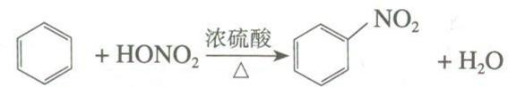

反应过程中，硝酸在浓硫酸作用下产生硝基正离子。

$$
\mathrm{HONO} _ {2} + 2 \mathrm{H} _ {2} \mathrm{SO} _ {4} \rightleftharpoons \mathrm{H} _ {3} \mathrm{O} ^ {+} + \mathrm{NO} _ {2} ^ {+} + 2 \mathrm{HSO} _ {4} ^ {-}
$$

硝基正离子（亲电试剂）进攻苯，形成中间体碳正离子。

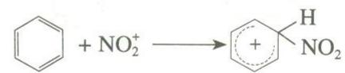

中间体碳正离子中的一个质子转移到 $\mathrm{HSO}_4^-$ 上，生成硝基苯和硫酸。

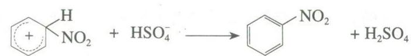

一元取代苯进行二元硝化时，已有基团会对其他基团进入苯环的位置产生影响，这种作用称为取代基的定位效应。取代基的定位效应与诱导效应、共轭效应和超共轭效应等电子效应有关。取代基主要分为邻、对位定位基团和间位定位基团。含有邻、对位定位基团的一取代苯进行硝化反应时，二元取代产物以邻、对位产物为主；含有间位定位基团的一取代苯进行硝化反应时，二元取代产物以间位产物为主。另外，不同的取代基也使苯环发生亲电取代反应的活性有所变化，给电子基团将使苯环的活性升高，称为致活基团；吸电子基团将使苯环的活性降低，称为致钝基团。综合以上两种影响，可将基团分为三类。

①致活的邻、对位定位基，它们使苯环上的亲电取代反应易于进行，并使后进入的取代基主要进入原取代基的邻、对位。

②致钝的邻、对位定位基，它们使苯环上的亲电取代反应难以进行，并使后进入的取代基主要进入原取代基的邻、对位。

③致钝的间位定位基，它们使苯环上的亲电取代反应难以进行，并使后进入的取代基主要进入原取代基的间位。

58%  
表2-2 常见的定位基团

<table><tr><td>定位基团</td><td colspan="5">邻、对位定位基团</td><td colspan="2">间位定位基团</td></tr><tr><td>强度</td><td>最强</td><td>强</td><td>中</td><td>弱</td><td>弱</td><td>强</td><td>最强</td></tr><tr><td rowspan="8">基团</td><td rowspan="8"> $-O^{-}$ </td><td> $-NH_{2}$ </td><td> $-OCOR$ </td><td> $-C_{6}H_{5}$ </td><td> $-F$ </td><td> $-COR$ </td><td> $-NR_{3}^{+}$ </td></tr><tr><td> $-OH$ </td><td> $-NHCOR$ </td><td> $-CH_{3}$ </td><td> $-Cl$ </td><td> $-CHO$ </td><td></td></tr><tr><td> $-OR$ </td><td></td><td> $-CR_{3}$ </td><td> $-Br$ </td><td> $-COOH$ </td><td></td></tr><tr><td></td><td></td><td></td><td> $-I$ </td><td> $-COOR$ </td><td></td></tr><tr><td></td><td></td><td></td><td> $-CH_{2}Cl$ </td><td> $-CN$ </td><td></td></tr><tr><td></td><td></td><td></td><td></td><td> $-NO_{2}$ </td><td></td></tr><tr><td></td><td></td><td></td><td></td><td> $-SO_{3}H$ </td><td></td></tr><tr><td></td><td></td><td></td><td></td><td> $-CCl_{3}$ </td><td></td></tr><tr><td>电子效应</td><td colspan="4">给电子效应</td><td colspan="3">吸电子效应</td></tr><tr><td>性质</td><td colspan="4">致活基团</td><td colspan="3">致钝基团</td></tr></table>

例如，甲基是致活的邻、对位定位基团，甲苯比苯容易发生硝化反应，主要得到邻、对位产物。

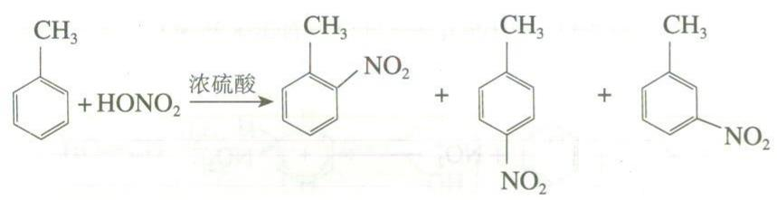

又如，氯原子是致钝的邻、对位定位基团，氯苯发生硝化反应比苯要难，主要得到邻、对位产物。

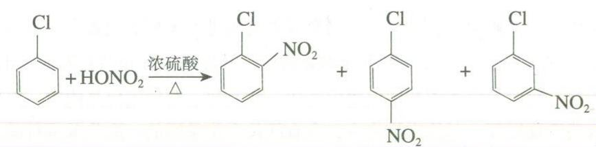

[摘编自：邢其毅，裴伟伟，徐瑞秋，裴坚．基础有机化学：上册（第3版）．北京：高等教育出版社，2005年]

## 教学案例

## 第二节 烯烃 炔烃（第1课时）

北京市西城外国语学校 苏艳丰

## 教学目标

1. 通过对烯烃的官能团、化学键和化学性质的分析，体会结构与性质之间的关系，建立研究烯烃的一般模型。

2. 通过对化学键的分析，认识顺反异构现象产生的原因，能辨识烯烃的顺式和反式结构。

3. 通过了解家用燃料的变化和比较不同橡胶的性能，感受科技进步为生活和生产带来的便利。

## 教学重点

烯烃的性质，烯烃的结构与性质之间的关系。

## 教学难点

加聚产物的书写，顺反异构体的辨识和书写。

## 教学流程

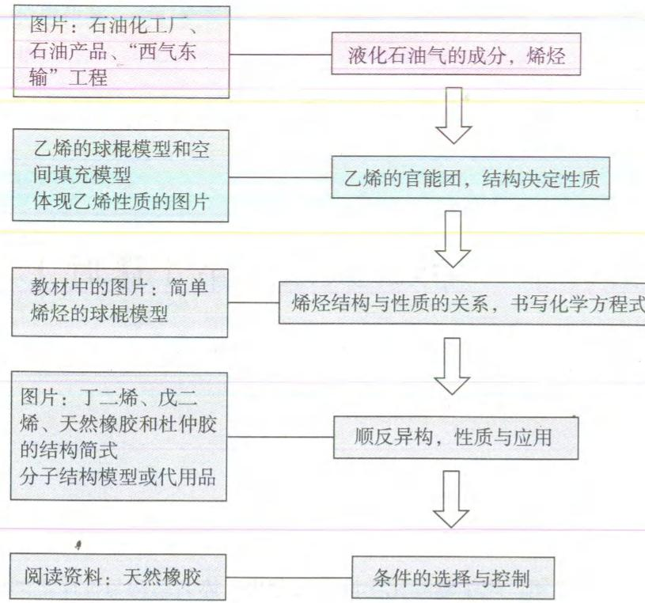

## 教学过程

教学环节一：提出化学问题。

<table><tr><td>教师活动</td><td>学生活动</td><td>设计意图</td></tr><tr><td>【展示】石油化工厂、石油产品及用途、“西气东输”工程的图片。【讲述】液化石油气的主要成分是丙烷、丙烯、丁烷、丁烯等烃类物质。【引导】家用燃料由液化石油气改成管道天然气,为什么会有这样的变化?</td><td>【观察,思考】【回答】二者的组成不同,液化石油气含有烯烃等重要的化工原料,天然气的主要成分是甲烷,不含烯烃。</td><td>引导学生关注生活和社会,学会从化学的角度分析问题,确定研究对象。</td></tr></table>

教学环节二：回忆旧知识——乙烯的结构与化学性质。

<table><tr><td>教师活动</td><td>学生活动</td><td>设计意图</td></tr><tr><td>【展示】乙烯的分子结构模型和乙烯性质实验的图片。【引导】让学生观察乙烯的分子结构模型,回忆乙烯的结构特点和化学性质,并书写相关化学方程式。</td><td>观察,回忆乙烯的结构与化学性质。【讨论,回答】官能团是碳碳双键,可以发生加成、加聚和氧化反应。书写相关化学方程式。</td><td>通过图片展示乙烯的结构和性质,激活学生的已有认知,找到知识的生长点。引导学生从官能团和化学键的角度分析乙烯的结构特点,结合实验现象,感悟和理解“结构决定性质,性质反映结构”,为烯烃的学习进行铺垫。</td></tr></table>

教学环节三：学习新知识——烯烃的结构与化学性质。

<table><tr><td>教师活动</td><td>学生活动</td><td>设计意图</td></tr><tr><td>【指导阅读】引导学生阅读教材,观察乙烯、丙烯、1-丁烯和1-戊烯的球棍模型插图。【讲述】液化石油气中的丙烯和丁烯都是烯烃。【提问】1. 这几种烯烃在结构上的相同与不同之处分别是什么?2. 推测它们的性质和能发生的反应。</td><td>【阅读,观察】【倾听】【讨论,回答】官能团都是碳碳双键,分子中的碳原子数不同;可以发生加成、加聚、氧化反应。</td><td>通过对简单烯烃的官能团和化学键的观察对比,大胆推测烯烃的通性,加深对“结构决定性质”的理解,聚焦重点知识。</td></tr><tr><td>【提问】如何证明丙烯发生了氧化反应?【追问】丙烯与溴发生加成反应时有何现象?【任务】请书写丙烯分别与溴、氯化氢、水发生加成反应的化学方程式。</td><td>【回答】将丙烯通入酸性高锰酸钾溶液,溶液褪色。【回答】丙烯与溴发生加成反应的现象是溴的四氯化碳溶液褪色。【书写化学方程式】【互相纠正】【质疑】丙烯与氯化氢、与水的加成产物都不止一种。</td><td>通过对操作、现象和结论进行表述,体会科学研究中寻找证据的过程。通过书写化学方程式并互相纠正,体会烯烃的化学性质,培养严谨的科学态度。</td></tr><tr><td rowspan="3">【引导】介绍同分异构现象产生的原因及意义。【任务】1.思考烯烃发生加聚反应时是如何断键和成键的。2.写出丙烯、氯乙烯发生加聚反应的化学方程式。</td><td></td><td></td></tr><tr><td>【思考】</td><td rowspan="2">使学生感受“微观”“宏观”和“符号”之间的联系,提高书写的准确性,突破难点。</td></tr><tr><td>【书写,对照修改】注意链节的书写和聚合度的表达方式。</td></tr></table>

教学环节四：学习新知识——烯烃的立体异构（顺反异构）。

<table><tr><td>教师活动</td><td>学生活动</td><td>设计意图</td></tr><tr><td rowspan="2">【过渡】分子中含有两个碳碳双键的烃是二烯烃。比较简单且常见的是丁二烯和异戊二烯,它们发生加聚反应的产物是我们生活中常用的一种合成材料——橡胶。【展示】图片:两种二烯烃的结构简式、聚异戊二烯两种不同结构的示意图。【讲述】介绍顺反异构。</td><td>【倾听】</td><td rowspan="2">联系实际,感悟顺反异构现象存在的普遍性。</td></tr><tr><td>【观察,思考,感悟】发现两种橡胶结构不同,链节中分别为顺式和反式结构。【倾听,思考】</td></tr><tr><td>【任务】1.书写丁烯的全部同分异构体的结构简式并命名。2.让学生用分子结构拼插模型或代用品,拼插2-丁烯的球棍模型。</td><td>【书写,对照修改】【拼插模型】感悟顺反异构现象。</td><td>通过拼插模型,提高学生的学习兴趣,使微观结构形象化、直观化,突破“辨识顺反异构体”这个难点。</td></tr><tr><td>【巩固练习】布置辨认和书写顺反异构体的练习。【展示,激发疑问】1.为什么会有顺反异构现象?2.顺反异构现象会使异构体的化学性质不同吗?会影响哪些性质呢?【指导阅读】教师提供资料。</td><td>【练习,讨论,改错】【回答】双键不能自由旋转。【阅读,总结】化学性质基本相同,物理性质有一定的差异。</td><td>引导学生体验“发现问题、查找资料、分析问题、解决问题”的过程,进一步建立科学研究的一般思路。</td></tr></table>

续表

<table><tr><td>教师活动</td><td>学生活动</td><td>设计意图</td></tr><tr><td>【展示,讲述】天然橡胶与杜仲胶的优点和缺点,以及化学工作者对它们的研究和改良。举例说明与生产和生活有关的顺反异构现象。</td><td>【倾听,感悟】</td><td>回归生产和生活,感悟“化学与生活密切相关”。</td></tr></table>

教学环节五：小结。

<table><tr><td>教师活动</td><td>学生活动</td><td>设计意图</td></tr><tr><td>【提问】通过今天的学习,同学们对烯烃有哪些认识?</td><td>【回答】乙烯的性质,烯烃的结构与性质,烯烃的顺反异构,化学工作者的贡献。</td><td>从化学学科核心素养的不同维度对本节课的内容进行小结,使学生有收获和感悟。</td></tr></table>

## 板书设计

烯烃  
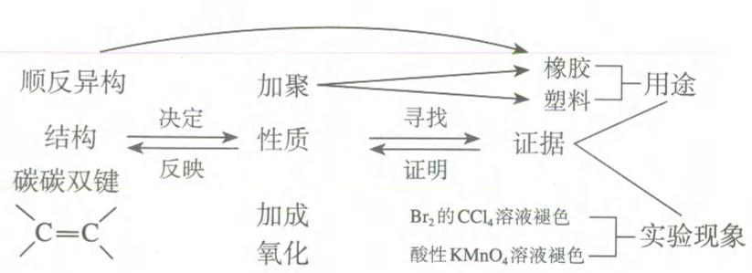

# 第三节 芳香烃（第2课时）

# 北京市第一六一中学 徐大珍

## 教学目标

1. 通过查阅资料并讨论“汽油中添加芳香烃的利与弊”，提高安全使用有机化合物的意识；通过书写同分异构体，理解苯的同系物的结构特点，从物质分类角度进一步加深对物质多样性的认识。

2. 利用类比迁移的方法，依据苯的性质来预测苯的同系物的性质，结合仪器分析确定产物的结构，进一步加强“组成和结构决定性质”的化学基本观念。

3. 通过对比实验现象分析和讨论苯和甲苯的性质，初步形成“有机化合物分子中基团之间存在相互影响”的观念，建立认知模型，发展证据推理意识。

## 教学重点

苯的同系物的结构特点，苯和甲苯的性质异同。

## 教学难点

从有机化合物分子中基团之间相互影响的角度，认识苯和甲苯的性质异同。

## 教学过程

教学环节一：了解汽油中添加芳香烃的利与弊。

<table><tr><td>教师活动</td><td>学生活动</td><td>设计意图</td></tr><tr><td>【引入】展示各种芳香烃的结构简式和用途的图片。</td><td>【观察】初步认识芳香烃,了解其广泛的用途。</td><td>总结芳香烃的结构特点,为接下来的学习进行铺垫。</td></tr><tr><td>【过渡】课前已经请大家查阅资料,讨论在汽油中添加芳香烃的利与弊。接下来,我们围绕这一内容以辩论的方式进行学习。</td><td>【辩论】正方主要观点:增强汽油的抗爆震性。反方主要观点:发动机产生积炭,造成环境污染。</td><td>利用网络资源,培养学生收集和整理信息的能力。</td></tr><tr><td>【小结】一分为二地看待身边的化学物质,更好地趋利避害是我们化学工作者的责任。</td><td>体会一分为二地看待事物的思想方法和化学的学科价值。</td><td>提高安全使用有机化合物的意识,学会辩证地认识事物,发展科学态度与社会责任等学科核心素养。</td></tr></table>

教学环节二：认识苯的同系物的结构特点。

<table><tr><td>教师活动</td><td>学生活动</td><td>设计意图</td></tr><tr><td>【过渡】上一节课,我们学习了最简单的芳香烃——苯。那么,苯的同系物的组成和结构有哪些特点呢?</td><td>【讨论】从同系物的概念入手,它们在组成上相差n个 $CH_2$ ,因此,苯的同系物的组成通式为 $C_nH_{2n-6}$ 。但是,如何理解结构相似呢?</td><td>运用同系物的概念解决新问题,理解有机化合物的组成与结构的关系。</td></tr><tr><td>【练习】写出分子式为 $C_8H_{10}$ ,且分子中含有苯环的所有同分异构体的结构简式。</td><td>【交流】写出乙苯、邻二甲苯、间二甲苯和对二甲苯的结构简式。【自主学习】教材表2-2。</td><td>在同分异构体的书写过程中,理解苯的同系物的结构特点。</td></tr><tr><td>【小结】苯的同系物的结构特点。</td><td>【总结】苯的同系物的结构特点:分子中有一个苯环和若干烷基。</td><td>从具体实例归纳总结结构的共性,落实知识重点。</td></tr></table>

教学环节三：预测甲苯的化学性质，结合谱图验证预测。

<table><tr><td>教师活动</td><td>学生活动</td><td>设计意图</td></tr><tr><td>【过渡】最简单的苯的同系物是甲苯。请依据烷烃和苯的性质预测甲苯的化学性质。</td><td>【交流讨论】小组讨论后展示。1.类比烷烃:在光照条件下可与氯气发生取代反应。2.类比苯:与氢气发生加成反应,与液溴发生取代反应,与硝酸发生取代反应。</td><td>从结构入手,根据有机化合物的分类,预测甲苯的化学性质,加强“结构决定性质”的基本观念。</td></tr><tr><td>【展示】甲苯与液溴反应产物的仪器分析谱图和产物的比例;甲苯与硝酸反应产物的仪器分析谱图和产物的比例。</td><td>【交流讨论】分析讨论,得出以下结论。1.甲苯与液溴反应的主要产物是 $\text{CH}_3$ 和 $\text{Br}$ — $\text{CH}_3$ 。2.甲苯与硝酸反应的产物比较复杂,有一硝基、二硝基、三硝基取代物等;硝基的位置以甲基的邻、对位为主。【自主学习】阅读教材,了解TNT的合成与用途。</td><td>在性质相似的基础上,摆出事实,引发认知冲突,激发学生的探究欲望,发展证据推理意识。</td></tr></table>

教学环节四：对比苯和甲苯的性质。

<table><tr><td>教师活动</td><td>学生活动</td><td>设计意图</td></tr><tr><td>【设问】苯和甲苯在结构上的异同会导致二者性质的哪些异同呢?</td><td>【讨论】上述事实说明,甲苯中的甲基对苯环有一定的影响。那么,苯环对甲基会有影响吗?</td><td>进一步加强“结构决定性质”的基本观念。</td></tr><tr><td>【实验】完成教材中的实验2-2,进行甲苯和苯的对比实验。</td><td>【分组实验】【观察】滴加溴水,苯和甲苯都能萃取其中的溴,现象相同;滴加酸性 $KMnO_{4}$ 溶液,与甲苯混合的溶液褪色,与苯混合的溶液不褪色。</td><td>动手实践,认识苯和甲苯的性质异同,引导学生从结构异同找到根本原因。</td></tr><tr><td>【讲解】与苯环相连的甲基被酸性 $KMnO_{4}$ 溶液氧化成羧基。</td><td>【交流讨论】实验事实证明,苯环对甲基也有影响。</td><td>先预测苯环对甲基有影响,再用实验事实证实该结论,建立实证意识。</td></tr></table>

教学环节五：知道有机化合物分子中基团之间存在相互影响。

<table><tr><td>教师活动</td><td>学生活动</td><td>设计意图</td></tr><tr><td>【提问】根据以上实验事实,对比苯、甲烷和甲苯的化学性质,你可以从中得到哪些启示?【小结】有机化合物分子中基团之间存在相互影响。</td><td>【交流讨论】小组汇报。1.对比苯和甲苯的性质,可知甲苯中的甲基活化了苯环上甲基邻、对位的碳氢键。2.对比甲烷和甲苯的性质,可知苯环使甲基的活性增强,使其能被酸性 $KMnO_{4}$ 溶液氧化。</td><td>依据事实,通过分析、推理等方法认识甲苯和苯的性质异同,最后得出“有机化合物分子中基团之间存在相互影响”的结论,展示论点和证据之间的逻辑关系。</td></tr><tr><td>【感悟】和大家分享本节课的收获。</td><td>【交流讨论】小组汇报。1.从有机化合物的结构入手,用类比迁移的方法推测其可能具有的性质,然后寻找事实进行验证。2.从有机化合物分子中基团之间相互影响的角度分析,探寻其性质特性,并用实验进行证实。</td><td>从学习甲苯的过程抽象出学习有机化合物的一般方法,构建认知模型。</td></tr></table>

## 第三章

## 烃的衍生物

## 本章说明

本章将结合烃的衍生物的结构特点，介绍烃的衍生物的性质，使学生进一步认识有机化合物的加成、取代、氧化和消去反应。通过设计各种烃的衍生物间的相互转化路线，使学生对所学知识进行综合应用。通过有机合成巩固烃和烃的衍生物的性质与转化关系，并使学生认识到有机合成在人类生活和社会进步中的重大意义，体会新化合物的不断合成使有机化学具有特殊的学科魅力。教材通过贴近生活实际的内容，让学生体验烃的衍生物的广泛应用，激发和保持学生学习的兴趣和热情。

本章介绍的有机反应，如银镜反应、酯化反应等，是学习后续两章内容的基础。第四章中葡萄糖的银镜反应，以及第五章中聚酯的合成反应等，都是本章介绍的有机反应的拓展与应用。

## 一、内容分析

课程标准根据有机化合物的类别，给出了烃的衍生物的“内容要求”。因此，本章在内容编排上重视有机化合物的类别，前四节的节名根据不同的官能团依此为“卤代烃”“醇酚”“醛酮”和“羧酸羧酸衍生物”。在这些烃的衍生物中，教材都是通过典型代表物的组成和结构特点，分别介绍各类衍生物的性质和应用。本章的第五节介绍了有机合成，运用各类有机化合物的相互转化关系，引导学生从原料出发，设计合成路线来合成新的有机化合物。

根据课程标准的要求，教材重点介绍卤代烃、醇、酚、醛、羧酸和酯的组成与结构特点、性质、转化关系，及其在生产和生活中的重要应用，简单介绍醚、酮、胺和酰胺的结构特点及应用。教材在介绍各类烃的衍生物的性质时，都是以一种典型代表物为例进行阐述，涉及的重要典型代表物有溴乙烷、乙醇、苯酚、乙醛、乙酸和乙酸乙酯。

教材第一、二、四节的内容编排次序如下图所示。

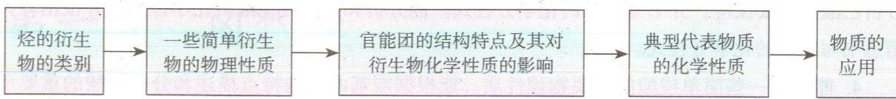

而教材第三节的内容编排次序有所不同，这是由于在必修课程中没有介绍第三节中的典型代表物乙醛。该节的内容编排次序如下图所示。

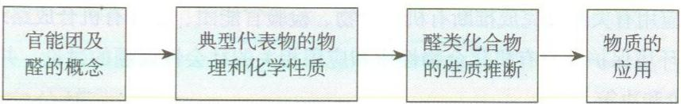

本章第五节介绍有机合成的相关内容。教材引导学生灵活运用烃和烃的衍生物间的转化关系，实现有机化合物类别的转化，对此前所学内容进行总结归纳，使其进一步结构化。

本章的内容结构如下图所示。

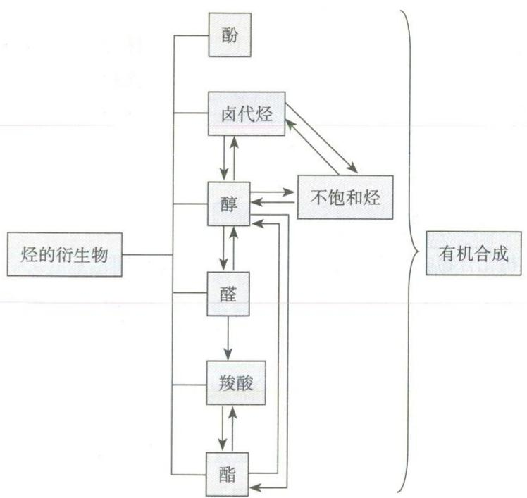

## 二、学业要求

1. 了解一些简单卤代烃的主要物理性质。能列举溴乙烷的物理性质，能描述和分析溴乙烷的重要反应，并书写相应的化学方程式。能分析和推断其他卤代烃的化学性质，并根据有关信息书写相应的化学方程式。

2. 能列举一些简单醇的主要物理性质。能根据醇羟基的结构特点，描述和分析乙醇的重要反应，并书写相应的化学方程式。能分析和推断其他醇的化学性质，并根据有关信息书写相应的化学方程式。能根据酚羟基的结构特点，描述和分析苯酚的重要反应，并书写相应的化学方程式。

3. 能写出醛基和乙醛的结构简式，能列举乙醛的物理性质。能根据醛基的结构特点描述和分析乙醛的重要反应，并书写相应的化学方程式。能分析和推断其他醛的化学性质，并根据有关信息书写相应的化学方程式。

4. 能列举一些简单羧酸的主要物理性质。能根据羧基的结构特点描述和分析羧酸的重要反应，并书写相应的化学方程式。能描述和分析酯的重要反应，能描述油脂的重要反应，并书写相应的化学方程式。

5. 能综合应用有关知识完成推断有机化合物、检验官能团、设计有机合成路线等任务。

6. 能参与环境保护等与有机化合物性质和应用相关的社会性议题的讨论，并作出有科学依据的判断、评价和决策。

## 三、课时建议

第一节 卤代烃 1课时

第二节 醇 酚 2课时

第三节 醛酮 2课时

第四节 羧酸 羧酸衍生物 2课时

第五节 有机合成 3课时

实验活动1 乙酸乙酯的制备与性质 1课时

实验活动2 有机化合物中常见官能团的检验 1课时

全章复习 2课时

## 第一节 卤代烃

## 一、内容分析

卤代烃是重要的烃的衍生物，属于烃的不含氧衍生物。本节内容分为三个部分，如下图所示。

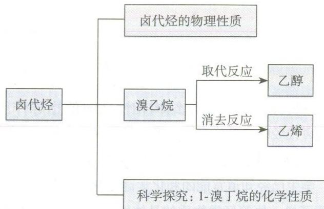

第一部分介绍了卤代烃的物理性质。教材从学生熟悉的一氯甲烷、1,2-二溴乙烷等卤代烃入手，介绍了卤代烃的概念和种类，并以“资料卡片”的方式简单介绍了卤代烃的命名。然后，教材以表格形式列举了几种卤代烃的密度和沸点数据，展示了它们的变化规律。

第二部分介绍了溴乙烷的性质。教材以溴乙烷作为卤代烃的典型代表物来介绍卤代烃的主要性质。先通过实验的方式，引入并分析溴乙烷的取代反应。教材注重“结构决定性质”的学科思想，指出卤代烃中的官能团是碳卤键，卤素原子的电负性比碳原子的大使C—X较易断裂，给出了卤代烃易发生取代反应的原因，再陈述式地介绍溴乙烷的消去反应。

第三部分设置了一个科学探究活动。教材在分析溴乙烷反应规律的基础上，要求学生探究1-溴丁烷的化学性质。通过探究进一步认识反应条件对化学反应的影响，进一步理解卤代烃的化学性质。同时，教材通过探究栏目中的“比较与分析”和“讨论”，强调官能团的转化，引导学生认识有机化合物间的转化关系，关注有机化合物“官能团转化”的基本规律，培养学生的逻辑思维能力。

## 二、教学目标

## 1. 教学目标

（1）能辨识卤代烃的官能团，并根据官能团对卤代烃进行分类；能列举典型卤代烃的主要物理性质及应用。

(2) 能从溴乙烷的官能团和化学键特点预测可能的断键部位和化学性质, 结合实验了解溴乙烷与 $\mathrm{NaOH}$ 水溶液的反应, 能写出相应的化学方程式。

（3）通过1-溴丁烷取代反应和消去反应的探究实验进行对比和归纳，形成“化学反应可以调控”的观念，通过类比迁移形成对卤代烃反应基本规律的认识。

（4）通过了解卤代烃在生活中的应用，认识化学对满足人类生活需要的积极贡献，树立保护环境和可持续发展的意识。

## 2. 教学重点和难点

重点：溴乙烷的分子结构特点和主要化学性质。

难点：卤代烃发生取代反应和消去反应的基本规律。

## 三、教学建议

## 1. 充分发挥已有经验在学习溴乙烷结构和性质时的指导作用

本节内容以溴乙烷为卤代烃的典型代表物，进一步要求学生基于官能团和化学键的特点分析和推断溴乙烷的性质，进而通过类比迁移到卤代烃性质的学习中，丰富学生对有机化合物的认知。通过第一章的学习，学生已经知道官能团和化学键对有机化合物的性质有很大影响。通过第二章的学习，学生也积累了烯、炔等烃类物质的具体性质，掌握了有机化合物的一般学习方法，即从结构角度分析预测性质，然后实验求证，通过典型物质学习一类物质。因此，教学中应充分利用学生已有的知识储备和学习经验，指导学生学习溴乙烷的结构和化学性质。

在进行 “溴乙烷的取代反应” 教学时，可从溴乙烷的分子结构入手，引导学生利用已有的化学键知识分析溴乙烷分子中各原子的成键特点，进行如下教学设计。

【学习任务1】学习溴乙烷的分子结构特点，识别其官能团，从键的极性和强弱角度进行分析，预测可能的断键位置。

【学生活动】画出溴乙烷的电子式和结构简式。

【设计意图】复习共价键的相关知识，通过学生对溴乙烷的电子式和结构简式的描述，评价学生对相关知识的掌握情况。

【学生活动】判断溴乙烷分子中共价键的种类，并从键长和键能的角度进行对比分析。

【设计意图】引导学生利用已有的共价键知识，在从微观角度辨识有机化合物分子中C—H、C—C和C—Br的基础上，通过原子半径和元素的电负性等知识推测C—Br有较强的极性，其键能较小而键长较大（教师适时给出相关数据，见表3-1），易发生断裂，使碳原子与带负电荷的基团结合。

表3-1 部分共价键的键长和键能

<table><tr><td>化学键</td><td>C—H</td><td>C—C</td><td>C—Br</td></tr><tr><td>键长/pm</td><td>110</td><td>154</td><td>194</td></tr><tr><td>键能/(kJ·mol-1)</td><td>414.2</td><td>347.3</td><td>284.5</td></tr></table>

【学习任务2】根据溴乙烷化学键的特点，预测其发生水解反应时的产物。

【学生活动】尝试写出溴乙烷与水发生反应的化学方程式。

【设计意图】在刚才推测 C—Br 易断裂的基础上，预测 Br $^{-}$ 离去后，碳原子易与带负电荷的 OH $^{-}$ 结合而生成乙醇，强化“结构决定性质”的学科观念。

【学生活动】思考：为什么溴乙烷的水解反应需要碱性条件并加热？

【设计意图】引导学生利用化学反应速率的影响因素和平衡移动等化学原理知识，理解溴乙烷发生水解反应时，通过加入NaOH等碱性物质增大反应物中 $OH^{-}$ 的浓度；通过加热升高温度，增大反应速率，促进平衡的移动。

此外，还可以利用第一章所学的研究有机化合物分子结构的波谱方法，引导学生应用核磁共振氢谱等方法认识溴乙烷的分子结构，检验溴乙烷和1-溴丁烷发生取代反应生成的有机化合物。

## 2. 通过开展模型搭建和实验探究活动，深化对卤代烃反应规律的理解

溴乙烷性质的教学需要对官能团和化学键的特点进行分析。为使这一过程更加显性化和可视化，可以组织学生开展分子结构模型的搭建活动，借助模型或动画模拟直观反映溴乙烷和1-溴丁烷分别发生取代反应和消去反应时共价键的断裂和形成过程，加深对卤代烃性质的理解。

此外，通过实验活动组织典型卤代烃的性质教学也是本节教学的有效策略之一。教材针对本节的教学重点——卤代烃发生取代反应和消去反应，在正文中安排了1个实验和1个探究活动。教学中应充分发挥这些实验和探究活动的功能，创设真实的教学情境，帮助学生理解溴乙烷等典型卤代烃的性质，启迪学生的科学思维，训练科学方法，培养科学态度。在【实验3-1】的教学中，可以开展如下实验活动。

【实验活动】向1 mL蒸馏水中加入10\~15滴溴乙烷，充分振荡后，取上层清液加入2滴 $AgNO_{3}$ 溶液，观察现象。

【设计意图】学生已经知道溴乙烷的密度大于水的密度且难溶于水等物理性质，在实验事实的基础上可以进一步认识溴乙烷不能发生电离，为后续实验中溴元素的检验奠定基础。

【实验活动】设计实验验证溴乙烷中存在溴元素，完成【实验3-1】。

【设计意图】引导学生通过分析结构得出溴乙烷在碱性条件下水解可生成 $Br^{-}$ 的结论，在此基础上设计并完成实验。不仅通过实验证实了官能团和化学键的特点对溴乙烷性质的影响，而且充分发挥了实验在培养学生科学探究和证据推理等学科核心素养方面的功能。

在进行本实验的教学时，可以提出如下问题让学生思考：①为什么要将反应后的上层溶液加入盛有稀硝酸的试管中？②加入2滴 $\mathrm{AgNO}_3$ 溶液的目的是什么？可能观察到哪些现象？实验后引导学生通过溴乙烷化学键的特点分析和解释现象，按照从宏观到微观、从性质到结构的思路认识溴乙烷的取代反应。也可以按照这一思路，先从溴乙烷的分子结构入手，结合化学键的极性等结构知识推测分子中可能断裂的位置，再借助实验进行检验。

在进行探究活动的过程中，教师可以首先引导学生在回顾溴乙烷性质的基础上，对探究问题进行讨论，提出检验反应产物的方案：利用酸化的 $AgNO_{3}$ 溶液检验取代和消去反应的产物 NaBr；运用第一章所学的波谱方法检验取代产物 1-丁醇。再根据 1-溴丁烷的结构（存在 $\beta-H$ 和 $\gamma-H$ ），猜测其发生消去反应时可能的断键位置，通过前面学习的消去反应的概念（得到不饱和化合物）和产物1-丁烯检验过程中的实验现象进行验证。最后，得出结论，完成探究活动中的“比较与分析”表格，并要求学生写出1-溴丁烷发生取代反应和消去反应的化学方程式。教师应注意根据学生在探究活动中的表现（如回答问题、参加讨论和实验的积极性，回答讨论问题的准确性，以及在探究过程中与他人的合作情况等方面）进行全面评价。

## 3. 运用对比、归纳和迁移的方法形成对卤代烃结构和性质的整体认识

通过典型卤代烃的学习，从结构和反应的视角进行类比，形成对卤代烃这一类物质结构和性质的整体认识，这是本节教学的一个重要思路。同时，将卤代烃的知识纳入学生已有的认知结构中，形成较系统的认识，也应在教学中予以充分重视。在卤代烃的结构和性质教学中，一方面可以引导学生将乙烷和溴乙烷、烷烃和（饱和一元）卤代烃进行对比，归纳它们之间的共性；同时，将烷烃的熔点和沸点等物理性质的变化规律进行迁移，形成对卤代烃物理性质的认识，并要求学生完成表3-2，进行小结。另一方面，可以从反应条件、化学键的断裂和形成、反应特点等方面，对比和分析卤代烃的取代反应和消去反应，并完成表3-3，得出卤代烃与NaOH在不同溶剂中反应情况不同的结论，进而形成“化学反应可调控”的观念，让学生了解可以通过控制反应条件实现不同物质间的转化。

表3-2 烷烃和卤代烃结构与性质的比较

<table><tr><td colspan="2">比较项目</td><td>烷烃</td><td>卤代烃(以饱和一元卤代烃为例)</td></tr><tr><td colspan="2">代表物</td><td></td><td></td></tr><tr><td colspan="2">通式</td><td></td><td></td></tr><tr><td colspan="2">结构特点</td><td></td><td></td></tr><tr><td rowspan="3">物理性质</td><td>水溶性</td><td></td><td></td></tr><tr><td>密度</td><td></td><td></td></tr><tr><td>熔点、沸点</td><td></td><td></td></tr><tr><td rowspan="3">化学性质</td><td>取代反应</td><td></td><td></td></tr><tr><td>加成反应</td><td></td><td></td></tr><tr><td>消去反应</td><td></td><td></td></tr></table>

表3-3 卤代烃取代反应和消去反应的比较

<table><tr><td>比较项目</td><td>取代反应</td><td>消去反应</td></tr><tr><td>反应条件</td><td></td><td></td></tr><tr><td>化学键的断裂</td><td></td><td></td></tr><tr><td>化学键的形成</td><td></td><td></td></tr><tr><td>反应特点</td><td></td><td></td></tr></table>

4. 利用教材“资料卡片”和“科学·技术·社会”栏目资源，了解卤代烃在生产和生活中的应用

在创设教学情境时，可将教材“资料卡片”栏目中“复方氯乙烷气雾剂”的内容应用于新课导入。在激发学生学习兴趣的同时，指出相关原理与氯乙烷的物理性质间的联系，进一步帮助学生理解物质性质与用途间的关系。从教学内容拓展的角度，可利用教材中聚氯乙烯和聚四氟乙烯材料的图片，或学生课余查阅、教师课堂补充的能体现化学学科价值的素材，帮助学生进一步认识化学对于创造更多物质财富和精神财富、满足人民日益增长的美好生活需要的重大贡献。通过阅读教材“科学·技术·社会”栏目，了解卤代烃作为制冷剂和干洗剂的历史，引发学生对相关的社会性议题的思考和讨论，引导他们作出正确的价值判断，培养保护环境和可持续发展的意识。

## 四、栏目使用建议

## 1. 实验

【实验3-1】

本实验旨在通过生成浅黄色沉淀这一现象，说明反应产物中存在 $\mathrm{Br}^{-}$ ，从而证明溴乙烷在NaOH水溶液中加热时，溴原子可以被取代。这一事实也为从溴乙烷分子中化学键的特点分析其断键部位提供了依据。实验时应注意加热温度不宜过高，可以采取水浴加热的方式，减少溴乙烷挥发。

实验安全提醒：溴乙烷易挥发，蒸气有一定毒性，若接触皮肤应立即用水冲洗。

## 2. 探究

本探究活动安排在溴乙烷的取代和消去反应之后，要求学生能类比迁移溴乙烷的性质知识，预测1-溴丁烷与NaOH在不同溶剂中反应的产物；还要求学生能从1-溴丁烷的分子结构出发，通过其消去反应的实验探究，在解决产物检验、装置设计等具体问题的同时，为卤代烃的消去反应提供实验证据。最后，通过讨论、分析与比较，使学生系统地认识卤代烃的性质。

学生进行实验操作时，应提醒其注意以下事项。

(1) 配制 $\mathrm{NaOH}$ 的乙醇溶液时, 为促进溶解可适当加热。由于 $2 \mathrm{~g} \mathrm{NaOH}$ 不易完全溶于 $15 \mathrm{~mL}$ 乙醇, 得到的往往是悬浊液, 但不影响后续实验。

（2）加热时温度不要过高，以减少溶剂乙醇和产物的挥发，防止发生倒吸现象。如使用酒精灯直接加热，一旦反应过于剧烈，应立即停止加热。

（3）为防止进入盛水的试管中的少量乙醇挥发对后续检验造成干扰，可在盛水的试管中加入少量冰块。

(4)酸性 $\mathrm{KMnO}_{4}$ 溶液的浓度不宜过大, 否则反应时间过长, 影响实验效果。

(5) 使用溴的 $\mathrm{CCl}_{4}$ 溶液代替酸性 $\mathrm{KMnO}_{4}$ 溶液时, 由于乙醇不能使溴的 $\mathrm{CCl}_{4}$ 溶液褪色, 因此可以不必通过盛水的洗气装置。但需要注意实验产生的气流也可能带出溴而使溶液褪色。此时可引导学生进行讨论, 设计一个空白实验 (将空气通入相同浓度和体积的溴的 $\mathrm{CCl}_{4}$ 溶液, 褪色所需时间远大于本实验), 从而证实 1-丁烯的生成。

(6) 实验结束时, 先从盛水的试管中移出导管, 再停止加热, 防止倒吸。

教师在组织学生讨论教材中的问题（1）时，建议给出相关物质的沸点和密度等数据（表3-4），引导学生提出“水的作用是为了吸收挥发出的乙醇，防止乙醇使酸性 $KMnO_{4}$ 溶液褪色”的猜想，并补充对照实验（将乙醇蒸气通入酸性 $KMnO_{4}$ 溶液）。学生联系前面所学的烯烃中不饱和键的检验方法，提出也可以用溴的 $CCl_{4}$ 溶液进行检验，此时乙醇不会形成干扰，就不需要先水洗。组织讨论问题（2）时，建议让学生搭建分子结构模型，对可能断键的位置进行讨论，进而预测2-溴丁烷发生消去反应的可能产物（1-丁烯和2-丁烯）。由于消去过程遵循扎伊采夫规则（含氢较少的β位碳原子上的氢原子更易消去），故消去的主要产物为2-丁烯。

表3-4 部分物质的沸点和密度

<table><tr><td>物质</td><td>1-溴丁烷</td><td>乙醇</td><td>1-丁烯</td></tr><tr><td>沸点/°C</td><td>101.6</td><td>78.4</td><td>-6.5</td></tr><tr><td>密度/(g·cm-3)</td><td>1.276</td><td>0.789</td><td>——</td></tr></table>

## 五、练习与应用参考答案及说明

1. D 
2. A 
3. A 
4. D

5. ③⑤①⑥④②

6.（1） $CH_{3}-CH-CH_{3}+NaOH\xrightarrow[\Delta]{乙醇}CH_{2}=CH-CH_{3}\uparrow+NaBr+H_{2}O$

$$
\mathrm{CH} _ {3} - \mathrm{CH} _ {2} - \mathrm{CH} _ {2} - \mathrm{CH} _ {2} - \mathrm{Br} + \mathrm{NaOH} \xrightarrow [ \triangle ]{\text {乙醇}} \mathrm{CH} _ {3} - \mathrm{CH} _ {2} - \mathrm{CH} = \mathrm{CH} _ {2} \uparrow + \mathrm{NaBr} + \mathrm{H} _ {2} \mathrm{O}
$$

$$
\mathrm{CH} _ {3} - \mathrm{CH} _ {2} - \mathrm{CH} = \mathrm{CH} _ {2} + \mathrm{Br} _ {2} \longrightarrow \mathrm{CH} _ {3} - \mathrm{CH} _ {2} - \begin{array}{c c} \mathrm{CH} & \mathrm{CH} _ {2} \\ | & | \\ \mathrm{Br} & \mathrm{Br} \end{array}
$$

$$
\mathrm{CH} _ {3} - \mathrm{CH} _ {2} - \underset {\text {Br}} {\mathrm{CH}} - \underset {\text {Br}} {\mathrm{CH} _ {2}} + 2 \mathrm{NaOH} \xrightarrow [ \triangle ]{\text {水}} \mathrm{CH} _ {3} - \mathrm{CH} _ {2} - \underset {\text {OH}} {\mathrm{CH}} - \underset {\text {OH}} {\mathrm{CH} _ {2}} + 2 \mathrm{NaBr}
$$

$$
7. (1) 7 8. 5 (2) \mathrm{CH} _ {3} - \mathrm{CH} _ {2} - \mathrm{CH} _ {2} - \mathrm{Cl} (1 - \text {氯丙烷}) \quad \mathrm{CH} _ {3} - \mathrm{CH} - \mathrm{CH} _ {3} (2 - \text {氯丙烷})
$$

8. (1) A: $\mathrm{CH} \equiv \mathrm{CH}$ B: $\mathrm{CH}_2 = \mathrm{CH}_2$ C: $\mathrm{CH}_3\mathrm{CH}_2\mathrm{Cl}$ D: $\mathrm{CH}_3\mathrm{CH}_2\mathrm{OH}$

$$
(2) \mathrm{CH} _ {2} = \mathrm{CH} _ {2} + \mathrm{HCl} \longrightarrow \mathrm{CH} _ {3} \mathrm{CH} _ {2} \mathrm{Cl}
$$

$$
\mathrm{CH} _ {3} \mathrm{CH} _ {2} \mathrm{Cl} + \mathrm{NaOH} \xrightarrow [ \triangle ]{\text {乙醇}} \mathrm{CH} _ {2} = \mathrm{CH} _ {2} \uparrow + \mathrm{NaCl} + \mathrm{H} _ {2} \mathrm{O}
$$

9. ① $CH_{2}=CH_{2}+Cl_{2}\longrightarrow CH_{2}-CH_{2}$ （加成反应）
Cl Cl

② $CH_{2}-CH_{2}\xrightarrow{500\sim550^{\circ}C}CH=CH_{2}+HCl$ （消去反应）
Cl Cl Cl

## 第二节 醇酚

## 一、内容分析

醇和酚是重要的烃的含氧衍生物，它们的共同特点是含有羟基官能团。本节教材分别介绍了醇和酚，内容结构如下图所示。

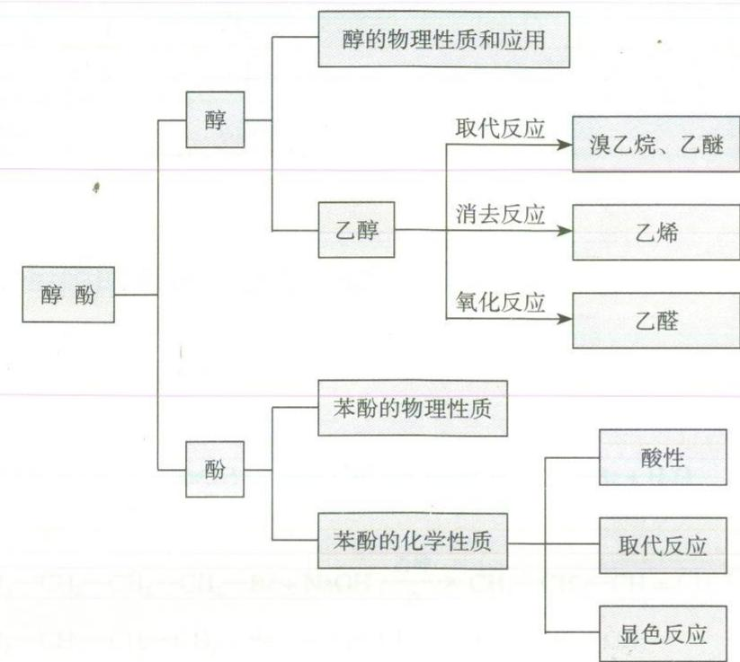

教材的第一部分介绍醇。由于必修教材已经介绍了典型的一元醇——乙醇，本节在一元醇的基础上简单介绍甲醇、乙二醇和丙三醇，并以图片的形式列举它们的用途。紧接着以表格的形式列举几种醇的熔点和沸点，再介绍醇分子间的氢键，通过“思考与讨论”栏目比较相对分子质量相近的醇与烷烃的沸点。教材在介绍醇的化学性质时，仍以乙醇为代表物，结合羟基官能团的结构特点介绍乙醇的消去反应、取代反应和氧化反应。为了落实课程标准对醚的结构特点及应用的要求，教材在介绍乙醇发生脱水反应生成乙醚时，进一步介绍乙醚的性质，以及醚的结构特点和应用。

教材的第二部分介绍酚。苯酚是酚类化合物中最典型的一元酚。教材在介绍苯酚的物理性质后，通过实验分别介绍了苯酚的酸性、取代反应和显色反应。教材在编排上主要采取归纳推理的方式，通过实验和分析实验结果归纳苯酚的化学性质。教材还通过“思考与交流”栏目，要求学生从分子内基团间相互作用的角度，解释苯酚与乙醇、苯酚与苯的性质差异，让学生进一步体会有机分子中基团之间存在相互影响。

## 二、教学目标

## 1. 教学目标

(1) 能说出醇的结构特点并进行分类, 列举甲醇、乙二醇和丙三醇等常见醇的应用。

（2）能从分子组成和结构的角度解释醇类物质的主要物理性质及递变规律。

（3）能从化学键和反应规律的角度进一步认识乙醇的化学性质，通过实验证实乙醇的消去反应和氧化反应，并能写出相应的化学方程式。

(4) 能以乙醚为例, 描述醚的结构特点及其应用。

（5）能辨识酚的官能团，结合苯酚的结构和实验认识其主要化学性质，形成“分子中基团之间的相互影响会导致键的极性发生改变”的观念。

## 2. 教学重点和难点

重点：乙醇和苯酚的结构特点和主要化学性质。

难点：醇和酚的结构差异及其对化学性质的影响。

## 三、教学建议

## 1. 准确把握醇、醚和酚在教学内容上的深度和广度

本节内容涉及醇、醚和酚三类物质的结构和性质，教学中应根据课程标准和教材的要求，准确把握醇、醚和酚在教学内容上的深度和广度。对醇和酚需要认识其“组成和结构特点、性质、转化关系及其在生产、生活中的重要应用”；而对醚只需要认识其“结构特点及其应用”，知道醚具有R—O—R'结构，乙醚可用作麻醉剂和溶剂等应用即可，不必对醚的命名和化学性质等内容进行过多的拓展。在醇的教学中，从必修课程到选择性必修课程，其教学要求是螺旋式上升的：从典型代表物乙醇到醇类；从基于乙醇的具体性质等宏观现象的认识角度到基于乙醇分子化学键特点等微观结构的认识角度；从对乙醇性质的孤立认识到对醇类性质和转化规律的整体认识，进而上升到对化学键与有机反应关系的系统认识。因此，教学中既要体现前后联系，充分发挥已有知识和经验对新知识学习的促进作用，也要把握不同阶段的不同学习要求，避免简单重复。通过学习任务或活动设计，实现从知识到能力、从能力到素养的进阶式发展。

以乙醇的氧化反应为例，教材在内容上呈现如下进阶过程。

必修教材第七章第三节
乙醇在加热和铜催化等条件下生成乙醛的反应的宏观表征和符号表征。

本册教材第一章第一节
以乙醇分别与钠和溴化氢的反应为例，提供从微观结构（化学键）的角度研究有机反应的思路。

提供乙醇被酸性重铬酸钾溶液氧化的实验事实，引导学生从化学键的角度探析反应过程，并在此基础上理解氧化反应的概念。培养学生“微观探析”和“证据推理”的学科核心素养。

据此可设计以下学习任务。

任务1：复习和回忆乙醇被铜催化氧化的实验现象，并写出反应的化学方程式。

任务2：结合乙醇分子中化学键的极性，推测上述反应过程中化学键的断裂和形成特点。

任务3：通过乙醇与酸性重铬酸钾溶液反应的事实，概括对乙醇氧化反应的认识，并从中归纳有机化学反应中氧化反应的概念，认识化学键与有机反应的关系。

任务4：预测乙醇能否使溴水褪色，并通过实验验证。

任务5：分析乙二醇发生氧化反应后的产物。

在总结乙醇的性质时，建议从乙醇的分子结构入手，建立化学键的断裂位置与反应类型之间的联系，以及物质间的转化关系。

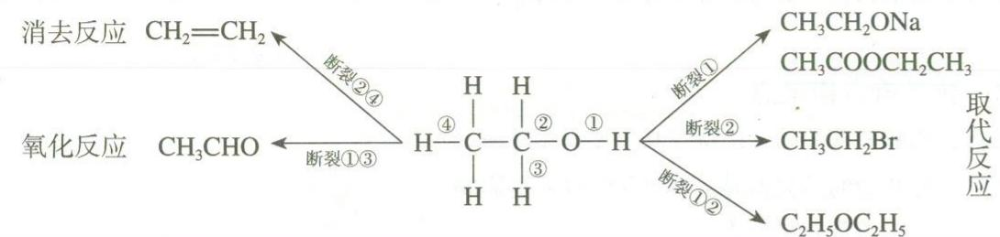

## 2. 利用类比和迁移学习苯酚的结构和性质，进一步强化基团间相互作用的观念

在教材第二章，学生已经通过比较苯和甲苯在结构和性质上的差异，初步形成了“基团之间的相互影响会导致键的极性发生改变”的观念。苯酚的结构特点也决定了它的性质不仅取决于羟基和苯环的性质，还受到羟基和苯环间相互作用的影响。因此，通过苯酚的学习能够进一步强化学生对有机化合物分子内基团间相互作用的认识，这也是苯酚这一内容的重要教学价值之一。建议教学中首先通过展示苯酚的分子结构模型，帮助学生认识其结构特点；再分别从羟基和苯环入手，要求学生利用已有知识对苯酚的性质进行预测，以“结构决定性质”的观念指导苯酚性质的学习。例如，从苯环结构入手，由苯能发生卤代反应推测苯酚可能发生卤代反应；从羟基结构入手，由醇能与钠反应推测苯酚可能与钠反应。然后，通过实验探究进一步认识苯酚的弱酸性、苯环上的溴代反应和特征显色反应。最后，结合实验事实，通过乙醇和苯酚、苯和苯酚结构与性质的比较，进一步强化学生对“分子中基团之间的相互影响会导致键的极性发生改变，进而影响物质性质”的认识。

## 3. 发挥实验在醇和酚性质教学中的功能

本节教材设置了5个实验活动，充分体现了实验在醇和酚性质学习中的重要作用。教学中不应局限于“教师演示实验，学生记录现象”的低水平要求，而应注意充分发挥这些实验在创设情境、引导学生提出问题、根据结构进行解释或预测、获取实验证据、训练实验方法、培养敢于质疑和勇于创新的精神等方面的教学功能，培养学生“科学探究与创新意识”的学科核心素养。

在【实验3-3】的教学中，一方面要结合必修课程中乙醇被催化氧化为乙醛的已有知识经验（必要时可补充乙醇的催化氧化实验）；另一方面，可以结合本实验中“ $CH_{3}CH_{2}OH\rightarrow$ $CH_{3}CHO\rightarrow CH_{3}COOH$ ”转化关系，从分子组成和结构变化的角度帮助学生理解有机反应中氧化反应的概念，从“失氢”和“加氧”的角度认识氧化反应。此外，还可以结合乙醇燃烧氧化的事实，强化“反应条件不同，发生的化学反应也不同”的认知，使学生进一步认识有机反应的复杂性。

在进行“苯酚的酸性”教学中，可进行如下教学设计。

【创设情境】复习和回忆钠分别与水和乙醇反应的现象，指出水分子中羟基上的氢原子比乙醇分子中的活泼，水的电离程度更大。

【进行实验】演示或学生完成【实验3-4】，获取苯酚具有酸性的证据。

【提出问题】苯酚的酸性强弱如何？如何设计实验证明其酸性强弱？

【分组活动】学生分组讨论，设计实验方案并完成实验：向苯酚浊液中滴加 $Na_{2}CO_{3}$ 溶液，观察浊液是否变澄清，同时观察有无气体生成。

【练习与评价】写出苯酚与 $Na_{2}CO_{3}$ 溶液反应的化学方程式，并从反应原理的角度进行解释。

## 四、栏目使用建议

## 1. 实验

【实验3-2】

本实验主要通过对产物乙烯的检验来说明乙醇可以发生消去反应，为学生学习乙醇的性质提供实验事实。由于乙醇与浓硫酸混合后加热会出现炭化现象，导致进一步反应生成 $CO_{2}$ 、 $SO_{2}$ 等杂质气体， $SO_{2}$ 也能使酸性 $KMnO_{4}$ 溶液褪色，因此要先将反应生成的气体通入NaOH溶液进行洗气，以除去 $CO_{2}$ 和 $SO_{2}$ 。为降低炭化程度，减少副反应，反应温度要控制在170℃左右，不宜过高。将反应生成的气体通入酸性 $KMnO_{4}$ 溶液和溴的 $CCl_{4}$ 溶液，观察到褪色现象后，可安装尖嘴导管，在检验纯度后点燃乙烯，观察乙烯的燃烧现象。

教学中可先引导学生客观记录实验现象, 自主提出问题; 再针对实验操作和现象, 重点讨论以下问题: ①混合乙醇和浓硫酸时应如何操作? ②为什么要加入碎瓷片? ③为什么反应过程中溶液会变黑? ④为什么要将生成的气体先通入NaOH溶液 (写出相应的化学方程式)? ⑤酸性 $\mathrm{KMnO}_{4}$ 溶液和溴的 $\mathrm{CCl}_{4}$ 溶液褪色说明了什么?

【实验3-3】

实验时，建议先向 1 mL 0.1 mol/L 的 $K_{2}Cr_{2}O_{7}$ 溶液中慢慢加入 5\~10 滴浓硫酸进行酸化，再加入 2 mL 乙醇，充分振荡，可以很快观察到溶液变色。为了更好地观察反应过程中的颜色变化，建议补充空白对比实验。

【实验3-4】

苯酚溶于水形成的浊液一般是乳浊液，静置后能观察到明显的分层现象。苯酚钠与盐酸反应的化学方程式中，生成的苯酚后一般不写沉淀符号。演示实验时，为使实验现象更加明显，建议使用较大的试管，苯酚用量稍多一些，开始时加入水的量不要太多。

为进一步说明苯酚的弱酸性，建议补充下列实验：①向苯酚钠溶液中不断通入 $CO_{2}$ ，可观察到溶液由澄清变浑浊；②向 $Na_{2}CO_{3}$ 溶液中滴入2滴酚酞溶液，再将此溶液加入苯酚浊液中，充分振荡后可观察到浊液变澄清，溶液的红色褪去，且无气泡产生。

实验安全提醒：苯酚对皮肤和黏膜有强烈的腐蚀作用，实验时应戴好手套和护目镜。若皮肤接触苯酚，应立即先用乙醇清洗，再用大量水冲洗。

【实验3-5】

实验时，可取0.1 g苯酚溶于3 mL水中，得到苯酚溶液。也可将1滴饱和苯酚溶液加入1 mL水中，稀释后得到苯酚溶液。再向该溶液中逐滴加入饱和溴水，边加边振荡，直到出现白色的三溴苯酚沉淀为止。

本实验使用的苯酚溶液的浓度要小，溴水的浓度尽量大一些，以免生成的三溴苯酚溶于过量的苯酚中而观察不到明显的沉淀现象。该实验可用于苯酚的定性检验和定量测定。

【实验3-6】

实验时, 可以将 1 滴饱和苯酚溶液加入 $1 \mathrm{~mL}$ 水中稀释, 再向该溶液中滴入 $2 \sim 3$ 滴 $0.1 \mathrm{~mol} / \mathrm{L} \mathrm{FeCl}_{3}$ 溶液, 溶液呈紫色。

大多数酚类化合物都能与 $FeCl_{3}$ 溶液发生反应生成配合物，例如： $6C_{6}H_{5}OH + Fe^{3+} \longrightarrow [Fe(C_{6}H_{5}O)_{6}]^{3-} + 6H^{+}$ 。教学中不必要求学生写出该反应的化学方程式，但应强调该反应是酚类物质的特征反应，常用于酚羟基的检验。

学生在选择性必修2“物质结构与性质”教材中已学习过有关氢键的知识，教学时可先引导学生从复习典型的含氢键的分子结构和氢键的形成条件等知识入手，再引导学生根据醇的官能团和分子结构特点进行分析。羟基的存在使醇分子间也容易形成氢键，增强了醇分子间的作用力。所以与相对分子质量相近的烷烃相比，醇具有较高的沸点。醇溶于水时与水也容易形成氢键，因此低级醇具有良好的水溶性。通过以上分析强化“结构决定性质”的学科观念。

## 2. 思考与讨论

该栏目对学生后续学习含有氨基、醛基和羧基等满足氢键形成条件的有机化合物，预测和解释相关物理性质具有一定的指导意义。

【思考与讨论1】

问题（1）的讨论可引导学生在书写溴乙烷和乙醇消去反应的化学方程式的基础上，采用列表的方式，从反应条件、化学键的断裂与形成、反应产物等角度进行比较。

## 【思考与讨论2】

问题（2）从 $C_{3}H_{8}O$ 这一具体物质的分子式出发，通过书写其同分异构体的结构简式，使学生认识醇和醚的官能团异构，并引导学生形成“从碳架异构到位置异构，再到官能团异构”的有序思维方式。书写时可采用“插入法”：先根据该分子饱和的特点写出碳链结构（①C—C—C—）；再结合对称性，将氧原子依次插入①、②、③位，分别得到 $CH_{3}CH_{2}CH_{2}OH$ （1-丙醇）、 $CH_{3}OCH_{2}CH_{3}$ （甲乙醚）和 $CH_{3}CH(OH)CH_{3}$ （2-丙醇）三种异构体。

（4）苯和苯酚分别与溴发生取代反应时，反应条件和产物有什么不同？

（5）从结构上比较和分析，为什么苯和苯酚在苯环上的取代反应的反应条件和产物不同？

(3) 从结构上比较和分析, 为什么苯酚和乙醇中羟基上氢原子的活性不同?

本栏目通过苯、乙醇和苯酚有关性质的实验事实，引发学生从结构的角度进行深入思考，强化“结构决定性质”的观念，深化对“有机化合物分子中基团之间的相互影响会导致键的极性发(1) 苯酚和乙醇中的官能团都是羟基, 二者表现出的性质一样吗?

需要说明的是，教学中在这里不宜拓展过深，不必从苯酚分子中存在 $p-\pi$ 共轭体系的角度进行分析和讨论。

生改变”的认识。从这个角度看，本栏目具有促进学生深度学习，提升“宏观辨识与微观探析”素养的功能，教学中应注意充分发挥这一功能。建议通过引导学生在回顾相关实验事实的基础上，从分子结构特点的角度进行思考，归纳后形成结论：由于苯环对羟基的影响，O—H极性变强，氢原子易电离而使苯酚表现弱酸性；由于羟基对苯环的影响，苯环上处于羟基邻位和对位的氢原子的活性增强，从而使苯酚比苯更易与溴发生取代反应。具体可通过以下问题组织学生展开讨论。

(2) 有哪些实验事实能说明苯酚分子中羟基上氢原子的活性比乙醇分子中羟基上氢原子的活性强?

【思考与讨论3】

## 五、练习与应用参考答案及说明

## 1. C  2. B  3. A

4. ①③⑤

5. 由于醇分子中羟基的氧原子与另一醇分子羟基上的氢原子间存在着氢键，增强了分子间的作用力，这使醇的沸点要远远高于相对分子质量相近的烷烃的沸点。碳原子数较少的低级醇分子中的羟基使醇分子具有较强的极性，易与水分子形成氢键。根据相似相溶原理，甲醇、乙醇等低级醇易溶于极性溶剂水。而碳原子数较多的高级醇由于烃基较大，羟基对分子极性的影响减弱，所以水溶性较低。

6. ① $\mathrm{C_2H_5Br + NaOH\xrightarrow[\triangle]{\text{水}} C_2H_5OH + NaBr}$ ② $\mathrm{C_2H_5OH\xrightarrow[170°C]{\text{浓硫酸}} CH_2=CH_2\uparrow + H_2O}$ ③ $\mathrm{CH_2=CH_2+HBr\xrightarrow{} C_2H_5Br}$ ④ $\mathrm{C_2H_5Br + NaOH\xrightarrow[\triangle]{\text{乙醇}} CH_2=CH_2\uparrow + NaBr + H_2O}$ ⑤ $\mathrm{CH_2=CH_2+H_2O\xrightarrow[\triangle,\text{加压}]{\text{催化剂}} C_2H_5OH}$ ⑥ $\mathrm{C_2H_5OH + HBr\xrightarrow[\triangle]{\triangle} C_2H_5Br + H_2O}$ ⑦ $2\mathrm{C}_2\mathrm{H}_5\mathrm{OH} + \mathrm{O}_2\xrightarrow[\triangle]{\mathrm{Cu}} 2\mathrm{CH}_3\mathrm{CHO} + 2\mathrm{H}_2\mathrm{O}$

7. 酚类物质一般可与铁盐溶液发生显色反应，没食子酸是一种多元酚，与铁盐作用时会显色，因此可用于制造墨水。

8. 鉴别苯与苯酚稀溶液可以利用物理性质的差异, 通过嗅气味、与水混合等方法鉴别; 也可以利用化学性质的差异, 通过加入浓溴水、 $\mathrm{FeCl}_{3}$ 溶液等方法鉴别。除去苯中混有的苯酚可采取如下方案。

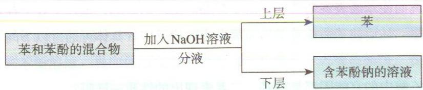

9. $\text{C}_6\text{H}_5\text{OH}$

10. $\mathrm{CH}_{2}=\mathrm{CH}_{2}+\mathrm{Br}_{2}\longrightarrow\mathrm{CH}_{2}\mathrm{BrCH}_{2}\mathrm{Br}$ (加成反应)

$CH_{2}BrCH_{2}Br + 2NaOH \xrightarrow[\triangle]{水} CH_{2}-CH_{2} + 2NaBr$ （取代反应）

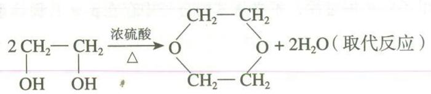

## 第三节 醛酮

## 一、内容分析

本节内容主要包括醛和酮，根据课程标准的要求，教材重点介绍醛，简单介绍酮。本节的内容结构如下图所示。

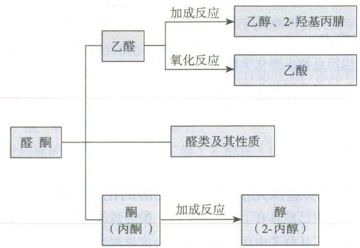

第一部分介绍乙醛的性质。教材以乙醛作为醛的典型代表物，先介绍乙醛的物理性质，紧接着分析醛基官能团的特点，介绍乙醛的化学性质，即加成反应和氧化反应。在介绍加成反应时，分别介绍了乙醛与氢气、氰化氢的加成反应。教材中乙醛的氧化反应包括3个典型反应，即银镜反应、与新制氢氧化铜的反应，以及与氧气的反应。另外，教材通过“思考与讨论”栏目，要求学生运用有机反应规律说明乙醇、乙醛和乙酸三者之间的转化关系，进一步强调官能团的转化，关注有机化合物官能团转化的基本规律。

第二部分介绍醛类物质及其性质。教材在典型代表物乙醛的基础上，进一步介绍甲醛和苯甲醛等其他醛类物质的性质和应用。在介绍醛类物质的性质时，教材从乙醛的结构和性质迁移到含醛基的有机化合物，只是说明其他醛类物质的性质与乙醛的相似，但没有给出反应的化学方程式。在完成“思考与讨论”栏目的教学时，可以要求学生写出相应的化学方程式。在介绍醛类物质的应用时，教材重点介绍了甲醛，并通过“信息搜索”栏目要求学生完成一篇有关甲醛的小论文。

第三部分介绍酮。课程标准对酮的要求不高，只要求学生知道酮的结构特点和应用。因此，教材仅以典型代表物丙酮为例介绍酮的性质，以及酮的结构特点和应用。最后，教材通过“思考与讨论”栏目，要求学生自主找出醛与酮的性质差异。

## 二、教学目标

## 1. 教学目标

(1) 从官能团和化学键可能的断键部位预测乙醛的化学性质, 并能在结构分析和实验事实的基础上书写相关反应的化学方程式, 强化 “结构决定性质” 的观念。

(2) 通过乙醇、乙醛和乙酸之间的相互转化, 加深对有机反应中氧化反应和还原反应的理解, 初步构建烃的含氧衍生物间的转化关系。

（3）能结合分子结构特点，运用类比迁移的方法预测其他醛类物质的主要性质。

（4）能根据官能团的特点和性质区别醛和酮，以丙酮为例认识酮的主要化学性质。能列举甲醛、苯甲醛和丙酮等代表物在生活中的应用，分析和探讨这些物质对人类健康和社会发展可能带来的双重影响。

## 2. 教学重点和难点

重点：乙醛的结构特点和主要化学性质。

难点：乙醛的氧化反应及相关化学方程式的书写。

## 三、教学建议

## 1. 通过结构分析和实验探究预测并证实乙醛的化学性质

在学习本节之前，学生已经具有了卤代烃、醇、酚等烃的衍生物的学习经验，掌握了碳碳双键等官能团的性质，学会了从分子中化学键断裂的角度推测物质性质的方法。在进行乙醛化学性质的教学时，可引导学生从乙醛的分子结构入手，分析C=O的极性和不饱和性，推测C=O可能发生断裂而发生类似烯烃的加成反应。同时，醛基上的C—H也可能发生断裂，引导学生联系前一节乙醇被酸性 $K_{2}Cr_{2}O_{7}$ 溶液氧化的实验事实，推测其氧化反应的微观过程。再通过乙醛与银氨溶液、与新制 $Cu(OH)_{2}$ 反应的实验事实，引导学生从反应前后分子结构变化的角度尝试自主书写相关化学方程式，实现教学难点的突破。可参考以下内容进行教学设计。

【学习任务】如何认识乙醛的化学性质。

【环节1】分析乙醛的结构特点。

【学生活动】书写乙醛的结构简式，搭建其分子结构模型。

【学生活动】分析、讨论醛基的结构特点。

【设计意图】引导学生从微观结构入手，利用学生已有的对卤代烃、醇等物质性质的认识思路，分析分子中化学键的断裂位置。

【环节2】预测乙醛可能具有的化学性质。

【学生活动】从C=O的结构特点和烯烃C=C的性质出发，分析乙醛可能与 $H_{2}$ 、HCN发生的加成反应，写出反应的化学方程式。

【学生活动】从乙醇被酸性 $K_{2}Cr_{2}O_{7}$ 溶液氧化的事实，结合对醛基中C—H极性的分析，推测乙醛可以发生氧化反应，写出反应的化学方程式。

【学生活动】完成【实验3-7】和【实验3-8】，尝试书写反应的化学方程式。

【设计意图】通过学生讨论和练习活动，掌握反应的规律：醛基被氧化为羧基的同时，1 mol 醛基可还原 2 mol $[Ag(NH_{3})_{2}]^{+}$ 或 2 mol $Cu(OH)_{2}$ 。帮助学生从“宏观、微观、符号”三重表征的角度认识乙醛的化学性质，发展学生基于物质的微观结构描述和预测物质性质的能力。

## 2. 加强“醇、醛、酸”转化关系的结构化设计

本节的教学不能仅停留于认识乙醛的结构和性质，以及辨识醛与酮的层面，只要求学生掌握醛和酮的化学性质等碎片化知识；而应结合“醇、醛、酸”的转化关系，重视与氧化反应和还原反应等化学知识关联的结构化设计，充分发挥结构化知识对学生化学学科核心素养发展的重要作用，同时也为第五节“有机合成”的学习和完成本章最后的“整理与提升”奠定基础。在进行“思考与讨论”栏目中关于“乙醇 $\xrightarrow{氧化}$ 乙醛 $\xrightarrow{氧化}$ 乙酸”转化关系的讨论活动设计时，要引导学生对几种有机化合物的相互转化进行归纳，并基于知识关联对有机化学中的氧化反应和还原反应及有机化合物的转化关系形成结构化认识。同时，还要引导学生从官能团和结构变化的角度理解醛类物质的化学性质，巩固通过结构分析预测有机化合物性质的思路和方法，基于认识思路进行结构化。最后，在此基础上强化“结构决定性质”这一化学基本观念。在教学中，可通过以下方式加强“醇、醛、酸”转化关系的结构化设计。

【创设情境】通过前面的学习，我们已经了解了乙醇在人体内的代谢过程：乙醇在乙醇脱氢酶的作用下先转化为乙醛，乙醛在乙醛脱氢酶的作用下再转化为乙酸，乙酸最后转化为二氧化碳和水。

【学习任务1】写出上述转化过程中的化学方程式。

【设计意图】学生在较熟悉的情境中，通过书写乙醇被氧化为乙醛，再被氧化为乙酸等具体反应的化学方程式，巩固对“醇、醛、酸”转化关系的认识。

【学习任务2】结合有机反应中氧化反应的概念，从官能团和化学键变化的角度分析上述反应。

【设计意图】建立转化关系与反应类型之间的联系，进一步理解氧化反应的本质。

【学习任务3】写出丙醛和丙酮分别与氢气反应的化学方程式，并指出其反应类型。

【设计意图】通过具体化学方程式的书写，完善对“醛还原为醇”的认识，进一步构建“醇、醛、酸”转化关系模型。

【学习任务4】①写出以乙二醇为原料制备乙二酸的化学方程式。②已知苯甲醛在强碱性条件下发生自身氧化还原反应，生成苯甲酸钠和另一种产物X，写出X的结构简式。

【设计意图】应用 “醇、醛、酸” 转化关系模型解决真实问题的同时，强化知识间的关联，通过结构化的知识促进学生的认知发展和素养形成。

## 3. 有效组织实验探究活动，突破乙醛的氧化反应这一教学重点和难点

乙醛的氧化反应是本节内容的重点和难点，教学中可根据学生的知识基础和能力水平，开展不同层次的实验探究活动，充分挖掘这一知识载体所具有的发展学生探究能力和创新意识的功能。例如，先结合前一节“乙醇最终被氧化为乙酸”的知识和分子结构分析，预测乙醛具有还原性，然后提出问题：如何通过实验验证乙醛的还原性？引导学生利用乙醛使酸性 $KMnO_{4}$ 溶液褪色的简单实验解决问题。在此基础上继续提出问题：乙醛能被强氧化剂氧化，能否被弱氧化剂氧化呢？教师提供弱氧化剂银氨溶液和新制 $Cu(OH)_{2}$ ，要求学生设计实验方案，并根据原理预测和解释实验现象。对于基础较好的学生，还可以在学完乙醛的加成反应后，利用学生可能产生的问题，如“溴能与碳碳双键发生加成反应，能否与醛基中的碳氧双键发生加成反应？”引导学生设计并完成实验（将乙醛分别加入溴水和溴的 $CCl_{4}$ 溶液中）。通过观察现象和分析讨论，让学生最终得出结论：乙醛使溶液褪色的原因，不是发生加成反应，而是发生氧化反应。也可通过演示向丙酮中加入浓溴水，振荡后不能立即观察到褪色现象，证明溴不能与碳氧双键发生加成反应。这样的设计不仅能有效地帮助学生加深对乙醛还原性的理解，还能在真实的实验情境中，培养学生的问题意识和证据推理能力。

## 四、栏目使用建议

本实验操作简单，且易于激发学生的学习兴趣。通过产生光亮的银镜证明乙醛具有还原性，这也是检验醛基的特征实验。实验中应注意以下几点。

为除去试管壁上的油污，得到更加光亮的银镜，可事先用热碱液清洗试管。

$NO_{3}$ 溶液要用新配制的，放置太久或酸性太强都会影响实验效果。

要稍过量，以保证反应在弱碱性条件下进行。

(4) 配制银氨溶液时, 向 $\mathrm{AgNO}_{3}$ 溶液中滴入氨水, 应先产生略带棕色的白色沉淀, 然后再继续滴入氨水使沉淀溶解。若溶液始终澄清, 则说明药品的浓度和用量存在问题。还可采取以下方法配制银氨溶液: 向 $2 \mathrm{~mL} 5 \% \mathrm{AgNO}_{3}$ 溶液中滴入 2 滴 $5 \% \mathrm{NaOH}$ 溶液, 再滴入 $2 \%$ 氨水, 直至沉淀溶解。

实验也是乙醛的特征性质实验，常用于醛基的检验。实验时应注意以下几点。

(1) 乙醛与新制 $\mathrm{Cu(OH)}_{2}$ 的反应需要在较强的碱性条件下进行。因此, NaOH 要过量, 以确保反应体系处于较强的碱性环境。

(2) 向NaOH溶液中滴入 ${\mathrm{{CuSO}}}_{4}$ 溶液时应及时振荡,否则 $\mathrm{{Cu}}{\left( \mathrm{{OH}}\right) }_{2}$ 容易发生凝聚,导致在后续加热过程中分解,影响实验效果。

(3) 实验过程中还可能出现棕黄色, 这主要是由于乙醛在碱性条件下易发生羟醛缩合反应, 其产物含有碳碳双键和醛基两种活泼官能团, 可以发生一系列后续反应, 生成多种有色化合物。①这些化合物通常呈橙黄或橙红色, 甚至呈红褐色。所以本实验所使用的乙醛溶液浓度不

宜过大，以2%\~4%为宜。

设置【实验3-7】和【实验3-8】这两个实验活动，旨在通过乙醛能被弱氧化剂氧化的事实说明乙醛有还原性（易被氧化）。实际教学时，建议有条件的学校采取分组实验的方式，要求学生在完成实验的同时，观察和记录实验现象，利用实验现象和氧化还原反应原理推断反应产物，并通过尝试书写反应的化学方程式，建立“宏观、微观、符号”三重表征的联系。在培养学生实验操作技能的同时，引导学生观察实验过程中的现象，感受化学之美。

## 2. 思考与讨论

## 【思考与讨论1】

在前一节，学生已经通过乙醇转化为乙醛和乙酸等实验事实认识了有机化学反应中的氧化反应和还原反应。在此基础上，本节通过乙醛与氢气的加成反应进一步完善了三者之间的相互转化关系。该栏目的价值在于引导学生将乙醇、乙醛和乙酸之间的转化关系与有机反应中的氧化反应和还原反应相关联，并进一步结构化。一方面，通过分子结构的变化加深对氧化反应和还原反应概念的认识；另一方面，通过系统认识醇羟基、醛基和羧基这3种官能团之间的转化关系，促进化学学科知识向化学学科核心素养的转化。

在讨论活动中，可引导学生在回忆相关反应事实的基础上，要求学生写出相关反应的化学方程式；再比较乙醇、乙醛和乙酸的分子结构特点，通过三者官能团的变化加深学生对乙醇转化为乙醛时脱去氢的氧化反应、乙醛转化为乙醇时加氢的还原反应和乙醛转化为乙酸时加入氧的氧化反应的理解。对于学习基础较好的学生，教学时可以从化学键的断裂与形成角度进一步推广到对醇、醛和酸之间转化关系的认识，完成认识思路的结构化和学科观念的结构化。

## 【思考与讨论2】

该 “思考与讨论” 以问题的方式呈现，教师可以通过学生的回答对其理解并应用乙醛化学性质的程度进行评价，发挥日常学习评价的诊断与发展功能。同时，该栏目也要求学生能基于乙醛这一代表物，向其他醛类物质性质的学习进行迁移和拓展，引导学生通过类比和迁移的方法形成对醛类物质性质的认识思路。

第一个问题要求学生基于对乙醛加成反应和氧化反应的认识，通过醛基这一官能团的结构特点理解反应的微观过程，进而推测丙醛的性质，从而得出答案：丙醛通过与氢气发生加成反应得到1-丙醇，通过与氧气等氧化剂发生氧化反应而得到丙酸。教师可以根据学生不同的知识和能力起点提出不同的要求。对于学习基础一般的学生，可以先再现乙醛转化为乙醇或乙酸的反应，再进行练习；对于学习基础较好的学生，可以引导他们从官能团的结构特点出发进行分析，实现“能依据物质的微观结构预测物质在一定条件下可能的化学变化”的目标。

第二个问题要求学生运用醛可被氧化为酸的知识，解释苯甲醛在空气中久置后转变为苯甲酸的事实。教学中不仅要让学生认识苯甲醛转化为苯甲酸的反应原理，要求学生写出反应的化学方程式，还要通过该问题的解决总结保存苯甲醛试剂时的注意事项（密封，与氧化剂分开存放），培养学生的安全意识。

【思考与讨论3】

该“思考与讨论”首先引导学生比较丙醛和丙酮这两种具体物质的分子式，发现二者互为同分异构体。再通过结构和性质比较，总结二者在官能团类别和化学性质上的差异。可以要求学生以列表的方式呈现讨论结果。最后，可以应用二者性质上的差异进行鉴别，如使用银氨溶液或新制 $\mathrm{Cu(OH)}_{2}$ 等试剂。

## 五、练习与应用参考答案及说明

1. D 
2. A 
3. C

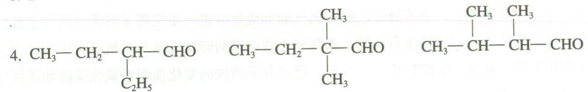

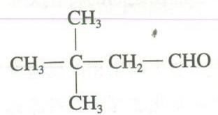

6.(1)(或其他合理答案)

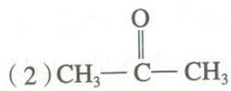

<table><tr><td rowspan="2">操作</td><td colspan="3">现象</td></tr><tr><td>溴乙烷</td><td>乙醇</td><td>乙醛</td></tr><tr><td>加入新制 $Cu(OH)_2$ ,加热</td><td>分层</td><td>无明显现象</td><td>砖红色沉淀</td></tr><tr><td>加入酸性 $K_2Cr_2O_7$ 溶液,振荡</td><td>分层</td><td>变色</td><td>—</td></tr></table>

## (2)(或其他合理答案)

<table><tr><td rowspan="2">操作</td><td colspan="6">现象</td></tr><tr><td>苯</td><td>甲苯</td><td>乙醇</td><td>1-己烯</td><td>甲醛溶液</td><td>苯酚溶液</td></tr><tr><td>加入饱和溴水,振荡</td><td>分层</td><td>分层</td><td>混溶</td><td>褪色</td><td>褪色</td><td>白色沉淀</td></tr><tr><td>加入酸性KMnO4溶液,振荡</td><td>分层</td><td>褪色</td><td>——</td><td>褪色</td><td>褪色</td><td>——</td></tr><tr><td>加入新制Cu(OH)2,加热</td><td>——</td><td>——</td><td>——</td><td>——</td><td>砖红色沉淀</td><td>——</td></tr></table>

$$
7. (1) \mathrm{CH} _ {3} \mathrm{CH} _ {2} \mathrm{CHO} + 2 [ \mathrm{Ag} (\mathrm{NH} _ {3}) _ {2} ] \mathrm{OH} \xrightarrow {\triangle} \mathrm{CH} _ {3} \mathrm{CH} _ {2} \mathrm{COONH} _ {4} + 2 \mathrm{Ag} \downarrow + 3 \mathrm{NH} _ {3} + \mathrm{H} _ {2} \mathrm{O}
$$

(2) $\mathrm{CH}_3\mathrm{CH}_2\mathrm{CHO} + 2\mathrm{Cu(OH)}_2 + \mathrm{NaOH}\xrightarrow{\triangle} \mathrm{CH}_3\mathrm{CH}_2\mathrm{COONa} + \mathrm{Cu}_2\mathrm{O}\downarrow + 3\mathrm{H}_2\mathrm{O}$

(3) $\mathrm{CH}_3\mathrm{CH}_2\mathrm{CHO} + \mathrm{H}_2 \xrightarrow[\triangle]{\text{催化剂}} \mathrm{CH}_3\mathrm{CH}_2\mathrm{CH}_2\mathrm{OH}$

$$
(4) \mathrm{CH} _ {3} \mathrm{CH} _ {2} \mathrm{CHO} + \mathrm{HCN} \longrightarrow \mathrm{CH} _ {3} \mathrm{CH} _ {2} \mathrm{CH} (\mathrm{OH}) \mathrm{CN}
$$

8. ${\mathrm{{CH}}}_{3}\mathrm{{CHO}} + {\mathrm{{Br}}}_{2} + {\mathrm{H}}_{2}\mathrm{O} \rightarrow  {\mathrm{{CH}}}_{3}\mathrm{{COOH}} + 2\mathrm{{HBr}}$

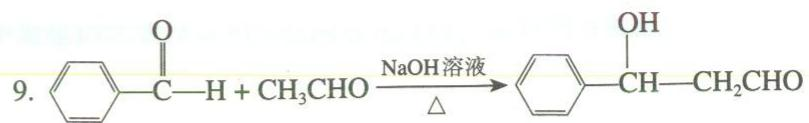

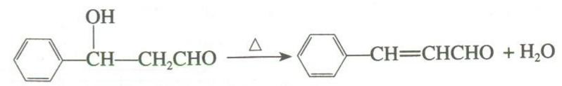

## 第四节 羧酸 羧酸衍生物

## 一、内容分析

本节包括羧酸和羧酸衍生物两部分内容，羧酸衍生物主要包括酯、油脂和酰胺。需要说明的是，尽管课程标准没有提及油脂，教材仍然把油脂作为羧酸衍生物进行了介绍。另外，课程标准对胺和酰胺这两种烃的含氮衍生物的要求较低，学生只需知道胺和酰胺的结构特点及应用。本节的内容结构如下图所示。

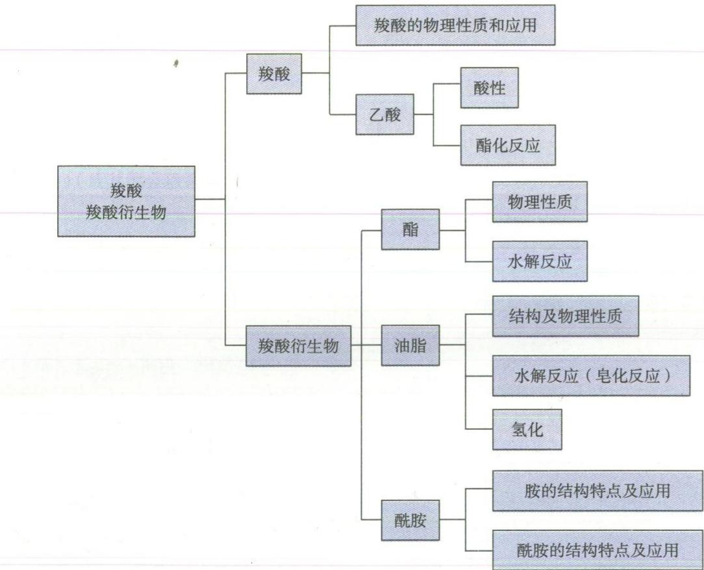

第一部分介绍羧酸。教材在乙酸的基础上介绍羧酸的一些简单分类，以及甲酸、苯甲酸和乙二酸等几种常见羧酸的物理性质和用途，并以表格的方式列举几种羧酸的熔点和沸点数据。羧酸的化学性质主要取决于羧基官能团，教材分析了羧基的结构特点，并解释羧酸的化学性质。由于必修教材中已介绍了羧酸的典型代表物乙酸的性质，为了避免简单的重复，教材通过探究羧酸的酸性，让学生利用乙酸的酸性去设计实验解决问题，通过“思考与讨论”让学生进一步了解酯化反应的脱水方式。

第二部分介绍酯。教材先结合一些常见水果中含有的酯，让学生进一步认识酯的结构特点和物理性质，再选取乙酸乙酯作为酯的典型代表物，通过“科学探究”介绍乙酸乙酯在碱或酸催化下的水解反应。

第三部分介绍油脂。必修教材已对油脂的概念和结构作了简单介绍。在此基础上，教材通过“思考与讨论”要求学生根据酯化反应原理写出硬脂酸、油酸分别与丙三醇反应的化学方程式。然后，教材根据油脂的结构特点（有酯基和不饱和键）介绍油脂的化学性质，主要是在酸或碱催化下发生的水解反应和油脂的氢化反应。教材同时指出：油脂在碱性条件下的水解反应又被称为皂化反应。

第四部分介绍胺和酰胺。这部分内容只要求学生知道胺和酰胺的结构特点和应用。教材先介绍胺的结构特点及其应用，并以苯胺为例说明胺类化合物具有碱性。接下来，介绍酰胺的结构特点及其应用，以及酰胺在酸或碱存在并加热的条件下可以发生水解反应。最后，通过“思考与讨论”栏目，要求学生自主找出氨、胺、酰胺和铵盐在组成、结构、性质和用途上的差异，进一步认识胺和酰胺。

## 二、教学目标

## 1. 教学目标

（1）认识羧酸的官能团与组成，能对简单羧酸进行分类。能依据羧酸的结构特点预测羧酸的物理性质和化学性质。

(2) 认识羧酸衍生物（酯、油脂、酰胺）和胺的结构特点及应用。

（3）通过探究羧酸的酸性和乙酸乙酯的水解，熟悉控制变量法的应用，体验科学探究的一般过程。

（4）能结合生产、生活实际了解羧酸及其衍生物对环境和健康可能产生的影响，关注羧酸及其衍生物的安全使用。

## 2. 教学重点和难点

重点：羧酸及其衍生物的结构和性质。

难点：羧酸酸性强弱的比较，酯化反应中有机化合物的断键规律。

## 三、教学建议

1. 基于分类思想和结构分析，深化对羧酸的认识

教学中可以结合羧酸的分类，复习物质的两种常见分类方法——树状分类法和交叉分类法，帮助学生尽快掌握常见羧酸的类别。“资料卡片”中的乳酸、柠檬酸等多官能团有机化合物所属的类别，要引导学生正确理解。教学时可参考以下内容进行设计。

【学习任务】列举生活中常见的羧酸和羧酸盐及其用途。

【学习活动】可列举以下内容：蚂蚁和蜜蜂分泌物中的甲酸；衣服上不小心沾上蓝墨水可用草酸洗涤；在食品包装袋的配料表上经常出现的食品防腐剂苯甲酸钠和山梨酸钾；一些消炎药中也含有羧酸或羧酸盐。

【设计意图】从生活走进化学，让学生充分感受羧酸与生活关系密切，并学会依据官能团对有机化合物进行分类。

接下来，可以展示教材中的几种羧酸的熔点和沸点数据，引导学生思考羧酸物理性质递变的规律和产生差异的原因。羧酸物理性质上的异同往往与分子间作用力和氢键有关，其分子中官能团的结构决定了羧酸的主要化学性质。

教学中可以引导学生分析羧基的结构来预测羧酸的性质。羧酸分子中的C、H、O三种元素，其电负性O>C>H，这就导致羧基中C—O和O—H的极性较强，容易发生断裂。O—H断裂，产生 $H^{+}$ ，使羧酸表现出酸性；C—O断裂，羧酸发生取代反应，生成酯、酰胺等羧酸衍生物。

此后，教学可以顺利地进入实验验证和探究阶段。建议通过科学探究的方式引导学生验证羧酸的酸性，比较酸性的强弱，具体可参考“探究”栏目使用建议。

## 2. 借助科学探究，理解酯化反应和水解反应的一般规律

在必修课程中，学生已经学习了酯化反应。本册教材再次涉及这部分内容，必然进行拓展与延伸。教学中可以结合“思考与讨论”栏目，充分调动学生的积极性，让学生讨论和思考酯化反应的机理，引出研究化学反应机理的一种重要方法——同位素示踪法。教学时可参考以下内容。

【学习任务】进行乙酸与乙醇发生酯化反应的实验。推测乙酸与乙醇发生酯化反应时化学键的断裂方式。

【学习活动】利用乙酸和乙醇的球棍模型（其中乙酸和乙醇中的氧原子预先做好标记），分组拼插乙酸乙酯的球棍模型，研究酯化反应时反应物断键方式的不同对产物的影响。

【设计意图】通过实验观察和模型推理，推测酯化反应的一般规律。

教材只给出了结果，具体反应机理已超出课程标准的要求。但教学中可以引导学生进行初步探究：为何标记的是乙醇中的氧原子，标记羧酸中的氧原子可不可以？最后通过查阅文献给出酯化反应的机理，帮助学生真正理解酯化反应，感受同位素示踪法在有机反应机理研究中的重要作用。在乙酸乙酯水解的教学中，建议适当放慢节奏，留出充足的时间来引导学生经历一个完整的科学探究过程。教学时可参考以下内容。

【学习任务】探究乙酸乙酯水解速率与反应条件的关系。

【学生活动】通过控制变量法研究乙酸乙酯的浓度、溶液的酸碱性、温度、催化剂等因素对水解速率的影响（建议采用分组实验）。

【设计意图】体会科学探究的一般过程，掌握控制变量的方法。

整个过程中有很多内容可供教学时挖掘。例如，哪些反应条件会影响水解的速率？如何比较水解速率的大小？如何控制变量？等等。这些教学互动活动可以很好地发展学生“科学探究与创新意识”的学科核心素养。

## 3. 基于“结构、性质、用途”主线，认识羧酸衍生物的结构特点及应用

针对羧酸衍生物，教材选择了酯、油脂和酰胺三类有机化合物。教学中应重点介绍酯的结构与性质，尤其是要结合“实验探究”栏目，让学生深刻理解酯在酸性和碱性条件下的水解速率与哪些因素有关，了解酯在不同条件下水解的异同（相同之处在于酯断键的位置，不同之处在于水解的产物和速率），为下面学习油脂进行铺垫。接下来，引导学生认识油脂是由丙三醇和高级脂肪酸酯化形成的酯。结合酯的性质，学生很容易理解油脂在碱性条件下的水解反应（皂化反应）。教学中还可以结合“研究与实践”栏目，组织学生自制肥皂，增强趣味性，以加深学生对油脂性质和用途的理解。通过对比脂肪酸分子中是否含碳碳双键，自然地引出油脂的氢化反应。还可以结合蛋糕中使用的人造奶油，激发学生的学习兴趣。

为了使学生更好地认识酰胺，教学中建议采用教材中的处理方式。先介绍甲胺和苯胺的结构，通过与氨的结构和性质进行对比，引出胺类化合物具有碱性、能与盐酸反应生成可溶于水的盐等性质。然后，再介绍酰胺的结构，并与生物课中已学过的肽键进行对比，学生就能很快地理解酰胺可以水解，在酸性条件下水解生成羧酸和铵盐，在碱性条件下水解生成羧酸盐和氨气。最后，让学生自主总结“思考与讨论”栏目中氨、胺、酰胺和铵盐4类物质在组成、结构、性质和用途上的差异。让学生在对比中充分感受“结构决定性质，性质决定用途”的基本观念。

## 四、栏目使用建议

## 1. 探究

【探究1】

(1) 设计实验证明羧酸的酸性, 建议从以下几个方面入手: ①与指示剂作用或使用 $\mathrm{pH}$ 传感器测定溶液的 $\mathrm{pH}$ ; ②与活泼金属反应产生 $\mathrm{H}_{2}$ ; ③与碱发生中和反应; ④与碳酸盐或酸式碳酸盐反应产生 $\mathrm{CO}_{2}$ ; ⑤与碱性氧化物反应。先请学生思考, 提出合理假设; 然后设计实验方案进行验证。

建议通过测定相同物质的量浓度的甲酸、苯甲酸和乙二酸溶液的pH比较它们的酸性强弱。还可以依据酸碱中和反应的定量关系，确定乙二酸为二元酸，甲酸和苯甲酸为一元酸。通过进一步的思考与交流优化实验方案，提升学生的思维品质。

从分子结构的角度分析甲酸、苯甲酸和乙二酸，还可以得出以下结论：甲酸中含有醛基，应具有醛的性质；苯甲酸中含有苯环，容易在苯环上发生取代反应；乙二酸有两个羧基，羧基的相互作用会影响电离常数（可与碳酸和甲酸的电离常数进行对比）。乙二酸分子中的两个羧基之间易形成分子内氢键，导致第一个羧基中的氢原子容易电离，而第二个羧基中的氢原子不易电离。在教学中引导学生思考讨论，使其体会物质的宏观性质是由微观的结构决定的。

(2) 根据强酸制弱酸的原理, 乙酸与碳酸钠反应放出 $\mathrm{CO}_{2}$ , 说明乙酸的酸性比碳酸的强。将产生的 $\mathrm{CO}_{2}$ 通入苯酚钠溶液中生成苯酚, 溶液变浑浊, 说明碳酸的酸性比苯酚的强 (实验装置见图3-1)。反应的化学方程式如下:

$$
2 \mathrm{CH} _ {3} \mathrm{COOH} + \mathrm{Na} _ {2} \mathrm{CO} _ {3} \longrightarrow 2 \mathrm{CH} _ {3} \mathrm{COONa} + \mathrm{CO} _ {2} \uparrow + \mathrm{H} _ {2} \mathrm{O}
$$

$$
\mathrm{CO} _ {2} + \mathrm{H} _ {2} \mathrm{O} + \mathrm{C} _ {6} \mathrm{H} _ {5} \mathrm{ONa} \longrightarrow \mathrm{NaHCO} _ {3} + \mathrm{C} _ {6} \mathrm{H} _ {5} \mathrm{OH}
$$

学生在设计实验时往往会忽视乙酸的挥发性，不会考虑在装置中间连接一个盛有饱和 $\mathrm{NaHCO}_{3}$ 溶液的洗气装置（如图3-1）。教师可引导学生思考苯酚钠溶液变浑浊是否一定是与 $\mathrm{CO}_{2}$ 的反应导致的，从而进一步推测反应产生的混合气体中可能有乙酸。如何除去乙酸呢？应用除去气体杂质的思维模型（既能除去杂质，又不引入新的杂质气体），联想实验室用大理石与稀盐酸反应制取的 $\mathrm{CO}_{2}$ 中常混有HCl，可采用饱和 $\mathrm{NaHCO}_{3}$ 溶液除去HCl。在探究过程中要充分发挥学生的主动性，积极引导学生讨论交流，利用“证据推理和模型认知”来逐步提升学生的思维能力。

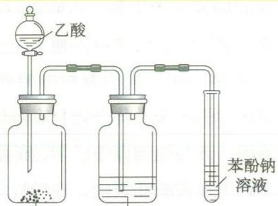  
${\mathrm{{Na}}}_{2}{\mathrm{{CO}}}_{3}$ 饱和 ${\mathrm{{NaHCO}}}_{3}$ 溶液  
图 3-1 实验装置示意图  
【探究2】  
教师可以先展示乙酸乙酯的分子结构模型，分析断键位置，提出问题：乙酸乙酯的水解速率与哪些反应条件有关？

学生猜想：溶液酸碱性、温度、催化剂等。然后学生分组进行实验探究，选择其中一个因素开展实验，探究乙酸乙酯的水解反应规律。教师引导学生学习控制变量的实验方法，设计科学的实验方案。例如，为探究溶液酸碱性的影响，可以设计如下方案。

<table><tr><td rowspan="2">实验操作</td><td colspan="3">实验现象</td></tr><tr><td>稀硫酸</td><td>蒸馏水</td><td>含有酚酞的NaOH溶液</td></tr><tr><td>1. 在3支试管中各加入1mL乙酸乙酯,再分别加入等体积的稀硫酸、蒸馏水和含有酚酞的NaOH溶液2. 水浴加热,记录酯层消失和酯香味消失的时间</td><td>酯层和酯香味消失慢</td><td>分层,酯层无明显现象</td><td>酯层和酯香味消失快,酚酞褪色</td></tr></table>

根据乙酸乙酯水解反应的规律，还可以讨论其他酯类水解反应的产物。通过探究让学生认识到控制实验条件是科学研究中的重要方法，初步学会利用控制变量法设计实验方案。建议学生在实验后分组讨论以下问题，并谈谈各自对该实验方法的体会，以提升学生对实验方法的认知水平。

## (1) 为什么可以通过比较酯层消失的时间来判断水解速率的大小?

因为羧基为亲水基，乙基为疏水基，所以乙酸易溶于水，乙酸乙酯在水中的溶解度较小。同时，乙酸乙酯的密度比水的小，酯层位于水层之上。故酯层消失即表示乙酸乙酯水解完全。

(2) 乙酸乙酯在酸性或碱性条件下的水解有什么不同, 为什么?

乙酸乙酯在酸性条件下的水解反应为可逆反应，水解速率较小；而在碱性条件下的水解反应不是可逆反应，水解速率较大。这是因为在碱性条件下，水解生成的羧酸与碱发生中和反应，使酯水解的化学平衡向正反应方向移动；同时，中和反应放热，依据反应速率的知识，在其他条件相同的情况下，温度越高，乙酸乙酯水解的速率就越大。

## 2. 思考与讨论

【思考与讨论1】

酯化反应可能的两种断键方式与产物如下表所示。

<table><tr><td>反应物</td><td> $CH_3—COOH, CH_3—CH_2—^{18}OH$ </td></tr><tr><td>断键方式1</td><td>酸脱羟基,醇脱氢原子 产物: $CH_3CO^{18}OC_2H_5,H_2O$ </td></tr><tr><td>断键方式2</td><td>酸脱氢原子,醇脱羟基 产物: $CH_3COOC_2H_5,H_2^{18}O$ </td></tr></table>

事实上，科学家在乙酸乙酯中检测到了放射性同位素 $^{18}$ O，证明断键方式①是正确的。乙酸与乙醇在浓硫酸作用下发生酯化反应的机理是“酸脱羟基，醇脱氢原子”。放射性同位素示踪法可用于研究化学反应机理，这是匈牙利化学家赫维西首先发现的，他因此获得1943年诺贝尔化学奖。酯化反应机理可参考本章“教学资源”。

## 【思考与讨论2】

建议采用小组交流讨论的形式，请学生先回忆化学平衡移动原理的相关知识，再结合酯化反应来具体分析。提高乙酸乙酯的产率，可以通过增加乙醇的用量（乙醇的沸点比乙酸的低，更容易挥发损失），或者不断分离产物水来实现。前者是增大反应物浓度，后者是减小生成物浓度，结果均使平衡向右移动，提高了乙酸乙酯的产率。

该反应的温度一般控制在60\~70℃。温度过高，反应速率增大，但也容易使有机化合物发生炭化，产生副产物。硫酸氢钠可以代替浓硫酸作催化剂。这是由于硫酸氢根离子可以电离出氢离子来催化该反应，生成的水又能使硫酸氢钠电离出更多的氢离子；同时，固态的硫酸氢钠使用较为方便。

## 【思考与讨论3】

建议请几位学生将答案写在黑板上。学生最常见的问题是书写分子式时多写或少写氢原子，混淆硬脂酸和油酸，以及漏写水分子或未配平化学方程式。

$$
3 \mathrm{C} _ {1 7} \mathrm{H} _ {3 5} \mathrm{COOH} + \begin{array}{c} \mathrm{CH} _ {2} - \mathrm{OH} \\ | \\ \mathrm{CH} - \mathrm{OH} \\ | \\ \mathrm{CH} _ {2} - \mathrm{OH} \end{array} \xrightarrow [ \triangle ]{\text {催化剂}} \begin{array}{c} \mathrm{C} _ {1 7} \mathrm{H} _ {3 5} \mathrm{COOCH} _ {2} \\ | \\ \mathrm{C} _ {1 7} \mathrm{H} _ {3 5} \mathrm{COOCH} \\ | \\ \mathrm{C} _ {1 7} \mathrm{H} _ {3 5} \mathrm{COOCH} _ {2} \end{array} + 3 \mathrm{H} _ {2} \mathrm{O}
$$

$$
3 \mathrm{C} _ {1 7} \mathrm{H} _ {3 3} \mathrm{COOH} + \begin{array}{c} \mathrm{CH} _ {2} - \mathrm{OH} \\ | \\ \mathrm{CH} - \mathrm{OH} \\ | \\ \mathrm{CH} _ {2} - \mathrm{OH} \end{array} \xrightarrow [ \triangle ]{\text {催化剂}} \begin{array}{c} \mathrm{C} _ {1 7} \mathrm{H} _ {3 3} \mathrm{COOCH} _ {2} \\ | \\ \mathrm{C} _ {1 7} \mathrm{H} _ {3 3} \mathrm{COOCH} \\ | \\ \mathrm{C} _ {1 7} \mathrm{H} _ {3 3} \mathrm{COOCH} _ {2} \end{array} + 3 \mathrm{H} _ {2} \mathrm{O}
$$

## 【思考与讨论4】

建议学生分组收集资料，在汇总整理后讨论交流。

<table><tr><td>物质</td><td>氨</td><td>胺</td><td>酰胺</td><td>铵盐</td></tr><tr><td>组成元素</td><td>N、H</td><td>C、N、H</td><td>C、O、N、H</td><td>N、H及其他元素</td></tr><tr><td>结构特点</td><td>NH3三角锥形分子</td><td>R—NH2含有氨基</td><td>OR—C—NH2含有酰胺基</td><td>含有铵根离子</td></tr><tr><td>化学性质</td><td>具有碱性,与酸反应生成铵盐</td><td>具有碱性,与酸反应生成盐</td><td>在酸或碱存在并加热的条件下可以发生水解反应</td><td>受热易分解,与碱共热产生氨气</td></tr><tr><td>用途</td><td>制冷剂,生产硝酸和尿素</td><td>合成医药、农药和染料</td><td>溶剂和化工原料</td><td>生产化肥和炸药</td></tr></table>

## 五、研究与实践

本栏目不仅可以提高学生利用教材中的知识解决身边实际问题的能力，还可以提高学生的动手实践能力，同时也能使学生了解有关表面活性剂的知识。

活动实施时可以采取小组合作的形式，让学生分别就肥皂制取的工艺流程、肥皂去污作用的原理、表面活性剂的种类和应用等方面收集资料。交流讨论后，各小组可选择不同的原料和操作方案制取肥皂。最后，可以采用纸质报告、口头报告、电脑课件或视频等多种形式呈现，充分调动学生的积极性和创造性，从而达到分享资源、共同学习和共同进步的目的。

## 六、练习与应用参考答案及说明

1. D 
2. D 
3. B 
4. D

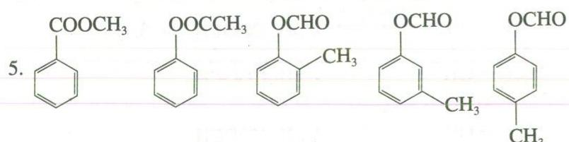

$$
\begin{array}{r l} & 6. 2 \mathrm{CH} _ {3} \mathrm{CH} _ {2} \mathrm{CH} _ {2} \mathrm{OH} + \mathrm{O} _ {2} \xrightarrow [ \triangle ]{\mathrm{Cu}} 2 \mathrm{CH} _ {3} \mathrm{CH} _ {2} \mathrm{CHO} + 2 \mathrm{H} _ {2} \mathrm{O} \\ & 2 \mathrm{CH} _ {3} \mathrm{CH} _ {2} \mathrm{CHO} + \mathrm{O} _ {2} \xrightarrow [ \triangle ]{\text { 催化剂 }} 2 \mathrm{CH} _ {3} \mathrm{CH} _ {2} \mathrm{COOH} \\ & \mathrm{CH} _ {3} \mathrm{CH} _ {2} \mathrm{Br} + \mathrm{NaOH} \xrightarrow [ \triangle ]{\text { 乙醇 }} \mathrm{CH} _ {2} = \mathrm{CH} _ {2} \uparrow + \mathrm{NaBr} + \mathrm{H} _ {2} \mathrm{O} \end{array}
$$

$$
\mathrm{CH} _ {2} = \mathrm{CH} _ {2} + \mathrm{H} _ {2} \mathrm{O} \xrightarrow [ \triangle ]{\text {催化剂}} \mathrm{CH} _ {3} \mathrm{CH} _ {2} \mathrm{OH}
$$

$$
\mathrm{CH} _ {3} \mathrm{CH} _ {2} \mathrm{COOH} + \mathrm{CH} _ {3} \mathrm{CH} _ {2} \mathrm{OH} \xrightarrow [ \triangle ]{\text {浓硫酸}} \mathrm{CH} _ {3} \mathrm{CH} _ {2} \mathrm{COOCH} _ {2} \mathrm{CH} _ {3} + \mathrm{H} _ {2} \mathrm{O}
$$

7. 催化加氢，化学方程式为：

$$
\begin{array}{r l} & \mathrm {C_{17} H_{33} COO - CH_ {2}} \\ & \mathrm {C_{17} H_{33} COO - CH} + 3 \mathrm {H_ {2}} \xrightarrow [ \triangle ]{\text {催化剂}} \mathrm {C_{17} H_{35} COO - CH} \\ & \mathrm {C_{17} H_{33} COO - CH_ {2}} \end{array}
$$

该反应可以提高油脂的饱和程度，生成固态脂肪，便于储存和运输。所得的人造脂肪可作为制造肥皂、人造奶油的原料。

$$
\begin{array}{r l} & 8. (1) \mathrm {HCOOC_ {2} H _ {5}} + \mathrm{NaOH} \xrightarrow {\triangle} \mathrm{HCOONa} + \mathrm {C_ {2} H_ {5} OH} \\ & (2) \mathrm {CH_ {3} CH_ {2} OH} \xrightarrow [ 1 7 0 ^ {\circ} C ]{\text {浓硫酸}} \mathrm {CH_ {2} = CH_ {2}} \uparrow + \mathrm {H_ {2} O} \\ & (3) 2 \mathrm {CH_ {3} CH_ {2} OH} + \mathrm {O_ {2}} \xrightarrow [ \triangle ]{\mathrm{Cu}} 2 \mathrm {CH_ {3} CHO} + 2 \mathrm {H_ {2} O} \\ & (4) \mathrm {CH_ {3} CHO} + 2 \mathrm {Cu(OH) _ {2}} + \mathrm{NaOH} \xrightarrow {\triangle} \mathrm {CH_ {3} COONa} + \mathrm {Cu_ {2} O} \downarrow + 3 \mathrm {H_ {2} O} \\ & 9. (1) \mathrm {C_ {2} H_ {4} O_ {2}} (2) \mathrm {CH_ {3} -C - OH} \end{array}
$$

10. 4 mol

提示：先依据油脂水解的定量关系确定油脂的摩尔质量，再依据催化加氢的定量关系确定碳碳双键的物质的量。

## 第五节 有机合成

## 一、内容分析

从知识内容的角度看，本章前4节教材以代表性物质为例，分类介绍了烃的衍生物的结构特点、物理性质、化学性质和用途；在本章最后的第五节，教材以有机合成为载体，对此前介绍的官能团的性质与转化、有机反应类型等内容进行系统化梳理与总结，并进行综合应用。教材在使学生初步掌握有机化合物之间转化方法的同时，使其认识到碳骨架和官能团既是认识有机化合物结构和性质的基本视角，也是合成新的有机化合物时需要关注的主要方面，进而引导学生建立正向和逆向设计合成路线的方法模型。在这个过程中，落实“宏观辨识与微观探析”（分析目标和原料有机化合物分子的结构，推测性质）和“变化观念与平衡思想”（基于性质推测转化关系与合成路线，通过反应条件的控制实现合成目标）的素养要求。有机合成是人类利用自然和改造自然的有力工具，在科学研究和工业生产中具有重要意义。因此，本节教材能使学生更好地认识化学的应用价值，培养其社会责任感。

课程标准指出：“有机合成的关键是碳骨架的构建和官能团的转化。”基于此，教材在这一节首先明确了进行有机合成要完成的两项主要任务。碳骨架的构建主要包括碳链的增长、缩短和碳环的构建。限于学生的知识储备，教材只给出较简单的不饱和键与HCN加成，然后水解或还原增长碳链，以及不饱和烃或芳香烃侧链被氧化缩短碳链的具体实例。至于更常用但较为复杂的羟醛缩合反应和第尔斯-阿尔德反应，教材在“资料卡片”栏目中进行了简单介绍。教材在介绍官能团的引入时，充分考虑学生已有的知识基础，通过“思考与讨论”栏目让学生从官能团转化的角度分类整理已学过的有机反应，自行归纳引入常见官能团的方法。同时，教材还介绍了碳卤键和羰基官能团在有机合成中的特殊重要作用。

教材在介绍合成路线的设计时，通过形象的图示给出正向和逆向的合成路线设计思路。在中学生可以接受的范围内，简单介绍了逆合成分析的基本思想，并以工业原料乙二酸二乙酯的合成为例，具体展示有机合成路线的设计与选择原则。本节最后，教材介绍有机合成的发展历史，通过化学史上的真实案例使学生认识科学发展的巨大作用，激发学习动力。最后的“资料卡片”栏目展示有机合成在实施过程中，实验室研究和工业化生产所使用的真实装置——多口烧瓶和反应釜，以及在生产规模放大时需要考虑的实际因素。将理论落脚于实际应用，体现化学的社会价值。

## 二、教学目标

## 1. 教学目标

（1）熟悉烃及烃的衍生物之间的相互转化、主要的有机反应类型及其特点，能依据相关信息正确书写化学方程式。

（2）认识有机合成的关键是碳骨架的构建和官能团的转化，了解设计有机合成路线的一般方法，能设计简单的有机合成路线。

(3) 能对给出的有机合成路线进行分析和评价, 培养逻辑思维能力和信息迁移能力。

（4）通过设计有机合成路线，体会有机合成在创造新物质、提高人类生活质量及促进社会发展方面的重要贡献。

## 2. 教学重点和难点

重点：碳骨架的构建和官能团的转化。

难点：逆向合成分析，简单有机合成路线的设计。

## 三、教学建议

## 1. 密切联系生活实际，体现有机合成的重要价值和意义

教师要通过选择贴近学生生活实际的素材，介绍有机合成的重要价值。可以选择学生身上的校服、家中的塑料制品和自行车轮胎等常见物品，以及化妆品、新材料和药品，让学生逐步体会有机合成的重要性和必要性。教学时可参考以下内容。

【情境引入】展示生活中人工合成有机化合物的图片，如化妆品香料（苯甲酸苯甲酯）、隐形眼镜材料（聚甲基丙烯酸羟乙酯）、长效缓释阿司匹林等，请学生观察并讨论有机合成对人类生活和社会进步的贡献。

【学生活动】小组讨论：化妆品香料使用的苯甲酸苯甲酯最早源自水仙花，在自然界原本存在，但含量太低，不能满足人们的需要；隐形眼镜材料聚甲基丙烯酸羟乙酯是自然界中原本不存在的有机化合物；长效缓释阿司匹林是对自然界中存在的有机化合物水杨酸进行人工改造而合成的有机化合物。

【设计意图】通过日常生活中学生熟悉的有机化合物，让学生感受有机合成在提高人民生活水平、促进科技进步和推动社会发展等方面的巨大贡献，了解有机合成的重要价值，激发学生的学习兴趣。

## 2. 小组合作，总结归纳，掌握碳骨架的构建与官能团的转化方法

有机合成的关键在于碳骨架的构建与官能团的转化，课堂上要引导学生明确有机合成的两大任务：一是构建目标分子的碳骨架，包括碳链增长、碳链缩短和成环等；二是有选择性地通过有机反应引入目标分子的官能团，实现有机化合物类别的转化。教学时可参考以下内容。

【学生活动】分组讨论有哪些方法可以改变碳骨架，然后交流总结。

(1) 成环: 一种思路是通过加成反应来实现, 如乙炔可以加成得到苯, 环加成反应可以得到六元环状化合物; 另一种思路是通过至少含有两个相同或不同官能团的有机化合物发生分子内或分子间缩合, 脱去小分子来实现, 如多元醇、羟基酸和氨基酸通过脱水反应而成环。

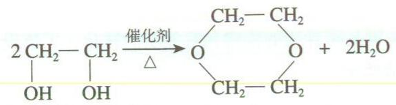

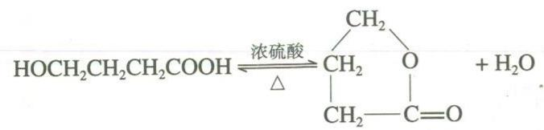

(2) 碳链增长: 不饱和有机化合物之间的加成反应, 卤代烃与氰化钠或炔钠反应, 醛、酮与氰化氢的加成反应, 酯化反应等。

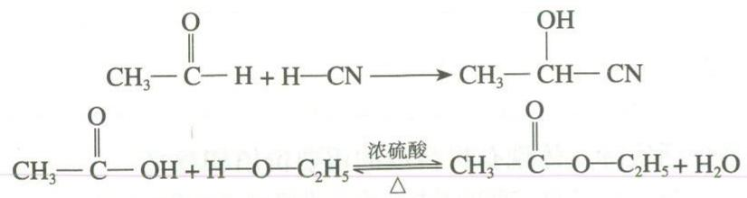

（3）碳链缩短：烯、炔的氧化反应，烷的裂解反应，脱羧反应，芳香烃侧链的氧化反应等。

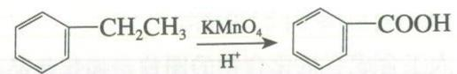

$$
\mathrm{R} - \mathrm{CH} = \mathrm{CH} _ {2} \xrightarrow [ \mathrm{H} ^ {+} ]{\mathrm{KMnO} _ {4}} \mathrm{RCOOH} + \mathrm{CO} _ {2} \uparrow
$$

【设计意图】通过小组合作，结合学生已学的有机反应来总结归纳。使学生初步学会有机合成中改变碳骨架的常用方法，为下一步深入学习有机合成打好基础。

## 3. 循序渐进，由简入繁，逐步体会有机合成的思路和方法

有机合成是高中有机化学学习的里程碑，是对高中阶段学习的烃、卤代烃、醇、酚、醛、羧酸、酯等各类有机化合物性质的综合应用。需要学生在熟练掌握上述有机化合物的结构特点和典型性质的基础上，能够利用其相互衍生关系及重要官能团的引入和消除方法，通过综合性问题的分析和解决，初步学会有机合成的方法，掌握有机合成过程的表示方法。相关知识网络的形成和应用需要学生主动参与学习过程，自主构建认知结构。以下关系图可供参考。

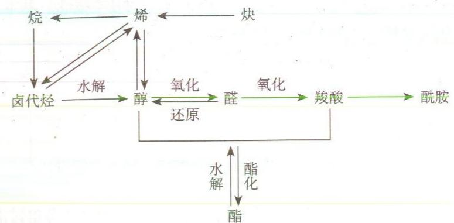

图 3-2 重要有机化合物之间的转化关系  
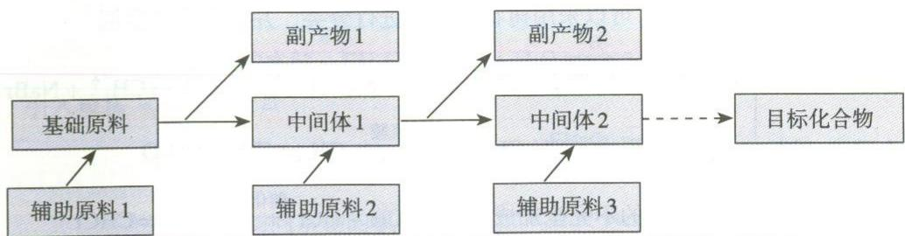  
图 3-3 有机合成过程示意图

教师可以先通过乙烯合成乙酸乙酯的案例，让学生初步体会有机合成的关键在于碳骨架的构建（从2个碳原子到4个碳原子）和官能团的引入（羟基、羧基和酯基的引入），需要遵循步骤少、原料价廉易得等原则，感受逆合成分析的一般思路。再通过乙烯合成乙二酸二乙酯的例子来提升和巩固逆合成分析的思维水平，学会如何将目标分子通过逆向思维进行合理切断，完成官能团的转化。从合成单官能团产物到合成双官能团产物的过程中，学生可以尝试利用在简单任务中使用过的方法来分析问题；然后，进一步提高难度，进行含有两种不同官能团或多种官能团的目标产物的合成。根据学生的情况，可适当介绍官能团的保护。教学时可以参考以下内容。

【学生活动】合成乙酸乙酯。

教师投影展示食品添加剂乙酸乙酯的广泛应用，提出问题：如何利用乙烯合成乙酸乙酯？学生经思考和讨论后，提出两种合成路线。

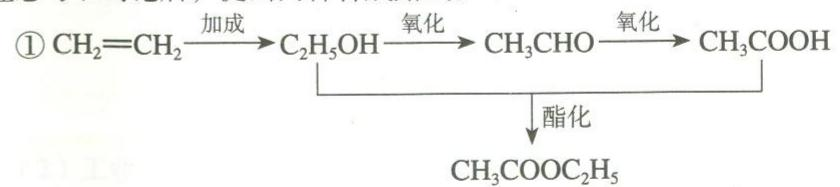

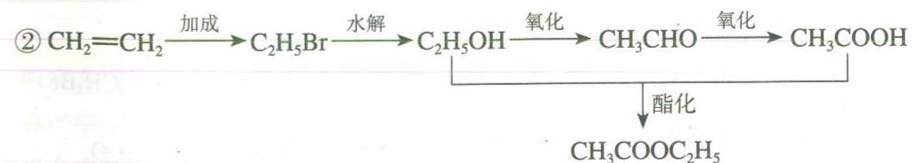

请学生写出合成路线图，并分别写出各步合成反应的化学方程式，比较两种合成路线的优劣。接下来，教师介绍乙烯直接氧化生成乙酸的工艺。假定合成路线的每一步反应的产率均为70%，计算并比较三种合成路线的总产率。

【设计意图】从学生熟悉的物质入手，介绍有机合成中的基本概念、基本方法及表示形式，让学生感受有机合成的过程，提高其学习的积极性。

## 四、栏目使用建议

【思考与讨论1】

教师在课堂上可以通过复习不同有机化合物的特征反应，引导学生分组讨论，归纳总结不同官能团的引入和转化方法，帮助学生初步掌握一定的合成技巧。还可以引导学生通过多种方式多维度体现官能团的转化。例如，可以采用树状分类法进行分类，并举出具体实例。

① 卤代烃的消去： $\mathrm{CH_{3}CH_{2}Br + NaOH\xrightarrow[\Delta]{\text{醇}}CH_{2}=CH_{2}\uparrow + NaBr + H_{2}O}$

(1) 引入碳碳双键

②醇的消去： $CH_{3}CH_{2}OH\xrightarrow[170^{\circ}C]{浓硫酸}CH_{2}=CH_{2}\uparrow+H_{2}O$

③ 炔烃的不完全加成：HC=CH+HCl $\xrightarrow[\Delta]{催化剂}$ CH $_{2}$ =CHCl

也可以结合具体的反应类型，采用发散思维的方式，分析某一官能团可能发生的变化。

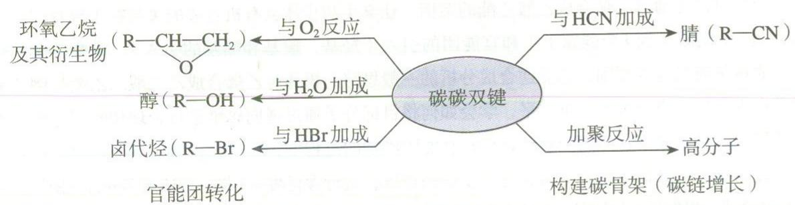

官能团转化

以下官能团的引入方法仅供参考，教学中可灵活处理。

①烷烃、苯及其同系物的卤代：

$$
\mathrm{CH} _ {3} \mathrm{CH} _ {3} + \mathrm{Cl} _ {2} \xrightarrow {\text {光}} \mathrm{CH} _ {3} \mathrm{CH} _ {2} \mathrm{Cl} + \mathrm{HCl}
$$

$$
\mathrm{C} _ {6} \mathrm{H} _ {5} + \mathrm{Br} _ {2} \xrightarrow {\mathrm{FeBr} _ {3}} \mathrm{C} _ {6} \mathrm{H} _ {5} - \mathrm{Br} + \mathrm{HBr} ^ {\uparrow}
$$

(2) 引入碳卤键

$$
\mathrm{CH} _ {3} + \mathrm{Cl} _ {2} \xrightarrow {\text {光}} \mathrm{CH} _ {2} \mathrm{Cl} + \mathrm{HCl}
$$

$$
\mathrm{CH} _ {2} = \mathrm{CHCH} _ {3} + \mathrm{Cl} _ {2} \xrightarrow {5 0 0 \sim 6 0 0 ^ {\circ} \mathrm{C}} \mathrm{CH} _ {2} = \mathrm{CHCH} _ {2} \mathrm{Cl} + \mathrm{HCl}
$$

②不饱和烃与HX、 $\mathrm{X}_{2}$ 加成： $\mathrm{CH}_{2}=\mathrm{CH}_{2}+\mathrm{HBr}\longrightarrow\mathrm{CH}_{3}\mathrm{CH}_{2}\mathrm{Br}$

③醇与HX取代： $CH_{3}CH_{2}OH + HBr\xrightarrow{\triangle}CH_{3}CH_{2}Br + H_{2}O$

① 烯烃与水加成： $CH_{2}=CH_{2}+H_{2}O\xrightarrow[\Delta、加压]{催化剂}CH_{3}CH_{2}OH$

(3) 引入羟基

②醛（酮）与 $\mathrm{H}_{2}$ 加成： $\mathrm{C = O + H_2\xrightarrow[\triangle]{催化剂}}\mathrm{CH - OH}$

③ 卤代烃的水解：R—X + NaOH $\xrightarrow[\triangle]{水}$ ROH + NaX

④ 酯的水解: $\mathrm{RCOOR}^{\prime} + \mathrm{NaOH} \xrightarrow{\triangle} \mathrm{RCOONa} + \mathrm{R}^{\prime} \mathrm{OH}$

①醛的氧化： $2CH_{3}CHO + O_{2}\xrightarrow[\Delta]{催化剂}2CH_{3}COOH$

② 酯的水解： $CH_{3}COOC_{2}H_{5} + H_{2}O \xlongequal[\triangle]{H^{+}} CH_{3}COOH + C_{2}H_{5}OH$

(4) 引入羧基

③ 烯烃的氧化： $\mathrm{R - CH = CH_2}\xrightarrow[\mathrm{H^+}]{\mathrm{KMnO_4}}\mathrm{RCOOH + CO_2\uparrow}$

④苯的同系物的氧化: $\ce{C6H5CH2R} \xrightarrow[\ce{H+}]{\ce{KMnO4}} \ce{C6H5COOH}$

(5) 引入酯基

酯化反应： $\mathrm{CH}_3\mathrm{-C(=O)}\mathrm{-OH} + \mathrm{C}_2\mathrm{H}_5\mathrm{OH}\xrightarrow[\triangle]{\text{浓硫酸}}\mathrm{CH}_3\mathrm{-C(=O)}\mathrm{-O-C_2H_5 + H_2O}$

根据学生认知水平的差异，可适当减少或增加内容，还可以进一步拓展，总结其他官能团的引入方法。

【思考与讨论2】

(1) 以乙烯为原料制备乙酸的过程如下:

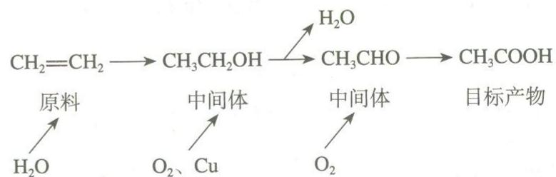

(2) 工业上将乙烯直接氧化成乙酸的反应如下:

$$
\mathrm{CH} _ {2} = \mathrm{CH} _ {2} + \mathrm{O} _ {2} \xrightarrow {\text { 催化剂 }} \mathrm{CH} _ {3} \mathrm{COOH}
$$

假定合成路线（1）和（2）中的每一步反应的产率均为 $70\%$ ，合成路线（1）经历三步反应，总产率应为： $70\% \times 70\% \times 70\% = 34.3\%$ ，远低于合成路线（2）的 $70\%$ 。由此可见，在设计有机合成路线时，应尽量减少反应步骤。

## 【思考与讨论3】

引导学生从成本、转化率和环境保护等角度分析两种合成路线。

路线一：

$$
\mathrm{CH} _ {2} = \mathrm{CH} _ {2} + \mathrm{Cl} _ {2} \longrightarrow \begin{array}{c c} \mathrm{CH} _ {2} - & \mathrm{CH} _ {2} \\ | & | \\ \mathrm{Cl} & \mathrm{Cl} \end{array}
$$

$$
\begin{array}{c} \mathrm{CH} _ {2} - \mathrm{CH} _ {2} + 2 \mathrm{NaOH} \xrightarrow [ \triangle ]{\mathrm{H} _ {2} \mathrm{O}} \mathrm{CH} _ {2} - \mathrm{CH} _ {2} + 2 \mathrm{NaCl} \\ \mid \\ \mathrm{Cl} \quad \mathrm{Cl} \end{array}
$$

路线二：

$$
\mathrm{CH} _ {2} = \mathrm{CH} _ {2} \xrightarrow [ \text {催化剂，} \triangle ]{\mathrm{O} _ {2}} \mathrm{CH} _ {2} - \mathrm{CH} _ {2} \xrightarrow [ \triangle , \text {加压} ]{\mathrm{H} _ {2} \mathrm{O}} \mathrm{CH} _ {2} - \mathrm{CH} _ {2}
$$

对比两种合成路线，不难发现：首先，从原料成本的角度考虑，路线一使用了 $Cl_{2}$ 和NaOH，而路线二使用了 $O_{2}$ 和 $H_{2}O$ ，成本更低；其次，从原子利用率的角度考虑，路线一第二步的取代反应有副产物，原子利用率低，而路线二的原子利用率较高；最后，从环境保护的角度考虑，路线一使用了有毒的 $Cl_{2}$ 和有腐蚀性的NaOH，对环境不够友好。综合考虑以上因素，路线二更为合理。

## 五、练习与应用参考答案及说明

$$
\mathrm{CH} _ {3} \mathrm{CH} = \mathrm{CHCH} _ {3} + \mathrm{HCl} \longrightarrow \mathrm{CH} _ {3} \mathrm{CH} _ {2} \mathrm{CHClCH} _ {3}
$$

$$
(2) \mathrm{CH} _ {3} \mathrm{CH} = \mathrm{CHCH} _ {3} + \mathrm{H} _ {2} \mathrm{O} \xrightarrow {\text {   催化剂   }} \mathrm{CH} _ {3} \mathrm{CH} _ {2} \mathrm{CHOHCH} _ {3}
$$

$$
(3) \mathrm{CH} _ {3} \mathrm{CH} = \mathrm{CHCH} _ {3} + \mathrm{Cl} _ {2} \longrightarrow \mathrm{CH} _ {3} \mathrm{CHClCHClCH} _ {3}
$$

$$
(4) \mathrm{CH} _ {3} \mathrm{CH} = \mathrm{CHCH} _ {3} + \mathrm{Cl} _ {2} \longrightarrow \mathrm{CH} _ {3} \mathrm{CHClCHClCH} _ {3}
$$

$$
\mathrm{CH} _ {3} \mathrm{CHClCHClCH} _ {3} + 2 \mathrm{NaOH} \xrightarrow [ \triangle ]{\mathrm{H} _ {2} \mathrm{O}} \mathrm{CH} _ {3} \mathrm{CHOHCHOHCH} _ {3} + 2 \mathrm{NaCl}
$$

卤代烃性质活泼，可以发生取代、消去等反应，转化为多种有机化合物。因此，引入卤素原子常常是改变有机分子性能的第一步反应，在有机合成中起着重要的桥梁作用。

2. $CH_{2}=CHCH=CH_{2}+Cl_{2}\longrightarrow CH_{2}ClCHClCH=CH_{2}$ 加成反应

$$
\mathrm{CH} _ {2} \mathrm{ClCHClCH} = \mathrm{CH} _ {2} + \mathrm{NaOH} \xrightarrow [ \triangle ]{\text {醇}} \mathrm{CH} _ {2} = \mathrm{CClCH} = \mathrm{CH} _ {2} + \mathrm{NaCl} + \mathrm{H} _ {2} \mathrm{O} \quad \text {消去反应}
$$

3. ① + Cl₂ \xrightarrow{光} + HCl 取代反应

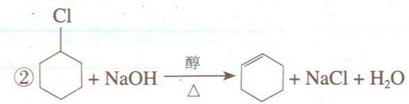

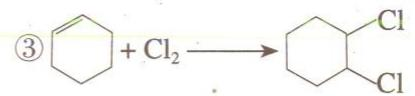

加成反应

$$
④ \mathrm{Cl} + 2 \mathrm{NaOH} \xrightarrow [ \triangle ]{\text {乙醇}} \mathrm{Cl} + 2 \mathrm{NaCl} + 2 \mathrm{H} _ {2} \mathrm{O} \quad \text {消去反应}
$$

⑤ $\ce{C6H5 + Br2 -> Br-C6H4-Br}$ 加成反应

⑥ Br— $\ce{C6H5Br} + H2 \xrightarrow{\text{一定条件}} Br\text{—} \ce{C6H5Br}$ 加成反应

⑦ Br—Br + 2NaOH $\xrightarrow[H\Delta]{H_{2}O}$ HO—OH + 2NaBr 取代（水解）反应

$$
4. \text {   } \begin{array}{c} \mathrm{O} \\ \mathrm{O} \end{array} \Longrightarrow \mathrm{HOCH} _ {2} \mathrm{CH} _ {2} \mathrm{OH} \Longrightarrow \begin{array}{c} \mathrm{CH} _ {2} - \mathrm{CH} _ {2} \\ | \\ \mathrm{Br} \end{array} \Longrightarrow \mathrm{CH} _ {2} = \mathrm{CH} _ {2}
$$

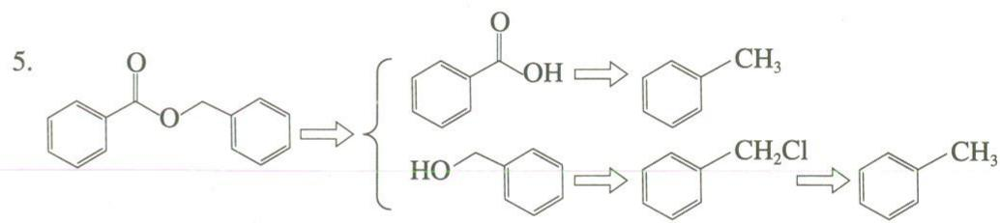

$$
6. \mathrm{CH} _ {2} = \mathrm{CH} _ {2} + \mathrm{H} _ {2} \mathrm{O} \xrightarrow [ \triangle , \text {加压} ]{\text {催化剂}} \mathrm{CH} _ {3} \mathrm{CH} _ {2} \mathrm{OH}
$$

$$
2 \mathrm{CH} _ {3} \mathrm{CH} _ {2} \mathrm{OH} + \mathrm{O} _ {2} \xrightarrow [ \triangle ]{\mathrm{Cu}} 2 \mathrm{CH} _ {3} \mathrm{CHO} + \mathrm{H} _ {2} \mathrm{O}
$$

$$
\mathrm{CH} _ {3} \mathrm{CHO} + \mathrm{CH} _ {3} \mathrm{CHO} \xrightarrow {\text {催化剂}} \mathrm{CH} _ {3} \mathrm{CHCH} _ {2} \mathrm{CHO}
$$

$$
\begin{array}{c} \mathrm{OH} \\ \mathrm {CH_ {3} CHCH_ {2} CHO\xrightarrow [ \triangle ]{\text {催化剂}} CH_ {3} CH = CHCHO+ H_ {2} O} \\ \mathrm{|} \\ \mathrm{OH} \end{array}
$$

$$
\mathrm{CH} _ {3} \mathrm{CH} = \mathrm{CHCHO} + 2 \mathrm{H} _ {2} \xrightarrow [ \triangle ]{\mathrm{Ni}} \mathrm{CH} _ {3} \mathrm{CH} _ {2} \mathrm{CH} _ {2} \mathrm{CH} _ {2} \mathrm{OH}
$$

## 7.（1）甲苯 取代反应 还原反应

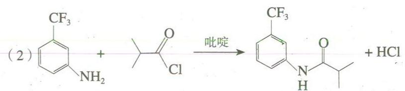

吸收反应产生的HCl，提高转化率。

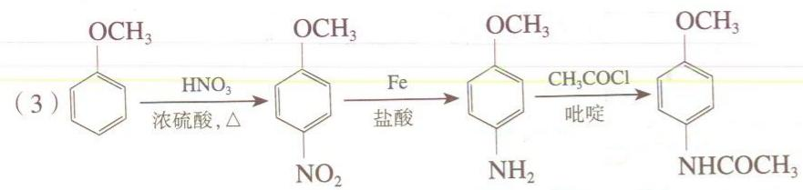

# 复习与提升建议

## 一、复习与提升教学建议

本章是有机化学基础模块的重要内容，涉及醇、醛、酸和酯等重要有机化合物的结构、性质及相互转化关系，同时涉及有机合成的重要思想和方法。因此，本章的复习显得尤为重要。

1. 小组合作，总结归纳重要有机化合物的性质及相互转化关系，构建有机合成知识体系

教学中，可以采用小组合作的形式，充分调动学生来总结归纳，并以思维导图的形式进行个性化呈现。为进一步巩固基础，可要求学生指出各步转化的反应条件、碳骨架的变化及官能团的转化。然后，可以让学生交流讨论引入各种常见官能团的方法，采取小组竞赛的方式提高学生的兴趣，激发学生的学习主动性。

## 2. 基于已知合成路线，体会有机合成中基团的定位和保护，提升有机合成分析能力

教学中，如学生的学习基础较好，可结合以下两个案例，让学生体会有机合成中含有多个官能团的有机化合物在发生反应时，非目标官能团也可能受到影响，因此需要将该官能团保护起来，反应后再转化复原。这样也有助于学生分析有机合成中碳骨架和官能团的变化，深入理解有机合成的核心问题。

案例1：用甲苯合成对羟基苯甲酸乙酯的路线如下，其中③的目的是保护酚羟基，使其不被氧化。

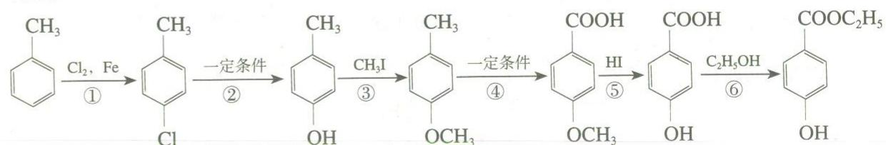

案例2：某种药物中间体的合成路线如下，其中②是为了保护氨基，使其不被氧化。

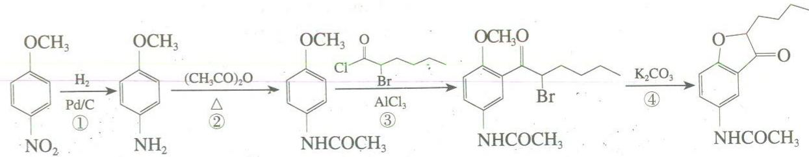

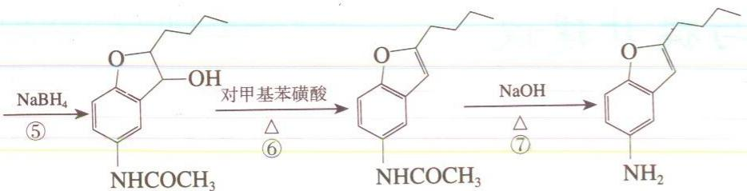

3. 立足生活中的有机化合物, 巩固逆合成分析法, 落实化学学科核心素养 $^{①}$ 案例1：水仙花味香料——苯甲酸苯甲酯的逆合成分析。

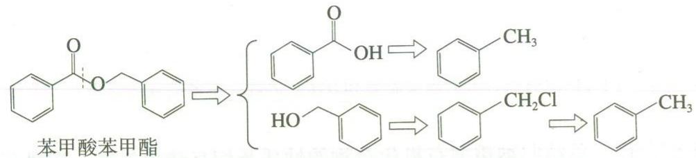

案例2：隐形眼镜材料——聚甲基丙烯酸羟乙酯的逆合成分析。

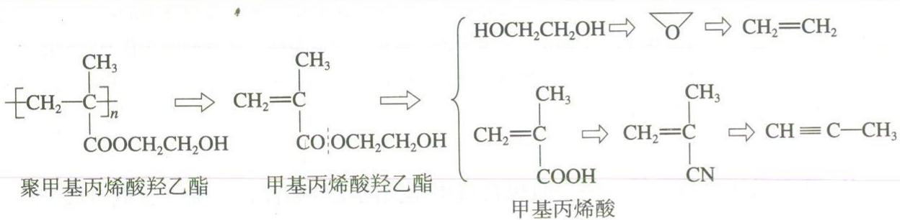

案例3：消炎药——缓释阿司匹林的逆合成分析。

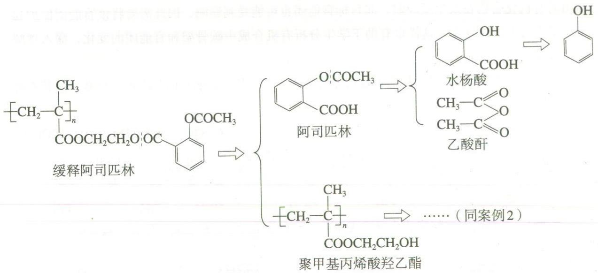

以上逆合成分析案例均来源于生活，从简单到相对复杂，循序渐进，逐步深入。案例1合成

① 白建娥，宋兆爽．定方向 建框架 磨细节——“有机合成”教学.中学化学教学参考，2015(8)：45-49.

苯甲酸苯甲酯相对简单，主要让学生巩固逆合成分析的一般步骤，掌握简单的化学键切断技巧。案例2聚甲基丙烯酸羟乙酯的逆合成分析，难度有所提升，目的是让学生较为熟练地运用逆合成分析法找到合成所需的多种原料。案例3缓释阿司匹林的逆合成分析，看上去很复杂。但仔细分析后不难发现，它实际上是前两个案例的合理组合。学生通过分析案例3可以进一步巩固前面所学的知识，教师也能很好地检测学生对相关知识的掌握程度。

## 二、复习与提高参考答案及说明

1. D 2. B 3. AB 4. D 5. A 6. B 7. D 8. C 9. C

10. 溶解度由大到小的顺序为：②＞①＞③。

11.（1）根据各物质的物理和化学性质，可用溴水和 $NaHCO_{3}$ 溶液鉴别。

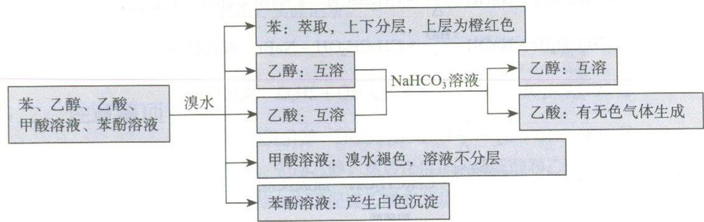

(2) 化学方程式略

12. $\mathrm{CH}_{2}=\mathrm{CH}-\mathrm{COOH}$

$$
\begin{array}{r l} & 1 3. (1) \left(\mathrm{C} _ {6} \mathrm{H} _ {1 0} \mathrm{O} _ {5}\right) _ {n} + n \mathrm{H} _ {2} \mathrm{O} \xrightarrow {\text {酶}} n \mathrm{C} _ {6} \mathrm{H} _ {1 2} \mathrm{O} _ {6} \\ & \text {淀粉} \quad \text {葡萄糖} \\ & \mathrm{C} _ {6} \mathrm{H} _ {1 2} \mathrm{O} _ {6} \xrightarrow {\text {酶}} 2 \mathrm{CH} _ {3} \mathrm{CH} _ {2} \mathrm{OH} + 2 \mathrm{CO} _ {2} \uparrow \\ & \text {葡萄糖} \\ & \mathrm{CH} _ {3} \mathrm{CH} _ {2} \mathrm{OH} + \mathrm{O} _ {2} \xrightarrow {\text {醋酸菌}} \mathrm{CH} _ {3} \mathrm{COOH} + \mathrm{H} _ {2} \mathrm{O} \\ & \mathrm{CH} _ {3} \mathrm{COOH} + \mathrm{CH} _ {3} \mathrm{CH} _ {2} \mathrm{OH} \xlongequal {\text {一定条件}} \mathrm{CH} _ {3} \mathrm{COOCH} _ {2} \mathrm{CH} _ {3} + \mathrm{H} _ {2} \mathrm{O} \end{array}
$$

（2）提示：酿造食醋是单独或混合使用各种含有淀粉或其他糖类物质的原料和食用酒精，经微生物发酵酿制而成的酸性液体调味品。酸性调味液是以食用乙酸、水等混合配制而成的调味品。

14. (1) 反应②的产物: ${\mathrm{{CH}}}_{2} = \mathrm{{CH}} - {\mathrm{{CH}}}_{2}\mathrm{{Cl}}$ 反应④的产物: ${\mathrm{{CH}}}_{2}\mathrm{{OH}} - \mathrm{{CHOH}} - {\mathrm{{CH}}}_{2}\mathrm{{OH}}$

(2) ① $\mathrm{CH_{3}-CH_{2}-CH_{2}OH\xrightarrow[\Delta]{\text{浓硫酸}}CH_{3}-CH=CH_{2}\uparrow+H_{2}O}$ ② $\mathrm{CH_{2}=CH-CH_{3}+Cl_{2}\xrightarrow{500^{\circ}C}CH_{2}=CH-CH_{2}Cl+HCl}$ ③ $\mathrm{CH_{2}=CH-CH_{2}Cl+Cl_{2}\xrightarrow{}CH_{2}Cl-CHCl-CH_{2}Cl}$ ④ $\mathrm{CH_{2}Cl-CHCl-CH_{2}Cl+3NaOH\xrightarrow[H_{2}O]{\Delta}CH_{2}OH-CHOH-CH_{2}OH+3NaCl}$

⑤ $\begin{array}{c} CH_{2}-OH \\ | \\ CH-OH + 3HO-NO_{2} \\ | \\ CH_{2}-OH \end{array} \xrightarrow[\Delta]{催化剂} \begin{array}{c} CH_{2}-O-NO_{2} \\ | \\ CH-O-NO_{2} + 3H_{2}O \\ | \\ CH_{2}-O-NO_{2} \end{array}$

(3) 如果在制取丙烯时所用的 1-丙醇中混有 2-丙醇, 对所制丙烯的纯度没有影响。因为二者发生消去反应时的产物都是丙烯。

15. (1) A: $CH_{3}CH_{2}OH$ 乙醇 B: $CH_{2}=CH_{2}$ 乙烯 C: $CH_{3}CH_{2}Br$ 溴乙烷 D: $CH_{3}CHO$ 乙醛 E: $CH_{3}COOH$ 乙酸 F: $CH_{3}COOCH_{2}CH_{3}$ 乙酸乙酯

(2) ① $\mathrm{CH}_{3} \mathrm{CH}_{2} \mathrm{OH} \xrightarrow[170^{\circ} \mathrm{C}]{\text {浓硫酸}} \mathrm{CH}_{2} = \mathrm{CH}_{2} \uparrow + \mathrm{H}_{2} \mathrm{O}$ 消去反应

② $CH_{2}=CH_{2}+HBr$ $\longrightarrow$ $CH_{3}CH_{2}Br$ 加成反应

③ $CH_{3}CH_{2}Br + NaOH \xrightarrow[\Delta]{乙醇} CH_{2}=CH_{2}\uparrow + NaBr + H_{2}O$ 消去反应

④ $CH_{3}CH_{2}Br + NaOH \xrightarrow[\Delta]{H_{2}O} CH_{3}CH_{2}OH + NaBr$ 取代反应

⑤ $2{\mathrm{{CH}}}_{3}{\mathrm{{CH}}}_{2}\mathrm{{OH}} + {\mathrm{O}}_{2}\xrightarrow[ \triangle ]{\mathrm{{Cu}}}2{\mathrm{{CH}}}_{3}\mathrm{{CHO}} + 2{\mathrm{H}}_{2}\mathrm{O}$ 氧化反应

⑥ $2CH_{3}CHO + O_{2} \xrightarrow[\Delta]{催化剂} 2CH_{3}COOH$ 氧化反应

⑦ $CH_{3}CHO + H_{2} \xrightarrow[\triangle]{催化剂} CH_{3}CH_{2}OH$ 加成反应（还原反应）

⑧ $CH_{3}CH_{2}OH + CH_{3}COOH \xrightarrow[\Delta]{浓硫酸} CH_{3}COOCH_{2}CH_{3} + H_{2}O$ 酯化反应

16. (1) $\mathrm{CH}_{3} \mathrm{CHO} \quad \mathrm{CH}_{3} \mathrm{COOCH}_{2} \mathrm{CH}_{3}$

$$
\begin{array}{r l} & {(2) \mathrm {CH_ {3} CH_ {2} Br + NaOH\xrightarrow [ \triangle ]{\text {水}} CH_ {3} CH_ {2} OH + NaBr}} \\ & {\mathrm {HCOOCH_ {2} CH_ {3} +NaOH\xrightarrow [ \triangle ]{\Delta} HCOONa + CH_ {3} CH_ {2} OH}} \end{array}
$$

17.(1) 羟基

(2) $\mathrm{CH}_2 = \mathrm{CH}-\mathrm{CH}_2\mathrm{OH}$

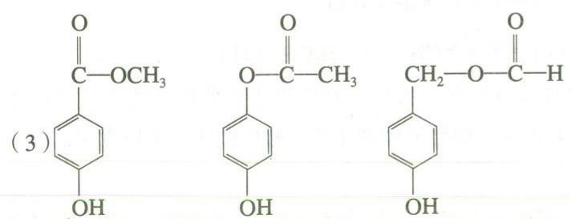

(4) ① bd ② CH $_{2}$ ClCOOH 取代反应

$$
③ \mathrm{O} - \mathrm{CH} _ {2} \mathrm{COOH} + \mathrm{CH} _ {2} = \mathrm{CHCH} _ {2} \mathrm{OH} \xrightarrow [ \triangle ]{\text { 催化剂 }} \mathrm{O} - \mathrm{CH} _ {2} \mathrm{COOCH} _ {2} \mathrm{CH} = \mathrm{CH} _ {2} + \mathrm{H} _ {2} \mathrm{O}
$$

## 实验活动1 乙酸乙酯的制备与性质

## 一、活动安排建议

课前布置任务，让学生预习实验活动内容，明确实验目的，写出实验流程，了解每种药品在实验中的作用。学生应正确书写制备乙酸乙酯的化学方程式，并应用化学平衡移动原理的相关知识解释实验操作的一些步骤。教师应指导学生充分发挥小组合作的优势，严格按照实验要求进行实验，仔细观察实验现象，认真做好实验记录。

## 二、注意事项

操作时应注意试剂加入的顺序，先加乙醇，然后慢慢加入浓硫酸和乙酸。另外，乙醇要过量（乙醇沸点较低，易挥发损失；同时也为了促进乙酸充分反应），反应过程中不断蒸出产物，以促进平衡向生成酯的方向移动。

本实验的关键问题是控制酯化反应的温度。反应温度过低，酯化反应不完全；温度过高，则易发生醇的脱水和氧化等副反应。实验时，导管末端不要插入饱和 $Na_{2}CO_{3}$ 溶液，以防止倒吸；长导管兼有导气和冷凝作用。在乙酸乙酯的水解实验中，要注意控制变量，如碱的浓度、总体积和水浴温度。

## 三、问题和讨论答案或提示

1. 乙酸乙酯的水解实验中，除了通过乙酸乙酯气味消失的快慢来比较酯的水解速率，还可以通过酯层消失的快慢来比较。也可在水层中滴入石蕊溶液以指示水层，便于观察酯与水之间的界面，并且可以根据水层由紫色变为红色来判断水解产物乙酸的生成。

2. 相关反应的化学方程式为：

$$
\begin{array}{r l} & {\mathrm {CH_ {3} COOH + CH_ {3} CH_ {2} OH\xrightarrow[\triangle]{\text {浓硫酸}} CH_ {3} COOCH_ {2} CH_ {3} + H_ {2} O}} \\ & {\mathrm {CH_ {3} COOCH_ {2} CH_ {3} + H_ {2} O\xrightarrow[\triangle]{\text {稀硫酸}} CH_ {3} COOH+ CH_ {3} CH_ {2} OH}} \\ & {\mathrm {CH_ {3} COOCH_ {2} CH_ {3} + NaOH\xrightarrow{\triangle} CH_ {3} COONa+ CH_ {3} CH_ {2} OH}} \end{array}
$$

## 实验活动2 有机化合物中常见官能团的检验

## 一、活动安排建议

课前应布置任务，让学生复习常见官能团的主要性质和典型反应，归纳总结检验官能团的实验方法，并写出相关的化学方程式。建议采用分组探究实验的方式，提供几种编有序号的未知有机化合物和检验官能团所需的实验药品，请学生结合已学知识设计实验方案，选择合理的实验药品，分组鉴别未知有机化合物。

## 二、注意事项

检验卤代烃中的卤素时，要注意先用硝酸中和水解时加入的过量的NaOH，再加入 $AgNO_{3}$ 溶液检验，否则 $OH^{-}$ 会干扰卤素离子的检验。

检验醛基时，应使溶液保持碱性，才能使实验现象明显，故NaOH溶液应过量。

## 三、问题和讨论答案或提示

核磁共振氢谱可以检测有机化合物分子中处于不同化学环境的氢原子的种类及个数。其谱图的一般规律是谱图中有几组峰，分子中就有几种处于不同化学环境的氢原子；峰面积比等于不同种类氢原子的个数比。依据上述规律，很容易根据谱图区分乙醇、乙酸和乙酸乙酯。乙醇中有三种处于不同化学环境的氢原子，个数比为3：2：1；乙酸中有两种，个数比为3：1；乙酸乙酯中有三种，个数比为3：2：3。

## 教学资源

## 1. 溴乙烷与 $\mathrm{AgNO}_{3}$ 溶液反应的机理

由于溴原子的电负性较碳原子的大，溴乙烷分子中的溴原子带部分负电荷，碳原子带部分正电荷，形成极性较强的 $C^{\delta+}-Br^{\delta-}$ 。在化学反应中，带正电荷的碳原子易受到亲核试剂的进攻，最终使C—Br断裂而发生亲核取代反应。加入 $AgNO_{3}$ 溶液时，溶液中的 $H_{2}O$ 和 $^{-}ONO_{2}(NO_{3}^{-})$ 都是亲核试剂，因此可能发生以下亲核取代反应。

$$
\begin{array}{r l} & \mathrm {CH_ {3} CH_ {2} Br+ H_ {2} O\longrightarrowCH_ {3} CH_ {2} OH + HBr} \\ & \mathrm {CH_ {3} CH_ {2} Br+ ^ {-} ONO_ {2} \longrightarrowCH_ {3} CH_ {2} ONO_ {2} + Br^ {-}} \end{array}
$$

从反应机理上看，前者发生的是双分子亲核取代反应（ $\mathrm{S}_{\mathrm{N}}2$ ），其历程如化学方程式（1）所示。由于 $\mathrm{H}_{2} \mathrm{O}$ 是一种亲核性弱的中性分子，发生取代反应的速率较 $\mathrm{OH}^{-}$ 等亲核性强的试剂小，其相对速率与 $\mathrm{CH}_{3} \mathrm{OH}$ 的相当。而 $\mathrm{Ag}^{+}$ 可与溴乙烷分子中的溴原子结合，生成溶解度极小的溴化银，使溴原子的离去倾向更大；同时形成碳正离子，主要发生单分子亲核取代反应（ $\mathrm{S}_{\mathrm{N}}1$ ），其历程如化学方程式（2）和（3）所示。 $\mathrm{Ag}^{+}$ 使 $\mathrm{S}_{\mathrm{N}}1$ 反应速率增大。

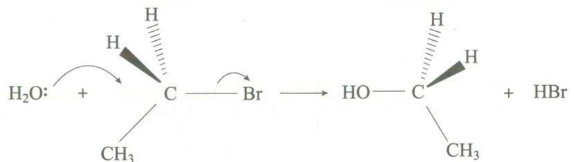

(1)

$$
\mathrm{CH} _ {3} \mathrm{CH} _ {2} - \stackrel {\bullet \bullet} {\mathrm{Br}} + \mathrm{Ag} ^ {+} \longrightarrow \mathrm{CH} _ {3} \mathrm{CH} _ {2} - \stackrel {\bullet \bullet} {\mathrm{Br}} - \mathrm{Ag} \longrightarrow \mathrm{CH} _ {3} \stackrel {+} {\mathrm{CH}} _ {2} + \mathrm{AgBr} \downarrow\tag{2}
$$

$$
\mathrm{CH} _ {3} \stackrel {+} {\mathrm{CH}} _ {2} + ^ {-} \mathrm{ONO} _ {2} \longrightarrow \mathrm{CH} _ {3} \mathrm{CH} _ {2} \mathrm{ONO} _ {2}\tag{3}
$$

水与溴乙烷的取代反应速率很小，常通过加入碱（ $\mathrm{OH}^{-}$ 的亲核性较水的强）和加热促进取代反应的发生。而加入 $\mathrm{Ag}^{+}$ 后会生成难溶的 $\mathrm{AgBr}$ 沉淀，促进 $\mathrm{NO}_{3}^{-}$ 与溴乙烷发生亲核取代反应，此时的取代产物主要是硝酸乙酯，而不是乙醇。

此外，卤代烃的亲核取代反应历程与反应物的结构（烃基结构和卤原子活性）、亲核试剂的性质和溶剂的性质等因素密切相关。例如，叔丁基溴与 $AgNO_{3}$ 主要发生 $S_{N}1$ 反应，溴乙烷的水解

反应几乎都是 $\mathrm{S_N2}$ 反应。而有些物质（如

等），由于空间位阻和桥头碳的构型无法翻

转，难以发生 $S_{N}2$ 反应；同时，由于难以形成平面结构的碳正离子，也难以发生 $S_{N}1$ 反应。

[部分内容摘自：胡宏纹.有机化学：上册（第3版）．北京：高等教育出版社，2006:97；杨生贵．关于溴乙烷取代反应的实验探究．化学教学，2014(11):53-55]

## 2.1-氯丁烷中氯元素的检验

在大试管中加入 5 mL 1 mol/L NaOH 溶液和 5 mL 1-氯丁烷（沸点为 78 ℃，密度为 0.886 g/cm³，易燃）。水浴加热该试管 10 min 以上，并控制加热温度在 70\~80 ℃（图 3-4）。在小试管中加入 1 mL 由等体积的 2% AgNO₃ 溶液和 3 mol/L 硝酸组成的混合溶液（使用硝酸酸化 AgNO₃ 溶液的目的是中和待测液中的 NaOH，防止 NaOH 与 AgNO₃ 反应出现棕色沉淀，影响实验效果）。用胶头滴管吸取加热后大试管内的液体，将此待测液逐滴加入小试管中，出现白色沉淀，说明 1-氯丁烷与 NaOH 溶液反应有 Cl⁻ 生成，从而证明了 1-氯丁烷中含有氯元素。

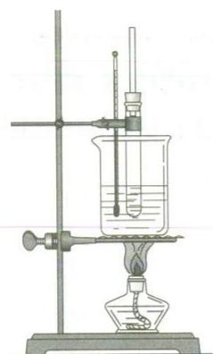  
图3-4 1-氯丁烷与NaOH溶液反应的装置示意图

## 3. 甘油的用途

甘油的重要用途是制取三硝酸甘油酯（硝化甘油）。

$$
\begin{array}{r l} & \mathrm {CH_ {2} -OH} \\ & \mathrm{|} \\ & \mathrm {CH - OH} + 3 \mathrm {HN O _ {3}} \\ & \mathrm{|} \\ & \mathrm {CH_ {2} -OH} \end{array} \xrightarrow {\mathrm {H_ {2} SO_ {4}}} \begin{array}{r l} & \mathrm {CH_ {2} -ONO_ {2}} \\ & \mathrm{|} \\ & \mathrm {CH - ON O _ {2}} + 3 \mathrm {H_ {2} O} \\ & \mathrm{|} \\ & \mathrm {CH_ {2} -ONO_ {2}} \end{array}
$$

三硝酸甘油酯是无色或淡黄色的油状物，微溶于水，可溶于丙酮、乙醚等有机溶剂。它是非常容易爆炸的物质，稍受震动就会发生猛烈爆炸，分解成氮气、二氧化碳、水和氧气，并放出大量的热。

$$
4 \mathrm{C} _ {3} \mathrm{H} _ {5} (\mathrm{ONO} _ {2}) _ {3} \longrightarrow 6 \mathrm{N} _ {2} \uparrow + 1 2 \mathrm{CO} _ {2} \uparrow + 1 0 \mathrm{H} _ {2} \mathrm{O} + \mathrm{O} _ {2} \uparrow
$$

因此，它的生产、运输、储存和使用很不安全。瑞典化学家诺贝尔发现用硅藻土吸收三硝酸甘油酯后可以大大降低它的爆炸敏感度，这样就使三硝酸甘油酯能被用于生产实用炸药。现在一般是将三硝酸甘油酯与木粉、硝化棉、硝酸铵等物质混合，制成硝化甘油炸药，用于工程爆破和国防。

三硝酸甘油酯有扩张血管的作用，可用于治疗心绞痛。

甘油的另一重要用途是制备醇酸树脂，醇酸树脂被广泛用于生产涂料和油墨。

甘油有甜味，无毒，在食品工业中可作为食品添加剂。甘油具有很强的吸水性。烟草、皮革用甘油处理后可以防霉，不易变硬。甘油对皮肤无刺激作用，将其溶液涂在皮肤上可以滋润皮肤。因为甘油有吸水性，在许多软膏制品（如牙膏、护肤品、医用软膏等）中加入一定量的甘油后可以防止干结。甘油水溶液的冰点很低，如 $66.7\%$ 的甘油溶液的冰点为 $-46.5^{\circ}\mathrm{C}$ ，所以甘油水溶液可以作防冻剂和制冷剂。此外，甘油还作为润湿剂和润滑剂，应用于印刷、纺织、机械加工等领域。

## 4. 苯酚分子结构对性质的影响

## (1) 苯酚具有酸性的原因

苯酚分子中，酚羟基中的氧原子采取 $sp^{2}$ 杂化。氧原子中的两对孤对电子，一对占据 $sp^{2}$ 杂化轨道，另一对占据未杂化的p轨道。p电子云正好能与苯的大 $\pi$ 键电子云发生侧面重叠，形成p- $\pi$ 共轭体系，增大了苯环上的电子云密度（图3-5）。在p- $\pi$ 共轭体系中，氧原子的p电子云向苯环转移，导致氢氧之间的电子云进一步向氧原子转移，从而使氢原子较易离去，从而表现出酸性。

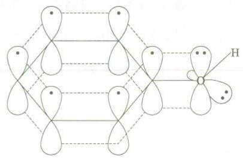  
图3-5 苯酚分子中的 $\mathfrak{p} - \pi$ 共轭示意图

(2) 苯酚的羟基难以被取代而其苯环上的氢原子易被取代的原因

乙醇和苯酚分子中都含有羟基，但羟基的取代活性大不相同。醇分子中的羟基易被取代，而苯酚分子中的羟基很难被取代。这主要是由于酚羟基不是直接连接在饱和碳原子上，而是与苯环直接相连。虽然苯酚分子中的碳氧间与乙醇分子中的碳氧间都存在诱导效应，但苯酚分子中羟基氧原子中的孤对p电子可以与苯环的大 $\pi$ 键电子云从侧面重叠，使氧原子上的p电子云向苯环偏移。这种 $p-\pi$ 共轭效应比碳氧间的诱导效应强。因此，综合起来看，苯酚分子中的碳氧键不是被削弱，而是得到增强。这就是苯酚中羟基不易被取代的主要原因。同样，由于 $p-\pi$ 共轭增大了苯环上的电子云密度，使苯环更易受到亲电试剂的进攻，导致苯酚分子中苯环上的氢原子比苯分子中的氢原子更易被取代。

[部分内容摘自：邢其毅，裴伟伟，徐瑞秋，裴坚．基础有机化学：下册（第3版）．北京：高等教育出版社，2005:824]

## 5. 苯酚的用途

苯酚具有较强的消毒杀菌能力，苯酚的水溶液可直接用作消毒剂和防腐剂，这是因为苯酚能使微生物的蛋白质凝固。苯酚对各种细菌的杀灭能力不同，质量分数为1%的苯酚水溶液能杀灭大多数病菌，但结核杆菌需要5%的水溶液并经过24 h才能被杀死。苯酚具有一定的毒性和腐蚀性，所以一般用质量分数为0.5%\~3%的苯酚水溶液进行外科手术用具的消毒。其他酚类物质一般也具有杀菌和防腐性能。例如，甲基苯酚三种同分异构体的混合物与肥皂溶液制成的煤酚皂溶液（俗称来苏儿），可用于医疗器械和环境消毒。从煤焦油、木焦油中提取出的苯酚和甲基苯酚等物质的混合物叫杂酚油，可用作木材防腐剂。五氯酚钠也可用于木材防腐，还可用于血吸虫病疫区杀灭钉螺。

苯酚还用于制造酚醛树脂、双酚 A 和己内酰胺。此外，有相当数量的苯酚用于生产卤代酚。卤代酚可用于生产 2,4-二氯苯氧乙酸和 2,4,5-三氯苯氧乙酸等除草剂；其他卤代酚衍生物可作为杀螨剂、皮革防腐剂和杀菌剂。由苯酚制得的烷基苯酚是制备烷基酚 - 甲醛聚合物的单体，并可作为抗氧剂、非离子表面活性剂、增塑剂和石油产品添加剂。苯酚也是很多医药（如水杨酸、阿司匹林及磺胺药等）、合成香料和染料的原料。

[部分内容摘自：《中国大百科全书》总编委会．中国大百科全书（第2版）．北京：中国大百科全书出版社，2009]

## 6. 醛基中的碳氧双键不与 $\mathrm{Br}_{2}$ 发生加成反应的原因

碳氧双键与碳碳双键的加成反应机理不同，前者发生的是亲核加成，后者发生的是亲电加成。 $Br_{2}$ 是一种强的亲电试剂，因此易与烯烃加成，而不能与醛加成。由于醛基具有较强的还原性，易被氧化为羧酸。向乙醛中加入溴水，溴水褪色的主要原因是乙醛发生了氧化反应，使 $Br_{2}$ 被还原为无色的 $Br^{-}$ 。反应历程如下：

$$
\mathrm{Br} _ {2} + \mathrm{H} _ {2} \mathrm{O} \rightleftharpoons \mathrm{HBr} + \mathrm{HOBr}
$$

$$
\mathrm{HOBr} \rightleftharpoons \mathrm{H} ^ {+} + ^ {-} \mathrm{OBr}
$$

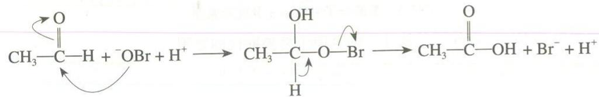

总反应: $\mathrm{CH}_{3} \mathrm{CHO} + \mathrm{Br}_{2} + \mathrm{H}_{2} \mathrm{O} \longrightarrow \mathrm{CH}_{3} \mathrm{COOH} + 2 \mathrm{HBr}$ 。

## 7. 乙醛的工业生产

1774 年，瑞典化学家舍勒以乙醇、二氧化锰和硫酸反应首先制得乙醛。1881 年，俄国化学家库切罗夫将乙炔通入高价汞盐的硫酸溶液中反应也制得了乙醛。库切罗夫的工作为乙炔水合制乙醛的工业化奠定了基础。此后，乙炔水合法曾长期是乙醛唯一的工业化生产方法，但所用催化剂有毒。1940 年和 1959 年，人们又先后成功开发了乙醇氧化法和乙烯直接氧化法制乙醛，大大促进了乙醛的生产。

工业上生产乙醛的方法主要有乙烯直接氧化法、乙醇氧化法和乙炔水合法。此外，还有丙烷或丙烷、丁烷混合物氧化制乙醛等方法，由于产物组成复杂，分离困难，未能得到推广。

①乙烯直接氧化法，又称瓦克法，它是世界上第一个采用均相配位催化剂实现工业化的过程。该法以氯化钯、氯化铜、盐酸和水组成的溶液为催化剂，使乙烯直接氧化为乙醛。

$$
2 \mathrm{CH} _ {2} = \mathrm{CH} _ {2} + \mathrm{O} _ {2} \xrightarrow {\text { 催化剂 }} 2 \mathrm{CH} _ {3} \mathrm{CHO}
$$

实际反应按以下两步进行。

乙烯氧化：

$$
\mathrm{CH} _ {2} = \mathrm{CH} _ {2} + \mathrm{PdCl} _ {2} + \mathrm{H} _ {2} \mathrm{O} \longrightarrow \mathrm{CH} _ {3} \mathrm{CHO} + \mathrm{Pd} + 2 \mathrm{HCl}
$$

催化剂溶液的氧化再生：

$$
\mathrm{Pd} + 2 \mathrm{CuCl} _ {2} \longrightarrow \mathrm{PdCl} _ {2} + 2 \mathrm{CuCl}
$$

$$
4 \mathrm{CuCl} + \mathrm{O} _ {2} + 4 \mathrm{HCl} \longrightarrow 4 \mathrm{CuCl} _ {2} + 2 \mathrm{H} _ {2} \mathrm{O}
$$

②乙醇氧化法以空气为氧化剂。乙醇蒸气和空气经混合并加热至 $460^{\circ} \mathrm{C}$ 左右, 自顶部进入装有银催化剂的固定床反应器, 发生氧化脱氢反应生成乙醛。

$$
2 \mathrm{CH} _ {3} \mathrm{CH} _ {2} \mathrm{OH} + \mathrm{O} _ {2} \xrightarrow [ \triangle ]{\text {催化剂}} 2 \mathrm{CH} _ {3} \mathrm{CHO} + 2 \mathrm{H} _ {2} \mathrm{O}
$$

此过程的主要副反应是乙醛继续氧化为乙酸的反应。

$$
2 \mathrm{CH} _ {3} \mathrm{CHO} + \mathrm{O} _ {2} \xrightarrow [ \triangle ]{\text { 催化剂 }} 2 \mathrm{CH} _ {3} \mathrm{COOH}
$$

此法操作简单，乙醛收率高。但生产能力受乙醇来源和价格的限制。

[部分内容摘自：《中国大百科全书》总编委会．中国大百科全书（第2版）．北京：中国大百科全书出版社，2009]

## 8. 自然界的低级脂肪酸酯

低级脂肪酸酯在自然界广泛存在，特别是在各种水果和花草中存在较多，表 3-5 列出了一些酯的结构简式和气味。

表 3-5 一些酯的结构简式和气味

<table><tr><td>名称</td><td>结构简式</td><td>气味</td></tr><tr><td>乙酸乙酯</td><td> $CH_3COOC_2H_5$ </td><td>梨香、苹果香、桃香</td></tr><tr><td>乙酸异戊酯</td><td> $CH_3COOCH_2CH_2CH(CH_3)_2$ </td><td>香蕉香、梨香、草莓香、菠萝香</td></tr><tr><td>丁酸乙酯</td><td> $C_3H_7COOC_2H_5$ </td><td>菠萝香、香蕉香、草莓香</td></tr><tr><td>丁酸丁酯</td><td> $C_3H_7COOC_4H_9$ </td><td>菠萝香</td></tr><tr><td>丁酸异戊酯</td><td> $C_3H_7COOCH_2CH_2CH(CH_3)_2$ </td><td>菠萝香、香蕉香、草莓香、桃香</td></tr><tr><td>异戊酸异戊酯</td><td> $(CH_3)_2CHCH_2COOCH_2CH_2CH(CH_3)_2$ </td><td>苹果香、桃香、菠萝香</td></tr></table>

这些酯类物质在食品工业中被广泛用作果味香料，也可以作为喷漆溶剂。

## 9. 酯化反应的机理

一般的醇与羧酸的酯化反应，其反应机理为加成-消除机理，要经过质子化、加成和消去3个步骤。第1步，由于羰基氧原子的电负性较大，易与 $H^{+}$ 结合发生质子化。第2步，由于质子化的羰基具有更大的极性，使得羰基碳原子的电子云密度降低，容易受到醇羟基氧原子的孤对电子亲核进攻，发生加成反应。第3步，具有2个羟基的活性中间体发生质子转移，最终失水生成乙酸乙酯。该反应属于 $S_{N}2$ 反应。

物质2  
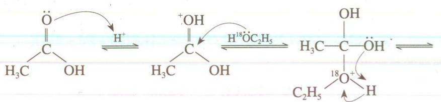

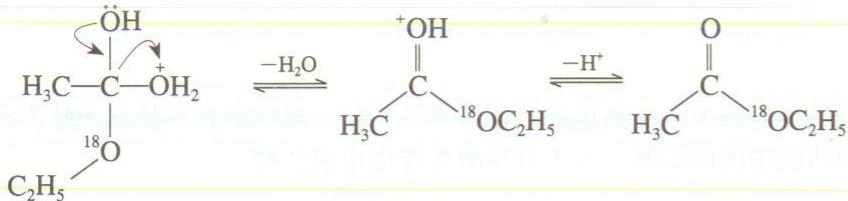

如果通过同位素标记的乙酸（ $CH_{3}CO^{18}OH$ ）来研究断键的规律，反应历程如下所示。

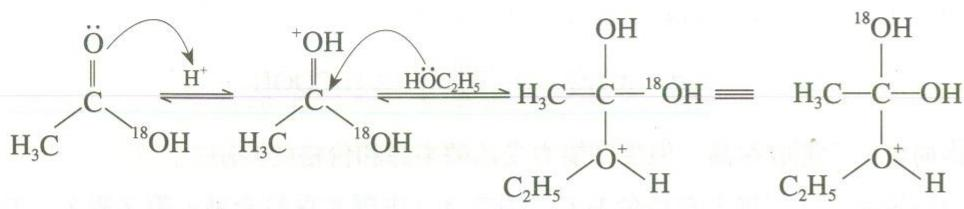  
物质1

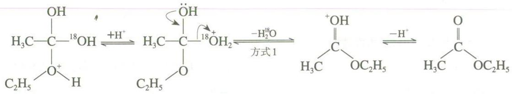  
物质1

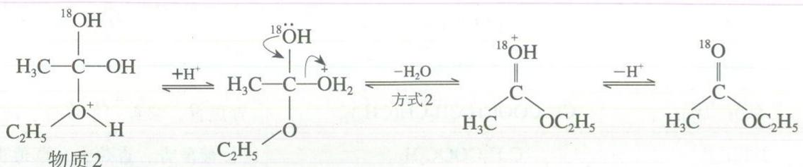

可以看出，物质1和物质2中与 $^{18}$ O相连的C为 $sp^{3}$ 杂化，所以物质1和物质2为同种物质。随机脱去一分子水后， $^{18}$ O可能留在酯中，也可能不在酯中。因此，无法用 $CH_{3}CO^{18}OH$ 来研究酯化反应的机理。

[部分内容摘自：刘帅，蔡小曼，陈建新．同位素示踪法在研究酯化反应机理中的两个疑问．化学教与学，2018(9):30-31]

## 10. 有机合成的分类

人们习惯上将有机合成分为基本有机合成和精细有机合成。基本有机合成又称重有机合成，包括从煤炭、石油、天然气等化石燃料和生物质资源中获得苯、乙炔、乙烯、甲烷、甲醇等重要的化学工业基本原料，进而生产塑料、合成纤维和合成橡胶等大宗有机产品。精细有机合成一般是从较简单的原料合成较复杂的有机分子，如医药、农药、染料、香料和有机功能材料等。

## 11. 计算机辅助有机合成

进行传统的有机合成路线设计，有机化学家需要记住和熟练地应用大量的典型有机化学反应，根据合成原料和目标产物设计合成路线。这是纯经验的过程，合成能否成功在很大程度上取决于有机化学家是否具有经验和智慧。20世纪60年代，化学家科里和他的学生在其提出的“逆合成分析原理”构建复杂分子的基础上，吸收计算机程序设计的思维方法，开发了第一个计算机辅助有机合成程序。计算机辅助设计合成路线的发展，使有机化学家的合成工作从根本上摆脱了纯经验的摸索。

计算机辅助合成路线设计系统分为两类：经验性系统与非经验性系统。经验性计算机辅助合成系统中存储着大量的有机化学反应。当确定了要合成的目标分子结构之后，按一定的规律切断目标分子的一个或几个化学键，使目标分子形成一些较简单的分子片段或化合物。正确的切断对应合理的反应机理，按一定机理切断的键一定会有相应的合成反应。计算机从数据库中查寻可能获得该目标分子结构的前体结构和应该使用的有机化学反应，前体结构可能有几个。在逆向合成

官能团的转化，以适应合成过程中的反应条件，并选择性地进行反应。计算机所找到的前体结构又成为下一步转换反应的目标分子。根据这些前体结构，计算机继续查寻能获得该前体分子结构的有机化学反应，获得新的前体结构。以此类推，直到在数据库中找到的前体结构是易于得到的比较简单的合理起始化合物——合成原料的结构为止。这样便通过逆向推理，逐渐形成了以目标分子为根的“合成树”（图3-6）。

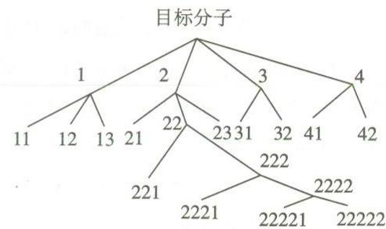  
图 3-6 逆向推理合成树

合成树的每一个结点表示一种化合物，结点之间的连线表示反应路线，一棵合成树表示可由许多可能的反应路线获得目标分子。在实际合成工作中，通常只能从这些可能的路线中选择一两条路线来合成目标分子。这就需要确定若干准则，如技术上成功的可能性、经济上的合理性和学术上的创新性等来评价和筛选合成路线。就像果农修剪果树一样，剪去不好的枝条，留下茁壮的枝条，最终从中选出最合理的合成路线。

非经验性计算机辅助合成系统是应用原子、价键电子和化学结构等信息建立数学模型，由计算机提出许多可能的合成路线。在这些可能的合成路线中，包含了一些没有实际意义的合成路线，准确性较差，但也包含了人们未知的合成路线，能启发人们去发现新的反应。虽然目前该系统仍处于实验室阶段，但其应用的潜力很大。

## 12. 有机合成大师伍德沃德

伍德沃德（R. B. Woodward，1917—1979）生于美国波士顿。自幼爱好化学，在小学和中学时期，经常在家中的地下室进行化学实验。他在16岁时进入麻省理工学院学习，于1937年获得博士学位。毕业后进入哈佛大学执教，1950年被聘为教授。伍德沃德是有机化学界公认的天才、著名的有机合成大师。他致力于有机化合物的合成方法研究，将合成复杂天然产物的工作提升到了艺术的层次。伍德沃德的研究成果被公认为代表着当时有机合成研究的最高水平。1965年，

伍德沃德获得了诺贝尔化学奖。

随着社会的发展，自然资源紧缺问题日渐突出，化学家认识到只有用人工合成的方法创造更多的物质资源，才能解除人类的后顾之忧。维生素、胆固醇和奎宁等有重要药效的化学物质曾经都要从动物、植物等生物体中提取；而红霉素、四环素等抗生素需要利用微生物培养等方法生产，效率较低，往往不能满足人类的需要。1944年，伍德沃德因合成了治疗疟疾的重要生物碱奎宁而崭露头角，使化学界人士刮目相看。经伍德沃德和他的合作者用人工方法合成的还有胆固醇、叶绿素、马钱子碱、利血平、土霉素、四环素、头孢霉素等。这些分子的结构复杂，合成一种分子往往需要几十步的反应。这不仅需要周密详尽的合成路线设计，而且需要正确的理论指导和极为丰富的实践经验。稍有疏忽或不慎，就会使合成工作半途而废。据不完全统计，他合成的各种结构复杂的有机化合物达二十多种，所以他被称为“现代有机合成之父”。

伍德沃德的最高成就则是在他获得诺贝尔奖以后才取得的。获奖后，他并没有因为功成名就而停止工作，他组织十几个国家的上百位化学家协同攻关，探索结构更加复杂的维生素 $B_{12}$ 的人工合成问题。经过长达11年的努力，通过上百步的反应，最终完成了维生素 $B_{12}$ 的全合成。维生素 $B_{12}$ 是所有维生素中分子结构最为复杂的，含上百个原子。维生素 $B_{12}$ 分子中，4个吡咯环组成类似卟啉的平面环，该环中心与一个钴原子结合。该物质受强酸、强碱和高温作用均会分解，这就给人工合成造成极大的困难。伍德沃德设计了拼接式合成方案，即先合成维生素 $B_{12}$ 的各部分，然后再把它们拼接起来。

合成维生素 $B_{12}$ 的过程中，不仅存在创立新的合成技术的问题，还会遇到许多有机化学理论问题。伍德沃德参照了日本化学家福井谦一提出的“前线轨道理论”，和他的学生兼助手霍夫曼一起，提出了分子轨道对称守恒原理，使霍夫曼和福井谦一共同获得了1981年诺贝尔化学奖。

## 13. 补充实践活动参考

## (1) 真假酒的鉴别

可以先将甲醇氧化成甲醛，再利用甲醛的特征反应来鉴别甲醇含量超标的假酒。甲醇在酸性条件下容易被高锰酸钾氧化成甲醛，如果使用磷酸，可得到无色溶液。

$$
5 \mathrm{CH} _ {3} \mathrm{OH} + 2 \mathrm{MnO} _ {4} ^ {-} + 6 \mathrm{H} ^ {+} \longrightarrow 5 \mathrm{HCHO} + 2 \mathrm{Mn} ^ {2 +} + 8 \mathrm{H} _ {2} \mathrm{O}
$$

上述无色溶液中有甲醛存在时，遇到一些试剂将呈现不同的颜色，灵敏度较高。例如，取一定量上述无色溶液，加入新配制的席夫试剂，如有甲醛存在，溶液显紫红色。下面以席夫试剂为例，简单介绍鉴别方法。

## ①试剂配制

席夫试剂：取0.1 g品红，分批加入热水，充分溶解；冷却后取上层清液，加入10 mL 10% $Na_{2}SO_{3}$ 溶液和1 mL浓硫酸，再加水至100 mL，摇匀后加活性炭，过滤。

$KMnO_{4}-H_{3}PO_{4}$ 溶液：取3.0 g $KMnO_{4}$ ，加入15 mL 85% $H_{3}PO_{4}$ 溶液与70 mL水，溶解后加水稀释至100 mL。

$H_{2}C_{2}O_{4}-H_{2}SO_{4}$ 溶液：取 $5.0\ g\ H_{2}C_{2}O_{4}$ （草酸）溶于100 mL 65% $H_{2}SO_{4}$ 溶液。

②实验过程

取甲醇、乙醇样品各1\~2 mL；分别加入3\~4滴KMnO $_{4}$ -H $_{3}$ PO $_{4}$ 溶液，振荡后静置8\~10 min；

再分别加入3\~4滴 $H_{2}C_{2}O_{4}-H_{2}SO_{4}$ 溶液，振荡后溶液褪色；最后，分别加入6\~8滴席夫试剂，混匀，静置半小时后观察现象。甲醇样品呈紫红色，乙醇样品无色。紫红色的深浅取决于样品中甲醇的含量。

## ③实验说明

a. 所需试剂均为新配制，实验过程中切忌受热。

b. 甲醇和乙醇均易被氧化，但生成的甲醛和乙醛结构不同，与席夫试剂显色快慢不一；在酸性条件下，只有甲醛与席夫试剂作用，生成较稳定的有色物质。

c. 醛与席夫试剂显色，必须保证酸性条件。

## (2)乙醇分子中羟基氢原子数的测定

称量一定质量的无水乙醇，使之与足量钠完全反应，通过测定放出氢气的体积计算乙醇分子中活泼氢原子的数目，从而推测乙醇的结构。

实验设计：参考实验装置如图3-7所示。

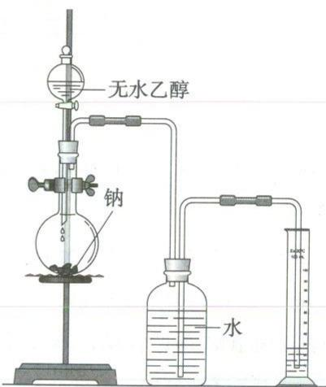  
图 3-7 测定乙醇分子中羟基氢原子数的实验装置示意图

数据记录：乙醇的质量、产生氢气的体积、实验时的温度和压强。

操作要点：从量筒中读取排出水的体积时，应注意上下移动量筒，使量筒内的液面与集气瓶中的液面相平。

结果分析：计算乙醇分子中羟基氢原子的数目，分析可能引起误差的情况，撰写实验报告。

## (3) 白醋中醋酸含量的测定

量取一定体积的白醋，利用中和滴定原理，加入酚酞指示剂，用标准NaOH溶液滴定，根据消耗NaOH溶液的体积计算白醋中醋酸的含量。

实验设计：可参考酸碱中和滴定的实验装置。

数据记录：白醋的体积、达到滴定终点时消耗NaOH溶液的体积、标准NaOH溶液的浓度。

结果分析：计算白醋中醋酸的含量，分析可能引起误差的情况，撰写实验报告。

## 教学案例

# 第二节 醇酚（第1课时）

# 北京市第三十五中学 徐 圆

## 教学目标

1. 通过认识乙醇在生活中的作用，关注社会，并学会利用已知的化学知识解释生活中的实际问题。

2. 通过学习乙醇的化学反应，领悟有机反应的重要特征是官能团的转化，并从断键和成键的角度认识有机化合物间的转化，建立宏观与微观的联系。

3. 通过类比卤代烃的学习方法来推测乙醇的性质，学会应用已知模型解释物质的结构、性质与变化，并得出合理的结论，发展证据推理意识。

4. 通过对乙醇消去反应的发生条件及副反应的学习，领悟化学变化是有条件的，能从不同视角认识化学变化的多样性。

## 教学重点

乙醇的结构特点和主要化学性质。

## 教学难点

依据有机化合物的结构预测其化学性质。

## 教学过程

教学环节一：关注社会热点，引出课题。

<table><tr><td>教师活动</td><td>学生活动</td><td>设计意图</td></tr><tr><td>【引入】乙醇是同学们非常熟悉的有机化合物,也是人类较早认识和利用的有机化合物之一。在我们的日常生活中,在哪里会见到乙醇?它发挥了怎样的作用?【过渡】常用的消毒剂有医用酒精和84消毒液。有人认为如果混用这两种消毒剂会增强消毒效果。你认为这种说法是否正确?要解决这些问题,我们就要在必修阶段所学知识的基础上继续深入学习乙醇的性质。</td><td>【思考,回答】酒类中有乙醇,作为饮料和调味品;汽油中有乙醇,作汽车燃料;医用酒精中有乙醇,作消毒剂。【思考】回忆这两种消毒剂的化学组成,思考混用时可能出现的结果。</td><td>让学生关注社会问题,从乙醇的应用出发,将化学知识应用于生活中,抽象出化学问题,建立学生学习的思维背景。</td></tr></table>

教学环节二：分析结构，预测性质。

<table><tr><td>教师活动</td><td>学生活动</td><td>设计意图</td></tr><tr><td>【任务一】请同学们写出乙烷、溴乙烷和乙醇的结构式,并且搭建三者的球棍模型。【引导分析】请同学们在球棍模型上指出乙醇的官能团。乙醇和乙烷相比,官能团取代了什么原子?【小结】醇的化学性质主要由羟基官能团决定,现在我们来分析在发生化学反应时官能团发生了什么变化。</td><td>【分组活动】搭建乙烷、溴乙烷和乙醇的球棍模型。【回答】官能团是羟基,羟基取代了氢原子。</td><td></td></tr><tr><td>【任务二】1.写出我们学过的有关乙醇的化学方程式。2.搭建以上反应产物的球棍模型,并且分析乙醇的哪些化学键发生了变化。请大家分组完成任务,并且用球棍模型展示反应过程。【引导分析】对比溴乙烷的化学性质,大家推测乙醇可能还有哪些化学性质。【讲述】总结学生的分析。乙醇分子中由于氧原子吸引电子的能力比氢原子和碳原子的强,氢氧键和碳氧键的电子都向氧原子偏移。因此,羟基在发生化学反应时,羟基中的氢原子容易被取代。同样,碳氧键也容易断裂,可以发生取代或消去反应。</td><td>【分组活动】用球棍模型演示乙醇与钠反应、酯化反应、催化氧化反应的过程。分组讨论哪些化学键断裂,生成了哪些新的化学键。【小组汇报】在上面的三个化学反应中,乙醇分子中的氢氧键和羟基所在碳原子上的碳氢键可以断裂。【回答】羟基与碳溴键都是官能团,所以乙醇分子中的碳氧键也可以断裂。推测乙醇可以失去羟基与邻位碳原子上的氢原子,发生消去反应生成乙烯;还可能与其他原子或基团发生取代反应。</td><td>加深学生对乙醇结构的认识,突出官能团的变化,引导学生从化学键断裂和形成的角度认识有机化合物间的转化。通过类比卤代烃的学习方法来推测乙醇的性质。使学生学会应用已知模型解释物质的结构、性质与变化,得出合理的结论。</td></tr></table>

教学环节三：实验验证，关注条件对化学反应的影响。

<table><tr><td>教师活动</td><td>学生活动</td><td>设计意图</td></tr><tr><td rowspan="2">【讲述】根据大家的分析,乙醇分子可以断裂氢氧键和碳氢键,失去氢原子,发生氧化反应。而84消毒液中有强氧化性物质NaClO。它们混合后会发生怎样的变化?乙醇除了可以发生催化氧化反应,还可以被其他强</td><td></td><td></td></tr><tr><td>【思考,回答】它们之间可以发生化学反应,所以两者混合使用会降低杀菌效果。</td><td></td></tr></table>

续表

<table><tr><td>教师活动</td><td>学生活动</td><td>设计意图</td></tr><tr><td>氧化剂氧化。现在,我们用常见的氧化剂酸性重铬酸钾溶液进行验证。【实验验证】乙醇与酸性重铬酸钾溶液反应。【讲述】通过对比结构,同学们推测乙醇分子中的碳氧键也可以断裂,乙醇可能像卤代烃一样发生消去反应和取代反应。下面我们就用实验证明乙醇能否发生消去反应。【实验验证】乙醇的消去反应。1.介绍实验装置与药品,进行实验。2.如何证明不饱和键的存在?3.讨论浓硫酸的作用。【深入分析】在乙醇的消去反应中,要将温度控制在170°C,以减少副反应的发生。在140°C时,乙醇主要发生分子间的脱水反应。</td><td>观察实验,记录实验现象。1.观察,思考,记录实验现象。2.首先除去杂质,然后通过溴水和酸性高锰酸钾溶液的变化来证明。3.浓硫酸的作用是催化剂和脱水剂。【倾听】理解条件对化学反应的影响。</td><td>学生独立思考问题,通过实验验证乙醇的氧化反应。通过实验现象证实了预测,构建“分析结构、预测性质、实验验证”的模型。通过对乙醇消去反应的发生条件及副反应的学习,让学生知道化学变化是有条件的,从不同视角认识化学变化的多样性。</td></tr></table>

教学环节四：学有所感，学有所获。

<table><tr><td>教师活动</td><td>学生活动</td><td>设计意图</td></tr><tr><td>【反思】通过今天的学习,请思考自己通过什么方法学习了乙醇新的化学性质。</td><td>【讨论,发言】先分析乙醇的分子结构特点,并且将其与已学过的卤代烃的分子结</td><td>进一步确立研究物质的方法模型。</td></tr><tr><td></td><td>构进行对比;然后推测乙醇可能具有的新的化学性质;最后用实验证明这些推测的正确性。</td><td></td></tr><tr><td>【总结概括】今天我们运用了“分析结构、预测性质、实验验证”的学习方法,用已有知识引出新的知识,通过比较的方法推测物质的化学性质。大家有哪些收获?</td><td>【回答】在学习新的有机化合物时,要先认清官能团是什么,从化学键断裂和形成的角度分析其性质;还可以用与之结构相似的物质的性质来推测其性质,最后用实验证明。</td><td></td></tr></table>

# 第五节 有机合成（第3课时）

北京市第二中学 白明辉

## 教学目标

1. 通过确定有机化合物的分子结构，巩固官能团的性质及转化。掌握逆合成分析在有机合成中的应用，学会设计有机合成路线，能从宏观和微观视角分析和解决问题。

2. 通过设计特定有机化合物的合成路线，进一步体会逆合成分析在有机合成中的应用，了解合成过程中的官能团保护，提高证据推理水平，培养科学探究精神和创新意识。

3. 通过确定定香剂的结构，探究肉桂醛和特定有机化合物的合成路线，了解有机合成材料的结构修饰，体会化学的学科价值，培养科学态度与社会责任。

## 教学重点

复习有机反应类型、各类有机化合物的性质和相互转化关系；整合各类信息进行成键和断键分析；正向和逆向分析方法在有机合成中的应用。

## 教学难点

应用正向和逆向分析方法，整合各类信息，解决有机合成问题。

## 教学过程

教学环节一：创设情境，确定结构。

<table><tr><td>教师活动</td><td>学生活动</td><td>设计意图</td></tr><tr><td>【引入】介绍定香剂的作用。某有机化合物A常作为花香型香精的定香剂。请学生根据以下信息确定有机化合物A的分子结构。1称取该定香剂晶体17.6g,完全燃烧后产生48.4g $CO_{2}$ 和10.8g $H_{2}O$ 。2A的质谱显示其相对分子质量为176。3红外光谱显示该有机化合物分子中含有甲基、酯基、苯环和碳碳双键。核磁共振氢谱显示有7组峰,强度比为1:2:2:1:1:2:3。4有机化合物A可使溴水褪色,A水解后可生成一种常见的有机酸B。</td><td>【倾听并分析信息】确定定香剂A的实验式、分子式和结构简式,复习确定有机化合物结构的一般步骤。经过计算,确定A的实验式为 $C_{11}H_{12}O_{2}$ 。根据质谱数据,确定实验式即为分子式。根据红外光谱、核磁共振氢谱和化学反应,确定定香剂A的结构简式为[IMAGE]</td><td>回顾确定有机化合物结构的一般方法,利用官能团的化学性质及反应规律帮助学生进行判断,巩固证据推理和模型认知的学科核心素养。</td></tr></table>

教学环节二：明确目标，设计合成路线。

<table><tr><td>教师活动</td><td>学生活动</td><td>设计意图</td></tr><tr><td>【提问】请推测合成有机化合物A的基础原料。已知: $\mathrm{RCHO} + \mathrm{R}'\mathrm{CH}_{2}\mathrm{CHO} \xrightarrow[\Delta]{\mathrm{NaOH}}$ </td><td>【思考,分析】分析A的结构特点,确定断键和成键的位置,结合已有的化学知识和新的反应信息,分析合成A的中间体和原料。</td><td>通过分析有机化合物的结构特点,确定断键和成键的位置,体会有机合成路线的正向和逆向分析方法。</td></tr><tr><td> $\mathrm{R}'$  $\mathrm{RCH}=\mathrm{CCHO}+\mathrm{H}_{2}\mathrm{O}$ 结合以上信息,带领学生体会逆合成分析在有机合成中的重要作用。</td><td></td><td>引导学生正确解读信息,对反应过程的断键和成键情况进行分析,了解官能团保护及选择性还原等方法,深入理解反应的本质。</td></tr></table>

续表

<table><tr><td>教师活动</td><td>学生活动</td><td>设计意图</td></tr><tr><td colspan="3">逆向分析: $\ce{CH=CHCH2OOCCH3} \rightarrow \begin{cases} CH_3COOH \Longrightarrow CH_3CHO \Longrightarrow CH_2=CH_2 \\ \ce{CH=CHCH2OH} \Longrightarrow \ce{CH=CHCHO} \Longrightarrow \ce{CH_3CHO + } \ce{ } \ce{ } \ce{ } \ce{ } \ce{ } \ce{ } \ce{ } \ce{ } \ce{ } \ce{ } \ce{ } \ce{ } \ce{ } \ce{ } \ce{ } \ce{ } \ce{ } \ce{ } \ce{ } \ce{ } \ce{ } \ce{ } \ce{ } \ce{ } \ce{ } \ce{\text{肉桂醇}} \text{ 肉桂醛}$ </td></tr><tr><td colspan="3">目标化合物 → 中间体1 → 中间体2 → 基础原料正向分析: $\ce{ \chemfig{*6(-=-(-CHO)=-=)} + CH_3CHO -> } \ce{ \chemfig{*6(-=-(-CHO)=(-=))-=)}}$  进行选择性还原或官能团保护</td></tr><tr><td>【提问】生成肉桂醇的过程中需要注意什么问题?请书写相关的化学方程式。</td><td>学生审视合成路线,思考可能出现的问题。</td><td></td></tr></table>

教学环节三：整合各类信息，进一步合成材料。

<table><tr><td>教师活动</td><td>学生活动</td><td>设计意图</td></tr><tr><td rowspan="2">【提问】聚乙烯醇缩醛类物质可用于生产黏合剂,请以定香剂A的水解产物肉桂醇和乙酸乙烯酯( $CH_2=CHOOCCCH_3$ )为主要原料合成有机化合物B。B的结构简式如下:</td><td>【讨论】利用正向和逆向分析方法,结合官能团的性质和新的反应信息设计路线,合成目标产物。</td><td>对官能团转化、官能团的保护和合成路线设计进行综合应用,提高学生分析和整合信息的能力。</td></tr><tr><td colspan="2"> $CH_2=CHOOCCCH_3$ ↑↓</td></tr><tr><td>已知:醛与二元醇可生成环状缩醛。RCHO +  $\begin{array}{c}CH_2OH \\CH_2OH\end{array} \xrightarrow{H^+} R-CH \begin{array}{c}O-CH_2 \\O-CH_2\end{array} + H_2O$ </td><td colspan="2">\( \begin{cases} [CH_2-CH]_n &amp; \Rightarrow [CH_2-CH]_n \\ OCH_2 &amp; \Rightarrow \\ CH=CH-CHO \\\hline \\\hline \\\hline \\\hline \\\hline \\\hline \\\hline \\\hline \\\hline \\\hline \\\hline \\\hline \\\hline \\\hline \\\hline \\\hline \\\hline \\\hline \\\hline \\\hline \\\hline \\\hline \\\hline \\\hline \\\hline \\\h line{CH=CH-CHO} \\\hline \\\hline \\\hline \\\hline \\\hline \\\hline \\\hline \\\hline \\\hline \\\hline \\\hline \\\hline \\\hline \\\hline \\\hline \\\hline \\\hline \\\hline \\\hline \\\hline \\\hline \\\hline \\\hline \\\hline \\\h-line{CH=CH-CH_2OH} \\\end{cases}</td></tr></table>

教学环节四：优化结构，修饰改良。

<table><tr><td>教师活动</td><td>学生活动</td><td>设计意图</td></tr><tr><td>【提出新问题】聚乙烯醇缩醛类物质可用于生产汽车安全玻璃的夹层材料,需要有较好的抗氧化能力。请分析已合成的有机化合物B在结构上有哪些不足?应如何改进?</td><td>【思考,分析】不足:碳碳双键易被氧化。改进方法:去掉碳碳双键。</td><td>通过对已合成的有机化合物的结构进行分析,发现结构和性能上存在的不足。借助结构修饰改良性质,得到性能更好的产品。</td></tr><tr><td rowspan="2">【过渡】聚乙烯醇缩丁醛(PVB)的结构如下所示:[IMAGE]它可用于生产汽车安全玻璃的夹层材料和防腐蚀涂料。【提问】请根据已有信息,设计PVB的合成路线。指导学生查阅资料,比较不同的合成路线。</td><td>【质疑】能否从有机化合物B出发,通过官能团转化合成PVB?查阅资料,分析比较,选择合理的路线。</td><td>引导学生在宏观和微观层次上对比和分析物质结构的差异和性能的优缺点,并选择合理的合成路线得到产品,培养其创新精神和严谨的科学态度。</td></tr><tr><td colspan="2">[IMAGE]</td></tr></table>

## 第四章生物大分子

## 本章说明

糖类、蛋白质和核酸这三类物质是生命活动重要的物质基础，它们中有的是重要的生物质资源，有的是生物学、医学和营养学重要的研究对象，与人的生命活动和社会生产息息相关。本章的学习有助于学生更好地从分子水平上认识生命现象的化学本质，体会化学在生命科学发展中所起的重要作用；同时，能够使学生学会从化学的角度认识和分析生活中有关食品营养和卫生健康的问题，并作出有科学依据的判断、评价和决策，感受化学的应用价值和社会意义，培养学生的科学态度与社会责任。

与前几章教材介绍的小分子有机化合物相比，生物大分子的相对分子质量较大，含有多种官能团，结构较为复杂。这样的结构特征使其具有比小分子物质更为丰富的物理、化学和生物学性质，从而使其能够在生物体内完成多种复杂的生理功能。从知识的内在联系看，本章是烃的衍生物知识的延续和发展，从单官能团有机化合物拓展到多官能团有机化合物，从小分子拓展到高分子。同时，本章探讨生物大分子的组成与结构，在此基础上介绍其性质与用途，对前三章的有机化学知识和认识方法进行具体应用，使学生在必修的基础上进一步认识天然高分子，并为第五章学习合成高分子进行充分铺垫。

## 一、教材分析

本章所介绍的生物有机分子与生命活动密切相关，因此教材在每一节的开始，都以该类有机化合物在自然界中的存在方式和在生命活动中的作用作为节引言，引出本节的教学内容。在介绍其组成、分类、结构、性质和用途时，教材仍然遵循前几章介绍烃和烃的衍生物时所使用的学习和认识有机化合物的一般模式，体现物质结构对性质和用途的决定作用。同时，由于单糖、氨基酸和核苷酸都是具有多个官能团的相对复杂的有机化合物，多糖、蛋白质和核酸分别是以上三类较小的有机分子的缩聚产物，教材在介绍生物大分子时，一般先介绍其基本构成单元对应的小分子物质，如葡萄糖和氨基酸。然后按照由简到繁的顺序，依次介绍不同聚合程度的产物，如二糖和多肽，再到多糖和蛋白质。教材根据生物大分子的构成规律，引导学生从不同层次来认识物质，从化学角度来解释生物功能，体现了具有化学学科特征的认识视角与学习视角。

在基本一致的编排思路下，教材根据每节内容的不同，在介绍不同物质类别时各有侧重。第一节涉及的糖类物质较多。由于葡萄糖在自然界分布广泛，且葡萄糖单元是构成多种二糖和多糖的基础，教材以葡萄糖为重点，结合实验，较为详细地介绍其存在、结构、性质和用途。第二节则重点结合官能团分析介绍氨基酸的化学性质，结合用途和生物学功能介绍蛋白质的性质。核酸的组成、结构和功能均较为复杂，部分内容在高中生物课中已有所介绍。因此，第三节侧重从化学的角度，结合分析水解产物来引导学生认识核酸的组成，结合氢键来介绍碱基配对原理。

本章教材的内容结构如下图所示。

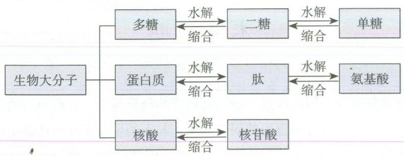

本章涉及的有机化合物较为复杂，认识这些物质的组成和结构，以及各类物质之间的转化关系是本章的重点和难点之一。教材最后的“整理与提升”栏目以框图的形式直观、清晰地呈现以上内容。考虑到多糖、蛋白质和核酸这三类生物大分子作为缩合聚合的产物，在组成、结构和性质上具有一些共同特征，教材中的框图可以使学生通过类比和对比更好地认识这三类物质，通过知识的系统总结达到融会贯通。

## 二、学业要求

1. 能列举典型的糖类物质，说明单糖、二糖和多糖的区别与联系。能探究葡萄糖的化学性质，描述淀粉和纤维素的典型性质。

2. 能说明蛋白质的基本结构特点，辨识蛋白质结构中的肽键，判断氨基酸的缩合产物和多肽的水解产物。能分析说明氨基酸、蛋白质与人体健康的关系。

3. 能辨识核酸中的磷酯键，基于氢键分析碱基的配对原理。能说明核糖对于生命遗传的意义。

4. 能参与营养健康、环境保护等社会性议题的讨论，并作出有科学依据的判断、评价和决策。

## 三、课时建议

第一节 糖类 2课时

第二节 蛋白质 1课时

第三节 核酸 1课时

实验活动3 糖类的性质 1课时

全章复习 1课时

## 第一节 糖类

## 一、内容分析

初中化学和高中化学必修课程都介绍过糖类，但受学生知识基础的限制，相关教材主要从性质与应用的角度来介绍糖类物质。在选择性必修阶段，此前各章的学习已经使学生对有机化合物的结构与性质有了较为深入的认识，接触了含有多个官能团的有机化合物。因此，本节教材较多涉及糖类的结构，主要介绍了单糖（葡萄糖）的结构，并在结构和性质的基础上介绍糖类的用途。

教材以学生较为熟悉的糖类的存在和用途引入教学主题，首先分析糖类化合物的组成，给出糖的定义。其中涉及多官能团有机化合物和缩合反应的概念，为本章接下来介绍氨基酸、蛋白质与核酸进行知识准备。然后，按照从简单到复杂的顺序，依次介绍单糖、二糖和多糖。

葡萄糖是自然界中分布最广的单糖，也与淀粉、纤维素等多糖的结构单元密切相关，因此仍然是本节的重点内容。教材按照中学阶段学习和认识有机化合物的一般顺序，从物理性质、分子结构、化学性质和用途这几个方面较为全面地介绍葡萄糖。其中，结合实验和第三章介绍的醛基的性质推测葡萄糖分子中含有的官能团，再引出葡萄糖的分子结构，体现了研究有机化合物的方法与思路。与必修教材相比，教材在这里给出的葡萄糖、果糖和核糖的结构简式在一定程度上体现了单糖分子的空间结构，与随后的两处“资料卡片”栏目一起，能够使学生对单糖的结构形成更为深入和全面的认识。果糖的性质较为复杂，教材只借助其结构给出酮糖的概念，不涉及化学性质。考虑到课程标准要求认识核酸的结构与功能，高中生物课程也涉及以上内容，教材在本节对核糖与脱氧核糖进行了简单介绍。这些内容与“资料卡片”栏目介绍的“葡萄糖的环状结构”一起，为第三节核酸的学习进行了知识储备。

教材对二糖的介绍较为简略，除了介绍蔗糖和麦芽糖的存在、物理性质和用途，化学性质主要介绍二者在酸或酶催化下的水解反应。这样可以让学生进一步了解经过水解、分解、降解等反应，通过分析产物可以逆推有机化合物的组成与结构这种常用的有机化学研究方法，培养其证据推理意识。同时，由于高中生还难以从结构的角度理解二糖的还原性，教材则结合还原糖和非还原糖的定义，利用学生对葡萄糖还原性的认识，通过实验探究让学生判断蔗糖和麦芽糖是否属于还原糖。为避免将问题复杂化，加重学生负担，这里仍然没有涉及果糖的还原性。

对于多糖，教材选择最重要和常见的淀粉和纤维素作为代表性物质，先简要分析二者在组成和结构上的异同，再以中学阶段认识有机化合物的一般顺序分别进行介绍。淀粉和纤维素的结构较为复杂，教材没有呈现葡萄糖结构单元在化学键层面的详细结构和相互之间的具体连接方式，而是以示意图的形式直观展示直链淀粉、支链淀粉和纤维素的结构，让学生感受它们在结构上的区别。教材对于化学性质，除了讨论与其他糖类物质类似的水解反应和氧化反应，还结合二者结构单元中的羟基介绍在生产中有应用价值的淀粉和纤维素的酯化反应。

本节的教学内容与生产和生活联系紧密，教材在正文以外的资料性栏目中补充了大量相关内容，以体现化学的应用价值。这些资料可以提高学生的学习兴趣，有些内容还可以作为情境素材在教学中使用。

## 二、教学目标

## 1. 教学目标

（1）认识常见糖类代表物的组成、结构和典型性质，能够说明单糖、二糖和多糖的区别与联系，进一步体会“结构决定性质”的学科观念。

（2）了解葡萄糖的结构特点和主要性质，能通过实验探究认识葡萄糖的化学性质。能描述淀粉和纤维素的典型性质，深化对多官能团有机化合物中羟基和醛基性质的认识。

（3）了解淀粉、纤维素与葡萄糖的关系，认识葡萄糖、淀粉和纤维素在人体内的重要生理功能，体会化学科学对健康生活的指导意义。

（4）知道糖类物质在食品加工和生物质能源等方面的应用，能对与糖类相关的社会性议题作出有科学依据的判断、评价和决策，培养科学态度与社会责任。

## 2. 教学重点和难点

重点：葡萄糖、蔗糖、麦芽糖、淀粉和纤维素的组成、典型性质及应用。

难点：从官能团典型性质的角度认识糖类物质与醛、酮、醇类物质的关系。

## 三、教学建议

学生在必修阶段已经对常见的糖类代表物的组成、典型性质及其在日常生活中的应用有了一定的了解，对葡萄糖和淀粉的检验方法也进行了相应的实验探究。因此，在本节的教学中，教师应突出重要糖类物质的结构特征分析，引导学生通过分析实验现象对糖类代表物的结构进行合理预测，结合其结构特征预测、分析其化学性质，并进行实验验证。通过结构特征分析，让学生认识糖类作为多官能团有机化合物，其分子中含有的醛基、羰基、羟基官能团与其化学性质密切相关，进一步深化“结构决定性质、性质决定应用”的学科观念。教学中对果糖、核糖与脱氧核糖的处理可以相对简单，重在让学生了解其结构特点和它们在生命活动中的重要作用，体会化学科学对生命科学研究的重要意义，为第三节“核酸”的学习进行知识铺垫。

## 1. 挖掘实验探究的功能，对比糖类代表物的组成、结构与化学性质

本节教材中，葡萄糖、蔗糖、麦芽糖和纤维素相关性质的探究活动与实验，再加上必修教材中淀粉的检验与水解实验，基本涵盖了探究糖类典型代表物化学性质的实验。挖掘这些丰富的实验素材的功能与价值，引导学生开展实验探究，可以帮助学生充分认识几种糖类代表物的组成、结构及主要性质特点（还原性、水解反应等）。通过对比分析实验现象，学生可以充分认识不同糖类物质结构和性质的异同，认识还原糖与非还原糖的区别，以及二糖和多糖的水解反应。

在进行教学设计时，教师可以对实验素材进行适当整合，在对比实验中让学生进一步体会“结构决定性质”的学科观念。这些实验既可以教师课堂演示，为学生进行理论分析提供实验事实证据；也可以作为学生分组实验，让学生在实验方案的设计与评价、实验现象的观察与分析、实验结论的获得和化学用语表征过程中，认识糖类物质的典型性质，进一步发展学生的科学探究能力与创新意识。具体教学过程可参考以下教学片段。

## (1) 探究葡萄糖的分子结构。

【教师活动】展示葡萄糖实物，介绍葡萄糖的现代提取工艺，提出问题：如何利用化学方法确定葡萄糖的结构简式？

【学生活动】依据分子式推测葡萄糖可能具有的官能团的种类和数目，写出可能的结构简式。

【教师活动】提出探究任务：如何设计实验验证葡萄糖可能含有的官能团？提供相应的试剂： $\mathrm{AgNO}_{3}$ 溶液、稀氨水、 $\mathrm{CuSO}_{4}$ 溶液、 $\mathrm{NaOH}$ 溶液、石蕊溶液等。

【学生活动】根据学过的羟基、醛基、酯基和羧基的性质，选择不同的实验方案进行实验设计与探究，根据实验现象确定葡萄糖分子中存在醛基，不含羧基；通过对比葡萄糖溶液、乙醛溶液分别与新制 $\mathrm{Cu(OH)}_{2}$ 反应时的不同现象，证明葡萄糖是含有多个羟基的醛。

【教师活动】对学生的实验方案和实验过程进行指导，并提供相应的知识支持：多羟基有机化合物与新制 $\mathrm{Cu(OH)}_{2}$ 作用可产生绛蓝色溶液。提出问题：如何测定葡萄糖分子中羟基的个数？葡萄糖的碳骨架结构是怎样的？官能团如何连接？

## 【学生活动】设计方案，写出合理的结构简式。

【教师活动】根据学生的情况，介绍化学家通过钠汞齐还原、与苯肼或羟胺加成、溴水氧化、乙酸酐酰基化等多步反应确定葡萄糖开链结构的科学史实，最后简单介绍葡萄糖的环状结构与链状结构之间的相互转化（见教材“资料卡片”栏目的相关内容）。

葡萄糖的环状结构（半缩醛结构）与其开链结构在水溶液中存在动态平衡。由于这部分内容理论性较强，只需要学生初步认识，不作教学要求。学生能从开链结构的视角理解葡萄糖的相关性质即可。此外，手性碳原子和对映异构现象在单糖中普遍存在，葡萄糖和果糖分子中都有多个手性碳原子，羟基位置不同就会得到不同的单糖。这部分内容难度较大，教学中也不作要求。对此感兴趣的学生可结合“资料卡片”中的相关介绍了解单糖的D构型和L构型。

## (2) 探究蔗糖、麦芽糖、淀粉和纤维素的还原性。

【教师活动】介绍糖类的概念，指出葡萄糖是一种还原糖，提出问题：二糖（蔗糖、麦芽糖）和多糖（淀粉、纤维素）是否也是还原糖？如何设计实验进行验证？

【学生活动】类比葡萄糖还原性的检验方法，自主设计实验探究这4种糖的还原性。通过还原性的比较认识其结构的不同，学会蔗糖与麦芽糖的鉴别方法。

教师在教学中也可以结合教材中的“探究”栏目和本章的“实验活动3 糖类的性质”开展教学，对比几种糖类代表物的物理性质和还原性的差异。

## （3）二糖和多糖水解的实验探究。

二糖和多糖的重要化学性质之一是在酸性条件或酶催化下可发生水解。在教学中可以结合本章“实验活动3”中二糖和多糖水解反应的实验开展分组实验，还可酌情补充淀粉水解程度的探究实验，进一步复习和巩固淀粉及水解产物葡萄糖的检验方法，认识二糖和多糖的水解条件，以及检验水解产物时应注意的问题。

（4）通过表格梳理，对比单糖、二糖和多糖的结构和主要性质。

## 2. 挖掘糖类物质的生命科学价值，构建单糖、二糖、多糖之间的相互转化关系

葡萄糖、核糖、脱氧核糖、淀粉、纤维素等糖类物质在生命活动中具有重要的作用，糖类的代谢与人体的健康密切相关。因此，教学时可以通过有关生命活动或人体健康的真实情境引入本节内容，在真实问题的解决过程中让学生获得糖类性质的相关知识，认识单糖、二糖、多糖之间的相互转化，同时帮助学生形成健康的生活方式。具体教学活动可参考以下内容。

【教学活动1】设置情境：糖尿病患者的体检报告中，葡萄糖浓度的数值明显大于正常值。由此提出问题：如何检验糖尿病患者尿液中是否含有葡萄糖？让学生分组设计实验，认识葡萄糖的还原性及其分子结构中的醛基官能团，认识有机化合物的性质和结构与检验方法之间的关系。

【教学活动2】提出问题：人体内的葡萄糖是从哪里来的，有何生理功能？引导学生认识葡萄糖在人体内的氧化反应为生命活动提供能量；认识人体摄入的其他糖类（蔗糖、麦芽糖、淀粉）在酶的催化作用下逐步水解，最终可生成葡萄糖；了解纤维素不能被人体水解，其主要作用是促进消化和排泄。然后，可以让学生在实验室中进行分组实验，探究蔗糖、淀粉和纤维素在硫酸催化下的水解反应。

【教学活动3】设置情境：某广告宣称某种新型糕点只含面粉、植物油和鸡蛋，不含糖，是糖尿病患者的理想食品。你认为这种说法对吗？为什么？通过问题讨论，使学生进一步认识淀粉与葡萄糖的关系，以及淀粉在人体内的转化过程。然后布置任务：给高血糖症患者制定合理的食谱或给出健康饮食建议。让学生结合教材“资料卡片”栏目了解其他糖类物质和甜味剂，形成健康的生活方式。

【教学活动4】视野拓展：结合“资料卡片”栏目介绍与糖类代谢有关的其他生理现象。学生通过阅读资料，了解一种常见的二糖——乳糖的存在与应用，了解产生乳糖不耐受症的原因，认识生命健康与糖类的关系。

## 3. 利用教材栏目认识糖类物质的工业生产价值，培育正确的科学态度与社会责任意识

糖类物质是现代化工生产中的一类重要原料，教材在“科学·技术·社会”栏目对甜味剂、纤维素和燃料乙醇进行了介绍，在“资料卡片”栏目中对甲壳质的特点和用途也进行了介绍。这些新颖的资料可以拓展学生的视野。在教学设计中，教师可进一步挖掘糖类物质在食品工业和生物质能源开发方面的重要应用和研究成果。例如，教师可从淀粉和纤维素用于生产燃料乙醇出发，引导学生探究该生产过程中发生的物质转化，了解相关糖类物质的组成和化学性质。通过对常见生产工艺流程的简单介绍或资料查询，让学生了解应用淀粉和纤维素等糖类物质制备化工原料的发展前景，认识化学科学在工业生产中的意义和价值，形成节约资源、保护环境的可持续发展意识，促进“科学态度与社会责任”核心素养的发展。

此外，教师也可以让学生开展课外实践活动，围绕自己感兴趣的糖类相关课题开展调查研究活动，撰写研究报告，并进行交流展示。可供参考的实践活动课题如下：我国纤维素乙醇生产工艺的发展及前景；纤维素在制造胶卷、赛璐珞、玻璃纸等产品中的应用；甜酒和香醋在酿造过程中发生的物质变化；淀粉在制备表面活性剂、可降解塑料、高吸水性树脂等方面的应用；甲壳质在生产和生活中的应用等。

具体教学设计可参考以下内容。

【教师活动】简介我国纤维素乙醇产业的发展现状，提出问题：你认为纤维素和淀粉是如何转化为乙醇的？

【学生活动】根据已有的知识分析：淀粉和纤维素可通过逐步水解反应生成葡萄糖，葡萄糖经过微生物作用可以生成乙醇和二氧化碳。

【教师活动】提出问题：如何在实验室中完成纤维素和淀粉的水解？

【学生活动】设计实验方案，探究纤维素和淀粉的水解及水解产物，验证猜想。通过对比二者水解反应的条件，认识淀粉与纤维素的结构差异对水解反应难易程度的影响。

【教师活动】简介我国主要使用的水解工艺和发酵工艺，让学生充分了解纤维素乙醇的生产方法。

## 四、栏目使用建议

## 1. 实验

【实验4-1】

该实验的目的是通过葡萄糖溶液分别与银氨溶液和新制 $\mathrm{Cu(OH)_2}$ 的反应来探究葡萄糖的还原性，进而类比、迁移醛基官能团的化学性质，帮助学生确定葡萄糖的结构简式。因此，教材明确指出与【实验3-7】和【实验3-8】的现象进行比较后得出实验结论。这是对实验功能价值的进一步挖掘。在教学过程中，教师应帮助学生进一步掌握葡萄糖与银氨溶液及新制 $\mathrm{Cu(OH)_2}$ 反应的实验操作要点，同时形成证据推理意识和创新意识。在学生通过实验分析确定葡萄糖的结构简式后，可根据实际情况让学生书写相关的化学方程式。实验注意事项如下。

（1）为保证实验现象明显，操作中所使用的试管必须洁净。试管最好先用NaOH溶液清洗，再用水清洗。

(2) 银氨溶液和 $\mathrm{Cu(OH)}_{2}$ 必须现用现制。反应混合液应及时处理, 不可久置。生成的银镜可用少量硝酸去除。

(3) 向新制 $\mathrm{Cu(OH)}_{2}$ 中加入 $2 \mathrm{~mL} 10 \%$ 葡萄糖溶液时可观察到绛蓝色的澄清溶液, 这一现象与【实验3-8】的现象有所差异。教师可以根据学生的实际情况和教学需要进行适当拓展, 结合选择性必修2教材中配合物的相关内容，介绍多羟基有机化合物遇到新制 $\mathrm{Cu(OH)}_{2}$ 会形成绛蓝色配合物。该现象也可作为葡萄糖分子结构中存在多个羟基官能团的实验证据之一，从而帮助学生认识葡萄糖是一种多羟基醛。

【实验4-2】

该实验的目的是探究纤维素的水解，通过水解产物的检验证明纤维素的水解产物也是葡萄糖，进一步帮助学生认识纤维素与葡萄糖的关系。该实验可与必修第二册教材中的【实验7-8】进行对比，让学生了解淀粉和纤维素水解条件的异同，进一步体会二者分子结构的差异对水解难易程度的影响。实验注意事项如下。

（1）实验中加入浓硫酸的量不能太多，浓度不能太大，否则会使纤维素脱水炭化。硫酸浓度过低则会影响水解反应的速率。该实验所用的硫酸浓度一般为70%\~80%，用量能保证恰好溶解脱脂棉即可。

(2) 为增大反应速率, 防止纤维素部分水解的中间产物附着在纤维素表面, 阻止进一步水解, 影响实验效果, 可水浴加热或小火微热 (注意不要使溶液溅出), 得到亮棕色溶液后再冷却。

（3）可通过稀释水解液，观察是否有沉淀析出判断水解是否完全。若加水稀释无絮状沉淀析出，则说明水解完全。

（4）建议使用较浓的NaOH溶液中和水解液，边加边振荡。该实验也可选用银氨溶液进行水解产物检验，但需注意加碱后溶液的pH不可过高或过低。

## 2. 探究

本探究活动的目的在于让学生应用探究葡萄糖还原性的实验方法，自主设计并完成实验，探究蔗糖和麦芽糖是否属于还原糖。学生根据实验现象认识二者还原性的差异，从而推断其分子结构不同，进一步认识二者互为同分异构体。

教师可以指出葡萄糖是一种还原糖，提出问题：“蔗糖和麦芽糖是否也属于还原糖？如何设计实验方案进行检验？”先让学生根据【实验4-1】中还原糖的检验方法自行设计实验方案进行交流展示，完善实验方案。在交流评价中强调科学探究过程中控制变量进行对比实验的思想和方法，实验中各种试剂的浓度、用量，以及反应时间、反应温度等应尽可能相同，使学生形成严谨的科学态度，学会科学的研究方法。教师根据学生设计的实验方案提供相应的仪器和试剂，让学生带着明确的研究问题和清晰的实验思路进行实验操作，认真观察并及时记录实验现象。对实验过程中的异常现象要进行合理的说明与解释，鼓励学生发现问题和提出问题。

学生根据实验现象得出相应的结论：麦芽糖属于还原糖，蔗糖不属于还原糖。具体的解释涉及葡萄糖单元的环状结构，较为复杂，教学时不宜继续深入。该实验可帮助学生理解蔗糖与麦芽糖互为同分异构体，其分子结构不同，还原性不同，水解反应的产物也不同。实验完成后应引导学生及时对实验操作中应当注意的地方进行梳理，总结实验成败的经验和教训。

进行蔗糖还原性的检验实验时，应注意市售的白糖中常混有少量的葡萄糖等杂质，会导致对比实验失败。因此，该实验最好使用化学纯以上级别的蔗糖试剂，以保证蔗糖的纯度和实验结果的准确性。

## 五、练习与应用参考答案及说明

1. D 
2. C 
3. D 
4. D

5. ①②③⑤

6. $2.39 \mathrm{t}$

7. A: $CH_{2}OH-CHOH-CHOH-CHOH-CHOH-CHO$

B: ${\mathrm{{CH}}}_{2}\mathrm{{OH}} - \mathrm{{CHOH}} - \mathrm{{CHOH}} - \mathrm{{CHOH}} - \mathrm{{CHOH}} - \mathrm{{COOH}}$

C: HOOC-CHOH-CHOH-CHOH-CHOH-COOH

D: ${\mathrm{{CH}}}_{2}\mathrm{{OH}} - \mathrm{{CHOH}} - \mathrm{{CHOH}} - \mathrm{{CHOH}} - \mathrm{{CHOH}} - {\mathrm{{CH}}}_{2}\mathrm{{OH}}$

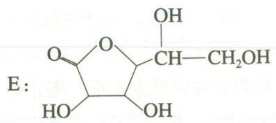

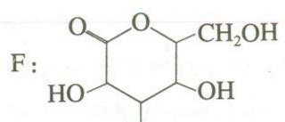  
OH

8. 提示：“无蔗糖食品”不能等同于“无糖食品”。糖类物质的种类繁多，既包括蔗糖，也包括麦芽糖、淀粉等。“无蔗糖食品”所使用的甜味剂对消费者有利有弊，学生根据自己的调查结果提出合理的观点即可。

## 第二节 蛋白质

## 一、内容分析

必修教材已经介绍了氨基酸与蛋白质之间的关系，以及蛋白质的一些性质。选择性必修阶段的教材则在官能团性质、有机反应规律和物质结构等知识的基础上，使学生进一步认识氨基酸和蛋白质的组成、结构、性质、转化和用途。

教材通过蛋白质的生物功能引入课题后，首先介绍形成蛋白质的基础物质氨基酸。考虑到学生已经学习了羧酸、胺和酰胺，教材在分析氨基酸的分类和结构特征后，给出几种简单必需氨基酸的结构简式，让学生在上一节的基础上，分析和预测氨基酸可能的化学性质，进一步基于官能团来认识具有多个官能团的复杂有机化合物。氨基酸的两性体现的是羧酸和胺的性质，学生不难理解。成肽反应实际上是氨基酸之间的缩合反应，其反应形式可以用酯化反应进行类比。通过成肽反应形成的多肽和蛋白质的一级结构，是蛋白质更高级结构及相关性质和功能的基础。

蛋白质的结构十分复杂，而这正是蛋白质具有丰富的物理和化学性质，能够实现多种生物功能的物质基础。教材对蛋白质的结构进行了简单介绍，并辅以各级结构的示意图进行说明。目的是让学生对“结构决定性质”这一化学基本观念的认识，从构成蛋白质的氨基酸的种类、数目和排列顺序这样的平面构造层面（一级结构），上升到空间结构和构象的层面（高级结构）。这样的内容安排，就为教材接下来介绍蛋白质的性质时，让学生从哪一级结构发生变化的角度进行分析奠定了基础，便于学生更好地理解蛋白质的性质与用途。

教材中的科学史话“人工合成结晶牛胰岛素”，介绍我国科学家在蛋白质研究领域取得的成就，对学生进行爱国主义和科学精神教育。同时，也结合科学史给出真实情境，让学生通过文字叙述和图4-13直观感受蛋白质的一级结构，以及一级结构对更高级结构和蛋白质性质的决定作用。教材图4-14给出了真实的科研论文片段，让学生直观感受科研成果的呈现形式，并通过其中的署名和单位让学生了解科学研究中的团结协作精神。其中的部分内容，学生阅读后可以大致理解。这样，在应用本节所学知识的同时，拉近了学生与科技前沿之间的距离，有助于激发学生的学习热情。

学生在必修化学和生物学教材中已经学习了酶的相关知识，因此本节介绍酶主要侧重酶催化反应的特性。最后的“研究与实践”栏目，着眼于原产于我国，并且在工农业生产和人民生活中具有重要作用的大豆，带领学生从化学的角度对其成分、用途和对环境的影响进行分析。该栏目综合应用有机化学知识来分析和解决实际问题，倡导学生关注生产、生活和社会，培养其科学态度和社会责任。

## 二、教学目标

## 1. 教学目标

(1) 通过结构分析认识氨基酸的组成、结构特点和主要化学性质, 知道氨基酸、多肽和蛋白质之间的关系。能判断氨基酸的缩合产物和多肽的水解产物, 从分子水平上认识氨基酸的组成、结构和性质, 进一步深化 “结构决定性质” 的学科观念。

（2）认识蛋白质的组成和性质特点，能辨识蛋白质结构中的肽键，能说明蛋白质的基本结构特点，能分析氨基酸、蛋白质与人体健康的关系，从微观和宏观相结合的视角认识蛋白质的结构与性质。

（3）认识蛋白质空间结构的复杂性和种类的多样性，了解酶催化反应的特点，认识人工合成多肽和蛋白质的意义，体会化学科学在生命科学发展中所起的重要作用。

## 2. 教学重点和难点

重点：氨基酸和蛋白质的结构特点与主要性质。

难点：氨基酸、多肽和蛋白质之间的相互转化关系。

## 三、教学建议

学生在必修阶段的学习中，通过教材的“思考与讨论”栏目初步了解了氨基酸的结构特点，通过实验探究认识了蛋白质的主要性质，学习了蛋白质的重要生理功能和在生产、生活中的主要应用。通过本册教材第三章对羧酸衍生物的学习，学生知道氨基酸作为羧酸衍生物，同时具有氨基和羧基，是一种多官能团有机化合物，具有氨基和羧基的化学性质；也知道氨基与羧基可以发生反应生成酰胺，而酰胺在一定条件下可以发生水解反应。学生已经具备了学习氨基酸、多肽和蛋白质的知识基础。通过高中生物课的学习，学生对氨基酸的组成及结构特点，蛋白质的功能、结构及多样性已有比较详细的了解，但是对氨基酸、多肽和蛋白质的化学性质仍缺乏系统的认识。

## 1. 基于结构分析认识氨基酸的化学性质，体现结构决定性质的学科观念

这部分内容教学的重点是让学生基于分子结构特点分析和预测氨基酸的主要化学性质，认识其化学性质是由氨基和羧基共同决定的，知道肽键的成键原理，建立羧酸、氨基酸、多肽和蛋白质之间结构与性质的关联。具体教学过程可参考以下内容。

## (1) 辨识氨基酸的结构简式, 归纳氨基酸的结构特点。

教师可展示不同有机分子的结构简式，让学生辨识哪些是氨基酸，并说出判断依据。学生通过结构特点分析明确氨基酸的定义，知道 $\alpha$ -氨基酸的结构通式，认识氨基酸是多官能团有机化合物，了解氨基酸分子中存在的手性碳原子和对映异构现象。

(2)结合氨基酸的结构特点认识其主要性质,体现结构决定性质的学科观念。

教学时可设计如下教学活动。

【教师活动】提出思考与讨论任务：请结合氨基酸结构简式中所含有的官能团，推测氨基酸可能具有哪些化学性质。

【学生活动】结合前面所学的氨基和羧基的性质，预测氨基酸可能具有酸性和碱性，能发生酯化反应和成肽反应。写出丙氨酸分别与盐酸、NaOH溶液反应的化学方程式。

【教师活动】提供多个甘氨酸和丙氨酸分子的球棍模型，让学生拼插甘氨酸与丙氨酸反应可能生成的二肽的结构。

【学生活动】根据结构分析拼插不同的二肽分子模型，再根据拼插过程中的成键和断键规律写出甘氨酸与丙氨酸反应可能的化学方程式。通过探讨可能生成的4种二肽的结构，学会辨识肽键，认识成肽反应过程中断键和成键的规律。

【教师活动】增加氨基酸的种类和数目，让学生进一步认识多肽的形成过程，理解从氨基酸到多肽，再到形成蛋白质一级结构的逐步反应过程，知道氨基酸、多肽与蛋白质的关系。同时，也帮助学生认识到多肽和蛋白质结构中仍存在氨基和羧基，因此也具有两性。

在此环节中，可增加以下实验。教师配制味精（谷氨酸单钠盐）的饱和溶液，向其中逐滴加入盐酸。可观察到出现白色沉淀——谷氨酸；将谷氨酸悬浊液分为两份，分别滴加盐酸和NaOH溶液，可观察到沉淀溶解，验证了氨基酸的两性。同时，教师可以引导学生利用生物课上学过的双缩脲试剂设计实验，检验蛋白质中的肽键。

此外，教师还可适当引导学生从分子结构的角度理解氨基酸熔点较高、水溶性较好等物理性质，初步体会有机化合物结构对物理性质的影响。鼓励学生根据教材“信息搜索”栏目对味精的简介进一步搜索相关资料，课下进行家庭小实验，深入认识氨基酸的物理性质和化学性质。

## 2. 挖掘教材栏目资源，认识蛋白质的性质及应用

学生在必修阶段的化学和生物学习中已经初步了解了蛋白质的组成、结构特点及主要化学性质，本节的教学需要让学生通过实验探究深入认识蛋白质的主要化学性质，能够从分子结构的层面解释医疗、生产和生活中一些与蛋白质性质相关的现象和做法。具体教学设计可参考以下内容。

## （1）通过科学史实引入课题。

人工合成结晶牛胰岛素是我国科学家在蛋白质研究领域取得的重大成就。因此，教师在教学中应充分挖掘这一素材的学科价值和人文价值，激发学生的民族自豪感和积极探索未知领域、坚持不懈、严谨求实的科学精神。同时，通过对牛胰岛素一级结构示意图和合成过程的介绍，学生将初步感受蛋白质结构的复杂性和人工合成蛋白质的艰巨性，进一步理解氨基酸、多肽与蛋白质的关系。在教学中，教师可首先展示牛胰岛素的一级结构示意图，让学生辨识两条肽链所对应的氨基酸的种类和数目，初步认识结构中的特殊键——二硫键。再结合教材“科学史话”栏目介绍其生理功能，以及我国在合成结晶牛胰岛素领域所取得的重大成就。教师也可以根据学生的情况选择性介绍多肽合成的常见方法，让学生进一步认识由于多肽合成过程中每一步反应的产物都需要分离提纯，得到纯净产物后再进行下一步反应，因此合成难度大，产率低。先让学生体会科学家合成牛胰岛素的艰辛，再体会固相合成法的优点，让学生了解多肽化学合成法的进步与发展。

教师也可指导学生利用不同的卡片代表不同的氨基酸，或使用球棍模型（也可以用轻质黏土和牙签等代用品）制作牛胰岛素的一级结构模型，加深学生对蛋白质（多肽）合成过程的认识。

## (2) 预测性质，实验验证。

教师提出思考与讨论任务：结合牛胰岛素的结构特点，推测蛋白质可能具有哪些化学性质。学生根据蛋白质的结构和必修课程的知识基础，可以预测蛋白质可能具有两性，肽键可发生水解等性质。然后，学生可利用教师提供的试剂，依据教材中的【实验4-3】【实验4-4】和【实验4-5】进行验证。通过对比实验现象，认识蛋白质的盐析与变性的区别，了解蛋白质的显色反应。教师也可以让学生再次进行蛋白质的灼烧实验，掌握蛋白质的常见鉴别方法。

## (3) 学以致用, 解决问题。

医疗、生产和生活中的很多现象都与蛋白质的性质密切相关，教师可以让学生在认识蛋白质的性质之后，对教材中“思考与讨论”栏目中的问题进行分析解释，加深学生对蛋白质的性质和用途的认识。此外，教师还可以选择更多的素材和情境设置问题，例如：①历史故事——“哑泉”之谜；②如何检验蚕丝被的真伪？③烫发会损伤发质的说法是真的吗？④如何测定牛奶中的蛋白质含量？⑤如何获得蛋白质的结晶？⑥为什么煮熟的鸡蛋容易被消化？⑦松花蛋的制作原理是什么？⑧做胃部透视时服用“钡餐”为何不会中毒？能否改服 $BaCO_{3}$ ？让学生在问题解决过程中深化认识。

## （4）分析空间结构，拓展视野。

教师可结合教材中的蛋白质结构示意图，引导学生认识蛋白质的一级、二级、三级和四级结构的区别与联系，认识氢键在蛋白质空间结构形成过程中的重要作用，进一步理解蛋白质变性与其空间结构变化的关系。同时，教师可介绍手性氨基酸、多肽类药物的合成、HIV蛋白酶抑制剂等科学研究前沿，让学生体会蛋白质研究的意义和价值。

## 3. 与生命科学相结合，通过自主探究认识酶

酶是生物体内各种化学反应的重要催化剂，具有与一般化学催化剂不同的特点：反应条件温和，具有高效性和高度专一性。在教学中，教师可通过对比淀粉在稀硫酸催化和唾液淀粉酶催化下的水解实验，或对比 $MnO_{2}$ 、 $FeCl_{3}$ 、过氧化氢酶催化 $H_{2}O_{2}$ 分解的实验，让学生认识酶催化的特点。同时，也可以结合酶作为催化剂参与反应，与底物结合以降低反应的活化能，提高活化分子的比例等微观过程，帮助学生进一步认识酶催化的专一性和高效性。结合大多数酶是蛋白质的特点，让学生理解酶催化反应条件温和的特点。

学生在生物课的学习中对酶的作用和特点有了一定的了解，因此本部分的教学也可以与生物课程相结合，让学生通过分组查阅资料和交流展示，更加全面地了解酶，多角度感受化学科学为人类社会进步所作出的巨大贡献。可供参考的研究课题如下：

(1) 酶的研究历史与研究前沿;

(2) 酶的主要类型及用途;

(3) 酶的催化原理及反应特点;

(4) 酶在疾病诊断和治疗, 以及生产和生活中的主要应用。

## 四、栏目使用建议

## 1. 实验

## 【实验4-3】

该实验的目的是让学生体会蛋白质的盐析过程，知道盐析的过程是可逆的，蛋白质的结构并未被破坏，因此盐析可用于分离提纯蛋白质。本实验可与蛋白质的变性实验进行现象和原理的对比。实验注意事项如下。

（1）本实验所用的鸡蛋清溶液不能太稀，且要现配现用。为了让盐析后再加水溶解时不出现分层现象，在配制鸡蛋清溶液时，可将取出的鸡蛋清在水中搅拌，充分溶解后，使用铺好湿润的4层纱布的漏斗过滤。

(2) $\left(\mathrm{NH}_{4}\right)_{2}\mathrm{SO}_{4}$ 的盐析效果较好，但必须使用饱和溶液。如果向鸡蛋清溶液中滴入饱和 $Na_{2}SO_{4}$ 或NaCl溶液，实验效果往往不够明显。

(3) 蛋白质的等电点对盐析有影响, 当 $\mathrm{pH}$ 处于鸡蛋清溶液中含量最多的蛋白质——卵清蛋白的等电点范围 (4.5\~4.9) 时, 蛋白质的溶解度最小, 盐析效果较好。若选用其他盐进行盐析时, 应注意调节溶液的 $\mathrm{pH}$ 。

（4）本实验宜在20\~30℃下进行，此时鸡蛋清中蛋白质的溶解度适中，盐的溶解度也较大。【实验4-4】

本实验的目的是让学生认识蛋白质的变性，并与蛋白质的盐析进行对比，让学生认识到当蛋白质在某些物理或化学因素的影响下发生变性时，蛋白质的高级结构已发生变化，加水后沉淀不再溶解，蛋白质的结构与性质已经无法复原。此实验选用学生熟悉的 $\mathrm{AgNO}_3$ 溶液和乙醇进行实验，使学生认识重金属离子和有机化合物所造成的蛋白质变性。此外，在学生实验过程中，教师也可以根据学生的情况增加一些能使蛋白质变性的其他试剂或方法。实验时应注意蛋白质溶液不宜过稀，应现配现用。

## 【实验4-5】

本实验的目的是让学生认识蛋白质的显色反应。当向鸡蛋清溶液中加入少量浓硝酸时会产生白色沉淀，加热后沉淀变黄。这个过程也伴随着蛋白质遇酸发生的变性。产生黄色的原因是硝酸与蛋白质中的苯环发生硝化反应，生成了黄色的物质。学生可以进一步从有机化合物结构的角度认识蛋白质的性质。实验注意事项如下。

（1）实验中如果要观察到先出现的白色沉淀，一次性加入的硝酸不能过多，可逐滴加入，否则蛋白质有可能直接变黄。

(2) 浓硝酸的浓度应不低于 $40\%$ ，实验过程中要注意安全。

## 2. 思考与讨论

## 【思考与讨论1】

通过观察和比较5种氨基酸的结构简式，可以发现其中都有羧基和氨基两种官能团。羧基具有酸性，能与碱发生中和反应生成羧酸盐；而氨基具有碱性，可与酸发生反应生成盐，因此氨基酸具有两性。此外，羧基也可以与羟基发生酯化反应。根据氨基可与羧基反应生成酰胺键，预测氨基酸可以发生分子内或分子间脱水反应生成酰胺。

## 【思考与讨论2】

（1）通过讨论急救时牛奶、蛋清和豆浆解毒的化学原理，可以让学生进一步认识蛋白质变性的危害和解毒的方法，形成解决实际问题的能力，体会化学原理的应用价值。误食重金属盐会导致人体内的蛋白质发生变性而使人中毒。因此，急救时通过口服牛奶、蛋清和豆浆等富含蛋白质的物质进行解毒的原理是使重金属盐与牛奶、蛋清和豆浆中的蛋白质发生变性作用，从而减轻重金属盐对人体的危害。

（2）紫外线和放射线也可以使蛋白质发生变性，因此可使用紫外线和放射线对环境、物品和医疗器械等进行消毒，使细菌和病毒中的蛋白质发生变性而使其死亡。

## 五、研究与实践

大豆是一种富含植物蛋白和油脂的农作物，它还含有糖类及多种具有医疗和保健作用的化学成分，如异黄酮、磷脂、维生素E、甾醇、皂苷等。大豆在我国农业生产和人民生活中具有独特的地位。随着科学技术的进步，大豆的精深加工正在不断深入，但同时也会带来一些对环境的负面影响。因此，指导学生进行综合研究与实践，使其全面认识大豆资源的开发和利用具有积极而重要的意义。

首先，可以让学生通过查阅资料了解大豆的主要化学成分，由此来认识大豆的营养价值和主要用途。可以用图示展示大豆中所含的油脂、蛋白质、多糖、维生素E、异黄酮、磷脂、甾醇、皂苷等主要化学成分的含量和用途，与同学进行交流。

其次，可以让学生从化学的角度对酱油、黄酱、豆豉和腐乳等使用大豆生产的传统食品的生产原理和鲜味来源进行初步解释。学生通过交流讨论，认识到在发酵过程中微生物产生的酶可以将大豆中的蛋白质水解为氨基酸，从而产生鲜味。

最后，可以让学生调查我国大豆的生产、消费与综合利用情况，以及大豆加工过程中产生的副产物和由此引发的环境问题，将相关内容做成展板或电子幻灯片进行交流展示。同时，通过讨论提出大豆资源开发与综合利用的建议。大豆常见的综合利用途径可参考图4-1。

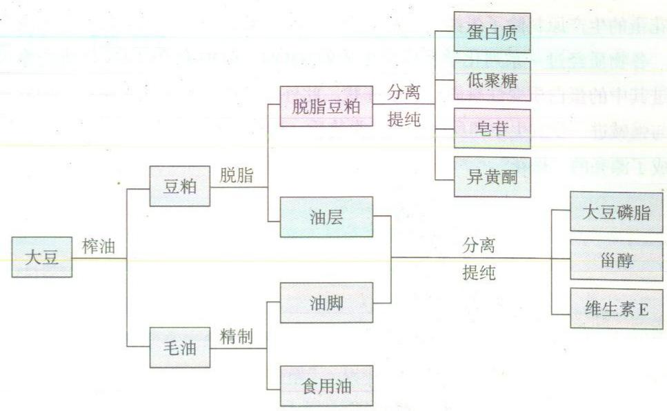  
图4-1 大豆的综合利用途径示意图

## 六、练习与应用参考答案及说明

1. D 
2. A 
3. B 
4. C

5. 蛋白质水解时断裂的化学键是肽键（酰胺键）。

6. 5734

7. (1) $\mathrm{CH}_3\mathrm{-CH} \mathrm{-COOH}$ $\mathrm{NH}_2$

(2) HOOC—CH₂—NH₂

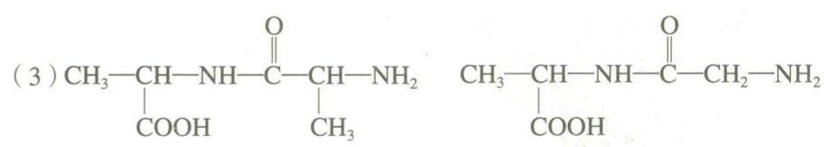

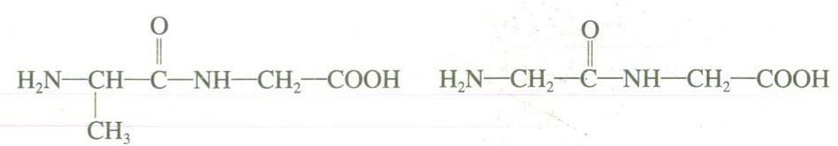

8. 味精的主要化学成分为谷氨酸单钠盐，其结构简式为 $NaOOC-CH_{2}-CH_{2}-CH-COOH$ 。

谷氨酸分子中含有两个羧基，当通过中和反应变为单钠盐时需严格控制溶液的pH，否则有可能被完全中和生成二钠盐。

9. 松花蛋的生产原料除了蛋类, 一般还有生石灰、纯碱、食盐、茶叶、草木灰、稻壳和泥等。各物质经过一系列化学反应后生成的 $\mathrm{NaOH}$ 、 $\mathrm{KOH}$ 和 $\mathrm{Ca(OH)}_{2}$ 经蛋壳渗入蛋清, 可促进其中的蛋白质变性凝固, 呈胶冻状。此外, 蛋白质和脂肪水解产生的氨基酸和脂肪酸与强碱进一步发生中和反应生成盐类物质, 这些盐在蛋白质中以一定形状的结晶析出, 形成了漂亮的“松花”。

## 第三节 核酸

## 一、内容分析

随着时代的发展，核酸在生命科学和医学的研究和应用中发挥着日益重要的作用。根据课程标准的要求，教材单独设立了“第三节 核酸”，从组成、结构和生物功能三个方面来介绍核酸。

核酸的组成较为复杂，教材首先介绍人们认识核酸组成时所采用的方法。让学生进一步认识到，研究复杂的大分子时，可以通过化学反应使共价键断裂，将其分解成较小片段，然后通过分析产物来推测大分子的组成和结构。这一方法在前两节糖类和蛋白质的学习中已有所体现，教材在这里通过正文叙述和图4-15“核酸的水解产物示意图”将其进一步显性化，在介绍相关知识的同时，让学生了解化学研究的方法，以提高其“证据推理与模型认知”的学科核心素养。在根据实验结果进行逆向分析的基础上，教材指出核酸是戊糖、碱基和磷酸这三种基本组分通过缩合反应形成的生物大分子（缩合聚合物），并以示意图的形式直观呈现了核酸与其基本组分之间的转化和层次关系。

学生在高中生物课中学习的DNA双螺旋结构，以及选择性必修2“物质结构与性质”教材中的相关内容，为本节介绍核酸的结构奠定了知识基础。因此，本节教材和教学主要从化学角度分析核酸独特结构的形成原因，通过图4-19展现氢键在DNA形成过程中的作用。教材中的“思考与讨论”栏目让学生通过类比的方法，借助第二节学习的蛋白质、氨基酸和肽键来认识DNA、核苷酸和磷酯键，进一步巩固学生对核酸组成和结构的认识。

## 二、教学目标

## 1. 教学目标

（1）了解脱氧核糖核酸、核糖核酸的结构特点和生物功能；知道核酸与核苷酸、戊糖、碱基、磷酸之间的关系，能辨识核糖核酸、脱氧核糖核酸中的磷酯键；能从结构角度认识核酸分子的形成过程及水解过程。

(2) 了解 DNA 分子中基本结构单元之间的连接方式, 能基于氢键分析碱基配对原理, 形成对 DNA 双螺旋空间结构的整体认知; 初步学会借助宏观实物模型认识生物大分子微观结构的方法, 发展宏观辨识与微观探析的化学学科核心素养。

（3）认识人工合成核酸的意义，体会化学科学在生命科学发展中所起的重要作用；能说出核酸对生命遗传的意义，培养不断探索未知、崇尚真理的科学精神。

## 2. 教学重点和难点

重点：核酸的组成和结构。

难点：DNA 的分子结构。

## 三、教学建议

核酸是一类重要的生物大分子，其特定的碱基排列顺序在生命遗传信息的传递中具有重要的意义。学生通过生物课程的学习知道核酸包括DNA和RNA，知道其基本结构单元为核苷酸，初步了解形成DNA和RNA的碱基存在一定差异，但是对戊糖、磷酸和碱基之间的连接方式，以及DNA双螺旋结构形成时的碱基配对原理缺乏化学的微观层面的认识。因此，本节课的教学应重在引导学生从酸与羟基的酯化反应、羟基与氨基的脱水缩合反应、氢键的形成等化学角度认识核酸的形成过程，体现有机化合物结构对其化学性质的决定作用。同时，也可结合核酸研究史上的重大事件或研究前沿，让学生体会化学在生命科学研究中的重要地位和作用，对学生进行科学态度和社会责任的教育。

## 1. 结合科学史实，基于物质结构认识核酸的组成

核酸组成的发现过程伴随着将其不断水解产生小分子的过程。介绍这一科学史实，可以让学生在真实的科学研究情境中认识核酸的逐级水解产物，从分子结构层面认识DNA与RNA组成的异同。然后，从戊糖、磷酸和碱基所含官能团之间反应的视角，让学生认识三者如何通过形成新化学键生成核苷酸，再通过磷酸二酯键连接，形成多聚核苷酸链，从化学变化的微观视角认识核酸的组成及形成过程。具体教学过程可参考以下内容。

## （1）创设情境，认识核酸的生理功能。

教师可介绍沃森和克里克提出的DNA双螺旋结构被誉为“20世纪最伟大的科学成果之一”，然后提出疑问：“DNA为什么对生命活动如此重要？”从而引出DNA和RNA作为遗传信息的携带者，对遗传信息的传递具有重要的作用。随后展示DNA的分子结构模型，提出问题：“DNA分子的结构单元是什么？”

## （2）简介核酸的发现史，认识核酸的组成。

教师可提供核酸发现过程的相关史料，让学生通过资料中关键信息的提取认识核酸逐级水解的产物，初步认识核酸和核苷酸、核苷、磷酸、戊糖、碱基的关系，了解组成核糖核酸和脱氧核糖核酸的小分子的异同，分析磷酸、戊糖和碱基的分子结构特点。

## （3）基于物质结构，逆向认识核酸的形成。

分析教材“思考与讨论”栏目提供的腺嘌呤核苷和腺嘌呤核苷酸的结构简式，让学生认识戊糖、碱基和磷酸之间是如何相互成键的。学生基于前面所学的官能团性质及成键、断键规律，认识到氨基与戊糖的羟基脱水缩合可形成核苷；核苷中戊糖的羟基与磷酸发生酯化反应可生成核酸的基本结构单元——核苷酸；核苷酸之间进一步脱水缩合形成磷酸二酯键，生成核酸。此时，可引导学生结合科学史和戊糖、碱基、磷酸的结构特点，梳理核酸分子的形成和水解过程。

在教学中，还可以借助教材“资料卡片”中所给出的ATP与ADP相互转化时释放和吸收能量及分子结构变化的示意图，让学生了解高能磷酸键，进一步认识磷酸酯键与磷酸酐键的形成与断裂，使其从化学键的微观角度认识生命体内能量变化的本原。

## 2. 制作简易分子结构模型，认识 DNA 双螺旋结构的特点

DNA的分子结构十分复杂，双螺旋结构的最终确定也经历了曲折的科学研究过程。此部分的教学也可以科学研究的史实为线索，让学生沿着科学家研究的足迹逐步认识DNA的结构。此外，教学中也可引导学生绘制DNA或RNA的结构示意图，进一步体会由简单的戊糖、碱基和磷酸分子形成核酸生物大分子的过程。可以利用硬纸片、轻质黏土、球棍模型等制作DNA双螺旋结构模型，让学生认识单链结构中存在的磷酯键，理解两条单链通过氢键进行碱基互补配对的原理，真正将DNA的双螺旋结构特点外显为宏观认识模型，使学生更好地认识DNA的空间结构特点。在教学中，可以让学生通过教材“思考与讨论”栏目，将DNA分子、核苷酸和磷酯键与蛋白质的相应部分进行类比，进一步深化对DNA分子化学组成和结构的认识。

## 3. 查阅资料，自主学习，认识核酸的生物功能

此部分内容与生物学科联系紧密，学生在生物课中对DNA和RNA在生命遗传中的重要意义已有所了解。因此，这部分内容的教学重在让学生认识人工合成核酸的意义，认识化学科学在生命科学发展中所起的重要作用。学生可通过课下查阅相关资料、展示交流等方式进行学习。以下是可供参考的自主学习主题：我国在核酸研究领域的主要成就；核酸类似物的研究前景；聚合酶链反应技术（PCR）的研究与应用进展；核酸疫苗的研究进展；核酸杂交技术的研究进展；人类基因组计划的研究进展。

## 四、栏目使用建议

## 【思考与讨论1】

腺嘌呤核苷由戊糖中的羟基与含氮碱基（腺嘌呤）中氮原子上的氢原子脱水缩合而成。教材中结构简式左下方的五元环状结构对应戊糖，右上方的含氮杂环部分对应碱基。

腺嘌呤核苷酸是由腺嘌呤核苷中戊糖的羟基与磷酸脱水缩合（酯化）形成的酯。因此，教材中结构简式最左侧的部分对应磷酸，中间的部分对应戊糖，右上方含氮杂环部分对应碱基。

## 【思考与讨论2】

不同氨基酸分子中的氨基与羧基通过脱水缩合生成肽键，相互连接形成多肽，多肽通过盘曲折叠形成具有一定空间结构的蛋白质。因此，DNA分子对应蛋白质分子；核苷酸是形成核酸的基本结构单元，对应形成蛋白质的基本结构单元氨基酸；磷酯键则与肽键相对应。

## 五、练习与应用参考答案及说明

1. 核苷酸 磷酸 戊糖 碱基 核糖核酸 脱氧核糖核酸

2.（1）由两条多聚核苷酸链组成，具有双螺旋结构。

（2）脱氧核糖、磷酸、碱基；在图4-19中，脱氧核糖和磷酸交替连接，排列在外侧，碱基互补配对，排列在内侧。

(3) 腺嘌呤、鸟嘌呤、胞嘧啶、胸腺嘧啶; 碱基之间通过氢键相互作用, 进行互补配对。

3. 蓝色球体代表磷酸，五边形代表脱氧核糖，红色和绿色六边形代表嘧啶，橙色和浅蓝色多边形代表嘌呤。氢键对应内侧碱基之间的连线，磷酯键对应外侧的球体和五边形之间的连线。

4. 胸腺嘧啶占 $32\%$ ，鸟嘌呤占 $18\%$ ，胞嘧啶占 $18\%$ 。

## 复习与提升建议

## 一、复习与提升教学建议

多糖、蛋白质和核酸是三类具有重要生理功能的生物大分子，它们都是由小分子单体通过脱水缩合反应得到的，而这三类生物大分子均可在一定条件下发生水解反应生成对应的小分子单体。教材中的“整理与提升”部分，首先让学生在单糖、二糖和多糖结构与性质的学习之后，构建三者之间的相互转化关系，促进学生对糖类物质认识的系统化和结构化。然后，“整理与提升”引导学生在归纳氨基酸、多肽和蛋白质的结构、性质及相互转化关系的基础上，关注三者结构中共同含有的官能团——氨基和羧基，进而认识其共性——两性；同时，基于蛋白质特殊的结构认识其特性——变性、盐析和显色反应。最后，“整理与提升”将DNA与RNA进行对比，让学生充分认识二者在结构方面的异同；建立戊糖、碱基和磷酸这三种小分子与两种大分子之间的相互转化关系；认识核苷酸形成多聚核苷酸链时生成的磷酯键，以及DNA双螺旋结构形成时氢键的作用和氢键对生物大分子空间结构的重要意义。

通过本章“整理与提升”的教学，学生应能够基于糖类、蛋白质、氨基酸、核酸代表物的结构特征辨识其所属的物质类别，从分子结构特征的角度进一步梳理其主要性质，构建三类生物大分子与小分子单体之间的转化关系图。因此，在复习课教学中可以让学生画出糖类、蛋白质和核酸的思维导图，并进行交流、展示、评价和补充，自主构建生物大分子与对应的小分子单体之间的转化关系。同时，引导学生关注葡萄糖、氨基酸、核苷酸均属于多官能团有机化合物，从多官能团物质之间可以通过缩合反应形成大分子这一特点出发，让学生初步认识合成高分子的一种重要方法——缩聚反应，为第五章合成高分子的学习奠定知识、方法和思维的基础。教学时对生物大分子及其单体在空间结构方面的特殊性，如对映异构现象、氢键作用等也应予以关注。此外，在学完本章内容之后，教师可指导学生结合生物课程的学习开展实践活动或深度学习，进一步深化对生物大分子结构、性质和生理功能的认识。具体教学建议如下。

1. 构建小分子与大分子之间的转化关系，建立对糖类、蛋白质和核酸的系统认识教师可指导学生围绕以下三个方面梳理相关物质间的转化关系。

（1）基于淀粉在人体内的消化水解过程或者谷物酿酒等真实情境，构建糖类中单糖、二糖和多糖代表物之间的转化关系，建立对糖类物质的系统认识。

（2）基于有机化合物分子结构特征的分析，建立氨基酸、多肽和蛋白质三者之间的转化关系，认识三者性质的异同。

(3) 由戊糖、碱基和磷酸之间的脱水缩合反应认识核苷、核苷酸和核酸的形成与水解反应, 建立生物大分子的认知模型。

## 2. 基于结构分析认识脱水缩合的成键和断键规律，基于氢键认识生物大分子的结构和性质

单糖、氨基酸、碱基和磷酸各自具有特殊的官能团，不同官能团之间以不同方式进行脱水缩合，进而形成生物大分子。在复习阶段，教师应引导学生从官能团的角度进行有机化合物的结构分析，关注脱水过程中的成键、断键位置和反应规律，逐步认识含有两个或两个以上官能团的物质之间可以通过连续的脱水缩合反应形成大分子化合物，为第五章合成高分子的学习进行知识和方法的铺垫。此外，蛋白质空间结构的形成和DNA中碱基配对形成双螺旋结构都与氢键密切相关，单糖、二糖和氨基酸的水溶性与其分子能与水分子形成氢键有关，生物大分子的化学性质，如蛋白质的变性等也与氢键有关。因此，在复习阶段除了引导学生关注生物大分子中特殊的化学键对物质性质的决定作用，还要关注氢键对物质的结构和性质的影响。另外，生物大分子及其结构单元——单糖、氨基酸大都存在对映异构现象，对映异构体的生物活性存在较大的差异。在复习阶段，教师可通过具体的实例，如手性氨基酸和手性药物等，让学生真正体会“结构决定性质”的学科基本观念。

## 3. 开展学生实践活动，学以致用

淀粉、纤维素、蛋白质和核酸等生物大分子在生产和生活中具有重要而广泛的用途，如生物质能源开发、天然高分子改性和生物药物的研发等。因此，在复习阶段可以组织学生开展实践活动，应用所学的生物大分子知识进行实践，加深对其性质、转化和检验等的认识。教师可指导学生利用家中常见的物品开展家庭小实验。例如，鸡蛋清溶液的盐析和变性，用面粉提取蛋白质制作面筋，用豆浆制作豆腐，制作米酒或果酒，等等。此外，也可以让学生结合自己的兴趣爱好，对与本章知识相关的小型课题进行深入探究，通过查阅资料制作相应的海报，并进行交流展示，以拓展学生的视野。

## 二、复习与提高参考答案及说明

1. B 
2. B 
3. AC 
4. B 
5. B 
6. A 
7. C

$$
\begin{array}{c c} 8. & \mathrm{R-CH-COOH} \\ & \mathrm{|} \\ & \mathrm {NH_ {3} Cl} \end{array} \quad \begin{array}{c c} & \mathrm{R-CH-COONa} \\ & \mathrm{|} \\ & \mathrm {NH_ {2}} \end{array}
$$

9.（1）用三支试管分别取少量样品，再分别加入碘水，显蓝色的为淀粉溶液。

(2) 另取少量加碘水无明显现象的两种溶液, 加入新制 $\mathrm{Cu(OH)}_{2}$ , 加热, 出现砖红色沉淀的为葡萄糖溶液, 无明显变化的为蔗糖溶液。

$$
1 0. (1) \mathrm {(C_ {6} H_{10} O_ {5}) _ {n}} + n \mathrm {H_ {2} O} \xrightarrow {\text {酶}} n \mathrm {C_ {6} H_{12} O_ {6}}   \text {淀粉} \quad \text {葡萄糖}
$$

$$
\begin{array}{r l r} {(2) (\mathrm {C_ {6} H_{10} O_ {5}}) _ {n} + n \mathrm {H_ {2} O} \xrightarrow {\text {酸或酶}} n \mathrm {C_ {6} H_{12} O_ {6}}} & {} & {\mathrm {C_ {6} H_{12} O_ {6}} \xrightarrow {\text {酶}} 2 \mathrm {C_ {2} H_ {5} OH} + 2 \mathrm {CO_ {2}} \uparrow} \\ {\text {纤维素}} & {} & {\text {葡萄糖}} \\ & {} & {\text {葡萄糖}} \end{array}
$$

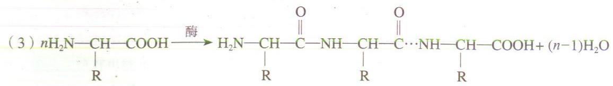

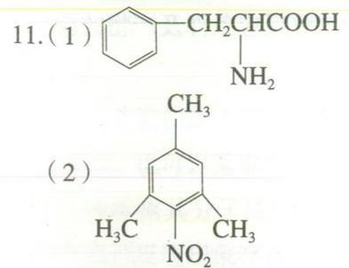

12.(1) ${\mathrm{{CH}}}_{2}\mathrm{{OH}} - \mathrm{{CHOH}} - \mathrm{{CHOH}} - \mathrm{{CHOH}} - \mathrm{{CHO}}$

$$
(2) \mathrm{CH} _ {2} \mathrm{OH} - \mathrm{CHOH} - \mathrm{CHOH} - \mathrm{CHOH} - \mathrm{CH} _ {2} \mathrm{OH} \quad \mathrm{c}
$$

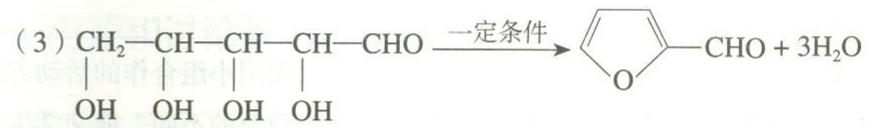

## 实验活动3 糖类的性质

本实验活动的目的是加深学生对葡萄糖、蔗糖和淀粉等糖类代表物的物理性质和化学性质的认识，帮助学生掌握糖类物质还原性的检验方法，认识多糖的水解反应条件及产物的检验方法，理解糖类性质与其结构的关系。

## 一、活动安排建议

葡萄糖、蔗糖和淀粉是学生在日常生活中常见的糖类物质，学生对其物理性质有一些直观的认识。可以让学生分组对三种物质的状态和水溶性进行对比研究，还可以根据学生的情况增加葡萄糖和蔗糖加热熔化的实验。

这三种物质化学性质的实验是还原性的检验和水解反应，建议采用小组合作的活动方式，让学生在活动中记录实验现象并进行解释。三种物质与相同试剂反应现象的不同，能使学生更好地认识它们在结构和化学性质上的差异。

葡萄糖化学性质的实验可以使学生进一步掌握银氨溶液的配制要点和 $\mathrm{Cu(OH)_2}$ 悬浊液的制备方法，以及糖类还原性的检验方法。向新制 $\mathrm{Cu(OH)_2}$ 中加入葡萄糖溶液会得到绛蓝色溶液，可借此对学生进行知识拓展，介绍多羟基醇的检验方法，使学生认识葡萄糖为多羟基醛的结构特点。

蔗糖和淀粉的水解实验可以让学生根据反应原理自主设计实验步骤，然后交流讨论，在教师指导下进一步完善，明确操作要点后进行分组实验。此外，根据学生的实际情况，可以增加麦芽糖还原性的检验实验。通过对比实验现象，让学生认识蔗糖和麦芽糖在结构和性质上的差异。还可以进一步探究硫酸浓度对蔗糖水解反应的影响，淀粉水解程度或水解速率的影响因素，以及淀粉的最佳水解条件，提高学生的实验探究能力。也可以结合酶的催化反应特点，探究温度对唾液淀粉酶催化淀粉水解反应的影响，并将酶催化与酸催化进行对比。

## 二、注意事项

## 1. 葡萄糖

(1) 为使实验现象更明显, 所用试管应洁净, 银氨溶液和 $\mathrm{Cu(OH)}_{2}$ 应现配现用。配制时试剂用量应准确把握。实验结束后产生的银镜应及时用稀硝酸处理。

(2) 加热时要注意操作安全。新制 $\mathrm{Cu(OH)}_{2}$ 与葡萄糖溶液混合后加热的过程中会出现一系列颜色变化, 感兴趣的学生可以在教师指导下查阅相关文献。

## 2. 蔗糖

（1）市售白糖中可能含有少量葡萄糖和果糖，在进行还原性检验时可能会产生异常现象，建议选择化学纯以上级别的蔗糖试剂进行实验。

(2) 向蔗糖和淀粉溶液中加入新制 $\mathrm{Cu(OH)}_{2}$ , 加热后未出现砖红色沉淀, 说明蔗糖和淀粉是非还原糖。继续加热有可能出现黑色固体, 这是 $\mathrm{Cu(OH)}_{2}$ 受热分解产生的 $\mathrm{CuO}$ 。

(3) 醛基的检验应在碱性环境中进行, 因此在检验水解产物的实验中, 要让学生认识到向水解液中加入 $\mathrm{NaOH}$ 溶液将 $\mathrm{pH}$ 调至碱性的必要性。操作时可用 $\mathrm{pH}$ 试纸测定溶液的 $\mathrm{pH}$ 来确定碱是否足量。

## 3. 淀粉

（1）为提高淀粉的水解程度并减少反应时间，可以适当增加 $H_{2}SO_{4}$ 溶液的浓度。在加热过程中要注意安全，也可以采取90℃左右的水浴加热。

（2）淀粉根据其分子结构的不同可分为直链淀粉和支链淀粉，两种淀粉的溶解性、水解速率、与碘的显色反应现象存在一定差异。实验时可选用分析纯的可溶性淀粉。

## 三、问题和讨论答案或提示

1. 在糖类化学中, 常用银氨溶液或新制 $\mathrm{Cu(OH)}_{2}$ 等试剂检验糖的还原性, 能够还原这些试剂的糖被称为还原糖, 不能还原的被称为非还原糖。在上述三组实验中, 葡萄糖溶液与新制 $\mathrm{Cu(OH)}_{2}$ 混合加热后可产生砖红色沉淀, 说明葡萄糖是还原糖; 蔗糖溶液、淀粉溶液均不与新制 $\mathrm{Cu(OH)}_{2}$ 在加热时发生氧化还原反应, 说明蔗糖和淀粉是非还原糖。

2. 蔗糖和淀粉水解的化学方程式分别为：

$$
\begin{array}{c c c} \mathrm{C} _ {1 2} \mathrm{H} _ {2 2} \mathrm{O} _ {1 1} + \mathrm{H} _ {2} \mathrm{O} & \xrightarrow {\text {酸或酶}} & \mathrm{C} _ {6} \mathrm{H} _ {1 2} \mathrm{O} _ {6} + \mathrm{C} _ {6} \mathrm{H} _ {1 2} \mathrm{O} _ {6} \\ \text {蔗糖} & & \text {葡萄糖} \quad \text {果糖} \end{array}
$$

$$
\begin{array}{c} (C _ {6} H _ {1 0} O _ {5}) _ {n} + n H _ {2} O \xrightarrow {\text {酸或酶}} n C _ {6} H _ {1 2} O _ {6} \\ \text {淀粉} \end{array}
$$

葡萄糖分子进入人体后，在酶的作用下可直接氧化分解提供能量。而其他的糖类，如淀粉、蔗糖等在人体中不能直接被氧化，需要先经过酶的作用，水解为葡萄糖之后才能为人体提供能量。

## 教学资源

## 1. 对映异构体

对映异构体简称对映体，互为对映体的两个分子不能重叠，互为实物与镜像的关系。这样的现象也被称为手性。分子中的手性因素主要有手性中心、手性轴和手性面。例如，乳酸的一对对映体，其分子中都存在手性中心（手性碳原子），但手性中心的构型不同。通常用基于顺序规则的R/S系统来区分对映体的绝对构型，而糖类、氨基酸等天然产物习惯上用D/L标记对映体的相对构型。

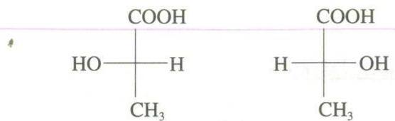  
乳酸

联苯类化合物，即使分子中存在两组相同的取代基，只要取代基有足够的体积（如a为硝基，b为羧基），便会阻碍两个苯环自由旋转，导致分子中存在手性轴，形成一对对映体。另一种情况是分子中存在手性面，如柄型化合物的“柄”链在一定长度内，苯环就不能在“柄”链中旋转，在苯环上只要有一个取代基就可以形成一对对映体。

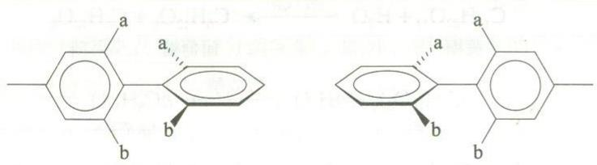  
取代联苯类化合物（取代基 $a \neq b$ ）

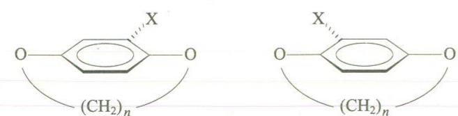  
取代柄型化合物

在非手性条件下，一对对映体的化学和物理性质基本相同。由于生物体内的受体和酶一般具有手性，对映体的生物活性往往不同。对映体具有旋光活性（曾被称为光学活性），可以使入射的平面偏振光的偏振面发生旋转。在给定条件下，引起顺时针旋转的称为右旋体，逆时针旋转的称为左旋体，一般在其名称前分别加上 $(+)$ -或 $(-)$ -加以区分。一对对映体的比旋光度数值相同，旋光符号相反。对映异构体或非对映异构体之间通常旋光符号相反或数值不同，因此被称为旋光异构体。但旋光异构体不是一个十分准确的术语，全国科学技术名词审定委员会2016年公布的《化学名词》不建议使用该词。

葡萄糖的分子式为 $C_{6}H_{12}O_{6}$ 。人们通过一系列实验证明葡萄糖是一个五羟基己醛，属于己醛糖。己醛糖分子中含有4个手性碳原子，它应具有16(2 $^{4}$ )个对映异构体。按照习惯，糖分子的构型仍采用D/L标记，将糖分子中编号最大的手性碳原子（第5号碳原子）与D-甘油醛构型相同者称为D型，与L-甘油醛构型相同者称为L型。所以，己醛糖的16个对映异构体中，有8个为D构型，8个为L构型，形成8对对映体。自然界中存在的糖一般为D构型。

## 2. 葡萄糖的环状结构

D-葡萄糖在水溶液中会产生变旋现象，从水溶液中结晶出来的D-葡萄糖（无结晶水）的熔点为146℃。用它新制的D-葡萄糖水溶液，其比旋光度开始为+112°，经放置后，比旋光度逐渐下降，直到恒定的平衡值+52.7°。如将此溶液浓缩，又得到D-葡萄糖晶体，仍具有原来的熔点。如用此D-葡萄糖晶体的浓的水溶液在110℃结晶，或在醋酸中结晶，则得到另一种D-葡萄糖，其熔点为148\~150℃。它在水中的比旋光度开始为+18.7°，经放置后，比旋光度逐渐上升，最后同样也得到恒定的平衡值+52.7°。此外，它还具有以下特性：①葡萄糖含有一个醛基，但它只能与一分子醇形成半缩醛；②葡萄糖不与 $NaHSO_{3}$ 反应，不能形成醛基与 $NaHSO_{3}$ 的加成物；③葡萄糖在红外光谱中没有羰基的伸缩振动信号，在核磁共振氢谱中也没有醛基质子的吸收峰。用葡萄糖的链式结构无法解释上述各种特性。

人们通过深入研究，并从醛与醇反应生成半缩醛的实验事实得到启发。葡萄糖分子中同时存在着醛基和羟基，可以发生分子内反应，生成具有半缩醛结构的环状化合物。利用现代仪器分析方法已经证实，D-葡萄糖一般是以第5号碳原子上的羟基与醛基反应，以含氧六元环的半缩醛形式存在。当糖分子以六元环形式存在时，与六元杂环吡喃相似，称为吡喃糖；以五元环形式存在时，与五元杂环呋喃相似，称为呋喃糖（图4-2）。

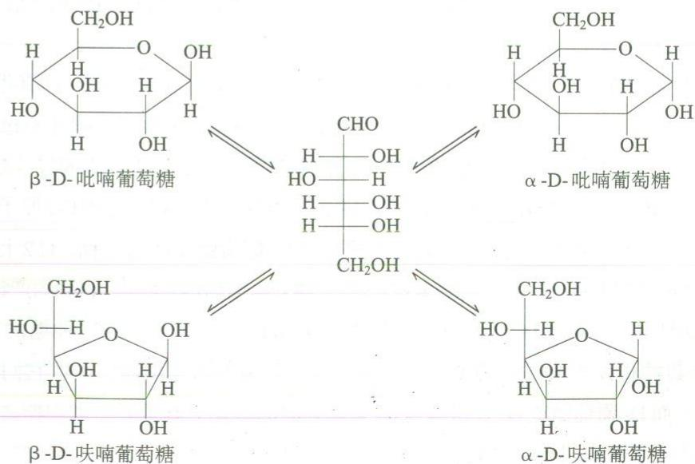  
图 4-2 葡萄糖在水溶液中的异构现象

在葡萄糖的开链结构转变为环状结构的过程中，醛基碳原子由 $sp^{2}$ 杂化转变为 $sp^{3}$ 杂化，由非手性碳原子转变为手性碳原子。新生成的半缩醛羟基在空间有两种取向，产生两种光学异构体。其中半缩醛羟基（也称苷羟基）与决定构型的第5号碳原子上的羟甲基位于异侧者，称为 $\alpha$ 型；与决定构型的第5号碳原子上的羟甲基位于同侧者，称为 $\beta$ 型。 $\alpha$ 型和 $\beta$ 型为非对映异构体，仅是顶端碳原子构型不同。这种有多个手性碳原子的非对映异构体，只有一个碳原子的构型不同，而其他碳原子的构型完全相同者，称为差向异构体。

在D-葡萄糖的平衡体系中，吡喃葡萄糖的比例大于99%，其中α-D-吡喃葡萄糖约占36.4%，β-D-吡喃葡萄糖约占63.6%，链状葡萄糖含量极少。利用葡萄糖的环状结构可以圆满地解释其变旋光现象和某些化学性质。由于葡萄糖具有两种环状结构，在一定的条件下可分别获得α-D-吡喃葡萄糖和β-D-吡喃葡萄糖结晶。它们在固态是稳定的，具有各自的熔点。但在水溶液中，两种环状结构可以通过开链结构相互转化，最后达到三种结构按一定比例同时存在的平衡状态，该平衡状态的混合溶液比旋光度为+52.7°。

为了更真实地表示单糖分子的环状结构，以及分子中各原子及基团之间的相对位置，单糖分子的环状结构一般用霍沃思（Haworth）透视式来表示。霍沃思透视式的写法是将环的平面垂直于纸平面，粗线表示在纸面的前方，细线表示在纸面的后方；习惯上将六元环中的氧原子放在纸面的后方，将葡萄糖开链结构中位于碳链左侧的氢和羟基写在环平面的上方，位于碳链右侧的氢和羟基写在环平面的下方。D型糖与L型糖用霍沃思透视式表示时，其区别在于第5号碳原子上的羟甲基的方位。如果成环碳原子按编号由小到大顺时针排列，写在环平面上方者为D型，在平面下方为L型；α型与β型的区别在于半缩醛羟基的方位，半缩醛羟基与羟甲基在环的异侧的为α型，在环的同侧的为β型。除了葡萄糖，果糖、核糖和脱氧核糖也存在着环状结构。

[部分内容摘自：邢其毅，裴伟伟，徐瑞秋，裴坚．基础有机化学：下册（第3版）．北京：高等教育出版社，2005:937-939]

## 3. 单糖的差向异构化与糖的还原性

在碱性条件下，D-葡萄糖、D-甘露糖和D-果糖可以通过烯二醇中间体相互转化，变成三种糖的平衡混合物。

葡萄糖中第2号碳原子（C-2）上的氢原子受羰基和羟基的双重影响，具有很大的活泼性，在弱碱的作用下可以质子化，葡萄糖分子转变为烯醇式中间体。烯醇式中间体不稳定，可进行异构化重排反应。当C-1羟基上的氢发生重排时，可从双键所在平面的不同方向进攻C-2原子，即按图4-3中(a)箭头和(b)箭头两个方向，分别从双键平面后方和前方进攻，加到C-2原子上。氢原子进攻的方向不同，形成的C-2原子的构型不同，分别得到D-葡萄糖和D-甘露糖。C-2上的羟基同样是烯醇式羟基，也可以发生重排，当该羟基氢按(c)箭头的方向加到C-1上时，得到的产物为D-果糖。

用稀碱处理D-甘露糖或D-果糖时，通过相似的途径同样可以得到三种糖的互变平衡混合物。因为D-葡萄糖和D-甘露糖仅在C-2位构型不同，互为差向异构体，所以它们之间的转化称为差向异构化。而D-葡萄糖或D-甘露糖与D-果糖之间的转化，则是醛糖和酮糖之间的转化。在生物体酶的催化下也可以进行上述转化。

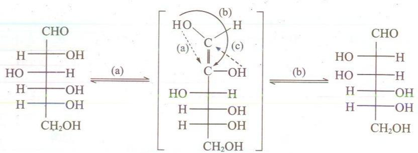  
D-葡萄糖  
烯二醇  
D-甘露糖  
图 4-3 几种单糖的相互转化

实验室中常用托伦试剂（Tollen reagent，曾被译为土伦试剂，即银氨溶液）、本尼迪克特试剂（Benedict reagent，俗称班氏试剂，由硫酸铜、柠檬酸钠和碳酸钠等配制而成），以及费林试剂（Fehling reagent，曾被译为菲林试剂、斐林试剂，由酒石酸钾钠、氯化铜和氢氧化钠等配制而成）检测醛和糖的还原性。能够还原这些试剂的糖被称为还原糖，不能还原的被称为非还原糖。葡萄糖、核糖、脱氧核糖等醛糖是还原糖，除蔗糖外的很多二糖也是还原糖，淀粉、纤维素等多糖为非还原糖。有研究认为，单糖与以上氧化剂反应时，首先在碱催化条件下异构化生成烯二醇，然后再与氧化剂反应。单糖的烯醇化过程是单糖氧化反应决定速率的步骤。果糖在碱性条件下可以发生烯醇化，烯醇化速率比葡萄糖的大，因此果糖是还原糖，而且在与上述氧化剂反应的过程中比葡萄糖更活泼。

[部分内容摘自：苏桂发，牛雪梅．果糖的氧化与烯醇化．化学通报，1995(8)：55-56]

## 4. 蔗糖的甜味

人们通常用舌尖感觉甜味。有一种联系到分子结构的甜味理论，认为许多有甜味的化学物质分子中存在着距离为0.3 nm的两个能形成氢键的基团，这两个基团必须是分离的而不致互相结合。人的舌上有配合形成氢键的结构（图4-4）。当甜味物质的一部分基团与舌上的相应结构作用时，人的神经细胞就传出一系列信息，使人感觉到甜味。蔗糖和糖精的甜味基团如图4-5所示。

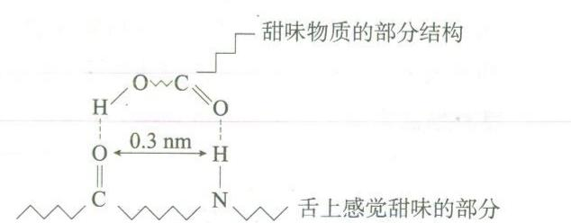  
图 4-4 甜味感觉的示意图

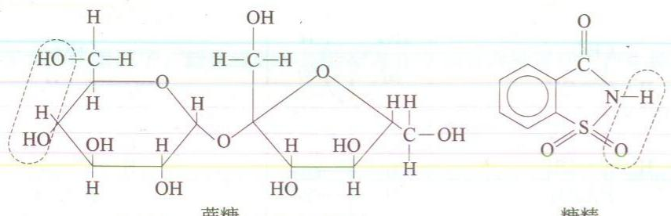  
蔗糖  
糖精  
图 4-5 蔗糖和糖精的甜味基团

## 5. 秸秆制燃料乙醇

秸秆制燃料乙醇工艺又被称为纤维素燃料乙醇工艺，其过程主要包括：原料预处理、纤维素和半纤维素水解糖化、五碳糖与六碳糖的发酵、蒸馏脱水等。木质纤维素先经过化学或物理的方法进行预处理，使纤维素与木质素、半纤维素等分离。纤维素可水解为葡萄糖，半纤维素可水解成木糖、阿拉伯糖等单糖。五碳糖和六碳糖经过发酵，再经过蒸馏和脱水得到燃料乙醇。

目前，纤维素燃料乙醇生产技术尚未完全成熟，正处于过渡转化阶段。一方面，纤维素酶的成本较高；另一方面，单位产品的耗能远大于玉米燃料乙醇的耗能。因此，这两者是影响和制约其产业化发展的瓶颈。纤维素燃料乙醇生产示范研究是未来产业化过程中一种必不可少的探索，也是实现其技术工程化的重要基础和平台。随着关键技术的不断突破与完善，纤维素燃料乙醇的生产成本有显著的下降空间，将进一步推动该技术的商业化发展。

[摘自：卢暄．秸秆制燃料乙醇工艺技术．化学工业，2011(7):29-33]

## 6. 氨基酸的用途

氨基酸不仅能被生物体用来合成蛋白质，供动植物生存的需要，在食品工业和医药工业也有很广泛的用途。在日常生活中我们接触最多的是谷氨酸，其单钠盐即市售的味精，是一种广泛使用的调味品。在食品工业中用量较大的氨基酸是半胱氨酸，它可作为果汁的抗氧化剂，使果汁不易变质。半胱氨酸还能改善面包的风味和延长面包的保质期。在植物蛋白人造肉中，加入半胱氨酸等含硫的氨基酸，可以使人造肉具有牛肉和鸡肉的风味。赖氨酸作为食品，特别是儿童食品的营养强化剂，弥补了植物蛋白缺少赖氨酸的缺陷，已用于生产营养强化面包和饼干等食品，提高了食品的营养价值。甘氨酸、天冬氨酸和苯丙氨酸都可用来生产食品工业中的甜味剂。

氨基酸广泛应用于医药工业，用氨基酸可以配制氨基酸注射液，为患者提供丰富的营养。例如，消化系统疾病的患者在手术后要注射一定量的氨基酸，以便补充营养。氨基酸溶液的pH缓冲范围大，是血液中重要的缓冲物质，如甘氨酸可作胃液的抑制剂。以氨基酸为原料合成的生物活性肽激素则是一种重要的药物。

## 7. 蛋白质的显色反应

## (1) 双缩脲反应

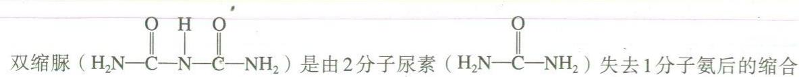

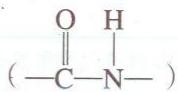

产物。多肽分子中含有许多和双缩脲结构相似的肽键（—C—N—），因此在蛋白质溶液中加入碱和少量的硫酸铜就有紫红色的铜配合物生成。任何蛋白质或蛋白质水解中间产物都会发生双缩脲反应。该反应的显色与蛋白质分子中所含肽键的数目有一定关系，肽键数目越多，颜色越深。

## (2) 黄色蛋白反应

某些蛋白质与浓硝酸作用时呈黄色，如再以氨处理又变成橙色。有这种反应的蛋白质，其分子中一般存在苯环。

## (3) 茚三酮反应

蛋白质和氨基酸一样，也与茚三酮发生显色反应，生成蓝、紫或紫红色产物。所呈现的颜色随反应条件的不同而有所差异。该反应可用于氨基酸和蛋白质的层析及定量测定。

## 8. 化工专家吴蕴初

吴蕴初（1891—1953），化工专家，著名的化工实业家，我国氯碱工业的创始人之一。他研究出以较低成本生产味精的方法，在我国创办了第一家味精厂、氯碱厂、耐酸陶器厂和生产氨与硝酸的工厂，为我国化学工业的发展作出了卓越贡献。

吴蕴初生于江苏省嘉定县（今上海市嘉定区），曾在上海广方言馆学习。后因家贫辍学，又考入上海兵工学堂半工半读学习化学。1911年毕业后，曾在汉阳铁厂、汉阳兵工厂和火柴厂从事化验和研究工作。20世纪20年代，日商在上海大量销售“味の素”引起了他的注意。吴蕴初经过潜心研究和大量实验，终于找到了成本较低的批量生产方法，将产品取名为“味精”，并建成上海天厨味精厂。为使生产味精所需的盐酸自给，吴蕴初于1930年创办天原电化厂。这是我国第一家生产盐酸、烧碱和漂白粉等基本化工原料的氯碱工厂。吴蕴初认为“办工业应从大处落墨”，合成氨工业平时可以生产化肥，战时可以生产炸药以卫国，故创办了天利氮气厂，使用天原厂电解车间产生的氢气合成氨，部分氨再制成硝酸。这是我国生产氨和硝酸的第一家工厂。为使工厂生产所需耐酸陶瓷做到自给，吴蕴初于1934年又创办了天盛陶器厂，生产多种耐酸陶管、瓷板、阀门及鼓风机等，填补了我国化学陶瓷的空白。至此，天厨、天原、天盛、天利4个化工企业形成了自己的体系，对我国经济的发展和国防作出了重要贡献，在我国化学工业史上写下了灿烂的篇章。

吴蕴初热爱祖国，认为“做一个中国人，总要对得起自己的国家”。早在1932年，他就开始组织生产军用防毒面具，支援抗战。1937年后，为保存民族工业，吴蕴初积极组织企业内迁，于1939年建成了重庆天原化工厂及重庆天厨味精厂，1943年又建成天原电化厂宜宾分厂。这几个工厂的建成投产，不仅在大后方填补了产品的空白，满足了工农业生产和人民生活的需要，为支援抗战作出了积极的贡献，而且为我国西南地区化学工业的发展发挥了重要作用。

吴蕴初认为，他的财产是取之于社会，应用之于社会，“把财产集中起来，为发展事业，培养化工人才，对国家，对社会才会有好处”。1945年，他决定成立“吴蕴初公益基金委员会”，将他投资化工事业的全部股票拿出，交给基金会统一保管。抗战胜利后，他又将味精发明权所得的收入全部归入基金会。1949年10月，周恩来总理在北京亲切接见了吴蕴初，希望他能为新中国化工事业的发展继续努力。这使吴蕴初受到极大鼓舞。此后，他担任了华东军政委员会委员、上海市人民政府委员等职务。1953年，吴蕴初去世。其家属根据他的遗愿，将他所有的其他股票也一并归入了基金会。这些基金对培养我国科技人才，促进我国科技事业的发展发挥了重要作用。吴蕴初刻苦钻研、不断进取、自学成才的精神，独立自主、力克艰辛、发展民族工业的爱国主义精神，重视科学技术、积极培养人才的孺子牛精神，正在并继续为后世传颂和学习。

[摘编自：中国科学技术协会．中国科学技术专家传略·工程技术编·化工卷1．北京：中国科学技术出版社，1999:58-67]

## 9. 核酸的性质

1869年，瑞士科学家米舍尔从外科绷带上脓细胞的细胞核中提取出由核酸和蛋白质组成的核蛋白。1889年，阿尔特曼制得不含蛋白质的核酸，并提出“核酸”这一名称。由于核酸含有大量的磷酸基，在生物体内通常与碱性蛋白质、多胺或金属离子结合，以盐等形式存在。

核酸分子中的糖苷键和磷酯键都能在酸性条件或酶的催化下发生水解反应。核酸中含有磷酸基，表现出明显的酸性；同时，其分子内含氮杂环的存在使核酸能够结合质子。因此，核酸在不同酸碱度的溶液中解离程度和存在形式不同。嘌呤碱和嘧啶碱中的共轭双键结构具有强烈吸收紫外光的性质，使核酸在紫外波段具有较强的特征吸收峰。因此，可以用紫外分光光度计对核酸进行定性检测和定量测定。改变温度或溶液的酸碱性，以及加入尿素、甲醛等物质，都会使DNA双螺旋区的氢键断裂，发生变性，导致DNA的物理、化学和生物学性质发生变化。变性DNA在适当条件下，又可使两条彼此分开的链重新缔合，形成双螺旋结构，这一过程被称为复性。DNA复性后，其许多性质又得以恢复。核酸中的戊糖单元可以发生显色反应，常被用来检测核酸。

## 教学案例

# 第三节 核酸

北京中学 杨鹏

## 教学目标

1. 通过分析 DNA 基本结构单元之间的连接方式和碱基配对原理，搭建模型（球棍模型、纸板模型），认识 DNA 的双螺旋结构，体会借助宏观实物模型认识生物大分子微观结构的方法。

2. 通过体验DNA结构的完整探究过程，认识DNA的真实结构，感受科学家的科研经历，初步建立认识生物大分子结构的认知模型。

## 教学重点

分析DNA基本结构单元之间的连接方式，基于氢键分析碱基配对原理。

## 教学难点

建立认识生物大分子结构的认知模型。

## 教学过程

教学环节一：认识基本结构单元间的连接方式。

<table><tr><td>教师活动</td><td>学生活动</td><td>设计意图</td></tr><tr><td>【引入】DNA结构的发现是20世纪最伟大的自然科学发现之一。我们跟随科学家的脚步一起重温DNA结构的发现历程,体会化学家的重要贡献。【资料】19世纪末20世纪初,生物化学家经过研究,发现DNA是由基本结构单元核苷酸形成的大分子;核苷酸是由碱基、脱氧核糖和磷酸形成的;DNA中有4种碱基,即胞嘧啶、胸腺嘧啶、腺嘌呤和鸟嘌呤。</td><td></td><td></td></tr><tr><td>【展示】4种碱基、脱氧核糖和磷酸的结构。【布置任务】分析碱基、脱氧核糖和磷酸之间可能的连接方式。</td><td>【分析思考】基于有机化合物的分子结构进行分析,它们之间可能通过脱水缩合形成化学键。</td><td>建立从化学键的微观视角认识有机化合物结构的基本认识。</td></tr></table>

教学环节二：探析核苷酸链的分子结构。

<table><tr><td>教师活动</td><td>学生活动</td><td>设计意图</td></tr><tr><td>【过渡】20世纪50年代初,沃森和克里克致力于研究DNA的分子结构。他们利用DNA晶体的X射线衍射等数据搭建分子结构模型。【布置任务】分组搭建核苷酸可能的分子结构模型。</td><td>【小组合作】搭建可能的分子结构模型并展示。</td><td>引导学生认识借助宏观模型认识微观结构是学习</td></tr><tr><td>【展示】4种核苷酸的实际分子结构。【提问】4种核苷酸的分子结构有何共同之处?</td><td>【分析思考】碱基与脱氧核糖的1号碳原子相连,磷酸与脱氧核糖的5号碳原子相连。</td><td>和研究有机化合物结构的一种重要而有效的方式。</td></tr></table>

教学环节三：构建DNA的分子结构。

<table><tr><td>教师活动</td><td>学生活动</td><td>设计意图</td></tr><tr><td>【过渡】DNA是一种生物大分子,X射线衍射数据表明DNA不是单链结构。【提出问题】(纵向结构)核苷酸之间通过怎样的连接方式形成多聚核苷酸链?【展示】一条多聚核苷酸链的结构:磷酸与脱氧核糖3号碳原子上的羟基之间通过脱水形成磷酯键,将多个核苷酸连接起来形成多聚核苷酸链。【提出问题】(横向结构)多聚核苷酸链之间又是怎样连接起来的呢?【过渡】沃森和克里克曾提出DNA的“三螺旋模型”。化学家富兰克林认为“三螺旋模型”存在错误。【过渡】沃森和克里克查阅文献,发现生物化学家查加夫的研究已经表明:生物体内的DNA分子中,腺嘌呤(A)与胸腺嘧啶(T)的分子数量相同,鸟嘌呤(G)与胞嘧啶(C)的分子数量相同。此外,更加清晰的X射线衍射照片表明:在DNA分子结构中,糖和磷酸作为骨架在外侧,而碱基在内侧。沃森和克里克重新提出假设:碱基之间通过氢键结合,将多聚核苷酸链连接在一起。他们开始了新一轮的探究。【布置任务】分发具有4种碱基结构的纸板模型。基于氢键分析碱基之间可能的配对方式。【提出问题】根据资料,结合碱基纸板模型,说明为什么碱基之间的配对方式为生物课中学过的“A配T,G配C”?【资料】碱基相互作用时,距离减小有利于体系能量降低,提高结构的稳定性。</td><td>【分析思考】根据分子结构特点进行分析。【小组讨论】磷酸基在分子的内侧,碱基在分子的外侧。磷酸电离使磷酸基带负电荷,有可能通过带正电荷的金属阳离子连接两条多聚核苷酸链(或讨论学生提出的其他解释)。【小组活动】搭建纸板模型,结合分析讨论,探究碱基之间可能和最佳的配对方式。</td><td>基于大量的科学史实、学生已有的知识和补充的资料,引导学生体验基于问题提出假设、寻找证据、获取证据、得出结论、反思评价的探究过程,培养学生的证据推理意识。通过体验科学家探究DNA分子结构的过程,感悟科学家的探索精神,感受化学的魅力。</td></tr><tr><td>【过渡】科学家所经历的研究过程与大家的分析过程有一定相似之处,但要复杂得多。沃森和克里克对此前的模型进行修正,提出了DNA的双螺旋结构模型。</td><td></td><td></td></tr><tr><td>【布置任务】1.利用胶带模拟氢键,找到配对的碱基,将核苷酸连接起来。2.利用胶带模拟磷酯键,将配对后的核苷酸模型连接成多聚核苷酸链。</td><td>【小组活动】搭建DNA的分子结构模型。</td><td></td></tr></table>

教学环节四：构建认识生物大分子结构的认知模型。

<table><tr><td>教师活动</td><td>学生活动</td><td>设计意图</td></tr><tr><td>【过渡】科学家探究DNA结构的过程遵循了人们进行生物大分子结构研究的一般方法。【布置任务】总结认识生物大分子结构的认知模型。【总结】引导学生了解学科间的交叉与融合对推动科学和社会发展的重要意义。</td><td>【小组讨论】研究的基本环节:基于问题提出假设→寻找证据→得出初步结论→反思→进行新一轮的探究→修正结论,得到最终结果。</td><td>基于DNA结构的科学探究过程,引导学生构建认识生物大分子结构的认知模型,培养学生模型认知的化学学科核心素养。</td></tr></table>

## 第五章 合成高分子

## 本章说明

人类使用的材料按其化学属性主要分为金属材料、无机非金属材料、高分子材料和复合材料。学生在初中和必修阶段已经初步认识了高分子材料。初中教材介绍了高分子的一般概念，描述了高分子材料在生产和生活中的应用。必修教材在介绍乙烯聚合（加聚）反应的基础上，引入了高分子的结构，引导学生从结构的角度初步理解材料的性质。本章在此基础上，结合前4章有机化合物的结构和性质、有机反应和有机合成的知识，较为全面系统地介绍合成高分子的基本方法和各类高分子材料。教材在上一章介绍天然存在的生物大分子之后，在本章进一步引入人工合成的高分子，充分体现有机化学在利用自然资源、创造美好生活方面的重大贡献，突出化学的应用价值，培养学生的社会责任。同时，教材还以高分子为载体，要求学生通过有机化学的知识、方法和视角来分析和预测材料的性质，改进功能，设计合成路线。这是对有机化学知识的复习总结与综合运用，在提高学生分析和解决实际问题能力的过程中，培育学科核心素养，促进本模块课程目标的最终达成。

## 一、教材分析

教材第一节首先给出合成高分子的两种基本方法——加聚反应和缩聚反应，为接下来高分子材料的学习奠定基础。教材在已有知识的基础上，通过具体的反应实例让学生认识这两类反应，以及加聚物和缩聚物的结构特征。其难点主要在于新引入的缩聚反应和缩聚物。

第二节分类介绍高分子材料的主要类别，并以各类材料中的代表性物质为例，具体描述其合成方法、结构、性质和用途。教材根据材料的发展，增加了聚酰胺纤维、高分子分离膜和“研究与实践”等内容，体现化学的社会价值。本节内容进一步体现和应用了“结构决定性质，性质决定用途”这一化学学科基本观念，为学生建立材料的宏观性质与分子的微观结构之间的联系，构建认识材料、合成材料和改进材料的认知模型提供了真实生动的情境素材。

本章教材的内容结构如下图所示。

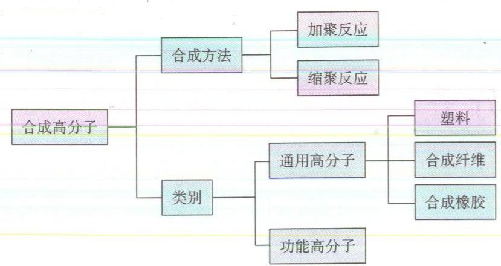

## 二、学业要求

1. 能对单体和高分子进行相互推断，写出典型的加聚反应和缩聚反应的化学方程式。能综合应用有关知识分析和设计高分子的合成路线。

2. 能举例说明塑料、合成纤维、合成橡胶的组成和结构特点。能列举重要的合成高分子，说明它们在材料领域中的应用。

3. 能参与材料的选择与使用、环境保护等社会性议题的讨论，并作出有科学依据的判断、评价和决策。

## 三、课时建议

第一节 合成高分子的基本方法 1课时  
第二节 高分子材料 2课时  
全章复习 1课时

## 第一节 合成高分子的基本方法

## 一、内容分析

学生在初中和高中必修阶段已经接触了一些天然高分子和合成高分子，知道高分子和小分子有机化合物在结构上的基本区别。本节首先介绍合成高分子的加成聚合反应。该反应在烯烃的相关章节中已有所涉及，因此教材在此处不再重复，而是结合聚氯乙烯引入单体、链节、聚合度、平均相对分子质量等高分子的基本概念。

教材在第四章介绍多糖、蛋白质和核酸等生物大分子时已经引入了缩合的概念，在知识上进行了铺垫。本节借助酯化反应这样一个学生熟悉且简单的缩合反应，将单官能团的一元酸和一元醇拓展为双官能团的二元酸和二元醇，引入缩合聚合反应和缩聚物的概念。同时，教材针对缩聚物的组成较为复杂的实际情况，结合聚酯合成的实例，专门介绍缩聚物和缩聚反应的化学方程式在书写时的注意事项。其中包含了双官能团有机化合物自身的缩聚，以及两种双官能团有机化合物之间的缩聚。

## 二、教学目标

## 1. 教学目标

（1）通过氯乙烯加聚反应的断键和成键特点，认识加聚反应的微观本质，构建加聚反应的一般认知思路。

（2）通过分析合成聚氯乙烯反应前后的碳骨架变化，了解高分子的单体、链节、聚合度和平均相对分子质量等基本概念，认识单体、链节与高分子结构的关系，能通过分析加聚物的结构推测相应的单体。

（3）通过体验己二酸与乙二醇的缩聚反应过程，认识缩聚反应的微观本质；能通过分析反应物官能团的结构和种类，正确判断缩聚产物的链节和端基，以及小分子生成物及其个数，构建缩聚反应的一般认知思路；能通过分析缩聚物的结构推测相应的单体。

## 2. 教学重点和难点

重点：构建两种聚合反应的认识思路；推断单体的聚合产物和聚合物的单体，写出简单聚合反应的化学方程式。

难点：书写两种单体的缩聚产物的链节；分析和书写聚合物的单体。

## 三、教学建议

## 1. 通过分析典型加聚反应，构建加聚反应的基本认识思路

在第二章，学生已经学习了碳碳双键的结构特点和反应特点，并在“思考与讨论”栏目中初步接触了氯乙烯、丙烯和异丁烯的加聚反应，对加聚反应的特点有了初步认识。因此，在本节的教学中，应从化学键和结构角度分析反应和高分子的结构特点，引导学生通过对比反应物和产物的结构来学习相关基本概念。具体建议如下。

（1）观察以下能够发生加聚反应的物质——氯乙烯、丙烯、异丁烯，它们在结构上有什么相似之处？

（2）分析各个加聚反应，加聚物与反应物在结构上有哪些相似点和不同点？

(3) 加聚反应的化学方程式是如何体现这一变化过程的?

(4) 在分析的基础上得出单体、链节、聚合度和平均相对分子质量等概念。

## 2. 通过分析典型缩聚反应, 认识缩聚反应的微观本质, 构建缩聚反应的基本认识思路

缩聚反应在本章的学习中有较多形式，因此在这部分的教学中需特别注重对反应的微观本质的理解，帮助学生形成从断键和成键的角度分析缩聚反应的思维方式，构建缩聚反应的基本认识思路。因缩聚过程相对复杂，教学中可适当采用视频、动画、自制分子卡片等教学手段模拟反应中的断键和成键过程，帮助学生理解和总结规律。具体建议如下。

（1）引导学生观察己二酸和乙二醇的官能团，思考其化学性质和成键、断键特点，尝试分析二者在合适的条件下反应时，官能团是如何变化的。

（2）引导学生用两种颜色分别代表两种分子，模拟多个己二酸和乙二醇分子发生反应的过程。例如，下图中的A代表己二酸，B代表乙二醇。也可使用两种颜色的分子卡片，在断键处撕开，在成键处黏合，使学生通过具体的操作直观地感受微观反应过程。

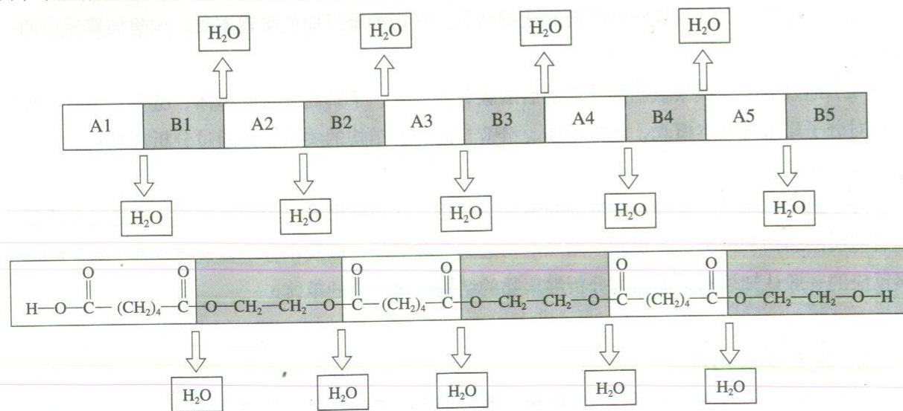

（3）根据上述模拟过程很容易得出连接方式、端基、聚合度、小分子产物及其个数。由此引导学生总结规律，书写缩聚反应的化学方程式，构建缩聚反应的一般认识思路。

（4）同样，利用分子卡片模拟6-羟基己酸的缩聚反应过程，书写相应反应的化学方程式，并与双单体缩聚反应进行对比，使学生对缩聚反应的认识更加全面。

## 四、练习与应用参考答案及说明

<table><tr><td>单体</td><td>聚合物的结构简式</td><td>链节</td></tr><tr><td>乙炔</td><td></td><td>—CH=CH—</td></tr><tr><td>丙烯</td><td></td><td>—CH2—CH—|CH3</td></tr><tr><td>丙烯腈</td><td></td><td>—CH2—CH—|CN</td></tr><tr><td>乙酸乙烯酯</td><td></td><td>—CH2—CH—|OOCCH3</td></tr><tr><td>1,3-丁二烯</td><td></td><td>—CH2—CH=CH—CH2—</td></tr><tr><td>5-羟基戊酸</td><td></td><td>—O—(CH2)4—C—</td></tr><tr><td>戊二酸1,3-丙二醇</td><td></td><td>—O—(CH2)3—O—C—(CH2)3—C—OH</td></tr></table>

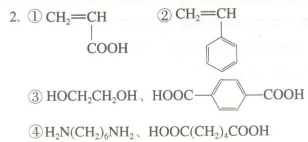

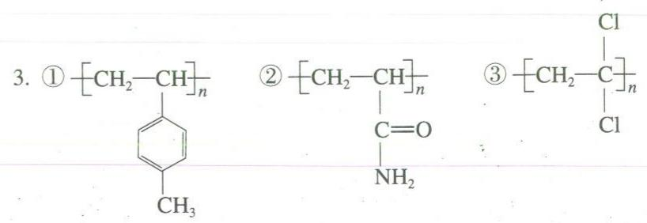

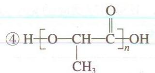

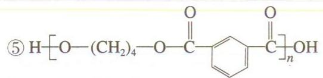

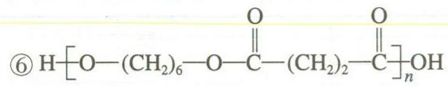

## 4. ②③④

5.(1)H—C—Cl H—C—F 卤代烃
Cl F

(2) $2CHClF_{2}\xrightarrow{\triangle}CF_{2}=CF_{2}+2HCl$ $nCF_{2}=CF_{2}\xrightarrow{催化剂}\left[CF_{2}-CF_{2}\right]_{n}$

## 第二节 高分子材料

## 一、内容分析

初中和高中必修教材都介绍了高分子材料，但限于学生的知识基础，其内容多为常识性介绍。而本节位于整个模块的最后，能够让学生综合运用多方面知识，从微观结构的层次来分析和认识高分子材料的组成、合成方法和性质。

根据高分子材料的分类，本节教材的内容分为通用高分子材料和功能高分子材料两部分。前者以聚乙烯、酚醛树脂、聚酯纤维、聚酰胺纤维和顺丁橡胶为代表物，依次介绍塑料、合成纤维和合成橡胶这三大合成材料。教材对比高压法聚乙烯和低压法聚乙烯的性质，从线型和支链型结构的角度分析分子间作用力对材料性质和用途的影响；对比聚乙烯与酚醛树脂、顺丁橡胶与硫化顺丁橡胶的结构与性质，说明线型结构与网状结构对材料性能和用途的影响。通过这些具体实例，进一步阐释材料结构、性质和用途之间的关系。

功能高分子材料的种类繁多，新材料不断涌现。教材首先列举一些常见的功能高分子材料，指出人们基于物质结构与性能之间的关系，可以根据实际需要设计具有特定功能的结构，并进行人工合成。接下来，教材以高吸水性树脂和高分子分离膜为例，介绍功能高分子的结构、性能与用途。教材在全书最后设置这部分内容，其目的不只是多介绍几种具体的材料。教材以实际问题的解决为导向，引导学生综合运用有机化合物结构和有机反应的知识，初步了解材料开发的通用方法：根据用途确定材料的性质，设计具有特定结构的有机分子，然后确定合成路线。教材设置功能材料开发的实际问题——如何得到性能更好的高吸水性树脂？然后从碳骨架（不溶于水的母体主链）和官能团（有强亲水基团的取代支链）两个角度来分析问题，分别给出对应的解决思路，体现分子结构设计和结构修饰的化学学科思想。本章“练习与应用”和“复习与提高”中的题目，除了让学生练习和巩固本章聚合反应、聚合物和高分子材料的相关知识，也注意使学生在材料应用的背景下复习和应用有机化合物的性质与有机合成的知识，在实践中提升问题解决能力。

## 二、教学目标

## 1. 教学目标

（1）通过对通用高分子材料的学习，进一步巩固加聚反应和缩聚反应的认识思路，认识塑料、橡胶和合成纤维的组成和结构特点。

(2) 通过对比分析线型、支链和网状结构对材料性质的影响, 了解高分子与有机小分子的主要不同之处（相对分子质量巨大，以及由此导致的多种空间结构）。扩展并完善对有机化合物结构、性质和应用的认识。

(3) 通过不同条件下合成酚醛树脂的实验探究, 进一步体会 “化学反应是可以控制的” “条件不同产物不同” 等化学观念, 在实验中直观感受微观的线型结构与网状结构对材料宏观性质的影响。

（4）通过高分子材料吸水性能的对比实验，体会通过分析微观结构解释化学性质的思路，以及结构、性质和应用之间的关系；体验功能导向的高分子材料合成的价值，了解新型高分子材料的优异性能及其在高新技术领域的应用。

## 2. 教学重点和难点

重点：三大合成材料的组成和结构特点。

难点：功能高分子的结构对性能的影响。

## 三、教学建议

本节教材的内容丰富，难度不大，教学时应注重联系生活实际和材料发展史，引导学生在实际问题的解决中认识高分子材料的结构、性质和应用之间的关系；引导学生认识高分子有别于小分子的结构特点，及其为高分子材料带来的特有的性质与应用。

## 1. 对生活中的素材进行分析，巩固和完善“结构、性质、应用”的认识思路

教师在课前可组织学生以实践活动的方式，分组收集生活中的典型高分子材料等素材，整理记录后在课上进行汇报交流。引导学生对其中涉及高分子材料的性质进行分析，交流使用体会，总结三大合成材料的主要特点和应用领域；引导学生根据对典型材料的性质和应用的感性认识，交流讨论结构、性质和应用之间的关系。活动参考建议如下。

## (1) 塑料

① 在分类整理后，先对比两种单体相同、结构不同的聚乙烯包装材料，如保鲜膜（低密度聚乙烯）和酸奶瓶（高密度聚乙烯）。通过日常使用积累的感性认识，分析总结材料的性质，初步认识塑料的性质特点。

② 给出两种聚乙烯的结构示意图，通过对比高密度和低密度聚乙烯的结构，分析产生性质异同的原因，强化结构决定性质的意识。

③ 介绍塑料在生产过程中可能用到的几种添加剂，请学生思考是否所有的塑料都可以用来包装食品，有哪些因素需要考虑（如食品安全问题、回收问题等）。帮助学生深入认识塑料。

④引导学生关注身边的塑料用品，学生会发现生活中并不是所有的塑料制品都柔软有弹性，且受热易变形，还有很多非常结实和耐热的塑料制品。提出问题：它们具有怎样的结构特点？让学生分析网状结构可能对塑料的性质和应用带来的影响。

## (2) 纤维

合成纤维学生在生活中接触较多，教师可组织学生分析不同纤维的单体和高分子的结构简式，巩固缩聚反应的认识思路；让学生根据结构简式解释和预测纤维的性质特点，针对不同的需求选择性质不同的材料，激发学生的学习兴趣。可以围绕以下内容，根据认识高分子的一般思路，从分析结构简式、预测性质和应用这几个方面展开教学，让学生完成下表。

<table><tr><td>单体</td><td>高分子的结构简式</td><td>根据结构预测性质</td><td>应用范围</td></tr><tr><td>对苯二甲酸、乙二醇</td><td></td><td></td><td></td></tr><tr><td>己二酸、己二胺</td><td></td><td></td><td></td></tr><tr><td>对苯二甲酸、对苯二胺</td><td></td><td></td><td></td></tr></table>

## (3) 合成橡胶

在此部分的教学中，教师可介绍橡胶的发展历史。在此基础上，帮助学生思考材料发展与人类社会和生活需求间的关系，进而使学生体验化学的价值。也可以引导学生根据橡胶制品的使用体验认识橡胶的结构和性质。具体建议如下。

① 橡胶可用于生产皮球和自行车内胎，请根据其用途预测橡胶可能的微观结构。

② 人们经过长期的探索和实践，发明了硫化橡胶。对比橡胶硫化前后的结构，分析不同的硫化程度会对橡胶的性能产生哪些影响。

③ 天然橡胶不能满足人们日益增长的需求，人们开始不断地研发出具有不同性能的合成橡胶。给出合成橡胶的结构简式，引导学生推测其单体。

## 2. 通过设计合成路线，体验功能导向的高分子合成的实际应用价值

功能高分子材料的设计思路充分体现了高分子材料结构与性质间的关系。因此，在本部分教学中，教师可组织学生根据不同原料设计合成高吸水性树脂。教师可给出两组常用的原料，分别为淀粉和纤维素等天然高分子材料，以及丙烯酸钠等功能性小分子单体。在学生活动过程中，教师引导学生思考以下问题，自主得出制备功能高分子材料的基本思路（高分子材料的功能化修饰和功能性小分子的高分子化）。具体可参考以下教学建议。

（1）对比保鲜膜和纸，为什么二者同样为高分子材料，一种可吸水而另一种不吸水？帮助学生认识官能团对材料性质和用途的影响，以及亲水基团对高分子材料吸水性的影响，为后续高吸水性材料的设计进行铺垫。

（2）淀粉作为多糖，也具有吸水性，但并不能直接用作吸水材料。根据你对淀粉性质的了解，分析其中的原因。引导学生认识高分子材料的结构对溶解性的影响。

（3）高吸水性树脂应具有哪些性质？引导学生从功能角度设计高分子的结构，考虑碳骨架和官能团两个因素。

（4）怎样才能解决淀粉的水溶性这一问题？丙烯酸钠自身就有较强的亲水基团，但也不能直

接用作吸水材料。什么方法能够解决这一问题？引导学生思考制备高吸水性树脂的两种方法。

（5）纤维素虽然不溶于水，但是吸水性能不佳。什么方法能够解决这一问题？引导学生认识根据需求修饰高分子材料分子结构的思路。

（6）高吸水性树脂在结构上应具有哪些特点？引导学生梳理和完善从官能团角度认识功能高分子的思路。

（7）分组查阅资料，以淀粉、纤维素和丙烯酸钠为主要原料，设计合成高吸水性树脂，并汇报设计思路。引导学生从碳骨架角度认识功能高分子。

## 3. 查阅资料，拓宽视野

针对不同分离膜的功能，组织学生查阅资料，交流讨论其作用原理和不同分离手段的应用范围。

## 四、栏目使用建议

## 1. 实验

【实验5-1】

本实验的目的是通过甲醛与苯酚形成酚醛树脂的过程，加深学生对缩聚反应的认识。在酸性催化剂作用下，苯酚与甲醛一般缩聚成线型结构的热塑性酚醛树脂。甲醛过量，在碱性催化剂作用下，二者一般缩聚成体型结构的热固性酚醛树脂。

实验（1）中用盐酸作催化剂，反应后试管内物质的下层就是缩聚成线型结构的热塑性酚醛树脂，它能溶于丙酮和乙醇等溶剂中（溶解程度会受反应时间等因素影响）。实验（2）中用浓氨水作催化剂，受反应时间等因素影响，课堂上不易得到固态的体型酚醛树脂。如将课堂实验所得的黏稠产物倒入蒸发皿，在50℃烘干1 h，再继续在70\~80℃烘干8 h，可得到缩合成体型的酚醛树脂固体（不易溶于溶剂）。

注意事项：清洗试管时，可倒出试管中的液体，加入约1 mL福尔马林，再用玻璃棒刮擦，将酚醛树脂成团地拉出来；如试管壁尚有少量高聚物，可用软质纸卷成与管口粗细相仿的纸棒，伸入试管底部，沿试管壁刮擦；本实验需在通风良好的实验室中进行，最好在通风橱中进行，树脂及残液应统一回收处理。

## 2. 探究

教材设置此探究活动的目的，在于通过对比让学生体验功能高分子材料的优异性能，加深对结构、性质和应用之间关系的理解，扩展认识有机化合物的视角；同时，体验功能导向的高分子材料设计过程。在比较高吸水性树脂与一般吸水材料的性能差异时，应注意控制变量，保证其他条件基本一致。高吸水性树脂在吸水后呈凝胶状，具有较好的保水能力；一般吸水材料吸水后变形程度小，但保水能力较差。

## 3. 思考与讨论

## 【思考与讨论1】

（1）建议先采用直观的分子卡片模拟不同结构的高分子，让学生亲自体验不同结构对性质的影响，推测该结构对溶解度、热塑性和强度等方面的影响，并进行归纳。

<table><tr><td>结构</td><td>结构特点</td><td>性质特点</td></tr><tr><td>线型</td><td>没有支链的长链分子,且大多数呈卷曲状</td><td>受热后熔化,冷却后固化,具有热塑性</td></tr><tr><td>支链型</td><td>主链上有长支链和短支链,分子排列松散,分子间作用力弱</td><td>柔软度和溶解度较线型高分子的大,密度、强度和软化温度低于线型高分子</td></tr><tr><td>网状</td><td>线型或支链型高分子以化学键交联,形成网状结构</td><td>柔软度降低,刚性提高,不能熔融,在溶剂中会发生溶胀,但不能溶解</td></tr></table>

(2)

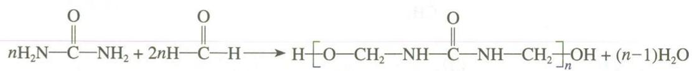

【思考与讨论2】

【思考与讨论3】

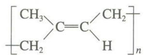

天然橡胶分子内存在较活泼的碳碳双键，容易发生老化。橡胶硫化后，分子中的碳碳双键被打开，形成了新的共价键，线型结构转变为网状结构。这使硫化橡胶具有很好的弹性、较高的硬度和耐磨性，不易变黏，在有机溶剂中不易溶解，只发生溶胀。

高吸水性树脂在交联前一般是水溶性的，不具备吸水性。形成网状结构后，它可利用分子中大量的羧基、羟基等基团与水分子之间产生氢键等作用，吸收水分子，并且通过网状结构将水分子束缚在高分子网格中，形成溶胀的凝胶体。这种凝胶体的保水能力很强，在一定压力下也不易失水。

## 五、研究与实践

这一研究与实践活动有助于帮助学生体验高分子材料的应用价值和社会价值。活动内容有一定的难度，可通过小组合作的形式拆分教材中的研究任务，课下查阅资料，课上展示分享。

海水淡化方法较多，相关内容专业性较强，教师在此过程中要对学生进行方法指导，并根据本章的需要适当调整研究范围。例如，可集中比较蒸馏法、反渗透法和电渗析法等。还可推荐相关书籍，有条件的学校可指导学生利用中国知网进行查询，或提供相关文献供学生阅读。教师要对学生搜集的材料进行审阅和分类指导。

教师在学生撰写研究报告时也应给予指导，使学生在撰写过程中突出研究目的，体会科学和技术发展对社会的意义。研究报告中的相关高分子材料，也可以让学生进一步分组研究。

## 六、练习与应用参考答案及说明

1. AD 
2. B 
3. B 
4. B

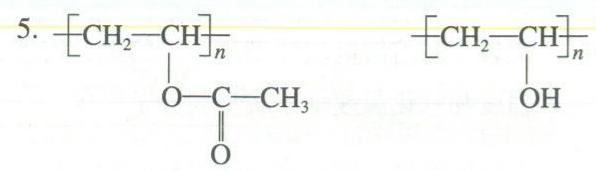

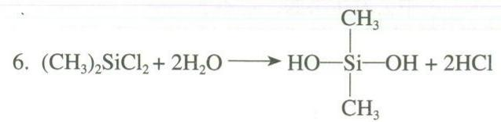

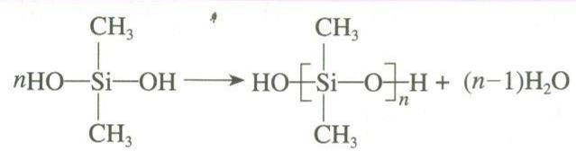

7. (1) $(\mathrm{C}_6\mathrm{H}_{10}\mathrm{O}_5)_n + n\mathrm{H}_2\mathrm{O} \xrightarrow{\text{催化剂}} n\mathrm{C}_6\mathrm{H}_{12}\mathrm{O}_6$ 淀粉 葡萄糖

$$
(2) n \mathrm{C} _ {6} \mathrm{H} _ {1 2} \mathrm{O} _ {6} \xrightarrow [ \text {葡萄糖} ]{\text {乳酸菌}} 2 n \mathrm{CH} _ {3} \mathrm{CHCOOH}
$$

$$
(3) n \mathrm{CH} _ {3} \mathrm{CHCOOH} \xrightarrow [ \mathrm{OH} ]{\text {催化剂}} \mathrm{H} \left[ \begin{array}{c c c} \mathrm{O} & \mathrm{CH} & \mathrm{C} \\ & \mathrm{CH} _ {3} & \mathrm{O} \end{array} \right] _ {n} \mathrm{OH} + (n - 1) \mathrm{H} _ {2} \mathrm{O}
$$

$$
\mathrm{H} \left[ \begin{array}{c c} \mathrm{O} & \mathrm{CH} - \mathrm{C} \\ | & | \\ \mathrm{CH} _ {3} & \mathrm{O} \end{array} \right] _ {n} \mathrm{OH} + (n - 1) \mathrm{H} _ {2} \mathrm{O} \longrightarrow n \mathrm{CH} _ {3} \mathrm{CHCOOH}
$$

$$
\begin{array}{c} (5) \mathrm{CH} _ {3} \mathrm{CHCOOH} + 3 \mathrm{O} _ {2} \xrightarrow {\text {   微生物   }} 3 \mathrm{CO} _ {2} + 3 \mathrm{H} _ {2} \mathrm{O} \\ \mathrm{OH} \end{array}
$$

8. (1) $\mathrm{CH}_{2}=\mathrm{CH}_{2}$ (2) 取代反应

$$
(3) n \mathrm{CH} _ {2} = \underset {\mathrm{CH} _ {3}} {\mathrm{C}} - \mathrm{COOCH} _ {2} \mathrm{CH} _ {2} \mathrm{OH} \xrightarrow {\text {一定条件}} \left[ \mathrm{CH} _ {2} - \underset {\mathrm{COOCH} _ {2} \mathrm{CH} _ {2} \mathrm{OH}} {\mathrm{C}} \right] _ {n}
$$

(4) E结构中的羟基不仅增大了材料的亲水性和吸水性, 而且不同聚合物分子中的羟基和羰基等官能团与水之间产生氢键等作用, 形成网状结构的凝胶, 使隐形眼镜更柔软。

## 复习与提升建议

## 一、复习与提升教学建议

本章信息量较大，在复习时建议突出高分子有别于一般有机化合物的特点，制定以下复习目标：围绕本章的核心知识，凸显高分子的合成特点和空间结构特征，巩固对加聚反应和缩聚反应的认识思路；进一步渗透有机化合物的认识角度，基于官能团和化学键对高分子的结构和性质进行分析；注重构建宏观辨识与微观探析相结合的分析思路，结合信息对高分子的结构、性质、用途与合成进行推测。

1. 归纳总结高分子的结构特点，巩固“结构决定性质、性质决定用途”的认识思路

教学中可采用小组合作的形式，结合生活实际中的各种材料，借助表格，分析和总结单体与高分子在结构和性质上的差异。明确高分子碳骨架和官能团对性质的影响，完善并强化“结构决定性质、性质决定用途”的认识思路。

## 2. 综合应用，体验以功能为导向的高分子材料设计

在教学形式上，建议通过小的专题式教学展开复习，或进行研究性学习，遵循实际情境中关键问题分析解决的逻辑顺序。引导学生对真实问题进行分析和解释，不但能拓展学生的视野，更能使学生体验高分子化学创造新材料对满足人类生活需要的重要作用，体验科技对社会发展的推动作用。在此过程中提高学生的自主学习与合作交流能力。整个过程也是对本章教学效果的评价过程。

下面以高分子材料在航天领域的应用为例进行说明。航天服有多层，每一层的功能不同，所使用的材料不同。该素材内涵丰富，知识覆盖面广。教师在课前可组织学生分组在网上进行文献调研，制作视频或课件展示研究成果。建议通过下表所示的一系列问题，帮助学生复习高分子的特性和研究高分子的一般思路。

<table><tr><td>问题</td><td>意图</td></tr><tr><td>航天服由内至外各层的功能是什么?</td><td>体验化学家从实际需求出发设计产品的研发过程,感受化学的实用价值和社会价值。</td></tr><tr><td>满足以上需求的材料应具备哪些性能?具有以上性能的材料,其结构特点是什么?</td><td>建立用途、性质与结构之间的联系,凸显高分子的结构特征。</td></tr><tr><td>航天服不同部位使用的材料是什么?</td><td>进一步渗透以功能为导向的材料设计思路。</td></tr><tr><td>如何合成这些材料?</td><td>巩固高分子合成的基本方法——加聚反应、缩聚反应;在书写化学方程式的过程中,评价教学效果,强化并落实核心知识。</td></tr></table>

教师在课堂上组织学生就以上问题展开答辩和讨论，引导学生梳理高分子的认识角度和认识思路。通过对航天服不同部位所用材料的一系列问题进行分析解释，不断强化以上认识角度和认识思路，使学生对高分子核心知识的理解更加完整和系统化，对认知模型的运用更为熟练，从而实现本章复习的目的。课后也可让学生应用本节课的思路和方法，就功能高分子展开调研，在巩固教学效果的同时，使知识体系更加完整。

## 二、复习与提高参考答案及说明

1. 低密度聚乙烯： $nCH_{2}=CH_{2}\xrightarrow[200\;^{\circ}C]{150\;MPa\sim300\;MPa}\left[CH_{2}-CH_{2}\right]_{n}$

高密度聚乙烯： $nCH_{2}=CH_{2}\xrightarrow[60\sim100^{\circ}C]{0.1MPa\sim2MPa}\left[CH_{2}-CH_{2}\right]_{n}$

<table><tr><td>比较项目</td><td>低密度聚乙烯</td><td>高密度聚乙烯</td></tr><tr><td>结构</td><td>含较多支链</td><td>支链较少</td></tr><tr><td>性质</td><td>无毒,较柔软</td><td>无毒,较硬</td></tr><tr><td>用途</td><td>生产食品包装袋、薄膜、绝缘材料等</td><td>生产板、桶、瓶、管等</td></tr></table>

$$
2. \mathrm{CH} \equiv \mathrm{CH} + \mathrm{HCl} \xrightarrow [ \triangle ]{\text {催化剂}} \mathrm{CH} _ {2} = \mathrm{CHCl} \qquad n \mathrm{CH} _ {2} = \mathrm{CHCl} \xrightarrow {\text {一定条件}} \left[ \mathrm{CH} _ {2} - \mathrm{CH} \right] _ {n}
$$

生产聚氯乙烯塑料制品要使用增塑剂来提高产品的可塑性和柔韧性。有的增塑剂有一定毒性，在塑料制品与食品接触时可能迁移到食品中，给人类健康带来安全隐患。

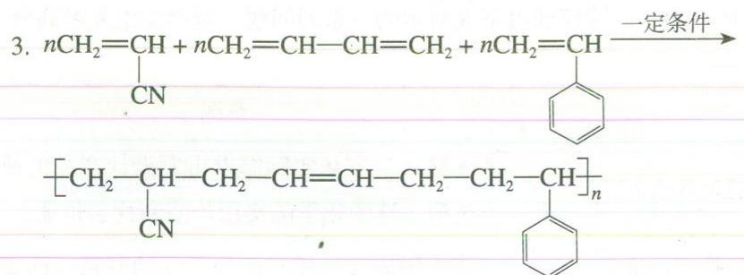

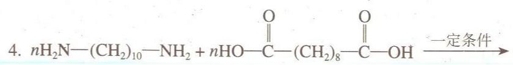

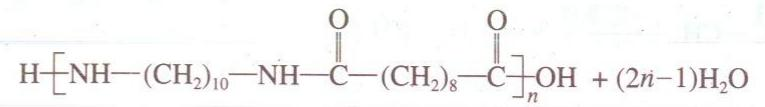

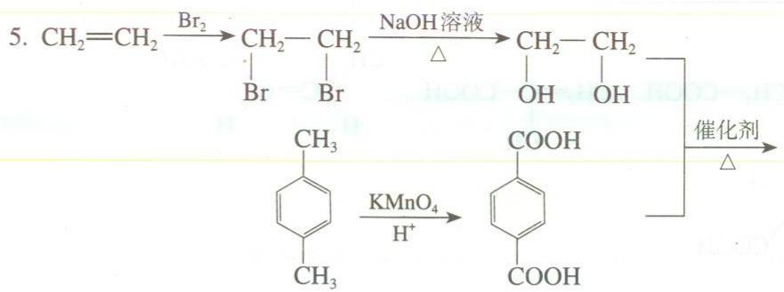

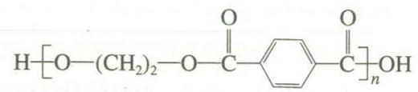

相关化学方程式如下：

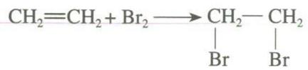

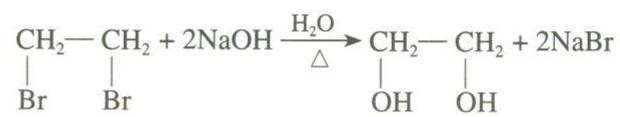

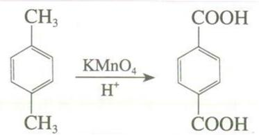

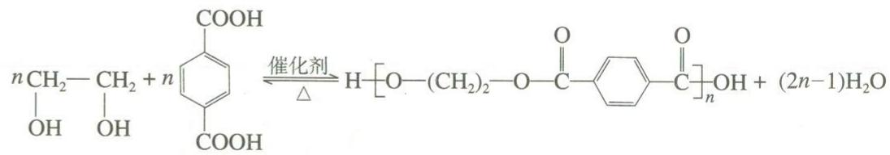

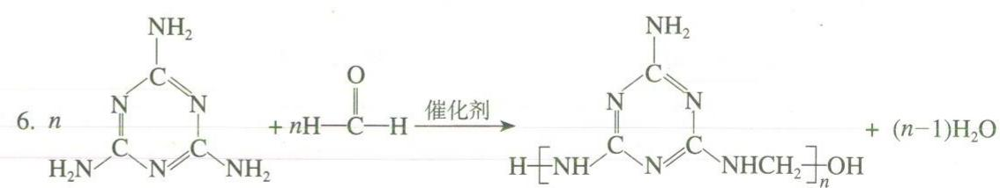

以上线型聚合物分子中仍含有具有反应活性的氨基官能团，与甲醛反应后生成含羟甲基的聚合物。该聚合物与其他含氨基的线型聚合物进一步反应，得到网状结构的蜜胺树脂。

(3) ${\mathrm{{CH}}}_{3} - \mathrm{{CHO}}$

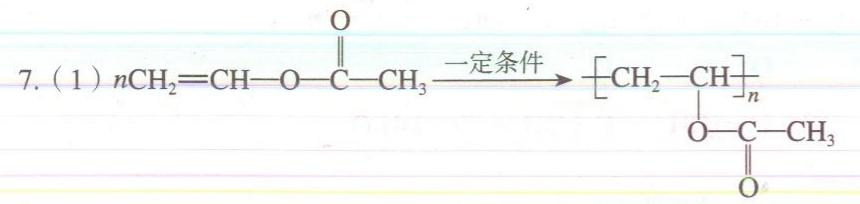

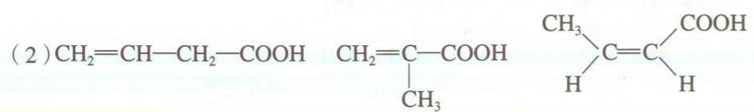

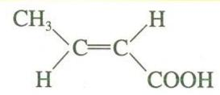

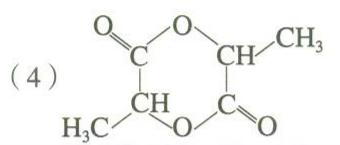

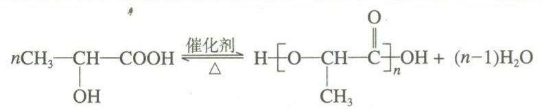

## 教学资源

## 1. 聚合反应

教材主要介绍的加成聚合反应与缩合聚合反应，这是按反应特点与基本有机反应类型进行的分类。如果从反应机理与反应动力学的角度研究聚合反应，聚合反应可分为链式聚合反应与逐步聚合反应。链式聚合又称连锁聚合，是由活性物质引发的以链式反应历程进行的聚合反应。逐步聚合是通过单体与单体，单体与二聚体或多聚体，以及二聚体或多聚体间的反应，聚合体系中分子数逐渐减少，产物相对分子质量逐渐增大的聚合反应。大多数加聚反应属于链式聚合反应，而大多数缩聚反应属于逐步聚合反应。

## (1) 链式聚合反应

链式聚合反应具有以下特点。

① 聚合反应的单体均为含不饱和键（双键、三键）的化合物，如乙烯、氯乙烯、苯乙烯和乙炔等。

② 链式聚合反应是通过一系列加成反应完成的，反应一旦引发，很快便以链式反应得到聚合物。引发反应的活性物质可以是自由基、阳离子或阴离子，反应按链的引发、增长和终止的机理进行。

③ 链式聚合反应的产物除聚合物外，没有小分子副产物。聚合物的重复结构单元（链节）的组成与单体的相同。聚合物的相对分子质量在反应瞬间迅速增长，与反应时间几乎无关。

链式聚合反应多为自由基聚合反应，经历链的引发、增长和终止过程。自由基引发剂、光、热和辐射等可引发反应。常用的自由基引发剂有过氧化苯甲酰、偶氮二异丁腈和过硫酸盐等。

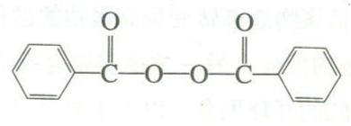  
过氧化苯甲酰

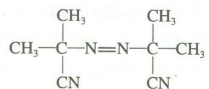  
偶氮二异丁腈

①链的引发：在较低温度下，偶氮二异丁腈等引发剂可分解出自由基。

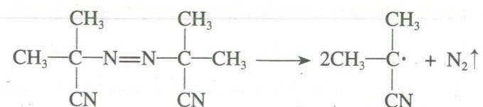

该活性异丁腈自由基生成后即与单体发生加成，生成新的单体自由基。

$$
\begin{array}{c} \mathrm{R} \cdot + \mathrm{CH} _ {2} = \mathrm{CH} \longrightarrow \mathrm{RCH} _ {2} - \dot {\mathrm{CH}} \\ | \\ \mathrm{Cl} \end{array}
$$

② 链的增长：生成的单体自由基依然很活泼，立即与其他单体反应，进入链增长阶段。

双基结合  
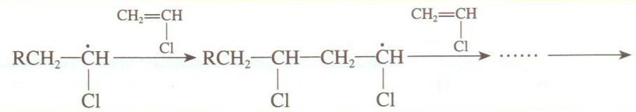

$$
\begin{array}{c} \mathrm{RCH} _ {2} - \mathrm{CH} - \mathrm{CH} _ {2} - \mathrm{CH} \sim \mathrm{CH} _ {2} - \dot {\mathrm{CH}} \\ | \\ \mathrm{Cl} \end{array}
$$

③ 链终止：两个自由基的结合和歧化等反应可导致自由基的猝灭，链反应终止。反应体系中的溶剂、杂质等也可引起自由基的猝灭，导致链反应的终止。

$$
\sim \mathrm{CH} _ {2} - \mathrm{CH} \cdot + \cdot \mathrm{CH} - \mathrm{CH} _ {2} \sim \longrightarrow \sim \mathrm{CH} _ {2} - \mathrm{CH} - \mathrm{CH} - \mathrm{CH} _ {2} \sim
$$

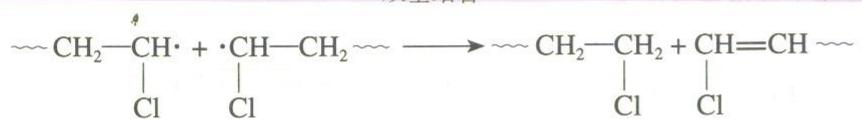  
双基歧化

与自由基聚合反应类似，链式聚合反应在质子酸（硫酸、盐酸等）或路易斯酸（ $\mathrm{AlCl}_3$ 、 $\mathrm{TiCl}_4$ 、 $\mathrm{BF}_3$ 等）催化下发生阳离子聚合反应；在氨基钠（ $\mathrm{NaNH}_2$ ）、烷基锂（RLi）等碱性试剂催化下发生阴离子聚合反应。阳离子聚合反应与阴离子聚合反应也是按照链引发、链增长和链终止的机理进行反应，所不同的是前者生成的活性中心是阳离子，后者是阴离子。

此外，在著名的齐格勒-纳塔催化剂催化下，含不饱和键的单体发生的链式聚合反应被称作配位聚合反应。高密度聚乙烯（低压聚乙烯）、导电聚乙炔等均是在齐格勒-纳塔催化剂催化下得到的性能优异的聚合物。

## (2) 逐步聚合反应

逐步聚合反应是单体官能团之间相互反应，由低聚物逐渐转变为高聚物的过程。最典型的逐步聚合反应是逐步缩聚反应，如形成聚酯和聚酰胺的反应；另一类逐步聚合反应是逐步加聚反应，如形成聚氨酯和环氧树脂的反应，以及己内酰胺的开环聚合。以下主要介绍逐步缩聚反应的特点。

① 单体有两个或两个以上官能团，如二羧酸、二醇、羟基酸、二胺和氨基酸等。酚醛树脂的单体是苯酚与甲醛，实际发生缩聚反应的单体是苯酚与甲醛的加成反应产物2,4-二羟甲基苯酚、2,4,6-三羟甲基苯酚等。

② 缩聚反应是可逆反应，在生成缩聚物的同时，总伴随有小分子（如 $H_{2}O$ 、HX、 $NH_{3}$ 、ROH等）的生成。

③ 缩聚物的相对分子质量随着反应时间的延长而缓慢增长，达到一定值后就很难再增长了。这是因为链增长到一定程度后，反应体系黏度增大，官能团数目减少，官能团之间反应概率减小，链增长缓慢。同时，链端官能团的变化导致反应物比例失衡，使链增长停止。例如，发生羧酸脱羧反应类型的链端官能团分解。

$$
\sim \mathrm{CH} _ {2} - \mathrm{COOH} \longrightarrow \sim \mathrm{CH} _ {3} + \mathrm{CO} _ {2} \uparrow
$$

链端官能团的环化反应，以及反应体系内的单官能团杂质与链端官能团的反应，均会使链端封闭，失去反应活性，导致链终止。

$$
\mathrm{HOOC} \sim \mathrm{R} - \mathrm{OH} \longrightarrow \mathrm{O} = \mathrm{C} \sim \mathrm{R} + \mathrm{H} _ {2} \mathrm{O}
$$

$$
\mathrm{HO} \sim \mathrm{R} - \mathrm{COOH} + \mathrm{HOR} ^ {\prime} \longrightarrow \mathrm{HO} \sim \mathrm{R} - \mathrm{COOR} ^ {\prime} + \mathrm{H} _ {2} \mathrm{O}
$$

影响缩聚反应链终止的因素很多，包括单体的投料比、单体的纯度和反应条件的控制等。一般缩聚物的相对分子质量比加聚物的小。

## 2. 树脂和塑料有什么不同

树脂是能直接或经交联后作为塑料、黏合剂、涂料等高分子材料使用，或作为其主要原料成分使用的天然、天然改性或合成物质。塑料是由树脂及填料、增塑剂、稳定剂、润滑剂、着色剂等添加剂组成的，它的主要成分是树脂。有时这两个名词也常被混用，因为有些塑料基本上是由合成树脂组成的，不含或只含少量添加剂，如有机玻璃、聚乙烯、聚苯乙烯等。塑料的基本性能主要决定于树脂的性能，但添加剂也起着重要作用。

## 3. 工程塑料

工程塑料可作为结构材料，主要品种有聚酰胺、聚甲醛、聚碳酸酯、聚苯醚、ABS树脂、聚氨酯、聚砜、聚芳砜、聚苯硫醚，以及其他芳杂环聚合物等。也有人将氟树脂和超高相对分子质量聚乙烯包括在内。工程塑料的主要特点是密度低，比强度高，化学稳定性好，电绝缘性优良，耐磨。一般具有自润滑性，可降低摩擦系数。其耐热性和尺寸稳定性高，抗冲击性和抗疲劳性优良。因为工程塑料具有优异的性能，且可采用通常的塑料加工方法加工成各种制品，所以受到人们的普遍重视，发展很快，广泛用于电子、电器、建筑、汽车、机械、航空、航天等工业部门。人们主要通过增韧技术、嵌段共聚或几种聚合物混炼等方法增加工程塑料的品种和改进性能。

[摘自：《中国大百科全书》总编委会．中国大百科全书（第2版）．北京：中国大百科全书出版社，2009]

## 4. 乙烯 - 四氟乙烯共聚物

乙烯-四氟乙烯共聚物是一种半透明聚合物，结晶度为50%\~60%。其密度低，摩擦系数大，具有良好的耐热、耐磨、耐化学腐蚀和耐辐射性能，抗冲击性和电绝缘性也很好，并且不易燃烧。本章章图中京津城际铁路延伸线滨海站的贝壳状顶棚，采用了螺旋状网壳钢结构骨架和乙烯-四氟乙烯共聚物膜结构顶棚。其中一块高分子膜的质量只有几千克，而同样大小的中空玻璃的质量则在300 kg左右。如果车站顶棚材料全部使用玻璃，单层网壳钢结构骨架将无法承受，影响建筑结构安全。以高分子膜材料代替玻璃，不仅保证了施工需要，而且美观耐用，在保温和遮阳的同时，保证了地下候车室的采光需要。

## 5. 尼龙的发明

人们对尼龙并不陌生，尼龙制品在日常生活中十分常见。它是美国化学家卡罗瑟斯及其领导的一个科研小组研制出来的，是人们最早开发的合成纤维。尼龙的出现使纺织品的面貌焕然一新，它的合成是合成纤维工业的重大突破，同时也是高分子化学的一个重要里程碑。

1928年，美国杜邦公司成立了基础化学研究所，卡罗瑟斯受聘担任该所的负责人。他主要从事聚合反应方面的研究。他首先研究双官能团分子的缩聚反应，通过二元醇和二元羧酸的酯化缩合，合成长链的、相对分子质量较大的聚酯。在不到两年的时间内，卡罗瑟斯在制备线型聚合物，特别是聚酯方面取得了重要的进展，将聚合物的相对分子质量提高到10 000\~25 000。20世纪30年代，卡罗瑟斯的小组发现，二元醇和二元羧酸通过缩聚反应制取的高聚酯，其熔融物能像制棉花糖那样抽出丝来，而且这种细丝即使冷却后还能继续拉伸，拉伸长度可达到原来的几倍。经过冷却拉伸后，纤维的强度、弹性、透明度和光泽度都大大增加。这种聚酯的奇特性质使他们感到用熔融的聚合物来纺制纤维具有重大的商业价值。然而，继续的研究表明，他们从聚酯得到的纤维在100 ℃以下即熔化，易溶于有机溶剂，因此不适于纺织。

随后，卡罗瑟斯又对一系列聚酯和聚酰胺类化合物进行了深入的研究。经过多方对比，他选择了由己二胺和己二酸合成的聚己二酰己二胺。这种聚酰胺不溶于普通溶剂，软化温度高于通常熨烫的温度，拉制的纤维具有丝的外观和光泽，在结构和性质上也接近天然丝，其耐磨性和强度超过当时任何一种纤维。从其性质和制造成本综合考虑，在已知聚酰胺中它是最佳选择。接着，杜邦公司又解决了生产聚酰胺原料的工业来源问题，并将这种合成纤维命名为尼龙（Nylon），于1939年开始工业化生产。尼龙后来成了有类似蛋白质化学结构的所有人工合成的聚酰胺的总称。生产聚己二酰己二胺的过程可表示如下。

$$
\begin{array}{r l} & \mathrm {H_ {2} N(C H_ {2}) _ {6} NH_ {2}} + \mathrm {HOOC(C H_ {2}) _ {4} COOH} \longrightarrow {} ^ {+} \mathrm {H_ {3} N(C H_ {2}) _ {6} NH_ {3} ^ {+}} \cdot {} ^ {-} \mathrm {OOC(C H_ {2}) _ {4} COO^ {-}} \\ & \quad n ^ {+} \mathrm {H_ {3} N(C H_ {2}) _ {6} NH_ {3} ^ {+}} \cdot {} ^ {-} \mathrm {OOC(C H_ {2}) _ {4} COO^ {-}} \longrightarrow \\ & \mathrm {H - [NH(C H_ {2}) _ {6} NHCO(C H_ {2}) _ {4} CO] _ {n} OH + (2n - 1) H_ {2} O} \end{array}
$$

目前，世界上聚酰胺纤维的年产量已达数百万吨，在日常生活和工业生产中得到了广泛的应用。

## 6. 高分子设计

高分子材料的性能是由复杂的物料、结构体系和加工技术所决定的。进行高分子设计，首先要认识这种复杂结构与不同性能的构效关系，继而通过这种关系研究出显示特定性质的分子结构，最后选择适宜的合成和加工方法制备具有预期性能的聚合物和高分子材料。简单地说，高分子设计就是按照聚合物及其材料的指定性能设计分子结构，进行合成和加工。

高分子设计需要利用已积累的高分子结构与性质、合成与结构、性能与加工等的各种理论、实践数据和规律，采用数理统计方法，推测能满足指定性能的分子结构模型，提出实现该结构所需要的合成、加工方法和工艺条件，用较少的试验，准确地制造出具有预定结构和性能的聚合物和高分子材料。目前，人们所积累的资料大都是定性的、经验性的或半定量的，因此只能对某种结构或性质进行局部或分段的分子设计，尚未达到按照结构模型实施系统分子设计的程度。但是，随着测试手段的精细化、构效关系的定量化、高分子科学的数学化，以及计算机技术在计算化学中的普遍应用，精确地描述聚合物的性能与组成和结构的相互关系不仅成为可能，而且逐渐定量化。当这种认识逐步模型化，并能对合成和加工过程随意控制时，才能实现真正的高分子设计。通过高分子设计，人们将用最少的原料、最优化的合成路线和制造方法，制备出预定性能的优质高分子材料。

要顺利实现高分子设计，还需进行以下工作：① 继续建立和积累结构与性能相关性研究的资料，特别要重视材料制备和加工过程中结构与性能的半定量、定量关系；② 逐步建立高分子设计的学术理论体系；③ 建立各种数理模型，如高分子结构模型、聚合物性能的数理模型、聚合物合成和加工过程的数学模拟方程和计算方法等；④ 建立分子结构参数与性能、合成、加工等相关性的数据库，开发控制聚合物合成和加工的各类软件。

[摘自：焦书科．高分子设计．合成橡胶工业，1996(4):193-196]

## 7. 功能高分子

功能高分子是在合成或天然高分子原有性能的基础上，再赋予其传统性能以外的各种特定功能（如化学活性，选择性分离性能，光、电、磁特性，导电性，电致发光，催化活性，生物相容性，生物降解性，液晶性等）而制得的高分子。功能高分子是在20世纪70年代发展起来的新领域，其研究范围很广，近年来取得了很大进展，是高分子科学最为活跃的研究领域之一。

## (1) 结构特点

功能高分子一般在主链或侧链上具有显示某种功能的基团，其功能性的显示往往是复杂的、协同的。不仅决定于高分子链的化学结构，包括结构单元的顺序、相对分子质量及其分布等，还决定于高分子链的构象和聚集时的高级结构等，后者对于生物活性功能的显示更为重要。

功能高分子的特殊功能，主要由它的链结构，链上的功能基的种类、数量和分布，以及高分子的聚集态所决定。许多研究工作表明，含有功能基的高分子与具有同样功能基的低分子单体模型化合物相比，在化学性质和物理性质上有很大差异。这种差异往往很突出，功能高分子甚至表现出许多单体模型化合物所没有的特殊功能。这种差异可统称为高分子效应。高分子效应的表现是多方面的，归纳起来有以下5种。

## ① 高分子的骨架支撑作用

小分子聚合形成链状或网状结构的高分子像一个骨架，所有的功能基都连在骨架上，位置相对固定，表现出许多单体化合物所没有的特殊功能。

## ② 功能基的相互作用

骨架上相邻功能基之间的相互作用将影响材料的性质，如产生协同效应，使两个或更多的功能基同时与一个金属离子配位，提高了配合物的生成常数。

## ③高稀释或高浓缩效应

当功能基在高分子链上固定后，若它们相距较远，相当于对功能基起稀释作用，相距较近则起浓缩作用。例如，高分子作载体使用时，起催化作用的金属原子与功能基配位就能提高催化活性，功能基相对靠近又起到浓缩作用，能提高反应速率。

## ④模板作用

当功能高分子作为模板（母体聚合物）时，可以使某些单体按一定顺序排列于模板上，聚合后再从模板上脱离，形成新的子体聚合物。其子体聚合物相对分子质量的大小、序列结构等都受到母体聚合物的影响。生物体内DNA分子的复制是模板作用最好的例子。

## ⑤包结作用

许多高分子包结化合物的形成可提高反应的选择性和活性。

## (2) 合成方法

## ① 功能性单体的聚合与共聚合

通过含有特定功能基团的单体进行加成聚合或缩合聚合而制得功能高分子。其优点是功能基团在高分子链上的分布和排列可以通过化学反应来调节；缺点是某些单体可能难以制备，本身不稳定或难以发生聚合反应。

## ② 化学反应法

通过高分子化学反应，将特定功能的基团引入高分子链中。高分子链要含有可进一步反应的活性部分，如羟基、羧基、氨基、酸酐、羰基、酰氯、环氧基、活泼卤原子、异氰酸酯、巯基、活性酯和活性酰胺等。其优点是能基本保证原来高分子链的聚合度。但是，功能性基团的数目及分布受到高分子链的位阻、反应性基团的活泼性和扩散等因素的影响。

## (3) 主要类别

## ① 选择分离功能高分子

主要指离子交换树脂、螯合树脂、大孔树脂及高分子分离膜等具有分离、提纯和净化功能的高分子，广泛用于物质分离、提纯和医疗领域。

## ② 高分子试剂

将小分子试剂通过化学键与高分子载体相结合，在溶液中或固相中与其他小分子发生化学反应，经分离纯化后得到需要的产物。特点是可重复使用，产物分离纯化简单。重要的高分子试剂包括高分子氧化剂、高分子还原剂、高分子亲核试剂、高分子缩合剂和氧化还原树脂等。高分子载体上的固相合成法已被广泛应用于有机合成，尤其是在多肽、低聚核苷酸和寡聚糖的合成中发挥了巨大作用。

## ③ 催化功能高分子

将具有催化活性的基团引入天然或合成高分子中，改善小分子催化剂的催化选择性和活性，提高可重复使用性。最早的高分子催化剂主要是模拟酶结构进行分子设计。另外，有些酶含有金属，如果以高分子配体与金属配位，就得到高分子金属催化剂，可使某些反应在较温和条件下高效地进行。对于某些特殊的小分子稀有金属催化剂或手性催化剂，将它们与高分子结合，可以在不降低催化剂活性的前提下提高选择性和重复使用性。

## ④ 光活性高分子

主要包括感光性树脂、光致变色高分子等。感光性树脂是经光照吸收光能后发生化学变化或物理变化（如发生交联反应，溶解性能发生变化等）的高分子。广泛用于印刷制版、光刻胶、光敏油墨、光敏油漆等领域。光致变色聚合物在光照下发生化学结构的互变异构化，从而导致高分子可逆的颜色变化，已被用于生产变色眼镜片、变色窗玻璃和信息材料等。

## ⑤电学功能高分子

有些具有共轭 $\pi$ 电子的高分子和高分子电荷转移配合物等表现出特殊的电学活性。例如，聚乙炔等具有半导体性质，被称为高分子半导体，经掺杂后表现出导体的性质。其他类似的聚合物，如聚苯胺、聚噻吩、聚吡咯等也表现出类似的性质。20世纪90年代，人们发现像聚苯撑乙烯等高分子有电致发光功能，使这类具有共轭 $\pi$ 电子的高分子的研究发展到一个新阶段。聚乙烯基咔唑与三硝基芴的电荷转移配合物，经光照后能产生光生伏打效应，被称为光导高分子，广泛用于静电复印、静电照相和信息材料领域。聚偏氟乙烯及其共聚物等在加热、加压下能产生压电效应及热电效应，被称为压电高分子或热电高分子。

## ⑥ 生物医学高分子

高分子在医学上主要用于两个方面：医用高分子材料和高分子药物。生物医学高分子需要有优良的机械性能和生物相容性，包括具有良好组织相容性和血液相容性，并有一定机械强度的软组织材料，如聚醚、聚氨酯、聚甲基丙烯酸β-羟乙酯等；以及以聚甲基丙烯酸甲酯为代表的硬组织材料。前者用于内植材料、修复材料和人工脏器，后者用于齿科材料和骨水泥。

高分子药物分为本身就具有药理活性的高分子药物和将小分子药物结合在高分子载体上的两种。后者使药物能够控制释放，以减少投施药物的次数，降低药物的毒性。在高分子载体上，除了药物之外，再接上对病变部位有特异亲和性的配基（如抗体），则能使药物有定位送达的效果，制成高分子亲和药物。

## ⑦ 形状记忆高分子

形状记忆高分子是一类新型的功能高分子材料。依据实现记忆功能的条件不同，可分为感温型、感光型和感酸碱型等多种类型。目前研究最多并投入使用的主要是热敏型形状记忆高分子材料，也叫热收缩材料。这类形状记忆高分子一般是将已赋形的高分子材料加热到一定的温度，并施加外力使其变形。在变形状态下冷却，冻结应力。当再加热到一定温度时，材料释放应力，并自动恢复到原来的赋形状态。目前，应用较为广泛的形状记忆高分子是交联聚烯烃、具有嵌段结构的聚氨酯等。形状记忆高分子与记忆合金相比，具有感应温度低、成本较低廉、易加工、适用范围广等特点。

## ⑧ 生物降解高分子

为解决 “白色污染” 问题，研制可生物降解的高分子势在必行。国内外研究的生物降解材料种类很多，主要有聚乳酸、聚酸酐、聚氨酯可降解材料，以及淀粉基可降解材料。目前应用的生物可降解材料在生物相容性、理化性能、降解速率的控制及缓释性等方面仍存在进一步改进的空间。

[部分内容摘自：《中国大百科全书》总编委会．中国大百科全书（第2版）.北京：中国大百科全书出版社，2009；何纪纲．功能高分子．大学化学，1993(5)：33-37；王正伟，刘吉平，王君，吴光波．新型功能高分子材料研究．现代化工，2007(S2)：514-516；赵桦萍，白丽明，陈伟．生物降解材料．化学教育，2005(8)：11-12，17]

# 第一节 合成高分子的基本方法

北京市第八中学 王竹红

## 教学目标

1. 通过从断键和成键的角度认识聚丙烯和聚对苯二甲酸乙二酯等高分子的合成过程，认识加聚反应和缩聚反应的微观本质，建立并理解高分子合成方法的认知模型。能正确区分加聚产物和缩聚产物，正确书写加聚反应和缩聚反应的化学方程式。

2. 通过分析高分子的结构，了解单体、链节、聚合度等概念，认识单体和链节与高分子结构的关系；能够由单体推断高分子，由高分子推断单体，并由此形成正确的思维方法，进一步建立宏观与微观相联系的观点。

3. 通过认识高分子材料在生活中的用途，体会化学学科的社会价值，激发学生学习化学的兴趣，渗透科学态度与社会责任的学科核心素养。

## 教学重点

基于化学键的断裂和形成，由单体推断高分子，由高分子推断单体，正确书写加聚反应和缩聚反应的化学方程式。

## 教学难点

从碳骨架和官能团变化的角度认识加聚反应和缩聚反应的异同，从微观角度构建聚合反应模型。

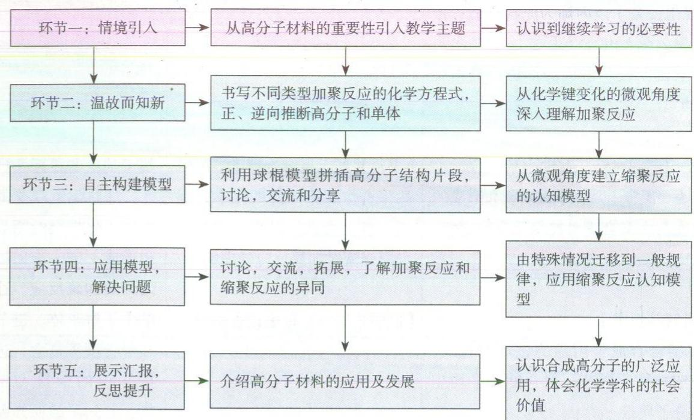

## 教学过程

教学环节一：设置情境引入主题，激发学生的学习兴趣。

<table><tr><td>教师活动</td><td>学生活动</td><td>设计意图</td></tr><tr><td>【展示】医疗急救场景的照片。【引入】医生在抢救患者的同时要做好个人防护,防护的重要措施之一就是要戴好防护口罩。大家知道生产口罩的主要材料是什么吗?</td><td>【观看图片】回忆,联想。【思考】制作口罩的主要材料是天然的棉纤维还是人工合成的高分子材料?</td><td>从学生的经历和身边常见的物品引入,激发学生进一步了解和学习的兴趣。</td></tr></table>

教学环节二：立足学生的最近发展区，温故而知新。

<table><tr><td>教师活动</td><td>学生活动</td><td>设计意图</td></tr><tr><td>【讲解】早期的医用口罩使用的是棉纤维,现在的医用口罩使用了性能更好的合成高分子材料。【展示】医用外科口罩的结构示意图和说明书。</td><td>【观看图片,获取信息】医用外科口罩过滤层的主要成分是聚丙烯熔喷布。</td><td></td></tr></table>

<table><tr><td>教师活动</td><td>学生活动</td><td>设计意图</td><td></td></tr><tr><td>【提出任务】以丙烯为原料,书写合成聚丙烯的化学方程式。要求注明化学键断裂和形成的部位,说明反应类型。【组织“一对多”互动】请一位学生代表在黑板上从化学键断裂和形成的角度与大家交流对加聚反应的理解。【讲解并板书】1.结合合成聚丙烯的化学方程式,介绍单体、链节、聚合度及平均相对分子质量。2.指出高分子一般是混合物。3.介绍聚合反应的发生通常需要加入引发剂或催化剂。</td><td>【书写并展示思维过程】书写丙烯聚合生成聚丙烯的化学方程式,学生代表从微观的角度与大家交流对加聚反应的理解。【倾听,思考,记笔记】</td><td>基于学生的最近发展区,从化学键变化的角度(化学键的断裂和形成)进一步回顾丙烯的加聚反应,让学生了解单体、链节和聚合度等概念,进行知识的衔接和铺垫,起到温故而知新的作用。</td><td></td></tr><tr><td>【展示】口罩带的照片。【说明】有的口罩带的弹性内芯使用了天然橡胶。天然橡胶也是高分子材料。【提出任务】展示天然橡胶的分子结构片段,请学生结合所给结构确定该高分子的链节和单体。【组织学生讨论,展示思维过程】【提出任务,组织“一对多”互动】在生产和生活中,应用最广、产量最大的合成橡胶是丁苯橡胶。请以1,3-丁二烯和苯乙烯为原料,书写合成丁苯橡胶的化学方程式。思考如果已知丁苯橡胶的分子结构,如何推断出单体。</td><td>【观察,思考,获取信息】【讨论,展示思维过程】1.结合结构片段,根据最小的重复单元确定链节,从而确定聚合物的结构简式。2.根据加聚过程化学键的变化规律,结合每个碳原子形成4个共价键,逆推确定单体。</td><td>引导学生由单烯烃的加聚反应迁移到二烯烃的加聚反应,以及两种烯烃的共聚反应,同时通过正向和逆向的推导过程层层递进,促进学生认知能力的提高。</td><td></td></tr><tr><td>教师活动</td><td>学生活动</td><td>设计意图</td><td></td></tr><tr><td></td><td>【提出问题,结合学生的回答板书】发生加聚反应对单体的结构有什么要求?</td><td>【思考,迁移,完成任务并汇报】由一种单体的加聚反应迁移到两种单体的共聚反应,尝试由共聚产物找到对应的多种单体。【思考,总结,回答问题】发生加聚反应的单体在结构中应含有不饱和键,通常为碳碳双键,还可为碳碳三键、碳氧双键等。</td><td>引导学生从化学键变化角度加深对加聚反应基本模型的理解。</td></tr><tr><td colspan="4">教学环节三:突破学习障碍点,建立缩聚反应的认知模型。</td></tr><tr><td>教师活动</td><td>学生活动</td><td>设计意图</td><td></td></tr><tr><td>【过渡】为了使用方便和舒适,口罩带在弹性内芯的外层包裹了纺织品,其主要成分可以是聚对苯二甲酸乙二酯(PET)。【提出任务】1.请同学们结合前面所学的知识,分析该聚合物的单体可能是什么?2.根据提供给大家的球棍模型,分组拼插并讨论,尝试书写生成PET的化学方程式。【组织讨论和展示】引导学生总结缩聚反应的特点和定义,同时板书。</td><td>【思考,分组讨论,交流,展示】1.根据酯的相关知识,从名称推测单体可能为对苯二甲酸和乙二醇。2.通过拼插球棍模型,明确断键和成键的位置,确定产物的种类和结构,参照加聚产物的书写方式,写出对苯二甲酸与乙二醇发生聚合反应的化学方程式。3.通过拼插球棍模型,体会加聚反应和缩聚反应的差异。明确端基的确定方法和表示方式,以及反应生成的小分子的数目。4.参照加聚反应的定义,总结缩聚反应的定义。</td><td>通过拼插球棍模型得到缩聚产物的结构片段,明确断键和成键的位置,理解缩聚反应和加聚反应的异同,有助于学生更好地理解小分子的产生方式及数目,理解缩聚反应的本质,从而建立从微观角度探析缩聚反应的认知模型,突破学习障碍点。</td><td></td></tr></table>

续表

续表

教学环节四：应用认知模型，解决问题。

<table><tr><td>教师活动</td><td>学生活动</td><td>设计意图</td></tr><tr><td rowspan="2">【提问】请大家结合PET的合成过程,以及学过的有机化合物之间的转化关系,继续分组讨论:单体满足什么条件可以发生缩聚反应?请尝试举例说明。</td><td>【讨论,交流,汇报】</td><td rowspan="2">让学生自主总结归纳缩聚反应对单体的要求,培养学生由特殊迁移到一般的能力,有助于学生进行思维建模。</td></tr><tr><td>1. 如果只有一种单体,分子中需要有两个能相互反应的官能团;如果有两种单体,需要两种单体之间能发生缩合反应,二者的分子中均至少含两个官能团。2. 如将乙二醇中的羟基换为氨基,也可以与对苯二甲酸发生缩聚反应,氨基酸分子间也可以发生缩聚反应。</td></tr><tr><td rowspan="2">【提出任务】请学生书写以下物质发生缩聚反应的化学方程式:己二酸与己二胺,乳酸。【讲解】1. 最早工业化生产的聚酰胺又叫尼龙66,人们用“像蛛丝一样细,像钢丝一样强,像绢丝一样美”来赞誉这种高分子材料。2. 聚乳酸是理想的绿色高分子材料。其原料来源丰富且可再生,产品可被微生物降解,实现在自然界中的循环。【提出问题,结合学生的回答板书】1. 如果已知上述缩聚产物,如何推导出单体?2. 发生缩聚反应,生成的小分子一定是 $H_2O$ 吗?</td><td>【书写,汇报】书写化学方程式并汇报。</td><td rowspan="2">强化缩聚反应化学方程式的正确书写方法,让学生体会合成高分子在生活和生产中的应用,形成结构决定性质的观念。培养学生由特殊迁移到一般的分析和解决问题的能力。</td></tr><tr><td>【思考,回答】</td></tr><tr><td>【提出任务,结合学生的回答板书】讨论并总结加聚反应和缩聚反应的异同,以表格的形式呈现。</td><td>【总结】从单体结构、链节组成、聚合物的书写、化学键(官能团)的变化、反应过程中有无小分子生成、化学方程式的特点等角度总结两类聚合反应的异同。</td><td>在层层递进的学习体验中,自然地构建并完善关于聚合反应的认知模型。</td></tr></table>

教学环节五：展示汇报，体会学科价值。

<table><tr><td>教师活动</td><td>学生活动</td><td>设计意图</td></tr><tr><td>【组织学生展示】请学生结合课前完成的调查活动——“我和高分子材料”,以及本节课的学习,谈谈对高分子材料的认识。</td><td>【展示,感受】1. 高分子材料在推动社会发展的过程中起着越来越大的作用。2. 化学在解决实际问题、改变生活和世界的过程中有着重要的意义。3. 认识化学的科学价值和社会价值,形成正确的价值观。</td><td>引导学生体会化学的价值及化学工作者对社会发展的巨大贡献。</td></tr></table>

## 第二节 高分子材料（第2课时）

北京师范大学附属实验中学 瞿 辉

## 教学目标

1. 在分析消毒功能高分子材料合成路线的过程中，能对有机化合物的组成、结构、性质和反应进行系统推理。

2. 在探究高吸水性材料和一般吸水材料吸水率差异的过程中，体会结构决定性质的化学学科思想。

3. 能结合已知信息和反应规律设计聚丙烯酸钠的合成路线，在有机合成的设计和评价过程中培养绿色化学观念。

## 教学重点

高吸水性树脂与一般吸水材料吸水性能的差异。

## 教学难点

功能高分子材料的结构分析及合成路线设计。

## 教学过程

教学环节一：分析具有化学消毒作用的功能高分子材料的合成过程。

<table><tr><td>教师活动</td><td>学生活动</td><td>设计意图</td></tr><tr><td>【引入】在第一次世界大战期间,人们曾用氯胺浸渍的化学防护服来防御芥子气。现在,研究人员合成了N,N-二氯聚苯乙烯磺胺来生产新型防护织物。氯氨基是性能优异的氧化性基团。请同学们观察该物质的合成过程。</td><td>【观察,分析】观察物质变化,分析合成路线。[IMAGE]</td><td>创设情境,引入问题。在已有知识的基础上,引导学生对有机化合物的组成、结构、性质和反应进行系统推理。</td></tr><tr><td>【提出问题】1.以上合成过程中的5步反应分别属于哪些反应类型?2.功能高分子材料N,N-二氯聚苯乙烯磺胺与传统高分子材料聚苯乙烯相比,性能上可能有哪些不同?为什么?</td><td>【思考,交流,汇报】1.第一步是加聚反应,第二步是取代反应,第三步是取代反应,第四步是取代反应,第五步是取代反应(或氧化反应)。2.考虑高分子的结构与性能的关系,对比二者的分子结构。该功能材料的分子中引入了 $-SO_2NCl_2$ 。结合已有知识和相关信息,预测该高分子材料可能有一定的氧化性。</td><td>引导学生根据碳骨架、官能团及化学键的变化解读陌生反应。让学生根据结构决定性质的基本观念,分析分子结构和官能团的变化,结合题目中的信息预测陌生有机化合物的性质。</td></tr><tr><td>【小结】为了适应高科技产业等对材料的需求,化学工作者对高分子材料进行分子结构修饰,合成了具有某些特殊化学、物理和医学功能的高分子材料。</td><td>【反思,总结】[IMAGE]</td><td>体会物质转化过程中官能团的引入对材料性能的改进,了解合成功能高分子材料的一种思路。</td></tr></table>

教学环节二：探究材料的吸水性能，设计高吸水性树脂的合成路线。

<table><tr><td>教师活动</td><td>学生活动</td><td>设计意图</td></tr><tr><td>【提出问题】高吸水性树脂可用于干旱地区农业、林业的抗旱保水和土壤改良,也用于生产婴幼儿和成人的个人护理用品。请同学们设计实验,比较高吸水性树脂和一般吸水材料的吸水性能。</td><td>【思考,交流,实验探究】自行设计方案,分组讨论交流,参考教材中的方案实施探究,比较材料的性能。</td><td>体会功能高分子材料的优异性能和结构决定性质的化学原理,发展证据推理的学科核心素养。</td></tr><tr><td>【创新实践】具有网状结构的聚丙烯酸钠是一种常用的高吸水性树脂,请设计由乙炔或丙烯制备聚丙烯酸钠的合成路线(给出部分陌生有机反应的信息)。</td><td>【思考,交流,汇报】设计合成路线,交流讨论,比较不同路线的优劣。方案一:乙炔→丙烯腈→丙烯酸→丙烯酸钠→聚丙烯酸钠。方案二:丙烯→3-氯-1-丙烯→烯丙醇→丙烯醛→丙烯酸→丙烯酸钠→聚丙烯酸钠。方案三:丙烯→丙烯醛→丙烯酸→丙烯酸钠→聚丙烯酸钠。</td><td>引导学生结合学过的有机反应规律和新的信息设计功能高分子材料的合成路线,在设计和评价过程中培养绿色化学观念。</td></tr><tr><td>【小结】根据高分子结构与性能之间的关系,我们可以优化小分子原料的分子结构,合成带有强亲水性基团的小分子单体,再聚合生成高分子。</td><td>【反思,总结】有功能性基团的小分子单体试剂......一定条件功能高分子材料</td><td>引导学生体会官能团的引入对材料性能的改进,了解合成功能高分子材料的另一种思路。</td></tr></table>

教学环节三：综合应用，解决实际问题。

<table><tr><td>教师活动</td><td>学生活动</td><td>设计意图</td></tr><tr><td>【展示资料】指导学生阅读文献(如有关合成改性纤维素及改性纤维素土壤改良剂的论文,可在课前发给学生)。</td><td>【阅读,思考,交流】由于纤维素分子链上带有许多亲水的羟基,所以它有一定的吸水性。我们可以进一步改造纤维素分子,在其主链上再接入带有强亲水性基团的支链,就可以进一步提高它的吸水性。</td><td>培养学生从资料中提炼核心信息的能力,体会化学家在问题解决过程中表现出的创新精神。</td></tr></table>

续表

<table><tr><td>教师活动</td><td>学生活动</td><td>设计意图</td></tr><tr><td>【总结】功能高分子材料的种类和用途很多,如用于化工生产的高分子催化剂,用于分离提纯的高分子滤膜,用于储存信息的磁性高分子,用于传感器的形状记忆高分子,可以替代人体器官和组织的医用高分子,以及具有缓释作用的高分子药物,等等。我们根据生产、生活和科研工作的实际需求,在高分子材料结构与性能关系的基础上进行分子结构设计和合成路线设计,充分考虑经济和环保等因素,就能够得到特定功能的高分子材料,使我们的生活更加美好。</td><td>【思考,总结】了解功能高分子材料的用途,总结设计和合成功能高分子材料的一般方法。</td><td>让学生体会化学对推动社会发展的重要作用,总结材料研究的思维模型,发展“科学态度与社会责任”及“模型认知”的学科核心素养。</td></tr></table>

## 板书设计

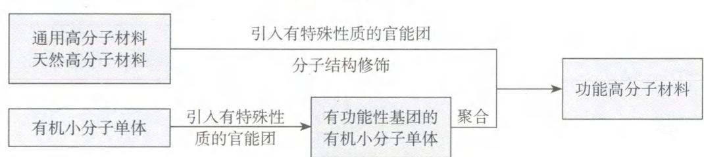