电解熔融氯化物制备活泼金属时,也可以得到纯度较高的氯气,例如:

$$
\mathrm {MgCl_ {2}} \xrightarrow [ \text {熔融} ]{\text {电解}} \mathrm{Mg} + \mathrm {Cl_ {2}} \uparrow   2 \mathrm{NaCl} \xrightarrow [ \text {熔融} ]{\text {电解}} 2 \mathrm{Na} + \mathrm {Cl_ {2}} \uparrow
$$

近年来,由于有机合成工业的发展,氯化氢已成为许多工业过程的数量不少的副产品。利用空气(或氧气)将氯化氢催化氧化,使之转为氯气,已成为工业上生产氯气的重要途径,其反应为

$$
4 \mathrm{HCl} + \mathrm{O} _ {2} \xlongequal {\text {催化剂}} 2 \mathrm{H} _ {2} \mathrm{O} + 2 \mathrm{Cl} _ {2}
$$

常用的催化剂有 $\mathrm{UO}_3$ ， $[\mathrm{CuCl}_2]^{-}$ ， $\mathrm{AlCl}_3$ 等。

实验室中,在加热条件下,常用强氧化剂二氧化锰将浓盐酸氧化,制备少量氯气:

$$
\mathrm{MnO} _ {2} + 4 \mathrm{HCl(浓)} \xlongequal {\triangle} \mathrm{MnCl} _ {2} + \mathrm{Cl} _ {2} \uparrow + 2 \mathrm{H} _ {2} \mathrm{O}
$$

浓盐酸也可用氯化钠和浓硫酸的混合物代替,反应方程式为

$$
2 \mathrm{NaCl} + \mathrm{MnO} _ {2} + 3 \mathrm{H} _ {2} \mathrm{SO} _ {4} (\text {浓}) \stackrel {\triangle} {=} 2 \mathrm{NaHSO} _ {4} + \mathrm{MnSO} _ {4} + \mathrm{Cl} _ {2} \uparrow + 2 \mathrm{H} _ {2} \mathrm{O}
$$

实验室中最简便的制备单质氯的方法是用高锰酸钾氧化浓盐酸。具体做法是将浓盐酸滴加到固体高锰酸钾上，无须加热，就能得到氯气：

$$
2 \mathrm{KMnO} _ {4} + 1 6 \mathrm{HCl(浓)} = 2 \mathrm{KCl} + 2 \mathrm{MnCl} _ {2} + 5 \mathrm{Cl} _ {2} \uparrow + 8 \mathrm{H} _ {2} \mathrm{O}
$$

## 3. 单质溴的制备

1825 年德国人罗威(Löwig)在德国海德堡,1826 年法国人巴拉尔(Balard)在法国蒙彼利埃分别独立地发现了溴元素。

溴主要以-1价离子形式存在于海水之中。不同海域,溴的含量不同。通常是在 $\mathrm{pH} = 3.5$ 的酸性条件下,用 $\mathrm{Cl}_2$ 氧化浓缩后的海水,生成单质溴:

$$
\mathrm{Cl} _ {2} + 2 \mathrm{Br} ^ {-} = \mathrm{Br} _ {2} + 2 \mathrm{Cl} ^ {-}
$$

利用空气将形成的 $Br_{2}$ 吹出, 根据卤素单质的歧化和逆歧化反应与介质条件有关的性质, 先将吹出的 $Br_{2}$ 用 $Na_{2}CO_{3}$ 溶液吸收:

$$
3 \mathrm{Br} _ {2} + 3 \mathrm{Na} _ {2} \mathrm{CO} _ {3} = 5 \mathrm{NaBr} + \mathrm{NaBrO} _ {3} + 3 \mathrm{CO} _ {2} \uparrow
$$

得到溴化钠和溴酸钠的混合物,再将吸收液酸化,则得到溴单质:

$$
5 \mathrm{HBr} + \mathrm{HBrO} _ {3} = 3 \mathrm{Br} _ {2} + 3 \mathrm{H} _ {2} \mathrm{O}
$$

在实验室中,在酸性条件下,利用氧化剂将溴化物氧化来制备单质溴,例如:

$$
\begin{array}{r l} & 2 \mathrm{NaBr} + \mathrm{MnO} _ {2} + 3 \mathrm{H} _ {2} \mathrm{SO} _ {4} = \mathrm{Br} _ {2} + \mathrm{MnSO} _ {4} + 2 \mathrm{NaHSO} _ {4} + 2 \mathrm{H} _ {2} \mathrm{O} \\ & 2 \mathrm{NaBr} + 3 \mathrm{H} _ {2} \mathrm{SO} _ {4} (\text {浓}) = \mathrm{Br} _ {2} + 2 \mathrm{NaHSO} _ {4} + \mathrm{SO} _ {2} \uparrow + 2 \mathrm{H} _ {2} \mathrm{O} \end{array}
$$

在前一反应中,二氧化锰是氧化剂,稀硫酸提供酸性介质;对于后一反应,浓硫酸既能提供酸性环境,又可起到氧化剂的作用。

## 4. 单质碘的制备

1811 年, 法国人库特瓦(Courtois)在法国巴黎发现了碘元素。

智利硝石的母液中含有碘酸钠,含量约为 $6 \, g \cdot dm^{-3}$ 。工业上曾以此为原料来制备单质碘。

先用亚硫酸氢钠( $NaHSO_{3}$ )将浓缩溶液中的 $NaIO_{3}$ 还原成 $I^{-}$ :

$$
2 \mathrm{IO} _ {3} ^ {-} + 6 \mathrm{HSO} _ {3} ^ {-} = 2 \mathrm{I} ^ {-} + 6 \mathrm{SO} _ {4} ^ {2 -} + 6 \mathrm{H} ^ {+}
$$

然后加入适量碘酸根离子,在酸性条件下,使其发生逆歧化反应,得到单质碘:

$$
5 \mathrm{I} ^ {-} + \mathrm{IO} _ {3} ^ {-} + 6 \mathrm{H} ^ {+} = 3 \mathrm{I} _ {2} + 3 \mathrm{H} _ {2} \mathrm{O}
$$

海水也是生产碘的原料。海水中存在少量的碘离子，可在净化后的海水中，加入等物质的量的硝酸银，形成 AgI 沉淀：

$$
\mathrm{I} ^ {-} + \mathrm{AgNO} _ {3} = \mathrm{AgI} \downarrow + \mathrm{NO} _ {3} ^ {-}
$$

加入足量铁屑还原 AgI, 生成单质 Ag 沉淀和 FeI₂ 溶液:

$$
2 \mathrm{AgI} + \mathrm{Fe} = 2 \mathrm{Ag} + \mathrm{FeI} _ {2}
$$

过滤分离,沉淀用 $HNO_{3}$ 氧化成 $AgNO_{3}$ , 循环使用。溶液中通入氧化剂 $Cl_{2}$ , 得到单质碘, 具体反应是

$$
\mathrm{FeI} _ {2} (\mathrm{aq}) + \mathrm{Cl} _ {2} = \mathrm{FeCl} _ {2} + \mathrm{I} _ {2}
$$

析出的碘可用有机溶剂如 $CS_{2}$ 或 $CCl_{4}$ 来萃取分离。

要掌握好 $Cl_{2}$ 的用量, 因为过量的 $Cl_{2}$ 会进一步将 $I_{2}$ 氧化为 $IO_{3}^{-}$ :

$$
\mathrm{I} _ {2} + 5 \mathrm{Cl} _ {2} + 6 \mathrm{H} _ {2} \mathrm{O} = 2 \mathrm{IO} _ {3} ^ {-} + 1 0 \mathrm{Cl} ^ {-} + 1 2 \mathrm{H} ^ {+}
$$

海水中的碘含量少,所以通常利用海藻类植物富集碘,并在酸性条件下,用水浸取海藻灰,将其中的KI溶出。再加入 $MnO_{2}$ 和硫酸制备单质碘:

$$
2 \mathrm{I} ^ {-} + \mathrm{MnO} _ {2} + 4 \mathrm{H} ^ {+} = \mathrm{I} _ {2} + \mathrm{Mn} ^ {2 +} + 2 \mathrm{H} _ {2} \mathrm{O}
$$

经过蒸发浓缩、过滤干燥、升华和凝华，达到分离纯化目的，得到较纯净的单

质碘。

较先进制备碘的方法是用 $Cl_{2}$ 将海水中的 I 氧化, 得到的碘单质以多碘化物形式存在, 利用交换树脂柱将多碘化物吸附, 以碱溶液洗脱, 蒸发洗脱液, 得到单质碘沉淀。树脂柱可以用 NaCl 溶液交换再生, 循环使用。

实验室中制备少量单质碘的方法与实验室中制备单质溴相似：

$$
\begin{array}{r l} & 2 \mathrm{NaI} + \mathrm{MnO} _ {2} + 3 \mathrm{H} _ {2} \mathrm{SO} _ {4} = \mathrm{I} _ {2} + \mathrm{MnSO} _ {4} + 2 \mathrm{NaHSO} _ {4} + 2 \mathrm{H} _ {2} \mathrm{O} \\ & 8 \mathrm{NaI} + 9 \mathrm{H} _ {2} \mathrm{SO} _ {4} (\text {浓}) = 4 \mathrm{I} _ {2} + 8 \mathrm{NaHSO} _ {4} + \mathrm{H} _ {2} \mathrm{S} \uparrow + 4 \mathrm{H} _ {2} \mathrm{O} \end{array}
$$

值得注意的是,用浓硫酸作氧化剂时,在单质溴和单质碘的制备过程中,还原产物不同。

## 17.2 卤化氢和氢卤酸

## 17.2.1 物理性质

按传统习惯,HX 的气体分子或纯 HX 液体,称为卤化氢,而它们的水溶液,统称为氢卤酸。纯的卤化氢液体不导电,说明氢与卤素之间的化学键为共价键。常温常压下,卤化氢均为具有强刺激性气味的无色气体。卤化氢极易溶解于水,可与空气中的水蒸气结合,形成白色酸雾。

卤化氢的熔、沸点按 HCl, HBr, HI 的顺序依次升高, 而 HF 的熔、沸点却是本族氢化物中最高的。这是因为在 HF 分子间存在着氢键, 分子之间的引力很强。

卤化氢都是极性分子,它们在水中有很大的溶解度。HF 分子极性最大,在水中可无限溶解。常压下蒸馏氢卤酸,溶液的沸点随着其组成的变化在不断地改变。从某一时刻起溶液的组成和沸点恒定不变,形成恒沸溶液。因为此时从溶液蒸出的气体,其组成和溶液的组成相同,所以达到恒沸温度时, $H_{2}O$ 和 $HX$ 以一定的比例共同蒸出,溶液的组成保持恒定,故沸点不再改变。例如,HCl 水溶液恒沸点为 108.58 ℃,恒沸溶液含 20.22 %氯化氢。

HF 分子间存在氢键, 分子有缔合现象。蒸气密度测定表明, 常温常压下, HF 主要存在形式是二聚 $\left(\mathrm{HF}\right)_{2}$ 和三聚的缔合分子 $\left(\mathrm{HF}\right)_{3}$ , 在 86 ℃ 以上, HF 气体才以单分子状态存在。其他卤化氢气体, 常温下以单分子状态存在。需要指出的是, 虽然 HF 分子间的氢键最强, 但与另外两种典型的具有分子间氢键的 $H_{2}O$ 和 $NH_{3}$ 相比, 其熔、沸点并非最高者。以沸点为例, 在其他分子间作用力相似情况下, $H_{2}O$ 分子间的氢键虽弱, 但是氢键的数目比 HF 分子间的多。另外, 在形成气态水分子时, $H_{2}O$ 必须以单分子状态存在, 而 HF 气态分子是以二聚和三聚状态存在。这说明在汽化过程中,破坏 $H_{2}O$ 分子间的氢键数目多于 HF 分子间的氢键数目。所以宏观表现为, $H_{2}O$ 的沸点远高于 HF 的沸点。

## 17.2.2 化学性质

无水 HX 的腐蚀能力强, 可作为卤化试剂, 与金属、非金属、氢化物、氧化物及其他类型化合物反应, 形成相应的卤化物。此类反应在热力学上是允许的, 但某些反应往往受动力学限制, 反应速率小, 所以经常要在催化剂和光引发等条件下才能进行。

## 1. 酸性

卤化氢溶解于水得到相应的氢卤酸, 氢氯酸一般称为盐酸, 是三大无机强酸之一。因为 H—X 是极性分子, 在水分子的作用下, 解离成 $H^{+}$ 和 $X^{-}$ 。

氢卤酸的酸性按 HF, HCl, HBr, HI 顺序依次增强。除氢氟酸是弱酸外, 其余均为强酸。

通过结构分析,可以判断氢卤酸酸性的强弱。HX 水溶液酸性的强弱取决于溶液中 $H^{+}$ 浓度的大小。而 $H^{+}$ 浓度的大小由 HX 在水溶液中解离度的大小所决定,即 $X^{-}$ 对 $H^{+}$ 的吸引能力弱,则解离度大,溶液的酸性强;反之, $X^{-}$ 对 $H^{+}$ 的吸引能力强,则解离度小,溶液的酸性弱。这种吸引能力取决于 $X^{-}$ 本身所带电荷和半径,即 $X^{-}$ 本身的电子云密度。按 $F^{-}, Cl^{-}, Br^{-}, I^{-}$ 顺序,离子的半径逐渐增大,而离子所带电荷数相同,则有效核电荷数逐渐降低,于是 $X^{-}$ 对 $H^{+}$ 的吸引能力逐渐降低。结果导致 HF,HCl,HBr,HI 在水溶液中的解离度依次增大,酸性逐渐增强。

氢氟酸是弱酸,在水溶液中的解离为

$$
\mathrm{HF} (\mathrm{aq}) = \mathrm{H} ^ {+} (\mathrm{aq}) + \mathrm{F} ^ {-} (\mathrm{aq}) \quad K _ {\mathrm{a}} ^ {\ominus} = 6. 3 \times 1 0 ^ {- 4}\tag{1}
$$

当氢氟酸浓度增大时,其酸性增强,因为存在下列反应:

$$
\mathrm{HF} (\mathrm{aq}) + \mathrm{F} ^ {-} (\mathrm{aq}) = \mathrm{HF} _ {2} ^ {-} (\mathrm{aq}) \quad K _ {2} ^ {\ominus} = 5. 2\tag{2}
$$

式(2) $K^{\ominus}$ 值大,表明 $HF_{2}^{-}$ 浓度较大,由于 $F^{-}$ 的消耗,使式(1)右移,所以氢离子浓度增大。总反应为

$$
2 \mathrm{HF} = \mathrm{H} ^ {+} + \mathrm{HF} _ {2} ^ {-} \quad K _ {3} ^ {\ominus} = K _ {\mathrm{a}} ^ {\ominus} K _ {2} ^ {\ominus} = 3. 3 \times 1 0 ^ {- 3}\tag{3}
$$

所以, 稀的氢氟酸是弱酸, 而当其浓度大于 $5.0 \, mol \cdot dm^{-3}$ 时, 酸性增强。或者说, 在水溶液中, 随着浓度的增大, HF 分子间的氢键增强, 有 $(\mathrm{HF})_{2}$ 缔合分子存在, 而 $(\mathrm{HF})_{2}$ 的酸性比 HF 强。

其他氢卤酸属于强酸,不存在类似的问题。

氢氟酸另一个独特之处是可以腐蚀玻璃和瓷器, 氢氟酸与其中的 $SiO_{2}$ 或硅酸盐反应, 生成挥发性气体 $SiF_{4}$ :

$$
\begin{array}{r l} & \mathrm {SiO_ {2}} + 4 \mathrm{HF(aq)} = \mathrm {SiF_ {4}} \uparrow + 2 \mathrm {H_ {2} O} \\ & \mathrm {CaSiO_ {3}} + 6 \mathrm{HF(aq)} = \mathrm {CaF_ {2}} + \mathrm {SiF_ {4}} \uparrow + 3 \mathrm {H_ {2} O} \end{array}
$$

氢氟酸的这一化学性质可用于溶解硅酸盐矿物。由于除去了矿物中的硅，故有利于其他组分的分析。

## 2. 还原性

除 HF 之外,其他卤化氢或氢卤酸均具有一定的还原性。可从标准电极电势数值大小考察它们的这一性质：

$$
\begin{array}{l l} \mathrm {F_ {2}} + 2 \mathrm {H^ {+}} + 2 \mathrm {e^ {-}} = 2 \mathrm{HF} & E ^ {\ominus} = 3. 0 5 3 \mathrm{V} \\ \mathrm {Cl_ {2}} + 2 \mathrm {e^ {-}} = 2 \mathrm {Cl^ {-}} & E ^ {\ominus} = 1. 3 5 8 \mathrm{V} \\ \mathrm {Br_ {2}} + 2 \mathrm {e^ {-}} = 2 \mathrm {Br^ {-}} & E ^ {\ominus} = 1. 0 6 6 \mathrm{V} \\ \mathrm {I_ {2}} + 2 \mathrm {e^ {-}} = 2 \mathrm {I^ {-}} & E ^ {\ominus} = 0. 5 3 5 5 \mathrm{V} \end{array}
$$

可见,电对中氧化型物质的氧化能力,从 $F_{2}$ 到 $I_{2}$ 依次减弱;电对中还原型物质的还原能力,从 $F^{-}$ 到 $I^{-}$ 依次增强。

实验事实是,HI水溶液可被空气中的氧气氧化,形成碘单质:

$$
4 \mathrm{HI(aq)} + \mathrm{O} _ {2} = 2 \mathrm{I} _ {2} + 2 \mathrm{H} _ {2} \mathrm{O}
$$

HBr 和 HCl 水溶液不被空气中的氧气氧化,且尚未发现可将 HF 氧化的氧化剂。

可通过卤化物与具有氧化性的浓硫酸作用,对 $X^{-}$ 还原性的强弱进行比较:

$$
\begin{array}{r l} & {\mathrm {NaCl+ H_ {2} SO_ {4} (\text {浓}) \xlongequal{\triangle} NaHSO_ {4} + HCl\uparrow}} \\ & {2 \mathrm{NaBr+3H_2SO_4(浓)} \xlongequal {\quad} \mathrm {SO_ {2} \uparrow + Br_ {2} + 2NaHSO_ {4} + 2H_ {2} O}} \\ & {8 \mathrm{NaI+9H_2SO_4(浓)} \xlongequal {\quad} \mathrm {H_ {2} S\uparrow + 4I_ {2} + 8NaHSO_ {4} + 4H_ {2} O}} \end{array}
$$

NaCl 与浓硫酸作用, Cl 未被氧化; NaBr 和 NaI 中的卤素的 -1 价离子, 均被浓硫酸氧化成单质。不同之处在于, +6 价的硫分别被 NaBr 和 NaI 还原成 $SO_{2}$ 和 $H_{2}S$ 。

综合以上数据和实验现象可见, $X^{-}$ 及HX的还原性强弱顺序为

$$
\mathrm{碘} > \mathrm{溴} > \mathrm{氯} > \mathrm{氟}
$$

## 3. 热稳定性

在加热条件下,卤化氢按如下方式分解为卤素单质和氢气:

$$
2 \mathrm{HX} \stackrel {\triangle} {=} \mathrm{H} _ {2} \uparrow + \mathrm{X} _ {2}
$$

由于各种卤化氢的标准摩尔生成热不同,所以它们的热分解温度不同。形成卤化氢分子时,释放的热量越多,则分子越稳定,热分解温度高。如 $\mathrm{HF(g)}$ 的标准摩尔生成热 $\Delta_{\mathrm{f}}H_{\mathrm{m}}^{\ominus} = -273.3\mathrm{kJ}\cdot \mathrm{mol}^{-1}$ ,加热到 $1000^{\circ}\mathrm{C}$ 时,HF无明显分解现象。若形成卤化氢分子时,释放的热量越少,甚至吸热,则分子不稳定,热分解温度低。如HI的标准摩尔生成热 $\Delta_{\mathrm{f}}H_{\mathrm{m}}^{\ominus} = +26.5\mathrm{kJ}\cdot \mathrm{mol}^{-1}$ ,加热到 $300^{\circ}\mathrm{C}$ ,HI即分解为碘单质和氢气。

所以,卤化氢的热稳定性从大到小的顺序为 HF>HCl>HBr>HI。

## 17.2.3 卤化氢的制备

以卤化物或卤素为原料,可通过多种途径进行卤化氢的制备。

## 1. 卤化物与浓硫酸作用

固体卤化物与浓硫酸直接反应制取卤化氢,例如:

$$
\mathrm{CaF} _ {2} (\mathrm{s}) + \mathrm{H} _ {2} \mathrm{SO} _ {4} (\text {浓}) \stackrel {\triangle} {=} \mathrm{CaSO} _ {4} + 2 \mathrm{HF} \uparrow
$$

这一反应需要在 Pt 制的器皿中进行,以防氢氟酸对于一般容器的腐蚀。

$$
\mathrm {NaCl(s) + H_ {2} SO_ {4} (浓)\xlongequal{>150°C} NaHSO_ {4} + HCl\uparrow} \mathrm {NaCl(s) + NaHSO_ {4} \xlongequal{>500°C} Na_ {2} SO_ {4} + HCl\uparrow}
$$

利用产物溶解度较大的特点,将形成的卤化氢气体以水吸收。浓硫酸具有难挥发性,且产物 HF 和 HCl 不被浓硫酸氧化,可以使得到的卤化氢比较纯净。

由于 HBr 和 HI 可被浓硫酸氧化成单质, 所以不能用此方法制备。可以利用无氧化性的浓磷酸代替浓硫酸, 在加热条件下, 进行 HBr 和 HI 的制备:

$$
\begin{array}{r l} & {\mathrm {NaBr(s) + H_ {3} PO_ {4} (浓)\xlongequal{\triangle} NaH_ {2} PO_ {4} + HBr\uparrow}} \\ & {\mathrm {NaI(s) + H_ {3} PO_ {4} (浓)\xlongequal{\triangle} NaH_ {2} PO_ {4} + HI\uparrow}} \end{array}
$$

## 2. 卤素与氢直接化合

该方法实际上仅用于 HCl 的合成, 因为 $F_{2}$ 和 $H_{2}$ 直接反应虽然十分完全, 但反应过于剧烈, 不好控制, 且成本高; $Br_{2}$ 或 $I_{2}$ 与 $H_{2}$ 反应缓慢, 而且反应不完全。所以工业上不采用单质直接化合法制备 HF, HBr 和 HI, 只是制备 HCl 采用 $Cl_{2}$ 和 $H_{2}$ 直接化合法进行, 具体方法是使 $H_{2}$ 在 $Cl_{2}$ 中燃烧:

$$
\mathrm{H} _ {2} + \mathrm{Cl} _ {2} \xlongequal {\text {点燃}} 2 \mathrm{HCl}
$$

## 3. 非金属卤化物水解

实验室中 HBr 和 HI 常用非金属卤化物水解法制备。而在实际操作中, 是采用卤素与单质磷和水连续作用的方式进行的。具体步骤为, 把溴水滴加到磷与少许水的混合物上, 或将水滴加到磷与碘的混合物上:

$$
\begin{array}{r l} & 2 \mathrm{P(s)} + 3 \mathrm {X_ {2}} = 2 \mathrm {PX_ {3}} \\ & \mathrm {PX_ {3}} + 3 \mathrm {H_ {2} O} = \mathrm {H_ {3} PO_ {3}} + 3 \mathrm{HX} \end{array}
$$

总反应为

$$
2 \mathrm{P} + 3 \mathrm{X} _ {2} + 6 \mathrm{H} _ {2} \mathrm{O} = 2 \mathrm{H} _ {3} \mathrm{PO} _ {3} + 6 \mathrm{HX}
$$

此外,大量的卤化氢主要来自有机合成和农药生产工业卤化过程的副产物。例如,在通过下面反应得到 $CH_{3}Cl$ 的同时会得到大量的 HCl:

$$
\mathrm{CH} _ {4} + \mathrm{Cl} _ {2} \xlongequal {4 5 0 ^ {\circ} \mathrm{C}} \mathrm{CH} _ {3} \mathrm{Cl} + \mathrm{HCl}
$$

## 17.3 卤化物和拟卤素

除 He, Ne, Ar 外, 其他元素几乎都可与卤素单质形成卤化物。按化学键的类型, 通常将卤化物大致分为离子型卤化物和共价型卤化物, 但其间很难有严格的界限。

本节主要讨论金属卤化物、卤素互化物、多卤化物和拟卤素。而非金属卤化物已在相关的章节中介绍过。

## 17.3.1 金属卤化物

金属卤化物是指金属与卤素所形成的简单化合物。由于 $F_{2}$ 的氧化能力最强，元素形成氟化物往往表现最高价，如 $SiF_{4}, SF_{6}, IF_{7}, OsF_{8}$ 。而 $I_{2}$ 与 $F_{2}$ 相比氧化能力小得多，所以元素在形成碘化物时，往往表现较低的氧化态，如 $CuI, Hg_{2}I_{2}$ 。

金属卤化物中,卤素与金属之间所形成的化学键类型,主要与离子极化相关。对于电子构型相同、半径相近的金属离子,所带电荷数高,极化能力强,则所形成的卤化物共价性大;所带电荷数低,极化能力弱,则离子性强。碱金属、碱土金属和镧系及锕系低价态卤化物,由于金属离子的变形性小,相互极化程度低,离子性强;而过渡金属元素的高价态卤化物中,阳离子的极化能力和变形性都很大,相互极化程度高,共价性较强。

随着卤素离子半径增大、变形性增大，离子极化增强，金属卤化物往往表现出较多的共价型化合物的性质。在金属元素及其氧化态都相同的卤化物中，由于氟的电负性大，半径小，对周围的电子控制能力强，变形性小，不易被极化，所以形成的氟化物离子性强。碘的电负性小，半径相对较大，对周围的电子的控制力弱，变形性大，容易被极化，所以形成的碘化物共价性强。

相同周期的金属元素,伴随阳离子的半径减小和氧化态升高,形成的卤化物的离子性减弱,共价性增强。

典型的离子型卤化物包括碱金属、碱土金属及较活泼金属、镧系和锕系元素的低价态卤化物，如 $NaCl, CaF_{2}, BaCl_{2}, FeCl_{2}, CeCl_{3}$ 等。而大多数金属的高价态卤化物，表现出较大的共价型化合物的性质，如 $AlCl_{3}, FeCl_{3}, SnCl_{4}, TiCl_{4}$ 等。

但是,离子型卤化物和共价型卤化物之间无明显的界线。通常,一些卤化物在由离子型向共价型过渡过程中,表现在晶体结构上,既不是典型的离子晶体,也不是典型的分子晶体或原子晶体,往往呈现层状或链状结构。

## 1. 金属卤化物的制备

## (1) 氢卤酸与相应物质作用

氢卤酸与活泼金属、金属氧化物、金属氢氧化物、金属难溶盐作用,可以得到相应的金属卤化物,例如:

$$
\begin{array}{r l} & \mathrm {Zn + 2HCl(aq) = ZnCl_ {2} + H_ {2} \uparrow} \\ & \mathrm {CuO + 2HCl(aq) = CuCl_ {2} + H_ {2} O} \\ & \mathrm {NaOH + HCl(aq) = NaCl+ H_ {2} O} \\ & \mathrm {CaCO_ {3} + 2HCl(aq) = CaCl_ {2} + H_ {2} O+ CO_ {2} \uparrow} \end{array}
$$

如果所得到的产物是在氢卤酸中容易水解的卤化物,则不宜使用氢卤酸,而尽量采用纯净的卤化氢进行卤化物制备。

## (2) 金属与卤素直接化合

利用金属与卤素单质直接化合的方式,可以制备相应的金属卤化物,如金属铝和铬可与氯气反应,形成 $AlCl_{3}$ 和 $CrCl_{3}$ :

$$
\begin{array}{r l} & 2 \mathrm{Al} + 3 \mathrm{Cl} _ {2} \xlongequal {\text {高温}} 2 \mathrm{AlCl} _ {3} \\ & 2 \mathrm{Cr} + 3 \mathrm{Cl} _ {2} \xlongequal {\text {高温}} 2 \mathrm{CrCl} _ {3} \end{array}
$$

这些反应需要高温干燥的反应条件。

## (3) 氧化物的卤化

一些金属氧化物与卤素单质反应可以制备金属卤化物。如考虑通过 $TiO_{2}$ 与 $Cl_{2}$ 反应得到 $TiCl_{4}$ ：

$$
\mathrm{TiO} _ {2} (\mathrm{s}) + 2 \mathrm{Cl} _ {2} (\mathrm{g}) = \mathrm{TiCl} _ {4} (1) + \mathrm{O} _ {2} (\mathrm{g}) \quad \Delta_ {\mathrm{r}} G _ {\mathrm{m}} ^ {\ominus} = 1 5 1. 6 \mathrm{kJ} \cdot \mathrm{mol} ^ {- 1}
$$

该反应由于反应的 $\Delta_{r}G_{m}^{\ominus}>0$ ，不能进行。

可以用下面热力学上进行程度很大的反应：

$$
\mathrm{C} (\text {石墨}) + \mathrm{O} _ {2} (\mathrm{g}) = \mathrm{CO} _ {2} (\mathrm{g}) \qquad \Delta_ {\mathrm{r}} G _ {\mathrm{m}} ^ {\ominus} = - 3 9 4. 4 \mathrm{kJ} \cdot \mathrm{mol} ^ {- 1}
$$

去促进上述反应的发生。具体做法是,向上面不能进行反应的体系中加入单质碳,进行反应耦合以得到产物 $TiCl_{4}$ , 反应方程式为

$$
\mathrm{TiO} _ {2} + \mathrm{C} + 2 \mathrm{Cl} _ {2} \stackrel {\triangle} {=} \mathrm{TiCl} _ {4} + \mathrm{CO} _ {2}
$$

## (4) 卤化物转化

难溶性金属卤化物,可通过可溶性金属卤化物转化而形成。典型的反应是硝酸银与碱金属卤化物的沉淀反应:

$$
\mathrm{AgNO} _ {3} (\mathrm{aq}) + \mathrm{KX} (\mathrm{aq}) = \mathrm{AgX} \downarrow + \mathrm{KNO} _ {3} \quad \left(\mathrm{X} ^ {-} = \mathrm{Cl} ^ {-}, \mathrm{Br} ^ {-}, \mathrm{I} ^ {-}\right)
$$

$\mathrm{AgCl, AgBr, AgI}$ 均为难溶性金属卤化物，且其溶度积常数 $K_{\mathrm{sp}}^{\ominus}$ 依次减小。按 $\mathrm{Cl}^{-}, \mathrm{Br}^{-}, \mathrm{I}^{-}$ 顺序，由于卤离子的变形性依次增大，共价键的性质逐渐增大，故表现出溶解度渐次下降的趋势。

难溶性金属卤化物可以转变成溶解度更小的卤化物,例如:

$$
\mathrm{AgCl} + \mathrm{KI(aq)} = \mathrm{AgI} + \mathrm{KCl}
$$

## 2. 金属卤化物的溶解性

在溶解性方面,氟化物表现出与其他卤化物明显的不同。其原因在于氢氟酸是弱酸,其他氢卤酸均为强酸;再则 $F^{-}$ 的半径远小于 $Cl^{-}$ , $Br^{-}$ 和 $I^{-}$ 。

$NH_{4}F$ 和大多数碱金属的氟化物易溶，而 LiF 难溶。大多数碱土金属的氟化物难溶，而 $BeF_{2}$ 易溶。其他高价主族元素的氟化物，如 $GaF_{3}, AlF_{3}, PbF_{2}$ 等也难溶。许多过渡元素的氟化物，如 $FeF_{2}, FeF_{3}, MnF_{2}, CuF, CuF_{2}, ZnF_{2}$ 等难溶，但大半径过渡元素的氟化物 $Hg_{2}F_{2}, HgF_{2}, AgF$ 易溶。

大多数金属的氯化物、溴化物和碘化物是易溶的，但 Ag(I)，Pb(II)，Hg(I)，Cu(I)，Tl(I) 和 Pt(II) 的卤化物不易溶。

一般来说,若氯化物可溶,则其溴、碘化物也可溶,且溶解度更大;而氯化物难溶,则其溴、碘化物更难溶。Cl⁻,Br⁻,I⁻在极化能力强的金属离子作用下,呈现变形性依次增大的趋势,所以形成卤化物的共价性逐渐增强,溶解度依次减小。通常,重金属卤化物溶解度较小。

## 3. 形成配位化合物

由于 $\mathbf{X}^{-}$ 已经达到八隅体结构, 外层具有 4 对孤电子对, 所以可作为配体, 与

盐类化合物形成配位化合物。

例如 $CuCl_{2}$ ，以固体形式存在或在浓盐酸或 NaCl 浓溶液中，呈现深黄色，原因是其中有 $\left[CuCl_{4}\right]^{2-}$ 的存在。将 $CuCl_{2}$ 固体溶解于大量水中，或将其浓溶液加水稀释，则溶液逐渐由黄色到绿色直到蓝色，深黄色配离子 $\left[CuCl_{4}\right]^{2-}$ 逐渐转变成蓝色水合离子 $\left[\mathrm{Cu}\left(\mathrm{H}_{2}\mathrm{O}\right)_{4}\right]^{2+}$ ：

$$
\begin{array}{r l} {[ \mathrm {CuCl_ {4}} ] ^ {2 -} + 4 \mathrm {H_ {2} O} = [ \mathrm {Cu(H_ {2} O) _ {4}} ] ^ {2 +} + 4 \mathrm {Cl^ {-}}} \\ {\text {深黄色}} & {\text {蓝色}} \end{array}
$$

以上两种离子混合时为绿色。

金属铅与稀盐酸反应生成白色的 $PbCl_{2}$ 沉淀,遇到浓盐酸时,将生成无色的 $\left[PbCl_{4}\right]^{2-}$ 配离子而沉淀消失。

向 $\mathrm{Hg(NO_3)_2}$ 溶液中滴加KI溶液，首先可以观察到红色 $\mathrm{HgI}_2$ 沉淀的形成：

$$
\mathrm{Hg} ^ {2 +} + 2 \mathrm{I} ^ {-} = \mathrm{HgI} _ {2} \downarrow
$$

当加入的 KI 溶液过量时, 可看到之前的红色 $HgI_{2}$ 沉淀逐渐消失, 形成 $\left[HgI_{4}\right]^{2-}$ 配离子, 得到无色溶液:

$$
\mathrm{HgI} _ {2} + 2 \mathrm{I} ^ {-} = [ \mathrm{HgI} _ {4} ] ^ {2 -}
$$

以上各反应充分说明，-1价的卤素离子可作为路易斯碱提供电子对，向中心离子配位，形成配位化合物。但由于-1价的卤素离子作为路易斯碱其软硬程度很不一致，所以形成的配位化合物稳定与否可以依据“软亲软、硬亲硬”的原则进行初步的判断。

## 17.3.2 卤素互化物和多卤化物

## 1. 卤素互化物

卤素互化物是指由两种或三种卤素组成的共价型化合物。

三种卤素组成的卤素互化物只有几种,其中包括 $IFCl_{2}$ 和 $IF_{2}Cl$ 。

多数卤素互化物由两种卤素单质化合而形成,它们的组成通式是: $XX_{n}^{\prime}$ ,其中X为中心原子,其电负性要较配位原子 $X^{\prime}$ 小,而半径要较 $X^{\prime}$ 大。配位原子的个数n通常为1,3,5,7,可分别组成双原子、4原子、6原子和8原子的卤素互化物。6原子的卤素互化物只以F为配体,如 $IF_{5},BrF_{5},ClF_{5}$ ;而8原子的卤素互化物目前只有 $IF_{7}$ 一种。

与之密切相关的还有多卤阴离子 $XX'_{2n}^{-}$ 和多卤阳离子 $XX'_{2n}^{+}(n=1,2,3)$ 。

卤素互化物中,两种卤素之间存在电负性差 $\Delta X$ ,彼此以极性共价键结合。所以可根据价层电子对互斥理论,来判断卤素互化物的空间构型。

(a)

(b)

(c)

如图 17-3(a) 所示, 在 $XX_{3}^{\prime}$ 分子中, 中心 X 周围共有 5 对价层电子, 为 $sp^{3}d$ 杂化, 所以其电子对构型为三角双锥形, 而分子构型为 T 形。如图 17-3(b) 所示, 在卤素互化物分子 $XX_{5}^{\prime}$ 中, 中心 X 周围共有 6 对价层电子, 为 $sp^{3}d^{2}$ 杂化, 所以其电子对构型为八面体形, 而分子构型为四角锥形。只有 $IF_{7}$ 分子中, 价层电子对数和配体数相同, 为 $sp^{3}d^{3}$ 等性杂化, 所以其电子对构型和分子构型相同, 均为五角双锥形, 如图 17-3(c) 所示。

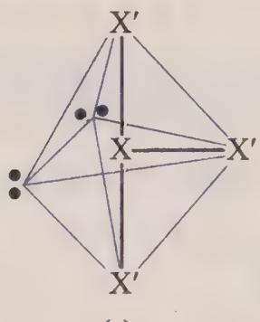

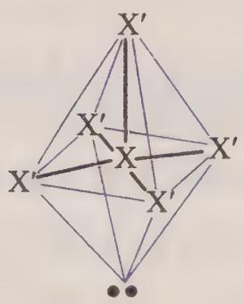

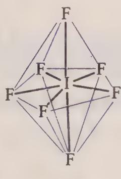  
图17-3 典型的卤素互化物的分子空间构型

中心原子的氧化数,也与组成卤素互化物的卤素原子之间的电负性差 $\Delta\chi$ 相关, $\Delta\chi$ 越大,中心原子的氧化数越高;而 $\Delta\chi$ 越小,中心原子的氧化数越小。例如,I 和 F 之间的 $\Delta\chi$ 最大,所以可形成中心氧化数为 +7 价的 $IF_{7}$ ;而 Cl 与 F 之间的 $\Delta\chi$ 最小,在相同的反应条件下,只能形成中心氧化数为 +3 价的 $ClF_{3}$ 。

原则上将两种卤素单质相互混合,在一定温度下即可制得卤素互化物;若采用卤素单质和卤素互化物反应,则可得另一种卤素互化物。要注意控制反应温度,也要注意卤素用量,例如:

$$
\begin{array}{r l} \mathrm{Cl} _ {2} + \mathrm{F} _ {2} & \xlongequal {2 2 0 \sim 2 5 0 ^ {\circ} \mathrm{C}} 2 \mathrm{ClF} \\ \mathrm{BrF} _ {3} + \mathrm{F} _ {2} & \xlongequal {2 0 0 ^ {\circ} \mathrm{C}} \mathrm{BrF} _ {5} \end{array}
$$

在产物中,通常是多种卤素互化物的混合物,必须分离纯化。有单质氟参与反应时,要使用铜、镍及其合金材质的器皿。

常温下, 卤素互化物中 ICl, IBr 和 $\mathrm{ICl}_{3}$ 为固体; $\mathrm{BrF}_{3}, \mathrm{BrF}_{5}$ 和 $\mathrm{IF}_{5}$ 为液体; $\mathrm{ClF}_{3}, \mathrm{ClF}_{5}, \mathrm{IF}_{7}$ 为气体。值得注意的是, $\mathrm{ClF}_{3}$ 和 $\mathrm{BrF}_{3}$ 没有相应的五氟化物的挥发性强, 碘的氟化物中 $\mathrm{IF}_{7}$ 的挥发性最强。

绝大多数的卤素互化物稳定性较差,易分解为相应的卤素或发生歧化反应,例如:

$$
2 \mathrm{ClF} _ {3} \xlongequal {\text {低温}} \mathrm{ClF} + \mathrm{ClF} _ {5}
$$

$$
2 \mathrm{IF} _ {3} \stackrel {\text {常温}} {=} \mathrm{IF} + \mathrm{IF} _ {5}
$$

卤素互化物的氧化性很强,可以将许多金属、非金属单质氧化、氟化,而且其反应远比使用单质氟进行得温和、易控制,例如:

$$
\begin{array}{r l} & \mathrm {W + 6ClF = WF_ {6} + 3Cl_ {2}} \\ & \mathrm {Se + 4ClF = SeF_ {4} + 2Cl_ {2}} \\ & \mathrm {U + 3ClF_ {3} = UF_ {6} + 3ClF} \end{array}
$$

$\mathrm{ClF}_3$ 是极强氧化剂, 几乎可以与所有元素的单质反应, 包括 $\mathrm{Pt}, \mathrm{Au}$ 等。 $\mathrm{ClF}_3$ 和 $\mathrm{IF}_7$ 能与 $\mathrm{Xe}$ 和 $\mathrm{Kr}$ 作用生成 $\mathrm{XeF}_2$ 和 $\mathrm{KrF}_2$ 。

易发生水解是卤素互化物的又一重要性质,例如:

$$
\begin{array}{r l} & \mathrm {ICl+ H_ {2} O\xlongequal {\quad} HIO + HCl} \\ & \mathrm {BrF_ {5} + 3H_ {2} O\xlongequal {\quad} HBrO_ {3} + 5HF} \end{array}
$$

在水解过程中卤素的氧化数不发生变化。高氧化数的中心原子与 $OH^{-}$ 结合生成卤素含氧酸；低氧化数的配体与 $H^{+}$ 结合生成氢卤酸。

$\mathrm{BrF}_{3}$ 和 $\mathrm{IF}_{5}$ 是重要的非水溶剂，它们的自耦解离如下：

$$
\begin{array}{r l} & 2 \mathrm{BrF} _ {3} = [ \mathrm{BrF} _ {2} ] ^ {+} + [ \mathrm{BrF} _ {4} ] ^ {-} \\ & 2 \mathrm{IF} _ {5} = [ \mathrm{IF} _ {4} ] ^ {+} + [ \mathrm{IF} _ {6} ] ^ {-} \end{array}
$$

## 2. 多卤化物

多卤化物一般为离子型化合物,其阳离子以碱金属离子为多,其阴离子由一种卤素或多种卤素组成,如三碘化钾 $KI_{3}$ ,二溴碘化铯 $CsIBr_{2}$ 和一水合四氯碘化钾 $KICl_{4}\cdot H_{2}O$ 均为多卤化物。多卤阴离子中卤素原子(离子)的总数为奇数。

多卤阴离子中,重卤素处于结构的中心位置。由价层电子对互斥理论可以判断 $I_{3}^{-}$ 的构型为直线形,而 $ICl_{4}^{-}$ 的构型为正方形。

卤化物与卤素反应或与卤素互化物反应,可以得到多卤化物,例如:

$$
\begin{array}{r l} & \mathrm{KI} + \mathrm{I} _ {2} = \mathrm{KI} _ {3} \\ & \mathrm{CsBr} + \mathrm{IBr} = \mathrm{CsIBr} _ {2} \\ & \mathrm{CsF} + \mathrm{IF} _ {7} = \mathrm{CsIF} _ {8} \end{array}
$$

只有半径大、电荷小的金属离子适宜于多卤化物的形成。因为这样的离子极化作用小，对于化合物的结构破坏能力较小。

多卤化物不稳定,受热分解为简单的卤化物和卤素单质,例如:

$$
\mathrm{CsBr} _ {3} \stackrel {\triangle} {=} \mathrm{CsBr} + \mathrm{Br} _ {2}
$$

若为多种卤素的多卤化物,则受热分解为具有最高晶格能的那种卤化物,例如:

$$
\mathrm{CsICl} _ {2} \stackrel {\triangle} {=} \mathrm{CsCl} + \mathrm{ICl}
$$

$$
\mathrm{CsIBrCl} \stackrel {\triangle} {=} \mathrm{CsCl} + \mathrm{IBr}
$$

因此,很难存在含氟的多卤化物,因为氟化物的晶格能特别大,即使形成含氟的多卤化物,也会直接分解,形成氟化物。

## 17.3.3 拟卤素

某些由两个或多个非金属元素的原子构成的-1价离子，在形成离子型或共价型化合物时，表现出与卤素阴离子相似的性质。这些阴离子包括氰离子 $\left(\mathrm{CN}^{-}\right)$ 、硫氰酸根离子 $\left(\mathrm{SCN}^{-}\right)$ 、氰酸根离子 $\left(\mathrm{OCN}^{-}\right)$ 等，这些离子被称为拟卤离子。当它们以与卤素单质相同的形式组成中性分子时，其性质也与卤素单质相似，具有挥发性，故称为拟卤素或类卤素。

拟卤素主要包括氰 $(\mathrm{CN})_{2}$ , 硫氰 $(\mathrm{SCN})_{2}$ , 氧氰 $(\mathrm{OCN})_{2}$ , 硒氰 $(\mathrm{SeCN})_{2}$ 等。

## 1. 拟卤素的制备

$(\mathrm{CN})_{2}$ 的制备一般采用加热分解氰化物的方法。在加热条件下，增强了氰化物中金属离子的极化能力，使其能从拟卤离子夺回电子，因此促进氰化物的分解。例如，加热 AgCN 来制取 $(\mathrm{CN})_{2}$ ：

$$
2 \mathrm{AgCN} \stackrel {\triangle} {=} 2 \mathrm{Ag} + (\mathrm{CN}) _ {2} \uparrow
$$

$(SCN)_{2}$ 的制备, 是将 AgSCN 悬浮在乙醚中, 利用 $Br_{2}$ 或 $I_{2}$ 将 $SCN^{-}$ 氧化:

$$
2 \mathrm{AgSCN} + \mathrm{Br} _ {2} \xlongequal {\text {乙醚中}} 2 \mathrm{AgBr} + (\mathrm{SCN}) _ {2} (1)
$$

电解氰酸钾(KOCN)溶液,在阳极生成氧氰:

$$
2 \mathrm{OCN} ^ {-} - 2 \mathrm{e} ^ {-} = (\mathrm{OCN}) _ {2}
$$

纯的氧氰尚未制得，它只能存在于溶液中。

## 2. 拟卤素的分子结构

(CN) $_{2}$ 分子中 4 个原子的连接关系为 N—C—C—N，其中两个 C 原子的轨道均为 sp 杂化，分子中有 3 个 $\sigma$ 键——两个 C—N 间的 sp-p $\sigma$ 键、一个 C—C 间的 sp-sp $\sigma$ 键，形成直线形分子。各原子中未参加杂化的 p 轨道互相重叠，形成两个彼此垂直的四中心四电子离域 $\pi$ 键 $\Pi_{4}^{4}$ ，如图 17-4(a) 所示。

(CN) $_{2}$ 分子中的 C—C 键键长为 138 pm，比烷烃中 C—C 单键的 154 pm

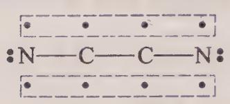  
(a)

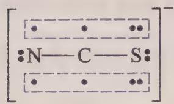  
(b)  
图17-4 拟卤素和拟卤离子中的离域 $\pi$ 键

短,也证实了 $(\mathrm{CN})_{2}$ 分子中离域 $\pi$ 键的存在。

(SCN) $_{2}$ 分子通常写成 :N≡C—S—S—C≡N:。硫氰酸根离子中原子的连接关系为 N—C—S, 其中 C 原子的轨道为 sp 杂化, 分子中有两个 σ 键——一个 C—N 间的 sp-p σ 键、一个 C—S 间的 sp-p σ 键, 离子呈直线形。由未参与杂化的 p 轨道之间互相重叠, 形成两个彼此垂直的三中心四电子的离域 π 键, 如图 17-4(b) 所示。

$(\mathrm{OCN})_{2}$ 和氧氰酸根的结构与 $(\mathrm{SCN})_{2}$ 和硫氰酸根的结构相似。

## 3. 拟卤素的性质

$(\mathrm{CN})_{2}$ 在常温常压下, 呈现气态, 有苦杏仁气味, 无色, 可燃, 剧毒。在 $0^{\circ}C$ , 100 kPa 下, 1 体积水中约可溶 4 体积 $(\mathrm{CN})_{2}$ 。

温度较低时, $(SCN)_{2}$ 为浅黄色晶体,-2℃以上, $(SCN)_{2}$ 为液态。二聚态不稳定,容易发生聚合,逐渐形成多聚物 $(SCN)_{x}$ ,呈现砖红色,属不溶性固体。

## (1) 氧化还原性质

通过表 17-1 中的电极反应和相应的标准电极电势数据, 可以判断拟卤素的氧化还原性质。

表 17-1 卤素和拟卤素的相关电极反应及标准电极电势

<table><tr><td>电极反应</td><td>标准电极电势 $E^{\ominus}$ /V</td></tr><tr><td> $(CN)_2 + 2H^+ + 2e^- = 2HCN$ </td><td>0.373</td></tr><tr><td> $(SCN)_2 + 2e^- = 2SCN^-$ </td><td>0.77</td></tr><tr><td> $Cl_2 + 2e^- = 2Cl^-$ </td><td>1.358</td></tr><tr><td> $Br_2 + 2e^- = 2Br^-$ </td><td>1.066</td></tr><tr><td> $I_2 + 2e^- = 2I^-$ </td><td>0.5355</td></tr></table>

例如,以单质 $Br_{2}$ 为氧化剂,氧化 AgSCN 可制备(SCN) $_{2}$ :

$$
2 \mathrm{AgSCN} + \mathrm{Br} _ {2} \xlongequal {\text {乙醚中}} 2 \mathrm{AgBr} + (\mathrm{SCN}) _ {2}
$$

氧气可将氰氧化,氰和氧气一起燃烧的反应式为

$$
(\mathrm{CN}) _ {2} + \mathrm{O} _ {2} \xlongequal {\text {燃烧}} 2 \mathrm{CO} + \mathrm{N} _ {2}
$$

此反应释放出巨大的热量,可产生 $5\ 000\ ^{\circ}C$ 左右的高温,这是化学反应得到的最高火焰温度之一。

拟卤离子和卤离子一样,也具有一定的还原性,例如:

$$
\begin{array}{r l} & {\mathrm {MnO_ {2} + 4HCl(浓)\xlongequal{\triangle} MnCl_ {2} + Cl_ {2} \uparrow + 2H_ {2} O}} \\ & {\mathrm {MnO_ {2} + 2SCN^ {-} + 4H^ {+} = Mn^ {2 + } +(SCN) _ {2} + 2H_ {2} O}} \end{array}
$$

拟卤素与水或碱性溶液作用,发生与卤素相似的歧化反应,例如:

$$
\begin{array}{r l} & (\mathrm{CN}) _ {2} + 2 \mathrm{OH} ^ {-} = \mathrm{CN} ^ {-} + \mathrm{OCN} ^ {-} + \mathrm{H} _ {2} \mathrm{O} \\ & (\mathrm{SCN}) _ {2} + \mathrm{H} _ {2} \mathrm{O} = \mathrm{H} ^ {+} + \mathrm{SCN} ^ {-} + \mathrm{HOSCN} \end{array}
$$

## (2) 氢化物的酸性

拟卤素氢化物的水溶液呈酸性。氢氰酸(HCN)非常弱,其 $K_{a}^{\ominus}=6.2\times10^{-10}$ ;氰酸(HOCN)的酸性比氢氰酸强得多,其 $K_{a}^{\ominus}=3.5\times10^{-4}$ ;硫氰酸(HSCN)的酸性较强,其 $K_{a}^{\ominus}=63$ 。

## (3) 盐和配位化合物

碱金属氰化物溶解度很大,在水中强烈水解,而显碱性,并生成 HCN。

重金属氰化物和硫氰化物与卤化物相似,不溶于水,如 AgCN, AgSCN, $\mathrm{Pb(CN)_{2}, Pb(SCN)_{2}, Hg_{2}(CN)_{2}, Hg_{2}(SCN)_{2}}$ 等。这些难溶盐在 NaCN, KCN 或 NaSCN 溶液中形成可溶性配位化合物,例如:

$$
\begin{array}{l} \mathrm {Ag^ {+} + CN^ {-} = AgCN\downarrow} \\ \mathrm {AgCN + CN^ {-} = [Ag(CN) _ {2} ] ^ {-}} \\ \mathrm {Fe^ {3 + } + xSCN^ {-} = [Fe(SCN) _ {x} ] ^ {3 - x}} \end{array}
$$

在第 15 章 15.2.4 小节中学习过的叠氮离子 $N_{3}^{-}$ 也属于拟卤离子。因为它们的许多性质与卤离子相似。

## 17.4 卤素的含氧化合物

## 17.4.1 卤素的氧化物

卤素极难与氧直接化合,它们的氧化物和含氧酸只能用间接的方法得到。

除氟之外,卤素在含氧化合物中都显正氧化态,氯、溴、碘都有+7的最高氧化态。所有卤素的氧化物都是不稳定或较不稳定的化合物,只有含氧酸盐较稳定。

## 1. 卤素氧化物的结构

卤素氧化物的种类繁多,性质各不相同。除 F 外,卤素 Cl,Br,I 的电负性均比 O 小,所以 $F \leftarrow O$ 键和其他卤素的 $X \rightarrow O$ 键之间所形成的极性共价键的键矩方向不同。

常见的几种典型卤素氧化物的结构见表17-2。

表 17-2 几种典型卤素氧化物的结构

<table><tr><td>化合物</td><td>结构</td><td>化合物</td><td>结构</td></tr><tr><td> $OF_2$ </td><td></td><td> $O_2F_2$ </td><td></td></tr><tr><td> $Cl_2O$  $(Br_2O)$ </td><td></td><td> $ClO_2$ </td><td></td></tr><tr><td> $Cl_2O_7$ </td><td></td><td> $I_2O_5$ </td><td></td></tr></table>

在 $ClO_{2}$ 分子中，Cl—O 键键长为 147.0 pm，比单键短，比双键长，可能在分子中有离域 $\pi$ 键存在；O—Cl—O 键角为 117.38°，接近 120° 而不接近 109°。这两个数据说明， $ClO_{2}$ 分子中 Cl 原子为 $sp^{2}$ 不等性杂化，成键过程中 p 轨道的成对电子可能有一个被激发到高能量轨道。中心 Cl 原子利用有单电子的杂化轨道与两个 O 原子各成一个 $\sigma$ 键，构成 V 形分子。Cl 原子未参与杂化的 $p_{z}$ 轨道有一对电子，两个 O 原子中各有一个 $p_{z}$ 电子，加上从高能量轨道跃迁回来的一个电子，所以在 OClO 之间形成大 $\pi$ 键 $\Pi_{3}^{5}$ 。使用价层电子对互斥理论加以判断，可以得出 V 形构型的基本结论。但是如果简单地推出 $sp^{3}$ 杂化的结论，就很

难解释事实上的键长和键角。

## 2. 卤素氧化物的化学性质

二氟化氧 $OF_{2}$ 在常温常压下为气体, 其分子结构与 $H_{2}O$ 相似。虽然 $OF_{2}$ 的氧化性比氟单质弱, 但它仍然是很好的氧化剂和氟化剂。 $OF_{2}$ 不仅能将 I⁻ 氧化成单质碘:

$$
\mathrm{OF} _ {2} + 4 \mathrm{I} ^ {-} + 2 \mathrm{H} ^ {+} = 2 \mathrm{I} _ {2} + 2 \mathrm{F} ^ {-} + \mathrm{H} _ {2} \mathrm{O}
$$

而且能够将 $Mn^{2+}$ 和 $Pb^{2+}$ 氧化成各自的二氧化物。

$OF_{2}$ 可以将 $OH^{-}$ 中的 O 氧化：

$$
\mathrm{OF} _ {2} + 2 \mathrm{OH} ^ {-} = \mathrm{O} _ {2} + 2 \mathrm{F} ^ {-} + \mathrm{H} _ {2} \mathrm{O}
$$

通过 $OF_{2}$ 与 Kr, Xe 的光化学反应, 可以制得 $KrF_{2}, XeF_{2}$ 。

二氟化二氧 $O_{2}F_{2}$ 在常温常压下为气体, 其分子结构与 $H_{2}O_{2}$ 相似。 $O_{2}F_{2}$ 很不稳定, 在 -160 ℃ (约 113 K) 时, 每小时分解 0.16 %, 达到 -100 ℃ (约 173 K) 时, 将以链反应方式迅速分解, 形成氧和氟两种单质。

在-173 ℃（约 100 K）低温条件下， $O_{2}F_{2}$ 的反应活性就已较高，可将低价态的氟化物转化成高价态的氟化物，例如：

$$
\begin{array}{r l} & \mathrm {BrF_ {3} + O_ {2} F_ {2} = BrF_ {5} + O_ {2}} \\ & \mathrm {SF_ {4} + O_ {2} F_ {2} = SF_ {6} + O_ {2}} \end{array}
$$

$O_{2}F_{2}$ 可与非金属氢化物, 如 HCl, HBr, $H_{2}S$ 等反应, 生成相应的非金属氟化物, 例如:

$$
\mathrm{H} _ {2} \mathrm{S} + 4 \mathrm{O} _ {2} \mathrm{F} _ {2} = \mathrm{SF} _ {6} + 2 \mathrm{HF} + 4 \mathrm{O} _ {2}
$$

$Cl_{2}O$ 为黄棕色气体,不稳定。 $Cl_{2}O$ 在水溶液中,存在如下平衡:

$$
\mathrm{Cl} _ {2} \mathrm{O} + \mathrm{H} _ {2} \mathrm{O} = 2 \mathrm{HClO}
$$

所以, $Cl_{2}O$ 是次氯酸的酸酐,常用于制备次氯酸盐,如 $Ca(ClO)_{2}$ 。

$Cl_{2}O$ 与 $NH_{3}$ 混合,会发生强烈的爆炸:

$$
3 \mathrm{Cl} _ {2} \mathrm{O} + 1 0 \mathrm{NH} _ {3} = 2 \mathrm{N} _ {2} + 6 \mathrm{NH} _ {4} \mathrm{Cl} + 3 \mathrm{H} _ {2} \mathrm{O}
$$

$ClO_{2}$ 在室温下是黄绿色气体, 冷凝时为红色液体。

$ClO_{2}$ 不是 $HClO_{2}$ 的酸酐, 它在碱中发生歧化反应:

$$
2 \mathrm{ClO} _ {2} + 2 \mathrm{OH} ^ {-} = \mathrm{ClO} _ {2} ^ {-} + \mathrm{ClO} _ {3} ^ {-} + \mathrm{H} _ {2} \mathrm{O}
$$

若歧化反应发生在 $Na_{2}O_{2}$ 碱性溶液中，产物 $ClO_{3}^{-}$ 将被 $O_{2}^{2-}$ 还原成 $ClO_{2}^{-}$ 。于

是可以用下面反应制得 $NaClO_{2}$ :

$$
2 \mathrm{ClO} _ {2} + \mathrm{Na} _ {2} \mathrm{O} _ {2} (\mathrm{aq}) = 2 \mathrm{NaClO} _ {2} + \mathrm{O} _ {2}
$$

$\mathrm{ClO}_{2}$ 同样具有很强的氧化性，可与许多金属、非金属及化合物作用。

$\mathrm{ClO}_{2}$ 极不稳定, 温度稍高、浓度稍大则发生爆炸分解成单质。光照条件下, 在中性水溶液中, $\mathrm{ClO}_{2}$ 会发生歧化分解, 形成盐酸和氯酸的混合物:

$$
6 \mathrm{ClO} _ {2} + 3 \mathrm{H} _ {2} \mathrm{O} \stackrel {h \nu} {=} \mathrm{HCl} + 5 \mathrm{HClO} _ {3}
$$

$Cl_{2}O_{7}$ 在常温常压下为无色液体, 是高氯酸的酸酐, 可溶于水, 形成高氯酸; 与碱性水溶液反应, 形成高氯酸盐。在加热条件下, $Cl_{2}O_{7}$ 爆炸分解, 形成 $ClO_{3}$ 和 $ClO_{4}$ :

$$
\mathrm{Cl} _ {2} \mathrm{O} _ {7} \stackrel {\triangle} {=} \mathrm{ClO} _ {3} + \mathrm{ClO} _ {4}
$$

红色的液态物质 $ClO_{3}$ 进一步分解成 ClO 和 $O_{2}$ ， $ClO_{4}$ 进一步分解成 $ClO_{2}$ 和 $O_{2}$ 。有研究工作表明， $ClO_{4}$ 只是 $Cl_{2}O_{7}$ 分解过程的中间产物，其可能的结构是

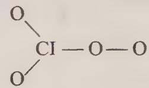

$Br_{2}O$ 具有氧化性, 可用于氧化单质碘来制备 $I_{2}O_{5}$ , 也可将苯氧化成醌。 $Br_{2}O$ 溶解于碱溶液, 形成次溴酸盐。

$I_{2}O_{5}$ 是所有卤素氧化物中最稳定的,是碘酸的酸酐。 $I_{2}O_{5}$ 是白色粉末状固体,在 300 ℃ 分解为单质碘。

$I_{2}O_{5}$ 最典型的反应是在 $70^{\circ}C$ 将空气中的 CO 完全氧化成 $CO_{2}$ :

$$
\mathrm{I} _ {2} \mathrm{O} _ {5} + 5 \mathrm{CO} \stackrel {\triangle} {=} \mathrm{I} _ {2} + 5 \mathrm{CO} _ {2}
$$

用碘量法测定所生成的 $I_{2}$ ，即可准确分析检测体系中 CO 的含量。因此， $I_{2}O_{5}$ 可以用于空气污染的监测。

## 3. 卤素氧化物的制备

可用 $F_{2}$ 气体与 2% 的 NaOH 水溶液反应, 制取 $OF_{2}$ :

$$
2 \mathrm{F} _ {2} + 2 \mathrm{NaOH(aq)} = \mathrm{OF} _ {2} + 2 \mathrm{NaF} + \mathrm{H} _ {2} \mathrm{O}
$$

生成的 $OF_{2}$ 气体要尽快导出, 防止其在碱性条件下将氢氧根中的 O 氧化。

使 $O_{2}$ 与 $F_{2}$ 的混合物，在低压放电条件下反应，可制取 $O_{2}F_{2}$ ：

$$
\mathrm{O} _ {2} (\mathrm{g}) + \mathrm{F} _ {2} (\mathrm{g}) \xlongequal {\text {低压放电}} \mathrm{O} _ {2} \mathrm{F} _ {2} (\mathrm{g}) \qquad \Delta_ {\mathrm{r}} G _ {\mathrm{m}} ^ {\ominus} = 5 8. 2 \mathrm{kJ} \cdot \mathrm{mol} ^ {- 1}
$$

由此可以计算出该反应的 $K^{\ominus}$ 约为 $6 \times 10^{-11}$ ，说明这种制备方法十分困难。

由 $Cl_{2}$ 和 $O_{2}$ 单质直接化合成 $Cl_{2}O, ClO_{2}$ 的反应，其 $\Delta_{r}G_{m}^{\ominus}$ 分别为 $97.9\ kJ\cdot mol^{-1}, 120.5\ kJ\cdot mol^{-1}$ ，属于非自发过程，且平衡常数过小。所以，氯的氧化物不能采用单质之间的反应来制备。

$Cl_{2}O$ 是用新制出的氧化汞与单质 $Cl_{2}$ 反应来制备的：

$$
2 \mathrm{Cl} _ {2} + 2 \mathrm{HgO} = \mathrm{HgCl} _ {2} \cdot \mathrm{HgO} + \mathrm{Cl} _ {2} \mathrm{O}
$$

大量制取 $Cl_{2}O$ 的方法是将 $Cl_{2}$ 与湿润的 $Na_{2}CO_{3}$ 反应：

$$
2 \mathrm{Cl} _ {2} + 2 \mathrm{Na} _ {2} \mathrm{CO} _ {3} + \mathrm{H} _ {2} \mathrm{O} = \mathrm{Cl} _ {2} \mathrm{O} + 2 \mathrm{NaHCO} _ {3} + 2 \mathrm{NaCl}
$$

实验室中,可利用草酸还原 $KClO_{3}$ 制取二氧化氯 $ClO_{2}$ :

$$
2 \mathrm{ClO} _ {3} ^ {-} + \mathrm{C} _ {2} \mathrm{O} _ {4} ^ {2 -} + 4 \mathrm{H} ^ {+} = 2 \mathrm{ClO} _ {2} \uparrow + 2 \mathrm{CO} _ {2} \uparrow + 2 \mathrm{H} _ {2} \mathrm{O}
$$

若将 $SO_{2}$ 气体通入 $KClO_{3}$ 的酸性溶液中, 可得到比较纯净的 $ClO_{2}$ :

$$
2 \mathrm{KClO} _ {3} (\mathrm{aq}) + \mathrm{SO} _ {2} = 2 \mathrm{ClO} _ {2} + \mathrm{K} _ {2} \mathrm{SO} _ {4}
$$

在低温-10℃下,用浓磷酸使高氯酸脱水,可得到 $Cl_{2}O_{7}$ 。因为 $Cl_{2}O_{7}$ 是高氯酸的酸酐。

$Br_{2}$ 蒸气与新制出的 HgO 反应可制得 $Br_{2}O$ ，与制备 $Cl_{2}O$ 的方法相同。

将 $HIO_{3}$ 于 200 ℃ 利用干燥空气脱水, 可制备 $I_{2}O_{5}$ :

$$
2 \mathrm{HIO} _ {3} \stackrel {\triangle} {=} \mathrm{I} _ {2} \mathrm{O} _ {5} + \mathrm{H} _ {2} \mathrm{O}
$$

## 17.4.2 卤素的含氧酸及其盐

氯、溴、碘均有如下4种类型的含氧酸：次卤酸（HXO）、亚卤酸（ $\mathrm{HXO}_2$ ）、卤酸（ $\mathrm{HXO}_3$ ）、高卤酸（ $\mathrm{HXO}_4$ ），其中卤素分别呈现 $+1, +3, +5$ 和 $+7$ 氧化数，碘还可以形成化学式为 $\mathrm{H}_5\mathrm{IO}_6$ （VII）的正高碘酸。

卤素含氧酸分子及其酸根离子的空间结构符合价层电子对互斥理论的判断。

卤素含氧酸(除正高碘酸)及其酸根离子的中心卤原子轨道均为 $sp^{3}$ 杂化。

在卤素含氧酸分子中,羟基(—OH)氧原子与卤素原子之间形成 $sp^{3}-p\sigma$ 键;端基氧原子与卤素原子之间,除形成 $sp^{3}-p\sigma$ 配位键外,还有 d-p $\pi$ 配键。

只有正高碘酸的中心碘原子是 $sp^{3}d^{2}$ 杂化, 构型是八面体形, 如图 17-5 所示, 有一个端基氧原子和 5 个羟基氧原子。

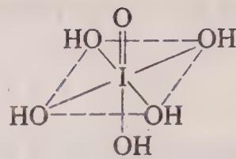

在卤素的含氧酸中, 只有氯的含氧酸有较多的实际用途。像 $HBrO_{2}$ , $HIO_{2}$ 和 HIO 等, 它们的存在仅是短暂的, 往往只是化学反应的中间产物。

图17-5 正高碘酸分子的空间构型

## 1. 次卤酸及其盐

在卤素的含氧酸中,次卤酸的卤素呈现最低的正氧化态,即为+1价。次卤酸主要包括 HClO,HBrO 和 HIO。

## (1) 制备

次氯酸可由氯单质在水溶液中歧化而得到：

$$
\mathrm{Cl} _ {2} + \mathrm{H} _ {2} \mathrm{O} = \mathrm{H} ^ {+} + \mathrm{Cl} ^ {-} + \mathrm{HClO} \quad K ^ {\ominus} = 3 \times 1 0 ^ {- 5}
$$

应将产物中的氯化氢除去,以达到制备 HClO 的目的。为此可向体系中加入能与 Cl⁻ 反应的 HgO, Ag₂O。于是发生如下反应:

$$
\begin{array}{r l} & 2 \mathrm{HgO} + 2 \mathrm{Cl} _ {2} + \mathrm{H} _ {2} \mathrm{O} = \mathrm{HgO} \cdot \mathrm{HgCl} _ {2} + 2 \mathrm{HClO} \\ & \mathrm{Ag} _ {2} \mathrm{O} + 2 \mathrm{Cl} _ {2} + \mathrm{H} _ {2} \mathrm{O} = 2 \mathrm{AgCl} + 2 \mathrm{HClO} \end{array}
$$

或在 $CaCO_{3}$ 悬浮液中, 通入 $Cl_{2}$ , 利用 $H^{+}$ 可与 $CO_{3}^{2-}$ 结合成碳酸放出 $CO_{2}$ 的反应, 使平衡右移, 生成浓度较高的 HClO:

$$
\mathrm{CaCO} _ {3} + 2 \mathrm{Cl} _ {2} + \mathrm{H} _ {2} \mathrm{O} = \mathrm{Ca} ^ {2 +} + 2 \mathrm{Cl} ^ {-} + \mathrm{CO} _ {2} + 2 \mathrm{HClO}
$$

次氯酸的大量生产可利用 $Cl_{2}O$ 与水的反应, 得到浓度大于 $5 \, mol \cdot dm^{-3}$ 较为纯净的次氯酸, 通过减压蒸馏, 得到高浓度的次氯酸。

工业上采用电解冷的 NaCl 稀溶液的方法生产 NaClO:

阴极反应

阳极反应

$$
\begin{array}{l} 2 \mathrm{H} ^ {+} + 2 \mathrm{e} ^ {-} = \mathrm{H} _ {2} \\ 2 \mathrm{Cl} ^ {-} = \mathrm{Cl} _ {2} + 2 \mathrm{e} ^ {-} \end{array}
$$

将阳极产生的 $Cl_{2}$ 通入阴极区 NaOH 中, 同时搅拌电解液, 使 $Cl_{2}$ 与 NaOH 充分反应, 得到 NaClO:

$$
\mathrm{Cl} _ {2} + 2 \mathrm{NaOH} = \mathrm{NaCl} + \mathrm{NaClO} + \mathrm{H} _ {2} \mathrm{O}
$$

将制得的次氯酸钠加酸, 减压蒸馏, 可得较纯净的 HClO 浓溶液:

$$
\mathrm{ClO} ^ {-} + \mathrm{H} ^ {+} = \mathrm{HClO}
$$

1971 年,英国人斯图杰尔( Studier)和阿佩里曼( Appelman)在-40 ℃下将氟

气通过碎冰的表面,成功地合成出次氟酸(HOF):

$$
\mathrm{F} _ {2.} + \mathrm{H} _ {2} \mathrm{O} \xlongequal {- 4 0 ^ {\circ} \mathrm{C}} \mathrm{HOF} + \mathrm{HF}
$$

测定结果表明,HOF 的分子结构类似于其他次卤酸。

## (2) 化学性质

① 弱酸性 次卤酸比氢氟酸、醋酸、碳酸等的酸性都要弱。

$$
\begin{array}{c c c c} & \text {HClO} & \text {HBrO} & \text {HIO} \\ K _ {\mathrm{a}} ^ {\ominus} & 2. 9 0 \times 1 0 ^ {- 8} & 2. 8 \times 1 0 ^ {- 9} & 3 \times 1 0 ^ {- 1 1} \end{array}
$$

按 Cl, Br, I 顺序, 卤原子的半径逐渐增大, 在 H—O—X 分子中, X—O 之间的键减弱, 即 X 原子对 O 原子的电子云拉动逐渐减小, 于是 O 原子的电子云对 H 原子的引力较大, 所以酸性逐渐减弱。

② 稳定性 次卤酸均不稳定, HClO, HBrO, HIO 仅存在于水溶液中, 且稳定性按以上顺序依次降低。只有 HOF 在较低的温度下可以得到白色晶体。当然 HOF 也非常不稳定, 常温常压下气态的 HOF 将分解为 HF 和 O₂:

$$
2 \mathrm{HOF} = 2 \mathrm{HF} + \mathrm{O} _ {2}
$$

HOF 遇水分解,形成 HF 和 $H_{2}O_{2}$ :

$$
\mathrm{HOF} + \mathrm{H} _ {2} \mathrm{O} = \mathrm{HF} + \mathrm{H} _ {2} \mathrm{O} _ {2}
$$

次氯酸受热分解：

$$
3 \mathrm{HClO} \stackrel {\triangle} {=} 2 \mathrm{HCl} + \mathrm{HClO} _ {3}
$$

除了上述的歧化分解外,在光照下也会发生分解:

$$
2 \mathrm{HClO} \stackrel {h \nu} {=} 2 \mathrm{HCl} + \mathrm{O} _ {2} \uparrow
$$

在干燥剂存在情况下，HClO 可发生脱水分解，生成 $Cl_{2}O$ ：

$$
2 \mathrm{HClO} \xlongequal {\text {干燥剂}} \mathrm{Cl} _ {2} \mathrm{O} + \mathrm{H} _ {2} \mathrm{O}
$$

次卤酸盐均可溶于水但不稳定。在碱性溶液中，次卤酸根离子容易发生歧化，形成卤离子和卤酸根离子：

$$
\begin{array}{l l} 3 \mathrm{ClO} ^ {-} = 2 \mathrm{Cl} ^ {-} + \mathrm{ClO} _ {3} ^ {-} & K ^ {\ominus} = 1 0 ^ {2 7} \\ 3 \mathrm{BrO} ^ {-} = 2 \mathrm{Br} ^ {-} + \mathrm{BrO} _ {3} ^ {-} & K ^ {\ominus} = 1 0 ^ {1 8} \\ 3 \mathrm{IO} ^ {-} = 2 \mathrm{I} ^ {-} + \mathrm{IO} _ {3} ^ {-} & K ^ {\ominus} = 1 0 ^ {2 2} \end{array}
$$

$XO^{-}$ 歧化速率与反应温度相关。 $ClO^{-}$ 在室温时的歧化速率很慢，在70℃以上时歧化速率明显提高； $BrO^{-}$ 在低于0℃时相对稳定，在室温时则迅速歧化；而 $IO^{-}$ 在0℃时，歧化速率就已经很高了。

③ 氧化性 HXO 的氧化性很强,有如下反应:

$$
\begin{array}{r l} & \mathrm{HClO+HCl(aq)} = \mathrm{Cl} _ {2} \uparrow + \mathrm{H} _ {2} \mathrm{O} \\ & 3 \mathrm{HClO+S+H} _ {2} \mathrm{O} = \mathrm{H} _ {2} \mathrm{SO} _ {4} + 3 \mathrm{HCl} \end{array}
$$

过量的 HClO 与单质硫反应, 还原产物则为 $Cl_{2}$ :

$$
6 \mathrm{HClO} + \mathrm{S} \stackrel {\triangle} {=} \mathrm{H} _ {2} \mathrm{SO} _ {4} + 3 \mathrm{Cl} _ {2} \uparrow + 2 \mathrm{H} _ {2} \mathrm{O}
$$

次卤酸及其盐的氧化能力的大小顺序为

$$
\mathrm{HClO} > \mathrm{HBrO} > \mathrm{HIO} \quad \mathrm{ClO} ^ {-} <   \mathrm{BrO} ^ {-} \approx \mathrm{IO} ^ {-}
$$

次卤酸盐比次卤酸氧化能力弱。有时在酸性介质中使用次卤酸盐，以便提高其氧化性能。

经常用次氯酸盐在碱性溶液中作氧化剂,制备一些重要的氧化性物质,例如:

$$
\mathrm{NaClO} + \mathrm{Pb(Ac)} _ {2} + 2 \mathrm{OH} ^ {-} \stackrel {\triangle} {=} \mathrm{PbO} _ {2} \downarrow + 2 \mathrm{Ac} ^ {-} + \mathrm{NaCl} + \mathrm{H} _ {2} \mathrm{O}
$$

$PbO_{2}$ 是一种重要的氧化剂。

又如,制备 $\mathrm{NiO(OH)}_{2}$ , 可先在碱性介质中生成绿色的 $\mathrm{Ni(OH)}_{2}$ :

$$
\mathrm{Ni} ^ {2 +} + 2 \mathrm{OH} ^ {-} = \mathrm{Ni(OH)} _ {2} \downarrow
$$

接着向其中加入 NaClO 溶液, 立刻得到黑色的 NiO(OH) $_{2}$ 沉淀:

$$
\mathrm{NaClO(aq)} + \mathrm{Ni(OH)} _ {2} = \mathrm{NiO(OH)} _ {2} \downarrow + \mathrm{NaCl}
$$

最为常见的次卤酸盐是次氯酸钙,它是漂白粉的主要成分。漂白粉是通过熟石灰与氯气反应而得到的混合物:

$$
2 \mathrm{Cl} _ {2} + 2 \mathrm{Ca(OH)} _ {2} = \mathrm{Ca(ClO)} _ {2} + \mathrm{CaCl} _ {2} + 2 \mathrm{H} _ {2} \mathrm{O}
$$

常见的次氯酸盐还有 LiClO, 可用于硬水处理和牛奶消毒。NaClO 用于家用漂白剂及游泳池、城市供水和下水道的消毒。

## 2. 亚卤酸及其盐

亚卤酸是最不稳定的卤素含氧酸,最稳定的 $HClO_{2}$ 也只能以稀溶液的形式存在,而 $HBrO_{2}$ 和 $HIO_{2}$ 则更不稳定,只能瞬间存在于溶液中。盐类相对稳定,

$NaClO_{2}$ 已经达到规模化生产。

亚氯酸的酸性大于次氯酸，它的酸式解离平衡常数 $K_{\mathrm{a}}^{\ominus} = 1.1 \times 10^{-2}$ 。

亚氯酸的不稳定性体现在容易分解成 $ClO_{2}$ 和 $Cl^{-}$ :

$$
5 \mathrm{HClO} _ {2} = 4 \mathrm{ClO} _ {2} \uparrow + \mathrm{Cl} ^ {-} + \mathrm{H} ^ {+} + 2 \mathrm{H} _ {2} \mathrm{O}
$$

亚氯酸还有如下两种分解形式,也都具有歧化的意味:

$$
\begin{array}{r l} 3 \mathrm{HClO} _ {2} & = 2 \mathrm{ClO} _ {3} ^ {-} + \mathrm{Cl} ^ {-} + 3 \mathrm{H} ^ {+} \\ \mathrm{HClO} _ {2} & = \mathrm{Cl} ^ {-} + \mathrm{H} ^ {+} + \mathrm{O} _ {2} \uparrow \end{array}
$$

$ClO_{2}$ 与具有还原性的过氧化物如 $Na_{2}O_{2}$ ，在碱性溶液中反应，可以得到亚氯酸钠：

$$
2 \mathrm{ClO} _ {2} + \mathrm{Na} _ {2} \mathrm{O} _ {2} (\mathrm{aq}) = 2 \mathrm{NaClO} _ {2} + \mathrm{O} _ {2}
$$

常见的 $Ag^{+}, Hg^{2+}, Tl^{+}, Pb^{2+}, Cu^{2+}$ 等重金属亚氯酸盐及 $NH_{4}ClO_{2}$ 不稳定，受热或受到撞击时，易发生爆炸。 $NaClO_{2}$ 主要用于织物漂白。

在碱性条件下,单质溴与次溴酸盐反应,缓慢蒸发,结晶得到亚溴酸盐,例如:

$$
2 \mathrm{Br} _ {2} + \mathrm{Ba} (\mathrm{BrO}) _ {2} + 4 \mathrm{OH} ^ {-} = \mathrm{Ba} (\mathrm{BrO} _ {2}) _ {2} \cdot 2 \mathrm{H} _ {2} \mathrm{O} + 4 \mathrm{Br} ^ {-}
$$

## 3. 卤酸及其盐

## (1) 制备

① 歧化法 利用卤素单质在碱性水溶液中发生歧化反应的性质,可以制取卤酸盐:

$$
3 \mathrm{X} _ {2} + 6 \mathrm{OH} ^ {-} = 5 \mathrm{X} ^ {-} + \mathrm{XO} _ {3} ^ {-} + 3 \mathrm{H} _ {2} \mathrm{O}
$$

利用卤酸盐与卤化物溶解度差异较大的性质,可将产物分离。将得到的卤酸盐酸化后得卤酸。此反应进行得虽然比较完全,但卤素变为卤酸盐的利用率较低,只有17%。

事实上,工业生产方法是电解纯化海水,将阳极氧化得到的 $Cl_{2}$ 通入阴极的碱性电解液中,在一定的温度下发生歧化反应,而得到大量氯酸盐。

② 氧化法 在碱性溶液中用 $Cl_{2}$ 氧化 $Br^{-}$ 或 $I^{-}$ ，分别得到溴酸盐或碘酸盐，例如：

$$
3 \mathrm{Cl} _ {2} + \mathrm{Br} ^ {-} + 6 \mathrm{OH} ^ {-} = 6 \mathrm{Cl} ^ {-} + \mathrm{BrO} _ {3} ^ {-} + 3 \mathrm{H} _ {2} \mathrm{O}
$$

也可用强氧化性的浓硝酸或氯气氧化碘单质,制备碘酸:

$$
\begin{array}{r l} \mathrm{I} _ {2} + 1 0 \mathrm{HNO} _ {3} (\text {浓}) & = 2 \mathrm{HIO} _ {3} + 1 0 \mathrm{NO} _ {2} \uparrow + 4 \mathrm{H} _ {2} \mathrm{O} \\ \mathrm{I} _ {2} + 5 \mathrm{Cl} _ {2} + 6 \mathrm{H} _ {2} \mathrm{O} & = 2 \mathrm{HIO} _ {3} + 1 0 \mathrm{HCl} \end{array}
$$

③ 卤酸盐与酸反应 实验室中, 可用硫酸酸化卤酸盐, 得到卤酸水溶液:

$$
\mathrm{Ba} \left(\mathrm{XO} _ {3}\right) _ {2} + \mathrm{H} _ {2} \mathrm{SO} _ {4} = \mathrm{BaSO} _ {4} + 2 \mathrm{HXO} _ {3}
$$

但硫酸的浓度不宜太高,否则产物 $HXO_{3}$ 浓度过大易发生爆炸分解。

## (2) 性质

① 酸性 卤酸的酸性强弱顺序为

$$
\mathrm{HClO} _ {3} > \mathrm{HBrO} _ {3} > \mathrm{HIO} _ {3}
$$

前二者为强酸,而 $HIO_{3}$ 为中强酸, $K_{a}^{\ominus}=1.57\times10^{-1}$ 。因为从 Cl 到 I,随原子序数的增加,原子半径增大,拉动 O 原子电子云的能力变小,H—O—X 中的 HO—X 键逐渐减弱,H—O 键逐渐增强,不易解离出 $H^{+}$ ,所以酸性依次减弱。

② 稳定性 卤酸 $\left(\mathrm{HXO}_{3}\right)$ 的稳定性高于次卤酸(HXO)。当 $HClO_{3}$ 的质量分数超过40%时,它将迅速分解:

$$
3 \mathrm{HClO} _ {3} (\text {浓}) = \mathrm{HClO} _ {4} + 2 \mathrm{ClO} _ {2} \uparrow + \mathrm{H} _ {2} \mathrm{O}
$$

若反应在高温下进行,生成的 $ClO_{2}$ 将发生剧烈的爆炸分解:

$$
2 \mathrm{ClO} _ {2} \stackrel {\triangle} {=} \mathrm{Cl} _ {2} + 2 \mathrm{O} _ {2}
$$

而 $\mathrm{HBrO}_3$ 质量分数的极限为 $50\%$ ，高于这个浓度也将爆炸分解：

$$
4 \mathrm{HBrO} _ {3} (\text {   浓   }) \stackrel {\triangle} {=} 2 \mathrm{Br} _ {2} + 5 \mathrm{O} _ {2} \uparrow + 2 \mathrm{H} _ {2} \mathrm{O}
$$

$HIO_{3}$ 可以固体形式存在,是最稳定的卤酸,受热时脱水分解:

$$
2 \mathrm{HIO} _ {3} \xlongequal {1 7 0 ^ {\circ} \mathrm{C}} \mathrm{I} _ {2} \mathrm{O} _ {5} + \mathrm{H} _ {2} \mathrm{O}
$$

产物 $I_{2}O_{5}$ 是最稳定的卤素氧化物, 是 $HIO_{3}$ 的酸酐, 分解温度约为 $300^{\circ}C$ 。 $HClO_{3}, HBrO_{3}$ 仅存在于溶液中, 减压蒸馏冷溶液可得到黏稠的浓溶液。可见, $HIO_{3}$ 的稳定性远高于 $HBrO_{3}$ 和 $HClO_{3}$ 。

盐的稳定性大于相应的酸,但受热时也将发生分解:

$$
\begin{array}{r l} & 4 \mathrm{KClO} _ {3} \xlongequal {4 0 0 ^ {\circ} \mathrm{C}} \mathrm{KCl} + 3 \mathrm{KClO} _ {4} \\ & 2 \mathrm{KClO} _ {3} \xlongequal [ \triangle ] {\mathrm{MnO} _ {2}} 2 \mathrm{KCl} + 3 \mathrm{O} _ {2} \uparrow \end{array}\tag{1}
$$

$$
2 \mathrm{Zn} (\mathrm{ClO} _ {3}) _ {2} \stackrel {\triangle} {=} 2 \mathrm{ZnO} + 2 \mathrm{Cl} _ {2} \uparrow + 5 \mathrm{O} _ {2} \uparrow
$$

$KBrO_{3}, KIO_{3}$ 等没有与反应(1)类似的歧化分解方式, 因为 $KBrO_{4}, K_{5}IO_{6}$ 比相应的卤酸盐更易分解。

③ 氧化还原性质 从标准电极电势数据来看,卤酸都是强氧化剂。

$$
\begin{array}{l l l l} & \mathrm {BrO_ {3} ^ {-} /Br_ {2}} & \mathrm {ClO_ {3} ^ {-} /Cl_ {2}} & \mathrm {IO_ {3} ^ {-} /I_ {2}} \\ E _ {\mathrm{A}} ^ {\ominus} / \mathrm{V} & 1. 4 8 2 & 1. 4 7 & 1. 1 9 5 \end{array}
$$

卤酸的氧化性强弱顺序为

$$
\mathrm{HBrO} _ {3} > \mathrm{HClO} _ {3} > \mathrm{HIO} _ {3}
$$

第四周期的 $HBrO_{3}$ ，其氧化性既强于同族第三周期的 $HClO_{3}$ ，又强于同族第五周期的 $HIO_{3}$ ，体现了元素周期表中第四周期元素性质的反常。

与 HClO 相比较,首先 $HClO_{3}$ 中心 Cl(V) 与配位的氧原子结合成对称性较高的稳定结构;另外, $HClO_{3}$ 中心 Cl(V) 与 HClO 中心 Cl(I) 相比较,其抵抗 $H^{+}$ 的反极化作用的能力较强,所以 $HClO_{3}$ 中氧原子不易与中心断键离去。体现在化学性质上,表现为 $HClO_{3}$ 的氧化性弱于 HClO 的氧化性。

影响氧化性强弱的因素过于复杂,但是上述原因在一定程度上可以解释 $HClO_{3}$ 的氧化性弱于HClO的问题。

卤酸的氧化性主要体现在卤酸盐的酸性溶液上,例如:

$$
\begin{array}{r l} \mathrm{ClO} _ {3} ^ {-} + 5 \mathrm{Cl} ^ {-} + 6 \mathrm{H} ^ {+} & = 3 \mathrm{Cl} _ {2} \uparrow + 3 \mathrm{H} _ {2} \mathrm{O} \\ \mathrm{ClO} _ {3} ^ {-} + 3 \mathrm{NO} _ {2} ^ {-} & = \mathrm{Cl} ^ {-} + 3 \mathrm{NO} _ {3} ^ {-} \end{array}
$$

后一个反应式中虽未出现 $H^{+}$ ，但是实际上反应必须在酸介质中进行，因为卤酸盐自身的氧化性很弱。又如：

$$
\mathrm{KBrO} _ {3} + 3 \mathrm{Mn} \left(\mathrm{NO} _ {3}\right) _ {2} + 3 \mathrm{H} _ {2} \mathrm{O} = 3 \mathrm{MnO} _ {2} + \mathrm{KBr} + 6 \mathrm{HNO} _ {3}
$$

利用 $KIO_{3}$ 酸性溶液与 $H_{2}O_{2}$ 的反应, 可以进行“碘钟实验”。“碘钟实验”涉及了一些碘酸参与的氧化还原反应中最有趣味的化学变化。利用淀粉为指示剂, 可与重复出现的单质碘形成特征的蓝色, 从而可以观察到蓝色—无色—蓝色—无色重复出现的化学振荡反应现象。

(a) $H_{2}O_{2}$ 将 $IO_{3}^{-}$ 还原成单质碘, 出现蓝色, 伴有大量气泡形成:

$$
2 \mathrm{HIO} _ {3} + 5 \mathrm{H} _ {2} \mathrm{O} _ {2} = \mathrm{I} _ {2} + 5 \mathrm{O} _ {2} \uparrow + 6 \mathrm{H} _ {2} \mathrm{O}
$$

(b) $H_{2}O_{2}$ 将单质碘氧化成 $IO_{3}^{-}$ ，蓝色消失：

$$
\mathrm{I} _ {2} + 5 \mathrm{H} _ {2} \mathrm{O} _ {2} = 2 \mathrm{HIO} _ {3} + 4 \mathrm{H} _ {2} \mathrm{O}
$$

这种振荡体现在反应(a)和(b)的重复进行,其中涉及物质的浓度、溶液酸度(通常加入丙二酸控制酸度)、反应速率、温度等因素。选择合适的反应条件,这种振荡可长达数小时。(a)和(b)的净反应结果相当于第16章16.1.4小节中介绍过的在催化剂的作用下过氧化氢的歧化分解:

$$
2 \mathrm{H} _ {2} \mathrm{O} _ {2} = 2 \mathrm{H} _ {2} \mathrm{O} + \mathrm{O} _ {2} \uparrow
$$

其他氧化剂和还原剂与碘酸作用,也会有同样的振荡反应现象。类似的化学振荡反应,在生命过程中起着重要的作用。

④ 盐类的溶解性 氯酸盐基本可溶解于水,但是溶解度不大。溴酸盐中, $\mathrm{AgBrO_{3},Pb(BrO_{3})_{2},Ba(BrO_{3})_{2}}$ 难溶,其余盐可溶。可溶性碘酸盐很少。难溶性的 $\mathrm{Cu(IO_3)_2}$ 的水合物显淡蓝色, $\mathrm{Ag^{+},Pb^{2+},Hg^{2+},Ca^{2+},Sr^{2+},Ba^{2+}}$ 等的碘酸盐均为难溶盐。

溶解度的规律为

$$
\mathrm{氯酸盐} > \mathrm{溴酸盐} > \mathrm{碘酸盐}
$$

## 4. 离卤酸及其盐

市售高氯酸的质量分数为 $60\% \sim 62\%$ ，蒸馏得到的最高含量为 $71.6\%$ ，属于恒沸混合物，沸点为 $203^{\circ}\mathrm{C}$ 。在高氯酸分子4配位的四面体结构中，中心的氯原子与一个羟基氧原子和3个端基氧原子结合。

正高碘酸 $\left(\mathrm{H}_{5}\mathrm{IO}_{6}\right)$ 是无色单斜晶体,加热到122℃时分解。高碘酸在强酸中以 $H_{5}IO_{6}$ 形式存在;在碱中以 $H_{3}IO_{6}^{2-}$ 形式存在。在高碘酸分子6配位的八面体结构中,中心的碘原子与5个羟基氧原子和一个端基氧原子结合。

## (1) 制备

可利用浓硫酸与高氯酸盐反应来制备高氯酸,减压蒸馏可得到质量分数为71.6%的高氯酸恒沸物:

$$
\mathrm{KClO} _ {4} + \mathrm{H} _ {2} \mathrm{SO} _ {4} (\text {   浓   }) = \mathrm{KHSO} _ {4} + \mathrm{HClO} _ {4}
$$

在温度和压强分别低于 $83^{\circ}$ C 和 0.13 kPa 条件下小心蒸馏恒沸物, 可得到无水高氯酸。温度过高时会发生爆炸。

工业上采用电解氧化 $NaClO_{3}$ 方法制备高氯酸盐。

高溴酸由于氧化性极强,不易稳定存在。

直到 1968 年, 才制得高溴酸, 而且最初是通过下式所表示的核反应得到的:

$$
{ } _ { 3 4 } ^ { 8 3 } \mathrm{SeO} _ { 4 } ^ { 2 - } = { } _ { 3 5 } ^ { 8 3 } \mathrm{BrO} _ { 4 } ^ { - } + \beta
$$

Se 原子核在 $\beta$ 蜕变过程中失去一个电子, 即一个中子变成质子, 成为 Br 原子核。

现在可以利用强氧化剂 $F_{2}$ 或 $XeF_{2}$ 氧化溴酸盐溶液, 得到高溴酸盐水溶液:

$$
\begin{array}{r l} & \mathrm {BrO_ {3} ^ {-}} + \mathrm {F_ {2}} + 2 \mathrm {OH^ {-}} = \mathrm {BrO_ {4} ^ {-}} + 2 \mathrm {F^ {-}} + \mathrm {H_ {2} O} \\ & \mathrm {BrO_ {3} ^ {-}} + \mathrm {XeF_ {2}} + \mathrm {H_ {2} O} = \mathrm {BrO_ {4} ^ {-}} + \mathrm{Xe} + 2 \mathrm{HF} \end{array}
$$

反应中, 过量的 $BrO_{3}^{-}$ 和产物中的 $F^{-}$ 可利用生成沉淀物 $AgBrO_{3}$ 和 $CaF_{2}$ 的方法, 过滤除去。高溴酸盐水溶液通过阳离子交换柱, 可得到 $HBrO_{4}$ 的稀溶液, 浓缩至 $6\ mol\cdot dm^{-3}$ , 在低于 $100\ ^{\circ}C$ 时可长期存放而不分解。浓度过高时高溴酸会逐渐分解。目前可从溶液中得到白色结晶, 化学式可能为 $HBrO_{4}\cdot2H_{2}O$ 。

实验室中,可用高碘酸钡与硫酸反应,制备高碘酸:

$$
\mathrm{Ba} _ {5} \left(\mathrm{IO} _ {6}\right) _ {2} + 5 \mathrm{H} _ {2} \mathrm{SO} _ {4} = 2 \mathrm{H} _ {5} \mathrm{IO} _ {6} + 5 \mathrm{BaSO} _ {4}
$$

利用氧化剂氧化 $\mathrm{I}^{-}$ 或 $\mathrm{IO}_3^-$ , 可得到高碘酸盐。例如, 将氯气通入碘酸盐的碱性溶液中, 可得高碘酸盐:

$$
\mathrm{Cl} _ {2} + 3 \mathrm{OH} ^ {-} + \mathrm{IO} _ {3} ^ {-} = 2 \mathrm{Cl} ^ {-} + \mathrm{H} _ {3} \mathrm{IO} _ {6} ^ {2 -}
$$

这个反应可用于工业生产。

高碘酸盐在工业上的另外一种生产方法, 是采用 $PbO_{2}$ 为阳极, 电解碱性 $NaIO_{3}$ 溶液:

$$
\mathrm{IO} _ {3} ^ {-} + 3 \mathrm{OH} ^ {-} - 2 \mathrm{e} ^ {-} = \mathrm{H} _ {3} \mathrm{IO} _ {6} ^ {2 -}
$$

偏高碘酸 $\left(\mathrm{HIO}_{4}\right)$ 可以通过真空加热正高碘酸脱水而得到：

$$
\mathrm{H} _ {5} \mathrm{IO} _ {6} \xrightarrow [ \text {真空} ]{1 0 0 ^ {\circ} \mathrm{C}} \mathrm{HIO} _ {4} + 2 \mathrm{H} _ {2} \mathrm{O}
$$

## (2) 化学性质

① 酸性 高氯酸在水溶液中几乎完全解离,形成 $H^{+}$ 和 $ClO_{4}^{-}$ ,所以高氯酸在无机酸中具有最强的酸性。 $HBrO_{4}$ 也是强酸,但 $H_{5}IO_{6}$ 属于中强酸。

所以高卤酸酸性大小的规律为 $HClO_{4}>HBrO_{4}>H_{5}IO_{6}$

半径较小的 Cl(VII) 对氧原子的吸引力大于氢与氧的结合力, 所以极其容易解离出 $\mathbf{H}^{+}$ 。这是高氯酸显强酸性的根本原因。

按 Cl, Br, I 顺序, 原子半径逐渐增大, 吸引氧原子电子云的能力减弱, O—H 键被削弱的程度下降, $H^{+}$ 解离出来的难度递增。所以 $HClO_{4}, HBrO_{4}, H_{5}IO_{6}$ 的酸性逐渐减弱。

② 稳定性 浓高氯酸为无色液体,在浓溶液中,高氯酸以分子形式存在,只有一个氧原子与质子结合,形成对称性较低的分子,同时 $H^{+}$ 的反极化作用使高氯酸分子不稳定,对震动敏感,易爆炸:

$$
4 \mathrm{HClO} _ {4} (\text {   浓   }) \stackrel {\text {   震动   }} {=} 2 \mathrm{Cl} _ {2} \uparrow + 7 \mathrm{O} _ {2} \uparrow + 2 \mathrm{H} _ {2} \mathrm{O}
$$

③ 氧化性 冷的 $HClO_{4}$ 稀溶液没有明显的氧化性。 $HClO_{4}$ 稀溶液中的 Cl(VII) 不能被活泼金属 Zn 还原, 只能置换出 $H_{2}$ :

$$
\mathrm{Zn} + 2 \mathrm{HClO} _ {4} (\text {稀}) = \mathrm{Zn} (\mathrm{ClO} _ {4}) _ {2} + \mathrm{H} _ {2} \uparrow
$$

这是因为稀溶液中, $HClO_{4}$ 完全解离, $ClO_{4}^{-}$ 为正四面体构型,对称性高,且不受 $H^{+}$ 的反极化作用的影响,比较稳定,所以氧化能力低。

在浓溶液中高氯酸以分子态存在的比例较大, $H^{+}$ 的反极化作用使 Cl—O 键断裂的机会增大,导致浓高氯酸的氧化能力较强。例如,浓高氯酸可以将 $I_{2}$ 氧化成 $H_{5}IO_{6}$ :

$$
2 \mathrm{HClO} _ {4} (\text {浓}) + \mathrm{I} _ {2} + 4 \mathrm{H} _ {2} \mathrm{O} = 2 \mathrm{H} _ {5} \mathrm{IO} _ {6} + \mathrm{Cl} _ {2} \uparrow
$$

浓高氯酸与有机物质接触可发生猛烈作用。

高卤酸及其盐具有很强的氧化性。

$$
E _ {\mathrm{A}} ^ {\ominus} / \mathrm{V}
$$

$$
\begin{array}{l l l} \mathrm{BrO} _ {4} ^ {-} / \mathrm{BrO} _ {3} ^ {-} & \mathrm{H} _ {5} \mathrm{IO} _ {6} / \mathrm{IO} _ {3} ^ {-} & \dots \mathrm{ClO} _ {4} ^ {-} / \mathrm{ClO} _ {3} ^ {-} \\ 1. 8 5 3 & 1. 6 0 1 & 1. 1 8 9 \end{array}
$$

按高卤酸的标准电极电势数值排列,其氧化性强弱顺序为

$$
\mathrm{HBrO} _ {4} > \mathrm{H} _ {5} \mathrm{IO} _ {6} > \mathrm{HClO} _ {4}
$$

高碘酸的氧化能力比高氯酸强。例如， $\mathrm{H}_{5} \mathrm{IO}_{6}$ 在酸性条件下可将 $\mathrm{Mn}^{2+}$ 氧化，形成 $\mathrm{MnO}_{4}^{-}$ ：

$$
2 \mathrm{Mn} ^ {2 +} + 5 \mathrm{H} _ {5} \mathrm{IO} _ {6} = 2 \mathrm{MnO} _ {4} ^ {-} + 5 \mathrm{IO} _ {3} ^ {-} + 1 1 \mathrm{H} ^ {+} + 7 \mathrm{H} _ {2} \mathrm{O}
$$

高溴酸的氧化性既强于同族第三周期的高氯酸,又强于第五周期的高碘酸。这又是元素周期表中第四周期元素性质反常的一个实例。

④ 盐类的溶解性 高卤酸盐的溶解性反常, 如 $K^{+}, Rb^{+}, Cs^{+}, NH_{4}^{+}$ 的高氯酸盐的溶解度小, $K^{+}, Rb^{+}, Cs^{+}$ 的高溴酸盐的溶解度小, 而其余金属的高氯酸、高溴酸盐易溶。这种现象与一般盐类的溶解规律正好相反。

而高碘酸盐通常都是难溶性的。

## 拓展学习资源

<table><tr><td>资源内容</td><td>二维码</td></tr><tr><td>▶ 含氟和含氯矿物图片</td><td></td></tr><tr><td>▶ 卤素单质的发现与制备</td><td rowspan="3"></td></tr><tr><td>▶ 氢氟酸的主要用途</td></tr><tr><td>▶ 更多卤素互化物的物理性质</td></tr><tr><td>▶ 二氧化氯的制备与主要用途</td><td rowspan="2">扫一扫查看资源内容</td></tr><tr><td>▶ 本章小结</td></tr><tr><td>▶ 视频——四氯合铜(II)配阴离子的生成</td><td></td></tr><tr><td>▶ 视频——二价汞离子与碘离子的反应</td><td></td></tr></table>

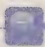

## 总结与考核题

17-1 试总结卤素单质的物理性质和化学性质,找出其变化规律。

17-2 叙述卤素单质的实验室制取方法和工业上大规模生产的化学原理。

17-3 归纳卤化氢和氢卤酸的物理性质和化学性质,总结其变化规律。

17-4 试述金属卤化物的价键类型和溶解情况,给出几种常见的难溶于水的金属氯化物。

17-5 举例说明卤素阴离子与金属阳离子所形成配位化合物的稳定性递变规律。

17-6 什么叫卤素互化物？试写出由两种卤素原子构成的卤素互化物的通式。

17-7 说明 $\mathrm{IF}_3, \mathrm{IF}_5, \mathrm{IF}_7$ 中 I 原子的杂化轨道种类及分子的空间构型。

17-8 举例说明什么是多卤化物,多卤化物热分解遵循什么样的规律,为什么氟一般不存在于多卤化物中?

17-9 什么叫拟卤素、拟卤离子？举出3种重要的拟卤素、拟卤离子。并通过实例说明它们与卤素、卤离子的相似性。

17-10 试讨论氯的含氧酸的存在形式及酸性、热稳定性和氧化还原性的递变规律。

17-11 试从以下几个方面总结卤素中氟的特殊性,并与其他卤素进行比较。

（1）氧化数； （2）单质的制备； （3）氟化物的溶解度；

(4) 氟与水的作用; (5) 氟化氢的熔、沸点; (6) 氢氟酸的酸性。

## 习题

17-1 简释下列词语。

(1) 萃取； (2) 连锁反应； (3) 恒沸溶液； (4) 卤素互化物；

(5) 多卤化物； (6) 拟卤素； (7) 碘钟实验。

17-2 完成并配平下列化学反应方程式。

(1) $CO + Cl_{2} \xlongequal[\Delta]{{活性炭}}$

(2) $Na_{2}SO_{4} + F_{2} \xlongequal{\triangle}$

(3) $\mathrm{Cl}_2 + \mathrm{NH}_3 \xlongequal{\triangle}$ :

(4) $\mathrm{HCl} + \mathrm{O}_2 \xlongequal{\text{催化剂}}$

(5) $\mathrm{CaSiO}_3 + \mathrm{HF(aq)} =$

(6) NaI(s) + H $_{3}$ PO $_{4}$ (浓)

(7) $\mathrm{OF}_2 + \mathrm{I}^- + \mathrm{H}^+ =$

(8) $(\mathrm{CN})_2 + \mathrm{O}_2 \xlongequal{\text{燃烧}}$

(9) $\mathrm{BrF}_3 + \mathrm{F}_2 = 200^{\circ}\mathrm{C}$

(10) $\mathrm{ClF}_{3}\xlongequal{\text{低温}}$

(11) W + ClF =

(12) CsIBrCl $\triangle$

(13) $Cl_{2} + NaOH(aq)$

(14) $\mathrm{HOF} + \mathrm{H}_2\mathrm{O} =$

(15) HClO $\xlongequal{\Delta}$

(16) $\mathrm{ClO}_2 + \mathrm{OH}^-$

(17) $\mathrm{I}_2\mathrm{O}_5 + \mathrm{CO}\stackrel {\triangle}{=}$

(18) $O_{2} + F_{2} \xlongequal{低压放电}$

(19) $\mathrm{HClO} + \mathrm{S} + \mathrm{H}_2\mathrm{O} =$

(20) $\mathrm{Cl}_2 + \mathrm{Br}^- + \mathrm{OH}^-$

(21) $\mathrm{BrO}_3^-$ + $\mathbf{F}_2$ + $\mathrm{OH}^-$

(22) $\mathrm{IO}_3^-$ + $\mathrm{Cl}_2$ + $\mathrm{OH}^-$

(23) $\mathrm{HClO}_4$ (稀) + Zn =

17-3 完成并配平下列化学反应方程式。

(1) 氢碘酸被空气中的氧气氧化。

(2) 加热条件下固体溴化钠与浓磷酸反应。

(3) 硫氰与水作用。

(4) 在酸性条件下硫氰根阴离子还原二氧化锰。

(5) 低温条件下三氟化溴与二氟化二氧的反应。

(6) 低温条件下二氟化二氧与硫化氢作用。

(7) 将单质氟和单质氯的混合物加热至 $250^{\circ}$ C。

(8) 常温下三氟化碘发生歧化反应。

(9) 金属铀与三氟化氯作用。

(10) 五氟化溴水解。

(11) 二氯碘化铯受热分解。

(12) 单质氟与质量分数为 2% 的氢氧化钠溶液反应。

(13) 低温条件下单质氟与碎冰作用。

(14) 次氯酸在光照下分解。

(15) 次氯酸与盐酸反应。

(16) 熟石灰与氯气反应制备漂白粉。

(17) 氯酸钾受热分解。

(18) 二氧化氯与过氧化钠的碱性溶液反应。

(19) 浓硝酸氧化单质碘。

(20) 氯酸氧化单质碘。

(21) 二氟化氙水溶液氧化溴酸盐。

(22) 浓的高氯酸与单质碘反应。

(23) 浓的高氯酸受震动爆炸分解。

17-4 生产、合成与制备。

(1) 以 NaCl 为基本原料制备下列化合物, 写出各主要步骤的化学反应方程式。

① NaClO; ② KClO $_{3}$ ; ③ HClO $_{4}$ ; ④ Ca(ClO) $_{2}$ 。

(2) 以盐酸为基本原料制备 $\mathrm{Cl}_2$ 和 $\mathrm{HClO}$ , 写出各主要步骤的化学反应方程式。

(3) 写出下列制备 $F_{2}$ 的化学反应方程式。

① 以萤石 $\left(\mathrm{CaF}_{2}\right)$ 为原料；

② 以 $\mathrm{KMnO}_4, \mathrm{SbCl}_5, \mathrm{HF}, \mathrm{KF}$ 和 $\mathrm{H}_2\mathrm{O}_2$ 为原料。

(4) 从氯酸钾制备高氯酸。

(5) 由海水制备单质溴和单质碘。

(6) 从液溴制备溴酸钾水溶液。

17-5 分离、提纯与鉴别。

（1）工业产品碘中常含有 ICl 或 IBr 杂质，试设计方案提纯碘，并说明方案的理论依据。

(2) 某 NaCl 试样中混有少量 NaBr, 试设计方案提纯该试样。

(3) 一白色粉末, 可能是 KCl, KBr 或 KI, 试设计方案加以鉴别。

(4) 一固体试样, 可能是 $\mathrm{KClO}_{4}$ 或 $\mathrm{K}_{5} \mathrm{IO}_{6}$ , 试设计方案加以鉴别。

(5) 3个试剂瓶中分别装有 $\mathrm{KI}, \mathrm{KIO}_3$ 和 $\mathrm{K}_5\mathrm{IO}_6$ ，试设计方案加以鉴别。

(6) 4个试剂瓶中分别装有 KCl, KClO, KClO $_{3}$ 和 KClO $_{4}$ , 试设计方案加以鉴别。

(7) 试设计方案分离下列各组离子。

① $Mg^{2+}, Ag^{+}, Al^{3+}$ ; ② $Ca^{2+}, Sn^{2+}, Na^{+}$ 。

(8) 一白色粉末是 $\mathrm{Na}_{2} \mathrm{SO}_{3}, \mathrm{Na}_{2} \mathrm{CO}_{3}, \mathrm{NaClO}_{3}, \mathrm{Na}_{2} \mathrm{SO}_{4}$ 中的一种, 试设计方案加以鉴别。

## 17-6 解释实验现象。

(1) $I_{2}$ 溶解在 $CCl_{4}$ 中得到紫色溶液, 而溶解在乙醚中却形成红棕色溶液。

(2) $I_{2}$ 难溶于水, 却易溶于 KI 溶液。

(3) 溴能从含有碘离子的溶液中取代出碘, 碘又能从溴酸钾溶液中取代出溴。

（4）分别向 $FeCl_{2}$ 和 $NaHCO_{3}$ 溶液中加入碘水，碘水均不褪色。向二者的混合溶液中加入碘水，则褪色。

(5) $\mathrm{Fe}^{3+}$ 可以被 $\mathbf{I}^{-}$ 还原为 $\mathrm{Fe}^{2+}$ , 并生成单质 $\mathbf{I}_2$ , 但如果在 $\mathrm{Fe}^{3+}$ 溶液中先加一定量氟化物, 然后再加入 $\mathbf{I}^{-}$ , 此时就不会有 $\mathbf{I}_2$ 生成。

(6) NaClO 水溶液能够氧化 $I^{-}$ ，而 $NaClO_{3}$ 水溶液却不能。

(7) 浓 $HClO_{4}$ 能够氧化 $I_{2}$ ，而稀 $HClO_{4}$ 却不能氧化 $I_{2}$ 。

(8) 加热 $KClO_{3}$ 固体无气体生成,但有 $MnO_{2}$ 存在时却产生气体。

## 17-7 推理判断。

（1）在淀粉碘化钾溶液中加入少量 NaClO 时, 得到蓝色溶液, 说明有 (A) 生成。加入过量 NaClO 时, 蓝色褪去, 溶液变为无色, 说明有 (B) 生成。然后酸化之并加入少量固体 $Na_{2}SO_{3}$ , 则溶液的蓝色复原。当 $Na_{2}SO_{3}$ 过量时蓝色又褪去, 溶液变为无色, 说明有 (C) 生成。再加入 $NaIO_{3}$ 溶液, 溶液的蓝色又出现。

试给出(A)，(B)和(C)所代表的物质的化学式，并用化学反应方程式表示各过程。

(2) 有一易溶于水的钠盐(A), 加入浓 $\mathrm{H}_{2} \mathrm{SO}_{4}$ 并微热, 有气体(B)生成。将气体(B)通入酸化的 $\mathrm{KMnO}_{4}$ 溶液有气体(C)生成。将气体(C)通入 $\mathrm{H}_{2} \mathrm{O}_{2}$ 溶液有气体(D)生成。将气体(D)与 PbS 在高温下作用有气体(E)生成。将气体(E)通入酸化的 $\mathrm{KClO}_{3}$ 溶液可得到极不稳定的黄绿色气体(F)。气体(F)浓度高时发生爆炸, 分解成气体(C)和(D)。

试给出(A)，(B)，(C)，(D)，(E)和(F)所代表的物质的化学式，并用化学反应方程式表示各过程。

(3) 白色固体(A)与油状无色液体(B)反应生成(C)。纯净的(C)为紫黑色固体,微溶于水,易溶于(A)的溶液中,得到红棕色溶液(D)。将(D)分成两份,一份中加入无色溶液(E),另一份中通入黄绿色气体单质(F),两份均褪色成无色透明溶液。无色溶液(E)遇酸生成淡黄色沉淀(G),同时放出无色气体(H)。将气体(F)通入溶液(E),在所得溶液中加入 $BaCl_{2}$ ,有白色沉淀(I)生成,(I)不溶于 $HNO_{3}$ 。

试给出(A)，(B)，(C)，(D)，(E)，(F)，(G)，(H)和(I)所代表的物质的化学式，并用化

学反应方程式表示各过程。

## 17-8 简答题。

(1) 给出下列物质的化学式。

① 萤石； ② 冰晶石； ③ 氟磷灰石； ④ 光卤石； ⑤ 光气。

(2) 比较下列各组酸强度的大小,并简要说明理由。

① HF, HCl, HBr 和 HI;

② HClO, $HClO_{2}$ 和 $HClO_{3}$ ;

③ $HClO_{3}$ , $HBrO_{3}$ 和 $HIO_{3}$ ;

④ $HClO_{4}$ 和 $H_{3}PO_{4}$ 。

(3) 将下列各组物质的有关性质由大到小排序, 并简要说明理由。

① 键解离能 $Cl_{2}, Br_{2}$ 和 $I_{2}$ ;

② 溶解度 $HgF_{2}, HgCl_{2}, HgBr_{2}$ 和 $HgI_{2}$ ;

③ 氧化性 $HClO, HClO_{3}$ 和 $HClO_{4}$ ;

④ 稳定性 $ClO_{2}$ 和 $I_{2}O_{5}$ 。

(4) 为什么单质氟不能用电解相应的氟化物水溶液来制备？

(5) $F_{2}$ 的化学性质极为活泼,为什么电解 $KHF_{2}$ 时可用 Cu,Ni 及其合金作电解槽?

(6) 向溴水中通入氯气,能否有 $HBrO_{3}$ 生成? 为什么?

(7) 为什么从氟到氯活泼性的变化有一个突变?

(8) 为什么不能用玻璃容器盛 $NH_{4}F$ 溶液？

(9) 为什么很浓 $(5\sim15\ \mathrm{mol}\cdot\mathrm{dm}^{-3})$ 的 HF 水溶液酸性很强？

（10）在卤化物中，为什么各种元素最高氧化态都是以氟化物存在，而不是以碘化物存在？

（11）为什么 $\mathrm{AlF}_3$ 的熔点高于 $1000^{\circ}\mathrm{C}$ ，而 $\mathrm{AlCl}_3$ 的熔点却不到 $200^{\circ}\mathrm{C}$ ？

（12）某一试液能使 $\mathrm{KMnO_4}$ 的酸性溶液褪色，但不能使碘-淀粉溶液褪色。试指出下列阴离子哪些可能存在于试液中。

① $S_{2}O_{3}^{2-}$ ; ② $S^{2-}$ ; ③ $Br^{-}$ ; ④ $I^{-}$ ; ⑤ $NO_{2}^{-}$ ; ⑥ $SO_{3}^{2-}$ .

已知： $E^{\ominus}(\mathrm{MnO}_{4}^{-}/\mathrm{Mn}^{2+}) = 1.51\mathrm{V}, E^{\ominus}(\mathrm{I}_{2}/\mathrm{I}^{-}) = 0.54\mathrm{V}$ 。

（13）分析 $ClO_{2}, Cl_{2}O$ 和 $ClO_{4}^{-}$ 分子或离子的成键情况，并回答下列问题。

① 哪个分子或离子中 O 原子与 Cl 原子间存在单键？

② 哪个分子或离子中存在大 $\pi$ 键？

③ 哪个分子或离子中存在反馈配键？

④ $ClO_{2}$ 分子中 Cl 原子与 O 原子间的键级是多少？

（14）用价层电子对互斥理论判断下列分子或离子的空间构型，并写出中心原子的杂化轨道类型。

① $\mathrm{ClF}_3$ ；② $\mathrm{BrF}_5$ ；③ $\mathrm{IBr}$ ；④ $\mathrm{IF}_7$ ；⑤ $\mathrm{ICl}_4^-$ 。

## 目录

18.1 氢 …… 699
18.1.1 氢的成键方式 …… 699
1. 失电子方式 …… 699
2. 得电子方式 …… 700
3. 共用电子对——共价键的形成 …… 700
4. 特殊键型 …… 700
18.1.2 氢气的性质和制备 …… 701
1. 氢气的性质 …… 701
2. 氢气的制备 …… 703
18.1.3 氢气的用途 …… 704
18.1.4 氢化物 …… 704
1. 离子型氢化物 …… 704
2. 分子型氢化物 …… 706
3. 金属型氢化物 …… 706
18.2 稀有气体 …… 707
18.2.1 稀有气体的性质和用途 …… 708
1. 稀有气体的性质 …… 708
2. 稀有气体的用途 …… 708
18.2.2 稀有气体化合物 …… 709
1. 氙的氟化物 …… 709
2. 氙的含氧化合物 …… 711
3. 其他稀有气体化合物 …… 711
18.2.3 稀有气体化合物的结构 …… 711
1. 用现代价键理论讨论氙化合物的分子结构 …… 712
2. 用分子轨道理论讨论氙化合物的分子结构 …… 713
18.3 主族元素总结 …… 713
18.3.1 主族非金属元素的通性 …… 713

1. 单质 …… 713
2. 氢化物 …… 714
3. 含氧酸 …… 715
4. 含氧酸盐 …… 716
18.3.2 主族金属元素的通性 …… 718
1. 金属的物理性质 …… 719
2. 金属的化学性质 …… 720
18.3.3 次级周期性 …… 721
拓展学习资源 …… 723
总结与思考题 …… 723
习题 …… 724

## 第 18 章 氢和稀有气体

## 18.1 氢

氢的基态原子的电子构型为 $1\mathrm{s}^{1}$ , 通常列在元素周期表 IA 族的顶端。事实上, 化学家对氢在元素周期表所处的位置是有争议的。它的 $1\mathrm{s}^{1}$ 电子构型与碱金属的价层电子构型 $n\mathrm{s}^{1}$ 相同, 但却与碱金属化学性质没有多少类似性。氢比稀有气体构型缺少一个电子, 也可归于 VII A 族。例如, 氢和卤素一样可以形成双原子分子和 -1 价离子, 但这种类似是有限的。第 3 种可能是把氢放在 IV A 族碳元素的上面, 两种元素都有半充满的价电子层, 电负性类似, 通常形成共价键而不是离子键。因此, 从很多方面看, 氢是唯一值得单独考虑的元素。

氢是最丰富的元素,除大气中含有少量游离态的氢气以外,绝大部分氢以化合物的形式存在。地球、太阳及木星等天体上都有大量的氢,因此可以说整个宇宙空间到处都有氢的存在。1766年,英国人亨利·卡文迪许(Cavendish)通过铁、锌与稀盐酸、稀硫酸反应第一次制得氢气。

氢的元素电势图见图 18-1。

$$
\begin{array}{c} E _ {\mathrm{A}} ^ {\ominus} / \mathrm{V} \\ \mathrm{H} ^ {+} \xrightarrow {0} \mathrm{H} _ {2} \xrightarrow {- 2 . 2 5} \mathrm{H} ^ {-} \end{array} \quad \begin{array}{c} E _ {\mathrm{B}} ^ {\ominus} / \mathrm{V} \\ \mathrm{H} _ {2} \mathrm{O} \xrightarrow {- 0 . 8 2 8} \mathrm{H} _ {2} \xrightarrow {- 2 . 2 5} \mathrm{H} ^ {-} \end{array}
$$

图18-1 氢的元素电势图

## 18.1.1 氢的成键方式

氢形成化学键的主要方式,依赖于其核外电子的得、失、共用3种过程。

## 1. 失电子方式

氢的 1s 电子可以失去而形成 $H^{+}$ ，即质子。 $H^{+}$ 的离子势非常大，可以极大程度地使其他原子的电子云发生变形。

在水溶液中,有溶剂水参与的情况下, $H^{+}$ 将与溶剂分子结合成水合氢离子 $\left(\mathrm{H}_{3}\mathrm{O}^{+}\right)$ 。因而在水溶液中没有 $H^{+}$ 这种形式的质子独立存在。

## 2. 得电子方式

氢原子能够获得一个电子,达到氦核的 $1s^{2}$ 构型,形成 $H^{-}$ 。这种离子只存在于活泼金属的氢化物中,氢同碱金属、碱土金属只有在较高温度下才能生成含有 $H^{-}$ 的氢化物。

这类氢化物具有离子型化合物的共性。

## 3. 共用电子对——共价键的形成

在大多数含氢化合物中, 氢原子都与其他元素的原子共用一对电子, 或者说形成一个共价键。除了氢分子中的共价键呈非极性以外, 在为数众多的氢化物中, 所形成的共价键在某种程度上都具有极性的特征。因偶极矩方向和大小的不同, 影响物质的物理性质和化学性质。

## 4. 特殊键型

在一些化合物中,氢可以与其他元素的原子形成较为特殊的化学键。

## (1) 氢桥键

在 13.1.2 硼氢化合物小节中曾接触过氢桥键, 见图 13-6, 它不属于经典的共价键, 因为它不是在两个原子之间共用一对电子所形成的, 而是三中心二电子键。在硼氢化合物的氢桥键中, 只有一个核外电子的氢原子, 打破共价键的规则, 与两个硼原子成键。氢桥键的形成是由于硼的缺电子特点造成的。

## (2) 氢桥配位键

在 11.1.2 配位化合物的命名小节中曾介绍过多核配位化合物中的桥联配体,有羰基、氨基、羟、氧、氯等。在特殊的情况下,氢也可以作桥联配体,形成氢桥配位键,如图 18-2 所示的 $\left[\mathrm{Cr}_{2}\mathrm{H}(\mathrm{CO})_{10}\right]^{+}$ 配阴离子中就有氢桥配体。

## (3) 金属型氢化物

氢原子可以填充到许多过渡金属晶格的空隙中,形成一类非整比化合物,一般称为金属型氢化物,如 $ZrH_{1.30}$ 和 $LaH_{2.87}$ 等。

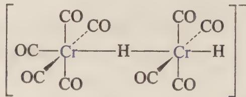  
图18-2 $\left[\mathrm{Cr}_2\mathrm{H}(\mathrm{CO})_{10}\right]^{-}$ 的结构

氢键不能算作一种化学键,其键能的大小

介于化学键与分子间的范德华力之间。第7章晶体结构中曾学习过，在含有强极性键的共价氢化物，如 $\mathrm{HF}, \mathrm{H}_{2} \mathrm{O}, \mathrm{NH}_{3}$ 中，近乎裸露的氢原子核可以定向吸引邻近的电负性高、半径小的 $\mathrm{F}, \mathrm{O}, \mathrm{N}$ 元素的原子上的孤电子对，从而形成分子间氢键或分子内氢键。

随着物质结构领域科学研究的深入,尤其是有关生命科学的理论与实践的进一步发展,氢键越来越显出其独到的重要性。生物体内的蛋白质是多个氨基酸以肽键缩合而成的长链分子,长链的蛋白质分子之间就是靠氢键相连接的,如图 18-3(a)所示,羰基的氧原子和氨基的氢原子之间有氢键。

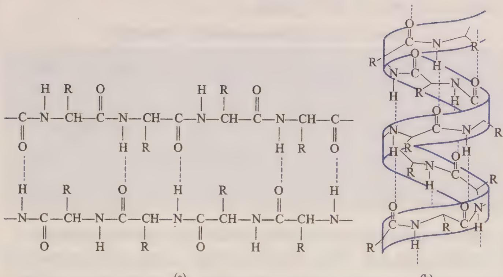  
图 18-3 蛋白质的氢键

(a)

(b)

长链的蛋白质分子自身可以形成螺旋形构型,如图 18-3(b) 所示,这种结构就是靠许多分子内氢键来稳定的。DNA 的双螺旋就是两条螺旋形分子通过氢键结合起来的超分子结构。

分子间的相互识别,结合成超分子的过程称为分子的自组装。在这些复杂的生命过程中,氢键发挥着重要的作用。

## 18.1.2 氢气的性质和制备

## 1. 氢气的性质

氢有三种同位素, $^{1}_{1}$ H 称为氘,符号为 H; $^{2}_{1}$ H 称为氘,符号为 D; $^{3}_{1}$ H 称为氚,符号为 T。普通的氢和氘有稳定的核,氚是一种不稳定的放射性同位素,发生 β 衰变:

$$
{ } _ { 1 } ^ { 3 } \mathrm{H} = { } _ { 2 } ^ { 3 } \mathrm{He} + \mathrm{e} ^ { - }
$$

其半衰期为 12.26 年。 $^{3}_{1}$ H 的衰变说明在大气中可能存在痕量的 ${}^{3}_{2}He$ 。因为这 3 种同位素的原子核外均有一个电子，所以它们的化学性质基本相同，但由于它们的质量相差较大，导致了它们的单质和化合物在物理性质上有很大差别。这 3 种氢同位素及其形成的氢单质的一些物理性质列于表 18-1 中。

氢气 $\left(\mathrm{H}_{2}\right)$ 是由两个氢原子以共价键的方式结合成的双原子分子, 键长为74 pm。常温下, 氢气是无色、无味、无臭的气体, 0 ℃时1 dm $^{3}$ 水能溶解0.02 dm $^{3}$ 氢气。 $H_{2}$ 在所有分子中相对分子质量最小, 分子间作用力很弱, 只有冷却到 -252.879 ℃ (约 20 K) 时, 氢气才被液化。

表 18-1 氘、氘、氚及其形成的氢单质的一些物理性质

<table><tr><td>同位素</td><td>丰度 %</td><td>原子质量 u</td><td>熔点 °C(K)</td><td>沸点 °C(K)</td><td>键能  $\mathrm{{kJ}} \cdot {\mathrm{{mol}}}^{-1}$ </td></tr><tr><td> $^1\mathrm{H}$ </td><td>99.988 5(70)</td><td>1.007 825</td><td>-259.16(约14)</td><td>-252.879(约20)</td><td>435.78</td></tr><tr><td> $^2\mathrm{H}$ </td><td>0.011 5(70)</td><td>2.014 102</td><td>-254.42(约19)</td><td>-249.48(约24)</td><td>443.32</td></tr><tr><td> $^3\mathrm{H}$ </td><td>≈10-16</td><td>3.016 049</td><td>-252.53(约21)</td><td>-248.11(约25)</td><td>446.67</td></tr></table>

氢分子中 H—H 键的键能为 $435.78 \, kJ \cdot mol^{-1}$ ，比一般单键的键能高出很多，同一般双键的键能相近。因此，常温下氢分子具有一定程度的惰性，与许多其他物质反应很慢。只有某些特殊的反应能迅速进行，如氢气同单质氟在暗处能迅速化合，在 $-250 \, ^{\circ}C$ （约 $23 \, K$ ）下也能同液态或固态氟发生反应。但是，同其他卤素或氧在低温下则不会发生反应。

氢气与氯气混合时经引燃或光照会猛烈反应,生成卤化氢;氢气与氧气混合时经引燃会猛烈反应,生成水。以上反应将放出大量热量,例如 $25^{\circ}$ C 时 $H_{2}$ 与 $O_{2}$ 反应生成 $1 \, \text{mol} \, \text{H}_{2}\text{O}(1)$ 时放热 $285.8 \, kJ$ ; $H_{2}$ 与 $Cl_{2}$ 反应生成 $1 \, \text{mol} \, \text{HCl}(g)$ 时放热 $92.3 \, kJ$ 。体积比为 $2:1$ 的 $H_{2}$ 和 $O_{2}$ 混合物遇火花会猛烈地爆炸,氢气和空气的混合物中含氢量为 $6\% \sim 67\%$ 时是易爆炸性的。

氢气与活泼金属在高温下反应,生成金属氢化物,这是制备离子型氢化物的基本方法,例如:

$$
\mathrm{H} _ {2} + 2 \mathrm{Na} \xlongequal {3 8 0 ^ {\circ} \mathrm{C}} 2 \mathrm{NaH}
$$

产物 NaH 为白色离子晶体, 其中 H 显 -1 价, Na 显 +1 价。

在适当的温度、压强和相应的催化剂存在下， $\mathrm{H}_{2}$ 可与CO反应，生成一系列的有机化合物，例如：

$$
\mathrm{CO(g)} + 2 \mathrm {H_ {2} (g)} \xlongequal [ T, p ] {\mathrm {ZnO - Cr_ {2} O_ {3}}} \mathrm {CH_ {3} OH(g)}
$$

催化加氢也可以使不饱和碳氢化合物转化成饱和的碳氢化合物。这些反应构成了有机合成化学工业的一部分。

原子氢是一种比分子氢更强的还原剂。它可与锗、锡、砷、锑、硫等直接作用

生成相应的氢化物,例如:

$$
\begin{array}{r l} \mathrm{As} + 3 \mathrm{H} & = \mathrm{AsH} _ {3} \\ \mathrm{S} + 2 \mathrm{H} & = \mathrm{H} _ {2} \mathrm{S} \end{array}
$$

原子氢还能把某些金属氧化物或氯化物迅速还原成金属，例如：

$$
\mathrm{CuCl} _ {2} + 2 \mathrm{H} = \mathrm{Cu} + 2 \mathrm{HCl}
$$

它甚至能还原某些含氧酸盐，例如：

$$
\mathrm{BaSO} _ {4} + 8 \mathrm{H} = \mathrm{BaS} + 4 \mathrm{H} _ {2} \mathrm{O}
$$

## 2. 氢气的制备

## (1) 实验室制法

实验室里,常利用稀盐酸或稀硫酸与锌等活泼金属作用制取氢气。因为金属锌中常含有 $Zn_{3}P_{2}, Zn_{3}As_{2}, ZnS$ 等杂质,它们与酸反应生成 $PH_{3}, AsH_{3}, H_{2}S$ 等气体混杂在氢气中,需要经过纯化后才能得到纯净的氢气。

而用电解水的方法制备氢气,所得的氢气纯度高。常采用质量分数为 25% 的 NaOH 或 KOH 溶液为电解液。电极反应如下:

$$
\begin{array}{r l} \text {阴极} & 2 \mathrm{H} _ {2} \mathrm{O} + 2 \mathrm{e} ^ {-} = \mathrm{H} _ {2} + 2 \mathrm{OH} ^ {-} \\ \text {阳极} & 4 \mathrm{OH} ^ {-} = \mathrm{O} _ {2} + 2 \mathrm{H} _ {2} \mathrm{O} + 4 \mathrm{e} ^ {-} \end{array}
$$

## (2) 工业制法

氢气是氯碱工业中的副产物。电解食盐水的过程中，在阳极上生成 $Cl_{2}$ ，电解池中得到 NaOH 的同时，阴极上放出 $H_{2}$ 。

工业生产上大量需要的氢气是靠催化裂解天然气得到的：

$$
\begin{array}{r l} & {\mathrm {CH_ {4} + H_ {2} O\xrightarrow [ T,p ]{\text {催化剂}} CO + 3H_ {2}}} \\ & {\mathrm {C_ {3} H_ {8} + 3H_ {2} O\xrightarrow [ T,p ]{\text {催化剂}} 3CO + 7H_ {2}}} \end{array}
$$

这类反应的关键是选择有效的催化剂。

工业生产上也利用水蒸气通过红热的炭层来获得氢气,反应如下:

$$
\mathrm{C} + \mathrm{H} _ {2} \mathrm{O(g)} \xlongequal {1 0 0 0 ^ {\circ} \mathrm{C}} \mathrm{CO(g)} + \mathrm{H} _ {2} (\mathrm{g})
$$

产物就是第 14 章中提到过的水煤气。用作工业燃料气的水煤气,不必分离 $H_{2}$ 和 CO,但为了制备氢气,则必须分离出 CO。具体方法是将水煤气连同水蒸气一起通过红热的氧化铁,CO 转变成 $CO_{2}$ :

$$
\mathrm{CO} + \mathrm{H} _ {2} \mathrm{O(g)} \xlongequal [ 4 5 0 ^ {\circ} \mathrm{C} ] {\mathrm{Fe} _ {2} \mathrm{O} _ {3}} \mathrm{CO} _ {2 ^ {\prime}} + \mathrm{H} _ {2}
$$

然后在 $2 \times 10^{6}$ Pa 压强下将 $CO_{2}$ 和 $H_{2}$ 的混合气体用水洗涤, 吸收掉 $CO_{2}$ 而分离出 $H_{2}$ 。

## 18.1.3 气的用途

氢气重要的用途之一是作为合成氨工业的原料,氨又是生产硝酸,进一步生产硝铵的原料。

高温下,氢气能将许多金属氧化物或金属卤化物还原成单质,人们经常利用氢气的这一性质制备金属单质,例如:

$$
\begin{array}{r l} & \mathrm {WO_ {3}} + 3 \mathrm {H_ {2}} \stackrel {\triangle} {=} \mathrm{W} + 3 \mathrm {H_ {2} O} \\ & \mathrm {TiCl_ {4}} + 2 \mathrm {H_ {2}} \stackrel {\triangle} {=} \mathrm{Ti} + 4 \mathrm{HCl} \end{array}
$$

所以氢气是重要的无机化工原料。

氢气也是一种重要的有机化工原料,如不饱和的有机分子的氢化等都需要氢气。

氢气可迅速燃烧且无污染,这一点预示着氢气可作燃料。单位质量的氢气燃烧所提供的能量比汽油大很多,而且不会产生一氧化碳、二氧化硫等有害气体和未燃烧完全的某些对环境造成污染的副产物。目前,化学家受到的最大的挑战是如何从最丰富的源泉——水出发,找到一种能产生氢气的光化学过程。

氢气在氧气或空气中燃烧时,火焰温度可以达到 $3000^{\circ}$ C 左右,工业上利用此反应切割和焊接金属。

在发射管或电弧中,通过紫外辐射获得原子氢,将原子氢气流通向金属表面,则原子氢重新结合成分子氢。重组过程所放出的热可以导致 $4\ 000\ ^{\circ}C$ 的高温,这就是原子氢焰,可用以焊接高熔点金属。

液态氢可把除氦以外的其他气体冷却并转变成固体。

同温同压下,所有气体中氢气的密度最小,常用来填充气球。

## 18.1.4 氢化物

氢化物可以分成离子型氢化物、分子型氢化物和金属型氢化物 3 大类。

## 1. 离子型氢化物

氢气与碱金属及多数碱土金属在较高的温度下直接化合时，H原子获得一个电子，成为 $\mathrm{H}^{-}$ ，生成离子型氢化物。氢的这种性质类似于卤素。但是， $\mathrm{H}_{2}$ 变成 $\mathrm{H}^{-}$ 的倾向远比卤素分子 $\mathrm{X}_{2}$ 变成卤素离子 $\mathrm{X}^{-}$ 的小。因为对于卤素下面的反

应是放热的：

$$
\frac {1}{2} \mathrm{X} _ {2} = \mathrm{X} ^ {-} \quad \Delta_ {\mathrm{r}} H <   0
$$

而对于 $\mathbf{H}_2$ 的相应反应：

$$
\frac {1}{2} \mathrm{H} _ {2} = \mathrm{H} ^ {-} \quad \Delta_ {\mathrm{r}} H > 0
$$

则需要吸收热量。这是离子型氢化物的生成需要在较高的温度下实现的原因，也是离子型氢化物远不如相应的卤化物存在得普遍的原因。

碱金属和碱土金属的氢化物都是白色或灰白色晶体。其中 LiH 和 $BaH_{2}$ 热稳定性较高，分别在 $692^{\circ}C$ 和 $1\ 200^{\circ}C$ 时熔融而不分解，其他氢化物均在熔化前分解成相应的单质。熔融态的离子型氢化物导电。它们的很多性质与盐类相似，因此有时称离子型氢化物为盐型氢化物。

电解熔融的氢化物,阳极产生氢气,这一事实可以证明 $H^{-}$ 的存在。

离子型氢化物的重要化学性质是可与水发生剧烈反应,放出氢气:

$$
\mathrm{NaH} + \mathrm{H} _ {2} \mathrm{O} = \mathrm{H} _ {2} \uparrow + \mathrm{NaOH}
$$

这个反应的实质是

$$
\mathrm{H} ^ {+} + \mathrm{H} ^ {-} = \mathrm{H} _ {2} \uparrow
$$

在非水极性溶剂,例如在乙醚中,离子型氢化物能与一些缺电子化合物结合生成复合氢化物,例如:

$$
\begin{array}{r l} & 2 \mathrm{LiH} + \mathrm{B} _ {2} \mathrm{H} _ {6} \xlongequal {\text {乙醚中}} 2 \mathrm{LiBH} _ {4} \\ & 4 \mathrm{LiH} + \mathrm{AlCl} _ {3} \xlongequal {\text {乙醚中}} \mathrm{LiAlH} _ {4} + 3 \mathrm{LiCl} \end{array}
$$

离子型氢化物及复合氢化物均具有很强的还原性,在高温下可还原金属氯化物、氧化物和含氧酸盐,也可以还原 $H_{2}O$ 中的 H,例如:

$$
\begin{array}{r l} \mathrm{TiCl} _ {4} + 4 \mathrm{NaH} & \xlongequal {\triangle} \mathrm{Ti} + 4 \mathrm{NaCl} + 2 \mathrm{H} _ {2} \uparrow \\ \mathrm{UO} _ {2} + \mathrm{CaH} _ {2} & \xlongequal {\triangle} \mathrm{U} + \mathrm{Ca(OH)} _ {2} \\ \mathrm{KH} + \mathrm{H} _ {2} \mathrm{O} & = \mathrm{KOH} + \mathrm{H} _ {2} \uparrow \end{array}
$$

若 $CO_{2}$ 与热的金属型氢化物接触,也能被还原:

$$
2 \mathrm{CO} _ {2} + \mathrm{BaH} _ {2} \stackrel {\triangle} {=} 2 \mathrm{CO} + \mathrm{Ba(OH)} _ {2}
$$

在第 13 章 13.1.2 硼氢化合物小节中, 曾经学习过使用 $LiAlH_{4}$ 还原 $BCl_{3}$ 以制备纯度较高的乙硼烷的反应。但用 $LiAlH_{4}$ 作还原剂的反应不能在水中进行, 因为氢化铝锂将与水发生剧烈作用:

$$
\mathrm{LiAlH} _ {4} + 4 \mathrm{H} _ {2} \mathrm{O} = \mathrm{Al(OH)} _ {3} + \mathrm{LiOH} + 4 \mathrm{H} _ {2} \uparrow
$$

类似的氢化物还有很多,它们被广泛用于无机和有机合成中作还原剂和负氢离子的来源,或在野外用作生氢剂,使用十分方便,但价格昂贵。

## 2. 分子型氢化物

分子型氢化物是最常见的,在ⅢA\~ⅦA族中学习过的氢化物基本属于这一类。p区元素的氢化物属于分子型晶体,这类氢化物具有熔、沸点低的特点,通常条件下多为气体。

它们在水中的行为大不相同。HCl, HBr, HI 等在水中完全解离，使溶液显强酸性；而 $H_{2}S$ , HF 等在水中部分解离，显弱酸性。

$NH_{3}$ 和 $PH_{3}$ 等使其水溶液显弱碱性,例如:

$$
\mathrm{NH} _ {3} + \mathrm{H} _ {2} \mathrm{O} = \mathrm{NH} _ {4} ^ {+} + \mathrm{OH} ^ {-}
$$

硅、硼的氢化物同水作用时生成含氧酸或水合氧化物并放出氢气，例如：

$$
\mathrm{SiH} _ {4} + (n + 2) \mathrm{H} _ {2} \mathrm{O} = \mathrm{SiO} _ {2} \cdot n \mathrm{H} _ {2} \mathrm{O} \downarrow + 4 \mathrm{H} _ {2}
$$

甲烷与水基本不发生作用。

从分子型氢化物的成键情况和价层电子的构型看,有3种不同的情况。一种是缺电子氢化物,如 $B_{2}H_{6}$ ,其中心原子B未满足8电子构型,两个B原子通过三中心二电子氢桥键连在一起。另一种是中心原子的价层电子全部参与成键,没有剩余的孤电子对,如 $CH_{4}$ 及其同族元素的氢化物。还有一种是有孤电子对的氢化物,如 $NH_{3},H_{2}O$ 和HF等氢化物,它们的中心原子采用不等性杂化轨道与配体H原子成键。用价层电子对互斥理论讨论,它们属于价层电子对数目m大于配体数目n,孤电子对数目 $(m-n)>0$ 的类型。例如,三角锥形 $NH_{3}$ 分子,V形 $H_{2}O$ 分子均属于该类。

分子型氢化物都具有还原性,而且同族氢化物的还原能力随原子序数增加而增强。

## 3. 金属型氢化物

d 区元素和 f 区元素一般都能形成金属型氢化物。而 VIB 族仅有 Cr 能形成氢化物，VIII 族 Pd 在适当压强下，可与氢形成稳定的松散相，其化合物组成为 $\mathrm{PdH}_{x}(x<1)$ ，Ni 只有在高压下才能形成氢化物。从组成上看，这些氢化物有的是整比化合物，如 $CrH_{2}$ ，NiH，CuH 和 $ZnH_{2}$ ；有的则是非整比化合物，如 $PdH_{0.8}$ 和

一些f区元素的氢化物等。

Pt 在任何条件下都不能形成氢化物,但氢可在 Pt 表面上形成化学吸附氢化物,从而使 Pt 在加氢反应中有广泛的催化作用。

从物理性质上看,金属型氢化物基本上保留着金属外观特征,有金属光泽,具有导电性。金属型氢化物的导电性随氢含量的增多而降低。

金属型氢化物的另一个显著性质是在温度稍有提高时，H原子通过固体迅速扩散。普通氢气通过Pd-Ag合金管扩散后而得超纯氢气就是利用H原子这一特性。这种超纯氢气可以作为工业上生产半导体材料超纯硅时的还原剂。

## 18.2 稀有气体

稀有气体包括氦、氖、氩、氪、氙、氡和第七周期的氮共7种元素，基态原子的价层电子构型除氦的 $ns^{2}$ 以外，其余均为 $ns^{2}np^{6}$ 。在接近地球表面的空气中， $1000\ dm^{3}$ 空气中约含有 $9.3\times10^{3}\ cm^{3}$ 氙、 $18\ cm^{3}$ 氙、 $5.2\ cm^{3}$ 氦、 $1.14\ cm^{3}$ 氦和 $0.086\ cm^{3}$ 氙。天然气中有时含有低于1%体积分数的氦。氡是镭等放射性元素蜕变的产物。

1785 年, 卡文迪许获得大气中存在稀有气体第一个实验证据。1868 年, 法国人严森 (Janssen) 和英国人洛克耶 (Lockyer) 从日冕光谱中发现了元素氦 (He) 的谱线, 并认为这是仅存在于太阳中的元素。1894 年, 英国人瑞利 (Rayleigh) 和苏格兰人拉姆赛 (Ramsay) 报道了稀有气体氩 (Ar)。1895 年, 拉姆赛等证明了氦也是一种稀有气体, 后来又在空气中发现了氦。在随后的 3 年内, 拉姆赛和英国人特拉弗斯 (Travers) 通过对空气低温蒸馏分离出另外 3 种稀有气体元素氖 (Ne)、氪 (Kr) 和氙 (Xe)。1900 年, 德国人道恩 (Dorn) 等在研究镭的放射性时, 发现稀有气体元素氡 (Rn)。至此, 元素周期表中零族元素已全部发现。由于它们的惰性, 当时被命名为“惰性气体元素”。

含有惰性气体的第一个化合物是 Clathrates“笼”化物，惰性气体原子被诱捕在笼中。1962 年，英国人巴特利特（Batrlett）注意到 Xe 的电离能 $1\ 170\ kJ \cdot mol^{-1}$ 和 $O_{2}$ 的电离能 $1\ 165\ kJ \cdot mol^{-1}$ 相近，于是模仿 $O_{2}^{+}[PtF_{6}]^{-}$ 的合成，将等体积的 Xe 和 $PtF_{6}$ 蒸气在室温下反应，获得了 $Xe^{+}[PtF_{6}]^{-}$ 。尽管产物是混合物，但这毕竟是第一次合成出来以化学键连接的惰性气体化合物。这个发现震动了科学界，动摇了长期禁锢人们思想的“绝对惰性”观念。“惰性气体”也随之改名为“稀有气体”。在随后的几个月内 $XeF_{2}$ 和 $XeF_{4}$ 被合成并表征，其他稀有气体化合物也陆续被合成出来。由于稀有气体在化合状态时可达 +8 氧化数，所以有人建议把稀有气体元素定义为元素周期表 VII A 族元素，把原 VIII 族元素作为 VIII B 族元素。

从此，稀有气体元素化学揭开了新篇章。

稀有气体化合物中与氙有关的为多数,涉及其他元素的较少,图 18-4 给出了氙的元素电势图。

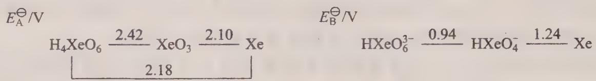  
图18-4 氙的元素电势图

稀有气体在自然界中均以游离态存在,所以得到这些气体并不需要化学过程。空气是得到稀有气体的最基本的原料,使空气液化,再升温将液态空气分馏是制取稀有气体的最基本的过程。以生产 Ar 为例,关键是要掌握好温度,-196 ℃(约 77 K)时的馏分是 $N_{2}$ , -186 ℃(约 87 K)时的馏分是 Ar, -183 ℃(约 90 K)时的馏分是 $O_{2}$ 。以 Ar 为主的中温馏分中可能有杂质 $O_{2}$ 和 $N_{2}$ , 可以分别利用红热的铜丝和灼热的镁粉处理,即可得到较纯的氩气。

## 18.2.1 稀有气体的性质和用途

## 1. 稀有气体的性质

稀有气体是单原子分子,其核外电子层都有相对饱和的结构,除氦有两个电子外,其余最外层皆有8个电子。这种电子构型是相当稳定的。稀有气体的电子亲和能很难测得,计算结果表明,稀有气体原子得电子的过程是吸热的;而且与其他元素相比较,它们都有很高的电离能。因此,相对来说,稀有气体原子在一般条件下不易得到或失去电子而与其他原子形成化学键。通常,由于稀有气体以原子状态存在,原子之间仅存在着微弱的范德华力,主要是色散力。它们的蒸发热和在水中的溶解度都很小,随着原子序数的增加而逐渐升高。

氦是所有气体中最难液化的,大约 2.2 K 时液氦会由一种液态转变到另一种液态。温度在 2.2 K 以下的液氦具有许多反常的性质,如超导性、低黏滞性等。氦不能在常压下固化,这也是一种特性。

所有氡的同位素都有放射性,最短寿命同位素 ${}^{219}Rn$ 半衰期为 3.96 s,最长寿命同位素 ${}^{222}Rn$ 半衰期也只有 3.82 天。氡是由 ${}^{226}Ra$ 衰变得来,并且自身经受 $\alpha$ 衰变而成为钋(Po)。

## 2. 稀有气体的用途

稀有气体可以为反应提供惰性环境。例如，冶炼金属钛的过程中，要用活泼的金属 $\mathrm{Mg}$ 还原 $\mathrm{TiCl}_4$ ，在较高的反应温度下金属钛Ti易于与氧气、氮气等发生化合反应，所以必须用稀有气体造成惰性环境。由于金属钛的熔点高，将其熔炼成钛锭的过程也要有惰性环境。这里所用的主要是氩气和氦气。

利用氦气密度低这一性质,在一定场合下用它代替氢气,这样做比使用氢气安全得多。例如,在氦气资源丰富的地方,用其代替氢气充填升空的气象气球。

液氦在核磁共振波谱仪中用作超导磁体的制冷剂,这是超导技术所必要的条件。氦的光谱线可被用作划分分光器刻度的标准。另外还可制作氦、氖气体激光器。

氖在电场作用下可产生明亮的橙红色的光,所以它被广泛地用来制造氖灯,俗称霓虹灯,或仪器中的指示灯,也广泛用于广告牌和标牌。

氙在电场的激发下能放出强烈的白光,高压长弧氙灯便是利用氙的这一特征制成的。这种氙灯特别亮,有“人造小太阳”之称,可用于电影摄制、舞台照明、运动场照明等。氙灯能放出紫外线,在医疗上有所应用。氪和氙的同位素在医学上被用来测量脑血流量和研究肺功能、计算胰岛素分泌量等。

## 18.2.2 稀有气体化合物

一些稀有气体化合物已经被合成出来,但与其他族元素相比数目极其有限。已知稳定的化合物仅包括元素 Kr, Xe, Rn 的共价型化合物,但是利用质谱已经检测到 He, Ne 化合物及其他易分解的物种。研究较多的是一些稳定的稀有气体化合物,如 Xe 与高电负性的 F, O 和 Cl 的化合物,近些年来少量含有 Xe—N 键和 Xe—C 键的化合物也有报道。

## 1. 氙的氟化物

氙的氟化物是两种元素的单质在镍制反应器中直接化合而得到的。制备 $\mathrm{XeF}_2$ 的反应为

$$
\mathrm{Xe(g)} + \mathrm {F_ {2} (g)} \xrightarrow [ 1 . 0 1 3 \times 1 0 ^ {5} \mathrm{Pa} ]{1 0 0 0 ^ {\circ} \mathrm{C}} \mathrm {XeF_ {2} (g)}\tag{1}
$$

Xe 要大过量, 避免 $XeF_{4}$ 的生成, 以确保 $XeF_{2}$ 占主要地位。

制备 $\mathrm{XeF}_4$ 的反应为

$$
\mathrm{Xe(g)} + 2 \mathrm {F_ {2} (g)} \xlongequal [ 6. 1 8 \times 1 0 ^ {5} \mathrm{Pa} ] {6 0 0 ^ {\circ} \mathrm{C}} \mathrm {XeF_ {4} (g)}\tag{2}
$$

$F_{2}$ 要过量, $n(\mathrm{Xe}):n(\mathrm{F}_{2})=1:5$ , 但注意反应时间不要太长, 避免 $XeF_{6}$ 的生成, 以确保 $XeF_{4}$ 占主要地位。

制备 $\mathrm{XeF}_6$ 的反应为

$$
\mathrm{Xe(g)} + 3 \mathrm {F_ {2} (g)} \xlongequal [ 6. 1 8 \times 1 0 ^ {6} \mathrm{Pa} ] {3 0 0 ^ {\circ} \mathrm{C}} \mathrm {XeF_ {6} (g)}\tag{3}
$$

要保证 $F_{2}$ 大过量, $n(\mathrm{Xe}):n(\mathrm{F}_{2})=1:20$ , 且要保证反应时间足够长, 这样可以保证 $XeF_{6}$ 的大量生成。

反应之前先用氟气处理镍制反应器,这样做不但可除去镍表面的氧化物,而且可形成一个薄的 $NiF_{2}$ 保护层。

还有一种简单的合成方法, 就是将氙和氟放置在一个玻璃管中, 将此管暴露在日光下, 经过缓慢的反应形成美丽的 $XeF_{2}$ 晶体。玻璃管预先经严格干燥, 以防止形成 HF。

氙的 3 种氟化物 $XeF_{2}$ , $XeF_{4}$ 和 $XeF_{6}$ ，常温下都是无色晶体。

这些氟化物均可与水反应, $XeF_{2}$ 溶于水,在稀酸中缓慢水解,而在碱性溶液中迅速分解生成氙:

$$
\mathrm{XeF} _ {2} + \mathrm{H} _ {2} \mathrm{O} = \mathrm{Xe} \uparrow + \frac {1}{2} \mathrm{O} _ {2} \uparrow + 2 \mathrm{HF}
$$

$XeF_{4}$ 遇水能发生歧化反应：

$$
6 \mathrm{XeF} _ {4} + 1 2 \mathrm{H} _ {2} \mathrm{O} = 2 \mathrm{XeO} _ {3} + 4 \mathrm{Xe} \uparrow + 2 4 \mathrm{HF} + 3 \mathrm{O} _ {2} \uparrow
$$

$\mathrm{XeF}_{6}$ 遇水猛烈反应，低温水解比较平稳。水解完全时可得到 $\mathrm{XeO}_3$ ：

$$
\mathrm{XeF} _ {6} + 3 \mathrm{H} _ {2} \mathrm{O} = \mathrm{XeO} _ {3} + 6 \mathrm{HF}
$$

水解不完全时,其产物变为 $XeOF_{4}$ :

$$
\mathrm{XeF} _ {6} + \mathrm{H} _ {2} \mathrm{O} = \mathrm{XeOF} _ {4} + 2 \mathrm{HF}
$$

氙的这些氟化物都是强氧化剂, $XeF_{2}$ 经常以其水溶液的形式参与反应,能将许多物质氧化,例如:

$$
\begin{array}{l} \mathrm {XeF_ {2} (aq) + 2I^ {-} = Xe\uparrow+ I_ {2} + 2F^ {-}} \\ \mathrm {XeF_ {2} (aq) + H_ {2} = Xe + 2HF} \\ \mathrm {XeF_ {2} (aq) + H_ {2} O_ {2} = Xe\uparrow + 2HF+ O_ {2} \uparrow} \end{array}
$$

它们还可以将 $\mathrm{Cl}^{-}$ 氧化成 $\mathrm{Cl}_2$ ，将 $\mathrm{Ce(III)}$ 氧化成 $\mathrm{Ce(IV)}$ ，将 $\mathrm{Co(II)}$ 氧化成 $\mathrm{Co(III)}$ 。

这几种氟化物还是优良、温和的氟化剂,例如:

$$
\begin{array}{r l} & {\mathrm {XeF_ {4} + Pt\xlongequal{\text {液态HF}} Xe\uparrow + PtF_ {4}}} \\ & {\mathrm {XeF_ {2} + IF_ {5} \xlongequal {} IF_ {7} + Xe\uparrow}} \\ & {\mathrm {XeF_ {4} + 2CF_ {3} CF = CF_ {2} \xlongequal {} 2CF_ {3} CF_ {2} CF_ {3} + Xe\uparrow}} \\ & {\mathrm {XeF_ {4} + 2SF_ {4} \xlongequal {} 2SF_ {6} + Xe\uparrow}} \\ & {2 \mathrm {XeF_ {6} + SiO_ {2} \xlongequal {} 2XeOF_ {4} + SiF_ {4} \uparrow}} \end{array}
$$

最后一个反应说明不能用玻璃或石英器皿盛六氟化氙,要用镍制容器。

## 2. 氙的含氧化合物

目前已知氙的含氧化合物中,氧化数为+6的有 $XeO_{3}$ 及 $HXeO_{4}^{-}$ ,二者之间有如下平衡:

$$
\mathrm{XeO} _ {3} + \mathrm{OH} ^ {-} = \mathrm{HXeO} _ {4} ^ {-}
$$

三氧化氙是一种无色液体。 $XeO_{3}$ 的水溶液浓度最高可达 $4\ mol\cdot dm^{-3}$ ，这种溶液不导电，表明 $XeO_{3}$ 在水中以分子状态存在。

$\mathrm{XeO}_{3}$ 具有很强的氧化性, 能将 $\mathrm{Fe}^{2+}$ 氧化成 $\mathrm{Fe}^{3+}$ , 将氨氧化成 $\mathrm{N}_{2}$ , 将 $\mathrm{Br}^{-}$ 氧化成 $\mathrm{BrO}_{3}^{-}$ , 将盐酸氧化成 $\mathrm{Cl}_{2}$ , 将 $\mathrm{Mn}^{2+}$ 氧化成 $\mathrm{MnO}_{4}^{-}$ , 它还能将有机物醇和羧酸等氧化成 $\mathrm{CO}_{2}$ 。

向 $XeO_{3}$ 的 NaOH 溶液中通入 $O_{3}$ 将生成水合高氙酸钠：

$$
\mathrm{XeO} _ {3} + 4 \mathrm{NaOH} + \mathrm{O} _ {3} + 6 \mathrm{H} _ {2} \mathrm{O} = \mathrm{Na} _ {4} \mathrm{XeO} _ {6} \cdot 8 \mathrm{H} _ {2} \mathrm{O} + \mathrm{O} _ {2}
$$

用干燥剂去掉结晶水得到 $Na_{4}XeO_{6}$ ，再用浓硫酸脱水生成黄色固体 $XeO_{4}$ ：

$$
\mathrm{Na} _ {4} \mathrm{XeO} _ {6} + 2 \mathrm{H} _ {2} \mathrm{SO} _ {4} (\text {   浓   }) = \mathrm{XeO} _ {4} + 2 \mathrm{Na} _ {2} \mathrm{SO} _ {4} + 2 \mathrm{H} _ {2} \mathrm{O}
$$

固态的 $XeO_{4}$ 极不稳定, 将爆炸分解:

$$
\mathrm{XeO} _ {4} = \mathrm{Xe} \uparrow + 2 \mathrm{O} _ {2} \uparrow
$$

气态的 $XeO_{4}$ 较稳定，在室温下将缓慢地转化为 $XeO_{3}$ 。

$XeO_{4}$ 和 $Na_{4}XeO_{6}$ 都是很强的氧化剂。

含有 Xe—N 键和 Xe—C 键的化合物,也已经被合成出来,但不稳定。

## 3. 其他稀有气体化合物

氡(Rn)比 Xe 的电离能还小,可以预测,它能较迅速地与氟形成化合物。同其他稀有气体化合物一样,已有证据说明氡可以形成 $RnF_{2}$ ,但由于氡的强放射性,以及它的半衰期很短,对氡的化合物研究较少。

氪(Kr)比 Xe 的电离能高,它所形成的化合物稳定性是极其有限的。将 Kr 和 $F_{2}$ 的混合气体置于 90 K(约 -183 ℃)和 20\~270 kPa 下进行放电合成,可以得到白色固体 $KrF_{2}$ 。

$\mathrm{KrF}_{2}$ 的氧化性比单质氟、氟化卤、氟化氧更强。像 $\mathrm{XeF}_{2}$ 一样，氮的二氟化物是易挥发的固体，其分子为线形构型。由于它是一种高活性化合物，必须在低温下储存。

## 18.2.3 稀有气体化合物的结构

自从稀有气体化合物被合成出来以后,这些化合物的结构问题就引起了化学工作者们的广泛关注,提出了不同的理论解释,目前还没有一个统一的认识,因而稀有气体化合物的结构还有许多问题有待解决。下面应用不同的理论对稀有气体化合物的成键情况和空间构型作简单介绍。

## 1. 用现代价键理论讨论氙化合物的分子结构

根据价层电子对互斥理论可知, $XeF_{2}$ 分子中价层有5对电子对,电子对构型为三角双锥形。3对孤电子对占据在两个三角锥共同的底面三角形的3个顶角上, $XeF_{2}$ 分子构型为直线形,见图18-5(a)。根据杂化轨道理论, $XeF_{2}$ 中Xe的原子轨道为 $sp^{3}d$ 杂化。 $XeF_{4}$ 分子中价层有6对电子对,电子对构型为正八面体形。两对孤电子对占据两个相对的顶点, $XeF_{4}$ 分子构型为正方形,见图18-5(b)。根据杂化轨道理论, $XeF_{4}$ 中Xe的原子轨道为 $sp^{3}d^{2}$ 杂化。 $XeF_{2}$ 和 $XeF_{4}$ 分子的空间构型很像多卤阴离子 $I_{3}^{-}$ 和 $ClF_{4}^{-}$ 。

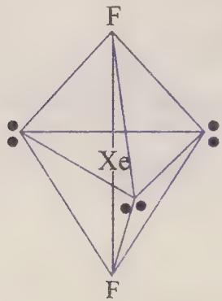  
(a)

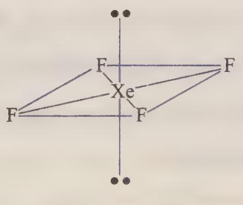  
(b)

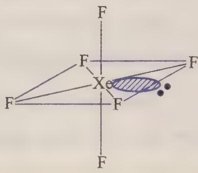  
(c)  
图18-5 3种氟化氙的分子构型

$\mathrm{XeF}_6$ 的结构很难用价层电子对互斥理论预测。 $\mathrm{XeF}_6$ 中 $\mathrm{Xe}$ 的原子轨道为 $\mathfrak{sp}^3\mathfrak{d}^3$ 杂化，6个F原子位于八面体的6个顶点，而一对孤电子对伸向一个棱的中点，见图18-5(c)。这对孤电子对也可能伸向一个面的中心。

依据价层电子对模型预言,与 $NH_{3}, SF_{4}, IF_{5}$ 一样, $XeF_{6}$ 的这一孤电子对在 Xe 原子上应占据一个确定的位置。然而在 $XeF_{6}$ 分子中, 中心原子 Xe 的孤电子对没有明确的位置。一种解释基于 Xe 原子周围键联了较多的 $F^{-}, Xe-F$ 键间斥力很强, 以至于使孤电子对不能很好地占据确定的位置。由于中心原子孤电子对的作用使 $XeF_{6}$ 分子构型呈扭曲八面体形。

稀有气体各原子的价电子层全充满, 即 $ns^{2}np^{6}$ , 因此它们不易得失电子, 也不易形成共价键。但当它们同电负性很大的元素的原子作用时, 有可能使 np 轨道中的电子激发到较高能量的 nd 轨道上, 从而出现单电子, 这些单电子便导致与其他原子形成共价键。例如, $XeF_{2}, XeF_{4}$ 和 $XeF_{6}$ 中 Xe 的价层电子分别有一个、两个和 3 个电子从 np 激发到 nd 轨道上, 随后以 $sp^{3}d, sp^{3}d^{2}, sp^{3}d^{3}$ 杂化轨道

与 F 原子形成化学键。

## 2. 用分子轨道理论讨论氙化合物的分子结构

利用价层电子对互斥理论可以满意地解释氟化氙的空间构型,所得的结果同杂化轨道理论的结果大致相同。下面以 $XeF_{2}$ 分子为例简单介绍用分子轨道理论对其成键情况的分析。

$\mathrm{XeF}_{2}$ 中 $\mathrm{Xe}$ 原子的 $5\mathrm{p}_x$ 轨道与两个 $\mathbf{F}$ 原子的各一条 $2\mathrm{p}_x$ 轨道，组成3条分子

轨道——一条成键轨道、一条反键轨道和一条非键轨道，见图18-6。在 $\mathrm{XeF}_2$ 的分子轨道图中，两个电子填入成键分子轨道，两个电子填入非键分子轨道，反键分子轨道为空轨道。键级为1，这个键属于σ键，它有效地将氙原子和两个氟原子结合在一起。

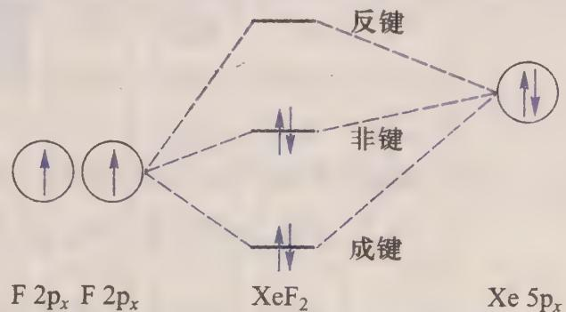  
图18-6 $\mathrm{XeF}_2$ 分子的分子轨道图

## 18.3 主族元素总结

若把稀有气体元素列为元素周期表ⅧA族元素,则主族就涵盖了s区的IA,ⅡA族和p区的ⅢA\~ⅧA族所有元素。这些元素的单质和化合物有着许多共同的性质,把握住这些共性的东西对于更好地学习和理解元素化学是有意义的。

将元素周期表的 3\~12 列及 f 区去掉,于是主族元素连成一片,如图 18-7 所示。图中右上部分涂深色方框中的元素为非金属元素,左下部分白色方框中的元素为金属元素。有时称交界处的元素,如 B,Si,Ge,As,Sb,Se,Te,Po 等为准金属元素。

## 18.3.1 主族非金属元素的通性

## 1. 单质

单质的分子可以分成几种类型。第一种类型是小分子，包括稀有气体的单原子分子和 $F_{2}, Cl_{2}, O_{2}, H_{2}$ 等双原子分子。它们依靠范德华力结合，通常情况下形成气体单质，其固体为分子晶体。第二种类型是多原子分子，如 $P_{4}, As_{4}, S_{8}, Se_{8}$ 等，通常形成固体单质，仍属于分子晶体。第三种类型是大分子，如晶体硼、晶体硅、金刚石等，属于原子晶体，具有很高的熔、沸点。石墨也属于大分子单质，为层状结构，层内原子间以共价键结合，层间为分子间力。

非金属元素容易形成简单阴离子,活泼的非金属可以与金属元素形成卤化物、氧化物、硫化物、氢化物或含氧酸盐等。绝大部分非金属氧化物显酸性,能与

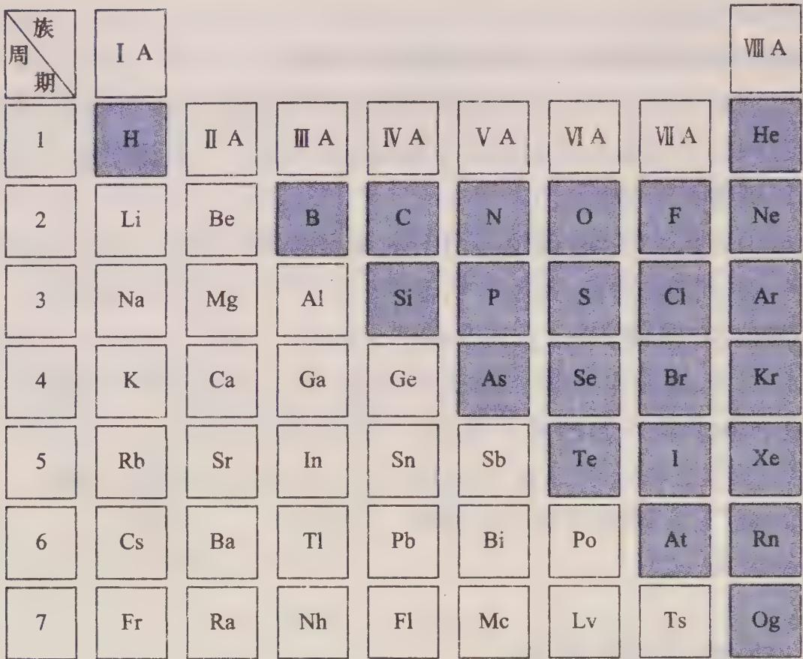  
图18-7 主族元素在元素周期表中的位置

强碱作用。

非金属单质一般不与非氧化性的酸作用,但可以被氧化性的酸氧化成高价的含氧酸。非金属单质一般在碱性水溶液中发生歧化反应,例如:

$$
\begin{array}{l} 3 \mathrm{Cl} _ {2} + 6 \mathrm{NaOH(aq)} \xlongequal {\triangle} 5 \mathrm{NaCl} + \mathrm{NaClO} _ {3} + 3 \mathrm{H} _ {2} \mathrm{O} \\ 3 \mathrm{S} + 6 \mathrm{NaOH(aq)} \xlongequal {\triangle} 2 \mathrm{Na} _ {2} \mathrm{S} + \mathrm{Na} _ {2} \mathrm{SO} _ {3} + 3 \mathrm{H} _ {2} \mathrm{O} \\ 4 \mathrm{P} + 3 \mathrm{NaOH} + 3 \mathrm{H} _ {2} \mathrm{O} = 3 \mathrm{NaH} _ {2} \mathrm{PO} _ {2} + \mathrm{PH} _ {3} \uparrow \end{array}
$$

也有的与碱反应生成 $\mathbf{H}_2$ ，例如：

$$
\mathrm{Si} + 2 \mathrm{NaOH} + \mathrm{H} _ {2} \mathrm{O} = \mathrm{Na} _ {2} \mathrm{SiO} _ {3} + 2 \mathrm{H} _ {2} \uparrow
$$

## 2. 氢化物

非金属都有正常氧化态的氢化物,它们属于分子型氢化物。这些共价型化合物在通常状况下为气体或挥发性液体。例如:

$$
\begin{array}{c c c c c} \mathrm{B} _ {2} \mathrm{H} _ {6} & \mathrm{CH} _ {4} & \mathrm{NH} _ {3} & \mathrm{H} _ {2} \mathrm{O} & \mathrm{HF} \\ & \mathrm{SiH} _ {4} & \mathrm{PH} _ {3} & \mathrm{H} _ {2} \mathrm{S} & \mathrm{HCl} \\ & & \mathrm{AsH} _ {3} & \mathrm{H} _ {2} \mathrm{Se} & \mathrm{HBr} \\ & & & \mathrm{H} _ {2} \mathrm{Te} & \mathrm{HI} \end{array}
$$

这些氢化物的热稳定性,在同一周期中,从左向右一般逐渐增强;在同一族中,自上而下逐渐减弱。这个变化规律与非金属元素电负性的变化规律一致。

除了 HF 以外,其他分子型氢化物都有还原性,在同一周期中,从左向右还原性逐渐减弱;在同一族中,自上而下还原性逐渐增强。还原性体现在它们能与氧气、卤素、氧化态高的金属离子、某些含氧酸及其盐等氧化剂作用。

氧族元素及卤素的氢化物大部分是酸；而氮族非金属元素的氢化物多数是碱。在同一周期中，从左向右氢化物的酸性逐渐增强；在同一族中，自上而下酸性逐渐增强。

## 3. 含氧酸

在第 12 章中, 曾用“离子势”讨论碱金属和碱土金属氢氧化物的碱性。若离子半径 r 的单位为 pm, 则判断金属氢氧化物酸碱性的经验公式为

$$
\begin{array}{r l r} {\sqrt {\phi} <   0. 2 2} & {} & {\text {金属氢氧化物为碱性}} \\ {0. 2 2 <   \sqrt {\phi} <   0. 3 2} & {} & {\text {金属氢氧化物为两性}} \\ {\sqrt {\phi} > 0. 3 2} & {} & {\text {金属氢氧化物为酸性}} \end{array}
$$

这一经验规则对于主族非金属元素也基本适用,部分主族非金属元素的半径 r 和离子势的算数根 $\sqrt{\phi}$ 的数值列于表 18-2。

表 18-2 部分主族非金属元素的 $r$ 和 $\sqrt{\phi}$ 值

<table><tr><td></td><td>B(III)</td><td>C(IV)</td><td>N(V)</td><td></td><td></td></tr><tr><td>r*</td><td>27**</td><td>16</td><td>13</td><td></td><td></td></tr><tr><td> $\sqrt{\phi}$ </td><td>0.33</td><td>0.50</td><td>0.62</td><td></td><td></td></tr><tr><td></td><td>Al(III)</td><td>Si(IV)</td><td>P(V)</td><td>S(VI)</td><td>Cl(VII)</td></tr><tr><td>r</td><td>54</td><td>40.0</td><td>38</td><td>29</td><td>27**</td></tr><tr><td> $\sqrt{\phi}$ </td><td>0.24</td><td>0.32</td><td>0.36</td><td>0.45</td><td>0.51</td></tr><tr><td></td><td></td><td>Ge(IV)</td><td>As(V)</td><td>Se(VI)</td><td>Br(VII)</td></tr><tr><td>r</td><td></td><td>53.0</td><td>46</td><td>42</td><td>39</td></tr><tr><td> $\sqrt{\phi}$ </td><td></td><td>0.27</td><td>0.33</td><td>0.38</td><td>0.42</td></tr><tr><td></td><td></td><td></td><td>Sb(V)</td><td>Te(VI)</td><td>I(VII)</td></tr><tr><td>r</td><td></td><td></td><td>60</td><td>56</td><td>53</td></tr><tr><td> $\sqrt{\phi}$ </td><td></td><td></td><td>0.29</td><td>0.33</td><td>0.36</td></tr></table>

\* 表中各元素的离子半径 r 均为 6 配位的数据, 半径单位为 pm。  
\* \* 标注部分为 Lange's 手册数据,其余为 CRC 手册数据。

从表 18-2 中的数据可以看出,非金属元素的氧化物的水化物 $\sqrt{\phi}$ 值一般都较大,所以它们的氧化物的水化物为含氧酸。而金属或准金属 Al(Ⅲ), Ge(Ⅳ) 和 Sb(V) 的氧化物的水化物属于两性。

但离子势判据终归是经验规则,它不能符合所有事实。也有人用 $\frac{z}{r^{2}}$ 或 $\frac{z^{2}}{r}$ 等其他函数式来修正这一规则以符合另一些事实。不论其表示方法如何,都说明离子的电荷数和离子的半径是决定离子电场作用大小的主要因素。

从表 18-2 中的数据还可以看出, 在同一周期中, 从左向右, $\sqrt{\phi}$ 值增大, 最高氧化态含氧酸的酸性递增; 在同一族中, 相同氧化态的含氧酸则从上至下 $\sqrt{\phi}$ 值减小, 酸性递减。

对于同一元素不同氧化态的含氧酸,一般是高氧化态的酸性较强,如 $H_{2}SO_{3}$ 和 $H_{2}SO_{4}$ 的 $\sqrt{\phi}$ 值分别为 0.33 和 0.45, $H_{2}SO_{4}$ 的酸性更强。

含氧酸的分子式可以用通式 $\mathrm{RO}_n(\mathrm{OH})_y$ 表示，其中 $n$ 为非羟基氧原子的数目， $y$ 为羟基的数目，即羟基氧原子的数目。图18-8给出了几种常见的含氧酸分子的结构，可以清楚地看到其中非羟基氧原子和羟基氧原子。

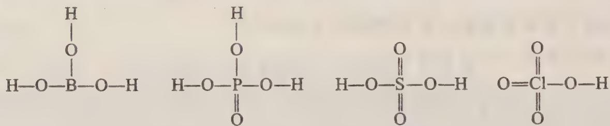  
图18-8 几种常见的含氧酸分子的结构

鲍林曾用下面的经验公式表达,含氧酸的解离平衡常数 $K_{1}^{\ominus}$ 与含氧酸分子中非羟基氧原子数目 n 的关系:

$$
K _ {1} ^ {\ominus} = 1 0 ^ {5 n - 7}
$$

例如， $\mathrm{H}_2\mathrm{SO}_3$ 中 $n = 1, K_1^{\ominus} = 10^{5 \times 1 - 7} = 10^{-2}$ ；而 $\mathrm{H}_3\mathrm{BO}_3$ 中 $n = 0$ ，其 $K_1^{\ominus}$ 小于 $10^{-7}$ 。

由上述经验公式可以看出,含氧酸分子中的非羟基氧原子的数目 n 值越大,酸性越强。

至于含氧酸的稳定性和氧化还原性质的讨论则放在含氧酸盐中一并讨论。

## 4. 含氧酸盐

## (1) 热稳定性

含氧酸盐受热分解，在大多数情况下产物为酸酐和金属氧化物。

在常见的含氧酸盐中, 磷酸盐、硅酸盐都比较稳定, 它们在受热时不易分解, 但容易脱水缩合为多酸盐。稳定性较差的是硝酸盐和卤酸盐, 碳酸盐和硫酸盐

等居中。

碱金属的碳酸盐分解温度很高,如 $Na_{2}CO_{3}$ 和 $K_{2}CO_{3}$ 在 1000 ℃ 也基本不分解。阳离子电荷越高,极化能力越强,其含氧酸盐越不稳定,分解温度越低。因此,碱土金属含氧酸盐的热稳定性一般比碱金属含氧酸盐的热稳定性低。例如, $MgCO_{3}$ 的分解温度为 540 ℃, $CaCO_{3}$ 的分解温度为 900 ℃。阳离子半径越小,极化能力越强,其含氧酸盐越不稳定,由于碱金属中 $Li^{+}$ 的半径较小,极化能力较强,故 $Li_{2}CO_{3}$ 的分解温度较低,为 700 ℃。同理, $Ba^{2+}$ 的半径较大,极化能力较弱,故 $BaCO_{3}$ 的分解温度为 1360 ℃。 $CdCO_{3}$ 的分解温度为 500 ℃,虽然其中 Cd 的氧化数与 Ca 和 Mg 相同,也是 +2,但由于 Cd 的电子构型不同,外层电子较多,极化能力强,所以其分解温度不仅低于 $CaCO_{3}$ ,而且低于 $MgCO_{3}$ 。这些碳酸盐受热分解的产物为金属氧化物和二氧化碳。

硫酸盐的分解温度一般高于同种阳离子的碳酸盐。原因是硫酸根中心S(VI)抵御同种阳离子的反极化作用的能力强于碳酸根中心的C(IV)。例如， $\mathrm{MgSO_4}$ 的分解温度为 $895^{\circ}\mathrm{C}$ ， $\mathrm{MgCO_3}$ 为 $540^{\circ}\mathrm{C}$ ； $\mathrm{CaSO_4}$ 的分解温度为 $1149^{\circ}\mathrm{C}$ ， $\mathrm{CaCO_3}$ 为 $900^{\circ}\mathrm{C}$ ； $\mathrm{CdSO_4}$ 的分解温度为 $816^{\circ}\mathrm{C}$ ， $\mathrm{CdCO_3}$ 为 $500^{\circ}\mathrm{C}$ 。

与碳酸盐和硫酸盐相比,硅酸盐更稳定,这与分解反应的熵效应有关。因为在碳酸盐和硫酸盐的分解产物中均有气体,熵增较大,而硅酸盐分解产物中没有气体,相应的产物为固体 $SiO_{2}$ ,熵效应较小。

从离子极化能力出发,含氧酸中的 $H^{+}$ 将比所有盐中的阳离子的破坏作用大,因此含氧酸的稳定性弱于含氧的盐。

## (2) 含氧酸及其盐的氧化还原性

含氧酸及其盐有的具有氧化性,有的具有还原性,还有的既有氧化性又有还原性。它们在氧化还原性方面具有如下特点:

① 在同一周期中, 各元素最高氧化态含氧酸的氧化性从左向右增强。例如第四周期, $H_{4}SiO_{4}$ 和 $H_{3}PO_{4}$ 几乎无氧化性, $H_{2}SO_{4}$ 只在高温和浓度大时表现出强氧化性, 而 $HClO_{4}$ 是强氧化剂。

② 对于同一种元素的不同氧化态含氧酸,经常是低氧化态的氧化性比相同浓度的高氧化态的氧化性强。例如: $\mathrm{HClO} > \mathrm{HClO}_{3} > \mathrm{HClO}_{4}; \mathrm{HNO}_{2} > \mathrm{HNO}_{3}; \mathrm{H}_{2}\mathrm{SO}_{3} > \mathrm{H}_{2}\mathrm{SO}_{4}$ 。因为高价含氧酸中心原子周围的氧原子分布对称性较高,结构稳定,且中心的高价原子抵御 $\mathrm{H}^{+}$ 反极化作用的能力强些,故氧原子不易与中心原子断键而离去。

③ 含氧酸盐的氧化性一般比相应的含氧酸弱。因为盐中的阳离子, 其反极化能力弱于含氧酸中 $\mathrm{H}^{+}$ 的反极化能力, 故与中心连接的氧原子不易断键离去。例如, $\mathrm{NaClO}, \mathrm{KClO}_{3}$ 的氧化性弱于对应的 $\mathrm{HClO}, \mathrm{HClO}_{3}$ 。

④ 一般说来,浓酸比稀酸的氧化性强;酸比相应的盐的氧化性强。原因是浓酸一般以分子态存在, $H^{+}$ 的反极化作用易于破坏中心与氧的结合;而稀酸和盐中没有 $H^{+}$ 的反极化作用。

⑤ 溶液的 pH 对于含氧酸及其盐的氧化还原性有重要影响。其原因及影响方式可以从电极反应式清楚地看出。例如：

$$
\begin{array}{l l} \mathrm{H} _ {2} \mathrm{SO} _ {3} / \mathrm{S} & \mathrm{H} _ {2} \mathrm{SO} _ {3} + 4 \mathrm{H} ^ {+} + 4 \mathrm{e} ^ {-} = \mathrm{S} + 3 \mathrm{H} _ {2} \mathrm{O} \\ \mathrm{ClO} _ {4} ^ {-} / \mathrm{ClO} _ {3} ^ {-} & \mathrm{ClO} _ {4} ^ {-} + 2 \mathrm{H} ^ {+} + 2 \mathrm{e} ^ {-} = \mathrm{ClO} _ {3} ^ {-} + \mathrm{H} _ {2} \mathrm{O} \end{array}
$$

由于 $H^{+}$ 均在反应式的左边, 属于氧化型, 故 $c(\mathrm{H}^{+})$ 增大时电极电势增大, 含氧酸及其盐的氧化性增强。

## (3) 溶解性

含氧酸盐属于离子型化合物。一般认为，离子型化合物的溶解过程，首先是离子克服相互间的引力，从晶格中解离下来成为自由离子，然后与极性水分子结合成为水合离子。如果在水合过程中放出的能量足以补偿破坏晶格所需要的能量，则溶解过程的焓变 $\Delta H$ 为负值，溶解过程可以进行。

离子型化合物的晶格能较大。尤其电荷高、半径小，即离子势 $\phi$ 值大者所形成的盐的晶格能大，导致溶解时破坏晶格所需要的能量多。但另一方面离子势 $\phi$ 值大的离子与水分子之间的引力也大，水合过程中放出的能量也多。所以，判断溶解过程中究竟是晶格能大，还是水合热大，不能单纯依赖离子势的数据。

影响离子型化合物溶解性的另一个因素,是离子晶体中阴、阳离子大小匹配的情况。一般规律是,阴、阳离子半径相近的溶解度小。由于复杂的含氧酸根阴离子的半径大,所以只有与半径大的阳离子结合时,才可避免晶体中的阴离子之间直接接触,以减小阴离子之间的斥力,保证晶格能较大。因而半径大的阳离子与复杂阴离子形成的盐一般溶解度较小,如 $BaSO_{4}$ 比 $MgSO_{4}$ 难溶。同样,半径小的阳离子可以与半径较小的阴离子结合,形成溶解度较小的盐。

当阴、阳离子半径相差较大时，晶格能较小，离子水合作用在溶解过程中居优势，形成溶解度较大的盐。所以在性质相似的盐系列中，阳离子的半径越小，该盐越容易溶解。室温下碱金属的高氯酸盐的溶解度是很好的例证： $\mathrm{NaClO_4 > KClO_4 > RbClO_4}$ 。

若含氧酸盐的阴、阳离子半径相近时，晶格能较大，且对溶解度有较大的影响。电荷高的离子所构成的盐较难溶解，如碱土金属的草酸盐、碳酸盐、磷酸盐等；而碱金属的盐一般易溶。

## 18.3.2 主族金属元素的通性

主族金属中有轻有色金属，如钠、钾、镁、钙、锶、钡、铝。这类金属的共同特点是密度小,化学性质活泼,与氧、硫、碳和卤素形成的化合物都相当稳定。铅、锡、锑、铋等为重有色金属。锂、铷、铯、铍、镓、铟、铊、锗等为稀有金属。

性质较活泼的一些轻金属多以氯化物、硫酸盐、碳酸盐等化合态的形式在自然界存在，如常见的食盐、光卤石、菱镁矿、重晶石、石膏等。重金属则主要形成氧化物和硫化物，如锡石矿、方铅矿等。此外还有各种硅酸盐矿物。

## 1. 金属的物理性质

主族金属单质均为金属晶体,金属单质的堆积方式分为六方最密堆积、立方最密堆积和体心立方密堆积3种。自由电子将金属离子、金属原子紧紧地束缚在一起,形成较强的内聚力,它体现着金属键的强度。金属的内聚力可以用它的原子化热衡量。原子化热是指1 mol金属由晶体解离为气态自由原子所需的能量,也就是拆散金属晶格所需的能量。

气态的金属经常以单原子分子形式存在。

显然原子化热越高,金属的内聚力越大,金属键越强,其熔点也越高。一些主族金属25℃时的原子化热及熔点数据列在表18-3中。

表 18-3 一些主族金属 ${25}^{ \circ  }\mathrm{C}$ 时的原子化热及熔点

<table><tr><td>金属</td><td>Li</td><td>Na</td><td>K</td><td>Rb</td><td>Cs</td></tr><tr><td>原子化热/(kJ·mol-1)</td><td>159.3</td><td>107.5</td><td>89.0</td><td>80.9</td><td>76.5</td></tr><tr><td>熔点/°C</td><td>180.50</td><td>97.794</td><td>63.5</td><td>39.30</td><td>28.5</td></tr><tr><td>金属</td><td>Be</td><td>Mg</td><td>Ca</td><td>Sr</td><td>Ba</td></tr><tr><td>原子化热/(kJ·mol-1)</td><td>324</td><td>147.1</td><td>177.8</td><td>163.6</td><td>177.8</td></tr><tr><td>熔点/°C</td><td>1 287</td><td>650</td><td>842</td><td>777</td><td>727</td></tr><tr><td>金属</td><td>Al</td><td>Ga</td><td>In</td><td>Tl</td><td></td></tr><tr><td>原子化热/(kJ·mol-1)</td><td>330.0</td><td>254</td><td>243</td><td>182.2</td><td></td></tr><tr><td>熔点/°C</td><td>660.323</td><td>29.764 6</td><td>156.598 5</td><td>304</td><td></td></tr><tr><td>金属</td><td>Ge</td><td>Sn</td><td>Pb</td><td>Sb</td><td>Bi</td></tr><tr><td>原子化热/(kJ·mol-1)</td><td>372</td><td>301.2</td><td>195.2</td><td>264.4</td><td>209.6</td></tr><tr><td>熔点/°C</td><td>938.25</td><td>231.928</td><td>327.462</td><td>630.628</td><td>271.406</td></tr></table>

自由电子的存在和紧密堆积结构使金属具有良好的导电性、导热性、延展性及金属光泽等。

## (1) 金属光泽

由于金属原子以紧密堆积状态排列,内部存在大量自由电子,所以当光线投射到它的表面时,自由电子反射出各种频率的光,这就使绝大多数金属呈现银白色光泽。金属光泽只有在金属成块或颗粒较大时才能表现出来,在细微的粉末状态时,一般金属都呈暗灰色或黑色。

## (2) 金属的导电性和导热性

所有金属晶体中都有自由电子,在没有外加电场作用时,自由电子没有一定的运动方向。当金属导线接到电源的正、负两极时,自由电子便沿着导线由负极移向正极,形成电流。

善于导电的金属也善于导热,大多数金属有良好的导电性和导热性。

主族金属中 Al 的导电和导热性能为最佳。

## (3) 金属的延展性

当金属受到外力作用时,金属内各层原子之间容易作相对位移,而金属原子和自由电子仍保持着金属键的结合力,因此金属具有良好的延展性。

也有少数主族金属,如 Sb,Bi 等,性质较脆,没有延展性。

## 2. 金属的化学性质

金属最主要的共性,是易失去最外层的电子形成金属阳离子,因而表现出较强的还原性。

ⅠA 和 ⅡA 族金属的价层电子构型为 $ns^{1-2}$ ，在化学反应中它们显示 +1 价和 +2 价。ⅢA～ⅣA 族金属的价层电子构型为 $ns^{2}np^{1-3}$ 。Al, Ga, Si 等在化学反应中经常失去外层所有的 nsnp 电子，显示与其族数一致的氧化数。In, Ge, Sn, Sb 等在化学反应中有两种表现，一是失去外层的 np 电子显示较低的价态，二是失去外层所有的 nsnp 电子，显示与其族数一致的氧化数。金属 Tl, Pb, Bi 等在化学反应中经常失去外层的 np 电子显示较低的价态，极难失去外层的 ns 电子对而显示高价。总之随着周期数的增高，n 轨道中的两个电子越来越难以参与化学反应，以至于第六周期出现所谓的惰性电子对效应。故 Tl(Ⅲ), Pb(Ⅳ), Bi(V) 具有很强的氧化性；In(I), Ge(Ⅱ), Sn(Ⅱ), Sb(Ⅲ) 具有还原性；若能制得 Al(I), Ga(I), Si(Ⅱ)，那将是极强的还原剂。

## (1) 金属与非金属的反应

金属与非金属反应的难易程度,与金属活动性顺序相同。位于前面的一些金属,如 Na,K,Mg,Al 等可以与氧气剧烈反应,而 Rb,Cs 甚至会发生自燃。活性稍差的主族金属在高温下也可以与氧气、卤素、硫、磷等发生反应。金属 Al 与氧气反应,在一定条件下形成致密的氧化物膜,覆盖在金属表面,防止金属继续氧化。这种氧化膜的保护作用叫钝化。

碱金属及 Ca, Sr, Ba 与氢气在高温下反应, 生成离子型氢化物。离子型氢化物属于离子晶体, 有较高的熔点, 熔融时导电。 $BeH_{2}$ , $MgH_{2}$ 和 $AlH_{3}$ 的热稳定性和熔点均没有碱金属及 Ca, Sr, Ba 的氢化物那么高。

## (2) 金属与水、酸的反应

常温下,纯水中 $c(\mathrm{H}^{+})=1.0\times10^{-7}\mathrm{~mol}\cdot\mathrm{dm}^{-3},E(\mathrm{H}^{+}/\mathrm{H}_{2})=-0.414\mathrm{~V}$ 。因此,从热力学角度凡是 $E^{\ominus}<-0.414\mathrm{~V}$ 的金属都可能与水反应。性质很活泼的金属,如钠、钾在常温下就与水剧烈地起反应。钙与水作用比较缓和,镁与水反应生成的氢氧化物不溶于水,覆盖在金属表面,在常温时,反应难以持续进行,所以镁只能和沸水起反应。

一般 $E^{\ominus}$ 为负值的金属都可以与非氧化性酸, 如盐酸、稀硫酸反应放出氢气。主族金属中 Ge, Sb, Bi 的活泼性较差, 不能与稀盐酸反应生成氢气。有的金属虽然 $E^{\ominus}$ 为负值, 但由于生成难溶物覆盖在金属表面而使反应难以进行。例如, 铅与硫酸作用生成的 $PbSO_{4}$ , 与稀盐酸作用生成的 $PbCl_{2}$ 覆盖在铅表面, 阻碍反应进行。

$E^{\ominus}$ 为正值的金属一般只能与氧化性的酸反应,或在氧化剂的存在下,与非氧化性酸作用。

金属铍和铝在冷的浓硝酸中由于钝化而不发生作用。

## (3) 金属与碱的反应

主族金属除了少数显两性者以外,一般都不与碱起作用。金属 Be 与强碱反应,生成氢气:

$$
\mathrm{Be} + 2 \mathrm{NaOH} + 2 \mathrm{H} _ {2} \mathrm{O} = \mathrm{Na} _ {2} [ \mathrm{Be(OH)} _ {4} ] + \mathrm{H} _ {2} \uparrow
$$

Al, Ga, In, Sn 等也能与强碱反应。

主族金属的高价氧化物具有酸性,如 $GeO_{2}$ , $SnO_{2}$ , $PbO_{2}$ , $Sb_{2}O_{5}$ , $Bi_{2}O_{5}$ 等都是酸性氧化物。

$GeS_{2}, SnS_{2}, Sb_{2}S_{5}$ 等高价硫化物为酸性硫化物, 它们均溶于 NaOH 溶液, 也可以与碱性硫化物 $Na_{2}S$ 反应。

## 18.3.3 次级周期性

在元素周期表中,随着原子序数的递增,元素及其单质和化合物的性质呈现有规律的周期性变化。主族元素的许多性质在同族中从上到下变化规律更为明显。s区的ⅠA族,ⅡA族金属元素的原子半径、电离能、电子亲和能、电负性等基本性质,单质及其化合物的物理性质、化学性质从上到下体现着严格的变化规律。

但是 p 区元素的某些基本性质,单质及其化合物的某些物理性质、化学性质从上到下的变化规律却出现了一些反常现象。这些反常集中体现在第二周期、

第四周期和第六周期。

第二周期的 N,O,F 等元素具有极小的原子半径,核外电子云密度很大,于是排斥外来的电子,导致电子亲和能变小,在同族元素中出现反常。N,O,F 原子半径极小,使得它们的氢化物存在分子间氢键,于是 $NH_{3},H_{2}O$ 和 HF 的沸点异常的高,在同族氢化物中出现反常。

第二周期的ⅢA族元素B,不论其单质还是化合物,也不论物理性质还是化学性质,均与第三周期的ⅣA族元素Si相似。这一点在第14章中已有较详尽的阐述。连同第二周期的Li与第三周期的Mg,第二周期的Be与第三周期的Al的相似,构成了元素周期表的对角线(或斜线)规则,即元素周期表中第二周期的某些元素与处于斜线位置上的第三周期元素,如图18-9所示,在性质上极为相似。这也体现着第二周期元素的反常。

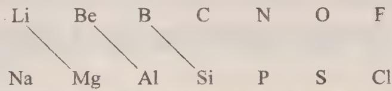  
图 18-9 元素周期表的对角线规则示意图

第四周期的ⅢA族元素Ga,其原子半径为135 pm,小于第三周期的同族元素Al的143.1 pm,这是元素基本性质反常的实例。元素原子半径的异常影响到化合物性质的异常。ⅢA族元素从上到下其金属性应增强,其氧化物的水化物的酸性应逐渐减弱。但是Ga(OH) $_{3}$ 的酸性比Al(OH) $_{3}$ 要强些,表现在它可以溶解在弱碱氨水中,而Al(OH) $_{3}$ 不与氨水反应。

ⅣA族元素Ge, Sn, Pb的含氧酸或氢氧化物中, 第四周期的 $\mathrm{H}_{2} \mathrm{GeO}_{3}$ 是酸性最强的, 其 $K_{1}^{\ominus}$ 约为 $10^{-9}$ , 它的酸性比同族第三周期的硅酸还强些。这又是第四周期元素的化合物性质反常的一个实例。

第四周期的 $H_{2}SeO_{4}$ ，其氧化性既强于同族第三周期的硫酸，又强于第五周期的碲酸。第四周期的 $HBrO_{3}, HBrO_{4}$ ，其氧化性既强于同族第三周期对应的氯酸、高氯酸，又强于第五周期对应的碘酸、高碘酸。这些均体现着元素周期表中第四周期元素性质的反常。

第六周期元素的反常主要体现于惰性电子对效应。Tl 很难被氧化到 +3 价，Pb 很难被氧化到 +4 价，Bi 很难被氧化到 +5 价，说明其 6s 轨道中的一对电子很难失去，所以称这对 6s 电子为惰性电子对。由于惰性电子对效应，失去 6s 电子对的 Tl(Ⅲ)，Pb(Ⅳ)，Bi(Ⅴ)有着夺回这对电子的强烈倾向，因此具有较强的氧化性。例如， $PbO_{2}$ 和 $NaBiO_{3}$ 均为强氧化剂，可以在酸性介质中将 $Mn^{2+}$ 氧化成 $MnO_{4}^{-}$ 。

元素周期表中第二、四、六周期元素某些性质的反常现象，称为次级周期性。一般认为，第二周期的反常主要归因于这些元素具有极小的原子半径。更值得注意的一点是，第二周期所对应的第二能级组与第一能级组相比第一次出现2p能级，第四周期所对应的第四能级组与第三能级组相比第一次出现3d能级，而第六周期所对应的第六能级组与第五能级组相比第一次出现4f能级。次外层和内层电子数目的大幅度增加，不仅严重影响有效核电荷数，而且势必导致原子半径的某些异常。有效核电荷数和原子半径正是决定元素的单质及其化合物的物理性质、化学性质的最重要的因素。

## 拓展学习资源

<table><tr><td>资源内容</td><td>二维码</td></tr><tr><td>▶ 对氢元素的深入认识</td><td></td></tr><tr><td>▶ 超纯氢气</td><td></td></tr><tr><td>▶ 稀有气体的发现史</td><td></td></tr><tr><td>▶ 从天然气中提取氦</td><td></td></tr><tr><td>▶ 稀有气体的笼状包合物</td><td></td></tr><tr><td>▶ 霓虹灯和氙灯的图片</td><td>扫一扫查看资源内容</td></tr><tr><td>▶ 本章小结</td><td></td></tr><tr><td>▶ 视频——氢气的制取</td><td></td></tr></table>

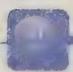

## 总结与思考题

18-1 为什么说氢在元素周期表中的位置是最有争议的？都有哪些不同的看法，各自的根据是什么？

18-2 如何理解“氢形成化学键的主要方式,依赖于其核外电子的得、失、共用3个过程”这句话?举例说明在这3个电子过程中氢的成键情况。

18-3 试画出多肽链的结构式，并说明肽链之间是如何通过氢键相结合的。为什么说氢键稳定了多肽的螺旋形结构？

18-4 试总结氢气的重要化学性质，并通过化学反应方程式加以说明。

18-5 简要叙述氢气的重要用途。为什么说氢气是很有希望的二级能源,其优点是什么?目前开发中的困难是什么?

18-6 如何从空气中分离稀有气体？第一个由化学键连接的稀有气体化合物是怎样合成出来的？简要叙述稀有气体化学史上的两次重大突破的深远影响。

18-7 试描述稀有气体的价层电子构型,说明他们有什么性质。稀有气体的主要用途是什么?

18-8 稀有气体 Xe 有哪些氟化物和含氧化合物？为什么对于稀有气体化合物的研究多集中于元素氙？

18-9 试总结主族非金属元素单质的类型及通性。说明主族非金属元素氢化物的性质变化规律。

18-10 试总结主族金属元素在物理性质和化学性质方面的通性。

18-11 简述判断含氧酸酸性强弱的“离子势判据”，“非羟基氧原子数目判据”的内容，分析两种判据的内在联系。

18-12 比较同种阳离子的硫酸盐、碳酸盐和硅酸盐的热稳定性，并说明原因。

18-13 总结影响含氧酸盐溶解性、氧化还原性的因素及变化规律。

18-1 简释下列词语。

(1) 离子型氢化物和分子型氢化物；(2) 金属型氢化物；(3) 原子氢焰；

（4）惰性气体和稀有气体；（5）对角线规则；（6）次级周期性；（7）准金属元素。

18-2 完成并配平下列化学反应方程式。

(1) $H_{2} + Na \xlongequal{\triangle}$

(2) $\mathrm{C} + \mathrm{H}_{2}\mathrm{O}(\mathrm{g}) \xlongequal{1000^{\circ}\mathrm{C}}$

(3) $\mathrm{WO}_3 + \mathrm{H}_2 \stackrel{\Delta}{=}$

(4) $\mathrm{LiH} + \mathrm{B}_{2}\mathrm{H}_{6}\xlongequal{\text{乙醚中}}$

(5) $\mathrm{NaH} + \mathrm{TiCl}_4 \xlongequal{\triangle}$

(6) $\mathrm{UO}_2 + \mathrm{CaH}_2 \xlongequal{\triangle}$

(7) $\mathrm{LiAlH_4 + H_2O =}$

(8) $\mathrm{KH} + \mathrm{H}_2\mathrm{O} =$

(9) $\mathrm{XeF}_2(\mathrm{aq}) + \mathrm{H}_2 =$

(10) $XeF_{4} + Pt \xlongequal{液态 HF}$

(11) $\mathrm{XeF}_2(\mathrm{aq}) + \mathrm{I}^-$

(12) $\mathrm{XeF}_2(\mathrm{aq}) + \mathrm{H}_2\mathrm{O}_2 =$

18-3 完成并配平下列化学反应方程式。

(1) 高温下用氢气还原四氯化钛。

(2) 在一定的温度和压强下以 $\mathrm{ZnO - Cr_2O_3}$ 催化一氧化碳与氢气反应。

(3) 在乙醚中氢化锂与三氯化铝反应。

(4) 高温下二氧化碳与氢化钡作用。

(5) 二氟化氙在水中缓慢水解。

(6) 向三氧化氙的碱性溶液中通入臭氧。

(7) 六氟化氙与二氧化硅反应。

(8) 四氟化氙在水中歧化分解。

(9) 六氟化氙的完全水解。

(10) 六氟化氙的不完全水解。

(11) 浓硫酸使高氙酸脱水。

## 18-4 简答题。

(1) 叙述氢气的实验室制法。

(2) 叙述氢气的几种工业生产过程。

（3）以单质为原料制备下列物质，并说明应采取哪些措施以保证目标产物的纯净。

① $XeF_{2}$ ; ② $XeF_{4}$ ; ③ $XeF_{6}$ 。

(4) 以 Xe 为主要原料, 设计高氙酸盐的制备步骤。

(5) 一无色气体, 可能是 $H_{2}$ , He, CO 或 $CH_{4}$ , 试加以鉴别。

（6）根据价层电子对互斥理论，讨论下列分子的空间构型，并根据杂化轨道理论讨论其中Xe原子的轨道杂化方式。

① $\mathrm{XeF}_2$ ； ② $\mathrm{XeF}_4$ ； ③ $\mathrm{XeF}_6$ ； ④ $\mathrm{XeO}_3$ ；  
⑤ $\mathrm{XeO}_4$ ； ⑥ $\mathrm{XeOF}_4$ ； ⑦ $\mathrm{XeOF}_2$ ； ⑧ $\mathrm{XeO}_3\mathrm{F}_2$ 。

(7) 试比较 $\mathrm{XeF}_{2}, \mathrm{XeF}_{4}, \mathrm{XeF}_{6}$ 氧化性的强弱, 并写出它们与水反应的化学方程式。

(8) 根据氢化物的相关知识填写下表:

<table><tr><td>物质</td><td>BaH2</td><td>SiH4</td><td>NH3</td><td>AsH3</td><td>PdH0.9</td><td>HI</td></tr><tr><td>名称</td><td></td><td></td><td></td><td></td><td></td><td></td></tr><tr><td>氢化物类型</td><td></td><td></td><td></td><td></td><td></td><td></td></tr><tr><td>常温常压下状态</td><td></td><td></td><td></td><td></td><td></td><td></td></tr></table>

（9）从分子轨道理论出发讨论下列分子或离子存在的可能性。

① HeH; ② $\mathrm{HeH^{+}}$ ; ③ $\mathrm{He}_{2}^{+}$ ; ④ $\mathrm{He}_{2}$ 。

（10）给出方框中字母 A, B, C, D, E, F 和 G 所代表的物质，并写出过程①\~⑩的化学反应方程式。

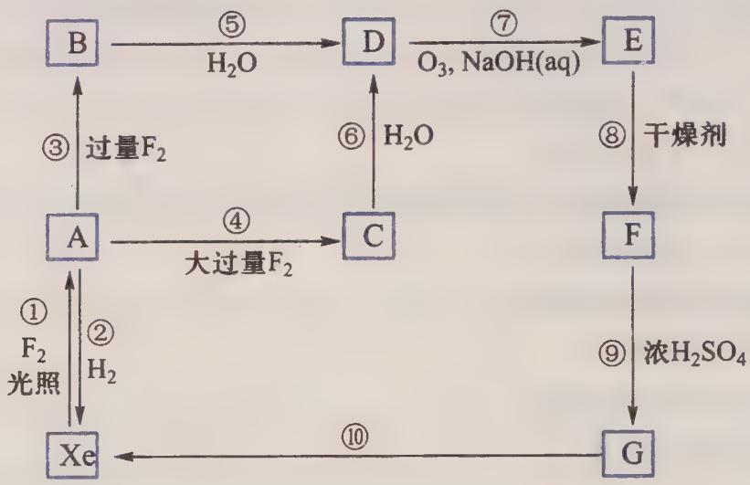

## 目录

19.1 铜副族元素 …… 728
19.1.1 铜副族元素单质 …… 729
1. 铜副族元素单质的性质 …… 729
2. 铜副族元素的提取 …… 731
19.1.2 铜的化合物 …… 733
1. 氧化数为+1 的化合物 …… 733
2. 氧化数为+2 的化合物 …… 735
3. Cu(I) 和 Cu(II) 的相互转化 …… 738
19.1.3 银的化合物 …… 739
1. 氧化物和氢氧化物 …… 739
2. 其他简单化合物 …… 739
3. 配位化合物 …… 741
19.1.4 金的化合物 …… 741
19.2 锌副族元素 …… 742
19.2.1 锌副族元素的单质 …… 742
1. 锌副族元素单质的性质 …… 742
2. 锌副族元素的提取 …… 745
19.2.2 锌和镉的化合物 …… 745
1. 氧化物和氢氧化物 …… 746
2. 其他化合物 …… 747
19.2.3 汞的化合物 …… 748
1. 氧化数为+1 的化合物 …… 748
2. 氧化数为+2 的化合物 …… 749
3. 汞(I) 和汞(II) 的相互转化 …… 751
拓展学习资源 …… 751
总结与思考题 …… 752
习题 …… 753

## 第 19 章 铜副族元素和锌副族元素

铜副族(ⅠB)和锌副族(ⅡB)属于ds区元素。

从外层电子看,铜副族元素与碱金属、锌副族元素与碱土金属分别都只有一个s电子和两个s电子,失去最外层s电子后分别呈现+1和+2氧化态。因此,在氧化态和某些化合物的性质方面,I B族与I A族,II B族与II A族有相似之处。但由于ds区元素原子的次外层有18个电子,而I A族与II A族元素原子次外层有8个电子,次外层电子构型的差异导致无论是单质还是化合物的性质都表现出显著的差异。在学习ds区元素时,要注意与I A族,II A族元素相互比较来加深理解。

## 19.1 铜副族元素

铜副族元素基态原子的价层电子构型为 $(n-1)\mathrm{d}^{10}\mathrm{ns}^{1}$ ，包括铜、银、金和第七周期的轮共4种元素，铜的常见氧化态为+1,+2，银为+1，金为+1,+3。铜的+1氧化态在酸性溶液中不稳定，会发生歧化反应。铜副族元素的价态和氧化还原性质可以从其元素电势图(图19-1)中体现出来。

自然界中,铜、银、金可以以单质状态存在,是最早为人们所熟悉的3种金属,历史上均曾被用于铸造钱币,所以也称它们为货币金属。铜的分布很广,在地壳中的质量分数为 $5.0\times10^{-3}\%$ ,主要以3种形式存在于自然界中:自然铜很少;硫化物矿,主要有辉铜矿 $\left(\mathrm{Cu}_{2}\mathrm{S}\right)$ 、黄铜矿 $\left(\mathrm{CuFeS}_{2}\right.$ 或 $\left.\mathrm{Cu}_{2}\mathrm{S}\cdot\mathrm{Fe}_{2}\mathrm{S}_{3}\right)$ 等;含氧矿物,主要有赤铜矿 $\left(\mathrm{Cu}_{2}\mathrm{O}\right)$ 、黑铜矿 $\left(\mathrm{CuO}\right)$ 、孔雀石 $\left[\mathrm{CuCO}_{3}\cdot\mathrm{Cu(OH)}_{2}\right]$ 、胆矾 $\left(\mathrm{CuSO}_{4}\cdot5\mathrm{H}_{2}\mathrm{O}\right)$ 等。铜矿的含铜量大多在2%\~10%,但富矿可高达20%,贫矿低于0.6%。我国的铜矿分布广泛,在已查明的矿产地除天津以外的所有省、自治区、直辖市,均有不同程度的分布。但主要分布于江西、西藏和云南3个省区,已探明储量居世界第3位。

银除少量以单质形式存在外,主要是以硫化物形式存在,如闪银矿( $Ag_{2}S$ )。硫化银常与方铅矿共存,我国含银的铅锌矿十分丰富。除了银矿来源外,很大一部分的银来源于铜的精炼过程中产生的阳极泥。

金主要是以自然金形式存在,包括散布在岩石特别是石英石中的岩脉金和

存在于沙砾中的冲积金两大类。海水中也含有极少的金，但暂时尚无经济意义。

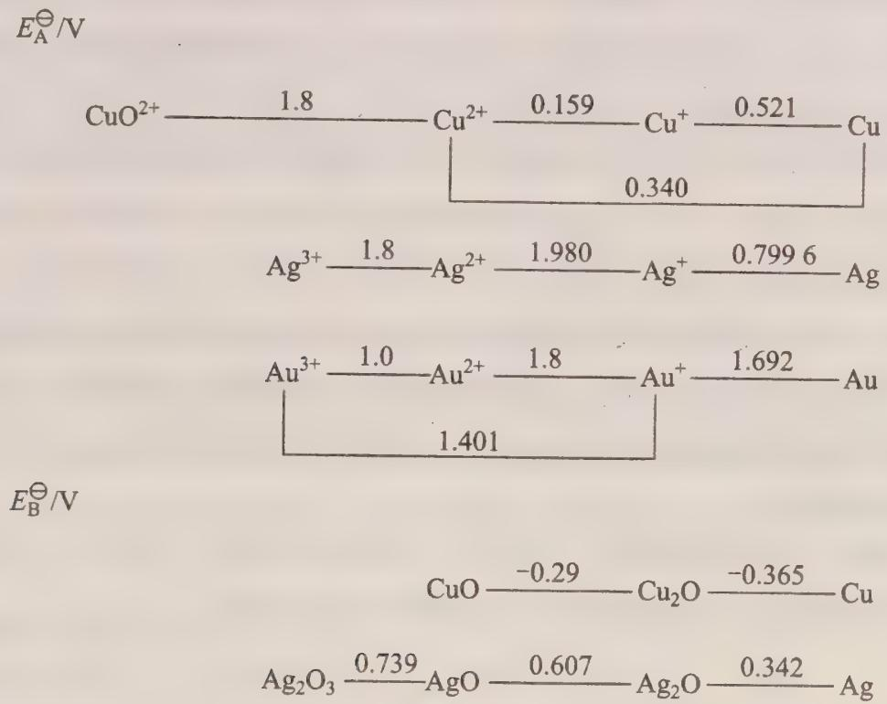  
图19-1 铜副族的元素电势图

## 19.1.1 铜副族元素单质

## 1. 铜副族元素单质的性质

## (1) 物理性质

铜副族元素属于重金属元素,具有金属光泽,铜为红色,银为银白色,而金为黄色。它们的导电性和导热性在所有金属中是最好的,银占首位,铜次之。同时,这三种金属均具有很好的延展性,如1 g金能抽成长达3 km的金丝,或压成厚约0.000 1 mm的金箔。铜被广泛用于电子工业和航天领域中。

铜副族元素之间、铜副族元素与其他金属之间都很容易形成合金，尤其以铜合金居多。常见的铜合金有黄铜，仅由铜和锌组成的称为普通黄铜，还有加入少量其他元素的铅黄铜、铝黄铜等特种黄铜；铜锡合金为青铜，属于锡青铜，由铜和铝、硅等组成的合金，无论是否含锡，统称为特殊青铜；白铜是指铜镍合金（含镍13%\~15%）。

## (2) 化学性质

铜副族元素的氧化态有 $+1, +2, +3$ 三种，这是由于铜副族元素原子的 $(n - 1)\mathrm{d}$ 和 $ns$ 轨道能量相近造成的，如铜的第一电离能为 $745.5\mathrm{kJ}\cdot \mathrm{mol}^{-1}$ ，第二电离能为 $1957.9\mathrm{kJ}\cdot \mathrm{mol}^{-1}$ 。当铜与其他元素反应时，不仅 $4s$ 电子能参加反应， $3d$ 电子在一定条件下也可失去一个到两个，所以可呈现变价。相比之下，碱金属如钠的第一电离能为 $495.8 \, kJ \cdot mol^{-1}$ ，第二电离能为 $4562.4 \, kJ \cdot mol^{-1}$ ，3s 与次外层 2p 轨道能量相差很大，在一般条件下很难失去次外层电子，通常只能为 +1 价。

铜副族元素的金属活泼性远比碱金属的弱,且铜副族元素的金属活泼性随着原子序数的增加而减弱,而碱金属恰恰相反。原因是从 Cu 到 Au,原子半径虽增加但并不明显,由于次外层 d 轨道电子的屏蔽能力相对较弱,使核电荷对最外层电子的吸引力增大了许多,故金属活泼性依次减弱。但如果仅从第一电离能的数据看,铜、银、金分别为 $745.5 \, kJ \cdot mol^{-1}$ , $731.0 \, kJ \cdot mol^{-1}$ , $890.1 \, kJ \cdot mol^{-1}$ , 银应比铜稍活泼。实际上如果在水溶液中反应,涉及的能量除第一电离能外,还有离子的水合热和金属的原子化热。若考虑从固态金属出发,到形成 +1 价水合阳离子整个过程所需要的能量,则从 Cu 到 Au 越来越大,也就是说,从 Cu 到 Au 的化学活泼性越来越差。

铜在干燥空气中比较稳定,在水中几乎看不出反应,与含有二氧化碳的潮湿空气接触,在铜的表面会慢慢生成一层铜绿,其反应为

$$
2 \mathrm{Cu} + \mathrm{O} _ {2} + \mathrm{H} _ {2} \mathrm{O} + \mathrm{CO} _ {2} = \mathrm{Cu(OH)} _ {2} \cdot \mathrm{CuCO} _ {3}
$$

铜绿可防止金属进一步腐蚀。银和金的化学反应活性差,不会发生上述反应。空气中若含有 $H_{2}S$ 气体,与银接触后,银的表面会生成一层 $Ag_{2}S$ 黑色薄膜,从而使银失去银白色光泽。这是由于 $Ag^{+}$ 是软酸,它与软碱 $S^{2-}$ 结合特别稳定,所以银对 S 和 $H_{2}S$ 很敏感。

铜、银、金都不能与稀盐酸或稀硫酸作用而放出氢气。但有空气中的 $O_{2}$ 存在时，铜和银可缓慢地溶于稀酸。例如：

$$
2 \mathrm{Cu} + 2 \mathrm{H} _ {2} \mathrm{SO} _ {4} (\text {   稀   }) + \mathrm{O} _ {2} = 2 \mathrm{CuSO} _ {4} + 2 \mathrm{H} _ {2} \mathrm{O}
$$

铜和银可溶于硝酸或热的浓硫酸,例如:

$$
\begin{array}{r l} & {\mathrm{Cu+4HNO} _ {3} (\text {浓}) = \mathrm{Cu(NO} _ {3}) _ {2} + 2 \mathrm{NO} _ {2} \uparrow + 2 \mathrm{H} _ {2} \mathrm{O}} \\ & {3 \mathrm{Cu+8HNO} _ {3} (\text {稀}) = 3 \mathrm{Cu(NO} _ {3}) _ {2} + 2 \mathrm{NO} \uparrow + 4 \mathrm{H} _ {2} \mathrm{O}} \\ & {\mathrm{Cu+2H} _ {2} \mathrm{SO} _ {4} (\text {浓}) \xlongequal {\triangle} \mathrm{CuSO} _ {4} + \mathrm{SO} _ {2} \uparrow + 2 \mathrm{H} _ {2} \mathrm{O}} \end{array}
$$

金的金属活泼性最差, 只能溶于王水中:

$$
\mathrm{Au} + \mathrm{HNO} _ {3} + 4 \mathrm{HCl} = \mathrm{HAuCl} _ {4} + \mathrm{NO} \uparrow + 2 \mathrm{H} _ {2} \mathrm{O}
$$

铜在红热时与空气中的氧气反应生成 CuO，在高温下又分解为 $Cu_{2}O$ 。银和金不如铜活泼，高温下在空气中也是稳定的。

铜与水溶液中的一些强配体作用放出氢气,例如:

$$
2 \mathrm{Cu} + 8 \mathrm{CN} ^ {-} + 2 \mathrm{H} _ {2} \mathrm{O} = 2 [ \mathrm{Cu(CN)} _ {4} ] ^ {3 -} + 2 \mathrm{OH} ^ {-} + \mathrm{H} _ {2} \uparrow
$$

而 Cu 与水溶液中配位能力较弱的配体作用, 要在氧气存在下方能进行, 例如:

$$
2 \mathrm{Cu} + 8 \mathrm{NH} _ {3} + \mathrm{O} _ {2} + 2 \mathrm{H} _ {2} \mathrm{O} = 2 \left[ \mathrm{Cu} \left(\mathrm{NH} _ {3}\right) _ {4} \right] ^ {2 +} + 4 \mathrm{OH} ^ {-}
$$

银和金单质也可以在有氧气存在的条件下与水溶液中的强配体发生作用，例如：

$$
4 \mathrm{Ag} + 8 \mathrm{CN} ^ {-} + 2 \mathrm{H} _ {2} \mathrm{O} + \mathrm{O} _ {2} = 4 [ \mathrm{Ag(CN)} _ {2} ] ^ {-} + 4 \mathrm{OH} ^ {-}
$$

$$
4 \mathrm{Au} + 8 \mathrm{CN} ^ {-} + 2 \mathrm{H} _ {2} \mathrm{O} + \mathrm{O} _ {2} = 4 [ \mathrm{Au(CN)} _ {2} ] ^ {-} + 4 \mathrm{OH} ^ {-}
$$

铜在生物体中起着重要作用,人体有30种含有铜的蛋白质和酶。血浆铜几乎全部结合在铜蓝蛋白中,铜蓝蛋白具有亚铁氧化酶的功能,在铁的代谢中起着重要的作用。有些动物,如鲎等,是通过铜蛋白来传递 $O_{2}$ 的,所以它们的血液是蓝色的。

## 2. 铜副族元素的提取

## (1) 铜的冶炼

铜主要是从黄铜矿（ $\mathrm{CuFeS}_2$ ）中提炼的。将矿石粉碎磨细，以增大接触面积，几乎是所有冶金过程的第一步。之后采用“浮选法”除去废石，将 $\mathrm{Cu}$ 富集到 $15\% \sim 20\%$ 。将矿粉浸入溶有“浮选剂”的水中，并向体系中鼓入空气泡，浮选剂分子的亲硫端与黄铜矿石颗粒结合，其另一端为烃基，属于憎水端，插入空气泡中。于是矿粒随空气泡上浮至体系表层，收集起来称为精矿。硅酸盐废石颗粒不为浮选剂分子捕获，沉于体系底部。

将得到的精矿进行焙烧,除去部分的硫和挥发性杂质,如 $As_{2}O_{3}$ 等,并使部分硫化物变成氧化物,主要反应如下:

$$
\begin{array}{r l} & 2 \mathrm {CuFeS_ {2}} + \mathrm {O_ {2}} \xlongequal {\text {焙烧}} \mathrm {Cu_ {2} S} + 2 \mathrm{FeS} + \mathrm {SO_ {2}} \\ & 2 \mathrm{FeS} + 3 \mathrm {O_ {2}} \xlongequal {\text {焙烧}} 2 \mathrm{FeO} + 2 \mathrm {SO_ {2}} \end{array}
$$

将焙烧过的矿石与沙子混合,在反射炉中加热到 $1\ 000\ ^{\circ}C$ 左右,FeS 进一步氧化为 FeO,大部分 FeO 与 $SiO_{2}$ 形成熔渣 $FeSiO_{3}$ :

$$
\mathrm{FeO} + \mathrm{SiO} _ {2} \xlongequal {\text {高温}} \mathrm{FeSiO} _ {3}
$$

因其密度小而浮在上层。

$Cu_{2}S$ 和剩余的 FeS 共熔在一起形成所谓“冰铜”，冰铜较重，沉于下层。

将冰铜放入转炉熔炼,鼓入大量的空气,得到大约含铜98%的粗铜:

$$
2 \mathrm{Cu} _ {2} \mathrm{S} + 3 \mathrm{O} _ {2} \xlongequal {\text {高温}} 2 \mathrm{Cu} _ {2} \mathrm{O} + 2 \mathrm{SO} _ {2}
$$

$$
2 \mathrm{Cu} _ {2} \mathrm{O} + \mathrm{Cu} _ {2} \mathrm{S} \xlongequal {\text {高温}} 6 \mathrm{Cu} + \mathrm{SO} _ {2} \uparrow
$$

生成的 $SO_{2}$ 气体可用来制备硫酸。

工业上采用电解法将粗铜精炼以除去杂质。在一个盛有 $CuSO_{4}$ 和 $H_{2}SO_{4}$ 混合溶液的电解槽中，以粗铜为阳极、纯铜为阴极进行电解：

$$
\begin{array}{r l r} & \text {阳极反应} & \mathrm{Cu(粗铜)} = \mathrm{Cu} ^ {2 +} + 2 \mathrm{e} ^ {-} \\ & \text {阴极反应} & \mathrm{Cu} ^ {2 +} + 2 \mathrm{e} ^ {-} = \mathrm{Cu(精铜,99.95\%)} \end{array}
$$

电解过程中,原粗铜阳极中所含的杂质,如金、银、铂、硒等沉积在阳极底部,被称为阳极泥,是提炼贵金属的原料。

## (2) 银和金的提取

以游离态和化合态形式存在的银都可以用氰化钠浸取：

$$
\begin{array}{r l} & 4 \mathrm{Ag} + 8 \mathrm{NaCN} + 2 \mathrm{H} _ {2} \mathrm{O} + \mathrm{O} _ {2} = 4 \mathrm{Na} [ \mathrm{Ag(CN)} _ {2} ] + 4 \mathrm{NaOH} \\ & \mathrm{Ag} _ {2} \mathrm{S} + 4 \mathrm{NaCN(aq)} = 2 \mathrm{Na} [ \mathrm{Ag(CN)} _ {2} ] + \mathrm{Na} _ {2} \mathrm{S} \end{array}
$$

再用锌等较活泼的金属, 还原 $\left[\mathrm{Ag}(\mathrm{CN})_{2}\right]^{-}$ 即可得到单质银:

$$
2 \left[ \mathrm{Ag} (\mathrm{CN}) _ {2} \right] ^ {-} + \mathrm{Zn} = \left[ \mathrm{Zn} (\mathrm{CN}) _ {4} \right] ^ {2 -} + 2 \mathrm{Ag}
$$

淘金是人类从自然界获取黄金的较为古老的方法。含金的岩石受风化和水的冲击逐渐变成金砂，利用金与沙石密度的差别，用水淘洗金砂即可将单质金分离出来。

从矿石中炼金的方法有两种,即汞齐法和氰化法。汞齐法是将矿粉与汞混合使金与汞生成金汞齐,加热时汞挥发掉即得单质金。由于汞对环境造成极其严重的污染,这种提金的方法已被严令禁止。

氰化法提金首先用氰化钠溶液浸取矿粉,将金溶出:

$$
4 \mathrm{Au} + 8 \mathrm{NaCN} + 2 \mathrm{H} _ {2} \mathrm{O} + \mathrm{O} _ {2} = 4 \mathrm{Na} [ \mathrm{Au(CN)} _ {2} ] + 4 \mathrm{NaOH}
$$

再用金属锌还原 $\left[\mathrm{Au}(\mathrm{CN})_{2}\right]^{-}$ 得到单质金：

$$
2 \left[ \mathrm{Au} (\mathrm{CN}) _ {2} \right] ^ {-} + \mathrm{Zn} = \left[ \mathrm{Zn} (\mathrm{CN}) _ {4} \right] ^ {2 -} + 2 \mathrm{Au}
$$

或者电解 $\mathrm{Na}[\mathrm{Au}(\mathrm{CN})_2]$ 溶液，在阴极上得到金：

阴极主要反应

$$
\left[ \mathrm{Au} (\mathrm{CN}) _ {2} \right] ^ {-} + \mathrm{e} ^ {-} = \mathrm{Au} + 2 \mathrm{CN} ^ {-}
$$

阳极主要反应

$$
\mathrm{CN} ^ {-} + 2 \mathrm{OH} ^ {-} - 2 \mathrm{e} ^ {-} = \mathrm{CNO} ^ {-} + \mathrm{H} _ {2} \mathrm{O}
$$

$$
2 \mathrm{CNO} ^ {-} + 4 \mathrm{OH} ^ {-} - 6 \mathrm{e} ^ {-} = 2 \mathrm{CO} _ {2} + \mathrm{N} _ {2} + 2 \mathrm{H} _ {2} \mathrm{O}
$$

金的精制是通过电解完成的,纯度较低的金为阳极,被氧化而进入电解液,然后在阴极还原沉积。精制后金的纯度可高达99.95%\~99.98%。

## 19.1.2 铜的化合物

铜的常见氧化数为+1,+2,本节重点介绍常见的Cu(I)和Cu(II)化合物,以及两种价态之间的转换。

## 1. 氧化数为 $+1$ 的化合物

## (1) 氧化物和氢氧化物

氧化亚铜 $\left(\mathrm{Cu}_{2}\mathrm{O}\right)$ 可以通过在碱性介质中还原 $\mathrm{Cu}(\mathrm{II})$ 化合物得到。用葡萄糖作还原剂时,反应如下:

$$
\begin{array}{r l} 2 \left[ \mathrm{Cu(OH)} _ {4} \right] ^ {2 -} + \mathrm{CH} _ {2} \mathrm{OH(CHOH)} _ {4} \mathrm{CHO} & = \\ \mathrm{Cu} _ {2} \mathrm{O} \downarrow + 4 \mathrm{OH} ^ {-} + \mathrm{CH} _ {2} \mathrm{OH(CHOH)} _ {4} \mathrm{COOH} + 2 \mathrm{H} _ {2} \mathrm{O} \end{array}
$$

生成红色的 $Cu_{2}O$ 。医学上用这个反应来检测尿样中的糖分，以帮助诊断糖尿病。 $Cu^{2+}$ 与酒石酸根 $\left(\mathrm{C}_{4}\mathrm{H}_{4}\mathrm{O}_{6}^{2-}\right)$ 的配位化合物，在 NaOH 溶液中呈深蓝色，有机化学中称为斐林 (Fehling) 试剂，常用以鉴定醛基，其现象是生成红色的 $Cu_{2}O$ 沉淀。

实验室里, $Cu_{2}O$ 可由 CuO 高温分解得到:

$$
4 \mathrm{CuO} \stackrel {\text {高温}} {=} 2 \mathrm{Cu} _ {2} \mathrm{O} + \mathrm{O} _ {2} \uparrow
$$

$Cu^{2+}$ 盐的碱性溶液与其他还原剂反应,也可以得到 $Cu_{2}O$ ,如与联氨反应:

$$
4 \mathrm{Cu} ^ {2 +} + 8 \mathrm{OH} ^ {-} + \mathrm{N} _ {2} \mathrm{H} _ {4} = 2 \mathrm{Cu} _ {2} \mathrm{O} \downarrow + \mathrm{N} _ {2} \uparrow + 6 \mathrm{H} _ {2} \mathrm{O}
$$

由于晶粒大小不同, $Cu_{2}O$ 呈现出不同的颜色,如黄色、橘黄色、鲜红色或深棕色。它本身有毒,主要在玻璃、搪瓷工业中作红色染料。 $Cu_{2}O$ 具有半导体性质。

$Cu_{2}O$ 基本属于共价型化合物, 不溶于水。 $Cu_{2}O$ 呈弱碱性, 溶于稀酸, 并立即歧化为 Cu 和 $Cu^{2+}$ , 反应如下:

$$
\mathrm{Cu} _ {2} \mathrm{O} + 2 \mathrm{H} ^ {+} = \mathrm{Cu} + \mathrm{Cu} ^ {2 +} + \mathrm{H} _ {2} \mathrm{O}
$$

$Cu_{2}O$ 十分稳定, 在 1 235 ℃ 熔化但不分解。

$Cu_{2}O$ 溶于氨水,生成无色的配阳离子:

$$
\mathrm{Cu} _ {2} \mathrm{O} + 4 \mathrm{NH} _ {3} + \mathrm{H} _ {2} \mathrm{O} = 2 \left[ \mathrm{Cu} \left(\mathrm{NH} _ {3}\right) _ {2} \right] ^ {+} + 2 \mathrm{OH} ^ {-}
$$

铜的+1价氢氧化物很不稳定,易脱水变为相应的氧化物 $Cu_{2}O$ 。

用 NaOH 处理 CuCl 的冷盐酸溶液时, 生成黄色的 CuOH 沉淀, 但沉淀很快变成橙色, 最后变为红色成为 $Cu_{2}O$ 。

## (2) 卤化物

CuCl, CuBr 和 CuI 都是难溶化合物, 且溶解度依次减小, 常温下它们的 $K_{sp}^{\ominus}$ 依次为 $1.72 \times 10^{-7}$ , $6.27 \times 10^{-9}$ 和 $1.27 \times 10^{-12}$ 。CuCl, CuBr 和 CuI 均为白色。这 3 种化合物, 都可以通过 +2 价铜离子在相应的卤离子存在的条件下被还原得到,例如:

$$
2 \mathrm{Cu} ^ {2 +} + 4 \mathrm{I} ^ {-} = 2 \mathrm{CuI} \downarrow + \mathrm{I} _ {2}
$$

还原剂就是I本身。

在热的浓盐酸溶液中,用铜粉还原 $CuCl_{2}$ ,生成无色的 $\left[CuCl_{2}\right]^{-}$ :

$$
\mathrm{Cu} ^ {2 +} + \mathrm{Cu} + 4 \mathrm{Cl} ^ {-} \stackrel {\triangle} {=} 2 [ \mathrm{CuCl} _ {2} ] ^ {-}
$$

用水稀释 $\left[\mathrm{CuCl}_{2}\right]^{-}$ 溶液，能得到难溶的白色 $\mathrm{CuCl}$ 沉淀：

$$
[ \mathrm{CuCl} _ {2} ] ^ {-} \stackrel {\text {稀释}} {=} \mathrm{CuCl} \downarrow + \mathrm{Cl} ^ {-}
$$

CuCl 不溶于硫酸、稀硝酸, 但可溶于氨水、浓盐酸及碱金属的氯化物溶液中, 形成 $\left[\mathrm{Cu}\left(\mathrm{NH}_{3}\right)_{2}\right]^{+}, \left[\mathrm{CuCl}_{2}\right]^{-}, \left[\mathrm{CuCl}_{3}\right]^{2-}$ 或 $\left[\mathrm{CuCl}_{4}\right]^{3-}$ 等配离子。

用其他的还原剂,如 $SnCl_{2}$ 与卤化铜作用,也可以得到卤化亚铜。

## (3) 硫化物

硫化亚铜 $\left(\mathrm{Cu}_{2}\mathrm{S}\right)$ 是黑色物质,难溶于水。通常采用的制备方法是金属单质与S直接化合生成硫化物,也可以向Cu(I)溶液中通入 $H_{2}S$ 制备相应的硫化物。 $S^{2-}$ 的离子半径比 $O^{2-}$ 的大, $S^{2-}$ 与Cu(I)间的极化作用更强些,所以硫化物呈深色,在水中的溶解度比相应的氧化物小。 $Cu_{2}S$ 只能溶于浓、热硝酸或氰化钠(钾)溶液中:

$$
\begin{array}{r l} & 3 \mathrm{Cu} _ {2} \mathrm{S} + 1 6 \mathrm{HNO} _ {3} (\text {浓}) \stackrel {\triangle} {=} 6 \mathrm{Cu(NO} _ {3}) _ {2} + 3 \mathrm{S} + 4 \mathrm{NO} \uparrow + 8 \mathrm{H} _ {2} \mathrm{O} \\ & \mathrm{Cu} _ {2} \mathrm{S} + 4 \mathrm{CN} ^ {-} = 2 [ \mathrm{Cu(CN)} _ {2} ] ^ {-} + \mathrm{S} ^ {2 -} \end{array}
$$

## (4) 配位化合物

$\mathrm{Cu^{+}}$ 可与单齿配体形成配位数为2,3,4的配位化合物，由于 $\mathrm{Cu^{+}}$ 的价层电子构型为 $\mathrm{d}^{10}$ ，所以配位化合物的颜色是由电荷迁移光谱产生，而不会由d-d跃迁而产生。

$\left[\mathrm{Cu}\left(\mathrm{NH}_{3}\right)_{2}\right]^{+}$ 不稳定,遇到空气则被氧化变成深蓝色的 $\left[\mathrm{Cu}\left(\mathrm{NH}_{3}\right)_{4}\right]^{2+}$ ,这个性质可用于气体净化,除去气体中的痕量 $O_{2}$ :

$$
4 \left[ \mathrm{Cu} \left(\mathrm{NH} _ {3}\right) _ {2} \right] ^ {+} + \mathrm{O} _ {2} + 8 \mathrm{NH} _ {3} + 2 \mathrm{H} _ {2} \mathrm{O} = 4 \left[ \mathrm{Cu} \left(\mathrm{NH} _ {3}\right) _ {4} \right] ^ {2 +} + 4 \mathrm{OH} ^ {-}
$$

$\left[\mathrm{Cu}\left(\mathrm{NH}_{3}\right)_{2}\right]^{+}$ 可吸收 CO 气体,生成 CO 作为配体的含 M—C 键化合物,在合成氨工业中常用醋酸二氨合铜(I) $\left\{\left[\mathrm{Cu}\left(\mathrm{NH}_{3}\right)_{2}\right]\mathrm{Ac}\right\}$ 溶液吸收能使催化剂

红棕

$$
C u C \equiv C C u
$$

中毒的CO气体：

$$
\left[ \mathrm{Cu} (\mathrm{NH} _ {3}) _ {2} \right] ^ {+} + \mathrm{CO} + \mathrm{NH} _ {3} \xrightarrow [ \text {减压、升温} ]{\text {加压、降温}} \left[ \mathrm{Cu} (\mathrm{CO}) (\mathrm{NH} _ {3}) _ {3} \right] ^ {+}
$$

这个反应是一个放热和体积减小的反应,降温和加压有利于 CO 的吸收。吸收 CO 以后生成的醋酸三氨·羰基合铜(I)的溶液,经减压和加热,又将 CO 气体放出而使 $\left[\mathrm{Cu}\left(\mathrm{NH}_{3}\right)_{2}\right]\mathrm{Ac}$ 再生,供循环使用。

## 2. 氧化数为 $+ 2$ 的化合物

## (1) 氧化物和氢氧化物

黑色的氧化铜(CuO)，可由某些含氧酸盐受热分解而制得，例如：

$$
2 \mathrm{Cu} (\mathrm{NO} _ {3}) _ {2} \stackrel {\triangle} {=} 2 \mathrm{CuO} + 4 \mathrm{NO} _ {2} \uparrow + \mathrm{O} _ {2} \uparrow
$$

在氧气中加热铜粉也可制得氧化铜：

$$
2 \mathrm{Cu} + \mathrm{O} _ {2} \stackrel {\triangle} {=} 2 \mathrm{CuO}
$$

CuO 属于碱性氧化物,难溶于水,可溶于酸:

$$
\mathrm{CuO} + 2 \mathrm{H} ^ {+} = \mathrm{Cu} ^ {2 +} + \mathrm{H} _ {2} \mathrm{O}
$$

CuO 的热稳定性较好,加热到 $1\ 000\ ^{\circ}C$ 以上时分解生成红棕色 $Cu_{2}O$ :

$$
4 \mathrm{CuO} \stackrel {\triangle} {=} 2 \mathrm{Cu} _ {2} \mathrm{O} + \mathrm{O} _ {2} \uparrow
$$

CuO 具有氧化性,在高温下可被一些还原剂还原。

在可溶性铜(Ⅱ)盐中加入强碱,得到浅蓝绿色的氢氧化铜:

$$
\mathrm{Cu} ^ {2 +} + 2 \mathrm{NaOH} = \mathrm{Cu(OH)} _ {2} \downarrow + 2 \mathrm{Na} ^ {+}
$$

氢氧化铜的热稳定性较碱金属的氢氧化物差得多,受热容易分解,加热至80 ℃时, $\mathrm{Cu(OH)}_{2}$ 脱水转变为 CuO:

$$
\mathrm{Cu(OH)} _ {2} \stackrel {\triangle} {=} \mathrm{CuO+H} _ {2} \mathrm{O}
$$

在有铵离子存在的条件下,氢氧化铜溶于氨水可形成铜氨配离子:

$$
\mathrm{Cu(OH)} _ {2} + 4 \mathrm{NH} _ {3} \stackrel {\mathrm{NH} _ {4} ^ {+}} {=} \left[ \mathrm{Cu(NH} _ {3}) _ {4} \right] ^ {2 +} + 2 \mathrm{OH} ^ {-}
$$

氢氧化铜略显两性,既可溶于酸,也可溶于过量的浓碱溶液中,例如:

$$
\begin{array}{r l} & \mathrm {Cu(OH) _ {2} + H_ {2} SO_ {4} = CuSO_ {4} + 2 H_ {2} O} \\ & \mathrm {Cu(OH) _ {2} + 2NaOH(aq) = Na_ {2} [Cu(OH) _ {4} ]} \end{array}
$$

## (2) 卤化铜

卤化铜包括无水的白色 $CuF_{2}$ 、黄棕色 $CuCl_{2}$ 和黑色 $CuBr_{2}$ ，以及带有结晶水的蓝色 $CuF_{2} \cdot 2H_{2}O$ 和绿蓝色 $CuCl_{2} \cdot 2H_{2}O$ 。卤化铜的颜色随着阴离子的不同而变化。

无水 $CuCl_{2}$ 可由单质直接化合而得。研究表明, 无水 $CuCl_{2}$ 为无限长链的聚合物结构, 每个 Cu 原子处于 4 个 Cl 原子形成的正方形的中心, 见图 19-2。

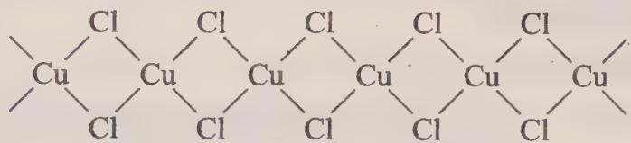  
图19-2 $\mathrm{CuCl}_2$ 的长链结构

$\mathrm{CuCl}_2$ 易溶于水，在很浓的 $\mathrm{CuCl}_2$ 水溶液中或当水溶液中 $c(\mathrm{Cl}^-)$ 高时，可形成黄色的配离子 $[\mathrm{CuCl}_4]^{2-}$

$$
\mathrm{Cu} ^ {2 +} + 4 \mathrm{Cl} ^ {-} = [ \mathrm{CuCl} _ {4} ] ^ {2 -}
$$

而 $CuCl_{2}$ 的稀溶液为浅蓝色, 这是因为溶液中 $Cu^{2+}$ 主要以浅蓝色的配离子 $\left[\mathrm{Cu}\left(\mathrm{H}_{2}\mathrm{O}\right)_{4}\right]^{2+}$ 存在的缘故:

$$
\left[ \mathrm{CuCl} _ {4} \right] ^ {2 -} + 4 \mathrm{H} _ {2} \mathrm{O} \rightleftharpoons \left[ \mathrm{Cu} \left(\mathrm{H} _ {2} \mathrm{O}\right) _ {4} \right] ^ {2 +} + 4 \mathrm{Cl} ^ {-}
$$

$\mathrm{CuCl}_{2}$ 溶液由于同时含有 $[\mathrm{CuCl}_4]^{2-}$ 和 $[\mathrm{Cu(H_2O)_4}]^{2+}$ , 以及 $\mathrm{Cl}^{-}$ 和 $\mathrm{H}_{2} \mathrm{O}$ 的混合配离子, 通常为黄绿色或绿色。

$\mathrm{CuCl}_2$ 也易溶于一些有机溶剂，如乙醇或丙酮，说明 $\mathrm{CuCl}_2$ 具有较强的共价性。

$CuCl_{2}\cdot2H_{2}O$ 受热时,按下式分解:

$$
2 \mathrm{CuCl} _ {2} \cdot 2 \mathrm{H} _ {2} \mathrm{O} \stackrel {\triangle} {=} \mathrm{Cu(OH)} _ {2} \cdot \mathrm{CuCl} _ {2} + 2 \mathrm{HCl} \uparrow + 2 \mathrm{H} _ {2} \mathrm{O}
$$

由于脱水时发生水解,所以用脱水方法制备无水 $CuCl_{2}$ 时,要在 HCl 气流保护下进行。无水 $CuCl_{2}$ 进一步受热,则发生下面的反应:

$$
2 \mathrm{CuCl} _ {2} \stackrel {\triangle} {=} 2 \mathrm{CuCl} + \mathrm{Cl} _ {2} \uparrow
$$

## (3) 含氧酸的铜盐

硫酸铜（ $\mathrm{CuSO_4 \cdot 5H_2O}$ ）是实验室中最常见的含氧酸的铜盐。蓝色的 $\mathrm{CuSO_4 \cdot 5H_2O}$ ，俗称胆矾，4个 $\mathrm{H}_2\mathrm{O}$ 分子与 $\mathrm{Cu}^{2+}$ 配位，第5个 $\mathrm{H}_2\mathrm{O}$ 分子通过氢键将 $\mathrm{SO}_4^{2-}$ 与其他 $\mathrm{H}_2\mathrm{O}$ 分子相连，如图19-3所示。由于 $\mathrm{CuSO_4 \cdot 5H_2O}$ 中的5个 $\mathrm{H}_2\mathrm{O}$ 所处的环境不同，所以受热时脱去的温度不同。

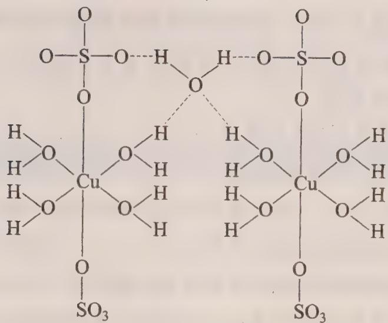  
图 19-3 CuSO $_{4}$ ·5H $_{2}$ O 中原子间的连接关系

无水 $CuSO_{4}$ 为白色粉末, 易溶于水, 不溶于乙醇和乙醚, 吸水性强, 吸水后显出水合铜离子的特征蓝色。常用这一性质来检验一些有机物, 如乙醇、乙醚等所含的微量水分。无水 $CuSO_{4}$ 也可用作干燥剂, 除去有机物中少量水分。

在 $650^{\circ}C$ 下, $CuSO_{4}$ 分解为 $CuO, SO_{3}, SO_{2}$ 及 $O_{2}$ , 这说明在这种温度下 $SO_{3}$ 已有部分发生分解。

$\mathrm{CuSO_4}$ 在电解、电镀中常用来作电解液或电镀液。由于它具有杀菌能力，常被施用在蓄水池、游泳池中以防止藻类生长。 $\mathrm{CuSO_4}$ 与石灰乳混合配制的波尔多液，农业上用来消灭植物病虫害。

## (4) 配位化合物

+2 价铜离子的价层电子构型为 $d^{9}$ ，有一个单电子，所以它的化合物具有顺磁性。由于可以发生 d-d 跃迁，铜（Ⅱ）化合物都有颜色，如 $CuSO_{4} \cdot 5H_{2}O$ 和许多水合铜盐都是蓝色的。 $Cu^{2+}$ 与单齿配体一般能形成配位数为 4 的正方形配离子，如 $\left[\mathrm{CuCl}_{4}\right]^{2-},\left[\mathrm{Cu}\left(\mathrm{H}_{2}\mathrm{O}\right)_{4}\right]^{2+},\left[\mathrm{Cu}\left(\mathrm{NH}_{3}\right)_{4}\right]^{2+}$ 等。

此外, $Cu^{2+}$ 还可以与一些有机配体,如乙二胺等在碱性溶液中生成配位化合物。缩二脲 $\left[\mathrm{HN}\left(\mathrm{CONH}_{2}\right)_{2}\right]$ 与硫酸铜(Ⅱ)反应呈现特征的紫色,是由于生成了如图19-4所示的两种离子。

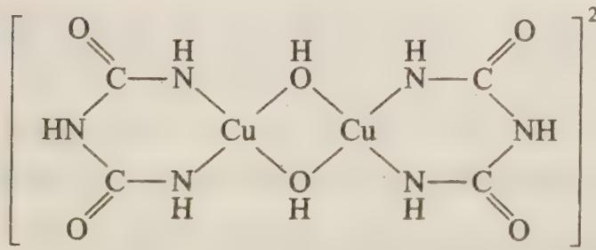  
(a)

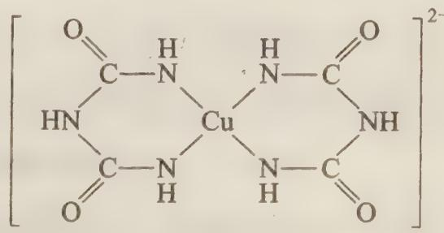  
(b)  
图 19-4 缩二脲与硫酸铜反应生成的两种离子

这是用以检验肽键的“缩二脲试验”的基本原理。将过量的 NaOH 溶液加到含有少量 $CuSO_{4}$ 溶液的未知物质中，若出现紫色则表明在未知物质中存在蛋白质或其他含肽键的化合物。

## 3. Cu(I) 和 Cu(II) 的相互转化

铜主要有+1和+2两种氧化态。从电子构型上看， $\mathrm{Cu(I)}3\mathrm{d}^{10}$ 应该比 $\mathrm{Cu(II)}3\mathrm{d}^{9}$ 稳定。事实上， $\mathrm{Cu^{+}}$ 的化合物比 $\mathrm{Cu^{2 + }}$ 的化合物稳定，前面介绍过 $\mathrm{CuO}$ 加热到 $1000^{\circ}\mathrm{C}$ 以上时分解生成红棕色 $\mathrm{Cu_2O}$ ， $\mathrm{Cu_2O}$ 十分稳定，在 $1244^{\circ}\mathrm{C}$ 熔化但不分解。但是在水溶液中的情形有所不同，电荷高、半径小的 $\mathrm{Cu^{2 + }}$ ，其水合热 $2121\mathrm{kJ}\cdot \mathrm{mol}^{-1}$ 比 $\mathrm{Cu^{+}}$ 的水合热 $582\mathrm{kJ}\cdot \mathrm{mol}^{-1}$ 大得多，这说明 $\mathrm{Cu^{+}}$ 在溶液中是不稳定的。因此， $\mathrm{Cu^{+}(aq)}$ 易发生歧化反应生成 $\mathrm{Cu^{2 + }(aq)}$ 和 $\mathrm{Cu}$

$$
2 \mathrm{Cu} ^ {+} (\mathrm{aq}) = \mathrm{Cu} ^ {2 +} (\mathrm{aq}) + \mathrm{Cu} \downarrow
$$

同样,从图 19-1 所示的酸性介质中铜的元素电势图可以看出: $E_{右}^{\ominus}>E_{左}^{\ominus},Cu^{+}$ 转化成 $Cu^{2+}$ 和 Cu 的趋势很大,可以算得在 298 K 时,此歧化反应的平衡常数 $K^{\ominus}=1.4\times10^{6}$ 。由于 $K^{\ominus}$ 较大,反应进行得很彻底。例如:

$$
\mathrm{Cu} _ {2} \mathrm{O} + \mathrm{H} _ {2} \mathrm{SO} _ {4} (\text {   稀   }) = \mathrm{Cu} + \mathrm{CuSO} _ {4} + \mathrm{H} _ {2} \mathrm{O}
$$

使 $Cu^{2+}$ 转变为 Cu(I)，在有还原剂存在的同时，还必须有 Cu(I) 的沉淀剂或络合剂存在，以降低溶液中 $Cu^{+}$ 的浓度，使之成为难溶物或难解离的配离子：

$$
\mathrm{Cu} ^ {2 +} + \mathrm{Cu} + 2 \mathrm{Cl} ^ {-} = 2 \mathrm{CuCl}
$$

这里 Cu 是还原剂, $Cl^{-}$ 是沉淀剂。CuCl 的生成使得溶液中游离的 $Cu^{+}$ 浓度大大降低, 平衡向生成 $Cu^{+}$ 的方向移动。由于 $Cu^{+}$ 浓度的降低, 使得 $E(\mathrm{Cu}^{+}/\mathrm{Cu})$ 下降, 而 $E(\mathrm{Cu}^{2+}/\mathrm{Cu}^{+})$ 升高, 将导致 $E_{右}^{\ominus}<E_{左}^{\ominus}$ , 故 $Cu^{2+}$ 将 Cu 氧化为 CuCl。

同理,在热的 Cu(Ⅱ)溶液中加入 KCN,得到白色 CuCN 沉淀:

$$
2 \mathrm{Cu} ^ {2 +} + 4 \mathrm{CN} ^ {-} = 2 \mathrm{CuCN} \downarrow + (\mathrm{CN}) _ {2} \uparrow
$$

$\mathrm{CN}^{-}$ 既是还原剂,又是 $\mathrm{Cu(I)}$ 的沉淀剂。若加入过量的 KCN,则 $\mathrm{CN}^{-}$ 成为 $\mathrm{Cu(I)}$ 的络合剂, $\mathrm{CuCN}$ 溶解而生成 $[\mathrm{Cu(CN)}_x]^{1 - x}$ 配离子:

$$
\mathrm{CuCN} + (x - 1) \mathrm{CN} ^ {-} = [ \mathrm{Cu(CN)} _ {x} ] ^ {1 - x} \quad (x = 2 \sim 4)
$$

Cu(Ⅲ)的化合物很少,氯化铜、金属钾和单质氟共热可得 $K_{3}[CuF_{6}]$ :

$$
5 \mathrm{K} + \mathrm{CuCl} _ {2} + 3 \mathrm{F} _ {2} \stackrel {\triangle} {=} \mathrm{K} _ {3} [ \mathrm{CuF} _ {6} ] + 2 \mathrm{KCl}
$$

下面的反应也可以得到 $\mathrm{Cu(III)}$ 的化合物：

$$
2 \mathrm{CuO} + 2 \mathrm{KO} _ {2} \stackrel {\triangle} {=} 2 \mathrm{KCuO} _ {2} + \mathrm{O} _ {2} \uparrow
$$

## 19.1.3 银的化合物

铜副族元素中,银的常见氧化态为+1。

## 1. 氧化物和氢氧化物

$Ag_{2}O$ 可由可溶性银盐与强碱反应生成。 $Ag^{+}$ 与强碱作用生成白色 AgOH 沉淀，AgOH 极不稳定，很快脱水变为棕黑色 $Ag_{2}O$ ：

$$
2 \mathrm{Ag} ^ {+} + 2 \mathrm{OH} ^ {-} = 2 \mathrm{AgOH} \downarrow \quad \longrightarrow \mathrm{Ag} _ {2} \mathrm{O} \downarrow + \mathrm{H} _ {2} \mathrm{O}
$$

AgOH 只有用强碱与可溶性银盐的乙醇溶液,在低于 $-45^{\circ}C$ (228 K) 时反应才能真正得到。

$Ag_{2}O$ 和 $Cu_{2}O$ 有许多相似之处, 它们均不溶于水, 但均可溶于氨水, 生成无色的配离子。 $Ag_{2}O$ 的反应为

$$
\mathrm{Ag} _ {2} \mathrm{O} + 4 \mathrm{NH} _ {3} + \mathrm{H} _ {2} \mathrm{O} = 2 \left[ \mathrm{Ag} \left(\mathrm{NH} _ {3}\right) _ {2} \right] ^ {+} + 2 \mathrm{OH} ^ {-}
$$

和 $Cu_{2}O$ 与氨水的反应一致。 $Ag_{2}O$ 和 $Cu_{2}O$ 均为碱性氧化物，但 $Ag_{2}O$ 的碱性比 $Cu_{2}O$ 的强。

$Ag_{2}O$ 和 $Cu_{2}O$ 的不同之处首先在于对热的稳定性有差别, $Cu_{2}O$ 对热十分稳定, 而 $Ag_{2}O$ 在 $300^{\circ}C$ 时则发生分解生成两种单质。其次 $Ag_{2}O$ 与稀酸反应可以生成稳定的 Ag(I) 盐, 例如:

$$
\mathrm{Ag} _ {2} \mathrm{O} + 2 \mathrm{HNO} _ {3} = 2 \mathrm{AgNO} _ {3} + \mathrm{H} _ {2} \mathrm{O}
$$

而 $Cu_{2}O$ 溶于非氧化性的稀酸中, 若不能生成 $\mathrm{Cu(I)}$ 的沉淀或配离子时, $Cu^{+}$ 不能在溶液中稳定存在, 将歧化成 $Cu^{2+}$ 和 Cu。

## 2. 其他简单化合物

卤化银中只有 AgF 是离子型化合物, 易溶于水, 其他的卤化银均难溶于水, 且溶解度按 AgCl, AgBr, AgI 顺序降低, 颜色也依次加深。

将 $Ag_{2}O$ 溶于氢氟酸, 然后蒸发至黄色晶体析出而得到氟化银。而将硝酸银与可溶性氯、溴、碘化物反应即生成不同颜色的卤化银沉淀。

卤化银有感光性,是指其在光的作用下分解,例如:

$$
2 \mathrm{AgBr} \stackrel {h \nu} {=} 2 \mathrm{Ag} + \mathrm{Br} _ {2}
$$

胶片在摄影过程中的感光就是这一反应,底片上的 AgBr 感光的部分分解生成 Ag 形成银核。然后用氢醌等显影剂处理,将含有银核的 AgBr 还原为金属银而显黑色,这就是显影。最后,用 $Na_{2}S_{2}O_{3}$ 等定影液通过配位反应溶解掉未感光的 AgBr,这就是定影。

难溶卤化银 AgX 能与相应的卤离子 X⁻ 形成溶解度较大的配离子：

$$
\mathrm{AgX} + (n - 1) \mathrm{X} ^ {-} = [ \mathrm{AgX} _ {n} ] ^ {(n - 1) -} \quad (\mathrm{X} = \mathrm{Cl}, \mathrm{Br}, \mathrm{I}; n = 2, 3, 4)
$$

注意下列相关反应的平衡常数：

$$
\begin{array}{r l r} {\mathrm {AgCl = Ag^ {+} + Cl^ {-}}} & & {K _ {\mathrm{sp}} ^ {\ominus} = 1. 8 \times 1 0 ^ {- 1 0}} \\ {\mathrm {Ag^ {+} + 2Cl^ {-} = [AgCl_ {2} ]^ {-}}} & & {K _ {\text {稳}} ^ {\ominus} = 1. 1 \times 1 0 ^ {5}} \\ {\mathrm {AgCl + Cl^ {-} = [AgCl_ {2} ]^ {-}}} & & {K _ {\text {稳}} ^ {\ominus} = 2. 0 \times 1 0 ^ {- 5}} \end{array}
$$

因此,用卤离子沉淀 $Ag^{+}$ 进行分离时,必须注意卤离子的适量,否则会造成 $Ag^{+}$ 沉淀不完全。

硫化银 $\left(\mathrm{Ag}_{2}\mathrm{S}\right)$ 是黑色物质,难溶于水。向 $Ag^{+}$ 溶液中通入 $H_{2}S$ 可以得到硫化银。 $Ag_{2}S$ 的溶解需要热的浓硝酸或氰化钠(钾)溶液:

$$
\begin{array}{r l} & {\mathrm {Ag_ {2} S + 4HN O _ {3} (\text {浓}) \xlongequal{\triangle} 2AgNO_ {3} + S + 2NO_ {2} \uparrow + 2H_ {2} O}} \\ & {\mathrm {Ag_ {2} S + 4CN^ {-} = 2[Ag(CN) _ {2} ] ^ {-} + S^ {2 - }}} \end{array}
$$

硝酸银是一种常见的重要试剂。在光照或加热到 $440^{\circ}$ C 时，硝酸银按下式分解：

$$
2 \mathrm{AgNO} _ {3} \stackrel {\triangle} {=} 2 \mathrm{Ag} + 2 \mathrm{NO} _ {2} \uparrow + \mathrm{O} _ {2} \uparrow
$$

因此， $\mathrm{AgNO}_3$ 要保存在棕色瓶中。 $\mathrm{AgNO}_3$ 主要用于制造照相底片所需的 $\mathrm{AgBr}$ 。在医药上 $\mathrm{AgNO}_3$ 常用作消毒剂和防腐剂。

与 $\mathrm{AgNO}_3$ 相比, $\mathrm{Cu(NO_3)_2}$ 的热稳定性更差些, 因为 $\mathrm{Cu(II)}$ 的反极化作用比 $\mathrm{Ag(I)}$ 强。

从图 19-1 所示的元素电势图可以看出, Ag(I) 很难被氧化成 Ag(II) 和 Ag(III), 而且在溶液中 Ag $^{+}$ 也不发生歧化反应。与 Ag(I) 相关的氧化还原过程主要体现为 Ag(I) 作为氧化剂的反应。Ag(I) 不仅可以将 N $_{2}$ H $_{4}$ 和 NH $_{2}$ OH 氧化成 N $_{2}$ , 还可以将 P(III) 和 P(I) 氧化至高价, 例如:

$$
4 \mathrm{Ag} ^ {+} + \mathrm{H} _ {2} \mathrm{PO} _ {2} ^ {-} + 2 \mathrm{H} _ {2} \mathrm{O} = 4 \mathrm{Ag} \downarrow + \mathrm{H} _ {3} \mathrm{PO} _ {4} + 3 \mathrm{H} ^ {+}
$$

在碱性介质中 Ag(I) 的氧化性更为明显,例如:

$$
2 \mathrm{Ag} ^ {+} + \mathrm{Mn} ^ {2 +} + 4 \mathrm{OH} ^ {-} = 2 \mathrm{Ag} \downarrow + \mathrm{MnO(OH)} _ {2} \downarrow + \mathrm{H} _ {2} \mathrm{O}
$$

## 3. 配位化合物

$\mathrm{Ag^{+}}$ 与单齿配体形成的配位单元中，以配位数为2的直线形者最为常见，如 $[\mathrm{Ag}(\mathrm{CN})_2]^{-}, [\mathrm{Ag}(\mathrm{NH}_3)_2]^+$ ， $[\mathrm{Ag}(\mathrm{S}_2\mathrm{O}_3)_2]^{3-}$ 等。这些配离子通常是无色的，主要是由于 $\mathrm{Ag^{+}}$ 的电子组态为 $\mathbf{d}^{10}$ ，d轨道全充满，不存在d-d跃迁。

$\left[\mathrm{Ag}\left(\mathrm{NH}_{3}\right)_{2}\right]^{+}$ 用于制造保温瓶和镜子镀银：

$$
2 \left[ \mathrm{Ag} \left(\mathrm{NH} _ {3}\right) _ {2} \right] ^ {+} + \mathrm{RCHO} + 3 \mathrm{OH} ^ {-} = 2 \mathrm{Ag} \downarrow + \mathrm{RCOO} ^ {-} + 4 \mathrm{NH} _ {3} \uparrow + 2 \mathrm{H} _ {2} \mathrm{O}
$$

该反应称为银镜反应,常用来鉴定醛。

$Ag^{+}$ 与 $NH_{3}, S_{2}O_{3}^{2-}, CN^{-}$ 等形成稳定程度不同的配位单元：

$$
\begin{array}{r l r} & {\mathrm {Ag^ {+} + 2Cl^ {-} = [AgCl_ {2} ]^ {-}}} & {K _ {\text {稳}} ^ {\ominus} = 1. 1 \times 1 0 ^ {5}} \\ & {\mathrm {Ag^ {+} + 2NH_ {3} = [Ag(NH_ {3})_ {2} ]^ {+}}} & {K _ {\text {稳}} ^ {\ominus} = 1. 1 \times 1 0 ^ {7}} \\ & {\mathrm {Ag^ {+} + 2S_ {2} O_ {3} ^ {2 - } = [Ag(S_ {2} O_ {3})_ {2} ] ^ {3 - }}} & {K _ {\text {稳}} ^ {\ominus} = 2. 9 \times 1 0 ^ {1 3}} \\ & {\mathrm {Ag^ {+} + 2CN^ {-} = [Ag(CN) _ {2} ]^ {-}}} & {K _ {\text {稳}} ^ {\ominus} = 1. 3 \times 1 0 ^ {2 1}} \end{array}
$$

结合一些银盐的溶度积常数数据,经过计算可以得到如下结论:AgCl 可以很好地溶解在氨水中,AgBr 能很好地溶解在 $Na_{2}S_{2}O_{3}$ 溶液中,而 AgI 可以溶解在 KCN 溶液中。

## 19.1.4 金的化合物

金在化合态时的氧化数主要为+3。

金在 $200^{\circ}$ C 下同氯气作用, 得到反磁性的红色固体 $AuCl_{3}$ 。无论在固态还是在气态下, 该化合物均有二聚体结构单元, 且具有氯桥结构, 如图 19-5 所示, 单元中的 8 个原子共平面。

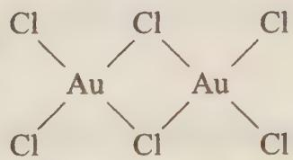  
图 19-5 AuCl₃ 的二聚体结构

将 $\mathrm{AuCl}_3$ 溶于盐酸可以得到 $[\mathrm{AuCl}_4]^{-}$ ，同样将 $\mathrm{AuBr}_3$ 溶于氢溴酸可以得到 $[\mathrm{AuBr}_4]^{-}$ 。

用 $\mathrm{Mg(OH)}_{2}$ 沉淀 $\left[AuCl_{4}\right]^{-}$ ，可以得到棕色氢氧化金沉淀，在 $140^{\circ}C$ 下脱水可得 $Au_{2}O_{3}$ 。

Au(I)化合物也是存在的,但不稳定,很容易发生歧化反应。从图19-1所示的酸中的元素电势图上可以看出, $Au^{+}$ 转化为 $Au^{3+}$ 和Au的趋势很大,因为 $E_{右}^{\ominus}>E_{左}^{\ominus}$ 。反应式为

$$
3 \mathrm{Au} ^ {+} = \mathrm{Au} ^ {3 +} + 2 \mathrm{Au} \downarrow
$$

可以计算出,常温下此歧化反应的平衡常数 $K^{\ominus}=7.3\times10^{9}$ 。

$AuCl_{3}$ 加热到 $160^{\circ}C$ ，将分解成 AuCl 和 $Cl_{2}$ ，若温度再升高将有单质金生成。

## 19.2 锌副族元素

锌副族元素基态原子的价层电子构型为 $(n-1)\mathrm{d}^{10}\mathrm{ns}^{2}$ ，包括锌、镉、汞和第七周期的镉共4种元素，最常见的氧化态为+2，汞还有+1氧化态。锌副族元素一般都能形成稳定的配位化合物。其价态和氧化还原性质可以从锌副族的元素电势图(图19-6)中体现出来。

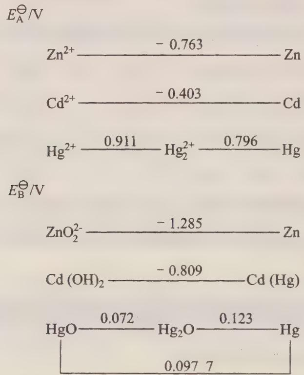  
图19-6 锌副族的元素电势图

锌副族元素在自然界中主要以硫化物形式存在,锌在地壳中的质量分数为 $7.5\times10^{-3}\%$ 。锌和汞的最主要矿物是闪锌矿(ZnS)、菱锌矿( $ZnCO_{3}$ )和辰砂(又名朱砂,HgS),硫化镉矿常以微量共存于闪锌矿中。锌矿常与铅、铜、镉等共存,如铅锌矿。

## 19.2.1 锌副族元素的单质

## 1. 锌副族元素单质的性质

## (1) 物理性质

与过渡金属相比,锌副族元素的一个重要特点是熔、沸点较低。原因是锌副族元素的原子半径大,且次外层 d 轨道全充满,不参与形成金属键,故金属键较弱。由于汞原子 6s 轨道上的两个电子非常惰性,因此它的金属键更弱,其熔点是所有金属中最低的。汞既是唯一的室温下的液态金属，又是少见的气态时以单原子分子形式存在的金属元素。汞被人类使用有近4000年的历史，已测得在秦始皇的墓室存在有大量的汞。汞在室温下有流动性，且在-20\~300℃体积膨胀系数很均匀，不润湿玻璃，所以常被用于制作温度计。

汞蒸气有毒,空气中 Hg 的允许量为 $0.1 \, mg \cdot m^{-3}$ 。在使用金属汞时,必须确保装置密闭,实验室要通风。如果在使用过程中不慎将汞洒在实验台面或地面上,要尽量收集起来,然后在估计有金属汞的地方覆盖硫黄粉,以便使汞转化成 HgS。汞的储存也要特别小心,可以临时将汞存放在广口瓶中,若不密封,一定要在汞面上覆盖一层 10% NaCl 溶液,以减少汞的挥发。

汞可以溶解其他金属,形成类似于溶液的汞齐。因组成不同,汞齐可以呈液态和固态两种形式。汞齐在化学、化工和冶金中都有重要用途,如钠汞齐在有机化学中常用作较温和的还原剂。此外,利用汞能溶解金、银的性质,在冶金中曾用汞来提取这些金属。锌、镉、汞与其他金属容易形成合金,如黄铜是锌最重要的合金之一。

## (2) 化学性质

锌副族元素的化学活泼性随着原子序数的增大而递减,这与ⅡA族碱土金属恰好相反。但ⅡB族元素比ⅠB族元素化学活性高。例如,Zn和Cu在元素周期表中相邻,只差一个电子,而且Zn的第一电离能比Cu的大得多,但是Zn却远比Cu活泼。其标准电极电势

$$
E ^ {\ominus} \left(\mathrm{Zn} ^ {2 +} / \mathrm{Zn}\right) = - 0. 7 6 \mathrm{V} <   0 \quad E ^ {\ominus} \left(\mathrm{Cu} ^ {2 +} / \mathrm{Cu}\right) = 0. 3 4 \mathrm{V} > 0
$$

清楚地反映出这一差别。体现 Cu 和 Zn 标准电极电势大小的能量过程如图 19-7 所示。

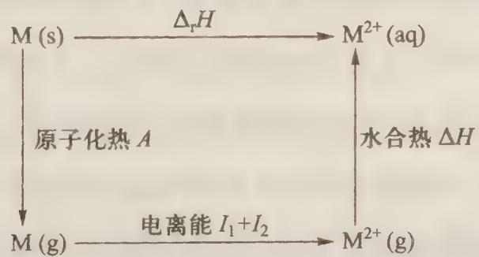  
图19-7 体现Cu和Zn标准电极电势大小的能量过程

过程中 Zn 和 Cu 的 $(I_{1}+I_{2})$ 差别不大, 水合热 $\Delta H$ 也相近。关键是 Zn 的原子化热 A 小, 导致过程总的热效应是 Zn 比 Cu 有利, 故 Zn 远比 Cu 活泼。对于铜和锌, 过程的类型相同, 熵变相近, 故从焓变出发讨论问题是合理的。

常温下，ⅡB族元素单质都很稳定。加热条件下，Zn，Cd，Hg均可与 $O_{2}$ 反

应,生成氧化物 MO,例如:

$$
2 \mathrm{Hg} + \mathrm{O} _ {2} \stackrel {\triangle} {=} 2 \mathrm{HgO}
$$

产物为红色的 $\mathrm{HgO}$ 。在潮湿的空气中，Zn将生成碱式碳酸盐：

$$
4 \mathrm{Zn} + 2 \mathrm{O} _ {2} + \mathrm{CO} _ {2} + 3 \mathrm{H} _ {2} \mathrm{O} = \mathrm{ZnCO} _ {3} \cdot 3 \mathrm{Zn(OH)} _ {2}
$$

由于液态汞和硫粉之间接触面积大,故 Hg 比 Zn,Cd 更易于与硫粉反应:

$$
\mathrm{Hg} + \mathrm{S} \xlongequal {\text {研磨}} \mathrm{HgS}
$$

Zn, Cd 与硫粉的反应要在加热的条件下方可进行。

Zn, Cd, Hg 均可与氯气发生反应。氯气过量时产物是 $HgCl_{2}$ ，汞过量时产物是甘汞 $Hg_{2}Cl_{2}$ 。

Zn, Cd 都能与稀盐酸、稀硫酸反应, 放出氢气, 例如:

$$
\mathrm{Zn} + 2 \mathrm{H} ^ {+} = \mathrm{Zn} ^ {2 +} + \mathrm{H} _ {2} \uparrow
$$

但是纯锌与稀盐酸作用很慢,这是因为 $H^{+}$ 在 Zn 极上放电很困难,属于动力学问题。若在体系中加入少许 $Cu^{2+}$ ,反应途径则变为

$$
\begin{array}{l} \mathrm {Zn + Cu^ {2 + } = Zn^ {2 + } + Cu} \\ \mathrm {Cu + 2H^ {+} = Cu^ {2 + } + H_ {2}} \end{array}
$$

分两步反应时,过程的 $\Delta_{r}H_{m}^{\ominus}$ 不变,但 $H^{+}$ 在 Cu 表面夺电子的速率很快。

Hg 不与稀盐酸、稀硫酸反应,但可与氧化性酸反应得汞(Ⅱ)盐,例如:

$$
\mathrm{Hg} + 2 \mathrm{H} _ {2} \mathrm{SO} _ {4} (\text {浓}) \stackrel {\triangle} {=} \mathrm{HgSO} _ {4} + \mathrm{SO} _ {2} \uparrow + 2 \mathrm{H} _ {2} \mathrm{O}
$$

当反应物中汞过量时,产物也可能是亚汞(Ⅰ)盐,例如:

$$
6 \mathrm{Hg} (\text {过量}) + 8 \mathrm{HNO} _ {3} (\text {冷}) = 3 \mathrm{Hg} _ {2} (\mathrm{NO} _ {3}) _ {2} + 2 \mathrm{NO} \uparrow + 4 \mathrm{H} _ {2} \mathrm{O}
$$

Hg 很难与氢溴酸作用,但可与氢碘酸反应,放出氢气:

$$
\mathrm{Hg} + 4 \mathrm{HI(aq)} = \mathrm{H} _ {2} \left[ \mathrm{HgI} _ {4} \right] + \mathrm{H} _ {2} \uparrow
$$

可见 $\left[\mathrm{HgI}_4\right]^{2-}$ 的稳定常数很大。

Zn, Cd, Hg 中仅 Zn 有两性, Zn 不仅可以与稀盐酸反应, 也可与碱反应:

$$
\mathrm{Zn} + 2 \mathrm{NaOH} + 2 \mathrm{H} _ {2} \mathrm{O} = \mathrm{Na} _ {2} [ \mathrm{Zn(OH)} _ {4} ] + \mathrm{H} _ {2} \uparrow
$$

Zn 也能溶于氨水中形成配离子:

$$
\mathrm{Zn} + 4 \mathrm{NH} _ {3} + 2 \mathrm{H} _ {2} \mathrm{O} = [ \mathrm{Zn} (\mathrm{NH} _ {3}) _ {4} ] ^ {2 +} + \mathrm{H} _ {2} \uparrow + 2 \mathrm{OH} ^ {-}
$$

## 2. 锌副族元素的提取

## (1) 锌的冶炼

闪锌矿经浮选得到含 $40\% \sim 60\%$ ZnS的精矿，加热焙烧使它转化为氧化锌：

$$
2 \mathrm{ZnS} + 3 \mathrm{O} _ {2} \xlongequal {\text {焙烧}} 2 \mathrm{ZnO} + 2 \mathrm{SO} _ {2}
$$

再把氧化锌和焦炭混合，在鼓风炉中加热至 1 100\~1 300 ℃：

$$
2 \mathrm{C} + \mathrm{O} _ {2} \xlongequal {\text {高温}} 2 \mathrm{CO}
$$

$$
\mathrm{ZnO} + \mathrm{CO} \xlongequal {\text {高温}} \mathrm{Zn(g)} + \mathrm{CO} _ {2}
$$

将生成的锌蒸馏出来,得到纯度为 98% 的粗锌,其中主要杂质为铅、镉、铜、铁等。通过精馏将铅、镉、铜、铁等杂质除掉,得到纯度为 99.9% 的锌。

上述的“火法炼锌”得到的金属锌，其纯度尚不能满足要求时，可采用“湿法冶金”，以得到更纯的金属。将焙烧所得的氧化锌及少量的残余硫化物（统称为焙砂）用稀硫酸浸取，使 $\mathrm{ZnO}$ 转化为 $\mathrm{ZnSO_4}$ 。调节溶液的 $\mathrm{pH}$ ，使Fe,As,Sb等杂质生成沉淀并滤出。加入Zn粉，使上述溶液中的Cd,Cu等杂质转化成金属进入残渣中。最后以 $\mathrm{ZnSO_4}$ 作电解液，Al为阴极，Pb为阳极进行电解，可得到纯度为 $99.99\%$ 的金属锌。

## (2) 镉和汞的提取

镉主要存在于锌的各种矿石中,大部分是在炼锌时作为副产品得到的。由于镉的沸点767℃比锌的沸点907℃低,将含镉的锌加热到镉的沸点以上、锌的沸点以下的温度,镉先被蒸出得到粗镉。再将粗镉溶于HCl,用Zn置换,可以得到较纯的镉。

汞常以辰砂(HgS)形式存在。将 HgS 在空气中灼烧可得单质汞：

$$
\mathrm{HgS} + \mathrm{O} _ {2} \xlongequal {\text {灼烧}} \mathrm{Hg} + \mathrm{SO} _ {2}
$$

“湿法冶金”中是将 HgS 转入液相, 其原理是第 16 章介绍重金属的硫化物时涉及的反应, 即 HgS 可以溶于碱性硫化物 $Na_{2}S$ 中, 得 $Na_{2}HgS_{2}$ , 经电解可得金属汞。

## 19.2.2 锌和镉的化合物

锌副族元素中,锌和镉的常见氧化态为+2。其化合物为抗磁性,且锌(Ⅱ)的化合物经常是无色的,这是因为不存在d-d跃迁的缘故。

事实上，锌和镉也存在+1价化合物，只不过 $\mathrm{Zn}_{2}^{2+}, \mathrm{Cd}_{2}^{2+}$ 极不稳定，仅在熔融的氯化物中溶解金属时生成， $\mathrm{Zn}_{2}^{2+}, \mathrm{Cd}_{2}^{2+}$ 在水中立即歧化成 $+2$ 价离子和金属。另外， $\mathrm{ZnH}$ 和 $\mathrm{ZnX}$ 的光谱也已测得，但化合物尚未得到。

## 1. 氧化物和氢氧化物

锌和镉分别在氧气中燃烧得到相应的氧化物。CdO, ZnO 也可由相应的碳酸盐、硝酸盐热分解而得到：

$$
\begin{array}{r l} & \mathrm {ZnCO_ {3}} \stackrel {\triangle} {=} \mathrm{ZnO} + \mathrm {CO_ {2}} \uparrow \\ & \mathrm {CdCO_ {3}} \stackrel {\triangle} {=} \mathrm{CdO} + \mathrm {CO_ {2}} \uparrow \end{array}
$$

ZnO 俗称锌白, 纯 ZnO 为白色, 加热则变为黄色, ZnO 的结构属硫化锌型。CdO 由于制备方法的不同而显不同颜色, 如镉在空气中加热生成褐色 CdO, 250 ℃ 时氢氧化镉热分解则得到绿色 CdO。CdO 具有 NaCl 型晶体结构。

氧化物的热稳定性按 ZnO, CdO, HgO 顺序递减。ZnO, CdO 较稳定且共价性较强, 受热升华但不分解。

CdO 属碱性氧化物, 而 ZnO 属两性氧化物。ZnO 在工业上主要用作橡胶及油漆颜料的原料, 在有机合成中作催化剂, 在医药上用于制造药膏。

锌盐和镉盐溶液中加入适量强碱,得到相应的氢氧化物:

$$
\begin{array}{l} \mathrm {ZnCl_ {2}} + 2 \mathrm{NaOH(aq)} = \mathrm {Zn(OH) _ {2}} \downarrow + 2 \mathrm{NaCl} \\ \mathrm {CdCl_ {2}} + 2 \mathrm{NaOH(aq)} = \mathrm {Cd(OH) _ {2}} \downarrow + 2 \mathrm{NaCl} \end{array}
$$

氢氧化锌为两性物质,与强酸作用生成锌盐,与强碱作用得到四羟合锌酸盐:

$$
\begin{array}{r l} & \mathrm {Zn(OH) _ {2} + 2 H ^ {+} = Z n ^ {2 + } + 2 H _ {2} O} \\ & \mathrm {Zn(OH) _ {2} + 2 OH^ {-} = [Zn(OH) _ {4} ] ^ {2 - }} \end{array}
$$

氢氧化镉也显两性,但偏碱性。只有在热、浓的强碱中才缓慢溶解,生成 $Na_{2}[Cd(OH)_{4}]$

这两种氢氧化物受热脱水分别生成 ZnO 和 CdO:

$$
\begin{array}{r l} & \mathrm {Zn(OH) _ {2}} \stackrel {\triangle} {=} \mathrm{ZnO+H} _ {2} \mathrm{O} \\ & \mathrm {Cd(OH) _ {2}} \stackrel {\triangle} {=} \mathrm{CdO+H} _ {2} \mathrm{O} \end{array}
$$

$\mathrm{Zn(OH)}_{2}$ 900 ℃时分解完全, $\mathrm{Cd(OH)}_{2}$ 200 ℃时分解完全。

在有铵离子存在的条件下, $\mathrm{Zn(OH)}_{2},\mathrm{Cd(OH)}_{2}$ 都可以溶于氨水中形成配位化合物,而 $\mathrm{Al(OH)}_{3}$ 却不能,据此可以将铝盐与锌盐、镉盐加以区分和分离。

$$
\begin{array}{r l} & \mathrm {Zn(OH) _ {2} + 4NH_ {3} \xlongequal {NH_ {4} ^ {+}} [Zn(NH_ {3}) _ {4} ] ^ {2 + } + 2OH^ {-}} \\ & \mathrm {Cd(OH) _ {2} + 4NH_ {3} \xlongequal {NH_ {4} ^ {+}} [Cd(NH_ {3}) _ {4} ] ^ {2 + } + 2OH^ {-}} \end{array}
$$

## 2. 其他化合物

在含 $Zn^{2+}, Cd^{2+}$ 的溶液中通入 $H_{2}S$ 气体, 得到相应的硫化物。ZnS 是白色的, CdS 是黄色的, ZnS 和 CdS 都难溶于水。ZnS 能溶于 $0.1 \, mol \cdot dm^{-3}$ 盐酸, 其计算过程详见第 9 章例 9-7。向锌盐的酸性溶液中通入 $H_{2}S$ 气体, 反应为

$$
\mathrm{Zn} ^ {2 +} + \mathrm{H} _ {2} \mathrm{S} = \mathrm{ZnS} \downarrow + 2 \mathrm{H} ^ {+}
$$

但 ZnS 有可能沉淀不完全, 这是因为在生成沉淀过程中 $H^{+}$ 阻碍了反应的进行。ZnS 不溶于醋酸。

CdS 的溶度积常数更小, 不溶于稀酸, 但能溶于浓酸。通过控制溶液的酸度, 可以用通入 $H_{2}S$ 气体的方法使 $Zn^{2+}, Cd^{2+}$ 分离。

ZnS 本身可作白色颜料, 它同硫酸钡共沉淀形成的混合晶体 $\mathrm{ZnS} \cdot \mathrm{BaSO}_{4}$ , 称为锌钡白或立德粉, 是一种很好的白色颜料。其制备反应如下:

$$
\mathrm{ZnSO} _ {4} (\mathrm{aq}) + \mathrm{BaS} (\mathrm{aq}) = \mathrm{ZnS} \cdot \mathrm{BaSO} _ {4} \downarrow
$$

CdS 称为镉黄, 可用作黄色颜料。

由于锌和镉的+2价离子均为18电子构型,极化能力和变形性都很强,所以氯化锌和氯化镉具有相当程度的共价性,主要表现在熔、沸点较低,熔融状态下导电能力差。

无水氯化锌为白色固体,可由金属锌与氯气直接化合而得到,也可以在700 ℃时,将干燥的氯化氢通过金属锌而制成。

$ZnCl_{2}$ 易潮解, 在水中溶解度极大, 吸水性也很强, 因而在有机化学中可用作脱水剂。其溶液因 $Zn^{2+}$ 的水解而显酸性:

$$
\mathrm{Zn} ^ {2 +} + \mathrm{H} _ {2} \mathrm{O} = \mathrm{Zn(OH)} ^ {+} + \mathrm{H} ^ {+}
$$

因此,通过将 $ZnCl_{2}$ 溶液蒸干或加热含结晶水的 $ZnCl_{2}$ 晶体的方法,是得不到无水 $ZnCl_{2}$ 的,只能得到碱式盐:

$$
\mathrm{ZnCl} _ {2} \cdot \mathrm{H} _ {2} \mathrm{O} \stackrel {\triangle} {=} \mathrm{Zn(OH)Cl+HCl} \uparrow
$$

其无水盐可以用 $ZnCl_{2} \cdot H_{2}O$ 与 $SOCl_{2}$ 共热制得：

$$
\mathrm {ZnCl_ {2} \cdot H_ {2} O + SOCl_ {2} \xlongequal {\triangle} ZnCl_ {2} + SO_ {2} \uparrow + 2HCl\uparrow}
$$

$\mathrm{ZnCl}_2$ 在乙醇和其他有机溶剂中溶解性较好，也从另一个侧面说明了它具有一定的共价性。在 $\mathrm{ZnCl}_2$ 浓溶液中，由下面反应：

$$
\mathrm{ZnCl} _ {2} + \mathrm{H} _ {2} \mathrm{O} = \mathrm{H} [ \mathrm{ZnCl} _ {2} (\mathrm{OH}) ]
$$

生成的二氯·羟合锌(Ⅱ)酸具有显著的酸性,能溶解金属氧化物:

$$
\mathrm{FeO} + 2 \mathrm{H} \left[ \mathrm{ZnCl} _ {2} (\mathrm{OH}) \right] = \mathrm{Fe} \left[ \mathrm{ZnCl} _ {2} (\mathrm{OH}) \right] _ {2} + \mathrm{H} _ {2} \mathrm{O}
$$

焊接金属时用 $ZnCl_{2}$ 浓溶液清除金属表面的氧化物, 就是利用了上述性质。当烙铁的高温使水分蒸发后, 熔化的盐覆盖在金属表面, 使之不再氧化, 能保证焊接金属表面的直接接触。氯化锌浓溶液也被称为“熟镪水”, 但它不损害金属表面。

## 19.2.3 汞的化合物

锌副族元素中,汞的化学性质较特殊。汞有+2价化合物,还有稳定的+1价化合物,这两种价态都是很重要的。

## 1. 氧化数为+1的化合物

在 $\mathrm{Hg}_{2}(\mathrm{NO}_{3})_{2}$ 和 $Hg_{2}Cl_{2}$ 等化合物中，Hg 的氧化态是 +1，这类化合物被称为亚汞化合物。在亚汞化合物中，汞总是以双聚体 $Hg_{2}^{2+}$ 形式出现。从 +1 价 Hg 的价层电子构型 $5d^{10}6s^{1}$ 推测，亚汞化合物应是顺磁性的，但事实上，这类化合物都是反磁性的。X 射线衍射实验结果表明，单个 $Hg^{+}$ 是不存在的，氯化亚汞的化学式为 $Hg_{2}Cl_{2}$ ，分子 Cl—Hg—Hg—Cl 是直线形的。两个汞原子形成 Hg—Hg 键时， $6s^{1}$ 电子结合成对，所以没有单电子存在，故亚汞化合物呈反磁性。

$Hg_{2}Cl_{2}$ 为白色固体,难溶于水。少量的 $Hg_{2}Cl_{2}$ 毒性较低,因味略甜,俗称甘汞,常被用来制作甘汞电极。

$Hg_{2}Cl_{2}$ 见光分解, 应保存在棕色瓶中:

$$
\mathrm{Hg} _ {2} \mathrm{Cl} _ {2} \stackrel {h \nu} {=} \mathrm{HgCl} _ {2} + \mathrm{Hg}
$$

将金属汞与氯化汞( $HgCl_{2}$ )固体一起研磨,最后得到氯化亚汞:

$$
\mathrm {HgCl_ {2} + Hg\xlongequal {\text {研磨}} Hg_ {2} Cl_ {2}}
$$

$Hg_{2}Cl_{2}$ 的一个最重要的反应, 是与氨水作用生成白色的氨基氯化汞和呈黑色的极为分散的单质汞, 所以反应产物的颜色为灰色, 反应方程式如下:

$$
\mathrm{Hg} _ {2} \mathrm{Cl} _ {2} + 2 \mathrm{NH} _ {3} (\mathrm{aq}) = \mathrm{Hg} (\mathrm{NH} _ {2}) \mathrm{Cl} + \mathrm{Hg} + \mathrm{NH} _ {4} \mathrm{Cl}
$$

该反应被应用到离子分离中。 $Hg_{2}Cl_{2}$ 和 AgCl 均属于氯化物沉淀，加入氨水即可将两种沉淀进一步分开，从而实现 $Hg_{2}^{2+}$ 和 $Ag^{+}$ 的分离。

亚汞盐与碘化钾反应生成黄色的 $\mathrm{Hg}_2\mathrm{I}_2$ 沉淀：

$$
\mathrm{Hg} _ {2} ^ {2 +} + 2 \mathrm{I} ^ {-} = \mathrm{Hg} _ {2} \mathrm{I} _ {2} \downarrow
$$

该沉淀在过量 KI 溶液中歧化成 Hg(Ⅱ) 和 Hg:

$$
\mathrm{Hg} _ {2} \mathrm{I} _ {2} + 2 \mathrm{KI} (\mathrm{aq}) = \mathrm{K} _ {2} [ \mathrm{HgI} _ {4} ] + \mathrm{Hg}
$$

## 2. 氧化数为 $+2$ 的化合物

## (1) 氧化物和氢氧化物

汞盐与强碱反应,得到黄色的 HgO 而得不到 $\mathrm{Hg(OH)}_{2}$ :

$$
\mathrm{Hg} ^ {2 +} + 2 \mathrm{OH} ^ {-} = \mathrm{HgO} \downarrow + \mathrm{H} _ {2} \mathrm{O}
$$

这一结果表明 $\mathrm{Hg(OH)}_{2}$ 不稳定, 生成后立即分解。

$\mathrm{Hg(NO_{3})_{2}}$ 晶体加热则得到红色 $\mathrm{HgO}$ 。汞在氧气中燃烧也可以得到 $\mathrm{HgO}$ 。 $\mathrm{HgO}$ 由于晶粒大小不同而显不同颜色，黄色 $\mathrm{HgO}$ 颗粒要小些。无论红色 $\mathrm{HgO}$ 还是黄色 $\mathrm{HgO}$ ，均属链状结构，其中 $\mathrm{Hg}$ 原子的配位方式是线形的。

HgO 的热稳定性远低于 ZnO 和 CdO, 在 300 ℃ 时发生分解反应:

$$
2 \mathrm{HgO} \xlongequal {3 0 0 ^ {\circ} \mathrm{C}} 2 \mathrm{Hg} + \mathrm{O} _ {2} \uparrow
$$

在空气中灼烧 HgS, 得到汞单质, 而不是 HgO。同样方法处理闪锌矿 ZnS 时, 得到的是 ZnO, 其中的杂质 CdS 也转化成 CdO。这也说明 HgO 稳定性较差。

HgO 是制备多种汞盐的原料,还用作医药制剂、分析试剂、陶瓷颜料等。

## (2) 硫化物

在含 $Hg^{2+}$ 的溶液中通入 $H_{2}S$ 气体,会得到黑色的 HgS,天然辰砂是红色的 HgS。黑色的 HgS 加热到 386 ℃ 晶型发生改变,转变为比较稳定的红色 HgS。硫化汞是溶解度最小的硫化物。在浓硝酸中也不能溶解,但可溶于过量的 $Na_{2}S$ 或 KI 浓溶液中:

$$
\begin{array}{r l} & {\mathrm {HgS + Na_ {2} S(浓) = Na_ {2} [HgS_ {2} ]}} \\ & {\mathrm {HgS + 2H^ {+} + 4I^ {-} = [HgI_ {4} ] ^ {2 - } + H_ {2} S\uparrow}} \end{array}
$$

实验室里,常用王水来溶解 HgS:

$$
3 \mathrm{HgS} + 8 \mathrm{H} ^ {+} + 2 \mathrm{NO} _ {3} ^ {-} + 1 2 \mathrm{Cl} ^ {-} = 3 \left[ \mathrm{HgCl} _ {4} \right] ^ {2 -} + 3 \mathrm{S} + 2 \mathrm{NO} \uparrow + 4 \mathrm{H} _ {2} \mathrm{O}
$$

## (3) 氯化物

氯化汞为白色针状晶体, 可在过量的氯气中加热金属汞而制得。 $HgCl_{2}$ 为直线形共价型化合物, 熔点较低, 易升华, 俗称升汞, 略溶于水, 有剧毒。其稀溶液有杀菌作用, 在医疗中用作外科非金属器具的消毒剂。

$HgCl_{2}$ 在水中的解离度很小, 主要是以分子形式存在的。

$$
\mathrm{HgCl} _ {2} = \mathrm{HgCl} ^ {+} + \mathrm{Cl} ^ {-} \quad K _ {1} = 3. 2 \times 1 0 ^ {- 6}
$$

$$
\mathrm{HgCl} ^ {+} = \mathrm{Hg} ^ {2 +} + \mathrm{Cl} ^ {-} \quad K _ {2} = 1. 8 \times 1 0 ^ {- 7}
$$

$HgCl_{2}$ 在水中稍有水解, 即

$$
\mathrm{HgCl} _ {2} + \mathrm{H} _ {2} \mathrm{O} = \mathrm{Hg(OH)Cl} + \mathrm{HCl}
$$

若 $\mathrm{HgCl}_2$ 遇到氨水，则立即产生白色氯化氨基汞沉淀：

$$
\mathrm{HgCl} _ {2} + 2 \mathrm{NH} _ {3} (\mathrm{aq}) = \mathrm{Hg} (\mathrm{NH} _ {2}) \mathrm{Cl} \downarrow + \mathrm{NH} _ {4} \mathrm{Cl}
$$

在酸性条件下, $HgCl_{2}$ 是一种较强的氧化剂,还可能与惰性电子对效应有关。适量的 $SnCl_{2}$ 可将 $HgCl_{2}$ 还原为难溶于水的白色氯化亚汞( $Hg_{2}Cl_{2}$ )沉淀:

$$
2 \mathrm{HgCl} _ {2} + \mathrm{Sn} ^ {2 +} + 4 \mathrm{Cl} ^ {-} = \mathrm{Hg} _ {2} \mathrm{Cl} _ {2} \downarrow + [ \mathrm{SnCl} _ {6} ] ^ {2 -}
$$

如果 $SnCl_{2}$ 过量,生成的 $Hg_{2}Cl_{2}$ 会继续被还原为金属汞,所观察到的现象是沉淀变黑:

$$
\mathrm{Hg} _ {2} \mathrm{Cl} _ {2} + \mathrm{Sn} ^ {2 +} + 4 \mathrm{Cl} ^ {-} = 2 \mathrm{Hg} + [ \mathrm{SnCl} _ {6} ] ^ {2 -}
$$

在分析化学中,常利用此反应来鉴定 Hg(Ⅱ)或 Sn(Ⅱ)。

(4) 配位化合物

向 $Hg^{2+}$ 中滴加 KI 溶液, 首先产生红色碘化汞沉淀:

$$
\mathrm{Hg} ^ {2 +} + 2 \mathrm{I} ^ {-} = \mathrm{HgI} _ {2} \downarrow
$$

然后沉淀溶于过量的 KI 中,生成无色的 $\left[HgI_{4}\right]^{2-}$ 配离子:

$$
\mathrm{HgI} _ {2} + 2 \mathrm{I} ^ {-} = [ \mathrm{HgI} _ {4} ] ^ {2 -}
$$

$\left[HgI_{4}\right]^{2-}$ 的碱性溶液称为奈斯勒(Nessler)试剂。如果溶液中有微量的 $NH_{4}^{+}$ 存在,滴加奈斯勒试剂立即生成特殊的红色沉淀,即

$$
2 \left[ \mathrm{HgI} _ {4} \right] ^ {2 -} + \mathrm{NH} _ {4} ^ {+} + 4 \mathrm{OH} ^ {-} = \left[ \begin{array}{c} \mathrm{Hg} \\ \mathrm{O} \\ \mathrm{Hg} \end{array} \right] \mathrm{I} \downarrow + 7 \mathrm{I} ^ {-} + 3 \mathrm{H} _ {2} \mathrm{O}
$$

这个反应常被用来鉴定 $NH_{4}^{+}$ 。

一些 $\mathrm{Hg(II)}$ 的化合物有较深的颜色, 这是由于电荷迁移造成的。 $\mathrm{Hg(II)}$ 具有 18 电子构型, 极化能力很强; 半径很大, 易变形, 所以很容易与配体之间发生电荷迁移。

3. 汞 (Ⅰ) 和汞 (Ⅱ) 的相互转化

从图 19-6 所示的汞的元素电势图可以看出, 在酸性介质中 $Hg_{2}^{2+}$ 不会发生歧化反应, 而是 $Hg^{2+}$ 与单质 Hg 发生逆歧化反应:

$$
\mathrm{Hg} + \mathrm{Hg} ^ {2 +} = \mathrm{Hg} _ {2} ^ {2 +}
$$

这个反应的平衡常数 $K^{\ominus}=88.9$ ，这表明当体系达到平衡时， $Hg^{2+}$ 基本上可转化为 $Hg_{2}^{2+}$ 。在前面也提到， $Hg_{2}Cl_{2}$ 就是利用这个反应制备的。

若想使 $Hg_{2}^{2+}$ 发生歧化反应, 最简单的方法就是降低产物中 $Hg^{2+}$ 的浓度, 使平衡向有利于歧化反应的方向移动。例如, 在 $Hg_{2}^{2+}$ 溶液中加入 $Hg^{2+}$ 的沉淀剂 $OH^{-}$ 或通入硫化氢时:

$$
\begin{array}{l} \mathrm{Hg} _ {2} ^ {2 +} + 2 \mathrm{OH} ^ {-} = \mathrm{HgO} \downarrow + \mathrm{Hg} \downarrow + \mathrm{H} _ {2} \mathrm{O} \\ \mathrm{Hg} _ {2} ^ {2 +} + \mathrm{H} _ {2} \mathrm{S} = \mathrm{HgS} \downarrow + \mathrm{Hg} \downarrow + 2 \mathrm{H} ^ {+} \end{array}
$$

同时还可以得出另一个结论，在 $Hg_{2}^{2+}$ 溶液中加入沉淀剂 $OH^{-}$ 或通入硫化氢时，不能得到氧化亚汞和硫化亚汞沉淀。

如果存在 $Hg^{2+}$ 的络合剂时, $Hg_{2}^{2+}$ 也易于发生歧化反应:

$$
\begin{array}{l} \mathrm{Hg} _ {2} ^ {2 +} + 4 \mathrm{CN} ^ {-} = [ \mathrm{Hg(CN)} _ {4} ] ^ {2 -} + \mathrm{Hg} \downarrow \\ \mathrm{Hg} _ {2} ^ {2 +} + 4 \mathrm{I} ^ {-} = [ \mathrm{HgI} _ {4} ] ^ {2 -} + \mathrm{Hg} \downarrow \end{array}
$$

## 拓展学习资源

<table><tr><td>资源内容</td><td>二维码</td></tr><tr><td>铜副族元素矿物图片</td><td></td></tr><tr><td>铜合金的组成、性质与用途</td><td></td></tr><tr><td>Cu(III)化合物</td><td></td></tr><tr><td>锌副族元素矿物图片</td><td></td></tr><tr><td>镉的提取与用途</td><td>扫一扫查看资源内容</td></tr><tr><td>本章小结</td><td></td></tr><tr><td>视频——氯化亚铜的生成与性质</td><td></td></tr><tr><td>▶视频——银镜反应</td><td></td></tr><tr><td>▶视频——亚汞盐与碘化钾的反应</td><td></td></tr><tr><td>▶视频——奈斯勒试剂</td><td></td></tr></table>

## 总结习题

19-1 试从铜副族元素和锌副族元素的化学性质出发,解释其在自然界的存在状态。

19-2 试总结铜副族元素和锌副族元素的重要物理性质,指出这些性质在哪些方面得到应用。

19-3 试从原子结构出发说明铜副族元素和碱金属元素在化学性质上的异同。

19-4 试比较 $\mathrm{Cu(I)}$ 和 $\mathrm{Cu(II)}$ 的稳定性, 有利于 $\mathrm{Cu(II)}$ 向 $\mathrm{Cu(I)}$ 转化的条件是什么?

19-5 电解法精炼铜的过程中,阳极的粗铜溶解,纯铜在阴极上沉积。为什么粗铜中的 Ag, Au, Pt 等杂质不溶解,而沉于电解槽底部形成阳极泥?为什么 Ni, Fe, Zn 等杂质与粗铜一起溶解,却不在阴极上沉积出来?

19-6 试分别比较锌副族元素和碱土金属元素,锌副族元素和铜副族元素在化学性质上的异同。

19-7 试总结 $\mathrm{Ag}_{2} \mathrm{O}$ 和 $\mathrm{Cu}_{2} \mathrm{O}$ 的化学性质, 通过比较找出异同点。

19-8 “熟镪水”的化学成分是什么？焊接金属时用“熟镪水”清除锈蚀的金属表面，其作用原理是什么？

19-9 试说明氯化亚汞的化学式一般写成 $\mathrm{Hg}_{2} \mathrm{Cl}_{2}$ 的原因。

19-10 奈斯勒试剂的化学成分是什么？使用奈斯勒试剂可以检验出溶液中微量存在的 $\mathrm{NH}_4^+$ ，其作用原理是什么？

19-11 试叙述从黄铜矿 $\mathrm{CuFeS}_2$ 出发，提炼粗铜及粗铜的电解精炼过程。

## 自习题

19-1 简释下列词语。

（1）斐林试剂； （2）青铜、黄铜和白铜； （3）冰铜； （4）汞齐；

(5) 缩二脲试验；（6）浮选； (7) 熟镪水；（8）奈斯勒试剂。

19-2 完成并配平下列化学反应方程式。

(1) $\mathrm{Cu} + \mathrm{HNO}_3$ (稀)

(2) $\mathrm{Ag_2S + NaCN(aq)} =$

(3) $\mathrm{Cu}^{2+} + \mathrm{N}_2\mathrm{H}_4 + \mathrm{OH}^- =$

(4) $\mathrm{Cu}_{2}\mathrm{S} + \mathrm{CN}^{-}$

(5) $\mathrm{CuCl}_2\cdot 2\mathrm{H}_2\mathrm{O}\stackrel {\triangle}{=}$

(6) $\mathrm{CuCl}_2 \xlongequal{\triangle}$

(7) $\mathrm{Ag_2S + HNO_3}$ (浓)

(8) $\left[\mathrm{Ag}(\mathrm{NH}_3)_2\right]^+$ + HCHO + OH-

(9) $\mathrm{Zn + NaOH + H_2O =}$

(10) $\mathrm{Ag_2O + NH_3 + H_2O =}$

(11) $\mathrm{HgO}\stackrel {\triangle}{=}$

(12) $\mathrm{Hg} + \mathrm{HNO}_3$ (稀, 过量) =

(13) $\mathrm{HgS} + \mathrm{Na}_2\mathrm{S}$ (浓)

(14) $\mathrm{ZnCl}_2\cdot \mathrm{H}_2\mathrm{O}\stackrel {\triangle}{=}$

(15) $\mathrm{Hg}_2\mathrm{Cl}_2\xrightarrow{h\nu}$

19-3 完成并配平下列化学反应方程式。

(1) 铜与含有二氧化碳的潮湿空气接触, 表面生成铜绿。

(2) 在有氧气存在的条件下银与氰化钠溶液反应。

(3) 金属铜在有空气存在的条件下与稀硫酸作用。

(4) 四羟合铜(Ⅱ)配阴离子与葡萄糖反应。

(5) 氧化亚铜溶于氨水。

(6) 硫化亚铜溶于热的浓硝酸。

（7）合成氨工业中用配位化合物醋酸二氨合铜（Ⅰ）溶液吸收使催化剂中毒的一氧化碳气体。

(8) 氢氧化铜在有铵离子存在的条件下溶于氨水。

(9) 水合二氯化锌与亚硫酰氯共热。

(10) +1 价银离子与强碱溶液作用生成棕黑色物质。

(11) 溴化银见光分解。

(12) 过量的单质汞与冷的稀硝酸反应。

(13) 单质锌溶于氨水。

(14) 硫化汞溶于浓的碘化钾酸性溶液。

(15) 单质汞与氯化汞固体一起研磨。

(16) 硫化汞溶于王水。

(17) 向二硫代硫酸根合银(I)配阳离子的溶液中通入硫化氢气体。

## 19-4 生产、合成与制备。

(1) 叙述以黄铜矿 $\left(\mathrm{CuFeS}_{2}\right)$ 为原料提炼粗铜的过程。

(2) 叙述氰化法炼金的过程。

(3) 以含有杂质 CdS 的闪锌矿 (ZnS) 提炼金属 Zn。

(4) 以辰砂(HgS)为原料制取高纯汞。

(5) 以金属 Cu 为铜源合成下列各物质。

① CuCl; ② CuO; ③ CuI。

(6) 以金属 Ag 为主要原料制备硝酸银、氯化银、碘化银和硫化银。

(7) 以金属 $\mathrm{Zn}$ 为主要原料制备硝酸锌、氯化锌和硫化锌。

(8) 以金属 $\mathrm{Hg}$ 为主要原料制备硝酸汞、硝酸亚汞、碘化汞、碘化亚汞和硫化汞。

(9) 如何制得 $\mathrm{Cu(III)}$ 化合物？

## 19-5 分离、提纯与鉴别。

(1) 试分离下列各组混合物。

① ZnS, CdS, HgS; ② AgCl, Hg₂Cl₂, HgCl₂。

(2) 有 3 种白色粉末, 分别为 CuCl, AgCl, Hg₂Cl₂, 试加以鉴别。

(3) 如何用化学方法除去金属银中少量的金属铜杂质?

(4) 试设计方案分离下列各组离子。

① $Cu^{2+}, Ag^{+}, Zn^{2+}, Hg_{2}^{2+}$ ; ② $Zn^{2+}, Cd^{2+}, Hg^{2+}, Al^{3+}$ 。

(5) 5个试剂瓶中分别盛装 $\mathrm{HgO}$ , $\mathrm{CdS}$ , $\mathrm{PbO}$ , $\mathrm{SnS}_{2}$ , $\mathrm{As}_{2} \mathrm{~S}_{3}$ 黄色固体试样, 试加以鉴别。

## 19-6 解释实验现象。

(1) $\left[\mathrm{Ag}\left(\mathrm{NH}_{3}\right)_{2}\right]\mathrm{Cl}$ 遇到硝酸时析出沉淀。

(2) 稀释 $CuCl_{2}$ 浓溶液时, 体系的颜色由黄色经绿色变为蓝色。

(3) 将 $SO_{2}$ 通入 $CuSO_{4}$ 和 NaCl 的浓混合溶液, 有白色沉淀生成。

(4) 单质铁能使 $Cu^{2+}$ 还原, 单质铜却能使 $Fe^{3+}$ 还原。

(5) 用硫酸酸化 $\mathrm{CuSO}_4$ 溶液, 之后通入 $\mathrm{H}_2\mathrm{S}$ , 可以得到黑色的 $\mathrm{CuS}$ 沉淀; 当 $\mathrm{Cu}$ 与浓硫酸共热, 主要的含硫产物为 $\mathrm{SO}_2$ , 同时也得到少量的 $\mathrm{CuS}$ 沉淀。

(6) 黄色的 AgI 受热时显红色, 低温时变成白色, 而 AgCl 常温下显白色。

(7) 铜与 NaCN 溶液作用放出 $\mathrm{H}_{2}$ , 而且在有氧气存在时铜能溶于浓氨水。

(8) 铜可溶于硝酸, 而金只能溶于王水。

(9) CuCN 不溶于水, 但可以溶于 KCN 水溶液。

(10) 向 $\left[\mathrm{Zn(OH)}_{4}\right]^{2-}$ 溶液中不断滴加盐酸, 先有白色沉淀生成, 继而沉淀溶解。

(11) 向 $\mathrm{Hg}_{2}(\mathrm{NO}_{3})_{2}$ 溶液中不断滴加KI溶液, 先有黄色沉淀生成, 继而沉淀颜色加深, 最后得到黑色沉淀和无色溶液。

(12) 向 $\mathrm{Hg(NO_3)_2}$ 溶液中不断滴加KI溶液, 先有红色沉淀生成, 继而沉淀消失, 得到无色溶液。

19-7 推理判断。

(1) 化合物(A)的溶液为绿色,将铜丝与其共煮渐渐生成无色溶液(B)。用大量的水稀释(B)得到白色沉淀(C)。(C)溶于稀硫酸得到蓝色溶液(D)和红色单质(E)。向蓝色溶液(D)中不断滴入氨水,先有蓝色沉淀(F)生成,最后得到深蓝色溶液(G)。红色单质(E)不溶于稀硫酸和稀氢氧化钠溶液,但可溶于浓硫酸生成蓝色溶液(D)和无色气体(H)。

试给出(A)，(B)，(C)，(D)，(E)，(F)，(G)和(H)所代表的物质的化学式，并用化学反应方程式表示各过程。

(2) 某络酸的钠盐(A)与稀盐酸作用,有刺激性气体(B)和黑色沉淀(C)生成,同时溶液中出现极浅的黄色浑浊,说明有(D)产生。气体(B)能使 $\mathrm{KMnO}_{4}$ 溶液褪色。若通氯气于(A)的溶液中,得到白色沉淀(E)和化合物(F)的溶液。(F)与 $\mathrm{BaCl}_{2}$ 作用,有不溶于酸的白色沉淀(G)产生。若在(A)的溶液中加入KI,则生成黄色沉淀(H),再加入NaCN溶液,(H)溶解,形成(I)的无色溶液,再向其中通入 $\mathrm{H}_{2} \mathrm{~S}$ 气体,又得到(C)。

试给出(A)，(B)，(C)，(D)，(E)，(F)，(G)，(H)和(I)所代表的物质的化学式，并用化学反应方程式表示各过程。

(3) 化合物(A)是一种红色固体, 它不溶于水, 与稀硫酸反应生成蓝色溶液(B)和暗红色沉淀(C)。向溶液(B)中加入氨水, 生成(D)的深蓝色溶液, 再加入适量 KCN, 得无色溶液, 说明有(E)生成。(C)与浓硫酸反应生成(B), 同时放出有刺激性气味的气体(F)。

试给出(A)，(B)，(C)，(D)，(E)和(F)所代表的物质的化学式，并用化学反应方程式表示各过程。

(4) 白色固体(A)不溶于水和氢氧化钠溶液,溶于盐酸形成无色溶液(B)和气体(C)。向溶液(B)中滴加氨水,先有白色沉淀(D)生成,而后(D)又溶于过量氨水,形成无色溶液(E)。将气体(C)通入 $CdSO_{4}$ 溶液中得黄色沉淀,若将气体(C)通入溶液(E)中则析出固体(A)。

试给出(A)，(B)，(C)，(D)和(E)所代表的物质的化学式，并用化学反应方程式表示各过程。

19-8 简答题。

(1) 给出下列物质的化学式。

① 黄铜矿； ② 辉铜矿； ③ 赤铜矿； ④ 黑铜矿；

⑤ 孔雀石； ⑥ 胆矾； ⑦ 闪锌矿； ⑧ 菱锌矿；

⑨ 朱砂； ⑩ 锌白； ⑪ 立德粉； ⑫ 镉黄；

⑬ 甘汞； ⑭ 升汞。

(2) 用化学反应方程式表示下列与 Cu 有关的转化过程。

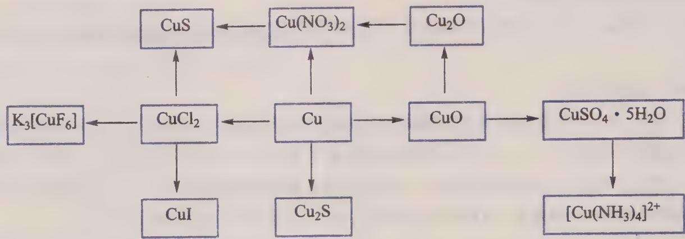  
(3) 用化学反应方程式表示下列与 $\mathrm{Zn}$ 有关的转化过程。

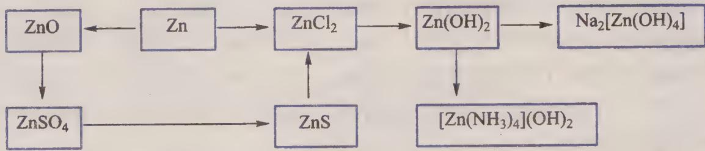

(4) 试填写汞的硝酸盐与某些试剂反应的主要产物,并说明实验现象。

<table><tr><td></td><td> $Hg_{2}(NO_{3})_{2}$ </td><td> $Hg(NO_{3})_{2}$ </td></tr><tr><td>KOH</td><td></td><td></td></tr><tr><td> $NH_{3} \cdot H_{2}O$ </td><td></td><td></td></tr><tr><td> $H_{2}S$ </td><td></td><td></td></tr><tr><td> $SnCl_{2}$ </td><td></td><td></td></tr><tr><td>KI</td><td></td><td></td></tr></table>

(5) $Hg^{2+}, I^{-}, Cd^{2+}$ 和 $S^{2-}$ 均为无色，而 $HgI_{2}$ 为红色，CdS 为黄色，试分析其生色的机理。

(6) 氯化亚汞 (Ⅰ) 和氯化汞 (Ⅱ) 的分子均具有直线形结构, 试分析二者的中心原子轨道杂化方式和成键情况。

(7) 向含 $\mathrm{Zn}^{2+}$ 的水溶液中加入 $\mathrm{Na}_{2} \mathrm{CO}_{3}$ , 得到的沉淀为 $\mathrm{ZnCO}_{3} \cdot \mathrm{Zn(OH)}_{2}$ , 若将 $\mathrm{Na}_{2} \mathrm{CO}_{3}$ 换为 $\mathrm{NaHCO}_{3}$ , 则沉淀为 $\mathrm{ZnCO}_{3}$ 。试用化学反应方程式描述以上过程, 并解释其原因。

(8) 卤化银的颜色来源于电荷转移, 试解释为何卤素离子从 $\mathrm{Cl}^{-}$ 到 $\mathrm{I}^{-}$ , 卤化银的颜色越来越深。

(9) HCl 和 HI 溶液都是强酸, 但 Ag 不能从 HCl 溶液中置换出 $H_{2}$ , 却能从 HI 溶液中置换出 $H_{2}$ , 试说明原因。

(10) 根据所给数据讨论氰化法提金的合理性。

已知： $E^{\ominus}(\mathrm{Au}^{+}/\mathrm{Au})=1.69\ \mathrm{V}$ ;

$$
E ^ {\ominus} \left(\mathrm{Zn} ^ {2 +} / \mathrm{Zn}\right) = - 0. 7 6 \mathrm{V};
$$

$$
E ^ {\ominus} \left(\mathrm{O} _ {2} / \mathrm{OH} ^ {-}\right) = 0. 4 0 \mathrm{V};
$$

$$
K _ {\mathrm{稳}} ^ {\ominus} \left\{\left[ \mathrm{Au(CN)} _ {2} \right] ^ {-} \right\} = 2. 0 \times 1 0 ^ {3 8};
$$

$$
K _ {\mathrm{稳}} ^ {\ominus} \left\{\left[ \mathrm{Zn(CN)} _ {4} \right] ^ {2 -} \right\} = 5. 0 \times 1 0 ^ {1 6} 。
$$

(11) Cu 和 Zn 在元素周期表中同属 ds 区, 且为相邻元素。实验测得 Cu 的第一电离能为 $745.5 \mathrm{~kJ} \cdot \mathrm{mol}^{-1}$ , Zn 的第一电离能为 $906.4 \mathrm{~kJ} \cdot \mathrm{mol}^{-1}$ 。从第一电离能数据看, Cu 应该比 Zn 活泼, 事实上 Zn 的化学活泼性远强于 Cu, 由 $E^{\ominus}(\mathrm{Cu}^{2+}/\mathrm{Cu}) = 0.34 \mathrm{~V}, E^{\ominus}(\mathrm{Zn}^{2+}/\mathrm{Zn}) = -0.76 \mathrm{~V}$ 可明显看出这一点。试认真分析这一问题, 并查阅有关数据, 解释这对似乎矛盾的事实。

(12) 试根据汞的元素电势图回答问题:

$$
E _ {\mathrm{A}} ^ {\ominus} / \mathrm{V}
$$

$$
\mathrm{Hg} ^ {2 +} \xrightarrow {0 . 9 1 1} \mathrm{Hg} _ {2} ^ {2 +} \xrightarrow {0 . 7 9 6} \mathrm{Hg}
$$

① 在酸性介质中 $Hg_{2}^{2+}$ 能否发生歧化反应？

② 计算反应

$$
\mathrm{Hg} + \mathrm{Hg} ^ {2 +} = \mathrm{Hg} _ {2} ^ {2 +}
$$

的平衡常数 $K^{\ominus}$ ；

③ 拟使 $\mathrm{Hg}(\mathrm{I})$ 歧化为 $\mathrm{Hg}(\mathrm{II})$ 和 $\mathrm{Hg}$ , 应该怎样做? 试举两个实例加以说明。

(13) 试解释为什么氧化锌比氯化锌熔点高。

(14) 当 $Hg^{2+}$ 与二甲亚砜 $\left[\left(\mathrm{CH}_{3}\right)_{2}\mathrm{SO}\right]$ 配位时, 配位原子是硫还是氧?

（15）试解释为何 $\left[\mathrm{Ag}\left(\mathrm{NH}_{3}\right)_{2}\right]^{+}$ 的稳定常数为 $1.1 \times 10^{7}$ , 而 $[\mathrm{Ag}(\mathrm{en})]^{+}$ 的稳定常数却为 $5.0 \times 10^{4}$ , 稳定性反而降低, 没有体现出螯合效应所带来的稳定化作用。

(16) AgF 的溶解度大于 AgCl, 而 $CuF_{2}$ 的溶解度却小于 $CuCl_{2}$ ，请解释原因。

## 目录

## 钛副族元素和 钒副族元素

20.1 钛副族元素 …… 760
20.1.1 钛单质 …… 760
1. 物理性质 …… 760
2. 化学性质 …… 761
3. 用途 …… 762
4. 金属钛的提炼 …… 762
20.1.2 钛的含氧化合物 …… 763
1. 二氧化钛 …… 763
2. 钛酸及其盐 …… 764
20.1.3 钛的卤化物 …… 765
1. 四氯化钛 …… 765
2. 三氯化钛 …… 766
20.1.4 锆和铪 …… 767
1. 性质 …… 767
2. 锆、铪的分离 …… 767
20.2 钒副族元素 …… 768
20.2.1 钒单质 …… 769
1. 性质 …… 769
2. 钒的冶炼 …… 770
20.2.2 钒的氧化物 …… 770
20.2.3 钒的含氧酸盐 …… 771
20.2.4 卤化物 …… 772
20.2.5 铌和钽 …… 773
拓展学习资源 …… 774
总结与思考题 …… 774
习题 …… 774

# 第 20 章 钛副族元素和钒副族元素

## 20.1 钛副族元素

钛副族元素包括钛、锆、铪和第七周期的铲共4种元素，在元素周期表中处于IVB族。

1791 年,英国人格雷戈尔(Gregor)在分析钛铁矿时首先发现了金属钛,1795年,德国人克拉普罗特(Klaproth)也独立发现钛元素,但直到 1910 年,单质钛才被美国人亨特(Hunter)通过钠还原 TiCl₄ 制得,纯度达到 99.9%。由于钛在自然界中的存在十分分散,以及提炼钛金属的困难很大,因此它长期被认为是一种稀有金属。实际上钛是地壳中含量最为丰富的元素之一,在地壳中的质量分数为 0.56%,列第 9 位,在过渡金属中仅次于铁。在自然界中,钛元素分布面也很广,地壳中含钛矿物有 140 多种,但现在有开采价值的仅有十余种,主要有金红石(TiO₂)、钛铁矿(FeTiO₃)、钙钛矿(CaTiO₃)和榍石(CaTiSiO₃)等。

锆在地壳中的质量分数为 0.019 0%, 超过 Cu, Zn, Sn, Ni 和 Pb, 列第 18 位。锆元素在自然界的主要存在形式有锆石 (ZrSiO $_{4}$ ) 和斜锆石 (ZrO $_{2}$ )。铪在地壳中的质量分数为 3.3×10 $^{-4}$ %, 在自然界经常与锆混生。由于镧系收缩, 铬和铪在化学性质上十分相似, 使得分离这两种元素所遇到的困难比镧系元素之间的分离还要大, 铬经常作为精炼锆的副产物得到。

钛副族元素基态原子的价层电子构型为 $(n-1)\mathrm{d}^{2}ns^{2}$ ，最稳定的氧化态是+4，其次是+3，而+2氧化态则较为少见。在特定条件下，钛在化合物中会呈少见的0或-1的低氧化态。锆、铪呈低氧化态的趋势比钛小。钛副族元素的价态和氧化还原性质可以从图20-1所示的元素电势图中体现出来。

## 20.1.1 钛单质

## 1. 物理性质

钛是灰色金属,熔点高达 $1670^{\circ}\mathrm{C}$ , 密度为 $4.506 \mathrm{~g} \cdot \mathrm{cm}^{-3}$ 。与钢相比, 它的密度只相当于钢的 $57\%$ , 而强度和硬度却与钢相近。与铝相比, 钛的密度虽然大些, 但机械强度却远比铝大。因此, 钛兼有钢和铝的优点, 强度高且质地轻。纯净的钛有良好的塑性，钛越纯，它韧性超过纯铁的两倍。

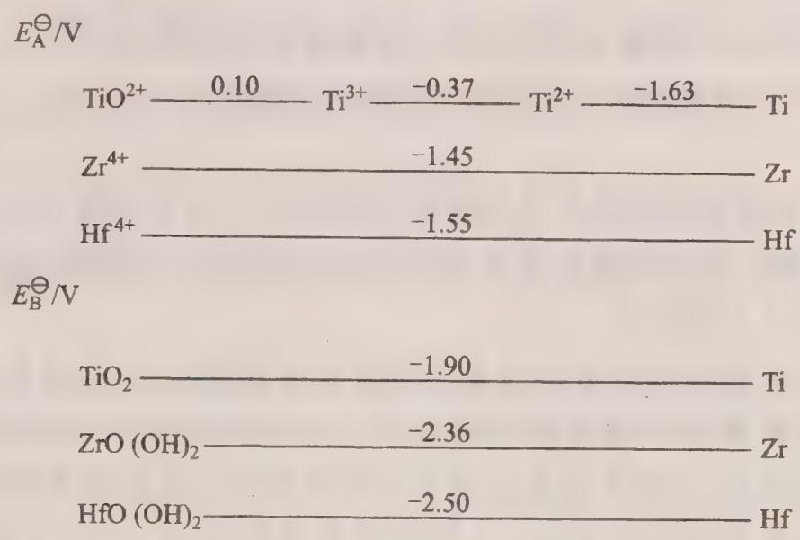  
图20-1 钛副族的元素电势图

## 2. 化学性质

从 $E^{\ominus}(\mathrm{Ti}^{2+}/\mathrm{Ti})=-1.628\ \mathrm{V},E^{\ominus}(\mathrm{Ti}^{3+}/\mathrm{Ti})=-1.209\ \mathrm{V}$ 可以看出，钛是一种热力学上很活泼的金属。但是，在常温下金属钛是不活泼的，这是因为它的表面生成了一层极细致的、钝性的、能自行修补裂缝的氧化物膜。在室温下，钛不与 $X_{2},O_{2},H_{2}O$ 反应，也不与强酸、强碱反应，甚至与王水也不发生作用。

但是,钛能缓慢地溶于热的浓盐酸或浓硫酸中,得紫色的 $Ti^{3+}$ 溶液:

$$
\begin{array}{r l} & 2 \mathrm{Ti} + 6 \mathrm{HCl(浓)} \xlongequal {\triangle} 2 \mathrm{TiCl} _ {3} + 3 \mathrm{H} _ {2} \uparrow \\ & 2 \mathrm{Ti} + 3 \mathrm{H} _ {2} \mathrm{SO} _ {4} (\text {   浓   }) \xlongequal {\triangle} \mathrm{Ti} _ {2} (\mathrm{SO} _ {4}) _ {3} + 3 \mathrm{H} _ {2} \uparrow \end{array}
$$

金属钛还可溶于热的氢氟酸中：

$$
\mathrm{Ti} + 6 \mathrm{HF(aq)} \stackrel {\triangle} {=} \left[ \mathrm{TiF} _ {6} \right] ^ {2 -} + 2 \mathrm{H} ^ {+} + 2 \mathrm{H} _ {2} \uparrow
$$

金属钛遇到硝酸时,表面的氧化物膜将得到完善,很好地保护内部,故不易与硝酸发生反应。

金属钛也不与热碱溶液反应。

高温时,钛相当活泼,可以通过直接化合生成氧化物 $TiO_{2}$ , 卤化物 $TiX_{4}$ , 间充型碳化物 TiC 等,且能在空气中燃烧,是唯一可在氮气氛中燃烧的金属。

$$
\begin{array}{r l} & {\mathrm{Ti+O} _ {2} \xlongequal {\text {高温}} \mathrm{TiO} _ {2}} \\ & {3 \mathrm{Ti+2N} _ {2} \xlongequal {\text {高温}} \mathrm{Ti} _ {3} \mathrm{N} _ {4}} \end{array}
$$

$$
\mathrm{Ti} + 2 \mathrm{Cl} _ {2} \xlongequal {\text {高温}} \mathrm{TiCl} _ {4}
$$

钛在高于 $300^{\circ}$ C 时能与 $H_{2}$ 反应，生成稳定的灰色的 $TiH_{2}$ 。该氢化物在 $1000^{\circ}$ C 左右可以完全脱氢，是纯氢的一种有效供源。

## 3. 用途

金属钛特有的银灰色调不论是采用高抛光、丝光，还是亚光方式处理，都有上好的表面效果。钛是除贵金属外最适合的首饰材料，在国外现代首饰设计中经常使用，市场上俗称钛金。

液体钛几乎能溶解所有的金属,因此可与多种金属形成合金。例如,将钛加入钢中所制得的钛钢坚韧而有弹性。新型钛合金的耐热性、耐低温性和抗腐蚀性均很好。钛镍合金或称为NT合金在一定环境温度下具有单向、双向和全方位的形状记忆效应,是最佳形状记忆合金,可作为管接头用于战斗机的油压系统和石油工业的输油管路系统中,也可做成直径500 mm抛物网状天线用于宇航飞行器。钛铌合金在温度低于临界温度4 K时,呈现出零电阻的超导功能,主要用于制造高场超导磁体。钛铁合金具有吸附氢的特性,可把大量的氢安全的储存起来,在一定的环境中又将其释放,所以在氢气的分离、净化、储存和运输、制造以氢为能源的热泵和蓄电池等方面很有前途。

金属钛在很强的磁场中也不会被磁化,无毒,与人体组织和血液有很好的相容性,所以被医疗界用于制造人造关节和接骨。金属钛抗阻尼性强,受到机械振动或电振动后,与金属钢、铜相比,其自身振动衰减时间最长,因此可用于制作音叉、音响扬声器的振动膜。

## 4. 金属钛的提炼

金属钛不容易提取,不仅因为它具有高熔点,而且在高温下易与空气、氧气、氮气、碳和氢气反应,因而金属钛十分昂贵。

工业上,从钛铁矿 $FeTiO_{3}$ 出发提取钛单质,先用硫酸在 150\~200 ℃ 下溶煮已用磁选法富集得到的钛铁矿粉,同时加入 Fe 屑防止 $Fe^{2+}$ 被氧化:

$$
\mathrm{FeTiO} _ {3} + 3 \mathrm{H} _ {2} \mathrm{SO} _ {4} \stackrel {\triangle} {=} \mathrm{Ti(SO} _ {4}) _ {2} + \mathrm{FeSO} _ {4} + 3 \mathrm{H} _ {2} \mathrm{O}
$$

低温下结晶析出 $FeSO_{4} \cdot 7H_{2}O$ ，过滤后稀释、加热使 $\mathrm{Ti(SO_{4})_{2}}$ 水解转化为 $TiOSO_{4}$ ，进一步沉淀出偏钛酸 $H_{2}TiO_{3}$ （或称为一水合二氧化钛 $TiO_{2} \cdot H_{2}O$ ），然后煅烧 $H_{2}TiO_{3}$ ，脱水得到 $TiO_{2}$ ：

$$
\mathrm{H} _ {2} \mathrm{TiO} _ {3} \xlongequal {\text {煅烧}} \mathrm{TiO} _ {2} + \mathrm{H} _ {2} \mathrm{O}
$$

将得到的 $TiO_{2}$ 与炭、氯气共热生成 $TiCl_{4}$ :

$$
\mathrm{TiO} _ {2} + 2 \mathrm{Cl} _ {2} + 2 \mathrm{C} \stackrel {\triangle} {=} \mathrm{TiCl} _ {4} + 2 \mathrm{CO}
$$

最后,在 Ar 气氛中用金属镁或钠还原 $TiCl_{4}$ 蒸气制取 Ti:

$$
\mathrm{TiCl} _ {4} (\mathrm{g}) + 2 \mathrm{Mg} (\mathrm{l}) \xlongequal {8 0 0 ^ {\circ} \mathrm{C}} \mathrm{Ti} + 2 \mathrm{MgCl} _ {2} (\mathrm{l})
$$

用水浸取除去可溶盐后,即得到海绵状钛,再在惰性气氛下熔炼,得较纯的 Ti 单质。

在 2000 年出版的一期 Nature(Vol. 401, P361) 杂志上描述了通过熔盐电解制备金属钛的新方法, 以熔融 $CaCl_{2}$ 为溶剂, 以石墨为阳极, 以合金丝串起的 $TiO_{2}$ 压片为阴极, 直接电解即可获得海绵状金属钛。此方法的发现有望大大降低钛的生产成本。

实验室中制取少量金属钛,可以在 $H_{2}$ 气氛或真空条件下,使用钼制的容器通过下面反应完成:

$$
\mathrm{TiO} _ {2} + 2 \mathrm{CaH} _ {2} \xlongequal {9 0 0 ^ {\circ} \mathrm{C}} \mathrm{Ti} + 2 \mathrm{CaO} + 2 \mathrm{H} _ {2} \uparrow
$$

## 20.1.2 钛的含氧化合物

## 1. 二氧化钛

自然界中的二氧化钛,最常见的存在形式是金红石。金红石为红色或桃红色晶体,其中钛为6配位八面体形结构。有时因含有微量的Fe,Nb,Ta,Sn,Cr,V等杂质而使金红石呈黑色。

无水二氧化钛为白色粉末,俗称钛白粉,熔点为 $1912^{\circ}$ C。二氧化钛是重要的化工产品。

## (1) 性质

二氧化钛是两性氧化物,但其酸性和碱性都很弱。它不溶于 $H_{2}O$ ,也不溶于稀酸,但在一定条件下,可缓慢溶于热的浓硫酸中:

$$
\mathrm{TiO} _ {2} + 2 \mathrm{H} _ {2} \mathrm{SO} _ {4} (\text {浓}) \xlongequal {\triangle} \mathrm{Ti(SO} _ {4}) _ {2} + 2 \mathrm{H} _ {2} \mathrm{O}
$$

一般认为, $Ti^{4+}$ 电荷高、半径小,电场过强,极易与水作用,水解得到钛氧根离子 $TiO^{2+}$ :

$$
\mathrm{TiO} _ {2} + \mathrm{H} _ {2} \mathrm{SO} _ {4} (\text {浓}) \stackrel {\triangle} {=} \mathrm{TiOSO} _ {4} + \mathrm{H} _ {2} \mathrm{O}
$$

因此,从硫酸溶液中析出的是白色的硫酸氧化钛 $TiOSO_{4}$ , 而不是 $\mathrm{Ti(SO_{4})_{2}}$ 。

二氧化钛不溶于稀碱溶液,但在一定条件下能与碱性化合物作用生成偏钛酸盐,例如:

$$
\begin{array}{r l} & {\mathrm {TiO_ {2} + MgO\xlongequal{\text {共熔}} MgTiO_ {3}}} \\ & {\mathrm {TiO_ {2} + BaCO_ {3} \xlongequal{\text {共熔}} BaTiO_ {3} + CO_ {2} \uparrow}} \end{array}
$$

偏钛酸钡 $BaTiO_{3}$ 具有显著的压电效应——即受到机械压力时两端的表面之间产生电势差。 $BaTiO_{3}$ 具有较高的介电常数，可以用来制作微型电容。

## (2) 用途

纯净的 $TiO_{2}$ 在温度较低时为白色, 受热后则显浅黄色。它是极好的白色涂料, 折射率高、着色力强、遮盖力大、化学性能稳定且无毒。这些性能是锌白 (ZnO) 和锌钡白 (ZnS·BaSO $_{4}$ ) 等白色涂料所不具备的, 所以大量的二氧化钛作为白色颜料和增白剂广泛用于油漆、造纸、塑料、橡胶、化纤、搪瓷等工业生产中。

二氧化钛还是一种 n 型半导体材料, 当其受到能量等于或大于禁带宽度的光照射后, 价带电子发生带间跃迁, 产生光生电子和带正电荷的空穴。因此, 二氧化钛具有良好的光电转换性能, 可作为新型太阳能电池的主要材料。

此外,若将二氧化钛置于溶液中,则在电场的作用下,电子和空穴迁移至二氧化钛表面的不同位置,吸附在二氧化钛表面的氧分子俘获电子形成超氧阴离子;而空穴则把吸附在二氧化钛表面上的水分子和 $OH^{-}$ 氧化成氢氧自由基。这些活性基有较强的氧化分解能力,从而能够清除附着在二氧化钛表面的各种有机物。因此,二氧化钛又具有优越的光催化性能,在排气净化、脱臭、水处理、防污等领域有着广泛的应用空间,而且因其性能稳定,价廉易得,无毒无公害,被誉为“环境友好催化剂”。

## (3) 制备

二氧化钛可以用浓硫酸处理钛铁矿获得,还可以在650\~750℃下,通过气态四氯化钛与干燥的氧气发生下列反应制取:

$$
\mathrm{TiCl} _ {4} + \mathrm{O} _ {2} \xlongequal {\text {高温}} \mathrm{TiO} _ {2} + 2 \mathrm{Cl} _ {2}
$$

## 2. 钛酸及其盐

钛盐与碱溶液反应可得 $\alpha-$ 钛酸(氢氧化钛)沉淀,例如:

$$
\mathrm{TiCl} _ {4} + 4 \mathrm{NaOH(aq)} = \mathrm{Ti(OH)} _ {4} \downarrow + 4 \mathrm{NaCl}
$$

钛盐在低温下水解也可以得到 $\alpha-$ 钛酸。 $\alpha-$ 钛酸可以写成 $\mathrm{Ti(OH)}_{4}$ 或 $H_{4}TiO_{4}$ 。

α-钛酸活性大,可溶于酸或碱。

将钛盐溶液煮沸,水解生成 $\beta-$ 钛酸:

$$
\mathrm{Ti} (\mathrm{SO} _ {4}) _ {2} + 4 \mathrm{H} _ {2} \mathrm{O} \stackrel {\text {煮沸}} {=} \mathrm{Ti} (\mathrm{OH}) _ {4} \downarrow + 2 \mathrm{H} _ {2} \mathrm{SO} _ {4}
$$

即使加入强酸也不能抑制这种水解。

β-钛酸不活泼,不溶于酸也不溶于碱。

Ti(Ⅳ)的氧化物的水化物尚不十分明确,实际上应写成 $TiO_{2} \cdot nH_{2}O$ 形式。

Ti(Ⅳ)的极化能力强,不能从水溶液中得到其含氧酸的正盐,只能得到水解产物,如 $TiOSO_{4}$ 和 $\mathrm{TiO(NO_{3})_{2}}$ 等水合物。

向酸性 Ti(Ⅳ)盐的溶液中加入过氧化氢, 反应产物为橙色。若体系的 pH 为 8 , 反应产物为黄色, 强碱性体系时为无色。向 TiOSO $_{4}$ 的浓硫酸溶液中加入过氧化氢时生成红色固体, 其化学式为 Ti(O $_{2}$ )SO $_{4}$ 。这类反应可用于 Ti(Ⅳ)或过氧化氢的比色鉴定。

## 20.1.3 钛的卤化物

## 1. 四氯化钛

钛的四卤化物有 $TiF_{4}$ ， $TiCl_{4}$ ， $TiBr_{4}$ 和 $TiI_{4}$ ，它们的熔点分别为 $377^{\circ}C$ ，-24.12℃，38.3℃和 $155^{\circ}C$ 。其中， $TiF_{4}$ 为离子型化合物，其余为共价型化合物。

$\mathrm{TiCl}_4$ 是钛的重要卤化物之一, 是制备一系列钛化合物和单质钛的原料。常温下, $\mathrm{TiCl}_4$ 为无色液体, 有刺激性气味, 极易水解, 若暴露在潮湿空气中会冒“白烟”, 发生的反应:

$$
\mathrm{TiCl} _ {4} + 2 \mathrm{H} _ {2} \mathrm{O} = \mathrm{TiO} _ {2} \downarrow + 4 \mathrm{HCl}
$$

在体系中加入盐酸可以一定程度地抑制水解,使水解反应部分发生,得到钛酰氯 $TiOCl_{2}$ :

$$
\mathrm{TiCl} _ {4} + \mathrm{H} _ {2} \mathrm{O} \xlongequal {\mathrm{HCl(aq)}} \mathrm{TiOCl} _ {2} \downarrow + 2 \mathrm{HCl}
$$

利用 $TiCl_{4}$ 的水解性可以制作烟幕弹。

$TiCl_{4}$ 在浓盐酸中与 $Cl^{-}$ 作用生成 $[TiCl_{6}]^{2-}$ :

$$
\mathrm{TiCl} _ {4} + 2 \mathrm{HCl(浓)} = \mathrm{H} _ {2} [ \mathrm{TiCl} _ {6} ]
$$

这种酸只能存在于溶液中,若向溶液中加入 $NH_{4}^{+}$ , 则析出黄色的 $(\mathrm{NH}_{4})_{2}[\mathrm{TiCl}_{6}]$ 晶体。

$\mathrm{TiCl}_4$ 易与醚、酮、胺等形成加合物，这一性质具有重要的现实意义。例如，三乙基铝 $\left[\left(\mathrm{CH}_{3} \mathrm{CH}_{2}\right)_{3} \mathrm{Al}\right]$ 与 $\mathrm{TiCl}_4$ 溶液相互作用，生成一种棕色固体，即著名的齐格勒-纳塔(Ziegler-Natta)催化剂。当烯烃通过该混合物时，很容易发生聚合反应。

工业上,通过二氧化钛的氯化制备 $TiCl_{4}$ , 在氯化反应的体系中加焦炭, 实施反应的热力学耦合:

$$
\mathrm{TiO} _ {2} + 2 \mathrm{Cl} _ {2} + 2 \mathrm{C} \stackrel {\triangle} {=} \mathrm{TiCl} _ {4} + 2 \mathrm{CO}
$$

还可以通过金属钛的氯化制备 $TiCl_{4}$ :

$$
\mathrm{Ti} + 2 \mathrm{Cl} _ {2} \xlongequal {> 3 0 0 ^ {\circ} \mathrm{C}} \mathrm{TiCl} _ {4}
$$

该反应的关键是防止水解, 反应物 $Cl_{2}$ 要严格除水。反应前要通 $CO_{2}$ 气体排除装置中的水汽, 反应停止后还要通 $CO_{2}$ 保护。尾气 $Cl_{2}$ 的吸收装置上也要有干燥管, 防止外界水的侵入。

## 2. 三氯化钛

$\mathrm{TiCl}_{3}$ 水溶液为紫红色, 从水溶液中可析出紫色晶体 $[\mathrm{Ti}(\mathrm{H}_{2} \mathrm{O})_{6}] \mathrm{Cl}_{3}$ , 若用乙醚作萃取剂, 可从 $\mathrm{TiCl}_{3}$ 的饱和溶液中得到绿色晶体 $[\mathrm{Ti}(\mathrm{H}_{2} \mathrm{O})_{5} \mathrm{Cl}] \mathrm{Cl}_{2} \cdot \mathrm{H}_{2} \mathrm{O}$ , 紫色晶体和绿色晶体两者互为水合异构。

$\mathrm{Ti(IV) / Ti(III)}$ 与 $\mathrm{Sn(IV) / Sn(II)}$ 的标准电极电势如下：

$$
\begin{array}{l l} \mathrm {TiO^ {2 + } + 2H^ {+} + e^ {-} = Ti^ {3 + } + H_ {2} O} & E ^ {\ominus} = 0. 1 0 0 \mathrm{V} \\ \mathrm {Sn^ {4 + } + 2e^ {-} = Sn^ {2 + }} & E ^ {\ominus} = 0. 1 5 1 \mathrm{V} \end{array}
$$

因此,在酸性溶液中,Ti(Ⅲ)的还原性比 Sn(Ⅱ)还强。Ti $^{3+}$ 非常容易被空气或水所氧化,故保存在酸性溶液中的试剂上面应覆盖乙醚或苯液,并用棕色瓶盛装。

利用 Ti(Ⅲ) 的还原性可以分析含钛试样的钛含量。例如，在分析测定硫酸钛时，首先在隔绝空气的条件下向溶液中加入铝片，把 $TiO^{2+}$ 还原为 $Ti^{3+}$ ：

$$
3 \mathrm{TiO} ^ {2 +} + 6 \mathrm{H} ^ {+} + \mathrm{Al} = 3 \mathrm{Ti} ^ {3 +} + \mathrm{Al} ^ {3 +} + 3 \mathrm{H} _ {2} \mathrm{O}
$$

溶液中的 $Ti^{3+}$ 可以用 $Fe^{3+}$ 为氧化剂进行滴定，用 KSCN 作指示剂，当加入稍过量的 $Fe^{3+}$ 时， $Fe^{3+}$ 即与 $SCN^{-}$ 生成红色的 $K_{3}[Fe(SCN)_{6}]$ ，表示反应已达终点。

$$
\begin{array}{r l} \mathrm{Ti} ^ {3 +} + \mathrm{Fe} ^ {3 +} + \mathrm{H} _ {2} \mathrm{O} & = \mathrm{TiO} ^ {2 +} + \mathrm{Fe} ^ {2 +} + 2 \mathrm{H} ^ {+} \\ \mathrm{Fe} ^ {3 +} + 6 \mathrm{SCN} ^ {-} & = [ \mathrm{Fe(SCN)} _ {6} ] ^ {3 -} \end{array}
$$

在酸中，Ti(Ⅲ)可以还原羟胺，自身被氧化成 Ti(Ⅳ):

$$
2 \mathrm{NH} _ {2} \mathrm{OH} + 2 \mathrm{Ti} _ {2} \left(\mathrm{SO} _ {4}\right) _ {3} + 2 \mathrm{H} _ {2} \mathrm{O} = (\mathrm{NH} _ {4}) _ {2} \mathrm{SO} _ {4} + 4 \mathrm{TiOSO} _ {4} + \mathrm{H} _ {2} \mathrm{SO} _ {4}
$$

固体 $TiCl_{3}$ 呈紫红色的粉末状。

$TiCl_{3}$ 一般由氢气或金属钛在高温下还原 $TiCl_{4}$ 制得：

$$
\begin{array}{r l} 2 \mathrm{TiCl} _ {4} + \mathrm{H} _ {2} & \xlongequal {8 0 0 ^ {\circ} \mathrm{C}} 2 \mathrm{TiCl} _ {3} + 2 \mathrm{HCl} \\ 3 \mathrm{TiCl} _ {4} + \mathrm{Ti} & \xlongequal {6 0 0 ^ {\circ} \mathrm{C}} 4 \mathrm{TiCl} _ {3} \end{array}
$$

金属钛在加热条件下与盐酸反应也可以制得紫色的 $TiCl_{3}$ 溶液。

用还原剂金属 Zn 与 $TiCl_{4}$ 的盐酸溶液作用, 可生成紫色的 $TiCl_{3}$ 溶液。

$$
2 \mathrm{TiCl} _ {4} + \mathrm{Zn} \xlongequal {\mathrm{HCl(aq)}} 2 \mathrm{TiCl} _ {3} + \mathrm{ZnCl} _ {2}
$$

## 20.1.4 锆和铪

## 1. 性质

Zr 和 Hf 与 Ti 相似, 均为灰色金属, 在高温下很活泼, 可以通过直接化合生成二元化合物, 如 $MO_{2}$ , MC, MN, MB, $MB_{2}$ , $MX_{4}$ 等。

锆粉有较好的吸收气体性能,可吸收氢气、氧气、氮气、一氧化碳和二氧化碳等。锆和 Sn,Fe,Os,Nb 等元素所形成的合金,具有良好的耐腐蚀性和较高的强度,是理想的热中子反应堆芯材料。

铪只溶于浓硫酸,在普通酸、碱介质中,腐蚀速率每年只有2\~12 $\mu m$ ,是很好的耐腐蚀材料。

Zr 可以与熔碱反应：

$$
\mathrm{Zr} + 4 \mathrm{KOH} \xlongequal {\text {共熔}} \mathrm{K} _ {4} \mathrm{ZrO} _ {4} + 2 \mathrm{H} _ {2} \uparrow
$$

$ZrO_{2}$ 熔点高、热膨胀系数低和电阻率高, 因此是极好的耐高温材料, 可以用来制造坩埚和熔炉的炉膛。

无色透明的立方 $ZrO_{2}$ 晶体由于具有与金刚石类似的折射率及非常高的硬度(莫氏硬度 8.5)，因此可作为金刚石的替代品用于首饰行业。若制备过程中加入微量的金属离子，可呈现带有光泽的各种鲜艳的颜色。

高温处理过的 $ZrO_{2}$ ，除氢氟酸外，不溶于其他酸。

常用的可溶性锆盐是 $ZrOCl_{2}$ ，它易水解，生成锆酸：

$$
\mathrm{ZrOCl} _ {2} + (x + 1) \mathrm{H} _ {2} \mathrm{O} = \mathrm{ZrO} _ {2} \cdot x \mathrm{H} _ {2} \mathrm{O} + 2 \mathrm{HCl}
$$

锆酸比钛酸弱，也具有两性。

## 2. 错、铪的分离

自然界中,锆和铪矿石常常是共生的。因此,在制备锆或铪单质时,经常会混有另一种金属杂质,故将锆、铪分离是一项很重要且很难的工作。

$K_{2}[HfF_{6}]$ 在氢氟酸中的溶解度略大于 $K_{2}[ZrF_{6}]$ ，利用这一微小差异在氢氟酸中进行反复多次的溶解—结晶操作，可以达到分离锆和铪的目的。

将锆石 $ZrSiO_{4}$ 与 $K_{2}[SiF_{6}]$ 烧结，以氯化钾为填充剂，在 $650 \sim 700^{\circ}C$ 下反应生成 $K_{2}[ZrF_{6}]$ ：

$$
\mathrm {ZrSiO_ {4} + K_ {2} [SiF_ {6} ] \xlongequal {\text {高温}} K_ {2} [ZrF_ {6} ] + 2SiO_ {2}}
$$

锆石中的杂质 Hf 在这一过程中也将转化成 $K_{2}[HfF_{6}]$ 。

由于重结晶分离方法过于繁琐,耗时太长,因此现已被离子交换法和溶剂萃取法所替代。

离子交换法是利用强碱型酚醛树脂 $\left[\mathrm{R}-\mathrm{N}\left(\mathrm{CH}_{3}\right)_{3}\right]^{+}\mathrm{Cl}^{-}$ 阴离子交换剂，使 $\left[\mathrm{MF}_{6}\right]^{2-}$ （即 $\left[\mathrm{ZrF}_{6}\right]^{2-}$ 和 $\left[\mathrm{HfF}_{6}\right]^{2-}$ ）与阴离子树脂进行吸附交换：

$$
2 \left[ \mathrm{R} - \mathrm{N} \left(\mathrm{CH} _ {3}\right) _ {3} \right] \mathrm{Cl} + \mathrm{K} _ {2} \left[ \mathrm{MF} _ {6} \right] = [ \mathrm{R} - \mathrm{N} \left(\mathrm{CH} _ {3}\right) _ {3} ] _ {2} \left[ \mathrm{MF} _ {6} \right] + 2 \mathrm{KCl}
$$

由于 $\left[ZrF_{6}\right]^{2-}$ 和 $\left[HfF_{6}\right]^{2-}$ 与阴离子树脂结合能力不同,当氢氟酸和盐酸的混合溶液作为淋洗剂时,这两种阴离子先后被淋洗下来,达到分离的目的:

$$
\left[ \mathrm{R} - \mathrm{N} \left(\mathrm{CH} _ {3}\right) _ {3} \right] _ {2} \left[ \mathrm{MF} _ {6} \right] + 2 \mathrm{HCl} = 2 \left[ \mathrm{R} - \mathrm{N} \left(\mathrm{CH} _ {3}\right) _ {3} \right] \mathrm{Cl} + \mathrm{H} _ {2} \left[ \mathrm{MF} _ {6} \right]
$$

溶剂萃取法是目前采取的主要分离方法,该法利用有机萃取剂磷酸三丁酯或三辛胺的甲基异丁基酮溶液,从其硝酸溶液中萃取 Zr 和 Hf。由于锆与有机配体结合能力比铪强,比较容易进入有机溶剂相中,从而达到分离锆和铪的目的。

## 20.2 钒副族元素

钒副族元素包括钒、铌、钽和第七周期的鉢共4种元素，在元素周期表中处于VB族，属于稀有金属。

1830 年,瑞典人塞夫斯特伦(Sefström)用酸溶解铁时,在残渣中发现了钒元素。由于其化合物颜色鲜艳而多彩,因此以神话中斯堪的纳维亚女神“Vanadis”的名字命名。钒在地壳中的质量分数为 0.016 0%,在自然界的存在形式主要有绿硫钒石(VS $_{4}$ )、钒铅矿[Pb $_{5}$ (VO $_{4}$ ) $_{3}$ Cl]等。

铌和钽在地壳中的质量分数分别为 $2.0 \times 10^{-3}\%$ 和 $3 \times 10^{-4}\%$ ，它们由于化学性质相似总是共生在一起，在自然界的主要存在形式是铌铁矿（Fe, Mn） $\mathrm{Nb}_{2}\mathrm{O}_{6}$ 和钽铁矿（Fe, Mn） $\mathrm{Ta}_{2}\mathrm{O}_{6}$ 。我国是铌、钽等稀有金属矿产资源丰富的国家，总储量仅次于巴西，居世界第2位；而钽矿分布于13个省（区），总储量居世界首位。

钒副族元素基态原子的价层电子构型为 $(n-1)\mathrm{d}^{3}ns^{2}$ 或 $(n-1)\mathrm{d}^{4}ns^{1}$ ，最高氧化态为+5。此外，它们可以形成+4,+3,+2等氧化态，在配位化合物中，还可以形成-1,0,+1等氧化态。钒可以形成+5,+4,+3,+2价的化合物，其中以+5价为最稳定，+4价次之，+3和+2价不稳定；钽则主要形成+5价的化合物。钒副族元素的价态和氧化还原性质可以从图20-2所示的元素电势图中体现出来。

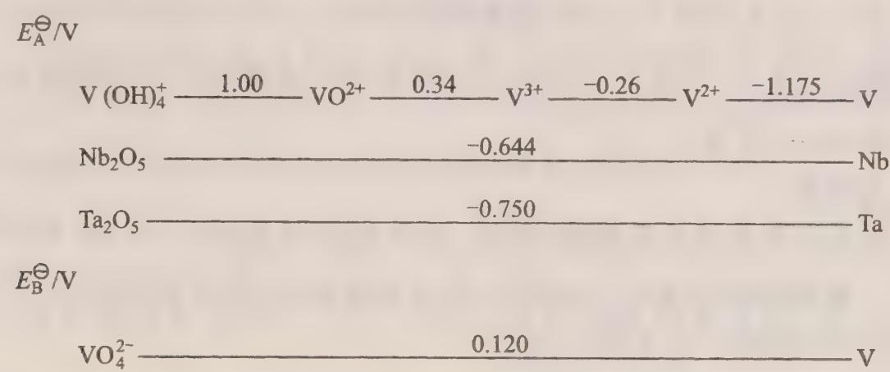  
图20-2 钒副族的元素电势图

## 20.2.1 钒单质

## 1. 性质

单质钒呈灰白色、有金属光泽，具有典型的体心立方结构，熔点为 $1910^{\circ}C$ ，比 Ti 高。纯净的金属钒硬度低、延展性好，当含有杂质时变得硬而脆。金属钒主要用于制造合金和特种钢。钒钢具有强度大、弹性好、抗磨损、抗冲击等优点，因此它是汽车和飞机制造业中特别重要的材料。

从标准电极电势 $E^{\ominus}(V^{2+}/V)=-1.175\ V$ 看，钒是极活泼的金属。但由于表面易形成致密的氧化膜而呈钝态，常温下金属钒化学活性较低。块状的钒可以抵抗空气的氧化和海水的腐蚀。钒不与空气、水、碱及除 HF 以外的非氧化性酸发生作用。

钒可以与氢氟酸反应是因为有配位化合物生成：

$$
2 \mathrm{V} + 1 2 \mathrm{HF(aq)} = 2 \mathrm{H} _ {3} [ \mathrm{VF} _ {6} ] + 3 \mathrm{H} _ {2} \uparrow
$$

钒可以溶于浓硫酸和硝酸等氧化性的酸中,例如:

$$
\mathrm{V} + 8 \mathrm{HNO} _ {3} = \mathrm{V} (\mathrm{NO} _ {3}) _ {4} + 4 \mathrm{NO} _ {2} \uparrow + 4 \mathrm{H} _ {2} \mathrm{O}
$$

钒也可以与熔融的强碱反应。

高温下，钒的反应活性很高。

钒与氧气共热时,可以得到不同氧化数的氧化物,如绿色的 VO,黑色的 $V_{2}O_{3}$ ,蓝黑色的 $VO_{2}$ 。温度高时则得砖红色的 $V_{2}O_{5}$ :

$$
4 \mathrm{V} + 5 \mathrm{O} _ {2} \xlongequal {6 6 0 ^ {\circ} \mathrm{C}} 2 \mathrm{V} _ {2} \mathrm{O} _ {5}
$$

钒与卤素共热时,可以得到无色液体 $VF_{5}$ , 红色液体 $VCl_{4}$ , 黑绿色固体 $VBr_{3}$ 等卤化物,例如:

$$
\mathrm{V} + 2 \mathrm{Cl} _ {2} \xlongequal {\text {高温}} \mathrm{VCl} _ {4}
$$

一定的温度条件下,钒与一些非金属单质通过直接化合生成相应的二元化合物,如 VB, VC, VP 等。

## 2. 钒的冶炼

钒主要是钢铁冶炼过程的副产物。在炼钢的残渣中， $\mathrm{V}_2\mathrm{O}_3$ 与 FeO 结合为 $\mathrm{FeO} \cdot \mathrm{V}_2\mathrm{O}_3$ 。将助熔剂如 NaCl, $\mathrm{Na}_2\mathrm{CO}_3$ 等加到钒渣中，进行氧化焙烧，可使钒转化为可溶性的钒酸钠。发生的反应为

$$
\begin{array}{r l} & 4 \mathrm{FeO} \cdot \mathrm{V} _ {2} \mathrm{O} _ {3} + 5 \mathrm{O} _ {2} \xlongequal {\text {焙烧}} 4 \mathrm{V} _ {2} \mathrm{O} _ {5} + 2 \mathrm{Fe} _ {2} \mathrm{O} _ {3} \\ & 2 \mathrm{V} _ {2} \mathrm{O} _ {5} + 4 \mathrm{NaCl} + \mathrm{O} _ {2} \xlongequal {\text {焙烧}} 4 \mathrm{NaVO} _ {3} + 2 \mathrm{Cl} _ {2} \\ & \mathrm{V} _ {2} \mathrm{O} _ {3} + \mathrm{Na} _ {2} \mathrm{CO} _ {3} + \mathrm{O} _ {2} \xlongequal {\text {焙烧}} 2 \mathrm{NaVO} _ {3} + 2 \mathrm{CO} _ {2} \end{array}
$$

然后,用水将可溶性的 $NaVO_{3}$ 浸出,加酸调 pH 至 2\~3,此时析出红色的多钒酸盐沉淀。在 700 ℃ 下将其熔化,可得黑色的工业级的 $V_{2}O_{5}$ 。

$V_{2}O_{5}$ 可进一步被还原为金属钒单质。若以碳作还原剂，有可能生成难以处理的 VC；若以硅铁合金作还原剂，体系中需要加入石灰以除掉二氧化硅。由于钒 80% 以上的主要用途是作为添加剂炼制合金钢，所以可用 Fe 在高温下还原 $V_{2}O_{5}$ 制取金属钒，这样即使产物中含有杂质 Fe 或其他含铁物质，也不会影响金属钒的使用。

## 20.2.2 钒的氧化物

$V_{2}O_{5}$ 呈黄棕色，无臭、无味、有毒、微溶于水，是钒最重要的氧化物。

金属钒在空气中加热可生成 $V_{2}O_{5}$ ，此外，白黄色的偏钒酸铵受热分解也可得 $V_{2}O_{5}$ ：

$$
2 \mathrm{NH} _ {4} \mathrm{VO} _ {3} \xlongequal {> 4 0 0 ^ {\circ} \mathrm{C}} \mathrm{V} _ {2} \mathrm{O} _ {5} + 2 \mathrm{NH} _ {3} \uparrow + \mathrm{H} _ {2} \mathrm{O}
$$

红黄色的三氯氧钒与水作用,也可得到 $V_{2}O_{5}$ :

$$
2 \mathrm{VOCl} _ {3} + 3 \mathrm{H} _ {2} \mathrm{O} = \mathrm{V} _ {2} \mathrm{O} _ {5} \downarrow + 6 \mathrm{HCl}
$$

$V_{2}O_{5}$ 是酸性为主的两性氧化物, 易溶于碱, 也能溶于酸, 例如:

$$
\mathrm{V} _ {2} \mathrm{O} _ {5} + 6 \mathrm{NaOH(aq)} = 2 \mathrm{Na} _ {3} \mathrm{VO} _ {4} + 3 \mathrm{H} _ {2} \mathrm{O}
$$

$$
\mathrm{V} _ {2} \mathrm{O} _ {5} + \mathrm{H} _ {2} \mathrm{SO} _ {4} (\text {稀}) = (\mathrm{VO} _ {2}) _ {2} \mathrm{SO} _ {4} + \mathrm{H} _ {2} \mathrm{O}
$$

$V_{2}O_{5}$ 有较强的氧化性, 可将浓盐酸氧化成氯气, 本身被还原成 V(Ⅳ):

$$
\mathrm{V} _ {2} \mathrm{O} _ {5} + 6 \mathrm{HCl(浓)} = 2 \mathrm{VOCl} _ {2} + \mathrm{Cl} _ {2} \uparrow + 3 \mathrm{H} _ {2} \mathrm{O}
$$

$VO_{2}$ 为蓝黑色粉末。由 C, CO, $SO_{2}$ 等还原 $V_{2}O_{5}$ 可得到 $VO_{2}$ 。 $VO_{2}$ 是两性氧化物，几乎同等程度地溶于酸和碱，溶于酸得到蓝色的 $VO^{2+}$ ，溶于碱生成 $VO_{4}^{4-}$ 。

$V_{2}O_{3}$ 为黑色粉末。将 $V_{2}O_{5}$ 在氢气流中加热，可生成 $V_{2}O_{3}$ ：

$$
\mathrm{V} _ {2} \mathrm{O} _ {5} + 2 \mathrm{H} _ {2} \stackrel {\triangle} {=} \mathrm{V} _ {2} \mathrm{O} _ {3} + 2 \mathrm{H} _ {2} \mathrm{O}
$$

$V_{2}O_{3}$ 是微碱性氧化物, 不溶于碱, 可溶于硝酸和氢氟酸, 但不溶于其他酸。

VO 为灰黑色晶体, 具有氯化钠型结构。用 $H_{2}$ , K 等还原剂还原高价态的氧化钒可以得到 VO。VO 是碱性氧化物, 不溶于水。

$\mathrm{VSO}_{4}$ 中的 $\mathrm{V(II)}$ 可以被 $\mathrm{KMnO}_{4}$ 氧化成 $\mathrm{V(III)}$ ：

$$
6 \mathrm{VSO} _ {4} + 2 \mathrm{KMnO} _ {4} + \mathrm{H} _ {2} \mathrm{O} = 2 \mathrm{V} _ {2} (\mathrm{SO} _ {4}) _ {3} + \mathrm{V} _ {2} \mathrm{O} _ {3} \downarrow + 2 \mathrm{MnO} _ {2} \downarrow + 2 \mathrm{KOH}
$$

## 20.2.3 钒的含氧酸盐

钒(V)可以形成种类繁多的含氧酸盐,如正钒酸盐,其酸根为 $VO_{4}^{3-}$ ;偏钒酸盐,其酸根为 $VO_{3}^{-}$ ;二聚钒酸盐,其酸根为 $V_{2}O_{7}^{4-}$ ;多聚钒酸盐,其酸根为 $V_{n}O_{3n+1}^{(n+2)-}$ 等。

钒(V)在溶液中的存在形式,与其浓度和溶液的酸度有关。当钒的浓度很低时,钒(V)在各种条件下均以单聚的形式存在。在强碱性溶液中,以单聚的正钒酸根 $VO_{4}^{3-}$ 形式存在。随着溶液的 pH 降低, $VO_{4}^{3-}$ 会逐步发生聚合,生成二聚物、四聚物、五聚物等。一般规律是,pH 越大,聚合度越低,pH 越小,聚合度越高。当 pH>13 时,以单聚钒酸根 $VO_{4}^{3-}$ 形式存在;当 pH 降低,经二聚、四聚、五聚……聚合度逐渐升高;当 pH=2 时,析出红色的 $V_{2}O_{5}$ ;当 pH≤1 时,其溶液中主要以淡黄色的 $VO_{2}^{+}$ 形式存在。

从图 20-2 所示的酸性介质中钒的元素电势图可知, 在酸性介质中 $VO^{2+}$ 是稳定的; $V^{3+}$ 和 $V^{2+}$ 有还原性; $V(V)$ 有氧化性。

不同氧化态的钒离子和钒氧根离子各有特征颜色：

$$
\begin{array}{c c c c} \mathrm{VO} _ {2} ^ {+} & \mathrm{VO} ^ {2 +} & \mathrm{V} ^ {3 +} & \mathrm{V} ^ {2 +} \\ \text {黄色} & \text {蓝色} & \text {绿色} & \text {紫色} \end{array}
$$

$VO_{4}^{3-}$ 中的氧可被过氧链取代。向钒酸盐溶液中加 $H_{2}O_{2}$ : 碱性、中性、弱酸性时, 得黄色的二过氧钒酸根 $\left[VO_{2}(O_{2})_{2}\right]^{3-}$ , 在强酸中, 得红棕色的二过氧钒离子 $\left[V(O_{2})_{2}\right]^{+}$ 。

许多种还原性物质,如 $H_{2}S, SO_{2}, Fe^{2+}, HCOOH, H_{2}C_{2}O_{4}$ 等,均可以将正钒酸盐的酸性溶液还原,形成蓝色的 $VO^{2+}$ ,例如:

$$
\begin{array}{r l} & 2 \mathrm{H} _ {3} \mathrm{VO} _ {4} + \mathrm{H} _ {2} \mathrm{S} + 4 \mathrm{H} ^ {+} = 2 \mathrm{VO} ^ {2 +} + 6 \mathrm{H} _ {2} \mathrm{O} + \mathrm{S} \downarrow \\ & 2 \mathrm{H} _ {3} \mathrm{VO} _ {4} + \mathrm{HCOOH} + 4 \mathrm{H} ^ {+} = 2 \mathrm{VO} ^ {2 +} + \mathrm{CO} _ {2} \uparrow + 6 \mathrm{H} _ {2} \mathrm{O} \end{array}
$$

锌、铝等活泼金属可以还原钒(V)的酸性溶液,经蓝色的+4氧化态、绿色的+3氧化态,最后得到紫色的氧化数为+2的钒离子。反应方程式为

$$
2 \mathrm{VO} _ {2} ^ {+} + 3 \mathrm{Zn} + 8 \mathrm{H} ^ {+} = 2 \mathrm{V} ^ {2 +} + 3 \mathrm{Zn} ^ {2 +} + 4 \mathrm{H} _ {2} \mathrm{O}
$$

不同氧化态的钒离子的特征颜色,在用 $KMnO_{4}$ 溶液滴定 $V^{2+}$ 的过程中均可以观察到:体系由 $V^{2+}$ 的紫色,到 $V^{3+}$ 的绿色,到 $VO^{2+}$ 的蓝色,最后到 $VO_{2}^{+}$ 的黄色。各步的反应如下:

$$
\begin{array}{l} 5 \mathrm{V} ^ {2 +} + \mathrm{MnO} _ {4} ^ {-} + 8 \mathrm{H} ^ {+} = 5 \mathrm{V} ^ {3 +} + \mathrm{Mn} ^ {2 +} + 4 \mathrm{H} _ {2} \mathrm{O} \\ 5 \mathrm{V} ^ {3 +} + \mathrm{MnO} _ {4} ^ {-} + \mathrm{H} _ {2} \mathrm{O} = 5 \mathrm{VO} ^ {2 +} + \mathrm{Mn} ^ {2 +} + 2 \mathrm{H} ^ {+} \\ 5 \mathrm{VO} ^ {2 +} + \mathrm{MnO} _ {4} ^ {-} + \mathrm{H} _ {2} \mathrm{O} = 5 \mathrm{VO} _ {2} ^ {+} + \mathrm{Mn} ^ {2 +} + 2 \mathrm{H} ^ {+} \end{array}
$$

## 20.2.4 卤化物

钒的卤化物是一类重要的化合物, 它们可以作为合成钒的其他化合物的起始原料。在各种氧化态的钒的卤化物中, 只有 $VF_{5}$ 能稳定存在, $VF_{5}$ 为无色液体。+2\~+4 氧化态的钒的卤化物都是已知的, 如固态的 $VF_{4}$ 为绿色, 固态的 $VF_{3}$ 呈黄绿色, 液态的 $VCl_{4}$ 呈红色, 固态的 $VCl_{3}$ 呈红紫色。一般来说, 钒的碘化物最不稳定。同一氧化态时, 随着卤素相对原子质量的增加, 卤化物的稳定性降低。

钒的卤化物能发生歧化反应或热分解反应,例如:

$$
\begin{array}{r l} & 2 \mathrm{VCl} _ {3} \stackrel {\triangle} {=} \mathrm{VCl} _ {4} + \mathrm{VCl} _ {2} \\ & 2 \mathrm{VCl} _ {4} \stackrel {\triangle} {=} 2 \mathrm{VCl} _ {3} + \mathrm{Cl} _ {2} \uparrow \end{array}
$$

钒的卤化物对氧和潮湿气氛十分敏感,所有的卤化物都有吸潮性,并会水解,且其水解趋势随着氧化态升高而增加。

## 20.2.5 铌和钽

Nb 和 Ta 均为灰色的高熔点金属。常温下，纯 Nb 的塑性极高，不易硬化，可锻可压，焊接性能良好，耐腐蚀性强。纯 Ta 坚硬，熔点为 3017 ℃，仅次于钨，是最难熔的金属之一。

在室温下, Nb 和 Ta 化学稳定性特别高, 尤其是 Ta, 甚至不与王水反应。但是 Ta 可以缓慢地溶于氢氟酸, 尤其是 HF-HNO₃ 混酸中。加热时, Nb 和 Ta 呈现出高的化学活性。例如, 在空气中加热至高温时, Nb 和 Ta 均可形成氧化数为 +5 的氧化物:

$$
\begin{array}{r l} & 4 \mathrm{Nb} + 5 \mathrm{O} _ {2} \xlongequal {\text {高温}} 2 \mathrm{Nb} _ {2} \mathrm{O} _ {5} \\ & 4 \mathrm{Ta} + 5 \mathrm{O} _ {2} \xlongequal {\text {高温}} 2 \mathrm{Ta} _ {2} \mathrm{O} _ {5} \end{array}
$$

将块状或粉末状的金属 Nb 和 Ta 与 Cl₂ 加热至 300\~350 ℃，生成黄色的 NbCl₅ 和 TaCl₅。

$Ta_{2}O_{5}$ 与 $TaCl_{5}$ 在高温下反应将生成 $TaOCl_{3}$ :

$$
3 \mathrm{TaCl} _ {5} + \mathrm{Ta} _ {2} \mathrm{O} _ {5} \xlongequal {\text {高温}} 5 \mathrm{TaOCl} _ {3}
$$

$Nb_{2}O_{5}$ 为白色粉末,两性氧化物,较难溶于水。在 $1\ 200\ ^{\circ}C$ 下长时间与 $H_{2}$ 反应,可以得到纯的 NbO:

$$
\mathrm{Nb} _ {2} \mathrm{O} _ {5} + 3 \mathrm{H} _ {2} \xlongequal {1 2 0 0 ^ {\circ} \mathrm{C}} 2 \mathrm{NbO} + 3 \mathrm{H} _ {2} \mathrm{O}
$$

在高温下, $Nb_{2}O_{5}$ 与C及Ca,Mg,Al等活泼金属作用,能被还原成金属Nb,但产物纯度不高,含有氧化物。

$Ta_{2}O_{5}$ 为白色粉末,两性氧化物,难溶于水、碱和稀酸。 $Ta_{2}O_{5}$ 比 $Nb_{2}O_{5}$ 更稳定,在 $2\ 500\ ^{\circ}C,5\times10^{5}Pa$ 下仍不能被 $H_{2}$ 还原。

在高温下, $Ta_{2}O_{5}$ 可以被 C 还原成 $Ta_{2}O_{4}$ 和 $Ta_{4}O$ , 或生成 TaC; 而在氢气氛下, 在 1 100 ℃ 时 $Ta_{2}O_{5}$ 可以被 C 还原生成 TaO:

$$
\mathrm{Ta} _ {2} \mathrm{O} _ {5} + 3 \mathrm{C} \xlongequal {1 1 0 0 ^ {\circ} \mathrm{C}} 2 \mathrm{TaO} + 3 \mathrm{CO} \uparrow
$$

Nb 和 Ta 的卤化物均为固态, 其中五卤化物都是易升华和易水解的固体。

Nb 和 Ta 的含氧酸与钒酸相似,有多酸形式。

## 一拓展学习资源

<table><tr><td>资源内容</td><td>二维码</td></tr><tr><td>钛副族元素矿物图片 铨和铪的发现及提取 钒副族元素矿物图片 铌和钽的发现 本章小结</td><td> 扫一扫查看资源内容</td></tr><tr><td>视频——金属锌还原钒(V)</td><td></td></tr></table>

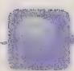

## 总结与思考题

20-1 从钛副族元素的价层电子构型说明它们的主要氧化态，并给出一些化合物的实例。

20-2 为什么锆元素和铪元素的基本性质,如其单质、化合物的物理性质、化学性质非常相似?锆和铪两种元素是如何分离的?

20-3 试讨论钒副族元素的物理性质、化学性质的变化规律。

20-4 根据标准电极电势数据,预测分别用 $1.0 \, mol \cdot dm^{-3} Fe^{2+}, 1.0 \, mol \cdot dm^{-3} Sn^{2+}$ 和单质 Zn 在酸性溶液中还原 $0.1 \, mol \cdot dm^{-3} VO_{2}^{+}$ 时,最终得到的产物是什么?

20-5 根据标准电极电势数据,解释锌汞齐能将钒酸盐中的钒(V)还原至钒(Ⅱ),将铌酸盐的铌(V)还原至铌(Ⅳ),但却不能还原钽酸盐。此实验结果说明了什么?

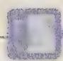

## 习题

20-1 简释下列词语。

(1) 记忆合金； (2) 压电效应； (3) 钛白； (4) 钒钢。

20-2 完成并配平下列化学反应方程式。

(1) $\mathrm{Ti} + \mathrm{H}_{2}\mathrm{SO}_{4}$ (浓)

(2) $\mathrm{Ti} + \mathrm{Cl}_2 \xlongequal{\text{高温}}$

(3) $\mathrm{TiO_2 + MgO\xlongequal{\text{共熔}}}$

(4) $\mathrm{TiO}_2 + \mathrm{H}_2\mathrm{SO}_4$ (浓)

(5) $\mathrm{TiCl}_4 + \mathrm{Ti} \xlongequal{600^{\circ} \mathrm{C}}$

(6) $\mathrm{Zr} + \mathrm{KOH}\stackrel {\text{共熔}}{=}$

(7) $\mathrm{ZrOCl}_2 + \mathrm{H}_2\mathrm{O} =$

(8) $\mathrm{V} + \mathrm{O}_2 \xlongequal{\text{高温}}$

(9) $\mathrm{V} + \mathrm{Cl}_2 \xlongequal{\text{高温}}$

(10) $\mathrm{NH_4VO_3}\stackrel {\triangle}{=}$

(11) $\mathrm{V}_2\mathrm{O}_5 + \mathrm{NaOH(aq)} =$

(12) $\mathrm{VSO}_4 + \mathrm{KMnO}_4 + \mathrm{H}_2\mathrm{O} =$

(13) $\mathrm{H}_3\mathrm{VO}_4 + \mathrm{HCOOH} =$

(14) $\mathrm{V}_2\mathrm{O}_5 + \mathrm{H}_2\xrightarrow{\triangle}$

(15) $\mathrm{TaCl}_5 + \mathrm{Ta}_2\mathrm{O}_5 \stackrel{\text{高温}}{=}$

(16) $\mathrm{Nb} + \mathrm{O}_2 \xlongequal{\text{高温}}$

(17) $\mathrm{Ta}_2\mathrm{O}_5 + \mathrm{C} = 1100^{\circ}\mathrm{C}$

20-3 完成并配平下列化学反应方程式。

(1) 金属钛溶于热的氢氟酸中。

(2) 高温下金属钛与氮气作用。

(3) 二氧化钛与碳酸钡共熔。

(4) 将四氯化钛加到氢氧化钠溶液中。

(5) 四氯化钛在一定浓度的盐酸中水解。

(6) 800 ℃下用氢气还原四氯化钛。

(7) 在酸性介质中用硫酸钛(Ⅲ)还原羟氨。

(8) 金属锌与四氯化钛的盐酸溶液作用。

(9) 金属钒与氢氟酸反应。

(10) 三氯氧钒水解。

(11) 五氧化二钒溶于浓盐酸。

(12) 向酸性的正钒酸盐中通入硫化氢。

(13) 三氯化钒受热歧化分解。

(14) 四氯化钒受热分解。

(15) 1 200 ℃ 高温下用氢气长时间还原五氧化二铌。

20-4 生产、合成与制备。

(1) 从钛铁矿 $\left(\mathrm{FeTiO}_{3}\right)$ 制备钛白粉。

(2) 以金红石为原料生产纯金属钛。

（3）简述实验室中如何制备少量金属钛，并写出有关化学反应方程式。

（4）叙述工业上以炼钢的残渣为主要原料生产单质钒的过程，并写出有关化学反应方程式。

(5) 由金属钛制备三氯化钛和钛酸钡。

(6) 以金属钒为原料制备五氧化二钒和偏钒酸铵。

## 20-5 分离、提纯与鉴别。

(1) 某灰白色金属, 可能是 Ti, 也可能是 V, 试加以鉴别。

(2) 某紫色溶液可能是 $\mathrm{TiCl}_3$ 溶液和 $\mathrm{KMnO}_4$ 溶液中的一种, 试加以鉴别。

（3）简述从锆石中提取 Zr 时，如何将与其混生的 Hf 分离。

## 20-6 解释实验现象。

（1）金属钛缓慢溶于热的浓盐酸，生成紫色溶液。将该溶液在室温下滴入酸化的高锰酸钾水溶液中，溶液迅速褪色。

(2) 打开盛有 $TiCl_{4}$ 试剂的玻璃瓶塞时会冒白烟。

(3) 在酸性介质中, 将足量金属锌加入钒 (V) 的溶液中, 溶液由黄色逐渐变为蓝色、绿色, 最后变成紫色。

（4）向 $\mathrm{V}^{2+}$ 溶液中缓慢滴加 $\mathrm{KMnO}_4$ 溶液至大过量，体系的颜色由紫色到绿色，再到蓝色，最后到黄色。

(5) ${\mathrm{V}}_{2}{\mathrm{O}}_{5}$ 溶于热的浓盐酸生成黄色溶液,后溶液逐渐变蓝并有气体放出。

## 20-7 推理判断。

(1) 无色液体(A)与干燥氧气在高温下反应,生成不溶于水的白色粉末(B)。(B)和锌粉混合后与盐酸缓慢作用,最后得到紫红色溶液,说明有化合物(C)生成。向(C)的溶液中加入 $\mathrm{CuCl}_2$ 溶液得白色沉淀(D)。紫色化合物(C)溶于过量硝酸得无色溶液(E)。将溶液(E)蒸干后,在较高温度下加热又得到(B)。(A)与铝粉混合,在高温下反应有化合物(C)生成。

试给出(A)，(B)，(C)，(D)和(E)所代表的物质的化学式，并用化学反应方程式表示各过程。

(2) 浅黄色晶体(A)受热分解生成棕黄色粉末(B)和无色气体(C)。(B)不溶于水,与浓盐酸作用放出强刺激性气体(D)。将气体(C)通入 $\mathrm{CuSO}_4$ 溶液有淡蓝色沉淀(E)生成,(C)过量则沉淀溶解得到深蓝色溶液(F)。(B)溶于稀硫酸后,加入适量草酸,经充分反应得到蓝色溶液(G)。向溶液(G)中放入足量金属 $\mathrm{Zn}$ ,最终生成紫色溶液(H)。

试给出(A)，(B)，(C)，(D)，(E)，(F)，(G)和(H)所代表的物质的化学式，并用化学反应方程式表示各过程。

## 20-8 简答题。

(1) 给出下列物质的化学式。

① 金红石； ② 钛铁矿； ③ 钙铁矿； ④ 榄石；

⑤ 锆石； ⑥ 斜锆石； ⑦ 绿硫钒石； ⑧ 钒铅矿。

(2) 测定 $\mathrm{TiO}_2$ 中钛的含量时, 先将 $\mathrm{TiO}_2$ 溶于热的 $\mathrm{H}_2\mathrm{SO}_4 - (\mathrm{NH}_4)_2\mathrm{SO}_4$ 混合物中, 冷却, 稀释; 用金属铝还原后, 再用 KSCN 为指示剂, $\mathrm{Fe}^{3+}$ 为氧化剂滴定溶液中的 $\mathrm{Ti}^{3+}$ , 便可计算钛的含量。请写出有关化学反应方程式，并说明测定方法的依据。

（3）试写出钛白、锌白、锌钡白的化学组成，并指出钛白作为染料的优点。

（4）酸性钒酸盐溶液中通入 $SO_{2}$ 时生成深蓝色溶液，相同量的钒酸盐溶液被 Zn-Hg 齐还原，得到紫色溶液，将两溶液相混，得到绿色溶液。在此过程中进行了哪些反应？写出化学反应方程式。

(5) 下面数据是 Ti(Ⅳ) 卤化物的熔点, 试对其规律加以解释。

$\mathrm{TiF}_{4}$ $377^{\circ}C$ ； $\mathrm{TiCl}_{4}$ $-24.12^{\circ}C$ ； $\mathrm{TiBr}_{4}$ $38.3^{\circ}C$ ； $\mathrm{TiI}_{4}$ $155^{\circ}C$ 。

(6) 存在 $VF_{5}$ ，不存在 $VCl_{5}$ ；但是对于 Nb 和 Ta，既存在 $MF_{5}$ ，又存在 $MCl_{5}$ 。试加以解释。

(7) 钒具有下列几种氧化态, 其还原电势可用 $c(\mathrm{H}^{+}) = 1 \, \mathrm{mol} \cdot \mathrm{dm}^{-3}$ 时的元素电势图表示:

$$
E _ {\mathrm{A}} ^ {\ominus} / \mathrm{V}   \mathrm{VO} _ {2} ^ {+} \xrightarrow {1 . 0 0} \mathrm{VO} ^ {2 +} \xrightarrow {0 . 3 4} \mathrm{V} ^ {3 +} \xrightarrow {- 0 . 2 6} \mathrm{V} ^ {2 +} \xrightarrow {- 1 . 1 7 5} \mathrm{V}
$$

①钒如能溶解在稀酸中,将以何种氧化态存在?试写出化学反应方程式。

② 写出 $V^{3+}/V$ 电对的 $E^{\ominus}$ 。

③ 在这些不同氧化态物质间能否发生歧化反应？如能发生请写出化学反应方程式。

④ 将 V 放入含有 $V^{3+}$ 的溶液中, 有无反应发生? 若有请写出化学反应方程式。

（8）试分析 $\left[\mathrm{Ti}\left(\mathrm{H}_{2} \mathrm{O}\right)_{6}\right]^{2+}, \left[\mathrm{Ti}\left(\mathrm{H}_{2} \mathrm{O}\right)_{6}\right]^{4+}, \left[\mathrm{Ti}\left(\mathrm{H}_{2} \mathrm{O}\right)_{6}\right]^{3+}, \left[\mathrm{Zr}\left(\mathrm{H}_{2} \mathrm{O}\right)_{6}\right]^{2+}$ 在水溶液中能否存在。

## 目录

## 铬副族元素和锰副族元素

21.1 铬副族元素 …… 781
21.1.1 铬的单质 …… 782
21.1.2 Cr(Ⅲ)的化合物 …… 784
1. 氧化物和氢氧化物 …… 784
2. 盐类和配位化合物 …… 784
3. Cr(Ⅲ)的还原性 …… 786
21.1.3 Cr(VI)的化合物 …… 787
1. Cr(VI)的存在形式 …… 787
2. 化学性质 …… 788
3. 重铬酸钾的生产 …… 790
21.1.4 钼和钨 …… 791
1. 钼和钨的单质 …… 791
2. 钼和钨的含氧化合物 …… 791
3. 钼元素的生物功能 …… 793
21.2 锰副族元素 …… 794
21.2.1 锰的单质 …… 795
21.2.2 锰的化合物 …… 796
1. Mn(Ⅱ)的化合物 …… 796
2. Mn(Ⅲ)的化合物 …… 798
3. Mn(Ⅳ)的化合物 …… 798
4. Mn(VI)的化合物 …… 799
5. Mn(VII)的化合物 …… 799
6. Mn的低价配位化合物 …… 802
21.2.3 锝和铼 …… 802
1. 锝、铼的单质及其化合物 …… 802
2. [Re₂Cl₈]²⁻ 的结构和四重键 …… 803

拓展学习资源 804  
总结与思考题 804  
习题 805

# 第 21 章 铬副族元素和锰副族元素

## 21.1 铬副族元素

铬副族元素包括铬、钼、钨和第七周期的镭共4种元素，在元素周期表中处于VIB族。

铬是由法国人沃克兰(Vauquelin)于1797年用木炭还原三氧化铬得到的。铬在地壳中的质量分数为 $1\times10^{-2}\%$ ,比铜和锌的丰度都高,但按可满足需求的程度看,铬矿比较贫乏,属短缺资源。铬主要矿物是铬铁矿( $FeCr_{2}O_{4}$ ,即 $FeO\cdot Cr_{2}O_{3}$ ),数量不多的其他含铬矿有铬铅矿( $PbCrO_{4}$ )、铬赭石矿( $Cr_{2}O_{3}$ )。我国铬矿主要分布于西藏。

钼是由瑞典人舍勒于1778年发现的,1782年他的同胞埃尔姆(Hjelm)得到钼金属。钼在地壳中的质量分数为 $1.5\times10^{-4}\%$ 。钼的主要矿物有辉钼矿 $\left(\mathrm{MoS}_{2}\right)$ 、钼钨钙矿 $\left[\mathrm{Ca}(\mathrm{Mo},\mathrm{W})\mathrm{O}_{4}\right]$ 和钼铅矿 $\left(\mathrm{PbMoO}_{4}\right)$ ，我国钼矿资源丰富，居世界第2位。辽宁杨家杖子的辉钼矿是世界储量最大钼矿之一，河南省钼矿资源最为丰富。

钨是由西班牙人鲁亚尔(Elhuyar)兄弟于1783年用木炭还原钨酸得到的。钨在地壳中的质量分数为 $1\times10^{-4}\%$ 。钨矿主要有白钨矿( $CaWO_{4}$ )、黑钨矿 $[(Fe,Mn)WO_{4}]$ 等。我国是世界上钨矿资源最丰富的国家，湖南以白钨矿为主，江西黑钨矿居多，估计占世界储藏量的75%。

铬和钼基态原子的价层电子构型为 $(n-1)\mathrm{d}^{5}\mathrm{ns}^{1}$ ，而钨是 $5d^{4}6s^{2}$ 。s电子和d电子都可参与成键，铬副族元素的最高氧化数都是+6，与它们的族数相一致。铬与钼和钨的性质差异很大。例如，铬可形成Cr(Ⅱ)，Cr(Ⅲ)阳离子，Cr(VI)的氧化性很强；而钼和钨的+6价态是稳定的。上述关于铬副族元素的价态及氧化还原性质，可以通过图21-1所示的元素电势图表示出来。

铬是人体必需的微量元素,铬在天然食品中的含量较低,均以+3价的形式存在。+3价的铬对人体有益,而+6价的铬则是有毒的。人体对无机铬的吸收利用率极低,不到1%;对有机铬的利用率可达10%\~25%。

铬在肌体的糖代谢和脂代谢中发挥特殊作用。铬作为葡萄糖耐量因子的组成部分,对调节体内糖代谢、维持体内正常的葡萄糖耐量起重要作用;铬影响肌体的脂肪代谢,降低血中胆固醇和甘油三酯的含量,可预防心血管病;铬是核酸类(DNA 和 RNA)的稳定剂,可防止细胞内某些基因物质的突变并预防癌症;铬能增进肌体生长,动物虽能在严重缺铬情况下生存,但它
们会发育不良。

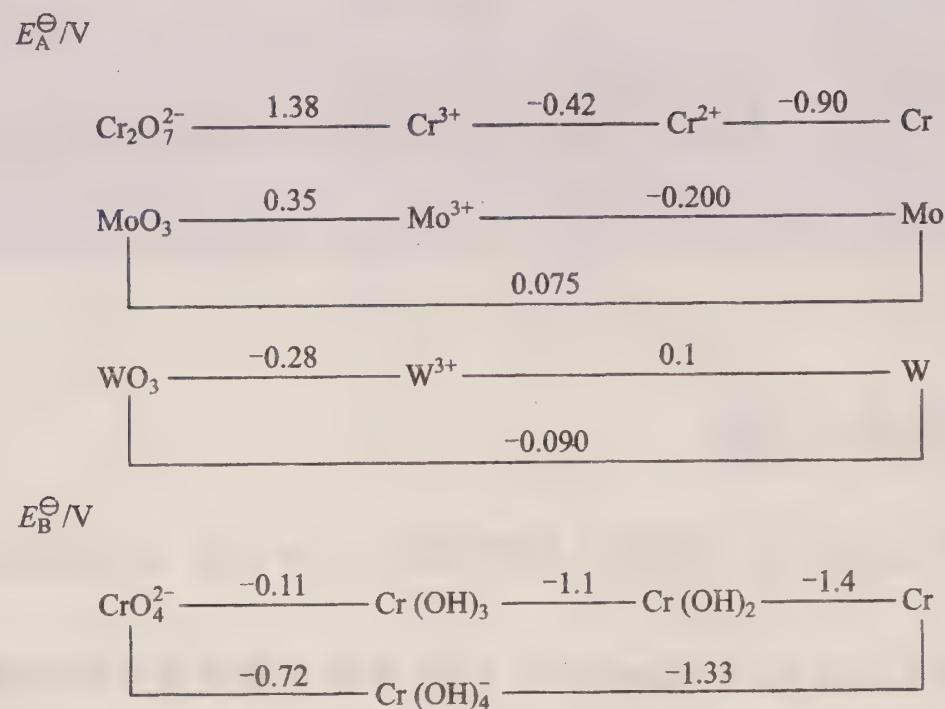  
图21-1 铬副族的元素电势图

由此可见,铬的生理功能是与其他控制代谢的物质,如激素、胰岛素、各种酶类、基因物质 DNA 和 RNA 等相配合共同起作用的。

铬缺乏会造成葡萄糖耐量受损,并可能伴随有高血糖、尿糖;每日在膳食中补充500 $\mu$ g以上的有机铬对治疗糖尿病有利。铬缺乏还会导致脂肪代谢失调,易诱发冠状动脉硬化导致心血管病。每日在膳食中补充200 $\mu$ g以上的有机铬对医治高脂血症有利。

## 21.1.1 铬的单质

铬的单电子多,金属键强,决定了金属铬的熔点高达1907℃,沸点高达2671℃,也决定了金属铬的硬度极高,铬是硬度最高的金属,莫氏硬度为9,与最硬的物质硬度为10的金刚石接近。

在室温条件下,铬的化学性质稳定,在潮湿空气中不会被腐蚀,能保持光亮的金属光泽。金属铬的抗腐蚀和耐磨性好,常用于制造不锈钢和仪器仪表的金属表面镀铬。铬及其合金在室温下表现为脆性,使用的领域受到一定的限制。

高纯度的铬可以抵抗稀硫酸的侵蚀,与硝酸甚至王水作用会使铬钝化,一般认为这是由于表面生成一层致密氧化物的缘故。但是这种解释还有争议,钝化的具体原因有待进一步的研究。铬的这些良好的物理化学性质决定了它具有极广泛的应用前景。

在升高温度的情况下,铬的反应活性增强,可与多种非金属如 $X_{2}, O_{2}, N_{2}, S$ , C 等直接化合,一般生成 Cr(Ⅲ) 化合物。

铬与酸的反应活性比钼、钨的要强得多。铬可以缓慢地溶于稀酸中，先有蓝色的 Cr(Ⅱ)生成，例如：

$$
\mathrm{Cr} + 2 \mathrm{HCl(aq)} = \mathrm{CrCl} _ {2} + \mathrm{H} _ {2} \uparrow
$$

Cr(Ⅱ)溶液的还原性很强,在空气中迅速被氧化成绿色的 Cr(Ⅲ)溶液,例如:

$$
4 \mathrm{CrCl} _ {2} + 4 \mathrm{HCl(aq)} + \mathrm{O} _ {2} = 4 \mathrm{CrCl} _ {3} + 2 \mathrm{H} _ {2} \mathrm{O}
$$

金属铬可以由铬铁矿 $\left(\mathrm{FeCr}_{2}\mathrm{O}_{4}\right)$ 制取，用焦炭还原就可制得铬铁合金：

$$
\mathrm{FeCr} _ {2} \mathrm{O} _ {4} + 4 \mathrm{C} \xlongequal {\text {高温}} \mathrm{Fe} + 2 \mathrm{Cr} + 4 \mathrm{CO} \uparrow
$$

该合金可用于制造不锈钢。

如果要制取不含铁的铬单质,可将铬铁矿与碳酸钠的混合物加强热,从而生成水溶性的铬酸盐和不溶性的 $Fe_{2}O_{3}$ :

$$
4 \mathrm{FeCr} _ {2} \mathrm{O} _ {4} + 8 \mathrm{Na} _ {2} \mathrm{CO} _ {3} + 7 \mathrm{O} _ {2} \xlongequal {\text {高温}} 2 \mathrm{Fe} _ {2} \mathrm{O} _ {3} + 8 \mathrm{Na} _ {2} \mathrm{CrO} _ {4} + 8 \mathrm{CO} _ {2} \uparrow
$$

之后用水浸取出 $Na_{2}CrO_{4}$ ，酸化析出重铬酸盐。接着使重铬酸盐与碳共热还原而得 $Cr_{2}O_{3}$ ：

$$
\mathrm{Na} _ {2} \mathrm{Cr} _ {2} \mathrm{O} _ {7} + 2 \mathrm{C} \xlongequal {\text {高温}} \mathrm{Cr} _ {2} \mathrm{O} _ {3} + \mathrm{Na} _ {2} \mathrm{CO} _ {3} + \mathrm{CO} \uparrow
$$

最后用铝热法还原 $Cr_{2}O_{3}$ 就可以得到金属铬：

$$
\mathrm{Cr} _ {2} \mathrm{O} _ {3} + 2 \mathrm{Al} \stackrel {\text {点燃}} {=} 2 \mathrm{Cr} + \mathrm{Al} _ {2} \mathrm{O} _ {3}
$$

也可以用硅还原 $Cr_{2}O_{3}$ 制取金属铬：

$$
2 \mathrm{Cr} _ {2} \mathrm{O} _ {3} + 3 \mathrm{Si} \stackrel {\text {高温}} {=} 4 \mathrm{Cr} + 3 \mathrm{SiO} _ {2}
$$

此外,还可采用电解硫酸铬钾溶液的方法得到金属铬,电解法制得的铬纯度较高。

## 21.1.2 Cr(Ⅲ)的化合物

## 1. 氧化物和氢氧化物

## (1) 氧化物

三氧化二铬 $\left(\mathrm{Cr}_{2}\mathrm{O}_{3}\right)$ 为深绿色固体,熔点很高,难溶于水。它是冶炼铬的原料,也常用作绿色颜料,俗称铬绿。

与 $\gamma-Al_{2}O_{3}$ 相似, $Cr_{2}O_{3}$ 具有两性, 可以溶于酸:

$$
\mathrm{Cr} _ {2} \mathrm{O} _ {3} + 3 \mathrm{H} _ {2} \mathrm{SO} _ {4} = \mathrm{Cr} _ {2} (\mathrm{SO} _ {4}) _ {3} + 3 \mathrm{H} _ {2} \mathrm{O}
$$

也可溶于强碱：

$$
\mathrm{Cr} _ {2} \mathrm{O} _ {3} + 2 \mathrm{NaOH} + 3 \mathrm{H} _ {2} \mathrm{O} = 2 \mathrm{Na} [ \mathrm{Cr(OH)} _ {4} ]
$$

$Cr_{2}O_{3}$ 溶于 NaOH 溶液的产物既可以写成 $\mathrm{Na}\left[\mathrm{Cr}\left(\mathrm{OH}\right)_{4}\right]$ ，也可以写成 $NaCrO_{2}$ 。前者可看成 $OH^{-}$ 为配体的配阴离子作为酸根形成的盐类。

与 $\alpha-Al_{2}O_{3}$ 相似, 高温灼烧过的 $Cr_{2}O_{3}$ 对酸和碱均呈惰性, 需与 $K_{2}S_{2}O_{7}$ 或 $KHSO_{4}$ 共熔后才能转化为可溶盐:

$$
\begin{array}{r l} & {\mathrm{Cr} _ {2} \mathrm{O} _ {3} + 3 \mathrm{K} _ {2} \mathrm{S} _ {2} \mathrm{O} _ {7} \stackrel {\text {共熔}} {=} \mathrm{Cr} _ {2} (\mathrm{SO} _ {4}) _ {3} + 3 \mathrm{K} _ {2} \mathrm{SO} _ {4}} \\ & {\mathrm{Cr} _ {2} \mathrm{O} _ {3} + 6 \mathrm{KHSO} _ {4} \stackrel {\text {共熔}} {=} \mathrm{Cr} _ {2} (\mathrm{SO} _ {4}) _ {3} + 3 \mathrm{K} _ {2} \mathrm{SO} _ {4} + 3 \mathrm{H} _ {2} \mathrm{O}} \end{array}
$$

## (2) 氢氧化物

向 Cr(Ⅲ)盐的溶液中加入适量 NaOH 溶液,生成灰蓝色 Cr(OH) $_{3}$ 沉淀。与 Al(OH) $_{3}$ 相似,Cr(OH) $_{3}$ 具有两性,与酸碱均可以发生反应:

$$
\begin{array}{r l} & \mathrm {Cr(OH) _ {3} + 3HCl(aq) = CrCl_ {3} + 3H_ {2} O} \\ & \mathrm {Cr(OH) _ {3} + NaOH(aq) = Na[Cr(OH) _ {4} ]} \end{array}
$$

$\mathrm{Na}[\mathrm{Cr(OH)}_4]$ 为绿色。向 $\mathrm{Cr(III)}$ 盐的溶液中加入 $\mathrm{NaOH}$ 溶液时，生成 $\mathrm{Cr(OH)}_3$ 沉淀的同时也部分生成 $[\mathrm{Cr(OH)}_4]^{-}$ ，造成有人误以为 $\mathrm{Cr(OH)}_3$ 是蓝绿色或灰绿色的。若将沉淀和溶液分离后，观察到的 $\mathrm{Cr(OH)}_3$ 沉淀则是灰蓝色的。

## 2. 盐类和配位化合物

常见的 Cr(Ⅲ)盐有氯化铬、硫酸铬和铬钾矾等。这些盐类多带结晶水，与相应的铝盐的结晶水个数相同，例如：

$$
\begin{array}{r l r} & {\mathrm {CrCl_ {3} \cdot 6H_ {2} O}} & {\mathrm {AlCl_ {3} \cdot 6H_ {2} O}} \\ & {\mathrm {Cr_ {2} (SO_ {4}) _ {3} \cdot 18H_ {2} O}} & {\mathrm {Al_ {2} (SO_ {4}) _ {3} \cdot 18H_ {2} O}} \\ & {\text {紫色}} \end{array}
$$

$$
\begin{array}{r l r} & {\mathrm {K_ {2} SO_ {4} \cdot Cr_ {2} (SO_ {4}) _ {3} \cdot 24H_ {2} O}} & {\mathrm {K_ {2} SO_ {4} \cdot Al_ {2} (SO_ {4}) _ {3} \cdot 24H_ {2} O}} \\ & {\text {紫色}} \end{array}
$$

$CrCl_{3}\cdot6H_{2}O$ 是配位化合物,由于内界的配体不同而有不同的颜色:

$$
\begin{array}{c c c} \left[ \mathrm{Cr} (\mathrm{H} _ {2} \mathrm{O}) _ {6} \right] \mathrm{Cl} _ {3} & \left[ \mathrm{Cr} (\mathrm{H} _ {2} \mathrm{O}) _ {5} \mathrm{Cl} \right] \mathrm{Cl} _ {2} \cdot \mathrm{H} _ {2} \mathrm{O} & \left[ \mathrm{Cr} (\mathrm{H} _ {2} \mathrm{O}) _ {4} \mathrm{Cl} _ {2} \right] \mathrm{Cl} \cdot 2 \mathrm{H} _ {2} \mathrm{O} \\ \text {紫色} & \text {浅绿色} & \text {深绿色} \end{array}
$$

市售的 $CrCl_{3}\cdot6H_{2}O$ 是深绿色晶体。将 $CrCl_{3}$ 溶液蒸发浓缩，析出深绿色结晶为 $\left[\mathrm{Cr}\left(\mathrm{H}_{2}\mathrm{O}\right)_{4}\mathrm{Cl}_{2}\right]\mathrm{Cl}\cdot2\mathrm{H}_{2}\mathrm{O}$ ；将 $CrCl_{3}$ 溶液冷却到 $0^{\circ}C$ 以下并通入 HCl，析出紫色结晶为 $\left[\mathrm{Cr}\left(\mathrm{H}_{2}\mathrm{O}\right)_{6}\right]\mathrm{Cl}_{3}$ ；用乙醚处理已析出紫色晶体的 $CrCl_{3}$ 溶液，得到的浅绿色结晶为 $\left[\mathrm{Cr}\left(\mathrm{H}_{2}\mathrm{O}\right)_{5}\mathrm{Cl}\right]\mathrm{Cl}_{2}\cdot\mathrm{H}_{2}\mathrm{O}$ 。

若 $\left[\mathrm{Cr}\left(\mathrm{H}_{2}\mathrm{O}\right)_{6}\right]^{3+}$ 内界中的 $H_{2}O$ 逐步被 $NH_{3}$ 取代后，配离子颜色发生如下变化：

$$
\begin{array}{r l} & {\left[ \mathrm{Cr} (\mathrm{H} _ {2} \mathrm{O}) _ {6} \right] ^ {3 +} \xrightarrow [ \mathrm{NH} _ {4} ^ {+} ]{\mathrm{NH} _ {3}} \left[ \mathrm{Cr} (\mathrm{NH} _ {3}) _ {2} (\mathrm{H} _ {2} \mathrm{O}) _ {4} \right] ^ {3 +} \xrightarrow [ \mathrm{NH} _ {4} ^ {+} ]{\mathrm{NH} _ {3}} \left[ \mathrm{Cr} (\mathrm{NH} _ {3}) _ {3} (\mathrm{H} _ {2} \mathrm{O}) _ {3} \right] ^ {3 +}} \\ & {\text {紫色}} \\ & {\xrightarrow [ \mathrm{NH} _ {4} ^ {+} ]{\mathrm{NH} _ {3}} \left[ \mathrm{Cr} (\mathrm{NH} _ {3}) _ {4} (\mathrm{H} _ {2} \mathrm{O}) _ {2} \right] ^ {3 +} \xrightarrow [ \mathrm{NH} _ {4} ^ {+} ]{\mathrm{NH} _ {3}} \left[ \mathrm{Cr} (\mathrm{NH} _ {3}) _ {5} (\mathrm{H} _ {2} \mathrm{O}) \right] ^ {3 +} \xrightarrow [ \mathrm{NH} _ {4} ^ {+} ]{\mathrm{NH} _ {3}} \left[ \mathrm{Cr} (\mathrm{NH} _ {3}) _ {6} \right] ^ {3 +}} \\ & {\text {橙红色}} \\ & {\text {橙黄色}} \\ & {\text {黄色}} \end{array}
$$

由于 $NH_{3}$ 是比 $H_{2}O$ 更强的配体, 当 $NH_{3}$ 逐级取代 $H_{2}O$ 后, 分裂能 $\Delta_{0}$ 逐渐增大, d-d 跃迁所需能量相应增大, 吸收的可见光的波长逐渐变短, 散射出波长较长的光, 所以配离子颜色从紫色到红色再到黄色。

由于 $\mathrm{Cr(OH)}_{3}$ 溶度积常数非常小, $K_{sp}^{\ominus}=6.3\times10^{-31}$ , 而 $\left[\mathrm{Cr}\left(\mathrm{NH}_{3}\right)_{6}\right]^{3+}$ 的稳定常数不是很大, 故 $\mathrm{Cr(OH)}_{3}$ 只能很小部分溶于过量氨水。实际上, 6 个 $NH_{3}$ 配位的 $\left[\mathrm{Cr}\left(\mathrm{NH}_{3}\right)_{6}\right]^{3+}$ 不能在水溶液中生成, 而只能在液氨中生成。

向盛 $Cr^{3+}$ 溶液的试管中滴加 $NH_{3}\cdot H_{2}O$ ，生成 $\mathrm{Cr(OH)}_{3}$ 沉淀， $NH_{3}\cdot H_{2}O$ 过量时沉淀并不消失。然后水浴加热试管，过一段时间，试管中上部变成紫红色透明溶液，说明有 $\left[\mathrm{Cr(NH_{3})_{2}(H_{2}O)}_{4}\right]^{3+}$ 等混配型配位单元生成，但试管中下部仍然是大量的沉淀。若用 $NH_{3}\cdot H_{2}O-NH_{4}Cl$ 混合溶液代替 $NH_{3}\cdot H_{2}O$ 进行实验，实验现象相同。这说明 $\mathrm{Cr(OH)}_{3}$ 也难溶于 $NH_{3}\cdot H_{2}O-NH_{4}Cl$ 混合溶液。

$Cr^{3+}$ 形成氨配位化合物的反应不完全, 故分离 $Al^{3+}$ 和 $Cr^{3+}$ 时并不采用与 $NH_{3}\cdot H_{2}O$ 生成配位化合物的方法, 而是利用 $\mathrm{Cr(III)}$ 在碱性溶液中的还原性, 使其转化为可溶性的 $\mathrm{Cr(VI)}$ , 从而实现与 $\mathrm{Al(III)}$ 的分离。分离方案见图 21-2。

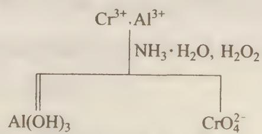  
图21-2 $\mathrm{Al}^{3+}$ 和 $\mathrm{Cr}^{3+}$ 混合离子的分离方案

理论上,通过生成 $\mathrm{Al(OH)}_{3}$ 和 $CrO_{4}^{2-}$ 可以将 $Al^{3+}$ 和 $Cr^{3+}$ 混合离子分离,但在实验上是行不通的,原因是胶状的 $\mathrm{Al(OH)}_{3}$ 沉淀很难过滤与溶液分开。适用的分离方法是,酸化至弱酸性使 $\mathrm{Al(OH)}_{3}$ 溶解,再加入 $CrO_{4}^{2-}$ 的沉淀剂进行分离:

$$
\begin{array}{r l} \mathrm {Al(OH) _ {3}} + 3 \mathrm{H} ^ {+} & = \mathrm{Al} ^ {3 +} + 3 \mathrm{H} _ {2} \mathrm{O} \\ \mathrm{CrO} _ {4} ^ {2 -} + \mathrm{Ba} ^ {2 +} & = \mathrm{BaCrO} _ {4} \downarrow \end{array}
$$

铬化合物的颜色丰富多彩,除前面介绍的化合物外,重要的 Cr(Ⅲ) 化合物或配位化合物还有

<table><tr><td> $CrF_3$ </td><td>绿色</td><td> $Cr_2(SO_4)_3·5H_2O$ </td><td>绿色</td></tr><tr><td> $CrBr_3$ </td><td>深绿色</td><td> $[Cr(H_2O)_6]Br_3$ </td><td>紫色</td></tr><tr><td> $CrCl_3$ </td><td>紫色</td><td> $[Cr(NH_3)_6]Br_3$ </td><td>黄色</td></tr><tr><td> $CrI_3$ </td><td>深绿色</td><td> $K_3[Cr(CN)_6]$ </td><td>黄色</td></tr><tr><td> $Cr(NO_3)_3$ </td><td>绿色</td><td> $K_3[Cr(C_2O_4)_3]·3H_2O$ </td><td>红紫色</td></tr><tr><td> $Cr_2(SO_4)_3$ </td><td>棕红色</td><td> $K_3[Cr(NCS)_6]·4H_2O$ </td><td>紫色</td></tr></table>

与 $AlCl_{3}$ 水合盐相似, 六水合氯化铬受热脱水时水解:

$$
\mathrm{CrCl} _ {3} \cdot 6 \mathrm{H} _ {2} \mathrm{O} \stackrel {\triangle} {=} \mathrm{Cr(OH)Cl} _ {2} + 5 \mathrm{H} _ {2} \mathrm{O} + \mathrm{HCl}
$$

同样, $Cr^{3+}$ 在 $Na_{2}CO_{3}$ 或 $Na_{2}S$ 等碱性溶液中水解,生成氢氧化物沉淀:

$$
\mathrm{Cr} ^ {3 +} + 3 \mathrm{S} ^ {2 -} + 3 \mathrm{H} _ {2} \mathrm{O} = \mathrm{Cr} (\mathrm{OH}) _ {3} \downarrow + 3 \mathrm{HS} ^ {-}
$$

$$
2 \mathrm{Cr} ^ {3 +} + 3 \mathrm{S} ^ {2 -} + 6 \mathrm{H} _ {2} \mathrm{O} = 2 \mathrm{Cr(OH)} _ {3} \downarrow + 3 \mathrm{H} _ {2} \mathrm{S} \uparrow
$$

$$
\mathrm{Cr} ^ {3 +} + 3 \mathrm{CO} _ {3} ^ {2 -} + 3 \mathrm{H} _ {2} \mathrm{O} = \mathrm{Cr(OH)} _ {3} \downarrow + 3 \mathrm{HCO} _ {3} ^ {-}
$$

$$
2 \mathrm{Cr} ^ {3 +} + 3 \mathrm{CO} _ {3} ^ {2 -} + 3 \mathrm{H} _ {2} \mathrm{O} = 2 \mathrm{Cr} (\mathrm{OH}) _ {3} \downarrow + 3 \mathrm{CO} _ {2} \uparrow
$$

高电荷的阳离子与溶剂水自耦解离产生的 $OH^{-}$ 结合力强, 故生成氢氧化物。

## 3. $\mathrm{Cr(III)}$ 的还原性

Cr(Ⅲ)在碱性介质中有较强的还原性：

$$
\mathrm{CrO} _ {4} ^ {2 -} + 4 \mathrm{H} _ {2} \mathrm{O} + 3 \mathrm{e} ^ {-} = \mathrm{Cr(OH)} _ {3} + 5 \mathrm{OH} ^ {-} \quad E ^ {\ominus} = - 0. 1 3 \mathrm{V}
$$

因而，在碱中 $\mathrm{Cr(III)}$ 很容易被 $\mathrm{H}_2\mathrm{O}_2,\mathrm{I}_2$ 等氧化：

$$
2 \mathrm{Cr} (\mathrm{OH}) _ {3} + 3 \mathrm{I} _ {2} + 1 0 \mathrm{OH} ^ {-} = 2 \mathrm{CrO} _ {4} ^ {2 -} + 6 \mathrm{I} ^ {-} + 8 \mathrm{H} _ {2} \mathrm{O}
$$

$$
2 \left[ \mathrm{Cr} (\mathrm{OH}) _ {4} \right] ^ {-} + 3 \mathrm{H} _ {2} \mathrm{O} _ {2} + 2 \mathrm{OH} ^ {-} = 2 \mathrm{CrO} _ {4} ^ {2 -} + 8 \mathrm{H} _ {2} \mathrm{O}
$$

Cr(Ⅲ)在酸性溶液中还原性差：

$$
\mathrm{Cr} _ {2} \mathrm{O} _ {7} ^ {2 -} + 1 4 \mathrm{H} ^ {+} + 6 \mathrm{e} ^ {-} = 2 \mathrm{Cr} ^ {3 +} + 7 \mathrm{H} _ {2} \mathrm{O} \quad E ^ {\ominus} = 1. 3 6 \mathrm{V}
$$

故在酸中需强氧化剂方可将 $\mathrm{Cr(III)}$ 氧化到 $\mathrm{Cr(VI)}$ ，例如：

$$
\begin{array}{l} 2 \mathrm{Cr} ^ {3 +} + 3 \mathrm{PbO} _ {2} + \mathrm{H} _ {2} \mathrm{O} = 3 \mathrm{Pb} ^ {2 +} + \mathrm{Cr} _ {2} \mathrm{O} _ {7} ^ {2 -} + 2 \mathrm{H} ^ {+} \\ 2 \mathrm{Cr} ^ {3 +} + 3 \mathrm{BiO} _ {3} ^ {-} + 4 \mathrm{H} ^ {+} = \mathrm{Cr} _ {2} \mathrm{O} _ {7} ^ {2 -} + 3 \mathrm{Bi} ^ {3 +} + 2 \mathrm{H} _ {2} \mathrm{O} \end{array}
$$

固体 $Cr_{2}O_{3}$ 与 $KClO_{3}$ 共熔, 可以被氧化成 Cr(VI):

$$
4 \mathrm{Cr} _ {2} \mathrm{O} _ {3} + 1 6 \mathrm{KClO} _ {3} \xlongequal {\text {共熔}} 8 \mathrm{K} _ {2} \mathrm{CrO} _ {4} + 1 4 \mathrm{ClO} _ {2} \uparrow + \mathrm{Cl} _ {2} \uparrow
$$

## 21.1.3 Cr(VI)的化合物

## 1. $\mathbf{Cr}(\mathbf{VI})$ 的存在形式

常见的 Cr（VI）化合物有铬酸盐（如 $Na_{2}CrO_{4}, K_{2}CrO_{4}$ ）、重铬酸盐（如 $Na_{2}Cr_{2}O_{7}, K_{2}Cr_{2}O_{7}$ ）、三氧化铬（ $CrO_{3}$ ）和氯化铬酰（ $CrO_{2}Cl_{2}$ ）。Cr（VI）的化合物有特征颜色：

$$
\begin{array}{c c c c} \mathrm{CrO} _ {4} ^ {2 -} & \mathrm{Cr} _ {2} \mathrm{O} _ {7} ^ {2 -} & \mathrm{CrO} _ {3} & \mathrm{CrO} _ {2} \mathrm{Cl} _ {2} \\ \text {黄色} & \text {橙色} & \text {红色} & \text {深红色} \end{array}
$$

若向黄色的 $CrO_{4}^{2-}$ 溶液中加酸, 溶液变为橙色, 说明单聚的铬酸根 $\left(\mathrm{CrO}_{4}^{2-}\right)$ 转化为二聚的重铬酸根 $\left(\mathrm{Cr}_{2}\mathrm{O}_{7}^{2-}\right)$ 。反之, 若向橙色 $Cr_{2}O_{7}^{2-}$ 的酸性溶液中加碱, 又变为 $CrO_{4}^{2-}$ 黄色溶液。

$$
2 \mathrm{CrO} _ {4} ^ {2 -} + 2 \mathrm{H} ^ {+} = \mathrm{Cr} _ {2} \mathrm{O} _ {7} ^ {2 -} + \mathrm{H} _ {2} \mathrm{O} \quad K ^ {\ominus} = 1. 0 \times 1 0 ^ {1 4}
$$

溶液的酸度控制 $CrO_{4}^{2-}$ 与 $Cr_{2}O_{7}^{2-}$ 的平衡。Cr(VI) 在中性和碱性溶液中以 $CrO_{4}^{2-}$ 形式存在，在酸性溶液中，如 pH=5 时，基本以 $Cr_{2}O_{7}^{2-}$ 形式存在。在浓硫酸中， $Cr_{2}O_{7}^{2-}$ 转化为红色的 $CrO_{3}$ 。 $CrO_{3}$ 在水中溶解度较大，在强的稀酸中也不能析出。

重铬酸根二聚体是由四面体 $CrO_{4}$ 共顶点氧形成的, 如图 21-3 所示。

实验室常用的 Cr(VI) 盐是黄色的铬酸钾 $\left(\mathrm{K}_{2}\mathrm{CrO}_{4}\right)$ 和橙色的重铬酸钾 $\left(\mathrm{K}_{2}\mathrm{Cr}_{2}\mathrm{O}_{7}\right)$ ，而相应的钠盐因不易提纯一般只用于做工业原料。

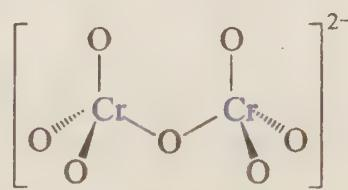  
图 21-3 重铬酸根离子结构

向 $K_{2}Cr_{2}O_{7}$ 饱和溶液中加入过量浓 $H_{2}SO_{4}$ 即得到铬酸洗液，同时有 $CrO_{3}$ 红色针状晶体析出：

$$
\mathrm{K} _ {2} \mathrm{Cr} _ {2} \mathrm{O} _ {7} + 2 \mathrm{H} _ {2} \mathrm{SO} _ {4} (\text {浓}) = 2 \mathrm{KHSO} _ {4} + 2 \mathrm{CrO} _ {3} + \mathrm{H} _ {2} \mathrm{O}
$$

洗液利用了 $CrO_{3}$ 的强氧化性和 $H_{2}SO_{4}$ 的强酸性。由于 Cr(VI) 污染环境，而且是致癌物质,因此目前已很少使用洗液。作为洗液代用品的是王水,由于 $HNO_{3}-HCl$ 溶液在放置过程会分解放出 $NO_{2}$ 等气体污染环境,应现用现配。建议根据洗涤要求尽可能用其他混合溶液代替铬酸洗液和王水。

$CrO_{2}^{2+}$ 称为铬氧根离子,氯化铬酰 $\left(\mathrm{CrO}_{2}\mathrm{Cl}_{2}\right)$ 为深红色液体,像溴,易挥发。将浓 $H_{2}SO_{4}$ 滴加到 $K_{2}Cr_{2}O_{7}$ 和KCl粉末混合物上并加热,则有 $CrO_{2}Cl_{2}$ 挥发出来:

$$
\mathrm{K} _ {2} \mathrm{Cr} _ {2} \mathrm{O} _ {7} + 4 \mathrm{KCl} + 3 \mathrm{H} _ {2} \mathrm{SO} _ {4} (\text {浓}) \stackrel {\triangle} {=} 2 \mathrm{CrO} _ {2} \mathrm{Cl} _ {2} + 3 \mathrm{K} _ {2} \mathrm{SO} _ {4} + 3 \mathrm{H} _ {2} \mathrm{O}
$$

$CrO_{2}Cl_{2}$ 易水解生成 $H_{2}Cr_{2}O_{7}$ 和 HCl:

$$
2 \mathrm{CrO} _ {2} \mathrm{Cl} _ {2} + 3 \mathrm{H} _ {2} \mathrm{O} = \mathrm{H} _ {2} \mathrm{Cr} _ {2} \mathrm{O} _ {7} + 4 \mathrm{HCl}
$$

钢铁分析中为了消除铬对测定锰含量的干扰,利用生成 $CrO_{2}Cl_{2}$ 的反应加热使其挥发除去。

## 2. 化学性质

$H_{2}CrO_{4}$ 只存在于水溶液中, 它的第一级解离平衡常数表明它的酸性很强, 第二级解离平衡常数较小。

$$
\begin{array}{l l} \mathrm{H} _ {2} \mathrm{CrO} _ {4} = \mathrm{H} ^ {+} + \mathrm{HCrO} _ {4} ^ {-} & K _ {1} ^ {\ominus} = 0. 1 8 \\ \mathrm{HCrO} _ {4} ^ {-} = \mathrm{H} ^ {+} + \mathrm{CrO} _ {4} ^ {2 -} & K _ {2} ^ {\ominus} = 3. 3 \times 1 0 ^ {- 7} \end{array}
$$

$\mathrm{CrO}_{3}$ 是 $\mathrm{H}_{2} \mathrm{CrO}_{4}$ 和 $\mathrm{H}_{2} \mathrm{Cr}_{2} \mathrm{O}_{7}$ 的酸酐。

## (1) 氧化性

Cr(VI)的化合物中, $K_{2}Cr_{2}O_{7}$ 是常用的氧化剂。在酸性溶液中, $Cr_{2}O_{7}^{2-}$ 是强氧化剂,可以将HBr,HI, $H_{2}S,H_{2}SO_{3}$ 等氧化,例如:

$$
\begin{array}{r l} & \mathrm{K} _ {2} \mathrm{Cr} _ {2} \mathrm{O} _ {7} + 1 4 \mathrm{HBr(aq)} = 2 \mathrm{KBr} + 2 \mathrm{CrBr} _ {3} + 3 \mathrm{Br} _ {2} + 7 \mathrm{H} _ {2} \mathrm{O} \\ & \mathrm{Cr} _ {2} \mathrm{O} _ {7} ^ {2 -} + 3 \mathrm{H} _ {2} \mathrm{S} + 8 \mathrm{H} ^ {+} = 2 \mathrm{Cr} ^ {3 +} + 3 \mathrm{S} \downarrow + 7 \mathrm{H} _ {2} \mathrm{O} \end{array}
$$

加热时, $Cr_{2}O_{7}^{2-}$ 可以将浓盐酸氧化:

$$
\mathrm{K} _ {2} \mathrm{Cr} _ {2} \mathrm{O} _ {7} + 1 4 \mathrm{HCl(浓)} \stackrel {\triangle} {=} 2 \mathrm{KCl} + 2 \mathrm{CrCl} _ {3} + 3 \mathrm{Cl} _ {2} \uparrow + 7 \mathrm{H} _ {2} \mathrm{O}
$$

定量测定铁含量就是利用酸性溶液中 $Cr_{2}O_{7}^{2-}$ 将 $Fe^{2+}$ 定量氧化的反应：

$$
\mathrm{Cr} _ {2} \mathrm{O} _ {7} ^ {2 -} + 6 \mathrm{Fe} ^ {2 +} + 1 4 \mathrm{H} ^ {+} = 2 \mathrm{Cr} ^ {3 +} + 6 \mathrm{Fe} ^ {3 +} + 7 \mathrm{H} _ {2} \mathrm{O}
$$

由于 $\mathrm{Cr(VI)}$ 的强氧化性， $(\mathrm{NH}_4)_2\mathrm{Cr}_2\mathrm{O}_7$ 受热发生爆炸式分解时产物中有 $\mathrm{Cr(III)}$ 和 $\mathbf{N}_2$ ：

$$
\left(\mathrm{NH} _ {4}\right) _ {2} \mathrm{Cr} _ {2} \mathrm{O} _ {7} (\mathrm{s}) \stackrel {\triangle} {=} \mathrm{N} _ {2} \uparrow + \mathrm{Cr} _ {2} \mathrm{O} _ {3} + 4 \mathrm{H} _ {2} \mathrm{O}
$$

酸酐 $\mathrm{CrO}_3$ 受热也易分解：

$$
4 \mathrm{CrO} _ {3} \stackrel {\triangle} {=} 2 \mathrm{Cr} _ {2} \mathrm{O} _ {3} + 3 \mathrm{O} _ {2} \uparrow
$$

## (2) 难溶盐

除碱金属、铵和镁的铬酸盐易溶外,其他铬酸盐多数难溶。常见的难溶铬酸盐有

$$
\begin{array}{l l l} \mathrm {Ag_ {2} CrO_ {4}} & \text {砖红色} & K _ {\mathrm{sp}} ^ {\ominus} = 1. 1 \times 1 0 ^ {- 1 2} \\ \mathrm {PbCrO_ {4}} & \text {黄色} & K _ {\mathrm{sp}} ^ {\ominus} = 2. 8 \times 1 0 ^ {- 1 3} \\ \mathrm {BaCrO_ {4}} & \text {黄色} & K _ {\mathrm{sp}} ^ {\ominus} = 1. 2 \times 1 0 ^ {- 1 0} \\ \mathrm {SrCrO_ {4}} & \text {黄色} & K _ {\mathrm{sp}} ^ {\ominus} = 2. 2 \times 1 0 ^ {- 5} \end{array}
$$

重铬酸盐溶解度远大于铬酸盐,因此不会生成重铬酸盐沉淀。从平衡角度考虑, $Cr_{2}O_{7}^{2-}$ 溶液中加入 $Ba^{2+}, Pb^{2+}, Ag^{+}$ ,平衡向生成铬酸盐沉淀的方向转化,例如:

$$
\begin{array}{l} 2 \mathrm{Ba} ^ {2 +} + \mathrm{Cr} _ {2} \mathrm{O} _ {7} ^ {2 -} + \mathrm{H} _ {2} \mathrm{O} = 2 \mathrm{BaCrO} _ {4} \downarrow + 2 \mathrm{H} ^ {+} \\ 2 \mathrm{Pb} ^ {2 +} + \mathrm{Cr} _ {2} \mathrm{O} _ {7} ^ {2 -} + \mathrm{H} _ {2} \mathrm{O} = 2 \mathrm{PbCrO} _ {4} \downarrow + 2 \mathrm{H} ^ {+} \end{array}
$$

$PbCrO_{4}$ 既溶于硝酸又溶于强碱：

$$
\begin{array}{r l} & 2 \mathrm{PbCrO} _ {4} + 2 \mathrm{H} ^ {+} = 2 \mathrm{Pb} ^ {2 +} + \mathrm{Cr} _ {2} \mathrm{O} _ {7} ^ {2 -} + \mathrm{H} _ {2} \mathrm{O} \\ & \mathrm{PbCrO} _ {4} + 4 \mathrm{OH} ^ {-} = [ \mathrm{Pb(OH)} _ {4} ] ^ {2 -} + \mathrm{CrO} _ {4} ^ {2 -} \end{array}
$$

$PbCrO_{4}$ 在盐酸和硫酸中转化为另一种沉淀：

$$
\begin{array}{r l} & 2 \mathrm{PbCrO} _ {4} + 2 \mathrm{H} _ {2} \mathrm{SO} _ {4} (\mathrm{aq}) = 2 \mathrm{PbSO} _ {4} + \mathrm{Cr} _ {2} \mathrm{O} _ {7} ^ {2 -} + 2 \mathrm{H} ^ {+} + \mathrm{H} _ {2} \mathrm{O} \\ & 2 \mathrm{PbCrO} _ {4} + 4 \mathrm{HCl} (\mathrm{aq}) = 2 \mathrm{PbCl} _ {2} + \mathrm{Cr} _ {2} \mathrm{O} _ {7} ^ {2 -} + 2 \mathrm{H} ^ {+} + \mathrm{H} _ {2} \mathrm{O} \end{array}
$$

同理, $Ag_{2}CrO_{4}$ 溶于硝酸,在盐酸、硫酸和 NaOH 溶液中发生沉淀转化,例如:

$$
\begin{array}{r l} 2 \mathrm{Ag} _ {2} \mathrm{CrO} _ {4} + 4 \mathrm{HCl(aq)} & = 4 \mathrm{AgCl} + \mathrm{Cr} _ {2} \mathrm{O} _ {7} ^ {2 -} + 2 \mathrm{H} ^ {+} + \mathrm{H} _ {2} \mathrm{O} \\ \mathrm{Ag} _ {2} \mathrm{CrO} _ {4} + 2 \mathrm{OH} ^ {-} & = \mathrm{Ag} _ {2} \mathrm{O} + \mathrm{CrO} _ {4} ^ {2 -} + \mathrm{H} _ {2} \mathrm{O} \end{array}
$$

$BaCrO_{4}$ 溶于硝酸和盐酸,但在硫酸中发生沉淀转化:

$$
2 \mathrm{BaCrO} _ {4} + 2 \mathrm{H} _ {2} \mathrm{SO} _ {4} (\mathrm{aq}) = 2 \mathrm{BaSO} _ {4} \downarrow + \mathrm{Cr} _ {2} \mathrm{O} _ {7} ^ {2 -} + 2 \mathrm{H} ^ {+} + \mathrm{H} _ {2} \mathrm{O}
$$

$\mathrm{SrCrO_4}$ 的溶解度较大，可溶于醋酸中。向 $\mathrm{Sr}^{2+}$ 中加入 $\mathrm{Cr}_2\mathrm{O}_7^{2-}$ 溶液不能生成 $\mathrm{SrCrO_4}$ 沉淀。

## (3) 过氧化铬

用硫酸酸化含 $\mathrm{Cr(VI)}$ 的溶液后，加入 $\mathrm{H}_2\mathrm{O}_2$ 溶液则有蓝色 $\mathrm{CrO}_5$ 生成：

$$
\mathrm{K} _ {2} \mathrm{Cr} _ {2} \mathrm{O} _ {7} + 4 \mathrm{H} _ {2} \mathrm{O} _ {2} + \mathrm{H} _ {2} \mathrm{SO} _ {4} (\text {稀}) = 2 \mathrm{CrO} _ {5} + 5 \mathrm{H} _ {2} \mathrm{O} + \mathrm{K} _ {2} \mathrm{SO} _ {4}
$$

这是鉴定 $\mathrm{Cr(VI)}$ 或 $\mathrm{H}_2\mathrm{O}_2$ 灵敏的方法。这一反应是典型的过氧链转移反应，如图21-4所示，4个 $\mathrm{H}_2\mathrm{O}_2$ 中的过氧链取代了 $\mathrm{Cr}_2\mathrm{O}_7^{2-}$ 中的4个双键氧，生成两个 $\mathrm{CrO}_5$ 。由此可见， $\mathrm{CrO}_5$ 可以写成 $\mathrm{CrO(O_2)_2}$ ，其中 $\mathrm{Cr}$ 的化合价等于 $+6$ ，氧化数应看成 $+10$ 。

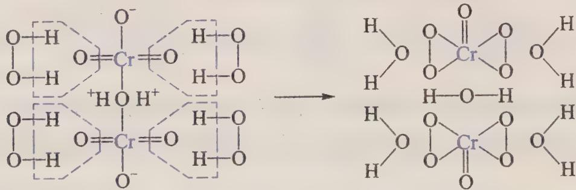  
图 21-4 重铬酸根离子与过氧化氢的反应示意图

生成的 $CrO_{5}$ 不稳定, 在酸性溶液中很快分解:

$$
4 \mathrm{CrO} _ {5} + 1 2 \mathrm{H} ^ {+} = 4 \mathrm{Cr} ^ {3 +} + 6 \mathrm{H} _ {2} \mathrm{O} + 7 \mathrm{O} _ {2} \uparrow
$$

若向生成 $CrO_{5}$ 的体系中加入乙醚或戊醇,有机层呈蓝色。 $CrO_{5}$ 在有机溶剂中较稳定,分解速率较慢,因为它只在有机相和水的界面分解。不要误以为 $CrO_{5}$ 只在乙醚中才能生成,只不过 $CrO_{5}$ 在乙醚中较稳定而已。

## 3. 重铬酸钾的生产

重铬酸钾 $K_{2}Cr_{2}O_{7}$ 俗称红矾，是一种重要的化工产品。

工业上以铬铁矿 $\mathrm{Fe}(\mathrm{CrO}_{2})_{2}$ 为原料生产重铬酸钾, 其过程主要有以下几步:

① 铬酸钠的生成 这一步的关键是要完成 Cr(Ⅲ) 到 Cr(VI) 的转化, 当然在碱性条件下实施更为有利。实际操作是将铬铁矿和纯碱置于铁坩埚中, 在空气中加热, 发生如下反应:

$$
4 \mathrm{Fe} (\mathrm{CrO} _ {2}) _ {2} + 8 \mathrm{Na} _ {2} \mathrm{CO} _ {3} + 7 \mathrm{O} _ {2} \stackrel {\triangle} {=} 8 \mathrm{Na} _ {2} \mathrm{CrO} _ {4} + 2 \mathrm{Fe} _ {2} \mathrm{O} _ {3} + 8 \mathrm{CO} _ {2}
$$

产物中的 $Na_{2}CrO_{4}$ 和 $Fe_{2}O_{3}$ 结成块状物, 可以将结块置于水中浸取, 滤掉 $Fe_{2}O_{3}$ , 得 $Na_{2}CrO_{4}$ 溶液。

② 重铬酸钠的生成 $\mathrm{Na}_{2} \mathrm{CrO}_{4}$ 向 $\mathrm{Na}_{2} \mathrm{Cr}_{2} \mathrm{O}_{7}$ 的转化是 $\mathrm{Cr(VI)}$ 存在形式的转化,可以通过改变体系的 pH 来实现。具体做法是向 $Na_{2}CrO_{4}$ 溶液中加酸,发生如下反应:

$$
2 \mathrm{Na} _ {2} \mathrm{CrO} _ {4} + 2 \mathrm{H} ^ {+} = \mathrm{Na} _ {2} \mathrm{Cr} _ {2} \mathrm{O} _ {7} + 2 \mathrm{Na} ^ {+} + \mathrm{H} _ {2} \mathrm{O}
$$

③ 重铬酸钾的生成 $\mathrm{Na}_{2} \mathrm{Cr}_{2} \mathrm{O}_{7}$ 向 $\mathrm{K}_{2} \mathrm{Cr}_{2} \mathrm{O}_{7}$ 的转化, 所涉及的实验原理是不同物质的溶解度随温度的变化不同。具体做法则需在 $\mathrm{Na}_{2} \mathrm{Cr}_{2} \mathrm{O}_{7}$ 溶液中加 $\mathrm{KCl}$ :

$$
\mathrm{Na} _ {2} \mathrm{Cr} _ {2} \mathrm{O} _ {7} (\mathrm{aq}) + 2 \mathrm{KCl} = \mathrm{K} _ {2} \mathrm{Cr} _ {2} \mathrm{O} _ {7} + 2 \mathrm{NaCl}
$$

体系中 4 种物质共存,或者说 4 种离子共存。由于 NaCl 的溶解度基本不随温度变化,而 $K_{2}Cr_{2}O_{7}$ 的溶解度随温度升高而显著增大,所以升高温度时体系中的不溶物多为 NaCl。趁热过滤除去 NaCl 后,再降温析晶得 $K_{2}Cr_{2}O_{7}$ 橙色晶体。

## 21.1.4 钼和钨

由于镧系收缩的结果, Mo 和 W 的原子半径和性质都极为类似。但这两种元素的差异比钛副族的 Zr 和 Hf, 钒副族的 Nb 和 Ta 之间的差异要大, 因此分离不太困难。钼和钨的最稳定的氧化数为 +6。

## 1. 铝和钨的单质

钼和钨都是高熔点和高沸点的银白色金属，可用于制造特殊钢。钨是所有金属中熔点最高的，故被用作灯丝。

钼和钨能溶于硝酸和氢氟酸的溶液,其中钨的溶解非常慢。它们分别与 $\mathrm{KNO}_{3}, \mathrm{KClO}_{3}$ 或 $\mathrm{Na}_{2} \mathrm{O}_{2}$ 共熔而被氧化成+6价的含氧酸盐 $\mathrm{MO}_{4}^{2-}$ 。

将辉钼矿 $\left(\mathrm{MoS}_{2}\right)$ 在空气中灼烧得到工业级的 $MoO_{3}$ ，将其溶于氨水生成钼酸铵 $\left(\mathrm{NH}_{4}\right)_{2}\mathrm{MoO}_{4}$ ，由 $\left(\mathrm{NH}_{4}\right)_{2}\mathrm{MoO}_{4}$ 分解可得高纯度 $MoO_{3}$ 。之后在高温下用 $H_{2}$ ，Al或C还原而制得高纯度金属钼。

黑钨矿(Fe,Mn) $WO_{4}$ 一般要与碳酸钠共熔得到钨酸钠,用盐酸酸化后生成钨酸 $H_{2}WO_{4}$ ,加热脱水后转化为 $WO_{3}$ 。最后用金属铝或氢气作还原剂,在高温下还原氧化物得到金属W。

## 2. 钼和钨的含氧化合物

## (1) 氧化物和同多酸

$MoO_{3}$ 为浅黄色粉末，而 $WO_{3}$ 为黄色粉末。

$MoO_{3}$ 和 $WO_{3}$ 可由金属或硫化物及低价的氧化物在空气或氧气中加热得到,例如:

$$
2 \mathrm{MoS} _ {2} + 7 \mathrm{O} _ {2} \stackrel {\triangle} {=} 2 \mathrm{MoO} _ {3} + 4 \mathrm{SO} _ {2}
$$

也可由含氧酸或其铵盐加热分解得到,例如:

$$
H W _ {6} O _ {2 1} ^ {5 -}, W _ {n} O _ {3 9} ^ {6 -}
$$

$$
\mathrm{H} _ {2} \mathrm{MoO} _ {4} \stackrel {\triangle} {=} \mathrm{MoO} _ {3} + \mathrm{H} _ {2} \mathrm{O}
$$

$$
\left(\mathrm{NH} _ {4}\right) _ {2} \mathrm{MoO} _ {4} \stackrel {\triangle} {=} \mathrm{MoO} _ {3} + 2 \mathrm{NH} _ {3} \uparrow + \mathrm{H} _ {2} \mathrm{O}
$$

钼和钨的氧化物易溶于碱而生成盐,例如:

$$
\mathrm{MoO} _ {3} + 2 \mathrm{NaOH(aq)} = \mathrm{Na} _ {2} \mathrm{MoO} _ {4} + \mathrm{H} _ {2} \mathrm{O}
$$

若将氧化物溶于热的浓氨水,冷却后就可得到钼酸铵或钨酸铵的结晶,例如:

$$
\mathrm{MoO} _ {3} + 2 \mathrm{NH} _ {3} \cdot \mathrm{H} _ {2} \mathrm{O} = (\mathrm{NH} _ {4}) _ {2} \mathrm{MoO} _ {4} + \mathrm{H} _ {2} \mathrm{O}
$$

将钼酸盐或钨酸盐溶液调为强酸性,相应得到白色的“钼酸”( $H_{2}MoO_{4}\cdot H_{2}O$ )和黄色的“钨酸”( $H_{2}WO_{4}\cdot xH_{2}O$ )沉淀。

钼、钨不仅形成简单含氧酸，而且在一定条件下它们能脱水缩合形成多酸。由同种简单含氧酸分子脱水缩合形成的多酸称为同多酸，V, Cr, Mo, W, B, Si, P, As 等元素的含氧酸都易形成同多酸。

通常,在钼酸和钨酸溶液里加入强酸,就会形成缩合度不等的多钼酸和多钨酸,随着溶液酸度的增大,同多酸的缩合度也增大。如在钼酸盐溶液中,将pH降到6以下时,最先生成七钼酸根离子 $Mo_{7}O_{24}^{6-}$ ,习惯上把它称为仲钼酸根;在酸度逐渐增加,到足以使水合氧化物沉淀之前,也生成含有8个和36个钼原子的阴离子。这些同多酸根阴离子的形成可用下列反应式表示:

$$
\begin{array}{l}7 \mathrm{MoO} _ {4} ^ {2 -} + 8 \mathrm{H} ^ {+} \rightleftharpoons \mathrm{Mo} _ {7} \mathrm{O} _ {2 4} ^ {6 -} + 4 \mathrm{H} _ {2} \mathrm{O}\\8 \mathrm{MoO} _ {4} ^ {6 -} + 1 2 \mathrm{H} ^ {+} \rightleftharpoons \mathrm{Mo} _ {8} \mathrm{O} _ {2 6} ^ {4 -} + 6 \mathrm{H} _ {2} \mathrm{O}\\3 6 \mathrm{MoO} _ {4} ^ {2 -} + 6 4 \mathrm{H} ^ {+} \rightleftharpoons \mathrm{Mo} _ {3 6} \mathrm{O} _ {1 1 2} ^ {8 -} + 3 2 \mathrm{H} _ {2} \mathrm{O}\end{array}
$$

钨的简单含氧酸同样可以缩合生成多钨酸根离子。

## (2) 杂多酸

由不同元素的含氧酸分子脱水缩合形成的多酸称为杂多酸。人们对钼和钨的磷、硅杂多酸研究较多。杂多酸可以看成是一类特殊的配位化合物，其中的 P 或 Si 是配位化合物的中心原子，多钼酸根或多钨酸根为配体。它们都是固体酸。

钼酸铵与磷酸根离子可生成黄色的 $\left(\mathrm{NH}_{4}\right)_{3}\mathrm{PO}_{4}\cdot12\mathrm{MoO}_{3}$ 沉淀：

$$
\mathrm{H} _ {3} \mathrm{PO} _ {4} + 1 2 \left(\mathrm{NH} _ {4}\right) _ {2} \mathrm{MoO} _ {4} + 2 1 \mathrm{HNO} _ {3} = \left(\mathrm{NH} _ {4}\right) _ {3} \mathrm{PO} _ {4} \cdot 1 2 \mathrm{MoO} _ {3} \downarrow + 2 1 \mathrm{NH} _ {4} \mathrm{NO} _ {3} + 1 2 \mathrm{H} _ {2} \mathrm{O}
$$

这一反应可用来鉴定 $PO_{4}^{3-}$ 。

$\left(\mathrm{NH}_{4}\right)_{3}\mathrm{PO}_{4}\cdot12\mathrm{MoO}_{3}$ 可以写成十二钼磷杂多酸铵的形式 $\left(\mathrm{NH}_{4}\right)_{3}\left[\mathrm{PMo}_{12}\mathrm{O}_{40}\right]$ 。

十二钼磷杂多酸是含有 Mo 和 P 的杂多酸中的一种。其酸根的最基本的结构单元是钼氧八面体，见图 21-5(a)。3 个钼氧八面体共用边结合成如图 21-5(b) 所示的 $Mo_{3}O_{13}$ 单元 ( $Mo_{3}O_{13}$ 在与另外 3 个相同单元形成杂多酸根时，有 6 个顶点氧原子均为两个单元所共用，故可称为 $Mo_{3}O_{10}$ 单元)。4 个 $Mo_{3}O_{13}$ 单元呈正四面体形分布在 P 原子周围，并通过与中心的磷氧四面体共用氧原子结合，形成如图 21-5(c) 所示的杂多酸根结构，其化学式为 $[PMo_{12}O_{40}]^{3-}$ 。这种结构最早是由 Keggin 在 1933 年通过测定 $H_{3}[PMo_{12}O_{40}]\cdot5H_{2}O$ 结构得到的，该种结构的特点是 P 与 Mo 的原子比为 1:12，且 P 原子处于 O 原子的四配位四面体环境中。人们称该结构类型为 Keggin 结构。

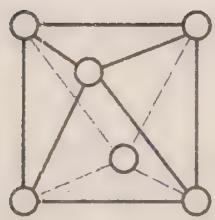  
(a)

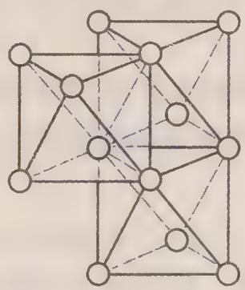  
(b)

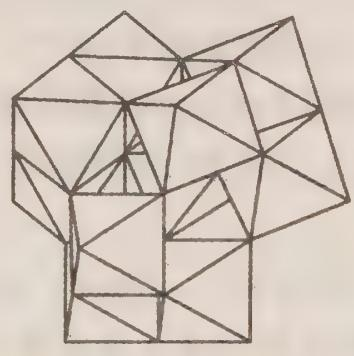  
(c)

  
(d)  
图21-5 杂多酸根的结构示意图

1937 年, Anderson 提出 $\left[Mo_{7}O_{24}\right]^{6-}$ 是 7 个共边八面体形成的平面结构, 后来人们发现其结构是弯曲形的。 $\left[TeMo_{6}O_{24}\right]^{6-}$ 是第一种具有 Anderson 结构的杂多阴离子, 其结构示意于图 21-5(d)。该种结构的特点是 Te 与 Mo 的原子比为 1:6, 且 Te 原子处于 O 原子的六配位八面体环境中。

## 3. 钼元素的生物功能

生物体内的醛氧化酶、硝酸还原酶、亚硫酸盐氧化酶等都是含钼的金属酶，这些酶在生命过程中起着重要作用。

钼是目前已发现的第二、三过渡系列元素中唯一的生物体必需的微量元素。钼是大脑必需的七种微量元素(Fe, Cu, Zn, Mn, Mo, I, Se)之一，钼缺乏将导致神经异常，智力发育迟缓，影响骨骼生长。更为严重的是，在一些低钼地区食管癌发病率高，肌体内外环境中的钼水平与食管癌的死亡率呈负相关，补钼后能降低食管癌的发病率。

黄嘌呤氧化酶也是含钼的金属酶,其活性受钼支配,肌体贫钼会使黄嘌呤氧化酶活性下降,肝解毒功能下降,以致造成肝损伤。钼是豆科植物根瘤中固氮酶的组分,它可以使游离态的氮在常温常压下转化成能够被植物吸收利用的硝态氮 $\left(\mathrm{NO}_{3}^{-}\right)$ 和氨态氮 $\left(\mathrm{NH}_{3}\right)$ 。

## 21.2 锰副族元素

锰副族元素包括锰、锝、铼和第七周期的铍共4种元素，在元素周期表中处于ⅦB族。

锰是由瑞典人甘恩(Grahn)于1774年由二氧化锰还原得到的。锰在地壳中的质量分数为 $9.5 \times 10^{-2}\%$ ，主要以锰的氧化物形式出现，如软锰矿（ $\mathrm{MnO}_2$ ）、黑锰矿（ $\mathrm{Mn}_3\mathrm{O}_4$ ）和方锰矿（ $\mathrm{MnO}$ ）等， $\mathrm{MnCO}_3$ 也是重要的锰矿。另外一个重要的锰来源是锰结核，含有大量锰、铁、铜、镍、钴等元素。锰结核大量存在于各大洋之中，是海洋中最有价值的矿产。我国锰矿资源较多，储量居世界第3位，分布广泛，以广西、湖南最为丰富，但我国富锰矿较少。

锝是由美国人佩里埃(Perrier)和塞格瑞(Segré)于1937年用氘核轰击金属钼制得的。它是第一种人造元素，当时在自然界中尚未发现锝。锝的所有同位素都是放射性的。

铼是由3位德国人诺达克(Noddack)、塔克(Tacke)和柏格(Berg)于1925年发现的,它是最后一种被发现的非人造金属元素。铼在地壳中的含量很少,质量分数为 $4\times10^{-8}\%$ ,属于稀有分散元素。铼以痕量出现在钼矿中,如辉钼矿里所含的铼不超过千万分之一。

锰副族元素基态原子的价层电子构型为 $(n-1)\mathrm{d}^{5}\mathrm{ns}^{2}$ ，最高氧化态为+7。在本族元素中锰表现的氧化态范围最宽，其中+2氧化态是最稳定和最常见的，而且 $Mn^{2+}$ 存在于固态、溶液和配位化合物中。与 $\mathrm{Mn(VII)}$ 的强氧化性相反，Tc和Re的+7氧化态是最稳定和最常见的，仅显微弱的氧化性，而+2和更低氧化态不常见并且是强还原剂。总之，在本族中自上而下高氧化态的稳定性递增，低氧化态的稳定性递减。

上述关于锰副族元素的价态及氧化还原性质,可以通过图 21-6 所示的元素电势图表示出来。

锰是所有生物的必需元素,但它的作用方式并不太清楚。目前,已知锰参与多种酶的组成,影响酶的活性。体外实验证明有上百种酶可由锰激活,有水解酶、脱羧酶、激酶、转移酶、肽酶等。

锰在自然界分布较广泛,在地壳中的质量分数列第12位。但锰在人体中含量较少,主要从植物类食品摄入,分布在肝、肾、胰、脑及骨骼中,总量仅10\~20 mg。

锰的生理功能主要有:促进骨骼的生长发育,保护细胞中线粒体的完整,保持正常的脑功能,维持正常的糖代谢和脂肪代谢及改善肌体的造血功能等。成年人缺锰,可能引起食欲不振,体重下降,并影响生育能力,有可能使后代先天性畸形;儿童缺锰,可能引起生长停滞,骨骼畸形或软骨病。另外,锰的缺乏可能引起神经衰弱综合征,影响智力发育,还可能导致胰岛素合成功能的降低,影响糖代谢。

锰在体内含量过多时,会引起一系列的锰中毒症:头痛头晕、肌肉痉挛、疲乏无力、动作笨拙、语言障碍等。

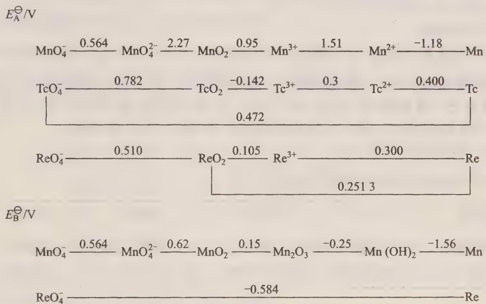  
图21-6 锰副族的元素电势图

## 21.2.1 锰的单质

金属锰为银白色, 粉末状的锰为灰色。纯锰是通过铝热反应用 Al 还原 $MnO_{2}$ 或 $Mn_{3}O_{4}$ 来制备的:

$$
\begin{array}{r l} & 3 \mathrm{MnO} _ {2} + 4 \mathrm{Al} \xlongequal {\text {点燃}} 3 \mathrm{Mn} + 2 \mathrm{Al} _ {2} \mathrm{O} _ {3} \\ & 3 \mathrm{Mn} _ {3} \mathrm{O} _ {4} + 8 \mathrm{Al} \xlongequal {\text {点燃}} 9 \mathrm{Mn} + 4 \mathrm{Al} _ {2} \mathrm{O} _ {3} \end{array}
$$

锰是活泼金属,能溶解在冷的非氧化性稀酸中,例如:

$$
\mathrm{Mn} + 2 \mathrm{HCl(aq)} = \mathrm{MnCl} _ {2} + \mathrm{H} _ {2} \uparrow
$$

在室温下锰对非金属的反应活性并不很高,但加热时很容易发生反应。锰在空气中加热时生成 $Mn_{3}O_{4}$ ，高温下可与卤素、硫、碳、磷作用。锰与冷水基本不反应，但与热水作用生成 $\mathrm{Mn(OH)}_{2}$ 并放出氢气，这一性质类似于金属镁。

纯金属锰的用途较少,但在钢铁工业中采用在高炉中还原氧化铁和氧化锰的混合物以生产合金。锰是钢的一种重要添加剂,因为它能脱除氧和硫,因而改进了钢的强度,锰被用于制造铁路钢轨所需的合金钢。锰的氧化物可用作电池的电极材料,也可用于特种陶瓷的制造等。

## 21.2.2 锰的化合物

常见的锰化合物有 Mn(Ⅱ)盐类、Mn(Ⅳ)氧化物及高锰酸盐等。

## 1. Mn(Ⅱ)的化合物

## (1) 易溶盐

$Mn^{2+}$ 的强酸盐易溶, 如 $MnSO_{4}, MnCl_{2}$ 和 $Mn(NO_{3})_{2}$ 等。由于 $Mn^{2+}$ 的 5 个 d 电子平行自旋, 电子 d-d 跃迁概率小, 化合物颜色一般较浅。较浓的 $Mn^{2+}$ 水溶液为粉红色, 稀溶液近无色; $Mn^{2+}$ 水合盐多数是粉红色或玫瑰色的, 如 $MnSO_{4} \cdot 7H_{2}O$ 和 $MnCl_{2} \cdot 6H_{2}O$ ; 无水盐 $MnSO_{4}$ 和 $Mn(NO_{3})_{2}$ 为白色。

## (2) 难溶性化合物

$Mn^{2+}$ 的氢氧化物和多数弱酸盐难溶,例如:

<table><tr><td>化合物</td><td>MnCO3</td><td>Mn(OH)2</td><td>α-MnS</td><td>MnC2O4</td></tr><tr><td>颜色</td><td>白色</td><td>白色</td><td>绿色</td><td>白色</td></tr><tr><td>KspΘ</td><td>2.3×10-11</td><td>1.9×10-13</td><td>2.5×10-13</td><td>1.7×10-7</td></tr></table>

这些物质易溶于强酸中,这是过渡元素的一般规律。

在水溶液中析出的 $MnS \cdot xH_{2}O$ 呈粉红色。无水 MnS 有 3 种晶型， $\alpha-MnS$ 为绿色， $\beta-MnS$ 和 $\gamma-MnS$ 为红色。绿色的 $\alpha-MnS$ 最稳定，粉红色的水合物将慢慢地转化成绿色的 $\alpha-MnS$ 。MnS 难溶于水，但在弱酸（如 HAc）中即可溶解，所以 MnS 不能在酸性溶液中沉淀。

## (3) 还原性

在碱性溶液中 Mn(Ⅱ) 的还原性较强,极易被氧化成 Mn(Ⅳ)。

$$
E ^ {\ominus} \left[ \mathrm{MnO} _ {2} / \mathrm{Mn(OH)} _ {2} \right] = - 0. 0 5 \mathrm{V}, E ^ {\ominus} \left(\mathrm{O} _ {2} / \mathrm{OH} ^ {-}\right) = 0. 4 0 \mathrm{V}
$$

向 $Mn^{2+}$ 溶液加 NaOH 或 $NH_{3}\cdot H_{2}O$ 都能生成碱性、近白色的 $\mathrm{Mn(OH)}_{2}$ 沉淀：

$$
\mathrm{Mn} ^ {2 +} + 2 \mathrm{OH} ^ {-} = \mathrm{Mn(OH)} _ {2} \downarrow
$$

$\mathrm{Mn(OH)}_{2}$ 极易被氧化,甚至溶于水中的少量氧气也能将其氧化成棕黑色的 $\mathrm{MnO(OH)}_{2}$ :

$$
2 \mathrm{Mn} (\mathrm{OH}) _ {2} + \mathrm{O} _ {2} = 2 \mathrm{MnO} (\mathrm{OH}) _ {2}
$$

产物也可以写成水合氧化物 $MnO_{2} \cdot H_{2}O$ 或亚锰酸 $H_{2}MnO_{3}$ 的形式。

这个反应在水质分析中用于测定水中的溶解氧。

MnS, $MnCO_{3}$ , $MnC_{2}O_{4}$ 沉淀在空气中放置或加热, 都会被空气中的氧气氧化成棕黑色的 $\mathrm{MnO(OH)}_{2}$ , 例如:

$$
\begin{array}{r l} & \mathrm {MnS+ O_ {2} + H_ {2} O\xlongequal {\Delta} MnO(OH) _ {2} + S} \\ & 2 \mathrm {MnCO_ {3} + O_ {2} + 2 H_ {2} O\xlongequal {\Delta} 2MnO(OH) _ {2} + 2CO_ {2}} \end{array}
$$

在酸性溶液中 Mn(Ⅱ) 的还原性较弱：

$$
\mathrm{MnO} _ {4} ^ {-} + 8 \mathrm{H} ^ {+} + 5 \mathrm{e} ^ {-} = \mathrm{Mn} ^ {2 +} + 4 \mathrm{H} _ {2} \mathrm{O} \quad E ^ {\ominus} = 1. 5 1 \mathrm{V}
$$

只有用强氧化剂如 $\left(\mathrm{NH}_{4}\right)_{2}\mathrm{S}_{2}\mathrm{O}_{8}$ ， $NaBiO_{3}$ ， $PbO_{2}$ ， $H_{5}IO_{6}$ 等才能将其氧化成Mn(VII):

$$
\begin{array}{r l} & 2 \mathrm{Mn} ^ {2 +} + 5 \mathrm{S} _ {2} \mathrm{O} _ {8} ^ {2 -} + 8 \mathrm{H} _ {2} \mathrm{O} \xlongequal [ \triangle ] {\mathrm{Ag} ^ {+}} 2 \mathrm{MnO} _ {4} ^ {-} + 1 0 \mathrm{SO} _ {4} ^ {2 -} + 1 6 \mathrm{H} ^ {+} \\ & 2 \mathrm{Mn} ^ {2 +} + 5 \mathrm{BiO} _ {3} ^ {-} + 1 4 \mathrm{H} ^ {+} = 2 \mathrm{MnO} _ {4} ^ {-} + 5 \mathrm{Bi} ^ {3 +} + 7 \mathrm{H} _ {2} \mathrm{O} \\ & 2 \mathrm{Mn} ^ {2 +} + 5 \mathrm{PbO} _ {2} + 4 \mathrm{H} ^ {+} = 2 \mathrm{MnO} _ {4} ^ {-} + 5 \mathrm{Pb} ^ {2 +} + 2 \mathrm{H} _ {2} \mathrm{O} \end{array}
$$

由于 $MnO_{4}^{-}$ 呈特征的紫色, 所以前两个反应常用于鉴定 $Mn^{2+}$ 。实验时, $Mn^{2+}$ 浓度不宜过大, 用量不宜过多, 特别是第一个反应, 因为尚未被氧化的 $Mn^{2+}$ 能和已生成的 $MnO_{4}^{-}$ 相互作用生成棕黑色 $MnO_{2}$ :

$$
3 \mathrm{Mn} ^ {2 +} + 2 \mathrm{MnO} _ {4} ^ {-} + 2 \mathrm{H} _ {2} \mathrm{O} = 5 \mathrm{MnO} _ {2} \downarrow + 4 \mathrm{H} ^ {+}
$$

Mn(Ⅱ)盐受热分解时,若酸根有氧化性则 Mn(Ⅱ)被氧化,例如:

$$
\begin{array}{r l} & {\mathrm {Mn(NO_ {3}) _ {2}} \stackrel {\triangle} {=} \mathrm {MnO_ {2}} + 2 \mathrm {NO_ {2}}} \\ & {\mathrm {Mn(ClO_ {4}) _ {2}} \stackrel {\triangle} {=} \mathrm {MnO_ {2}} + \mathrm {Cl_ {2}} \uparrow + 3 \mathrm {O_ {2}} \uparrow} \end{array}
$$

## (4) 配位化合物

$Mn^{2+}$ 的电子组态为 $3d^{5}$ ，与弱场配体形成的高自旋八面体配位化合物，晶体场稳定化能均为0。水合离子 $\left[\mathrm{Mn}\left(\mathrm{H}_{2}\mathrm{O}\right)_{6}\right]^{2+}$ 为极浅的粉红色，当浓度小于 $1\mathrm{mol}\cdot\mathrm{dm}^{-3}$ 时，几乎观察不到颜色。 $Mn^{2+}$ 的5个d电子在八面体弱场中的排布方式如图21-7(a)所示。

$Mn^{2+}$ 与弱场配体能形成高自旋四面体配位化合物,如与卤离子配体在乙醇溶液中生成黄色的 $\left[MnX_{4}\right]^{2-}(X=Cl,Br,I)$ ,晶体场稳定化能也为0。

$Mn^{2+}$ 与强配体 $CN^{-}$ 等形成低自旋配位化合物,如蓝紫色的 $\left[\mathrm{Mn}\left(\mathrm{CN}\right)_{6}\right]^{4-}$ ,八面体构型,在空气中易被氧化为棕红色的 $\left[\mathrm{Mn}\left(\mathrm{CN}\right)_{6}\right]^{3-}$ 。

$Mn^{2+}$ 的 5 个 d 电子在八面体强场中的排布方式如图 21-7(b) 所示, 其晶体场稳定化能为 $(2\Delta - 2P)$ 。

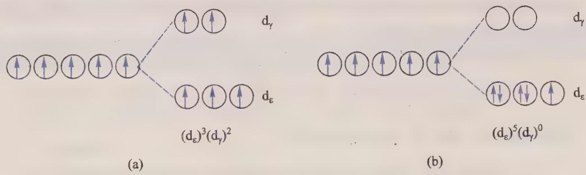  
图21-7 $\mathbf{Mn}^{2+}$ 的d电子在八面体场中的排布方式

## 2. Mn(Ⅲ)的化合物

由元素电势图可知，Mn(Ⅲ)氧化性强，易歧化，在溶液中不稳定：

$$
E _ {\mathrm{A}} ^ {\ominus} / \mathrm{V} \quad \mathrm {MnO_ {2}} \xrightarrow {0 . 9 5} \mathrm {Mn^ {3 + }} \xrightarrow {1 . 5 1} \mathrm {Mn^ {2 + }}
$$

重要的 Mn(Ⅲ) 化合物有紫红色的 $\mathrm{Mn(CH_{3}COO)_{3}\cdot3H_{2}O}$ ; 紫红色的 $MnF_{3}$ ，它可以由 $MnF_{2}$ 与 $F_{2}$ 反应得到；黑色的 $Mn_{2}O_{3}$ ，它可以由 $MnO_{2}$ 在低于 800 ℃ 加热制得。

重要的 Mn（Ⅲ）配位化合物有棕红色的 $\left[\mathrm{Mn}\left(\mathrm{CN}\right)_{6}\right]^{3-}$ ，紫色的 $\left[\mathrm{Mn}\left(\mathrm{PO}_{4}\right)_{2}\right]^{3-}$ 。

## 3. Mn(IV)的化合物

最重要的 Mn(IV) 的化合物是 $MnO_{2}$ ，它在通常情况下很稳定，不溶于 $H_{2}O$ 、稀酸和稀碱，且在酸和碱中均不歧化。但 $MnO_{2}$ 是两性氧化物，可以与浓酸、浓碱缓慢反应。

$MnO_{2}$ 与 NaOH 隔绝空气共熔,生成亚锰酸盐 $Na_{2}MnO_{3}$ :

$$
\mathrm{MnO} _ {2} + 2 \mathrm{NaOH} \stackrel {\triangle} {=} \mathrm{Na} _ {2} \mathrm{MnO} _ {3} + \mathrm{H} _ {2} \mathrm{O}
$$

$MnO_{2}$ 与 NaOH 浓溶液作用也能部分生成 $Na_{2}MnO_{3}$ 。这是表现 $MnO_{2}$ 具有酸性的反应。

在室温下, $MnO_{2}$ 与浓盐酸的混合物经搅拌、静止后,上部为土黄色透明溶液,可能是生成了 $MnCl_{4}$ 。这说明 $MnO_{2}$ 具有碱性。

Mn(Ⅳ)处于中间氧化态,既可作氧化剂又可作还原剂:

$$
E _ {\mathrm{A}} ^ {\ominus} (\mathrm {MnO_ {2} /Mn^ {2 + }}) = 1. 2 2 \mathrm{V}, E _ {\mathrm{B}} ^ {\ominus} (\mathrm {MnO_ {4} ^ {2 - } /MnO_ {2}}) = 0. 6 0 \mathrm{V}
$$

$MnO_{2}$ 在强酸中有较强的氧化性,不仅可以将 I 氧化成 $I_{2}$ , 将 $Fe^{2+}$ 氧化成 $Fe^{3+}$ , 而且与浓盐酸混合后加热将生成氯气:

$$
\mathrm {MnO_ {2} + 4HCl(浓)\xlongequal{\triangle} MnCl_ {2} + Cl_ {2} \uparrow + 2H_ {2} O}
$$

此反应常用于实验室制备氯气。

将盛 $MnO_{2}$ 粉末和浓 $H_{2}SO_{4}$ 混合物的试管水浴加热一段时间, 冷却并静止后, 试管上部为紫红色, 说明有 $Mn^{3+}$ 生成:

$$
4 \mathrm{MnO} _ {2} + 6 \mathrm{H} _ {2} \mathrm{SO} _ {4} (\text {浓}) \stackrel {\triangle} {=} 2 \mathrm{Mn} _ {2} (\mathrm{SO} _ {4}) _ {3} + 6 \mathrm{H} _ {2} \mathrm{O} + \mathrm{O} _ {2} \uparrow
$$

$Mn^{3+}$ 不稳定,温度升高则转化为更稳定的 $Mn^{2+}$ :

$$
2 \mathrm{Mn} _ {2} (\mathrm{SO} _ {4}) _ {3} + 2 \mathrm{H} _ {2} \mathrm{O} \stackrel {\triangle} {=} 4 \mathrm{MnSO} _ {4} + \mathrm{O} _ {2} \uparrow + 2 \mathrm{H} _ {2} \mathrm{SO} _ {4}
$$

在碱性条件下， $\mathrm{MnO}_2$ 可被氧化至 $\mathrm{Mn(VI)}$ 。 $\mathrm{MnO}_2$ 与碱混合后加入氯酸钾、硝酸钾等氧化剂（或利用空气中的 $\mathrm{O}_2$ ），加热共熔则被氧化为 $\mathrm{Mn(VI)}$ ，例如：

$$
\begin{array}{r l} & 3 \mathrm{MnO} _ {2} + 6 \mathrm{KOH} + \mathrm{KClO} _ {3} \xlongequal {\text {共熔}} 3 \mathrm{K} _ {2} \mathrm{MnO} _ {4} + \mathrm{KCl} + 3 \mathrm{H} _ {2} \mathrm{O} \\ & 2 \mathrm{MnO} _ {2} + 4 \mathrm{KOH} + \mathrm{O} _ {2} \xlongequal {\text {共熔}} 2 \mathrm{K} _ {2} \mathrm{MnO} _ {4} + 2 \mathrm{H} _ {2} \mathrm{O} \end{array}
$$

## 4. Mn(VI)的化合物

Mn(VI)的化合物中, 比较稳定的是锰酸钾 $\left(\mathrm{K}_{2}\mathrm{MnO}_{4}\right)$ , 深绿色晶体, 在190℃分解, Mn(VI)在强碱溶液中较稳定。

从图 21-6 所示的元素电势图看, $MnO_{4}^{2-}$ 在碱性及酸性条件下均歧化:

$$
\begin{array}{l} 3 \mathrm{MnO} _ {4} ^ {2 -} + 4 \mathrm{H} ^ {+} = 2 \mathrm{MnO} _ {4} ^ {-} + \mathrm{MnO} _ {2} \downarrow + 2 \mathrm{H} _ {2} \mathrm{O} \\ 3 \mathrm{MnO} _ {4} ^ {2 -} + 2 \mathrm{H} _ {2} \mathrm{O} = 2 \mathrm{MnO} _ {4} ^ {-} + \mathrm{MnO} _ {2} \downarrow + 4 \mathrm{OH} ^ {-} \end{array}
$$

只有在浓度较大的强碱中(pH>14)锰酸钾才稳定。

将 $MnO_{2}$ 与 $KClO_{3}$ ，KOH 混合后放入干燥试管中加热共熔，得到绿色产物，冷却至室温后加入少量水得绿色溶液，说明生成了锰酸钾；再加入大量水则溶液立即变紫红色并有棕色沉淀生成，说明加入大量水时碱的浓度降低，锰酸钾发生了歧化反应生成 $MnO_{4}^{-}$ 和 $MnO_{2}$ 。

## 5. Mn(VII)的化合物

最重要的 Mn(VII) 化合物是高锰酸钾 (KMnO $_{4}$ ), 紫黑色晶体。其水溶液的颜色与浓度有关, 按浓度由低到高依次为粉红色、红色、紫红色、紫色、紫黑色。高锰酸钠 (NaMnO $_{4}$ ) 易潮解, 也不易提纯。

## (1) 强氧化性

$KMnO_{4}$ 是最重要和最常用的氧化剂之一, 它的氧化能力和还原产物因介质的酸碱性不同而不同: 在强酸性溶液中被还原成 $Mn^{2+}$ , 在强碱性溶液中被还原成 $MnO_{4}^{2-}$ , 在近中性溶液中则被还原成 $MnO_{2}$ , 因为这些产物在相应的介质中稳定。如 $KMnO_{4}$ 与 S(IV) 的反应:

$$
\begin{array}{r l} {\mathrm{酸性}} & {2 \mathrm{MnO} _ {4} ^ {-} + 5 \mathrm{H} _ {2} \mathrm{SO} _ {3} = 2 \mathrm{Mn} ^ {2 +} + 5 \mathrm{SO} _ {4} ^ {2 -} + 4 \mathrm{H} ^ {+} + 3 \mathrm{H} _ {2} \mathrm{O}} \\ {\mathrm{中性}} & {2 \mathrm{MnO} _ {4} ^ {-} + \mathrm{H} _ {2} \mathrm{O} + 3 \mathrm{SO} _ {3} ^ {2 -} = 2 \mathrm{MnO} _ {2} \downarrow + 3 \mathrm{SO} _ {4} ^ {2 -} + 2 \mathrm{OH} ^ {-}} \\ {\mathrm{碱性}} & {2 \mathrm{MnO} _ {4} ^ {-} + 2 \mathrm{OH} ^ {-} + \mathrm{SO} _ {3} ^ {2 -} = 2 \mathrm{MnO} _ {4} ^ {2 -} + \mathrm{SO} _ {4} ^ {2 -} + \mathrm{H} _ {2} \mathrm{O}} \end{array}
$$

在酸性溶液中， $\mathrm{KMnO_4}$ 是很强的氧化剂：

$$
\mathrm{MnO} _ {4} ^ {-} + 8 \mathrm{H} ^ {+} + 5 \mathrm{e} ^ {-} = \mathrm{Mn} ^ {2 +} + 4 \mathrm{H} _ {2} \mathrm{O} \quad E ^ {\ominus} = 1. 5 1 \mathrm{V}
$$

它可以氧化 $\mathrm{Cl}^{-},\mathrm{Cr}^{3+},\mathrm{I}_{2}$ 等：

$$
\begin{array}{l} 2 \mathrm{MnO} _ {4} ^ {-} + 1 6 \mathrm{H} ^ {+} + 1 0 \mathrm{Cl} ^ {-} = 2 \mathrm{Mn} ^ {2 +} + 5 \mathrm{Cl} _ {2} + 8 \mathrm{H} _ {2} \mathrm{O} \\ 6 \mathrm{MnO} _ {4} ^ {-} + 1 0 \mathrm{Cr} ^ {3 +} + 1 1 \mathrm{H} _ {2} \mathrm{O} = 6 \mathrm{Mn} ^ {2 +} + 5 \mathrm{Cr} _ {2} \mathrm{O} _ {7} ^ {2 -} + 2 2 \mathrm{H} ^ {+} \\ 2 \mathrm{MnO} _ {4} ^ {-} + \mathrm{I} _ {2} + 4 \mathrm{H} ^ {+} = 2 \mathrm{Mn} ^ {2 +} + 2 \mathrm{IO} _ {3} ^ {-} + 2 \mathrm{H} _ {2} \mathrm{O} \end{array}
$$

$KMnO_{4}$ 与盐酸反应可用于实验室制备氯气,但不能实现随制随停,加之 $KMnO_{4}$ 比 $MnO_{2}$ 价格高,故实验室更多采用 $MnO_{2}$ 与浓盐酸反应制备氯气。

酸性条件下, $KMnO_{4}$ 与 $H_{2}C_{2}O_{4}$ 定量反应,可用于标定 $KMnO_{4}$ 溶液的浓度:

$$
2 \mathrm{MnO} _ {4} ^ {-} + 6 \mathrm{H} ^ {+} + 5 \mathrm{H} _ {2} \mathrm{C} _ {2} \mathrm{O} _ {4} = 2 \mathrm{Mn} ^ {2 +} + 1 0 \mathrm{CO} _ {2} \uparrow + 8 \mathrm{H} _ {2} \mathrm{O}
$$

$KMnO_{4}$ 与 $Fe^{2+}$ 定量反应, 可用于测定 $Fe^{2+}$ 的含量:

$$
\mathrm{MnO} _ {4} ^ {-} + 8 \mathrm{H} ^ {+} + 5 \mathrm{Fe} ^ {2 +} = \mathrm{Mn} ^ {2 +} + 5 \mathrm{Fe} ^ {3 +} + 4 \mathrm{H} _ {2} \mathrm{O}
$$

在容量分析中, $KMnO_{4}$ 常用作氧化还原滴定剂。在酸性溶液中, $MnO_{4}^{-}$ 被还原成 $Mn^{2+}$ 。在滴定过程中 $MnO_{4}^{-}$ 过量则溶液立即变红,而稀的 $Mn^{2+}$ 溶液基本是无色的,不影响终点的判断。滴定剂起着自身指示剂的作用。

$KMnO_{4}$ 作为一种氧化剂被应用于许多有机制备反应中, 如糖精、抗坏血酸(维生素 C)和烟酸等的制备。它也可以用于消毒及处理饮用水和工业用水。

## (2) 不稳定性

高锰酸盐氧化性强,不稳定,在酸性溶液中明显分解,在中性或微碱性溶液中缓慢分解:

$$
\begin{array}{r l} & 4 \mathrm{MnO} _ {4} ^ {-} + 4 \mathrm{H} ^ {+} = 4 \mathrm{MnO} _ {2} \downarrow + 3 \mathrm{O} _ {2} \uparrow + 2 \mathrm{H} _ {2} \mathrm{O} \\ & 4 \mathrm{MnO} _ {4} ^ {-} + 4 \mathrm{OH} ^ {-} = 4 \mathrm{MnO} _ {4} ^ {2 -} + \mathrm{O} _ {2} \uparrow + 2 \mathrm{H} _ {2} \mathrm{O} \end{array}
$$

光对高锰酸钾分解起催化作用,因此高锰酸钾溶液应当储存在棕色瓶中。由于分解反应的存在,其浓度会随时间而变化,所以高锰酸钾标准溶液需在使用前重新标定。

在固相中高锰酸盐稳定性比在溶液中高,但受热时也要分解。大约 $200^{\circ}C$ 时分解为 $K_{2}MnO_{4}$ 和 $MnO_{2}$ 并放出 $O_{2}$ :

$$
2 \mathrm{KMnO} _ {4} (\mathrm{s}) \xlongequal {2 0 0 ^ {\circ} \mathrm{C}} \mathrm{K} _ {2} \mathrm{MnO} _ {4} + \mathrm{MnO} _ {2} + \mathrm{O} _ {2} \uparrow
$$

将 $\mathrm{KMnO_4}$ 放入干燥试管中小火加热，有爆鸣声，爆鸣声停止后，观察到固体不再有原来的晶体光泽；向试管中加入少量水后摇动试管，试管壁为绿色，说明 $\mathrm{KMnO_4}$ 分解产物中有 $\mathrm{K}_2\mathrm{MnO}_4$ 。加入大量水后溶液立即变为紫色，因为 $\mathrm{K}_2\mathrm{MnO}_4$ 歧化，有 $\mathrm{KMnO_4}$ 生成。

$KMnO_{4}$ 和冷的浓硫酸作用生成暗绿色油状七氧化二锰( $Mn_{2}O_{7}$ ):

$$
2 \mathrm{KMnO} _ {4} + \mathrm{H} _ {2} \mathrm{SO} _ {4} (\text {   浓   }) \xlongequal {\text {   低温   }} \mathrm{Mn} _ {2} \mathrm{O} _ {7} + \mathrm{K} _ {2} \mathrm{SO} _ {4} + \mathrm{H} _ {2} \mathrm{O}
$$

$Mn_{2}O_{7}$ 遇有机物即燃烧, 受热爆炸分解, 常温下缓慢放出 $O_{2}$ , 转化为 $MnO_{2}$ 。

## (3) 高锰酸钾的制备

高锰酸钾的制备经常以软锰矿 $MnO_{2}$ 为原料。

首先制取锰酸钾, 将 $MnO_{2}$ 与 $KClO_{3}$ , KOH 的混合物加热共熔, 得到绿色产物锰酸钾:

$$
3 \mathrm{MnO} _ {2} + 6 \mathrm{KOH} + \mathrm{KClO} _ {3} \xlongequal {\text {共熔}} 3 \mathrm{K} _ {2} \mathrm{MnO} _ {4} + \mathrm{KCl} + 3 \mathrm{H} _ {2} \mathrm{O}
$$

用强氧化剂氧化 $K_{2}MnO_{4}$ ，可以得到 $KMnO_{4}$ 。例如，使用氯气为氧化剂：

$$
2 \mathrm{MnO} _ {4} ^ {2 -} + \mathrm{Cl} _ {2} = 2 \mathrm{MnO} _ {4} ^ {-} + 2 \mathrm{Cl} ^ {-}
$$

生产中经常采用电解法,电解 $K_{2}MnO_{4}$ 溶液得到 $KMnO_{4}$ :

阳极反应

$$
\mathrm{MnO} _ {4} ^ {2 -} = \mathrm{MnO} _ {4} ^ {-} + \mathrm{e} ^ {-}
$$

阴极反应 $2\mathrm{H}_{2}\mathrm{O} + 2\mathrm{e}^{-} = \mathrm{H}_{2} + 2\mathrm{OH}^{-}$

总反应

$$
2 \mathrm{K} _ {2} \mathrm{MnO} _ {4} + 2 \mathrm{H} _ {2} \mathrm{O} \xlongequal {\text {通电}} 2 \mathrm{KMnO} _ {4} + 2 \mathrm{KOH} + \mathrm{H} _ {2} \uparrow
$$

电解法不仅反应物的利用率高,而且电解生成的 KOH 可循环使用于第一步反应,由 $MnO_{2}$ 制 $K_{2}MnO_{4}$ 。

## 6. Mn 的低价配位化合物

人们已经得到氧化数为+1的锰的配位化合物 $\mathrm{K}_5[\mathrm{Mn}(\mathrm{CN})_6]$ 。氧化数更低的配位化合物多是CO为配体的化合物。

高压且有 CO 存在下用 $LiAlH_{4}$ 还原 $MnI_{2}$ 得到金黄色 $\left[\mathrm{Mn}_{2}\left(\mathrm{CO}\right)_{10}\right]$ 固体。它的熔点为 $154^{\circ}C$ ，其中 Mn 的氧化数为 0。以 $\left[\mathrm{Mn}_{2}\left(\mathrm{CO}\right)_{10}\right]$ 为反应物，可制备许多其他羰基配位化合物和衍生物。如用钠汞齐还原 $\left[\mathrm{Mn}_{2}\left(\mathrm{CO}\right)_{10}\right]$ 能够得到 $\mathrm{Na}\left[\mathrm{Mn}\left(\mathrm{CO}\right)_{5}\right]$ ，其中 Mn 的氧化数为 -1。再用 $H_{3}PO_{4}$ 处理 $\mathrm{Na}\left[\mathrm{Mn}\left(\mathrm{CO}\right)_{5}\right]$ 得到无色液体 $\left[\mathrm{Mn}\left(\mathrm{CO}\right)_{5}\mathrm{H}\right]$ 。用 $Cl_{2}$ 氧化 $\left[\mathrm{Mn}_{2}\left(\mathrm{CO}\right)_{10}\right]$ 可以得到 $\left[\mathrm{Mn}\left(\mathrm{CO}\right)_{5}\mathrm{Cl}\right]$ ，其中 Mn 的氧化数为 +1。

## 21.2.3 锝和铼

锝是第一种人工合成的元素,由于锝稀少及处理放射性物质引起的有关问题,致使锝化学的知识并不完全清楚。

## 1. 锝、铼的单质及其化合物

铼金属晶体为银白色,粉末是灰色的。铼的密度大,为 $20.8 \, g \cdot cm^{-3}$ , 仅次于 Os, Ir 和 Pt, 且熔点高达 $3185^{\circ}C$ , 仅次于最难熔的金属钨。但是,与钨相比铼有不少优点,在真空中,钨丝的机械强度、可塑性、延展性和稳定性都不如铼好,在钨中掺进少许铼,就会使制出的灯丝性质大大改观;将铼镀在灯泡中的钨丝上,可使灯泡的寿命延长 5 倍以上。铼是制造火箭、人造卫星外壳的理想材料。铼可用来制造高温热电偶,可以测量 $2000^{\circ}C$ 的高温。在原子能工业中,铼用作原子反应堆的衬套反射保护板。

铼和其他金属制成的合金硬度大、耐高温、难磨损。铼合金也可用于制作钢笔笔尖，还可用于制造精密仪表。铼合金做的弹簧，弹性好、不容易变形。

铼的化学性质很稳定。一般的酸、碱不能腐蚀它，就是腐蚀性很强的氢氟酸，对它也无可奈何。因此，铼常用来替代铂作为有机合成工业中的催化剂，如用于石油氢化、醇类脱氢制造醛、酮等。

Tc 和 Re 除了含氧离子 $TcO_{4}^{-}$ 和 $ReO_{4}^{-}$ 之外基本上没有水溶液中的离子化合物。

Re 在过量的氧气中燃烧,最终产物是黄色的七氧化二铼( $Re_{2}O_{7}$ ),其熔点约为 $300^{\circ}C$ 。红色的 $ReO_{3}$ 具有金属光泽,在 $400^{\circ}C$ 时分解。蓝色的 $Re_{2}O_{5}$ 不稳定,易歧化为 $Re_{2}O_{7}$ 和 $ReO_{2}$ 。灰色的 $ReO_{2}$ 非常稳定, $900^{\circ}C$ 以上歧化为 $Re_{2}O_{7}$ 和单质 Re。

铼能生成氧化数+4\~+7的氟化物, $ReF_{7}$ 为黄色,熔点为48.3℃; $ReF_{6}$ 为黄色液体,熔点为 $18.5^{\circ} \mathrm{C}$ ; $\mathrm{ReF}_{5}$ 为黄绿色,熔点为 $48^{\circ} \mathrm{C}$ ; $\mathrm{ReF}_{4}$ 为蓝色, $300^{\circ} \mathrm{C}$ 升华。形成氯化物时铼的最高氧化数为 +6, 如 $\mathrm{ReCl}_{6}$ 为红绿色, 熔点为 $29^{\circ} \mathrm{C}$ ; 形成溴化物时铼的最高氧化数为 +5, 如 $\mathrm{ReBr}_{5}$ 为棕色, $110^{\circ} \mathrm{C}$ 分解; 镊的碘化物只有 $\mathrm{ReI}_{3}$ , 为黑色, 室温即分解。

## 2. $\left[\mathrm{Re}_{2} \mathrm{Cl}_{8}\right]^{2-}$ 的结构和四重键

$\left[Re_{2}Cl_{8}\right]^{2-}$ 为蓝色抗磁性物质。1964年，科顿(Cotton)论证了 $\left[Re_{2}Cl_{8}\right]^{2-}$ 中存在Re—Re四重键，从此确立了金属原子簇化合物的概念。

在 $\left[\mathrm{Re}_{2} \mathrm{Cl}_{8}\right]^{2-}$ 中, $\mathrm{Re}-\mathrm{Re}$ 之间距离为 $224 \mathrm{pm}$ , 远小于金属晶体中 $\mathrm{Re}-\mathrm{Re}$ 的键长 $271.4 \mathrm{pm}$ 。 $\left[\mathrm{Re}_{2} \mathrm{Cl}_{8}\right]^{2-}$ 的结构如图 21-8(a) 所示, 每个 $\mathrm{Re(III)}$ 的周围有处于近正方形 4 个顶点位置的 $\mathrm{Cl}^{-}$ 与之配位, 中心 $\mathrm{Re(III)}$ 采用 $\mathrm{dsp}^{2}$ 杂化轨道与配体 $\mathrm{Cl}^{-}$ 成键, 形成的每个 $\mathrm{ReCl}_{4}$ 单元各自位于 $xOy$ 平面内。但是两个 $\mathrm{ReCl}_{4}$ 单元间 Cl 的斥力使得 Cl—Cl 之间的距离略大于 Re—Re 之间的距离, 即 Re 略偏离 4 个 Cl 组成的正方形的中心而相距更近些。

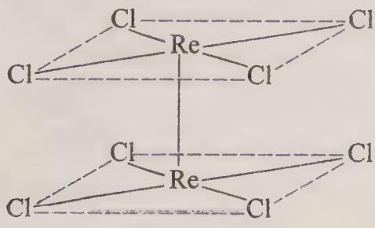  
(a)

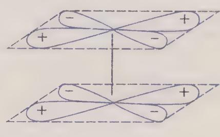  
(b)  
图21-8 $\left[\mathrm{Re}_2\mathrm{Cl}_8\right]^{2 - }$ 的结构及金属间的δ键

中心 Re 原子参与杂化的 d 轨道是 $d_{x^{2}-y^{2}}$ ，其余 4 个 d 轨道在两个 $ReCl_{4}$ 单元相结合时用于 Re—Re 之间形成四重键。

垂直于 $ReCl_{4}$ 单元平面的两个 $d_{z2}$ 轨道“头碰头”重叠，成 $\sigma$ 键；两个 Re 原子的 $d_{yz}$ 轨道“肩并肩”重叠，成 $\pi$ 键；两个 Re 原子的 $d_{xz}$ 轨道也是“肩并肩”重叠，成 $\pi$ 键。两个 Re 原子的 $d_{xy}$ 轨道分别位于两个互相平行的 $ReCl_{4}$ 单元平面内，如图 21-8(b) 所示，它们之间的重叠方式既不是“头碰头”也不是“肩并肩”，而是“面对面”。这两个 $d_{xy}$ 轨道在 Re—Re 之间形成的化学键称为 $\delta$ 键。所以说在 Re—Re 之间存在四重键。

两个 $\operatorname{Re}(\mathbb{III})$ 的 $d_{xy}$ 轨道的 $\delta$ 键，在 $x$ 轴和 $y$ 轴之间重叠形成4块电子云， $\delta$ 键对于通过 $\operatorname{Re}-\operatorname{Re}$ 键轴中点且垂直于键轴的平面是对称的。

## 一拓展学习资源

<table><tr><td>资源内容</td><td>二维码</td></tr><tr><td>▶ 铬副族元素的发现、提取及其矿物图片</td><td></td></tr><tr><td>▶ 铬及其合金的主要用途</td><td rowspan="3"></td></tr><tr><td>▶ 三氧化二铬的主要用途</td></tr><tr><td>▶ 锰的发现及其矿物图片</td></tr><tr><td>▶ 二氧化锰的主要用途</td><td rowspan="2">扫一扫查看资源内容</td></tr><tr><td>▶ 本章小结</td></tr><tr><td>▶ 视频——重铬酸氨的热分解反应</td><td></td></tr><tr><td>▶ 视频——过氧化铬的生成</td><td></td></tr><tr><td>▶ 视频——高锰酸钾的还原产物与介质的关系</td><td></td></tr></table>

## 总结与思考题

21-1 试通过与 Al(Ⅲ) 的对比, 总结 Cr(Ⅲ) 的物理性质和化学性质, 进一步分析过渡元素与主族元素的不同。

21-2 试说明 $\mathrm{Cr(VI)}$ 有几种不同的存在形式, 其存在条件各是什么?

21-3 铬的化合物颜色丰富多彩,试给出一些具有不同颜色的 Cr(Ⅲ) 化合物或离子的例子。

21-4 钼和钨性质相似而与铬差别较大。为什么第二和第三过渡系列同族元素的化学性质相似而它们同第一过渡系列同族元素的化学性质差别较大？

21-5 举例说明同多酸和杂多酸的概念。

21-6 实验室过去常用洗液来洗涤玻璃仪器,原理是什么?为什么现在很少使用洗液来清洗玻璃仪器?根据洗液的作用原理,请从常见化学试剂中选择合适的试剂作洗液代用品,并说明理由。

21-7 Mn(Ⅱ) 是 Mn 元素常见的氧化态之一, 试总结 Mn(Ⅱ) 的还原性与体系酸碱度的关系, 并举例加以说明。

21-8 $\mathrm{MnO}_2$ 是两性氧化物, 试举化学反应实例加以说明。

21-9 $\mathrm{KMnO_4}$ 是最常用的氧化剂之一, 但反应体系酸碱度不同则 $\mathrm{KMnO_4}$ 的还原产物不同, 请举例说明并解释原因。

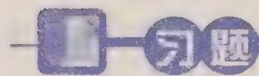

21-1 简释下列词语。

(1) 铬绿； (2) 铬酸洗液； (3) 过氧链转移反应； (4) 多酸；

(5) Keggin 结构；(6) Anderson 结构；(7) 锰结核；(8) δ 键和四重键。

21-2 完成并配平下列化学反应方程式。

(1) $\mathrm{CrCl}_{2} + \mathrm{HCl(aq)} + \mathrm{O}_{2}$

(2) $FeCr_{2}O_{4} + C \xlongequal{高温}$

(3) $Cr_{2}O_{3} + Al \xlongequal{点燃}$

(4) $\mathrm{Cr}^{3+} + \mathrm{CO}_3^{2-} + \mathrm{H}_2\mathrm{O} =$

(5) $\mathrm{Cr}^{3+} + \mathrm{PbO}_2 + \mathrm{H}_2\mathrm{O} =$

(6) $\mathrm{Cr(OH)}_3 + \mathrm{I}_2 + \mathrm{OH}^-$

(7) $\left[\mathrm{Cr(OH)}_{4}\right]^{-} + \mathrm{H}_{2}\mathrm{O}_{2} + \mathrm{OH}^{-} =$

(8) $\mathrm{Cr}_2\mathrm{O}_7^{2-} + \mathrm{H}_2\mathrm{S} + \mathrm{H}^+ =$

(9) $\mathrm{Cr}_{2}\mathrm{O}_{7}^{2-} + \mathrm{Fe}^{2+} + \mathrm{H}^{+} =$

(10) $\mathrm{Mn}^{2+} + \mathrm{PbO}_2 + \mathrm{H}^+$

(11) $\mathrm{Mn(OH)}_2 + \mathrm{O}_2 =$

(12) $MnO_{2} + H_{2}SO_{4}$ (浓) $\xlongequal{\Delta}$

(13) $MnO_{2} + HCl$ (浓) $\xlongequal{\Delta}$

(14) $MnO_{2} + KOH + O_{2} \xlongequal{共熔}$

(15) $\mathrm{MnO}_4^{2-} + \mathrm{Cl}_2 =$

(16) $\mathrm{MnO}_4^{2-} + \mathrm{H}_2\mathrm{O} =$

(17) $\mathrm{MnO}_4^-$ + $\mathrm{SO}_3^{2-} + \mathrm{H}_2\mathrm{O} =$

(18) $\mathrm{MnO}_4^-$ + $\mathrm{Cr}^{3+} + \mathrm{H}_2\mathrm{O} =$

(19) $KMnO_{4} + H_{2}SO_{4}$ (浓) $\xlongequal{低温}$

21-3 完成并配平下列化学反应方程式。

(1) 金属铬缓慢地溶于盐酸。

(2) 三氧化二铬与氯酸钾共熔。

(3) 三氧化二铬与硫酸氢钾共熔。

(4) 三氧化铬受热分解。

(5) 向+3价铬盐的溶液中加入硫化钠溶液。

(6) 高温下三氧化二铬与硅反应。

(7) 加热铬酸钠与焦炭的混合物。

(8) 将重铬酸钾加到氢溴酸中。

(9) 重铬酸钾与氯化钾混合后, 滴加浓硫酸并加热。

(10) 三氧化铝溶于热的浓氨水。

(11) 单质锰与热水反应。

(12) 硫化锰沉淀在空气中放置。

(13) 固体硝酸锰受热分解。

(14) 硫酸锰溶液与高锰酸钾溶液混合并充分反应。

(15) 二氧化锰、氢氧化钾与氯酸钾混合后高温共熔。

(16) 锰酸钾溶液中加稀硫酸。

(17) 高锰酸钾晶体在 $200^{\circ}$ C 下分解。

(18) 高锰酸盐在碱性溶液中与亚硫酸盐作用。

(19) 用高锰酸钾溶液标定草酸溶液。

21-4 生产、合成与制备。

(1) 以铬铁矿为主要原料生产重铬酸钾。

(2) 以软锰矿为主要原料生产高锰酸钾。

(3) 由辉钼矿生产钼。

(4) 由黑钨矿生产钨。

(5) $\mathrm{K}_{2} \mathrm{Cr}_{2} \mathrm{O}_{7}$ 溶液分别与 $\mathrm{BaCl}_{2}, \mathrm{KOH}$ , 热的浓盐酸, 酸性 $\mathrm{H}_{2} \mathrm{O}_{2}$ 溶液作用, 将生成何种产物?

(6) 用化学反应方程式表示下图中与 $\mathrm{Cr}$ 相关物质的相互转化。

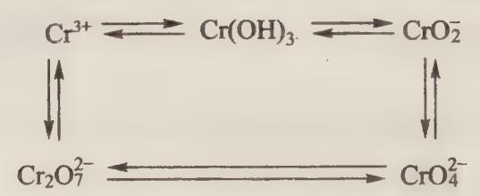

(7) 用化学反应方程式表示下图中与 Mn 相关物质的相互转化。

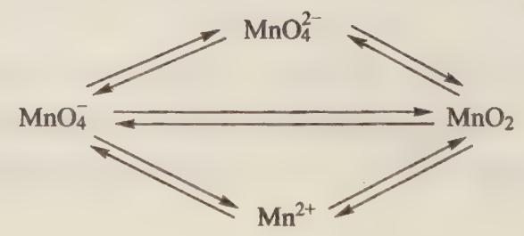

## 21-5 分离、提纯与鉴别。

(1) 试分离下列各对离子。

① $Cr^{3+}$ 和 $Al^{3+}$ ; ② $Cr^{3+}$ 和 $Mn^{2+}$ ; ③ $Mn^{2+}$ 和 $Cu^{2+}$ 。

(2) 各用 3 种方法鉴别下列各对物质。

① $MnO_{2}$ 和 CuO；② $MnO_{2}$ 和 $PbO_{2}$ 。

③ $V_{2}O_{5}$ 和 $Ag_{2}CrO_{4}$ ; ④ $MnSO_{4}$ 和 $ZnSO_{4}$ 。

(3) 试设计方案分离溶液中的下列离子。

① $Mn^{2+}$ , $Zn^{2+}$ , $Cr^{3+}$ , $Al^{3+}$ ; ② $Cu^{2+}$ , $Zn^{2+}$ , $Cr^{3+}$ , $Cd^{2+}$ .

（4）实验室经常用 $\left(\mathrm{NH}_{4}\right)_{2}\mathrm{S}_{2}\mathrm{O}_{8},\mathrm{PbO}_{2},\mathrm{NaBiO}_{3}$ 为氧化剂鉴定 $Mn^{2+}$ ，请给出鉴定反应的化学方程式和反应条件。

(5) 一黄色固体, 可能是 $PbCrO_{4}$ , $BaCrO_{4}$ 或 $SrCrO_{4}$ , 试加以鉴别。

## 21-6 解释实验现象。

(1) 金属铬溶于盐酸生成蓝色溶液, 后又转化为绿色溶液。

(2) $CrCl_{3}\cdot6H_{2}O$ 溶于水, 其溶液为绿色, 将溶液煮沸一段时间后冷却至室温, 溶液变为蓝紫色。

(3) $\left[\mathrm{Cr}\left(\mathrm{H}_{2} \mathrm{O}\right)_{6}\right]^{3+}$ 内界中的配体 $\mathrm{H}_{2} \mathrm{O}$ 逐步被 $\mathrm{NH}_{3}$ 取代后, 溶液的颜色发生一系列变化: 从紫色 $\rightarrow$ 浅红 $\rightarrow$ 橙红 $\rightarrow$ 橙黄 $\rightarrow$ 黄色。

(4) 向 $\mathrm{MnSO}_4$ 溶液中加入 $\mathrm{NaOH}$ 溶液, 生成白色沉淀; 该白色沉淀暴露在空气中则逐渐变成棕黑色; 加入稀硫酸棕黑色沉淀不溶解, 再加入过氧化氢溶液沉淀消失。

（5）将 $MnO_{2}$ , $KClO_{3}$ , KOH 固体混合后用煤气灯加热, 得绿色固体; 用大量水处理绿色固体得到紫色溶液和棕黑色沉淀, 再通入过量 $NO_{2}$ 则颜色和沉淀消失, 得到无色溶液。

## 21-7 推理判断

(1) 橙红色固体(A)受热后生成深绿色固体(B)和无色气体(C), 加热时(C)能与镁反应生成黄色固体(D)。固体(B)与 NaOH 共熔后溶于水生成绿色溶液(E), 在(E)中加适量 $H_{2}O_{2}$ 则生成黄色溶液(F)。将(F)酸化变为橙色溶液(G), 在溶液(G)中加 $BaCl_{2}$ 溶液, 得黄色沉淀(H)。在(G)的浓溶液中加 KCl 固体, 溶解完全后, 经蒸发、浓缩、冷却有橙红色晶体(I)析出。(I)受强热得到的固体产物中有(B), 同时得到能支持燃烧的气体(J)。

试给出(A)，(B)，(C)，(D)，(E)，(F)，(G)，(H)，(I)和(J)所代表的物质的化学式，并用化学反应方程式表示各过程。

(2) 红色固体(A)溶于热的浓盐酸放出气体(B), 溶液经冷却后析出绿色晶体(C)。少量(B)通入 KI 溶液中则溶液变黄。向(C)的水溶液中加入 $\mathrm{Na}_{2} \mathrm{CO}_{3}$ 溶液生成沉淀(D)。将(D)溶于 KOH 溶液后加入 $\mathrm{H}_{2} \mathrm{O}_{2}$ 溶液得到黄色溶液(E)。用稀硫酸酸化溶液(E)后, 经蒸发、浓缩、冷却有橘红色晶体(F)析出。(F)与浓硫酸作用能够得到(A)。

试给出(A)，(B)，(C)，(D)，(E)和(F)所代表的物质的化学式，并用化学反应方程式表示各过程。

(3) 白色粉末(A)溶于水后与 $\mathrm{NaOH}$ 溶液作用生成白色沉淀(B)。(B)与 $\mathrm{H}_{2} \mathrm{O}_{2}$ 溶液作用转化为棕黑色沉淀(C)。(C)与 $\mathrm{KOH}, \mathrm{KClO}_{3}$ 共熔得到绿色化合物(D)。将(D)溶于 KOH溶液后加入氯水生成紫色的(E)。向(E)的水溶液中通入过量的 $SO_{2}$ 得到无色溶液,再经蒸发、浓缩、冷却有水合晶体(F)析出。将(F)小心加热又生成白色粉末(A)。

试给出(A)，(B)，(C)，(D)，(E)和(F)所代表的物质的化学式，并用化学反应方程式表示各过程。

(4) 绿色固体(A)易溶于水,向其水溶液中通入 $CO_{2}$ 即得棕黑色固体(B)和紫红色溶液(C)。(B)与浓盐酸共热得黄绿色气体(D)和近乎无色溶液(E)。将溶液(E)和溶液(C)混合能生成沉淀(B)。将气体(D)通入(A)的溶液中可得(C)。

试给出(A)，(B)，(C)，(D)和(E)所代表的物质的化学式，并用化学反应方程式表示各过程。

(5) 一种固体混合物可能含有 $\mathrm{AgNO}_{3}, \mathrm{CuS}, \mathrm{AlCl}_{3}, \mathrm{KMnO}_{4}, \mathrm{K}_{2} \mathrm{SO}_{4}$ 和 $\mathrm{ZnCl}_{2}$ 中的一种或几种。将此混合物置于水中, 并用少量盐酸酸化, 得白色沉淀 (A) 和无色溶液 (B)。(A) 溶于氨水。将滤液 (B) 分成两份, 一份中加入少量 NaOH 溶液有白色沉淀产生, 再加入过量 NaOH 溶液则白色沉淀溶解; 另一份中加入少量氨水也产生白色沉淀, 当加入过量氨水时白色沉淀溶解。

试根据上述现象判断:在混合物中哪些化合物肯定存在,哪些肯定不存在,哪些可能存在。说明理由,并用化学反应方程式表示。

21-8 简答题。

(1) 写出下列物质的化学式。

① 铬铁矿； ② 铬铅矿； ③ 铬赭石矿；  
④ 辉钼矿； ⑤ 钼铅矿； ⑥ 白钨矿；  
⑦ 软锰矿； ⑧ 黑锰矿； ⑨ 方锰矿。

(2) 论证下列各组离子能否大量共存, 写出有关化学反应方程式。

$$
\mathrm{Na} ^ {+}, \mathrm{K} ^ {+}, [ \mathrm{Al} (\mathrm{OH}) _ {4} ] ^ {-}, \mathrm{NO} _ {3} ^ {-}, \mathrm{Cr} _ {2} \mathrm{O} _ {7} ^ {2 -}, \mathrm{NO} _ {2} ^ {-}
$$

$$
\mathrm{K} ^ {+}, \mathrm{MnO} _ {4} ^ {-}, \mathrm{SO} _ {4} ^ {2 -}, \mathrm{Mn} ^ {2 +}, \mathrm{I} ^ {-}
$$

(3) 为什么用 Cr(Ⅱ) 可以除去氮气中痕量的氧气?

(4) $\mathrm{K}_{2} \mathrm{Cr}_{2} \mathrm{O}_{7}$ 能否氧化浓度分别为 $1 \mathrm{~mol} \cdot \mathrm{dm}^{-3}$ 和 $12 \mathrm{~mol} \cdot \mathrm{dm}^{-3}$ 盐酸中的 $\mathrm{Cl}^{-}$ ? 试通过计算说明。已知: $E^{\ominus} (\mathrm{Cr}_{2} \mathrm{O}_{7}^{2-} / \mathrm{Cr}^{3+}) = 1.36 \mathrm{~V}, E^{\ominus} (\mathrm{Cl}_{2} / \mathrm{Cl}^{-}) = 1.36 \mathrm{~V}$ 。

(5) 在 3 份 $\mathrm{Cr}_{2}(\mathrm{SO}_{4})_{3}$ 溶液中分别加入下列溶液, 得到的沉淀各是什么? 试写出有关化学反应方程式。

① $\mathrm{Na}_{2} \mathrm{~S}$ ; ② $\mathrm{Na}_{2} \mathrm{CO}_{3}$ ; ③ $\mathrm{NH}_{3} \cdot \mathrm{H}_{2} \mathrm{O}$ 。

(6) 测定水中溶解氧量的方法是, 在隔绝空气的条件下向一定量的水样中加入适量的 $\mathrm{MnCl}_{2}$ 及过量的 $\mathrm{NaOH}$ 溶液。然后以过量的 $\mathrm{H}_{2} \mathrm{SO}_{4}$ 酸化, 再加入过量的 $\mathrm{KI}$ 溶液。充分反应后用标准 $\mathrm{Na}_{2} \mathrm{~S}_{2} \mathrm{O}_{3}$ 溶液滴定生成的 $\mathrm{I}_{2}$ 。试写出有关的化学反应方程式, 并给出 $\mathrm{O}_{2}$ 和消耗 $\mathrm{Na}_{2} \mathrm{~S}_{2} \mathrm{O}_{3}$ 的物质的量之比。已知:

$$
\begin{array}{l l} \mathrm {MnO(OH) _ {2}} + 8 \mathrm {H_ {2} O} + 2 \mathrm {e^ {-}} = \mathrm {Mn(OH) _ {2}} + 2 \mathrm {OH^ {-}} & E ^ {\ominus} = - 0. 0 5 \mathrm{V} \\ \mathrm {MnO_ {2}} + 4 \mathrm {H^ {+}} + 2 \mathrm {e^ {-}} = \mathrm {Mn^ {2 + }} + 2 \mathrm {H_ {2} O} & E ^ {\ominus} = 1. 2 2 \mathrm{V} \end{array}
$$

(7) 试叙述下列反应实验现象并用化学反应方程式加以说明。

① 向 $CrCl_{3}$ 溶液中缓慢滴加 NaOH 溶液；

② 向 $K_{2}CrO_{4}$ 与 $H_{2}O_{2}$ 混合溶液中加入硫酸；

③ 向 $MnCl_{2}$ 溶液加入 NaOH 溶液, 再加入 $H_{2}O_{2}$ 溶液;

④ $Na_{2}SO_{3}$ 溶液与 $KMnO_{4}$ 溶液分别在酸性、碱性、中性条件下反应；

⑤ 向 $K_{2}MnO_{4}$ 固体缓慢滴加水并充分摇动。

## 目录

22.1 铁系元素 …… 812
22.1.1 铁系元素的单质 …… 813
22.1.2 铁系元素的简单化合物 …… 814
1. 铁的简单化合物 …… 814
2. 钴和镍的简单化合物 …… 816
22.1.3 铁系元素的配位化合物 …… 818
1. 铁的配位化合物 …… 818
2. 钴和镍的配位化合物 …… 821
3. 铁系元素的生物配位化合物 …… 824
22.2 铂系元素 …… 825
22.2.1 铂系元素的单质 …… 826
22.2.2 铂系元素的简单化合物 …… 827
1. 含氧化合物 …… 827
2. 卤化物 …… 828
22.2.3 铂系元素的配位化合物 …… 830
1. 卤素配位化合物 …… 830
2. 羰基配位化合物 …… 832
22.3 过渡金属元素小结 …… 833
拓展学习资源 …… 835
总结与思考题 …… 836
习题 …… 837

## 第 22 章 铁系元素和铂系元素

元素周期表第Ⅷ族中包括铁、钴、镍、钌、铑、钯、锇、铱、铂和第七周期的镖、铥、钛共12种元素。通常将铁、钴、镍3种元素称为铁系元素，钌、铑、钯、锇、铱、铂6种元素称为铂系元素。

## 22.1 铁系元素

铁在史前就为人们所知。在人类文明发展过程中,铁所起的作用是其他任何元素都不能比拟的。铁在地壳中的质量分数为 4.1%, 在所有元素中列第 4 位。铁的矿物主要有赤铁矿 $\left(\mathrm{Fe}_{2}\mathrm{O}_{3}\right)$ 、磁铁矿 $\left(\mathrm{Fe}_{3}\mathrm{O}_{4}\right)$ 、褐铁矿 $\left(2\mathrm{Fe}_{2}\mathrm{O}_{3} \cdot 3\mathrm{H}_{2}\mathrm{O}\right)$ 、菱铁矿 $\left(\mathrm{FeCO}_{3}\right)$ 。黄铁矿 $\left(\mathrm{FeS}_{2}\right)$ 含硫量高, 不适宜炼铁, 是制造 $\mathrm{H}_{2} \mathrm{SO}_{4}$ 的重要原料。

用钴矿石使玻璃和陶瓷着上蓝色的技术已经有几千年历史了,公元前2600年的埃及陶器和公元前2250年的伊朗玻璃珠里都含有蓝色的钴化合物。1735年,瑞典人布兰特(Brandt)在斯德哥尔摩用木炭还原辉钴矿制得金属钴。钴在地壳中的质量分数为 $2.0\times10^{-3}\%$ ,比较重要的矿物是砷化物矿和硫化物矿,如砷钴矿 $\left(\mathrm{CoAs}_{2}\right)$ 、辉钴矿 $\left(\mathrm{CoAsS}\right)$ 和硫钴矿 $\left(\mathrm{Co}_{3}\mathrm{S}_{4}\right)$ 等。

中国早在两千年前就曾冶炼过白铜, 这是一种铜镍合金。1751 年, 瑞典人克朗斯塔特 (Cronstedt) 在斯德哥尔摩用木炭还原红砷镍矿制得金属镍。他离析出一种不纯的金属, 将其命名为镍。镍在地壳中的质量分数为 $8.0 \times 10^{-3}\%$ 。镍的重要矿物有硅镁镍矿 $\left[\left(\mathrm{Ni}, \mathrm{Mg}\right)_{6} \mathrm{Si}_{4} \mathrm{O}_{10}(\mathrm{OH})_{8}\right]$ 、镍黄铁矿 $\left[\left(\mathrm{Ni}, \mathrm{Fe}\right)_{9} \mathrm{S}_{8}\right]$ 、红砷镍矿 (NiAs)、辉砷镍矿 (NiAsS) 和镍华 $\left[\mathrm{Ni}_{3}(\mathrm{AsO}_{4})_{2}\right]$ 等。我国镍的硫化物矿储量居世界第二位。

铁系元素基态原子的价层电子构型为 $3d^{6\sim8}4s^{2}$ 。除两个 s 电子参与成键外，内层 d 轨道的电子也可能参与成键，因而铁系元素除形成稳定的 +2 氧化态外，还有其他氧化态。铁的稳定氧化态为 +2 和 +3，也存在不稳定的 +6 氧化态。钴和镍的稳定氧化态为 +2 。铁系元素的价态和氧化还原性质表示在图 22-1 所示的元素电势图中。

$E_{\mathrm{A}}^{\ominus} / N$

$$
\mathrm{Fe} ^ {3 +} \xrightarrow {0 . 7 7 1} \mathrm{Fe} ^ {2 +} \xrightarrow {- 0 . 4 4} \mathrm{Fe}
$$

$$
\mathrm{Co} ^ {3 +} \xrightarrow {1 . 9 2} \mathrm{Co} ^ {2 +} \xrightarrow {- 0 . 2 2 7} \mathrm{Co}
$$

$E_{\mathrm{B}}^{\ominus} / \mathrm{V}$

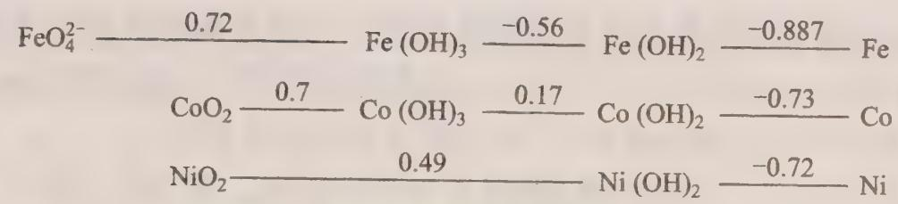  
图22-1 铁系元素的元素电势图

## 22.1.1 铁系元素的单质

通常情况下铁呈灰色,但纯铁是银白色的,钴呈灰色,镍呈白色,均具有金属光泽,都有强磁性,许多铁、钴、镍合金是很好的磁性材料。铁和镍的延展性好,钴硬而脆。按 Fe,Co,Ni 顺序,其原子半径略有减小,密度略有增大,熔点降低。

铁是用途最广泛的金属。它的用途很大程度上取决于它的纯度，纯度高的铁质地较软，用途很小。但铸铁和钢强度很高，是最重要的结构材料。目前，我国是世界上最大的钢铁生产国。国内最主要的铁矿产地在辽宁和湖北，但这些铁矿的含铁量相对不高，且又含有其他杂质。高品位的铁矿有赖从巴西和澳大利亚等国进口。

单质铁通常是在高温条件下由碳还原铁的氧化物制得。高纯度的铁可以使用氢还原高纯度的氧化铁或直接用五羰基合铁 $\left[\mathrm{Fe}(\mathrm{CO})_{5}\right]$ 热分解制得。

钴和镍及其化合物均极有实用价值。

金属钴的提取通常先由碳或铝在高温下还原其氧化物，再经电解纯化。钴主要用于制造特种钢和磁性材料。钴的化合物广泛用作颜料和催化剂。维生素 $\mathbf{B}_{12}$ 含有钴，可用作防治恶性贫血病的药物。

镍主要用作其他金属的保护层或用来生产耐腐蚀的合金钢、硬币及耐热元件。镍是一种很好的催化剂，常用于不饱和有机物氢化反应及水蒸气中甲烷裂解生产一氧化碳和氢气的反应。

铁、钴、镍属于中等活泼的金属，活泼性按 Fe, Co, Ni 顺序递减。极细的铁粉在空气中可能迸发火光。成块状的纯铁、钴、镍单质在空气和纯水中是稳定的，含有杂质的铁在潮湿空气中可缓慢锈蚀，形成结构疏松的棕色铁锈 $Fe_{2}O_{3}$ $nH_{2}O$ 。铁的锈蚀发生必须有氧气、水及一种电解质的存在，其电化学过程如下：

$$
\begin{array}{r l} & \mathrm {Fe = Fe^ {2 + } + 2e^ {-}} \\ & \mathrm {O_ {2} + 2H_ {2} O + 4e^ {-} = 4OH^ {-}} \\ & 4 \mathrm {Fe(OH) _ {2} + O_ {2} = 2Fe_ {2} O_ {3} + 4H_ {2} O} \end{array}
$$

但经过强氧化性的物质如浓硝酸等处理过的铁表面,形成一层致密的氧化物膜,可以保护铁表面免受潮湿空气的锈蚀。钴和镍被空气氧化可生成薄而致密的膜,这层膜可保护金属使之不继续被腐蚀。钴在加热条件下与空气中的氧反应,温度较低时生成 $Co_{3}O_{4}$ 和 CoO。升高温度至 900 ℃ 以上时, $Co_{3}O_{4}$ 分解,于是氧化产物为 CoO。加热条件下,镍与氧气反应生成 NiO。

铁在红热情况下,与硫、氯、溴等发生剧烈作用。在 200\~300 ℃ 下,铁与卤素反应生成 $FeF_{3}$ , $FeCl_{3}$ , $FeBr_{3}$ 及 $FeI_{2}$ 。由于 $Fe^{3+}$ 的氧化性及 $I^{-}$ 的还原性, $FeI_{3}$ 不稳定。在赤热条件下,水蒸气与铁反应生成 $Fe_{2}O_{3}$ 和氢气。钴与氟可以化合成 $CoF_{3}$ ,与其他卤素则只能得到 Co(Ⅱ)化合物。镍与氟反应生成的氟化物保护膜可以阻止反应的继续进行。

铁系金属都难与强碱发生反应。其中，镍的稳定性最高，可以使用镍制坩埚熔融强碱。

金属镍尤其是微细的镍粉有很强的吸收分子氢的能力,最多可吸收935倍于自身体积的氢。

## 22.1.2 铁系元素的简单化合物

铁系元素经常形成氧化数为+2和+3的化合物。

## 1. 铁的简单化合物

黑色的 FeO 和红棕色的 $Fe_{2}O_{3}$ 是铁元素最基本的氧化物, 黑色的 $Fe_{3}O_{4}$ , 其中含有 Fe(Ⅱ) 和 Fe(Ⅲ)。可以将四氧化三铁看成 $\mathrm{Fe}(\mathrm{FeO}_{2})_{2}$ , 即铁酸亚铁。将其溶于稀盐酸中, 溶液中存在 $Fe^{2+}$ 和 $Fe^{3+}$ :

$$
\mathrm{Fe} _ {3} \mathrm{O} _ {4} + 8 \mathrm{HCl} (\mathrm{aq}) = \mathrm{FeCl} _ {2} + 2 \mathrm{FeCl} _ {3} + 4 \mathrm{H} _ {2} \mathrm{O}
$$

在隔绝空气的条件下加热分解草酸亚铁,可以制得黑色粉末状的 FeO:

$$
\mathrm{FeC} _ {2} \mathrm{O} _ {4} \stackrel {\triangle} {=} \mathrm{FeO} + \mathrm{CO} \uparrow + \mathrm{CO} _ {2} \uparrow
$$

这样的氧化亚铁具有很高的活性,在空气中能自燃。

Fe(Ⅱ)盐与碱溶液在无氧条件下作用得到白绿色 $\mathrm{Fe(OH)}_{2}$ 沉淀,与空气中的氧作用时它迅速转变为灰蓝绿色,产物分别是 Fe(Ⅱ)和 Fe(Ⅲ)氢氧化物的混合物及水合 $Fe_{2}O_{3}$ ，最后转化为棕红色的 $\mathrm{Fe(OH)}_{3}$ 。

$\mathrm{Fe(OH)}_{2}$ 不仅溶于酸,也微溶于 $\mathrm{NaOH}$ 浓溶液。但并不以此称 $\mathrm{Fe(OH)}_{2}$ 具有两性。

亚铁盐在空气中或溶液中若遇到 $O_{2}, Br_{2}, HNO_{3}$ 等很容易被氧化成 Fe(Ⅲ)，但其复盐 $\mathrm{FeSO}_{4}\cdot(\mathrm{NH}_{4})_{2}\mathrm{SO}_{4}\cdot6\mathrm{H}_{2}\mathrm{O}$ 在空气中较稳定。

$\mathrm{FeSO_{4}\cdot(NH_{4})_{2}SO_{4}\cdot6H_{2}O}$ 为浅蓝绿色晶体，称为莫尔盐，可以用作氧化还原滴定的还原剂。

铁的碳酸盐、磷酸盐等弱酸盐在水中都是难溶的。铁的硫酸盐、硝酸盐易溶于水，因为水解作用溶液不同程度地呈酸性。

由于 d 轨道处于未充满状态, 铁的水合离子具有一定的颜色, $\left[\mathrm{Fe}\left(\mathrm{H}_{2}\mathrm{O}\right)_{6}\right]^{2+}$ 呈浅绿色, $\left[\mathrm{Fe}\left(\mathrm{H}_{2}\mathrm{O}\right)_{6}\right]^{3+}$ 呈淡紫色。

但是 $Fe^{3+}$ 的水解程度严重, 故 +3 价铁的强酸盐溶于水, 得不到淡紫色的 $\left[\mathrm{Fe}\left(\mathrm{H}_{2}\mathrm{O}\right)_{6}\right]^{3+}$ , 而是逐渐水解生成黄色的 $\left[\mathrm{Fe}\left(\mathrm{OH}\right)\left(\mathrm{H}_{2}\mathrm{O}\right)_{5}\right]^{2+}$ 及如图 22-2 所示的二聚体 $\left[\mathrm{Fe}_{2}\left(\mathrm{OH}\right)_{2}\left(\mathrm{H}_{2}\mathrm{O}\right)_{8}\right]^{4+}$ 。随着 pH 升高, 生成棕色的 $\beta-\mathrm{FeO}(\mathrm{OH})$ 胶体, 在更高的 pH 下, 则最终生成 $Fe_{2}O_{3} \cdot nH_{2}O$ 沉淀。

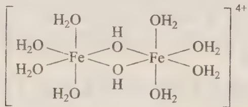  
图 22-2 二聚体 $\left[\mathrm{Fe}_{2}(\mathrm{OH})_{2}(\mathrm{H}_{2}\mathrm{O})_{8}\right]^{4+}$ 的结构示意图

向 $Fe^{3+}$ 的溶液中加入 $Na_{2}CO_{3}$ 或 $Na_{2}S$ 时，均生成 $\mathrm{Fe(OH)}_{3}$ 沉淀，这也是 $Fe^{3+}$ 发生水解的一个表现。

大量的 $FeCl_{3}$ 用于污水处理，在 pH=6\~7 的污水中， $Fe^{3+}$ 水解为胶状的 $\mathrm{FeO(OH)}$ ，它对油腻、聚合物等悬浮物有较强的吸附能力，同时可以沉淀重金属离子、降低磷酸盐的浓度。

水合硫酸亚铁 $\left(\mathrm{FeSO}_{4}\cdot7\mathrm{H}_{2}\mathrm{O}\right)$ 为蓝绿色晶体,俗称绿矾,可由铁屑溶于稀硫酸制得。它是制备其他铁化合物的常用起始原料,如被用于蓝黑墨水及其他染料的生产,还可以用作木材防腐处理和污水处理。

硫酸铁 $\left[\mathrm{Fe}_{2}(\mathrm{SO}_{4})_{3}\right]$ 是一种常见的 Fe(Ⅲ) 原料, 可以通过 $\mathrm{FeSO}_{4}$ 氧化或 $\mathrm{Fe}_{2} \mathrm{O}_{3}$ 与硫酸反应制得; 主要用作氧化铁颜料的生产原料; 其与 $(\mathrm{NH}_{4})_{2} \mathrm{SO}_{4}$ 形成的复盐 $\mathrm{NH}_{4} \mathrm{Fe}(\mathrm{SO}_{4})_{2} \cdot 12 \mathrm{H}_{2} \mathrm{O}$ 俗称铁铵矾, 可用于鞣革。

$FeCl_{3}\cdot6H_{2}O$ 呈橘黄色。无水三氯化铁 $\left(\mathrm{FeCl}_{3}\right)$ 为棕黑色，可由铁屑与干燥氯气在500\~700℃条件下反应制得。无水三氯化铁的共价性较强，其熔点为

307.6 ℃, 沸点约为 316 ℃, 可以升华。它极易吸潮而变成 $FeCl_{3} \cdot nH_{2}O$ 。400 ℃以下的气态 $FeCl_{3}$ 主要以二聚体形式存在：

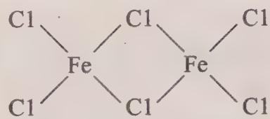

若有过量氯气存在,在 $750^{\circ}C$ 左右二聚体将分解为单聚体。在真空中加热,超过 $500^{\circ}C$ 时 $FeCl_{3}$ 分解为 $FeCl_{2}$ 和 $Cl_{2}$ 。

+3 价铁盐是一种中等强度的氧化剂, 可以将 $\mathrm{KI}, \mathrm{H}_{2} \mathrm{~S}, \mathrm{SO}_{2}, \mathrm{Sn}^{2+}$ 等强还原剂氧化, 例如:

$$
\begin{array}{r l} & 2 \mathrm{Fe} ^ {3 +} + 2 \mathrm{I} ^ {-} = 2 \mathrm{Fe} ^ {2 +} + \mathrm{I} _ {2} \\ & 2 \mathrm{Fe} ^ {3 +} + \mathrm{H} _ {2} \mathrm{S} = 2 \mathrm{Fe} ^ {2 +} + \mathrm{S} \downarrow + 2 \mathrm{H} ^ {+} \end{array}
$$

$FeCl_{3}$ 的水溶液对铜的溶解能力,使之用于印刷电路板的刻蚀:

$$
2 \mathrm{Fe} ^ {3 +} + \mathrm{Cu} = 2 \mathrm{Fe} ^ {2 +} + \mathrm{Cu} ^ {2 +}
$$

在强碱中 $\mathrm{Fe(OH)}_{3}$ 可以被氧化生成紫色的高铁酸根 $\left(\mathrm{FeO}_{4}^{2-}\right)$ :

$$
2 \mathrm{Fe} (\mathrm{OH}) _ {3} + 3 \mathrm{Cl} _ {2} + 1 0 \mathrm{OH} ^ {-} = 2 \mathrm{FeO} _ {4} ^ {2 -} + 6 \mathrm{Cl} ^ {-} + 8 \mathrm{H} _ {2} \mathrm{O}
$$

高铁酸钡是红棕色沉淀：

$$
\mathrm{FeO} _ {4} ^ {2 -} + \mathrm{Ba} ^ {2 +} = \mathrm{BaFeO} _ {4} \downarrow
$$

在酸性条件下, $FeO_{4}^{2-}$ 氧化性极强而不稳定:

$$
4 \mathrm{FeO} _ {4} ^ {2 -} + 2 0 \mathrm{H} ^ {+} = 4 \mathrm{Fe} ^ {3 +} + 3 \mathrm{O} _ {2} \uparrow + 1 0 \mathrm{H} _ {2} \mathrm{O}
$$

## 2. 钴和镍的简单化合物

钴元素有氧化数为+2的灰色氧化物 $\mathrm{CoO}$ , 可用作玻璃、陶瓷等的蓝色染料。黑色氧化物 $\mathrm{Co}_{3} \mathrm{O}_{4}$ 中含有 $\mathrm{Co(II)}$ 和 $\mathrm{Co(III)}$ 。

向 $Co^{2+}$ 盐溶液中加入碱，先生成蓝色的 $\mathrm{Co(OH)}_{2}$ 沉淀。这种蓝色的 $\mathrm{Co(OH)}_{2}$ 不稳定，放置或加热转化为粉红色 $\mathrm{Co(OH)}_{2}$ 。 $\mathrm{Co(OH)}_{2}$ 既与稀盐酸反应，又与氢氧化钠溶液反应，具有两性：

$$
\begin{array}{r l} & {\mathrm {Co(OH) _ {2} + 2HCl(aq) = CoCl_ {2} + 2H_ {2} O}} \\ & {\mathrm {Co(OH) _ {2} + 2NaOH(浓) = Na_ {2} [Co(OH) _ {4} ]}} \end{array}
$$

$\mathrm{Co(OH)}_{2}$ 在碱性条件下或空气中很容易被氧化成 $\mathrm{Co(OH)}_{3}$ 。但不论是 $\mathrm{Co(OH)}_{3}$ 还是 $\mathrm{Co}_{3} \mathrm{O}_{4}$ 中的 $\mathrm{Co(III)}$ ，在酸性介质中氧化性均很强，与盐酸作用放出 $\mathrm{Cl}_{2}$ ：

$$
\begin{array}{l} \mathrm{Co} _ {3} \mathrm{O} _ {4} + 8 \mathrm{HCl(aq)} = 3 \mathrm{CoCl} _ {2} + \mathrm{Cl} _ {2} \uparrow + 4 \mathrm{H} _ {2} \mathrm{O} \\ 2 \mathrm{Co(OH)} _ {3} + 6 \mathrm{HCl(aq)} = 2 \mathrm{CoCl} _ {2} + \mathrm{Cl} _ {2} \uparrow + 6 \mathrm{H} _ {2} \mathrm{O} \end{array}
$$

通过下面 $\mathrm{Co(III) / Co(II)}$ 在不同介质条件下的标准电极电势数值, 可以很好地理解上述实验现象:

$$
\begin{array}{l l} \mathrm {Co(OH) _ {3} + e ^ {-} = Co(OH) _ {2} + OH^ {-}} & E _ {\mathrm{B}} ^ {\ominus} = 0. 1 7 \mathrm{V} \\ \mathrm {Co^ {3 + } + e ^ {-} = Co^ {2 + }} & E _ {\mathrm{A}} ^ {\ominus} = 1. 9 2 \mathrm{V} \end{array}
$$

无水盐 $CoF_{2}$ 为红色, $CoCl_{2}$ 为蓝色, $CoBr_{2}$ 为绿色, $CoI_{2}$ 为黑色。实验试剂用的多为粉红色的水合盐, 如 $CoCl_{2} \cdot 6H_{2}O$ , $CoSO_{4} \cdot 7H_{2}O$ 和 $\mathrm{Co(NO_{3})_{2} \cdot 6H_{2}O}$ 。它们均可通过氧化钴与对应的酸反应制备。

利用 $CoCl_{2}$ 水合前后颜色的不同, 将其掺入硅胶中作为硅胶含水量的指示剂。用于指示空气湿度变化的“变色花”也是利用 $\mathrm{Co(II)}$ 的这种性质。

铝板氧化层用极稀的 $\mathrm{Co}(\mathrm{NO}_{3})_{2}$ 溶液处理后灼烧，即显蓝色。这是由于硝酸钴分解生成的 CoO 与 $Al_{2}O_{3}$ 作用生成蓝色的偏铝酸钴：

$$
\mathrm{CoO} + \mathrm{Al} _ {2} \mathrm{O} _ {3} \xlongequal {\text {灼烧}} \mathrm{Co(AlO} _ {2}) _ {2}
$$

Co(Ⅲ)在酸性介质中的氧化性很强,可以将 $Mn^{2+}$ 氧化成 $MnO_{4}^{-}$ :

$$
5 \mathrm{Co} ^ {3 +} + \mathrm{Mn} ^ {2 +} + 4 \mathrm{H} _ {2} \mathrm{O} = 5 \mathrm{Co} ^ {2 +} + \mathrm{MnO} _ {4} ^ {-} + 8 \mathrm{H} ^ {+}
$$

$Co^{3+}$ 可以将 $H_{2}O$ 氧化,致使其在水溶液中不能稳定存在:

$$
4 \mathrm{Co} ^ {3 +} + 2 \mathrm{H} _ {2} \mathrm{O} = 4 \mathrm{Co} ^ {2 +} + 4 \mathrm{H} ^ {+} + \mathrm{O} _ {2} \uparrow
$$

Co(Ⅲ)的简单化合物通常不稳定,市售的+3价钴试剂仅有 $CoF_{3}$ 。通过在 $H_{2}SO_{4}$ 水溶液中电解氧化 Co(Ⅱ),已制得蓝色的 $\mathrm{Co}_{2}(\mathrm{SO}_{4})_{3}\cdot18\mathrm{H}_{2}\mathrm{O}$ ,其中含有 $[\mathrm{Co}(\mathrm{H}_{2}\mathrm{O})_{6}]^{3+}$ 结构单元。该化合物在干燥的条件下稳定,潮湿条件下会分解。

无水氧化物 $Co_{2}O_{3}$ 尚未制得纯品,但当过量碱同大多数 $\mathrm{Co(III)}$ 作用时会很慢地沉淀出棕黑色水合 $\mathrm{Co(III)}$ 氧化物。

镍元素有氧化数为+2的绿色氧化物 NiO 和绿色氢氧化物 $\mathrm{Ni(OH)}_{2}$ 。尽管纯的 $Ni_{2}O_{3}$ 尚未见报道，但是在 NaOH 介质中，用溴氧化硝酸镍可以得到黑色的 $\mathrm{NiO(OH)}$ ：

$$
2 \mathrm{Ni} ^ {2 +} + \mathrm{Br} _ {2} + 6 \mathrm{OH} ^ {-} = 2 \mathrm{NiO(OH)} \downarrow + 2 \mathrm{Br} ^ {-} + 2 \mathrm{H} _ {2} \mathrm{O}
$$

$\mathrm{NiO(OH)}$ 的化学组成与水合 $\mathrm{Ni}_{2} \mathrm{O}_{3}$ 一致, 其中镍的氧化数为 $+3$ , 它是极强的氧化剂:

$$
2 \mathrm{NiO} (\mathrm{OH}) + 6 \mathrm{HCl} (\mathrm{aq}) = 2 \mathrm{NiCl} _ {2} + \mathrm{Cl} _ {2} \uparrow + 4 \mathrm{H} _ {2} \mathrm{O}
$$

$Ni^{3+}$ 可以将 $H_{2}O$ 氧化，故在水溶液中不能存在。

$\mathrm{Fe(OH)}_{2}$ 和 $\mathrm{Co(OH)}_{2}$ 很容易被空气中的氧气氧化成高价,但是 $\mathrm{Ni(OH)}_{2}$ 不能被空气所氧化。制备高价态的镍要使用强氧化剂在碱性介质中进行,而且在使用时制备为好,因为它不稳定。

$Ni^{2+}$ 水合盐晶体多为绿色, 如氯化物 $NiCl_{2}\cdot6H_{2}O$ , 硫酸盐 $NiSO_{4}\cdot7H_{2}O$ , 硝酸盐 $\mathrm{Ni(NO_{3})_{2}\cdot6H_{2}O}$ 。 $Ni^{2+}$ 的溶液主要用于金属材料的电镀保护。

$\mathrm{Co(OH)}_{2}$ 和 $\mathrm{Ni(OH)}_{2}$ 易溶于氨水生成配位化合物, 其溶解度在有 $\mathrm{NH}_{4}\mathrm{Cl}$ 存在时增大。 $\mathrm{Fe(OH)}_{2}$ 和 $\mathrm{Fe(OH)}_{3}$ 不溶于氨水。 $\mathrm{Fe}^{2+}$ 和 $\mathrm{Fe}^{3+}$ 在氨水中都生成沉淀, 在水溶液中不生成氨的配位化合物:

$$
\mathrm{Fe} ^ {2 +} + 2 \mathrm{NH} _ {3} \cdot \mathrm{H} _ {2} \mathrm{O} = \mathrm{Fe(OH)} _ {2} \downarrow + 2 \mathrm{NH} _ {4} ^ {+}
$$

$$
\mathrm{Fe} ^ {3 +} + 3 \mathrm{NH} _ {3} \cdot \mathrm{H} _ {2} \mathrm{O} = \mathrm{Fe(OH)} _ {3} \downarrow + 3 \mathrm{NH} _ {4} ^ {+}
$$

FeS, $Fe_{2}S_{3}$ , CoS 和 NiS 均为黑色的难溶性化合物, 它们可以溶于稀盐酸。

## 22.1.3 铁系元素的配位化合物

铁系元素作为过渡金属,都有空 d 轨道可以接受电子对,能够生成多种配位化合物。

## 1. 铁的配位化合物

在盐酸中, $\mathrm{Fe}^{3+}$ 与氯离子形成黄色的配离子 $\left[\mathrm{FeCl}_{4}\right]^{-}$ 及 $\left[\mathrm{FeCl}_{4}\left(\mathrm{H}_{2}\mathrm{O}\right)_{2}\right]^{-}$ 。易溶于水的黄色 $\mathrm{FeCl}_{3}\cdot6\mathrm{H}_{2}\mathrm{O}$ , 实际上是一种配位化合物 $\left[\mathrm{Fe}\left(\mathrm{H}_{2}\mathrm{O}\right)_{4}\mathrm{Cl}_{2}\right]\mathrm{Cl}\cdot2\mathrm{H}_{2}\mathrm{O}$ , 其中的配位单元具有反式结构。三氯化铁在水溶液中随着氯离子浓度的不同, 可能以 $\left[\mathrm{FeCl}\left(\mathrm{H}_{2}\mathrm{O}\right)_{5}\right]^{2+},\left[\mathrm{FeCl}_{2}\left(\mathrm{H}_{2}\mathrm{O}\right)_{4}\right]^{+},\left[\mathrm{FeCl}_{4}\left(\mathrm{H}_{2}\mathrm{O}\right)_{2}\right]^{-}$ 等形式存在。

$Fe^{3+}$ 与氟离子生成的配位单元主要是 $\left[FeF_{5}(H_{2}O)\right]^{2-}$ ，它无色而且稳定常数较大。利用这一点，氟化物在分析化学中经常作为+3价铁的掩蔽剂。因为 $F^{-}$ 的加入不仅排除了 $Fe^{3+}$ 的颜色对于待分析物的干扰，同时也阻止了 $Fe^{3+}$ 与其他分析试剂的反应。

人们经常用 KSCN 或 $NH_{4}SCN$ 在水溶液中与 $Fe^{3+}$ 生成红色的配位化合物来鉴定 $Fe^{3+}$ ，配离子可以写成 $\left[\mathrm{Fe}\left(\mathrm{SCN}\right)_{n}\right]^{3-n}$ 或 $\left[\mathrm{Fe}\left(\mathrm{SCN}\right)_{n}\left(\mathrm{H}_{2}\mathrm{O}\right)_{6-n}\right]^{3-n}$ $(n=1\sim6)$ ，随着溶液中配位化合物浓度增大，溶液的颜色从浅红到暗红。一般认为， $\left[\mathrm{Fe}\left(\mathrm{SCN}\right)\left(\mathrm{H}_{2}\mathrm{O}\right)_{5}\right]^{2+}$ 是红颜色的主要成分，但简单盐 $\mathrm{Fe}(\mathrm{SCN})_{3}$ 和配位单元 $\left[\mathrm{Fe}\left(\mathrm{SCN}\right)_{4}\right]^{-}$ 及 $\left[\mathrm{Fe}\left(\mathrm{SCN}\right)_{6}\right]^{3-}$ 也都被离析出来。

$K_{4}[Fe(CN)_{6}]\cdot3H_{2}O$ 晶体为黄色,俗称黄血盐,由 Fe(Ⅱ)化合物的水溶液和过量氰化物作用获得。黄血盐在溶液中遇 $Fe^{3+}$ 生成蓝色的沉淀，即普鲁士蓝 $\mathrm{Fe}_{4}^{\mathrm{III}}\left[\mathrm{Fe}^{\mathrm{II}}(\mathrm{CN})_{6}\right]_{3}$ 。

$K_{3}[Fe(CN)_{6}]$ 晶体为红色,俗称赤血盐,常利用黄血盐氧化得到:

$$
2 \mathrm{K} _ {4} [ \mathrm{Fe(CN)} _ {6} ] + \mathrm{Cl} _ {2} = 2 \mathrm{K} _ {3} [ \mathrm{Fe(CN)} _ {6} ] + 2 \mathrm{KCl}
$$

赤血盐在溶液中遇 $Fe^{2+}$ 生成蓝色的滕氏蓝沉淀 $\mathrm{Fe}_{4}^{\mathrm{III}}\left[\mathrm{Fe}^{\mathrm{II}}(\mathrm{CN})_{6}\right]_{3}$ 。

由于得来的途径不同,曾认为两种蓝色沉淀物的结构不相同。但后来的研究结果表明,普鲁士蓝和滕氏蓝具有完全相同的结构。

另有一种可溶性普鲁士蓝，其化学式为 $\mathrm{KFe[Fe(CN)_6]}$ 。因为两种价态的铁都在配位化合物内界，故将其化学式写成 $\mathbf{K}[\mathrm{Fe}^{\mathrm{III}}\mathrm{Fe}^{\mathrm{II}}(\mathrm{CN})_{6}]$ 更为合理。其骨架结构如图22-3所示，骨架为正六面体形。 $\mathrm{Fe(III)}$ 和 $\mathrm{Fe(II)}$ 相互交替地排列在正六面体的顶点，配体 $\mathrm{CN^{-}}$ 位于正六面体的棱上，其C原子向 $+2$ 价铁配位，N原子向 $+3$ 价铁配位。 $\mathbf{K}^{+}$ 位于骨架正六面体的空穴中，以平衡铁氰骨架的负电荷。

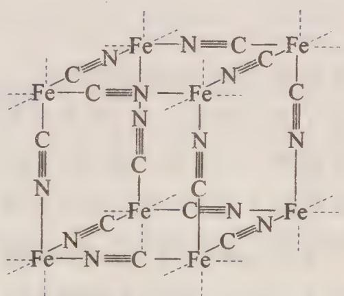  
图22-3 可溶性普鲁士蓝的骨架结构

普鲁士蓝和滕氏蓝的结构与可溶性普鲁士蓝相似,只是正六面体骨架顶点上的一个 Fe(Ⅱ)被换成水分子,同时与该 Fe(Ⅱ)配位的 3 个 CN⁻ 也被换成水分子。于是形成了化学组成为 Fe₄^III[Fe^II(CN)₆]₃ 的结构单元。

基于生成蓝色物质 $\mathrm{Fe}_{4}^{\mathrm{III}}\left[\mathrm{Fe}^{\mathrm{II}}(\mathrm{CN})_{6}\right]_{3}$ 的化学原理发展起来的晒制蓝图技术，在复印机诞生之前广泛用于工程图纸的复制。一般以柠檬酸铁（Ⅲ）铵和赤血盐的混合溶液涂在白色晒图纸上，而工程设计图用黑色绘图墨水绘制在透明的绘图纸上。将晒图纸衬于绘图纸下面置于日光下暴晒。晒图纸上受光照的部分即未被绘图纸上文字及图形遮住的部分，柠檬酸铁（Ⅲ）铵被还原成亚铁盐。赤血盐遇到亚铁盐，立即生成 $\mathrm{Fe}_{4}^{\mathrm{III}}\left[\mathrm{Fe}^{\mathrm{II}}(\mathrm{CN})_{6}\right]_{3}$ 蓝色沉淀。晒图纸上未受到光照的部分，即被绘图纸上文字及图形遮住的部分，仍为可溶性的盐类，用水将其溶解掉，显示出纸的白色。这样便可在蓝底上得到清晰的白色图样。

配离子 $\left[\mathrm{Fe}(\mathrm{CN})_{6}\right]^{4-}$ 的稳定常数约为 $1\times 10^{35},\left[\mathrm{Fe}(\mathrm{CN})_{6}\right]^{3-}$ 的稳定常数约为 $1\times 10^{42}$ ,两个稳定常数都特别大。所以在水溶液中这些配离子难以解离出剧毒的 $\mathrm{CN^{-}}$ ，因而黄血盐和赤血盐毒性均极低。

+3 价铁与草酸根 $\left(\mathrm{C}_{2}\mathrm{O}_{4}^{2-}\right)$ 形成的 $\left[\mathrm{Fe}\left(\mathrm{C}_{2}\mathrm{O}_{4}\right)_{3}\right]^{3-}$ 为黄绿色,这里 $C_{2}O_{4}^{2-}$ 为双齿配体,该配位单元可能有一对旋光异构体。将 $FeCl_{3}$ 溶液与过量的 $K_{2}C_{2}O_{4}$ 浓溶液混合,则析出 $\mathrm{K}_{3}[\mathrm{Fe}(\mathrm{C}_{2}\mathrm{O}_{4})_{3}]\cdot 3\mathrm{H}_{2}\mathrm{O}$ 绿色晶体。 $\mathrm{K}_{3}[\mathrm{Fe}(\mathrm{C}_{2}\mathrm{O}_{4})_{3}]$ 具有光学活性,见光分解生成黄色的 $\mathrm{FeC}_{2}\mathrm{O}_{4}$ :

$$
2 \mathrm{K} _ {3} \left[ \mathrm{Fe} \left(\mathrm{C} _ {2} \mathrm{O} _ {4}\right) _ {3} \right] \stackrel {h \nu} {=} 2 \mathrm{FeC} _ {2} \mathrm{O} _ {4} + 2 \mathrm{CO} _ {2} \uparrow + 3 \mathrm{K} _ {2} \mathrm{C} _ {2} \mathrm{O} _ {4}
$$

向 $\mathrm{FeCl}_3$ 溶液中加入磷酸，溶液由黄色变为无色，这是因为生成了无色的配离子 $[\mathrm{Fe(HPO_4)_3}]^{3-}$ 和 $[\mathrm{Fe(PO_4)_3}]^{6-}$ 。

+2 价铁与 1,10-邻二氮菲 (phen) 等多齿配体在水溶液中形成稳定的螯合物：

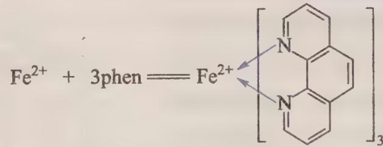

$\left[\mathrm{Fe}\left(\mathrm{phen}\right)_{3}\right]^{2+}$ 在水溶液中为红色, 通过氧化可以转化为蓝色的 $\left[\mathrm{Fe}\left(\mathrm{phen}\right)_{3}\right]^{3+}$ , 利用这种颜色的变化, 可以作为氧化还原滴定的指示剂。值得一提的是, phen 与 $\mathrm{Fe}^{2+}$ 形成的配位化合物 $\left[\mathrm{Fe}\left(\mathrm{phen}\right)_{3}\right]^{2+}$ 比其与 $\mathrm{Fe}^{3+}$ 形成的配位化合物 $\left[\mathrm{Fe}\left(\mathrm{phen}\right)_{3}\right]^{3+}$ 稳定。这可由下列标准电极电势数据得到间接说明:

$$
\begin{array}{r l r} & {\left[ \mathrm{Fe} (\mathrm{phen}) _ {3} \right] ^ {3 +} + \mathrm{e} ^ {-} = [ \mathrm{Fe} (\mathrm{phen}) _ {3} ] ^ {2 +}} & {E ^ {\ominus} = 1. 1 5 \mathrm{V}} \\ & {\left[ \mathrm{Fe} (\mathrm{H} _ {2} \mathrm{O}) _ {6} \right] ^ {3 +} + \mathrm{e} ^ {-} = [ \mathrm{Fe} (\mathrm{H} _ {2} \mathrm{O}) _ {6} ] ^ {2 +}} & {E ^ {\ominus} = 0. 7 7 \mathrm{V}} \end{array}
$$

在第 15 章 15.3.3 硝酸及其盐小节中, 曾提到利用 $Fe^{2+}$ 鉴定硝酸盐的棕色环实验, 生成的棕色物质就是配离子 $\left[\mathrm{Fe}(\mathrm{NO})(\mathrm{H}_{2}\mathrm{O})_{5}\right]^{2+}$ 。NO 是 N(V) 的还原产物, 相关的反应为

$$
\mathrm{NO} _ {3} ^ {-} + 3 \mathrm{Fe} ^ {2 +} + 4 \mathrm{H} ^ {+} = \mathrm{NO} + 3 \mathrm{Fe} ^ {3 +} + 2 \mathrm{H} _ {2} \mathrm{O}
$$

测得 $\left[\mathrm{Fe}(\mathrm{NO})(\mathrm{H}_2\mathrm{O})_5\right]^{2+}$ 的磁矩为 $3.8\mu_{\mathrm{B}}$ ，说明其具有3个单电子，研究表明这些单电子全部属于中心Fe，而配体NO中没有单电子。具有3个单电子的中心应为 $\mathrm{d}^7$ 电子组态的 $\mathrm{Fe}^+$ 。据此可推断，配位时NO处于反键 $2\pi^*$ 轨道上的电子转移到中心上，自身成为 $\mathrm{NO}^+$ ：

$$
\mathrm{Fe} ^ {2 +} + \mathrm{NO} \longrightarrow \mathrm{NO} ^ {+} + \mathrm{Fe} ^ {+}
$$

$NO^{+}$ 与 CO 是等电子体, 其分子轨道能级图可以参见本书上册图 6-24。 $NO^{+}$ 向 $Fe^{+}$ 提供一对 $5\sigma$ 电子形成 $\sigma$ 配键, 同时 $NO^{+}$ 提供反键 $2\pi^{*}$ 轨道接受 $Fe^{+}$ 的 d 电子形成反馈 $\pi$ 配键, 如本书上册图 11-6 所示。这些电荷迁移的结果导致

$\left[\mathrm{Fe}(\mathrm{NO})(\mathrm{H}_{2}\mathrm{O})_{5}\right]^{2+}$ 呈棕色。

Fe(Ⅱ)的一个重要配位化合物是环戊二烯基配位化合物 $\left[\mathrm{Fe}\left(\mathrm{C}_{5}\mathrm{H}_{5}\right)_{2}\right]$ ，俗

称二茂铁。二茂铁为具有如图 22-4 所示的夹心式结构的橙黄色固体。

二茂铁的合成是有机金属化学发展的一个里程碑。1951年，两个研究小组几乎同时用不同的方法合成出二茂铁。由于对二茂铁结构的表征及其后来在这个领域研究的杰出贡献，英国人威尔金森(Wilkinson)和德国人费歇尔(Fischer)共享1973年诺贝尔化学奖。

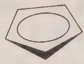  
(a)

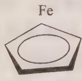  
(b)  
图 22-4 二茂铁的夹心式结构

早期结构测定,二茂铁在气态时为图 22-4(a) 所示的重叠式构型,而在固态时具有图 22-4(b) 所示的交错式构型。进一步研究表明,二茂铁在室温下也不是规则的交错型结构。Fe(Ⅱ)夹在两个茂环平面之间,所有的 C—C 键键长及 Fe—C 键键长均分别相等。该配位化合物因具有通过 Fe(Ⅱ) 的空 d 轨道与茂环上 5 个 p 轨道重叠形成的非定域 π 配位键而稳定。二茂铁结构中没有不成对的电子。

二茂铁可用作汽油的抗震剂、橡胶及硅树脂的熟化剂，以及紫外线的吸收剂，二茂铁及其衍生物还可用作火箭燃料添加剂。

二茂铁的出现立即引起人们的广泛关注,这类化合物的合成及表征迅速成为化学研究的热点,各种金属的夹心化合物及其衍生物自此层出不穷。

一定条件下铁能与 CO 反应生成羰基配位化合物, 如单核的 $\left[\mathrm{Fe}(\mathrm{CO})_{5}\right]$ , 双核的 $\left[\mathrm{Fe}_{2}(\mathrm{CO})_{9}\right]$ 等。它们的热稳定性较差, 可以通过热解羰基化合物得到高纯度的金属粉末。

过渡金属与含有 $\pi$ 键的配体, 如 $\mathrm{CN}^{-}, \mathrm{CO}, \mathrm{phen}, \mathrm{C}_{5} \mathrm{H}_{5}^{-}$ 等成键时, 既有配体电子向过渡金属的空轨道配位所形成的配键, 又有过渡金属 d 电子向配体空的 $\pi^{*}$ 轨道配位而形成的反馈配键。这类配位化合物中都有反馈键, 在本书第 11 章中曾做过简要的探讨。

## 2. 钴和镍的配位化合物

Co(Ⅱ)配位化合物的颜色与其配位环境有关。通常八面体6配位Co(Ⅱ)的颜色为粉红至紫色,而四面体4配位的Co(Ⅱ)的颜色为蓝色。这对于区分水溶液中Co(Ⅱ)化合物的配位环境是很有帮助的。

$\left[\mathrm{Co}\left(\mathrm{H}_{2}\mathrm{O}\right)_{6}\right]^{2+}$ 为粉红色，在空气中稳定。将 $CoCl_{2}$ 浓溶液加热，溶液由粉红色变为蓝色，冷却后溶液又变为粉红色，原因是存在下列平衡：

$$
\begin{array}{c c} {\left[ \mathrm{Co} (\mathrm{H} _ {2} \mathrm{O}) _ {6} \right] ^ {2 +} + 4 \mathrm{Cl} ^ {-} = [ \mathrm{CoCl} _ {4} ] ^ {2 -} + 6 \mathrm{H} _ {2} \mathrm{O}} \\ {\text {粉红色}} & {\text {蓝色}} \end{array}
$$

所以向 $CoCl_{2}$ 浓溶液加浓盐酸,也能使溶液由粉红色变为蓝色。

蓝色的 $\left[\mathrm{Co}(\mathrm{SCN})_{4}\right]^{2-}$ 稳定常数较小, 约为 $1.0 \times 10^{3}$ , 在水溶液中有时不易观察到蓝色。但向水溶液中加入乙醚或戊醇, 蓝色的 $\left[\mathrm{Co}(\mathrm{SCN})_{4}\right]^{2-}$ 易被萃取到有机层而提高显色灵敏度。向溶液中加入 $\mathrm{NH}_{4} \mathrm{SCN}$ 生成蓝色物质 $\left[\mathrm{Co}(\mathrm{SCN})_{4}\right]^{2-}$ , 常用来鉴定 $\mathrm{Co}^{2+}$ 的存在。

不溶于水的蓝色化合物 $\mathrm{Hg}[\mathrm{Co}(\mathrm{SCN})_4]$ 常作为标准物来校正磁矩。

向 Co(Ⅱ)盐的溶液中加入适量氨水,生成蓝绿色沉淀,氨水过量则沉淀溶解生成黄色的 $\left[\mathrm{Co}\left(\mathrm{NH}_{3}\right)_{6}\right]^{2+}$ 。 $\left[\mathrm{Co}\left(\mathrm{NH}_{3}\right)_{6}\right]^{2+}$ 易被氧化,在空气中即可以被氧气缓慢氧化为更稳定的橙黄色 $\left[\mathrm{Co}\left(\mathrm{NH}_{3}\right)_{6}\right]^{3+}$ 。 $NH_{3}$ 与 $Co^{3+}$ 形成的配位化合物 $\left[\mathrm{Co}\left(\mathrm{NH}_{3}\right)_{6}\right]^{3+}$ 远比其与 $Co^{2+}$ 形成的配位化合物 $\left[\mathrm{Co}\left(\mathrm{NH}_{3}\right)_{6}\right]^{2+}$ 稳定,下列标准电极电势数据清楚地表明了 Co(Ⅲ)和 Co(Ⅱ)之间转化的可能性的大小:

$$
\begin{array}{l l} \mathrm{Co} ^ {3 +} + \mathrm{e} ^ {-} = \mathrm{Co} ^ {2 +} & E ^ {\ominus} = 1. 9 2 \mathrm{V} \\ \left[ \mathrm{Co} (\mathrm{NH} _ {3}) _ {6} \right] ^ {3 +} + \mathrm{e} ^ {-} = \left[ \mathrm{Co} (\mathrm{NH} _ {3}) _ {6} \right] ^ {2 +} & E ^ {\ominus} = 0. 1 0 8 \mathrm{V} \end{array}
$$

$\mathrm{Co}^{3+}$ 具有很强的氧化能力，在水溶液中不能稳定存在。所以大多数的 $\mathrm{Co(III)}$ 化合物为配位化合物。由于 $\mathrm{Co(III)}$ 配位化合物比 $\mathrm{Co(II)}$ 配位化合物稳定，因而 $\mathrm{Co(III)}$ 配位化合物大多采用间接的方法从 $\mathrm{Co(II)}$ 配位化合物氧化制备。这类化合物中研究得最多的是钴氨配位化合物。

黄色的 $\mathrm{K}_{3}\left[\mathrm{Co}\left(\mathrm{NO}_{2}\right)_{6}\right]$ 微溶于水, 因此, 用 $\mathrm{Na}_{3}\left[\mathrm{Co}\left(\mathrm{NO}_{2}\right)_{6}\right]$ 可沉淀溶液中的钾离子。

镍的水合离子 $\left[\mathrm{Ni}\left(\mathrm{H}_{2} \mathrm{O}\right)_{6}\right]^{2+}$ 为绿色。向 $+2$ 价镍盐水溶液中加入氨水，先有绿色 $\mathrm{Ni(OH)}_{2}$ 沉淀生成，氨水过量时沉淀溶解，得到 $\left[\mathrm{Ni}\left(\mathrm{NH}_{3}\right)_{6}\right]^{2+}$ 蓝色溶液。镍与乙二胺的配位化合物 $\left[\mathrm{Ni(en)}_{3}\right]^{2+}$ 为紫色。

向+2价镍盐水溶液中加入氰化钾溶液,先生成 $\mathrm{Ni(CN)}_{2}$ 绿色沉淀,氰化钾溶液适量时沉淀溶解,得到 $[\mathrm{Ni(CN)}_{4}]^{2-}$ 黄色(亦有无色的说法)溶液;继续加氰化钾溶液,最后生成 $[\mathrm{Ni(CN)}_{5}]^{3-}$ 红色溶液。 $[\mathrm{Ni(CN)}_{4}]^{2-}$ 为正方形构型,而 $[\mathrm{Ni(CN)}_{5}]^{3-}$ 有四角锥和三角双锥两种构型。

丁二酮肟：

$$
\begin{array}{c} \mathrm{H} _ {3} \mathrm{C} - \mathrm{C} = \mathrm{N} - \mathrm{OH} \\ | \\ \mathrm{H} _ {3} \mathrm{C} - \mathrm{C} = \mathrm{N} - \mathrm{OH} \end{array}
$$

可以与 $Ni^{2+}$ 反应,生成鲜红色的沉淀二丁二酮肟合镍:

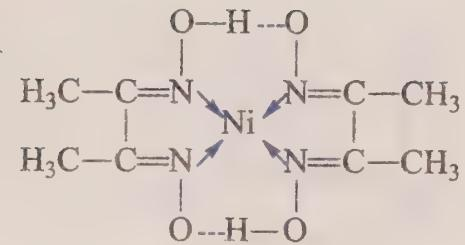

这个反应可以用来鉴定 $Ni^{2+}$ 的存在。

+3 价镍的配位化合物不多。紫色晶体 $\mathrm{K}_{3}[\mathrm{NiF}_{6}]$ 氧化能力强，能把水氧化；晶体中有拉长的八面体离子 $[\mathrm{NiF}_{6}]^{3-}$ 。五配位的 $[\mathrm{NiBr}_{3}(\mathrm{PEt}_{3})_{2}]$ 为黑色固体[Et表示乙基 $(-CH_{2}CH_{3})]$ ，具有三角双锥构型，其中3个溴原子位于双锥共用底面三角形的3个顶点。过渡金属与 $\mathrm{PR}_{3}$ 等磷的有机化合物分子成键时，既有磷原子的电子对向过渡金属空轨道配位形成的 $\sigma$ 配键，也有过渡金属的电子对向磷原子的空d轨道配位形成的反馈键 $\mathrm{d-d}\pi$ 配键。

钴和镍能形成一系列的羰基配位化合物,如最早发现的 $\left[\mathrm{Ni}(\mathrm{CO})_{4}\right]$ ，属于单核羰基配位化合物,为无色液体。利用 $\left[\mathrm{Ni}(\mathrm{CO})_{4}\right]$ 热分解可制备高纯度金属镍。其中心Ni原子 $sp^{3}$ 杂化致使 $\left[\mathrm{Ni}(\mathrm{CO})_{4}\right]$ 具有正四面体构型。在 $\left[\mathrm{Ni}(\mathrm{CO})_{4}\right]$ 中既有配体CO的电子对向过渡金属Ni原子的空轨道配位所形成的配键,又有过渡金属Ni原子的成对d电子向配体CO的 $\pi^{*}$ 空轨道反馈而形成的配键,见本书第11章例11-2及11.2.5小节的讨论。

$\left[\mathrm{Ni}(\mathrm{CO})_{4}\right]$ 中 Ni 原子的价层电子构型为 $3 \mathrm{~d}^{8} 4 \mathrm{~s}^{2}$ , 有 10 个电子, 4 个 CO 参与配位, 共提供 8 个电子。于是在形成 $\left[\mathrm{Ni}(\mathrm{CO})_{4}\right]$ 的过程中, 这 18 个电子使中心 Ni 原子的 9 条价层轨道, 包括 5 条 3d 轨道, 一条 4s 轨道和 3 条 4p 轨道, 全部充满。由于满足 18 电子规则, 所以 $\left[\mathrm{Ni}(\mathrm{CO})_{4}\right]$ 可以稳定存在。

钴的单核羰基配位化合物 $\left[\mathrm{Co}(\mathrm{CO})_{4}\right]$ 不符合18电子规则，不能稳定存在。在双核羰基配位化合物 $\left[\mathrm{Co}_{2}(\mathrm{CO})_{8}\right]$ 中，除有端羰基配体之外，还存在桥羰基配体（也称为酮式羰基），同时形成 $\mathrm{Co}-\mathrm{Co}$ 金属键。其中每个 $\mathrm{Co}$ 原子的配位数均为6，图22-5(a)给出了它的一种结构。

每个 Co 原子有 9 个价层电子 $3\mathrm{d}^{7}4\mathrm{s}^{2}$ , 在强场配体 CO 的作用下重排成 $3\mathrm{d}^{8}4\mathrm{s}^{1}$ 。两条有单电子的 3d 轨道、一条有单电子的 4s 轨道和 3 条空的 4p 轨道发生 $\mathrm{d}^{2}\mathrm{sp}^{3}$ 不等性杂化, 如图 22-5(b) 给出了杂化轨道的组成, 但没有表明其中各轨道的能量高低关系。结果 6 条杂化轨道中有 3 条空轨道和 3 条有单电子的轨道。其中 3 条空轨道与 3 个端羰基成键; 3 条有单电子的轨道, 其中两条与两个酮式羰基成键, 第三条与另一个 Co 原子成金属-金属键 (M—M)。

中心 Co 原子的价层电子构型为 $3d^{7}4s^{2}$ ，有 9 个价层电子，3 个端羰基共提供 6 个电子，两个酮式羰基共提供两个电子，另一个 Co 原子成 M—M 键提供一个电子, 中心周围电子总数为 18。由于满足 18 电子规则, 故四羰基钴以 $\left[\mathrm{Co}_{2}(\mathrm{CO})_{8}\right]$ 二聚形式存在。

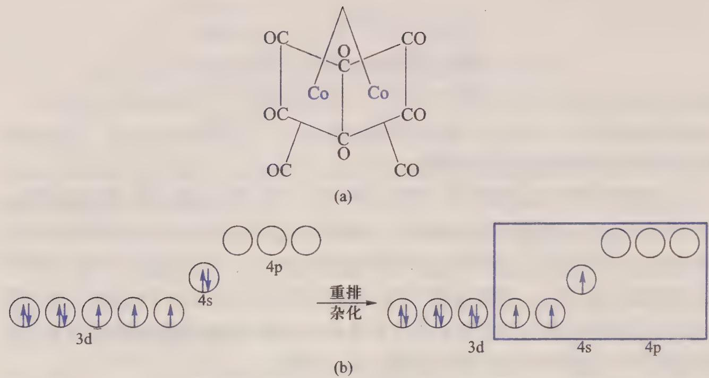  
图22-5 $\mathrm{Co}_2(\mathrm{CO})_8$ 的结构和轨道杂化

在一定的条件下,钴亦可生成多核配位化合物。

## 3. 铁系元素的生物配位化合物

铁系元素配位化合物在生命过程中起着非常重要的作用。血红蛋白(Hb)是血液中运输氧及二氧化碳的蛋白质,由球蛋白与辅基即血红素结合而成。血红素是由中心 $Fe^{2+}$ 与配体卟啉衍生物结合成的大环配位化合物,其结构如图 22-6 所示。

血红蛋白与氧疏松结合形成氧合血红蛋白 $\left(\mathrm{HbO}_{2}\right)$ ， $O_{2}$ 结合于大环配位化合物的中心 $Fe^{2+}$ 上，这种氧合作用在氧分压高时容易进行，氧分压低时易于解离。血红蛋白结合和携带 $O_{2}$ 的过程，不会将 $Fe^{2+}$ 氧化为无携带 $O_{2}$ 能力的 $Fe^{3+}$ 。由于 CO 为强场配体，CO 与 Hb 的亲和力远大于 $O_{2}$ ，结合成 HbCO 后使 Hb 丧失运输 $O_{2}$ 和 $CO_{2}$ 的机能，此即为一氧化碳中毒。铁元素除参与体内氧气和二氧化碳的转运、交换和组织呼吸过程之外，还有许多重要的生理功能。但摄入过量的铁也将使人体产生慢性或急性铁中毒，慢性铁中毒症状为肝含有大量的铁，导致肝硬化、胰腺纤维化等；急性铁中毒使胃肠道上皮发生严重而广泛的坏死，最终导致死亡。

维生素 $B_{12}$ 为钴与咕啉形成的配位化合物, 它的中心原子是钴, 其结构见图 22-7。

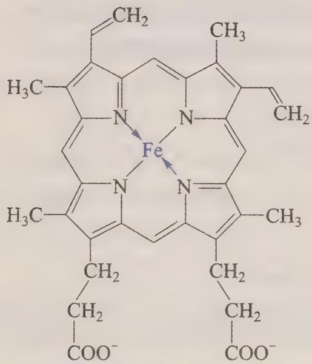  
图22-6 血红素的结构

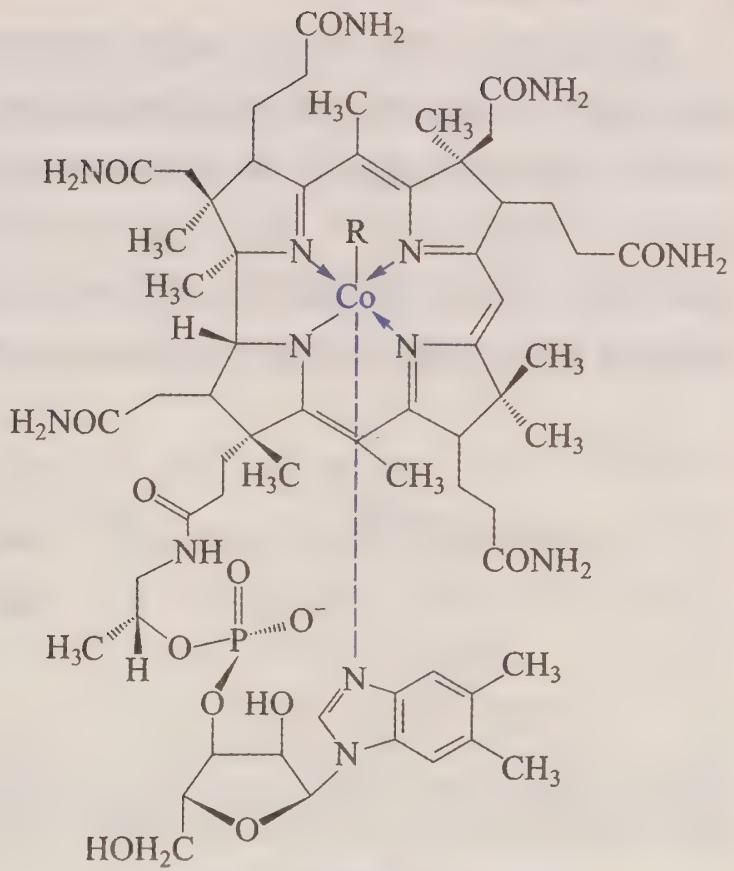  
图22-7 维生素 $\mathbf{B}_{12}$ 的结构

虽然含钴的维生素 $B_{12}$ 表现出具有治疗贫血症的功能,但是简单的钴离子却不能表现出这种功能。因此,不要盲目地使用简单的钴盐治疗疾病。值得注意的是,无机钴盐是有毒性的,它可以导致甲状腺不能充分发挥作用,从而引起甲状腺肿大。钴中毒的一个更为严重的后果是引起进行性心力衰竭,会损伤心脏。

## 22.2 铂系元素

铂系元素在地壳中的含量均较低,为稀有元素。它们在自然界主要以单质状态存在,高度分散于其他矿石中,与其他元素共生。铂系元素分布分散,丰度低,价格昂贵,且具有很高的物理、化学稳定性,与金、银一起统称为贵金属。

铂系元素中,铂是最早为人们认识的。有报道说在古埃及人的物品中发现含有铂,在美洲大陆被发现以前,厄瓜多尔的印第安人已经应用天然铂或其合金制造小型饰物。1735年,西班牙人乌罗阿(Ulloa)在秘鲁平托河的金矿中发现了金属铂,并于1748年发表了他的报告。1803年,英国人武拉斯顿(Wollaston)在伦敦从粗制的金属铂中发现了铑和钯。1804年,英国人台耐特(Tennant)在伦敦从粗制的金属铂中发现了铱和锇。最后发现的铂系元素是钌。1844年,俄国人克劳斯(Klaus)在俄罗斯乌拉尔山脉的矿石中提取出钌,并以俄罗斯(Russia)的

拉丁文“Ruthenia”为之命名。

铂系元素中, 只有 Os 和 Ir 电子正常排布, 其价层电子构型分别为 $5d^{6}6s^{2}$ 和 $5d^{7}6s^{2}$ , 其他 4 种元素的电子均为特殊排布: Ru $4d^{7}5s^{1}$ , Rh $4d^{8}5s^{1}$ , Pd $4d^{10}5s^{0}$ , Pt $5d^{9}6s^{1}$ , 最外层 s 轨道减少一个或两个电子, 填充在次外层 d 轨道上, 其中 Pd 最外层 5s 轨道没有电子。铂系元素的内层 d 轨道比铁系元素更为扩展, 参与成键能力更强, 表现出更多的氧化态。例如, 在 $\mathrm{OsO}_{4}$ 化合物中 Os 的氧化态为 +8 。铂系元素的价态和氧化还原性质表示在图 22-8 所示的元素电势图中。

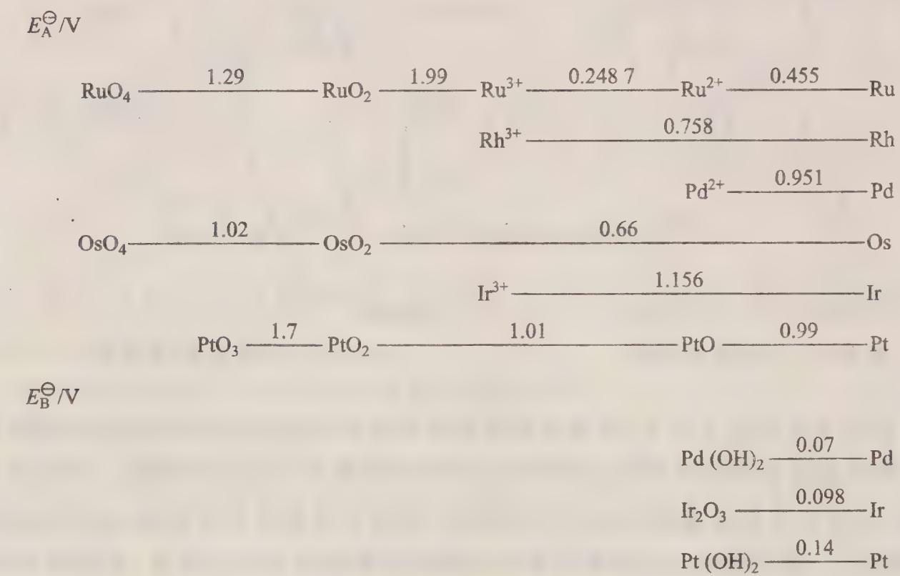  
图22-8 铂系元素的元素电势图

铂系元素的原子半径相差不大,这主要是由于镧系收缩的影响。它们的价层电子能量相差不大,因而它们都有多种不同的氧化态。受价层电子构型差异的影响,它们的最常见氧化态不大一样。

铂系金属的特点表现突出,如由于它们易于变价,与不同的反应物生成不同的中间体,因而都是优良的催化剂;由于 d 轨道未充满电子,它们的化合物常有颜色,有非常强的生成配位化合物倾向;d 轨道有未成对电子,在磁场中表现为顺磁性等。

## 22.2.1 铂系元素的单质

铂系元素的价层电子构型不像铁系元素那样有规律,这对它们的物理性质及化学性质都有一定的影响。

除饿的颜色发蓝、铂有些发灰外，其余的铂系金属均为银白色。钌和饿硬度

大且脆，其余金属都有延展性。

纯净的铂有极好的延展性,可以冷轧成非常薄的铂箔。其优良的化学稳定性、非常好的可加工性,使得铂成为首饰加工的良好材料。铂坩埚可用来处理氢氟酸的反应。铂可作电极;铂铑合金可作热电偶材料;铱用作硬质合金,如铱合金笔尖。

铂系金属均为高熔点金属,熔点最低的金属 Pd,其熔点尚高达 1554.8 ℃。

铂系元素中,高周期的3种金属锇、铱和铂的密度很大,都超过 $20\ g\cdot cm^{-3}$ ,其中锇是已知的密度最大的金属。

铂系元素的单质均为惰性金属,常温下一般不与卤素、氧、硫等发生化学反应,只有在高温下与氧化性强的卤素发生化合。Pd 不与非氧化性酸作用,缓慢溶于硝酸或热的浓硫酸。Pt 不溶于硝酸,溶于王水生成 $H_{2}[PtCl_{6}]$ 。Ru,Rh,Os 和 Ir 与王水作用极其缓慢,因而一般认为它们对王水有一定的惰性。

在与碱和氧化剂 $KNO_{3}$ , $KClO_{3}$ , $Na_{2}O_{2}$ 共熔时, 铂系金属都能被氧化。

## 22.2.2 铂系元素的简单化合物

## 1. 含氧化合物

铂系金属的氧化物主要有 $RuO_{2}$ , $RuO_{4}$ ; $Rh_{2}O_{3}$ , $RhO_{2}$ ; PdO; $OsO_{2}$ , $OsO_{4}$ ; $IrO_{2}$ ; $PtO_{2}$ 等。

在 $1\ 000\ ^{\circ}C$ 高温下，钌与氧作用得到灰黑色的 $RuO_{2}$ ；在氧中加热金属铑，则生成暗灰色 $Rh_{2}O_{3}$ ；在氧中加热金属钯，得到绿黑色 PdO；在氧中加热金属锇，得到黄色 $OsO_{4}$ ；在氧中加热金属铱，得到棕色 $IrO_{2}$ 。金属铂在空气中加热很难与 $O_{2}$ 发生化合，其氧化物可由如下方法制取：首先向 $PtCl_{4}$ 溶液加碱，得到黄色的两性水合二氧化物沉淀，再加热脱水生成近黑色的 $PtO_{2}$ 。

氧气与金属 Ru 作用不能直接得到 $RuO_{4}$ 。制取 $RuO_{4}$ 要经过两步反应，首先将金属 Ru 与 $Na_{2}O_{2}$ 共熔，得到 $Na_{2}RuO_{4}$ ：

$$
\mathrm{Ru} + 3 \mathrm{Na} _ {2} \mathrm{O} _ {2} \stackrel {\text {共熔}} {=} \mathrm{Na} _ {2} \mathrm{RuO} _ {4} + 2 \mathrm{Na} _ {2} \mathrm{O}
$$

再于酸性介质中用 $NaClO_{3}$ 将其进一步氧化, 可得 $RuO_{4}$ :

$$
3 \mathrm{Na} _ {2} \mathrm{RuO} _ {4} + \mathrm{NaClO} _ {3} + 6 \mathrm{H} ^ {+} = 3 \mathrm{RuO} _ {4} + \mathrm{NaCl} + 6 \mathrm{Na} ^ {+} + 3 \mathrm{H} _ {2} \mathrm{O}
$$

$RuO_{4}$ 为黄色针状晶体,熔点为 $25.4^{\circ}C$ , 沸点为 $40^{\circ}C$ , 易挥发, 极毒。 $RuO_{4}$ 氧化能力强, 可以氧化盐酸:

$$
2 \mathrm{RuO} _ {4} + 1 6 \mathrm{HCl(aq)} = 2 \mathrm{RuCl} _ {3} + 5 \mathrm{Cl} _ {2} \uparrow + 8 \mathrm{H} _ {2} \mathrm{O}
$$

$RuO_{4}$ 不稳定, 受热到 $180^{\circ}C$ 爆炸分解成 $RuO_{2}$ 和 $O_{2}$ :

$$
\mathrm{RuO} _ {4} \stackrel {\triangle} {=} \mathrm{RuO} _ {2} + \mathrm{O} _ {2} \uparrow
$$

黄色 $OsO_{4}$ 剧毒, 熔点为 $40.6^{\circ}C$ , 沸点为 $131.2^{\circ}C$ , 易挥发, 在有机合成化学中被用作氧化剂。

$RuO_{4}$ 和 $OsO_{4}$ 为共价型化合物, 四面体结构, 微溶于水, 易溶于四氯化碳。利用它们的挥发性, 可以将钌和锇与其他铂系金属分开。

## 2. 卤化物

铂系金属卤化物种类繁多,见表 22-1。

表 22-1 铂系金属卤化物性质一览表\*

<table><tr><td></td><td>氟化物</td><td>氯化物</td><td>溴化物</td><td>碘化物</td></tr><tr><td>Ru</td><td> $RuF_6$ 暗棕色(54)** $RuF_5$ 绿色(86.5) $RuF_4$ 黄色 $RuF_3$ 暗棕色(650分解)</td><td> $RuCl_3$ 暗棕色</td><td> $RuBr_3$ 暗棕色 $RuBr_2$ 黑色</td><td> $RuI_3$ 黑色 $RuI_2$ 蓝色</td></tr><tr><td>Rh</td><td> $RhF_6$ 黑色(70分解) $RhF_5$ 暗红色 $RhF_4$ 紫红色 $RhF_3$ 红色</td><td> $RhCl_3$ 红色</td><td> $RhBr_3$ 红棕色</td><td> $RhI_3$ 黑色</td></tr><tr><td>Pd</td><td> $PdF_4$ 砖红色 $PdF_2$ 紫色(952)</td><td> $PdCl_2$ 红色(679)</td><td> $PdBr_2$ 红黑色(250分解)</td><td> $PdI_2$ 黑色(360分解)</td></tr><tr><td>Os</td><td> $OsF_7$ 黄色 $OsF_6$ 黄色(33.2) $OsF_5$ 蓝色(70) $OsF_4$ 黄色(230)</td><td> $OsCl_4$ 红色或黑色 $OsCl_3$ 灰色</td><td> $OsBr_4$ 黑色 $OsBr_3$ 暗灰色</td><td> $OsI_3$ 黑色 $OsI_2$ 黑色 $OsI$ 灰色粉末</td></tr><tr><td>Ir</td><td> $IrF_6$ 黄色 $IrF_5$ 黄色 $IrF_4$ 暗棕色 $IrF_3$ 黑色(250分解)</td><td> $IrCl_4$ 棕色(700分解) $IrCl_3$ 棕色(763分解)</td><td> $IrBr_3$ 红棕色</td><td> $IrI_3$ 暗棕色</td></tr><tr><td>Pt</td><td> $PtF_6$ 红色(61.3) $PtF_5$ 深红色 $PtF_4$ 红色(600)</td><td> $PtCl_4$ 红棕色(327分解) $PtCl_3$ 绿黑色(435分解) $PtCl_2$ 绿色(581分解)</td><td> $PtBr_4$ 棕黑色(180分解) $PtBr_3$ 绿黑色(200分解) $PtBr_2$ 红棕色(250分解)</td><td> $PtI_4$ 棕黑色(130分解) $PtI_2$ 黑色(325分解)</td></tr></table>

\* 本表内容摘自格林伍德等编《元素化学》(第2版)表25.6,表26.3和表27.3。  
\*\*（）内数据为熔点或分解温度(单位为℃)。

由表 22-1 可知,铂系金属的卤化物中以氟化物为最多,而且氧化数最高。锇有七氟化物 $OsF_{7}$ ;除钯外,其他金属都有六氟化物和五氟化物;所有铂系金属都能生成四氟化物。高价金属氟化物较稳定,其他卤素趋于形成低价金属卤化物,如三卤化物和二卤化物。

Os 的卤化物最丰富,氧化数从 +7\~+2 的卤化物都有。

Ru, Rh, Ir 稳定氧化态为 +3，能与所有卤素形成三卤化物。Pt 稳定氧化态为 +4 和 +2，能与所有卤素形成四卤化物；除氟外，Pt 与其他卤素都能生成二卤化物。Pd 稳定氧化态为 +2，能与所有卤素形成二卤化物。

高价金属的卤化物不稳定,氧化能力强。 $PtF_{6}$ 是已知的最强的氧化剂之一,能将 $O_{2}$ 氧化生成 $O_{2}^{+}[PtF_{6}]^{-}$ , 将 Xe 氧化生成 $Xe[PtF_{6}]$ 。

铂系金属的五氟化物都是四聚体,金属配位数为6,八面体构型;4个八面体 $MF_{6}$ 共用4个顶点的F原子连接成环,如图22-9所示。

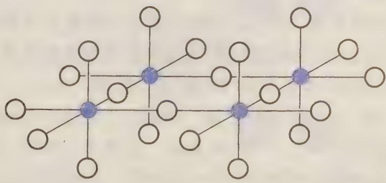  
铂系金属原子 F原子  
图22-9 铂系金属的五氟化物四聚体结构示意图

铂系金属中，Pd 和 Pt 的二卤化物最多。由于合成条件不同， $PdCl_{2}$ 有两种结构，即 $\alpha-PdCl_{2}$ 和 $\beta-PdCl_{2}$ 。 $\alpha-PdCl_{2}$ 具有类似于 $CuCl_{2}$ 的链状结构，每个 Pd都是四配位的,具有平面正方形构型,见图 22-10(a)。而 $\beta$ -PdCl $_{2}$ 以 Pd $_{6}$ Cl $_{12}$ 结构单元为基础,Pd 都保持正方形配位的特点;可以看成由 6 个 Pd 形成的八面体,在每个八面体顶点 Pd 的外切平面有正方形排布的 4 个 Cl 原子,见图22-10(b)。

(b)  
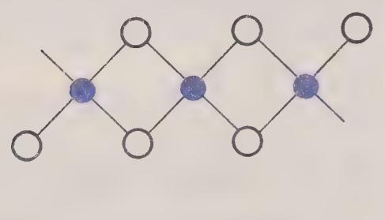  
(a)

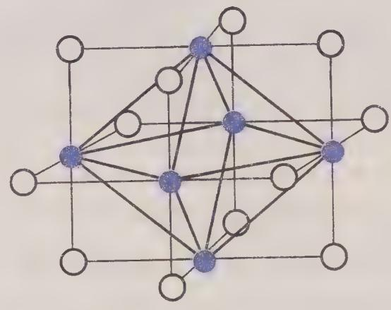  
Pd原子 $\bigcirc$ Cl原子  
图22-10 $\mathrm{PdCl}_2$ 的两种结构

向 $PdCl_{2}$ 溶液通入 CO 立即有黑色沉淀生成：

$$
\mathrm{PdCl} _ {2} + \mathrm{CO} + \mathrm{H} _ {2} \mathrm{O} = \mathrm{Pd} \downarrow + \mathrm{CO} _ {2} + 2 \mathrm{HCl}
$$

这是非常灵敏的反应,可以用来鉴定 CO 的存在。

## 22.2.3 铂系元素的配位化合物

铂系元素的化合物多数都是配位化合物。

## 1. 卤素配位化合物

最普通的铂化合物是 $M_{2}^{1}[PtX_{6}]$ 型的六卤合铂酸盐。这种由配阴离子作为酸根构成的酸，一般称为配位酸或络酸，其盐则称为配位酸盐或络酸盐。这类化合物在本书前面几章里也曾多次出现，如 $\mathrm{H}[\mathrm{Sb}(\mathrm{OH})_{6}]$ ， $[\mathrm{Sn}(\mathrm{OH})_{3}]^{-}$ ， $[PbCl_{4}]^{2-}$ ， $[TiF_{6}]^{2-}$ 和 $\mathrm{Na}[\mathrm{Cr}(\mathrm{OH})_{4}]$ 等。铂溶于王水后小心地蒸发，便得到吸湿性强的橙黄色络酸 $H_{2}[PtCl_{6}]\cdot6H_{2}O$ 晶体。由此可以得到 $H_{2}[PtCl_{6}]$ 的各种盐，其钠盐溶于水，而钾盐、铵盐等是难溶的物质。这些盐在加热时可溶于过量的 NaOH 溶液中，而络酸即使在室温下也可以溶于过量的 NaOH 溶液中。

将固体 $H_{2}[PtCl_{6}]$ 和 $KNO_{3}$ 混合灼烧, 可制备 $PtO_{2}$ :

$$
\mathrm{H} _ {2} [ \mathrm{PtCl} _ {6} ] + 6 \mathrm{KNO} _ {3} \xlongequal {\text {灼烧}} \mathrm{PtO} _ {2} + 6 \mathrm{KCl} + 4 \mathrm{NO} _ {2} \uparrow + \mathrm{O} _ {2} \uparrow + 2 \mathrm{HNO} _ {3}
$$

氯钯酸 $\left(\mathrm{H}_{2}\left[\mathrm{PdCl}_{6}\right]\right)$ 和氯铂酸 $\left(\mathrm{H}_{2}\left[\mathrm{PtCl}_{6}\right]\right)$ 都具有 $d^{2}sp^{3}$ 杂化轨道，八面体构型。酸中的 $\mathrm{Pd(IV)}$ 和 $\mathrm{Pt(IV)}$ 均具有氧化性，用 $SO_{2}, H_{2}C_{2}O_{4}$ 等还原剂与它们作用可得到相应的低价态的酸，例如：

$$
\mathrm{H} _ {2} \left[ \mathrm{PdCl} _ {6} \right] + \mathrm{SO} _ {2} + 2 \mathrm{H} _ {2} \mathrm{O} = \mathrm{H} _ {2} \left[ \mathrm{PdCl} _ {4} \right] + \mathrm{H} _ {2} \mathrm{SO} _ {4} + 2 \mathrm{HCl}
$$

而 $\mathrm{K}_2[\mathrm{PtCl}_6]$ 将直接被还原成 $\mathrm{K}_2[\mathrm{PtCl}_4]$ ，例如：

$$
\mathrm{K} _ {2} \left[ \mathrm{PtCl} _ {6} \right] + \mathrm{CH} _ {3} \mathrm{CHO} + \mathrm{H} _ {2} \mathrm{O} = \mathrm{K} _ {2} \left[ \mathrm{PtCl} _ {4} \right] + \mathrm{CH} _ {3} \mathrm{COOH} + 2 \mathrm{HCl}
$$

$Na_{2}[PtCl_{6}]$ 加到甲酸钠溶液中时, 将被还原成铂黑:

$$
\mathrm{Na} _ {2} \left[ \mathrm{PtCl} _ {6} \right] + 2 \mathrm{HCOONa} = \mathrm{Pt} \downarrow + 4 \mathrm{NaCl} + 2 \mathrm{HCl} + 2 \mathrm{CO} _ {2} \uparrow
$$

$\left[PtCl_{4}\right]^{2-}$ 与 $C_{2}H_{4}$ 反应生成乙烯基配位化合物：

$$
\left[ \mathrm{PtCl} _ {4} \right] ^ {2 -} + \mathrm{C} _ {2} \mathrm{H} _ {4} \stackrel {\text {乙醇}} {=} \left[ \mathrm{Pt} (\mathrm{C} _ {2} \mathrm{H} _ {4}) \mathrm{Cl} _ {3} \right] ^ {-} + \mathrm{Cl} ^ {-}
$$

$\left[\mathrm{Pt}\left(\mathrm{C}_{2} \mathrm{H}_{4}\right) \mathrm{Cl}_{3}\right]^{-}$ 中成键示意图如图 22-11 所示。中心 Pt 的原子轨道为 $\mathrm{dsp}^{2}$ 杂化, 因此该配位单元具有平面正方形构型。3 个 $\mathrm{Cl}^{-}$ 处于正方形的 3 个顶点, 其 $3 \mathrm{~p}$ 轨道与 Pt 的 $\mathrm{dsp}^{2}$ 杂化轨道重叠成 3 个配位键。正方形的第 4 个顶点为乙烯分子占据, 乙烯的 C—C 连线垂直于正方形所在平面。乙烯分子的 $\pi$ 成键分子轨道将对电子配入 Pt 的 $\mathrm{dsp}^{2}$ 杂化轨道, 这是中心 Pt 的第 4 个配位键。Pt 的 d 轨道与乙烯分子的空的 $\pi^{*}$ 反键分子轨道之间对称性一致, 将电子给予乙烯分子, 生成的反馈键。这个反馈键和第 4 个配位键均起到稳定配位化合物的作用, 同时也起到削弱乙烯 C—C 键的作用, 从而活化了乙烯分子。 $\left[\mathrm{Pt}\left(\mathrm{C}_{2} \mathrm{H}_{4}\right) \mathrm{Cl}_{3}\right]^{-}$ 的钾盐称为蔡斯(Zeise)盐。

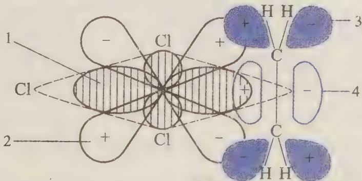  
图22-11 $[\mathrm{Pt}(\mathrm{C}_2\mathrm{H}_4)\mathrm{Cl}_3]^{-}$ 中成键示意图  
1—Pt 的 $dsp^{2}$ 杂化轨道；2—Pt 的 d 轨道；  
3—乙烯的空 $\pi^{*}$ 反键分子轨道；4—乙烯的 $\pi$ 成键分子轨道

在 Pt(Ⅱ) 的配位化合物中, $d^{8}$ 组态四配位构型为平面四边形者数目最多, 种类也很多, 其异构现象也仔细研究过。 $\left[\mathrm{PtCl}_{4}\right]^{2-}$ 为红色, $\left[\mathrm{Pt}\left(\mathrm{NH}_{3}\right)_{4}\right]^{2+}$ 为无色,而由无色的 $\left[\mathrm{Pt}\left(\mathrm{NH}_{3}\right)_{4}\right]^{2+}$ 与红色的 $\left[\mathrm{PtCl}_{4}\right]^{2-}$ 生成的盐 $\left[\mathrm{Pt}\left(\mathrm{NH}_{3}\right)_{4}\right]\left[\mathrm{PtCl}_{4}\right]$ 却是绿色的。黄棕色的 $\left[\mathrm{PdCl}_{4}\right]^{2-}$ 或 $PdCl_{2}$ 溶液与 $NH_{3}$ 作用得到黄色的 $\left[\mathrm{PdCl}_{2}\left(\mathrm{NH}_{3}\right)_{2}\right]$ 。 $\left[\mathrm{PtCl}_{4}\right]^{2-}$ 或 $PtCl_{2}$ 溶液与 $NH_{3}$ 作用得到的 $\left[\mathrm{PtCl}_{2}\left(\mathrm{NH}_{3}\right)_{2}\right]$ 也是黄色的。

$\left[\mathrm{PdCl}_{2}(\mathrm{NH}_{3})_{2}\right], \left[\mathrm{PtCl}_{2}(\mathrm{NH}_{3})_{2}\right]$ 都具有顺反异构体, 都是反磁性物质。顺式 $\left[\mathrm{PtCl}_{2}(\mathrm{NH}_{3})_{2}\right]$ 称为“顺铂”, 它有抗癌性能, 可用作治疗癌症药物。

## 2. 羰基配位化合物

由于羰基配体与中心过渡金属之间的特殊化学键,致使铂系元素形成许多稳定的羰基配位化合物,其中过渡金属显示不寻常的零氧化数甚至负氧化数,如单核的 $\left[\mathrm{Pd}\left(\mathrm{CO}\right)_{4}\right]$ , $\left[\mathrm{Ru}\left(\mathrm{CO}\right)_{5}\right]$ , $\left[\mathrm{Os}\left(\mathrm{CO}\right)_{5}\right]$ , 双核的 $\left[\mathrm{Rh}_{2}\left(\mathrm{CO}\right)_{8}\right]$ , $\left[\mathrm{Os}_{2}\left(\mathrm{CO}\right)_{9}\right]$ 等。还有更多的三核及多核的羰基配位化合物,它们应属于簇合物范畴,在此不加以介绍。

许多稳定的羰基配位化合物都符合18电子规则,下面以 $\left[\mathrm{Os}_{2}(\mathrm{CO})_{9}\right]$ 为例,说明这一问题。在如图22-12(a)所示的双核羰基配位化合物 $\left[\mathrm{Os}_{2}(\mathrm{CO})_{9}\right]$ 中,每个Os原子周围均有呈八面体分布的6个CO与之配位。其中既有端羰基配体也有酮式羰基配体,同时形成Os—Os金属键。

$\left[\mathrm{Os}_{2}(\mathrm{CO})_{9}\right]$ 中的 Os 原子, 其价层电子构型为 $5 \mathrm{~d}^{6} 6 \mathrm{~s}^{2}$ , 在配体 CO 的作用下, Os 原子的价层电子重排成 $5 \mathrm{~d}^{8} 6 \mathrm{~s}^{0}$ , 并形成 6 条 $\mathrm{d}^{2} \mathrm{sp}^{3}$ 不等性杂化轨道, 如图 22-12(b) 给出了杂化轨道的组成, 但没有表明其中各轨道的能量高低关系。

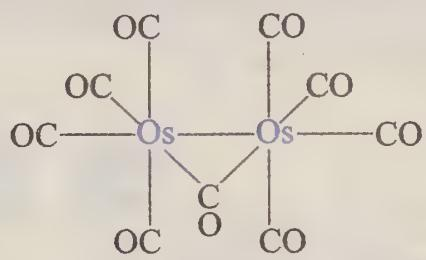  
(a)

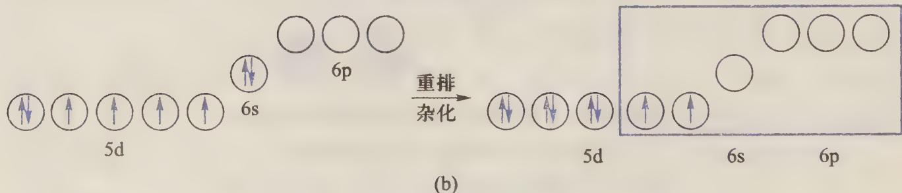  
图 22-12 $\left[\mathrm{Os}_{2}(\mathrm{CO})_{9}\right]$ 的结构和轨道杂化

4个端羰基各将一对电子配入空的 $\mathrm{d}^2\mathrm{sp}^3$ 杂化轨道，一个酮式羰基将单电子配入有单电子的 $\mathrm{d}^2\mathrm{sp}^3$ 杂化轨道，另一条有单电子的 $\mathrm{d}^2\mathrm{sp}^3$ 杂化轨道用来形成

Os—Os 键。

中心 Os 原子的价层电子构型为 $5d^{6}6s^{2}$ ，有 8 个价层电子，4 个端羰基共提供 8 个电子，一个酮式羰基提供一个电子，另一个 Os 原子成 Os—Os 键提供一个电子。于是中心的 5 条 5d 轨道、一条 6s 轨道和 3 条 6p 轨道全部充满电子，中心周围电子总数为 18，即满足 18 电子规则。故 $[Os_{2}(CO)_{9}]$ 可以稳定存在，而且其中的 Os 被稳定在零氧化态。

更能说明问题的是,形成满足 18 电子规则的羰基配位化合物可以将过渡金属稳定在负氧化态,如 $\left[\mathrm{Ru}(\mathrm{CO})_{4}\right]^{2-},\left[\mathrm{Os}(\mathrm{CO})_{4}\right]^{2-}$ 是稳定的配离子,其中 Ru 和 Os 被羰基稳定在 -2 氧化态。

## 22.3 过渡金属元素小结

过渡元素在元素周期表中的位置如图 22-13 所示, 包括 d 区元素和 ds 区元素。因为它们都是金属, 所以又称为过渡金属。过渡元素的电子结构特征体现为 d 轨道从部分填充过渡到全部填充。也有人建议把过渡元素的范围更扩大到镧系元素和锕系元素。但这两个系列元素属于内层 f 轨道逐渐被电子填充, 因此称为内过渡元素较为合适。

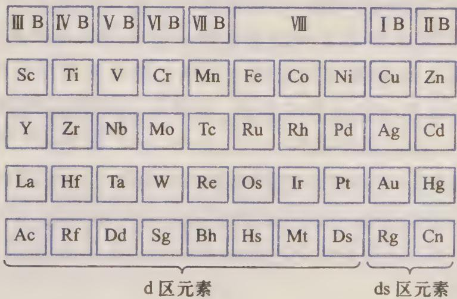  
图22-13 过渡元素在元素周期表中的位置

各周期过渡元素的原子半径从左向右缓慢递减,各族过渡元素的半径从上至下略有增加,但不像主族元素增加得那样显著。由于镧系收缩的结果,使得第三过渡系列元素的原子半径与第二过渡系列元素的原子半径极为相近。进而导致第三过渡系列元素的第一电离能比第一过渡系列和第二过渡系列大得多。

过渡金属除 s 电子参与成键外, d 电子也参与成键, 所以过渡金属的金属键很强。故过渡金属的熔、沸点较高, 硬度较高, 密度较大。而主族金属与此相反,熔、沸点较低，硬度较低，特别是ⅠA族，ⅡA族金属及Al，密度也较小。

第三过渡系列金属中，Ta, W, Re, Os 的熔点都在 3000 ℃ 以上。W 是熔点最高的金属，熔点大约为 3414 ℃。

过渡金属的硬度高,如 Cr,Mn,Mo,Ru,W,Ta,Re,Os 的莫氏硬度都超过 6,其中 Cr 的硬度最高,硬度为 9,在单质中仅次于金刚石。

过渡金属的密度大, Re, Os, Ir, Pt 的密度均超过 $20 \, g \cdot cm^{-3}$ ，其中 Os 是密度最大的金属单质，密度高达 $22.587 \, g \cdot cm^{-3}$ 。

过渡金属都有金属光泽,延展性、导电性和导热性好,尤其是 Au, Ag, Cu。过渡金属之间能形成多种合金。

由于过渡元素中 d 电子参与化学反应,所以在它们的化合物中常表现出多种氧化态,最高氧化态从ⅢB族元素 Sc,Y,La 的 +3 到Ⅷ族元素 Ru,Os 的 +8,如 Mn 的氧化态有 +2,+3,+4,+6 和 +7。

在各族过渡元素中,呈现低氧化态是第一过渡系列的特点,而最高氧化态一般体现在各族最底部的高周期元素。这一点与主族元素形成鲜明的对比,主族元素从上至下低氧化态趋于稳定。

过渡金属的氢化物与主族元素的氢化物不同,它既不是离子型氢化物,也不是分子型氢化物。它是由氢原子钻进金属晶体的原子或离子的空隙间形成的氢化物,形象地称为间充式氢化物。这类氢化物仍旧保持着原有的金属晶格,晶格间仍有自由电子,因此也称为金属型氢化物。金属型氢化物属于非整比化合物,如 $LaH_{2.76}, ZrH_{1.98}$ 等。这种表示方法显示出氢化物中两种原子的个数之比。

过渡金属最高价态的氧化物的碱性,随着原子序数的增加,从左向右递减。例如, $\mathrm{Sc_{2}O_{3}}$ 为碱性, $\mathrm{TiO_{2}}$ 属于两性, $\mathrm{CrO_{3}}$ 是 $\mathrm{H_{2}CrO_{4}}$ 的酸酐, $\mathrm{Mn_{2}O_{7}}$ 与水作用生成酸性很强的高锰酸。同一副族相同价态的氧化物从上到下碱性增强。同一过渡元素经常有不同价态的氧化物,其高价氧化物的酸性较强,如 $\mathrm{Mn_{2}O_{7}}$ 为酸性很强的高锰酸的酸酐;而低价氧化物的碱性较强,如 MnO 却属于碱性氧化物,可溶于酸中。

在强酸中, 过渡金属以离子状态存在, 如 $Fe^{2+}, Ni^{2+}, Cr^{3+}$ 等。高价离子的电场过强, 发生部分水解, 脱水后以 $MO_{n}^{m+}$ 形式存在, 如 $TiO^{2+}, VO_{2}^{+}, CrO_{2}Cl_{2}$ 等。

高价态过渡金属常显酸性,以酸根形式存在,如 $VO_{3}^{-}, CrO_{4}^{2-}, Cr_{2}O_{7}^{2-}, MoO_{4}^{2-}$ , $WO_{4}^{2-}, MnO_{4}^{2-}$ 等。其中有的酸性较强,如 $H_{2}CrO_{4}$ 的 $K_{1}^{\ominus}=0.18$ , $HTcO_{4}$ 的 $K_{1}^{\ominus}=0.5$ , $HReO_{4}$ 的 $K_{1}^{\ominus}=17.8$ , $HMnO_{4}$ 和 $H_{2}MnO_{4}$ 也都是较强的含氧酸。

高氧化态的 V(V), Cr(VI), Mn(VII) 氧化性均很强, 其标准电极电势如下: $E^{\ominus}(VO_{2}^{+}/VO^{2+}) = 0.991\ V, E^{\ominus}(Cr_{2}O_{7}^{2-}/Cr^{3+}) = 1.36\ V, E^{\ominus}(MnO_{4}^{-}/Mn^{2+}) = 1.51\ V$ 。过渡金属化合物、水合离子和配离子一般都有颜色, 显色原因可归结为金属的 d-d 跃迁和阴、阳离子间的电荷迁移。

过渡金属的 d 轨道一般都有电子且未充满, 电子吸收可见光发生 d-d 跃迁而显其互补色, 如 $d^{3}$ 电子组态的 $V^{2+}$ 显紫色, $d^{2}$ 电子组态的 $V^{3+}$ 显绿色, $d^{7}$ 电子组态的 $\left[\mathrm{Co}\left(\mathrm{H}_{2}\mathrm{O}\right)_{6}\right]^{2+}$ 显粉红色, $d^{8}$ 电子组态的 $\left[\mathrm{Ni}\left(\mathrm{H}_{2}\mathrm{O}\right)_{6}\right]^{2+}$ 显绿色, 等等。

某些化合物,其中的过渡金属具有 $d^{0}$ 电子组态,虽不能发生 d-d 跃迁,但由于阴、阳离子间或原子间发生电荷迁移,也可能有颜色。如黄色的 $CrO_{4}^{2-}$ , 紫色的 $MnO_{4}^{-}$ , 黄色的 $NbCl_{5}$ 等, 其颜色均由电荷迁移引起。具有 $d^{10}$ 电子组态的卤化物 AgBr 为浅黄色, AgI 为黄色, $HgI_{2}$ 为红色, 这些化合物的颜色也是电荷迁移导致的。

发生 d-d 跃迁的同时也可能伴随电荷迁移。

与主族元素的重要区别是过渡元素具有可用于成键的空 d 轨道, 因此容易形成稳定的配位化合物。过渡金属配位化合物的生成具有重要的意义。例如, $\left[\mathrm{Zn}(\mathrm{CN})_{4}\right]^{2-}$ 的生成被广泛用于低品位金矿中金的回收; 钴的配位化合物维生素 $B_{12}$ , 铁的配位化合物血红素等, 在生命过程中均起着十分重要的作用; 过渡元素的一些配位化合物常用作催化剂或成为催化反应的中间体。

过渡金属特别是高周期的过渡金属, 易形成金属-金属键, 见图 22-5(a) 所示的 $\left[\mathrm{Co}_{2}(\mathrm{CO})_{8}\right]$ 和图 22-12(a) 所示的 $\left[\mathrm{Os}_{2}(\mathrm{CO})_{9}\right]$ 等羰基配位化合物中的金属-金属键; 也可以形成具有金属-金属多重键的化合物, 见图 21-8 所示的 $\left[\mathrm{Re}_{2} \mathrm{Cl}_{8}\right]^{2-}$ 的结构及 Re—Re 金属间的 4 重键。

## 建一拓展学习资源

<table><tr><td>资源内容</td><td>二维码</td></tr><tr><td>▶ 铁系元素的发现及其矿物图片</td><td rowspan="3"></td></tr><tr><td>▶ 钴和镍及其化合物的主要用途</td></tr><tr><td>▶ 铂系元素的发现</td></tr><tr><td>▶ 抗癌药物——顺铂</td><td rowspan="2">扫一扫查看资源内容</td></tr><tr><td>▶ 本章小结</td></tr><tr><td>▶ 视频——铁(III)配位化合物的稳定性</td><td></td></tr><tr><td>▶视频——钴(II)配位化合物的颜色</td><td></td></tr><tr><td>▶视频——镍离子的鉴定</td><td></td></tr></table>

## 总结与是专题

22-1 试总结铁系元素常见氧化态相互转化的条件。

22-2 试比较铁系元素与铂系元素的单质和化合物性质的差别。

22-3 试绘制简图说明可溶性普鲁士蓝的结构,并在此基础上描述普鲁士蓝和滕氏蓝的结构。

22-4 试说明二茂铁的结构和成键情况。

22-5 简要描述铁系元素参与形成的生物配位化合物。

22-6 试绘图说明下列物质的结构和成键情况。

(1) 双核羰基配位化合物 $\left[\mathrm{Co}_{2}(\mathrm{CO})_{8}\right]$ ;

(2) 双核羰基配位化合物 $\left[\mathrm{Os}_{2}(\mathrm{CO})_{9}\right]$ ;

(3) 蔡斯盐的阴离子 $\left[\mathrm{Pt}\left(\mathrm{C}_{2} \mathrm{H}_{4}\right) \mathrm{Cl}_{3}\right]^{-}$ 。

22-7 试举出实例说明,四配位的 Ni(Ⅱ)既能形成平面四边形的配位化合物,又能形成正四面体的配位化合物的原因。

22-8 通过实例比较 $\mathrm{Cr(OH)}_3, \mathrm{Al(OH)}_3$ 和 $\mathrm{Fe(OH)}_3$ 性质的异同。

22-9 给出下列离子的颜色。

(1) $\left[\mathrm{CoCl}_{4}\right]^{2-}$ ; (2) $\left[\mathrm{Co}(\mathrm{SCN})_{4}\right]^{2-}$ ; (3) $\left[\mathrm{Co}(\mathrm{NH}_{3})_{6}\right]^{3+}$ ;

(4) $\left[\mathrm{Co}\left(\mathrm{H}_{2} \mathrm{O}\right)_{6}\right]^{2+}$ ; (5) $\left[\mathrm{Ni}\left(\mathrm{H}_{2} \mathrm{O}\right)_{6}\right]^{2+}$ ; (6) $\left[\mathrm{Ni}\left(\mathrm{NH}_{3}\right)_{6}\right]^{2+}$ ;

(7) $\left[\mathrm{Fe}\left(\mathrm{H}_{2} \mathrm{O}\right)_{6}\right]^{2+}$ ; (8) $\left[\mathrm{Fe}\left(\mathrm{H}_{2} \mathrm{O}\right)_{6}\right]^{3+}$ ; (9) $\left[\mathrm{FeCl}_{4}\right]^{-}$ ;

(10) $\left[\mathrm{FeF}_{5}\right]^{2-}$ ; (11) $\left[\mathrm{PtCl}_{4}\right]^{2-}$ ; (12) $\left[\mathrm{Pt}(\mathrm{NH}_{3})_{4}\right]^{2+}$ 。

## 22-10 给出下列化合物的颜色。

(1) $\mathrm{CoCl}_2$ (2) $\mathrm{CoCl}_2\cdot 6\mathrm{H}_2\mathrm{O}$ (3) $\mathbf{K}_3[\mathrm{Co}(\mathrm{NO}_2)_6]$

(4) $\left[\mathrm{Co}\left(\mathrm{NH}_{3}\right)_{6}\right]\mathrm{Cl}_{3}$ ; (5) $\mathrm{FeSO}_{4} \cdot 7\mathrm{H}_{2}\mathrm{O}$ ; (6) $\mathrm{K}_{3}\left[\mathrm{Fe}\left(\mathrm{C}_{2}\mathrm{O}_{4}\right)_{3}\right] \cdot 3\mathrm{H}_{2}\mathrm{O}$ ;

(7) $\mathrm{K}_3[\mathrm{Fe}(\mathrm{CN})_6]$ ; (8) $\mathrm{K}_4[\mathrm{Fe}(\mathrm{CN})_6] \cdot 3\mathrm{H}_2\mathrm{O}$ ; (9) $\mathrm{K}[\mathrm{FeFe}(\mathrm{CN})_6]$ ;

(10) $\mathrm{NiSO}_4\cdot 7\mathrm{H}_2\mathrm{O}$ ; (11) $\mathrm{H}_2[\mathrm{PtCl}_6]\cdot 6\mathrm{H}_2\mathrm{O}$ ; (12) $\mathbf{K}_2[\mathrm{PtCl}_6]$ 。

22-11 试比较铁系元素和铂系元素在物理性质、化学性质等方面的差异。

22-12 试归纳总结过渡元素的单质及其氢化物、氧化物、配位化合物的性质。

## 曹习题

22-1 简释下列词语。

（1）棕色环实验； （2）莫尔盐； （3）普鲁士蓝和滕氏蓝；

(4) 18 电子规则； (5) 蔡斯盐。

22-2 完成并配平下列化学反应方程式。

(1) $\mathrm{Fe}^{3+} + \mathrm{Cu} =$

(2) $\mathrm{Fe}^{3+} + \mathrm{H}_2\mathrm{S} =$

(3) $\mathrm{FeSO}_4 + \mathrm{Br}_2 =$

(4) $\mathrm{Fe}^{2+} + \mathrm{NO}_3^- + \mathrm{H}^+$

(5) $\mathrm{FeO}_4^{2-} + \mathrm{H}^+ =$

(6) $\mathrm{Co}^{3+} + \mathrm{H}_2\mathrm{O} =$

(7) $\mathrm{Co}^{3+} + \mathrm{Mn}^{2+} + \mathrm{H}_2\mathrm{O} =$

(8) $\mathrm{Co(OH)}_3 + \mathrm{HCl(aq)} =$

(9) $\mathrm{NiO(OH)} + \mathrm{HCl(aq)} =$

(10) $\mathrm{K}_2[\mathrm{PtCl}_6] + \mathrm{CH}_3\mathrm{CHO} + \mathrm{H}_2\mathrm{O}$

(11) $\mathrm{Na}_2[\mathrm{PtCl}_6] + \mathrm{HCOONa} =$

(12) $\mathrm{H}_{2}[\mathrm{PtCl}_{6}] + \mathrm{KNO}_{3}\xlongequal{\text{灼烧}}$

(13) $\mathrm{H}_{2}[\mathrm{PdCl}_{6}] + \mathrm{SO}_{2} + \mathrm{H}_{2}\mathrm{O} =$

(14) $\left[\mathrm{PtCl}_{4}\right]^{2-} + \mathrm{C}_{2} \mathrm{H}_{4} \xlongequal{\text{乙醇}}$

(15) $\mathrm{RuO_4}\stackrel {\triangle}{=}$

22-3 完成并配平下列化学反应方程式。

(1) 氢氧化亚铁沉淀置于空气中。

(2) 铁与水蒸气在赤热的条件下反应。

(3) 将四氧化三铁溶于稀盐酸。

(4) 向三氯化铁溶液中加入过量的碳酸钠。

(5) 草酸亚铁受热分解。

(6) 向三氯化铁溶液中滴加碘化钾溶液。

(7) 氯气通入混有氢氧化铁的氢氧化钾浓溶液。

(8) 向黄血盐溶液中通入氯气。

(9) 三草酸根合铁(Ⅲ)酸钾见光分解。

(10) 向黄血盐溶液中滴加三氯化铁溶液。

(11) 将四氧化三钴溶于盐酸。

(12) 氢氧化亚钴分别与盐酸和氢氧化钠浓溶液作用。

(13) 向二氯化镍溶液中加入氢氧化钠溶液和溴水。

(14) 将四氧化钌溶于盐酸。

(15) 向二氯化钯溶液中通入一氧化碳。

22-4 生产、合成与制备。

(1) 由 $\mathrm{FeSO}_4 \cdot 7\mathrm{H}_2\mathrm{O}$ 制备 $\mathrm{K}_3[\mathrm{Fe}(\mathrm{C}_2\mathrm{O}_4)_3] \cdot 3\mathrm{H}_2\mathrm{O}$ 。

(2) 以单质钴为原料经二氯化钴制备三氯化六氨合钴(Ⅲ)。

(3) 以粗镍为原料制备高纯镍。

(4) 以单质钌为原料制备 $\mathrm{RuO}_{4}$ 。

(5) 选择适当方法实现下列转化而不引入杂质离子。

① 将 $FeCl_{3}$ 溶液转变为 $FeCl_{2}$ 溶液；

② 将 $FeCl_{2}$ 溶液转变为 $FeCl_{3}$ 溶液。

(6) 完成下列过程的化学反应方程式。

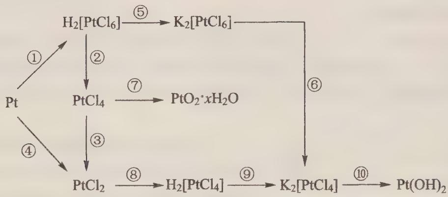

22-5 分离、提纯与鉴别。

（1）现有3瓶黑色固体试剂，分别为二氧化锰、二氧化铅和四氧化三铁。试设计方案将其鉴别出来，并写出相关化学反应方程式。

(2) 如何鉴别分别含有 $Fe^{3+}$ , $Co^{2+}$ 和 $Ni^{2+}$ 的溶液?

(3) 鉴别下列各对物质。

① $NiSO_{4}$ 和 $FeSO_{4}$ ; ② $Fe_{2}O_{3}$ 和 CuO。

(4) 如何在不引入杂质的情况下, 将粗 $\mathrm{ZnSO}_{4}$ 溶液中含有的 $\mathrm{Fe}^{2+}, \mathrm{Fe}^{3+}$ 和 $\mathrm{Cu}^{2+}$ 杂质除去?

(5) 试设计方案分离溶液中的下列离子。

① $Al^{3+}, Cr^{3+}, Fe^{3+}, Ni^{2+}$ ; ② $Fe^{2+}, Co^{2+}, Zn^{2+}, Cu^{2+}$ .

22-6 解释实验现象。

(1) 向 $FeSO_{4}$ 溶液加入碘水, 碘水不褪色, 加入 $NaHCO_{3}$ 后, 碘水褪色。

(2) 向 $\mathrm{FeCl}_{3}$ 溶液加入 KSCN 溶液, 溶液立即变红, 加入适量 $\mathrm{SnCl}_{2}$ 后, 溶液变成无色。

(3) $\mathrm{CoCl}_2$ 与 $\mathrm{NaOH}$ 作用所得的沉淀久置后用盐酸酸化,有刺激性气体产生。

(4) 向 $\left[\mathrm{Co}\left(\mathrm{NH}_{3}\right)_{6}\right]\mathrm{SO}_{4}$ 溶液中滴加稀盐酸，先生成蓝绿色沉淀，后沉淀溶解，生成粉红

色溶液。

(5) 向 $FeCl_{3}$ 溶液中通入 $H_{2}S$ ，并没有硫化物沉淀生成。

## 22-7 推理判断。

(1) (A) 为黑色粉末, (B) 为白色粉末, 向 (A) 和 (B) 的混合物中加稀盐酸, 先得蓝色溶液, 逐渐变为淡绿色, 同时析出紫红色沉淀 (C), 过滤后, 得滤液 (D)。沉淀 (C) 溶于热的浓硫酸, 得溶液 (E) 并放出气体 (F)。将 (E) 蒸干后灼烧, 又得白色粉末 (B)。向滤液 (D) 中加入 NaOH 溶液并鼓入空气, 生成棕红色沉淀 (G)。将 (G) 灼烧后, 得红色粉末 (H)。(H) 与铝粉混合燃烧得到黑色物质 (A)。

试给出(A)，(B)，(C)，(D)，(E)，(F)，(G)和(H)所代表的物质的化学式，并用化学反应方程式表示各过程。

(2) 化合物(A)为棕褐色不溶于水的固体, 将(A)溶解在浓盐酸中, 得溶液(B)和黄绿色气体(C)。(C)通过热氢氧化钾溶液, 被吸收后生成溶液(D)。(D)用酸中和并以 $AgNO_{3}$ 溶液处理, 生成白色沉淀(E), (E)不溶于硝酸, 但可溶于氨水。若在溶液(B)中加入氢氧化钠溶液, 得到粉红色沉淀(F)。将(F)用 $H_{2}O_{2}$ 处理, 则又得到(A)。若将溶液(B)用 $KNO_{2}$ 的醋酸溶液处理, 则生成黄色沉淀(G)和气体(H), 将(H)通过 $FeSO_{4}$ 溶液, 则溶液变为暗棕色, 但没有沉淀生成。

试给出(A)，(B)，(C)，(D)，(E)，(F)，(G)和(H)所代表的物质的化学式，并用化学反应方程式表示各过程。

(3) 某淡绿色晶体(A)可溶于水,在无氧条件下,将 $\mathrm{NaOH}$ 溶液加入(A)中,即有使红色石蕊试纸变蓝的气体(B)放出,同时溶液中有白色沉淀(C)析出。(C)在空气中迅速变为灰绿色、黑色,最后变为红棕色沉淀(D)。(D)溶于稀盐酸中生成棕黄色溶液(E)。向溶液(E)中滴加KI溶液,先有褐色沉淀(F)析出,随后变为红棕色溶液(G)。若在滴加KI溶液之前先加入过量KF溶液,则无此现象。向(D)的浓 $\mathrm{NaOH}$ 悬浮液中通入氯气,可得到紫红色溶液(H)。在(A)溶液和(H)溶液中分别滴加 $\mathrm{BaCl}_2$ 溶液,均可析出沉淀,但前者是白色沉淀(I),后者是紫红色沉淀(J)。沉淀(I)不溶于 $\mathrm{HNO}_3$ ,但(J)遇 $\mathrm{HNO}_3$ 即分解并放出气体(K)。

试给出(A)，(B)，(C)，(D)，(E)，(F)，(G)，(H)，(I)，(J)和(K)所代表的物质的化学式，并用化学反应方程式表示各过程。

(4) 某金属(A)缓慢地溶于稀盐酸并生成绿色溶液,从中可以结晶出绿色物质(B)。向绿色溶液中加入 $\mathrm{NaOH}$ 得绿色沉淀(C), (C)不溶于过量 $\mathrm{NaOH}$ 溶液,但在大量 $\mathrm{NH}_{4}^{+}$ 存在时可溶于氨水并生成蓝色溶液(D)。用气体(E)处理刚生成的沉淀(C),沉淀颜色逐渐加深,最后转化为黑棕色沉淀(F)。(F)与盐酸作用得绿色溶液并放出气体(E)。气体(E)与金属(A)共热生成黄色固体物质(G)。

试给出(A)，(B)，(C)，(D)，(E)，(F)和(G)所代表的物质的化学式，并用化学反应方程式表示各过程。

(5) 有一固体混合物可能含有 $\mathrm{FeCl}_{3}, \mathrm{NaNO}_{2}, \mathrm{Ca(OH)}_{2}, \mathrm{AgNO}_{3}, \mathrm{CuCl}_{2}, \mathrm{NaF}, \mathrm{NH}_{4} \mathrm{Cl}$ 七种物质中的若干种。将此混合物加水后，可得白色沉淀和无色溶液。在此无色溶液中加入KSCN没有变化；无色溶液可使酸化后 $\mathrm{KMnO}_{4}$ 溶液紫色褪去；将无色溶液加热有气体放出。

另外，白色沉淀可溶于 $NH_{3} \cdot H_{2}O$ 中。

试根据上述现象判断:在混合物中哪些物质肯定存在,哪些肯定不存在,哪些可能存在。说明理由,并用化学反应方程式表示。

## 22-8 简答题。

(1) 给出下列物质的化学式。

① 赤铁矿； ② 磁铁矿； ③ 褐铁矿； ④ 菱铁矿；

⑤ 黄血盐； ⑥ 赤血盐； ⑦ 砷钴矿； ⑧ 辉钴矿；

⑨ 硫钴矿； ⑩ 绿矾； ⑪ 铁铵矾； ⑫ 顺铂。

(2) 分别向 $\mathrm{FeSO}_4, \mathrm{CoSO}_4, \mathrm{NiSO}_4$ 溶液中滴加氨水, 生成的产物和实验现象是什么?

(3) 为什么铝板氧化层用极稀的 $\mathrm{Co}(\mathrm{NO}_{3})_{2}$ 溶液处理后灼烧, 即显蓝色?

(4) 为什么 $\mathrm{K}_{4}[\mathrm{Fe(CN)}_{6}] \cdot 3\mathrm{H}_{2}\mathrm{O}$ 可由 $\mathrm{FeSO}_{4}$ 溶液与 KCN 混合直接制备, 而 $\mathrm{K}_{3}[\mathrm{Fe(CN)}_{6}]$ 却不能由 $\mathrm{FeCl}_{3}$ 溶液与 KCN 直接混合来制备? 如何制备赤血盐?

（5）为什么 $\left[\mathrm{Ni}\left(\mathrm{NH}_{3}\right)_{4}\right]^{2+}$ 和 $\left[\mathrm{NiCl}_{4}\right]^{2-}$ 为四面体结构，而 $\left[\mathrm{Pt}\left(\mathrm{NH}_{3}\right)_{4}\right]^{2+}$ 和 $\left[\mathrm{PtCl}_{4}\right]^{2-}$ 为平面四边形结构？

（6）利用 $NH_{4}SCN$ 试剂鉴定 $Co^{2+}$ 时，为什么要用浓的 $NH_{4}SCN$ 溶液，并加丙酮萃取？溶液中存在什么常见离子时会发生干扰？如何消除这些干扰？

（7）在用稀硫酸清洗被 $\mathrm{Co(OH)}_{3}$ 和 $\mathrm{MnO(OH)}_{2}$ 污染的玻璃器皿时，为什么要加入一些过氧化氢溶液？

(8) $\left[\mathrm{Ni}(\mathrm{CO})_{4}\right]$ 和 $\left[\mathrm{Ni}(\mathrm{CN})_{4}\right]^{2-}$ 都是抗磁性的, 两者在结构上是否相同? 试用配位化合物的价键理论给予说明。

(9) 试比较下列各对配位化合物的稳定性,并说明原因。

① $\left[\mathrm{NiCl}_{4}\right]^{2-}$ 与 $\left[\mathrm{PtCl}_{4}\right]^{2-}$ ; ② $\left[\mathrm{Co}(\mathrm{NH}_{3})_{6}\right]^{2+}$ 与 $\left[\mathrm{Co}(\mathrm{NH}_{3})_{6}\right]^{3+}$ 。

## 目录

23.1 镧系元素 …… 842
23.1.1 镧系元素的基本性质 …… 842
23.1.2 镧系的单质及其化合物 …… 844
1. 金属单质 …… 844
2. 氢化物 …… 844
3. 氧化物和氢氧化物 …… 845
4. 盐类 …… 846
5. 配位化合物 …… 847
23.1.3 稀土的分离提纯 …… 847
1. 化学法 …… 849
2. 萃取法 …… 849
3. 离子交换法 …… 850
23.1.4 稀土元素的重要用途 …… 850
23.2 钢系元素 …… 851
23.2.1 钢系元素的氧化态 …… 852
23.2.2 钢系的重要单质及其化合物 …… 853
1. 铀及其化合物 …… 853
2. 钍及其化合物 …… 854
23.2.3 超铀元素和核化学 …… 855
1. 核的衰变、裂变和聚变 …… 856
2. 人造元素的合成 …… 858
拓展学习资源 …… 859
总结与思考题 …… 859
习题 …… 860

## 第 23 章 銅系元素和锕系元素

## 23.1 镧系元素

## 23.1.1 镧系元素的基本性质

元素周期表中第六周期ⅢB族57号元素镧(La)到71号元素镥(Lu)共15种元素,统称为镧系元素,常用Ln表示。

镧系元素的原子核内每增加一个质子,相应就有一个电子添加到其核外4f轨道中。与外层的5d和6s轨道相比,内层的4f轨道对核电荷有较大的屏蔽作用。因此,随原子序数的增加,有效核电荷数增加缓慢,最外层电子受核的引力只是缓慢地增加,导致原子和离子半径虽呈减小的趋势,但减少的幅度很小。经过从La到Lu15种元素的原子半径递减累积达9pm,这就是所谓的镧系收缩。它造成镧系元素后的第三系列过渡元素与上一周期的第二系列过渡元素原子半径和离子半径相近,化学性质相似,分离困难。镧系收缩的另一个结果是造成镧系元素之间半径相近,性质相似,容易共生,很难分离。

在镧系收缩中,离子半径比原子半径的收缩更显著。

镧系元素在化合物中最常见和最稳定的氧化数是+3。个别镧系元素，如Ce,Pr和Tb还具有较为稳定的+4氧化数；而Sm,Eu和Yb还具有较为稳定的+2氧化数。从图23-1中可以看出这些氧化数的某些规律性。

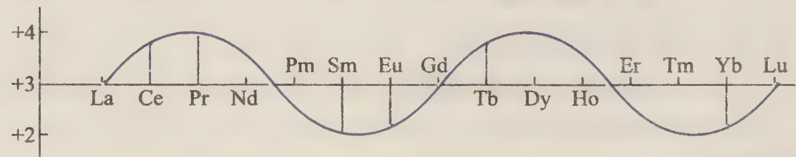  
图23-1 镧系元素氧化数的规律性

La(Ⅲ), Gd(Ⅲ), Lu(Ⅲ) 分别具有 4f 轨道全空、半充满、全充满的电子构型, 它们失去 $5\mathrm{d}^{1}6\mathrm{s}^{2}3$ 个价层电子后即可达到这种稳定的结构, 这是它们经常以 +3 氧化数存在的原因。比 La 多一个 4f 电子的 Ce, 和比 Gd 多一个 4f 电子的

Tb, 若再多失去一个电子则可形成稳定的电子构型, 所以它们有 +4 氧化数; 而比 Gd 少一个 4f 电子的 Eu 和比 Lu 少一个 4f 电子的 Yb, 若少失去一个电子则可形成稳定的电子构型, 所以它们有 +2 氧化数。不是 +3 就是 +2 或 +4

+3 氧化数是镧系元素最稳定的氧化数, 其根本原因在于镧系元素的电离能 $I_{1} + I_{2} + I_{3}$ 之和较小。将表 23-1 所示的 Sm, Eu, (Tm), Yb 的 $E^{\ominus}(\mathrm{M}^{2+}/\mathrm{M})$ 与 $E^{\ominus}(\mathrm{M}^{3+}/\mathrm{M})$ 相比较, 也可以说明 Sm, Eu, (Tm), Yb 几种镧系元素具有 +2 氧化数的原因。

表 23-1 镧系元素的一些基本性质

<table><tr><td>原子 序数</td><td>元素 符号</td><td>元素 名称</td><td>价层电子 构型</td><td> ${\mathrm{M}}^{3 + }$  的 颜色</td><td>原子半径 pm</td><td> ${E}^{ \ominus }\left( {{\mathrm{M}}^{3 + }/\mathrm{M}}\right)$  V</td><td> ${E}^{ \ominus }\left( {{\mathrm{M}}^{2 + }/\mathrm{M}}\right)$  V</td></tr><tr><td>57</td><td>La</td><td>镧</td><td> $5{\mathrm{\;d}}^{1}6{\mathrm{\;s}}^{2}$ </td><td>无色</td><td>183</td><td>-2.379</td><td>-</td></tr><tr><td>58</td><td>Ce</td><td>铈</td><td> $4{\mathrm{f}}^{1}5{\mathrm{\;d}}^{1}6{\mathrm{\;s}}^{2}$ </td><td>无色</td><td>181.8</td><td>-2.336</td><td>-</td></tr><tr><td>59</td><td>Pr</td><td>镨</td><td> $4{\mathrm{f}}^{3}6{\mathrm{\;s}}^{2}$ </td><td>绿色</td><td>182.4</td><td>-2.353</td><td>-2.0</td></tr><tr><td>60</td><td>Nd</td><td>钕</td><td> $4{\mathrm{f}}^{4}6{\mathrm{\;s}}^{2}$ </td><td>淡红色</td><td>181.4</td><td>-2.323</td><td>-2.1</td></tr><tr><td>61</td><td>Pm</td><td>钷</td><td> $4{\mathrm{f}}^{5}6{\mathrm{\;s}}^{2}$ </td><td>粉红色、黄色</td><td>183.4</td><td>-2.30</td><td>-2.2</td></tr><tr><td>62</td><td>Sm</td><td>钐</td><td> $4{\mathrm{f}}^{6}6{\mathrm{\;s}}^{2}$ </td><td>黄色</td><td>180.4</td><td>-2.304</td><td>-2.68</td></tr><tr><td>63</td><td>Eu</td><td>铕</td><td> $4{\mathrm{f}}^{7}6{\mathrm{\;s}}^{2}$ </td><td>无色</td><td>208.4</td><td>-1.991</td><td>-2.812</td></tr><tr><td>64</td><td>Gd</td><td>钆</td><td> $4{\mathrm{f}}^{7}5{\mathrm{\;d}}^{1}6{\mathrm{\;s}}^{2}$ </td><td>无色</td><td>180.4</td><td>-2.279</td><td>-</td></tr><tr><td>65</td><td>Tb</td><td>铽</td><td> $4{\mathrm{f}}^{9}6{\mathrm{\;s}}^{2}$ </td><td>无色</td><td>177.3</td><td>-2.28</td><td>-</td></tr><tr><td>66</td><td>Dy</td><td>镝</td><td> $4{\mathrm{f}}^{10}6{\mathrm{\;s}}^{2}$ </td><td>无色</td><td>178.1</td><td>-2.295</td><td>-2.2</td></tr><tr><td>67</td><td>Ho</td><td>钬</td><td> $4{\mathrm{f}}^{11}6{\mathrm{\;s}}^{2}$ </td><td>粉红色、黄色</td><td>176.2</td><td>-2.33</td><td>-2.1</td></tr><tr><td>68</td><td>Er</td><td>铒</td><td> $4{\mathrm{f}}^{12}6{\mathrm{\;s}}^{2}$ </td><td>淡红色</td><td>176.1</td><td>-2.331</td><td>-2.0</td></tr><tr><td>69</td><td>Tm</td><td>铥</td><td> $4{\mathrm{f}}^{13}6{\mathrm{\;s}}^{2}$ </td><td>绿色</td><td>175.9</td><td>-2.319</td><td>-2.4</td></tr><tr><td>70</td><td>Yb</td><td>镱</td><td> $4{\mathrm{f}}^{14}6{\mathrm{\;s}}^{2}$ </td><td>无色</td><td>193.3</td><td>-2.19</td><td>-2.76</td></tr><tr><td>71</td><td>Lu</td><td>镥</td><td> $4{\mathrm{f}}^{14}5{\mathrm{\;d}}^{1}6{\mathrm{\;s}}^{2}$ </td><td>无色</td><td>173.8</td><td>-2.28</td><td>-</td></tr></table>

镧系金属离子的颜色是由未充满的 4f 电子经 f-f 跃迁引起的。具有 $f^{0}$ 和 $f^{14}$ 电子组态的 $La^{3+}$ 和 $Lu^{3+}$ 无 f-f 跃迁，故无色；具有 $f^{1}$ 电子组态的 $Ce^{3+}$ 和 $f^{13}$ 电子组态的 $Yb^{3+}$ ，其吸收峰在红外区，所以无色；具有 $f^{2}$ 电子组态的 $Pr^{3+}$ 和 $f^{12}$ 电子组态的 $Tm^{3+}$ 主要显绿色；具有 $f^{3}, f^{4}, f^{5}$ 和 $f^{10}, f^{11}$ 电子组态的 +3 价离子显浅红色和黄色；具有 $f^{6}, f^{7}, f^{8}$ 电子组态的 +3 价离子，其吸收峰全部或大部分在紫外区，电子跃迁主要吸收紫外光，所以无色或略带粉红色。因此，具有 $f^{x}$ 电子组态的 +3 价离子和 $f^{14-x}$ 电子组态的 +3 价离子大多有相同或相近的颜色。

镧系元素的一些简单化合物, 如 $\mathrm{Ln}_{2}\mathrm{O}_{3}$ 和 $\mathrm{Ln(OH)}_{3}$ 等的颜色基本与对应的

$Ln^{3+}$ 相同, 这是因为它们的显色机理均为 f-f 跃迁。

金属处于高氧化态而配体又有还原性,则能产生配体到金属的电荷迁移。如具有 $f^{0}$ 电子组态的 $Ce^{4+}$ 的橙红色就是由电荷迁移引起的。玻璃中掺杂少许稀土离子,可使玻璃具有特殊性能及颜色。例如,掺有 $Nd_{2}O_{3}$ 的玻璃显美丽的红色,含有 $Pr_{2}O_{3}$ 的玻璃为绿色,而且随光源不同,颜色能发生变化。

顺磁性物质和铁磁性物质都含有未成对电子,而反磁性物质没有未成对电子,它们的磁矩等于零。具有 $f^{1\sim13}$ 的镧系元素的原子或离子都呈顺磁性。

## 23.1.2 镧系的单质及其化合物

## 1. 金属单质

镧系金属为银白色,有金属光泽,质地软,延展性好,但抗拉强度低。

镧系金属的化学性质活泼,虽次于ⅠA族和ⅡA族元素,但比金属铝活泼。从表23-1所示的标准电极电势数据可以看出,镧系元素随着原子序数的增大,其金属性基本呈减弱的趋势。可见,镧系金属中金属活性最强的是La。

镧系金属在空气中可被缓慢氧化,应在隔绝空气条件下保存。镧系金属与 $O_{2}$ 反应一般生成氧化数为+3的氧化物:

$$
4 \mathrm{Ln} + 3 \mathrm{O} _ {2} \stackrel {\triangle} {=} 2 \mathrm{Ln} _ {2} \mathrm{O} _ {3}
$$

Ce, Pr, Tb 有所不同,例如:

$$
\mathrm{Ce} + \mathrm{O} _ {2} \stackrel {\triangle} {=} \mathrm{CeO} _ {2}
$$

Pr 和 Tb 将分别生成组成接近于 $Pr_{6}O_{11}$ 和 $Tb_{4}O_{7}$ 的非化学计量产物。这些氧化数较高的氧化物可以通过 $H_{2}$ 的还原转化成 $Ln_{2}O_{3}$ 。

在加热的条件下镧系金属可以与多数非金属化合,例如与卤素反应将生成三卤化物:

$$
2 \mathrm{Ce} + 3 \mathrm{Cl} _ {2} \stackrel {\triangle} {=} 2 \mathrm{CeCl} _ {3}
$$

镧系金属与冷水缓慢作用,与热水作用较快,可置换出氢。易溶于稀酸,不溶于碱。

$$
\begin{array}{r l} & 2 \mathrm{La} + 6 \mathrm{H} _ {2} \mathrm{O} \stackrel {\triangle} {=} 2 \mathrm{La(OH)} _ {3} + 3 \mathrm{H} _ {2} \uparrow \\ & 2 \mathrm{La} + 6 \mathrm{HCl(aq)} = 2 \mathrm{LaCl} _ {3} + 3 \mathrm{H} _ {2} \uparrow \end{array}
$$

## 2. 氢化物

镧系元素属于f区内过渡元素,它们的氢化物处于离子型氢化物和间充型氢化物之间的过渡型。镧系元素的氢化物可以由金属与氢气直接反应制得,

例如：

$$
\mathrm{Ce} + \mathrm{H} _ {2} \stackrel {\triangle} {=} \mathrm{CeH} _ {2}
$$

镧系氢化物经常是组成不定的化合物,其化学式可以写作 $\mathrm{LnH}_{x}(0<x\leqslant3)$ 。

组成为 $LnH_{2}$ 的氢化物，除 $YbH_{2}$ 和 $EuH_{2}$ 外，均相当于金属导体。若将其表示成 $\mathrm{Ln}^{3+}(\mathrm{e}^{-})(\mathrm{H}^{-})_{2}$ ，则易于说明自由电子的存在。而组成接近 $LnH_{3}$ 的氢化物，可以表示成 $\mathrm{Ln}^{3+}(\mathrm{H}^{-})_{3}$ ，说明不存在自由电子，其相当于半导体。

镧系元素与过渡金属的合金,是重要的储氢材料,例如 1g 的 LaNi $_{5}$ 合金在几个大气压下就可以吸收大于 100 mL 的氢气,减压时氢气即可以放出。

## 3. 氧化物和氢氧化物

镧系氧化物最常见的氧化数为+3。它们难溶于水或碱性溶液，而易溶于强酸中。其在酸中的溶解性除随金属离子半径的减小而减弱外，还与生成氧化物时的灼烧温度有关。经过高温灼烧的 $Ln_{2}O_{3}$ 在强酸中的溶解性较差，灼烧温度较低的其溶解性较好。

镧系的氧化物与酸反应形成镧系的盐类,例如:

$$
\begin{array}{r l} & \mathrm{La} _ {2} \mathrm{O} _ {3} + 6 \mathrm{HNO} _ {3} = 2 \mathrm{La} (\mathrm{NO} _ {3}) _ {3} + 3 \mathrm{H} _ {2} \mathrm{O} \\ & \mathrm{Dy} _ {2} \mathrm{O} _ {3} + 6 \mathrm{HCl(aq)} = 2 \mathrm{DyCl} _ {3} + 3 \mathrm{H} _ {2} \mathrm{O} \end{array}
$$

将溶液浓缩后,均可得到结晶水合物。

氧化钇极易溶于盐酸,甚至经过高温熔融后仍可以溶于盐酸:

$$
\mathrm{Y} _ {2} \mathrm{O} _ {3} + 6 \mathrm{HCl(aq)} = 2 \mathrm{YCl} _ {3} + 3 \mathrm{H} _ {2} \mathrm{O}
$$

氧化数为+4的镧系氧化物,具有极强的氧化性,相关电对的标准电极电势较高,例如, $E^{\ominus}\left(\mathrm{Ce}^{4+}/\mathrm{Ce}^{3+}\right)=1.72\ \mathrm{V},E^{\ominus}\left(\mathrm{Pr}^{4+}/\mathrm{Pr}^{3+}\right)=3.2\ \mathrm{V},E^{\ominus}\left(\mathrm{Tb}^{4+}/\mathrm{Tb}^{3+}\right)=3.1\ \mathrm{V}$ 。下列事实可以很好地说明这一点。

$CeO_{2}$ 可以将盐酸氧化成氯气, 自身还原成 +3 价离子:

$$
2 \mathrm{CeO} _ {2} + 8 \mathrm{HCl(aq)} = 2 \mathrm{CeCl} _ {3} + 4 \mathrm{H} _ {2} \mathrm{O} + \mathrm{Cl} _ {2} \uparrow
$$

$PrO_{2}$ 只能存在于固体中, 它不仅可以将盐酸氧化成氯气, 而且可以将水氧化放出氧气:

$$
4 \mathrm{PrO} _ {2} + 6 \mathrm{H} _ {2} \mathrm{O} = 4 \mathrm{Pr(OH)} _ {3} + \mathrm{O} _ {2} \uparrow
$$

Tb 的高氧化数氧化物与盐酸的反应生成氧气：

$$
2 \mathrm{Tb} _ {4} \mathrm{O} _ {7} + 2 4 \mathrm{HCl(aq)} = 8 \mathrm{TbCl} _ {3} + 1 2 \mathrm{H} _ {2} \mathrm{O} + \mathrm{O} _ {2} \uparrow
$$

可以认为将水氧化成氧气的是 $Tb_{4}O_{7}$ 中的 $\mathrm{Tb(IV)}$ 。

氧化数为+3的镧系盐类与碱反应,可以得到 $\mathrm{Ln(OH)}_{3}$ 。例如,向硫酸钐溶液中加入氨水,即可发生如下反应:

$$
\mathrm{Sm} _ {2} \left(\mathrm{SO} _ {4}\right) _ {3} + 6 \mathrm{NH} _ {3} \cdot \mathrm{H} _ {2} \mathrm{O} = 2 \mathrm{Sm} (\mathrm{OH}) _ {3} \downarrow + 3 \left(\mathrm{NH} _ {4}\right) _ {2} \mathrm{SO} _ {4}
$$

向氯化镱溶液中加入氢氧化钠时,也有类似的反应:

$$
\mathrm{YbCl} _ {3} (\mathrm{aq}) + 3 \mathrm{NaOH} = \mathrm{Yb(OH)} _ {3} \downarrow + 3 \mathrm{NaCl}
$$

镧系元素氢氧化物的碱性与碱土金属氢氧化物相近。且其碱性随着原子序数的递增而有规律地减弱，以至于 $\mathrm{Yb(OH)}_3$ 和 $\mathrm{Lu(OH)}_3$ 在高压下与氢氧化钠浓溶液共热，可以生成羟基酸盐 $\mathrm{Na}_3[\mathrm{Yb(OH)}_6]$ 和 $\mathrm{Na}_3[\mathrm{Lu(OH)}_6]$ 。这应该与 $\mathrm{Yb(III)}$ 和 $\mathrm{Lu(III)}$ 的离子半径较小，导致离子势 $\phi$ 值较大有关。

镧系元素氢氧化物在水中的溶解度远小于碱土金属的氢氧化物,且随着原子序数的递增而有规律地减小,溶于酸后生成盐溶液,例如:

$$
\begin{array}{r l} & \mathrm {Y(OH) _ {3} + 3HCl(aq) = YCl_ {3} + 3H_ {2} O} \\ & 2 \mathrm {La(OH) _ {3} + 3H_ {2} SO_ {4} = La_ {2} (SO_ {4}) _ {3} + 6H_ {2} O} \end{array}
$$

将 $\mathrm{Ln(OH)}_{3}$ 加热, 可以得到脱水的氢氧化物 $\mathrm{LnO(OH)}$ , 温度再升高时将生成氧化物 $Ln_{2}O_{3}$ 。

## 4. 盐类

## (1) 氯化物

镧系金属及其氧化物、氢氧化物、碳酸盐等与盐酸反应均可以得到氯化物。镧系金属氯化物都易溶于水，也易吸水而潮解，其溶解度随温度的升高而显著增大。氯化物在水溶液中析出时，带有结晶水。

由于 $Ln^{3+}$ 的电荷高, 所以其水合氯化物受热脱水时可能发生水解生成碱式盐:

$$
\mathrm{LnCl} _ {3} \cdot n \mathrm{H} _ {2} \mathrm{O} \stackrel {\triangle} {=} \mathrm{LnOCl} + 2 \mathrm{HCl} \uparrow + (n - 1) \mathrm{H} _ {2} \mathrm{O}
$$

因此,用脱水的方法制备无水氯化物需要 HCl 气氛的保护:

$$
\mathrm{LnCl} _ {3} \cdot 6 \mathrm{H} _ {2} \mathrm{O} \xrightarrow [ \triangle ]{\mathrm{HCl}} \mathrm{LnCl} _ {3} + 6 \mathrm{H} _ {2} \mathrm{O}
$$

采用氧化物氯化的方法制备无水盐,需要在反应体系中加入碳粉,通过热力学耦合,使反应进行得完全:

$$
\mathrm{Ln} _ {2} \mathrm{O} _ {3} + 3 \mathrm{C} + 3 \mathrm{Cl} _ {2} \stackrel {\triangle} {=} 2 \mathrm{LnCl} _ {3} + 3 \mathrm{CO}
$$

制备无水氯化物的最佳方法应是金属的直接氯化。

## (2) 含氧酸盐

硫酸与镧系金属、镧系氧化物、镧系氢氧化物等反应，均可得到镧系的硫酸盐。硫酸与镧系碳酸盐等弱酸盐反应，亦可得镧系的硫酸盐。

从水溶液中析出的硫酸盐经常带有结晶水，它们受热时脱水形成无水盐。镧系硫酸盐溶于水的热效应较大，因此其溶解度随温度的变化较为明显。镧系硫酸盐在水中的溶解度规律性较强，按 Ce, Pr, Nd, Sm, Eu 顺序递减；而按 Gd, Tb, Dy, Ho, Er, Tm, Yb, Lu 顺序递增。镧系硫酸盐能与碱金属或碱土金属的硫酸盐形成复盐，不同复盐溶解度的差别较大，这种差别在分离中极为重要。

镧系硝酸盐从水溶液中析出时也经常带有结晶水，它们受热时脱水形成碱式硝酸盐。进一步加热时碱式硝酸盐最后变成氧化物。镧系硝酸盐能与碱金属的硝酸盐或硝酸铵形成复盐，不同复盐溶解度的差别较大，这种差别也被用于分离中。

镧系元素的草酸盐不仅难溶于水，也难溶于稀酸。利用这一特点可把镧系金属离子以草酸盐 $\mathrm{Ln}_{2}(\mathrm{C}_{2}\mathrm{O}_{4})_{3}\cdot n\mathrm{H}_{2}\mathrm{O}$ 的形式从稀酸中析出，从而与其他多种金属离子分离。

灼烧分解草酸盐时,经过中间产物碳酸盐:

$$
\mathrm{Ln} _ {2} (\mathrm{C} _ {2} \mathrm{O} _ {4}) _ {3} \stackrel {\triangle} {=} \mathrm{Ln} _ {2} (\mathrm{CO} _ {3}) _ {3} + 3 \mathrm{CO} \uparrow
$$

最后得到相应的氧化物。

## 5. 配位化合物

由于 $Ln^{3+}$ 的电荷高, 因而形成配位化合物的能力大于碱土金属。 $Ln^{3+}$ 属于典型的硬酸, 易与硬碱中的氟、氧等配位原子成键, 这样的配体有羧酸、β-二酮及其他一些含氧化合物。 $Ln^{3+}$ 与软碱氮、硫、氯、溴、碘的配位能力较差, 只有在适当极性的非水介质中, 才能得到含氮配位化合物。此外较为稳定的配位化合物就是螯合物。

$Ln^{3+}$ 的半径大、外层空的轨道多，导致配位数一般比较大，可以从6到12。

这些配位化合物的形成对于镧系元素的分离和提取极其重要。

## 23.1.3 稀土的分离提纯

镧系元素和钪(Sc)、钇(Y)共17种元素统称为稀土元素,用RE表示,其中镧(La)、铈(Ce)、镨(Pr)、钕(Nd)、钷(Pm)、钐(Sm)和铕(Eu)称为铈组稀土(亦称轻稀土);钆(Gd)、铽(Tb)、镝(Dy)、钬(Ho)、铒(Er)、铥(Tm)、镱(Yb)、镥(Lu)、钇(Y)和钪(Sc)称为钇组稀土(亦称重稀土)。

稀土元素的发现经历了漫长而曲折的过程。1784年，芬兰化学家加多林(Godolin)从瑞典的一种黑色矿石中分离“钇土”，这是最早发现的稀土氧化物。1803年，德国人克拉普罗兹(Klaptoth)和两位瑞典化学家贝采里乌斯(Berzelius)和黑辛格尔(Hisinger)同时从瑞典的另一种矿物中分离出“铈土”。在以后的百余年里，化学家从“铈土”中陆续分离出氧化镧、氧化铈、氧化镨、氧化钕、氧化钐、氧化铕和氧化钆；从“钇土”中陆续分离出氧化铽、氧化镝、氧化钬、氧化铒、氧化铥、氧化镱、氧化镥和氧化钇。1879年，瑞典人尼尔松(Nilson)从硅铍钇矿石和黑稀金矿中得到“镱土”，从这种“镱土”中分离出纯净的氧化镱后得到了“钪土”。因此，以现在的观点看，当时发现的“钇土”和“铈土”基本上分别是钇组稀土和铈组稀土的氧化物。1945年，美国人马林斯基(Marinsky)、格伦丹宁(Glendenin)和克里尔(Coryell)在铀裂变产物中得到了钷。

这样从首次发现“钇土”到最后发现放射性稀土元素钷，经历了一个半多世纪的漫长岁月。过去认为自然界中不存在的钷，1965年，在处理天然高品位铀矿时被人们发现。

稀土元素在地壳中的质量分数很高,其中最多的是 Ce。Ce 在地壳中的质量分数为 $6.8 \times 10^{-3}\%$ , 比 Cu 的含量还高, 其次是 Nd, La, Y。比较少见的 Lu 和 Tm 也比人们熟知的 Ag 或 Hg 的含量高。只是 Pm 在地壳中仅以痕量存在。所以, 稀土元素并不稀少, 但由于分布比较分散, 性质彼此又十分相似, 因此提取和分离比较困难, 使得人们对它们的系统研究进行得较晚。含量高的稀土矿物有数十种, 包括碳酸盐矿、氧化物矿等, 其中磷酸盐矿物居多, 独居石是最重要的稀土磷酸盐矿物。我国的稀土储量高居世界第一位。

将稀土元素与其他非稀土元素分离,一般先以物理或化学方法选出稀土矿物精矿,再通过氯化法、硫酸法、氢氧化钠法等方法对精矿加以分离。例如,从重要的稀土矿物独居石提取稀土元素时,常采用氢氧化钠溶液处理矿石精粉,使稀土及钍和铀等放射性杂质均以氢氧化物形式沉淀出来:

$$
\mathrm{REPO} _ {4} + 3 \mathrm{NaOH(aq)} \stackrel {\triangle} {=} \mathrm{RE(OH)} _ {3} \downarrow + \mathrm{Na} _ {3} \mathrm{PO} _ {4}
$$

然后利用这些氢氧化物的碱性差异及在稀酸中溶解度的不同,通过调节 pH,用盐酸溶解而加以分离。首先控制 pH=2.5\~3.5,将稀土氢氧化物及钍和铀等的氢氧化物全部溶解,然后调节 pH=4.5 并煮沸 1 h,使钍、铀、铁等重新沉淀完全,过滤后得到混合稀土氯化物溶液。

稀土元素性质相似,将混生的稀土加以分离是极其困难而有意义的工作。经常用到的分离方法有化学法、萃取法和离子交换法。

## 1. 化学法

化学法的本质是利用化合物溶解度的微小差别,反复进行重结晶操作以达到分离混合稀土的目的。

稀土硫酸盐与碱金属或碱土金属的硫酸盐形成的复盐,其溶解度存在较大差别,利用这种差别可以将稀土分离成3组:①难溶性的La,Ce,Pr,Nd,Sm;②微溶性的Eu,Gd,Tb,Dy;③可溶性的Ho,Er,Tm,Yb,Lu,Y。

La, Ce, Pr, Nd, Sm 的硝酸盐与硝酸铵形成的复盐, 其溶解度依次增大。利用多次重结晶的方法可以将它们分开。

对于不同的体系应该采用不同的处理方法。例如，分离铈 Ce 的做法可以利用它在价态方面的特殊性，将 Ce(Ⅲ) 氧化成 Ce(Ⅳ)：

$$
2 \mathrm{Ce} (\mathrm{OH}) _ {3} + \mathrm{Cl} _ {2} + 2 \mathrm{OH} ^ {-} = 2 \mathrm{Ce} (\mathrm{OH}) _ {4} + 2 \mathrm{Cl} ^ {-}
$$

由于 $\mathrm{Ce(OH)}_4$ 的碱性较弱，在 $\mathrm{pH} = 3$ 时它以沉淀的形式存在，而其余RE(Ⅲ)的氢氧化物碱性较强，这种酸度时均已溶解在溶液中。

在 RE(Ⅲ) 混合离子的盐酸溶液中加入锌粉, $Eu^{3+}$ 最先被锌还原成 +2 价的 $Eu^{2+}$ :

$$
2 \mathrm{Eu} ^ {3 +} + \mathrm{Zn} = 2 \mathrm{Eu} ^ {2 +} + \mathrm{Zn} ^ {2 +}
$$

向体系中加入氨水,未被还原的 RE(Ⅲ)离子将生成 RE(OH) $_{3}$ 沉淀,Eu $^{2+}$ 留在溶液中。

## 2. 萃取法

萃取法分离和提取稀土金属,已成为目前重要的工业方法。萃取得到的单一稀土,其纯度可达99%以上。萃取剂是有机化合物,它既具有可以与稀土离子结合的基团以保证其与稀土之间形成稳定的萃合物,又具有较长的碳链从而使萃合物易于进入有机层。萃取法可以分为3种类型。

（1）中性络合萃取 萃取剂为中性有机化合物，磷酸三丁酯就是其中的一种。被萃取物是硝酸盐等，金属与端基氧之间形成化学键，从而使萃取剂与盐类结合成中性萃合物。

(2) 酸性络合萃取 这类萃取剂都是有机弱酸, 如羧酸、酸性磷(膦)酸酯等。稀土金属离子置换掉萃取剂中的氢, 与氧通过配位键结合形成稳定的萃合物而被萃入有机相。

(3) 离子缔合萃取 这种萃取法是利用含氧或含氮的有机化合物为萃取剂, 如季铵盐 $(\mathrm{R}_4\mathrm{N})^+ (\mathrm{NO}_3)^-$ 。被萃取物通常是稀土盐类, 如 $\mathrm{Ln}(\mathrm{NO}_3)_3$ 。二者以离子缔合方式形成萃合物 $(\mathrm{R}_4\mathrm{N})_n\mathrm{Ln}(\mathrm{NO}_3)_{3+n}$ 而进入有机相。

各种萃取剂均具有一定的选择性,因此萃取法分离和提取稀土金属日益受

到科研工作者的关注，在生产中也得到越来越多的应用。

## 3. 离子交换法

离子交换法是利用离子交换柱中的离子交换树脂为固定相，以含有稀土离子的溶液和淋洗液为流动相进行分离提纯操作的。

先将含有混合稀土离子的溶液从上部注入离子交换柱中,稀土离子将被交换到阳离子树脂上,其反应可以表示为

$$
3 \left[ \mathrm{RSO} _ {3} - \mathrm{H} \right] + \mathrm{Ln} ^ {3 +} = \begin{array}{l} \mathrm{RSO} _ {3} \\ \mathrm{RSO} _ {3} - \mathrm{Ln} + 3 \mathrm{H} ^ {+} \\ \mathrm{RSO} _ {3} \end{array}
$$

由于各种稀土离子与树脂的结合力不同,所以各种稀土元素在交换柱中分布的位置不同,与树脂的结合力强的将位于柱的上部,与树脂的结合力弱的将位于柱的下部。

再将淋洗液从上部注入交换柱进行淋洗。由于各种稀土离子对淋洗液的结合力不同，所以稀土离子被淋洗液带走的难易程度不同。处于柱的下部的稀土离子若与淋洗液的结合力强则最先流出交换柱；处于柱的上部的稀土离子若与淋洗液的结合力又弱则最后流出交换柱。

选择适当的离子交换树脂和淋洗液,反复交换,反复淋洗,可以将不同的稀土元素分开。

## 23.1.4 稀土元素的重要用途

稀土元素的重要用途之一在于发光材料的制备。

物质受到 X 射线、电子射线等的激发, 电子跃迁到高能级, 从而使物质从基态变为激发态。电子从高能级回到低能级时可发射出不同波长的可见光, 物质又变为基态。激发停止后发射也立即停止的发光称为荧光; 激发停止后发射仍持续一段时间的发光则称为磷光。

稀土原子电子构型的特殊性导致它们具有优异的发光性能,因而稀土元素被用于制造发光材料。20世纪60年代稀土红色荧光粉问世以后,已经完全取代了非稀土红色荧光粉。最初它以钒酸钇为基质,掺杂+3价铕离子作激活剂,这种组成的荧光粉表示成 $\left(\mathrm{YVO}_{4}:\mathrm{Eu}^{3+}\right)$ 。以后很快被更明亮的 $\left(\mathrm{Y}_{2}\mathrm{O}_{3}:\mathrm{Eu}^{3+}\right)$ 和 $\left(\mathrm{Y}_{2}\mathrm{O}_{2}\mathrm{S}:\mathrm{Eu}^{3+}\right)$ 所取代。后者不仅亮度高,而且色彩鲜艳纯正,几乎是目前唯一的彩色电视机用红色荧光粉。

日光灯使用的荧光粉,也是含有稀土元素的物质。医疗器械中,如对人体进行断层透视的 CT,其探测器的荧光体也含有稀土离子。

磷光材料接受能量为 $h\nu$ 的激发光，发射出能量为 $h\nu'$ 的磷光。对于一般的磷光材料总有 $h\nu' < h\nu$ ，即发射光的频率小于激发光的频率。如果使用某些稀土物质，可以使得发射出的磷光的频率高于激发光的频率，即 $h\nu' > h\nu$ 。这种频率转换称为“上转换”，具有这种功能的稀土磷光材料称为上转换材料。“上转换”功能可以将红外线转换成可见光，大幅度地提高发光效率，从而完成军事上的夜间观察和拍摄。

磁性材料的制备,也是稀土元素的重要用途。

20 世纪初,使用的永磁材料是淬火的高碳钢,20 世纪 30 年代开发并使用了 Ni-Al-Co 体系的磁钢作为永磁材料。20 世纪 50 年代开发的铁氧体永磁材料,由于性能稳定、价格低廉,得到极其广泛的利用,至今铁氧体的产量及应用面在永磁材料中仍占居首位。

随着电子计算机、集成电路和航天技术的迅速发展,对于磁性材料提出了越来越高的要求。20世纪60年代第一代稀土永磁材料问世,70年代时 $SmCo_{5}$ 实现商品化,几年后以 $Sm_{2}Co_{17}$ 为代表的第二代钐钴永磁材料出现在市场。80年代时又出现了第三代稀土永磁材料—— $Nd_{2}Fe_{14}B$ ,廉价的铁取代了钴。

稀土永磁材料满足了高科技对于磁性元件轻、薄、短、小的要求，目前主要用于示波管中电子束聚焦环、电子手表中的电动机转子、无摩擦磁轴承、磁体阀门及磁疗机械等。

## 23.2 铜系元素

元素周期表中第七周期ⅢB族89号元素锕(Ac)到103号元素铹(Lr)共15种元素,统称为锕系元素。其元素名称及元素符号依次为锕(Ac)、钍(Th)、镤(Pa)、铀(U)、镎(Np)、钚(Pu)、镅(Am)、锔(Cm)、锫(Bk)、锎(Cf)、锿(Es)、镄(Fm)、钔(Md)、锘(No)、铹(Lr)。

15种锕系元素中只有锕、钍、镤和铀4种元素存在于自然界中①,其中锕和镤为痕量。钍在地壳中的质量分数为 $1.2\times10^{-3}\%$ ,略少于铅,与稀土元素镧、铈等共生于磷酸盐矿物中。铀在地壳中的质量分数为 $2.4\times10^{-4}\%$ ,略多于锡,主要以氧化物 $U_{3}O_{8}$ 的形式存在于沥青铀矿中。

锕系元素全部为放射性元素。

锕系单质是具有银白色光泽的金属。与镧系金属相比，锕系金属单质熔点、密度稍高。

## 23.2.1 钢系元素的氧化态

表 23-2 列出了锕系元素的价层电子构型、原子半径和常见氧化数。锕系元素与镧系元素的价层电子构型相似,不仅其 6d 和 7s 电子可以作为价层电子,而且 5f 轨道上的电子也可以参与成键,于是形成较稳定的高价态。Pa,U,Np,Pu,Am 等元素在水溶液中具有几种不同的氧化态就是基于这种原因。但是随着原子序数的递增,核电荷数增加,5f 电子与 6d 电子的能量差变大,不易失去或参与成键,结果从 Cm 开始,稳定氧化态是 +3 ,而且氧化态也不再多样化了。由于锕系元素的 5f 轨道比镧系元素的 4f 轨道成键能力强,所以在形成化合物时锕系元素比镧系元素的共价性更强一些。

从表 23-2 可以看出, 当 Ac, Th, Pa, U 所有的价层电子都用于成键时, 所表现的最稳定的氧化态分别是 +3, +4, +5 和 +6, 以至于历史上曾误认为它们分别是 III B, IV B, V B 和 VI B 族的第七周期元素。

表 23-2 铜系元素的一些基本性质

<table><tr><td>原子 序数</td><td>元素 符号</td><td>元素 名称</td><td>价层电子构型</td><td>原子半径/pm</td><td>常见氧化数*</td></tr><tr><td>89</td><td>Ac</td><td>锕</td><td>6d17s2</td><td>187.8</td><td>+3</td></tr><tr><td>90</td><td>Th</td><td>钍</td><td>6d27s2</td><td>179</td><td>(+3), +4</td></tr><tr><td>91</td><td>Pa</td><td>镤</td><td>5f26d17s2</td><td>163</td><td>+3,+4,+5</td></tr><tr><td>92</td><td>U</td><td>铀</td><td>5f36d17s2</td><td>156</td><td>+3,+4,+5,+6</td></tr><tr><td>93</td><td>Np</td><td>镎</td><td>5f46d17s2</td><td>155</td><td>+3,+4,+5,+6,+7</td></tr><tr><td>94</td><td>Pu</td><td>钚</td><td>5f67s2</td><td>159</td><td>+3,+4,+5,+6,+7</td></tr><tr><td>95</td><td>Am</td><td>镅</td><td>5f77s2</td><td>173</td><td>(+2), +3, +4, +5, +6</td></tr><tr><td>96</td><td>Cm</td><td>锔</td><td>5f76d17s2</td><td>174</td><td>+3,+4</td></tr><tr><td>97</td><td>Bk</td><td>锫</td><td>5f97s2</td><td>-</td><td>+3,+4</td></tr><tr><td>98</td><td>Cf</td><td>锎</td><td>5f107s2</td><td>186</td><td>(+2), +3</td></tr><tr><td>99</td><td>Es</td><td>锿</td><td>5f117s2</td><td>186</td><td>(+2), +3</td></tr><tr><td>100</td><td>Fm</td><td>镄</td><td>5f127s2</td><td>-</td><td>(+2), +3</td></tr><tr><td>101</td><td>Md</td><td>钔</td><td>5f137s2</td><td>-</td><td>(+2), +3</td></tr><tr><td>102</td><td>No</td><td>锘</td><td>5f147s2</td><td>-</td><td>(+2), +3</td></tr><tr><td>103</td><td>Lr</td><td>铹</td><td>5f146d17s2</td><td>-</td><td>+3</td></tr></table>

\* 有下划线的数据表示最稳定的氧化态；（）内数据表示只存在于固相中的氧化态。

## 23.2.2 铜系的重要单质及其化合物

## 1. 铀及其化合物

铀是一种软的银白色活泼金属, 密度很大, 与金相近, 其最稳定的氧化态为 +6。由于正电荷高, 在溶液中 U(VI) 经常以铀氧根离子 $\mathrm{UO}_{2}^{2+}$ 形式存在。 $\mathrm{UO}_{2}^{2+}$ 呈黄绿色并带荧光, 能水解。

铀在工业上常用活泼金属 Mg 或 Ca 还原四氟化铀来制备,例如:

$$
\mathrm{UF} _ {4} + 2 \mathrm{Mg} \xlongequal {7 0 0 ^ {\circ} \mathrm{C}} \mathrm{U} + 2 \mathrm{MgF} _ {2}
$$

铀的化学性质很活泼,粉末状的铀在空气中能自燃,甚至有时在水中也能自燃。铀氧化时,产物经常是 $UO_{2}$ 或 $U_{3}O_{8}$ 。加热到不同的温度,铀能与许多非金属单质直接化合生成 $US_{2}, UH_{3}, UN$ 或 $UN_{2}, UCl_{x}(x=4,5,6)$ 。

铀与沸水反应有氢气生成,与高温水蒸气反应时生成的氢气将进一步与金属铀作用:

$$
7 \mathrm{U} + 6 \mathrm{H} _ {2} \mathrm{O(g)} \xlongequal {2 5 0 ^ {\circ} \mathrm{C}} 3 \mathrm{UO} _ {2} + 4 \mathrm{UH} _ {3}
$$

铀能溶于硝酸形成硝酸氧化铀(经常称为硝酸铀酰)亮黄色溶液:

$$
\mathrm{U} + 2 \mathrm{HNO} _ {3} + 2 \mathrm{H} _ {2} \mathrm{O} = \mathrm{UO} _ {2} (\mathrm{NO} _ {3}) _ {2} + 3 \mathrm{H} _ {2} \uparrow
$$

从中可以结晶出亮黄色的 $\mathrm{UO}_{2}(\mathrm{NO}_{3})_{2}\cdot6\mathrm{H}_{2}\mathrm{O}$ 。铀溶于盐酸生成 $UCl_{3}$ :

$$
2 \mathrm{U} + 6 \mathrm{HCl(aq)} = 2 \mathrm{UCl} _ {3} + 3 \mathrm{H} _ {2} \uparrow
$$

铀通常不与碱作用,但在碱中加入 $H_{2}O_{2}$ 则铀能溶解并生成过铀酸盐。

铀的氧化物主要有 $\mathrm{UO}_2, \mathrm{U}_3\mathrm{O}_8$ 和 $\mathrm{UO}_3$ ，其中最稳定的是 $\mathrm{U}_3\mathrm{O}_8$ ，其次是 $\mathrm{UO}_2$ 。

$UO_{2}$ 是一种棕色粉末, 是核动力反应堆中广泛使用的燃料, 同时也是制取 $UF_{4}$ 的原料。 $UO_{2}$ 可用 $H_{2}$ 于高温下还原高价铀氧化物制得, 例如:

$$
\begin{array}{r l} & {\mathrm {U O_ {3} + H_ {2} \xlongequal{\text {高温}} UO_ {2} + H_ {2} O}} \\ & {\mathrm {U_ {3} O_ {8} + 2H_ {2} \xlongequal{\text {高温}} 3UO_ {2} + 2H_ {2} O}} \end{array}
$$

在与空气隔绝条件下, $UO_{2}$ 可被强酸溶解而得到+4价铀盐的绿色溶液,若溶于硝酸中,则成为硝酸铀酰溶液。

$U_{3}O_{8}$ 是黑色的化合物,随制备温度不同呈现暗绿色或橄榄绿色,可在高温下,由三氧化铀的热分解反应制得:

$$
6 \mathrm{UO} _ {3} \xlongequal {> 5 0 0 ^ {\circ} \mathrm{C}} 2 \mathrm{U} _ {3} \mathrm{O} _ {8} + \mathrm{O} _ {2}
$$

在空气中煅烧硝酸铀酰可生成橙黄色的 $\mathrm{UO}_3$ ：

$$
2 \mathrm{UO} _ {2} (\mathrm{NO} _ {3}) _ {2} \cdot 6 \mathrm{H} _ {2} \mathrm{O} \xlongequal {3 0 0 \sim 3 7 0 ^ {\circ} \mathrm{C}} 2 \mathrm{UO} _ {3} + 4 \mathrm{NO} _ {2} + \mathrm{O} _ {2} + 1 2 \mathrm{H} _ {2} \mathrm{O}
$$

$UO_{3}$ 呈两性, 可溶于硝酸, 生成硝酸铀酰溶液。

$$
\mathrm{UO} _ {3} + 2 \mathrm{HNO} _ {3} = \mathrm{UO} _ {2} (\mathrm{NO} _ {3}) _ {2} + \mathrm{H} _ {2} \mathrm{O}
$$

向上述溶液中加入氨水,可得到亮黄色的重铀酸铵沉淀:

$$
2 \mathrm{UO} _ {2} (\mathrm{NO} _ {3}) _ {2} + 6 \mathrm{NH} _ {3} + 3 \mathrm{H} _ {2} \mathrm{O} = (\mathrm{NH} _ {4}) _ {2} \mathrm{U} _ {2} \mathrm{O} _ {7} \downarrow + 4 \mathrm{NH} _ {4} \mathrm{NO} _ {3}
$$

重铀酸铵经灼烧后可转变为 $\mathrm{UO}_3$ :

$$
(\mathrm{NH} _ {4}) _ {2} \mathrm{U} _ {2} \mathrm{O} _ {7} \xlongequal {\text {灼烧}} 2 \mathrm{NH} _ {3} \uparrow + 2 \mathrm{UO} _ {3} + \mathrm{H} _ {2} \mathrm{O}
$$

$UO_{3}$ 还可以与 NaOH 反应, 析出黄色的重铀酸钠 $Na_{2}U_{2}O_{7}\cdot6H_{2}O$ , 将其加热脱水, 得无水盐, 称为铀黄。

铀的卤化物种类很多,一般都有颜色,如 $UBr_{3}$ 为红色; $UCl_{3}$ , $UF_{4}$ , $UCl_{4}$ , $UCl_{6}$ 为绿色; $UF_{5}$ 为淡蓝色; $UF_{6}$ 为白色; $UBr_{4}$ , $UBr_{5}$ , $UCl_{5}$ 为棕色; $UF_{3}$ , $UI_{3}$ , $UI_{4}$ 为黑色。其中最重要的是 $UF_{6}$ 。 $UF_{6}$ 的分子构型为正八面体, 56.5 ℃ 升华。目前, 工业上制备 $UF_{6}$ 的主要方法是在高温下用 $F_{2}$ 与 $UF_{4}$ 反应:

$$
\mathrm{UF} _ {4} (\mathrm{s}) + \mathrm{F} _ {2} (\mathrm{g}) \stackrel {3 0 0 ^ {\circ} \mathrm{C}} {=} \mathrm{UF} _ {6} (\mathrm{g})
$$

$UF_{6}$ 在干燥空气中稳定,但在潮湿空气中水解产生 HF,因此不能用玻璃器皿储存。

$\mathrm{UF}_{6}$ 在氢氧化钠溶液中强烈水解：

$$
2 \mathrm{UF} _ {6} + 1 4 \mathrm{NaOH(aq)} = \mathrm{Na} _ {2} \mathrm{U} _ {2} \mathrm{O} _ {7} + 1 2 \mathrm{NaF} + 7 \mathrm{H} _ {2} \mathrm{O}
$$

铀的重要意义在于原子能的开发,而且只有同位素 ${}^{235}_{92}U$ 才是有利用价值的核裂变材料。 ${}^{235}_{92}U$ 的丰度只有 0.720%。这一同位素的分离提纯是基于 ${}^{235}_{92}UF_{6}$ 和 ${}^{238}_{92}UF_{6}$ 蒸气扩散速率的差别。

## 2. 钍及其化合物

钍是灰白色的活泼金属, 密度与铅相近, 机械加工性能较铀好, 易于冲压和锻压, 其最稳定的氧化态为 +4。成块的钍在正常的条件下对大气的腐蚀是相当稳定的, 细粉状的钍在空气中是不稳定的。加热时, 钍能与许多非金属单质直接化合并生成 $\mathrm{ThO}_{2}, \mathrm{ThH}_{3}, \mathrm{ThN}$ 或 $\mathrm{Th}_{2} \mathrm{~N}_{3}, \mathrm{ThC}$ 或 $\mathrm{ThC}_{2}$ 。这些反应的温度高于铀发

生同类反应的温度。

Th 能缓慢溶于稀硝酸,但在浓硝酸中钝化。Th 与熔融的 NaOH 不起反应,但熔融的 $KHSO_{4}$ 与 Th 反应很快。

$Th^{4+}$ 既能存在于固体中,又能以 $\left[\mathrm{Th}\left(\mathrm{H}_{2}\mathrm{O}\right)_{n}\right]^{4+}$ 形式存在于溶液中。向 $Th^{4+}$ 的溶液中加NaOH,生成白色 $\mathrm{Th(OH)}_{4}$ 沉淀。

二氧化钍 $ThO_{2}$ 为白色粉末，熔点高达 $3\ 350\ ^{\circ}C$ ，是熔点最高的氧化物。经高温灼烧过的 $ThO_{2}$ 只能缓慢溶于硝酸和氢氟酸所组成的混合酸中。

钍最重要的工业用途与铀相似,是开发原子能的原料。自然丰度为100%的 $^{232}_{90}Th$ 受中子照射后转化成 $^{233}_{90}Th$ ,后者经两次β衰变可得重要的核裂变材料 $^{233}_{92}U$ ,有效地解决了 $^{235}_{92}U$ 在自然界中不足的问题。

## 23.2.3 超铀元素和核化学

1896 年, 贝克勒发现铀的化合物能使附近包在黑纸里面的照相底片感光, 从而发现铀的放射性。这一发现引起人们对于原子结构, 乃至原子核结构的探索。玛丽·居里曾意识到原子核释放射线是一种普遍现象, 后来的研究证实了原子序数大于 83 的所有元素都具有放射性, 在释放射线的同时原子核发生蜕变, 从一种核素转变成另一种核素。

1919 年, 卢瑟福用钋的放射性同位素所放出的高速 $\alpha$ 粒子作为“炮弹”去轰击氮的原子核, 成功地使氮原子转变成氧原子:

$$
{ } _ { 7 } ^ { 1 4 } \mathrm{N} + { } _ { 2 } ^ { 4 } \mathrm{He} = { } _ { 8 } ^ { 1 7 } \mathrm{O} + { } _ { 1 } ^ { 1 } \mathrm{H}
$$

第一次实现了人类千百年的幻想——一种元素转变成另一种元素。核化学从此由理论研究进入了实际应用的历史阶段。

1932 年,英国人查德维克(Chadwick)在用 $\alpha$ 粒子轰击铍、硼的实验中,首次发现了不带电荷的粒子——中子 $_{0}^{1}$ n:

$$
{ } _ { 4 } ^ { 9 } \mathrm{Be} + { } _ { 2 } ^ { 4 } \mathrm{He} = { } _ { 6 } ^ { 1 2 } \mathrm{C} + { } _ { 0 } ^ { 1 } \mathrm{n}
$$

1934 年, 约里奥·居里 (Irene Joliot Curie) 夫妇发现了人工放射性现象——当他们用 $\alpha$ 粒子轰击 ${}^{27}Al$ 时得到了人造放射性核素 ${}^{30}P$ 和中子:

$$
{ } _ { 1 3 } ^ { 2 7 } \mathrm{Al} + { } _ { 2 } ^ { 4 } \mathrm{He} = { } _ { 1 5 } ^ { 3 0 } \mathrm{P} + { } _ { 0 } ^ { 1 } \mathrm{n}
$$

在这个人造放射性核素 ${}^{30}P$ 的核反应堆中, 发射出正电子:

$$
{ } _ { 1 5 } ^ { 3 0 } \mathrm{P} = { } _ { 1 4 } ^ { 3 0 } \mathrm{Si} + { } _ { + 1 } ^ { 0 } e .
$$

人工放射性的发现有力地推动了现代核化学的迅速发展,新的核反应和放

射性同位素被频繁发现。

1938 年,德国科学家奥托·哈恩(Otto Hahn)和弗里茨·斯特拉斯曼(Fritz Strassmann)发现中子使铀核发生裂变的事实,致使人类掌握了一种空前巨大的能源——核能。

1940 年,美国科学家麦克米伦(McMillan)等制得 93 号元素镎 Np,表明人类终于具备了制造出自然界不存在的超铀元素的能力。从此以后,92 号铀之后的人造元素一个接一个地被造出来,直到 1961 年制得锕系最后一个元素 103 号铹 Lr。

## 表 23-3 给出了制造这些元素的科学家、年代和过程。

核化学的重要研究内容,一是核裂变和核聚变的研究,直接涉及新能源的开发;二是新元素的合成,更倾向于基础理论的研究。

## 1. 核的衰变、裂变和聚变

到目前人们已经发现 2000 多种核素, 其中绝大多数的核是不稳定的, 这种原子核能自发地放出射线而成为另一种原子核, 或从高能态降到低能态, 人们把这一过程称为核衰变。常见的有 $\alpha, \beta$ 和 $\gamma$ 3 种衰变形式。

表 23-3 钢系人造元素的合成

<table><tr><td>原子 序数</td><td>元素 符号</td><td>名称</td><td>发现 年份</td><td>发现人</td><td>制造过程</td></tr><tr><td>93</td><td>Np</td><td>锋</td><td>1940</td><td>麦克米伦(McMillan), 阿贝尔森(Abelson)</td><td>用热中子照射U, 制得239Np</td></tr><tr><td>94</td><td>Pu</td><td>钚</td><td>1940</td><td>西博格(Seaborg), 麦克米伦,华尔(Wahl), 肯尼迪(Kennedy)</td><td>用氚核轰击238U, 制得238Pu</td></tr><tr><td>95</td><td>Am</td><td>镅</td><td>1944</td><td>西博格,詹姆斯(James), 摩根(Morgan), 吉奥索(Ghiorso)</td><td>用中子长期辐射Pu, 制得241Am</td></tr><tr><td>96</td><td>Cm</td><td>锔</td><td>1944</td><td>西博格,詹姆斯,吉奥索</td><td>用氦离子轰击239Pu, 制得242Cm</td></tr><tr><td>97</td><td>Bk</td><td>锫</td><td>1949</td><td>汤普生(Thompson), 西博格,吉奥索</td><td>用氦离子轰击241Am, 制得243Bk</td></tr><tr><td>98</td><td>Cf</td><td>锎</td><td>1950</td><td>汤普生,斯特里特(Street), 西博格,吉奥索</td><td>用氦离子轰击242Cm, 制得245Cf</td></tr><tr><td>99</td><td>Es</td><td>锿</td><td>1952</td><td>吉奥索等</td><td>从热核爆炸产物中发现 Es</td></tr><tr><td>100</td><td>Fm</td><td>镄</td><td>1952</td><td>吉奥索等</td><td>从热核爆炸产物中发现 Fm</td></tr><tr><td>101</td><td>Md</td><td>钔</td><td>1955</td><td>吉奥索等</td><td>用 α 粒子轰击 $^{253}Es$ , 制得  $^{253}Md$ </td></tr><tr><td>102</td><td>No</td><td>锘</td><td>1958</td><td>吉奥索等</td><td>用碳核轰击 $^{246}Cm$ , 制得 No</td></tr><tr><td>103</td><td>Lr</td><td>铹</td><td>1961</td><td>吉奥索等</td><td>用硼核轰击 $^{252}Cf$ , 制得 Lr</td></tr></table>

在任何一种放射性核素衰变中,放射性原子核的数目均随时间而减少。不同的放射性核素,半衰期不同,可以从几秒到几十亿年。

重核受粒子轰击分裂为两个碎片(新核)的核反应称为核裂变。 $^{235}_{92}$ U 核受到慢中子轰击时分裂成为两个碎片,同时有两、三个中子射出。核裂变反应的产物极其复杂, $^{235}_{92}$ U 的分裂可用方程式表示:

$$
{ } _ { 9 2 } ^ { 2 3 5 } \mathrm{U} + { } _ { 0 } ^ { 1 } \mathrm{n} \longrightarrow \mathrm{A} + \mathrm{B} + \text {   中子   } + \text {   能量   }
$$

产物 A 和 B 是原子序数在 21\~67 的元素。利用平均损失的质量能够计算出 $1 \, mol_{92}^{235} U$ 裂变时产生的能量大约是 $2.1 \times 10^{13} J$ ，大约相当于燃烧 10 000 t 煤产生的能量。

少量的 $^{235}_{92}$ U 发生裂变时, 射出的中子可能会在造成另一个铀核裂变前, 从铀块的表面上逸出进入大气空间, 并不引起爆炸反应。如果裂变材料的质量超过了某一数值时, 产生的中子在逃离铀块之前就被其他的铀核俘获, 必将造成爆炸性的链式核裂变反应。裂变材料质量的这一数值称为临界质量。原子弹中的核裂变材料就是分装成两块, 每块均小于临界质量, 以保证使用之前的安全。使用时将两块合并成一块, 使裂变材料超越临界质量, 只要一个中子的引发, 就会发生原子弹的爆炸。

和平使用核裂变的巨大能量是通过原子反应堆来实现的,原子反应堆中常用镉棒作为中子吸收剂,以维持原子反应堆中中子的增殖倍数在1左右,以保证

原子能的稳定释放并正常利用。

质子和中子聚合形成氦核,伴随着大量能量的释放。较轻原子核聚合为较重的原子核并放出巨大能量的过程称为核聚变。例如:

$$
{ } _ { 1 } ^ { 2 } \mathrm{H} + { } _ { 1 } ^ { 2 } \mathrm{H} = { } _ { 2 } ^ { 3 } \mathrm{He} + { } _ { 0 } ^ { 1 } \mathrm{n}
$$

放出 3.25 MeV 能量

$$
{ } _ { 1 } ^ { 2 } \mathrm{H} + { } _ { 1 } ^ { 2 } \mathrm{H} = { } _ { 1 } ^ { 3 } \mathrm{H} + { } _ { 1 } ^ { 1 } \mathrm{H} .
$$

放出 4.00 MeV 能量

$$
{ } _ { 1 } ^ { 3 } \mathrm{H} + { } _ { 1 } ^ { 2 } \mathrm{H} = { } _ { 2 } ^ { 4 } \mathrm{He} + { } _ { 0 } ^ { 1 } \mathrm{n}
$$

放出 17.6 MeV 能量

$$
{ } _ { 2 } ^ { 3 } \mathrm{He} + { } _ { 1 } ^ { 2 } \mathrm{H} = { } _ { 2 } ^ { 4 } \mathrm{He} + { } _ { 1 } ^ { 1 } \mathrm{H}
$$

放出 18.3 MeV 能量

这 4 个聚变反应的总和相当于 6 个 $^{2}_{1}$ H 核的聚变, 即

$$
6 _ {1} ^ {2} \mathrm{H} = 2 _ {2} ^ {4} \mathrm{He} + 2 _ {1} ^ {1} \mathrm{H} + 2 _ {0} ^ {1} \mathrm{n} \quad \text { 放出 } 4 3. 1 5 \mathrm{MeV} \text { 能量 }
$$

平均每个 $^{2}_{1}$ H放出约7.2 MeV的能量。

核聚变反应的燃料 $^{2}_{1}$ H(氘), 在地球上真可谓无穷无尽, 而且反应产物对环境污染很小。

但是自然界中,只有在太阳等恒星内部,才能达到 $10^{8}$ ℃的温度使氢核具备的动能足以克服相互之间的斥力并发生持续的聚变——热核反应。目前,人工核聚变还只能在氢弹爆炸或在由加速器产生的高能粒子碰撞中实现。

如果能够控制热核反应过程,则能得到为人类所利用的巨大能量。几十年来全世界的科学家都在朝着这一目标努力奋斗,相信终会获得成功。

## 2. 人造元素的合成

从 1940 年人类合成第一种超铀元素镎 $^{93}$ Np 至今, 不仅合成出锕系的所有元素, 而且合成出第七周期锕系后的过渡元素、主族元素和零族元素。从而使门捷列夫元素周期表的 7 个周期 118 个位置已填充完全。

对于放射性同位素的研究中,人们发现具有 2,8,20,28,50,82 个质子和 2,8,20,28,50,82 个中子的核特别稳定,质子和中子数为 126 的核素也是稳定的,上述这些奇异的数字被称为幻数。如在元素周期表中铀以前元素的核中,铅 208 是一种特别稳定的核素,它的质子数 Z=82,中子数 N=126,这个核素的高稳定性是由于它的核具有幻数。通过对原子核内部微细结构的研究,核物理学家们提出核内质子和中子排布的结构理论。根据这种理论的计算结果, $^{208}$ Pb 的核具有稳定的球对称饱和结构,并推测出铀以后的元素质子幻数是 114 和 164,中子幻数是 184,196,228,272 和 318,据此认为质子数 Z=114 和中子数 N=184 的核是稳定的核。

不容乐观的事实是随着原子序数的增大,原子核的半衰期迅速缩短。例如,

104号元素的核素中半衰期最长的为 $65\mathrm{s}, 107$ 号元素只有 $2 \times 10^{-3}\mathrm{s}$ 。新核素的寿命太短，如何通过元素的鉴定以明确其性质、印证其结构，是合成新元素所面临的极为严重的挑战。

化学元素周期系正经历着新的发展阶段。科学家为实现认识世界的目标顽强地工作，更大功率加速器的出现，将使合成新超重元素成为可能；而更有效更快速的检测技术，则可以适应新元素的跟踪。

人类对客观世界的认识是无穷无尽的,随着科学技术的发展,元素周期表的面貌一定会不断更新。

## 拓展学习资源

<table><tr><td>资源内容</td><td>二维码</td></tr><tr><td>镧系元素矿物图片本章小结</td><td>扫一扫查看资源内容</td></tr></table>

## 总结与思答题

23-1 按照正确顺序写出镧系元素和锕系元素的原子序数、元素名称和元素符号，并说明它们的核外电子排布方式。

23-2 钢系元素中“超铀元素”的意义是什么？试写出所有超铀元素的原子序数、元素名称和元素符号。

23-3 简要叙述镧系元素单质和化合物的化学性质,并说明镧系元素的重要用途。

23-4 +3 氧化数的稀土离子的颜色与其电子构型有什么关系？

23-5 简要叙述稀土元素分离提纯的主要方法。

23-6 铜系元素和镧系元素同处于ⅢB族,为什么锕系元素的氧化态种类较镧系多?为什么镧系元素的化合物离子性强些,而锕系元素的化合物共价性强些?

23-7 在地壳中含量最多且为人们发现最早的两种锕系元素是什么？试叙述铀和钍的重要用途，并解释为什么铀矿中的铀不发生核裂变的链式反应。

23-8 核聚变为什么只有在非常高的温度下才能发生？

## 习题

23-1 简释下列词语。

(1) 稀土元素；

(2) 发光材料；

(3) 荧光和磷光；

(4) 上转换材料；

(5) 永磁材料；

(6) f-f 跃迁；

(7) 正电子；

(8) 原子反应堆；

(9) 超铀元素；

(10) 核裂变和核聚变；

(11) 幻数。

23-2 完成并配平下列化学反应方程式。

(1) $\mathrm{Ce} + \mathrm{O}_2\xrightarrow{\triangle}$

(2) La + HCl(aq) =

(3) $\mathrm{Y}_2\mathrm{O}_3 + \mathrm{HCl}(\mathrm{aq}) =$

(4) $\mathrm{CeO}_2 + \mathrm{HCl(aq)} =$

(5) $\mathrm{Tb}_4\mathrm{O}_7 + \mathrm{HCl(aq)} =$

(6) $\mathrm{Sm}_2(\mathrm{SO}_4)_3 + \mathrm{NH}_3\cdot \mathrm{H}_2\mathrm{O} =$

(7) $\mathrm{La}_2(\mathrm{C}_2\mathrm{O}_4)_3\xlongequal{\triangle}$

(8) $\mathrm{Eu}^{3+} + \mathrm{Zn} =$

(9) $\mathrm{U} + \mathrm{HNO}_3 + \mathrm{H}_2\mathrm{O} =$

(10) $(\mathrm{NH}_4)_2\mathrm{U}_2\mathrm{O}_7\xrightarrow{\text{灼烧}}$

23-3 完成并配平下列化学反应方程式。

(1) 在加热条件下金属铈与氯气反应。

(2) 金属镧溶于热水。

(3) 三氧化二镧溶于硝酸。

(4) 三氧化二镝溶于盐酸。

(5) 二氧化镨溶于水。

(6) 向三氯化镱溶液中滴加氢氧化钠溶液。

(7) 金属铀与高温水蒸气反应。

(8) 铀溶于盐酸。

(9) 高温下氢气还原八氧化三铀。

(10) 三氧化铀受热分解。

23-4 生产、合成与制备。

（1）用化学反应方程式表示以氧化镧为原料制备氯化镧的过程。

(2) 简述工业上制备 $UF_{6}$ 的过程。

(3) 用化学反应方程式表示工业上制备金属铀的过程。

23-5 分离、提纯与鉴别。

（1）如何将稀土金属离子与其他金属离子分离？

(2) 怎样用化学方法从镧系离子的混合溶液中分离出 $Ce^{3+}$ ?

(3) 简述 $^{235}$ U 和 $^{238}$ U 的分离方法及原理。

(4) 一无色溶液, 可能是氯化镧, 也可能是氯化锌, 试加以鉴别。

## 23-6 解释实验现象。

(1) 橙黄色的 $\mathrm{UO}_{3}$ 溶于稀硝酸后生成亮黄色的溶液, 再加入氨水析出亮黄色的沉淀。

(2) 白色的 $Y_{2}O_{3}$ 溶于盐酸没有气体放出,但是 $CeO_{2}$ 溶于盐酸却放出有刺激性气味的气体。

## 23-7 推理判断。

（1）试推断119号元素在元素周期表中的位置，并预言其下列性质：

① 单质与水的反应；

② 单质在氧气中燃烧的产物；

③ 比较它的溴化物和碘化物的热力学稳定性；

④ 预测它的碘化物的晶体类型；

⑤ 难溶化合物举例。

（2）有人估计具有114个质子和184个中子的原子核可以稳定存在。试推断：

① 该元素在元素周期表中的位置；

② 该元素的近似相对原子质量；

③ 该元素的价层电子构型；

④ 它和哪种元素的性质最相似。

(3) 某银白色金属(A)与沸水反应生成暗红色固体(B)。(B)是动力反应堆中广泛使用的燃料,同时也是制取绿色固体(C)的原料。高温下,(C)与气体(D)反应生成气体(E),常温下(E)为白色晶体。(E)在氢氧化钠溶液中强烈水解,析出黄色固体(F),其加热脱水所得无水盐称为铀黄。高温下,用还原性气体(G)还原固体(H)和(I)均可得到固体(B)。固体(H)可溶于硝酸,该溶液经蒸发、冷却、结晶可得亮黄色晶体(J),若向(J)的溶液中滴加氨水可得亮黄色沉淀(K)。将(J)和(K)高温煅烧又可分别得到固体(H)。固体(H)还可与氢氧化钠反应,析出固体(F)。高温下,固体(H)可转化为固体(I),并放出能使带火星木条复燃的气体(L)。气体(D)是一种强氧化剂,其水解产生弱酸(M)和气体(L)。

试给出(A)，(B)，(C)，(D)，(E)，(F)，(G)，(H)，(I)，(J)，(K)，(L)和(M)所代表的物质的化学式，并写出有关化学反应方程式。

## 23-8 简答题。

（1）为什么镧系元素的特征氧化态是+3，而铈、铽却常呈现+4氧化态，钐、铕、铥、镱常呈现+2氧化态？

(2) 根据镧系元素的标准电极电势:

<table><tr><td>元素</td><td>Ce</td><td>Pr</td><td>Nd</td><td>......</td><td>Lu</td></tr><tr><td> $E^{\ominus} (M^{3+}/M)/V$ </td><td>-2.336</td><td>-2.353</td><td>-2.323</td><td></td><td>-2.28</td></tr></table>

判断它们在通常条件下与水及酸的反应能力。

(3) 为什么镧系元素彼此间化学性质的差别比锕系元素彼此间的差别要小得多?

(4) 镧系元素+3价离子中,为什么 $La^{3+}$ , $Gd^{3+}$ 和 $Lu^{3+}$ 是无色的,而 $Pr^{3+}$ 和 $Sm^{3+}$ 却有颜色?

(5) 简述镧系元素磁性与 d 区元素磁性的差异。

(6) 水合稀土氯化物为什么需要在 $\mathrm{HCl}$ 气氛的保护下进行脱水？这一点和其他哪些常见含水氯化物的脱水情况相似？

(7) 已知以下标准电极电势：

$$
\mathrm{电极反应(酸性介质)}
$$

$$
E ^ {\ominus} / \mathsf {V}
$$

$$
\mathrm{U} ^ {3 +} + 3 \mathrm{e} ^ {-} = \mathrm{U}
$$

$$
- 1. 7 9 8
$$

$$
\mathrm{U} ^ {4 +} + \mathrm{e} ^ {-} = \mathrm{U} ^ {3 +}
$$

$$
\mathrm{UO} _ {2} ^ {+} + 4 \mathrm{H} ^ {+} + \mathrm{e} ^ {-} = \mathrm{U} ^ {4 +} + 2 \mathrm{H} _ {2} \mathrm{O}
$$

$$
\mathrm{UO} _ {2} ^ {2 +} + \mathrm{e} ^ {-} = \mathrm{UO} _ {2} ^ {+}
$$

$$
\mathrm{UO} _ {2} ^ {2 +} + 4 \mathrm{H} ^ {+} + 2 \mathrm{e} ^ {-} = \mathrm{U} ^ {4 +} + 2 \mathrm{H} _ {2} \mathrm{O}
$$

$$
\mathrm{O} _ {2} + 4 \mathrm{H} ^ {+} + 4 \mathrm{e} ^ {-} = 2 \mathrm{H} _ {2} \mathrm{O}
$$

① 画出酸性介质中铀的元素电势图；

② 预测哪个氧化态最稳定；

③ 预测哪些氧化态会发生歧化反应；

④ 哪些氧化态在空气中不稳定？