## 目录

## 无机化学新兴领域简介

24.1 有机金属化学 …… 865
24.1.1 有机金属化合物的分类 …… 866
1. 离子型有机金属化合物 …… 866
2. 共价型有机金属化合物 …… 866
24.1.2 过渡金属羰基化合物 …… 867
1. 单核羰基化合物 …… 867
2. 双核羰基化合物 …… 868
3. 羰基化合物的衍生物 …… 868
24.1.3 金属与不饱和链烃的 π 配位化合物 …… 868
1. 链烯烃配位化合物 …… 868
2. 炔烃配位化合物 …… 869
24.1.4 芳香性配体夹心化合物 …… 869
1. 茂夹心化合物 …… 869
2. 其他夹心化合物 …… 870
24.2 金属原子簇化学 …… 870
24.2.1 金属-羰基原子簇 …… 871
1. 金属-羰基原子簇的特点 …… 871
2. 金属-羰基原子簇的结构 …… 871
24.2.2 其他金属原子簇的结构 …… 873
1. 金属-卤素原子簇 …… 873
2. 金属-硫原子簇 …… 873
24.2.3 金属-金属多重键化合物 …… 874
24.3 非金属原子簇化学 …… 874
24.3.1 硼烷 …… 875
1. 硼烷的重要性质 …… 875
2. 硼烷的结构 …… 875
24.3.2 硼烷衍生物 …… 877

1. 碳硼烷 877
2. 金属碳硼烷 877
24.3.3 碳簇简介 878
24.4 生物无机化学简介 879
24.4.1 生物体中的重要化合物 880
1. 氨基酸、肽、蛋白质 880
2. 核苷、核苷酸、核酸 881
3. 酶 882
4. 叶啉 883
24.4.2 生物体中的化学元素 883
1. 生命必需元素 883
2. 生物体中的主族元素 884
3. 生物体中的过渡金属 885
24.4.3 化学环境与健康 886
1. 水环境与大气环境 886
2. 重金属中毒与解毒 887
3. 金属元素与抗癌药物 887
24.5 无机固体化学 888
24.5.1 无机固体材料的合成 888
1. 水热法和溶剂热法 888
2. 高温固相反应 889
3. 溶胶-凝胶法 889
4. 其他合成方法 889
24.5.2 无机固体材料的结构 889
24.5.3 无机固体材料的性质 890
1. 离子导体 890
2. 光学性质 891
3. 其他性质 891
总结与思考题 891

## 第 24 章 无机化学新兴领域简介

20 世纪中期,无机化学开始复兴并进入了一个飞速发展的时期。复兴的重要标志是无机化学新兴领域的出现和蓬勃发展,具有新结构和新性能的无机化合物不断涌现。

无机化学的复兴和发展促进了学科间的互相渗透,形成了无机化学众多全新的分支学科,尤其是一些交叉学科、边缘学科,如有机金属化学、生物无机化学、无机固体化学、无机材料化学、无机高分子化学、海洋化学、地球化学,等等。本章只对有机金属化学、原子簇化学、生物无机化学、无机固体化学予以简要介绍。

## 24.1 有机金属化学

有机金属化学(organometallic chemistry)是无机化学和有机化学互相渗透的结果,属于无机化学和有机化学的交叉学科。

经典的有机金属化合物是指金属与有机基团的碳原子直接键联的化合物。随着有机金属化学的发展,金属与有机基团的 O,N,S,P 等原子键联的化合物也归属于有机金属化合物,如 $\mathrm{Al}(\mathrm{OC}_{3}\mathrm{H}_{7})_{3},\mathrm{Hg}(\mathrm{SC}_{2}\mathrm{H}_{5})_{2}$ 等。

第一个有机金属化合物 K $\left[\mathrm{PtCl}_{3}\left(\mathrm{C}_{2}\mathrm{H}_{4}\right)\right]\cdot\mathrm{H}_{2}\mathrm{O}$ 是 1827 年由丹麦人蔡斯 (Zeise) 合成的橙黄色配位化合物, 称为蔡斯盐。

1900 年, 法国人格林尼亚 (Grignard) 合成的有机镁试剂 RMgX, 称为格氏试剂。它的出现推动了有机金属化合物在有机合成中的广泛应用; 格林尼亚也因此项工作获得 1912 年诺贝尔化学奖。

1951年, 两个研究小组几乎同时用不同的方法合成出二茂铁 $\left[\mathrm{Fe}\left(\mathrm{C}_{5} \mathrm{H}_{5}\right)_{2}\right]$ , 由于对二茂铁夹心结构的表征及后来在这个研究领域的杰出贡献, 威尔金森 (Wilkinson) 和费歇尔 (Fischer) 共享了 1973 年诺贝尔化学奖。二茂铁的合成及表征, 使有机金属化学特别是过渡金属有机化学得到迅猛发展。

有机化合物作为配体与过渡金属键合后,其分子轨道的能级发生变化而被活化,使其成为有机催化的中间体和有机合成的重要试剂。有机金属化合物为工农业生产和国防建设提供了许多性能优异或有特殊用途的材料。对有机金属化合物的结构、键合和反应机理的研究，必将推动人们对新能源、新材料、新型药物的开发研究，以及对环境的治理、生命过程的探索等。

## 24.1.1 有机金属化合物的分类

有机金属化合物数目繁多,可从不同的角度进行分类,不同的分类方法各有优缺点。按金属分类,可分为主族金属有机化合物和过渡金属有机化合物;按配体分类,可分为烷基、芳基等有机金属化合物;按成键类型分类,可分为离子型和共价型,或 $\sigma$ 键型、 $\pi$ 键型等有机金属化合物。

## 1. 离子型有机金属化合物

碱金属和碱土金属中的 Na, K, Rb, Cs, Ca, Sr, Ba 与有机基团多形成离子型有机金属化合物，如 $\mathrm{NaC}_{2}\mathrm{H}_{5}, \mathrm{Ca}(\mathrm{C}_{5}\mathrm{H}_{5})_{2}$ 等。这类化合物的性质是不溶于非极性溶剂，易缔合，易水解。

## 2. 共价型有机金属化合物

共价型有机金属化合物包括 $\sigma$ 共价型、 $\pi$ 共价型和具有桥连配体的缺电子型等几种类型。

$\sigma$ 共价型有机金属化合物由金属与 $\sigma$ 配体（即用 $\sigma$ 电子与金属成键的配体）形成。其性质与有机化合物性质相似，易溶于非极性溶剂，易挥发，对空气和水的稳定性比离子型有机金属化合物高。例如， $\mathrm{Pb}(\mathrm{C}_{2}\mathrm{H}_{5})_{4}$ 曾作为汽油的防震剂， $\mathrm{Sn}(\mathrm{CH}_{3})_{4}$ 具有杀菌作用。

$\pi$ 共价型有机金属化合物由过渡金属与 $\pi$ 配体(即含有 $\pi$ 键的配体)形成。金属与配体之间的化学键,既有配体的 $\pi$ 电子向金属的空轨道配位形成的配位键,也有金属的 d 电子向配体空的 $\pi^{*}$ 轨道配位形成的反馈配键。这一类有机金属化合物主要包括不饱和链烃化合物、羰基化合物、芳香性配体夹心化合物等。

缺电子型有机金属化合物主要是金属 Li, Be, Mg, Al 等与有机基团形成的含有桥联配体的化合物。这类化合物易形成二聚体或多聚体。例如， $\mathrm{Be}(\mathrm{C}_{2}\mathrm{H}_{5})_{2}$ 为二聚体，如图 24-1(a) 所示； $\mathrm{Be}(\mathrm{CH}_{3})_{2}$ 为链状多聚体，如图 24-1(b) 所示；格氏试剂 RMgX 为二聚体，如图 24-1(c) 所示。

过渡金属原子,价层有9条轨道——5条(n-1)d轨道,3条np轨道和一条ns轨道。18个电子将9条轨道全充满时,体系稳定,这与洪特规则是一致的。例如,满足18电子规则的 $\left[\mathrm{Fe}\left(\mathrm{C}_{5}\mathrm{H}_{5}\right)_{2}\right]$ , $\left[\mathrm{Ni}\left(\mathrm{CO}\right)_{4}\right]$ , $\left[\mathrm{Fe}\left(\mathrm{CO}\right)_{5}\right]$ , $\left[\mathrm{Fe}_{2}\left(\mathrm{CO}\right)_{9}\right]$ , $\left[\mathrm{Co}_{2}\left(\mathrm{CO}\right)_{8}\right]$ , $\left[\mathrm{Cr}\left(\mathrm{CO}\right)_{6}\right]$ , $\left[\mathrm{Cr}\left(\mathrm{C}_{6}\mathrm{H}_{6}\right)_{2}\right]$ , $\left[\left(\mathrm{C}_{6}\mathrm{H}_{6}\right)\mathrm{Mo}\left(\mathrm{CO}\right)_{3}\right]$ 等都较稳定。不满足18电子规则的 $\left[\mathrm{Co}\left(\mathrm{C}_{5}\mathrm{H}_{5}\right)_{2}\right]$ 和 $\left[\mathrm{Ni}\left(\mathrm{C}_{5}\mathrm{H}_{5}\right)_{2}\right]$ 易被氧化, $\left[\mathrm{V}\left(\mathrm{CO}\right)_{6}\right]$ 易转化为 $\left[\mathrm{V}\left(\mathrm{CO}\right)_{6}\right]^{-}$ 。而 $\left[\mathrm{Mn}\left(\mathrm{CO}\right)_{5}\right]$ 和 $\left[\mathrm{Co}\left(\mathrm{CO}\right)_{5}\right]$ 不存在,但已合成出满足18电子规则的 $\left[\mathrm{HMn}\left(\mathrm{CO}\right)_{5}\right]$ 和 $\left[\mathrm{HCo}\left(\mathrm{CO}\right)_{4}\right]$ 等。

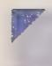

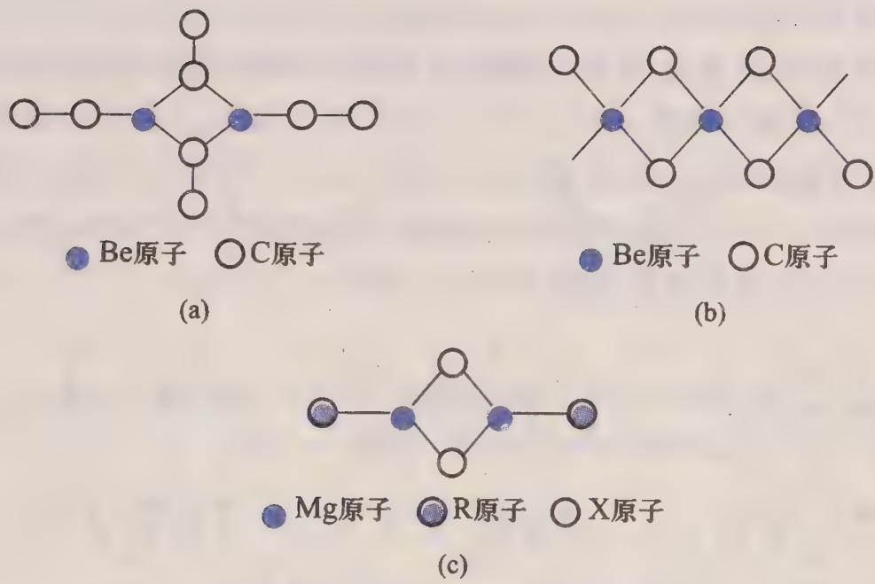  
图24-1 几个有机金属化合物的结构

18 电子规则为经验规则,有很多例外。例如, $\left[\mathrm{Ni}\left(\mathrm{C}_{3}\mathrm{H}_{5}\right)_{2}\right]$ ,K $\left[\mathrm{PtCl}_{3}\left(\mathrm{C}_{2}\mathrm{H}_{4}\right)\right]$ 等不满足 18 电子规则,但化合物也很稳定。

## 24.1.2 过渡金属羰基化合物

1888 年, 蒙德(Mond)等发现四羰合镍 $\left[\mathrm{Ni}\left(\mathrm{CO}\right)_{4}\right]$ ，这是第一个过渡金属羰基化合物。由于 CO 的强配位能力，可与低价态过渡金属形成配位化合物。羰基化合物种类繁多，既有结构和化学键的特殊性，又有很好的催化性能，具有重要的理论和应用价值。人们一般把单核和双核羰基化合物归属为有机金属化合物，而把三核和三核以上的羰基化合物归属为原子簇化合物。

## 1. 单核羰基化合物

$\left[\mathrm{Ni}(\mathrm{CO})_{4}\right]$ 和 $\left[\mathrm{Fe}(\mathrm{CO})_{5}\right]$ 可由金属与CO在一定条件下直接反应制备，而其他过渡金属的羰基化合物可用金属盐的还原羰基化及其他方法制备。某些价层为奇数电子的过渡金属的单核羰基化合物不稳定或不存在，但可形成阴离子或二聚体。

常见的单核羰基化合物: $\left[\mathrm{V}(\mathrm{CO})_{6}\right]$ 为黑色固体, 易还原; $\left[\mathrm{Cr}(\mathrm{CO})_{6}\right]$ , $\left[\mathrm{Mo}(\mathrm{CO})_{6}\right]$ 和 $\left[\mathrm{W}(\mathrm{CO})_{6}\right]$ 均为白色固体, 易升华, 在空气中稳定; $\left[\mathrm{Fe}(\mathrm{CO})_{5}\right]$ 为黄色液体, 热稳定性较好; $\left[\mathrm{Ru}(\mathrm{CO})_{5}\right]$ 和 $\left[\mathrm{Os}(\mathrm{CO})_{5}\right]$ 均为无色液体, 易挥发; $\left[\mathrm{Ni}(\mathrm{CO})_{4}\right]$ 为无色液体, 易分解, 剧毒。羰基化合物都有不同程度的毒性。

单核羰基化合物的结构规律性较强,四配位的为四面体结构,五配位的为三角双锥结构,六配位的为八面体结构。

## 2. 双核羰基化合物

过渡金属双核羰基化合物一般都有颜色。常见的双核羰基化合物中， $\left[\mathrm{Mn}_{2}(\mathrm{CO})_{10}\right]$ 为金黄色固体， $\left[\mathrm{Tc}_{2}(\mathrm{CO})_{10}\right]$ 和 $\left[\mathrm{Re}_{2}(\mathrm{CO})_{10}\right]$ 为白色固体，三者均具有双帽四方反棱柱结构；如图24-2(a)所示的 $\left[\mathrm{Fe}_{2}(\mathrm{CO})_{9}\right]$ 为黄色固体，具有共面八面体结构； $\left[\mathrm{Co}_{2}(\mathrm{CO})_{8}\right]$ 为橙红色固体，已经测得它的两种结构：在溶液中如图24-2(b)所示，在固体中如图24-2(c)所示。

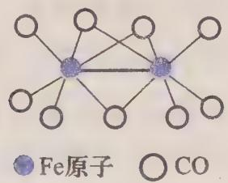  
(a)

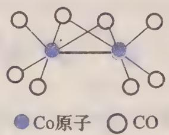  
(b)  
图24-2 双核羰基化合的结构

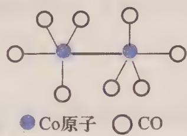  
(c)

## 3. 羰基化合物的衍生物

过渡金属羰基化合物在一定条件下反应,可以得到一系列衍生物。羰基化合物的衍生物主要有:金属羰基阴离子化合物,如 $\mathrm{Na}\left[\mathrm{Co}\left(\mathrm{CO}\right)_{4}\right]$ , $\mathrm{Na}\left[\mathrm{Mn}\left(\mathrm{CO}\right)_{5}\right]$ , $\mathrm{K}\left[\mathrm{HCr}\left(\mathrm{CO}\right)_{5}\right]$ , $\mathrm{Na}_{4}\left[\mathrm{Cr}\left(\mathrm{CO}\right)_{4}\right]$ , $\mathrm{Na}_{2}\left[\mathrm{Fe}_{2}\left(\mathrm{CO}\right)_{8}\right]$ , $\mathrm{K}\left[\left(\mathrm{C}_{5}\mathrm{H}_{5}\right)\mathrm{Mo}\left(\mathrm{CO}\right)_{3}\right]$ 等;金属羰基卤化物,如 $\left[\mathrm{Fe}\left(\mathrm{CO}\right)_{4}\right]\mathrm{X}_{2}$ 和 $\left[\mathrm{Mn}\left(\mathrm{CO}\right)_{5}\right]\mathrm{Br}$ 等;金属羰基氢化物,如黄色液体 $\mathrm{H}\left[\mathrm{Co}\left(\mathrm{CO}\right)_{4}\right]$ 和 $\mathrm{H}_{2}\left[\mathrm{Fe}\left(\mathrm{CO}\right)_{4}\right]$ ,无色液体 $\mathrm{H}\left[\mathrm{Mn}\left(\mathrm{CO}\right)_{5}\right]$ 等;还有亚硝酰衍生物,如 $\left[\mathrm{Co}\left(\mathrm{CO}\right)_{3}\right]\mathrm{NO}$ , $\left[\mathrm{V}\left(\mathrm{CO}\right)_{5}\right]\mathrm{NO}$ 和 $\left[\mathrm{Mn}\left(\mathrm{CO}\right)_{4}\right]\mathrm{NO}$ 等。

## 24.1.3 金属与不饱和链烃的 $\pi$ 配位化合物

不饱和链烃配体包括烯烃、炔烃、 $\pi$ 烯丙基等，这些 $\pi$ 配体与过渡金属形成一类重要的有机金属化合物。

## 1. 链烯烃配位化合物

1827 年, 蔡斯将 $PtCl_{4}$ 和 $PtCl_{2}$ 混合后在乙醇中回流, 得到的黑色固体用 KCl 和盐酸溶液处理后生成柠檬黄色晶体 $\mathrm{K}\left[\mathrm{PtCl}_{3}\left(\mathrm{C}_{2}\mathrm{H}_{4}\right)\right]\cdot\mathrm{H}_{2}\mathrm{O}$ , 这就是蔡斯盐。

$\left[\mathrm{PtCl}_{3}\left(\mathrm{C}_{2} \mathrm{H}_{4}\right)\right]^{-}$ 的结构为平面四边形, $\mathrm{C}_{2} \mathrm{H}_{4}$ 占据四边形的一个顶点。C—C链与 $\mathrm{PtCl}_{3}$ 平面几乎是垂直的, 两个 C 原子与 Pt 的距离相等。4 个 H 原子与两个 C 原子不在同一平面, H 原子远离 Pt 向外伸展, 见图 24-3(a)。其化学键的特殊性已在第 22 章中讨论过, 这里不再赘述。

在 $\left[\mathrm{Fe}(\mathrm{CO})_{4}\left(\mathrm{C}_{2} \mathrm{H}_{4}\right)\right]$ 的五配位结构中， $\mathrm{C}_{2} \mathrm{H}_{4}$ 占有三角双锥共用底面三角形的一个顶点位置,与处在四配位结构中所不同的是, $C_{2}H_{4}$ 的C—C键几乎是在三角双锥共用底面三角形所在的平面内,见图24-3(b)。

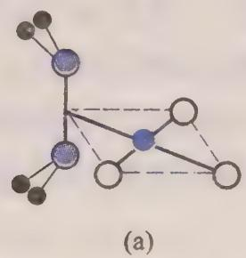

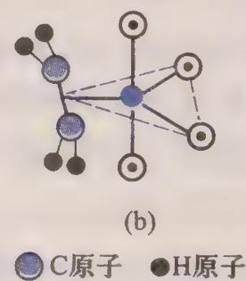  
图24-3 链烯烃配位化合物的结构

乙烯与金属成键后,会使 C—C 键减弱,键长明显变大。例如,在 K[PtCl₃(C₂H₄)]中,C—C 键键长为 137 pm;在 [Ni(PPh₃)₂(C₂H₄)]中,C—C 键键长为 143 pm;而在 C₂H₄ 分子中 C—C 键键长为 133 pm。

## 2. 炔烃配位化合物

炔烃有两对 $\pi$ 电子, 成键类型更多。炔烃可以用一对 $\pi$ 电子与金属成键, 如在 $\left[\mathrm{PtCl}_{2} \mathrm{R}\left(\mathrm{Bu}^{\prime} \mathrm{CCBu}^{\prime}\right)\right]$ (R 代表 $p-\mathrm{CH}_{3} \mathrm{C}_{6} \mathrm{H}_{4} \mathrm{NH}_{2}, \mathrm{Bu}^{\prime}$ 代表叔丁基) 中, 炔烃占有四边形的一个顶点位置。炔烃也可以用两对 $\pi$ 电子与两个金属成键, 如在 $\left[\mathrm{Co}_{2}(\mathrm{CO})_{6}(\mathrm{PhCCPh})\right]$ 中, 炔烃的 C—C 键与 Co—Co 键垂直; 又如在 $\left[\mathrm{Pt}\left(\mathrm{PPh}_{3}\right)_{2}(\mathrm{PhCCPh})\right]$ 中, 炔烃的两个碳原子占有四边形的两个顶点位置。

## 24.1.4 芳香性配体夹心化合物

与不饱和链烃相似,环多烯烃的 $\pi$ 电子可以向过渡金属的空轨道配位,同时过渡金属 d 电子向环多烯烃空的 $\pi^{*}$ 轨道或离域 $\pi^{*}$ 轨道配位。金属环多烯烃化合物中最重要的是具有芳香性的配体与过渡金属形成的芳夹心化合物。

芳夹心化合物的分子轨道能级和电子光谱等内容已远超出本课程所要求的知识范围,在此不做介绍,感兴趣的读者请阅读有关专著。

## 1. 茂夹心化合物

1951 年,两个研究小组几乎同时合成出二茂铁。之后,威尔金森通过红外光谱、磁化率和偶极矩的测定,判断二茂铁具有夹心结构;费歇尔等通过 X 射线衍射研究,认为二茂铁具有五角反棱柱结构。所谓“反棱柱”是指将原棱柱体的上下两底面由重叠式旋转成交错式所形成的多面体。原棱柱的每一个矩形侧面均消失,代之以两个三角形面。

茂夹心化合物都有颜色,易升华,溶于烃类溶剂,茂环具有芳香性。茂夹心化合物主要有: $\left[\mathrm{Fe}\left(\mathrm{C}_{5}\mathrm{H}_{5}\right)_{2}\right]$ ,橙黄色,熔点为173℃,空气中稳定; $\left[\mathrm{Co}\left(\mathrm{C}_{5}\mathrm{H}_{5}\right)_{2}\right]$ ,紫黑色,熔点为 $174^{\circ}C$ , 对空气敏感; $\left[\mathrm{Ni}\left(\mathrm{C}_{5}\mathrm{H}_{5}\right)_{2}\right]$ , 亮绿色, 对空气敏感, $173^{\circ}C$ 分解; $\left[\mathrm{V}\left(\mathrm{C}_{5}\mathrm{H}_{5}\right)_{2}\right]$ , 紫色, 熔点为 $167^{\circ}C$ , 对空气敏感; $\left[\mathrm{Cr}\left(\mathrm{C}_{5}\mathrm{H}_{5}\right)_{2}\right]$ , 深红色, 熔点为 $173^{\circ}C$ , 在空气中自燃; $\left[\mathrm{Mn}\left(\mathrm{C}_{5}\mathrm{H}_{5}\right)_{2}\right]$ , 深棕色, 熔点为 $172^{\circ}C$ , 对空气敏感。

主族元素有非对称的茂夹心化合物,如固态的 $\left[\mathrm{Be}\left(\mathrm{C}_{5}\mathrm{H}_{5}\right)_{2}\right]$ 中,尽管两个茂环互相平行,但是其中的一个茂环用一个C原子与Be原子形成 $\sigma$ 键,且该茂环与金属Be原子的距离较大;气态的 $\left[\mathrm{Be}\left(\mathrm{C}_{5}\mathrm{H}_{5}\right)_{2}\right]$ 中,两个茂环呈交错型排列,但是两环与Be原子的距离不等。

$\left[\mathrm{Ru}\left(\mathrm{C}_{5}\mathrm{H}_{5}\right)_{2}\right]$ 和 $\left[\mathrm{Os}\left(\mathrm{C}_{5}\mathrm{H}_{5}\right)_{2}\right]$ 都是重叠式结构。

## 2. 其他夹心化合物

最稳定的苯夹心化合物为 $\left[\mathrm{Cr}\left(\mathrm{C}_{6} \mathrm{H}_{6}\right)_{2}\right]$ , 具有重叠式夹心结构。 $\left[\mathrm{Cr}\left(\mathrm{C}_{6} \mathrm{H}_{6}\right)_{2}\right]$ 虽与 $\left[\mathrm{Fe}\left(\mathrm{C}_{5} \mathrm{H}_{5}\right)_{2}\right]$ 为等电子体, 但 $\mathrm{Cr}$ 束缚电子能力差, 易被氧化, 而且其芳环上的氢比茂环上的氢惰性。

过渡金属的苯夹心化合物均为固体,且颜色较深。 $\left[\mathrm{Cr}\left(\mathrm{C}_{6}\mathrm{H}_{6}\right)_{2}\right]$ ， $\left[\mathrm{Mo}\left(\mathrm{C}_{6}\mathrm{H}_{6}\right)_{2}\right]$ 和 $\left[\mathrm{W}\left(\mathrm{C}_{6}\mathrm{H}_{6}\right)_{2}\right]$ 均为抗磁性； $\left[\mathrm{V}\left(\mathrm{C}_{6}\mathrm{H}_{6}\right)_{2}\right]$ 为顺磁性。

环辛四烯 $C_{8}H_{10}$ 没有芳香性,但其阴离子 $C_{8}H_{8}^{2-}$ 有芳香性,与半径较大的内过渡金属形成夹心化合物,如 $\left[\mathrm{U}\left(\mathrm{C}_{8}\mathrm{H}_{8}\right)_{2}\right]$ , $\left[\mathrm{Np}\left(\mathrm{C}_{8}\mathrm{H}_{8}\right)_{2}\right]$ 和 $\left[\mathrm{Pu}\left(\mathrm{C}_{8}\mathrm{H}_{8}\right)_{2}\right]$ 等,人们研究得较充分的是 $\left[\mathrm{U}\left(\mathrm{C}_{8}\mathrm{H}_{8}\right)_{2}\right]$ 。

$\left[\mathrm{U}\left(\mathrm{C}_{8}\mathrm{H}_{8}\right)_{2}\right]$ 为绿色晶体,热稳定性较高,但对空气敏感;具有完全重叠的夹心式结构。

某些茂夹心化合物属于不对称夹心化合物，如 $\left[\mathrm{Re}\left(\mathrm{C}_{5} \mathrm{H}_{5}\right)_{2} \mathrm{H}\right]$ 和 $\left[\mathrm{W}\left(\mathrm{C}_{5} \mathrm{H}_{5}\right)_{2} \mathrm{H}_{2}\right]$ 等。芳环配体还可以与多个过渡金属形成多层夹心式结构，如 $\left[\left(\mathrm{C}_{5} \mathrm{H}_{5}\right) \mathrm{Ni}\left(\mathrm{C}_{5} \mathrm{H}_{5}\right) \mathrm{Ni}\left(\mathrm{C}_{5} \mathrm{H}_{5}\right)\right]^{+}$ 和 $\left[\left(\mathrm{C}_{5} \mathrm{H}_{5}\right) \mathrm{Co}\left(\mathrm{C}_{8} \mathrm{H}_{8}\right) \mathrm{Co}\left(\mathrm{C}_{5} \mathrm{H}_{5}\right)\right]^{2+}$ 等。

过渡金属与两种芳环配体可形成混配型夹心化合物, 如 Cr, Mo, Mn, Tc, Re 能够形成 $\left[\left(\mathrm{C}_{5}\mathrm{H}_{5}\right)\mathrm{M}\left(\mathrm{C}_{6}\mathrm{H}_{6}\right)\right]$ 。芳夹心化合物可以形成许多衍生物, 如 $\left[\left(\mathrm{C}_{6}\mathrm{H}_{6}\right)\mathrm{V}(\mathrm{CO})_{3}\right]$ 和 $\left[\left(\mathrm{C}_{6}\mathrm{H}_{6}\right)\mathrm{Cr}(\mathrm{CO})_{3}\right]$ 等。

## 24.2 金属原子簇化学

最初的原子簇(cluster)是指含有金属-金属键的多核化合物,这与当今金属原子簇的概念相似。随着硼烷及其衍生物数量的不断增多和人们对其结构的深入研究,认为这类化合物的结构特征与金属原子簇相似,将其归属为原子簇化合物。这就是非金属原子簇,将在24.3节中进行讨论。

最早发现的原子簇化合物可能是 1858 年陆森(Roussin)合成的黑色化合物 $\mathrm{K}[\mathrm{Fe}_{4}\mathrm{S}_{3}(\mathrm{NO})_{7}]$ ——陆森黑盐,其结构直到 1958 年才确定。

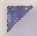

20 世纪 60 年代, $\left[Re_{3}Cl_{12}\right]^{3-}$ 的发现和结构表征,使原子簇化合物的研究受到普遍重视。应该说,从 20 世纪 60 年代开始,人们把金属原子簇作为单独一类化合物来进行研究。

按照这个新的定义,不仅硼烷及其衍生物归属为原子簇,也把一些没有明显金属-金属键的多核多面体归属为原子簇,甚至把一些双核金属化合物和具有多面体骨架特征的多酸化合物归入原子簇,分别称为双核簇和金属氧簇。

金属原子簇类型很多,在此只介绍一些常见的类型。

## 24.2.1 金属-羰基原子簇

## 1. 金属-羰基原子簇的特点

羰基簇中 M—M 键长与金属晶体相似。例如，金属晶体中 Co—Co 距离为 250 pm，在 $\left[\mathrm{Co}_{4}(\mathrm{CO})_{12}\right]$ 中距离为 249 pm。

随着核数的增加,电子的不定域性增强,金属羰基原子簇的颜色一般加深,如 $\left[\mathrm{Rh}_{3}(\mathrm{CO})_{10}\right]$ 呈黄色, $\left[\mathrm{Rh}_{6}(\mathrm{CO})_{14}\right]^{4-}$ 呈暗红色, $\left[\mathrm{Rh}_{12}(\mathrm{CO})_{30}\right]^{2-}$ 呈紫色。在组成与结构相似的前提下,重金属的羰基簇颜色较浅,如 $\left[\mathrm{Co}_{4}(\mathrm{CO})_{12}\right]$ 呈黑色, $\left[\mathrm{Rh}_{4}(\mathrm{CO})_{12}\right]$ 呈红色, $\left[\mathrm{Ir}_{4}(\mathrm{CO})_{12}\right]$ 呈黄色。

羰基簇中的羰基有3种配位形式:向一个金属配位的端羰基;向两个金属配位的边桥式羰基,即第22章中所涉及的酮式羰基;向3个金属配位的面桥式羰基。

## 2. 金属-羰基原子簇的结构

三核羰基簇骨架多为三角形。例如，图24-4(a)所示的 $\left[\mathrm{Fe}_{3}(\mathrm{CO})_{12}\right]$ 有10个端羰基和两个边桥式羰基；图24-4(b)所示的 $\left[\mathrm{Ru}_{3}(\mathrm{CO})_{12}\right]$ （中心或是Os）有12个端羰基；图24-4(c)所示的 $\left[\mathrm{Pt}_{3}(\mathrm{CO})_{6}\right]^{2-}$ 有3个端羰基和3个边桥式羰基。3者均具有三角形骨架。例外的是， $\left[\mathrm{Mn}(\mathrm{CO})_{5}\mathrm{Fe}(\mathrm{CO})_{4}\mathrm{Mn}(\mathrm{CO})_{5}\right]$ 为线形分子。

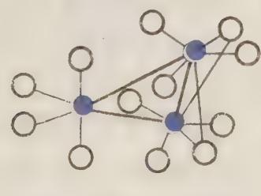  
(a)

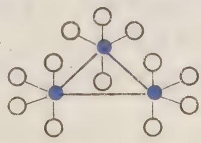  
(b)

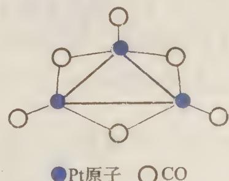  
图24-4 三核羰基簇的结构  
(c)

四核羰基簇骨架多为四面体结构。如 $\left[\mathrm{M}_{4}(\mathrm{CO})_{12}\right]$ (M为Co,Rh,Ir)，骨架均为四面体结构，但羰基配体的配位形式不同。图24-5(a)所示的 $\left[\mathrm{Ir}_{4}(\mathrm{CO})_{12}\right]$ 没有桥式羰基；而图24-5(b)所示的 $\left[\mathrm{Rh}_{4}(\mathrm{CO})_{12}\right]$ 有3个边桥式羰基。如图 24-5(c) 所示的 $\left[\mathrm{Fe}_{4}(\mathrm{CO})_{13}\mathrm{H}\right]^{-}$ ，其结构为不在同一平面内的两个共边的三角形，4 个 Fe 处于三角形的顶点位置。12 个端羰基平均分配给 4 个 Fe 原子，第 13 个羰基为面桥式羰基，与含三角形共用边两端的两个 Fe 原子在内的 3 个核配位，而 C 原子和 O 原子同时又与第 4 个 Fe 原子相互作用。还有一种如图 24-5(d) 所示的菱形结构，如 $\left[\mathrm{Re}_{4}(\mathrm{CO})_{16}\right]^{2-}$ ，其较短对角线上的两个 Re 原子直接成键，16 个端羰基平均分配给 4 个 Re 原子。

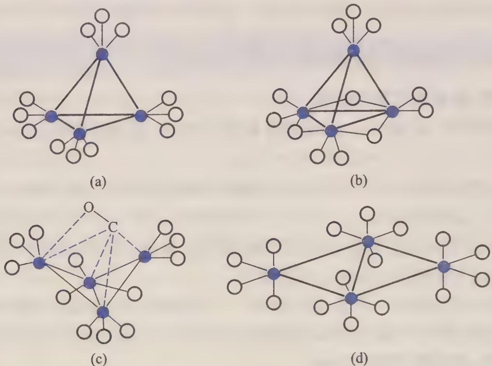  
金属原子 OCO  
图24-5 四核羰基簇的结构

五核羰基簇骨架以三角双锥和四角锥为基础。例如，图24-6(a)所示的 $\left[\mathrm{Ni}_{5}(\mathrm{CO})_{12}\right]^{2-}$ 为三角双锥骨架，在其双锥共用底面三角形顶角处的3个Ni原子上平均分布3个端羰基和3个边桥式羰基，三角锥上下顶角处的两个Ni原子上各有3个端羰基。图24-6(b)所示的 $\left[\mathrm{Fe}_{5}(\mathrm{CO})_{15}\mathrm{C}\right]$ 为四角锥骨架，一个C原子位于四角锥底面中心，15个端羰基平均配位给5个Fe原子。

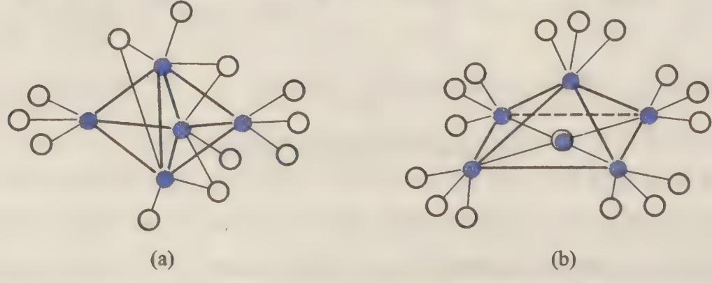  
O CO  
图24-6 五核羰基簇的结构

随着核数增加,金属羰基簇骨架结构愈加复杂与多样化。六核羰基簇骨架有八面体结构,如 $\left[\mathrm{Ru}_{6}\left(\mathrm{CO}\right)_{17}\mathrm{C}\right]$ 和 $\left[\mathrm{Co}_{6}\left(\mathrm{CO}\right)_{14}\right]$ ;三角双锥加冠结构(亦称双冠四面体),如 $\left[\mathrm{Os}_{6}\left(\mathrm{CO}\right)_{18}\right]$ ;三棱柱结构,如 $\left[\mathrm{Pt}_{6}\left(\mathrm{CO}\right)_{12}\right]^{2-}$ ;反三棱柱结构,如 $\left[\mathrm{Ni}_{6}\left(\mathrm{CO}\right)_{12}\right]^{2-}$ ,等等。

## 24.2.2 其他金属原子簇的结构

## 1. 金属-卤素原子簇

金属-卤素原子簇主要是三核簇和六核簇及其卤离子取代的衍生物。三核簇具有三角形骨架，六核簇具有八面体骨架。

三核簇的典型代表为 $\left[\mathrm{Re}_{3} \mathrm{Cl}_{12}\right]^{3-}$ , 如图 24-7(a) 所示, 三角形的每条边上都有一个分子内桥联 Cl 原子, 每个顶点 Re 原子有一个端梢型 Cl 原子, 其余 6 个为 $\left[\mathrm{Re}_{3} \mathrm{Cl}_{12}\right]^{3-}$ 单元间的桥联 Cl 原子。

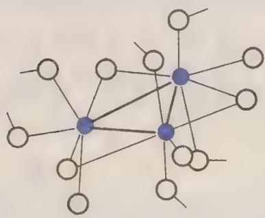  
(a)

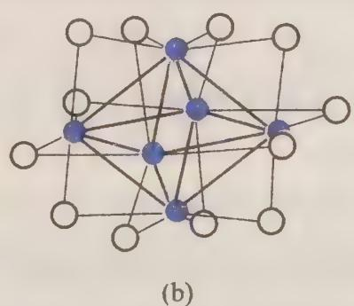  
金属原子 $\bigcirc$ Cl原子

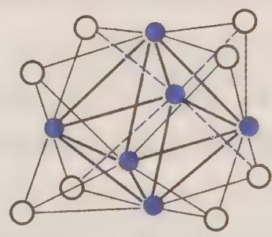  
(c)  
图24-7 金属-卤素原子簇的结构

六核簇有两种类型的八面体结构。一种以 $\left[\mathrm{Nb}_{6} \mathrm{Cl}_{12}\right]^{2+}$ 最为典型，6个Nb原子构成八面体骨架，八面体的12个棱边上各有一个桥联Cl原子，见图24-7(b)。另一种以 $\left[\mathrm{Mo}_{6} \mathrm{Cl}_{8}\right]^{4+}$ 为代表，6个Mo原子构成八面体骨架，8个三角形面上各有一个面桥Cl原子，见图24-7(c)。

## 2. 金属-硫原子簇

金属-硫原子簇的特点是硫原子取代部分金属原子的位置而占据多面体顶点,许多金属-硫原子簇核心部分具有 $M_{4}S_{4}$ 类立方烷结构,如图 24-8(a) 所示,也可以看成 $M_{4}$ 四面体的每个面上有一个面桥 S 原子。簇合物 $\left[\mathrm{Fe}_{4}\mathrm{S}_{4}\left(\mathrm{NO}\right)_{4}\right]$ 为变形立方体结构,如图 24-8(b) 所示,在 $Fe_{4}S_{4}$ 的基础上,每个 Fe 原子有一个 NO 配体。Fe—Fe 间的平均距离为 265.1 pm,比 S—Fe 间的平均距离 221.7 pm 大些,尚可以认为 Fe—Fe 间存在化学键。在有的硫簇合物,如 $\left[\left(\mathrm{C}_{5}\mathrm{H}_{5}\right)_{4}\mathrm{Co}_{4}\mathrm{S}_{4}\right]$ 中,Co—Co 间的平均距离为 329.5 pm,可以认为不存在化学键作用。

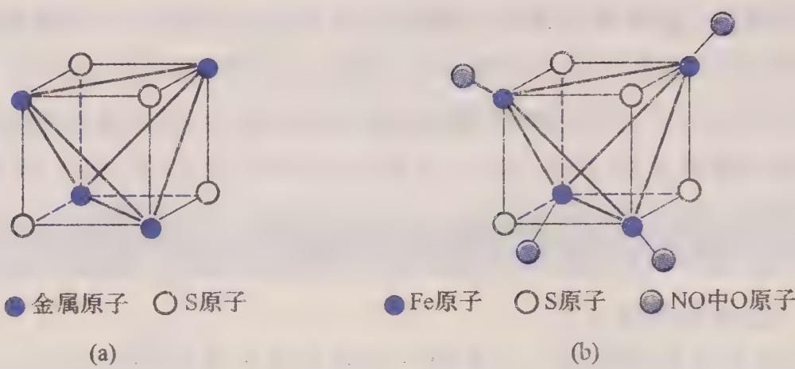  
图24-8 金属-硫原子簇的结构

在固氮酶中含有 Mo-Fe-S 蛋白和 Fe-S 蛋白, 其功能是传递电子。因此, 金属-硫原子簇的研究对于模拟生物固氮具有重要意义。

## 24.2.3 金属-金属多重键化合物

1964 年, Cotton 论证了 $\left[Re_{2}Cl_{8}\right]^{2-}$ 中存在 Re—Re 四重键, 之后又陆续合成许多 Mo, W, Cr 等含有 M—M 金属多重键化合物, 或称多重键金属簇。这里仅对四重键双核簇做一简单的介绍。

除 21.2.3 小节中介绍的 $\left[\mathrm{Re}_{2}\mathrm{Cl}_{8}\right]^{2-}$ 外，还有很多化合物中存在 M—M 四重键，如含桥式双基配体类的化合物 $\left[\mathrm{Mo}_{2}\left(\mathrm{O}_{2}\mathrm{CCH}_{3}\right)_{4}\right]$ ， $\left[\mathrm{Cr}_{2}\left(\mathrm{O}_{2}\mathrm{CCH}_{3}\right)_{4}\left(\mathrm{H}_{2}\mathrm{O}\right)_{2}\right]$ ， $\left[\mathrm{Re}_{2}\left(\mathrm{O}_{2}\mathrm{CCH}_{3}\right)_{2}\mathrm{Cl}_{4}\right]$ 等。

由四重键双核簇的结构可以看出,在 M—M 键轴方向还可以接受配体,使 M 的配位数达到 6。如 $\left[\mathrm{Cr}_{2}\left(\mathrm{O}_{2}\mathrm{CCH}_{3}\right)_{4}\left(\mathrm{H}_{2}\mathrm{O}\right)_{2}\right]$ 中的两个 $H_{2}O$ 分子就是从轴向与 Cr 原子配位的,见图 24-9。

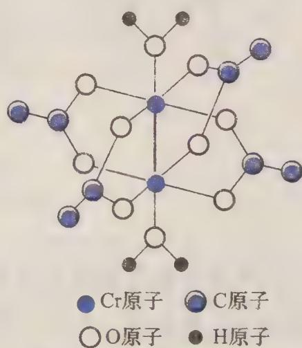  
图24-9 四重键双核簇的结构

形成 M—M 多重键时,使金属的单电子数减少甚至为零,因此这些化合物磁矩小,甚至没有顺磁性。

## 24.3 非金属原子簇化学

非金属原子簇化学是从硼烷的合成发展起来的。1912—1936年，德国人斯托克(Stock)与合作者经过20多年的努力，制备了 $B_{2}H_{6},B_{4}H_{10},B_{5}H_{9},B_{5}H_{11},B_{6}H_{10},B_{10}H_{14}$ 等硼烷及其衍生物。

20 世纪 50 年代中期,美国人利普斯科姆(Lipscomb)在总结已经测定的硼烷结构的基础上,提出缺电子硼烷的三中心二电子键和多中心键的概念,给出预测硼烷结构的拓扑结构规则。因此,利普斯科姆获得了1976年诺贝尔化学奖。

美国人布朗(Brown)于1936年开始硼烷化学的研究。由于在合成有机硼烷并将其应用于有机合成方面的贡献,布朗与德国人维蒂希(Wittig)共同获得了1979年诺贝尔化学奖。

1965 年,霍索恩(Hawthorne)合成出夹心型金属碳硼烷,使硼烷化学与有机金属化合物联系起来,并推动了硼烷衍生物的研究。

1985 年,美国人柯尔(Curl)、克罗托(Kroto)与英国人史沫莱(Smalley)合作,证明了笼状分子 $C_{60}$ 的特殊稳定性。由于在该领域研究的贡献,他们三人共同获得了 1996 年诺贝尔化学奖。 $C_{60}$ 是纯碳原子簇,它的发现为碳单质增加了一类新的同素异形体——碳簇。

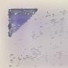

## 24.3.1 硼烷

## 1. 硼烷的重要性质

多数硼烷的稳定性较差,易水解,易被氧化或发生自燃,挥发性硼烷一般都有毒。部分中性硼烷的性质列于表 24-1。

表 24-1 部分中性硼烷的性质

<table><tr><td>化学式</td><td>熔点/°C</td><td>沸点/°C</td><td>空气中(25℃)</td><td>热稳定性</td><td>溶解性</td></tr><tr><td>B2H6</td><td>-165.85</td><td>-92.49</td><td>自燃</td><td>室温稳定</td><td>立即水解</td></tr><tr><td>B4H10</td><td>-120</td><td>18</td><td>纯时不自燃</td><td>室温迅速分解</td><td>缓慢水解</td></tr><tr><td>B5H9</td><td>-46.74</td><td>60.10</td><td>自燃</td><td>150°C分解</td><td>加热时水解</td></tr><tr><td>B5H11</td><td>-122</td><td>65</td><td>自燃</td><td>室温迅速分解</td><td>迅速水解</td></tr><tr><td>B6H10</td><td>-62.3</td><td>108(分解)</td><td>稳定</td><td>108°C分解</td><td>加热时水解</td></tr><tr><td>B6H12</td><td>-82.3</td><td>≈85</td><td>一</td><td>稳定数小时</td><td>定量水解</td></tr><tr><td>B10H14</td><td>98.78</td><td>213</td><td>极稳定</td><td>150°C不分解</td><td>缓慢水解</td></tr><tr><td>B14H18</td><td>液态</td><td>100(分解)</td><td>稳定</td><td>100°C分解</td><td>溶于环己烷、 二硫化碳</td></tr></table>

## 2. 硼烷的结构

硼烷主要有 3 种基本结构, 即闭式(closo)、巢式(nodo)和网式(arachno)结构, 此外还有敞网式和稠合式等结构。

闭式硼烷具有三角多面体的封闭结构,亦称笼状结构,都是组成为 $B_{n}H_{n}^{2-}$ (n=6\~12)的阴离子,部分骨架结构如图24-10所示,每个硼原子有一个端氢原子。虽然 $B_{5}H_{5}^{2-}$ 尚未能得到，但其衍生物 $C_{2}B_{3}H_{5}$ 已经合成出来。

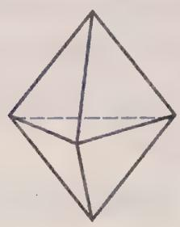  
(a) 三角双锥

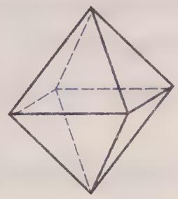  
(b) 八面体

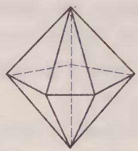  
(c) 五角双锥

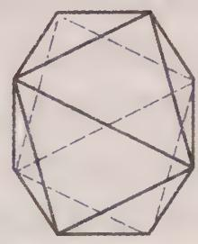  
(d) 十二面体

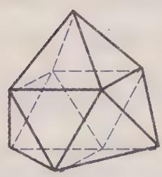  
(e) 三帽三棱柱

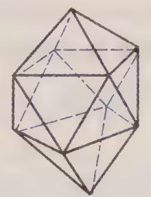  
(f) 双帽四方反棱柱

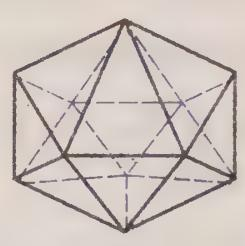  
图24-10 闭式硼烷的结构  
(g) 十八面体

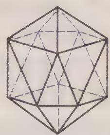  
(h) 二十面体

$\mathrm{B}_7\mathrm{H}_7^{2-}$ 的五角双锥结构如图 24-10(c) 所示。 $\mathrm{B}_8\mathrm{H}_8^{2-}$ 的十二面体结构如图 24-10(d) 所示。 $\mathrm{B}_9\mathrm{H}_9^{2-}$ 的三帽三棱柱结构如图 24-10(e) 所示。所谓“帽”是指在多面体外以多面体的某一面为底面的角锥体顶点处加一个构成骨架多面体的原子。显然加帽后多面体原有的一个面消失，代之以相应数目的三角形面。 $\mathrm{B}_{10}\mathrm{H}_{10}^{2-}$ 的双帽四方反棱柱结构如图 24-10(f) 所示。

巢式硼烷是闭式硼烷去掉一个顶点所形成的缺顶点多面体, 组成为 $B_{n}H_{n+4}$ ，分子中都存在桥联氢原子, 如图 24-11(a) 和 (b) 所示的巢式硼烷 $B_{5}H_{9}$ 和 $B_{6}H_{10}$ 。

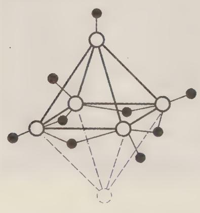  
(a) $B_{5}H_{9}$

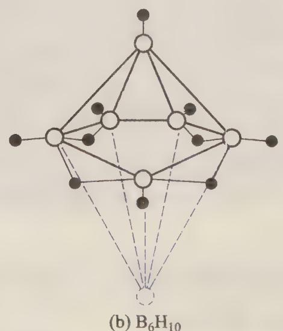  
(b) $\mathrm{B}_6\mathrm{H}_{10}$

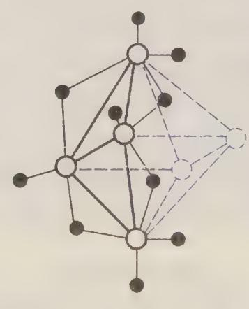  
○B原子 ●H原子  
(c) $B_{4}H_{10}$  
图24-11 巢式和网式硼烷的结构

网式硼烷是闭式硼烷去掉两个相邻顶点所形成的缺顶点多面体，组成为 $B_{n}H_{n+6}$ ，分子中都存在桥联氢原子，如图24-11(c)所示的网式硼烷 $B_{4}H_{10}$ 。

## 24.3.2 硼烷衍生物

硼烷衍生物主要有碳硼烷、金属硼烷、金属碳硼烷，还有一些含有磷、硫等原子的其他衍生物。

## 1. 碳硼烷

以 CH 对硼烷的 $\mathrm{BH}_{2}(\mathrm{BH}^{-})$ 进行等电子取代，可得到组成为 $C_{0\sim2}B_{n}H_{n+2}$ （闭式）、 $C_{0\sim4}B_{n}H_{n+4}$ （巢式）和 $C_{0\sim6}B_{n}H_{n+6}$ （网式）等碳硼烷。实际上碳原子经常部分取代硼原子，完全的等电子取代并不多。部分闭式碳硼烷的结构见图 24-12。

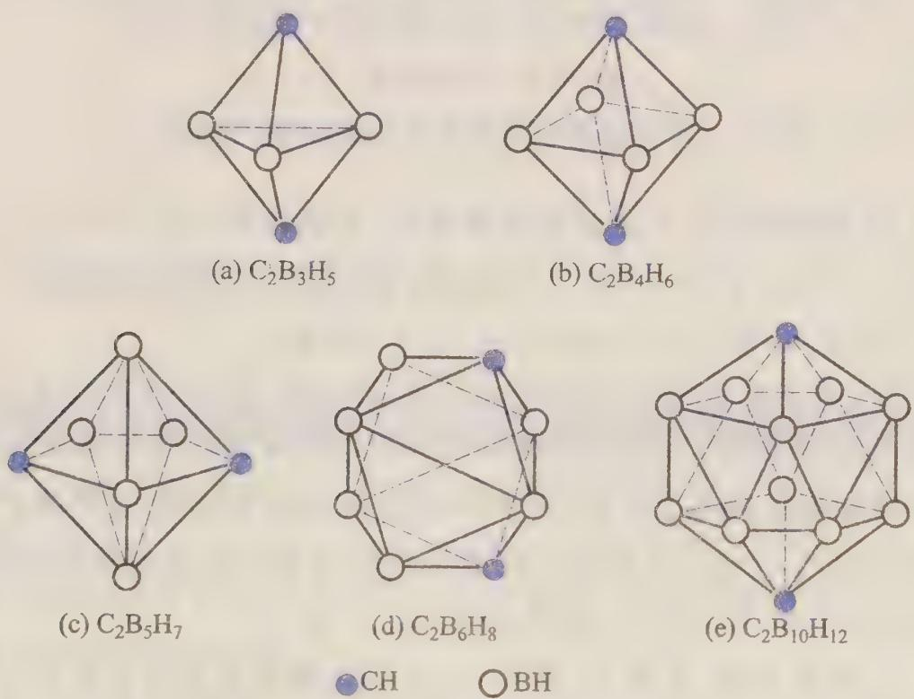  
图24-12 闭式碳硼烷的结构

巢式 $B_{6}H_{10}$ 中 $BH_{2}$ 被 CH 逐步取代, 可形成完全的等电子系列。

## 2. 金属碳硼烷

将有两个有相邻碳原子的 $C_{2}B_{10}H_{12}$ 脱去一个顶 $(\mathrm{BH}^{2+})$ 后，得到碳硼壶离子 $C_{2}B_{9}H_{11}^{2-}$ ，见图 24-13(a)。该离子开口的面上 5 个分子轨道指向上方中心，5 个轨道有 6 个离域电子，与 $C_{5}H_{5}^{-}$ 相似。利用这种相似性，1965 年合成出第一个金属碳硼烷 $\left[\left(\mathrm{CH}_{3}\right)_{4}\mathrm{N}\right]_{2}\left[\mathrm{Fe}\left(\mathrm{C}_{2}\mathrm{B}_{9}\mathrm{H}_{11}\right)_{2}\right]^{2-}$ 具有夹心结构, 见图 24-13(b)。Co(Ⅲ), Ni(Ⅳ)与 Fe(Ⅱ)为等电子体, 也可得到这种夹心化合物。

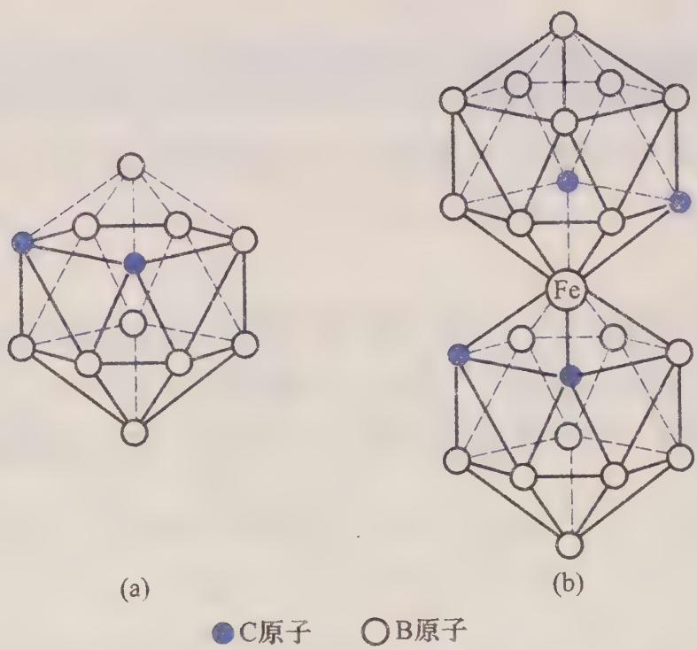  
图24-13 碳硼壶离子和金属碳硼烷离子的结构

此后，人们又陆续合成了很多金属碳硼烷、金属硼烷，如 $\left[\mathrm{Co}\left(\mathrm{C}_2\mathrm{B}_9\mathrm{H}_{11}\right)_2\right]^{-}$ ， $\left[\mathrm{Ni}\left(\mathrm{C}_2\mathrm{B}_9\mathrm{H}_{11}\right)_2\right]$ ， $\left[\left(\mathrm{CO}\right)_3\mathrm{Mn}\left(\mathrm{C}_2\mathrm{B}_9\mathrm{H}_{11}\right)\right]^{-}$ ， $\left[\left(\mathrm{C}_2\mathrm{B}_9\mathrm{H}_{11}\right)\mathrm{Co}\left(\mathrm{C}_5\mathrm{H}_5\right)\right]$ ， $\left[\left(\mathrm{CO}\right)_3\mathrm{Fe}\left(\mathrm{C}_2\mathrm{B}_3\mathrm{H}_5\right)\right]$ 和 $\left[\left(\mathrm{CO}\right)_4\mathrm{Fe}\left(\mathrm{B}_7\mathrm{H}_{12}\right)_2\right]^{-}$ ，等等。

## 24.3.3 碳簇简介

自 1985 年报道发现 $C_{60}$ 以来, 相关研究引起许多科学家的兴趣。 $C_{60}$ 的 60 个碳原子之间存在一个由 60 个电子形成的离域 $\pi$ 键, $C_{60}$ 发生加成反应可以得到碳簇的各种衍生物, 如 $C_{60}F_{60}, C_{60}O_{2}OsO_{2}(py)_{2}$ 等。

如果说 $C_{60}$ 酷似足球, 见第 14 章图 14-4, 那么碳簇家族中拉长的 $C_{70}$ 就很像橄榄球了, 见图 24-14(a)。从 $C_{60}$ 到 $C_{70}$ , 增加了 10 个碳原子, 于是使六元环增加到 25 个, 但五元环仍是 12 个。

当碳原子数目继续增加时,五元环数目仍保持不变,六元环数目不断增多,橄榄球形的碳簇继续加长,形状就成为细长的管子,1991年合成出了碳纳米管分子,见图24-14(b)。由于碳纳米管在尺寸和结构上的特点,它的一系列不寻常的性质已引起人们的注意。

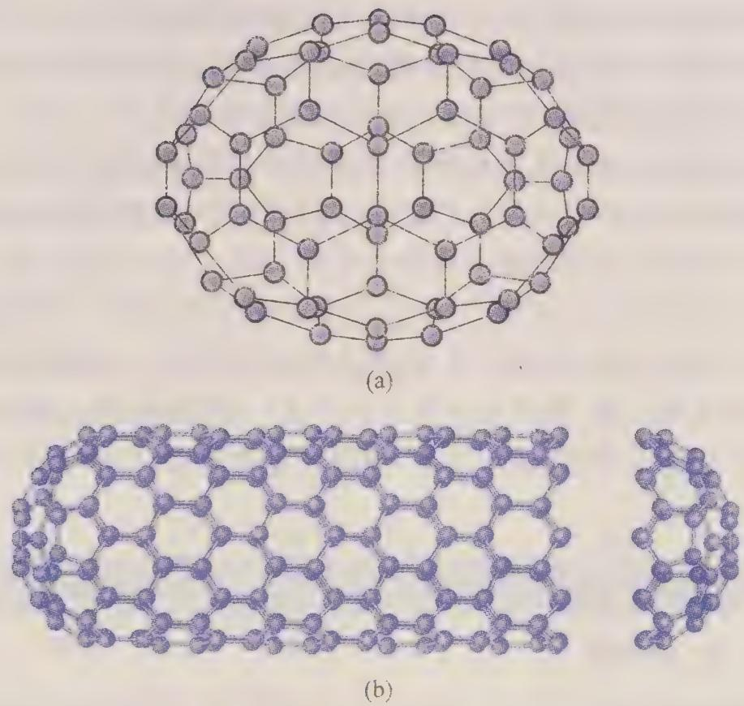  
图24-14 碳簇分子和碳纳米管

## 24.4 生物无机化学简介

虽然人们早已将碳、氢、氧、氮、磷等看成生物体的必需元素，但长期以来却一直忽略了微量元素及其化合物在生物体内的作用。随着生命科学和现代分析技术的不断发展，人们发现在生物体内存在很多种微量的元素。在20世纪30年代，发现人体内含有Cu, Mn, Zn, Co; 50年代发现人体内含有Mo, Se, Cr; 70年代又发现人体内含有F, Sn, V, Si…到现在为止，在自然界存在的90多种元素中，已在人体内发现60多种。

生物化学家在研究酶时,发现很多酶要依赖金属离子表现其自身活性,金属离子在生物体中的作用引起了他们的极大兴趣并吸引他们从事该领域的研究。无机化学家在研究配位化合物时,也逐步涉及金属离子与生物配体的结合。另一方面,地球化学和地方性流行病学的研究也表明,生活在不同环境的人群在患病方面有明显的区域性,许多地方病与所在地区环境中微量元素的含量有关。

由于科学家们在生物配体与金属离子作用的研究中不断取得进展，在20世纪60年代，逐步形成了“生物无机化学”这门交叉学科。1970年，首次召开国际性生物无机化学会议，加强了生物化学家和无机化学家之间的交流与合作，促进了生物无机化学的发展。1971年，出现了生物无机化学的第一种期刊Journal of

Bio-inorganic Chemistry; 1979 年, 又一种关于生物无机化学的期刊 Biological Research of rare Elements 创刊。1979 年, 国际生物无机化学学会成立。几十年来, 生物无机化学得到迅速发展, 成为相关学科研究的热点之一。

生物无机化学学科应用无机化学学科研究的方法和理论,在分子水平上研究生物体中金属和其他痕量元素,研究它们与生物大分子之间的相互作用,研究它们在生物体中独特的化学环境和特殊的生物功能。

生物无机化学研究的范围很广,除涉及无机化学和生物化学外,还涉及有机化学、结构化学、地球化学、营养化学、药物化学及医学等。其研究的主要对象是参与生物过程的无机元素,既研究含有无机元素(主要是金属元素)的生物大分子的组成、结构、性能及形成、转化规律,也研究生物过程,如酶催化、氧运输等的无机模型。

## 24.4.1 生物体中的重要化合物

## 1. 氨基酸、肽、蛋白质

氨基酸是构成蛋白质的基础,目前已经发现有20多种氨基酸存在于各种蛋白质中,它们全部都是α-氨基酸。氨基酸可以用通式 $NH_{2}CHRCOOH$ 表示,氨基中的N原子和羧基中的O原子都可以与金属配位,有的氨基酸的基团R中N,O,S原子也可以成为配位原子。

常见的氨基酸有甘氨酸(简记为 Gly)、丙氨酸(Ala)、丝氨酸(Ser)、苏氨酸(Thr)、蛋氨酸(Met)、赖氨酸(Lys)、谷氨酸(Glu)、谷氨酰胺(Gln)、组氨酸(His)、缬氨酸(Val)、精氨酸(Arg)、色氨酸(Trp)、酪氨酸(Tyr)、亮氨酸(Leu)、异亮氨酸(Ile)、脯氨酸(Pro)、羟脯氨酸(Hyp)、天冬氨酸(Asp)、天冬酰胺(Asn)、苯丙氨酸(Phe)、半胱氨酸(Cys)等。

氨基酸相互聚合而成的化合物称为肽。聚合方式是一个氨基酸分子的羧基与另一个氨基酸分子的氨基脱去一个水分子,形成肽键,其过程可表示为

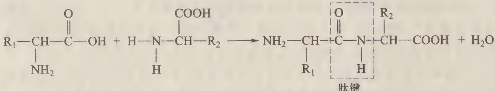

两个氨基酸通过肽键结合成的分子称为二肽,三个氨基酸通过两个肽键结合成的分子称为三肽,多个氨基酸聚合成的链状分子称为肽链。

蛋白质就是多肽,就是由一个或多个肽链按各自特殊的方式组合而成的大分子。蛋白质的一级结构也叫化学结构,是指氨基酸如何连接成肽链及它们在肽链中的顺序。一个肽链的羰基氧原子和另一个肽链的亚氨基氢原子通过氢键结合而形成蛋白质的二级结构。螺旋式伸展的肽链称为 $\alpha$ -螺旋结构，这种结构中形成分子内氢键，参见第18章图18-3(b)，天然蛋白质主要采取这种结构；由互相平行的不同多肽链通过氢键结合成的片状结构称为 $\beta$ -折叠结构。蛋白质还有三级结构和四级结构，在此不进行介绍。

## 2. 核苷、核苷酸、核酸

## (1) 碱基

生物体内的碱基,是指嘌呤和嘧啶类含有氮的杂环化合物,如图 24-15 所示,这些化合物都具有弱碱性。

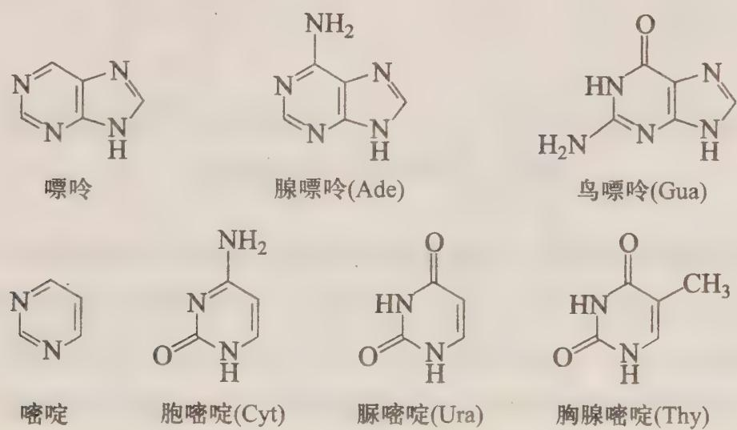  
图24-15 生物体内碱基的结构式

## (2) 核苷

由碱基和核糖或脱氧核糖缩合而成的化合物称为核苷,也分别称为核糖核苷及脱氧核糖核苷。不论是核糖核苷,还是脱氧核糖核苷,糖都是五元环的呋喃糖,两者差别仅在于呋喃环上的一个羟基氧原子。图 24-16 给出了两种核苷的结构式。

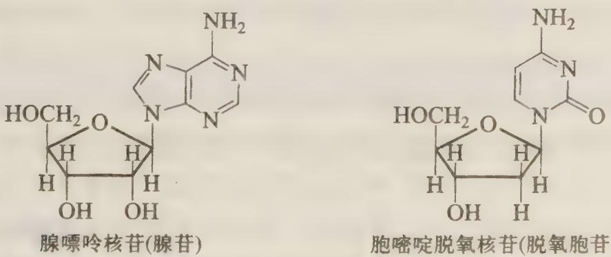  
图24-16 两种核苷的结构式

## (3) 核苷酸和核酸

核糖核苷的磷酸酯称为核糖核苷酸或脱氧核糖核苷酸，由磷酸与核苷缩聚而成。磷酸是经典的无机含氧酸，它在生物体内起着核心作用。后面还将看到许多种金属在生物体内的重要作用，所以说生物无机化学是极其重要的、极有发展前途的交叉学科。图24-17给出了两种核苷酸的结构式。

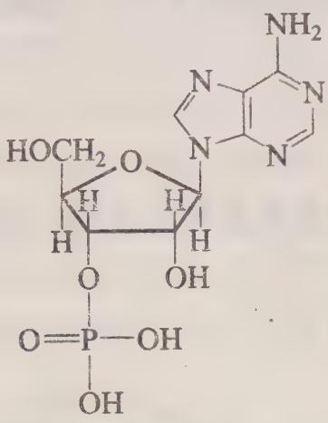  
腺嘌呤核苷酸(腺苷酸)

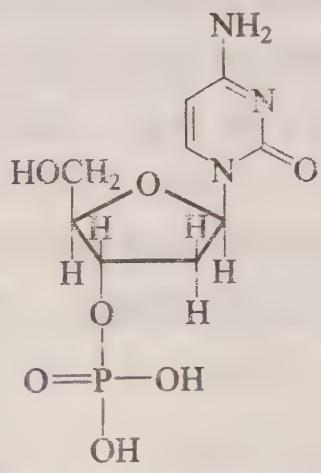  
胞嘧啶脱氧核苷酸(脱氧胞苷酸)  
图24-17 两种核苷酸的结构式

核酸是核苷酸的聚合物, 是核苷酸借磷酸二酯键互相连接的产物。核糖核酸(ribonucleic acid)简称 RNA, 其完全水解的产物是磷酸、碱基和核糖; 脱氧核糖核酸(deoxyribonucleic acid)简称 DNA, 其完全水解的产物是磷酸、碱基和脱氧核糖。DNA 是由两个核酸链形成的双螺旋结构, 两个链通过氢键结合。

## 3. 酶

酶是生物催化剂,是在生物体内起催化作用的蛋白质。酶分为纯蛋白酶和结合蛋白酶两种。只是单纯的蛋白质的酶称为纯蛋白酶,由蛋白质和非蛋白质结合成的酶称为结合蛋白酶。结合蛋白酶中的非蛋白质部分称为辅基或辅酶。酶中非蛋白质部分与蛋白质部分结合紧密,则称非蛋白质部分为辅基,辅基可以是金属离子,也可以是金属配位化合物,如铁卟啉等;若酶中非蛋白质部分与蛋白质部分结合疏松,用透析的方法可以除去非蛋白质部分,则称非蛋白质部分为辅酶,辅酶往往是复杂的有机大分子,如核苷、核苷酸及其衍生物等。

酶的结构中含有金属离子,则称为金属酶,金属在酶中的个数比较固定且与蛋白质的结合比较紧密。如果酶中的金属与蛋白质结合不够紧密,金属可以被除去,但失去金属的酶失去活性,再与金属结合后酶又恢复其活性,这种酶称为金属激活酶。含有金属离子作为活化因子的蛋白质称为金属蛋白,只有金属离子存在时金属蛋白才能显示其正常的生物功能。从这个意义上说,金属蛋白包括金属酶。

酶中金属离子的作用是多方面的。例如，金属离子可以改变酶蛋白的电荷分布，增加酶的活性；把反应基团引到合适的位置上来，发挥桥梁作用；金属离子促进酶与底物具有相互匹配的空间构象，以利于它们结合成反应中间复合物；金属离子起传递电子的作用，等等。

## 4. 叶啉

卟酚,如图 24-18(a) 所示,它的 4 个 N 原子很容易与金属发生配位反应形成金属卟啉,如图 24-18(b) 所示。用不同的取代基取代其环上的 H 原子后,则得到含有不同侧链的卟啉化合物。生物体中最重要的金属卟啉类大环配位化合物有铁卟啉和镁卟啉两类:血红素是中心为金属铁的卟啉化合物,见第 22 章图 22-6;叶绿素是中心为金属镁的卟啉化合物,见图 24-18(c)。

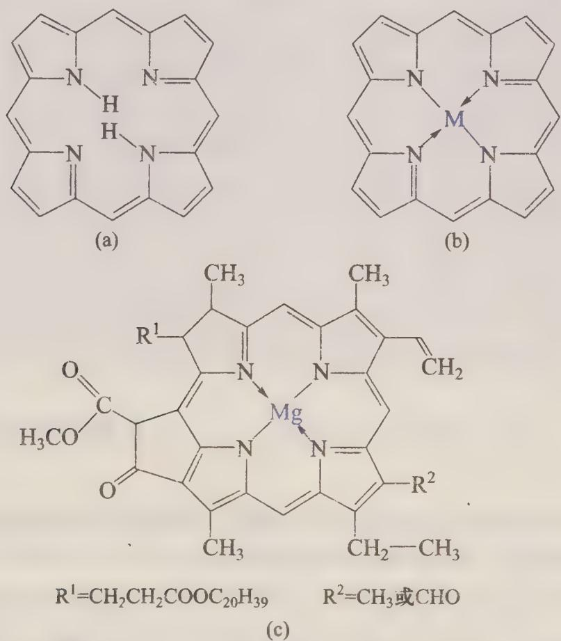  
图 24-18 叶酚、金属卟啉与叶绿素的结构

## 24.4.2 生物体中的化学元素

人体内存在 60 多种元素, 其中有近 30 种是维持生命必不可少的元素, 称为生命必需元素。

## 1. 生命必需元素

一般认为,有26种元素为生命必需元素,按照其在人体内的含量分为宏量元素和微量元素。11种宏量元素中,H,C,N,O,P,S,Cl共7种为非金属元素;Na,K,Mg,Ca共4种为金属元素。宏量元素约占人体总质量的99.95%。15种微量元素,分别为F,I,Si,As,Sn,Se,V,Cr,Mn,Fe,Co,Ni,Cu,Zn,Mo。另有B,

Cd, Pb 三种元素可能为生命必需元素,但还未确证是否为人体所必需。部分生命必需元素在人体内的质量分数列于表 24-2。

表 24-2 部分生命必需元素在人体内的质量分数

<table><tr><td>元素</td><td>w/%</td><td>元素</td><td>w/%</td><td>元素</td><td>w/%</td></tr><tr><td>O</td><td>62.8</td><td>Cl</td><td>1.8×10-1</td><td>Mn</td><td>1×10^-4</td></tr><tr><td>C</td><td>19.4</td><td>Mg</td><td>4.0×10⁻²</td><td>Mo</td><td>2×10^-5</td></tr><tr><td>H</td><td>9.3</td><td>Fe</td><td>5×10⁻³</td><td>As</td><td>5×10⁻⁶</td></tr><tr><td>N</td><td>5.1</td><td>Si</td><td>4×10⁻³</td><td>Co</td><td>4×10⁻⁶</td></tr><tr><td>Ca</td><td>1.4</td><td>F</td><td>3.7×10⁻³</td><td>Ni</td><td>4×10⁻⁶</td></tr><tr><td>S</td><td>6.4×10⁻¹</td><td>Zn</td><td>2.5×10⁻³</td><td>Cr</td><td>4×10⁻⁶</td></tr><tr><td>P</td><td>6.3×10⁻¹</td><td>Cu</td><td>4×10⁻⁴</td><td>V</td><td>3×10⁻⁶</td></tr><tr><td>Na</td><td>2.6×10⁻¹</td><td>Sn</td><td>2×10⁻⁴</td><td></td><td></td></tr><tr><td>K</td><td>2.2×10⁻¹</td><td>I</td><td>1×10⁻⁴</td><td></td><td></td></tr></table>

## 2. 生物体中的主族元素

在 11 种宏量元素中, O, C, H, N, S, P 6 种元素被称为有机元素, 约占人体质量的 98%。

## (1) $\mathrm{Na}^{+}$ 和 $\mathrm{K}^{+}$

在生物体中,动物和植物都需要 K。Na 为动物所必需,而植物往往不需要 Na。

$Na^{+}$ 和 $K^{+}$ 在生物体中有些作用是相同的。例如，它们都是血液的重要组分，调节细胞内外的渗透压；它们可以传递神经信号。

有时 $Na^{+}$ 和 $K^{+}$ 的作用是不能互相替代的,甚至有相反的作用。如患者失水过多需注射生理盐水, $Na^{+}$ 可以帮助人体吸收水分,但如果误注射 KCl 溶液将危及人的生命。 $K^{+}$ 是丙酮酶的激活剂,能加速蛋白质的合成及肌肉组织的呼吸作用,而 $Na^{+}$ 却起阻化作用。 $Na^{+}$ 为细胞外液的主要阳离子, $K^{+}$ 是细胞内液的主要阳离子。 $Na^{+}$ 在维持人体内酸碱平衡起着重要作用,血液是靠血浆中 $CO_{3}^{2-}$ 和 $HCO_{3}^{-}$ 的缓冲作用来维持 pH 的,而 $HCO_{3}^{-}$ 的再吸收是靠 $H^{+}$ 和 $Na^{+}$ 的传递完成的。

## (2) $\mathbf{Mg}^{2+}$

$Mg^{2+}$ 是许多酶的激活剂,在 DNA 的复制和蛋白质的合成中起重要作用,具有稳定 DNA 和 RNA 双螺旋结构的作用。镁盐具有镇静作用,向血管中注射镁盐有麻痹神经的功能。氯化镁能使蛋白质凝固,因而误服氯化镁可能致死。

## (3) $\mathbf{Ca}^{2+}$

钙是骨骼、牙齿、细胞壁的组成部分,人体中90%以上的钙存在于骨骼中,骨髂和牙齿的主体是羟基磷灰石 $\mathrm{Ca}_{10}(\mathrm{PO}_{4})_{6}(\mathrm{OH})_{2}$ 。钙对人血液的凝固起重要作用，在凝血酶原转化为凝血酶时需要 $Ca^{2+}$ 的帮助。 $Ca^{2+}$ 起信使作用，可以传递神经信息、触发肌肉收缩和激素释放。钙对健全神经系统、消除紧张、防止失眠、调节心率有重要作用。

## (4) 其他主族元素

其他主族元素在生物体中的作用列于表 24-3。

表 24-3 其他主族元素在生物体中的作用

<table><tr><td>元素</td><td>生物功能</td></tr><tr><td>Cl</td><td>细胞外液阴离子,调节渗透压和电荷平衡;构成胃液中的盐酸</td></tr><tr><td>P</td><td>牙齿、骨骼的组分;核苷酸、核酸的组分,生物合成和能量代谢必需</td></tr><tr><td>S</td><td>Fe-S蛋白的组分</td></tr><tr><td>F</td><td>骨骼和牙齿的正常生长所必需</td></tr><tr><td>I</td><td>甲状腺素的合成所必需</td></tr><tr><td>Si</td><td>骨骼和软骨形成的初期所必需;与血管壁的渗透性和弹性有关</td></tr><tr><td>Se</td><td>与肝功能、肌肉代谢有关;具有抑制克山病和防癌的功能</td></tr><tr><td>Sn</td><td>促进核酸与蛋白质的合成</td></tr><tr><td>As</td><td>为血红蛋白的合成所必需;可能与繁殖能力有关</td></tr></table>

## 3. 生物体中的过渡金属

## (1) Fe

过渡金属在人体内含量最高的是铁,在人体中的含量约为 4.2\~6.1 g,其中70%以上以铁卟啉的形式存在。人体内的血红蛋白(Hb)、肌红蛋白(Mb)、过氧化氢酶、细胞色素 c 和铁蛋白等都靠铁作为活性因子。Hb 的功能是运载氧,Mb 的功能是储存氧,过氧化氢酶的功能是维持过氧化氢的代谢,细胞色素 c 的功能是电子的传递即氧化还原作用,铁蛋白的功能是将铁储于细胞中。

## (2) $\mathbf{Zn}$

锌参与人体中多种代谢过程,如糖类、脂类、蛋白质和核酸的合成与降解;锌与骨骼生长和智力发育有关,缺锌可能会导致侏儒症;锌的配位化合物在体内的pH控制机制中起缓冲作用。

锌是许多酶的活性中心,其中最重要的含锌酶是碳酸酐酶,其作用是催化 $CO_{2}$ 与 $H_{2}O$ 的反应,使体内的 $CO_{2}$ 及时排出体外。

## (3) Co

人体内钴的含量只有 1\~2 mg, 集中在肝里, 主要以维生素 B $_{12}$ 及其衍生物的形式存在。维生素 B $_{12}$ 的结构可参见第 22 章图 22-7。钴在辅酶中对生物体发挥作用,促进红细胞的成熟,参与蛋白质的合成,参加氧化还原反应。

维生素 $\mathbf{B}_{12}$ 经人工离析结晶时, 在 Co 的 R 位带入了 $\mathrm{CN}^{-}$ , 故亦称氰钴胺素。在动物体内 Co 的这个配位位置是一个弱配位的 $\mathrm{H}_{2} \mathrm{O}$ , 称为水合钴胺素。带入的 $\mathrm{CN}^{-}$ 可以被不同的配体取代, 羟基取代产物为羟基钴胺素, 甲基取代产物为甲基钴胺素。其中被脱氧腺酐基取代的产物最重要, 称为辅酶 $\mathbf{B}_{12}$ 。

## (4) Cu

人体内含有 100\~150 mg 铜, 已发现有十几种酶中含有铜。在铁的吸收和利用过程中, 需要血浆铜蓝蛋白的参与。由酪氨酸转化为黑色素需要含有铜的酪氨酸酶, 缺铜会引起局部色素缺乏, 皮肤发白而患白癜风病; 生物体内缺乏酪氨酸酶而不能在皮肤和毛发形成黑色素, 全身粉白, 称为白化病。如果铜的代谢受到破坏会引起铜在肝、脑等组织中过量积累, 发生肝豆状核变, 称为 Wilson 病。

## (5) 其他过渡金属

钼参与生物体的新陈代谢,能阻止亚硝酸的合成而具有抗癌作用。固氮酶的活性中心是 Mo-Fe 蛋白或 Mo-Fe-S 蛋白,在生物固氮过程中起着极其重要的作用。锰是某些酶的激活剂,是线粒体中呼吸酶的辅因子。镍存在于人和哺乳动物的血清中。对动物的研究表明,缺乏镍将影响铁的吸收,降低血红蛋白的量和红细胞数。胰岛素有促进糖类的代谢功能,铬是胰岛素的辅因子。铬抑制胆固醇和脂肪酸的合成,影响氨基酸的利用,具有防止动脉粥样硬化的作用。钒能促进牙齿矿化,预防龋齿,降低血清中胆固醇的含量。

## 24.4.3 化学环境与健康

## 1. 水环境与大气环境

人的健康状况与生存环境息息相关,与生活环境中无机元素的存在形式和量有关。

水是一切生命的物质基础,是构成细胞和组织的主要成分,是维持人们健康不可缺少的物质。但由于生产和生活污水的排放造成对水的污染,使天然水中有害成分不断增多,构成了对人类生存条件的严重威胁。水中的无机污染物主要包括:重金属如铅、汞等,阴离子如 $F^{-}$ 和 $CN^{-}$ 等,酸和碱,放射性物质等。

曾经在日本发现的水俣病,就是当地一个以无机汞作催化剂的乙醛厂排出的废物中含有甲基汞,甲基汞在水俣村附近的鱼类中蓄积,渔民大量食用这种富集了甲基汞的鱼类而发生中毒事件。

大气是人类赖以生存的环境之一,人类对大气的污染正恶化着自身的生存条件。大气中的无机污染物主要是粉尘和酸性气体。酸雨现象和温室效应都与大气中过多的无机氧化物气体有关。空气污染曾经造成了许多重大事件，如伦敦的烟雾事件曾造成数千人死亡。有许多湖泊由于酸性物质含量过高而称为死湖。以前汽油中添加有机铅作为防震剂，使大量的重金属铅排放到大气中，造成了对空气和土壤的严重污染。

## 2. 重金属中毒与解毒

生命必需元素在人体内保持一定的浓度范围是有益于健康的,而缺乏或过量则会使健康水平下降甚至引起疾病,表24-4列出了一些金属在人体内含量不适时可能引起的疾病。

表 24-4 人体内一些金属缺乏或过量可能引起的疾病

<table><tr><td>金属</td><td>缺乏症</td><td>中毒症</td></tr><tr><td>Fe</td><td>贫血</td><td>血色素病,铁质沉着病,肝癌</td></tr><tr><td>Cu</td><td>贫血,心血管障碍</td><td>Wilson 病,肝硬化,精神病</td></tr><tr><td>Zn</td><td>侏儒症,性腺减退</td><td>引起胃癌</td></tr><tr><td>Mn</td><td>骨骼畸形,性机能障碍</td><td>运动失调</td></tr><tr><td>Co</td><td>贫血</td><td>红细胞增多症,心脏冠脉衰竭</td></tr><tr><td>Cr</td><td>糖代谢失常,动脉硬化</td><td>致癌</td></tr><tr><td>Ca</td><td>骨骼畸形,手足抽搐</td><td>白内障,胆结石,动脉硬化</td></tr><tr><td>Mg</td><td>惊厥</td><td>麻木</td></tr></table>

对于非必需或有害元素,在一定浓度范围内时人可以耐受,超过某一浓度则会引起中毒症状。

体内的有毒金属不能被器官转化为无毒物质,重金属不易排出,要使用螯合剂药物使其从体内排出,这些螯合剂要满足一定的要求:水溶性好,使生成的螯合物便于排出;在体内生理条件下有足够的螯合能力;有一定的专一性;毒性小。常用的螯合剂药物有青霉胺、半胱氨酸、edta,等等。

某些生命必需元素在地表面分布不均匀,在一些地区分散或流失,在另外一些地区可能积累或富集。这种生命必需元素含量的异常可能会引起某些疾病或地方病。早年发现于黑龙江省克山县的克山病是一种严重的心肌坏死症,在我国16个省份的农村都有发病人群,这种病与地理环境中和粮食中含硒量过低有关。另一种与缺硒有关的地方病是大骨节病,其症状为慢性对称的骨关节畸形,主要侵害发育期的青少年。由于水土原因造成某些地区人体缺碘而引起甲状腺肿大,称为地方性甲状腺肿或地甲病。

## 3. 金属元素与抗癌药物

癌症患者的死亡率很高,目前在各种致死疾病中癌症患者的死亡率排在第二位,仅次于心血管类疾病。研究癌的发病原因、研制抗癌药物、征服癌症已成为科学家们的重要研究课题。

癌变成因十分复杂,生物体具有修复 DNA 等组织的功能,因而癌变要经过长期的历程才会变得明朗和严重。致癌物必须与细胞中的核酸和蛋白质作用才能引起癌变,致癌物使 DNA,RNA 和蛋白质内的氢键断裂后发生空间结构变化,这些异常的 DNA 等将复制和转录一些变异体;同时,致癌物使某些酶的功能异常,而控制细胞正常生长的酶一旦功能异常,细胞分裂失控将导致癌变。

研究表明,Cd 和 Be 等为致癌元素,有些生命必需元素也是致癌元素,其作用与量有关。例如,摄入过量的 Cr 会引发鼻炎、咽喉炎、支气管炎,严重则引起癌变;摄入过量的 Ni 能引起鼻腔肿痛和肺癌,吸烟的人肺癌发病率高可能与 Ni 有关。Se,Mg,Cu 等既是抗癌元素又是致癌元素,适量时有抗癌作用,体内含量过高时又可能诱发癌变。

在金属抗癌药物中,顺铂——顺式 $\left[\mathrm{Pt}\left(\mathrm{NH}_{3}\right)_{2}\mathrm{Cl}_{2}\right]$ ，是人们最早发现且在临床上使用最多的一种。DNA很多相邻的碱基两个N原子的距离为340 pm，这与顺铂中两个Cl原子的距离330 pm几乎相同，顺铂因其两个Cl原子被碱基取代而得以与DNA结合，对DNA的双螺旋起到固定作用，于是破坏了异常遗传信息的复制和转录，抑制了癌细胞的分裂。

顺铂对某些恶性肿瘤疗效显著,但对肾的毒性很大,同时,其水溶性差,在水中不够稳定。后来,人们又合成并筛选大量铂及其他金属的配位化合物,发现其中许多种有抗癌作用。

## 24.5 无机固体化学

多数无机化合物以固体形态存在,许多无机固体有特殊的发光、导电、磁学、催化、吸附等性质。无机固体作为应用最广泛的材料,已经成为化学研究的重要分支。无机固体化学的研究涉及无机化学、物理化学、结构化学等许多领域。本节简要讨论无机固体材料的合成方法、结构和主要性质。

## 24.5.1 无机固体材料的合成

无机固体材料的合成方法很多,如水热法、高温固相反应、溶胶-凝胶法、化学气相沉积法、电解合成法等。

## 1. 水热法和溶剂热法

水是最重要的溶剂,在高于水的正常沸点温度和自生的压力下,各种物质的溶解度发生很大变化,特别是在沉淀或难溶物质与水的界面处,出现利于生成目标产物的具有适当聚合程度和浓度的反应混合物物种,利于目标产物的生成。大多数铝硅酸盐分子筛是在 100\~200 ℃ 下以水热法合成出来,如 A 型,X 型,Y 型分子筛等。在 200\~300 ℃ 下可以合成 SrMoO₄,KYF₄ 等许多化合物,在 300\~500 ℃ 下可以合成立方 ZnS 晶体,在更高温度和加压条件下可以得到 Al₂O₃ 晶体。

近年来,人们已将水热法的溶剂扩展,许多有机溶剂或有机物与水的混合溶剂成为合成无机化合物的介质,一般称为溶剂热法。可以说,溶剂热法也包括水热法。许多微孔无机化合物能够在有机溶剂中合成并培养大单晶。常用的有机溶剂是极性比较大的醇类,如乙二醇就是很好的有机溶剂。

## 2. 高温固相反应

高温固相反应是将反应物直接混合后在高温下进行反应,为得到纯度高、结晶度高的目标产物,有时需要将产物研细再重复焙烧甚至多次焙烧。按化学计量将 CoO 和 $Fe_{2}O_{3}$ 混合,在 1200 ℃ 下焙烧,得到具有特定结构的 $CoFe_{2}O_{4}$ 。将 $(\mathrm{NH}_{4})_{2}\mathrm{Cu}(\mathrm{CrO}_{4})_{2}$ 在 700\~800 ℃ 下焙烧,得到的产物为 $CuCr_{2}O_{4}$ 。

## 3. 溶胶-凝胶法

溶胶-凝胶法是将反应物溶解在水或其他溶剂中，经水解、聚合形成溶胶，通过蒸发等手段将溶胶转化成具有一定结构的凝胶——目标产物的前驱体，再由凝胶转化为晶体。溶胶-凝胶法在制备陶瓷、玻璃及许多无机固体材料中应用广泛。该法的优点是易于获得均相的多组分体系，在溶胶阶段便于提纯，且溶胶-凝胶转化过程便于在低温下可控制地进行，因而利于制备高纯和超纯物质。

## 4. 其他合成方法

除以上 3 种方法外, 还有许多方法用于无机固体材料的合成, 如电解合成法、光化学合成法、气相传输法、化学气相沉积法、微波等离子体合成法, 以及在超高温和超高压极端条件下的合成方法等, 感兴趣的读者请阅读有关无机合成与制备化学方面的专著。

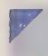

## 24.5.2 无机固体材料的结构

无机固体材料多种多样,但其结构大体可分为4种类型。

（1）具有独立单元的零维结构 如原子簇化合物和多酸及其盐等；结构单元之间一般通过简单离子结合，也有的通过分子间力结合，如 $C_{60}$ 。

(2) 一维链状结构 如链状结构的硅酸盐——石棉, 具有导电性的 $\mathrm{K}_{2}[\mathrm{Pt}(\mathrm{CN})_{4}]\mathrm{Cl}_{0.3}$ 等。

(3) 二维层状结构 层间可以通过阳离子结合, 如层状硅酸盐等; 层间也可以通过分子间力结合, 如 $\mathrm{MoS}_{2}$ 和石墨等。层状化合物往往能进行嵌入反应, 将某些离子或基团引入层间, 改变化合物的性质, 如将某些金属嵌入石墨的层间使

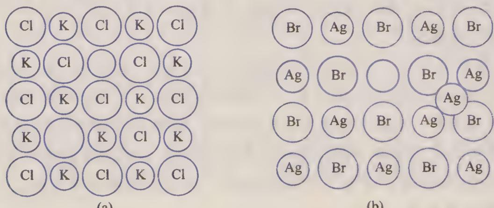  
图24-19 空位缺陷和间隙缺陷

其具有超导性。

(4) 三维立体结构 如沸石分子筛、钙钛矿和金刚石等。

关于硅酸盐的一维结构、二维结构和三维结构在第 14 章 14.2.2 小节中已有较详细的讨论。

所有的固体物质都存在缺陷,即相对于理想的晶体而言,某些质点的位置出现缺位、过量和偏移等。常见的缺陷有空位和间隙两种。空位缺陷是指在晶体中某处没有质点(离子或原子)而出现的空位,称为 Schottky 缺陷。对于离子晶体,这种缺陷一般存在等量的阳离子空位和阴离子空位,以保持晶体的电中性。如图 24-19(a) 所示,KCl 晶体中的空位就属于这种缺陷。间隙缺陷是指晶体中的离子或原子脱离原来的位置而迁移到附近的质点间隙中,称为 Frenkel 缺陷。这种缺陷经常是间隙离子和空位成对出现。如图 24-19(b) 所示,AgBr 晶体中的间隙和空位就属于这种缺陷。

(a)

(b)

这两种缺陷均与离子或原子的热运动有关,即缺陷浓度与温度有关,因而也称为热缺陷。

## 24.5.3 无机固体材料的性质

## 1. 离子导体

离子导体也称为快离子导体或固体电解质,在电场的作用下离子定向迁移而导电。离子导体具有特殊的晶体结构,存在开放的孔道或二维开放的层。一般认为,离子导体导电机理是离子在晶体中借助缺陷的扩散,离子可以在孔道或层间迁移。迁移的离子主要是+1价离子,如 $Li^{+}, Na^{+}, Cu^{+}, Ag^{+}, F^{-}$ 等。

人们研究得较多的是银离子导体。AgI 在 146 ℃ 以上转化为 α-AgI，此温度下导电性比常温下高几个数量级。

著名的 NASICON 离子导体是一种钠离子导体, 通式为 $\mathrm{Na}_{1+x}\mathrm{Zr}_{2}\mathrm{Si}_{x}\mathrm{P}_{3-x}\mathrm{O}_{12}$ ,

这种化合物在 $1.8 \leqslant x \leqslant 2.2$ 时电阻率最小。

掺杂 $Mg^{2+}, Ca^{2+}, Ag^{+}, I^{-}$ 的 $Li_{2}SO_{4}$ 是一种良好的离子导体，可用作高温电池，一定温度下会在短时间内快速放电，称为热电池。

常见的氧离子导体是在 $ZrO_{2}$ 中掺杂其他氧化物，如 $Y_{2}O_{3}$ ，CaO 等。掺杂后的 $ZrO_{2}$ 中出现 $O^{2-}$ 空位，为 $O^{2-}$ 迁移提供了条件，使其具有导电性。

## 2. 光学性质

固体的光学性质是指固体在一定条件下能发光或与光发生作用。固体在接受外界能量后发光称为发光材料,若固体接受紫外线后发光称为光致发光,光致发光有荧光和磷光两类。发光材料应用较多的是荧光灯和显示屏。在氟磷灰石 $\mathrm{Ca}_{5}(\mathrm{PO}_{4})_{3}\mathrm{F}$ 中掺杂 $\mathrm{Mn}^{2+}$ 后发橙黄色荧光,掺杂 $\mathrm{Sb}^{3+}$ 后发蓝色荧光。 $\mathrm{YVO}_{4}$ 掺杂激活剂 $\mathrm{Eu}^{3+}$ 成为红色荧光粉, $\mathrm{ZnS}$ 掺杂激活剂 $\mathrm{Ag}^{+}$ 成为蓝色荧光粉, $\mathrm{ZnS}$ 掺杂激活剂 $\mathrm{Cu}^{+}$ 成为绿色荧光粉。

激光材料在受到激发后发射出强的相干辐射光束。例如,红宝石(掺有少量 $Cr^{3+}$ 的 $Al_{2}O_{3}$ 单晶, $Cr^{3+}$ 的含量低时为红色, $Cr^{3+}$ 的含量高时为绿色)受到可见光照射时,放出波长为 694.3 nm 的激光。

近些年来,人们在晶体的非线性光学性质的研究方面取得很大进展,发现很多无机化合物的晶体具有很好的非线性光学性质。例如, $KH_{2}PO_{4}(KDP)$ , $BaB_{2}O_{4}$ , $LiNbO_{3}$ , $KTiOPO_{4}(KTP)$ 等都是良好的非线性光学材料。

## 3. 其他性质

有些无机固体材料在外磁场作用下产生很大的磁化强度,外磁场撤去后仍然保持较大的磁性,这种性质称为铁磁性,磁性材料中的相邻原子或离子的磁矩有序排列。磁性材料包括金属(或合金)和铁氧体两大类,含有 Fe,Co 或 Ni 的合金多为铁磁性材料,铁氧体是以氧化铁为主要成分的磁性氧化物。

超导性质是指温度降低到某一程度时一些材料的电阻变为零,很多材料具有超导性。Y-Ba-Cu-O体系形成的三元化合物,如 $YBa_{2}Cu_{3}O_{7-x}$ (123型) 和 $Y_{2}BaCuO_{x}$ (211型) 等都是典型的超导材料。 $C_{60}$ 的笼中和石墨的层间填入某些金属后,也具有超导性。

无机固体材料还有许多重要的性质,在此不能进行更多的介绍,有兴趣的读者可以阅读相关专著。

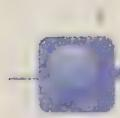

## 总结与思考题

24-1 总结有机金属化合物的种类和成键类型。

24-2 举例说明单核、双核过渡金属羰基化合物的结构，以及羰基化合物的衍生物的主

要类型。

24-3 通过计算判断下列化合物是否符合18电子规则。
(1) $\left[\mathrm{Mn}_{2}(\mathrm{CO})_{10}\right]$ ; (2) $\left[\mathrm{Fe}(\mathrm{CO})_{5}\right]$ ; (3) $\left[\mathrm{Co}_{2}(\mathrm{CO})_{8}\right]$ ;
(4) $\left[\mathrm{Fe}\left(\mathrm{C}_{5}\mathrm{H}_{5}\right)_{2}\right]$ ; (5) $\left[\mathrm{Ni}\left(\mathrm{C}_{5}\mathrm{H}_{5}\right)_{2}\right]$ ; (6) $\left[\mathrm{V}(\mathrm{CO})_{6}\right]$ 。

24-4 总结夹心式化合物的种类及其结构，并比较 $\left[\mathrm{Fe}\left(\mathrm{C}_{5} \mathrm{H}_{5}\right)_{2}\right]$ 和 $\left[\mathrm{Ni}\left(\mathrm{C}_{5} \mathrm{H}_{5}\right)_{2}\right]$ 的稳定性，说明原因。

24-5 画出下列有机金属化合物的结构。
(1) $\left[\mathrm{Be}\left(\mathrm{C}_{2}\mathrm{H}_{5}\right)_{2}\right]$ ; (2) $\left[\mathrm{Fe}\left(\mathrm{CO}\right)_{4}\left(\mathrm{C}_{2}\mathrm{H}_{4}\right)\right]$ ; (3) $\left[\mathrm{Cr}\left(\mathrm{C}_{6}\mathrm{H}_{6}\right)_{2}\right]$ ;
(4) $\left[\mathrm{Co}_{2}\left(\mathrm{CO}\right)_{8}\right]$ ; (5) $\left[\mathrm{PtCl}_{3}\left(\mathrm{C}_{2}\mathrm{H}_{4}\right)\right]^{-}$ ; (6) 二聚 $\mathrm{Mg}\left(\mathrm{C}_{2}\mathrm{H}_{5}\right)\mathrm{Cl}$ 。

24-6 试总结金属原子簇合物的主要类型及其特点。

24-7 画出下列金属原子簇的骨架结构。
(1) $\left[Fe_{3}(CO)_{12}\right]$ ; (2) $\left[Re_{2}Cl_{8}\right]^{2-}$ ; (3) $\left[Os_{5}(CO)_{16}\right]$ ;
(4) $\left[Fe_{5}(CO)_{15}C\right]$ ; (5) $\left[Co_{4}(CO)_{12}\right]$ 。

24-8 画出 $\left[\mathrm{Cr}_{2}(\mathrm{OCCH}_{3})_{4}(\mathrm{H}_{2}\mathrm{O})_{2}\right]$ 的结构，并讨论化合物的成键情况。

24-9 试总结硼烷的结构类型,并说明硼烷中常见的化学键类型。

24-10 试说明硼烷衍生物的种类和结构。

24-11 画出下列分子或离子的结构。
(1) $B_{6}H_{6}^{2-}$ ; (2) $B_{12}H_{12}^{2-}$ ; (3) $\mathrm{Fe(B_{9}H_{11})_{2}^{2-}}$ ;
(4) $C_{2}B_{3}H_{5}$ ; (5) $C_{2}B_{5}H_{7}$ 。

24-12 试描述 $\mathbf{C}_{60}$ 的构型和成键情况。为什么从 $\mathbf{C}_{60}$ 到 $\mathbf{C}_{70}$ 再到碳纳米管，随着碳原子数增多，六元环数目不断增多，而五元环的数目仍为12个？

24-13 用化学式说明下列物质的特点。

(1) 碱基； (2) 核糖核苷； (3) 脱氧核糖核苷；

(4) 核糖核苷酸； (5) 脱氧核糖核酸； (6) 核糖核苷酸；

(7) 脱氧核糖核酸。

24-14 简述宏量金属元素 Na, K, Mg, Ca 在生物体中的主要作用。

24-15 简述过渡金属元素 Fe, Co, Cu 和 Zn 在生物体中的主要作用。

24-16 为什么顺铂具有抗癌作用而其反式结构没有抗癌作用？

24-17 常见的无机固体材料的合成方法有哪些？试在本教材的基础上查找相关专著加以总结。

24-18 固体物质的空位缺陷和间隙缺陷的特点是什么？试举例说明。

24-19 常见的无机固体材料有哪些特殊的性质？试在本书的基础上查找相关专著加以总结。

## 附录 单质及其重要化合物的物理性质

<table><tr><td rowspan="2">化学式</td><td rowspan="2">颜色</td><td rowspan="2">熔点°C</td><td rowspan="2">沸点°C</td><td rowspan="2">密度 $g·cm^{-3}$ </td><td colspan="2">溶解性质</td></tr><tr><td>水</td><td>溶于其他溶剂</td></tr><tr><td>Ac</td><td>银</td><td>1050</td><td>≈3200</td><td>10</td><td></td><td></td></tr><tr><td>Ag</td><td>银</td><td>961.78</td><td>2162</td><td>10.5</td><td></td><td></td></tr><tr><td> $Ag(C_2H_3O_2)$ </td><td>白</td><td>分解</td><td></td><td>3.26</td><td> $1.04^{20}$ </td><td></td></tr><tr><td> $Ag_2C_2O_4$ </td><td>白</td><td>140爆炸</td><td></td><td>5.03</td><td> $0.0043^{20}$ </td><td></td></tr><tr><td> $Ag_2CO_3$ </td><td>黄</td><td>218</td><td></td><td>6.077</td><td> $0.0036^{20}$ </td><td>酸</td></tr><tr><td> $Ag_2Cr_2O_7$ </td><td>红</td><td></td><td></td><td>4.770</td><td>微溶</td><td></td></tr><tr><td> $Ag_2CrO_4$ </td><td>棕-红</td><td></td><td></td><td>5.625</td><td> $0.000014^0$ </td><td></td></tr><tr><td> $Ag_2MoO_4$ </td><td>黄</td><td>483</td><td></td><td>6.18</td><td>微溶</td><td></td></tr><tr><td> $Ag_2O$ </td><td>棕-黑</td><td>827</td><td></td><td>7.2</td><td>0.0025</td><td>酸、碱</td></tr><tr><td> $Ag_2S$ </td><td>灰-黑</td><td>836</td><td></td><td>7.23</td><td>不溶</td><td>酸</td></tr><tr><td> $Ag_2S_2O_3$ </td><td>白</td><td>分解</td><td></td><td></td><td>微溶</td><td>氨水</td></tr><tr><td> $Ag_2Se$ </td><td>灰</td><td>880</td><td></td><td>8.216</td><td>不溶</td><td></td></tr><tr><td> $Ag_2SeO_3$ </td><td></td><td>530</td><td>&gt;550分解</td><td>5.930</td><td>微溶</td><td>酸</td></tr><tr><td> $Ag_2SeO_4$ </td><td></td><td></td><td></td><td>5.72</td><td> $0.118^{20}$ </td><td></td></tr><tr><td> $Ag_2SO_3$ </td><td>白</td><td>100分解</td><td></td><td></td><td> $0.00046^{20}$ </td><td>酸、氨水</td></tr><tr><td> $Ag_2SO_4$ </td><td>无色</td><td>660</td><td></td><td>5.45</td><td> $0.84^{25}$ </td><td></td></tr><tr><td> $Ag_2Te$ </td><td>黑</td><td>955</td><td></td><td>8.4</td><td></td><td></td></tr><tr><td> $Ag_3AsO_4$ </td><td>红</td><td>分解</td><td></td><td>6.657</td><td>0.00085</td><td>氨水</td></tr><tr><td> $Ag_3PO_4$ </td><td>黄</td><td>849</td><td></td><td>6.37</td><td>0.0064</td><td>微溶于稀酸</td></tr><tr><td>AgBr</td><td>黄</td><td>430</td><td>1502</td><td>6.47</td><td> $0.000014^{25}$ </td><td></td></tr><tr><td> $AgBrO_3$ </td><td>白</td><td>360分解</td><td></td><td>5.21</td><td> $0.193^{25}$ </td><td></td></tr><tr><td>AgCl</td><td>白</td><td>455</td><td>1 547</td><td>5.56</td><td>0.000 1925</td><td></td></tr><tr><td> $AgClO_3$ </td><td>白</td><td>230</td><td>270分解</td><td>4.430</td><td>17.625</td><td>微溶于乙醇</td></tr><tr><td> $AgClO_4$ </td><td>无色</td><td>486分解</td><td></td><td>2.806</td><td>55825</td><td>苯、吡啶、有机溶剂</td></tr><tr><td>AgCN</td><td>白-灰</td><td>320分解</td><td></td><td>3.95</td><td>0.000 001 1</td><td></td></tr><tr><td>AgF</td><td>黄-棕</td><td>435</td><td>1 159</td><td>5.852</td><td>17220</td><td></td></tr><tr><td>AgI</td><td>黄</td><td>558</td><td>1 506</td><td>5.68</td><td>0.000 003</td><td></td></tr><tr><td> $AgIO_3$ </td><td>白</td><td>&gt;200</td><td></td><td>5.53</td><td>0.05325</td><td></td></tr><tr><td> $AgMnO_4$ </td><td>紫</td><td>分解</td><td></td><td>4.49</td><td>0.09118</td><td>与乙醇反应</td></tr><tr><td> $AgN_3$ </td><td></td><td>≈250爆炸</td><td></td><td>4.9</td><td>0.000 8120</td><td></td></tr><tr><td> $AgNO_2$ </td><td>黄</td><td>140分解</td><td></td><td>4.453</td><td>0.41525</td><td>与酸反应</td></tr><tr><td> $AgNO_3$ </td><td>无色</td><td>210</td><td>440分解</td><td>4.35</td><td>23425</td><td>微溶于乙醇、丙酮</td></tr><tr><td>AgO</td><td>灰</td><td>&gt;100分解</td><td></td><td>7.5</td><td>0.002 725</td><td>碱;与酸反应</td></tr><tr><td> $AgPF_6$ </td><td></td><td>102分解</td><td></td><td></td><td></td><td></td></tr><tr><td> $AgPO_3$ </td><td>绿</td><td>490</td><td></td><td>6.37</td><td>不溶</td><td>硝酸、氨水</td></tr><tr><td>Al</td><td>银-白</td><td>660.323</td><td>2 519</td><td>2.70</td><td>不溶</td><td>酸、碱</td></tr><tr><td> $Al(BH_4)_3$ </td><td></td><td>-64.5</td><td>44.5</td><td></td><td>反应</td><td></td></tr><tr><td> $Al(ClO_4)_3·9H_2O$ </td><td>白</td><td>82分解</td><td></td><td>2.0</td><td>182.40</td><td></td></tr><tr><td> $Al(NO_3)_3·9H_2O$ </td><td>白</td><td>73</td><td>135分解</td><td>1.72</td><td>68.925</td><td>易溶于乙醇</td></tr><tr><td> $Al(OH)_3$ </td><td>白</td><td></td><td></td><td>2.42</td><td>不溶</td><td>酸、碱</td></tr><tr><td> $Al(PO_3)_3$ </td><td>无色</td><td>≈1 525</td><td></td><td>2.78</td><td>不溶</td><td></td></tr><tr><td> $Al_2(SO_4)_3$ </td><td>白</td><td>1 040分解</td><td></td><td></td><td>38.525</td><td></td></tr><tr><td> $Al_2(SO_4)_3·18H_2O$ </td><td>无色</td><td>86分解</td><td></td><td>1.69</td><td>38.525</td><td></td></tr><tr><td> $Al_2O_3(\alpha)$ </td><td>白</td><td>205 3</td><td>2 977</td><td>3.99</td><td>不溶</td><td>微溶于碱</td></tr><tr><td rowspan="2">化学式</td><td rowspan="2">颜色</td><td rowspan="2"> $\frac{熔点}{°C}$ </td><td rowspan="2"> $\frac{沸点}{°C}$ </td><td rowspan="2"> $\frac{密度}{g·cm^{-3}}$ </td><td colspan="2">溶解性质</td></tr><tr><td>水</td><td>溶于其他溶剂</td></tr><tr><td> $Al_{2}O_{3} \cdot 2SiO_{2} \cdot 2H_{2}O$ </td><td>白-黄</td><td></td><td></td><td>2.59</td><td>不溶</td><td></td></tr><tr><td> $Al_{2}S_{3}$ </td><td>黄-灰</td><td>1 100</td><td></td><td>2.02</td><td></td><td></td></tr><tr><td> $Al_{4}C_{3}$ </td><td>黄</td><td>2 100</td><td>&gt;2 200分解</td><td>2.36</td><td>反应</td><td></td></tr><tr><td>AlAs</td><td>橙</td><td>1 740</td><td></td><td>3.76</td><td></td><td></td></tr><tr><td> $AlBr_{3}$ </td><td>白-黄</td><td>97.5</td><td>255</td><td>3.2</td><td>反应</td><td>苯、甲苯</td></tr><tr><td> $AlCl_{3}$ </td><td>白</td><td>192.6</td><td>180升华</td><td>2.48</td><td> $45.1^{25}$ </td><td> $CCl_{4}$ 、苯、氯仿</td></tr><tr><td> $AlCl_{3} \cdot 6H_{2}O$ </td><td>无色</td><td>100分解</td><td></td><td>2.398</td><td> $45.1^{25}$ </td><td>乙醇、乙醚</td></tr><tr><td> $AlF_{3}$ </td><td>白</td><td>2 250三相点(220 MPa)</td><td>1 276升华</td><td>3.10</td><td> $0.5^{25}$ </td><td></td></tr><tr><td> $AlH_{3}$ </td><td>无色</td><td>&gt;150分解</td><td></td><td></td><td>反应</td><td></td></tr><tr><td> $AlI_{3}$ </td><td>白</td><td>188.28</td><td>382</td><td>3.98</td><td>反应</td><td></td></tr><tr><td> $AlK(SO_{4})_{2} \cdot 12H_{2}O$ </td><td>无色</td><td>≈100分解</td><td></td><td>1.72</td><td> $5.9^{20}$ </td><td></td></tr><tr><td>AlN</td><td>蓝-白</td><td>3 000</td><td></td><td>3.255</td><td>反应</td><td></td></tr><tr><td> $AlNH_{4}(SO_{4})_{2} \cdot 12H_{2}O$ </td><td>无色</td><td>94.5</td><td>&gt;280分解</td><td>1.65</td><td>溶</td><td></td></tr><tr><td>AlP</td><td>绿或黄</td><td>2 550</td><td></td><td>2.40</td><td>反应</td><td></td></tr><tr><td> $AlPO_{4}$ </td><td>白</td><td>&gt;1 460</td><td></td><td>2.56</td><td>不溶</td><td>微溶于酸</td></tr><tr><td>AlSb</td><td>棕</td><td>1 065</td><td></td><td>4.26</td><td></td><td></td></tr><tr><td>Am</td><td>银</td><td>1 176</td><td>2 011</td><td>12</td><td></td><td>酸</td></tr><tr><td>Ar</td><td>无色</td><td>-189.34</td><td>-185.848</td><td> $1.395^{-185.8}$ (液)</td><td>微溶</td><td></td></tr><tr><td>As</td><td>灰</td><td>817</td><td>616升华</td><td>5.75</td><td>不溶</td><td></td></tr><tr><td> $As_{2}O_{3}$ (白砷石)</td><td>白</td><td>314</td><td>460</td><td>3.74</td><td> $2.05^{25}$ </td><td>稀酸、碱</td></tr><tr><td> $As_{2}O_{3}$ (砷华)</td><td>白</td><td>274</td><td>460</td><td>3.86</td><td> $2.05^{25}$ </td><td></td></tr><tr><td> $As_{2}O_{5}$ </td><td>白</td><td>730</td><td></td><td>4.32</td><td> $65.8^{20}$ </td><td>易溶于乙醇</td></tr><tr><td> $As_{2}S_{3}$ </td><td>黄-橙</td><td>312</td><td>707</td><td>3.46</td><td>不溶</td><td>碱</td></tr><tr><td rowspan="2">化学式</td><td rowspan="2">颜色</td><td rowspan="2">熔点°C</td><td rowspan="2">沸点°C</td><td rowspan="2">密度 $g·cm^{-3}$ </td><td colspan="2">溶解性质</td></tr><tr><td>水</td><td>溶于其他溶剂</td></tr><tr><td> $As_{2}S_{5}$ </td><td>棕-黄</td><td>分解</td><td></td><td></td><td>不溶</td><td>碱</td></tr><tr><td> $As_{4}S_{4}$ </td><td>红</td><td>320</td><td>565</td><td>3.5</td><td>不溶</td><td>微溶于苯;溶于碱</td></tr><tr><td> $AsBr_{3}$ </td><td>无色或黄</td><td>31.1</td><td>221</td><td>3.40</td><td>反应</td><td>烃、 $CCl_{4}$ ;易溶于乙醚、苯</td></tr><tr><td> $AsCl_{3}$ </td><td>无色</td><td>-16</td><td>130</td><td>2.150</td><td>反应</td><td>易溶于氯仿、 $CCl_{4}$ 、乙醚</td></tr><tr><td> $AsCl_{5}$ </td><td></td><td>≈-50分解</td><td></td><td></td><td></td><td></td></tr><tr><td> $AsF_{3}$ </td><td>无色</td><td>-5.9</td><td>57.13</td><td>2.7</td><td>反应</td><td>乙醇、乙醚、苯</td></tr><tr><td> $AsF_{5}$ </td><td>无色</td><td>-79.8</td><td>-52.8</td><td> $6.945 g·dm^{-3}$ </td><td>反应</td><td>乙醇、乙醚、苯</td></tr><tr><td> $AsH_{3}$ </td><td>无色</td><td>-116</td><td>-62.5</td><td> $3.186 g·dm^{-3}$ </td><td>微溶</td><td></td></tr><tr><td> $AsI_{3}$ </td><td>红</td><td>141</td><td>424</td><td>4.73</td><td>微溶</td><td>苯、甲苯;微溶于乙醇、乙醚</td></tr><tr><td>At</td><td></td><td>302</td><td></td><td></td><td></td><td>硝酸、有机溶剂</td></tr><tr><td>Au</td><td>黄</td><td>1064.18</td><td>2836</td><td>19.3</td><td></td><td>王水</td></tr><tr><td> $Au_{2}O_{3}$ </td><td>棕</td><td>≈150分解</td><td></td><td></td><td>不溶</td><td>酸</td></tr><tr><td> $Au_{2}S_{3}$ </td><td>黑</td><td>200分解</td><td></td><td></td><td></td><td></td></tr><tr><td>AuCl</td><td>黄</td><td>289分解</td><td></td><td>7.6</td><td> $0.000 031^{20}$ </td><td></td></tr><tr><td> $AuCl_{3}$ </td><td>红</td><td>&gt;160分解</td><td></td><td>4.7</td><td> $68^{20}$ </td><td></td></tr><tr><td> $AuF_{3}$ </td><td>橙-黄</td><td>&gt;300</td><td>升华</td><td>6.75</td><td></td><td></td></tr><tr><td>B</td><td>黑</td><td>2077</td><td>4000</td><td>2.34</td><td>不溶</td><td></td></tr><tr><td> $B_{10}H_{14}$ </td><td>白</td><td>98.78</td><td>213</td><td>0.94</td><td>微溶</td><td>苯、 $CCl_4$ 、乙醇、 $CS_2$ </td></tr><tr><td> $B_2H_6$ </td><td>无色</td><td>-164.85</td><td>-92.49</td><td> $1.131~g·dm^{-3}$ </td><td>反应</td><td></td></tr><tr><td> $B_2O_3$ </td><td>无色</td><td>450</td><td></td><td>2.55</td><td> $2.2^{20}$ </td><td>乙醇</td></tr><tr><td> $B_3N_3H_6$ </td><td>无色</td><td>-58</td><td>53</td><td>0.824</td><td>反应</td><td></td></tr><tr><td> $B_4C$ </td><td>黑</td><td>2350</td><td>&gt;3500</td><td>2.50</td><td>不溶</td><td></td></tr><tr><td> $B_4H_{10}$ </td><td>无色</td><td>-120</td><td>18</td><td> $2.180~g·dm^{-3}$ </td><td>反应</td><td></td></tr><tr><td> $B_5H_{11}$ </td><td>无色</td><td>-122</td><td>65</td><td></td><td>反应</td><td></td></tr><tr><td> $B_5H_9$ </td><td></td><td>-46.74</td><td>60.10</td><td>0.60</td><td>与热水反应</td><td></td></tr><tr><td> $B_6H_{10}$ </td><td>无色</td><td>-62.3</td><td>108分解</td><td>0.67</td><td>与热水反应</td><td></td></tr><tr><td> $BBr_3$ </td><td>无色</td><td>-46</td><td>91.3</td><td>2.6</td><td>反应</td><td>与乙醇反应</td></tr><tr><td> $BCl_3$ </td><td>无色</td><td>-107.3</td><td>12.5</td><td> $4.789~g·dm^{-3}$ </td><td>反应</td><td>与乙醇反应</td></tr><tr><td> $BF_3$ </td><td>无色</td><td>-126.8</td><td>-99.9</td><td> $2.772~g·dm^{-3}$ </td><td>溶</td><td></td></tr><tr><td> $BI_3$ </td><td>无色</td><td>49.7</td><td>209.5</td><td>3.35</td><td>反应</td><td></td></tr><tr><td>BN</td><td>白</td><td>2967</td><td></td><td>2.18</td><td>不溶</td><td></td></tr><tr><td>Ba</td><td>银-黄</td><td>727</td><td>≈1845</td><td>3.62</td><td>反应</td><td>微溶于乙醇</td></tr><tr><td> $Ba(ClO_4)_2$ </td><td>无色</td><td>505</td><td></td><td>3.20</td><td> $312^{25}$ </td><td>易溶于乙醇</td></tr><tr><td> $Ba(N_3)_2$ </td><td></td><td>≈120分解</td><td></td><td>2.936</td><td> $17.3^{20}$ </td><td>微溶于乙醇</td></tr><tr><td> $Ba(NO_2)_2$ </td><td>无色</td><td>267</td><td></td><td>3.234</td><td> $79.5^{25}$ </td><td></td></tr><tr><td> $Ba(NO_3)_2$ </td><td>白</td><td>590</td><td></td><td>3.24</td><td> $10.3^{25}$ </td><td>微溶于乙醇、丙酮</td></tr><tr><td> $Ba(OH)_2$ </td><td>白</td><td>408</td><td></td><td></td><td> $4.91^{25}$ </td><td></td></tr><tr><td> $Ba_3N_2$ </td><td>黄-棕</td><td>&gt;500分解</td><td></td><td>4.78</td><td>反应</td><td></td></tr><tr><td> $BaBr_2$ </td><td>白</td><td>857</td><td>1835</td><td>4.781</td><td> $100^{25}$ </td><td></td></tr><tr><td> $BaC_2O_4$ </td><td>白</td><td>400分解</td><td></td><td>2.658</td><td>0.0075</td><td></td></tr><tr><td rowspan="2">化学式</td><td rowspan="2">颜色</td><td rowspan="2"> $\frac{\text{熔点}}{\text{°C}}$ </td><td rowspan="2"> $\frac{\text{沸点}}{\text{°C}}$ </td><td rowspan="2"> $\frac{\text{密度}}{\text{g} \cdot \text{cm}^{-3}}$ </td><td colspan="2">溶解性质</td></tr><tr><td>水</td><td>溶于其他溶剂</td></tr><tr><td> $BaCl_2$ </td><td>白</td><td>961</td><td>1 560</td><td>3.9</td><td> $37.0^{25}$ </td><td></td></tr><tr><td> $BaCl_2·2H_2O$ </td><td>白</td><td>≈120分解</td><td></td><td>3.097</td><td> $37.0^{25}$ </td><td></td></tr><tr><td> $BaCO_3$ </td><td>白</td><td>1 555</td><td></td><td>4.308</td><td> $0.0014^{20}$ </td><td>酸</td></tr><tr><td> $BaCrO_4$ </td><td>黄</td><td>1 380</td><td></td><td>4.50</td><td> $0.00026^{20}$ </td><td>与酸反应</td></tr><tr><td> $BaF_2$ </td><td>白色</td><td>1 368</td><td>2 260</td><td>4.893</td><td> $0.161^{25}$ </td><td></td></tr><tr><td> $BaH_2$ </td><td>灰</td><td>1 200</td><td></td><td>4.16</td><td>反应</td><td></td></tr><tr><td> $BaHgI_4$ </td><td>黄-红</td><td></td><td></td><td></td><td>易溶</td><td>易溶于乙醇</td></tr><tr><td> $BaHPO_4$ </td><td>白</td><td>400分解</td><td></td><td>4.16</td><td> $0.015^{20}$ </td><td>稀酸</td></tr><tr><td> $BaI_2$ </td><td>白</td><td>711</td><td></td><td>5.15</td><td> $221^{25}$ </td><td></td></tr><tr><td>BaO</td><td>白-黄</td><td>1 973</td><td></td><td>5.72(cub)</td><td> $1.5^{20}$ </td><td>稀酸、乙醇</td></tr><tr><td> $BaO_2$ </td><td>灰-白</td><td>450分解</td><td></td><td>4.96</td><td> $0.091^{20}$ </td><td>与稀酸反应</td></tr><tr><td>BaS</td><td>无色或灰</td><td>2 227</td><td></td><td>4.3</td><td> $8.94^{25}$ </td><td></td></tr><tr><td> $BaSiF_6$ </td><td>白</td><td>300分解</td><td></td><td>4.29</td><td>溶</td><td>乙醇;微溶于酸</td></tr><tr><td> $BaSO_3$ </td><td>白</td><td>分解</td><td></td><td>4.44</td><td> $0.0011^{25}$ </td><td></td></tr><tr><td> $BaSO_4$ </td><td>白</td><td>1 580</td><td></td><td>4.49</td><td> $0.00031^{20}$ </td><td></td></tr><tr><td> $BaTiO_3$ </td><td>白</td><td>1 625</td><td></td><td>6.02</td><td>不溶</td><td></td></tr><tr><td> $BaWO_4$ </td><td>白</td><td>1 475</td><td>1 730</td><td>5.04</td><td> $0.0016^{20}$ </td><td></td></tr><tr><td>Be</td><td></td><td>1 287</td><td>2 468</td><td>1.85</td><td></td><td>碱、酸</td></tr><tr><td> $Be(ClO_4)_2·4H_2O$ </td><td></td><td>250分解</td><td></td><td></td><td> $198^{25}$ </td><td></td></tr><tr><td> $Be(NO_3)_2·3H_2O$ </td><td>黄-白</td><td>≈30</td><td>分解</td><td></td><td> $107^{20}$ </td><td>乙醇</td></tr><tr><td> $Be(OH)_2$ </td><td>白</td><td>≈200分解</td><td></td><td>1.92</td><td>微溶</td><td>酸;微溶于碱</td></tr><tr><td> $Be_3N_2$ </td><td>灰</td><td>2 200</td><td></td><td>2.71</td><td></td><td>与酸、碱反应</td></tr><tr><td rowspan="2">化学式</td><td rowspan="2">颜色</td><td rowspan="2">熔点/°C</td><td rowspan="2">沸点/°C</td><td rowspan="2">密度 $g·cm^{-3}$ </td><td colspan="2">溶解性质</td></tr><tr><td>水</td><td>溶于其他溶剂</td></tr><tr><td> $BeBr_2$ </td><td></td><td>508</td><td>473升华</td><td>3.465</td><td>易溶</td><td>乙醇、吡啶</td></tr><tr><td> $BeCl_2$ </td><td>白-黄</td><td>415</td><td>482</td><td>1.90</td><td> $71.5^{25}$ </td><td>乙醇、乙醚、吡啶</td></tr><tr><td> $BeCO_3·4H_2O$ </td><td>白</td><td>100分解</td><td></td><td></td><td> $0.36^0$ </td><td></td></tr><tr><td> $BeF_2$ </td><td></td><td>552</td><td>1283</td><td>2.1</td><td>易溶</td><td>微溶于乙醇</td></tr><tr><td> $BeH_2$ </td><td>白</td><td>250分解</td><td></td><td>0.65</td><td>反应</td><td></td></tr><tr><td> $BeI_2$ </td><td></td><td>480</td><td>590</td><td>4.32</td><td>反应</td><td>乙醇</td></tr><tr><td>BeO</td><td>白</td><td>2578</td><td></td><td>3.01</td><td>不溶</td><td>微溶于酸、碱</td></tr><tr><td>BeS</td><td>无色</td><td>分解</td><td></td><td>2.36</td><td>与热水反应</td><td></td></tr><tr><td> $BeSO_4$ </td><td>无色</td><td>1127</td><td></td><td>2.5</td><td> $41.3^{25}$ </td><td></td></tr><tr><td> $BeSO_4·4H_2O$ </td><td>无色</td><td>≈100分解</td><td></td><td>1.71</td><td> $41.3^{25}$ </td><td></td></tr><tr><td>Bi</td><td>灰-白</td><td>271.406</td><td>1564</td><td>9.79</td><td></td><td>酸</td></tr><tr><td> $Bi(NO_3)_3·5H_2O$ </td><td>无色</td><td>≈75分解</td><td></td><td>2.83</td><td>反应</td><td>丙酮</td></tr><tr><td> $Bi(OH)_3$ </td><td>白-黄</td><td></td><td></td><td>4.962</td><td>不溶</td><td>酸</td></tr><tr><td> $(BiO)_2CO_3$ </td><td>白</td><td></td><td></td><td>6.86</td><td>不溶</td><td>酸</td></tr><tr><td> $Bi_2(C_2O_4)_3$ </td><td>白</td><td></td><td></td><td></td><td>不溶</td><td>稀酸</td></tr><tr><td> $Bi_2(SO_4)_3$ </td><td>白</td><td>405分解</td><td></td><td>5.08</td><td>反应</td><td>与乙醇反应</td></tr><tr><td> $Bi_2O_3$ </td><td>黄</td><td>825</td><td>1890</td><td>8.9</td><td>不溶</td><td>酸</td></tr><tr><td> $Bi_2S_3$ </td><td>黑-棕</td><td>850</td><td></td><td>6.78</td><td>不溶</td><td>酸</td></tr><tr><td> $BiAsO_4$ </td><td>白</td><td></td><td></td><td>7.14</td><td>不溶</td><td>浓硝酸</td></tr><tr><td> $BiBr_3$ </td><td>黄</td><td>219</td><td>462</td><td>5.72</td><td>反应</td><td>稀酸、丙酮</td></tr><tr><td> $BiCl_3$ </td><td>黄-白</td><td>234</td><td>441</td><td>4.75</td><td>反应</td><td>酸、乙醇、丙酮</td></tr><tr><td> $BiF_3$ </td><td>白-灰</td><td>727</td><td>900</td><td>8.3</td><td>反应</td><td></td></tr><tr><td> $BiF_5$ </td><td>白</td><td>151.4</td><td>230</td><td>5.55</td><td>反应</td><td></td></tr><tr><td rowspan="2">化学式</td><td rowspan="2">颜色</td><td rowspan="2"> $\frac{\text{熔点}}{\text{°C}}$ </td><td rowspan="2"> $\frac{\text{沸点}}{\text{°C}}$ </td><td rowspan="2"> $\frac{\text{密度}}{\text{g} \cdot \text{cm}^{-3}}$ </td><td colspan="2">溶解性质</td></tr><tr><td>水</td><td>溶于其他溶剂</td></tr><tr><td> $BiH_3$ </td><td>无色</td><td>-67</td><td>≈17</td><td>8.665 g·dm $^{-3}$ </td><td></td><td></td></tr><tr><td> $BiI_3$ </td><td>黑-棕</td><td>408.6</td><td>542</td><td>5.778</td><td>0.000 78 $^{20}$ </td><td>乙醇</td></tr><tr><td>BiOCl</td><td>白</td><td>575分解</td><td></td><td>7.72</td><td>不溶</td><td></td></tr><tr><td> $BiPO_4$ </td><td></td><td></td><td></td><td>6.32</td><td>微溶</td><td>微溶于稀酸</td></tr><tr><td>Bk(α)</td><td></td><td>930转变</td><td></td><td>14.78</td><td></td><td></td></tr><tr><td> $Br_2$ </td><td>红</td><td>-7.2</td><td>58.8</td><td>3.102 8</td><td>微溶</td><td></td></tr><tr><td>C(金刚石)</td><td>无色</td><td>4 440(12.4 GPa)</td><td></td><td>3.513</td><td>不溶</td><td></td></tr><tr><td>C(石墨)</td><td>黑</td><td>4 489三相点(10.3 MPa)</td><td>3 825升华</td><td>2.2</td><td>不溶</td><td></td></tr><tr><td>(CN) $_2$ </td><td>无色</td><td>-27.83</td><td>-21.1</td><td>2.127 g·dm $^{-3}$ </td><td>微溶</td><td>乙醇;微溶于乙醚</td></tr><tr><td> $C_{60}$ </td><td>黄</td><td>&gt;280</td><td></td><td></td><td></td><td>有机溶剂</td></tr><tr><td> $C_{70}$ </td><td>红-棕</td><td>&gt;280</td><td></td><td></td><td></td><td>苯、甲苯</td></tr><tr><td>CO</td><td>无色</td><td>-205.1</td><td>-191.51</td><td>0.849 5 $^{-205.1}$ (液)</td><td>1.145</td><td>乙醇、氯仿</td></tr><tr><td> $CO_2$ </td><td>无色</td><td>-56.561三相点</td><td>-78.464升华</td><td>1.56 $^{-79}$ (固)</td><td>溶</td><td></td></tr><tr><td> $COCl_2$ </td><td>无色</td><td>-127.77</td><td>7.5</td><td>4.043 g·dm $^{-3}$ </td><td>微溶</td><td>苯、甲苯</td></tr><tr><td> $CS_2$ </td><td>无色或黄</td><td>-112.1</td><td>46</td><td>1.263 2 $^{20}$ </td><td>不溶</td><td>易溶于乙醇、苯、有机溶剂</td></tr><tr><td>Ca</td><td>银-白</td><td>842</td><td>1 484</td><td>1.54</td><td>反应</td><td></td></tr><tr><td> $Ca(C_2H_3O_2)_2$ </td><td>白</td><td>160分解</td><td></td><td>1.50</td><td>溶</td><td>微溶于乙醇</td></tr><tr><td> $Ca(IO_3)_2$ </td><td>白</td><td></td><td></td><td>4.52</td><td>0.306 $^{25}$ </td><td>硝酸</td></tr><tr><td> $Ca(NO_3)_2$ </td><td>白</td><td>561</td><td></td><td>2.5</td><td>144 $^{25}$ </td><td>甲醇、乙醇、丙酮</td></tr><tr><td rowspan="2">化学式</td><td rowspan="2">颜色</td><td rowspan="2">熔点°C</td><td rowspan="2">沸点°C</td><td rowspan="2">密度 $g·cm^{-3}$ </td><td colspan="2">溶解性质</td></tr><tr><td>水</td><td>溶于其他溶剂</td></tr><tr><td> $Ca(OH)_2$ </td><td>白</td><td></td><td></td><td>≈2.2</td><td> $0.160^{20}$ </td><td>酸</td></tr><tr><td> $Ca_2P_2O_7$ </td><td>白</td><td>1353</td><td></td><td>3.09</td><td>不溶</td><td>稀酸</td></tr><tr><td> $Ca_3(PO_4)_2$ </td><td>白</td><td>1670</td><td></td><td>3.14</td><td> $0.00012^{20}$ </td><td>稀酸</td></tr><tr><td> $Ca_3N_2$ </td><td>红-棕</td><td>1195</td><td></td><td>2.67</td><td>溶</td><td>酸</td></tr><tr><td> $Ca_3P_2$ </td><td>红-棕</td><td>≈1600分解</td><td></td><td>2.51</td><td>反应</td><td></td></tr><tr><td> $CaC_2$ </td><td>灰-黑</td><td>2300</td><td></td><td>2.22</td><td>反应</td><td></td></tr><tr><td> $CaC_2O_4$ </td><td>白</td><td></td><td></td><td>2.2</td><td> $0.00061^{20}$ </td><td></td></tr><tr><td> $CaC_2O_4·H_2O$ </td><td></td><td>200分解</td><td></td><td>2.2</td><td> $0.00061^{20}$ </td><td>稀酸</td></tr><tr><td> $CaCl_2$ </td><td>白</td><td>775</td><td>1935</td><td>2.15</td><td> $81.3^{25}$ </td><td>易溶于乙醇</td></tr><tr><td> $CaCl_2·2H_2O$ </td><td></td><td>175分解</td><td></td><td>1.85</td><td> $81.3^{25}$ </td><td>易溶于乙醇</td></tr><tr><td> $CaCl_2·6H_2O$ </td><td>白</td><td>30分解</td><td></td><td>1.71</td><td> $81.3^{25}$ </td><td></td></tr><tr><td> $CaCO_3(方解石)$ </td><td>白</td><td>800</td><td></td><td>2.71</td><td> $0.00066^{20}$ </td><td>稀酸</td></tr><tr><td> $CaCO_3(文石)$ </td><td>无色</td><td></td><td></td><td>2.653</td><td> $0.0011^{25}$ </td><td>稀酸</td></tr><tr><td> $CaF_2$ </td><td>白</td><td>1418</td><td>2500</td><td>3.18</td><td> $0.0016^{25}$ </td><td>微溶于酸</td></tr><tr><td> $CaH_2$ </td><td>灰</td><td>1000</td><td></td><td>1.7</td><td>反应</td><td>与乙醇反应</td></tr><tr><td>CaO</td><td>灰-白</td><td>2613</td><td></td><td>3.34</td><td>反应</td><td>酸</td></tr><tr><td> $CaO_2$ </td><td>白-黄</td><td>≈200分解</td><td></td><td>2.9</td><td>微溶</td><td>酸</td></tr><tr><td>CaS</td><td>白-黄</td><td>2524</td><td></td><td>2.59</td><td>微溶</td><td></td></tr><tr><td> $CaSO_4$ </td><td></td><td>1460</td><td></td><td>2.96</td><td> $0.205^{25}$ </td><td></td></tr><tr><td> $CaSO_4·0.5H_2O$ </td><td>白</td><td></td><td></td><td></td><td> $0.205^{25}$ </td><td></td></tr><tr><td> $CaSO_4·2H_2O$ </td><td></td><td>150分解</td><td></td><td>2.32</td><td> $0.205^{20}$ </td><td></td></tr><tr><td> $CaTiO_3$ </td><td></td><td>1980</td><td></td><td>3.98</td><td></td><td></td></tr><tr><td>Cd</td><td>银-白</td><td>321.069</td><td>767</td><td>8.69</td><td>不溶</td><td>与酸反应</td></tr><tr><td> $Cd(Ac)_2$ </td><td>无色</td><td>255</td><td></td><td>2.34</td><td>溶</td><td>乙醇</td></tr><tr><td> $Cd(NO_3)_2$ </td><td>白</td><td>360</td><td></td><td>3.6</td><td> $156^{25}$ </td><td>乙醇</td></tr><tr><td rowspan="2">化学式</td><td rowspan="2">颜色</td><td rowspan="2"> $\frac{\text{熔点}}{\text{°C}}$ </td><td rowspan="2"> $\frac{\text{沸点}}{\text{°C}}$ </td><td rowspan="2"> $\frac{\text{密度}}{\text{g} \cdot \text{cm}^{-3}}$ </td><td colspan="2">溶解性质</td></tr><tr><td>水</td><td>溶于其 他溶剂</td></tr><tr><td> $Cd(NO_3)_2 \cdot 4H_2O$ </td><td>无色</td><td>59.5</td><td></td><td>2.45</td><td> $156^{25}$ </td><td>乙醇、丙酮</td></tr><tr><td> $Cd(OH)_2$ </td><td>白</td><td>130分解</td><td></td><td>4.79</td><td> $0.000\ 15^{20}$ </td><td>稀酸</td></tr><tr><td> $CdBr_2$ </td><td>白</td><td>568</td><td>863</td><td>5.19</td><td> $115^{25}$ </td><td>微溶于丙酮、 乙醚</td></tr><tr><td> $CdCl_2$ </td><td></td><td>568</td><td>964</td><td>4.08</td><td> $120^{25}$ </td><td>丙酮;微溶于 乙醇</td></tr><tr><td> $CdCO_3$ </td><td>白</td><td>500分解</td><td></td><td>5.026</td><td>不溶</td><td>酸</td></tr><tr><td> $CdF_2$ </td><td></td><td>1075</td><td>1750</td><td>6.33</td><td> $4.36^{25}$ </td><td>酸</td></tr><tr><td> $CdI_2$ </td><td></td><td>388</td><td>744</td><td>5.64</td><td> $86.2^{25}$ </td><td>乙醇、丙酮、 乙醚</td></tr><tr><td>CdO</td><td>棕</td><td></td><td>1559升华</td><td>8.15</td><td>不溶</td><td>稀酸</td></tr><tr><td>CdS</td><td>黄-橙</td><td>≈1480</td><td></td><td>4.826</td><td>不溶</td><td>酸</td></tr><tr><td> $CdSO_4 \cdot 8H_2O$ </td><td>无色</td><td>40分解</td><td></td><td>3.08</td><td> $76.7^{25}$ </td><td></td></tr><tr><td>Ce</td><td>银</td><td>799</td><td>3443</td><td>6.770</td><td></td><td>稀酸</td></tr><tr><td> $Ce_2O_3$ </td><td>黄-绿</td><td>2250</td><td>3730</td><td>6.2</td><td>不溶</td><td>酸</td></tr><tr><td> $CeCl_3$ </td><td>白</td><td>807</td><td></td><td>3.97</td><td>溶</td><td>乙醇</td></tr><tr><td> $CeF_3$ </td><td>白</td><td>1430</td><td>2180</td><td>6.157</td><td>不溶</td><td></td></tr><tr><td> $CeF_4$ </td><td>白</td><td>≈600分解</td><td></td><td>4.77</td><td>不溶</td><td></td></tr><tr><td> $CeO_2$ </td><td>白-黄</td><td>2480</td><td></td><td>7.216</td><td>不溶</td><td>浓酸</td></tr><tr><td>Cf</td><td></td><td>900</td><td></td><td>15.1</td><td></td><td></td></tr><tr><td> $Cis-Pt(NH_3)_2Cl_2$ </td><td>黄</td><td>270分解</td><td></td><td></td><td> $0.253^{25}$ </td><td></td></tr><tr><td> $Cl_2$ </td><td>绿-黄</td><td>-101.5</td><td>-34.04</td><td> $1.565^{-34.0}$ (液)</td><td>微溶</td><td></td></tr><tr><td> $Cl_2O$ </td><td>黄-棕</td><td>-120.6</td><td>2.2</td><td> $3.552\ g \cdot dm^{-3}$ </td><td>易溶</td><td></td></tr><tr><td> $Cl_2O_7$ </td><td>无色</td><td>-91.5</td><td>82</td><td>1.9</td><td>反应</td><td></td></tr><tr><td> $ClF_3$ </td><td></td><td>-76.34</td><td>11.75</td><td> $3.799\ g \cdot dm^{-3}$ </td><td>反应</td><td></td></tr><tr><td rowspan="2">化学式</td><td rowspan="2">颜色</td><td rowspan="2">熔点°C</td><td rowspan="2">沸点°C</td><td rowspan="2">密度 $g·cm^{-3}$ </td><td colspan="2">溶解性质</td></tr><tr><td>水</td><td>溶于其他溶剂</td></tr><tr><td> $ClF_5$ </td><td>无色</td><td>-103</td><td>-13.1</td><td> $5.332 g·dm^{-3}$ </td><td></td><td></td></tr><tr><td> $ClO_2$ </td><td>橙-绿</td><td>-59</td><td>11</td><td> $2.757 g·dm^{-3}$ </td><td>微溶</td><td></td></tr><tr><td>Cm</td><td>银</td><td>1345</td><td></td><td>13.51</td><td></td><td></td></tr><tr><td>Co</td><td>灰</td><td>1495</td><td>2927</td><td>8.86</td><td></td><td>稀酸</td></tr><tr><td> $Co(C_2H_3O_2)_2·4H_2O$ </td><td>红</td><td></td><td></td><td>1.705</td><td>溶</td><td>乙醇、稀酸</td></tr><tr><td> $Co(C_2H_3O_2)_3$ </td><td>绿</td><td>100分解</td><td></td><td></td><td>溶</td><td>乙醇</td></tr><tr><td> $Co(NH_3)_6Cl_3$ </td><td>红</td><td></td><td></td><td>1.71</td><td>溶</td><td></td></tr><tr><td> $Co(NO_3)_3$ </td><td>绿</td><td></td><td></td><td>≈3.0</td><td>溶</td><td>与有机溶剂反应</td></tr><tr><td> $Co(OH)_2$ </td><td>蓝-绿</td><td>≈160分解</td><td></td><td>3.6</td><td>微溶</td><td>酸</td></tr><tr><td> $Co(OH)_3$ </td><td>棕</td><td>分解</td><td></td><td>≈4</td><td>不溶</td><td>酸</td></tr><tr><td> $Co_2(CO)_8$ </td><td>橙</td><td>51分解</td><td></td><td>1.78</td><td>不溶</td><td>乙醇、乙醚、 $CS_2$ </td></tr><tr><td> $Co_2O_3$ </td><td>灰-黑</td><td>895分解</td><td></td><td>5.18</td><td>不溶</td><td>稀酸</td></tr><tr><td> $Co_2S_3$ </td><td>黑</td><td></td><td></td><td>4.8</td><td>反应</td><td></td></tr><tr><td> $Co_3(PO_4)_2·8H_2O$ </td><td>粉</td><td></td><td></td><td>2.77</td><td>不溶</td><td>酸</td></tr><tr><td> $Co_3O_4$ </td><td>黑</td><td>900分解</td><td></td><td>6.11</td><td>不溶</td><td>酸、碱</td></tr><tr><td> $Co_4(CO)_{12}$ </td><td>黑</td><td>60分解</td><td></td><td>2.09</td><td></td><td></td></tr><tr><td> $CoBr_2$ </td><td>绿</td><td>678</td><td></td><td>4.91</td><td> $113.2^{20}$ </td><td>甲醇、乙醇、丙酮</td></tr><tr><td> $CoC_2O_4$ </td><td>粉</td><td>250分解</td><td></td><td>3.02</td><td> $0.0037^{20}$ </td><td>酸</td></tr><tr><td> $CoCl_2$ </td><td>蓝</td><td>737</td><td>1049</td><td>3.36</td><td> $56.2^{25}$ </td><td>乙醇、丙酮、乙醚、吡啶</td></tr><tr><td> $CoCl_2·6H_2O$ </td><td>粉-红</td><td>87分解</td><td></td><td>1.924</td><td> $56.2^{25}$ </td><td>乙醇、丙酮、乙醚</td></tr><tr><td rowspan="2">化学式</td><td rowspan="2">颜色</td><td rowspan="2">熔点/°C</td><td rowspan="2">沸点/°C</td><td rowspan="2">密度/g·cm-3</td><td colspan="2">溶解性质</td></tr><tr><td>水</td><td>溶于其他溶剂</td></tr><tr><td>CoCO3</td><td>粉</td><td>280分解</td><td></td><td>4.2</td><td>0.000 1420</td><td></td></tr><tr><td>CoCrO4</td><td>黄-棕</td><td></td><td></td><td>≈4.0</td><td></td><td>酸</td></tr><tr><td>CoF2</td><td>红</td><td>1127</td><td>≈1400</td><td>4.46</td><td>1.425</td><td>酸</td></tr><tr><td>CoF3</td><td>棕</td><td>927</td><td></td><td>3.88</td><td>反应</td><td></td></tr><tr><td>CoI2</td><td>黑</td><td>520</td><td></td><td>5.60</td><td>20325</td><td></td></tr><tr><td>CoO</td><td>灰</td><td>1830</td><td></td><td>6.44</td><td>不溶</td><td>酸</td></tr><tr><td>CoS</td><td>黑</td><td>1117</td><td></td><td>5.45</td><td>不溶</td><td>酸</td></tr><tr><td>CoSO4</td><td>红</td><td>&gt;700</td><td></td><td>3.71</td><td>38.325</td><td></td></tr><tr><td>CoSO4·7H2O</td><td>粉</td><td>41分解</td><td></td><td>2.03</td><td>38.325</td><td>微溶于乙醇、甲醇</td></tr><tr><td>Cr</td><td>蓝-白</td><td>1907</td><td>2671</td><td></td><td>7.15</td><td>与稀酸反应</td></tr><tr><td>Cr(C2H3O2)3·6H2O</td><td>蓝</td><td></td><td></td><td></td><td>溶</td><td></td></tr><tr><td>Cr(CO)6</td><td>无色</td><td>130分解</td><td>升华</td><td>1.77</td><td>不溶</td><td>氯仿、乙醚</td></tr><tr><td>Cr(NO3)3</td><td>绿</td><td>&gt;60分解</td><td></td><td></td><td>易溶</td><td></td></tr><tr><td>Cr(NO3)3·9H2O</td><td>绿-黑</td><td>66.3</td><td>&gt;100分解</td><td>1.80</td><td>易溶</td><td></td></tr><tr><td>Cr(OH)3·3H2O</td><td>蓝-绿</td><td></td><td></td><td></td><td>不溶</td><td>酸</td></tr><tr><td>Cr2(SO4)3</td><td>红</td><td>&gt;700分解</td><td></td><td>3.1</td><td>6425</td><td>酸</td></tr><tr><td>Cr2O3</td><td>绿</td><td>2320</td><td>≈3000</td><td>5.22</td><td>不溶</td><td>微溶于酸、碱</td></tr><tr><td>Cr2S3</td><td>棕-黑</td><td></td><td></td><td>3.8</td><td></td><td></td></tr><tr><td>CrBr2</td><td>白</td><td>842</td><td></td><td>4.236</td><td>溶</td><td>乙醇</td></tr><tr><td>CrBr3</td><td>深绿</td><td>812</td><td></td><td>4.68</td><td>溶于热水</td><td></td></tr><tr><td>Cr(H2O)6Br3</td><td>紫</td><td></td><td></td><td></td><td>溶</td><td></td></tr><tr><td>CrC2O4·H2O</td><td>黄-绿</td><td></td><td></td><td>2.468</td><td>微溶</td><td></td></tr><tr><td>CrCl2</td><td>白</td><td>824</td><td>1120</td><td>2.88</td><td>溶</td><td></td></tr><tr><td>CrCl3</td><td>红-紫</td><td>1152</td><td>1300分解</td><td>2.76</td><td>微溶</td><td></td></tr><tr><td rowspan="2">化学式</td><td rowspan="2">颜色</td><td rowspan="2">熔点°C</td><td rowspan="2">沸点°C</td><td rowspan="2">密度 $g·cm^{-3}$ </td><td colspan="2">溶解性质</td></tr><tr><td>水</td><td>溶于其他溶剂</td></tr><tr><td> $CrF_2$ </td><td>蓝-绿</td><td>894</td><td></td><td>3.79</td><td>微溶</td><td></td></tr><tr><td> $CrF_3$ </td><td>绿</td><td>1 425</td><td></td><td>3.8</td><td>不溶</td><td></td></tr><tr><td> $CrF_3·3H_2O$ </td><td>绿</td><td></td><td></td><td>2.2</td><td>微溶</td><td></td></tr><tr><td> $CrF_6$ </td><td>黄</td><td>-100分解</td><td></td><td></td><td></td><td></td></tr><tr><td> $CrI_2$ </td><td>红-棕</td><td>867</td><td></td><td>5.1</td><td></td><td></td></tr><tr><td> $CrI_3$ </td><td>深绿</td><td>857</td><td></td><td>5.32</td><td>微溶</td><td></td></tr><tr><td> $CrO_2Cl_2$ </td><td>红</td><td>-96.5</td><td>117</td><td>1.91</td><td>反应</td><td>氯仿、苯</td></tr><tr><td> $CrO_3$ </td><td>红</td><td>197</td><td>≈250分解</td><td>2.7</td><td> $169^{25}$ </td><td></td></tr><tr><td> $CrPO_4$ </td><td>蓝</td><td>&gt;1 800</td><td></td><td>4.6</td><td></td><td></td></tr><tr><td> $CrPO_4·3.5H_2O$ </td><td>蓝-绿</td><td></td><td></td><td>2.15</td><td>不溶</td><td></td></tr><tr><td> $CrPO_4·6H_2O$ </td><td>紫</td><td>&gt;500分解</td><td></td><td>2.121</td><td>不溶</td><td>酸、碱</td></tr><tr><td>Cs</td><td>银-白</td><td>28.5</td><td>671</td><td>1.873</td><td>反应</td><td></td></tr><tr><td> $Cs_2CO_3$ </td><td>白</td><td>793</td><td></td><td>4.24</td><td> $261^{15}$ </td><td>乙醇、乙醚</td></tr><tr><td> $Cs_2O$ </td><td>黄-橙</td><td>495</td><td></td><td>4.65</td><td>易溶</td><td></td></tr><tr><td> $Cs_2SO_4$ </td><td>白</td><td>1 005</td><td></td><td>4.24</td><td> $182^{25}$ </td><td></td></tr><tr><td>CsBr</td><td>白</td><td>636</td><td>≈1 300</td><td>4.43</td><td> $123^{25}$ </td><td>乙醇</td></tr><tr><td>CsCl</td><td>白</td><td>646</td><td>1 297</td><td>3.988</td><td> $191^{25}$ </td><td>乙醇</td></tr><tr><td>CsF</td><td>白</td><td>703</td><td></td><td>4.64</td><td> $573^{25}$ </td><td>甲醇</td></tr><tr><td>CsH</td><td>白</td><td>528</td><td></td><td>3.42</td><td>反应</td><td></td></tr><tr><td>CsI</td><td>无色</td><td>632</td><td>≈1 280</td><td>4.51</td><td> $84.8^{25}$ </td><td>乙醇、甲醇、丙酮</td></tr><tr><td> $CsN_3$ </td><td></td><td>326</td><td></td><td>≈3.5</td><td> $22^{40}$ </td><td></td></tr><tr><td> $CsNO_3$ </td><td>白</td><td>409</td><td></td><td>3.66</td><td> $27.9^{25}$ </td><td>碱;微溶于乙醇</td></tr><tr><td> $CsO_2$ </td><td>黄</td><td>432</td><td></td><td>3.77</td><td>反应</td><td></td></tr><tr><td>CsOH</td><td>白-黄</td><td>342.3</td><td></td><td>3.68</td><td> $300^{30}$ </td><td>乙醇</td></tr><tr><td>Cu</td><td>红</td><td>1084.62</td><td>2560</td><td>8.96</td><td></td><td>微溶于稀酸</td></tr><tr><td> $Cu(C_2H_3O_2)_2·H_2O$ </td><td>绿</td><td>115</td><td>240分解</td><td>1.88</td><td>溶</td><td>乙醇;微溶于乙醚</td></tr><tr><td> $Cu(ClO_3)_2·6H_2O$ </td><td>蓝-绿</td><td>65</td><td>100分解</td><td></td><td> $164^{18}$ </td><td>易溶于乙醇</td></tr><tr><td> $Cu(ClO_4)_2$ </td><td>绿</td><td>130分解</td><td></td><td></td><td> $146^{30}$ </td><td>乙醚、二氧杂环己烷</td></tr><tr><td> $Cu(CN)_2$ </td><td>绿</td><td></td><td></td><td></td><td>不溶</td><td>酸、碱</td></tr><tr><td> $Cu(IO_3)_2$ </td><td>绿</td><td>分解</td><td></td><td>5.241</td><td> $0.15^{20}$ </td><td>稀酸</td></tr><tr><td> $Cu(N_3)_2$ </td><td>棕</td><td></td><td></td><td>≈2.6</td><td></td><td></td></tr><tr><td> $Cu(NO_3)_2$ </td><td>蓝-绿</td><td>255</td><td>升华</td><td></td><td> $145^{25}$ </td><td>二氧杂环己烷</td></tr><tr><td> $Cu(NO_3)_2·3H_2O$ </td><td>蓝</td><td>114</td><td>170分解</td><td>2.32</td><td> $145^{25}$ </td><td>易溶于乙醇</td></tr><tr><td> $Cu(OH)_2$ </td><td>蓝-绿</td><td></td><td></td><td>3.37</td><td>不溶</td><td>酸、浓碱</td></tr><tr><td> $Cu_2O$ </td><td>红-棕</td><td>1244</td><td>1800分解</td><td>6.0</td><td>不溶</td><td></td></tr><tr><td> $Cu_2S$ </td><td>蓝-黑</td><td>1129</td><td></td><td>5.6</td><td>不溶</td><td>微溶于酸</td></tr><tr><td> $Cu_2SO_3·0.5H_2O$ </td><td>浅黄</td><td></td><td></td><td></td><td>微溶</td><td>盐酸、碱</td></tr><tr><td> $Cu_3(PO_4)_2·3H_2O$ </td><td>蓝-绿</td><td></td><td></td><td></td><td>不溶</td><td>酸、氨水</td></tr><tr><td>CuBr</td><td>白</td><td>483</td><td>1345</td><td>4.98</td><td> $0.0012^{20}$ </td><td></td></tr><tr><td> $CuBr_2$ </td><td>黑</td><td>498</td><td>900</td><td>4.710</td><td> $126^{25}$ </td><td>乙醇、丙酮</td></tr><tr><td> $CuC_2O_4$ </td><td>蓝-白</td><td>310分解</td><td></td><td></td><td> $0.0026^{20}$ </td><td>氨水</td></tr><tr><td>CuCl</td><td>白</td><td>423</td><td>1490</td><td>4.14</td><td> $0.0047^{20}$ </td><td></td></tr><tr><td> $CuCl_2$ </td><td>黄-棕</td><td>598</td><td>993</td><td>3.4</td><td> $75.7^{25}$ </td><td>乙醇、丙酮</td></tr><tr><td> $CuCl_2·2H_2O$ </td><td>绿-蓝</td><td>100分解</td><td></td><td>2.51</td><td> $75.7^{20}$ </td><td>丙酮;易溶于乙醇、甲醇</td></tr><tr><td rowspan="2">化学式</td><td rowspan="2">颜色</td><td rowspan="2">熔点°C</td><td rowspan="2">沸点°C</td><td rowspan="2">密度 $\mathrm{g} \cdot {\mathrm{{cm}}}^{-3}$ </td><td colspan="2">溶解性质</td></tr><tr><td>水</td><td>溶于其他溶剂</td></tr><tr><td> $CuCO_3·Cu(OH)_2$ </td><td>绿</td><td>200分解</td><td></td><td>4.0</td><td>不溶</td><td>稀酸</td></tr><tr><td> $CuF_2$ </td><td>白</td><td>836</td><td>1 676</td><td>4.23</td><td> $0.075^{25}$ </td><td></td></tr><tr><td> $CuF_2·2H_2O$ </td><td>蓝</td><td>130分解</td><td></td><td>2.934</td><td> $0.075^{25}$ </td><td></td></tr><tr><td>CuI</td><td>白</td><td>591</td><td>≈1 290</td><td>5.67</td><td> $0.000\ 020^{20}$ </td><td></td></tr><tr><td>CuO</td><td>黑</td><td>1 227</td><td></td><td>6.31</td><td>不溶</td><td>稀酸</td></tr><tr><td>CuS</td><td>黑</td><td>507转变</td><td></td><td>4.76</td><td>不溶</td><td></td></tr><tr><td> $CuSO_4$ </td><td>白-绿</td><td>560分解</td><td></td><td>3.60</td><td> $22.0^{25}$ </td><td></td></tr><tr><td> $CuSO_4·5H_2O$ </td><td>蓝</td><td>110分解</td><td></td><td>2.286</td><td> $22.0^{25}$ </td><td>甲醇;微溶于乙醇</td></tr><tr><td>Dy</td><td>银</td><td>1 412</td><td>2 567</td><td>8.55</td><td></td><td>稀酸</td></tr><tr><td> $Dy_2O_3$ </td><td>白</td><td>2 408</td><td>3 900</td><td>7.81</td><td></td><td>酸</td></tr><tr><td>Er</td><td>银</td><td>1 529</td><td>2 868</td><td>9.07</td><td>不溶</td><td>酸</td></tr><tr><td> $Er_2O_3$ </td><td>粉</td><td>2 344</td><td>3 920</td><td>8.64</td><td>不溶</td><td>酸</td></tr><tr><td> $ErCl_3$ </td><td>紫</td><td>776</td><td></td><td>4.1</td><td>溶</td><td></td></tr><tr><td>Es</td><td></td><td>860</td><td></td><td></td><td></td><td></td></tr><tr><td>Eu</td><td>银</td><td>822</td><td>1 529</td><td>5.24</td><td>反应</td><td></td></tr><tr><td> $Eu_2O_3$ </td><td>粉</td><td>2 350</td><td>3 790</td><td>7.42</td><td>不溶</td><td>酸</td></tr><tr><td> $EuCl_2$ </td><td>白</td><td>731</td><td></td><td>4.9</td><td>溶</td><td></td></tr><tr><td> $EuCl_3$ </td><td>绿-黄</td><td>623</td><td></td><td>4.89</td><td></td><td></td></tr><tr><td> $EuSO_4$ </td><td>无色</td><td></td><td></td><td>4.99</td><td>不溶</td><td></td></tr><tr><td> $F_2$ </td><td>浅黄</td><td>-219.67</td><td>-188.11</td><td> $1.512\ 7^{-188.1}$ (液)</td><td>反应</td><td></td></tr><tr><td>Fe</td><td>银-白或灰</td><td>1 538</td><td>2 861</td><td>7.87</td><td></td><td>稀酸</td></tr><tr><td> $Fe(AlO_2)_2$ </td><td>黑</td><td></td><td></td><td>4.3</td><td></td><td></td></tr><tr><td rowspan="2">化学式</td><td rowspan="2">颜色</td><td rowspan="2">熔点°C</td><td rowspan="2">沸点°C</td><td rowspan="2">密度 $g·cm^{-3}$ </td><td colspan="2">溶解性质</td></tr><tr><td>水</td><td>溶于其他溶剂</td></tr><tr><td> $Fe(C_5H_5)_2$ </td><td>橙</td><td>172.5</td><td>249</td><td></td><td>不溶</td><td>乙醇、乙醚、苯、稀硝酸</td></tr><tr><td> $Fe(CO)_5$ </td><td>黄</td><td>-20.5</td><td>103</td><td>1.46</td><td>不溶</td><td>乙醚、苯、丙酮</td></tr><tr><td> $Fe(NO_3)_2$ </td><td>绿</td><td></td><td></td><td></td><td> $87.5^{25}$ </td><td></td></tr><tr><td> $Fe(NO_3)_2·6H_2O$ </td><td>绿</td><td>60分解</td><td></td><td></td><td> $87.5^{25}$ </td><td></td></tr><tr><td> $Fe(NO_3)_3$ </td><td></td><td></td><td></td><td></td><td> $82.5^{20}$ </td><td></td></tr><tr><td> $Fe(NO_3)_3·9H_2O$ </td><td>紫-灰</td><td>47分解</td><td></td><td>1.68</td><td> $82.5^{20}$ </td><td>易溶于乙醇、丙酮</td></tr><tr><td> $Fe(OH)_2$ </td><td>白-绿</td><td></td><td></td><td>3.4</td><td> $0.000052^{25}$ </td><td></td></tr><tr><td> $Fe(OH)_3$ </td><td>黄</td><td></td><td></td><td>3.12</td><td></td><td></td></tr><tr><td> $Fe(SCN)_3$ </td><td>红-紫</td><td>分解</td><td></td><td></td><td>溶</td><td>乙醇、丙酮</td></tr><tr><td> $Fe(SO_4)_3·9H_2O$ </td><td>黄</td><td>400分解</td><td></td><td>2.1</td><td> $440^{25}$ </td><td></td></tr><tr><td> $Fe_2(CO)_9$ </td><td>橙-黄</td><td>100分解</td><td></td><td>2.85</td><td></td><td></td></tr><tr><td> $Fe_2(Cr_2O_7)_3$ </td><td>红-棕</td><td></td><td></td><td></td><td>溶</td><td>酸</td></tr><tr><td> $Fe_2(CrO_4)_3$ </td><td>黄</td><td></td><td></td><td></td><td>不溶</td><td>酸</td></tr><tr><td> $Fe_2(SO_4)_3$ </td><td>灰-白</td><td></td><td></td><td>3.10</td><td> $440^{25}$ </td><td>微溶于乙醇</td></tr><tr><td> $Fe_2O_3$ </td><td>红-棕</td><td>1539</td><td></td><td>5.25</td><td>不溶</td><td>酸</td></tr><tr><td> $Fe_3(AsO_4)_2$ </td><td>绿</td><td></td><td></td><td></td><td>不溶</td><td></td></tr><tr><td> $Fe_3O_4$ </td><td>黑</td><td>1597</td><td></td><td>5.17</td><td>不溶</td><td>酸</td></tr><tr><td> $FeAsO_4·2H_2O$ </td><td>绿-棕</td><td>分解</td><td></td><td>3.18</td><td>不溶</td><td>稀酸</td></tr><tr><td> $FeBr_2$ </td><td>黄-棕</td><td>691</td><td>分解</td><td>4.636</td><td> $120^{25}$ </td><td>易溶于乙醇</td></tr><tr><td> $FeBr_2·6H_2O$ </td><td>绿</td><td>27分解</td><td></td><td>4.64</td><td> $120^{25}$ </td><td>乙醇</td></tr><tr><td> $FeBr_3$ </td><td>深红</td><td>分解</td><td></td><td>4.5</td><td> $455^{25}$ </td><td>乙醇、乙醚</td></tr><tr><td> $FeCl_2$ </td><td>白</td><td>677</td><td>1023</td><td>3.16</td><td> $65.0^{25}$ </td><td>微溶于苯;易溶于乙醇、丙酮</td></tr><tr><td> $FeCl_3$ </td><td>绿</td><td>307.6</td><td>≈316</td><td>2.90</td><td> $91.2^{25}$ </td><td>乙醇、丙酮、乙醚</td></tr><tr><td> $FeCO_3$ </td><td>灰-棕</td><td></td><td></td><td>3.944</td><td> $0.000\ 062^{20}$ </td><td></td></tr><tr><td> $Fe(CrO_2)_2$ </td><td>黑</td><td></td><td></td><td>5.0</td><td></td><td></td></tr><tr><td> $FeF_2$ </td><td>白</td><td>1100</td><td></td><td>4.09</td><td>微溶</td><td>稀氢氟酸</td></tr><tr><td> $FeF_3$ </td><td>绿</td><td>367</td><td></td><td>3.87</td><td> $5.92^{25}$ </td><td></td></tr><tr><td> $FeNaP_2O_7$ </td><td>白</td><td></td><td></td><td>1.5</td><td>不溶</td><td>盐酸</td></tr><tr><td>FeO</td><td>黑</td><td>1377</td><td></td><td>6.0</td><td>不溶</td><td>酸</td></tr><tr><td>FeO(OH)</td><td>红-棕</td><td></td><td></td><td>4.26</td><td>不溶</td><td>酸</td></tr><tr><td>FeP</td><td></td><td></td><td></td><td>6.07</td><td></td><td></td></tr><tr><td> $FePO_4·2H_2O$ </td><td>灰-白</td><td></td><td></td><td>2.87</td><td>不溶</td><td>盐酸</td></tr><tr><td>FeS</td><td>无色</td><td>1188</td><td>分解</td><td>4.7</td><td>不溶</td><td>与酸反应</td></tr><tr><td> $FeS_2$ </td><td>黑</td><td>&gt;600分解</td><td></td><td>5.02</td><td>不溶</td><td></td></tr><tr><td> $FeSO_4$ </td><td>白</td><td></td><td></td><td>3.65</td><td> $29.5^{25}$ </td><td></td></tr><tr><td> $FeSO_4·7H_2O$ </td><td>蓝-绿</td><td>≈60分解</td><td></td><td>1.895</td><td> $29.5^{25}$ </td><td></td></tr><tr><td> $FeTiO_3$ </td><td>黑</td><td>≈1470</td><td></td><td>4.72</td><td></td><td></td></tr><tr><td>Fm</td><td></td><td>1527</td><td></td><td></td><td></td><td></td></tr><tr><td>Fr</td><td></td><td>≈21</td><td></td><td></td><td></td><td></td></tr><tr><td>Ga</td><td>银或灰</td><td>29.7646</td><td>2229</td><td>5.91</td><td></td><td>与碱反应</td></tr><tr><td> $Ga(NO_3)_3$ </td><td>白</td><td></td><td></td><td></td><td>溶</td><td>乙醇、乙醚</td></tr><tr><td> $Ga_2O_3$ </td><td>白</td><td>1807</td><td></td><td>≈6.0</td><td></td><td>热酸</td></tr><tr><td> $Ga_2S_3$ </td><td></td><td>1090</td><td></td><td>3.7</td><td></td><td></td></tr><tr><td rowspan="2">化学式</td><td rowspan="2">颜色</td><td rowspan="2">熔点°C</td><td rowspan="2">沸点°C</td><td rowspan="2">密度 $\mathrm{g} \cdot {\mathrm{{cm}}}^{-3}$ </td><td colspan="2">溶解性质</td></tr><tr><td>水</td><td>溶于其他溶剂</td></tr><tr><td>GaAs</td><td>灰</td><td>1 238</td><td></td><td>5.317 6</td><td></td><td></td></tr><tr><td> ${\mathrm{{GaCl}}}_{3}$ </td><td>无色</td><td>77.9</td><td>201</td><td>2.47</td><td></td><td></td></tr><tr><td> ${\mathrm{{GaF}}}_{3}$ </td><td>白或无色</td><td>&gt;1 000</td><td></td><td>4.47</td><td>不溶</td><td></td></tr><tr><td>GaSb</td><td>棕</td><td>712</td><td></td><td>5.613 7</td><td></td><td></td></tr><tr><td>Gd</td><td>银</td><td>1 313</td><td>3 273</td><td>7.90</td><td></td><td>稀酸</td></tr><tr><td> ${\mathrm{{Gd}}}_{2}{\mathrm{O}}_{3}$ </td><td>白</td><td>2 339</td><td>3 900</td><td>7.41</td><td>不溶</td><td>酸</td></tr><tr><td> ${\mathrm{{GdCl}}}_{3}$ </td><td>白</td><td>602</td><td></td><td>4.52</td><td>溶</td><td></td></tr><tr><td>Ge</td><td>灰-白</td><td>938.25</td><td>2 833</td><td>5.323 4</td><td>不溶</td><td></td></tr><tr><td> ${\mathrm{{Ge}}}_{2}{\mathrm{H}}_{6}$ </td><td>无色</td><td>-109</td><td>30.8</td><td></td><td></td><td></td></tr><tr><td> ${\mathrm{{Ge}}}_{3}{\mathrm{\;N}}_{4}$ </td><td></td><td>900 分解</td><td></td><td></td><td>不溶</td><td></td></tr><tr><td> ${\mathrm{{GeBr}}}_{4}$ </td><td>白</td><td>26.1</td><td>186.35</td><td>3.12</td><td>反应</td><td></td></tr><tr><td> ${\mathrm{{GeCl}}}_{2}$ </td><td>白-黄</td><td>分解</td><td></td><td></td><td>反应</td><td>苯、乙醚</td></tr><tr><td> ${\mathrm{{GeCl}}}_{4}$ </td><td>无色</td><td>-51.50</td><td>86.55</td><td>1.88</td><td>反应</td><td>苯、乙醚、乙醇、四氯化碳</td></tr><tr><td> ${\mathrm{{GeF}}}_{2}$ </td><td>白</td><td>110</td><td>130 分解</td><td>3.64</td><td>反应</td><td></td></tr><tr><td> ${\mathrm{{GeF}}}_{4}$ </td><td>无色</td><td>-15(三相点)</td><td>-36.5 升华</td><td>6.074</td><td>反应</td><td></td></tr><tr><td> ${\mathrm{{GeH}}}_{4}$ </td><td>无色</td><td>-165</td><td>-88.1</td><td> ${3.134}\mathrm{\;g} \cdot {\mathrm{{dm}}}^{-3}$ </td><td>不溶</td><td></td></tr><tr><td> ${\mathrm{{GeI}}}_{2}$ </td><td>橙-黄</td><td>428</td><td>550 分解</td><td>5.4</td><td>反应</td><td></td></tr><tr><td> ${\mathrm{{GeI}}}_{4}$ </td><td>红-橙</td><td>146</td><td>348</td><td>4.322</td><td>反应</td><td></td></tr><tr><td>GeO</td><td>黑</td><td>700 分解</td><td></td><td></td><td></td><td></td></tr><tr><td> ${\mathrm{{GeO}}}_{2}$ </td><td>白</td><td>1 116</td><td></td><td>4.25</td><td>不溶</td><td></td></tr><tr><td>GeS</td><td>灰</td><td>840</td><td></td><td>4.1</td><td></td><td></td></tr><tr><td> ${\mathrm{{GeS}}}_{2}$ </td><td>黑</td><td>530</td><td></td><td>3.01</td><td></td><td></td></tr><tr><td> ${\mathrm{H}}_{2}$  $H_2CrO_4$ </td><td>无色</td><td>-259.16</td><td>-252.879</td><td> ${0.07083}^{-{252.9}}$ (液)</td><td>微溶溶</td><td></td></tr><tr><td> $H_2MoO_4 \cdot H_2O$ </td><td>白</td><td></td><td></td><td></td><td>微溶</td><td>碱</td></tr><tr><td> $H_2O$ </td><td>无色</td><td>0.00</td><td>99.974</td><td> $0.997\ 0^{25}$ </td><td></td><td>易溶于乙醇、甲醇、丙酮</td></tr><tr><td> $H_2O_2$ </td><td>无色</td><td>-0.43</td><td>150.2</td><td>1.44</td><td>易溶</td><td></td></tr><tr><td> $H_2PtCl_6 \cdot 6H_2O$ </td><td>棕-黄</td><td>60</td><td></td><td>2.43</td><td> $140^{18}$ </td><td>易溶于乙醇</td></tr><tr><td> $H_2S$ </td><td>无色</td><td>-85.5</td><td>-59.55</td><td> $0.992\ 3^{-85.5}$ (液)</td><td>溶</td><td></td></tr><tr><td> $H_2Se$ </td><td>无色</td><td>-65.73</td><td>-41.25</td><td> $3.310\ g \cdot dm^{-3}$ </td><td>溶</td><td></td></tr><tr><td> $H_2SeO_3$ </td><td>白</td><td>70分解</td><td></td><td>3.0</td><td>易溶</td><td>乙醇</td></tr><tr><td> $H_2SeO_4$ </td><td>白</td><td>58</td><td>260分解</td><td>2.95</td><td>易溶</td><td>与乙醇反应</td></tr><tr><td> $H_2SiF_6$ </td><td></td><td></td><td></td><td></td><td>溶</td><td></td></tr><tr><td> $H_2SiO_3$ </td><td>白</td><td></td><td></td><td></td><td>不溶</td><td>氢氟酸</td></tr><tr><td> $H_2SO_3$ </td><td></td><td></td><td></td><td></td><td>溶</td><td></td></tr><tr><td> $H_2SO_4$ </td><td>无色</td><td>10.31</td><td>337.0</td><td> $1.830\ 5^{20}$ </td><td>易溶</td><td></td></tr><tr><td> $H_2SO_5$ </td><td>白</td><td>45分解</td><td></td><td></td><td>易溶</td><td></td></tr><tr><td> $H_2Te$ </td><td>无色</td><td>-40</td><td>-2</td><td> $5.298\ g \cdot dm^{-3}$ </td><td>溶</td><td>乙醇、碱</td></tr><tr><td> $H_2TeO_3$ </td><td>白</td><td>40分解</td><td></td><td>3.0</td><td>微溶</td><td>稀酸、碱</td></tr><tr><td> $H_2WO_4$ </td><td>黄</td><td>100分解</td><td></td><td>5.5</td><td>不溶</td><td>碱</td></tr><tr><td> $H_3BO_3$ </td><td>无色</td><td>170.9</td><td></td><td>1.5</td><td>微溶</td><td>乙醇</td></tr><tr><td> $H_3PO_2$ </td><td></td><td>26.5</td><td>130</td><td>1.49</td><td>易溶</td><td>乙醇、乙醚</td></tr><tr><td> $H_3PO_3$ </td><td>白</td><td>74.4</td><td>200</td><td>1.65</td><td> $309^0$ </td><td>易溶于乙醇</td></tr><tr><td> $H_3PO_4$ </td><td>无色</td><td>42.4</td><td>407</td><td></td><td> $548^{20}$ </td><td>乙醇</td></tr><tr><td> $H_4P_2O_6$ </td><td></td><td>73分解</td><td></td><td></td><td>易溶</td><td></td></tr><tr><td> $H_4P_2O_7$ </td><td>白</td><td>71.5</td><td></td><td></td><td> $709^{23}$ </td><td></td></tr><tr><td> $H_6TeO_6$ </td><td>白</td><td>136</td><td></td><td>3.07</td><td> $50.1^{30}$ </td><td></td></tr><tr><td rowspan="2">化学式</td><td rowspan="2">颜色</td><td rowspan="2"> $\frac{熔点}{°C}$ </td><td rowspan="2"> $\frac{沸点}{°C}$ </td><td rowspan="2"> $\frac{密度}{g·cm^{-3}}$ </td><td colspan="2">溶解性质</td></tr><tr><td>水</td><td>溶于其他溶剂</td></tr><tr><td> $HAuCl_{4}·4H_{2}O$ </td><td>黄</td><td></td><td></td><td>≈3.9</td><td>易溶</td><td>乙醇、乙醚</td></tr><tr><td>HBr</td><td>无色</td><td>-86.80</td><td>-66.38</td><td> $2.603^{ -84}$ (液)</td><td>易溶</td><td>乙醇</td></tr><tr><td> $HBrO_{3}$ </td><td></td><td></td><td></td><td> $1.187^{ -114.1}$ (液)</td><td>溶</td><td></td></tr><tr><td>HCl</td><td>无色</td><td>-114.17</td><td>-85</td><td>1.490</td><td>易溶</td><td></td></tr><tr><td> $HClO_{4}$ </td><td>无色</td><td>-112</td><td>≈90分解</td><td>1.77</td><td>溶</td><td></td></tr><tr><td>HF</td><td>无色</td><td>-83.36</td><td>20</td><td> $1.002^{0}$ (液)</td><td>易溶</td><td>易溶于乙醇;微溶于乙醚</td></tr><tr><td>He</td><td>无色</td><td></td><td>-268.928</td><td> $0.1250^{ -268.9}$ (液)</td><td>微溶</td><td></td></tr><tr><td>Hf</td><td>灰</td><td>2233</td><td>4600</td><td>13.3</td><td></td><td>氢氟酸</td></tr><tr><td> $Hf(SO_{4})_{2}$ </td><td>白</td><td>&gt;500分解</td><td></td><td></td><td></td><td></td></tr><tr><td> $HfCl_{4}$ </td><td>白</td><td>432三相点</td><td>317升华</td><td></td><td>反应</td><td></td></tr><tr><td> $HfO_{2}$ </td><td>白</td><td>2800</td><td>≈5400</td><td>9.68</td><td>不溶</td><td></td></tr><tr><td>Hg</td><td>深银</td><td>-38.829</td><td>356.619</td><td>13.5336</td><td>不溶</td><td></td></tr><tr><td> $Hg(Ac)_{2}$ </td><td>白-黄</td><td>179分解</td><td></td><td>3.28</td><td> $25^{10}$ </td><td>乙醇</td></tr><tr><td> $Hg(CN)_{2}$ </td><td>无色</td><td>320分解</td><td></td><td>4.00</td><td> $11.4^{25}$ </td><td>乙醇;微溶于乙醚</td></tr><tr><td> $Hg(IO_{3})_{2}$ </td><td>白</td><td>175分解</td><td></td><td></td><td>不溶</td><td></td></tr><tr><td> $Hg(NH_{2})Cl$ </td><td>白</td><td></td><td>升华</td><td>5.38</td><td>不溶</td><td>热酸</td></tr><tr><td> $Hg(NO_{3})_{2}$ </td><td>无色</td><td>79</td><td></td><td>4.3</td><td>溶</td><td></td></tr><tr><td> $Hg(SCN)_{2}$ </td><td></td><td>≈165分解</td><td></td><td>3.71</td><td> $0.070^{25}$ </td><td>稀盐酸</td></tr><tr><td> $Hg_{2}(NO_{2})_{2}$ </td><td>黄</td><td>100分解</td><td></td><td>7.3</td><td>反应</td><td></td></tr><tr><td> $Hg_{2}(NO_{3})_{2}$ </td><td></td><td></td><td></td><td></td><td>微溶</td><td></td></tr><tr><td> $Hg_{2}(NO_{3})_{2}·2H_{2}O$ </td><td>无色</td><td>70分解</td><td></td><td>4.8</td><td>反应</td><td></td></tr><tr><td> $Hg_{2}(SCN)_{2}$ </td><td>无色</td><td>分解</td><td></td><td></td><td> $0.03^{25}$ </td><td>盐酸、KCNS</td></tr><tr><td> $Hg_{2}Br_{2}$ </td><td>白</td><td>345分解</td><td></td><td>7.307</td><td>不溶</td><td></td></tr><tr><td rowspan="2">化学式</td><td rowspan="2">颜色</td><td rowspan="2">熔点/°C</td><td rowspan="2">沸点/°C</td><td rowspan="2">密度 $g·cm^{-3}$ </td><td colspan="2">溶解性质</td></tr><tr><td>水</td><td>溶于其他溶剂</td></tr><tr><td> $Hg_{2}Cl_{2}$ </td><td>白</td><td>525三相点</td><td>383升华</td><td>7.16</td><td>0.000 425</td><td></td></tr><tr><td> $Hg_{2}CO_{3}$ </td><td>黄-棕</td><td>130分解</td><td></td><td></td><td>0.000 004 5</td><td></td></tr><tr><td> $Hg_{2}I_{2}$ </td><td>黄</td><td>290</td><td></td><td>7.70</td><td>不溶</td><td></td></tr><tr><td> $Hg_{2}O$ </td><td></td><td>100分解</td><td></td><td>9.8</td><td>不溶</td><td>硝酸</td></tr><tr><td> $Hg_{2}SO_{4}$ </td><td>白-黄</td><td></td><td></td><td>7.56</td><td>0.05125</td><td>稀硝酸</td></tr><tr><td> $Hg_{3}(PO_{4})_{2}$ </td><td>白-黄</td><td></td><td></td><td></td><td>不溶</td><td>酸</td></tr><tr><td> $HgBr_{2}$ </td><td>白</td><td>241</td><td>318</td><td>6.05</td><td>0.6125</td><td>甲醇、乙醇;微溶于氯仿</td></tr><tr><td> $HgCl_{2}$ </td><td>白</td><td>277</td><td>304</td><td>5.6</td><td>7.3125</td><td>甲醇、丙酮、乙醇、乙醚;微溶于苯</td></tr><tr><td> $HgF_{2}$ </td><td>白</td><td>645分解</td><td></td><td>8.95</td><td>反应</td><td></td></tr><tr><td> $HgI_{2}$ </td><td>黄</td><td>256</td><td>351</td><td>6.28</td><td>0.005 525</td><td>微溶于乙醇、乙醚、丙酮</td></tr><tr><td>HgO</td><td>红或黄</td><td>500分解</td><td></td><td>11.14</td><td>不溶</td><td>稀酸</td></tr><tr><td>HgS(黑)</td><td>黑</td><td>850</td><td></td><td>7.70</td><td>不溶</td><td>酸、乙醇</td></tr><tr><td>HgS(红)</td><td>红</td><td>344转化为黑色HgS</td><td></td><td>8.17</td><td>不溶</td><td>王水</td></tr><tr><td> $HgSO_{4}$ </td><td>白</td><td></td><td></td><td>6.47</td><td>反应</td><td></td></tr><tr><td>HI</td><td>无色或黄</td><td>-50.76</td><td>-35.55</td><td>2.85-47(液)</td><td>易溶</td><td>有机溶剂</td></tr><tr><td> $HIO_{3}$ </td><td>无色</td><td>110分解</td><td></td><td>4.63</td><td>30825</td><td></td></tr><tr><td> $HIO_{4}·2H_{2}O$ </td><td></td><td>122分解</td><td></td><td></td><td>溶</td><td>乙醇;微溶于乙醚</td></tr><tr><td> $HN_{3}$ </td><td>无色</td><td>-80</td><td>35.7</td><td></td><td>溶</td><td></td></tr><tr><td rowspan="2">化学式</td><td rowspan="2">颜色</td><td rowspan="2">熔点/°C</td><td rowspan="2">沸点/°C</td><td rowspan="2">密度 $\mathrm{g} \cdot {\mathrm{{cm}}}^{-3}$ </td><td colspan="2">溶解性质</td></tr><tr><td>水</td><td>溶于其他溶剂</td></tr><tr><td> $HNO_3$ </td><td>无色</td><td>-41.6</td><td>83</td><td> $1.5129^{20}$ </td><td>易溶</td><td></td></tr><tr><td>Ho</td><td>银</td><td>1 472</td><td>2 700</td><td>8.80</td><td></td><td>稀酸</td></tr><tr><td> $Ho_2O_3$ </td><td>黄</td><td>2 415</td><td>3 900</td><td>8.41</td><td></td><td>酸</td></tr><tr><td>HOCl</td><td>黄绿</td><td></td><td></td><td></td><td>溶</td><td></td></tr><tr><td> $HPH_2O_2$ </td><td></td><td>26.5</td><td>130</td><td>1.49</td><td>易溶</td><td>乙醇、乙醚</td></tr><tr><td> $HPO_3$ </td><td></td><td></td><td></td><td></td><td>微溶</td><td>乙醇</td></tr><tr><td> $HReO_4$ </td><td></td><td></td><td></td><td></td><td>易溶</td><td>易溶于有机溶剂</td></tr><tr><td> $HReO_4$ </td><td></td><td></td><td></td><td></td><td>易溶</td><td>易溶于有机溶剂</td></tr><tr><td> $I_2$ </td><td>蓝-黑</td><td>113.7</td><td>184.4</td><td>4.933</td><td> $0.03^{20}$ </td><td>苯、 $CS_2$ 、氯仿、乙醇、 $CCl_4$ </td></tr><tr><td> $I_2O_5$ </td><td>白</td><td>≈300分解</td><td></td><td>4.98</td><td> $253.4^{20}$ </td><td></td></tr><tr><td>ICl</td><td>红</td><td>27.38</td><td>97.0分解</td><td>3.24</td><td>反应</td><td>乙醇</td></tr><tr><td> $ICl_3$ </td><td>黄</td><td>101三相点(1.6 MPa)</td><td>97分解</td><td>3.2</td><td>反应</td><td>乙醇、苯</td></tr><tr><td> $IF_3$ </td><td>黄</td><td>-28分解</td><td></td><td></td><td></td><td></td></tr><tr><td> $IF_5$ </td><td>黄</td><td>9.43</td><td>100.5</td><td>3.19</td><td>反应</td><td></td></tr><tr><td> $IF_7$ </td><td>无色</td><td>6.5三相点</td><td>4.8升华</td><td>0.01062</td><td>溶</td><td></td></tr><tr><td>In</td><td>白</td><td>156.5985</td><td>2027</td><td>7.31</td><td></td><td>酸</td></tr><tr><td> $In(OH)_3$ </td><td></td><td></td><td></td><td>4.4</td><td></td><td></td></tr><tr><td> $In_2(SO_4)_3$ </td><td>白</td><td></td><td></td><td>3.44</td><td> $117^{20}$ </td><td></td></tr><tr><td> $In_2O_3$ </td><td>黄</td><td>1912</td><td></td><td>7.18</td><td>不溶</td><td>热酸</td></tr><tr><td> $In_2S_3$ </td><td>橙</td><td>1050</td><td></td><td>4.45</td><td></td><td></td></tr><tr><td>InAs</td><td>灰</td><td>942</td><td></td><td>5.67</td><td></td><td></td></tr><tr><td rowspan="2">化学式</td><td rowspan="2">颜色</td><td rowspan="2">熔点/°C</td><td rowspan="2">沸点/°C</td><td rowspan="2">密度 $g·cm^{-3}$ </td><td colspan="2">溶解性质</td></tr><tr><td>水</td><td>溶于其他溶剂</td></tr><tr><td> $InBr_3$ </td><td>黄-白</td><td>420</td><td></td><td>4.74</td><td> $414^{20}$ </td><td></td></tr><tr><td> $InCl_3$ </td><td>黄</td><td>583</td><td></td><td>4.0</td><td> $195.1^{22}$ </td><td>乙醇</td></tr><tr><td> $InF_3$ </td><td>白</td><td>1172</td><td>&gt;1200</td><td>4.39</td><td>微溶</td><td>稀酸</td></tr><tr><td> $InI_3$ </td><td>黄-红</td><td>207</td><td></td><td>4.69</td><td> $1308^{22}$ </td><td></td></tr><tr><td>InP</td><td>黑</td><td>1062</td><td></td><td>4.81</td><td></td><td>微溶于酸</td></tr><tr><td> $InPO_4$ </td><td>白</td><td></td><td></td><td>4.9</td><td>不溶</td><td></td></tr><tr><td>InSb</td><td>黑</td><td>524</td><td></td><td>5.7747</td><td></td><td></td></tr><tr><td>Ir</td><td>银-白</td><td>2446</td><td>4428</td><td> $22.562^{20}$ </td><td></td><td>王水</td></tr><tr><td> $Ir_2O_3$ </td><td>蓝-黑</td><td>1000分解</td><td></td><td></td><td>不溶</td><td>微溶于热盐酸</td></tr><tr><td> $IrCl_3$ </td><td>棕</td><td>763分解</td><td></td><td>5.30</td><td>不溶</td><td></td></tr><tr><td> $IrF_3$ </td><td>黑</td><td>250分解</td><td></td><td>≈8.0</td><td>不溶</td><td></td></tr><tr><td> $IrF_6$ </td><td>黄</td><td>44</td><td>53.6</td><td>4.8</td><td>反应</td><td></td></tr><tr><td> $IrO_2$ </td><td>棕</td><td>1100分解</td><td></td><td>11.7</td><td></td><td></td></tr><tr><td>K</td><td>银-白</td><td>63.5</td><td>759</td><td>0.89</td><td>反应</td><td></td></tr><tr><td> $K[BF_4]$ </td><td>无色</td><td>570</td><td></td><td>2.505</td><td> $0.55^{25}$ </td><td>微溶于乙醇</td></tr><tr><td> $K[BH_4]$ </td><td>白</td><td>≈500分解</td><td></td><td>1.11</td><td>溶</td><td></td></tr><tr><td> $K_2AsO_4$ </td><td>无色</td><td></td><td></td><td>2.8</td><td> $125^{25}$ </td><td></td></tr><tr><td> $K_2B_4O_7·5H_2O$ </td><td>白</td><td></td><td></td><td></td><td> $16.5^{30}$ </td><td>微溶于乙醇</td></tr><tr><td> $K_2C_2O_4$ </td><td>白</td><td></td><td></td><td></td><td>微溶</td><td></td></tr><tr><td> $K_2C_2O_4·H_2O$ </td><td>无色</td><td>160分解</td><td></td><td>2.13</td><td> $36.4^{20}$ </td><td></td></tr><tr><td> $K_2CO_3$ </td><td>白</td><td>899</td><td>分解</td><td>2.29</td><td> $111^{25}$ </td><td></td></tr><tr><td> $K_2Cr_2O_7$ </td><td>橙-红</td><td>398</td><td>≈500分解</td><td>2.68</td><td> $15.1^{25}$ </td><td></td></tr><tr><td> $K_2CrO_4$ </td><td>黄</td><td>974</td><td></td><td>2.73</td><td> $65.0^{25}$ </td><td></td></tr><tr><td> $K_2[HgI_4]$ </td><td>黄</td><td></td><td></td><td>4.29</td><td>易溶</td><td>乙醇、乙醚、丙酮</td></tr><tr><td rowspan="2">化学式</td><td rowspan="2">颜色</td><td rowspan="2"> $\frac{\text{熔点}}{\text{°C}}$ </td><td rowspan="2"> $\frac{\text{沸点}}{\text{°C}}$ </td><td rowspan="2"> $\frac{\text{密度}}{\text{g} \cdot \text{cm}^{-3}}$ </td><td colspan="2">溶解性质</td></tr><tr><td>水</td><td>溶于其他溶剂</td></tr><tr><td> $K_2HPO_3$ </td><td>白</td><td>分解</td><td></td><td></td><td> $170^{20}$ </td><td></td></tr><tr><td> $K_2HPO_4$ </td><td>白</td><td>分解</td><td></td><td></td><td> $168^{25}$ </td><td>溶于乙醇</td></tr><tr><td> $K_2MnF_6$ </td><td>黄</td><td></td><td></td><td></td><td>反应</td><td></td></tr><tr><td> $K_2MnO_4$ </td><td>绿</td><td>190分解</td><td></td><td></td><td>溶</td><td>与盐酸反应</td></tr><tr><td> $K_2MoO_4$ </td><td>白</td><td>919</td><td></td><td>2.3</td><td> $183^{25}$ </td><td></td></tr><tr><td> $K_2O$ </td><td>灰</td><td>740</td><td></td><td>2.35</td><td>溶</td><td>乙醇、乙醚</td></tr><tr><td> $K_2O_2$ </td><td>黄</td><td>545</td><td></td><td></td><td>反应</td><td></td></tr><tr><td> $K_2PtCl_4$ </td><td>粉-红</td><td>500分解</td><td></td><td>3.38</td><td>溶</td><td></td></tr><tr><td> $K_2PtCl_6$ </td><td>黄-橙</td><td>250分解</td><td></td><td>3.50</td><td> $0.77^{20}$ </td><td></td></tr><tr><td> $K_2S$ </td><td>红-黄</td><td>948</td><td></td><td>1.74</td><td>溶</td><td>乙醇</td></tr><tr><td> $K_2S_2O_3$ </td><td>无色</td><td></td><td></td><td></td><td> $165^{25}$ </td><td></td></tr><tr><td> $K_2S_2O_5$ </td><td>白</td><td>≈150分解</td><td></td><td>2.3</td><td> $49.5^{25}$ </td><td>与酸反应</td></tr><tr><td> $K_2S_2O_7$ </td><td>无色</td><td>≈325</td><td></td><td>2.28</td><td>溶</td><td></td></tr><tr><td> $K_2S_2O_8$ </td><td>无色</td><td>≈100分解</td><td></td><td>2.48</td><td> $4.7^{20}$ </td><td></td></tr><tr><td> $K_2[SiF_6]$ </td><td>白</td><td>分解</td><td></td><td>2.27</td><td> $0.084^{20}$ </td><td></td></tr><tr><td> $K_2SO_3·2H_2O$ </td><td>白</td><td>分解</td><td></td><td></td><td> $107^{20}$ </td><td>微溶于乙醇;在稀酸中分解</td></tr><tr><td> $K_2SO_4$ </td><td>白</td><td>1069</td><td></td><td>2.66</td><td> $12.0^{25}$ </td><td></td></tr><tr><td> $K_2TiO_3$ </td><td>白</td><td>1515</td><td></td><td>3.1</td><td>反应</td><td></td></tr><tr><td> $K_2WO_4$ </td><td></td><td>921</td><td></td><td>3.12</td><td>易溶</td><td></td></tr><tr><td> $K_3Fe(CN)_6$ </td><td>红</td><td>分解</td><td></td><td>1.89</td><td> $48.8^{25}$ </td><td></td></tr><tr><td> $K_3PO_4$ </td><td>白</td><td>1340</td><td></td><td>2.564</td><td> $106^{25}$ </td><td></td></tr><tr><td> $K_4Fe(CN)_6·3H_2O$ </td><td>黄</td><td>60分解</td><td></td><td>1.85</td><td> $36.0^{25}$ </td><td></td></tr><tr><td> $K_4P_2O_7·3H_2O$ </td><td>无色</td><td>300分解</td><td></td><td></td><td>易溶</td><td></td></tr><tr><td rowspan="2">化学式</td><td rowspan="2">颜色</td><td rowspan="2">熔点/°C</td><td rowspan="2">沸点/°C</td><td rowspan="2">密度 $g·cm^{-3}$ </td><td colspan="2">溶解性质</td></tr><tr><td>水</td><td>溶于其他溶剂</td></tr><tr><td> $K(C_2H_3O_2)$ </td><td>白</td><td>292</td><td></td><td></td><td>易溶</td><td>乙醇</td></tr><tr><td> $KAl(SO_4)_2$ </td><td>白</td><td></td><td></td><td></td><td> $5.9^{20}$ </td><td></td></tr><tr><td> $KAlSi_3O_8$ </td><td>无色</td><td></td><td></td><td>2.56</td><td>不溶</td><td></td></tr><tr><td> $KAsO_3$ </td><td>白</td><td>660</td><td></td><td></td><td></td><td></td></tr><tr><td> $KBO_2$ </td><td>白</td><td>947</td><td></td><td>≈2.3</td><td></td><td></td></tr><tr><td>KBr</td><td>无色</td><td>734</td><td>1435</td><td>2.74</td><td> $67.8^{25}$ </td><td>微溶乙醇</td></tr><tr><td> $KBrO_3$ </td><td>白</td><td>434分解</td><td></td><td>3.27</td><td> $8.17^{25}$ </td><td></td></tr><tr><td> $KBrO_4$ </td><td>白</td><td>275分解</td><td></td><td></td><td> $4.21^{25}$ </td><td></td></tr><tr><td>KCl</td><td>白</td><td>771</td><td></td><td>1.988</td><td> $35.5^{25}$ </td><td></td></tr><tr><td> $KClO_3$ </td><td>白</td><td>357</td><td>分解</td><td>2.34</td><td> $8.61^{25}$ </td><td></td></tr><tr><td> $KClO_4$ </td><td>无色</td><td>525</td><td></td><td>2.52</td><td> $2.08^{25}$ </td><td></td></tr><tr><td>KCN</td><td>白</td><td>622</td><td></td><td>1.55</td><td> $69.9^{20}$ </td><td>微溶于乙醇</td></tr><tr><td>KF</td><td>白</td><td>858</td><td>1502</td><td>2.48</td><td> $102^{25}$ </td><td></td></tr><tr><td>KH</td><td></td><td>619</td><td></td><td>1.43</td><td>反应</td><td></td></tr><tr><td> $KH_2PO_4$ </td><td>白</td><td>253分解</td><td></td><td>2.34</td><td> $25.0^{25}$ </td><td>微溶于乙醇</td></tr><tr><td> $KHCO_3$ </td><td>无色</td><td>≈100分解</td><td></td><td>2.17</td><td> $36.2^{25}$ </td><td></td></tr><tr><td> $KHF_2$ </td><td>无色</td><td>238.9</td><td></td><td>2.37</td><td> $39.2^{25}$ </td><td></td></tr><tr><td>KHS</td><td>白</td><td>≈450</td><td></td><td>1.69</td><td>溶</td><td>乙醇</td></tr><tr><td> $KHSO_4$ </td><td>白</td><td>≈200</td><td></td><td>2.32</td><td> $50.6^{25}$ </td><td></td></tr><tr><td>KI</td><td>无色</td><td>681</td><td>1323</td><td>3.12</td><td> $148^{25}$ </td><td>微溶于乙醇</td></tr><tr><td> $KI_3·H_2O$ </td><td>棕</td><td>225分解</td><td></td><td>3.5</td><td>溶</td><td>与乙醇、乙醚反应</td></tr><tr><td> $KIO_3$ </td><td>白</td><td>560分解</td><td></td><td>3.89</td><td> $9.22^{25}$ </td><td></td></tr><tr><td> $KIO_4$ </td><td>无色</td><td>582</td><td>爆炸</td><td>3.618</td><td> $0.51^{25}$ </td><td></td></tr><tr><td> $KMnO_4$ </td><td>紫</td><td>分解</td><td></td><td>2.7</td><td> $7.60^{25}$ </td><td>与乙醇反应</td></tr><tr><td rowspan="2">化学式</td><td rowspan="2">颜色</td><td rowspan="2">熔点/°C</td><td rowspan="2">沸点/°C</td><td rowspan="2">密度 $\mathrm{g} \cdot {\mathrm{{cm}}}^{-3}$ </td><td colspan="2">溶解性质</td></tr><tr><td>水</td><td>溶于其他溶剂</td></tr><tr><td> ${\mathrm{{KN}}}_{3}$ </td><td></td><td></td><td></td><td>2.04</td><td> $49.7^{17}$ </td><td></td></tr><tr><td> ${\mathrm{{KNH}}}_{2}$ </td><td>白或黄-绿</td><td>335</td><td></td><td></td><td>反应</td><td>与乙醇反应</td></tr><tr><td> ${\mathrm{{KNO}}}_{2}$ </td><td>白</td><td>438</td><td>537爆炸</td><td>1.915</td><td> $312^{25}$ </td><td>微溶于乙醇</td></tr><tr><td> ${\mathrm{{KNO}}}_{3}$ </td><td>无色</td><td>334</td><td>400分解</td><td>2.105</td><td> $38.3^{25}$ </td><td></td></tr><tr><td> ${\mathrm{{KO}}}_{2}$ </td><td>黄</td><td>535</td><td></td><td>2.16</td><td>反应</td><td></td></tr><tr><td>KOH</td><td>白</td><td>406</td><td>1327</td><td>2.044</td><td> $121^{25}$ </td><td>乙醇、甲醇</td></tr><tr><td>Kr</td><td>无色</td><td>-157.37</td><td>-153.415</td><td> $2.417^{-153.4}$ (液)</td><td>微溶</td><td></td></tr><tr><td> ${\mathrm{{KrF}}}_{2}$ </td><td>无色</td><td>≈25分解</td><td></td><td>3.24</td><td>反应</td><td></td></tr><tr><td>KSCN</td><td>无色</td><td>173</td><td>500分解</td><td>1.88</td><td> $238^{25}$ </td><td>乙醇</td></tr><tr><td>La</td><td>银</td><td>920</td><td>3464</td><td>6.15</td><td></td><td>稀酸</td></tr><tr><td> $\mathrm{{La}}{\left( {\mathrm{{NO}}}_{3}\right) }_{3} \cdot 6{\mathrm{H}}_{2}\mathrm{O}$ </td><td>白</td><td>≈40分解</td><td></td><td></td><td> $200^{25}$ </td><td>溶于丙酮;易溶于乙醇</td></tr><tr><td> $\mathrm{{La}}{\left( \mathrm{{OH}}\right) }_{3}$ </td><td>白</td><td>分解</td><td></td><td></td><td> $0.000020^{20}$ </td><td></td></tr><tr><td> ${\mathrm{{La}}}_{2}{\mathrm{O}}_{3}$ </td><td>白</td><td>2304</td><td>3620</td><td>6.51</td><td>不溶</td><td>稀酸</td></tr><tr><td> ${\mathrm{{LaCl}}}_{3}$ </td><td>白</td><td>858</td><td></td><td>3.84</td><td> $95.7^{25}$ </td><td></td></tr><tr><td>Li</td><td>银-白</td><td>180.50</td><td>1342</td><td>0.534</td><td>反应</td><td></td></tr><tr><td> $\mathrm{{Li}}{\left\lbrack {\mathrm{{BH}}}_{4}\right\rbrack }$ </td><td>白-灰</td><td>268</td><td>380分解</td><td>0.66</td><td></td><td>碱、乙醚、四氢呋喃</td></tr><tr><td> ${\mathrm{{Li}}}_{2}{\mathrm{{CO}}}_{3}$ </td><td>白</td><td>732</td><td>1300分解</td><td>2.11</td><td> $1.30^{25}$ </td><td>酸</td></tr><tr><td> ${\mathrm{{Li}}}_{2}\mathrm{O}$ </td><td>白</td><td>1438</td><td></td><td>2.013</td><td></td><td></td></tr><tr><td> ${\mathrm{{Li}}}_{2}{\mathrm{O}}_{2}$ </td><td>白</td><td></td><td></td><td>2.31</td><td>溶</td><td></td></tr><tr><td> ${\mathrm{{Li}}}_{2}\mathrm{\;S}$ </td><td>白</td><td>1372</td><td></td><td>1.64</td><td></td><td></td></tr><tr><td> ${\mathrm{{Li}}}_{2}{\mathrm{{SiO}}}_{3}$ </td><td>白</td><td>1201</td><td></td><td>2.52</td><td>不溶于冷水</td><td>与稀酸反应</td></tr><tr><td> ${\mathrm{{Li}}}_{2}{\mathrm{{SO}}}_{4}$ </td><td>白</td><td>860</td><td></td><td>2.21</td><td> $34.2^{25}$ </td><td></td></tr><tr><td rowspan="2">化学式</td><td rowspan="2">颜色</td><td rowspan="2">熔点°C</td><td rowspan="2">沸点°C</td><td rowspan="2">密度 $\mathrm{g} \cdot {\mathrm{{cm}}}^{-3}$ </td><td colspan="2">溶解性质</td></tr><tr><td>水</td><td>溶于其他溶剂</td></tr><tr><td> $Li_{3}AsO_{4}$ </td><td>无色</td><td></td><td></td><td>3.07</td><td>微溶</td><td>醋酸</td></tr><tr><td> $Li_{3}N$ </td><td>黄</td><td>813</td><td></td><td>1.27</td><td>反应</td><td></td></tr><tr><td> $Li_{3}PO_{4}$ </td><td>白</td><td>1 205</td><td></td><td>2.46</td><td> $0.027^{25}$ </td><td></td></tr><tr><td> $LiAlH_{4}$ </td><td>灰-白</td><td>&gt;125分解</td><td></td><td>0.917</td><td>反应</td><td>乙醚、四氢呋喃</td></tr><tr><td> $LiBH_{4}$ </td><td>白-灰</td><td>268</td><td>380分解</td><td>0.66</td><td></td><td>碱、乙醚、四氢呋喃</td></tr><tr><td> $LiBO_{2}$ </td><td>白</td><td>844</td><td></td><td>2.18</td><td> $2.6^{20}$ </td><td>乙醇</td></tr><tr><td>LiCl</td><td>白</td><td>610</td><td>1 383</td><td>2.07</td><td> $84.5^{25}$ </td><td>乙醇、丙酮、吡啶</td></tr><tr><td> $LiClO_{4}$ </td><td>白</td><td>236</td><td>430分解</td><td>2.428</td><td> $58.7^{25}$ </td><td>乙醇、丙酮、乙醚</td></tr><tr><td>LiF</td><td>白</td><td>848.2</td><td>1 673</td><td>2.640</td><td> $0.134^{25}$ </td><td>酸</td></tr><tr><td>LiH</td><td>灰</td><td>692</td><td></td><td>0.78</td><td>反应</td><td>与乙醇反应</td></tr><tr><td> $LiH_{2}PO_{4}$ </td><td>无色</td><td>&gt;100</td><td></td><td>2.461</td><td> $126^0$ </td><td></td></tr><tr><td>LiI</td><td>白</td><td>469</td><td>1 171</td><td>4.06</td><td> $165^{25}$ </td><td></td></tr><tr><td> $LiIO_{3}$ </td><td>白</td><td></td><td></td><td>4.502</td><td> $77.9^{25}$ </td><td></td></tr><tr><td> $LiN_{3}$ </td><td></td><td></td><td></td><td>1.83</td><td>易溶</td><td></td></tr><tr><td> $LiNO_{3}$ </td><td>无色</td><td>253</td><td></td><td>2.38</td><td> $102^{25}$ </td><td>乙醇</td></tr><tr><td>LiOH</td><td>无色</td><td>473</td><td>1 626</td><td>1.45</td><td> $12.5^{25}$ </td><td>微溶于乙醇</td></tr><tr><td>LiSCN</td><td>白</td><td></td><td></td><td></td><td> $120^{25}$ </td><td></td></tr><tr><td>Lu</td><td>银</td><td>1 663</td><td>3 402</td><td>9.84</td><td></td><td>稀酸</td></tr><tr><td> $Lu_{2}O_{3}$ </td><td>白</td><td>2 427</td><td>3 980</td><td>9.41</td><td></td><td></td></tr><tr><td>Mg</td><td>银-白</td><td>650</td><td>1 090</td><td>1.74</td><td></td><td>稀酸</td></tr><tr><td> $Mg(ClO_{4})_{2}$ </td><td>白</td><td>250分解</td><td></td><td>2.2</td><td> $100^{25}$ </td><td></td></tr><tr><td rowspan="2">化学式</td><td rowspan="2">颜色</td><td rowspan="2">熔点/°C</td><td rowspan="2">沸点/°C</td><td rowspan="2">密度 $\mathrm{g} \cdot {\mathrm{{cm}}}^{-3}$ </td><td colspan="2">溶解性质</td></tr><tr><td>水</td><td>溶于其他溶剂</td></tr><tr><td> ${\mathrm{{MgNH}}}_{4}{\mathrm{{PO}}}_{4} \cdot 6{\mathrm{H}}_{2}\mathrm{O}$ </td><td>白</td><td>分解</td><td></td><td>1.71</td><td>不溶</td><td>微深于酸</td></tr><tr><td> $\mathrm{{Mg}}{\left( {\mathrm{{NO}}}_{3}\right) }_{2}$ </td><td>白</td><td></td><td></td><td>≈2.3</td><td> ${71.2}^{25}$ </td><td></td></tr><tr><td> $\mathrm{{Mg}}{\left( {\mathrm{{NO}}}_{3}\right) }_{2} \cdot 2{\mathrm{H}}_{2}\mathrm{O}$ </td><td>白</td><td>≈100分解</td><td></td><td>1.45</td><td> ${71.2}^{25}$ </td><td>乙醇</td></tr><tr><td> $\mathrm{{Mg}}{\left( {\mathrm{{NO}}}_{3}\right) }_{2} \cdot 6{\mathrm{H}}_{2}\mathrm{O}$ </td><td>无色</td><td>≈95分解</td><td></td><td>1.46</td><td> ${71.2}^{25}$ </td><td>乙醇</td></tr><tr><td> $\mathrm{{Mg}}{\left( \mathrm{{OH}}\right) }_{2}$ </td><td>白</td><td>350</td><td></td><td>2.37</td><td> ${0.00069}^{20}$ </td><td>稀酸</td></tr><tr><td> ${\mathrm{{Mg}}}_{2}{\mathrm{P}}_{2}{\mathrm{O}}_{7} \cdot 3{\mathrm{H}}_{2}\mathrm{O}$ </td><td>白</td><td>100分解</td><td></td><td>2.56</td><td>不溶</td><td>酸</td></tr><tr><td> ${\mathrm{{Mg}}}_{3}{\left( {\mathrm{{PO}}}_{4}\right) }_{2} \cdot 5{\mathrm{H}}_{2}\mathrm{O}$ </td><td>白</td><td>400分解</td><td></td><td></td><td> ${0.00009}^{20}$ </td><td>稀酸</td></tr><tr><td> ${\mathrm{{Mg}}}_{3}{\mathrm{\;N}}_{2}$ </td><td>黄</td><td>≈1500分解</td><td></td><td>2.71</td><td></td><td></td></tr><tr><td> ${\mathrm{{Mg}}}_{3}{\mathrm{P}}_{2}$ </td><td>黄</td><td></td><td></td><td>2.06</td><td>反应</td><td></td></tr><tr><td> ${\mathrm{{MgBr}}}_{2}$ </td><td>白</td><td>711</td><td></td><td>3.72</td><td> ${102}^{25}$ </td><td></td></tr><tr><td> ${\mathrm{{MgBr}}}_{2} \cdot 6{\mathrm{H}}_{2}\mathrm{O}$ </td><td>无色</td><td>165分解</td><td></td><td>2.0</td><td> ${102}^{25}$ </td><td>乙酸</td></tr><tr><td> ${\mathrm{{MgC}}}_{2}{\mathrm{O}}_{4}$ </td><td>白</td><td></td><td></td><td></td><td> ${0.038}^{25}$ </td><td></td></tr><tr><td> ${\mathrm{{MgC}}}_{2}{\mathrm{O}}_{4} \cdot 2{\mathrm{H}}_{2}\mathrm{O}$ </td><td>白</td><td></td><td></td><td></td><td> ${0.038}^{25}$ </td><td>稀酸</td></tr><tr><td> ${\mathrm{{MgCl}}}_{2}$ </td><td>白</td><td>714</td><td>1412</td><td>2.325</td><td> ${56.0}^{25}$ </td><td></td></tr><tr><td> ${\mathrm{{MgCl}}}_{2} \cdot 6{\mathrm{H}}_{2}\mathrm{O}$ </td><td>白</td><td>≈100分解</td><td></td><td>1.56</td><td> ${56.0}^{25}$ </td><td>乙醇</td></tr><tr><td> ${\mathrm{{MgCO}}}_{3}$ </td><td>白</td><td>990</td><td></td><td>3.010</td><td> ${0.18}^{30}$ </td><td>酸</td></tr><tr><td> ${\mathrm{{MgF}}}_{2}$ </td><td>白</td><td>1263</td><td>2227</td><td>3.148</td><td> ${0.013}^{25}$ </td><td></td></tr><tr><td> ${\mathrm{{MgH}}}_{2}$ </td><td>白</td><td>327</td><td></td><td>1.45</td><td>反应</td><td></td></tr><tr><td> ${\mathrm{{MgI}}}_{2}$ </td><td>白</td><td>634</td><td></td><td>4.43</td><td> ${146}^{25}$ </td><td></td></tr><tr><td> ${\mathrm{{MgI}}}_{2} \cdot 8{\mathrm{H}}_{2}\mathrm{O}$ </td><td>白</td><td>41分解</td><td></td><td>2.10</td><td> ${146}^{25}$ </td><td>乙醇</td></tr><tr><td>MgO</td><td>白</td><td>2825</td><td>3600</td><td>3.6</td><td>微溶</td><td></td></tr><tr><td> ${\mathrm{{MgO}}}_{2}$ </td><td>白</td><td>100分解</td><td></td><td>≈3.0</td><td>不溶</td><td>稀酸</td></tr><tr><td>MgS</td><td>红-棕</td><td>2226</td><td></td><td>2.68</td><td>反应</td><td></td></tr><tr><td> ${\mathrm{{MgS}}}_{2}{\mathrm{O}}_{3} \cdot 6{\mathrm{H}}_{2}\mathrm{O}$ </td><td>无色</td><td>170分解</td><td></td><td>1.82</td><td> ${93}^{25}$ </td><td></td></tr><tr><td> ${\mathrm{{MgSiF}}}_{6} \cdot 6{\mathrm{H}}_{2}\mathrm{O}$ </td><td>白</td><td>120分解</td><td></td><td>1.79</td><td> ${39.3}^{18}$ </td><td></td></tr><tr><td rowspan="2">化学式</td><td rowspan="2">颜色</td><td rowspan="2"> $\frac{熔点}{°C}$ </td><td rowspan="2">沸点°C</td><td rowspan="2">密度 $g·cm^{-3}$ </td><td colspan="2">溶解性质</td></tr><tr><td>水</td><td>溶于其他溶剂</td></tr><tr><td> $MgSiO_{3}$ </td><td>白</td><td>≈1550分解</td><td></td><td>3.19</td><td>不溶</td><td>微溶于氢氟酸</td></tr><tr><td> $MgSO_{3}·3H_{2}O$ </td><td>无色</td><td></td><td></td><td>2.12</td><td> $0.79^{25}$ </td><td></td></tr><tr><td> $MgSO_{4}$ </td><td>无色</td><td>1137</td><td></td><td>2.66</td><td> $35.7^{25}$ </td><td></td></tr><tr><td> $MgSO_{4}·7H_{2}O$ </td><td>无色</td><td>150分解</td><td></td><td>1.67</td><td> $35.7^{25}$ </td><td>微溶于乙醇</td></tr><tr><td> $MgTiO_{3}$ </td><td>无色</td><td>1565</td><td></td><td>3.85</td><td></td><td></td></tr><tr><td> $MgWO_{4}$ </td><td>白</td><td></td><td></td><td>6.89</td><td> $0.016^{20}$ </td><td></td></tr><tr><td>Mn</td><td>灰</td><td>1246</td><td>2061</td><td>7.3</td><td></td><td>稀酸</td></tr><tr><td> $Mn(C_{2}H_{3}O_{2})_{2}·4H_{2}O$ </td><td>红</td><td>80</td><td></td><td>1.59</td><td>溶</td><td>乙醇</td></tr><tr><td> $Mn(NO_{3})_{2}$ </td><td>无色</td><td></td><td></td><td>2.2</td><td> $161^{25}$ </td><td>四氢呋喃</td></tr><tr><td> $Mn(NO_{3})_{2}·4H_{2}O$ </td><td>粉</td><td>37.1分解</td><td></td><td>2.13</td><td> $161^{25}$ </td><td>乙醇</td></tr><tr><td> $Mn(NO_{3})_{2}·6H_{2}O$ </td><td>玫瑰</td><td>28分解</td><td></td><td>1.8</td><td> $161^{25}$ </td><td>易溶于乙醇</td></tr><tr><td> $Mn(OH)_{2}$ </td><td>粉</td><td>分解</td><td></td><td>3.26</td><td> $0.00034^{20}$ </td><td></td></tr><tr><td> $Mn_{2}(CO)_{10}$ </td><td>黄</td><td>154</td><td></td><td>1.75</td><td>不溶</td><td>有机溶剂</td></tr><tr><td> $Mn_{2}O_{3}$ </td><td>黑</td><td>1080分解</td><td></td><td>≈5.0</td><td>不溶</td><td></td></tr><tr><td> $Mn_{2}O_{7}$ </td><td>绿</td><td>5.9</td><td>95爆炸</td><td>2.40</td><td>易溶</td><td></td></tr><tr><td> $Mn_{2}P_{2}O_{7}$ </td><td>白</td><td>1196</td><td></td><td>3.71</td><td>不溶</td><td></td></tr><tr><td> $Mn_{3}O_{4}$ </td><td>棕</td><td>1567</td><td></td><td>4.84</td><td>不溶</td><td>盐酸</td></tr><tr><td> $MnB_{4}O_{7}·8H_{2}O$ </td><td>红</td><td></td><td></td><td></td><td>不溶</td><td>稀酸</td></tr><tr><td> $MnBr_{2}$ </td><td>粉</td><td>698</td><td></td><td>4.385</td><td> $151^{25}$ </td><td></td></tr><tr><td> $MnC_{2}O_{4}·2H_{2}O$ </td><td>白</td><td>150分解</td><td></td><td>2.45</td><td> $0.032^{20}$ </td><td>酸</td></tr><tr><td> $MnCl_{2}$ </td><td>粉</td><td>650</td><td>1190</td><td>2.977</td><td> $77.3^{25}$ </td><td>乙醇、吡啶</td></tr><tr><td> $MnCl_{2}·4H_{2}O$ </td><td>红</td><td>87.5</td><td></td><td>1.913</td><td> $77.3^{25}$ </td><td>乙醇</td></tr><tr><td> $MnCO_{3}$ </td><td>粉</td><td>&gt;200分解</td><td></td><td>3.70</td><td> $0.00008^{20}$ </td><td>稀酸</td></tr><tr><td> $MnF_{2}$ </td><td>红</td><td>900</td><td></td><td>3.98</td><td> $1.02^{25}$ </td><td></td></tr><tr><td rowspan="2">化学式</td><td rowspan="2">颜色</td><td rowspan="2">熔点°C</td><td rowspan="2">沸点°C</td><td rowspan="2">密度 $g·cm^{-3}$ </td><td colspan="2">溶解性质</td></tr><tr><td>水</td><td>溶于其他溶剂</td></tr><tr><td> $MnI_2$ </td><td>白</td><td>638</td><td></td><td>5.04</td><td>溶</td><td>乙醇</td></tr><tr><td>MnO</td><td>绿</td><td>1 842</td><td></td><td>5.37</td><td>不溶</td><td>酸</td></tr><tr><td>MnO(OH)</td><td>黑</td><td>250分解</td><td></td><td>≈4.3</td><td>不溶</td><td></td></tr><tr><td> $MnO_2$ </td><td>黑</td><td>535分解</td><td></td><td>5.08</td><td>不溶</td><td></td></tr><tr><td>MnS(α)</td><td>绿</td><td>1 610</td><td></td><td>4.0</td><td>不溶</td><td>稀酸</td></tr><tr><td>MnS(β)</td><td>红</td><td></td><td></td><td>3.3</td><td>不溶</td><td>稀酸</td></tr><tr><td>MnS(γ)</td><td>红</td><td></td><td></td><td>≈3.3</td><td>不溶</td><td>稀酸</td></tr><tr><td> $MnSiO_3$ </td><td>红</td><td>1 291</td><td></td><td>3.48</td><td>不溶</td><td></td></tr><tr><td> $MnSO_4$ </td><td>白</td><td>700</td><td>850分解</td><td>3.25</td><td> $63.7^{25}$ </td><td></td></tr><tr><td> $MnSO_4·H_2O$ </td><td>红</td><td></td><td></td><td>2.95</td><td> $63.7^{25}$ </td><td></td></tr><tr><td> $MnTiO_3$ </td><td>红</td><td>1 360</td><td></td><td>4.55</td><td></td><td></td></tr><tr><td> $MnWO_4$ </td><td>白</td><td></td><td></td><td>7.2</td><td> $0.0054^{20}$ </td><td></td></tr><tr><td>Mo</td><td>灰-黑</td><td>2 622</td><td>4 639</td><td>10.2</td><td>不溶</td><td></td></tr><tr><td> $Mo(PO_3)_6$ </td><td>黄</td><td></td><td></td><td>3.28</td><td>不溶</td><td></td></tr><tr><td> $Mo_2O_3$ </td><td>灰-黑</td><td></td><td></td><td></td><td>不溶</td><td>微溶于酸</td></tr><tr><td> $MoBr_3$ </td><td>绿</td><td>500分解</td><td></td><td>4.89</td><td>不溶</td><td></td></tr><tr><td> $MoCl_2$ </td><td>黄</td><td>500分解</td><td></td><td>3.71</td><td>不溶</td><td></td></tr><tr><td> $MoCl_3$ </td><td>深红</td><td>400分解</td><td></td><td>3.74</td><td>不溶</td><td></td></tr><tr><td> $MoCl_4$ </td><td>黑</td><td>317</td><td></td><td></td><td>反应</td><td>微溶于 $CCl_4$ </td></tr><tr><td> $MoF_3$ </td><td>黄-棕</td><td>&gt;600</td><td></td><td>4.64</td><td>不溶</td><td></td></tr><tr><td> $MoF_6$ </td><td>白</td><td>17.5</td><td>34.0</td><td>2.54</td><td>反应</td><td>易溶于己烷、 $CCl_4$ </td></tr><tr><td> $MoI_3$ </td><td>黑</td><td>927</td><td></td><td></td><td>不溶</td><td></td></tr><tr><td> $MoO_2$ </td><td>棕</td><td>≈1 800分解</td><td></td><td>6.47</td><td>微溶</td><td></td></tr><tr><td> $MoO_3$ </td><td>白-黄</td><td>802</td><td>1 155</td><td>4.70</td><td> $0.14^{20}$ </td><td>酸、碱</td></tr><tr><td rowspan="2">化学式</td><td rowspan="2">颜色</td><td rowspan="2"> $\frac{熔点}{°C}$ </td><td rowspan="2"> $\frac{沸点}{°C}$ </td><td rowspan="2"> $\frac{密度}{g·cm^{-3}}$ </td><td colspan="2">溶解性质</td></tr><tr><td>水</td><td>溶于其他溶剂</td></tr><tr><td> $N_2$ </td><td>无色</td><td>-210.00</td><td>-195.795</td><td> $0.8061^{-195.8}$ (液)</td><td>微溶</td><td></td></tr><tr><td> $N_2H_4$ </td><td>无色</td><td>1.54</td><td>113.55</td><td>1.0036</td><td>易溶</td><td>易溶于乙醇、甲醇</td></tr><tr><td> $N_2H_4·2HCl$ </td><td>白</td><td>198分解</td><td></td><td>1.42</td><td>溶</td><td>微溶乙醇</td></tr><tr><td> $N_2H_4·H_2SO_4$ </td><td>无色</td><td>254</td><td></td><td>1.378</td><td>微溶</td><td></td></tr><tr><td> $N_2H_4·HCl$ </td><td>白</td><td>89</td><td>240分解</td><td>1.5</td><td>溶</td><td></td></tr><tr><td> $N_2O$ </td><td>无色</td><td>-90.8</td><td>-88.48</td><td> $1.799 g·dm^{-3}$ </td><td>微溶</td><td>乙醇、乙醚</td></tr><tr><td> $N_2O_3$ </td><td>蓝</td><td>-101.1</td><td>≈3分解</td><td> $1.4^2$ </td><td>反应</td><td></td></tr><tr><td> $N_2O_4$ </td><td>无色</td><td>-9.3</td><td>21.15</td><td> $1.45^{20}$ </td><td>反应</td><td></td></tr><tr><td> $N_2O_5$ </td><td>无色</td><td></td><td>33升华</td><td>2.0</td><td></td><td>氯仿;微溶于 $CCl_4$ </td></tr><tr><td> $NBr_3$ </td><td></td><td>-100爆炸</td><td></td><td></td><td></td><td></td></tr><tr><td> $NF_3$ </td><td>无色</td><td>-206.79</td><td>-128.75</td><td> $2.902 g·dm^{-3}$ </td><td>不溶</td><td></td></tr><tr><td> $NCl_3$ </td><td>黄</td><td>-40</td><td>71</td><td>1.653</td><td>不溶</td><td> $CS_2$ 、苯、 $CCl_4$ </td></tr><tr><td>NO</td><td>无色</td><td>-163.6</td><td>-151.74</td><td> $1.226 g·dm^{-3}$ </td><td>微溶</td><td></td></tr><tr><td> $NO_2$ </td><td>棕</td><td></td><td>21.15</td><td> $1.880 g·dm^{-3}$ </td><td>反应</td><td></td></tr><tr><td>NOCl</td><td>黄</td><td>-59.6</td><td>-5.5</td><td> $2.676 g·dm^{-3}$ </td><td>反应</td><td></td></tr><tr><td>Na</td><td>银</td><td>97.794</td><td>882.940</td><td>0.97</td><td>反应</td><td></td></tr><tr><td> $Na_2B_4O_7$ </td><td>无色</td><td>743</td><td>1575</td><td>2.4</td><td> $3.17^{25}$ </td><td>微溶于甲醇</td></tr><tr><td> $Na_2B_4O_7·10H_2O$ </td><td>白</td><td>75分解</td><td></td><td>1.73</td><td> $3.17^{25}$ </td><td></td></tr><tr><td> $Na_2BeF_4$ </td><td></td><td>575</td><td></td><td>2.47</td><td>微溶</td><td></td></tr><tr><td> $Na_2C_2O_4$ </td><td>白</td><td>≈250分解</td><td></td><td>2.34</td><td> $3.61^{25}$ </td><td></td></tr><tr><td> $Na_2CO_3$ </td><td>白</td><td>856</td><td></td><td>2.54</td><td> $30.7^{25}$ </td><td></td></tr><tr><td> $Na_2CO_3·10H_2O$ </td><td>无色</td><td>34分解</td><td></td><td>1.46</td><td> $30.7^{25}$ </td><td></td></tr><tr><td> $Na_2CO_3·H_2O$ </td><td>无色</td><td>100分解</td><td></td><td>2.25</td><td> $30.7^{25}$ </td><td></td></tr><tr><td rowspan="2">化学式</td><td rowspan="2">颜色</td><td rowspan="2">熔点°C</td><td rowspan="2">沸点°C</td><td rowspan="2">密度 $\mathrm{g} \cdot {\mathrm{{cm}}}^{-3}$ </td><td colspan="2">溶解性质</td></tr><tr><td>水</td><td>溶于其他溶剂</td></tr><tr><td> ${\mathrm{{Na}}}_{2}{\mathrm{{Cr}}}_{2}{\mathrm{O}}_{7}$ </td><td>红</td><td>357</td><td>400分解</td><td></td><td> $187^{25}$ </td><td></td></tr><tr><td> ${\mathrm{{Na}}}_{2}{\mathrm{{CrO}}}_{4}$ </td><td>黄</td><td>794</td><td></td><td>2.72</td><td>87.6</td><td>微溶于乙醇</td></tr><tr><td> ${\mathrm{{Na}}}_{2}{\mathrm{{HPO}}}_{4} \cdot 7{\mathrm{H}}_{2}\mathrm{O}$ </td><td>无色</td><td>分解</td><td></td><td>≈1.7</td><td> $11.8^{25}$ </td><td></td></tr><tr><td> ${\mathrm{{Na}}}_{2}{\mathrm{{HPO}}}_{4}$ </td><td>白</td><td></td><td></td><td>1.7</td><td> $11.8^{25}$ </td><td></td></tr><tr><td> ${\mathrm{{Na}}}_{2}{\mathrm{{MoO}}}_{4}$ </td><td>无色</td><td>687</td><td></td><td>≈3.5</td><td> $65.0^{25}$ </td><td></td></tr><tr><td> ${\mathrm{{Na}}}_{2}\mathrm{O}$ </td><td>白</td><td>1134</td><td></td><td>2.27</td><td>反应</td><td></td></tr><tr><td> ${\mathrm{{Na}}}_{2}{\mathrm{O}}_{2}$ </td><td>黄</td><td>675</td><td></td><td>2.805</td><td>反应</td><td></td></tr><tr><td> ${\mathrm{{Na}}}_{2}{\mathrm{{PtCl}}}_{4} \cdot 4{\mathrm{H}}_{2}\mathrm{O}$ </td><td>红</td><td>100</td><td></td><td></td><td>溶</td><td>乙醇</td></tr><tr><td> ${\mathrm{{Na}}}_{2}{\mathrm{{PtCl}}}_{6}$ </td><td>黄</td><td></td><td></td><td></td><td> $53^{16}$ </td><td>乙醇</td></tr><tr><td> ${\mathrm{{Na}}}_{2}\mathrm{\;S}$ </td><td>白</td><td>1172</td><td></td><td>1.856</td><td> $20.6^{25}$ </td><td>微溶于乙醇</td></tr><tr><td> ${\mathrm{{Na}}}_{2}\mathrm{\;S} \cdot 9{\mathrm{H}}_{2}\mathrm{O}$ </td><td>白-黄</td><td>≈50分解</td><td></td><td>1.43</td><td> $20.6^{25}$ </td><td>微溶于乙醇</td></tr><tr><td> ${\mathrm{{Na}}}_{2}{\mathrm{\;S}}_{2}{\mathrm{O}}_{3}$ </td><td>无色</td><td>100分解</td><td></td><td>1.69</td><td> $76.4^{25}$ </td><td></td></tr><tr><td> ${\mathrm{{Na}}}_{2}{\mathrm{\;S}}_{2}{\mathrm{O}}_{3} \cdot 5{\mathrm{H}}_{2}\mathrm{O}$ </td><td>无色</td><td>≈50分解</td><td></td><td>1.69</td><td> $76.4^{25}$ </td><td></td></tr><tr><td> ${\mathrm{{Na}}}_{2}{\mathrm{\;S}}_{2}{\mathrm{O}}_{4}$ </td><td>灰-白</td><td>52分解</td><td></td><td></td><td> $24.1^{20}$ </td><td>微溶于乙醇</td></tr><tr><td> ${\mathrm{{Na}}}_{2}{\mathrm{\;S}}_{2}{\mathrm{O}}_{6} \cdot 2{\mathrm{H}}_{2}\mathrm{O}$ </td><td>无色</td><td>110分解</td><td></td><td>2.19</td><td> $15.1^{20}$ </td><td></td></tr><tr><td> ${\mathrm{{Na}}}_{2}{\mathrm{\;S}}_{2}{\mathrm{O}}_{8}$ </td><td>白</td><td></td><td></td><td></td><td>易溶</td><td>与乙醇反应</td></tr><tr><td> ${\mathrm{{Na}}}_{2}\mathrm{{Se}}$ </td><td></td><td>&gt;875</td><td></td><td>2.62</td><td>反应</td><td></td></tr><tr><td> ${\mathrm{{Na}}}_{2}{\mathrm{{SeO}}}_{4}$ </td><td>无色</td><td></td><td></td><td></td><td> $58.5^{25}$ </td><td></td></tr><tr><td> ${\mathrm{{Na}}}_{2}{\mathrm{{SiF}}}_{6}$ </td><td>白</td><td>847</td><td></td><td>2.7</td><td> $0.67^{20}$ </td><td></td></tr><tr><td> ${\mathrm{{Na}}}_{2}{\mathrm{{SiO}}}_{3}$ </td><td>白</td><td>1089</td><td></td><td>2.61</td><td>溶于冷水</td><td>与热水反应</td></tr><tr><td> ${\mathrm{{Na}}}_{2}{\mathrm{{SO}}}_{3}$ </td><td>白</td><td>911</td><td></td><td>2.63</td><td> $30.7^{25}$ </td><td></td></tr><tr><td> ${\mathrm{{Na}}}_{2}{\mathrm{{SO}}}_{4}$ </td><td>白</td><td>884</td><td></td><td>2.7</td><td> $28.1^{25}$ </td><td></td></tr><tr><td> ${\mathrm{{Na}}}_{2}{\mathrm{{SO}}}_{4} \cdot 10{\mathrm{H}}_{2}\mathrm{O}$ </td><td>无色</td><td>32分解</td><td></td><td>1.46</td><td> $28.1^{25}$ </td><td></td></tr><tr><td> ${\mathrm{{Na}}}_{2}{\mathrm{{TeO}}}_{3}$ </td><td>白</td><td></td><td></td><td></td><td>微溶</td><td></td></tr><tr><td> ${\mathrm{{Na}}}_{2}{\mathrm{{TeO}}}_{4}$ </td><td>白</td><td></td><td></td><td></td><td>0.8</td><td></td></tr><tr><td rowspan="2">化学式</td><td rowspan="2">颜色</td><td rowspan="2">熔点°C</td><td rowspan="2">沸点°C</td><td rowspan="2">密度 $g·cm^{-3}$ </td><td colspan="2">溶解性质</td></tr><tr><td>水</td><td>溶于其他溶剂</td></tr><tr><td> $Na_{2}WO_{4}$ </td><td>白</td><td>695</td><td></td><td>4.18</td><td> $74.2^{25}$ </td><td></td></tr><tr><td> $Na_{2}WO_{4}·2H_{2}O$ </td><td>白</td><td>100分解</td><td></td><td></td><td>易溶</td><td></td></tr><tr><td> $Na_{3}(PO_{3})_{3}$ </td><td>白</td><td></td><td></td><td>2.49</td><td>22</td><td></td></tr><tr><td> $Na_{3}AlF_{6}$ </td><td>无色</td><td>1013</td><td></td><td>2.97</td><td>不溶</td><td></td></tr><tr><td> $Na_{3}Co(NO_{2})_{6}$ </td><td>黄-棕</td><td></td><td></td><td></td><td>易溶</td><td>微溶于乙醇</td></tr><tr><td> $Na_{3}PO_{4}·12H_{2}O$ </td><td>无色</td><td>≈75</td><td></td><td>1.62</td><td> $14.4^{25}$ </td><td></td></tr><tr><td> $Na_{3}VO_{4}$ </td><td>无色</td><td>860</td><td></td><td></td><td>溶</td><td></td></tr><tr><td> $Na_{4}P_{2}O_{7}$ </td><td>无色</td><td>988</td><td></td><td>2.53</td><td> $7.09^{25}$ </td><td></td></tr><tr><td> $Na_{5}P_{3}O_{10}$ </td><td>白</td><td>622</td><td></td><td></td><td> $20^{25}$ </td><td></td></tr><tr><td> $Na(C_{2}H_{3}O_{2})$ </td><td>无色</td><td>328.2</td><td></td><td>1.528</td><td> $50.4^{25}$ </td><td></td></tr><tr><td> $Na(C_{2}H_{3}O_{2})·3H_{2}O$ </td><td>无色</td><td>58分解</td><td></td><td>1.45</td><td> $50.4^{25}$ </td><td>微溶于乙醇</td></tr><tr><td> $NaAlCl_{4}$ </td><td></td><td></td><td></td><td>2.1</td><td>溶</td><td></td></tr><tr><td> $NaAlH_{4}$ </td><td>白</td><td>174分解</td><td></td><td>1.24</td><td></td><td>四氢呋喃</td></tr><tr><td> $NaAlO_{2}$ </td><td>白</td><td>1650</td><td></td><td>4.63</td><td>易溶</td><td></td></tr><tr><td> $NaAsO_{2}$ </td><td>白-灰</td><td></td><td></td><td>1.87</td><td>易溶</td><td></td></tr><tr><td> $NaAuCl_{4}·2H_{2}O$ </td><td>橙-黄</td><td>100分解</td><td></td><td></td><td> $150^{10}$ </td><td>乙醇、乙醚</td></tr><tr><td> $NaBF_{4}$ </td><td>白</td><td>384</td><td></td><td>2.47</td><td> $108^{20}$ </td><td>微溶于乙醇</td></tr><tr><td> $NaBH_{4}$ </td><td>白</td><td>≈400分解</td><td></td><td>1.07</td><td> $55^{20}$ </td><td>与乙醇反应</td></tr><tr><td> $NaBiO_{3}$ </td><td>黄-棕</td><td></td><td></td><td></td><td>不溶于冷水</td><td>与酸反应</td></tr><tr><td> $NaBO_{2}$ </td><td>白</td><td>966</td><td>1434</td><td>2.46</td><td>溶</td><td></td></tr><tr><td>NaBr</td><td>白</td><td>747</td><td>1390</td><td>3.200</td><td> $94.6^{20}$ </td><td>乙醇</td></tr><tr><td> $NaBrO_{3}$ </td><td>无色</td><td>381</td><td></td><td>3.34</td><td> $39.4^{25}$ </td><td></td></tr><tr><td> $NaC_{2}H_{3}O_{2}$ </td><td>无色</td><td>328.2</td><td></td><td></td><td>溶</td><td></td></tr><tr><td> $NaC_{2}H_{5}O$ </td><td>白-黄</td><td></td><td></td><td></td><td>反应</td><td>乙醇</td></tr><tr><td> $NaCHO_{2}$ </td><td>白</td><td>257.3</td><td>分解</td><td>1.92</td><td> $94.9^{25}$ </td><td>微溶于乙醇</td></tr><tr><td rowspan="2">化学式</td><td rowspan="2">颜色</td><td rowspan="2">熔点/°C</td><td rowspan="2">沸点/°C</td><td rowspan="2">密度 $\mathrm{g} \cdot {\mathrm{{cm}}}^{-3}$ </td><td colspan="2">溶解性质</td></tr><tr><td>水</td><td>溶于其他溶剂</td></tr><tr><td>NaCl</td><td>无色</td><td>802.018</td><td>1 465</td><td>2.17</td><td> ${36.0}^{25}$ </td><td>微溶于乙醇</td></tr><tr><td>NaClO</td><td>溶液中稳定</td><td>无水形式爆炸</td><td></td><td></td><td> ${79.9}^{25}$ </td><td></td></tr><tr><td> $NaClO·5H_2O$ </td><td>浅绿</td><td>18</td><td></td><td>1.6</td><td>溶</td><td></td></tr><tr><td> $NaClO_2$ </td><td>白</td><td>≈180分解</td><td></td><td></td><td> ${64}^{17}$ </td><td></td></tr><tr><td> $NaClO_3$ </td><td>无色</td><td>248</td><td>630分解</td><td>2.5</td><td> ${100}^{25}$ </td><td>微溶于乙醇</td></tr><tr><td> $NaClO_4$ </td><td>白</td><td>638</td><td></td><td>2.52</td><td> ${205}^{25}$ </td><td></td></tr><tr><td>NaCN</td><td>白</td><td>562</td><td></td><td>1.6</td><td> ${58.2}^{20}$ </td><td>微溶于乙醇</td></tr><tr><td>NaF</td><td>无色</td><td>996</td><td>1 704</td><td>2.78</td><td> ${4.13}^{25}$ </td><td></td></tr><tr><td>NaH</td><td>银</td><td>425分解</td><td></td><td>1.39</td><td>反应</td><td>与乙醇反应</td></tr><tr><td> $NaH_2PO_2$ </td><td>白</td><td></td><td></td><td></td><td> ${100}^{25}$ </td><td></td></tr><tr><td> $NaH_2PO_4$ </td><td>无色</td><td>200分解</td><td></td><td></td><td> ${94.9}^{25}$ </td><td></td></tr><tr><td> $NaH_2PO_4·2H_2O$ </td><td>无色</td><td>60分解</td><td></td><td>1.91</td><td> ${94.9}^{25}$ </td><td></td></tr><tr><td> $NaHCO_3$ </td><td>白</td><td>527</td><td></td><td>2.20</td><td> ${10.3}^{25}$ </td><td></td></tr><tr><td> $NaHF_2$ </td><td>白</td><td>&gt;160分解</td><td></td><td>2.08</td><td> ${3.25}^{20}$ </td><td></td></tr><tr><td>NaHS</td><td>无色</td><td>350</td><td></td><td>1.79</td><td>溶</td><td>乙醇、乙醚</td></tr><tr><td> $NaHSO_3$ </td><td>白</td><td></td><td></td><td>1.48</td><td>溶</td><td>微溶于乙醇</td></tr><tr><td> $NaHSO_4$ </td><td>白</td><td>≈315</td><td></td><td>2.43</td><td> ${28.5}^{25}$ </td><td></td></tr><tr><td>NaI</td><td>白</td><td>661</td><td>1 304</td><td>3.67</td><td> ${184}^{25}$ </td><td>乙醇、丙酮</td></tr><tr><td> $NaIO_3$ </td><td>白</td><td>422</td><td></td><td>4.28</td><td> ${9.47}^{25}$ </td><td></td></tr><tr><td> $NaIO_4$ </td><td>白</td><td>≈300分解</td><td></td><td>3.86</td><td> ${14.4}^{25}$ </td><td>酸</td></tr><tr><td> $NaMnO_4·3H_2O$ </td><td>红-黑</td><td>170分解</td><td></td><td>2.47</td><td> ${144}^{20}$ </td><td>与乙醇反应</td></tr><tr><td> $NaN_3$ </td><td>无色</td><td>300分解</td><td></td><td>1.846</td><td> ${40.8}^{20}$ </td><td>微溶于乙醇</td></tr><tr><td> $NaNbO_3$ </td><td></td><td>1 422</td><td></td><td>4.55</td><td>不溶</td><td></td></tr><tr><td> $NaNH_2$ </td><td>白-绿</td><td>210</td><td>500分解</td><td>1.39</td><td>反应</td><td></td></tr><tr><td rowspan="2">化学式</td><td rowspan="2">颜色</td><td rowspan="2">熔点°C</td><td rowspan="2">沸点°C</td><td rowspan="2">密度 $g·cm^{-3}$ </td><td colspan="2">溶解性质</td></tr><tr><td>水</td><td>溶于其他溶剂</td></tr><tr><td> $NaNO_2$ </td><td>白</td><td>284</td><td>&gt;320分解</td><td>2.17</td><td> $84.8^{25}$ </td><td>微溶于乙醇;与酸反应</td></tr><tr><td> $NaNO_3$ </td><td>无色</td><td>306.5</td><td></td><td>2.261</td><td> $91.2^{25}$ </td><td>微溶于乙醇、甲醇</td></tr><tr><td> $NaO_2$ </td><td>黄</td><td>552</td><td></td><td>2.2</td><td>反应</td><td></td></tr><tr><td>NaOCN</td><td>无色</td><td>550</td><td></td><td>1.89</td><td>溶</td><td>微溶于乙醇</td></tr><tr><td>NaOH</td><td>白</td><td>323</td><td>1388</td><td>2.13</td><td> $100^{25}$ </td><td>乙醇、甲醇</td></tr><tr><td> $NaPF_6·H_2O$ </td><td>无色</td><td></td><td></td><td>2.369</td><td> $103^0$ </td><td>乙醇、甲醇、丙酮</td></tr><tr><td> $NaReO_4$ </td><td></td><td>300</td><td></td><td>5.39</td><td></td><td></td></tr><tr><td> $NaSbF_6$ </td><td>白</td><td></td><td></td><td>3.375</td><td> $129^{20}$ </td><td>乙醇、丙酮</td></tr><tr><td>NaSCN</td><td>无色</td><td>287</td><td></td><td></td><td> $151^{25}$ </td><td></td></tr><tr><td> $NaVO_3$ </td><td>无色</td><td>630</td><td></td><td></td><td> $21^{25}$ </td><td></td></tr><tr><td>Nb</td><td>灰</td><td>2477</td><td>4741</td><td>8.57</td><td></td><td></td></tr><tr><td> $Nb_2O_5$ </td><td>白</td><td>1512</td><td></td><td>4.47</td><td>不溶</td><td>氢氟酸</td></tr><tr><td> $NbBr_5$ </td><td>橙</td><td>254</td><td>361.6</td><td>4.36</td><td>溶</td><td>乙醇</td></tr><tr><td> $NbCl_3$ </td><td>黑</td><td></td><td></td><td></td><td></td><td></td></tr><tr><td> $NbCl_4$ </td><td>紫-黑</td><td>800分解</td><td>275升华</td><td>3.2</td><td>反应</td><td></td></tr><tr><td> $NbCl_5$ </td><td>黄</td><td>205.8</td><td>247.4</td><td>2.78</td><td>反应</td><td>盐酸、 $CCl_4$ </td></tr><tr><td> $NbF_4$ </td><td>黑</td><td>&gt;350分解</td><td></td><td>4.01</td><td></td><td></td></tr><tr><td> $NbF_5$ </td><td>无色</td><td>80</td><td>234</td><td>2.70</td><td>反应</td><td>微溶于 $CS_2$ 、氯仿</td></tr><tr><td> $NbI_5$ </td><td>黄-黑</td><td>327</td><td></td><td>5.32</td><td>反应</td><td></td></tr><tr><td>NbO</td><td>灰</td><td>1937</td><td></td><td>7.30</td><td></td><td></td></tr><tr><td> $NbO_2$ </td><td>白</td><td>1901</td><td></td><td>5.9</td><td></td><td></td></tr><tr><td rowspan="2">化学式</td><td rowspan="2">颜色</td><td rowspan="2"> $\frac{\text{熔点}}{\text{°C}}$ </td><td rowspan="2"> $\frac{\text{沸点}}{\text{°C}}$ </td><td rowspan="2"> $\frac{\text{密度}}{\text{g} \cdot \text{cm}^{-3}}$ </td><td colspan="2">溶解性质</td></tr><tr><td>水</td><td>溶于其他溶剂</td></tr><tr><td> $NbOCl_3$ </td><td>白</td><td></td><td>升华</td><td>3.72</td><td></td><td></td></tr><tr><td>Nd</td><td></td><td>1016</td><td>3074</td><td>7.01</td><td></td><td></td></tr><tr><td> $Nd(NO_3)_3$ </td><td>紫</td><td></td><td></td><td></td><td> $152^{25}$ </td><td>乙醇</td></tr><tr><td> $Nd_2O_3$ </td><td>蓝</td><td>2233</td><td>3760</td><td>7.24</td><td>不溶</td><td>稀酸</td></tr><tr><td> $NdCl_3$ </td><td>紫</td><td>759</td><td>1600</td><td>4.13</td><td> $100^{25}$ </td><td>易溶于乙醇</td></tr><tr><td>Ne</td><td>无色</td><td>-248.59</td><td>-246.046</td><td> $1.207^{-246.0}$ (液)</td><td>微溶</td><td></td></tr><tr><td> $NH_2OH$ </td><td>白</td><td>33.1</td><td>58</td><td>1.21</td><td>易溶</td><td>易溶于甲醇</td></tr><tr><td> $NH_3$ </td><td>无色</td><td>-77.65</td><td>-33.33</td><td> $0.7329^{-77.77}$ (液)</td><td>易溶</td><td>乙醇、乙醚</td></tr><tr><td> $NH_4(C_2H_3O_2)$ </td><td>白</td><td>114</td><td></td><td>1.073</td><td> $148^4$ </td><td>乙醇;微溶于丙酮</td></tr><tr><td> $NH_4Cl$ </td><td>无色</td><td>520.1三相点(分解)</td><td>338升华</td><td>1.519</td><td> $39.5^{25}$ </td><td></td></tr><tr><td> $NH_4F$ </td><td>白</td><td>238</td><td></td><td>1.015</td><td> $83.5^{25}$ </td><td>微溶于乙醇</td></tr><tr><td> $NH_4H_2PO_4$ </td><td>白</td><td>190</td><td></td><td>1.80</td><td> $40.4^{25}$ </td><td>微溶于乙醇</td></tr><tr><td> $NH_4HC_2O_4 \cdot H_2O$ </td><td>无色</td><td>分解</td><td></td><td>1.56</td><td>微溶</td><td>微溶于乙醇</td></tr><tr><td> $NH_4HCO_3$ </td><td>无色或白</td><td>107分解</td><td></td><td>1.586</td><td> $24.8^{25}$ </td><td></td></tr><tr><td> $NH_4HS$ </td><td>白</td><td>分解</td><td></td><td>1.17</td><td> $128^0$ </td><td>微溶于丙酮</td></tr><tr><td> $NH_4HSO_4$ </td><td>白</td><td>147</td><td></td><td>1.78</td><td> $100^{20}$ </td><td></td></tr><tr><td> $NH_4NO_3$ </td><td>白</td><td>169.7</td><td>200-260分解</td><td>1.72</td><td> $213^{25}$ </td><td>微溶于甲醇</td></tr><tr><td> $NH_4SCN$ </td><td>无色</td><td>≈149</td><td>分解</td><td>1.30</td><td> $181^{25}$ </td><td>丙酮;易溶于乙醇</td></tr><tr><td> $NH_4VO_3$ </td><td>白-黄</td><td>200分解</td><td></td><td>2.326</td><td> $4.8^{20}$ </td><td></td></tr><tr><td> $(NH_4)_2B_4O_7 \cdot 4H_2O$ </td><td>白</td><td>87分解</td><td></td><td></td><td>易溶</td><td></td></tr><tr><td rowspan="2">化学式</td><td rowspan="2">颜色</td><td rowspan="2">熔点°C</td><td rowspan="2">沸点°C</td><td rowspan="2">密度 $g·cm^{-3}$ </td><td colspan="2">溶解性质</td></tr><tr><td>水</td><td>溶于其他溶剂</td></tr><tr><td> $(NH_4)_2C_2O_4·H_2O$ </td><td>白</td><td>分解</td><td></td><td>1.50</td><td> $5.20^{25}$ </td><td>微溶于乙醇</td></tr><tr><td> $(NH_4)_2CO_3$ </td><td>无色</td><td>58分解</td><td></td><td></td><td> $100^{15}$ </td><td></td></tr><tr><td> $(NH_4)_2Cr_2O_7$ </td><td>橙-红</td><td>180分解</td><td></td><td>2.155</td><td> $35.6^{20}$ </td><td></td></tr><tr><td> $(NH_4)_2CrO_4$ </td><td>黄</td><td>185分解</td><td></td><td>1.90</td><td> $37^{25}$ </td><td>微溶于甲醇、丙酮</td></tr><tr><td> $(NH_4)_2HPO_4$ </td><td>白</td><td>155分解</td><td></td><td>1.619</td><td> $69.5^{25}$ </td><td>微溶于甲醇</td></tr><tr><td> $(NH_4)_2PtCl_4$ </td><td>红</td><td>分解</td><td></td><td>2.936</td><td>溶</td><td></td></tr><tr><td> $(NH_4)_2PtCl_6$ </td><td>红-橙</td><td>380分解</td><td></td><td>3.065</td><td> $0.5^{20}$ </td><td></td></tr><tr><td> $(NH_4)_2S$ </td><td>黄-橙</td><td>≈0分解</td><td></td><td></td><td>溶</td><td>乙醇、碱</td></tr><tr><td> $(NH_4)_2S_2O_3$ </td><td>白</td><td>150分解</td><td></td><td>1.678</td><td>易溶</td><td></td></tr><tr><td> $(NH_4)_2S_2O_8$ </td><td>白</td><td>分解</td><td></td><td>1.982</td><td> $83.5^{25}$ </td><td></td></tr><tr><td> $(NH_4)_2SO_4$ </td><td>白或棕</td><td>280分解</td><td></td><td>1.77</td><td> $76.4^{25}$ </td><td></td></tr><tr><td> $(NH_4)_3PO_4·12MoO_3$ </td><td>黄或绿</td><td>分解</td><td></td><td></td><td> $0.02^{20}$ </td><td></td></tr><tr><td> $(NH_4)_6Mo_7O_{24}·4H_2O$ </td><td>无色或绿-黄</td><td>90分解</td><td></td><td>2.498</td><td>43</td><td></td></tr><tr><td>Ni</td><td>白</td><td>1455</td><td>2913</td><td>8.90</td><td>不溶</td><td>微溶稀酸</td></tr><tr><td> $Ni(NO_3)_2·6H_2O$ </td><td>绿</td><td>56分解</td><td></td><td>2.05</td><td> $99.2^{25}$ </td><td>乙醇</td></tr><tr><td> $Ni(C_2H_3O_2)_2·4H_2O$ </td><td>绿</td><td>250分解</td><td></td><td>1.74</td><td> $16^{20}$ </td><td>乙醇</td></tr><tr><td> $Ni(CO)_4$ </td><td>无色</td><td>-19.3</td><td>43(60爆炸)</td><td>1.31</td><td>不溶</td><td>乙醇、苯、丙酮、 $CCl_4$ </td></tr><tr><td> $Ni(IO_3)_2$ </td><td>黄</td><td></td><td></td><td>5.07</td><td> $1.1^{30}$ </td><td></td></tr><tr><td> $Ni(NO_3)_2$ </td><td>绿</td><td></td><td></td><td></td><td> $99.2^{25}$ </td><td>乙醇</td></tr><tr><td> $Ni(OH)_2$ </td><td>绿</td><td>230分解</td><td></td><td>4.1</td><td> $0.00015^{20}$ </td><td></td></tr><tr><td> $Ni(SCN)_2$ </td><td>绿</td><td></td><td></td><td></td><td> $55.0^{25}$ </td><td></td></tr><tr><td> $Ni_2O_3$ </td><td>灰-黑</td><td>≈600分解</td><td></td><td></td><td>不溶</td><td>热酸</td></tr><tr><td rowspan="2">化学式</td><td rowspan="2">颜色</td><td rowspan="2">熔点/°C</td><td rowspan="2">沸点/°C</td><td rowspan="2">密度 $g·cm^{-3}$ </td><td colspan="2">溶解性质</td></tr><tr><td>水</td><td>溶于其他溶剂</td></tr><tr><td> $NiBr_2$ </td><td>黄</td><td>963</td><td>升华</td><td>5.10</td><td> $131^{20}$ </td><td></td></tr><tr><td> $NiCl_2$ </td><td>黄</td><td>1031</td><td>985升华</td><td>3.51</td><td> $67.5^{25}$ </td><td>乙醇</td></tr><tr><td> $NiCl_2·6H_2O$ </td><td>绿</td><td></td><td></td><td></td><td> $67.5^{25}$ </td><td>乙醇</td></tr><tr><td> $NiCO_3$ </td><td>绿</td><td></td><td></td><td>4.389</td><td> $0.0043^{20}$ </td><td>稀酸</td></tr><tr><td> $NiF_2$ </td><td>黄</td><td>1380</td><td></td><td>4.7</td><td> $2.56^{25}$ </td><td></td></tr><tr><td> $NiI_2$ </td><td>黑</td><td>800</td><td>升华</td><td>5.22</td><td> $154^{25}$ </td><td></td></tr><tr><td>NiO</td><td>绿</td><td>1957</td><td></td><td>6.72</td><td>不溶</td><td>酸</td></tr><tr><td>NiS</td><td>黄</td><td>976</td><td></td><td>5.5</td><td>不溶</td><td></td></tr><tr><td> $NiSO_4$ </td><td>黄-绿</td><td>840分解</td><td></td><td>4.01</td><td> $40.4^{25}$ </td><td></td></tr><tr><td> $NiSO_4·6H_2O$ </td><td>蓝-绿</td><td>≈100分解</td><td></td><td>2.07</td><td> $40.4^{25}$ </td><td>微溶于乙醇</td></tr><tr><td>Np</td><td>银</td><td>644</td><td>≈3902</td><td>20.2</td><td></td><td>盐酸</td></tr><tr><td> $NpO_2$ </td><td>绿</td><td>2547</td><td></td><td>11.1</td><td></td><td></td></tr><tr><td> $O_2$ </td><td>无色</td><td>-218.79</td><td>-182.962</td><td> $1.141^{-183.0}$ (液)</td><td>微溶</td><td>微溶于乙醇</td></tr><tr><td> $O_3$ </td><td>蓝</td><td>-193</td><td>-111.35</td><td> $1.962g·dm^{-3}$ </td><td>微溶</td><td></td></tr><tr><td> $OF_2$ </td><td>无色</td><td>-223.8</td><td>-144.3</td><td>2.207</td><td>微溶</td><td></td></tr><tr><td> $O_2F_2$ </td><td>红-橙</td><td>-163.5</td><td>-57</td><td>2.861</td><td></td><td></td></tr><tr><td>Os</td><td>蓝-白</td><td>3033</td><td>5008</td><td> $22.587^{20}$ </td><td></td><td>王水</td></tr><tr><td> $Os_3(CO)_{12}$ </td><td>黄</td><td>224</td><td></td><td>3.48</td><td></td><td></td></tr><tr><td> $OsCl_3$ </td><td>灰</td><td>450分解</td><td></td><td></td><td>不溶</td><td>浓酸</td></tr><tr><td> $OsF_4$ </td><td>黄</td><td>230</td><td></td><td></td><td>反应</td><td></td></tr><tr><td> $OsF_5$ </td><td>蓝-绿</td><td>70</td><td>233</td><td></td><td>反应</td><td></td></tr><tr><td> $OsF_6$ </td><td>黄</td><td>33.4</td><td>47.5</td><td>4.1</td><td>反应</td><td></td></tr><tr><td> $OsO_2$ </td><td>黄-棕</td><td>500分解</td><td></td><td>11.4</td><td>不溶</td><td></td></tr><tr><td> $OsO_4$ </td><td>黄</td><td>40.6</td><td>131.2</td><td>5.1</td><td> $6.44^{20}$ </td><td> $CCl_4、苯、乙酸、乙醚$ </td></tr><tr><td> $P_{2}H_{4}$ </td><td>无色</td><td>-99</td><td>63.5分解</td><td></td><td>反应</td><td></td></tr><tr><td> $P_{2}O_{3}$ </td><td>无色</td><td>23.8</td><td>173</td><td>2.13</td><td>反应</td><td></td></tr><tr><td> $P_{2}O_{5}$ </td><td>白</td><td>562</td><td>605</td><td>2.30</td><td>反应</td><td>与乙醇反应</td></tr><tr><td> $P_{4}$ (白)</td><td>无色</td><td>44.15</td><td>280.5</td><td>1.823</td><td>不溶</td><td> $CS_{2}$ ;微溶于苯、氯仿</td></tr><tr><td> $P_{4}$ (黑)</td><td>黑</td><td>610</td><td></td><td>2.69</td><td></td><td></td></tr><tr><td> $P_{4}$ (红)</td><td>红-紫</td><td>579.2</td><td>431升华</td><td>2.16</td><td>不溶</td><td></td></tr><tr><td> $P_{4}O_{6}$ </td><td>白</td><td>23.8</td><td>175.4</td><td></td><td></td><td></td></tr><tr><td> $PBr_{3}$ </td><td>无色</td><td>-41.5</td><td>173.2</td><td>2.8</td><td>反应</td><td>丙酮、 $CS_{2}$ ;与乙醇反应</td></tr><tr><td> $PBr_{5}$ </td><td>黄</td><td>≈100分解</td><td></td><td>3.61</td><td>反应</td><td> $CCl_{4}$ 、 $CS_{2}$ ;与乙醇反应</td></tr><tr><td> $PCl_{3}$ </td><td>无色</td><td>-93</td><td>76</td><td>1.574</td><td>反应</td><td>苯、氯仿、乙醚;与乙醇反应</td></tr><tr><td> $PCl_{5}$ </td><td>白-黄</td><td>167三相点</td><td>160升华</td><td>2.1</td><td>反应</td><td> $CCl_{4}$ 、 $CS_{2}$ </td></tr><tr><td> $PClF_{4}$ </td><td>无色</td><td>-132</td><td>-43.4</td><td> $5.821 g·dm^{-3}$ </td><td></td><td></td></tr><tr><td> $PF_{3}$ </td><td>无色</td><td>-151.5</td><td>-101.8</td><td> $3.596 g·dm^{-3}$ </td><td>反应</td><td></td></tr><tr><td> $PF_{5}$ </td><td>无色</td><td>-93.8</td><td>-84.6</td><td> $5.149 g·dm^{-3}$ </td><td>反应</td><td></td></tr><tr><td> $PH_{3}$ </td><td>无色</td><td>-133.8</td><td>-87.75</td><td> $1.390 g·dm^{-3}$ </td><td>不溶</td><td>微溶于乙醇、乙醚</td></tr><tr><td> $PH_{4}I$ </td><td>无色</td><td>18.5</td><td>62.5</td><td>2.86</td><td>反应</td><td>与乙醇反应</td></tr><tr><td> $PI_{3}$ </td><td>红-橙</td><td>61.2</td><td>227分解</td><td>4.18</td><td>反应</td><td>溶于乙醇</td></tr><tr><td> $POCl_{3}$ </td><td>无色</td><td>1.18</td><td>105.5</td><td>1.645</td><td>反应</td><td>与乙醇反应</td></tr><tr><td>Pa</td><td>银</td><td>1572</td><td></td><td>15.4</td><td></td><td></td></tr><tr><td rowspan="2">化学式</td><td rowspan="2">颜色</td><td rowspan="2">熔点°C</td><td rowspan="2">沸点°C</td><td rowspan="2">密度 $g·cm^{-3}$ </td><td colspan="2">溶解性质</td></tr><tr><td>水</td><td>溶于其他溶剂</td></tr><tr><td>Pb</td><td>银-灰</td><td>327.462</td><td>1 749</td><td>11.3</td><td></td><td>浓酸</td></tr><tr><td> $Pb(ClO_3)_2$ </td><td>无色</td><td>230分解</td><td></td><td>3.9</td><td> $144^{18}$ </td><td>易溶于乙醇</td></tr><tr><td> $Pb(C_2H_3O_2)_2$ </td><td>白</td><td>280</td><td>分解</td><td>3.25</td><td> $44.3^{20}$ </td><td></td></tr><tr><td> $Pb(C_2H_3O_2)_2·3H_2O$ </td><td>无色</td><td>75分解</td><td></td><td>2.55</td><td>易溶</td><td>微溶于乙醇</td></tr><tr><td> $Pb(BF_4)_2$ </td><td></td><td></td><td></td><td></td><td>溶</td><td></td></tr><tr><td> $Pb(C_2H_3O_2)_4$ </td><td>无色</td><td>≈175</td><td></td><td>2.23</td><td>反应</td><td>苯</td></tr><tr><td> $Pb(ClO_4)_2$ </td><td>白</td><td></td><td></td><td></td><td> $441^{25}$ </td><td></td></tr><tr><td> $Pb(IO_3)_2$ </td><td>白</td><td></td><td></td><td>6.50</td><td> $0.0025^{25}$ </td><td></td></tr><tr><td> $Pb(N_3)_2$ </td><td>无色</td><td>≈350爆炸</td><td></td><td>4.7</td><td> $0.023^{18}$ </td><td>易溶于醋酸</td></tr><tr><td> $Pb(NO_3)_2$ </td><td>无色</td><td>470</td><td></td><td>4.53</td><td> $59.7^{25}$ </td><td>微溶于乙醇</td></tr><tr><td> $Pb(OH)_2$ </td><td>白</td><td>145分解</td><td></td><td>5.69</td><td> $0.00012^{20}$ </td><td>酸、碱</td></tr><tr><td> $Pb(SCN)_2$ </td><td>白-黄</td><td></td><td></td><td>3.82</td><td> $0.05^{20}$ </td><td></td></tr><tr><td> $Pb(VO_3)_2$ </td><td>黄</td><td></td><td></td><td></td><td>不溶</td><td>与硝酸反应</td></tr><tr><td> $Pb_2O_3$ </td><td>黑</td><td>530分解</td><td></td><td>10.05</td><td>不溶</td><td>碱;与浓盐酸反应</td></tr><tr><td> $Pb_3(AsO_4)_2$ </td><td>白</td><td>1 042分解</td><td></td><td>5.8</td><td>不溶</td><td>硝酸</td></tr><tr><td> $Pb_3(PO_4)_2$ </td><td>白</td><td>1 014</td><td></td><td>7.01</td><td>不溶</td><td></td></tr><tr><td> $Pb_3O_4$ </td><td>红</td><td>830</td><td></td><td>8.92</td><td>不溶</td><td>热的盐酸</td></tr><tr><td> $PbBr_2$ </td><td>白</td><td>371</td><td>892</td><td>6.69</td><td> $0.975^{25}$ </td><td></td></tr><tr><td> $PbC_2O_4$ </td><td>白</td><td>300分解</td><td></td><td>5.28</td><td> $0.00025^{20}$ </td><td>稀硝酸</td></tr><tr><td> $PbCl_2$ </td><td>白</td><td>501</td><td>951</td><td>5.98</td><td> $1.08^{25}$ </td><td>碱</td></tr><tr><td> $PbCl_4$ </td><td>黄</td><td>-15</td><td>≈50分解</td><td></td><td></td><td></td></tr><tr><td>PbClF</td><td></td><td></td><td></td><td>7.05</td><td> $0.035^{20}$ </td><td></td></tr><tr><td> $PbCO_3$ </td><td>无色</td><td>≈315分解</td><td></td><td>6.582</td><td>不溶</td><td></td></tr><tr><td> $PbCrO_4$ </td><td>黄-橙</td><td>844</td><td></td><td>6.12</td><td> $0.000017^{20}$ </td><td>稀酸、碱</td></tr><tr><td> $PbF_2$ </td><td>白</td><td>830</td><td>1 293</td><td>8.44</td><td> $0.067\ 0^{25}$ </td><td></td></tr><tr><td> $PbF_4$ </td><td>白</td><td>≈600</td><td></td><td>6.7</td><td></td><td></td></tr><tr><td> $PbI_2$ </td><td>黄</td><td>410</td><td>872分解</td><td>6.16</td><td> $0.076^{25}$ </td><td></td></tr><tr><td>PbO(铅黄)</td><td>黄</td><td>887</td><td></td><td>9.64</td><td>不溶</td><td>稀硝酸</td></tr><tr><td> $PbO_2$ </td><td>红</td><td>290分解</td><td></td><td>9.64</td><td></td><td></td></tr><tr><td>PbS</td><td>黑或银</td><td>1 113</td><td></td><td>7.60</td><td>不溶</td><td>酸</td></tr><tr><td> $PbS_2O_3$ </td><td>白</td><td>分解</td><td></td><td>5.18</td><td>不溶</td><td>酸</td></tr><tr><td> $PbSiF_6·2H_2O$ </td><td>无色</td><td>分解</td><td></td><td></td><td>易溶</td><td></td></tr><tr><td> $PbSO_3$ </td><td>白</td><td>分解</td><td></td><td></td><td>不溶</td><td>硝酸</td></tr><tr><td> $PbSO_4$ </td><td></td><td>1 087</td><td></td><td>6.29</td><td> $0.004\ 4^{25}$ </td><td>微溶于碱</td></tr><tr><td>PbTe</td><td>灰</td><td>924</td><td></td><td>8.164</td><td>不溶</td><td></td></tr><tr><td> $PbTiO_3$ </td><td>黄</td><td></td><td></td><td>7.9</td><td>不溶</td><td>与盐酸反应</td></tr><tr><td>Pd</td><td>银-白</td><td>1 554.8</td><td>2 963</td><td>12.0</td><td></td><td>王水</td></tr><tr><td> $Pd(Ac)_2$ </td><td>橙-棕</td><td>205分解</td><td></td><td></td><td>不溶</td><td>氯仿、乙醚、乙腈</td></tr><tr><td> $Pd(NO_3)_2$ </td><td>棕</td><td>分解</td><td></td><td></td><td>微溶</td><td>稀硝酸</td></tr><tr><td> $PdBr_2$ </td><td>红-黑</td><td>250分解</td><td></td><td>≈5.2</td><td>不溶</td><td></td></tr><tr><td> $PdCl_2$ </td><td>红</td><td>679</td><td></td><td>4.0</td><td>溶</td><td>乙醇、丙酮</td></tr><tr><td>PdO</td><td>绿-黑</td><td>750分解</td><td></td><td>8.3</td><td>不溶</td><td>微溶于王水</td></tr><tr><td>PdS</td><td>灰</td><td></td><td></td><td>6.7</td><td></td><td></td></tr><tr><td>Pm</td><td>银</td><td>1 042</td><td>3 000</td><td>7.26</td><td></td><td></td></tr><tr><td>Pr</td><td></td><td>931</td><td>3 520</td><td>6.77</td><td></td><td></td></tr><tr><td> $Pr(NO_3)_3$ </td><td>浅绿</td><td></td><td></td><td></td><td> $165^{25}$ </td><td>乙醇</td></tr><tr><td> $Pr_2O_3$ </td><td>白</td><td>2 183</td><td>3 760</td><td>6.9</td><td></td><td></td></tr><tr><td> $PrCl_3$ </td><td>绿</td><td>786</td><td></td><td>4.0</td><td> $96.1^{25}$ </td><td>乙醇</td></tr><tr><td rowspan="2">化学式</td><td rowspan="2">颜色</td><td rowspan="2">熔点°C</td><td rowspan="2">沸点°C</td><td rowspan="2">密度 $\mathrm{g} \cdot {\mathrm{{cm}}}^{-3}$ </td><td colspan="2">溶解性质</td></tr><tr><td>水</td><td>溶于其他溶剂</td></tr><tr><td>Pt</td><td>银-灰</td><td>1768.2</td><td>3825</td><td>21.5</td><td></td><td>王水</td></tr><tr><td> $PtBr_2$ </td><td>红-棕</td><td>250分解</td><td></td><td>6.65</td><td>不溶</td><td></td></tr><tr><td> $PtCl_2$ </td><td>绿</td><td>581分解</td><td></td><td>6.0</td><td>不溶</td><td>盐酸</td></tr><tr><td> $PtCl_3$ </td><td>绿-黑</td><td>435分解</td><td></td><td>5.26</td><td></td><td></td></tr><tr><td> $PtCl_4$ </td><td>红-棕</td><td>327分解</td><td></td><td>4.30</td><td> $142^{25}$ </td><td></td></tr><tr><td> $PtF_4$ </td><td>红</td><td>600</td><td></td><td></td><td></td><td></td></tr><tr><td> $PtF_6$ </td><td>红</td><td>61.3</td><td>69.1</td><td>≈4.0</td><td></td><td></td></tr><tr><td> $PtI_2$ </td><td>黑</td><td>325分解</td><td></td><td>6.4</td><td>不溶</td><td></td></tr><tr><td>PtO</td><td>黑</td><td>325分解</td><td></td><td>14.1</td><td>不溶</td><td>王水</td></tr><tr><td> $PtO_2$ </td><td>黑</td><td>450</td><td></td><td>11.8</td><td>不溶</td><td>浓酸、稀碱</td></tr><tr><td> $PtS_2$ </td><td></td><td></td><td></td><td>7.85</td><td></td><td></td></tr><tr><td>Pu</td><td>银-白</td><td>640</td><td>3228</td><td>19.7</td><td></td><td></td></tr><tr><td> $Pu_2O_3$ </td><td>黑</td><td>2085</td><td></td><td>10.5</td><td></td><td></td></tr><tr><td> $PuCl_3$ </td><td>绿</td><td>760</td><td></td><td>5.71</td><td>溶</td><td></td></tr><tr><td>Ra</td><td>白</td><td>696</td><td></td><td>5</td><td></td><td></td></tr><tr><td> $Ra(NO_3)_2$ </td><td></td><td></td><td></td><td>13.9</td><td></td><td></td></tr><tr><td> $RaBr_2$ </td><td>白</td><td>728</td><td></td><td>5.79</td><td> $70.6^{20}$ </td><td>乙醇</td></tr><tr><td> $RaCl_2$ </td><td>白</td><td>1000</td><td></td><td>4.9</td><td> $24.5^{20}$ </td><td>乙醇</td></tr><tr><td> $RaSO_4$ </td><td>白</td><td></td><td></td><td></td><td>不溶</td><td></td></tr><tr><td>Rb</td><td>银</td><td>39.30</td><td>688</td><td>1.53</td><td>反应</td><td></td></tr><tr><td> $Rb_2CO_3$ </td><td>无色</td><td>837</td><td></td><td></td><td> $223^{20}$ </td><td></td></tr><tr><td> $Rb_2O$ </td><td>黄-棕</td><td>505</td><td></td><td>4.0</td><td>反应</td><td></td></tr><tr><td> $Rb_2O_2$ </td><td>白</td><td>570</td><td></td><td>3.8</td><td>反应</td><td></td></tr><tr><td>RbBr</td><td>白</td><td>692</td><td>1340</td><td>3.35</td><td> $116^{25}$ </td><td></td></tr><tr><td>RbCl</td><td>白</td><td>724</td><td>1390</td><td>2.76</td><td> $93.9^{25}$ </td><td>微溶于乙醇</td></tr><tr><td>RbF</td><td>白</td><td>795</td><td>1410</td><td>3.2</td><td> $300^{20}$ </td><td></td></tr><tr><td>RbH</td><td>白</td><td>585</td><td></td><td>2.60</td><td>反应</td><td></td></tr><tr><td>RbI</td><td>白</td><td>656</td><td>1300</td><td>3.55</td><td> $165^{25}$ </td><td>乙醇</td></tr><tr><td> $RbN_3$ </td><td></td><td>317</td><td></td><td>2.79</td><td> $107^{16}$ </td><td></td></tr><tr><td> $RbO_2$ </td><td></td><td>412</td><td></td><td>≈3.0</td><td></td><td></td></tr><tr><td>RbOH</td><td>灰-白</td><td>385</td><td></td><td>3.2</td><td> $173^{30}$ </td><td>乙醇</td></tr><tr><td>Re</td><td>银-灰</td><td>3185</td><td>5590</td><td>20.8</td><td></td><td></td></tr><tr><td> $Re_2(CO)_{10}$ </td><td>黄-白</td><td>170分解</td><td></td><td>2.87</td><td></td><td>有机溶剂</td></tr><tr><td> $Re_2O_7$ </td><td>黄</td><td>327</td><td>360</td><td>6.10</td><td>溶</td><td>乙醇、乙醚、吡啶</td></tr><tr><td> $Re_2S_7$ </td><td>棕-黑</td><td></td><td></td><td>4.87</td><td>不溶</td><td></td></tr><tr><td> $ReBr_3$ </td><td>红-棕</td><td></td><td>500升华</td><td>6.10</td><td></td><td>甲醇、乙醇、丙酮</td></tr><tr><td> $ReBr_5$ </td><td>棕</td><td>110分解</td><td></td><td></td><td></td><td></td></tr><tr><td> $ReCl_3$ </td><td>红-黑</td><td>500分解</td><td></td><td>4.81</td><td>溶</td><td></td></tr><tr><td> $ReCl_4$ </td><td>紫-黑</td><td>300分解</td><td></td><td>4.9</td><td></td><td></td></tr><tr><td> $ReCl_5$ </td><td>棕-黑</td><td>220</td><td></td><td>4.9</td><td>反应</td><td></td></tr><tr><td> $ReF_4$ </td><td>蓝</td><td></td><td>&gt;300升华</td><td>7.49</td><td></td><td></td></tr><tr><td> $ReF_5$ </td><td>黄-绿</td><td>48</td><td>221.3</td><td></td><td></td><td></td></tr><tr><td> $ReF_6$ </td><td>黄</td><td>18.5</td><td>33.8</td><td>4.06</td><td></td><td>硝酸</td></tr><tr><td> $ReF_7$ </td><td>黄</td><td>48.3</td><td>73.7</td><td>4.32</td><td></td><td></td></tr><tr><td> $ReI_3$ </td><td>黑</td><td>分解</td><td></td><td></td><td></td><td></td></tr><tr><td> $ReO_2$ </td><td>灰</td><td>900分解</td><td></td><td>11.4</td><td></td><td></td></tr><tr><td> $ReO_3$ </td><td>红</td><td>400分解</td><td></td><td>6.9</td><td>不溶</td><td></td></tr><tr><td>Rh</td><td>银-白</td><td>1963</td><td>3695</td><td>12.4</td><td></td><td>微溶于王水</td></tr><tr><td rowspan="2">化学式</td><td rowspan="2">颜色</td><td rowspan="2"> $\frac{\text{熔点}}{\text{°C}}$ </td><td rowspan="2"> $\frac{\text{沸点}}{\text{°C}}$ </td><td rowspan="2"> $\frac{\text{密度}}{\text{g} \cdot \text{cm}^{-3}}$ </td><td colspan="2">溶解性质</td></tr><tr><td>水</td><td>溶于其他溶剂</td></tr><tr><td> $Rh_{2}O_{3}$ </td><td>灰</td><td>1 100 分解</td><td></td><td>8.2</td><td></td><td></td></tr><tr><td> $RhCl_{3}$ </td><td>红</td><td></td><td>717</td><td>5.38</td><td>不溶</td><td>碱</td></tr><tr><td> $RhF_{3}$ </td><td>红</td><td></td><td></td><td>5.4</td><td></td><td></td></tr><tr><td> $RhF_{6}$ </td><td>黑</td><td>≈70</td><td></td><td>3.1</td><td></td><td></td></tr><tr><td> $RhO_{2}$ </td><td>黑</td><td></td><td></td><td>7.2</td><td></td><td></td></tr><tr><td>Rn</td><td>无色</td><td>-71</td><td>-61.7</td><td>9.074 g·dm-3</td><td>微溶</td><td></td></tr><tr><td>Ru</td><td>银-白</td><td>2 333</td><td>4 147</td><td>12.1</td><td></td><td></td></tr><tr><td> $Ru_{3}(CO)_{12}$ </td><td>橙</td><td>150 分解</td><td></td><td></td><td></td><td></td></tr><tr><td> $RuCl_{3}$ </td><td>黑-棕</td><td>≈500 分解</td><td></td><td>3.1</td><td>不溶</td><td>乙醇</td></tr><tr><td> $RuF_{3}$ </td><td>棕</td><td>≈600 分解</td><td></td><td>5.36</td><td>不溶</td><td></td></tr><tr><td> $RuF_{4}$ </td><td>黄</td><td></td><td></td><td></td><td>反应</td><td></td></tr><tr><td> $RuF_{5}$ </td><td>绿</td><td>86.5</td><td>227</td><td>3.90</td><td></td><td></td></tr><tr><td> $RuO_{2}$ </td><td>灰-黑</td><td>1 300 分解</td><td></td><td>7.05</td><td>不溶</td><td></td></tr><tr><td> $RuO_{4}$ </td><td>黄</td><td>25.4</td><td>40</td><td>3.29</td><td> $2.03^{20}$ </td><td>易溶于  $CCl_{4}$ ;与乙醇反应</td></tr><tr><td>S(正交)</td><td>黄</td><td>95.2 转化为单斜晶形</td><td>444.61</td><td>2.07</td><td>不溶</td><td> $CS_{2}$ ;微溶于乙醇、苯、乙醚</td></tr><tr><td>S(单斜)</td><td>黄</td><td>115.21</td><td>444.61</td><td>2.00</td><td>不溶</td><td> $CS_{2}$ ;微溶于乙醇、苯、乙醚</td></tr><tr><td> $SCl_{2}$ </td><td>红</td><td>-122</td><td>59.6</td><td>1.62</td><td>反应</td><td></td></tr><tr><td> $SF_{6}$ </td><td>无色</td><td>-49.596 三相点</td><td>-63.8 升华</td><td> $1.845^{-49.6}$ (液)</td><td>微溶</td><td>乙醇</td></tr><tr><td> $SO_{2}$ </td><td>无色</td><td>-75.5</td><td>-10.05</td><td> $1.620^{-75.5}$ (液)</td><td>溶</td><td>乙醇、氯仿、乙醚</td></tr><tr><td> $SO_{2}(OH)Cl$ </td><td>无色-黄</td><td>-80</td><td>152</td><td>1.75</td><td>反应</td><td>吡啶</td></tr><tr><td rowspan="2">化学式</td><td rowspan="2">颜色</td><td rowspan="2">熔点°C</td><td rowspan="2">沸点°C</td><td rowspan="2">密度 $\mathrm{g} \cdot {\mathrm{{cm}}}^{-3}$ </td><td colspan="2">溶解性质</td></tr><tr><td>水</td><td>溶于其他溶剂</td></tr><tr><td> ${\mathrm{{SO}}}_{2}{\mathrm{{Cl}}}_{2}$ </td><td>无色</td><td>-51</td><td>69.4</td><td>1.680</td><td>反应</td><td>苯、甲苯、乙醚</td></tr><tr><td> ${\mathrm{{SO}}}_{3}\left( \gamma \right)$ </td><td>无色</td><td>16.8</td><td>44.5</td><td>1.90</td><td>反应</td><td></td></tr><tr><td> ${\mathrm{{SOCl}}}_{2}$ </td><td>黄</td><td>-101</td><td>75.6</td><td>1.631</td><td>反应</td><td>苯、 ${\mathrm{{CCl}}}_{4}$ 、氯仿</td></tr><tr><td> ${\mathrm{{SOF}}}_{2}$ </td><td>无色</td><td>-129.5</td><td>-43.8</td><td> ${3.518}\mathrm{\;g} \cdot {\mathrm{{dm}}}^{-3}$ </td><td>反应</td><td>苯、乙醚</td></tr><tr><td>Sb</td><td>银</td><td>630.628</td><td>1 587</td><td>6.68</td><td></td><td></td></tr><tr><td> ${\mathrm{{Sb}}}_{2}{\left( {\mathrm{{SO}}}_{4}\right) }_{3}$ </td><td>白</td><td>分解</td><td></td><td>3.62</td><td>微溶</td><td></td></tr><tr><td> ${\mathrm{{Sb}}}_{2}{\mathrm{O}}_{3}$ (方锑矿)</td><td>无色</td><td>570转相</td><td>1425</td><td>5.58</td><td>微溶</td><td></td></tr><tr><td> ${\mathrm{{Sb}}}_{2}{\mathrm{O}}_{3}$ (锑华)</td><td>白</td><td>655</td><td>1 425</td><td>5.7</td><td>微溶</td><td></td></tr><tr><td> ${\mathrm{{Sb}}}_{2}{\mathrm{O}}_{5}$ </td><td>黄</td><td>分解</td><td></td><td>3.78</td><td> ${0.3}^{20}$ </td><td></td></tr><tr><td> ${\mathrm{{Sb}}}_{2}{\mathrm{\;S}}_{5}$ </td><td>橙-黄</td><td>75分解</td><td></td><td>4.120</td><td>不溶</td><td>酸、碱</td></tr><tr><td> ${\mathrm{{SbBr}}}_{3}$ </td><td>黄</td><td>97</td><td>280</td><td>4.35</td><td>反应</td><td>苯、丙酮、氯仿</td></tr><tr><td> ${\mathrm{{SbCl}}}_{3}$ </td><td>无色</td><td>73.4</td><td>220.3</td><td>3.14</td><td> ${987}^{25}$ </td><td>乙醇、苯、丙酮、酸</td></tr><tr><td> ${\mathrm{{SbCl}}}_{5}$ </td><td>无色或黄</td><td>4</td><td>140分解</td><td>2.34</td><td>反应</td><td>氯仿、 ${\mathrm{{CCl}}}_{4}$ </td></tr><tr><td> ${\mathrm{{SbF}}}_{3}$ </td><td>白</td><td>287</td><td>376</td><td>4.38</td><td> ${492}^{25}$ </td><td></td></tr><tr><td> ${\mathrm{{SbF}}}_{5}$ </td><td></td><td>8.3</td><td>141</td><td>3.10</td><td>反应</td><td></td></tr><tr><td> ${\mathrm{{SbH}}}_{3}$ </td><td>无色</td><td>-88</td><td>-17</td><td> ${5.100}\mathrm{\;g} \cdot {\mathrm{{dm}}}^{-3}$ </td><td>微溶</td><td>乙醇</td></tr><tr><td> ${\mathrm{{SbI}}}_{3}$ </td><td>红</td><td>171</td><td>400</td><td>4.92</td><td>反应</td><td>乙醇、丙酮</td></tr><tr><td>SbOCl</td><td>白</td><td>170分解</td><td></td><td></td><td>反应</td><td></td></tr><tr><td>Sc</td><td>银</td><td>1 541</td><td>2 836</td><td>2.99</td><td></td><td></td></tr><tr><td> $\mathrm{{Sc}}{\left( {\mathrm{{NO}}}_{3}\right) }_{3}$ </td><td>白</td><td></td><td></td><td></td><td> ${169}^{25}$ </td><td>乙醇</td></tr><tr><td> $\mathrm{{Sc}}{\left( \mathrm{{OH}}\right) }_{3}$ </td><td>无色</td><td></td><td></td><td></td><td>不溶</td><td>稀酸</td></tr><tr><td rowspan="2">化学式</td><td rowspan="2">颜色</td><td rowspan="2">熔点°C</td><td rowspan="2">沸点°C</td><td rowspan="2">密度 $g·cm^{-3}$ </td><td colspan="2">溶解性质</td></tr><tr><td>水</td><td>溶于其他溶剂</td></tr><tr><td> $Sc_{2}O_{3}$ </td><td>白</td><td>2 489</td><td></td><td>3.864</td><td></td><td>浓酸</td></tr><tr><td> $ScCl_{3}$ </td><td>白</td><td>967</td><td></td><td>2.4</td><td>溶</td><td></td></tr><tr><td> $ScF_{3}$ </td><td>白</td><td>1 552</td><td></td><td></td><td>微溶</td><td></td></tr><tr><td>Se(α)</td><td>红</td><td>&gt;120转变成灰Se</td><td>685</td><td>4.39</td><td>不溶</td><td>微溶于乙醚</td></tr><tr><td>Se(灰)</td><td>灰</td><td>220.8</td><td>685</td><td>4.809</td><td>不溶</td><td></td></tr><tr><td> $Se_{2}Br_{2}$ </td><td>红</td><td>5</td><td>225分解</td><td>3.60</td><td>反应</td><td>氯仿、 $CS_{2}$ </td></tr><tr><td> $Se_{2}Cl_{2}$ </td><td>黄-棕</td><td>-85</td><td>127分解</td><td>2.774</td><td>反应</td><td>苯、氯仿、 $CS_{2}$ </td></tr><tr><td> $Se_{2}S_{6}$ </td><td>橙</td><td>121.5</td><td></td><td>2.44</td><td></td><td> $CS_{2}$ ;微溶于苯</td></tr><tr><td> $Se_{4}S_{4}$ </td><td>红</td><td>113分解</td><td></td><td>3.29</td><td></td><td>苯;微溶于 $CS_{2}$ </td></tr><tr><td> $SeBr_{4}$ </td><td>橙-红</td><td>123</td><td></td><td>3.29</td><td>反应</td><td>氯仿、 $CS_{2}$ </td></tr><tr><td> $SeCl_{4}$ </td><td>白-黄</td><td>305三相点</td><td>191.4升华</td><td>2.6</td><td>反应</td><td></td></tr><tr><td> $SeF_{4}$ </td><td>无色</td><td>-9.5</td><td>101.6</td><td>2.75</td><td>反应</td><td>易溶于乙醇、乙醚</td></tr><tr><td> $SeF_{6}$ </td><td>无色</td><td>-34.6三相点</td><td>-46.6升华</td><td>7.887</td><td>不溶</td><td></td></tr><tr><td> $SeO_{2}$ </td><td>白</td><td>340三相点</td><td>315升华</td><td>3.95</td><td> $264^{22}$ </td><td>甲醇、乙醇;微溶于丙酮</td></tr><tr><td> $SeO_{3}$ </td><td>白</td><td>118</td><td>升华</td><td>3.44</td><td>溶</td><td>有机溶剂</td></tr><tr><td> $SeS_{2}$ </td><td>红-黄</td><td>100</td><td></td><td></td><td>不溶</td><td>酸</td></tr><tr><td>Si</td><td>灰或棕</td><td>1 414</td><td>3 265</td><td>2.329 6</td><td>不溶</td><td>碱</td></tr><tr><td> $Si_{2}H_{6}$ </td><td>无色</td><td>-129.4</td><td>-14.8</td><td>2.543</td><td>反应</td><td>乙醇、苯</td></tr><tr><td> $Si_{3}H_{8}$ </td><td></td><td>-117.4</td><td>52.9</td><td>0.739</td><td>反应</td><td></td></tr><tr><td> $Si_{3}N_{4}$ </td><td>灰</td><td>1 900</td><td></td><td>3.17</td><td></td><td></td></tr><tr><td> $Si_{4}H_{10}$ </td><td>无色</td><td>-89.9</td><td>108.1</td><td>0.792</td><td>反应</td><td></td></tr><tr><td> $Si_{7}H_{16}$ </td><td>无色</td><td>-30.1</td><td>226.8</td><td>0.859</td><td>反应</td><td></td></tr><tr><td> $SiBr_{4}$ </td><td>无色</td><td>5.39</td><td>154</td><td>2.8</td><td>反应</td><td></td></tr><tr><td>SiC</td><td>绿-黑</td><td>2 830</td><td></td><td>3.16</td><td>不溶</td><td></td></tr><tr><td> $SiCl_{4}$ </td><td>无色</td><td>-68.74</td><td>57.65</td><td>1.5</td><td>反应</td><td></td></tr><tr><td> $SiF_{4}$ </td><td>无色</td><td>-90.2</td><td>-86</td><td> $4.254 g·dm^{-3}$ </td><td>反应</td><td></td></tr><tr><td> $SiH_{3}Cl$ </td><td>无色</td><td>-118</td><td>-30.4</td><td> $2.721 g·dm^{-3}$ </td><td></td><td></td></tr><tr><td> $SiH_{4}$ </td><td>无色</td><td>-185</td><td>-111.9</td><td> $1.313 g·dm^{-3}$ </td><td>反应</td><td></td></tr><tr><td> $SiHCl_{3}$ </td><td></td><td>-128.2</td><td>33</td><td>1.331</td><td>反应</td><td></td></tr><tr><td> $SiI_{4}$ </td><td>白</td><td>120.5</td><td>287.35</td><td>4.1</td><td></td><td></td></tr><tr><td> $SiO_{2}(α)$ </td><td>无色</td><td>573转为石英</td><td>2 950</td><td>2.648</td><td>不溶</td><td>氢氟酸</td></tr><tr><td> $SiO_{2}(β)$ </td><td>无色</td><td>867转为鳞石英</td><td>2 950</td><td> $2.533^{600}$ </td><td>不溶</td><td>氢氟酸</td></tr><tr><td>SiS</td><td>黄-红</td><td>1 090</td><td>940</td><td>1.85</td><td>反应</td><td></td></tr><tr><td> $SiS_{2}$ </td><td>白</td><td>1 090</td><td>升华</td><td>2.04</td><td>反应</td><td>与乙醇反应</td></tr><tr><td>Sm</td><td>银</td><td>1 072</td><td>1 794</td><td>7.52</td><td></td><td></td></tr><tr><td> $Sm_{2}O_{3}$ </td><td>黄-白</td><td>2 269</td><td>3 780</td><td>7.6</td><td></td><td></td></tr><tr><td> $SmCl_{2}$ </td><td>棕</td><td>855</td><td></td><td>3.69</td><td>反应</td><td></td></tr><tr><td> $SmCl_{3}$ </td><td>黄</td><td>682</td><td></td><td>4.46</td><td> $93.8^{25}$ </td><td></td></tr><tr><td> $SmF_{2}$ </td><td>紫</td><td></td><td></td><td></td><td>反应</td><td></td></tr><tr><td> $Sn(C_{2}H_{3}O_{2})_{2}$ </td><td>白</td><td>183</td><td>升华</td><td>2.31</td><td>分解</td><td>稀盐酸</td></tr><tr><td> $Sn(OH)_{2}$ </td><td>白</td><td></td><td></td><td></td><td></td><td></td></tr><tr><td>Sn(白)</td><td>银</td><td>231.928</td><td>2 586</td><td>7.287</td><td></td><td></td></tr><tr><td>Sn(灰)</td><td></td><td>13.2转为白锡</td><td>2 586</td><td>5.769</td><td></td><td></td></tr><tr><td> $SnBr_{2}$ </td><td>黄</td><td>215</td><td>639</td><td>5.12</td><td> $85^{\circ}$ </td><td>乙醇、乙醚、丙酮</td></tr><tr><td> $SnBr_4$ </td><td>白</td><td>29.1</td><td>205</td><td>3.34</td><td>易溶</td><td>乙醇</td></tr><tr><td> $SnC_2O_4$ </td><td>白</td><td>280分解</td><td></td><td>3.56</td><td>不溶</td><td>稀盐酸</td></tr><tr><td> $SnCl_2$ </td><td>白</td><td>247</td><td>623</td><td>3.90</td><td> $178^{10}$ </td><td>丙酮、乙醇、乙醚</td></tr><tr><td> $SnCl_2·2H_2O$ </td><td>白</td><td>37分解</td><td></td><td>2.71</td><td> $178^{10}$ </td><td>乙醇、NaOH、易溶于盐酸</td></tr><tr><td> $SnCl_4$ </td><td>无色</td><td>-34.07</td><td>114.15</td><td>2.234</td><td>反应</td><td>乙醇、丙酮、苯、乙醚</td></tr><tr><td> $SnCl_4·5H_2O$ </td><td>黄-白</td><td>56分解</td><td></td><td>2.04</td><td>易溶</td><td>乙醇</td></tr><tr><td> $SnF_2$ </td><td>白</td><td>215</td><td>850</td><td>4.57</td><td>溶</td><td></td></tr><tr><td> $SnF_4$ </td><td>白</td><td>442</td><td>705升华</td><td>4.78</td><td>反应</td><td></td></tr><tr><td> $SnH_4$ </td><td>无色</td><td>-146</td><td>-51.8</td><td> $5.017 g·dm^{-3}$ </td><td></td><td></td></tr><tr><td> $SnI_2$ </td><td>红-橙</td><td>320</td><td>714</td><td>5.28</td><td> $0.98^{20}$ </td><td>苯、氯仿、 $CS_2$ </td></tr><tr><td> $SnI_4$ </td><td>黄-棕</td><td>143</td><td>364.35</td><td>4.46</td><td>反应</td><td>乙醇、苯、氯仿、乙醚</td></tr><tr><td>SnO</td><td>蓝-黑</td><td>977</td><td></td><td>6.45</td><td>不溶</td><td>酸</td></tr><tr><td> $SnO_2$ </td><td>灰</td><td>1630</td><td></td><td>6.85</td><td>不溶</td><td>热的浓碱</td></tr><tr><td>SnS</td><td>灰</td><td>881</td><td>1210</td><td>5.08</td><td>不溶</td><td>浓酸</td></tr><tr><td> $SnS_2$ </td><td>金-黄</td><td>600分解</td><td></td><td>4.5</td><td>不溶</td><td>王水、碱</td></tr><tr><td> $SnSO_4$ </td><td>白</td><td>378分解</td><td></td><td>4.15</td><td> $18.8^{19}$ </td><td></td></tr><tr><td>SnTe</td><td>灰</td><td>806</td><td></td><td>6.5</td><td></td><td></td></tr><tr><td>Sr</td><td>银白</td><td>777</td><td>1377</td><td>2.64</td><td>反应</td><td>乙醇</td></tr><tr><td> $Sr(ClO_3)_2$ </td><td>无色</td><td>120分解</td><td></td><td>3.15</td><td> $176^{25}$ </td><td>微溶于乙醇</td></tr><tr><td> $Sr(ClO_4)_2$ </td><td>无色</td><td></td><td></td><td></td><td> $306^{25}$ </td><td>乙醇、甲醇</td></tr><tr><td> $Sr(NO_2)_2$ </td><td>白-黄</td><td>240分解</td><td></td><td>2.8</td><td> $72.1^{30}$ </td><td></td></tr><tr><td> $Sr(NO_3)_2$ </td><td>白</td><td>570</td><td></td><td>2.99</td><td> $80.2^{25}$ </td><td>微溶于乙醇、丙酮</td></tr><tr><td> $Sr(OH)_2$ </td><td>无色</td><td>535</td><td>710分解</td><td>3.625</td><td> $2.25^{25}$ </td><td></td></tr><tr><td> $Sr_2SiO_4$ </td><td></td><td></td><td></td><td>4.5</td><td></td><td></td></tr><tr><td> $Sr_3(PO_4)_2$ </td><td>白</td><td></td><td></td><td></td><td> $0.000\ 011^{20}$ </td><td>酸</td></tr><tr><td> $SrBr_2$ </td><td>白</td><td>657</td><td></td><td>4.216</td><td> $107^{25}$ </td><td></td></tr><tr><td> $SrCl_2$ </td><td>白</td><td>874</td><td>1 250</td><td>3.052</td><td> $54.7^{25}$ </td><td></td></tr><tr><td> $SrCl_2·6H_2O$ </td><td>无色</td><td>100分解</td><td></td><td>1.96</td><td> $54.7^{25}$ </td><td>乙醇</td></tr><tr><td> $SrCO_3$ </td><td>白</td><td>1 494</td><td></td><td>3.5</td><td> $0.000\ 34^{20}$ </td><td>稀酸</td></tr><tr><td> $SrCrO_4$ </td><td>黄</td><td>分解</td><td></td><td>3.9</td><td> $0.106^{20}$ </td><td>稀酸</td></tr><tr><td> $SrF_2$ </td><td>白</td><td>1 477</td><td>2 460</td><td>4.24</td><td> $0.021^{25}$ </td><td>稀酸</td></tr><tr><td> $SrH_2$ </td><td></td><td>1 050</td><td></td><td>3.26</td><td>反应</td><td></td></tr><tr><td>SrO</td><td>无色</td><td>2 531</td><td></td><td>5.1</td><td>反应</td><td></td></tr><tr><td> $SrO_2$ </td><td>白</td><td>215分解</td><td></td><td>4.78</td><td>反应</td><td></td></tr><tr><td>SrS</td><td>灰</td><td>2 226</td><td></td><td>3.70</td><td>微溶</td><td>酸</td></tr><tr><td>SrSe</td><td>白</td><td>1 600</td><td></td><td>4.54</td><td></td><td></td></tr><tr><td> $SrSeO_4$ </td><td></td><td></td><td></td><td>4.25</td><td> $0.115^{20}$ </td><td>热盐酸</td></tr><tr><td> $SrSO_3$ </td><td>无色</td><td>分解</td><td></td><td></td><td> $0.001\ 5^{25}$ </td><td>硫酸、盐酸</td></tr><tr><td> $SrSO_4$ </td><td>白</td><td>1 606</td><td></td><td>3.96</td><td> $0.013\ 5^{25}$ </td><td>微溶于酸</td></tr><tr><td>Ta</td><td>灰</td><td>3 017</td><td>5 455</td><td>16.4</td><td></td><td>与氢氟酸反应</td></tr><tr><td> $Ta_2O_5$ </td><td>白</td><td>1 875</td><td></td><td>8.24</td><td>不溶</td><td>氢氟酸</td></tr><tr><td> $TaBr_5$ </td><td>黄</td><td>240</td><td>348.8</td><td>4.67</td><td></td><td></td></tr><tr><td> $TaCl_5$ </td><td>黄</td><td>216.6</td><td>239</td><td>3.68</td><td>反应</td><td>乙醇</td></tr><tr><td> $TaF_5$ </td><td>白</td><td>96.9</td><td>229.5</td><td>4.74</td><td>溶</td><td>乙醚;微溶于 $CS_2$ 、 $CCl_4$ </td></tr><tr><td rowspan="2">化学式</td><td rowspan="2">颜色</td><td rowspan="2">熔点/°C</td><td rowspan="2">沸点/°C</td><td rowspan="2">密度 $g·cm^{-3}$ </td><td colspan="2">溶解性质</td></tr><tr><td>水</td><td>溶于其他溶剂</td></tr><tr><td> $TaI_5$ </td><td>黑</td><td>496</td><td>543</td><td>5.80</td><td></td><td></td></tr><tr><td> $TaO_2$ </td><td></td><td></td><td></td><td>10.0</td><td></td><td></td></tr><tr><td> $TaS_2$ </td><td>黑</td><td>&gt;3 000</td><td></td><td>6.86</td><td>不溶</td><td></td></tr><tr><td>Tb</td><td>银</td><td>1 359</td><td>3 230</td><td>8.23</td><td></td><td></td></tr><tr><td> $Tb(NO_3)_3$ </td><td>粉</td><td></td><td></td><td></td><td> $157^{25}$ </td><td>乙醇</td></tr><tr><td> $Tb_2O_3$ </td><td>白</td><td>2 303</td><td></td><td></td><td>7.91</td><td></td></tr><tr><td> $TbCl_3$ </td><td>白</td><td>582</td><td></td><td>4.35</td><td>溶</td><td></td></tr><tr><td>Tc</td><td></td><td>2 157</td><td>4 262</td><td>11</td><td></td><td></td></tr><tr><td> $TcF_5$ </td><td>黄</td><td>50</td><td>分解</td><td></td><td></td><td></td></tr><tr><td> $TcF_6$ </td><td>黄</td><td>37.4</td><td>55.3</td><td>3.0</td><td></td><td></td></tr><tr><td>Te</td><td>灰-白</td><td>449.51</td><td>988</td><td>6.232</td><td>不溶</td><td></td></tr><tr><td> $TeBr_4$ </td><td>黄-橙</td><td>380</td><td>≈420分解</td><td>4.3</td><td>反应</td><td>乙醚</td></tr><tr><td> $TeCl_2$ </td><td>黑</td><td>208</td><td>328</td><td>6.9</td><td>反应</td><td></td></tr><tr><td> $TeCl_4$ </td><td>白</td><td>224</td><td>387</td><td>3.0</td><td>反应</td><td>乙醇、甲苯</td></tr><tr><td> $TeF_4$ </td><td>无色</td><td>129</td><td>195分解</td><td></td><td>反应</td><td></td></tr><tr><td> $TeF_6$ </td><td>无色</td><td>-37.6三相点</td><td>-38.9升华</td><td> $9.875 g·dm^{-3}$ </td><td>反应</td><td></td></tr><tr><td> $TeI_4$ </td><td>黑</td><td>280</td><td></td><td>5.05</td><td>反应</td><td>微溶于丙酮</td></tr><tr><td> $TeO_2$ </td><td>白</td><td>733</td><td>1 245</td><td>5.9</td><td>不溶</td><td>碱、酸</td></tr><tr><td> $TeO_3$ </td><td>黄-橙</td><td>430</td><td></td><td>5.07</td><td>不溶</td><td></td></tr><tr><td>Th</td><td>灰-白</td><td>1 750</td><td>4 785</td><td>11.7</td><td></td><td>酸</td></tr><tr><td> $ThCl_4$ </td><td>灰-白</td><td>770</td><td>921</td><td>4.59</td><td>溶</td><td>乙醇</td></tr><tr><td> $ThF_4$ </td><td>白</td><td>1 110</td><td>1 680</td><td>6.1</td><td></td><td></td></tr><tr><td> $ThO_2$ </td><td>白</td><td>3 350</td><td>4 400</td><td>10.0</td><td>不溶</td><td>微溶于酸</td></tr><tr><td>Ti</td><td>灰</td><td>1 670</td><td>3 287</td><td>4.506</td><td></td><td></td></tr><tr><td> $Ti(SO_4)_2$ </td><td>白-黄</td><td>150分解</td><td></td><td></td><td>溶</td><td></td></tr><tr><td rowspan="2">化学式</td><td rowspan="2">颜色</td><td rowspan="2">熔点/°C</td><td rowspan="2">沸点/°C</td><td rowspan="2">密度/g·cm-3</td><td colspan="2">溶解性质</td></tr><tr><td>水</td><td>溶于其他溶剂</td></tr><tr><td>Ti2(SO4)3</td><td>绿</td><td></td><td></td><td></td><td>不溶</td><td>稀盐酸</td></tr><tr><td>Ti2O3</td><td>黑</td><td>1842</td><td></td><td>4.486</td><td></td><td>热氢氟酸</td></tr><tr><td>TiBr3</td><td>紫</td><td>400分解</td><td></td><td></td><td>溶</td><td></td></tr><tr><td>TiBr4</td><td>黄-橙</td><td>38.3</td><td>233.5</td><td>3.37</td><td>反应</td><td></td></tr><tr><td>TiCl2</td><td>黑</td><td>1035</td><td>1500</td><td>3.13</td><td>反应</td><td>乙醇</td></tr><tr><td>TiCl3</td><td>红-紫</td><td>425分解</td><td>960</td><td>2.64</td><td>反应</td><td></td></tr><tr><td>TiCl4</td><td>无色或黄</td><td>-24.12</td><td>136.45</td><td>1.73</td><td>反应</td><td>乙醇</td></tr><tr><td>TiF4</td><td>白</td><td>377</td><td>284升华</td><td>2.798</td><td>反应</td><td>乙醇、吡啶</td></tr><tr><td>TiI4</td><td>红</td><td>155</td><td>377</td><td>4.3</td><td>反应</td><td></td></tr><tr><td>TiN</td><td>黄-棕</td><td>2947</td><td></td><td>5.21</td><td>不溶</td><td>王水</td></tr><tr><td>TiO</td><td>黄</td><td>1770</td><td>3227</td><td>4.95</td><td></td><td></td></tr><tr><td>TiO2(金红石)</td><td>白</td><td>1912</td><td>≈3000</td><td>4.17</td><td>不溶</td><td>浓酸</td></tr><tr><td>TiOSO4·H2O</td><td>无色</td><td></td><td></td><td>2.71</td><td>反应</td><td></td></tr><tr><td>TiS</td><td>棕</td><td>1927</td><td></td><td>3.85</td><td></td><td>浓酸</td></tr><tr><td>TiS2</td><td>黄-棕</td><td></td><td></td><td>3.37</td><td></td><td>硫酸</td></tr><tr><td>Tl</td><td>蓝-白</td><td>304</td><td>1473</td><td>11.8</td><td>不溶</td><td>与酸反应</td></tr><tr><td>Tl(NO3)3</td><td>无色</td><td></td><td></td><td></td><td>反应</td><td></td></tr><tr><td>Tl2CO3</td><td>白</td><td>273</td><td></td><td>7.11</td><td>4.6920</td><td></td></tr><tr><td>Tl2O</td><td>黑</td><td>579</td><td>≈1080</td><td>9.52</td><td>溶</td><td>乙醇</td></tr><tr><td>Tl2O3</td><td>棕</td><td>834</td><td></td><td>10.2</td><td>不溶</td><td>与酸反应</td></tr><tr><td>Tl2S</td><td>蓝-黑</td><td>457</td><td>1367</td><td>8.39</td><td>0.0220</td><td>酸;微溶于碱</td></tr><tr><td>Tl2SO4</td><td>白</td><td>632</td><td></td><td>6.77</td><td>5.4725</td><td></td></tr><tr><td>TlBr</td><td>黄</td><td>460</td><td>819</td><td>7.5</td><td>0.05920</td><td></td></tr><tr><td>TlCl</td><td>白</td><td>431</td><td>720</td><td>7.0</td><td>0.3320</td><td></td></tr><tr><td rowspan="2">化学式</td><td rowspan="2">颜色</td><td rowspan="2"> $\frac{熔点}{°C}$ </td><td rowspan="2"> $\frac{沸点}{°C}$ </td><td rowspan="2"> $\frac{密度}{g·cm^{-3}}$ </td><td colspan="2">溶解性质</td></tr><tr><td>水</td><td>溶于其他溶剂</td></tr><tr><td> $TiCl_3$ </td><td></td><td>155</td><td></td><td>4.7</td><td>易溶</td><td>易溶于乙醇、乙醚</td></tr><tr><td> $TiClO_4$ </td><td>无色</td><td>501</td><td></td><td>4.89</td><td> $19.7^{30}$ </td><td></td></tr><tr><td>TICN</td><td>白</td><td></td><td></td><td></td><td>溶</td><td>乙醇、酸</td></tr><tr><td>TIF</td><td>白</td><td>326</td><td>826</td><td>8.36</td><td> $245^{25}$ </td><td></td></tr><tr><td> $TIF_3$ </td><td>白</td><td>550分解</td><td></td><td>8.65</td><td>反应</td><td></td></tr><tr><td>TII</td><td>黄</td><td>441.7</td><td>824</td><td>7.1</td><td> $0.0085^{20}$ </td><td></td></tr><tr><td> $TiNO_2$ </td><td></td><td>186</td><td></td><td>5.7</td><td> $32.1^{25}$ </td><td></td></tr><tr><td> $TiNO_3$ </td><td>白</td><td>206</td><td>450分解</td><td>5.55</td><td> $9.55^{20}$ </td><td></td></tr><tr><td>TIOH</td><td>黄</td><td>139分解</td><td></td><td>7.44</td><td> $34.3^{18}$ </td><td></td></tr><tr><td>Tm</td><td>银</td><td>1545</td><td>1950</td><td>9.32</td><td></td><td>稀酸</td></tr><tr><td> $Tm_2O_3$ </td><td>绿-白</td><td>2341</td><td>3945</td><td>8.6</td><td></td><td>微溶于酸</td></tr><tr><td> $TmF_3$ </td><td>白</td><td>1158</td><td></td><td></td><td>溶</td><td></td></tr><tr><td> $t-Pt(NH_3)_2Cl_2$ </td><td>浅黄</td><td>270分解</td><td></td><td></td><td> $0.036^{25}$ </td><td>DMF、DMSO</td></tr><tr><td>U</td><td>银-白</td><td>1135</td><td>4131</td><td>19.1</td><td></td><td></td></tr><tr><td> $UCl_6$ </td><td>绿</td><td>177</td><td></td><td>3.6</td><td></td><td></td></tr><tr><td> $UF_6$ </td><td>白</td><td>64.06三相点</td><td>56.5升华</td><td>5.09</td><td>反应</td><td> $CCl_4$ 、氯仿</td></tr><tr><td> $UO_2$ </td><td>棕</td><td>2847</td><td></td><td>10.97</td><td>不溶</td><td>浓酸</td></tr><tr><td> $UO_2Cl_2$ </td><td>黄</td><td>577</td><td></td><td></td><td>易溶</td><td>乙醇、丙酮</td></tr><tr><td> $UO_2(NO_3)_2$ </td><td>黄</td><td></td><td></td><td></td><td> $127^{25}$ </td><td>乙醚</td></tr><tr><td> $UO_2(NO_3)_2·6H_2O$ </td><td>黄</td><td>60</td><td>118分解</td><td>2.81</td><td> $127^{25}$ </td><td>乙醇、乙醚</td></tr><tr><td> $UO_3$ </td><td>橙-黄</td><td></td><td></td><td>≈7.3</td><td>不溶</td><td>酸</td></tr><tr><td> $U_3O_8$ </td><td>绿-黑</td><td>1300分解</td><td></td><td>8.38</td><td></td><td></td></tr><tr><td>V</td><td>灰-白</td><td>1910</td><td>3407</td><td>6.0</td><td>不溶</td><td>酸</td></tr><tr><td> $V(CO)_6$ </td><td>蓝-绿</td><td>60分解</td><td>升华</td><td></td><td></td><td></td></tr><tr><td rowspan="2">化学式</td><td rowspan="2">颜色</td><td rowspan="2"> $\frac{\text{熔点}}{\text{°C}}$ </td><td rowspan="2"> $\frac{\text{沸点}}{\text{°C}}$ </td><td rowspan="2"> $\frac{\text{密度}}{\text{g} \cdot \text{cm}^{-3}}$ </td><td colspan="2">溶解性质</td></tr><tr><td>水</td><td>溶于其他溶剂</td></tr><tr><td> $V_{2}(SO_{4})_{3}$ </td><td>黄</td><td>≈400分解</td><td></td><td></td><td>微溶</td><td></td></tr><tr><td> $V_{2}O_{3}$ </td><td>黑</td><td>1957</td><td>≈3000</td><td>4.87</td><td>不溶</td><td></td></tr><tr><td> $V_{2}O_{5}$ </td><td>黄-棕</td><td>681</td><td>1750</td><td>3.35</td><td> $0.07^{25}$ </td><td>浓酸、碱</td></tr><tr><td> $V_{2}S_{3}$ </td><td>绿-黑</td><td>分解</td><td></td><td>4.7</td><td>不溶</td><td>盐酸</td></tr><tr><td> $VBr_{2}$ </td><td>橙-棕</td><td></td><td>800升华</td><td>4.58</td><td>反应</td><td></td></tr><tr><td> $VCl_{2}$ </td><td>绿</td><td>1350</td><td>910升华</td><td>3.23</td><td>反应</td><td>乙醇、乙醚</td></tr><tr><td> $VCl_{3}$ </td><td>红-紫</td><td>500分解</td><td></td><td>3.00</td><td>反应</td><td>乙醇、乙醚</td></tr><tr><td> $VCl_{4}$ </td><td>红</td><td>-28</td><td>151</td><td>1.816</td><td>反应</td><td>乙醇、乙醚</td></tr><tr><td> $VF_{2}$ </td><td>蓝</td><td></td><td></td><td></td><td>反应</td><td></td></tr><tr><td> $VF_{3}$ </td><td>黄-绿</td><td>1359</td><td>升华</td><td>3.363</td><td>不溶</td><td></td></tr><tr><td> $VF_{4}$ </td><td>绿</td><td>325分解</td><td>升华</td><td>3.15</td><td>易溶</td><td></td></tr><tr><td> $VF_{5}$ </td><td>无色</td><td>19.5</td><td>48.3</td><td>2.50</td><td>反应</td><td></td></tr><tr><td> $VI_{2}$ </td><td>红-紫</td><td></td><td>800升华</td><td>5.44</td><td>反应</td><td></td></tr><tr><td>VO</td><td>灰-黑</td><td>1790</td><td></td><td>5.758</td><td></td><td>酸</td></tr><tr><td> $VO_{2}$ </td><td>蓝-黑</td><td>1967</td><td></td><td>4.339</td><td>不溶</td><td>酸、碱</td></tr><tr><td> $VOCl_{3}$ </td><td>红-黄</td><td>-79</td><td>127</td><td>1.829</td><td>反应</td><td>甲醇、乙醚、丙酮</td></tr><tr><td> $VOF_{3}$ </td><td>黄</td><td>300</td><td>480</td><td>2.459</td><td>反应</td><td></td></tr><tr><td>W</td><td>灰-白</td><td>3414</td><td>5555</td><td>19.3</td><td></td><td></td></tr><tr><td> $W(CO)_{6}$ </td><td>白</td><td>170分解</td><td>升华</td><td>2.65</td><td>不溶</td><td>有机溶剂</td></tr><tr><td> $WBr_{5}$ </td><td>棕-黑</td><td>286</td><td>333</td><td></td><td></td><td></td></tr><tr><td> $WBr_{6}$ </td><td>蓝-黑</td><td>309</td><td></td><td>6.9</td><td></td><td></td></tr><tr><td> $WCl_{2}$ </td><td>黄</td><td>500分解</td><td></td><td></td><td>溶</td><td></td></tr><tr><td> $WCl_{3}$ </td><td>红</td><td>550分解</td><td>升华</td><td></td><td>反应</td><td></td></tr><tr><td> $WCl_{4}$ </td><td>黑</td><td>450分解</td><td></td><td>4.62</td><td>反应</td><td></td></tr><tr><td rowspan="2">化学式</td><td rowspan="2">颜色</td><td rowspan="2">熔点/°C</td><td rowspan="2">沸点/°C</td><td rowspan="2">密度 $\mathrm{g} \cdot {\mathrm{{cm}}}^{-3}$ </td><td colspan="2">溶解性质</td></tr><tr><td>水</td><td>溶于其他溶剂</td></tr><tr><td> ${\mathrm{{WCl}}}_{5}$ </td><td>黑</td><td>253</td><td>286</td><td>3.88</td><td>反应</td><td></td></tr><tr><td> ${\mathrm{{WCl}}}_{6}$ </td><td>紫</td><td>282</td><td>337</td><td>3.52</td><td>反应</td><td>乙醇、有机溶剂</td></tr><tr><td> ${\mathrm{{WF}}}_{6}$ </td><td>无色</td><td>1.9</td><td>17.1</td><td>3.44</td><td>反应</td><td></td></tr><tr><td> ${\mathrm{{WO}}}_{2}$ </td><td>蓝</td><td>≈1 500 分解</td><td>1 730</td><td>10.8</td><td>不溶</td><td></td></tr><tr><td> ${\mathrm{{WO}}}_{2}{\mathrm{{Cl}}}_{2}$ </td><td>黄</td><td>265</td><td></td><td>4.67</td><td>不溶</td><td></td></tr><tr><td> ${\mathrm{{WO}}}_{3}$ </td><td>黄</td><td>1 473</td><td>≈1 700</td><td>7.2</td><td>不溶</td><td>碱;微溶于酸</td></tr><tr><td> ${\mathrm{{WOCl}}}_{3}$ </td><td>绿</td><td></td><td></td><td>≈4.6</td><td></td><td></td></tr><tr><td> ${\mathrm{{WS}}}_{3}$ </td><td>棕</td><td></td><td></td><td></td><td>微溶</td><td>碱</td></tr><tr><td>Xe</td><td>无色</td><td>-111.75</td><td>-108.099</td><td> ${2.942}^{-{108.1}}$ (液)</td><td>微溶</td><td></td></tr><tr><td> ${\mathrm{{XeF}}}_{2}$ </td><td>无色</td><td>129.03 三相点</td><td>114.35 升华</td><td>4.32</td><td>微溶</td><td></td></tr><tr><td> ${\mathrm{{XeF}}}_{3}{\mathrm{{Sb}}}_{2}{\mathrm{\;F}}_{11}$ </td><td>黄-绿</td><td>82</td><td></td><td>3.98</td><td></td><td></td></tr><tr><td> ${\mathrm{{XeF}}}_{3}{\mathrm{{SbF}}}_{6}$ </td><td>黄-绿</td><td>≈110</td><td></td><td>3.92</td><td></td><td></td></tr><tr><td> ${\mathrm{{XeF}}}_{4}$ </td><td>无色</td><td>117.10 三相点</td><td>115.75 升华</td><td>4.04</td><td>反应</td><td></td></tr><tr><td> ${\mathrm{{XeF}}}_{6}$ </td><td>无色</td><td>49.48</td><td>75.6</td><td>3.56</td><td>反应</td><td></td></tr><tr><td> ${\mathrm{{XeOF}}}_{4}$ </td><td>无色</td><td>-46.2</td><td></td><td> ${3.17}^{0}$ </td><td>反应</td><td></td></tr><tr><td> ${\mathrm{{XeO}}}_{2}{\mathrm{\;F}}_{2}$ </td><td>无色</td><td>30.8 爆炸</td><td></td><td>4.10</td><td></td><td></td></tr><tr><td> ${\mathrm{{XeO}}}_{3}$ </td><td>无色</td><td>≈25 爆炸</td><td></td><td>4.55</td><td>溶</td><td></td></tr><tr><td> ${\mathrm{{XeO}}}_{4}$ </td><td>黄</td><td>-35.9</td><td>≈0 分解</td><td></td><td></td><td></td></tr><tr><td>Y</td><td>银</td><td>1 522</td><td>3 345</td><td>4.47</td><td>反应</td><td>稀酸</td></tr><tr><td> $Y{\left( {\mathrm{{NO}}}_{3}\right) }_{3}$ </td><td>白</td><td></td><td></td><td></td><td> ${149}^{25}$ </td><td>乙醇</td></tr><tr><td> ${\mathrm{Y}}_{2}{\mathrm{O}}_{3}$ </td><td>白</td><td>2 439</td><td></td><td>5.03</td><td></td><td>稀酸</td></tr><tr><td> ${\mathrm{{YCl}}}_{3}$ </td><td>白</td><td>721</td><td>1 482</td><td>2.61</td><td> ${75.1}^{20}$ </td><td></td></tr><tr><td>Yb</td><td>银</td><td>824</td><td>1 196</td><td>6.90</td><td></td><td>稀酸</td></tr><tr><td> ${\mathrm{{Yb}}}{\left( {\mathrm{{NO}}}_{3}\right) }_{3}$ </td><td>无色</td><td></td><td></td><td></td><td> ${239}^{25}$ </td><td>乙醇</td></tr><tr><td rowspan="2">化学式</td><td rowspan="2">颜色</td><td rowspan="2">熔点°C</td><td rowspan="2">沸点°C</td><td rowspan="2">密度 $g·cm^{-3}$ </td><td colspan="2">溶解性质</td></tr><tr><td>水</td><td>溶于其他溶剂</td></tr><tr><td>Yb2O3</td><td>无色</td><td>2 355</td><td>4 070</td><td>9.2</td><td></td><td>稀酸</td></tr><tr><td>YbCl3</td><td>白</td><td>854</td><td></td><td></td><td>溶</td><td></td></tr><tr><td>YbF3</td><td>白</td><td>1 157</td><td></td><td>8.2</td><td>不溶</td><td></td></tr><tr><td>YCl3</td><td>白</td><td>721</td><td></td><td>2.61</td><td>75.120</td><td></td></tr><tr><td>YF3</td><td>白</td><td>≈1 150</td><td></td><td>4.0</td><td>不溶</td><td></td></tr><tr><td>Zn</td><td>蓝-白</td><td>419.527</td><td>907</td><td>7.134</td><td></td><td>酸、碱</td></tr><tr><td>Zn(C2H3O2)2·2H2O</td><td>白</td><td>237分解</td><td></td><td>1.735</td><td>30.020</td><td>乙醇</td></tr><tr><td>Zn(CN)2</td><td>白</td><td></td><td></td><td>1.852</td><td>0.000 4720</td><td>与酸反应</td></tr><tr><td>Zn(IO3)2</td><td>白</td><td></td><td></td><td></td><td>0.6425</td><td></td></tr><tr><td>Zn(NH4)2(SO4)2</td><td>白</td><td></td><td></td><td></td><td>9.220</td><td></td></tr><tr><td>Zn(NO2)2</td><td></td><td></td><td></td><td></td><td>反应</td><td></td></tr><tr><td>Zn(NO3)2</td><td>白</td><td></td><td></td><td></td><td>12025</td><td></td></tr><tr><td>Zn(NO3)2·6H2O</td><td>无色</td><td>36分解</td><td></td><td>2.067</td><td>12025</td><td>易溶于乙醇</td></tr><tr><td>Zn(OH)2</td><td>无色</td><td>125分解</td><td></td><td>3.05</td><td>0.000 04220</td><td></td></tr><tr><td>Zn2P2O7</td><td>白</td><td></td><td></td><td>3.75</td><td>不溶</td><td>稀酸</td></tr><tr><td>Zn2SiO4</td><td>白</td><td>1 509</td><td></td><td>4.1</td><td>不溶</td><td></td></tr><tr><td>Zn3(PO4)2</td><td>白</td><td>900</td><td></td><td>4.0</td><td>不溶</td><td></td></tr><tr><td>Zn3P2</td><td>灰</td><td>1 160</td><td></td><td>4.55</td><td>不溶</td><td>苯</td></tr><tr><td>ZnBr2</td><td>白</td><td>402</td><td>≈670</td><td>4.5</td><td>48825</td><td>乙醚;易溶于乙醇</td></tr><tr><td>3Zn(OH)2·2ZnCO3</td><td>白</td><td></td><td></td><td></td><td></td><td></td></tr><tr><td>ZnC2O4</td><td>白</td><td></td><td></td><td></td><td>0.002 625</td><td></td></tr><tr><td>ZnCl2</td><td>白</td><td>325</td><td>732</td><td>2.907</td><td>40825</td><td>乙醇、丙酮</td></tr><tr><td>ZnCO3</td><td>白</td><td>140分解</td><td></td><td>4.434</td><td>0.000 09120</td><td>稀酸、碱</td></tr><tr><td>ZnCrO4</td><td>黄</td><td>316</td><td></td><td>3.40</td><td>3.08</td><td>酸</td></tr><tr><td> $ZnF_2$ </td><td>白</td><td>872</td><td>1 500</td><td>4.9</td><td> $1.55^{25}$ </td><td></td></tr><tr><td> $ZnI_2$ </td><td>白</td><td>450</td><td>625</td><td>4.74</td><td> $438^{25}$ </td><td>乙醇、乙醚</td></tr><tr><td>ZnO</td><td>白</td><td>1 974</td><td></td><td>5.6</td><td>不溶</td><td>稀酸</td></tr><tr><td> $ZnO_2$ </td><td>黄-白</td><td>&gt;150分解</td><td>212爆炸</td><td>1.57</td><td>不溶</td><td></td></tr><tr><td>ZnS(闪锌矿)</td><td>灰-白</td><td>1 020转变为纤锌矿</td><td></td><td>4.04</td><td>不溶</td><td>稀酸</td></tr><tr><td>ZnS(纤锌矿)</td><td>白</td><td>1 700</td><td>升华</td><td>4.09</td><td>不溶</td><td>稀酸</td></tr><tr><td> $ZnS_2O_4$ </td><td>白</td><td>200分解</td><td></td><td></td><td> $40^{20}$ </td><td></td></tr><tr><td>ZnSb</td><td>银-白</td><td>565</td><td></td><td>6.33</td><td>反应</td><td></td></tr><tr><td>ZnSe</td><td>黄-红</td><td>&gt;1 100</td><td>升华</td><td>5.65</td><td>不溶</td><td>稀酸</td></tr><tr><td> $ZnSO_4$ </td><td>无色</td><td>680分解</td><td></td><td>3.8</td><td> $57.7^{25}$ </td><td></td></tr><tr><td> $ZnSO_4·7H_2O$ </td><td>无色</td><td>100分解</td><td></td><td>1.97</td><td> $57.7^{25}$ </td><td></td></tr><tr><td>ZnTe</td><td>红</td><td>1 239</td><td></td><td>5.9</td><td>不溶</td><td></td></tr><tr><td>Zr</td><td>灰-白</td><td>1 854</td><td>4 406</td><td>6.52</td><td></td><td>热的浓酸</td></tr><tr><td> $Zr(NO_3)_4·5H_2O$ </td><td>白</td><td>100分解</td><td></td><td></td><td>易溶</td><td>乙醇</td></tr><tr><td> $Zr(OH)_4$ </td><td>白</td><td>分解</td><td></td><td>3.25</td><td>不溶</td><td>酸</td></tr><tr><td> $Zr(SO_4)_2$ </td><td>白</td><td>410分解</td><td></td><td>3.22</td><td>溶</td><td>微溶于乙醇</td></tr><tr><td> $Zr(SO_4)_2·4H_2O$ </td><td>白</td><td>100分解</td><td></td><td>2.80</td><td>易溶</td><td></td></tr><tr><td> $ZrB_2$ </td><td>灰</td><td>3 050</td><td></td><td>6.17</td><td></td><td></td></tr><tr><td> $ZrBr_4$ </td><td>白</td><td>450三相点</td><td>360升华</td><td>3.98</td><td></td><td></td></tr><tr><td>ZrC</td><td>灰</td><td>3 532</td><td></td><td>6.73</td><td></td><td>HF</td></tr><tr><td> $ZrCl_2$ </td><td>黑</td><td>772</td><td></td><td>3.16</td><td>反应</td><td></td></tr><tr><td> $ZrOCl_2·8H_2O$ </td><td></td><td>400分解</td><td></td><td>1.91</td><td>易溶</td><td>易溶于乙醇</td></tr><tr><td> $ZrCl_4$ </td><td>白</td><td>437三相点</td><td>331升华</td><td>2.80</td><td>反应</td><td>乙醇、乙醚</td></tr><tr><td> $ZrF_4$ </td><td>白</td><td>910</td><td>912升华</td><td>4.43</td><td> $1.5^{25}$ </td><td></td></tr><tr><td rowspan="2">化学式</td><td rowspan="2">颜色</td><td rowspan="2">熔点 /°C</td><td rowspan="2">沸点 /°C</td><td rowspan="2">密度  $\mathrm{g} \cdot {\mathrm{{cm}}}^{-3}$ </td><td colspan="2">溶解性质</td></tr><tr><td>水</td><td>溶于其 他溶剂</td></tr><tr><td> ${\mathrm{{ZrH}}}_{2}$ </td><td>灰</td><td>800分解</td><td></td><td>5.6</td><td>不溶</td><td></td></tr><tr><td> ${\mathrm{{ZrI}}}_{4}$ </td><td>黄-橙</td><td>500</td><td>431升华</td><td>4.85</td><td>易溶</td><td></td></tr><tr><td> ${\mathrm{{ZrO}}}_{2}$ </td><td>白</td><td>2710</td><td>4300</td><td>5.68</td><td>不溶</td><td>微溶于酸</td></tr><tr><td> ${\mathrm{{ZrOCl}}}_{2}$ </td><td>白</td><td>250分解</td><td></td><td></td><td>溶</td><td>乙醇</td></tr><tr><td> ${\mathrm{{ZrS}}}_{2}$ </td><td>红-棕</td><td>1550</td><td></td><td>3.87</td><td>不溶</td><td></td></tr></table>

注:(1) 本表摘自 W M Haynes. CRC Handbook of Chemistry and Physics. 97rd ed. Boca Raton: CRC Press Inc, 2016—2017: 4-43\~4-101.  
(2) 密度单位: 固体和液体为 $g \cdot cm^{-3}$ ; 气体为 $g \cdot dm^{-3}$ 。  
(3) 在水中的溶解度是指 $100 \mathrm{~g}$ 水中物质溶解的质量 (g); 气体物质的溶解度单位为 $\mathrm{g} \cdot \mathrm{dm}^{-3}$ 。其中上角的数据表示温度数值, 如 $1.04^{20}$ 表示 $20^{\circ} \mathrm{C}$ 时的溶解度数据。

## 主要参考书目

[1] Cotton F A, Wilkinson G, Murillo C A, et al. Advanced inorganic chemistry. New York: John Wiley & Sons, Inc, 1999.

[2] Miessler G L, Fischer P J, Tarr D A. Inorganic chemistry. 5th ed. Boston: Pearson Education Ltd, 2014.

[3] Rayner-Canham G, Overton T. Descriptive inorganic chemistry. 5th ed. New York: W H Freeman and Company, 2010.

[4] Lingren W E. Essentials of chemistry. New Jersey: Prentice-Hall, 1986.

[5] Housecroft C E, Sharpe A G. Inorganic chemistry. 2nd ed. New Jersey: Prentice-Hall, 2005.

[6] 格林伍德, 厄恩肖. 元素化学. 曹庭礼, 李学同, 王曾隽, 等译. 北京: 高等教育出版社, 1996—1997.

[7] 埃姆斯雷. 元素手册. 李永舫, 译. 北京: 人民教育出版社, 1994.

[8]《无机化学丛书》编委会.无机化学丛书(第一\~十卷).北京:科学出版社,1988—1998.

[9] 武汉大学, 吉林大学. 无机化学. 3 版. 北京: 高等教育出版社, 1994.

[10] 北京师范大学无机化学教研室, 华中师范大学无机化学教研室, 南京师范大学无机化学教研室. 无机化学. 4 版. 北京: 高等教育出版社, 2002—2003.

[11] 大连理工大学无机化学教研室. 无机化学. 6 版. 北京: 高等教育出版社, 2018.

[12] 严宣申, 王长富. 普通无机化学. 2 版. 北京: 北京大学出版社, 1999.

[13] 华彤文, 陈景祖. 普通化学原理. 3 版. 北京: 北京大学出版社, 2005.

[14] 唐宗薰. 中级无机化学. 2 版. 北京: 高等教育出版社, 2009.

[15] 张祖德. 无机化学. 修订版. 合肥: 中国科学技术大学出版社, 2010.

[16] 项斯芬, 姚光庆. 中级无机化学. 北京: 北京大学出版社, 2003.

[17] 宋天佑. 无机化学教程. 北京: 高等教育出版社, 2012.

[18] 宋天佑. 简明无机化学. 2 版. 北京: 高等教育出版社, 2014.

[19] 陈寿椿. 重要无机化学反应. 2 版. 上海: 上海科学技术出版社, 1982.

[20] 徐家宁, 井淑波, 史苏华, 等. 无机化学例题与习题. 3 版. 北京: 高等教育出版社, 2011.

[21] 黄孟健. 无机化学答疑. 北京: 高等教育出版社, 1989.

[22] 徐如人, 庞文琴, 霍启升. 无机合成与制备化学. 2 版. 北京: 高等教育出版社, 2009.

[23] 陈慧兰. 高等无机化学. 北京: 高等教育出版社, 2005.

[24] 袁翰青, 应礼文. 化学重要史实. 北京: 人民教育出版社, 1989.

[25] 周公度, 段连运. 结构化学基础. 4 版. 北京: 北京大学出版社, 2008.

[26] 郭用猷, 张冬菊, 刘艳华. 物质结构基本原理. 3 版. 北京: 高等教育出版社, 2015.

[27] 傅献彩, 沈文霞, 姚天扬, 等. 物理化学. 5 版. 北京: 高等教育出版社, 2005.

[28] 邢其毅, 裴伟伟, 徐瑞秋, 等. 基础有机化学. 3 版. 北京: 高等教育出版社, 2005.

[29] 武汉大学. 分析化学. 6 版. 北京: 高等教育出版社, 2016.

[30] 周公度. 结构和物性. 3 版. 北京: 高等教育出版社, 2009.

[31] 郑集, 陈钧辉. 普通生物化学. 北京: 高等教育出版社, 1998.

[32] 周公度, 叶宪曾, 吴念祖. 化学元素综论. 北京: 科学出版社, 2012.

[33] 柏廷顿. 化学简史. 桂林: 广西师范大学出版社, 2003.

[34] 郭保章. 中国化学史. 南昌: 江西教育出版社, 2006.

[35] 林承志. 化学之路: 新编化学发展简史. 北京: 科学出版社, 2011.

[36] 周公度. 化学辞典. 2 版. 北京: 化学工业出版社, 2011.

[37] 王箴. 化工辞典. 4 版. 北京: 化学工业出版社, 2000.

## 索引

## A

艾林罕姆图 532

氨合电子 563

氨基钠 477

氨基酸 700

$\alpha$ -氨基酸 880

氨碱法 489

氨解反应 565

铵盐 565

## B

白磷 584

白石墨 503

白铜 729

白钨矿 781

白锡 546

白云石 474

半衰期 701

保险粉 642

苯夹心化合物 870

闭式硼桥键 505

闭式硼烷 875

铋华 559

变色硅胶 539

冰晶石 655

冰铜 731

波尔多液 737

铂系元素 825

卟酚 883

卟啉 824,883

不对称夹心化合物 870

## C

蔡斯盐 831,865

超纯氢气 538,707

超氧化物 481

超铀元素 856

巢式硼烷 876

辰砂 742

沉淀剂 536

成键轨道 616

赤铁矿 812

赤铜矿 728

赤血盐 819

臭氧层 617

臭氧化物 481

储热材料 487

纯碱 489

磁铁矿 812

雌黄 559

次级周期性 723

次卤酸及其盐 682

醋酸铀酰锌钠 486

D
钒副族元素 768
钒钢 769
DNA 882
钒铅矿 768
大苏打 638
反键轨道 616
单斜硫 623
反应耦合 545
胆矾 728
范德华力 708
蛋白质 731
方解石 474
氮的氢化物 562
方锰矿 794
氮的氧化物 571
方铅矿 611
氮化物 563
芳夹心化合物 869
Cu(Ⅲ)的化合物 738
放射性同位素 701
碘水 656
非键轨道 616
碘钟实验 687
非金属原子簇 870
电荷迁移 844
非整比化合物 834
18电子规则 866
斐林试剂 733
叠氮化物 570
沸石分子筛 540
叠氮酸 570
分子轨道理论 506
毒重石 474
分子轨道式 533
独居石 848
分子间氢键 665
对角线(或斜线)规则 722
分子内氢键 578
钝化 515
ZSM-5 分子筛 543
多硫化物 627
分子筛作用 540
多卤化物 674
分子型氢化物 706
多肽 880
氟磷灰石 655
惰性电子对效应 518
氟硼酸钾 511
惰性气体 707
浮选法 731
浮选剂 731
E
辅基 882
二茂铁 821
辅酶 882
二肽 880
辅酶 B $_{12}$ 886
复合氢化物 705
F
复盐 487
发生炉煤气 532
富勒烯 530
发烟硝酸 578

<table><tr><td rowspan="2"></td><td rowspan="2">G</td><td>硅烷</td><td>543</td></tr><tr><td>硅氧四面体</td><td>538</td></tr><tr><td>钙钛矿</td><td>760</td><td>贵金属</td><td>825</td></tr><tr><td>干冰</td><td>533</td><td>过二硫酸</td><td>640</td></tr><tr><td>甘汞</td><td>748</td><td>过硫化物</td><td>628</td></tr><tr><td>甘汞电极</td><td>748</td><td>过硫酸</td><td>640</td></tr><tr><td>橄榄石</td><td>540</td><td>过硼酸钠</td><td>510</td></tr><tr><td>刚玉</td><td>514</td><td>过氧化铬</td><td>790</td></tr><tr><td>高卤酸及其盐</td><td>688</td><td>过氧化物</td><td>480</td></tr><tr><td>高温固相反应</td><td>889</td><td>过氧链</td><td>640</td></tr><tr><td>高氙酸盐</td><td>725</td><td>过氧链转移反应</td><td>510</td></tr><tr><td>锆石</td><td>760</td><td></td><td></td></tr><tr><td>格氏试剂</td><td>865</td><td></td><td>H</td></tr><tr><td>镉黄</td><td>747</td><td>胺</td><td>568</td></tr><tr><td>铬钾矾</td><td>487</td><td>海波</td><td>638</td></tr><tr><td>铬绿</td><td>784</td><td>核苷</td><td>881</td></tr><tr><td>铬铅矿</td><td>781</td><td>核苷酸</td><td>881</td></tr><tr><td>铬酸洗液</td><td>787</td><td>核化学</td><td>855</td></tr><tr><td>铬铁矿</td><td>781</td><td>核聚变</td><td>858</td></tr><tr><td>铬赭石矿</td><td>781</td><td>核裂变</td><td>857</td></tr><tr><td>汞齐</td><td>743</td><td>核衰变</td><td>856</td></tr><tr><td>共价型化合物</td><td>511</td><td>核酸</td><td>882</td></tr><tr><td>共价型卤化物</td><td>669</td><td>核糖</td><td>881</td></tr><tr><td>共价型氧化物</td><td>618</td><td>褐铁矿</td><td>812</td></tr><tr><td>构象</td><td>567</td><td>黑磷</td><td>585</td></tr><tr><td>古氏试砷法</td><td>599</td><td>黑锰矿</td><td>794</td></tr><tr><td>固体电解质</td><td>890</td><td>黑铜矿</td><td>728</td></tr><tr><td>光卤石</td><td>473,487</td><td>黑钨矿</td><td>781</td></tr><tr><td>光气</td><td>504</td><td>恒沸点</td><td>665</td></tr><tr><td>光致发光</td><td>891</td><td>恒沸溶液</td><td>665</td></tr><tr><td>硅胶</td><td>539</td><td>红磷</td><td>585</td></tr><tr><td>硅铝比</td><td>542</td><td>红砷镍矿</td><td>812</td></tr><tr><td>硅镁镍矿</td><td>812</td><td>化学振荡反应</td><td>687</td></tr><tr><td>硅酸盐</td><td>539</td><td>幻数</td><td>858</td></tr></table>

黄铁矿 611,812
黄铜 729
黄铜矿 611,728
黄血盐 818
灰锡 546
辉铋矿 559
辉钴矿 812
辉钼矿 781
辉锑矿 559
辉铜矿 728
混配型夹心化合物 870
火法炼锌 745
货币金属 728

## J

记忆合金 762  
镓、铟、铊单质 516  
镓、铟、铊的化合物 517  
甲硅烷 543  
钾长石 473  
价层电子对互斥理论 672  
间隙缺陷 890  
减压蒸馏 620  
碱基 881  
碱金属 473  
碱金属的难溶盐 485  
碱金属卤化物 488  
δ键 803  
键长 534  
键级 481  
焦硫酸 634  
Keggin结构 793  
Anderson结构 793  
金刚石 499

金汞齐 732  
金红石 760  
金属的原子化热 730  
金属多重键化合物 874  
金属激活酶 882  
金属-金属键 835  
金属-硫原子簇 873  
金属卤化物 669  
金属-卤素原子簇 873  
金属酶 882  
金属钛的提炼 762  
金属碳硼烷 877  
金属型氢化物 700,706  
金属原子簇 870  
晶体硅 536  
肼 566

## K

开式硼桥键 505  
钪硅石 540  
苛性碱 484  
可溶性普鲁士蓝 819  
空位缺陷 890  
孔雀石 728  
快离子导体 890

## L

镧系收缩 842  
类卤素 675  
离域 $\pi$ 键 569  
离子势 483  
离子型氢化物 704  
离子型氧化物 612  
锂辉石 473

立德粉 747
连锁反应 659
联合制碱法 490
临界质量 857
磷的含氧酸 587
磷的硫化物 596
磷的卤化物 595
磷的氢化物 586
磷的氧化物 593
磷光 891
磷灰石 474
磷灰石矿 559
磷铝石 473
磷酸钙矿 559
磷酸盐 590
磷酸盐玻璃体 592
菱镁矿 474
菱锶矿 474
菱铁矿 812
菱锌矿 742
菱形硫 623
α-菱形硼 500
硫代酸盐 550
硫的同素异形体 623
硫钴矿 812
硫化物 626
硫酸盐 635
六方氮化硼 503
β笼 542
α笼 542
卤化物 666
卤水 489
卤素单质的制备 660
卤素的氧化物 677

卤素互化物 672
路易斯酸 509
铝矾土 629
铝硅酸盐 540
铝热法 783
铝热反应 513
铝酸钠 514
绿矾 815
绿硫钒石 768
绿柱石 474
氯化氨基汞 565
氯磺酸 644
氯碱工业 662
氯桥键 515
氯水 656
α-螺旋结构 881
络酸 830
络酸盐 830
M
马氏试砷法 599
芒硝 491
茂夹心化合物 869
酶 879,882
密陀僧 548
嘧啶 881
明矾 487
莫尔盐 815
莫氏硬度 475
钼铅矿 781
钼钨钙矿 781

N

钠长石 473

<table><tr><td colspan="4">奈斯勒试剂 750</td></tr><tr><td colspan="3">铌铁矿 768</td><td>Q</td></tr><tr><td colspan="2">拟卤离子 675</td><td colspan="2">齐格勒-纳塔催化剂 766</td></tr><tr><td colspan="2">拟卤素 675</td><td colspan="2">歧化反应 657</td></tr><tr><td colspan="2">逆磁性 616</td><td colspan="2">铅丹 548</td></tr><tr><td colspan="2">逆歧化反应 657</td><td colspan="2">铅黄 548</td></tr><tr><td colspan="2">尿素 565</td><td colspan="2">桥联配体 568</td></tr><tr><td colspan="2">镍华 812</td><td colspan="2">桥羰基配体 823</td></tr><tr><td colspan="2">镍黄铁矿 812</td><td colspan="2">亲氧元素 507</td></tr><tr><td></td><td>O</td><td colspan="2">青铜 729</td></tr><tr><td></td><td></td><td colspan="2">轻金属硫化物 626</td></tr><tr><td colspan="2">偶极矩 567</td><td colspan="2">轻稀土 847</td></tr><tr><td></td><td>P</td><td colspan="2">氢弹 858</td></tr><tr><td></td><td></td><td colspan="2">氢化物 586</td></tr><tr><td colspan="2">d-pπ配键 589</td><td colspan="2">氢键 736</td></tr><tr><td colspan="2">配位键 515</td><td colspan="2">氢卤酸 665</td></tr><tr><td colspan="2">配位酸 830</td><td colspan="2">氢桥键 700</td></tr><tr><td colspan="2">配位酸盐 830</td><td colspan="2">氰化法提金 732</td></tr><tr><td colspan="2">硼氮六环 504</td><td colspan="2">缺电子化合物 504</td></tr><tr><td colspan="2">硼的卤化物 511</td><td></td><td>R</td></tr><tr><td colspan="2">硼镁矿 498</td><td></td><td></td></tr><tr><td colspan="2">硼氢化合物 498</td><td colspan="2">RNA 882</td></tr><tr><td colspan="2">硼氢化锂 506</td><td colspan="2">热还原法 478</td></tr><tr><td colspan="2">硼氢化钠 506</td><td colspan="2">溶剂萃取法 768</td></tr><tr><td colspan="2">硼砂 498</td><td colspan="2">溶剂化电子 476</td></tr><tr><td colspan="2">硼砂珠实验 508</td><td colspan="2">溶剂化分子 656</td></tr><tr><td colspan="2">硼酸酯 509</td><td colspan="2">溶胶-凝胶法 889</td></tr><tr><td colspan="2">硼烷 502</td><td colspan="2">溶剂热法 888</td></tr><tr><td colspan="2">砒霜 599</td><td colspan="2">熔矿剂 481</td></tr><tr><td colspan="2">偏硅酸钠 539</td><td colspan="2">熔矿作用 638</td></tr><tr><td colspan="2">偏铝酸钠 514</td><td colspan="2">熔盐电解法 477</td></tr><tr><td colspan="2">嘌呤 881</td><td colspan="2">融雪剂 489</td></tr><tr><td colspan="2">普鲁士蓝 819</td><td colspan="2">软钾镁矾 487</td></tr><tr><td colspan="2">普通氧化物 479</td><td colspan="2">软锰矿 794</td></tr></table>

<table><tr><td rowspan="2"></td><td rowspan="2">S</td><td>顺磁性 572</td></tr><tr><td>四重键 803</td></tr><tr><td colspan="2">三肽 880</td><td>丝光沸石 540</td></tr><tr><td colspan="2">三中心二电子键 500</td><td>苏打 489</td></tr><tr><td colspan="2">色散力 656</td><td>酸碱配位化合物 511</td></tr><tr><td colspan="2">铯榴石 473</td><td>酸雨 630</td></tr><tr><td colspan="2">晒制蓝图 819</td><td>缩二脲试验 738</td></tr><tr><td colspan="2">闪锌矿 611,742</td><td></td></tr><tr><td colspan="2">闪银矿 728</td><td></td></tr><tr><td colspan="2">上转换材料 851</td><td>太阳能电池 764</td></tr><tr><td colspan="2">砷钴矿 812</td><td>肽 880</td></tr><tr><td colspan="2">砷华 559</td><td>肽键 700</td></tr><tr><td colspan="2">砷化铁矿 559</td><td>钛白粉 763</td></tr><tr><td colspan="2">砷镜 599</td><td>钛副族元素 760</td></tr><tr><td colspan="2">肿 598</td><td>钛钢 762</td></tr><tr><td colspan="2">升汞 749</td><td>钛合金 762</td></tr><tr><td colspan="2">生命必需元素 883</td><td>钛铁矿 760</td></tr><tr><td colspan="2">生氢剂 706</td><td>钛氧根离子 763</td></tr><tr><td colspan="2">生石膏 491</td><td>弹性硫 624</td></tr><tr><td colspan="2">湿法冶金 745</td><td>碳族 878</td></tr><tr><td colspan="2">石膏 474,611</td><td>钽铁矿 768</td></tr><tr><td colspan="2">石棉 540</td><td>碳纳米管 878</td></tr><tr><td colspan="2">石墨 503</td><td>碳硼壶离子 877</td></tr><tr><td colspan="2">石英 538</td><td>碳硼烷 506</td></tr><tr><td colspan="2">石英玻璃 538</td><td>碳酸及其盐 534</td></tr><tr><td colspan="2">熟石膏 491</td><td>碳酸氢盐 535</td></tr><tr><td colspan="2">熟镪水 748</td><td>碳原子簇 529</td></tr><tr><td colspan="2">双螺旋结构 882</td><td>羰基簇 871</td></tr><tr><td colspan="2">双氧水 619</td><td>羰基化合物 867</td></tr><tr><td colspan="2">水玻璃 539</td><td>滕氏蓝 819</td></tr><tr><td colspan="2">水煤气 532</td><td>锑华 559</td></tr><tr><td colspan="2">水热法 888</td><td>锑镜 599</td></tr><tr><td colspan="2">水俣病 886</td><td>锑硫镍矿 559</td></tr><tr><td colspan="2">顺铂 832</td><td>天青石 474</td></tr></table>

铁铵矾 815 硝酸及其盐 577
铁磁性 891 小苏打 490
铁的锈蚀 813 斜方硫 623
铁系元素 812 斜锆石 760
同多酸 792 泻盐 474
同素异形体 584 榻石 760
铜副族元素 728 锌白 746
蜕变 855 锌钡白 747
脱氧核糖 881 锌的冶炼 745
W 锌副族元素 742
A型分子筛 540
王水 580 雄黄 559
网式硼烷 877 溴水 656
维生素B $_{12}$ 813 血红素 824
温室效应 886
无机苯 504 Y
无机固体化学 888 压电效应 764
X 亚汞化合物 748
硒、碲的单质 644 亚硫酰胺 565
硒、碲的含氧化合物 645 亚卤酸及其盐 684
硒、碲的氢化物 645 亚硝酸及其盐 575
稀土元素 847 岩盐 473
稀有分散元素 547 盐型氢化物 705
稀有气体 707 掩蔽剂 818
β-锡酸 547 焰色反应 477
α-锡酸 549 氧的水合物 614
锡石矿 527 氧气的制备 613
锡疫 546 氧气发生剂 481
氙的氟化物 709 叶绿素 883
氙的含氧化合物 711 液氨 563
氙灯 709 液态金属 743
酰氯 643 乙硼烷 502
硝石 473 银镜反应 741
荧光 891

## 索引

<table><tr><td>萤石 474,655</td><td> $sp^2$ 杂化 489</td></tr><tr><td>硬硼酸钙石 498</td><td>sp杂化 534</td></tr><tr><td>永磁材料 851</td><td>杂化轨道 504</td></tr><tr><td>铀黄 854</td><td>β-折叠结构 881</td></tr><tr><td>铀氧根离子 853</td><td>锗、锡、铅的硫化物 550</td></tr><tr><td>有机金属化合物 865</td><td>锗、锡、铅的卤化物 549</td></tr><tr><td>有机金属化学 865</td><td>锗石矿 527</td></tr><tr><td>元明粉 491</td><td>正电子 855</td></tr><tr><td>元素电势图 527</td><td>制冷剂 533</td></tr><tr><td>原子簇化合物 870</td><td>重金属硫化物 626</td></tr><tr><td>原子反应堆 857</td><td>重晶石 474,491,611</td></tr><tr><td>原子能 857</td><td>重稀土 847</td></tr><tr><td>原子氢 702</td><td>重氧水 613</td></tr><tr><td>原子氢焰 704</td><td>朱砂 611</td></tr><tr><td>d-d跃迁 796</td><td>助熔剂 478</td></tr><tr><td>f-f跃迁 843</td><td>准金属元素 713</td></tr><tr><td>云母 540</td><td>自燃 584</td></tr><tr><td></td><td>自由基 659</td></tr><tr><td></td><td>自由能-氧化数图 583</td></tr><tr><td>杂多酸 792</td><td>棕色环实验 582,820</td></tr><tr><td> $sp^3$ 杂化 489</td><td>足球烯 530</td></tr></table>

## 郑重声明

高等教育出版社依法对本书享有专有出版权。任何未经许可的复制、销售行为均违反《中华人民共和国著作权法》，其行为人将承担相应的民事责任和行政责任；构成犯罪的，将被依法追究刑事责任。为了维护市场秩序，保护读者的合法权益，避免读者误用盗版书造成不良后果，我社将配合行政执法部门和司法机关对违法犯罪的单位和个人进行严厉打击。社会各界人士如发现上述侵权行为，希望及时举报，本社将奖励举报有功人员。

反盗版举报电话 (010)58581999 58582371 58582488

反盗版举报传真 (010)82086060

反盗版举报邮箱 dd@hep.com.cn

通信地址 北京市西城区德外大街4号

高等教育出版社法律事务与版权管理部

邮政编码 100120

## 防伪查询说明

用户购书后刮开封底防伪涂层,利用手机微信等软件扫描二维码,会跳转至防伪查询网页,获得所购图书详细信息。也可将防伪二维码下的20位密码按从左到右、从上到下的顺序发送短信至106695881280,免费查询所购图书真伪。

反盗版短信举报

编辑短信“JB,图书名称,出版社,购买地点”发送至10669588128

防伪客服电话

(010)58582300

The image provided is completely blank and contains no text or visible content. Therefore, there is no OCR result to output.

本书第一版为普通高等教育“十五”国家级规划教材

本书第二版为普通高等教育“十一五”国家级规划教材

本书第二版2011年被评为普通高等教育精品教材

本书第三版为“十二五”普通高等教育本科国家级规划教材

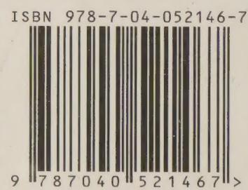

定价 56.00元