## 总目录

第 12 章 碱金属和碱土金属 473
第 13 章 硼族元素 498
第 14 章 碳族元素 527
第 15 章 氮族元素 559
第 16 章 氧族元素 611
第 17 章 卤素 655
第 18 章 氢和稀有气体 699
第 19 章 铜副族元素和锌副族元素 728
第 20 章 钛副族元素和钒副族元素 760
第 21 章 铬副族元素和锰副族元素 781
第 22 章 铁系元素和铂系元素 812
第 23 章 镧系元素和锕系元素 842
第 24 章 无机化学新兴领域简介 865
附录 单质及其重要化合物的物理性质 893
主要参考书目 950
索引 952

## Digitized by the Internet Archive in 2024

## 目录

12.1 金属单质 …… 475
12.1.1 物理性质 …… 475
12.1.2 化学性质 …… 476
12.1.3 金属单质的制备 …… 477
1. 熔盐电解法 …… 477
2. 热还原法 …… 478
12.2 含氧化合物 …… 479
12.2.1 氧化物 …… 479
1. 普通氧化物 …… 479
2. 过氧化物 …… 480
3. 超氧化物和臭氧化物 …… 481
12.2.2 氢氧化物 …… 482
1. 氢氧化物的碱性 …… 482
2. 氢氧化钠 …… 484
12.3 盐类 …… 485
12.3.1 盐的溶解性 …… 485
1. 碱金属盐 …… 485
2. 碱土金属盐 …… 485
12.3.2 盐的结晶水合与复盐 …… 487
12.3.3 含氧酸盐的热稳定性 …… 487
12.3.4 重要盐类简介 …… 488
1. 卤化物 …… 488
2. 碳酸盐 …… 489
3. 硫酸盐 …… 491
4. 硝酸盐和卤素含氧酸盐 …… 491
12.3.5 锂的特殊性 …… 491

拓展学习资源 492  
总结与思考题 493  
习题 493

## 第 12 章 碱金属和碱土金属

元素周期表中ⅠA族包括锂、钠、钾、铷、铯、钫6种元素，这些金属的氢氧化物都是强碱，故称该族元素为碱金属。钠和钾为生命必需元素。

元素周期表中ⅡA族包括铍、镁、钙、锶、钡、镭6种元素,这些金属又称为碱土金属,原因是钙、锶、钡的氧化物性质介于“碱性的”碱金属氧化物和“土性的”氧化铝之间。镁和钙都是生命必需元素。叶绿素①中含有镁,镁对植物的光合作用至关重要;镁是许多酶的激活剂,DNA的复制和蛋白质的合成都需要镁。钙是组成动物牙齿和骨骼的重要成分。

钠、钾、镁、钙、锶、钡在地壳中的含量丰富，钙的丰度在地球上排第5位，钠的丰度排第6位，镁的丰度排第7位，钾的丰度排第8位。锂、铍、铷、铯含量很低，属于稀有金属。第七周期的钫和镭属于放射性元素，它们的性质可以从其在元素周期表中的位置推知，在本书中不加以讨论。

碱金属和碱土金属均以矿物形式存在于地壳中。

锂的重要矿物为锂辉石 $\left(\mathrm{LiAlSi}_{2}\mathrm{O}_{6}\right)$ 和磷铝石 $\left[\mathrm{LiAl}\left(\mathrm{F},\mathrm{OH}\right)\mathrm{PO}_{4}\right]$ 。锂在地壳中的质量分数为 $2.0\times10^{-3}\%$ 。锂由瑞典人阿尔费德森(Arfvedson)于1817年在斯德哥尔摩发现。锂可用来制造低密度合金和锂电池, $Li_{2}CO_{3}$ 可作为药物治疗狂躁型抑郁症,有机锂化合物是有机合成的重要试剂。

钠大量存在于海水中, 海水中氯化钠的含量约为 1.05%。钠的矿物主要有钠长石( $NaAlSi_{3}O_{8}$ )、岩盐(NaCl)、硝石( $NaNO_{3}$ )等。钠在地壳中的质量分数为 2.3%。氯化钠是人们日常生活的必需品, 也是无机化学工业的重要原料。

钾的矿物主要有光卤石（KCl·MgCl₂·6H₂O）、天然氯化钾（KCl）、钾长石（KAlSi₃O₈）等。钾在地壳中的质量分数为2.1%。钾是植物生长的必需元素，钾盐大部分用来作肥料。KNO₃和KClO₄可用于生产炸药。钠和钾由英国人戴维(Davy)于1807年在伦敦分别用电解熔融的氢氧化钠和氢氧化钾的方法分离出来。

铷与其他矿物共生,例如在生产锂的某些副产物中含有铷。铷与锂、钾等元素混生,在地壳中的质量分数为 $9.0 \times 10^{-3}\%$ 。铯的主要存在形式为铯榴石$\left[\left(\mathrm{Cs}, \mathrm{Na}\right)_{4} \mathrm{Al}_{4} \mathrm{Si}_{9} \mathrm{O}_{26} \cdot \mathrm{H}_{2} \mathrm{O}\right]$ , 生产锂的副产物也是铯的主要来源。铯在地壳中的质量分数为 $3.0 \times 10^{-4} \%$ 。铷由德国人本生（Bunsen）和德国人基尔霍夫（Kirchhoff）于1861年在德国的海德堡大学发现，在此之前一年他们发现了铯。这两种元素都是借助他们发明的原子光谱技术被发现的。金属铯由于其第一电离能极小，可用来制作光电管的阴极。

钫为放射性元素。钫由法国女科学家佩里(Percy)于1939年在法国巴黎发现,元素钫“francium”是以她的祖国法国“France”而命名的。

铍由法国人沃克兰（Vauquelin）于1798年发现，其最重要矿物是绿柱石 $\mathrm{(Be_{3}Al_{2}Si_{6}O_{18})}$ ，若其中含有 $2\%$ 的 $\mathrm{Cr}$ 即为祖母绿——一种极名贵的宝石。铍在地壳中的质量分数为 $2.6\times 10^{-4}\%$ 。铍的主要用途是与铜和镍形成高强度合金。

镁在 1808 年由戴维首先分离出单质。镁在地壳中的质量分数为 2.3%。镁的矿物极其丰富，如白云石（ $\mathrm{MgCO_{3} \cdot CaCO_{3}}$ ）、菱镁矿（ $\mathrm{MgCO_{3}}$ ）、泻盐（ $\mathrm{MgSO_{4} \cdot 7H_{2}O}$ ）、光卤石（ $\mathrm{KCl \cdot MgCl_{2} \cdot 6H_{2}O}$ ）等。镁主要用作轻质合金，镁合金在航天器材、汽车发动机、光学设备的生产制造等方面都有重要应用；有机镁是有机合成的重要试剂。

钙亦由戴维于1808年分离出来。钙在地壳中的质量分数为 $4.1\%$ 。钙的重要矿物有方解石 $(\mathrm{CaCO}_3)$ 、石膏 $(\mathrm{CaSO}_4\cdot 2\mathrm{H}_2\mathrm{O})$ 、萤石 $(\mathrm{CaF}_2)$ 、磷灰石 $[\mathrm{Ca}_5(\mathrm{PO}_4)_3\mathrm{F}]$ ，珊瑚、贝壳和珍珠的主要成分也是 $\mathrm{CaCO}_3$ 。

锶由爱尔兰人克劳福德(Crawford)于1790年发现,1808年由戴维分离出来。锶在地壳中的质量分数为 $3.7\times10^{-2}\%$ ,其最重要的矿物是天青石( $SrSO_{4}$ )和菱锶矿( $SrCO_{3}$ )。

钡由戴维于1808年分离出来。钡在地壳中的质量分数为 $5.0 \times 10^{-2}\%$ 。钡的重要矿物有重晶石 $\left(\mathrm{BaSO}_{4}\right)$ 和毒重石 $\left(\mathrm{BaCO}_{3}\right)$ 。

居里夫妇于 1898 年发现具有强放射性的元素镭, 经过处理若干吨沥青铀矿, 1902 年他们分离出极少量纯 $RaCl_{2}$ 和金属 Ra。镭是放射性元素, 产生于铀的衰变过程中, 丰度极低, 与铀共生且在共生矿中含量也极低, 处理 10 t 矿石只能获得 1 mg 镭。

这两族元素的许多性质变化都是很有规律的。例如，在同一族内，从上到下原子半径依次增大，电离能和电负性依次减小，从而金属的活泼性从上到下依次增强。

其中,锂和铍的原子半径和离子半径很小,与同族其他元素相比,锂和铍具有一些特殊性。例如,它们在形成化合物时化学键的共价倾向比较显著。

碱金属和碱土金属的价层电子构型分别为 $ns^{1}$ 和 $ns^{2}$ ，失去价层电子后形成具有稀有气体电子结构的稳定离子，因而都是极其活泼的金属。碱金属具有稳定的+1氧化态，而碱土金属则具有稳定的+2氧化态。

碱金属和碱土金属元素价态变化较少,因此其元素电势图较简单,见图 12-1。

$$
\begin{array}{c c} E _ {\mathrm{A}} ^ {\ominus} / \mathrm{V} & \\ \mathrm {Li^ {+}} \xrightarrow {- 3 . 0 4} \mathrm{Li} & \mathrm {Be^ {2 + }} \xrightarrow {- 1 . 9 7} \mathrm{Be} \\ \mathrm {Na^ {+}} \xrightarrow {- 2 . 7 1} \mathrm{Na} & \mathrm {Mg^ {2 + }} \xrightarrow {- 2 . 3 6} \mathrm{Mg} \\ \mathrm {K^ {+}} \xrightarrow {- 2 . 9 2} \mathrm{K} & \mathrm {Ca^ {2 + }} \xrightarrow {- 2 . 8 4} \mathrm{Ca} \\ \mathrm {Rb^ {+}} \xrightarrow {- 2 . 9 2} \mathrm{Rb} & \mathrm {Sr^ {2 + }} \xrightarrow {- 2 . 8 9} \mathrm{Sr} \\ \mathrm {Cs^ {+}} \xrightarrow {- 2 . 9 2} \mathrm{Cs} & \mathrm {Ba^ {2 + }} \xrightarrow {- 2 . 9 2} \mathrm{Ba} \\ E _ {\mathrm{B}} ^ {\ominus} / \mathrm{V} & \\ & \mathrm {Be_ {2} O_ {3} ^ {2 - }} \xrightarrow {- 2 . 6 2} \mathrm{Be} \\ & \mathrm {Mg(OH) _ {2}} \xrightarrow {- 2 . 6 9} \mathrm{Mg} \\ & \mathrm {Ca(OH) _ {2}} \xrightarrow {- 3 . 0 3} \mathrm{Ca} \\ & \mathrm {Sr(OH) _ {2}} \xrightarrow {- 2 . 8 8} \mathrm{Sr} \\ & \mathrm {Ba(OH) _ {2}} \xrightarrow {- 2 . 8 1} \mathrm{Ba} \end{array}
$$

图 12-1 碱金属和碱土金属的元素电势图①

## 12.1 金属单质

## 12.1.1 物理性质

碱金属和碱土金属的单质除钡为银黄色外,其余都具有银白色的金属光泽,具有良好的导电性和延展性。

碱金属的熔点较低,除锂外都在 $100^{\circ}$ C 以下,铯的熔点最低,是放在手中就能熔化的两种金属之一(另一种是ⅢA族的镓)。沸点与熔点的温度间距较大,沸点一般比熔点高出 $700^{\circ}$ C 以上。碱金属较软,莫氏硬度 $^{②}$ 都小于 1,可以用小刀切割。碱金属的密度都较小，属于轻金属，其中锂、钠、钾的密度比水还小。锂是最轻的金属，其密度大约是水的一半。

碱土金属有两个电子可以参与成键,因而碱土金属的金属键比碱金属的强。碱土金属的熔点、沸点、硬度、密度都比碱金属高得多。

## 12.1.2 化学性质

碱金属和碱土金属都是非常活泼的金属元素,同族从 Li 到 Cs 和从 Be 到 Ba 金属活泼性依次增强。

碱金属和碱土金属都有很强的还原性,与许多非金属单质直接反应生成离子型化合物。在绝大多数化合物中,它们以阳离子形式存在。在特殊条件下,阴离子也能够形成。

碱金属及钙、锶、钡同水反应生成氢氧化物和氢气，例如：

$$
\begin{array}{l} 2 \mathrm{Na} + 2 \mathrm{H} _ {2} \mathrm{O} = 2 \mathrm{NaOH} + \mathrm{H} _ {2} \uparrow \\ 2 \mathrm{K} + 2 \mathrm{H} _ {2} \mathrm{O} = 2 \mathrm{KOH} + \mathrm{H} _ {2} \uparrow \\ \mathrm{Ca} + 2 \mathrm{H} _ {2} \mathrm{O} = \mathrm{Ca(OH)} _ {2} + \mathrm{H} _ {2} \uparrow \end{array}
$$

锂、钙、锶、钡与水反应比较温和，因为它们的熔点较高，不易熔化，因而与水反应不激烈；另一方面，由于它们的氢氧化物溶解度小，生成的氢氧化物覆盖在金属表面阻碍金属与水的接触，从而减缓了金属与水反应的速率。铍和镁的金属表面可以形成致密的氧化物保护膜，常温下它们对水是稳定的。镁在热水中可以缓慢地发生反应，铍则同水蒸气也不发生反应。除锂之外的碱金属与水反应非常剧烈，这些碱金属的熔点很低，与水反应放出的热量使金属熔化为液态，更有利于反应的进行，同时也可能导致产生的 $\mathrm{H}_{2}$ 闪燃而发生爆炸，有较大的危险性。这些碱金属的氢氧化物溶解度很大，反应中生成的氢氧化物迅速溶于水中，不会对反应起阻碍作用。

碱金属及钙、锶、钡均可直接与 $\mathrm{H}_{2}$ 作用，生成金属氢化物，例如：

$$
\mathrm{H} _ {2} + \mathrm{Ca} \xlongequal {1 5 0 \sim 3 0 0 ^ {\circ} \mathrm{C}} \mathrm{CaH} _ {2}
$$

产物氢化钙 $\left(\mathrm{CaH}_{2}\right)$ 是灰色的离子晶体。活泼金属的氢化物是很强的还原剂。

碱金属及钙、锶、钡均可溶于液氨中生成蓝色的导电溶液。在溶液中含有金属离子和溶剂化的自由电子，这种溶剂化电子非常活泼，具有极强的还原能力，所以这些金属的氨溶液是一种能够在低温下使用的非常强的还原剂。

$$
\mathrm{Na} + 2 \mathrm{NH} _ {3} (1) = \mathrm{Na} ^ {+} (\mathrm{NH} _ {3}) + \mathrm{e} ^ {-} (\mathrm{NH} _ {3})
$$

由于其中有溶剂化电子存在,该溶液有很好的导电性,且呈顺磁性。

当长期放置或有催化剂存在时,碱金属的氨溶液中可以发生如下反应:

$$
2 \mathrm{Na} + 2 \mathrm{NH} _ {3} (\mathrm{l}) = 2 \mathrm{NaNH} _ {2} + \mathrm{H} _ {2} \uparrow
$$

蒸干溶剂得白色固体产物氨基钠。

由于碱金属和一些碱土金属单质都与水激烈反应,所以它们不能在水溶液中作还原剂使用。利用碱金属和碱土金属单质的强还原性,可以在非水溶液或熔融条件下制备稀有金属或贵金属,例如:

$$
\mathrm {NbCl_ {5} + 5Na\xlongequal{共熔} Nb + 5NaCl}
$$

$$
\mathrm {ZrO_ {2} + 2Ca\xlongequal{共熔} Zr + 2CaO}
$$

$$
\mathrm{TiCl} _ {4} + 2 \mathrm{Mg} \xlongequal {\text {共熔}} \mathrm{Ti} + 2 \mathrm{MgCl} _ {2}
$$

碱金属、碱土金属及其化合物置于高温火焰中,可以使火焰呈现出特征的颜色,这种现象称为焰色反应。高温火焰使这些物质发生原子化,金属原子的电子受高温火焰的激发而跃迁到高能级轨道上,当电子从高能级轨道返回到低能级轨道时,就会依据两轨道间的能级差大小发射出具有一定波长的光,从而使火焰呈现出特征的颜色:

锂一深红色,钠一黄色,钾一紫色,铷一紫红色,铯一蓝色,钙一橙红色,锶一洋红色,钡一绿色。

钾、锶、钡的硝酸盐分别与 $KClO_{4}$ 、硫黄粉及镁粉、松香等按一定的比例混合，广泛应用于制作信号弹和烟花。

## 12.1.3 金属单质的制备

碱金属和碱土金属的化学性质十分活泼,它们不可能以单质的形式存在于自然界中。它们的活泼性,也决定了其单质不可能从水溶液中制备出来。制备碱金属和碱土金属所采用的方法通常是熔盐电解法和热还原法。

碱金属中的锂和钠常用电解熔融氯化物的方法来大量生产,而钾、铷、铯则采用金属热还原法来制备。

## 1. 熔盐电解法

以钠的生产为例来介绍熔盐电解法。

如图 12-2 所示, 制备金属钠的电解槽的外壳是钢制的, 内衬以耐火材料。电解槽中有石墨阳极和铸钢阴极, 两电极间用隔膜隔开。电解用的原料为 NaCl 和 CaCl₂ 混合物的熔盐。液体金属钠(含少量金属钙)在阴极产生, 因其密度小而浮在熔盐液面上, 进入阴极上方倒置的环形槽, 并经过垂直的管道上升流入收集器。在上升过程中, 钙被冷却而固化, 回落到电解槽的熔融体中。收集器中的产物在 105\~110 ℃ 下进行过滤除去少量金属钙、氧化物和氯化物后就可以得到纯金属钠产品。从中心的石墨阳极上产生的氯气经过抽气罩从顶部的排气口逸出，进入氯气收集器，然后输送到氯气净化和储存系统。

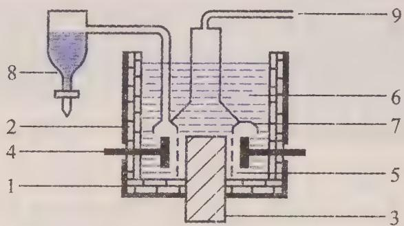  
图 12-2 熔盐电解法生产钠的电解槽示意图  
1—外壳；2—内衬；3—阳极；4—阴极；5—隔膜；  
6—熔盐；7—环形槽；8—收集器；9—排气口

电解反应方程式如下：

$$
2 \mathrm{NaCl(l)} \stackrel {\text {电解}} {=} 2 \mathrm{Na(l)} + \mathrm{Cl} _ {2} (\mathrm{g})
$$

$CaCl_{2}$ 在电解过程中起助熔剂作用,通过与 NaCl 形成共熔物而使盐的熔点降低,以达到降低能耗的目的。NaCl 的熔点为 $800.7^{\circ}C$ , 混合盐的熔点约为 $500^{\circ}C$ , 实际操作温度约为 $580^{\circ}C$ 。同时,降低电解操作温度还可减少钠的挥发,也降低电解生成的金属钠在熔融体中的溶解度,以利于产品的分离。

金属铍可以由电解熔融 $BeCl_{2}$ 的方法制得。由于 $BeCl_{2}$ 的共价性较强，生产过程中需加入 $CaCl_{2}$ 或碱金属氯化物以增加熔盐的导电性。

在 $750^{\circ}$ C 下电解熔融 $MgCl_{2}$ 可得到金属镁。钙、锶、钡都可以通过电解其熔融氯化物的方法制备。

## 2. 热还原法

工业上一般不采用电解熔融氯化物的方法来制备金属钾。这是因为金属钾极易溶于熔融氯化物中，以致很难分离出来。而且金属钾的熔、沸点低，其蒸气易从电解槽中逸出。工业上多采用热还原法制备金属钾，在850℃下用金属钠还原氯化钾，其反应方程式如下：

$$
\mathrm{Na(l)} + \mathrm{KCl(l)} \xlongequal {8 5 0 ^ {\circ} \mathrm{C}} \mathrm{NaCl(l)} + \mathrm{K(g)}
$$

金属钾的沸点为 $759^{\circ}C$ ，在 $850^{\circ}C$ 时，金属钾以气体形式存在，而金属钠在低于 $883^{\circ}C$ 时仍为液体，反应生成的钾蒸气迅速逸出，使反应得以不断向右进行。钾蒸气冷凝得到金属钾，经进一步分馏提纯后，金属钾的纯度可达 99.99%。

铷和铯的制备方法与钾的制备方法类似，以金属钙为还原剂，在750℃下还原氯化铷和氯化铯。

金属铍通常是用金属镁在约 $1300^{\circ}$ C 下还原 $BeF_{2}$ 进行制备。

## 12.2 含氧化合物

## 12.2.1 氧化物

碱金属和碱土金属均存在普通氧化物, 即 $M_{2}O$ 和 MO。除此之外, 它们与氧所形成的二元化合物还有过氧化物、超氧化物及臭氧化物。除铍以外的所有碱金属和碱土金属元素均能形成过氧化物; 钠、钾、铷、铯、钙还能生成超氧化物, 但是超氧化钡经常与过氧化物混在一起, 难以提纯。

在充足的空气中燃烧, Li, Be, Mg, Ca, Sr 生成普通氧化物 $Li_{2}O$ , BeO, MgO, CaO, SrO; Na 和 Ba 生成过氧化物 $Na_{2}O_{2}$ , $BaO_{2}$ ; K, Rb, Cs 生成超氧化物 $KO_{2}$ , $RbO_{2}$ , $CsO_{2}$ 。

Na, K, Rb, Cs 的干燥氢氧化物粉末同 $O_{3}$ 反应可以生成臭氧化物 $MO_{3}$ 。

## 1. 普通氧化物

除锂在空气中燃烧的主要产物为 $Li_{2}O$ 外, 其他碱金属在空气中燃烧的主要产物都不是普通氧化物 $M_{2}O$ 。在含氧量不足的空气中可以生成这些碱金属的普通氧化物, 但条件不易控制, 难以制得较纯的产物。锂以外的碱金属的普通氧化物可以用碱金属单质或叠氮化物在真空中还原其过氧化物、硝酸盐或亚硝酸盐的方法制备。例如:

$$
\begin{array}{r l} & 2 \mathrm{Na} + \mathrm{Na} _ {2} \mathrm{O} _ {2} \stackrel {\text {真空}} {=} 2 \mathrm{Na} _ {2} \mathrm{O} \\ & 1 0 \mathrm{K} + 2 \mathrm{KNO} _ {3} \stackrel {\text {真空}} {=} 6 \mathrm{K} _ {2} \mathrm{O} + \mathrm{N} _ {2} \uparrow \\ & 3 \mathrm{NaN} _ {3} + \mathrm{NaNO} _ {2} \stackrel {\text {真空}} {=} 2 \mathrm{Na} _ {2} \mathrm{O} + 5 \mathrm{N} _ {2} \uparrow \end{array}
$$

碱土金属的普通氧化物可以通过其碳酸盐、氢氧化物、硝酸盐或硫酸盐的热分解来制备。

碱金属的普通氧化物从 $Li_{2}O$ 到 $Cs_{2}O$ 颜色大体上逐渐加深: $Li_{2}O$ 为白色, $Na_{2}O$ 为白色, $K_{2}O$ 为灰色, $Rb_{2}O$ 为黄棕色, $Cs_{2}O$ 为黄橙色。碱土金属的普通氧化物均为白色。

普通氧化物热稳定性总的趋势是,同族从上到下依次降低,熔点也按此顺序降低。碱土金属离子半径较小,正电荷高,所以其普通氧化物的晶格能大,导致其熔点比碱金属普通氧化物的熔点高得多。

碱金属和多数碱土金属普通氧化物同水反应生成相应的氢氧化物,并放出热量,例如:

$$
\begin{array}{l l} \mathrm {Na_ {2} O(s) + H_ {2} O(l) = 2NaOH(s)} & \Delta_ {\mathrm{r}} H _ {\mathrm{m}} ^ {\ominus} = - 1 5 1. 6 \mathrm{kJ} \cdot \mathrm{mol} ^ {- 1} \\ \mathrm {CaO(s) + H_ {2} O(l) = Ca(OH) _ {2} (s)} & \Delta_ {\mathrm{r}} H _ {\mathrm{m}} ^ {\ominus} = - 6 4. 5 \mathrm{kJ} \cdot \mathrm{mol} ^ {- 1} \end{array}
$$

经过煅烧的 BeO 和 MgO 极难与水反应, 它们的熔点很高, 都是很好的耐火材料。经特定过程生产的轻质氧化镁粉末是一种很好的补强材料, 常用作橡胶、塑料、纸张的填料。

## 2. 过氧化物

碱金属和碱土金属元素中,除铍之外其他元素都能形成过氧化物。这些过氧化物含有过氧离子 $\left[O-O\right]^{2-}$ ，可以将它们看成是过氧化氢 $(H-O-O-H)$ 的盐。最重要的过氧化物是过氧化钠 $\left(\mathrm{Na}_{2}\mathrm{O}_{2}\right)$ 、过氧化钙 $\left(\mathrm{CaO}_{2}\right)$ 和过氧化钡 $\left(\mathrm{BaO}_{2}\right)$ 。

为获得纯度较高的 $Na_{2}O_{2}$ ，需要控制一定的反应条件。工业上是将钠加热熔化，通入一定量的除去二氧化碳的干燥空气，维持温度在 $180 \sim 200^{\circ}C$ ，钠即被氧化为 $Na_{2}O$ ；进而增大空气流量并迅速提高温度至 $300 \sim 400^{\circ}C$ ，即可制得较纯净的 $Na_{2}O_{2}$ 黄色粉末。

$$
\begin{array}{r l} & 4 \mathrm{Na} + \mathrm{O} _ {2} \xlongequal {1 8 0 \sim 2 0 0 ^ {\circ} \mathrm{C}} 2 \mathrm{Na} _ {2} \mathrm{O} \\ & 2 \mathrm{Na} _ {2} \mathrm{O} + \mathrm{O} _ {2} \xlongequal {3 0 0 \sim 4 0 0 ^ {\circ} \mathrm{C}} 2 \mathrm{Na} _ {2} \mathrm{O} _ {2} \end{array}
$$

$SrO_{2}$ 可由其金属与高压氧反应直接合成, $BaO_{2}$ 可由其金属与空气在一定温度下反应直接合成。

其他金属的过氧化物可用间接方法制得。将 LiOH 溶于乙醇形成饱和溶液，使之与 $H_{2}O_{2}$ 反应，可得纯度很高的 $Li_{2}O_{2}$ 。

将金属直接氧化难以得到纯净的过氧化物 $K_{2}O_{2}$ , $Rb_{2}O_{2}$ 和 $Cs_{2}O_{2}$ ，因为它们很容易被氧化为超氧化物。但可以考虑在真空中长时间加热超氧化钾以得到 $K_{2}O_{2}$ 。

将 $Na_{2}O_{2}$ 与冷的 $MgCl_{2}$ 浓溶液作用可得到白色的 $MgO_{2}$ 沉淀。低温和碱性条件下，用 $CaCl_{2}$ 与 $H_{2}O_{2}$ 反应可以制得近白色的含结晶水的 $CaO_{2}$ 。含结晶水的 $CaO_{2}$ 在超过 100 ℃ 下脱水可生成黄色的无水 $CaO_{2}$ 。

过氧化物为粉末状固体,易吸潮。它与水或稀酸作用,生成过氧化氢,例如:

$$
\mathrm{Na} _ {2} \mathrm{O} _ {2} + 2 \mathrm{H} _ {2} \mathrm{O} = \mathrm{H} _ {2} \mathrm{O} _ {2} + 2 \mathrm{NaOH}
$$

$$
\mathrm{Na} _ {2} \mathrm{O} _ {2} + \mathrm{H} _ {2} \mathrm{SO} _ {4} = \mathrm{H} _ {2} \mathrm{O} _ {2} + \mathrm{Na} _ {2} \mathrm{SO} _ {4}
$$

过氧化氢不稳定,在催化剂的作用下立即分解放出氧气。过氧化物都可作氧化剂、氧气发生剂和漂白剂。目前,市面上的氧吧多数采用 $CaO_{2}$ 作为氧气发生剂。

过氧化物与 $CO_{2}$ 反应放出 $O_{2}$ ，例如：

$$
2 \mathrm{Na} _ {2} \mathrm{O} _ {2} + 2 \mathrm{CO} _ {2} = 2 \mathrm{Na} _ {2} \mathrm{CO} _ {3} + \mathrm{O} _ {2}
$$

在防毒面具和潜水艇中经常用 $Na_{2}O_{2}$ 作为 $CO_{2}$ 吸收剂，并供给氧气；宇航密封舱中则往往使用较轻的 $Li_{2}O_{2}$ 。

过氧化物有较强的氧化性。如 $Na_{2}O_{2}$ 经常用来作氧化剂和熔矿剂，在熔融的条件下可以将 $Fe_{2}O_{3}$ 氧化为高铁酸盐 $Na_{2}FeO_{4}$ ，将 $Cr_{2}O_{3}$ 氧化为易溶的铬酸盐 $Na_{2}CrO_{4}$ 。

$$
\begin{array}{r l} & {\mathrm {Fe_ {2} O_ {3} + 3Na_ {2} O_ {2} \xlongequal{\text {共熔}} 2Na_ {2} FeO_ {4} + Na_ {2} O}} \\ & {\mathrm {Cr_ {2} O_ {3} + 3Na_ {2} O_ {2} \xlongequal{\text {共熔}} 2Na_ {2} CrO_ {4} + Na_ {2} O}} \end{array}
$$

过氧化物也具有还原性,当遇到强氧化剂时,呈现还原性:

$$
5 \mathrm{Na} _ {2} \mathrm{O} _ {2} + 2 \mathrm{MnO} _ {4} ^ {-} + 1 6 \mathrm{H} ^ {+} = 5 \mathrm{O} _ {2} \uparrow + 2 \mathrm{Mn} ^ {2 +} + 1 0 \mathrm{Na} ^ {+} + 8 \mathrm{H} _ {2} \mathrm{O}
$$

实验室中经常用 $BaO_{2}$ 与稀硫酸反应制备 $H_{2}O_{2}$ :

$$
\mathrm{BaO} _ {2} + \mathrm{H} _ {2} \mathrm{SO} _ {4} = \mathrm{H} _ {2} \mathrm{O} _ {2} + \mathrm{BaSO} _ {4}
$$

碱金属过氧化物中, $Li_{2}O_{2}$ 热稳定性较差,在 195 ℃ 以上即分解,其他过氧化物的热稳定性较高。在没有氧气或其他氧化性物质存在时, $Na_{2}O_{2}$ 的热分解温度不低于 675 ℃。碱土金属过氧化物的热稳定性从 $MgO_{2}$ 到 $BaO_{2}$ 逐渐增加,但热稳定性不如碱金属高。

## 3. 超氧化物和臭氧化物

超氧化物中含超氧离子 $O_{2}^{-}$ ，它比 $O_{2}$ 多一个电子，两个氧原子之间除形成一个 $\sigma$ 键外，还有一个三电子 $\pi$ 键，键级为 1.5。由于有单电子，超氧离子 $O_{2}^{-}$ 具有顺磁性。只有半径大的阳离子的超氧化物稳定，如 $KO_{2}, RbO_{2}, CsO_{2}, Sr(O_{2})_{2}, Ba(O_{2})_{2}$ 都比较稳定，而 $NaO_{2}$ 稳定性较差。

碱金属超氧化物的熔点, 同族从上到下依次升高。 $KO_{2}$ 的熔点为 $380^{\circ}C$ ; $RbO_{2}$ 的熔点为 $412^{\circ}C$ ; $CsO_{2}$ 的熔点为 $432^{\circ}C$ 。

钾、铷、铯在过量的氧气中燃烧均生成黄色的超氧化物，在 $450^{\circ}$ C 和 15 MPa 的压力下，Na 与 $O_{2}$ 反应能够制得纯净的黄色超氧化钠 ( $NaO_{2}$ )。

超氧化物是很强的氧化剂,与水或其他质子溶剂发生剧烈反应生成氧气和

过氧化氢,例如:

$$
2 \mathrm{KO} _ {2} + 2 \mathrm{H} _ {2} \mathrm{O} = \mathrm{O} _ {2} \uparrow + \mathrm{H} _ {2} \mathrm{O} _ {2} + 2 \mathrm{KOH}
$$

超氧化物在高温下分解为氧化物和氧气：

$$
4 \mathrm{KO} _ {2} \stackrel {\text {高温}} {=} 2 \mathrm{K} _ {2} \mathrm{O} + 3 \mathrm{O} _ {2} \uparrow
$$

超氧化物与 $\mathrm{CO}_{2}$ 反应也放出氧气：

$$
4 \mathrm{KO} _ {2} + 2 \mathrm{CO} _ {2} = 2 \mathrm{K} _ {2} \mathrm{CO} _ {3} + 3 \mathrm{O} _ {2}
$$

所以超氧化物的一个重要用途就是用作氧气源。

干燥的钠、钾、铷、铯的固体氢氧化物与臭氧反应，均生成臭氧化物，例如：

$$
6 \mathrm{KOH} + 4 \mathrm{O} _ {3} = 4 \mathrm{KO} _ {3} + 2 \mathrm{KOH} \cdot \mathrm{H} _ {2} \mathrm{O} + \mathrm{O} _ {2}
$$

产物在液氨中重结晶,可以得到橘红色的臭氧化钾晶体。 $KO_{3}$ 不稳定,缓慢分解为 $KO_{2}$ 和 $O_{2}$ :

$$
2 \mathrm{KO} _ {3} = 2 \mathrm{KO} _ {2} + \mathrm{O} _ {2} \uparrow
$$

$KO_{3}$ 遇水剧烈反应,也放出 $O_{2}$ :

$$
4 \mathrm{KO} _ {3} + 2 \mathrm{H} _ {2} \mathrm{O} = 4 \mathrm{KOH} + 5 \mathrm{O} _ {2} \uparrow
$$

## 12.2.2 氢氧化物

## 1. 氢氧化物的碱性

碱金属和碱土金属的氢氧化物都是白色固体, $\mathrm{Be(OH)}_{2}$ 为两性氢氧化物,其余氢氧化物均显碱性。它们在水中的溶解情况参见表12-1。

表 12-1 碱金属和碱土金属氢氧化物在水中的溶解情况

<table><tr><td>碱金属氢氧化物</td><td>LiOH</td><td>NaOH</td><td>KOH</td><td>RbOH</td><td>CsOH</td></tr><tr><td>15°C下溶解度/(mol·dm-3)</td><td>5.3</td><td>26.4</td><td>19.1</td><td>17.9</td><td>25.8</td></tr><tr><td>碱土金属氢氧化物</td><td>Be(OH)2</td><td>Mg(OH)2</td><td>Ca(OH)2</td><td>Sr(OH)2</td><td>Ba(OH)2</td></tr><tr><td>20°C下溶解度/(mol·dm-3)</td><td>8×10-6</td><td>5×10-4</td><td>1.8×10-2</td><td>6.7×10-2</td><td>2×10-1</td></tr></table>

碱金属氢氧化物都易溶于水,在空气中很容易吸潮,它们溶解于水时放出大量的热。除氢氧化锂的溶解度稍小外,其余碱金属氢氧化物在常温下可以形成很浓的溶液。

碱土金属氢氧化物在水中的溶解度要小得多,溶解度在同族中按从上到下的顺序增大。 $\mathrm{Be(OH)}_{2}$ 和 $\mathrm{Mg(OH)}_{2}$ 难溶于水,其余碱土金属氢氧化物的溶解度也较小。 $\mathrm{Be(OH)}_{2}$ 是典型的两性氢氧化物,它可以溶解于强碱中形成

$\left[\mathrm{Be}(\mathrm{OH})_{4}\right]^{2-}$

碱金属氢氧化物和碱土金属氢氧化物酸碱性的强弱可以由金属阳离子的离子势 $\phi$ 值的大小来确定， $\phi$ 为离子的电荷数 $z$ 与离子半径 $r$ 之比：

$$
\phi = \frac {z}{r}
$$

若 $\phi$ 值大, 则氢氧化物发生酸式解离, 氢氧化物显酸性:

$$
\mathrm{M} - \mathrm{O} - \mathrm{H} \longrightarrow \mathrm{MO} ^ {-} + \mathrm{H} ^ {+}
$$

若 $\phi$ 值小，则氢氧化物发生碱式解离，氢氧化物显碱性：

$$
\mathrm{M} - \mathrm{O} - \mathrm{H} \longrightarrow \mathrm{M} ^ {+} + \mathrm{OH} ^ {-}
$$

若两种解离趋势相当,则氢氧化物为两性。

显然, $\phi$ 值越大, $M^{2+}$ 的电场越强,于是对氧原子上的电子云的吸引也就越强,导致氧原子和氢原子之间的电子云密度越小,结果O—H键被削弱, $H^{+}$ 易于解离出来,MOH发生酸式解离的趋势大。反之, $\phi$ 值越小, $M^{2+}$ 的电场越弱,于是对氧原子上的电子云的吸引也就越弱,导致氧原子和氢原子之间的电子云密度越大,结果O—H键较强, $H^{+}$ 不易解离出来,而M—OH键较弱, $OH^{-}$ 易于解离出来,MOH发生碱式解离的趋势大。

若离子半径 $r^{\text{①}}$ 的单位为 $\mathrm{pm}$ , 则判断金属氢氧化物酸碱性的经验公式为

$$
\begin{array}{r l r} {\sqrt {\phi} <   0. 2 2} & {} & {\text {金属氢氧化物为碱性}} \\ {0. 2 2 <   \sqrt {\phi} <   0. 3 2} & {} & {\text {金属氢氧化物为两性}} \\ {\sqrt {\phi} > 0. 3 2} & {} & {\text {金属氢氧化物为酸性}} \end{array}
$$

碱金属和碱土金属氢氧化物的 $\sqrt{\phi}$ 值列在表12-2中。

表 12-2 碱金属和碱土金属氢氧化物的 $\sqrt{\phi}$ 值

<table><tr><td>MOH</td><td>LiOH</td><td>NaOH</td><td>KOH</td><td>RbOH</td><td>CsOH</td></tr><tr><td>√φ</td><td>0.13</td><td>0.10</td><td>0.085</td><td>0.081</td><td>0.077</td></tr><tr><td>M(OH)2</td><td>Be(OH)2</td><td>Mg(OH)2</td><td>Ca(OH)2</td><td>Sr(OH)2</td><td>Ba(OH)2</td></tr><tr><td>√φ</td><td>0.27</td><td>0.17</td><td>0.14</td><td>0.13</td><td>0.12</td></tr></table>

按这一经验公式判断,碱金属氢氧化物均为碱性, $\mathrm{Be(OH)}_{2}$ 为两性,其他碱土金属氢氧化物为碱性。

以 $\phi$ 值来判断氢氧化物酸碱性强弱只是一种粗略的经验方法, 氢氧化物的酸碱性除与中心离子的电荷数、半径有关外, 还与中心离子的电子层结构等许多因素有关。

另外, $\phi$ 值越大, $M^{z+}$ 的电场越强,离子与溶剂 $H_{2}O$ 分子作用越强,这样不仅导致离子水合时放热较多,而且将使离子自身在水溶液中移动的速率较慢。

## 2. 氢氧化钠

碱金属氢氧化物中最重要的是氢氧化钠(NaOH)，又称烧碱、火碱或苛性碱。氢氧化钠是十分重要的基本化工原料。

NaOH 是强碱, 有很强的腐蚀性, 能侵蚀衣服、玻璃、陶瓷等。不能用磨口玻璃瓶盛装 NaOH 溶液, 因为 NaOH 与玻璃的主要成分 $\mathrm{SiO}_{2}$ 缓慢反应生成 $\mathrm{Na}_{2} \mathrm{SiO}_{3}$ , 可能将磨口玻璃塞与瓶口粘在一起。工业上用 NaOH 来熔融分解试样时要使用铁制的容器, 实验室则用银制或镍制的坩埚。

固体 NaOH 容易吸收空气中的水汽和酸性气体, 如吸收 $CO_{2}$ 生成 $Na_{2}CO_{3}$ 会导致 NaOH 不纯。欲配制不含 $Na_{2}CO_{3}$ 的 NaOH 溶液, 可先配制饱和的 NaOH 溶液, $Na_{2}CO_{3}$ 在饱和的 NaOH 溶液中溶解度极小而析出沉淀。取上层清液, 用煮沸除去 $CO_{2}$ 后冷却的水稀释即可。

生产 NaOH 的主要反应是电解 NaCl 水溶液, 目前工业上采取的具体方法有隔膜法和离子膜法。

隔膜法电解槽,如图 12-3 所示,用石墨作阳极,铁网作阴极,阳极区和阴极区用石棉隔膜分开。阳极区中的 NaCl 溶液,其 Cl⁻ 在阳极上放电产生 Cl₂;而阴极区中 NaCl 溶液的 H₂O 在阴极上得到电子产生 H₂ 和 OH⁻。因此,阴极区中是 NaCl 和 NaOH 的混合溶液。将阴极区混合溶液排出后经蒸发浓缩,由于 NaCl 不断地结晶析出,因此所得 NaOH 浓溶液中 NaCl 的浓度较低,可以作为液碱供工业使用。

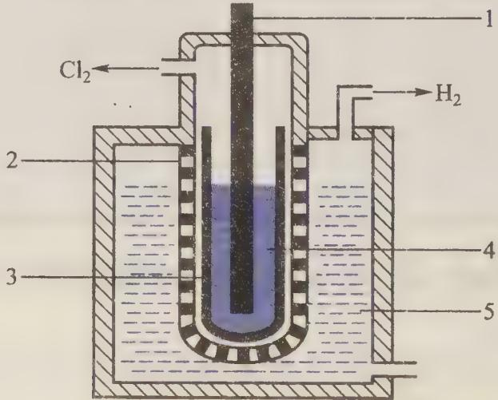  
图 12-3 隔膜法生产 NaOH 的电解槽示意图  
1—石墨阳极；2—铁网阴极；3—石棉隔膜；4—阳极区；5—阴极区

离子膜法生产 NaOH 是较先进的方法,该工艺过程投资少,能耗低,目前正被广泛采用。用高分子材料制成的阳离子交换膜,将阳极室和阴极室隔开,该膜只允许阳离子 $Na^{+}$ 通过,而阴离子 $OH^{-}$ 很难通过。在阳极室加入 NaCl 溶液,阴极室加入水。阳极释放 $Cl_{2},Na^{+}$ 经阳离子交换膜进入阴极室;阴极释放 $H_{2}$ 并生成 NaOH。这种方法在第 17 章有关氯气的生产中还要较为详细地介绍。

NaOH 能够严重烧伤皮肤及眼睛的角膜,在实验过程中要注意安全,严防 NaOH 溶液溅到皮肤和眼睛。

## 12.3 盐类

## 12.3.1 盐的溶解性

## 1. 碱金属盐

除锂外，碱金属盐都是离子型化合物，大部分易溶于水。

锂的强酸盐易溶于水,锂的一些弱酸盐在水中的溶解度较差,如 $LiF, Li_{2}CO_{3}$ 和 $Li_{3}PO_{4}$ 等。

其他碱金属的难溶盐和微溶盐较少,见表 12-3 所示。

表 12-3 中的醋酸铀酰锌钠是一种淡黄色结晶状的沉淀。分析化学中, 利用这种沉淀物的生成以鉴定 $Na^{+}$ 的存在。反应式为

$$
\mathrm{Na} ^ {+} + \mathrm{Zn} ^ {2 +} + 3 \mathrm{UO} _ {2} ^ {2 +} + 9 \mathrm{Ac} ^ {-} + 9 \mathrm{H} _ {2} \mathrm{O} = \mathrm{NaZn} (\mathrm{UO} _ {2}) _ {3} (\mathrm{Ac}) _ {9} \cdot 9 \mathrm{H} _ {2} \mathrm{O} \downarrow
$$

式中 $UO_{2}^{2+}$ 为铀氧根离子, 经常称作铀酰基, 是 U(VI) 在酸中的存在形式。本书中第 23 章 23.2.2 小节中将对 $UO_{2}^{2+}$ 做较多介绍。

表 12-3 中的六硝基合钴(Ⅲ)酸钠钾黄色沉淀的生成,在分析化学中被用以鉴定 $K^{+}$ 的存在。反应式为

$$
2 \mathrm{K} ^ {+} + \mathrm{Na} ^ {+} + \left[ \mathrm{Co} \left(\mathrm{NO} _ {2}\right) _ {6} \right] ^ {3 -} = \mathrm{K} _ {2} \mathrm{Na} \left[ \mathrm{Co} \left(\mathrm{NO} _ {2}\right) _ {6} \right] \downarrow
$$

## 2. 碱土金属盐

碱土金属盐多是离子型化合物。碱土金属与-1价阴离子(除F外)形成的盐一般易溶于水,如氯化物、溴化物、碘化物、硝酸盐、氯酸盐、醋酸盐、酸式碳酸盐、酸式草酸盐、磷酸二氢盐等。其原因主要是电荷数低时离子键的静电引力较小,晶格能较小。

碱土金属与负电荷数高的阴离子形成的盐的溶解度一般都较小。如碱土金属碳酸盐、磷酸盐和草酸盐都难溶于水。 $BeSO_{4}$ 和 $MgSO_{4}$ 易溶于水， $CaSO_{4}$ ， $SrSO_{4}$ ， $BaSO_{4}$ 难溶于水； $BeCrO_{4}$ 和 $MgCrO_{4}$ 易溶于水， $CaCrO_{4}$ ， $SrCrO_{4}$ ， $BaCrO_{4}$ 难溶于水。这是由于复杂阴离子的半径大,只有与半径大的阳离子结合时,才可避免晶体中的阴离子之间直接接触,以减小阴离子之间的斥力,以保证晶格能较大。因而半径大的阳离子与复杂阴离子形成的盐一般溶解度较小。同样,半径小的阴离子可以与半径小的阳离子结合,形成溶解度较小的盐。

表 12-3 Na, K, Rb, Cs 的难溶盐和微溶盐

<table><tr><td>碱金属</td><td>盐</td><td>化学式</td></tr><tr><td>Na</td><td>砷酸铀酰钠锑酸钠六硝基合钴(III)酸铵钠醋酸铀酰锌钠</td><td> $NaUO_{2}AsO_{4}$  $Na[Sb(OH)_{6}]$  $Na(NH_{4})_{2}[Co(NO_{2})_{6}]$  $NaZn(UO_{2})_{3}(Ac)_{9} \cdot 9H_{2}O$ </td></tr><tr><td>K</td><td>高氯酸钾高碘酸钾六氯合铂(IV)酸钾六氟合铂(IV)酸钾六氟合硅(IV)酸钾酒石酸氢钾*六硝基合钴(III)酸钠钾</td><td> $KClO_{4}$  $KIO_{4}$  $K_{2}[PtCl_{6}]$  $K_{2}[PtF_{6}]$  $K_{2}[SiF_{6}]$  $KHC_{4}H_{4}O_{6}$  $K_{2}Na[CO(NO_{2})_{6}]$ </td></tr><tr><td>Rb</td><td>高氯酸铷高碘酸铷六氯合铂(IV)酸铷六氟合铂(IV)酸铷六氟合硅(IV)酸铷六硝基合钴(III)酸铷</td><td> $RbClO_{4}$  $RbIO_{4}$  $Rb_{2}[PtCl_{6}]$  $Rb_{2}[PtF_{6}]$  $Rb_{2}[SiF_{6}]$  $Rb_{3}[Co(NO_{2})_{6}]$ </td></tr><tr><td>Cs</td><td>高氯酸铯高锰酸铯高碘酸铯六氯合铂(IV)酸铯六氟合铂(IV)酸铯六氟合硅(IV)酸铯氟硼酸铯六硝基合钴(III)酸铯</td><td> $CsClO_{4}$  $CsMnO_{4}$  $CsIO_{4}$  $Cs_{2}[PtCl_{6}]$  $Cs_{2}[PtF_{6}]$  $Cs_{2}[SiF_{6}]$  $CsBF_{4}$  $Cs_{3}[Co(NO_{2})_{6}]$ </td></tr></table>

\* 酒石酸是一种二元有机酸——二羟基丁二酸,其结构简式为 HO—CHCOOH。
HO—CHCOOH

盐类溶解过程,一般来说包括晶格的破坏和离子的水合两步。因此,晶格能和离子水合倾向的大小是影响溶解度的重要因素。离子电荷数越高,半径越小,

水合时放热越多,越有利于溶解。

## 12.3.2 盐的结晶水合与复盐

阳离子电荷数越高,半径越小,对水分子的引力越大,形成结晶水合盐类的倾向越大。

碱金属盐中, 卤化物一般不带结晶水; 硝酸盐中, 只有硝酸锂带结晶水, 如 $LiNO_{3} \cdot H_{2}O$ 和 $LiNO_{3} \cdot 3H_{2}O$ , 其他硝酸盐不带结晶水; 带结晶水的碱金属硫酸盐只有 $Li_{2}SO_{4} \cdot H_{2}O$ 和 $Na_{2}SO_{4} \cdot 10H_{2}O$ ; 碳酸盐中除 $Li_{2}CO_{3}$ 外, 其他碱金属碳酸盐都带结晶水, 如 $Na_{2}CO_{3} \cdot H_{2}O$ , $Na_{2}CO_{3} \cdot 7H_{2}O$ , $Na_{2}CO_{3} \cdot 10H_{2}O$ , $K_{2}CO_{3} \cdot H_{2}O$ , $K_{2}CO_{3} \cdot 5H_{2}O$ 等。

实验室中常使用钾盐而不使用钠盐,一般都与钾盐不易吸水潮解有关,如 $\mathrm{KI},\mathrm{KMnO}_{4},\mathrm{KClO}_{3},\mathrm{K}_{2}\mathrm{Cr}_{2}\mathrm{O}_{7}$ 等都是实验室常用试剂,配制炸药使用 $\mathrm{KNO}_{3}$ 和 $\mathrm{KClO}_{4}$ ,而不使用 $\mathrm{NaNO}_{3}$ 和 $\mathrm{NaClO}_{4}$ 。但钾盐的价格一般比钠盐高。

碱土金属盐带结晶水的趋势更大,常见水合盐有 $MgCl_{2}\cdot6H_{2}O$ , $CaCl_{2}\cdot6H_{2}O$ , $MgSO_{4}\cdot7H_{2}O$ , $CaSO_{4}\cdot2H_{2}O$ , $BaCl_{2}\cdot2H_{2}O$ 。碱土金属的无水盐有吸潮性,无水 $CaCl_{2}$ 是重要的干燥剂; $Na_{2}SO_{4}\cdot10H_{2}O$ 熔化热较大,受热溶于其结晶水,冷却结晶时放出较多热量,可以作储热材料。

除锂外,碱金属和碱土金属离子能形成一系列复盐,复盐的溶解度一般比简单盐小。这些复盐的主要类型有

$$
\mathrm{MCl} \cdot \mathrm{MgCl} _ {2} \cdot 6 \mathrm{H} _ {2} \mathrm{O} (\mathrm{M} = \mathrm{K}, \mathrm{Rb}, \mathrm{Cs}), \text {如光卤石} (\mathrm{KCl} \cdot \mathrm{MgCl} _ {2} \cdot 6 \mathrm{H} _ {2} \mathrm{O}) 。
$$

$$
\mathrm{M} _ {2} \mathrm{SO} _ {4} \cdot \mathrm{MgCl} _ {2} \cdot 6 \mathrm{H} _ {2} \mathrm{O} (\mathrm{M} = \mathrm{K}, \mathrm{Rb}, \mathrm{Cs}), \text {如软钾镁矾} (\mathrm{K} _ {2} \mathrm{SO} _ {4} \cdot \mathrm{MgCl} _ {2} \cdot 6 \mathrm{H} _ {2} \mathrm{O}) 。
$$

$M(I)_{2}SO_{4}\cdot M(III)_{2}(SO_{4})_{3}\cdot24H_{2}O[M(I)=Na,K,Rb,Cs;M(III)=Al,Cr,Fe等]$ ，如明矾 $\left[K_{2}SO_{4}\cdot Al_{2}(SO_{4})_{3}\cdot24H_{2}O\right]$ 、铬钾矾 $\left[K_{2}SO_{4}\cdot Cr_{2}(SO_{4})_{3}\cdot24H_{2}O\right]$ 。

## 12.3.3 含氧酸盐的热稳定性

锂离子和碱土金属离子的极化能力较强,其硝酸盐热分解的产物为金属氧化物、二氧化氮和氧气,例如:

$$
\begin{array}{r l} & 4 \mathrm{LiNO} _ {3} \xlongequal {\triangle} 2 \mathrm{Li} _ {2} \mathrm{O} + 4 \mathrm{NO} _ {2} \uparrow + \mathrm{O} _ {2} \uparrow \\ & 2 \mathrm{Mg(NO} _ {3}) _ {2} \xlongequal {\triangle} 2 \mathrm{MgO} + 4 \mathrm{NO} _ {2} \uparrow + \mathrm{O} _ {2} \uparrow \end{array}
$$

其他碱金属硝酸盐热分解的产物为亚硝酸盐和氧气,例如:

$$
2 \mathrm{NaNO} _ {3} \xlongequal {5 0 0 ^ {\circ} \mathrm{C}} 2 \mathrm{NaNO} _ {2} + \mathrm{O} _ {2} \uparrow
$$

在更高的温度下分解则生成氧化物、氮气和氧气,例如:

$$
4 \mathrm{NaNO} _ {3} \xlongequal {8 0 0 ^ {\circ} \mathrm{C}} 2 \mathrm{Na} _ {2} \mathrm{O} + 2 \mathrm{N} _ {2} \uparrow + 5 \mathrm{O} _ {2} \uparrow
$$

碱金属卤化物都是熔点较高的无色晶体,用氢氧化物或碳酸盐同氢卤酸作用,经结晶即可制得各种卤化物。碱金属卤化物的标准摩尔生成热 $\Delta_{f}H_{m}^{\ominus}$ 数据列在表12-4中。从表中可以看出这样的规律,氟化物的标准摩尔生成热 $\Delta_{f}H_{m}^{\ominus}$ 从 LiF 到 RbF 逐渐增大,就是说生成 MF 时放出的热量是依次减小的;而氯化物、溴化物和碘化物的标准摩尔生成热 $\Delta_{f}H_{m}^{\ominus}$ 则是从 LiX 到 RbX 逐渐减小的,就是说生成 MX 时放出的热量是依次增大的。同一金属从氟化物到碘化物生成时所放出的热量都是依次减小的。

表 12-4 碱金属卤化物的标准摩尔生成热数据

<table><tr><td rowspan="2">卤化物</td><td colspan="4"> $\Delta_fH_m^\ominus/(kJ·mol^{-1})$ </td></tr><tr><td>MF</td><td>MCI</td><td>MBr</td><td>MI</td></tr><tr><td>LiX</td><td>-616.0</td><td>-408.6</td><td>-351.2</td><td>-270.4</td></tr><tr><td>NaX</td><td>-576.6</td><td>-411.2</td><td>-361.1</td><td>-287.8</td></tr><tr><td>KX</td><td>-567.2</td><td>-436.5</td><td>-393.8</td><td>-327.9</td></tr><tr><td>RbX</td><td>-557.7</td><td>-435.4</td><td>-394.6</td><td>-333.8</td></tr></table>

阳离子电荷数越高,半径越小,极化能力越强,其含氧酸盐越不稳定,分解温度越低。因此,碱金属含氧酸盐的热稳定性一般比碱土金属含氧酸盐的热稳定性高。如 $MgCO_{3}$ 的分解温度为 $540^{\circ}C$ , $CaCO_{3}$ 的分解温度为 $900^{\circ}C$ , $BaCO_{3}$ 的分解温度为 $1360^{\circ}C$ ; $Li_{2}CO_{3}$ 的分解温度为 $700^{\circ}C$ , 而 $Na_{2}CO_{3}$ 和 $K_{2}CO_{3}$ 在 $1000^{\circ}C$ 也基本不分解。这些碳酸盐受热分解的产物为金属氧化物和二氧化碳,例如:

$$
\mathrm{Li} _ {2} \mathrm{CO} _ {3} \stackrel {\triangle} {=} \mathrm{Li} _ {2} \mathrm{O} + \mathrm{CO} _ {2} \uparrow
$$

$$
\mathrm{MgCO} _ {3} \stackrel {\triangle} {=} \mathrm{MgO} + \mathrm{CO} _ {2} \uparrow
$$

## 12.3.4 重要盐类简介

## 1. 卤化物

碱金属和碱土金属卤化物中,最重要的是 NaCl, $MgCl_{2}$ 和 $CaCl_{2}$ 。

NaCl 俗称食盐,大量存在于海水中,也有其矿物。我国青海、四川、湖北、江西、江苏等地都有大规模岩盐矿床，尤以柴达木盆地最有名。英国的柴郡盐田的岩盐矿床占地1000多平方千米，矿床厚约400 m。NaCl不仅是人们日常生活的必需品，还是重要的化工原料。历史上曾将以NaCl为原料生产NaOH作为化学工业开端的标志。以NaCl为原料可以生产Na, NaOH, $Cl_{2}$ , $Na_{2}CO_{3}$ 和HCl等。NaCl也大量用在食品加工、石油工业、纺织品工业等方面，作为公路融雪剂的NaCl用量也相当大。

$MgCl_{2}$ 的水溶液俗称卤水, 因为能够使蛋白质凝固, 而应用在豆制品加工中。 $MgCl_{2}$ 是重要的化工原料, 在有机合成化学中有广泛的应用。 $MgCl_{2}$ 溶液的凝固点较低, 因此它也经常用来作融雪剂。从水溶液中得到的为其水合盐 $MgCl_{2} \cdot 6H_{2}O$ , 加热使水合盐脱水时, 会发生水解反应得到碱式盐:

$$
\mathrm{MgCl} _ {2} \cdot 6 \mathrm{H} _ {2} \mathrm{O} \stackrel {\triangle} {=} \mathrm{Mg(OH)Cl} + \mathrm{HCl} \uparrow + 5 \mathrm{H} _ {2} \mathrm{O}
$$

继续加热碱式氯化镁将生成氧化镁,不能得到无水氯化镁:

$$
\mathrm{Mg(OH)Cl} \stackrel {\triangle} {=} \mathrm{MgO} + \mathrm{HCl} \uparrow
$$

用金属镁与氯气直接反应可得到无水氯化镁；也可以在氯化氢气氛中加热水合盐 $MgCl_{2} \cdot 6H_{2}O$ 制备无水氯化镁，但条件不易控制，生产成本高。

无水氯化钙 $\left(\mathrm{CaCl}_{2}\right)$ 是重要的干燥剂,将 $CaCl_{2}\cdot6H_{2}O$ 加热脱水,即可得到无水氯化钙:

$$
\mathrm{CaCl} _ {2} \cdot 6 \mathrm{H} _ {2} \mathrm{O} \stackrel {\triangle} {=} \mathrm{CaCl} _ {2} + 6 \mathrm{H} _ {2} \mathrm{O}
$$

水合氯化钙脱水过程中有部分发生水解反应,因而脱水产物中常含有少量的 CaO 杂质。 $CaCl_{2}\cdot6H_{2}O$ 与冰混合可用作最低温度达-50℃的低温冷冻剂。

$MgCl_{2}$ 和 $BaCl_{2}$ 有毒, 使用时要注意安全, 避免误服。应当指出的是, 无机盐作融雪剂时, 由于其对路面、桥梁、汽车的底盘和轮胎有腐蚀作用, 对土壤、河流及环境等有污染, 所以应尽量避免过多使用。

碱土金属卤化物中, 只有 $BeX_{2}$ 具有较强的共价性, 熔、沸点低, 易升华。水合卤化物受热脱水时会像 $MgCl_{2} \cdot 6H_{2}O$ 一样发生水解。无水盐 $BeCl_{2}$ 固态时具有链状结构, 如图 12-4(a) 所示, 其中 Be 原子的轨道为 $sp^{3}$ 杂化。气态时存在二聚体分子 $(\mathrm{BeCl}_{2})_{2}$ , 见图 12-4(b), 其中 Be 原子的轨道为 $sp^{2}$ 杂化。

## 2. 碳酸盐

碱金属和碱土金属碳酸盐中,最重要的是碳酸钠( $\mathrm{Na_{2}CO_{3}}$ )。碳酸钠俗称苏打或纯碱,是最重要的碱性化合物之一。市售的商品是含有10个结晶水的碳酸钠( $\mathrm{Na_{2}CO_{3}\cdot10H_{2}O}$ ),易失去部分结晶水而风化。碳酸钠是重要的化工原料,大量用于生产纸浆、肥皂、洗涤剂和其他化学试剂等。工业生产碳酸钠的方法有氨

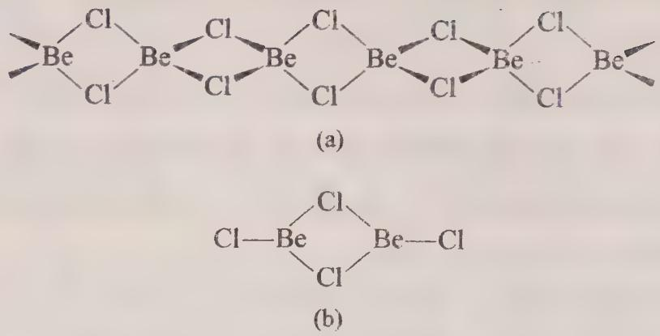  
图12-4 $\mathrm{BeCl}_2$ 的结构示意图

碱法和联合制碱法。

氨碱法是 1862 年由比利时人索尔维 (Solvay) 提出的,也称为索尔维制碱法。该法的主要过程是,向吸足氨气的饱和食盐水中通入二氧化碳,发生的基本反应是

$$
\begin{array}{r l} & \mathrm {NH_ {3} + CO_ {2} + H_ {2} O\xlongequal {\quad} NH_ {4} HC O _ {3}} \\ & \mathrm {NH_ {4} HC O _ {3} + NaCl\xlongequal {\quad} NaHC O _ {3} + NH_ {4} Cl} \end{array}
$$

析出溶解度较小的 $NaHCO_{3}$ 后, 母液中主要成分为 $NH_{4}Cl$ 和 NaCl。加热分解 $NaHCO_{3}$ 得到产品 $Na_{2}CO_{3}$ :

$$
2 \mathrm{NaHCO} _ {3} \stackrel {\triangle} {=} \mathrm{Na} _ {2} \mathrm{CO} _ {3} + \mathrm{CO} _ {2} \uparrow + \mathrm{H} _ {2} \mathrm{O}
$$

原料之一的 $CO_{2}$ 通过煅烧石灰石制得, 煅烧过程的另一产物 CaO 经消化制成石灰乳, 后者与含有 $NH_{4}Cl$ 的母液反应:

$$
2 \mathrm{NH} _ {4} \mathrm{Cl} + \mathrm{Ca(OH)} _ {2} = 2 \mathrm{NH} _ {3} \uparrow + \mathrm{CaCl} _ {2} + 2 \mathrm{H} _ {2} \mathrm{O}
$$

释放出的氨循环使用,同时得到副产物 $CaCl_{2}$ 。近年来,随着 $CaCl_{2}$ 的用途不断扩大,其价格也在不断提高。

联合制碱法是我国科学家侯德榜于1942年发明的,其基本原理与氨碱法相同。该法的特点在于将制碱工业和合成氨工业结合起来。 $CO_{2}$ 是由合成氨原料气即 $H_{2}$ 和CO混合气中的CO转化而成。由于低温时 $NH_{4}Cl$ 的溶解度小,向析出 $NaHCO_{3}$ 后的母液中加入NaCl粉末,利用同离子效应,使 $NH_{4}Cl$ 析出。联合制碱法保留了氨碱法的优点,又大大地提高了NaCl的利用率,同时剔除了煅烧石灰石生产 $CO_{2}$ 的工业过程,而得到的副产物 $NH_{4}Cl$ 是有用的化学肥料。

碳酸氢钠( $NaHCO_{3}$ )俗称小苏打,大量用于食品工业。 $NaHCO_{3}$ 是重要的化工原料,加热很容易脱水转化为 $Na_{2}CO_{3}$ 。

碳酸钙 $\left(\mathrm{CaCO}_{3}\right)$ 作为添加剂大量用于涂料的生产。自然界中的石灰石，化学成分为 $CaCO_{3}$ ，其高温分解的产物CaO和 $CO_{2}$ 都是重要的化工原料。

## 3. 硫酸盐

无水硫酸钠 $\left(\mathrm{Na}_{2}\mathrm{SO}_{4}\right)$ 俗称元明粉,大量用于造纸和陶瓷等工业中。十水硫酸钠 $\left(\mathrm{Na}_{2}\mathrm{SO}_{4}\cdot10\mathrm{H}_{2}\mathrm{O}\right)$ 俗称芒硝,是储热材料。

硫酸钙 $\left(\mathrm{CaSO}_{4}\right)$ 经常以水合盐的形式存在。 $CaSO_{4}\cdot2H_{2}O$ 俗称生石膏，加热到120℃部分脱水转化为熟石膏 $\left(\mathrm{CaSO}_{4}\cdot0.5\mathrm{H}_{2}\mathrm{O}\right)$ 。熟石膏与适量水混合生成生石膏并逐渐变硬、膨胀。硫酸钙主要用来制作模型、塑像，并用作室内装修材料。

硫酸钡 $\left(\mathrm{BaSO}_{4}\right)$ 俗称重晶石,可作白色涂料和添加剂。硫酸钡溶解度小而毒性极低,同时对X射线有较强的吸收能力,医学上常被用作“钡餐”进行胃部X射线检查,可以提高X射线图像的反差。硫酸钡是制备其他钡盐的原料,工业上用碳在高温下还原,将其转化为可溶性的BaS:

$$
\mathrm{BaSO} _ {4} + 4 \mathrm{C} \xlongequal {\text {高温}} \mathrm{BaS} + 4 \mathrm{CO} \uparrow
$$

由 BaS 在水溶液中的反应进一步制备其他钡盐,例如:

$$
\mathrm{BaS} + 2 \mathrm{HCl} = \mathrm{BaCl} _ {2} + \mathrm{H} _ {2} \mathrm{S} \uparrow
$$

## 4. 硝酸盐和卤素含氧酸盐

硝酸盐中最重要的是硝酸钾 $\left(\mathrm{KNO}_{3}\right)$ ，它可大量用来作化肥，同时补充N和K；硝酸钾有氧化性，易爆炸，可用来制造炸药。

卤素含氧酸盐中,很重要的是氯酸钾 $\left(\mathrm{KClO}_{3}\right)$ 和次氯酸钙 $\left[\mathrm{Ca}\left(\mathrm{ClO}\right)_{2}\right]$ 。 $KClO_{3}$ 作为强氧化剂,可用作炸药; $\mathrm{Ca}\left(\mathrm{ClO}\right)_{2}$ 可用作漂白剂。

## 12.3.5 锂的特殊性

将元素周期表中第二周期的碱金属元素锂的性质加以总结，并将其与碱土金属元素镁的性质加以比较，不难发现，ⅠA族的锂，它的许多性质与本族其他元素不一样，而与ⅡA族的镁相似。

## (1) 在氧气中的燃烧产物

锂和镁在氧气中燃烧的主产物是普通氧化物：

$$
\begin{array}{r l} & 4 \mathrm{Li} + \mathrm{O} _ {2} \xlongequal {\text {点燃}} 2 \mathrm{Li} _ {2} \mathrm{O} \\ & 2 \mathrm{Mg} + \mathrm{O} _ {2} \xlongequal {\text {点燃}} 2 \mathrm{MgO} \end{array}
$$

其他碱金属在氧气中燃烧的主产物不是普通氧化物,而是过氧化物或超氧化物。

## (2) 化合物的溶解性

锂和镁的氢氧化物 LiOH 和 $\mathrm{Mg(OH)}_{2}$ 的溶解度都很小, 而其他碱金属氢氧

化物都易溶于水。

锂与镁的氟化物、碳酸盐、磷酸盐都是难溶盐，而其他碱金属的氟化物、碳酸盐、磷酸盐都易溶于水。例如，氟化钠的溶解度约是氟化锂的10倍，磷酸钠的溶解度约是磷酸锂的200倍。

## (3) 硝酸盐的热分解

硝酸锂和硝酸镁受热分解的产物是金属的普通氧化物、二氧化氮和氧气，而其他碱金属硝酸盐受热分解的产物为亚硝酸盐和氧气，例如：

$$
2 \mathrm{KNO} _ {3} \stackrel {\triangle} {=} 2 \mathrm{KNO} _ {2} + \mathrm{O} _ {2} \uparrow
$$

## (4) 与氮气的反应

金属锂和镁都能直接与氮气反应生成氮化物：

$$
6 \mathrm{Li} + \mathrm{N} _ {2} \stackrel {\cdot \triangle} {=} 2 \mathrm{Li} _ {3} \mathrm{N}
$$

$$
3 \mathrm{Mg} + \mathrm{N} _ {2} \stackrel {\triangle} {=} \mathrm{Mg} _ {3} \mathrm{N} _ {2}
$$

而其他碱金属不能直接与氮气反应。

在元素周期表中， $\mathrm{Mg}$ 处于 $\mathrm{Li}$ 的右下方。元素周期表中，同周期元素从左向右非金属性增强，同族元素从上向下金属性增强。从 $\mathrm{Li}$ 出发向右又向下到 $\mathrm{Mg}$ ，两者的性质相似是有一定道理的。性质相似的内在原因在于像 $\mathrm{Li}$ 和 $\mathrm{Mg}$ 这样一对处在斜线上的元素，其离子的电荷数与半径的比值相近，即离子势相近。在学习第13章硼族元素和第14章碳族元素时，还将发现处于斜线上的元素 $\mathrm{Be}$ 和 $\mathrm{Al}, \mathrm{B}$ 和 $\mathrm{Si}$ 的许多性质也十分相似。

## 拓展学习资源

<table><tr><td>资源内容</td><td>二维码</td></tr><tr><td>叶绿素和光合作用</td><td></td></tr><tr><td>碱金属和碱土金属部分矿物图片</td><td></td></tr><tr><td>钠阴离子</td><td></td></tr><tr><td>金属钾与水的反应的研究</td><td></td></tr><tr><td>焰色与原子光谱的关系</td><td></td></tr><tr><td>碱金属和碱土金属制备方法小结</td><td>扫一扫查看资源内容</td></tr><tr><td>氯化钠溶解过程图解</td><td></td></tr><tr><td>本章小结</td><td></td></tr><tr><td>▶视频——过氧化钙的热分解</td><td></td></tr><tr><td>▶视频——金属钠与水反应</td><td></td></tr></table>

## 总结与思考题

12-1 试总结与讨论碱金属、碱土金属元素的基本性质及单质的化学性质在同族中的变化规律。

12-2 试总结与讨论碱金属、碱土金属元素含氧二元化合物的性质。

12-3 试总结制备碱金属和碱土金属的氧化物、过氧化物、超氧化物及臭氧化物的方法，并探究它们的形成原因。

12-4 如何利用离子势 $\phi$ 讨论碱金属和碱土金属的氢氧化物在水溶液中的解离方式？为什么金属阳离子的离子势 $\phi$ 值较大时，该金属的氢氧化物的酸式解离的趋势较大？

12-5 试讨论氨碱法和联合制碱法的基本内容,并加以对比。

12-6 总结溶解度较小的碱金属的盐类。

12-7 试归纳碱土金属碳酸盐热稳定性的变化规律,并简要解释原因。

12-8 举例说明锂及其化合物的特殊性,并将其与镁的性质加以比较。

12-9 试绘图说明采用熔盐电解法产生金属钠的工业过程,及采用隔膜式电解槽电解氯化钠水溶液生成氢氧化钠的工业过程,写出化学反应方程式及两极的电极反应式。

## 习题

12-1 简释下列词语。

(1) 焰色反应； (2) 离子势； (3) 莫氏硬度； (4) 复盐； (5) 熔矿剂；

(6) 氧气发生剂；(7) 融雪剂；(8) 联合制碱法；(9) 储热材料。

12-2 完成并配平下列化学反应方程式。

(1) $H_{2} + Ca \xlongequal{\triangle}$

(2) $\mathrm{Na} + \mathrm{NH}_3(1)$

(3) $\mathrm{ZrO_2 + Ca\xrightarrow{\text{共熔}}}$

(4) $\mathrm{Fe}_{2}\mathrm{O}_{3} + \mathrm{Na}_{2}\mathrm{O}_{2}\xlongequal{\text{共熔}}$

(5) $\mathrm{BaO}_2 + \mathrm{H}_2\mathrm{SO}_4 =$

(6) $\mathrm{Li}_2\mathrm{CO}_3\xlongequal{\triangle}$

(7) $\mathrm{Na}_2\mathrm{O}_2 + \mathrm{MnO}_4^- + \mathrm{H}^+ =$

(8) $\mathrm{Na} + \mathrm{Na}_{2}\mathrm{O}_{2}\xlongequal{\text{真空}}$

(9) $\mathrm{KO}_2$ 高温

(10) $\mathrm{Na}^{+} + \mathrm{Zn}^{2+} + \mathrm{UO}_{2}^{2+} + \mathrm{Ac}^{-} + \mathrm{H}_{2}\mathrm{O} =$

(11) $\mathrm{CaCl}_2\cdot 6\mathrm{H}_2\mathrm{O}\stackrel {\triangle}{=}$

(12) $\mathrm{KO}_2 + \mathrm{H}_2\mathrm{O} =$

12-3 完成并配平下列化学反应方程式。

(1) 过氧化钠与冷水作用。

(2) 在熔融的条件下三氧化二铬与过氧化钠反应。

(3) 二氧化碳与过氧化钠作用。

(4) 臭氧化钾溶于水。

(5) 金属锂在氧气中燃烧。

(6) 用镁还原四氯化钛。

(7) 超氧化钾与二氧化碳反应。

(8) 硝酸钠在 $800^{\circ}$ C 下受热分解。

(9) 碳酸镁受热分解。

(10) 六水合氯化镁受热分解。

(11) 臭氧与氢氧化钾固体作用。

(12) 六硝基合钴(Ⅲ)酸钾溶液中加入钠离子。

12-4 生产、合成与制备。

(1) 以重晶石为原料制备 $BaCl_{2}, BaCO_{3}, BaO$ 。

(2) 以食盐为原料制备过氧化钠。

(3) 以食盐、氨水和二氧化碳为原料制备纯碱。

(4) 试说明如何配制不含或含有极少碳酸钠的氢氧化钠溶液。

(5) 如何制得 $Na_{2}O$ 和 $K_{2}O$ ?

(6) 如何制得 $Li_{2}O_{2}$ 和 $K_{2}O_{2}$ ?

12-5 分离、提纯与鉴别。

(1) 鉴别下列各组物质。

① $\mathrm{Be(OH)}_2, \mathrm{Mg(OH)}_2$ ;

② $Na_{2}CO_{3}$ , $NaHCO_{3}$ , NaOH;

③ $\mathrm{Ca(OH)}_{2}, \mathrm{CaO}, \mathrm{CaSO}_{4}$ ;

④ $BeCO_{3}, MgCO_{3}, PbCO_{3}$

(2) 某白色粉末状固体, 它可能是 $\mathrm{Na}_{2} \mathrm{CO}_{3}, \mathrm{NaNO}_{3}, \mathrm{Na}_{2} \mathrm{SO}_{4}, \mathrm{NaCl}$ 或 $\mathrm{NaBr}$ 中的任一种, 试

设计方案加以鉴别。

（3）拟除掉 $BaCl_{2}$ 溶液中的少量 $FeCl_{3}$ 杂质，试分析加入 $\mathrm{Ba(OH)}_{2}$ 和 $BaCO_{3}$ 哪种试剂更好？

(4) 粗盐提纯时, 如何除去粗盐溶液中的 $Mg^{2+}, Ca^{2+}$ 和 $SO_{4}^{2-}$ ?

## 12-6 解释实验现象。

（1）少量的金属钠溶解于液氨中形成蓝色溶液，放置一段时间后，蒸干此溶液得到少量白色固体。

(2) 向 $KMnO_{4}$ 溶液中加入少许的过氧化钠, 溶液的紫色褪去。

(3) 向酸化的亚硝酸钾溶液中滴加 $CoCl_{2}$ 溶液, 有黄色沉淀生成。

（4）用煤气灯加热 $NaNO_{3}$ 固体时无棕色气体生成，当 $NaNO_{3}$ 固体中混有 $MgSO_{4}$ 时则有棕色气体生成。

(5) 向 $MgCl_{2}$ 溶液中加入氨水, 有白色沉淀生成; 再加入固体 $NH_{4}Cl$ 后沉淀消失。

## 12-7 推理判断。

(1) 某碱土金属(A)在空气中燃烧时火焰呈橙红色, 反应产物为(B)和(C)的固体混合物。该混合物与水反应生成溶液(D), 并放出气体(E), (E)可使红色石蕊试纸变蓝。将 $\mathrm{CO}_{2}$ 气体通入溶液(D)中有白色沉淀(F)生成。

试给出(A)，(B)，(C)，(E)和(F)所代表的物质的化学式。

(2) 现有一固体混合物, 其中可能含有 $\mathrm{MgCO}_{3}, \mathrm{Na}_{2} \mathrm{SO}_{4}, \mathrm{Ba}(\mathrm{NO}_{3})_{2}, \mathrm{AgNO}_{3}$ 和 $\mathrm{CuSO}_{4}$ 。将其置于水中得到无色溶液和白色沉淀, 此白色沉淀可溶于稀盐酸并冒气泡。而无色溶液遇盐酸无反应, 其火焰反应呈黄色。

试判断:在此混合物中哪些物质肯定存在,哪些物质肯定不存在。试说明理由。

12-8 简答题。

(1) 给出下列物质的化学式。

① 萤石； ② 岩盐； ③ 石膏； ④ 泻盐； ⑤ 芒硝；

⑥ 明矾； ⑦ 光卤石； ⑧ 重晶石； ⑨ 天青石； ⑩ 方解石。

(2) 为什么在配制黑火药时使用 $\mathrm{KNO}_{3}$ 而不是 $\mathrm{NaNO}_{3}$ ?

(3) 一般地说, $Be^{2+}$ 的配位化合物比同属IIA族的其他离子的要稳定得多,试解释其原因。

(4) 试解释为什么钾、铷和铯的标准电极电势非常接近?

（5）试总结下列卤化物标准摩尔生成热数据的规律，解释其原因；并预测将 LiI 与 CsF 混合研磨后可能发生的反应。

<table><tr><td rowspan="2">卤化物</td><td colspan="4"> $\Delta_fH_m^\ominus/(kJ·mol^{-1})$ </td></tr><tr><td>MF</td><td>MCI</td><td>MBr</td><td>MI</td></tr><tr><td>LiX</td><td>-616.0</td><td>-408.6</td><td>-351.2</td><td>-270.4</td></tr><tr><td>RbX</td><td>-557.7</td><td>-435.4</td><td>-394.6</td><td>-333.8</td></tr></table>

(6) 解释碱金属离子在水中的移动速度有以下顺序:

$$
\mathrm{Li} ^ {+} <   \mathrm{Na} ^ {+} <   \mathrm{K} ^ {+}
$$

（7）钠和镁的燃烧产物分别溶于水后，形成两种溶液。举例说明其性质的相同点和不同点。

（8）虽然由 $\mathbf{Mg}$ 与 $\mathrm{Cl}_2$ 反应生成 $\mathrm{MgCl}$ 时反应放热，但反应会进一步进行并生成更稳定的 $\mathrm{MgCl}_2$ ，试解释为何 $\mathrm{MgCl}$ 不是稳定的化合物。

(9) $\mathrm{BeCl}_2$ 的熔盐不导电, 但如果熔入 $\mathrm{NaCl}$ , 则混合熔盐变成优良的电导体, 使用合适的化学反应式说明其原因。

（10）用于制作汽油发动机火花塞阴极的钡合金，在加热时易于释放电子，试解释其原因。

（11）碱土金属的单电荷阴离子化合物一般易溶于水，但其多电荷阴离子化合物溶解度较小，试分析原因。

（12）在温度高于 $747^{\circ}\mathrm{C}$ 条件下， $\mathrm{BeCl}_2$ 气体以单分子形态存在；当温度低于该温度时， $\mathrm{BeCl}_2$ 气体以二聚体形式存在；无水固态 $\mathrm{BeCl}_2$ 具有链状结构。试分析上述各种 $\mathrm{BeCl}_2$ 的成键形式与空间构型。

## 目录

## 硼族元素

13.1 硼单质及其化合物 …… 499
13.1.1 硼单质 …… 499
1. 硼单质的晶体结构 …… 499
2. 硼单质的化学性质 …… 501
3. 硼单质的制取 …… 501
13.1.2 硼氢化合物 …… 502
1. 乙硼烷的制备和性质 …… 502
2. 硼烷的结构 …… 504
13.1.3 硼的含氧化合物 …… 507
1. B₂O₃ 和 H₃BO₃ …… 507
2. 硼砂及其他硼酸盐 …… 509
13.1.4 硼的卤化物 …… 511
1. 三卤化硼 …… 511
2. 其他价态卤化硼 …… 512
13.2 铝单质及其化合物 …… 512
13.2.1 铝单质 …… 512
1. 铝的提取和冶炼 …… 512
2. 铝单质的性质 …… 513
13.2.2 铝的含氧化合物 …… 514
13.2.3 铝的三卤化物 …… 514
13.2.4 铍和铝的相似性 …… 515
13.3 镍、铟、铊 …… 516
13.3.1 镍、铟、铊单质 …… 516
13.3.2 镍、铟、铊的化合物 …… 517
拓展学习资源 …… 519
总结与思考题 …… 520
习题 …… 520

## 第13章 硼族元素

硼族元素是指元素周期表中ⅢA族硼、铝、镓、铟、铊和第七周期的铷共6种元素。铷及后面各族中第七周期的元素均为人工合成元素，其性质人们研究甚少，故不在本书中做进一步的介绍。

含硼和含铝的矿物地表中有许多种。

硼有富集的矿藏, 如硼砂 $\{\mathrm{Na}_{2}[\mathrm{B}_{4}\mathrm{O}_{5}(\mathrm{OH})_{4}]\cdot 8\mathrm{H}_{2}\mathrm{O}\}$ 、硬硼酸钙石 $\{\mathrm{Ca}_{2}[\mathrm{B}_{3}\mathrm{O}_{4}(\mathrm{OH})_{3}]_{2}\cdot 2\mathrm{H}_{2}\mathrm{O}\}$ 和硼镁矿 $(\mathrm{Mg}_{2}\mathrm{B}_{2}\mathrm{O}_{5}\cdot \mathrm{H}_{2}\mathrm{O})$ 等, 也有少量的硼酸 $(\mathrm{H}_{3}\mathrm{BO}_{3})$ 存在, 硼在地壳中的质量分数为 $1.0\times 10^{-3}\%$ 。硼是该族中唯一的非金属元素, 易形成共价型化合物是硼化学的主要特点。人们很早就知道硼砂, 英国人戴维于 1808 年电解熔融的三氧化二硼制得了单质硼, 但是其纯度不高。制纯硼的困难在于高温下单质硼的化学性质活泼, 会与氧、氮等非金属及多种金属发生反应。制得较纯的硼应归功于法国人莫瓦桑 (Moissan), 他于 1891—1892 年用金属镁在氢气氛下还原三氧化二硼制得了纯度为 $99\%$ 的单质硼。硼氢化合物是极其重要的一类含硼化合物, 它是在 20 世纪初由德国人斯托克 (Stock) 首先研究和开发的。

铝在地壳中的质量分数为 8.2%, 其丰度排第 3 位, 仅次于氧和硅。纯铝是德国人维勒 (Wöhler) 于 1827 年用金属钾还原无水氯化铝制得的。金属铝因其强度高、密度低、储量大, 已成为极其重要的结构材料。尽管镓在地壳中的含量比硼还高, 但它与含量很低的铟、铊一样, 分散无富矿。铝、镓、铟和铊都是金属元素, 而且金属性随着原子序数的增加而增强。

硼族元素基态原子的价层电子构型为 $ns^{2}np^{1}$ ，它们的最常见氧化态为 +3，尤其是硼和铝基本显 +3 氧化态。随着原子序数的递增， $ns^{2}$ 电子对趋于稳定，元素在化合物中呈较低的 +1 氧化态的倾向增强。因此，镓、铟、铊在一定条件下能显 +1 氧化态。特别是铊，由于 $6s^{2}$ 电子对很难失去的缘故，其 +1 氧化态是最常见的，而 +3 氧化态具有较强的氧化性，易被还原成 +1 氧化态。

以上关于价态和氧化还原性质的结论,从图 13-1 硼族元素的元素电势图中可得以体现。

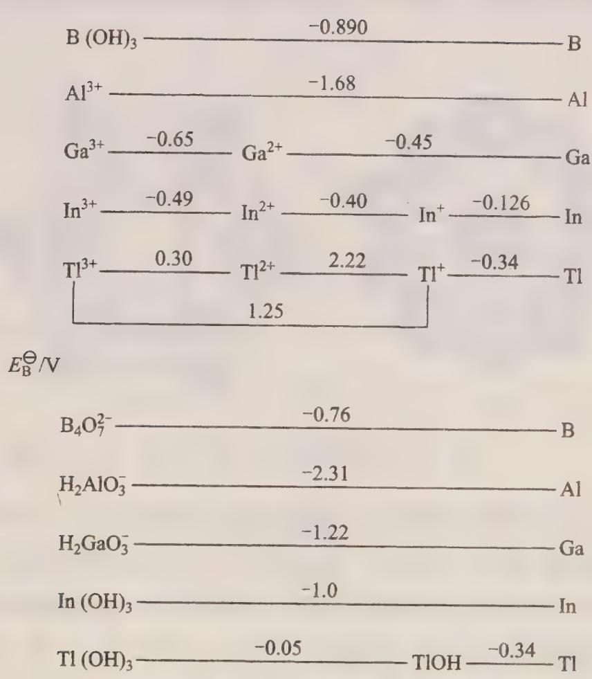  
图 13-1 硼族元素的元素电势图

## 13.1 硼单质及其化合物

## 13.1.1 硼单质

硼单质可以分为晶体硼和无定形硼两大类。

晶体硼呈黑灰色,硬度极高,与金刚石的硬度接近,其导电性差,但它的电导率却随着温度的升高而增大,从而显示出与金属导体的不同。

不太纯的无定形硼为棕色粉末。

晶体硼单质的化学反应活性较低,无定形硼则相对较活泼。

## 1. 硼单质的晶体结构

晶体硼单质的基本结构单元为正二十面体,12个硼原子占据着多面体的顶点。如图13-2所示,这种基本结构单元称为 $B_{12}$ 。沿正二十面体相对两个顶点的连线投影,得图13-2(a),该结构单元可理解为两个正五元环交错排列,上下各放置一个B原子的“帽子”。沿正二十面体相对两个三角形面的中心连线投影, 得图 13-2(b), 这种结构单元前部 3 个硼原子构成的三角形, 其所在的平面与后部 3 个硼原子构成的三角形所在的平面互相平行, 而中部 6 个硼原子不在同一平面内。

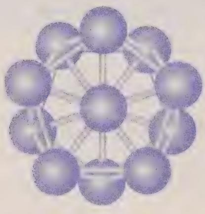  
(a)

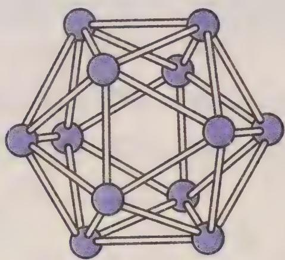  
(b)  
图13-2 晶体硼的 $\mathbf{B}_{12}$ 结构单元

$\mathbf{B}_{12}$ 结构单元的不同空间排布方式, 则形成晶体硼单质的不同晶型。其中最常见的是 $\alpha$ -菱形硼, 图 13-3 表示了该晶型中 $\mathbf{B}_{12}$ 结构单元形成的一个片层结构的空间排布方式。每个 $\mathbf{B}_{12}$ 结构单元与同一层中的 6 个 $\mathbf{B}_{12}$ 结构单元的硼原子间形成共价键, 其键联模式如图中虚线三角形 1 和 2 所示, 涉及的 B 原子为图 13-2(b) 的中部 6 个硼原子, 故三角形 1 和 2 不属于同一平面。这种 $\mathbf{B}_{12}$ 结构单元间的硼硼化学键, 属于三中心二电子键, 关于这种键型在后面讲述硼氢化合物时将进一步讨论。由片层间 $\mathbf{B}_{12}$ 结构单元按等径球立方最密堆积方式形成晶体, 成键时涉及的 B 原子为图 13-2(b) 的前部和后部的硼原子。由于所有的 B 原子间均形成共价键, 这种成键特征决定了硼单质硬度大。

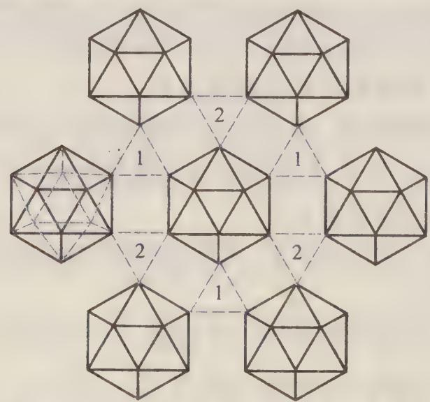  
图13-3 $\alpha$ -菱形硼单一片层的结构示意图

## 2. 硼单质的化学性质

硼单质在常温下可以与 $\mathbf{F}_2$ 化合：

$$
2 \mathrm{B} + 3 \mathrm{F} _ {2} = 2 \mathrm{BF} _ {3}
$$

硼在空气中燃烧,放出大量的热:

$$
4 \mathrm{B} + 3 \mathrm{O} _ {2} \xlongequal {\text {燃烧}} 2 \mathrm{B} _ {2} \mathrm{O} _ {3}
$$

这与硼氧键的键能很大是一致的。基于相同的原因,硼可以从许多稳定的氧化物如 $SiO_{2}, P_{2}O_{5}$ 中夺取氧。硼在炼钢过程中可以作为去氧剂。赤热下,无定形硼可以与水蒸气作用生成硼酸:

$$
2 \mathrm{B} + 6 \mathrm{H} _ {2} \mathrm{O(g)} \xlongequal {\text {高温}} 2 \mathrm{H} _ {3} \mathrm{BO} _ {3} + 3 \mathrm{H} _ {2}
$$

在高温下,硼能与 $N_{2}$ , S, $X_{2}$ 等非金属单质反应:

$$
\begin{array}{r l} & 2 \mathrm{B} + \mathrm{N} _ {2} \xlongequal {\text {高温}} 2 \mathrm{BN} \\ & 2 \mathrm{B} + 3 \mathrm{S} \xlongequal {\text {高温}} \mathrm{B} _ {2} \mathrm{S} _ {3} \\ & 2 \mathrm{B} + 3 \mathrm{Cl} _ {2} \xlongequal {\text {高温}} 2 \mathrm{BCl} _ {3} \end{array}
$$

因此，硼在空气中燃烧时，也会有氮化硼生成。

在高温下,硼也能与金属反应生成金属硼化物,其中 $Ti_{3}B_{4}$ , FeB 中元素的价态易于理解,而大多数二元金属硼化物中价态不易理解,如 $LiB_{4}$ , $CaB_{6}$ , $AlB_{12}$ , $V_{2}B$ , $Cr_{4}B$ 等,它们都具有特定的空间结构。硼化物一般具有高的硬度和熔点。

无定形硼不与非氧化性酸作用,但可以与热的浓硝酸或热的浓硫酸反应:

$$
\begin{array}{r l} & {\mathrm {B + 3HN O _ {3} (\text {浓}) \xlongequal{\triangle} H_ {3} BO_ {3} + 3NO_ {2} \uparrow}} \\ & {2 \mathrm {B + 3H_ {2} SO_ {4} (\text {浓}) \xlongequal{\triangle} 2H_ {3} BO_ {3} + 3SO_ {2} \uparrow}} \end{array}
$$

硼单质可以抵御沸腾的 NaOH 溶液和 500 ℃ 的熔融 NaOH 的作用,但有氧化剂存在时,硼和强碱共熔可得到偏硼酸盐,例如:

$$
2 \mathrm{B} + 2 \mathrm{NaOH} + 3 \mathrm{KNO} _ {3} \xlongequal {\text {共熔}} 2 \mathrm{NaBO} _ {2} + 3 \mathrm{KNO} _ {2} + \mathrm{H} _ {2} \mathrm{O}
$$

## 3. 硼单质的制取

以自然界中的硼砂为原料可以制取硼酸。硼砂的化学式经常写成 $Na_{2}B_{4}O_{7}\cdot10H_{2}O$ ，这种写法更能体现硼砂的性质，这一点在讲硼砂时还要详细介绍。

将硼砂溶于水，用 $\mathrm{H}_2\mathrm{SO}_4$ 调节酸度，析出硼酸晶体：

$$
\mathrm{Na} _ {2} \mathrm{B} _ {4} \mathrm{O} _ {7} + \mathrm{H} _ {2} \mathrm{SO} _ {4} + 5 \mathrm{H} _ {2} \mathrm{O} = 4 \mathrm{H} _ {3} \mathrm{BO} _ {3} + \mathrm{Na} _ {2} \mathrm{SO} _ {4}
$$

这是弱酸盐与强酸之间的反应,是制取弱酸的常用方法。加热使硼酸脱水,得到 $B_{2}O_{3}$ :

$$
2 \mathrm{H} _ {3} \mathrm{BO} _ {3} \stackrel {\triangle} {=} \mathrm{B} _ {2} \mathrm{O} _ {3} + 3 \mathrm{H} _ {2} \mathrm{O}
$$

再用活泼金属如 $\mathrm{Mg}$ , 在高温下还原 $\mathrm{B}_{2} \mathrm{O}_{3}$ , 便得到 $95 \% \sim 98 \%$ 的粗硼:

$$
\mathrm{B} _ {2} \mathrm{O} _ {3} + 3 \mathrm{Mg} \xlongequal {\text {高温}} 2 \mathrm{B} + 3 \mathrm{MgO}
$$

这样得到的硼单质基本属于无定形硼。产物不纯的原因是由于高温下硼可能与金属化合生成硼化物。

用氢气还原 $BBr_{3}$ 可以得到纯度很高的硼单质, 反应是在热的钽金属丝上进行的。1000℃以下, 产物是无定形硼, 随着温度的升高, 产物的结晶度升高。

分解含硼化合物是得到高纯硼的好方法。900 ℃时分解硼氢化合物可以得到无定形硼。若 $BI_{3}$ 在灼热的钽金属丝上分解，可以得到纯度高达 99.95% 的 $\alpha$ -菱形硼：

$$
2 \mathrm{BI} _ {3} \xlongequal [ 7 2 7 ^ {\circ} \mathrm{C} ] {\mathrm{Ta}} 2 \mathrm{B} + 3 \mathrm{I} _ {2}
$$

这一方法是 1960 年发现的,至今仍是获得这种同素异形体的重要途径。

## 13.1.2 硼氢化合物

硼氢化合物是极其重要的一类硼化物, 它是 20 世纪初由斯托克首先研究和开发的。硼氢化合物的物理性质相似于烷烃, 故称为硼烷。在已知的 20 多种硼烷中, 最简单的是乙硼烷 $\left(\mathrm{B}_{2} \mathrm{H}_{6}\right)$ , 而非 $\mathrm{BH}_{3}$ 。其中 $\mathrm{B}_{2} \mathrm{H}_{6}, \mathrm{B}_{5} \mathrm{H}_{9}, \mathrm{B}_{6} \mathrm{H}_{10}$ 和 $\mathrm{B}_{10} \mathrm{H}_{14}$ 属于 $\mathrm{B}_{n} \mathrm{H}_{n+4}$ 类, 而 $\mathrm{B}_{4} \mathrm{H}_{10}$ 和 $\mathrm{B}_{5} \mathrm{H}_{11}$ 属于 $\mathrm{B}_{n} \mathrm{H}_{n+6}$ 类。

## 1. 乙硼烷的制备和性质

自然界中没有硼烷,而且硼烷不能通过硼和氢气的直接化合制得。这可能是此类化合物被人们认识得较晚的一个原因。通过间接的途径制备乙硼烷的方法主要有以下几种:

① $\mathrm{Mg}_{3}\mathrm{B}_{2} + \mathrm{H}_{3}\mathrm{PO}_{4}\longrightarrow$ 硼烷混合物 $\longrightarrow \mathrm{B}_{2}\mathrm{H}_{6}$

中间产物是以 $B_{4}H_{10}$ 为主的硼烷混合物, 加热可以得到乙硼烷。

② 在无声放电的条件下,用氢气还原 $BCl_{3}$ 可以得到乙硼烷:

$$
2 \mathrm{BCl} _ {3} + 6 \mathrm{H} _ {2} \xlongequal {\text {无声放电}} \mathrm{B} _ {2} \mathrm{H} _ {6} + 6 \mathrm{HCl}
$$

③ 在乙醚介质中, 使用氢化铝锂还原 $BCl_{3}$ 可以得到纯度较高的乙硼烷:

$$
3 \mathrm{LiAlH} _ {4} + 4 \mathrm{BCl} _ {3} \xlongequal {\text {乙醚中}} 2 \mathrm{B} _ {2} \mathrm{H} _ {6} + 3 \mathrm{LiCl} + 3 \mathrm{AlCl} _ {3}
$$

这种反应不能在水中进行,因为氢化铝锂将与水发生剧烈作用。

乙硼烷是一种还原性极强的物质,在空气中可以自燃,且放出比等物质的量的烷烃更多的热量:

$$
\mathrm{B} _ {2} \mathrm{H} _ {6} (\mathrm{g}) + 3 \mathrm{O} _ {2} (\mathrm{g}) \stackrel {\text {自燃}} {=} \mathrm{B} _ {2} \mathrm{O} _ {3} (\mathrm{s}) + 3 \mathrm{H} _ {2} \mathrm{O} (\mathrm{l}) \qquad \Delta_ {\mathrm{r}} H _ {\mathrm{m}} ^ {\ominus} = - 2 1 6 7. 3 \mathrm{kJ} \cdot \mathrm{mol} ^ {- 1}
$$

乙硼烷也能被氯气氧化,生成三氯化硼:

$$
\mathrm{B} _ {2} \mathrm{H} _ {6} (\mathrm{g}) + 6 \mathrm{Cl} _ {2} (\mathrm{g}) = 2 \mathrm{BCl} _ {3} (1) + 6 \mathrm{HCl} (\mathrm{g})
$$

乙硼烷极易水解：

$$
\mathrm{B} _ {2} \mathrm{H} _ {6} + 6 \mathrm{H} _ {2} \mathrm{O} = 2 \mathrm{H} _ {3} \mathrm{BO} _ {3} + 6 \mathrm{H} _ {2}
$$

乙硼烷可以与甲醇反应,生成硼酸甲酯:

$$
\mathrm{B} _ {2} \mathrm{H} _ {6} + 6 \mathrm{CH} _ {3} \mathrm{OH} = 2 \mathrm{B} (\mathrm{OCH} _ {3}) _ {3} + 6 \mathrm{H} _ {2}
$$

$B_{2}H_{6}$ 与 $NH_{3}$ 在 873 K 下反应, 可得到一种大分子的六方氮化硼 (BN)。它与石墨为等电子体, 在结构上相似, 均具有层状结构, 如图 13-4 所示。其层间距为 333 pm, 层间以分子间力结合在一起。故而, 六方氮化硼又名“白石墨”, 可以作为固体润滑剂。层内 B, N 原子间距为 145 pm, 这个距离远小于 B—N 共价单键的 158 pm。虽然这一事实说明层内有 $\pi$ 键和 $\pi$ 电子存在, 但是与石墨有较好的导电能力不同, 六方氮化硼却是优良的绝缘体。

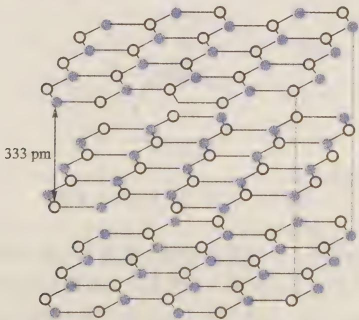  
图13-4 六方氮化硼大分子的层状结构

层与层之间位置关系的特点是,各层沿垂直于层平面的投影原子的位置互相重叠,但层间的 N 原子和 B 原子是相互交替排列的。而石墨晶体各层的垂直投影之间是互相错开的。同石墨类似,高温、高压可以将该化合物转化为类似金刚石结构的晶体——立方氮化硼,它有类似于金刚石的硬度。

$B_{2}H_{6}$ 与 $NH_{3}$ 在 180 ℃ 下反应, 还可得到被称为 “无机苯” 的硼氮六环 ( $B_{3}N_{3}H_{6}$ ) 无色液体, 它和苯是等电子体, 具有和苯极其相似的平面六边形结构, 如图 13-5 所示。无机苯也会发生与苯类似的化学反应。

必须指出的是,乙硼烷是剧毒气体,在空气中的最高允许浓度比人们熟知的有毒气体 HCN 和 COCl₂(光气)的最高允许浓度还低很多。制取和使用乙硼烷时一定要注意安全。

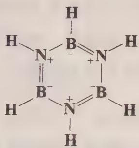  
图 13-5 无机苯(硼氮六环)的结构示意图

## 2. 硼烷的结构

虽然 $BH_{3}$ 能够在高温下稳定存在,但温度降低后极易二聚,因而实际常温下稳定存在的最简单的硼氢化合物是 $B_{2}H_{6}$ 。根据共价键理论,按烷烃的形式构成 $B_{2}H_{6}$ 需要 14 个价层电子,而 $B_{2}H_{6}$ 只有 12 个价层电子,于是 $B_{2}H_{6}$ 成为缺电子化合物。

通过对硼氢化合物结构的研究,使化学键理论得到了新的发展。研究结果指出,乙烷 $\left(\mathrm{C}_{2}\mathrm{H}_{6}\right)$ 中的6个氢原子所处的化学环境完全相同,而 $B_{2}H_{6}$ 的6个氢原子中有两个氢原子的化学环境与其余4个氢原子不同。每个硼原子与4个相同的氢原子中的两个以正常的共价键结合,形成的两个 $BH_{2}$ 结构单元处于同一平面上。另外两个化学环境彼此相同的氢原子,分别位于上述平面的上方和下方,如图13-6所示。

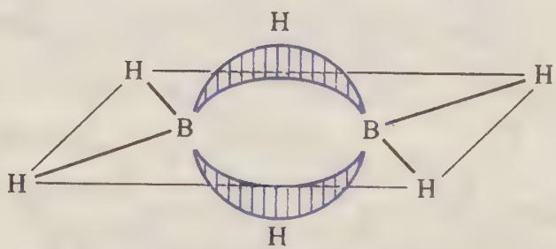  
图13-6 $\mathrm{B}_2\mathrm{H}_6$ 分子的结构示意图

这两个氢原子中的每一个均同时与两个硼原子成键,这种键型是以前没有接触过的。下面以平面上方的氢原子为例来讨论这种新的化学键。

每个硼原子经 $sp^{3}$ 杂化, 形成如图 13-7 所示的 4 条杂化轨道, 其中有 3 条单电子轨道和一条空轨道。上方氢原子的有一个电子的 1s 轨道与左边硼原子的单电子 $sp^{3}$ 杂化轨道及右边硼原子的空的 $sp^{3}$ 杂化轨道三者互相重叠成键。这个化学键由 BHB 3 个原子共用两个电子形成，称为“三中心二电子键”，记作 3c-2e 键。又由于氢原子位于两个硼原子之间，看起来像是一座桥，故也称其为氢桥键。

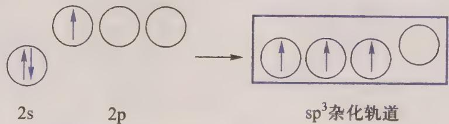  
图13-7 乙硼烷中硼原子的 $\mathfrak{sp}^3$ 杂化

平面下方也有一个氢桥键,是由下方氢原子有一个电子的 1s 轨道与右边硼原子的单电子 $sp^{3}$ 杂化轨道和左边硼原子的空的 $sp^{3}$ 杂化轨道三者互相重叠而成。

在 $\mathrm{B}_{2} \mathrm{H}_{6}$ 分子中, 两个氢桥键所形成的平面和两个 $\mathrm{B} \begin{array}{c} / \mathrm{H} \\ \backslash \mathrm{H} \end{array}$ 所形成的平面在空间互相垂直。

硼烷中经常出现5种类型的化学键,其中有两种经典的化学键——硼氢键(B—H)和硼硼键(B—B),以及包括上述氢桥键在内的3种缺电子的三中心二电子键。在图13-8所示的癸硼烷-14( $B_{10}H_{14}$ )的键联关系示意图中,将涉及这5种键型。表13-1指出了这些化学键在化合物中的位置。

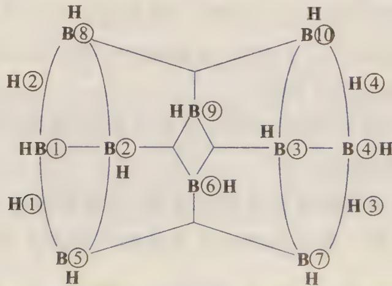  
图13-8 癸硼烷-14 $(\mathbf{B}_{10}\mathbf{H}_{14})$ 的键联关系示意图

氢桥键在乙硼烷中已经做过介绍。开式硼桥键也属于三中心二电子键，与氢桥键不同的是处于桥上的是硼原子而不是氢原子，这个硼原子在形成硼桥键时提供了一条原子轨道及其中的一个电子。闭式硼桥键也属于三中心二电子键，成键的3个硼原子彼此等价，没有哪一个属于桥上的原子。这3个硼原子一共提供两个电子。硼硼键和硼氢键属于经典的“二中心二电子键”。

表 13-1 癸硼烷-14( $B_{10}H_{14}$ ) 中的化学键

<table><tr><td colspan="2">化学键名称</td><td colspan="2">键的位置</td></tr><tr><td rowspan="2">氢桥键</td><td rowspan="2">HB</td><td>B1H1B5</td><td>B1H2B8</td></tr><tr><td>B4H3B7</td><td>B4H4B10</td></tr><tr><td>开式硼桥键</td><td>BB</td><td>B5B2B8</td><td>B7B3B10</td></tr><tr><td rowspan="2">闭式硼桥键</td><td rowspan="2"></td><td>B2B6B9</td><td>B3B6B9</td></tr><tr><td>B5B6B7</td><td>B8B9B10</td></tr><tr><td>硼硼键</td><td>B-B</td><td>B1B2</td><td>B3B4</td></tr><tr><td>硼氢键</td><td>B-H</td><td colspan="2">每一个B原子均与H原子成硼氢键</td></tr></table>

需要说明的是,分子轨道理论认为只有一种硼桥键,即开式硼桥键与闭式硼桥键一样,其成键的3个硼原子彼此等价。

癸硼烷-14( $B_{10}H_{14}$ )中原子之间的连接关系已经清楚了,但不要以为 $B_{10}H_{14}$ 具有平面结构。 $\mathrm{B}_{10}\mathrm{H}_{14}$ 的10个硼原子在空间的排列,如图13-9(a)所示,为一种开口的笼形结构。图中硼原子的序号与图13-8中一致。癸硼烷-14在一定条件下与乙炔反应,可以生成一种有12个非氢原子的碳硼烷,由乙炔引进的两个碳原子将癸硼烷-14笼形结构的开口封住,形成近于正二十面体的骨架结构,见图13-9(b)。借助熟悉的正二十面体,癸硼烷-14的空间构型触手可及,它相当于缺少两个相邻顶点的正二十面体。

硼烷的研究与开发不仅极大程度地丰富了硼的化学知识,而且对结构化学的发展也起到了重要的促进作用。

除硼烷之外,还有一类硼氢化合物很重要,这就是含有 $BH_{4}^{-}$ 基团的化合物,如硼氢化钠、硼氢化锂等。硼氢化钠可由氢化钠与硼酸甲酯的反应制备:

$$
4 \mathrm{NaH} + \mathrm{B(OCH} _ {3}) _ {3} \xrightarrow [ \text {油液中} ]{2 5 0 ^ {\circ} \mathrm{C}} \mathrm{NaBH} _ {4} + 3 \mathrm{NaOCH} _ {3}
$$

其他的硼氢化物可以由 $NaBH_{4}$ 制得。碱金属的硼氢化物为白色离子型化合物。硼氢化物是重要的还原剂，例如硼氢化锂与水激烈反应，还原产物为 $H_{2}$ ：

$$
\mathrm{LiBH} _ {4} + 2 \mathrm{H} _ {2} \mathrm{O} = \mathrm{LiBO} _ {2} + 4 \mathrm{H} _ {2} \uparrow
$$

硼氢化钠可以在冷水中重结晶，硼氢化钾在水中很稳定。

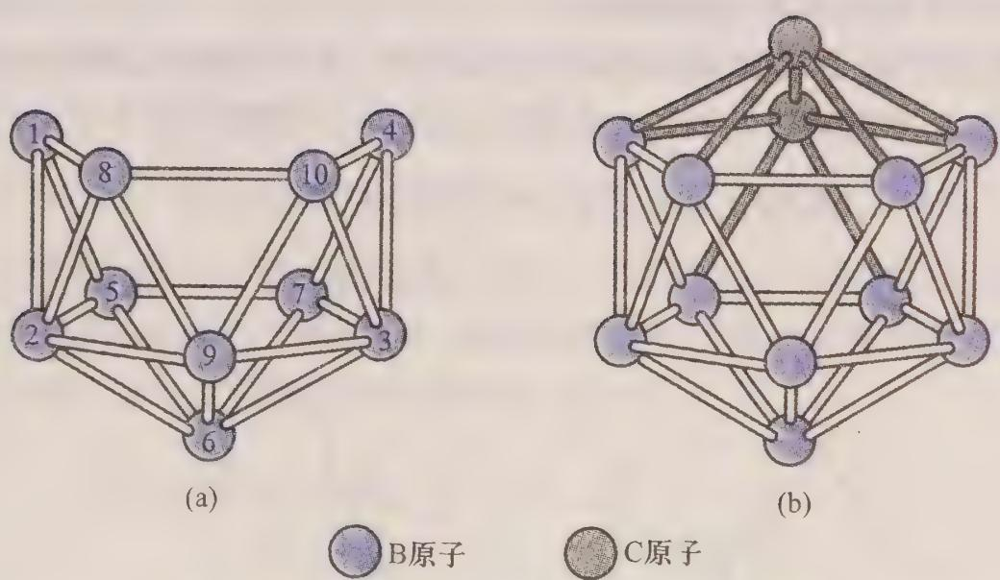  
图13-9 癸硼烷-14和碳硼烷的结构示意图

铍、铝及过渡金属的硼氢化物为共价型和易挥发的化合物。

## 13.1.3 硼的含氧化合物

表 13-2 给出了硼氧键及与之相关的化学键的键能数据,从中可以看到硼氧键的特殊性——既远远强于硼硼键,也远强于硼氢键、硼氮键和硼硅键等。所以在自然界中不仅没有游离态单质硼存在,而且也没有不含氧元素的化合态硼的存在。倾向于形成含氧化合物是硼最显著的特征之一,硼被称为亲氧元素,硼氧化合物有很高的稳定性。这也是硼氢化合物的合成与研究较晚的原因。

表 13-2 某些化学键的键能

<table><tr><td>化学键</td><td>B—O</td><td>B—H</td><td>B—B</td><td>B—C</td><td>B—N</td><td>B—F</td><td>B—Si</td><td>B—P</td><td>B—S</td><td>B—Cl</td></tr><tr><td>键能 $\mathrm{{kJ}} \cdot {\mathrm{{mol}}}^{-1}$ </td><td>806</td><td>330</td><td>297</td><td>448</td><td>389</td><td>766</td><td>289</td><td>347</td><td>581</td><td>536</td></tr></table>

1. $\mathbf{B}_2\mathbf{O}_3$ 和 $\mathrm{H}_3\mathrm{BO}_3$

硼的最重要的氧化物是三氧化二硼 $\left(\mathrm{B}_{2}\mathrm{O}_{3}\right)$ ， $B_{2}O_{3}$ 是最难结晶的物质之一。在红热条件下硼酸 $\left(\mathrm{H}_{3}\mathrm{BO}_{3}\right)$ 脱水只能得到玻璃态的 $B_{2}O_{3}$ ，只有在较低的温度下极其缓慢地脱水才能得到 $B_{2}O_{3}$ 晶体。在1000℃以上，可以得到 $B_{2}O_{3}$ 蒸气，其分子结构如图13-10所示，为夹角不固定的折线形。

$B_{2}O_{3}$ 是硼酸的酸酐,易溶于水生成硼酸:

$$
\mathrm{B} _ {2} \mathrm{O} _ {3} + 3 \mathrm{H} _ {2} \mathrm{O} = 2 \mathrm{H} _ {3} \mathrm{BO} _ {3} (\mathrm{aq})
$$

因此，粉末状的 $B_{2}O_{3}$ 可用作吸水剂。

若水量不充足,如遇到热的水蒸气或潮气时, $B_{2}O_{3}$ 则生成挥发性的偏硼酸 $\left[\mathrm{B}_{3}\mathrm{O}_{3}(\mathrm{OH})_{3}\right]$ ,亦可简记为 $HBO_{2}$ ,其结构如图 13-11 所示。

$$
3 \mathrm{B} _ {2} \mathrm{O} _ {3} + 3 \mathrm{H} _ {2} \mathrm{O(g)} = 2 \mathrm{B} _ {3} \mathrm{O} _ {3} (\mathrm{OH}) _ {3} (\mathrm{g})
$$

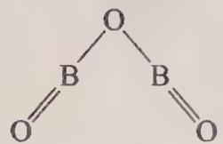

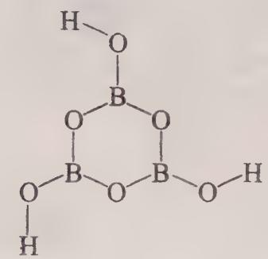  
图 13-10 $B_{2}O_{3}$ 蒸气分子的结构. 图 13-11 $B_{3}O_{3}(OH)_{3}$ 分子的结构

$B_{2}O_{3}$ 是酸性氧化物, 可以与碱性的金属氧化物反应成盐。在熔融的条件下 $B_{2}O_{3}$ 与金属氧化物化合, 冷却到室温后能得到有特征颜色的偏硼酸盐熔珠, 例如:

$$
\mathrm{CuO} + \mathrm{B} _ {2} \mathrm{O} _ {3} \stackrel {\text {共熔}} {=} \mathrm{Cu(BO} _ {2}) _ {2} \quad \text {蓝色}
$$

$$
\mathrm{Fe} _ {2} \mathrm{O} _ {3} + 3 \mathrm{B} _ {2} \mathrm{O} _ {3} \stackrel {\text {共熔}} {=} 2 \mathrm{Fe} (\mathrm{BO} _ {2}) _ {3} \quad \text {黄色}
$$

而与 MnO 和 NiO 形成的熔珠分别为紫色和绿色。

定性分析中的硼砂珠实验,其基础就是这类反应。

硼酸具有片层状结构,层与层之间以分子间力联系在一起。因此,硼酸晶体

有解理性,可作润滑剂。根据硼的价电子层结构,层中的每个硼原子以3条 $sp^{2}$ 杂化轨道与3个OH基团结合成平面三角形结构的B(OH) $_{3}$ 单元,各个B(OH) $_{3}$ 单元之间通过氢键连接成层状结构,如图13-12所示。

硼原子以 3 条 $sp^{2}$ 杂化轨道与 3 个 OH 结合成 B(OH) $_{3}$ 单元，还有一条没有参加杂化的空的 p 轨道存在。当 B(OH) $_{3}$ 溶于水时，水解离出的 OH $^{-}$ 中的孤电子对进入该空的 p 轨道中，形成以 B 为中心的配位单元 [B(OH) $_{4}$ ] $^{-}$ ，其配位数为 4，结构为正四面体，此时 B 的杂化方式变为 $sp^{3}$ 。于是，水的解离平衡被破坏,其中 $c(\mathrm{H}^{+})>c(\mathrm{OH}^{-})$ , 水溶液显酸性。由显酸性的原理可以看出,硼酸是一元酸,且因为形成 $[B(OH)_{4}]^{-}$ 的趋势不大,所以硼酸的酸性较弱,这一点可以从其平衡常数看出。

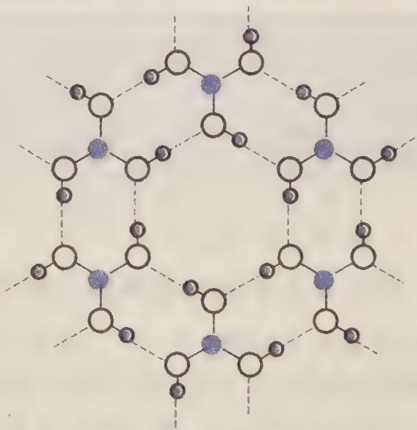  
○O原子 ●B原子 ●H原子  
图13-12 $\mathrm{B(OH)_3}$ 单元通过氢键连接成层状结构

$$
\mathrm{B} (\mathrm{OH}) _ {3} + \mathrm{H} _ {2} \mathrm{O} = [ \mathrm{B} (\mathrm{OH}) _ {4} ] ^ {-} + \mathrm{H} ^ {+} \quad K _ {\mathrm{a}} ^ {\ominus} = 5. 8 1 \times 1 0 ^ {- 1 0}\tag{1}
$$

这种成酸机理体现了硼酸的缺电子特点,所以硼酸是一种典型的路易斯酸。向硼酸中加入多元醇如乙二醇、甘油,硼酸的酸性会增强。这是因为加入的物质可以与 $\left[\mathrm{B}\left(\mathrm{OH}\right)_{4}\right]^{-}$ 结合成很稳定的硼酸酯,例如:

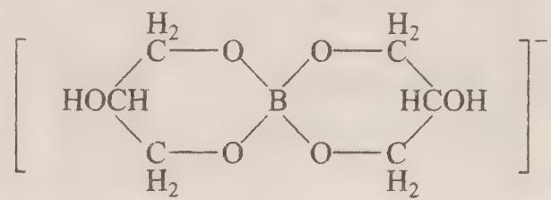

如下反应的平衡常数比反应(1)增大上万倍：

$$
\mathrm{B} (\mathrm{OH}) _ {3} + 2 \mathrm{C} _ {3} \mathrm{H} _ {5} (\mathrm{OH}) _ {3} = \left[ \begin{array}{c} \mathrm{H} _ {2} \\ \mathrm{HOCH} \\ \mathrm{C} - \mathrm{O} \\ \mathrm{H} _ {2} \end{array} \right] ^ {-} + \mathrm{H} ^ {+} + 3 \mathrm{H} _ {2} \mathrm{O}
$$

从而使平衡(1)右移,于是 $c(\mathrm{H}^{+})$ 增加,酸性增强。

硼酸遇到较强的酸时,可以显碱性,例如:

$$
\mathrm{B(OH)} _ {3} + \mathrm{H} _ {3} \mathrm{PO} _ {4} = \mathrm{BPO} _ {4} + 3 \mathrm{H} _ {2} \mathrm{O}
$$

硼酸受热失水的过程中,先生成偏硼酸 $\left[\mathrm{B}_{3}\mathrm{O}_{3}(\mathrm{OH})_{3}\right]$ ，而后生成 $B_{2}O_{3}$ 。硼酸与乙醇在浓硫酸的催化作用下发生酯化反应：

$$
\mathrm{B(OH)} _ {3} + 3 \mathrm{C} _ {2} \mathrm{H} _ {5} \mathrm{OH} \xlongequal {\text {浓硫酸}} (\mathrm{C} _ {2} \mathrm{H} _ {5} \mathrm{O}) _ {3} \mathrm{B} + 3 \mathrm{H} _ {2} \mathrm{O}
$$

生成物硼酸三乙酯点燃时产生绿色火焰。这是鉴定硼酸的一种方法。

在上面的讨论中,将硼酸的化学式写成 $\mathrm{B(OH)}_{3}$ 的形式,这是经常见到的写法。它能更好地体现硼的缺电子结构特点,更清楚地说明硼酸作为一元酸的显酸性机理。结合图 13-12,在解释硼酸的层状结构时, $\mathrm{B(OH)}_{3}$ 写法也具有独到的优越性。

## 2. 硼砂及其他硼酸盐

硼砂是硼的最重要的含氧酸盐, 是带有结晶水的四硼酸的钠盐。其酸根离子 $\left[\mathrm{B}_{4} \mathrm{O}_{5}(\mathrm{OH})_{4}\right]^{2-}$ 的键联关系如图 13-13(a) 所示, 是由两个 $\mathrm{BO}_{3}$ 单元和两个 $\mathrm{BO}_{4}$ 单元通过共用顶角氧原子连接而成的, 所以硼砂的化学式可以写作

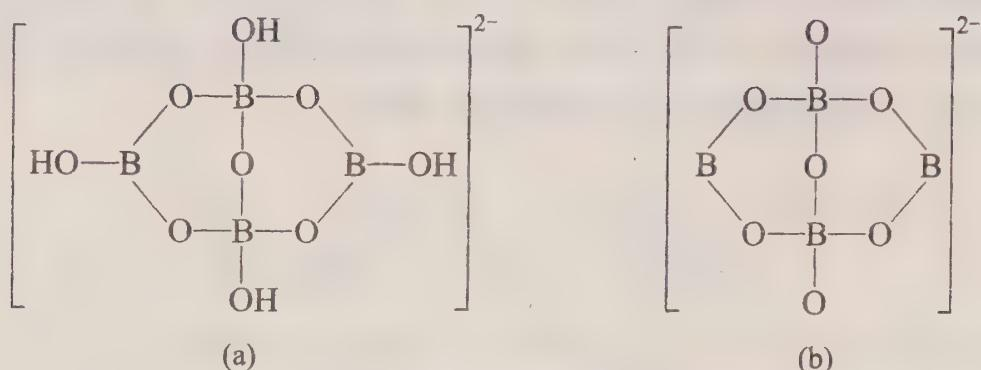  
图13-13 与四硼酸根有关的离子的键联关系

$$
\mathrm{Na} _ {2} \mathrm{B} _ {4} \mathrm{O} _ {5} (\mathrm{OH}) _ {4} \cdot 8 \mathrm{H} _ {2} \mathrm{O} 。
$$

硼砂晶体在空气中易失去结晶水而风化。受热到 $400^{\circ}C$ 左右，将失去 8 个结晶水和两个羟基水，形成化学式为 $Na_{2}B_{4}O_{7}$ 的无水盐，其酸根离子的键联关系如图 13-13(b) 所示。基于这种结构单元的存在，硼砂的化学式经常写成 $Na_{2}B_{4}O_{7} \cdot 10H_{2}O$ 。

(b)

硼砂可用于焊接金属时除锈。硼砂还是制造玻璃纤维、泡沫保温材料及搪瓷的重要原料。

硼砂属于弱酸强碱盐,其水解反应为

$$
\left[ \mathrm{B} _ {4} \mathrm{O} _ {5} (\mathrm{OH}) _ {4} \right] ^ {2 -} + 5 \mathrm{H} _ {2} \mathrm{O} = 2 \mathrm{H} _ {3} \mathrm{BO} _ {3} + 2 \left[ \mathrm{B} (\mathrm{OH}) _ {4} \right] ^ {-}
$$

水解生成等物质的量的弱酸 $H_{3}BO_{3}$ 和它的盐 $\left[\mathrm{B(OH)}_{4}\right]^{-}$ ，于是形成了缓冲体系。稀的硼砂溶液是 pH=9.24 的缓冲溶液。

过硼酸钠 $\mathrm{Na}_{2}\left[\mathrm{B}_{2}\left(\mathrm{O}_{2}\right)_{2}\left(\mathrm{OH}\right)_{4}\right]$ 也是硼的含氧酸盐，被用于洗衣粉中作增白剂。过硼酸根离子的结构如图 13-14 所示，可以看成是两个硼酸根离子 $\left[\mathrm{B}\left(\mathrm{OH}\right)_{4}\right]^{-}$ 的 4 个—OH，被两个过氧化氢 $\left(\mathrm{H}_{2}\mathrm{O}_{2}\right)$ 中的两个过氧链 $(-O-O-)$ 取代并被连接起来形成的。

这种过氧链转移反应,在第21章21.1.3小节中讨论 $CrO_{5}$ 时还将做进一步的探讨。

硼酸盐的种类很多,结构也很复杂,但都是由最基本的结构单元——三角形的 $BO_{3}$ 和四面体的 $BO_{4}$ 连接而成的。

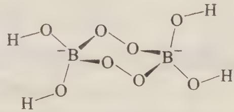  
图13-14 过硼酸根离子的结构

图 13-15(a) 表示的是环三聚的偏硼酸盐 $KBO_{2}$ ，它由 3 个三角形的 $BO_{3}$ 结构单元环聚而成；图 13-15(b) 表示的是四聚偏硼酸盐，就是前面讲过的 $\left[\mathrm{B}_{4}\mathrm{O}_{5}(\mathrm{OH})_{4}\right]^{2-}$ ，它由两个三角形的 $BO_{3}$ 和两个四面体的 $BO_{4}$ 结构单元连接而成。

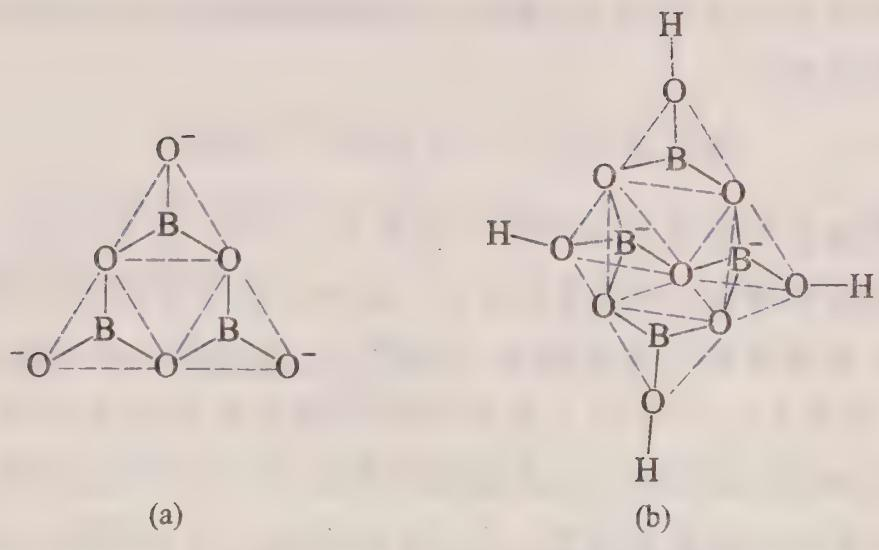  
——化学键 ——三角形和四面体的轮廓线  
图13-15 多硼酸根的结构示意图

## 13.1.4 硼的卤化物

## 1. 三卤化硼

硼的 4 种三卤化物都是存在的。它们都属于共价型化合物,具备共价型化合物的一般性质。三卤化硼的熔、沸点随相对分子质量的增大而升高。

三卤化硼中心硼原子的轨道 $sp^{2}$ 杂化, 故分子的构型为三角形。硼原子周围有 6 个电子, 属于缺电子结构。中心硼原子有一条未参与杂化的 p 轨道, 曾认为在 $BX_{3}$ 分子中, 卤素原子充满电子的一条 p 轨道可以与之重叠形成 $\pi$ 配键, 从而使硼原子周围有 8 个电子。

但是实验测得三氟化硼中3个B—F键的键长相等,远比B和F原子半径之和小。所以应该认为在 $BX_{3}$ 分子中存在大 $\pi$ 键。3个X原子各有一条充满电子的p轨道与B原子的未参与杂化的空p轨道形成 $\Pi_{4}^{6}$ 。于是就很好地解释了这一现象。

$BF_{3}$ 是典型的路易斯酸,它可以同路易斯碱氨等结合而成酸碱配位化合物。

$$
\mathrm{BF} _ {3} (\mathrm{g}) + \mathrm{NH} _ {3} = \mathrm{H} _ {3} \mathrm{N} \rightarrow \mathrm{BF} _ {3}
$$

将 $BF_{3}$ 通入水中时,首先发生水解反应:

$$
\mathrm{BF} _ {3} + 3 \mathrm{H} _ {2} \mathrm{O} = \mathrm{H} _ {3} \mathrm{BO} _ {3} + 3 \mathrm{HF}
$$

生成的 HF 进一步与 $BF_{3}$ 作用, 得到氟硼酸溶液:

$$
\mathrm{BF} _ {3} + \mathrm{HF} = \mathrm{H} ^ {+} + \left[ \mathrm{BF} _ {4} \right] ^ {-}
$$

氟硼酸盐是一类稳定的化合物,如氟硼酸钾 $\left\{K\left[BF_{4}\right]\right\}$ 等有商品出售。

其他卤素形成的三卤化硼, 水解时生成硼酸和相应的卤化氢。例如, $BCl_{3}$ 在水中发生强烈水解:

$$
\mathrm{BCl} _ {3} + 3 \mathrm{H} _ {2} \mathrm{O} = \mathrm{H} _ {3} \mathrm{BO} _ {3} + 3 \mathrm{HCl}
$$

三卤化硼的路易斯酸性强弱顺序一般为 $BI_{3}>BBr_{3}>BCl_{3}>BF_{3}$ 。这似乎与根据电负性预测的结果相反，其原因是从 $BF_{3}$ 到 $BI_{3}$ ，由于卤素半径的增大，卤素的 p 轨道与 B 的 p 轨道重叠的程度降低，导致大 $\pi$ 键的形成越来越难。 $BX_{3}$ 与路易斯碱作用时，需从 $BX_{3}$ 的平面三角形转换为酸碱配位化合物的四面体结构，要破坏其中的大 $\pi$ 键，这对 $BI_{3}$ 来说是很容易的，而对于 $BF_{3}$ 来说就困难多了，故而 $BI_{3}$ 表现出更强的路易斯酸性。但是，如果与三卤化硼作用的路易斯碱强度很弱，如 CO，过程中引起的结构形变很小，则三卤化硼的路易斯酸性强弱顺序变为 $BI_{3}<BBr_{3}<BCl_{3}<BF_{3}$ 。可见，三卤化硼的路易斯酸性强弱变化顺序是和与其作用的路易斯碱有关的。

$BCl_{3}$ 的沸点很低, 常温下稍加压即可液化, 得到无色的、具有高折射率的液体。

## 2. 其他价态卤化硼

(a)  
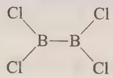

$B_{2}Cl_{4}$ 经常以两种不同的构象存在, 如图 13-16 所示, (a) 为固相中的平面结构, (b) 为气相和液相中的非平面结构。

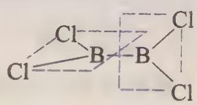  
图13-16 $\mathrm{B}_2\mathrm{Cl}_4$ 的结构示意图

## 13.2 铝单质及其化合物

## 13.2.1 铝单质

## 1. 铝的提取和冶炼

铝在自然界中的存在极为广泛,在地壳中的含量仅次于氧和硅,在金属元素中列第一位。铝土矿 $\left(\mathrm{Al}_{2}\mathrm{O}_{3}\cdot n\mathrm{H}_{2}\mathrm{O}\right)$ 是提取和冶炼铝的主要原料。首先将粉碎后的铝土矿用碱浸取,加压煮沸,使之转变成可溶性的铝酸钠:

$$
\mathrm{Al} _ {2} \mathrm{O} _ {3} + 2 \mathrm{NaOH} + 3 \mathrm{H} _ {2} \mathrm{O} \xrightarrow [ \text {煮沸} ]{\text {加压}} 2 \mathrm{Na} [ \mathrm{Al(OH)} _ {4} ]
$$

过滤将铝酸钠溶液与不溶的杂质分开。之后通入 $CO_{2}$ 调节 pH，使 $\mathrm{Al(OH)}_{3}$ 沉淀、析出：

$$
2 \mathrm{Na} [ \mathrm{Al(OH)} _ {4} ] + \mathrm{CO} _ {2} = 2 \mathrm{Al(OH)} _ {3} \downarrow + \mathrm{Na} _ {2} \mathrm{CO} _ {3} + \mathrm{H} _ {2} \mathrm{O}
$$

经分离、焙烧得到符合电解需要的较纯净的 $Al_{2}O_{3}$ :

$$
2 \mathrm{Al(OH)} _ {3} \stackrel {\triangle} {=} \mathrm{Al} _ {2} \mathrm{O} _ {3} + 3 \mathrm{H} _ {2} \mathrm{O}
$$

将 $Al_{2}O_{3}$ 溶解在熔融的冰晶石 $\{Na_{3}[AlF_{6}]\}$ 中，在 $950^{\circ}C$ 下进行电解，可在阴极上得到金属铝。电解反应为

$$
2 \mathrm{Al} _ {2} \mathrm{O} _ {3} \xrightarrow [ \text {熔融冰晶石} ]{\text {通电}} 4 \mathrm{Al} + 3 \mathrm{O} _ {2} \uparrow
$$

电解出来的铝是液态的,可以定时地放出,铸成铝锭。电解铝的纯度一般为98%\~99%,含有杂质Si,Fe及微量的Ga。

## 2. 铝单质的性质

铝是银白色金属,熔点为 $660.323^{\circ}C$ , 沸点为 $2519^{\circ}C$ , 密度为 $2.70 \, g \cdot cm^{-3}$ 。铝的重要用途是制造轻合金, 作为飞机和宇航器的材料。铝具有良好的延展性, 能代替铜用来制造电线, 尽管其导电性能不如铜, 但却有资源丰富和密度小的优势。

铝是活泼金属：

$$
\mathrm{Al} ^ {3 +} + 3 \mathrm{e} ^ {-} = \mathrm{Al} \quad E ^ {\ominus} = - 1. 6 7 6 \mathrm{V}
$$

但在空气中放置时,铝表面生成致密的氧化膜,使铝不能进一步与氧和水作用,甚至遇到冷的浓硝酸或浓硫酸时也不作用。因而铝被广泛地用来制造日用器皿。由于 NaCl 可以缓慢腐蚀铝的氧化物膜,所以长期盛放食盐或菜肴时铝制器皿会损坏。

铝和硼相似,属于典型的亲氧元素:

$$
4 \mathrm{Al(s)} + 3 \mathrm {O_ {2} (g)} \xlongequal {\text {燃烧}} 2 \mathrm {Al_ {2} O_ {3} (s)} \qquad \Delta_ {\mathrm{r}} H _ {\mathrm{m}} ^ {\ominus} = - 3 3 5 1. 4 \mathrm{kJ} \cdot \mathrm{mol} ^ {- 1}
$$

由于该反应放出大量的热,铝可以从其他金属氧化物中置换出金属。例如,铝粉与氧化铁粉末的混合物,点燃镁条引发反应:

$$
2 \mathrm{Al} + \mathrm{Fe} _ {2} \mathrm{O} _ {3} \xlongequal {\text {镁条引燃}} 2 \mathrm{Fe} + \mathrm{Al} _ {2} \mathrm{O} _ {3}
$$

反应释放出来的热量可以使反应体系升温至 $3000^{\circ}$ C 以上, 产物中的 Fe 将被熔化。有时称这类反应为铝热反应, 它可以用来焊接金属, 如损坏的铁轨。

金属铝属于两性金属,它可以与盐酸反应放出氢气:

$$
2 \mathrm{Al} + 6 \mathrm{HCl(aq)} = 2 \mathrm{AlCl} _ {3} + 3 \mathrm{H} _ {2} \uparrow
$$

铝也可以与氢氧化钠反应放出氢气：

$$
2 \mathrm{Al} + 2 \mathrm{NaOH} + 6 \mathrm{H} _ {2} \mathrm{O} = 2 \mathrm{Na} [ \mathrm{Al(OH)} _ {4} ] + 3 \mathrm{H} _ {2} \uparrow
$$

在高温下,铝容易与 P,S,Si 等非金属反应,例如:

$$
2 \mathrm{Al} + 3 \mathrm{S} \xlongequal {\text {高温}} \mathrm{Al} _ {2} \mathrm{S} _ {3}
$$

铝不能与 $H_{2}$ 直接化合,但 Al 的氢化物 $(\mathrm{AlH}_{3})_{n}$ 是存在的,这是一种白色的聚合物。 $(\mathrm{AlH}_{3})_{n}$ 要在乙醚中通过下面反应制备:

$$
3 n \mathrm{LiH} + n \mathrm{AlCl} _ {3} \xlongequal {\text {乙醚中}} (\mathrm{AlH} _ {3}) _ {n} + 3 n \mathrm{LiCl}
$$

当反应混合物中 LiH 过量时, 将有氢化铝锂 ( $LiAlH_{4}$ ) 生成。 $LiAlH_{4}$ 是重要的还原剂, 尤其在有机反应中十分重要。

## 13.2.2 铝的含氧化合物

$Al_{2}O_{3}$ 主要有两种晶型： $\alpha-Al_{2}O_{3}$ 和 $\gamma-Al_{2}O_{3}$ 。

铝在氧气中燃烧或高温灼烧使 $\mathrm{Al(OH)}_{3}$ 脱水可得 $\alpha-Al_{2}O_{3}$ 。自然界中存在的刚玉属于 $\alpha-Al_{2}O_{3}$ ，其硬度相当高，仅次于金刚石。刚玉中若含有少量过渡金属杂质，则呈现出非常鲜艳的色彩，成为名贵的宝石。 $\alpha-Al_{2}O_{3}$ 不溶于水，也不溶于酸或碱。

在较低的温度下加热使 $\mathrm{Al(OH)}_{3}$ 脱水，可得 $\gamma-Al_{2}O_{3}$ 。 $\gamma-Al_{2}O_{3}$ 的化学性质活泼，较易溶于酸或碱中。中学化学课程中讲到的两性 $Al_{2}O_{3}$ 就属于这一种。

当 $\gamma-Al_{2}O_{3}$ 受到强热时, 可以转变为 $\alpha-Al_{2}O_{3}$ 。

在酸性的 $Al^{3+}$ 的溶液中加入氨水, 将生成 $\mathrm{Al(OH)}_{3}$ 沉淀, 且产物不溶于过量的氨水中。但 $\mathrm{Al(OH)}_{3}$ 是一种两性物质, 可以溶于稀的强酸、强碱:

$$
\begin{array}{r l} & \mathrm {Al(OH) _ {3}} + 3 \mathrm{HCl(aq)} = \mathrm {AlCl_ {3}} + 3 \mathrm {H_ {2} O} \\ & \mathrm {Al(OH) _ {3}} + \mathrm{NaOH(aq)} = \mathrm{Na[Al(OH) _ {4} ]} \end{array}
$$

生成的铝酸钠也可能是 $\mathrm{Na}_{3}\left[\mathrm{Al}(\mathrm{OH})_{6}\right]$ 。铝酸钠的脱水产物均为偏铝酸钠 $\left(\mathrm{NaAlO}_{2}\right)$ 。向碱性的铝酸钠溶液中通入 $CO_{2}$ ，又可以得到铝的氢氧化物 $\mathrm{Al}(\mathrm{OH})_{3}$ 。

## 13.2.3 铝的三卤化物

在三卤化铝中，除 $\mathrm{AlF}_3$ 为离子型化合物外，其余均为共价型化合物。与三卤化硼不同的是，只有 $\mathrm{AlF}_3$ 在气相时以单分子形式存在，而 $\mathrm{AlCl}_3, \mathrm{AlBr}_3, \mathrm{AlI}_3$ 气体分子均是二聚的。在如图13-17所示的 $\mathrm{AlCl}_3$ 二聚分子中，每个铝原子均为$sp^{3}$ 杂化,与图 13-7 所示的硼原子的杂化形式相似,因此各有一条空的轨道。氯原子处于以铝原子为中心的四面体的 4 个顶点位置。分子中有桥式氯原子存在,例如可以认为,位于上面的桥式氯原子在与左边的铝原子成 $\sigma$ 键的同时,与

右边的铝原子的空轨道发生配位,形成 $\sigma$ 配位键。

也可以认为,氯桥键是一个“三中心四电子键”,左边的铝原子提供一个电子,桥式氯原子提供3个电子:一个未成对的单电子,一对孤电子对。

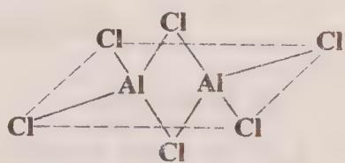  
——化学键 —— 轮廓线

$AlCl_{3}$ 二聚分子的形成原因是铝原子的缺电子结构。由于 Al 和 Cl 的原子半径相对较大，不能形成与 $BF_{3}$ 类似的大 $\pi$ 键以解决 $AlCl_{3}$ 的缺电子问题。

图 13-17 AlCl $_{3}$ 二聚

分子的结构示意图

故而只有通过二聚来解决之。当三氯化铝遇到给电子的路易斯碱时，二聚分子会因为电子得到满足而解离。然后由单个的 $AlCl_{3}$ 分子作为路易斯酸与路易斯碱形成酸碱配位化合物。

三氯化铝在水中强烈水解,因此在水溶液中不能结晶出它的无水盐。无水三氯化铝可用干燥的氯气作氧化剂与金属 Al 在高温下反应制备:

$$
2 \mathrm{Al} + 3 \mathrm{Cl} _ {2} (\mathrm{g}) \stackrel {\triangle} {=} 2 \mathrm{AlCl} _ {3}
$$

三氯化铝易溶于乙醚等有机溶剂中,因为它是一种共价型化合物。

## 13.2.4 铍和铝的相似性

铍和铝的单质及其化合物有很多相似之处,可以从以下几个方面得到体现。

## (1) 金属单质

铍和铝都是易钝化金属，与冷的浓硝酸作用时，因在金属表面生成致密的氧化膜而钝化。其他碱土金属均非钝化金属。

铍和铝都是两性金属,不仅溶于酸,也都能溶于强碱并放出氢气:

$$
\mathrm{Be} + 2 \mathrm{NaOH} + 2 \mathrm{H} _ {2} \mathrm{O} = \mathrm{Na} _ {2} [ \mathrm{Be(OH)} _ {4} ] + \mathrm{H} _ {2} \uparrow
$$

$$
2 \mathrm{Al} + 2 \mathrm{NaOH} + 6 \mathrm{H} _ {2} \mathrm{O} = 2 \mathrm{Na} [ \mathrm{Al(OH)} _ {4} ] + 3 \mathrm{H} _ {2} \uparrow
$$

其他碱土金属均非两性。

## (2) 卤化物

无水卤化物 $BeCl_{2}$ 和 $AlCl_{3}$ 都是共价型化合物，熔、沸点低，易升华。

$\mathrm{BeCl}_2$ 和 $\mathrm{AlCl}_3$ 气态时都是桥连的二聚体。所不同的是，二氯化铍二聚体 $(\mathrm{BeCl}_2)_2$ 中 Be 原子为 $\mathfrak{sp}^2$ 杂化，三角形构型；而三氯化铝二聚体 $(\mathrm{AlCl}_3)_2$ 中 Al 原子为 $\mathfrak{sp}^3$ 杂化，四面体构型。

水合卤化物 $BeCl_{2}\cdot4H_{2}O$ 和 $AlCl_{3}\cdot6H_{2}O$ 受热脱水时均发生水解：

$$
\mathrm{BeCl} _ {2} \cdot 4 \mathrm{H} _ {2} \mathrm{O} \stackrel {\triangle} {=} \mathrm{Be(OH)Cl} + 3 \mathrm{H} _ {2} \mathrm{O} + \mathrm{HCl}
$$

$$
\mathrm{AlCl} _ {3} \cdot 6 \mathrm{H} _ {2} \mathrm{O} \stackrel {\triangle} {=} \mathrm{Al(OH)} _ {2} \mathrm{Cl} + 4 \mathrm{H} _ {2} \mathrm{O} + 2 \mathrm{HCl}
$$

## (3) 氢氧化物

$\mathrm{Be(OH)}_{2}$ 和 $\mathrm{Al(OH)}_{3}$ 都难溶于水，且均为两性氢氧化物，既溶于酸也溶于强碱：

$$
\mathrm{Be} (\mathrm{OH}) _ {2} + 2 \mathrm{NaOH} = \mathrm{Na} _ {2} [ \mathrm{Be} (\mathrm{OH}) _ {4} ]
$$

$$
\mathrm{Al} (\mathrm{OH}) _ {3} + \mathrm{NaOH} = \mathrm{Na} [ \mathrm{Al} (\mathrm{OH}) _ {4} ]
$$

其他碱土金属的氢氧化物均非两性，不溶于强碱。

## 13.3 镓、铟、铊

## 13.3.1 镓、铟、铊单质

镓、铟和铊属于典型的稀有分散元素,很难形成独立的矿物,在地壳中更倾向于以硫化物形式存在,而不是与氧结合在一起。镓经常与 Zn,Ge,Al 共生,铟和铊则混生于闪锌矿(ZnS)中。实际上,镓、铟等的冶炼就是以生产铝和锌的残留物为原料。镓是银白色软金属,熔点为 29.764 6 ℃,在人的手掌中就能熔化。而其沸点为 2229 ℃,熔点和沸点之差在所有金属中是最大的。基于这一特点,镓被用来制造测量高温的温度计。铟、铊的物理性质与镓近似。

镓的化学性质和铝很相似,但没有铝活泼,也是由于其表面存在氧化膜的原因,常温下有些钝化。1875年,法国人布瓦博德朗(Boisbaudran)发现了镓,并测定了它的一系列物理化学性质。门捷列夫认为镓正是他在1869年所预言的“类铝”元素,并对于当时测定的金属密度为 $4.7\ g\cdot cm^{-3}$ 提出了质疑,指出其数值应该为 $5.9\sim6.0\ g\cdot cm^{-3}$ 。事后进一步的测定表明镓的密度为 $5.91\ g\cdot cm^{-3}$ 。镓的发现证实了元素周期律的重要性和正确性。

镓、铟和铊3种金属都能与非氧化性酸反应,例如与稀 $H_{2}SO_{4}$ 反应:

$$
2 \mathrm{Ga} + 3 \mathrm{H} _ {2} \mathrm{SO} _ {4} (\text {   稀   }) = \mathrm{Ga} _ {2} (\mathrm{SO} _ {4}) _ {3} + 3 \mathrm{H} _ {2} \uparrow
$$

$$
2 \mathrm{In} + 3 \mathrm{H} _ {2} \mathrm{SO} _ {4} (\text {   稀   }) = \mathrm{In} _ {2} (\mathrm{SO} _ {4}) _ {3} + 3 \mathrm{H} _ {2} \uparrow
$$

$$
2 \mathrm{Tl} + \mathrm{H} _ {2} \mathrm{SO} _ {4} (\text {   稀   }) = \mathrm{Tl} _ {2} \mathrm{SO} _ {4} + \mathrm{H} _ {2} \uparrow
$$

镓、铟和铊也都能溶于稀盐酸，但只有加热时反应速率才比较快。它们可以与氧化性酸反应，例如与浓硝酸反应：

$$
\mathrm{Ga} + 6 \mathrm{HNO} _ {3} (\text {浓}) = \mathrm{Ga(NO} _ {3}) _ {3} + 3 \mathrm{NO} _ {2} \uparrow + 3 \mathrm{H} _ {2} \mathrm{O}
$$

$$
\mathrm{Tl} + 2 \mathrm{HNO} _ {3} (\text {   浓   }) = \mathrm{TlNO} _ {3} + \mathrm{NO} _ {2} \uparrow + \mathrm{H} _ {2} \mathrm{O}
$$

Ga, In 被氧化到 +3 价, Tl 只被氧化到 +1 价。

镓的两性和铝相似,可以与强碱反应生成氢气:

$$
2 \mathrm{Ga} + 2 \mathrm{NaOH} + 6 \mathrm{H} _ {2} \mathrm{O} = 2 \mathrm{Na} [ \mathrm{Ga(OH)} _ {4} ] + 3 \mathrm{H} _ {2} \uparrow
$$

铟和铊金属性较强，均无此反应。

镓、铟和铊与 $F_{2}$ 反应剧烈，与 $Cl_{2}, Br_{2}, I_{2}$ 及 P, S 等反应较慢，有的反应需要加热。

镓、铟等是重要的半导体材料。

## 13.3.2 镓、铟、铊的化合物

镓、铟和铊的化合物主要有氧化物、氢氧化物、硫化物及卤化物。

镓、铟和铊的氢氧化物均不稳定，且按镓、铟、铊的顺序稳定性下降。这些氢氧化物均易脱水，生成氧化物，例如：

$$
2 \mathrm{Ga(OH)} _ {3} \stackrel {\triangle} {=} \mathrm{Ga} _ {2} \mathrm{O} _ {3} + 3 \mathrm{H} _ {2} \mathrm{O}
$$

其中 $\mathrm{Tl(OH)}_{3}$ 不稳定到几乎不能存在,例如向 $TlCl_{3}$ 溶液中加入强碱,将直接生成 $Tl_{2}O_{3}$ 沉淀:

$$
2 \mathrm{TICl} _ {3} + 6 \mathrm{OH} ^ {-} = \mathrm{TI} _ {2} \mathrm{O} _ {3} \downarrow + 6 \mathrm{Cl} ^ {-} + 3 \mathrm{H} _ {2} \mathrm{O}
$$

棕色的 $Tl_{2}O_{3}$ 受热熔化后发生分解,产物为黑色的 $Tl_{2}O$ :

$$
\mathrm{Tl} _ {2} \mathrm{O} _ {3} \stackrel {\triangle} {=} \mathrm{Tl} _ {2} \mathrm{O} + \mathrm{O} _ {2} \uparrow
$$

向亚铊盐溶液中加入强碱,虽然可以生成 TIOH,但受热时 TIOH 很容易分解:

$$
\begin{array}{r l} \mathrm{Tl} _ {2} \mathrm{SO} _ {4} + 2 \mathrm{OH} ^ {-} & = 2 \mathrm{TlOH} + \mathrm{SO} _ {4} ^ {2 -} \\ 2 \mathrm{TlOH} & \stackrel {\triangle} {=} \mathrm{Tl} _ {2} \mathrm{O} + \mathrm{H} _ {2} \mathrm{O} \end{array}
$$

$Al_{2}O_{3}$ 和 $\mathrm{Al(OH)}_{3}$ 属于典型的两性化合物，而 $Ga_{2}O_{3}$ 和 $\mathrm{Ga(OH)}_{3}$ 为两性偏酸。

在铝、镓、铟、铊的氢氧化物中， $\mathrm{Ga(OH)}_3$ 酸性最强，比 $\mathrm{Al(OH)}_3$ 强，所以 $\mathrm{Ga(OH)}_3$ 可溶于弱碱 $\mathrm{NH}_3 \cdot \mathrm{H}_2\mathrm{O}$ 中，而 $\mathrm{Al(OH)}_3$ 不溶于 $\mathrm{NH}_3 \cdot \mathrm{H}_2\mathrm{O}$ 。

这是第四周期主族元素性质的反常现象。

$In_{2}O_{3},In(OH)_{3}$ 几乎无两性。 $In_{2}O_{3}$ 溶于酸，但不溶于碱。

尽管 TlOH 的碱性不如 KOH 强,但仍不失为强碱。

Tl 的电子排布式为 $[Xe]4f^{14}5d^{10}6s^{2}6p^{1}$ ，其 6s 电子对呈现惰性、不易失去。但是 6s 电子对如果失去，形成 Tl(Ⅲ)时，其夺回 6s 电子对还原为 Tl(I)的倾向很强。所以 Tl(Ⅲ)是较强氧化剂，其标准电极电势 $E^{\ominus}(Tl^{3+}/Tl^{+})=1.252\ V$ 。失去 6s 电子对的 Tl(Ⅲ)具有较强的氧化性，这种现象称为惰性电子对效应。在ⅣA族和 VA族中，也有此类惰性电子对效应，包括ⅡB族中 Hg(Ⅱ)的氧化性也与惰性电子对效应有关。这些问题将在相关章节中讲述。

Tl(Ⅲ)可以将许多物质氧化,例如:

$$
\begin{array}{r l} & \mathrm{Tl} _ {2} (\mathrm{SO} _ {4}) _ {3} + 4 \mathrm{FeSO} _ {4} = \mathrm{Tl} _ {2} \mathrm{SO} _ {4} + 2 \mathrm{Fe} _ {2} (\mathrm{SO} _ {4}) _ {3} \\ & \mathrm{Tl} (\mathrm{NO} _ {3}) _ {3} + \mathrm{SO} _ {2} + 2 \mathrm{H} _ {2} \mathrm{O} = \mathrm{TlNO} _ {3} + \mathrm{H} _ {2} \mathrm{SO} _ {4} + 2 \mathrm{HNO} _ {3} \\ & \mathrm{Tl} (\mathrm{NO} _ {3}) _ {3} + 3 \mathrm{KI} = 3 \mathrm{KNO} _ {3} + \mathrm{TlI} \downarrow + \mathrm{I} _ {2} \downarrow \end{array}
$$

由于 $\mathrm{Tl(III)}$ 的强氧化性， $\mathrm{TlBr}_3$ 和 $\mathrm{TlI}_3$ 难于存在。 $\mathrm{TlCl}_3$ 也不稳定，受热时容易分解生成白色的 $\mathrm{TlCl}$ ：

$$
\mathrm{TlCl} _ {3} \stackrel {\triangle} {=} \mathrm{TlCl} + \mathrm{Cl} _ {2} \uparrow
$$

TICI 在水中溶解度很小,但可以溶于硫酸,生成硫酸氢亚铊:

$$
\mathrm{TlCl} + \mathrm{H} _ {2} \mathrm{SO} _ {4} = \mathrm{TlHSO} _ {4} + \mathrm{HCl}
$$

TICl 连同其他卤化铊对于光很敏感, 见光将分解成单质。

Tl(Ⅰ)遇到强氧化剂时可以被氧化成 Tl(Ⅲ),例如硝酸亚铊可以被氯气流氧化成硝酸铊和氯化铊:

$$
3 \mathrm{TINO} _ {3} + 3 \mathrm{Cl} _ {2} = \mathrm{TI} (\mathrm{NO} _ {3}) _ {3} + 2 \mathrm{TICl} _ {3}
$$

TlCl 的悬浊液在氯气流下加热,冷却后生成白色针状结晶水合氯化铊:

$$
2 \mathrm{TlCl} + 2 \mathrm{Cl} _ {2} + 4 \mathrm{H} _ {2} \mathrm{O} = 2 \mathrm{TlCl} _ {3} \cdot 4 \mathrm{H} _ {2} \mathrm{O}
$$

$H_{2}O_{2}$ 也可以将 $\mathrm{Tl(I)}$ 氧化成 $Tl_{2}O_{3}$ 。

Tl(I)化合物属于常见, Ga(I) 和 In(I) 的还原性很强, 极易被氧化成 +3 氧化态, 故很少见到。

硫酸亚铊溶液中加入 $Cl^{-}$ ，将生成 TlCl 沉淀：

$$
\mathrm{TI} _ {2} \mathrm{SO} _ {4} + 2 \mathrm{Cl} ^ {-} = 2 \mathrm{TlCl} \downarrow + \mathrm{SO} _ {4} ^ {2 -}
$$

硫酸亚铊溶液中加入 $\mathrm{HS}^{-}$ , 将生成蓝黑色 $\mathrm{Tl}_{2} \mathrm{~S}$ 沉淀:

$$
\mathrm{TI} _ {2} \mathrm{SO} _ {4} + \mathrm{HS} ^ {-} = \mathrm{TI} _ {2} \mathrm{S} \downarrow + \mathrm{HSO} _ {4} ^ {-}
$$

亚铊盐的碱性溶液与 $H_{2}S$ 作用时,也将生成 $Tl_{2}S$ 沉淀。

镓、铟和铊的氢氧化物 $\mathrm{M(OH)}_3$ 虽然极不稳定，但它们在水中的溶解度却相当小，其 $K_{\mathrm{sp}}^{\ominus}$ 的数量级均在 $10^{-44} \sim 10^{-34}$ ，可见它们比 $\mathrm{Al(OH)}_3$ 还难溶。

## 一拓展学习资源

<table><tr><td>资源内容</td><td>二维码</td></tr><tr><td>▶硼族元素的存在与发现</td><td></td></tr><tr><td>▶硼酸的生产</td><td></td></tr><tr><td>▶铝和铝合金的用途</td><td></td></tr><tr><td>▶氢化铝锂的制备与性质</td><td></td></tr><tr><td>▶关于铝的氢氧化物</td><td></td></tr><tr><td>▶镓、铟等的冶炼</td><td></td></tr><tr><td>▶镓、铟等的重要用途</td><td>扫一扫查看资源内容</td></tr><tr><td>▶含硼和含铝矿物图片</td><td></td></tr><tr><td>▶本章小结</td><td></td></tr><tr><td>▶视频——制取硼酸</td><td></td></tr><tr><td>▶视频——硼砂珠实验</td><td></td></tr><tr><td>▶视频——金属铝的两性</td><td></td></tr><tr><td>▶视频——氢氧化铝的生成及两性</td><td></td></tr><tr><td>视频——掌心熔化金属镓</td><td></td></tr></table>

## 总结与思考题

13-1 试讨论 $\mathbf{B}_{12}$ 单元和 $\alpha$ -菱形硼的结构。

13-2 试总结与讨论三氧化二硼、硼酸、硼砂、过硼酸、环聚偏硼酸根、三氟化硼和二氯化硼的结构。

13-3 以癸硼烷-14为例,讨论硼氢化合物中存在的各种化学键,并绘简图指出各化学键的位置。

13-4 如何描述癸硼烷-14的骨架结构？

13-5 总结硼氢化合物的性质和制备方法。

13-6 简述化合物 $B_{3}N_{3}H_{6}$ 的成键情况,以及基本的合成方法。

13-7 简述化合物（BN） $_{n}$ 的特殊性质，它的结构和石墨有何相似与不同之处？

13-8 通过与硼的对比及与铍的对比, 讨论铝的性质。

13-9 举例说明镓、铟、铊的单质和化合物的重要特性。

13-10 为什么 $\mathrm{BF}_3$ 的分子以单聚形式存在, 而 $\mathrm{AlCl}_3$ 的分子聚合趋势很大?

13-11 $\mathrm{BH}_{3}$ 单元为什么很难单独存在？如何理解乙硼烷被称为“缺电子化合物”？

## 习题

13-1 简释下列词语。

(1) 三中心二电子键； (2) 硼珠实验； (3) 惰性电子对效应；

(4) 路易斯酸碱； (5) 无机苯； (6) 硼烷。

13-2 完成并配平下列化学反应方程式。

(1) $\mathrm{B} + \mathrm{F}_2 =$

(2) $\mathrm{B} + \mathrm{S}\xlongequal{\text{高温}}$

(3) $\mathrm{BCl}_{3} + \mathrm{H}_{2}\xlongequal{\text{无声放电}}$

(4) $LiAlH_{4} + BCl_{3} \xlongequal{乙醚中}$

(5) $\mathrm{Mg} + \mathrm{B}_{2}\mathrm{O}_{3}\xlongequal{\text{高温}}$

(6) $\mathrm{B}_2\mathrm{H}_6(\mathrm{g}) + \mathrm{Cl}_2(\mathrm{g}) =$

(7) $\mathrm{NaH} + \mathrm{B(OCH}_3)_3 =$

(8) $\mathrm{B(OH)}_3 + \mathrm{H}_3\mathrm{PO}_4 =$

(9) $\mathrm{BF}_3(\mathbf{g}) + \mathrm{NH}_3 =$

(10) $\mathrm{LiH} + \mathrm{AlCl}_3 \xrightarrow{\text{乙醚中}}$

(11) $\mathrm{Tl}_2(\mathrm{SO}_4)_3 + \mathrm{Fe}^{2+}$

(12) $\mathrm{In} + \mathrm{H}_2\mathrm{SO}_4$ (稀)

(13) $\mathrm{Tl} + \mathrm{HNO}_3$ (浓)

(14) $\mathrm{Tl(NO_3)_3 + SO_2 + H_2O =}$

13-3 完成并配平下列化学反应方程式。

(1) 高温下单质硼与氮气的反应。

(2) 无定形硼与热的浓硫酸反应。

(3) 三碘化硼在灼热的钽金属丝上分解。

(4) 乙硼烷在空气中自燃。

(5) 硼氢化锂与水作用。

(6) 三氧化二硼遇到热的水蒸气。

(7) 三氟化硼水解。

(8) 金属铍溶于氢氧化钠溶液。

(9) 四水合二氯化铍受热脱水。

(10) 将三氧化二铝溶于熔融的冰晶石中电解。

(11) 金属镓与稀硫酸反应。

(12) 金属镓与浓硝酸反应。

(13) 赤热下无定形硼与水蒸气作用。

(14) 三氧化二硼和氟化钙的混合物中加入浓硫酸。

(15) 向硼砂溶液中加稀硫酸。

13-4 生产、合成与制备。

(1) 以硼砂为原料生产单质硼。

(2) 以单质硼为原料制备下列各化合物。

① $\mathrm{H}_3\mathrm{BO}_3$ ； ② $\mathrm{B}_2\mathrm{O}_3$ ； ③ $\mathrm{BF}_3$ ； ④ $\mathrm{NaBH}_4$ 。

(3) 以铝土矿 $\left(\mathrm{Al}_{2}\mathrm{O}_{3}\cdot n\mathrm{H}_{2}\mathrm{O}\right)$ 为原料提取单质铝。

(4) 无水 $\mathrm{AlCl}_3$ 如何制备？能否直接加热使 $\mathrm{AlCl}_3 \cdot 6\mathrm{H}_2\mathrm{O}$ 脱水制备无水 $\mathrm{AlCl}_3$ ？

(5) 如何从明矾制备氢氧化铝？写出反应的方程式。

13-5 分离、提纯与鉴别。

(1) 如何鉴定硼酸？

(2) 有两种绿色物质, 分别为 MnO 和 NiO, 试加以鉴别。

(3) 鉴别下列各组物质。

① $\mathrm{Al(OH)}_{3}$ 和 $\mathrm{B(OH)}_{3}$ ;

② $\gamma-Al_{2}O_{3}$ 和 $B_{2}O_{3}$ ;

③ $\mathrm{Al(OH)}_{3}$ 和 $\mathrm{Ga(OH)}_{3}$ ; ④ $\mathrm{Al(OH)}_{3}$ 和 $\mathrm{In(OH)}_{3}$ 。

13-6 解释实验现象。

(1) $AlCl_{3}$ 溶液和 $Na_{2}S$ 溶液混合产生了白色沉淀和有刺激性气味的气体。

(2) 测得硼砂水溶液的 pH = 9.3, 用水稀释硼砂水溶液后溶液的 pH 变化不大。

(3) B 单质不与 $500^{\circ}$ C 的熔融 NaOH 反应, 但有 $KNO_{3}$ 存在时却能和 NaOH 共熔。

(4) 测得某硼酸溶液的 pH=6, 加入一些甘油后, 测得溶液的 pH=5。

## 13-7 推理判断。

(1) 单质(A)为棕色粉末,在空气中燃烧生成物质(B),(B)溶于水生成(C)的溶液,该溶液显弱酸性。将化合物(D)溶于水,并用 $H_{2}SO_{4}$ 调节酸度,可析出(C)的晶体。(A)的氯化物(E)水解强烈,并产生(C)和刺激性气体(F)。(D)受热到400℃左右,将失去约47%的质量,转成物质(G)。

试给出(A)，(B)，(C)，(D)，(E)，(F)和(G)所代表的物质的化学式，并用化学反应方程式表示各过程。

(2) 某金属(A)溶于盐酸生成(B)的溶液, 若溶于氢氧化钠溶液则生成(C)的溶液, 两个反应均有气体(D)生成。向(C)的溶液中通入 $\mathrm{CO}_{2}$ , 有白色沉淀(E)析出, (E)不溶于氨水。在较低的温度下加热(E)有(F)生成, (F)易溶于盐酸, 也溶于氢氧化钠溶液。但在高温下灼烧(E)后生成的(G)既不溶于盐酸, 也不溶于氢氧化钠溶液。

试给出(A)，(B)，(C)，(D)，(E)，(F)和(G)所代表的物质的化学式，并用化学反应方程式表示各过程。

（3）给出方框中字母 A, B, C, D, E, F, G 和 H 所代表的物质的化学式，并写出有关化学反应方程式。

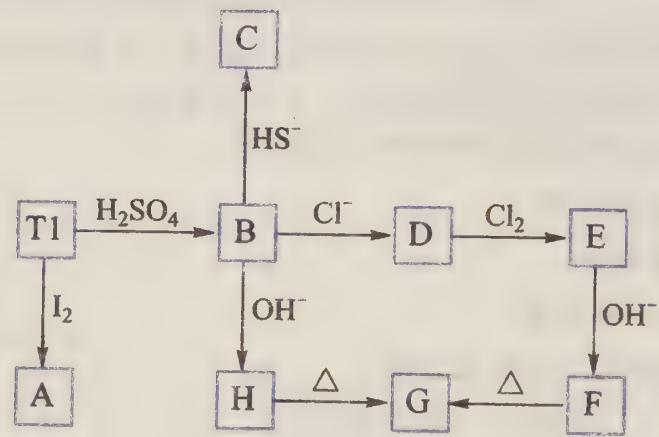

13-8 简答题。

(1) 给出下列物质的化学式。

①硼砂；②硼镁矿；③铝土矿；④刚玉。

(2) 判断下列反应过程能否实现, 写出有关的化学反应方程式。

①硼酸与氨水发生酸碱中和反应；

② 三氯化铊与硫化钠反应生成 $Tl_{2}S_{3}$ ;

③ $\mathrm{Al(NO_{3})_{3}}$ 与 $Na_{2}CO_{3}$ 作用生成 $\mathrm{Al_{2}(CO_{3})_{3}}$ 沉淀；

④ 铝酸钠与 $NH_{4}Cl$ 反应生成铝酸铵。

(3) 为什么铝的抗腐蚀性能比铁强得多?

(4) 为什么铝比铜活泼得多,但冷的浓硝酸能溶解铜而不能溶解铝?

(5) 根据铝在酸性介质和碱性介质中的标准电极电势:

$$
\mathrm{Al} ^ {3 +} + 3 \mathrm{e} ^ {-} = \mathrm{Al}
$$

$$
E ^ {\ominus} = - 1. 6 7 6 \mathrm{V}
$$

$$
\mathrm{Al} (\mathrm{OH}) _ {3} + 3 \mathrm{e} ^ {-} = \mathrm{Al} + 3 \mathrm{OH} ^ {-} \quad E ^ {\ominus} = - 2. 3 1 \mathrm{V}
$$

说明：

① 铝在酸、碱、水中溶解的可能性,从而说明铝在这些溶液中和空气中的稳定性;

② 铝不溶于水,但能溶于 $Na_{2}CO_{3}$ 溶液中。

(6) +3 价铝离子由于电荷密度高, 应当不太容易稳定存在, 但实验证明确实可以得到稳定的水合 +3 价铝离子, 为什么?

(7) 为什么 $BI_{3}$ 的稳定性是卤化硼中最差的？

(8) $\left(\mathrm{C}_{2}\mathrm{H}_{5}\right)_{3}\mathrm{N}$ 和 $\left(\mathrm{C}_{2}\mathrm{H}_{5}\right)_{3}\mathrm{P}$ 中哪一个能与 $BCl_{3}$ 形成更强的化学键？为什么？

(9) 为什么 $AlCl_{3}$ 为二聚体, 而 $BCl_{3}$ 却为单分子结构?

(10) $\mathrm{AlCl}_3$ 与 $\mathrm{B}_2\mathrm{H}_6$ 均具有二聚体结构, 其中的桥基氯原子和 Al 原子间的作用是否与桥基氢原子与 B 原子间的作用相同?

(11) 硼可以形成一分子式为 $\mathrm{B}_{2}\mathrm{H}_{2}(\mathrm{CH}_{3})_{4}$ 的化合物, 试画出其可能的结构。

（12）化合物 $\mathrm{B}_3\mathrm{F}_5$ 是1967年由Timms报道的。光谱研究表明该化合物中F按原子比4：1存在两种不同的环境，B按原子比 $2:1$ 也存在两种不同的环境。试给出该化合物的结构式。

(13) $\mathrm{AlCl}_3$ 溶于苯, 得到二聚体 $(\mathrm{AlCl}_3)_2$ 的溶液。若溶于乙醚, 则会导致 $\mathrm{AlCl}_3$ 与 $\mathrm{O}(\mathrm{C}_2\mathrm{H}_5)_2$ 间的化学反应, 已知其产物为含有一个铝原子的物质, 试推测该产物的分子式。

(14) 二氯化镓 $\left(\mathrm{GaCl}_{2}\right)$ 为抗磁性的化合物。已知 $\mathrm{GaCl}_{2}$ 在溶液中解离出一种简单阳离子和一种四氯阴离子, 试推测该化合物的可能结构。

(15) 试分析所给分子的成键情况。

① 无机苯； ② BN。

(16) 根据标准生成自由能的数值讨论:

① 能否利用铝热法从 $Fe_{2}O_{3}$ , $Cr_{2}O_{3}$ , $Mn_{2}O_{3}$ , CaO, MgO 等氧化物中分别制取相应的金属单质？

② 能否利用其他金属热法(如“钠热法”“钙热法”等)从 $Al_{2}O_{3}$ 中制取 Al?

(17) $\mathrm{B}_{2} \mathrm{H}_{6}$ 的水解反应式为

$$
\mathrm{B} _ {2} \mathrm{H} _ {6} (\mathrm{g}) + 6 \mathrm{H} _ {2} \mathrm{O} (1) = 2 \mathrm{H} _ {3} \mathrm{BO} _ {3} (\mathrm{s}) + 6 \mathrm{H} _ {2} (\mathrm{g})
$$

试通过 $\Delta_r G_m^\ominus$ 计算室温下该反应的平衡常数，并以结构的变化对计算予以说明。

(18) 溶于水再加热蒸发至干能否将 $\mathrm{BCl}_{3}$ 回收？试用化学反应方程式解释你的结论。

## 碳族元素

## 目录

14.1 碳单质及其化合物 …… 528
14.1.1 碳元素的单质 …… 528
1. 碳的同素异形体 …… 528
2. 碳单质的还原性 …… 530
14.1.2 碳的含氧化合物 …… 532
1. 一氧化碳…… 532
2. 二氧化碳…… 533
3. 碳酸及其盐…… 534
14.1.3 碳化物 …… 536
14.2 硅单质及其化合物 …… 536
14.2.1 单质硅 …… 536
1. 单质硅的性质 …… 536
2. 单质硅的生产和纯化 …… 537
14.2.2 硅的含氧化合物 …… 538
1. 二氧化硅…… 538
2. 硅的含氧酸及其盐 …… 539
3. 铝硅酸盐分子筛的合成 …… 540
14.2.3 硅的氢化物 …… 543
1. 硅烷的制取 …… 543
2. 硅烷的性质 …… 543
14.2.4 硅的卤化物 …… 544
14.3 锗、锡、铅 …… 545
14.3.1 锗、锡、铅单质 …… 545
1. 与非金属单质的反应 …… 546
2. 与酸碱的反应 …… 546
3. 提取和冶炼 …… 547
14.3.2 锗、锡、铅的化合物 …… 548

1. 锗、锡、铅的含氧化合物 …… 548
2. 锗、锡、铅的卤化物 …… 549
3. 锗、锡、铅的硫化物 …… 550
拓展学习资源 …… 550
总结与思考题 …… 551
习题 …… 551

## 第14章 碳族元素

元素周期表中ⅣA族包括碳、硅、锗、锡、铅和第七周期的铁共6种元素，统称为碳族元素。其中碳和硅是非金属元素，锗、锡和铅是金属元素。碳、锡和铅3种元素公元前已经为人们所了解，中国商代时期就有镀锡的铜器并使用过铅的化合物。1823年，瑞典人贝采里乌斯（Berzelius）用金属钾还原四氟化硅首次制得单质硅。1886年，德国人温克勒（Winkler）发现了锗，并从硫银锗矿中分离出且确认了这种新元素。他将锗命名为“germanium”，以纪念他的祖国德国（Germany）。锗正是1869年门捷列夫所预言的“类硅”元素。

碳族元素在自然界中分布很广。

碳在地壳中的质量分数为 $4.8 \times 10^{-2}\%$ ，在自然界中分布很广。游离态的碳有金刚石和石墨，化合态的碳存在形式更为多样，不仅以有机化合物存在于煤炭、石油、天然气、动植物体中，还有石灰石、白云石中的无机化合物碳酸盐，以及空气中的二氧化碳。碳元素形成的有机化合物，目前已知的达数千万种，但在本章中仅涉及一些含碳的无机化合物。

硅在地壳中的质量分数为 27.7%，约占地壳质量的四分之一，其含量仅次于氧，其丰度在元素中列第 2 位。硅在自然界存在得极其广泛，如果说碳元素靠 C—C 键构成了有机界，那么硅元素则以 Si—O—Si 键化合物构成几乎整个矿物界。锗、锡、铅在自然界中以矿物形式存在，如锗石矿（Cu₂S·FeS·GeS₂）、锡石矿（SnO₂）、方铅矿（PbS）等。我国是锡储量最丰富的国家之一，是世界上主要的锡出口国。云南的个旧是举世闻名的锡都。

碳族元素基态原子的价层电子构型为 $ns^{2}np^{2}$ 。它们的最高氧化数为 +4 。在锗、锡、铅中，随着原子序数的增大，稳定氧化态逐渐由 +4 变为 +2 。这种递变规律在第 13 章硼族元素中曾经涉及，这是由于 $ns^{2}$ 电子对随 n 增大逐渐稳定的结果，这种结果在本族化合物性质中具有最明显的体现，就是 Pb(Ⅳ) 由于惰性电子对效应的缘故具有很强的氧化性。

图 14-1 为碳族元素的元素电势图, 提供了关于价态和氧化还原性质的极其有价值的数据。

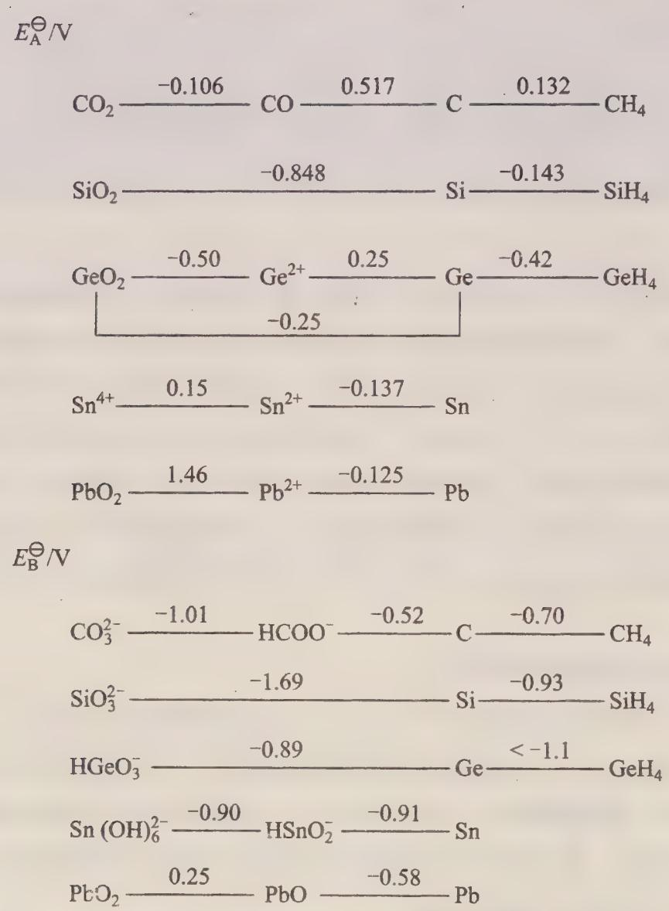  
图14-1 碳族元素的元素电势图

## 14.1 碳单质及其化合物

## 14.1.1 碳元素的单质

## 1. 碳的同素异形体

## (1) 金刚石

金刚石是典型的原子晶体,属于立方晶系。金刚石的莫氏硬度为10,是硬度最高的物质。金刚石的熔点极高,达4440℃(12.4 GPa)。在金刚石中每个碳原子都以 $sp^{3}$ 杂化轨道与邻近的4个碳原子以共价键相连接。图14-2(a)是金刚石的键联关系示意图。由于金刚石晶体的每个碳原子都采取 $sp^{3}$ 杂化,所有价层电子都参与了共价键的形成,晶体中没有离域π电子,所以金刚石不导电。图14-2(b)是金刚石的立方面心晶胞示意图。

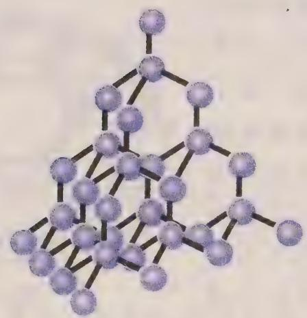  
(a)

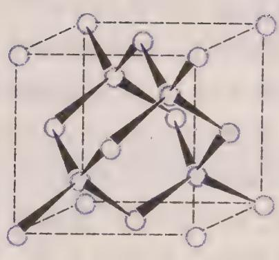  
(b)  
图 14-2 金刚石的结构示意图

金刚石俗称钻石，价格极其昂贵。除作装饰品外，由于硬度极高，金刚石主要用于制造钻头、精密仪器的轴和磨削工具等。

## (2) 石墨

石墨是碳的另一种固体单质,其三相点高达4 489 ℃(10.3 MPa),3 825 ℃下升华。石墨的莫氏硬度为1,是最软的晶体之一。石墨晶体具有层状结构,每个碳原子以 $sp^{2}$ 杂化轨道与邻近的3个碳原子以共价单键相连接,构成片层结构。每个碳原子均有一个未参与杂化的p电子,形成大 $\pi$ 键 $\Pi_{n}^{n}$ 。这些离域电子使得石墨在层向具有良好的导电性。石墨的层与层之间是以分子间力结合起来的,由于层间的结合力很弱,所以层间易于滑动,故石墨质软具有润滑性。

基于上述性质,石墨被大量用来制作电极、电刷、润滑剂、铅笔芯等。

图 14-3 是石墨的层状结构示意图。石墨的结构与图 13-4 所示的六方氮化硼结构相似, 不同的是沿垂直于层的方向投影, 六方氮化硼的层与层之间原子的位置完全一致, 而石墨的层与层之间原子的位置相互错开。

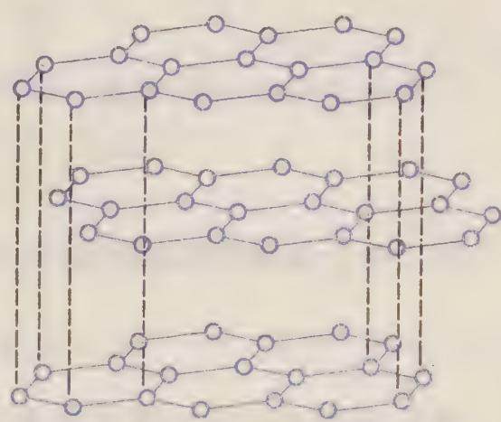

无定形碳,如木炭、焦炭等实际上都具有石墨结构。

图 14-3 石墨的层状结构示意图

## (3) 碳原子簇

20 世纪 80 年代中期,人们发现了碳单质还存在第三种晶体形态。其分子式 $C_{n}$ 中, n 一般小于 200, 称为碳原子簇。在种类繁多的碳原子簇分子中, 人们对 $C_{60}$ 研究得最为深入。 $C_{60}$ 分子中的 60 个碳原子构成近似于球形的三十二面体, 即由 12 个正五边形和 20 个正六边形组成的截角正二十面体。图 14-4 给出

了 $C_{60}$ 分子的球形结构示意图。每个碳原子以近似于 $sp^{2}$ 杂化轨道与相邻 3 个碳原子相连，未参加杂化的 p 轨道在 $C_{60}$ 的球面形成大 $\pi$ 键。由于 $C_{60}$ 的形状酷似足球，故称为足球烯。建筑学家巴克明斯特·富勒 (Buckminster Fuller) 曾用五边形和六边形组成过类似结构，故 $C_{60}$ 有时也称为富勒烯。将 $C_{60}$ 称为足球烯、富勒烯，是因为可以认为 $C_{60}$ 中有类似于烯烃的双键。但是必须清楚， $C_{60}$ 是碳的一种单质，而不是化合物，不是烯烃。

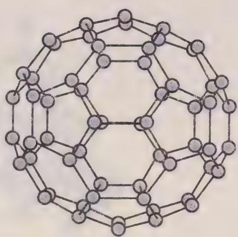  
图14-4 $\mathbf{C}_{60}$ 分子的  
球形结构示意图

用纯石墨作电极，在氦气氛中放电，令电弧

中产生的碳烟沉积在水冷反应器的内壁上,这种碳烟中存在着数量可观的 $C_{60}$ , $C_{70}$ 等碳原子簇。

## 2. 碳单质的还原性

碳单质最重要的化学性质是它的还原性。碳在空气中充分燃烧，生成二氧化碳：

$$
\mathrm{C} + \mathrm{O} _ {2} \xlongequal {\text {点燃}} \mathrm{CO} _ {2}\tag{a}
$$

当氧气不充足时,有一氧化碳生成:

$$
2 \mathrm{C} + \mathrm{O} _ {2} \xlongequal {\text {点燃}} 2 \mathrm{CO}\tag{b}
$$

一氧化碳可以与氧气进一步反应,生成二氧化碳:

$$
2 \mathrm{CO} + \mathrm{O} _ {2} \xlongequal {\text {点燃}} 2 \mathrm{CO} _ {2}\tag{c}
$$

将二氧化碳通过红热的碳层,可以得到一氧化碳:

$$
\mathrm{C} + \mathrm{CO} _ {2} \xlongequal {\text {高温}} 2 \mathrm{CO}
$$

焦炭是冶金工业的重要还原剂,被用来还原金属氧化物矿物以冶炼金属。例如提取金属锌,其中的一步反应是在1200 K下进行的:

$$
\mathrm{ZnO} + \mathrm{C} \stackrel {\text {高温}} {=} \mathrm{Zn(g)} + \mathrm{CO(g)}
$$

通过下面的讨论可以解释反应要在 1200 K 下进行,且产物是 CO 而不是 $CO_{2}$ 的原因。

该反应可以看作是反应

$$
2 \mathrm{C} + \mathrm{O} _ {2} \xlongequal {\text {点燃}} 2 \mathrm{CO}\tag{b}
$$

与反应

$$
2 \mathrm{Zn} + \mathrm{O} _ {2} \xlongequal {\text {高温}} 2 \mathrm{ZnO}\tag{d}
$$

之差的一半。反应(b)和反应(d)，以及相关反应(a)和反应(c)的标准摩尔吉布斯自由能 $\Delta_{\mathrm{r}}G_{\mathrm{m}}^{\ominus}$ 随温度 $T$ 变化的图如图14-5所示。由公式

$$
\Delta_ {\mathrm{r}} G _ {\mathrm{m}} ^ {\ominus} = \Delta_ {\mathrm{r}} H _ {\mathrm{m}} ^ {\ominus} - T \Delta_ {\mathrm{r}} S _ {\mathrm{m}} ^ {\ominus}
$$

得出， $\Delta_{\mathrm{r}}G_{\mathrm{m}}^{\ominus}-T$ 图是一条直线，其斜率是 $-\Delta_{\mathrm{r}}S_{\mathrm{m}}^{\ominus}$ 。反应(c)和反应(d)的 $\Delta_{\mathrm{r}}S_{\mathrm{m}}^{\ominus}$ 分别为 $-173.0\mathrm{J}\cdot\mathrm{K}^{-1}\cdot\mathrm{mol}^{-1}$ 和 $-201\mathrm{J}\cdot\mathrm{K}^{-1}\cdot\mathrm{mol}^{-1}$ ，所以反应(c)和反应(d)的 $\Delta_{\mathrm{r}}G_{\mathrm{m}}^{\ominus}$ 随温度 $T$ 的升高而增大；反应(b)的 $\Delta_{\mathrm{r}}S_{\mathrm{m}}^{\ominus}$ 为 $178.8\mathrm{J}\cdot\mathrm{K}^{-1}\cdot\mathrm{mol}^{-1}$ ，所以其 $\Delta_{\mathrm{r}}G_{\mathrm{m}}^{\ominus}$ 随温度 $T$ 的升高而减小；反应(a)的 $\Delta_{\mathrm{r}}S_{\mathrm{m}}^{\ominus}$ 值很小，仅为 $2.9\mathrm{J}\cdot\mathrm{K}^{-1}\cdot\mathrm{mol}^{-1}$ ，故其 $\Delta_{\mathrm{r}}G_{\mathrm{m}}^{\ominus}$ 基本不随温度变化。

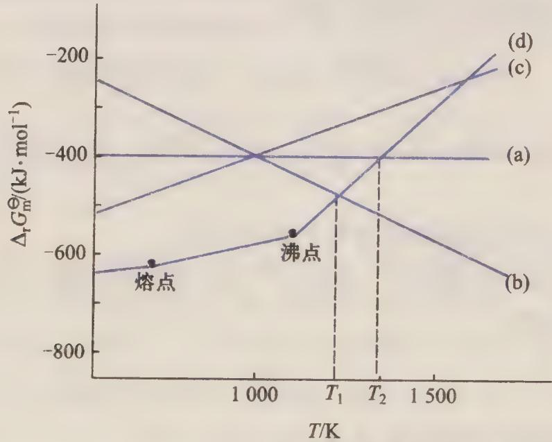  
图14-5 相关反应的标准摩尔吉布斯自由能-温度图

在图 14-5 中, 在 (d), (b) 两线交点所对应的温度 $T_{1}$ 下, 反应 (d) 和反应 (b) 的 $\Delta_{\mathrm{r}} G_{\mathrm{m}}^{\ominus}$ 相等, 这时反应

$$
\mathrm{ZnO} + \mathrm{C} \stackrel {\text {高温}} {=} \mathrm{Zn(g)} + \mathrm{CO(g)}
$$

的 $\Delta_{r}G_{m}^{\ominus}=0$ 。这时温度大约是 1200 K，高于这个温度，反应(b)的 $\Delta_{r}G_{m}^{\ominus}$ 小于反应(d)的 $\Delta_{r}G_{m}^{\ominus}$ ，碳单质还原氧化锌的反应就可以自发进行了。反应的产物当然是 CO。只有达到图 14-5 中(d)和(a)两线相交处的温度 $T_{2}$ 时，产物才是 $CO_{2}$ 。

正是因为有了反应(b)，才使得碳单质还原金属氧化物的反应可以在中等

的温度下进行。

图 14-5 是艾林罕姆 (Ellingham) 图的一部分, 艾林罕姆图中有许多种金属的类似于反应 (d) 的曲线, 从中可以得到碳单质还原金属氧化物反应的产物和温度等大量信息。

## 14.1.2 碳的含氧化合物

碳的氧化物主要有两种:一氧化碳和二氧化碳。

## 1. 一氧化碳

一氧化碳(CO)是碳在氧气不充足的条件下燃烧的产物。在实验室中制备CO气体经常采用的方法有两种。一种是将甲酸滴加到热的浓硫酸中,CO气体在水中的溶解度很小,从水中逸出:

$$
\mathrm{HCOOH} \xlongequal {\text {热的浓硫酸}} \mathrm{CO} \uparrow + \mathrm{H} _ {2} \mathrm{O}
$$

另一种方法是将草酸晶体与浓硫酸共热：

$$
\mathrm{H} _ {2} \mathrm{C} _ {2} \mathrm{O} _ {4} \xrightarrow [ \triangle ]{\text {浓硫酸}} \mathrm{CO} _ {2} \uparrow + \mathrm{CO} \uparrow + \mathrm{H} _ {2} \mathrm{O}
$$

并使生成的混合气体通过固体 NaOH, 吸收掉 $CO_{2}$ 和少量的水汽得到纯净的 CO。

在这两个反应中,浓硫酸所起的是脱水作用。

工业上 CO 气体的大量生产, 是将空气和水蒸气交替通入红热炭层完成的。通入空气时的反应为

$$
2 \mathrm{C} + \mathrm{O} _ {2} \xlongequal {\text {点燃}} 2 \mathrm{CO}
$$

该反应放出大量的热,产物气体的体积组成为

$$
V (\mathrm{CO}): V \left(\mathrm{CO} _ {2}\right): V \left(\mathrm{N} _ {2}\right) = 2 5: 4: 7 0
$$

这种混合气体称为发生炉煤气。

通入水蒸气时的反应为

$$
\mathrm{C} + \mathrm{H} _ {2} \mathrm{O} \xlongequal {\text {红热}} \mathrm{CO} + \mathrm{H} _ {2}
$$

这是一个吸热反应,得到的气体的体积组成为

$$
V (\mathrm{CO}): V (\mathrm{CO} _ {2}): V (\mathrm{H} _ {2}) = 4 0: 5: 5 0
$$

这种混合气体称为水煤气。

发生炉煤气和水煤气都是 CO 气体的主要来源,都是工业上的燃料气。

CO属于还原性气体。它是冶金过程中的还原剂，可以将金属氧化物矿物还原成金属。CO气体可以还原溶液中的二氯化钯，使粉红色的溶液变黑：

$$
\mathrm{CO} + \mathrm{PdCl} _ {2} + \mathrm{H} _ {2} \mathrm{O} = \mathrm{CO} _ {2} + 2 \mathrm{HCl} + \mathrm{Pd} \downarrow
$$

该反应十分灵敏,可用来检验 CO。

CuCl 在酸性介质中与 CO 的反应进行得很完全,以至于可以用来定量吸收 CO:

$$
\mathrm{CO} + \mathrm{CuCl} + 2 \mathrm{H} _ {2} \mathrm{O} \stackrel {\mathrm{H} ^ {+}} {=} \mathrm{Cu(CO)Cl} \cdot 2 \mathrm{H} _ {2} \mathrm{O}
$$

在高温下，CO 能与许多过渡金属反应生成金属羰基配位化合物，例如：

$$
\mathrm{Fe} + 5 \mathrm{CO} \xlongequal {\text {高温}} [ \mathrm{Fe(CO)} _ {5} ]
$$

羰基配位化合物一般是剧毒的。一氧化碳的毒性也很大，它能与血红素中的铁结合成羰基配位化合物，从而使血液失去输送氧的作用。

在第 6 章分子结构和共价键理论中, 曾用分子轨道理论讨论了 CO 分子中的化学键。CO 的分子轨道式为

$$
(1 \sigma) ^ {2} (2 \sigma) ^ {2} (3 \sigma) ^ {2} (4 \sigma) ^ {2} (1 \pi) ^ {4} (5 \sigma) ^ {2}
$$

C 和 O 之间有三键, 其中包括一个配位键。

## 2. 二氧化碳

二氧化碳 $\left(\mathrm{CO}_{2}\right)$ 与人类的关系十分密切,它是人体内氧化还原反应的最终产物之一。实际上,只要氧气充足,碳的燃烧都将生成 $CO_{2}$ 。常温常压下, $CO_{2}$ 为无色气体;在降温或加压时, $CO_{2}$ 较容易变成液体或固体。高压钢瓶中的 $CO_{2}$ 是以液态存在的,从钢瓶中取出 $CO_{2}$ 使用时,由于液态 $CO_{2}$ 迅速汽化致使温度骤降,将生成固态 $CO_{2}$ ——干冰。干冰可以升华,常用来作制冷剂。

工业上煅烧石灰石生产生石灰的过程中,有大量的 $CO_{2}$ 生成:

$$
\mathrm{CaCO} _ {3} \xlongequal {\text {   煅烧   }} \mathrm{CaO} + \mathrm{CO} _ {2} \uparrow
$$

实验室中,经常用碳酸盐与盐酸在启普发生器中发生反应制备 $CO_{2}$ :

$$
\mathrm{CaCO} _ {3} + 2 \mathrm{HCl} = \mathrm{CaCl} _ {2} + \mathrm{H} _ {2} \mathrm{O} + \mathrm{CO} _ {2} \uparrow
$$

将 $CO_{2}$ 气体通入澄清的石灰水中生成碳酸钙,会产生浑浊:

$$
\mathrm{CO} _ {2} + \mathrm{Ca(OH)} _ {2} = \mathrm{CaCO} _ {3} \downarrow + \mathrm{H} _ {2} \mathrm{O}
$$

这一反应可以用来检验 $CO_{2}$ 气体。

$CO_{2}$ 分子是直线形的,一般认为 C 原子和 O 原子之间有双键——一个 $\sigma$ 键和一个 $\pi$ 键。它解释了 $\mathrm{CO}_{2}$ 分子的非极性，以及很高的热稳定性—— $2000^{\circ} \mathrm{C}$ 时 $\mathrm{CO}_{2}$ 也只是略有分解。

但是结构数据表明, $\mathrm{CO}_{2}$ 中碳氧键键长介于碳氧双键 $\mathrm{C} = \mathrm{O}$ 和碳氧三键 $\mathrm{C} \equiv \mathrm{O}$ 的键长之间。这一事实要用 $\mathrm{CO}_{2}$ 分子中存在大 $\pi$ 键来解释。中心碳原子的 sp 杂化如图 14-6(a) 所示, 碳原子的 sp 杂化轨道与氧原子的 2p 轨道成 $\sigma$ 键, 形成直线形 $\mathrm{CO}_{2}$ 分子。在 $y$ 方向, 左边氧原子的 $2\mathrm{p}_y$ 轨道有一个电子, 右边氧原子的 $2\mathrm{p}_y$ 轨道有两个电子, 中心碳原子的 $2\mathrm{p}_y$ 轨道有一个电子。于是在 $y$ 方向形成一个大 $\pi$ 键 $\Pi_3^4$ 。同样, 在 $z$ 方向也形成一个大 $\pi$ 键 $\Pi_3^4$ 。 $\mathrm{CO}_{2}$ 分子的成键情况表示在图 14-6(b) 中。这样就很好地说明了 C 原子和 O 原子之间化学键的键长。

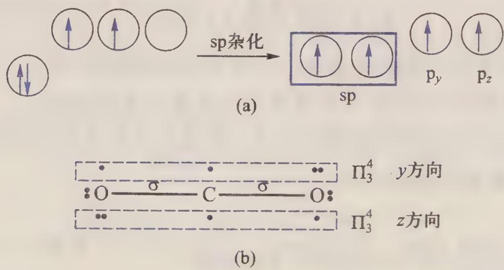  
图14-6 $\mathrm{CO}_{2}$ 中碳原子的轨道杂化及成键情况

$CO_{2}$ 是工业上生产纯碱 $(Na_{2}CO_{3})$ 、小苏打 $(NaHCO_{3})$ 和碳酸氢铵 $(NH_{4}HCO_{3})$ 等的重要原料。

## 3. 碳酸及其盐

二氧化碳与水反应生成碳酸 $\left(\mathrm{H}_{2}\mathrm{CO}_{3}\right)$ 。在 $H_{2}CO_{3}$ 分子中，中心碳原子的轨道为 $sp^{2}$ 杂化轨道，与端基氧原子之间成一个 $\sigma$ 键和一个 $\pi$ 键，与两个羟基氧原子之间各成一个 $\sigma$ 键。如图14-7(a)所示， $H_{2}CO_{3}$ 分子呈平面三角形。

在碳酸根阴离子中,中心碳原子的轨道为 $sp^{2}$ 等性杂化轨道,与3个氧原子分别成 $\sigma$ 键,确定了平面三角形构型。在垂直于离子所在平面的方向上,中心碳原子有未参加杂化的 $p_{z}$ 轨道,其中有一个电子;3个氧原子各有一条垂直于离子所在平面的 $p_{z}$ 轨道,其中各有一个电子。另外,碳酸根阴离子的两个电子也在这4条 $p_{z}$ 轨道中运动。所以,碳酸根阴离子中有大 $\pi$ 键 $\Pi_{4}^{6}$ 存在。碳酸根阴离子的结构见图14-7(b)。

二氧化碳与水的反应并不完全,生成的少量碳酸解离度较高。但一般是以溶于水的二氧化碳全部转化为碳酸来计算解离平衡的,于是认为 $H_{2}CO_{3}$ 是二元

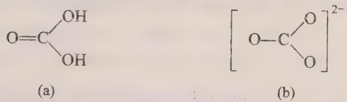  
图 14-7 碳酸分子和碳酸根阴离子的结构示意图

弱酸,其解离平衡常数如下:

$$
\begin{array}{l l}\mathrm{H} _ {2} \mathrm{CO} _ {3} \rightleftharpoons \mathrm{H} ^ {+} + \mathrm{HCO} _ {3} ^ {-}&K _ {1} ^ {\ominus} = 4. 4 5 \times 1 0 ^ {- 7}\\\mathrm{HCO} _ {3} ^ {-} \rightleftharpoons \mathrm{H} ^ {+} + \mathrm{CO} _ {3} ^ {2 -}&K _ {2} ^ {\ominus} = 4. 6 9 \times 1 0 ^ {- 1 1}\end{array}
$$

碳酸的盐类有碳酸盐和碳酸氢盐。除 Li 以外的碱金属的碳酸盐及碳酸铵易溶于水, 其他金属的碳酸盐难溶于水。对于 $CaCO_{3}$ 等难溶的碳酸盐, 其对应的碳酸氢盐 $\mathrm{Ca(HCO_{3})_{2}}$ 等的溶解度则较大。其原因可以归结为, $CaCO_{3}$ 的解离必须克服 +2 价阳离子与 -2 价阴离子之间的引力:

$$
\mathrm{CaCO} _ {3} = \mathrm{Ca} ^ {2 +} + \mathrm{CO} _ {3} ^ {2 -}
$$

而 $\mathrm{Ca(HCO_{3})_{2}}$ 的解离只需克服 +2 价阳离子与 -1 价阴离子之间的引力：

$$
\mathrm{Ca} \left(\mathrm{HCO} _ {3}\right) _ {2} = \mathrm{Ca} ^ {2 +} + 2 \mathrm{HCO} _ {3} ^ {-}
$$

所以通入 $CO_{2}$ ，可以将 $CaCO_{3}$ 转化成 $\mathrm{Ca(HCO_{3})_{2}}$ ，而发生溶解：

$$
\mathrm{CaCO} _ {3} + \mathrm{CO} _ {2} + \mathrm{H} _ {2} \mathrm{O} = \mathrm{Ca(HCO} _ {3}) _ {2}
$$

易溶的 $\mathrm{Na}_{2}\mathrm{CO}_{3}$ 和 $(\mathrm{NH}_{4})_{2}\mathrm{CO}_{3}$ 等, 其对应的碳酸氢盐 $NaHCO_{3}$ 和 $NH_{4}HCO_{3}$ 的溶解度却相对较小。其原因可以解释为碳酸氢根之间由于存在氢键而缔合成相对分子质量较大的酸根造成的。

碳酸钠的水溶液, 因为 $CO_{3}^{2-}$ 的水解显较强的碱性:

$$
\mathrm{CO} _ {3} ^ {2 -} + \mathrm{H} _ {2} \mathrm{O} = \mathrm{HCO} _ {3} ^ {-} + \mathrm{OH} ^ {-}
$$

所以在碳酸钠的水溶液中存在两种沉淀剂—— $CO_{3}^{2-}$ 和 $OH^{-}$ ，与其他金属离子相遇时，溶液中可能产生碳酸盐、碱式碳酸盐或氢氧化物等不同的沉淀物。

$Ca^{2+},Sr^{2+},Ba^{2+}$ 等,其碳酸盐的溶度积常数远小于其氢氧化物的溶度积常数,与碳酸钠水溶液相遇时生成碳酸盐,例如:

$$
\mathrm{Ca} ^ {2 +} + \mathrm{CO} _ {3} ^ {2 -} = \mathrm{CaCO} _ {3} \downarrow
$$

$Al^{3+}, Fe^{3+}, Cr^{3+}$ 等, 其氢氧化物的溶度积常数远小于其碳酸盐的溶度积常数, 与碳酸钠水溶液相遇时生成氢氧化物, 例如:

$$
2 \mathrm{Fe} ^ {3 +} + 3 \mathrm{CO} _ {3} ^ {2 -} + 3 \mathrm{H} _ {2} \mathrm{O} = 2 \mathrm{Fe(OH)} _ {3} \downarrow + 3 \mathrm{CO} _ {2} \uparrow
$$

有些离子, 如 $Mg^{2+}, Ni^{2+}, Mn^{2+}, Ag^{+}$ 等与碳酸钠水溶液反应将生成碱式碳酸盐沉淀, 例如:

$$
2 \mathrm{Mg} ^ {2 +} + 2 \mathrm{CO} _ {3} ^ {2 -} + \mathrm{H} _ {2} \mathrm{O} = \mathrm{Mg} _ {2} (\mathrm{OH}) _ {2} \mathrm{CO} _ {3} \downarrow + \mathrm{CO} _ {2} \uparrow
$$

为了得到正盐 $MgCO_{3}$ ，可以使沉淀剂的碱性降低，即不用碳酸钠而改用碳酸氢钠溶液作沉淀剂，于是

$$
\mathrm{Mg} ^ {2 +} + \mathrm{HCO} _ {3} ^ {-} = \mathrm{MgCO} _ {3} \downarrow + \mathrm{H} ^ {+}
$$

碳酸盐的热稳定性不是很高,低于对应的硫酸盐和硅酸盐。碳酸氢盐的热稳定性低于碳酸正盐,但是都比碳酸稳定。关于碳酸盐、碳酸氢盐和碳酸的热稳定性的这些结论,均可由离子极化理论加以解释。

## 14.1.3 碳化物

根据与碳原子直接相连的原子的不同,碳化物可以分成3类:离子型碳化物、间充型碳化物和共价型碳化物。

离子型碳化物中,与碳原子直接相连的原子属于ⅠA,ⅡA,ⅢA族,如 $CaC_{2}$ , $Mg_{2}C_{3}$ , $Al_{4}C_{3}$ 等。这类碳化物中,不一定有离子键,但由于有典型的金属原子,故称离子型碳化物。

离子型碳化物容易发生水解,如 $Mg_{2}C_{3}$ 水解生成炔烃:

$$
\mathrm{Mg} _ {2} \mathrm{C} _ {3} + 4 \mathrm{H} _ {2} \mathrm{O} = 2 \mathrm{Mg(OH)} _ {2} + \mathrm{HC} \equiv \mathrm{C} - \mathrm{CH} _ {3} \uparrow
$$

$Al_{4}C_{3}$ 水解生成烷烃：

$$
\mathrm{Al} _ {4} \mathrm{C} _ {3} + 1 2 \mathrm{H} _ {2} \mathrm{O} = 4 \mathrm{Al} (\mathrm{OH}) _ {3} + 3 \mathrm{CH} _ {4} \uparrow
$$

重过渡金属原子半径大,在晶格中充填碳原子,形成间充型碳化物。间充型碳化物仍保持金属光泽,其硬度和熔点比原来的金属还高。如 Zr,Hf,Nb,Ta,Mo,W 等重过渡金属均可形成间充型碳化物。

$\mathrm{B}_{4} \mathrm{C}$ 和 $\mathrm{SiC}$ (金刚砂) 等属于共价型碳化物。共价型碳化物主要特点是高硬度。以金刚石的硬度为 10, 则 $\mathrm{SiC}$ 的硬度为 9。 $\mathrm{B}_{4} \mathrm{C}$ 可用来打磨金刚石。

## 14.2 硅单质及其化合物

## 14.2.1 单质硅

## 1. 单质硅的性质

由于 Si—O 键的键能相当大,所以自然界中没有发现单质硅的存在。

晶体硅的结构类似于金刚石, 硅的所有价层电子参与 $\sigma$ 键的形成, 所以在平常状态下硅不导电。当高纯硅中掺杂少于百万分之一的磷原子时，成键后就有了多余的电子；若杂质是硼原子，成键后就有了空轨道。这样掺杂的高纯硅是良好的半导体材料。

晶体硅呈灰黑色,高熔点,高硬度。

在常温下,单质硅可以与 $F_{2}$ 直接化合:

$$
\mathrm{Si} + 2 \mathrm{F} _ {2} = \mathrm{SiF} _ {4}
$$

但只有在加热的条件下它才能与 $\mathrm{Cl}_2$ 化合，与 $\mathrm{Br}_2, \mathrm{I}_2$ 化合则需要更高的温度。

由于硅的表面易形成 $SiO_{2}$ 保护膜, 致使氧气与硅的反应只有在 $1000^{\circ}C$ 左右才能发生。在更高温度下单质硅也可以与氮气作用。高温下单质硅也可以与硫、磷、碳等作用。

总之，和硼相似，硅的化学也是高温化学。

在常温下,单质硅可以与强碱溶液作用放出氢气:

$$
\mathrm{Si} + 4 \mathrm{OH} ^ {-} = \mathrm{SiO} _ {4} ^ {4 -} + 2 \mathrm{H} _ {2} \uparrow
$$

但却不能与水、酸作用。在常温下氢氟酸也不能与单质硅反应，尽管这个反应的 $\Delta_{\mathrm{r}}G_{\mathrm{m}}^{\ominus}$ 小于零。加热或在有氧化剂存在的条件下，氢氟酸可与单质硅反应，例如：

$$
3 \mathrm{Si} + 1 8 \mathrm{HF(aq)} + 4 \mathrm{HNO} _ {3} (\text {浓}) = 3 \mathrm{H} _ {2} [ \mathrm{SiF} _ {6} ] + 4 \mathrm{NO} \uparrow + 8 \mathrm{H} _ {2} \mathrm{O}
$$

## 2. 单质硅的生产和纯化

生产硅的原料 $SiO_{2}$ 存在得极为广泛,但是用碳还原二氧化硅的条件极为苛刻,需要在电炉中获得 1800 ℃ 的高温:

$$
\mathrm{SiO} _ {2} + 2 \mathrm{C} \xlongequal {1 8 0 0 ^ {\circ} \mathrm{C}} \mathrm{Si} + 2 \mathrm{CO} \uparrow
$$

和硼的制备相比较,这一反应相当于用 Mg 还原 $B_{2}O_{3}$ 。

上述反应中得到的硅是粗硅,生产纯度较高的硅要提纯粗硅。首先在加热的条件下使硅与氯气反应,把粗硅转化成液态的 $SiCl_{4}$ :

$$
\mathrm{Si} + 2 \mathrm{Cl} _ {2} \stackrel {\triangle} {=} \mathrm{SiCl} _ {4}
$$

或使粗硅转化成三氯氢硅：

$$
\mathrm{Si} + 3 \mathrm{HCl} \stackrel {\triangle} {=} \mathrm{SiHCl} _ {3} + \mathrm{H} _ {2}
$$

然后通过精馏来提纯 $SiCl_{4}$ 和 $SiHCl_{3}$ ，最后用活泼金属锌或镁还原 $SiCl_{4}$ 得纯度较高的硅，例如：

$$
\mathrm{SiCl} _ {4} + 2 \mathrm{Zn} \stackrel {\triangle} {=} \mathrm{Si} + 2 \mathrm{ZnCl} _ {2}
$$

当 $\mathrm{Zn}$ 或 $\mathrm{Mg}$ 的纯度不高时，将导致产物Si的不纯，故现已更新为使用超纯 $\mathbf{H}_2$ 作还原剂：

$$
\mathrm{SiCl} _ {4} + 2 \mathrm{H} _ {2} \xlongequal {> 1 1 0 0 ^ {\circ} \mathrm{C}} \mathrm{Si} + 4 \mathrm{HCl}
$$

$$
\mathrm{SiHCl} _ {3} + \mathrm{H} _ {2} \xlongequal {1 1 0 0 ^ {\circ} \mathrm{C}} \mathrm{Si} + 3 \mathrm{HCl}
$$

工业上超纯氢气的获得将在第 18 章 18.1.4 小节中提到。

$SiCl_{4}$ 的这种制备方法,相当于硼的制备中用 $H_{2}$ 还原三溴化硼。

最后用区域熔融法来进一步提纯,才能得到生产半导体用的高纯度的硅。

在制取单质方面,硼与硅的不同点是,制取硅的原料 $SiO_{2}$ 是自然界中大量存在的,而制取硼的原料 $B_{2}O_{3}$ 是经过一系列反应才得到的。

## 14.2.2 硅的含氧化合物

## 1. 二氧化硅

二氧化硅晶体属于原子晶体,与 $CO_{2}$ 的性质大为不同。自然界中的石英就是二氧化硅晶体,它是一种高熔点、高硬度的无色晶体。

二氧化硅和硅酸盐等所有的硅的含氧化合物,都以硅氧四面体 $\left(\mathrm{SiO}_{4}\right)$ 作为基本结构单元。图14-8(a)给出了硅氧四面体的示意图,图14-8(b)为硅氧四面体沿O—Si连线投影在平面中的表示方法。硅氧四面体共用顶角的氧原子按着一定的规律连接起来,就得到 $SiO_{2}$ 。

化学键 轮廓线 氧原子  
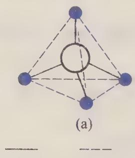

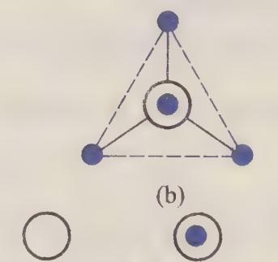  
硅原子．氧原子和硅原子  
图14-8 硅氧四面体 $(\mathrm{SiO}_4)$ 的结构单元示意图

石英的各种晶型如 $\alpha-$ 石英、 $\beta-$ 石英之间的转化, 就是其内部硅氧四面体 $(\mathrm{SiO}_{4})$ 排列方式的变化结果。熔化的石英在 $1700^{\circ}C$ 左右变成黏稠液体, 冷却时不易再结晶, 将变成石英玻璃, 其中硅氧四面体 $(\mathrm{SiO}_{4})$ 是杂乱排列的, 故其结构呈无定形。石英玻璃可用来制光学仪器和高级化学器皿。

常温下, $SiO_{2}$ 对于盐酸、硫酸及碱液等显惰性,但可以与氢氟酸反应生成 $SiF_{4}$ 或 $H_{2}[SiF_{6}]$ :

$$
\begin{array}{r l} & \mathrm {SiO_ {2}} + 4 \mathrm{HF(aq)} = \mathrm {SiF_ {4}} \uparrow + 2 \mathrm {H_ {2} O} \\ & \mathrm {SiO_ {2}} + 6 \mathrm{HF(aq)} = \mathrm {H_ {2} [SiF_ {6} ]} + 2 \mathrm {H_ {2} O} \end{array}
$$

$SiO_{2}$ 可与热的强碱溶液及熔融的碳酸钠反应,生成可溶性硅酸盐:

$$
\mathrm{SiO} _ {2} + 2 \mathrm{OH} ^ {-} \stackrel {\triangle} {=} \mathrm{SiO} _ {3} ^ {2 -} + \mathrm{H} _ {2} \mathrm{O}
$$

$$
\mathrm{SiO} _ {2} + \mathrm{Na} _ {2} \mathrm{CO} _ {3} \xlongequal {\text {共熔}} \mathrm{Na} _ {2} \mathrm{SiO} _ {3} + \mathrm{CO} _ {2} \uparrow
$$

$\mathrm{SiO}_2$ 是硅酸的酸酐, 但是它不溶于水, 所以要通过上面的反应先得到可溶性硅酸盐, 再酸化以生成硅酸。

$\mathrm{SiO}_{2}$ 还有一类与石英、石英玻璃等极不相同的存在形式——硅胶。向一定浓度的 $\mathrm{Na}_{2} \mathrm{SiO}_{3}$ 溶液中加酸，当体系的 $\mathrm{pH}$ 降低时，硅氧四面体 $(\mathrm{SiO}_{4})$ 单元之间开始缩合，生成硅酸胶体溶液和盐。将胶体静置老化 $24 \mathrm{~h}$ ，使缩合反应进行完全，形成凝胶。然后用热水洗去反应生成的盐，将洗净的凝胶在低于 $100^{\circ} \mathrm{C}$ 的条件下烘干，脱去与二氧化硅结合的水及硅氧骨架空隙间的水，即得到多孔性硅胶。从组成上，硅胶属于 $\mathrm{SiO}_{2}$ ，只是内部的硅氧四面体 $(\mathrm{SiO}_{4})$ 是杂乱无序的。

在 $300^{\circ}$ C 下活化后, 硅胶就成为一种具有物理吸附作用的吸附剂。在干燥器中使用的变色硅胶, 是将多孔性硅胶用 $CoCl_{2}$ 溶液浸泡, 干燥活化后制得的。因为无水二氯化钴 ( $CoCl_{2}$ ) 为蓝色, 水合二氯化钴 ( $CoCl_{2} \cdot 6H_{2}O$ ) 为红色, 所以根据变色硅胶由蓝色逐渐变为红色可以判断硅胶的吸水程度。变色硅胶可以加热脱水再生反复使用。

## 2. 硅的含氧酸及其盐

可溶性硅酸盐与酸作用生成硅酸：

$$
\mathrm{SiO} _ {4} ^ {4 -} + 4 \mathrm{H} ^ {+} = \mathrm{H} _ {4} \mathrm{SiO} _ {4} \downarrow
$$

硅酸是一种比碳酸还弱的二元酸,其解离平衡常数为

$$
K _ {1} ^ {\ominus} = 2. 5 \times 1 0 ^ {- 1 0}, \quad K _ {2} ^ {\ominus} = 1. 6 \times 1 0 ^ {- 1 2}
$$

硅酸的种类相当多,但总是可以表示成 $xSiO_{2} \cdot yH_{2}O$ , 即 $SiO_{2}$ 的水合物的形式。例如, x = 1, y = 1 则表示偏硅酸 $\left(\mathrm{H}_{2}\mathrm{SiO}_{3}\right)$ ; x = 2, y = 1 则表示二偏硅酸 $\left(\mathrm{H}_{2}\mathrm{Si}_{2}\mathrm{O}_{5}\right)$ ; x = 1, y = 2 则表示正硅酸 $\left(\mathrm{H}_{4}\mathrm{SiO}_{4}\right)$ ; 而 x = 2, y = 3 则表示焦硅酸 $\left(\mathrm{H}_{6}\mathrm{Si}_{2}\mathrm{O}_{7}\right)$ 。

自然界的硅酸盐矿物都是不溶性的。最常见的可溶性硅酸盐——偏硅酸钠 $\left(\mathrm{Na}_{2}\mathrm{SiO}_{3}\right)$ 是一种玻璃态物质，其水溶液呈黏稠状，称为水玻璃。水玻璃在工业上可用作黏合剂，以及木材、织物的防腐剂。将一些小颗粒的金属盐类加入 $Na_{2}SiO_{3}$ 溶液中，生成难溶性硅酸盐，例如：

$$
\mathrm{SiO} _ {3} ^ {2 -} + \mathrm{Mn} ^ {2 +} = \mathrm{MnSiO} _ {3} \downarrow
$$

(粉色)

$$
\mathrm{SiO} _ {3} ^ {2 -} + \mathrm{Co} ^ {2 +} = \mathrm{CoSiO} _ {3} \downarrow\tag{紫色}
$$

$$
\mathrm{SiO} _ {3} ^ {2 -} + \mathrm{Ni} ^ {2 +} = \mathrm{NiSiO} _ {3} \downarrow\tag{绿色}
$$

$$
3 \mathrm{SiO} _ {3} ^ {2 -} + 2 \mathrm{Fe} ^ {3 +} = \mathrm{Fe} _ {2} (\mathrm{SiO} _ {3}) _ {3} \downarrow\tag{红棕色}
$$

其反应过程较为缓慢,这些不同颜色的产物如同植物般在 $Na_{2}SiO_{3}$ 溶液中“生长”,形成所谓的“水中花园”。

硅酸盐和二氧化硅一样,均以硅氧四面体作为基本结构单元。硅氧四面体通过共用氧原子连接成各种不同的硅酸根阴离子,再由某些阳离子把硅酸根阴离子约束在一起,便得到形形色色的硅酸盐。

单聚硅酸根 单个的硅氧四面体, 其结构见图 14-8。例如, 自然界中存在的橄榄石 $\left(\mathrm{Mg}_{2} \mathrm{SiO}_{4}\right)$ 就是这种正硅酸盐。

二聚硅酸根 两个硅氧四面体通过共用一个氧原子连接起来,其阴离子的结构见图 14-9(a)。例如,自然界中的钪硅石 $\left(\mathrm{Sc}_{2}\mathrm{Si}_{2}\mathrm{O}_{7}\right)$ 就是这种焦硅酸盐。

链聚硅酸根 许多硅氧四面体连接成无限长的链,相邻两个硅氧四面体共用一个氧原子,其阴离子的结构见图 14-9(b)。在阴离子硅酸根链之间分布着带正电荷的金属阳离子,靠静电引力使链结合在一起,这类硅酸盐具有纤维状结构,例如自然界中的石棉就具有这种结构。在无限长链聚硅酸根中硅氧原子比为 1:3。

片层状聚硅酸根 每一个硅氧四面体通过共用3个氧原子分别与邻近3个硅氧四面体连接,形成片层状结构的硅酸根阴离子,见图14-9(c)。片层之间靠与金属阳离子的静电引力结合在一起,例如,自然界中的云母 $\left[\mathrm{KMg}_{3}(\mathrm{OH})_{2}\mathrm{Si}_{3}\mathrm{AlO}_{10}\right]$ 就具有这种片层状结构。无限大片层状硅酸根中硅氧原子比为1:2.5。

网络状聚硅酸根 硅氧四面体间通过共用4个氧原子而组成各种各样三维网络结构。这类结构中硅、氧原子比为 $1:2$ ，最简式为 $\mathrm{SiO}_2$ ，属于电中性单元。如果在某个硅氧四面体中有铝原子代替了硅原子，形成的铝硅酸根网络骨架中就带了负电荷，因此在骨架的空隙中必须有平衡骨架负电荷的阳离子存在。自然界中大量存在的沸石就是这种铝硅酸盐。

## 3. 铝硅酸盐分子筛的合成

自然界中存在的某些铝硅酸盐具有笼形三维结构,这些均匀的笼可以有选择地吸附一定大小的分子,这种作用叫作分子筛作用。通常把这样的天然铝硅酸盐称为沸石分子筛,如八面沸石、丝光沸石等。

由于天然沸石分子筛的种类和数量不能满足人类生产实践的需要,于是铝硅酸盐分子筛的人工合成应运而生,而且逐渐成为无机固体化学的重要研究领域,通常把人工合成的铝硅酸盐称为分子筛。例如,人工合成的 X 型分子筛、Y 型分子筛具有八面沸石的结构。又如,A 型分子筛是实际生产中应用最为广泛的一种人工合成的铝硅酸盐分子筛,它的结构是天然沸石中不存在的。合成 A 型分子筛时使用的原料通常是水玻璃、铝酸钠、氢氧化钠和水。将这些原料按一定配比混合均匀,置于密封的反应器中在 100 ℃ 左右加热几个小时。将冷却后的产品进行洗涤、过滤,再加以烘干,即得白色的 A 型分子筛原粉。最后根据需要,加入黏合剂和适量的水,混合均匀,挤压成条状或滚成球形。

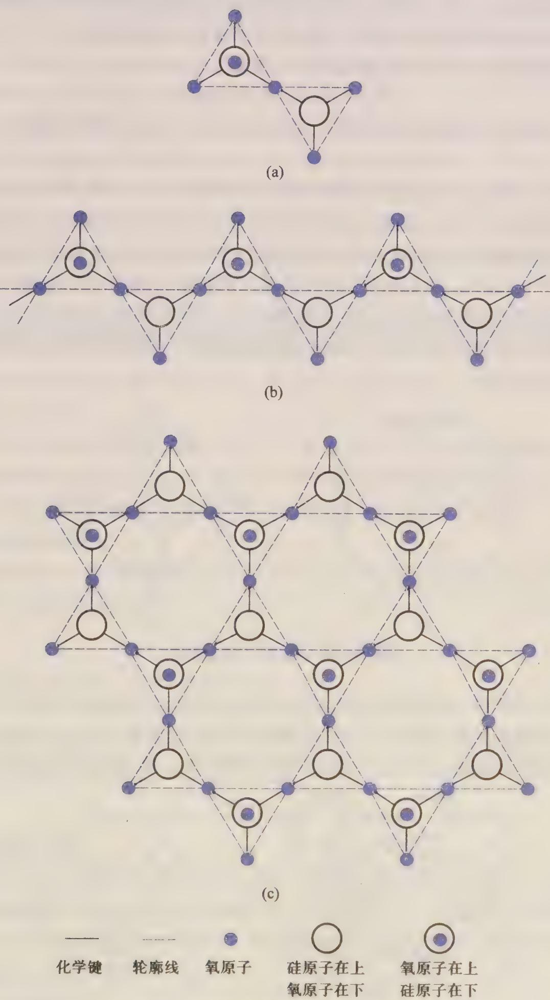  
图14-9 各种硅酸根阴离子的结构示意图

这样合成的 A 型分子筛, 其化学式一般为

$$
\mathrm{Na} _ {2} \mathrm{O} \cdot \mathrm{Al} _ {2} \mathrm{O} _ {3} \cdot 2 \mathrm{SiO} _ {2} \cdot 5 \mathrm{H} _ {2} \mathrm{O}
$$

化学式中硅原子与铝原子的个数比,称为硅铝比,A型分子筛的硅铝比一般为1:1。

A 型分子筛中, 所有硅氧四面体和铝氧四面体通过共用氧原子连接成多元环, 有四元环和六元环。这里的四和六都是指环中硅原子(铝原子)的数目, 这是该研究领域中的习惯说法。若考虑硅原子(铝原子)之间的氧原子, 就应该是八元环和十二元环。多元环相互连接形成三维骨架, 骨架中空部分就是分子筛的笼。A 型分子筛中由 8 个六元环和 6 个四元环围成的笼称为 $\beta$ 笼, 如图 14-10(a) 所示, 它相当于一个正八面体被截掉 6 个角所形成的立体结构, 见图 14-10(b)。

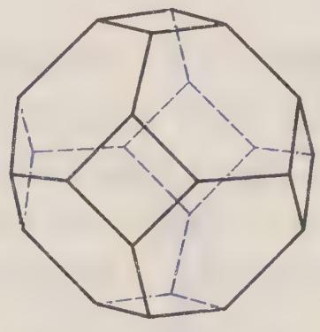  
(a)

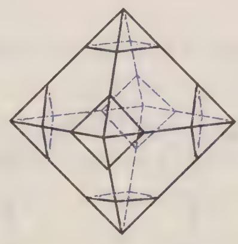  
(b)  
图14-10 $\beta$ 笼的结构示意图

$\beta$ 笼之间按照 NaCl 晶体中 $\mathrm{Na}^{+}$ 和 $\mathrm{Cl}^{-}$ 的方式排列, 并通过共用氧原子将相邻 $\beta$ 笼的四元环连接起来, 则得到 A 型分子筛的笼形结构, 如图 14-11(a) 所示。于是 8 个 $\beta$ 笼之间又形成一个更大的笼形空间, 通常称为 $\alpha$ 笼, 见图 14-11(b)。

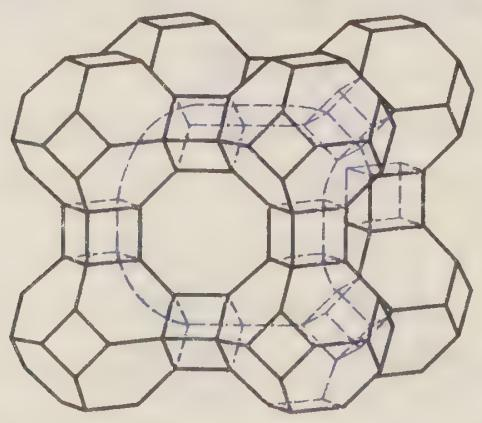  
(a)

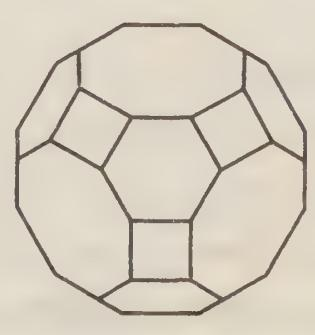  
(b)  
图14-11 A型分子筛的结构示意图

由于骨架中铝氧四面体的存在,骨架显负电性,而 $Na^{+}$ 存在于 A 型分子筛的笼中起着中和骨架负电荷的作用。由于 A 型分子筛有着大小均匀的笼形结构,对于大小合适的分子有选择性吸附作用,加上笼内金属离子的静电作用,故分子筛的选择性远远高于活性炭等吸附剂。

目前，A型分子筛常用于气体干燥、净化，氧气富集及轻油脱蜡；X型和Y型分子筛常用于石油的催化裂化，也用于其他有机反应的催化。

丝光沸石的硅铝比较高,热稳定性较高,应用也较为广泛。ZSM-5 分子筛是一种硅铝比很高的人工合成分子筛,其结构也是天然沸石中不存在的。它具有较高的耐酸性和热稳定性,被广泛地用于其他低硅铝比分子筛难以耐受的高温和酸性较强的催化反应中。

## 14.2.3 硅的氢化物

硅的氢化物仅有为数不多的几种,其化学式符合 $Si_{n}H_{2n+2}$ , 最有代表性的是 $SiH_{4}$ , 称为甲硅烷。

碳的氢化物种类极多,原因是 C—C 键很强,可以形成长的碳链。由于 Si—Si键的键能远小于 C—C 键,且 Si—O 键很强,故硅化合物多以 Si—O 键形式存在,如前面讲过的硅的氧化物和各种硅酸盐。

## 1. 硅烷的制取

硅烷的制取方法和硼烷相似,先用 $SiO_{2}$ 和金属 Mg 为原料制取硅化镁。这一反应要在高温灼烧下进行:

$$
\mathrm{SiO} _ {2} + 4 \mathrm{Mg} \xlongequal {\text {高温}} \mathrm{Mg} _ {2} \mathrm{Si} + 2 \mathrm{MgO}
$$

之后使硅化镁与盐酸反应,便得到甲硅烷:

$$
\mathrm{Mg} _ {2} \mathrm{Si} + 4 \mathrm{HCl} (\mathrm{aq}) = \mathrm{SiH} _ {4} \uparrow + 2 \mathrm{MgCl} _ {2}
$$

这样制得的甲硅烷中常含有乙硅烷、丙硅烷等杂质。可以采用与制取乙硼烷相似的方法，用强还原剂氢化铝锂在乙醚介质中还原 $SiCl_{4}$ ，制得高纯度的甲硅烷：

$$
\mathrm{SiCl} _ {4} + \mathrm{LiAlH} _ {4} \xlongequal {\text {乙醚中}} \mathrm{SiH} _ {4} \uparrow + \mathrm{LiCl} + \mathrm{AlCl} _ {3}
$$

## 2. 硅烷的性质

甲硅烷 $\left(\mathrm{SiH}_{4}\right)$ 为无色、无臭气体，其分子结构类似于甲烷 $\left(\mathrm{CH}_{4}\right)$ 。硅和碳处于元素周期表的同族，硅烷的性质与烷烃的性质有相似之处，也有一些差别。在一些方面硅烷的性质更接近于硼烷。所以在讨论硅烷的性质时，要注意将硅烷、烷烃和硼烷三者加以比较。

## (1) 热稳定性

$\mathrm{SiH}_{4}$ 的分解温度比甲烷低得多：

$$
\begin{array}{r l} & \mathrm {SiH_ {4}} \xlongequal {5 0 0 ^ {\circ} \mathrm{C}} \mathrm{Si} + 2 \mathrm {H_ {2}} \\ & \mathrm {CH_ {4}} \xlongequal {1 0 0 0 ^ {\circ} \mathrm{C}} \mathrm{C} + 2 \mathrm {H_ {2}} \end{array}
$$

甲烷还有如下的分解方式：

$$
2 \mathrm{CH} _ {4} \xlongequal {1 5 0 0 ^ {\circ} \mathrm{C}} \mathrm{C} _ {2} \mathrm{H} _ {2} + 3 \mathrm{H} _ {2}
$$

硼烷有类似于甲烷的这种分解反应,在一定的温度下加压乙硼烷,可以得到其他种类的硼烷和氢气。

## (2) 还原性

$SiH_{4}$ 的还原性比甲烷强, $SiH_{4}$ 在空气中可以自燃:

$$
\mathrm{SiH} _ {4} + 2 \mathrm{O} _ {2} \xlongequal {\text {自燃}} \mathrm{SiO} _ {2} + 2 \mathrm{H} _ {2} \mathrm{O}
$$

有几种硼烷在空气中也可以自燃, 只有甲烷相对稳定, 是便于控制的燃料气。

甲烷不能使 $\mathrm{KMnO}_4$ 溶液褪色， $\mathrm{SiH}_4$ 可以与 $\mathrm{KMnO}_4$ 溶液反应：

$$
\mathrm{SiH} _ {4} + 2 \mathrm{KMnO} _ {4} (\mathrm{aq}) = 2 \mathrm{MnO} _ {2} \downarrow + \mathrm{K} _ {2} \mathrm{SiO} _ {3} + \mathrm{H} _ {2} \mathrm{O} + \mathrm{H} _ {2}
$$

## (3) 水解性

$SiH_{4}$ 易发生水解反应：

$$
\mathrm{SiH} _ {4} + (n + 2) \mathrm{H} _ {2} \mathrm{O} = \mathrm{SiO} _ {2} \cdot n \mathrm{H} _ {2} \mathrm{O} \downarrow + 4 \mathrm{H} _ {2}
$$

在这一点上, $SiH_{4}$ 与硼烷相似,而甲烷不发生水解反应。

## 14.2.4 硅的卤化物

四氯化硅( $SiCl_{4}$ )是易挥发的无色液体,遇到水甚至潮湿的空气就会发生强烈的水解:

$$
\mathrm{SiCl} _ {4} + 4 \mathrm{H} _ {2} \mathrm{O} = \mathrm{H} _ {4} \mathrm{SiO} _ {4} \downarrow + 4 \mathrm{HCl} \uparrow
$$

$\mathrm{SiCl}_4$ 之所以发生水解反应, 是因为中心 Si 原子有空 3d 轨道, 当 $\mathrm{H}_2\mathrm{O}$ 分子以其具有孤电子对的带有部分负电荷的 O 原子端与 Si 原子接近时, 可以被接受而形成 $\mathrm{sp}^3\mathrm{d}$ 杂化的五配位中间体, 如图 14-12 所示。

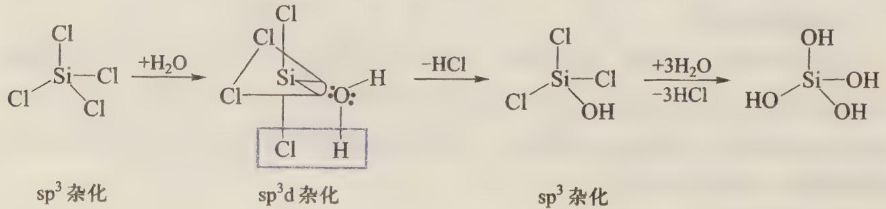  
图14-12 $\mathrm{SiCl}_4$ 水解机理示意图

H 和 Cl 离去, 再由 $sp^{3}d$ 杂化变成 $sp^{3}$ 杂化, 继续取代生成硅酸。

必须注意的是, 当 H 和 Cl 从中间体离开时, Cl 将 Cl—Si 键电子对带走, H 将 H—O 键电子对留给 O, 于是取代产物为电中性。

$\mathrm{SiCl}_4$ 可以在加热的条件下由硅和氯气反应制得。但是更具有实际意义的制备反应是 $\mathrm{SiO}_2$ 的氯化。进行这一氯化反应，需将焦炭加到反应物 $\mathrm{SiO}_2$ 和氯气中一起加热：

$$
\mathrm{SiO} _ {2} + 2 \mathrm{C} + 2 \mathrm{Cl} _ {2} \stackrel {\triangle} {=} \mathrm{SiCl} _ {4} + 2 \mathrm{CO}
$$

根据下面给出的氧化物和氯化物的热力学数据：

<table><tr><td>化合物</td><td> $SiCl_4(l)$ </td><td> $SiO_2(s)$ </td><td> $BCl_3(g)$ </td><td> $B_2O_3(s)$ </td></tr><tr><td> $\Delta_f G_m^{\ominus}/(kJ·mol^{-1})$ </td><td>-619.8</td><td>-856.3</td><td>-388.7</td><td>-1 194.3</td></tr></table>

可以看出 $\mathrm{SiO}_2$ 比 $\mathrm{SiCl}_4$ 更稳定，所以 $\mathrm{SiO}_2$ 的氯化反应在热力学上是不利的。为使这一反应顺利进行，可以让一个 $\Delta_{\mathrm{r}}G_{\mathrm{m}}^{\ominus}$ 远小于零的反应与它同时完成，于是整个过程的 $\Delta_{\mathrm{r}}G_{\mathrm{m}}^{\ominus}$ 就可以小于零。这个 $\Delta_{\mathrm{r}}G_{\mathrm{m}}^{\ominus}$ 远小于零的反应就是

$$
2 \mathrm{C} (\text {石墨}) + \mathrm{O} _ {2} (\mathrm{g}) = 2 \mathrm{CO(g)} \quad \Delta_ {\mathrm{r}} G _ {\mathrm{m}} ^ {\ominus} = - 2 7 4. 4 \mathrm{kJ} \cdot \mathrm{mol} ^ {- 1}
$$

这种做法就是热力学上的反应耦合。从三氧化二硼到三氯化硼的转化,也需要用上述反应进行耦合:

$$
\mathrm{B} _ {2} \mathrm{O} _ {3} + 3 \mathrm{C} + 3 \mathrm{Cl} _ {2} \stackrel {\triangle} {=} 2 \mathrm{BCl} _ {3} + 3 \mathrm{CO}
$$

这又是硅和硼的相似之处。

四氟化硅 $\left(\mathrm{SiF}_{4}\right)$ 是一种有刺激性臭味的气体,可由 $SiO_{2}$ 与氢氟酸作用制得:

$$
\mathrm{SiO} _ {2} + 4 \mathrm{HF(aq)} = \mathrm{SiF} _ {4} \uparrow + 2 \mathrm{H} _ {2} \mathrm{O}
$$

$\mathrm{SiF}_4$ 的水解反应与 $\mathrm{BF}_3$ 的水解反应相似：

$$
\mathrm{SiF} _ {4} + 4 \mathrm{H} _ {2} \mathrm{O} = \mathrm{H} _ {4} \mathrm{SiO} _ {4} \downarrow + 4 \mathrm{HF}
$$

生成的 HF 进一步与过量的 $SiF_{4}$ 反应得到氟硅酸——一种与 $H_{2}SO_{4}$ 酸性相近的二元酸：

$$
\mathrm{SiF} _ {4} + 2 \mathrm{HF} = 2 \mathrm{H} ^ {+} + \left[ \mathrm{SiF} _ {6} \right] ^ {2 -}
$$

氟硅酸及其盐类,是硅的也是氟的重要化合物。

## 14.3 锗、锡、铅

## 14.3.1 锗、锡、铅单质

锗是灰白色金属，硬度、熔点较高。

锡有两种同素异形体, 即灰锡( $\alpha$ 型)和白锡( $\beta$ 型)。白锡是银白色的金属, 有延展性, 可以制成器皿。低于13.2℃时, 白锡将慢慢地转变成粉末状的灰锡。因此, 锡制品若长期处于低温状态会自行毁坏。这种变化先从某一点开始, 然后迅速蔓延, 称为锡疫。

铅属于软金属,密度很大,约为 $11.3 \, g \cdot cm^{-3}$ ,熔点较低,约为 $327.5 \, ^{\circ}C$ ,平常呈暗灰色,新切开的铅表面有银灰色的金属光泽。

锗、锡和铅用途十分广泛。高纯锗是一种良好的半导体材料。锡和铅具有质地软、密度大、熔点低的特性，所以经常用在一些具有特殊用途的合金中。

## 1. 与非金属单质的反应

锗、锡、铅单质在一定条件下可以与卤素、氧气及硫等非金属单质直接化合，例如：

$$
\begin{array}{r l} & {\mathrm{Sn+2Cl} _ {2} \xlongequal {\triangle} \mathrm{SnCl} _ {4}} \\ & {\mathrm{Sn+O} _ {2} \xlongequal {\text {高温}} \mathrm{SnO} _ {2}} \\ & {\mathrm{Ge+2S} \xlongequal {\text {高温}} \mathrm{GeS} _ {2}} \end{array}
$$

产物中 Sn 和 Ge 的氧化数均为 +4，可见 +2 氧化数的 Sn 和 Ge 不稳定，易被氧化成更高的氧化态。

Pb 的情况与 Ge 和 Sn 不同, 在上述类型的反应中只能被氧化到 +2 氧化数, 不论是与 S, 还是与 $O_{2}$ 及 $Cl_{2}$ 反应。

锗、锡、铅单质在一定条件下还可以与 $H_{2}$ 直接化合,例如:

$$
\mathrm{Ge} + 2 \mathrm{H} _ {2} \xlongequal {7 0 0 \sim 8 0 0 ^ {\circ} \mathrm{C}} \mathrm{GeH} _ {4}
$$

$GeH_{4}$ 是一种无色气体。锡、铅金属性比锗强，故其氢化物稳定性较差。

## 2. 与酸碱的反应

锗的化学性质比硅活泼些,但是仍然不能和稀盐酸、稀硫酸作用。它能溶于浓硝酸等氧化性酸中生成氧化数为+4的 $GeO_{2}\cdot H_{2}O$ :

$$
\mathrm{Ge} + 4 \mathrm{HNO} _ {3} (\text {浓}) = \mathrm{GeO} _ {2} \cdot \mathrm{H} _ {2} \mathrm{O} \downarrow + 4 \mathrm{NO} _ {2} \uparrow + \mathrm{H} _ {2} \mathrm{O}
$$

锗不易溶于 NaOH 溶液中,但是熔融的苛性碱或碳酸钠能迅速地溶解单质锗,生成碱金属的锗酸盐。

锡的金属性比锗强些,可以与非氧化性的酸反应,生成 Sn(Ⅱ),放出氢气。锡在冷的稀盐酸中溶解缓慢,但迅速溶于热的浓盐酸中:

$$
\mathrm{Sn} + 2 \mathrm{HCl} (\text {   浓   }) \xlongequal {\triangle} \mathrm{SnCl} _ {2} + \mathrm{H} _ {2} \uparrow
$$

锡可以与极稀的硝酸反应：

$$
3 \mathrm{Sn} + 8 \mathrm{HNO} _ {3} (\text {极稀}) = 3 \mathrm{Sn} (\mathrm{NO} _ {3}) _ {2} + 2 \mathrm{NO} \uparrow + 4 \mathrm{H} _ {2} \mathrm{O}
$$

以上反应的产物均为 Sn(Ⅱ)。Sn(Ⅱ) 的还原性是很强的, 如果金属锡与具有氧化性的物质作用, 产物则为 Sn(Ⅳ)。例如, 锡与浓硝酸反应, 产物为 β-锡酸, 即水合二氧化锡:

$$
3 \mathrm{Sn} + 4 \mathrm{HNO} _ {3} (\text {   浓   }) = 3 \mathrm{SnO} _ {2} \downarrow + 4 \mathrm{NO} \uparrow + 2 \mathrm{H} _ {2} \mathrm{O}
$$

锡与氢氧化钠溶液反应放出氢气：

$$
\mathrm{Sn} + 2 \mathrm{OH} ^ {-} + 4 \mathrm{H} _ {2} \mathrm{O} \stackrel {\triangle} {=} [ \mathrm{Sn(OH)} _ {6} ] ^ {2 -} + 2 \mathrm{H} _ {2} \uparrow
$$

与锡相似,铅与非氧化性的酸反应,产物为 Pb(Ⅱ),例如:

$$
\mathrm{Pb} + 2 \mathrm{HCl(aq)} = \mathrm{PbCl} _ {2} + \mathrm{H} _ {2} \uparrow
$$

但是对于稀盐酸,生成的 $PbCl_{2}$ 将附着在 Pb 的表面,阻止反应持续进行。对于浓盐酸,产物为 $H_{2}[PbCl_{4}]$ 和 $H_{2}$ ,反应容易进行完全。

铅也可以与氢氧化钠溶液作用放出氢气：

$$
\mathrm{Pb} + \mathrm{OH} ^ {-} + 2 \mathrm{H} _ {2} \mathrm{O} = [ \mathrm{Pb(OH)} _ {3} ] ^ {-} + \mathrm{H} _ {2} \uparrow
$$

铅与锗、锡最大的不同点是,氧化性很强的浓硝酸和浓硫酸也不能将金属铅氧化至 $\mathrm{Pb(IV)}$ :

$$
\begin{array}{r l} & {\mathrm{Pb+4HNO} _ {3} (\text {浓}) = \mathrm{Pb(NO} _ {3}) _ {2} + 2 \mathrm{NO} _ {2} \uparrow + 2 \mathrm{H} _ {2} \mathrm{O}} \\ & {\mathrm{Pb+3H} _ {2} \mathrm{SO} _ {4} (\text {浓}) = \mathrm{Pb(HSO} _ {4}) _ {2} + \mathrm{SO} _ {2} \uparrow + 2 \mathrm{H} _ {2} \mathrm{O}} \end{array}
$$

这就是在第13章13.3.2小节中介绍元素Tl时提到的惰性电子对效应所致。Pb的 $6s^{2}$ 电子对很难失去,所以不易被氧化成+4氧化数。但是这对惰性的电子一旦失去,得到的Pb(IV)将有强烈地夺回该电子对的趋势,故Pb(IV)有很强的氧化性,后面讲述的 $PbO_{2}$ 就是一种强氧化剂。

## 3. 提取和冶炼

锗属于稀有分散元素,在自然界中以锗石矿 $\left(\mathrm{Cu}_{2}\mathrm{S}\cdot\mathrm{FeS}\cdot\mathrm{GeS}_{2}\right)$ 形式存在。提取锗的难度在于锗的富集。一般是通过焙烧将锗的硫化物转变为 $GeO_{2}$ ，再经盐酸处理转化为 $GeCl_{4}$ ，精馏提纯后的 $GeCl_{4}$ 在高纯水中水解得到高纯的 $GeO_{2}$ ，最后用高纯氢气在约350℃下进行还原得到纯度很高的锗。

锡的冶炼过程与铅相似,硫化物矿总要经过焙烧使其转化为氧化物,例如:

$$
2 \mathrm{PbS} + 3 \mathrm{O} _ {2} \xlongequal {\text {焙烧}} 2 \mathrm{PbO} + 2 \mathrm{SO} _ {2}
$$

之后就是冶炼过程中必不可少的一步——金属氧化物的还原：

$$
\mathrm{SnO} _ {2} + 2 \mathrm{C} \stackrel {\triangle} {=} \mathrm{Sn} + 2 \mathrm{CO} \uparrow
$$

$$
\mathrm{PbO} + \mathrm{C} \stackrel {\triangle} {=} \mathrm{Pb} + \mathrm{CO} \uparrow
$$

## 14.3.2 锗、锡、铅的化合物

## 1. 锗、锡、铅的含氧化合物

锗、锡、铅都有 MO 和 $MO_{2}$ 形式的氧化物。前者偏碱性，后者偏酸性。

铅在空气中加热即得黄色的 PbO, PbO 俗称密陀僧或铅黄。在碱性溶液中用 NaClO 氧化 Pb(Ⅱ) 的化合物可得棕黑色的二氧化铅(PbO₂)粉末：

$$
\left[ \mathrm{Pb} (\mathrm{OH}) _ {3} \right] ^ {-} + \mathrm{ClO} ^ {-} = \mathrm{PbO} _ {2} + \mathrm{Cl} ^ {-} + \mathrm{OH} ^ {-} + \mathrm{H} _ {2} \mathrm{O}
$$

$PbO_{2}$ 有相当强的氧化性, 可以在酸性介质中将 $Mn^{2+}$ 氧化成 $MnO_{4}^{-}$ :

$$
5 \mathrm{PbO} _ {2} + 2 \mathrm{Mn} ^ {2 +} + 4 \mathrm{H} ^ {+} = 5 \mathrm{Pb} ^ {2 +} + 2 \mathrm{MnO} _ {4} ^ {-} + 2 \mathrm{H} _ {2} \mathrm{O}
$$

也可以将盐酸氧化成 $Cl_{2}$ :

$$
\mathrm{PbO} _ {2} + 4 \mathrm{HCl(aq)} = \mathrm{PbCl} _ {2} + \mathrm{Cl} _ {2} \uparrow + 2 \mathrm{H} _ {2} \mathrm{O}
$$

在一定的条件下,加热 $PbO_{2}$ ,除生成 PbO 外,还可以得到另外两种铅的氧化物:红色的 $Pb_{3}O_{4}$ (或称为铅丹),橙色的 $Pb_{2}O_{3}$ 。它们可以分别看成 $2PbO\cdot PbO_{2}$ 和 $PbO\cdot PbO_{2}$ 。令 $Pb_{3}O_{4}$ 与 $HNO_{3}$ 反应,即可在产物中得到两种不同氧化数的铅。其中的 $\mathrm{Pb(IV)}$ 可以通过其强氧化性加以判断,而 $\mathrm{Pb(II)}$ 与铬酸根反应将生成黄色的铬酸铅沉淀:

$$
\mathrm{Pb} ^ {2 +} + \mathrm{CrO} _ {4} ^ {2 -} = \mathrm{PbCrO} _ {4} \downarrow
$$

据此可以鉴定其存在。

传统意义上的氢氧化铅经常是一氧化铅的水合物。例如，将醋酸铅溶液加入 NaOH 溶液中即可获得白色的 $3PbO \cdot H_{2}O$ 结晶。新生成的水合氧化铅沉淀可溶于碱中得 Pb(Ⅱ) 酸根离子 $[Pb(OH)_{3}]^{-}$ 。

+2 价锡盐的水解产物为水合氧化锡 $3\mathrm{SnO} \cdot \mathrm{H}_{2}\mathrm{O}$ , 传统意义上的氢氧化锡, 即化学式为 $\mathrm{Sn(OH)}_{2}$ 的尚未制得。 $3\mathrm{SnO} \cdot \mathrm{H}_{2}\mathrm{O}$ 加热脱水得蓝黑色的 $\mathrm{SnO}$ , 金属锡在空气中燃烧可得灰色的 $\mathrm{SnO}_{2}$ 。

锡酸有两种不同的类型。

前面曾介绍浓硝酸与金属锡反应生成 $\beta-$ 锡酸。 $\beta-$ 锡酸化学性质不活泼，既不溶于浓盐酸，也不溶于 KOH 浓溶液中。

$SnCl_{4}$ 在碱中水解可得白色胶状沉淀, 这就是新生成的 $\alpha$ -锡酸, 其化学式可表示为 $SnO_{2} \cdot xH_{2}O$ 。

α-锡酸化学性质活泼,易溶于浓盐酸,也易溶于碱溶液中。把它在母液中静置或加热时就逐渐变成β-锡酸。

Sn(Ⅱ)的还原性很强。 $Sn^{2+}$ 作还原剂的典型反应是

$$
2 \mathrm{HgCl} _ {2} + \mathrm{SnCl} _ {2} + 2 \mathrm{HCl(aq)} = \mathrm{Hg} _ {2} \mathrm{Cl} _ {2} \downarrow + \mathrm{H} _ {2} \mathrm{SnCl} _ {6}
$$

$\mathrm{Sn(II)}$ 过量时，白色的 $\mathrm{Hg}_2\mathrm{Cl}_2$ 沉淀将被还原成单质 $\mathrm{Hg}$ 。

在碱中, $\mathrm{Sn(II)}$ 的存在形式为 $[\mathrm{Sn(OH)}_{3}]^{-}$ , 称为亚锡酸根离子, 其还原性更强, 可以将 $\mathrm{Bi}^{3+}$ 还原成黑色的金属 $\mathrm{Bi}$ :

$$
3 \left[ \mathrm{Sn} (\mathrm{OH}) _ {3} \right] ^ {-} + 2 \mathrm{Bi} ^ {3 +} + 9 \mathrm{OH} ^ {-} = 3 \left[ \mathrm{Sn} (\mathrm{OH}) _ {6} \right] ^ {2 -} + 2 \mathrm{Bi} \downarrow
$$

$Ge^{2+}$ 和 $HGeO_{2}^{-}$ 的还原性比 $Sn^{2+}$ 和 $HSnO_{2}^{-}$ 的还原性还强,但它们不属于实验室中的常用试剂。+2价锗、锡、铅中还原性最弱的当然是 Pb(Ⅱ)。

在锗、锡、铅的含氧酸或氢氧化物中， $\mathrm{H}_{2} \mathrm{GeO}_{3}$ 是酸性最强的，而 $\mathrm{Pb(OH)}_{2}$ 是碱性最强的。 $\mathrm{H}_{2} \mathrm{GeO}_{3}$ 的 $K_{1}^{\ominus}$ 约为 $10^{-9}$ ，酸性比同族第三周期的硅酸还强些。这是元素周期表中第四周期元素性质反常的一个实例。

## 2. 锗、锡、铅的卤化物

锗、锡、铅的卤化物可以分成二卤化物和四卤化物两大类。由于 Pb(Ⅳ) 的氧化性很强,所以四碘化铅和四溴化铅不能稳定存在。

二氯化锡极易水解而生成碱式盐沉淀：

$$
\mathrm{SnCl} _ {2} + \mathrm{H} _ {2} \mathrm{O} = \mathrm{Sn(OH)Cl} \downarrow + \mathrm{H} ^ {+} + \mathrm{Cl} ^ {-}
$$

所以配制 $SnCl_{2}$ 溶液时要用盐酸抑制水解。为防止氯化亚锡被空气氧化，在溶液中应加入金属锡，以便还原生成的 Sn(Ⅳ)，保护 Sn(Ⅱ)：

$$
\mathrm{Sn} + \mathrm{Sn} ^ {4 +} = 2 \mathrm{Sn} ^ {2 +}
$$

四氯化锡是无色液体, 是典型的共价型化合物。氯气与锡在加热条件下反应可以用来制备 $SnCl_{4}$ :

$$
\mathrm{Sn} + 2 \mathrm{Cl} _ {2} \stackrel {\triangle} {=} \mathrm{SnCl} _ {4}
$$

由于 $SnCl_{4}$ 极易水解，在潮湿空气中发烟，所以制备过程要严防体系与水接触。不仅反应物 $Cl_{2}$ 要严格除水，生成的气态 $SnCl_{4}$ 在冷凝和收集过程中也要防止与外界的水汽接触。

铅与氯气反应, PbO 与盐酸反应均可以得到 $PbCl_{2}$ 。 $PbCl_{2}$ 在冷水中溶解度较小,但易溶于热水中。而且盐酸浓度过大时, $PbCl_{2}$ 将与 $Cl^{-}$ 形成配离子而使 $PbCl_{2}$ 溶解:

$$
\mathrm{PbCl} _ {2} + 2 \mathrm{Cl} ^ {-} = [ \mathrm{PbCl} _ {4} ] ^ {2 -}
$$

因此,用 $Cl^{-}$ 不能将 $Pb^{2+}$ 沉淀完全,在分离该离子时必须注意这一点。

## 3. 锗、锡、铅的硫化物

GeS, $GeS_{2}$ 在水中有一定的溶解度, 其余的硫化物均需较浓的盐酸才能溶解, 如灰色的硫化亚锡 (SnS)、黄色的硫化锡 ( $SnS_{2}$ ) 和黑色的硫化铅 (PbS)。

$GeS_{2}$ 和 $SnS_{2}$ 等高价硫化物为酸性硫化物, 它们均溶于 NaOH 溶液, 例如:

$$
3 \mathrm{SnS} _ {2} + 6 \mathrm{NaOH(aq)} = \mathrm{Na} _ {2} \mathrm{SnO} _ {3} + 2 \mathrm{Na} _ {2} \mathrm{SnS} _ {3} + 3 \mathrm{H} _ {2} \mathrm{O}
$$

也可以与碱性硫化物 $\mathrm{Na}_{2} \mathrm{~S}$ 的溶液反应:

$$
\mathrm{GeS} _ {2} + \mathrm{Na} _ {2} \mathrm{S(aq)} = \mathrm{Na} _ {2} \mathrm{GeS} _ {3}
$$

$$
\mathrm{SnS} _ {2} + \mathrm{Na} _ {2} \mathrm{S(aq)} = \mathrm{Na} _ {2} \mathrm{SnS} _ {3}
$$

生成物为硫代酸盐。例如， $\mathrm{Na}_{2} \mathrm{SnS}_{3}$ 称为硫代锡酸钠，可将其看成是含氧酸盐中的氧被硫取代的产物。

GeS 和 SnS 属于低价态的硫化物, 可以被氧化性的过硫化钠 $\left(\mathrm{Na}_{2}\mathrm{S}_{2}\right)$ 的溶液氧化, 例如:

$$
\mathrm{SnS} + \mathrm{Na} _ {2} \mathrm{S} _ {2} (\mathrm{aq}) = \mathrm{SnS} _ {2} + \mathrm{Na} _ {2} \mathrm{S}
$$

反应的产物 $SnS_{2}$ 和 $Na_{2}S$ 可以进一步作用而生成硫代酸盐。

所有的硫代酸盐均不稳定,遇酸则生成相应的硫化物沉淀和硫化氢。

## 拓展学习资源

<table><tr><td>资源内容</td><td>二维码</td></tr><tr><td>▶ 碳族元素的发现与提取</td><td rowspan="4"></td></tr><tr><td>▶ 碳族元素部分矿物图片</td></tr><tr><td>▶ 二氧化碳的生产与用途</td></tr><tr><td>▶ 锗、锡和铅的用途</td></tr><tr><td>▶ 锡的冶炼过程</td><td rowspan="2">扫一扫查看资源内容</td></tr><tr><td>▶ 本章小结</td></tr><tr><td>▶视频——“水中花园”</td><td></td></tr><tr><td>▶视频——二氧化铅的氧化性</td><td></td></tr><tr><td>▶视频——二价锡的鉴定</td><td></td></tr></table>

## 总结与思考题

14-1 试讨论碳族各元素在自然界的存在形态及其原因。

14-2 简述石墨的结构特点,它与化合物(BN) $_{n}$ 有何相似与不同之处?

14-3 试说明单质碳的工业用途，并讨论温度与还原产物的关系。

14-4 试讨论一氧化碳、二氧化碳、碳酸分子和碳酸根离子的成键情况。

14-5 简述 CO 和 $CO_{2}$ 的实验室制法和工业生产方法。

14-6 拟在 $+2$ 价镁盐溶液中加入沉淀剂制备碳酸镁，应加入哪种试剂？在类似的条件下制备碳酸钡，应加入哪种试剂？说明两者不同的原因。

14-7 硅酸盐的结构有哪些基本类型？其结构单元是什么？试用图示的方法表示各种结构，并分别写出各种结构的化学通式。

14-8 试举例说明硅及其化合物与硼的相似性。

14-9 试通过比较说明硅烷、硼烷和烷烃的热稳定性和还原性，并归纳相关性质的化学反应方程式。

14-10 叙述锗、锡、铅的氧化物、含氧酸(氢氧化物)及其盐的酸碱性和氧化还原性质。

14-11 试总结碳族各元素性质的递变规律，并讨论其原因。

14-1 简释下列词语。

（1）碳原子簇； （2）发生炉煤气和水煤气；

(3) 艾林罕姆图；

(4) 变色硅胶； (5) 沸石分子筛；

(6) 反应耦合。

14-2 完成并配平下列化学反应方程式。

(1) $\mathrm{H}_{2} \mathrm{C}_{2} \mathrm{O}_{4} \xrightarrow[\triangle]{\text {浓硫酸}}$

(2) $\mathrm{CO} + \mathrm{Fe}\xrightarrow{\text{高温}}$

(3) $\mathrm{CO} + \mathrm{CuCl} + \mathrm{H}_2\mathrm{O}\stackrel {\mathrm{H}^+}{=}$

(4) $\mathrm{Mg}^{2+} + \mathrm{CO}_3^{2-} + \mathrm{H}_2\mathrm{O} =$

(5) $\mathrm{Mg}_2\mathrm{C}_3 + \mathrm{H}_2\mathrm{O} =$

(6) $\mathrm{Si} + \mathrm{F}_2 =$

(7) $\mathrm{Si} + \mathrm{NaOH(aq)} =$

(8) $\mathrm{Si} + \mathrm{HNO}_3$ (浓) $+\mathrm{HF(aq)} =$

(9) $\mathrm{SiO}_2 + \mathrm{Mg} \xrightarrow{\text{高温}}$

(10) $\mathrm{SiCl}_4 + \mathrm{H}_2\mathrm{O} =$

(11) $\mathrm{SiO}_2 + \mathrm{NaOH(aq)} =$

(12) $\mathrm{Mg}_2\mathrm{Si} + \mathrm{HCl(aq)} =$

(13) $\mathrm{SiH_4 + H_2O =}$

(14) $\mathrm{GeS}_2 + \mathrm{Na}_2\mathrm{S(aq)} =$

(15) $\mathrm{Ge} + \mathrm{H}_{2}\xlongequal{\text{高温}}$

(16) $\mathrm{Sn} + \mathrm{Cl}_2\xlongequal{\triangle}$

(17) $\mathrm{Sn} + \mathrm{HNO}_3$ (极稀)

(18) Pb + HCl(浓) =

(19) $\mathrm{Pb} + \mathrm{OH}^{-} + \mathrm{H}_{2}\mathrm{O} =$

14-3 完成并配平下列化学反应方程式。

(1) 将甲酸滴加到热的浓硫酸中。

(2) 向+3价铁离子的溶液中加入碳酸钠溶液。

(3) 石英与熔融状态的纯碱作用。

(4) 二氧化硅溶于过量的氢氟酸中。

(5) 将颗粒状硝酸镍投入硅酸钠溶液中。

(6) 甲硅烷受热分解。

(7) 在乙醚中用氢化铝锂还原四氯化硅。

(8) 四氟化硅的水解。

(9) 甲硅烷在空气中自燃。

(10) 金属锗溶于浓硝酸中。

(11) 金属锡与浓硝酸反应。

(12) 金属锡与热的浓盐酸反应。

(13) 二硫化锡与氢氧化钠溶液作用。

(14) 用锌粉还原四氯化硅。

(15) 碱性条件下,用亚锡酸还原硝酸铋。

(16) 锡与氢氧化钠溶液反应。

(17) 金属铅溶于浓硝酸。

(18) 酸性条件下,二氧化铅与盐酸反应。

（19）将二氧化铅加入到 $+2$ 价锰离子的酸性溶液中并微热。

14-4 生产、合成与制备。

(1) 以二氧化硅为原料生产粗硅, 再经提纯得到纯硅。

(2) 以二氧化硅为原料制备甲硅烷。

(3) 以二氧化硅为原料制备水玻璃及变色硅胶。

(4) 以方铅矿(PbS)为原料制备粗铅、氧化铅和二氧化铅。

(5) 以 $\mathrm{GeO}_2$ 为原料生产高纯的金属锗。

(6) 以金属锡和氯气为原料制备 $\mathrm{SnCl}_4$ 。

(7) 实验室中如何配制稳定的氯化亚锡溶液?

## 14-5 分离、提纯与鉴别。

(1) 设计实验鉴别下列各组物质。

① $SnCl_{2}$ 和 $SnCl_{4}$ ;
② $PbCl_{2}$ 和 $SnCl_{2}$ ;

③ $\mathrm{Sn(OH)}_{2}$ 和 $\mathrm{Pb(OH)}_{2}$ ; ④ $PbCrO_{4}$ 和 $BaCrO_{4}$ 。

（2）设计实验以验证 $\mathrm{Pb}_3\mathrm{O}_4$ 中铅的不同氧化态，给出化学反应方程式。

(3) 分离下列各组离子。

① $\mathrm{Pb}^{2+},\mathrm{Mg}^{2+},\mathrm{Ag}^{+}$ ； ② $\mathrm{Pb}^{2+},\mathrm{Sn}^{2+},\mathrm{Ba}^{2+}$ 。

（4）工业上生产的 $\mathrm{CO}_{2}$ 气体中常含有 $\mathrm{CO},\mathrm{O}_{2},\mathrm{N}_{2}$ ，水蒸气和微量的 $\mathrm{H}_2\mathrm{S},\mathrm{SO}_2$ ，如何纯化二氧化碳？

(5) 如何除去氢气中少量一氧化碳杂质?

14-6 解释实验现象。

(1) 将 CO 气体通入二氯化钯溶液中, 溶液变黑。

(2) 将甲硅烷通入 $\mathrm{KMnO}_4$ 溶液中, 溶液褪色, 有棕黑色沉淀和气泡产生。

(3) 将 $\mathrm{CO}_{2}$ 气体通入澄清的石灰水中, 溶液变浑浊, 继续通入至过量后, 溶液又变澄清。

(4) $Al_{4}C_{3}$ 和水作用有白色沉淀和气体生成。

(5) 向 $SnCl_{4}$ 溶液中滴加 $Na_{2}S$ 溶液，有沉淀生成，继续加入沉淀又溶解，再以稀盐酸处理此溶液，又析出沉淀。

（6）向氯化汞溶液中滴加 $SnCl_{2}$ 溶液，先生成白色沉淀，随着 $SnCl_{2}$ 溶液滴入至过量，沉淀逐渐变灰、变黑。

(7) 向 $\mathrm{Pb(NO_3)_2}$ 溶液中滴加 $\mathrm{K}_2\mathrm{CrO}_4$ 的中性或弱碱性溶液, 生成黄色沉淀; 而向 $\mathrm{Pb(NO_3)_2}$ 溶液中滴加 $\mathrm{K}_2\mathrm{CrO}_4$ 的酸性或强碱性溶液, 则无沉淀生成。

## 14-7 推理判断。

(1) 灰黑色固体单质(A), 在常温下不与酸反应, 与 $\mathrm{NaOH}$ 浓溶液作用时生成无色溶液(B)和气体(C)。气体(C)在灼热的条件下可以将一黑色的氧化物还原成红色金属(D)。(A)在很高的温度下与氧气作用的产物为白色固体(E)。(E)与氢氟酸作用时能产生一无色气体(F)。(F)通入水中时生成白色沉淀(G)及溶液(H)。(G)用适量的 NaOH 溶液处理又得到溶液(B)。

试给出(A)，(B)，(C)，(D)，(E)，(F)，(G)和(H)所代表的物质的化学式，并用化学反应方程式表示各过程。

(2) 某白色固体(A), 置于水中生成白色沉淀(B), 再加入盐酸时(B)溶解形成无色溶液(C)。将 $\mathrm{AgNO}_{3}$ 溶液加入溶液(C), 析出白色沉淀(D), (D)溶于氨水得溶液(E)。向(E)中加入KI, 生成浅黄色沉淀(F), 再加入NaCN时沉淀(F)溶解。酸化溶液(E), 又产生白色沉淀(D)。将 $\mathrm{H}_{2} \mathrm{~S}$ 通入溶液(C), 产生灰色沉淀(G)。(G)溶于 $\mathrm{Na}_{2} \mathrm{~S}_{2}$ , 形成溶液。酸化该溶液时得一黄色沉淀(H)。少量溶液(C)加入 $\mathrm{HgCl}_{2}$ 溶液得白色沉淀(I), 继续加入溶液(C), 沉淀(I)逐渐变灰, 最后变为黑色沉淀(J)。

试给出(A)，(B)，(C)，(D)，(E)，(F)，(G)，(H)，(I)和(J)所代表的物质的化学式，并用化学反应方程式表示各过程。

(3) 金属(A)难溶于稀盐酸。(A)溶于稀硝酸得(B)的无色溶液和无色气体(C)。(C)在空气中转变为棕色气体(D)。在(B)的水溶液中加入盐酸,产生白色沉淀(E)。(E)不溶于氨水,但与 $\mathrm{H}_{2} \mathrm{~S}$ 反应生成黑色沉淀(F)。(F)溶于硝酸生成无色气体(C)、浅黄色沉淀(G)和溶液(B)。向溶液(B)中加入 $\mathrm{NaOH}$ 溶液生成白色沉淀(H), $\mathrm{NaOH}$ 溶液过量时(H)溶解,得到无色溶液(I)。向溶液(I)中加入氯水有棕黑色沉淀(J)生成。(J)加入热的酸性 $\mathrm{MnSO}_{4}$ 溶液,溶液变红。

试给出(A)，(B)，(C)，(D)，(E)，(F)，(G)，(H)，(I)和(J)所代表的物质的化学式，并写出有关化学反应方程式。

(4) 化合物(A)为红色固体粉末, 将(A)在高温下加热最终得黄色固体(B)。(B)溶于硝酸得无色溶液(C)。向(C)中滴加适量 NaOH 溶液得白色沉淀(D), 加入过量 NaOH 溶液时,(D)溶解得无色溶液(E)。向(E)中加入 NaClO 溶液并微热, 有棕黑色沉淀(F)生成。将(F)洗净后在一定温度下加热又得(A)。用硝酸处理(A)得沉淀(F)和溶液(C)。向(F)中加入盐酸有白色沉淀(G)和气体(H)生成,(H)可使淀粉碘化钾试纸变蓝。将(G)和 KI 溶液共热, 冷却后有黄色沉淀(I)生成。

试给出(A)，(B)，(C)，(D)，(E)，(F)，(G)，(H)和(I)所代表的物质的化学式，并写出有关化学反应方程式。

14-8 简答题。

(1) 写出下列物质的化学式。

① 锗石矿； ② 锡石矿； ③ 方铅矿； ④ 小苏打； ⑤ 石英；

⑥ 橄榄石； ⑦ 钚硅石； ⑧ 密陀僧； ⑨ 铅黄； ⑩ 铅丹。

（2）把研细的石英粉和大过量的镁粉在铁坩埚中混合均匀，插入镁条并点燃引发反应，冷却后将1：1的盐酸加到坩埚中时，有火光出现。试用化学反应方程式解释实验现象。

(3) 为什么 Si 很难与酸作用, 即使是与氧化性很强的酸也难作用, 但却与碱发生反应?

(4) 为什么 $\mathrm{CCl}_4$ 遇水不发生水解, 而 $\mathrm{BCl}_3$ 和 $\mathrm{SiCl}_4$ 却强烈水解?

(5) $\mathrm{SiO}_2$ 晶格中少量的 Si 原子被 Al 原子取代后, 其酸性是否得到加强? 试指出另外几种能使 $\mathrm{SiO}_2$ 酸性增强的离子。

(6) 为什么常温下 $\mathrm{SiO}_{2}$ 是一种熔点极高的无限聚合物固体, 而 $\mathrm{CO}_{2}$ 却是气体分子?

(7) 为什么难溶的碳酸盐如 $\mathrm{CaCO}_{3}$ , 其酸式盐溶解度比正盐溶解度大, 而酸式盐 $\mathrm{NaHCO}_{3}, \mathrm{KHCO}_{3}$ 的溶解度却小于相应的 $\mathrm{Na}_{2} \mathrm{CO}_{3}, \mathrm{K}_{2} \mathrm{CO}_{3}$ ?

（8）碳和硅都是ⅣA族元素，为什么由碳链构成的化合物有上千万种，而由硅链构成的化合物却远没有那样多？

(9) Pb 的标准电极电势小于 H, 为什么 Pb 却不溶于稀盐酸和稀硫酸, 而溶于热的浓硫酸、浓盐酸及稀硝酸?

(10) 参照如下艾林罕姆图, 回答下列问题。

① 比较 CuO 和 $Ag_{2}O$ 的热稳定性的高低；

② 给出用 C 还原 $Al_{2}O_{3}$ ， $SiO_{2}$ 和 $TiO_{2}$ 以制取相应单质的反应温度。

③ 参见图 14-5 的艾林罕姆图, 试指出其中熔点和沸点是哪种物质的相变温度, 并说明在熔点和沸点温度下曲线 (d) 的斜率为什么会发生如图所示的变化。

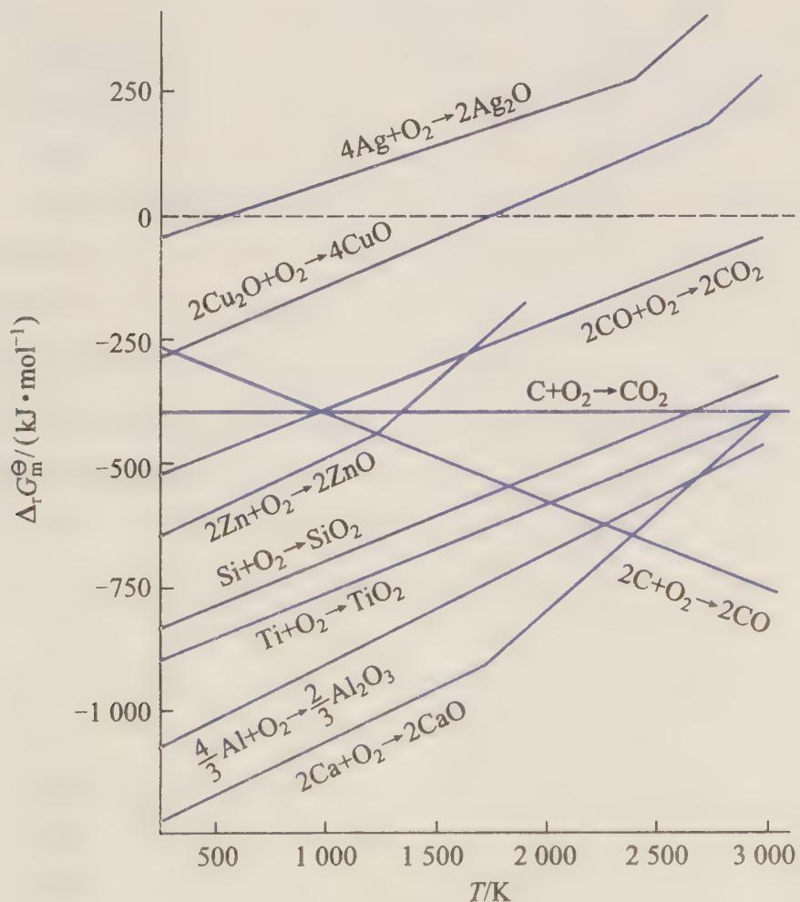

## 氮族元素

## 目录

15.1 氮的单质 …… 560
15.1.1 N₂ 分子的结构 …… 561
15.1.2 N₂ 的化学性质 …… 561
15.1.3 N₂ 的制备 …… 562
15.2 氮的氢化物 …… 562
15.2.1 氨 …… 562
1. 氨的制备 …… 562
2. 氨的性质 …… 563
3. 铵盐 …… 566
4. 氨的主要用途 …… 566
15.2.2 联氨 …… 566
15.2.3 羟胺 …… 568
15.2.4 叠氮化氢 …… 569
15.3 氮的含氧化合物 …… 570
15.3.1 氮的氧化物 …… 571
1. N₂O …… 571
2. NO …… 572
3. N₂O₃ …… 572
4. NO₂ 和 N₂O₄ …… 573
5. N₂O₅ …… 574
15.3.2 亚硝酸及其盐 …… 575
1. 制备 …… 575
2. 结构 …… 575
3. 性质 …… 576
15.3.3 硝酸及其盐 …… 577
1. 硝酸的制备 …… 577
2. 硝酸的结构 …… 578

3. 硝酸的性质 …… 578
4. 王水 …… 580
5. 硝酸盐 …… 581
6. 硝酸盐和亚硝酸盐的鉴别 …… 582

15.4 氮的卤化物 …… 582
15.5 磷的单质及氢化物 …… 583
15.5.1 磷的单质 …… 583
1. 单质的制备 …… 584
2. 磷的同素异形体 …… 584
3. 磷单质的化学性质 …… 585
15.5.2 磷的氢化物 …… 586
1. 磷化氢的制备 …… 586
2. 磷化氢的性质 …… 586

15.6 磷的含氧化合物 …… 587
15.6.1 磷的含氧酸及其盐 …… 587
1. 磷酸及其盐 …… 588
2. 次磷酸及其盐 …… 592
3. 亚磷酸及其盐 …… 593
15.6.2 磷的氧化物 …… 593
1. 三氧化二磷 …… 593
2. 五氧化二磷 …… 594

15.7 磷的卤化物和硫化物 …… 595
15.7.1 磷的卤化物 …… 595
15.7.2 磷的硫化物 …… 596

15.8 砷、锑、铋 …… 597
15.8.1 砷、锑、铋的单质 …… 598
15.8.2 砷、锑、铋的氢化物 …… 598
15.8.3 砷、锑、铋的含氧化合物 …… 599
1. 氧化数+3的化合物 …… 599
2. 氧化数+5的化合物 …… 600
15.8.4 砷、锑、铋的卤化物 …… 601
15.8.5 砷、锑、铋的硫化物 …… 601

拓展学习资源 …… 603
总结与思考题 …… 603
习题 …… 604

## 第15章 氮族元素

氮族元素包括氮、磷、砷、锑、铋和第七周期的镁共6种元素，在元素周期表中处于VA族。氮族元素在地壳中的质量分数分别为氮 $2.5 \times 10^{-3}\%$ 、磷 $0.1\%$ 、砷 $1.5 \times 10^{-4}\%$ 、锑 $2 \times 10^{-5}\%$ 、铋 $4.8 \times 10^{-6}\%$ 。

氮由苏格兰人卢瑟福(Rutherford)于1772年在爱丁堡发现。磷由瑞典人布兰特(Brandt)于1669年在德国的汉堡发现。砷最早大约是在1250年由德国人玛格耐斯(Magnus)分离出。大约在公元前1600年人类就知道锑，将辉锑矿与木炭一起煅烧制得金属锑。1753年，杰弗鲁瓦(Geoffroy)仔细研究了从辉铋矿还原所得的金属铋，确认它是一种新金属，定名为铋。

氮绝大部分以单质的形式存在于大气中，占大气体积的 $78.1\%$ ，总量约达到 $3.9\times 10^{15}\mathrm{t}$ 。动植物体中的蛋白质都含氮，土壤中含有硝酸盐，如 $\mathrm{KNO}_3$ 。自然界最大硝酸盐矿是南美洲智利北部的硝石（ $\mathrm{NaNO}_3$ )矿。

磷、砷、锑、铋大部分以矿物形式存在于自然界中。磷在自然界以磷酸盐的形式存在，如磷酸钙矿 $\left[\mathrm{Ca}_{3}\left(\mathrm{PO}_{4}\right)_{2}\cdot\mathrm{H}_{2}\mathrm{O}\right]$ 和磷灰石矿 $\left[\mathrm{Ca}_{5}\left(\mathrm{PO}_{4}\right)_{3}(\mathrm{F},\mathrm{Cl},\mathrm{OH})\right]$ 等。砷、锑、铋主要是以硫化物矿存在，如雌黄 $\left(\mathrm{As}_{2}\mathrm{S}_{3}\right)$ 、雄黄 $\left(\mathrm{As}_{4}\mathrm{S}_{4}\right)$ 、砷化铁矿 $\left(\mathrm{FeAs}_{2}\right)$ 、辉锑矿 $\left(\mathrm{Sb}_{2}\mathrm{S}_{3}\right)$ 、锑硫镍矿(NiSbS)、辉铋矿 $\left(\mathrm{Bi}_{2}\mathrm{S}_{3}\right)$ 等。砷、锑、铋还有少量的氧化物矿，如砷华 $\left(\mathrm{As}_{2}\mathrm{O}_{3}\right)$ 、锑华 $\left(\mathrm{Sb}_{2}\mathrm{O}_{3}\right)$ 和铋华 $\left(\mathrm{Bi}_{2}\mathrm{O}_{3}\right)$ 。我国锑的蕴藏量占世界第一位，是锑的主要供应国。

氮族元素基态原子的价层电子构型为 $ns^{2}np^{3}$ ，即都有5个价层电子，本族元素的最高氧化态可以达到+5。其中N价层没有d轨道，价层电子不能向d轨道跃迁，不能形成5个共价键。Bi的两个6s电子能量很低，成为“惰性电子对”而不易参与成键，结果Bi易失去3个p电子而显+3价。+5价铋在酸性条件下氧化性很强、不稳定。

本族元素从上到下金属性增强，N 和 P 是典型的非金属，处于中间的 As 为半金属，Sb 和 Bi 为金属。氮族元素单质的熔点，从 N, P 到 As 升高，而且 As 的熔点升高十分显著。这说明发生晶体类型的转变，N 和 P 为分子晶体而 As 为金属晶体 $^{①}$ 。金属键随原子半径的增大而减弱，故从 As, Sb 到 Bi 熔点又越来越低，

Bi 为低熔点金属。

除了 N 原子以外,本族其他元素原子的最外电子层都有空的 d 轨道,这些 d 轨道也可能参与成键,所以 N 原子的配位数不超过 4,而其他原子的最高配位数可达到 6,如在固体 $PCl_{5}$ 中存在 $PCl_{6}^{-}$ ,其中 P 的杂化轨道为 $sp^{3}d^{2}$ 。

氧化数为+5的氮族元素的化合物,除磷外在酸性溶液中都是氧化剂,氧化能力强弱关系为 $\mathrm{Bi(V)>N(V)>Sb(V)>As(V)}$ ,但是在碱性溶液中它们的氧化性很弱。氧化数为+3的氮族元素的化合物,在酸性溶液中除 $HNO_{2}$ 具有氧化性外,其他元素的化合物都没有氧化性而有还原性。亚磷酸还原性最强, $\mathrm{Bi(III)}$ 的还原性最弱。

上述关于氮族元素价态和氧化还原性质,可以从图 15-1 氮族元素的元素电势图中得以体现。

$$
\begin{array}{l} E _ {\mathrm{A}} ^ {\ominus} / \mathrm{V} \\ \mathrm {NO_ {3} ^ {-}} \xrightarrow {0 . 8 0 3} \mathrm {N _ {2} O _ {4}} \xrightarrow {1 . 0 7} \mathrm {HNO_ {2}} \xrightarrow {0 . 9 9 6} \mathrm{NO} \xrightarrow {1 . 5 9} \mathrm {N _ {2} O} \xrightarrow {1 . 7 7} \mathrm {N _ {2}} \xrightarrow {- 1 . 8 7} \mathrm {NH_ {3} OH^ {+}} \xrightarrow {1 . 4 1} \mathrm {N _ {2} H _ {5} ^ {+}} \xrightarrow {1 . 2 7 5} \mathrm {NH_ {4} ^ {+}} \\ \mathrm {H_ {3} PO_ {4}} \xrightarrow {- 0 . 2 7 6} \mathrm {H_ {3} PO_ {3}} \xrightarrow {- 0 . 4 9 9} \mathrm {H_ {3} PO_ {2}} \xrightarrow {- 0 . 3 6 5} \mathrm {P _ {4}} \xrightarrow {- 0 . 1 0 0} \mathrm {P _ {2} H _ {4}} \xrightarrow {- 0 . 0 0 6} \mathrm {PH_ {3}} \\ \mathrm {H_ {3} AsO_ {4}} \xrightarrow {0 . 5 6 0} \mathrm {H_ {3} AsO_ {3}} \xrightarrow {0 . 2 4 0} \text {As} \xrightarrow {- 0 . 2 2 5} \text {AsH_ {3}} \\ \mathrm {Sb_ {2} O_ {5}} \xrightarrow {0 . 6 0 5} \mathrm {SbO^ {+}} \xrightarrow {0 . 2 0 4} \text {Sb} \xrightarrow {- 0 . 5 1 0} \text {SbH_ {3}} \\ \mathrm {Bi_ {2} O_ {5}} \xrightarrow {1 . 6 0} \mathrm {BiO^ {+}} \xrightarrow {0 . 3 1 7} \text {Bi} \xrightarrow {- 0 . 9 7} \text {BiH_ {3}} \end{array}
$$

$E_{\mathrm{B}}^{\ominus} / N$

图15-1 氮族元素的元素电势图

## 15.1 氮的单质

氮是最重要的生命必需元素之一,在人体内的质量分数超过 5%, 是组成氨基酸和蛋白质等的主要元素, 氮也是植物生长的必需元素。

$N_{2}$ 的熔点为-210.00℃（约63K），沸点为-195.795℃（约77K），在常温常压下是一种无色、无味、无臭的气体。标准状况下 $1\ dm^{3}\ N_{2}$ 的质量为1.25g。氮气主要用于合成氨，以氨为原料可以制造硝酸、化肥和炸药等。由于在常温下的化学惰性，氮气常被用来作保护气体，液氮可以作制冷剂。

## 15.1.1 $N_{2}$ 分子的结构

$N_{2}$ 分子中因形成三键使得键长很短,为 109.77 pm,两个氮原子的 $p_{x}-p_{x}$ 轨道形成一个 $\sigma$ 键的同时, $p_{y}-p_{y}$ 轨道、 $p_{z}-p_{z}$ 轨道又分别形成两个方向互相垂直的 $\pi$ 键。

$N_{2}$ 的分子轨道式为 $KK(\sigma_{2s})^{2}(\sigma_{2s}^{*})^{2}(\pi_{2p_{y}})^{2}(\pi_{2p_{z}})^{2}(\sigma_{2p_{x}})^{2}$ ，键级为 3，故分子稳定性高。将 1 mol $N_{2}$ 分子分解为原子需要吸收 946 kJ 能量。 $N_{2}$ 分子是已知的双原子分子中最稳定的。

## 15.1.2 $N_{2}$ 的化学性质

在高温、高压并有催化剂存在的条件下,氮气可以与氢气反应生成氨,这个反应曾被详细研究过并已应用于生产:

$$
\mathrm{N} _ {2} + 3 \mathrm{H} _ {2} \xrightarrow [ \text {高温、高压} ]{\text {催化剂}} 2 \mathrm{NH} _ {3}
$$

氮气在放电条件下也可以直接与氧化合：

$$
\mathrm{N} _ {2} + \mathrm{O} _ {2} \xlongequal {\text {放电}} 2 \mathrm{NO}
$$

N 原子可以获得 3 个电子达到稀有气体的电子结构,但获得 3 个电子需要吸收较多的能量。因此,N 只能与电离能小的 I A 族和 II A 族的金属形成离子型氮化物,如黑色的 $Li_{3}N$ 和黄色的 $Mg_{3}N_{2}$ 等。

$$
6 \mathrm{Li} + \mathrm{N} _ {2} \stackrel {\triangle} {=} 2 \mathrm{Li} _ {3} \mathrm{N}
$$

$$
3 \mathrm{Mg} + \mathrm{N} _ {2} \stackrel {\triangle} {=} \mathrm{Mg} _ {3} \mathrm{N} _ {2}
$$

金属与氮气作用时的反应条件不同,锂在常温下就与氮气直接反应,但反应速率很慢,有实际意义的反应温度为 $250^{\circ}C$ 。ⅡA族金属都要在加热的条件下才与氮气化合,如 Ca 与 $N_{2}$ 反应温度为 $410^{\circ}C$ , Sr 与 $N_{2}$ 反应温度为 $380^{\circ}C$ 。

硼要在 $1200^{\circ}$ C 下才能与氮气反应,生成晶体 BN。硅要在 $1400^{\circ}$ C 或更高温度下才能与氮气反应,生成 SiN 或 $Si_{3}N_{4}$ 。

## 15.1.3 $N_{2}$ 的制备

工业上一般由分馏液态空气制取大量的氮气。这样制得的氮气中有少量的氧和水，可将气体通过加热的金属丝或者通过盛有还原剂的洗气瓶除去氧，而水分可以用 $\mathrm{P}_2\mathrm{O}_5$ 等干燥剂吸收。常以 $15\mathrm{MPa}$ 左右的压强把氮气盛装在钢瓶中运输和使用。

实验室中常采用将氨或铵盐氧化的方法制备少量氮气,最常用的是加热亚硝酸钠和氯化铵的饱和溶液:

$$
\mathrm{NH} _ {4} \mathrm{Cl} (\mathrm{aq}) + \mathrm{NaNO} _ {2} (\mathrm{aq}) \stackrel {\triangle} {=} \mathrm{NaCl} + 2 \mathrm{H} _ {2} \mathrm{O} + \mathrm{N} _ {2} \uparrow
$$

这样制得的氮气可能含有少量氮的氧化物,可以用适当的试剂除去这些杂质。

此外,可以用来制取氮气的反应还有:

$$
\left(\mathrm{NH} _ {4}\right) _ {2} \mathrm{Cr} _ {2} \mathrm{O} _ {7} (\mathrm{s}) \stackrel {\triangle} {=} \mathrm{N} _ {2} \uparrow + \mathrm{Cr} _ {2} \mathrm{O} _ {3} + 4 \mathrm{H} _ {2} \mathrm{O}
$$

$$
8 \mathrm{NH} _ {3} + 3 \mathrm{Br} _ {2} (\mathrm{aq}) = \mathrm{N} _ {2} \uparrow + 6 \mathrm{NH} _ {4} \mathrm{Br}
$$

$$
2 \mathrm{NH} _ {3} + 3 \mathrm{CuO} \stackrel {\triangle} {=} \mathrm{N} _ {2} \uparrow + 3 \mathrm{H} _ {2} \mathrm{O} + 3 \mathrm{Cu}
$$

## 15.2 氮的氢化物

氮的氢化物主要有氨（ $\mathrm{NH}_{3}$ ）、联氨（ $\mathrm{N}_{2} \mathrm{H}_{4}$ ）、羟胺（ $\mathrm{NH}_{2} \mathrm{OH}$ ）和叠氮化氢（ $\mathrm{HN}_{3}$ ）。

## 15.2.1 氨

## 1. 氨的制备

工业上利用氢气和氮气反应生产氨：

$$
\mathrm{N} _ {2} + 3 \mathrm{H} _ {2} \xrightarrow [ T , p ]{\text {催化剂}} 2 \mathrm{NH} _ {3}
$$

该反应在 $25^{\circ}$ C 时平衡常数较大, $K^{\ominus}=7.5\times10^{2}$ , 为放热且熵减小的反应, 故低温高压有利于转化率的提高。但是温度低时反应速率很慢, 而温度过高反应的平衡常数太小。实际上的反应条件控制在 $30\sim70$ MPa, $400\sim450$ ℃, 且以铁粉为催化剂。

在实验室中通常利用非氧化性酸的铵盐与强碱的反应来制备少量氨气：

取开始函数： $CaCO_3 \rightarrow CaO+CO_2$

$$
C a C N _ {2} + H _ {2} O \rightarrow C a C O _ {3} + N H _ {3}
$$

$$
\begin{array}{l}{\mathrm{CaO} + \mathrm{C} \xrightarrow {\text {电炉}} \mathrm{CaCl} _ {2} + \mathrm{CO} (\text {粪NaClHFeS} _ {2}) - \text {中间产物}: \mathrm{CN} _ {2} ^ {1 5. 2} \text {氮的氧化物}}\\{\mathrm{CaCl} _ {2} + \mathrm{N} _ {2} \rightarrow \mathrm{CaCN} _ {2} + \mathrm{C}}\\{2 \mathrm{NH} _ {4} \mathrm{Cl} + \mathrm{Ca(OH)} _ {2} \xlongequal {\triangle} \mathrm{CaCl} _ {2} + 2 \mathrm{NH} _ {3} \uparrow + 2 \mathrm{H} _ {2} \mathrm{O}}\end{array}
$$

也可用氮化物的水解制备氨气：

$$
C H _ {2} = N = N \leftrightarrow C H _ {2} - N \equiv N
$$

$$
\mathrm{Mg} _ {3} \mathrm{N} _ {2} + 6 \mathrm{H} _ {2} \mathrm{O} = 3 \mathrm{Mg(OH)} _ {2} + 2 \mathrm{NH} _ {3} \uparrow
$$

## 2. 氨的性质

会想解成 $N_{2}\uparrow$

后因耗能太多被淘汰

在氨分子中, 氮原子的轨道为 $sp^{3}$ 不等性杂化, 有一对孤电子对, 分子呈三角锥形结构, 如图 15-2 所示。由于孤电子对成键电子对的排斥作用, 分子中

H—N—H 键角减小至 $106^{\circ}42'$ ，这种结构使得 $NH_{3}$ 分子有较强的极性，其偶极矩为 $4.9 \times 10^{-30} \, C \cdot m \, (1.47 \, D)$ ，也使得 $NH_{3}$ 分子有较强的配位能力。

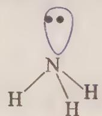

$NH_{3}$ 分子的结构特点和分子中 N 的氧化数决定了它的许多物理性质和化学性质。

图15-2 氨分子的结构示意图

氨在常温常压下是具有刺激性气味的无色气体。 $NH_{3}$ 分子有较强的极性且分子间能形成氢键，所以其熔、沸点高于同族的 $PH_{3}$ 。

氨极易溶于水,是在水中溶解度最大的气体之一。在 $0^{\circ}C$ 时, $1~dm^{3}$ 水能溶解 $1176~dm^{3}$ 氨; $20^{\circ}C$ 时, $1~dm^{3}$ 水可溶解 $775~dm^{3}$ 氨。氨溶于水则形成氨水, $1~cm^{3}$ 氨水的质量小于 1 g, 氨含量越高, 氨水的密度越小。一般市售浓氨水含 $NH_{3}$ 的质量分数约为 28%, 密度约为 $0.91~g\cdot cm^{-3}$ 。

液氨是一种很好的极性溶剂,能溶解许多无机盐。纯的液氨不导电,但却有微弱的自耦解离,-50 ℃时:

$$
2 \mathrm{NH} _ {3} = \mathrm{NH} _ {4} ^ {+} + \mathrm{NH} _ {2} ^ {-} \quad K ^ {\ominus} = 1. 9 \times 1 0 ^ {- 3 3}
$$

活泼的碱金属可以溶解在液氨中得到一种蓝色溶液,其导电能力极强,类似于金属。这种金属液氨溶液是一种强还原剂,其颜色与碱金属种类无关,一般认为是由于形成了氨合电子,例如:

$$
\begin{array}{r l} & \mathrm {Na = Na^ {+} + e^ {-}} \\ & n \mathrm {NH_ {3} + e^ {-} = e(NH_ {3}) _ {n} ^ {-}} \end{array}
$$

金属钠的液氨溶液放置时,缓慢地分解放出氢气,得到白色氨基钠固体:

$$
2 \mathrm{Na} + 2 \mathrm{NH} _ {3} (1) = 2 \mathrm{NaNH} _ {2} + \mathrm{H} _ {2} \uparrow
$$

如果加入金属铁作为催化剂,反应进行的速率则很快。

氨在通常情况下很稳定。它能参加的化学反应可归纳成4类:配位反应(有时称为加合反应)、取代反应、氨解反应和氧化反应。现将这4类反应分别讨论

如下。

## (1) 配位反应

氨分子中的孤电子对可以与其他分子或离子成配位键,得到氨的配位化合物,如 $\left[\mathrm{Ag}\left(\mathrm{NH}_{3}\right)_{2}\right]^{+},\left[\mathrm{Cu}\left(\mathrm{NH}_{3}\right)_{4}\right]^{2+},\left[\mathrm{Cr}\left(\mathrm{NH}_{3}\right)_{6}\right]^{3+},\left[\mathrm{Pt}\left(\mathrm{NH}_{3}\right)_{4}\right]^{2+}$ 等。常利用生成氨的配位化合物使一些不溶于水的化合物溶解,如 AgCl, Cu(OH) $_{2}$ 和 Zn(OH) $_{2}$ 等能溶解在氨水中。

氨分子是路易斯碱,它与分子中有空轨道的化合物——路易斯酸可以形成酸碱配位化合物。例如,三氟化硼与氨分子的反应:

$$
\mathrm{H} _ {3} \mathrm{N}: + \mathrm{BF} _ {3} = \mathrm{H} _ {3} \mathrm{N} \rightarrow \mathrm{BF} _ {3}
$$

氨在水中形成水合分子 $NH_{3} \cdot H_{2}O$ 和 $2NH_{3} \cdot H_{2}O$ 等, $NH_{3}$ 分子通过氢键同 $H_{2}O$ 分子结合, 不存在所谓的 $NH_{4}OH$ 分子。在水中只有一小部分 $NH_{3}$ 分子发生解离作用:

$$
\mathrm{NH} _ {3} + \mathrm{H} _ {2} \mathrm{O} = \mathrm{NH} _ {4} ^ {+} + \mathrm{OH} ^ {-}
$$

$$
K ^ {\ominus} = \frac {c (\mathrm{NH} _ {4} ^ {+}) c (\mathrm{OH} ^ {-})}{c (\mathrm{NH} _ {3})} = 1. 8 \times 1 0 ^ {- 5}
$$

在 $25^{\circ}$ C 时, $0.10 \, mol \cdot dm^{-3}$ 氨水中只有 1.34% 发生解离, 所以氨水表现为弱碱性。

氨和氯化氢两种气体在空气中相遇冒“白烟”，说明生成了固态的 $NH_{4}Cl$ 。氨和酸作用得到相应的铵盐，例如：

$$
2 \mathrm{NH} _ {3} + \mathrm{H} _ {2} \mathrm{SO} _ {4} = (\mathrm{NH} _ {4}) _ {2} \mathrm{SO} _ {4}
$$

反应的实质可以看成是 $NH_{3}$ 向 $H^{+}$ 配位生成 $NH_{4}^{+}$ 。

## (2) 取代反应

氨中的氢原子可以依次地被取代,生成相应的衍生物——氨基化物、亚胺化物和氮化物。例如前面提及的液氨与金属钠的反应,就是 Na 取代了 $NH_{3}$ 的一个 H 原子得到氨基钠。

在加热条件下,氨与金属发生取代反应生成氮化物,例如:

$$
3 \mathrm{Mg} + 2 \mathrm{NH} _ {3} \stackrel {\triangle} {=} \mathrm{Mg} _ {3} \mathrm{N} _ {2} + 3 \mathrm{H} _ {2}
$$

重金属的氮化物、亚胺化物和氨基化物不稳定,易爆炸,实验时应特别小心。例如, $\left[\mathrm{Ag}\left(\mathrm{NH}_{3}\right)_{2}\right]^{+}$ 会缓慢转化为易爆炸的 $Ag_{3}N$ 和 $Ag_{2}NH$ ,实验结束时要将用后的 $\left[\mathrm{Ag}\left(\mathrm{NH}_{3}\right)_{2}\right]^{+}$ 溶液及时处理掉。

## (3) 氨解反应

氨解反应类似于水解反应,属于取代反应范畴。 $H_{2}O$ 的自耦解离产生 $OH^{-}$ 和 $H_{3}O^{+}$ ,而 $NH_{3}$ 的自耦解离产生 $NH_{2}^{-}$ 和 $NH_{4}^{+}$ 。某化合物在氨中发生解离,解离出的带正电荷的部分与 $NH_{2}^{-}$ 结合,解离出的带负电荷的部分与 $NH_{4}^{+}$ 结合,这是氨解反应的实质。例如,光气 O=C/Cl 与氨反应生成尿素:

$$
4 \mathrm{NH} _ {3} + \mathrm{COCl} _ {2} = \mathrm{CO} (\mathrm{NH} _ {2}) _ {2} + 2 \mathrm{NH} _ {4} \mathrm{Cl}
$$

又如,氨水与亚硫酰氯 $O=S\begin{array}{c}\ce{\chemfig{*6(-=-(-Cl)=-=)}}\\ \ce{\chemfig{*6(-=-(-Cl)=-=)}}\end{array}$ 反应生成亚硫酰胺:

$$
4 \mathrm{NH} _ {3} (\mathrm{aq}) + \mathrm{SOCl} _ {2} = \mathrm{SO} (\mathrm{NH} _ {2}) _ {2} + 2 \mathrm{NH} _ {4} \mathrm{Cl}
$$

氨水与氯化汞反应生成白色氯化氨基汞沉淀：

$$
2 \mathrm{NH} _ {3} (\mathrm{aq}) + \mathrm{HgCl} _ {2} = \mathrm{Hg} \left(\mathrm{NH} _ {2}\right) \mathrm{Cl} \downarrow + \mathrm{NH} _ {4} \mathrm{Cl}
$$

这些反应均属于氨解反应。

## (4) 氧化反应

$NH_{3}$ 和 $NH_{4}^{+}$ 中 N 的氧化数为 -3，在一定条件下能被氧化。例如，氨在氧气中燃烧：

$$
4 \mathrm{NH} _ {3} + 3 \mathrm{O} _ {2} \xlongequal {\text {点燃}} 6 \mathrm{H} _ {2} \mathrm{O} + 2 \mathrm{N} _ {2}
$$

而反应在铂催化剂存在下,氨可被氧化成一氧化氮:

$$
4 \mathrm{NH} _ {3} + 5 \mathrm{O} _ {2} \xrightarrow [ \text {燃烧} ]{\mathrm{Pt}} 4 \mathrm{NO} + 6 \mathrm{H} _ {2} \mathrm{O}
$$

氯或溴也能在气态或溶液中将氨氧化：

$$
2 \mathrm{NH} _ {3} + 3 \mathrm{Br} _ {2} = 6 \mathrm{HBr} + \mathrm{N} _ {2}
$$

在高温下,氨更易被氧化:

$$
2 \mathrm{NH} _ {3} + 3 \mathrm{CuO} \stackrel {\triangle} {=} \mathrm{N} _ {2} + 3 \mathrm{Cu} + 3 \mathrm{H} _ {2} \mathrm{O}
$$

$NH_{4}^{+}$ 也有还原性,氧化性含氧酸的铵盐受热分解时, $NH_{4}^{+}$ 往往被氧化,例如:

$$
\left(\mathrm{NH} _ {4}\right) _ {2} \mathrm{Cr} _ {2} \mathrm{O} _ {7} \stackrel {\triangle} {=} \mathrm{N} _ {2} \uparrow + \mathrm{Cr} _ {2} \mathrm{O} _ {3} + 4 \mathrm{H} _ {2} \mathrm{O}
$$

$$
\mathrm{NH} _ {4} \mathrm{NO} _ {2} \stackrel {\triangle} {=} \mathrm{N} _ {2} \uparrow + 2 \mathrm{H} _ {2} \mathrm{O}
$$

$$
\mathrm{NH} _ {4} \mathrm{NO} _ {3} \stackrel {\triangle} {=} \mathrm{N} _ {2} \mathrm{O} \uparrow + 2 \mathrm{H} _ {2} \mathrm{O}
$$

温度更高时发生的反应是

$$
2 \mathrm{NH} _ {4} \mathrm{NO} _ {3} \xlongequal {\text {高温}} 2 \mathrm{N} _ {2} \uparrow + \mathrm{O} _ {2} \uparrow + 4 \mathrm{H} _ {2} \mathrm{O}
$$

## 3.铵盐

铵盐是氨与酸作用的产物。铵离子没有颜色,若酸根离子也没有颜色,则铵盐是无色或白色的化合物。大多数铵盐易溶于水,而且是强电解质。 $NH_{4}^{+}$ 和 $Na^{+}$ 是等电子体,因此 $NH_{4}^{+}$ 具有 +1 价金属离子的性质。 $NH_{4}^{+}$ 的半径 (143 pm) 近似于 $K^{+}(138\ \text{pm})$ 和 $Rb^{+}(152\ \text{pm})$ ,使许多同类铵盐和钾盐或铷盐类质同晶,溶解度相近。 $K^{+}$ 和 $Rb^{+}$ 的沉淀剂一般也是 $NH_{4}^{+}$ 的沉淀剂。

氨为弱碱,铵盐溶于水有一定程度的水解,与强酸根构成的铵盐的水溶液显酸性,如 $NH_{4}NO_{3}, NH_{4}Cl$ 等;而醋酸铵( $NH_{4}Ac$ )水溶液近于中性。

铵盐的另一个重要性质就是它的热稳定性差。固态铵盐加热时极易分解，一般分解为氨和相应的酸，例如：

$$
\begin{array}{r l} & \mathrm {NH_ {4} HC O _ {3}} \stackrel {\triangle} {=} \mathrm {NH_ {3}} \uparrow + \mathrm {CO_ {2}} \uparrow + \mathrm {H_ {2} O} \\ & \mathrm {NH_ {4} Cl} \stackrel {\triangle} {=} \mathrm {NH_ {3}} \uparrow + \mathrm{HCl} \uparrow \\ & (\mathrm {NH_ {4}}) _ {2} \mathrm {SO_ {4}} \stackrel {\triangle} {=} 2 \mathrm {NH_ {3}} \uparrow + \mathrm {H_ {2} SO_ {4}} \\ & (\mathrm {NH_ {4}}) _ {3} \mathrm {PO_ {4}} \stackrel {\triangle} {=} 3 \mathrm {NH_ {3}} \uparrow + \mathrm {H_ {3} PO_ {4}} \end{array}
$$

非挥发性酸的铵盐,受热分解后氨从生成的酸中挥发逸出。

氧化性酸的铵盐受热分解过程中铵被氧化,产物中有大量气体,因此受热往往会发生爆炸。如 $NH_{4}NO_{3}, NH_{4}ClO_{4}$ 和 $(\mathrm{NH}_{4})_{2}\mathrm{Cr}_{2}\mathrm{O}_{7}$ 等均有此类现象发生。

## 4、氨的主要用途

氨是其他含氮化合物的生产原料,如制造硝酸及其盐、铵盐等均以氨为原料,所以氨在化学工业中的需求量很大。铵盐可以作为化肥,常见的有硝酸铵 $\left(\mathrm{NH}_{4}\mathrm{NO}_{3}\right)$ 、硫酸铵 $\left[\left(\mathrm{NH}_{4}\right)_{2}\mathrm{SO}_{4}\right]$ 、氯化铵 $\left(\mathrm{NH}_{4}\mathrm{Cl}\right)$ 和碳酸氢铵 $\left(\mathrm{NH}_{4}\mathrm{HCO}_{3}\right)$ 等。氨也是有机合成工业的重要原料,如可用于尿素、染料、医药用品和塑料的生产。氨很容易加压液化,所以常作为制冷剂。

## 1522 联氨

联氨 $\left(\mathrm{N}_{2}\mathrm{H}_{4}\right)$ 又称为“肼”，可以看成 $NH_{3}$ 的一个H原子被— $NH_{2}$ 取代后的产物, 分子中的键联关系如图 15-3(a) 所示。 $NH_{3}$ 被 NaClO 溶液氧化可以得到 $N_{2}H_{4}$ :

$$
2 \mathrm{NH} _ {3} + \mathrm{ClO} ^ {-} = \mathrm{N} _ {2} \mathrm{H} _ {4} + \mathrm{Cl} ^ {-} + \mathrm{H} _ {2} \mathrm{O}
$$

联氨也可以由尿素和次氯酸钠在一定条件下反应制得：

$$
\mathrm{CO} \left(\mathrm{NH} _ {2}\right) _ {2} + \mathrm{NaClO} + 2 \mathrm{NaOH} = \mathrm{N} _ {2} \mathrm{H} _ {4} + \mathrm{NaCl} + \mathrm{Na} _ {2} \mathrm{CO} _ {3} + \mathrm{H} _ {2} \mathrm{O}
$$

联氨分子可能有两种不同的构象——顺式和反式，沿 N—N 键轴方向的投影如图 15-4 所示，其中 (a) 为反式，(b) 为顺式。测得联氨分子的极性很大，偶极矩 $\mu = 5.8 \times 10^{-30} \, C \cdot m (1.75D)$ ，说明它具有顺式构象。

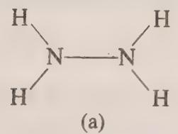

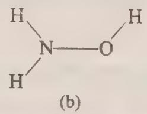  
图15-3 联氨和羟胺分子的结构

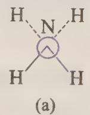

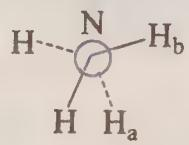  
图15-4 联氨的构象

N—N 键键长为 144.9 pm, 这是典型的 N—N 单键的键长, N—H 键键长为 102.1 pm; 键角 $\angle HNH$ 为 $106.6^{\circ}$ , $\angle NNH$ 有两种数值: $\angle NNH_{a}$ 为 $112^{\circ}$ , $\angle NNH_{b}$ 为 $106^{\circ}$ , 扭转角为 $91^{\circ}$ 。

在 $N_{2}H_{4}$ 中 N 原子采取 $sp^{3}$ 杂化, 形成 3 个 $\sigma$ 键, N 的氧化数为 -2。每个 N 原子上有一对孤电子对, 具有配位能力。

联氨的熔点为 $1.54^{\circ}C$ ，沸点为 $113.55^{\circ}C$ ，常温常压下为无色的液体，其密度为 $1.0036 g \cdot cm^{-3}$ 。联氨是良好的极性溶剂，许多盐能溶解在联氨中，所得溶液导电能力较强。

纯的联氨和它的水溶液在动力学上是稳定的,但在热力学上是不稳定的,所以在有催化剂存在时会发生分解:

$$
\begin{array}{r l} & {\mathrm {N_ {2} H_ {4}} \xlongequal {\text {催化剂}} \mathrm {N_ {2}} \uparrow + 2 \mathrm {H_ {2}} \uparrow} \\ & {3 \mathrm {N_ {2} H_ {4}} \xlongequal {\text {催化剂}} \mathrm {N_ {2}} \uparrow + 4 \mathrm {NH_ {3}} \uparrow} \end{array}
$$

联氨的盐较稳定,常以盐的形式保存联氨,如 $N_{2}H_{4}\cdot H_{2}SO_{4}$ 或 $N_{2}H_{4}\cdot 2HCl$ 。 $N_{2}H_{4}$ 是一种二元弱碱,其碱性不如 $NH_{3}$ 强:

$$
\begin{array}{l l} \mathrm {N_ {2} H_ {4} (aq) + H_ {2} O\xlongequal {\quad} N_ {2} H_ {5} ^ {+} (aq) + OH^ {-}} & K ^ {\ominus} = 8. 7 \times 1 0 ^ {- 7} \\ \mathrm {N_ {2} H_ {5} ^ {+} (aq) + H_ {2} O\xlongequal {\quad} N_ {2} H_ {6} ^ {2 + } (aq) + OH^ {-}} & K ^ {\ominus} = 1. 9 \times 1 0 ^ {- 1 4} \end{array}
$$

由于 N 原子上的孤电子对有配位能力, 联氨能与过渡金属生成配位化合物, 如 $\left[\mathrm{Pt}\left(\mathrm{NH}_{3}\right)_{2}\left(\mathrm{N}_{2}\mathrm{H}_{4}\right)_{2}\right]\mathrm{Cl}_{2}, \left[\left(\mathrm{NO}_{2}\right)_{2}\mathrm{Pt}\left(\mathrm{N}_{2}\mathrm{H}_{4}\right)_{2}\mathrm{Pt}\left(\mathrm{NO}_{2}\right)_{2}\right]$ 等。联氨既可以用一个氮原子向一个金属配位形成单核配位化合物, 也可以用两个氮原子分别向两个金属配位形成双核配位化合物, 就是说联氨可以作为桥联配体。

联氨中 N 的氧化数为 -2，因而既有氧化性又有还原性。

$$
\begin{array}{l l} \mathrm {N_ {2} H_ {5} ^ {+} + 3H^ {+} + 2e^ {-} = 2NH_ {4} ^ {+}} & E ^ {\ominus} = 1. 2 7 5 \mathrm{V} \\ \mathrm {N_ {2} + 5H^ {+} + 4e^ {-} = N_ {2} H_ {5} ^ {+}} & E ^ {\ominus} = - 0. 2 3 \mathrm{V} \end{array}
$$

从热力学角度,联氨既有较强的氧化性,又有较强的还原性。但是联氨作为氧化剂的反应速率都很慢,没有实际意义。因此,联氨只是一种强还原剂。它能被卤素单质氧化:

$$
\mathrm{N} _ {2} \mathrm{H} _ {4} (\mathrm{aq}) + 2 \mathrm{X} _ {2} = 4 \mathrm{HX} + \mathrm{N} _ {2}
$$

也能将弱氧化剂 AgBr 还原：

$$
4 \mathrm{AgBr} + \mathrm{N} _ {2} \mathrm{H} _ {4} (\mathrm{aq}) = 4 \mathrm{Ag} + \mathrm{N} _ {2} \uparrow + 4 \mathrm{HBr}
$$

联氨与氧气、二氧化氮、过氧化氢反应，生成 $N_{2}$ 和 $H_{2}O$ ，并放出大量的热：

$$
\begin{array}{r l} & \mathrm {N_ {2} H_ {4} (aq) + O_ {2} = N_ {2} + 2H_ {2} O} \\ & 2 \mathrm {N_ {2} H_ {4} (aq) + 2NO_ {2} = 3N_ {2} + 4H_ {2} O} \\ & \mathrm {N_ {2} H_ {4} (aq) + 2H_ {2} O_ {2} = N_ {2} \uparrow + 4H_ {2} O} \end{array}
$$

所以联氨和它的衍生物, 如 $\mathrm{CH}_{3}\mathrm{NHNH}_{2}, (\mathrm{CH}_{3})_{2}\mathrm{NNH}_{2}$ 等, 可用作高能燃料, 如火箭的推进剂。

## 15.23 轻胶

羟胺 $\left(\mathrm{NH}_{2}\mathrm{OH}\right)$ 又叫作“胺”，为白色固体，不稳定，熔点为33.1℃。羟胺可以看成是 $NH_{3}$ 中的一个H原子被—OH取代的衍生物。

羟胺分子的结构如图 15-3(b) 所示, N 原子上有一对孤电子对。分子中 N 的氧化数为 -1。羟胺中的—OH 吸电子能力比—NH₂ 强, 因此羟胺的配位能力比联氨弱, 其碱性也比联氨弱:

$$
\mathrm{NH} _ {2} \mathrm{OH} + \mathrm{H} _ {2} \mathrm{O} = \mathrm{NH} _ {3} \mathrm{OH} ^ {+} + \mathrm{OH} ^ {-} \quad K ^ {\ominus} = 8. 7 \times 1 0 ^ {- 9}
$$

羟胺不稳定, 易发生分解反应, 但羟胺的水溶液或它的盐却比较稳定, 如 $\left[\mathrm{NH}_{3} \mathrm{OH}\right] \mathrm{Cl}$ 和 $\left[\mathrm{NH}_{3} \mathrm{OH}\right]_{2} \mathrm{SO}_{4}$ 。羟胺的标准电极电势如下:

$$
\mathrm{NH} _ {3} \mathrm{OH} ^ {+} + 2 \mathrm{H} ^ {+} + 2 \mathrm{e} ^ {-} = \mathrm{NH} _ {4} ^ {+} + \mathrm{H} _ {2} \mathrm{O} \quad E ^ {\ominus} = 1. 3 5 \mathrm{V}
$$

$$
\mathrm{N} _ {2} + 2 \mathrm{H} _ {2} \mathrm{O} + 4 \mathrm{H} ^ {+} + 2 \mathrm{e} ^ {-} = 2 \mathrm{NH} _ {3} \mathrm{OH} ^ {+} \quad E ^ {\ominus} = - 1. 8 7 \mathrm{V}
$$

羟胺作为氧化剂的反应速率很慢,无实际意义,但是羟胺是很好的还原剂:

$$
2 \mathrm{NH} _ {2} \mathrm{OH(aq)} + 2 \mathrm{AgBr} = 2 \mathrm{Ag} + \mathrm{N} _ {2} \uparrow + 2 \mathrm{HBr} + 2 \mathrm{H} _ {2} \mathrm{O}
$$

$$
2 \mathrm{NH} _ {2} \mathrm{OH(aq)} + 4 \mathrm{AgBr} = 4 \mathrm{Ag} + \mathrm{N} _ {2} \mathrm{O} \uparrow + 4 \mathrm{HBr} + \mathrm{H} _ {2} \mathrm{O}
$$

联氨和羟胺作还原剂不仅还原性强，而且不给反应体系带来杂质。但联氨和羟胺的价格较昂贵，用作还原剂时成本较高。

## 15.2.4 豫氮化氢

纯的叠氮化氢 $\left(\mathrm{HN}_{3}\right)$ 是无色液体，熔点为-80℃，沸点为35.7℃。 $HN_{3}$ 毒性大且易爆炸。 $HN_{3}$ 分子中原子的连接关系如图15-5(a)所示，3个N原子连成直线，其中N1原子与H原子相连。N—N—N链和H—N键之间的夹角约为109.2°。

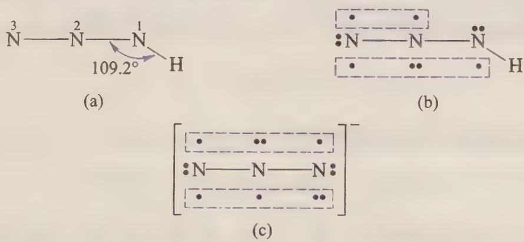  
图15-5 叠氮化氢与叠氮离子的结构及其离域 $\pi$ 键

与氢原子相连的 N1 原子为 $sp^{2}$ 不等性杂化, 如图 15-6(a) 所示。其两个有单电子的 $sp^{2}$ 杂化轨道与 H,N2 原子各成一个 $\sigma$ 键; 有电子对的 $sp^{2}$ 杂化轨道不参与成键, 不参与杂化的 $p_{z}$ 轨道有一个单电子。N2 原子为 sp 等性杂化, 见图 15-6(b), 并与 N3,N1 原子各成一个 $\sigma$ 键, 其不参与杂化的 $p_{z}$ 轨道有电子对, 不参与杂化的 $p_{y}$ 轨道有一个单电子。N3 原子有 3 个单电子和一对孤电子对, 通过 $p_{x}$ 的一个电子和 N2 原子成 $\sigma$ 键, 通过 $p_{y}$ 的一个电子和 N2 原子成 $\pi$ 键。N3 原子的 $p_{z}$ 有一个单电子。于是在 $p_{z}$ 方向 N1 原子的一个电子, N2 原子的两个电子, N3 原子的一个电子, 共 4 个电子在 3 个 N 原子之间成大 $\pi$ 键 $\Pi_{3}^{4}$ 。

$HN_{3}$ 分子中的成键情况可以用图 15-5(b) 表示: 在 3 个 N 原子间存在离域 $\pi$ 键, N2 原子和 N3 原子之间还有一个 $\pi$ 键。N1 原子和 N2 原子的距离是

124.5 pm, N2 原子和 N3 原子的距离是 113.4 pm。 $HN_{3}$ 分子中 N 的平均氧化数为 $-\frac{1}{3}$ 。

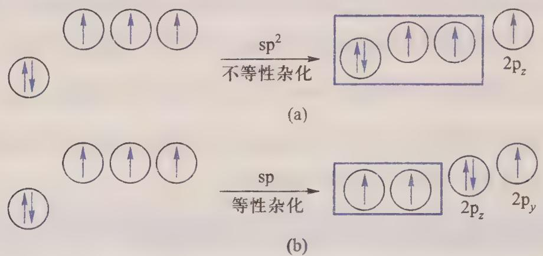  
图 15-6. $HN_{3}$ 分子中 N 原子的轨道杂化

$HN_{3}$ 的水溶液为叠氮酸，叠氮酸的酸性和醋酸相近， $K_{a}^{\ominus}=2.4\times10^{-5}$ 。在它的盐中含有叠氮离子 $(N_{3}^{-})$ ，其结构见图 15-5(c)。 $N_{3}^{-}$ 的性质类似于卤离子，如白色的 $AgN_{3}$ 和 $\mathrm{Pb(N_{3})_{2}}$ 难溶于水。碱金属的叠氮化物稍稳定，而其他一些叠氮化物受热或受撞击会发生爆炸，如 $\mathrm{Pb(N_{3})_{2}}$ 可以用作引爆剂：

$$
\mathrm{Pb} \left(\mathrm{N} _ {3}\right) _ {2} \stackrel {\triangle} {=} \mathrm{Pb} + 3 \mathrm{N} _ {2} \uparrow
$$

联氨被亚硝酸氧化时,生成叠氮酸:

$$
\mathrm{N} _ {2} \mathrm{H} _ {4} (\mathrm{aq}) + \mathrm{HNO} _ {2} = \mathrm{HN} _ {3} + 2 \mathrm{H} _ {2} \mathrm{O}
$$

在实验室中,可将浓硫酸小心地与 $NaN_{3}$ 混合制取 $HN_{3}$ , 而 $NaN_{3}$ 则很容易制备:

$$
\begin{array}{r l} & \mathrm {NaN O _ {3}} + 3 \mathrm {NaN H _ {2}} \xlongequal {1 7 5 ^ {\circ} \mathrm{C}} \mathrm {NaN_ {3}} + 3 \mathrm{NaOH} + \mathrm {NH_ {3}} \uparrow \\ & \mathrm {N_ {2} O} + 2 \mathrm {NaN H _ {2}} \xlongequal {1 9 0 ^ {\circ} \mathrm{C}} \mathrm {NaN_ {3}} + \mathrm{NaOH} + \mathrm {NH_ {3}} \uparrow \end{array}
$$

## 15.3 氮的含氧化合物

氮及其含氧化合物的自由能-氧化数图见图15-7。

由图 15-7 可知, 在酸性条件下, 氮的含氧化合物都有一定的氧化性, $\mathrm{NO}_{2}(\mathrm{~N}_{2}\mathrm{O}_{4})$ 和 NO 能发生歧化反应; 在碱性条件下, $\mathrm{NO}_{2}(\mathrm{~N}_{2}\mathrm{O}_{4})$ 和 NO 发生歧化反应的趋势更大; 在碱性条件下, N(Ⅲ) 的稳定性比其在酸性条件下高得多。

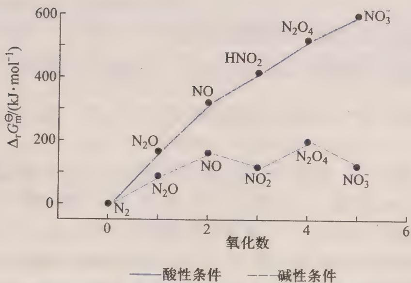  
图 15-7 氮及其含氧化合物的自由能—氧化数图

## 15.3.1 氨的氧化物

在形成氧化物时，N 有从 +1 到 +5 的 5 种氧化数。常见氮的氧化物有 5 种，分别为氧化二氮 $\left(\mathrm{N}_{2}\mathrm{O}\right)$ 、一氧化氮 (NO)、三氧化二氮 $\left(\mathrm{N}_{2}\mathrm{O}_{3}\right)$ 、二氧化氮 $\left(\mathrm{NO}_{2}\right)$ ，其二聚体为 $\mathrm{N}_{2}\mathrm{O}_{4}$ 和五氧化二氮 $\left(\mathrm{N}_{2}\mathrm{O}_{5}\right)$ 。除 $N_{2}O_{5}$ 外，氮的其他氧化物在常温常压下都是气体。

## 1. $\mathbf{N}_2\mathbf{O}$

在 $250^{\circ}$ C 左右小心加热分解硝酸铵, 得到无色的氧化二氮气体:

$$
\mathrm{NH} _ {4} \mathrm{NO} _ {3} \stackrel {\triangle} {=} \mathrm{N} _ {2} \mathrm{O} \uparrow + 2 \mathrm{H} _ {2} \mathrm{O}
$$

$N_{2}O$ 分子的结构和离域 $\pi$ 键见图 15-8, 它与 $N_{3}^{-}$ 为等电子体, 二者有相同的

结构,均为直线形分子,其中有两个三中心四电子离域 $\pi$ 键。键长数据表明 N—N 键键长为 112.8 pm, N—O 键键长为 118.4 pm; 计算结果 N—N 键键级为 2.5, N—O 键键级为 1.5。据此有研究认为, 在 N—N—O 之间有一个 $\Pi_{3}^{4}$ , 而在 N—N 之间另有一个 $\pi$ 键。 $N_{2}O$ 在常温下为气体, 其熔点为 -90.8 ℃, 沸点为 -88.48 ℃。

图 15-8 N₂O 分子的结构相等或开现

$N_{2}O$ 为极性分子，在水中有一定的溶解度， $1\ dm^{3}$ 水能溶解 $0.5\ dm^{3}$ 该气体。由于 $N_{2}O$ 的标准摩尔生成热为正值 ( $81.6\ kJ\cdot mol^{-1}$ )，因而不稳定，易分解，可助燃。 $N_{2}O$ 曾作为牙科的麻醉剂。

## 2. NO

稀硝酸与铜反应的还原产物主要是无色的 NO 气体：

$$
3 \mathrm{Cu} + 8 \mathrm{HNO} _ {3} = 3 \mathrm{Cu} (\mathrm{NO} _ {3}) _ {2} + 2 \mathrm{NO} \uparrow + 4 \mathrm{H} _ {2} \mathrm{O}
$$

高压放电条件下氮气与氧气作用也能得到 NO 气体。工业上由氨的催化氧化制备 NO。

NO 熔点为 -163.6 ℃，沸点为 -151.74 ℃。NO 分子的结构见图 15-9(a)，N—O 距离为 115 pm，N 原子上有孤电子对，具有一定的配位能力，可以生成配位化合物，如棕色的 $\left[\mathrm{Fe}(\mathrm{NO})\right]^{2+}$ 。从分子轨道图和分子轨道式可知：NO 分子中有单电子，具有顺磁性，在低温时部分 NO 分子发生聚合，生成 $N_{2}O_{2}$ 。二聚的 $N_{2}O_{2}$ 主要是顺式结构，见图 15-9(b)，N—O 距离为 112 pm，N—N 距离为 218 pm，O 和 O 距离为 262 pm。

NO 有还原性, 在空气中迅速地被氧化为棕色的 $NO_{2}$ 。NO 失去单电子生成 $NO^{+}$ , 如在 NOCl, $NOClO_{4}$ 等物质中。

近来的研究表明, NO 在生物体中起着非常重要的作用, 它对于治疗心绞痛等疾病有着神奇的效果。

3. $\mathbf{N}_2\mathbf{O}_3$

NO 与 $NO_{2}$ 在低温下作用生成三氧化二氮( $N_{2}O_{3}$ ):

$$
\mathrm{NO} + \mathrm{NO} _ {2} \xlongequal {\text {低温}} \mathrm{N} _ {2} \mathrm{O} _ {3}
$$

$N_{2}O_{3}$ 分子的键联关系如图 15-10(a) 所示, N—N 距离为 186.4 pm, 右边的一NO中 N—O 距离为 114.2 pm, 左边的— $NO_{2}$ 中上面的 N—O 距离为 120.2 pm, 下面的 N—O 距离为 121.7 pm。其中 N—N 的距离远大于典型的 N—N 单键的键长 144.9 pm, 所以 N—N 之间不受离域 $\pi$ 键约束。在左侧有离域 $\pi$ 键 $\Pi_{3}^{4}$ , 约束 O—N—O 共 3 个原子, 使得左侧的每个 N—O 键均介于单、双键之间。在右侧有正常的 $\pi$ 键, 故右侧的 N—O 键有着双键的键长。

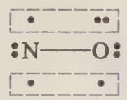  
(a)

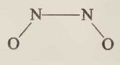  
(b)

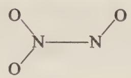  
(a)  
图 15-9 NO 分子及其二聚体的结构

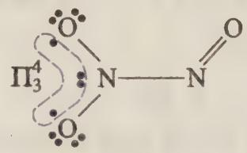  
(b)  
图 15-10 $N_{2}O_{3}$ 分子的结构

$N_{2}O_{3}$ 熔点为 -101.1 ℃，沸点约为 3 ℃，气态的 $N_{2}O_{3}$ 不稳定，迅速分解：

$$
\mathrm{N} _ {2} \mathrm{O} _ {3} = \mathrm{NO} + \mathrm{NO} _ {2}
$$

液态 $N_{2}O_{3}$ 为淡蓝色，固态为蓝色。

4. $\mathrm{NO}_{2}$ 和 $\mathrm{N}_{2} \mathrm{O}_{4}$

NO 与 $O_{2}$ 作用得到二氧化氮 ( $NO_{2}$ ), 某些硝酸盐热分解的气体产物中含有二氧化氮, 例如:

$$
2 \mathrm{Pb} (\mathrm{NO} _ {3}) _ {2} \stackrel {\triangle} {=} 2 \mathrm{PbO} + 4 \mathrm{NO} _ {2} \uparrow + \mathrm{O} _ {2} \uparrow
$$

$NO_{2}$ 为棕色气体, 聚合后得无色气体四氧化二氮( $N_{2}O_{4}$ ):

$$
2 \mathrm{NO} _ {2} \rightleftharpoons \mathrm{N} _ {2} \mathrm{O} _ {4}
$$

$NO_{2}$ 和 $N_{2}O_{4}$ 能很迅速地达到平衡。

$\mathrm{NO}_2$ 分子具有离域 $\pi$ 键。N原子电子构型为 $2\mathrm{s}^2 2\mathrm{p}^3$ ，N原子2s轨道的一个电子激发到2p轨道，发生 $\mathfrak{sp}^2$ 杂化，未参与杂化的 $2\mathrm{p}_z$ 轨道中有一对电子，如图15-11(a)所示。

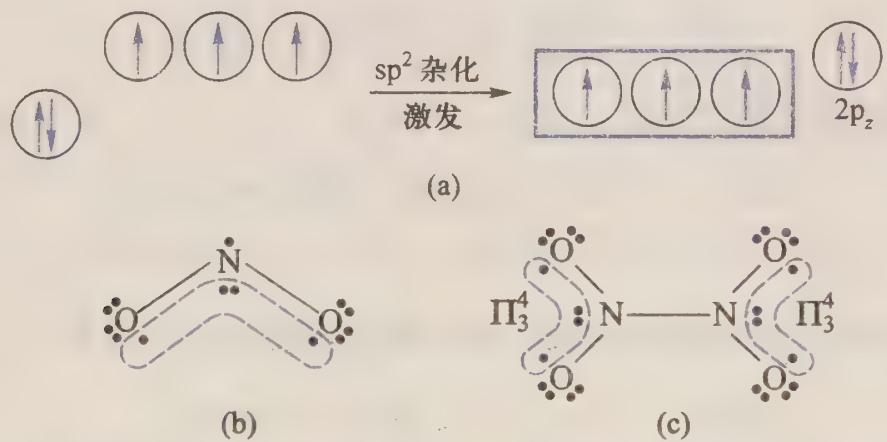  
图 15-11 $NO_{2}$ 分子中 N 原子的轨道杂化及 $NO_{2}$ 和 $N_{2}O_{4}$ 分子的结构

中心 N 原子有单电子的 3 条 $sp^{2}$ 杂化轨道, 用其中的两条与两个 O 原子形成两个 $\sigma$ 共价键, 决定了 $NO_{2}$ 分子的 V 形结构, 并确定了分子平面。余下的一条 $sp^{2}$ 杂化轨道未成键, 其中有一个单电子。

两个 O 原子还各有一条有单电子的 $2p_{z}$ 轨道, 这两条 $2p_{z}$ 轨道与 N 原子未杂化的有一对电子的 $2p_{z}$ 轨道互相平行, 这 3 条与分子平面垂直的平行轨道互相重叠形成离域 $\pi$ 键 $\Pi_{3}^{4}$ , 如图 15-11(b) 所示。

$NO_{2}$ 分子中 $\angle ONO = 134.1^{\circ}$ ，N—O 距离为 119.3 pm。 $NO_{2}$ 呈较深的棕色，易聚合，键角远大于 $120^{\circ}$ ，都表明该分子有单电子，也支持了分子中有 $\Pi_{3}^{4}$ 键。

形成离域 $\pi$ 键时要满足 3 个条件, 其一是参与形成离域 $\pi$ 键的 p 轨道是不参与杂化的轨道, 它们均垂直于分子平面而互相平行以满足对称性一致的原则; 其二是参与形成离域 $\pi$ 键的几个原子尽可能共平面, 以实现最大重叠; 其三是参与形成离域 $\pi$ 键的轨道中的电子总数小于轨道数的两倍,以保证键级不为 0。

离域 $\pi$ 键中的电子不再限定于某个原子的轨道中运动, 而是在几个原子的轨道中运动, 对几个原子构成约束。

$N_{2}O_{4}$ 分子的结构如图 15-11(c) 所示, $\angle ONO = 135.4^{\circ}$ , N—O 距离为 119.0 pm, N—N 距离为 178.2 pm, 可见 N—N 之间不受离域 $\pi$ 键约束。在左右两侧各有一个离域 $\pi$ 键 $\Pi_{3}^{4}$ , 分别约束 O—N—O 共 3 个原子, 使得每个 N—O 键均介于单、双键之间。

$N_{2}O_{4}$ 熔点为 $-9.3^{\circ}C$ ，沸点为 $21.15^{\circ}C$ 。在低于熔点温度时，固体中全部是 $N_{2}O_{4}$ 。但在熔点温度的液体中含有 0.01% 的 $NO_{2}$ 。在沸点温度时，液体中含有 1% 的 $NO_{2}$ ，气体中含有 15.9% 的 $NO_{2}$ 。温度升高至 $135^{\circ}C$ 时， $NO_{2}$ 的比例占 99%。

N(Ⅳ)属于中间价态,既有氧化性又有还原性。 $NO_{2}$ 与水作用发生歧化反应,生成 $HNO_{3}$ 和 NO:

$$
3 \mathrm{NO} _ {2} + \mathrm{H} _ {2} \mathrm{O} = 2 \mathrm{HNO} _ {3} + \mathrm{NO}
$$

在碱中则歧化为 $NO_{3}^{-}$ 和 $NO_{2}^{-}$ :

$$
2 \mathrm{NO} _ {2} + 2 \mathrm{OH} ^ {-} = \mathrm{NO} _ {3} ^ {-} + \mathrm{NO} _ {2} ^ {-} + \mathrm{H} _ {2} \mathrm{O}
$$

5. $N_{2}O_{5}$

将 $\mathrm{HNO}_3$ 脱水或用强氧化剂氧化 $\mathrm{NO}_2$ 都能得到五氧化二氮 $(\mathrm{N}_2\mathrm{O}_5)$ :

$$
\begin{array}{r l} 6 \mathrm{HNO} _ {3} + \mathrm{P} _ {2} \mathrm{O} _ {5} & = 3 \mathrm{N} _ {2} \mathrm{O} _ {5} + 2 \mathrm{H} _ {3} \mathrm{PO} _ {4} \\ 2 \mathrm{NO} _ {2} + \mathrm{O} _ {3} & = \mathrm{N} _ {2} \mathrm{O} _ {5} + \mathrm{O} _ {2} \end{array}
$$

$N_{2}O_{5}$ 是硝酸的酸酐, 其气态分子的结构见图 15-12, 端基氧原子与氮原子之间的键长约为 119 pm, 桥基氧原子与氮原子之间的键长约为 150 pm, 可见桥基氧原子与氮原子之间没有离域 $\pi$ 键。分子中有两个 $\Pi_{3}^{4}$ 键, 分别位于两侧。

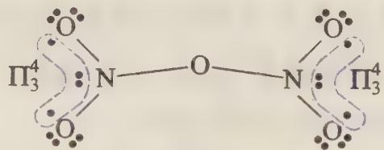  
图15-12 $\mathsf{N}_2\mathsf{O}_5$ 分子的结构和离域 $\pi$ 键

$N_{2}O_{5}$ 常温下为固态，熔点为 $30^{\circ}C$ ，沸点为 $47^{\circ}C$ ，常压下 $33^{\circ}C$ 升华，温度高于室温时固态和气态都不稳定，分解为 $NO_{2}$ 和 $O_{2}$ 。 $N_{2}O_{5}$ 是强氧化剂。固态时 $N_{2}O_{5}$ 为离子晶体，由 $NO_{2}^{+}$ 和 $NO_{3}^{-}$ 构成。

## 15.3.2 亚硝酸及其盐

## 1. 制备

亚硝酸 $\left(\mathrm{HNO}_{2}\right)$ 为弱酸,在低温下将强酸加入亚硝酸盐溶液中,就可以得到亚硝酸的溶液,例如:

$$
\mathrm{NaNO} _ {2} + \mathrm{H} _ {2} \mathrm{SO} _ {4} = \mathrm{HNO} _ {2} + \mathrm{NaHSO} _ {4}
$$

将 $NO_{2}$ 和 NO 的混合物溶解在冰水中时,也生成亚硝酸的水溶液,若溶于碱,则得到亚硝酸盐:

$$
\begin{array}{r l} & {\mathrm{NO} _ {2} + \mathrm{NO} + \mathrm{H} _ {2} \mathrm{O} \stackrel {\text {冰水}} {=} 2 \mathrm{HNO} _ {2}} \\ & {\mathrm{NO} _ {2} + \mathrm{NO} + 2 \mathrm{OH} ^ {-} \stackrel {\text {冰水}} {=} 2 \mathrm{NO} _ {2} ^ {-} + \mathrm{H} _ {2} \mathrm{O}} \end{array}
$$

用金属在高温下还原硝酸盐可制备亚硝酸盐，例如：

$$
\mathrm{Pb(粉)} + \mathrm {NaN O _ {3}} \xlongequal {\text {高温}} \mathrm{PbO} + \mathrm {NaN O _ {2}}
$$

产物 PbO 不溶于水, 将反应混合物溶于热水中, 过滤后重结晶, 得到亚硝酸钠, 亚硝酸钠大量用于染料工业和有机合成工业中。

某些活泼金属的硝酸盐受热分解,也能得到亚硝酸盐,例如:

$$
2 \mathrm{NaNO} _ {3} \stackrel {\triangle} {=} 2 \mathrm{NaNO} _ {2} + \mathrm{O} _ {2} \uparrow
$$

## 2. 结构

亚硝酸 $\left(\mathrm{HNO}_{2}\right)$ 分子中，N原子发生 $sp^{2}$ 不等性杂化，未参与杂化的 $2p_{z}$ 轨道中有一个单电子，如图15-13(a)所示。两条有单电子的 $sp^{2}$ 杂化轨道分别与羟基O原子和端基O原子成 $\sigma$ 键，N原子未参与杂化的 $p_{z}$ 轨道与端基O原子的 $p_{z}$ 轨道平行，互相重叠形成 $\pi$ 键，故N原子与端基O原子之间有双键。

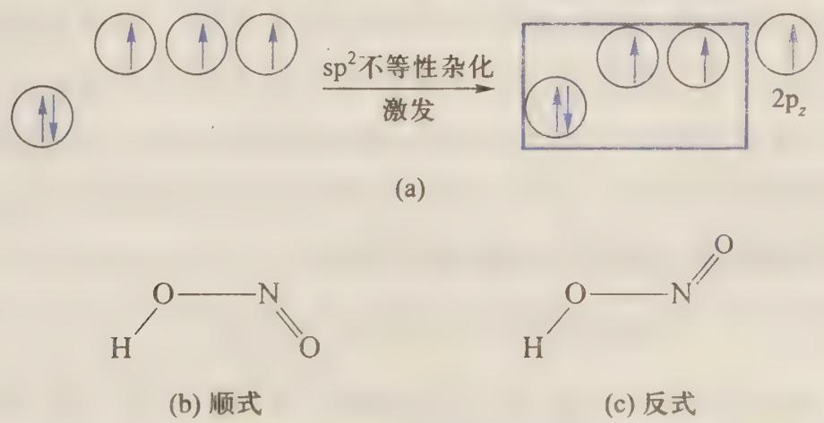  
图15-13 亚硝酸分子中N原子的轨道杂化及其分子的结构

亚硝酸分子有两种构象,如图 15-13(b) 所示为顺式,图 15-13(c) 所示为反式。研究结果表明,反式比顺式稳定,气态或室温下主要以反式平面结构形式存在。在 HNO₂ 反式平面结构中,∠HON 为 102.1°,∠ONO 为 110.7°;O—H 键键长为 95.8 pm,N 原子与羟基 O 原子的距离为 143.2 pm,N 原子与端基 O 原子的距离为 117.0 pm。

亚硝酸根 $\left(\mathrm{NO}_{2}^{-}\right)$ 为V形结构，N的原子轨道为 $sp^{2}$ 杂化，有离域的 $\Pi_{3}^{4}$ 键，如图15-14所示。在亚硝酸根离子中，N—O键键长为123.6 pm， $\angle ONO$ 为 $115.4^{\circ}$ 。

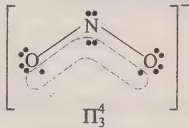

## 3. 性质

亚硝酸为弱酸, 解离平衡常数为 $7.2 \times 10^{-4}$ , 有关 $HNO_{2}$ 的标准电极电势如下:

图15-14 亚硝酸根中的离域 $\pi$ 键

碱性介质

$$
\begin{array}{l l} \mathrm{HNO} _ {2} + \mathrm{H} ^ {+} + \mathrm{e} ^ {-} = \mathrm{NO} + \mathrm{H} _ {2} \mathrm{O} & E ^ {\ominus} = 0. 9 8 3 \mathrm{V} \\ \mathrm{NO} _ {3} ^ {-} + 3 \mathrm{H} ^ {+} + 2 \mathrm{e} ^ {-} = \mathrm{HNO} _ {2} + \mathrm{H} _ {2} \mathrm{O} & E ^ {\ominus} = 0. 9 3 4 \mathrm{V} \\ \mathrm{NO} _ {2} ^ {-} + \mathrm{H} _ {2} \mathrm{O} + \mathrm{e} ^ {-} = \mathrm{NO} + 2 \mathrm{OH} ^ {-} & E ^ {\ominus} = - 0. 4 6 \mathrm{V} \\ \mathrm{NO} _ {3} ^ {-} + \mathrm{H} _ {2} \mathrm{O} + 2 \mathrm{e} ^ {-} = \mathrm{NO} _ {2} ^ {-} + 2 \mathrm{OH} ^ {-} & E ^ {\ominus} = 0. 0 1 \mathrm{V} \end{array}
$$

根据标准电极电势数据可知,亚硝酸盐基本无氧化性。而亚硝酸既具有氧化性又有还原性,例如:

$$
\begin{array}{r l} & 5 \mathrm{HNO} _ {2} + 2 \mathrm{MnO} _ {4} ^ {-} + \mathrm{H} ^ {+} = 5 \mathrm{NO} _ {3} ^ {-} + 2 \mathrm{Mn} ^ {2 +} + 3 \mathrm{H} _ {2} \mathrm{O} \\ & 2 \mathrm{HNO} _ {2} + 2 \mathrm{I} ^ {-} + 2 \mathrm{H} ^ {+} = 2 \mathrm{NO} \uparrow + \mathrm{I} _ {2} + 2 \mathrm{H} _ {2} \mathrm{O} \\ & \mathrm{HNO} _ {2} + \mathrm{HNO} _ {3} = 2 \mathrm{NO} _ {2} \uparrow + \mathrm{H} _ {2} \mathrm{O} \end{array}
$$

前两个反应都可以定量地进行,可以用于分析亚硝酸盐的含量。

亚硝酸作为氧化剂时,其还原产物以 NO 为最常见,但所用还原剂不同时,还原产物也可能是 $N_{2}O$ , $N_{2}$ , $NH_{2}OH$ 或 $NH_{3}$ 等。

相同浓度的 $HNO_{2}$ 和 $HNO_{3}$ ，前者氧化能力强于后者。这种氧化性差别源于 $HNO_{2}$ 的不稳定性。作为弱酸的 $HNO_{2}$ 在水中以分子状态存在， $H^{+}$ 的强极化能力使得 $HNO_{2}$ 不稳定；同时，中心氧化数为 +3 的 $HNO_{2}$ 抵抗 $H^{+}$ 的极化能力差，更易发生分解而得到还原产物。所以 $HNO_{2}$ 的氧化能力比稳定的 $HNO_{3}$ 要强。

在酸性较强的溶液中, $HNO_{2}$ 存在如下反应:

$$
\mathrm{HNO} _ {2} + \mathrm{H} ^ {+} = \mathrm{NO} ^ {+} + \mathrm{H} _ {2} \mathrm{O}
$$

酸性介质中 $HNO_{2}$ 与 $I^{-}$ 作用, 首先亚硝酰离子 ( $NO^{+}$ ) 和 $I^{-}$ 结合成亚硝酰的碘化物 INO, 之后该中间产物分解:

$$
2 \mathrm{INO} = 2 \mathrm{NO} \uparrow + \mathrm{I} _ {2}
$$

即得到 $\mathrm{I}^{-}$ 的氧化产物和 $\mathrm{HNO}_2$ 的还原产物。所以 $\mathrm{HNO}_2$ 容易氧化 $\mathrm{I}^{-}$ 。

亚硝酸是不稳定的,仅存在于水溶液中, $\mathrm{HNO_{2}}$ 在温度接近0℃时逐渐分解:

$$
\begin{array}{r l} 2 \mathrm{HNO} _ {2} & = \mathrm{N} _ {2} \mathrm{O} _ {3} \uparrow + \mathrm{H} _ {2} \mathrm{O} \\ \mathrm{N} _ {2} \mathrm{O} _ {3} & = \mathrm{NO} + \mathrm{NO} _ {2} \end{array}
$$

在室温下明显有歧化反应发生：

$$
3 \mathrm{HNO} _ {2} = \mathrm{HNO} _ {3} + 2 \mathrm{NO} \uparrow + \mathrm{H} _ {2} \mathrm{O}
$$

Ⅰ A 族和Ⅱ A 族元素的亚硝酸盐都有较高的热稳定性, 如 $NaNO_{2}$ 在 284 ℃ 熔化而不分解。阳离子极化能力越强, 亚硝酸盐越不稳定, 如 $AgNO_{2}$ 稳定性就很差, 高于 140 ℃ 即分解:

$$
\mathrm{AgNO} _ {2} \xlongequal {> 1 4 0 ^ {\circ} \mathrm{C}} \mathrm{Ag} + \mathrm{NO} _ {2} \uparrow
$$

亚硝酸盐一般易溶于水,但重金属盐较难溶于水,如浅黄色的 $AgNO_{2}$ 为微溶盐。亚硝酸盐有毒,并且是致癌物质。

$NO_{2}^{-}$ 中 N 原子有孤电子对, 配位能力较强, 能与许多过渡金属离子生成配位单元, 如与 $Co^{3+}$ 生成稳定的低自旋的 $\left[Co(NO_{2})_{6}\right]^{3-}$ 和 $\left[Co(NO_{2})(NH_{3})_{5}\right]^{2+}$ 等。其中, $Na_{3}[Co(NO_{2})_{6}]$ 易溶, $K_{3}[Co(NO_{2})_{6}]$ 微溶。

在酸化的亚硝酸钾溶液中,加入 Co(Ⅱ)盐,生成 $K_{3}[Co(NO_{2})_{6}]$ 黄色沉淀:

$$
\mathrm{Co} ^ {2 +} + 7 \mathrm{NO} _ {2} ^ {-} + 3 \mathrm{K} ^ {+} + 2 \mathrm{H} ^ {+} = \mathrm{K} _ {3} \left[ \mathrm{Co} \left(\mathrm{NO} _ {2}\right) _ {6} \right] \downarrow + \mathrm{NO} \uparrow + \mathrm{H} _ {2} \mathrm{O}
$$

$NO_{2}^{-}$ 对于 Co(Ⅲ) 的配位作用, 降低了电对 Co(Ⅲ)/Co(Ⅱ) 的 E 值。于是 Co(Ⅱ) 被酸性亚硝酸钾氧化成 Co(Ⅲ)。

## 15.3.3 硝酸及其盐

硝酸和硝酸盐均为重要的化工产品,是制造炸药、染料和许多其他化学化工产品的重要原料。

## 1. 硝酸的制备

硝酸的制造方法主要有以下两种。

## (1) 氨的催化氧化

目前,工业制造硝酸的主要方法是氨的催化氧化法。在 $1000^{\circ}$ C 和有铂铑合金网作催化剂时,氨可以被空气中的氧气氧化成 NO,NO 与氧气进一步反应生成 $NO_{2},NO_{2}$ 被水吸收就得到硝酸:

$$
4 \mathrm{NH} _ {3} + 5 \mathrm{O} _ {2} \xrightarrow [ \text {催化剂} ]{\text {高温}} 4 \mathrm{NO} + 6 \mathrm{H} _ {2} \mathrm{O}
$$

$$
2 \mathrm{NO} + \mathrm{O} _ {2} = 2 \mathrm{NO} _ {2}
$$

$$
3 \mathrm{NO} _ {2} + \mathrm{H} _ {2} \mathrm{O} = 2 \mathrm{HNO} _ {3} + \mathrm{NO}
$$

## (2) 硝酸盐与浓硫酸作用

用硝酸盐与浓硫酸反应是实验室中制备少量硝酸常用的方法：

$$
\mathrm{NaNO} _ {3} + \mathrm{H} _ {2} \mathrm{SO} _ {4} (\text {   浓   }) = \mathrm{NaHSO} _ {4} + \mathrm{HNO} _ {3}
$$

利用 $HNO_{3}$ 的挥发性,很容易将其从反应混合物中蒸馏出来。此法只能利用 $H_{2}SO_{4}$ 的一个氢离子,因为第二步反应:

$$
\mathrm{NaNO} _ {3} + \mathrm{NaHSO} _ {4} = \mathrm{Na} _ {2} \mathrm{SO} _ {4} + \mathrm{HNO} _ {3}
$$

需要在 $500^{\circ}$ C 左右进行, 而高温下硝酸会发生分解。

在雷雨天气放电过程中,空气中的氮气与氧气结合得到氮的氧化物,随着雨水进入土壤中,使土壤中增加活性氮。这种过程对于氮在自然界的循环有重要的意义。

## 2. 硝酸的结构

硝酸分子具有平面结构, 见图 15-15(a)。∠HON 为 102.2°, H—O 键键长为 96 pm, N 原子与上面的端基 O 原子之间的键长为 121 pm, N 原子与下面的端基 O 原子之间的键长为 120 pm, N—O(羟基) 键键长为 141 pm, 有分子内氢键。

硝酸分子中心 N 原子的轨道为 $sp^{2}$ 等性杂化, 见图 15-11(a)。N 原子的未杂化 p 轨道上的一对电子与两个端基 O 原子 p 轨道的单电子形成一个“三中心四电子”的离域 $\pi$ 键 $\Pi_{3}^{4}$ 。

硝酸根离子 $\left(\mathrm{NO}_{3}^{-}\right)$ 为平面正三角形结构，N原子的轨道也是 $sp^{2}$ 等性杂化，有一个离域 $\pi$ 键 $\Pi_{4}^{6}$ ，见图15-15(b)。N—O键键长为121 pm。该离子的对称性高，因而硝酸盐在正常状况下是稳定的。

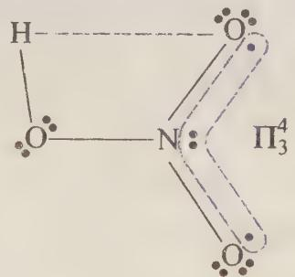  
(a)

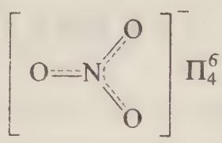  
(b)  
图15-15 硝酸分子和硝酸根离子的结构

## 3. 硝酸的性质

纯硝酸为无色的透明油状液体，熔点为-41.6℃，沸点为83℃，能和水互溶。一般市售硝酸的密度为 $1.42\ g\cdot cm^{-3}$ ，含 $HNO_{3}$ 约68%，浓度约 $15\ mol\cdot dm^{-3}$ 。

溶解了过量 $NO_{2}$ 的浓硝酸显棕黄色, 称为发烟硝酸。浓硝酸受热或在光照下分解, 溶液会慢慢变黄:

$$
4 \mathrm{HNO} _ {3} (\text {   浓   }) \xlongequal {\triangle \text {   或   } h \nu} 2 \mathrm{H} _ {2} \mathrm{O} + 4 \mathrm{NO} _ {2} \uparrow + \mathrm{O} _ {2} \uparrow
$$

与硝酸有关的标准电极电势如下：

$$
\begin{array}{l l} 2 \mathrm{NO} _ {3} ^ {-} + 4 \mathrm{H} ^ {+} + 2 \mathrm{e} ^ {-} = \mathrm{N} _ {2} \mathrm{O} _ {4} + 2 \mathrm{H} _ {2} \mathrm{O} & E ^ {\ominus} = 0. 8 0 3 \mathrm{V} \\ \mathrm{NO} _ {3} ^ {-} + 4 \mathrm{H} ^ {+} + 3 \mathrm{e} ^ {-} = \mathrm{NO} + 2 \mathrm{H} _ {2} \mathrm{O} & E ^ {\ominus} = 0. 9 5 7 \mathrm{V} \\ \mathrm{NO} _ {3} ^ {-} + 3 \mathrm{H} ^ {+} + 2 \mathrm{e} ^ {-} = \mathrm{HNO} _ {2} + \mathrm{H} _ {2} \mathrm{O} & E ^ {\ominus} = 0. 9 3 4 \mathrm{V} \\ \mathrm{NO} _ {3} ^ {-} + 1 0 \mathrm{H} ^ {+} + 8 \mathrm{e} ^ {-} = \mathrm{NH} _ {4} ^ {+} + 3 \mathrm{H} _ {2} \mathrm{O} & E ^ {\ominus} = 0. 8 7 \mathrm{V} \end{array}
$$

可见, $HNO_{3}$ 被还原成 $NO_{2}$ , $HNO_{2}$ , NO, $NH_{4}^{+}$ , 都具有较大的标准电极电势。因此, 硝酸有较强的氧化性且产物复杂。

硝酸是重要的氧化剂,除了 Au, Pt, Rh 和 Ir 等少数金属外,许多金属都能被硝酸氧化。碱性金属一般都生成硝酸盐,酸性金属如 Sn, Sb, Mo, W 等与浓硝酸反应生成含氧酸或水合氧化物。S, P, As 等非金属单质可以被浓硝酸氧化成高价的含氧酸。

硝酸与金属反应,金属越活泼,硝酸的浓度越稀,还原产物中氮的氧化数越低。下面的几个反应可以体现上述的经验规律。

$$
\begin{array}{r l} & 4 \mathrm{HNO} _ {3} (\text {浓}) + \mathrm{Cu} = \mathrm{Cu(NO} _ {3}) _ {2} + 2 \mathrm{NO} _ {2} \uparrow + 2 \mathrm{H} _ {2} \mathrm{O} \\ & 4 \mathrm{HNO} _ {3} (\text {浓}) + \mathrm{Hg} = \mathrm{Hg(NO} _ {3}) _ {2} + 2 \mathrm{NO} _ {2} \uparrow + 2 \mathrm{H} _ {2} \mathrm{O} \\ & 8 \mathrm{HNO} _ {3} (\text {稀}) + 6 \mathrm{Hg} = 3 \mathrm{Hg} _ {2} (\mathrm{NO} _ {3}) _ {2} + 2 \mathrm{NO} \uparrow + 4 \mathrm{H} _ {2} \mathrm{O} \\ & 8 \mathrm{HNO} _ {3} (\text {稀}) + 3 \mathrm{Cu} = 3 \mathrm{Cu(NO} _ {3}) _ {2} + 2 \mathrm{NO} \uparrow + 4 \mathrm{H} _ {2} \mathrm{O} \\ & 1 0 \mathrm{HNO} _ {3} (\text {较稀}) + 4 \mathrm{Zn} = 4 \mathrm{Zn(NO} _ {3}) _ {2} + \mathrm{N} _ {2} \mathrm{O} \uparrow + 5 \mathrm{H} _ {2} \mathrm{O} \\ & 1 0 \mathrm{HNO} _ {3} (\text {极稀}) + 4 \mathrm{Zn} = 4 \mathrm{Zn(NO} _ {3}) _ {2} + \mathrm{NH} _ {4} \mathrm{NO} _ {3} + 3 \mathrm{H} _ {2} \mathrm{O} \end{array}
$$

下面几个反应说明,硝酸作为氧化剂时,其还原产物是复杂的,没有一个很好的规律可遵循。

$$
\begin{array}{r l} & 4 \mathrm{HNO} _ {3} (\text {浓}) + 3 \mathrm{Sn} = 3 \mathrm{SnO} _ {2} \downarrow + 4 \mathrm{NO} \uparrow + 2 \mathrm{H} _ {2} \mathrm{O} \\ & 5 \mathrm{HNO} _ {3} + 3 \mathrm{Sb} + 8 \mathrm{H} _ {2} \mathrm{O} \stackrel {\triangle} {=} 3 \mathrm{H} [ \mathrm{Sb(OH)} _ {6} ] + 5 \mathrm{NO} \uparrow \\ & 2 \mathrm{HNO} _ {3} (\text {浓}) + \mathrm{S} = \mathrm{H} _ {2} \mathrm{SO} _ {4} + 2 \mathrm{NO} \uparrow \\ & 6 \mathrm{HNO} _ {3} (\text {浓}) + \mathrm{S} = \mathrm{H} _ {2} \mathrm{SO} _ {4} + 6 \mathrm{NO} _ {2} \uparrow + 2 \mathrm{H} _ {2} \mathrm{O} \\ & 5 \mathrm{HNO} _ {3} (\text {浓}) + 3 \mathrm{P} + 2 \mathrm{H} _ {2} \mathrm{O} \stackrel {\triangle} {=} 3 \mathrm{H} _ {3} \mathrm{PO} _ {4} + 5 \mathrm{NO} \uparrow \end{array}
$$

稀硝酸氧化能力较弱,反应速率慢,被氧化的物质有时不能达到最高氧化态,如将 Hg 氧化成 $Hg_{2}^{2+}$ 。稀硝酸的氧化作用可以认为首先被还原成 $NO_{2}$ ,但是因为反应速率较慢, $NO_{2}$ 来不及逸出反应体系就又被进一步还原成 NO 或 $N_{2}O$ , $NH_{4}^{+}$ 等。

Fe, Al, Cr 与冷的浓硝酸作用时会有钝化现象发生, 可以用铝制容器盛装浓硝酸。钝化的原因是金属表面被浓硝酸氧化生成一层致密的氧化物, 阻止了金属进一步被氧化。经浓硝酸处理而钝化的金属, 与稀硝酸也不再反应。

$NO_{2}$ 对硝酸被还原的反应有催化作用, $NO_{2}$ 参与如下的电子传递:

$$
\begin{array}{r l} & \mathrm{NO} _ {2} + \mathrm{e} ^ {-} = \mathrm{NO} _ {2} ^ {-} \\ & \mathrm{NO} _ {2} ^ {-} + \mathrm{H} ^ {+} = \mathrm{HNO} _ {2} \\ & \mathrm{HNO} _ {3} + \mathrm{HNO} _ {2} = \mathrm{H} _ {2} \mathrm{O} + 2 \mathrm{NO} _ {2} \uparrow \end{array}
$$

3个反应总的净结果为

$$
\mathrm{HNO} _ {3} + \mathrm{H} ^ {+} + \mathrm{e} ^ {-} = \mathrm{H} _ {2} \mathrm{O} + \mathrm{NO} _ {2} \uparrow
$$

发烟硝酸有强氧化性,就是因为在发烟硝酸中溶解较多的 $NO_{2}$ 的缘故。铜与浓硝酸反应,开始反应速率很慢而随后逐渐加快;若向浓硝酸中加入少量 $NaNO_{2}$ 可加速铜和硝酸的反应。这两个实验现象都说明 $NO_{2}$ 对硝酸被还原的反应有催化作用。

## 4. 王水

浓盐酸和浓硝酸的体积比约 3:1 的混合物叫作王水。王水能够溶解金和铂：

$$
\begin{array}{r l} & \mathrm {Au + HNO_ {3} + 4HCl = H[ AuCl_ {4} ] + NO\uparrow + 2H_ {2} O} \\ & 3 \mathrm{Pt+4HNO} _ {3} + 1 8 \mathrm{HCl=3H} _ {2} [ \mathrm{PtCl} _ {6} ] + 4 \mathrm{NO\uparrow+8H} _ {2} \mathrm{O} \end{array}
$$

王水能够溶解金和铂的原因,主要是由于存在大量 $Cl^{-}$ ,能够形成配离子 $[AuCl_{4}]^{-}$ 和 $[PtCl_{6}]^{2-}$ ,使金属的还原能力增强的结果。相关的标准电极电势为

$$
\begin{array}{l l} \mathrm {Au^ {3 + } + 3e^ {-} = Au} & E ^ {\ominus} = 1. 4 9 8 \mathrm{V} \\ [ \mathrm {AuCl_ {4}} ] ^ {-} + 3 \mathrm {e^ {-} = Au+ 4Cl^ {-}} & E ^ {\ominus} = 1. 0 0 2 \mathrm{V} \\ \mathrm {NO_ {3} ^ {-} + 4H^ {+} + 3e^ {-} = NO+ 2H_ {2} O} & E ^ {\ominus} = 0. 9 5 7 \mathrm{V} \end{array}
$$

可以看出,在没有 $Cl^{-}$ 存在时, $HNO_{3}$ 不能氧化 Au,但是有 $Cl^{-}$ 存在时,由于形成 $[AuCl_{4}]^{-}$ 而增强了 Au 的还原能力。王水能溶解 Au 和 Pt 不是王水的氧化能力比浓硝酸强,而是 $Cl^{-}$ 的配位使金属的还原能力增强。过去曾认为,在王水中生成了氧化能力强的 NOCl(氯化亚硝酰)和 $Cl_{2}$ ,现在看来,这些观点是不准确的,因为这在热力学上是不可能的。

## 5. 硝酸盐

硝酸根电荷数低,对称性高且不易变形,因此大部分硝酸盐中的离子键不发生变化,故易溶于水。

硝酸盐的热稳定性与阳离子的极化能力有关,阳离子的极化能力越强,硝酸盐越不稳定,分解反应越容易进行。硝酸盐热分解情况复杂,主要有以下几种。

碱金属和碱土金属(不包括锂、铍和镁)等离子的极化能力弱,所以它们的硝酸盐受热分解生成亚硝酸盐和氧气,例如:

$$
2 \mathrm{NaNO} _ {3} \stackrel {\triangle} {=} 2 \mathrm{NaNO} _ {2} + \mathrm{O} _ {2} \uparrow
$$

镁、铜及金属活泼性在镁与铜之间的金属（包括锂、铍），其无水硝酸盐热分解时得到金属氧化物、二氧化氮和氧气，例如：

$$
2 \mathrm{Pb} (\mathrm{NO} _ {3}) _ {2} \stackrel {\triangle} {=} 2 \mathrm{PbO} + 4 \mathrm{NO} _ {2} \uparrow + \mathrm{O} _ {2} \uparrow
$$

活泼性比铜差的金属,其硝酸盐热分解时生成金属单质、二氧化氮和氧气,例如:

$$
\begin{array}{r l} & 2 \mathrm{AgNO} _ {3} \xlongequal {\triangle} 2 \mathrm{Ag} + 2 \mathrm{NO} _ {2} \uparrow + \mathrm{O} _ {2} \uparrow \\ & \mathrm{Hg} _ {2} (\mathrm{NO} _ {3}) _ {2} \xlongequal {1 0 0 ^ {\circ} \mathrm{C}} 2 \mathrm{HgO} + 2 \mathrm{NO} _ {2} \uparrow \\ & 2 \mathrm{HgO} \xlongequal {5 0 0 ^ {\circ} \mathrm{C}} 2 \mathrm{Hg} + \mathrm{O} _ {2} \uparrow \end{array}
$$

若硝酸盐中的阳离子有还原性,在分解过程中,阳离子将被氧化,例如:

$$
\begin{array}{r l} & \mathrm {NH_ {4} NO_ {3}} \xlongequal {> 2 0 0 ^ {\circ} \mathrm{C}} \mathrm {N_ {2} O} \uparrow + 2 \mathrm {H_ {2} O} \\ & 2 \mathrm {NH_ {4} NO_ {3}} \xlongequal {> 3 0 0 ^ {\circ} \mathrm{C}} 2 \mathrm {N_ {2}} \uparrow + \mathrm {O_ {2}} \uparrow + 4 \mathrm {H_ {2} O} \\ & \mathrm {Mn(NO_ {3}) _ {2}} \xlongequal {\triangle} \mathrm {MnO_ {2}} + 2 \mathrm {NO_ {2}} \uparrow \end{array}
$$

硝酸是易挥发性的酸,若金属离子的极化能力较强,带有结晶水的硝酸盐受热分解时将发生水解反应,可能还伴随有硝酸的分解反应:

$$
\mathrm{Mg} (\mathrm{NO} _ {3}) _ {2} \cdot 6 \mathrm{H} _ {2} \mathrm{O} \stackrel {\triangle} {=} \mathrm{Mg} (\mathrm{OH}) \mathrm{NO} _ {3} + \mathrm{HNO} _ {3} + 5 \mathrm{H} _ {2} \mathrm{O}
$$

$$
\begin{array}{r l} \mathrm {Cu(NO_ {3}) _ {2} \cdot 2H_ {2} O\xlongequal {\triangle} Cu(OH)NO_ {3} + HNO_ {3} + H_ {2} O} \\ & \mathrm {Cu(OH)NO_ {3} \xlongequal {\triangle} CuO+ HNO_ {3}} \\ & 4 \mathrm {HN O _ {3} \xlongequal {\triangle} 4NO_ {2} \uparrow+ O_ {2} \uparrow+ 2H_ {2} O} \end{array}
$$

在煤气灯上加热含有结晶水的硝酸铜晶体,能观察到黑色的 CuO 生成和棕色 NO₂ 气体放出。

## 6. 硝酸盐和亚硝酸盐的鉴别

利用亚硝酸盐有还原性而硝酸盐没有还原性这一性质可以鉴别二者。亚硝酸盐与浓硝酸作用有 $NO_{2}$ 生成，而硝酸盐与浓硝酸作用无 $NO_{2}$ 生成。

最为著名的鉴别方法是棕色环实验。在试管中加入硝酸盐与硫酸亚铁混合溶液，再沿着试管壁缓慢地倒入浓硫酸，使浓硫酸进入试管的下部，在浓硫酸与水溶液的界面有棕色的 $\left[\mathrm{Fe}(\mathrm{NO})(\mathrm{H}_2\mathrm{O})_5\right]^{2+}$ 生成，从试管的侧面可以观察到棕色环。物质 $\left[\mathrm{Fe}(\mathrm{NO})(\mathrm{H}_2\mathrm{O})_5\right]^{2+}$ 的生成过程及显色机理将在第22章中介绍。用亚硝酸盐代替硝酸盐进行实验，得到棕色溶液而观察不到棕色环。

## 15.4 氮的卤化物

氮与卤素形成的二元化合物中,最常见的是三卤化物,它们具有与 $NH_{3}$ 分子相似的三角锥形结构。

$NCl_{3}$ 为黄色油状液体,沸点较低,易溶于有机溶剂中。

将 $\mathrm{Cl}_2$ 通入铵盐溶液中，N的氧化数可以由-3变成 $+3$ ，得到 $\mathrm{NCl}_3$ ，例如：

$$
\mathrm{NH} _ {4} \mathrm{Cl(aq)} + 3 \mathrm{Cl} _ {2} = \mathrm{NCl} _ {3} + 4 \mathrm{HCl}
$$

$NCl_{3}$ 很不稳定,受热 $90^{\circ}C$ 以上或受震动时发生猛烈爆炸而分解:

$$
2 \mathrm{NCl} _ {3} \stackrel {\triangle} {=} \mathrm{N} _ {2} \uparrow + 3 \mathrm{Cl} _ {2} \uparrow
$$

$NCl_{3}$ 在水中的溶解度很小,但可以缓慢地发生水解:

$$
\mathrm{NCl} _ {3} + 3 \mathrm{H} _ {2} \mathrm{O} = \mathrm{NH} _ {3} + 3 \mathrm{HClO}
$$

$NCl_{3}$ 的水解与第 14 章介绍过的 $SiCl_{4}$ 的水解机理有所不同。

$NCl_{3}$ 水解的关键是 $NCl_{3}$ 中 N 原子有孤电子对，当 $H_{2}O$ 分子以其带有部分正电荷的 H 原子端与中心 N 原子接近时，H 原子通过 N 原子的孤电子对与 N 原子以单键相结合形成中间体，如图 15-16 所示。

当 Cl 原子和 O—H 与中间体分离时, O 原子将 H—O 键电子对带走, Cl 原子将 Cl—N 键电子对留给 N 原子, 于是既使得取代产物为电中性, 又保证 N 原子仍具有孤电子对。

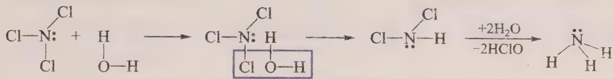  
图15-16 $\mathrm{NCI}_3$ 水解机理示意图

继续水解时,仍可重复上述步骤,H原子再次取代Cl原子,最终得到水解主产物 $NH_{3}$ 。另一种产物为次氯酸Cl—O—H,其中Cl原子与O—H中的O原子共用一对电子成单键。

$NF_{3}$ 为无色气体, 可以由 $NH_{3}$ 与 $F_{2}$ 直接反应制备:

$$
4 \mathrm{NH} _ {3} + 3 \mathrm{F} _ {2} \stackrel {\mathrm{Cu}} {=} \mathrm{NF} _ {3} + 3 \mathrm{NH} _ {4} \mathrm{F}
$$

常温下 $NF_{3}$ 不与水、稀酸及稀碱作用,但与水汽的混合物遇到火花将发生爆炸反应:

$$
2 \mathrm{NF} _ {3} + 3 \mathrm{H} _ {2} \mathrm{O(g)} \xlongequal {\text {火花}} \mathrm{NO} + \mathrm{NO} _ {2} + 6 \mathrm{HF}
$$

与 $NCl_{3}$ 不同, $NF_{3}$ 的稳定性很好。从结构因素考虑, 因为 Cl 原子半径大, 作配体时空间效应不利, 所以 $NCl_{3}$ 不稳定; 而 F 原子半径小, 空间效应有利, 故 $NF_{3}$ 可稳定存在。

从热力学数据表中标准摩尔生成热大小的比较,可以很清楚地说明这一点。

由于同样的原因, $NBr_{3}$ 和 $NI_{3}$ 的稳定性也很差, $NI_{3}$ 很难制得纯品。

## 15.5 磷的单质及氢化物

## 15.5.1 磷的单质

磷单质的活泼性决定磷在自然界中以磷酸盐的形式存在,磷是重要的生命元素之一,存在于细胞、蛋白质、骨骼和牙齿中。在骨骼和牙齿中主要以羟基磷灰石 $\left[\mathrm{Ca}_{5}\left(\mathrm{PO}_{4}\right)_{3}\mathrm{OH}\right]$ 形式存在。

磷元素的自由能-氧化数图见图15-17。图中线段的斜率均为负值，说明无论在酸性条件下还是在碱性条件下，磷的化合物氧化性都很差。从图中还可以看出，在酸性条件和碱性条件下，单质磷都有发生歧化反应的趋势。

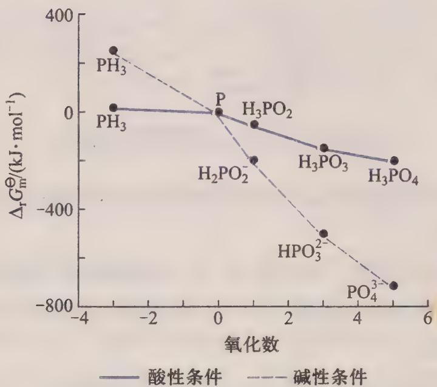  
图15-17 磷元素的自由能-氧化数图

## 1. 单质的制备

工业上将磷酸钙、石英砂和炭粉的混合物在电弧炉中熔烧还原得到单质磷：

$$
2 \mathrm{Ca} _ {3} (\mathrm{PO} _ {4}) _ {2} + 6 \mathrm{SiO} _ {2} + 1 0 \mathrm{C} \xlongequal {1 1 0 0 \sim 1 4 5 0 ^ {\circ} \mathrm{C}} 6 \mathrm{CaSiO} _ {3} + \mathrm{P} _ {4} + 1 0 \mathrm{CO} \uparrow
$$

将生成的磷蒸气通入水中冷却,就得到白磷。反应中加入石英砂可大大降低反应温度。

## 2. 磷的同素异形体

磷有多种同素异形体,其中最重要的是白磷、红磷和黑磷。

磷蒸气迅速冷却时得到白磷, 白磷由于表面氧化而略带黄色, 有时也被称为黄磷。低温蒸气中的白磷和溶于二硫化碳中的白磷, 其 $\mathrm{P}_{4}$ 分子以四面体形结构存在。温度更高的蒸气中, 存在 $\mathrm{P}_{4}$ 与 $\mathrm{P}_{2}$ 的平衡。白磷为分子晶体, 易溶于非极性溶剂中。

白磷熔点为 $44.15^{\circ}C$ ，沸点为 $280.5^{\circ}C$ ，密度为 $1.823 g \cdot cm^{-3}$ ，燃点为 $40^{\circ}C$ 。由于它在空气中会逐渐氧化聚积热量而自燃，经常把它保存在水中。白磷是剧毒物质，如服入 0.1 g 白磷即足以致人死亡。

如图 15-18(a) 所示, 正四面体形的 $\mathrm{P}_{4}$ 分子中, 键角 $\angle$ PPP 为 $60^{\circ}$ , 比 p 轨道间夹角小许多。故 P—P 键张力较大, 键能很小, 仅为 $201 \mathrm{~kJ} \cdot \mathrm{mol}^{-1}$ 。因此, 白磷在常温常压下有很高的反应活性。

许多磷的化合物的结构与正四面体形 $\mathbf{P}_4$ 有关。如磷的氧化物 $\mathrm{P_4O_6}$ 和 $\mathrm{P_4O_{10}}$ ，硫化物 $\mathrm{P_4S_3}$ ， $\mathrm{P_4S_7}$ 和 $\mathrm{P_4S_{10}}$ ，它们的结构都是以 $\mathbf{P}_4$ 分子为结构基础而衍生出来的。

磷是亲氧元素, 在 P(V) 含氧化合物中, P—O 键键能很大, 为 596.6 kJ·mol $^{-1}$ , 导致磷氧四面体 (PO $_{4}$ ) 结构单元很稳定, 许多 P(V) 含氧化合物都是以磷氧四面体为结构基础的。

讨论磷的性质,未加说明时一般是指白磷。

白磷经密闭加热转化成红磷，在转变过程中有热量放出。红磷较稳定，熔、沸点和燃点较高，室温下不易与 $\mathrm{O}_2$ 反应，不溶于有机溶剂，密度为 $2.16\mathrm{g}\cdot \mathrm{cm}^{-3}$ 。红磷有多种结构，其中一种结构是由 $\mathbf{P}_4$ 分子断开一个键转变成的成对等边三角形连成的链状巨大分子，见图15-18(b)。

在高压下将白磷加热到一定温度得黑磷。黑磷是热力学最稳定的变体，密度比红磷大，有导电性。黑磷有多种晶型，都具有片层状结构，如图15-18(c)所示。其中的磷原子均以共价键相互连接。

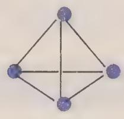  
(a)

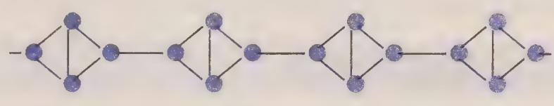

(b)  
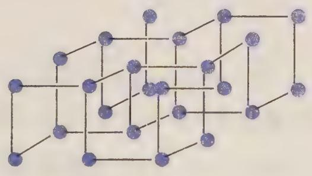  
(c)  
图15-18 磷单质同素异形体的结构

## 3. 磷单质的化学性质

磷单质不稳定,从热力学上看在水中能歧化分解:

$$
\mathrm{P} _ {4} + 6 \mathrm{H} _ {2} \mathrm{O} = \mathrm{PH} _ {3} \uparrow + 3 \mathrm{H} _ {3} \mathrm{PO} _ {2}
$$

但室温下歧化反应的速率非常缓慢,可以忽略。因此,可以把磷置于水中保存,以防止磷与空气接触。

磷在碱性介质中的歧化反应是有实际意义的：

$$
4 \mathrm{P} + 3 \mathrm{NaOH} + 3 \mathrm{H} _ {2} \mathrm{O} \stackrel {\triangle} {=} 3 \mathrm{NaH} _ {2} \mathrm{PO} _ {2} + \mathrm{PH} _ {3} \uparrow
$$

加热时，歧化反应更易进行。产物 $H_{2}PO_{2}^{-}$ 也不稳定，可进一步歧化为 $HPO_{3}^{2-}$ 或 $PO_{4}^{3-}$ 。

磷不与非氧化性酸作用,但是可以被浓硝酸氧化生成磷酸:

$$
3 \mathrm{P} + 5 \mathrm{HNO} _ {3} (\text {浓}) + 2 \mathrm{H} _ {2} \mathrm{O} \stackrel {\triangle} {=} 3 \mathrm{H} _ {3} \mathrm{PO} _ {4} + 5 \mathrm{NO} \uparrow
$$

白磷能够自燃,而红磷和黑磷都比白磷稳定,不能自燃。白磷的蒸气在空气中发生氧化反应,反应的部分能量以光的形式放出,这使白磷在暗处能发光。

白磷的还原性强,同卤素单质激烈地反应,在氯气中也能自燃生成 $PCl_{3}$ 或 $PCl_{5}$ 。白磷在空气中燃烧时形成黄色火焰,生成 $P_{4}O_{6}$ 或 $P_{4}O_{10}$ 。

白磷可以与有氧化性的金属离子反应,还原出金属,有时也可以与还原出的金属继续反应生成磷化物,例如:

$$
2 \mathrm{P} + 5 \mathrm{CuSO} _ {4} + 8 \mathrm{H} _ {2} \mathrm{O} = 5 \mathrm{Cu} + 2 \mathrm{H} _ {3} \mathrm{PO} _ {4} + 5 \mathrm{H} _ {2} \mathrm{SO} _ {4}
$$

$$
1 1 \mathrm{P} + 1 5 \mathrm{CuSO} _ {4} + 2 4 \mathrm{H} _ {2} \mathrm{O} = 5 \mathrm{Cu} _ {3} \mathrm{P} + 6 \mathrm{H} _ {3} \mathrm{PO} _ {4} + 1 5 \mathrm{H} _ {2} \mathrm{SO} _ {4}
$$

在工业上，白磷可用于制造磷酸、生产有机磷杀虫剂、制造烟幕弹等。

## 15.5.2 磷的氢化物

磷与氢可形成一系列氢化物,磷的氢化物中最重要的是磷化氢 $\left(\mathrm{PH}_{3}\right)$ ,其次是联膦 $\left(\mathrm{P}_{2}\mathrm{H}_{4}\right)$ 。

## 1. 磷化氢的制备

制备磷化氢的方法很多,其中有些类似于制备氨的反应。如磷化钙的水解方法,类似于 $Mg_{3}N_{2}$ 的水解;碘化磷与碱的反应,类似于氯化铵与碱的反应:

$$
\mathrm{Ca} _ {3} \mathrm{P} _ {2} + 6 \mathrm{H} _ {2} \mathrm{O} = 3 \mathrm{Ca(OH)} _ {2} + 2 \mathrm{PH} _ {3} \uparrow
$$

$$
\mathrm{PH} _ {4} \mathrm{I} + \mathrm{NaOH(aq)} = \mathrm{NaI} + \mathrm{H} _ {2} \mathrm{O} + \mathrm{PH} _ {3} \uparrow
$$

此外，白磷在热的碱溶液中歧化也能得到磷化氢：

$$
\mathrm{P} _ {4} + 3 \mathrm{OH} ^ {-} + 3 \mathrm{H} _ {2} \mathrm{O} = 3 \mathrm{H} _ {2} \mathrm{PO} _ {2} ^ {-} + \mathrm{PH} _ {3} \uparrow
$$

## 2. 磷化氢的性质

磷化氢是一种具有大蒜气味的无色剧毒气体,熔点为-133.8 ℃,沸点为-87.75 ℃。磷化氢在水中的溶解度比 $NH_{3}$ 小得多,溶液的酸碱性对 $PH_{3}$ 的溶解度影响很小。

与 $NH_{3}$ 分子相似, $PH_{3}$ 分子具有三角锥形结构, 但其键角远比 $NH_{3}$ 小, 仅为 $93.3^{\circ}$ 。分子中 P—H 键键长为 142 pm。 $PH_{3}$ 分子的极性比 $NH_{3}$ 弱得多。 $PH_{3}$ 在水中的碱性极弱, 其解离平衡常数 $K_{b}$ 约为 $10^{-28}$ 。 $PH_{3}$ 同卤化氢反应的产物 $PH_{4}X$ 极易水解, 在水溶液中不存在 $PH_{4}^{+}$ , 而 $PH_{3}$ 却能从酸性溶液中逸出。

在与过渡金属形成配位化合物时, $PH_{3}$ 或 $PR_{3}$ 的配位能力比 $NH_{3}$ 强得多,因为 $PH_{3}$ 或 $PR_{3}$ 不仅是电子对给予体,磷原子的空d轨道还可以接受过渡金属的电子对,形成反馈 $\pi$ 键,使配位化合物更稳定,如在 $\left[\mathrm{PtCl}_{2}\left(\mathrm{PR}_{3}\right)_{2}\right]$ 和 $\left[\mathrm{Cr}\left(\mathrm{CO}\right)_{3}\left(\mathrm{PH}_{3}\right)_{3}\right]$ 中。

由于 $H^{+}$ 没有电子可反馈给磷原子的空 d 轨道,且磷原子的半径大,所以 $PH_{3}$ 与 $H^{+}$ 的结合能力较 $NH_{3}$ 与 $H^{+}$ 的结合能力弱。

$PH_{3}$ 是强还原剂,可以从某些金属的盐溶液中将金属还原出来。例如, $PH_{3}$ 通入 $CuSO_{4}$ 溶液时,有Cu沉淀析出:

$$
8 \mathrm{CuSO} _ {4} + \mathrm{PH} _ {3} + 4 \mathrm{H} _ {2} \mathrm{O} = \mathrm{H} _ {3} \mathrm{PO} _ {4} + 4 \mathrm{H} _ {2} \mathrm{SO} _ {4} + 4 \mathrm{Cu} _ {2} \mathrm{SO} _ {4}
$$

$$
4 \mathrm{Cu} _ {2} \mathrm{SO} _ {4} + \mathrm{PH} _ {3} + 4 \mathrm{H} _ {2} \mathrm{O} = \mathrm{H} _ {3} \mathrm{PO} _ {4} + 4 \mathrm{H} _ {2} \mathrm{SO} _ {4} + 8 \mathrm{Cu} \downarrow
$$

还原过程的中间产物 $Cu_{2}SO_{4}$ 还可以与 $PH_{3}$ 反应生成 $Cu_{3}P$ 沉淀：

$$
3 \mathrm{Cu} _ {2} \mathrm{SO} _ {4} + 2 \mathrm{PH} _ {3} = 3 \mathrm{H} _ {2} \mathrm{SO} _ {4} + 2 \mathrm{Cu} _ {3} \mathrm{P} \downarrow
$$

在 $50^{\circ}$ C 下, $PH_{3}$ 能与氧气反应生成 $H_{3}PO_{4}$ :

$$
\mathrm{PH} _ {3} + 2 \mathrm{O} _ {2} \xlongequal {5 0 ^ {\circ} \mathrm{C}} \mathrm{H} _ {3} \mathrm{PO} _ {4}
$$

磷化氢气体中若含有少量的联膦 $\left(\mathrm{P}_{2}\mathrm{H}_{4}\right)$ ，则能在空气中自燃。这说明联膦更活泼，易自燃。

## 15.6 磷的含氧化合物

## 15.6.1 磷的含氧酸及其盐

磷能生成多种氧化数的含氧酸,其中磷原子的轨道均为 $sp^{3}$ 杂化轨道。磷的重要含氧酸按氧化数分类列于表 15-1 中。

表 15-1 磷的各种氧化数的含氧酸

<table><tr><td>名称</td><td>化学式</td><td>磷的氧化数</td></tr><tr><td>次磷酸</td><td>H3PO2</td><td>+1</td></tr><tr><td>偏亚磷酸</td><td>HPO2</td><td>+3</td></tr><tr><td>焦亚磷酸</td><td>H4P2O5</td><td>+3</td></tr><tr><td>亚磷酸</td><td>H3PO3</td><td>+3</td></tr><tr><td>连二磷酸</td><td> $H_4P_2O_6$ </td><td>+4</td></tr><tr><td>聚偏磷酸</td><td> $(HPO_3)_n$ </td><td>+5</td></tr><tr><td>焦磷酸</td><td> $H_4P_2O_7$ </td><td>+5</td></tr><tr><td>正磷酸</td><td> $H_3PO_4$ </td><td>+5</td></tr><tr><td>过二磷酸</td><td> $H_4P_2O_3$ </td><td>+6</td></tr></table>

磷的含氧酸的酸性强弱顺序为

$$
\left(\mathrm{HPO} _ {3}\right) _ {n} > \mathrm{H} _ {4} \mathrm{P} _ {2} \mathrm{O} _ {7} > \mathrm{H} _ {3} \mathrm{PO} _ {2} > \mathrm{H} _ {3} \mathrm{PO} _ {3} > \mathrm{H} _ {3} \mathrm{PO} _ {4}
$$

一般来说,同一氧化数的含氧酸中,聚合度越高,酸性越强。因此,聚偏磷酸的酸性强于焦磷酸,焦磷酸的酸性强于正磷酸。但亚磷酸和次磷酸的酸性强于正磷酸,这与中心的氧化数越高酸性越强的规律不符。

## 1. 磷酸及其盐

氧化数为+5的磷的含氧酸包括正磷酸 $\left(\mathrm{H}_{3}\mathrm{PO}_{4}\right)$ 、焦磷酸 $\left(\mathrm{H}_{4}\mathrm{P}_{2}\mathrm{O}_{7}\right)$ 、链状多磷酸 $\left(\mathrm{H}_{n+2}\mathrm{P}_{n}\mathrm{O}_{3n+1}\right)$ 和环状多磷酸 $\left[\left(\mathrm{HPO}_{3}\right)_{n}\right]$ ，后者简称偏磷酸，可写成 $HPO_{3}$ 。

## (1) 正磷酸

正磷酸 $\left(\mathrm{H}_{3}\mathrm{PO}_{4}\right)$ 一般简称为磷酸。

$P_{4}O_{10}$ 与 $H_{2}O$ 反应可得磷酸。用浓硝酸氧化白磷也能得到磷酸。

工业上生产磷酸是用硫酸和磷酸钙作用而制取：

$$
\mathrm{Ca} _ {3} \left(\mathrm{PO} _ {4}\right) _ {2} + 3 \mathrm{H} _ {2} \mathrm{SO} _ {4} = 3 \mathrm{CaSO} _ {4} + 2 \mathrm{H} _ {3} \mathrm{PO} _ {4}
$$

这样得到的磷酸不纯,大部分用来制造肥料。

磷酸为高沸点酸,纯的磷酸为白色片状固体,熔点为 $42.4^{\circ}C$ 。由于加热磷酸会逐渐脱水,因此很难测得其沸点。磷酸能与水以任何比例混溶,市售磷酸是含 $85\% H_{3}PO_{4}$ 的黏稠状的浓溶液,磷酸溶液黏度较大的原因与浓溶液中存在较多氢键有关。

磷酸分子的结构如图 15-19 所示。磷原子的价层电子构型为 $3s^{2}3p^{3}$ , 经 $\mathfrak{sp}^{3}$ 不等性杂化形成如图 15-20(a) 所示的 4 条杂化轨道。其中 3 条为具有单电子的杂化轨道, 分别与—OH 中的氧原子形成 $\sigma$ 键; 一条具有一对电子的杂化轨道, 向端基氧原子配位, 形成 $\sigma$ 配键。

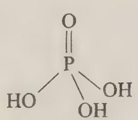  
图15-19 磷酸分子的结构

端基氧原子为接受磷原子的电子对配位，p 轨道的电子发

生重排,形成一个空 p 轨道,见图 15-20(b)。

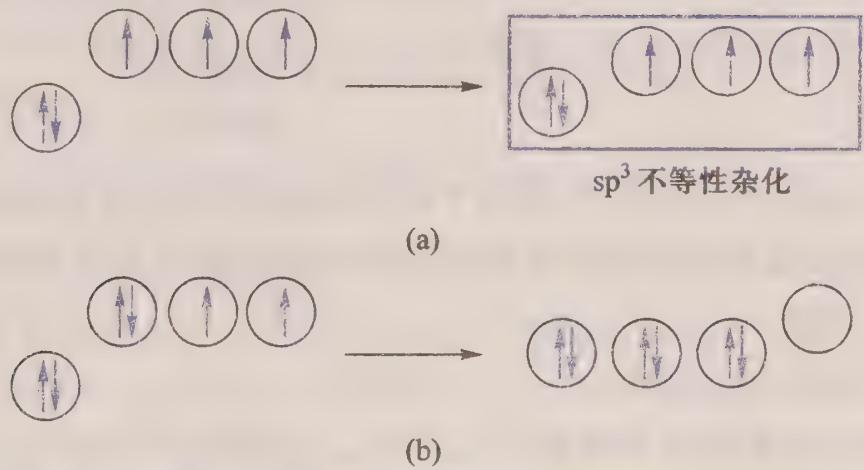  
图 15-20 磷原子的 $sp^{3}$ 不等性杂化和氧原子的电子重排

在形成上述 $\sigma$ 配位键的基础之上, 氧原子的 2p 轨道上的电子对向磷原子的 3d 空轨道配位, 形成反馈键。氧原子的 2p 轨道与磷原子的 3d 轨道的对称性一

但是由于两种轨道的能量不是十分接近,所以这种反馈键的键能不大。

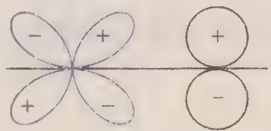

重叠的轨道是磷原子的 d 轨道与氧原子的 p 轨道，即 d-p 重叠；从对称性看属于 $\pi$ 键；从共用电子对来源看，氧原子提供电子对而磷原子仅提供空轨道，因而为配键，所以这种化学键称为 d-p $\pi$ 配键。

图15-21 磷原子的3d轨道与氧原子的

2p 轨道的对称性一致

在 $H_{2}SO_{4}$ , $HClO_{3}$ , $HClO_{4}$ , $H_{3}PO_{2}$ , $H_{3}PO_{3}$ , $P_{4}O_{10}$ , $SOCl_{2}$ , $SO_{2}Cl_{2}$ 等许多与含氧酸相关的分子中都存在 d-p π 配键。

磷酸有 3 个—OH, 它是一种三元中强酸, 磷酸的各级解离平衡常数为

$$
K _ {1} ^ {\ominus} = 7. 1 1 \times 1 0 ^ {- 3}, \quad K _ {2} ^ {\ominus} = 6. 3 4 \times 1 0 ^ {- 8}, \quad K _ {3} ^ {\ominus} = 4. 8 \times 1 0 ^ {- 1 3}
$$

不论在酸中还是在碱中,磷酸几乎都没有氧化性。

磷酸根离子能与某些金属离子形成可溶性配位化合物,如与 $Fe^{3+}$ 反应可以生成可溶性无色配位化合物 $H_{3}[Fe(PO_{4})_{2}]$ 和 $H[Fe(HPO_{4})_{2}]$ ,基于这种性质,分析化学上常用磷酸掩蔽 $Fe^{3+}$ ,以避免因 $Fe^{3+}$ 的存在对其他离子进行分析时的干扰。

磷酸经强热时会发生脱水作用,生成焦磷酸、三磷酸等多磷酸或偏磷酸,例如:

$$
2 \mathrm{H} _ {3} \mathrm{PO} _ {4} \xlongequal {\text {强热}} \mathrm{H} _ {2} \mathrm{O} + \mathrm{H} _ {4} \mathrm{P} _ {2} \mathrm{O} _ {7}
$$

$$
3 \mathrm{H} _ {3} \mathrm{PO} _ {4} \xlongequal {\text {强热}} 2 \mathrm{H} _ {2} \mathrm{O} + \mathrm{H} _ {5} \mathrm{P} _ {3} \mathrm{O} _ {1 0}
$$

$$
n \mathrm{H} _ {3} \mathrm{PO} _ {4} \stackrel {\text {强热}} {=} n \mathrm{H} _ {2} \mathrm{O} + (\mathrm{HPO} _ {3}) _ {n}
$$

磷酸除用于制造化学肥料外，常用于处理钢铁表面，使金属的表面生成难溶磷酸盐薄膜，以保护金属免受腐蚀。磷酸和硝酸的混合酸可作为化学抛光剂，提高金属表面的光洁度。

## (2) 磷(V)的其他含氧酸

磷酸聚合可以生成链状多磷酸 $\left(\mathrm{H}_{n+2}\mathrm{P}_{n}\mathrm{O}_{3n+1}\right)$ ，如图15-22(a)(b)所示的焦磷酸、三磷酸等，也能生成通式为 $\left(\mathrm{HPO}_{3}\right)_{n}$ 的环状多磷酸，如 $\left(\mathrm{HPO}_{3}\right)_{3}$ ，见图15-22(c)。

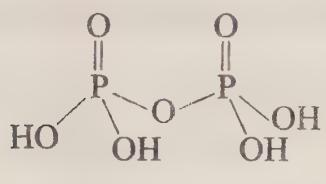  
(a)

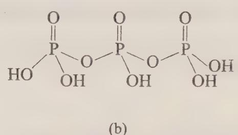  
(b)

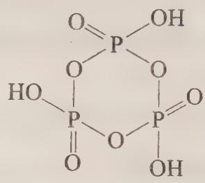  
(c)  
图15-22 磷酸的部分聚合产物的结构

n 聚链状多磷酸和 n 聚环状多磷酸的通式, 在下面的聚合反应方程式中可以看到:

$$
\begin{array}{r l r} { n \mathrm{H} _ {3} \mathrm{PO} _ {4} = (n - 1) \mathrm{H} _ {2} \mathrm{O} + \mathrm{H} _ {n + 2} \mathrm{P} _ {n} \mathrm{O} _ {3 n + 1}} & & {(\text {链状多磷酸})} \\ { n \mathrm{H} _ {3} \mathrm{PO} _ {4} = n \mathrm{H} _ {2} \mathrm{O} + (\mathrm{HPO} _ {3}) _ {n}} & & {(\text {环状多磷酸})} \end{array}
$$

焦磷酸为白色晶体,在酸性溶液中它会缓慢水解生成磷酸:

$$
\mathrm{H} _ {4} \mathrm{P} _ {2} \mathrm{O} _ {7} + \mathrm{H} _ {2} \mathrm{O} = 2 \mathrm{H} _ {3} \mathrm{PO} _ {4}
$$

焦磷酸为四元酸,其各级解离平衡常数是

$$
K _ {1} ^ {\ominus} = 1. 2 \times 1 0 ^ {- 1}, \quad K _ {2} ^ {\ominus} = 7. 9 \times 1 0 ^ {- 3}, \quad K _ {3} ^ {\ominus} = 2. 0 \times 1 0 ^ {- 7}, \quad K _ {4} ^ {\ominus} = 4. 5 \times 1 0 ^ {- 1 0}
$$

市售的焦磷酸盐有 $K_{4}P_{2}O_{7}$ 和 $Na_{4}P_{2}O_{7}$ 等。

## (3) 磷酸的盐类

磷酸的盐类可以分为正磷酸盐、多磷酸盐和偏磷酸盐。

正磷酸盐包括磷酸盐、磷酸一氢盐和磷酸二氢盐，比较重要的性质是盐的溶解性、水解性和稳定性。

钠、钾、铵的磷酸盐、磷酸一氢盐和磷酸二氢盐都易溶于水，这些易溶盐都有较多结晶水，结晶水较多的盐在加热时盐可溶于其结晶水。锂及多数+2价金属的磷酸盐都难溶于水，而磷酸二氢盐一般都易溶于水。+2价金属或高价金属盐的溶解度大小顺序为

$$
\text {   磷酸二氢盐   } > \text {   磷酸一氢盐   } > \text {   磷酸盐   }
$$

磷酸盐在水中发生水解反应,一般情况下 $Na_{3}PO_{4}$ 溶液显碱性,pH>12; $Na_{2}HPO_{4}$ 溶液显弱碱性,pH=9\~10; $NaH_{2}PO_{4}$ 溶液显弱酸性,pH=4\~5。

$Na_{3}PO_{4}, Na_{2}HPO_{4}$ 和 $NaH_{2}PO_{4}$ 水溶液与 $AgNO_{3}$ 作用都生成黄色的 $Ag_{3}PO_{4}$ 沉淀，偏磷酸盐 $NaPO_{3}$ 和焦磷酸盐 $Na_{4}P_{2}O_{7}$ 与 $AgNO_{3}$ 作用都生成白色沉淀。偏磷酸盐和焦磷酸盐经醋酸酸化后加入蛋清溶液，能使蛋清溶液中蛋白质凝聚的是偏磷酸。以上实验现象可定性鉴别正磷酸盐、偏磷酸盐和焦磷酸盐。

正磷酸盐在酸性条件下与饱和钼酸铵溶液混合后加热,生成黄色的磷钼酸铵沉淀: $\left(\mathrm{NH}_{4}\right)_{3}\mathrm{PMo}_{12}\mathrm{O}_{40}\cdot6\mathrm{H}_{2}\mathrm{O}$ ，或写成 $\left(\mathrm{NH}_{4}\right)_{3}\mathrm{PO}_{4}\cdot12\mathrm{MoO}_{3}\cdot6\mathrm{H}_{2}\mathrm{O}$ 。这是鉴定 $PO_{4}^{3-}$ 的重要方法,其反应式可参见第21章21.1.4小节。正磷酸盐与氧化镁、氯化铵的氨水溶液作用,得到白色晶状磷酸铵镁沉淀:

$$
\mathrm{PO} _ {4} ^ {3 -} + \mathrm{Mg} ^ {2 +} + \mathrm{NH} _ {4} ^ {+} = \mathrm{MgNH} _ {4} \mathrm{PO} _ {4} \downarrow
$$

正磷酸盐比较稳定,但是磷酸一氢盐或磷酸二氢盐受热却容易脱水聚合,聚合产物包括链状结构的多磷酸盐和环状结构的偏磷酸盐,见图 15-23。这些磷酸盐的基本结构单元仍然是磷氧四面体。

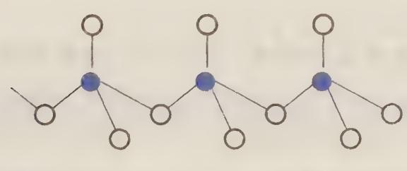  
(a)链状多磷酸根

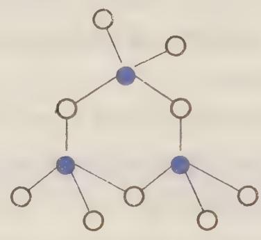  
(b) 环状偏磷酸根  
图15-23 多磷酸根和偏磷酸根的结构

链状多磷酸的酸根离子是磷氧四面体通过共用氧原子链状连接而成的,这类磷酸根的通式是 $P_{n}O_{3n+1}^{(n+2)-}$ , n 是多磷酸盐中的磷原子数。

环状偏磷酸盐的酸根离子是由3个或3个以上磷氧四面体通过共用氧原子环状连接而成的，其通式是 $\left(\mathrm{PO}_{3}\right)_{n}^{n-}$ 。常见的有三聚偏磷酸盐和四聚偏磷酸盐。

磷酸一氢盐或磷酸二氢盐高温缩合产物因反应条件不同而异,例如:

$$
\begin{array}{r l} & 2 \mathrm{NaH} _ {2} \mathrm{PO} _ {4} \xlongequal {1 7 0 ^ {\circ} \mathrm{C}} \mathrm{H} _ {2} \mathrm{O} + \mathrm{Na} _ {2} \mathrm{H} _ {2} \mathrm{P} _ {2} \mathrm{O} _ {7} \\ & n \mathrm{Na} _ {2} \mathrm{H} _ {2} \mathrm{P} _ {2} \mathrm{O} _ {7} \xlongequal {6 2 5 ^ {\circ} \mathrm{C}} n \mathrm{H} _ {2} \mathrm{O} + \mathrm{Na} _ {2 n} (\mathrm{PO} _ {3}) _ {2 n} \\ & \text {偏磷酸钠} \\ & 2 \mathrm{Na} _ {2} \mathrm{HPO} _ {4} \xlongequal {\triangle} \mathrm{H} _ {2} \mathrm{O} + \mathrm{Na} _ {4} \mathrm{P} _ {2} \mathrm{O} _ {7} \\ & \text {焦磷酸钠} \\ & \mathrm{NaH} _ {2} \mathrm{PO} _ {4} + 2 \mathrm{Na} _ {2} \mathrm{HPO} _ {4} \xlongequal {\triangle} 2 \mathrm{H} _ {2} \mathrm{O} + \mathrm{Na} _ {5} \mathrm{P} _ {3} \mathrm{O} _ {1 0} \\ & \text {三聚磷酸钠} \end{array}
$$

含有更多磷原子的环状偏磷酸盐(亦称多聚偏磷酸盐)叫作磷酸盐玻璃体,不具有晶状结构,其中较为重要的是格氏盐(Graham)。格氏盐是聚合物的一种混合物,没有固定的熔点,在水中有很大的溶解度。

磷酸盐在人们的日常生活和工、农业生产中有广泛的用途。例如，在食品和饮料添加剂、牙膏磨料、肥料、催化剂等的成分里都有磷酸盐。磷是生命必需元素，在牙齿、骨骼的生长和体内能量代谢中都被需要。

多磷酸盐对 $Ca^{2+}, Mg^{2+}$ 等有较强的配位作用。从 20 世纪 40 年代开始，在洗涤剂中加入适量 $Na_{5}P_{3}O_{10}$ 作为分散剂和助溶剂。但含多磷酸盐的废水排放到河流湖泊中，积累成为“肥水”而污染环境，已经引起广泛注意。

多磷酸盐重要用途之一是锅炉用水的处理。多磷酸根离子是硬水中 $Ca^{2+}$ ， $Mg^{2+}$ ， $Fe^{2+}$ 等的配体，能把这些离子转化成可溶性的稳定配位化合物；同时，在水中含极少量的磷酸盐玻璃体可以阻止锅炉水垢碳酸钙和碳酸镁结晶生长，从而防止水垢的沉积。

环状磷酸根的分散能力使它能降低液浆的黏度,因此环状磷酸盐可用于作为钻井泥浆和油漆颜料的分散剂。

## 2. 次磷酸及其盐

单质磷与热的浓碱液作用,除了产生磷化氢外还生成次磷酸盐,例如:

$$
\mathrm{P} _ {4} + 3 \mathrm{NaOH(热、浓)} + 3 \mathrm{H} _ {2} \mathrm{O} = 3 \mathrm{NaH} _ {2} \mathrm{PO} _ {2} + \mathrm{PH} _ {3} \uparrow
$$

次磷酸的结构见图 15-24(a)。纯的次磷酸为白色固体，熔点为 $26.5^{\circ}$ C，熔化后成为无色油状液体，易潮解。次磷酸的结构中仅含有一个—OH，为一元中强酸：

$$
\mathrm{H} _ {3} \mathrm{PO} _ {2} = \mathrm{H} ^ {+} + \mathrm{H} _ {2} \mathrm{PO} _ {2} ^ {-} \quad K _ {\mathrm{a}} ^ {\ominus} = 5. 9 \times 1 0 ^ {- 2}
$$

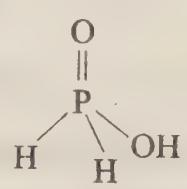  
(a)

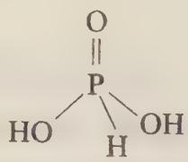  
(b)  
图 15-24 次磷酸和亚磷酸的结构

次磷酸是强还原剂，卤素单质和重金属盐都能在溶液中将其氧化，例如：

$$
\mathrm{H} _ {3} \mathrm{PO} _ {2} + \mathrm{I} _ {2} + \mathrm{H} _ {2} \mathrm{O} = \mathrm{H} _ {3} \mathrm{PO} _ {3} + 2 \mathrm{HI}
$$

$$
\mathrm{H} _ {3} \mathrm{PO} _ {2} + 4 \mathrm{Ag} ^ {+} + 2 \mathrm{H} _ {2} \mathrm{O} = 4 \mathrm{Ag} + \mathrm{H} _ {3} \mathrm{PO} _ {4} + 4 \mathrm{H} ^ {+}
$$

在碱性溶液中,次磷酸盐的还原能力更强,可以将 Ni(Ⅱ)还原成金属 Ni。所以次磷酸盐常用于化学镀:将镀件尤其那些塑料等非金属镀件置于配制好的溶液中,反应生成的 Ni 将均匀地沉积在其上,完成化学镀镍。

次磷酸还原能力强,氧化能力弱,容易发生歧化反应。

## 3. 亚磷酸及其盐

三氧化二磷 $\left(\mathrm{P}_{4}\mathrm{O}_{6}\right)$ 缓慢地与水作用或三卤化磷水解均生成亚磷酸：

$$
\mathrm{P} _ {4} \mathrm{O} _ {6} + 6 \mathrm{H} _ {2} \mathrm{O} = 4 \mathrm{H} _ {3} \mathrm{PO} _ {3}
$$

$$
\mathrm{PCl} _ {3} + 3 \mathrm{H} _ {2} \mathrm{O} = \mathrm{H} _ {3} \mathrm{PO} _ {3} + 3 \mathrm{HCl} \uparrow
$$

纯的亚磷酸为白色固体,熔点为 $74.4^{\circ}C$ , 在水中有很大的溶解度,亚磷酸的结构见图 15-24(b)。

亚磷酸为二元中强酸, 其 $K_{1}^{\ominus}=3.7\times10^{-2}, K_{2}^{\ominus}=2.1\times10^{-7}$ , 可以形成 $H_{2}PO_{3}^{-}$ 和 $HPO_{3}^{2-}$ 两类盐。亚磷酸受热时能发生歧化反应, 碱性条件下更易进行:

$$
4 \mathrm{H} _ {3} \mathrm{PO} _ {3} \stackrel {\triangle} {=} 3 \mathrm{H} _ {3} \mathrm{PO} _ {4} + \mathrm{PH} _ {3} \uparrow
$$

亚磷酸和亚磷酸盐都是强还原剂,其典型反应有

$$
\mathrm{H} _ {3} \mathrm{PO} _ {3} + \mathrm{I} _ {2} + \mathrm{H} _ {2} \mathrm{O} = \mathrm{H} _ {3} \mathrm{PO} _ {4} + 2 \mathrm{HI}
$$

$$
\mathrm{H} _ {3} \mathrm{PO} _ {3} + 2 \mathrm{Ag} ^ {+} + \mathrm{H} _ {2} \mathrm{O} = 2 \mathrm{Ag} + \mathrm{H} _ {3} \mathrm{PO} _ {4} + 2 \mathrm{H} ^ {+}
$$

## 15.6.2 碳的氧化物

## 1. 三氧化二磷

磷在不充分的空气中燃烧,生成的氧化物为六氧化四磷 $\left(\mathrm{P}_{4}\mathrm{O}_{6}\right)$ ,常叫作三氧化二磷。 $P_{4}O_{6}$ 是以 $P_{4}$ 为基础形成的, $P_{4}$ 分子中的P—P键因有张力而不稳定,氧分子进攻时断裂,在每两个磷原子间嵌入一个氧原子,于是形成了 $P_{4}O_{6}$ 分子,见图15-25(a)。形成 $P_{4}O_{6}$ 分子后4个磷原子的相对位置并不发生变化,分子中的氧原子全部为桥基氧原子。

$P_{4}O_{6}$ 是有滑腻感的白色吸潮性蜡状固体，熔点为 $23.8^{\circ}C$ ，沸点为 $175.4^{\circ}C$ 。 $P_{4}O_{6}$ 有毒，易溶于有机溶剂中，溶于冷水时缓慢地生成亚磷酸：

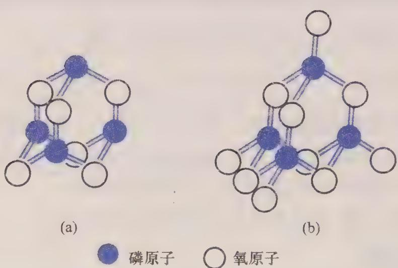  
图15-25 $\mathrm{P_4O_6}$ 和 $\mathrm{P_4O_{10}}$ 的结构

$$
\mathrm{P} _ {4} \mathrm{O} _ {6} + 6 \mathrm{H} _ {2} \mathrm{O} (\text {冷}) = 4 \mathrm{H} _ {3} \mathrm{PO} _ {3}
$$

$P_{4}O_{6}$ 与热水作用时发生歧化反应,有磷酸生成:

$$
\mathrm{P} _ {4} \mathrm{O} _ {6} + 6 \mathrm{H} _ {2} \mathrm{O} (\text {热}) = \mathrm{PH} _ {3} \uparrow + 3 \mathrm{H} _ {3} \mathrm{PO} _ {4}
$$

## 2. 五氧化二磷

白磷在充分的氧气中燃烧可生成十氧化四磷 $\left(\mathrm{P}_{4}\mathrm{O}_{10}\right)$ ，常叫作五氧化二磷。在 $P_{4}O_{6}$ 分子中每个磷原子上有一对孤电子对，向氧原子的空p轨道配位，形成 $\sigma$ 配键；同时氧原子p轨道中的电子对向磷原子的空d轨道配位，形成 $d-p\pi$ 配键。即在 $P_{4}O_{6}$ 的每个磷原子上再结合一个端基氧原子，于是形成 $P_{4}O_{10}$ 。如图15-25(b)所示，在 $P_{4}O_{10}$ 分子中有6个桥基氧原子和4个端基氧原子，端基氧原子与磷原子之间的化学键可以看成双键。

$P_{4}O_{10}$ 是白色粉末状固体,熔点为 $562^{\circ}C$ ,但低于熔点温度时升华。 $P_{4}O_{10}$ 有很强的吸水性,在空气中很快就潮解,它是干燥能力最强的一种干燥剂。 $P_{4}O_{10}$ 同水作用时放出大量的热,生成 $P(V)$ 的各种含氧酸, $P_{4}O_{10}$ 是磷酸酐。

如果 $P_{4}O_{10}$ 与水完全反应则得到磷酸，但 $P_{4}O_{10}$ 吸水生成磷酸的反应很慢，一般生成偏磷酸、焦磷酸和磷酸等的混合物：

$$
\begin{array}{r l} & \mathrm{P} _ {4} \mathrm{O} _ {1 0} + 2 \mathrm{H} _ {2} \mathrm{O} = 4 \mathrm{HPO} _ {3} \\ & \mathrm{P} _ {4} \mathrm{O} _ {1 0} + 4 \mathrm{H} _ {2} \mathrm{O} = 2 \mathrm{H} _ {4} \mathrm{P} _ {2} \mathrm{O} _ {7} \end{array}
$$

只有在 $\mathrm{HNO}_3$ 存在下，煮沸水溶液， $\mathrm{P}_4\mathrm{O}_{10}$ 才能生成 $\mathrm{H}_3\mathrm{PO}_4$ ：

$$
\mathrm{P} _ {4} \mathrm{O} _ {1 0} + 6 \mathrm{H} _ {2} \mathrm{O} \xrightarrow [ \text {煮沸} ]{\mathrm{HNO} _ {3}} 4 \mathrm{H} _ {3} \mathrm{PO} _ {4}
$$

## 15.7 磷的卤化物和硫化物

## 15.7.1 磷的卤化物

卤素单质都能与磷反应生成卤化物,其中重要的卤化磷是 $PX_{3}$ 和 $PX_{5}$ .究竟生成哪一种产物,可以通过改变反应物的配比和反应条件加以控制。不过在任何情况下产物都必须进行分离和提纯才能得到纯的化合物。

$\mathrm{PF}_{3}$ 为无色气体, $\mathrm{PCl}_{3}$ 和 $\mathrm{PBr}_{3}$ 为无色液体, $\mathrm{PI}_{3}$ 为橙红色固体。三卤化磷分子构型为三角锥形, 磷原子的轨道为 $\mathbf{sp}^{3}$ 不等性杂化轨道。在磷原子上还有一对孤电子对, 因此三卤化磷可以向金属离子配位而形成配位化合物。

三卤化磷易发生水解反应,例如:

$$
\mathrm{PCl} _ {3} + 3 \mathrm{H} _ {2} \mathrm{O} = \mathrm{H} _ {3} \mathrm{PO} _ {3} + 3 \mathrm{HCl} \uparrow
$$

水解反应进行得非常彻底,即使在浓盐酸中也不能抑制其水解。

$PCl_{3}$ 中心的 P 原子既有空 d 轨道, 又有孤电子对占有的轨道, 与 $H_{2}O$ 分子作用时既可以接受具有孤电子对的带有部分负电荷的 O 原子的进攻, 又可以接受带有部分正电荷的 H 原子的进攻, 所以 $PCl_{3}$ 可以同时发生两种不同机理的水解过程。

如图 15-26 所示, 当 $PCl_{3}$ 与 $H_{2}O$ 分子接近时, 水的 O 原子端进攻中心 P 原子的空 d 轨道, 同时水的 H 原子端进攻中心 P 原子具有孤电子对的轨道, 形成中间体。

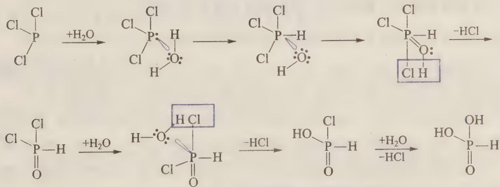  
图 15-26 $PCl_{3}$ 水解机理示意图

于是，H原子通过P原子的孤电子对与P原子成单键相结合，H—O键断裂时其电子对留给O原子，同时O原子与中心P原子成双键。

当 H 原子和 Cl 原子与中间体分离时, Cl 原子将 P—Cl 键电子对带走, H 原子将 H—O 键电子对留给 O 原子, 故第一步取代产物为电中性, 且中心 P 原子不再具有孤电子对。

第二步和第三步水解只能是水的 O 原子端进攻中心的空轨道, 两个—OH 取代两个 Cl 原子的过程。所以 $PCl_{3}$ 水解的产物是二元酸 $H_{3}PO_{3}$ 。

三卤化磷易发生醇解反应,生成亚磷酸酯,例如:

$$
\mathrm{PCl} _ {3} + 3 \mathrm{C} _ {2} \mathrm{H} _ {5} \mathrm{OH} = \mathrm{P} (\mathrm{C} _ {2} \mathrm{H} _ {5} \mathrm{O}) _ {3} + 3 \mathrm{HCl} \uparrow
$$

三卤化磷有还原性,很容易被氧化,例如:

$$
2 \mathrm{PCl} _ {3} + \mathrm{O} _ {2} = 2 \mathrm{POCl} _ {3}
$$

$PF_{5}$ 为无色气体， $PCl_{5}$ 和 $PBr_{5}$ 为白色固体。气态的五卤化磷分子为三角双锥构型，磷原子的轨道为 $sp^{3}d$ 杂化轨道。

五卤化磷的热稳定性顺序为

$$
\mathrm{PF} _ {5} > \mathrm{PCl} _ {5} > \mathrm{PBr} _ {5}
$$

它们的稳定性随着卤离子的还原能力的增强和卤离子半径的增大而降低。

在固态下 $PF_{5}$ 为分子晶体,保持三角双锥构型。而 $PCl_{5}$ 和 $PBr_{5}$ 为离子晶体。 $PCl_{5}$ 晶体中含有正四面体的 $[PCl_{4}]^{+}$ 和八面体的 $[PCl_{6}]^{-}$ ,而在 $PBr_{5}$ 晶体中含有四面体的 $[PBr_{4}]^{+}$ 和简单离子 $Br^{-}$ 。

五卤化磷极易水解,生成磷酸和卤化氢,例如:

$$
\mathrm{PCl} _ {5} + 4 \mathrm{H} _ {2} \mathrm{O} = \mathrm{H} _ {3} \mathrm{PO} _ {4} + 5 \mathrm{HCl} \uparrow
$$

若五卤化磷与少量水作用,则有卤氧化磷生成,例如:

$$
\mathrm{PCl} _ {5} + \mathrm{H} _ {2} \mathrm{O} = \mathrm{POCl} _ {3} + 2 \mathrm{HCl} \uparrow
$$

卤氧化磷为四面体构型, 磷原子为 $sp^{3}$ 杂化。P—O 之间接近双键, 成键方式与磷酸或五氧化二磷的磷原子与端基氧原子之间的 P—O 键相似。

除 $PX_{3}$ 和 $PX_{5}$ 外,一些不稳定的 $P_{2}X_{2}$ 及其衍生物也被合成出来,如 $P_{2}Cl_{2}$ , $P_{2}F_{2}$ , $P_{2}I_{2}$ 等。还存在大量的混合型卤化物,如 $PF_{2}Cl$ , $PFCl_{2}$ , $PF_{2}Br$ , $PF_{3}Cl_{2}$ 等。

$PCl_{3}$ 是最重要的磷的卤化物，以 $PCl_{3}$ 为原料可制备一系列衍生物，一些衍生物可用作染料添加剂、增塑剂、阻燃剂等。

## 15.72 磷的硫化物

磷的硫化物有很多种,较重要的有 $P_{4}S_{3}, P_{4}S_{5}, P_{4}S_{7}$ 和 $P_{4}S_{10}$ , 依次如图 15-27(a)(b)(c)(d) 所示。这些磷的硫化物都以 $P_{4}$ 四面体为结构基础，S 原子连接在 P—P 之间和 P 原子的顶端。其中 $P_{4}S_{10}$ 结构与 $P_{4}O_{10}$ 相似，但类似于 $P_{4}O_{6}$ 的 $P_{4}S_{6}$ 却没有得到。

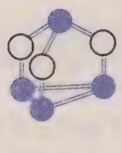  
(a)

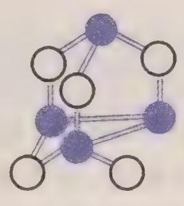  
(b)

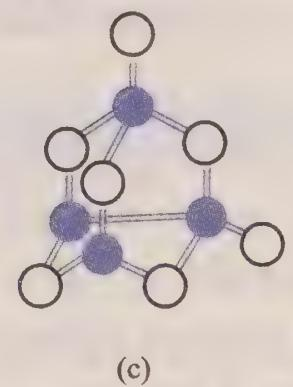

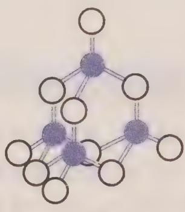  
(d)  
图15-27 磷的硫化物结构

硫化磷水解反应非常复杂,水解产物中磷的氧化数可以是-3,+1,+3,+5,生成 $PH_{3},H_{3}PO_{2},H_{3}PO_{3},H_{3}PO_{4}$ 。

$P_{4}S_{3}$ 是制造安全火柴的原料; $P_{4}S_{10}$ 用于生产润滑油添加剂和杀虫剂等。

## 15.8 砷、锑、铋

砷、锑、铋原子的次外层有 18 个电子, 它们的阳离子为 18 电子或 18+2 电子构型, 有较强的极化作用和较大的变形性, 应归属为软酸。因而这些元素都是亲硫元素, 在自然界常以硫化物形式存在。

砷的主要用途是制造杀虫剂和用于木材防腐；锑的主要用途是制造合金和蓄电池；而铋的主要用途是用于药物和制造合金等。

即使在强酸性溶液中, $As^{3+}$ 也是极少的,而锑和铋却易形成 $Sb^{3+}$ 和 $Bi^{3+}$ ,但在溶液中经常水解成 $SbO^{+}$ 和 $BiO^{+}$ 。

砷、锑、铋的化合物多数都是共价型化合物。在氧化数为+5的化合物中，除s轨道和p轨道参与成键以外，空d轨道也参与成键，一般为 $sp^{3}d$ 杂化或 $sp^{3}d^{2}$ 杂化。

工业上生产砷、锑、铋，首先将它们的硫化物矿煅烧成氧化物，再用碳还原出单质。例如：

$$
2 \mathrm{Sb} _ {2} \mathrm{S} _ {3} + 9 \mathrm{O} _ {2} \xlongequal {\text {高温}} 2 \mathrm{Sb} _ {2} \mathrm{O} _ {3} + 6 \mathrm{SO} _ {2}
$$

$$
\mathrm {Sb_ {2} O_ {3}} + 3 \mathrm{C} \xlongequal {\text {高温}} 2 \mathrm{Sb} + 3 \mathrm{CO} \uparrow
$$

$$
\mathrm{Bi} _ {2} \mathrm{O} _ {3} + 3 \mathrm{C} \xlongequal {\text {高温}} 2 \mathrm{Bi} + 3 \mathrm{CO} \uparrow
$$

也可以用铁粉直接将它们的硫化物还原成单质：

$$
\mathrm{Sb} _ {2} \mathrm{S} _ {3} + 3 \mathrm{Fe} \xlongequal {\text {高温}} 2 \mathrm{Sb} + 3 \mathrm{FeS}
$$

## 15.8.1 砷、锑、铋的单质

砷、锑、铋的熔点较低，随着半径的增大，金属键减弱，熔点依次降低。

砷、锑、铋都有多种同素异形体。砷有三种晶型，其中室温下最稳定的是金属型灰砷( $\alpha-As$ )，具有皱褶形的层状结构，熔点为817℃（三相点），在616℃时升华。最稳定的锑是银白色金属型锑( $\alpha-Sb$ )，与灰砷具有相似的结构，熔点为630.6℃，沸点为1587℃。铋有多种晶型，其中 $\alpha-Bi$ 与 $\alpha-Sb$ 结构相似。铋的熔点为24.4℃，沸点为1564℃，液态温度区间较宽。

常温下，砷、锑、铋在水和空气中都比较稳定，不与非氧化性稀酸作用，但能与硝酸、王水等反应；高温下，可以与许多非金属作用。砷和锑与稀硝酸反应生成+3价化合物 $\mathrm{H}_{3}\mathrm{AsO}_{3}$ 和 $\mathrm{Sb(NO_3)_3}$ ，与浓硝酸或过量稀硝酸反应生成+5价化合物 $\mathrm{H}_{3}\mathrm{AsO}_{4}$ 和 $\mathrm{H}_{3}\mathrm{SbO}_{4}$ 或 $\mathrm{H}[\mathrm{Sb(OH)}_{6}]$ 。铋与硝酸反应只能生成+3价化合物 $\mathrm{Bi(NO_3)_3}$ 。

砷、锑、铋单质能与绝大多数金属生成合金或化合物，如与碱金属形成 $\mathrm{A}_3\mathrm{M}$ 型化合物。砷、锑与ⅢA族元素形成的化合物为半导体材料，如砷化镓、锑化镓、砷化铟和锑化铟等，经常称为Ⅲ-VA族半导体。铋与锡、铅等金属可制成低熔点合金，用作保险丝。

## 15.8.2 砷、锑、铋的氢化物

砷、锑、铋都能生成氢化物 $MH_{3}$ ，氢化物均为有毒且不稳定的无色气体。这些氢化物的标准摩尔生成热都是正值，受热易分解为单质。 $AsH_{3}$ 在 250\~300 ℃ 分解， $SbH_{3}$ 在室温下即易分解，而 $BiH_{3}$ 更不稳定。

砷化氢亦称为肿,是有大蒜气味的剧毒气体。砷化氢可由金属砷化物水解或用强还原剂还原砷的氧化物制得,例如:

$$
\mathrm{Na} _ {3} \mathrm{As} + 3 \mathrm{H} _ {2} \mathrm{O} = \mathrm{AsH} _ {3} \uparrow + 3 \mathrm{NaOH}
$$

$$
\mathrm{As} _ {2} \mathrm{O} _ {3} + 6 \mathrm{Zn} + 1 2 \mathrm{HCl(aq)} = 2 \mathrm{AsH} _ {3} \uparrow + 6 \mathrm{ZnCl} _ {2} + 3 \mathrm{H} _ {2} \mathrm{O}
$$

在缺氧条件下,砷化氢受热分解产生单质砷:

$$
2 \mathrm{AsH} _ {3} \stackrel {\triangle} {=} 2 \mathrm{As} + 3 \mathrm{H} _ {2}
$$

该反应是法医学上鉴定砷的马氏(Marsh)试砷法的化学根据。将锌、盐酸和试样混在一起,把生成的气体导入热玻璃管,如试样中有 $\mathrm{As}_{2} \mathrm{O}_{3}$ 存在,生成的 $\mathrm{AsH}_{3}$ 将受热分解,单质 As 在玻璃管壁生成黑亮的“砷镜”。

可用次氯酸钠溶液溶解玻璃管壁上的“砷镜”：

$$
5 \mathrm{NaClO} + 2 \mathrm{As} + 3 \mathrm{H} _ {2} \mathrm{O} = 2 \mathrm{H} _ {3} \mathrm{AsO} _ {4} + 5 \mathrm{NaCl}
$$

用类似的方法可以得到锑化氢 $\left(\mathrm{SbH}_{3}\right)$ 气体：

$$
\mathrm{SbO} _ {3} ^ {3 -} + 3 \mathrm{Zn} + 9 \mathrm{H} ^ {+} = \mathrm{SbH} _ {3} \uparrow + 3 \mathrm{Zn} ^ {2 +} + 3 \mathrm{H} _ {2} \mathrm{O}
$$

$SbH_{3}$ 不稳定，在室温下分解可形成类似于“砷镜”的“锑镜”：

$$
2 \mathrm{SbH} _ {3} = 2 \mathrm{Sb} + 3 \mathrm{H} _ {2}
$$

铋化氢 $\left(\mathrm{BiH}_{3}\right)$ 更不稳定，在-45℃低温下即分解。

砷、锑、铋的氢化物都是很强的还原剂，在空气中能自燃，例如：

$$
2 \mathrm{AsH} _ {3} + 3 \mathrm{O} _ {2} \xlongequal {\text {自燃}} \mathrm{As} _ {2} \mathrm{O} _ {3} + 3 \mathrm{H} _ {2} \mathrm{O}
$$

$AsH_{3}$ 可以还原重金属盐类, 得到重金属单质。古氏 (Gutzeit) 试砷法的原理就是用 $AsH_{3}$ 还原硝酸银, 使溶液变黑:

$$
2 \mathrm{AsH} _ {3} + 1 2 \mathrm{AgNO} _ {3} + 3 \mathrm{H} _ {2} \mathrm{O} = \mathrm{As} _ {2} \mathrm{O} _ {3} + 1 2 \mathrm{HNO} _ {3} + 1 2 \mathrm{Ag} \downarrow
$$

该方法非常灵敏,超过马氏试砷法。

## 15.8.3 砷、锑、铋的含氧化合物

砷、锑、铋的氧化物可以分为 $M_{2}O_{3}$ 和 $M_{2}O_{5}$ 两种类型，与水作用得到两种价态的氢氧化物或含氧酸。有的物质显酸性，有的显碱性，也有的显两性。

## 1. 氧化数 +3 的化合物

三氧化二铋 $\left(\mathrm{Bi}_{2}\mathrm{O}_{3}\right)$ 为碱性氧化物，三氧化二锑 $\left(\mathrm{Sb}_{2}\mathrm{O}_{3}\right)$ 为两性，而三氧化二砷 $\left(\mathrm{As}_{2}\mathrm{O}_{3}\right)$ 为两性偏酸。 $As_{2}O_{3}$ 俗称砒霜，剧毒，对人的致死量为0.1g。

+3 价砷、锑、铋的氧化物都有多种变体。+3 价砷的氧化物在 460 ℃ 以上转化为气态，在气相中以 As $_{4}$ O $_{6}$ 形式存在，800 ℃ 以上发生解离，平衡体系中 As $_{4}$ O $_{6}$ 和 As $_{2}$ O $_{3}$ 两种分子都有。立方晶型的 +3 价砷以 As $_{4}$ O $_{6}$ 形式存在；单斜晶型的 +3 价砷以 As $_{2}$ O $_{3}$ 形式存在，为难挥发的片状多聚体。立方晶型的 Sb $_{4}$ O $_{6}$ 在 600 ℃ 转化为单斜晶型的 Sb $_{2}$ O $_{3}$ ，为长链的大分子。Bi $_{2}$ O $_{3}$ 的结构更为复杂，室温下为多聚体的层状结构。

$As_{2}O_{3}$ 的溶解度与溶液的酸度有关。在盐酸的浓度较低时，随着盐酸的浓度增大 $As_{2}O_{3}$ 的溶解度减小，在约 $3\ mol\cdot dm^{-3}$ 盐酸中，其溶解度最小；在盐酸的浓度大于 $3\ mol\cdot dm^{-3}$ 时，随着盐酸的浓度增大 $As_{2}O_{3}$ 的溶解度增大。 $As_{2}O_{3}$ 在稀盐酸中显酸性，溶解产物为 $H_{3}AsO_{3}$ ，适当增大酸度会抑制酸性物质的生成，使 $As_{2}O_{3}$ 的溶解度降低；但是当盐酸浓度较大时， $As_{2}O_{3}$ 体现出弱碱性，生成 $[AsCl_{4}]^{-}$ 等配离子而溶解度增大。 $As_{2}O_{3}$ 在碱中的溶解度比在水中大得多。

$Sb_{2}O_{3}$ 是两性氧化物,难溶于水,但却易于与酸碱反应。例如:

$$
\mathrm{Sb} _ {2} \mathrm{O} _ {3} + 6 \mathrm{HCl(浓)} = 2 \mathrm{SbCl} _ {3} + 3 \mathrm{H} _ {2} \mathrm{O}
$$

由于盐酸浓度较高,产物中可能有 $\left[SbCl_{4}\right]^{-}$ 配位单元。

$Bi_{2}O_{3}$ 是碱性氧化物, 只溶于酸, 所以在溶液中只存在 $Bi^{3+}$ 或其水解产物 $BiO^{+}$ 。

$H_{3}AsO_{3}$ 为弱酸, $K_{1}^{\ominus}=5.13\times10^{-10}$

亚锑酸 $\mathrm{Sb(OH)}_{3}$ 实际上可能是 $Sb_{2}O_{3} \cdot xH_{2}O$ ，为两性。

氧化数为+3的砷、锑、铋不易歧化，但+3价砷和+3价锑是较强的还原剂。在弱碱性介质中，+3价砷可以被碘定量氧化，例如：

$$
\mathrm{NaH} _ {2} \mathrm{AsO} _ {3} + 4 \mathrm{NaOH(aq)} + \mathrm{I} _ {2} = \mathrm{Na} _ {3} \mathrm{AsO} _ {4} + 2 \mathrm{NaI} + 3 \mathrm{H} _ {2} \mathrm{O}
$$

$Bi_{2}O_{3}$ 在酸性条件下却很难被氧化成 $\mathrm{Bi(V)}$ 。

## 2. 氧化数+5 的化合物

氧化数为+5的砷、锑、铋的氧化物都是酸性氧化物，它们与水反应生成含氧酸或氧化物的水合物，其酸性依砷、锑、铋的顺序减弱。 $As_{2}O_{5}$ 在水中的溶解度较大，20℃时100 g水中可溶解230 g $As_{2}O_{5}$ 。

$H_{3}AsO_{4}$ 为三元酸， $K_{1}^{\ominus}=5.50\times10^{-3}$ ， $K_{2}^{\ominus}=1.74\times10^{-7}$ ， $K_{3}^{\ominus}=5.13\times10^{-12}$ ，酸性与 $H_{3}PO_{4}$ 相近。Sb(V)的含氧酸的分子式可能为H $[Sb(OH)_{6}]$ ，是一元弱酸， $K^{\ominus}=4\times10^{-5}$ 。相应的盐已经制得，如K $[Sb(OH)_{6}]$ 和Na $[Sb(OH)_{6}]$ ，溶解度都很小。中心Sb的配位数为6，形成八面体结构。目前还没有分离出 $Bi_{2}O_{5}$ 及其含氧酸，这与铋的惰性电子对效应使Bi(V)氧化性强而很不稳定是一致的。但Bi(V)的含氧酸盐却已制得，如棕黄色的微溶盐 $NaBiO_{3}$ 。在碱性介质中用强氧化剂如 $Cl_{2}$ 或NaClO可将Bi(Ⅲ)化合物氧化生成铋酸钠：

$$
\mathrm{Bi} (\mathrm{OH}) _ {3} + \mathrm{Cl} _ {2} + 3 \mathrm{NaOH} (\mathrm{aq}) = \mathrm{NaBiO} _ {3} + 2 \mathrm{NaCl} + 3 \mathrm{H} _ {2} \mathrm{O}
$$

As(V), Sb(V) 和 Bi(V) 的含氧酸及其盐都有氧化性, 同时, 氧化性只有在酸性介质中才表现出来。砷酸和锑酸在酸中可将 HI 氧化成 $I_{2}$ , 例如:

$$
\mathrm{H} _ {3} \mathrm{AsO} _ {4} + 2 \mathrm{HI} (\mathrm{aq}) = \mathrm{H} _ {3} \mathrm{AsO} _ {3} + \mathrm{I} _ {2} + \mathrm{H} _ {2} \mathrm{O}
$$

这一反应在分析化学上具有实际意义。

在酸性介质中,砷酸能将 I⁻ 氧化成 I₂,而在碱性介质中,I₂ 却能将亚砷酸根氧化成砷酸根。这一现象在第 10 章 10.3.2 小节中曾结合电势-pH 图讨论过。

Bi(V)的化合物氧化能力很强,在酸性条件下能将 $Mn^{2+}$ 氧化成 $MnO_{4}^{-}$ :

$$
2 \mathrm{Mn} ^ {2 +} + 5 \mathrm{BiO} _ {3} ^ {-} + 1 4 \mathrm{H} ^ {+} = 2 \mathrm{MnO} _ {4} ^ {-} + 5 \mathrm{Bi} ^ {3 +} + 7 \mathrm{H} _ {2} \mathrm{O}
$$

在分析化学上,这是一个定性鉴定溶液中有无 $Mn^{2+}$ 的重要反应。在未知液中加入硝酸(或硫酸)和固体 $NaBiO_{3}$ ,加热时如溶液变紫(或红)色,则说明溶液中有 $Mn^{2+}$ 存在。

Bi(V)的强氧化性也与惰性电子对效应有关。

## 15.8.4 砷、锑、铋的卤化物

砷、锑、铋的三卤化物较稳定，但都能发生水解反应，水解能力的顺序为

$$
\mathrm{PCl} _ {3} > \mathrm{AsCl} _ {3} > \mathrm{SbCl} _ {3} > \mathrm{BiCl} _ {3}
$$

这和 M(Ⅲ) 的半径依次增大时碱性依次增强是一致的。

三氯化砷 $\left(\mathrm{AsCl}_{3}\right)$ 的水解能力比 $PCl_{3}$ 弱,水解产物为 $H_{3}AsO_{3}$ :

$$
\mathrm{AsCl} _ {3} + 3 \mathrm{H} _ {2} \mathrm{O} = \mathrm{H} _ {3} \mathrm{AsO} _ {3} + 3 \mathrm{HCl}
$$

在浓盐酸中尚可以有 $As^{3+}$ 存在。

由于 $Sb^{3+}, Bi^{3+}$ 水解能力弱, 故用强酸可以抑制其水解, 而稀释时部分水解生成碱或盐 $\mathrm{Sb(OH)}_{2}\mathrm{Cl}$ 和 $\mathrm{Bi(OH)}_{2}\mathrm{Cl}$ , 脱去一分子 $H_{2}O$ 后得到白色微溶的氯氧化物:

$$
\begin{array}{r l} & \mathrm{SbCl} _ {3} + \mathrm{H} _ {2} \mathrm{O} = \mathrm{SbOCl} \downarrow + 2 \mathrm{HCl} \\ & \mathrm{BiCl} _ {3} + \mathrm{H} _ {2} \mathrm{O} = \mathrm{BiOCl} \downarrow + 2 \mathrm{HCl} \end{array}
$$

在配制 $SbX_{3}$ 和 $BiX_{3}$ 溶液时，必须将盐溶解在相应的酸中。与 $BiCl_{3}$ 相似， $\mathrm{Bi(NO_{3})_{3}}$ 的水解也不彻底，生成白色 $BiONO_{3}$ 沉淀。

砷、锑、铋的五氟化物中， $\mathrm{AsF}_{5}$ 为无色气体， $\mathrm{SbF}_{5}$ 为液体， $\mathrm{BiF}_{5}$ 为白色固体；五氯化物中， $\mathrm{AsCl}_{5}$ 在 $-50^{\circ} \mathrm{C}$ 即分解，液态的 $\mathrm{SbCl}_{5}$ 加热至 $140^{\circ} \mathrm{C}$ 以上分解，其余五卤化物均不稳定。

## 15.8.5 砷、锑、铋的硫化物

砷、锑、铋的硫化物，主要有黄色的 $\mathrm{As}_2\mathrm{S}_3$ 和 $\mathrm{As}_2\mathrm{S}_5$ ，橙色的 $\mathrm{Sb}_2\mathrm{S}_3$ 和 $\mathrm{Sb}_2\mathrm{S}_5$ ，以及黑色的 $Bi_{2}S_{3}$ 。由于 $\mathrm{Bi(V)}$ 的氧化性很强，所以很难与还原性的 -2 价的硫形成 +5 价的硫化物。而砷的硫化物还有 $As_{4}S_{3}$ 和 $As_{4}S_{4}$ 。

在+5价砷或锑的溶液中通入 $\mathrm{H}_2\mathrm{S}$ 得不到纯的 $\mathrm{As}_2\mathrm{S}_5$ 或 $\mathrm{Sb}_2\mathrm{S}_5$ 。因为在生成 $\mathrm{As}_2\mathrm{S}_5$ 或 $\mathrm{Sb}_2\mathrm{S}_5$ 的同时，溶液的酸性在提高，As（V），Sb（V）的氧化能力随之增强，于是在生成的 $\mathrm{As}_2\mathrm{S}_5$ 或 $\mathrm{Sb}_2\mathrm{S}_5$ 中会有单质S和 $\mathrm{As}_2\mathrm{S}_3$ 或 $\mathrm{Sb}_2\mathrm{S}_3$ 等杂质。

$As_{2}S_{3},As_{2}S_{5}$ 为酸性硫化物, $Sb_{2}S_{3}$ 为两性硫化物, $Sb_{2}S_{5}$ 则为两性偏酸,它们都溶于碱金属硫化物溶液,例如:

$$
\begin{array}{l} \mathrm {As_ {2} S_ {3}} + 3 \mathrm {Na_ {2} S(aq)} = 2 \mathrm {Na_ {3} AsS_ {3}} \\ \mathrm {Sb_ {2} S_ {3}} + 3 \mathrm {Na_ {2} S(aq)} = 2 \mathrm {Na_ {3} SbS_ {3}} \\ \mathrm {As_ {2} S_ {5}} + 3 \mathrm {Na_ {2} S(aq)} = 2 \mathrm {Na_ {3} AsS_ {4}} \\ \mathrm {Sb_ {2} S_ {5}} + 3 \mathrm {Na_ {2} S(aq)} = 2 \mathrm {Na_ {3} SbS_ {4}} \end{array}
$$

也溶于 NaOH 溶液,例如:

$$
\begin{array}{r l} & \mathrm {As_ {2} S_ {3}} + 6 \mathrm{NaOH(aq)} = \mathrm {Na_ {3} AsO_ {3}} + \mathrm {Na_ {3} AsS_ {3}} + 3 \mathrm {H_ {2} O} \\ & \mathrm {Sb_ {2} S_ {3}} + 6 \mathrm{NaOH(aq)} = \mathrm {Na_ {3} SbO_ {3}} + \mathrm {Na_ {3} SbS_ {3}} + 3 \mathrm {H_ {2} O} \end{array}
$$

生成物中均有硫代酸盐,例如 $Na_{3}AsS_{4}$ 称为硫代砷酸钠, $Na_{3}SbS_{3}$ 称为硫代亚锑酸钠,可将其看成是含氧酸盐中的氧被硫取代的产物。

$As_{2}S_{3}$ 和 $Sb_{2}S_{3}$ 有一定的还原性, 可以被氧化而溶于 $Na_{2}S_{2}$ 溶液中, 例如:

$$
\begin{array}{r l} \mathrm{As} _ {2} \mathrm{S} _ {3} + 2 \mathrm{Na} _ {2} \mathrm{S} _ {2} (\mathrm{aq}) & = \mathrm{As} _ {2} \mathrm{S} _ {5} + 2 \mathrm{Na} _ {2} \mathrm{S} \\ \mathrm{As} _ {2} \mathrm{S} _ {5} + 3 \mathrm{Na} _ {2} \mathrm{S} (\mathrm{aq}) & = 2 \mathrm{Na} _ {3} \mathrm{AsS} _ {4} \end{array}
$$

酸性硫化物 $As_{2}S_{3}$ 和 $As_{2}S_{5}$ 不溶于浓盐酸，两性硫化物 $Sb_{2}S_{3}$ 和 $Sb_{2}S_{5}$ 溶于浓盐酸，例如：

$$
\mathrm{Sb} _ {2} \mathrm{S} _ {3} + 1 2 \mathrm{HCl(浓)} = 2 \mathrm{H} _ {3} \mathrm{SbCl} _ {6} + 3 \mathrm{H} _ {2} \mathrm{S} \uparrow
$$

而碱性硫化物 $Bi_{2}S_{3}$ 则能溶于约 $4\ mol\cdot dm^{-3}$ 的盐酸而不溶于碱：

$$
\mathrm{Bi} _ {2} \mathrm{S} _ {3} + 6 \mathrm{HCl(aq)} = 2 \mathrm{BiCl} _ {3} + 3 \mathrm{H} _ {2} \mathrm{S} \uparrow
$$

所有的硫代酸盐都只能在中性或碱性介质中存在,遇酸则生成相应的硫化物沉淀和硫化氢,例如:

$$
2 \mathrm{Na} _ {3} \mathrm{AsS} _ {3} + 6 \mathrm{HCl(aq)} = \mathrm{As} _ {2} \mathrm{S} _ {3} \downarrow + 3 \mathrm{H} _ {2} \mathrm{S} \uparrow + 6 \mathrm{NaCl}
$$

$$
2 \mathrm{Na} _ {3} \mathrm{SbS} _ {4} + 6 \mathrm{HCl(aq)} = \mathrm{Sb} _ {2} \mathrm{S} _ {5} \downarrow + 3 \mathrm{H} _ {2} \mathrm{S} \uparrow + 6 \mathrm{NaCl}
$$

用这种方法制得的五硫化物 $Sb_{2}S_{5}$ 和 $As_{2}S_{5}$ ，比直接把 $H_{2}S$ 通入 $Sb(V)$ 和 $As(V)$ 盐溶液所得的产品要纯一些。

## 一拓展学习资源

<table><tr><td>资源内容</td><td>二维码</td></tr><tr><td>► 氮族元素的发现过程</td><td></td></tr><tr><td>► 磷、砷、锑、铋部分矿物图片</td><td></td></tr><tr><td>► 硝酸和硝酸盐的重要用途</td><td></td></tr><tr><td>► 磷酸的制备与重要用途</td><td></td></tr><tr><td>► 金属锑的重要用途</td><td></td></tr><tr><td>► 金属铋的重要用途</td><td>扫一扫查看资源内容</td></tr><tr><td>► 本章小结</td><td></td></tr><tr><td>► 视频——亚硝酸的生成与分解</td><td></td></tr><tr><td>► 视频——棕色环实验</td><td></td></tr><tr><td>► 视频——铋酸钠的强氧化性</td><td></td></tr><tr><td>► 视频——三硫化二锑的生成与性质</td><td></td></tr></table>

## 总结与思专题

15-1 试总结并讨论氮元素的成键特征。

15-2 试讨论氮族元素氢化物 $\mathrm{AH}_{3}$ 的热稳定性变化规律。

15-3 从 $\mathrm{NH}_{3}$ 的结构和中心的氧化数情况,举例说明 $\mathrm{NH}_{3}$ 的反应类型。

15-4 比较氮的氢化物 $\mathrm{NH}_{3}, \mathrm{~N}_{2} \mathrm{H}_{4}, \mathrm{NH}_{2} \mathrm{OH}$ 的碱性并说明原因。

15-5 总结氮的氧化物 $\mathrm{N}_2\mathrm{O}, \mathrm{NO}, \mathrm{N}_2\mathrm{O}_3, \mathrm{NO}_2, \mathrm{N}_2\mathrm{O}_4$ 和 $\mathrm{N}_2\mathrm{O}_5$ 的结构，绘图说明其成键情况。

15-6 试总结和讨论磷元素的成键特征。详细说明 $\mathrm{H}_{3} \mathrm{PO}_{4}$ 分子中 $\mathrm{d}-\mathrm{p} \pi$ 配键的形成。

15-7 试讨论氮族元素单质熔、沸点的变化规律并说明原因。

15-8 比较 N(V), P(V), As(V), Sb(V), Bi(V) 在酸性溶液中氧化性的强弱并说明原因。

15-9 人们已经得到 $\mathrm{PCl}_5$ ， $\mathrm{AsCl}_5$ 和 $\mathrm{SbCl}_5$ ，为什么未能得到 $\mathrm{NCl}_5$ 和 $\mathrm{BiCl}_5$ ？

15-10 讨论 $As_{2}O_{3}$ 在水中的溶解度随着溶液的 pH 的变化情况。

15-11 比较砷、锑、铋的硫化物的颜色、酸碱性，以及其在盐酸， $\mathrm{NaOH}, \mathrm{Na}_{2} \mathrm{~S}, \mathrm{Na}_{2} \mathrm{~S}_{2}$ 等溶液中的溶解性。

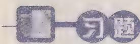

15-1 简释下列词语。

（1）氨合电子； （2）氨解反应； （3）王水； （4）钝化现象；

(5) d-p $\pi$ 配键； (6) 化学镀； (7) 马氏试砷法； (8) 古氏试砷法。

15-2 完成并配平下列化学反应方程式。

(1) $\mathrm{NH}_3 + \mathrm{Mg}\stackrel {\triangle}{=}$

(2) $\mathrm{Mg}_3\mathrm{N}_2 + \mathrm{H}_2\mathrm{O} =$

(3) $\mathrm{NH}_3(\mathrm{aq}) + \mathrm{HgCl}_2 =$

(4) $\mathrm{MnO}_4^-$ + $\mathrm{HNO}_2$ + $\mathrm{H}^+$

(5) $\mathrm{N}_2\mathrm{H}_4(\mathrm{aq}) + \mathrm{HNO}_2 =$

(6) $\mathrm{As}_{2}\mathrm{O}_{3} + \mathrm{Zn} + \mathrm{HCl(aq)} =$

(7) $\mathrm{Cu}_{2} \mathrm{SO}_{4} + \mathrm{PH}_{3} =$

(8) $\mathrm{NCl}_3 + \mathrm{H}_2\mathrm{O} =$

(9) $\mathrm{P}_{4} + \mathrm{NaOH}$ (热、浓) $+\mathrm{H}_{2} \mathrm{O} =$

(10) $NaH_{2}PO_{4} + Na_{2}HPO_{4} \xlongequal{\Delta}$

(11) $\mathrm{PCl}_3 + \mathrm{H}_2\mathrm{O} =$

(12) $\mathrm{MnO}_4^-$ + $\mathrm{As}_2\mathrm{O}_3$ + $\mathrm{H}^+$ + $\mathrm{H}_2\mathrm{O} =$

(13) As + HNO $_{3}$ (浓)

(14) $\mathrm{Bi} + \mathrm{HNO}_3$ (浓)

15-3 完成并配平下列化学反应方程式。

(1) 氯化铵与亚硝酸钠溶液混合后加热。

(2) 亚硝酸钠晶体与硫酸混合。

(3) 二氧化氮通入氢氧化钠溶液。

(4) 亚硝酸银受热分解。

(5) 三氟化氮与水汽的混合物遇到火花发生爆炸。

(6) 三氯化磷与氧气反应。

(7) 正磷酸盐与氯化镁、氯化铵的氨水溶液作用。

(8) 次磷酸溶液中加入过量氢氧化钠溶液。

(9) 亚磷酸溶液中加入过量氢氧化钠溶液。

(10) 用次氯酸钠溶液洗掉玻璃管壁上的“砷镜”。

(11) 砷化氢通入硝酸银溶液。

(12) 三硫化二砷溶于氢氧化钠溶液。

(13) 三氧化二锑溶于浓盐酸。

(14) 三氯化铋水解。

(15) 氢氧化铋与氯气在氢氧化钠溶液中反应。

15-4 生产、合成与制备。

(1) 以 $N_{2}$ 和 $H_{2}$ 为主要原料制备 $NH_{4}NO_{3}$ 。

(2) 由 $\mathrm{NH}_{3}$ 制备 $\mathrm{N}_{2} \mathrm{H}_{4}$ 和 $\mathrm{HN}_{3}$ 。

(3) 由 $\mathrm{NaNO}_3$ 制备 $\mathrm{N}_2\mathrm{O}_5$ 。

(4) 以磷酸钙矿为主要原料生产 $\mathrm{P}_{2} \mathrm{O}_{5}$ 和单质 $\mathbf{P}$ 。

(5) 完成下列物质转化的化学反应方程式并给出反应条件。

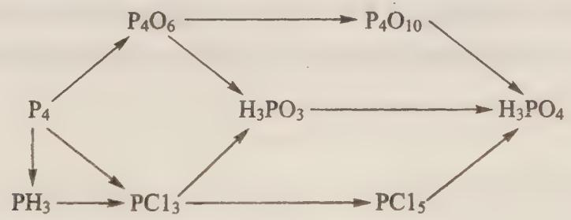

(6) 以 $As_{2}S_{3}$ 为主要原料制备 $As_{2}O_{3}$ 和 $H_{3}AsO_{4}$ 。

(7) 由 $Sb_{2}S_{3}$ 矿生产单质 Sb。

(8) 由 $Bi_{2}S_{3}$ 制备 $NaBiO_{3}$ 。

15-5 分离、提纯与鉴别。

(1) 试分离下列各组离子。

① $Sb^{3+}$ 和 $Bi^{3+}$ ; ② $PO_{4}^{3-}$ 和 $NO_{3}^{-}$ ; ③ $PO_{4}^{3-}$ 和 $SO_{4}^{2-}$ ; ④ $PO_{4}^{3-}$ 和 $Cl^{-}$ 。

(2) 鉴别下列各组物质。

① $H_{3}AsO_{3}$ 和 $H_{3}AsO_{4}$ ; ② $H_{3}PO_{4}$ 和 $H_{3}AsO_{4}$ 。

(3) 提纯下列物质。

① $N_{2}$ 气中有少量 $O_{2}$ 和 $H_{2}O$ ;

② NO 中有少量 $NO_{2}$ ;

③ $NaNO_{3}$ 溶液中有少量 $NaNO_{2}$ 。

(4) 分别用 3 种方法鉴别下列各组物质。

① $NaNO_{2}$ 和 $NaNO_{3}$ ; ② $NH_{4}NO_{3}$ 和 $NH_{4}Cl$ ; ③ $SbCl_{3}$ 和 $BiCl_{3}$ ;

④ $NaNO_{3}$ 和 $NaPO_{3}$ ; ⑤ $Na_{3}PO_{4}$ 和 $Na_{2}SO_{4}$ ; ⑥ $KNO_{3}$ 和 $KIO_{3}$ 。

(5) 现有下列 6 种磷的含氧酸盐固体,试加以鉴别。
① $Na_{4}P_{2}O_{7}$ ; ② $NaPO_{3}$ ; ③ $Na_{2}HPO_{4}$ ;
④ $NaH_{2}PO_{4}$ ; ⑤ $NaH_{2}PO_{2}$ ; ⑥ $NaH_{2}PO_{3}$ 。

## 15-6 解释实验现象。

（1）在煤气灯上加热 $KNO_{3}$ ，晶体时没有棕色气体生成，但若 $KNO_{3}$ 晶体混有 $CuSO_{4}$ 时则有棕色气体生成。

(2) 向 $\mathrm{KNO}_2$ 的酸性溶液中加入 $\mathrm{Co(II)}$ 盐, 生成的 $\mathrm{K}_3[\mathrm{Co}(\mathrm{NO}_2)_6]$ 沉淀中 $\mathrm{Co}$ 为 $+3$ 价。

（3）向 $Na_{3}PO_{4}$ 溶液中滴加 $AgNO_{3}$ 溶液时生成黄色沉淀，但向 $NaPO_{3}$ 溶液中滴加 $AgNO_{3}$ 溶液时却生成白色沉淀。

（4）向 $Na_{2}HPO_{4}$ 溶液中加入 $CaCl_{2}$ 溶液有白色沉淀生成，但向 $NaH_{2}PO_{4}$ 溶液中加入 $CaCl_{2}$ 溶液没有沉淀生成。

（5）分别向 $NaH_{2}PO_{4}$ ， $Na_{2}HPO_{4}$ 和 $Na_{3}PO_{4}$ 溶液中加入 $AgNO_{3}$ 溶液时，均得到黄色的 $Ag_{3}PO_{4}$ 沉淀。

（6）向 $\mathrm{FeCl}_3$ 溶液中滴加 $\mathrm{Na}_3\mathrm{PO}_4$ 溶液，先有黄色沉淀生成；继续滴加时沉淀减少，最后消失得无色溶液。

(7) 使 $\mathrm{AsH}_{3}$ 通入一玻璃管, 并在入口处加热, 这时管壁出现有金属光泽的黑色物质。

（8）向含有 $\mathrm{Bi}^{3+}$ 和 $\mathrm{Sn}^{2+}$ 的澄清溶液中加入NaOH溶液会有黑色沉淀生成。

（9）将 NaOH 溶液与 $BiCl_{3}$ 溶液充分混合有白色沉淀生成，再向其中通入 $Cl_{2}$ 时有黄棕色沉淀生成。

## 15-7 推理判断。

(1) 用水处理短周期元素形成的黄色二元化合物(A), 得到白色沉淀(B)和无色气体(C)。(B)不溶于 NaOH 溶液, 溶于硝酸后经浓缩析出(D)的水合晶体。(D)受热分解得到白色物质(E)和棕色气体(F), 将(F)通过 NaOH 溶液后气体体积变为原来的 20%。将(C)通入 $CuSO_{4}$ 溶液先有浅蓝色沉淀生成,(C)过量后沉淀溶解得深蓝色溶液(G)。

试给出(A)，(B)，(C)，(D)，(E)，(F)和(G)所代表的物质的化学式，并用化学反应方程式表示各过程。

(2) 无色钠盐晶体(A)溶于水后,加入 $\mathrm{AgNO}_3$ 溶液有浅黄色沉淀(B)生成。用 $\mathrm{NaOH}$ 溶液处理(B),得到棕黑色沉淀(C)。(B)溶于硝酸并放出棕色气体(D)。(D)通入 $\mathrm{NaOH}$ 溶液后经蒸发、浓缩析出晶体(E)。(E)受热分解得无色气体(F)和(A)的粉末。

试给出(A)，(B)，(C)，(D)，(E)和(F)所代表的物质的化学式，并用化学反应方程式表示各过程。

(3) 无色晶体(A)受热得到无色气体(B), 将(B)在更高的温度下加热后再恢复到原来的温度, 发现气体体积增加了 $50\%$ 。晶体(A)与等物质的量 $\mathrm{NaOH}$ 固体共热得无色气体(C)

和白色固体(D)。将(C)通入 $AgNO_{3}$ 溶液先有棕黑色沉淀(E)生成,(C)过量时则(E)消失得到无色溶液。固体(D)受热得无色气体(F)和白色固体(G),用浓硝酸处理固体(G)有棕色气体生成。

试给出(A)，(B)，(C)，(D)，(E)，(F)和(G)所代表的物质的化学式，并用化学反应方程式表示各过程。

(4) 白色钾盐(A)的水溶液显弱碱性, 加入 $AgNO_{3}$ 溶液有黄色沉淀(B)生成。固体(A)在一定温度下加热得到白色固体(C)。向(C)的溶液中加入 $AgNO_{3}$ 溶液生成白色沉淀(D)。向(A)的水溶液中加入 $CaCl_{2}$ 溶液有白色沉淀(E)生成,(E)溶于盐酸, 不溶于 NaOH 溶液。

试给出(A)，(B)，(C)，(D)和(E)所代表的物质的化学式，并用化学反应方程式表示各过程。

(5) 将(A)的水合盐晶体投入水中,有白色沉淀(B)生成。向(A)的酸性溶液中加入NaOH溶液生成白色沉淀(C),(C)不溶于过量NaOH溶液。将(B)溶于硝酸后经蒸发、浓缩、冷却析出(A)的无色水合盐晶体。将(C)与 $\mathrm{SnCl}_{2}$ 混合后加入NaOH溶液有黑色的(D)生成,(D)不溶于NaOH溶液和稀盐酸。(C)与NaOH溶液混合后加入氯水有土黄色沉淀(E)生成。将(E)与少量硫酸锰溶液混合后加入硫酸,溶液变红。

试给出(A)，(B)，(C)，(D)和(E)所代表的物质的化学式，并用化学反应方程式表示各过程。

(6) 化合物(A)溶于稀盐酸得无色溶液,再加入 $\mathrm{NaOH}$ 溶液得到白色沉淀(B)。(B)溶于过量 $\mathrm{NaOH}$ 溶液得到无色溶液(C)。将(B)溶于盐酸后经蒸发、浓缩析出(A)。向(A)的稀盐酸溶液中加入 $\mathrm{H}_{2} \mathrm{~S}$ 溶液生成橙色沉淀(D)。(D)与 $\mathrm{Na}_{2} \mathrm{~S}_{2}$ 可以发生氧化还原反应,反应产物之间作用得到无色溶液(E)。将(A)投入水中生成白色沉淀(F)。

试给出(A)，(B)，(C)，(D)，(E)和(F)所代表的物质的化学式，并用化学反应方程式表示各过程。

15-8 简答题。

（1）写出下列物质的化学式。
① 雄黄； ② 雌黄； ③ 辉锑矿； ④ 辉硫镍矿；
⑤ 辉铋矿； ⑥ 砷华； ⑦ 锑华； ⑧ 钍华。

(2) 给出下列硝酸盐受热分解的反应方程式, 总结硝酸盐热分解反应规律。
① $KNO_{3}$ ; ② $LiNO_{3}$ ; ③ $Pb(NO_{3})_{2}$ ;
④ $\mathrm{Bi(NO_{3})_{3}}$ ; ⑤ $AgNO_{3}$ ; ⑥ $\mathrm{Fe(NO_{3})_{2}}$ 。

(3) 给出下列铵盐受热分解的反应方程式, 总结铵盐热分解反应规律。
① $NH_{4}HCO_{3}$ ; ② $NH_{4}Cl$ ; ③ $NH_{4}NO_{3}$ ; ④ $(NH_{4})_{2}Cr_{2}O_{7}$ 。

（4）给出下列物质的水解反应方程式，并说明 $PCl_{3}$ 水解产物亚磷酸中为什么没有 3 个 --OH 与 P 原子直接相连？

① $NCl_{3}$ ; ② $PCl_{3}$ ; ③ $SiCl_{4}$ ; ④ $SbCl_{3}$ 。

(5) 为什么 $NH_{3}$ 溶液显碱性而 $HN_{3}$ 溶液显酸性？

(6) 如何配制 $SbCl_{3}$ 和 $\mathrm{Bi(NO_{3})_{3}}$ 溶液?

(7) 在 $\mathrm{H}_{3} \mathrm{PO}_{2}, \mathrm{H}_{3} \mathrm{PO}_{3}$ 和 $\mathrm{H}_{3} \mathrm{PO}_{4}$ 分子中都含有 3 个 $\mathbf{H}$ 原子, 为什么 $\mathrm{H}_{3} \mathrm{PO}_{2}$ 为一元酸, $\mathrm{H}_{3} \mathrm{PO}_{3}$ 为二元酸, 而 $\mathrm{H}_{3} \mathrm{PO}_{4}$ 为三元酸?

（8）有人提出由 $\mathrm{NO}_2$ 的磁性测定数据分析 $\mathrm{NO}_2$ 分子中的离域 $\pi$ 键是 $\Pi_3^4$ 还是 $\Pi_3^3$ 。你认为是否可行？为什么？

(9) 比较下列磷的含氧酸的酸性强弱：

$$
\mathrm{H} _ {3} \mathrm{PO} _ {2}, \quad \mathrm{H} _ {3} \mathrm{PO} _ {3}, \quad \mathrm{H} _ {3} \mathrm{PO} _ {4}, \quad \mathrm{H} _ {4} \mathrm{P} _ {2} \mathrm{O} _ {7}
$$

（10）为什么与过渡金属配位的能力顺序为 $\mathrm{NH}_3 < \mathrm{PH}_3, \mathrm{NF}_3 < \mathrm{PF}_3$ ？而与 $\mathbf{H}^+$ 配位的能力顺序为 $\mathrm{NH}_3 > \mathrm{PH}_3$ ？

## 目录

16.1 氧及其化合物 …… 612
16.1.1 氧的成键特征 …… 612
1. 一般键型 …… 612
2. 离域 π 键 …… 613
3. 配键 …… 613
4. 以分子为基础的化学键 …… 613
16.1.2 氧的单质 …… 613
1. 氧气 …… 613
2. 臭氧 …… 615
16.1.3 氧化物 …… 618
1. 氧化物的酸碱性 …… 618
2. 氧化物的生成 …… 618
16.1.4 过氧化氢 …… 619
1. 过氧化氢的分子结构 …… 619
2. 过氧化氢的制备和生产 …… 619
3. 过氧化氢的性质 …… 621
16.2 硫的单质及硫化物 …… 623
16.2.1 硫的单质 …… 623
1. 硫的同素异形体 …… 623
2. 硫的制备和性质 …… 624
16.2.2 硫化氢 …… 624
1. 硫化氢的制备 …… 624
2. 硫化氢及氢硫酸的性质 …… 625
16.2.3 硫化物和多硫化物 …… 626
1. 硫化物 …… 626
2. 金属离子的分离 …… 627
3. 多硫化物 …… 627
16.3 硫的氧化物 …… 628

16.3.1 二氧化硫 …… 628
1. 二氧化硫的分子结构 …… 628
2. 二氧化硫的性质 …… 629
3. 二氧化硫的制备 …… 629
16.3.2 三氧化硫 …… 630
1. 三氧化硫的结构 …… 630
2. 三氧化硫的制备和性质 …… 631
16.4 硫的含氧酸、含氧酸盐及衍生物 …… 631
16.4.1 亚硫酸及其盐 …… 631
1. 亚硫酸及其盐的性质 …… 631
2. 焦亚硫酸钠 …… 633
16.4.2 硫酸及其盐 …… 633
1. 硫酸 …… 633
2. 硫酸盐 …… 635
3. 焦硫酸及其盐 …… 637
16.4.3 硫代硫酸及其盐 …… 638
1. 硫代硫酸盐的制备 …… 638
2. 硫代硫酸盐的性质 …… 638
16.4.4 过二硫酸及其盐 …… 640
1. 过二硫酸盐的制备 …… 640
2. 过二硫酸盐的性质 …… 640
16.4.5 硫的其他含氧酸及其盐 …… 641
1. 连硫酸及其盐 …… 641
2. 连二亚硫酸及其盐 …… 641
16.4.6 硫的含氧酸的衍生物 …… 643
1. 酰氯 …… 643
2. 氯磺酸 …… 644
16.5 硒和碲 …… 644
16.5.1 硒、碲的单质 …… 644
16.5.2 硒、碲的氢化物 …… 645
16.5.3 硒、碲的含氧化合物 …… 645
1. 氧化数为+4的氧化物及含氧酸…… 645
2. 氧化数为+6的氧化物及含氧酸…… 646
拓展学习资源 …… 647
总结与思考题 …… 647
习题 …… 648

## 第16章 氧族元素

氧族元素是指元素周期表中ⅥA族元素，包括氧、硫、硒、碲、钋和第七周期的钆共6种元素。本章重点讨论氧、硫单质及其重要化合物的性质，简单介绍硒和碲。钋是一种放射性的稀有金属元素，本章对钋不做介绍。

氧是地壳中分布最广和含量最多的元素。它遍及岩石层、水层和大气层，氧约占地壳总质量的 $47.4\%$ 。在岩石层中，氧主要以二氧化硅、硅酸盐及其他氧化物和含氧酸盐等形式存在。在海水中，氧占海水质量的 $89\%$ 。在大气层中，氧以单质状态存在，以质量分数计约占 $23\%$ ，以体积分数计约占 $21\%$ 。1773年，瑞典人舍勒(Scheele)分解硝酸盐、碳酸盐、氧化物制得氧气；1774年，英国人普利斯特里(Priestley)加热分解氧化汞制得氧气。这两项工作是各自独立完成的，均属于首创性的工作，而后拉瓦锡(Lavoisier)正式宣布这种气体是一种新元素，并取名为氧。

自然界中硫的分布很广,它在地壳中的质量分数为 $2.6 \times 10^{-2}\%$ ，存在形式有硫化物、硫酸盐和单质硫。天然单质硫主要存在于火山岩或沉积岩中。人们最早接触和认识的硫元素就是天然硫,那是早在公元前的事情。含硫矿物包括黄铁矿( $FeS_{2}$ )、方铅矿(PbS)、朱砂(HgS)、闪锌矿(ZnS)、黄铜矿( $CuFeS_{2}$ )、石膏( $CaSO_{4} \cdot 2H_{2}O$ )、重晶石( $BaSO_{4}$ )等。此外,蛋白质中含 $0.8\% \sim 2.4\%$ 的化合态硫,煤中含 $1\% \sim 1.5\%$ 的硫,石油和天然气中也含有硫。我国有大量的硫化物和硫酸盐矿,但单质硫矿不多。

硒和碲是稀有分散元素，在地壳中的质量分数分别为 $5 \times 10^{-6}\%$ 和 $5 \times 10^{-7}\%$ ，常与硫化物矿共生。煅烧硫化物矿时，硒和碲常富集在烟道灰中；硫酸吸收塔塔底的淤泥或电解精炼铜的阳极泥中也含有硒和碲。1818年，瑞典人贝采里乌斯（Berzelius）从硫酸厂铅室底部的红色黏性沉淀物中发现硒。1782年，奥地利人缪勒（Müller）从金矿中首次提炼出单质碲。

氧族元素基态原子的价层电子构型为 $ns^{2}np^{4}$ ，有6个价层电子，所以它们都能结合两个电子形成氧化数为-2的阴离子，而表现出非金属元素特征。氧族元素的原子结合两个电子不如卤素原子结合一个电子那么容易，因此氧族元素的非金属活泼性弱于卤素。

除氧以外，硫、硒、碲在价电子层中都存在空d轨道，当同电负性大的元素结合时,它们也参与成键,所以硫、硒、碲可显+2,+4,+6氧化态。它们的最高氧化数与它们的族数相一致。

关于氧族元素价态和氧化还原性质的结论,可以从图 16-1 所示的元素电势图中看出。

$E_{\mathrm{A}}^{\ominus} / N$

$$
\begin{array}{l} \mathrm {O_ {3}} \xrightarrow {2 . 0 7 5} \mathrm {O_ {2}} \xrightarrow {0 . 6 9 5} \mathrm {H_ {2} O_ {2}} \xrightarrow {1 . 7 6 3} \mathrm {H_ {2} O} \\ \mathrm {SO_ {4} ^ {2 - }} \xrightarrow {0 . 1 6} \mathrm {SO_ {2}} \xrightarrow {0 . 5 1} \mathrm {S_ {4} O_ {6} ^ {2 - }} \xrightarrow {0 . 0 7} \mathrm {S_ {2} O_ {3} ^ {2 - }} \xrightarrow {0 . 6 0} \mathrm{S} \xrightarrow {0 . 1 4} \mathrm {H_ {2} S} \\ \mathrm {SeO_ {4} ^ {2 - }} \xrightarrow {1 . 1} \mathrm {H_ {2} SeO_ {3}} \xrightarrow {\quad 0 . 7 4 \quad} \mathrm{Se} \xrightarrow {- 0 . 1 1} \mathrm {H_ {2} Se} \\ \mathrm {H_ {2} TeO_ {4}} \xrightarrow {1 . 0 0} \mathrm {TeO_ {2} (s)} \xrightarrow {\quad 0 . 5 3 \quad} \mathrm{Te} \xrightarrow {- 0 . 6 4} \mathrm {H_ {2} Te} \end{array}
$$

$^{'}E_{\mathrm{B}}^{\ominus}/N$

图16-1 氧族元素的元素电势图

## 16.1 氧及其化合物

## 16.1.1 氧的成键特征

## 1. 一般键型

## (1) 离子键

氧原子可以得到两个电子形成 $O^{2-}$ ，与活泼金属的阳离子以离子键结合，形成离子型氧化物，如碱金属氧化物和大部分碱土金属氧化物。

## (2) 共价键

氧原子通过共用电子对,形成共价键。氧原子之间形成含有非极性键的

$O_{2}$ ，含有极性键的 $O_{3}$ ；与电负性比氧大的氟化合生成 $OF_{2}$ 时，氧可呈 +2 氧化态；与电负性比氧小的元素化合时，氧一般呈 -2 氧化态，如 $H_{2}O$ 分子和 $SO_{2}$ 分子；在过氧化物中，氧呈 -1 氧化态，如 $H_{2}O_{2}$ 分子。

## 2. 离域 $\pi$ 键

氧原子未参与杂化的 p 轨道的电子与多个原子形成多中心离域 $\pi$ 键，如 $\Pi_{3}^{4}(O_{3},SO_{2},NO_{2},NO_{2}^{-}),\Pi_{3}^{5}(ClO_{2}),\Pi_{4}^{6}(SO_{3},NO_{3}^{-},CO_{3}^{2-})$ 等。

## 3. 配键

氧原子 p 轨道的电子对可以向其他原子的空轨道配位, 形成 $\sigma$ 配键, 如 $H_{3}O^{+}$ 中。

氧原子 p 轨道的电子对可以向另一原子的空 p 轨道配位, 形成 $\pi$ 配键, 如 CO 分子中就存在 O→C 的 $\pi$ 配键。

氧原子的电子经重排后空出的 p 轨道, 可以接受其他原子的电子对的配位, 形成 $\sigma$ 配键, 如 $H_{3}PO_{4}, H_{2}SO_{4}, SOCl_{2}$ 等分子的中心原子与端基氧原子之间都有这种 $\sigma$ 配键。

氧原子 p 轨道的电子对可以向中心原子的 d 轨道配位, 形成 $d-p\pi$ 配键, 在 $H_{2}SO_{4}, H_{3}PO_{3}, H_{3}PO_{4}, HClO_{3}, P_{4}O_{10}, SOCl_{2}$ 等分子中, 端基氧原子与中心原子之间都有 $d-p\pi$ 配键。

## 4. 以分子为基础的化学键

$O_{2}$ 分子结合一个电子, 形成超氧化物, 如 $KO_{2}, RbO_{2}$ 等; $O_{2}$ 分子结合或共用两个电子, 形成过氧化物, 如 $Na_{2}O_{2}, BaO_{2}, H_{2}O_{2}, K_{2}S_{2}O_{8}$ 等; $O_{2}$ 分子失去一个电子, 生成二氧基阳离子 $(\mathrm{O}_{2}^{+})$ 的化合物, 如 $\mathrm{O}_{2}^{+}[\mathrm{PtF}_{6}]^{-}$ 等; $O_{2}$ 分子可以用孤电子对向金属离子配位, 形成 $O_{2}$ 分子配位化合物, 如 $O_{2}$ 分子向血红素的中心离子 $Fe^{2+}$ 配位。

臭氧分子 $O_{3}$ 可以结合一个电子, 形成 $O_{3}^{-}$ , 所形成的化合物为臭氧化物, 如 $KO_{3}, CsO_{3}$ 等。

## 16.1.2 氧的单质

单质氧有两种同素异形体,即氧气 $\left(O_{2}\right)$ 和臭氧 $\left(O_{3}\right)$ 。

## 1. 氧气

## (1) 氧气的制备

自然界中的氧有3种稳定同位素，即 $O^{16}$ ， $O^{17}$ 和 $O^{18}$ 。其中， $O^{16}$ 的含量占99.76%， $O^{17}$ 占0.048%， $O^{18}$ 占0.2%。通过分馏水能够以重氧水( $H_{2}O^{18}$ )的形式富集 $O^{18}$ 。 $O^{18}$ 常作为示踪原子用于化学反应机理的研究。

在氧化物或含氧酸盐中氧的氧化数为-2,所以在实验室中制备氧气的基本

途径之一是用化学法将-2氧化态的氧转化成 $\mathrm{O}_2$ ，例如：

金属氧化物加热分解

$$
2 \mathrm{HgO} \stackrel {\triangle} {=} 2 \mathrm{Hg} + \mathrm{O} _ {2} \uparrow
$$

过氧化物加热分解

$$
2 \mathrm{BaO} _ {2} \stackrel {\triangle} {=} 2 \mathrm{BaO} + \mathrm{O} _ {2} \uparrow
$$

$\mathrm{NaNO}_3$ 加热分解

$$
2 \mathrm{NaNO} _ {3} \stackrel {\triangle} {=} 2 \mathrm{NaNO} _ {2} + \mathrm{O} _ {2} \uparrow
$$

其中最常用的方法是以二氧化锰为催化剂加热分解 $\mathrm{KClO}_3$ ，分解温度约为 $200^{\circ}\mathrm{C}$ ：

$$
2 \mathrm{KClO} _ {3} \xlongequal [ \triangle ] {\mathrm{MnO} _ {2}} 2 \mathrm{KCl} + 3 \mathrm{O} _ {2} \uparrow
$$

工业上主要是通过物理方法液化空气,然后分馏制氧。将所得到的氧气压入高压钢瓶中储存以便于运输和使用。现在不论在工业上还是在实验室中均用此法生产氧气。此法可以得到纯度高达99.5%的液态氧。

## (2) 氧气的性质和用途

在常温下, 氧气是一种无色、无味、无臭的气体, 在 $-182.962^{\circ} \mathrm{C}$ (约 $90 \mathrm{~K}$ ) 时凝聚成淡蓝色的液体, 进一步冷却到 $-218.79^{\circ} \mathrm{C}$ (约 $54 \mathrm{~K}$ ) 时凝结成淡蓝色的固体, 液态和固态单质氧有明显的顺磁性。氧气分子是非极性分子, 不易溶于极性溶剂水中, 在 $20^{\circ} \mathrm{C}$ 时 $1 \mathrm{dm}^{3}$ 水中只能溶解约 $30 \mathrm{~cm}^{3}$ 氧气。光学实验证明, 在溶有氧气的水中存在氧的水合物 $\mathrm{O}_{2} \cdot \mathrm{H}_{2} \mathrm{O}$ 和 $\mathrm{O}_{2} \cdot 2 \mathrm{H}_{2} \mathrm{O}$ , 第二种水合物不稳定。它们的结构可能如图 16-2 所示。

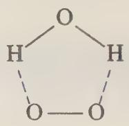  
(a)

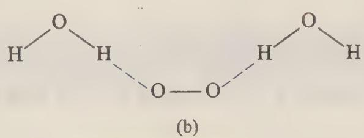  
图16-2 $\mathrm{O}_2$ 的水合物结构示意图

氧气在水中的溶解度虽小,但它却是水生动、植物赖以生存的基础。

在常温下, 氧气的化学性质不活泼, 仅能使一些还原性强的物质如 NO, $SnCl_{2}$ , KI, $H_{2}SO_{3}$ 等氧化。

在高温下,除卤素、少数贵金属如 Au,Pt 等,以及稀有气体外,氧气几乎能与

所有的元素直接化合生成相应的氧化物,例如:

$$
2 \mathrm{Mg} + \mathrm{O} _ {2} \xlongequal {\text {点燃}} 2 \mathrm{MgO}
$$

$$
\mathrm{S} + \mathrm{O} _ {2} \xlongequal {\text {点燃}} \mathrm{SO} _ {2}
$$

氧气还可氧化一些具有还原性的化合物, 如 $H_{2}S$ , $CH_{4}$ , CO, $NH_{3}$ 等能在氧气中燃烧, 例如:

$$
2 \mathrm{H} _ {2} \mathrm{S} + 3 \mathrm{O} _ {2} \xlongequal {\text {点燃}} 2 \mathrm{SO} _ {2} + 2 \mathrm{H} _ {2} \mathrm{O}
$$

$$
4 \mathrm{NH} _ {3} + 3 \mathrm{O} _ {2} \xlongequal {\text {点燃}} 2 \mathrm{N} _ {2} + 6 \mathrm{H} _ {2} \mathrm{O}
$$

在室温下,氧气在酸性介质或碱性介质中都显示出一定的氧化性,它的标准电极电势如下:

$$
\mathrm{O} _ {2} + 4 \mathrm{H} ^ {+} + 4 \mathrm{e} ^ {-} = 2 \mathrm{H} _ {2} \mathrm{O} \quad E _ {\mathrm{A}} ^ {\ominus} = 1. 2 3 \mathrm{V}
$$

$$
\mathrm{O} _ {2} + 2 \mathrm{H} _ {2} \mathrm{O} + 4 \mathrm{e} ^ {-} = 4 \mathrm{OH} ^ {-} \quad E _ {\mathrm{B}} ^ {\ominus} = 0. 4 0 \mathrm{V}
$$

由此可见,氧气在酸性溶液中的氧化性比在碱性溶液中强。

氧气作为氧化剂有着广泛的应用,如富氧空气或纯氧用于医疗中的急救、高空飞行和海底潜水。大量的纯氧用于炼钢工业中的吹氧,切割焊接中的氢氧焰、氧炔焰,以及航天器中高能燃料的氧化剂等。

## 2. 臭氧

臭氧是氧气的同素异形体，因有一种特殊的腥臭味而得名。

## (1) 臭氧的产生和分子结构

臭氧层存在于大气层的最外层,距地面约 25 km 高度处。太阳的紫外线辐射导致 $O_{2}$ 分子解离成氧原子,这些氧原子与其余的 $O_{2}$ 结合生成 $O_{3}$ :

$$
\begin{array}{r l} & \mathrm{O} _ {2} \xlongequal {\text {紫外线}} 2 0 \\ & \mathrm{O} + \mathrm{O} _ {2} = \mathrm{O} _ {3} \end{array}
$$

生成的 $O_{3}$ 吸收波长稍长的紫外线,又能重新分解,从而完成 $O_{3}$ 的循环:

$$
\mathrm{O} _ {3} \xlongequal {\text {紫外线}} \mathrm{O} _ {2} + \mathrm{O}
$$

雷雨的时候,空气中的氧气受电火花的作用也会产生少量臭氧。由于静电作用,在电动机和复印机旁边也经常可以闻到臭氧的特殊腥味。

在 $O_{3}$ 分子中, 中心的氧原子以 $sp^{2}$ 杂化轨道与两旁的配体氧原子形成两个$\sigma$ 键, 使 $\mathrm{O}_{3}$ 分子呈 V 形。在 3 个氧原子之间还存在着一个垂直于分子平面的大 $\pi$ 键 $\Pi_{3}^{4}$ , 如图 16-3 所示。这个离域的 $\pi$ 键是由中心氧原子未参与杂化的 $\mathbf{p}_{z}$ 轨道提供两个 p 电子、另外两个配位氧原子各提供一个 p 电子形成的。

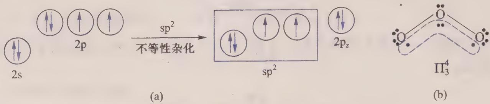  
图16-3 臭氧分子的轨道杂化与离域 $\pi$ 键的形成

用分子轨道理论讨论 $\Pi_3^4$ 键的键级, 即讨论 $O_3$ 分子中 3 个氧原子的这组平行 p 轨道的成键情况。这 3 个 p 轨道线性组合的结果, 如图 16-4 所示, 形成 3 个分子轨道, 能量从低到高依次是成键轨道、非键轨道、反键轨道。其键级为 1 , 因而在每两个氧原子之间的键级为 0.5 。故每两个氧原子之间连同 $\sigma$ 键尚不足一个双键。所以臭氧分子中 O—O 键键长为 $127.2 \mathrm{pm}$ , 要比氧分子的 $120.7 \mathrm{pm}$ 长一些。

$O_{3}$ 分子因为其键能低于 $O_{2}$ 分子而不够稳定。由于分子轨道中没有单电子，所以 $O_{3}$ 分子是逆磁性的。有的资料中提到，臭氧有微弱的顺磁性，这是由于臭氧部分转变成氧分子的缘故，而不是臭氧本身所具有的。

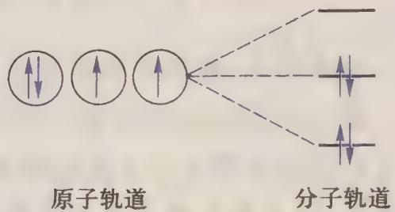  
图16-4 臭氧分子的  
$\Pi_3^4$ 分子轨道示意图

## (2) 臭氧的性质和用途

$O_{3}$ 是浅蓝色气体,有鱼腥臭味, $O_{3}$ 在稀薄状态下并不臭,闻起来有清新爽快之感。人们一般都有这种体验,雷雨之后呼吸舒畅,就是因为空气中含有少量 $O_{3}$ 的缘故。

$O_{3}$ 比 $O_{2}$ 易液化，在 -111.35 ℃ 时凝聚成深蓝紫色液体，但难以固化，在 -193 ℃ 时，液态臭氧凝结成黑色晶体。由于 $O_{3}$ 分子的色散力大于 $O_{2}$ 分子，因而臭氧的沸点高于氧气。

$O_{3}$ 分子既然具有极性,根据“相似互溶”原理,可以预料 $O_{3}$ 在极性溶剂水中的溶解度比非极性的 $O_{2}$ 要大。实验测定结果也证实了这一点。

不稳定性和氧化性是臭氧的特征化学性质。

臭氧的稳定性不如氧气。臭氧在常温下就可分解：

$$
2 \mathrm{O} _ {3} (\mathrm{g}) = 3 \mathrm{O} _ {2} (\mathrm{g})
$$

$$
\Delta_ {r} H _ {\mathrm{m}} ^ {\ominus} = - 2 8 5. 4 \mathrm{kJ} \cdot \mathrm{mol} ^ {- 1}
$$

臭氧分解是一种放热过程,说明 $O_{3}$ 比 $O_{2}$ 有更大的化学活性。

若无催化剂或紫外线照射时，它分解得很慢。

臭氧有很强的氧化性,其相关的标准电极电势如下:

$$
\mathrm{O} _ {2} + 4 \mathrm{H} ^ {+} + 4 \mathrm{e} ^ {-} = 2 \mathrm{H} _ {2} \mathrm{O} \quad E _ {\mathrm{A}} ^ {\ominus} = 1. 2 3 \mathrm{V}
$$

$$
\mathrm{O} _ {2} + 2 \mathrm{H} _ {2} \mathrm{O} + 4 \mathrm{e} ^ {-} = 4 \mathrm{OH} ^ {-} \quad E _ {\mathrm{B}} ^ {\ominus} = 0. 4 0 \mathrm{V}
$$

$$
\mathrm{O} _ {3} + 2 \mathrm{H} ^ {+} + 2 \mathrm{e} ^ {-} = \mathrm{O} _ {2} + \mathrm{H} _ {2} \mathrm{O} \quad E _ {\mathrm{A}} ^ {\ominus} = 2. 0 8 \mathrm{V}
$$

$$
\mathrm{O} _ {3} + \mathrm{H} _ {2} \mathrm{O} + 2 \mathrm{e} ^ {-} = \mathrm{O} _ {2} + 2 \mathrm{OH} ^ {-} \quad E _ {\mathrm{B}} ^ {\ominus} = 1. 2 4 \mathrm{V}
$$

由标准电极电势数据可知,无论在酸性或碱性溶液中,臭氧均是比氧气强得多的氧化剂。它能氧化一些只具弱还原性的单质或化合物,并且有时可把某些元素氧化到最高价态,例如:

$$
\mathrm{PbS} + 4 \mathrm{O} _ {3} = \mathrm{PbSO} _ {4} + 4 \mathrm{O} _ {2}
$$

臭氧还能迅速且定量地氧化 $\mathrm{I}^{-}$ 成 $\mathrm{I}_2$ ，此反应被用来鉴定 $\mathrm{O}_3$ 和测定 $\mathrm{O}_3$ 的含量：

$$
\mathrm{O} _ {3} + 2 \mathrm{I} ^ {-} + \mathrm{H} _ {2} \mathrm{O} = \mathrm{I} _ {2} + \mathrm{O} _ {2} + 2 \mathrm{OH} ^ {-}
$$

臭氧还能将 $\mathrm{CN}^{-}$ 氧化成 $\mathrm{CO}_{2}$ 和 $\mathbf{N}_2$ ，因此常被用来治理电镀工业中的含氰废水。

臭氧是一种不稳定的气体,具有奇异的作用,如杀菌、消毒、漂白、脱色、除臭、强氧化性、催化性等,臭氧的用途主要是它的氧化性和不易导致二次污染的优点。这已经引起人们极大的兴趣。

臭氧层最重要的意义在于吸收阳光中强烈的紫外线辐射,保护地球上的生命。

随着工农业生产及现代科学技术的大规模发展,造成大气的污染,致使臭氧层面临严重的威胁。大气中的还原性气体污染物,如氟里昂, $SO_{2}$ ,CO, $H_{2}S$ ,NO, $NO_{2}$ 等越来越多,它们同大气高层中的 $O_{3}$ 发生反应,导致了 $O_{3}$ 浓度的降低。

近年来不断测量的结果证实,臭氧层已经开始变薄,乃至出现空洞。为了保护臭氧层免遭破坏,世界24个国家于1987年通过了《关于消耗臭氧层物质的蒙特利尔议定书》,即禁止使用氟里昂和其他卤代烃的国际公约,我国于1991年加入该国际公约。联合国环境计划署对臭氧消耗所引起的环境效应进行了估计,认为臭氧每减少1%,具有生理破坏力的紫外线将增加1.3%。保护臭氧层必须依靠国际合作,建立一个全球范围的臭氧浓度和紫外线强度的监测网络是十分必要的。

## 16.1.3 氧化物

这里所说的氧化物是指正常氧化物,即以氧化数为-2的氧原子为成键基础的二元氧化物。

## 1. 氧化物的酸碱性

按氧化物的酸碱性可将其分成4类：

① 酸性氧化物, 如 $CO_{2}, SO_{3}, P_{4}O_{10}, B_{2}O_{3}, SiO_{2}, CrO_{3}, Mn_{2}O_{7}$ 等。

② 碱性氧化物，如 $Li_{2}O, Na_{2}O, K_{2}O, BaO, MgO, CaO, SrO$ 等。

③ 两性氧化物, 如 $\mathrm{BeO}, \mathrm{Al}_{2} \mathrm{O}_{3}, \mathrm{SnO}_{2}, \mathrm{TiO}_{2}, \mathrm{Cr}_{2} \mathrm{O}_{3}, \mathrm{ZnO}, \mathrm{MnO}_{2}$ 等。

④ 还有一类既不属于酸性也不属于碱性的氧化物, 如 CO, NO, $N_{2}O$ 等。

有些元素,尤其是过渡元素,易于变价,可以有几种不同氧化数的氧化物。同一元素的高氧化数氧化物酸性较强,如 $Mn_{2}O_{7}$ 与 $H_{2}O$ 作用生成酸性很强的高锰酸( $HMnO_{4}$ );其低氧化数氧化物的碱性较强,如 MnO 难溶于水而易溶于酸。

此外,还有一类混合氧化数的氧化物,是由低氧化数氧化物和高氧化数氧化物组成的,如 $Fe_{3}O_{4}$ 可以看成是 $FeO\cdot Fe_{2}O_{3}, Pb_{2}O_{3}$ 可以看成是 $PbO\cdot PbO_{2}$ 等。

按氧化物的化学键特征可将其分成两类:低氧化数的典型金属氧化物属于离子型氧化物,如 $Na_{2}O$ , MgO 等。非金属氧化物和一些高氧化数的金属氧化物属于共价型氧化物,如 $SO_{2}$ , $Mn_{2}O_{7}$ 等。

## 2. 氧化物的生成

单质在空气中或纯氧中与氧直接化合,可以得到常见氧化数的氧化物,在氧气不充足的条件下,则得低氧化数氧化物,例如:

$$
\begin{array}{r l} & 4 \mathrm{P} + 5 \mathrm{O} _ {2} \xlongequal {\text {点燃}} \mathrm{P} _ {4} \mathrm{O} _ {1 0} \\ & 4 \mathrm{P} + 3 \mathrm{O} _ {2} \xlongequal {\text {点燃}} \mathrm{P} _ {4} \mathrm{O} _ {6} \end{array}
$$

有些氧化物可以利用氢氧化物或碳酸盐、硝酸盐等的热分解得到,例如:

$$
\begin{array}{r l} & {\mathrm {Cu(OH) _ {2}} \stackrel {\triangle} {=} \mathrm {CuO+ H_ {2} O}} \\ & {\mathrm {CaCO_ {3}} \stackrel {\text {高温}} {=} \mathrm {CaO + CO_ {2} \uparrow}} \\ & {2 \mathrm {Pb(NO_ {3}) _ {2}} \stackrel {\triangle} {=} 2 \mathrm{PbO+4NO_ {2} \uparrow + O_ {2} \uparrow}} \end{array}
$$

高氧化数氧化物热分解或被氢气还原,可以得到低氧化数氧化物,例如:

$$
4 \mathrm{CuO} \stackrel {\text {高温}} {=} 2 \mathrm{Cu} _ {2} \mathrm{O} + \mathrm{O} _ {2} \uparrow
$$

$$
\mathrm{V} _ {2} \mathrm{O} _ {5} + 2 \mathrm{H} _ {2} \stackrel {\triangle} {=} \mathrm{V} _ {2} \mathrm{O} _ {3} + 2 \mathrm{H} _ {2} \mathrm{O}
$$

某些单质被硝酸、浓硫酸氧化，也可以生成氧化物。

关于各种元素的氧化物的具体性质、制备和用途等，将在各章中分别介绍，这里只就氧化物的一般规律加以阐述。其余含氧酸及其盐则完全放在各章讲授。

## 16.1.4 过氧化氢

过氧化氢 $\left(\mathrm{H}_{2}\mathrm{O}_{2}\right)$ ，俗称双氧水，在自然界很少见到，仅以微量存在于雨雪和某些植物的汁液中。市售试剂是其30%的水溶液，医疗上消毒用的为3%的水溶液。

## 1. 过氧化氢的分子结构

过氧化氢分子中有一个过氧链(—O—O—)，链中每个氧原子的轨道均为 $sp^{3}$ 不等性杂化，每个氧原子都有两对孤电子对。两个氧原子间由单电子的 $sp^{3}$

杂化轨道重叠形成 $\sigma$ 键, 每个氧原子各用另一个单电子的 $sp^{3}$ 杂化轨道同氢原子 1s 轨道重叠形成 H—O $\sigma$ 键。由于孤电子对的排斥作用, 键角不是 $109^{\circ}28'$ , 而是 $94.8^{\circ}$ 。 $H_{2}O_{2}$ 分子不是直线形, 也不具有平面结构, 其立体结构如图 16-5 所示。两平面相交成 $119.8^{\circ}$ 的二面角, 过氧链位于两平面的交线上, 而两个氢原子分别位于两平面内。

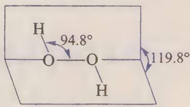  
图16-5 $\mathrm{H}_2\mathrm{O}_2$ 分子的立体结构

## 2. 过氧化氢的制备和生产

在实验室中,可以将过氧化钠加到冷的稀硫酸或稀盐酸甚至冷水中,制备过氧化氢,例如:

$$
\mathrm{Na} _ {2} \mathrm{O} _ {2} + \mathrm{H} _ {2} \mathrm{SO} _ {4} + 1 0 \mathrm{H} _ {2} \mathrm{O} = \mathrm{Na} _ {2} \mathrm{SO} _ {4} \cdot 1 0 \mathrm{H} _ {2} \mathrm{O} + \mathrm{H} _ {2} \mathrm{O} _ {2}
$$

工业上采用如下 3 种方法生产过氧化氢。

## (1) 异丙醇氧化法

在 90\~140 ℃, 1.5\~2.0 MPa 条件下, 异丙醇经多步空气液相氧化, 生成丙酮和过氧化氢, 选择性为 80%:

$$
\mathrm{CH} _ {3} \mathrm{CH} (\mathrm{OH}) \mathrm{CH} _ {3} + \mathrm{O} _ {2} = \mathrm{CH} _ {3} \mathrm{COCH} _ {3} + \mathrm{H} _ {2} \mathrm{O} _ {2}
$$

此方法的缺点是,生产出来的丙酮量是过氧化氢量的两倍。

## (2) 电化学氧化法

通过电解-水解过程制取过氧化氢。例如，首先以铂片作电极，电解

$NH_{4}HSO_{4}$ 饱和溶液, 得到过二硫酸铵 $\left[\left(\mathrm{NH}_{4}\right)_{2}\mathrm{S}_{2}\mathrm{O}_{8}\right]$ :

$$
2 \mathrm{HSO} _ {4} ^ {-} \xlongequal {\text {通电}} \mathrm{H} _ {2} + \mathrm{S} _ {2} \mathrm{O} _ {8} ^ {2 -}
$$

然后加入适量硫酸以水解过二硫酸铵，即得过氧化氢。反应方程式为

$$
\left(\mathrm{NH} _ {4}\right) _ {2} \mathrm{S} _ {2} \mathrm{O} _ {8} + 2 \mathrm{H} _ {2} \mathrm{SO} _ {4} = \mathrm{H} _ {2} \mathrm{S} _ {2} \mathrm{O} _ {8} + 2 \mathrm{NH} _ {4} \mathrm{HSO} _ {4}
$$

$$
\mathrm{H} _ {2} \mathrm{S} _ {2} \mathrm{O} _ {8} + 2 \mathrm{H} _ {2} \mathrm{O} = \mathrm{H} _ {2} \mathrm{O} _ {2} + 2 \mathrm{H} _ {2} \mathrm{SO} _ {4}
$$

生成的硫酸氢铵可循环使用。

## (3) 葱醌法

1953 年,美国杜邦公司研究成功蒽醌法生产过氧化氢。此法是以 2-乙基蒽醌和钯为催化剂,由氢气和氧气直接化合生成过氧化氢:

$$
\mathrm{H} _ {2} + \mathrm{O} _ {2} \xlongequal {2 - \text {乙基蒽醌,Pd}} \mathrm{H} _ {2} \mathrm{O} _ {2}
$$

在此过程中,2-乙基蒽醌在钯的催化下被氢气还原为2-乙基蒽醇:

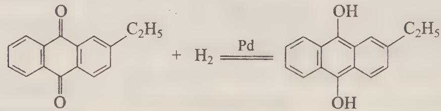

而 2-乙基蒽醇与氧气反应即得过氧化氢, 同时, 生成的 2-乙基蒽醌可以循环使用。

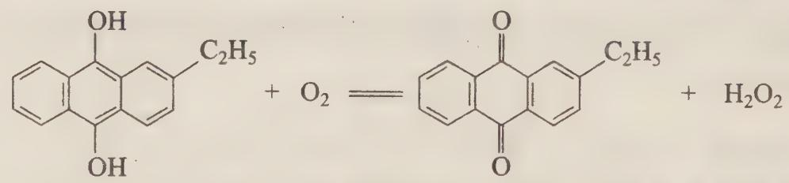

可见,上述循环反应过程消耗的只是氢气和氧气,是典型“零排放”的“绿色化学工艺”。反应的催化剂2-乙基蒽醌可以用2-叔丁基蒽醌、2-叔戊基蒽醌和2-仲戊基蒽醌代替,钯也可以用镍代替。

上述各法所得过氧化氢仅为其稀溶液。若减压蒸馏，可得质量分数为20%\~30%的过氧化氢溶液。所谓减压蒸馏，是指在抽空减压的条件下物质的沸点降低，从而使蒸馏操作可以在较低的温度下进行，避免目的产物分解。在减压下进一步分级蒸馏， $H_{2}O_{2}$ 质量分数可达98%；再冷冻进行分级结晶，可得纯过氧化氢晶体。

## 3. 过氧化氢的性质

纯的过氧化氢是一种淡蓝色的黏稠液体。它的分子结构决定着它的极性很强，其偶极矩 $\mu=5.2\times10^{-30}\mathrm{C}\cdot\mathrm{m}$ （1.57 D），所以原则上过氧化氢也应是一种很好的极性溶剂，但由于它的不稳定性，没有实际意义。 $H_{2}O_{2}$ 分子之间发生强烈的缔合作用，比水的缔合程度还大，所以其沸点为 $150.2^{\circ}C$ ，远比水高。但其熔点 $-0.43^{\circ}C$ 与水接近。由于 $H_{2}O_{2}$ 和 $H_{2}O$ 皆为强极性物质，故可以任意比例互溶。

$H_{2}O_{2}$ 还是一种比水稍强的弱酸, 其特征化学性质是氧化性和不稳定性。

(1) $\mathrm{H}_{2} \mathrm{O}_{2}$ 的弱酸性

$$
\mathrm{H} _ {2} \mathrm{O} _ {2} \rightleftharpoons \mathrm{H} ^ {+} + \mathrm{HO} _ {2} ^ {-} \quad K _ {1} ^ {\ominus} = 2. 3 \times 1 0 ^ {- 1 2}
$$

其酸性比 HCN 更弱,不能使蓝色石蕊溶液变红,但可与强碱反应,例如:

$$
\mathrm{H} _ {2} \mathrm{O} _ {2} + \mathrm{Ba(OH)} _ {2} = \mathrm{BaO} _ {2} + 2 \mathrm{H} _ {2} \mathrm{O}
$$

因此,其产物过氧化钡 $\left(\mathrm{BaO}_{2}\right)$ 可以看作 $H_{2}O_{2}$ 这种弱酸的盐。即过氧化物相当于一种特殊的盐。

## (2) $H_{2}O_{2}$ 的氧化性

$\mathrm{H}_{2} \mathrm{O}_{2}$ 在溶液中氧化能力的大小可以通过其标准电极电势数值体现出：

$$
\begin{array}{l l} \mathrm {H_ {2} O_ {2}} + 2 \mathrm {H^ {+}} + 2 \mathrm {e^ {-}} = 2 \mathrm {H_ {2} O} & E _ {\mathrm{A}} ^ {\ominus} = 1. 7 7 6 \mathrm{V} \\ \mathrm {HO_ {2} ^ {-}} + \mathrm {H_ {2} O} + 2 \mathrm {e^ {-}} = 3 \mathrm {OH^ {-}} & E _ {\mathrm{B}} ^ {\ominus} = 0. 8 7 8 \mathrm{V} \end{array}
$$

由标准电极电势数据可知， $H_{2}O_{2}$ 在酸、碱性溶液中都是较强的氧化剂。

下述反应是定性检出和定量测定 $\mathrm{H}_{2} \mathrm{O}_{2}$ 或过氧化物的常用反应:

$$
\mathrm{H} _ {2} \mathrm{O} _ {2} + 2 \mathrm{I} ^ {-} + 2 \mathrm{H} ^ {+} = \mathrm{I} _ {2} + 2 \mathrm{H} _ {2} \mathrm{O}
$$

表现 $\mathrm{H}_2\mathrm{O}_2$ 氧化性的反应还有

$$
\begin{array}{r l} & \mathrm{HO} _ {2} ^ {-} + \mathrm{Mn(OH)} _ {2} = \mathrm{MnO} _ {2} + \mathrm{OH} ^ {-} + \mathrm{H} _ {2} \mathrm{O} \\ & 2 [ \mathrm{Cr(OH)} _ {4} ] ^ {-} + 3 \mathrm{HO} _ {2} ^ {-} = 2 \mathrm{CrO} _ {4} ^ {2 -} + \mathrm{OH} ^ {-} + 5 \mathrm{H} _ {2} \mathrm{O} \end{array}
$$

利用 $H_{2}O_{2}$ 的氧化性, 可漂白毛、丝织物和油画。例如, 油画的染料含铅盐, 长时间与空气中的 $H_{2}S$ 作用, 因生成黑色的 PbS 而发暗, 用 $H_{2}O_{2}$ 涂刷得 $PbSO_{4}$ , 变白, 油画得以翻新。其化学反应为

$$
\mathrm{PbS} + 4 \mathrm{H} _ {2} \mathrm{O} _ {2} = \mathrm{PbSO} _ {4} + 4 \mathrm{H} _ {2} \mathrm{O}
$$

双氧水也可作为消毒杀菌剂。纯 $H_{2}O_{2}$ 还可用作火箭燃料的氧化剂。

在一定条件下， $H_{2}O_{2}$ 也表现出还原性。

$$
\begin{array}{l l} \mathrm {O_ {2}} + 2 \mathrm {H^ {+}} + 2 \mathrm {e^ {-}} = \mathrm {H_ {2} O_ {2}} & E _ {\mathrm{A}} ^ {\ominus} = 0. 6 9 5 \mathrm{V} \\ \mathrm {O_ {2}} + \mathrm {H_ {2} O} + 2 \mathrm {e^ {-}} = \mathrm {HO_ {2} ^ {-}} + \mathrm {OH^ {-}} & E _ {\mathrm{B}} ^ {\ominus} = - 0. 0 7 6 \mathrm{V} \end{array}
$$

由标准电极电势数据可知, $H_{2}O_{2}$ 在酸性介质中还原性不强,只有强氧化剂,如 $KMnO_{4}$ 等,才能将其氧化:

$$
2 \mathrm{MnO} _ {4} ^ {-} + 5 \mathrm{H} _ {2} \mathrm{O} _ {2} + 6 \mathrm{H} ^ {+} = 2 \mathrm{Mn} ^ {2 +} + 5 \mathrm{O} _ {2} \uparrow + 8 \mathrm{H} _ {2} \mathrm{O}
$$

而在碱性介质中， $H_{2}O_{2}$ 是一种中等强度的还原剂，可以还原 Ag(I):

$$
\mathrm{H} _ {2} \mathrm{O} _ {2} + \mathrm{Ag} _ {2} \mathrm{O} = 2 \mathrm{Ag} + \mathrm{O} _ {2} \uparrow + \mathrm{H} _ {2} \mathrm{O}
$$

在工业上利用 $\mathrm{H}_2\mathrm{O}_2$ 的还原性除氯：

$$
\mathrm{H} _ {2} \mathrm{O} _ {2} + \mathrm{Cl} _ {2} = 2 \mathrm{Cl} ^ {-} + \mathrm{O} _ {2} + 2 \mathrm{H} ^ {+}
$$

$H_{2}O_{2}$ 是一种较理想的常用氧化(还原)剂,因为它在反应中本身的产物只有 $H_{2}O$ 或 $O_{2}$ ,同时剩余的 $H_{2}O_{2}$ 又很容易受热分解为 $H_{2}O$ 和 $O_{2}$ ,不会给反应体系引入杂质,是“干净的”氧化(还原)剂。

但使用时要注意,质量分数大于30%的 $H_{2}O_{2}$ 水溶液会灼伤皮肤。

(3) $\mathrm{H}_{2} \mathrm{O}_{2}$ 的不稳定性

$$
\begin{array}{r l} & E _ {\mathrm{A}} ^ {\ominus} / \mathrm{V} \\ & \quad \mathrm {O_ {2}} \xrightarrow {0 . 6 9 5} \mathrm {H_ {2} O_ {2}} \xrightarrow {1 . 7 6 3} \mathrm {H_ {2} O} \\ & E _ {\mathrm{B}} ^ {\ominus} / \mathrm{V} \\ & \quad \mathrm {O_ {2}} \xrightarrow {- 0 . 0 6 9} \mathrm {HO_ {2} ^ {-}} \xrightarrow {0 . 8 6 7} \mathrm {OH^ {-}} \end{array}
$$

从元素电势图上看： $E_{右}^{\ominus}>E_{左}^{\ominus},H_{2}O_{2}$ 在两种介质中均不稳定，发生歧化分解。

$$
2 \mathrm{H} _ {2} \mathrm{O} _ {2} (1) = 2 \mathrm{H} _ {2} \mathrm{O} (1) + \mathrm{O} _ {2} (\mathrm{g}) \quad \Delta_ {\mathrm{r}} G _ {\mathrm{m}} ^ {\ominus} = - 2 3 3. 4 \mathrm{kJ} \cdot \mathrm{mol} ^ {- 1}
$$

$H_{2}O_{2}$ 在较低温度和高纯度时分解的速率较慢, 若受热到 $153^{\circ}C$ 以上便猛烈分解。 $H_{2}O_{2}$ 在碱性介质中的分解速率远比在酸性介质中快。波长为 $320 \sim 380 nm$ 的紫外光也促使 $H_{2}O_{2}$ 的分解。标准电极电势介于 1.763 V 和 0.695 V 之间的电对, 其氧化型和还原型物质都将成为 $H_{2}O_{2}$ 分解反应的催化剂, 如 $Fe^{3+}, Fe^{2+}, MnO_{2}, Mn^{2+}, Cr_{2}O_{7}^{2-}, Cr^{3+}$ 等杂质的存在都会大大加速 $H_{2}O_{2}$ 的分解。

设某电对 Ox/Red, 其标准电极电势介于 1.763 V 和 0.695 V 之间。若氧化型物质 Ox 作为杂质混入 $H_{2}O_{2}$ 溶液中, 则 Ox 将氧化 $H_{2}O_{2}$ , 发生反应:

$$
\mathrm{Ox} + \mathrm{H} _ {2} \mathrm{O} _ {2} \longrightarrow \mathrm{Red} + \mathrm{O} _ {2} \uparrow\tag{1}
$$

生成的还原型物质 Red 将还原 $H_{2}O_{2}$ ，发生反应：

$$
\mathrm{Red} + \mathrm{H} _ {2} \mathrm{O} _ {2} \longrightarrow \mathrm{Ox} + \mathrm{H} _ {2} \mathrm{O}\tag{2}
$$

反应(1)和(2)不断交替进行,总的反应结果为 $H_{2}O_{2}$ 的分解:

$$
2 \mathrm{H} _ {2} \mathrm{O} _ {2} = \mathrm{O} _ {2} \uparrow + 2 \mathrm{H} _ {2} \mathrm{O}
$$

为了阻止 $H_{2}O_{2}$ 的分解, 必须针对热、光、介质、重金属离子四大因素采取措施。一般在实验室里常把过氧化氢装在棕色瓶内, 存放在阴凉处。有时加入一些稳定剂, 如微量的锡酸钠 ( $Na_{2}SnO_{3}$ )、焦磷酸钠 ( $Na_{4}P_{2}O_{7}$ ) 或 8-羟基喹啉等通过吸附或络合等方式来抑制所含杂质的催化作用。

## 16.2 硫的单质及硫化物

## 16.2.1 硫的单质

自然界中的单质硫主要存在于火山附近。每次火山爆发都会把地下大量的硫带到地面。

## 1. 硫的同素异形体

分子式为 $S_{8}$ 的单质硫最为稳定， $S_{8}$ 分子的环状结构如图 16-6 所示。在环状分子中，每个 S 原子均以 $sp^{3}$ 不等性杂化轨道与相邻两个 S 原子通过共价单键相连接，S—S 键键长为 207 pm， $\angle SSS$ 为 $105^{\circ}$ ，两个面之间的夹角为 $98.3^{\circ}$ 。

  
(a)

  
(b)  
图 16-6 $S_{8}$ 分子的环状结构

以 $S_{8}$ 环在空间的不同排列得到几种单质硫的同素异形体, 最常见的是正交硫(斜方硫、菱形硫)和单斜硫。正交硫的 $\Delta_{f}H_{m}^{\ominus}=0,\Delta_{f}G_{m}^{\ominus}=0$ , 是室温下唯一稳定的硫的存在形式。当加热到 $95.2\;^{\circ}C$ 时, 正交硫不经熔化就能转变成单斜硫, 单斜硫在低于 $95.2\;^{\circ}C$ 时会缓慢地转变成稳定的正交硫。

正交硫与单斜硫均能溶于 $CS_{2}, C_{6}H_{6}$ 等非极性溶剂。

加热固体硫，熔化后汽化前开环形成长链。这时迅速冷却，可得具有长链结

构的有拉伸性的弹性硫。

## 2. 硫的制备和性质

单质硫的主要来源是从天然气和石油及石油化工产品提取,还有来自黄铁矿等硫化物矿的冶炼,以及硫化氢、油砂、石膏和含硫的烟道气。

以黄铁矿为原料提取硫时,是将矿石和焦炭的混合物放在炼硫炉中,在有限空气中燃烧,可以得到硫:

$$
3 \mathrm{FeS} _ {2} + 1 2 \mathrm{C} + 8 \mathrm{O} _ {2} \xlongequal {\text {燃烧}} \mathrm{Fe} _ {3} \mathrm{O} _ {4} + 1 2 \mathrm{CO} + 6 \mathrm{S}
$$

## (1) 硫与单质的作用

除金、铂外，加热时硫几乎能与所有的金属直接化合，生成金属硫化物，例如：

$$
\mathrm{Fe} + \mathrm{S} \stackrel {\triangle} {=} \mathrm{FeS}
$$

$$
\mathrm{Hg} + \mathrm{S} \stackrel {\triangle} {=} \mathrm{HgS}
$$

除稀有气体、碘、氮等单质以外，硫与所有的非金属一般都能化合，例如：

$$
\mathrm{O} _ {2} + \mathrm{S} \stackrel {\text {点燃}} {=} \mathrm{SO} _ {2}
$$

$$
\mathrm{C} + 2 \mathrm{S} \stackrel {\triangle} {=} \mathrm{CS} _ {2}
$$

## (2) 硫与酸、碱的反应

氧化性的酸能将硫氧化为硫酸或二氧化硫,例如:

$$
\mathrm{S} + 2 \mathrm{HNO} _ {3} (\text {   浓   }) = \mathrm{H} _ {2} \mathrm{SO} _ {4} + 2 \mathrm{NO} \uparrow
$$

$$
\mathrm{S} + 2 \mathrm{H} _ {2} \mathrm{SO} _ {4} (\text {浓}) \stackrel {\triangle} {=} 3 \mathrm{SO} _ {2} \uparrow + 2 \mathrm{H} _ {2} \mathrm{O}
$$

硫在碱性溶液中歧化,加热时歧化反应更快:

$$
3 \mathrm{S} + 6 \mathrm{NaOH} \stackrel {\triangle} {=} 2 \mathrm{Na} _ {2} \mathrm{S} + \mathrm{Na} _ {2} \mathrm{SO} _ {3} + 3 \mathrm{H} _ {2} \mathrm{O}
$$

单质硫的用途主要是生产硫酸,单质硫也用于制造 $SO_{2}, SO_{3}, CS_{2}, P_{2}S_{5}$ 等化合物,以及含硫混凝土、炸药、烟花、火柴、纸张、橡胶硫化剂、油灰(石膏和油的混合物)和硫系染料、药物等。

## 16.2.2 硫化氢

## 1. 硫化氢的制备

硫化氢 $\left(\mathrm{H}_{2}\mathrm{S}\right)$ 可由金属硫化物与酸作用制备,例如:

$$
\begin{array}{r l} {\mathrm{FeS+H} _ {2} \mathrm{SO} _ {4} (\cdot \text {稀})} & {= \mathrm{H} _ {2} \mathrm{S} \uparrow + \mathrm{FeSO} _ {4}} \\ {\mathrm{Na} _ {2} \mathrm{S+H} _ {2} \mathrm{SO} _ {4} (\text {稀})} & {= \mathrm{H} _ {2} \mathrm{S} \uparrow + \mathrm{Na} _ {2} \mathrm{SO} _ {4}} \end{array}
$$

## 2. 硫化氢及氢硫酸的性质

$\mathrm{H}_{2} \mathrm{~S}$ 是一种无色、有毒、有臭鸡蛋气味的气体, 若空气中含有体积分数为 $0.1 \%$ 的 $\mathrm{H}_{2} \mathrm{~S}$ , 会迅速引起头疼、晕眩等症状, 吸入大量 $\mathrm{H}_{2} \mathrm{~S}$ 会造成昏迷或死亡。经常与 $\mathrm{H}_{2} \mathrm{~S}$ 接触会引起嗅觉迟钝、消瘦、头痛等慢性中毒症状。实验室中使用 $\mathrm{H}_{2} \mathrm{~S}$ 气体时必须在通风橱中操作。空气中 $\mathrm{H}_{2} \mathrm{~S}$ 的允许含量不得超过 $0.01 \mathrm{mg} \cdot \mathrm{dm}^{-3}$ 。

$H_{2}S$ 在 $-59.55^{\circ}C$ 时凝聚成液体， $-85.5^{\circ}C$ 时成为固体。 $H_{2}S$ 在水中的溶解度较小，通常情况下 $1\ dm^{3}$ 水可溶解 $2.6\ dm^{3}\ H_{2}S$ 气体，浓度约为 $0.1\ mol\cdot dm^{-3}$ 。 $H_{2}S$ 的水溶液叫作氢硫酸。

## (1) 弱酸性

氢硫酸是二元弱酸,在水中分两步解离:

$$
\begin{array}{l l} \mathrm {H_ {2} S = H^ {+} +HS^ {-}} & K _ {1} ^ {\ominus} = 1. 1 \times 1 0 ^ {- 7} \\ \mathrm {HS^ {-} = H^ {+} + S^ {2 - }} & K _ {2} ^ {\ominus} = 1. 3 \times 1 0 ^ {- 1 3} \end{array}
$$

氢硫酸与碱反应可形成酸式盐和正盐,酸式盐皆易溶于水,正盐大多难溶于水,并具有特征的颜色。

## (2) 还原性

由标准电极电势数值可知,无论在酸性或碱性溶液中, $H_{2}S$ 都具有较强的还原性:

$$
\begin{array}{r l r} \mathrm {S + 2H^ {+} + 2e^ {-} = H_ {2} S(aq)} & E _ {\mathrm{A}} ^ {\ominus} = 0. 1 4 2 \mathrm{V} \\ \mathrm {S + 2e^ {-} = S^ {2 - }} & E _ {\mathrm{B}} ^ {\ominus} = - 0. 4 7 6 \mathrm{V} \end{array}
$$

$H_{2}S$ 水溶液暴露在空气中, 被缓慢氧化析出游离硫而使溶液变浑浊:

$$
2 \mathrm{H} _ {2} \mathrm{S(aq)} + \mathrm{O} _ {2} = 2 \mathrm{S} \downarrow + 2 \mathrm{H} _ {2} \mathrm{O}
$$

实验室中使用的 $H_{2}S$ 水溶液必须在使用时配制, 否则会因被氧化而失效。单质碘、 $Fe^{3+}$ 及 $SO_{2}$ 都能将 $H_{2}S$ 水溶液氧化而析出硫, 例如:

$$
\begin{array}{l} \mathrm {H_ {2} S(aq)+ I_ {2} = S\downarrow + 2HI} \\ \mathrm {H_ {2} S(aq) + 2Fe^ {3 + } = 2Fe^ {2 + } + S\downarrow + 2H^ {+}} \\ \mathrm {2H_ {2} S(aq) + SO_ {2} = 3S\downarrow + 2H_ {2} O} \end{array}
$$

氧化剂过量时生成硫酸,例如:

$$
\mathrm{H} _ {2} \mathrm{S(aq)} + 4 \mathrm{I} _ {2} + 4 \mathrm{H} _ {2} \mathrm{O} = \mathrm{H} _ {2} \mathrm{SO} _ {4} + 8 \mathrm{HI}
$$

$H_{2}S$ 能在空气中燃烧生成二氧化硫, 若空气不足, 则生成单质硫:

$$
2 \mathrm{H} _ {2} \mathrm{S} + 3 \mathrm{O} _ {2} \xlongequal {\text {点燃}} 2 \mathrm{SO} _ {2} + 2 \mathrm{H} _ {2} \mathrm{O}
$$

$$
2 \mathrm{H} _ {2} \mathrm{S} + \mathrm{O} _ {2} \xlongequal {\text {点燃}} 2 \mathrm{S} + 2 \mathrm{H} _ {2} \mathrm{O}
$$

## 16.2.3 硫化物和多硫化物

## 1. 硫化物

## (1) 轻金属硫化物

轻金属硫化物包括碱金属、碱土金属和铝的硫化物。它们易溶于水，易水解。

碱金属硫化物水解而使溶液呈强碱性,所以碱金属硫化物俗称“硫化碱”。碱土金属硫化物,除 BeS 只能与热水反应外,其余均易溶于水,且发生水解作用。

$$
\begin{array}{r l} & \mathrm {Na_ {2} S+ H_ {2} O\xlongequal {\quad} NaOH + NaHS} \\ & 2 \mathrm{CaS+2H} _ {2} \mathrm{O\xlongequal {\quad}} \mathrm {Ca(OH) _ {2} + Ca(HS) _ {2}} \end{array}
$$

若将溶液煮沸,生成的酸式硫化物水解会更完全:

$$
\mathrm{Ca(HS)} _ {2} + 2 \mathrm{H} _ {2} \mathrm{O} \stackrel {\triangle} {=} \mathrm{Ca(OH)} _ {2} + 2 \mathrm{H} _ {2} \mathrm{S}
$$

由于氢硫酸是很弱的酸,故所有硫化物在水溶液中均发生不同程度的水解。例如, $0.10\ mol\cdot dm^{-3}\ Na_{2}S$ 溶液的水解度约为58%; $Al_{2}S_{3}$ 完全水解为 $\mathrm{Al(OH)}_{3}$ 和 $H_{2}S$ ;即使是难溶硫化物,如PbS,其溶解的部分也明显水解。

硫化钠( $Na_{2}S$ )是实验室中的常用试剂,白色晶体,熔点为1172℃,在空气中易潮解。常见的商品是它的水合晶体 $Na_{2}S\cdot9H_{2}O$ 。 $Na_{2}S$ 主要用于制造硫化染料、有机药物和纸浆等生产过程,也用于制革和矿石浮选等领域。化学工业中用它作重金属离子沉淀剂。

硫化铵 $\left[\left(\mathrm{NH}_{4}\right)_{2}\mathrm{S}\right]0^{\circ}\mathrm{C}$ 以上分解，阴离子和阳离子互相促进水解，在溶液中不能析出 $\left(\mathrm{NH}_{4}\right)_{2}\mathrm{S}$ 。

## (2) 重金属硫化物

重金属离子与 $S^{2-}$ 沉淀剂生成的重金属硫化物一般具有特征颜色：

<table><tr><td>硫化物</td><td>ZnS</td><td>MnS</td><td>CdS $SnS_2$  $As_2S_3$  $As_2S_5$ </td><td> $Sb_2S_3$  $Sb_2S_5$ </td><td>SnS</td><td>FeS CoS NiS  $Ag_2S$ </td><td>CuS PbS  $Cr_2S_3$   $HgS^*$ </td></tr><tr><td>颜色</td><td>白色</td><td>浅粉色</td><td>黄色</td><td>橙色</td><td>灰色</td><td colspan="2">黑色</td></tr></table>

\* HgS 有时呈红色。

重金属硫化物难溶于水,根据 $K_{sp}^{\ominus}$ 不同,在酸中的溶解性也不相同。大致可以分为如下几类:

① 在 $0.3 \, mol \cdot dm^{-3}$ 盐酸中可以溶解的硫化物，如 $FeS, Fe_{2}S_{3}, CoS, NiS, Cr_{2}S_{3}, MnS$ 和 ZnS 等。或者说这些硫化物在 $0.3 \, mol \cdot dm^{-3}$ 盐酸中不能生成。

② 不溶于 $0.3 \, mol \cdot dm^{-3}$ 盐酸，但可以溶于浓盐酸的硫化物，如 PbS, CdS, SnS, SnS₂ 等。

③ 盐酸中不溶解,但可以溶于浓硝酸的硫化物,如 CuS 和 $Ag_{2}S$ 。

$$
\mathrm{CuS} + 4 \mathrm{HNO} _ {3} (\text {浓}) \stackrel {\triangle} {=} \mathrm{Cu(NO} _ {3}) _ {2} + \mathrm{S} + 2 \mathrm{NO} _ {2} \uparrow + 2 \mathrm{H} _ {2} \mathrm{O}
$$

④ 硝酸中不溶解,但溶于王水的硫化物,如 HgS。

酸性或两性硫化物多溶于 $Na_{2}S$ 等碱性硫化物的溶液，如 $Sb_{2}S_{3}$ ， $Sb_{2}S_{5}$ ， $As_{2}S_{3}$ ， $As_{2}S_{5}$ ， $SnS_{2}$ 等。这类反应相当于酸性氧化物与碱性氧化物的成盐反应：

$$
\begin{array}{r l r} & {\mathrm {CO_ {2} + CaO\xlongequal   CaCO_ {3}}} & {\text {成盐反应}} \\ & {\mathrm {As_ {2} S_ {3} + 3Na_ {2} S(aq)\xlongequal   2Na_ {3} AsS_ {3}}} & {\text {硫代亚砷酸钠}} \end{array}
$$

HgS 溶于 $Na_{2}S$ 溶液, 一般认为生成配位化合物:

$$
\mathrm{HgS} + \mathrm{Na} _ {2} \mathrm{S(aq)} = \mathrm{Na} _ {2} [ \mathrm{HgS} _ {2} ]
$$

SnS 显碱性, 不溶于轻金属硫化物溶液, 但可溶于多硫化物溶液中。首先发生氧化还原反应:

$$
\mathrm{SnS} + \mathrm{Na} _ {2} \mathrm{S} _ {2} (\mathrm{aq}) = \mathrm{SnS} _ {2} + \mathrm{Na} _ {2} \mathrm{S}
$$

再生成硫代酸盐：

$$
\mathrm{SnS} _ {2} + \mathrm{Na} _ {2} \mathrm{S(aq)} = \mathrm{Na} _ {2} \mathrm{SnS} _ {3}
$$

SnS 呈碱性, $SnS_{2}$ 呈酸性, 这与氧化物酸碱性规律一致。但硫化物的碱性弱于相同价态的氧化物。

## 2. 金属离子的分离

金属硫化物在水中有不同的溶解性和特征颜色,在分析化学中常用来鉴别和分离不同的金属离子。例如,某酸性溶液中含有 $Cu^{2+}, Zn^{2+}, Ag^{+}$ 3 种离子,可以设计如下方案加以分离。如图 16-7 所示,这是定性分析化学的一般写法:图中“|”旁为“加入的试剂”,“||”下方为“沉淀物”,“|”下方为“溶解物”。

首先利用生成 AgCl 沉淀将 $Ag^{+}$ 和 $Cu^{2+}$ ， $Zn^{2+}$ 分离；再利用 CuS 和 ZnS 在稀盐酸中溶解性的差别，将 $Cu^{2+}$ 和 $Zn^{2+}$ 分离。

## 3. 多硫化物

可溶性硫化物的溶液与单质硫作用,硫溶解生成多硫化物,类似于单质碘溶

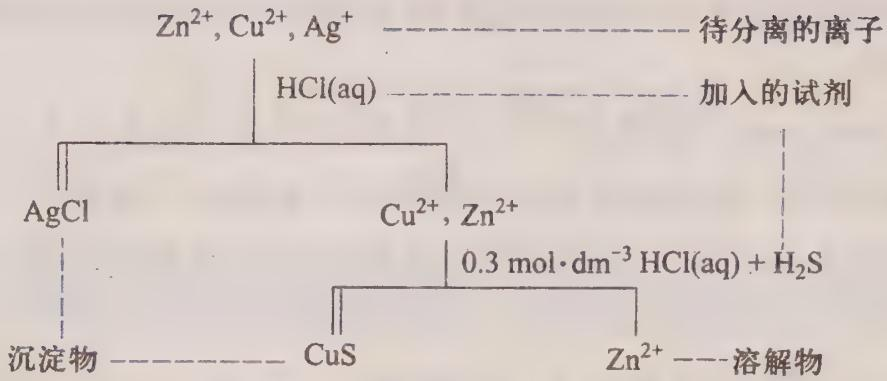  
图16-7 离子分离方案示意图

于碘化钾溶液：

$$
\mathrm{Na} _ {2} \mathrm{S} (\text { a   q }) + (x - 1) \mathrm{S} = \mathrm{Na} _ {2} \mathrm{S} _ {x}
$$

碱金属多硫化物 $M_{2}S_{x}$ 中 S 的数目一般为 2\~6，个别可高达 9。多硫化物溶液的颜色可随着溶解的硫的量增多而由无色变为黄色、橙黄色，最深为红色。

轻金属硫化物易形成多硫化物。例如,实验室中的 $Na_{2}S$ 溶液长期放置时颜色会越来越深,就是因为 $Na_{2}S$ 易被空气氧化,产生的单质硫溶于 $Na_{2}S$ 生成多硫化物 $Na_{2}S_{x}$ 的缘故。

多硫化物中若 x=2，则叫作过硫化物，其结构中有过硫链（S—S），如 $Na_{2}S_{2}$ 。与过氧化物相似，过硫化物具有一定的氧化性，但其氧化性远不如过氧化物。

过硫化物能氧化 $As_{2}S_{3}, Sb_{2}S_{3}$ 和 SnS 等低氧化数硫化物,例如:

$$
\mathrm{As} _ {2} \mathrm{S} _ {3} + 2 \mathrm{Na} _ {2} \mathrm{S} _ {2} (\mathrm{aq}) = \mathrm{As} _ {2} \mathrm{S} _ {5} + 2 \mathrm{Na} _ {2} \mathrm{S}
$$

多硫化物在酸性溶液中很不稳定,易歧化分解析出单质 S:

$$
\mathrm{M} _ {2} \mathrm{S} _ {x} + 2 \mathrm{H} ^ {+} = 2 \mathrm{M} ^ {+} + (x - 1) \mathrm{S} \downarrow + \mathrm{H} _ {2} \mathrm{S} \uparrow
$$

$Na_{2}S$ 溶液遇酸出现混浊,就是因为其中所含多硫化物发生了上述反应。

多硫化物是分析化学常用试剂。 $Na_{2}S_{2}$ 在制革工业中用作原皮的脱毛剂；硫酸工业的重要原料黄铁矿 $FeS_{2}$ 是多硫化物的一种；在农业上用作杀虫剂的“石灰硫”是多硫化钙 $CaS_{4}$ 。

## 16.3 硫的氧化物

## 16.3.1 二氧化硫

## 1. 二氧化硫的分子结构

二氧化硫 $\left(\mathrm{SO}_{2}\right)$ 分子呈V形结构,其成键方式与臭氧 $O_{3}$ 类似,S原子为 $sp^{2}$ 杂化，S原子与两个O原子除以 $\sigma$ 键结合外，还形成一个三中心四电子的离域 $\pi$ 键 $\Pi_3^4$ ，如图16-8所示。 $\mathrm{SO}_2$ 分子中键角 $\angle \mathrm{OSO}$ 为 $119.3^{\circ}$ ，S—O键键长为 $143.1\mathrm{pm}$ 。

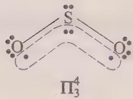

## 2. 二氧化硫的性质

$SO_{2}$ 是一种有强烈刺激性气味的无色气体, 密度是空气的 2.26 倍。 $SO_{2}$ 是极性分子, 熔点为 -75.5 ℃, 沸点为

图16-8 $\mathrm{SO}_2$ 分子的结构及其离域 $\pi$ 键

-10.05 ℃,较易液化。 $SO_{2}$ 易溶于水,在通常情况下 $1 \, dm^{3}$ 水能溶解 $40 \, dm^{3} \, SO_{2}$ 。

$SO_{2}$ 有氧化性,能将强还原剂氧化。例如, $SO_{2}$ 可以将 $H_{2}S$ 氧化成单质 S,此反应是火山区天然硫的成因。

在高温和铝矾土催化下, $SO_{2}$ 能将 CO 氧化:

$$
\mathrm{SO} _ {2} + 2 \mathrm{CO} \xrightarrow [ 5 0 0 ^ {\circ} \mathrm{C} ]{\mathrm{铝矾土}} 2 \mathrm{CO} _ {2} + \mathrm{S}
$$

这是从烟道气中分离回收硫的基本反应。

将气态 $SO_{2}$ 氧化时反应的活化能较高,需有催化剂存在,例如:

$$
\mathrm{SO} _ {2} + \mathrm{Cl} _ {2} \xlongequal {\text {活性炭}} \mathrm{SO} _ {2} \mathrm{Cl} _ {2}
$$

## 3. 二氧化硫的制备

从原料中 S 的氧化数的角度, 可以将 $SO_{2}$ 的制备归结为以下 3 种途径。

## (1) 还原法

从高氧化数到 S(Ⅳ):

$$
\begin{array}{r l} & 2 \mathrm{CaSO} _ {4} + \mathrm{C} \xlongequal {\text {高温}} 2 \mathrm{CaO} + 2 \mathrm{SO} _ {2} \uparrow + \mathrm{CO} _ {2} \uparrow \\ & 2 \mathrm{H} _ {2} \mathrm{SO} _ {4} (\text {浓}) + \mathrm{Zn} = \mathrm{ZnSO} _ {4} + \mathrm{SO} _ {2} \uparrow + 2 \mathrm{H} _ {2} \mathrm{O} \end{array}
$$

## (2) 氧化法

从低氧化数到 S(Ⅳ)，如单质硫矿物和硫化物矿物的燃烧，这是工业上生产 $SO_{2}$ 的方法：

$$
\mathrm{S} + \mathrm{O} _ {2} \xlongequal {\text {点燃}} \mathrm{SO} _ {2}
$$

$$
4 \mathrm{FeS} _ {2} + 1 1 \mathrm{O} _ {2} \xlongequal {\text {   煅烧   }} 2 \mathrm{Fe} _ {2} \mathrm{O} _ {3} + 8 \mathrm{SO} _ {2}
$$

## (3) 置换法

反应过程中 S 的氧化数不变, 实验室都采用这种方法制备 $SO_{2}$ :

$$
\mathrm{Na} _ {2} \mathrm{SO} _ {3} + 2 \mathrm{H} _ {2} \mathrm{SO} _ {4} = \mathrm{SO} _ {2} \uparrow + 2 \mathrm{NaHSO} _ {4} + \mathrm{H} _ {2} \mathrm{O}
$$

$SO_{2}$ 主要用于生产硫酸和亚硫酸盐,也用作消毒剂和防腐剂,还可用作漂白剂等。

$\mathrm{SO}_2$ 是一种大气污染物。在高空, $\mathrm{SO}_2$ 与空气中的水蒸气及氧气反应生成硫酸, 硫酸含在雨水中, 即形成酸雨。酸雨同 $\mathrm{SO}_2$ 一样加速了桥梁等建筑物的腐蚀速率。然而, 它的最大的影响是逐步降低了水和土壤的 $\mathrm{pH}$ , 导致生态系统的显著改变。 $\mathrm{SO}_2$ 的职业性慢性中毒会引起食欲丧失、便秘和气管炎症。空气中 $\mathrm{SO}_2$ 含量不得超过 $0.02 \mathrm{mg} \cdot \mathrm{dm}^{-3}$ 。

## 16.3.2 三氧化硫

## 1. 三氧化硫的结构

## (1) 单分子的结构

气态三氧化硫以单分子 $SO_{3}$ 为主, S—O 键键长为 142 pm, 比 S—O 单键的键长短些。

$\mathrm{SO}_3$ 中S原子的一个3s电子激发进入3d轨道，以保证S原子的 $\mathfrak{sp}^2$ 杂化轨道中有3个单电子。S原子的未参与杂化的 $3\mathfrak{p}_{z}$ 轨道中有两个电子。图16-9给出了杂化轨道的组成，但没有表明其中各轨道的能量高低关系。中心S原子的 $\mathfrak{sp}^2$ 杂化轨道和3个配体O原子的2p轨道各形成一个σ键，分子结构为正三角形。

  
图 16-9 $SO_{3}$ 分子中 S 原子的轨道杂化

$\mathrm{SO}_3$ 分子中 3 个配体 O 原子的 $2\mathrm{p}_z$ 轨道有单电子, 与中心 S 原子的 $3\mathrm{p}_z$ 轨道互相平行, 对称性相同, 以“肩并肩”重叠形成离域 $\pi$ 键; 同时, S 原子激发到 3d 轨道的电子进入离域 $\pi$ 键轨道中, 故 $\mathrm{SO}_3$ 形成四中心六电子离域 $\pi$ 键 $\Pi_4^6$ 。

## (2) 多聚分子的结构

液态三氧化硫中,有单分子 $SO_{3}$ 和三聚的 $(\mathrm{SO}_{3})_{3}$ 两种形式;固态三氧化硫主要以三聚的 $(\mathrm{SO}_{3})_{3}$ 和无限长链的 $(\mathrm{SO}_{3})_{n}$ 两种形式存在。

三聚的 $\left(\mathrm{SO}_{3}\right)_{3}$ 中 3 个 S 原子通过 O 原子以单键连接成环状结构, 见图 16-10(a)。链状 $\left(\mathrm{SO}_{3}\right)_{n}$ 由硫氧四面体 $SO_{4}$ 共顶点 O 原子形成无限长链, 见图 16-10(b)。

$\left(\mathrm{SO}_{3}\right)_{3}$ 和 $\left(\mathrm{SO}_{3}\right)_{n}$ 中 S 原子的轨道均为 $sp^{3}$ 杂化, 只是其中的 $SO_{3}$ 排列的方式不同。已知的键长数据表明，S 原子与端基氧原子之间的键长比与桥基氧原子的短些。

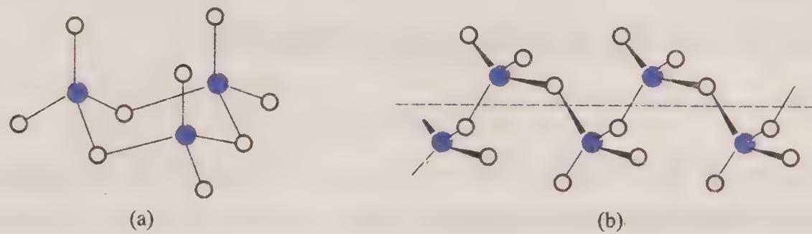  
●硫原子 ○氧原子  
图 16-10 环状 $\left(\mathrm{SO}_{3}\right)_{3}$ 和链状 $\left(\mathrm{SO}_{3}\right)_{n}$ 的结构

## 2. 三氧化硫的制备和性质

用 $O_{2}$ 氧化 $SO_{2}$ 时反应的活化能较高,需有催化剂存在才能生成 $SO_{3}$ :

$$
2 \mathrm{SO} _ {2} + \mathrm{O} _ {2} \xlongequal [ 4 5 0 ^ {\circ} \mathrm{C} ] {\mathrm{V} _ {2} \mathrm{O} _ {5}} 2 \mathrm{SO} _ {3}
$$

纯净的 $SO_{3}$ 是无色、易挥发的固体，熔点为 $16.8^{\circ}C$ ，沸点为 $44.5^{\circ}C$ 。 $SO_{3}$ 极易与水化合生成硫酸，同时释放出大量的热。

$$
\mathrm{SO} _ {3} (\mathrm{g}) + \mathrm{H} _ {2} \mathrm{O} (1) = \mathrm{H} _ {2} \mathrm{SO} _ {4} (1) \quad \Delta_ {\mathrm{r}} H _ {\mathrm{m}} ^ {\ominus} = - 1 3 2. 5 \mathrm{kJ} \cdot \mathrm{mol} ^ {- 1}
$$

$SO_{3}$ 溶于纯 $H_{2}SO_{4}$ 得发烟硫酸，以 $H_{2}SO_{4} \cdot xSO_{3}$ 表示其组成。

与二氧化硫不同, $SO_{3}$ 是一种强氧化剂,高温时它能将磷、碘化物等氧化,自身还原成 $SO_{2}$ ,例如:

$$
5 \mathrm{SO} _ {3} + 2 \mathrm{P} \xlongequal {\text {高温}} 5 \mathrm{SO} _ {2} + \mathrm{P} _ {2} \mathrm{O} _ {5}
$$

$$
\mathrm{SO} _ {3} + 2 \mathrm{KI} \xlongequal {\text {高温}} \mathrm{K} _ {2} \mathrm{SO} _ {3} + \mathrm{I} _ {2}
$$

## 16.4 硫的含氧酸、含氧酸盐及衍生物

## 16.4.1 亚硫酸及其盐

## 1. 亚硫酸及其盐的性质

$SO_{2}$ 溶于水生成亚硫酸 $\left(\mathrm{H}_{2}\mathrm{SO}_{3}\right)$ ，亚硫酸与碱反应可形成正盐和酸式盐，如 $Na_{2}SO_{3}$ 和 $NaHSO_{3}$ 。除碱金属及铵的亚硫酸盐极易溶于水外，其他亚硫酸盐均难溶或微溶于水，但它们都能溶于强酸。亚硫酸氢盐的溶解度大于相应的正盐。

这些化合物中硫的氧化数为+4,介于-2与+6之间,既有氧化性又有还原性,但以还原性为主,只有遇到强还原剂时才表现出氧化性。

## (1) 酸性

$H_{2}SO_{3}$ 为二元中强酸,在水溶液中存在下列解离平衡:

$$
\begin{array}{l l} \mathrm {H_ {2} SO_ {3}} = \mathrm {H^ {+}} + \mathrm {HSO_ {3} ^ {-}} & K _ {1} ^ {\ominus} = 1. 3 \times 1 0 ^ {- 2} \\ \mathrm {HSO_ {3} ^ {-}} = \mathrm {H^ {+}} + \mathrm {SO_ {3} ^ {2 - }} & K _ {2} ^ {\ominus} = 6. 2 4 \times 1 0 ^ {- 8} \end{array}
$$

可见，亚硫酸氢盐溶液也是酸性的。

## (2) 还原性

$$
\begin{array}{r l} & E _ {\mathrm{A}} ^ {\ominus} / \mathrm{V} \\ & \mathrm{SO} _ {4} ^ {2 -} \quad \xrightarrow {0 . 1 7 2} \quad \mathrm{H} _ {2} \mathrm{SO} _ {3} \quad \xrightarrow {0 . 4 4 9} \quad \mathrm{S} \quad \xrightarrow {0 . 1 4 2} \quad \mathrm{H} _ {2} \mathrm{S} \\ & E _ {\mathrm{B}} ^ {\ominus} / \mathrm{V} \\ & \mathrm{SO} _ {4} ^ {2 -} \quad \xrightarrow {- 0 . 9 3} \quad \mathrm{SO} _ {3} ^ {2 -} \quad \xrightarrow {- 0 . 5 9} \quad \mathrm{S} \quad \xrightarrow {- 0 . 4 8} \quad \mathrm{S} ^ {2 -} \end{array}
$$

从硫的元素电势图看,无论在酸性还是碱性介质中,S(Ⅳ)的还原性都较强,亚硫酸盐比亚硫酸具有更强的还原性。 $I_{2},Fe^{3+}$ 等都能将S(Ⅳ)氧化:

$$
\begin{array}{r l} & \mathrm {I_ {2} + H_ {2} SO_ {3} + H_ {2} O\xlongequal {\quad} H_ {2} SO_ {4} + 2HI} \\ & 2 \mathrm {Fe^ {3 + } + H_ {2} SO_ {3} + H_ {2} O\xlongequal {\quad} H_ {2} SO_ {4} + 2Fe^ {2 + } + 2H^ {+}} \\ & 2 \mathrm {Na_ {2} SO_ {3} + O_ {2} \xlongequal {\quad} 2Na_ {2} SO_ {4}} \end{array}
$$

## (3) 氧化性

亚硫酸遇到更强的还原剂时,也能表现氧化性,例如:

$$
\mathrm{H} _ {2} \mathrm{SO} _ {3} + 2 \mathrm{H} _ {2} \mathrm{S} = 3 \mathrm{S} \downarrow + 3 \mathrm{H} _ {2} \mathrm{O}
$$

## (4) 漂白作用

$H_{2}SO_{3}$ (或 $SO_{2}$ ) 能与一些有机色素结合成无色有机化合物, 如品红溶液与 $H_{2}SO_{3}$ (或 $SO_{2}$ ) 反应变为无色。因此, $H_{2}SO_{3}$ (或 $SO_{2}$ ) 可用作纸张、草编制品等的漂白剂。但是这种漂白作用不同于漂白粉的氧化漂白作用。

## (5) 不稳定性

亚硫酸很不稳定, 只存在于水溶液中。 $SO_{2}$ 在水中主要是物理溶解, $SO_{2}$ 分子与 $H_{2}O$ 分子之间的作用是较弱的, 因此亚硫酸也可写成 $SO_{2} \cdot xH_{2}O$ 。亚硫酸盐或亚硫酸氢盐遇到强酸分解放出 $SO_{2}$ , 这也是实验室制取少量 $SO_{2}$ 的方法:

$$
\mathrm{SO} _ {3} ^ {2 -} + 2 \mathrm{H} ^ {+} = \mathrm{H} _ {2} \mathrm{O} + \mathrm{SO} _ {2} \uparrow
$$

$$
\mathrm{HSO} _ {3} ^ {-} + \mathrm{H} ^ {+} = \mathrm{H} _ {2} \mathrm{O} + \mathrm{SO} _ {2} \uparrow
$$

从元素电势图上看，S(Ⅳ)在酸、碱中均可歧化分解，受热促进反应发生：

$$
4 \mathrm{Na} _ {2} \mathrm{SO} _ {3} (\mathrm{s}) \stackrel {\triangle} {=} 3 \mathrm{Na} _ {2} \mathrm{SO} _ {4} + \mathrm{Na} _ {2} \mathrm{S}
$$

$$
3 \mathrm{H} _ {2} \mathrm{SO} _ {3} \stackrel {\triangle} {=} 2 \mathrm{H} _ {2} \mathrm{SO} _ {4} + \mathrm{S} + \mathrm{H} _ {2} \mathrm{O}
$$

亚硫酸盐有很多用途,如 $\mathrm{Ca(HSO_{3})_{2}}$ 大量用于造纸工业,用它溶解木质素来制造纸浆。 $Na_{2}SO_{3}$ 和 $NaHSO_{3}$ 大量用于染料工业,用作漂白织物时的去氯剂:

$$
\mathrm{Na} _ {2} \mathrm{SO} _ {3} + \mathrm{Cl} _ {2} + \mathrm{H} _ {2} \mathrm{O} = \mathrm{Na} _ {2} \mathrm{SO} _ {4} + 2 \mathrm{HCl}
$$

## 2. 焦亚硫酸钠

$NaHSO_{3}$ 受热脱水生成焦亚硫酸钠( $Na_{2}S_{2}O_{5}$ ):

$$
2 \mathrm{NaHSO} _ {3} \stackrel {\triangle} {=} \mathrm{Na} _ {2} \mathrm{S} _ {2} \mathrm{O} _ {5} + \mathrm{H} _ {2} \mathrm{O}
$$

由于 $NaHSO_{3}$ 受热易缩水, 故不能用加热浓缩的方法制备亚硫酸氢盐。

焦亚硫酸钠又称为一缩二亚硫酸钠，即两个分子缩一个水。一般认为，缩水时不变价，焦亚硫酸钠中的 S 仍为 +4 价。两个等价的硫原子由桥基氧原子连接起来，见图 16-11(a)。也有研究工作认为， $S_{2}O_{5}^{2-}$ 结构是两个不等价的硫原子直接成键，如图 16-11(b) 所示。

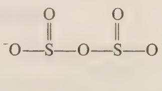  
(a)

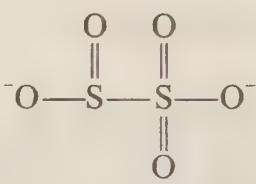  
(b)  
图 16-11 $Na_{2}S_{2}O_{5}$ 中 S 原子的两种键联情况

## 16.4.2 硫酸及其盐

## 1. 硫酸

硫酸是重要的基本化工原料,常用硫酸的年产量来衡量一个国家的化工生产能力。目前,我国主要是用接触法生产硫酸。其主要过程如下:

$$
\mathrm{S} \text {或} \mathrm{FeS} _ {2} \xrightarrow [ \text {燃烧} ]{\mathrm{O} _ {2}} \mathrm{SO} _ {2} \xrightarrow [ \mathrm{V} _ {2} \mathrm{O} _ {5} ]{\mathrm{O} _ {2}} \mathrm{SO} _ {3} \xrightarrow [ \text {吸收} ]{\mathrm{H} _ {2} \mathrm{O}} \mathrm{H} _ {2} \mathrm{SO} _ {4}
$$

$SO_{3}$ 强烈吸水, 在空气中冒烟, 生成硫酸并放出大量的热, 此热量能使水蒸发。所产生的水蒸气与 $SO_{3}$ 化合为硫酸酸雾, 酸雾难以再被水吸收, 它会随尾气排放,不仅使产率降低,还会造成环境污染。故实际工业生产上不是用水吸收 $SO_{3}$ ,而是采用质量分数为98.3%的浓硫酸吸收 $SO_{3}$ ,生成含20% $SO_{3}$ 的发烟硫酸,再用92.5%的硫酸将其稀释成98.3%的浓硫酸。

## (1) $H_{2}SO_{4}$ 分子的结构

$H_{2}SO_{4}$ 分子为四面体构型。分子中 S 原子的轨道为 $sp^{3}$ 不等性杂化，两条有单电子的杂化轨道与两个—OH 分别成 $\sigma$ 键，两条有对电子的杂化轨道与端基 O 原子成 $\sigma$ 配键，两个端基 O 原子有对电子的 p 轨道向 S 原子的 d 轨道配位形成 d-p $\pi$ 配键，故 S 原子与端基 O 原子构成 S=O 双键。

## (2) $\mathrm{H}_{2} \mathrm{SO}_{4}$ 的性质

① 高沸点 纯 $H_{2}SO_{4}$ 是无色油状液体, 凝固点为 10.31 ℃, 沸点为 337.0 ℃。质量分数为 98.3% 时, 密度为 $1.854 \, g \cdot cm^{-3}$ , 浓度约为 $18 \, mol \cdot dm^{-3}$ 。因为硫酸分子间形成氢键, 所以硫酸的沸点很高, 利用此性质, 将其与某些挥发性酸的固体盐作用, 可以将挥发性酸置换出来, 例如:

$$
\begin{array}{r l} \mathrm{NaNO} _ {3} (\mathrm{s}) + \mathrm{H} _ {2} \mathrm{SO} _ {4} & \xlongequal {\triangle} \mathrm{NaHSO} _ {4} + \mathrm{HNO} _ {3} \uparrow \\ \mathrm{NaCl} (\mathrm{s}) + \mathrm{H} _ {2} \mathrm{SO} _ {4} & \xlongequal {\triangle} \mathrm{NaHSO} _ {4} + \mathrm{HCl} \uparrow \end{array}
$$

② 强酸性 $H_{2}SO_{4}$ 是二元强酸, 在稀溶液中, 它的第一步解离是完全的:

$$
\mathrm{H} _ {2} \mathrm{SO} _ {4} = \mathrm{H} ^ {+} + \mathrm{HSO} _ {4} ^ {-}
$$

第二步解离程度则较低：

$$
\mathrm{HSO} _ {4} ^ {-} = \mathrm{H} ^ {+} + \mathrm{SO} _ {4} ^ {2 -} \quad K _ {2} ^ {\ominus} = 1. 0 \times 1 0 ^ {- 2}
$$

③ 强吸水性和脱水性 硫酸是 $SO_{3}$ 的水合物, 除了硫酸 $\left(\mathrm{H}_{2}\mathrm{SO}_{4}\right)$ 为 $SO_{3} \cdot H_{2}O$ 和焦硫酸 $\left(\mathrm{H}_{2}\mathrm{S}_{2}\mathrm{O}_{7}\right)$ 为 $2SO_{3} \cdot H_{2}O$ 外, $SO_{3}$ 和 $H_{2}O$ 还生成一系列的其他水合物:

$$
\begin{array}{l l} \mathrm{SO} _ {3} \cdot 2 \mathrm{H} _ {2} \mathrm{O} & (\mathrm{H} _ {2} \mathrm{SO} _ {4} \cdot \mathrm{H} _ {2} \mathrm{O}) \\ \mathrm{SO} _ {3} \cdot 3 \mathrm{H} _ {2} \mathrm{O} & (\mathrm{H} _ {2} \mathrm{SO} _ {4} \cdot 2 \mathrm{H} _ {2} \mathrm{O}) \\ \mathrm{SO} _ {3} \cdot 5 \mathrm{H} _ {2} \mathrm{O} & (\mathrm{H} _ {2} \mathrm{SO} _ {4} \cdot 4 \mathrm{H} _ {2} \mathrm{O}) \end{array}
$$

这些水合物很稳定,因此浓硫酸有很强的吸水性,而且吸水时释放出大量的热。若不小心将水倾入浓硫酸中,产生的巨大热量将导致因密度较小而浮在上层的水瞬间沸腾,酸液向四周飞溅。因此,在稀释浓硫酸时,只能在搅拌过程中将浓硫酸沿容器壁缓慢地倾入水中,绝不能将水倾入浓硫酸中。

浓硫酸是最常用的干燥剂,用来干燥不与浓硫酸起反应的各种物质,如氯

气、氢气和二氧化碳等。

浓硫酸不但能吸收游离的水,而且还能使含氧有机化合物脱水,使这些有机化合物炭化。例如,蔗糖可被浓硫酸脱水:

$$
\mathrm{C} _ {1 2} \mathrm{H} _ {2 2} \mathrm{O} _ {1 1} \xlongequal {\text {浓硫酸}} 1 2 \mathrm{C} + 1 1 \mathrm{H} _ {2} \mathrm{O}
$$

因此，浓硫酸能严重地破坏动、植物的组织，如损坏衣服和烧伤皮肤等，使用时必须注意安全。

④ 浓硫酸的氧化性 在浓硫酸中, 硫酸大都以分子状态存在。分子中极化能力很强的 $H^{+}$ 有很强的反极化作用, 从而削弱了硫和氧之间的作用, 大大减弱硫酸的稳定性。反应生成的水与浓硫酸结合放出大量的热也促进反应的进行。所以, 浓硫酸有较强的氧化性, 硫易被还原, 例如:

$$
\begin{array}{r l} & {\mathrm{Cu+2H} _ {2} \mathrm{SO} _ {4} (\text {浓}) = \mathrm{CuSO} _ {4} + \mathrm{SO} _ {2} \uparrow + 2 \mathrm{H} _ {2} \mathrm{O}} \\ & {8 \mathrm{NaI+9H} _ {2} \mathrm{SO} _ {4} (\text {浓}) = 4 \mathrm{I} _ {2} + 8 \mathrm{NaHSO} _ {4} + \mathrm{H} _ {2} \mathrm{S} \uparrow + 4 \mathrm{H} _ {2} \mathrm{O}} \end{array}
$$

稀硫酸氧化性很弱,甚至不如稀亚硫酸,如稀亚硫酸能氧化 $H_{2}S$ 而稀硫酸则不能。原因是稀硫酸以 $H^{+}$ 和稳定的 $SO_{4}^{2-}$ 形式存在于溶液中, $H^{+}$ 不能破坏硫与氧之间的结合。

## 2. 硫酸盐

硫酸是二元酸,能生成正盐和酸式盐。在酸式盐中,只有碱金属元素 Na 和 K 能形成稳定的固态盐。

## (1) 溶解性

酸式盐易溶于水,其水溶液因 $HSO_{4}^{-}$ 部分解离而显酸性。多数硫酸盐较易溶于水,而 $SrSO_{4},BaSO_{4},PbSO_{4},Hg_{2}SO_{4}$ 难溶, $CaSO_{4},Ag_{2}SO_{4}$ 微溶,例如:

$$
\begin{array}{l l} \mathrm {BaSO_ {4}} = \mathrm {Ba^ {2 + }} + \mathrm {SO_ {4} ^ {2 - }} & K _ {\mathrm{sp}} ^ {\ominus} = 1. 0 8 \times 1 0 ^ {- 1 0} \\ \mathrm {PbSO_ {4}} = \mathrm {Pb^ {2 + }} + \mathrm {SO_ {4} ^ {2 - }} & K _ {\mathrm{sp}} ^ {\ominus} = 2. 5 3 \times 1 0 ^ {- 8} \end{array}
$$

## (2) 易带结晶水

大多数硫酸盐结晶时,常带有结晶水,例如:

$$
\begin{array}{l l} \mathrm {CuSO_ {4} \cdot 5H_ {2} O(胆矾或蓝矾)} & \mathrm {FeSO_ {4} \cdot 7H_ {2} O(绿矾)} \\ \mathrm {ZnSO_ {4} \cdot 7H_ {2} O(皓矾)} & \mathrm {Na_ {2} SO_ {4} \cdot 10H_ {2} O(芒硝)} \\ \mathrm {MgSO_ {4} \cdot 7H_ {2} O(泻盐)} & \mathrm {CaSO_ {4} \cdot 2H_ {2} O(石膏)} \end{array}
$$

这些结晶水在结构上并不完全相同，如 $CuSO_{4} \cdot 5H_{2}O$ 和 $FeSO_{4} \cdot 7H_{2}O$ ，它们的组成可以分别写成 $\left[\mathrm{Cu}\left(\mathrm{H}_{2} \mathrm{O}\right)_{4}\right]^{2+}\left[\mathrm{SO}_{4}\left(\mathrm{H}_{2} \mathrm{O}\right)\right]^{2-}$ 和 $\left[\mathrm{Fe}\left(\mathrm{H}_{2} \mathrm{O}\right)_{6}\right]^{2+}\left[\mathrm{SO}_{4}\left(\mathrm{H}_{2} \mathrm{O}\right)\right]^{2-}$ 。其中水合阴离子的结构一般认为是水分子通过氢键与 $\mathrm{SO}_{4}^{2-}$ 中的氧原子相连接。

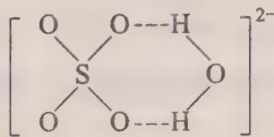

含结晶水的硫酸盐一般都易溶于水,但是 $CaSO_{4}\cdot2H_{2}O$ 除外。

## (3) 易形成复盐

许多硫酸盐有形成复盐的趋势。复盐是由两种或两种以上的简单盐类所组成的晶形化合物,常见的组成有两大类:

一类的组成符合通式 $M_{2}^{I}SO_{4}\cdot M^{\mathrm{II}}SO_{4}\cdot6H_{2}O$ ，式中 $M^{I}$ 为 $NH_{4}^{+}, Na^{+}, K^{+}, Rb^{+}, Cs^{+}$ 等； $M^{II}$ 为 $Fe^{2+}, Co^{2+}, Ni^{2+}, Zn^{2+}, Cu^{2+}, Hg^{2+}$ 等，如著名的莫尔盐（硫酸亚铁铵） $(\mathrm{NH}_{4})_{2}\mathrm{SO}_{4}\cdot\mathrm{FeSO}_{4}\cdot6\mathrm{H}_{2}\mathrm{O}$ ，镁钾矾 $K_{2}SO_{4}\cdot MgSO_{4}\cdot6H_{2}O$ 。

另一类的组成符合通式 $\mathrm{M}_{2}^{\mathrm{I}}\mathrm{SO}_{4}\cdot \mathrm{M}_{2}^{\mathrm{II}}(\mathrm{SO}_{4})_{3}\cdot 24\mathrm{H}_{2}\mathrm{O}$ ，式中 $\mathbf{M}^{\mathrm{III}}$ 为 $\mathrm{V}^{3 + },\mathrm{Cr}^{3 + }$ $\mathrm{Fe}^{3 + },\mathrm{Co}^{3 + },\mathrm{Al}^{3 + },\mathrm{Ga}^{3 + }$ 等，如明矾 $\mathrm{K}_2\mathrm{SO}_4\cdot \mathrm{Al}_2(\mathrm{SO}_4)_3\cdot 24\mathrm{H}_2\mathrm{O}$ ，铬矾 $\mathrm{K}_2\mathrm{SO}_4\cdot$ $\mathrm{Cr}_2(\mathrm{SO}_4)_3\cdot 24\mathrm{H}_2\mathrm{O}$ 。

许多硫酸盐有很重要的用途, 如 $\mathrm{Al}_{2}(\mathrm{SO}_{4})_{3}$ 是净水剂、造纸充填剂和媒染剂, $CuSO_{4}\cdot5H_{2}O$ 是消毒剂和农药, $FeSO_{4}\cdot7H_{2}O$ 是农药、治疗贫血的药剂和制造蓝黑墨水的原料, $Na_{2}SO_{4}\cdot10H_{2}O$ 是重要化工原料等。

## (4) 热稳定性

由于硫酸根不易变形,故硫酸盐均为离子晶体。

硫酸盐受热分解的基本形式是产生金属氧化物和 $SO_{3}$ ，例如：

$$
\mathrm{MgSO} _ {4} \stackrel {\triangle} {=} \mathrm{MgO} + \mathrm{SO} _ {3} \uparrow
$$

若金属离子有强的极化作用,其氧化物不稳定,受热时也可能进一步分解。这是因为,在高温下晶格中离子的热振动加强,强化了离子间的相互极化作用。不仅金属氧化物可进一步分解成金属单质,而且在高温下 $SO_{3}$ 也可能分解,例如:

$$
4 \mathrm{Ag} _ {2} \mathrm{SO} _ {4} \stackrel {\triangle} {=} 8 \mathrm{Ag} + 2 \mathrm{SO} _ {3} \uparrow + 2 \mathrm{SO} _ {2} \uparrow + 3 \mathrm{O} _ {2} \uparrow
$$

若阳离子有还原性,则分解过程中可能将 $SO_{3}$ 部分还原,例如:

$$
2 \mathrm{FeSO} _ {4} \stackrel {\triangle} {=} \mathrm{Fe} _ {2} \mathrm{O} _ {3} + \mathrm{SO} _ {3} \uparrow + \mathrm{SO} _ {2} \uparrow
$$

各种硫酸盐的热稳定性差别很大,这与阳离子的电荷、半径及电子构型有关,因为这些因素影响阳离子的极化能力。

同族且金属氧化态相同的硫酸盐,热分解温度从上到下升高,因为阳离子的半径增大,极化能力减弱,例如:

$$
\mathrm{MgSO} _ {4} \quad \mathrm{CaSO} _ {4} \quad \mathrm{SrSO} _ {4}
$$

$$
\text { 分解温度 } / ^ {\circ} \mathrm{C} \quad 8 9 5 \quad 1 1 4 9 \quad 1 3 7 4
$$

若同一金属元素能形成几种硫酸盐,则高氧化态的金属硫酸盐的分解温度低,因为金属的电荷高,极化能力强,例如:

$$
\mathrm{Mn} _ {2} \left(\mathrm{SO} _ {4}\right) _ {3} \quad \mathrm{MnSO} _ {4}
$$

分解温度/℃ 300 755

若金属阳离子的电荷相同、半径相近，则8电子构型比18电子构型的阳离子硫酸盐的分解温度要高，因为前者有效核电荷数低，极化能力弱，例如：

$$
\mathrm{CaSO} _ {4} \quad \mathrm{CdSO} _ {4}
$$

$$
\text { 分解温度 } / ^ {\circ} \mathrm{C} \quad 1 1 4 9 \quad 8 1 6
$$

硫酸盐分解温度的规律基本遵循离子极化理论的结果。

## 3. 焦硫酸及其盐

将 $SO_{3}$ 溶于纯硫酸时得到组成为 $H_{2}SO_{4} \cdot xSO_{3}$ 的发烟硫酸, 当 x = 1, 就形成焦硫酸 ( $H_{2}S_{2}O_{7}$ )。焦硫酸比浓硫酸有更强的氧化性、吸水性和腐蚀性。它还是良好的磺化剂, 工业上用于制造某些染料、炸药和其他有机磺酸化合物。

焦硫酸也可以看作是两分子硫酸之间脱去一分子水所得的产物：

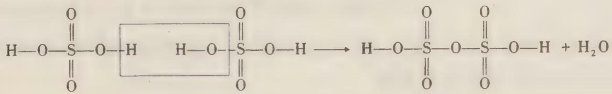

焦硫酸遇水缓慢反应又生成硫酸：

$$
\mathrm{H} _ {2} \mathrm{S} _ {2} \mathrm{O} _ {7} + \mathrm{H} _ {2} \mathrm{O} = 2 \mathrm{H} _ {2} \mathrm{SO} _ {4}
$$

固态酸式盐受强热脱水生成焦硫酸盐,例如:

$$
2 \mathrm{KHSO} _ {4} \stackrel {\triangle} {=} \mathrm{K} _ {2} \mathrm{S} _ {2} \mathrm{O} _ {7} + \mathrm{H} _ {2} \mathrm{O}
$$

因此，在某些实验中可用 $KHSO_{4}$ 代替 $K_{2}S_{2}O_{7}$ 。

焦硫酸盐水解后生成 $HSO_{4}^{-}$ 。由于 $S_{2}O_{7}^{2-}$ 易发生水解，因此无法配制纯的焦硫酸盐溶液。

焦硫酸钾是最有实际意义的焦硫酸盐,白色片状固体,熔点约为 $325^{\circ}C$ 。焦硫酸盐的重要作用是熔矿作用,这是指将某些难溶的碱性或两性氧化物,如 $Fe_{2}O_{3}, Al_{2}O_{3}, Cr_{2}O_{3}, TiO_{2}$ 等,与 $K_{2}S_{2}O_{7}$ 或 $KHSO_{4}$ 共熔时,可使矿物转变成可溶性硫酸盐,例如:

$$
\mathrm{Fe} _ {2} \mathrm{O} _ {3} + 3 \mathrm{K} _ {2} \mathrm{S} _ {2} \mathrm{O} _ {7} \xlongequal {\text {共熔}} \mathrm{Fe} _ {2} (\mathrm{SO} _ {4}) _ {3} + 3 \mathrm{K} _ {2} \mathrm{SO} _ {4}
$$

$$
\mathrm{Al} _ {2} \mathrm{O} _ {3} + 3 \mathrm{K} _ {2} \mathrm{S} _ {2} \mathrm{O} _ {7} \xlongequal {\text {共熔}} \mathrm{Al} _ {2} (\mathrm{SO} _ {4}) _ {3} + 3 \mathrm{K} _ {2} \mathrm{SO} _ {4}
$$

这是分析化学中处理难溶试样的一种重要方法。

## 16.4.3 硫代硫酸及其盐

硫代硫酸 $\left(\mathrm{H}_{2}\mathrm{S}_{2}\mathrm{O}_{3}\right)$ 可以看作是 $H_{2}SO_{4}$ 分子中一个端基氧原子被硫原子取代而得的产物,其键联关系为

$$
\begin{array}{c} \mathrm{O} \\ \parallel \\ \mathrm{H} - \mathrm{O} - \mathrm{S} - \mathrm{O} - \mathrm{H} \\ \parallel \\ \mathrm{S} \end{array}
$$

硫代硫酸极不稳定,但其盐较稳定,市售的试剂 $Na_{2}S_{2}O_{3}\cdot5H_{2}O$ 是最重要的硫代硫酸盐。

## 1. 硫代硫酸盐的制备

在沸腾的温度下使 $Na_{2}SO_{3}$ 溶液与硫粉反应, 即可以得到硫代硫酸钠:

$$
\mathrm{Na} _ {2} \mathrm{SO} _ {3} (\mathrm{aq}) + \mathrm{S} \stackrel {\text {   沸腾   }} {=} \mathrm{Na} _ {2} \mathrm{S} _ {2} \mathrm{O} _ {3}
$$

实际生产中常用的方法是, 将 $Na_{2}S$ 和 $Na_{2}CO_{3}$ 以物质的量比 2:1 配成溶液, 然后通入 $SO_{2}$ , 反应方程式为

$$
2 \mathrm{Na} _ {2} \mathrm{S} (\mathrm{aq}) + \mathrm{Na} _ {2} \mathrm{CO} _ {3} (\mathrm{aq}) + 4 \mathrm{SO} _ {2} \stackrel {\triangle} {=} 3 \mathrm{Na} _ {2} \mathrm{S} _ {2} \mathrm{O} _ {3} + \mathrm{CO} _ {2}
$$

溶液浓缩后, 冷却至室温时即析出 $Na_{2}S_{2}O_{3}$ 水合晶体。在制备 $Na_{2}S_{2}O_{3}$ 时, 溶液必须控制在碱性范围内, 否则将会有硫析出而使产品变黄。利用这种方法制得的硫代硫酸钠常含硫酸钠和亚硫酸钠等杂质。

## 2. 硫代硫酸盐的性质

$Na_{2}S_{2}O_{3}\cdot5H_{2}O$ 俗称海波或大苏打，为无色透明晶体，易溶于水。

## (1) 与酸的反应

$Na_{2}S_{2}O_{3}$ 在中性或碱性溶液中稳定，在酸性溶液中不稳定。遇酸时生成单质 S 并放出 $SO_{2}$ 气体，以此可鉴定 $S_{2}O_{3}^{2-}$ 的存在，例如：

$$
\mathrm{Na} _ {2} \mathrm{S} _ {2} \mathrm{O} _ {3} + 2 \mathrm{HCl} (\mathrm{aq}) = 2 \mathrm{NaCl} + \mathrm{S} \downarrow + \mathrm{SO} _ {2} \uparrow + \mathrm{H} _ {2} \mathrm{O}
$$

## (2) 还原性

硫代硫酸钠是较强的还原剂：

$$
\mathrm{S} _ {4} \mathrm{O} _ {6} ^ {2 -} + 2 \mathrm{e} ^ {-} = 2 \mathrm{S} _ {2} \mathrm{O} _ {3} ^ {2 -} \quad E _ {\mathrm{A}} ^ {\ominus} = 0. 0 8 \mathrm{V}
$$

硫代硫酸钠能定量而快速地与碘反应生成连四硫酸钠 $\left(\mathrm{Na}_{2}\mathrm{S}_{4}\mathrm{O}_{6}\right)$ ，这是分析化学中“碘量法”定量测定碘的一个重要反应：

$$
2 \mathrm{Na} _ {2} \mathrm{S} _ {2} \mathrm{O} _ {3} (\mathrm{aq}) + \mathrm{I} _ {2} (\mathrm{aq}) = \mathrm{Na} _ {2} \mathrm{S} _ {4} \mathrm{O} _ {6} + 2 \mathrm{NaI}
$$

$$
\left[ \begin{array}{c} \mathrm{O} \\ \mathrm{S} \\ \mathrm{O} \end{array} \right] ^ {2 -} + \mathrm{I} _ {2} = \left[ \begin{array}{c} \mathrm{O} \\ \mathrm{S} \\ \mathrm{O} \end{array} \right] ^ {2 -} + 2 \mathrm{I} ^ {-}
$$

较强的氧化剂如氯、溴等,可将硫代硫酸盐氧化为硫酸盐,例如:

$$
\mathrm{Na} _ {2} \mathrm{S} _ {2} \mathrm{O} _ {3} + 4 \mathrm{Cl} _ {2} + 5 \mathrm{H} _ {2} \mathrm{O} = \mathrm{Na} _ {2} \mathrm{SO} _ {4} + \mathrm{H} _ {2} \mathrm{SO} _ {4} + 8 \mathrm{HCl}
$$

## (3) 难溶盐和配位化合物

重金属的硫代硫酸盐难溶且不稳定,如新生成的 $Ag_{2}S_{2}O_{3}$ 在溶液中迅速分解,由白色经黄色、棕色,最后生成黑色的 $Ag_{2}S$ :

$$
\begin{array}{r l} & 2 \mathrm{Ag} ^ {+} + \mathrm{S} _ {2} \mathrm{O} _ {3} ^ {2 -} = \mathrm{Ag} _ {2} \mathrm{S} _ {2} \mathrm{O} _ {3} \downarrow \\ & \mathrm{Ag} _ {2} \mathrm{S} _ {2} \mathrm{O} _ {3} + \mathrm{H} _ {2} \mathrm{O} = \mathrm{Ag} _ {2} \mathrm{S} + \mathrm{H} _ {2} \mathrm{SO} _ {4} \end{array}
$$

用此反应也可鉴定 $S_{2}O_{3}^{2-}$ 的存在。

硫代硫酸钠的另一个重要性质是具有较强的配位能力。不溶于水的 AgBr 和 CuCl 可以溶解在 $Na_{2}S_{2}O_{3}$ 溶液中：

$$
\mathrm{AgBr} + 2 \mathrm{Na} _ {2} \mathrm{S} _ {2} \mathrm{O} _ {3} (\mathrm{aq}) = \mathrm{Na} _ {3} \left[ \mathrm{Ag} \left(\mathrm{S} _ {2} \mathrm{O} _ {3}\right) _ {2} \right] + \mathrm{NaBr}
$$

$$
\mathrm{CuCl} + 2 \mathrm{Na} _ {2} \mathrm{S} _ {2} \mathrm{O} _ {3} (\mathrm{aq}) = \mathrm{Na} _ {3} \left[ \mathrm{Cu} \left(\mathrm{S} _ {2} \mathrm{O} _ {3}\right) _ {2} \right] + \mathrm{NaCl}
$$

这些配位化合物均不稳定,遇酸分解:

$$
2 \left[ \mathrm{Ag} \left(\mathrm{S} _ {2} \mathrm{O} _ {3}\right) _ {2} \right] ^ {3 -} + 4 \mathrm{H} ^ {+} = \mathrm{Ag} _ {2} \mathrm{S} \downarrow + \mathrm{SO} _ {4} ^ {2 -} + 3 \mathrm{S} \downarrow + 3 \mathrm{SO} _ {2} \uparrow + 2 \mathrm{H} _ {2} \mathrm{O}
$$

大量硫代硫酸钠被用作摄影过程的定影液，在造纸和纺织工业中硫代硫酸钠用于还原残留的氯漂白剂，也用于烟道气脱硫。

## 16.4.4 过二硫酸及其盐

## 1. 过二硫酸盐的制备

硫酸分子中的单键氧被过氧化氢的过氧链取代,得到过硫酸 $\left(\mathrm{H}_{2}\mathrm{SO}_{5}\right)$ ;两个硫酸分子中的单键氧被同一过氧链取代,得到过二硫酸 $\left(\mathrm{H}_{2}\mathrm{S}_{2}\mathrm{O}_{8}\right)$ 。过硫酸和过二硫酸分子中的键联关系如下:

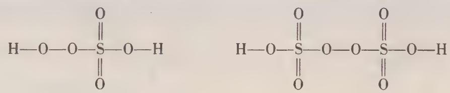

工业上用电解硫酸和硫酸铵的混合溶液(或硫酸氢铵溶液)制备过二硫酸铵：

阳极(铂极)

或

阴极(石墨或铅极)

$$
\begin{array}{l} 2 \mathrm{SO} _ {4} ^ {2 -} = \mathrm{S} _ {2} \mathrm{O} _ {8} ^ {2 -} + 2 \mathrm{e} ^ {-} \\ 2 \mathrm{HSO} _ {4} ^ {-} = \mathrm{S} _ {2} \mathrm{O} _ {8} ^ {2 -} + 2 \mathrm{H} ^ {+} + 2 \mathrm{e} ^ {-} \\ 2 \mathrm{H} ^ {+} + 2 \mathrm{e} ^ {-} = \mathrm{H} _ {2} \end{array}
$$

总反应

$$
2 \mathrm{HSO} _ {4} ^ {-} \xlongequal {\text {电解}} \mathrm{S} _ {2} \mathrm{O} _ {8} ^ {2 -} + \mathrm{H} _ {2} \uparrow
$$

## 2. 过二硫酸盐的性质

## (1) 强氧化性

过二硫酸铵是最重要的过二硫酸盐,其次是过二硫酸钾、过二硫酸钠。它们都是无色晶体或白色粉末,不稳定,受热时易分解,有强氧化性:

$$
\mathrm{S} _ {2} \mathrm{O} _ {8} ^ {2 -} + 2 \mathrm{e} ^ {-} = 2 \mathrm{SO} _ {4} ^ {2 -} \quad E _ {\mathrm{A}} ^ {\ominus} = 2. 0 1 0 \mathrm{V}
$$

过二硫酸盐能将铜氧化,例如:

$$
\mathrm{Cu} + \mathrm{K} _ {2} \mathrm{S} _ {2} \mathrm{O} _ {8} (\mathrm{aq}) = \mathrm{CuSO} _ {4} + \mathrm{K} _ {2} \mathrm{SO} _ {4}
$$

在 $Ag^{+}$ 的催化作用下能将 $Mn^{2+}$ 氧化成 $MnO_{4}^{-}$ :

$$
2 \mathrm{Mn} ^ {2 +} + 5 \mathrm{S} _ {2} \mathrm{O} _ {8} ^ {2 -} + 8 \mathrm{H} _ {2} \mathrm{O} \stackrel {\mathrm{Ag} ^ {+}} {=} 2 \mathrm{MnO} _ {4} ^ {-} + 1 0 \mathrm{SO} _ {4} ^ {2 -} + 1 6 \mathrm{H} ^ {+}
$$

这一反应在钢铁试样分析中用于锰含量的测定。

## (2) 不稳定性

过二硫酸盐固体不稳定,加热时容易分解,会放出 $SO_{3}$ 和 $O_{2}$ ,例如:

$$
2 \mathrm{K} _ {2} \mathrm{S} _ {2} \mathrm{O} _ {8} \stackrel {\triangle} {=} 2 \mathrm{K} _ {2} \mathrm{SO} _ {4} + 2 \mathrm{SO} _ {3} \uparrow + \dot {\mathrm{O}} _ {2} \uparrow
$$

过二硫酸盐溶液受热也分解,例如:

$$
2 \mathrm{K} _ {2} \mathrm{S} _ {2} \mathrm{O} _ {8} + 2 \mathrm{H} _ {2} \mathrm{O} \stackrel {\triangle} {=} 4 \mathrm{KHSO} _ {4} + \mathrm{O} _ {2} \uparrow
$$

$$
2 \left(\mathrm{NH} _ {4}\right) _ {2} \mathrm{S} _ {2} \mathrm{O} _ {8} + 2 \mathrm{H} _ {2} \mathrm{O} \stackrel {\triangle} {=} 4 \mathrm{NH} _ {4} \mathrm{HSO} _ {4} + \mathrm{O} _ {2} \uparrow
$$

绝大多数过二硫酸盐作为聚合反应的引发剂，用于生产聚丙烯腈和乳液聚合法合成聚氯乙烯等过程，其余的用于蚀刻、印刷电路板、漂白等众多领域。

## 16.4.5 硫的其他含氧酸及其盐

## 1. 连硫酸及其盐

连硫酸分子结构的特点是 S 原子直接相连成链,两端的 S 与—OH 相连。连硫酸分子结构的通式为 $\mathrm{H}_{2}\mathrm{S}_{x}\mathrm{O}_{6}(x\geqslant2)$ , 其中硫元素的氧化数随着 x 值的不同而不同。连三硫酸和连四硫酸分子的键联关系如下:

$$
\begin{array}{c c} \mathrm{O} & \mathrm{O} \\ \| & \| \\ \mathrm{HO-S-S-S-OH} \\ \| & \| \\ \mathrm{O} & \mathrm{O} \end{array} \qquad \qquad \begin{array}{c c} \mathrm{O} & \mathrm{O} \\ \| & \| \\ \mathrm{HO-S-S-S-S-OH} \\ \| & \| \\ \mathrm{O} & \mathrm{O} \end{array}
$$

用细粉状的 $MnO_{2}$ 氧化亚硫酸, 可以在溶液中生成连二硫酸:

$$
\mathrm{MnO} _ {2} + 2 \mathrm{H} _ {2} \mathrm{SO} _ {3} = \mathrm{H} _ {2} \mathrm{S} _ {2} \mathrm{O} _ {6} + \mathrm{Mn(OH)} _ {2}
$$

$H_{2}O_{2}$ 与饱和 $Na_{2}S_{2}O_{3}$ 的冷溶液反应, 可得连三硫酸钠:

$$
2 \mathrm{Na} _ {2} \mathrm{S} _ {2} \mathrm{O} _ {3} + 4 \mathrm{H} _ {2} \mathrm{O} _ {2} = \mathrm{Na} _ {2} \mathrm{S} _ {3} \mathrm{O} _ {6} + \mathrm{Na} _ {2} \mathrm{SO} _ {4} + 4 \mathrm{H} _ {2} \mathrm{O}
$$

连硫酸也可由 $H_{2}S_{x}$ 与 $SO_{3}$ 在乙醚中反应生成：

$$
\mathrm{H} _ {2} \mathrm{S} _ {x} + 2 \mathrm{SO} _ {3} \stackrel {\text {乙醚中}} {=} \mathrm{H} _ {2} \mathrm{S} _ {x + 2} \mathrm{O} _ {6} (x = 3 \sim 8)
$$

## 2. 连二亚硫酸及其盐

连二亚硫酸 $\left(\mathrm{H}_{2}\mathrm{S}_{2}\mathrm{O}_{4}\right)$ 为二元酸，其 $K_{1}^{\ominus}=4.5\times10^{-1},K_{2}^{\ominus}=3.5\times10^{-3}$ ，分子中S的氧化数为+3，化合价为+4。其分子结构如下：

在无氧条件下,用锌粉还原亚硫酸氢钠和亚硫酸的混合溶液,即可制得连二亚硫酸钠:

$$
2 \mathrm{NaHSO} _ {3} + \mathrm{H} _ {2} \mathrm{SO} _ {3} + \mathrm{Zn} = \mathrm{Na} _ {2} \mathrm{S} _ {2} \mathrm{O} _ {4} + \mathrm{ZnSO} _ {3} + 2 \mathrm{H} _ {2} \mathrm{O}
$$

## (1) 还原性

在碱性溶液中， $Na_{2}S_{2}O_{4}$ 是强还原剂：

$$
2 \mathrm{SO} _ {3} ^ {2 -} + 2 \mathrm{H} _ {2} \mathrm{O} + 2 \mathrm{e} ^ {-} = \mathrm{S} _ {2} \mathrm{O} _ {4} ^ {2 -} + 4 \mathrm{OH} ^ {-}, \quad E ^ {\ominus} = - 1. 1 2 \mathrm{V}
$$

$Na_{2}S_{2}O_{4}$ 能将 $MnO_{4}^{-}, IO_{3}^{-}, I_{2}, H_{2}O_{2}, O_{2}$ 等还原，还能将 Cu(I), Ag(I), Pb(II), Bi(III), Sb(III) 等还原为金属单质。

$Na_{2}S_{2}O_{4}$ 溶液放置时能被空气中的氧气所氧化,生成亚硫酸盐或硫酸盐:

$$
2 \mathrm{Na} _ {2} \mathrm{S} _ {2} \mathrm{O} _ {4} + \mathrm{O} _ {2} + 2 \mathrm{H} _ {2} \mathrm{O} = 4 \mathrm{NaHSO} _ {3}
$$

$$
\mathrm{Na} _ {2} \mathrm{S} _ {2} \mathrm{O} _ {4} + \mathrm{O} _ {2} + \mathrm{H} _ {2} \mathrm{O} = \mathrm{NaHSO} _ {3} + \mathrm{NaHSO} _ {4}
$$

因此， $Na_{2}S_{2}O_{4}$ 在空气分析中常用来吸收氧气。二水合连二亚硫酸钠 $Na_{2}S_{2}O_{4}\cdot2H_{2}O$ 是染料工业上常用的还原剂，俗称保险粉，可以保护其他物质不被氧化。

$Na_{2}S_{2}O_{4}$ 除大量用于染料工业外,还广泛用于化纤、造纸、食物储存和医疗等领域。

## (2) 不稳定性

$H_{2}S_{2}O_{4}$ 很不稳定,遇水立即分解为硫代硫酸和亚硫酸:

$$
2 \mathrm{H} _ {2} \mathrm{S} _ {2} \mathrm{O} _ {4} + \mathrm{H} _ {2} \mathrm{O} = \mathrm{H} _ {2} \mathrm{S} _ {2} \mathrm{O} _ {3} + 2 \mathrm{H} _ {2} \mathrm{SO} _ {3}
$$

硫代硫酸又分解为硫和亚硫酸：

$$
\mathrm{H} _ {2} \mathrm{S} _ {2} \mathrm{O} _ {3} = \mathrm{S} \downarrow + \mathrm{H} _ {2} \mathrm{SO} _ {3}
$$

虽然连二亚硫酸盐比连二亚硫酸稳定,但 $Na_{2}S_{2}O_{4}$ 固体在无氧条件下受热也很容易发生歧化反应:

$$
2 \mathrm{Na} _ {2} \mathrm{S} _ {2} \mathrm{O} _ {4} \stackrel {\triangle} {=} \mathrm{Na} _ {2} \mathrm{S} _ {2} \mathrm{O} _ {3} + \mathrm{Na} _ {2} \mathrm{SO} _ {3} + \mathrm{SO} _ {2} \uparrow
$$

有少量水存在时,歧化反应速率加快:

$$
2 \mathrm{Na} _ {2} \mathrm{S} _ {2} \mathrm{O} _ {4} + \mathrm{H} _ {2} \mathrm{O} \stackrel {\triangle} {=} \mathrm{Na} _ {2} \mathrm{S} _ {2} \mathrm{O} _ {3} + 2 \mathrm{NaHSO} _ {3}
$$

## 16.4.6 硫的含氧酸的衍生物

## 1. 酰氯

将含氧酸中的羟基(—OH)全部去掉,所得的基团称为酰基,例如:

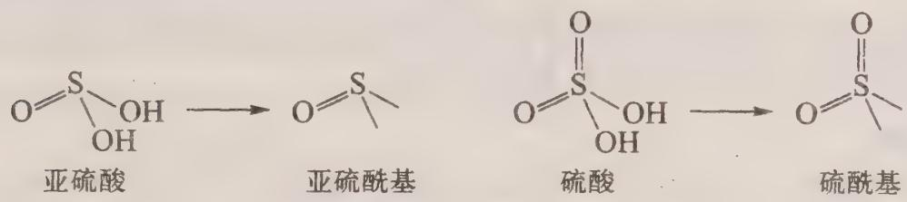

酰基与卤素结合,或者说含氧酸中的—OH完全被卤素取代,得酰卤,例如:

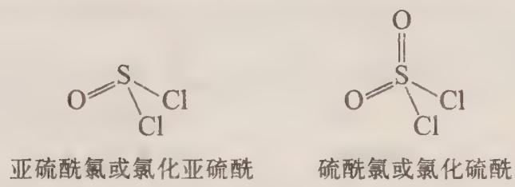

## (1) 亚硫酰氯

亚硫酰氯 $\left(\mathrm{SOCl}_{2}\right)$ 是无色液体,其熔点为-101℃,沸点为75.6℃。在 $SOCl_{2}$ 分子中S原子为 $sp^{3}$ 杂化,在S原子上保留有一对孤电子对,分子构型为三角锥形。

$SO_{2}$ 与 $PCl_{5}$ 反应可以制备 $SOCl_{2}$ :

$$
\mathrm{SO} _ {2} + \mathrm{PCl} _ {5} = \mathrm{SOCl} _ {2} + \mathrm{POCl} _ {3}
$$

经分馏,可将沸点较低的 $SOCl_{2}$ 从液态混合物中分离出来。

$SOCl_{2}$ 在水中剧烈水解,生成盐酸并放出 $SO_{2}$ :

$$
\mathrm{SOCl} _ {2} + \mathrm{H} _ {2} \mathrm{O} = 2 \mathrm{HCl} + \mathrm{SO} _ {2} \uparrow
$$

亚硫酰氯作为氯化剂用于生产有机中间体、除草剂、农用杀虫剂及合成药品、染料、颜料等过程，也用于水合金属氯化物的脱水和金属氧化物的氯化，作为原电池的非水电解质。

## (2) 硫酰氯

硫酰氯 $\left(\mathrm{SO}_{2}\mathrm{Cl}_{2}\right)$ 是无色发烟的液体,其熔点为-51℃,沸点为69.4℃。在 $SO_{2}Cl_{2}$ 分子中S原子为 $sp^{3}$ 杂化,分子构型为四面体形。

工业上, $SO_{2}Cl_{2}$ 由干燥的 $SO_{2}$ 与 $Cl_{2}$ 在活性炭催化下反应制得:

$$
\mathrm{SO} _ {2} + \mathrm{Cl} _ {2} \xlongequal {\text {活性炭}} \mathrm{SO} _ {2} \mathrm{Cl} _ {2}
$$

$SO_{2}Cl_{2}$ 在水中剧烈水解生成硫酸并放出 HCl 气体：

$$
\mathrm{SO} _ {2} \mathrm{Cl} _ {2} + 2 \mathrm{H} _ {2} \mathrm{O} = \mathrm{H} _ {2} \mathrm{SO} _ {4} + 2 \mathrm{HCl} \uparrow
$$

在有机化学中,硫酰氯常作为氯化剂和氯磺化剂,如芳烃化合物的支链选择性氯化。尤其在染料、药品、除草剂和农用杀虫剂等生产过程中,用硫酰氯制备有机中间体。由于环境保护的原因,硫酰氯的使用受到重视,因为它的副产物 $SO_{2}$ 用 $Cl_{2}$ 处理后又重新生成硫酰氯循环使用。

## 2. 氯磺酸

硫酸分子去掉一个羟基(—OH)得磺酸基,硫酸分子中的一个羟基(—OH)被卤素取代得卤磺酸:

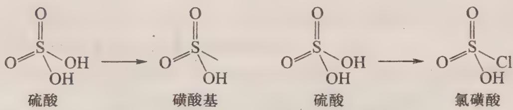

氯磺酸 $\left(\mathrm{HSO}_{3}\mathrm{Cl}\right)$ 是无色液体,其熔点为-80℃,沸点为152℃,在空气中发烟。它可由过量的干燥HCl气体与来自硫酸生产工艺的 $SO_{3}$ 发生气相反应制得:

$$
\mathrm{SO} _ {3} + \mathrm{HCl} = \mathrm{HSO} _ {3} \mathrm{Cl}
$$

$HSO_{3}Cl$ 遇水发生爆炸性水解：

$$
\mathrm{HSO} _ {3} \mathrm{Cl} + \mathrm{H} _ {2} \mathrm{O} = \mathrm{H} _ {2} \mathrm{SO} _ {4} + \mathrm{HCl} \uparrow
$$

氯磺酸在有机合成过程中可以作为温和磺化剂或氯磺化剂。

## 16.5 硒和碲

## 16.5.1 硒、碲的单质

硒、碲相似，各存在着几种同素异形体。硒有灰硒、红硒和无定形硒等，最稳定的是六方晶系金属型灰硒。

无定形硒呈红色(也有人认为呈黑色), 可用 $SO_{2}$ 还原 $SeO_{2}$ 制得:

$$
\mathrm{SeO} _ {2} + 2 \mathrm{SO} _ {2} + 2 \mathrm{H} _ {2} \mathrm{O} = \mathrm{Se} \downarrow + 2 \mathrm{SO} _ {4} ^ {2 -} + 4 \mathrm{H} ^ {+}
$$

无定形硒是不良导体,受热转化为稳定的灰硒。硒是典型的半导体材料,最重要的性质是在光照下导电性可提高近千倍,硒在半导体技术中用作制造整流器和光电池的材料。少量的硒加到普通玻璃中可消除由于含有 $Fe^{2+}$ 而产生的绿色，因为少量硒的红色与铁的绿色互补成为无色。

碲为灰白色的脆性晶体,光照时导电性增强得不明显。用 $SO_{2}$ 还原 $TeO_{2}$ 所得者为无定形棕色粉末。碲也是半导体,但它的应用有限。少量的碲加入铅中可增加铅的硬度和弹性,用于制造铅缆绳。

硒的毒性较大,几乎和砒霜相近,碲也有毒性,但较硒弱。硒、碲能形成硒化物、碲化物及多硒化物 $Na_{2}Se_{6}$ , 多碲化物 $Na_{2}Te_{6}$ 。

Se 与 Te 有不少化学性质与 S 相似,但不如 S 活泼。

## 16.5.2 硒、碲的氢化物

$H_{2}Se$ 和 $H_{2}Te$ 均为 V 形分子, 键角依次为 $91^{\circ}, 89^{\circ}30'$ 。

虽然 Se 和 $H_{2}$ 可直接合成 $H_{2}Se$ ，但 $H_{2}Se$ 和 $H_{2}Te$ 却主要是通过金属硒化物、碲化物与水或酸的作用制得的：

$$
\begin{array}{r l} & \mathrm{Se} + \mathrm{H} _ {2} \xlongequal {4 0 0 ^ {\circ} \mathrm{C}} \mathrm{H} _ {2} \mathrm{Se} \\ & \mathrm{Al} _ {2} \mathrm{Se} _ {3} + 6 \mathrm{H} _ {2} \mathrm{O} = 2 \mathrm{Al(OH)} _ {3} \downarrow + 3 \mathrm{H} _ {2} \mathrm{Se} \uparrow \\ & \mathrm{Al} _ {2} \mathrm{Te} _ {3} + 6 \mathrm{H} ^ {+} = 2 \mathrm{Al} ^ {3 +} + 3 \mathrm{H} _ {2} \mathrm{Te} \uparrow \end{array}
$$

$H_{2}Se$ 和 $H_{2}Te$ 均为无色、极难闻的气体，毒性比 $H_{2}S$ 大。 $H_{2}Se, H_{2}Te$ 均不稳定，按 $H_{2}O, H_{2}S, H_{2}Se, H_{2}Te$ 顺序稳定性逐渐降低，这个性质和 VII A 族中 HX 稳定性变化规律相似。

$H_{2}Se$ 和 $H_{2}Te$ 均易溶于水，在水中可以解离出氢离子，其酸性随原子序数增大而增强。和 $H_{2}S$ 一样， $H_{2}Se$ 和 $H_{2}Te$ 也能从溶液中以硒化物和碲化物的形式将重金属沉淀出来。

$H_{2}Se$ 和 $H_{2}Te$ 的还原性是依次增强的。

## 16.5.3 硒、碲的含氧化合物

## 1. 氧化数为+4的氧化物及含氧酸

硒和硒化氢、碲和碲化氢在空气中燃烧时,分别生成易挥发性的白色固体 $SeO_{2}$ 和难挥发的白色固体 $TeO_{2}$ 。

$\mathrm{SeO}_{2}$ 溶于水生成亚硒酸 $(\mathrm{H}_{2} \mathrm{SeO}_{3})$ ，蒸发可得其无色晶体。亦可将 $\mathrm{Se}$ 粉溶于 $6 \mathrm{~mol} \cdot \mathrm{dm}^{-3}$ 硝酸而得到亚硒酸。 $\mathrm{TeO}_{2}$ 因难溶于水而不易直接形成亚碲酸 $\mathrm{H}_{2} \mathrm{TeO}_{3}$ ，但 $\mathrm{TeO}_{2}$ 溶于 $\mathrm{NaOH}$ 溶液后，生成亚碲酸钠，再加硝酸酸化，即有白色片状的亚碲酸析出。

$H_{2}SO_{3},H_{2}SeO_{3}$ 和 $H_{2}TeO_{3}$ 均为二元酸，强度依次减弱。

$\mathrm{SeO}_{2}$ 和 $\mathrm{TeO}_{2}$ 以氧化性为主。 $\mathrm{SeO}_{2}$ 可以氧化 $\mathrm{H}_{2} \mathrm{~S}$ 生成 $\mathrm{S}$ , 也能氧化 $\mathrm{I}^{-}$ 生成 $\mathrm{I}_{2}$ , 还原产物为 $\mathrm{SeO}_{2}$ 与强氧化剂如 $\mathrm{F}_{2}$ , 浓 $\mathrm{H}_{2} \mathrm{O}_{2}$ , 熔融 $\mathrm{Na}_{2} \mathrm{O}_{2}, \mathrm{KMnO}_{4}$ 作用, 分别生成 $\mathrm{SeO}_{2} \mathrm{~F}_{2}, \mathrm{H}_{2} \mathrm{SeO}_{4}$ 及硒酸盐 $\mathrm{M}_{2} \mathrm{SeO}_{4}$ 。 $\mathrm{TeO}_{2}$ 在受热时能被 $\mathrm{H}_{2}$ 还原为单质, 在 $\mathrm{H}_{2} \mathrm{SO}_{4}$ 介质中被 $30 \% \mathrm{H}_{2} \mathrm{O}_{2}$ 溶液氧化成碲酸 $\mathrm{H}_{6} \mathrm{TeO}_{6}$ 。

亚硒酸钠是预防和治疗克山病的良好药物,效果好而且安全。

## 2. 氧化数为+6的氧化物及含氧酸

$SeO_{3}$ 是白色固体,熔点为 $118^{\circ}C$ ,极易吸水而成硒酸( $H_{2}SeO_{4}$ ):

$$
\mathrm{SeO} _ {3} + \mathrm{H} _ {2} \mathrm{O} = \mathrm{H} _ {2} \mathrm{SeO} _ {4}
$$

氧化剂如 $Cl_{2}, Br_{2}, HClO_{3}$ 作用于亚硒酸可得硒酸，例如：

$$
\mathrm{H} _ {2} \mathrm{SeO} _ {3} + \mathrm{Cl} _ {2} + \mathrm{H} _ {2} \mathrm{O} = \mathrm{H} _ {2} \mathrm{SeO} _ {4} + 2 \mathrm{HCl}
$$

硒酸和硫酸相似,不易挥发,是一种强酸,在高浓度时也可使有机物炭化。无水 $H_{2}SeO_{4}$ 极易潮解和溶解于水,其浓溶液的质量分数为 99%。 $H_{2}SeO_{4}$ 稀溶液的酸性和 $H_{2}SO_{4}$ 相近,其第一步解离是完全的,第二步的解离平衡常数 $K_{2}^{\ominus}=2.2\times10^{-2}$ 。

$H_{2}SeO_{4}$ 的氧化性强于 $H_{2}SO_{4}$ ，不但能氧化 $H_{2}S, SO_{2}, I^{-}, Br^{-}$ ，而且中等浓度 (50%) 的 $H_{2}SeO_{4}$ 还能将 $Cl^{-}$ 氧化成氯气，而自身被还原为亚硒酸：

$$
\mathrm{H} _ {2} \mathrm{SeO} _ {4} + 2 \mathrm{HCl(aq)} = \mathrm{H} _ {2} \mathrm{SeO} _ {3} + \mathrm{Cl} _ {2} \uparrow + \mathrm{H} _ {2} \mathrm{O}
$$

$H_{2}SeO_{4}, HSeO_{4}^{-}, SeO_{4}^{2-}, SeO_{3}$ 都不如相应硫的含氧化合物稳定。硒酸盐的许多性质，如组成、含结晶水的数目等都与相应的硫酸盐极相似，甚至不溶于水的硒酸盐也和硫酸盐相似，如 $BaSeO_{4}, SrSeO_{4}$ 和 $PbSeO_{4}$ 等。

$TeO_{3}$ 为黄橙色晶体,几乎不溶于水,也难溶于稀酸或稀的强碱溶液,但易溶于浓的强碱溶液而生成相应的碲酸盐,例如:

$$
\mathrm{TeO} _ {3} + 2 \mathrm{KOH(浓)} = \mathrm{K} _ {2} \mathrm{TeO} _ {4} + \mathrm{H} _ {2} \mathrm{O}
$$

自由的碲酸以 $H_{6}TeO_{6}$ 的形式存在， $H_{6}TeO_{6}$ 的中心原子的正价数与羟基数目相等，这样的酸称为“原某酸”。原碲酸与 $H_{2}SO_{4}, H_{2}SeO_{4}$ 的化学式不同，可能是 Te 的周期高、半径大、配位数可以更高，而羟基和羟基之间不易互相作用而缩水变成双键氧的缘故。

碲酸 $\left(\mathrm{H}_{6}\mathrm{TeO}_{6}\right)$ 是白色固体，与硒酸和硫酸相反， $H_{6}TeO_{6}$ 是很弱的酸， $K_{1}^{\ominus}=2.2\times10^{-8},K_{2}^{\ominus}=1.0\times10^{-11}$ 。

碲酸也是强氧化剂,能将 $Cl^{-}$ 氧化成氯气,其氧化能力强于 $H_{2}SO_{4}$ ,而弱

于 $\mathrm{H}_2\mathrm{SeO}_4$

$$
\mathrm{H} _ {6} \mathrm{TeO} _ {6} + 2 \mathrm{HCl(aq)} = \mathrm{H} _ {2} \mathrm{TeO} _ {3} + \mathrm{Cl} _ {2} \uparrow + 3 \mathrm{H} _ {2} \mathrm{O}
$$

$H_{2}SeO_{4}$ 的氧化性既强于同族第三周期的硫酸, 又强于第五周期的碲酸。这是元素周期表中第四周期元素性质反常的一个实例。

## 拓展学习资源

<table><tr><td>资源内容</td><td>二维码</td></tr><tr><td>►氧族元素的发现与提取</td><td></td></tr><tr><td>►含硫矿物图片</td><td></td></tr><tr><td>►臭氧化物的制备方法</td><td></td></tr><tr><td>►臭氧的制备方法</td><td></td></tr><tr><td>►单质硫的用途</td><td></td></tr><tr><td>►硫酸的生产</td><td></td></tr><tr><td>►常见硫酸盐的用途</td><td>扫一扫查看资源内容</td></tr><tr><td>►硒及其重要化合物的用途</td><td></td></tr><tr><td>►本章小结</td><td></td></tr><tr><td>►视频——亚硫酸(或二氧化硫)的漂白作用</td><td></td></tr><tr><td>►视频——浓硫酸的脱水作用</td><td></td></tr><tr><td>►视频——硫代硫酸钠与银离子的反应</td><td></td></tr></table>

## 总结与思考

16-1 试总结氧气和臭氧在结构、性质、用途、制法上有什么不同？找出其原因。

16-2 试总结过氧化氢的结构、性质、用途和制法。

16-3 轻金属的硫化物有什么特点？重金属硫化物又有哪些特点？

16-4 什么叫同素异形体？氧、硫各有哪些同素异形体？

16-5 用分子轨道理论描述下列各物种中的键、键级和磁性（顺磁性、逆磁性），并讨论它们的相对稳定性。

(1) $O_{2}^{+}$ (二氧基阳离子); (2) $O_{2}$ ;

(3) $O_{2}^{-}$ (超氧离子); (4) $O_{2}^{2-}$ (过氧离子)。

16-6 分别列举符合以下要求的化合物。

(1) 由 $O_{2}^{-}$ 构成的化合物；

(2) 由 $\mathrm{O}_2^{2-}$ 构成的化合物；

(3) 由 $O_{2}^{2+}$ 构成的化合物；

(4) $O_{2}$ 作为配体与过渡金属形成的配位化合物；

(5) 以 $\mathrm{O}_{3}$ 为基础构成的离子型化合物。

16-7 由硫酸盐构成的矾通常有两种形式,试给出通式并各举一例。

16-8 O 与 S 在元素周期表中属于同一族元素,为什么 $\mathrm{SF}_6$ 等化合物能存在,而 $\mathrm{OF}_6$ 等化合物却不能存在?

16-9 试总结S,Se,Te3种元素的单质及其化合物性质的递变规律。

16-1 简释下列词语。

(1) 臭氧层； (2) 中性氧化物； (3) 减压蒸馏； (4) 弹性硫； (5) 多硫化物；

(6) 发烟硫酸；(7) 酸雨；(8) 熔矿作用；(9) 保险粉。

16-2 完成并配平下列化学反应方程式。

(1) $\mathrm{O}_3 + \mathrm{KI}(\mathrm{aq}) + \mathrm{H}_2\mathrm{O} =$

(2) $\mathrm{HO}_2^-$ + $[\mathrm{Cr(OH)}_4]^-\equiv$

(3) $\mathrm{H}_2\mathrm{O}_2 + \mathrm{Ag}_2\mathrm{O} =$

(4) $\mathrm{PbS} + \mathrm{O}_3 =$

(5) $\mathrm{MnO}_4^-$ + $\mathrm{H}_2\mathrm{O}_2$ + $\mathrm{H}^+$

(6) $\mathrm{HO}_2^-$ + Mn(OH) $_2$

(7) $\mathrm{S} + \mathrm{NaOH(aq)} \stackrel{\triangle}{=}$

(8) $\mathrm{S} + \mathrm{H}_{2}\mathrm{SO}_{4}$ (浓)

(9) $\mathrm{H}_2\mathrm{S}(\mathrm{aq}) + \mathrm{I}_2 + \mathrm{H}_2\mathrm{O} =$

(10) $\mathrm{SO}_3 + \mathrm{P}\xlongequal{\text{高温}}$

(11) $\mathrm{Fe}^{3+} + \mathrm{H}_{2}\mathrm{SO}_{3} + \mathrm{H}_{2}\mathrm{O} =$

(12) $\mathrm{Ag_2SO_4}\stackrel {\triangle}{=}$

(13) $\mathrm{Na}_2\mathrm{S}_2\mathrm{O}_3(\mathrm{aq}) + \mathrm{I}_2(\mathrm{aq}) =$

(14) $\mathrm{SO}_2 + \mathrm{PCl}_5 =$

(15) $\mathrm{HSO}_3\mathrm{Cl} + \mathrm{H}_2\mathrm{O} =$

(16) $\mathrm{Al}_{2}\mathrm{Se}_{3} + \mathrm{H}_{2}\mathrm{O} =$

(17) $\mathrm{H}_2\mathrm{SeO}_3 + \mathrm{Cl}_2 + \mathrm{H}_2\mathrm{O} =$

(18) $\mathrm{TeO}_3 + \mathrm{KOH}$ (浓)

(19) $\mathrm{H}_{6}\mathrm{TeO}_{6} + \mathrm{HCl(aq)} =$

16-3 完成并配平下列化学反应方程式。

(1) 过氧化钠与冷的稀硫酸作用。

(2) 过氧化氢与氢碘酸反应。

(3) 电解硫酸氢铵溶液。

(4) 三氧化硫与碘化钾反应。

(5) 亚硫酸与硫化氢作用。

(6) 三氧化二铝与焦硫酸钾共熔。

(7) 无氧条件下锌粉还原亚硫酸氢钠和亚硫酸的混合溶液。

(8) 硫化汞溶于硫化钠溶液。

(9) 硫酸亚铁受热分解。

(10) 氧化铁与焦硫酸钾共熔。

(11) 氯化亚铜溶解在硫代硫酸钠溶液中。

(12) 过二硫酸钾加热分解。

(13) 连二亚硫酸钠溶液与空气中的氧气反应。

(14) 固体连二亚硫酸钠在无氧条件下受热分解。

(15) 亚硫酰氯水解。

(16) 过量的干燥氯化氢气体与三氧化硫反应。

(17) 将二氧化硒溶于水, 然后通入二氧化硫气体。

(18) 中等浓度的硒酸与盐酸作用。

16-4 生产、合成与制备。

(1) 说明以硫酸氢铵为原料, 利用电解法生产 $\mathrm{H}_{2} \mathrm{O}_{2}$ 的步骤。

(2) 说明以“蒽醌法”生产 $\mathrm{H}_{2} \mathrm{O}_{2}$ 的具体步骤。

（3）制备 $\mathrm{H}_2\mathrm{S},\mathrm{SO}_2$ 和 $\mathrm{SO}_3$ ，要求反应过程中S的氧化数不变，写出相关化学反应方程式。

（4）制备 $H_{2}S, SO_{2}$ 和 $SO_{3}$ ，要求反应过程中 S 的氧化数发生变化，写出相关化学反应方程式。

(5) 以碳酸钠和硫黄为原料制备硫代硫酸钠。

(6) 工业上以硫化钠、碳酸钠和二氧化硫为原料生产硫代硫酸钠。

(7) 工业上以硫酸和硫酸铵为原料生产过二硫酸铵。

16-5 分离、提纯与鉴别。

(1) 试设计方案分离下列各组离子(分离过程须用到硫的化合物)。

① $Ag^{+}, Ba^{2+}, Fe^{2+}$ ; ② $Al^{3+}, Zn^{2+}, Fe^{3+}, Cu^{2+}$ .

(2) $CS_{2}$ 在过量 $O_{2}$ 中燃烧, 得到混合气体, 设计方案分离出其中的 $SO_{2}$ 。

（3）现有4瓶失落标签的无色溶液，分别为 $\mathrm{Na}_2\mathrm{S},\mathrm{Na}_2\mathrm{SO}_3,\mathrm{Na}_2\mathrm{S}_2\mathrm{O}_3$ 和 $\mathrm{Na}_2\mathrm{SO}_4$ 溶液，试加以鉴别。

(4) 两种白色固体, 分别为 $SeO_{2}$ 和 $TeO_{2}$ , 试加以鉴别。

(5) 有一黑色固体, 是 FeS, PbS 和 CuS 中的一种, 试加以鉴别。

## 16-6 解释实验现象。

（1）向 $\mathrm{Pb(NO_{3})_{2}}$ 溶液中通入 $H_{2}S$ ，有黑色沉淀生成，用 $H_{2}O_{2}$ 溶液处理该黑色沉淀，沉淀逐渐转变为白色。

(2) 室温下稀 $H_{2}O_{2}$ 溶液分解较慢,但加入少量 KI 后分解速率加快。

（3）向硫代硫酸钠溶液中滴加少量硝酸银溶液，生成少许白色沉淀又立刻消失，向此溶液中加入少许盐酸，则产生黑色沉淀。

(4) 少量 $\mathrm{Na}_{2} \mathrm{~S}_{2} \mathrm{O}_{3}$ 溶液和 $\mathrm{AgNO}_{3}$ 溶液反应生成白色沉淀, 沉淀逐渐变黄、变棕色, 最后变成黑色。白色沉淀溶于过量 $\mathrm{Na}_{2} \mathrm{~S}_{2} \mathrm{O}_{3}$ 溶液, 而黑色沉淀不溶于过量 $\mathrm{Na}_{2} \mathrm{~S}_{2} \mathrm{O}_{3}$ 溶液。

(5) 将 $\mathrm{H}_{2} \mathrm{~S}$ 通入 $\mathrm{MnSO}_{4}$ 溶液中不产生 MnS 沉淀, 若 $\mathrm{MnSO}_{4}$ 溶液中含有一定量的氨水, 再通入 $\mathrm{H}_{2} \mathrm{~S}$ 时即有 MnS 沉淀产生。

(6) 向稀盐酸和 $\mathrm{Na}_{2} \mathrm{SO}_{3}$ 混合溶液中通入 $\mathrm{H}_{2} \mathrm{~S}$ , 溶液变浑浊; 向稀盐酸和 $\mathrm{Na}_{2} \mathrm{SO}_{4}$ 混合溶液中通入 $\mathrm{H}_{2} \mathrm{~S}$ , 溶液无变化。

（7）将少量酸性 $MnSO_{4}$ 溶液与 $(\mathrm{NH}_{4})_{2}\mathrm{S}_{2}\mathrm{O}_{8}$ 溶液混合后水浴加热，很快生成棕黑色沉淀；但在加热前加入几滴 $AgNO_{3}$ 溶液，混合溶液逐渐变红。

## 16-7 推理判断。

（1）有一种白色固体，将其溶于水后进行下列实验，请根据实验现象写出此白色固体的化学式，并给出相关实验的化学反应方程式。

① 用铂丝蘸少量液体在火焰上灼烧，产生黄色火焰。

② 它使酸化的 $\mathrm{KMnO}_4$ 溶液褪色而产生无色溶液，此溶液与 $\mathrm{BaCl}_2$ 溶液作用生成不溶于稀 $\mathrm{HNO}_3$ 的白色沉淀。

③ 加入硫粉,并加热,硫溶解生成无色溶液,此溶液酸化时产生乳白色或浅黄色沉淀,此溶液也能使 $KI_{3}$ 溶液褪色,并能溶解 AgBr。

(2) 将固体无水钠盐(A)溶于水, 滴加稀硫酸有无色气体(B)生成。将(B)通入碘水则碘水褪色, 同时(B)转化为(C)。晶体(A)在 $600^{\circ} \mathrm{C}$ 以上加热至恒重后生成混合物(D), 用 $\mathrm{pH}$ 试纸检验发现(D)的水溶液的碱性大大高于(A)的水溶液的碱性。向(D)的水溶液中加 $\mathrm{CuCl}_{2}$ 溶液, 有不溶于盐酸的黑色沉淀(E)生成。若用 $\mathrm{BaCl}_{2}$ 溶液代替 $\mathrm{CuCl}_{2}$ 溶液进行实验, 则有白色沉淀(F)生成, (F)不溶于硝酸、氢氧化钠溶液及氨水。

试给出(A)，(B)，(C)，(D)，(E)和(F)所代表的物质的化学式，并用化学反应方程式表示各过程。

(3) 将无色钠盐溶于水得无色溶液, 用 $\mathrm{pH}$ 试纸检验知 (A) 显酸性。(A) 能使 $\mathrm{KMnO}_{4}$ 溶液褪色, 同时 (A) 被氧化为 (B)。向 (B) 的溶液中加入 $\mathrm{BaCl}_{2}$ 溶液得不溶于强酸的白色沉淀 (C)。向 (A) 中加入稀盐酸有无色气体 (D) 放出, 将 (D) 通入氯水则又得到无色的 (B)。向含有淀粉的 $\mathrm{KIO}_{3}$ 溶液中通入少许 (D) 则溶液立即变蓝, 说明有 (E) 生成, (D) 过量时蓝色消失得无色溶液。

试给出(A)，(B)，(C)，(D)和(E)所代表的物质的化学式，并用化学反应方程式表示各过程。

(4) 一种盐(A)溶于水后加入稀硫酸,有刺激性气体(B)和乳白色沉淀(C)生成。气体(B)溶于 $\mathrm{Na}_{2} \mathrm{CO}_{3}$ 溶液则转化为(D)并放出气体(E)。(A)的溶液与碘水作用则转化为(F),同时碘水褪色。(A)的溶液加入氯水则转化为溶液(G),(G)与钡盐作用,即产生不溶于强酸的白色沉淀(H)。(C)与溶液(D)混合后煮沸,则又缓慢转化为(A)。

试给出(A)，(B)，(C)，(D)，(E)，(F)，(G)和(H)所代表的物质的化学式，并用化学反应方程式表示各过程。

(5) 无色晶体(A)易溶于水。(A)的溶液与酸性KI溶液作用溶液变黄,说明有(B)生成。(A)的溶液煮沸一段时间后加入 $\mathrm{BaCl}_{2}$ 溶液有白色沉淀(C)生成,(C)不溶于强酸。(A)的溶液与 $\mathrm{MnSO}_{4}$ 混合后加稀硝酸和几滴 $\mathrm{AgNO}_{3}$ 溶液,加热,溶液变红,说明有(D)生成。(A)的溶液与KOH混合后加热,有气体(E)放出。气体(E)通入 $\mathrm{AgNO}_{3}$ 溶液则有棕黑色沉淀(F)生成,(E)通入过量则沉淀溶解为无色溶液。

试给出(A)，(B)，(C)，(D)，(E)和(F)所代表的物质的化学式，并用化学反应方程式表示各过程。

（6）某溶液中可能含 $\mathrm{Cl}^{-},\mathrm{S}^{2-},\mathrm{SO}_3^{2-},\mathrm{S}_2\mathrm{O}_3^{2-},\mathrm{SO}_4^{2-}$ ，请根据下列实验现象试判断：哪几种离子肯定存在，哪几种离子肯定不存在，哪几种离子可能存在。并说明理由。

① 向一份未知溶液中加入过量 $AgNO_{3}$ 溶液，产生白色沉淀；

② 向另一份未知溶液中加入 $BaCl_{2}$ 溶液，也产生白色沉淀；

③ 取第三份未知溶液，加入溴水，溴水不褪色。

## 16-8 简答题。

(1) 写出下列物质的化学式。

① 方铅矿； ② 朱砂； ③ 闪锌矿； ④ 黄铜矿；

⑤ 黄铁矿； ⑥ 芒硝； ⑦ 海波； ⑧ 保险粉。

（2）溶于水的 $O_{2}$ 以氢键形式与水形成一水合物和二水合物，为什么 $O_{2}$ 能与水形成氢键但溶解度却非常小？

(3) 试解释由同种元素构成的 $\mathrm{O}_{3}$ 分子却是极性分子。

(4) 为什么 $SF_{6}$ 稳定、不易水解，而 $SF_{4}$ 不稳定、又易水解？

(5) 试用价层电子对互斥理论判断 $\mathrm{SOF}_2$ 和 $\mathrm{SOCl}_2$ 的空间构型，说明在 O 原子和 S 原子之间的 $d - p\pi$ 配键是怎样形成的。试比较两者的 $d - p\pi$ 配键的强弱。

(6) 为什么不宜采用高温浓缩的办法获得 $\mathrm{NaHSO}_3$ 晶体？

(7) 为什么硫酸盐的热稳定性比碳酸盐的高,而硅酸盐的热稳定性更高?

(8) SnS 能溶于 $Na_{2}S$ 溶液中,你认为可能的原因是什么?如何证明你的判断是正确的?

(9) 试比较 $\mathrm{Na}_{2} \mathrm{O}_{2}, \mathrm{KO}_{2}, \mathrm{O}_{2}$ 和 $\mathrm{O}_{2}[\mathrm{AsF}_{6}]$ 中的 O—O 键键长，并予以解释。

（10）现有组成为 $\mathbf{M}_2\mathbf{S}_2\mathbf{O}_x$ 的3种盐，它们分别符合下述的某些性质：

① 阴离子以—0—0—链为特征；

② 阴离子以 S—S 链为特征；

③ 阴离子以 S—O—S 链为特征；

④ 由硫酸氢盐缩合而成；

⑤ 由硫酸氢盐阳极氧化形成；

⑥ 由亚硫酸盐水溶液与硫反应形成；

⑦ 水溶液使溴化银溶解；

⑧ 水溶液与氢氧化物(MOH)反应生成硫酸盐；

⑨ 在水溶液中能把 $Mn^{2+}$ 氧化成 $MnO_{4}^{-}$ 。

试将 x 的正确数值填入下表中角标括号内，并将上述各性质的序号填入相应盐的横栏内：

<table><tr><td> $M_{2}S_{2}O$ ( )</td><td></td><td></td><td></td></tr><tr><td> $M_{2}S_{2}O$ ( )</td><td></td><td></td><td></td></tr><tr><td> $M_{2}S_{2}O$ ( )</td><td></td><td></td><td></td></tr></table>

## 17

## 卤素

## 目录

17.1 卤素单质 …… 656
17.1.1 物理性质 …… 656
17.1.2 化学性质 …… 657
1. 与水的反应 …… 657
2. 与金属的反应 …… 658
3. 与非金属的反应 …… 658
4. 与 $\mathrm{H}_{2}$ 的反应 …… 659
5. 与某些化合物的反应 …… 659
17.1.3 卤素单质的制备 …… 660
1. 单质氟的制备 …… 661
2. 单质氯的制备 …… 662
3. 单质溴的制备 …… 663
4. 单质碘的制备 …… 664
17.2 卤化氢和氢卤酸 …… 665
17.2.1 物理性质 …… 665
17.2.2 化学性质 …… 666
1. 酸性 …… 666
2. 还原性 …… 667
3. 热稳定性 …… 667
17.2.3 卤化氢的制备 …… 668
1. 卤化物与浓硫酸作用 …… 668
2. 卤素与氢直接化合 …… 668
3. 非金属卤化物水解 …… 669
17.3 卤化物和拟卤素 …… 669
17.3.1 金属卤化物 …… 669
1. 金属卤化物的制备 …… 670
2. 金属卤化物的溶解性 …… 671

3. 形成配位化合物 …… 671
17.3.2 卤素互化物和多卤化物 …… 672
1. 卤素互化物 …… 672
2. 多卤化物 …… 674
17.3.3 拟卤素 …… 675
1. 拟卤素的制备 …… 675
2. 拟卤素的分子结构 …… 675
3. 拟卤素的性质 …… 676
17.4 卤素的含氧化合物 …… 677
17.4.1 卤素的氧化物 …… 677
1. 卤素氧化物的结构 …… 678
2. 卤素氧化物的化学性质 …… 679
3. 卤素氧化物的制备 …… 680
17.4.2 卤素的含氧酸及其盐 …… 681
1. 次卤酸及其盐 …… 682
2. 亚卤酸及其盐 …… 684
3. 卤酸及其盐 …… 685
4. 高卤酸及其盐 …… 688
拓展学习资源 …… 691
总结与思考题 …… 691
习题 …… 692

## 第17章 卤素

卤素是指元素周期表中ⅦA族元素，包括氟、氯、溴、碘、砹和第七周期的硼共6种元素，因为它们都易形成盐，所以统称为卤素。自然界中的氟和氯以化合态存在。含氟的主要矿物是萤石（ $\mathrm{CaF}_2$ ）、冰晶石（ $\mathrm{Na}_3\mathrm{AlF}_6$ ）和氟磷灰石 $[\mathrm{Ca}_5\mathrm{F}(\mathrm{PO}_4)_3]$ ，它们常分散于其他矿物中，氟在地壳中的质量分数约为 $9.5\times 10^{-2}\%$ 。氯主要以NaCl形式存在于海洋（海水中大约含氯 $1.9\%$ ）、盐湖、盐井中。矿物中，氯主要以KCl和光卤石（ $\mathrm{KCl}\cdot \mathrm{MgCl}_2\cdot 6\mathrm{H}_2\mathrm{O}$ ）的形式存在于盐床中。地壳中氯的质量分数约为 $1.3\times 10^{-2}\%$ 。溴可从天然盐水中提取，属于第一个从海水中提取的元素，海水中溴的含量相当于氯的1/300，地壳中溴的质量分数约为 $3.7\times 10^{-5}\%$ 。海水中存在极少量的碘，通常以碘化物形式存在，且因被海藻类植物所吸收而富集；碘也存在于开采石油所溢出的咸水中和盐井中；南美洲智利硝石含有少许的碘酸钙。地壳中碘的质量分数约为 $1.4\times 10^{-5}\%$ 。砹是放射性元素，仅以微量而短暂地存在于镭、锕和钍的蜕变产物中，由于砹的实验数据较少，在本书中不予以讨论。

卤素基态原子的价层电子构型为 $ns^{2}np^{5}$ ，有7个价层电子，与稀有气体8电子稳定构型相比，仅缺少一个电子。因此，卤素原子都有获得一个电子形成氧化数为-1的阴离子的倾向。

除氟以外,氯、溴、碘原子的价电子层中都存在空 d 轨道,同电负性大的元素的原子结合时,它们也参与成键,所以氯、溴、碘可显+1,+3,+5,+7 氧化态,它们的最高氧化数与其族数相一致。

以上关于价态和氧化还原性质的结论,可以从图 17-1 卤素的元素电势图中体现出。

$E_{\mathrm{A}}^{\ominus} / N$

$$
\begin{array}{l} \mathrm {ClO_ {4} ^ {-}} \xrightarrow {1 . 2 0 1} \mathrm {ClO_ {3} ^ {-}} \xrightarrow {1 . 1 8} \mathrm {HClO_ {2}} \xrightarrow {1 . 7 0} \mathrm{HClO} \xrightarrow {1 . 6 3} \mathrm {Cl_ {2}} \xrightarrow {1 . 3 5 8} \mathrm {Cl^ {-}} \\ \mathrm {BrO_ {4} ^ {-}} \xrightarrow {1 . 8 5} \mathrm {BrO_ {3} ^ {-}} \xrightarrow {1 . 4 5} \mathrm{HBrO} \xrightarrow {1 . 6 0} \mathrm {Br_ {2} (l)} \xrightarrow {1 . 0 6 5} \mathrm {Br^ {-}} \\ \mathrm {H_ {5} IO_ {6}} \xrightarrow {1 . 6 0} \mathrm {IO_ {3} ^ {-}} \xrightarrow {1 . 1 3} \mathrm{HIO} \xrightarrow {1 . 4 4} \mathrm {I_ {2} (s)} \xrightarrow {0 . 5 3 5} \mathrm {I^ {-}} \end{array}
$$

$E_{\mathrm{B}}^{\ominus} / N$

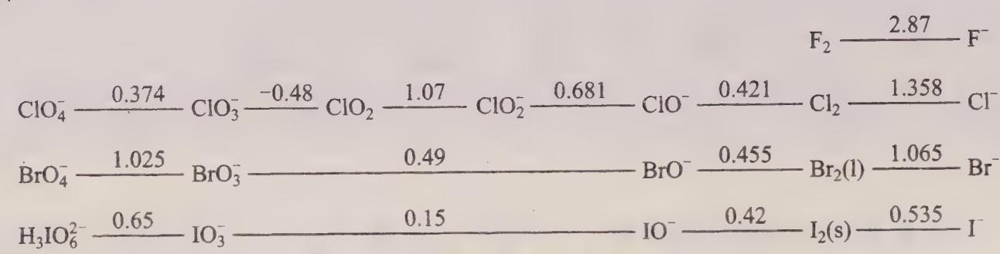  
图17-1 卤素的元素电势图

## 17.1 卤素单质

## 17.1.1 物理性质

卤素是元素周期表中元素的基本性质及单质的性质变化规律性较好的一族。

卤素是各周期中原子半径最小、电子亲和能和电负性最大的元素，它们的非金属性是元素周期表中最强的。

常温常压下,从 F 到 I,随着原子序数的增加,卤素单质呈现由气态到液态到固态的规律性变化。因为原子序数增加,它们的半径依次增大,相对分子质量增大,所以卤素单质分子之间的色散力也增大了。卤素单质的熔、沸点随着色散力的逐渐增大而增高。同时,分子排列紧密程度增加,它们的密度也随色散力的增加而增大。

$F_{2}$ 可与水剧烈反应,产生氧气。其他卤素单质在水中的溶解度不大。常温常压下, $1\ dm^{3}$ 水中可溶解约 $2.3\ dm^{3}Cl_{2}$ , 浓度约为 $0.103\ mol\cdot dm^{-3}$ ; 其中 $Br_{2}$ 的溶解度最大, 为 $3.580\ g\cdot(100\ g\ H_{2}O)^{-1}$ , 浓度约为 $0.224\ mol\cdot dm^{-3}$ ; $I_{2}$ 的溶解度最小, 为 $0.029\ g\cdot(100\ g\ H_{2}O)^{-1}$ , 浓度约为 $0.001\ mol\cdot dm^{-3}$ 。

$Cl_{2}, Br_{2}$ 和 $I_{2}$ 的水溶液分别称为氯水、溴水和碘水，前二者的颜色与它们的气态分子的颜色相同，分别为黄绿色和红棕色，说明它们在水中以自由分子状态存在；后者的颜色有所改变，说明 $I_{2}$ 可与水结合，形成溶剂化分子。

$\mathrm{Br}_{2}$ 和 $\mathrm{I}_{2}$ 在有机溶剂中的溶解度较大, 最典型的是它们溶解在四氯化碳 $(\mathrm{CCl}_{4})$ 中, 分别呈现自由分子状态的红棕色和紫红色。 $\mathrm{I}_{2}$ 在 $\mathrm{CCl}_{4}$ 中的溶解度是在水中的 86 倍, 在二硫化碳、苯、甲苯等溶剂中, $\mathrm{Br}_{2}$ 和 $\mathrm{I}_{2}$ 的溶解度也较大。利用 $\mathrm{I}_{2}$ 在有机溶剂中的易溶性, 可以把它从水溶液中分离出来, 这种分离提纯方法称为萃取, 可以在分液漏斗中进行。

$I_{2}$ 的另一特点是能形成多碘化物, 如 $KI_{3}$ , 所以可较好地溶解在 KI 水溶液中, 其中 $I_{3}^{-}$ 是直线形离子, 在溶液中呈现黄色。实验室中进行单质碘的实验时, 所用的碘水就是 $I_{2}$ 的 KI 溶液。在溶液中, $I_{3}^{-}$ 的浓度越大, 溶液的颜色越深。

卤素分子的解离能与卤素原子的半径大小密切相关。由于 F 原子的半径非常小,形成双原子分子后,虽然核与电子间的引力较大,但两个 F 原子核间斥力也很大,抵消部分吸引作用,导致其解离能下降,以至于小于 $Cl_{2}$ 的解离能;从 Cl 到 I,因为原子半径增大,分子中核与核之间的斥力可忽略,而核对成键电子的引力随原子半径增大而减小,所以导致解离能呈现逐渐下降的趋势。 $F_{2}$ 分子的解离能很小,致使其有很高的反应活性,在下面化学性质中将具体讨论。

## 17.1.2 化学性质

卤素单质是强氧化剂,其中 $F_{2}$ 的氧化性最强, $E^{\ominus}(F_{2}/F^{-})=2.866\ V$ ,这是由于 F 原子的半径特别小、电负性大,F—F 键键能小等因素影响的结果。随原子序数增大,氧化能力逐渐变弱: $E^{\ominus}(Cl_{2}/Cl^{-})=1.358\ V,E^{\ominus}(Br_{2}/Br^{-})=1.066\ V$ , $E^{\ominus}(I_{2}/I^{-})=0.535\ 5\ V$ 。

卤素单质以氧化性为主的化学性质主要表现在以下几方面。

## 1. 与水的反应

卤素单质中, $F_{2}$ 与水的反应剧烈,因为当pH=7时, $E^{\ominus}(O_{2}/H_{2}O)=0.817V$ ,所以 $F_{2}$ 在水中不稳定,可与水剧烈反应,将水分子中氧化数为-2的O氧化成氧气:

$$
2 \mathrm{F} _ {2} + 2 \mathrm{H} _ {2} \mathrm{O} = 4 \mathrm{HF} + \mathrm{O} _ {2}
$$

从热力学角度看,氯、溴单质也能进行上式类型的反应,而且氧化能力依次减弱。碘不能置换水中的氧,相反,水中溶解的氧气能将I氧化为单质碘。但考虑动力学因素,氯、溴对水的氧化反应速率很慢,以至于无实际意义。

卤素单质在水中虽然溶解度较小,但仍以溶解为主。氯、溴、碘与水主要发生歧化反应。常温下, $Cl_{2}$ 发生的歧化反应为

$$
\mathrm{Cl} _ {2} + \mathrm{H} _ {2} \mathrm{O} = \mathrm{HCl} + \mathrm{HClO} \quad K ^ {\ominus} = 3 \times 1 0 ^ {- 5}
$$

生成的 HClO 是强氧化剂, 所以氯水具有很强的氧化能力, 常作为氧化剂使用。

卤素的歧化反应与介质的酸度相关。在碱性溶液中，歧化反应比较彻底，在酸性溶液中发生逆歧化反应。

卤素单质在碱中的歧化反应有如下两种方式：

$$
\mathrm{X} _ {2} + 2 \mathrm{OH} ^ {-} = \mathrm{X} ^ {-} + \mathrm{XO} ^ {-} + \mathrm{H} _ {2} \mathrm{O}\tag{1}
$$

$$
3 \mathrm{X} _ {2} + 6 \mathrm{OH} ^ {-} \stackrel {\triangle} {=} 5 \mathrm{X} ^ {-} + \mathrm{XO} _ {3} ^ {-} + 3 \mathrm{H} _ {2} \mathrm{O}\tag{2}
$$

对于氯,可以计算出反应(1)的 $K^{\ominus}$ 约为 $10^{16}$ ,而反应(2)的 $K^{\ominus}$ 约为 $10^{75}$ 。就是说从热力学上看,反应(2)的趋势要大得多。但是在室温和低温时, $Cl_{2}$ 在碱性溶液中主要发生反应(1),即歧化为 $Cl^{-}$ 和 $ClO^{-}$ ;但加热到 $75^{\circ}C$ 以上时,则按反应(2)歧化为 $Cl^{-}$ 和 $ClO_{3}^{-}$ 。

反应受温度影响,这显然是由于动力学因素所致。

对于溴而言, 只有在 $0^{\circ}C$ 左右的低温时, 才可以歧化成 $BrO^{-}$ , 而在 $50 \sim 80^{\circ}C$ 时将得到 $BrO_{3}^{-}$ 。

碘在任何温度下均易进行(2)式的歧化反应,生成 $I^{-}$ 和 $IO_{3}^{-}$ 。

## 2. 与金属的反应

$F_{2}$ 在任何温度下都可与金属直接化合，生成高价氟化物。 $F_{2}$ 与 Cu, Ni, Mg 作用时由于金属表面生成一层致密氟化物保护膜而中止反应。所以 $F_{2}$ 可储存在 Cu, Ni, Mg 或其合金制成的容器中。

$Cl_{2}$ 可与各种金属作用,但干燥的 $Cl_{2}$ 不与 Fe 反应。因此, $Cl_{2}$ 可在铁罐中储存和运输。

$Br_{2}$ 和 $I_{2}$ 常温下只能与活泼金属作用,与不活泼金属只有在加热条件下才可发生反应。

## 3. 与非金属的反应

除 $O_{2}, N_{2}$ ，稀有气体 He 和 Ne 外， $F_{2}$ 可与所有非金属作用，直接化合成高价氟化物。低温下可与 C, Si, S, P 猛烈反应，生成氟化物，大多数氟化物都具有挥发性。

$Cl_{2}$ 也能与大多数非金属单质直接作用,但不及 $F_{2}$ 激烈,例如:

$$
2 \mathrm{S} + \mathrm{Cl} _ {2} = \mathrm{S} _ {2} \mathrm{Cl} _ {2}
$$

产物一氯化硫为红黄色液体。

$$
\mathrm{S} + \mathrm{Cl} _ {2} (\text {过量}) = \mathrm{SCl} _ {2}
$$

氯气过量时,产物二氯化硫为深红色发烟液体。

$$
\begin{array}{r l} & 2 \mathrm{P} + 3 \mathrm{Cl} _ {2} = 2 \mathrm{PCl} _ {3} \\ & 2 \mathrm{P} + 5 \mathrm{Cl} _ {2} (\text {过量}) = 2 \mathrm{PCl} _ {5} \end{array}
$$

$\mathrm{PCI}_3$ 为无色发烟液体；而 $\mathrm{PCI}_5$ 为淡黄色固体。

$Br_{2}$ 和 $I_{2}$ 可与许多非金属单质作用, 反应不如 $F_{2}, Cl_{2}$ 激烈, 一般多形成低价化合物, 例如:

$$
2 \mathrm{P} + 3 \mathrm{Br} _ {2} = 2 \mathrm{PBr} _ {3}
$$

无色发烟液体产物 $PBr_{3}$ 中有部分液态 $PBr_{5}$ 生成。

若在沙浴上加热 $I_{2}$ 和白磷, 可得到红色固体 $PI_{3}$ :

$$
2 \mathrm{P} + 3 \mathrm{I} _ {2} \stackrel {\triangle} {=} 2 \mathrm{PI} _ {3}
$$

## 4. 与 $\mathbf{H}_2$ 的反应

在低温下, 暗处, $F_{2}$ 即可与 $H_{2}$ 发生剧烈反应, 放出大量热, 导致爆炸:

$$
\mathrm{F} _ {2} + \mathrm{H} _ {2} = 2 \mathrm{HF}
$$

$Cl_{2}$ 在常温下与 $H_{2}$ 缓慢反应,但在紫外光照射下,可发生连锁反应(也称为链反应),引起爆炸。连锁反应按以下步骤进行。

① 链引发反应 产生单电子自由基：

$$
\mathrm{Cl} _ {2} \stackrel {h \nu} {=} 2 \mathrm{Cl} \cdot
$$

② 链传递反应 以下两个反应反复交替进行,得到产物 HCl,并不断产生自由基:

$$
\begin{array}{r l} & \mathrm{Cl} \bullet + \mathrm{H} _ {2} = \mathrm{HCl} + \mathrm{H} \bullet \\ & \mathrm{H} \bullet + \mathrm{Cl} _ {2} = \mathrm{HCl} + \mathrm{Cl} \bullet \end{array}
$$

③ 链终止反应 通过下列反应,自由基将消除掉:

$$
\begin{array}{r l} & 2 \mathrm{H} \bullet = \mathrm{H} _ {2} \\ & 2 \mathrm{Cl} \bullet = \mathrm{Cl} _ {2} \\ & \mathrm{Cl} \bullet + \mathrm{H} \bullet = \mathrm{HCl} \end{array}
$$

以金属 Pt 为催化剂, 加热到 $350^{\circ}C$ , $Br_{2}$ 可与 $H_{2}$ 反应。但高温下 HBr 不稳定, 易分解。

$$
\mathrm{Br} _ {2} + \mathrm{H} _ {2} \xlongequal {\mathrm{Pt}, 3 5 0 ^ {\circ} \mathrm{C}} 2 \mathrm{HBr}
$$

$I_{2}$ 与 $H_{2}$ 在催化剂存在并加热的条件下可反应生成 HI, HI 更易分解。

$$
\mathrm{I} _ {2} + \mathrm{H} _ {2} \xlongequal [ \triangle ] {\text {催化剂}} 2 \mathrm{HI}
$$

所以， $\mathrm{Br}_2$ 和 $\mathrm{I}_2$ 与 $\mathrm{H}_2$ 之间的反应不完全。

5. 与某些化合物的反应

$Cl_{2}, Br_{2}, I_{2}$ 可以将硫化氢中低价态的硫氧化成硫单质,例如:

$$
\mathrm{Br} _ {2} + \mathrm{H} _ {2} \mathrm{S} = 2 \mathrm{HBr} + \mathrm{S}
$$

$Cl_{2}, Br_{2}$ 与 CO 反应, 可得到碳酰卤。例如, $200^{\circ}C$ 时, $Cl_{2}$ 在活性炭催化下与 CO 反应, 形成无色高毒性气体——碳酰氯, 俗称光气:

$$
\mathrm{CO} + \mathrm{Cl} _ {2} \xlongequal [ \triangle ] {\text {催化剂}} \mathrm{COCl} _ {2}
$$

$F_{2}$ 在一定温度下与硫酸盐作用生成硫酰氟,例如:

$$
\mathrm{Na} _ {2} \mathrm{SO} _ {4} + 2 \mathrm{F} _ {2} \xlongequal {3 0 0 ^ {\circ} \mathrm{C}} \mathrm{SO} _ {2} \mathrm{F} _ {2} + 2 \mathrm{NaF} + \mathrm{O} _ {2}
$$

$F_{2}, Cl_{2}, Br_{2}$ 在一定条件下均可以将氨氧化：

$$
3 \mathrm{X} _ {2} + 8 \mathrm{NH} _ {3} = 6 \mathrm{NH} _ {4} \mathrm{X} + \mathrm{N} _ {2}
$$

此外,卤素单质可与有机化合物反应,如与烷烃反应,形成取代产物;与烯烃或炔烃反应,形成加成产物。

通常,氯气或氯氧化物用于漂白或杀菌,如用于造纸的纸浆的漂白、纤维织物的漂白等,同时可起到杀菌作用。单质氯还常作为氧化剂和取代试剂,广泛应用于有机化学的合成反应中。氯乙烯 $\left(\mathrm{CH}_{2}=\mathrm{CHCl}\right)$ 自身可以聚合,形成聚氯乙烯(PVC),大量用于制造塑料。

溴主要用于制备有机溴化物,这些有机溴化物可用作杀虫剂,在农业生产中广泛使用。溴还用于制备颜料和化学中间体。溴可与氯配合使用,应用于水的处理与杀菌。和氯相同,溴也具有漂白作用。

碘广泛用于制药、照相、橡胶制造、有机碘代物的制备等方面。有机碘化合物在有机化学中占有重要地位。为避免甲状腺疾病，可在食盐中添加少量碘的化合物。碘的碘化钾溶液或碘的酒精溶液，具有杀菌作用，常用来处理外部创伤。

## 17.1.3 卤素单质的制备

由于卤素单质的氧化性强,在自然界中,卤素主要以-1价卤离子形式存在。通常情况下可采用氧化卤离子的方法来制备卤素单质:

$$
2 \mathrm{X} ^ {-} - 2 \mathrm{e} ^ {-} = \mathrm{X} _ {2}
$$

由标准电极电势值 $E^{\ominus}\left(\mathrm{F}_{2}/\mathrm{F}^{-}\right)=2.866\ \mathrm{V}, E^{\ominus}\left(\mathrm{Cl}_{2}/\mathrm{Cl}^{-}\right)=1.358\ \mathrm{V}, E^{\ominus}\left(\mathrm{Br}_{2}/\mathrm{Br}^{-}\right)=1.066\ \mathrm{V}, E^{\ominus}\left(\mathrm{I}_{2}/\mathrm{I}^{-}\right)=0.5355\ \mathrm{V}$ 可知， $X^{-}$ 失去电子的趋势由大到小的顺序为

$$
\mathrm{I} ^ {-} > \mathrm{Br} ^ {-} > \mathrm{Cl} ^ {-} > \mathrm{F} ^ {-}
$$

因此,各种卤素单质的制备,要采用不同的方法进行。

## 1. 单质氟的制备

$F_{2}$ 是最强的氧化剂, 所以通常不能采用氧化 $F^{-}$ 的方法制备单质氟。

从 1812 年开始,英国人戴维(Davy)、法国人盖·吕萨克(Gay-Lussac)等学者连续不断地进行单质氟的制备实验,直到 74 年之后的 1886 年,法国人莫瓦桑(Moissan)在巴黎利用电解法终于制备出单质氟。

电解法制备单质氟,是通过电解熔融的氟氢化钾 $\left(\mathrm{KHF}_{2}\right)$ 与氢氟酸(HF)的混合物来完成的。经常在混合物中加入少量 LiF 或 $AlF_{3}$ ,以使混合物的熔点降低、导电性能增强。在蒙铜(一种铜的高镍合金)制作电解槽中,以容器壁为阴极,用浸透过铜的焦炭为阳极,用聚四氟乙烯作电绝缘材料,在100℃左右进行电解。

$$
\begin{array}{l l} \text {阳极反应} & 2 \mathrm{F} ^ {-} - 2 \mathrm{e} ^ {-} = \mathrm{F} _ {2} \\ \text {阴极反应} & 2 \mathrm{HF} _ {2} ^ {-} + 2 \mathrm{e} ^ {-} = \mathrm{H} _ {2} + 4 \mathrm{F} ^ {-} \\ \text {总反应} & 2 \mathrm{KHF} _ {2} = 2 \mathrm{KF} + \mathrm{F} _ {2} \uparrow + \mathrm{H} _ {2} \uparrow \end{array}
$$

以多孔蒙铜管为隔板,将电解产生的两种气体及时导出且严格分开以防止爆炸。阳极电解得到的 $F_{2}$ 加压灌入镍制的特种钢瓶中以储藏和运输。

在实验室中,常用热分解含氟化合物来制单质氟,例如:

$$
\mathrm{BrF} _ {5} \stackrel {\triangle} {=} \mathrm{BrF} _ {3} + \mathrm{F} _ {2} \uparrow
$$

这种方法所用原料是用单质 $F_{2}$ 制取的, 它是 $F_{2}$ 的重新释放。所以, $BrF_{5}$ 是 $F_{2}$ 的储存材料。在电解法制备单质氟成功之后的 100 年——1986 年, 美国人克里斯特 (Christe) 终于成功地以化学方法制备了单质氟。

克里斯特使用 $\mathrm{KMnO_4}$ ， $\mathrm{SbCl}_5$ ，HF，KF， $\mathrm{H}_2\mathrm{O}_2$ 制得 $\mathrm{SbF}_5$ 和 $\mathbf{K}_2[\mathbf{MnF}_6]$

$$
\begin{array}{r l} 2 \mathrm{KMnO} _ {4} + 2 \mathrm{KF} + 1 0 \mathrm{HF} + 3 \mathrm{H} _ {2} \mathrm{O} _ {2} & = 2 \mathrm{K} _ {2} [ \mathrm{MnF} _ {6} ] + 8 \mathrm{H} _ {2} \mathrm{O} + 3 \mathrm{O} _ {2} \\ \mathrm{SbCl} _ {5} + 5 \mathrm{HF} & = \mathrm{SbF} _ {5} + 5 \mathrm{HCl} \end{array}
$$

进一步制得 $MnF_{4}$ 和单质 $F_{2}$ :

$$
\begin{array}{r l} & {\mathrm {K_ {2} [MnF_ {6} ] + \cdot 2SbF_ {5} \xlongequal {150°C} 2K[SbF_ {6} ] + MnF_ {4}}} \\ & {\mathrm {MnF_ {4} = MnF_ {3} + \frac {1}{2} F_ {2} \uparrow}} \end{array}
$$

氟单质非常活泼,实验室制取的少量 $F_{2}$ 可用特别干燥的玻璃或聚四氟乙烯材质的容器来盛装。

## 2. 单质氯的制备

1774 年,瑞典人舍勒(Scheele)加热二氧化锰和浓盐酸的混合物首次制取了氯气。当时他没有认识到这是一种新的单质,以为气体中还含有氧气。直到 1810 年,英国人戴维经过实验证明这是一种新元素,并将其命名为氯。

氯的制备条件不像氟那样苛刻,它既可用电解法,也可用化学法制备。工业上大量用到的氯,主要来源是电解饱和食盐水。反应方程式如下:

$$
\begin{array}{r l} & {\text {阳极反应}} \\ & {\text {阴极反应}} \\ & {\text {总反应}} \end{array} \quad \begin{array}{r l} & {2 \mathrm{Cl} ^ {-} = \mathrm{Cl} _ {2} + 2 \mathrm{e} ^ {-}} \\ & {2 \mathrm{H} _ {2} \mathrm{O} + 2 \mathrm{e} ^ {-} = \mathrm{H} _ {2} + 2 \mathrm{OH} ^ {-}} \\ & {2 \mathrm{NaCl} + 2 \mathrm{H} _ {2} \mathrm{O} = 2 \mathrm{NaOH} + \mathrm{Cl} _ {2} \uparrow + \mathrm{H} _ {2} \uparrow} \end{array}
$$

在 20 世纪 60 年代以前,氯气是这一生产过程的副产品。随着聚氯乙烯等塑料制造业的迅速发展,氯气用量剧增,氯气已成为该生产过程的主要产品了。

现代氯碱工业制备氯单质,常采用阳离子交换膜电解池,如图17-2所示。其中阳极室和阴极室之间,以高分子阳离子交换膜为隔离材料。电解过程中,阳极发生氧化反应,使 $Cl^{-}$ 转化成 $Cl_{2}$ 逸出,剩下 $Na^{+}$ ;而阴极放出 $H_{2}$ 形成 $OH^{-}$ ,则产生负电荷。阳极室中过多的 $Na^{+}$ ,通过阳离子交换膜的单向渗透扩散,中和了阴极室 $OH^{-}$ 的负电荷,确保电解质溶液的电中性,维持电解的继续进行。同时,阳离子交换膜对阴离子 $OH^{-}$ 的扩散有阻碍作用,可防止阴极室的 $OH^{-}$ 扩散到阳极室,避免其与阳极电解产物 $Cl_{2}$ 之间的接触,破坏电解反应。

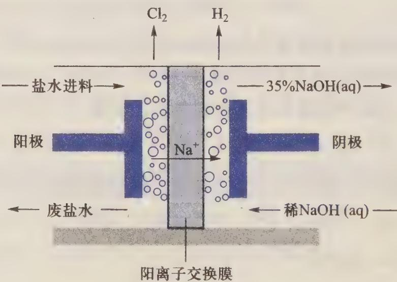  
图 17-2 现代氯碱工业电解池示意图

电解中,最好采用 $RuO_{2}$ 为阳极材料,因为 $O_{2}$ 在这种材料上放电的超电位比 $Cl_{2}$ 的超电位高得多,可阻止水的氧化。为延长高分子阳离子交换膜的使用寿命,一般是将交换膜中的碳骨架氟化。所形成的 C—F 键,既能抵抗 $Cl_{2}$ 的氧化,又可避免与 $OH^{-}$ 的反应。

电解熔融氯化物制备活泼金属时,也可以得到纯度较高的氯气,例如:

$$
\mathrm {MgCl_ {2}} \xrightarrow [ \text {熔融} ]{\text {电解}} \mathrm{Mg} + \mathrm {Cl_ {2}} \uparrow   2 \mathrm{NaCl} \xrightarrow [ \text {熔融} ]{\text {电解}} 2 \mathrm{Na} + \mathrm {Cl_ {2}} \uparrow
$$

近年来,由于有机合成工业的发展,氯化氢已成为许多工业过程的数量不少的副产品。利用空气(或氧气)将氯化氢催化氧化,使之转为氯气,已成为工业上生产氯气的重要途径,其反应为

$$
4 \mathrm{HCl} + \mathrm{O} _ {2} \xlongequal {\text {催化剂}} 2 \mathrm{H} _ {2} \mathrm{O} + 2 \mathrm{Cl} _ {2}
$$

常用的催化剂有 $UO_{3}$ ， $[CuCl_{2}]^{-}$ ， $AlCl_{3}$ 等。

实验室中,在加热条件下,常用强氧化剂二氧化锰将浓盐酸氧化,制备少量氯气:

$$
\mathrm{MnO} _ {2} + 4 \mathrm{HCl(浓)} \xlongequal {\triangle} \mathrm{MnCl} _ {2} + \mathrm{Cl} _ {2} \uparrow + 2 \mathrm{H} _ {2} \mathrm{O}
$$

浓盐酸也可用氯化钠和浓硫酸的混合物代替,反应方程式为

$$
2 \mathrm{NaCl} + \mathrm{MnO} _ {2} + 3 \mathrm{H} _ {2} \mathrm{SO} _ {4} (\text {浓}) \stackrel {\triangle} {=} 2 \mathrm{NaHSO} _ {4} + \mathrm{MnSO} _ {4} + \mathrm{Cl} _ {2} \uparrow + 2 \mathrm{H} _ {2} \mathrm{O}
$$

实验室中最简便的制备单质氯的方法是用高锰酸钾氧化浓盐酸。具体做法是将浓盐酸滴加到固体高锰酸钾上，无须加热，就能得到氯气：

$$
2 \mathrm{KMnO} _ {4} + 1 6 \mathrm{HCl(浓)} = 2 \mathrm{KCl} + 2 \mathrm{MnCl} _ {2} + 5 \mathrm{Cl} _ {2} \uparrow + 8 \mathrm{H} _ {2} \mathrm{O}
$$

## 3. 单质溴的制备

1825 年德国人罗威(Löwig)在德国海德堡,1826 年法国人巴拉尔(Balard)在法国蒙彼利埃分别独立地发现了溴元素。

溴主要以-1价离子形式存在于海水之中。不同海域,溴的含量不同。通常是在 $\mathrm{pH} = 3.5$ 的酸性条件下,用 $\mathrm{Cl}_2$ 氧化浓缩后的海水,生成单质溴:

$$
\mathrm{Cl} _ {2} + 2 \mathrm{Br} ^ {-} = \mathrm{Br} _ {2} + 2 \mathrm{Cl} ^ {-}
$$

利用空气将形成的 $Br_{2}$ 吹出, 根据卤素单质的歧化和逆歧化反应与介质条件有关的性质, 先将吹出的 $Br_{2}$ 用 $Na_{2}CO_{3}$ 溶液吸收:

$$
3 \mathrm{Br} _ {2} + 3 \mathrm{Na} _ {2} \mathrm{CO} _ {3} = 5 \mathrm{NaBr} + \mathrm{NaBrO} _ {3} + 3 \mathrm{CO} _ {2} \uparrow
$$

得到溴化钠和溴酸钠的混合物,再将吸收液酸化,则得到溴单质:

$$
5 \mathrm{HBr} + \mathrm{HBrO} _ {3} = 3 \mathrm{Br} _ {2} + 3 \mathrm{H} _ {2} \mathrm{O}
$$