湖南師範大學附屬中學

THE HIGH SCHOOL ATTACHED TO HUNAN NORMAL UNIVERSITY

# 结构化学基础题

## 2025 级化学竞赛组

第 1 部分：原子结构答案……1
第 2 部分：分子结构答案……14
第 3 部分：晶体结构答案……38

## 第一章 原子结构

1. 若磁量子数 m 的取值有所变化，即 m 可取 0, 1, 2, …, l 共 $l+1$ 个值，其余不变，则：

1-1 前四周期各有几种元素。

1-2 前 20 号元素中最活泼的碱金属元素的序数。

1-3 第二个过渡元素的核外电子排布式。

1-4 写出有机化学中最简单的怪的化学式及短的通式。

<div class="mineru-algorithm" style="white-space: pre-wrap; font-family:monospace;">
1-1 2、6、6、12。
1-2 15。
1-3  $1s^{2}2s^{2}2p^{4}3s^{2}3p^{4}3d^{3}4s^{1}$ 。
1-4  $BH_{3}$ ;  $B_{n}H_{n+2}$
</div>

2-1 2009 年 10 月科学家合成了第 117 号元,由此填满了周期表第七周期所有空格,是元素周期系发展的一个里程碑。117 号元素是用 $^{249}\mathrm{Bk}$ 轰击 $^{48}\mathrm{Ca}$ 靶合成的,总共得到 6 个 117 号元素的原子,其中 1 个原子经 $p$ 次 $a$ 衰变得到 $^{270}\mathrm{Db}$ 后发生裂变;5 个原子则经 $q$ 次 $a$ 衰变得到 $^{281}\mathrm{Rg}$ 后发生裂变。用元素周期表上的第 117 号元素符号,写出得到第 117 号元素的核反应方程式(在元素符号的左上角和左下角分别标出质量数和原子序数)。

2-2 现代原子结构理论认为，在同一电子上，可有 s、p、d、f、g、h 等亚层,各亚层分别有 1、3、5……条轨道。试根据电子填入轨道的顺序预测：

2-2-1 填满第八电子层，第八电子层应填多少种元素？

2-2-2 原子核外出现第一个 6f 电子的元素的原子有多少个质子？

2-2-3 根据 “稳定岛” 假说，第 114 号元素有一种稳定同位素，半衰期很长，可能在自然界中找到。试写出第 114 号元素的特征电子排布式。

<div class="mineru-algorithm" style="white-space: pre-wrap; font-family:monospace;">
2-1  $^{48}_{20}$ Ca +  $^{249}_{97}$ Bk →  $^{294}_{117}$ Ts + 3n 、  $^{48}_{20}$ Ca +  $^{249}_{97}$ Bk →  $^{293}_{117}$ Ts + 4n
2-2-1 50
2-2-1 139
2-2-1 7s²7p²
</div>

3. 在我们这个三维空间世界里的周期系是根据四个量子数建立的，即 $n = 1,2,3\ldots; l = 0,1,2,\ldots,n-1; m_l = 0, \pm 1, \pm 2\ldots \pm l, m_s = \pm 1/2$ 。如果我们搬到一个想象的“平面世界”去，那里的周期系是根据三个量子数建立的，即 $n = 1,2,3\ldots; m = 0, \pm 2, \pm 3, \pm (n-1); m_s = \pm 1/2$ 。这个“平面世界”里的 $m$ 所代表的意义，相当于三维世界中和 $m_l$ 二者的作用(例如：用它也能表示 s、p、d...能级)不过我们在普通三维世界中的基本原理和方法对这个二维的“平面世界”是适用的。下面几个问题都与这个“平面世界”有关。

3-1 画出“平面世界”周期表前四个周期。在其中按照核电荷标明原子序数，并用原子序(Z)当作元素符号。写出每一元素的电子构型。

3-2 现在研究 $n \leqslant 3$ 的各元素。指出与 “平面世界” 中每种元素相对应的我们三维空间中各种元素的符号，根据这种相似性，你估计在常温常压下，哪些 “二维世界” 元素是固体，哪些是液体，哪些是气体？

3-3 画出 $n = 2$ 各元素的电子轨道。在“平面世界”中的有机化学是以哪一种元素为基础的(用原子序数做元素符号)? 指出己烷、乙烯和环己烷分别与在“平面世界”周期表中的什么化合物对应。在“平面世界”中什么样的芳香化合物可能存在?

3-4 在这个“平面世界”中，有哪些规则和三维世界中所用的8电子和18电子规则相当？

3-5 画图说明 $n = 2$ 的几个“平面世界”元素的第一电离能的变化趋势。在“平面世界”周期表中，画出元素的电负性增长方向。

3-6 画出 “平面世界” 中 n=2 的各元素的电中性、同核双原子分子的分子轨道能级图。其中哪些分子是稳定的？

Element

3-7 n=2 的各元素分别与最轻的元素(Z=1)形成简单的二元化合物。用原子序数作为元素符号，画出它们的 Lewis 结构式，并画出它们的几何构型，指出分别与它们中每一化合物相应的三维世界中的化合物。

3-1

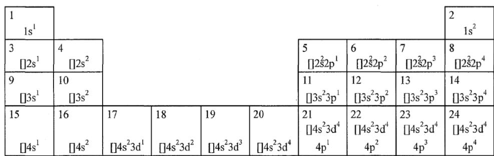

3-2 二维空间与"平面世界"相应的元素 $(n\leqslant3)$

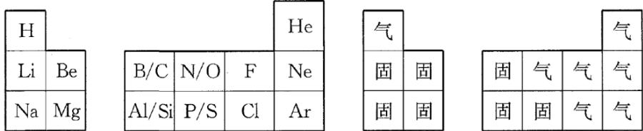

3-3 n=2 元素的杂化轨道。由于 p 轨道只有 $p_{x}$ 、 $p_{y}$ ，因此杂化只有 $sp^{1}$ 和 $sp^{2}$ ，没有 $sp^{3}$ 。

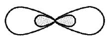

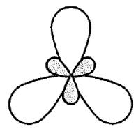  
$\mathbf{sp}^{1}$

从 3-2 中得出，在"平面世界"，有机化学是以元素 5 为基础的：

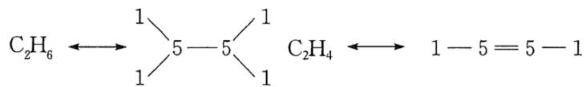

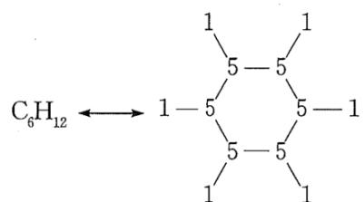

从"平面世界"中碳原子的杂化态得出，“平面世界”中不可能有芳香族化合物。

3-4 从"平面世界"中电子层及其电子排布看，"平面世界"中 $6\mathrm{e}^{-}$ 、 $10\mathrm{e}^{-}$ 电子规则分别和三维空间中的 $8\mathrm{e}$ 、 $18\mathrm{e}$ 电子规则相当。

3-5 根据元素周期性知识得出"平面世界"(n=2)元素(element)的第一电离能(E)变化趋势和电负性(electrone gativity)增长(increase)方向:

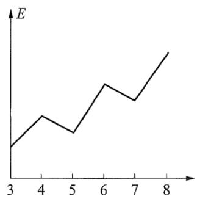

3-6 本小问要求简单的分子轨道理论。

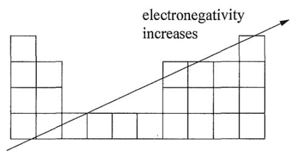

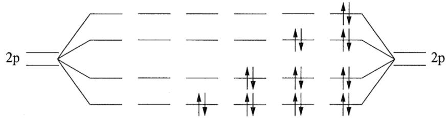

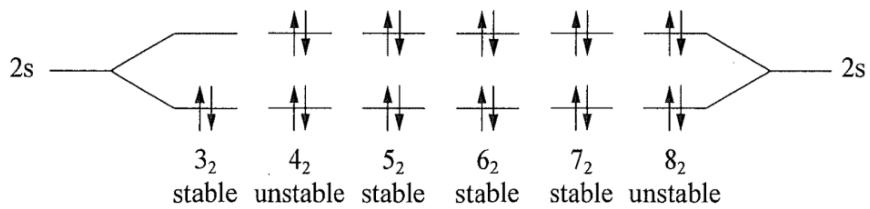  
图中 stable 表示稳定，unstable 表示不稳定。

3-7 "平面世界"中 $n = 2$ 元素和最轻元素化合物的路易斯结构。几何构型及三维空间中相应的化合物。

路易斯结构：3：1 1：4：1

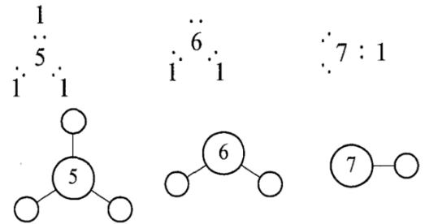

三维空间相应化合物：LiH、 $\mathrm{BeH}_{2}$ 、 $\mathrm{BH}_{3}$ （或 $\mathrm{CH}_{4}$ ）、 $\mathrm{H}_{2} \mathrm{O}$ （或 $\mathrm{NH}_{3}$ ）、 $\mathrm{FH}$ 。

4. 对于氢原子:

4-1 分别计算从第一激发态和第六激发态跃迁到基态所产生的光谱线的波长，说明这些谱线属于什么线系及处于什么光谱范围。

4-2 上述两谱线产生的光子能否使：

4-2-1 处于基态的另外的氢原子电离？

4-2-2 晶体中的铜原子电离( $\phi_{Cu}=7.44\times10^{-19}J$ )?

4-2-3若上述两谱线所产生的光子能使铜晶体电离，计算从铜晶体发射出的电子的德布罗意波长。

光电效应的表达式和德布罗意关系式的关系： $\lambda = \frac{h}{p} = \frac{h}{m\nu} = \frac{h}{\sqrt{2m\Delta E}} = \frac{h}{\sqrt{2m(h\nu - \Phi)}}$

4-1

氢原子的稳态能量由下式给出： $E_{n}=-2.18\times10^{-18}\times\frac{1}{n^{2}}J$ 式中 n 为主量子数。

第一条谱线是由第一激发态 $(n = 2)$ 到基态 $(n = 1)$ 间的跃迁产生的，这两个状态间的能量差

$$
\Delta E _ {1} = E _ {2} - E _ {1} = \left(- 2. 1 8 \times 1 0 ^ {- 1 8} \times \frac {1}{2 ^ {2}}\right) - \left(- 2. 1 8 \times 1 0 ^ {- 1 8} \times \frac {1}{1 ^ {2}}\right) = 1. 6 4 \times 1 0 ^ {- 1 8} (\mathrm{J})
$$

所以，第一条谱线的波长为 $\lambda_{1} = \frac{ch}{\Delta E_{1}} = \frac{2.9979\times 10^{8}\times 6.6256\times 10^{-34}}{1.64\times 10^{-18}} = 1.21\times 10^{-7}(\mathrm{m}) = 121\mathrm{nm}$

第六条谱线是由第六激发态到基态间的跃迁产生的，这两个状态间的能量差为：

$$
\Delta E _ {6} = E _ {7} - E _ {1} = \left(- 2. 1 8 \times 1 0 ^ {- 1 8} \times \frac {1}{7 ^ {2}}\right) - \left(- 2. 1 8 \times 1 0 ^ {- 1 8} \times \frac {1}{1 ^ {2}}\right) = 2. 1 4 \times 1 0 ^ {- 1 8} (\mathrm{J})
$$

所以,第六条谱线的波长为:

$$
\lambda_ {6} = \frac {c h}{\Delta E _ {6}} = \frac {2 . 9 9 7 9 \times 1 0 ^ {8} \times 6 . 6 2 5 6 \times 1 0 ^ {- 3 4}}{2 . 1 4 \times 1 0 ^ {- 1 8}} = 9. 2 9 \times 1 0 ^ {- 8} (\mathrm{m}) = 9 2. 9 \mathrm{nm}
$$

这两条谱线都属于赖曼系，都处于紫外光区。

4-2

(1) 使处于基态的氢原子电离所需要的能量为:

$$
\Delta E _ {\infty - 1} = E _ {\infty} - E _ {1} = 0 - E _ {1} = 2. 1 8 \times 1 0 ^ {- 1 8} (\mathrm{J})
$$

$$
\Delta E _ {1} = 1. 6 4 \times 1 0 ^ {- 1 8} \mathrm{J} <   \Delta E _ {\infty - 1} \quad \Delta E _ {6} = 2. 1 4 \times 1 0 ^ {- 1 8} \mathrm{J} <   \Delta E _ {\infty - 1}
$$

所以，两条谱线产生的光子均不能使处于基态的氢原子电离。

(2) $\Delta E_{1} = 1.64 \times 10^{-18} \mathrm{~J} > \Phi_{\mathrm{Cu}} = 7.44 \times 10^{-19} \mathrm{~J}$ ; $\Delta E_{6} = 2.14 \times 10^{-18} \mathrm{~J} > \Phi_{\mathrm{Cu}} = 7.44 \times 10^{-19} \mathrm{~J}$ 所以, 两条谱线产生的光子均能使晶体中的铜原子电离。

(3) 根据德布罗意关系式和爱因斯坦光子学说: $\lambda = \frac{h}{p} = \frac{h}{mv} = \frac{h}{m \cdot \sqrt{\frac{2\Delta E}{m}}} = \frac{h}{\sqrt{2m\Delta E}}$ , $\Delta E$ 是

照射到晶体上的光子的能量和 $\Phi_{Cu}$ 之差。

第一条谱线照射到铜晶体上后铜晶体所发射出的电子的波长为：

$$
\lambda = \frac {6 . 6 2 5 6 \times 1 0 ^ {- 3 4}}{\sqrt {2 \times 9 . 1 0 9 \times 1 0 ^ {- 3 1} \times (1 . 6 4 \times 1 0 ^ {- 1 8} - 7 . 4 4 \times 1 0 ^ {- 1 9})}} = 5. 1 9 \times 1 0 ^ {- 1 0} (\mathrm{m})
$$

第六条谱线照射到铜晶体上后铜晶体所发射出的电子的波长为：

$$
\lambda = \frac {6 . 6 2 5 6 \times 1 0 ^ {- 3 4}}{\sqrt {2 \times 9 . 1 0 9 \times 1 0 ^ {- 3 1} \times (2 . 1 4 \times 1 0 ^ {- 1 8} - 7 . 4 4 \times 1 0 ^ {- 1 9})}} = 4. 1 5 \times 1 0 ^ {- 1 0} (\mathrm{m})
$$

5-1 由于在人工放射性方面的工作成就，约里奥·居里夫妇获得了 1935 年的诺贝尔化学奖。当他们用 $\alpha$ 粒子轰击金属铝 $^{27}_{13}\mathrm{Al}$ 时，首先得到 $^{30}_{15}\mathrm{P}$ ，然后 $^{30}_{15}\mathrm{P}$ 放出一种射线变成 $^{30}_{14}\mathrm{Si}$ ，上述核反应中人工获得的元素具有放射性。写出上述过程的核反应方程式。

5-2 2004 年 2 月 2 日，俄国杜布纳实验室宣布用核反应得到了两种新元素 X 和 Y。X 是用高能 ${}^{48}$ Ca 撞击 ${}^{243}_{95}$ Am 靶得到的。经过 $100\mu s$ ，X 发生 a-衰变，得到 Y。然后 Y 连续发生 4 次 a-衰变，转变为质量数为 268 的第 105 号元素 Db 的同位素。以 X 和 Y 的原子序数为新元素的代号(左上角标注该核素的质量数)，写出上述合成新元素 X 和 Y 的核反应方程式。

$$
\begin{array}{l} \mathbf {5 - 1 .} _ {1 3} ^ {2 7} A l + _ {2} ^ {4} H e = _ {1 5} ^ {3 0} P + _ {0} ^ {1} n, \quad_ {1 5} ^ {3 0} P = _ {1 4} ^ {3 0} S i + _ {+ 1} ^ {0} e \\ \mathbf {5 - 2 .} _ {9 5} ^ {2 4 3} A m + _ {2 0} ^ {4 0} C a = _ {1 1 5} ^ {2 8 8} M c + 3 _ {0} ^ {1} n, \quad_ {1 1 5} ^ {2 8 8} M c = _ {1 1 3} ^ {2 8 4} N h + _ {2} ^ {4} H e \end{array}
$$

6. 我们所处的世界, 原子核外电子的排布是由 4 个量子数决定的, 各个量子数的取值如下: $n = 1, 2, 3, 4, 5, \ldots$ ; $l = 0, 1, 2, 3, \ldots, n - 1$ ; $m = 0, \pm 1, \pm 2, \pm 3, \ldots, \pm 1$ ; $m_{s} = \pm \frac{1}{2}$ 。若有一个“世界”各个量子数的取值如下: $n = 1, 2, 3, 4, 5, \ldots$ ; $l = 1, 2, 3, \ldots, n$ ; $m = \pm l$ ; $m_{s} = \pm \frac{1}{2}$ , $\pm \frac{3}{2}$ 。这时:

6-1 每个电子层最多可以填多少个电子？

6-2 每个电子亚层最多可以填多少个电子?

6-3 每个轨道最多可以填多少个电子?

6-4 若电子的排布仍然遵守能量最低原理、泡利不相容原理和洪特规则，且不存在能级倒错现象，给出这种情况下周期表中从第一到第六周期最后一个元素的原子序数。

<table><tr><td>6-1 8n</td></tr><tr><td>6-2 8</td></tr><tr><td>6-3 4</td></tr><tr><td>6-4 第一到第六周期最后一个元素的原子序数分别为 8, 24, 48, 80, 120, 168。</td></tr></table>

7. 若有一个“世界”各个量子数的取值如下： $n=1,2,3,4,5,\ldots$ ; $l=0,1,2,\ldots,n-1$ ; $m=0,\pm1,\pm2,\ldots,\pm l$ ; $m_{s}$ 的最大值为 $\pm\frac{3}{2}$ ，这时：

7-1 每个电子层最多可以填多少个电子？

7-2 每个电子亚层最多可以填多少个电子？

7-3 每个轨道最多可以填多少个电子?

7-4 若电子的排布仍然遵守能量最低原理、泡利不相容原理和洪特规则，并且能级次序与我们所处的世界相同，请写出118号元素基态的电子排布，并写出s，p，d，ds区可能的价电子构型。

$$
\begin{array}{l} \hline 7 - 1 4 n ^ {2} \\ 7 - 2 4 (2 l + 1) \\ 7 - 3 4 \\ 7 - 4 1 1 8 \text {号元素基态的核外电子排布为} 1 s ^ {4} 2 s ^ {4} 2 p ^ {1 2} 3 s ^ {4} 3 p ^ {1 2} 3 d ^ {2 0} 4 s ^ {4} 4 p ^ {1 2} 4 d ^ {2 0} 4 f ^ {6} 5 s ^ {4} 5 p ^ {1 2} 6 s ^ {4}; \\ s \text {区：} n s ^ {1 \sim 4}; p \text {区：} n s ^ {4} n p ^ {1 \sim 1 2}; d \text {区：} (n - 1) d ^ {1 \sim 2 0} s ^ {2 \sim 4} 。 d s \text {区：} (n - 1) d ^ {2 0} s ^ {1 \sim 4}. \end{array}
$$

8. 假设在别的星球上发现一些物料，它们服从下列量子数的限制：

$$
n > 0, l + 1 \leqslant n, m = \pm l, m _ {s} = + \frac {1}{2}
$$

假设洪特规则仍然适用，则

8-1 在该星球上前三种惰性气体的原子序数应当是多少?

8-2 前三种卤素的原子序数应当是多少?

```txt
8-1 1, 4, 9  
8-2 3, 8, 15
```

9.试计算下列两种粒子的德布罗意波长

9-1 一个电子在 $1.00 \times 10^{5}$ 伏特下加速。

9-2 质量为 10g 的子弹，以速度为 1000m/s 飞行。

$$
m _ {e} = 9. 1 1 \times 1 0 ^ {- 3 1} k g, \quad e V = \frac {1}{2} m v ^ {2}, \quad h = 6. 6 2 6 \times 1 0 ^ {- 3 4} \mathrm{J} \cdot s
$$

$$
p = \frac {h}{\lambda}, p ^ {2} = (m v) ^ {2} = \frac {h ^ {2}}{\lambda^ {2}}, e V = \frac {1}{2} m v ^ {2} = \frac {h ^ {2}}{2 m \lambda^ {2}}
$$

$$
\lambda = \frac {h}{\sqrt {2 m e V}} = \frac {6 . 6 2 6 \times 1 0 ^ {- 3 4}}{\sqrt {2 \times 9 . 1 1 \times 1 0 ^ {- 3 1} \times 1 . 6 \times 1 0 ^ {- 1 9} \times 1 . 0 0 \times 1 0 ^ {5}}} = 3. 8 8 p m
$$

$$
p = m v = \frac {h}{\lambda}, \quad \lambda = \frac {h}{m v} = \frac {6 . 6 2 6 \times 1 0 ^ {- 3 4}}{0 . 0 1 \times 1 0 0 0} = 6. 6 2 6 \times 1 0 ^ {- 3 5} m
$$

10. 氢原子的稳态能量由下式给出： $E_{n}=-2.18\times10^{-18}\frac{1}{n^{2}}(J)$ ，n为主量子数：

10-1 计算：第一激发态 $(n = 2)$ 和基态 $(n = 1)$ 之间的能量差；第6激发态 $(n = 7)$ 和基态 $(n = 1)$ 之间的能量差。

10-2 上述赖曼系(Lyman, $n \to 1$ )跃迁处于什么光谱范围？

10-3 解释：由 Lyman 系光谱的第 1 条线及第 6 条线产生的光子能否使：①处于基态的另外的氢原子电离？②晶体中的铜原子电离？(铜的电子功函数为 $\Phi=7.44\times10^{-19}J$ )

10-4 若由 Lyman 系光谱的第 1 条谱线和第 6 条谱线产生的光子使铜晶体电离, 计算这两种情况中从铜晶体发射出的电子的德布罗意波长。

$$
\mathbf {1 0 - 1} E _ {n} = - 2. 1 8 \times 1 0 ^ {- 1 8} \cdot \frac {1}{n ^ {2}}, \quad \Delta E _ {2 \rightarrow 1} = - 2. 1 8 \times 1 0 ^ {- 1 8} \times \left(\frac {1}{4} - 1\right) = 1. 6 3 5 \times 1 0 ^ {- 1 8} J
$$

$$
\Delta E _ {7 \rightarrow 1} = - 2. 1 8 \times 1 0 ^ {- 1 8} \times \left(\frac {1}{4 9} - 1\right) = 2. 1 3 5 \times 1 0 ^ {- 1 8} J
$$

10-2 Lyman 系跃迁 $(n\rightarrow1)$ 处于紫外光谱范围。 $\Delta E=h\nu,\quad c=\lambda\nu,\quad\lambda=\frac{hc}{\Delta E}$ .

由 $2 \rightarrow 1$ 和 $\infty \rightarrow 1$ ，求出波长在 121.5\~91.2nm，属于紫外光波长(10-400nm)

10-3 ①电离基态氢原子的能量 $\Delta E = E_{\infty} - E_{1} = 2.18 \times 10^{-18} \mathrm{~J}$ ，无论是 $\Delta E_{2 \rightarrow 1}$ ，还是 $\Delta E_{7 \rightarrow 1}$ 皆小于 $\Delta E$ ，不能使其电离。②晶体中原子的电离基于光电效应， $\Delta E = h \nu = \Phi_{Cu} + \frac{1}{2} m v^{2}$ ， $\Delta E_{2 \rightarrow 1}$ 和 $\Delta E_{7 \rightarrow 1}$ 都大于 $\Delta E$ ，所以两条谱线发射的光子均可使铜晶体中的铜原子电离。

(4)光电子的动能分别为:

$$
\Delta E _ {k (2 \rightarrow 1)} = \Delta E _ {2 \rightarrow 1} - \Phi_ {\mathrm{Cu}} = 1. 6 3 5 \times 1 0 ^ {- 1 8} - 7. 4 4 \times 1 0 ^ {- 1 9} = 8. 9 1 \times 1 0 ^ {- 1 9} \mathrm{J}
$$

$$
\Delta E _ {k (7 \rightarrow 1)} = \Delta E _ {7 \rightarrow 1} - \Phi_ {\mathrm{Cu}} = 2. 1 3 5 \times 1 0 ^ {- 1 8} - 7. 4 4 \times 1 0 ^ {- 1 9} = 1. 3 9 1 \times 1 0 ^ {- 1 8} \mathrm{J}
$$

电子的德布罗意波长 $\lambda = \frac{h}{p} = \frac{h}{\sqrt{2m_eE_K}}$

$$
\lambda_ {1} \left[ \Delta E _ {k (2 \rightarrow 1)} \right] = \frac {6 . 6 2 5 \times 1 0 ^ {- 3 4}}{\sqrt {2 \times 9 . 1 \times 1 0 ^ {- 3 1} \times 8 . 9 1 \times 1 0 ^ {- 1 9}}} = 5. 2 \times 1 0 ^ {- 1 0} (\mathrm{m}) = 0. 5 2 (\mathrm{nm})
$$

$$
\lambda_ {2} \left[ \Delta E _ {k (7 \rightarrow 1)} \right] = \frac {6 . 6 2 5 \times 1 0 ^ {- 3 4}}{\sqrt {2 \times 9 . 1 \times 1 0 ^ {- 3 1} \times 1 . 3 9 1 \times 1 0 ^ {- 1 8}}} = 4. 1 6 \times 1 0 ^ {- 1 0} (\mathrm{m}) = 0. 4 1 6 (\mathrm{nm})
$$

11.电离 1mol 自由铜原子得 $1molCu^{+}$ ，需能量 746.2kJ，而由晶体铜电离获得 $1molCu^{+}$ 仅消耗 434.1kJ 能量。

11-1 说明上述两电离过程所需能量不同的主要原因。

11-2 计算电离 1mol 晶体铜所需照射光的最大波长。

11-3 升高温度可否大大改变上述两电离过程所需的能量？在高温时，这两种电离能有无差别？

11-1 晶体铜的晶格中，存在电子与电子、核与核、核与电子的相互作用，以及晶格的振动。这些作用和振动使原子损失能量，导致晶体铜电离时所需能量比自由铜原子电离时低。能量差 $\Delta E = [I_{\mathrm{p(Cu)}} - \phi_{(\mathrm{Cu})}] \cdot N_{\mathrm{A}}$ ，其中 $I_{\mathrm{p(Cu)}}$ 是自由铜原子电离能， $\phi_{(\mathrm{Cu})}$ 是晶体铜电离相关能量(约为酮的功函数)， $N_{\mathrm{A}}$ 是阿伏伽德罗常数。

11-2 根据光电效应 $\Delta E = h\nu = \Phi_{Cu} + \frac{1}{2}mv^{2}$ ，求电离 1mol 晶体铜所需照射光的最大波长时，令光电子动能为 0，此时 $\Delta E = h\nu = \Phi_{Cu}$ 。

$$
\lambda = \frac {h c}{\Phi_ {C u}} = \frac {6 . 6 2 6 \times 1 0 ^ {- 3 4} \times 3 \times 1 0 ^ {8} \times 6 . 0 2 2 \times 1 0 ^ {2 3}}{4 3 4 . 1 \times 1 0 ^ {3}} = 2. 7 5 7 5 5 \times 1 0 ^ {- 7} m = 2 7 6 n m
$$

为紫外光区域。

11-3 升高温度会大大改变两电离过程的能量差 $\Delta E$ 。温度升高，电离势降低，但对于电子脱出功难以确定，因为 $\phi_{\mathrm{(Cu)}} = -E_{\mathrm{(HOMO)}}$ (HOMO表示电子的最高占有分子轨道)。当 $T\to \infty$ 时， $\lim_{T\to \infty}\Delta E = 0$ 。这是因为在高温

下，晶体可看作原子化，从原子或晶体发射电子已无差别，所以此时两种电离能无差别。

12.用一束波长为 400nm 的光照射在金属 Cs 的表面上,有光电子从表面逸出。已知 Cs 的功函数为 2.14eV。

12-1 在金属 Cs 表面施加一反向截止电压可减少逸出的光电子数,试计算使光电子完全不逸出所需施加的最大截止电压。

12-2 请计算无截止电压时从 Cs 表面逸出光电子的德布罗意波长。

12-3 若照射 Cs 的光源由 H 原子光谱的巴尔末系(对应电子由更高激发态 $n'$ 跃迁至 n=2 能级)产生，请通过

计算列出所有不能使光电子从 Cs 表面逸出的跃迁对应的激发态能级 $n'$ 。

12-1 波长为 400nm 的光的光子能量:

$$
h \nu = \frac {h c}{\lambda} = \frac {6 . 6 2 6 \times 1 0 ^ {- 3 4} \times 3 \times 1 0 ^ {8}}{4 0 0 \times 1 0 ^ {- 9}} = 4. 9 7 \times 1 0 ^ {- 1 9} (J) = 3. 1 0 (e V)
$$

Einstein 光电效应公式: $h \nu = W + T = W + e V$

截止电压： $V=\frac{1}{e}(h\nu-W)=\frac{1}{e}(3.10-2.14)eV=0.96(V)$

12-2 动能、动量的关系: $T = \frac{p^2}{2m}, \rightarrow p = \sqrt{2mT}$ ,

Einstein 光电效应公式: $h\nu = W + T$ ,

光电子动能为: $T = h \nu - W = 0.96 e V$ ,

德布罗意波长: $\lambda=\frac{h}{p}=\frac{h}{\sqrt{2mT}}=\frac{h}{\sqrt{2m(h\nu-W)}}$ $=\frac{6.626\times10^{-34}}{\sqrt{2\times9.11\times10^{-31}\times0.96\times1.602\times10^{-19}}}=1.25\times10^{-9}(m)=1.25(nm)$

12-3 若能使光电子从 Cs 表面逸出，须光子能量大于逸出功(功函，2.14eV)。

H原子能级： $E_{n} = -13.6\frac{1}{n^{2}} (eV)$

H 原子光谱巴尔末系各线的光子能量:

$$
3 \rightarrow 2, E _ {n} = - 1 3. 6 (\frac {1}{3 ^ {2}} - \frac {1}{2 ^ {2}}) = 1. 8 9 (e V) <   2. 1 4 e V
$$

$$
4 \rightarrow 2, E _ {n} = - 1 3. 6 (\frac {1}{4 ^ {2}} - \frac {1}{2 ^ {2}}) = 2. 5 5 (e V) > 2. 1 4 e V
$$

故除第一条线（ $n' = 3$ ）外，其他各线（ $n' = 4, 5, 6\cdots$ ）均能使光电子从 Cs 表面逸出

13. 假设我们在另一个具有不同物理定律的星球上。这个星球中的电子也是用四个量子数描述，其含义与我们使用的含义相似。我们将这四个量子数称为 $p$ 、 $q$ 、 $r$ 和 $s$ 。其规则如下：

$p = 1,2,3,4,5,\dots$

$q \leqslant p$ ，但只有正奇数

r 取从 -q 到 +q 的所有偶数(零被认为是偶数)

$s$ 取 $+\frac{1}{2}$ 和 $-\frac{1}{2}$

13-1 分别指出下面量子数条件下可以容纳的电子数
①p=6; ②p=4、q=3; ③p=3、q=0、r=0

13-2 试写出前四周期反应性最低的四种元素的原子序数。

13-3 试画出该星球上前四周期的元素周期表。

13-4 试指出第 $m$ 周期可容纳的总元素个数。

13-1 ①p=6: 18个电子； ②p=4、q=3: 6个电子； ③p=3、q=0、r=0：无电子(轨道不存在)
13-2 原子序数：2、4、12、20

<table><tr><td>1</td><td rowspan="2" colspan="6"></td><td>2</td></tr><tr><td>3</td><td>4</td></tr><tr><td>5</td><td>6</td><td>7</td><td>8</td><td>9</td><td>10</td><td>11</td><td>12</td></tr><tr><td>13</td><td>14</td><td>15</td><td>16</td><td>17</td><td>18</td><td>19</td><td>20</td></tr></table>

13-4 $m$ 为奇数时，可容纳的元素个数为 $\frac{(m + 1)^2}{2}$ ； $m$ 为偶数时，可容纳的元素个数为 $\frac{m^2}{2}$ 。

14.1869 年俄国化学家 D.I.Mendeleev 首次发表了元素周期表，他将当时已知的化学元素以原子量增加次序排列。1871 年 Mendeleev 详细描述了三种未知元素的性质，把这三种元素记作 ekaboron(类硼)，ekaaluminum (类铝) 和 ekasilicon(类硅)。在之后的 15 年内，他的预测得到了证实。

14-1 有趣的是, 这三种元素的名称都具有地理上的溯源。Mendeleev 预测的三种元素现在被称为何种元素? 为什么 Mendeleev 不能预测出稀有气体元素?

14-2 2005年在俄罗斯和美国的联合实验室中发现了第118号元素。其合成方法用钙-48核轰击含Cf-249核的靶。得到质量数为294的第118号元素。

①试写出合成第 118 号元素的核反应方程式。

②试写出第 118 号元素的三次 - 衰变的核反应方程式。

③写出第 118 号元素的核外电子排布(用稀有气体+s,p,d,f 符号)。它属于第几周期？哪一族？

14-3 在确定周期表是否收敛问题上，国内外皆有争论。系统论者认为任何一个具有周期性的事物，必有它的始、终点，并认为最终元素的最佳位置在“两性线”和“周期终点线”的交点，该交点元素原子序数是多少？写出其核外电子排布。

14-4 假定每个轨道只能容纳 1 个电子，其他规则不变，则原子序数为 42 的元素核外电子的排布如何？

14-5 按照第 4 题假设所设计出来的元素周期表，第 42 号元素应属于第几周期？哪一类？该元素可能呈现哪些稳定氧化态？

<div class="mineru-algorithm" style="white-space: pre-wrap; font-family:monospace;">
14-1 类硼为 Sc，类铝为 Ga，类硅为 Ge。要预言元素，只能预言一周期中的中间元素，通过前、后两元素的性质比较，才能确定是否存在有中间元素。但稀有气体是一周期中的最后一个元素，另外稀有气体是全满电子构型，性质反常，这两个原因导致 Mendeleev 不能预测出稀有气体。

14-2

①  $\ce{^{48}_{20}\ce{Ca} + ^{249}_{98}\ce{Cf} \longrightarrow ^{294}_{[118]} + 3\overset{1}{0}\ce{n}}$ 

②  ${}^{294}_{[118]} \longrightarrow {}^{282}_{[112]} + 3\overset{4}{2}\ce{He}$ 

③  $[Rn]7s^{2}5f^{14}6d^{10}7p^{6}$ ，属于第七周期，零类元素

14-3 应为第 168 号元素， $[118]8s^{2}5g^{18}6f^{14}7d^{10}8p^{6}$ 

14-4  $1s^{1}2s^{1}2p^{3}3s^{1}3p^{3}4s^{1}3d^{5}4p^{3}5s^{1}4d^{5}5p^{3}6s^{1}4f^{7}5d^{5}6p^{2}$  或者  $[27]6s^{1}4f^{7}5d^{5}6p^{2}$ ，该元素应为第六周期 IIIA 族(注意：由于价电子构型为  $ns^{1}np^{3}$  属稀有气体，所以一个周期主族元素只有四种，即从 IA→IVA)。稳定氧化态为 -1，+2，+3。

14-5 第六周期，III A 类，-1,+2,+30
</div>

15-1 $^{48}$ Ca 轰击 ${}^{249}\mathrm{Cf}$ ，生成第 118 号元素 Og 并放出三个中子，写出配平的核反应方程式。

15-2 碱金属 Li、Na、K、Rb、Cs 中，以下哪种性质的递变没有单调性？解释原因。

供选择项：熔沸点、原子半径、晶体密度、第一电离能。

15-3 VIA族元素中，以下哪一个随着周期数增加的变化不是单调的？说明推测理由。

供选择项：第一电离能、电子亲和能、简单阴离子的水合能。

15-4 对卤族元素，随着原子序数增加，以下何者的递变不是单调的？说明为何不单调。

供选择项：负离子半径、电负性、单质熔沸点、单质键能。

15-5 铁系元素(Fe、Co、Ni)按原子序数变大的顺序熔点递减。请你考虑它们的原子结构，从电子排布和金属键的角度给出一个可能的解释。

<div class="mineru-algorithm" style="white-space: pre-wrap; font-family:monospace;">
15-1 $^{48}_{20}$ Ca +  $^{249}_{98}$ Cf →  $^{294}_{118}$ Og + 3 $_{0}^{1}$ n
</div>

15-2 原子半径和第一电离能具有单调性，因为新增电子层会使电子能量和原子半径必然增大。熔沸点通常与金属键强度相关，原子半径增大时金属键减弱，也呈现单调性。晶体密度最有可能不单调，这是由于密度与晶格结构有关。低半径金属原子堆积更紧密，而高半径金属原子相对原子质量更大，这两个因素相互制约，导致密度变化不单调

15-3 答案为电子亲和能。氟(F)原子半径小，电子间排斥作用较大，接受电子时放出的能量比氯(Cl)少。水合能取决于离子半径，离子半径越小，水分子越能有效包裹，水合效果越好，放出能量越多。而且氟离子(F-)能与水分子形成氢键，释放大量能量，所以水合能具有单调性。

15-4 答案是单质键能。第二周期的氟原子半径小，原子间相互排斥作用大，使得氟气 $\left(\mathrm{F}_{2}\right)$ 的键能比氯气 $\left(\mathrm{Cl}_{2}\right)$ 小。

15-5 从铁开始，电子开始填充反键轨道，致使金属键减弱。

16 4f 轨道中 $f_{z^{3}}$ 轨道的角向函数为 $Y \propto \frac{z(5z^{3}-3r^{2})}{r^{3}}$ ，式中 r 代表相应点到原点(原子核)的距离。指出该 4f 原子轨道有几个径向节面，有几个角向节面。写出角向节面的表达式并画出该轨道的简图。(提示：节面是指波函数为 0 的几何点的集合。)

对于 4f 轨道 $(l=3)$ ，径向节面数 $(n-l-1(n \text{ 为主量子数 } 4)$ ，径向节面为 $(4-3-1)=0$ .

角向节面是使角向函数 $Y = 0$ 的面。令 $Y \propto \frac{z(5z^3 - 3r^2)}{r^3} = 0$ 。因为 $r \neq 0$ （代表相应点到原点距离，不为0），所以当 $z = 0$ 时，角向函数为0， $z = 0$ 代表 $xy$ 平面，这是一个角向节面；再令 $5z^3 - 3r^2 = 0$ ， $r^2 = x^2 + y^2 + z^2$ ，则 $5z^3 - 3(x^2 + y^2 + z^2) = 0$ ，这也是一个角向节面的表达式。所以角向节面数为2。角向节面表达式为 $z = 0$ 和 $5z^3 - 3(x^2 + y^2 + z^2) = 0$ 。综合考虑， $f_{z^3}$ 轨道在空间分布上，在 $z$ 轴方向有一定的伸展特征，被 $z = 0$ 和 $5z^3 - 3(x^2 + y^2 + z^2) = 0$ 这个曲面所划分区域，其形状较为复杂，在 $z$ 轴附近有瓣状结构，在 $xy$ 平面上下呈现出特定的空间分布形态（大致为在 $z$ 轴方向有突出部分，被两个节面分隔成不同区域）

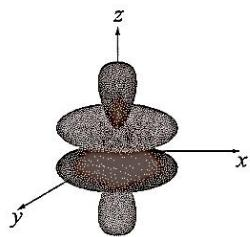

17. 在第一过渡系元素的电子结构中，经验表明，电子总是先填 4s 轨道却又是 4s 轨道上的电子优先电离。定性解释原因。

## 电子先填充4s轨道原因

能级交错：原子轨道填充电子按能量由低到高。4s 轨道主量子数虽比 3d 大，但钻穿效应强，能更靠近原子核，致使其能量低于 3d，所以电子先填充 4s 轨道。

4s 电子优先电离原因

电子云分布：4s 电子云比 3d 更弥散、离核远，原子电离时，外层电子受原子核束缚小，4s 电子更易脱离。有效核电荷：4s 电子受内层电子屏蔽作用大，有效核电荷数小，受原子核吸引力弱；3d 电子受屏蔽作用小，有效核电荷数大。电离时，4s 电子因受有效核电荷吸引小而优先失去。

18. 对如下现象做逐一解释:

18-1 IIIA 族元素的电离能(单位：1kJ/mol): B 801、Al 578、Ga 579、In 558、Tl 589。Al 和 Ga 的电离能几乎一样，Tl 的电离能反而比 In 大。

18-2 IB 族元素从上至下最稳定的价态(水溶液中)分别是+2、+1、+3。

18-3 IA 族元素从 Li 到 Ca 电离能下降得比 Ca 到 Cs 快得多。

18-1 IIIA 族元素电离能现象解释：

Al 和 Ga 电离能相近：Ga 电子构型为 $[Ar]3d^{10}4s^{2}4p^{1}$ ，填充 3d 电子后，有效核电荷增加。3d 电子云弥散，对最外层 4p 电子屏蔽作用不完全，使 Ga 核对外层电子吸引增强，抵消了因电子层数增加带来的原子半径

Tl 电离能比 In 大：Tl 存在 $6\mathrm{s}^2$ 惰性电子对效应。6s 电子因钻穿效应强，能量低，更难失去，使得 Tl 第一电离能比 In 大。

Cu: +2 价稳定: $\mathrm{Cu}^{2+}$ 半径小、电荷高, 水合能大, 能补偿失去第二个电子所需能量, 且 $\mathrm{Cu}^{2+}$ 形成配合物时可获得较高晶体场稳定化能, 所以水溶液中 $\mathrm{Cu}^{2+}$ 比 $\mathrm{Cu}^{+}$ 稳定。

Ag: +1 价稳定: Ag $^{+}$ 具有 d $^{10}$ 稳定构型, 且 Ag $^{2+}$ 与 Ag $^{+}$ 半径差距小, 水合能差值小, 不足以补偿电离能使 Ag $^{2+}$ 稳定。

Au: +3 价稳定：受镧系收缩影响，Au 原子半径大，第一电离能高，但第二、三电离能相对不高，且 $Au^{3+}$ 形成平面四方形配合物时，配位场稳定化能高，利于 $Au^{3+}$ 在溶液中稳定存在。

18-3 IA 族元素电离能变化解释

Li-Ca 电离能下降快: Li-Ca 电子填充未涉及 d 轨道, 电子层数增加时, 内层电子对最外层电子屏蔽作用强, 有效核电荷增加不明显, 原子半径增大使核对最外层电子吸引力显著减弱, 电离能下降快。

Ca-Cs 电离能下降慢：Ca 后出现 d 电子，d 电子云弥散，屏蔽作用弱，有效核电荷增加相对明显，抵消部分因原子半径增大导致的核对电子吸引力减弱，使得电离能下降减缓。

19.在英国，许多街道都是由效率很高的低压放电钠灯照明的。这种灯主要发出黄光，但光谱表明它实际上放出多种色光。仔细的光谱分析能够让我们得到Na的第一电离能。

19-1 我们熟知的黄光是由 Na 的电子从 3p 轨道到 3s 轨道的弛豫跃迁放出的，其波长为 589.3nm。计算其能量(单位：kJ/mol)。

19-2 下表是一组 Na 的发射光谱谱线波长数据。Na 的价电子被激发到 $nd(n$ 即主量子数) 轨道，该电子落至 3p 轨道发射出了这些谱线。

<table><tr><td>波长/nm</td><td>466.6</td><td>498.0</td><td>568.1</td><td>818.1</td></tr><tr><td>轨道</td><td>6d</td><td>5d</td><td>4d</td><td>3d</td></tr></table>

使用合理近似求 Na 的第一电离能。

$$
\Delta E = h \nu = \frac {h c}{\lambda} = \frac {6 . 6 2 6 \times 1 0 ^ {- 3 4} \times 3 \times 1 0 ^ {8}}{5 8 9 . 3 \times 1 0 ^ {- 9}} \times 6. 0 2 2 \times 1 0 ^ {2 3} = 2 0 3 \mathrm{kJ/mol}
$$

19-2 假定 3s 轨道上电子能量为 0，且激发态电子符合 Bohr 模型，nd 轨道上电子的能量 $E_{nd} = E_{0} + \frac{k}{n^{2}}$ 。

电子从 nd 轨道跃迁到 3p 轨道，能量变化 $\Delta E = E_{nd} - E_{3p}$ 。根据 $\Delta E = h\nu = \frac{hc}{\lambda}$

$$
x = \frac {1}{n ^ {2}} \left(\frac {1}{6 ^ {2}}, \frac {1}{5 ^ {2}}, \frac {1}{4 ^ {2}}, \frac {1}{3 ^ {2}}\right), \Delta E = E _ {n d} - E _ {3 p} (2 5 7, 2 4 0, 2 1 1, 1 4 6)
$$

$$
\text { 外推法的 } \Delta E = E _ {\infty d} - E _ {3 p} = 2 8 8. 2 7 \mathrm{kJ/mol}, E _ {\infty d} = \Delta E + E _ {3 p} = 2 9 3. 6 + 2 0 3 = 4 9 6. 6 \mathrm{kJ/mol}
$$

20. 已知 $N_{2}$ 的键解离能为 946kJ/mol， $O_{2}$ 的键解离能为 498 kJ/mol，N 和 O 的 Pauling 电负性分别为 3.04 和 3.44。估算吸热反应 $\mathrm{N}_{2}(\mathrm{~g}) + \mathrm{O}_{2}(\mathrm{~g}) \rightarrow 2\mathrm{NO}(\mathrm{g})$ 的焓变 $\Delta H$ 。

<div class="mineru-algorithm" style="white-space: pre-wrap; font-family:monospace;">
Pauling 提出异核双原子键的键能公式： $D(A-B)=\frac{D(A-A)+D(B-B)}{2}+96.5(\chi_{A}-\chi_{B})^{2}$ 

其中：D(A-A)、D(B-B)为同核双原子键的键能(单位：kJ/mol)

 $\chi_{A}$ 、 $\chi_{B}$  为电负性值；96.5kJ/mol 为 Pauling 经验常数

求得： $D(N-O)=(946+498)/2+96.5\times(3.44-3.04)^{2}=737.44kJ/mol$ ，算的  $\Delta H=-30.88kJ/mol$ 。与实际不符。

若用另一个经验公式计算键能： $E_{AB}=\sqrt{E_{AA}\times E_{BB}}(1-0.25(\chi_{A}-\chi_{B})^{2})$ ，

求得： $E_{NO}=658.9kJ/mol$ ， $\Delta H=182kJ/mol$ ，与实验符合。
</div>

21.与一般的印象不同，就事实而言，同位素会影响许多物质的化学性质，H和D这一对同位素就是一个典型的例子。

21-1 H 和 D 在原子结构上有何不同？据此判断， $\mathrm{ND}_3\mathrm{H}^+$ 与 $\mathrm{NH}_4^+$ 的 $\mathrm{pKa}$ (假设前者的数值为电离 $\mathrm{H}^+$ 和 $\mathrm{D}^+$ 的平均化的数值) 哪个更大，并说明理由。

21-2 承上一问的思想，已知二氧化碳在 $\mathrm{H}_2\mathrm{O}$ 和 $\mathrm{D}_2\mathrm{O}$ 中的 $\mathsf{pKa}$ 有微小的差异(不考虑碳酸的影响)，比较在哪一种溶剂中的 $\mathsf{pKa}$ 更大，并说明理由。

<table><tr><td>21-1 H和D原子结构差异:氢(H)原子与氘(D)原子区别在于中子数不同,导致原子质量不同,D的质量大于H。 $pK_a$ 越大,酸性越弱。 $ND_3H^+$ 中含有D原子,D原子质量比H大。从化学键角度看,N-D键的零点振动能比N-H键低(因为质量越大,根据振动能公式 $E = \left( v + \frac{1}{2} \right) h\nu$ , $\nu = \frac{1}{2\pi} \sqrt{\frac{k}{\mu}}$ , $\mu$ 是折合质量,质量大则振动频率 $\nu$ 小,零点振动能 $E_0 = \frac{1}{2} h\nu$ 低)。当 $ND_3H^+$ 和 $NH_4^+$ 发生电离时,需要断裂N-H(或N-D)键,N-D键更稳定, $ND_3H^+$ 更难电离出 $H^+(或D^+)$ ,所以 $ND_3H^+$ 酸性更弱, $ND_3H^+$ 的 $pK_a$ 比 $NH_4^+$ 的 $pK_a$ 大。21-2  $CO_2$ 在 $H_2O$ 和 $D_2O$ 中 $pK_a$ 比较: $CO_2$ 溶于水存在平衡 $CO_2 + H_2O \rightleftharpoons H^+ + HCO_3^-$ (不考虑碳酸影响)。在 $D_2O$ 中,O-D键比O-H键更稳定(原因同N-D键和N-H键,D原子质量大,O-D)键零点振动能低)。当 $CO_2$ 与水作用使水发生电离时,在 $D_2O$ 中更难电离出 $D^+$ ,溶液酸性更弱。所以 $CO_2$ 在 $D_2O$ 中的 $pK_a$ 比在 $H_2O$ 中的pKa大。</td></tr></table>

22. 已知 N 和 Cl 的 Pauling 电负性分别为 3.04 和 3.16。

22-1. 根据 Pauling 电负性判断， $NH_{2}Cl$ 水解应该产生什么产物？

然而， $\mathrm{NH}_2\mathrm{Cl}$ 实际上水解产生的产物与Pauling电负性的预测不符。现在考虑Allred-Rochow电负性，该电负性的定义为： $\chi_{\mathrm{AR}} = 3590\left(\frac{Z_{eff}}{r^2}\right) + 0.744$ 。其中为 $\chi_{\mathrm{AR}}$ 电负性， $r$ 表示原子的共价半径(单位：pm)。 $\mathsf{Z}_{\mathsf{eff}}$ 是原子的价层电子所受到的有效核电荷。已知N和Cl的共价半径分别为70.0和 $99.0\mathrm{pm}$ ，价层电子所受的有效核电荷可用Slater规则计算。  
22-2.确定N和Cl的Allred-Rochow电负性。由此给出的水解产物是什么？思考：为什么Allred-Rochow电负性在水解产物上的预测能力比Pauling电负性好？

<table><tr><td>22-1 根据Pauling电负性判断NH2Cl水解产物电负性比较:已知N的Pauling电负性为3.04,Cl的Pauling电负性为3.16,Cl的电负性略大于N,所以在NH2Cl中Cl带部分负电荷,N带部分正电荷。水解反应分析:水解反应可看作是物质与水发生的复分解反应。在NH2Cl水解时,带部分正电荷的基团与OH-结合,带部分负电荷的基团与H+结合。所以按照Pauling电负性判断,NH2Cl水解反应为NH2Cl+H2O→NH2OH+HCl,产物应该是NH2OH(羟胺)和HCl。</td></tr><tr><td>22-2 计算有效核电荷Zeff(根据Slater规则)对于N原子:N的电子构型为1s22s22p3。计算价电子(2s22p3)所受有效核电荷,1s电子对价电子的屏蔽常数s=0.85(1s对n&gt;1电子),n=2层电子间屏蔽常数s=0.35。Zeff=7-2×0.85-4×0.35=3.5。对于Cl原子:Cl的电子构型为1s22s22p63s23p5。价电子(3s23p5)所受有效核电荷,1s电子屏蔽常数s=1.00(1s对n&gt;1电子),n=2层电子屏蔽常数s=0.85,n=3层电子间屏蔽常数s=0.35。Zeff=17-2×1.00-8×0.85-6×0.35=6.15。计算Allred-Rochow电负性: $\chi_{\mathrm{AR}}(N)=3590\left(\frac{3.5}{70.0^{2}}\right)+0.744=3.308$ 、 $\chi_{\mathrm{AR}}(Cl)=3590\left(\frac{6.15}{99.0^{2}}\right)+0.744=2.997$ </td></tr><tr><td>判断水解产物:由Allred-Rochow电负性可知,N的电负性大于Cl,在NH2Cl中N带部分负电荷,Cl带部分正电荷。水解时NH2Cl+H2O→NH3+HOCl。</td></tr></table>

解释预测能力差异：Pauling 电负性主要是基于热化学数据和分子的键能等宏观性质得到的，它没有考虑原子的具体结构参数，如共价半径和有效核电荷等。而 Allred-Rochow 电负性直接考虑了原子的共价半径和价层电子所受有效核电荷这些微观结构因素，更能准确反映原子在分子中吸引电子的能力，所以在判断 $\mathrm{NH}_2\mathrm{Cl}$ 水解产物这种涉及原子间电子云分布和化学键极性的问题上，预测能力比 Pauling 电负性更好。

23.1994 年诺贝尔和平奖获得者，巴勒斯坦解放组织领导者阿拉法特，在 2004 年 11 月突然不明不白地去世了。2012 年，他的尸体被进行化验，发现他竟然是被 X 的一种同位素毒害的。平均地看，1mg 此物质(半衰期 138.4 天)的毒性与 $4.55g^{226}Ra$ ((半衰期 1601 年)相当。

$$
^ {2 2 6} \mathrm{Ra}
$$

若尸体(70kg)的总 $\alpha$ 放射量减少到了 $0.3\mathrm{Bq/kg}$ ，就难以发现隐藏在阴影中的真相了(提示：的定义是每秒衰变的原子数目)设：(a)最小致死量 $1\mu \mathrm{g}$ ；(b)正常人体(70kg)的 a 放射量为 $0.2\mathrm{Bq/kg}$ ，这个值即使很长时间也不会变；(c)有一种无放射性的同位素由 X 的 $\alpha$ 衰变生成。

23- 3 那么，最迟在多久以前必须对尸体进行化验？

事实上，X 的中子数与质子数之比(N/Z)为 1.50。11cm $^{3}$ 的 X(密度为 9.2g/cm $^{3}$ )单位时间能释放相当可观的能量(1210W)，能与电熨斗媲美。这是它剧毒的原因。

23-4 确定 X，用元素符号表示之。

23-5 计算 X 衰变生成的 $\alpha$ 粒子的初动能(以 MeV 为单位)，假设动能完全转化为热能。

<div class="mineru-algorithm" style="white-space: pre-wrap; font-family:monospace;">
23-1 $^{226}\mathrm{Ra}$ 衰变的方程式：$\frac{226}{88} Ra \rightarrow \frac{222}{86} Rn + \frac{4}{2} He$。

23-2 根据放射性衰变定律 $N = N_0\left(\frac{1}{2}\right)^{\frac{t}{t_{1/2}}}$，放射性活度 $A = \lambda N\left(\lambda = \frac{\ln 2}{t_{1/2}}\right)$。

已知 $1\mathrm{mgX}$ 半衰期 $t_{1/2} = 138.4$ 天的毒性与 $4.55\mathrm{g}^{226}\mathrm{Ra}$（半衰期 $t_{1/2}(^{226}\mathrm{Ra}) = 1601$ 年，$1601 \times 365 = 584365$ 天）相当，即二者放射性活度相等。

设 X 的摩尔质量为 $M$，$n(X) = 10^{-3}\mathrm{g/M}$，$n(^{226}\mathrm{Ra}) = 4.55\mathrm{g/226g/mol}$。

由 $\mathrm{A(X)} = \mathrm{A}(^{226}\mathrm{Ra})$，$\lambda(X)N(X) = \lambda(^{226}\mathrm{Ra})N(^{226}\mathrm{Ra})$，$\frac{\ln 2}{t_{1/2}(X)} \times N_A \times \frac{10^{-3}}{M} = \frac{\ln 2}{t_{1/2}(^{226}Ra)} \times N_A \times \frac{4.55}{226}$

解得 $M = 210\mathrm{g/mol}$。

23-3 已知正常人体 $70\mathrm{kg}$ 的 $\alpha$ 放射量为 $0.2\mathrm{Bq/kg}$，总放射量 $A_0 = 70 \times 0.2\mathrm{Bq} = 14\mathrm{Bq}$，当总 $\alpha$ 放射量减少到 $0.3\mathrm{Bq/kg}$，总放射量 $A = 70 \times 0.3\mathrm{Bq} = 21\mathrm{Bq}$ 时难以发现真相。

$A = A_0\left(\frac{1}{2}\right)^{\frac{t}{t_{1/2}}}$，$21 = 14\left(\frac{1}{2}\right)^{\frac{t}{138.4}}$，解得 $t = 44.4$ 天

23-4 已知 X 的摩尔质量 $M = 210\mathrm{g/mol}$，设质子数为 $Z$，中子数为 $N$，$N/Z = 1.50$，$N+Z = 210$，即 $1.5Z + Z = 210$，$2.5Z = 210$，解得 $Z = 84$，质子数为 84 的元素是钋，元素符号为 Po。

23-5 已知 $11\mathrm{cm}^3$ 的 Po 密度为 $9.2\mathrm{g/cm}^3$，则质量 $m = \rho V = 9.2\mathrm{g/cm}^3 \times 11\mathrm{cm}^3 = 101.2\mathrm{g}$，物质的量 $n = 0.482\mathrm{mol}$，原子数 $N = 0.482N_A$。单位时间释放能量 $P = 1210W = 1210J/s$，根据 $E = Nh\nu$（这里 $E = Pt$，$t = 1s$），$\alpha$ 衰变一次释放一个 $\alpha$ 粒子，假设动能完全转化为热能。

先计算每秒衰变的原子数 $n_{\text {decay}} = P / \Delta E$ ($\Delta E$ 为一次衰变释放的能量)，由 $A = \lambda N\left(\lambda = \frac{\ln 2}{t_{1/2}}\right)$，这里可先算出 A，再结合 $A = n_{\text {decay}}$。$\quad A = \lambda N = \frac{\ln 2}{138.4 \times 24 \times 3600} \times \frac{101.2}{210} N_A$，$A = n_{\text {decay}} = \frac{1210}{\Delta E}$

一次 $\alpha$ 衰变质量亏损 $\Delta m$，$E = \Delta mc^2$，Po 衰变 ${}_{84}^{210}Po \rightarrow {}_{82}^{206}Pb + {}_{4}^{4}He$，$\Delta m = m({}_{84}^{210}Po) - m({}_{82}^{206}Pb) - m({}_{4}^{4}He)$，查原子质量表，$\Delta m = (209.98287 - 205.97444 - 4.00260)u = 0.00583u$，$E = \Delta mc^2 = 0.00583 \times 931.5\mathrm{MeV} = 5.43\mathrm{MeV}$
</div>

## 第二章 分子结构

1-1 写出 $\mathrm{POCl}_3$ 的路易斯结构式，杂化类型

1-2 $\mathrm{BF}_3$ 分子有没有pp大π键？ $\mathrm{BF}_3$ 与乙醚放在一起， $\mathrm{BF}_3$ 键长边长，请说明原因。

1-3 用 VSEPR 理论推测下列微粒的中心原子采取的杂化类塑，指出它们的几何构型。

$$
(1) \mathrm{IF} _ {3}, (2) \mathrm{ClO} _ {3} ^ {-}, (3) \mathrm{AsCl} _ {3} (\mathrm{CF} _ {3}) _ {2}, (4) \mathrm{SnCl} _ {2}, (5) \mathrm{TeCl} _ {4}, (6) \mathrm{GaF} _ {6} ^ {3 -}
$$

<div class="mineru-algorithm" style="white-space: pre-wrap; font-family:monospace;">
1-1 O=P(Cl) $_{3}$ ，不等性  $sp^{3}$  杂化  $\angle POCl&gt;109^{\circ}28'$ ， $\angle ClPCl&lt;109^{\circ}28'$ 。

1-2  $BF_{3}$  分子有  $\pi_{4}^{6}$  型大  $\pi$  键。B 原子有空轨道，乙醚中 O 原子有孤对电子，二者形成  $\sigma$  配位键。新成键使电子云重叠改变，BF 键长增加，B 原子周围电子云密度增大。

1-3 (1)  $|IF_{3}|sp^{3}d|T$  型 |、(2)  $|ClO_{3}^{-}|sp^{3}|$  三角锥型 |、(3)  $|AsCl_{3}(CF_{3})_{2}|sp^{3}d|$  三角双锥型 |、(4)  $|SnCl_{2}|sp^{2}|V$  型 |、(5)  $|TeCl_{4}|sp^{3}d|$  变形四面体 |、(6)  $|GaF_{6}^{3-}|sp^{3}d^{2}|$  正八面体 |、
</div>

2.2013年，科学家通过计算预测了高压下固态氮的一种新结构： $\mathrm{N_8}$ 分子晶体。其中， $\mathrm{N_8}$ 分子呈首尾不分的链状结构；按价键理论，氮原子有4种成键方式；除端位以外其他氮原子采用3种不同类型的杂化轨道。2-1画出 $\mathrm{N_8}$ 分子的Lewis结构式。写出端位之外的N原子的杂化轨道类型。

$$
\mathbf {N} _ {8}
$$

<div class="mineru-algorithm" style="white-space: pre-wrap; font-family:monospace;">
N 为第二周期元素，满足八隅律，计算 8 个 N 原子达 8 电子稳定结构所需电子总数、价电子总数，进而得到分子内共价键数和孤对电子对数，根据规则安排共价键与孤对电子位置，确定端位外 N 原子杂化类型 (N 为  $sp^{3}$  杂化，=N 为  $sp^{2}$  杂化，≡N 为 sp 杂化)。根据写好的 Lewis 结构式，因含 N=N 双键，存在顺反异构。

2-1: N≡N—N—N≡N—N≡N:
    ⊕ ⊖
    ∵ ⊖

2-2: N≡N—N—N≡N—N≡N:
    ⊕ ⊖
    ∵ ⊖

顺式

反式
</div>

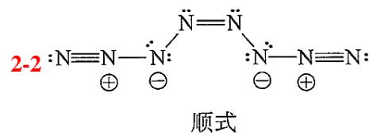

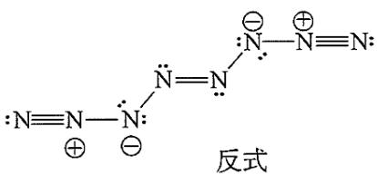

3-1 NCl $_{5}$ 能否稳定存在？并简述理由。

3-2 画出 $\mathrm{NH}_3$ 和 $\mathrm{NF}_3$ 分子的空间构型，用 $\sigma^+$ 和 $\sigma^-$ 表示出键的极性，并比较他们的分子极性大小。

3-3 在地球的电离层中，可能存在下列离子： $\mathrm{ArCl^{+}}$ 、 $\mathrm{OF^{+}}$ 、 $\mathrm{NO^{+}}$ 、 $\mathrm{PS^{+}}$ 、 $\mathrm{SCl^{+}}$ 。请你预测哪种离子最稳定，哪种离子最不稳定。说明理由。

<table><tr><td>3-1 NCl5不能稳定存在。N原子价电子层限制其最多形成4个共价键,且N原子半径小,难以容纳5个氯原子,空间位阻大。</td></tr><tr><td>3-2 NH3和NF3均为三角锥形。NH3中NH键N端为σ-,H端为σ+,分子极性大;NF3中FN键F端为σ-,N端为σ+,与孤对电子产生的偶极相反,NF3分子极性小于NH3。</td></tr><tr><td>3-3键级越大,离子越稳定。NO+(键级=3)≈PS+(键级=3)&gt;OF+(键级=2)≈SCl+(键级=2)&gt;ArCl+(键级=1)。最稳定离子:NO+。NO+与PS+的键级均为3,但NO+的成键轨道为2p和2s,而PS+为3p和3s。由于2p轨道能级低于3p,原子轨道重叠程度更大,导致NO+的键能更高、更稳定。最不稳定离子:ArCl+。ArCl+的键级仅为1,表明其化学键最弱。此外,Ar与Cl的电负性差异较小,导致离子稳定性进一步降低。</td></tr></table>

4-1 水的实测偶极矩为 1.85D，已知 HO 键键矩为 1.51D， $\mathrm{H}_2\mathrm{O}$ 的实测键角为 $104.5^{\circ}$ ，计算水分子偶极矩。  
4-2 氟化氢分子之间的氢键键能比水分子之间的键能强，为什么水的熔、沸点反而比氟化氢的熔沸点低？

4-3 下图所示分子的实测偶极矩为 1.5D，已知 CS 键的键矩为 0.9D，试推测该分子的可能立体结构。

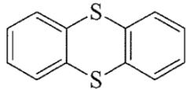

4-1 设 HO 键键矩为 $\mu_{H-O}$ ，两个 HO 键键矩夹角为 $\theta$ ，分子偶极矩为 $\mu$ 。
根据矢量合成公式 $\mu = \sqrt{\mu_{H-O}^{2} + \mu_{H-O}^{2} + 2\mu_{H-O}\mu_{H-O}\cos\theta}$ ，将数据代入公式计算的 $\mu = 1.85D$ 4-2 每摩 $H_{2}O$ 分子平均有 2mol 氢键，比 HF 间的氢键数多一倍。
4-3 可能该分子 2 个 S 原子都不在苯环平面内，可形象地称为"蝴蝶状分子。

5.最近合成了一种新型炸药，它跟三硝基甘油酯一样抗打击、抗震，但一经引爆就发生激烈爆炸。该炸药的化学式为 $\mathrm{C_8N_8O_{16}}$ ，同种元素的原子在分子中是毫无区别的。

5-1 画出它的结构式。给出三硝基甘油酯的键线式。

5-2 写出它的爆炸反应方程式。

5-3 该物质为何是烈性的爆炸品。

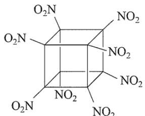

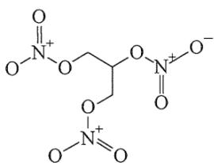

$$
5 - 2 \mathrm{C} _ {8} (\mathrm{NO} _ {2}) _ {8} \longrightarrow 4 \mathrm{N} _ {2} \uparrow + 8 \mathrm{CO} _ {2} \uparrow
$$

5-3 该物质分子储存大量化学能，爆炸反应生成大量稳定气体，释放大量能量且气体体积急剧膨胀，所以是烈性爆炸品。

6. 分子 $\mathrm{F}_4\mathrm{SCH}_2$ 的结构如图所示。注意 S、C 和两个氢原子处于同一平 F 面。请分析确定 $\mathrm{CH}_2$ 平面与三角双锥的赤道平面处于同一平面还是互相垂直。

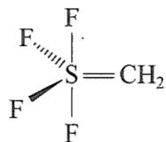

$\mathrm{CH}_2$ 平面与三角双锥的赤道平面互相垂直。对于 $\mathrm{F_4SCH_2}$ 分子，若用等电子体原理将 $\mathrm{CH}_2$ 换成O原子分析是错误的。因为S与C之间是双键。因此S原子杂化方式不是单纯的 $\mathrm{sp}^3\mathrm{d}$ 杂化，而是 $\mathrm{sp}^3\mathrm{d}^2$ 杂化，C原子是 $\mathrm{sp}^3$ 杂化，两者的轨道弯曲重叠形成两根 $\sigma$ 键，如下图所示。

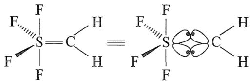

7. 假设有一个分子只含有 H、N、B，其中 H:N:B=2:1:1，它的分子量为 80.4，且发现它

是非极性分子，抗磁性分子。

7-1 此分子有两种可能构型 A 和 B，其中 A 比 B 要稳定。请画出它们的结构式，并说明为什么

么 A 比 B 要稳定?

7-2 说明 A 和 B 分子中化学键的类型。

7-3 说明 A 和 B 分子为什么是非极性抗磁性分子。

7-4 标明 A 分子中成键骨架原子的形式电荷，并简述理由。

7-1 设分子化学式为 $(\mathrm{HNB})_n$ ，H、N、B 相对原子质量分别约为 1、14、11，则 $(1 + 14 + 11)n = 80.4$ ，解得 $n = 3$ ，所以化学式为 $\mathrm{H}_3\mathrm{N}_3\mathrm{B}_3$ 。有两种结构式 A 和 B：

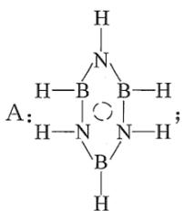

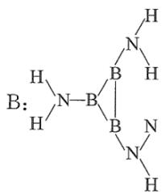

A(环硼氮烷): 六元环结构, N 和 B 交替排列, 每个 N 和 B 上各连接一个 H 原子, N、B 之间为单键, 环内存在离域 $\pi$ 键。B: 三元环结构, —NH $_2$ 和 B 相连。三元环的张力太大, B 不稳定。

7-2 A: B、N sp $^2$ 杂化, 一个 $\pi_6^6$ ; B: B、N, sp $^3$ 杂化(似乎也可以 sp $^2$ 杂化, $\pi_6^6$ )

7-3 非极性: A 和 B 分子结构对称, 分子中各键的极性相互抵消, 分子的正、负电荷中心重合, 所以为非极性分子。抗磁性: 分子中所有电子都成对, 没有未成对电子, 在外加磁场作用下, 不会产生顺磁效应, 所以表现为抗磁性。

7-4 由于 A 式中的离域 $\pi$ 键的形成是 N 原子将孤对电子提供给 B 原子(B 原子是缺电子原子), 综合考虑, N 原子因而少电子, 因此 N 原子显示正电荷, B 原子显示负电荷。

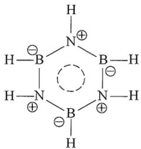

8-1 二氟甲烷 $\mathrm{(CH_2F_2)}$ 难溶于水，而三氟甲烷 $\mathrm{(CHF_3)}$ 可溶于水，其可能的原因是什么？  
8-2 氯仿在苯中的溶解度明显比1,1,1-三氯乙烷的大，请给出一种可能的原因(含图示)。  
8-3 比较 $\mathrm{H}_2\mathrm{O}$ 与 $\mathrm{OF}_2$ 的极性大小并说明理由。  
8-4 铜与盐酸以及空气反应，一种是白色难溶物S，和一种酸A。酸A含未成对电子，是一种自由基，具有极高的活性，能杀死生物活性。写出反应方程式，给出A分子的Lewis结构式和名称。

8-1 三氟甲烷中由于3个F原子具有很高的电负性，强烈吸引共用电子对，使得C原子的正电性增强，从而三氟甲烷中的H原子可与 $\mathrm{H}_2\mathrm{O}$ 中的O原子之间形成氢键，因此可溶于水；二氟甲烷 $(\mathrm{CH}_2\mathrm{F}_2)$ 无法形成氢键，难溶于水。  
8-2 三氯甲基具有强吸电子诱导效应，相当于一个高电负性的原子，使得 $\mathrm{CHCl}_3$ 的氢原子与苯环的离域电

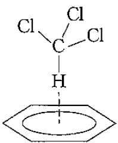

子形成氢键。

8-3 $\mathrm{H}_2\mathrm{O}$ 的极性大于 $\mathrm{OF}_2$ ，两者都是 V 形结构，H 和 O 的电负性的差值大于 O 和 F 之间的电负性差值。8-4 $\mathrm{Cu} + \mathrm{HCl} + \mathrm{O}_2 = \mathrm{CuCl} + \mathrm{HO}_2$ ，酸 A 含未成对电子，是一种自由基，可以看成 $\mathrm{H}_2\mathrm{O}_2$ 失去一个氢原子后的产物。Lewis 结构式如图

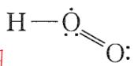

9.化合物 A 是一种重要化工产品，用于生产染料、光电材料和治疗疣的药物等。A 由第一、二周期元素组成，白色晶体，摩尔质量 $114.06 \, g \cdot mol^{-1}$ ，熔点 $293^{\circ}C$ ，酸常数 $pK_{a1} = 1.5$ ， $pK_{a2} = 3.4$ ；酸根离子 $A^{2-}$ 中同种化

学键是等长的，存在一根四重旋转轴。

9-1 画出 A 的结构简式。

9-2 为什么 $\mathbf{A}^{2-}$ 离子中同种化学键是等长的？

9-3 $\mathbf{A}^{2-}$ 离子有几个镜面？

9-1: 酸根离子 $\mathrm{A}^{2-}$ 有四重旋转轴, 从稳定角度考虑是碳形成四元环, A 由一、二周期元素组成。经式量计算(A 式量 $114.06 - 12.01 \times 4 - 1.008 \times 2 = 64.004$ , 为四个氧原子式量), 结合对称性得出结构式。  
9-2: $\mathrm{A}^{2-}$ 环内 $\pi$ 电子数为 2, 符合 $4n + 2$ 规则具芳香性, $\pi$ 电子离域, 记为 $\pi_{8}^{10}$ , 同种化学键等长。  
9-3: 5 个。

10.有机碱 A 的化学式为 $C_{12}H_{24}N_{2}$ ，它有一个三重旋转轴，分子中含有多个十元环结构，氮原子的间距为 280.6pm(N—N 的范德华半径和为 300pm)。有机碱 A 可以结合一个氢离子，形成离子 B；A 也可以被氧化，失去一个电子形成离子 C，将离子 C 再氧化失去一个电子，则形成离子 D。离子 B、C、D 都有着和 A 一样的对称性。

10-1 请画出 A、B、C、D 的结构式，要注明离子电荷的位置。

10-2 比较 A、B、C、D 中 N—N 的分子间距，从小到大排列。

10-3 为什么有机碱 A 质子化后，能形成离子 B 这样的物质？

10-1 有相关结构及电子转移图示。

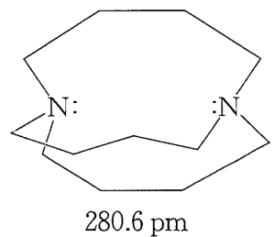

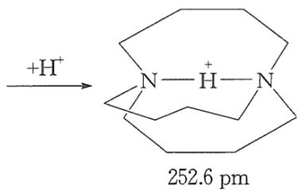

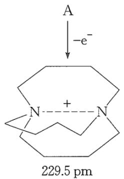  
C

B  
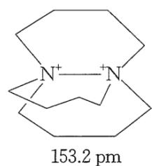  
D  
10-2 键长关系 D<C<B<A。B 中是对称氢键(氢原子与两侧 N 原子产生较强的静电吸引作用。这种作用使两个 N 原子受到向中间氢原子的拉力，从而有相互靠近的趋势，导致 N—N 分子间距缩短)；C 是二中心三电子(2c-3e)次级键；D 中 N 原子间为正常共价 $\sigma$ 单键。

10-3 有机碱 A 中氮原子间距为 280.6 pm，而 N—N 的范德华半径和为 300 pm，说明 A 中两个 N 原子距离相对较近。当 A 质子化时， $H^{+}$ 靠近 A，由于两个 N 原子距离较近且都有孤对电子，对 $H^{+}$ 有一定吸引力。 $H^{+}$ 可以被两个 N 原子共用，形成对称氢键结构的离子 B。这种结构在能量上是相对稳定的，因为形成氢键可以降低体系的能量，同时也满足了 A 质子化的反应需求以及离子 B 与 A 具有相同对称性的条件。

11.叠氮酸根作为一种纯多氮阴离子，能形成许多有趣的化合物。  
11-1 $\mathrm{NaN}_3$ 与 $\mathrm{Br}_2$ 反应生成橙色液体 $\mathrm{BrN}_3$ ，写出反应的化学方程式和 $\mathrm{BrN}_3$ 的Lewis结构式。

<table><tr><td>11-2  $NaN_{3}$  与 NOCl 反应生成淡黄色固体  $N_{4}O$ ,写出反应的化学方程式和  $N_{4}O$  的 Lewis 结构式。根据化学反应规律, $NaN_{3}$  与  $Br_{2}$  发生置换反应,化学方程式为  $NaN_{3}+Br_{2}=BrN_{3}+NaBr$ 。 $BrN_{3}$  的结构可以参考  $HN_{3}$  的成键情况,结构如下:</td></tr><tr><td>11-2  $NaN_{3}$ 与 $NOCl$ 反应我们可以看做复分解反应: $NOCl+NaN_{3}\longrightarrow N_{4}O+NaCl$ ,那么产物 $N_{4}O$ 可认为是 $N_{3}^{-}$ 离子和 $NO^{+}$ 离子结合形成的共价化合物,结构如下:</td></tr><tr><td></td></tr></table>

12-1 195K，三氧化二磷在二氯甲烷中与臭氧反应得到 $\mathrm{P_4O_{18}}$ ，画出 $\mathrm{P_4O_{18}}$ 分子的模型示意图。

12-2 $\mathrm{N(SiH_3)_3}$ 与 $\mathrm{N(CH_3)_3}$ 有相同的价电子数，从等电子体的角度来看，两者应该有类似分子结构，但实验测定前者呈平面构型，后者呈三角锥形。请分析简述原因。

12-1 三氧化二磷的实际组成为 $\mathrm{P_4O_6}$ ，从 $\mathrm{P_4O_{18}}$ 扣除一个 $\mathrm{P_4O_6}$ 后，剩下12个O原子，相当于4份 $\mathrm{O_3}$ 分子，从分子对称性的角度，优先考虑每个P原子分到结合一个 $\mathrm{O_3}$ 分子。现在的关键是 $\mathrm{O_3}$ 分子结合的位置，我们可以参考 $\mathrm{P_4O_{10}}$ 的结构，保留 $\mathrm{P_4O_6}$ 的骨架不变，把 $\mathrm{P_4O_{10}}$ 端位O原子替换为 $\mathrm{O_3}$ ，即为 $\mathrm{P_4O_{18}}$ 。

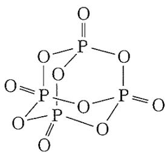

$$
\mathrm{P} _ {4} \mathrm{O} _ {1 0}
$$

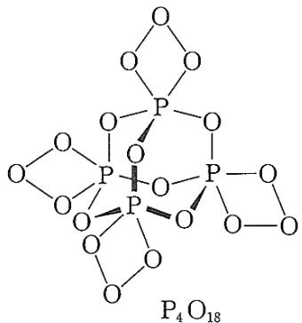

12-2 Si 是第三周期元素，原子拥有 3d 轨道，有着更为灵活的成键方式。在 $\mathrm{N}(\mathrm{SiH}_{3})_{3}$ 分子中，N 原子采用 $sp^{2}$ 杂化，孤对电子与 3 个 Si 原子的空 3d 轨道，形成离域 $\pi$ 键，所以分子呈现平面结构。 $\mathrm{N}(\mathrm{CH}_{3})_{3}$ 分子中，C 原子没有 3d 轨道，N 原子为正常的 $sp^{3}$ 杂化，分子为三角锥形。

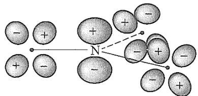  
$\mathrm{N(SiH_3)_3}$ 中 $\pi_4^2$ 键的形成（黑点代表Si原子）  
13-1 将这些微粒与最后一列中相应的 N—O 键长相匹配: 羟胺(CH₂NOH)、亚硝酰离子(NO⁺)、硝酰离子(NO₂⁺)、亚硝酸根离子(NO₂⁻)和硝酸根离子(NO₃⁻)。

<table><tr><td>分子/离子</td><td>N—O 键级</td><td>N—O 键长(Å)</td></tr><tr><td></td><td></td><td>1.062</td></tr><tr><td></td><td></td><td>1.15</td></tr><tr><td></td><td></td><td>1.236</td></tr><tr><td></td><td></td><td>1.25</td></tr><tr><td></td><td></td><td>1.47</td></tr></table>

13-2 完成下表，使所列分子与最后一列中相应的 C—O 键长相匹配：CO、 $CO_{2}$ 、 $CO_{3}^{2-}$ 、 $H_{3}COCH_{3}$ (二甲醚) 和 $H_{3}COO^{-}$ (醋酸根离子)。

<table><tr><td>分子/离子</td><td>C—O 键级</td><td>C—O 键长(Å)</td></tr><tr><td></td><td></td><td>1.128</td></tr><tr><td></td><td></td><td>1.163</td></tr><tr><td></td><td></td><td>1.250</td></tr><tr><td></td><td></td><td>1.290</td></tr><tr><td></td><td></td><td>1.416</td></tr></table>

<table><tr><td>分子/离子</td><td>N—O键级</td><td>N—O键长(Å)</td></tr><tr><td> $NO^{+}(:N\equiv\overset{+}{O}:)$ </td><td>3</td><td>1.062</td></tr><tr><td> $NO_{2}^{+}(\ddot{O}=N^{\dagger}= \ddot{O})$ </td><td>2</td><td>1.15</td></tr><tr><td> $NO_{2}^{-}(:N\underset{\cdot}{\overset{\cdot}{\ce{=O}}}\cdot\underset{\cdot}{\ce{=O}}\cdot\underset{\cdot}{\ce{=O}}\cdot\underset{\cdot}{\ce{-}})$ ,等</td><td> $1\frac{1}{2}$ </td><td>1.236</td></tr><tr><td> $NO_{3}^{-}(: \ddot{O}-N^{\dagger}\underset{\cdot}{\overset{\cdot}{\ce{=O}}}\cdot\underset{\cdot}{\ce{=O}}\cdot\underset{\cdot}{\ce{-}})$ ,等</td><td> $1\frac{1}{3}$ </td><td>1.25</td></tr><tr><td> $H_{2}N-OH(H\overset{\cdot}{\ce{=O}}\underset{\cdot}{\ce{=O}}\underset{\cdot}{\ce{=NH_{2}}})$ </td><td>1</td><td>1.47</td></tr></table>

<table><tr><td>分子/离子</td><td>C—O键级</td><td>C—O键长(Å)</td></tr><tr><td> $CO(:\bar{C} \equiv \overset{+}{O}:)$ </td><td>3</td><td>1.128</td></tr><tr><td> $CO_{2}( \ddot{Q}=C= \ddot{Q})$ </td><td>2</td><td>1.163</td></tr><tr><td> $CH_{3}CO_{2}^{-}\left(H_{3}C-C \begin{array}{c} \ddot{O}. \\ \ddot{O}:- \end{array} \right),等$ </td><td> $1\frac{1}{2}$ </td><td>1.250</td></tr><tr><td> $CO_{3}^{2-}\left(\ddot{Q}-C \begin{array}{c} \ddot{Q}. \\ \ddot{Q}:- \end{array} \right),等$ </td><td> $1\frac{1}{3}$ </td><td>1.290</td></tr><tr><td> $(CH_{3})_{2}O\left(H_{3}C \begin{array}{c} \ddot{O}. \\ CH_{3} \end{array} \right)$ </td><td>1</td><td>1.416</td></tr></table>

14. 已知含 $\mathrm{O}_2^{2-}$ 、 $\mathrm{O}_2^-$ 、 $\mathrm{O}_3^-$ 和 $\mathrm{O}_2^+$ 的化合物都是存在的。

14-1 写出上述四个离子对应的化合物的化学式。

14-2 上述四个离子中是否存在反磁性的？若有请指出来。

14-3 已知下表中各个微粒的 O—O 原子间距离为 112、121、132 和\~149pm，有三种物种的键能约为 200, 490 和 625kJ mol $^{-1}$ ，另一种未给出数据，试把这些数据填在下表中的合适位置，并确定每一种微粒的键级。

<table><tr><td>微粒</td><td>原子间距离</td><td>键能</td><td>键级</td></tr><tr><td> $O_{2}$ </td><td></td><td></td><td></td></tr><tr><td> $O_{2}^{+}$ </td><td></td><td></td><td></td></tr><tr><td> $O_{2}^{-}$ </td><td></td><td></td><td></td></tr><tr><td> $O_{2}^{2-}$ </td><td></td><td></td><td></td></tr></table>

14-4 有没有可能从 $\mathrm{F}_2$ 出发，制备出含 $\mathrm{F}_2^{2-}$ 离子的化合物，理由是什么？

<table><tr><td>微粒</td><td>原子间距离</td><td>键能</td><td>键级</td></tr><tr><td> $O_{2}$ </td><td>121 pm</td><td>490 kJ·mol-1</td><td>2</td></tr><tr><td> $O_{2}^{+}$ </td><td>112 pm</td><td>625 kJ·mol-1</td><td>2.5</td></tr><tr><td> $O_{2}^{-}$ </td><td>132 pm</td><td>—</td><td>1.5</td></tr><tr><td> $O_{2}^{2-}$ </td><td>149 pm</td><td>200 kJ·mol-1</td><td>1</td></tr></table>

15.在酶的作用下，人体内会产生超氧离子 $\mathrm{O}_2^-$ 、羟基自由基·OH、过氧化氢 $\mathrm{H}_2\mathrm{O}_2$ 及单线态氧 ${}^{1}\mathrm{O}_{2}$ 等活性氧物种，这些活性氧物种若在体内积聚过多，有使人衰老、患炎症甚至癌变等不良影响。

15-1 写出 $H_{2}O_{2}$ 的结构式，确定分子中各原子的氧化数。

15-2 写出 $\cdot$ OH、 $\mathrm{O}_2^-$ 及 ${}^{1}\mathrm{O}_{2}$ 的电子组态，计算键级，确定化学键、HOMO、LUMO 及磁性质，比较它们化学活泼性大小。

<div class="mineru-algorithm" style="white-space: pre-wrap; font-family:monospace;">
15-1  $H_{2}O_{2}$  的结构式为： $H-O-O-H$ 。其中 O 的氧化数为 -1，H 的氧化数为 1。

15-2 电子组态为：

· OH:  $K(\sigma_{2s})^{2}(\sigma)^{2}(\pi_{2p})^{3}$ $O_{2}^{-}: KK(\sigma_{2s})^{2}(\sigma_{2s}^{*})^{2}(\sigma_{2p_{z}})^{2}(\pi_{2p_{x}})^{2}(\pi_{2p_{y}})^{2}(\pi_{2p_{x}}^{*})^{2}(\pi_{2p_{y}}^{*})^{1}$ $^{1}O_{2}: KK(\sigma_{2s})^{2}(\sigma_{2s}^{*})^{2}(\sigma_{2p_{z}})^{2}(\pi_{2p_{x}})^{2}(\pi_{2p_{y}})^{2}(\pi_{2p_{x}}^{*})^{2}$ 

分子

HOMO

LUMO

键级

化学键

磁性质

活泼性

· OH

 $\pi_{2p}$ $\pi_{2p}$ 

1

σ

顺磁性

大

 $O_{2}^{-}$ $\pi_{2p_{y}}^{*}(\pi_{2p_{x}}^{*})$ $\pi_{2p_{y}}^{*}(\pi_{2p_{x}}^{*})$ 

1.5

σ, 3 电子 π

顺磁性

较大

 $^{1}O_{2}$ $\pi_{2p_{x}}^{*}(\pi_{2p_{y}}^{*})$ $\pi_{2p_{y}}^{*}(\pi_{2p_{x}}^{*})$ 

2

σ, π

抗磁性

小
</div>

16.一氧化氮对人体的作用有两面性。在神经细胞内产生的NO会损伤神经细胞；而在血管内皮细胞中产生的NO可舒张血管、调节血压。

16-1 写出 NO 分子中最高占有电子的轨道(HOMO)和最低未占有电子的轨道(LUMO)的符号( $\pi, \sigma, \pi^{*}, \sigma^{*}$ ),并用 $\uparrow$ 和 $\downarrow$ 标出轨道中的电子数。

16-2 NO 的血管舒张作用是由于它与一种含血红素的酶(鸟苷酸环化酶)中的铁离子配位而推动一系列变化造成的。已知配位的是 CO 的等电子体。NO、NO $^{+}$ 、NO $^{-}$ 中哪种物质是铁配合物中确定存在的？

16-3 腌肉时加入亚硝酸钠能产生 NO, 它与蛋白质中解离出来的硫和铁结合生成 $\mathrm{Fe}_{4}\mathrm{S}_{3}(\mathrm{NO})_{7}]^{-}$ , 后者有抑菌、防腐作用。X 射线结构分析表明该离子的结构如下。

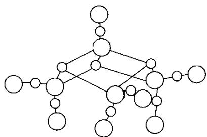

①请把图中所有铁原子涂黑，并从上至下用 Fe(A)，Fe(B)，Fe(C)，Fe(D)标记。

②已知铁的平均氧化数为0.5，试确定每个铁原子的氧化数。 $16-4\mathrm{Fe}_4\mathrm{S}_3(\mathrm{NO})_7]^-$ 离子可以被还原，生成一种含 $\mathrm{Fe}_2\mathrm{S}_2$ 环的化合物 $\mathrm{Fe}_2\mathrm{S}_2(\mathrm{NO})_4]^2-$ 。①写出阴离子 $\mathrm{Fe}_2\mathrm{S}_2(\mathrm{NO})_4]^2-$ 的结构式。②用阿拉伯数字给出每个铁原子的氧化数。③ $\mathrm{Fe}_2\mathrm{S}_2(\mathrm{NO})_4]^2-$ 会转化为 $[\mathrm{Fe}_2(\mathrm{SCH}_3)_2(\mathrm{NO})_4]^n$ ，它是一种致癌物。问 $\mathrm{CH}_3^+$ 、 $\cdot\mathrm{CH}_3$ 、 $\mathrm{CH}_3^-$ 三种物种中哪一个被加到S原子上？ $n$ 是多少？

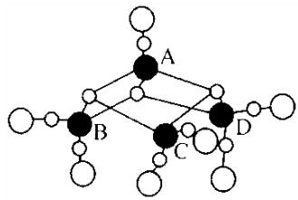

<div class="mineru-algorithm" style="white-space: pre-wrap; font-family:monospace;">
本题考查学生 NO 的电子组态，HOMO、LUMO，分子中原子的氧化数及等电子体等概念。难点是确定  $\mathrm{Fe_{4}S_{3}(NO)_{7}]^{-}}$  及  $\mathrm{Fe_{2}S_{2}(NO)_{4}]^{2-}}$  的结构。由图分析  $\mathrm{Fe_{4}S_{3}(NO)_{7}]^{-}}$  的组成可知，4 个 Fe 中有 1 个 Fe 与 1 个 NO 及 3 个 S 结合，其余 3 个 Fe 都是和 2 个 NO 及 2 个 S 结合，考虑各原子及 NO 的电子组态不难确定 4 个 Fe 的氧化数。而在  $\mathrm{Fe_{2}S_{2}(NO)_{4}]^{2-}}$  中每个 Fe 与 2 个 S 及 2 个 NO 结合。

16-1 NO:  $(1\sigma)^{2}(2\sigma)^{2}(1\pi)^{4}(3\sigma)^{2}(2\pi)^{1}$ ，HOMO2π，LUMO2π

16-2 NO⁺，NO⁺与 CO 是等电子体

16-3 ①

②+2,0,0,0

16-4 ① $\mathrm{Fe_{2}S_{2}(NO)_{4}]^{2-}}$  的结构式为：

②+3,+3

③ $CH_{3}^{+}$ ，n=0
</div>

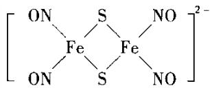

17.四氮化四硫 $\mathrm{S}_4\mathrm{N}_4$ 是氮化硫类化合物中的一个，它可由二氯化二硫与氨合成，为橙色晶体。撞击或加热时易爆炸。 $\mathrm{S}_4\mathrm{N}_4$ 分子中所有原子一起组成一个笼状结构，四个氮原子组成平面四方形，四个硫原子组成一个四面体，而氮原子四方平面正好平分硫原子的四面体，两个硫原子在平面下方，另外两个硫原子在平面上方。分子中有12个 $\pi$ 电子，这12个 $\pi$ 电子是完全非定域的，所有S—N键键长均为 $162\mathrm{pm}$ ，键级为1.65。  
17-1 $\mathrm{S}_4\mathrm{N}_4$ 中S和N的氧化数各是多少？写出由二氯化二硫与氨形成 $\mathrm{S}_4\mathrm{N}_4$ 的反应式。  
17-2为什么不能由 $\mathbf{N}_2$ 和S合成 $\mathrm{S}_4\mathrm{N}_4$ ？请画出 $\mathrm{S}_4\mathrm{N}_4$ 的结构图。  
17-3N和S原子是如何提供12个 $\pi$ 电子的？ $\mathrm{S}_4\mathrm{N}_4$ 为什么是有色物？  
17-4所有N—S—N和所有S—N—S键角是否相等？  
17-5 $\mathrm{S}_4\mathrm{N}_4$ 晶体经固态聚合反应制得的聚合物 $\mathrm{SN}_x$ 为青铜色，具有金属光泽，能导电。试说明 $\mathrm{SN}_x$ 具有金属光泽、能导电的原因。

17-1 N 的电负性大于 S 的电负性，N 的电子组态知其氧化数为 -3，故 S 的氧化数为 +3。 $S_{2}Cl_{2}$ 与 $NH_{3}$ 反应生成 $S_{4}N_{4}$ ，S 的氧化数由 +1 升至 +3，每个 S 失去 2 个电子，反应物中 $Cl^{-}$ ， $N^{3-}$ 不可能夺得电子，因而 $NH_{3}$ 只能转化成 $NH_{4}^{+}$ ，而 $H^{+}$ 也不可能夺电子，夺电子的也是 $S^{+}$ ，只有 S 氧化数改变，故方程式为：

$$
6 \mathrm{S} _ {2} \mathrm{Cl} _ {2} + 1 6 \mathrm{NH} _ {3} = \mathrm{S} _ {4} \mathrm{N} _ {4} + 1 2 \mathrm{NH} _ {4} \mathrm{Cl} + \mathrm{S} _ {8}
$$

17-2 因为 $N_{2}$ 的电子组态为 $1\sigma_{g}^{2}1\sigma_{u}^{2}1\pi_{u}^{4}2\sigma_{g}^{2}$ ， $N_{2}$ 中三键结合牢固，若用 $N_{2}$ 作反应物反应条件较苛刻，需加热，产物 $S_{4}N_{4}$ 受热易爆炸。故不能用 $N_{2}$ 与 S 反应制 $S_{4}N_{4}$ 。4 个硫原子组成一个四面体，可放在参考立方体相对的面对角线的角顶；4 个氮组成的平面四方形刚好平分四面体，4 个氮原子位于参考立方体的中间正方形的 4 个顶点。每个 S 与 N 的相对位置有三种情况：①既共面又共边 1 个 N，②共面不共边 2 个 N，③既不共面又不共边 1 个 N。因所有 S—N 键长均等，1 个 S 应与 2 个 N 成键，故 S 是与和它共面不共边的 2 个 N 成键，结构式如下。

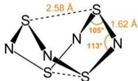

<table><tr><td>17-3 由 17-2 可知每个 S 及每个 N 均采取不等性  $sp^{2}$  杂化,有一个  $sp^{2}$  杂化轨道占一对孤对电子,故每个 S 提供 2 个  $\pi$  电子,每个 N 提供 1 个  $\pi$  电子形成  $\pi_{8}^{12}$ 。由于  $\pi_{8}^{12}$  的存在,电子从 HOMO(离域  $\Pi$  MO) $\psi_{6}$  跃迁至 LUMO $\psi_{7}$ ,辐射能在可见光范围,故  $S_{4}N_{4}$  有颜色,其颜色是吸收光的补色为橙色。</td></tr><tr><td>17-4 由于每个 S—N 键长均相等,每个 S 及每个 N 均是不等性 sp2 杂化,故所有 N—S—N 及所有的 S—N—S 键角均相等,但 N—S—N 与 S—N—S 键角不相等。</td></tr><tr><td>17-5  $S_{2}N_{2}$  聚合成的  $SN_{x}$  的结构为如下,即每个 SN 均为不等性  $sp^{2}$  杂化,故每个 S 提供 2 个 p 电子,每个 N 提供 1 个 p 电子形成  $\pi_{2n}^{2n+n}$  离域大  $\pi$  键,故  $SN_{x}$  具有金属光泽,能导电。</td></tr></table>

18. 多氮化合物非常有机会成为高能量密度的材料。因为这些化合物在热力学上是不稳定的化合物。当它们分解或反应成为较稳定的化合物时，会释放出大量的能量。多氮化合物并不多，只有 $N_{2}$ 、 $N_{3}^{-}$ 、 $N_{5}^{+}$ ，分别在 1772、1890、1999 年时被发现，以及近年才发现的环状阴离子 $N_{5}^{-}$ 。

18-1 写出 $\mathrm{N}_5^+$ 和 $\mathrm{N}_5^-$ 的路易斯结构式。要求清楚地标出孤对电子和形式电荷，并画出其分子的几何形状。

$$
[ \mathrm{N} _ {5}
$$

$$
\left. \mathrm{AsF} _ {6} ^ {-} \right]
$$

$$
[ \mathrm{N} _ {2} \mathrm{F} ^ {+}
$$

$$
\left. \mathrm{AsF} _ {6} ^ {-} \right]
$$

$$
\left(\mathrm{HN} _ {3}\right) (
$$

$$
- 7 8 \mathrm{℃}
$$

来进行反应。然而制造 $[\mathrm{N}_5^+ ][\mathrm{AsF}_6^- ]$ 时，则是由 $\mathrm{N}_2\mathrm{F}_2$ 和 $\mathrm{AsF}_5$ 反应而成，其反应式如下：

$$
x \mathrm{C} (\text {石墨}) + \mathrm{AsF} _ {5} \rightarrow \mathrm{C} _ {x}: \mathrm{AsF} _ {5} (\text {渗入石墨层中，其中} x = 1 0 \sim 1 2)
$$

$$
2 \mathrm{C} _ {x}: \mathrm{AsF} _ {5} + \mathrm{N} _ {2} \mathrm{F} _ {4} \rightarrow 2 \left[ \mathrm{C} _ {x} ^ {+} \right]\left[ \mathrm{AsF} _ {6} ^ {-} \right] + \text {反式 - N} _ {2} \mathrm{F} _ {2}
$$

$$
\mathrm{反式} - \mathrm{N} _ {2} \mathrm{F} _ {2} + \mathrm{AsF} _ {5} \rightarrow [ \mathrm{N} _ {2} \mathrm{F} ^ {+} ] [ \mathrm{AsF} _ {6} ^ {-} ]
$$

18-2 试确定 $\mathrm{N}_2\mathrm{F}^+$ 的路易斯结构式，并指出中心氮原子杂化形态。若有大 $\pi$ 键，请指出。

18-3 上述反应中，石墨是路易斯酸还是路易斯碱？ $C_{x}$ ·AsF $_{5}$ 路易斯酸还是路易斯碱？

18-4 比较顺式- $N_{2}F_{2}$ 和反式- $N_{2}F_{2}$ 化学活性强弱，并说明原因。

18-5固态 $[\mathrm{N}_5^+ ][\mathrm{AsF}_6^- ]$ 比较稳定，但与水接触时则会发生爆炸性反应。试写出该爆炸反应的化学方程式。

在合成 $\mathrm{N}_2\mathrm{F}_2$ 时，会得到反式的产物，虽然热力学上比较稳定的形式是顺式(trans-)。若要将反式(cis-)转化为顺式时，需要跨过非常高的活化能。所以顺、反式之间的平衡在没有催化剂的状况下是不易达成的。若将反式的 $\mathrm{N}_2\mathrm{F}_2$ 放在密闭容器中，再加入少量的 $\mathrm{SbF}_5$ 当作催化剂，放在室温下6天，则顺、反式便可以达到平衡：trans- $\mathrm{N}_2\mathrm{F}_2 < = [25\mathbb{C}] = >cis - \mathrm{N}_2\mathrm{F}_2$ 。已知：反式、顺式 $\mathrm{N}_2\mathrm{F}_2$ 的标准生成热分别为67.31和 $62.03\mathrm{kJ}\cdot \mathrm{mol}^{-1}$ 而在 $25\mathbb{C}$ 时的标准熵分别为262.10和 $266.50\mathrm{J}\cdot \mathrm{K}^{-1}\cdot \mathrm{mol}^{-1}$ 。

18-6 试计算在 $25^{\circ}$ C 达成平衡时，顺式分子数目除以反式分子数目的比值大小。

$\left[\mathrm{N}_{5}^{+}\right]\left[\mathrm{SbF}_{6}^{-}\right]$ 可利用置换反应的方式将它转换成别的 $\mathrm{N}_{5}^{+}$ 盐类，其反应如下：

$$
\left[ \mathrm{N} _ {5} ^ {+} \right]\left[ \mathrm{SbF} _ {6} ^ {-} \right] + \left[ \mathrm{M} ^ {+} \right]\left[ \mathrm{X} ^ {-} \right]\rightarrow \left[ \mathrm{N} _ {5} ^ {+} \right]\left[ \mathrm{X} ^ {-} \right] + \left[ \mathrm{M} ^ {+} \right]\left[ \mathrm{SbF} _ {6} ^ {-} \right]
$$

$$
\mathrm{M} ^ {+} = \mathrm{Na} ^ {+} 、 \mathrm{K} ^ {+} 、 \mathrm{Cs} ^ {+}; \mathrm{X} ^ {-} = \text {较大的阴离子，如SnF} _ {6} ^ {2 -} \text {和B(CF} _ {3}) _ {4} ^ {-}
$$

因为 $\left[\mathrm{Cs}^{+}\right]\left[\mathrm{SbF}_{6}^{-}\right]$ 在无水HF中溶解度非常低，并且 $\left[\mathrm{K}^{+}\right]\left[\mathrm{SbF}_{6}^{-}\right]$ 在 $\mathrm{SO}_2$ 中溶解度也非常低，故这两种溶剂可分别在-78°C和-64°C时经常被用来当作置换反应的溶剂。

18-7 试写出由 $\left[\mathrm{Cs}^{+}\right]_{2}\left[\mathrm{SnF}_{6}^{2-}\right]$ 来制备 $\left[\mathrm{N}_{5}^{+}\right]_{2}\left[\mathrm{SnF}_{6}^{2-}\right]$ ，以及由 $\left[\mathrm{K}^{+}\right]\left[\mathrm{B}\left(\mathrm{CF}_{3}\right)_{4}^{-}\right]$ 来制备 $\left[\mathrm{N}_{5}^{+}\right]\left[\mathrm{B}\left(\mathrm{CF}_{3}\right)_{4}^{-}\right]$ 的化学反应方程式，并注明所选用的溶剂。

在 $25^{\circ}C \sim 30^{\circ}C$ 下，小心控制 $[N_{5}^{+}]_{2}[SnF_{6}^{2-}]$ 分解，可得到阳离子相同而阴离子不同的盐(白色)A 和化合物 B。A 的热稳定性和 $[N_{5}^{+}][SbF_{6}^{-}](50^{\circ}C \sim 60^{\circ}C)$ 差不多。分析溶液 ${}^{119}SnNMR$ 光谱显示，盐 A 的阴离子实际上是以二聚体和四聚体的方式等摩尔混合存在的。在两种聚阴离子中，Sn 的配位数均为 6。而二元化合物 B 中氮元素的质量分数为 78.65%。

18-8 试确定 A 和 B 的化学式(要求具体写出阴离子和阳离子)。画出 A 中阴离子的二聚体和四聚体的结构。画出 B 最有可能的路易斯结构式。

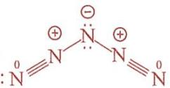

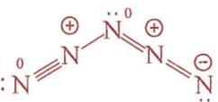

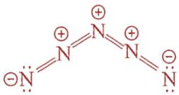

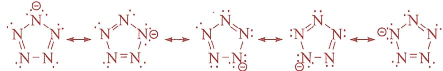

$$
\begin{array}{c} \text {N} \\ \text {N} \text {N} \\ \text {N-N} \end{array}
$$

18-2 : $N \equiv N^{\oplus} - F$ ; 中心氮原子杂化为 sp 杂化; $\frac{N-N-F}{N-N-F}$ , 其中有两个 $\pi_{3}^{4}$ 。

18-3 石墨是路易斯碱, 因为每一层有 $\pi$ 电子; $C_{x} \cdot AsF_{5}$ 是路易斯碱。

18-4 顺式 $-N_{2}F_{2}$ 活性高, 因为结构不对称。

$$
\left[ \mathrm{N} _ {5} ^ {+} \right] \left[ \mathrm{AsF} _ {6} ^ {-} \right] + 2 \mathrm{H} _ {2} \mathrm{O} \longrightarrow 4 \mathrm{AsF} _ {5} + 4 \mathrm{HF} + 1 0 \mathrm{N} _ {2} \uparrow + \mathrm{O} _ {2} \uparrow
$$

$$
K = [ \text { cis } ] / [ \text { trans } ]; \Delta G ^ {\ominus} = - R T \ln K = \Delta H ^ {\ominus} - T \Delta S ^ {\ominus}
$$

$$
\Delta H ^ {\ominus} = 6 2. 0 3 - 6 7. 3 1 = - 5. 2 8 \mathrm{kJ} \cdot \mathrm{mol} ^ {- 1}
$$

$$
\Delta S ^ {\ominus} = 2 6 6. 5 0 - 2 6 2. 1 0 = 4. 4 0 \mathrm{J} \cdot \mathrm{K} ^ {- 1} \cdot \mathrm{mol} ^ {- 1}
$$

$$
\Delta G ^ {\ominus} = - 5. 2 8 \times 1 0 ^ {3} - 2 9 8 \times 4. 4 0 = - 6. 5 9 \times 1 0 ^ {3} \mathrm{J} \cdot \mathrm{mol} ^ {- 1}
$$

$$
K = \mathrm{e} ^ {- \Delta G / R T} = \mathrm{e} ^ {- (6. 5 9 \times 1 0 0 0) / (8. 3 1 4 \times 2 9 8)} = 1 4. 3
$$

$$
\left[ \mathrm{SbF} _ {6} ^ {-} \right] + \left[ \mathrm{Cs} ^ {+} \right] _ {2} \left[ \mathrm{SnF} _ {6} ^ {2 -} \right] \xrightarrow {\mathrm{HF} , - 7 8 ^ {\circ} \mathrm{C}} \left[ \mathrm{N} _ {5} ^ {+} \right] _ {2} \left[ \mathrm{SnF} _ {6} ^ {2 -} \right] + 2 \left[ \mathrm{Cs} ^ {+} \right] \left[ \mathrm{SbF} _ {6} ^ {-} \right]
$$

$$
\left[ \mathrm{N} _ {5} ^ {+} \right] \left[ \mathrm{SbF} _ {6} ^ {-} \right] + \left[ \mathrm{K} ^ {+} \right] \left[ \mathrm{B} \left(\mathrm{CF} _ {3}\right) _ {4} ^ {-} \right] \xrightarrow {\mathrm{SO} _ {2} , - 6 4 ^ {\circ} \mathrm{C}} \left[ \mathrm{N} _ {5} ^ {+} \right] \left[ \mathrm{B} \left(\mathrm{CF} _ {3}\right) _ {4} ^ {-} \right] + \left[ \mathrm{K} ^ {+} \right] \left[ \mathrm{SbF} _ {6} ^ {-} \right]
$$

$$
\mathrm{SO} _ {2})
$$

A: $\left[N_{5}^{+}\right]\left[SbF_{5}^{-}\right]$ ; B: $N_{5}F$ ;

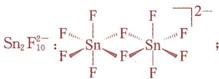

$$
\mathrm{N} _ {5} \mathrm{F}
$$

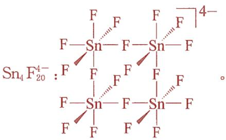

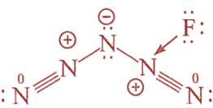

19.酸性强于纯硫酸的酸称为超酸。超酸是很强的质子给予体，甚至能够质子化较弱的 Lewis 酸，例如 Xe、 $\mathrm{H}_{2}$ 、 $\mathrm{Cl}_{2}$ 、 $\mathrm{Br}_{2}$ 和 $\mathrm{CO}_{2}$ 。人们在超酸溶液中观察到了很难存在于其他介质中的阳离子。George Olah 利用超酸发现了反应中碳正离子的生成，获得 1994 年诺贝尔化学奖。超酸的酸性较强是由于形成了溶剂化质子。最常见的一种超酸可以通过混合 $\mathrm{SbF}_{5}$ 和 HF 得到。当液态 $\mathrm{SbF}_{5}$ 溶解在液态 HF 中(要求 $\mathrm{SbF}_{5}/\mathrm{HF}$ 的摩尔比大于 0.5)时，生成 $\mathrm{SbF}_{6}^{-}$ 与 $\mathrm{Sb}_{2}\mathrm{F}_{11}^{-}$ 阴离子，释放出的质子被 HF 溶剂化。

19-1 写出 HF 与 $SbF_{5}$ 混合发生反应的化学方程式。

19-2 画出 $\mathrm{SbF_6^-}$ 与 $\mathrm{Sb_2F_{11}^-}$ 的结构(在两种阴离子中，中心离子的配位数均为6， $\mathrm{Sb_2F_{11}^-}$ 中存在一根氟桥键)。  
19-3 写出 $\mathrm{H}_2$ 和 $\mathrm{CO_2}$ 在 $\mathrm{HF / SbF_5}$ 超酸溶液中发生质子化的化学反应方程式。

19-4 画出 $\mathrm{HCO_2^+}$ 的 Lewis 结构式，要求写出共振结构并估计每个共振结构中 H-O-C 的键角。

<div class="mineru-algorithm" style="white-space: pre-wrap; font-family:monospace;">
19-1 $2\mathrm{HF} + \mathrm{SbF}_5\rightarrow \mathrm{H}_2\mathrm{F}^+ +\mathrm{SbF}_6^-$ 、 $2\mathrm{HF} + 2\mathrm{SbF}_5\rightarrow \mathrm{H}_2\mathrm{F}^+ +\mathrm{Sb}_2\mathrm{F}_{11}^{-}$ 或者 $4\mathrm{HF} + 3\mathrm{SbF}_5\rightarrow 2\mathrm{H}_2\mathrm{F}^+ +\mathrm{SbF}_6^- +\mathrm{Sb}_2\mathrm{F}_{11}^{-}$   
19-2
</div>

$$
\left[ \begin{array}{c} F \\ F \stackrel {{\text {   }}} {{=}} S b \stackrel {{\text {   }}} {{=}} F \\ F \end{array} \right] - \left[ \begin{array}{c} F \\ F \stackrel {{\text {   }}} {{=}} S b \stackrel {{\text {   }}} {{=}} F \stackrel {{\text {   }}} {{=}} S b \stackrel {{\text {   }}} {{=}} F \\ F \stackrel {{\text {   }}} {{=}} S b \stackrel {{\text {   }}} {{=}} F \stackrel {{\text {   }}} {{=}} S b \stackrel {{\text {   }}} {{=}} F \end{array} \right]\tag{19-3}
$$

$$
\mathrm{H} _ {2} \mathrm{F} ^ {+} + \mathrm{H} _ {2} \longrightarrow \mathrm{HF} + \mathrm{H} _ {3} ^ {+}
$$

$$
\mathrm{H} _ {2} \mathrm{F} ^ {+} + \mathrm{CO} _ {2} \longrightarrow \mathrm{HF} + \mathrm{CO} _ {2} \mathrm{H} ^ {+} (\text { or } \mathrm{HCO} _ {2} ^ {+})\tag{19-4}
$$

$$
\ddot {\mathrm{O}} = \mathrm{C} = \stackrel {\oplus} {\mathrm{O}} - \mathrm{H} \longleftrightarrow : \stackrel {\oplus} {\mathrm{O}} \equiv \mathrm{C} - \stackrel {\ddots} {\mathrm{O}} - \mathrm{H} \longleftrightarrow : \stackrel {\ominus} {\mathrm{O}} - \mathrm{C} \equiv \stackrel {\oplus 2} {\mathrm{O}} - \mathrm{H}
$$

20.试通过计算回答下列问题:

20-1 亚硫酰氯与叠氮化钠在 $-30^{\circ}\mathrm{C}$ 下反应得到无色晶体 $\mathbf{X}$ 。 $\mathbf{X}$ 中氯元素质量分数为 $36.4\%$ ，且晶体结构中含有环状三聚体。写出 $\mathbf{X}$ 的结构式和该反应的化学方程式。画出两种 $\mathbf{X}$ 的同分异构体的结构。

20-2 X 和三氟化磷反应得到一种无色液体 Y。将 1.00g Y 加入到过量的醋酸钡溶液中得到 3.96g 沉淀。试写出 Y 的化学式，画出它的结构并写出所有相关的化学方程式。

20-3 Y 可以与典型的亲核试剂，例如甲胺发生取代反应。Y 和过量甲胺反应会产生什么产物?画出产物的结构。画出两个 Y 的等电子体结构。

20-4 一种 Y 的等电子体在有水的存在下会转化成聚合物 Z。将 1.00g Z 溶于水中并将所得溶液加入过量醋酸钡溶液中，形成了 2.91g 沉淀。试写出 Z 的分子式并画出它的结构。

20-1 $\mathrm{SOCl}_2$ 与 $\mathrm{NaN}_3$ 反应，先假设发生取代反应。根据提示，X为三聚体，说明Y的单体Y'一定含有不饱和键，从成键角度看，可能含有S=N键或S=O键。一般来说，S=O三聚能力没有S=N三聚能力强。而Y中含有氟元素，因此Y'同样含有氟元素，X为[NS(O)Cl]₃，根据氯元素质量分数验证即可。因此，化学反应为： $3\mathrm{SOCl}_2 + 3\mathrm{NaN}_3\rightarrow [\mathrm{NS(O)Cl}]_3 + 3\mathrm{NaCl} + 3\mathrm{N}_2\uparrow$ 。根据氯元素的位置，存在几何异构一顺反异构，其中(a)为顺式，(b)为反式。

## ●S ON ●Cl OO

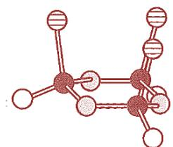  
(a)

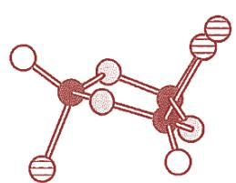  
(b)

20-2 同样与 X 相似，Y 为 $\left[\mathrm{NS(O)F}\right]_{3}$ 。其反应为： $2\left[\mathrm{NS(O)F}\right]_{3} + 9\mathrm{Ba(CH_3COO)_2 + 18H_2O\rightarrow 3BaF_2 + 6BaSO_4\downarrow}$ $+12\mathrm{CH}_3\mathrm{COOH} + 6\mathrm{CH}_3\mathrm{COONH}_4$ 。根据反应规律可知：Y 中 F 原子被 $\mathrm{NHCH}_3$ 取代得到 $\left[\mathrm{NS(O)(NHCH_3)}\right]_{3}$ 。20-3 $\left[\mathrm{N}_3\mathrm{S}_3\mathrm{O}_3\right]^{3-}$ 和 $(\mathrm{SO}_3)_3$ 为 Y 的等电子体结构。

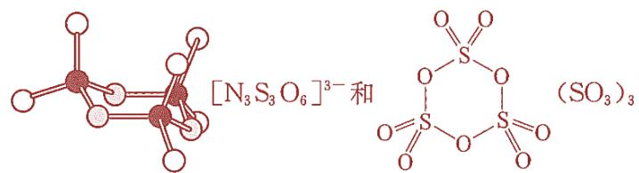

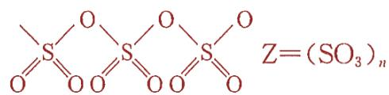

21-1 在 343\~353K 下，使 $\mathrm{SCl_2}$ 和悬浮于乙氰中的氟化钠作用是制备 $\mathrm{SF_4}$ 的一种方法，同时也得到两种氯化物；也可以于 200K 以下用 $\mathrm{CoF_3}$ 对单质硫进行氟化得到。 $\mathrm{SF_4}$ 是无色气体，毒性很强。

(1)写出制备 $\mathrm{SF}_4$ 的两个反应式。

(2)指出 $\mathrm{SF}_4$ 分子中有几种F—S—F键角及几种S—F键长。

(3) $\mathrm{SF}_4$ 性质活泼，遇水或潮湿空气则发生明显反应。请分别写出 $\mathrm{SF}_4$ 与水、氧气作用的方程式，指出 $\mathrm{SF}_4$ 容易水解的原因。

21-2 $\mathrm{SF}_4$ 能顺利地将有机物氟化，反应方程如下所示。红外光谱表明有机产物X中没有羰基的吸收峰，用 $^{19}$ FNMR对Y进行测试获知Y中有两种化学环境的氟原子。

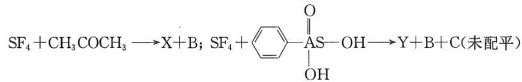

(1)完成上面两个反应式。

(2)画出 Y 可能的立体结构，并指出实际构型最可能是哪一种。

(3) $\mathrm{SF}_4$ 遇强氧化剂如三氟化氯时被氧化得到两个八面体分子，请完成此反应。

21-1 (1)制备 $SF_{4}$ 的反应式： $3SCl_{2}+4NaF\rightarrow SF_{4}+S_{2}Cl_{2}+4NaCl$ ; $S+4CoF_{3}\rightarrow SF_{4}+4CoF_{2}$

(2) $SF_{4}$ 分子中有两种 S—F 键长，3 种 F—S—F 键角度

(3) $SF_{4}$ 与水、氧气反应方程式： $SF_{4}+2H_{2}O\rightarrow SO_{2}+4HF$ ； $2SF_{4}+O_{2}\rightarrow2SOF_{4}$ 。此反应至少为典型熵驱动反应。

$$
\mathrm{SF} _ {4} + \mathrm{CO} (\mathrm{CH} _ {3}) _ {2} \rightarrow \mathrm{CF} _ {2} (\mathrm{CH} _ {3}) _ {2} + \mathrm{SOF} _ {2}; \quad 3 \mathrm{SF} _ {4} + \text { PhAsO(OH) } _ {2} \rightarrow \text { PhAsF } _ {4} + 3 \mathrm{SOF} _ {2} + 2 \mathrm{HF}
$$

(2)Y 可能的立体结构如下。后者最可能。因苯环的范氏半径较大，当位于砷原子上方时与 3 个 F 原子以近 $90^{\circ}$ 相排斥，1 个以 $180^{\circ}$ 相排斥。后者与 2 个 F 原子以 $90^{\circ}$ 相排斥，与其他 2 个 F 原子以 $120^{\circ}$ 相排斥。由此可基本粗略说明后者可能是实际结构。

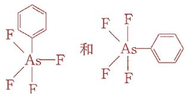

(3)反应： $2SF_{4}+ClF_{3}\rightarrow SF_{6}+SClF_{5}$

22.在一定条件下金属锂与纯的碘单质作用得到一种物质X，X含锂 $2.66\%$ ，X中含有一种简单单负一价阴离子Z，由于此例与通常得到的结果颇为不同，故引起人们的重视。

22-1 写出生成 X 的反应式。

22-2 用分子轨道理论阐述阴离子 Z 的结构特征并指明键级。

22-3 有一种离子化学式为： $[S_{2}I_{4}]^{2+}$ ，立体结构如图所示，分子结构可以看做 $[S_{2}]^{2+}$ 与 $I_{2}$ 配位组成的离子，经量子化学计算及计算机模拟获知 S—S 的键级小于 3，I—I 的键级大于 1。请用分子轨道理论说明 $I_{2}$ 是如何与 $[S_{2}]^{2+}$ 配位的，并说明键级的变化是怎样形成的。(大致说明即可不用画图说明)

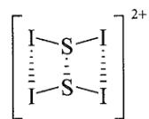

22-1 设 X 的化学式为 $Li_{x}I_{y}$ ，Li 相对原子质量约为 7，I 相对原子质量约为 127。已知 Li 质量分数为 2.66%，则 $7x/(7x+127y)=2.66\%$ ，解得 x:y=1:2，所以反应式为生成 X 的反应式： $Li+I_{2}\rightarrow LiI_{2}$ 。

22-2 用分子轨道理论阐述阴离子 Z 的结构特征并指明键级：分子轨道略；键级大约为 0.5

22-3 配位过程： $\mathrm{S}_2^{2+}$ 键级为 3，有较高的电子云密度。 $I_2$ 分子中，反键轨道有一定的空轨道性质。 $I_2$ 与 $\mathrm{S}_2^{2+}$ 配位时， $I_2$ 反键轨道接受 $\mathrm{S}_2^{2+}$ 的电子对，形成配位键。键级变化：对于 S-S 键，由于部分电子进入反键轨道，成键电子数与反键电子数差值减小，根据键级公式，键级小于 3；对于 I-I 键，接受电子后，反键轨道电子减少，成键电子数与反键电子数差值相对增大，键级大于 1。

23.NSF是一种不稳定的化合物，它可以聚合成三聚分子A，也可以加合一个 $\mathbf{F}^{-}$ ，生成B；还可以失去一个 $\mathrm{F}^{-}$ ，变成C。

23-1 试写出 NSF 和产物 A、B、C 的 Lewis 结构式。

23-2 预期 A、B、C 中哪一个 N—S 键最长？哪一个 N—S 键最短？为什么？

23-3 假设有 NSF 的同分异构体存在[SNF]，请按照(23-1)、(23-2)内容回答问题。

本题可采用 Lewis 结构理论，计算出 NSF 的化学键数。因 $\frac{n_{s}}{2} = \frac{3 \times 8 - (5 + 6 + 7)}{2} = 3$ ，应该是三条共价键，即 N=S—F，但它存在形式电荷： $\overset{\ominus}{\underset{\oplus}{\mathrm{N}}}=\mathrm{S}-\mathrm{F}$ ，而 N≡S—F 中各原子的形式电荷为零，所以只要修正 S 原子的 $n_{v}=10$ 即可。 $\frac{n_{s}}{2} = \frac{(10 + 2 \times 8) - (5 + 6 + 7)}{2} = 4$ ，∴NSF 的 Lewis 结构式为：N≡S—F，其中，N、S、F 的形式电荷均为零。

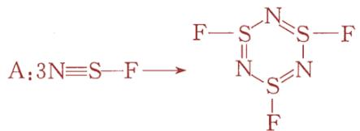

$$
\mathrm{B}: \stackrel {\ominus} {:} \mathrm{N} = \stackrel {\circ} {\mathrm{S}} <   \stackrel {\circ} {\mathrm{F}}; \mathrm{C}: \mathrm{N} \equiv \mathrm{S} ^ {\oplus} 。
$$

从 A、B、C 的结构看，C 的 N—S 键最短，因为 N—S 之间为共价叁键，A、B 结构式中 N—S 之间都为共价双键，但 A 中可认为有离域 $\pi$ 键存在，所以 A 中 N—S 键最长。

当 SNF 排列时，Lewis 结构式为： $\overset{\circ}{S}=\overset{\circ}{N}-\overset{\circ}{F}$


$$
\mathrm{B}: \mathrm{S} = ^ {\oplus} \mathrm{N} <   _ {\mathrm{F} ^ {\ominus}} ^ {\mathrm{F} ^ {\ominus}}; \mathrm{C}: \mathrm{N} \equiv \mathrm{S} ^ {\oplus}
$$

从结构上看，仍然是 C 中的 N—S 键最短，A 中 N—S 键最长。

23-1 NSF 的结构式为：N≡S—F；A、B、C 的结构式分别为： \( F-S\stackrel{N}{\underset{N}{\underset{|}{\underset{|}{\underset{|}{\underset{|}{\underset{|}{\underset{|}{\underset{|}{\underset{|}{\underset{|}{\underset{|}{\underset{|}{\underset{|}{\underset{|}{\underset{|}{\underset{|}{\underset{|}{\underset{|}{\underset{|}{\underset{|}{\underset{|}{\underset {|}{\underset{|}{\underset{|}{\underset{|}{\underset{|}{\underset{|}{\underset{|}{\underset{|}{\underset{|}{\underset{|}{\underset{|}{\underset{|}{\underset{|}{\underset{|}{\underset{|}{\underset{|}{\underset{|}{\underset{|}{\underset{|}{\underset{|}{\underset>|}}}}}}}}}}}}{\mathrm{F}-\mathrm{S}\stackrel{N}{\underset{N}{\underset{N}{\underset{N}{\underset{N}{\underset{N}{\underset{N}{\underset{N}{\underset{N}{\underset{N}{\underset{N}{\underset{N}{\underset{N}{\underset{N}{\underset{N}{\underset{N}{\underset{N}{\underset{N}{ \_F}}}}}}}}}}}}{\mathrm{F}}}}{\mathrm{N}}^{\ominus}=\stackrel{\circ}{\mathrm{S}}-\stackrel{\circ}{\mathrm{F}}\_{0}, N≡S^{\oplus}。


23-2 C 的 N—S 键最短，因为 N—S 之间为共价叁键，A、B 结构式中 N—S 之间都为共价双键，但 A 中可认为有离域 $\pi$ 键存在，所以 A 中 N—S 键最长。

23-3 SNF 的结构式为： $^{\circ}$ S=N-F，A、B、C 的结构式分别为：


结构上看，仍然是 C 中的 N—S 键最短，A 中 N—S 键最长。

24.A—B 体系是一种新型的催化剂。化学家对 A—B 体系进行了深入的研究：A=Te(晶体)，B 是 TeCl₄与 AlCl₃ 按物质的量之比 1:4 化合得到的。已知 B 是一种共价型离子化合物，其阴离子为四面体结构，B 中铝元素、氯元素的化学环境相同。A 和 B 反应生成三种新化合物 I、II、III，其中 A 的物质的量分数(mol%)分别为 77.8、87.5 和 91.7。生成化合物 II 和 III 时没有其他副产物生成，但是生成化合物 I 时伴随着挥发性的 TeCl₄ 生成，每生成 2 mol 化合物 I 就生成 1 mol TeCl₄。在熔融的 NaAlCl₄ 里的导电性研究表明，化合物 I 和 II 在一起时总共会解离成三种离子。

进一步对化合物I和II研究表明：用凝固点下降法测定I和II的摩尔质量分别为1126和 $867\mathrm{g}\cdot \mathrm{mol}^{-1}$ 。化合物I和II的红外光谱测定只有一种振动，分子中不存在 $\mathrm{Te} = \mathrm{Te}$ ，而且结构中都只有一种四面体配位的铝，但是铝原子在这两种化合物中的化学环境是不同的。

24-1 确定化合物I、II和III中的 Te:Al:Cl 的最简原子比。

24-2 写出化合物I和II的分子式。

24-3 写出化合物I和II中阴离子和阳离子的化学式。

24-4 指出 Te、Al 原子的杂化形态，画出其阴离子、阳离子的结构式，说明其阳离子具有什么特点。

24-5 $\mathrm{AlCl}_3$ 具有很高的挥发性，化合物I在加热时很容易转化成化合物II。请说明这是为什么？写出该化学反应方程式。

24-1 化合物I中，A:B=77.8%:22.2%=7:2，即 $7Te+2Te[AlCl_{4}]_{4}=Te_{9}Al_{8}Cl_{32}$ ; 因生成 2mol 化合物I产生 1molTeCl $_{4}$ ，所以 Te:Al:Cl=(9-1):8:(32-4)=2:2:7 。化合物 II 中，Te:Te[AlCl $_{4}$ ] $_{4}$ =87.5%:12.5%=7:1 ，即 $7Te+Te[AlCl_{4}]_{4}=Te_{8}[AlCl_{4}]_{4}$ ，最简原子比 Te:Al:Cl=8:4:16=2:1:4。化合物III中，Te:Te[AlCl $_{4}$ ] $_{4}$ =91.7%:8.3%=11:1，最简原子比 Te:Al:Cl=12:4:16=3:1:4。

24-2 设I的分子式为 $\left(\mathrm{Te}_{2}\mathrm{Al}_{2}\mathrm{Cl}_{7}\right)_{\mathrm{m}}$ ，由 $\mathrm{m}(127.6\times2+27\times2+35.5\times7)=1126$ ，解得m=2，I的分子式为 $Te_{4}Al_{4}Cl_{14}$ 。设II的分子式为 $\left(\mathrm{Te}_{2}\mathrm{AlCl}_{4}\right)_{\mathrm{n}}$ ，由 $\mathrm{n}(127.6\times2+27+35.5\times4)=867$ ，解得n=2，II的分子式为 $Te_{4}Al_{2}Cl_{8}$ 。

24-3 化合物I和II在一起解离成三种离子，且每个化合物中只有一种四面体配位的铝，两种化合物中 Al 原子化学环境不同，所以I中阳离子为 $Te_{4}^{2+}$ ，阴离子为 $[Al_{2}Cl_{7}]^{-}$ ；II中阳离子为 $Te_{4}^{2+}$ ，阴离子为 $[AlCl_{4}]^{-}$ 。

24-4 Te： $\sigma=2$ ，孤对电子= $(6-2\times2)/2=1$ ，价电子对= $2+1=3$ ，杂化形态为 $sp^{2}$ 。Te 有两对孤对电子，一对用于价层，一对在垂直于 sp 杂化轨道的 pz 轨道上， $Te_{4}^{2+}$ 的 $\pi$ 电子为 $2\times4-2=6$ ，满足休克尔 $4n+2$ 规则，具有 $\pi_{4}^{6}$ 大 $\pi$ 键，有芳香性。Al 杂化为 $sp^{3}$ 。阴、阳离子结构式：

$$
\mathrm{Te} _ {4} ^ {2 +}:\begin{array}{c}\mathrm{Te} ^ {+} = \mathrm{Te} ^ {+}\\|\\\mathrm{Te} - \mathrm{Te}\end{array}\text {或} \left[\begin{array}{c}\mathrm{Te} - \mathrm{Te}\\|\\\mathrm{Te} - \mathrm{Te} _ {\bullet}\end{array}\right] ^ {2 +} \quad [ \mathrm{Al} _ {2} \mathrm{Cl} _ {7} ] ^ {-}: \left[ \right.\begin{array}{c c c c c c c c c c c c c c c c c c c c c c c c c c c c c c c c c c c c c c c c c c c c c c c c c c c c c c c c c c c c c c c c c c c c c}\mathrm{Cl}&&&&&&&&&&&&&&&&&&&&&&&&&&&&&&&&&&&&&&&&&&&&&&&&&&&&&&&&&\\|\\\mathrm{Al} _ {2} \mathrm{Cl} _ {7} ] ^ {-}:\\|\\\mathrm{Al} _ {2} \mathrm{Cl} _ {7} ] ^ {-}:\\|\\\mathrm{Al} _ {2} \mathrm{Cl} _ {7} ] ^ {-}:\\|\\\mathrm{Al} _ {2} \mathrm{Cl} _ {7} ] ^ {-}:\\|\\\mathrm{Al} _ {2} \mathrm{Cl} _ {7} ] ^ {-}.\end{array}
$$


24-5 因为 $\left[\mathrm{Al}_{2} \mathrm{Cl}_{7}\right]^{-}$ 结构不如 $\left[\mathrm{AlCl}_{4}\right]^{-}$ 稳定，加热时 $\left[\mathrm{Al}_{2} \mathrm{Cl}_{7}\right]^{-}$ 分解生成 $\mathrm{AlCl}_{3}$ 和 $\left[\mathrm{AlCl}_{4}\right]^{-}$ ， $\left[\mathrm{AlCl}_{4}\right]^{-}$ 结构高度对称较稳定。反应式： $\mathrm{Te}_{4} \left[\mathrm{Al}_{2} \mathrm{Cl}_{7}\right]_{2} = \mathrm{Te}_{4} \left[\mathrm{AlCl}_{4}\right]_{2} + 2 \mathrm{AlCl}_{3}$ 。

25.氮氧化物是大气化学的主要研究对象之一。内燃机中的高温促使空气中的氮气与氧气发生的化合反应以及工厂排放的光化学烟雾，是大气中氮氧化物的两大来源。在平流层，氮氧化物对于维持能够吸收紫外线的臭氧浓度稳定的光化学分解臭氧的反应有推动作用。下文将描述氮氧化物的一些化学性质。

氮氧化物 A 是无色顺磁性气体，能和过量氧气反应。将反应后的混合物通入-120℃容器中，气体凝华为无色固体 B。将 2.00gB 放入 1.00L 真空容器中，可生成红棕色气体。反应体系在不同温度下达到平衡时的压强如下：25.0℃，压强 0.653atm、50.0℃，压强 0.838atm。

## 25-1 写出化合物 A 和 B 的化学式。

25-2 写出第二步 B 生成红棕色气体的反应方程式。计算该反应在热力学标况下的焓变和熵变。假设温度和压强对反应的焓变、熵变影响可以忽略不计。

化合物 B，与氟气反应可生成一无色气体 C，C 与三氟化硼反应可生成无色固体 D。将 1.000gD 溶于水，以酚酞作为指示剂，用 $0.5000 \, mol \cdot L^{-1} NaOH$ 滴定至终点，耗 NaOH 溶液 30.12mL。

25-3 写出 C 和 D 的路易斯结构式，以及 D 与 NaOH 中和滴定得到的最终产物的化学式。

25-4 写出 A 与 $ClO_{2}$ 反应方程式。

25-5 D 与过量硝基苯反应主要生成有机产物 E，写出 E 的结构式。

25-1 氮氧化物 A 是无色顺磁性气体，所以 A 是 NO；NO 与 $O_{2}$ 反应生成 $NO_{2}$ ， $NO_{2}$ 能二聚成 $N_{2}O_{4}$ ，所以 B 是 $N_{2}O_{4}$ 。

$$
\Delta \mathrm{S} ^ {0} = + 1 7 7 \mathrm{J} \cdot \mathrm{mol} ^ {- 1}
$$

$$
\ln (K) = - \left(\Delta H ^ {0} / R T\right) + \left(\Delta S ^ {0} / R\right)
$$

25-3 $\mathrm{N}_{2}\mathrm{O}_{4}$ 受热生成· $\mathrm{NO}_{2}$ ， $\mathrm{F}_{2}$ 受热产生 $\mathrm{F}$ ；二者耦合成 $\mathrm{FNO}_{2}$ ，所以 $\mathrm{C}$ 是 $\mathrm{FNO}_{2}$ ； $\mathrm{FNO}_{2}$ 与 $\mathrm{BF}_{3}$ 发生路易斯酸碱

反应生成 $[NO_{2}][BF_{4}]$ ，所以 D 是 $[NO_{2}][BF_{4}]$ 。路易斯结构式如下；

$$
\left[ \begin{array}{c} \ddot {\mathrm{O}} = \stackrel {{\oplus}} {\mathrm{N}} = \ddot {\mathrm{O}} \\ \ddots \end{array} \right] \left[ \begin{array}{c} \vdots \stackrel {{\ddots}} {\mathrm{F}}: \\ \vdots \stackrel {{\ddots}} {\mathrm{F}} \stackrel {{\ominus}} {\mathrm{B}}: \\ \vdots \stackrel {{\ddots}} {\mathrm{F}}: \end{array} \stackrel {{\ddots}} {\mathrm{F}}: \right]
$$

$[NO_{2}][BF_{4}]$ 与 NaOH 反应 $[NO_{2}][BF_{4}]+2NaOH=NaNO_{3}+NaBF_{4}+H_{2}O$

25-4 NO 和 $ClO_{2}$ 都有成单电子，反应 $NO+ClO_{2}=ON-ClO_{2}$ 。

25-5 $\left[\mathrm{NO}_{2}\right]\left[\mathrm{BF}_{4}\right]$ 产生强亲电试剂 $\mathrm{NO}_{2}^{+}$ ，与苯发生亲电取代，反应和E为结构结构如下。

c  


26.卤氧氮粒子很多，试回答下列问题：

26-1 考虑 $ClO_{2}^{+}$ 、 $ClO_{2}$ 和 $ClO_{2}^{-}$ 三种粒子。试将 O—Cl 键按其 O—Cl 键键长由大到小顺序排列，分别写出 Cl 上的孤对电子数，画出 $ClO_{2}^{-}$ 的共振结构式。

26-2 讨论分子 $F_{3}CNO$ 和 $F_{3}CN_{3}$ 的立体结构和成键情况。

26-3 根据 VSEPR， $\mathrm{TeBr_6^{2-}}$ 拥有 7 个价层电子对，应是带帽八面体或五角双锥结构，但实际上 $\mathrm{TeBr_6^{2-}}$ 却是八面体结构。已知 Br 与 Br 之间的距离为 3.81 埃，小于其范德华半径之和 3.91 埃。请解释上述现象。

26-4 $\mathrm{BeCl}_2$ 和 $\mathrm{BaF}_2$ 分别为直线型还是弯曲型？为什么？

26-1 根据路易斯电子理论计算化学键数， $\mathrm{ClO}_2^-$ 化学键数 $\mathrm{H} = [3 \times 8 - (7 + 2 \times 6 + 1)] / 2 = 2$ ； $\mathrm{ClO}_2$ 化学键数 $\mathrm{H} = [3 \times 8 - (7 + 2 \times 6)] / 2 = 2.5$ ； $\mathrm{ClO}_2^+$ 化学键数 $\mathrm{H} = [3 \times 8 - (7 + 2 \times 6 - 1)] / 2 = 3$ 。O-Cl 键长： $\mathrm{ClO}_2^- > \mathrm{ClO}_2 > \mathrm{ClO}_2^+$ 。 $\mathrm{ClO}_2^+$ 中 Cl 孤对电子数 1 对； $\mathrm{ClO}_2$ 中 Cl 孤对电子数 1.5 对（存在大 $\pi$ 键，算 0.5 对）； $\mathrm{ClO}_2^-$ 中 Cl 孤对电子数 2 对。 $\mathrm{ClO}_2^-$ 共振结构式：


26-2 $\mathrm{F_3CNO}$ 中N原子孤对电子避开F原子， $\mathrm{N = O}$ 基团与C-F键呈重叠构象。 $\mathrm{F_3CN_3}$ 有两个共振结构式，在F强吸电子作用下，共振式中靠近碳原子的氮原子带负电荷更稳定，氮原子上两对电子与C-F键形成交叉式构象，叠氮 $\mathrm{N}_3$ 基团与另外两个C-F键也处于交叉构象。

  
a

  
b


26-3 $\mathrm{TeBr_6^{2 - }}$ 中Br与Br距离小于范德华半径之和，排斥力大，若形成带帽八面体或五角双锥结构能量升高，Te的孤对电子被压入s轨道，不参与成键，所以呈八面体结构。

26-4 $\mathrm{BeCl_2}$ 是分子晶体，存在 Be-Cl 共价键，用 VSEPR 判断为直线型； $\mathrm{BaF_2}$ 以离子键为主， $\mathrm{Ba^{2+}}$ 半径大， $\mathrm{F}^-$ 半径小，电荷集中，极化能力强，使次外层电子与 s 电子形成有效价电子层，除两对成键电子云外还有孤对电子，所以是弯曲型。

27.HF— $\mathrm{SbF_5}$ 体系是超酸体系，也具有强氧化性。将 $\mathrm{AuF_3}$ 溶于上述体系中，并于-78°C通入氙气，生成结构复杂的 $[\mathrm{AuXe}_4][\mathrm{Sb}_2\mathrm{F}_{11}]_2$ 和 $[\mathrm{Xe}_2]^+ [\mathrm{Sb}_4\mathrm{F}_{21}]^-$ 。试回答下列问题：

27-1 写出上述反应方程式。

27-2 阐述上述反应要在 HF—SbF5体系中进行的理由。

27-3 根据相关理论推测 $\left[\mathrm{AuXe}_{4}\right]\left[\mathrm{Sb}_{2} \mathrm{~F}_{11}\right]_{2}$ 中阳离子的几何构型。

27-4 $[Xe_{2}]^{+}$ 为绿色，试阐述其显色原理。由此猜测 $[Xe_{4}]^{+}$ 的颜色并阐述理由。

<table><tr><td>27-1  $AuF_{3}+6Xe+8SbF_{5}=[AuXe_{4}][Sb_{2}F_{11}]_{2}+[Xe_{2}][Sb_{4}F_{21}]$ 。</td></tr><tr><td>27-2 HF- $SbF_{5}$ 体系是超酸体系,有强氧化性,使 Xe 有还原性,能发生氧化还原反应生成 $[AuXe_{4}][Sb_{2}F_{11}]_{2}$ 和 $[Xe_{2}][Sb_{4}F_{21}]$ 。</td></tr><tr><td>27-3  $[AuXe_{4}]^{2+}$ 是平面正方形,Au-Xe 键长约 274pm,金和氙之间的键是 σ 供体类型,每个氙原子电荷约 0.4,类似于  $CuCl_{4}^{2-}$ 结构。</td></tr><tr><td>27-4  $[Xe_{2}]^{+}$ 颜色源于 π*中电子受光激发跃迁至 SOMOσ*。 $[Xe_{4}]^{+}$ 呈蓝色(蓝绿色、蓝紫色、紫色也可),因为电子离域范围大,激发能量减小,吸收峰红移,原本吸收紫光呈绿色,现吸收红黄光呈蓝色。</td></tr></table>

28. $\mathrm{GaCl}_3$ 与 $\mathrm{Me}_3\mathrm{SiH}$ 反应可得到摩尔质量为 $214.38\mathrm{g}\cdot \mathrm{mol}^{-1}$ 的分子A。若A继续与 $\mathrm{Li}[\mathrm{GaH}_4]$ 反应，可得到中心对称的B分子。若A与 $\mathrm{Li}[\mathrm{BH}_4]$ 反应，则得到另一分子C。  
28-1试确定分子A、B、C的结构式。分别写出制备A、B的化学反应方程式。  
28-2将C加热至 $350\mathrm{K}$ 时可分解，得到两种单质，试写出化学反应方程式。  
28-3A在较高温度下发生分解，生成1种离子化合物和2种单质。试写出反应方程式。  
28-4B与 $\mathrm{NMe}_3$ 反应可得到三角双锥的对称分子D。加热D可得到具有 $\mathrm{C}_3$ 轴的四配位化合物E。试画出D和E的结构式。  
28-5C在 $195\mathrm{K}$ 下与 $\mathrm{NH}_3$ 反应可得到1种离子化合物，试写出化学反应方程式。  
28-6化学式为 $\mathrm{C_{40}H_{108}Ga_4Si_{12}}$ 的分子F中，Ga氧化数为 $+1$ ，C的氧化数为-4，Si的氧化数为 $+4$ 。而且分子中Si原子化学环境相同。试画出F的结构。  
28-7在沸腾的己烷中，F和碘单质反应，得到两种产物G和H。其中，G中Ga的氧化数为 $+2$ ，最多存在1个对称面的H中Ga的氧化数为 $+3$ 。试画出G和H的结构。


28-1 通过分析元素组成及原子量，确定 A 的分子式为 $Ga_{2}Cl_{2}H_{4}$ 。由于 Ga 常见的配位数为 4，所以 A 的结构式为 H-Ga-Cl-Ga-H (或等同结构)。制备 A 过程中，方程式为 $2GaCl_{3}+4Me_{3}SiH=Ga_{2}Cl_{2}H_{4}+4Me_{3}SiCl$ 。当 A 继续与 Li[ $GaH_{4}$ ] 反应时，A 中的 Cl⁻ 被 H⁻ 取代，从而得到中心对称的 B 分子，B 的分子式为 $Ga_{2}H_{6}$ ，其结构式为 H-Ga-H-Ga-H。该反应的化学反应方程式为 $Ga_{2}Cl_{2}H_{4}+2LiGaH_{4}=2Ga_{2}H_{6}+2LiCl$ 。若 A 与 Li[ $BH_{4}$ ] 反应，考虑到 $Ga^{3+}$ 的氧化性和 H⁻ 的还原性，经过分析和推理，得到分子 C，其分子式为 $GaBH_{6}$ ，结构式为 H-Ga-H-B-H。

28-2 $2GaBH_{6}=2Ga+3H_{2}+B_{2}H_{6}$ 。

28-3 A( $Ga_{2}Cl_{2}H_{4}$ ) 在较高温度下发生分解。基于 $Ga^{3+}$ 的氧化性和 H⁻ 的还原性和得失电子守恒原理，分解产物除了 Ga、 $H_{2}$ 外，还会生成一种离子化合物 $Ga[GaCl_{4}]$ 。方程式为 $2Ga_{2}Cl_{2}H_{4}=2Ga+Ga[GaCl_{4}]+4H_{2}$ 。

28-4 B( $Ga_{2}H_{6}$ ) 与 NMe₃ 反应可得到三角双锥的对称分子 D。D 的结构式为 Ga 原子连接两个 NMe₃ 基团和三个 H 原子，呈三角双锥对称结构，结构如下：H-Ga-H-NMe₃。加热 D 可得到具有 C₃ 轴的四配位化合物 E。E 的结构是 Ga 原子连接一个 NMe₃ 基团和三个 H 原子，结构如下：H-Ga-H-NMe₃。

28-5 Ga 和 B 常见的配位数为 4，经过分析得到离子化合物 $[GaH_{2}(NH_{3})_{2}]^{+}[BH_{4}]^{-}$ 。该反应的化学反应方程式为 $GaBH_{6}+2NH_{3}=[GaH_{2}(NH_{3})_{2}]^{+}[BH_{4}]^{-}$ 。


28-6 化学式为 $\mathrm{C_{40}H_{108}Ga_4Si_{12}}$ 的分子F，已知Ga氧化数为 $+1$ ，C的氧化数为-4，Si的氧化数为 $+4$ ，且分子中Si原子化学环境相同。得出F的结构为 $\mathrm{Ga_4}$ 呈四面体结构，每个Ga原子连接一个 $\mathrm{C(SiMe_3)_3}$ 基团结构如


28-7 G 中 Ga 的氧化数为 +2，这意味着 G 的结构中存在 Ga-Ga 键；H 中 Ga 的氧化数为 +3，即 H 的结构中不存在 Ga-Ga 键。根据这些条件和化学键的性质，可画出 G 的结构式为存在 Ga-Ga 键，结构中 Ga 原子连接 I 原子和 C(SiMe $_{3}$ ) $_{3}$ 基团等；H 的结构式为不存在 Ga-Ga 键，结构中 Ga 原子连接多个 I 原子和 C(SiMe $_{3}$ ) $_{3}$ 基团，结构如下。


29.连二硫酸钠是一种常用的还原剂。硫同位素交换和顺磁性实验证实，其水溶液中存在亚磺酰自由基负离子。

29-1 写出该自由基负离子的结构简式，根据 VSEPR 理论推测其形状。

29-2 连二硫酸钠与 $\mathrm{CF_3Br}$ 反应得到三氟甲烷亚磺酸钠。文献报道，反应过程主要包括自由基的产生、转移和湮灭(生成产物)三步，写出三氟甲烷亚磺酸根形成的反应机理。


29-1 确定 $S_{2}O_{4}^{2-}$ 结构： $^{①}O^{-}$ $\overset{\circ}{\underset{\sim}{O}}$ 。其中 S 元素化合价为 +4 价，但氧化数为 +3。由于每个 S 周围有一对孤对电子，排斥作用强，因此硫硫键较弱，易均裂成 $\cdot SO_{2}^{-}$ 游离基（带负电的游离基）。我们也可由磺酸阴离子为 $R—SO_{3}^{-}$ ，则亚磺酸阴离子为 $R—SO_{2}^{-}$ 。亚磺酰自由基通过均裂 C—S 键得到 $\cdot SO_{2}^{-}$ 。根据 VSEPR 可知：


$H=(6+0+1+1)/2=4$ 。其结构为：

29-2 三氟甲烷亚磺酸基可以表示为 $\mathrm{F}_3\mathrm{C}-\mathrm{SO}_2^-$ 。反应中发生了 $\cdot \mathrm{SO}_2^-$ 游离基对 Br 原子的取代：

引发： $^{-}O_{2}S—SO_{2}^{-}\rightarrow2\cdot SO_{2}^{-}$

转移： $CF_{3}Br+ \cdot SO_{2}^{-} \rightarrow \cdot CF_{3} + BrSO_{2}^{-}(C—Br 键键能小)$

终止： $-O_{2}S\cdot+\cdot CF_{3}\rightarrow F_{3}C—SO_{2}^{-}$

30.叠氮化合物具有许多特殊性质，广泛应用于军事、化工等方面。

30-1 分别画出 $N_{3}^{-}$ 和 $HN_{3}$ 的共振结构式。

30-2 将 $\mathrm{N}_2\mathrm{O}$ 通入 $\mathrm{NaNH_2}$ 的液氨溶液，或亚硝酸正丁酯与肼和 $\mathrm{NaOH}$ 在乙醇中加热回流，均可得到 $\mathrm{NaN}_3$ 。写出这两个反应的化学方程式。

30-3 $\mathrm{HN}_3$ 是一种极不稳定的液体，会遇水缓慢水解，产物之一是羟氨。纯的 $\mathrm{HN}_3$ 本身也会分解。写出这两个反应的化学方程式。

30-4 三氯乙腈和过量 $\mathrm{NaN}_3$ 反应得到了一种含氮量 $93.3\%$ 的易爆炸的化合物A。试写出制备A以及A爆炸的反应方程式。

30-1 共轭结构式中，要将大 $\pi$ 键标出， $N_{3}^{-}$ 和 $CO_{2}$ 为等电子体，都是两个三中心四电子的大 $\pi$ 键。而在 $HN_{3}$ 中具有一个正常的 $\pi$ 键，注意把其他的电子标出： $H^{\cdot:N-N-N}: \left[:N-N-N:\right]^{-}$ 。


$$
2 9 - 2 \mathrm{N} _ {2} \mathrm{O} + 2 \mathrm{NaNH} _ {2} \rightarrow \mathrm{NaOH} + \mathrm{NH} _ {3} + \mathrm{NaN} _ {3}
$$

$$
n - \mathrm{BuONO} + \mathrm{N} _ {2} \mathrm{H} _ {4} + \mathrm{NaOH} \rightarrow \mathrm{NaN} _ {3} + n - \mathrm{BuOH} + 2 \mathrm{H} _ {2} \mathrm{O}
$$

29-3 氮气是比较稳定的气体，反应产物一般写氮气。类似地 $NaN_{3}$ 的分解，产物是 Na 和 $N_{2}$ 而不是 $Na_{3}N$ ，原因与 $Na_{3}N$ 的不稳定性有关： $HN_{3} + H_{2}O \rightarrow NH_{2}OH + N_{2}2HN_{3} \rightarrow H_{2} + 3N_{2}$

29-4 该反应为叠氮负离子取代氯和氰基的反应, 故产物的结构应该是 C 与四个叠氮基团相连而不是类似于 $\mathrm{B}_{12}$ 的结构(在按最大对称性考虑时, 更要考虑答案的合理性)。类比 $\mathrm{HN}_{3}$ 的结构可以得出 C—N—N 键角为折线型。 $\mathrm{Cl}_{3} \mathrm{CCN} + 4 \mathrm{NaN}_{3} \rightarrow 3 \mathrm{NaCl} + \mathrm{NaCN} + \mathrm{CN}_{12} 、 \mathrm{CN}_{12} \rightarrow \mathrm{C} + 6 \mathrm{~N}_{2} 。 \mathrm{CN}_{12}$ 结构如下:


30.近年来，人们对 NO 的认识越来越深入。

30-1：写出 NO 的共振式，指出 NO 是否有亲电性、亲核性。

30-2：低温时NO有一定的二聚，变成 $\mathrm{N}_2\mathrm{O}_2$ 。经研究发现：在非固态时， $\mathrm{N}_2\mathrm{O}_2$ 为一线型分子，而在固态时却是一环状分子。试画出其结构，判断有无异构体。

30-3: NO 在稀碱(如 NaOH)溶液中发生歧化。试写出其离子方程式。

30-4: 向 $0^{\circ}$ C 的碱性 $K_{2}SO_{3}(aq)$ 中通入 NO, 得到白色的 N-亚硝酰-N-磺酸钾(A)晶体, 其化学式为 $K_{2}SO_{3}N_{2}O_{2}$ 。一般认为, 由 $K_{2}SO_{3}$ 生成 A 需要经过一个中间体 B, 是由 $K_{2}SO_{3}$ 与等物质的量的 NO 反应得到的。请分别画出 A、B 的阴离子的结构式, 并提出该反应的反应机理。

30-5：有机物胺能与NO反应得到含有 $\mathrm{N}_2\mathrm{O}_2$ 基团的一类物质。如在碱性的乙醇溶液中可以产生 $[\mathrm{O}_2\mathrm{N}_2\mathrm{CH}_2\mathrm{N}_2\mathrm{O}_2]^{2 - }$ 。试提出上述阴离子的结构式。

30-6: NO 也可以与某些有机物的活泼氢反应，试根据前面的信息，写出 NO 在 $\mathrm{CH}_3\mathrm{ONa}$ 条件下与丙二酸二甲酯最有可能的化学反应，要求配平化学反应。

30-1 $\overset{\oplus}{\mathrm{N}}=\overset{\ominus}{\mathrm{O}}\leftrightarrow\cdot\mathrm{N}=\mathrm{O}\leftrightarrow\overset{\ominus}{\mathrm{N}}=\overset{\oplus}{\mathrm{O}}\cdot\leftrightarrow\mathrm{N}\equiv\mathrm{O}$ 从共振式可以得出结论: NO 既有亲电性, 又有亲核性
线型有几何异构: 反式: O ; 顺式: O ; N---O
30-2


$$
3 0 - 3 4 \mathrm{NO} + 2 \mathrm{OH} ^ {-} \longrightarrow 2 \mathrm{NO} _ {2} ^ {-} + \mathrm{N} _ {2} \mathrm{O} + \mathrm{H} _ {2} \mathrm{O}
$$


<table><tr><td>31.试回答下列问题:31-1  $CH_3SiCl_3$ 和金属钠在液氨中反应,得到组成为 $Si_6C_6N_9H_{27}$ 的分子,此分子有一条三重旋转轴,所有Si原子不可区分,画出该分子结构图(必须标明原子种类,H原子可不标),并写出化学反应方程式。31-2 金属钠和 $(C_6H_5)_3CNH_2$ 在液氨中反应,生成物中有一种红色钠盐,写出化学反应方程式,解释红色产生的原因。31-3 最新研究发现:高压下金属Cs可以形成单中心 $CsF_5$ 分子,试根据价层电子对互斥理论画出 $CsF_5$ 中心原子价电子对分布,并说明分子形状。</td></tr><tr><td>31-1  $Si_6C_6N_9H_{27}$ 分子有一条三重旋转轴,说明该分子旋转360%3=120°完全重合,且Si原子化学环境完全相同,即6个Si原子上连的基团完全相同,根据结构特点,每个Si原子连有4根共价键,6个C原子应存在6个 $CH_3$ ,剩下N原子连有H原子27-3×6=9,9个N原子连有9个H原子,即9个NH。说明液氨也参与了反应。因此分子为 $(CH_3)_6Si_6(NH)_9$ ,其结构为:生成 $(CH_3)_6Si_6(NH)_9$ 的方程式为: $6CH_3SiCl_3+18Na+9NH_3\rightarrow(CH_3)_6Si_6(NH)_9+18NaCl+9H_2$ 31-2 金属钠和 $(C_6H_5)_3CNH_2$ 在液氨中反应,生成钠盐,说明该反应为氧化还原反应,钠盐中阳离子为 $Na^+$ ,阴离子为 $(C_6H_5)_3C^-$ ,其化学反应为: $2Na+(C_6H_5)_3CNH_2\rightarrow[(C_6H_5)_3C]Na+NaNH_2$ 。其中, $(C_6H_5)_3CNH_2$ 中的 $(C_6H_5)_3C^+$ 通过接受Na提供的电子变成 $(C_6H_5)_3C^-$ ,该阴离子为平面结构,其大 $\pi$ 键为 $6\times3+1+1=20$ 。即离域大 $\pi$ 键为 $\Pi_{19}^{20}$ 。由于分子轨道能级差减小,从而吸收可见光(蓝绿光),显示出红色。31-3 由题意可知: $CsF_5$ 为单中心分子,说明在高压状况下, $CsF_5$ 为分子晶体,可用价层电子对互斥理论加以判断。由于配原子数为5,说明Cs次外层电子也参与了成键,故价层电子对数 $H=(8+1+5)/2=7$ ,为五角双锥:。扣除二对孤对电子,其分子形状为正五边形:。也可以用等电子体来判断, $Cs^+$ 相当于 $Xe$ , $CsF_5$ 结构相当于 $XeF_5$ 。</td></tr><tr><td>32.现已合成出一种碳、氮两种元素组成的共价化合物A,A中氮元素质量分数为0.8235。该分子是平面型分子,碳原子处于相同环境中,有一个三次旋转轴。20.415gA光解,生成B并放出7.340L气体(标准状态),继续光解B,生成C,C有两种同分异构体。C再光解,生成D并放出气体。D中含氮元素质量分数为0.6087。D是石墨型结构E的单体。32-1 试画出A的结构式,标出结构式中非零 $Q_F$ 。32-2 试画出B的Lewis结构式。32-3 试画出C的两种异构体的共振结构式,标出式中非零 $Q_F$ 。32-4 写出生成D的反应方程式,并画出D的结构式,指出结构式中原子的杂化类型(端基原子除外)以及化学键型。32-5 试写出一种合成E方法的化学反应方程式,并画出E的一种结构式。</td></tr><tr><td>32-1 A由碳氮两种元素组成,由质量分数可以计算出 $n(C):n(N)=1:4$ 。因此A的分子式为 $(CN_4)_n$ 。因N原子较多,猜测可能存在叠氮 $N_3$ 基团。最简式中还存在CN。又因为A为平面分子,且存在 $C_3$ 轴,即旋转120°能完全重合。因此可以考虑 $n=3$ 的情况下, $C_3N_{12}$ 为类似于苯环,在平面六元环的间位有三个叠氮基团 $N_3$ ,这样就符合题意了。因此A的结构式见下页。32-2 由于存在叠氮基团 $N_3$ ,受热时能够分解产生 $N_2$ 。结合题中A光解产生B的相关数据,也证实了这一点。因此B的路易斯结构式如下。</td></tr><tr><td>32-3 继续光解 B,实际上是破坏了 CN 的三聚,即三聚解离,变成了  $CN_2$ 。根据路易斯电子理论可得: $:N≡C—\overset{\cdot\cdot}{N}—\overset{\cdot\cdot}{N}—C≡N:$ 。根据形式电荷 QF 的计算方法,可以写为: $^{⊖}:C≡N—\overset{\oplus}{N}—\overset{\cdot\cdot}{N}—\overset{\oplus}{N}—N≡N:$   $\overset{⊖}{\longrightarrow}:C=N=N^{-}$  $32-4 C$  为  $CN_2$ ,继续受热分解,产生的气体只能是  $N_2$ ,再结合 D 中含氮元素质量分数为 0.6087,可知 D 中含有碳氮两种元素,根据质量分数计算得 D 为  $C_3N_4$ 。因此生成 D 的化学方程式为: $3CN_2=C_3N_4+N_2$ 或 $3[NCN]=C_3N_4+N_2$ 。根据路易斯电子理论可知 D 的结构式为: $N$ (注意大致键角)。所有 C 原子为 sp 杂化,2 个端基 N 原子为 sp 杂化,中间 2 个 N 原子 sp 杂化。化学键有原子之间的 6 个 σ 键,端基 N 原子与连接 C 原子之间的 π 键和 2 个四中心四电子大 π 键。整个 成键情况可以表示为:32-5 D 是石墨型结构 E 的单体。合成 E 方法为:\( \begin{array}{c}NH_2 \\| \\H_2N-N-N-N-N-N-N-N-N-N-N-N-N-N-N-N-N-N-N-N-N-N-N-N-N-N-N-N-N-N-N-N-N-N-N-N-N-N-N-N-N-N-N-N-N-N-N-N-N-N-N-N-N-N-N-N-N-N-N-N-N-N-N-N-N-N-N-N-N-N-N-N-N-N-N-N-N-N-N-N-N-N-N-N-N-N-N-N-N-N-N-N-N-N-N-N-N-N-N-N-N,N-N-N-N-N-N-N-N-N-N-N-N-N-N-N-N-N-N-N-N-N-N-N-N-N-N-N-N-N-N-N-N-N-N-N-N-N-N-N-N-N-N-N-N-N-N-N-N-N-N-N-N-N-N-N-N-N-N-N-N-N-N-N-N-N-N-N-N-N-N-N-N-N-N-N-N-N-N-N-N-N-N-N-N-N-N-N-N-N-N-N-N-N-N-N-N-N-N-N-N</td></tr><tr><td>或者:2NC-NCO=CO2+C3N4或者:4 E 的结构式为:</td></tr></table>

33-1 比较 $\mathrm{S}_4(\mathrm{NEt})_2$ 、 $\mathrm{S}_2\mathrm{N}_2$ 、 $\mathrm{S}_4\mathrm{N}_4^{2+}$ (均为环状结构)、 $\mathrm{NSF}_3$ 、 $\mathrm{NS}_2^+$ 中N-S键长，并说明理由(已知其中的N-S键都等价)。  
33-2 $[\mathrm{Bi}_7\mathrm{I}_{24}]^3-$ 的理想结构由 $\mathrm{BiI}_6$ 正八面体连接而成，三层八面体呈 $\mathrm{Bi}_2\mathrm{Bi}_3\mathrm{Bi}_2$ 分布。请画出其结构，判断其

点群，列出其所有的对称元素及数量和位置。

33-3 $[Bi_{9}]^{5+}$ 的构型是三帽三棱柱型，而完全由 Sn 组成的它的等电子体的构型与它不同。后者可视为一种以 Sn 原子为顶点的多面体，由一个经过扭转的柱体和一个锥体构成，其对称元素包含轴。请画出其结构，标明化学式。

33-4 两种化合物以摩尔比 1:3 在 $\mathrm{CH}_2\mathrm{Cl}_2$ 中化合得到 $\mathrm{C}_{24}\mathrm{H}_{20}\mathrm{Br}_4\mathrm{I}_3\mathrm{P}$ 。产物的阴离子有 1 根 $C_3$ ，且只含卤素。推断两种化合物分别是什么。画出阴离子的结构，给出存在杂化的原子的杂化类型。

<table><tr><td colspan="2">33-1共振式如下图所示:EtN-S-S-NEt F-S-F S=N=S S4(NEt)2键级为1,S2N2键级为1.25,S4N42+键级为1.5,NSF3键级为3,NS2+键级为2。键长排序取键级之逆序。33-2、33-3  Bi95+ Sn94-33-4产物的化学式C24H20Br4I3P,且阴离子只含卤素,因产物中卤素原子个数较多,且两种化合物以摩尔比1:3反应,所以可以推测阴离子可能是由卤素离子组成的多卤离子。考虑到常见的多卤离子,如I3-等,由于产物中有3个碘原子,可假设阴离子中含有I3-。又因为阴离子有1根C3轴,具有一定的对称性,结合有4个溴原子,可推测阴离子可能为I3Br4-。那么阳离子部分的化学式为C24H20P+,符合季鳞盐阳离子的特征,可推测阳离子为(C6H5)3P+(C6H5)。反应方程式为:3IBr+PPh4BrCH2Cl2[PPh4]+[I3Br4]-I3Br4-结构为三角锥形,中心溴为sp3杂化,如图所示:</td></tr></table>

34-1 具有良好机械性质的材料可通过硅倍半氧烷获得。硅倍半氧烷 A(41.8%Si、17.9%C、35.8%O)具有三维立体结构，含 8 个等价的 Si，所有 C 和 O 的化学环境都相同。推出 A 的结构。

34-2 在高压下，Cs 与 $F_{2}$ 反应可以形成共价化合物 $CsF_{5}$ ，指出 Cs 的杂化方式并指出 $CsF_{5}$ 的几何构型。
34-3 在液氨中 $CH_{3}SiCl_{3}$ 与金属钠反应，生成了 $C_{6}H_{27}N_{9}Si_{6}$ 。该分子所有原子都达到稀有气体稳定结构，有一个 $C_{3}$ 轴，Si 原子在该分子中不可区分。画出 $C_{6}H_{27}N_{9}Si_{6}$ 的结构。

34-4 $0^{\circ}\mathrm{C}$ 下在 $\mathrm{XeF_2}$ 的水溶液中加入 $\mathrm{NaN}_3$ ，光谱指出产生了 $\mathrm{FXeN_3}$ 中间体，后者水解产生 $\mathbf{X}$ ， $\mathbf{X}$ 分解只产生 $\mathrm{N}_2$ 、 $\mathrm{N}_2\mathrm{O}$ 和 $\mathrm{H}_2\mathrm{O}$

①推出 $FXeN_{3}$ 中，中心原子的杂化。中心原子附近分子呈什么构型？

②画出 X 的 Lewis 结构式(给出所有共振式)，要求示出键角。

34-1 计算可知化合物化学式为 $\mathrm{Si_8C_8O_{12}H_{24}}$ 。结构中 Si 原子处于核心，每个 Si 原子与 3 个 O 原子和 1 个 C 原子(以-CH₃形式)相连，形成硅氧骨架。O 原子桥连 Si 原子构建三维立体结构(立方体)如下。

34-2 $\mathrm{sp}^3\mathrm{d}^2$ 。理论构型：6个杂化轨道在等性杂化下应形成正八面体构型，但孤对电子占据其中一个轨道，导致实际构型为四棱锥形(类似 $\mathrm{ClF}_5$ )。高压下的特殊构型：高压通过压缩原子间距和改变电子云分布，可能迫使孤对电子占据轴向位置，使分子呈现平面正五边形构型(而非典型四棱锥形)。

34-3 明确各原子成键规律，Si 要形成 4 个共价键，C 形成 4 个，N 形成 3 个，H 形成 1 个。从对称性和原子等价性出发，构建 $C_{6}H_{27}N_{9}Si_{6}$ 结构。将 6 个 Si 原子放置在三棱柱的顶点位置，以此作为分子骨架。在三棱柱的每条棱中间插入 -NH-基团，保证 N 原子的成键需求。同时，每个 Si 原子连接一个 $-CH_{3}$ 基团，这样 C 原子也满足成键条件。结构如下。

34-4 当- $N_{3}$ 作为整体提供1个成键电子时， $FXeN_{3}$ 中Xe价电子8个，与F和- $N_{3}$ 成键， $\sigma$ 键电子对数2，孤电子对数(8-1-1)/2=3，价层电子对数5，Xe采取 $sp^{3}d$ 杂化。3对孤对电子优先占赤道平面位置，Xe附近分子呈直线形。 $FXeN_{3}$ 水解得到HF，Xe和中间产物 $HON_{3}$ ，其分解程式为： $4HON_{3}=5N_{2}+3N_{2}O+2H_{2}O$ 。


35-1 在气相和 $\mathrm{CS}_2$ 中均测得 $\mathrm{GaCl}_3$ 的偶极矩为0，但 $\mathrm{CS}_2$ 中 $\mathrm{GaCl}_3$ 的摩尔质量是气相的两倍；在苯中测得 $\mathrm{GaCl}_3$ 的偶极矩为 $3.05\mathrm{D}$ 。试画出气相、 $\mathrm{CS}_2$ 、苯中 $\mathrm{GaCl}_3$ 分别的存在形态结构。

35-2 化合物 X 由 C、H 及未知元素 Y 组成，其碳、氢质量分数分别是 55.79%、12.88%。

①通过计算确定该未知元素 Y，写出 X 的最简式和结构简式。

②已知 X 分子呈现中心对称，确定 X 的化学式，画出 X 的结构图。

③指出 Y 原子的杂化类型和分子中心部分的成键特点。

35-1 分析 $GaCl_{3}$ 在不同环境中的存在形态。气相：偶极矩为 0，表明分子对称。 $GaCl_{3}$ 单体呈平面三角形 ( $sp^{2}$ 杂化， $D_{3}h$ 点群)，三 Cl 原子共面，对称抵消极性，故偶极矩为 0。 $CS_{2}$ ：摩尔质量为气相两倍，形成二聚体 $Ga_{2}Cl_{6}$ 。结构类似 $Al_{2}Cl_{6}$ ，通过桥连 Cl 原子连接两 Ga 原子 ( $sp^{3}$ 杂化)，整体 $D_{2}h$ 对称性，无极性，偶极矩为 0。苯中：偶极矩 3.05D，显示极性。苯为弱极性溶剂， $GaCl_{3}$ 单体可能发生结构畸变 (如三角锥形， $sp^{3}$ 杂化， $C_{3}v$ 点群)，Cl 原子不完全共面，极性无法抵消，产生偶极矩。


35-2 碳(55.79%)、氢(12.88%)，剩余 31.33% 为 Al，约简为最简式 $AlC_{4}H_{11}$ 。分子中心对称要求 H 为偶数，推测分子式为 $Al_{2}C_{8}H_{22}$ （二聚体），两个 Al 通过桥连 $CH_{3}$ 基团对称连接，呈中心反演对称。Al 形成 4 个 σ 键（四面体配位），采用 $sp^{3}$ 杂化，通过 Al-C σ 键 (3c-2e 键) 桥连，结构无极性，符合对称稳定要求。


36.近年来芳香性的概念有所拓宽，人们发现平面 $\sigma$ 系统也可以有芳香性，而且判定芳香性也一般地适用Hückel规则。下面给出了五个例子，给出上述五种物质的结构，标明电荷并写出形成其芳香体系的电子数。36-1质荷比为3的一种星际离子A；

36-2 在激光下蒸发 Al 和 $Na_{2}CO_{3}$ 的混合物，得到质荷比为 131 的阴离子 B，其中有四重对称轴；

36-3 在 $Li_{12}Si_{7}$ 晶体中出现的离子 C: $\left(\mathrm{Li}_{6}^{6+}\left[\mathrm{C}\right]\right)_{2}\left(\mathrm{Li}_{12}^{10+}\left[\mathrm{Si}_{4}\right]^{10-}\right)_{2}$ ;

36-4 合金 $Na_{3}Hg_{2}$ 中存在一种平面正方形的阴离子 D;

36-5 在使用 Pt/Zn 系统进行催化氢化时，发现其中存在一种含 Pt 的一价阴离子 E，具有五重对称轴，质荷比为 265。


37.到20世纪末，只有两个物种(一种分子 $\mathrm{N}_2$ 种阴离子 $\mathrm{N}_3^-$ )被知晓只由氮原子组成。【每小题代号不是一致】37-1第一个与上面不同的含有一种仅含氮的物种的无机化合物于1999年被Christe及合作者合成出来。此合成的初始原料是一种不稳定的液体A，A是一种弱单质子酸。它是从它的钠盐(含有 $35.36\%$ 质量分数的钠)中释放出来并生成大量过量的硬脂酸。确定A的分子式，并画出该分子的两个共振结构(画出所有的成键和未成键价电子对)。

37-2 另一种初始原料 B 是由一种含氮 42.44% 质量分数的某卤化氮的顺式异构体制备而来的。确定此卤化物的经验分子式。画出此顺旋异构体的 Lewis 结构。指出所有成键和未成键价电子对。

37-3 这种卤化氮与 $SbF_{5}$ (一种强 Lewis 酸) 按 1:1 的比例在 -196°C 反应。发现得到的离子物质 (B) 含有三种原子。元素分析表明它含有质量分数 9.91% N 和 43.06% Sb；更进一步地，它含有一个阳离子和一个阴离子。后者的形状为八面体。确定离子物质 B 的经验分子式。确定 B 中的阳离子的经验分子式并画出它的 Lewis 结构。如果有的话请指出共振结构。指出所有成键和未成键电子对。预测每个有贡献的结构中的键角 (估测)。37-4 B 与水剧烈反应：0.3223 g 化合物生成 25.54 cm (101325 Pa, 0°C) 无色无味的氮氧化物，该氮氧化物包含 63.65% 质量分数的氮。指明在水解反应中形成的氮氧化物并画出其 Lewis 结构。如果有的话请指出共振结构。指出所有成键和未成键的电子对。给出 B 与水反应的化学方程式。

37-5 在 Christe 和其合作者所描述的实验中，A 在液态氟化氢中于 $-196^{\circ}C$ 与 B 混合。混合物在一个封闭的安瓿瓶中于 $-78^{\circ}C$ 振荡三天，最后再冷却到 $-196^{\circ}C$ 。得到某化合物 C，C 包含与 B 相同的八面体阴离子，以及预期的 V 型阳离子仅含 N 原子。C 含有 22.90% 质量分数的 N。确定 C 的经验分子式。C 的阳离子具有许多共振结构。指出这些结构，指明所有成键和未成键的电子对。预测每个有贡献的结构中的键角(估测)。给出形成 C 的化学方程式。哪个化合物的形成令这个过程热力学上更为可能？

37-6C阳离子是一种非常强的氧化试剂。它氧化水；反应使得两种基本气体形成。得到的水溶液包含与B的水解一样的化合物。给出C水解的化学方程式。

37-7 在 2004 年，有了新的进展。离子化合物 E 被合成出来，其含氮量是 91.24%(质量分数)。E 的合成中，第一步是将一种主族元素的氯化物与过量的钠盐 A(在乙腈中，-20℃)，使得形成化合物 D 和 NaCl。未观察到气体生成。第二步，D 与 C 在液体 $SO_{2}$ 中于 -64℃ 反应，产物为 E。E 的阳离子与阴离子的比值也是 1:1，而且它包含与 C 相同的阳离子。D 和 E 含有相同的络合阴离子，其中心原子为八面体配位。确定 E 的经验分子式，假定它包含两种原子。确定 D 的经验分子式，并指明所用到的主族元素。

37-8 E 被认为是一种未来太空旅行的潜力燃料，因为其具有极高吸热的能力(它是一种所谓的“高能量密度材料”)。进一步的研究表明 E 的分解产物是无毒的，不会污染大气。E 在空气中分解的产物是什么？

37-1 A 的钠盐每摩尔含一摩尔钠，根据钠质量分数 0.3536 和钠摩尔质量 23g/mol，算出钠盐摩尔质量约 65.02g/mol，阴离子摩尔质量为 42.02g/mol，为 $N_{3}^{-}$ ，A 是叠氮化氢 $HN_{3}$ ，共振结构如下。


37-2 设卤化物分子式为 $\mathrm{N_{a}X_{b}(X}$ 为未知卤素)，由含氮质量分数 0.4244 列方程， $\frac{aM(N)}{aM(N)+bM(X)}=0.4244$ ，得出 $b\times M(X)=19a$ ，常见卤素中氟相对原子质量 19，所以 X 是氟且 b=a，又因氮最大共价键数为 4，确定卤化物为 $N_{2}F_{2}$ ，再根据原子成键和价电子情况画结构（有顺反两种结构）。


37-3 因 $SbF_{5}$ 是强路易斯酸，B 的阴离子为八面体结构即 $SbF_{6}^{-}$ 。根据 B 中锑质量分数 0.4306 和锑相对原子质量 121.75g/mol 算出 B 摩尔质量约 282.75g/mol，再算出氮、氟质量和物质的量，得经验式子为 $SbN_{2}F_{7}$ 。已知 B 阴离子为八面体，应为 $SbF_{6}^{-}$ ，确定 B 分子式为 $[N_{2}F]^{+}[SbF_{6}]^{-}$ ，共振结构如下。第一个共振结构中 $180^{\circ}$ ，第二个共振结构中小于 $120^{\circ}$ 。


37-4 设一氧化二氮分子式为 $N_{a}O_{b}$ ，根据氮质量分数 0.6365 列方程， $\frac{aM(N)}{aM(N)+bM(O)}=0.6365$ ，得出 a=2b，确定分子式为 $N_{2}O$ ，共振式如下。

$$
\dot {\mathrm{N}} ^ {-} = \mathrm{N} ^ {+} = \mathrm{O}: \longleftrightarrow : \mathrm{N} \equiv \mathrm{N} ^ {+} - \ddot {\mathrm{O}}:
$$

算出 B 的物质的量为 $0.3223 \, g/282.75 \, g \cdot mol^{-1} = 1.14 \, mol$ ，根据反应中原子来源，得出反应生成 $N_{2}O$ 和 HF 等，同时考虑 $SbF_{5}$ 水解。 $[N_{2}F]^{+}[SbF_{6}]^{-} + H_{2}O = N_{2}O + 2HF + SbF_{5}$

$$
\mathrm{SbF} _ {5} + \mathrm{H} _ {2} \mathrm{O} = \mathrm{SbOF} _ {3} + 2 \mathrm{HF}
$$

37-5 C 的阴离子为 $SbF_{6}^{-}$ ，设 C 中阳离子含 x 个 N 原子，每个阳离子含 n 个阴离子，根据 C 中氮含量和锑含量列方程， $\frac{xM(N)}{xM(N)+nM(SbF_{6})}=0.2290\quad\frac{nM(Sb)}{xM(N)+nM(SbF_{6})}=0.3982$ ，得出 n=5x，确定化学式为 $[N_{5}]^{+}[SbF_{6}]^{-}$ 。C 阳离子成键和价电子情况画共振结构如下：


键角：中心键角均小于 $120^{\circ}$ ，第一行共振结构中其他两个键角等于 $180^{\circ}$ ，第二行共振结构中小于 $180^{\circ}$ 。

$\left[\mathrm{N}_{2} \mathrm{~F}\right]^{+} \left[\mathrm{SbF}_{6}\right]^{-} + \mathrm{HN}_{3} = \left[\mathrm{N}_{5}\right]^{+} \left[\mathrm{SbF}_{6}\right]^{-} + \mathrm{HF}$ ；因为生成 HF，HF 稳定性高，体系能量降低，所以该反应在热力学上有利。

37-6C阳离子氧化水，生成氮气和氧气等，根据原子守恒和氧化还原反应规律，方程式如下。

$$
4 \left[ \mathrm{N} _ {5} \right] ^ {+} \left[ \mathrm{SbF} _ {6} \right] ^ {-} + 2 \mathrm{H} _ {2} \mathrm{O} = 1 0 \mathrm{N} _ {2} \uparrow + \mathrm{O} _ {2} \uparrow + 4 \mathrm{HF} + 4 \mathrm{SbF} _ {5} 。
$$

37-7 D 的阴离子是八面体配位且含 $N_{3}^{-}$ ，E 阳离子为 $N_{5}^{+}$ ，阴阳离子比 1:1，设 E 化学式为 $[N_{5}]^{+}[X(N_{3})_{6}]^{-}$ ，根据氮含量列方程，算出 X 相对原子质量为 30.9g/mol，确定 X 为磷，得出 E 化学式为 $[N_{5}]^{+}[P(N_{3})_{6}]^{-}$ 。

反应中 $\mathrm{Na^{+}}$ 和 $\mathrm{Cl^-}$ 氧化数不变，未观察到气体逸出，说明 $\mathrm{N}_3^-$ 不分解，不是氧化还原反应。E中磷氧化数与氯化物中相同，氯化物为 $\mathrm{PCl}_5$ ，D含 $[\mathrm{P}(\mathrm{N}_3)_6]^{-}$ 阴离子，阳离子只能是 $\mathrm{Na^{+}}$ ，D为 $\mathrm{Na}[\mathrm{P}(\mathrm{N}_3)_6]$ ，主族元素是磷。

37-8 考虑大气中有氧气，磷被氧化，根据原子守恒和氧化还原反应规律写 E 分解方程式如下。

$$
4 [ \mathrm{N} _ {5} ] ^ {+} [ \mathrm{P} (\mathrm{N} _ {3}) _ {6} ] ^ {-} + 5 \mathrm{O} _ {2} = 4 6 \mathrm{N} _ {2} + 2 \mathrm{P} _ {2} \mathrm{O} _ {5}
$$

## 第3章 晶体结构

1. 点阵素单位是指最小的重复单位。将最小重复单位的内容用一个点阵点表示，最小重复单位中只含一个点阵点，称为素单位。含2个或2个以上点阵点的单位称为复单位。画出素单位的关键是能按该单位重复，与单位顶角上是否有圆圈无关。某平面周期性结构按图所示单位重复堆砌而成。


1-1 写出该素单位中白圈和黑圈的数目。

1-2 请画出 2 种点阵素单位，要求一种顶点无原子，另一种顶点有原子。

1-3 请画出石墨片层的 3 种点阵素单位。

此题设置的三个小问题难度拾级而上，第(1)问只是简单的二维晶胞计数，素单位中只有1个白圈(○)和1个黑圈(●);

第(2)问的顺利解答，必须要用好点阵的平移对称性特征，首先要想到素单位的周围化学环境，或者说先根据素晶胞特征还原出二维结构中更多的黑球和白球，然后根据题目要求便可作答。读者必须清楚一点，平面格子抑或后续涉及的三维晶胞，顶点不一定要有相应的原子或原子团，但必须具备平移对称性；具体如下图所示：


第(3)小问考察的是石墨片层结构中的点阵知识，必须清楚其中的C原子并不是每个都可以作为点阵点的！


上图中3个二维晶胞是等价的，每个晶胞里平均有2个碳原子。为二维六方晶胞(请读者自己计算晶胞的边长与C—C键长的关系)。

2. 下表给出由 X 射线衍射法测得的一些链型高分子的周期。试根据碳原子的立体化学，画出这些聚合物的一维结构；找出它们的结构基元；比较这些聚合物链周期的大小，并解释原因。

<table><tr><td>高分子</td><td>化学式</td><td>链周期/pm</td></tr><tr><td>聚乙烯</td><td> $(-CH_2-CH_2-)_n$ </td><td>252</td></tr><tr><td>聚乙烯醇</td><td> $(-CH_2-CH-)_n$  $\mid$ OH</td><td>252</td></tr><tr><td>聚氯乙烯</td><td> $(-CH_2-CH-)_n$  $\mid$ Cl</td><td>510</td></tr><tr><td>聚偏二氯乙烯</td><td></td><td>470</td></tr></table>

<table><tr><td>高分子</td><td>立体结构</td><td>结构基元</td></tr><tr><td>聚乙烯</td><td></td><td>2(CH2)</td></tr><tr><td>聚乙烯醇</td><td></td><td>CH2CHOH</td></tr><tr><td>聚氯乙烯</td><td></td><td>2(CH2CHCl)</td></tr><tr><td>聚偏二氯乙烯</td><td></td><td>2(CH2CCl2)</td></tr><tr><td colspan="3">在聚乙烯、聚乙烯醇和聚氯乙烯分子中,C原子为sp3杂化轨道成键,呈四面体结构,C—C键长154pm,∠C—C—C为109.5°,全部C原子都处在同一平面上,呈伸展的构象。重复周期长度前两个为252pm,该数值正好等于: 2×154pm×sin(109.5°2)=252pm。聚氯乙烯因Cl原子的范德华半径为184pm,需要交错排列,因而它的周期接近252pm的2倍。聚偏二氯乙烯因为同一个C原子上连接了2个Cl原子,必须改变—C—C—C—链的伸展构象,利用单键可旋转的性质,改变扭角,使碳链扭曲,分子中的C原子在一个平面上,如上图所示。这时因碳链扭曲而使周期长度缩短至470pm。</td></tr><tr><td colspan="3">3.2003年,日本筑波材料科学国家实验室发现首例带结晶水晶体在5K下呈现超导性。据报道,该晶体的化学式为Na0.35CoO2·1.3H2O,具有···CoO2—H2O—Na—H2O—CoO2—H2O—Na—H2O···层状结构;在以“CoO2”为最简式表示的二维结构中,钴原子和氧原子呈周期性排列,钴原子被4个氧原子包围,Co—O键等长。请以●代表氧原子,以○代表钴原子,画出CoO2层的结构,用粗线画出两种二维晶胞。可资参考的范例是:石墨的二维晶胞是下图中用粗线围拢的平行四边形。</td></tr><tr><td colspan="3"></td></tr><tr><td colspan="3">解析:此题是2003年全国竞赛相关试题的改编。若分别以大圆表示O、小圆表示Co,画出的CoO2二维结构以及4种二维晶胞如下图所示:</td></tr></table>

<table><tr><td></td><td></td><td></td><td></td></tr><tr><td></td><td>、</td><td>或</td><td>或</td></tr><tr><td colspan="4">但是画成不符合化学式者如: ,不是同一形状平行四边形的最小体积者以及不符合平移特征的图形则不能得分!此题建议按两个层次评分。第一个层次是正确画出“ $CoO_{2}$ ”的网络结构,例如:将“ $CoO_{2}$ ”平面画成如下形式,即使未画出或未画对晶胞,也该得1/3的分。“ $CoO_{2}$ ”的网络结构的要点是符合题面交代的“钴原子和氧原子呈周期性排列,钴原子被4个氧原子包围,Co—O键等长”,含正确的钴氧比,因此,画成如下形式之一都是正确的,均可得分:</td></tr><tr><td></td><td></td><td></td><td></td></tr><tr><td colspan="4">但画成如下图所示的形式显然不合理,该层次不得分。</td></tr><tr><td colspan="4"></td></tr><tr><td colspan="4">第二个层次是画出两种不同的晶胞,除标准答案已画的外,其他画法也可,如:</td></tr><tr><td colspan="4"></td></tr><tr><td colspan="4">每画对一种晶胞,得1/3的分。在错误的网络结构上,画出正确的晶胞也得分,例如,将“ $CoO_{2}$ ”平面画成如下形式,画出2个正确的“晶胞”,但只得2/3分,这也遵循“不重复扣分原则”。</td></tr><tr><td colspan="4"></td></tr></table>

4.21 世纪初发现硼化镁在 39K 呈超导性，这可能是人类对超导认识的新里程碑。在硼化镁晶体的理想模型中，镁原子和硼原子是分层排布的，像华夫饼干，一层镁一层硼地相间。下图是从该晶体微观空间中取出的部分原子沿 c 轴方向的投影，白球是镁原子投影，黑球是硼原子投影，图中的硼原子和镁原子投影在同一平面上。画出晶胞的透视图并确定其化学式。

  
硼化镁的晶体结构示意图

解析结构中全部 $\mathrm{Mg}$ 原子的周围环境相同，因此可以将其视作点阵点，显然，一层 $\mathrm{Mg}$ 原子形成平面六方格子。在垂直于 $\mathrm{Mg}$ 原子层的方向，即原子层堆叠的方向上的基本周期是相邻两个 $\mathrm{Mg}$ 原子层间距，显然，晶体的点阵类型为简单六方（H）。晶胞参数a和b如图(1)中A所示， $\mathrm{Mg}$ 原子层间距为参数c，其晶胞的透视图如图(2)所示。

  
(1)

  
(2)

  
$a = b \neq c, c$ 轴向上  
(3)

晶胞中含 1 个镁原子和 2 个硼原子，因此晶体的化学式为 $MgB_{2}$ 。

稍加观察不难发现，晶体中有半数的B原子的周围环境相同，因此也可将其作为点阵点，从而得到和A相同的平面六方格子，如图(1)中B所示。相邻两个硼原子层之间的距离为基本周期c，它和两个相邻的Mg原子层间距相同。因此，这样画出的晶胞如图(3)所示，它和图(2)一样，为简单六方晶胞，而且大小相同，其中同样包含1个镁原子和2个硼原子。同样可将另一半B原子作为点阵点，如图(1)中C所示。由以上分析可知，一种晶体的周期性是固有的，也就是说它的点阵型式是一定的，设想点阵在晶体中平移，平移到任何位置，所有点阵点的周围环境是相同的，其平行六面体单位（点阵单位，对晶体来说就是晶胞）中所包含的内容也完全相同。

5-1 在 $\mathrm{NaHCO_3}$ 晶体中， $\mathrm{HCO_3}^-$ 由氢键连接成无限的链状负离子团， $\mathrm{Na^{+}}$ 位于链状负离子团的两侧，正、负离子间以静电力结合成晶体，其一维结构如下左图所示。确定此一维结构的点阵和结构基元。

5-2 下右图由黑白两色甲壳虫构成。如果黑白两色没有区别，每个点阵点代表几个甲壳虫？若黑白两色有区别，一个点阵点代表几个甲壳虫？前者得到什么布拉维点阵型式，而后者又得到什么布拉维点阵型式？

  
○代表 $\mathrm{Na}^{+}$ ，●代表C，O--O代表O—H---O氢键


5-3 在下图中:

(1)画出最小的重复四边形。(2)黑心、空心和黑球( $\textcircled{①}$ ○ ●)三种球的比例如何？


5-4 有一组点，周期地分布于空间，其平行六面体单位如下左图所示。问：这组点是否构成一点阵？说出理由，判断它是否构成一点阵结构？请画出能够概括这一组点的周期性的点阵及其素单位。

5-5 三氯异氰尿酸可由异氰尿酸(下右图)制备，异氰尿酸是消毒剂和阻燃剂的重要合成原料。晶体结构测试表明，异氰尿酸属于单斜晶系，晶胞参数 $a = 7.749\AA$ ， $b = 6.736\AA$ ， $c = 11.912\AA$ ， $\beta = 130.7^{\circ}$ ，在其晶体中异氰尿酸分子通过分子间氢键形成层状结构，如下右图所示，请在图中画出一个结构基元，并表明它的两个基本方向；指出结构基元包含的内容。


5-1 由题给的图中相间的 C 原子，它们有完全相同的物质和几何环境，是结构中周期性排列的位置，因此其点阵如下图所示。相邻两个点阵点之间的内容为 2 个 $HCO_{3}^{-}$ 和 2 个 $Na^{+}$ ，即 2 个 $NaHCO_{3}$ 。需要注意的是尽管点阵点可以定在任意位置，但所有点阵点的放置必须采用同一个标准，这最终是为了服从其平移对称的特征。

5-2 前者 1 个甲壳虫 1 个点阵点，二维菱形单位；后者 2 个甲壳虫 1 个点阵点，二维面心长方。此题虽以黑白两色的甲壳虫为素材，看似与化学物质关联不大，但考察的还是如何从具体的图案中抽取出点阵点的能力。

5-3 (1) 实线或虚线表示出了最小重复平行四边形。(2) 黑心：空心：黑球 = 1:2:3


5-4 不能将这一组点中的每个点都作为点阵点，因为它并不符合点阵的要求，所以这一组点不能构成一点阵。但这组点是按平行六面体单位周期地排布于空间，它构成一点阵结构。能概括这组点的点阵素单位如下左图所示。判断一组点是否构成点阵必须从它的基本定义出发：连接任意两点的向量进行平移能够复原。连接AB向量平移至一端落于C处，另一端没有点，所以不能将A，B，C诸点都当做点阵点。

沿垂直 $C_3$ 轴观察的视图  
  
平视图  
俯视图

5-5 结构基元对应的平面格子及它的两个基本方向如下图所示，一个结构基元包含了2个异氰尿酸分子。


6-1 如果一个晶胞能抽取出立方点阵，是否该晶胞一定属于立方晶系呢？  
6-2 为什么三方晶系可以划分为六方晶胞？是如何划分的？  
6-3 解释为什么不存在 $cC$ 点阵型式的原因。

这是三个常见却令人困惑的小题，本题的设置意图在于加深读者对于七种布拉维晶系与十四种空间点阵型式的理解，具体可作如下讨论：

6-1 不一定。如以下晶胞虽然能抽取立方点阵，但由于它并不具有立方晶系的特征对称元素，所以并不属于立方晶系。点阵是抽象的符号表示，它只表示晶体平移的性质，不能把它当做一种构型来判断晶体的对称性，晶体的对称性还是要从晶胞的实际结构来判断。


6-2三方晶系的特征对称元素是3重对称轴，其标准晶胞结构如下图所示，该晶胞可按以下方法划分为六方晶胞：


上图中细虚线勾勒出来的平行六面体即为六方晶胞，如果 A, B 和 C 不全同，则为简单点阵；如果全同则为 R 心点阵。

6-3 $cC$ 点阵型式如下图所示，该点阵型式中，由于立方晶系的特征对称元素四个三重对称轴不复存在，因此它不再属于立方晶系，故不能再用 $cC$ 来表示。该点阵型式可以重新划分为 $tP$ ，如下图所示：

7-1 文献中常用右图表达六方晶体氟磷灰石的晶体结构：该图是 $c$ 轴投影图，位于图中心的球是氟，大球是钙，四面体是磷酸根(氧原子未画出)。试以此图为基础用粗线画出氟磷灰石晶胞的 $c$ 轴投影图，设晶胞顶角为氟原子，其他原子可不补全。


7-2 某晶体的晶胞参数为： $a=250.4\mathrm{pm}$ ， $c=666.1\mathrm{pm}$ ， $\gamma=120^{\circ}$ ；原子 A 的原子坐标为 $(0,0,1/2)$ 和 $(1/3,2/3,0)$ ，原子 B 的原子坐标为 $(1/3,2/3,1/2)$ 和 $(0,0,0)$ 。

①试画出该晶体的晶胞透视图(设晶胞底面即 ab 面垂直于纸面，A 原子用 “○” 表示，B 原子用 “●” 表示)。

②计算上述晶体中 A 和 B 两原子间的最小核间距 $d(\mathrm{AB})$ 。

③共价晶体的导热是共价键的振动传递的。实验证实，该晶体垂直于c轴的导热性比平行于c轴的导热性高20倍。用上述计算结果说明该晶体的结构与导热性的关系。

7-1 本小题涉及二维晶胞的确定，理论上讲只要知道晶胞是平行六面体，其 $c$ 轴投影图是一个平行四边形即可。而实际上往往被图中的复杂结构迷惑。若细细研究图中结构容易发现，通过该图形的中心存在一条六重对称轴，这一点与石墨层极为相似，如左下图所示。


到这一步二维晶胞的确定也就水到渠成了。可见平时对常见的晶体的学习必须深入透彻。对于此题而言，划分的晶胞具体如右上图所示。

7-2 ①根据原子的分数坐标画出晶胞是一项重要的基本功。原子的分数坐标类似于空间坐标系的坐标，但又有所不同。画透视图时须记住以下两点：

a. 在一个顶点处画一个原子，在其他 7 个顶点也要添上相同的原子；在棱上某位置画一个原子，在其平行棱的相应位置上也要添上相同的原子；在某一个面上画一个原子，在其平行面的相应位置也必须要添加相同的原子。

b. 某原子的分数坐标是 $n$ 个，该原子在晶胞中的原子数就有 $n$ 个。

如果熟悉晶体的平移对称性知识，则以上两点不难得出。据此，不难得出该晶体的晶胞透视图，如下图所示：


②在同一层中，A、B原子的最小核间距 $d(\mathrm{AB}) = 250.4\mathrm{pm} \times 0.5 \div \cos 30^{\circ} = 144.6\mathrm{pm}$ ，层与层之间最小核间距为 $c / 2 = 333.05\mathrm{pm}$ ，因此A和B两原子间的最小核间距 $d(\mathrm{AB}) = 144.6\mathrm{pm}$ 。

③由于题干中已经暗示了共价键导热的原理，自然要围绕共价键与范德华力的差异来进行作答。回答本小题时需运用数据说话：因为该晶体的 $c = 666.1\mathrm{pm}$ ，是AB最短核间距的4.6倍，其间不可能有共价键，只有范德华力，该晶体属于层状晶体，难以通过共价键振动传热，所以该晶体垂直于c轴的导热性比平行于 $c$ 轴的导热性高很多。这也体现了晶体的各向异性。

8. 理想的宏观单一晶体呈规则的多面体外形。多面体的面叫晶面。今有一枚 MgO 单晶如右图所示，它有 6 个八角形晶面和 8 个正三角形晶面。宏观晶体的晶面是与微观晶胞中一定取向的截面对应的。已知 MgO 的晶体结构属 NaCl 型。它的单晶的八角形面对应于它的晶胞的面。请指出排列在正三角形晶面上的原子(用元素符号表示原子，至少画出 6 个原子，并用直线把这些原子连接，以显示它们的几何关系)。

解析(1)解决此题的关键是对题目中“宏观晶体的晶面是与微观晶胞中一定取向的截面对应的”以及“它的单晶的八角形面对应于它的晶胞的面”的正确理解。晶体与晶胞之间的关系是：①宏观晶体是微观晶胞的宏观反映，微观晶胞是宏观晶体的实质；②有什么样的宏观晶体，就必有什么样的晶胞，微观晶胞是宏观晶体的具体代表物；③宏观晶体是无限个微观晶胞以一定的规律向空间无限伸展的产物。就本题而言这一 $\mathrm{MgO}$ 单晶是氧化镁晶胞的宏观反映， $\mathrm{MgO}$ 单晶有如题图中所示的外形特征，那么氧化镁晶胞也有这种外形特征。

(2)由于 $\mathrm{MgO}$ 的晶体结构属 $\mathrm{NaCl}$ 型，这就告诉我们氧化镁晶胞具有氯化钠晶胞的外形。又因氧化镁晶胞有6个八角形晶面和8个正三角形晶面，因此我们只要 $\mathrm{NaCl}$ 晶胞按图a所示切割就可得一个由4个等边三角形组成的等边三角形，每一个三角形的顶点表示一个镁离子(或氧离子)。每一个小三角形表示一个氧化镁晶胞的一个三角形晶面。

  
所有原子都是 $\mathrm{Mg}$

  
所有原子都是O

  
图a

9-1 下左图中的氯化钠晶胞和金刚石晶胞是分别指实线的小立方体还是虚线的大立方体？  
9-2 下右图中的金刚石晶胞和干冰晶胞是不是面心晶胞？


  
金刚石


考察晶胞时，不能将其视为孤立几何体，需“想见”其周围有等同晶胞比邻。晶胞平移时难以察觉，这使得晶胞的8个顶角、平行面和棱完全等同。据此可判断，上图实线小立方体不是“氯化钠晶胞”和“金刚石晶胞”，因其顶角不等同，虚线大立方体才是。虽比邻晶胞未画出，但应能想到。

金刚石是面心晶胞，因其内部有面心平移，晶胞框架移至面心位置，新、原晶胞无差别。干冰不是面心晶胞，因其二氧化碳分子有4种取向，框架移至面心时，氧原子位置改变，不具面心平移特征，是素晶胞（每个结构基元含4个取向不同的二氧化碳分子）。

复晶胞包括体心、面心和底心晶胞，可看作素晶胞多倍体，分别为素晶胞的2倍体、4倍体和2倍体，对应2、4、2个结构基元。体心晶胞移动框架至体心，新、原晶胞无差别，此为体心位移；面心晶胞移至面心位置，新、原晶胞相同；底心晶胞移至某面心位置，新、原晶胞也无差别。

10.标出下面点阵结构的晶面指标(100)，(210)，(120)，(210)，(230)，(010)。每组面画出3条相邻的直线表示。


答案如下:


11.某种 $\mathrm{A}_x\mathrm{B}_y$ 盐结晶成立方晶体，晶体中A原子在每个顶点和(1/2,1/2,1/2)处，B原子在位置(1/2,0,1/2)。

11-1 作图画出 A、B 原子的相对位置；

11-2 求 $A_{x}B_{y}$ 晶胞中 x 和 y 的数值；

11-3 若晶胞的边长为 600pm，A 和 B 相对原子质量分别为 40 和 120，计算 $A_{x}B_{y}$ 的密度；

11-4 考虑 B 原子，计算(100)、(110)、(111)面间距；

11-5 说明 A 和 B 的配位情况。

11-1 $\mathrm{A}_x\mathrm{B}_y$ 结构如右图所示。


11-2 晶胞中 A 原子: $8 \times 1/8 + 1 = 2$ 个。在晶胞的两侧面各有一个 B 原子, 则 $2 \times 1/2 = 1$ , 所以其化学式为 $A_{2}B$ 。

11-3 $\rho = \frac{nM}{N_{0}V} = \frac{1 \times (2 \times 40 + 120)}{(6 \times 10^{-10})^{3} N_{0} \times 1000} = 1.54 \times 10^{3} (\text{kg} \cdot \text{m}^{-3})$

11-4 考虑 B 原子，则

$$
d _ {(1 0 0)} = a / (1 ^ {2} + 0 ^ {2} + 0 ^ {2}) ^ {\frac {1}{2}} = a = 6 0 0 (\mathrm{pm})
$$

$$
d _ {(1 1 0)} = a / (1 ^ {2} + 1 ^ {2} + 0 ^ {2}) ^ {\frac {1}{2}} = \frac {6 0 0}{\sqrt {2}} = 4 2 4 (\mathrm{pm})
$$

$$
d _ {(1 1 1)} = a / (1 ^ {2} + 1 ^ {2} + 1 ^ {2}) ^ {\frac {1}{2}} = \frac {6 0 0}{\sqrt {3}} = 3 4 6 (\mathrm{pm})
$$

11-5 A 原子和 B 原子的距离有两种情况, 体心 A 有 2 个相距 a/2 的最邻近的 B 原子, 顶点 A 有 4 个相距 $a/\sqrt{2}$ 的 B 原子, 故 A 的配位数为 2 和 4。每个 B 原子具有两个在 a/2 的 A 原子和 4 个在 $a/\sqrt{2}$ 的 A 原子, 前两个最接近, 所以 B 的配位数为 2。

12. 已知正常的铜晶胞属于 $cF$ ， $a = 361.5\mathrm{pm}$ ，计算铜原子之间的最短距离和密度。在某些条件下，铜原子晶胞会向某个晶轴方向膨胀 $10\%$ ，请问变形后的铜晶体属于何种点阵型式，晶胞体积为多少？

铜晶胞属于 cF，z=4，铜原子的最短距离为 $\mathrm{Cu}(0,0,0)$ 和 $\mathrm{Cu}(1/2,1/2,0)$ 之间的距离，见右图：

  
(0,0,0)

根据距离公式有： $d=\sqrt{\left(\frac{1}{2}-0\right)^{2}+\left(\frac{1}{2}-0\right)^{2}+\left(0-0\right)^{2}}a=\frac{\sqrt{2}}{2}a=\frac{\sqrt{2}}{2}\times361.5pm\approx255.6pm$

密度为 $\rho = \frac{4\times M_{Cu}}{a^3N_A} = \frac{4\times 64\mathrm{g}\cdot\mathrm{mol}^{-1}}{361.5^3\times 10^{-30}\mathrm{cm}^3\times 6.02\times 10^{23}\cdot\mathrm{mol}^{-1}}\approx 9.0\mathrm{g}\cdot \mathrm{cm}^{-3}$

铜原子晶胞沿某一晶轴方向膨胀 $10\%$ 相当于晶胞的某个边长增长 $10\%$ （约等于397.6pm），此时晶胞不再属于 $cF$ 点阵型式，而是属于 $tI$ 点阵型式，如下图所示(假设膨胀方向为 $c$ )：


把晶胞外原子去掉


$$
a = b = 3 6 1. 5 \mathrm{pm}, c = 3 9 7. 6 \mathrm{pm}
$$

$$
a ^ {\prime} = b ^ {\prime} = 3 6 1. 5 \mathrm{pm}, c ^ {\prime} = 3 9 7. 6 \mathrm{pm}
$$

$$
\text {新晶胞的体积为：} V = a b c = 2 5 5. 6 \mathrm{pm} \times 2 5 5. 6 \mathrm{pm} \times 3 9 7. 6 \mathrm{pm} \approx 2. 5 9 8 \times 1 0 ^ {7} \mathrm{pm} ^ {3}
$$

13.现有一金属晶体，为边长 $1\mathrm{mm}$ 的立方体。经特殊加工得到边长为 $10\mathrm{nm}$ 的立方体的纳米材料。已知该金属为面心立方晶胞(如图所示)，晶胞参数 $a = 1\mathrm{nm}$ 。

13-1 请在图左所示的晶胞中涂黑与2处于同一层上的原子；在图右所示的堆积方式中，晶胞中“1”号位的原子已经在图中标出，请在B层中将处于上图晶胞内的原子涂成黑色。

  
图1

C

B

A

  
图2

13-2 该金属的原子半径约是 nm。

13-3 1mm 的金属晶体，加工成上述纳米材料后，纳米晶体的数量为。

13-4 上述金属加工成纳米材料后，表面积增加为倍。

解析： $1mm^{3}$ 的金属晶体中有原子数约 $4\times10^{18}$ 个，长度为10nm的纳米材料有原子数4631个$(= 4 \times 10^{3} + 8 \times 7 / 8 + 12 \times 9 \times 3 / 4 + (10^{2} + 9^{2}) \times 6 \times 1 / 2)$ ，意指先按“晶胞”处理，共有 $10^{3}$ 个晶胞，每个晶胞有 4 个球，故得 $4 \times 10^{3}$ 个，但此处必须考虑表面效应，即要将顶点、棱以及面上的原子数补上！ $8 \times 7 / 8 + 12 \times 9 \times 3 / 4 + (10^{2} + 9^{2}) \times 6 \times 1 / 2$ ，如此处理意图就在这里。对于 $10^{3}$ 个“晶胞”组成的“大晶胞”顶点和棱上的原子数很好确定，为 8 和 $12 \times 9$ ，关键是面上，这时就要读者很好地进行数学建模了。例如现有 $3^{3}$ 个“晶胞”构成“大晶胞”，如右图所示。


不难看出面内的球数为 $3^{2} + 2^{2} = 13$ 个，故 $10^{3}$ 个“晶胞”构成“大晶胞”时，每个面内的球数为 $(10^{2} + 9^{2})$ 个。另外，对于这个问题还可以作如下处理：将金属原子假设成NaCl里的Na原子，并放大为一个NaCl团簇，每条棱上有21个原子，原子总数是 $21^{3}$ ，其中Na占了一半，总数除以2也便是答案： $\frac{21^3}{2} = 4631$ (个)， $1\mathrm{mm}^3$ 的金属晶体中有原子数约为 $4\times 10^{18}$ ，故所含的纳米晶体的数量为 $\frac{4\times 10^{18}}{4631} = 8.64\times 10^{14}$ 。

$8.64 \times 10^{14}$ ，作如下处理：1mm 的 1 粒晶体所含晶胞数为 $10^{18}$ ，它的表面积为 $6mm^{2}$ ，1 粒上述纳米材料含有的晶胞为： $10^{3}$ ，1 粒纳米材料表面积为 $6 \times 10^{-10} mm^{2}$ ，故表面积增加倍数 = $\frac{8.64 \times 10^{14} \times 6 \times 10^{-10}}{6} = 86400$ (倍)。

  
图1

  
图2

13-2 由 $4r = \sqrt{2} a$ ，得 $r = \frac{\sqrt{2}}{4} a = 0.35nm$ 。  
13-3 $8.64 \times 10^{14}$ 13-4 86400 倍

14.金属单质的结构可用等径圆球的密堆积模型，常见的密堆积形式有立方最密堆积和六方最密堆积。两种密堆积的空间利用率都是 $74.06\%$ 。

  
甲

  
乙

14-1 立方最密堆积的晶胞如甲图所示，甲图中“×”表示其中一个正四面体空隙中心的位置，请在甲图中用符号“△”标出正八面体空隙中心的位置，并分别计算晶体中的球数与正四面体空隙之比，以及球数与正八面体空隙数之比。【写出四面体和八面体的坐标，14-2 亦同】

14-2 六方最密堆积如乙图所示，请用 “×” 和 “△” 分别标出其中的正四面体空隙的中心和正八面体空隙的中心位置。

14-3 已知离子半径： $r(\mathrm{Ti}^{3+})=77\mathrm{pm}$ ， $r(\mathrm{Cl}^{-})=181\mathrm{pm}$ ；在 $\beta-TiCl_{3}$ 晶体中， $Cl^{-}$ 取六方密堆的排列， $Ti^{3+}$ 则是填隙离子，请问：

① $\mathrm{Ti}^{3+}$ 填入由 $\mathrm{Cl}^{-}$ 围起的哪种多面体的空隙？它占据该种空隙的百分数有多大？请写出推算过程。

② $Ti^{3+}$ 填入空隙的方式可能有几种？请具体说明。

解析：本题须在晶胞图中作出八面体空隙和四面体空隙的位置，再进行相关计算。(1)立方最密堆积中正八面体空隙中心的位置在立方体的体心和棱的中心，八面体空隙数为 $1+12\times1/4=4$ ，四面体空隙数为8，球数为 $8\times1/8+6\times1/2=4$ ，故堆积球数：四面体空隙数=1:2，而堆积球数：八面体空隙数=1:1，图形为：


(2)六方密堆积中正四面体空隙的中心和正八面体空隙中心位置如下图所示：


(3) $r(\mathrm{Ti}^{3+})/r(\mathrm{Cl}^{-})=77/181=0.425$ ，故 $Ti^{3+}$ 离子填入八面体空隙。六方晶胞中， $Cl^{-}$ 离子数为 $12\times1/6$ （顶角）+2×1/2（底心）+3（体内）=6，结合 $\beta-TiCl_{3}$ 的组成，知每个六方晶胞中有 2 个 $Ti_{3}^{+}$ ；又八面体空隙数为 6，故八面体空隙占有率为 1/3，填入空隙的方式有 3 种。插入图示。


15. $\mathrm{CaCu}_x$ 合金可看作由下图所示的 a、b 两种原子层交替堆积排列而成：a 是由 Cu 和 Ca 共同组成的层，层中 Cu-Cu 之间由实线相连；b 是完全由 Cu 原子组成的层，Cu-Cu 之间也由实线相连。图中由虚线勾出的六角形，表示由这两种层平行堆积时垂直于层的相对位置。c 是由 a 和 b 两种原子层交替堆积成 $\mathrm{CaCu}_x$ 的晶体结构图。在这结构中：同一层的 Ca-Cu 为 $294\mathrm{pm}$ ，相邻两层的 Ca-Cu 为 $327\mathrm{pm}$ 。

  
a

  
○ Ca • Cu

  
C

15-1 确定该合金的化学式;

15-2 Ca 有几个 Cu 原子配位(Ca 周围的 Cu 原子数，不一定要等距最近)，Ca 的配位情况如何，列式计算 Cu 的平均配位数；

15-3 计算该合金的密度；

15-4 计算 Ca、Cu 原子半径。

解析(1) $CaCu_{5}$ Ca位于六棱柱的顶点(1/6)和底心(1/2)，各有12个和2个，即属于这个六棱柱的Ca为3个；Cu有两种情况，在底面上，各有6个(1/2)；在中间一层，内部6个；边上有6个(1/2)，共有15个，x=5。

(2)Ca 18; Cu 4 配位 9 个, 3 配位 6 个, 平均 3.6。对 1 个 Ca 来说, 同一层上周围有 6 个 Cu, 还应包括上下两层各 6 个 Cu, 共 18 个; Cu 在图 a、b 中所处的环境是不一样的, 图 a 中的 Cu 周围是 3 个 Ca, 图 b 中的 Cu 周围是 4 个 Ca, 平均 1 个 Cu 的 Ca 配位数是 $[3 \times 6 + 4 \times (6 + 6 \times 1/2)] / (6 + 6 + 6 \times 1/2) = 3.6$ 。

(3) $6.45\mathrm{g/cm}^3$ 。看图a, Cu位于3个Ca构成正三角形的重心，已知Ca-Cu为294pm，可求出Ca-Ca距离为509pm，对比图a、b可知，图b中的Cu位于图a中相邻两个Cu的中点的垂直位置上，垂直距离为 $\sqrt{327^2 - \left(294\times\frac{\sqrt{3}}{2}\right)^2} = 205$ ，即六棱柱高为410pm，六棱柱体积为 $2.76\times 10^{-22}\mathrm{cm}^3$ ，该六棱柱质量为 $1.78\times 10^{-21}\mathrm{g}$ 。

(4)Cu 126pm; Ca 168pm。计算原子半径时, 我们应尽可能考虑各原子的接触为相切。从题给数据看, 在图 a 中, Cu 与 Ca 应是相切的, 而 Ca 与图 b 中的 Cu 不应是相切的, 那么图 b 中的 Cu 只能与图 a 中的 Cu 相切, 在刚才求垂直距离时, 在图 a 中两个 Cu 与其中点垂直位置上的 Cu 是相切的, 可求出 Cu 的半径为 $\frac{1}{2}\sqrt{205^{2} + \left(\frac{294}{2}\right)^{2}}$ pm=126pm, Ca 的半径可以根据键长求得。

16-1等径球以最密堆积方式形成金属晶体，除了立方密堆和六方密堆之外，还有其他形式吗？这类堆积的空间利用率和球隙之比有无不同？

16-2 二层、三层为一周期的金属原子二维密置层的三维垛积模型只是最简单的当然也就是最基本的金属堆积模型。利用以下符号体系可以判断四层、五层为一周期的密置层垛积模型是二层垛积和三层垛积的混合：当指定层上下层的符号(A、B、C)相同时，该指定层用 h 表示；当指定层上下层的符号不同时，该指定层用 c 表示。用此符号体系考察二层垛积时，得到…hhhh…，可称为 h 垛积；用以考察三层垛积时，得到…ccccc…，可称为 c 垛积。请问：四层、五层为一周期的垛积属于什么垛积型？为什么说它们是二层垛积和三层垛积的混合？

(注：h 是 hexagonal—的第一个字母；c 是立方—cubic—的第一个字母。)

16-1 理论上应该有。立方密堆和六方密堆只是两种典型的理想堆积方式。实际中可以有立方密堆和六方密堆交替进行，如下图所示：


这四种较为复杂的密堆积，还是较理想型，都有金属晶体与之对应。有没有 ABCABABCBBCA…呢？

ACBCBCBABABABACAC…呢？一切都是人为的，为表达方便而设计的。A 与 B，A 与 C，A、B、A、C 有差异吗？没有！

(2)四层垛积是…hchchch…，即 hc 垛积型，说明六方垛积和立方垛积各占 50%；五层垛积是…hhccchhccchhccc…，即 hhccc 垛积型，说明六方垛积和立方垛积分别占 2/5 和 3/5。

17. 下图 A、B、C 是某单质晶体在 3 个平面上的投影。已知：① “○” 表示组成该晶体元素的原子；② 投影面 A、B、C 互相垂直；③ x=142pm, y=123pm, z=335pm。

  
A

  
B

  
C

17-1 图 A 能否看作该晶体的片层结构，为什么？

17-2 如果图 A 是该晶体的片层结构，用粗线在图 A 上画出二维晶胞；如果图 A 不是该晶体的片层结构，画出其片层结构。

17-3 画出该晶体的三维晶胞图，确定该晶胞的原子数和晶胞参数。

17-4 预测该晶体是哪种你所熟悉的晶体，说明理由。

17-5 计算该晶体密度(未确定该元素可用 M 代替其摩尔质量)。

本题的顺利解答，需要平时特别关注常见的经典晶体模型，另外多从各个角度分析讨论，多研究按一定方向的投影问题，以期提高自身的空间想象能力。具体解答如下：17-1 不能，否则 B 图应该是

17-2


17-3 与石墨类似：

  
(a)六方晶系石墨

  
(b) 三方晶系石墨

晶胞中包含四个原子， $(0,0,0)$ 、 $(0,0,1/2)$ 、 $(2/3,1/3,0)$ 、 $(1/3,2/3,1/2)$

晶胞参数： $a = 246\mathrm{pm}$ ， $c = 670\mathrm{pm}$ ， $\alpha = 120^{\circ}$


17-4 石墨，具有片层结构且片层距离比化学键长大得多：

18. Sn 和 Nb 可形成如下结构的金属互化物(白球为 Sn，黑球为 Nb)。


18-1 写出其最简式。

18-2 若最简式式量为 $M(g \cdot mol^{-1})$ ，阿伏伽德罗常数为 $N_{A}$ ，晶胞参数为 $a(\mathrm{pm})$ ，求密度 $(\mathrm{g}/\mathrm{cm}^{3})$ （直接用字母表示）。

18-3 分别画出此晶胞沿面对角线和体对角线方向的投影图。

$$
\mathrm{Nb} _ {3} \mathrm{Sn}
$$

$$
\text { 18 - 2 } \rho = \frac {2 M}{N _ {A} \cdot a ^ {3} \cdot 1 0 ^ {- 3 0}}
$$


19. 镁和锌等金属的晶胞常用如左下图表示(图中的细虚线是帮助理解画出的辅助线)。下右图是这种晶胞的另一表示，但不完全。


18-1 请在右图中画出这个晶胞内所有原子；

18-2 简述如此添加原子的理由。

18-3 对于晶体 $\mathrm{Mg}$ 的晶胞，如右图所示，已知 $\alpha = \beta = 90^{\circ}$ ， $\gamma = 120^{\circ}$ ， $c = 1.633a = 1.633b$ ，其密度为 $1.74\mathrm{g}\cdot \mathrm{cm}^{-3}$ 。①该晶胞的体积是多少？

②晶格常数 $a$ 是多少？

③最邻近的原子之间的间距为多少？

④每个原子周围有多少个最近邻原子？

此题考察的是六方最密堆积中的微粒位置确定、相应晶胞的晶格常数以及一系列空间位置关系等问题。前者用好分数坐标法往往可以起到化抽象为直观的作用，而后者的顺利解答需要用好“立体几何”这个常用的工具。具体作如下处理：


18-2 第 1 种说明在已知这个晶胞只有 2 个原子的基础上，用原子坐标法来证明。在题目的左图中两个原子坐标为 $(0,0,0)$ 、 $(2/3,1/3,1/2)$ ，在题目的右图中一个原子的坐标为 $(2/3,1/3,1/3)$ ，把左图中原点 $(0,0,0)$ 的原子移至右图中的 $(2/3,1/3,1/3)$ ，那么左图中的 $(2/3,1/3,1/2)$ 原子的坐标必然是 $(2/3+2/3,1/3+1/3,1/2+1/3)$ ，即为 $(1+1/3,2/3,5/6)$ ，由于 1 即为零，所以另一个原子的坐标为 $(1/3,2/3,5/6)$ 。

第2种说明用左图在右图上移动，说明左图的另一个原子在右图中的位置。把左图下前顶角的原子移至右图中已画出的原子位置，然后判断当左图中晶胞内的那个原子移至右图中的具体位置，即为答案。

$$
① V = \frac {2 M}{\rho N _ {A}} = \frac {2 \times 2 4 . 3}{1 . 7 9 \times 6 . 0 2 \times 1 0 ^ {2 3}} = 4. 6 4 \times 1 0 ^ {- 2 3} (\mathrm{cm} ^ {3});
$$

$$
② V = a ^ {2} \sin 6 0 ^ {\circ} \times c = \frac {\sqrt {3}}{2} a ^ {2} c = 1. 4 1 4 a ^ {3} = 4. 6 4 \times 1 0 ^ {- 2 3}, a = 3 2 0 \mathrm{pm}
$$

$$
③ s _ {1} = a = 3 2 0 \mathrm{pm}, s _ {2} = c = 5 2 3 \mathrm{pm}, s _ {3} = \sqrt {\left(\frac {\sqrt {3}}{3} a\right) ^ {2} + \left(\frac {c}{2}\right) ^ {2}} \approx a = 3 2 0 \mathrm{pm}
$$

$$
\text { 即 }: r _ {1} = \sqrt {(\frac {\sqrt {3}}{3} a) ^ {2} + (\frac {c}{2}) ^ {2}} = 3 2 0 \mathrm{pm}, r _ {2} = \sqrt {(\frac {\sqrt {3}}{3} a) ^ {2} + (\frac {c}{2}) ^ {2}} = r _ {1}
$$

所以最近距离为 320pm(最相邻的原子均位于底部边上)

④12，其中6个在同一平面中，3个在上面，3个在下面。

19. 利用氢能离不开储氢材料。利用合金储氢的研发，已获得重大进展。研究发现 $LaNi_{x}$ 是一种很好的储氢合金。(相对原子质量：La—138.9) $LaNi_{x}$ 属六方晶系(图 c)，晶胞参数 $a_{0}=511pm, c_{0}=397pm$ 。储氢位置有两种，分别是八面体空隙(“■”)和四面体空隙(“▲”)，见图 a、b，这些就是氢原子存储处。有氢时，设其化学式为 $LaNi_{x}H_{y}$ 。

  
a  
b  
c

19-1 合金 $\mathrm{LaNi}_x$ 中 $x$ 的值为；晶胞中和“■”同类的八面体空隙有个，并请在图a中标出；和“▲”同类的四面体空隙有个，并请在图b中标出。  
19-2 若每个八面体空隙中均储有H， $\mathrm{LaNi}_x\mathrm{H}_y$ 中 $y$ 的值是。  
19-3 若H进入晶胞后，晶胞的体积不变，H的最大密度是 $\mathrm{g}\cdot \mathrm{cm}^{-3}$ 。

19-1 $\mathrm{LaNi}_5$ 的晶胞为图c中实线勾勒出来的部分，其体积为该六棱柱的1/3，但需要注意的是该六方柱中并没有存在3个晶胞，因为构成六方柱的3个平行六面体并非“并置”，从一个平行六面体到另一个平行六面体需要旋转，换言之，我们只能取其一而不能同时取其三为晶胞。总之，不应忘记，晶胞顶角永远为8个晶胞共用；也应提醒：六方柱肯定不是六方晶胞。

但此处进行计数时，却可以如下处理(记住仅为解决问题的方便): 六方柱的顶点(1/6)和底心(1/2)，各有 12 个和 2 个，即属于这个六方柱的 La 为 3 个。Ni 有两种情况，在底面(参考图 a)上，各有 6 个(1/2)，在中间一层(参考图 b)，内部 6 个，边(对题图而言便是面上)有 6 个(1/2)，共有 15 个。即晶胞中含有 1 个 La 和 5 个 Ni 原子。较难的是八面体空隙和四面体空隙位置的确认，但有了题目中的图(a)、图(b)作为提示后，再运用对称性原理，其余的八面体空隙及四面体空隙也是可以确定的，如下图所示:


19-2 由前面的讨论，不难知道此处的 $y = 3$

19-3 H 的最大密度计算过程，如下：

六方晶胞体积： $V=a^{2}c\sin120^{\circ}=(5.11\times10^{-8})^{2}\times3.97\times10^{-8}\times\frac{\sqrt{3}}{2}=89.7\times10^{-24}(cm^{3})$ 氢气密度 $d=\frac{m}{V}=\frac{\frac{9\times1.008}{6.022\times10^{23}}}{89.774\times10^{-24}}=0.1678(g\cdot cm^{-3})$ ，标准状况下的氢气密度为 $8.987\times10^{-5}g\cdot cm^{-3}$ ， $\frac{0.1678}{8.987\times10^{-5}}=1.87\times10^{3}$ ，大了 $1.87\times10^{3}$ 倍，是氢气密度的 $1.87\times10^{3}$ 倍。

20. NaCl 是日常生活中常见的一种晶体，本题讨论关于 NaCl 的几个晶体结构问题：

20-1 从 NaCl 晶体出发: ①除去其中全部 Cl⁻，剩余 Na⁺ 是何种结构型式?②沿垂直三重轴方向依次抽去一层 Na⁺，保留一层 Na⁺，则该新的晶体的重复周期可以写成何种形式? (用 |AaBbCc| 的形式表示，其中 abc 为阳离子层，ABC 为阴离子层，字母相同代表投影重叠)
20-2 画出 NaCl 晶胞沿密堆积层排列方向的投影图，。

20-1 在 NaCl 晶体结构中， $\mathrm{Na}^{+}$ 占据由 $\mathrm{Cl}^{-}$ 围成的正八面体空隙，占据该类空隙的比率为 100%，若把结构中的 $\mathrm{Na}^{+}$ 全部除去，则剩余的 Cl-按立方最密堆积；同样，若把结构中的 $\mathrm{Cl}^{-}$ 全部除去，则剩余的 $\mathrm{Na}^{+}$ 构成的结构型式也是立方最密堆积。下图是在 NaCl 晶体的立方复晶胞的基础上画出来的，图中的大圆圈代表 $\mathrm{Cl}^{-}$ ，小圆圈代表 $\mathrm{Na}^{+}$ ，交汇于顶点 M 的 3 条棱中心上的 $\mathrm{Na}^{+}$ 所处的密置层为 A，交汇于顶点 N 的 3 条棱中心上的 $\mathrm{Na}^{+}$ 所处的密置层为 C，而在其他 6 条棱中心和体心上的 $\mathrm{Na}^{+}$ 所处的密置层为 B，这些密置层都垂直于图中所示的 $C_{3}$ 轴，它们沿着 $C_{3}$ 轴的重复方式为…ABCABC…，即除去 $\mathrm{Cl}^{-}$ 后 $\mathrm{Na}^{+}$ 按立方最密堆积。若沿垂直于三重轴方向抽去一层 $\mathrm{Na}^{+}$ ，保留一层 $\mathrm{Na}^{+}$ ，则形成的结构为 $\mathrm{CdCl}_{2}$ ，这是一种层型结构，层型分子沿垂直于层的方向堆积。 $\mathrm{Cl}^{-}$ 仍按立方最密堆积，正离子填入八面体空隙中。若用 A，B，C 代表 $\mathrm{Cl}^{-}$ ，用 a，b，c 代表正离子，则重复周期可写成 |ABaCAcBCb|。

  
图 1NaCl 的 $C_{3}$ 轴

  
图 2 Na $^{+}$ 离子层排列

  
图 3 Cl $^{-}$ 离子层排列

20-2 NaCl 晶胞中 Cl⁻离子作立方最密堆积，Na⁺离子填充在所有八面体空隙里，体对角线方向为密堆积层方向。如上图 2 所示，编号为 1，2 和 3 的钠离子组成 c 层(注：abc 为纳离子层，ABC 为氯离子层，字母相同代表投影重叠)，4\~10 组成 a 层，11\~13 组成 b 层；同理，在图 3 中，1 和 14 组成 A 层，2\~7 组成 B 层，8\~13 组成 C 层，从这些离子层所在的位置可以推出晶胞中层排列顺序为…AcBaCbA…，根据离子层的相对位置和排列顺序可以得到 NaCl 晶胞中沿堆积方向离子的投影图，如下：

  
NaCl 晶胞中沿堆积方向离子的投影图  
(白球为 $Cl^{-}$ ，黑球为 $Na^{+}$ ，球的大小反映离观察者距离的远近)

21. 研究离子晶体，常考察以一个离子为中心时，其周围不同距离的离子对它的吸引或排斥的静电作用力。现以 NaCl 为研究对象，设氯化钠晶体中钠离子跟离它最近的氯离子之间的距离为 d，以钠离子为中心，则：21-1 离中心离子最近的阴阳离子分别有多少？距离是多少(用 d 的代数式表示)？在立方复格子示意图中分别画出他们的位置。

21-2 已知在晶体中 $Na^{+}$ 离子的半径为 116pm， $Cl^{-}$ 离子的半径为 167pm，它们在晶体中是紧密接触的，求离子占据整个晶体空间的百分数(保留三位有效数字)。

21-3 纳米材料的表面原子占总原子数的比例极大，这是它的许多特殊性质的原因，假设某氯化钠纳米颗粒的大小和形状恰等于氯化钠晶胞的大小和形状，求这种纳米颗粒的表面原子占总原子数的百分比。

21-4 假设某氯化钠颗粒形状为立方体，边长为氯化钠晶胞边长的 10 倍，试估算表面原子占总原子数的百分比。

解析：21-1 可以作如下思考： $\mathrm{Na}^{+}$ 离子用黑球表示， $\mathrm{Cl}^{-}$ 离子用白球表示。在 $\mathrm{NaCl}$ 晶体中每个 $\mathrm{Na}^{+}$ 同时吸引若6个 $\mathrm{Cl}^{-}$ ，6个 $\mathrm{Cl}^{-}$ 分别分布在×轴面、y轴面、z轴面三个平面上，所围成的空间几何构型为正八面体，如下图1所示。

在图1的基础上，以图1中最右边的 $\mathrm{Cl^-}$ 为中心展开，6个 $\mathrm{Na^{+}}$ 也是分布在 $x$ 轴面、 $y$ 轴面、 $z$ 轴面三个平面上，如图2所示。以图2为基础，再按以上规律延伸，我们得到 $\mathrm{Na^{+}}$ 和 $\mathrm{Cl^-}$ 相间列的立方体晶体结构，每个 $\mathrm{Na^{+}}$ 均位于立方体顶点位置上，如图3所示。这样，我们可以在图3中数出每个 $\mathrm{Cl^-}$ 周围有等距的12个 $\mathrm{Cl^-}$ ，这样所围成的空间几何构型为十四面体(如图4)，以 $\mathrm{Cl^-}$ 为中心的3个平面(分别为 $x$ 轴面、 $y$ 轴面、 $z$ 轴面)，每个平面上有4个"对角线"方向上的 $\mathrm{Cl^-}$ 。

<table><tr><td></td><td></td><td></td></tr><tr><td>图1</td><td>图2</td><td></td></tr><tr><td colspan="2">同理,每个Na+周围等距的Na+也是12个,分布在3个平面上,也都是对角线方向分布的(如图5)</td><td></td></tr><tr><td></td><td></td><td></td></tr><tr><td>图3</td><td>图4</td><td>图5</td></tr><tr><td colspan="3">21-2首先要计算出晶胞的体积,再计算出离子的体积。离子在晶胞的空间占有率就是离子体积除以晶胞体积。晶胞体积V=[2×(116pm+167pm)]3=181×106pm3。离子体积v=4×(4/3)π(116pm)3+4×(4/3)π(167pm)3=104×106pm3。v/V=57.5%。</td></tr><tr><td colspan="3">21-3问较为简单,表面原子为8(顶角)+6(面心)+12(棱中心)=26,总原子数为8(顶角)+6(面心)+12(棱中心)+H体心)=27,表面原子占总原子数26÷27×100%=96%(注:26和27均为整数值,比值26/27是循环小数0.962,取多少位小数需根据实际应用而定,本题未明确应用场合,无论给出多少位数字都应按正确结果论)。</td></tr><tr><td colspan="3">21-4问相对而言是很难的一道试题,解题的关键在于建立数学模型。观察相当于氯化钠晶胞图像的颗粒,可以发现:该颗粒全部原子数为27个,相当于33个,即图像中每个边上的原子数。而此图像作为晶胞集体的特例时只有1个晶胞,即n=1,而3则是2n+1。又可以发现,该颗粒的非表面原子只有1个,相当于13,而1,又等于2n-1,因此,该颗粒的表面原子数占总原子数之比可以用如下公式算出:[(2n+1)3-(2n-1)3/(n+1)3。很显然,这一关系的建立仅观察一个晶胞大小的颗粒是得不出来的,但如果观察3×3×3晶胞聚集体,而且想到建立关系的目的是解10×10×10晶胞聚集体,就很容易得出来了,如下图。</td></tr><tr><td colspan="3"></td></tr><tr><td colspan="3">图中画出27个晶胞聚集体的一个面,可见每边的原子数为7个,而里面一层每边有5个原子。7=2n+1,5=2n-1,n=3,当然,直接考察10×10×10晶胞聚集体也能得到相同的结论。表面原子占总原子数的百分数:(2402/9261)×100%=26%(注:本题要求作估算,故标准答案仅取整数,取更多位数不扣分)。也可为 $\frac{21^{3}-19^{3}}{21^{3}} \times 100\%$ 。</td></tr></table>

与 $\Gamma^{-}$ 沉淀形成的是 $\gamma$ -AgI 和 $\beta$ -AgI 的混合物，升温至 $136^{\circ}\mathrm{C}$ 全变为 $\beta$ -AgI，至 $146^{\circ}\mathrm{C}$ 变为 $\alpha$ -AgI。 $\alpha$ -AgI 是一种固体电解质，导电率为 $1.3\Omega^{-1} \cdot \mathrm{cm}^{-1}$ (注：强电解质水溶液的导电率为 $10^{-3} \sim 1\Omega^{-1} \cdot \mathrm{cm}^{-1}$ )。

22-1 $\gamma$ -AgI 和 $\beta$ -AgI 晶体的导电性极差。其中 $\gamma$ -AgI 晶体属立方晶系，其晶胞截面图如下所示。图中空心圆和实心圆分别表示 $\mathrm{Ag}^{+}$ 和 $\mathrm{I}^{-}$ ，a 为晶胞边长。试指出 $\gamma$ -AgI 晶体中 $\mathrm{Ag}^{+}$ 、 $\mathrm{I}^{-}$ 各自的配位数，并画出晶胞图(已知 $\mathrm{I}^{-}$ 的半径为 $220\mathrm{pm}$ ， $\mathrm{Ag}^{+}$ 的半径为 $100\sim 150\mathrm{pm}$ )。


  
y=0

  
y=a/4

  
y=a/2

  
y=3a/4

22-2 $\alpha$ -AgI 晶体中， $\mathrm{I}^{-}$ 离子取体心立方堆积， $\mathrm{Ag}^{+}$ 填充在其空隙中，试指出 $\alpha$ -AgI 晶体的晶胞中，八面体空隙、四面体空隙各有多少？并在下图中画出(Δ表示八面体空隙，▲表示四面体空隙)。


  
y=0

  
y=a/4

  
y=a/2

  
y=3a/4

22-3 为何通常 $\mathrm{Ag^{+}}$ 离子半径有一个变化范围？

22-4 实验发现， $\alpha$ -AgI 晶体中能够迁移的全是 $\mathrm{Ag}^{+}$ ，试从晶体结构方面分析 $\mathrm{Ag}^{+}$ 能够发生迁移的可能原因。

解析：本题考查团体电解质中离子迁移进行电荷传递的原理，本质上还是考察晶体结构，重点是晶体结构中各类空隙所在的位置。全题围绕若 $\alpha$ -AgI 晶体中 $\mathrm{Ag^{+}}$ 为什么易发生迁移而设计。

22-1 只要把几个二维平面图形前后叠置起来构成一个三维立体图形, 就会发现它与立方 ZnS 晶体构型一样,属于面心立方点阵, 阴、阳离子的配位数均为 4, 晶胞如图所示。需注意的是, 9-1 问的离子半径信息是干扰信息, 但为解答 9-4 问作了铺垫。


22-2 寻找 $\alpha$ -AgI 晶体的八面体空隙和四面体空隙数目，当然不可能一个一个去数，而是要用好立方体中的对称性。在立方体的面心和棱心各有 1 个八面体空隙，共有 $6 \times 1/2 + 12 \times 1/4 = 6$ 个八面体空隙，在立方体的一个面上可以找到 4 个四面体空隙(每相邻的 2 个立方体顶点和相邻的 2 个体心间有一个四面体空隙)，如下图所示，所以共有 $6 \times 4 \times 1/2 = 12$ 个四面体空隙。

  
- 金属原子

○ 八面体空隙  
  
- 四面体空隙


在 $y = 0$ ， $y = a / 4$ 、 $y = a / 2$ 、 $y = 3a / 4$ 上的分布如下图所示：

22-3 $\mathrm{Ag^{+}}$ 离子半径有一个变化范围是由于 $\mathrm{Ag^{+}}$ 的极化作用和变形性大，决定了它在不同晶体中可占据不同的空隙，进一步为22-4的问解答作暗示。在不同的晶体中， $\mathrm{Ag^{+}}$ 离子占据不同空隙，按正负离子相互接触计算的 $\mathrm{Ag^{+}}$ 离子半径自然有一个变化范围。

22-4 要求发挥想象力，说明 $Ag^{+}$ 在 $\alpha-AgI$ 晶体中容易发生迁移的理由。在解答前面各问时，就会注意到：一是八面体空隙与四面体空隙相通，相邻四面体空隙之间通过三角形中心相通，即它们相互沟通，构成了三维通道，供 $Ag^{+}$ 迁移；二是在 $\alpha-AgI$ 晶体中， $Ag^{+}$ 离子数与空隙数之比为 1:9，即三维通道不"拥挤"，可以"畅通无阻"；三是 $Ag^{+}$ 与 I 相互极化作用强，使 $Ag^{+}$ 配位数发生变化(即 $Ag^{+}$ 由八面体空隙→四面体空隙→三角形空隙→四面体空隙→…迁移)所需能量低，容易发生迁移。要点如下：① 四面体空隙与八面体空隙相连，四面体空隙与四面体空隙通过三角形中心相连，构成三维骨架结构的开放性"隧道"供 $Ag^{+}$ 迁移。② 有大量空隙( $Ag^{+}$ 与空隙之比为 1/9)可供 $Ag^{+}$ 迁移。③ 用适当理论(如极化理论)说明 $Ag^{+}$ 容易发生迁移。以下对 $\alpha-AgI$ 的各种空隙与导电性问题，作一些简单的讨论：

  
(a)

  
(b)

  
(c)  
α-AgI 中各种空隙的分布(大白球代表 I⁻)

(⊕为八面体空隙；●为四面体空隙；○为三方双锥空隙)

①八面体空隙：图(a)中标明的 $1 \oplus$ 为八面体空隙的中心，这是一个扁平的八面体，两个相对的顶点很近，4个较远，若 $\mathrm{I}^{-}$ 半径为R，则空隙短轴半径为0.154R，长轴半径为0.633R，所以又可理解为二配位的空隙。在晶胞的棱心和面心位置上都是这种空隙(如图(b)所示)。每个晶胞有6个，平均每个 $\mathrm{I}^{-}$ 摊到3个。

②四面体空隙：图(a)中标明的2●为四面体空隙的中心，这是一个变形的四面体，空隙的半径为0.291R，它分布在晶胞的面上，每个面有4个这种四面体中心。这些四面体均共面连接，每个晶胞中有12个，平均每个Γ摊到12个。

③三角形的中心或变形三方双锥空隙：这种空隙处在两个共面连接的四面体的面中心位置上，图(a)中标明3○的位置即为这种空隙的中心。每个晶胞共有24个，12个处在晶胞内部，如图(c)中所示的12个三角形中心，另外的12个处在棱的位置上。平均每个I-摊到12个。

由上可见，在 $\mathrm{I}^{-}$ 的体心立方堆积中，每个离子平均有21个空隙。同一空间为不同的空隙所用，空隙中心相隔很近，都可以作为 $\mathrm{Ag^{+}}$ 的栖身之所。 $\mathrm{Ag^{+}}$ 有许多位置可供选择。根据测定结果， $\mathrm{Ag^{+}}$ 主要分布在四面体中心位置，并向相邻的八面体中心的区域中伸展。由于适合 $\mathrm{Ag^{+}}$ 栖身的空隙数比 $\mathrm{Ag^{+}}$ 数多很多，空隙相互共面连接，形成三维通道，当 $\mathrm{Ag^{+}}$ 从一个位置迁移到另一个位置时，并不需要克服太大的阻力，在不大的电场作用下， $\mathrm{Ag^{+}}$ 即可发生迁移而导电。

23.X-射线衍射实验表明，合金 Cr-Al 晶体(有序)属四方晶系，呈层型结构，每一层只有(排列相似的)Cr 或 Al 组成；晶体沿 c 轴(垂直于堆积层)的投影图如下，以 A、B 表示 Al 层，a，b 表示 Cr 层，则该四方层型结构的堆积方式为…AbaBabAbaBabA…。


23-1 确定该合金的化学式；

23-2 画出该有序合金的四方晶胞；写出晶胞中原子的分数坐标；

23-3 写出该合金的密度表达式(需要的数据自行合理假设);

23-4 如果升高温度使 Al、Cr 原子无序排列，则所得晶胞与下面哪种晶体的晶胞相似？（NaCl、CsCl、闪锌矿、萤石、金刚石、石墨、干冰、金红石、钙钛矿、钾、镁、铜）

23-1 根据题中述及的堆积方式以及在投影图中 Al 与 Cr 的分布情况, 不难确定 Cr 与 Al 的原子个数比为 2:1, 故化学式: $Cr_{2}Al$ 。

23-2 注：●-Cr，O-Al

分数坐标:

①Al (0, 0, 0)、(1/2, 1/2, 1/2) Cr(0, 0, 1/3)、(0, 0, 2/3)、(1/2, 1/2, 1/6)、(1/2, 1/2, 5/6)
②Al (0, 0, 1/3)、(1/2, 1/2, 5/6) Cr(0, 0, 0)、(1/2, 1/2, 1/2)、(1/2, 1/2, 1/6)、(0, 0, 2/3)

  
①

②  


23-3 用好晶胞密度计算公式，不难得出： $\rho=(4M_{\mathrm{cr}}+2M_{\mathrm{Al}})/N_{\mathrm{A}}a^{2}c$

23-4钾(体心立方，选项都是考纲要求的)，另外，对于 $\mathrm{Cr_2Al}$ 不难看出实际上可由CsCl结构堆叠而成，这也体现了简单经典模型的深入研究对于讨论复杂晶体问题大有裨益。

24. 下图所示为 PTC 元件(热敏电阻)的主要成分——钡钛矿晶体结构, 该结构是具有代表性的最小重复单位。该晶体经 X 射线分析鉴定, 重复单位为正方体, 边长 a=403.1pm。顶点位置为 $\mathrm{Ti}^{4+}$ 所占, 体心位置为 $\mathrm{Ba}^{2+}$ 所占, 所有棱心位置为 $\mathrm{O}^{2-}$ 所占。

24-1 写出晶体的化学式；

24-2 若将 $Ti^{4+}$ 置于晶胞的体心， $Ba^{2+}$ 置于晶胞的顶点，则 $O^{2-}$ 处于立方体的什么位置？

24-3 在该物质的晶体中, 每个 $Ti^{4+}$ 周围与它最邻近的且距离相等的 $Ti^{4+}$ 有几个? 它们在空间呈什么形状分布?
24-4 指明 $Ti^{4+}$ 的氧配位数和 $Ba^{2+}$ 的氧配位数;

24-5 说明 $\mathrm{O}^{2-}$ 的氧配位情况；

24-6 已知 $\mathrm{O}^{2-}$ 半径为 $140\mathrm{pm}$ ，计算 $\mathrm{Ti}^{4+}$ 半径和 $\mathrm{Ba}^{2+}$ 半径；

24-7 $\mathrm{Ba}^{2+}$ 和 $\mathrm{O}^{2-}$ 联合组成哪种类型的堆积？

24-8 计算该晶体密度。


```txt
答案：通过这个综合试题，我们将前面学的知识复习一遍。鉴于题目本身不难，故对几个需特别注意的小问题，做些简单的提醒：在24-2中，与1个Ti最近的O有6个，当Ti在体心时，0正好在6个面的面心，与1个Ti最近的Ba有8个，它们占据8个顶点，这个问题可以借助于分数坐标加减法来确定平移后原子的分数坐标，从而确定其在晶胞中的位置，当然也可以借助于空间想象直接确定Ti从顶点平移到体心时，其他原子的相应变化；在24-3中，1个Ti周围有上下前后左右6个Ti(和O)，它们自然是正八面体了；在24-6，利用各离子相切来计算；在24-7中，占据正方体的棱心和体心就相当于占据面心和顶点，堆积、形式为立方面心(或立方最密堆积)。具体答案如下：
24-1BaTiO₃
24-2面心
24-3有6个呈正八面体分布
24-4 Ti⁴⁺的氧配位数为6，Ba²⁺的氧配位数为12，(与Ti⁴⁺、Ba²⁺最近的O²⁻数)
24-5 O²⁻的Ti⁴⁺配位数为2 O²⁻的Ba²⁺配位数为4
24-6 Ti⁴⁺半径为61.5pm Ba²⁺半径为145pm
24-7 立方面心
24-8 5.91g/cm³
```

25. 钼有一种含氧酸根 $\left[\mathrm{Mo}_x\mathrm{O}_y\right]^{z-}$ 式中 $x, y, z$ 都是正整数；Mo 的氧化态为 +6，O 为 -2。可按下面的步骤来理解该含氧酸根(如下图所示)的结构：

(I)所有 Mo 原子的配位数都是 6，形成 $[MoO_{6}]^{n-}$ ，呈正八面体，称为"小八面体"(图 A);

(II)6 个"小八面体"共棱连接可构成一个"超八面体"(图 B);

(III)2个"超八面体"共用2个"小八面体"可构成一个"孪超人面体"(图C);

(IV)从一个"孪超八面体"里取走3个"小八面体", 得到的"缺角孪超八面体"(图D)便是本题的 $[\mathrm{Mo}_x\mathrm{O}_y]^{z-}$ (图D中用虚线表示的小八面体是被取走的)。


  
A

  
B

  
C

  
D

根据上述描述，请确定小八面体、超八面体、孪超八面体、缺角孪超八面体的化字式。

$$
\left[ \mathrm{MoO} _ {6} \right] ^ {6 -} 、 \left[ \mathrm{Mo} _ {6} \mathrm{O} _ {1 9} \right] ^ {2 -} 、 \left[ \mathrm{Mo} _ {1 0} \mathrm{O} _ {2 8} \right] ^ {4 +} 、 \left[ \mathrm{Mo} _ {7} \mathrm{O} _ {2 4} \right] ^ {6 -}
$$

解析：小八面体中，根据化合价代数和即可求得 n 值，确定小八面体为 $[MoO_{6}]^{6-}$ 。

Mo 原子数较易确定，因为它的个数便是小八面体的个数，故解题的关键是要用好对称性原理，发挥空间想象力，画出各层 O 原子的排布情况，从而可以确定其中 O 原子的总数，图 a 与图 b 示出超八面体和孪超八面体中各层原子的排布情况，可确定超八面体为 $[Mo_{6}O_{19}]^{2-}$ 。

观察图 b 可见，“孪超八面体”各由 10 个小八面体构成，则应有 10 个 Mo 原子，其八个顶角应各有 1 个 O 原子；另外两个小八面体共用顶角的点共有 14 个，故有 14 个 O 原子；三个小八面体共用的顶角点有 4 个，即有 4 个 O 原子；6 个小八面体共用的顶角点有 2 个，有 2 个 O 原子。故总共有 Mo 原子 10 个，O原子28个。当然在画出图b后也可以直接进行计数： $2 + 6 + 12 + 6 + 2$ ，可确定孪超八面体为 $[\mathrm{Mo}_{10}\mathrm{O}_{28}]^{4+}$ 。

  
图a

  
图b

缺角孪超八面体的确定：孪超八面体拿走3个小正八面体，我们只需在上图中，在中间一层中移走一排3个Mo原子和与它们平行的一排外侧4个O原子就可以了，确定缺角孪超八面体为 $\left[\mathrm{Mo}_7\mathrm{O}_{24}\right]^{6-}$ 。

26. 黄铜矿晶体属于四方晶系，其晶胞如图所示。


黄铜矿晶胞

$$
(a = 5 2. 4 \mathrm{pm}, c = 1 0 3. 0 \mathrm{pm})
$$

26-1 计算晶胞中各原子的数目，确定其化学式。

26-2 确定晶胞的类型。

26-3 确定晶胞中周围环境相同的原子。

26-4 若不区分其中 Cu 原子和 Fe 原子，即两种原子在相应的位置上作无序分布，则晶体的结构属于何种类型？

解析：26-1 Cu 原子处在顶点、体心和两对面上，因此晶胞中有 4 个 Cu 原子，Fe 原子处在 c 轴中点、底心和两对面上，一共有 4 个 Fe 原子，S 原子处在晶胞体内，共有 8 个 S 原子，因此化学式为 $\mathrm{CuFeS}_2$ 。

26-2 四方晶胞有简单和体心两种类型。要确定它是否为体心晶胞，首先要看处在顶点和体心两种位置的原子是否为同一种原子，如果不是同一种原子，则只能为简单四方晶胞，反之，若相同，则要进一步观察它们是否确有相同的周围环境，如果两者的环境相同，方才是体心四方晶胞。而要判断两个位置的周围环境是否相同，要从物质环境和几何环境两方面观察，只有两者都相同的位置才是晶体学意义上的所谓环境相同的位置，其实质是结构的周期性要求满足物质环境相同，同时几何环境也相同这两个条件。具体说来就是看两个位置在相同的方向、相同的距离是否有相同的内容，应该包括所有方向，用晶体学的专业术语讲就是看在这两个位置间平移结构是否能复原，就黄铜矿晶体而言，它满足顶点和体心位置的物质环境和几何环境都相同的条件，故是体心四方晶体。

26-3 从点阵的概念可以判定晶胞中环境相同的原子数。该晶胞有 4 个 Cu 原子、4 个 Fe 原子和 8 个 S 原子，体心点阵含 2 个点阵点，因此与一个点阵点相对应的结构内容是 2 个 Cu 原子、2 个 Fe 原子和 4 个 S 原子，它们构成一个结构基元。因此晶胞中 4 个 Cu 原子分属两个结构基元，结构基元之间平移可复原，一个结构基元中的两个 Cu 原子分别与另一个结构基元中的相应的 Cu 原子有相同的周围环境，因此晶胞中有两对 Cu 原子的周围环境相同。同理，4 个 Fe 原子有两对周围环境相同，而 8 个 S 原子的环境也是两两相同。

对于体心四方晶胞，其中两个结构基元分别处在顶点和体心两个位置，两者之间可以用平移坐标(1/2, 1/2, 1/2)复原。如，晶胞的 $S_{1}$ 坐标(3/4, 1/4, 1/8)(注:此处为了讨论的方便，给S原子进行了编号，读者要想办法根据其分数坐标确定其在晶胞中的实际位置，下同)，将其平移(1/2, 1/2, 1/2)，即(3/4, 1/4, 1/8)+(1/2, 1/2, 1/2)=(5/4, 3/4, 5/8)→(1/4, 3/4, 5/8)，此即 $S_{5}$ 原子的坐标，可见 $S_{1}$ 和 $S_{5}$ 两个原子的周围环境相同。同理可确定 $S_{2}$ 、 $S_{3}$ 和 $S_{4}$ 分别与 $S_{6}$ 、 $S_{7}$ 、 $S_{8}$ 有相同的化学环境，用同样的方法可以确定Cu原子和Fe原子中具有相间周围环境的原子。

$$
(\frac {1}{4}, \frac {3}{4}, \frac {1}{8}) (S _ {2}) + (\frac {1}{2}, \frac {1}{2}, \frac {1}{2}) = (\frac {3}{4}, \frac {5}{4}, \frac {5}{8}) \Rightarrow (\frac {3}{4}, \frac {1}{4}, \frac {5}{8}) (S _ {6})
$$

$$
(\frac {3}{4}, \frac {3}{4}, \frac {3}{8}) (S _ {3}) + (\frac {1}{2}, \frac {1}{2}, \frac {1}{2}) = (\frac {5}{4}, \frac {5}{4}, \frac {7}{8}) \Rightarrow (\frac {1}{4}, \frac {1}{4}, \frac {7}{8}) (S _ {7})
$$

$$
(\frac {1}{4}, \frac {1}{4}, \frac {3}{8}) (S _ {4}) + (\frac {1}{2}, \frac {1}{2}, \frac {1}{2}) = (\frac {3}{4}, \frac {3}{4}, \frac {7}{8}) (S _ {8})
$$

26-4 忽略 Cu 和 Fe 的差别，显然上述晶胞成为两个 ZnS 晶胞。

25-1 已知金刚石的晶胞结构如下图，请写出碳原子的坐标参数，并画出该晶胞沿 c 轴的投影图。如果多个原子的影子重叠在一起用 ● 表示，否则用 ○ 表示。


25-2 金刚石是由碳原子以正四面体的方式向三位空间无限伸展所形成的立体网状的原子晶体，根据下面的图示，能不能根据给定的结构规律一直写下去?若能，请写出它的第 $n$ 个图示中碳原子数的通式。


  
n=1  
n=2

  
n=3

  
n=4

25-3 AX $_{4}$ 四面体(A为中心原子，如硅、锗；X为配位原子，如氧、硫)在无机化合物中很常见。四面体T $_{1}$ 按下图所示方式相连可形成一系列"超四面体"(T $_{2}$ , T $_{3}$ , T $_{4}$ , …):

  
$T_{1}$

  
$T_{2}$

  
$T_{3}$

<table><tr><td>1上图中T1、T2和T3的化学式分别为AX4、A4X10、A10X20,推出超四面体T4的化学式。2分别指出超四面体T3、T4中各有几种不同环境的X原子,每种X原子各连接几个A原子?在上述两种超四面体中每种X原子的数目各是多少?3若分别以T1、T2、T3、T4为结构单元共顶点相连(顶点X原子只连接两个A原子),形成无限三维结构,分别写出所得三维骨架的化学式。4欲使上述T3超四面体连接所得三维骨架的化学式所带电荷分别为+4、0和-4,A选Zn2+,In3+或Ge4+,X取S2-,给出带三种不同电荷的骨架的化学式(各给出一种即可)。</td></tr><tr><td>25-1C原子的坐标参数为:(0,0,0),(0,1/2,1/2),(1/2,0,1/2),(1/2,1/2,0),(1/4,1/4,1/4),(1/4,3/4,3/4),(3/4,1/4,3/4),(3/4,3/4,1/4)。投影图为</td></tr><tr><td>25-2金刚石结构就是这一数列的第n项。若能找到第n个分子中每一层的碳原子数的律,那么问题也就变得容易解决了。为此我们可以按层计数:第1层1个正四面体:计数为1;第2层显然是由3个正四面体拼接起来的:计数为3;关键是能不能推导出第3层、第4层各由多少个正四面体拼接而成。我们可以把问题再简化一下。最顶层一根线伸下来组成一个正四面体,由这个四面体向下伸出3根竖直线对应的3个正四面体,再向下伸,就有6根竖直线向下伸,必然对应6个正四面体,再下去,有多少条竖直线平行下伸呢?这时我们已经发现了其中的秘密:一根竖直线对应一个正四面体。从最顶层开始,依次向下伸,竖直线数分别为1,3,6,10,15,21,...这不正是数学上所谓的三角形数吗?即每个数都是从1开始的连续若干个自然数的加和。数字间的和谐之美一下突现出来。1=1,3=1+2,6=1+2+3;10=1+2+3+4,15=1+2+3+4+5,...按此规律我们可以一直写下去,直到无限,第n项有n(n+1)/2条竖直线,也就是有n(n+1)/2个正四面体。图中金刚石结构共由1+3+5+10+···+n(n+1)/2个正四面体构成。能不能把金则石中碳原子数计算出来呢?应该可以。我们把思路表达在下图中:</td></tr><tr><td>我们可以按照发现的规律一直写下去:第五层碳原子数为:1+1+2+2+3+3+4+4+5=25。不必再一一具体写了,我们已经找到第n项公式了,它就是n2。金刚石结构中的碳原子数就是连续自然数平方的加和,即12+22+32+···+n2。</td></tr><tr><td>25-3本题主要考察四面体的组合情况。1第一层有1个正四面体单元、第二层3个、第三层6个、第四层应当有10个,即T4超四面体中A原子数为1+3+6+10=20(个)。根据对称性,T4四面体比T3四面体多出的一个底面的原子数与T4四面体的侧面原子数相同,即1+2+3+4+6=16(个),故T4超四面体的化学式:A20X35。2结合四面体的对称性,按顶点、棱、面以及体心四个方面回答即可.另外注意两点:a.T4四面体中每条棱上的3个原子中心的原子和不在中心的原子的化学环境是不同的,这点必须指出;b.对于T4较特殊有一</td></tr></table>

个体心的原子，从而得出如下结论：

$\mathrm{T}_{3}$ 超四面体中，有3种不同环境的X原子，其中4个X原子在顶点上，所连接A原子数为1；12个X原子在超四面体的边上，所连接A原子数为2，4个原子在超四面体的面上，所连接A原子数为3。

$\mathrm{T}_{4}$ 超四面体中有5种不同环境的X原子，其中4个X原子在顶点上，所连接A原子数为1；12个X原子在超四面体的边上但不在边的中心，所连接A原子数为2，6个X原子在超四面体的边的中心，所连接A原子数为2；12个原子在超四面体的面上，所连接A原子数为3；1个在超四面体的中心，所连接A原子数为4。

③本题最初让人感觉有点棘手，但是其中的 $T_{1}$ 正是我们熟悉的 $SiO_{2}$ 的结构单元。SiO2 化学式的由来是因为每个 Si 原子连接 4 个 O 原子形成一个 $SiO_{4}$ 单元，但每个 O 原子为两个 $SiO_{4}$ 单元共用，所以 Si 与 O 原子数之比为 1:2，照此思路，对于后面的几种情况，如果不去考虑中间的内容，只考虑 4 个顶点，把中间所有的原子看成一个整体(记作 B)，那么这些超四面体不就都变成了 $BX_{4}$ 了吗?所以，对任意化学式为 $A_{m}X_{n}$ 的超四面体，只要把它看成 $(A_{m}X_{n-4})X_{4}$ ，令 $B=A_{m}X_{n-4}$ ，则它们都可以转化为 $BX_{4}$ ，在空间中无限延伸后，化学式自然就是 $BX_{2}$ ，即 $A_{m}X_{n-2}$ ，因此得出如下答案：化学式分别为 $AX_{2}$ ， $A_{4}X_{8}$ ， $A_{10}X_{18}$ ， $A_{20}X_{33}$ 。若分别答成 $AX_{2}$ ， $AX_{2}$ ， $A_{5}X_{9}$ ， $A_{20}X_{33}$ 也可。

④ $T_{3}$ 超四面体衍生的三维骨架的化学式为 $A_{10}X_{18}$ ，设一个 $A_{10}X_{18}$ 单元中 $Zn^{2+}$ 、 $\ln^{3+}$ ， $Ge^{4+}$ 的数量分别为 $x, y, z(x, y, z$ 均为整数)由方程 $x+y+z=10$ 和 $2x+3y+4z-2\times18=4$ 、0 或 -4 便可得相应的解，每种情况给出一组合理解即可，得出如下答案：

$$
\mathrm{A} _ {1 0} \mathrm{X} _ {1 8} ^ {4 +}
$$

$$
\mathrm{Ge} _ {1 0} \mathrm{S} _ {1 8} ^ {4 +}
$$

$$
\mathrm{A} _ {1 0} \mathrm{X} _ {1 8}
$$

$$
\mathrm{Zn} _ {2} \mathrm{Ge} _ {8} \mathrm{S} _ {1 8}, \ln_ {2} \mathrm{ZnGe} _ {7} \mathrm{S} _ {1 8}, \ln_ {4} \mathrm{Ge} _ {6} \mathrm{S} _ {1 8}
$$

$$
\mathrm{A} _ {1 0} \mathrm{X} _ {1 8} ^ {4 -} \text {可以是} \mathrm{Zn} _ {4} \mathrm{Ge} _ {6} \mathrm{S} _ {1 8} ^ {4 -}, \mathrm{In} _ {8} \mathrm{Ge} _ {2} \mathrm{S} _ {1 8} ^ {4 -}, \mathrm{In} _ {6} \mathrm{ZnGe} _ {3} \mathrm{S} _ {1 8} ^ {4 -}, \mathrm{In} _ {4} \mathrm{Zn} _ {2} \mathrm{Ge} _ {4} \mathrm{S} _ {1 8} ^ {4 -}, \mathrm{In} _ {2} \mathrm{Zn} _ {3} \mathrm{Ge} _ {5} \mathrm{S} _ {1 8} ^ {4 -}
$$

26.石墨晶体由层状石墨"分子"按 ABAB 方式堆积而成，如图所示：


26-1 试确定该晶胞的碳原子个数。

26-2 写出晶胞内各碳的原子坐标。

26-3 已知石墨的层间距为 334.8pm，C-C 键长为 142pm，计算石墨晶体的密度。

$$
\mathrm{LiC} _ {6}
$$

在 $\mathrm{LiC_6}$ 中， $\mathrm{Li^{+}}$ 与相邻石墨六元环的作用力属何种键型？试画出 $\mathrm{Li^{+}}$ 在石墨A层上的投影。

26-5 假想石墨每个六元环下都对应一个 $\mathrm{Li}^{+}$ ，写出其化学式，画出晶胞图(c 轴向上)。

<table><tr><td>26-1题中已经给出了石墨晶胞的结构,计数问题中要对中间层较为小心,其余较为简单,共有4个C原子。</td></tr><tr><td>26-2原子坐标个数与碳原子数对应,这也是检验原子坐标个数是否缺漏的一个方法。分别为:(0,0,0),(0,0,1/2),(1/3,2/3,0),(2/3,1/3,1/2)。</td></tr><tr><td>26-3在得出晶胞体积后,运用密度计算公式,不难得出其密度为:2.27g·cm−3。</td></tr><tr><td>26-4Li+的嵌入,&quot;石墨的层堆积方式发生了改变&quot;,由给出的图形可以看出石墨相邻的两层不再交错,而变成全重叠式,又由化学式LiC6可知每6个碳原子均对应一个Li+,故Li+应采取下图所示的排列方式。</td></tr></table>


至于 $\mathrm{Li^{+}}$ 与相邻石墨六元环的作用力应该是离子键或静电作用，这里不要误认为 $\mathrm{Li^{+}}$ 的嵌入形成类似二茂铁的夹心配合物型式，从而错答成配位键，需要注意的是 $\mathrm{Li^{+}}$ 不易接受配体提供的孤对电子。26-5 $\mathrm{LiC_6}$ 显然为离子化合物， $\mathrm{Li^{+}}$ 与相邻石墨六元环所共有，故每个六元环实际拥有 $6\times 1 / 3 = 2$ 个碳原子，故每个六元环均对应一个 $\mathrm{Li^{+}}$ ，其化学式为 $\mathrm{LiC_2}$ 。晶胞的画法可将原石墨晶胞去掉B层对应各原子并压缩一半， $\mathrm{Li^{+}}$ 对应的原子坐标为(2/3，1/3，1/2)，晶胞如上图所示。

27.右图是碘晶体的晶胞沿 $x$ 轴的投影。碘属于正交晶系，晶胞参数 $a = 713.6\mathrm{pm}$ ， $b = 468.6\mathrm{pm}$ ， $c = 978.4\mathrm{pm}$ 碘原子1的坐标参数为(0，0.15434，0.11741)。


27-1 写出碘晶体的一个晶胞里含有的碘分子数；

27-2 请写出晶胞内所有碘原子的坐标参数;

27-3 计算碘晶体的密度;

27-4 计算碘原子共价单键半径 $r_{1}$ ;

27-5 在晶体中， $\mathrm{I}_2$ 分子在垂直于 $x$ 轴的平面堆积呈层型结构，计算：层内分子间的最短接触距离 $d_1$ ；层间分子间的最短距离 $d_2$ ；已知 I 原子的范德华半径 $r_2$ 可由几个数值相近的分子间接触距离平均求得，其值为 $218\mathrm{pm}$ 。比较层内分子间的接触距离 $d_1$ 和范德华半径 $r_2$ 大小，你能得出什么结论？

27-6 $I_{2}$ 分子呈哑铃形，画出其结构，并标出主要参数。

27-1 晶胞的计数问题，较为简单，有 8 个碘原子，故为 4 个碘分子。

27-2 由于晶胞内部原子之间往往存在对称元素将它们联系起来，当表达原子的坐标参数时，不需要将晶胞中每一个原子的坐标参数都标出，而只要标出不对称单位中的原子的坐标参数即可。而所谓的不对称单位，是指晶体中原子之间没有对称元素联系的那一部分原子。根据不对称单位中的原子坐标参数，通过对称操作，晶胞中全部原子的坐标参数就可以导出。例如将碘原子1沿 $x$ 轴、 $y$ 轴分别平移1/2个晶胞边长单位，就得到碘原子7，其余类推：

1(0, 0.15434, 0.11741)

2(0, 0.84566, 0.88259)

4(0, 0.65434, 0.38259)

5(1/2, 0.15434, 0.38259)

7(1/2, 0.65434, 0.11741) 8(1/2, 0.34566, 0.88259)

27-3 晶体密度的计算首先解决该晶胞的体积，尔后依据密度计算公式即可。

$$
\text {体积:} \mathrm{V} = a b c = 7 1 3. 6 \mathrm{pm} \times 4 6 8. 6 \mathrm{pm} \times 9 7 8. 4 \mathrm{pm} = 3. 2 7 \times 1 0 ^ {8} \mathrm{pm} ^ {3}
$$

$$
\mathrm{D} = \frac {Z M}{V N} = \frac {4 \times 2 \times 1 2 7 . 0}{3 . 2 7 \times 1 0 ^ {- 2 2} \times 6 . 0 2 2 \times 1 0 ^ {2 3}} = 5. 1 6 g \bullet c m ^ {3}
$$

27-4 共价半径 $r_{34/2}=271.5/2=136pm$

27-5 层分子间距离 $r_{1-4}=349.6pm$ ，层间分子间距离 $r_{1-7}=426.9pm$ ， $r_{1-5}=[(0.5\times713.6)^{2}+(0.38259-0.1174)^{2}\times978.4^{2}]^{1/2}=441.16pm$ ，此处 218 实为 426.9 和 441.16 的平均值。

层内分子间的接触距离小于 I 原子范德华半径之和，说明层内分子间有一定作用力。这种键长介于共价单键键长和范德华距离之间的分子间作用力，对碘晶体性质具有很大影响，例如碘晶体具有金属光泽、导电性能各向异性，平行于层的方向比垂直于层的方向高得多。

27-6 此小题，涉及分子形状的构建。分子长：键长+2×范德华半径=272+2×218=708(pm)

最大处直径：2×范德华半径=436pm，如图所示。

  
708 pm

28.碳化硅(SiC)俗名"金刚砂", 有类似金刚石的结构和性质。其空间结构中碳硅原子相间排列, 右图所示为碳化硅的晶胞(其中●为碳原子, ○为硅原子)0已知: 碳原子半径为 $7.7 \times 10^{-11} \mathrm{~m}$ , 硅原子半径为 $1.17 \times 10^{-10} \mathrm{~m}$ , SiC 晶体密度为 $3.217 \mathrm{~g} \cdot \mathrm{cm}^{-3}$ .

28-1 SiC是何种类型晶体？碳、硅原子杂化类型都是什么？键角都是多少？3个碳原子和3个硅原子相间构成一个什么形式的六元环(船式或椅式)。

28-2 如图所示碳化硅晶胞，从立方体对角线的视角观察，画出一维空间上碳、硅原子的分布规律(注意原子的比例大小和相对位置，至少画两个周期)。


28-3 从与对角线垂直的平面上观察一层碳原子的分布,请在二维平面上面出碳原子的分布规律(用○表示,至少画15个原子,假设片层碳原子间分别相切);计算二维空间上原子数、切点数和空隙数的比例关系;再考虑该片层结构的上下各与其相邻的两个碳原子片层:这两个碳原子的片层将投影在所画片层的(原子、切点、空隙)上,且这两个片层的碳原子(相对、相错)。

28-4 如果我们以一个硅原子为中心予以考虑，设 SiC 晶体中硅原子与其最近的碳原子的最近距离为 d，则与硅原子次近的第二层有多少个原子？离中心原子的距离是多少(用 d 的代数式表示)？它们都是什么原子？

28-5 如果我们假设碳、硅原子是刚性小球，在晶体中彼此相切，请根据碳、硅原子半径计算 SiC 的密度，再根据理论值计算偏差，并对产生偏差的原因作一合理解释。

28-6 估算 SiC 晶体的原子占据整个空间的百分数(只需给出一个在范围 5% 以内的区间)。

解析：当上述碳化硅晶体的碳原子放入立方体的体心位置，4个硅原子就在体心周围的小立方体的面的对角线上，其余的3个碳原子(指在一个晶胞中)分别在晶胞的12个棱的棱心处。如下图：


  
(闪锌矿——立方ZnS)

如果在立方体中心不画出碳原子，而在小正方体和大正方体上依旧是分别画上硅原子和碳原子，可以取另外4个点，硅原子的位置不变化，把碳原子放在大正方体的面心和顶点上，与原来的位置正好相差了半个单位，即只需将原来的大正方体用一水平面分成两等份，将下面部分平移到上面一部分的上面接上即可，即闪锌矿的晶胞。

在碳化硅或闪锌矿晶胞中，C与Si，或Zn与S其化学环境是一样的，在晶胞中，它们相互间可以互换位置。具体解答如下：

28-1 原子 $\mathrm{sp}^3$ $109^{\circ}28'$ 椅式

28-2 (空隙长度等于碳、硅原子直径和)


一个碳原子周围是6个碳原子1:3:2 空隙 相错

28-4 12 $\frac{2\sqrt{6}d}{3}$ 硅

28-5 晶胞质量为 $4 \times (12.01 + 28.09) / N_{\mathrm{Ag}}$ 。晶胞体积为 $[(1.17 + 0.77) \times 10^{-8} \times 4 / \sqrt{3}]^{3} \mathrm{~cm}^{3}$ 密度为2.96。

偏差：(2.96-3.217)/3.217=-7.94%(数据可以有偏离，但应给出负号)

密度偏小，说明实际晶胞体积比计算值小，即碳、硅原子间的距离应比两个半径小，实际上碳、硅原子间有共价键作用，而不能假设成相切(是相交)。
28-6 38.3%-41.7%(利用原子体积与晶胞体积之比)

①求下限:同(5)中求密度的方法, 求得 38.3%;

②求上限:根据密度理论值求出晶胞体积，求得41.7%

29.1963 年在格陵兰 Ika 峡湾发现一种水合碳酸钙矿物 Ikaite。它形成于冷的海水中，温度达到 $8^{\circ}$ C 即分解为方解石和水。有文献指出：该矿物晶体中的 $Ca^{2+}$ 离子被氧原子包围，其中 2 个氧原子来自同一个碳酸根离子，其余 6 个氧原子来自 6 个水分子。它的单斜晶胞的参数为：a=887pm, b=823pm, c=1102pm, $\beta=110.2^{\circ}$ ，密度 $d=1.83g/cm^{3}$ ，Z=4。

29-1 通过计算得出这种晶体的化学式。

29-2 研究了这种晶体在加压下受热膨胀体积增大的情形，并与冰及钙离子配位数也是 8 的二水合石膏晶体 (gypsum)作了对比，结果如下图所示(纵坐标为相对体积):


为什么选取冰和二水合石膏作对比？实验结果说明什么？

29-3 这种晶体属于哪种类型的晶体？简述理由。

此题的解答，看图说话能力是一种考验，尤其是2、3小题的解答，需要从图中获取信息，并经过深入思考与加工，尤其需搞清楚Ikaite与冰、石膏的异同，在头脑中建立好"构一性"关系，找准解题切入点。对于题中涉及的 $\mathrm{CaCO_3\cdot 6H_2O}$ 晶体，实为离子对岛状结构，如下图所示：


29-1 Ikaite 晶胞体积: $V=abcsin\beta=(8.87\times8.23\times11.02\times10-24\times\sin110.2^{\circ}=7.55\times10^{-22}(cm^{3})$ 设晶胞中含有 n 个水分子，晶胞的质量： $m=4\times(100+18n)/N_{A}(g)$ 晶体密度: $d=m/V=4\times(100+18n)/(6.022\times10^{23}\times7.55\times10^{-22})=1.83(g/cm^{3})$ ， $100+18n=208$ ，n=6
该晶体的化学式为 $CaCO_{3}\cdot6H_{2}O$

29-2 Ikaite 在冷水中形成，而且含有大量结晶水，分解温度又接近冰的熔点，可能与冰的结构有相似性，故选取冰作参比物；石膏是带结晶水的钙的含氧酸盐，而且钙的配位数也是 8，可能与 Ikaite 结构相似，故选取石膏作参比物（答到结构相似的点）。实验结果说明 ikaite 的结构跟冰相似。实验结果说明含水的摩尔分数越大，膨胀越大。

29-3 分子晶体。因为晶体分解温度接近冰的熔点，体积随温度的变化趋势也接近冰，可认为晶体中的化学微粒是 $CaCO_{3}\cdot6H_{2}O$ ，以分子间作用力(氢键和范德华力)构成晶体。

30. 澳大利亚的 Robson 研究小组报道了一个具有二重金刚石穿插结构的配位聚合物 $\mathrm{Zn(CN)_2}$ 。图 1a 表示该化合物中两个金刚石网穿插的情形，其中白球表示 Zn 原子，粗棒表示连接 Zn 原子的 CN 基团，实心黑棒连起来的白球形成一个金刚石网，空心白棒连起来的白球形成另一个金刚石网，这两个完全相同而又各自独立、互相穿插的网可以通过平移互相重合。Zn 原子的配位环境有两种，一种为 4 个 N 形成四面体构型，另一种为 4 个 C 形成四面体构型，在图 1a 中若原子 ZnA 和 ZnB 的配位环境都是 4 个 N，请回答下列问题：

  
图1a

  
图1b

30-1 图 1a 中两个金刚石网上共有几类 Zn 原子?

30-2 请画出最小晶胞，并指出每个晶胞中有几个 Zn，几个 CN 基团？结构基元是什么？

30-3 把其中一类 Zn 原子置于最小晶胞的顶点上，写出所有 Zn 原子的坐标。

30-4 若所画最小晶胞的参数为 $a = b = c = 5.9002\AA$ ， $\alpha = \beta = \gamma = 90^{\circ}$ ，请判断该化合物属于哪个晶系？空间点阵型式是什么？

30-5 计算晶体的密度。【 $\mathrm{Zn(CN)_2}$ 的相对分子质量为 117.41】

30-6 金刚石网可以划分出一个个金刚烷单元（或孔穴）， $\mathrm{Zn(CN)_2}$ 中的每个金刚烷孔穴的顶点被 10 个 Zn 原子占据(图 1b)，若按 Zn 原子的不同分类，每一个金刚石网中存在几种金刚烷孔穴？请描述。

30-1 共有两类 Zn 原子，

30-2

  
图中每个 CN 上的 C 和 N 位置互换也算对。

每个晶胞中含 2 个 Zn、4 个 CN 基团。结构基元为 2 个 $\mathrm{Zn(CN)_{2}}$

30-3 (0,0,0)和(1/2,1/2,1/2)

30-4 化合物属于立方晶系，空间点阵型式是立方简单。

$$
3 0 - 5 \rho = \frac {n M}{N V} = \frac {2 \times 1 1 7 . 4}{6 . 0 2 \times 1 0 ^ {2 3} \times (5 . 9 0 0 2 \times 1 0 ^ {- 8}) ^ {3}} = 1. 8 9 8 (\mathrm{g} \cdot \mathrm{cm} ^ {- 3})
$$

30-6有两种金刚烷孔穴：一种为4个Zn原子是C配位的，6个Zn原子是N配位的；另一种为4个Zn原子是N配合的，6个Zn原子是C配位的。

31.最简单的二元硼氮化合物可以通过下列反应合成： $\mathrm{B}_{2} \mathrm{O}_{3}(\mathrm{l}) + 2 \mathrm{NH}_{3}(\mathrm{~g}) = = = 2 \mathrm{BN}(\mathrm{s}) + 3 \mathrm{H}_{2} \mathrm{O}(\mathrm{g})$ （ $1200^{\circ} \mathrm{C}$ ）。反应产生的氮化硼的结构与石墨结构相类似，但上、下层平行，B、N原子相互交替(见图)。层内 B-N 核间距为 $145 \mathrm{pm}$ ，面间距为 $333 \mathrm{pm}$ 。请回答下列问题：

  
● B ON  
31-1 试画出层状六方氮化硼的晶胞。  
31-2 写出晶胞中各原子的原子坐标。

31-3 试计算层状六方氮化硼晶体的密度。  
31-4 在高压(60kbar)、高温(2000℃)下，层状六方氮化硼晶体可以转化为立方氮化硼，它与金刚石有类似结构。若立方氮化硼晶胞的边长为 361.5pm，试计算立方氮化硼晶体中 B-N 键的键长。

<table><tr><td colspan="2">此题解答关键是明确两点:1.晶胞c方向必定包含两层,2.二维晶胞该如何画?由此我们来考察六方BN的每一个面:图中的虚线围成的图形即为一个面的最小重复单元,由此不难得出六方BN的晶胞结构图。</td></tr></table>

31-1


31-2 B 原子 $(0,0,0)$ , $(\frac{1}{3},\frac{2}{3},\frac{1}{2})$ 或 $(\frac{2}{3},\frac{1}{3},\frac{1}{2})$ 、N 原子 $(0,0,\frac{1}{2})$ , $(\frac{1}{3},\frac{2}{3},0)$ 或 $(\frac{2}{3},\frac{1}{3},0)$

$$
2 \times (1 0. 8 1 + 1 4. 0 1) \mathrm{g} \cdot \mathrm{mol} ^ {- 1}
$$

$$
\rho = \frac {2 . 7 (1 0 , 6 1 + 1 1 , 6 1) g ^ {- 1} m o l}{6 . 0 2 2 \times 1 0 ^ {2 3} m o l ^ {- 1} \times (\sqrt {3} \times 1 4 5) ^ {2} \times \frac {\sqrt {3}}{2} \times 2 \times 3 3 3 \times 1 0 ^ {- 3 0} c m ^ {3}}
$$

$$
2. 2 7) \mathrm{g} \cdot \mathrm{cm} ^ {- 3}
$$

$$
d _ {\mathrm{B-N}} = \frac {\sqrt {3}}{4} a = \frac {\sqrt {3}}{4} \times 3 6 1. 5 \mathrm{pm} = 1 5 6. 5 \mathrm{pm}
$$

32.尿素晶体属于四方晶系，其晶胞如右图所示，晶胞参数为： $a = 5.67\AA$ ， $c = 4.73\AA$ 。晶胞中一个分子的非氢原子的坐标为： $\mathrm{C}(0,0,0.335)$ ， $\mathrm{O}(0,0,0.600)$ ， $\mathrm{N(O.145,0.145,0.180)}$ 。


32-1 确定晶体的点阵型式和结构基元的构成；

32-2 计算晶体的理论密度;

32-3 计算 C-O 键和 C-N 键的键长及 O-C-N 键角和 N-C-N 键角。

<div class="mineru-algorithm" style="white-space: pre-wrap; font-family:monospace;">
32-1 由晶胞图可知，晶体的点阵类型为简单四方，晶胞中含两个取向不同的尿素分子，因此它们构成晶体的结构基元。

32-2 尿素分子的相对质量: $M=12.01+16.00+2\times14.01+4\times1.008=60.06$ 

因此晶体的密度为: $d=2M/N_{A}V=2\times60.06/[6.022\times10^{23}\times(5.67\times10^{-8})^{2}\times4.73\times10^{-8}]=1.31g/cm^{3}$ 

32-3 由 C 原子和 O 原子的坐标 C(0, 0, 0.335) 和 O(0, 0, 0.600)

可知 C-O 键长为： $(0.600-0.335)c=0.265\times4.73=1.25\mathring{A}$ 

由 C 原子和 N 原子的坐标 C(0, 0, 0.335) 和 N(0.145, 0.145, 0.180) 可知 C-N 键长为：

$\sqrt{(0.145\times a)^{2}+(0.145\times a)^{2}+[(0.335-0.180)\times c]^{2}}=\sqrt{2(0.145\times5.67)^{2}+(0.155\times4.73)^{2}}=1.37(\mathring{A})$ 

O-N 键长为：

$\sqrt{2\times(0.145\times5.67)^{2}+[(0.600-0.180)\times4.73]^{2}}=2.30(\mathring{A})$ 

由余弦定理求键角。O-C-N，设为  $\alpha$ ，有： $(O-N)^{2}=(C-O)^{2}+(C-N)^{2}-2\times(C-O)\times(C-N)\times\cos\alpha$ $(2.30)^{2}=(1.25)^{2}+(1.37)^{2}-2\times1.25\times1.37\times\cos\alpha$ ，由此得  $\alpha=122.7^{\circ}$ 

N-C-N 角为  $360^{\circ}-2\times122.7^{\circ}=114.6^{\circ}$
</div>

33.气体水合物是一类通过 O-H…O 氢键将比 $H_{2}O$ 分子结合成三维骨架型的主体结构，在其中有多面体孔穴，孔穴中包含作为客体的气体小分子，形成笼形水合包合物晶体。根据客体分子的大小和形状，水分子可组成多种形式的主体骨架结构。已知有上百种气体分子和水形成水合包合物。下图列出了五个多面体的结构【()内数字表示笼形多面体的多边形边数，上标表示该多边形的数目】：

  
A $(5^{12})$


$$
(5 ^ {1 2} 6 ^ {2})
$$

  
C $(5^{12}6^4)$


  
E $(4^{6}6^{8})$

33-1 已知 A、B 分别由 20、24 个水分子组成，请再确定构成 C、D、E 笼形多面体的 $\mathrm{H}_2\mathrm{O}$ 分子数。  
33-2 笼形多面体 E 可认为由哪种正多面体削去其顶点得到？  
33-3 请用题干表示方法写出足球烯 $(\mathrm{C}_{60})$ 结构笼形多面体的构成。

33-4 由 24 个水分子构成的 14 个面的笼形多面体除上面的结构外，请再举两例，用题干的表示方法表示。

<div class="mineru-algorithm" style="white-space: pre-wrap; font-family:monospace;">
32-1 C28; D30; E24
32-2 正八面体削去六个顶点。
32-3  $5^{12}6^{20}$ 
32-4  $3^{4}6^{10}$ 、 $3^{8}8^{6}$ 、 $3^{9}9^{5}$ ， $3^{11}13^{3}$ 、 $4^{10}8^{4}$ 、 $4^{12}12^{2}$ 、 $5^{13}7^{1}$
</div>

34.经测定 $C_{60}$ 晶体为面心立方结构，晶胞参数 a=1420pm。在 $C_{60}$ 中掺杂碱金属钾能生成盐，假设掺杂后的 $K^{+}$ 填充 $C_{60}$ 分子堆积形成的全部八面体空隙，在晶体中以 $K^{+}$ 和 $C_{60}^{-}$ 存在，且 $C_{60}^{-}$ 可近似看作与 $C_{60}$ 分子半径相同的球体。已知 C 的范德华半径为 170pm， $K^{+}$ 的离子半径 133pm。

34-1 画出 $\mathrm{C}_{60}$ 的ccp结构沿四重轴方向的投影图；并用分数坐标示出分子间多面体空隙中心的位置（每类多面体空隙中心只写一组坐标即可）。

34-2 由于生成条件不同， $\mathrm{C}_{60}$ 分子还可堆积成六方最密堆积结构。晶胞参数 $a = b = 1002\mathrm{pm}$ ， $c = 1639\mathrm{pm}$ 。计算多面体空隙理论上所能容纳的“小球”的最大半径是多少？

34-4 写出掺杂后晶体的化学式和晶胞类型。如果为 $\mathrm{C}_{60}^{-}$ 顶点，那么 $\mathbf{K}^{+}$ 所处的位置是什么？处于八面体空隙中心的 $\mathbf{K}^{+}$ 到最邻近的 $\mathrm{C}_{60}^{-}$ 中心的距离是多少？

$$
\mathrm{C} _ {6 0}
$$

34-6 $\mathrm{C}_{60}$ 分子还可形成非最密堆积结构，使某些碱金属离子填入多面体空隙，从而制得超导材料。在 $\mathrm{K}_3\mathrm{C}_{60}$ 所形成的立方面心晶胞中， $\mathbf{K}^+$ 占据什么多面体空隙？占据空隙的百分数为多少？


<div class="mineru-algorithm" style="white-space: pre-wrap; font-family:monospace;">
34-1 分子堆积成的立方最密堆积结构沿四重轴方向的投影图如右图所示。

四面体空隙中心的分数坐标为：(1/4,1/4,1/4)，(1/4,1/4,3/4)，(3/4,1/4,1/4)，(3/4,1/4,3/4)，(1/4,3/4,1/4)，(1/4,3/4,3/4)，(3/4,3/4,1/4)，(3/4,3/4,3/4)。

八面体空隙中心的分数坐标为：(1/2,1/2,1/2)，(1/2,0,0)，(0,1/2,0)，(0,0,1/2)。

34-2 首先，由晶体结构参数求出分子的半径 R。由 hcp 结构的晶胞参数 a 求得：R=0.5a=0.5×1002pm=501pm，也可由 ccp 结构的晶胞参数求 R，结果稍有差别。由 C60 分子堆积成的两种最密堆积结构中，空隙类型及数目都是相同的。

四面体空隙所能容纳的小球的最大半径为： $r_{T}=0.225R=0.225\times501pm=112.7pm$ 

八面体空隙所能容纳的小球的最大半径为： $r_{O}=0.414R=0.414\times501pm=207.4pm$ 

34-3 因  $r(C_{60})=502pm$ ，所以球心到原子中心的距离为：502-170=332(pm)

所以空腔半径，即球内可容纳原子最大半径为：332-170=162(pm)

34-4 KC60 面心立方晶胞 体心和棱心 710pm

34-5 C60 分子形成面心立方最密堆积，由其晶胞参数可得 C60 分子的半径：
</div>

$r(\mathrm{C}_{60})=a/(2\sqrt{2})=1420/(2\sqrt{2})=502(\mathrm{pm})$ 所以分子堆积形成的八面体空隙可容纳的球半径为： $r(\text{容纳})=0.414\times r(\text{堆积})=0.414\times502=208(\mathrm{pm})$

这个半径远大于的离子半径 133pm，所以对分子堆积形成的面心立方晶胞参数几乎没有影响。

34-6 $\mathrm{K}_3\mathrm{C}_{60}$ 可视为二元离子晶体，但题中并未给出 $\mathbf{K}^+$ 的半径值，因此无法根据半径比判断 $\mathbf{K}^+$ 所占多面体空隙的类型。可从结构中的一些简单数量关系推引出结论。

一个 $\mathrm{K}_3\mathrm{C}_{60}$ 晶胞中共有12个多面体空隙，其中4个八面体空隙（其中心分别在晶胞的体心和棱心上）、8个四面体空隙（其中心的分数坐标为 $1 / 4,1 / 4,1 / 4$ 等）。而一个晶胞中含4个 $\mathrm{C}_{60}$ 分子，因此，多面体空隙数与 $\mathrm{C}_{60}$ 分子数之比为3:1。从晶体的化学式知， $\mathbf{K}^{+}$ 数与 $\mathrm{C}_{60}$ 分子数之比亦为3:1。因此， $\mathbf{K}^{+}$ 数与多面体空隙数之比为1:1，此即意味着 $\mathrm{K}_3\mathrm{C}_{60}$ 晶体中所有的四面体空隙和八面体空隙皆被 $\mathbf{K}^{+}$ 占据，即 $\mathbf{K}^{+}$ 占据空隙的百分数为 $100\%$ 。

35.甲烷水合物 $(n\mathrm{CH}_446\mathrm{H}_2\mathrm{O})$ 是一种具有重要经济价值的化合物，在海洋深处蕴藏量非常大，是未来的重要能源之一。它的晶体结构可看作由五角十二面体（512）和十四面体（5162）共面连接堆积形成。在立方晶胞中，（512）的中心处在顶角和体心位置；（5162）中心位置在面上，坐标为(1/4, 1/2, 0)、(3/4, 1/2, 0)……计6个。它们彼此共用六角形面连成柱体，再和五角十二面体共面连接。下图所示为甲烷水合物中水骨架的结构。


35-1 确定晶胞中其余 4 个（5 162）中心的坐标。

35-2 $\mathrm{CH}_4$ 分子由于体积较小，可包合在这两种多面体中，若全部充满时，确定晶胞的组成(即n值)。

35-3 试设想，若把它从海底取出，拿到地面上，它将有什么变化？为什么？它的晶体是分子晶体、离子晶体还是原子晶体？你作出判断的根据是什么？(2 分)

35-4 已知该晶胞参数 $a = 1180\mathrm{pm}$ ，计算 $1\mathrm{m}^3$ 甲烷水合物晶体中可释放 $\mathrm{CH}_4$ 的体积(标准状况下)。

35-5 有的文献中报道开采 $1\mathrm{m}^3$ 的甲烷水合物晶体可得到 $164\mathrm{m}^3$ 的甲烷气体，请根据 35-3 的结果给出一合理解释。

35-1 (0,1/4,1/2)、(0,3/4,1/2)、(1/2,0,1/4)、(1/2,0,3/4)

35-2 $8CH_{4} \cdot 46H_{2}O(n=8)$

35-3 从海底取出的甲烷水合物将融化并放出甲烷气体，因为该晶体是分子晶体，甲烷分子和水分子都是由有限数目的原子以共价键结合的小分子，水分子和甲烷分子之间作用力为范德华力，而水分子之间是范德华力和氢键。

35-4 按晶体的理想组成和晶胞参数，可算得晶胞体积 V 和晶胞中包含 $CH_{4}$ 的物质的量 $n(\mathrm{CH}_{4})$ :

$$
V = a ^ {3} = (1 1 8 0 \mathrm{pm}) ^ {3} = 1. 6 4 \times 1 0 ^ {- 2 7} \mathrm{m} ^ {3}, n (\mathrm{CH} _ {4}) = 8 / [ 6. 0 2 \times 1 0 ^ {2 3} \mathrm{mol} ^ {- 1} ] = 1. 3 3 \times 1 0 ^ {- 2 3} \mathrm{mol} 。
$$

$1m^{3}$ 甲烷水合物晶体中含 $CH_{4}$ 的物质的量为： $n=1m^{3}/[1.64\times10^{-27}m^{3}]\times1.33\times10^{-23}mol=8.11\times10^{3}mol$

$$
V = 8. 1 1 \times 1 0 ^ {3} \times 2 2. 4 \mathrm{m} ^ {3} = 1 8 2 \mathrm{m} ^ {3}
$$

35-5 文献报道值比实际值小，说明甲烷分子在笼形多面体中并未完全充满，即由于它的晶体中 $CH_{4}$ 没有达到理想的全充满的结构。(实际上甲烷水合物晶体结构形成时，并不要求 $[5^{12}]$ 全部都充满 $CH_{4}$ 分子，它的实际组成往往介于 $6CH_{4} \cdot 46H_{2}O$ 和 $8CH_{4} \cdot 46H_{2}O$ 之间。)

36-1 最近发现一种由钛原子和碳原子构成的气态团簇分子，如图①所示，顶角和面心(大黑球)的原子是钛原子，棱的中心和体心(小白球)的原子是碳原子，确定它的化学式。

36-2 如图②是以 $MoO_{6}$ 为模块建成的晶胞，确定 $Mo_{x}O_{m}^{n-}$ 的化学式。

36-3 如图③是金属 Cr 硼化物的晶体结构，每 4 个 B 原子连接成平面四方形基团，B-B 键的键长为 1.68Å，它们处于同一高度水平上，不同高度的四方形按图中所示的方式和上下八个平面四边形基团连接成三维骨架，四方形基团之间 B-B 键的键长为 1.91Å，如图中的双线所示。骨架中的大空穴放 Cr 原子。请问：每个 Cr 原子周围有多少个 B 原子？确定该硼化物的化学式。

  
①

  
②

  
③

36-1 $\mathrm{Ti}_{14}\mathrm{C}_{13}$ 注：凡按晶胞计算原子者得零分。解题的关键是对"气态团族分子"的正确理解，它暗示我们如图所示的物质，不是晶胞，而是一个分子。  
36-2 12, 4, 38 这类问题的解决，用好对称性原理往往可以事半功倍。我们可以处理：首先把正八面体当做等径球看待，这样就转化为BAC的夹心饼干(见图的堆叠形式)，然后解决A层中心是球抑或中空?两种情况的化学式是不同的。这样就可以初步确定Mo有12个或13个。而对于O原子的数目，无论是否中空，均不影响，因为不难发现O原子是共顶共用的，再把整体按层切割，由切割图可以看出(也可以由八面体结构知)A层中心是空的，由此便不难写出晶胞的化学组成为： $\mathrm{Mo}_{12}\mathrm{O}_{38}^{4-}$ 。


当然你也可以由题中的图示直接去数 O 原子数，这个过程中若用好对称性，同样可以快速解题。从上到下：第一层有 7 个 O，第二层内 6 外 6，共 12，运用上下反对称，第三层和最底层 O 原子个数分别是 12 和 7，共有 $7+12+12+7=38$ ，得到相同的结果。
36-3 ①12② $CrB_{4}$ 此题的解答关键是发挥好空间想象，确认 Cr 原子周围的 B 原子数，以及每个 B 又是被若干个 Cr 所共用。

37.向 $\mathrm{NiCl}_2$ 溶液中加入KCN，可以得到灰蓝色化合物A的沉淀，向A中继续加入过盘的KCN溶液，可以生成杏黄色物质B，B的阴离子为平面四边形。

37-1 确定 A 和 B 的化学式，并说明 B 分子中 Ni 原子的杂化形态。

37-2 在有氨存在下，A 可以生成一种分子间化合物，当用苯与 A 在氨水中的溶液一起摇荡时，产生一种淡紫色沉淀物，其结构如图所示。

  
ONi $\textcircled{O}NH_{3}\cdot CH\circ\equiv\textcircled{O}CN$


①推导出此化合物的化学计量式(最简原子个数比)。

②简单描述它的结构；

③当用吡啶 $\left(\mathrm{C}_{5}\mathrm{H}_{5}\mathrm{N}:\text{苯}\right)$ 和萘 $\left(\mathrm{C}_{10}\mathrm{H}_{8}:\text{苯}\right)$ 分别代替苯时，会得到相似的化合吗？为什么？

37-1 A: Ni(CN) $_{2}$ ; B: K $_{2}$ [Ni(CN) $_{4}$ ]; Ni: dsp $^{2}$

37-2 ① $(\mathrm{Ni}(\mathrm{CN})_{2}\cdot\mathrm{NH}_{3}\cdot\mathrm{C}_{6}\mathrm{H}_{6}$ 推导过程如下：根据笼型包合物的晶胞，该化合物的化学计量式很容易推出来；Ni原子个数； $8\times1/4+2\times1/2=2$ ； $NH_{3}$ 分子个数 $=8\times1/4=2$ ； $C_{6}H_{6}$ 分子个数 $=4\times1/2=2$ ； $CN^{-}$ 离子个数 $=8\times1/2=4$ ，因此 $Ni:NH_{3}:C_{6}H_{6}:CN^{-}=2:2:2:4=1:1:1:2$

②描述其结构不很容易，但把该结构分成两部分来看就容易了。上下底(即每一层)是由镍原子与 $\mathrm{CN}^{-}$ 连接成的二维平面网状结构。一半的镍原子与 $\mathrm{CN}^{-}$ 中的C原子配位，另一半镍原子与 $\mathrm{CN}^{-}$ 中的N原子配位，与N原子配位的镍原子还键合着二个氨，分别在其上、下方，正是由于该镇原子配位了两个氨，使其在与 $\mathrm{CN}^{-}$ 配位时，选择了 $\mathrm{CN}^{-}$ 中的N原子，这可能是与氨分子配位的Ni更显示硬酸性质的缘故。层与层之间就是靠氨分子连接起来的，苯环在两层之间(答出要点即可)。

③结构分析清楚了，关于用吡啶和萘分别能否取代该结构中的苯也就很清楚了。由于层与层之间的大小是一定的，所以吡啶能取代苯而萘不能取代苯，因为吡啶大小与苯相似，而萘比苯大多了。

38. 最近发现，只含镁、镍和碳三种元素的晶体竟然也具有超导性。鉴于这三种元素都是常见元素，从而引起广泛关注。该晶体的结构可看作由镁原子和镍原子在一起进行(面心)立方最密堆积(ccp)，它们的排列有序，没有相互代换的现象(即没有平均原子或统计原子)，它们构成两种八面体空隙，一种由镍原子构成，另一种由镍原子和镁原子一起构成，两种八面体的数量比是1:3，碳原子只填充在镍原子构成的八面体空隙中。

38-1 画出该新型超导材料的一个晶胞(碳原子用 $\otimes$ ，镍原子用大 $\bigcirc$ ，镁原子用 $\bullet$ )  
38-2 写出该新型超导材料的化学式。

<table><tr><td> 在(面心)立方最密堆积——填隙模型中,八面体空隙与堆积球的比例为1:1,在如图晶胞中,八面体空隙位于体心位置和所有棱的中心位置,它们的比例是1:3,体心位置的八面体由镍原子构成,可填人碳原子,而棱心位置的八面体由2个镁原子和4个镇原子一起构成,不填碳原子。38-2 $MgCNi_{3}$ (化学式中元素的顺序可不同,但原子数目不能错)注:解此题,不难发现该晶体实际上便是钙铁矿型结构( $CaTiO_{3}$ ),该类晶体可以抽象为 $ABX_{3}$ 型化合物。在其晶体结构中:X形成立方密堆积,A和B作为填隙离子,B原子周围有12个X,A原子占据X形成的所有八面体空隙,这样就是 $CaTiO_{3}$ 型结构。 $ABX_{3}$ 型化合物要形成 $CaTiO_{3}$ 型结构,必须满足如下条件:</td></tr><tr><td>a.B离子比较大以便和X起密堆积;b.A离子半径适合于八面体配位;c.A和B离子的总电荷数为X离子的3倍。</td></tr></table>

39.由烷基镁热分解制得镁的氢化物。实验测定，该氢化物中氢的质量分数为 $7.6\%$ ，氢的密度为 $0.101\mathrm{g/cm^3}$ 镁和氢的核间距为 $194.8\mathrm{pm}$ 。已知氢原子的共价半径为 $37\mathrm{pm}$ ， $\mathrm{Mg}^{2+}$ 的离子半径为 $72\mathrm{pm}$ 。

39-1 写出该氢化物中氢的存在形式，并简述理由。

39-2 将上述氢化物与金属镍在一定条件下用球磨机研磨，可制得化学式为 $Mg_{2}NiH_{4}$ 的化合物。X-射线衍射分析表明，该化合物的立方晶胞的面心和顶点均被镍原子占据，所有镁原子的配位数都相等。推断镁原子在 $Mg_{2}NiH_{4}$ 晶胞中的位置(写出推理过程)。

39-3 实验测定，上述 $Mg_{2}NiH_{4}$ 晶体的晶胞参数为 646.5pm，计算该晶体中镁和镍的核间距。已知镁和镍的原子半径分别为 159.9pm 和 124.6pm。

39-4 若以材料中氢的密度与液态氢密度之比定义储氢材料的储氢能力，计算 $\mathrm{Mg_2NiH_4}$ 的储氢能力(假定氢可全部放出：液氢的密度为 $0.0708\mathrm{g / cm^3}$ )

39-1 镁—氢间距离为 194.8pm， $\text{Mg}^{2+}$ 离子半径为 72pm，则氢的半径为 194.8pm-72pm=123pm。此值远大于氢原子的共价半径，这说明 H 原子以 H⁻离子的形式存在。镁的氢化物中氢可能有三种存在形式：与 Mg 原子共价结合、以 H⁻的形式存在、以游离的 H₂ 分子形式存在。由题中数据可算出 H 原子的半径为 123pm，远大于共价半径，也大于共价半径的两倍(不可能以 H₂ 存在)，所以氢只可能以 H⁻存在。

39-2 Mg 原子数与 Ni 原子数之比为 2:1，故每个晶胞中含 8 个镁原子，所有援原子的配位数相等，它们只能填人由镍原子形成的四面体空隙。Ni 原子采取面心立方堆积，Mg 原子数为 Ni 原子数的 2 倍，则晶胞中有 8 个 Mg 原子，而 Mg 原子配位数相等，因而 Mg 原子应填满晶胞中的四面体空隙。

39-3 镁镍间的距离为 $d_{Mg-Ni} = \frac{1}{4} \times \sqrt{3} a = \frac{\sqrt{3}}{4} \times 646.5 = 279.9\mathrm{pm}$ ，Mg 原子在四面体空隙，Ni 原子在顶点，则 Mg 与 Ni 的核间距应为晶胞对角线长度的 1/4，由此可算出结果。

39-4 储氢能力=晶体的密度×氢的质量分数÷液氢密度

$$
\begin{array}{r l} & = \frac {4 \times M (\mathrm{Mg} _ {2} \mathrm{NiH} _ {4})}{N _ {\mathrm{A}} a ^ {3}} \times \frac {3 . 6 2 2 / 1 0 0}{0 . 0 7 0 8 \mathrm{g} \cdot \mathrm{cm} ^ {- 3}} \\ & = \frac {4 \times 1 1 1 . 3 4 \mathrm{g} \cdot \mathrm{mol} ^ {- 1}}{6 . 0 2 2 \times 1 0 ^ {- 2 3} \mathrm{mol} ^ {- 1} \times (6 . 4 6 5 \times 1 0 ^ {- 8} \mathrm{cm}) ^ {3}} \times \frac {3 . 6 2 2 / 1 0 0}{0 . 0 7 0 8 \mathrm{g} \cdot \mathrm{cm} ^ {- 3}} \\ & = 1. 4 0 \end{array}
$$

题目中已经给出了"储氢能力"的定义"材料中氢的密度与液态氢密度之比", 若氢可全部放出, 则一个晶胞中氢的体积就是晶胞的体积, 氢的质量便是晶胞中氢原子的质量(整个晶体中 $\mathbf{H}$ 的质量/ $\mathbf{N}_{\mathrm{A}}$ ); 或由"晶体的密度×氢的质量分数"算出氢的密度。在此应特别注意 $\mathbf{H}$ 的相对原子质量的取值问题, 只要没有特殊说明, 都应该按试卷前给出的周期表里的数值来取值, 本题中就应取1.008而不是1。总体来说, 本题是一道基本的晶胞计算问题, 考察的内容也是竞赛中热门储氢材料问题, 晶胞的基本计算是我们日常训练的大量接触的题型, 常见的NaCl型、CsCl型、立方ZnS型、六方ZnS型、 $\mathrm{CaF}_2$ 型晶体的晶胞结构、原子的位置坐标、四面体空隙和八面体空隙的位置以及基本的计算应该了然于胸, 而遇到本题中"储氢能力"这样的陌生概念时, 也应该仔细审题, 尝试将其转化为已知的知识来求解。

40.我国是稀土资源大国，徐光宪等提出的串级萃取理论，使我国稀土分离技术与生产工艺达到世界先进水平，稀土分离产品在世界市场的份额占 $90\%$ 。下图为某稀土氧化物晶体的立方晶胞。


40-1 写出 A 氧化物的化学式和结构基元，指出晶体中氧离子的配位数。

40-2 已知晶胞参数 a=545.5pm，设 A 的摩尔质量为 MA，计算晶体的理论密度。

40-3 计算 A-A 和 A-0 的最小间距。

40-4 若晶胞中一半 A 离子被 B 离子取代，请指出：

①当两种离子统计分布时，晶体所属的点阵类型；

②当两种离子有序分布(A 的 z=3/4，B 的 z=1/4)时，问晶体所属的点阵类型；

40-5 若将 A 离子选为晶胞顶点，写出 A 氧化物晶胞中正负离子的分数坐标。

40-1 化学式 $AO_{2}$ ，结构基元为 1 个 A 和 2 个 O，配位数为 4。

40-2 晶体的理论密度： $\rho = \frac{ZM}{VN_A} = \frac{4M_{\mathrm{AO_2}}}{(5.455\times 10^{-4})^3\times 6.022\times 10^{23}}$

40-3 A-A 最小间距 $\frac{\sqrt{2}}{2}a=385.7\ pm$ ，A-O 间距 $\frac{\sqrt{3}}{4}a=236.2\ pm$

40-4 ①面心立方点阵 ②立方简单点阵

$$
\mathrm{A}: 0, 0, 0; 0, \frac {1}{2}, \frac {1}{2}; \frac {1}{2}, 0, \frac {1}{2}; \frac {1}{2}, \frac {1}{2}, 0;
$$

$$
\mathrm{O}: \frac {1}{4}, \frac {1}{4}, \frac {1}{4}; \frac {1}{4}, \frac {3}{4}, \frac {1}{4}; \frac {3}{4}, \frac {1}{4}, \frac {1}{4}; \frac {3}{4}, \frac {3}{4}, \frac {1}{4}; \frac {1}{4}, \frac {1}{4}, \frac {3}{4}; \frac {1}{4}, \frac {3}{4}, \frac {3}{4}; \frac {3}{4}, \frac {1}{4}, \frac {3}{4}; \frac {3}{4}, \frac {3}{4}, \frac {3}{4}
$$

此处只要将晶胞中的全部氧原子与 NaCl 晶胞对照，便不难发现，它相当于 NaCl 晶体中的全部 $Na^{+}$ 和 $Cl^{-}$ 的位置，因此可将晶体中 O 原子的排列看成是有两套面心立方排列构成的，显然，晶胞中包含 8 个 O 原子。将晶胞中的 A 原子位置与立方金刚石晶胞体内的 C 原子(或者立方 ZnS 晶胞体内的 Zn 原子)相比较可知两者相同，因此 A 原子在晶体内的排列型式也是面心立方。晶胞内包含 4 个 A 原子，可见晶胞的类型为面心立方。晶体中 2 个 O 原子和 1 个 A 原子与 1 个点阵点相对应，这就是该晶体的结构基元。由晶胞中的两种原子的数目可知，晶体的化学式为 $AO_{2}$ 。值得说明的是当 A 为 Zr 时， $ZrO_{2}$ 晶体中，若加入少量的 $Y_{2}O_{3}$ 或 CaO 等低价氧化物，故可形成有缺陷的固溶体。那么低价氧化物有什么作用呢？从两方面考虑：一是可使 $ZrO_{2}$ 的体结构稳定在立方晶系萤石型，二是使晶体中产生氧离子空位。这种结构使掺杂氧化锆成为氧离子导体。仔细研究上述晶体的晶胞不难发现它与 $CaF_{2}$ 型结构是极有渊源的，只要将晶胞原点放在 $O^{2-}$ 位置上即可。

另外，由上图可见，在 $\mathrm{ZrO_2}$ 晶体结构中， $\mathrm{O}^{2-}$ 按简单立方形式排列，形成和 $\mathrm{O}^{2-}$ 离子数相同的立方体空隙，其中一半为 $\mathrm{Zr}^{4+}$ 占据，有一半是空的。这两种立方体空隙交替地沿着三个方向排列。由此可见，当有低价正离子置换 $\mathrm{Z}^{4+}$ 时，按电中性原理，将产生 $\mathrm{O}^{2-}$ 空缺。这样， $\mathrm{O}^{2-}$ 的空缺位置和空的立方体空隙构成了供 $\mathrm{O}^{2-}$ 迁移的通道，形成氧离子导体。利用固体氧离子导体，可以制作固体氧化物燃料电池，它是种高效的能量转化装置。

41.一种半导体 $\mathrm{CaB}_x\mathrm{C}_y$ 的结构可以看成是B和C按一定次序相间排列形成四元环和八元环连接的层状结构，下图是每个B、C层的结构示意图(黑色球为B原子，白色球为C原子)，如果前视晶体发现B原子和C原子在c轴方向上交替排列，金属Ca原子在层间，金属原子在B和C层上的投影恰好处于B和C形成的八元环中心位置。


41-1 计算 $CaB_{x}C_{y}$ 的中 x 和 y 的值。

41-2 请以 Ca 为晶胞原点，画出该半导体一个晶胞的结构。

41-3 $\mathrm{CaB}_z$ 的结构与 $\mathrm{CaB}_2\mathrm{C}_2$ 的结构相似，B原子形成四元环和八元环连接的层状结构，且在B原子层中四元环的中心投影位置也有B原子(即四元环上下都有一个B，六个B形成八面体)，Ca原子在层间，金属原子Ca在B层上的投影也恰好处于B形成的八元环中心位置。已知层状化合物层间的距离大于普通的金属键或共价键。计算 $z$ 的值，并画出 $\mathrm{CaB}_z$ 在 $\mathbf{B}_z$ 层上的投影图.

41-1 1个黑球属于2个八元环，1个四元环；1个白球属于2个八元环，1个四元环；所以黑球：白球=1:1，即B：C=1:1，求Ca与B的比即求八元环与黑球比，八元环上4个黑球，所以，黑球：八元环= $4\times1/2$ :1=2:1。所以Ca：B：C=1:2:2，x和y的值均为2。

41-2 浅灰色球为 Ca 原子，黑色球为 B 原子，白色球为 C 原子。


41-3 1个八元环周围4个四元环，4个八元环；1个四元环周围4个八元环，所以八元环：四元环=1：2。 $\mathrm{CaB}_z$ 的结构与 $\mathrm{CaB}_2\mathrm{C}_2$ 的结构相似，B原子形成四元环和八元环连接的层状结构，且在B原子层中四元环的中心也填有B原子。即 $\mathrm{CaB}_2\mathrm{C}_2$ 中B和C的位置均换为B，且四元环的中心也填有B原子。Ca在B层上的投影也恰好处于B形成的八元环中心位置。  
Ca：B即为1：[(2+2)+2]  
八元环： $[\mathrm{CaB}_2\mathrm{C}_2$ 中B和C的位置+四元坏]  
所以 $z = 6$ ， $\mathrm{CaB}_6$ 在B层上的投影图，如上图。

42. $\mathrm{NH_4Cl}$ 为 CsCl 型结构，晶胞中包含 1 个 $\mathrm{NH_4^+}$ 和 1 个 $\mathrm{Cl^-}$ ，晶胞参数 $a = 387\mathrm{pm}$ 。把等物质的量的 $\mathrm{NH_4Cl}$ 和 $\mathrm{HgCl_2}$ 在密封管中一起加热时，生成 $\mathrm{NH_4HgCl_3}$ 晶体，晶胞参数 $a = b = 419\mathrm{pm}$ 、 $c = 794\mathrm{pm}$ 。

42-1 已知 $\mathrm{Cl^-}$ 半径为 $181\mathrm{pm}$ ，求 $\mathrm{NH_4^+}$ (视为球形离子) 的半径；

42-2 计算 $\mathrm{NH_4HgCl_3}$ 晶体的密度；

42-3 指出 $\mathrm{Hg^{2+}}$ 和 $\mathrm{NH_4^+}$ 的个 $\mathrm{Cl^-}$ 具体配位形式；

42-4 通过具体计算，指出晶体中 $\mathrm{Cl^-}$ 与 $\mathrm{Cl^-}$ 之间的最短距离是多少？


42-1 NH $_{4}$ Cl 为 CsCl 型晶胞， $r_{\mathrm{NH}_{4}^{+}} + r_{\mathrm{Cl}^{-}} = \frac{\sqrt{3}}{2} a$ ， $r_{\mathrm{NH}_{4}^{+}} = \frac{\sqrt{3}}{2} a - r_{\mathrm{Cl}^{-}} = \frac{\sqrt{3}}{2} \times 387 - 181 = 154 \mathrm{pm}$ 。

42-2 由晶胞参数 $\alpha = b = 419 \mathrm{pm}$ ， $c = 794 \mathrm{pm}$ ，可知该晶体为四方晶系，所以(1 个晶胞中只有 1 个 NH $_{4}$ HgCl $_{3}$ ) $\rho = \frac{Z M}{V N_{A}} = \frac{14 + 1.008 \times 4 + 200.6 + 35.453}{419^{2} \times 794 \times 10^{-30} \times 6.022 \times 10^{23}} = 3.87 \mathrm{~g/cm^{3}}$ 。

42-3 从晶胞图中看 Hg $^{2+}$ 占有 Cl $^{-}$ 离子围成的八面体空隙，四条棱(共面)为 $a = b = 419 \mathrm{pm}$ ，另外八条棱为 $\sqrt{(\frac{\sqrt{2}}{2} a)^2 + (\frac{1}{4} c)^2} = 356.6 \mathrm{pm}$ ，属于压扁的八面体。NH $_{4}^{+}$ 在 Cl $^{-}$ 离子围成的立方体(四方棱柱)空隙中。8 个晶胞中(1/2, 1/2, 1/4)的 Cl $^{-}$ 围成一个四方棱柱，顶点 NH $_{4}^{+}$ 在其中心位置，其中四条棱为 $c / 2 = 397 \mathrm{pm}$ ，加外八条棱为 $\frac{\sqrt{2}}{2} a = 296 \mathrm{pm}$ 。

42-4 ①\~①之间， $d_{\mathrm{Cl - Cl}} = c / 2 = 397 \mathrm{pm}$ ，①\~②之间， $d_{\mathrm{Cl - Cl}} = 356.6 \mathrm{pm}$ ，②\~②之间， $d_{\mathrm{Cl - Cl}} = 419 \mathrm{pm}$ ，所以最短的 $d_{\mathrm{Cl - Cl}}$ 为 $356.6 \mathrm{pm}$ 。

43.早在19世纪人们就用金属硼化物和碳反应得到了碳化硼。它是迄今已知的除金刚石和氮化硼外最硬的固体。1930年确定了它的理想化学式。下图是一篇研究论文给出的碳化硼晶胞简图。


43-1 该图给出了晶胞中的所有原子，除"三原子"(中心原子和与其相连的2个原子)外，晶胞的其余原子都是 $\mathrm{B}_{12}$ 多面体中的1个原子， $\mathrm{B}_{12}$ 多面体的其他原子都不在晶胞内，均未面出。图中原子旁的短棍表示该原子与其他原子相连.若上述"三原子"都是碳原子，写出碳化硼的化学式。

43-2 该图有什么旋转轴?有元对称中心和镁面?若有，指出个数及它们在图中的位置(未指出位置不得分)。
43-3 该晶胞的形状属于国际晶体学联合会在 1983 年定义的布拉维系七种晶胞中的哪一种?(注: 国际晶体学联合会已于 2002 年改称 Bravais systems 为 Latticesystems)

<table><tr><td>43-1  $B_{4}C$ 或 $CB_{4}$ 答 $B_{12}C_{3}$ 得一般分。</td></tr><tr><td>43-2有一根3重旋转轴(过上述&quot;三原子&quot;的直线)、有对称中心,在晶胞中心、有3个镜面,镜面之一垂直于纸面并通过上述&quot;三原子&quot;,3个镜面的面间角为60°,其交线为三重轴、有3根二重旋转轴,通过镜面角平分面,与三重轴垂直,交点为对称中心</td></tr><tr><td>注:若在题目相关的图中直接作出对称关系,亦可。</td></tr><tr><td>43-3标准答案是菱方或&quot;菱面体&quot;(rhombohedral),答&quot;三方&quot;(trigonal),虽不符合国际晶体学联合会的推荐性规定,但考虑到国内许多教科书的现状,亦可。只答&quot;素晶胞&quot;不得分,答&quot;菱方素晶胞&quot;不扣分。</td></tr></table>

44.轻质碳酸镁是应用于橡胶、塑料、食品和医药工业的化工产品，它的生产以白云石（主要成分是碳酸镍钙)为原料。下图是省略了部分原子或离子的白云石晶胞。


44-1 写出图中标有 1, 2, 3, 4, 5, 6, 7 的原子或离子的元素符号。

44-2 在右图基础上补上与 3、5 原子或离子相邻的其他原子或离子，再用连线表示它们与 Mg 的配位关系。

44-2 在 3.5 点的 O 原子上连接了 1 个 C 原子和 2 个 O 原子，成为 $CO_{3}^{2-}$ 。如下左图所示。

注：本题改编自2006年在复旦大学举办的冬令营理论试题第4题，这道晶体结构题看似错综复杂，但如果用好对称性，依葫芦画瓢，答案却不难得到，如下图所示。


也就是说此题是一种难怪却易得到答案的题。做此题时，首先找到题目中标出的 $Ca^{2+}$ 和 $Mg^{2+}$ 离子位置，可以看出，左上角的 $Ca^{2+}$ 离子、右边竖直棱中点的 $Mg^{2+}$ 离子和 1、2 四点共线，继而得出 1、2、6、7 一定也为 $Ca^{2+}$ 和 $Mg^{2+}$ 离子，接着从空间位置的排布得出 1、7 为 $Mg^{2+}$ 离子，2、6 为 $Ca^{2+}$ 离子，3、5 为与之配位的氧原子，而 4 则是 $CO_{3}^{2-}$ 的中心碳原子。从这一点来看，要完全看懂此题虽然有一定的难度，对于此题，显然没有这个必要。这样一来，一个晶胞中就应该有 3 个 $Ca^{2+}$ 、3 个 $Mg^{2+}$ 和 6 个 $CO_{3}^{2-}$ ，从图中已经给出的 $CO_{3}^{2-}$ 位置，加以猜测，即可得出答案。(1) 的正确答案实际上也应该从此处得出。

(1)从上往下共 13 层，每层之间相差 1/12 晶胞单位长度.由于对称性关系，图中只画了前 7 层，白云石晶胞的分层结构图

(2)要得出晶胞的完全结构，就需要知道6个 $\mathrm{CO}_{3}^{2-}$ 的具体位置，右图为白云石晶胞的分层结构图，从上往下共13层，每层之间近似相差1/12晶胞单位长度。3种离子的近似位置均在图中标出，由于对称性关系，晶胞的上半部和下半部离子排布相差不多，图中只画出了前7层。另外，从右图可以清晰地看出 $\mathrm{Ca}^{2+}$ 和 $\mathrm{Mg}^{2+}$ 配位的6个氧原子，这样就可轻松得出结构图。需要说明的是，在竞赛要求的时间内，作出上述分析是比较图难的。当然竞赛选手在参赛过程中，并不需要得出如此清晰的图像。

45. 新加按国立大学 PingChen 等人在 Nature 上撰文，宣布 $Li_{3}N$ 可以作为一种新型无机贮氢材料，并指出 LilN 的吸氢反应过程按如下两步进行： $\mathrm{Li}_{3}\mathrm{N}(s)+\mathrm{H}_{2}(g)\rightleftharpoons\mathrm{Li}_{2}\mathrm{NH}(s)+\mathrm{LiH}(s)①$ $\mathrm{Li}_{2}\mathrm{NH}(s)+\mathrm{H}_{2}(g)\rightleftharpoons\mathrm{LiNH}_{2}(s)+\mathrm{LiH}(s)②$ 在这两步反应中，四种固体化合物之间的转化也伴随四种不同的晶体结构间的转化。

45-1 L H 属于立方晶系，晶胞参数 a=407.5pm。晶体中 H 原子作 A1 堆积，A、B、C 表示 H 的堆积层，a、b、c 表示 Li 的堆积层，那么 LiH 沿正当晶胞体对角线方向的堆积周期是 IAcBaCbl。则：LiH 的晶

胞类型是什么？请画出 LiH 正当晶胞沿着体对角线方向的投影(用实线圆圈"○"表示 H 的投影、用虚线圆圈"○"表示 Li 的投影，如投影重合则用"◎"表示，每种原子不少于 7 个)。

45-2 $\mathrm{Li}_2\mathrm{NH}$ 是吸氢反应过程中的关键产物，确定 $\mathrm{Li}_2\mathrm{NH}$ 晶体中各原子的存在状态是揭示其储氢机理和对该类材料进行改进的关键。实验已经确定 Li 以正离子 $\mathrm{Li}^+$ 形式存在。然而，由于目前实验手段的限制，H 的位置很难准确确定，因而 $\mathrm{Li}_2\mathrm{NH}$ 的结构目前还存在争议。现在普遍认可的是日本学者 Noritake 等利用同步加速器 x-射线衍射方法测得的结构： $\mathrm{Li}_2\mathrm{NH}$ 属于立方晶系，晶胞参数 $a = 507.4\mathrm{pm}$ ；N 和 H 的原子坐标：N(0, 0, 0)、H(0.11, 0.11, 0)。已知 H 和 N 的共价半径分别为 $37\mathrm{pm}$ 和 $74\mathrm{pm}$ ，试通过计算说明 $\mathrm{Li}_2\mathrm{NH}$ 中 N 和 H 的存在状态。

45-3 若 $Li_{2}NH$ 晶体中 Li 填充在四面体空隙中，并采取简单立方堆积，则 LizNH 与常见的何种晶体结构类似？且做出上述推断前提是 $Li_{2}NH$ 晶体中 N、H 为什么结构？

45-4 $\alpha$ -Li $_3$ N 属于六方晶系，晶体结构如下图所示。据图请画出一个 $\alpha$ -Li $_3$ N 的六方晶胞(大黑球表示 N 原子、小黑球表示 Li 原子)。


45-5 晶体结构测试表明: $LiNH_{2}$ 属于四方晶系, 晶胞参数 a=5.037A, c=10.278A, 一个晶胞包括 4 个 $LiNH_{2}$ , 若以材料中 H 的密度作为材料的储氢能力, 通过计算比较 $Li_{2}NH$ 、LiH、 $LiNH_{2}$ 的储氢能力。


45-2 根据原子坐标，可得原子间距：

$$
r _ {\mathrm{N-N}} ^ {2} = 0. 1 1 ^ {2} a ^ {2} = 0. 1 1 ^ {2} a ^ {2} = 0. 1 1 ^ {2} \times 5. 0 7 4 ^ {2} \times 2
$$

$$
r _ {\mathrm{N-N}} = 0. 7 9 \AA
$$

$$
r _ {\mathrm{N-N}} <   (r _ {\mathrm{N}} + r _ {\mathrm{N}}) = 0. 3 7 + 0. 7 4 = 1. 1 1 \AA
$$

由以上计算数据分析可得：在 $\mathrm{Li}_2\mathrm{NH}$ 中N和H之间以很强的共价键结合，以阴离子团 $\mathrm{NH}^2$ 形式存在。45-3 $\mathrm{CaF_2}$ 或萤石型 球状或原子团


大球表示 N 原子，小球表示 Li 原子

45-5 根据题意可得各材料中氢的密度如下，由计算可知，储氢能力 $LiH > Li_{2}NH = LiNH_{2}$ 。

$$
\rho_ {\mathrm{H}} \left(\mathrm{LiNH} _ {2}\right) = \frac {1 . 0 0 8 \times 8}{(5 . 0 3 7 ^ {2} \times 1 0 . 2 7 8) \times 1 0 ^ {- 2 4} \times 6 . 0 2 \times 1 0 ^ {2 3}} = 0. 0 5 1 (\mathrm{g} \cdot \mathrm{cm} ^ {- 3})
$$

$$
\rho_ {\mathrm{H}} (\mathrm{LiH}) = \frac {1 . 0 0 8 \times 4}{(4 . 0 7 5 \times 1 0 ^ {- 8}) ^ {3} \times 6 . 0 2 \times 1 0 ^ {2 3}} = 0. 0 9 9 (\mathrm{g} \cdot \mathrm{cm} ^ {- 3})
$$

$$
\rho_ {\mathrm{H}} \left(\mathrm{Li} _ {2} \mathrm{NH}\right) = \frac {1 . 0 0 8 \times 4}{(5 . 0 3 7 \times 1 0 ^ {- 8}) ^ {3} \times 6 . 0 2 \times 1 0 ^ {2 3}} = 0. 0 5 1 (\mathrm{g} \cdot \mathrm{cm} ^ {- 3})
$$

46.有一种新型导电陶瓷材料由M和A两种元素组成。M、A质量分数分别为 $63.07\%$ 和 $36.93\%$ ，A可自身或与其他元素化合形成多种原子晶体。该化合物存在四方和六方两种晶相，在 $1900^{\circ}\mathrm{C}$ 时互变。未画全的晶胞如下图所示。M和A的半径相近， $\mathbb{R}_{\mathrm{M}} = 139\mathrm{pm}$ ， $\mathbb{R}_{\mathrm{N}} = 117\mathrm{pm}$ 。


46-1 据题推出 M、A 各为何种元素？

46-2 请根据相应数据和分析，在图中将两种晶胞分别补充完整。(画黑球代表 M，白球代表 A)
46-3 请分别计算两种晶相情况下晶体的密度。
46-4 请写出图中四方晶胞的两种对称元素。

46-1 M: Mo A: Si

分析如下：根据题意不难确定 A 元素为 Si，因为由它本身或参与形成的原子晶体确实不少，如晶体硅、二氧化硅、金刚砂等；根据右上图，M: $8 \times 1/8 + ?$ ; A: $8 \times 1/2 + 2 + ?$ ，考虑到该晶胞的四重旋转轴通过体心，不难发现玄机在于该四方晶胞的体心到底是何种原子？若填 M，则其化学式为 $MA_{2}$ ；若填 A，则为 $MA_{5}$ ，根据题意有： $\frac{63.07}{M}: \frac{36.93}{28.09} = 1 : x$ ，解得 M = 47.97x，当 x = 2 时，M = 95.94。有合理解，为 Mo 元素。由此确定右上图四方晶胞的体心为 Mo 原子。

46-2 四方晶胞的原子补充，不再赘述，对于六方晶胞而言，通过其上下底心存在一条 $C_{6}$ 对称轴，为了解决问题的方便，对两种原子的个数直接计数：白球(Si)12×1/6+4=6 个，黑球：4×1/2，如何使之共含 3 个，以满足化学式 $MoSi_{2}$ ，又不能破坏其中的对称关系呢？显然必须在其上下底面的面心补上 Mo 原子！


46-3 立方 $6.27 \, g \cdot cm^{-3}$ ; 六方 $2.04 \, g \cdot cm^{-3}$ 。

46-4 1 个 $C_4$ 轴和 4 个 $\sigma_{\mathrm{v}}$ 对称镜面

47. LiCl 和 KCl 同属 NaCl 型晶体，其熔点分别为 $614^{\circ}$ C 和 $776^{\circ}$ C, $Li^{+}$ 、 $K^{+}$ 和 $Cl^{-}$ 的半径分别为 76pm、133pm 和 181pm。在电解熔盐 LiCl 以制取金属锂的生产工艺中，加入适量的 KCl 晶体，可使电解槽温度下降至 $400^{\circ}$ C，从而使生产条件得以改善。

47-1 简要说明加入熔点高的 KCl 反而使电解温度大大下降的原因。

47-2 有人认为，LiCl 和 KCl 可形成固溶体(并画出了"固溶体的晶胞")。但实验表明，液相 LiCl 和 KCl 能以任意比例混溶而它们的固相完全不混溶(即不能生成固溶体)。请解释在固相中完全不混溶的主要原因。

47-3 写出计算 LiCl 和 KCl 两种晶体密度之比的表达式(须包含离子半径的符号)。

47-4 在 KCl 晶体中 $\mathrm{K}^{+}$ 离子占据由 $\mathrm{Cl}^{-}$ 离子围成的八面体空隙, 计算相距最近的八面体空隙中心之间的距离。  
47-5 实验证明, 即使产生了阳离子空位, KCl 晶体在室温下也不导电。请通过计算加以说明。

47-1 熔点降低效应；或形成有低共熔点的二元体系；或固相不互溶，而在液相中产生混合熵。  
47-2 在固相中，离子呈周期性排列，对"相似相溶"的"相似条件"的要求比液相中严格得多。LiCl 和 KCl 的结构型式相同， $\mathrm{Li}^{+}$ 和 $\mathrm{K}^{+}$ 的电价相等，Li 和 K 的电负性差别也有限。显然，两个组分在固相中完全不互溶源于 L 户和 $\mathrm{K}+$ 的半径差别太大(关键要回答出最后一句话)。

$$
\frac {D _ {\mathrm{LiCl}}}{D _ {\mathrm{KCl}}} = \frac {\left(\frac {m}{V}\right) _ {\mathrm{LiCl}}}{\left(\frac {m}{V}\right) _ {\mathrm{KCl}}} = \frac {\frac {4 \times M _ {\mathrm{LiCl}}}{a _ {\mathrm{LiCl}} ^ {3} \times N _ {A}}}{\frac {4 \times M _ {\mathrm{KCl}}}{a _ {\mathrm{KCl}} ^ {3} \times N _ {A}}} = \frac {M _ {\mathrm{LiCl}}}{M _ {\mathrm{KCl}}} \times \frac {a _ {\mathrm{KCl}} ^ {3}}{a _ {\mathrm{LiCl}} ^ {3}} = \frac {M _ {\mathrm{LiCl}}}{M _ {\mathrm{KCl}}} \times \left[ \frac {(r _ {\mathrm{K} ^ {+}} + r _ {\mathrm{Cl} ^ {-}}) \times 2}{(r _ {\mathrm{Li} ^ {+}} + r _ {\mathrm{Cl} ^ {-}}) \times 2} \right] ^ {3} = \frac {M _ {\mathrm{LiCl}}}{M _ {\mathrm{KCl}}} \left[ \frac {(r _ {\mathrm{K} ^ {+}} + r _ {\mathrm{Cl} ^ {-}})}{(r _ {\mathrm{Li} ^ {+}} + r _ {\mathrm{Cl} ^ {-}})} \right] ^ {3}
$$

$$
4 7 - 4 \frac {\sqrt {2}}{2} a = \frac {\sqrt {2}}{2} (r _ {\mathrm{K} ^ {+}} + r _ {\mathrm{Cl} ^ {-}}) \times 2 = \frac {\sqrt {2}}{2} (1 3 3 + 1 8 1) \times 2 \mathrm{pm} = 4 4 4 \mathrm{pm}
$$

47-4 可按如下思路说明：离子晶体能够导电是由于离子离开原位而迁移到距离最近的空位所致。迁移中必须经过由异号离子围成的最小窗孔。比较离子半径和窗孔的大小，可判断能否发生迁移，即能否成为快离子导体。

47-5 取体积为 KCl 正当晶胞体积 1/8 的小立方体(见图)来考虑。三个分布在正当晶胞 0,0,0; 1/2,0,1/2; 0,1/2,1/2；位置的 Cl⁻ 围成的三角形半径为：

$$
\begin{array}{r l} \frac {2}{3} \left[ \left(\frac {\sqrt {2}}{2} a\right) ^ {2} - \left(\frac {\sqrt {2}}{4} a\right) ^ {2} \right] ^ {\frac {1}{2}} - r _ {\mathrm{Cl} ^ {-}} & = \frac {\sqrt {6}}{6} a - r _ {\mathrm{Cl} ^ {-}} = \frac {\sqrt {6}}{6} (r _ {\mathrm{K} ^ {+}} + r _ {\mathrm{Cl} ^ {-}}) \times 2 - r _ {\mathrm{Cl} ^ {-}} \\ & = \frac {\sqrt {6}}{3} (1 3 3 \mathrm{pm} + 1 8 1 \mathrm{pm}) - 1 8 1 \mathrm{pm} = 7 5. 4 \mathrm{pm} \end{array}
$$

该半径远小于 $\mathbf{K}^{+}$ 的半径， $\mathbf{K}^{+}$ 不能穿过此窗口，因而 KCl 晶体不能成为固体离子导体。大白球为 $\mathrm{Cl}^{-}$ ，黑球为 $\mathbf{K}^{+}$ 虚线球为空位。


第(1)问：氯化锂中加入氯化钾导致熔点降低，从根本上来讲是能形成二元体系，液相中的混合熵增加，共熔点降低。类似于溶液中的拉乌尔效应。这与 $\mathrm{Al_2O_3}$ 加人冰晶石形成低共熔体系相似。第(2)问：由离子晶体的结构知道氯化锂和氯化钾虽同为氯化钠晶型，配位数相同，但不能形成混晶，这只能源于锂离子和钾离子的半径差别较大。第(3)问涉及晶体密度计算较为简单。第(4)问要求掌握空隙，事实上即求最近两个 $\mathrm{Li^{+}}$ 的距离，体心和棱心离子距离为 $\frac{\sqrt{2}a}{2}$ 。第(5)问：空穴导电机理是最近的阳离子能否通过阴离子组成的三角形窗口代替空穴原阳离子位置，需要通过计算说明。

48-1 金属 M、Fe、H 形成了一种面心立方晶体，其中每种原子只有一种化学环境，Fe 原子处于晶胞的顶点和面心，一个 M 原子的坐标为 $(1/4,1/4,1/4)$ ，一个 H 原子的坐标为 $(0,0,0.229)$ ，该晶胞的每条棱所在的直线均为晶体的一根 $C_{4}$ 轴。

①写出晶胞中的氢原子数。

②写出该晶体的化学式。

③若将 M 原子放在晶胞顶点，写出所有 Fe 原子在晶胞中的位置。

④晶胞边长 $a = 700.7\mathrm{pm}$ ，密度 $D = 2.743\mathrm{g}\cdot \mathrm{cm}^{-3}$ ，通过计算给出Fe与H的间距 $d$ 和金属M的元素符号。48-2在高压下Fe和 $\mathrm{H}_{2}$ 反应，可以形成不同组成、不同结构的晶体。下图给出其中三种晶体的晶胞（大球为铁原子，小球为氢原子），分别写出A、B、C的化学式及其所属晶系。

  
A

  
B

  
C

48-1

①24个 ② $M_{2}FeH_{6}$ ③ $\left(\frac{1}{4},\frac{1}{4},\frac{1}{4}\right)\quad\left(\frac{3}{4},\frac{3}{4},\frac{1}{4}\right)\quad\left(\frac{3}{4},\frac{1}{4},\frac{3}{4}\right)\quad\left(\frac{1}{4},\frac{3}{4},\frac{3}{4}\right)$ （写出另外一组

也可得满分,但错一个或未写全则整个小题不得分。)

④ $d = ax = 700.7\mathrm{pm}\times 0.229 = 160\mathrm{pm};$

$M = DN_{A} \frac{V}{Z} = 142.1g \cdot mol^{-1}$ ，进而得出 M 为 Ca。

48-2 A: $FeH_{3}$ ，立方晶系 B: $Fe_{3}H_{5}$ ，四方晶系 C: $FeH_{2}$ ，四方晶系

49. NaCl 晶体结构和钙钛矿型晶体结构都十分经典。

49-1①在高压下，Na 与 Cl 可产生新的化合物，晶胞如下图所示。试写出该物质的结构基元、点阵类型，以及 Na 的配位数。(大球为 Na，小球为 Cl)


② $NaCl_{7}$ 具有与以上晶胞相似的结构，画出其晶胞。

49-2①化合物 $\mathrm{SrVO_3}$ 具有钙钛矿型晶体结构。其中V原子和Sr原子的配位数分别是多少？对顶点上的原子钒而言，O原子构成什么样的配位多面体？其配位多面体的连接方式是什么样的？

②在化合物 $\mathrm{SrVO_3}$ 中，V的3d轨道可以与O的2p轨道发生重叠作用，这使得其呈现出独特的能带结构和电子性质。画出相应重叠作用的示意图。(只需要表示出一个合适的截面上的情形即可)

③化合物 $\mathrm{SrVO_2H}$ 可以通过 $\mathrm{SrVO_3}$ 和 $\mathrm{CaH_2}$ 反应得到。该化合物仍然具有四重对称轴。画出其晶体结构，并给出它所属的晶系。

④然而， $\mathrm{SrVO}_2\mathrm{H}$ 的电子性质却与 $\mathrm{SrVO}_3$ 有明显的不同，试解释其中的原因。

49-1

① 结构基元为 $Na_{2}Cl_{6}$ ，简单立方点阵，两个 Na 都是 12 配位，只是取向不同。

② 晶胞如右图所示(大球为 Na, 小球为 Cl)。(注: 用 Cl 取代顶点位置的 Na 亦可)


49-2

① V 原子的配位数为 6, Sr 原子的配位数为 12。
O 原子构成八面体配位，八面体之间共顶点连接。

②


③ 晶体结构为


④ 由于 H 并不具备占据电子的 2p 轨道, 其 1s 轨道的对称性与 2p 轨道不同, 无法与 V 的 3d 轨道有效重叠, 从而在一个方向上不能共轭。原来的三维共轭体系变为二维, 产生了相应的电子性质上的差异。


(图不作要求,能说明更好)

50. 在一种化合物中，同一种元素有着不同的氧化态，这类常见的无机化合物称为混合价态化合物或包含同素异价离子的化合物。这类化合物有很多特点如导电能力强，颜色较深，磁学性质不同等，因而引起了科学家的广泛关注。

50-1 某混合价态化合物含有 Cs、Au、Cl 三种元素，其结构如图所示。请根据图中粒子连接方式及特点，判断各球所代表的粒子，并写出其化学式，标出变价元素的化合价。并给出变价离子的配位方式和结构。


50-2 某铜的混合价态化合物 A 是紫色晶体，由三种离子 B、C、D 组成，D 个数多于 C，其中 C、D 为含有铜元素的配离子，C 为平面正方形结构，

其中 N 元素的含量为 42.58%、D 带有 3 个负电荷，其中 S 元素的含量为 44.52%，元素 B 在 A 中的含量为 11.52%。

①写出 A 的化学式，并标出变价元素的化合价。

②配离子 D 经常以链型结构出现，试给出其链型的连接方式示意图。

50-1 暗色和白色球为 Cl 离子, 黑色球为 Cs 离子, 小球为 Au 离子, 化学式为 $Cs_{2}Au^{I}Au^{II}Cl_{6}$ 。其中 $[Au^{I}Cl_{2}]^{-}$ 为直线型离子, $[Au^{II}Cl_{4}]^{-}$ 为平面四方形离子。

$$
① \mathrm{Na} _ {4} [ \mathrm{Cu} ^ {\mathrm{II}} (\mathrm{NH} _ {3}) _ {4} ] [ \mathrm{Cu} ^ {\mathrm{I}} (\mathrm{S} _ {2} \mathrm{O} _ {3}) _ {2} ] _ {2}
$$

50-2  


51.2017年nature报道了加州大学伯克利分校的张翔院士等人合成并通过扫描磁光克尔显微镜技术，研究并表征了化合物A，A可以看作是一种近于理想的二维Heisenberg铁磁体。晶体结构如下图甲所示。

51-1 写出该晶体的化学式。

51-2 如果只考虑晶胞中 $\mathrm{Cr}$ 原子，它们在空间的排列与哪种常见晶体结构类似？

51-3 该晶体属于最新版晶体学国际表规定的 14 种空间点阵形式中的哪一种？

51-4 该晶体属于七大晶系中的哪一种？

51-5 该晶体的素晶胞的形状属于何种布拉维晶胞？

51-6 已知下图乙是未画全的该晶体中单层结构局部的投影图，黑球代表 Cr 原子，试将所有投影位于该六边形边上或内部的原子补全，用元素符号或图例表示。

51-7 如果只考虑晶胞中的 Te 原子，它们在空间的排列与哪种常见单质晶体结构类似？

51-8 Cr 原子填充 Te 原子形成何种空隙？占据比例为多少？

  
图甲

  
图乙

$$
(1) \mathrm{CrGeTe} _ {3}
$$

(6)  
  
(7) 金属 Mg 或其他合理答案

$$
\begin{array}{c} \frac {1}{3} \end{array}
$$

52.Hg-Ba-Cu-O 高温超导晶体 A 属四方晶系，正当晶胞如图所示，晶胞参数 a=388.8pm, c=954.6pm。

52-1 铜离子易形成配合物。请说明 $\left[\mathrm{Cu}(\mathrm{NH}_3)_4\right]^{2+}$ 和 $\left[\mathrm{Fe}(\mathrm{CN})_6\right]^{3-}$ 的空间构型。写出不变形离子的全部轴次最高

的旋转轴(方向及位置)。

52-2 写出 A 的周期性重复的最小单位。

52-3 写出 A 晶胞中 Ba 离子的分数坐标(两个 Ba 离子之间的距离为 z)。

52-4 通过掺杂 X 离子可以获得更高临界转变温度而得到超导材料 B。B 也属于四方晶系，晶胞参数为 $a = 385.9\mathrm{pm}$ ， $c = 1269.7\mathrm{pm}$ ，正当晶胞的组成为 $\mathrm{HgBa_2XCu_2O_6}$ 。部分离子坐标为 $\mathrm{X}(0.5, 0.5, y)$ ， $\mathrm{Ba}(0.5, 0.5, 0.2202)$ ， $\mathrm{Cu}(0, 0, 0.3771)$ ， $\mathrm{O}_{(1)}(0, 0.5, 0.3771)$ ， $\mathrm{O}_{(2)}(0, 0, 0.1556)$ ， $\mathrm{O}_{(3)}(0.5, 0, 0.3771)$ ，B 的全部宏观对称元素与 A 相同，画出以 Hg 为顶点的 B 的正当晶胞。

52-5 写出 A、B 两晶体中 Cu 原子的氧配位数。

52-6 已知 B 晶体理论密度为 $6.49 \, g \cdot cm^{-3}$ ，通过计算说明 X 是何种元素。


(1) $\left[\mathrm{Cu}\left(\mathrm{NH}_{3}\right)_{6}\right]^{2+}$ 为变形八面体； $\left[\mathrm{Fe}\left(\mathrm{CN}\right)_{6}\right]^{4-}$ 为正八面体；轴次最高的旋转轴为 $3C_{4}$ ，过八面体中心，分别平行于笛卡尔坐标系三个坐标轴。

(2) A 晶体周期性重复的最小单位: $HgBa_{2}CuO_{4}$ 或者 1Hg, 2Ba, 1Cu, 4O。

(3) Ba 的分级坐标 $\left(\frac{1}{2}, \frac{1}{2}, \frac{1}{2} - \frac{z}{2}\right)$ , $\left(\frac{1}{2}, \frac{1}{2}, \frac{1}{2} + \frac{z}{2}\right)$ 或 $\left(\frac{1}{2}, \frac{1}{2}, \frac{1}{2} - \frac{z}{2c}\right)$ , $\left(\frac{1}{2}, \frac{1}{2}, \frac{1}{2} + \frac{z}{2c}\right)$ .

(4)B 晶体正当晶胞如下图所示。


(5) A 中 Cu 的氧配位数为 6 B 中 Cu 的氧配位数为 5。

$$
\begin{array}{r l} \rho & = \frac {M _ {\mathrm{Hg}} + 2 M _ {\mathrm{Iu}} + 2 M _ {\mathrm{Cu}} + M _ {\mathrm{X}} + 6 M _ {\mathrm{O}}}{N _ {\mathrm{A}} \times a ^ {2} \times c \times 1 0 ^ {- 3 0}} \\ & = \frac {2 0 0 . 5 9 + 2 \times 1 3 7 . 3 3 + 2 \times 6 3 . 5 5 + M _ {\mathrm{X}} + 6 \times 1 6 . 0 0}{3 8 5 . 9 \times 3 8 5 . 9 + 1 2 6 9 . 7 \times 1 0 ^ {- 3 0} \times 6 . 0 2 2 \times 1 0 ^ {2 3}} g \cdot \mathrm{cm} ^ {- 3} = 6. 4 9 g \cdot \mathrm{cm} ^ {- 3}, \end{array} \tag {6}
$$

可得 $M_{X} = 40.63g \cdot mol^{-1}$ 。所以，X 的相对原子质量为 40.63，X 为 Ca 元素。

53. 已知碳的同素异形体有七种，两种金刚石(立方和六方)，两种石墨(六方和三方)，两种在高温低压下制得的六方晶体，此外还有一种是在室温下介稳的高压立方晶体。其中，以金刚石和石墨的结构最为常见。立方金刚石为面心立方点阵，立方晶胞参数为 $a = 356.7\mathrm{pm}$ ，是比较常见的晶型。而六方金刚石则不常见，在陨石中可以找到，也可由石墨在一定条件下制得。下图为不完整的六方石墨晶胞透视图。


53-1 请将六方金刚石的晶胞透视图补充完整，并写出补充的原子的分数坐标。

53-2 假设六方金刚石和立方金刚石的密度相等，请计算六方金刚石的晶胞参数。


$$
\left(\frac {2}{3}, \frac {1}{3}, \frac {7}{8}\right), \left(0, 0, \frac {3}{8}\right)
$$

53-2

由立方金刚石的晶胞参数可以算得,碳碳键长为 154.5pm。

由六方金刚石的晶胞结构可以算得，六方金刚石晶胞参数 a = 252.2pm, c = 412.0pm。

54.2007 年诺贝尔化学奖授予德国科学家 G.Ertl，以表彰他在“固体表面化学过程”研究中做出的贡献。化学工业中广泛使用的负载型催化剂(主要由载体和表面活性组分组成)的制备科学，就是典型的固体表面化学过程的应用。例如， $NiO/\gamma-Al_{2}O_{3}$ 催化剂由 $\gamma-Al_{2}O_{3}$ 载体和 NiO 活性组分组成。研究表明， $\gamma-Al_{2}O_{3}$ 中的 $O^{2-}$ 的堆积方式为立方密堆积， $Al^{3+}$ 处于其八面体空隙或四面体空隙中。 $\gamma-Al_{2}O_{3}$ 的主要暴露面为 C 层或 D 层(如图甲所示)，它们的暴露机会均等，分布在该面上的 $O^{2-}$ 和 $Al^{3+}$ 如图乙所示。

  
图甲


  
图乙

54-1C 层和 D 层的单位网格(即图乙中的方框)的大小是否相同？各包含几个 $O^{2-}$ 和几个 $Al^{3+}$ ?

54-2 在 C 层和 D 层的单位网格内的 $Al^{3+}$ ，分别有几个处于由体相暴露出来的四面体空隙中和八面体空隙中？

54-3 在 C 层和 D 层的单位网格内未被 $Al^{3+}$ 占据的四面体空隙和八面体空隙各有几个？

54-4 试计算 $\mathrm{Al_2O_3}$ 晶体中 $\mathrm{Al}^{3+}$ 对空隙的总占有率和暴露面上 $\mathrm{Al}^{3+}$ 对空隙的总占有率。

54-5 NiO/γ-Al₂O₃催化剂中分散在表面的NiO的Ni²⁺进入能形成表面四面体配位和八面体配位的位置，且与Ni²⁺相伴的O²⁻按γ-Al₂O₃堆积方式外延(假定只形成“单分子层”)，请问：在C层和D层的单位网格中各能容纳几个Ni²⁺？说明你的判断理由。

54-6 将 NiO 换为 CuO，文献报道 $Cu^{2+}$ 只能存在于表面的八面体空隙中。

①C 层和 D 层的单位网格中各能容纳几个 $Cu^{2+}$ ?

②C 层和 D 层的单位网格中所容纳的 $\mathrm{Cu}^{2+}$ 的 $(\mathrm{O}^{2-})$ 配位数分别是多少？

③如果用氢还原铜 $\left(\mathrm{Cu}^{2+}\rightarrow\mathrm{Cu}^{0}\right)$ ，请估计还原进度较低的表面 $Cu^{2+}$ 分布在C层还是D层中。简述理由。54-7已知 $O^{2-}$ 半径为0.140nm，试估算 $CuO/\gamma-Al_{2}O_{3}$ 催化剂中CuO在 $\gamma-Al_{2}O_{3}$ 表面的最大单层分散值(以每100m的 $\gamma-Al_{2}O_{3}$ 载体表面单层分散多少毫摩尔的CuO表示)。

54-8 $\gamma$ - $\mathrm{Al}_{2} \mathrm{O}_{3}$ 的暴露面除了 C 层或 D 层外，有人提出了 E 层。分布在 E 层上的 $\mathrm{O}^{2-}$ 为平面密堆积。在一定温度下 NiO 也可在 $\gamma$ - $\mathrm{Al}_{2} \mathrm{O}_{3}$ 的 E 层面自发地分散并形成“单分子层”。理论上可以计算单层分散量，实验上亦能测定。


①请在上图中画出尽可能大的 E 层面。

②E 层上是否有 $Al^{3+}$ ?

③说明 NiO 在 $\gamma-Al_{2}O_{3}$ 的 E 层面能自发分散的主要原因。

④NiO 中的 $O^{2-}$ 在 $\gamma-Al_{2}O_{3}$ 的 E 层面上形成密置单层( $Ni^{2+}$ 进入八面体空隙)，计算 NiO 在 $\gamma-Al_{2}O_{3}$ 的 E 层面上的最大单层分散值(以每 100m 的 $\gamma-Al_{2}O_{3}$ 载体表面单层分散多少毫摩尔的 NiO 表示)。

<div class="mineru-algorithm" style="white-space: pre-wrap; font-family:monospace;">
(1)相同；C层包含4个 $O^{2-}$ 和4个 $Al^{3+}$，D层包含4个 $O^{2-}$ 和2个 $Al^{3+}$ 。
(2)C层的 $Al^{3+}$ 有2个在四面体空隙，2个在八面体空隙。D层的 $Al^{3+}$ 有2个在八面体空隙，0个在四面体空隙。
(3)C层未被 $Al^{3+}$ 占据的四面体空隙有6个，八面体空隙有2个。D层未被 $Al^{3+}$ 占据的四面体空隙有8个，八面体空隙各有2个。
(4) 晶体中 $\frac{2}{9}$，暴露面上 $\frac{1}{4}$。
(5) C层和D层再最多各容纳4个 $Ni^{2+}$。C层外延 $O^{2-}$ 为D层结构（反之D层外延 $O^{2-}$ 为C层结构），因此与 $Ni^{2+}$ 相伴的外延 $O^{2-}$ 与方框氧原子数相同，即与 $Ni^{2+}$ 相同（虽然有足够的空隙，但外延无法容纳足够的 $O^{2-}$）。
(6)①各2个
②6 5(C层八面体空隙已经5配位，D层还只4配位)
③D层 因为在D层时形成了5配位结构，不如6配位结构稳定，所以分布在D层中的 $Cu^{2+}$ 易被还原。
(7) 若用矩形ABCD表示 $\gamma-Al_{2}O_{3}$ 的C层和D层中的单位网格，则
$AB = 4r = \sqrt{2}a$ (其中，r为 $O^{2-}$ 的半径，a为立方体的边长)
$AD = 4r + 2x = 2a$ (其中，x为两排 $O^{2-}$ 的间距)，解得x = 0.828r。
因为 $O^{2-}$ 的半径为0.140nm，所以x = 0.117nm。
则单位网格的面积为0.443nm²。
故最大单层分散值(CuO) = $\frac{2 \times 100 \times 1000}{0.443 \times 10^{-16} \times (6.023 \times 10^{23})}$ mmol = 0.749mmol.
(8)①
（注：本题由2008年全国竞赛试题改编得来，关键是取好(1,1,1)面，顺利地将
</div>


信息转化为④所示的结构。)

② 没有

③ 主要原因是混乱度(熵)增加了(从表面化学键角度讨论焓变、熵变和自由能变化也可)。


1个“NiO”截面： $(2r_{0}^{2 - })^{2}\sin 120^{\circ} = (2\times 140\times 10^{-12}\mathrm{m})^{2}\sin 120^{\circ} = 6.79\times 10^{-20}\mathrm{m}^{2}$

$100\mathrm{m}^2$ 的 $\gamma -\mathrm{Al}_2\mathrm{O}_3$ 表面可铺NiO数 $= \frac{100\mathrm{m}^2}{6.79\times 10^{-20}\mathrm{m}^2} = 1.47\times 10^{21}$

$$
\mathrm{相当于}: \frac {1 . 4 7 \times 1 0 ^ {2 1}}{6 . 0 2 3 \times 1 0 ^ {2 0} \mathrm{mmol} ^ {- 1}} = 2. 4 4 \mathrm{mmol}
$$

55.碳酸钙晶体有两种常见的晶型，分别称为方解石和文石，文献中常用下图表示两者的结构。

  
方解石

  
文石

55-1 请解释为何 $\mathrm{CaCO_3}$ 不能形成和钙钛矿相同的结构。

55-2 现已知方解石的三方晶胞参数为 $a = 1282\mathrm{pm}$ ， $\alpha = 101.9^{\circ}$ ，请计算方解石晶体的密度。三方晶胞体积可用公式 $V = a\sin \alpha$ 计算。

55-3 文石的结构可以借助 NiAs 的结构加以理解，在该结构中，As 呈六方最密堆积，Ni 填充其八面体空隙，而 As 处于 Ni 构成的三棱柱空隙中，形成六方晶体。文石则相当于将 Ca 置于 As 的位置，将 C 置于 Ni 的位置后再发生沿 c 轴的少许位移，形成正交的文石晶体。依据上述条件写出文石晶体中 Ca 原子分数坐标。

55-4 已知在文石晶体中每个 Ca 原子与 9 个 O 原子配位。请在图中标出所有与灰色 Ca 原子配位的氧原子。（其中三个 O 原子位于与该晶胞相邻的另一晶胞内，请标出这三个 O 原子在这个晶胞中的对应位置）。

(1) 因为 C 原子半径过小, 形成的 6 配位结构不稳定。

(2) 1 个晶胞内的 $CaCO_{3}$ 分子数为 32 个。

$$
D = \frac {z M}{N _ {\lambda} V} = \frac {3 2 \times 1 0 0 . 0 9 g \cdot \mathrm{mol} ^ {- 1}}{6 . 0 2 2 \times 1 0 ^ {2 3} \mathrm{mol} ^ {- 1} \times 1 . 9 7 4 \times 1 0 ^ {- 2 1} \cdot \mathrm{cm} ^ {3}} = 2. 6 9 4 \mathrm{g} \cdot \mathrm{cm} ^ {- 3}
$$

$$
(3) (0, 0, 0), \left(\frac {1}{2}, \frac {1}{2}, 0\right), \left(\frac {2}{3}, 0, \frac {1}{2}\right), \left(\frac {1}{6}, \frac {1}{2}, \frac {1}{2}\right)
$$


56.一种合金属M和非金属G的耐火陶瓷电热元件A是一种二元化合物，由于两种元素的原子半径相差不大，电负性比较接近，所以其具有近似于金属与陶瓷的性质，具有导电性，其外观为灰色金属色泽，源于其四方型的晶体结构，密度为 $6.25\mathrm{g}\cdot \mathrm{cm}^{-3}$ ，熔点高达 $2030^{\circ}\mathrm{C}$ ，在高温下表面能形成G的氧化膜钝化层以阻止进一步氧化。M的硫化物B是重要的固体润滑剂，含M59.9%。而金刚砂中含有大量的G。

在 A 的四方晶型的某一种晶胞中，a=0.3211nm，c=0.7845nm，M 为罕见的 10 配位，G 为罕见的 5 配位，M 占据晶胞的顶点和体心，另一半 G 原子分布在棱上，一半 G 原子处于晶胞内部。M—G 只有一种键长。56-1 写出 M，G，A，B 的化学式。

56-2 试画出 A 的此种晶胞，给出所有 G 的分数坐标(除 0 外，全用小数表示，保留两位小数)。

56-3 指出结构基元，并指出 M，G 的配位方式。

56-4 计算 M—G 的键长。

56-5 用浓硝酸和浓氢氟酸(混有一定 CsF)的某比例混酸氧化 A 可以得到两种配合物，分别为 6 配位和 8 配位，假设所有的 G，M 都以沉淀形式存在，硝酸的主要还原产物为 NO，试写出离子方程式。

(1)Mo Si MoSi $_{2}$ MoS $_{2}$

(2)  


$$
(0. 5 0, 0. 5 0, 0. 1 7), (0. 5 0, 0. 5 0, 0. 8 3), (0, 0, 0. 6 7), (0, 0, 0. 3 3)
$$

(3) $MoSi_{2}$ Mo为双帽四方棱柱,Si为四方锥。

$$
(4) l (\mathrm{Mo-Si}) = \left\{\left[ \left(\frac {0 . 3 2 1 1 \mathrm{nm}}{\sqrt {2}}\right) ^ {2} \div \frac {0 . 7 8 4 5 \mathrm{nm}}{2} \right] + \frac {0 . 7 8 4 5 \mathrm{nm}}{2} \right\} \div 2 = 0. 2 6 1 8 \mathrm{nm} (\text {注:} 0. 2 6 1 6 \sim 0.
$$

2620 皆为有效答案）

$$
3 \mathrm{MoSi} _ {2} + 1 4 \mathrm{NO} _ {3} ^ {-} + 6 0 \mathrm{HF} + 1 8 \mathrm{Cs} ^ {+} = 3 \mathrm{Cs} _ {2} \mathrm{MoF} _ {8} + 6 \mathrm{Cs} _ {2} \mathrm{SiF} _ {6} + 1 4 \mathrm{NO} \uparrow + 2 8 \mathrm{H} _ {2} \mathrm{O} + 4 \mathrm{H} ^ {+}
$$

57.最近的研究表明，单层 $\mathrm{ZrTe_5}$ 拥有较大的能隙，且具有良好的弹性，这些独特性质使 $\mathrm{ZrTe_5}$ 成为很有希望的量子自旋霍尔材料。在高压条件下， $\mathrm{ZrTe_5}$ 晶体会展现出许多常压下所不具有的性质，如结构相变和能带性质的变化，甚至出现新的超导相，等等。当压力达到 $5\mathrm{GPa}$ 左右时，出现第一个超导相，其晶体相为层状堆积结构。随着压力的进一步增加，在 $20\mathrm{GPa}$ 左右开始出现第二个超导相。已知：晶胞参数为 $3.375\AA$ ， $7.899\AA$ ， $10.221\AA$ ， $\alpha = 110.35^{\circ}$ ， $\beta = 81.64^{\circ}$ ， $\gamma = 90.05^{\circ}$ 。

57-1 请说明压力升高时两个晶相的焓变如何。(升高或降低)

57-2 随压力升高，在进行 X 射线衍射时，晶相中的衍射峰发生怎样的变化？简要说明原因。

57-3 在第一个超导晶相中，其晶胞包含了两种链状结构，一是沿着 $c$ 轴方向排的 $\mathrm{ZrTe_3}$ 链，二是Z字形的Te单链。这两种链相互连接形成与 $a$ 轴平行的层状结构，该层状结构沿着 $b$ 轴方向堆积。相邻的两个单层沿着 $b$ 轴方向的投影仅在 $a$ 轴方向错开1/2单位。请画出这种单层结构示意图，Zr用圆形，Te用三角形表示，且在 $a$ 轴和 $c$ 轴均包含至少三单元的 $\mathrm{ZrTe_5}$ 结构。

57-4 晶相的晶胞参数为 4.0496Å，15.7808Å，13.8454Å， $\alpha=\beta=\gamma=90^{\circ}$ 。晶胞中的一个 Zr 原子和 3 种化学环境不同的 Te 原子的分数坐标分别为 Zr(0, 0, 0)， $\mathrm{Te}_{1}(0, 0.35868, 0)$ ， $\mathrm{Te}_{2}(0, 0.60640, -0.10017)$ ， $\mathrm{Te}_{3}(0, -0.09973, 0.18410)$ 。回答在晶相的晶胞中包含几个 ZrTe $_{5}$ 单元，并计算该晶相的密度。

57-5 写出在第一个超导晶相中，Zr 和 Te 的配位数。

57-6 试计算第一个超导晶相中三种 Zr-Te 键键长。

(1) 随压力升高时, 第一个超导晶相中焓降低; 第二个超导晶相中焓升高。

(2) 随压力升高, 在进行 X 射线衍射时, 晶相中的衍射峰逐渐变少。根据布拉格方程, 随着压力增大, 晶面距变小, 衍射角度变大, 衍射峰变少。


(4) 4 个 $\rho = \frac{m}{V} = \frac{z \cdot M_{\mathrm{ZrTe_5}}}{V \cdot N_{\Lambda}} = 5.474\mathrm{g} \cdot \mathrm{cm}^{-3}$

(5) 在第一个超导晶相中, Zr 的配位数为 8, Te 的配位数为 2 和 3。

(6) $\mathrm{Zr}_{1}(0,0,0)$ , $\mathrm{Te}_{1}(0,0.35868,0)$ , $\mathrm{Te}_{2}(0,0.60640,-0.10017)$ , $\mathrm{Te}_{3}(0,-0.09973,0.18410)$ , 晶

胞中还包含 $Zr_{2}$ 原子(0.5,0.5,0)。

$$
\mathrm{Zr} _ {1} - \mathrm{Te} _ {1} = 5. 6 5 7 \quad \mathrm{Zr} _ {1} - \mathrm{Te} _ {2} = 9. 6 6 9 \quad \mathrm{Zr} _ {1} - \mathrm{Te} _ {3} = 2. 9 9 6
$$

$$
\mathrm{Zr} _ {2} - \mathrm{Te} _ {1} = 3. 0 1 2 \quad \mathrm{Zr} _ {2} - \mathrm{Te} _ {2} = 2. 9 7 4 \quad \mathrm{Zr} _ {2} - \mathrm{Te} _ {3} = 1 0. 0 0 8
$$

由计算可知， $\mathrm{Zr}-\mathrm{Te}$ 键长为 $2.974\AA, 3.012\AA, 2.996\AA$

58.MAX(M 代表过渡金属元素，A 代表主族元素，X 代表碳或氮)相是一类备受关注的新型陶瓷材料。由于独特的层状晶体结构，其具有自润滑、高韧性、可导电等性能，可作为高温结构材料、电极材料和化学防腐蚀材料。某 MAX 相材料含有 Ti、Al、N 共 3 种原子，属六方晶系，Ti 原子的堆积方式为...BACBBCABBACBBCAB...，其中 A、B、C 都是密置单层。N 原子占据所有的正八面体空隙，而 Al 原子占据一半的三棱柱空隙。如果 Ti 原子上下同时接触 N 和 Al 原子，则沿着晶胞 c 轴方向，Al 和 N 原子的投影重合。

58-1 写出该化合物的化学式，以及每个晶胞中的原子种类和个数。

58-2 沿着晶胞 c 轴方向, 画一条同时含有 Ti 和 N 原子的直线, 标出直线上的原子排列(无须考虑原子间距, 直线上总原子数不少于 10 个, Al、Ti、N 原子分别用 ○、△、□表示)。

58-3 已知 Ti、N 原子之间的平均键长为 210.0pm，Ti、Al 原子之间的平均键长为 281.8pm，估算晶体的理论密度(相对原子质量：Ti 为 47.87，Al 为 26.98，N 为 14.01， $N_{A}=6.02\times10^{23}mol^{-1}$ )。

(1) $Ti_{4}AlN_{3}$ 8个Ti原子，2个Al原子，6个N原子，图示如下，供参考。
图示见下页


(3) 层内 Ti—Ti 间距离为 $210.0 \times \sqrt{2} = 297.0 \, pm$ ;

层内 Ti 到三角形中心的距离为 $297.0 \, pm \times \frac{\sqrt{3}}{2} \times \frac{2}{3} = 171.5 \, pm$ ;

密堆积层(B—C)之间的距离为 $2 \times \sqrt{210.0^{2} - 171.5^{2}}$ pm = 242.4pm;

密堆积层(B—B)之间的距离为 $2 \times \sqrt{281.8^{2} - 171.5^{2}}$ pm = 447.2pm;

密度为 $\rho = \frac{zM}{N_{\Lambda} \times a^{2} \times c \times \sin 60^{\circ}}$ $= \frac{(14.01 \times 3 + 26.98 + 47.87 \times 4) \times 2}{6.02 \times 10^{23} \times 297.0^{2} \times \frac{\sqrt{3}}{2} \times (242.4 \times 6 + 447.2 \times 2) \times 10^{-30}} g \cdot cm^{-3}$ $= 4.82g \cdot cm^{-3}$ 。

## 58-1 的晶胞参考示例


59.一种新型陶瓷材料中仅含有 V、Al、C 三种原子，属六方晶系，晶体中 V 原子的堆积方式为...BACBBCABBACBBCAB...，其中 A、B、C 都是密置单层。C 原子有规律地占据八面体空隙，而 Al 原子有规律地占据三棱柱空隙。这种晶体正当晶胞的晶胞参数 $a = 508.8\mathrm{pm}$ ， $c = 2298\mathrm{pm}$ ， $\rho = 5.08\mathrm{g}\cdot \mathrm{cm}^{-3}$ ，每个正当晶胞中有 46 个原子，其中有 24 个是钒原子。

59-1 通过计算给出该化合物的化学式。

59-2 分别指出 Al 原子和 C 原子的填隙率。若碳原子填满所有的八面体空隙，试给出该化合物的化学式。
59-3 已知相邻的 A 层和 B 层之间、相邻的 B 层和 C 层之间的八面体空隙全被占据。若只看相邻的 A 层和 C 层的 V 原子，以及它们之间填充的原子，试画出这三层原子沿 c 轴的投影图，注意标出原子种类和晶胞边界。

(1) 设一个晶胞中有 x 个铝原子和 y 个碳原子, 则:

$$
\begin{array}{r l} x + y & = 4 6 - 2 4 (2 4 \times 5 0. 9 4 \mathrm{g} \cdot \mathrm{mol} ^ {- 1} + x \times 2 6. 9 8 \mathrm{g} \cdot \mathrm{mol} ^ {- 1} + y \times 1 2. 0 1 \mathrm{g} \cdot \mathrm{mol} ^ {- 1}) \\ & = 5. 0 8 \mathrm{g} \cdot \mathrm{cm} ^ {- 3} \times 6. 0 2 2 \times 1 0 ^ {2 3} \mathrm{mol} ^ {- 1} \times 5 0 8. 8 \mathrm{pm} \times 5 0 8. 8 \mathrm{pm} \times 2 2 9 8 \mathrm{pm} \times \sin 1 2 0 ^ {\circ} \end{array}
$$

解得 x = 6, y = 16。所以化学式为 $V_{12}Al_{3}C_{8}$ 。

(2) Al 原子的填隙率为 50.0%, C 原子的填隙率为 88.9%。该化合物的化学式为 $V_{4}AlC_{3}$ 。


白球表示 V 原子, 小黑点表示碳原子, 若能通过平移等得到同种投影图也可。

60.BaFCl 晶胞属四方晶系，沿 c 轴投影如下图所示。其排列方式为—Cl₁—Cl₂—Ba₁—F—Ba₂—(下标是不同的层的表示)，Ba 的配位数尽可能高。


60-1 试画出 BaFC1 的晶胞图。

60-2 写出该晶体的结构基元的化学式。

60-3 写出 Ba 的平均配位数。

60-4 已知 a=430pm，密度 $\rho=4.56g\cdot cm^{-3}$ ，试求 c 的值。

(1)  


(2) $Ba_{2}F_{2}Cl_{2}$ （即左边是素晶胞）

(3)9

$$
\rho = \frac {2 \times M _ {\mathrm{BaFCL}}}{N _ {\mathrm{A}} \cdot a ^ {2} \cdot c \times 1 0 ^ {- 3 0}}, \tag {4}
$$

$$
\text { 所以 } c = \frac {2 \times (1 3 7 . 3 + 1 9 . 0 0 + 3 5 . 4 5)}{6 . 0 2 2 \times 1 0 ^ {2 3} \times 4 3 0 ^ {2} \times 1 0 ^ {- 3 0} \times 4 . 5 6} \mathrm{cm} = 7. 5 5 \times 1 0 ^ {- 1 0} \mathrm{cm} = 7 5 5 \mathrm{pm}.
$$

61.近似的 $\mathrm{K}_3\mathrm{N}$ 晶体结构中， $\mathbf{K}^+$ 作六方最密堆积， $\mathbf{N}^{3-}$ 填入其中的八面体空隙。沿 $c$ 轴方向，每一层 $\mathbf{N}^{3-}$ 的投影均重合。

61-1 画出一层 $K^{+}$ 的堆积情况，在其中示意出 $N^{3-}$ 的位置并给出以 $N^{3-}$ 为顶点的晶胞。

61-2 若一个 $K^{+}$ 的坐标为 $(0.000, 0.260, 0.250)$ ，由此给出晶胞中所有 $K^{+}$ 的分数坐标。

61-3 接上一问，晶胞参数 $c = 759.2\mathrm{pm}$ ，最近的 $\mathrm{K}^{+} - \mathrm{K}^{+}$ 之间的距离为 $351.2\mathrm{pm}$ ，求晶体的理论密度。

熟知空隙位置为 $(2 / 3,1 / 3,\pm 1 / 4)$ （ $c$ 轴坐标仅作示意）；球数与八面体数的比例为1:1，故空隙填充率只有 $1 / 3$ 。我们需要考虑的问题是如何填充才能得到因子3。通过画图可以发现，在投影图上，每个 $\mathbf{K}+$ 所组成的带心六棱柱中，恰有3个空隙的投影，因此 $\mathbf{N}^{3-}$ 填充每个六棱柱中唯一一个空隙。


上图中，黑点表示 $\mathbf{K}^{+}$ ，使用虚线连结的点都是八面体空隙，其中用粗线框出的是填充的八面体空隙（灰色圆点）的重复单位。我们特别观察到，每个 $\mathbf{N}^{3-}$ 的顶点都和一个 $\mathbf{K}+$ 八面体对应，而且这些八面体是分立的。因此还可以把这个结构视为 $\mathbf{K}^{+}$ 形成共面八面体链， $\mathbf{N}^{3-}$ 填充其中心，这些八面体连在 $c$ 轴方向上构成二维六方格子。上述分析就解决了第1、3问。很容易据此画出晶胞的结构图如下（小球为 $\mathbf{K}^{+}$ ）：


在晶胞中，只有(0, 0, 0)和(0, 0, 1/2)。由题设条件知道八面体正三角形外接圆半径为 0.260，两个正三角形所在平面之间的距离为 0.250。注意我们前面分析得出的粗线框出的投影图，以及六边形顶点和内部在 c 方向上的位置关系，知道晶胞面上还有(0.260, 0, 0.250)，(1-0.260, 0, 1-0.250)，(0, 1-0.260, 1-0.250)三个点。在晶胞内部的点也很容易考虑，从图中灰色小菱形的结构可以看出其平面坐标为(1-0.260, 1-0.260)和(0.260, 0.260)。最后注意 c 方向八面体空隙的位置，知道其完整坐标分别是(0.260, 0.260, 1-0.250)和(1-0.260, 1-0.260, 0.250)。

考察八面体，最近的之间的距离就是 $\sqrt{3} a$ ，所以 $a = 779.9\mathrm{pm}$ ， $Z = 2$ ，因此密度：

$$
\rho = [ 2 \times 1 3 1. 3 1 ] / [ 7 7 9. 9 ^ {2} \times \sin (\pi / 3) \times 7 5 9. 2 \times 1 0 ^ {- 3 0} \times 6. 0 2 2 \times 1 0 ^ {2 3} ] = 1. 0 9 \mathrm{g} / \mathrm{cm} ^ {3}
$$

62. 现有一种由正离子 $A^{n+}$ 、 $B^{m+}$ 和负离子 $X^{-}$ 组成的固体电解质。该物质在 $50.7^{\circ}C$ 以上形成无序结构(高温相)，以下变为有序结构(低温相)，二者结构示意见下图。图中浅色球为负离子，高温相中的深色球为正离子或空位，低温相中深色大球为 A 离子，深色小球为 B 离子。

  
高温相

  
低温相

62-1 推出这种电解质的化学式。

62-2 温度变化会导致晶体在立方晶系和四方晶系之间转换，哪种晶相属于立方晶系？

62-3 写出负离子的堆积方式及形成的空隙类型。指出正离子占据的空隙类型以及占有率。

62-4 高温相具有良好的离子导电性，这源于哪种离子的迁移？简述导电性与结构的关系。

62-1 $A_{2}BX_{4}$ （不要忘了写出推导过程）。

62-2 高温相。

62-3 立方最密堆积，形成正八面体和正四面体两种空隙。正离子占据正四面体空隙，占有率为 37.5%。

62-4 源于 $\mathrm{A}^{n+}$ 的迁移。原因：一方面正离子体积小，容易移动，高温相中存在大量四面体空隙，为正离子的移动提供了通道；另一方面，电荷低的离子在八面体空隙和四面体空隙中的势能差小，迁移的能垒更低。

63. 第一代稀土永磁体 $Sm_{x}Co_{y}$ 晶体为六方晶系，晶胞参数 a=498.9pm, c=398.1pm, $\rho=8.615g/cm^{3}$ 。该晶体有 Sm、Co 层和 Co 层。Sm、Co 层中 Sm 在 Co 围成的正六边形中，两层原子沿 c 轴方向投影无重叠。Sm 的相对原子质量为 150.4。

63-1 求 x, y。

63-2 画出 Sm、Co 层的二维晶胞。

63-3 简明清楚地画出其晶胞。

63-1 x=1, y=5。

63-2 如下左图所示，浅色球为 Sm，深色球为 Co。

63-3 如下右图所示。


64.铂很难和硫化合，但仍可设法制得它的一种硫化物。在硫化铂中铂原子以dsp杂化，硫原子采用sp杂化。硫化铂属于四方晶系，沿 $c$ 轴在平面上的投影如下图所示。


64-1 推出硫化铂的化学式。

64-2 硫化铂可看作是 Pt、S 原子沿 c 轴分层堆积：Pt 层有 2 种，S 层只有 1 种。据此画出硫化铂的晶胞(以 S 原子作顶点，忽略键角形变)。

64-3 已知晶体中 Pt-S 的距离约为 $2.6 \times 10^{-10} ~m$ ，估算其密度。

64-4 画出硫化铂的晶胞中全部原子沿对角线方向的投影(忽略键角形变，重叠原子需要标明)。

比较重要的信息是杂化，这说明 Pt、S 的配位数分别都是 4，其中 Pt 周围的 S 为平面四方形，而 S 周围的 Pt 为四面体。因为 S 层只有一种，所以每层必然都是投影图中白色点构成的二维层。Pt 在这样的层间的排列填充方式为四面体对称性，在 S 四方形中按此种方式填入 Pt 即可得到晶胞：


假设 S 直接是密接的，则密度容易计算，因为 $d=2.6\times10^{-10}cm=4/\sqrt{2}$ ，c=2a，故密度为 $7.6g/cm^{3}$ 。从连接两个标有阴影的 S 的对角线观察(上图)，对角线将穿过 3 个 S 和一个 Pt，将与对角线平行的线用细线标出(观察上图)，这两条线上的原子将发生重叠。故得到投影图如下：


65.某金属间化合物属立方晶系，其 $c$ 轴投影图如下图所示，其 $b$ 轴投影图与之相同。将 $c$ 轴投影图旋转 $\pi /2$ 即为 $a$ 轴投影图。黑球为Ge[正方形的顶点与中心]，灰球为Nb。


65-1 画出晶胞图，求出最简式。

65-2 写出 Nb、Ge 原子的配位数及其所占空隙的类型。

65-3 已知 $d(Nb-Nb)=227pm$ ，计算该化合物的理论密度。

65-1 如图所示，黑球为 Ge【顶点和体心】。最简式为 $Nb_{3}Ge$ 。


65-2 Ge 占据十二面体空隙，Nb 占据四面体空隙。

65-3 12.5g/cm $^{3}$ 。提示：对称性要求所给数据恰为 0.5a，无须借助十二面体计算。

66.在超高压(300GPa)下，金属钠和氦可形成化合物。结构中，钠离子按简单立方排布，形成立方体空隙(如图所示)，电子对 $(2\mathrm{e}^{-})$ 和氦原子交替分布填充在立方体的中心。


66-1. 写出晶胞中的钠离子数。

66-2. 写出体现该化合物结构特点的化学式。

66-3.若将氦原子放在晶胞顶点，写出所有电子对 $(2\mathrm{e}^{-})$ 在晶胞中的位置。

66-4. 晶胞边长 a=395pm。计算此结构中 Na—He 的间距 d 和晶体的密度 $\rho$ 。

观察图中立方体的排布方式，我们知道 $\mathrm{Na^{+}}$ 是这些立方体的顶点，He和 $2\mathrm{e}^{-}$ 都在这些立方体的中心。不妨以He为晶胞顶点，那么图中的He原子恰好形成一个ccp堆积的结构，在这个晶胞内的 $\mathrm{Na^{+}}$ 就是内部的8个四面体空隙所填充的物种，有8个。余下“透明”的立方体内都是 $2\mathrm{e}^{-}$ ，因此He分布在所有的棱心和体心。于是其化学式为(2e) $\mathrm{Na_2He}$ ，同学们不难看出，这就是额外填充了电子的反萤石结构。于是容易算出

$$
d (\mathrm{Na} - \mathrm{He}) = \frac {\sqrt {3}}{4} a = 1 7 1 \mathrm{pm}, \rho = \frac {4 \times 4 9 . 9 8}{3 9 5 ^ {3} \times 1 0 ^ {- 3 0} \times 6 . 0 2 2 \times 1 0 ^ {2 3}} = 5. 3 9 \mathrm{g/cm} ^ {3}
$$

67.有一类复合氧化物具有奇特的性质：受热后密度不降反升。这类复合氧化物的理想结构属立方晶系，晶胞示意图如下图所示。图中八面体中心是锆原子，位于晶胞的顶角和面心；四面体中心是钨原子，均在晶胞中。八面体和四面体之间通过共用顶点连接。锆和钨的氧化数分别等于它们在周期表里的族数。


67-1 写出晶胞中锆原子和钨原子的数目。

67-3 写出这种复合氧化物的化学式。

67-4 晶体中，氧原子的化学环境有几种？各是什么类型？在一个晶胞中有多少？

67-5 已知晶胞参数 a=0.916nm，计算该晶体的密度。

易知 Zr 在顶角和面心，共有 4 个；W 在 8 个小四面体的中心；W 的氧化数为 +6，Zr 的氧化数为 +4，故化学式为 $ZrW_{2}O_{8}$ 。

本题比较关键的是化学环境的观察，化学环境相同不要求周围原子的几何取向相同，故而我们只需要关心这些氧原子被哪些多面体共用，或者被一个多面体单独占有。特别注意图中的四面体，每个四面体的四个氧原子都完全属于晶胞，且每个四面体都单独拥有4个氧原子，共有 $4 \times 8 = 32$ 个，因此可以确认氧原子至多有两种化学环境：四面体和八面体共用的、四面体单独占有的。又观察到每个四面体都有一个孤立的氧原子，故数量分别是24、8个。密度自行计算。

68.群青是一种蓝色颜料，主要成分为双硅酸铝盐和钠盐以及其他一些硫化物。下图是一种含有铝硅酸盐骨架 $\mathrm{S}_4^-$ 自由基阴离子和钠离子的群青晶体的结构。下面晶胞的参数 $a = 90.9\mathrm{pm}$ ，化合物中 $\mathrm{Al:Si} = 1:1$ 。


68-1 解释群青晶体常有比较浓烈颜色的原因。

68-2 给出该群青晶体的化学式，并计算该晶体的密度。

68-3 假设 Al 和 Si 的呈现混同的原子，指出一个晶胞中所有对称轴的种类、数量。

显然，颜色是相同于多硫离子和自由基中的单电子，它们容易被激发。

弄清晶胞组成是最重要的。容易看出体系中有2个 $\mathrm{S}_4^-$ ，分别在顶点和体心，后制的可能是另一个晶胞的。现在计数 $\mathrm{AO_4}$ 四面体，可以看出每个面上各有4个A，两个 $\mathrm{AO_4}$ 四面体共用一个O，所以晶胞中含有 $(\mathrm{S}_4)_2\mathrm{Al}_6\mathrm{Si}_6\mathrm{O}_{24}$ ，根据电中性得到含有的钠离子8个，化学式为 $\mathrm{Na_8Al_6Si_6O_{24}S_8}$ 。得到化学式之后密度计算是容易的，留给同学们自己完成，结果为 $2.41\mathrm{g/cm^3}$ 。

观察顶点 $S_{4}^{-}$ 和四面体的取向，知道体系为立方晶系。因此有 4 个穿过体对角线的 $C_{3}$ 、6 个穿过对棱心

的 $C_{2}$ 和 3 个穿过面心的 $C_{4}$ 。

注记此类题目，找准化学式为题目要旨，如果观察不清，可以猜测几种情况，答案很可能相同（原因是均摊）；或者用对称性和计算辅助。切忌硬数。

69. 硫酸铜有多种结晶水合物，下图示出了其中一种的结构，其中白球为 S、灰球为 Cu、黑球为 O，氢已经省去。


69-1 给出上述结晶水合物的化学式。

69-2 已知晶胞参数：a=559pm，b=1303pm，c=734nm， $\beta=106.02^{\circ}$ ，计算其密度。

69-3 另一种硫酸铜的结晶水合物称为 Boothite，它于 1903 年在 California 的 Alameda 县被发现。它是浅蓝色的针状结晶，在常温下暴露于干燥的空气中会迅速风化，失重 12.61%。给出其化学式。其结构和上图相似，晶胞参数为 $a=14.19\mathring{A}$ ， $b=6.537\mathring{A}$ ， $c=10.825\mathring{A}$ ， $\beta=106.02^{\circ}$ ，推算 Boothite 的密度。

69-1 $\mathrm{CuSO_4\cdot 5H_2O}$

69-2 密度为 $2.75 \, g/cm^{3}$

69-3 Boothite 为七水硫酸铜，密度为 $1.966 \, g/cm^{3}$

70.一定条件下， $\mathrm{CO}_{2}$ 可形成俗称干冰的晶体。如下图所示，在干冰的立方晶胞中，碳原子位于顶点和面心位置，分子轴平行于立方体的体对角线。晶体中C-O键长为 $116\mathrm{pm}$ 。


70-1 写出干冰的结构基元和点阵型式。

70-2 已知干冰的密度为 $1.64 \, g/cm^{3}$ ，计算晶胞参数 a 和两个二氧化碳分子中心的最短距离 L。

70-3 取右手坐标系，计算晶胞顶点上 $CO_{2}$ 中对应 O 的坐标参数。

观察晶胞发现顶点和面心的 $\mathrm{CO}_{2}$ 取向不同，而面心 $\mathrm{CO}_{2}$ 之间的取向也不同，因此结构基元中至少有4组二氧化碳，从而其点阵型式为简单立方。晶胞参数很容易计算，即 $\rho = ZM / (N_{\mathrm{A}}a^{3})$ ，算出 $a = 563\mathrm{pm}$ 。最远的碳原子即顶点和面心，故 $L = a / \sqrt{2} = 398\mathrm{pm}$ 。

最后，因为晶体是立方晶系，有三重轴，为了保障对称性，顶点的二氧化碳的取向和三重轴平行。因此两个氧相对于顶点的位移分别是 $(\pm 116 / \sqrt{3}, \pm 116 / \sqrt{3}, \pm 116 / \sqrt{3})$ ，相对于晶胞参数为 $(\pm 0.119, \pm 0.119, \pm 0.119)$ 即(0.119, 0.119, 0.119)和(0.881, 0.881, 0.881)。

71.AgI 存在多种晶型，温度对其晶型有较大影响：常压下低于 409K 时为 $\gamma$ -AgI，是立方 ZnS 结构；409K～419K 时为 $\beta$ -AgI，是六方 ZnS 结构；高于 419K 时为 $\alpha$ -AgI，是体心立方 ZnS 结构。 $\alpha$ -AgI 的结构较为复杂，下图是晶胞示意图，I-作体心立方堆积（图中大白球）。


在一个晶胞内 $Ag^{+}$ 可能分布于 42 个空隙中，空隙分为 3 类，如上图中三种小球： $Ag^{+}$ 填入了 I⁻ 形成的八面体空隙中，与 2 个 I⁻ 距离最近，如图中双环球。 $Ag^{+}$ 填入了 I⁻ 形成的四面体空隙中，与 4 个 I⁻ 距离最近，如图中小白球。 $Ag^{+}$ 填入了 I⁻ 形成的三角形空隙中，如图中黑球；其中有一类和 3 个 I⁻ 距离最近。

71-1 分别求出 3 种空隙中 $\mathrm{Ag^{+}}$ 与相距最近的 I 的间距，并求出每种空隙在一个图示晶胞中的数目。晶胞参数 $a = 504\mathrm{pm}$ 。

$$
\gamma - \mathrm{AgI}: a = 6 4 9. 5 \mathrm{pm}; \beta - \mathrm{AgI}: a = 4 5 8. 0 \mathrm{pm}, c = 7 4 9. 5 \mathrm{pm} 。
$$

解 首先处理八面体空隙。双环球有 $6 / 2 + 12 / 4 = 6$ 个。容易看出距离是 $a / 2 = 252\mathrm{pm}$ 。四面体空隙都在面上，共有 $6\times 4 / 2 = 12$ 个，设白球到面上最近的棱的距离为 $r$ ，那么 $r^2 +\left(\frac{a}{2}\right)^2 = \left(\frac{a}{2}\right)^2 +\left(\frac{a}{2} -r\right)^2$ ，解得 $r = \frac{a}{4}$

故间距为 $\frac{\sqrt{5}}{4}a=282pm$ 。

最后处理三角形空隙。黑球有两种,其一是晶胞面上由等腰直角三角形划分而成的,一共有 $6 \times 4/2 = 12$ 个;其二是由一条棱上两个 $I^{-}$ 和体心一个 $I^{-}$ 构成的三角形,一共有12个。后者在一个边长分别为 $a, \frac{\sqrt{3}}{4}a, \frac{\sqrt{3}}{4}a$ 的三角形的中心,顶角余弦值为 $\frac{1.5a - a}{2 \times 0.75a} = \frac{1}{3}$ ,正弦值为 $\frac{2\sqrt{2}}{3}$ ,故半径为 $\frac{a}{2\frac{2\sqrt{2}}{3}} = 267\mathrm{pm}$ 。前者并不在面中三角形的中心(否则就在正方形的中心),但在两个白球连线的中点处,故正方形中心到黑球的距离为 $\frac{a}{4\sqrt{2}}$ ,所求距离是 $\left(\frac{\sqrt{2}}{2} - \frac{1}{4\sqrt{2}}\right)a = 267\mathrm{pm}$ 。

密度很容易计算,结果分别为 $2.36 \, g/cm^{3}$ 、 $2.38 \, g/cm^{3}$ 、 $2.53 \, g/cm^{3}$ 。这是因为温度升高离子性增强,键长缩短,因而密度增加。

72. 在某四方晶系的复合硫化物中，硫原子作 ABCABC 型堆积，铜原子和磷原子共计占据 1/3 的四面体空隙，从而形成了独特的平面层结构。其晶胞示意图如下图所示。图中铜原子位于晶胞的面上，磷原子则位于棱上和晶胞内。所有四面体视为正四面体。


72-1 该晶体的磁矩为 0，写出其中存在的孤立阴离子的化学式。

72-2 写出该硫化物的化学式以及全部铜原子的原子坐标。

72-3 已知该晶体的密度 $\rho=2.91g/cm^{3}$ ，求其晶胞参数 a 和 c 的估计值。

72-4 指出该晶体的点阵形式，结构基元。

$72-1P_{2}S_{6}^{4-}$

72-2 $\mathrm{CuPS}_3$ 。所有铜原子的坐标为(0,0.5,0.25)，(0.5,0,0.25)，(0,0.5,0.75)，(0.5,0,0.75)。提示：Cu和P直接观察晶胞给出，S的数目由空隙占据比给出。

72-3 526pm、1577pm。提示：根据四面体接触的数据可计算出 c=3a。

72-4 简单四方， $Cu_{3}P_{3}S_{9}$ 。

73.金属 M 为我国华南淡水湖区的盛产金属，其晶格类型为体心立方晶格，原子半径为 143pm，密度为 $8.58 \, g/cm^{3}$ 。已知 M 的氧化物(M 元素的质量分数为 69.90%)与 KOH 共熔后，可以生成水溶性的盐，将其慢慢浓缩可以得到晶体。该晶体阴离子 N 具有正八面体对称性，而且由 6 个 MO 正八面体构成，每个 $MO_{6}$ 正八面体的 6 个氧原子中有 1 个单独属于这个八面体。

73-1 推出 M 的元素符号和该晶体的化学式。给出阴离子的结构。

晶体 $\mathrm{M6Cl}_x\mathrm{SO}_4\cdot 12\mathrm{H}_2\mathrm{O}$ 中阳离子 $\mathbf{M}_6\mathbf{Cl}_x^{2 + }$ 结构为6个M原子构成的八面体骨架，每个氯原子形成边桥基位于八面体每条棱上。另有一种含碘的阳离子 $\mathbf{M}_6\mathbf{I}_x^{y + }$ ，6个M原子构成八面体骨架，每个碘形成面桥基与3个M原子成键。

73-2 求 x 和 z。

73-1 Nb, $K_{8}Nb_{6}O_{19}$ 。如下图所示，八面体中心为 Nb，其余顶点为 O。


$$
7 3 - 1 x = 1 2, z = 8 。
$$

74.γ-MgAgSb 属立方晶系，其晶体结构可以视为 MgSb 作 NaCl 结构，Ag 掺杂入某种空隙得到。晶胞参数 a=670pm。

74-1 请画出 $\gamma$ -MgAgSb 的正当晶胞。

74-2 计算说明在高温下银离子能否自由移动而导电。离子半径数据： $r(\mathrm{Mg}^{2+})=72\mathrm{pm}$ ， $r(\mathrm{Sb}^{3-})=220\mathrm{pm}$ ， $r(\mathrm{Ag}^{+})=115\mathrm{pm}$ 。

74-1 如下图所示。

  
74-2 不能，计算发现由两个 Sb 原子和两个 Mg 原子组成的孔隙半径远小于银离子半径。

75-1 将 ZnO 和 Zn 混合后隔绝空气加热可得到 $ZnO_{1-x}$ 通过调整 ZnO/Zn 的比例可以得到不同颜色的化合物，解释原因。

75-2 ZnO 呈白色，而 HgO 有红色、黄色。红黄颜色的差异是由颗粒大小决定的，黄色氧化汞的颗粒较小。试写出以下方程式并推测固体产物的颜色。

(a) $Hg(NO_{3})_{2}$ 热分解为 HgO;

(b) $Hg(NO_{3})_{2}$ 与足量 NaOH 溶液反应 HgO。

HgS 同样有红、黑两种颜色，两者晶型不同：红色的 $\alpha$ -HgS 为岩盐((NaCl)型，黑色的 $\beta$ -HgS 为闪锌矿型。75-3 假设两种矿石中 Hg-S 键长相同，求 $\alpha$ -HgS 和 $\beta$ -HgS 的密度比。

75-4实际上， $\alpha$ -HgS和 $\beta$ -HgS的密度分别为 $8.10\mathrm{g/cm^3}$ 和 $7.73\mathrm{g/cm^3}$ 。通过计算写出 $\alpha$ -HgS和 $\beta$ -HgS中Hg-S键长并解释这种差异。

<div class="mineru-algorithm" style="white-space: pre-wrap; font-family:monospace;">
75-1 因为氧的缺陷而产生电子空穴，这些电子可以被激发而显色，而且随着数目的不同导致激发能量不同，颜色改变。
75-2  $2\mathrm{Hg}(\mathrm{NO}_{3})_{2}\rightarrow2\mathrm{HgO}(\text{红色})+2\mathrm{NO}_{2}+\mathrm{O}_{2}, \mathrm{Hg}^{2+}+2\mathrm{OH}^{-}\rightarrow\mathrm{H}_{2}\mathrm{O}+\mathrm{HgO}(\text{黄色})$ 。
75-3 0.650:1。
75-4 分别为 288pm 和 253pm。黑色硫化汞中成键共价性更强，键长更短，但因为方向性要求，密度更低。
</div>

76. 已知以下数据：Ca 的升华热为 193kJ/mol，Ca 的第一和第二电离能分别为 590 和 1010kJ/mol， $O_{2}$ 的键能为 498kJ/mol，O 的第一和第二电子亲和能分别为 141 和 -878kJ/mol，CaO 的标准摩尔生成焓为 -635kJ/mol。

76-1 从实验数据中求出 CaO 的晶格能。

76-2 晶格能也可以从理论上求出。已知 CaO 是 NaCl 型结构，晶胞参数为 0.480nm。假设我们只考虑一个 $Ca^{2+}$ 周围最近和次近的离子，求该 $Ca^{2+}$ 静电势能的大小。

<div class="mineru-algorithm" style="white-space: pre-wrap; font-family:monospace;">
76-1 -3414kJ/mol。
76-2 +9.53×10 $^{-18}$ J。
</div>