## 目录

第1章 量子力学基础知识 …… (1)

1.1 微观粒子的运动特征 …… (1)

1.1.1 黑体辐射和能量量子化 …… (1)

1.1.2 光电效应和光子学说 …… (2)

1.1.3 实物微粒的波粒二象性 …… (4)

1.1.4 不确定度关系 …… (6)

1.2 量子力学基本假设 …… (8)

1.2.1 波函数和微观粒子的状态 …… (8)

1.2.2 物理量和算符 …… (10)

1.2.3 本征态、本征值和 Schrödinger 方程 …… (11)

1.2.4 态叠加原理 …… (13)

1.2.5 Pauli(泡利)原理 …… (14)

1.3 箱中粒子的 Schrödinger 方程及其解 …… (15)

1.3.1 箱中粒子 …… (15)

1.3.2 隧道效应和扫描隧道显微镜 …… (20)

习题 …… (21)

参考文献 …… (23)

第2章 原子的结构和性质 …… (24)

2.1 单电子原子的 Schrödinger 方程及其解 …… (26)

2.1.1 单电子原子的 Schrödinger 方程 …… (26)

2.1.2 变数分离法 …… (27)

2.1.3 Φ方程的解 …… (28)

2.1.4 单电子原子的波函数 …… (30)

2.2 量子数的物理意义 …… (31)

2.3 波函数和电子云的图形 …… (34)

2.3.1 ψ-r 图和 ψ²-r 图 …… (34)

2.3.2 径向分布图 …… (35)

2.3.3 原子轨道等值线图 …… (37)

2.3.4 f轨道轮廓图 …… (40)

2.4 多电子原子的结构 …… (41)

2.4.1 多电子原子的 Schrödinger 方程及其近似解 …… (41)

2.4.2 单电子原子轨道能和电子结合能 …… (43)

2.4.3 基态原子的电子排布 …… (47)

2.5 元素周期表与元素周期性质 …… (48)
2.5.1 元素周期表 …… (48)
2.5.2 原子结构参数 …… (51)
2.5.3 原子的电离能 …… (51)
2.5.4 电子亲和能 …… (53)
2.5.5 电负性 …… (54)
2.5.6 相对论效应对元素周期性质的影响 …… (55)
2.6 原子光谱 …… (58)
2.6.1 原子光谱和光谱项 …… (58)
2.6.2 电子的状态和原子的能态 …… (59)
2.6.3 单电子原子的光谱项和原子光谱 …… (60)
2.6.4 多电子原子的光谱项 …… (63)
2.6.5 原子光谱的应用 …… (67)
习题 …… (69)
参考文献 …… (71)
第3章 共价键和双原子分子的结构化学 …… (73)
3.1 化学键概述 …… (73)
3.1.1 化学键的定义和类型 …… (73)
3.1.2 键型的多样性 …… (74)
3.2 H $_{2}^{+}$ 的结构和共价键的本质 …… (77)
3.2.1 H $_{2}^{+}$ 的 Schrödinger 方程 …… (77)
3.2.2 变分法解 Schrödinger 方程 …… (78)
3.2.3 积分 H $_{aa}$ ,H $_{ab}$ ,S $_{ab}$ 的意义和 H $_{2}^{+}$ 的结构 …… (80)
3.2.4 共价键的本质 …… (82)
3.3 分子轨道理论和双原子分子的结构 …… (83)
3.3.1 简单分子轨道理论 …… (83)
3.3.2 分子轨道的分类和分布特点 …… (86)
3.3.3 同核双原子分子的结构 …… (88)
3.3.4 异核双原子分子的结构 …… (92)
3.3.5 双原子分子的光谱项 …… (93)
3.4 H $_{2}$ 分子的结构和价键理论 …… (94)
3.4.1 价键法解 H $_{2}$ 的结构 …… (94)
3.4.2 价键理论 …… (97)
3.4.3 价键理论和分子轨道理论的比较 …… (98)
3.5 分子光谱 …… (100)
3.5.1 分子光谱简介 …… (100)
3.5.2 双原子分子的转动光谱 …… (102)
3.5.3 双原子分子的振动光谱 …… (104)
3.5.4 Raman 光谱 …… (110)

3.5.5 分子的电子光谱 …… (111)
3.6 光电子能谱 …… (112)
3.6.1 原理 …… (112)
3.6.2 双原子分子的紫外光电子能谱 …… (114)
3.6.3 X射线光电子能谱 …… (117)
3.6.4 俄歇电子能谱 …… (118)
习题…… (119)
参考文献…… (121)
第4章 分子的对称性 …… (122)
4.1 对称操作和对称元素 …… (122)
4.1.1 旋转操作和旋转轴 …… (122)
4.1.2 反演操作和对称中心 …… (125)
4.1.3 反映操作和镜面 …… (125)
4.1.4 旋转反演操作和反轴 …… (126)
4.1.5 旋转反映操作和映轴 …… (127)
4.2 对称元素的组合与对称操作群 …… (128)
4.2.1 群的定义 …… (128)
4.2.2 群的乘法表 …… (128)
4.2.3 对称元素的组合 …… (130)
4.3 分子的点群 …… (131)
4.3.1 分子点群的分类 …… (131)
4.3.2 分子所属点群的判别 …… (136)
4.4 分子的偶极矩和极化率 …… (137)
4.4.1 分子的对称性和分子的偶极矩 …… (138)
4.4.2 分子的诱导偶极矩和极化率 …… (140)
4.5 分子的对称性和旋光性 …… (142)
4.6 群的表示 …… (144)
4.6.1 对称操作的表示矩阵 …… (144)
4.6.2 特征标的性质和特征标表 …… (145)
4.6.3 特征标表应用举例 …… (147)
习题…… (150)
参考文献…… (152)
第5章 多原子分子的结构和性质 …… (153)
5.1 多原子分子结构的一些原理和概念 …… (153)
5.1.1 非金属单质的成键特征 …… (153)
5.1.2 价电子对互斥(VSEPR)理论 …… (154)
5.1.3 二面角和扭角 …… (156)
5.2 杂化轨道理论 …… (157)
5.3 离域分子轨道理论 …… (161)

5.4 休克尔分子轨道法(HMO法) …… (163)
5.4.1 HMO法的基本内容 …… (163)
5.4.2 丁二烯的HMO法处理 …… (165)
5.4.3 环状共轭多烯的HMO法处理 …… (167)
5.5 离域π键和共轭效应 …… (168)
5.5.1 离域π键的形成和表示法 …… (168)
5.5.2 共轭效应 …… (170)
5.5.3 肽键 …… (171)
5.5.4 超共轭效应 …… (172)
5.6 分子轨道的对称性和反应机理 …… (173)
5.6.1 有关化学反应的一些概念和原理 …… (173)
5.6.2 前线轨道理论 …… (174)
5.6.3 分子轨道对称守恒原理 …… (176)
5.7 缺电子多中心键和硼烷的结构 …… (178)
5.7.1 硼烷中的缺电子多中心键 …… (178)
5.7.2 硼烷结构的描述 …… (179)
5.7.3 八隅律和分子骨干键数的计算 …… (181)
5.8 非金属元素的结构特征 …… (182)
5.8.1 非金属单质的结构特征 …… (182)
5.8.2 非金属化合物的结构特征 …… (184)
5.9 共价键的键长和键能 …… (187)
5.9.1 共价键的键长和原子的共价半径 …… (187)
5.9.2 共价键键能 …… (188)
5.9.3 碳和硅化学键的比较 …… (191)
习题…… (192)
参考文献…… (196)
第6章 配位化合物的结构和性质 …… (197)
6.1 概述 …… (197)
6.1.1 配位体 …… (197)
6.1.2 配位化合物结构理论的发展 …… (199)
6.2 配位场理论 …… (200)
6.2.1 ML₆八面体配位化合物的分子轨道 …… (200)
6.2.2 八面体场分裂能Δ。 …… (202)
6.2.3 配位场稳定化能与配位化合物的性质 …… (203)
6.2.4 配位化合物的热力学稳定性 …… (207)
6.2.5 其他多面体配位化合物的配位场 …… (208)
6.3 σ-π配键与有关配位化合物的结构和性质 …… (209)
6.3.1 金属羰基配位化合物和小分子配位化合物 …… (209)
6.3.2 不饱和烃配位化合物 …… (211)

6.3.3 环多烯和过渡金属的配位化合物 …… (211)
6.4 金属-金属四重键和五重键 …… (212)
6.5 过渡金属簇合物的结构 …… (216)
6.5.1 十八电子规则和金属-金属键的键数 …… (216)
6.5.2 等瓣相似、等同键数和等同结构 …… (218)
6.5.3 簇合物的催化性能 …… (220)
6.6 物质的磁性和磁共振 …… (222)
6.6.1 物质的磁性及其在结构化学中的应用 …… (222)
6.6.2 顺磁共振 …… (225)
6.6.3 核磁共振 …… (227)
习题 …… (233)
参考文献 …… (235)
第7章 晶体的点阵结构和晶体的性质 …… (236)
7.1 晶体结构的周期性和点阵 …… (236)
7.1.1 点阵、结构基元和晶胞 …… (236)
7.1.2 点阵参数和晶胞参数 …… (240)
7.2 晶体结构的对称性 …… (241)
7.2.1 晶体结构的对称元素和对称操作 …… (241)
7.2.2 晶系、晶族和惯用坐标系 …… (244)
7.2.3 晶体学点群 …… (246)
7.2.4 晶体的空间点阵型式 …… (246)
7.3 点阵的标记和点阵平面间距 …… (250)
7.4 空间群及晶体结构的表达 …… (252)
7.4.1 空间群的推导和表达 …… (252)
7.4.2 晶体结构的表达及应用 …… (254)
7.5 晶体的结构和晶体的性质 …… (257)
7.5.1 晶体的特性 …… (257)
7.5.2 晶体的点群和晶体的物理性质 …… (258)
7.5.3 晶体的缺陷和性能 …… (259)
7.6 晶体的衍射 …… (261)
7.6.1 衍射方向 …… (261)
7.6.2 倒易点阵和反射球 …… (263)
7.6.3 衍射强度 …… (266)
7.7 晶体衍射方法简介 …… (267)
7.7.1 单晶衍射法 …… (267)
7.7.2 多晶衍射法 …… (268)
7.7.3 晶体的电子衍射和中子衍射 …… (272)
7.8 准晶和液晶的结构化学 …… (275)
7.8.1 准晶的发现 …… (275)

7.8.2 准晶的结构特点 …… (276)
7.8.3 准晶的寻找、制备和应用 …… (277)
7.8.4 液晶 …… (281)
习题 …… (282)
参考文献 …… (286)
第 8 章 金属的结构和性质 …… (287)
8.1 金属键和金属的一般性质 …… (287)
8.1.1 金属键的“自由电子”模型 …… (287)
8.1.2 固体能带理论 …… (289)
8.2 等径圆球的密堆积 …… (292)
8.2.1 等径圆球的最密堆积 …… (292)
8.2.2 等径圆球的体心立方密堆积 …… (294)
8.2.3 等径圆球密堆积中空隙的大小和分布 …… (295)
8.3 金属单质的结构 …… (296)
8.3.1 金属单质的结构概况 …… (296)
8.3.2 金属原子半径 …… (297)
8.4 合金的结构和性质 …… (298)
8.4.1 金属固溶体 …… (298)
8.4.2 金属化合物 …… (300)
8.4.3 钢铁 …… (301)
8.4.4 形状记忆合金 …… (303)
8.4.5 金属间隙化合物 …… (305)
8.5 固体的表面结构和性质 …… (305)
习题 …… (306)
参考文献 …… (308)
第 9 章 离子化合物的结构化学 …… (309)
9.1 离子晶体的若干简单结构型式 …… (309)
9.2 离子键和点阵能 …… (314)
9.2.1 点阵能的计算和测定 …… (314)
9.2.2 点阵能的应用 …… (317)
9.2.3 键型变异原理 …… (319)
9.3 离子半径 …… (320)
9.3.1 离子半径的测定和 Pauling 离子半径 …… (321)
9.3.2 有效离子半径 …… (323)
9.3.3 离子半径的变化趋势 …… (323)
9.4 离子配位多面体及其连接规律 …… (325)
9.4.1 正负离子半径比和离子的配位多面体 …… (325)
9.4.2 配位多面体的连接 …… (326)
9.4.3 Pauling 离子晶体结构规则 …… (327)

9.5 硅酸盐的结构化学 …… (328)
9.5.1 概述 …… (328)
9.5.2 SiO₂ 的结构 …… (329)
9.5.3 各类硅酸盐的结构特点 …… (331)
9.5.4 沸石分子筛 …… (332)
习题 …… (335)
参考文献 …… (338)

第10章 次级键及超分子结构化学 …… (339)
10.1 键价和键的强度 …… (339)
10.2 氢键 …… (341)
10.2.1 氢键的几何形态 …… (342)
10.2.2 氢键的强度 …… (343)
10.2.3 冰和水中的氢键 …… (345)
10.2.4 氢键和物质的性能 …… (348)
10.2.5 氢键在生命物质中的作用 …… (350)
10.3 非氢键型次级键 …… (354)
10.3.1 非金属原子间的次级键 …… (354)
10.3.2 金属原子与其他原子间的次级键 …… (355)
10.4 范德华力和范德华半径 …… (357)
10.5 分子的形状和大小 …… (360)
10.5.1 构型和构象 …… (360)
10.5.2 分子大小的估算 …… (361)
10.6 超分子结构化学 …… (364)
10.6.1 超分子稳定形成的因素 …… (364)
10.6.2 分子识别和超分子自组装 …… (366)
10.6.3 晶体工程 …… (369)
10.6.4 超分子和化学信息 …… (371)
10.6.5 应用 …… (373)
10.7 纳米材料和软物质的结构化学 …… (375)
10.7.1 纳米材料概况 …… (375)
10.7.2 表面效应 …… (376)
10.7.3 量子尺寸效应和隧道效应 …… (378)
10.7.4 碳的纳米材料 …… (379)
10.7.5 软物质 …… (381)
10.8 结构化学研究方法的新进展 …… (382)
习题 …… (385)
参考文献 …… (386)

附录 单位、物理常数和换算因子 …… (388)
表 1 国际单位制的基本单位 …… (388)
表 2 若干重要的导出单位 …… (388)
表 3 常用物理常数 …… (388)
表 4 能量和其他一些物理量单位间的换算 …… (389)
表 5 原子单位(au) …… (389)
表 6 用于构成十进倍数和分数单位的词头 …… (389)
索引 …… (390)

## 第1章 量子力学基础知识

## 1.1 微观粒子的运动特征

结构化学是研究单质、化合物、试剂和材料等各种化学物质，在原子和分子水平上的微观结构、运动规律、性能和应用的科学，是化学科学的重要理论基础。

电子、原子、分子和光子等微观粒子，具有波粒二象性的运动特征，它们在一些场合显示粒性，在另一些场合又显示波性。人们对这种波粒二象性的认识是和20世纪物理学的发展密切联系的，是20世纪初期20多年自然科学发展的集中体现。1900年以前，物理学的发展处于经典物理学阶段，它主要由Newton(牛顿)力学、Maxwell(麦克斯韦)电磁场理论、Gibbs(吉布斯)热力学和Boltzmann(玻尔兹曼)统计物理学等组成。这些理论构成一个相当完善的体系，当时常见的物理现象都可以由此得到说明。但是事物总是不断向前发展的，人们的认识也是不断发展的。在经典物理学取得上述成就的同时，通过实验又发现了一些新现象，它们是经典物理学理论无法解释的。本节简要讨论黑体辐射、光电效应、电子波性等几个经典物理学无法解释的现象，以说明微观粒子的运动特征，原子光谱留待2.6节讨论。

## 1.1.1 黑体辐射和能量量子化

黑体是一种能全部吸收照射到它上面的各种波长辐射的物体。带有一个微孔的空心金属球，非常接近于黑体，进入金属球微孔的辐射，经过多次吸收、反射，实际上全部被吸收。当空腔受热时，空腔壁会发出辐射，极小部分通过微孔逸出。黑体是理想的吸收体，也是理想的发射体，若把几种物体加热到同一温度，黑体放出的能量最多。用棱镜把黑体发射的各种频率的

辐射分开, 就能在指定狭窄的频率范围内测量黑体辐射的能量。若以 $E_{\nu}$ 表示黑体在单位时间、单位表面积上辐射的能量, 则 $E_{\nu} \mathrm{d}\nu$ 表示频率在 $\nu \sim (\nu + \mathrm{d}\nu)$ 范围内、单位时间、单位表面积上辐射的能量。以 $E_{\nu}$ 对 $\nu$ 作图, 得能量分布曲线。图 1.1.1 示出不同温度下实验观测到的黑体辐射的能量分布曲线。

由图中不同温度的曲线可见，随着温度升高，同一频率的 $E_{\nu}$ 增大，并且其极大值向高频移动。许多物理学家曾试图用经典热力学和统计力学理论来解释此现象，其中比较好的有Rayleigh-Jeans(瑞利-金斯)。他用经典力学能量连续的概念，把分子物理学中能量按自由度均分原则用到电磁辐射上，得到辐射强度公式。和实验结果比较，它在长波长处很接近实验曲线，但在短波长处与实验显著不符。另一位是Wien(维恩)，他假设辐射波长的分布类似于Maxwell的分子速率分布,所得公式在短波处与实验比较接近,但长波处与实验曲线相差很大。1900年Planck(普朗克)在深入分析实验数据和经典力学计算结果的基础上,假定黑体中的原子或分子在辐射能量时作简谐振动,它只能发射或吸收频率为ν、能量为 $E=h\nu$ 的整数倍的电磁能,即频率为ν的振子发射的能量可以等于 $0h\nu,1h\nu,2h\nu,\cdots,nh\nu(n$ 为整数)等。它们出现的概率之比为: $1:e^{-h\nu/kT}:e^{-2h\nu/kT}:\cdots:e^{-nh\nu/kT}$ 。因此,频率为ν的振动的平均能量为

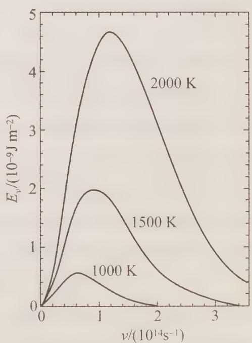  
图1.1.1 黑体在不同温度下辐射能量的分布曲线

$$
\frac {h \nu}{\mathrm{e} ^ {h \nu / k T} - 1}
$$

根据统计物理学可得到单位时间、单位表面积上辐射的能量为

$$
E _ {\nu} = \frac {2 \pi h \nu^ {3}}{c ^ {2}} (\mathrm{e} ^ {h \nu / k T} - 1) ^ {- 1}\tag{1.1.1}
$$

用(1.1.1)式计算 $E_{\nu}$ , 与实验观察到的黑体辐射非常吻合。式中 $k$ 是 Boltzmann 常数①; $T$ 是热力学温度; $c$ 是光速; $h$ 称为 Planck 常数。将此式和观察到的曲线拟合, 得到 $h$ 的数值, 目前测得 $h = 6.626 \times 10^{-34} \mathrm{~J} \mathrm{s}$ 。

由此可见，在定温下黑体辐射能量只与辐射频率有关。频率为 $\nu$ 的能量，其数值是不连续的，只能为 $h\nu$ 的整数倍，称为能量量子化。这一概念是和经典物理学不相容的，因为，经典物理学认为谐振子的能量由振幅决定，而振幅可连续变化，并不受限制，因此能量可连续地取任意数值，而不受量子化的限制。

Planck 能量量子化假设的提出,标志着量子理论的诞生。Planck 是在黑体辐射这个特殊场合中引进能量量子化概念的。在此后的 1900—1926 年间,能量量子化的概念逐渐被推广到所有的微观体系。

## 1.1.2 光电效应和光子学说

首先认识到 Planck 能量量子化假设重要性的是 Einstein(爱因斯坦), 他将能量量子化的概念应用于电磁辐射, 并用以解释光电效应。

光电效应是光照射在金属表面上使金属发射出电子的现象。金属中的电子从照射光获得足够的能量而逸出金属，称为光电子。1900年前后，许多实验已经证实：

\- 只有当照射光的频率 $\nu$ 超过某个最小频率 $\nu_0$ (称临阈频率) 时, 金属才能发射光电子; 不同金属的 $\nu_0$ 值不同, 大多数金属的 $\nu_0$ 值位于紫外区。

随着照射光强度的增加，发射的光电子数也增加，但不影响光电子的动能 $E_{\mathrm{k}}$ 。

\- 增加照射光的频率,光电子的动能也随之增加。

这些实验结果示于图 1.1.2 中。

根据光波的经典图像,波的能量与它的强度成正比,而与频率无关。因此,只要有足够的强度,任何频率的光都能产生光电效应,而光电子的动能将随光强的增加而增加,与光的频率无关,这些经典物理学的推测与实验事实不符。

1905 年, Einstein 提出光子学说, 圆满地解释了光电效应。光子学说的内容如下:

(1) 光是一束光子流,每一种频率的光的能量都有一个最小单位,称为光子,光子的能量

与光子的频率成正比，即

$$
E = h \nu\tag{1.1.2}
$$

式中 $h$ 为Planck常数， $\nu$ 为光子的频率。

(2) 光子不但有能量, 而且有质量 $(m)$ , 但光子的静止质量为零。按相对论的质能联系定律, $E = mc^{2}$ , 光子的质量为

$$
m = h \nu / c ^ {2}\tag{1.1.3}
$$

所以不同频率的光子有不同的质量。

(3) 光子具有一定的动量(p)

$$
p = m c = h \nu / c = h / \lambda\tag{1.1.4}
$$

光子有动量在光压实验中得到了证实。

(4) 光的强度取决于单位体积内光子的数目, 即光子密度。

将频率为 $\nu$ 的光照射到金属上, 当金属中的电子受到光子撞击时, 产生光电效应, 光子消失, 并把它的能量 $h\nu$ 转移给电子。电子吸收的能量, 一部分用于克服金属对它的束缚力, 其余部分则变为光电子的动能。

$$
h \nu = W + E _ {\mathrm{k}} = h \nu_ {0} + \frac {1}{2} m v ^ {2}\tag{1.1.5}
$$

式中 $W$ 是电子逸出金属所需要的最低能量，称为脱出功（又称功函数），它等于 $h\nu_0$ ； $E_{\mathrm{k}}$ 是光电子的动能，它等于 $mv^2 / 2$ 。（1.1.5）式能解释全部实验观测结果：当 $h\nu < W$ 时，光子没有

足够的能量使电子逸出金属, 不发生光电效应; 当 $h\nu = W$ 时, 光子的频率是产生光电效应的临阈频率 $(\nu_{0})$ ; 当 $h\nu > W$ 时, 从金属中发射的电子具有一定的动能, 它随 $\nu$ 的增加而增加, 与光强无关。由图 1.1.2 可见: $E_{k}$ 和 $\nu$ 呈线性关系, 直线的斜率为 Planck 常数 h, 直线和 $\nu$ 轴的交点 $\nu_{0}$ 为临阈频率, 直线和 $E_{k}$ 轴的交点 $(-W)$ 为脱出功 W 的负值。增加光的强度可增加光束中单位体积内的光子数, 因而增加发射电子的速率。在后面 3.6 节中讨论的光电子能谱, 就是利用光电效应以测定分子轨道能级的高低。

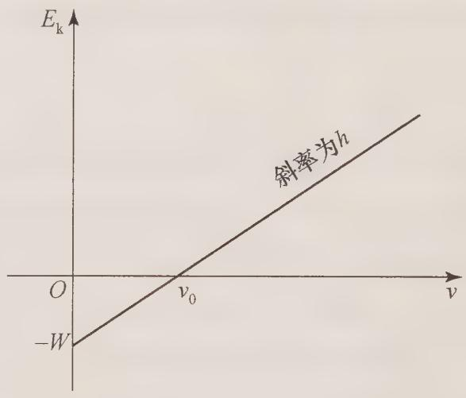  
图1.1.2 光电子的动能 $E_{\mathrm{k}}$  
和照射光频率 $\nu$ 的关系

由上可见，只有把光看成是由光子组成的光束，才

能理解光电效应；而只有把光看成波，才能解释衍射和干涉现象。光表现出波粒二象性，即在一些场合其行为像粒子，在另一些场合其行为像波。粒子在空间定域，而波却不能定域。由光子模型得到的光能是量子化的，而由波动模型得到的光能却是连续的。因此，粒和波两者从表面上看是互相矛盾、互不相容的。在(1.1.2)和(1.1.4)式中，E 和 p 是粒的概念， $\nu$ 和 $\lambda$ 是波的概念，彼此通过 Planck 常数 h 联系在一起。粗略地看，这两个方程本身是矛盾的，但实际上这两个方程把光具有波粒二象性的运动特征统一起来了。

关于光的本质,历史上曾有以 Newton 为代表的微粒说(1680 年)和以 Huygens(惠更斯)为代表的波动说(1690 年)之争,争论结果波动说获胜。到 19 世纪 Maxwell 发展了波动说,建立了电磁波理论。1905 年 Einstein 光子学说又提出微粒说,但他的微粒说和 Newton 的微粒说本质上是不同的。光子学说和光的波动说并不矛盾。

1907 年, Einstein 把能量量子化的概念用于固体中原子的振动, 证明当温度趋于 0 K 时, 固体热容也趋于零。这个结论与实验结果一致, 却和经典的能量均分定理不同。

## 1.1.3 实物微粒的波粒二象性

波粒二象性是微观粒子的基本特性,这里所指的微观粒子既包括静止质量为零的光子,也包括静止质量不为零的实物微粒,如电子、质子、原子和分子等,其运动速度 v 远小于光速 c。

1924年de Broglie(德布罗意)受到光的波粒二象性理论的启发，提出实物微粒也有波性的假设。他认为，在光学上，比起波动的研究方法，是过于忽略了粒子的研究方法；在实物微粒上，是否发生了相反的错误？是不是过多地考虑了粒子的图像，而过于忽略了波的图像？他提出实物微粒也有波性，后来称这种波为德布罗意波。

光的波粒二象性表明：光的波动性指光是电磁波，光的粒子性指光具有量子性。光在介质中以光速 $c$ 传播时，它的二象性通过下列公式联系着：

$$
\left\{ \begin{array}{l} E = h \nu \\ m = h \nu / c ^ {2} \\ p = h \nu / c \end{array} \right.\tag{1.1.6}
$$

式中描述波动性的物理量是光的频率 $\nu$ ；描述粒子性的物理量是光子的运动质量 $m$ ，能量 $E$ 和动量 $p$ 。光的波性和粒性通过 Planck 常数 $h$ 联系起来。

de Broglie 指出, 静止质量为 m 的实物微粒的波粒二象性, 也可按波动的频率 $\nu$ 和波长 $\lambda$ 将粒子运动的动能 E, 动量 p 和运动速度 v 联系起来:

$$
\left\{ \begin{array}{l} E = h \nu \\ p = h / \lambda = m v \end{array} \right.\tag{1.1.7}
$$

对(1.1.7)式要注意波动速度的两个概念：相速度 $u$ 和群速度 $\upsilon_{\mathrm{g}}$ 。粒子的波以波函数 $\psi$ 表示（参见1.2.1节）， $\psi$ 位相的运动速度为相速度 $u = \lambda / T = \lambda \nu$ ，式中 $T$ 是周期。由于实物粒子波动能量由粒子概率密度函数 $\psi^2$ 体现出来， $\psi^2$ 的波可看作波包，它传播的位相速度要用群速度 $\upsilon_{\mathrm{g}}$ 表达，这时 $\psi^2$ 的波动周期缩小一半，群速度 $\upsilon_{\mathrm{g}}$ 比相速度 $u$ 快一倍，即 $\upsilon_{\mathrm{g}} = 2u$ 。

通常文献中报道实物微粒(如电子)以速度 v 运动时, 粒子具有波长 $\lambda$ , 这时应用(1.1.7)式进行计算时, v 为群速度 $v_{g}$ 。粒子的动能 $E = p^{2}/2m$ , 同时

$$
\lambda = h / p = h / m v\tag{1.1.8}
$$

描述实物粒子和光子波粒二象性的运动规律,可分别按下述联系公式计算:

$$
\begin{array}{r l r} & {\text {实物粒子}} \\ & {\lambda \xrightarrow {p = \frac {h}{\lambda}} p = m v _ {\mathrm{g}} = m v} \\ & {\lambda = \frac {u}{v} = \frac {v _ {\mathrm{g}}}{2 v} \left| \begin{array}{c c} & \\ & \\ & v \end{array} \right. \quad E = \frac {p ^ {2}}{2 m} = \frac {1}{2} m v _ {\mathrm{g}} ^ {2}} \\ & {\qquad \qquad \qquad \qquad \qquad \qquad \qquad \qquad \qquad \qquad \qquad \qquad \lambda = \frac {c}{v} \left| \begin{array}{c c} & \\ & \\ & v \end{array} \right. \quad E = h v} \end{array}
$$

按上述关系可计算实物微粒运动的波长,例如以 $1.0 \times 10^{6} \, m s^{-1}$ 的速度运动的电子,其德布罗意波波长为

$$
\lambda = \frac {h}{m v} = \frac {6 . 6 \times 1 0 ^ {- 3 4} \mathrm{Js}}{(9 . 1 \times 1 0 ^ {- 3 1} \mathrm{kg}) \times (1 . 0 \times 1 0 ^ {6} \mathrm{ms} ^ {- 1})} = 7. 0 \times 1 0 ^ {- 1 0} \mathrm{m}
$$

这个波长相当于分子大小的数量级，说明原子和分子中电子运动的波效应是重要的。而宏观粒子观察不到波性，例如质量为 $1.0 \times 10^{-3} \mathrm{~kg}$ 的宏观粒子以 $1.0 \times 10^{-2} \mathrm{~ms}^{-1}$ 的速度运动时，通过类似的计算得 $\lambda = 7.0 \times 10^{-29} \mathrm{~m}$ ，其数值非常小，观察不到波动效应。

电子运动的波长 $\lambda = h/mv, v$ 是电子运动速度，它由加速电子运动的电场电势差 (V) 决定，即

$$
\frac {1}{2} m v ^ {2} = e V
$$

$$
v = \left(\frac {2 e V}{m}\right) ^ {1 / 2}\tag{1.1.9}
$$

若 $V$ 的单位是 $\mathrm{V}$ （伏[特]），则波长为

$$
\begin{array}{r l} \lambda & = h / m v = h / (\sqrt {2 m e} \sqrt {V}) \\ & = \frac {6 . 6 2 6 \times 1 0 ^ {- 3 4} \mathrm{Js}}{\sqrt {2 \times (9 . 1 1 0 \times 1 0 ^ {- 3 1} \mathrm{kg}) \times (1 . 6 0 2 \times 1 0 ^ {- 1 9} \mathrm{C})}} \frac {1}{\sqrt {V}} \\ & = 1. 2 2 6 \times 1 0 ^ {- 9} (1 / \sqrt {V}) \mathrm{m} \end{array}
$$

由上式可知,若加速电压为 $1000 \, V$ , 则所得波长为 $39 \, pm$ , 波长的数量级和 X 射线相近, 用普通光栅无法检验出它的波性。

1927 年, C. J. Davisson(戴维逊) 和 L. H. Germer(革末) 用单晶体电子衍射实验, 观察到完全类似于 X 射线衍射的结果; G. P. Thomson(汤姆逊) 用多晶金属箔进行电子衍射实验, 得到和 X 射线多晶衍射相同的结果。这些实验证实电子运动具有波性, 验证了 de Broglie 的假设。

此后，人们相继采用中子、质子、氢原子和氦原子等粒子流，也同样观察到衍射现象，充分证明了实物微粒具有波性。电子显微分析以及用电子衍射和中子衍射测定分子结构都是实物微粒波性的应用。由此可见，一切微观体系都是粒性和波性的对立统一体。 $E=h\nu,p=h/\lambda$ 两式具体揭示了波性和粒性的内在联系，等号左边体现粒性，右边体现波性，它们彼此联系，互相渗透，构成矛盾对立的统一体。微观体系的这种波粒二象性是它们运动的本质特性。

电子等实物微粒具有波性, 实物微粒波代表什么物理意义, 这是许多科学家关心和研究的问题。1926 年, M. Born(玻恩)提出实物微粒波的统计解释。他认为, 在空间任何一点上波的强度 (即振幅的平方) 和粒子出现的概率成正比。按照这种解释描述的粒子的波称为概率波。为了说明 Born 的统计解释, 再分析上述电子衍射实验。人们发现, 较强的电子流可以在短时间内得到电子衍射照片, 但用很弱的电子流, 让电子先后一个一个地到达底片, 只要时间足够长, 也能得同样的衍射图形。这说明, 电子衍射不是电子之间相互作用的结果, 而是电子本身运动所固有的规律。用很弱的电子流做衍射实验, 电子一个一个地通过晶体, 因为电子具有粒性, 开始只能得到照相底片上的一个个点, 得不到衍射图像, 但电子每次到达的点并不重合在一起, 经过足够长的时间, 通过的电子数目足够多时, 照片上就得到衍射图像, 显示出波性。可见, 电子的波性是和其行为的统计性联系在一起的。对大量粒子而言, 衍射强度 (即波的强度) 大的地方, 粒子出现的数目就多; 衍射强度小的地方, 粒子出现的数目就少。对一个粒子而言, 通过晶体到达底片的位置不能准确预测。若将相同速度的粒子, 在相同条件下重复做多次相同的实验, 一定会在衍射强度大的地方出现的机会多, 在衍射强度小的地方出现的机会少。

由上可见,实物微粒波的物理意义与机械波(水波、声波)和电磁波等不同,机械波是介质质点的振动,电磁波是电场和磁场的振动在空间传播的波,而实物微粒波的本质正有待阐明。实物微粒波的强度反映粒子出现概率的大小,故称概率波。

实物微粒有波性,我们对其粒性的理解也应和经典物理学的概念有所不同。在经典物理学中,粒子的运动服从牛顿力学,它在一定的运动条件下有可以预测的运动轨道,一束电子在同样条件下通过晶体,每个电子都应到达底片上同一点,观察不到衍射现象。事实上,电子通过晶体时并不遵循牛顿力学,它有波性,每次到达的地方无法准确预测,只有一定的与波的强度成正比的概率分布,出现衍射现象。

由上可知,对衍射实验,一个粒子不能形成一个波,一个粒子通过晶体到达底片上,出现的是一个衍射点,而不是强度很弱的衍射图像。但是从大量微观粒子的衍射图像,可揭示出微观粒子运动的波性和这种波的统计性,这个重要的结论适用于原子或分子中电子的行为。原子和分子中的电子,其运动具有波性,其分布具有概率性。原子和分子中电子的运动可用波函数描述,而电子出现的概率密度可用电子云描述。

在经典物理学中,既没有具有粒性的波,也没有具有波性的粒子。宏观世界中总结出的概念并不完全适用于微观物体。要正确理解实物微粒的波粒二象性,必须摆脱波和粒子的经典概念的束缚,用量子力学的概念去理解。在1925—1927年间,不确定度关系(有的书称测不准关系)和Schrödinger(薛定谔)方程的提出,标志着量子力学的诞生。

## 1.1.4 不确定度关系

宏观体系的共轭物理量(例如动量与坐标、方位角与动量矩等)可同时被准确测定。而微观体系的共轭物理量不能同时被准确测定,若其中一种物理量被测定得越精确,则其共轭物理量被测定得越不精确。微观体系的这种性质被称为不确定原理(uncertainty principle)。它是由德国物理学家 W. K. Heisenberg(海森伯)于 1927 年首先提出的。

为了说明不确定原理,先简介电子的单缝衍射。如图1.1.3所示,一个沿y方向运动的电子,通过宽度为D的狭缝,落在荧光屏上。通过狭缝之前,电子在x方向的速度 $v_{x}$ 为0。对于宏观粒子,通过狭缝后一直沿着原直线方向前进,在屏幕上显示的宽度仍为D。而对于电子,通过狭缝后会展宽,得到衍射图,图中曲线表示荧光屏上各点的波强度。

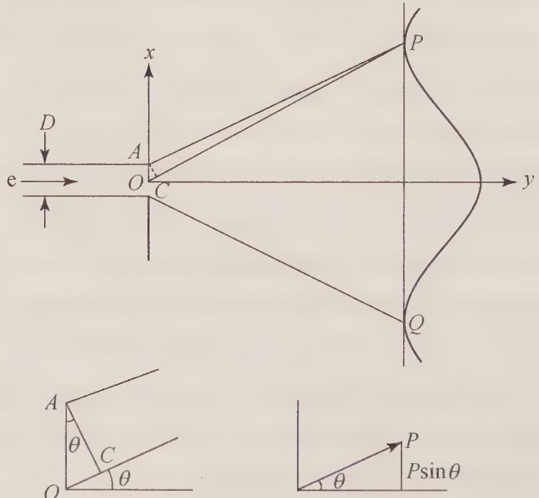  
图1.1.3 电子的单缝衍射实验示意图

各点的波强度是从狭缝不同部位发出的波互相叠加的结果。当两列波同相时，互相叠加得到更强的波；当两列波反相时，互相叠加使强度减弱。在荧光屏上显示的第一极小值（ $P$ 点和 $Q$ 点），是从狭缝顶端（如 $A$ 点）发出到达 $P$ 点的波比从狭缝中部（ $O$ 点）发出的波少走半个波长，这两列波反相，恰好互相抵消。因此，出现第一衍射极小值的条件是

$$
\overline {{{O P}}} - \overline {{{A P}}} = \lambda / 2 = \overline {{{O C}}}
$$

由于从狭缝到屏幕的距离比狭缝的宽度大得多，当 $\overline{CP} = \overline{AP},\angle PAC,\angle PCA,\angle ACO$ 均接近 $90^{\circ}$ 。这样，出现第一极小值的角度 $(\theta)$ 可由下式给出

$$
\sin \theta = \overline {{O C}} / \overline {{A O}} = \frac {\lambda / 2}{D / 2} = \lambda / D
$$

从电子的粒性考虑,狭缝的衍射会使电子改变运动方向,大部分电子在 $-\theta$ 到 $+\theta$ 范围内。落在屏幕上P点附近的电子,在狭缝处的动量p的x分量为

$$
p _ {x} = p \sin \theta
$$

此 $p_x$ 即为动量 $p$ 在 $x$ 方向的不确定度 $\Delta p_x$ ，所以

$$
\Delta p _ {x} = p \sin \theta = p \lambda / D = h / D
$$

如图所示,坐标 x 的不确定度为狭缝宽度 D, 即 $\Delta x = D$ , 故得

$$
\Delta x \Delta p _ {x} = h\tag{1.1.10}
$$

这里只考虑了落在主峰范围内的一级衍射，若将二级、三级等衍射也考虑在内，则有

$$
\underline {{{{\Delta x \Delta p _ {x} \geqslant h}}}} \quad \text {或} \quad \Delta x \Delta p _ {x} \geqslant h / 4 \pi\tag{1.1.11}
$$

此即不确定度关系(uncertainty relation)。它表明,微观粒子的坐标和动量不能同时被准确测定。当它的坐标确定得愈准确,其相应的动量就愈不准确,反之亦然。两个共轭物理量不确定度之积为 h 的数量级。(1.1.11)式虽然是从电子的单缝衍射实验推引出的,但它是微观领域的普遍规律。1929 年 Robertson(罗伯逊)从量子力学出发对它作了严格证明。

更一般的不确定度关系式如下：

$$
\Delta Q \Delta p \geqslant h
$$

式中， $\Delta Q$ 和 $\Delta p$ 分别为微观粒子的广义坐标的不确定度和广义动量的不确定度。

时间 $t$ 和能量 $E$ 也有类似于(1.1.11)式的关系

$$
\Delta E \Delta t \geqslant h / 4 \pi\tag{1.1.12}
$$

式中 $\Delta t$ 是微粒处于某一状态的时间（即平均寿命）， $\Delta E$ 是该状态的能量不确定范围（即能级宽度）。

(1.1.11)式提供了判断哪些物体的运动规律可用经典力学处理,哪些物体的运动规律必须用量子力学处理的客观标准。对于宏观物体,由(1.1.11)式表明的不确定数量实在太小了,以至于对我们所讨论的实际问题不起作用,运动中的波性可忽略,Planck常数h可视为零,即宏观物体同时具有确定的坐标和动量,服从经典力学规律。而对于微观物体,运动中的波性不能忽略,Planck常数h不能视为零,服从量子力学规律。见习题1.7。

在任意一时刻 $t$ ，宏观物体的坐标 $x$ 和动量 $p_x$ 都有确定值。 $p_x = m(\mathrm{d}x / \mathrm{d}t)$ ，经 $\mathrm{dt}$ 时间间隔后，粒子位置变为

$$
x + \mathrm{d} x = x + p _ {x} \mathrm{d} t / m
$$

因此在时间进程中，粒子沿着确定的轨道运动。而由不确定度关系可见，微观粒子的 $x$ 和 $p_x$ 不可能同时有确定值，正好说明它不存在确定的运动轨道，这正是具有波性的微观粒子本质上区别于宏观物体的标志。不确定原理是微观粒子波粒二象性的客观反映，是人们对微观粒子运动规律认识的深化。不确定原理不是限制人们认识的限度，而是限制经典力学适用的范围。具有波粒二象性的微观粒子没有运动轨道，要求人们建立起能反映微观粒子特有的规律去加以研究，这就是量子力学的任务。

比较微观粒子和宏观物体的特性,可见:

（1）宏观物体同时具有确定的坐标和动量，其运动规律可用经典物理学描述；而微观粒子没有同时确定的坐标和动量，其运动规律需用量子力学描述。

（2）宏观物体有连续、可测的运动轨道，可追踪各个物体的运动轨迹来加以分辨；微观粒子具有概率分布的特性，不可能分辨出各个粒子的轨迹。

（3）宏观物体可处于任意的能量状态，体系的能量可以为任意的、连续变化的数值；微观粒子只能处于某些确定的能量状态，能量的改变量不能取任意的、连续变化的数值，只能是分立的，即量子化的。

（4）不确定原理对宏观物体无实际意义，在不确定度关系式中，Planck常数 $h$ 可当作0；微观粒子遵循不确定度关系， $h$ 不能被看作0。所以，可以用不确定度关系式作为区分宏观物体与微观粒子的判别标准。

直径处于纳米(nm)量级的粒子,如纳米材料(见10.7节),常常表现出既不同于宏观物体、又不同于微观粒子的特性,称为介观粒子。

## 1.2 量子力学基本假设

如上节所述，微观粒子具有波粒二象性，它们的运动规律不服从经典物理学而服从量子力学。量子力学是描述微观体系运动规律的科学，它充分体现了微观粒子波性和粒性的对立统一及相互制约。量子力学的基本原理是由许多科学家，如 E. Schrödinger（薛定谔），W. K. Heisenberg（海森伯），M. Born（玻恩）以及 P. A. M. Dirac（狄拉克）等人，经过大量工作总结出来的，它是自然界的基本规律之一。

量子力学包含若干基本假设,从这些基本假设出发,可推导出一些重要结论,用以解释和预测许多实验事实。经过百余年实践的考验,证明作为量子力学理论基础的这些基本假设是正确的。下面介绍量子力学的基本假设以及由这些假设引出的基本原理。

## 1.2.1 波函数和微观粒子的状态

假设Ⅰ 对于一个微观体系,它的状态和由该状态所决定的各种物理性质可用波函数 $\Psi(x,y,z,t)$ 表示。 $\Psi$ 是体系的状态函数,是体系中所有粒子坐标的函数,也是时间的函数。

例如对一个两粒子体系， $\Psi = \Psi(x_1, y_1, z_1, x_2, y_2, z_2, t)$ ，其中： $x_1, y_1, z_1$ 为粒子1的坐标； $x_2, y_2, z_2$ 为粒子2的坐标； $t$ 是时间。波函数的名称源于这一函数采用了经典物理学中波动的数学形式，该形式可由光波推演而得：将波粒二象性关系 $E = h\nu, p = h / \lambda$ 代入平面单色光的波动方程 $\Psi = A \exp[\mathrm{i} 2\pi (x / \lambda - \nu t)]$ ，得单粒子一维运动的波函数

$$
\Psi = A \exp \left[ \frac {\mathrm{i} 2 \pi}{h} (x p _ {x} - E t) \right]\tag{1.2.1}
$$

不含时间的波函数 $\psi(x,y,z)$ 称为定态波函数。在本书中主要讨论定态波函数，后面的 $\psi$

都是代表定态波函数 $\psi (x,y,z)$ 。

$\psi$ 一般是复数形式: $\psi = f + \mathrm{i}g, f$ 和 $g$ 是坐标的实函数。 $\psi$ 的共轭复数为 $\psi^{*}$ , 其定义为 $\psi^{*} = f - \mathrm{i}g$ 。为了求 $\psi^{*}$ , 只需在 $\psi$ 中出现 i 的地方都用 -i 代替即可。由于

$$
\psi^ {*} \psi = (f - \mathrm{i} g) (f + \mathrm{i} g) = f ^ {2} + g ^ {2}\tag{1.2.2}
$$

因此 $\psi^{*}\psi$ 是实数，而且是正值。为了书写方便，有时也用 $\psi^{2}$ 代替 $\psi^{*}\psi$ 。

由于空间某点波的强度与波函数的平方成正比，即在该点附近找到粒子的概率正比于 $\psi^{*}\psi$ ，所以通常将用波函数 $\psi$ 描述的波称为概率波。在原子或分子等体系中，将 $\psi$ 称为原子轨道或分子轨道；将 $\psi^{*}\psi$ 称为概率密度，它就是通常所说的电子云； $\psi^{*}\psi \mathrm{d}\tau$ 为空间某点附近体积元 $\mathrm{d}\tau (\equiv \mathrm{d}x\mathrm{d}y\mathrm{d}z)$ 中电子出现的概率。

用量子力学处理微观体系时,要设法求出波函数 $\psi$ 的具体形式。虽然不能把 $\psi$ 看成物理波(如电场或磁场的波动),但 $\psi$ 是状态的一种数学表示,能给出关于体系状态和该状态各种物理量的取值及其变化信息,对了解体系的各种性质极为重要。例如氢原子 1s 态的波函数为

$$
\psi_ {1 \mathrm{s}} = \frac {1}{\sqrt {\pi a _ {0} ^ {3}}} \exp [ - r / a _ {0} ]
$$

这是将氢原子核放在极坐标系的原点时，描述电子运动状态的波函数。式中 $r$ 表示电子到核的距离， $a_0 = 52.92 \mathrm{pm}$ （称玻尔半径）。体系处在该状态的各种物理性质，如能量、动量、角动量等可由 $\psi$ 求得（见假设Ⅲ）。氢原子1s态的概率密度，即电子云的分布为

$$
\psi_ {1 \mathrm{s}} ^ {2} = \frac {1}{\pi a _ {0} ^ {3}} \exp [ - 2 r / a _ {0} ]
$$

$\psi (x,y,z)$ 在空间某点的数值，可能是正值，也可能是负值或零。微粒的波性通过 $\psi$ 的 $+$ 、一号反映出来，这和光波是相似的。+、一号涉及状态函数（如原子轨道等）的重叠。

$\psi$ 的性质与它是奇函数还是偶函数有关：

$$
\text { 偶函数: } \psi (x, y, z) = \psi (- x, - y, - z)
$$

$$
\text { 奇函数:   } \psi (x, y, z) = - \psi (- x, - y, - z)
$$

波函数的奇、偶性涉及微粒从一个状态跃迁至另一个状态的概率性质等。

由上可见,描述微观体系运动状态的波函数 $\psi$ , 对了解该体系的性质和运动规律是十分重要的, 因为它全面地规定了体系的各种性质, 而并不局限于只和某一个物理量相联系。有人认为 $\psi$ 本身没有什么物理意义, 它的物理意义要通过 $\psi^{2}$ 来体现。这种理解带有局限性, 只看到了 $\psi^{2}$ 的性质, 即只看到 $\psi$ 性质的一个侧面。其实, $\psi$ 和体系的各种性质都有联系, 而不局限在电子云这一点上。

由于波函数 $\psi$ 描述的波是概率波, 因而它必须满足下列 3 个条件:

(1) 波函数必须是单值的, 即在空间每一点 $\psi$ 只能有一个值。

(2) 波函数必须是连续的, 即 $\psi$ 的值不出现突跃; $\psi$ 对 x, y, z 的一阶微商也是连续函数。

(3) 波函数必须是平方可积的, 即 $\psi$ 在整个空间的积分 $\int \psi^{*} \psi \mathrm{d}\tau$ 为一个有限数 (式中球坐标系的微体积元 $\mathrm{d}\tau = r^{2} \sin \theta \mathrm{d}r \mathrm{d}\theta \mathrm{d}\phi$ )。通常要求波函数归一化, 即

$$
\int \psi^ {*} \psi \mathrm{d} \tau = 1\tag{1.2.3}
$$

符合这3个条件的波函数称为合格波函数或品优波函数。

## 1.2.2 物理量和算符

假设Ⅱ 对一个微观体系的每个可观测的物理量,都对应着一个线性自轭算符。

对某一函数进行运算操作,规定运算操作性质的符号称为算符,例如 $\frac{d}{dx}$ ,sin,lg等等。在量子力学中,为了和用波函数作为描述状态的数学工具相适应,以算符作为表示物理量的数学工具。体系的每个可观测的物理量都和一个线性自轭算符相对应。例如,微观粒子的动量和波长相关,由于波长是整个波的量,所以严格地说,“空间某一点的波长”或“微观粒子在空间某点的动量”都是没有意义的。为了计算该状态的平均动量,需要引进动量算符。

设物理量为 A，相应的算符为 $\hat{A}$ ，若满足下一条件

$$
\hat {A} (\psi_ {1} + \psi_ {2}) = \hat {A} \psi_ {1} + \hat {A} \psi_ {2}\tag{1.2.4}
$$

则称 $\hat{A}$ 为线性算符。若 $\hat{A}$ 能满足

$$
\int \psi_ {1} ^ {*} \hat {A} \psi_ {1} \mathrm{d} \tau = \int \psi_ {1} (\hat {A} \psi_ {1}) ^ {*} \mathrm{d} \tau
$$

或

$$
\int \psi_ {1} ^ {*} \hat {A} \psi_ {2} \mathrm{d} \tau = \int \psi_ {2} (\hat {A} \psi_ {1}) ^ {*} \mathrm{d} \tau\tag{1.2.5}
$$

则称 $\hat{A}$ 为自轭算符，又称厄米算符（Hermitian operator）。

例如， $\hat{A} = \mathrm{i}\frac{\mathrm{d}}{\mathrm{d}x},\psi_1 = \exp [\mathrm{i}x],\psi_1^* = \exp [-\mathrm{i}x]$ ，则

$$
\int \exp [ - \mathrm{i} x ] \left(\mathrm{i} \frac {\mathrm{d}}{\mathrm{d} x}\right) \exp [ \mathrm{i} x ] \mathrm{d} x = \int \exp [ \mathrm{i} x ] \left\{\left(\mathrm{i} \frac {\mathrm{d}}{\mathrm{d} x}\right) \exp [ \mathrm{i} x ] \right\} ^ {*} \mathrm{d} x = - x
$$

量子力学需要用线性自轭算符,是为了使和算符对应的本征值能为实数(见假设Ⅲ)。若干物理量对应的算符列于表1.2.1中。

表 1.2.1 若干物理量及其算符

<table><tr><td colspan="2">物理量</td><td>算符</td></tr><tr><td>位置</td><td>x</td><td> $\hat{x} = x$ </td></tr><tr><td>动量的x轴分量</td><td> $p_x$ </td><td> $\hat{p}_x = -\frac{\mathrm{i}h}{2\pi} \frac{\partial}{\partial x}$ </td></tr><tr><td>角动量的z轴分量</td><td> $M_z = x p_y - y p_x$ </td><td> $\hat{M}_z = -\frac{\mathrm{i}h}{2\pi} \left( x \frac{\partial}{\partial y} - y \frac{\partial}{\partial x} \right)$ </td></tr><tr><td>动能</td><td> $T = p^2 / 2m$ </td><td> $\hat{T} = -\frac{h^2}{8\pi^2 m} \left( \frac{\partial^2}{\partial x^2} + \frac{\partial^2}{\partial y^2} + \frac{\partial^2}{\partial z^2} \right) = -\frac{h^2}{8\pi^2 m} \nabla^2$ </td></tr><tr><td>势能</td><td>V</td><td> $\hat{V} = V$ </td></tr><tr><td>总能</td><td> $E = T + V$ </td><td> $\hat{H} = -\frac{h^2}{8\pi^2 m} \nabla^2 + V$ </td></tr></table>

表 1.2.1 所列的算符中, 动量的 x 轴分量 $p_{x}$ 所对应的算符 $\hat{p}_{x}$ 至关重要, 其来源可从下面的推演过程理解, 但注意这种推演只是说明假设是怎样提出来的, 而不是一种严格的证明。将 (1.2.1) 式

$$
\Psi = A \exp \left[ \frac {\mathrm{i} 2 \pi}{h} (x p _ {x} - E t) \right]
$$

对 $x$ 微分，得

$$
\frac {\partial \Psi}{\partial x} = A \exp \left[ \frac {\mathrm{i} 2 \pi}{h} (x p _ {x} - E t) \right] \frac {\mathrm{d}}{\mathrm{d} x} \left[ \frac {\mathrm{i} 2 \pi}{h} (x p _ {x} - E t) \right] = \frac {\mathrm{i} 2 \pi}{h} p _ {x} \Psi
$$

可见

$$
p _ {x} \Psi = - \frac {\mathrm{i} h}{2 \pi} \frac {\partial \Psi}{\partial x}
$$

$$
\hat {p} _ {x} = - \frac {\mathrm{i} h}{2 \pi} \frac {\partial}{\partial x}\tag{1.2.6}
$$

动量沿 $y$ 轴和 $z$ 轴的分量 $p_y, p_z$ ，角动量沿 $z$ 轴的分量 $M_z$ ，动能 $T$ 等的算符形式即可根据(1.2.6)式推演得到。角动量在球极坐标中的分量及角动量平方的算符见2.1.1节。

为了获得相应物理量的算符,首先是为该物理量写出包含坐标 q(即 x,y,z) 和动量沿坐标 q 的分量 $p_{q}$ 的经典表达式,然后以

$$
\hat {q} = q, \quad \hat {p} _ {q} = - \frac {\mathrm{i} h}{2 \pi} \frac {\partial}{\partial q}
$$

代入，整理、化简即得。

算符和波函数的关系是一种数学关系,通过算符的运算可获得有关微观体系的各种信息。实践证明,利用算符和波函数能正确地描述微观体系的状态和性质。

## 1.2.3 本征态、本征值和 Schrödinger 方程

假设Ⅲ 若某一物理量 A 的算符 $\hat{A}$ 作用于某一状态函数 $\psi$ 等于某一常数 a 乘以 $\psi$ ，即

$$
\hat {A} \psi = a \psi\tag{1.2.7}
$$

那么对 $\psi$ 所描述的微观状态, 物理量 $A$ 具有确定的数值 $a$ 。 $a$ 称为物理量算符 $\hat{A}$ 的本征值, $\psi$ 称为 $\hat{A}$ 的本征态或本征波函数, (1.2.7) 式称为 $\hat{A}$ 的本征方程。

这一假设把量子力学数学表达式的计算值与实验测量值沟通起来。当 $\psi$ 是 $\hat{A}$ 的本征态，在这个状态下，实验测定的数值将与 $\hat{A}$ 的本征值 $a$ 对应。例如，欲知一个原子可能的能量数值，只需将能量算符作用于该状态的原子波函数 $\psi$ ，求出能量算符的本征值，此值应与实验测得的该状态的能量数值一致。

## 1. 自轭算符的第一项重要性质

自轭算符的本征值一定为实数,这和本征值的物理意义是相适应的,这是自轭算符的第一项重要性质。现证明如下。

将(1.2.7)式两边取共轭

$$
\hat {A} ^ {*} \psi^ {*} = a ^ {*} \psi^ {*}\tag{1.2.8}
$$

由(1.2.7)，(1.2.8)两式，可得

$$
\int \psi^ {*} (\hat {A} \psi) \mathrm{d} \tau = a \int \psi^ {*} \psi \mathrm{d} \tau
$$

$$
\int \psi (\hat {A} ^ {*} \psi^ {*}) \mathrm{d} \tau = a ^ {*} \int \psi \psi^ {*} \mathrm{d} \tau
$$

根据(1.2.5)式,得

$$
\int \psi^ {*} (\hat {A} \psi) \mathrm{d} \tau = \int \psi (\hat {A} ^ {*} \psi^ {*}) \mathrm{d} \tau
$$

故

$$
a \int \psi^ {*} \psi \mathrm{d} \tau = a ^ {*} \int \psi \psi^ {*} \mathrm{d} \tau
$$

$$
a = a ^ {*}
$$

即 $a$ 为实数。

一个保守体系的总能量 $E$ 在经典物理学中用Hamilton(哈密顿)函数 $H$ 表示，即

$$
H = T + V = \frac {1}{2 m} (p _ {x} ^ {2} + p _ {y} ^ {2} + p _ {z} ^ {2}) + V
$$

将算符形式代入,得 Hamilton 算符 $\hat{H}$

$$
\hat {H} = - \frac {h ^ {2}}{8 \pi^ {2} m} \left(\frac {\partial^ {2}}{\partial x ^ {2}} + \frac {\partial^ {2}}{\partial y ^ {2}} + \frac {\partial^ {2}}{\partial z ^ {2}}\right) + \hat {V} = - \frac {h ^ {2}}{8 \pi^ {2} m} \nabla^ {2} + \hat {V}\tag{1.2.9}
$$

式中 $\nabla^2 = \left(\frac{\partial^2}{\partial x^2} +\frac{\partial^2}{\partial y^2} +\frac{\partial^2}{\partial z^2}\right)$ ，称为Laplace算符（读作del平方）。

将总能量算符代入(1.2.7)式,得到

$$
\begin{array}{c} \hat {H} \psi = E \psi \\ \left(- \frac {h ^ {2}}{8 \pi^ {2} m} \bigtriangledown^ {2} + \hat {V}\right) \psi = E \psi \end{array}\tag{1.2.10}
$$

(1.2.10)式即为 Schrödinger 方程, 它是决定体系能量算符的本征值和本征函数的方程, 是量子力学中的一个基本方程, 式中 $\psi$ 不含时间。这种本征态给出的概率密度不随时间而改变, 称为定态。这个本征态对应的本征值, 就是该状态的能量。

含时间的 Schrödinger 方程为

$$
\hat {H} \Psi = \frac {\mathrm{i} h}{2 \pi} \frac {\partial}{\partial t} \Psi\tag{1.2.11}
$$

或

$$
\left(- \frac {h ^ {2}}{8 \pi^ {2} m} \nabla^ {2} + \hat {V}\right) \Psi = \frac {\mathrm{i} h}{2 \pi} \frac {\partial}{\partial t} \Psi\tag{1.2.12}
$$

## 2. 自轭算符的第二项重要性质

对一个微观体系,自轭算符 $\hat{A}$ 给出的本征函数 $\psi_{1},\psi_{2},\psi_{3},\cdots$ 形成一个正交性和归一性的函数组。这是自轭算符的第二项重要性质,现证明如下。

(1) 归一性 是指粒子在整个空间出现的概率为 1, 即

$$
\int \psi_ {i} ^ {*} \psi_ {i} \mathrm{d} \tau = 1\tag{1.2.13}
$$

(2) 正交性 是指

$$
\int \psi_ {i} ^ {*} \psi_ {j} \mathrm{d} \tau = 0 \quad (i \neq j)\tag{1.2.14}
$$

设有

$$
\hat {A} \psi_ {i} = a _ {i} \psi_ {i}, \qquad \hat {A} \psi_ {j} = a _ {j} \psi_ {j} \qquad (a _ {i} \neq a _ {j})
$$

当取前式复共轭时，得

$$
(\hat {A} \psi_ {i}) ^ {*} = a _ {i} ^ {*} \psi_ {i} ^ {*} = a _ {i} \psi_ {i} ^ {*}
$$

由于

$$
\int \psi_ {i} ^ {*} \hat {A} \psi_ {j} \mathrm{d} \tau = a _ {j} \int \psi_ {i} ^ {*} \psi_ {j} \mathrm{d} \tau
$$

而

$$
\int (\hat {A} \psi_ {i}) ^ {*} \psi_ {j} \mathrm{d} \tau = a _ {i} \int \psi_ {i} ^ {*} \psi_ {j} \mathrm{d} \tau
$$

按(1.2.5)式自轭算符定义,上两式左边应相等,故

因 $a_{i} \neq a_{j}$ , 故

$$
\begin{array}{r l} (a _ {i} - a _ {j}) \int \psi_ {i} ^ {*} \psi_ {j} \mathrm{d} \tau & = 0 \\ \int \psi_ {i} ^ {*} \psi_ {j} \mathrm{d} \tau & = 0 \end{array}
$$

本征函数组的正交性是由它们的对称性决定的。例如作氢原子的 $\psi_{1\mathrm{s}}$ 和 $\psi_{2\mathrm{p}_x}$ 图形，由图中 $\psi$ 的正负号即可看出 $\int \psi_{1\mathrm{s}}\psi_{2\mathrm{p}_x}\mathrm{d}\tau = 0$ ，注意这里是对整个波函数分布空间的积分。

本征函数组 $\psi_{1},\psi_{2},\psi_{3},\cdots$ 间的正交归一的关系，文献中常用 $\delta_{ij}\left[\delta_{ij}\right.$ 称为 Kronecker（克罗内克）delta] 表示如下：

$$
\int \psi_ {i} ^ {*} \psi_ {j} \mathrm{d} \tau = \int \psi_ {j} ^ {*} \psi_ {i} \mathrm{d} \tau = \delta_ {i j}
$$

$$
\delta_ {i j} = \left\{ \begin{array}{l l} 0, & \text {当} i \neq j \\ 1, & \text {当} i = j \end{array} \right.\tag{1.2.15}
$$

一个原子中电子所处的状态,可用一个函数组(或称原子轨道) $\psi_{1},\psi_{2},\psi_{3},\cdots$ 描述,各个函数间的正交性和归一性对了解原子的结构和性质有重大意义。

## 1.2.4 态叠加原理

假设Ⅳ 若 $\psi_{1},\psi_{2},\cdots,\psi_{n}$ 为某一微观体系的可能状态，则由它们线性组合所得的 $\psi$ 也是该体系可能存在的状态。

$$
\psi = c _ {1} \psi_ {1} + c _ {2} \psi_ {2} + \dots + c _ {n} \psi_ {n} = \sum_ {i} c _ {i} \psi_ {i}\tag{1.2.16}
$$

式中 $c_{1}, c_{2}, \cdots, c_{n}$ 为任意常数，称为线性组合系数。

例如原子中的电子可能以 s 轨道存在,也可能以 p 轨道存在,将 s 轨道和 p 轨道进行线性组合,所得的杂化轨道 $(sp, sp^{2}, sp^{3}$ 等)也是该电子可能存在的状态。

系数 $c_{1}, c_{2}, \cdots, c_{n}$ 等数值的大小，反映 $\psi_{i}$ 对 $\psi$ 的贡献： $c_{i}$ 大，相应 $\psi_{i}$ 的贡献大； $c_{i}^{2}$ 表示 $\psi_{i}$ 在 $\psi$ 中所占的百分数。可由 $c_{i}$ 值求出和力学量 A 对应的平均值 $\langle a\rangle$ 。

## 1. 本征态的物理量的平均值

设与 $\psi_{1},\psi_{2},\cdots,\psi_{n}$ 对应的本征值分别为 $a_{1},a_{2},\cdots,a_{n}$ ，当体系处于状态 $\psi$ 并且 $\psi$ 已归一化时，物理量 A 的平均值

$$
\langle a \rangle = \int \psi^ {*} \hat {A} \psi \mathrm{d} \tau = \int \left(\sum_ {i} c _ {i} ^ {*} \psi_ {i} ^ {*}\right) \hat {A} \left(\sum_ {i} c _ {i} \psi_ {i}\right) \mathrm{d} \tau = \sum_ {i} | c _ {i} | ^ {2} a _ {i}\tag{1.2.17}
$$

体系在状态 $\psi$ 时, 物理量 $A$ 的平均值 $\langle a \rangle$ 和实验测定值相对应, 从而将体系的量子力学数学表达与实验测量沟通起来。

## 2. 非本征态的物理量的平均值

若状态函数 $\psi$ 不是物理量 $A$ 的算符 $\hat{A}$ 的本征态, 当体系处于这个状态时, $\hat{A}\psi \neq a\psi$ , 这时可用积分计算其平均值

$$
\langle a \rangle = \frac {\int \psi^ {*} \hat {A} \psi d \tau}{\int \psi^ {*} \psi d \tau}\tag{1.2.18}
$$

例如氢原子基态波函数为 $\psi_{1s}$ , 其半径 $(r)$ 和势能 $\left(-\frac{e^2}{4\pi\varepsilon_0r}\right)$ 等均没有确定的数值, 不是一个常数, 但可以从(1.2.18)式求出平均半径 $\langle r\rangle$ 和平均势能 $\left\langle -\frac{e^2}{4\pi\varepsilon_0r}\right\rangle$ 。

在化学中,态叠加原理可用于原子轨道的杂化、分子轨道的形成以及共振结构理论等。

## 1.2.5 Pauli(泡利)原理

假设 V 在同一原子轨道或分子轨道上,最多只能容纳两个电子,这两个电子的自旋状态必须相反。或者说,两个自旋相同的电子不能占据同一轨道。

这一假设在量子力学中通常表达为:描述多电子体系轨道运动和自旋运动的全波函数,对任意两电子的全部坐标(空间坐标和自旋坐标)进行交换,一定得反对称的波函数。

许多实验现象都证明电子除轨道运动外还有其他运动,例如光谱的 Zeeman(塞曼)效应(Zeeman效应是在磁场中观察到光谱谱线出现分裂的现象,1896年由Zeeman发现),Stern(施特恩)和Gerlach(革拉赫)的实验(1921年他们发现,将银、锂、氢等原子束经过一个不均匀磁场后,原子束分裂成两束)以及光谱的精细结构等。1925年,G.Uhlenbeck(乌仑贝克)和S.Goudsmit(哥希密特)提出电子自旋的假设,认为电子具有不依赖于轨道运动的自旋运动,具有固有的自旋角动量和相应的自旋磁矩。描述电子运动状态的完全波函数,除了包括空间坐标 $(x,y,z)$ 外,还应包括自旋坐标 $(w)$ 。对一个具有n个电子的体系,其完全波函数应为

$$
\psi = \psi \left(x _ {1}, y _ {1}, z _ {1}, w _ {1}; \dots ; x _ {n}, y _ {n}, z _ {n}, w _ {n}\right) = \psi \left(q _ {1}, \dots , q _ {n}\right)
$$

式中 q 是广义坐标，例如 $q_{1}$ 代表第 1 号电子的坐标 $(x_{1}, y_{1}, z_{1}, w_{1})$ 。

根据微观粒子的波性,相同微粒是不可分辨的,它和宏观粒子不同:

宏观粒子 当一组粒子具有相同的质量和电量,从它们的运动轨道可以标记和辨认出各个粒子的坐标和动量,即各个粒子可以区分。

微观粒子 例如一组电子或一组光子, 因它具有波粒二象性, 服从不确定度关系, 即便它们的质量、电量和自旋都相同, 当任意两个坐标 $q_{1}$ 和 $q_{2}$ 相互交换, 也无法观察到任何物理效应的变化, 彼此不可区分。对由两个粒子组成的体系, 其波函数 $\psi(q_{1}, q_{2})$ 和交换后的波函数 $\psi(q_{2}, q_{1})$ 具有等同结果, 即

$$
\psi^ {2} (q _ {1}, q _ {2}) = \psi^ {2} (q _ {2}, q _ {1})\tag{1.2.19}
$$

由此推得

$$
\psi (q _ {1}, q _ {2}) = \pm \psi (q _ {2}, q _ {1})\tag{1.2.20}
$$

对称的全同粒子波函数：

$$
\psi (q _ {1}, q _ {2}) = + \psi (q _ {2}, q _ {1})\tag{1.2.21}
$$

适用于玻色子(bosons)，如光子、 $\pi$ 介子、氘 $(^{2}\mathrm{H})$ 和 $\alpha$ 粒子 $(^{4}\mathrm{He})$ ，它们的自旋量子数为整数，运动行为遵循玻色-爱因斯坦(Bose-Einstein)统计规则。

反对称的全同粒子波函数：

$$
\psi (q _ {1}, q _ {2}) = - \psi (q _ {2}, q _ {1})\tag{1.2.22}
$$

适用于费米子(fermions)，如电子、质子和中子等，它们的自旋量子数为半整数，运动行为遵循费米-狄拉克(Fermi-Dirac)统计规律。

倘若电子 1 和电子 2 具有相同的空间坐标 $(x_{1}=x_{2},y_{1}=y_{2},z_{1}=z_{2})$ ，自旋相同 $(\omega_{1}=\omega_{2})$ ，

可得

$$
q _ {1} = q _ {2}
$$

将其代入(1.2.22)式,得

$$
\psi (q _ {1}, q _ {1}) = - \psi (q _ {1}, q _ {1})
$$

移项并除以2，得

$$
\psi (q _ {1}, q _ {1}) = 0
$$

这个结论说明,处在三维空间同一坐标位置上,两个自旋相同的电子,其存在的概率密度为零。Pauli原理的这一结果可引申出两个常用的规则:

(1) Pauli 不相容原理——在一个多电子体系中,两个自旋相同的电子不能占据同一个轨道。也就是说,在同一原子中,两个电子的量子数不能完全相同。

(2) Pauli 排斥原理——在一个多电子体系中, 自旋相同的电子尽可能分开、远离。

如前所述，量子力学的这些基本假设以及由这些假设引出的基本原理，已得到大量实验的检验，证明它们是正确的。后面将以一维势箱粒子和氢原子等体系为例，用这些假设和原理求解这些微观体系的运动状态及其性质，并由此了解量子力学解决问题的途径和方法。

## 1.3 箱中粒子的 Schrödinger 方程及其解

## 1.3.1 箱中粒子

本节以一维势箱中粒子为例,说明如何用量子力学的原理、方法和步骤来处理微观体系的运动状态及有关的物理量。

一维势箱中粒子是指一个质量为 m、在一维方向上运动的粒子，它受到如图 1.3.1 所示的势能的限制，图中横坐标表示粒子的运动范围，纵坐标为势能。

当粒子处在 $0 \sim l$ 之间（Ⅱ区）时，势能 V = 0；粒子处在其他地方，势能为无穷大。

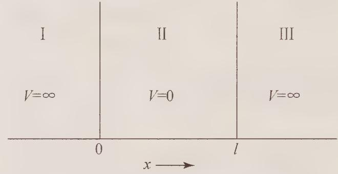  
图1.3.1 一维势箱中粒子的势能

$$
V = \left\{ \begin{array}{l l} 0, & 0 <   x <   l \\ \infty , & x \leqslant 0 \text {和} x \geqslant l \end{array} \right.
$$

这个势能把粒子限制在 $x$ 轴上 $0 \sim l$ 的范围内运动。因而在 I，Ⅲ这两个区域内粒子出现的概率为 $0, \psi$ 为 0；而在箱子内部， $V = 0$ ，Schrödinger 方程为

$$
- \frac {h ^ {2}}{8 \pi^ {2} m} \frac {\mathrm{d} ^ {2} \psi}{\mathrm{d} x ^ {2}} = E \psi\tag{1.3.1}
$$

或

$$
\frac {\mathrm{d} ^ {2} \psi}{\mathrm{d} x ^ {2}} + \frac {8 \pi^ {2} m E}{h ^ {2}} \psi = 0
$$

这是二阶齐次方程,其通解为

$$
\psi = c _ {1} \cos \left(\frac {8 \pi^ {2} m E}{h ^ {2}}\right) ^ {\frac {1}{2}} x + c _ {2} \sin \left(\frac {8 \pi^ {2} m E}{h ^ {2}}\right) ^ {\frac {1}{2}} x\tag{1.3.2}
$$

根据品优波函数的连续性和单值条件，当 $x = 0$ 时， $\psi$ 应为0，即 $\psi(0) = c_1 \cos(0) + c_2 \sin(0) = 0$ 。由此推出 $c_1 = 0$ 。当 $x = l$ 时，

$$
\psi (l) = c _ {2} \sin \left(\frac {8 \pi^ {2} m E}{h ^ {2}}\right) ^ {\frac {1}{2}} l = 0
$$

由于 $c_{2}$ 不能为0（若 $c_{2}$ 也为0，则箱内 $\psi$ 处处为0），因而必须是

$$
\sin \left(\frac {8 \pi^ {2} m E}{h ^ {2}}\right) ^ {\frac {1}{2}} l = 0
$$

即

$$
\left(\frac {8 \pi^ {2} m E}{h ^ {2}}\right) ^ {\frac {1}{2}} l = n \pi \quad n = 1, 2, 3, \dots\tag{1.3.3}
$$

$n$ 不能为0，因为 $n = 0$ 也会使箱中 $\psi$ 值处处为0，失去意义。 $n$ 也不能为负值，因为 $n$ 取负值会影响物理参数的表达，如节点数目等。由(1.3.3)式，可得

$$
E = \frac {n ^ {2} h ^ {2}}{8 m l ^ {2}}\tag{1.3.4}
$$

只有按(1.3.4)式取值的 E，才能使 $\psi$ 成为品优波函数。因此，将粒子束缚在 $0 \sim l$ 之间的条件是：在 x = 0 和 x = l 这两点上波函数 $\psi$ 必须等于零，这称为边界条件。

将(1.3.4)式及 $c_{1}=0$ 代入(1.3.2)式,得

$$
\psi (x) = c _ {2} \sin (n \pi x / l)
$$

式中 $c_{2}$ 的数值可由归一化条件 $\int |\psi|^2\mathrm{d}\tau = 1$ 求出。由于箱外的 $\psi = 0$ ，因而 $\int_0^l |\psi|^2\mathrm{d}x = 1$ 。将 $\psi$ 值代入，根据积分公式

$$
\int \sin^ {2} x \mathrm{d} x = \frac {1}{2} x - \frac {1}{4} \sin (2 x)
$$

可以得到

$$
c _ {2} ^ {2} \int_ {0} ^ {l} \sin^ {2} \left(\frac {n \pi x}{l}\right) \mathrm{d} x = c _ {2} ^ {2} \left(\frac {l}{2}\right) = 1, \quad c _ {2} = (2 / l) ^ {\frac {1}{2}}
$$

所以在箱中波函数为

$$
\psi_ {n} (x) = (2 / l) ^ {\frac {1}{2}} \sin (n \pi x / l)\tag{1.3.5}
$$

下面我们根据(1.3.4)式和(1.3.5)式,讨论由量子力学处理一维势箱中粒子所得的结果及一些基本概念,并和经典力学模型进行对比。

（1）由(1.3.4)，(1.3.5)两式，可得出一维势箱中粒子可以存在的能级的能量值及相应的波函数

$$
E _ {1} = h ^ {2} / 8 m l ^ {2}, \quad \psi_ {1} = (2 / l) ^ {\frac {1}{2}} \sin (\pi x / l)\tag{1.3.6}
$$

$$
E _ {2} = 4 h ^ {2} / 8 m l ^ {2}, \quad \psi_ {2} = (2 / l) ^ {\frac {1}{2}} \sin (2 \pi x / l)\tag{1.3.7}
$$

$$
E _ {3} = 9 h ^ {2} / 8 m l ^ {2}, \quad \psi_ {3} = (2 / l) ^ {\frac {1}{2}} \sin (3 \pi x / l)\tag{1.3.8}
$$

图1.3.2示出一维势箱中粒子的能级 $E$ 、波函数 $\psi$ 及概率密度 $\psi^{*}\psi$ 。

（2）根据经典物理学模型，粒子可在箱内各处运动，其能量可为零及零以上的任意数值。由于在箱内势能为零，所以粒子的能量全部是动能；粒子的速度 $v$ 可为任意非负值，因而 $mv^{2} / 2$ 也为任意非负值。根据量子力学模型，能量只能按(1.3.4)式取分立的数值，如图1.3.2所示。在量子力学中，能量是量子化的，而在经典力学中能量是连续的。

(3) 按经典力学模型, 箱中粒子能量最小值为零。按量子力学模型, 箱中粒子能量的最小值为 $h^{2}/8ml^{2}$ ，叫作零点能。零点能的存在是不确定性原理的必然结果。能量最低的状态为基态，基态的能量即为零点能。

（4）按经典力学模型，对箱中粒子来说，箱内所有位置都是一样的。但按照量子力学模型，箱中各处粒子的概率密度是不均匀的，呈现波性，如图1.3.2所示。但并不是粒子本身像波一样分布。粒子在箱中没有经典的运动轨道，只是描述粒子在箱中运动状态及概率密度的函数的分布像波，并服从波动方程。

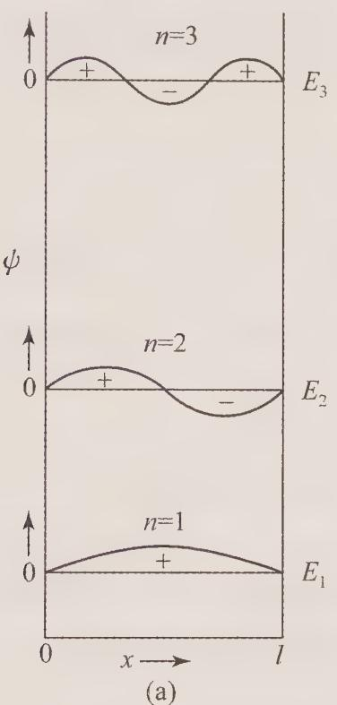

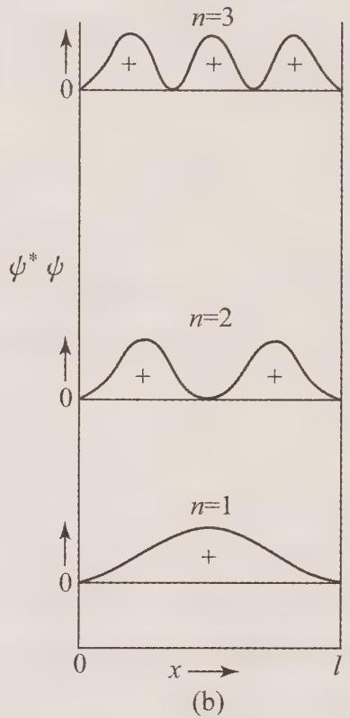  
图1.3.2 一维势箱中粒子的能级 $E$ 、波函数 $\psi$ 及概率密度 $\psi^{*}\psi$

（5）箱中粒子由于呈现波性， $\psi$ 可以为正值，可以为负值，也可以为零。 $\psi = 0$ 的点称为节点，其数目为 $n - 1$ 。基态没有节点，每当量子数 $n$ 增加1时，节点数目也增加1。从经典力学角度来看，存在节点是很难想象的，很难用直观的模型合理地解释。

综上所述，由量子力学处理箱中粒子，获得有关受一定势能场束缚的粒子的共同特性：

\- 粒子可以存在多种运动状态,它们可由 $\psi_{1},\psi_{2},\cdots,\psi_{n}$ 等描述;

\- 能量量子化；

\- 存在零点能；

\- 没有经典运动轨道，只有概率分布；

\- 存在节点, 节点多, 能量高。

上述这些微观粒子的特性,统称量子效应。随着粒子质量 m 的增大,箱子的长度 l 增长,量子效应减弱。当 m,l 增大到宏观的数量时,量子效应消失,体系变为宏观体系,其运动规律又可用经典力学描述。

根据上节叙述的量子力学假设,已知状态函数 $\psi$ , 就可用各物理量算符计算一维势箱中粒子的各种物理量:

## (1) 粒子在箱中的平均位置

位置的算符 $\hat{x} = x$ ，因为 $\hat{x}\psi_{n}\neq c\psi_{n}$ ，所以 $\hat{x}$ 无本征值，只能求位置的平均值 $\langle x\rangle$ 。

$$
\langle x \rangle = \int_ {0} ^ {l} \psi_ {n} ^ {*} x \psi_ {n} \mathrm{d} x = \frac {2}{l} \int_ {0} ^ {l} x \sin^ {2} \left(\frac {n \pi x}{l}\right) \mathrm{d} x = \frac {l}{2}
$$

由计算结果可知,粒子的平均位置在势箱的中央,其物理意义是很明显的。

(2) 粒子的动量沿 x 轴分量 $p_{x}$

动量算符 $\hat{p}_x = -\frac{\mathrm{i}h}{2\pi}\frac{\mathrm{d}}{\mathrm{d}x}$ , 可以验证 $\hat{p}_x\psi_n \neq c\psi_n$ , 表明 $\psi_n$ 不是 $\hat{p}_x$ 的本征函数, $c$ 不是 $\hat{p}_x$ 的本征值, 这时只能求粒子在箱中的平均动量 $\langle p_x \rangle$ 。

$$
\langle p _ {x} \rangle = \int_ {0} ^ {l} \psi_ {n} ^ {*} \hat {p} _ {x} \psi_ {n} d x = - \frac {2}{l} \int_ {0} ^ {l} \sin \left(\frac {n \pi x}{l}\right) \frac {\mathrm{i} h}{2 \pi} \frac {\mathrm{d}}{\mathrm{d} x} \sin \left(\frac {n \pi x}{l}\right) d x = 0
$$

由于箱中粒子正向运动倾向和逆向运动倾向应当相等，因此平均动量应当为零。

(3) 粒子的动量平方 $p_{x}^{2}$ 值

$p_x^2$ 的算符 $\hat{p}_x^2 = -\frac{h^2}{4\pi^2}\frac{\mathrm{d}^2}{\mathrm{d}x^2}$ ，这是一个具有本征值的算符。

$$
\hat {p} _ {x} ^ {2} \psi_ {n} = - \frac {h ^ {2}}{4 \pi^ {2}} \frac {\mathrm{d} ^ {2}}{\mathrm{d} x ^ {2}} \left[ \sqrt {\frac {2}{l}} \sin \left(\frac {n \pi x}{l}\right) \right] = \frac {n ^ {2} h ^ {2}}{4 l ^ {2}} \psi_ {n}
$$

由计算结果可见,箱中粒子的 $p_{x}^{2}$ 有确定的数值: $n^{2}h^{2}/4l^{2}$ 。根据假设,箱中粒子的势能 V=0 , 其总能量即等于它的动能

$$
E = \frac {1}{2} m v _ {x} ^ {2} = \frac {1}{2 m} p _ {x} ^ {2} = \frac {n ^ {2} h ^ {2}}{8 m l ^ {2}}
$$

这与(1.3.4)式是完全一致的。

许多实际体系的性质可近似用一维势箱模型来理解。线形共轭分子中的 $\pi$ 电子的行为，用一维势箱模型处理，可对共轭效应的微观结构根源深入理解。

【例1.3.1】丁二烯的离域效应

丁二烯有 4 个碳原子, 每个碳原子以 $\mathrm{sp}^2$ 杂化轨道成 3 个 $\sigma$ 键后, 尚余 1 个 $\mathfrak{p}_z$ 轨道和 1 个 $\pi$ 电子。假定有两种情况: (a) 4 个 $\pi$ 电子形成两个定域 $\pi$ 键; (b) 4 个 $\pi$ 电子形成 $\pi_4^4$ 离域 $\pi$ 键。设相邻碳原子间距离均为 $l$ , 按一维势箱中粒子模型, (a) 和 (b) 中 $\pi$ 电子的能级及电子充填情况可进行估算, 其结果如图 1.3.3 所示。

$$
E _ {(\mathrm{a})} = \frac {2 \times 2 h ^ {2}}{8 m l ^ {2}} = 4 E _ {1}, \quad E _ {(\mathrm{b})} = \frac {2 h ^ {2} + 2 \times 2 ^ {2} h ^ {2}}{8 m (3 l) ^ {2}} = \frac {1 0}{9} E _ {1}
$$

共轭分子(b)中离域效应使体系 $\pi$ 电子的能量比定域双键分子(a)中电子的能量低, 所以离域效应扩大了 $\pi$ 电子的活动范围, 即增加一维势箱的长度使分子能量降低, 稳定性增加。离域效应降低的是分子的动能, 分子中电子能否发生离域效应, 需视体系的实际情况而定。

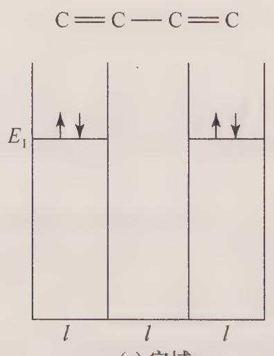  
(a) 定域

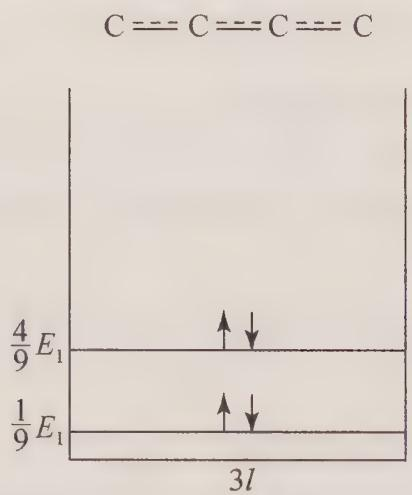  
(b) 离域  
图1.3.3 丁二烯分子中 $\pi$ 电子的能级

## 【例1.3.2】 花菁染料的吸收光谱

通式为 $\mathrm{R}_2\dot{\mathrm{N}} - (\mathrm{CH} = \mathrm{CH}-)_r\mathrm{CH} = \dot{\mathrm{NR}}_2$ 的花菁染料（一价正离子），其 $\pi$ 电子能级近似于一维势箱体系的能级。势箱长度 $l$ 可以根据分子结构近似计算。从分子结构可知， $r$ 个烯基贡献 $2r$ 个 $\pi$ 电子，再加上N原子的孤对电子和次甲基双键的2个 $\pi$ 电子，总计 $2r + 4$ 个 $\pi$ 电子。在基态时，这些电子占据 $r + 2$ 个分子轨道；当吸收适当波长的光时，可发生电子从最高占据轨道 $(r + 2)$ 到最低空轨道 $(r + 3)$ 的跃迁。这一跃迁所吸收的光的频率为

$$
\frac {c}{\lambda} \nu = \frac {\Delta E}{h} = \frac {h [ (r + 3) ^ {2} - (r + 2) ^ {2} ]}{8 m l ^ {2}} = \frac {h (2 r + 5)}{8 m l ^ {2}}
$$

波长为

$$
\lambda = \frac {c}{\nu} = \frac {8 m l ^ {2} c}{h (2 r + 5)} = \frac {3 . 3 0 l ^ {2}}{2 r + 5}
$$

烯基发色团（—CH=CH—）的平均长度为 248 pm，势箱两端共向外延伸 565 pm（根据实验结果拟合），势箱总长 $l=(248r+565)$ pm。将这些数据代入上式，得

$$
\lambda = \frac {3 . 3 0 (2 4 8 r + 5 6 5) ^ {2}}{2 r + 5} \mathrm{pm}
$$

现将花菁染料 $\mathrm{Me}_2\mathrm{N} - (\mathrm{CH} = \mathrm{CH}-)_r\mathrm{CH} = \bar{\mathrm{N}}\mathrm{Me}_2$ 跃迁时吸收的光的波长的计算值与实验值列于表1.3.1中。由表中数据可见，计算值和实验值符合得较好。

表 1.3.1 花菁染料 ${\mathrm{{Me}}}_{2}\mathrm{\;N} - \left( {\mathrm{{CH}} = \mathrm{{CH}} - }\right) ,\mathrm{{CH}} = \mathrm{N}{\mathrm{{Me}}}_{2}$ 的吸收光谱

<table><tr><td>r</td><td> $\lambda_{\text{max}}$ (计算值)/nm</td><td> $\lambda_{\text{max}}$ (实验值)/nm</td></tr><tr><td>1</td><td>311.6</td><td>309.0</td></tr><tr><td>2</td><td>412.8</td><td>409.0</td></tr><tr><td>3</td><td>514.0</td><td>511.0</td></tr></table>

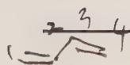

从一维势箱中粒子的实例可见,用量子力学处理微观体系的一般步骤是:

(1) 根据体系的物理条件, 写出它的势能函数, 进一步写出 $\hat{H}$ 算符及 Schrödinger 方程。

(2) 解 Schrödinger 方程, 根据合格条件求得 $\psi$ 和 E。

（3）描绘 $\psi, \psi^{2}$ 等的图形，讨论它们的分布特点。

（4）由所得的 $\psi$ ，求各个对应状态的各种物理量的数值，了解体系的性质。

(5) 联系实际问题,对所得结果加以应用。

将一维势箱中粒子扩充到长、宽、高分别为 a, b, c 的三维势箱，其 Schrödinger 方程为

$$
- \frac {h ^ {2}}{8 \pi^ {2} m} \left(\frac {\partial^ {2}}{\partial x ^ {2}} + \frac {\partial^ {2}}{\partial y ^ {2}} + \frac {\partial^ {2}}{\partial z ^ {2}}\right) \psi = E \psi\tag{1.3.9}
$$

假定 $\psi = \psi_{x}(x)\psi_{y}(y)\psi_{z}(z)$ ，用类似方法可得

$$
\psi = \left(\frac {8}{a b c}\right) ^ {\frac {1}{2}} \sin \left(\frac {n _ {x} \pi x}{a}\right) \sin \left(\frac {n _ {y} \pi y}{b}\right) \sin \left(\frac {n _ {z} \pi z}{c}\right)
$$

(1.3.10)

$$
E = \frac {h ^ {2}}{8 m} \left(\frac {n _ {x} ^ {2}}{a ^ {2}} + \frac {n _ {y} ^ {2}}{b ^ {2}} + \frac {n _ {z} ^ {2}}{c ^ {2}}\right)\tag{1.3.11}
$$

式中量子数(整数) $n_{x},n_{y},n_{z}$ 均等于1,2,3,…。

对于 $a = b = c$ 的三维势箱，(1.3.11)式变为

$$
E = \frac {h ^ {2}}{8 m a ^ {2}} (n _ {x} ^ {2} + n _ {y} ^ {2} + n _ {z} ^ {2})\tag{1.3.12}
$$

有时,量子数 $n_{x}, n_{y}, n_{z}$ 不同的状态,具有相同的平方和数值,例如,量子数分别为2,2,3和3,2,2的两个状态,平方和均为17,这时体系在这两个状态的能量数值相同。这种能量相同的各个状态,称为体系的简并态,体系的这种性质称为简并性。简并态的数目称为简并度。

## 1.3.2 隧道效应和扫描隧道显微镜

用量子力学方法处理箱中粒子体系时,假定在箱外粒子出现的概率为 $0, \psi = 0$ 。但是由于不确定度关系的制约和粒子运动的波性,当箱壁势垒不为无限大时,若概率密度在箱壁内侧有非零值,在箱壁势垒中概率密度就不能简单地为零,而是从其箱内边界值按指数向零衰减。此时在箱外发现粒子的概率不为零,意味着粒子能穿透势垒跑出箱子,此即隧道效应。隧道效应涉及许多物理现象,有重要的应用,如扫描隧道显微镜。

20 世纪 80 年代, G. Binning 和 H. Rohrer 等基于上述电子通过超高真空势垒的隧道效应, 发明了扫描隧道显微镜 (scanning tunneling microscope, STM), 图 1.3.4 简单地示意它的装置。上部探针和下部样品均处在超高真空的环境之中, 探针尖端非常细小, 尺寸在纳米量级, 在针尖金属中离域电子的波函数伸入超高真空势垒, 波函数呈指数衰减, 阻止电子前进到下部样品表面。但当针尖逐渐接近表面, 约几个纳米以下时, 针尖上电子的波函数和样品的电子波函数互相叠加, 通过外加电压 (V) 的作用, 电子通过超高真空势垒, 形成微弱的电流 ( $I_{t}$ ), 即出现隧道效应。隧道电流 $I_{t}$ 和针尖与样品表面的距离 x 呈指数函数的关系, 如下式所示:

$$
I _ {t} = V \exp [ - 4 \pi (2 m \psi) ^ {1 / 2} x / h ]\tag{1.3.13}
$$

式中 m 是电子的质量, $\psi$ 是样品表面电子的波函数, h 是 Planck 常数。控制 V 值, 将针尖在样品表面移动扫描, 得不同大小的 $I_{t}$ 值。它测得表面电子态密度分布, 反映样品表面原子的大小、形状和排列情况, 即“看见”了原子。STM 的放大倍数可达千万倍, 成为人们直接认识原子的工具。

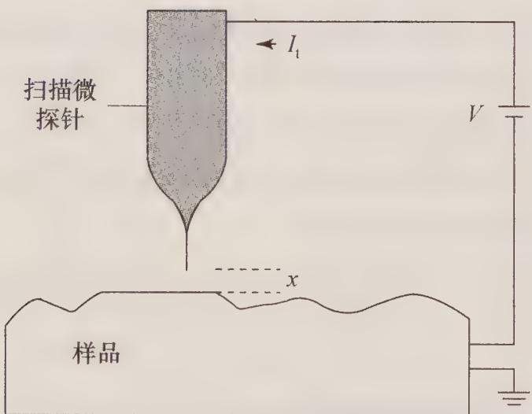  
图1.3.4 扫描隧道显微镜原理示意图

在 STM 的基础上,为了解决绝缘体表面的结构成像以及利用隧道电流破坏样品的化学键,移动和操纵分子碎片,按所需的方式重新结合等的需要,相继发明了多种新型扫描探针显微镜,如原子力显微镜(atomic force microscope, AFM)、静电力显微镜(EFM)、磁力显微镜(MFM)等,统称为扫描探针显微技术(SPM),对研究表面结构、单个分子的结构和性质起了重大作用。

$$
\mathrm{习题} v = \frac {c}{\lambda} \quad \overline {{v}} = \frac {1}{\lambda}
$$

1.1 将锂在火焰上燃烧,放出红光,波长 $\lambda=670.8\ nm$ , 这是 Li 原子由电子组态 $(1s)^{2}(2p)^{1}\rightarrow(1s)^{2}(2s)^{1}$ 跃迁时产生的,试计算该红光的频率、波数以及以 $kJ\ mol^{-1}$ 为单位的能量。

## 1.2 实验测定金属钠的光电效应数据如下：

<table><tr><td>照射光波长λ/nm</td><td>312.5</td><td>365.0</td><td>404.7</td><td>546.1</td></tr><tr><td>光电子最大动能 $E_{\text{k}}/(10^{-19} \text{ J})$ </td><td>3.41</td><td>2.56</td><td>1.95</td><td>0.75</td></tr></table>

作“动能-频率”图,从图的斜率和截距计算出 Planck 常数(h)值、钠的脱出功(W)和临阈频率( $\nu_{0}$ )。

1.3 金属钾的临阈频率为 $5.464 \times 10^{14} \mathrm{~s}^{-1}$ ，如用它作为光电池的阴极，当用波长为 $300 \mathrm{~nm}$

的紫外光照射该电池时,发射的光电子的最大速度是多少?

$$
h v - h v _ {0} = \frac {1}{2} m v ^ {2}
$$

$$
\lambda = \frac {h}{m v} = \frac {6 . 6 2 6 \times 1 0 ^ {- 3 4}}{1 0 ^ {- 1 0} \times 0 . 0 1 ^ {4}} = 6. 6 2 6 \times 1 0 ^ {- 3}
$$

$$
P = M v = \frac {h}{\lambda}
$$

(1) 质量为 ${10}^{-{10}}\mathrm{\;{kg}}$ ,运动速度为 ${0.01}\mathrm{\;m}{\mathrm{\;s}}^{-1}$ 的尘埃； $P = {Mv} = \frac{n}{\lambda }\;\lambda  = \frac{m}{v} - {10}^{-{10}} \times  {0.01}^{34}$

(2) 动能为 0.1 eV 的中子; $\lambda = \frac{h}{mv} = \frac{h}{\sqrt{2meV}} = \frac{\frac{6.626 \times 10^{-34}}{\sqrt{2 \times 1.673 \times 10^{-27} \times 9.649 \times 10^{4} \times 0.1}}}{\frac{6.626 \times 10^{34}}{\sqrt{2 \times 1.673 \times 10^{-27} \times 9.649 \times 10^{4} \times 0.1}}} = 3.166 \times 10^{-22}$

(3) 动能为 300 eV 的自由电子。 $\lambda  = \frac{h}{\sqrt{7meV}} = \frac{\frac{{6.626} \times  {10}^{-34}}{{12} \times  {9.11} \times  {10}^{-31} \times  {9.049} \times  {10}^{4} \times  {3b0}}}{5.682}\;\frac{{6.626} \times  {10}^{-34}}{{7.262} \times  {10}^{-12}} = {9.124} \times  {10}^{-{23}}$

1.5 用透射电子显微镜摄取某化合物的选区电子衍射图，加速电压为 $200\mathrm{kV}$ ，计算电子加速

$$
\Delta x \Delta p = h \quad \Delta x = \frac {6 . 6 2 6 \times 1 0 ^ {- 3 4}}{0 . 0 1 \times 1 0 0 0 y _ {0 . 1}} = 6. 6 2 6 \times 1 0 ^ {- 3 5}
$$

$$
\Delta x = \frac {6 . 6 2 6 \times 1 0 ^ {- 3 4}}{1 0 ^ {- 9} \times 1 0 \times 0 . 1} = 6. 6 2 6 \times 1 0 ^ {- 2 5}
$$

$$
\Delta x = \frac {6 . 6 2 6 \times 1 0 ^ {- 4}}{1 0 ^ {- 1 3} \times 1 \times 0 . 1} = 6. 5 2
$$

1.6 子弹(质量 0.01 kg, 速度 $1000 \, ms^{-1}$ )、尘埃(质量 $10^{-9} \, kg$ , 速度 $10 \, ms^{-1}$ )、作布朗运动的花粉(质量 $10^{-13} \, kg$ , 速度 $1 \, ms^{-1}$ )、原子中电子(速度 $1000 \, ms^{-1}$ )等, 其速度的不确定度均为原速度的 10%。判断在确定这些质点位置时, 不确定度关系是否有实际意义?

1.7 电视机显像管中运动的电子,假定加速电压为 $1000\mathrm{V}$ , 电子运动速度的不确定度 $\Delta v$ 为 $v$ 的 $10\%$ , 判断电子的波性对荧光屏上成像有无影响?

1.8 试阐述相速度 $(u)$ 和群速度 $(v_{\mathrm{g}})$ 所表达的波的物理意义和图像，用波函数 $(\psi)$ 和概率密度函数 $(\psi^2)$ 的图像说明它们的差别。

## 1.9 根据不确定度关系

（1）将下列微粒按最小速度的不确定度 $\Delta v_{\mathrm{min}}$ 增加的顺序排列起来：（a） $\mathrm{H}_{2}$ 分子中的电子，

(b) $\mathrm{H}_{2}$ 中的 H 原子，(c) C 原子核中的质子，(d) 纳米管中的 $\mathrm{H}_{2}$ 分子，(e) $5\mathrm{m}$ 宽箱中的 $\mathrm{O}_{2}$ 分子。

(2) 计算(a)和(e)中粒子的 $\Delta v_{\min}$ 。

2.1.10 $\psi = x e^{-ax^{2}}$ 是算符 $\left(\frac{d^{2}}{dx^{2}} - 4a^{2}x^{2}\right)$ 的本征函数，求其本征值。 $\left(\frac{d^{2}}{dx^{2}} - 4a^{2}x^{2}\right)\Psi = \left(\frac{d^{2}}{dx^{2}} - 4a^{2}x^{2}\right)\Psi$ 2.1.11 下列函数中，哪几个是算符 $\frac{d^{2}}{dx^{2}}$ 的本征函数？若是，求出其本征值。

① $\frac{d^{2}}{dx^{2}} e^{x} =$ ② $\frac{d^{2}}{dx^{2}} \sin x =$ ③ $\frac{d^{2}}{dx^{2}} (2 \cos x) =$

$$
\mathrm{e} ^ {x}, \sin x, 2 \cos x, x ^ {3}, \sin x + \cos x
$$

$$
\frac {d ^ {2}}{d x ^ {2}} x ^ {3} =
$$

$$
\frac {d ^ {2}}{d x ^ {2}} (\sin h x + \cos x) =
$$

2.1.12 $e^{im\phi}$ 和 $\cos m\phi$ 对算符 $i\frac{d}{d\phi}$ 是否为本征函数？若是，求出其本征值。

$$
ⓛ i \frac {d}{d \phi} e ^ {i m \phi} =
$$

1.13 证明在一维势箱中运动的粒子的各个波函数互相正交。

3△1.14 已知一维势箱中粒子的归一化波函数为 ② $i\frac{d}{d\phi}\cos m\phi =$

$$
\psi_ {n} (x) = \sqrt {\frac {2}{l}} \sin \left(\frac {n \pi x}{l}\right) \quad n = 1, 2, 3, \dots
$$

式中 l 是势箱的长度, x 是粒子的坐标 $(0 < x < l)$ 。求: (1) 粒子的能量, (2) 粒子的坐标, (3) 动量的平均值。

1.15 求一维势箱中粒子在 $\psi_{1}$ 和 $\psi_{2}$ 状态时，在箱中 $0.49l\sim 0.51l$ 范围内出现的概率，并与图1.3.2(b)相比较，讨论所得结果是否合理。

3 △1.16 设粒子处在 0～a 范围内的一维无限深势阱中运动，其状态可用波函数

$$
\psi (x) = \frac {4}{\sqrt {a}} \sin \left(\frac {\pi x}{a}\right) \cos^ {2} \left(\frac {\pi x}{a}\right)
$$

表示,试估算:

(1) 该粒子能量的可能测量值及相应的概率；

(2) 能量平均值。

[提示：利用三角函数展开 $\psi(x)$ ，再用一维势箱中粒子的归一化波函数的线性组合 $\psi = \sum c_n\psi_n$ 形式表达，由组合系数进行计算。]

3 △ 1.17 链形共轭分子 $\mathrm{CH}_2\mathrm{CHCHCHCHCHCHCH}_2$ 在长波方向 $460\mathrm{nm}$ 处出现第一个强吸收峰，试按一维势箱模型估算其长度。

1.18 一个粒子处在 $a = b = c$ 的三维势箱中，试求能级最低的前5个能量值[单位为 $h^2 / (8ma^2)$ ]，计算每个能级的简并度。

1.19 在边长为 $a$ 和 $b$ 的长方形二维势箱中存在质量为 $m$ 的自由粒子，写出它的两个方向的 Schrödinger 方程、存在能级的能量值，以及总波函数和总能量。

3. △ 1.20 若在下一离子中运动的 $\pi$ 电子可用一维势箱近似表示其运动特征：

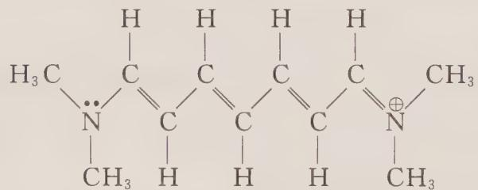

估计这一势箱的长度 $l = 1.3\mathrm{nm}$ ，根据能级公式 $E_{n} = n^{2}h^{2} / 8ml^{2}$ 估算 $\pi$ 电子跃迁时所吸收的光的波长，并与实验值 $510.0\mathrm{nm}$ 比较。

1.21 已知封闭的圆环中粒子的能级为

$$
E _ {n} = \frac {n ^ {2} h ^ {2}}{8 \pi^ {2} m R ^ {2}} \quad n = 0, \pm 1, \pm 2, \pm 3, \dots
$$

式中 $n$ 为量子数， $R$ 是圆环的半径。若将此能级公式近似地用于苯分子中的 $\pi_6^6$ 离域 $\pi$ 键，取 $R = 140\mathrm{pm}$ ，试求其电子从基态跃迁到第一激发态所吸收的光的波长。

3 △1.22 一个质量为 $m$ 的粒子被束缚在一个长度为 $l$ 的一维势箱中运动, 其本征函数和本征能量分别为

$$
\psi_ {n} (x) = \sqrt {\frac {2}{l}} \sin \left(\frac {n \pi x}{l}\right), \quad E _ {n} = \frac {n ^ {2} h ^ {2}}{8 m l ^ {2}} \quad n = 1, 2, 3, \dots
$$

若该粒子的某一运动状态用下列波函数表示：

$$
\phi (x) = 0. 6 \psi_ {1} (x) + 0. 8 \psi_ {2} (x)
$$

(1) 指出该粒子处于基态和第二激发态的概率;

(2) 计算该粒子出现在 $0 \leqslant x \leqslant l/3$ 范围内的概率；

(3) 对此粒子的能量作一次测量,估算可能的实验结果。

## 参考文献

[1] 麦松威, 周公度, 李伟基. 高等无机结构化学. 第 2 版 (第 4 次印刷). 北京: 北京大学出版社, 2014.

[2] 徐光宪, 王祥云. 物质结构. 第二版. 北京: 科学出版社, 2010.

[3] 江元生. 结构化学. 北京: 高等教育出版社, 1997.

[4] 赖文(Levine I N). 物理化学. 第二版. 褚德萤, 李芝芬, 张玉芬, 译. 北京: 北京大学出版社, 1987.

[5] 徐光宪, 黎乐民, 王德民. 量子化学: 基本原理和从头计算法. 第二版, 上册. 北京: 科学出版社, 2007.

[6] 李炳瑞. 结构化学. 第2版. 北京: 高等教育出版社, 2011.

[7] 郭用猷, 张冬菊, 等. 物质结构基本原理. 第3版. 北京: 高等教育出版社, 2015.

[8] Levine I N. Quantum Chemistry. 5 $^{th}$ ed. New Jersey: Prentice Hall, 2000.

[9] Fitts D D. Principles of Quantum Mechanics, as Applied to Chemistry and Chemical Physics. Cambridge: Cambridge University Press, 1999.

[10] Atkins P W. Quanta, A Handbook of Concepts. 2 $^{nd}$ ed. Oxford: Oxford University Press, 1991.

[11] Zhang J Z, Wang Z L, Liu J, Chen S, Liu G Y. Self-assembled Nanostructures. New York: Kluwer Academic/Plenum Publishers, 2003.

## 第2章 原子的结构和性质

化学是研究原子之间的化合和分解的科学。化学运动的物质承担者是原子，通过原子间的化合与分解而实现物质的转化。为了说明和掌握化学运动的规律，并运用它认识、改造和保护客观世界，就要从研究原子的结构及其运动规律入手。

原子是由一个原子核和若干个核外电子组成的微观体系。由于核外电子所带的负电荷可以大于、等于或小于核所带的正电荷，因而在讨论原子问题时，既包括中性原子，也包括正、负离子。

早在 19 世纪初, Dalton(道尔顿) 就提出了原子学说, 认为元素的最终组成者是原子; 原子是不能创造、不能毁灭、不可再分, 在化学变化中保持不变的质点; 同一元素的原子, 其形状、质量和性质都相同; 原子以简单数目的比例组成化合物。Dalton 的学说对化学的发展具有重大意义, 恩格斯曾给予高度评价, 认为“化学中的新时代是随着原子论开始的(所以近代化学之父不是拉瓦锡, 而是道尔顿)”(《自然辩证法》)。在高度评价道尔顿的原子学说的同时, 恩格斯对原子不可再分的观点提出了异议, 认为“原子决不能被看作简单的东西或已知的最小的实物粒子”(《自然辩证法》), 指明原子应有一定结构。1897 年, Thomson(汤姆逊) 发现了电子, 打开了原子内部结构的大门, 化学从此进入现代时期。

在认识原子结构的过程中, 原子光谱及 $\alpha$ 粒子穿透金箔等实验提供了重要基础。1885—1910年间, Balmer(巴耳末)、Rydberg(里德伯)和其他一些学者, 先后对氢原子的光谱进行归纳, 得出下列经验公式:

$$
\widetilde {\nu} = \frac {\nu}{c} = \frac {1}{\lambda} = R \left(\frac {1}{n _ {1} ^ {2}} - \frac {1}{n _ {2} ^ {2}}\right)\tag{2.1}
$$

式中 $n_1, n_2$ 为正整数 $(n_2 > n_1)$ ; $R$ 为 Rydberg 常数, 它的物理意义在 Bohr(玻尔)氢原子模型提出后, 得到了正确的解释。1909—1911 年间, Rutherford(卢瑟福)用 $\alpha$ 粒子做穿透金箔的实验, 证明原子不是实体球, 它有一极小的核, 直径仅约 $10^{-15} \mathrm{~m}$ , 原子的质量几乎全部集中在原子核上, 核带正电荷, 电子绕核运动, 此即原子结构的“行星绕日”模型。

1913 年, Bohr 综合了 Planck 量子论、Einstein 光子学说和 Rutherford 原子模型, 提出两点假设:

（1）定态规则——原子有一系列定态，每一个定态有一相应的能量 $E$ ，电子在这些定态上绕核做圆周运动，既不放出能量，也不吸收能量，而处于稳定的状态。原子可能存在的定态受一定的限制，即电子做圆周运动的角动量 $M$ 必须等于 $h / 2\pi$ 的整数倍，此为量子化条件

$$
M = n h / 2 \pi \quad n = 1, 2, 3, \dots\tag{2.2}
$$

（2）频率规则——当电子由一个定态跃迁到另一个定态时，就会吸收或发射频率为 $\nu = \Delta E / h$ 的光子，式中 $\Delta E$ 为两个定态之间的能量差。

按 Bohr 提出的氢原子模型, 质量为 m 的电子稳定地绕核运动, 其圆周运动的向心力与电子和核间的库仑引力数值应相等

$$
m v ^ {2} / r = e ^ {2} / 4 \pi \varepsilon_ {0} r ^ {2}\tag{2.3}
$$

电子在稳定轨道上运动的能量 E，等于电子的动能和静电吸引的势能之和

$$
E = \frac {1}{2} m v ^ {2} - \frac {e ^ {2}}{4 \pi \varepsilon_ {0} r} = - \frac {e ^ {2}}{8 \pi \varepsilon_ {0} r}\tag{2.4}
$$

同时,根据量子化条件,电子轨道运动角动量为

$$
M = m v r = n h / 2 \pi\tag{2.5}
$$

由此可推得电子绕核运动的半径

$$
r = n ^ {2} h ^ {2} \varepsilon_ {0} / \pi m e ^ {2} = n ^ {2} a _ {0}\tag{2.6}
$$

$$
a _ {0} = h ^ {2} \varepsilon_ {0} / \pi m e ^ {2}\tag{2.7}
$$

当 $n = 1$ 时

$$
r = \frac {(6 . 6 2 6 \times 1 0 ^ {- 3 4} \mathrm{Js}) ^ {2} (8 . 8 5 4 \times 1 0 ^ {- 1 2} \mathrm{J} ^ {- 1} \mathrm{C} ^ {2} \mathrm{m} ^ {- 1})}{\pi (9 . 1 1 0 \times 1 0 ^ {- 3 1} \mathrm{kg}) (1 . 6 0 2 \times 1 0 ^ {- 1 9} \mathrm{C}) ^ {2}} = 5 2. 9 2 \mathrm{pm} = a _ {0}\tag{2.8}
$$

$a_0$ 称为Bohr半径。

对应于一定的 n，电子具有一定的能量 $E_{n}$ ，将(2.6)式的 r 值代入(2.4)式，得

$$
E _ {n} = - m e ^ {4} / 8 \varepsilon_ {0} ^ {2} h ^ {2} n ^ {2}\tag{2.9}
$$

当电子由能量为 $E_{1}$ 的轨道跃迁到能量为 $E_{2}$ 的轨道时，原子将发射 $(E_{1} > E_{2})$ 或吸收 $(E_{1} < E_{2})$ 光子，其频率 $\nu$ 满足下列关系

$$
h \nu = E _ {2} - E _ {1} = h \tilde {\nu} c\tag{2.10}
$$

$$
\widetilde {\nu} = \frac {m e ^ {4}}{8 c h ^ {3} \varepsilon_ {0} ^ {2}} \left(\frac {1}{n _ {1} ^ {2}} - \frac {1}{n _ {2} ^ {2}}\right)\tag{2.11}
$$

上式等号右边前面的常数称为 Rydberg 常数(R)，即

$$
R = m e ^ {4} / 8 c h ^ {3} \varepsilon_ {0} ^ {2}\tag{2.12}
$$

式中 c 为光速。m 若以电子的质量 $m_{\mathrm{e}}(=9.10953\times10^{-31}\mathrm{kg})$ 代入（这时是假定核的质量为 $\infty$ ，电子绕核运动时，核不动），按此计算的常数用 $R_{\infty}$ 表示

$$
R _ {\infty} = 1 0 9 7 3 7 \mathrm{cm} ^ {- 1}\tag{2.13}
$$

式中 $m$ 若以氢原子的折合质量 $\mu_{\mathrm{H}}[= m_{\mathrm{e}}m_{\mathrm{p}} / (m_{\mathrm{e}} + m_{\mathrm{p}}) = 9.10458\times 10^{-31}\mathrm{kg}]$ 代入，这时算得氢原子的Rydberg常数用 $R_{\mathrm{H}}$ 表示

$$
R _ {\mathrm{H}} = 1 0 9 6 7 8 \mathrm{cm} ^ {- 1}\tag{2.14}
$$

Bohr 当时所得的 $R_{H}$ 的计算值和归纳所得的实验值符合得很好, 这是 Bohr 模型的一大成就, 因而 Bohr 原子结构模型曾风行一时。但是把 Bohr 模型应用到多电子原子时, 即使只有 2 个电子的氦原子, 计算结果也和光谱实验相差很远, 说明此模型有缺点。从理论上看, Bohr 假设本身就存在矛盾: 它一方面把电子运动看作服从 Newton 力学, 因而像行星绕太阳那样运动; 另一方面又加进角动量要量子化, 能量也要量子化这两个和 Newton 力学矛盾的条件。从经典电磁理论看, Bohr 模型也是不合理的: 电荷做圆周运动, 就会辐射能量, 发出电磁波, 原子不能稳定存在。Bohr 模型的原子是个带心铁环状原子, 与后来实验测定的球形原子不同。所以 Bohr 模型有很大的局限性, 不能正确地表达原子的结构。究其根源是由于原子、电子等微观粒子不仅具有微粒性, 而且具有波动性。这种波粒二象性是微观粒子最基本的特性, 而 Bohr 模型没有涉及波性, 因而不能正确地表达原子的结构。

原子、分子中的电子并无“行星绕日”式的轨道可循，也无其他方式的明确、连续、可跟踪、可预测的轨道可循,它们只能以一定的概率分布出现在空间某一区域。在量子力学中,用波函数描述原子、分子中电子的运动状态,这样的状态函数俗称轨道,在原子中称作原子轨道,在分子中称作分子轨道,但它们都不具有经典力学中运动轨道的含义。

下面用量子力学原理和方法处理单电子原子的结构,而由处理单电子原子结构发展起来的思想为处理多电子原子的结构奠定了基础。

## 2.1 单电子原子的 Schrödinger 方程及其解

## 2.1.1 单电子原子的 Schrödinger 方程

核电荷数为 Z，核外只有一个电子的原子称为单电子原子，如 H 原子和 $He^{+}$ ， $Li^{2+}$ 等类氢离子。若把原子的质量中心放在坐标原点上，电子到核的距离为 r，电子的电荷为 -e，则势能算符即静电作用势能函数为

$$
V = - \frac {Z e ^ {2}}{4 \pi \varepsilon_ {0} r}\tag{2.1.1}
$$

将该势能算符 $V$ 代入算符 $\hat{H}$ , 得到单电子原子的 Schrödinger 方程

$$
\left[ - \frac {h ^ {2}}{8 \pi^ {2} \mu} \nabla^ {2} - \frac {Z e ^ {2}}{4 \pi \varepsilon_ {0} r} \right] \psi = E \psi\tag{2.1.2}
$$

式中， $\nabla^2 = \frac{\partial^2}{\partial x^2} + \frac{\partial^2}{\partial y^2} + \frac{\partial^2}{\partial z^2}$ ，为 Laplace 算符； $\mu = m_{\mathrm{e}}m_{\mathrm{N}} / (m_{\mathrm{e}} + m_{\mathrm{N}})$ ，为原子的约化质量或折合质量。

上述方程的动能算符项是笛卡儿坐标形式,而势能算符项是球极坐标形式,为了便于分离

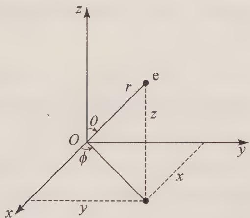  
图 2.1.1 直角坐标系和球极坐标系的关系

变量及求解,必须统一到球极坐标系(若统一到笛卡儿坐标系,则势能算符项中的 r 无法分离变量)。为此,需将 $\nabla^{2}$ 变换为球极坐标形式。方法是利用复合函数链式求导法则和图 2.1.1 所示的两种坐标的关系。

$$
\left\{ \begin{array}{l} x = r \sin \theta \cos \phi \\ y = r \sin \theta \sin \phi \\ z = r \cos \theta \end{array} \right.\tag{2.1.3}
$$

$$
r ^ {2} = x ^ {2} + y ^ {2} + z ^ {2}\tag{2.1.4}
$$

$$
\cos \theta = z / (x ^ {2} + y ^ {2} + z ^ {2}) ^ {\frac {1}{2}}\tag{2.1.5}
$$

$$
\tan \phi = y / x\tag{2.1.6}
$$

按偏微分关系

$$
\frac {\partial}{\partial x} = \left(\frac {\partial r}{\partial x}\right) \frac {\partial}{\partial r} + \left(\frac {\partial \theta}{\partial x}\right) \frac {\partial}{\partial \theta} + \left(\frac {\partial \phi}{\partial x}\right) \frac {\partial}{\partial \phi}\tag{2.1.7}
$$

将(2.1.4)式对 x 偏导, 并按(2.1.3)式关系代入, 得

$$
2 r \left(\frac {\partial r}{\partial x}\right) = 2 x = 2 r \sin \theta \cos \phi
$$

$$
\frac {\partial r}{\partial x} = \sin \theta \cos \phi\tag{2.1.8}
$$

将(2.1.5)式和(2.1.6)式对 x 偏导，并按(2.1.3)式关系代入，可得

$$
\frac {\partial \theta}{\partial x} = \frac {\cos \theta \cos \phi}{r}\tag{2.1.9}
$$

$$
\frac {\partial \phi}{\partial x} = - \frac {\sin \phi}{r \sin \theta}\tag{2.1.10}
$$

将(2.1.8)～(2.1.10)式代入(2.1.7)式，得

$$
\frac {\partial}{\partial x} = \sin \theta \cos \phi \frac {\partial}{\partial r} + \frac {\cos \theta \cos \phi}{r} \frac {\partial}{\partial \theta} - \frac {\sin \phi}{r \sin \theta} \frac {\partial}{\partial \phi}\tag{2.1.11}
$$

类似，可得

$$
\frac {\partial}{\partial y} = \sin \theta \sin \phi \frac {\partial}{\partial r} + \frac {\cos \theta \sin \phi}{r} \frac {\partial}{\partial \theta} + \frac {\cos \phi}{r \sin \theta} \frac {\partial}{\partial \phi}\tag{2.1.12}
$$

$$
{\frac {\partial}{\partial z}} = \cos \theta {\frac {\partial}{\partial r}} - {\frac {\sin \theta}{r}} {\frac {\partial}{\partial \theta}}\tag{2.1.13}
$$

Laplace 算符为

$$
\nabla^ {2} = \frac {1}{r ^ {2}} \frac {\partial}{\partial r} \left(r ^ {2} \frac {\partial}{\partial r}\right) + \frac {1}{r ^ {2} \sin \theta} \frac {\partial}{\partial \theta} (\sin \theta \frac {\partial}{\partial \theta}) + \frac {1}{r ^ {2} \sin^ {2} \theta} \frac {\partial^ {2}}{\partial \phi^ {2}}\tag{2.1.14}
$$

将 $\nabla^2$ 的球极坐标形式代入(2.1.2)式, 得氢原子和类氢离子的球极坐标形式的 Schrödinger 方程

$$
\frac {1}{r ^ {2}} \frac {\partial}{\partial r} \left(r ^ {2} \frac {\partial \psi}{\partial r}\right) + \frac {1}{r ^ {2} \sin \theta} \frac {\partial}{\partial \theta} \left(\sin \theta \frac {\partial \psi}{\partial \theta}\right) + \frac {1}{r ^ {2} \sin^ {2} \theta} \frac {\partial^ {2} \psi}{\partial \phi^ {2}} + \frac {8 \pi^ {2} \mu}{h ^ {2}} \left(E + \frac {Z e ^ {2}}{4 \pi \varepsilon_ {0} r}\right) \psi = 0\tag{2.1.15}
$$

式中 $\psi = \psi (r,\theta ,\phi)$ 。解此偏微分方程可采用变数分离法，即把含3个变量的偏微分方程分解为3个各含1个变量的常微分方程来求解。

根据直角坐标 $(x, y, z)$ 和球极坐标 $(r, \theta, \phi)$ 之间的变换关系可推出球极坐标形式的物理量算符。例如角动量沿 $z$ 轴分量的算符 $(\hat{M}_z$ ，见表1.2.1)，可由(2.1.11)，(2.1.12)式推得

$$
\hat {M} _ {z} = - \left(\frac {\mathrm{i} h}{2 \pi}\right) \left(x \frac {\partial}{\partial y} - y \frac {\partial}{\partial x}\right) = - \left(\frac {\mathrm{i} h}{2 \pi}\right) \frac {\partial}{\partial \phi}\tag{2.1.16}
$$

角动量沿 $x, y$ 轴分量的算符 $\hat{M}_x, \hat{M}_y$ 分别为

$$
\hat {M} _ {x} = \frac {\mathrm{i} h}{2 \pi} \left(\sin \phi \frac {\partial}{\partial \theta} + \cot \theta \cos \phi \frac {\partial}{\partial \phi}\right)\tag{2.1.17}
$$

$$
\hat {M} _ {y} = \frac {\mathrm{i} h}{2 \pi} \left(- \cos \phi \frac {\partial}{\partial \theta} + \cot \theta \sin \phi \frac {\partial}{\partial \phi}\right)\tag{2.1.18}
$$

因为 $|M^2| = M_x^2 + M_y^2 + M_z^2$ ，角动量平方算符 $(\hat{M}^2)$ 为

$$
\hat {M} ^ {2} = - \left(\frac {h}{2 \pi}\right) ^ {2} \left[ \frac {1}{\sin \theta} \frac {\partial}{\partial \theta} (\sin \theta \frac {\partial}{\partial \theta}) + \frac {1}{\sin^ {2} \theta} \frac {\partial^ {2}}{\partial \phi^ {2}} \right]
$$

(2.1.19)

## 2.1.2 变数分离法

令 $\psi (r,\theta ,\phi) = R(r)\Theta (\theta)\Phi (\phi)$ ，代入(2.1.15)式，并乘以 $\frac{r^2\sin^2\theta}{R\Theta\Phi}$ ，经微分运算，移项，可得

$$
\frac {1}{\Phi} \frac {\mathrm{d} ^ {2} \Phi}{\mathrm{d} \phi^ {2}} = - \frac {\sin^ {2} \theta}{R} \frac {\mathrm{d}}{\mathrm{d} r} \left(r ^ {2} \frac {\mathrm{d} R}{\mathrm{d} r}\right) - \frac {\sin \theta}{\Theta} \frac {\mathrm{d}}{\mathrm{d} \theta} \left(\sin \theta \frac {\mathrm{d} \Theta}{\mathrm{d} \theta}\right) - \frac {8 \pi^ {2} \mu}{h ^ {2}} r ^ {2} \sin^ {2} \theta (E - V)\tag{2.1.20}
$$

因(2.1.20)式等号左边不含 $r, \theta$ ，右边不含 $\phi$ ，欲使左右两边相等，必须等于同一常数。令此常

数为 $-m^2$ ，则得

$$
\frac {\mathrm{d} ^ {2} \Phi}{\mathrm{d} \phi^ {2}} = - m ^ {2} \Phi\tag{2.1.21a}
$$

$$
\frac {1}{R} \frac {\mathrm{d}}{\mathrm{d} r} \left(r ^ {2} \frac {\mathrm{d} R}{\mathrm{d} r}\right) + \frac {8 \pi^ {2} \mu r ^ {2}}{h ^ {2}} (E - V) = \frac {m ^ {2}}{\sin^ {2} \theta} - \frac {1}{\Theta \sin \theta} \frac {\mathrm{d}}{\mathrm{d} \theta} \left(\sin \theta \frac {\mathrm{d} \Theta}{\mathrm{d} \theta}\right)\tag{2.1.22}
$$

(2.1.22)式等号左右两边所含变量不同,要相等必须等于同一常数,令这一常数为 $l(l+1)$ , 则得

$$
- \frac {1}{\sin \theta} \frac {\mathrm{d}}{\mathrm{d} \theta} \left(\sin \theta \frac {\mathrm{d} \Theta}{\mathrm{d} \theta}\right) + \frac {m ^ {2} \Theta}{\sin^ {2} \theta} = l (l + 1) \Theta\tag{2.1.23}
$$

$$
\frac {1}{r ^ {2}} \frac {\mathrm{d}}{\mathrm{d} r} \left(r ^ {2} \frac {\mathrm{d} R}{\mathrm{d} r}\right) + \frac {8 \pi^ {2} \mu}{h ^ {2}} (E - V) R = l (l + 1) \frac {R}{r ^ {2}}\tag{2.1.24}
$$

(2.1.21a)式、(2.1.23)式和(2.1.24)式分别称为 $\Phi$ 方程、 $\Theta$ 方程和 $R$ 方程。有时令波函数 $\psi$ 的角度部分为 $Y(\theta, \phi)$ ，即 $\Phi(\phi) \Theta(\theta) = Y(\theta, \phi)$ 。

将(2.1.15)式分解成3个常微分方程： $R$ 方程、 $\Theta$ 方程和 $\Phi$ 方程，用解常微分方程的办法求这3个方程满足品优条件的解，将它们乘在一起，便得Schrödinger方程的解 $\psi$

$$
\psi (r, \theta , \phi) = R (r) \Theta (\theta) \Phi (\phi)\tag{2.1.25}
$$

在解(2.1.21a)，(2.1.23)和(2.1.24)这3个方程时，其解都需要符合波函数所必须满足的3个品优条件，并从中得到对应于各个方程的量子数和能量量子化的结果。下面以解 $\Phi$ 方程为例进行讨论。

## 2.1.3 $\Phi$ 方程的解

将(2.1.21a)式整理,得

$$
\boxed {\frac {\mathrm{d} ^ {2} \Phi}{\mathrm{d} \phi^ {2}} + m ^ {2} \Phi = 0}\tag{2.1.21b}
$$

这是一个常系数二阶齐次线性方程,它有2个复函数形式的独立特解

$$
\Phi_ {m} = A \exp [ \mathrm{i} m \phi ] \quad m = \pm | m |\tag{2.1.26}
$$

常数 $A$ 可由归一化条件 $\int_0^{2\pi}\Phi_m^*\Phi_m\mathrm{d}\phi = \int_0^{2\pi}A^2\exp [-\mathrm{i}m\phi ]\exp [\mathrm{i}m\phi ]\mathrm{d}\phi = 1$ 求出

$$
A = \frac {1}{\sqrt {2 \pi}}
$$

$$
\Phi_ {m} = \frac {1}{\sqrt {2 \pi}} \exp [ \mathrm{i} m \phi ]\tag{2.1.27}
$$

根据波函数的品优条件, $\Phi_{m}$ 应是 $\phi$ 的单值函数。由于 $\phi$ 是循环坐标,在 $\phi$ 变化一周后, $\Phi_{m}$ 值应保持不变,即

$$
\begin{array}{c} \Phi_ {m} (\phi) = \Phi_ {m} (\phi + 2 \pi) \\ \exp [ \mathrm{i} m \phi ] = \exp [ \mathrm{i} m (\phi + 2 \pi) ] = \exp [ \mathrm{i} m \phi ] \exp [ \mathrm{i} m 2 \pi ] \end{array}\tag{2.1.28}
$$

即

$$
\exp [ \mathrm{i} m 2 \pi ] = 1
$$

根据 Euler 公式

$$
\exp [ \mathrm{i} m \phi ] = \cos m \phi + \mathrm{i} \sin m \phi
$$

$$
\cos m 2 \pi + \mathrm{i} \sin m 2 \pi = 1
$$

$m$ 的取值必须为

$$
m = 0, \pm 1, \pm 2, \dots
$$

m 的取值是量子化的,称为磁量子数。

(2.1.27)式为复数形式的 $\Phi$ 函数, 对角动量沿 $z$ 轴分量的算符 $\left(-\frac{\mathrm{i}h\mathrm{d}}{2\pi\mathrm{d}\phi}\right)$ 是本征函数 (见习题 1.12), 它对了解角动量在 $z$ 方向上的分量具有重要的意义。但是复数不便于作图, 不能用图形了解原子轨道和电子云的分布。根据态叠加原理 (量子力学基本假设 IV), 将两个独立特解进行线性组合, 仍是 $\Phi$ 方程的解。由于

$$
\Phi_ {m} = \frac {1}{\sqrt {2 \pi}} \exp [ \mathrm{i} m \phi ] = \frac {1}{\sqrt {2 \pi}} \cos m \phi + \frac {\mathrm{i}}{\sqrt {2 \pi}} \sin m \phi
$$

$$
\Phi_ {- m} = \frac {1}{\sqrt {2 \pi}} \exp [ - i m \phi ] = \frac {1}{\sqrt {2 \pi}} \cos m \phi - \frac {i}{\sqrt {2 \pi}} \sin m \phi
$$

将它们线性组合,得实函数解:

$$
\Phi_ {\pm m} ^ {\cos} = C (\Phi_ {m} + \Phi_ {- m}) = \frac {2 C}{\sqrt {2 \pi}} \mathrm{cos} m \phi
$$

$$
\Phi_ {\pm m} ^ {\sin} = D (\Phi_ {m} - \Phi_ {- m}) = \frac {\mathrm{i} 2 D}{\sqrt {2 \pi}} \sin m \phi
$$

根据归一化条件可求出 $C = \frac{1}{\sqrt{2}}, D = \frac{1}{\mathrm{i}\sqrt{2}}$ ，得

$$
\Phi_ {\pm m} ^ {\cos} = \frac {1}{\sqrt {\pi}} \cos m \phi\tag{2.1.29}
$$

$$
\Phi_ {\pm m} ^ {\sin} = \frac {1}{\sqrt {\pi}} \sin m \phi\tag{2.1.30}
$$

$\Phi$ 函数的三角函数形式对算符 $\left(-\frac{\mathrm{i}h}{2\pi}\frac{\mathrm{d}}{\mathrm{d}\phi}\right)$ 不是本征函数，不能用以了解角动量沿 $z$ 轴的分量，但它便于作图。复函数解和实函数解是线性组合关系，它们彼此之间没有一一对应关系。现将 $m = 0, \pm 1, \pm 2$ 时 $\Phi$ 方程的解列于表2.1.1中。

表 2.1.1 $\Phi$ 方程的解

<table><tr><td>m</td><td>复函数解</td><td>实函数解</td></tr><tr><td>0</td><td> $\Phi_0 = \frac{1}{\sqrt{2\pi}}$ </td><td> $\Phi_0 = \frac{1}{\sqrt{2\pi}}$ </td></tr><tr><td>1</td><td> $\Phi_1 = \frac{1}{\sqrt{2\pi}} \exp[i\phi]$ </td><td rowspan="2"> $\begin{cases} \Phi_{\pm 1}^{\cos} = \frac{1}{\sqrt{\pi}} \cos\phi \\ \Phi_{\pm 1}^{\sin} = \frac{1}{\sqrt{\pi}} \sin\phi \end{cases}$ </td></tr><tr><td>-1</td><td> $\Phi_{-1} = \frac{1}{\sqrt{2\pi}} \exp[-i\phi]$ </td></tr><tr><td>2</td><td> $\Phi_2 = \frac{1}{\sqrt{2\pi}} \exp[i2\phi]$ </td><td rowspan="2"> $\begin{cases} \Phi_{\pm 2}^{\cos} = \frac{1}{\sqrt{\pi}} \cos2\phi \\ \Phi_{\pm 2}^{\sin} = \frac{1}{\sqrt{\pi}} \sin2\phi \end{cases}$ </td></tr><tr><td>-2</td><td> $\Phi_{-2} = \frac{1}{\sqrt{2\pi}} \exp[-i2\phi]$ </td></tr></table>

## 2.1.4 单电子原子的波函数

上面叙述了 $\Phi$ 方程的求解过程，解 $\Theta$ 方程和 $R$ 方程比较复杂，可参看有关量子力学专著。今将解得的一些波函数列于表2.1.2中。

表 2.1.2 氢原子和类氢离子的波函数 $^{a}$

<table><tr><td>n</td><td>l</td><td>m</td><td>ψ</td></tr><tr><td>1</td><td>0</td><td>0</td><td> $\psi_{1s} = \frac{1}{\sqrt{\pi}} \left( \frac{Z}{a_0} \right)^{3/2} e^{-\sigma}$ </td></tr><tr><td>2</td><td>0</td><td>0</td><td> $\psi_{2s} = \frac{1}{4\sqrt{2\pi}} \left( \frac{Z}{a_0} \right)^{3/2} (2 - \sigma) e^{-\frac{\sigma}{2}}$ </td></tr><tr><td>2</td><td>1</td><td>0</td><td> $\psi_{2p_z} = \frac{1}{4\sqrt{2\pi}} \left( \frac{Z}{a_0} \right)^{3/2} \sigma e^{-\frac{\sigma}{2}} \cos\theta$ </td></tr><tr><td rowspan="2">2</td><td rowspan="2">1</td><td rowspan="2">±1</td><td> $\psi_{2p_x} = \frac{1}{4\sqrt{2\pi}} \left( \frac{Z}{a_0} \right)^{3/2} \sigma e^{-\frac{\sigma}{2}} \sin\theta \cos\phi$ </td></tr><tr><td> $\psi_{2p_y} = \frac{1}{4\sqrt{2\pi}} \left( \frac{Z}{a_0} \right)^{3/2} \sigma e^{-\frac{\sigma}{2}} \sin\theta \sin\phi$ </td></tr><tr><td>3</td><td>0</td><td>0</td><td> $\psi_{3s} = \frac{1}{81\sqrt{3\pi}} \left( \frac{Z}{a_0} \right)^{3/2} (27 - 18\sigma + 2\sigma^2) e^{-\frac{\sigma}{3}}$ </td></tr><tr><td>3</td><td>1</td><td>0</td><td> $\psi_{3p_z} = \frac{\sqrt{2}}{81\sqrt{\pi}} \left( \frac{Z}{a_0} \right)^{3/2} (6 - \sigma) \sigma e^{-\frac{\sigma}{3}} \cos\theta$ </td></tr><tr><td rowspan="2">3</td><td rowspan="2">1</td><td rowspan="2">±1</td><td> $\psi_{3p_x} = \frac{\sqrt{2}}{81\sqrt{\pi}} \left( \frac{Z}{a_0} \right)^{3/2} (6 - \sigma) \sigma e^{-\frac{\sigma}{3}} \sin\theta \cos\phi$ </td></tr><tr><td> $\psi_{3p_y} = \frac{\sqrt{2}}{81\sqrt{\pi}} \left( \frac{Z}{a_0} \right)^{3/2} (6 - \sigma) \sigma e^{-\frac{\sigma}{3}} \sin\theta \sin\phi$ </td></tr><tr><td>3</td><td>2</td><td>0</td><td> $\psi_{3d_{z2}} = \frac{1}{81\sqrt{6\pi}} \left( \frac{Z}{a_0} \right)^{3/2} \sigma^2 e^{-\frac{\sigma}{3}} (3\cos^2\theta - 1)$ </td></tr><tr><td rowspan="2">3</td><td rowspan="2">2</td><td rowspan="2">±1</td><td> $\psi_{3d_{xx}} = \frac{\sqrt{2}}{81\sqrt{\pi}} \left( \frac{Z}{a_0} \right)^{3/2} \sigma^2 e^{-\frac{\sigma}{3}} \sin\theta \cos\theta \cos\phi$ </td></tr><tr><td> $\psi_{3d_{yz}} = \frac{\sqrt{2}}{81\sqrt{\pi}} \left( \frac{Z}{a_0} \right)^{3/2} \sigma^2 e^{-\frac{\sigma}{3}} \sin\theta \cos\theta \sin\phi$ </td></tr><tr><td rowspan="2">3</td><td rowspan="2">2</td><td rowspan="2">±2</td><td> $\psi_{3d_{x2-y^2}} = \frac{1}{81\sqrt{2\pi}} \left( \frac{Z}{a_0} \right)^{3/2} \sigma^2 e^{-\frac{\sigma}{3}} \sin^2\theta \cos2\phi$ </td></tr><tr><td> $\psi_{3d_{xy}} = \frac{1}{81\sqrt{2\pi}} \left( \frac{Z}{a_0} \right)^{3/2} \sigma^2 e^{-\frac{\sigma}{3}} \sin^2\theta \sin2\phi$ </td></tr></table>

a 表中 $\sigma = \frac{Z}{a_0} r$ 。

表中 $\psi$ 由 n, l 和 m 规定，可表示为 $\psi_{nlm}$ ，常称为原子轨道函数，俗称原子轨道（atomic orbital, AO）；n, l 和 m 分别称为主量子数、角量子数和磁量子数，它们的物理意义及取值范围将在 2.2 节中介绍。

$\psi_{nlm}$ 又可表示为

$$
\psi_ {n l m} = R _ {n l} (r) \Theta_ {l m} (\theta) \Phi_ {m} (\phi) = R _ {n l} (r) Y _ {l m} (\theta , \phi)\tag{2.1.31}
$$

其中 $R_{nl}(r)$ 称为波函数的径向部分； $Y_{lm}(\theta, \phi)$ 称为波函数的角度部分，它是球谐函数。 $R_{nl}(r)$

和 $Y_{lm}(\theta ,\phi)$ 的具体表述形式可查阅有关参考书。下面列出几个球谐函数：

$$
Y _ {0 0} = \mathrm{s} = \frac {1}{\sqrt {4 \pi}}
$$

$$
Y _ {1 0} = p _ {z} = \sqrt {\frac {3}{4 \pi}} \cos \theta
$$

$$
Y _ {1, \pm 1} = \left\{ \begin{array}{l} p _ {y} = \sqrt {\frac {3}{4 \pi}} \sin \theta \sin \phi \\ p _ {x} = \sqrt {\frac {3}{4 \pi}} \sin \theta \cos \phi \end{array} \right.
$$

其中 $\mathrm{p}_x$ 和 $\mathrm{p_y}$ 都是球谐函数 $Y_{11}(l = 1,m = 1)$ 和 $Y_{1, - 1}(l = 1,m = -1)$ 线性组合的结果。并非 $\mathbf{p}_x$ 对应于 $m = 1,\mathbf{p}_y$ 对应于 $m = -1$ ；或 $\mathbf{p}_x$ 对应于 $m = -1,\mathbf{p}_y$ 对应于 $m = 1$ 。

可以证明

$$
\sum_ {m = - l} ^ {l} \left| Y _ {l m} (\theta , \phi) \right| ^ {2} = \frac {2 l + 1}{4 \pi} = \text {常数}\tag{2.1.32}
$$

这一关系称为球谐函数加法定理,或称 Unsöld 定理,它表明任一亚层上各轨道电子云的角度分布总和各个方向是相同的,为球形分布,与 $\theta,\phi$ 无关。

$\Phi, \Theta, R, Y, \psi$ 都已归一化，即

$$
\int_ {0} ^ {2 \pi} \Phi^ {*} \Phi \mathrm{d} \phi = 1\tag{2.1.33}
$$

$$
\int_ {0} ^ {\pi} \Theta^ {*} \Theta \sin \theta d \theta = 1\tag{2.1.34}
$$

$$
\int_ {0} ^ {\infty} R ^ {*} R r ^ {2} \mathrm{d} r = 1\tag{2.1.35}
$$

$$
\int_ {0} ^ {\pi} \int_ {0} ^ {2 \pi} Y ^ {*} Y \sin \theta d \theta d \phi = 1\tag{2.1.36}
$$

$$
\int_ {0} ^ {\infty} \int_ {0} ^ {\pi} \int_ {0} ^ {2 \pi} \psi^ {*} \psi r ^ {2} \sin \theta d r d \theta d \phi = \int_ {0} ^ {\infty} \int_ {0} ^ {\pi} \int_ {0} ^ {2 \pi} \psi^ {*} \psi d \tau = 1\tag{2.1.37}
$$

对于由角量子数 l 规定的波函数, 通常用符号 s, p, d, f, g, h, … 依次代表 l = 0, 1, 2, 3, 4, 5, … 的状态。例如, n = 2, l = 0 的状态可写为 $\psi_{2s}$ ; n = 3, l = 2 的状态可写为 $\psi_{3d}$ , 等等。

## 2.2 量子数的物理意义

波函数 $\psi$ 不但决定电子在空间的概率密度分布，而且还规定了它所描述的状态下微观体系的各种性质（有些性质可通过做习题来理解）。本节将通过对量子数的物理意义的讨论，进一步说明波函数和电子自旋状态如何决定原子的各种性质。

## 1. 主量子数 $n$ ：决定体系能量高低

在解 $R$ 方程中，为了使解得的函数 $R_{nl}(r)$ 收敛，必须使

$$
E _ {n} = - \frac {\mu e ^ {4}}{8 \varepsilon_ {0} ^ {2} h ^ {2}} \frac {Z ^ {2}}{n ^ {2}}
$$

(2.2.1)

此即单电子原子的能级公式。式中 Z 是核电荷数；n 是主量子数，它只能取正整数，这也是解 R 方程的限制。

$E_{n}$ 也可由能量算符 $\hat{H}$ 直接作用波函数 $\psi$ 得到。它取负值，是因为把电子距核无穷远处的能量算作零。

由(2.2.1)式可见， $n$ 由小到大，体系的能量由低到高，所以主量子数 $n$ 决定了体系能量的高低。相邻两个能级的差 $\Delta E_{n} = \frac{\mu e^{4}Z^{2}}{8\varepsilon_{0}^{2}h^{2}}\frac{2n + 1}{n^{2}(n + 1)^{2}}$ ，它随着 $n$ 的增大而减小，这与一维箱中粒子的情况正好相反。

对于氢原子， $Z = 1$ ，其基态 $(n = 1)$ 能量为

$$
\begin{array}{r l} E _ {1} & = - \frac {\mu e ^ {4}}{8 \varepsilon_ {0} ^ {2} h ^ {2}} \\ & = - \frac {(9 . 1 0 4 6 \times 1 0 ^ {- 3 1} \mathrm{kg}) (1 . 6 0 2 2 \times 1 0 ^ {- 1 9} \mathrm{C}) ^ {4}}{8 \times (8 . 8 5 4 2 \times 1 0 ^ {- 1 2} \mathrm{J} ^ {- 1} \mathrm{C} ^ {2} \mathrm{m} ^ {- 1}) ^ {2} (6 . 6 2 6 2 \times 1 0 ^ {- 3 4} \mathrm{Js}) ^ {2}} \\ & = - 2. 1 7 8 8 \times 1 0 ^ {- 1 8} \mathrm{J} \\ & = - 1 3. 5 9 5 \mathrm{eV} \end{array}
$$

其他状态能量为

$$
E _ {n} = - 1 3. 5 9 5 \frac {1}{n ^ {2}} \mathrm{eV} \quad n = 1, 2, 3, \dots\tag{2.2.2}
$$

如第1章所述,零点能效应是所有受一定势能场束缚的微观粒子的一种量子效应,它反映微粒在能量最低的基态时仍在运动,所以叫作零点能。怎样理解氢原子基态(1s态)能量 $E_{1s}=-13.6eV$ 而它仍有零点能呢?这要用位力定理(即维里定理)。

位力定理(virial theorem, virial 意思是力, 所以第一个字母小写)指出, 对势能服从 $r^n$ 规律的体系, 其平均势能 $\langle V \rangle$ 与平均动能 $\langle T \rangle$ 的关系为

$$
\langle T \rangle = \frac {1}{2} n \langle V \rangle
$$

对于氢原子,势能服从 $r^{-1}$ 规律,所以

$$
\begin{array}{r l} & \langle T \rangle = - \frac {1}{2} \langle V \rangle \\ & E _ {1 s} = - 1 3. 6 e V \doteq \langle T \rangle + \langle V \rangle = \frac {1}{2} \langle V \rangle \\ & \langle T \rangle = - \frac {1}{2} \langle V \rangle = 1 3. 6 e V \end{array}
$$

即其动能为正值,这也就是体系的零点能。

## 2. 角量子数 $l$

将角动量平方算符

$$
\hat {M} ^ {2} = - \left(\frac {h}{2 \pi}\right) ^ {2} \left[ \frac {1}{\sin \theta} \frac {\partial}{\partial \theta} (\sin \theta \frac {\partial}{\partial \theta}) + \frac {1}{\sin^ {2} \theta} \frac {\partial^ {2}}{\partial \phi^ {2}} \right]\tag{2.2.3}
$$

作用氢原子波函数 $\psi_{nlm}$ ，可得下一关系式

$$
\hat {M} ^ {2} \psi = l (l + 1) \left(\frac {h}{2 \pi}\right) ^ {2} \psi
$$

根据量子力学基本假设Ⅲ， $\psi$ 所代表的状态其角动量平方有确定值

$$
M ^ {2} = l (l + 1) \left(\frac {h}{2 \pi}\right) ^ {2} \quad l = 0, 1, 2, \dots , n - 1
$$

或者说角动量的绝对值有确定值

$$
\mid M \mid = \sqrt {l (l + 1)} \frac {h}{2 \pi}\tag{2.2.4}
$$

可见,量子数 l 决定电子的原子轨道角动量的大小,这就是称其为角量子数的原因。

原子的角动量和原子的磁矩有关。原子只要有角动量，也就有磁矩。磁矩 $\mu$ 与角动量 $M$ 的关系为

$$
\boldsymbol {\mu} = - \frac {e}{2 m _ {\mathrm{e}}} \boldsymbol {M}\tag{2.2.5}
$$

式中 $m_{\mathrm{e}}$ 为电子质量， $e$ 为电子电荷，加负号是由于电子带负电荷。 $-e / 2m_{\mathrm{e}}$ 为轨道磁矩和轨道角动量的比值，称为轨道运动的磁旋比。所以具有量子数 $l$ 的电子，磁矩的大小 $|\mu|$ 与量子数的关系为

$$
\begin{array}{r l} | \mu | & = \frac {e}{2 m _ {\mathrm{e}}} \sqrt {l (l + 1)} \frac {h}{2 \pi} \\ & = \sqrt {l (l + 1)} \frac {e h}{4 \pi m _ {\mathrm{e}}} \\ & = \sqrt {l (l + 1)} \beta_ {\mathrm{e}} \end{array}\tag{2.2.6}
$$

$\beta_{\mathrm{e}}$ 称为Bohr磁子，是磁矩的一个自然单位①，即

$$
\beta_ {\mathrm{e}} = \frac {e h}{4 \pi m _ {\mathrm{e}}} = 9. 2 7 4 \times 1 0 ^ {- 2 4} \mathrm{JT} ^ {- 1}
$$

## 3. 磁量子数 $m$

磁量子数是在解 $\Phi$ 方程中得到的，也可按下述思路来推求和理解。

角动量在 $z$ 方向的分量 $M_{z}$ 的算符为

$$
\hat {M} _ {z} = - \frac {\mathrm{i} h}{2 \pi} \frac {\partial}{\partial \phi}\tag{2.2.7}
$$

将 $\hat{M}_z$ 算符作用于氢原子 $\Phi$ 方程复函数解形式的解 $\psi_{nlm}$ ，可得

$$
\hat {M} _ {z} \psi = m \frac {h}{2 \pi} \psi\tag{2.2.8}
$$

说明 $\psi_{nlm}$ 所代表的状态其角动量在 $z$ 方向上的分量 $M_z$ 有确定值

$$
M _ {z} = m \frac {h}{2 \pi} \quad m = 0, \pm 1, \pm 2, \dots , \pm l\tag{2.2.9}
$$

在磁场中， $z$ 方向就是磁场的方向，因此 $m$ 称为磁量子数。 $m$ 的物理意义是决定电子的轨道角动量在 $z$ 方向上的分量，也决定轨道磁矩在磁场方向上的分量 $\mu_z$ 。磁矩在磁场方向上的分量为

$$
\mu_ {z} = - m \beta_ {\mathrm{e}}\tag{2.2.10}
$$

角动量在磁场方向分量的量子化，已由 Zeeman 效应得到证实。

上述用波函数 $\psi$ 描述的原子中电子的运动，称为轨道运动。电子的轨道运动由3个量子数 $n, l, m$ 决定： $n$ 决定轨道的能量， $l$ 和 $m$ 分别决定轨道角动量的大小和角动量在磁场方向上的分量，也决定相应的轨道磁矩及其在磁场方向的分量。若 $n$ 确定， $E_n$ 即确定，但 $\psi$ 还未完全确定，因为对应于一个 n, l 可为 0, 1, 2, …, n-1；而对应于一个 l，还可有 0, ±1, ±2, …, ±l 等 (2l+1) 个 m。所以，l, m 不同， $\psi_{nlm}$ 也不同。对应于一个 n，有 $\sum_{0}^{n-1}(2l+1)=n^{2}$ 个 $\psi$ ，即简并度为 $n^{2}$ 。

## 4. 自旋量子数 $s$ 和自旋磁量子数 $m_{s}$

实验证明,除了轨道运动外,电子还有自旋运动,自旋角动量的大小 $\left|M_{s}\right|$ 由自旋量子数s决定。

$$
\left| M _ {s} \right| = \sqrt {s (s + 1)} \frac {h}{2 \pi}\tag{2.2.11}
$$

s 的数值只能为 1/2。

自旋角动量在磁场方向的分量 $M_{sz}$ 由自旋磁量子数 $m_{s}$ 决定

$$
M _ {s z} = m _ {s} \frac {h}{2 \pi}\tag{2.2.12}
$$

自旋磁量子数 $m_{s}$ 只有两个数值: $\pm\frac{1}{2}$ 。

电子的自旋磁矩 $\mu_{s}$ 及自旋磁矩在磁场方向的分量 $\mu_{sz}$ 分别为

$$
\mu_ {s} = g _ {\mathrm{e}} \frac {e}{2 m _ {\mathrm{e}}} \sqrt {s (s + 1)} \frac {h}{2 \pi} = g _ {\mathrm{e}} \sqrt {s (s + 1)} \beta_ {\mathrm{e}}\tag{2.2.13}
$$

$$
\mu_ {s z} = - g _ {\mathrm{e}} \frac {e}{2 m _ {\mathrm{e}}} m _ {s} \frac {h}{2 \pi} = - g _ {\mathrm{e}} m _ {s} \beta_ {\mathrm{e}}\tag{2.2.14}
$$

式中 $g_{\mathrm{e}} = 2.00232$ ，称为电子自旋因子。因电子磁矩方向与角动量方向相反，故加负号。

## 5. 总量子数 $j$ 和总磁量子数 $m_{j}$

电子既有轨道角动量,又有自旋角动量,两者的矢量和即电子的总角动量 $M_{j}$ , 其大小由总量子数 j 来规定

$$
\left| M _ {j} \right| = \sqrt {j (j + 1)} \frac {h}{2 \pi} \quad j = l + s, l + s - 1, \dots , | l - s |\tag{2.2.15}
$$

电子的总角动量沿磁场方向的分量 $M_{jz}$ 则由总磁量子数 $m_j$ 规定

$$
M _ {j z} = m _ {j} \frac {h}{2 \pi} \quad m _ {j} = \pm \frac {1}{2}, \pm \frac {3}{2}, \dots , \pm j\tag{2.2.16}
$$

## 2.3 波函数和电子云的图形

波函数 $(\psi, \text{原子轨道})$ 和电子云 $(\psi^2$ 在空间的分布) 是三维空间坐标的函数, 将它们用图形表示出来, 使抽象的数学表达式成为具体的图像, 对于了解原子的结构和性质、了解共价键的形成, 从而了解原子化合为分子的过程都具有重要的意义。

波函数和电子云的分布和特征可用多种图形表示。下面对几种图形分别加以讨论。

## 2.3.1 $\psi - r$ 图和 $\psi^2 - r$ 图

这两种图一般只用来表示 s 态的分布, 因为 s 态的波函数只与 r 有关, 而与 $\theta, \phi$ 无关(参见表 2.1.2)。 $\psi_{ns}$ 的这一特点使它的分布具有球体对称性, 即离核为 r 的球面上各点波函数 $\psi$ 的数值相同,概率密度 $\psi^{2}$ 的数值也相同。只要知道 $\psi$ 与 r 的关系,便知道整个空间波函数与电子云的分布了。

由表2.1.2查得单电子原子的 $\psi_{1\mathrm{s}}$ 和 $\psi_{2\mathrm{s}}$ 的表达式如下：

$$
\psi_ {1 \mathrm{s}} = \left(\frac {Z ^ {3}}{\pi a _ {0} ^ {3}}\right) ^ {\frac {1}{2}} \exp \left[ - \frac {Z r}{a _ {0}} \right]\tag{2.3.1}
$$

$$
\psi_ {2 \mathrm{s}} = \left(\frac {1}{4}\right) \left(\frac {Z ^ {3}}{2 \pi a _ {0} ^ {3}}\right) ^ {\frac {1}{2}} \left(2 - \frac {Z r}{a _ {0}}\right) \exp \left[ - \frac {Z r}{2 a _ {0}} \right]\tag{2.3.2}
$$

对于氢原子,采用原子单位(附录,表5),(2.3.1),(2.3.2)两式可化简为

$$
\psi_ {1 \mathrm{s}} = \left(\frac {1}{\pi}\right) ^ {\frac {1}{2}} \exp [ - r ] = 0. 5 6 \exp [ - r ]\tag{2.3.3}
$$

$$
\psi_ {2 \mathrm{s}} = \left(\frac {1}{4}\right) \left(\frac {1}{2 \pi}\right) ^ {\frac {1}{2}} (2 - r) \exp \left[ - \frac {r}{2} \right] = 0. 1 (2 - r) \exp \left[ - \frac {r}{2} \right]\tag{2.3.4}
$$

它们的 $\psi - r$ 图及 $\psi^2 - r$ 图示于图2.3.1中。

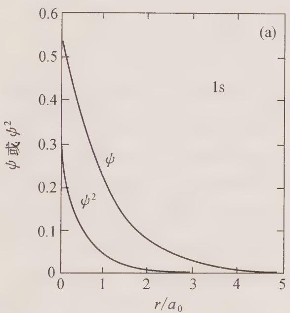

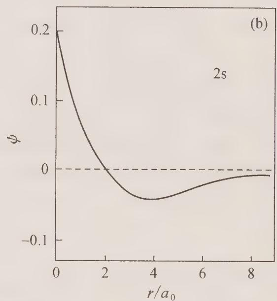  
图 2.3.1 氢原子 1s 态的 $\psi-r$ 图及 $\psi^{2}-r$ 图 (a) 和 2s 态的 $\psi-r$ 图 (b)  
(因 r 不能为 0, 曲线实际上不和纵轴相交, 后面的图形, 如图 2.3.2 同此)

由图可见，对于1s态，电子出现的概率密度在核附近最大，随 $r$ 的增加而逐渐稳定地下降。对于2s态，在 $r < 2a_0$ 时，分布情况和1s态相似，在核附近 $\psi$ 数值较大，随 $r$ 增加而逐渐下降；在 $r = 2a_0$ 时，出现一个 $\psi$ 为零的球面，称为节面；在 $r > 2a_0$ 时， $\psi$ 为负值，先是负的绝对值加大，至 $r = 4a_0$ 时达最低点，此后，随 $r$ 增加逐渐接近于0。

在主量子数为 $n$ 的状态中，有 $n - 1$ 个节面。2s态有一个节面，在球形节面之内电子出现的概率为 $5.4\%$ ，节面之外为 $94.6\%$ 。3s态有两个球形节面：在第一个节面之内，电子出现的概率为 $1.5\%$ ；两个节面之间，为 $9.5\%$ ；在第二个节面之外，为 $89.0\%$ 。

## 2.3.2 径向分布图

为了计算在半径为 r 的球面和半径为 $r + dr$ 的球面之间（即厚度为 dr 的薄壳层内）电子出现的概率，引入径向分布函数 (D)。

$\psi^2 (r,\theta ,\phi)$ 表示在点 $(r,\theta ,\phi)$ 处电子的概率密度，因而在点 $(r,\theta ,\phi)$ 附近的小体积元 $\mathrm{d}\tau$ 中，电子出现的概率为 $\psi^2 (r,\theta ,\phi)\mathrm{d}\tau$ 。将 $\psi^2 (r,\theta ,\phi)\mathrm{d}\tau$ 在 $\theta$ 和 $\phi$ 的全部区域积分，其结果表示离核为 $r$ 处，厚度为 $\mathrm{d}r$ 的球壳内电子出现的概率。若将

$$
\psi (r, \theta , \phi) = R (r) \Theta (\theta) \Phi (\phi)
$$

$$
\mathrm{d} \tau = r ^ {2} \sin \theta \mathrm{d} r \mathrm{d} \theta \mathrm{d} \phi
$$

代入，并令

$$
\begin{array}{r l} D \mathrm{d} r & = \int_ {\phi = 0} ^ {2 \pi} \int_ {\theta = 0} ^ {\pi} \psi^ {2} (r, \theta , \phi) \mathrm{d} \tau \\ & = \int_ {\phi = 0} ^ {2 \pi} \int_ {\theta = 0} ^ {\pi} [ R (r) \Theta (\theta) \Phi (\phi) ] ^ {2} r ^ {2} \sin \theta \mathrm{d} r \mathrm{d} \theta \mathrm{d} \phi \\ & = r ^ {2} R ^ {2} \mathrm{d} r \int_ {0} ^ {\pi} \Theta^ {2} \sin \theta \mathrm{d} \theta \int_ {0} ^ {2 \pi} \Phi^ {2} \mathrm{d} \phi \\ & = r ^ {2} R ^ {2} \mathrm{d} r \\ D & = r ^ {2} R ^ {2} \end{array}
$$

式中 $D$ 的物理意义是， $D\mathrm{d}r$ 代表在半径为 $r$ 和半径为 $r + \mathrm{d}r$ 的两个球面间夹层内找到电子的概率，它反映电子云分布随半径 $r$ 的变化情况。由表2.1.2可知，对于s态， $\psi$ 只是 $r$ 的函数，与 $\theta, \phi$ 无关。由于s态中 $\Theta(\theta) \Phi(\phi)$ 函数的数值为 $1 / \sqrt{4\pi}$ ，因而

$$
D = r ^ {2} R ^ {2} = 4 \pi r ^ {2} \psi_ {\mathrm{s}} ^ {2}
$$

对于 1s 态, 在核附近, r 趋于 0, 夹层的体积趋于 0, 因而 D 的数值趋于 0。随 r 增加, D 增大, 到 $r = a_{0}$ 处出现极大值。这是由于概率密度 $\psi^{2}$ 随 r 值增加而下降, 但壳层体积 $4\pi r^{2} dr$ 随 r 增加而上升, 两个随 r 变化趋势相反的因素乘在一起导致的结果。它表明, 在 $r = a_{0}$ 附近, 在厚度为 dr 的球壳夹层内找到电子的概率要比任何其他地方同样厚度的球壳夹层内找到电子

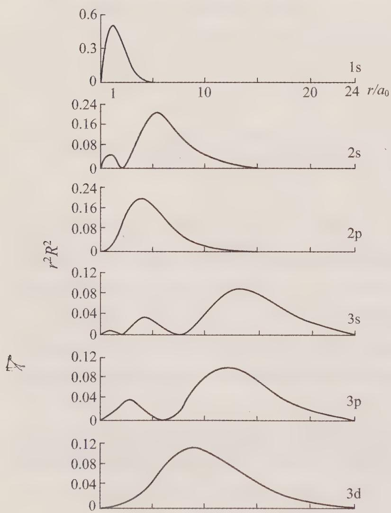  
图2.3.2 径向分布图 $(r^2 R^2 - r$ 图）

的概率大。在这个意义上，可以说Bohr轨道是氢原子结构的粗略近似。图2.3.2示出氢原子的几种状态的径向分布图。

由图可见，主量子数为 $n$ 、角量子数为 $l$ 的状态，径向分布图中有 $(n - l)$ 个极大值峰和 $(n - l - 1)$ 个节面（不算原点），虽然主峰位置随 $l$ 增加而向核移近，但 $l$ 值愈小，峰数目愈多，最内层的峰离核愈近。 $n$ 值不同而 $l$ 值相同的轨道，如1s,2s,3s;2p,3p,4p;3d,4d,5d等，其主峰按照主量子数增加的顺序向离核远的方向排列，例如：3p态的主峰在2p态外面，4p态的主峰在3p外面等等。这说明，主量子数小的轨道在靠近原子核的内层，所以能量低；主量子数大的轨道在离核远的外层，所以能量高。这一点也与Bohr模型的结论一致，但却有本质的区别：Bohr模型是行星绕太阳式的轨道， $n$ 值大的轨道绝对在外， $n$ 值小的轨道绝对在内。由于电子具有波性，其活动范围并不局限在主峰上，主量子数大的也有一部分钻到离核很近的内层。

## 2.3.3 原子轨道等值线图

原子轨道 $\psi$ 是 $r, \theta, \phi$ 的函数。 $\psi$ 在原子核周围空间各点上的数值随 $r, \theta, \phi$ 的变化而改变。由于三维数值在纸面上不易表达，通常在通过原子核及某些坐标轴的截面上，把二维截面上各点的 $r, \theta, \phi$ 值代入 $\psi$ 中，然后根据 $\psi$ 值的正负和大小画出二维等值线，即为原子轨道二维等值线图。将等值线图围绕对称轴转动，可将平面图形扩展成原子轨道空间分布图，故等值线图是绘制原子轨道空间分布图的基础。二维等值线图的描绘方法可参看本书配套的《习题解析》。

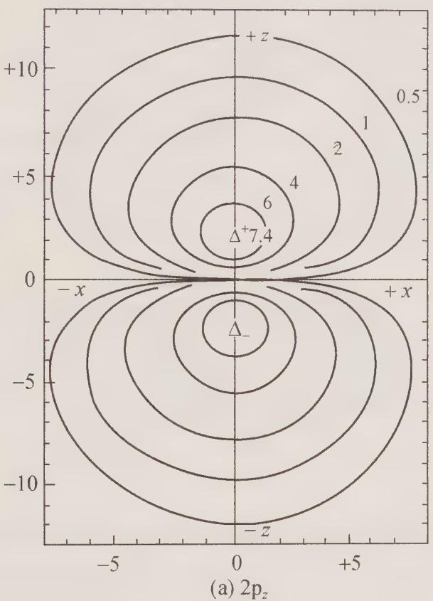

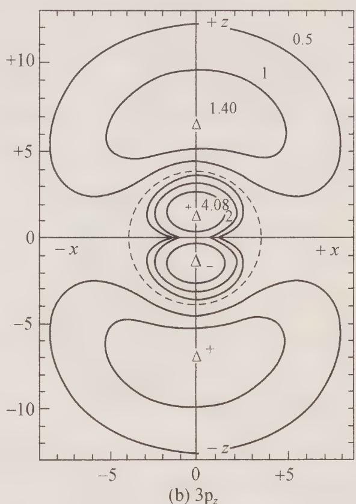  
(b) $3p_{z}$

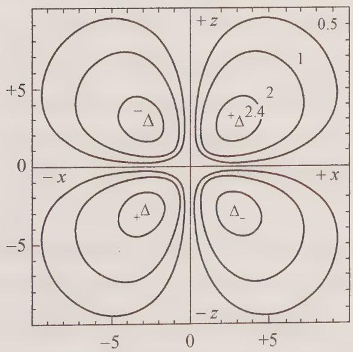  
(c) $3d_{xz}$

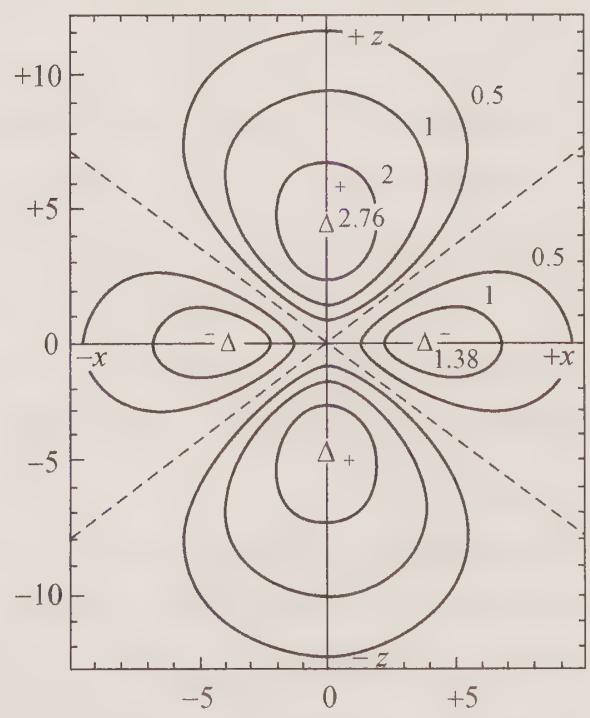  
(d) $3d_{z^{2}}$  
图2.3.3 氢原子的原子轨道二维截面等值线图  
[坐标轴上的单位是 $a_0$ ，离核距离已乘以 $2 / n$ ，(b)和(d)中的虚线代表节面]

图2.3.3中分别画出氢原子 $2\mathrm{p}_z, 3\mathrm{p}_z, 3\mathrm{d}_{xz}$ 及 $3\mathrm{d}_z^2$ 的二维截面等值线图。图中等值线上注明的数字是取原子单位并乘以100后的 $\psi$ 值。 $\Delta$ 表示绝对值最高的点， $\Delta$ 附近的 $+$ 、一号代表在它的周围 $\psi$ 的正、负号。图中水平轴为 $x$ 轴，垂直轴为 $z$ 轴。

$2p_{z}$ 最大值点在 z 轴上，离核 $\pm2a_{0}$ 处，xy 平面是节面； $3p_{z}$ 的二维等值线图大体轮廓和 $2p_{z}$ 相似，但多一个球形节面，此节面离核距离为 $6a_{0}$ [在图 2.3.3(b) 中画出时已按 2/n 即 2/3 比例缩小，所以节面出现在离核为 4 单位长度上]。在各种原子轨道中，主量子数愈大，节面愈多，能级愈高。节面的多少及其形状是了解原子轨道空间分布的重要信息。s 轨道的节面是球形对称的；3 个 p 轨道都是中心反对称的，各有 1 个平面形的节面；5 个 d 轨道都是中心对称的，其中 $d_{z^{2}}$ 轨道绕 z 轴旋转对称，有 2 个锥形节面，其顶点和核相连，锥体角度为 $110^{\circ}$ ，其余 4 个 d 轨道均有 2 个平面形节面，只是空间分布取向不同。

以原子轨道二维等值线图为基础,可以派生出下面几种图形:

## 1. 电子云分布图

绘制出原子轨道 $\psi$ 的等值线图后，概率密度（即电子云） $\psi^2$ 的等值线图很容易得到，因为 $\psi$ 的等值线也就是 $\psi^2$ 的等值线； $\psi$ 在空间分布的等值面，也是 $\psi^2$ 在空间分布的等值面（仅数值不同）。 $\psi^2$ 空间分布图中的最高点（ $\Delta$ ）的位置以及节面的数目、形状和位置均与 $\psi$ 空间分布图相同，只是 $\psi^2$ 均为正值，而 $\psi$ 则有正有负。

对应于同一个 $\psi^2$ ，有 $+\psi$ 和 $-\psi$ 两种， $+\psi$ 和 $-\psi$ 均可以描述同一状态。对于孤立原子，任意选择 $+\psi$ 和 $-\psi$ 均可。例如 2s 轨道可以将节面内靠近核的 $\psi$ 选为正值，如图 2.3.1(b) 所示。而通常考虑成键时，节面内靠近核的 $\psi$ 值选为负值，节面外的 $\psi$ 则为正值。原子间相互成键时， $\psi$ 的正负号十分重要，应正确选择。

## 2. 原子轨道网格线图

原子轨道 $\psi$ 的等值线图可用网格线的弯曲情况表示。网格线平面为截面，网格平整的平面表示 $\psi$ 为0；网格线向上凸起，表示该处 $\psi$ 为正值；向下凹陷，表示该处 $\psi$ 为负值。对于s态，平面上峰的中心位置为原子核位置；对于 $2\mathrm{p}_x$ 态，高峰和低谷连线的中点为原子核位置。

## 3. 电子云界面图

从上面三种图形可见,电子在空间的分布并没有明确的边界,在离核很远的地方, $\psi^{2}$ 并不为零,仍有一定的概率密度,但实际上在离核不到1 nm以外,电子出现的概率已微不足道了。为了了解电子分布的概率,可以取一个等密度面,使在面内出现的概率达到总概率的一定百分数,如50%,90%,99%等,这种面称为电子云界面。将面上的电子云值(即概率密度)开方,得到原子轨道界面图,它和电子云界面图是一样的,但面上的数值不同,且不同部分正负号可能不同。界面图实际上表示了原子在不同状态时的大小和形状。

## 4. 原子轨道轮廓图

把 $\psi$ 的大小轮廓和正负在直角坐标系中表达出来，选用一个合适的等值曲面，以反映 $\psi$ 在空间分布的图形叫作原子轨道轮廓图，简称原子轨道图。它和电子云界面图不同，界面图没有正、负号。它也和二维等值线图（图2.3.3）不同，二维等值线图反映原子轨道在通过原点的某一平面上的等值线，能定量地反映 $\psi$ 数值的大小和正负。而原子轨道轮廓图是在三维空间中反映 $\psi$ 的空间分布情况，体现对称性，具有大小和正负，但它的图线只有定性的意义。原子轨道轮廓图是原子轨道空间分布图简化的实用图形。它在化学中有重要意义，为了解分子内部原子之间轨道重叠形成化学键的情况提供明显的图像。图2.3.4示出1s,2p,3d等共9种原子轨道轮廓图。图中加的网格只是使等值曲面的弯曲形状更生动些。

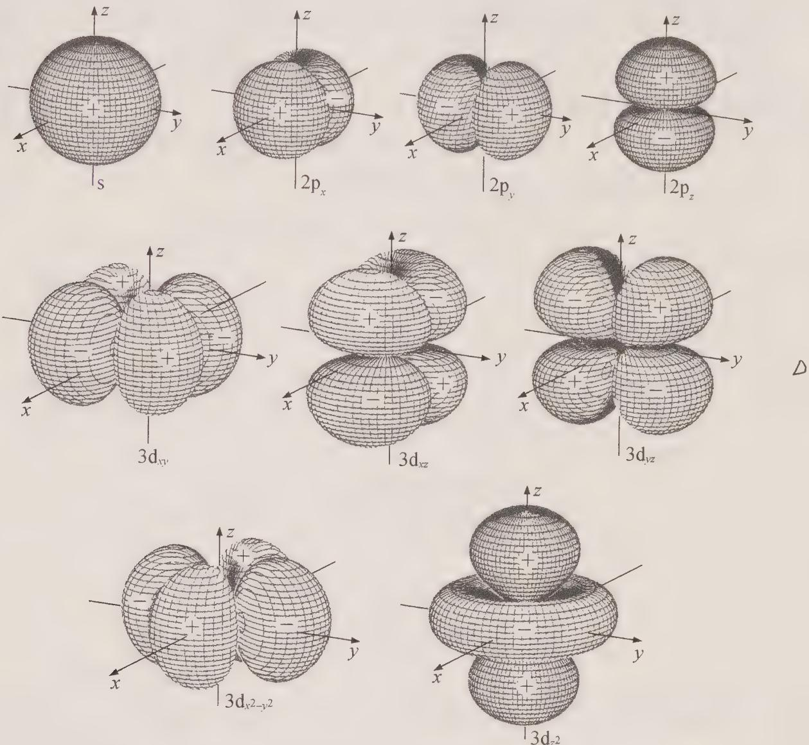  
图2.3.4 原子轨道轮廓图  
(图中 s, p, d 态的标度并不相同)

关于角度分布图,通常是在极坐标上画出,它将 $\psi$ 的角度部分 $Y(\theta,\phi)$ 函数的数值按给定的 $\theta,\phi$ 值代入求出。作图时从原点(核的位置)开始,沿着给定的 $\theta$ 和 $\phi$ 值方向,取一定长度线段

$|Y|$ ，再注明正负号。将空间各方向上代表Y值大小的线段的端点连成曲面，即得角度分布图。

图2.3.5示出 $2\mathrm{p}_z$ 态的角度分布图。由于角度分布图的含义和原子轨道等值线图完全不同，它不能代表空间某点 $(r,\theta ,\phi)$ 上 $\psi$ 和 $\psi^2$ 的大小，而又容易使初学者将 $Y$ 图和原子轨道等值线图混淆。图中画的圆不是 $|Y|$ 的等值面，所以改用 $|Y|^2$ 作图，得到的是沿 $z$ 轴拉长的椭圆。另外，原子轨道等值线图和原子轨道轮廓图等在讨论轨道叠加时的作用比角度分布图更好，所以本书中不讨论角度分布图。

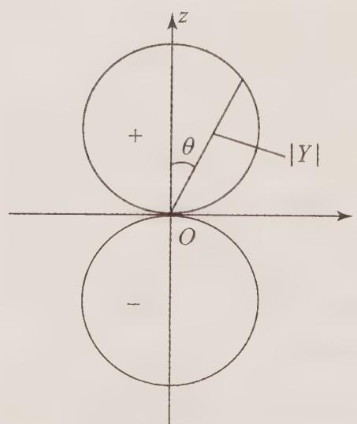  
图2.3.5 $2\mathbf{p}_z$ 态的角度分布图

[图中的圆不是等值面的圆,而是表示由原点(O)到该面上的距离等于|Y|,即反映|Y|值随不同角度而改变的曲面图形]

## 2.3.4 f轨道轮廓图

本小节介绍4f原子轨道在直角坐标系中的相对大小、轮廓和正负值，示于图2.3.6中。它对于了解镧系元素的性质具有一定的指导意义。

按2.1.4节叙述的方法，对单电子原子4f轨道进行计算，得到表2.3.1所列的波函数 $\psi$ 的表达式。图2.3.6是根据这些表达式作图得到的。

表 2.3.1 单电子原子的 4f 轨道的波函数 ${}^{\mathrm{a}}$

<table><tr><td>n</td><td>l</td><td>m</td><td>ψ</td></tr><tr><td>4</td><td>3</td><td>0</td><td> $4f_{z^3} = \left( \frac{1}{3072} \frac{1}{\sqrt{5\pi}} \right) \left( \frac{z}{a_0} \right)^{9/2} r^3 e^{-\sigma/4} (5\cos^3 \theta - 3\cos\theta)$ </td></tr><tr><td>4</td><td>3</td><td>±1</td><td> $4f_{xz^2} = \left( \frac{1}{6144} \sqrt{\frac{6}{5\pi}} \right) \left( \frac{z}{a_0} \right)^{9/2} r^3 e^{-\sigma/4} \sin\theta (5\cos^2 \theta - 1)\cos\phi$  $4f_{yz^2} = \left( \frac{1}{6144} \sqrt{\frac{6}{5\pi}} \right) \left( \frac{z}{a_0} \right)^{9/2} r^3 e^{-\sigma/4} \sin\theta (5\cos^2 \theta - 1)\sin\phi$ </td></tr><tr><td>4</td><td>3</td><td>±2</td><td> $4f_{xyz} = \left( \frac{1}{3072} \sqrt{\frac{3}{\pi}} \right) \left( \frac{z}{a_0} \right)^{9/2} r^3 e^{-\sigma/4} \sin^2 \theta \cos\theta \sin 2\phi$  $4f_{z(x^2-y^2)} = \left( \frac{1}{3072} \sqrt{\frac{3}{\pi}} \right) \left( \frac{z}{a_0} \right)^{9/2} r^3 e^{-\sigma/4} \sin^2 \theta \cos\theta \cos 2\phi$ </td></tr><tr><td>4</td><td>3</td><td>±3</td><td> $4f_{x(x^2-3y^2)} = \left( \frac{1}{6144} \sqrt{\frac{2}{\pi}} \right) \left( \frac{z}{a_0} \right)^{9/2} r^3 e^{-\sigma/4} \sin^3 \theta \cos 3\phi$  $4f_{y(3x^2-y^2)} = \left( \frac{1}{6144} \sqrt{\frac{2}{\pi}} \right) \left( \frac{z}{a_0} \right)^{9/2} r^3 e^{-\sigma/4} \sin^3 \theta \sin 3\phi$ </td></tr></table>

$^{a}$ 表中 $\sigma=\frac{z}{a_{0}}r$ 。

4f 轨道的形状和分布特点, 宜复习 1s, 2p, 3d 的轨道轮廓图中各个轨道的节面分布, 通过比较来认识。从图 2.3.4 看出, 1s 轨道没有节面。2p 轨道有 1 个节面, $2\mathrm{p}_x$ , $2\mathrm{p}_y$ 和 $2\mathrm{p}_z$ 的节面分别垂直于 $x$ , $y$ 和 $z$ 轴, 通过原点, 在 $yz$ , $xz$ 和 $xy$ 平面上。3d 轨道有两个节面, 其中 $3\mathrm{d}_{xy}$ , $3\mathrm{d}_{xz}$ 和 $3\mathrm{d}_{yz}$ 中的两个节面都通过原点和两个下标标出的坐标轴与未标明的坐标轴所形成的平面: $(xz$ 面和 $yz$ 面), $(xy$ 面和 $yz$ 面), $(xy$ 面和 $xz$ 面); $3\mathrm{d}_{x^2-y^2}$ 中的两个节面分别是通过两个 $x$ 轴和 $y$ 轴的平分线与 $z$ 轴形成的平面; $3\mathrm{d}_{z^2}$ 中的两个节面为通过原点围绕 $z$ 轴上、下取向的开口圆锥形面。

4f轨道有3个节面。在 $4f_{z^{3}}$ 中，两个锥形节面和 $3d_{z^{2}}$ 相似，第三个为通过原点垂直z轴的平面形节面； $4f_{xz^{2}}$ 和 $4f_{yz^{2}}$ 轨道中的两个节面保持和 $3d_{z^{2}}$ 相似的锥形节面，再分别加一个通过原点的yz平面形节面和xz平面形节面； $4f_{xyz}$ 的3个节面分别为通过原点和x,y,z坐标轴中两个轴平行的节面； $4f_{z(x^{2}-y^{2})}$ 轨道中两个节面和 $3d_{x^{2}-y^{2}}$ 相似，另外加一个通过原点和z轴垂直的节面； $4f_{y(3x^{2}-y^{2})}$ 和 $4f_{x(x^{2}-3y^{2})}$ 中的全部节面都和z轴平行，都相隔 $60^{\circ}$ ，在 $4f_{y(3x^{2}-y^{2})}$ 中节面和xz平面的夹角为 $30^{\circ}$ ，在 $4f_{x(x^{2}-3y^{2})}$ 中节面和xz平面的夹角为 $60^{\circ}$ 。

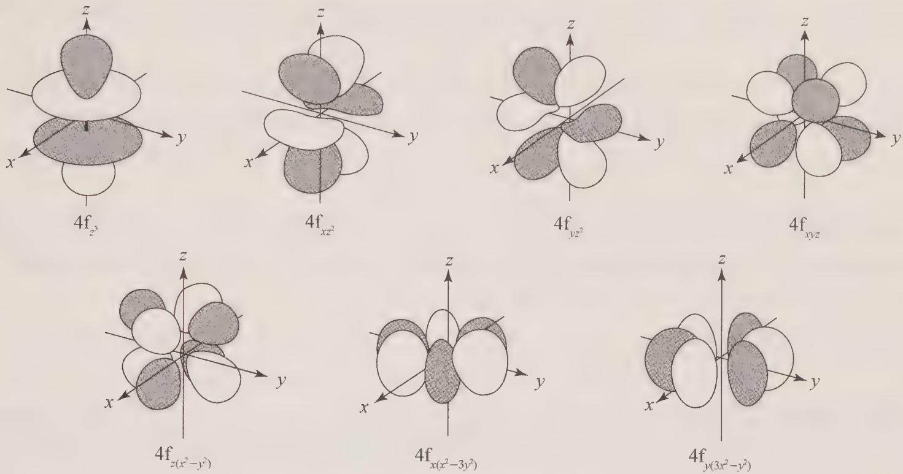  
图2.3.6 4f原子轨道轮廓图  
(图中曲线表示等值线,颜色深浅表示数值的正负)

## 2.4 多电子原子的结构

在多电子原子中，由于电子间存在着复杂的瞬时相互作用，其势能函数形式比较复杂，Schrödinger方程的求解比较困难，一般采用近似方法。

## 2.4.1 多电子原子的 Schrödinger 方程及其近似解

最简单的多电子原子是氦原子(He)，它由带2个正电荷(Z=2)的原子核(处于坐标原点)和2个电子(1和2)组成，其坐标系示于图2.4.1中。

考虑电子的动能、电子和核以及电子之间的势能, 得 Schrödinger 方程为

$$
\left[ - \frac {h ^ {2}}{8 \pi^ {2} m} \left(\nabla_ {1} ^ {2} + \nabla_ {2} ^ {2}\right) - \frac {Z e ^ {2}}{4 \pi \varepsilon_ {0}} \left(\frac {1}{r _ {1}} + \frac {1}{r _ {2}}\right) + \frac {e ^ {2}}{4 \pi \varepsilon_ {0}} \frac {1}{r _ {1 2}} \right] \psi = E \psi
$$

式中 $r_1$ 和 $r_2$ 分别是电子1和2与核的距离， $r_{12}$ 是电子1和2间的距离。用附录(表5)的原子单位 $(h / 2\pi = 1\mathrm{au}, m = m_{\mathrm{e}} = 1\mathrm{au}, e = 1\mathrm{au}, 4\pi \varepsilon_0 = 1\mathrm{au})$ 化简得

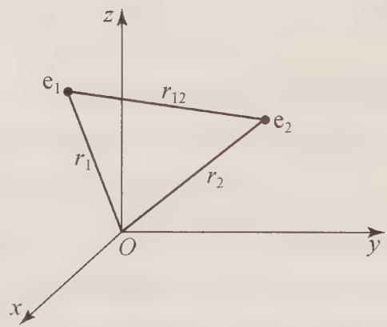

$$
\triangle \quad \left[ - \frac {1}{2} (\nabla_ {1} ^ {2} + \nabla_ {2} ^ {2}) - \frac {Z}{r _ {1}} - \frac {Z}{r _ {2}} + \frac {1}{r _ {1 2}} \right] \psi = E \psi
$$

图2.4.1 氦原子的坐标系

对于原子序数为 $Z$ 、含 $n$ 个电子的原子，若不考虑电子自旋运动及其相互作用，并假定质心和核心重合，用原子单位表示，则Hamilton算符为

$$
\hat {H} = - \frac {1}{2} \sum_ {i = 1} ^ {n} \nabla_ {i} ^ {2} - \sum_ {i = 1} ^ {n} \frac {Z}{r _ {i}} + \sum_ {i = 1} ^ {n} \sum_ {i > j} \frac {1}{r _ {i j}}\tag{2.4.1}
$$

式中第一项是各电子的动能算符，第二项为各电子与原子核相互作用的势能算符，第三项是各电子之间相互作用的势能算符。因为其中有 $r_{ij}$ ，涉及两个电子的坐标，无法分离变量，不能按2.1节的方法解决。如将第三项当作0，即假定电子间没有相互作用，这时体系的Schrödinger方程为

$$
\left[ - \frac {1}{2} \sum_ {i = 1} ^ {n} \nabla_ {i} ^ {2} - \sum_ {i = 1} ^ {n} \frac {Z}{r _ {i}} \right] \psi = E \psi\tag{2.4.2}
$$

令 $\psi(1,2,\cdots,n)=\psi_{1}(1)\psi_{2}(2)\cdots\psi_{n}(n)$ ，则(2.4.2)式可分离变量，分解为 n 个方程

$$
\hat {H} _ {i} \psi_ {i} (i) = E _ {i} \psi_ {i} (i)\tag{2.4.3}
$$

这时 $\hat{H}_i$ 类似于单电子原子能量算符，可按2.1节的方法解出 $\psi_{i}$ 和 $E_{i}$ 。 $\psi_{i}$ 称为单电子波函数， $E_{i}$ 为和 $\psi_{i}$ 对应的能量，称为单电子原子轨道能。在基态，电子按Pauli原理、能量最低原理和Hund(洪特)规则填充在这些原子轨道中。

体系的近似波函数

$$
\psi = \psi_ {1} \psi_ {2} \dots \psi_ {n}
$$

体系总能量

$$
E = E _ {1} + E _ {2} + \dots + E _ {n}\tag{2.4.4}
$$

实际上原子中电子之间存在不可忽视的相互作用。在不忽略电子相互作用的情况下，用单电子波函数来描述多电子原子中单个电子的运动状态，这种近似称为单电子近似。这时体系中各个电子都分别在某个势场中独立运动，犹如单电子体系那样。为了从形式上把电子间的势能变成与 $r_{ij}$ 无关的函数，便于解出 Schrödinger 方程，常用自洽场 (self-consistent field, SCF) 法和中心力场法等方法。

自洽场法[此方法最早是由Hartree(哈特里)提出的，后来被Fock(福克)改进，故又称为Hartree-Fock法]假定电子 $i$ 处在原子核及其他 $(n - 1)$ 个电子的平均势场中运动。为了计算平均势场，先引进一组近似波函数求 $\sum_{i > j}\frac{1}{r_{ij}}$ 的平均值，使之成为只与 $r_i$ 有关的函数 $V(r_i)$ 。如此得

$$
\hat {H} _ {i} = - \frac {1}{2} \nabla_ {i} ^ {2} - \frac {Z}{r _ {i}} + V (r _ {i})\tag{2.4.5}
$$

$V(r_{i})$ 是由其他电子的波函数决定的，例如求 $V(r_{1})$ 时，需用 $\psi_{2},\psi_{3},\psi_{4},\cdots$ 来计算；求 $V(r_{2})$ 时，需用 $\psi_{1},\psi_{3},\psi_{4},\cdots$ 来计算。有了 $\hat{H}_{i}$ ，解这一组方程得新一轮的 $\psi_{i}^{(1)}$ ，用它计算新一轮的 $V^{(1)}(r_{i})$ 。如法解出第二轮的 $\psi_{i}^{(2)},\cdots$ ;如此循环，直至前一轮的波函数和后一轮的波函数很好地符合，即自洽为止。

自洽场法提供了单电子原子轨道图像，它把原子中任一电子 $i$ 的运动看成在原子核及其他电子的平均势场中独立运动，犹如单电子体系那样，所以 $\psi_{i}$ 可看作原子中单电子的运动状态，即单电子原子轨道， $E_{i}$ 即单电子原子轨道能。但自洽场法所得的单电子原子轨道能之和，不正好等于原子的总能量，而应扣除多计算的电子间的互斥能。

中心力场法是将原子中其他电子对第 i 个电子的排斥作用看成是球对称的、只与径向有关的力场。这样，第 i 个电子受其余电子的排斥作用被看成相当于 $\sigma_{i}$ 个电子在原子中心与之相互排斥。因此，第 i 个电子的势能函数为

$$
V _ {i} = - \frac {Z}{r _ {i}} + \frac {\sigma_ {i}}{r _ {i}} = - \frac {Z - \sigma_ {i}}{r _ {i}} = - \frac {Z _ {i} ^ {*}}{r _ {i}}\tag{2.4.6}
$$

(2.4.6)式在形式上和单电子原子的势能相似。式中 $Z_{i}^{*}$ 为对 $i$ 电子的有效核电荷； $\sigma_{i}$ 称为屏蔽常数，其意义是除 $i$ 电子外，其他电子对 $i$ 的排斥作用，使核的正电荷减小 $\sigma_{i}$ 。所以，多电子原子中第 $i$ 个电子的单电子 Schrödinger 方程为

$$
\left[ - \frac {1}{2} \nabla_ {i} ^ {2} - \frac {Z - \sigma_ {i}}{r _ {i}} \right] \psi_ {i} = E _ {i} \psi_ {i}\tag{2.4.7}
$$

(2.4.7)式的 $\psi_{i}$ 称单电子波函数, 它近似地表示原子中第 $i$ 个电子的运动状态, 也称单电子原子轨道; $E_{i}$ 近似地为这个状态的能量, 即单电子原子轨道能。按 2.1 节中解单电子原子的 Schrödinger 方程的方法, 将 $Z$ 换成 $Z_{i}^{*}$ , 即得 $\psi_{i}$ 和相应的 $E_{i}, \psi_{i}$ 仍由 $n, l, m$ 这三个量子数确定, 而且

$$
\psi_ {n l m} = R _ {n l} ^ {\prime} (r) Y _ {l m} (\theta , \phi)\tag{2.4.8}
$$

因为解 $\Theta$ 方程和 $\Phi$ 方程时与势能项 $V(r_{i})$ 无关，故 $Y_{lm}(\theta, \phi)$ 的形式和单电子原子相同，而 $R_{nl}'(r)$ 则和单电子原子的 $R_{nl}(r)$ 不相同。和 $\psi_{i}$ 对应的单电子原子轨道能（以eV单位表达）为

$$
E _ {i} = - 1 3. 6 (Z _ {i} ^ {*}) ^ {2} / n ^ {2}\tag{2.4.9}
$$

原子的总能量近似地由各个电子的能量 $E_{i}$ 加和得到，也可通过实验测定全部电子电离所需的能量得到。原子中全部电子电离能之和等于单电子原子轨道能总和的负值。

## 2.4.2 单电子原子轨道能和电子结合能

单电子原子轨道能是指和单电子波函数 $\psi_{i}$ 相应的能量 $E_{i}$ 。原子的总能量近似等于各个电子的单电子原子轨道能之和。电子结合能是指在中性原子中当其他电子均处在可能的最低能态时，某电子从指定的轨道上电离所需能量的负值。电子结合能反映了原子轨道能级的高低，又称为原子轨道能级。

为了阐明上述两个概念及有关问题,下面分4个问题展开讨论。

## 1. 屏蔽效应和钻穿效应

电子间的相互作用可从屏蔽效应和钻穿效应两方面来认识。这两种效应有着密切的联系，它们都是根据单电子波函数和中心力场的近似模型提出来的，是在多电子原子中由于各个电子的量子数 $n, l$ 不同，电子云分布不同，电子和电子之间、电子和核电荷之间相互的作用不同，引起单电子原子轨道能和电子结合能发生变化的能量效应。屏蔽效应是指核外某个电子 $i$ 感受到核电荷的减少，使能级升高的效应；钻穿效应则是指电子 $i$ 避开其余电子的屏蔽，其电子云钻到近核区而感受到较大核电荷作用，使能级降低的效应。这两种效应从不同的角度出发：钻穿效应把电子看作主体，从它自身分布的特点来理解；屏蔽效应把电子看作客体，考察它受其他电子的屏蔽影响。

从钻穿效应来看, 主量子数 n 相同而角量子数 l 不同的轨道, 能级由低到高的次序为: ns, np, nd, nf。这是因为主量子数相同的各态中, s 态峰的数目最多, 它的分布特点是: 主峰离核最远, 小峰靠核最近, 随着核电荷的增加, 最靠近核的小峰在能量上的作用越来越明显。这一方面是小峰所代表的电子云有效地避开其他电子的屏蔽, 作用在小峰上的 $Z^{*}$ 大; 另一方面, 小峰离核近, r 小。两个因素都使电子和核的相互作用能增加, 对该轨道的能级降低影响较大。

对 $n$ 和 $l$ 都不相同的轨道，能级高低可根据屏蔽效应和钻穿效应做些估计，但不能准确地判断，而且各种轨道能级高低不是固定不变的，而是随原子序数的改变而变化。例如，3d和4s轨道能级高低随原子序数 $Z$ 增加而出现交错：当 $Z \leqslant 7$ ，如H原子，3d轨道能级较低；当 $8\leqslant Z\leqslant 20$ ，如K原子，4s轨道能级较低

$$
\begin{array}{l} E (4 \mathrm{s}) = E (\mathrm{K} [ \mathrm{Ar} ] 4 \mathrm{s} ^ {1}) - E (\mathrm{K} ^ {+} [ \mathrm{Ar} ]) = - 4. 3 4 \mathrm{eV} \\ E (3 \mathrm{d}) = E (\mathrm{K} [ \mathrm{Ar} ] 3 \mathrm{d} ^ {1}) - E (\mathrm{K} ^ {+} [ \mathrm{Ar} ]) = - 1. 6 7 \mathrm{eV} \end{array}
$$

当 $Z \geqslant 21$ ，如Sc原子，3d轨道能级较低。一般说来，原子序数增加到足够大时， $n$ 相同的内层轨道，能级随 $l$ 不同而引起的分化相当小，原子轨道能级主要由主量子数决定。

## 2. 由屏蔽常数近似计算单电子原子轨道能

单电子原子轨道能可利用屏蔽常数近似计算。Slater(斯莱特)归纳了一些实验数据,提出估算屏蔽常数 $\sigma$ 的经验方法:

(1) 将电子按内外次序分组: $1s \mid 2s, 2p \mid 3s, 3p \mid 3d \mid 4s, 4p \mid 4d \mid 4f \mid 5s, 5p \mid$ 等;

(2) 外层电子对内层电子无屏蔽作用, $\sigma=0$ ;

(3) 同一组电子 $\sigma=0.35$ (1s 组内电子间的 $\sigma=0.30$ );

（4）对于 s, p 电子，相邻内一组的电子对它的屏蔽常数是 0.85；对于 d, f 电子，相邻内一组的电子对它的屏蔽常数均为 1.00；

(5) 更内的各组 $\sigma=1.00$ 。

这个方法可用于主量子数为 $1 \sim 4$ 的轨道，主量子数更高轨道的准确性较差。下面以碳原子为例，说明该法的应用。碳原子的电子组态为 $1\mathrm{s}^2 2\mathrm{s}^2 2\mathrm{p}^2$ ，1s电子的屏蔽常数 $\sigma = 0.30$ ，因而有效核电荷 $Z^{*} = 6 - 0.30 = 5.70$ ，碳原子的1s态单电子轨道能为

$$
E _ {1 \mathrm{s}} = - (1 3. 6 \mathrm{eV}) \times (5. 7 0) ^ {2} = - 4 4 2 \mathrm{eV}
$$

2s 电子的屏蔽常数 $\sigma = 2 \times 0.85 + 3 \times 0.35 = 2.75$ ，有效核电荷为 $Z^{*} = 6 - 2.75 = 3.25$ ，碳原子 2s（或 2p）单电子轨道能为

$$
E _ {2 \mathrm{s}} = - (1 3. 6 \mathrm{eV}) \times \frac {3 . 2 5 ^ {2}}{2 ^ {2}} = - 3 5. 9 \mathrm{eV}
$$

按 Slater 方法, $E_{2s}$ 和 $E_{2p}$ 相同, 在 2s 和 2p 轨道上的 4 个电子的单电子原子轨道能之和为 $4 \times (-35.9 \mathrm{eV}) = -143.6 \mathrm{eV}$ , 此数值与 C 原子的第一至第四电离能之和的负值相近, 即

$$
- \left(I _ {1} + I _ {2} + I _ {3} + I _ {4}\right) = - (1 1. 2 6 + 2 4. 3 8 + 4 7. 8 9 + 6 4. 4 9) \mathrm{eV} = - 1 4 8. 0 \mathrm{eV}
$$

同理,两个处在 1s 轨道上的电子的单电子原子轨道能之和为

$$
2 \times \left[ - (1 3. 6 \mathrm{eV}) \times \frac {(6 - 0 . 3 0) ^ {2}}{1} \right] = - 8 8 4 \mathrm{eV}
$$

与实验测定的 $(I_{5} + I_{6}) = (392.1 + 490.0)\mathrm{eV} = 882\mathrm{eV}$ 的负值相近。这说明，原子总能量近似等于用Slater方法计算所得的各个电子的单电子原子轨道能之和。

按 Slater 方法计算, $E_{2s}$ 和 $E_{2p}$ 相等, 但实际上多电子原子的 $E_{2s}$ 和 $E_{2p}$ 是不等的①, 这说明此方法过于粗略。徐光宪教授等给出的改进的 Slater 法考虑了 s, p, d, f 等轨道的差异, 得到较好的结果。

在用屏蔽常数及原子的电离能时，应注意电子间的相互作用。如前所述，He 原子 $I_{1}=24.6\,eV$ , $I_{2}=54.4\,eV$ 。这时不能简单地认为 He 原子 1s 单电子原子轨道能为 -24.6 eV，并用以求算一个 1s 电子对另一个 1s 电子的屏蔽常数 $\sigma$

$$
- 2 4. 6 \mathrm{eV} = - (1 3. 6 \mathrm{eV}) \times (2 - \sigma) ^ {2}
$$

这样得 $\sigma = 0.65$ ，其原因是一个电子对另一个电子既有屏蔽作用，又有互斥作用。当一个电子电离时，既摆脱了核的吸引，也把互斥作用带走了。根据定义， $I_{1}$ 对应于下一过程的能量变化

$$
I _ {1} = E (\mathrm{He} ^ {+}) - E (\mathrm{He})
$$

$He^{+}$ 是单电子原子,其能量为

$$
2 \mathrm{p}
$$

<table><tr><td>原子</td><td>Li</td><td>Be</td><td>B</td><td>C</td><td>N</td><td>O</td><td>F</td></tr><tr><td> $(E_{2p}-E_{2s})/eV$ </td><td>1.85</td><td>3.36</td><td>5.75</td><td>8.77</td><td>12.39</td><td>16.53</td><td>21.54</td></tr></table>

$$
E (\mathrm{He} ^ {+}) = - (1 3. 6 \mathrm{eV}) \times \frac {Z ^ {2}}{n ^ {2}} = - 5 4. 4 \mathrm{eV}
$$

而根据屏蔽常数，有

$$
E (\mathrm{He}) = - 2 \times (1 3. 6 \mathrm{eV}) \times \frac {(2 - \sigma) ^ {2}}{n ^ {2}} = - 2 7. 2 \times (2 - \sigma) ^ {2} \mathrm{eV}
$$

将这些数据代入,得

解之，得

$$
\begin{array}{r l} 2 4. 6 & = - 5 4. 4 + 2 7. 2 \times (2 - \sigma) ^ {2} \\ \sigma & = 0. 3 0 \end{array}
$$

He 原子的 $I_{1}$ 和 $I_{2}$ 都不是 He 原子的 1s 单电子轨道能的负值，它的 1s 单电子原子轨道能为两者的平均值的负值 -39.5 eV。

利用屏蔽常数,还可按下式近似估算原子中某一原子轨道的有效半径 $r^{*}$

$$
r ^ {*} = \frac {n ^ {2}}{Z ^ {*}} a _ {0}\tag{2.4.10}
$$

例如 C 原子基态 $(1s^{2}2s^{2}2p^{2})$ ，2p 轨道 $Z^{*}=3.25,2p$ 轨道的有效半径 $r^{*}$ 为

$$
r ^ {*} = \frac {2 ^ {2}}{3 . 2 5} \times 5 2. 9 \mathrm{pm} = 6 5 \mathrm{pm}
$$

## 3. 电子结合能

假定中性原子中从某个原子轨道上电离掉一个电子，而其余的原子轨道上电子的排布不因此而发生变化（即“轨道冻结”），这个电离能的负值即为该轨道的电子结合能。在徐光宪和王祥云编著的《物质结构》（第二版）中称为中性原子的原子轨道能量，并于表2.5中给出1～100号元素各个轨道的数据。通常所说的当原子结合成分子时，能量相近的原子轨道才能有效地组成分子轨道，所指的能量就是电子结合能。表2.4.1列出若干原子的电子结合能的实验值。现以He原子为例说明：He原子基态有2个电子处在1s轨道上，如前所述，它的第一电离能 $(I_{1})$ 为 $24.6\mathrm{eV}$ ，第二电离能 $(I_{2})$ 为 $54.4\mathrm{eV}$ 。根据上述定义，He原子1s轨道的电子结合能为 $-24.6\mathrm{eV}$ ，而He原子的1s单电子原子轨道能为

$$
- \frac {(2 4 . 6 + 5 4 . 4) \mathrm{eV}}{2} = - 3 9. 5 \mathrm{eV}
$$

表 2.4.1 若干原子的原子轨道电子结合能实验值(负值, eV)

<table><tr><td>原子</td><td>1s</td><td>2s</td><td>2p</td><td>3s</td><td>3p</td><td>3d</td><td>4s</td></tr><tr><td>H</td><td>13.6</td><td></td><td></td><td></td><td></td><td></td><td></td></tr><tr><td>He</td><td>24.6</td><td></td><td></td><td></td><td></td><td></td><td></td></tr><tr><td>Li</td><td>58</td><td>5.4</td><td></td><td></td><td></td><td></td><td></td></tr><tr><td>Be</td><td>115</td><td>9.3</td><td></td><td></td><td></td><td></td><td></td></tr><tr><td>B</td><td>192</td><td>12.9</td><td>8.3</td><td></td><td></td><td></td><td></td></tr><tr><td>C</td><td>288</td><td>16.6</td><td>11.3</td><td></td><td></td><td></td><td></td></tr><tr><td>N</td><td>403</td><td>20.3</td><td>14.5</td><td></td><td></td><td></td><td></td></tr><tr><td>O</td><td>538</td><td>28.5</td><td>13.6</td><td></td><td></td><td></td><td></td></tr><tr><td>F</td><td>694</td><td>37.9</td><td>17.4</td><td></td><td></td><td></td><td></td></tr><tr><td>Ne</td><td>870</td><td>48.5</td><td>21.6</td><td></td><td></td><td></td><td></td></tr><tr><td>Na</td><td>1075</td><td>66</td><td>34</td><td>5.1</td><td></td><td></td><td></td></tr><tr><td>K</td><td>3610</td><td>381</td><td>298</td><td>37</td><td>19</td><td>1.7</td><td>4.3</td></tr><tr><td>Sc</td><td>4494</td><td>503</td><td>406</td><td>55</td><td>33</td><td>8.0</td><td>6.6</td></tr></table>

电子结合能与单电子原子轨道能互有联系:对单电子原子,两者数值相同;对 Li, Na, K 的最外层一个电子,两者也相同;但在其他情况下就不相同了。这正说明电子间存在互斥能等相互作用的因素。

## 4. 电子互斥能

电子互斥能由原子中同号电荷的库仑排斥作用所引起。处在不同状态的电子，其分布密度不同，电子互斥能不同。例如 Sc 原子，2 个处在 3d 轨道上的电子其互斥能 $J(d,d)$ 要比 2 个处在 4s 轨道上的电子的互斥能 $J(s,s)$ 大。

原子中能级高低与电子互斥能有关。实验测得，Sc 原子：

$$
\begin{array}{r l} & E (4 \mathrm{s}) = E [ \mathrm{Sc} (3 \mathrm{d} ^ {1} 4 \mathrm{s} ^ {2}) ] - E [ \mathrm{Sc} ^ {+} (3 \mathrm{d} ^ {1} 4 \mathrm{s} ^ {1}) ] = - 6. 6 2 \mathrm{eV} \\ & E (3 \mathrm{d}) = E [ \mathrm{Sc} (3 \mathrm{d} ^ {1} 4 \mathrm{s} ^ {2}) ] - E [ \mathrm{Sc} ^ {+} (3 \mathrm{d} ^ {0} 4 \mathrm{s} ^ {2}) ] = - 7. 9 8 \mathrm{eV} \end{array}
$$

式中将 $\mathrm{Sc}[\mathrm{Ar}]3\mathrm{d}^1 4\mathrm{s}^2$ 简写为 $\mathrm{Sc}(3\mathrm{d}^1 4\mathrm{s}^2)$ ，下面也按此简写表示。由此数据可见， $\mathrm{Sc}$ 原子的 $4\mathrm{s}$ 轨道能级高。但 $\mathrm{Sc}$ 的基态电子组态却为 $\mathrm{Sc}(3\mathrm{d}^1 4\mathrm{s}^2)$ 。由基态 $\mathrm{Sc}(3\mathrm{d}^1 4\mathrm{s}^2)$ 向激发态 $\mathrm{Sc}(3\mathrm{d}^2 4\mathrm{s}^1)$ 跃迁时，需要吸收能量 $2.03\mathrm{eV}$ ，即

$$
E \left[ \mathrm{Sc} (3 \mathrm{d} ^ {2} 4 \mathrm{s} ^ {1}) \right] - E \left[ \mathrm{Sc} (3 \mathrm{d} ^ {1} 4 \mathrm{s} ^ {2}) \right] = 2. 0 3 \mathrm{eV}
$$

现将Sc原子和 $\mathrm{Sc}^+$ 离子有关组态的相对能级示意于图2.4.2中。

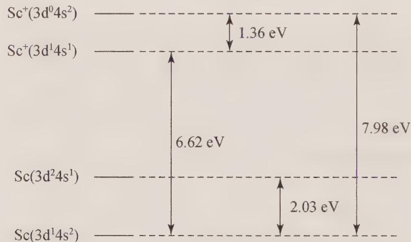  
图2.4.2 Sc原子和 $\mathrm{Sc}^{+}$ 离子一些组态的能级

分析上述有关数据,会出现下面两个问题:

(1) Sc 原子基态的电子组态为什么是 $3d^{1}4s^{2}$ ，而不是 $3d^{2}4s^{1}$ 或 $3d^{3}4s^{0}$ 呢？

(2) 为什么 Sc 原子(及其他过渡金属原子)电离时先失去的是 4s 电子, 而不是 3d 电子?

通过实验测定原子及离子的电离能(I)，推出原子中不同轨道上电子的互斥能(J)，进行比较，就可回答上述问题。

$\mathrm{Sc}^{2+}$ 的电离能实验值为

$$
\begin{array}{l l} \mathrm {Sc^ {2 + } (3d^ {1} 4s^ {0}) \longrightarrow Sc^ {3 + } (3d^ {0} 4s^ {0}) + e^ {-}} & I _ {\mathrm{d}} = 2 4. 7 5 \mathrm{eV} \\ \mathrm {Sc^ {2 + } (3d^ {0} 4s^ {1}) \longrightarrow Sc^ {3 + } (3d^ {0} 4s^ {0}) + e^ {-}} & I _ {\mathrm{s}} = 2 1. 6 0 \mathrm{eV} \end{array}
$$

根据这些数据,可以推得 Sc 原子的电子互斥能为

$$
\begin{array}{r l} & J (\mathrm{d}, \mathrm{d}) = 1 1. 7 8 \mathrm{eV} \\ & J (\mathrm{d}, \mathrm{s}) = 8. 3 8 \mathrm{eV} \\ & J (\mathrm{s}, \mathrm{s}) = 6. 6 0 \mathrm{eV} \end{array}
$$

当电子进入 $Sc^{3+}(3d^0 4s^0)$ ，因3d能级低，先进入3d轨道；再有一个电子进入 $Sc^{2+}(3d^1 4s^0)$ 时，因为 $J(\mathrm{d},\mathrm{d})$ 较大，电子填充在4s轨道上，成为 $\mathrm{Sc}^{+}(3\mathrm{d}^{1}4\mathrm{s}^{1})$ ；若继续有电子进入，也因同样原因，电子应进入4s轨道。这样，基态Sc的电子组态为 $\mathrm{Sc}(3\mathrm{d}^{1}4\mathrm{s}^{2})$ 。所以，电子填充次序应使体系总能量保持最低，而不单纯按轨道能级高低的次序。电离时先失去4s电子，因为4s的能级高。（参看本书配套的《习题解析》综合题C.5。）过渡金属原子最外层ns轨道能级要比 $(n - 1)\mathrm{d}$ 的能级高。这些原子中电子的增填次序和电离次序常与Sc原子相似，其原因可从电子互斥能来理解。

## 2.4.3 基态原子的电子排布

原子的核外电子排布遵循下面 3 个原则：

(1) Pauli 原理——在一个原子中, 没有两个电子有完全相同的 4 个量子数。即一个原子轨道最多只能排两个电子, 而且这两个电子的自旋状态必须不同。这两种不同的自旋态通常用自旋函数 $\alpha$ 和 $\beta$ 表示。

(2) 能量最低原理——在不违背 Pauli 原理的前提下, 电子优先占据能级较低的原子轨道, 使整个原子体系能量最低, 这样的状态被称作原子的基态。

(3) Hund 规则——在能级高低相等的轨道上, 电子尽可能分占不同的轨道, 且自旋相同。

作为Hund规则的补充，能级高低相等的轨道上全充满和半充满的状态比较稳定，因为这时电子云分布近于球形。

根据上述原则,可将核外电子进行填充。由 n,l 表示的一种电子排布方式,叫作一种电子组态。电子在原子轨道中填充的顺序为

$$
1 s, 2 s, 2 p, 3 s, 3 p, 4 s, 3 d, 4 p, 5 s, 4 d, 5 p, 6 s, 4 f, 5 d, 6 p, 7 s, 5 f, 6 d, \dots
$$

在此填充顺序中，3d排在4s之后，4d排在5s之后，4f,5d排在6s之后，5f,6d排在7s之后，使得周期表中过渡元素“延迟”出现。电子在原子轨道中的填充顺序，并不是原子轨道能级高低的顺序，填充次序遵循的原则是使原子的总能量保持最低。填充次序表示随着核电荷数目Z增加的各个原子，电子数目增加时，外层电子排布的规律。原子轨道能级的高低随原子序数而改变，甚至对同一原子，电子占据的原子轨道变化之后，各电子间的相互作用情况改变，各原子轨道的能级也会发生变化。

核外电子组态一般可按上述规则写出,例如:

$$
\mathrm{Fe}: 1 \mathrm{s} ^ {2} 2 \mathrm{s} ^ {2} 2 \mathrm{p} ^ {6} 3 \mathrm{s} ^ {2} 3 \mathrm{p} ^ {6} 3 \mathrm{d} ^ {6} 4 \mathrm{s} ^ {2}
$$

通常为了简化组态的表示法，采用原子实加价电子层表示，即

$$
\mathrm{Fe}: [ \mathrm{Ar} ] 3 \mathrm{d} ^ {6} 4 \mathrm{s} ^ {2}
$$

这里,原子实[Ar]是指 Fe 的原子核及 Ar 的基态核外电子组态。在表达式中,将主量子数小的写在前面。

电子在原子轨道中的填充次序，在最外层常出现不规则现象，它们有 Cr, Cu, Nb, Mo, Ru, Rh, Pd, Ag, La, Ce, Gd, Pt, Au, Ac, Th, Pa, U, Np, Cm 等。出现这种现象的原因一部分是由于满足 d 和 f 轨道为全充满或半充满的需要。

对多电子原子,在知道它的组态及电子的自旋态后,可用一总的波函数 $\psi(1,2,\cdots,n)$ 来表示 n 个电子组成的原子的状态。

以 He 原子为例, 它的 2 个电子均处在 1s 轨道, 自旋相反, 即一个电子的自旋为 $\alpha$ , 另一个电子的自旋为 $\beta$ , 可有 4 种自旋-轨道组合方式。这时若仅用下式

$$
\psi_ {\mathrm{1s}} (1) \alpha (1) \psi_ {\mathrm{1s}} (2) \beta (2)
$$

表示,则坐标的交换结果为

$$
\psi_ {1 \mathrm{s}} (2) \alpha (2) \psi_ {1 \mathrm{s}} (1) \beta (1)
$$

它们中的任一个都不能满足 Pauli 原理, 即交换任意 2 个电子的坐标, 全波函数为反对称, 即

$$
\psi (1, 2) = - \psi (2, 1)
$$

所以需要将上面两部分进行线性组合,即

$$
\psi (1, 2) = \frac {1}{\sqrt {2}} \left[ \psi_ {\mathrm{ls}} (1) \alpha (1) \psi_ {\mathrm{ls}} (2) \beta (2) - \psi_ {\mathrm{ls}} (2) \alpha (2) \psi_ {\mathrm{ls}} (1) \beta (1) \right]
$$

式中 $1 / \sqrt{2}$ 为归一化因子。这一表达式通常写成Slater(斯莱特)行列式的形式

$$
\psi (1, 2) = \frac {1}{\sqrt {2}} \left| \begin{array}{l l} \psi_ {1 s} (1) \alpha (1) & \psi_ {1 s} (2) \alpha (2) \\ \psi_ {1 s} (1) \beta (1) & \psi_ {1 s} (2) \beta (2) \end{array} \right|
$$

含 $n$ 个电子的Slater行列式为

$$
\psi (1, 2, \dots , n) = \frac {1}{\sqrt {n !}} \left| \begin{array}{c c c c} \phi_ {1} (1) & \phi_ {1} (2) & \dots & \phi_ {1} (n) \\ \phi_ {2} (1) & \phi_ {2} (2) & \dots & \phi_ {2} (n) \\ \dots & \dots & \dots & \dots \\ \phi_ {n} (1) & \phi_ {n} (2) & \dots & \phi_ {n} (n) \end{array} \right|
$$

式中 $\phi_{1},\phi_{2},\cdots,\phi_{n}$ 表示由轨道波函数和自旋波函数共同组成的一种波函数（旋-轨函数）。在 Slater 行列式中，每一行对应 1 个自旋-轨道，每一列对应 1 个电子。

## 2.5 元素周期表与元素周期性质

## 2.5.1 元素周期表

元素周期表的确立是化学发展史上的里程碑。19世纪后半叶，B. de Chancourtois（尚古尔多，法国）、W. Odling（欧德林，英国）、J. L. Meyer（迈耶尔，德国）、D. I. Mendeleev（门捷列夫，俄国）以及B. Brauner（布劳纳尔，捷克）等化学家，根据当时已发现的几十种元素的原子量和元素的性质，总结出元素的性质是它的原子量的函数，它周期性地随着它们的原子量的变化而改变等元素周期律，制作出形式多样的元素周期表。门捷列夫并深入地在周期律的应用上下工夫，预言了类硼（Eb，即钪Sc）、类铝（Ea，即镓Ga）、类硅（Es，即锗Ge）和类锰（Em，即锝Tc）的存在和性质。他的这些预言，为以后对元素及其化合物的研究工作指明了方向，并得到充分的实验的证实，增加了元素周期表的可信度及理解它的重要性。

在以后的科学发展进程中,随着对原子结构的了解、新元素的发现以及对原子性质的深入研究,学者们先后提出了几十种形式的元素周期表,其中使用最多的是将元素分成7个周期、18个族的横排周期表。本书考虑读者阅读的方便,采用竖排周期表,如表2.5.1所示。下面就表中所列数据加以说明。表中113,115,117,118号元素的中文名称分别为弥(音你,nǐ),镇(音莫,mó),硼(音田,tián),氮(音奥,ào)。

## 1. 周期

周期是和原子处在基态时核外电子填充的最高量子数 $n$ 相对应的，即第 $n$ 周期元素的原子都有电子处在 $ns$ 原子轨道中，根据最高的 $n$ 值从1到7分成7个能级层，依大小次序分别用大写英文字母K,L,M,N,O,P,Q表示，列于表2.5.2中。表中右边列出各个能级层中的原子轨道和容纳元素的数目。表中各个能级层高低表示了基态原子的核外电子填充的次序。不同的元素能级高低会有变化，例如H原子 $n$ 相同的各个轨道（例如3s,3p,3d），它的能级高低是相同的，但多电子原子就不同了，如表2.4.1所示。

表 2.5.1 元素周期表

<table><tr><td colspan="2">周期族</td><td>1</td><td>2</td><td>3</td><td>4</td><td>5</td><td>6</td><td>7</td><td></td><td></td></tr><tr><td>1</td><td>(1A)</td><td>1 氢 H1.008 $1s^1$ </td><td>3 锂 Li6.94 $2s^1$ </td><td>11 钠 Na22.990 $3s^1$ </td><td>19 钾 K39.098 $4s^1$ </td><td>37 铷 Rb85.468 $5s^1$ </td><td>55 铠 Cs132.91 $6s^1$ </td><td>87 钽 Fr*[223] $7s^1$ </td><td></td><td></td></tr><tr><td>2</td><td>(2A)</td><td rowspan="16"></td><td rowspan="16">4 铍 Be9.0122 $2s^2$ </td><td rowspan="16">12 镁 Mg24.305 $3s^2$ </td><td>20 钙 Ca40.078 $4s^2$ </td><td>38 镉 Sr87.62 $5s^2$ </td><td>56 钡 Ba137.33 $6s^2$ </td><td>88 镑 Ra*[226] $7s^2$ </td><td></td><td></td></tr><tr><td>3</td><td>(3B)</td><td>21 钚 Sc44.966 $3d^1 4s^2$ </td><td>39 钇 Y88.906 $4d^1 5s^2$ </td><td>57~71La~Lu</td><td>89~103Ac~Lr</td><td></td><td></td></tr><tr><td>4</td><td>(4B)</td><td>22 钛 Ti47.867 $3d^2 4s^2$ </td><td>40 铬 Zr91.224 $4d^2 5s^2$ </td><td>72 铬 Hf178.49 $5d^2 6s^2$ </td><td>104 铲 Rf*[267] $6d^2 7s^2$ </td><td></td><td></td></tr><tr><td>5</td><td>(5B)</td><td>23 钒 V50.942 $3d^3 4s^2$ </td><td>41 铌 Nb92.906 $4d^4 5s^1$ </td><td>73 钽 Ta180.95 $5d^3 6s^2$ </td><td>105 铷 Db*[268] $6d^3 7s^2$ </td><td></td><td></td></tr><tr><td>6</td><td>(6B)</td><td>24 铬 Cr51.996 $3d^5 4s^1$ </td><td>42 钼 Mo95.95 $4d^5 5s^1$ </td><td>74 钨 W183.84 $5d^4 6s^2$ </td><td>106 镑 Sg*[271] $6d^4 7s^2$ </td><td></td><td></td></tr><tr><td>7</td><td>(7B)</td><td>25 锰 Mn54.938 $3d^5 4s^2$ </td><td>43 铴 Tc*[98] $4d^5 5s^2$ </td><td>75 铸 Re186.21 $5d^5 6s^2$ </td><td>107 镏 Bh*[270] $6d^5 7s^2$ </td><td></td><td></td></tr><tr><td>8</td><td rowspan="3">(8B)</td><td>26 铁 Fe55.845 $3d^6 4s^2$ </td><td>44 钎 Ru101.07 $4d^7 5s^1$ </td><td>76 铦 Os190.23 $5d^6 6s^2$ </td><td>108 镑 Hs*[277] $6d^6 7s^2$ </td><td></td><td></td></tr><tr><td>9</td><td>27 钻 Co58.933 $3d^7 4s^2$ </td><td>45 铑 Rh102.91 $4d^8 5s^1$ </td><td>77 铵 Ir192.22 $5d^7 6s^2$ </td><td>109 镏 Mt*[276] $6d^7 7s^2$ </td><td></td><td></td></tr><tr><td>10</td><td>28 镍 Ni58.693 $3d^8 4s^2$ </td><td>46 钯 Pd106.42 $4d^{10}$ </td><td>78 铂 Pt195.08 $5d^9 6s^1$ </td><td>110 长 Ds*[281] $6d^8 7s^2$ </td><td></td><td></td></tr><tr><td>11</td><td>(1B)</td><td>29 铜 Cu63.546 $3d^{10} 4s^1$ </td><td>47 银 Ag107.87 $4d^{10} 5s^1$ </td><td>79 金 Au196.97 $5d^{10} 6s^1$ </td><td>111 铊 Rg*[282] $6d^{10} 7s^1$ </td><td></td><td></td></tr><tr><td>12</td><td>(2B)</td><td>30 锌 Zn65.38 $3d^{10} 4s^2$ </td><td>48 镉 Cd112.41 $4d^{10} 5s^2$ </td><td>80 汞 Hg200.59 $5d^{10} 6s^2$ </td><td>112 镔 Cn*[285] $6d^{10} 7s^2$ </td><td></td><td></td></tr><tr><td>13</td><td>(3A)</td><td>5 硼 B10.81 $2s^2 2p^1$ </td><td>13 铝 Al26.982 $3s^2 3p^1$ </td><td>31 镫 Ga69.723 $4s^2 4p^1$ </td><td>81 铊 Tl[285] $7s^2 7p^1$ </td><td></td><td></td></tr><tr><td>14</td><td>(4A)</td><td>6 碳 C12.011 $2s^2 2p^2$ </td><td>14 硅 Si28.085 $3s^2 3p^2$ </td><td>32 锗 Ge72.630 $4s^2 4p^2$ </td><td>82 铅 Pb[289] $7s^2 7p^2$ </td><td></td><td></td></tr><tr><td>15</td><td>(5A)</td><td>7 氮 N14.007 $2s^2 2p^3$ </td><td>15 磷 P30.974 $3s^2 3p^3$ </td><td>33 砷 As74.922 $4s^2 4p^3$ </td><td>83 铋 Bi[289] $7s^2 7p^3$ </td><td></td><td></td></tr><tr><td>16</td><td>(6A)</td><td>8 氧 O15.999 $2s^2 2p^4$ </td><td>16 硫 S32.06 $3s^2 3p^4$ </td><td>34 硒 Se78.971 $4s^2 4p^4$ </td><td>84 针 Po[293] $7s^2 7p^4$ </td><td></td><td></td></tr><tr><td>17</td><td>(7A)</td><td>9 氟 F18.998 $2s^2 2p^5$ </td><td>17 氯 Cl35.45 $3s^2 3p^5$ </td><td>35 溃 Br79.904 $4s^2 4p^5$ </td><td>85 砝 At*[210] $6s^2 6p^5$ </td><td></td><td></td></tr><tr><td>18</td><td>(8A)</td><td>2 氦 He4.0026 $1s^2$ </td><td>10 氛 Ne20.180 $2s^2 2p^6$ </td><td>18 氩 Ar39.95 $3s^2 3p^6$ </td><td>36 氪 Kr83.80 $4s^2 4p^6$ </td><td>54 氙 Xe131.3 $5s^2 5p^6$ </td><td>86 氢 Rn[222] $6s^2 6p^6$ </td><td>118 氟 Og*[294] $7s^2 7p^6$ </td><td></td><td></td></tr></table>

表 2.5.2 周期和能级层

<table><tr><td>周期</td><td>能级层</td><td>能级层中的原子轨道</td><td>容纳元素数目</td></tr><tr><td>1</td><td>K</td><td>K: 1s</td><td>2</td></tr><tr><td>2</td><td>KL</td><td>L: 2s2p</td><td>8</td></tr><tr><td>3</td><td>KLM</td><td>M: 3s3p</td><td>8</td></tr><tr><td>4</td><td>KLMN</td><td>N: 4s3d4p</td><td>18</td></tr><tr><td>5</td><td>KLMNO</td><td>O: 5s4d5p</td><td>18</td></tr><tr><td>6</td><td>KLMNOP</td><td>P: 6s4f5d6p</td><td>32</td></tr><tr><td>7</td><td>KLMNOPQ</td><td>Q: 7s5f6d7p</td><td>32</td></tr></table>

能级层的概念和一些书中所指的“主量子数为 $n$ 的一个壳层”意义不同。后者是指 $n$ 相同的壳层，例如 $n = 3$ ，它包含3s,3p,3d共计9个轨道，可容纳18个电子，按此可以推得容纳电子数目为 $2n^{2}$ 。

## 2. 族

20 世纪 80 年代 IUPAC 建议元素周期表中元素的分族用阿拉伯数字从 1～18 进行标记，代替原有按主族元素用 I A～VIII A 和副族元素用 IB～VIII B 的分族方法。本书采用 1～18 分族法，并考虑到主族和副族分族习惯以及许多教材还在使用，所以将主、副族分族记号加括号标出，而把罗马数字 I～VIII 改为阿拉伯数字 1～8。

## 3. 标准原子量

原子量是相对原子质量的简称。标准原子量是 IUPAC 于 2009 年提出的，于 2011 年、2013 年和 2016 年加以修正。表 2.5.1 中所列的数值是 2016 年 IUPAC 给出的 84 种元素的常规的原子量，略去误差。12 种元素的标准原子量的区间值的数值如下：

H [1.0078, 1.0082], Li [6.938, 6.997], B [10.806, 10.821],

C [12.009, 12.012], N [14.006, 14.008], O [15.999, 16.000],

Mg [24.304, 24.307], Si [28.084, 28.086], S [32.069, 32.076],

Cl [35.446, 35.457], Br [79.901, 79.907], T1 [204.38, 204.39].

为了读者使用方便,表 2.5.1 只给出常规的原子量的单一数值。除上述 84 种元素外,其余 34 种元素(IUPAC)没有列出原子量的数值,因为这些元素都没有稳定的同位素。本表中用方括号[ ]标出的是它的半衰期最长的同位素的质量数。

## 4. 元素的分区

根据元素的价电子组态,周期表中通常将元素分成5个区,如表2.5.3所示。

s区(第1～2族)和p区(第13～18族)元素只有最外层未填满电子或全填满电子，称为主族元素。主族元素共计44种，其余为副族元素。d区(第3～10族)元素常称为过渡元素，它们是d轨道未填满电子的元素，d轨道将参加成键。有时可把过渡元素的范围扩大到ds区(第11～12族)和f区元素。

表 2.5.3 元素的分区

<table><tr><td>元素分区</td><td>范围</td><td>价电子组态</td></tr><tr><td>s区</td><td>1~2族</td><td> $ns^{1\sim2}(ns^1 \text{为碱金属},ns^2 \text{为碱土金属})$ </td></tr><tr><td>p区</td><td>13~18族</td><td> $ns^2np^{1\sim6}$ </td></tr><tr><td>d区</td><td>3~10族</td><td> $(n-1)d^{1\sim10}ns^{0\sim2}$ </td></tr><tr><td>ds区</td><td>11~12族</td><td> $(n-1)d^{10}ns^{1\sim2}$ </td></tr><tr><td>f区</td><td>镧系和锕系</td><td> $(n-2)f^{0\sim14}(n-1)d^{0\sim2}ns^2$ </td></tr></table>

表 2.5.1 中画出一条粗的折线, 它是金属元素和非金属元素的分界线, 它对于研究 s 区和 p 区元素的性质有重要意义。

## 2.5.2 原子结构参数

原子的性质常用原子结构参数表示。例如原子的大小用原子半径表示，化合物中原子吸引价电子能力的相对大小用电负性表示，原子电离所需能量用电离能表示。原子结构参数是指原子半径 $(r)$ 、原子核荷电量 $(Z)$ 、有效核电荷 $(Z^{*})$ 、第一电离能 $(I_{1})$ 、第二电离能 $(I_{2})$ 、电子亲和能 $(Y)$ 、电负性 $(\chi)$ 、化合价、电子结合能，等等。有时还用两个原子结构参数组合成新的参数，如 $Z^{*} / r, Z^{2} / r, (I_{1} + Y)$ 等来表示原子的性质。

原子结构参数可分两类：

（1）和自由原子的性质关联，如原子的电离能、电子亲和能、原子光谱谱线的波长等，它们是指气态原子的性质，与其他原子无关，因而数值单一。当然实验测定这些性质时，各种不同的实验方法会有不同的误差和不同的准确度。这类结构参数的理论计算值也会随所用模型和计算方法不同而有差异。

（2）化合物中表征原子性质的参数，如原子半径、电负性和电子结合能等，同一种原子在不同条件下有不同的数值。例如，原子中电子的分布是连续的，没有明显的边界，因而原子的大小没有单一的、绝对的含义，表示原子大小的原子半径是指化合物中相邻两个原子的接触距离为该两个原子的半径之和。不同的化合物原子间的距离不同，原子半径随所处环境而变。原子间距离可通过实验准确测定，但对两个原子半径的划分和推求又受到所给条件的制约。因此标志原子大小的半径有共价单键半径、共价双键半径、离子半径、金属原子半径和范德华半径等等，而且其数值具有统计平均的含义。

## 2.5.3 原子的电离能

从气态基态原子移去一个电子成为一价气态正离子所需的最低能量称为原子的第一电离能 $(I_{1})$ ，通常用该过程的焓的改变量 $\Delta H$ 表示：

$$
\mathrm{A(g)} \longrightarrow \mathrm {A^ {+} (g)+ e^ {-} (g)} \quad \Delta H = I _ {1}
$$

气态 $A^{+}$ 失去一个电子成二价气态正离子 $(A^{2+})$ 所需的能量为第二电离能 $(I_{2})$ ，以此类推。

原子的电离能用来衡量一个原子或离子丢失电子的难易程度，它具有明显的周期性。表2.5.4列出主族元素原子的第一电离能。图2.5.1示出原子的 $I_{1}$ 和 $I_{2}$ 与原子序数Z的关系。

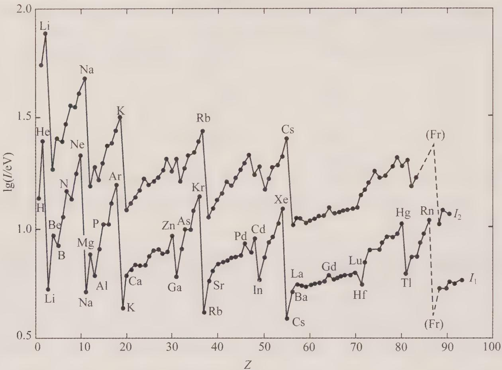  
图2.5.1 原子的第一电离能 $(I_{1})$ 和第二电离能 $(I_{2})$ 与原子序数 $(Z)$ 的关系

表 2.5.4 主族元素的第一电离能 $\left( {I}_{1}\right)$ 和电子亲和能(Y)(单位：eV) ${}^{\mathrm{a}}$

<table><tr><td>H</td><td></td><td></td><td></td><td></td><td></td><td></td><td>He</td></tr><tr><td>13.5984</td><td></td><td></td><td></td><td></td><td></td><td></td><td>24.5874</td></tr><tr><td>0.7542</td><td></td><td></td><td></td><td></td><td></td><td></td><td>(-0.5)</td></tr><tr><td>Li</td><td>Be</td><td>B</td><td>C</td><td>N</td><td>O</td><td>F</td><td>Ne</td></tr><tr><td>5.3917</td><td>9.3227</td><td>8.2980</td><td>11.2603</td><td>14.5341</td><td>13.6181</td><td>17.4228</td><td>21.5646</td></tr><tr><td>0.6180</td><td>(-0.5)</td><td>0.2797</td><td>1.2621</td><td>-0.07</td><td>1.4611</td><td>3.4012</td><td>(-1.2)</td></tr><tr><td>Na</td><td>Mg</td><td>Al</td><td>Si</td><td>P</td><td>S</td><td>Cl</td><td>Ar</td></tr><tr><td>5.1391</td><td>7.6462</td><td>5.9858</td><td>8.1517</td><td>10.4867</td><td>10.3600</td><td>12.9676</td><td>15.7596</td></tr><tr><td>0.5479</td><td>(-0.4)</td><td>0.433</td><td>1.3895</td><td>0.7465</td><td>2.0771</td><td>3.6127</td><td>(-1.0)</td></tr><tr><td>K</td><td>Ca</td><td>Ga</td><td>Ge</td><td>As</td><td>Se</td><td>Br</td><td>Kr</td></tr><tr><td>4.3407</td><td>6.1132</td><td>5.9993</td><td>7.8994</td><td>9.7886</td><td>9.7524</td><td>11.8138</td><td>13.9996</td></tr><tr><td>0.5015</td><td>(-0.3)</td><td>0.43</td><td>1.2327</td><td>0.814</td><td>2.0207</td><td>3.3636</td><td>(-1.0)</td></tr><tr><td>Rb</td><td>Sr</td><td>In</td><td>Sn</td><td>Sb</td><td>Te</td><td>I</td><td>Xe</td></tr><tr><td>4.1771</td><td>5.6949</td><td>5.7864</td><td>7.3439</td><td>8.6084</td><td>9.0096</td><td>10.4513</td><td>12.1298</td></tr><tr><td>0.4859</td><td>(-0.3)</td><td>0.3</td><td>1.1121</td><td>1.046</td><td>1.9708</td><td>3.0590</td><td>(-0.8)</td></tr><tr><td>Cs</td><td>Ba</td><td>Tl</td><td>Pb</td><td>Bi</td><td>Po</td><td>At</td><td>Rn</td></tr><tr><td>3.8939</td><td>5.2117</td><td>6.1082</td><td>7.4167</td><td>7.2856</td><td>8.417</td><td>—</td><td>10.7485</td></tr><tr><td>0.4716</td><td>(-0.3)</td><td>0.2</td><td>0.364</td><td>0.946</td><td>1.9</td><td>2.8</td><td>(-0.7)</td></tr></table>

$^{a}$ 元素符号下面第一个数为 $I_{1}$ ，第二个数为 Y。

由图2.5.1中 $I_{1} - Z$ 曲线可见：

（1）稀有气体的电离能总是处于极大值，而碱金属的电离能处于极小值。这是由于稀有气体的原子形成完满电子层，从完满电子层移去一个电子是很困难的。碱金属只有一个电子在完满电子层之外，容易失去，但若再电离第二个电子就困难了，所以碱金属容易形成一价正离子。碱土金属的 $I_{1}$ 比碱金属稍大一些， $I_{2}$ 仍比较小，其原因和碱金属的 $I_{1}$ 较小一样，因此碱土金属较易成二价正离子。

(2) 除过渡金属元素外, 同一周期元素的 $I_{1}$ , 基本上随着原子序数的增加而增加, 例如 $\mathrm{H} \sim \mathrm{He}, \mathrm{Li} \sim \mathrm{Ne}, \mathrm{Na} \sim \mathrm{Ar}, \mathrm{K} \sim \mathrm{Kr}$ , 等等。而同一族元素, 随原子序数的增加, $I_{1}$ 趋于减小。因此, 碱金属的第一电离能最小, 最容易丢失电子成正离子, 金属性最强, 而稀有气体元素的 $I_{1}$ 最大, 最不易丢失电子。

（3）过渡金属元素的第一电离能不甚规则地随原子序数的增加而增加。对于同一周期的元素，最外层电子组态 $(ns^2)$ 相同，当核增加一个正电荷，在 $(n - 1)\mathrm{d}$ 轨道增加一个电子，这个电子大部分处在 $ns$ 轨道以内，故随核电荷增加，有效核电荷增加不多。

（4）同一周期中，第一电离能的变化具有起伏性，如由Li到Ne并非单调上升，Be,N,Ne都较相邻两元素为高，这是由于能量相同的轨道电子填充出现全满、半满或全空等情况。Li的第一电离能最低，由Li到Be随核电荷升高电离能升高，这是由于Be为 $2\mathrm{s}^2$ 电子组态。B失去一个电子可得 $2\mathrm{s}^2 2\mathrm{p}^0$ 的结构，所以B的第一电离能反而比Be低；N原子有较高的电离能，因它为半充满的 $\mathfrak{p}^3$ 组态；O原子的电离能又低于氮原子，因失去一个电子可得半充满的 $\mathfrak{p}^3$ 组态；Ne为 $2\mathrm{s}^2 2\mathrm{p}^6$ 的稳定结构，在这一周期中电离能最高。

由图2.5.1中 $I_{2} - Z$ 曲线可见：

（1） $I_{2}$ 总是大于 $I_{1}$ ，所以 $I_{2}-Z$ 曲线在 $I_{1}-Z$ 曲线的上方。曲线形状相似，但峰值向 Z 增大（一个）的方向移动。

（2）碱金属的 $I_{2}$ 具有极大值，即 $\mathrm{Li^{+},Na^{+},K^{+},Rb^{+},Cs^{+}}$ 分别和He,Ne,Ar,Kr,Xe为等电子体，具有完整的闭壳层电子组态，而且这些离子比中性稀有气体原子有更多的有效核正电荷吸引住电子，使外层电子束缚更紧。在一般化学反应条件下，碱金属不可能变成 $\mathrm{M}^{2+}$ 离子。

（3）碱土金属 Be, Mg, Ca, Sr, Ba 在 $I_{2}-Z$ 曲线上处于极小值，容易电离成二价正离子。可以预见，在 $I_{3}-Z$ 曲线中将处于极大值，不能形成 $M^{3+}$ 离子。

## 2.5.4 电子亲和能

气态原子获得一个电子成为一价负离子时所放出的能量称为电子亲和能,常用 Y 表示,

$$
\mathrm{A(g)} + \mathrm {e^ {-} (g)} \longrightarrow \mathrm {A^ {-} (g)} \quad - \Delta H = Y
$$

由于负离子的有效核电荷较原子少,电子亲和能的绝对数值一般约比电离能小一个数量级,加之数据测定的可靠性较差,重要性不如电离能。

电子亲和能的大小涉及核的吸引和核外电荷相斥两个因素。原子半径减小，核的吸引力增大；但电子云密度也大，电子间排斥力增强。虽然一般说来，电子亲和能随原子半径减小而增大，但同一周期和同一族的元素都没有单调变化规律。

表 2.5.4 列出主族元素的电子亲和能。从原子结构的直观概念分析, 原子核外电子的屏蔽不会大于核电荷数, 中性原子的有效核电荷必定大于零。所以, 负值大的电子亲和能是不合理的。表中除 N 外, 所有的负值都是由理论计算得到的 (可能计算所用的模型不够完善)。因此, 在电子亲和能的实验测定数据为负值时, 可以将它看作零, 在表 2.5.4 中将这些数据加上括号。

## 2.5.5 电负性

电负性概念由Pauling提出，用以量度原子对成键电子吸引能力的相对大小。当A和B两种原子结合成双原子分子AB时，若A的电负性大，则生成分子的极性是 $\mathrm{A}^{\delta -}\mathrm{B}^{\delta +}$ ，即A原子带有较多的负电荷，B原子带有较多的正电荷；反之，若B的电负性大，则生成分子的极性是 $\mathrm{A}^{\delta +}\mathrm{B}^{\delta -}$ 。分子的极性愈大，离子键成分愈高，因此电负性也可看作原子形成负离子倾向相对大小的量度。

Pauling 的电负性标度 $\chi_{P}$ 是用两元素形成化合物时的生成焓的数值来计算的。他认为，若 A 和 B 两个原子的电负性相同，A—B 键的键能应为 A—A 键和 B—B 键键能的几何平均值。而大多数 A—B 键的键能均超过此平均值，此差值可用以测定 A 原子和 B 原子电负性的依据。例如，H—F 键的键能为 $565 \, kJ mol^{-1}$ ，而 H—H 和 F—F 键的键能分别为 $436 \, kJ mol^{-1}$ 和 $155 \, kJ mol^{-1}$ 。它们的几何平均值为 $(155 \times 436)^{\frac{1}{2}} \, \text{kJ mol}^{-1} = 260 \, \text{kJ mol}^{-1}$ ，差值 $\Delta$ 为 $305 \, kJ mol^{-1}$ 。根据一系列电负性数据拟合，可得方程

$$
\chi_ {\mathrm{A}} - \chi_ {\mathrm{B}} = 0. 1 0 2 \Delta^ {\frac {1}{2}}
$$

F 的 $\chi$ 为 4.0, 这样 H 的电负性为

$$
4. 0 - 0. 1 0 2 \times (3 0 5) ^ {\frac {1}{2}} = 2. 2
$$

Mulliken(马利肯)认为,比较原子电负性的大小应综合考虑原子吸引外层电子的能力和抵抗丢失电子的能力。前者和电子亲和能成正比,后者和第一电离能成正比。Mulliken 的电负性标度 $\chi_{M}$ 为 $I_{1}$ 和 Y 数值之和(以 eV 为单位)乘以一个因子,使之与 $\chi_{P}$ 接近。

Allred(阿尔雷特)和Rochow(罗昭)提出计算电负性的方法。这一方法对大多数元素更容易应用,因为根据静电引力,核对外层价电子的引力是

$$
F = \frac {Z ^ {*} e ^ {2}}{4 \pi \varepsilon_ {0} r ^ {2}}
$$

式中 $Z^{*}$ 是作用于价电子上的有效核电荷数, 可按 Slater 提出的方法计算 (见 2.4 节); $e$ 代表一个电子的电荷; $r$ 是原子的共价半径 (单位为 pm)。为使计算出的电负性与 Pauling 的电负性数值尽可能符合, 引入两个常数, 得

$$
\chi_ {\mathrm{AR}} = 3 5 9 0 \frac {Z ^ {*}}{r ^ {2}} + 0. 7 4 4
$$

1989 年, L. C. Allen(阿伦)根据光谱数据提出电负性的定义——基态时自由原子价层电子的平均单电子能量。他用下式计算主族元素(包括稀有气体)的电负性,获得电负性的绝对值为

$$
\chi_ {\mathrm{s}} = \frac {m \varepsilon_ {\mathrm{p}} + n \varepsilon_ {\mathrm{s}}}{m + n}
$$

式中 $m$ 和 $n$ 分别为 $\mathrm{p}$ 轨道和s轨道上的电子数； $\varepsilon_{\mathrm{p}}$ 和 $\varepsilon_{\mathrm{s}}$ 为一个原子的 $\mathfrak{p}$ 轨道和s轨道上的电子的平均能量，可从光谱数据获得。为了和Pauling电负性值拟合，将 $\chi$ 的eV单位乘以(2.30/13.60)因子，即得电负性的光谱标度 $\chi_{\mathrm{s}}$ 。

表 2.5.5 列出主族元素及第一过渡系列元素的电负性。

表 2.5.5 元素的电负性 $^{a}$

<table><tr><td>H</td><td></td><td></td><td></td><td></td><td></td><td></td><td>He</td><td></td><td></td></tr><tr><td>2.20</td><td></td><td></td><td></td><td></td><td></td><td></td><td>—</td><td></td><td></td></tr><tr><td>2.30</td><td></td><td></td><td></td><td></td><td></td><td></td><td>4.16</td><td></td><td></td></tr><tr><td>Li</td><td>Be</td><td>B</td><td>C</td><td>N</td><td>O</td><td>F</td><td>Ne</td><td></td><td></td></tr><tr><td>0.98</td><td>1.57</td><td>2.04</td><td>2.55</td><td>3.04</td><td>3.44</td><td>3.98</td><td>—</td><td></td><td></td></tr><tr><td>0.91</td><td>1.58</td><td>2.05</td><td>2.54</td><td>3.07</td><td>3.61</td><td>4.19</td><td>4.79</td><td></td><td></td></tr><tr><td>Na</td><td>Mg</td><td>Al</td><td>Si</td><td>P</td><td>S</td><td>Cl</td><td>Ar</td><td></td><td></td></tr><tr><td>0.93</td><td>1.31</td><td>1.61</td><td>1.90</td><td>2.19</td><td>2.58</td><td>3.16</td><td>—</td><td></td><td></td></tr><tr><td>0.87</td><td>1.29</td><td>1.61</td><td>1.92</td><td>2.25</td><td>2.59</td><td>2.87</td><td>3.24</td><td></td><td></td></tr><tr><td>K</td><td>Ca</td><td>Ga</td><td>Ge</td><td>As</td><td>Se</td><td>Br</td><td>Kr</td><td></td><td></td></tr><tr><td>0.82</td><td>1.00</td><td>1.81</td><td>2.01</td><td>2.18</td><td>2.55</td><td>2.96</td><td>—</td><td></td><td></td></tr><tr><td>0.73</td><td>1.03</td><td>1.76</td><td>1.99</td><td>2.21</td><td>2.42</td><td>2.69</td><td>2.97</td><td></td><td></td></tr><tr><td>Rb</td><td>Sr</td><td>In</td><td>Sn</td><td>Sb</td><td>Te</td><td>I</td><td>Xe</td><td></td><td></td></tr><tr><td>0.82</td><td>0.95</td><td>1.78</td><td>1.96</td><td>2.05</td><td>2.10</td><td>2.66</td><td>—</td><td></td><td></td></tr><tr><td>0.71</td><td>0.96</td><td>1.66</td><td>1.82</td><td>1.98</td><td>2.16</td><td>2.36</td><td>2.58</td><td></td><td></td></tr><tr><td>Sc</td><td>Ti</td><td>V</td><td>Cr</td><td>Mn</td><td>Fe</td><td>Co</td><td>Ni</td><td>Cu</td><td>Zn</td></tr><tr><td>1.36</td><td>1.54</td><td>1.63</td><td>1.66</td><td>1.55</td><td>1.83</td><td>1.88</td><td>1.91</td><td>1.90</td><td>1.65</td></tr><tr><td>1.15</td><td>1.28</td><td>1.42</td><td>1.57</td><td>1.74</td><td>1.79</td><td>1.82</td><td>1.80</td><td>1.74</td><td>1.60</td></tr></table>

$^{a}$ 元素符号下面第一个数为 $\chi_{P}$ ，第二个数为 $\chi_{S}$ 。

由表2.5.5中的电负性数据可见：

（1）金属元素的电负性较小，非金属元素的较大。电负性是判断元素金属性的重要参数。 $\chi = 2$ 可作为近似标志金属元素和非金属元素的分界点。

（2）同一周期的元素，由左向右随着族次增加，电负性增加。对第二周期元素，原子序数每增加一个，电负性约增加0.5。同一族元素，其电负性随着周期的增加而减小。因此，电负性大的元素集中在周期表的右上角，而小的分布于左下角。

（3）电负性差别大的元素之间的化合物以离子键为主，电负性相近的非金属元素相互以共价键结合、金属元素相互以金属键结合。离子键、共价键和金属键是3种极限键型。由于键型变异，在化合物中出现一系列过渡性的化学键，电负性数据是研究键型变异的重要参数。

（4）稀有气体在同一周期中电负性最高，这是因为它们具有极强的保持电子的能力，即 $I_{1}$ 特别大。Ne 的电负性比所有开壳层电子结构的元素都高，它对价电子抓得极紧，以至于不能形成化学键。Xe 和 F, O 比较，电负性较低，可以形成氧化物和氟化物；Xe 和 C 的电负性相近，可以形成共价键。第一个测定出晶体结构的包含 Xe—C 共价键的化合物为

$$
\left[ \mathrm{F} _ {5} \mathrm{C} _ {6} \mathrm{XeNCMe} \right] ^ {+} \left[ \left(\mathrm{C} _ {6} \mathrm{F} _ {5}\right) _ {2} \mathrm{BF} _ {2} \right] ^ {-} \mathrm{MeCN}
$$

## 2.5.6 相对论效应对元素周期性质的影响

相对论效应可理解为光速 $c$ 的有限值

$$
c = 2. 9 9 7 9 2 4 5 8 \times 1 0 ^ {8} \mathrm{ms} ^ {- 1} = 1 3 7. 0 3 6 \mathrm{au}
$$

与把光速看作 $c = \infty$ 时互相比较所产生的差异的效应。从相对论推得物质质量 $m$ 的表达式为

$$
m = \frac {m _ {0}}{\sqrt {1 - (v / c) ^ {2}}}
$$

式中 $m_{0}$ 为静止质量，v 为物质运动速度。

下面近似地在 Bohr 理论基础上对相对论效应作一些定性的解释。按 Bohr 模型，H 原子 1s 电子的运动速度为

$$
v = \frac {e ^ {2}}{2 \varepsilon_ {0} h} = 1 \mathrm{au} = 2. 1 8 7 \times 1 0 ^ {6} \mathrm{ms} ^ {- 1}
$$

此数值只有光速的 $1 / 137$ 。此时质量 $m$ 为 $m_0$ 的1.00003倍，差别不大。对原子序数为 $Z$ 的原子，可近似算得1s电子的平均速度为 $Z\mathrm{au}$ ，速度增大到 $Z$ 倍。对重原子， $Z$ 值很大，相对论效应显著。例如 $\mathrm{Hg}$ 原子， $Z = 80$ ，可估算其质量 $m$

$$
m = \frac {m _ {0}}{\sqrt {1 - (8 0 / 1 3 7) ^ {2}}} = 1. 2 3 m _ {0}
$$

$m$ 约为 $m_0$ 的1.23倍。 $m$ 增大，电子绕核运动的半径 $(r)$ 收缩，这可从Bohr原子结构模型推出的半径

$$
r = \frac {n ^ {2} h ^ {2} \varepsilon_ {0}}{\pi m e ^ {2} Z}
$$

来理解。电子靠近原子核，能量降低，此即相对论的稳定效应。因为同一原子中所有原子轨道必须互相正交，所以2s,3s,4s,5s和6s等轨道也必将产生大小相当的轨道收缩和相应的能量降低效应。而p,d,f等轨道却不会因为轨道正交性在1s变小时必须产生收缩效应。

第六周期元素的许多性质可据 6s 轨道上的电子具有特别大的相对论稳定效应得到解释。

## 1. 基态电子组态

对比第五周期和第六周期 d 区元素的电子组态, 可以明显看出: 由于第六周期元素 6s 轨道电子相对论稳定效应大, 导致元素的基态电子组态从第五周期价层 $4d^{n}5s^{1}$ 变为第六周期价层的 $5d^{n-1}6s^{2}$ , 如表 2.5.6 所示。

表 2.5.6 第五、六周期过渡元素的电子组态

<table><tr><td rowspan="2">周期数</td><td colspan="6">族数</td></tr><tr><td>5</td><td>6</td><td> $7^a$ </td><td>8</td><td>9</td><td>10</td></tr><tr><td rowspan="2">五</td><td>Nb</td><td>Mo</td><td>Tc</td><td>Ru</td><td>Rh</td><td>Pd</td></tr><tr><td> $d^4s^1$ </td><td> $d^5s^1$ </td><td> $d^5s^2$ </td><td> $d^7s^1$ </td><td> $d^8s^1$ </td><td> $d^{10}$ </td></tr><tr><td rowspan="2">六</td><td>Ta</td><td>W</td><td>Re</td><td>Os</td><td>Ir</td><td>Pt</td></tr><tr><td> $d^3s^2$ </td><td> $d^4s^2$ </td><td> $d^5s^2$ </td><td> $d^6s^2$ </td><td> $d^7s^2$ </td><td> $d^9s^1$ </td></tr></table>

$^{a}$ Tc 的 $d^{5}$ 是半充满。

## 2. $(6s)^{2}$ 惰性电子对效应

相对论效应使第六周期元素的 6s 能级下降幅度大于第五周期元素的 5s 能级，是促成惰性电子对效应出现的重要因素。Tl, Pb, Bi 在化合物中常保持低价态，出现 Tl $^{+}$ , Pb $^{2+}$ , Bi $^{3+}$ 化合物。从电离能数据可看出其根源，Tl $^{+}$ 的半径 150 pm，比 In $^{+}$ 的 140 pm 大，但第二、第三电离能 I $_{2}$ , I $_{3}$ 的平均值对 Tl 为 4848 kJ mol $^{-1}$ ，对 In 为 4524 kJ mol $^{-1}$ ，相差达 7%。即 Tl $^{+}$ 的半径虽大，但最外层的 6s 电子却比 In $^{+}$ 更难于电离。

## 3. 金和汞性质的差异

金和汞有相似的电子结构

$$
{ } ^ { 7 9 } \mathrm{Au} [ \mathrm{Xe} ] 4 \mathrm{f} ^ { 1 4 } 5 \mathrm{d} ^ { 1 0 } 6 \mathrm{s} ^ { 1 } \quad \text {和} \quad { } ^ { 8 0 } \mathrm{Hg} [ \mathrm{Xe} ] 4 \mathrm{f} ^ { 1 4 } 5 \mathrm{d} ^ { 1 0 } 6 \mathrm{s} ^ { 2 }
$$

由于 6s 轨道收缩,能级显著下降,与 5d 轨道一起形成最外层的价轨道。这时金具有类似于卤素的电子组态,差一个电子即为满壳层,它的有些化学性质和卤素相似,例如金能生成 $Au_{2}$ 分子,存在于气相之中;金可生成 RbAu 和 CsAu 等离子化合物,其中 $Au^{1}$ 为 -1 价离子,如同卤素得一电子形成稳定的闭壳层结构。汞具有类似于稀有气体的电子组态,气态以单原子分子存在。在图 2.5.1 中 $I_{1}-Z$ 曲线上,汞和稀有气体相似, $I_{1}$ 处于极大值点。和金相比,金属汞性质上有显著差异(见下表)。

<table><tr><td>金 Au[Xe]4f14(5d,6s)11</td><td>汞 Hg[Xe]4f14(5d,6s)12</td></tr><tr><td>密度高,为 19.32 g cm-3</td><td>密度低,为 13.53 g cm-3</td></tr><tr><td>熔点高达 1064 °C</td><td>熔点低(-39°C),常温下是液体</td></tr><tr><td>熔化热高,为 12.8 kJ mol-1</td><td>熔化热低,为 2.30 kJ mol-1</td></tr><tr><td>良导体,电导率为 426 kS m-1</td><td>导电性差,电导率为 10.4 kS m-1</td></tr><tr><td>Au2是 Hg2+的等电子体</td><td>存在 Hg2+离子</td></tr></table>

## 4. 金属的熔点

第六周期过渡金属及同周期的碱金属和碱土金属的熔点分布示于图2.5.2中。由图可见，从Cs起随着原子序数增加，熔点稳定上升，到W达极大；从W起随原子序数增加，熔点逐步下降，到 $\mathrm{Hg}$ 为最低。

上述现象的出现和相对论效应有关, 即 6s 轨道收缩, 能级降低, 与 5d 轨道一起共同组成 6 个价轨道。在金属中, 这 6 个价轨道和周围配位的相同原子的价轨道产生相互叠加作用。由于这 6 个价轨道和配位环境的对称性都很高, 各个轨道均能参加成键作用, 不会出现非键轨

道。不论周围金属原子的配位型式如何，平均而言，每个原子形成3个成键轨道和3个反键轨道（金属中这些轨道进一步叠加形成能带），电子按能量由低到高顺序填在这些轨道上。若简单地从每个原子的轨道填充情况分析，价电子数少于6个时，电子填入成键轨道。随着电子数的增加，能量降低增多，结合力加强，熔点稳定地逐步上升。当价电子数为6时（W原子），能级低的成键轨道占满，而能级高的反键轨道全空，这时结合力最强，熔点最高。多于6个电子时，电子填在反键轨道上，结合力随着电子数的增加逐步减弱，相应地，熔点随着电子数增加逐步稳定下降，直至Hg，这时12个价电子将成键轨道和反键轨道全部填满，原子间没有成键效应，与稀有气体相似，熔点最低。

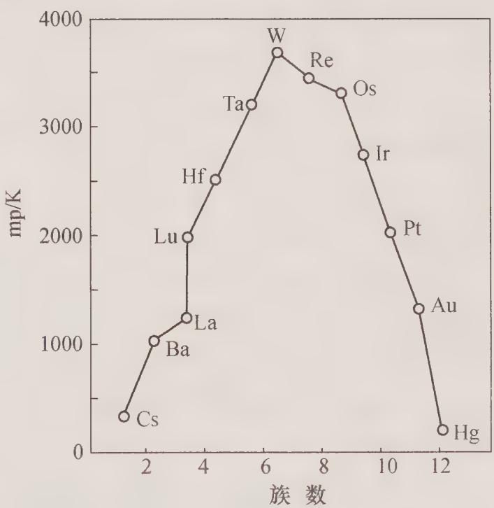  
图2.5.2 第六周期从Cs到 $\mathrm{Hg}$  
金属熔点的分布

相似的变化趋势也出现在第四周期由 K 到 Zn 和第五周期由 Rb 到 Cd 的金属中,但其效应不如第六周期显著。

金属的硬度、电导等其他一些物理性质也可从这种电子填充情况进行分析，理解其规律。

原子的结构和元素周期律为我们认识复杂多样的元素性质、了解百余种元素之间的相互联系和内部结构以及结构和性质间的联系提供了重要的途径。按照原子的内部结构和元素的周期律，依循量变与质变的关系，可预示和系统掌握元素及其化合物的各种性质，从而提高了指导实际工作的预见性，减少了盲目性。

人们对原子结构和元素周期律的认识是不断发展的。例如曾被人们称为惰性气体的元素，以往认为它们不和其他元素化合，是化学惰性物质。但在1962年，Bartllett（巴特利特）考虑到室温下 $\mathrm{O}_2$ 和 $\mathrm{PtF_6}$ 可反应生成红色晶体 $\mathrm{O}_2\mathrm{PtF}_6$ （由 $\mathrm{O}_2^+$ 和 $\mathrm{PtF_6^-}$ 形成的盐），而Xe的第一电离能与 $\mathrm{O}_2$ 很接近（ $\mathrm{O}_2$ 的第一电离能为 $12.07\mathrm{eV}$ ，而Xe的第一电离能为 $12.13\mathrm{eV}$ ）。从这一事实出发，他认为 $\mathrm{Xe}^+$ 和 $\mathrm{PtF_6}$ 很可能有足够的点阵能使Xe和 $\mathrm{PtF_6}$ 化合。他用Xe和 $\mathrm{PtF_6}$ 在室温下反应，果然制得橙红色固体，以化学式 $\mathrm{XePtF_6}$ 表示。（在当时Bartllet并未准确测定其组成和结构，现在认为该反应较复杂，所得产品是一种混合物。）从此以后，人们将Xe和 $\mathbf{F}_2$ 直接化合，获得 $\mathrm{XeF_2}$ ， $\mathrm{XeF_4}$ ， $\mathrm{XeF_6}$ 等化合物，掀开了惰性气体的新篇章，并以“稀有气体”的名词代替“惰性气体”。又如，人们又相继制得了 $\mathrm{Ni(CO)_4}$ ， $\mathrm{K_4Ni(CN)_4}$ ， $\mathrm{K_4Pd(CN)_4}$ 等化合物，其中Ni和Pd均为零价。

这些实例说明,人们的认识在改造客观世界中不断深化,世界上并不存在绝对不变的事物,也不存在绝对不可逾越的鸿沟,只要条件合适就能发生转化。

## 2.6 原子光谱

## 2.6.1 原子光谱和光谱项

原子中的电子都处于一定的运动状态,每一状态都具有一定的能量。在无外来作用时,原子中各个电子都尽可能处于最低能级,从而使整个原子的能量最低。原子的这种状态称为基态。当原子受到外来作用(例如光照或快速电子的冲击)时,它的一个或几个电子吸收能量后跃迁到较高能级,从而使原子处于能量较高的新状态,此状态称作激发态。原子由基态跃迁到激发态的过程称为激发。激发态是一种寿命极短的不稳定状态,原子随即跃迁回基态,这一过程叫作退激。与此相应的是原子以发光或其他形式将多余的能量释放出来。

原子从某一激发态跃迁回基态，发射出具有一定波长的一条光线，而从其他可能的激发态跃迁回基态以及在某些激发态之间的跃迁都可发射出具有不同波长的光线，这些光线形成一个系列(谱)，称为原子发射光谱。另一方面，将一束白光通过某一物质，若该物质中的原子吸收其中某些波长的光而发生跃迁，则白光通过物质后将出现一系列暗线，如此产生的光谱称为原子吸收光谱。

当某一原子由高能级 $E_{2}$ 跃迁到低能级 $E_{1}$ 时，发射出与两能级之差相应的谱线，其波数可表达为下列两项之差，即

$$
\tilde {\nu} = \frac {E _ {2} - E _ {1}}{h c} = \frac {E _ {2}}{h c} - \frac {E _ {1}}{h c}
$$

事实上，原子光谱中的任何一条谱线的波数都可写成两项之差，每一项与一能级对应，其大小相当于该能级的能量除以 $hc$ 。通常称这些项为光谱项，记为 $T_{n}$ ，即 $T_{n} = E_{n} / hc$ 。

如前所述,氢原子光谱中各谱线的波数可用式

$$
\tilde {\nu} = \frac {R}{n _ {1} ^ {2}} - \frac {R}{n _ {2} ^ {2}}
$$

表示。根据光谱项的定义及 $R$ 和 $E_{n}$ 的表达式（见p.25及p.31），氢原子的光谱项可表示为： $T_{n} = -R / n^{2}$ 。表2.6.1列出氢原子光谱用光谱项表达的波数表达式（由实验数据归纳得到）。

表 2.6.1 氢原子光谱用光谱项表达的波数表达式

<table><tr><td>Lyman(赖曼)系</td><td> $\tilde{\nu}=T_n-T_1$ </td><td>(n=2,3,4, $\cdots$ )</td></tr><tr><td>Balmer(巴尔末)系</td><td> $\tilde{\nu}=T_n-T_2$ </td><td>(n=3,4,5, $\cdots$ )</td></tr><tr><td>Paschen(帕邢)系</td><td> $\tilde{\nu}=T_n-T_3$ </td><td>(n=4,5,6, $\cdots$ )</td></tr><tr><td>Brackett(布拉开)系</td><td> $\tilde{\nu}=T_n-T_4$ </td><td>(n=5,6,7, $\cdots$ )</td></tr><tr><td>Pfund(普丰德)系</td><td> $\tilde{\nu}=T_n-T_5$ </td><td>(n=6,7,8, $\cdots$ )</td></tr></table>

氢原子光谱各谱线的波数的规律性，已从氢原子的结构获得圆满的解释。对于多电子原子，虽然其原子光谱复杂得多，但仍可根据原子的结构进行合理的解释和预测。这说明，原子光谱是原子结构的反映，是由结构决定的。不同元素的原子，结构不同，能级不同，因而其光谱的性质（成分和强度）也不相同。光谱和结构之间存在着一一对应的内在联系。因此，我们一方面要了解原子光谱是原子结构理论的重要实验基础之一，了解原子光谱实验在原子结构理论的产生、发展和不断完善过程中所起的作用；另一方面，又要重视原子结构理论在原子光谱的测定、解释及应用等方面的指导意义。在下面几小节中，首先介绍与原子结构相关的一些基本概念和原理，然后用这些概念和原理讨论一些简单的原子光谱。

## 2.6.2 电子的状态和原子的能态

由上一小节讨论可知,和光谱实验结果直接对应的是原子所处的能级,而原子的能级与原子的整体运动状态有关。那么,如何描述原子的运动状态呢?

对于单电子原子,由于只有一个核外电子,因而其运动状态可用该电子的运动状态来表示。换言之,电子的量子数就是原子的量子数,即 n,l,j 和 $m_{j}$ 或 n,l,m 和 $m_{s}$ 。

对于多电子原子,可近似地认为原子中的电子在各自的轨道上运动,其运动状态由轨道波函数或量子数 n,l,m 描述。每个电子还有自旋运动,其运动状态由自旋波函数或量子数 s 和 $m_{s}$ 来描述。在这 5 个量子数中,n,l,s 与磁场无关,而 m 和 $m_{s}$ 则与磁场有关。人们常用各电子的量子数 n,l 表示无磁场作用下的原子状态,如此表示的状态称为组态。而把量子数 m 和 $m_{s}$ 也考虑进去的状态称为原子的微观状态,它是原子在磁场作用下的运动状态。

整个原子的运动状态应是各个电子所处的轨道和自旋状态的总和。但是，上述量子数是从量子力学的近似处理得到的，它们既未涉及电子间的相互作用，也未涉及轨道运动和自旋运动的相互作用，因而用各个电子的运动状态的简单加和还不足以表达原子真实的运动状态，故不能和原子光谱实验观测到的数据直接联系。和原子光谱实验结果直接相联系的是原子的能态，它由一套原子的量子数 $L, S, J$ 来描述。这些量子数分别规定了原子的轨道角动量 $M_L$ 、自旋角动量 $M_S$ 和总角动量 $M_J$ ，这些角动量在磁场方向上的分量则分别由量子数 $m_L, m_S$ 和 $m_J$ 规定，其含义及表达式列于表2.6.2中。

表 2.6.2 原子的量子数和角动量表达式

<table><tr><td>原子的量子数</td><td>符号</td><td>角动量表达式</td></tr><tr><td>角量子数</td><td> $L$ </td><td> $|M_L| = \sqrt{L(L+1)} \frac{h}{2\pi}$ </td></tr><tr><td>磁量子数</td><td> $m_L$ </td><td> $(M_L)_z = m_L \frac{h}{2\pi}$ </td></tr><tr><td>自旋量子数</td><td> $S$ </td><td> $|M_S| = \sqrt{S(S+1)} \frac{h}{2\pi}$ </td></tr><tr><td>自旋磁量子数</td><td> $m_S$ </td><td> $(M_S)_z = m_S \frac{h}{2\pi}$ </td></tr><tr><td>总量子数</td><td> $J$ </td><td> $|M_J| = \sqrt{J(J+1)} \frac{h}{2\pi}$ </td></tr><tr><td>总磁量子数</td><td> $m_J$ </td><td> $(M_J)_z = m_J \frac{h}{2\pi}$ </td></tr></table>

原子的每一个光谱项都与一确定的原子能态相对应，而原子的能态可由原子的量子数表示。因此，原子的光谱项可由原子的量子数来表示。表示的方法是：L 值为 0,1,2,3,4,… 的能态用大写字母 S,P,D,F,G,… 表示，将 $(2S+1)$ 的具体数值写在 L 的左上角， $^{2S-1}L$ 即原子的光谱项，如 ${}^{1}S,{}^{3}P$ 等。 $2S+1$ 称作光谱项的多重性。轨道-自旋相互作用使每个光谱项分裂为 $(2S+1)$ 或 $(2L+1)$ 个光谱支项，即有 $(2S+1)$ 或 $(2L+1)$ 个不同的 J。在光谱项的右下角写出 J 的具体数值，便可得到相应的光谱支项 ${}^{2S+1}L_{J}$ ，如 ${}^{1}S_{0},{}^{3}P_{2}$ 等。

多电子原子的能态可用原子的量子数 $L, S$ 和 $J$ 来表示，而原子在磁场中表现的微观能态又与原子的磁量子数 $m_{L}, m_{S}$ 和 $m_{J}$ 有关，那么，这些量子数可取哪些数值，且怎样推求？这里的关键是抓住角动量矢量加和这个实质问题，并且正确理解电子的量子数和原子的量子数之间的关系，特别是磁量子数在联系两套量子数中的作用。

每个电子都有轨道角动量和自旋角动量,而原子的总角动量等于这些电子的轨道角动量和自旋角动量的矢量和。加和的方法有两种:

(1) 将每一电子的轨道角动量加和得到原子的轨道角动量, 将每一电子的自旋角动量加和得到原子的自旋角动量, 然后将原子的轨道角动量和自旋角动量合成为原子的总角动量。此法称为 $L - S$ 耦合法 (注意, 虽然如此称谓, 但不意味着是量子数的加和——量子数本身不是矢量)。

（2）先把每一电子的轨道角动量和自旋角动量合成为该电子的总角动量，然后将每个电子的总角动量合成为原子的总角动量。此法称为 $j - j$ 耦合法。实验表明， $L - S$ 耦合法适用于原子序数小于40的轻原子，而 $j - j$ 耦合法适用于重原子。

## 2.6.3 单电子原子的光谱项和原子光谱

## 1. 氢原子光谱项的推引

氢原子核外只有一个电子,该电子的轨道角动量和自旋角动量的矢量和就是氢原子的总角动量。当其组态为 $(2p)^{1}$ 时,轨道角动量和自旋角动量在磁场中的取向分别示于图2.6.1(a)和(b)中。p电子的l=1,m可为1,0,-1;s=1/2, $m_{s}$ 可为1/2,-1/2。图中矢量长度以 $h/2\pi$ 为单位。在图(a)中,l=1,角动量矢量长度为 $\sqrt{1(1+1)}=\sqrt{2}$ ,它在z轴上的投影(即m值)分别为1,0,-1。当m=1,角动量矢量与z轴形成 $45^{\circ}$ 的锥角,即该矢量可处在绕该角锥的任意方向上。在图(b)中,s=1/2,自旋角动量矢量长度为 $\sqrt{[(1/2)+1]/2}=0.866$ ,它在z 轴上的投影(即 $m_{s}$ 值)分别为 1/2 和 -1/2。当 $m_{s}=1/2$ ，自旋角动量与 z 轴形成 $54.7^{\circ}$ 锥角，将 m=1 和 $m_{s}=1/2$ 的两个角动量矢量进行加和，得到 $m_{J}=3/2$ 的总角动量矢量，如图(c)。把 m=1 和 $m_{s}=-1/2$ 的角动量矢量加和，得到 $m_{J}=1/2$ 的总角动量矢量，如图(d)。继续进行其他 m 和 $m_{s}$ 的矢量加和，共得到 $m_{J}=3/2,1/2,1/2,-1/2,-1/2,-3/2$ 这 6 个矢量。从 $m_{J}=3/2,1/2,-1/2,-3/2$ 这 4 个值，推得原子的总量子数 J=3/2；从 $m_{J}=1/2,-1/2$ 这两个数值，推得原子的总量子数 J=1/2。

(c)  
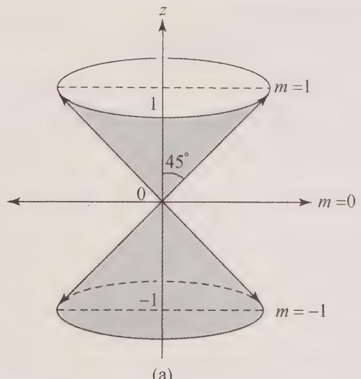  
(a)

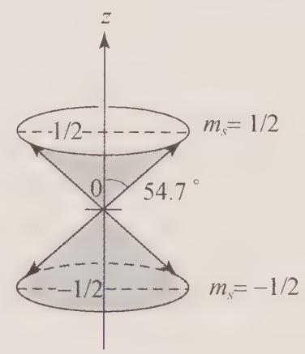  
(b)

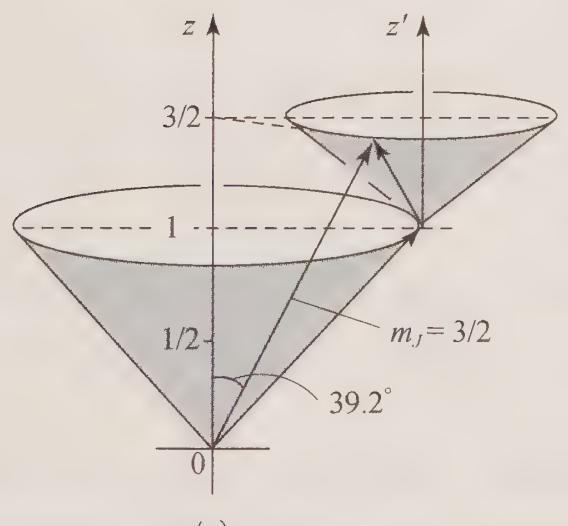

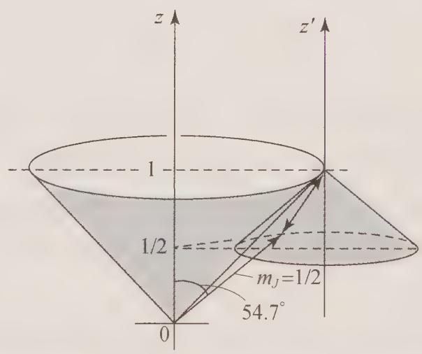  
(d)  
图2.6.1 轨道角动量和自旋角动量的加和

一个矢量包括大小和方向两方面内容。由图可见， $(2p)^{1}$ 电子的轨道角动量和自旋角动量相互耦合，是通过 $m$ 和 $m_{s}$ 数值的加和关系求出 $m_{J}$ 的数值，进而得到 $J$ 。由 $J = 3 / 2$ 和 $1 / 2$ 得到两个总角动量矢量，其大小分别为

$$
\sqrt {\frac {3}{2} \left(\frac {3}{2} + 1\right)}   \frac {h}{2 \pi}    \text { 和 }    \sqrt {\frac {1}{2} \left(\frac {1}{2} + 1\right)}   \frac {h}{2 \pi}
$$

若不加外磁场, 这两个总角动量没有特定的取向。在磁场中则有严格的定向关系, 前者在磁场方向的分量只能为 $3 / 2, 1 / 2, -1 / 2, -3 / 2$ 个 $h / 2\pi$ ; 后者为 $1 / 2, -1 / 2$ 个 $h / 2\pi$ 。当 $J = 3 / 2$ , $m_J = 3 / 2$ 时[见图2.6.1(c)], 可计算出该向量和 $z$ 轴的夹角

$$
\theta = \arccos \left[ \frac {3}{2} / \sqrt {\frac {3}{2} \left(\frac {3}{2} + 1\right)} \right] = 3 9. 2 ^ {\circ}
$$

由上述结果可见,当无外加磁场且不考虑轨道运动和自旋运动相互作用时, $(2p)^{1}$ 组态只有一个能级,对应的光谱项是 $^{2}\mathrm{P}(L=1,S=1/2)$ 。由于轨道运动和自旋运动的相互作用,原子能态出现两个能级,对应的光谱支项分别为

和

$$
\begin{array}{l} ^ {2} \mathrm{P} _ {\frac {3}{2}} (L = 1, S = 1 / 2, J = 3 / 2) \\ ^ {2} \mathrm{P} _ {\frac {1}{2}} (L = 1, S = 1 / 2, J = 1 / 2) \end{array}
$$

在外加磁场中,这两个能级又分别分裂为 4 个和 2 个微观能级,即 $^{2}$ P 谱项对应的 6 种微观能态,它与 $(2p)^{1}$ 组态对应的 6 种微观状态数相等,如表 2.6.3 所示。

表 2.6.3 氢原子的微观状态和微观能态

<table><tr><td colspan="3">电子的状态</td><td colspan="2">原子的能态</td></tr><tr><td rowspan="2">l</td><td rowspan="2">m</td><td rowspan="2">ms</td><td>无外加磁场</td><td>在外加磁场中</td></tr><tr><td>不考虑L-S耦合考虑L-S耦合</td><td>考虑L-S耦合</td></tr><tr><td>1</td><td>+1</td><td>+1/2</td><td></td><td></td></tr><tr><td>1</td><td>+1</td><td>-1/2</td><td></td><td></td></tr><tr><td rowspan="2">1</td><td rowspan="2">-1</td><td rowspan="2">+1/2</td><td rowspan="2">J=3/2(2P3/2)</td><td>mJ=3/2 1</td></tr><tr><td>1/2 2</td></tr><tr><td>1</td><td>-1</td><td>-1/2</td><td></td><td>-1/2 3</td></tr><tr><td rowspan="2">1</td><td rowspan="2">0</td><td rowspan="2">+1/2</td><td rowspan="2">J=1/2(2P1/2)</td><td>-3/2 4</td></tr><tr><td>1/2 5</td></tr><tr><td>1</td><td>0</td><td>-1/2</td><td></td><td>-1/2 6</td></tr></table>

同理，可推得氢原子 $(1\mathrm{s})^{1}$ 组态的光谱项为 ${}^{2}\mathrm{S}$ ，光谱支项为 ${}^{2}\mathrm{S}_{\frac{1}{2}}$ ， $m_{J}$ 为 $1/2$ 和 $-1/2$ 。

## 2. 氢原子 $(2\mathbf{p})^{1} \rightarrow (1\mathbf{s})^{1}$ 跃迁的光谱

电子由高能级向低能级跃迁，原子就会发射出光。实验证明，并非任何两个能级之间都可发生跃迁，而要满足一定的选律。氢原子发射光谱的选律为： $\Delta n$ 任意； $\Delta l = \pm 1; \Delta j = 0, \pm 1; \Delta m_j = 0, \pm 1$ 。

根据选律, 可得 H 原子 $2p \rightarrow 1s$ 态跃迁的光谱情况, 示于图 2.6.2 中。在无外磁场影响, 使用低分辨光谱仪时, $2p \rightarrow 1s$ 出现一条谱线, $\tilde{\nu} = 82259 \, cm^{-1}$ , 此即 H 原子光谱 Lyman 系的第一条谱线。若无外加磁场, 用高分辨光谱仪, 可观察到上述谱线的精细结构, 这条谱线是由相隔很近的两条谱线组成。若外加很强的磁场, 而且用分辨率很高的光谱仪, 则可观察到 5 条谱线, 这 5 条谱线外侧两条线相处极近; 若当作 3 条谱线, 称为正常 Zeeman 效应; 若当作 5 条线看, 称为反常 Zeeman 效应。

## 3. 碱金属原子光谱

碱金属原子只有1个价电子,其余(Z-1)个电子与核一起构成原子实,在普通的原子光谱中,原子实没有变化,所以碱金属原子光谱类似于氢原子光谱。

钠原子的基态为 $[Ne]3s^{1}$ ，激发态的价电子组态可为 $(np)^{1},(nd)^{1}(n=3,4,5,\cdots)$ 或者为 $(ns)^{1},(nf)^{1}(n=4,5,6,\cdots)$ 。根据选律，钠原子光谱只包括如图2.6.3所示的谱线系。

通常观察到钠的黄色谱线(D 线)为 $3p \rightarrow 3s$ 态跃迁所得谱线。(3p) $^{1}$ 组态有两个光谱支项： $^{2}P_{\frac{3}{2}}$ 和 $^{2}P_{\frac{1}{2}}$ ，所以 D 线为双线，它们对应的跃迁及波数如下：

$$
3 \mathrm{p} \left(^ {2} \mathrm{P} _ {\frac {1}{2}}\right)\rightarrow 3 \mathrm{s} \left(^ {2} \mathrm{S} _ {\frac {1}{2}}\right) \quad 1 6 9 6 0. 8 5 \mathrm{cm} ^ {- 1} \quad (\lambda = 5 8 9. 5 9 3 0 \mathrm{nm})
$$

$np \rightarrow 3s$ 主系 $(n \geqslant 3)$ ， $ns \rightarrow 3p$ 锐系 $(n \geqslant 4)$

$nd \rightarrow 3p$ 漫系 $(n \geqslant 3)$ ， $nf \rightarrow 3d$ 基系 $(n \geqslant 4)$

$$
3 \mathrm{p} \left(^ {2} \mathrm{P} _ {\frac {3}{2}}\right)\rightarrow 3 \mathrm{s} \left(^ {2} \mathrm{S} _ {\frac {1}{2}}\right) \quad 1 6 9 7 8. 0 4 \mathrm{cm} ^ {- 1} \quad (\lambda = 5 8 8. 9 9 6 3 \mathrm{nm})
$$

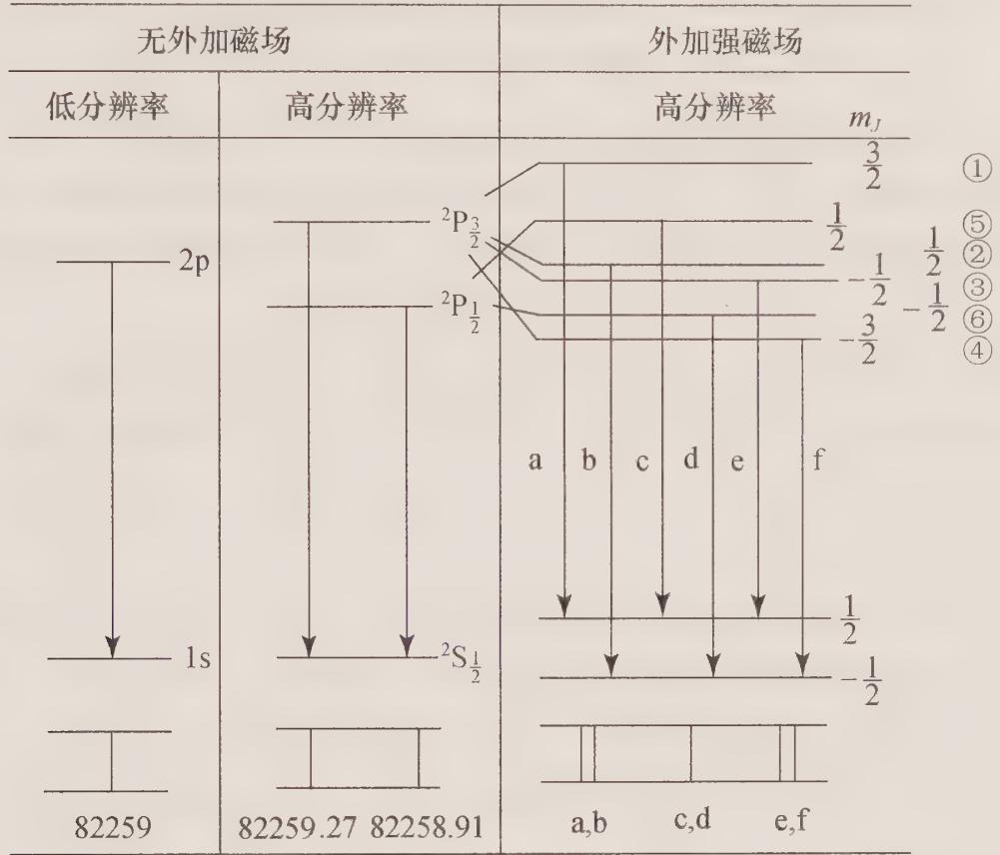  
图 2.6.2 H 原子 $2p \rightarrow 1s$ 跃迁的能级和谱线  
(单位: $cm^{-1}$ )

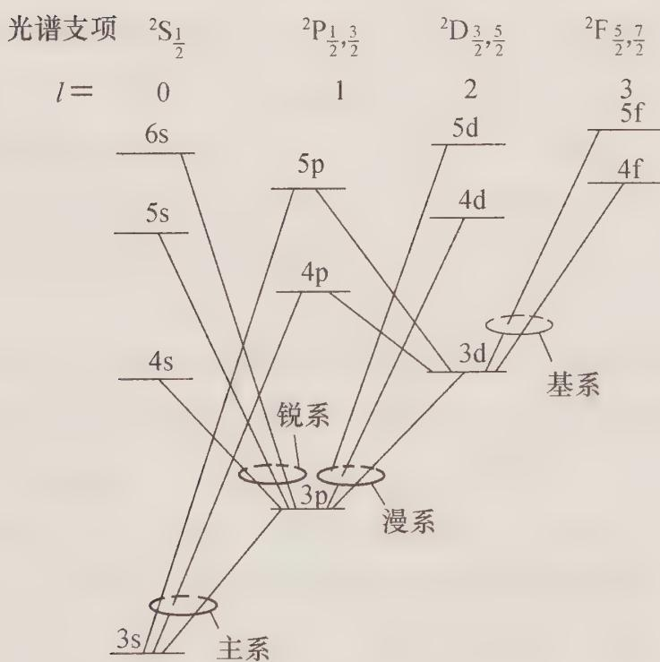  
图2.6.3 钠原子的能级和允许的单电子跃迁

## 2.6.4 多电子原子的光谱项

## 1. 多电子原子光谱项的推求

对多电子原子，可先利用下式由各个电子的 $m$ 和 $m_{s}$ 求得原子的 $m_{L}$ 和 $m_{S}$

$$
m _ {L} = \sum_ {i} m _ {i}
$$

$$
m _ {S} = \sum_ {i} (m _ {s}) _ {i}
$$

进一步求出 $L$ 和 $S$ , 再由 $L$ 和 $S$ 求出 $J$ 。

$m_{L}$ 的最大值即 L 的最大值。L 还可能有较小的值，但必须相隔整数 1。L 的最小值不一定为 0。根据矢量加和规则，就能判断 L 的最小值，从而可写出与组态对应的全部 L 值。一个 L 之下可有 $0, \pm1, \pm2, \cdots, \pm L$ ，共 $(2L+1)$ 个不同的 $m_{L}$ 值。

$m_{S}$ 的最大值即 S 的最大值。S 还可能有较小的值，但也必须不断减 1。S 的最小值为 1/2 或 0。一个 S 之下可以有 S, S-1, S-2, …, -S，共 $(2S+1)$ 个不同的 $m_{S}$ 值。

有了 L 和 S，即可求出 $J(J=L+S,L+S-1,\cdots,|L-S|)$ 。每个 J 之下可有 J, J-1, J-2, $\cdots$ , -J，共 $(2J+1)$ 个 $m_{J}$ 值。

对多电子原子,用 L-S 耦合法推引原子的光谱项和光谱支项,可分两种情况讨论:(i)等价电子组态,即电子具有完全相同的主量子数和角量子数的组态,如 $(np)^{2}$ ;(ii)非等价电子组态,即电子的主量子数和角量子数中至少有一个是不相同的组态,如 $(2p)^{1}(3p)^{1}$ 或 $(3p)^{1}(3d)^{1}$ 等。由于受 Pauli 原理及电子不可分辨性的限制,两种组态光谱项的推求方法不同。

## (1) 非等价电子组态

由于至少已有一个量子数不同，光谱项推引较容易。只要将 $L$ 和 $S$ 组合起来，即可求出所有可能的光谱项。例如 $(2\mathrm{p})^{1}(3\mathrm{p})^{1}$ 组态，由 $l_{1} = 1$ 和 $l_{2} = 1$ ，可得 $L = 2,1,0$ ；由 $s_1 = 1 / 2$ 和 $s_2 = 1 / 2$ ，可得 $S = 1,0$ 。将 $L$ 和 $S$ 组合在一起，可得6个光谱项： ${}^{3}\mathrm{D},{}^{3}\mathrm{P},{}^{3}\mathrm{S},{}^{1}\mathrm{D},{}^{1}\mathrm{P},{}^{1}\mathrm{S}$ 。将 $L$ 和 $S$ 进行矢量加和求出 $J$ 值，得到每个光谱项对应的光谱支项。由每个光谱支项 ${}^{2S + 1}L_J$ 中的 $J$ 值，可得 $2J + 1$ 个 $m_J$ ，从而获得体系的全部微观能态。每个 ${}^{2S + 1}L$ 光谱项的微观能态数目为 $(2S + 1)(2L + 1)^{\text{①}}$ 。按此式计算， ${}^{3}\mathrm{D},{}^{3}\mathrm{P},{}^{3}\mathrm{S},{}^{1}\mathrm{D},{}^{1}\mathrm{P},{}^{1}\mathrm{S}$ 的微观能态数分别为15,9,3,5,3,1，共计36个。由上一小节 $(2\mathrm{p})^{1}$ 组态推得该单电子体系共有6个微观能态，所以 $(2\mathrm{p})^{1}(3\mathrm{p})^{1}$ 两个非等价电子组合，共有 $6\times 6 = 36$ 种。这与由各光谱项加和所得数目完全相同。

## (2) 等价电子组态

由于受Pauli原理和电子的不可分辨性的限制(有些书上把这两种限制统称为Pauli原理的限制)，光谱项和微观状态的数目要大大减少。如在 $(np)^2$ 组态中，Pauli原理使左下图上面

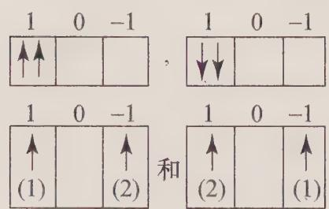

同一方框中两个自旋相同的6个微观状态不再出现。而电子的不可分辨性，也限制了微观状态数[若电子可分辨，由左图中下面的方框所示的两个电子分别标记为(1)和(2)，则成了两种状态]。这样，对同一组轨道上有 $v$ 个电子，若每个电子可能存在的状态数为 $u$ ，则其微观状态数可按下式组合计算。

$$
C _ {u} ^ {v} = \frac {u !}{v ! (u - v) !}
$$

$(np)^{2}$ 组态的微观状态数为 15 种, 即

$$
\mathrm{C} _ {6} ^ {2} = \frac {6 !}{2 ! (6 - 2) !} = 1 5
$$

表 2.6.4 排列出 $(np)^{2}$ 组态的 15 种微观状态。表中 $m_{L}$ 的最大值是 2，说明有 L=2 的光谱项 D；而此 $m_{L}$ 只与 $m_{S}=0$ 一起出现，说明 S=0，则 $2S+1=1$ ，故有光谱项 $^{1}D$ 。谱项 $^{2S+1}L$ 对应的微观状态数为 $(2L+1)(2S+1)$ ，故 $^{1}D$ 对应 5 个状态，这 5 个状态的 $m_{S}$ 都等于 0，而 $m_{L}$ 分别为 2,1,0,-1,-2。挑出这 5 个状态（ $m_{L}$ 相同、 $m_{S}$ 也相同的态任选一个）后，按同样的道理和手续再挑选出 9 个状态，相应的 $m_{L}=0,\pm1,m_{S}=0,\pm1$ ，它们都属于光谱项 $^{3}P$ 。最后剩下一个微观状态，其 $m_{L}=0,m_{S}=0$ ，即 L=0,S=0，为 $^{1}S$ 谱项。这样，我们得到了 $(np)^{2}$ 组态的全部光谱项： $^{1}D,^{3}P,^{1}S$ 。

表 2.6.4 ${\left( np\right) }^{2}$ 组态的 15 种微观状态

<table><tr><td></td><td>m</td><td></td><td rowspan="2"> $m_L = \sum m_l$ </td><td rowspan="2"> $m_S = \sum m_s$ </td><td rowspan="2"> $T_n$ </td></tr><tr><td>1</td><td>0</td><td>-1</td></tr><tr><td>↑↓</td><td></td><td></td><td>2</td><td>0</td><td> $^1D$ </td></tr><tr><td>↑</td><td>↑</td><td></td><td>1</td><td>1</td><td> $^3P$ </td></tr><tr><td>↑</td><td>↓</td><td></td><td>1</td><td>0</td><td rowspan="2"> $^1D, ^3P$ </td></tr><tr><td>↓</td><td>↑</td><td></td><td>1</td><td>0</td></tr><tr><td>↑</td><td></td><td>↑</td><td>0</td><td>1</td><td> $^3P$ </td></tr><tr><td>↑</td><td></td><td>↓</td><td>0</td><td>0</td><td rowspan="3"> $^1D, ^3P, ^1S$ </td></tr><tr><td>↓</td><td></td><td>↑</td><td>0</td><td>0</td></tr><tr><td></td><td>↑↓</td><td></td><td>0</td><td>0</td></tr><tr><td>↓</td><td>↓</td><td></td><td>1</td><td>-1</td><td> $^3P$ </td></tr><tr><td>↓</td><td></td><td>↓</td><td>0</td><td>-1</td><td> $^3P$ </td></tr><tr><td></td><td>↑</td><td>↑</td><td>-1</td><td>1</td><td> $^3P$ </td></tr><tr><td></td><td>↑</td><td>↓</td><td>-1</td><td>0</td><td rowspan="2"> $^1D, ^3P$ </td></tr><tr><td></td><td>↓</td><td>↑</td><td>-1</td><td>0</td></tr><tr><td></td><td>↓</td><td>↓</td><td>-1</td><td>-1</td><td> $^3P$ </td></tr><tr><td></td><td></td><td>↑↓</td><td>-2</td><td>0</td><td> $^1D$ </td></tr></table>

正是由于Pauli原理的限制，等价电子组态存在着“电子-空位”关系，即有 $n$ 个电子的某一组态的光谱项与有 $n$ 个空位的组态的光谱项相同。例如，p轨道有6个状态， $(np)^4$ 组态有2个空位， $(np)^2$ 与 $(np)^4$ 组态具有相同的光谱项。同理， $(np)^1$ 与 $(np)^5$ ， $(nd)^1$ 与 $(nd)^9$ ， $(nd)^2$ 与 $(nd)^8$ 等也有相同的光谱项。

## 2. 多电子原子的能级

如前所述,组态和微观状态是原子状态的表示,而光谱项、光谱支项和微观能态则是原子能级的表示。

对某一多电子原子组态,若忽略电子间的相互作用,则单个电子的能量只与主量子数有关,即该组态只对应一个能级。例如, $(np)^{2}$ 组态在图 2.6.4 中用一短线表示。由于电子间有相互作用,每个组态分裂成多个光谱项,不同谱项的能量不再相同。 $(np)^{2}$ 组态分裂为 3 个光谱项: $^{3}P$ , $^{1}D$ 和 $^{1}S$ ,其中能量最低的光谱项 $^{3}P$ 称为基态光谱项。再考虑自旋-轨道相互作用,同一光谱项按光谱支项进行分裂。每个光谱项分裂为 $(2S+1)$ 或 $(2L+1)$ 个光谱支项,相当于有 $(2S+1)$ 或 $(2L+1)$ 个不同的 J 值。当将原子置于磁场时,每一光谱支项又进一步分裂为 $(2J+1)$ 个不同的微观能态,相当于有 $(2J+1)$ 个不同的 $m_{J}$ ,这是原子的角动量与磁场相互作用的结果。这种分裂称为 Zeeman 效应。

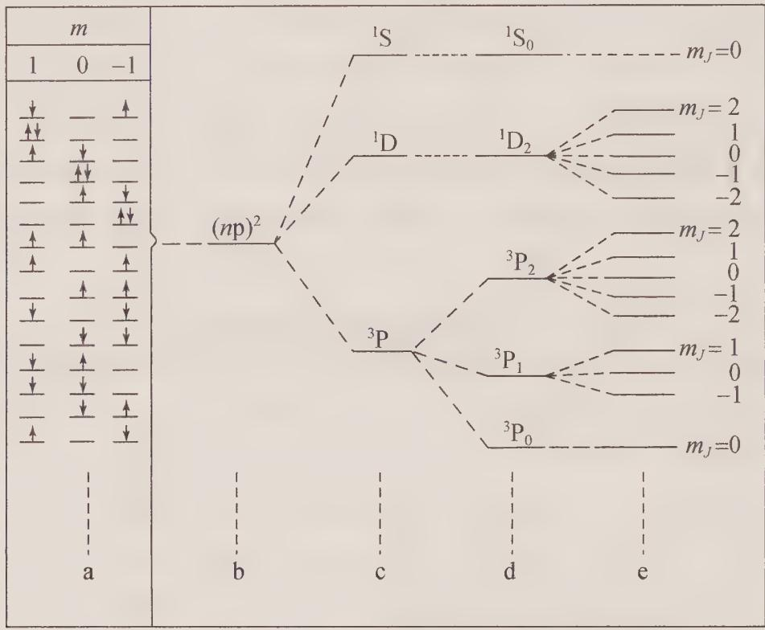  
图2.6.4 $(np)^{2}$ 组态的能级分裂  
a—微状态(有磁场); b—组态, 不考虑电子相互作用(无磁场);  
c—谱项,分别考虑电子的轨道和自旋的作用(无磁场);  
d—光谱支项,考虑 L-S 的相互作用(无磁场);e—微能态(有磁场)

$(np)^{2}$ 组态对应的原子能级的逐步分裂情况示于图 2.6.4 中。由图可见，当忽略电子的相互作用时，原子能级只与主量子数有关。随着考虑电子相互作用、自旋-轨道相互作用及外磁场的加入等，原子能级逐步分裂。每一组态所包含的微观状态数与微观能态数严格相等。但由于两者是从不同的出发点得来的，彼此并无一一对应的关系。

多电子原子光谱的选律是： $\Delta S = 0; \Delta L = 0, \pm 1 (L = 0 \to L' = 0$ 除外）； $\Delta J = 0, \pm 1 (J = 0 \to J' = 0$ 除外）； $\Delta m_{J} = 0, \pm 1 (\Delta J = 0$ 时， $m_{J} = 0 \to m_{J}' = 0$ 除外）。根据这些选律所预测的多电子原子光谱与实验结果完全相符。

## 3. 谱项能级高低的判断

在判断由光谱项标记的原子能态的高低时,可按下述 Hund 规则进行,这是前述(2.4.3 小节)Hund 规则的另一种表达方式。

(1) 原子在同一组态时, S 值最大者最稳定。

(2) S 值相同时, L 值最大者最稳定。

（3）一般地， $L$ 和 $S$ 值相同时，电子少于半充满时， $J$ 值小，能量低；电子多于半充满时， $J$ 值大，能量低。电子等于半充满时， $L = 0, J = S$ ，只有1个支项。

根据上述规则,并考虑对全充满的电子层,自旋抵消,各电子的轨道角动量的矢量和也正好抵消,可以不考虑,这样就很容易推导出基态的最稳定能态的光谱项。以下数例给出了原子的组态、最外层电子排列、L 和 S 的最大值以及最稳定的光谱支项。

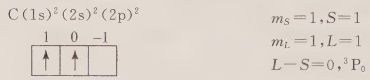

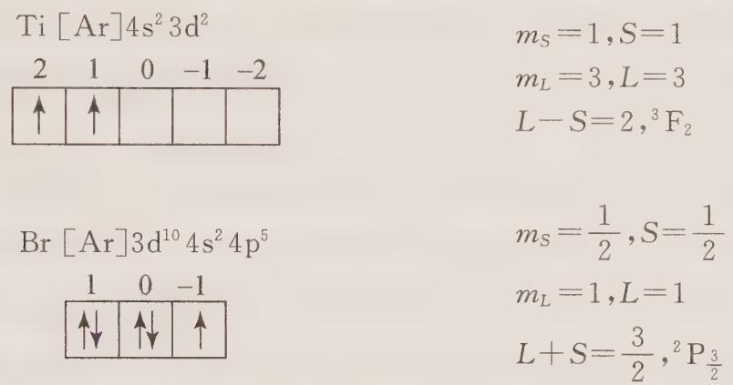

同理，可以得到氢原子、氮原子、氧原子、氟原子和氖原子等最稳定的光谱支项，它们分别为 $^{2}S_{\frac{1}{2}}$ ， $^{4}S_{\frac{3}{2}}$ ， $^{3}P_{2}$ ， $^{2}P_{\frac{3}{2}}$ 和 $^{1}S_{0}$ 。

## 2.6.5 原子光谱的应用

## 1. 原子发射光谱和原子吸收光谱

不同元素的原子产生不同波长的发射光谱或吸收光谱。根据试样光谱中特征谱线是否出现，就可判断某元素是否存在，这是光谱定性分析的根据。而谱线的强度与试样中的元素的含量有一定的关系，这是光谱定量分析的依据。

当基态原子受到加热或光照的激发，原子外层电子跃迁到较高的激发态，激发态的原子是不稳定的，在很短时间内（约 $10^{-8} \sim 10^{-10}\mathrm{~s}$ ），电子又从高能态回到低能态或基态上，同时以光的形式放出多余的能量。研究原子发射谱线的波长、强度和试样中元素组分和含量的关系，是原子发射光谱分析的任务。

原子由基态激发至高能态时,需要的能量是一定的,只有符合此能值的光才会被基态原子所吸收。这样,由一已知的光源发出辐射透过基态原子蒸气后,在光源光谱中就出现了为蒸气中基态原子所吸收的谱线(暗线)。研究光源中特征谱线被吸收的情况与试样蒸气中元素组分的含量的关系,是原子吸收光谱分析的任务。

在一般火焰温度下(2000～3000 K)，原子蒸气中激发态原子数目(其中绝大多数是在第一激发态)只占基态原子数目的 $10^{-3} \sim 10^{-15}$ 左右。因此，一般条件下原子蒸气中参与产生吸收光谱的基态原子数远远大于可能产生发射光谱的激发态原子数，这是原子吸收光谱较原子发射光谱具有较高灵敏度的理论依据。

原子吸收光谱中常用待测元素的空心阴极灯作为光源，发射出待测元素由基态到第一激发态所需能量的光，它只能激发待测元素的原子，虽然样品中存在着其他元素，但这些元素的原子不能吸收，干扰较小，测定前可避免大量繁杂的分离手续。实验时，在火焰中基态原子和激发态原子处于动态平衡中，但是由于吸收的光是从空心阴极灯照射到原子化器经过基态原子吸收减弱后，通过光缝进入单色仪，而由激发态原子跃迁回基态发出的光是向四面八方发射的，虽然发射和吸收数量一样，但通过光缝进入单色仪的是极少的一部分，可予忽略。

原子吸收光谱的定量根据是吸光度(A)与火焰中基态原子浓度(c)成正比。设有一波长为 $\lambda$ 的光束,通过长度为 L 的原子蒸气,吸光度 A 和吸收系数 k、火焰中基态原子的浓度 c、光通过原子蒸气长度 L 之间的关系为

$$
A = k c L
$$

当试样和标准溶液喷雾、燃烧等条件相同时，火焰中基态原子的浓度正比于试液中待测元素的浓度。同一仪器中 $L$ 值固定， $k$ 为常数，因此吸光度与待测元素的浓度成正比。实验证明，在低浓度时，以吸光度对浓度作图，呈直线关系，可作为工作曲线，进行定量分析。

## 2. 原子的 X 射线谱

原子的特征 X 射线谱是由原子的内层电子跃迁时产生的。当高速电子冲击阳极靶面时，靶面原子的内层（如 K 层）电子被击出，转到能级较高的外层，甚至离开原子而电离，这时较外层的电子跃迁至 K 层以填补空位，发出的 X 射线称为 K 系辐射，填补 L 层空位发出的 X 射线称 L 系辐射，等等。原子的特征 X 射线谱中各谱线的波长是一定的。由 L 层→K 层称为 $K_{\alpha}$ ，M 层→K 层称为 $K_{\beta}$ ，等等。L 层有 3 个细小差别的能级，其高低次序为 $L_{III} > L_{II} > L_{I}$ ，由于选律限制， $K_{\alpha}$ 只有两条线， $K_{\alpha_{1}}$ 系由 $L_{III} \rightarrow K$ 跃迁产生； $K_{\alpha_{2}}$ 由 $L_{II} \rightarrow K$ 跃迁产生。 $K_{\alpha_{1}}$ 波长较短，强度较高。例如， $CuK_{\alpha_{1}}$ 为 154.056 pm， $CuK_{\alpha_{2}}$ 为 154.439 pm， $K_{\alpha_{1}}$ 强度大约比 $K_{\alpha_{2}}$ 大一倍。若分辨率较低， $K_{\alpha_{1}}$ 和 $K_{\alpha_{2}}$ 分不开，就用平均的 $K_{\alpha}$ 。CuK $_{\alpha}$ 的平均波长为 154.18 pm。由 M 层跃迁至 K 层的 K $\beta$ 线也是由几条谱线组成， $CuK_{\beta_{1}}(M_{III} \rightarrow K \text{ 跃迁})$ 波长为 139.22 pm，其强度约为 $K_{\alpha_{1}}$ 的 1/5。

各种原子 $\mathrm{K}\alpha$ 线的波数 $\tilde{\nu}$ 可按下式近似计算

$$
\widetilde {\nu} = R (Z - \sigma_ {1}) ^ {2} \left(\frac {1}{1 ^ {2}} - \frac {1}{2 ^ {2}}\right) = \frac {3}{4} R (Z - \sigma_ {1}) ^ {2}
$$

式中 Rydberg 常数 $R=109737\ cm^{-1}$ ; Z 为原子序数; $\sigma_{1}$ 为屏蔽常数, 数值约为 0.90, 此为拟合所得常数, 与由 Slater 法计算略有不同。所以

$$
\widetilde {\nu} (\mathrm{K} \alpha) = \frac {3}{4} R (Z - 0. 9) ^ {2}
$$

这一关系正是早年 Moseley(莫塞莱)将各元素按所产生的特征 X 射线的波长排列,得到经验公式

$$
\sqrt {\frac {1}{\lambda}} = a (Z - b)
$$

对进一步确定元素的原子序数 $Z$ 及其在周期表中的位置，起了重大作用。

原子的 X 射线谱中, 尚有波长连续的 X 射线, 它们的波长比特征 X 射线还要短, 这是因为具有能量为某一定值的电子, 在靶面突然减速, 周围电磁场发生急剧变化, 产生电磁波, 发出光子。电子深入靶面程度不同, 能量损失程度不同, 故有各种波长的 X 射线, 但最短波长可由碰撞靶面前电子所具有的动能换算。

## 3. X 射线荧光分析

利用能量足够高的 X 射线(或电子)照射试样,激发出来的光叫 X 射线荧光。利用 X 射线荧光光谱仪分析 X 射线荧光光谱,鉴定样品的化学成分称为 X 射线荧光分析。

X 射线荧光分析基于下述原理: 当样品中元素的原子受到高能 X 射线照射时, 即发射出具有一定特征的 X 射线谱, 特征谱线的波长只与元素的原子序数 (Z) 有关, 而与激发 X 射线的能量无关。谱线的强度和元素含量的多少有关, 所以测定谱线的波长, 就可知道试样中包含什么元素, 测定谱线的强度, 就可知该元素的含量。

X射线荧光分析有下列特点：

(1) 不破坏样品的原有状态,且用量很少。

(2) 除最轻的几种元素外都能分析, 固体 (包括无定形态)、液态样品均可, 而且不受元素

价态的限制。

(3) 谱线数目少, 波长和原子序数关系简单, 便于鉴定。

（4）和化学分析法比较，它简便快速，特别是对稀土、铌钽、锆铪等不易分离的元素，更显示出其优越性。

## 4. 电子探针

电子探针是对试样进行微小区域成分分析的仪器，全名为电子探针X射线显微分析仪，又叫微区X射线谱分析仪。它可分析体积在数个立方微米以内元素的成分，除H, He, Li, Be等几种较轻元素外，都可用来进行定性定量分析。其特点是不必把分析的对象从样品中取出，而直接对大块试样中的微小区域进行分析。

电子探针的原理是利用经过加速和聚焦的极细的电子束(直径约 $0.1 \sim 1 \mu m$ ) 当作探针，激发试样中某一微小区域，使其发出特征 X 射线，然后测定该 X 射线的波长和强度，即可对该微区所含的元素作定性或定量分析。

将电子显微镜和电子探针结合，在显微镜下把观察到的显微组织和元素成分联系起来，解决材料显微不均匀性的问题，成为人们研究亚微观结构的有力工具。还可用于研究材料中元素分布情况和显微不均匀性，研究扩散情况和氧化腐蚀机理，分析矿物、合金、炉渣、耐火材料和催化剂等微细物相的成分和结构。

## 习题

2.1 氢原子光谱可见波段相邻4条谱线的波长分别为656.47,486.27,434.17和 $410.29\mathrm{nm}$ ，试通过数学处理将谱线的波数归纳成下式表示，并求出常数 $R$ 及整数 $n_1,n_2$ 的数值。

$$
\tilde {\nu} = R \left(\frac {1}{n _ {1} ^ {2}} - \frac {1}{n _ {2} ^ {2}}\right)
$$

2.2 按 Bohr 模型计算氢原子处于基态时电子绕核运动的半径(分别用原子的折合质量和电子的质量计算,并准确到 5 位有效数字)和线速度。

## 2.3 对于氢原子：

（1）分别计算从第一激发态和第六激发态跃迁到基态所产生的光谱线的波长，说明这些谱线所属的线系及所处的光谱范围。

(2) 上述两谱线产生的光子能否使: (a) 处于基态的另一氢原子电离? (b) 金属铜中的铜原子电离 (铜的功函数为 $7.44 \times 10^{-19} \mathrm{~J}$ )?

（3）若上述两谱线所产生的光子能使金属铜晶体的电子电离，请计算从金属铜晶体表面发射出的光电子的德布罗意波的波长。

2.4 请通过计算说明,用氢原子从第六激发态跃迁到基态所产生的光子照射长度为 1120 pm 的线形分子 $CH_{2}CHCHCHCHCHCHCH_{2}$ ,该分子能否产生吸收光谱?若能,计算谱线的最大波长;若不能,请提出将不能变为可能的思路。

1. 2.5 计算氢原子 $\psi_{1s}$ 在 $r = a_0$ 和 $r = 2a_0$ 处的比值。

2.6 计算氢原子的 1s 电子出现在 $r = 100 \mathrm{pm}$ 的球形界面内的概率。

$$
\left(\int x ^ {n} \mathrm{e} ^ {a x} \mathrm{d} x = \frac {x ^ {n} \mathrm{e} ^ {a x}}{a} - \frac {n}{a} \int x ^ {n - 1} \mathrm{e} ^ {a x} \mathrm{d} x + c\right)
$$

2.7 计算氢原子的积分： $P(r)=\int_{0}^{2\pi}\int_{0}^{\pi}\int_{r}^{\infty}\psi_{1s}^{2}r^{2}\sin\theta drd\theta d\phi$ ，作 $P(r)-r$ 图，求 $P(r)=0.1$ 时的r

值,说明在该 r 值以内电子出现的概率是 90%。

2.8 已知氢原子的归一化基态波函数为

$$
\psi_ {1 \mathrm{s}} = (\pi a _ {0} ^ {3}) ^ {- \frac {1}{2}} \exp \left[ - \frac {r}{a _ {0}} \right]
$$

（1）利用量子力学基本假设求该基态的能量和角动量；

(2) 利用位力定理求该基态的平均势能和零点能。

2.2.9 已知氢原子的 $\psi_{2\mathrm{p}_z} = \frac{1}{4\sqrt{2\pi a_0^3}}\left(\frac{r}{a_0}\right)\exp \left[-\frac{r}{2a_0}\right]\cos \theta$ ，试计算回答下列问题：

(1) 原子轨道能 E=?

n=2 l=1 m=c

(2) 轨道角动量 $\left|M\right|=\quad?$ 轨道磁矩 $\left|\mu\right|=\quad?$

(3) 轨道角动量 M 和 z 轴的夹角是多少度?

(4) 列出计算电子离核平均距离的公式(不必算出具体的数值)。

(5) 节面的个数、位置和形状怎样？

(6) 概率密度极大值的位置在何处?

(7) 画出径向分布示意图。

2.10 根据表2.1.2所列的波函数，以原子单位表示氢原子的 $\psi_{1\mathrm{s}}$ 和 $\psi_{2\mathrm{s}}$ ，证明它们各自是归一化函数并且相互正交。

2.11 根据氢原子 $2\mathrm{s}$ 态的波函数，求算径向概率分布函数 $D = r^2 R^2$ 中的节点、极大值位置和球形节面内电子存在的概率，作图表示，并和图2.3.2比较。

2.12 对氢原子， $\psi = c_{1}\psi_{210} + c_{2}\psi_{211} + c_{3}\psi_{311}$ ，所有波函数都已归一化。请对 $\psi$ 所描述的状态计算：

(1) 能量平均值及能量 -3.4 eV 出现的概率；

(2) 角动量平均值及角动量 $\sqrt{2}h/2\pi$ 出现的概率；

（3）角动量在 $z$ 轴上的分量的平均值及角动量 $z$ 轴分量 $h / \pi$ 出现的概率。

2.13 作氢原子 $\psi_{\mathrm{ls}}^2 - r$ 图及 $D_{\mathrm{ls}} - r$ 图，证明 $D_{\mathrm{ls}}$ 极大值在 $r = a_0$ 处，说明两图形不同的原因。

2.14 试在直角坐标系中画出氢原子的5种3d轨道的轮廓图，比较这些轨道在空间的分布，正、负号，节面及对称性。

3.2.15 写出 He 原子的 Schrödinger 方程,说明用中心力场模型解此方程时要作哪些假设,计算其激发态 $(2s)^{1}(2p)^{1}$ 的轨道角动量和轨道磁矩。

2.16 写出 $\mathrm{Li}^{2+}$ 离子的 Schrödinger 方程, 说明该方程中各符号及各项的意义; 写出 $\mathrm{Li}^{2+}$ 离子 1s 态的波函数并计算:

(1) $1 \mathrm{~s}$ 电子径向分布最大值离核的距离;

(2) 1s 电子离核的平均距离；

(3) 1s 电子概率密度最大处离核的距离；

(4) 比较 $Li^{2+}$ 离子的 2s 和 2p 态能量的高低；

(5) Li 原子的第一电离能(按 Slater 屏蔽常数算有效核电荷)。

2.17 Li原子的3个电离能分别为 $I_{1} = 5.392\mathrm{eV}, I_{2} = 75.638\mathrm{eV}, I_{3} = 122.451\mathrm{eV}$ ，请计算Li原子的1s电子结合能。

2.18 已知 He 原子的第一电离能 $I_{1}=24.59\ eV$ ，试计算：

(1) 第二电离能, 1s 的单电子原子轨道能和电子结合能;

(2) 基态能量；

(3) 在 1s 轨道中两个电子的互斥能；

(4) 屏蔽常数；

(5) 根据(4)所得结果求 $H^{-}$ 的基态能量。

2.19 用 Slater 法计算 Be 原子的第一至第四电离能, 将计算结果与 Be 的常见氧化态联系起来。

2.20 用 2.4 节 (2.4.10) 式计算 Na 和 F 的 3s 和 2p 轨道的有效半径 $r^*$ 。

2.21 写出下列原子的基态光谱支项的符号：

(1) Si, (2) Mn, (3) Br, (4) Nb, (5) Ni。

2.22 写出 $\mathrm{Na}$ 和F原子基组态以及碳的激发态 $\mathrm{C(1s^2 2s^2 2p^1 3p^1)}$ 存在的光谱支项符号。

2.23 对 Sc 原子(Z=21)，写出：

(1) 能级最低的光谱支项；

(2) 在该光谱支项表征的状态中, 原子的总轨道角动量;

（3）在该光谱支项表征的状态中，原子的总自旋角动量；

(4) 在该光谱支项表征的状态中, 原子的总角动量;

(5) 在磁场中此光谱支项分裂为多少个微观能态?

2.24 基态 Ni 原子可能的电子组态为：(1) $[Ar]3d^{8}4s^{2}$ ，(2) $[Ar]3d^{9}4s^{1}$ 。由光谱实验确定其能量最低的光谱支项为 ${}^{3}F_{4}$ ，试判断它是哪种组态。

2.25 列式表明电负性的Pauling标度和Mulliken标度是怎样定的。

2.26 原子吸收光谱较原子发射光谱有哪些优缺点？产生优缺点的原因是什么？

## 参考文献

[1] 徐光宪, 王祥云. 物质结构. 第二版. 北京: 科学出版社, 2010.

[2] 李炳瑞. 结构化学. 第 2 版. 北京: 高等教育出版社, 2011.

[3] 谢有畅,邵美成.结构化学.北京:人民教育出版社,1983.

[4] 鲍林(Pauling L). 化学键的本质. 第三版. 卢嘉锡, 黄耀曾, 曾广植, 陈元柱, 译. 上海: 上海科学技术出版社, 1981.

[5] 麦松威, 周公度, 李伟基. 高等无机结构化学. 第 2 版 (第 4 次印刷). 北京: 北京大学出版社, 2014.

[6] 周公度. 相对论效应在结构化学中的作用. 大学化学, 2005, 20(6): 50\~59.

[7] 周公度, 王颖霞. 元素周期表和元素知识集萃. 北京: 化学工业出版社, 2016.

[8] Kuhn H, Försterling H - D. Principles of Physical Chemistry: Understanding Molecules, Molecular Assemblies, Supramolecular Machines. Chichester: Wiley, 2000.

[9] Dekock R, Gray H. Chemical Structure and Bonding. Reading, Mass: Benjamin/Cummings, 1980.

[10] Richards W G, Scott P R. Energy Levels in Atoms and Molecules. Oxford: Oxford University Press, 1994.

[11] Pilar F L. Elementary Quantum Chemistry. 2 $^{nd}$ ed. New York: McGraw-Hill, 1991.

[12] Emsley J. The Elements. 3 $^{rd}$ ed. Oxford: Oxford University Press, 1998.

[13] Allen L C. Electronegativity is the average one-electron energy of the valence-shell electrons in

ground-state free-atom. J Am Chem Soc, 1989, 111:9003\~9014. // Schleyer Pvon R. Electron-egativity and the Periodic Table. Encyclopedia of Computational Chemistry. New York: Wiley, 1998, 835\~852.

[14] Pyykkö P. Relativistic effects in structural chemistry. Chem Rev, 1988, 88: 563\~594; Strong closed-shell interaction in inorganic chemistry. Chem Rev, 1997, 97: 579\~636.

[15] Kaltsoyannis N. Relativistic effects in inorganic and organometallic chemistry. J Chem Soc, Dalton Trans, 1997, 1\~11.

# 第 3 章 共价键和双原子分子的结构化学

## 3.1 化学键概述

## 3.1.1 化学键的定义和类型

什么是化学键？广义地说，化学键是将原子结合成物质世界的作用力。在物质世界里，原子互相吸引、互相推斥，以一定的次序和方式结合成分子或晶体。分子是保持化合物特性的最小微粒，是参与化学反应的基本单元。随着科学的发展，分子的概念发展成泛分子（pan-molecule），它是泛指21世纪化学的研究对象，包括从原子、分子片、分子、高分子、生物大分子、超分子、分子聚集体，直到分子器件和分子机器。正是由于分子的概念扩展到泛分子，化学键的含义也相应地扩展到将原子结合成物质世界的作用力，或泛化学键。但物理学所探讨的万有引力不包括在化学键中，因为在分子内部原子间的万有引力相对于化学键力是微不足道的，完全可以忽略。

通常，化学键定义为在分子或晶体中两个或多个原子间的强烈相互作用，导致形成相对稳定的分子和晶体。共价键、离子键和金属键是化学键的3种极限键型，在这三者之间通过键型变异而偏离极限键型，出现多种多样的过渡型式的化学键。这3种极限键型的特征列于表3.1.1中，表中A和B表示相互成键的原子。

表 3.1.1 共价键、离子键和金属键的比较

<table><tr><td>性 质</td><td>共价键</td><td>离子键</td><td>金属键</td></tr><tr><td rowspan="2">A和B的电性</td><td>A负电性</td><td>A正电性</td><td>A正电性</td></tr><tr><td>B负电性</td><td>B负电性</td><td>B正电性</td></tr><tr><td>结合力性质</td><td>成键电子轨道叠加将A,B结合在一起</td><td> $A^{+}$ 和 $B^{-}$ 间的静电吸引</td><td>自由电子和金属正离子间相互吸引</td></tr><tr><td>结合的几何形式</td><td>由轨道叠加和价电子数控制</td><td>A-B间接近,A-A和B-B间远离</td><td>金属原子密堆积</td></tr><tr><td>键强度性质</td><td>由净的成键电子数决定</td><td>由离子的电价和配位数决定</td><td>6个价电子最高,大于6和小于6都逐渐减小</td></tr><tr><td>电学性质</td><td>固态和熔态均为绝缘体或半导体</td><td>固态为绝缘体,熔态为导体</td><td>导体</td></tr></table>

分子之间以及分子以上层次的超分子及有序高级结构的聚集体，则是依靠氢键、盐键、一些弱的共价键和相互作用以及范德华力等将分子结合在一起的。这些作用能比一般强相互作用的化学键键能小1～2个数量级。有的作者将强相互作用的化学键和范德华力之间的种种键力统称为次级键(secondary bond)。由于这种次级键和范德华力间并没有明确的界限，它们在超分子和分子聚集体中所起的作用都很重要。有些作者提出范德华力也是一种类型的化

学键，称它为范德华键。

现将共价键、离子键、金属键和次级键(包括范德华力)等4种不同的键型排列在四面体的4个顶点上,构成化学键四面体关系图,如图3.1.1所示。

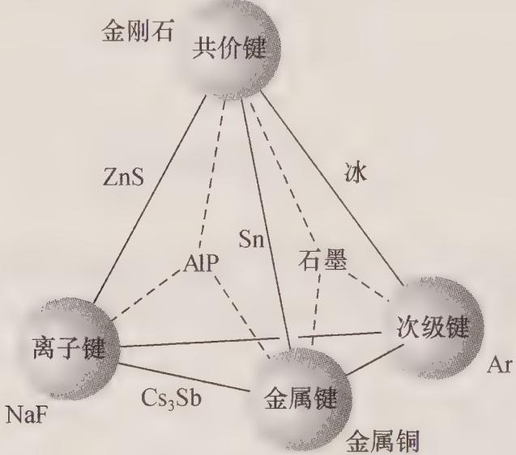  
图3.1.1 化学键四面体关系图

由于键型变异及结构的复杂性,在一种单质或化合物中常常包含多种类型的化学键,例如石墨晶体是由 C 原子组成层形分子,然后再堆积而成的。层形分子中的 C 原子除形成共价 C—C σ 键外,整个层中的 n 个 C 原子还形成 $\pi_{n}^{n}$ 离域 π 键,它可看作一种二维的金属键,使石墨分子具有金属光泽和导电性;层形石墨分子依靠 $\pi\cdots\pi$ 相互作用和范德华力结合成晶体。表 3.1.2 列出若干种单质和化合物中包含的键型的概况。

表 3.1.2 若干单质和化合物中存在的化学键类型

<table><tr><td>单质和化合物</td><td>键型</td></tr><tr><td>ZnS</td><td>共价键,离子键</td></tr><tr><td>NbO</td><td>离子键,金属键</td></tr><tr><td>Sn</td><td>金属键,共价键</td></tr><tr><td>石墨</td><td>共价键,金属键,范德华力</td></tr><tr><td>8Ar·46H2O</td><td>共价键,氢键,范德华力</td></tr><tr><td>AlP</td><td>共价键,离子键,金属键</td></tr><tr><td>明矾[K(H2O)6]+[Al(H2O)6]3+(SO42-)2</td><td>共价键,离子键,离子-偶极子作用,氢键</td></tr></table>

## 3.1.2 键型的多样性

物质的多样性由物质内部原子的空间排布的多样性以及它们之间存在的各种类型的化学键所决定。

已知世界上有 118 种元素,除了 26 种人造元素外,天然存在而数量较多、在地壳中按重量计超过十万分之一的元素只有 30 多种。这些元素的原子通过各种类型的化学键形成了五彩缤纷的世界。每种元素的原子在不同的条件和成键环境中,可以形成不同的化学键。下面介绍氢原子所能形成的化学键的类型。

氢是元素周期表中的第一种元素,其原子核中质子数为 1 , 核外只有 1 个电子,基态时电子处在 1s 轨道上。氢原子可以失去 1 个电子成 $H^{+}$ ,也可以获得 1 个电子成 $H^{-}$ 。虽然氢原子只有 1 个 1s 价轨道和 1 个电子参加成键,但近 30 多年来,由于合成化学和结构化学的发展,已经阐明氢原子在不同的化合物中可以形成共价单键、离子键、金属键、氢键等多种类型的化学键。

## 1. 共价单键

由 H,C,O,N,S 和卤素等元素组成的氢化物和各种有机化合物中，H 原子以共价单键和另外一个原子结合，例如 $H_{2}, H_{2}O, NH_{3}, CH_{4}, CH_{3}CH_{2}OH, H_{2}S$ 和 HCl 等分子。氢原子的共价半径为 32 pm。

在这些共价单键中， $\mathrm{H}_{2}$ 分子中成键电子对处在两个原子的中心，是非极性共价键；而在 $\mathrm{HCl}, \mathrm{H}_{2} \mathrm{O}$ 等分子中，成键电子对靠近电负性高的原子，形成极性共价键。

## 2. 离子键

H 原子可获得 1 个电子形成 $H^{-}$ 离子，由于 H 原子的电子亲和能 (0.75 eV) 很小，形成负离子的趋势低于卤素（卤素电子亲和能 >3 eV），所以只有正电性高的金属才能形成盐型氢化物，如 NaH, $CaH_{2}$ , CuH 等。在这些化合物中 $H^{-}$ 以离子键和其他正离子结合， $H^{-}$ 的离子半径在 130～150 pm 之间。

H 原子丢失 1 个电子形成 $H^{+}$ , $H^{+}$ 是很小的质点, 半径约为 0.0015 pm, 比一般原子小 $10^{5}$ 倍。当 $H^{+}$ 接近其他原子时, 能使其他原子变形, 形成共价键。所以除气态离子束外, $H^{+}$ 必定和其他原子或分子结合, 形成 $H_{3}O^{+}$ , $H_{5}O_{2}^{+}$ , $NH_{4}^{+}$ 等离子, 再和其他异号离子通过离子键结合成化合物。

## 3. 类金属键

$\mathrm{H}_{2}$ 能被某些金属和合金，如 $\mathrm{Pd},\mathrm{Ni},\mathrm{La},\mathrm{LaNi}_{5}$ 等大量地吸附，以原子状态存在于金属或合金的空隙之中。例如

$$
\mathrm{LaNi} _ {5} + 3 \mathrm{H} _ {2} \xrightarrow [ <   0 . 4 \mathrm{MPa} ]{> 0 . 4 \mathrm{MPa}} \mathrm{LaNi} _ {5} \mathrm{H} _ {6}
$$

即 $\mathrm{H}_{2}$ 的压力大于 $0.4\mathrm{MPa}$ 时，它能被 $\mathrm{LaNi}_{5}$ 合金吸附；压力小于 $0.4\mathrm{MPa}$ 时，吸附的 $\mathrm{H}_{2}$ 又被释放出来。 $\mathrm{LaNi}_{5}$ 合金是一种良好的储氢材料（参见8.4.2节）。

在非常高的压力和很低温度下(如 250 GPa 和 77 K)， $H_{2}$ 分子转变成线形氢原子链 $H_{n}$ ，显现金属那样的导电性和不透明性。据猜测，一些行星中可能存在这种金属状态的氢。

## 4. 氢键

氢键通常用 X—H…Y 表示, 其中 X 和 Y 均为高电负性原子, 例如, F, O, N, Cl, 等等。在氢键 X—H…Y 中, Y 原子有一孤对电子, 它作为质子的受体, 而 X—H 作为质子的给体①。近年还发现多种类型的非常规氢键。

氢键既可形成于分子之间，也可形成于分子之内，它对物质的性质起重要作用。例如，无机化合物中的水、酸、碱，有机化合物中的醇、醛、酸、胺以及全部生命物质都密切地和它们之中的氢键作用相关联。化学已从研究物质的组成、结构、各种化学反应中能量的变化规律所得的成果作基础，深入到生物化学中的遗传基因、生物信息等内容，其基本规律都和大量存在的氢键相关联。在分子间和分子内由 H, O, N 等原子形成的氢键网络，决定生物体的结构和功能。

## 5. 缺电子多中心氢桥键

在硼烷等化合物中，H原子可和硼原子形成三中心二电子(3c-2e)缺电子多中心键，如

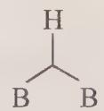

这种 BHB 多中心键以及后面要讨论的配位键,其实质是多个原子间共用电子对的一种共价键。

## 6. $\mathrm{H}^{-}$ 配键

$\mathrm{H}^{-}$ 能作为1个配体提供1对电子给1个(或多个)过渡金属原子形成金属氢化物,如 $\mathrm{Mg_2NiH_4}$ , $\mathrm{Mg_2FeH_6}$ , $\mathrm{K_2ReH_9}$ 等。在这些化合物中, $\mathrm{M}-\mathrm{H}$ 键是配位共价键或多中心键, $\mathrm{H}$ 和 $\mathrm{M}$ 间的结合型式有

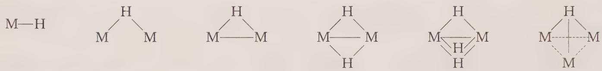

## 7. 分子氢配位键

氢分子 $(\mathrm{H}_2)$ 能作为一个配位体，同时从垂直键轴方向配位给一个过渡金属原子而不裂解成2个H原子。 $\mathrm{H}_{2}$ 分子和过渡金属原子间的键包括两部分：一部分是 $\mathrm{H}_{2}$ 分子提供成键 $\sigma$ 电子给空的金属原子的d轨道；另一部分是金属d轨道电子反馈给 $\mathrm{H}_{2}$ 分子的空的 $\sigma^{*}$ 反键轨道。这种氢分子配位键要减弱分子中的H一H键，使它容易裂解成2个H原子。

在 $\mathrm{W}(\eta^2 -\mathrm{H}_2)(\mathrm{CO})_3[\mathrm{P}(\mathrm{C}_3\mathrm{H}_7)_3]_2$ 以及 $[\mathrm{Fe}(\eta^2 -\mathrm{H}_2)(\mathrm{H})(\mathrm{PPh}_2\mathrm{CH}_2\mathrm{CH}_2\mathrm{PPh}_2)_2]\mathrm{BPh}_4$ 等化合物中， $\mathrm{H}_{2}$ 与金属原子从侧面结合，结构式（未写出烃基）为

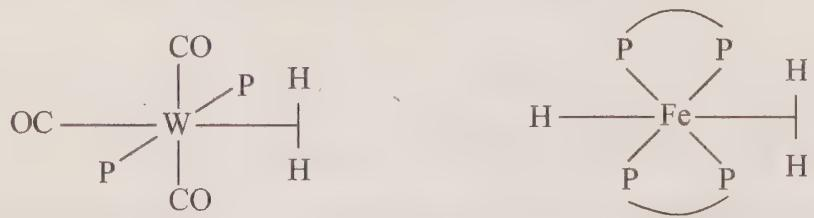

## 8. 抓氢键

抓氢键(agostic bond), C—H→M, 已被 X 射线和中子衍射实验所证实。其中的半箭头表示由 C—H 基提供 2 个电子给金属原子 M。在若干有机金属化合物中, 烃基上的 H 原子能和金属原子 M 形成 C—H→M 键。这种键的英文名称为 agostic bond, “agostic” 来源于拉丁文, 意思是“抓住使其靠在近旁”。

饱和碳氢化合物对金属原子 M 通常是没有化学作用的。然而近年来发现，在一些有机金属化合物中，C—H 键上的 H 原子能与 M 原子相互作用，改变烃基的几何构型。例如在图 3.1.2 所示的化合物(a)和(b)中，形成了 C—H→M 键（其结构参数示于图中）。由图可见，Ta 原子为了抓住 H 原子使其靠在近旁， $\angle TaCH$ 从理论值 $120^{\circ}$ 分别变为 $84.8^{\circ}$ 和 $78.1^{\circ}$ ，使 Ta 和 H 间形成化学键。

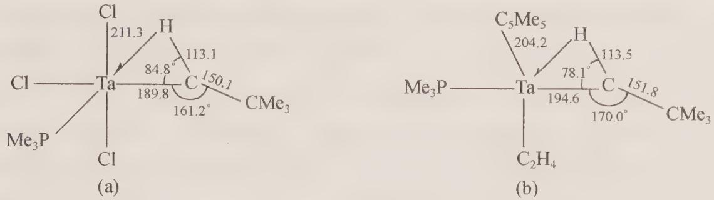  
图 3.1.2 和 C—H→M 键有关的一些结构参数  
(a) $\left[\mathrm{Ta}(\mathrm{CHCMe}_3)(\mathrm{PMe}_3)\mathrm{Cl}_3\right]_2$ 的一部分，(b) $\mathrm{Ta}(\mathrm{CHCMe}_3)(\eta^5 -\mathrm{C}_5\mathrm{Me}_5)(\eta^2 -\mathrm{C}_2\mathrm{H}_4)(\mathrm{PMe}_3)$ （键长单位：pm）

C—H→M 键的形成,促使 C—H 键变长、减弱,活性增加,活化了惰性的烃基,对有机催化反应有重大的作用。

由上可见，在不同的成键环境中，一个结构最简单的氢原子能和其他原子形成多种类型的化学键。对于其他具有多个价层轨道和多个价电子的原子，所能形成的化学键类型将会更多。原子结构的复杂性增加，成键环境对形成键型的影响也会增加。

如前所述，离子键、共价键和金属键是化学键的3种极限键型。离子键源于离子间的静电作用。共价键是原子轨道互相叠加成为分子轨道，电子占据能量较低的成键分子轨道而使原子间稳定地结合。形成化学键的电子仅处于2个原子范围的键称为定域键；形成化学键的电子作用在参加成键的多个原子之间的键称为多中心键或离域键。金属键可看作使金属原子结合在一起的高度离域的共价键的相互作用(能带理论)或静电相互作用(自由电子理论)。同核双原子分子中形成共价键的电荷分布对2个核是对称的，为典型的非极性键；异核双原子分子中因2个不同的原子电负性的差异而使电荷分布偏向电负性高的原子，形成极性键。典型的离子键是成键电荷完全转移到电负性高的原子上的极端的极性键。在成键的原子或基团间，由其中一方提供成键电子的化学键称为配位键。

## 3.2 $\mathrm{H}_{2}^{+}$ 的结构和共价键的本质

氢分子离子, $\mathrm{H}_{2}^{+}$ , 是最简单的分子, 在化学上虽不稳定, 很容易从周围获得一个电子变为氢分子, 但已通过实验证明它的存在, 并已测定出它的键长为 $106 \mathrm{pm}$ , 键解离能为 $255.4 \mathrm{~kJ} \mathrm{~mol}^{-1}$ 。正像把单电子的氢原子作为讨论多电子原子结构的出发点一样, 单电子的 $\mathrm{H}_{2}^{+}$ 可作为讨论多电子的双原子分子结构的出发点, 为其提供许多有用的概念。

## 3.2.1 $\mathbf{H}_2^+$ 的 Schrödinger 方程

$\mathrm{H}_{2}^{+}$ 是一个包含两个原子核和一个电子的体系, 其坐标关系如图 3.2.1 所示。图中 A 和 B 代表原子核, $r_{\mathrm{a}}$ 和 $r_{\mathrm{b}}$ 分别代表电子与两个核的距离, $R$ 代表两核之间的距离。

$H_{2}^{+}$ 的 Schrödinger 方程(以原子单位表示)为

$$
\left[ - \frac {1}{2} \nabla^ {2} - \frac {1}{r _ {\mathrm{a}}} - \frac {1}{r _ {\mathrm{b}}} + \frac {1}{R} \right] \psi = E \psi\tag{3.2.1}
$$

式中 $\psi$ 和 $E$ 分别为 $\mathrm{H}_2^+$ 的波函数和能量。等号左边方括号中，第一项是电子的动能算符，第二项和第三项是电子受核的吸引能算符，第四项是两个原子核的静电排斥能算符。由于电子质量比原子核质量小得多，电子运动速度比核快得多，电子运动时，核可以看作不动，式中不包含核的动能算符项，电子处在固定的核势场中运动，此即Born-Oppenheimer(玻恩-奥本海默)近似，由此解得的波函数 $\psi$ 只反映电子的运动状态。这样，把核看作不动，固定核间距 $R$ ，解Schrödinger方程，得到分子的电子波函数和能级。改变 $R$ 值，可得一系列波函数和相应的能级。与电子能量最低值相对应的 $R$ 就是平衡核间距 $R_{\mathrm{e}}$ 。

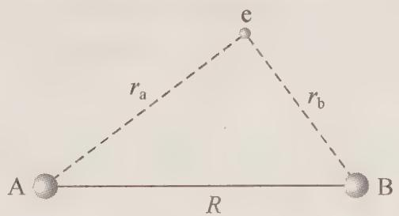  
图3.2.1 $\mathbf{H}_2^+$ 的坐标

## 3.2.2 变分法解 Schrödinger 方程

变分法(variation method)是解 Schrödinger 方程的一种近似方法,它基于下面的原理:对任意一个品优波函数 $\psi$ ,用体系的 $\hat{H}$ 算符求得的能量平均值,大于或等于体系基态的能量 $(E_{0})$ ,即

$$
\langle E \rangle = \frac {\int \psi^ {*} \hat {H} \psi \mathrm{d} \tau}{\int \psi^ {*} \psi \mathrm{d} \tau} \geqslant E _ {0}\tag{3.2.2}
$$

根据此原理,利用求极值的方法调节参数,找出能量最低时对应的波函数,即为和体系基态相近似的波函数。

(3.2.2)式可以证明如下:设 $\psi_{0},\psi_{1},\psi_{2},\cdots$ 组成正交、归一的函数组,其能量依次增加, $E_{0}\leqslant E_{1}\leqslant E_{2}\cdots$ ,由此可得

$$
\hat {H} \psi_ {i} = E _ {i} \psi_ {i}
$$

将(3.2.2)式中的 $\psi$ 按照体系 $\hat{H}$ 的本征函数 $\psi_{i}$ 展开，即

$$
\psi = c _ {1} \psi_ {1} + c _ {2} \psi_ {2} + \dots = \sum_ {i} c _ {i} \psi_ {i}
$$

利用 $\psi_{i}$ 的正交、归一性，可得平均能量

$$
\langle E \rangle = \int \psi^ {*} \hat {H} \psi \mathrm{d} \tau = \sum_ {i} c _ {i} ^ {*} c _ {i} E _ {i}
$$

因 $c_{i}^{*}c_{i}$ 恒为正值， $\sum c_i^* c_i = 1$ （据1.2节，假设IV）， $0 <   c_{i}^{*}c_{i}\leqslant 1$ ，故得

$$
\langle E \rangle - E _ {0} = \sum_ {i} c _ {i} ^ {*} c _ {i} (E _ {i} - E _ {0}) \geqslant 0
$$

所以 $\langle E\rangle \geqslant E_0$

常用的变分法是线性变分法,即选择一品优的线性变分函数

$$
\psi = c _ {1} \psi_ {1} + c _ {2} \psi_ {2} + \dots + c _ {n} \psi_ {n}\tag{3.2.3}
$$

求出 E 值最低时对应的线性组合系数 $c_{i}$ 值，进而得到波函数 $\psi$ 。

当电子运动到核 A 附近时， $\psi$ 近似于原子轨道 $\psi_{a}$ ；同样，当电子运动到核 B 附近时，它近似于 $\psi_{b}$ 。根据电子的波动性，波可以叠加， $\psi$ 将会在一定程度上继承和反映原子轨道的性质，因而可用原子轨道的线性组合

$$
\psi = c _ {a} \psi_ {a} + c _ {b} \psi_ {b}
$$

作为 $H_{2}^{+}$ 的变分函数, 式中 $c_{a}$ 和 $c_{b}$ 为待定参数, 而

$$
\psi_ {\mathrm{a}} = \frac {1}{\sqrt {\pi}} \mathrm{e} ^ {- r _ {\mathrm{a}}}, \quad \psi_ {\mathrm{b}} = \frac {1}{\sqrt {\pi}} \mathrm{e} ^ {- r _ {\mathrm{b}}}
$$

将 $\psi$ 代入 $E = \frac{\int\psi^{*}\hat{H}\psi\mathrm{d}\tau}{\int\psi^{*}\psi\mathrm{d}\tau}$ 中，得

$$
E (c _ {\mathrm{a}}, c _ {\mathrm{b}}) = \frac {\int (c _ {\mathrm{a}} \psi_ {\mathrm{a}} + c _ {\mathrm{b}} \psi_ {\mathrm{b}}) ^ {*} \hat {H} (c _ {\mathrm{a}} \psi_ {\mathrm{a}} + c _ {\mathrm{b}} \psi_ {\mathrm{b}}) \mathrm{d} \tau}{\int (c _ {\mathrm{a}} \psi_ {\mathrm{a}} + c _ {\mathrm{b}} \psi_ {\mathrm{b}}) ^ {2} \mathrm{d} \tau}\tag{3.2.4}
$$

由于 $\mathrm{H}_2^+$ 的两个核是等同的，而 $\psi_{\mathrm{a}}$ 和 $\psi_{\mathrm{b}}$ 又都是归一化函数，展开上式，并令

$$
H _ {\mathrm{aa}} = \int \psi_ {\mathrm{a}} ^ {*} \hat {H} \psi_ {\mathrm{a}} \mathrm{d} \tau = H _ {\mathrm{bb}} = \int \psi_ {\mathrm{b}} ^ {*} \hat {H} \psi_ {\mathrm{b}} \mathrm{d} \tau\tag{3.2.5}
$$

$$
S _ {\mathrm{aa}} = \int \psi_ {\mathrm{a}} ^ {*} \psi_ {\mathrm{a}} \mathrm{d} \tau = S _ {\mathrm{bb}} = \int \psi_ {\mathrm{b}} ^ {*} \psi_ {\mathrm{b}} \mathrm{d} \tau\tag{3.2.6}
$$

$$
S _ {\mathrm{ab}} = \int \psi_ {\mathrm{a}} ^ {*} \psi_ {\mathrm{b}} \mathrm{d} \tau = \int \psi_ {\mathrm{b}} ^ {*} \psi_ {\mathrm{a}} \mathrm{d} \tau = S _ {\mathrm{ba}}\tag{3.2.7}
$$

$$
H _ {\mathrm{ab}} = \int \psi_ {\mathrm{a}} ^ {*} \hat {H} \psi_ {\mathrm{b}} \mathrm{d} \tau = H _ {\mathrm{ba}} = \int \psi_ {\mathrm{b}} ^ {*} \hat {H} \psi_ {\mathrm{a}} \mathrm{d} \tau\tag{3.2.8}
$$

得

$$
E \left(c _ {\mathrm{a}}, c _ {\mathrm{b}}\right) = \frac {c _ {\mathrm{a}} ^ {2} H _ {\mathrm{aa}} + 2 c _ {\mathrm{a}} c _ {\mathrm{b}} H _ {\mathrm{ab}} + c _ {\mathrm{b}} ^ {2} H _ {\mathrm{bb}}}{c _ {\mathrm{a}} ^ {2} S _ {\mathrm{aa}} + 2 c _ {\mathrm{a}} c _ {\mathrm{b}} S _ {\mathrm{ab}} + c _ {\mathrm{b}} ^ {2} S _ {\mathrm{bb}}} = \frac {Y}{Z}
$$

对 $c_{\mathrm{a}}, c_{\mathrm{b}}$ 偏微商求极值，得

$$
\frac {\partial E}{\partial c _ {\mathrm{a}}} = \frac {1}{Z} \frac {\partial Y}{\partial c _ {\mathrm{a}}} - \frac {Y}{Z ^ {2}} \frac {\partial Z}{\partial c _ {\mathrm{a}}} = 0
$$

$$
\frac {\partial E}{\partial c _ {\mathrm{b}}} = \frac {1}{Z} \frac {\partial Y}{\partial c _ {\mathrm{b}}} - \frac {Y}{Z ^ {2}} \frac {\partial Z}{\partial c _ {\mathrm{b}}} = 0
$$

消去 $Z$ ，因为 $\frac{Y}{Z} = E$ ，得

$$
\frac {\partial Y}{\partial c _ {\mathrm{a}}} - E \frac {\partial Z}{\partial c _ {\mathrm{a}}} = 0, \quad \frac {\partial Y}{\partial c _ {\mathrm{b}}} - E \frac {\partial Z}{\partial c _ {\mathrm{b}}} = 0
$$

将 Y, Z 值代入，并用 $(3.2.5) \sim (3.2.8)$ 式简化，可得到久期方程组

$$
\left\{ \begin{array}{l} c _ {\mathrm{a}} (H _ {\mathrm{aa}} - E) + c _ {\mathrm{b}} (H _ {\mathrm{ab}} - E S _ {\mathrm{ab}}) = 0 \\ c _ {\mathrm{a}} (H _ {\mathrm{ab}} - E S _ {\mathrm{ab}}) + c _ {\mathrm{b}} (H _ {\mathrm{bb}} - E) = 0 \end{array} \right.\tag{3.2.9}
$$

为了使 $c_{\mathrm{a}}$ 和 $c_{\mathrm{b}}$ 有不完全为零的解，必须令久期行列式为0：

$$
\left| \begin{array}{c c} H _ {\mathrm{aa}} - E & H _ {\mathrm{ab}} - E S _ {\mathrm{ab}} \\ H _ {\mathrm{ab}} - E S _ {\mathrm{ab}} & H _ {\mathrm{bb}} - E \end{array} \right| = 0\tag{3.2.10}
$$

解此行列式方程, 得 E 的两个解

$$
E _ {1} = \frac {H _ {\mathrm{aa}} + H _ {\mathrm{ab}}}{1 + S _ {\mathrm{ab}}}\tag{3.2.11}
$$

$$
E _ {2} = \frac {H _ {\mathrm{aa}} - H _ {\mathrm{ab}}}{1 - S _ {\mathrm{ab}}}\tag{3.2.12}
$$

将 $E_{1}$ 值代入(3.2.9)式的 $E$ ，得 $c_{\mathrm{a}} = c_{\mathrm{b}}$ ，相应的波函数

$$
\psi_ {1} = c _ {\mathrm{a}} (\psi_ {\mathrm{a}} + \psi_ {\mathrm{b}})\tag{3.2.13}
$$

将 $E_{2}$ 值代入(3.2.9)式的 $E$ ，得 $c_{\mathrm{a}} = -c_{\mathrm{b}}$ ，相应的波函数

$$
\psi_ {2} = c _ {\mathrm{a}} ^ {\prime} \left(\psi_ {\mathrm{a}} - \psi_ {\mathrm{b}}\right)\tag{3.2.14}
$$

利用波函数归一化条件,可求得

$$
c _ {\mathrm{a}} = (2 + 2 S _ {\mathrm{ab}}) ^ {\frac {1}{2}}\tag{3.2.15}
$$

$$
c _ {a} ^ {\prime} = (2 - 2 S _ {a b}) ^ {- \frac {1}{2}}\tag{3.2.16}
$$

## 3.2.3 积分 $H_{aa}, H_{ab}, S_{ab}$ 的意义和 $H_{2}^{+}$ 的结构

## 1. 库仑积分

通常把 $H_{\mathrm{aa}}$ 和 $H_{\mathrm{bb}}$ 称为库仑积分，又称 $\alpha$ 积分。根据 $\hat{H}$ 算符表达式，可得

$$
\begin{array}{l} H _ {\mathrm{aa}} = \int \psi_ {\mathrm{a}} ^ {*} \hat {H} \psi_ {\mathrm{a}} \mathrm{d} \tau \\ = \int \psi_ {\mathrm{a}} ^ {*} \left[ - \frac {1}{2} \nabla^ {2} - \frac {1}{r _ {\mathrm{a}}} - \frac {1}{r _ {\mathrm{b}}} + \frac {1}{R} \right] \psi_ {\mathrm{a}} \mathrm{d} \tau \\ = \int \psi_ {\mathrm{a}} ^ {*} \left[ - \frac {1}{2} \nabla^ {2} - \frac {1}{r _ {\mathrm{a}}} \right] \psi_ {\mathrm{a}} \mathrm{d} \tau + \frac {1}{R} \int \psi_ {\mathrm{a}} ^ {*} \psi_ {\mathrm{a}} \mathrm{d} \tau - \int \psi_ {\mathrm{a}} ^ {*} \frac {1}{r _ {\mathrm{b}}} \psi_ {\mathrm{a}} \mathrm{d} \tau \\ = E _ {\mathrm{H}} + \frac {1}{R} - \int \frac {\psi_ {\mathrm{a}} ^ {2}}{r _ {\mathrm{b}}} \mathrm{d} \tau \\ = E _ {\mathrm{H}} + J \end{array}\tag{3.2.17}
$$

$E_{\mathrm{H}}$ 是基态氢原子的能量。

$$
J \equiv \frac {1}{R} - \int \frac {1}{r _ {\mathrm{b}}} \psi_ {\mathrm{a}} ^ {2} \mathrm{d} \tau\tag{3.2.18}
$$

此式中 $-\int \frac{1}{r_{\mathrm{b}}}\psi_{\mathrm{a}}^{2}\mathrm{d}\tau$ 表示电子处在 $\psi_{\mathrm{a}}$ 轨道时受到核B作用的平均吸引能。由于 $\psi_{\mathrm{a}}$ 为球形对称，它的平均值近似等于电子在A核处受到的B核吸引能，其绝对值与两核排斥能 $1 / R$ 相近，因符号相反，几乎可以抵消。据计算， $\mathrm{H}_{2}^{+}$ 的 $R$ 等于平衡核间距 $R_{\mathrm{e}}$ 时， $J$ 值只是 $E_{\mathrm{H}}$ 的 $5.5\%$ ，所以 $H_{\mathrm{aa}} \approx E_{\mathrm{H}}$ 。

## 2. 交换积分

$H_{\mathrm{ab}}$ 和 $H_{\mathrm{ba}}$ 称为交换积分，或 $\beta$ 积分。 $\beta$ 积分与 $\psi_{\mathrm{a}}$ 和 $\psi_{\mathrm{b}}$ 的重叠程度有关，因而是与核间距 $R$ 有关的函数。

$$
H _ {\mathrm{ab}} = E _ {\mathrm{H}} S _ {\mathrm{ab}} + \frac {1}{R} S _ {\mathrm{ab}} - \int \frac {1}{r _ {\mathrm{a}}} \psi_ {\mathrm{a}} \psi_ {\mathrm{b}} \mathrm{d} \tau = E _ {\mathrm{H}} S _ {\mathrm{ab}} + K\tag{3.2.19}
$$

$$
K \equiv \frac {1}{R} S _ {\mathrm{ab}} - \int \frac {1}{r _ {\mathrm{a}}} \psi_ {\mathrm{a}} \psi_ {\mathrm{b}} \mathrm{d} \tau\tag{3.2.20}
$$

在分子的核间距条件下， $K$ 为负值， $S_{\mathrm{ab}}$ 为正值， $E_{\mathrm{H}} = -13.6 \mathrm{eV}$ ，这就使 $H_{\mathrm{ab}}$ 为负值。所以，当两个原子相互接近而成键时，体系能量降低， $H_{\mathrm{ab}}$ 项起重大作用。

## 3. 重叠积分

$S_{ab}$ 称为重叠积分,或称 S 积分。

$$
S _ {\mathrm{ab}} = \int \psi_ {\mathrm{a}} \psi_ {\mathrm{b}} \mathrm{d} \tau\tag{3.2.21}
$$

它与核间距离 R 有关: 当 R=0 时, $S_{ab}=1$ ; 当 $R=\infty$ 时, $S_{ab}\rightarrow0$ ; 当 R 为其他值时, $S_{ab}$ 的数值可通过具体计算得到。

将上述关系代入(3.2.11)和(3.2.12)式,可得

$$
E _ {1} = E _ {\mathrm{H}} + \frac {J + K}{1 + S}\tag{3.2.22}
$$

$$
E _ {2} = E _ {\mathrm{H}} + \frac {J - K}{1 - S}\tag{3.2.23}
$$

积分 J, K, S 可在以核 A 和核 B 为焦点的椭圆坐标中求得, 其结果(以原子单位表示)为

$$
J = \left(1 + \frac {1}{R}\right) \mathrm{e} ^ {- 2 R}\tag{3.2.24}
$$

$$
K = \left(\frac {1}{R} - \frac {2 R}{3}\right) \mathrm{e} ^ {- R}\tag{3.2.25}
$$

$$
S = \left(1 + R + \frac {R ^ {2}}{3}\right) \mathrm{e} ^ {- R}\tag{3.2.26}
$$

所以这些积分都与 R 有关，R 给定后，可具体计算其数值。例如当 $R=2a_{0}$ 时，J=0.0275 au，K=-0.1127 au，S=0.5863 au，而

$$
\frac {J + K}{1 + S} = - 0. 0 5 3 7 \mathrm{au}
$$

$$
\frac {J - K}{1 - S} = 0. 3 3 8 8 \mathrm{au}
$$

可见， $E_{1}<E_{H}<E_{2}$ 。

图3.2.2给出 $\mathrm{H}_2^+$ 的能量随核间距的变化曲线（即 $E - R$ 曲线）。由图可见， $E_{1}$ 随 $R$ 的变化出现一最低点，它从能量的角度说明 $\mathrm{H}_2^+$ 能稳定地存在。但计算所得的 $E_{1}$ 曲线的最低点为 $170.8\mathrm{kJ mol}^{-1}, R = 132\mathrm{pm}$ ，与实验测定的平衡解离能 $D_{\mathrm{e}} = 269.0\mathrm{kJ mol}^{-1}, R = 106\mathrm{pm}$ 相比较，还有较大差别。

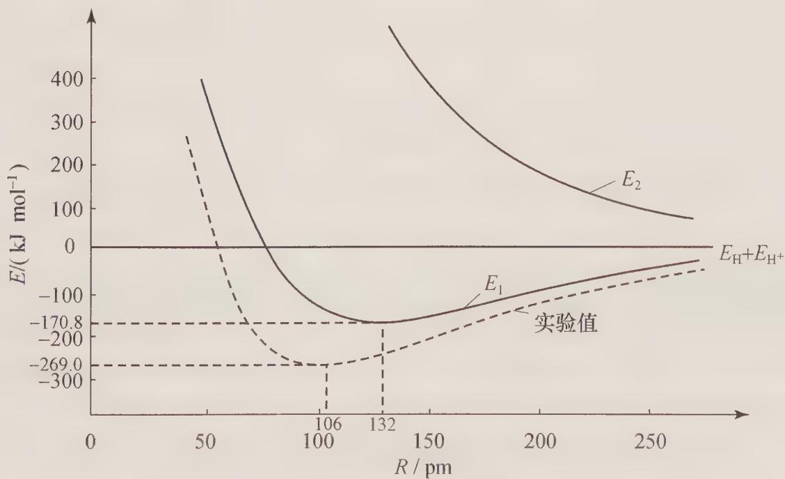  
图3.2.2 $\mathbf{H}_2^+$ 的能量曲线

$E_{2}$ 随 R 增加而单调地下降，当 $R \to \infty$ 时， $E_{2}$ 为 0，即 $H + H^{+}$ 的能量 $(E_{\mathrm{H}} + E_{\mathrm{H}^{+}})$ 。

由上述结果可见，用变分法解 $\mathrm{H}_2^+$ 的Schrödinger方程，可得两个波函数 $\psi_{1}$ 和 $\psi_{2}$ ，以及相

应的能量 $E_{1}$ 和 $E_{2}$

$$
\psi_ {1} = \frac {1}{\sqrt {2 + 2 S}} (\psi_ {\mathrm{a}} + \psi_ {\mathrm{b}}), E _ {1} = \frac {\alpha + \beta}{1 + S}\tag{3.2.27}
$$

$$
\psi_ {2} = \frac {1}{\sqrt {2 - 2 S}} (\psi_ {\mathrm{a}} - \psi_ {\mathrm{b}}), E _ {2} = \frac {\alpha - \beta}{1 - S}\tag{3.2.28}
$$

相应的概率密度函数(即电子云)分别为

$$
\psi_ {1} ^ {2} = \frac {1}{2 + 2 S} (\psi_ {\mathrm{a}} ^ {2} + \psi_ {\mathrm{b}} ^ {2} + 2 \psi_ {\mathrm{a}} \psi_ {\mathrm{b}})\tag{3.2.29}
$$

$$
\psi_ {2} ^ {2} = \frac {1}{2 - 2 S} (\psi_ {\mathrm{a}} ^ {2} + \psi_ {\mathrm{b}} ^ {2} - 2 \psi_ {\mathrm{a}} \psi_ {\mathrm{b}})\tag{3.2.30}
$$

$\psi_{1}$ 的能量比1s轨道的能量低，当电子从氢原子的1s轨道进入 $\psi_{1}$ 时，体系的能量降低， $\psi_{1}$ 为成键轨道。相反，电子进入 $\psi_{2}$ 时， $\mathrm{H}_{2}^{-}$ 的能量比原来的氢原子和氢离子的能量高， $\psi_{2}$ 为反键轨道。图3.2.3示出一个氢原子和一个氢离子的1s轨道叠加形成 $\mathrm{H}_{2}^{+}$ 的分子轨道图形。

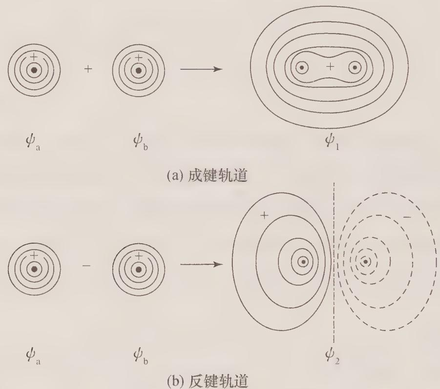  
图3.2.3 $\psi_{\mathrm{a}}$ 和 $\psi_{\mathrm{b}}$ 叠加成分子轨道 $\psi_{1}$ 和 $\psi_{2}$ 的等值线示意图

## 3.2.4 共价键的本质

由上述讨论可见,当原子互相接近时,它们的原子轨道互相叠加,组合成分子轨道。当电子进入成键轨道,体系能量降低,形成稳定的分子。此时原子间形成共价键。

从电子在分子中的分布情况，可了解共价键的成因。电子在分子中的分布，可由分子中空间各点概率密度 $(\psi_{1}^{2})$ 的大小表示。分子中电子的分布和两个原子的电子分布的简单加和不同。电子云分布的差值图反映了这一结果。电子云分布的差值图，是将 $\psi_{1}^{2}$ 按空间各点逐点地减去处在A核位置的 $\psi_{\mathrm{a}}^{2}$ 和处在B核位置的 $\psi_{\mathrm{b}}^{2}$ 后，绘出的差值等值线图。图3.2.4示出 $\mathrm{H}_{2}^{+}$ 的电子云分布的差值图（ $\psi_{1}$ 用精确解的波函数， $\psi_{\mathrm{a}}^{2}$ 和 $\psi_{\mathrm{b}}^{2}$ 的平均占有率各为 $1 / 2$ ）。图中实线表示电子云增加的等值线，虚线表示电子云减少的等值线。

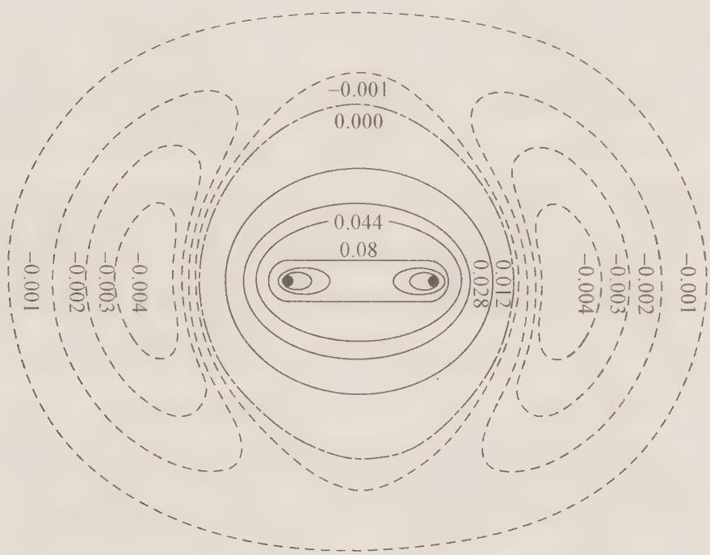  
图3.2.4 $\mathrm{H}_2^+$ 电子云分布的差值图

由图可见, $\psi_{1}$ 轨道的成键作用,实质上是将分子两端原子外侧的电子抽调到2个原子核之间,增加了核间区域的电子云。聚集在核间的电子云,同时受到2个原子核的吸引,即核间的电子云把2个原子核结合在一起,这是 $H_{2}^{+}$ 得以形成的原因。

共价键的形成是原子轨道(或分子轨道)互相叠加,组成新的分子轨道,而不是电子云叠加。原子轨道有正有负,按波的规律叠加,有的加强、有的削弱,形成成键分子轨道或反键分子轨道。而电子云是指 $|\psi|^{2}$ ,它只反映电荷的分布,无所谓正、负号。从物理意义考虑,同号电荷互相接近,只会出现静电排斥作用。由原子轨道叠加成分子轨道 $\psi$ 时,在 $|\psi|^{2}$ 中将出现交叉项 $2\psi_{a}\psi_{b}$ ,使电子分布的差值图不为0;但若由电子云 $|\psi_{a}|^{2}$ 和 $|\psi_{b}|^{2}$ 叠加,差值图处处为0,就没有成键时电子云分布改变的效应。

从能量角度看,聚集在核间运动的电子,同时受两个核正电荷的吸引,降低体系的能量,有利于电子在核间聚集。

一切化学过程都归结为化学的吸引和排斥的过程。由一个氢原子和一个氢原子核组成 $\mathrm{H}_{2}^{+}$ ，也是排斥和吸引对立统一的过程。当核间距离很大时，相互作用可以忽略，能量等于一个氢原子和一个氢原子核能量之和，一般以它作为能量的相对零点；核间距离逐渐缩小时，两个原子轨道的重叠逐渐增大，成键轨道的能量逐渐降低；当两个核进一步接近时，两个核正电荷相斥，又会使能量上升。吸引和排斥这两个矛盾因素的作用，得到图3.2.2中能量和核间距离的关系曲线（ $E_{1}$ ）。曲线（ $E_{1}$ ）有一最低点，这是体系平衡时稳定存在的情况。这时核间距离就是 $\mathrm{H}_{2}^{+}$ 的键长。

## 3.3 分子轨道理论和双原子分子的结构

## 3.3.1 简单分子轨道理论

$\mathrm{H}_{2}^{+}$ 是最简单的分子, 其他分子的电子数较多, 要复杂一些, 但 $\mathrm{H}_{2}^{-}$ 成键的一般原理和概念对其他分子还是适用的, 这已被量子力学计算和实验所证实。将 $\mathrm{H}_{2}^{+}$ 成键的一般原理推广,

可得适用于一般分子的分子轨道理论。

## 1. 分子轨道的概念

分子中每个电子都是在由各个原子核和其余电子组成的平均势场中运动，第 $i$ 个电子的运动状态用波函数 $\psi_{i}$ 描述， $\psi_{i}$ 称为分子中的单电子波函数，又称分子轨道。 $\psi_{i}^{*}\psi_{i}$ 为电子 $i$ 在空间分布的概率密度，即电子云分布； $\psi_{i}^{*}\psi_{i}\mathrm{d}\tau$ 表示该电子在空间某点附近微体积元 $\mathrm{d}\tau$ 中出现的概率。当把其他电子和核形成的势场当作平均场来处理时，势能函数只与电子本身的坐标有关，分子中第 $i$ 个电子的Hamilton算符 $\hat{H}_i$ 可单独分离出来， $\psi_{i}$ 服从 $\hat{H}_i\psi_i = E_i\psi_i$ ，式中 $\hat{H}_i$ 包含第 $i$ 个电子的动能算符项、这个电子和所有核作用的势能算符项，以及它与其他电子作用的势能算符项的平均值。解此方程，可得一系列分子轨道 $\psi_1,\psi_2,\dots ,\psi_n$ ，以及相应能量 $E_{1}$ $E_{2},\dots ,E_{n}$ 。分子中的电子根据Pauli原理、能量最低原理和Hund规则增填在这些分子轨道上。分子的波函数 $\psi$ 为各个单电子波函数的乘积，分子的总能量为各个电子所处分子轨道的分子轨道能之和。

## 2. 分子轨道的形成

分子轨道 $\psi$ 可以近似地用能级相近的原子轨道线性组合(linear combination of atomic orbital, LCAO)得到, 如(3.2.3)式所示, 式中的线性组合系数可为正值, 也可为负值; 可为整数, 也可为分数。这些原子轨道通过线性组合成分子轨道时, 轨道数目不变, 轨道能级改变。两个能级相近的原子轨道组合成分子轨道时, 能级低于原子轨道能级的称为成键轨道, 高于原子轨道能级的称为反键轨道, 等于原子轨道能级的称为非键轨道。

由两个原子轨道有效地组合成分子轨道时,必须满足能级高低相近、轨道最大重叠、对称性匹配3个条件。能级高低相近,能够有效地组成分子轨道;能级差越大,组成分子轨道的成键能力就越小。一般原子中最外层电子的能级高低是相近的。另外,当两个不同能级的原子轨道组成分子轨道时,能级降低的分子轨道必含有较多成分的低能级原子轨道,而能级升高的分子轨道则含有较多成分的高能级原子轨道。所谓轨道最大重叠,就是使 $\beta$ 积分[(3.2.19)式]增大,成键时体系能量降低较多,这就给两个轨道的重叠方向以一定的限制,此即共价键具有方向性的根源。所谓对称性匹配,是指两个原子轨道重叠时,重叠区域中两个波函数的位相相同,即有相同的符号,以保证 $\beta$ 积分不为0。图3.3.1(a)示出若干种满足对称性条件,有效地组成能级低的分子轨道的情况。图3.3.1(b)示出若干种不全满足位相对称性匹配条件的情况,重叠区有一半是正正重叠,使能量降低;另一半是正负重叠,使能量升高,两者效果抵消,只能形成非键分子轨道。若两个符号相反的轨道进行叠加,则形成反键分子轨道。

在上述 3 个条件中,对称性条件是首要的,它决定这些原子轨道是否能组合成分子轨道,而其他两个条件只影响组合的效率。

能级高低相近条件可近似证明如下: 设 $\psi_{a}$ 和 $\psi_{b}$ 分别为 A, B 两个原子的原子轨道, 且 $E_{a}<E_{b}$ 。它们组合成分子轨道, 即 $\psi=c_{a}\psi_{a}+c_{b}\psi_{b}$ 。展开 (3.2.10) 式, 并假设 $H_{aa}=E_{a}, H_{bb}=E_{b}, H_{ab}=\beta, S_{ab}=0$ , 则有

$$
(E _ {\mathrm{a}} - E) (E _ {\mathrm{b}} - E) - \beta^ {2} = 0
$$

解之,得分子轨道能量 E 的两个解

$$
E _ {1} = \frac {1}{2} \left[ \left(E _ {\mathrm{a}} + E _ {\mathrm{b}}\right) - \sqrt {\left(E _ {\mathrm{b}} - E _ {\mathrm{a}}\right) ^ {2} + 4 \beta^ {2}} \right] = E _ {\mathrm{a}} - U
$$

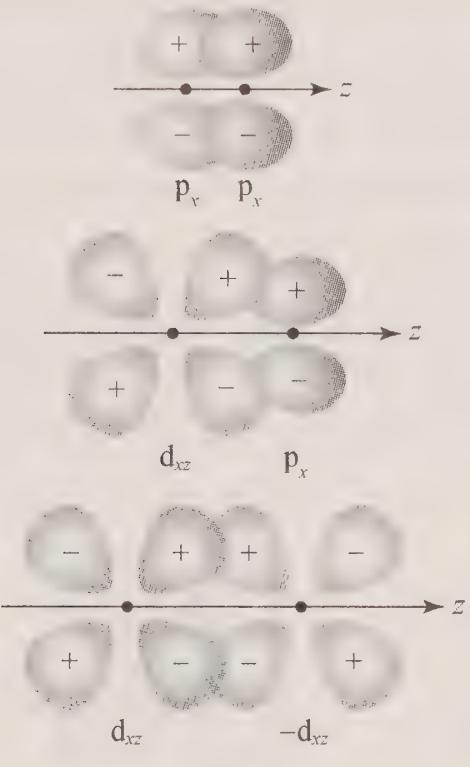

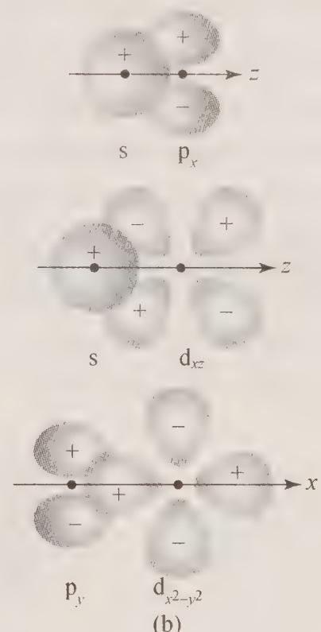  
图 3.3.1 轨道重叠时的对称性条件  
(a) 成键轨道，(b) 非键轨道

$$
E _ {2} = \frac {1}{2} \left[ (E _ {\mathrm{a}} + E _ {\mathrm{b}}) + \sqrt {(E _ {\mathrm{b}} - E _ {\mathrm{a}}) ^ {2} + 4 \beta^ {2}} \right] = E _ {\mathrm{b}} + U
$$

式中 $U = \frac{1}{2}\left[\sqrt{(E_{\mathrm{b}} - E_{\mathrm{a}})^2 + 4\beta^2} - (E_{\mathrm{b}} - E_{\mathrm{a}})\right] > 0$ 。因为 $U > 0$ ，所以如图3.3.2所示，能级高低关系为 $E_{1} < E_{\mathrm{a}} < E_{\mathrm{b}} < E_{2}:E_{1}$ 是成键轨道的能级， $E_{2}$ 是反键轨道的能级。 $E_{1}$ 比 $E_{\mathrm{a}}$ 还要低，降低值为 $U;E_{2}$ 比 $E_{\mathrm{b}}$ 还要高，升高值为 $U$ 。

$U$ 不仅和 $\beta$ 有关，而且与 $(E_{\mathrm{b}} - E_{\mathrm{a}})$ 的差值有关。当 $E_{\mathrm{a}} = E_{\mathrm{b}}$ 时， $U = |\beta |, \beta$ 是负值，所得结果和3.2节解 $\mathrm{H}_2^+$ 所得的(3.2.11)和(3.2.12)式结果相同；当 $(E_{\mathrm{b}} - E_{\mathrm{a}})\gg |\beta|$ 时， $U \approx 0, E_1 \approx E_{\mathrm{a}}, E_2 \approx E_{\mathrm{b}}$ 。从3.2节中的(3.2.9)式出发，如将 $E$ 值分别用 $E_1 = E_{\mathrm{a}} - U$ 和 $E_2 = E_{\mathrm{b}} + U$ 代入，化简得

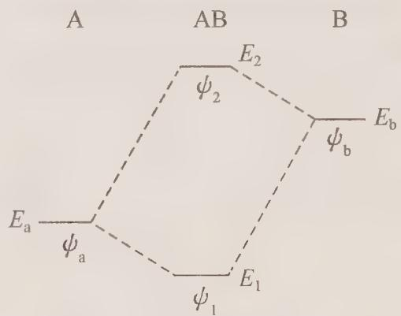

$$
\begin{array}{l} \left(\frac {c _ {\mathrm{b}}}{c _ {\mathrm{a}}}\right) _ {1} = - \frac {U}{\beta} \approx 0, \quad \psi_ {1} \approx \psi_ {\mathrm{a}} \\ \left(\frac {c _ {\mathrm{a}}}{c _ {\mathrm{b}}}\right) _ {2} = \frac {U}{\beta} \approx 0, \quad \psi_ {2} \approx \psi_ {\mathrm{b}} \end{array}
$$

分子轨道 $\psi_{1}$ 和 $\psi_{2}$ 还原为原子轨道 $\psi_{a}$ 和 $\psi_{b}$ ，不能有效成键。

图3.3.2 能级高低不同的原子轨道组成分子轨道的能级高低关系

## 3. 关于反键轨道

在讨论分子轨道问题时,对于反键轨道应予以充分的重视,其原因是:

（1）反键轨道是整个分子轨道中不可缺少的组成部分，反键轨道几乎占总分子轨道数的一半，它和成键轨道、非键轨道一起按能级高低排列，共同组成分子轨道。

(2) 反键轨道具有和成键轨道相似的性质,每一轨道也可按 Pauli 原理、能量最低原理和 Hund 规则安排电子,只不过能级较相应的成键轨道高,轨道的形状不同。

（3）在形成化学键的过程中，反键轨道并不都是处于排斥的状态，有时反键轨道和其他轨道相互重叠，也可以形成化学键，降低体系的能量，促进分子稳定地形成。利用分子轨道理论能成功地解释和预见许多化学键的问题，反键轨道参与作用常常是其中的关键所在。在后面讨论分子的化学键性质时，将会经常遇到反键轨道的作用问题。

(4) 反键轨道是了解分子激发态性质的关键。

## 3.3.2 分子轨道的分类和分布特点

按照分子轨道沿键轴分布的特点,可以分为 $\sigma$ 轨道、 $\pi$ 轨道和 $\delta$ 轨道 3 种,图 3.3.3 示出沿键轴一端观看时 3 种分子轨道的特点。

  
(a) $\sigma$ 轨道

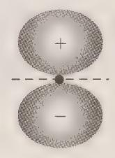  
(b) $\pi$ 轨道

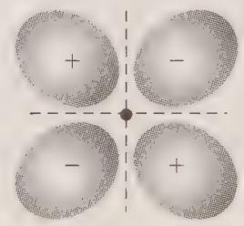  
(c) $\delta$ 轨道  
图3.3.3 沿键轴一端观看时3种分子轨道的特点（虚线表示节面）

## 1. $\sigma$ 轨道和 $\sigma$ 键

从 $\mathrm{H}_2^+$ 分子的结构知道，两个氢原子的1s轨道线性组合成两个分子轨道，这两个轨道的分布是圆柱对称的，对称轴就是连接两个原子核的键轴。任意转动键轴，分子轨道的符号和大小都不改变，这样的轨道称为 $\sigma$ 轨道。由1s原子轨道组成的成键 $\sigma$ 轨道用 $\sigma_{1s}$ 表示，反键轨道用 $\sigma_{1s}^{*}$ 表示；由2s原子轨道组成的成键 $\sigma$ 轨道以 $\sigma_{2s}$ 表示，反键轨道则以 $\sigma_{2s}^{*}$ 表示。

除 s 轨道相互间可组成 $\sigma$ 轨道外，p 轨道和 p 轨道，p 轨道和 s 轨道也可组成 $\sigma$ 轨道。图 3.3.4 是各种 $\sigma$ 轨道的示意图。

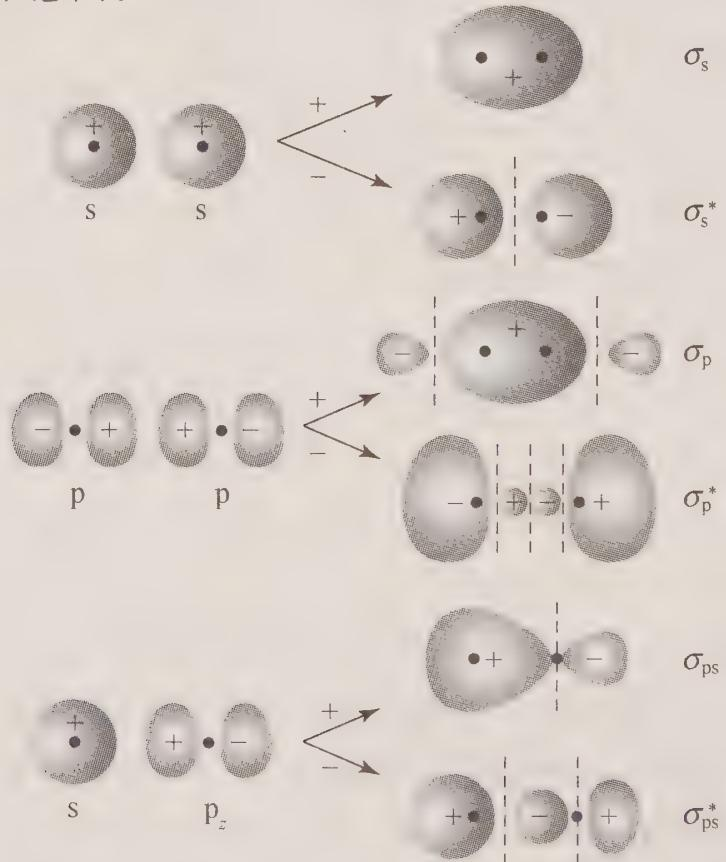  
图3.3.4 由s和p轨道组成的 $\sigma$ 轨道示意图

在 $\sigma$ 轨道上的电子称为 $\sigma$ 电子。由 $\sigma$ 电子形成的共价键称为 $\sigma$ 键。图3.3.5示意出 $\mathrm{H}_2^+$ ， $\mathrm{H}_2$ 和 $\mathrm{He}_2^+$ 通过 $\sigma$ 键形成分子的情况。在 $\mathrm{H}_2^+$ 中由1个 $\sigma$ 电子占据成键轨道，称为单电子 $\sigma$ 键。 $\mathrm{H}_2^+$ 不如 $\mathrm{H}_2$ 稳定，因为它只有1个电子占据成键轨道，容易接受外来电子形成 $\mathrm{H}_2$ 。而在 $\mathrm{He}_2^+$ 中，2个电子在成键轨道，1个电子在反键轨道，成键电子数超过反键电子数，故能够存在。光谱实验证明，确实有 $\mathrm{He}_2^+$ 。这种由相应的成键和反键两个轨道中的3个电子组成的 $\sigma$ 键称为三电子 $\sigma$ 键。三电子键的稳定性和单电子键相似，因为一个反键电子抵消了一个成键电子。 $\mathrm{He}_2$ 是不存在的，因为它有4个电子，成键轨道的2个电子能级降低和反键轨道的2个电子能级升高互相抵消了。由此可以推论，原子的内层电子在形成分子时成键作用与反键作用抵消，它们基本上仍在原来的原子轨道上。

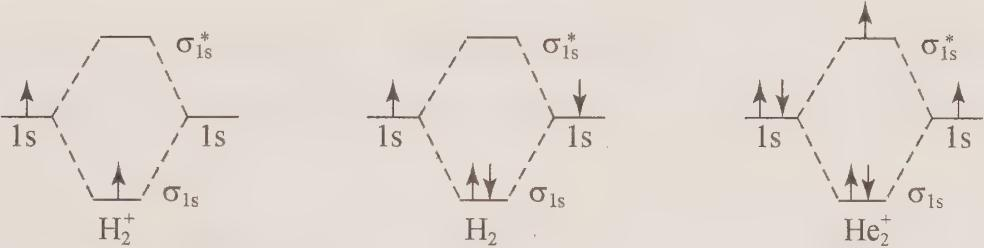  
图3.3.5 $\mathbf{H}_2^+$ ， $\mathbf{H}_2$ 和 $\mathrm{He}_2^+$ 的电子排布图

## 2. $\pi$ 轨道和 $\pi$ 键

取键轴沿 $z$ 轴方向，原子的 $\mathrm{p}_x$ 和 $\mathrm{p_y}$ 轨道的极大值方向均和键轴垂直。当2个原子沿 $z$ 轴靠近，2个 $\mathrm{p}_x$ 轨道沿键轴方向肩并肩地重叠，组成 $\pi$ 轨道。图3.3.6(a)示出乙烯分子中2个C原子的 $2\mathrm{p}_x$ 轨道的大小、形状和数值以及沿 $z$ 轴叠加的图形；图3.3.6(b)简单地示意出两个轨道符号相同地叠加（下方），以及符号相反地叠加（上方）的情况。

当两轨道符号相同叠加时，通过键轴有一个节面，在键轴两侧电子云比较密集，这种分子轨道的能级较相应的原子轨道低，称为成键轨道，以 $\pi_{\mathrm{p}}$ 表示。当两轨道符号相反叠加时，不仅通过键轴有一个节面，而且在两核之间波函数互相抵消，垂直键轴又出现一节面，这种轨道能级较高，称为反键轨道，以 $\pi_{\mathrm{p}}^{*}$ 表示。凡是通过键轴有一个节面的轨道都称为 $\pi$ 轨道。在 $\pi$ 轨道上的电子称为 $\pi$ 电子，由成键 $\pi$ 电子构成的共价键叫作 $\pi$ 键。同样，根据 $\pi$ 电子数是1个、2个或3个，分别称为单电子 $\pi$ 键、 $\pi$ 键（即二电子 $\pi$ 键）和三电子 $\pi$ 键。一对 $\pi$ 电子和一对 $\pi^{*}$ 电子不能构成共价键，因为成键作用和反键作用互相抵消，没有能量降低效应。

## 3. $\delta$ 轨道和 $\delta$ 键

通过键轴有两个节面的分子轨道称为 $\delta$ 轨道。 $\delta$ 轨道不能由 s 或 p 原子轨道组成。若键轴方向为 $z$ 轴方向，则 2 个 $\mathrm{d}_{xy}$ 或 2 个 $\mathrm{d}_{x^2} y^2$ 轨道重叠可形成 $\delta$ 轨道。在某些过渡金属化合物（如 $\mathrm{Re}_2\mathrm{Cl}_8^2$ 离子）中就有这种分子轨道。图 3.3.7 示出 2 个 $\mathrm{d}_{xy}$ 轨道互相重叠形成 $\delta$ 轨道的情形。

分子轨道还可根据对称性来区分。对于同核双原子分子，若以键轴中心为坐标原点，当对原点中心对称时，以下标符号“g”表示；对该点中心反对称时，以下标符号“u”表示。对于由同种原子轨道组合成的分子轨道， $\sigma$ 轨道是中心对称的， $\sigma^{*}$ 轨道是中心反对称的； $\pi$ 轨道是中心反对称的， $\pi^{*}$ 轨道是中心对称的。

在讨论化学键性质时,还引进键级概念,以表达键的强弱。对定域键:

$$
\mathrm{键级} = \frac {1}{2} (\mathrm{成键电子数} - \mathrm{反键电子数})
$$

键级高，键强。 $\mathrm{H}_{2}$ 的键级为 $1, \mathrm{H}_{2}^{+}$ 为 $1 / 2; \mathrm{He}_{2}^{+}$ 为 $1 / 2$ （参见图3.3.5）。 $\mathrm{He}_{2}$ 的键级为0，故不成键。键级可看作两原子间共价键的数目。

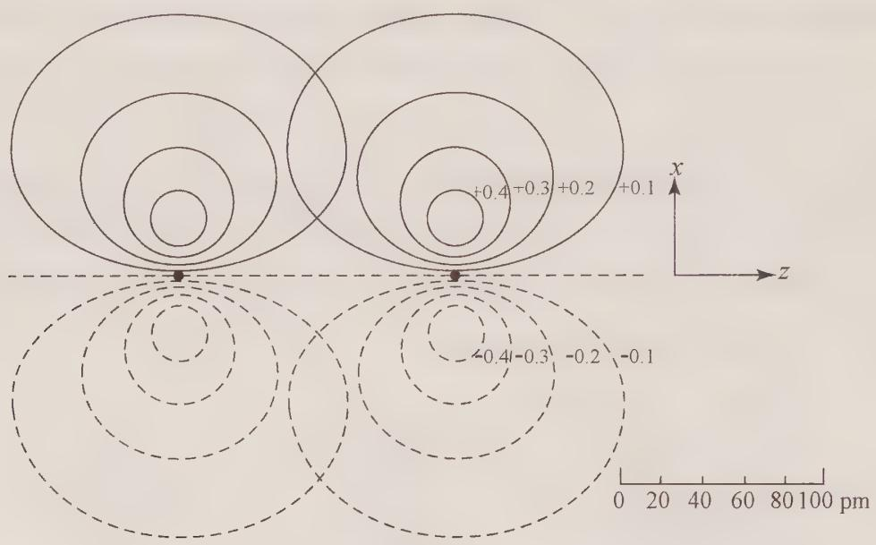

(a)  
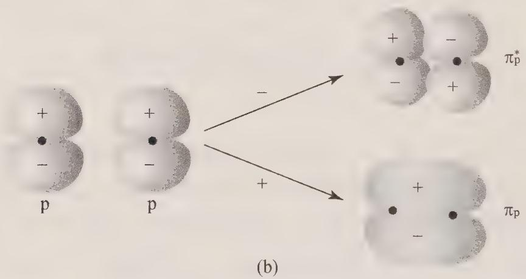  
图3.3.6 由2个原子的 $\mathbf{p}$ 轨道组成分子的 $\pi$ 轨道示意图  
(a) 乙烯分子中 2 个 C 原子的 $2\mathrm{p}_x$ 轨道的大小形状和数值以及沿 $z$ 轴的叠加

(b) 2个 $2\mathrm{p}_x$ 轨道肩并肩、符号相同地叠加(下方)以及符号相反地叠加(上方)的简单示意图

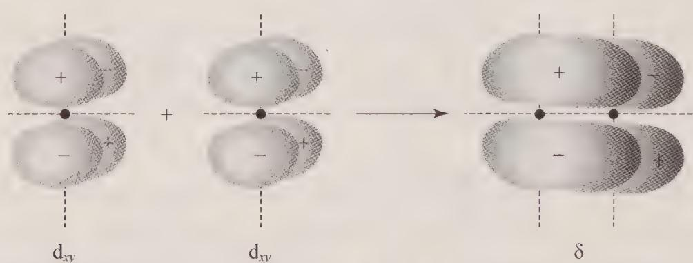  
图3.3.7 由2个 $\mathbf{d}_{xy}$ 轨道重叠而成的 $\delta$ 轨道  
图中虚线表示通过原子核的节面

## 3.3.3 同核双原子分子的结构

下面先讨论 $\mathrm{H}_{2}$ 分子的结构，再讨论其他双原子分子的结构。

$\mathrm{H}_{2}$ 分子基态的电子组态为 $(\sigma_{1\mathrm{s}})^2$ ，如图3.3.5所示。图中表示两个电子均处在 $\sigma_{1\mathrm{s}}$ 轨道，而自旋状态不同，一个为 $\alpha$ ，另一个为 $\beta$ 。描述 $\mathrm{H}_{2}$ 分子轨道的波函数为

$$
\psi_ {\mathrm{轨道}} = \sigma_ {1 \mathrm{s}} (1) \sigma_ {1 \mathrm{s}} (2)
$$

对于多电子体系,必须考虑 Pauli 原理。对称的 $\psi_{轨道}$ 必须乘以反对称的自旋函数:

$$
\frac {1}{\sqrt {2}} \left[ \alpha (1) \beta (2) - \alpha (2) \beta (1) \right]
$$

使全波函数 $\psi_{全}$ 为反对称, 即

$$
\psi_ {\text {全}} = \sigma_ {1 \mathrm{s}} (1) \sigma_ {1 \mathrm{s}} (2) \frac {1}{\sqrt {2}} [ \alpha (1) \beta (2) - \alpha (2) \beta (1) ]
$$

若用 Slater 行列式表示,则为

$$
\psi_ {\text {全}} = \frac {1}{\sqrt {2}} \left| \begin{array}{c c} \sigma_ {1 \mathrm{s}} (1) \alpha (1) & \sigma_ {1 \mathrm{s}} (1) \beta (1) \\ \sigma_ {1 \mathrm{s}} (2) \alpha (2) & \sigma_ {1 \mathrm{s}} (2) \beta (2) \end{array} \right|
$$

用上述分子轨道求得 $H_{2}$ 分子能量最低值对应的核间距离为 73 pm，能量降低值（相对于两个 H 原子）为 $336.7 \, kJ mol^{-1}$ 。而实验测定的平衡核间距为 74.12 pm，平衡解离能 $D_{e}$ 为 $458.0 \, kJ mol^{-1}$ （参看图 3.4.2）。能量数值符合得不太好。

对其他同核双原子分子的结构，需要考虑各个分子轨道能级的高低。分子轨道的能级由两个因素决定，即构成分子轨道的原子轨道类型和原子轨道的重叠情况。从原子轨道的能级考虑，在同核双原子分子中，能级最低的分子轨道是由1s原子轨道组合成的 $\sigma_{1s}$ 和 $\sigma_{1s}^{*}$ ，其次是由2s轨道组合成的分子轨道 $\sigma_{2s}$ 和 $\sigma_{2s}^{*}$ ，再次是由2p原子轨道组合成的三对分子轨道。这是由于1s能级低于2s能级，2s能级低于2p能级。从价层轨道的重叠情况考虑，在核间距离不是相当小的情况下，一般两个2s轨道或两个 $2\mathrm{p}_z$ 轨道之间的重叠比两个 $2\mathrm{p}_x$ 或两个 $2\mathrm{p}_y$ 轨道之间的重叠大，即形成 $\sigma$ 键的轨道重叠比形成 $\pi$ 键的轨道重叠大，因此成键和反键 $\pi$ 轨道间的能级间隔比成键和反键 $\sigma$ 轨道间的能级间隔小。根据这种分析，第二周期同核双原子分子的价层分子轨道能级顺序为

$$
\sigma_ {2 \mathrm{s}} <   \sigma_ {2 \mathrm{s}} ^ {*} <   \sigma_ {2 \mathrm{p} _ {z}} <   \pi_ {2 \mathrm{p} _ {x}} = \pi_ {2 \mathrm{p} _ {y}} <   \pi_ {2 \mathrm{p} _ {x}} ^ {*} = \pi_ {2 \mathrm{p} _ {y}} ^ {*} <   \sigma_ {2 \mathrm{p} _ {z}} ^ {*}
$$

然而，由于s-p混杂会使能级高低发生改变，这种顺序不是固定不变的。当价层2s和 $2p_{z}$ 原子轨道能级相近时，由它们组成的对称性相同的分子轨道，能进一步相互作用，混杂在一起组成新的分子轨道。这种分子轨道间的相互作用称为s-p混杂。它和原子轨道的杂化概念不同，原子轨道的杂化是指同一个原子中能级相近的原子轨道线性组合而成新的原子轨道的过程。

图 3.3.8 示出 s-p 混杂对同核双原子分子的分子轨道形状及能级的影响。图中左边是忽略 s-p 混杂时分子轨道的能级和形状；右边是对称性相同的 $\sigma_{2s}$ 和 $\sigma_{2p_{z}}$ 以及 $\sigma_{2s}^{*}$ 和 $\sigma_{2p_{z}}^{*}$ 相互作用后所得的分子轨道的能级和形状。由于各个分子轨道已不单纯是相应原子轨道的叠加，不能再用 $\sigma_{2s}, \sigma_{2p}$ 等符号表示，而改用 $1\sigma_{g}, 1\sigma_{u}$ 等符号表示， $\sigma_{g}$ 为中心对称，没有垂直于键轴的节面， $\sigma_{u}$ 为中心反对称，具有垂直于键轴的节面。分子轨道能级高低的次序为

$$
1 \sigma_ {\mathrm{g}} <   1 \sigma_ {\mathrm{u}} <   1 \pi_ {\mathrm{u}} (2 \text {个}) <   2 \sigma_ {\mathrm{g}} <   1 \pi_ {\mathrm{g}} (2 \text {个}) <   2 \sigma_ {\mathrm{u}}
$$

分子轨道形状也明显地改变， $1\sigma_{\mathrm{u}}$ 和 $2\sigma_{\mathrm{g}}$ 在核间已变得很小，轨道性质相对地分别变为弱反键和弱成键了。

根据第二周期元素的价轨道能级高低数据，F，O等元素，其2s和2p轨道能级差值大，s-p混杂少，不改变原有由各相应原子轨道组成的分子轨道的能级顺序；而N，C，B等元素，其2s和2p轨道能级差值小，s-p混杂显著，出现能级高低变化， $2\sigma_{g}$ 高于 $1\pi_{u}$ 。

根据分子轨道的能级高低次序, 就可以按 Pauli 原理、能量最低原理和 Hund 规则排出分

子在基态时的电子组态。

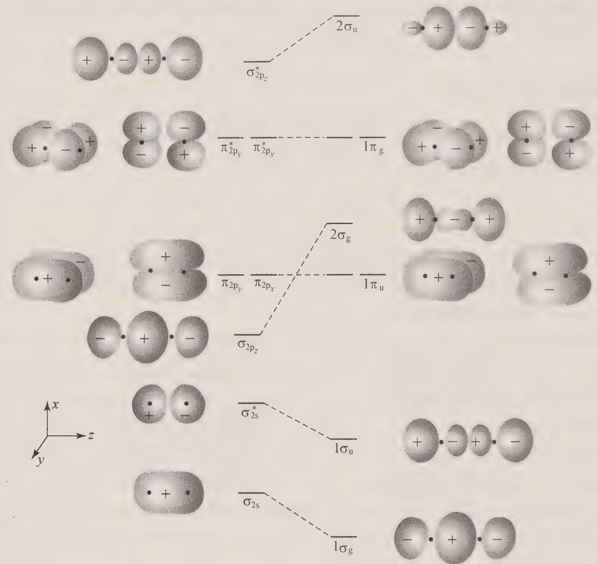  
图3.3.8 s-p混杂对同核双原子分子的价层分子轨道形状和能级的影响

对于由主量子数为 3 或 3 以上的原子轨道组合成的分子轨道, 其能级高低次序难以简单地预言, 需要根据更多的实验数据来确定。

下面分别讨论几种同核双原子分子的电子结构和性质。

$$
\Delta
$$

【例3.3.1】 $\mathrm{F}_2$

$F_{2}$ 的价电子组态为

$$
\left(\sigma_ {2 \mathrm{s}}\right) ^ {2} \left(\sigma_ {2 \mathrm{s}} ^ {*}\right) ^ {2} \left(\sigma_ {2 \mathrm{p} _ {z}}\right) ^ {2} \left(\pi_ {2 \mathrm{p}}\right) ^ {4} \left(\pi_ {2 \mathrm{p}} ^ {*}\right) ^ {4}
$$

除了 $(\sigma_{2\mathrm{p}_z})^2$ 形成共价单键外，尚有3对成键电子和3对反键电子，它们互相抵消，不能有效成键，相当于每个F原子提供3对孤对电子，可记为

$$
\begin{array}{c} \ddots \\ \ddots \end{array} \mathrm{F} - \mathrm{F}:
$$

【例3.3.2】 $\mathrm{O}_2$

$\mathrm{O}_2$ 的价电子组态为

$$
\left(\sigma_ {2 s}\right) ^ {2} \left(\sigma_ {2 s} ^ {*}\right) ^ {2} \left(\sigma_ {2 p _ {z}}\right) ^ {2} \left(\pi_ {2 p _ {x}}\right) ^ {2} \left(\pi_ {2 p _ {y}}\right) ^ {2} \left(\pi_ {2 p _ {x}} ^ {*}\right) ^ {1} \left(\pi_ {2 p _ {y}} ^ {*}\right) ^ {1}
$$

$\mathrm{O}_2$ 比 $\mathrm{F}_2$ 少2个电子，因为2个反键 $\pi^*$ 轨道能级高低一样，按照Hund规则电子应分占两个轨道，且自旋相同。实验证明氧分子是顺磁性的，证实 $\mathrm{O}_2$ 确有自旋相同的未成对电子。根据氧分子的分子轨道， $\mathrm{O}_2$ 相当于生成1个 $\sigma$ 键和2个三电子 $\pi$ 键，可记为

$$
\begin{array}{c} \bullet \\ \bullet \end{array} \equiv \begin{array}{c} \bullet \\ \bullet \end{array}
$$

此处以小圆点表示参与成键的 $\pi$ 电子，以虚线表示形成的 $\pi$ 键，这种表示方法在离域 $\pi$ 键中常用。每个三电子 $\pi$ 键能量上只相当于半个键。 $\mathrm{O}_2$ 分子的键级为2，相当于 $\mathrm{O} = \mathrm{O}$ 双键。

【例3.3.3】 $\mathbf{N}_2$

$\mathrm{N}_2$ 的价电子组态为

$$
(1 \sigma_ {\mathrm{g}}) ^ {2} (1 \sigma_ {\mathrm{u}}) ^ {2} (1 \pi_ {\mathrm{u}}) ^ {4} (2 \sigma_ {\mathrm{g}}) ^ {2}
$$

见图3.3.8。由光电子能谱数据可以证明（见3.6节）， $\mathrm{N}_2$ 的三重键为1个 $\sigma$ 键 $[(1\sigma_{\mathrm{g}})^2]$ ，2个 $\pi$ 键 $[(1\pi_{\mathrm{u}})^4]$ ，键级为3。而 $(1\sigma_{\mathrm{u}})^2$ 和 $(2\sigma_{\mathrm{g}})^2$ 分别具有弱反键和弱成键性质，实际上成为参加成键作用很小的两对孤对电子，可记为： $\mathrm{N} \equiv \mathrm{N}$ 。所以 $\mathrm{N}_2$ 的键长特别短，只有 $109.8\mathrm{pm}$ ；键能特别大，达 $942\mathrm{kJ mol}^{-1}$ ，是惰性较大的分子。

【例3.3.4】 $\mathrm{C}_2$

$\mathrm{C}_{2}$ 的价电子组态为

$$
(1 \sigma_ {\mathrm{g}}) ^ {2} (1 \sigma_ {\mathrm{u}}) ^ {2} (1 \pi_ {\mathrm{u}}) ^ {4}
$$

由于 s-p 混杂, $1\sigma_{u}$ 为弱反键轨道, $C_{2}$ 的键级应在 2\~3 之间,这与 $C_{2}$ 的键能(602 kJ mol $^{-1}$ )和键长(124.3 pm)的实验数据一致(见习题3.5)。

【例3.3.5】 $\mathrm{B}_2$

$\mathrm{B}_{2}$ 的价电子组态为

$$
(1 \sigma_ {\mathrm{g}}) ^ {2} (1 \sigma_ {\mathrm{u}}) ^ {2} (1 \pi_ {\mathrm{u}}) ^ {2}
$$

其中 $1\sigma_{\mathrm{u}}$ 为弱反键轨道，在 $1\pi_{\mathrm{u}}$ 上的2个电子应处在2个能级简并的轨道上，自旋相同，形成2个单电子键。从这些情况可预见 $\mathbf{B}_2$ 为顺磁性分子，B—B间键级介于 $1\sim 2$ 之间。实验测定 $\mathrm{B}_2$ 为顺磁性分子，B—B键长为 $158.9~\mathrm{pm}$ ，较B—B单键共价半径和（ $164~\mathrm{pm})$ 短，键能为 $274\mathrm{kJ mol^{-1}}$ 。

表 3.3.1 列出若干同核双原子分子的键长和键解离能的数据, 其中键解离能表示

$$
\mathrm{A} _ {2} (\mathrm{g}) \longrightarrow \mathrm{A} (\mathrm{g}) + \mathrm{A} (\mathrm{g})
$$

所需能量。

表 3.3.1 同核双原子分子和离子的键长及键解离能

<table><tr><td>分子</td><td>键级</td><td>键长/pm</td><td>键解离能/(kJ mol-1)</td></tr><tr><td>B2</td><td>1~2</td><td>158.9</td><td>274.1</td></tr><tr><td>Br2</td><td>1</td><td>228.09</td><td>190.12</td></tr><tr><td>C2</td><td>2~3</td><td>124.25</td><td>602</td></tr><tr><td>Cl2</td><td>1</td><td>198.8</td><td>239.24</td></tr><tr><td>F2</td><td>1</td><td>141.7</td><td>155</td></tr><tr><td>H2</td><td>1</td><td>74.12</td><td>431.96</td></tr><tr><td>H2+</td><td>0.5</td><td>106</td><td>255.48</td></tr><tr><td>He2+</td><td>0.5</td><td>108.0</td><td>322.2</td></tr><tr><td>I2</td><td>1</td><td>266.66</td><td>148.74</td></tr><tr><td>K2</td><td>1</td><td>392.3</td><td>49.4</td></tr><tr><td>Li2</td><td>1</td><td>267.2</td><td>110.0</td></tr><tr><td>N2</td><td>3</td><td>109.76</td><td>941.69</td></tr><tr><td>N2+</td><td>2.5</td><td>111.6</td><td>842.15</td></tr><tr><td>Na2</td><td>1</td><td>307.8</td><td>72.4</td></tr><tr><td>O2</td><td>2.0</td><td>120.74</td><td>493.54</td></tr><tr><td>O2+</td><td>2.5</td><td>112.27</td><td>626</td></tr><tr><td>O2-</td><td>1.5</td><td>126</td><td>392.9</td></tr><tr><td>O22-</td><td>1.0</td><td>149</td><td>138</td></tr><tr><td>P2</td><td>3</td><td>189.37</td><td>477</td></tr></table>

## 3.3.4 异核双原子分子的结构

异核双原子分子不像同核双原子分子那样可利用相同的原子轨道进行组合,但是组成分子轨道的条件仍须满足。异核原子间内层电子的能级高低可以相差很大,但最外层电子的能级高低总是相近的。异核原子间可利用最外层轨道组合成分子轨道。下面分别以 CO, NO 和 HF 为例,说明异核双原子分子的结构。

【例3.3.6】 CO

CO 和 $N_{2}$ 是等电子分子, 它们在分子轨道、成键情况和电子排布上大致相同。基态 CO 分子的价层电子组态为

$$
(1 \sigma) ^ {2} (2 \sigma) ^ {2} (1 \pi) ^ {4} (3 \sigma) ^ {2}
$$

和 $\mathrm{N}_2$ 的差别在于由氧原子提供给分子轨道的电子比碳原子提供的电子多2个，可记为： $\mathrm{C} \rightleftharpoons \mathrm{O}$ ；箭头代表由氧原子提供一对电子形成的配键，两边黑点表示孤对电子。结构的相似性，使CO和 $\mathrm{N}_2$ 的物理性质也相近，如表3.3.2所示。

表 3.3.2 CO 和 ${\mathrm{N}}_{2}$ 的物理性质

<table><tr><td>性质</td><td>CO</td><td> $N_2$ </td></tr><tr><td>熔点/K</td><td>68.1</td><td>63.0</td></tr><tr><td>沸点/K</td><td>81.6</td><td>77.4</td></tr><tr><td>气体密度(298K)/(g dm-3)</td><td>1.229</td><td>1.229</td></tr><tr><td>临界温度/K</td><td>132.9</td><td>126.21</td></tr><tr><td>临界压力/MPa</td><td>3.50</td><td>3.39</td></tr><tr><td>临界体积/(cm3 mol-1)</td><td>93</td><td>90</td></tr></table>

氧原子的电负性比碳原子高，但在CO分子中，由于氧原子单方面向碳原子提供电子，抵消了碳原子和氧原子之间由于电负性差引起的极性，所以CO分子 $\mu = 0.37\times 10^{-30}\mathrm{Cm}$ ，是个偶极矩较小的分子；而且氧原子端显正电性，碳原子端显负电性，在羰基配合物中CO基表现出很强的配位能力，以碳原子端和金属原子结合。

CO 分子的结构、性质及用途是一碳化学和化工领域中的重要研究内容。

【例3.3.7】NO

NO 分子比 CO 分子多 1 个电子, 它的价电子组态为

$$
(1 \sigma) ^ {2} (2 \sigma) ^ {2} (1 \pi) ^ {4} (3 \sigma) ^ {2} (2 \pi) ^ {1}
$$

由于 $2\pi$ 轨道是反键轨道，因而NO分子中出现一个三电子 $\pi$ 键，键级为2.5，分子呈顺磁性。

一氧化氮是美国《科学》(Science)杂志1992年选出的明星分子。在大气中，NO是有害的气体，它破坏臭氧层，造成酸雨，污染环境等，可通过催化分解或催化还原的方法消除NO等氮氧化物，称为 $\mathrm{DENO}_x$ 。但是在人体中，NO容易穿过生物膜，氧化外来物质，在受控制的小剂量情况下，却是极有益的成分。NO作用在大脑、血管、免疫系统、肝脏、肺、子宫、末梢神经等，可以在体内起多方面的作用：调整血压、抵抗微生物入侵、促进消化、传递性兴奋信息、治疗心脏病、帮助大脑学习和记忆，等等。NO分子越来越受到人们的关注。

【例3.3.8】 HF

根据能级高低相近和对称性匹配条件, 氢原子 1s 轨道 ( $-13.6\ eV$ ) 和氟原子的 $2p_{z}$ 轨道 ( $-17.4\ eV$ ) 形成 $\sigma$ 轨道, HF 的价层电子组态为

$$
(\sigma_ {2 \mathrm{s}}) ^ {2} (\sigma) ^ {2} (\pi_ {2 \mathrm{p}}) ^ {4}
$$

有 3 对非键电子, 在 F 原子周围形成 3 对孤对电子, 故可记为 H—F: 。由于 F 的电负性比 H 大, 所以电子云偏向 F, 形成极性共价键, $\mu = 6.60 \times 10^{-30}$ Cm。分子轨道能级示意于图 3.3.9 中。

从 HF 的分子结构可以推论: 对异核双原子分子的成键分子轨道, 电负性高的原子贡献较多; 而反键分子轨道, 电负性小的原子贡献较多。

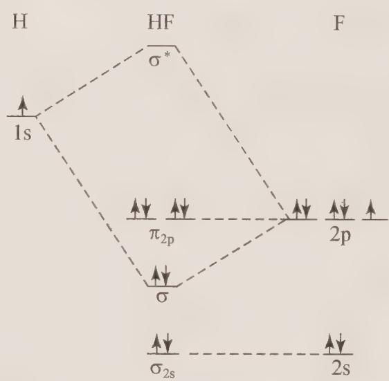  
图3.3.9 HF分子轨道能级示意图

## 3.3.5 双原子分子的光谱项

原子结构中角动量和角动量耦合的知识,可用于双原子分子。原子呈球形对称,双原子分子只是键轴对称,分子轨道角动量只有在键轴方向(z方向)才有意义。分子轨道中单电子角动量轴向分量是量子化的,其值为 $mh/2\pi, m=0, \pm1, \pm2, \cdots$ 。由于电子运动的方向正转和反转能量相同,分子轨道能量只和 $|m|$ 有关,令 $\lambda = |m|$ , $\lambda$ 为分子轨道角动量轴向分量量子数。表3.3.3列出分子轨道的单电子角动量。

表 3.3.3 分子轨道的单电子角动量

<table><tr><td>分子轨道</td><td>m</td><td>λ</td><td>角动量轴向分量</td><td>轨道简并性</td></tr><tr><td>σ轨道</td><td>0</td><td>0</td><td>0</td><td>非简并</td></tr><tr><td>π轨道</td><td>±1</td><td>1</td><td>±h/2π</td><td>二重简并</td></tr><tr><td>δ轨道</td><td>±2</td><td>2</td><td>±2h/2π</td><td>二重简并</td></tr><tr><td>φ轨道</td><td>±3</td><td>3</td><td>±3h/2π</td><td>二重简并</td></tr></table>

根据角动量耦合规则, 分子总的轨道角动量在 z 方向分量 $Mh/2\pi$ 应是各个电子 z 方向分量 $mh/2\pi$ 的代数和, 即

$$
M h / 2 \pi = \sum_ {i} m _ {i} h / 2 \pi
$$

$M$ 的绝对值通常用大写 $\Lambda$ 表示

$$
\Lambda = | M | = \left| \sum_ {i} m _ {i} \right|
$$

$\Lambda$ 不同，双原子分子能量不同，用大写字母 $\Sigma, \Pi, \Delta, \Phi$ 表示 $\Lambda = 0, 1, 2, 3$ 等不同的状态。 $\Lambda \neq 0$ 的状态是二重简并态。

分子中电子的自旋角动量的耦合方式和原子的情况相同。总的自旋角动量为

$$
\sqrt {S (S + 1)} \frac {h}{2 \pi}
$$

式中 S 是总自旋量子数，S=n/2,n 为未成对电子数。总自旋角动量在 z 方向分量的量子数可取 S, S-1, $\cdots$ , -S，共有 $2S+1$ 个值。 $2S+1$ 称为自旋多重度。所以，双原子分子的电子光谱项可用 ${}^{2S+1}\Lambda$ 表示。

双原子分子的光谱项,可根据分子的能级最高占据轨道(HOMO)电子的排布来定。因为基态时能级低于HOMO的价层分子轨道都已被自旋相反的成对电子占据,S=0。若轨道为 $\sigma$ 轨道,m=0;若为 $\pi$ 轨道,因它为二重简并,一对电子取值+m,另一对电子取值-m,正好抵消,所以M=0,S=0。表3.3.4列出双原子分子基态的光谱项。

表 3.3.4 双原子分子基态的光谱项

<table><tr><td>分子</td><td>HOMO组态</td><td>电子排布</td><td>M</td><td> $\Lambda$ </td><td>S</td><td>谱项</td></tr><tr><td> $H_{2}^{+}$ </td><td> $\sigma_{1s}^{1}$ </td><td> $\uparrow$ </td><td>0</td><td>0</td><td>1/2</td><td> $^{2}\Sigma$ </td></tr><tr><td> $H_{2}$ </td><td> $\sigma_{1s}^{2}$ </td><td> $\uparrow\downarrow$ </td><td>0</td><td>0</td><td>0</td><td> $^{1}\Sigma$ </td></tr><tr><td> $F_{2}$ </td><td> $(\pi_{2p}^{*})^{4}$ </td><td> $\uparrow\downarrow$   $\uparrow\downarrow$ </td><td>0</td><td>0</td><td>0</td><td> $^{1}\Sigma$ </td></tr><tr><td> $O_{2}^{a}$ </td><td> $(\pi^{*})^{2}$ </td><td> $\uparrow$   $\uparrow$ </td><td>0</td><td>0</td><td>1</td><td> $^{3}\Sigma$ </td></tr><tr><td></td><td></td><td> $\uparrow\downarrow$  _</td><td>2</td><td>2</td><td>0</td><td> $^{1}\Delta$ </td></tr><tr><td></td><td></td><td> $\uparrow$   $\downarrow$ </td><td>0</td><td>0</td><td>0</td><td> $^{1}\Sigma$ </td></tr><tr><td> $N_{2}$ </td><td> $(2\sigma_{g})^{2}$ </td><td> $\uparrow\downarrow$ </td><td>0</td><td>0</td><td>0</td><td> $^{1}\Sigma$ </td></tr><tr><td> $C_{2}$ </td><td> $(1\pi_{u})^{4}$ </td><td> $\uparrow\downarrow$   $\uparrow\downarrow$ </td><td>0</td><td>0</td><td>0</td><td> $^{1}\Sigma$ </td></tr><tr><td> $B_{2}^{a}$ </td><td> $(1\pi_{u})^{2}$ </td><td> $\uparrow$   $\uparrow$ </td><td>0</td><td>0</td><td>1</td><td> $^{3}\Sigma$ </td></tr><tr><td>CO</td><td> $(3\sigma)^{2}$ </td><td> $\uparrow\downarrow$ </td><td>0</td><td>0</td><td>0</td><td> $^{1}\Sigma$ </td></tr><tr><td>NO</td><td> $(2\pi)^{1}$ </td><td> $\uparrow$  _</td><td>1</td><td>1</td><td>1/2</td><td> $^{2}\Pi$ </td></tr><tr><td>HF</td><td> $(\pi_{2p})^{4}$ </td><td> $\uparrow\downarrow$   $\uparrow\downarrow$ </td><td>0</td><td>0</td><td>0</td><td> $^{1}\Sigma$ </td></tr></table>

$^{a}$ $O_{2}$ 分子的基态谱项为 ${}^{3}\Sigma$ ，是三重态。表中列出 ${}^{1}\Delta$ 为第一激发态， ${}^{1}\Sigma$ 为第二激发态，它们都是单重态，和 $O_{2}$ 的化学反应性能密切相关，常在文献中出现，列出以供参考。 $B_{2}$ 分子也有类似情况。

## 3.4 $\mathrm{H}_{2}$ 分子的结构和价键理论

## 3.4.1 价键法解 $\mathbf{H}_2$ 的结构

$\mathrm{H}_{2}$ 分子有2个原子核和2个电子，坐标如图3.4.1所示。它的Hamilton算符（以原子单位表示）为

△

$$
\begin{array}{r l} \hat {H} & = \left[ - \frac {1}{2} \nabla_ {1} ^ {2} - \frac {1}{r _ {\mathrm{a} _ {1}}} \right] + \left[ - \frac {1}{2} \nabla_ {2} ^ {2} - \frac {1}{r _ {\mathrm{b} _ {2}}} \right] + \left[ - \frac {1}{r _ {\mathrm{a} _ {2}}} - \frac {1}{r _ {\mathrm{b} _ {1}}} + \frac {1}{r _ {1 2}} + \frac {1}{R} \right] \\ & = \hat {H} _ {\mathrm{a}} (1) + \hat {H} _ {\mathrm{b}} (2) + \hat {H} ^ {\prime} \end{array}\tag{3.4.1}
$$

其中 $\hat{H}_{\mathrm{a}}(1)$ 表示电子1在 $\mathrm{H}_{\mathrm{A}}$ 原子中的Hamilton算符； $\hat{H}_{\mathrm{b}}(2)$ 表示电子2在 $\mathrm{H}_{\mathrm{B}}$ 原子中的Hamilton算符； $\hat{H}^{\prime}$ 为两个原子组成氢分子后增加的相互作用的势能算符项。若以

$\psi_{\mathrm{a}} = (1 / \sqrt{\pi})\mathrm{e}^{-r_{\mathrm{a}}}$ 表示氢原子A的基态波函数， $\psi_{\mathrm{b}} = (1 / \sqrt{\pi})\mathrm{e}^{-r_{\mathrm{b}}}$ 表示氢原子B的基态波函数，当两个H原子远离、无相互作用时，体系的波函数为

$$
\psi_ {1} (1, 2) = \psi_ {\mathrm{a}} (1) \psi_ {\mathrm{b}} (2)
$$

或

$$
\psi_ {2} (1, 2) = \psi_ {\mathrm{a}} (2) \psi_ {\mathrm{b}} (1)
$$

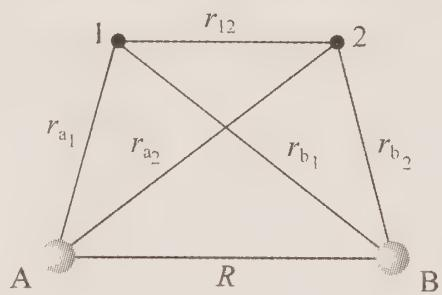  
图3.4.1 $\mathbf{H}_2$ 分子的坐标

式中括号内的1或2表示第1个电子或第2个电子的坐标。显然，由 $\psi_{1}$ 和 $\psi_{2}$ 线性组合所得的波函数也是这个体系的波函数

$$
\psi (1, 2) = c _ {1} \psi_ {1} + c _ {2} \psi_ {2}\tag{3.4.2}
$$

Heitler-London 以 $\psi(1,2)$ 作为 $\mathrm{H}_{2}$ 的近似函数，仿照 3.2 节的线性变分法得到 $\mathrm{H}_{2}$ 分子的波函数和相应的能量

$$
\psi_ {+} = \frac {1}{\sqrt {2 + 2 S _ {1 2}}} (\psi_ {1} + \psi_ {2}) = \frac {1}{\sqrt {2 + 2 S _ {1 2}}} [ \psi_ {\mathrm{a}} (1) \psi_ {\mathrm{b}} (2) + \psi_ {\mathrm{a}} (2) \psi_ {\mathrm{b}} (1) ]\tag{3.4.3}
$$

$$
E _ {+} = \frac {H _ {1 1} + H _ {1 2}}{1 + S _ {1 2}}\tag{3.4.4}
$$

$$
\psi_ {-} = \frac {1}{\sqrt {2 - 2 S _ {1 2}}} (\psi_ {1} - \psi_ {2}) = \frac {1}{\sqrt {2 - 2 S _ {1 2}}} [ \psi_ {\mathrm{a}} (1) \psi_ {\mathrm{b}} (2) - \psi_ {\mathrm{a}} (2) \psi_ {\mathrm{b}} (1) ]\tag{3.4.5}
$$

$$
E _ {-} = \frac {H _ {1 1} - H _ {1 2}}{1 - S _ {1 2}}\tag{3.4.6}
$$

式中积分 $S_{12}, H_{11}$ 和 $H_{12}$ 可进一步表达为

$$
S _ {1 2} = \int \psi_ {1} ^ {*} \psi_ {2} d \tau = \int \psi_ {\mathrm{a}} ^ {*} (1) \psi_ {\mathrm{b}} (2) d \tau_ {1} \int \psi_ {\mathrm{a}} ^ {*} (2) \psi_ {\mathrm{b}} (1) d \tau_ {2} = S _ {\mathrm{ab}} ^ {2} \equiv S ^ {2}
$$

$$
H _ {1 1} = \int \psi_ {1} ^ {*} \hat {H} \psi_ {1} \mathrm{d} \tau = \int \psi_ {\mathrm{a}} ^ {*} (1) \psi_ {\mathrm{b}} ^ {*} (2) [ 2 E _ {\mathrm{H}} + \hat {H} ^ {\prime} ] \psi_ {\mathrm{a}} (1) \psi_ {\mathrm{b}} (2) \mathrm{d} \tau = 2 E _ {\mathrm{H}} + Q\tag{3.4.7}
$$

$$
H _ {1 2} = \int \psi_ {\mathrm{a}} ^ {*} (1) \psi_ {\mathrm{b}} ^ {*} (2) \left[ \hat {H} _ {\mathrm{a}} (1) + \hat {H} _ {\mathrm{b}} (2) + \hat {H} ^ {\prime} \right] \psi_ {\mathrm{a}} (2) \psi_ {\mathrm{b}} (1) \mathrm{d} \tau = 2 E _ {\mathrm{H}} S _ {\mathrm{ab}} ^ {2} + A\tag{3.4.8}
$$

这样

$$
E _ {+} = 2 E _ {\mathrm{H}} + \frac {Q + A}{1 + S ^ {2}}, \quad E _ {-} = 2 E _ {\mathrm{H}} + \frac {Q - A}{1 - S ^ {2}}\tag{3.4.9}
$$

$$
Q = \int \psi_ {\mathrm{a}} ^ {*} (1) \psi_ {\mathrm{b}} ^ {*} (2) \hat {H} ^ {\prime} \psi_ {\mathrm{a}} (1) \psi_ {\mathrm{b}} (2) \mathrm{d} \tau
$$

$$
A = \int \psi_ {\mathrm{a}} ^ {*} (1) \psi_ {\mathrm{b}} ^ {*} (2) \hat {H} ^ {\prime} \psi_ {\mathrm{a}} (2) \psi_ {\mathrm{b}} (1) \mathrm{d} \tau
$$

$Q, A, S$ 等积分都是核间距 $R$ 的函数，在平衡核间距附近， $Q$ 和 $A$ 均为负值，所以 $\mathrm{H}_{2}$ 分子 $\psi_{+}$ 态的能量 $E_{+}$ 比两个无相互作用的氢原子的能量 $(2E_{\mathrm{H}})$ 低；又由于 $|A| > |Q|$ ， $E_{-}$ 则比 $2E_{\mathrm{H}}$ 高。 $E_{+}$ 随 $R$ 变化的曲线上有一最低点，这一最低点对应的 $R$ 即为平衡核间距。Heitler-London法处理 $\mathrm{H}_{2}$ 分子得平衡核间距为 $87~\mathrm{pm}$ ，这时 $E_{+}$ 为 $-303\mathrm{kJmol}^{-1}(-3.14\mathrm{eV})$ ；实验值分别为

74.12 pm 和 $-458 \, kJ mol^{-1} (-4.75 \, eV)$ ，如图 3.4.2 所示。这一结果阐明了 $H_{2}$ 分子稳定存在的原因及共价键的本质。

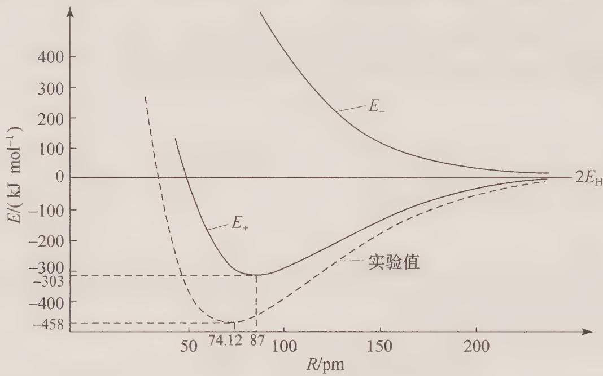  
图3.4.2 $\mathrm{H}_{2}$ 的能量曲线

$\psi_{+}$ 和 $\psi_{-}$ 仅是轨道运动部分的波函数，考虑Pauli原理的要求，包含自旋函数的全波函数应是反对称波函数，能量低的 $\psi_{+}$ 是对称的，相应的自旋函数应是反对称的，这样全波函数

$$
\psi_ {+ (\text {全})} = \psi_ {+} \frac {1}{\sqrt {2}} [ \alpha (1) \beta (2) - \alpha (2) \beta (1) ]\tag{3.4.10}
$$

电子在这个态的总自旋角动量为0，这时两个电子自旋是相反的，自旋角动量沿键轴的分量也为零，即 $m_{s}=0$ 。

能量高的 $\psi$ 是反对称的,相应的自旋波函数应为对称波函数。包含两个电子体系的对称自旋波函数有 3 个:

$$
\begin{array}{l l} \alpha^ {(1)} \alpha^ {(2)} & m _ {s} = 1 \\ \beta^ {(1)} \beta^ {(2)} & m _ {s} = - 1 \\ \frac {1}{\sqrt {2}} [ \alpha^ {(1)} \beta^ {(2)} + \alpha^ {(2)} \beta^ {(1)} ] & m _ {s} = 0 \end{array}
$$

它们可分别和 $\psi_{-}$ 相乘, 得到能级差别很小的 3 个反对称全波函数

$$
\psi_ {- (\text {全})} = \psi_ {-} \left\{ \begin{array}{l l} \alpha (1) \alpha (2) \\ \beta (1) \beta (2) \\ \frac {1}{\sqrt {2}} [ \alpha (1) \beta (2) + \alpha (2) \beta (1) ] \end{array} \right.\tag{3.4.11}
$$

所以和能量高的 $\psi_{-}$ 相对应的是三重态 $^{①}$ 。

电子在分子中的分布可由空间各点概率密度 $(|\psi|^2)$ 数值的大小表示。可以只取波函数的空间部分讨论。对两电子体系，空间波函数 $\psi (x_{1},y_{1},z_{1},x_{2},y_{2},z_{2})$ 在 $P_{1}$ 点 $(x_{1},y_{1},z_{1})$ 附近 $\mathrm{d}\tau_{1}$ 内找到电子1，同时在 $P_{2}$ 点 $(x_{2},y_{2},z_{2})$ 附近 $\mathrm{d}\tau_{2}$ 内找到电子2的概率为 $|\psi |^2\mathrm{d}\tau_1\mathrm{d}\tau_2$ 。若不论电子2在何处， $P_{1}$ 附近 $\mathrm{d}\tau_{1}$ 内找到电子1的概率为 $\left[\int |\psi|^2\mathrm{d}\tau_2\right]\mathrm{d}\tau_1$ ，而在 $P_{1}$ 附近 $\mathrm{d}\tau_{1}$ 内找到2个电子中任意一个电子的概率应为 $2\left[\int |\psi|^2\mathrm{d}\tau_2\right]\mathrm{d}\tau_1$ 。由于波函数对2个电子是等价的，在空间任意一点找到电子1的概率等于在该点找到电子2的概率。这样，当 $\mathrm{H}_{2}$ 处于平衡核间距时，2个电子的总的概率密度函数为

$$
\rho = 2 \int | \psi | ^ {2} \mathrm{d} \tau_ {2} = 2 \int | \psi | ^ {2} \mathrm{d} \tau_ {1}
$$

对稳定态

$$
\rho_ {+} = \rho (1) + \rho (2) = \int \psi_ {+} ^ {2} (1, 2) \mathrm{d} \tau_ {1} + \int \psi_ {+} ^ {2} (1, 2) \mathrm{d} \tau_ {2}
$$

将(3.4.3)式代入积分中,展开,利用归一化条件化简,得

$$
\rho_ {+} = \frac {1}{1 + S ^ {2}} \left[ \psi_ {\mathrm{a}} ^ {2} + \psi_ {\mathrm{b}} ^ {2} + 2 S \psi_ {\mathrm{a}} \psi_ {\mathrm{b}} \right]\tag{3.4.12}
$$

$$
\rho_ {-} = \frac {1}{1 - S ^ {2}} \left[ \psi_ {\mathrm{a}} ^ {2} + \psi_ {\mathrm{b}} ^ {2} - 2 S \psi_ {\mathrm{a}} \psi_ {\mathrm{b}} \right]\tag{3.4.13}
$$

由于 $S = \int \psi_{\mathrm{a}}^{*}\psi_{\mathrm{b}}\mathrm{d}\tau$ ，其值为正，故稳定态核间概率密度增加，对2个核产生吸引能，使体系能量降低；而激发态核间概率密度降低，两核外侧增大，体系能量升高，不稳定。

## 3.4.2 价键理论

上面介绍了 1927 年 Heitler-London 处理 $H_{2}$ 结构的方法, 它成功地阐明了 $H_{2}$ 的结构。到 20 世纪 30 年代 Pauling 等加以发展, 引入杂化轨道概念, 综合成价键理论, 成功地应用于解释双原子分子和多原子分子的结构。价键理论以原子轨道作为近似基函数描述分子中电子的运动规律, 在阐述共价键本质时, 根据 Pauli 原理的要求, 认为一对自旋相反的电子相互接近时, 彼此呈现互相吸引的作用, 使体系能量降低, 形成化学键。例如有一原子 A, 在它的价层原子轨道 $\psi_{a}$ 中有一未成对电子, 另一原子 B, 在它的价层原子轨道 $\psi_{b}$ 中也有一未成对电子, 当 A, B 两原子接近时, 两电子就以自旋相反配对而成键, 这种形成化学键的理论叫价键理论, 或电子配对理论。按此理论, 分子中每一共价单键代表一对成键原子轨道和两个自旋相反的电子。

根据价键理论,为了增加体系的稳定性,各原子价层轨道中未成对电子应尽可能相互配对,以形成最多数目的化学键。若原子 A 和 B 的价层原子轨道中各有一个(两个或三个)未成对电子,这些电子则能配对并构成共价单键(共价双键或叁键)。若原子 A 的价层原子轨道中有两个未成对电子,原子 B 的价层原子轨道中只有一个未成对电子,则一个 A 原子可和两个 B 原子化合成 $AB_{2}$ 分子。所以,原子轨道中未成对电子数即为其原子价。

一种元素的原子价是指它的一个原子和其他原子形成共价键的数目。在形成共价键时，一个电子和另一个电子配对以后，就不能再和其他原子的电子配对了，这就是共价键的饱和性。原子形成分子时，若原子轨道重叠愈多，则形成的共价键愈牢固，所以原子轨道（包括杂化轨道）的取向将影响共价键的方向。

下面举几个例子说明。

【例 3.4.1】 $Li_{2}$

Li 原子的电子组态为 $(1s)^{2}(2s)^{1}$ ，有一个未成对的 2s 电子，能互相配对成单键 Li—Li。

【例3.4.2】 $\mathbf{N}_2$

N 原子的电子组态为 $(1\mathrm{s})^{2}(2\mathrm{s})^{2}(2\mathrm{p}_{x})^{1}(2\mathrm{p}_{y})^{1}(2\mathrm{p}_{z})^{1}$ ，若键轴为 z 方向， $2p_{z}$ 电子可相互配对形成 $\sigma$ 键，2 个 $2p_{x}$ 和 $2p_{y}$ 电子可两两配对形成 2 个 $\pi$ 键。所以， $N_{2}$ 分子含有三重键： $N \equiv N:$ 。在此结构中，由于每个 N 原子的 2s 电子已经成对，不再在原子间成键，而以孤对电子的形式出现。

【例 3.4.3】 $O_{2}$

O 原子的电子组态为 $(1\mathrm{s})^{2}(2\mathrm{s})^{2}(2\mathrm{p}_{x})^{2}(2\mathrm{p}_{y})^{1}(2\mathrm{p}_{z})^{1}$ ，每个 O 原子都有 2 个未成对电子，其中 $2p_{z}$ 电子配对成 $\sigma$ 键， $2p_{y}$ 电子配对成 $\pi$ 键， $O_{2}$ 为双键： $\ddot{O}=\ddot{O}$ 。实验测定 $O_{2}$ 分子为顺磁性，说明 $O_{2}$ 分子中有未成对电子。价键法结果与此矛盾，说明价键法过于强调电子配对而带有片面性，用分子轨道理论处理 $O_{2}$ 分子，所得磁性结果与实验符合。

【例3.4.4】 CO

C 原子的电子组态为 $(1s)^{2}(2s)^{2}(2p_{y})^{1}(2p_{z})^{1}$ ，C 和 O 原子各有 2 个未成对电子，可以互相配对形成双键 C=O。但实验证明 CO 的键能、键长及力常数都相当于叁键。如果认为在形成化学键的瞬间发生反应

$$
\mathrm{O} + \mathrm{C} \longrightarrow \mathrm{O} ^ {+} + \mathrm{C} ^ {-}
$$

造成两个原子各自均有3个未成对电子，从而形成叁键，可记为 $-\mathrm{C} \equiv \mathrm{O}^{+}$ 或： $\mathrm{C} \rightleftharpoons \mathrm{O}$ ：

## 3.4.3 价键理论和分子轨道理论的比较

价键(VB)理论和分子轨道(MO)理论是处理共价键的两个基本理论,怎样评价它们?下面以 $H_{2}$ 为例通过几点对比来说明。

## 1. 在数学处理上选用的变分函数不同

价键法以原子轨道作为基函数,进行变分法处理,定变分参数;简单分子轨道法先将原子轨道进行线性组合成分子轨道,以分子轨道作为基函数进行变分法处理。这样,VB法中成键的两个电子依然保持自己原子的特色,这个键只和成键的原子有关,具有定域键概念。而MO法中,每个分子轨道都涉及整个分子,具有离域键概念。

## 2. 由于选用的基函数不同,所得结果也不相同

对于描述 $H_{2}$ 分子基态的波函数,两个方法所得结果略有差异:

$$
\psi_ {\mathrm{VB}} = \frac {1}{\sqrt {2 + 2 S ^ {2}}} \big [ \psi_ {\mathrm{a}} (1) \psi_ {\mathrm{b}} (2) + \psi_ {\mathrm{a}} (2) \psi_ {\mathrm{b}} (1) \big ]\tag{3.4.14}
$$

$$
\psi_ {\mathrm{MO}} = \frac {1}{\sqrt {2 + 2 S}} \left[ \psi_ {\mathrm{a}} (1) + \psi_ {\mathrm{b}} (1) \right] \left[ \psi_ {\mathrm{a}} (2) + \psi_ {\mathrm{b}} (2) \right]\tag{3.4.15}
$$

(3.4.15)式是用简单分子轨道法近似求解 $\mathrm{H}_{2}$ 分子结构时，把 $\mathrm{H}_{2}$ 分子中的每个电子看成是在两个核(A和B)及另一个电子所形成的势场中运动，并把电子势能函数 $V$ 作为电子本身坐标的函数。对于 $\mathrm{H}_{2}$ 分子中的一个电子，Schrödinger方程为

$$
- \frac {h ^ {2}}{8 \pi^ {2} m} \nabla^ {2} \psi + V \psi = E \psi
$$

它近似地描写了 $\mathrm{H}_{2}$ 分子中一个电子的独立运动情况，整个 $\mathrm{H}_{2}$ 分子的波函数 $\psi(1,2)$ 可认为是2个电子的单电子波函数的乘积

$$
\psi (1, 2) = \psi (1) \psi (2)
$$

电子在 $\mathrm{H}_{2}$ 分子中A、B两核周围运动，可近似地用 $\mathrm{H}_{2}^{\top}$ 的LCAO-MO表示。电子1和电子2均可处在 $\sigma_{1s}$ 分子轨道上，这样，将未归一化的波函数

$$
\psi (1) = \psi_ {\mathrm{a}} (1) + \psi_ {\mathrm{b}} (1), \quad \psi (2) = \psi_ {\mathrm{a}} (2) + \psi_ {\mathrm{b}} (2)
$$

代入 $\psi(1,2)$ 并进行归一化，即得 (3.4.15) 式。

由(3.4.14)，(3.4.15)两式可见，除归一化系数略有不同外，若将 $\psi_{\mathrm{MO}}$ 展开，则得

$$
\psi_ {\mathrm{MO}} = \frac {1}{\sqrt {2 + 2 S}} \left[ \psi_ {\mathrm{a}} (1) \psi_ {\mathrm{b}} (2) + \psi_ {\mathrm{a}} (2) \psi_ {\mathrm{b}} (1) + \psi_ {\mathrm{a}} (1) \psi_ {\mathrm{a}} (2) + \psi_ {\mathrm{b}} (1) \psi_ {\mathrm{b}} (2) \right]\tag{3.4.16}
$$

括号中的前两项和 $\psi_{VB}$ 相同, 它们可看作 2 个电子分别处于不同原子的原子轨道中, 称为“共价项”; 后两项则可看作 2 个电子都处于同一原子的轨道中, 相当于 $H_{a}^{-}H_{b}^{+}$ 和 $H_{a}^{+}H_{b}^{-}$ , 称为“离子项”。

在 $\mathrm{H}_{2}$ 中，2个电子为两个原子所共有，它们同时在某一核附近的概率是存在的，但不会很大。 $\psi_{\mathrm{MO}}$ 中“共价项”和“离子项”各占 $50\%$ ，离子项成分过大，是造成MO法计算 $\mathrm{H}_{2}$ 分子的解离能不太好的原因。反之， $\psi_{\mathrm{VB}}$ 中只有“共价项”而不包括“离子项”也是它不太好的原因。

## 3. 两种方法改进后的比较

在 VB 法中加进离子项, 则

$$
\psi_ {\mathrm{VB} (\text {改进})} = \psi_ {\mathrm{a}} (1) \psi_ {\mathrm{b}} (2) + \psi_ {\mathrm{a}} (2) \psi_ {\mathrm{b}} (1) + \delta [ \psi_ {\mathrm{a}} (1) \psi_ {\mathrm{a}} (2) + \psi_ {\mathrm{b}} (1) \psi_ {\mathrm{b}} (2) ]\tag{3.4.17}
$$

参数 $\delta$ 是核间距离 $R$ 的函数，当 $R \to \infty$ 时， $\delta = 0$ 。以(3.4.17)式作变分函数，用变分法求解，当 $R$ 为平衡距离时， $\delta = 0.26$ ，此函数计算所得的 $\mathrm{H}_{2}$ 分子解离能更接近实验值。

若将 $\psi_{\mathrm{MO}}$ 加以改进，把其他组态例如激发态加到变分函数中（这种过程称为组态相互作用），可得

$$
\psi_ {\mathrm{MO} (\text {改进})} = \left[ \psi_ {\mathrm{a}} (1) + \psi_ {\mathrm{b}} (1) \right] \left[ \psi_ {\mathrm{a}} (2) + \psi_ {\mathrm{b}} (2) \right] + \lambda \left[ \psi_ {\mathrm{a}} (1) - \psi_ {\mathrm{b}} (1) \right] \left[ \psi_ {\mathrm{a}} (2) - \psi_ {\mathrm{b}} (2) \right]\tag{3.4.18}
$$

因这个函数尚未归一化,故可乘以常数 $\frac{1}{1-\lambda}$ ,得

$$
\psi_ {\mathrm{MO(改进)}} = \psi_ {\mathrm{a}} (1) \psi_ {\mathrm{b}} (2) + \psi_ {\mathrm{a}} (2) \psi_ {\mathrm{b}} (1) + \frac {1 + \lambda}{1 - \lambda} [ \psi_ {\mathrm{a}} (1) \psi_ {\mathrm{a}} (2) + \psi_ {\mathrm{b}} (1) \psi_ {\mathrm{b}} (2) ]\tag{3.4.19}
$$

对比(3.4.17)和(3.4.19)两式，当 $\delta = \frac{1 + \lambda}{1 - \lambda}$ 时

$$
\psi_ {\mathrm{VB(改进)}} = \psi_ {\mathrm{MO(改进)}}
$$

由此可见，VB 法和 MO 法在其初级阶段都是粗略的近似方法，各有其优缺点。而当改进后，两者的结果就彼此接近了。

在改进的 VB 波函数(3.4.17)式中， $\mathrm{H}_{2}$ 分子基态的波函数是不随时间变化的波函数，它包括“共价函数”和“离子函数”两部分，它们都不随时间而变化。但在有些著作和文章中，把 $\psi_{\mathrm{VB(改进)}}$ 说成是表示了“共价结构”与“离子结构”间的“共振”，有人将它理解为电子 1 和 2 有时在 A 原子，有时在 B 原子，有时处在 A，B 之间。这是随着时间在“共价结构”和“离子结构”之间来回摆动的图像，并不符合实际情况。

## 4. 电子云分布的对比

VB法所得 $\mathrm{H}_{2}$ 分子基态的概率密度为

$$
\rho_ {\mathrm{VB}} = \frac {1}{1 + S ^ {2}} \left[ \psi_ {\mathrm{a}} ^ {2} + \psi_ {\mathrm{b}} ^ {2} + 2 S \psi_ {\mathrm{a}} \psi_ {\mathrm{b}} \right]
$$

MO 法所得 $H_{2}$ 分子基态的概率密度为

$$
\rho_ {\mathrm{MO}} = \frac {1}{1 + S} [ \psi_ {\mathrm{a}} ^ {2} + \psi_ {\mathrm{b}} ^ {2} + 2 \psi_ {\mathrm{a}} \psi_ {\mathrm{b}} ]
$$

两者均表明电子云在核间密集，这是共同点。但由于 $S < 1$ ，可以看出在两核之间 $\rho_{\mathrm{MO}} > \rho_{\mathrm{VB}}$ ，即在MO法中，把电子云过多地集中到核间，引起排斥能增大，算得的 $E$ 偏高，因而求得 $\mathrm{H}_{2}$ 分子的解离能就偏低了。

## 5. 将 VB 法和 MO 法推广应用于其他多原子分子

VB法用定域轨道概念描述分子的结构，配合杂化轨道法，适合于处理基态分子的性质，例如分子的几何构型和键解离能等。目前有机化学和无机化学中表述分子的结构式时，在两原子间画一短线，表示单键；画两短线，表示双键；画三短线，表示叁键。这种表述基本上表达了键的性质。在此基础上，进一步考虑极化作用、离域作用及轨道叠加作用等对典型共价键的影响，就能对各种分子的结构深入了解，预言分子的结构和分子的性质，解决有关的化学问题。

MO法中每个分子轨道都遍及于分子整体，而分子中各个分子轨道都具有一定的分布和能级，非常适合于描述分子的基态和激发态的性质，了解各个状态的波函数的分布和能级的高低，阐明各种类型的分子光谱的性质以及有关激发态分子的性质，在解决化学问题中起重大作用。

## 3.5 分子光谱

## 3.5.1 分子光谱简介

分子光谱是把由分子发射出来的光或被分子所吸收的光进行分光得到的光谱, 是测定和鉴别分子结构的重要实验手段, 是分子轨道理论发展的实验基础。

分子光谱和分子内部运动密切相关。分子内部运动既包括分子中电子的运动，也包括各原子核的运动。一般所指的分子光谱，涉及的分子运动的方式主要为分子的转动、分子中原子间的振动、分子中电子的跃迁运动等。核自旋和电子自旋在分子光谱中一般不考虑。分子的平动的能级间隔大约只有 $10^{-18}\mathrm{eV}$ ，在光谱上反映不出来，因此常常将分子的平动能看作连续的。

孤立分子的状态可由分子的转动态、振动态和电子状态表示。分子中的电子运动在前两节中已予以讨论，分子中电子的运动状态由分子轨道及其能级描述。在用Born-Oppenheimer近似处理时，将核和电子分开，分子轨道及其能量是在固定核间距条件下计算的。分子的转动及分子中原子间的振动和原子核的运动相联系，需要用Schrödinger方程描述。例如描述双原子分子的转动和振动的Schrödinger方程为

$$
\left[ - \frac {h ^ {2}}{8 \pi^ {2} \mu} \nabla^ {2} + V \right] \psi_ {\mathrm{N}} = E _ {\mathrm{VR}} \psi_ {\mathrm{N}}
$$

式中 $\mu$ 表示双原子分子的折合质量；方括号中第一项为动能算符项，包括振动和转动的动能，第二项 V 包括振动和转动的势能； $\psi_{N}$ 为原子运动的波函数，它包括原子间振动的波函数 $\psi_{v}$ 和分子转动的波函数 $\psi_{r}$

$$
\psi_ {\mathrm{N}} = \psi_ {\mathrm{v}} \psi_ {\mathrm{r}}
$$

方程中不包括分子的平移运动,坐标系原点是分子的质心。转动、振动及电子运动的能量都是

量子化的, 分子运动的能量 E 是这 3 种运动能量之和, 即

$$
E = E _ {\mathrm{e}} + E _ {\mathrm{v}} + E _ {\mathrm{r}}
$$

3 种运动的 $\Delta E, \tilde{\nu}$ 及 $\lambda$ 的大致范围列于下表。

<table><tr><td></td><td> $\Delta E/eV$ </td><td> $\widetilde{\nu}/cm^{-1}$ </td><td> $\lambda/\mu m$ </td></tr><tr><td>转动</td><td> $10^{-4} \sim 0.05$ </td><td>1~400</td><td> $10^{4} \sim 25$ </td></tr><tr><td>振动</td><td>0.05~1</td><td> $400 \sim 10^{4}$ </td><td>25~1</td></tr><tr><td>电子运动</td><td>1~20</td><td> $10^{4} \sim 10^{5}$ </td><td>1~0.1</td></tr></table>

## 1. 转动

分子的转动是指分子绕质心进行的运动, 其能级间隔较小, 相邻两能级差值大约为 $10^{-4} \sim 0.05 \, eV$ 。当分子由一种转动状态跃迁至另一种转动状态时, 就要吸收或发射和上述能级差相应的光。这种光的波长处在远红外或微波区, 称为远红外光谱或微波谱。当光谱仪的分辨能力足够高时, 可观察到和转动能级差相应的一条条光谱线。

## 2. 振动

分子中的原子在其平衡位置附近小范围内振动，分子由一种振动状态跃迁至另一种振动状态，就要吸收或发射与其能级差相应的光。相邻两振动能级的能量差约为 $0.05\sim 1\mathrm{eV}$ 。振动能级差较转动能级差大，振动光谱包含转动光谱在内，通常振动光谱在近红外和中红外区，一般称红外光谱。若仪器记录范围较宽、分辨率较低，则分辨不出振动能级差相应的谱线中转动能级的差异，每一谱线呈现一定宽度的谱带，是带状光谱。

## 3. 电子运动

分子中的电子在分子范围内运动,当电子由某一分子轨道(即一种状态)跃迁至另一分子轨道时,吸收或发射光的波长范围在可见、紫外区。由于电子运动的能级差(1\~20 eV)较振动和转动的能级差大,实际观察到的是电子-振动-转动兼有的谱带,由于这种光谱位于紫外光和可见光范围,因而称为紫外-可见光谱。

将分子转动、振动和电子运动的能级状态以及电子跃迁和对应光谱的关系,示意于图3.5.1中。

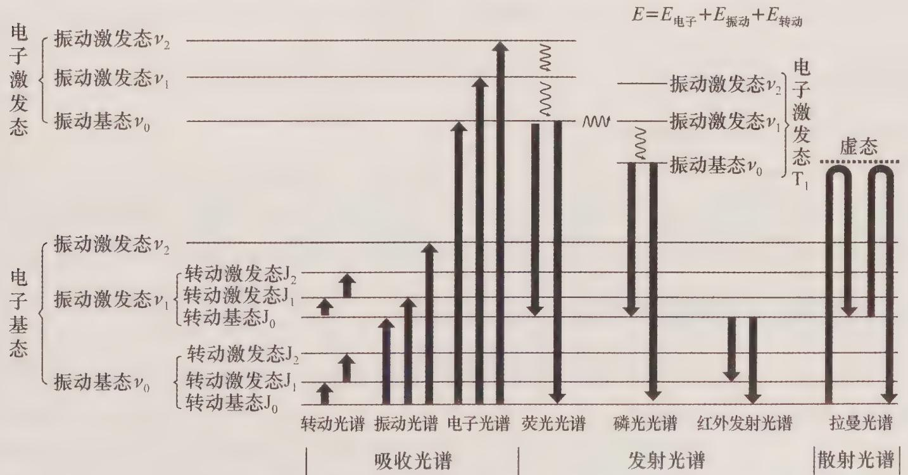  
图3.5.1 分子转动、振动和电子运动的能级状态，以及电子跃迁和对应光谱示意图  
(本图由清华大学化学系孙素琴和周群教授提供)

本节简要地介绍了利用红外吸收光谱和拉曼光谱讨论分子中成键电子所处的能级状态以及分子的转动、振动和电子跃迁运动的情况。

红外光谱图中纵坐标表示透射光强与入射光强之比，即透射比 $T(T = I / I_0)$ 或吸光度 $A$ $(A = -\lg T)$ 的大小。横坐标表示波数 $(\widetilde{\nu})$ 或波长 $(\lambda)$ 。

在分子光谱中，谱线存在与否（即选律），通常从分子是否有偶极矩出发进行讨论：

（1）同核双原子分子，偶极矩为0，分子在转动和振动时偶极矩也为0，没有转动和振动光谱。但电子跃迁时会改变分子中电荷的分布，即产生偶极矩，故有电子光谱，并伴随有振动、转动光谱产生。

(2) 极性双原子分子,有转动、振动和电子光谱。

（3）转动过程保持非极性的多原子分子，如 $\mathrm{CH}_4$ ， $\mathrm{BCl}_3$ ， $\mathrm{CO}_2$ 等没有转动光谱，而有振动光谱和电子光谱。

## 3.5.2 双原子分子的转动光谱

由两个质量分别为 $m_{1}$ 和 $m_{2}$ ，核间距离为 $r$ 的原子组成双原子分子，若近似地认为分子在

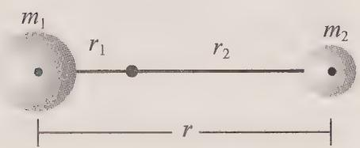

转动时核间距不变,原子质量集中在原子核上,势能为0,这样的模型称为刚性转子。

设质量为 $m_{1}$ 的原子到质心的距离为 $r_{1}$ ，质量为 $m_{2}$ 的原子到质心的距离为 $r_{2}$ ；分子绕质心转动，选质心为坐标

原点(见上图)。根据经典力学,有

$$
\begin{array}{r l} m _ {1} r _ {1} & = m _ {2} r _ {2}, \quad r _ {1} + r _ {2} = r \\ m _ {1} r _ {1} & = m _ {2} (r - r _ {1}) \end{array}
$$

$$
r _ {1} = \frac {m _ {2}}{m _ {1} + m _ {2}} r, \quad r _ {2} = \frac {m _ {1}}{m _ {1} + m _ {2}} r
$$

转动惯量为

$$
I = m _ {1} r _ {1} ^ {2} + m _ {2} r _ {2} ^ {2} = \frac {m _ {1} m _ {2}}{m _ {1} + m _ {2}} r ^ {2} = \mu r ^ {2}
$$

式中折合质量 $\mu=\frac{m_{1}m_{2}}{m_{1}+m_{2}}$ 。

将经典的平动和转动进行对比,可得

<table><tr><td>平动</td><td>质量m</td><td>速度v</td><td>动量p=mv</td><td>动能T=mv2/2=p2/2m</td></tr><tr><td>转动</td><td>转动惯量I</td><td>角速度ω</td><td>角动量M=Iω</td><td>动能T=Iω2/2=M2/2I</td></tr></table>

由于刚性转子只有动能,它的 Hamilton 算符为

$$
\hat {H} = \frac {1}{2 I} \hat {M} ^ {2}
$$

刚性转子的 Schrödinger 方程为

$$
\frac {1}{2 I} \hat {M} ^ {2} \psi = E \psi
$$

根据角动量平方算符的意义及本征值(参看2.2节),可得

$$
\begin{array}{l l} M ^ {2} = J (J + 1) \frac {h ^ {2}}{4 \pi^ {2}} & \\ E _ {J} = J (J + 1) \frac {h ^ {2}}{8 \pi^ {2} I} & \end{array} \quad J = 0, 1, 2, \dots
$$

$J$ 称为转动量子数。由这能量公式可得刚性双原子分子的转动能级图，如图3.5.2所示。

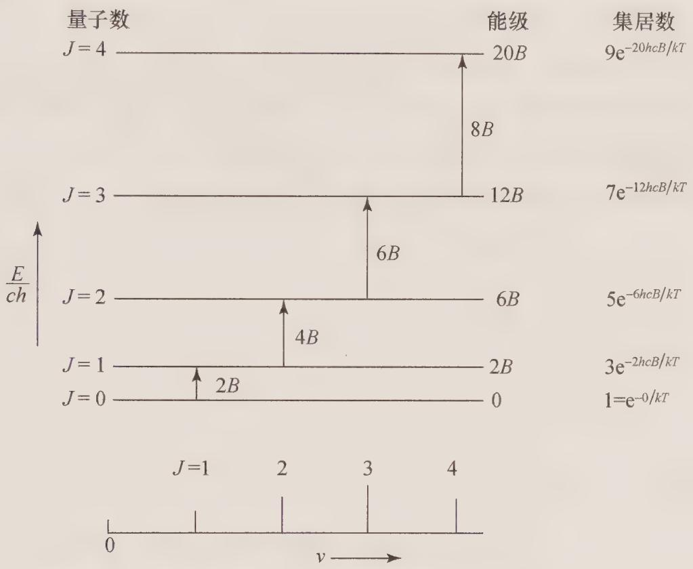  
图3.5.2 刚性转子转动能级图

极性分子有转动光谱。跃迁条件为

$$
\Delta J = \pm 1
$$

就吸收光谱而言,分子只能由量子数为 J 的状态跃迁到 $J+1$ 的状态,跃迁时吸收光的波数为

$$
\begin{array}{r l} \widetilde {\nu} & = \frac {\Delta E}{c h} = \frac {E _ {J + 1} - E _ {J}}{c h} \\ & = \frac {h}{8 \pi^ {2} I c} [ (J + 2) (J + 1) - (J + 1) J ] \\ & = 2 \frac {h}{8 \pi^ {2} I c} (J + 1) \\ & = 2 B (J + 1) \end{array}
$$

式中 $B = h / (8\pi^2 Ic)$ 称为转动常数，它表征分子的特性。实验时使用样品的分子数目总是很大的，在一定温度下，各能级上分布的分子数目服从Boltzmann分布定律。由于转动能级间隔很小，在室温下各转动能级的分子数目差不多。这样，处在 $J = 0$ 状态的分子可跃迁到 $J = 1$ 的状态；处在 $J = 1$ 状态的分子可跃迁到 $J = 2$ 的状态，等等。由此可得一系列距离相等（ $\Delta \tilde{\nu} = 2B$ ）的谱线。谱线相对强度与电子跃迁轨道上的相对集居数成正比，如图3.5.2下部所示。实验所得结果与理论分析一致。

利用远红外光谱,可以测定异核双原子分子的键长和同位素效应等性质。

【例3.5.1】 $\mathrm{H}^{35}\mathrm{Cl}$ 的远红外光谱线 $\widetilde{\nu} = 21.18,42.38,63.54,84.72,105.91\mathrm{cm}^{-1}$ ，试求其转动惯量及核间距。

由于相邻谱线的间隔约为 $21.18 \, cm^{-1}$ ，可得

$$
\begin{array}{l} B = 1 0. 5 9 \mathrm{cm} ^ {- 1} \\ I = \frac {h}{8 \pi^ {2} c B} = 2. 6 4 3 \times 1 0 ^ {- 4 0} \mathrm{gcm} ^ {2} \\ \mu = 1. 6 2 6 6 8 \times 1 0 ^ {- 2 4} \mathrm{g} \\ r = \sqrt {I / \mu} = 1 2 7. 5 \mathrm{pm} \end{array}
$$

【例3.5.2】同位素效应。利用红外光谱可研究同位素效应，例如以D交换H。

DC1 和 HCl 的核间距虽相同,但分子质量改变,影响折合质量 $\mu$ 和转动惯量 I,从而改变转动光谱中谱线的波数和谱线的间隔。所以当混有质量不同的同位素时,在光谱谱线主线旁有一较弱线伴生,弱线与主线的波数差 $\Delta\tilde{\nu}$ 可按下式计算

$$
\begin{array}{r l} \widetilde {\nu} _ {1} & = 2 B _ {1} (J + 1) = \frac {h}{4 \pi^ {2} c I _ {1}} (J + 1) \\ \widetilde {\nu} _ {2} & = 2 B _ {2} (J + 1) = \frac {h}{4 \pi^ {2} c I _ {2}} (J + 1) \\ \Delta \widetilde {\nu} & = \widetilde {\nu} _ {1} - \widetilde {\nu} _ {2} = \frac {h}{4 \pi^ {2} c} (J + 1) \left(\frac {1}{I _ {1}} - \frac {1}{I _ {2}}\right) \\ & = \widetilde {\nu} _ {1} \left(1 - \frac {I _ {1}}{I _ {2}}\right) = \widetilde {\nu} _ {1} \left(1 - \frac {\mu_ {1}}{\mu_ {2}}\right) \\ & = 2 B _ {1} (J + 1) \left(1 - \frac {\mu_ {1}}{\mu_ {2}}\right) \end{array}
$$

## 3.5.3 双原子分子的振动光谱

在讨论双原子分子的振动光谱时,为了简化问题的处理,先将双原子分子的振动当作简谐振子的振动,然后,在简谐振子模型的基础上做非谐性修正,并结合转动能研究振动谱带的精细结构。

## 1. 简谐振子模型

在双原子分子内, 原子核与原子核之间, 原子核与各电子之间都有相互作用, 其结果使得两原子核有一平衡距离 $r_{\mathrm{e}}$ 。两原子核可在平衡位置附近做微小振动, 它们的实际距离为 $r$ 。描述振动运动状态的波函数为 $r$ 的函数 $\psi = \psi(r)$ 。体系的势能

$$
V = \frac {1}{2} k (r - r _ {\mathrm{e}}) ^ {2}
$$

式中 k 称为弹力常数或力常数, 它标志化学键的强弱 (k 愈大, 键愈强)。今以 q 代表原子核间距和平衡核间距之差: $q = r - r_{e}$ , 则 $V = \frac{1}{2} k q^{2}$ 。

关于谐振子的动能 T, 取分子的质心作为坐标原点, 两原子的动能分别为

$$
T _ {1} = \frac {m _ {1}}{2} \left(\frac {\mathrm{d} r _ {1}}{\mathrm{d} t}\right) ^ {2}, \quad T _ {2} = \frac {m _ {2}}{2} \left(\frac {\mathrm{d} r _ {2}}{\mathrm{d} t}\right) ^ {2}
$$

因为

$$
r _ {1} = \frac {m _ {2}}{m _ {1} + m _ {2}} r, \qquad r _ {2} = \frac {m _ {1}}{m _ {1} + m _ {2}} r
$$

所以总动能为

$$
T = T _ {1} + T _ {2} = \frac {\mu}{2} \left(\frac {\mathrm{d} r}{\mathrm{d} t}\right) ^ {2}
$$

以 $q = r - r_{\mathrm{e}}$ （或 $r = q + r_{\mathrm{e}}$ ）代入，得

$$
T = \frac {\mu}{2} \left(\frac {\mathrm{d} q}{\mathrm{d} t}\right) ^ {2} = \frac {1}{2 \mu} p _ {q} ^ {2}
$$

$$
\hat {T} = - \frac {h ^ {2}}{8 \pi^ {2} \mu} \frac {\mathrm{d} ^ {2}}{\mathrm{d} q ^ {2}}
$$

这样,双原子分子振动运动的 Schrödinger 方程为

$$
\left[ - \frac {h ^ {2}}{8 \pi^ {2} \mu} \frac {\mathrm{d} ^ {2}}{\mathrm{d} q ^ {2}} + \frac {1}{2} k q ^ {2} \right] \psi = E \psi
$$

解此方程,得波函数 $\psi_{v}$ 及相应能量 $E_{v}$ 如下:

$$
\psi_ {0} = \left(\frac {\alpha}{\pi}\right) ^ {\frac {1}{4}} \exp \left(- \frac {1}{2} \alpha q ^ {2}\right), \quad E _ {0} = \frac {1}{2} h \nu
$$

$$
\begin{array}{c} \psi_ {1} = \left(\frac {4 \alpha^ {3}}{\pi}\right) ^ {\frac {1}{4}} q \exp \left(- \frac {1}{2} \alpha q ^ {2}\right), \\ \vdots \end{array}
$$

$$
E _ {1} = \left(1 + \frac {1}{2}\right) h \nu
$$

$$
\psi_ {v} = \left(\frac {\alpha}{\pi}\right) ^ {\frac {1}{4}} \left(\frac {1}{2 ^ {v} v !}\right) ^ {\frac {1}{2}} \exp \left(- \frac {1}{2} \alpha q ^ {2}\right) H _ {v} \left(\alpha^ {\frac {1}{2}} q\right), \quad E _ {v} = \left(v + \frac {1}{2}\right) h \nu
$$

式中 $\alpha = \frac{4\pi^2\mu\nu}{h}$ ，而 $H_{v}$ 为第 $v$ 项厄米多项式

$$
H _ {v} \left(\alpha^ {\frac {1}{2}} q\right) = (- 1) ^ {v} \exp \left(\alpha q ^ {2}\right) \frac {\mathrm{d} ^ {v}}{\mathrm{d} \left(\alpha^ {\frac {1}{2}} q\right) ^ {v}} \exp \left(- \alpha q ^ {2}\right)
$$

其中整数 $v=0,1,2,\cdots$ ，为振动能量量子数。

分子的振动能量是量子化的。其能量最小值为 $h\nu /2$ ，称振动零点能。也就是说，即使处在绝对零度的基态，也还有动能存在。

根据上述结果,可得简谐振子的波函数和能级图(图3.5.3)。图中曲线表示 $\psi_{0},\psi_{1},\psi_{2},\cdots$ 及 $\psi_{0}^{2},\psi_{1}^{2},\psi_{2}^{2},\cdots$ 的分布形状。水平线段表示振动能级,能级间隔是相等的。

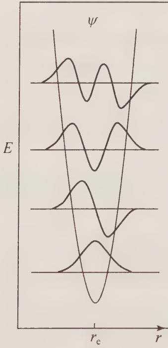  
(a)

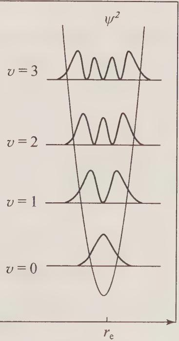  
(b)  
图3.5.3 简谐振子的 $\psi - r$ 图(a)和 $\psi^2 - r$ 图(b)

对于双原子分子振动的谐振子模型，光谱的选律为：非极性分子没有振动光谱，极性分子 $\Delta v = \pm 1$ ，由振动状态 $\psi_v$ 跃迁至 $\psi_{v + 1}$ 时，不论 $v$ 值如何，吸收光的波数均相等，因为振动能级是等间隔的。所以，对于符合简谐振子条件的双原子分子，谱线只有一条，波数为 $\widetilde{\nu}_{\mathrm{e}},\widetilde{\nu}_{\mathrm{e}}$ 叫谐振子经典振动波数。

在经典力学中,质量为 $\mu$ 、弹力常数为 k 的谐振子,它的振动频率为 $\nu_{e}=\frac{1}{2\pi}\sqrt{\frac{k}{\mu}}$ , $\nu_{e}$ 为经典振动频率。由此可以推得力常数

$$
k = 4 \pi^ {2} \mu \nu_ {\mathrm{e}} ^ {2} = 4 \pi^ {2} \mu (c \widetilde {\nu} _ {\mathrm{e}}) ^ {2}
$$

式中 $c$ 为光速； $\widetilde{\nu}_{\mathrm{e}}$ 为波数，即 $1\mathrm{cm}$ 中波的数目。 $k$ 的单位为 $\mathrm{Nm}^{-1}$ 或 $\mathrm{Ncm}^{-1}$ 。

由简谐振子模型所得的结论与双原子分子振动光谱的实验数据近似地相符。图3.5.4示出HCl的红外光谱。由图可见，波数为 $2885.9\mathrm{cm}^{-1}$ 的谱带强度最大，是HCl的基本谱带（ $\tilde{\nu}_{1}$ ）。其他谱带的波数接近 $2\tilde{\nu}_{1}, 3\tilde{\nu}_{1}, \dots$ ，它们分别称为第一泛音带，第二泛音带等，是由 $v = 0$ 到 $v = 2$ 和由 $v = 0$ 到 $v = 3$ 等跃迁的结果，而各线强度只有相邻前一条线的 $20\%$ 左右。

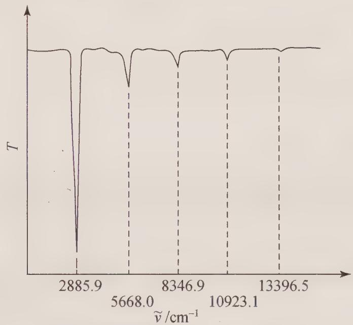  
图3.5.4 HCl的红外光谱

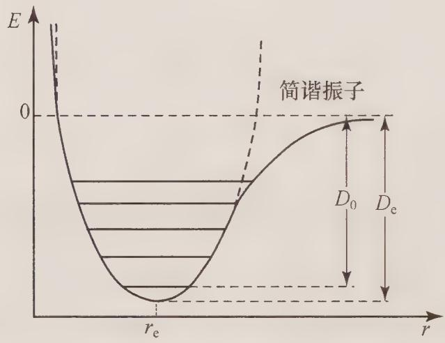  
图3.5.5 双原子分子的简谐振子势能曲线(虚线)与实际势能曲线(实线)

## 2. 非谐振子模型

由 HCl 振动光谱可见, 简谐振子模型只能近似地反映出双原子分子的振动情况。实际能级不是等间隔的, 还出现泛音频率谱带。分析它的势能函数 $k(r-r_{\mathrm{e}})^{2}/2$ , 有明显不合理处: 势能随 r 的增大而增大。实际情况是, 当核间距离增大到一定程度时, 双原子分子解离为 2 个原子, 两原子的引力等于零, 势能应趋于一常数。双原子分子的实际势能曲线与简谐振子模型表达的势能曲线的关系示于图 3.5.5 中。

鉴于上述情况,对简谐振子势能曲线有必要加以校正。常用的校正方法是用 Morse(摩斯)势能函数

$$
V = D _ {\mathrm{e}} \left\{1 - \exp \left[ - \beta (r - r _ {\mathrm{e}}) \right] \right\} ^ {2}
$$

代替谐振子的势能函数。由于 $r - r_{\mathrm{e}}$ 很小，势能 $V$ 可在 $r_{\mathrm{e}}$ 点展开

$$
\begin{array}{r l} V (r) & = V \left(r _ {\mathrm{e}}\right) + \frac {\mathrm{d} V}{\mathrm{d} r} \left(r - r _ {\mathrm{e}}\right) + \frac {1}{2 !} \frac {\mathrm{d} ^ {2} V}{\mathrm{d} r ^ {2}} \left(r - r _ {\mathrm{e}}\right) ^ {2} \\ & + \frac {1}{3 !} \frac {\mathrm{d} ^ {3} V}{\mathrm{d} r ^ {3}} \left(r - r _ {\mathrm{e}}\right) ^ {3} + \dots \end{array}
$$

因为 $V$ 在 $r_{\mathrm{e}}$ 时最低，令 $V(r_{\mathrm{e}}) = 0, \frac{\mathrm{d}V}{\mathrm{d}r} = 0$ ，略去 $(r - r_{\mathrm{e}})^4$ 等高次项，这样，势能函数可用下一表达式表示

$$
V = \frac {1}{2} k (r - r _ {\mathrm{e}}) ^ {2} + k ^ {\prime} (r - r _ {\mathrm{e}}) ^ {3}
$$

式中 $k^{\prime} = \frac{1}{6}\left(\frac{\mathrm{d}^{3}V}{\mathrm{d}r^{3}}\right)$ 。将此势能代入Schrödinger方程，可解得分子的振动能级为

$$
E _ {v} = \left(v + \frac {1}{2}\right) h \nu_ {\mathrm{e}} - \left(v + \frac {1}{2}\right) ^ {2} x h \nu_ {\mathrm{e}} \quad v = 0, 1, 2, \dots
$$

x 称为非谐性常数, 其值可由实验求得。振动光谱的选律为

(1) 分子偶极矩有变化的振动;

(2) $\Delta v = \pm 1, \pm 2, \pm 3, \cdots$ .

由于在室温下大多数分子处于最低能级，即 v=0 ，因而它的振动光谱对应于从 $v=0(E=E_{0})$ 的状态跃迁至 $v=v(E=E_{v})$ 的状态。

$$
\begin{array}{r l} \tilde {\nu} & = \frac {E _ {v} - E _ {0}}{c h} \\ & = \left[ \left(v + \frac {1}{2}\right) - \left(v + \frac {1}{2}\right) ^ {2} x - \left(\frac {1}{2} - \frac {1}{4} x\right) \right] \tilde {\nu_ {\mathrm{e}}} \\ & = [ 1 - (v + 1) x ] v \tilde {\nu_ {\mathrm{e}}} \end{array}
$$

这样，当 $v = 1,2,3,4$ 时， $\widetilde{\nu}$ 分别为

$$
0 \to 1, \text {基本谱带}, \quad \widetilde {\nu} _ {1} = \widetilde {\nu} _ {\mathrm{e}} (1 - 2 x)
$$

$$
0 \rightarrow 2, \text { 第一泛音带 }, \widetilde {\nu} _ {2} = 2 \widetilde {\nu} _ {\mathrm{e}} (1 - 3 x)
$$

$$
0 \rightarrow 3, \text {   第二泛音带，   } \widetilde {\nu} _ {3} = 3 \widetilde {\nu} _ {\mathrm{e}} (1 - 4 x)
$$

$$
0 \to 4, \text {第三泛音带}, \widetilde {\nu} _ {4} = 4 \widetilde {\nu} _ {e} (1 - 5 x)
$$

通过实验，从光谱中测得 $\widetilde{\nu}_1, \widetilde{\nu}_2, \widetilde{\nu}_3$ 等数值，利用上述公式即可求得常数 $\widetilde{\nu}_{\mathrm{e}}$ 和非谐性常数 $x$ 。例如从图3.5.4的HCl红外光谱，可得下面联立方程组

$$
\left\{ \begin{array}{l} \widetilde {\nu} _ {\mathrm{e}} (1 - 2 x) = 2 8 8 5. 9 \mathrm{cm} ^ {- 1} \\ 2 \widetilde {\nu} _ {\mathrm{e}} (1 - 3 x) = 5 6 6 8. 0 \mathrm{cm} ^ {- 1} \end{array} \right.
$$

由此解得 $\widetilde{\nu}_{e}=2989.7\ cm^{-1}, x=0.0174$ 。

根据 $\tilde{\nu}_{e}$ 值, 可算出力常数 k

$$
k = 4 \pi^ {2} c ^ {2} \tilde {\nu} _ {\mathrm{e}} ^ {2} \mu = 5 1 6. 3 \mathrm{Nm} ^ {- 1}
$$

现将若干分子基态时的数据列于表3.5.1中。

表 3.5.1 若干分子基态时的数据 $^{a}$

<table><tr><td>分 子</td><td> $\tilde{\nu}_{e}/cm^{-1}$ </td><td>x</td><td> $k/(Nm^{-1})$ </td><td> $r_{e}/pm$ </td></tr><tr><td>HF</td><td>4138.5</td><td>0.0218</td><td>965.7</td><td>91.7</td></tr><tr><td>HCl</td><td>2989.7</td><td>0.0174</td><td>516.3</td><td>127.4</td></tr><tr><td>HBr</td><td>2649.7</td><td>0.0171</td><td>411.5</td><td>141.4</td></tr><tr><td>HI</td><td>2309.5</td><td>0.0172</td><td>313.8</td><td>160.9</td></tr><tr><td>CO</td><td>2169.7</td><td>0.0061</td><td>1902</td><td>113.0</td></tr><tr><td>NO</td><td>1904.0</td><td>0.0073</td><td>1595</td><td>115.1</td></tr></table>

a 双原子分子光谱数据可查阅参考文献[9]。许多书中将 $\widetilde{\nu}_{\mathrm{e}}$ 用 $\omega_{\mathrm{e}}$ 表示，而有些书将 $\omega$ 当作圆频率 $(\omega = 2\pi \nu)$ ，本书不用 $\omega$ 。

利用Morse(莫尔斯)势能函数表达时， $D_{\mathrm{e}}$ 和 $\beta$ 两个常数与非谐性常数 $x$ 的关系如下

$$
D _ {\mathrm{e}} = \frac {h \nu_ {\mathrm{e}}}{4 x}, \quad \beta = \left(\frac {8 \pi^ {2} \mu x \nu_ {\mathrm{e}}}{h}\right) ^ {\frac {1}{2}}
$$

对于非谐振子

$$
D _ {0} = D _ {\mathrm{e}} - \frac {1}{2} h \nu_ {\mathrm{e}} + \frac {1}{4} h \nu_ {\mathrm{e}} x
$$

## 3. 双原子分子的振动-转动光谱

用高分辨的红外光谱仪观察双原子分子的振动谱带时,发现每条谱带都是由许多谱线组成的,例如 HCl 的基本频带 $\left[\tilde{\nu}=2885.9\mathrm{~cm}^{-1}\right]$ ，其精细结构示于图 3.5.6(a)]。这是由振动能级的改变必然伴随着转动能级的改变所引起的。

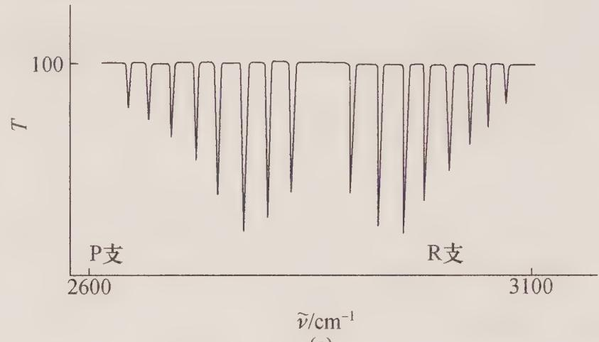  
(a)

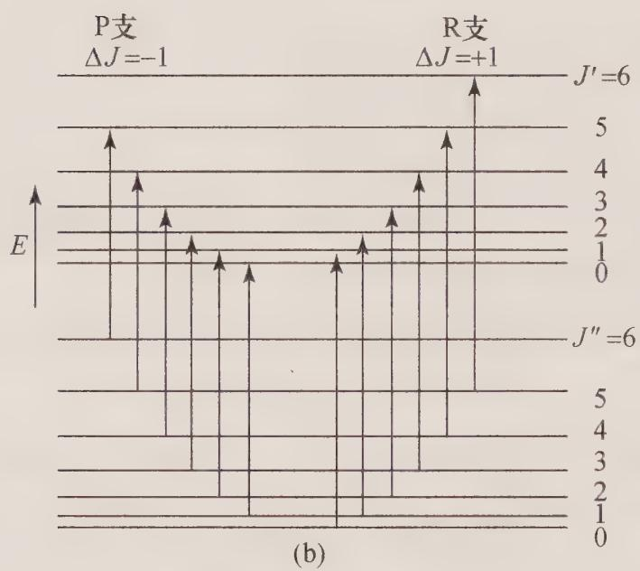  
图 3.5.6 HCl 红外光谱的精细结构(a)及振动-转动能级间的跃迁(b)

振动能级和转动能级间隔差别很大。作为一级近似，可以认为双原子分子的振动和转动是完全独立的，从而可以把振动与转动的总能量看作两种能量的简单加和。如果我们对振动采用非谐振子模型，转动采用刚性转子模型，振动和转动的总能量可表达为

$$
E _ {v, J} = \left(v + \frac {1}{2}\right) h \nu_ {\mathrm{e}} - \left(v + \frac {1}{2}\right) ^ {2} x h \nu_ {\mathrm{e}} + B c h J (J + 1)
$$

振-转光谱选律:非极性分子没有振-转光谱。对于极性分子

$$
\Delta v = \pm 1, \pm 2, \dots
$$

$$
\Delta J = \pm 1
$$

根据选律，从 $v = 0$ 到 $v = 1$ 的基本谱带由一系列谱线组成。这些谱线可按 $\Delta J = +1$ 和-1分为两组。 $\Delta J = +1$ 的一支，波数比 $\tilde{\nu}_{1}$ 大，排列在右边，称为R支； $\Delta J = -1$ 的一支，波数比 $\tilde{\nu}_{1}$ 小，排列在左边，称为P支。各谱线的距离均为 $2B$ 。由于 $\Delta J = 0$ 不符合跃迁选律，波数为 $\tilde{\nu}_{1}$ 的中心线不出现，即Q支不出现，所以两支之间的间隔为 $4B$ 。图3.5.6(b)示出双原子分子振动-转动能级间的跃迁。

## 4. 多原子分子的振动光谱

用谐振子模型处理双原子分子时,双原子分子的振动光谱应只有一条谱线,其频率与分子本性有关,且与双原子分子的经典振动频率

$$
\nu_ {\mathrm{e}} = \frac {1}{2 \pi} \sqrt {\frac {k}{\mu}}
$$

一致。这一结论与实验测到的振动光谱中最强的一条谱线基本吻合。这就给我们以启发——作为近似处理，是否也可用经典方法来讨论多原子分子的振动，而其经典振动频率就是该分子振动光谱中的几条强度最强的谱线的频率呢？实验结果说明确实如此。

一个由 $n$ 个原子组成的分子, 其自由度为 $3n$ , 除去 3 个平动, 3 个转动 (线形分子为 2 个) 外, 有 $3n - 6$ 个振动自由度 (线形分子有 $3n - 5$ 个振动自由度)。每个振动自由度都有一种基本振动方式, 当分子按这种方式振动时, 所有的原子都同位相且有相同频率, 即简正振动。简正振动可以分为两大类: (i) 只是键长有变化而键角不变, 称为伸缩振动; (ii) 键长不变而键角改变的振动, 称为弯曲振动。分子的各种振动不论怎样复杂, 都可表示成这些简正振动方式的叠加。

每一个红外活性的简正振动都有一个特征频率,反映在红外光谱上就可能出现一个吸收峰。简正振动方式的独立性使分析光谱问题得到简化,每个简正振动都可应用简谐振子的性质去描述。

多原子分子的振动是很复杂的,常用经验规律进行分析。

在比较一系列化合物的光谱后，发现在不同化合物中同一化学键或官能团近似地有一共同频率，称为该化学键或基团的特征振动频率。分析各个谱带所在的频率范围，即可用以鉴定基团和化学键。化学键和基团虽有相对稳定的特征吸收频率，但受到各种因素的影响，在不同的化学环境中，将会有所变化，使用时需要仔细分析。

分子的红外光谱起源于分子的振动基态 $\psi_{\mathrm{a}}$ 与振动激发态 $\psi_{\mathrm{b}}$ 之间的跃迁。只有在跃迁的过程中有偶极矩变化的振动，即 $\int \psi_{\mathrm{a}}\mu \psi_{\mathrm{b}}\mathrm{d}\tau$ 不为零的振动才会出现红外光谱，这称为红外活性。在振动过程中，偶极矩改变大者，其红外吸收带就强；偶极矩不改变者，就不出现红外吸收，为非红外活性。

$H_{2}O$ 分子的下面 3 种振动均有偶极矩的改变。

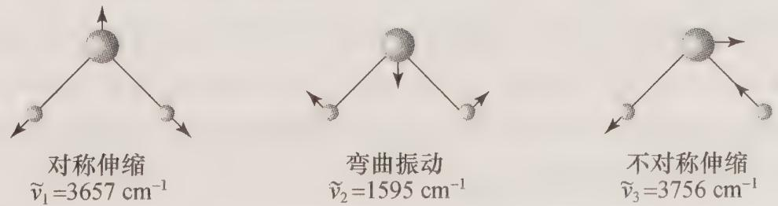

$CO_{2}$ 的 4 种振动如下所示, 其中对称伸缩振动不会改变偶极矩, 是非红外活性的, 其特征

频率是由 Raman 光谱测得的。

<table><tr><td>O→C←O</td><td>O→C→O</td><td></td></tr><tr><td></td><td></td><td>O-C-O</td></tr><tr><td></td><td></td><td>- + -</td></tr><tr><td>对称伸缩</td><td>不对称伸缩</td><td>弯曲振动</td></tr><tr><td>1383 cm-1</td><td>2349 cm-1</td><td>667 cm-1</td></tr></table>

除上述这些特征频率外，还出现倍频、合频和差频。倍频是从基态到第二、三激发态的跃迁，合频是两个不同频率之和，差频是两个不同频率之差。这些频率的谱带强度较弱。例如， $\mathrm{H}_2\mathrm{O}$ 分子的红外光谱中还出现 $3152\mathrm{cm}^{-1}(2\tilde{\nu}_2), 5331\mathrm{cm}^{-1}(\tilde{\nu}_2 + \tilde{\nu}_3), 6872\mathrm{cm}^{-1}(2\tilde{\nu}_2 + \tilde{\nu}_3)$ 等频率的谱线。

红外光谱各波数区所对应的化学键情况如下：

## (1) $3700 \sim 2500 \mathrm{~cm}^{-1}$ 为含氢化学键的伸缩振动区

因 H 质量小, 振动发生在高频区。没有氢键的 O—H 键振动波数在 $3600 \sim 3700 \, cm^{-1}$ , 氢键可使振动波数下降 $300 \sim 1000 \, cm^{-1}$ 甚至更多。N—H 键振动波数在 $3300 \sim 3400 \, cm^{-1}$ , C—H 键在 $2850 \sim 3000 \, cm^{-1}$ 。当和 H 结合的同周期原子变重时, 振动波数增加, 例如, Si—H, P—H, S—H 的振动波数近似为 2200, 2400 和 $2500 \, cm^{-1}$ 。

## (2) $2500 \sim 2000 \mathrm{~cm}^{-1}$ 为三重键振动区

此区域内，三重键强，力常数大，因此频率高。 $\mathrm{C} \equiv \mathrm{C}$ 吸收波数在 $2050 \sim 2300 \mathrm{~cm}^{-1}$ 之间，由于分子的对称性，吸收强度弱，甚至消失。 $\mathrm{C} \equiv \mathrm{N}$ 键吸收波数在 $2200 \sim 2300 \mathrm{~cm}^{-1}$ 间。

## (3) $2000 \sim 1600 \mathrm{~cm}^{-1}$ 为双键振动区

含有苯环基团的化合物振动波数在这个区间。醛、酮、酸、酰胺的 C=O 键及碳酸根在 $1700 \, cm^{-1}$ 附近表现出强的吸收。C=O 键在 $1650 \, cm^{-1}$ 左右，C=NH 键也在此范围，但 C=S 键在 $1100 \, cm^{-1}$ 左右。

## (4) $1700 \sim 500 \mathrm{~cm}^{-1}$ 为单键的伸缩振动和弯曲振动区

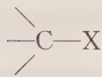

在此区域无特征基团的吸收频率,但却是很有用的指纹区。相似的分子结构略有改变,也会在此区域显示出差异。有机物中含氢的化学键的弯曲振动,峰的范围在 $1300 \sim 1475 \mathrm{~cm}^{-1}$ 。烯烃和苯环的 C—H 键的面外弯曲出现在 $700 \sim 1000 \mathrm{~cm}^{-1}$ 范围。当 X 为 F, Cl, Br, I 时, $\mathrm{C}-\mathrm{X}$ 键的振动波数分别为 $1050,725,650,560 \mathrm{~cm}^{-1}$ , 依次随键长增长而减小。

## 3.5.4 Raman光谱

Raman(拉曼)光谱和吸收光谱不同,Raman 光谱研究被样品散射的光,而不是吸收或发射的光。当光子和某一处于状态 a 的分子发生碰撞,如果光子的能量相当于状态 a 和另一能级较高的状态 b 之间的能量差,则可以被吸收,分子跃迁到更高的能级。光子和分子之间发生碰撞,可以散射光子,即改变光子的运动方向。虽然大多数散射光子的频率不发生改变,即弹性散射,但有少部分散射光子在碰撞过程中与分子交换能量,造成散射光子能量的增减,即非弹性散射,这就是 Raman 光谱研究的对象。

设 $\nu_{\mathrm{a}}$ 和 $\nu_{\mathrm{b}}$ 分别代表入射光和Raman散射光的频率， $E_{\mathrm{a}}$ 和 $E_{\mathrm{b}}$ 是分子散射前后的能量，根据能量守恒原理

$$
\begin{array}{r l} & h \nu_ {\mathrm{a}} + E _ {\mathrm{a}} = h \nu_ {\mathrm{b}} + E _ {\mathrm{b}} \\ & \Delta E = E _ {\mathrm{b}} - E _ {\mathrm{a}} = h (\nu_ {\mathrm{a}} - \nu_ {\mathrm{b}}) \end{array}
$$

$\Delta E$ 是分子处于两种状态a和b的能量差，所以测量Raman光谱频率位移 $\nu_{\mathrm{b}} - \nu_{\mathrm{a}}$ ，便可得到分子的能级间隔。

Raman 光谱所用光源的波长没有限制,一般是用可见光或紫外光作光源。光照射在样品上,在垂直于入射光的方向,观测散射光的强度随波长的变化关系、非弹性散射峰的频率和弹性散射峰的频率(即入射光频率)之差,以了解分子的振动-转动能级情况。由于非弹性散射光很弱(大约只有入射光的百万分之一),Raman 光谱较难观测。随着激光技术的发展,用激光作光源,使得一度陷于停滞的 Raman 光谱又获得新的活力,灵敏度和分辨力得到大大提高。图3.5.7为 Raman 光谱仪示意图。

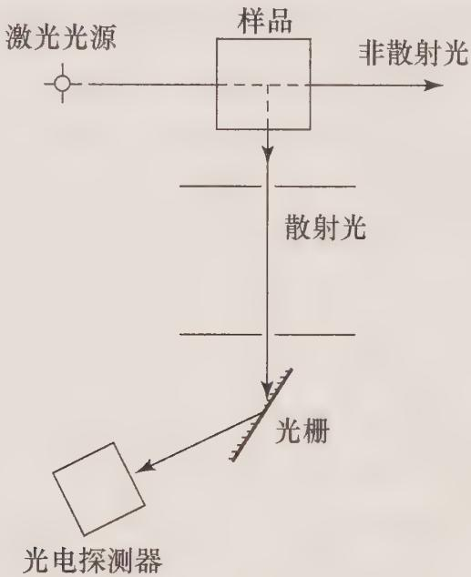  
图3.5.7 Raman光谱仪示意图

Raman 光谱的选律是分子具有各向异性的极化率, 如 H—H 分子, 当其电子在电场作用下沿键轴方向变形大于垂直于键轴方向, 就会产生诱导偶极矩, 出现 Raman 光谱活性。Raman 光谱和红外光谱可以起互相补充的作用, Raman 光谱相当于把分子的振动-转动能级从红外区搬到紫外可见区来研究。

由 Raman 光谱测得 $H_{2}, D_{2}, H_{2}^{+}$ 的 $\widetilde{\nu}_{e}$ 值分别为: 4400, 3118 和 $2322 \, cm^{-1}$ ，利用 $k = 4 \pi^{2} \mu c^{2} \widetilde{\nu}^{2}$ ，可算得力常数分别为: 574.9, 577.0 和 $160.0 \, N m^{-1}$ 。

## 3.5.5 分子的电子光谱

分子中的电子处在一定能级的分子轨道上，当电子从一种分子轨道跃迁至另一分子轨道时，会发射或吸收光，从而产生分子光谱。由于电子能级间隔比分子的振转能级间隔大得多，电子能级的改变总是伴随着振-转能级的改变。一般分辨率不太高的紫外-可见光谱呈现出带状光谱。紫外-可见光谱仪的原理示于图3.5.8中。

在考虑电子吸收光谱时,需要了解 Franck-Condon(弗兰克-康登)原理。该原理指出:振动能级间跃迁强度最高的谱线是与相同核间距对应有最高概率密度的振动态间的跃迁。这是因为当基态分子吸收光子时发生电子跃迁,基态分子转变为激发态分子,但由于电子跃迁时间极短(约 $10^{-15}$ s),分子中的原子来不及改变它的振动位置,而保持基态时的核间距(r)。以图 3.5.9为例: 强度最高的谱线对应于由 v=0 的基态到 $v'=3$ 的激发态间的跃迁, 图中虚线为核间距 (r) 不变的垂直线。

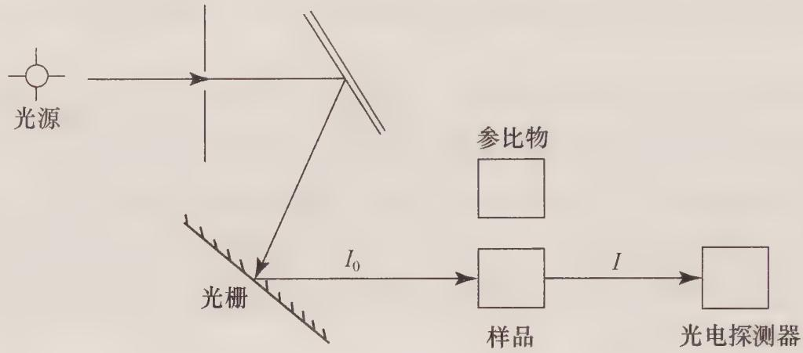  
图3.5.8 紫外-可见光谱仪示意图

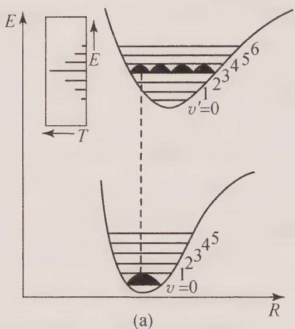

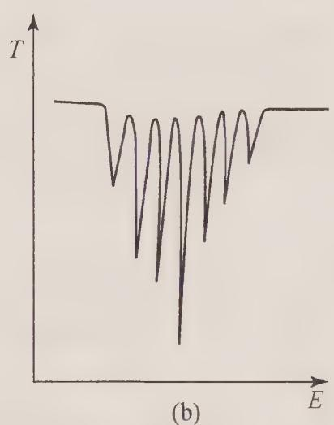  
图3.5.9 $\mathbf{H}_2$ 分子由 $(\sigma_{1s})^2\to (\sigma_{1s})^1 (\pi_{2p})^1$  
(a) 跃迁的能级示意图，(b) 光谱示意图

Franck-Condon原理对解释电子光谱很重要。图3.5.9示意出 $\mathrm{H}_{2}$ 分子由 $(\sigma_{1s})^{2} \rightarrow (\sigma_{1s})^{1}(\pi_{2p})^{1}$ 跃迁时的能级和光谱。由图可见，强度最高的第4条谱线是核间距不变的垂直跃迁谱线。

## 3.6 光电子能谱

## 3.6.1 原理

光电子能谱和分子光谱都是分子轨道理论的实验基础,但两者的机理不同:分子光谱探测的是被物质吸收后的电磁波;而光电子能谱探测的是被入射光从物质中击出的光电子的能量分布、强度分布和空间分布,其基本物理过程是光致电离

$$
\mathrm{M} + h \nu \longrightarrow \mathrm{M} ^ {+ *} + \mathrm{e} ^ {-}
$$

式中 M 代表分子或原子, $M^{+*}$ 代表激发态的分子离子或离子。

分子中的电子被束缚在各原子轨道或分子轨道上，各具有一定的电子结合能。若入射光的能量超过电子的结合能，它就能够将电子击出，如此产生的电子称作光电子。分子电离时，从一个轨道上移去一个电子,若不改变其余电子的波函数,该电子的电离能等于它原来占据的轨道能量的负值。这个关系称为 Koopmans(库普曼斯)规则,它对闭壳层组态的分子符合较好。所以,可通过光电子能谱了解分子轨道能级的信息。根据 1.1 节 (1.1.5) 式可知,当一个光子击出一个被束缚得较紧的电子时,光电子具有较低的动能;当一个光子击出一个被束缚得较松的电子时,光电子则具有较高的动能。因此,使用固定能量的激发源,可产生多种动能的光电子。由于原子或分子中电子的能量是量子化的,因而光电子有一个动能分布,由一系列分立的能带组成。具有不同动能的光电子通过能量分析器被区分开来,经过检测、记录,得到信号强度,即光电子数 $n(E)$ 。将分子的电离能或电子结合能的负值作为横坐标,单位时间内发射的光电子数作为纵坐标,所得图谱称为光电子能谱。根据光源的不同,光电子能谱可分为紫外光电子能谱(ultraviolet photoelectron spectroscopy, UPS)和 X 射线光电子能谱(XPS)。前者击出的是原子或分子的价电子,后者不但能击出价电子,而且能击出内层电子。内层电子基本上不参与形成化学键,在物质中基本上保持其原子特性,故通过测量击出的内层电子的能量分布,可以进行化学分析,此即 X 射线光电子能谱,又被称为化学分析电子能谱(electron spectroscopy for chemical analysis, ESCA)的原因。

光电子能谱仪主要由下列6个部分组成:激发源、样品电离室、电子能量分析器、电子检测器、真空系统和数据处理系统等。激发源应该强度大、单色性好。UPS常用HeI线(21.22 eV)或HeII线(40.8 eV)。XPS常用Al,Mg等轻元素发射出的自然宽度很窄的Kα射线;样品电离室是样品(原则上,3种聚集态皆可)受光照射后电离,产生光电子的设备;电子能量分析器多用静电色散原理制成。光电子进入分析器后,由于受电场的作用,只有具备一定动能的那些光电子才能通过出口狭缝。根据已知电场的强弱,便可了解光电子的动能。从能量分析器飞出的电子由电子检测器计数。目前用得最多的是多道电子倍增器,它可检测记录小于 $10^{-15}$ A的微电流。真空系统对电子能谱至关重要,主要原因有:

（1）光电子在从样品电离室到能量分析器的运动中必须避免与残余气体发生非弹性碰撞而损失能量，这就要求整个系统有一定的真空度，通常为 $10^{-8} \sim 10^{-11} \mathrm{~Pa}$ 。

（2）为在实验的全过程中保持样品表面不被污染，必须获得高真空度。根据气体动力学计算，要使固体样品的表面在 $1\mathrm{h}$ 内保持“清洁”，仪器的真空度应至少维持在 $10^{-10}\mathrm{Pa}$ 。数据处理系统除记录谱函数外，还具有解谱功能，即自动寻峰、拟合本底和峰形函数、自动扣除本底及求峰面积等。图3.6.1是光电子能谱仪的示意图。

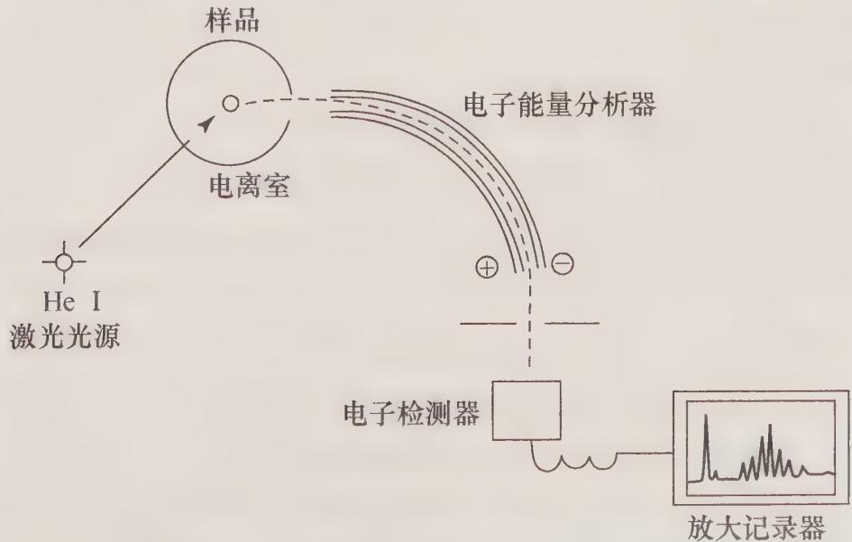  
图3.6.1 光电子能谱仪示意图

电子能谱能够测定从各个被占分子轨道上电离电子所需要的能量,从而可直接证明分子轨道能级高低,为分子轨道理论提供坚实的实验基础。电子能谱也是重要的表面分析技术,它提供的表面信息大致有:

\- 表面化学状态,包括元素的种类和含量、化学价态和化学键的形成等;

\- 表面结构,包括宏观的表面形貌、物相分布、元素分布以及微观的表面原子排列等;

\- 表面电子态，涉及表面的电子云分布和能级结构等。

这一表面分析技术广泛用于催化、电子、冶金、有机高分子、环境保护等化学和化工领域。

## 3.6.2 双原子分子的紫外光电子能谱

## 1. $\mathrm{H}_{2}$ 的紫外光电子能谱

$H_{2}$ 受光激发, 发生如下电离

$$
\mathrm{H} _ {2} \left(\sigma_ {1 \mathrm{s}}\right) ^ {2} + h \nu \longrightarrow \mathrm{H} _ {2} ^ {+} \left(\sigma_ {1 \mathrm{s}}\right) ^ {1} + \mathrm{e} ^ {-}
$$

所得光电子的动能与电子在分子中的结合能有关。根据 $\mathrm{H}_{2}$ 分子和 $\mathrm{H}_{2}^{+}$ 离子的能量曲线，可

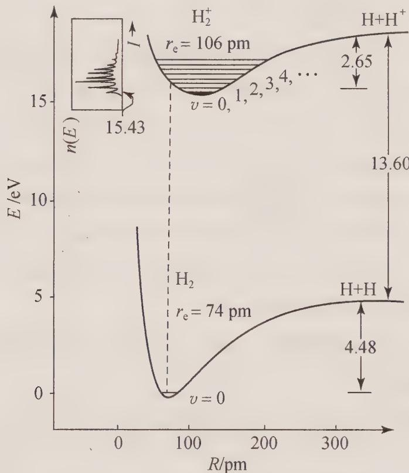  
图3.6.2 $\mathbf{H}_2$ 和 $\mathbf{H}_2^+$ 的能量曲线及 $\mathbf{H}_2$ 的光电子能谱

得图 3.6.2 所示的能量关系图。图中标明的能量数据以及平衡核间距数据均已在本章前两节加以讨论。

室温下，大多数 $H_{2}$ 分子处于 v=0 的基态，由 $H_{2}$ 变成 $H_{2}^{+}$ ，根据 $H_{2}^{+}$ 振动能级的不同，电子能谱形成一较宽的谱带，这一谱带开始于 15.43 eV，不断延伸到 18 eV，如图 3.6.2 左上角所附小图。小图中谱线间隔为 $2200\ cm^{-1}$ ，此即 $H_{2}^{+}$ 的振动能级差；最强谱线相当于 $H_{2}^{+}$ 中 v=2 的谱线。通常用绝热电离能 ( $I_{A}$ ) 表示从分子基态跃迁到分子离子基态所需的能量，相当于和谱带第一个峰相应的能量，图中标明为 15.43 eV。垂直电离能 ( $I_{V}$ ) 是由分子基态跃迁到分子离子跃迁概率最高的振动态所需的能量，对应于图谱中最强谱线的电离能， $I_{V}$ 是由 Franck-Condon 原理所阐明的。

## 2. $\mathbf{N}_2$ 的紫外光电子能谱

在受光激发下, $N_{2}$ 的电离如下

$$
\mathrm{N} _ {2} + h \nu \longrightarrow \mathrm{N} _ {2} ^ {+} + \mathrm{e} ^ {-}
$$

$\mathrm{N}_2$ 的价电子组态为 $(1\sigma_{\mathrm{g}})^{2}(1\sigma_{\mathrm{u}})^{2}(1\pi_{\mathrm{u}})^{4}(2\sigma_{\mathrm{g}})^{2}$ ，而 $\mathrm{N}_2^+$ 的电子组态则因电子从 $\mathrm{N}_2$ 的不同轨道上电离而异：

$$
\begin{array}{l} (1 \sigma_ {\mathrm{g}}) ^ {2} (1 \sigma_ {\mathrm{u}}) ^ {2} (1 \pi_ {\mathrm{u}}) ^ {4} (2 \sigma_ {\mathrm{g}}) ^ {1} \\ (1 \sigma_ {\mathrm{g}}) ^ {2} (1 \sigma_ {\mathrm{u}}) ^ {2} (1 \pi_ {\mathrm{u}}) ^ {3} (2 \sigma_ {\mathrm{g}}) ^ {2} \\ (1 \sigma_ {\mathrm{g}}) ^ {2} (1 \sigma_ {\mathrm{u}}) ^ {1} (1 \pi_ {\mathrm{u}}) ^ {4} (2 \sigma_ {\mathrm{g}}) ^ {2} \\ (1 \sigma_ {\mathrm{g}}) ^ {1} (1 \sigma_ {\mathrm{u}}) ^ {2} (1 \pi_ {\mathrm{u}}) ^ {4} (2 \sigma_ {\mathrm{g}}) ^ {2} \end{array}
$$

根据不同组态的 $\mathrm{N}_2^+$ 光谱基本振动频率，可得表3.6.1所列的数据。

表 3.6.1 ${\mathrm{N}}_{2}$ 和 ${\mathrm{N}}_{2}^{ + }$ 的 3 种状态的键性质

<table><tr><td>分 子(括号内表示电离的轨道)</td><td>基本振动波数 $cm^{-1}$ </td><td>键长pm</td><td>键能 $kJ mol^{-1}$ </td></tr><tr><td> $N_2$ </td><td>2330</td><td>109.78</td><td>941.69</td></tr><tr><td> $N_2^+(2\sigma_g)$ </td><td>2175</td><td>111.6</td><td>842.16</td></tr><tr><td> $N_2^+(1\pi_u)$ </td><td>1873</td><td>117.6</td><td>—</td></tr><tr><td> $N_2^+(1\sigma_u)$ </td><td>2373</td><td>107.5</td><td>—</td></tr></table>

图 3.6.3 示出 $N_{2}$ 的分子轨道能级高低的分布情况以及它与光电子能谱之间的关系。由图可见，通过电子能谱可以测定轨道能级的高低，而根据谱带的形状，可以进一步了解分子轨道的性质：

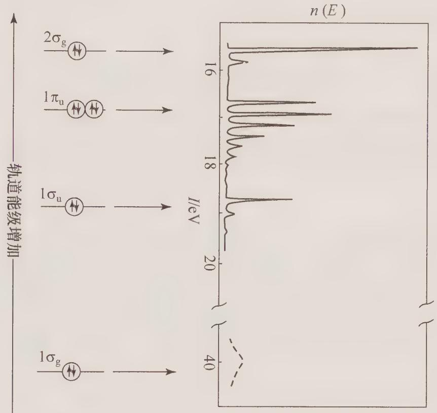  
图3.6.3 $\mathbf{N}_2$ 的分子轨道能级图与光电子能谱之间的关系（只示出被占的分子轨道）

（1）一个非键电子电离，核间平衡距离几乎没有什么变化，从分子M的 $v = 0$ 的振动基态跃迁到 $\mathbf{M}^{+}$ 的 $v = 0$ 的振动基态时重叠最大， $I_{\mathrm{A}} = I_{\mathrm{V}}$ ，而其他振动能级上波函数重叠很少，所以跃迁概率集中，表现出谱带的振动序列很短。

（2）一个成键或反键电子电离，核间平衡距离发生很大变化，变化大小与成键或反键的强弱有关。成键电子电离，核间平衡距离增大；反键电子电离，核间平衡距离缩短，这时垂直跃迁的概率最大，其他的振动能级上也有一定的跃迁概率，表现在能谱上谱带的序列比较长。

（3）根据电子能谱中谱带内谱线分布的稀密，可以了解 $\mathrm{M}^{+}$ 中振动能级的分布。若分子振动能级很密，或者分子离子态与分子基态的核间距相差很大，则谱线表现为连续的谱带。

由表 3.6.1 数据可见， $1\sigma_{u}$ 电子电离，键长缩短，但缩短数值不多， $1\sigma_{u}$ 轨道呈弱反键性质； $2\sigma_{g}$ 电子电离，键长略有增加， $2\sigma_{g}$ 轨道呈弱成键性质。 $1\sigma_{u}$ 和 $2\sigma_{g}$ 这两个轨道上的两对电子带有非键性质，表现在电子能谱图上它们的跃迁概率集中，谱带的振动序列很短。 $N_{2}$ 分子的结构式可写作： $N\equiv N:$ 。在此结构式中，两对孤对电子是等同的，但分子轨道理论和光电子能谱说明，这两对孤对电子 $\left[(1\sigma_{\mathrm{u}})^2\right.$ 和 $(2\sigma_{\mathrm{g}})^2]$ 能量不简并。

$1\pi_{\mathrm{u}}$ 轨道并不受s-p混杂的影响，依然保持强的成键轨道性质，所以这一轨道电子电离时，键长显著增长。 $1\pi_{\mathrm{u}}$ 谱带的精细振动能级结构的实验结果说明了这一点。

CO 分子和 $N_{2}$ 分子是等电子体, 它们有相似的能级结构及相似的能谱图, 如图 3.6.4 所示。

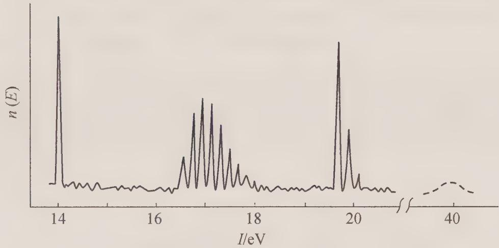  
图3.6.4 CO的紫外光电子能谱图

从某一全充满的分子轨道击走一个电子后，在该轨道上就有一个自旋未成对的电子，设其轨道量子数为 $l$ 。由于轨道运动和自旋运动的耦合作用，它将产生两种状态，总量子数分别为

$$
j _ {1} = l + \frac {1}{2}
$$

$$
j _ {2} = l - \frac {1}{2}
$$

两者具有不同的能量,其差值称为自旋-轨道耦合常数。使用高分辨率的光电子能谱仪可观察到这种自旋-轨道分裂。这种分裂所产生的两个峰的面积比为 $(2j_{1}+1):(2j_{2}+1)$ ，即 $(l+1):l$ 。这样,就可从峰的强度比推知被击出的电子所在的轨道。例如,Ar的紫外光电子能谱的第一条谱线分裂为强度比为2:1的两个峰,由此推知被击出的电子的l=1,即3p电子(参见习题3.34)。

## 3. $\mathrm{O}_{2}$ 的紫外光电子能谱

$\mathrm{O}_2$ 分子的价电子组态为 $(\sigma_{2\mathrm{s}})^2 (\sigma_{2\mathrm{s}}^*)^2 (\sigma_{2\mathrm{p}_z})^2 (\pi_{2\mathrm{p}})^4 (\pi_{2\mathrm{p}}^*)^2$ 。它的紫外光电子能谱图示于图3.6.5中。

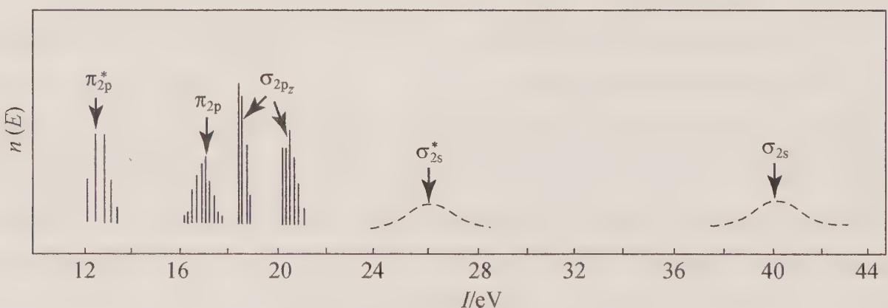  
图3.6.5 $\mathrm{O}_2$ 的紫外光电子能谱图

对比 $\mathrm{O}_2$ 和 $\mathbf{N}_2$ 的能谱图，可知：

(1) O 原子虽比 N 原子有较高的有效核电荷, 但是 $O_{2}$ 的第一电离能比 $N_{2}$ 小, 因为 $O_{2}$ 最高

占据轨道是能级较高的 $\pi_{2\mathrm{p}}^{*}$ 轨道。

(2) $\sigma_{2\mathrm{p}_z}$ 电子电离时, 能谱中出现 2 个谱带。这是由于 $\pi_{2\mathrm{p}}^{*}$ 中有 2 个自旋相同的电子, 当电离一个 $\sigma_{2\mathrm{p}_z}$ 电子后, 剩余电子的自旋态可能: (i) 和 $\pi_{2\mathrm{p}}^{*}$ 电子自旋相同, (ii) 和 $\pi_{2\mathrm{p}}^{*}$ 电子自旋相反, 因而在能量上不同。同样情况也在 $\pi_{2\mathrm{p}}$ 中出现, 不过没有那么明显。

$$
\begin{array}{c c c c c c c c} & \sigma_ {2 s} & \sigma_ {2 s} ^ {*} & \sigma_ {2 p _ {z}} & \pi_ {2 p} & \pi_ {2 p} ^ {*} \\ \text {O} _ {2} & \uparrow \downarrow & \uparrow \downarrow & \uparrow \downarrow & \uparrow \downarrow & \uparrow \downarrow & \uparrow & \uparrow \\ (\mathrm{i}) \mathrm{O} _ {2} ^ {+} (\sigma_ {2 p _ {z}}) & \uparrow \downarrow & \uparrow \downarrow & \uparrow & \uparrow \downarrow & \uparrow \downarrow & \uparrow & \uparrow \\ (\mathrm{ii}) \mathrm{O} _ {2} ^ {+} (\sigma_ {2 p _ {z}}) & \uparrow \downarrow & \uparrow \downarrow & \downarrow & \uparrow \downarrow & \uparrow \downarrow & \uparrow & \uparrow \end{array}
$$

(3) $\mathrm{O}_2$ 的 $\sigma_{2\mathrm{p}_z}$ 和 $\pi_{2\mathrm{p}}$ 能级次序和 $\mathbf{N}_2$ 不同。对 $\mathrm{O}_2$ 而言，2s和2p能级差较大，s-p混杂不明显。

## 4. HF 的紫外光电子能谱

HF 的价电子组态为 $(2s)^{2}(\sigma)^{2}(2p_{x})^{2}(2p_{y})^{2}$ （见图 3.3.9），其电子能谱和此组态相对应。HF 分子的第一电离能为 16.05 eV，比 F 原子的第一电离能（18.6 eV）约小 2.5 eV。为什么 $(2p_{x})$ ， $(2p_{y})$ 是非键轨道，而形成分子后能级有这么大的变化？其原因是：HF 是极性分子，F 的电负性比 H 高，价电子电荷集中在 F 原子周围，排斥非键轨道上的电子，使它容易电离。

从上述例子可见,光电子能谱可以测定分子轨道能级顺序和高低,可以区分分子中被占分子轨道的性质,即区分成键轨道、反键轨道和非键轨道。这样,用分子轨道理论结合光电子能谱可对双原子分子的结构和成键情况分析得比较清楚。

## 3.6.3 X射线光电子能谱

X 射线光电子能谱(XPS)用能量较高的软 X 射线作为激发源。它既可电离外层电子，也可电离内层电子，并且能激发出俄歇电子。常用的激发源有 Mg Kα 辐射 ( $h\nu=1253.6\ eV$ ) 和 Al Kα 辐射 ( $h\nu=1486.6\ eV$ )。

如前所述，X射线光电子能谱可以探测非键的内层电子，而内层电子的结合能具有高度特征性，因而它可用于元素的定性和定量分析。又由于内层电子的结合能受化学位移的影响，因而研究化学位移可获得物质化合态的若干信息。

原子的内层电子虽然不参与形成化学键，但其结合能却随着周围化学环境的变化而变化。这一现象是在对硫代硫酸钠作常规研究时发现的。同一种原子在不同的分子或同一分子中的不同位置上，内层电子的结合能各不相同。将分子中某一内层电子 $i$ 的结合能 $E_{i}(\mathrm{M})$ 与自由原子中内层电子 $i$ 的结合能 $E_{i}(\mathrm{A})$ 之差定义为该分子的化学位移 $(\Delta E_{\mathrm{b}})_{i}$ 。

$$
(\Delta E _ {\mathrm{b}}) _ {i} = E _ {i} (\mathrm{M}) - E _ {i} (\mathrm{A})
$$

产生化学位移的原因是原子周围化学环境的变化。这里所说的化学环境的变化可具体归结为三方面：

(1) 当原子结合成分子或晶体时, 价电子发生转移或共享, 价电子的这种电荷变化会引起内层电子结合能的变化;

(2) 分子或晶体中其他原子所形成的势场对指定原子的内层电子的结合能产生影响;

(3) 从原子中电离掉一个电子后,其余电子不能完全保持其原来的状态和能量。

目前关于化学位移的理论模型很多,一般计算都比较复杂,有一些经验规律可作为分析XPS谱图的参考:

（1）原子失去价电子或者和电负性高的原子结合而使价电子远离时，内层电子的结合能增大；

(2) 原子获得电子时内层电子的结合能减小;

(3) 氧化态愈高, 结合能愈大;

（4）价层有某种变化，所有内层电子结合能也有相应变化。

XPS 峰强度也有一些经验规律。就给出峰的轨道来说，主量子数小的壳层的峰比主量子数大的峰强；同一壳层，角量子数大者峰强；n 和 l 都相同的壳层，j 大者峰强。

利用这些经验规律,比较内层电子结合能的化学位移及峰的强度,可以考察原子周围的化学环境,从而了解原子的价态、成键情况及其他结构信息。

下面提供二例予以说明。

【例 3.6.1】 $Na_{2}S_{2}O_{3}$

$\mathrm{Na}_{2} \mathrm{~S}_{2} \mathrm{O}_{3}$ 的 XPS 在硫 2p 区有两个峰, 而 $\mathrm{Na}_{2} \mathrm{SO}_{4}$ 只有一个硫的 2p 峰。这是因为 $\mathrm{S}_{2} \mathrm{O}_{3}^{2-}$ 中含有两类硫原子, 与氧原子相连的硫原子带有正电荷, 而末端硫原子带负电荷, 因此前者的

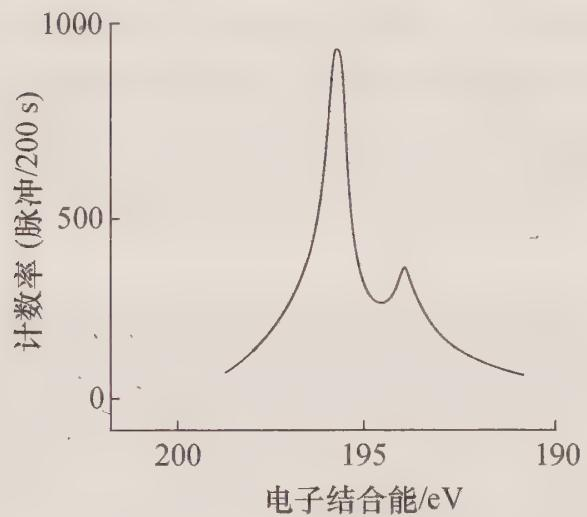  
图3.6.6 $\mathbf{B}_5\mathbf{H}_9$ 的 $\mathbf{B}(1s)$ XPS

结合能比后者的结合能大,从而出现了两个硫的2p峰。

【例3.6.2】 $\mathrm{B}_5\mathrm{H}_9$

图 3.6.6 是 $B_{5}H_{9}$ 的 B(1s) 光电子能谱，谱中有两个强度比为 4:1 的峰，较小的峰的结合能较小。这说明， $B_{5}H_{9}$ 分子中有 4 个 B 原子处于相同的化学环境；另一个 B 原子处于不同的化学环境，它有较高的电子密度。这与 $B_{5}H_{9}$ 中有一个 B 原子具有明显的亲核行为一致。由此可推知，其可能结构为 5 个 B 原子排列成四方锥形（见图 5.7.2）。

XPS 的适应性很强,分析对象遍及周期表中除 H 和 He 以外的全部元素。XPS 的最大特点是能够进行表面分析,是一种对表面上的单原子层或单分子层也能够进行分析的表面分析技术。

## 3.6.4 俄歇电子能谱

俄歇电子能谱(Auger electron spectroscopy, AES)是指利用电子束或 X 射线作激发源，使原子的内层电子电离后，外层电子进入内层空穴所释放的能量，导致发射出二次电子，如图 3.6.7 所示。

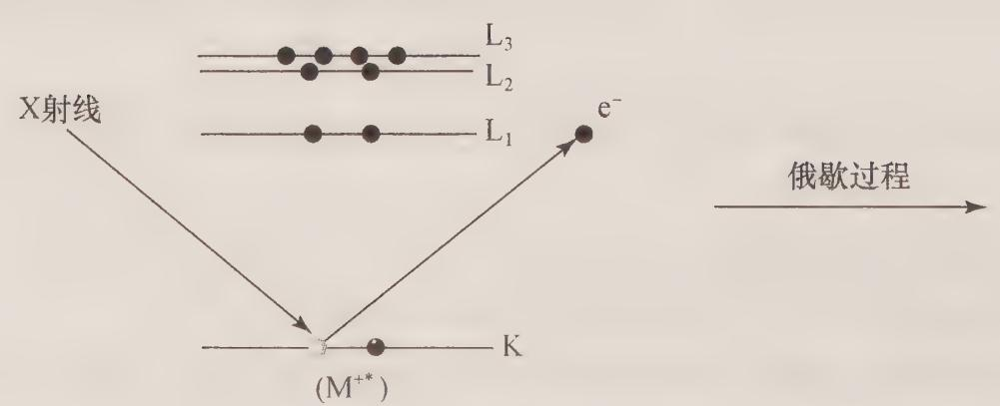  
图3.6.7 俄歇电子的产生机理

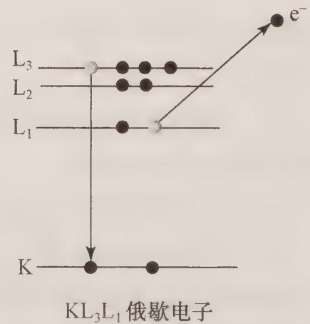

俄歇电子的动能反映原子能级的特征,但它和激发源的能量无关。俄歇电子能谱是研究固体表面的一种重要技术,广泛用于各种材料分析及催化、吸附、腐蚀等过程。

## 习题

3.1 试计算当 $Na^{+}$ 和 $Cl^{-}$ 相距 280 pm 时，两离子间的静电引力和万有引力；并说明讨论化学键作用力时，万有引力可以忽略不计。

（已知：万有引力 $F = G\frac{m_1m_2}{r^2}$ ， $G = 6.7\times 10^{-11}\mathrm{Nm}^2\mathrm{kg}^{-2}$ ；静电引力 $F = K\frac{q_1q_2}{r^2}$ ， $K = 9.0\times$ $10^{9}\mathrm{Nm}^{2}\mathrm{C}^{-2}$ ）

3.2 写出 $\mathrm{O}_2, \mathrm{O}_2^+, \mathrm{O}_2^-, \mathrm{O}_2^{2-}$ 的键级、键长长短次序及磁性。

3.3 $H_{2}$ 分子基态的电子组态为 $(\sigma_{1s})^{2}$ ，其激发态有

(1) $\frac{\uparrow}{\sigma_{1s}}\frac{\downarrow}{\sigma_{1s}^*}$ ;

(2) $\frac{\uparrow}{\sigma_{1s}}\frac{\uparrow}{\sigma_{1s}^*}$ ;

(3) $\frac{\sigma_{1s}}{\sigma_{1s}^{*}}$ .

试比较(1)，(2)，(3)三者能级的高低次序，并说明理由。能量最低的激发态是顺磁性还是反磁性？

3.4 试比较下列同核双原子分子： $\mathrm{B}_2, \mathrm{C}_2, \mathrm{N}_2, \mathrm{O}_2, \mathrm{F}_2$ 的键级、键能和键长的大小关系，在相邻两个分子间填入“<”或“>”符号表示。

3.5 基态 $\mathrm{C}_2$ 为反磁性分子，试写出其电子组态；实验测定 $\mathrm{C}_2$ 分子键长为 $124\mathrm{pm}$ ，比C原子共价双键半径和 $(2\times 67\mathrm{pm})$ 短，试说明其原因。

3.6 据分子轨道理论,指出 $Cl_{2}$ 的键比 $Cl_{2}^{+}$ 的键是强还是弱?为什么?

3.7 画出 $\mathrm{CN}^{-}$ 的分子轨道示意图, 写出基态电子组态, 计算键级及磁矩 (忽略轨道运动对磁矩的贡献)。

3.8 画出 NO 的分子轨道能级示意图, 计算键级及自旋磁矩, 试比较 NO 和 $\mathrm{NO}^{+}$ 何者的键更强? 哪一个键长长一些?

3.9 按分子轨道理论写出 $\mathrm{NF}, \mathrm{NF}^{+}, \mathrm{NF}^{-}$ 的基态电子组态，说明它们的不成对电子数和磁性（提示：按类似 $\mathrm{O}_{2}$ 的能级排）。

3.10 试用分子轨道理论讨论 SO 分子的电子结构,说明基态时有几个不成对电子。

3.11 CF 和 $CF^{+}$ 的键能分别为 548 和 $753 \, kJ mol^{-1}$ ，试用分子轨道理论探讨其键级（按 $F_{2}$ 能级次序）。

3.12 下列 AB 型分子：NO, CN, CO, XeF 中，哪几个是得电子变为 $AB^{-}$ 后比原来中性分子键能大？哪几个是失电子变为 $AB^{+}$ 后比原来中性分子键能大？

3.13 写出 $Cl_{2}$ , CN 的价层电子组态和基态光谱项。

3.14 OH分子于1964年在星际空间被发现。

(1) 试按分子轨道理论只用 O 原子的 2p 轨道和 H 原子的 1s 轨道叠加, 写出其电子组态;

(2) 在哪个分子轨道中有不成对电子?

(3) 此轨道是由 O 和 H 的原子轨道叠加形成, 还是基本上定域于某个原子上?

(4) 已知 OH 的第一电离能为 13.2 eV, HF 的第一电离能为 16.05 eV, 它们的差值几乎和 O 原

子与 F 原子的第一电离能(15.8 eV 和 18.6 eV)的差值相同,为什么?

(5) 写出它的基态光谱项。

3.15 $\mathrm{H}^{79}\mathrm{Br}$ 在远红外区有一系列间隔为 $16.94\mathrm{cm}^{-1}$ 的谱线，计算HBr分子的转动惯量和平衡核间距。

3.16 $^{12}\mathrm{C}^{16}\mathrm{O}$ 的核间距为 $112.83\mathrm{pm}$ ，计算其纯转动光谱前4条谱线所应具有的波数。

3.17 $\mathrm{CO}_{2}(^{12}\mathrm{C},^{16}\mathrm{O})$ 的转动惯量为 $7.167\times 10^{-46}\mathrm{kgm}^2$

(1) 计算 $CO_{2}$ 分子中 C=O 键的键长；

（2）假定同位素置换不影响 $\mathrm{C = O}$ 键的键长，试计算 $^{12}\mathrm{C},^{18}\mathrm{O}$ 和 $^{13}\mathrm{C},^{16}\mathrm{O}$ 组成的 $\mathrm{CO}_{2}$ 分子的转动惯量。

提示:线形分子 A—B—C 的转动惯量 I 可按下式计算:

$$
I = \frac {m _ {\mathrm{A}} m _ {\mathrm{B}} r _ {\mathrm{AB}} ^ {2} + m _ {\mathrm{B}} m _ {\mathrm{C}} r _ {\mathrm{BC}} ^ {2} + m _ {\mathrm{A}} m _ {\mathrm{C}} (r _ {\mathrm{AB}} + r _ {\mathrm{BC}}) ^ {2}}{m _ {\mathrm{A}} + m _ {\mathrm{B}} + m _ {\mathrm{C}}}
$$

3.18 在 $N_{2}$ ，HCl 和 HBr 混合气体的远红外光谱中，前几条谱线的波数分别为：16.70, 20.70, 33.40, 41.85, 50.10, 62.37 cm $^{-1}$ 。计算产生这些谱线的分子的键长（Cl: 35.457; Br: 79.916; N: 14.007）。

3.19 在 $\mathrm{H}^{127}\mathrm{I}$ 的振动光谱图中观察到 $2309.5\mathrm{cm}^{-1}$ 强吸收峰，若将HI的简正振动看作谐振子，请计算或说明：

(1) 这个简正振动是否为红外活性；

(2) HI 简正振动频率;

(3) 零点能；

(4). $\mathrm{H}^{127}\mathrm{I}$ 的力常数。

3.20 在 CO 的振动光谱中观察到 $2169.8 \, cm^{-1}$ 强吸收峰，若将 CO 的简正振动看作谐振子，计算 CO 的简正振动频率、力常数和零点能。当 CO 吸附在 CuCl/分子筛吸附剂表面上时，它的伸缩频率有何变化？

3.21 写出 $\mathrm{O}_2, \mathrm{O}_2^+$ 和 $\mathrm{O}_2^-$ 的基态光谱项。今有 3 个振动吸收峰，波数分别为 1097, 1580 和 $1865 \mathrm{~cm}^{-1}$ ，请将这些吸收峰与上述 3 种微粒关联起来。

3.22 在 $\mathrm{H}^{35}\mathrm{Cl}$ 的基本振动吸收带的中心处，有波数分别为2925.78,2906.25,2865.09和 $2843.56\mathrm{cm}^{-1}$ 的转动谱线。其倍频为 $5668.0\mathrm{cm}^{-1}$ ，请计算：

(1) 非谐性常数；

(2) 力常数；

(3) 平衡解离能；

(4) 键长。

3.23 已知 $\mathrm{N}_2$ 的平衡解离能 $D_{\mathrm{e}} = 955.42\mathrm{kJ mol^{-1}}$ ，其基本振动波数为 $2330.0\mathrm{cm}^{-1}$ ，计算光谱解离能 $D_0$ 值。

3.24 $\mathrm{H}_2(\mathrm{g})$ 的光谱解离能为 $4.4763\mathrm{eV}$ ，振动基频波数为 $4395.24\mathrm{cm}^{-1}$ 。若 $\mathrm{D}_2(\mathrm{g})$ 与 $\mathrm{H}_2(\mathrm{g})$ 的力常数、核间距和 $D_{\mathrm{e}}$ 等都相同，计算 $\mathrm{D}_2(\mathrm{g})$ 的光谱解离能。

3.25 H—O—O—H 和 H—C≡C—H 分子的简正振动数目各有多少？画出 H—C≡C—H 简正振动方式，并分别标明其红外活性或 Raman 活性。

3.26 画出 $\mathrm{SO}_2$ 的简正振动方式, 已知与 3 个基频对应的谱带波数分别为 1361, 1151, $519~\mathrm{cm}^{-1}$ , 指出每种频率所对应的振动, 说明是否为红外活性或 Raman 活性 (参看 4.6 节)。

3.27 用 He I (21.22 eV) 作为激发源, $\mathrm{N}_2$ 的 3 个分子轨道的电子电离所得光电子动能为多少? (按图 3.6.3 估计)

3.28 什么是垂直电离能和绝热电离能？试以 $\mathrm{N}_2$ 分子的电子能谱图为例（参看图3.6.3），说明3个轨道的数据。

3.29 怎样根据电子能谱区分分子轨道的性质？

3.30 由紫外光电子能谱实验知, NO 分子的第一电离能为 $9.26 \mathrm{eV}$ , 比 CO 的 $I_{1}(14.01 \mathrm{eV})$ 小很多, 试从分子的电子组态解释其原因。

3.31 下图示出由等摩尔的 $\mathrm{CH}_4$ ， $\mathrm{CO_2}$ 和 $\mathrm{CF_4}$ 气体混合物的 $\mathrm{C_{1s}XPS}$ ，指出 $\mathrm{CH}_4$ 的XPS峰。

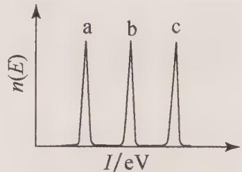

3.32 三氟代乙酸乙酯的 XPS 中,有 4 个不同化学位移的 C1s 峰,其结合能大小次序如何?为什么?

3.33 银的下列4个XPS峰中，强度最大的特征峰是什么？

$$
\mathrm{Ag} 4 \mathrm{s} \text {峰}, \mathrm{Ag} 3 \mathrm{p} \text {峰}, \mathrm{Ag} 3 \mathrm{s} \text {峰}, \mathrm{Ag} 3 \mathrm{d} \text {峰}
$$

3.34 由于自旋-轨道耦合，Ar的紫外光电子能谱第一条谱线分裂成强度比为 $2:1$ 的两个峰，它们所对应的电离能分别为15.759和 $15.937\mathrm{eV}$ 。

（1）指出相应于此第一条谱线的光电子是从Ar原子的哪个轨道被击出的；

(2) 写出 Ar 原子和 $Ar^{+}$ 离子的基态光谱支项；

(3) 写出与两电离能对应的电离过程表达式；

(4) 计算自旋-轨道耦合常数。

## 参考文献

[1] 江元生. 结构化学. 北京: 高等教育出版社, 1997.

[2] 徐光宪, 王祥云. 物质结构. 第二版. 北京: 科学出版社, 2010.

[3] 鲍林(Pauling L). 化学键的本质. 第三版. 卢嘉锡, 黄耀曾, 曾广植, 陈元柱, 等译. 上海: 上海科学技术出版社, 1981.

[4] 林梦海, 林银钟. 结构化学. 北京: 科学出版社, 2004.

[5] 范康年. 物理化学. 第二版. 北京: 高等教育出版社, 2005.

[6] Levine I N. Quantum Chemistry. 5 $^{th}$ ed. Upper Saddle River, NJ: Prentice-Hall, 2000.

[7] Atkins P W. Physical Chemistry. 6 $^{th}$ ed. Oxford: Oxford University Press, 1998.

[8] Atkins P W, Friedman R S. Molecular Quantum Mechanics. 3 $^{rd}$ ed. New York: Oxford University Press, 1997.

[9] Herzberg G. Molecular Spectra and Molecular Structure. Malabar: Krieger I. Spectra of Diatomic Molecules, 1989.
II. Infrared and Raman Spectra of Polyatomic Molecules, 1991.
III. Electronic Spectra of Polyatomic Molecules, 1991.

## 第4章 分子的对称性

自然界普遍存在着对称性。许多动物的外形左右对称，具有镜面对称元素。许多植物的花朵和叶片绕对称轴排列，具有对称轴，如梅花五瓣、百合花三瓣等。许多建筑、雕刻、绘画、图案，根据实用和美观的要求，设计成对称的形式，或左右对称，或绕轴对称。微观的分子和宏观的物体一样，也具有多种多样的对称元素。总之，我们所处的环境，从宏观到微观，是个存在对称性的世界。利用对称性概念及有关原理和方法解决我们遇到的问题，可以使我们对自然现象及其运动规律的认识更加深入。

在分子中,原子固定在其平衡位置上,其空间排列是个对称的图像。利用对称性原理探讨分子的结构和性质,是人们认识分子的重要途径,是了解分子结构和性质的重要方法。分子对称性是联系分子结构和分子性质的重要桥梁之一。

对称性概念和有关原理对化学十分重要。

（1）它能简明地表达分子的构型。例如 $\mathrm{Ni(CN)}_4^{2-}$ 离子具有 $D_{4h}$ 点群的对称性，用 $D_{4h}$ 这个符号就可准确地表达9个原子在同一平面上，Ni在离子的中心位置，周围4个—CN完全等同，Ni—C—N都是直线形，互成 $90^{\circ}$ 角。

(2) 可简化分子构型的测定工作。将对称性基本原理用于量子力学、光谱学、X射线晶体学等测定分子和晶体结构时, 许多计算可以简化, 图像更为明确。

（3）帮助正确地了解分子的性质。分子的性质由分子的结构决定，分子的许多性质直接与分子的对称性有关，正确地分析分子的对称性，能帮助我们深入理解分子的性质。

（4）指导化学合成工作。描述分子中电子运动状态的分子轨道，具有特定的对称性，化学键的改组和形成，常需要考虑对称性匹配的因素，许多化合物及生物活性物质，其性质与分子的绝对构型有关。合成具有一定生物活性的化合物，需要考虑对称性因素。

## 4.1 对称操作和对称元素

对称, 就其字面含义来讲, 是指一个物体包含若干等同部分, 这些部分相对 (对等、对应) 而又相称 (适合、相当)。这些部分能经过不改变其内部任何两点间距离的对称操作所复原。旋转、反映、反演等都是对称操作。对称物体经过某一操作后, 物体中每一点都被放在周围环境与原先相似的相当点上, 操作前物体中在什么地方有些什么, 操作后在那个地方依然相同, 无法区别是操作前的物体还是操作后的物体, 这种情况叫复原。能不改变物体内部任何两点间的距离而使物体复原的操作叫对称操作。对称操作所据以进行的旋转轴、镜面和对称中心等几何元素称为对称元素。对于分子等有限物体, 在进行操作时, 分子中至少有一点是不动的, 叫点操作。现将点操作及所依据的对称元素的性质, 分别叙述于下。

## 4.1.1 旋转操作和旋转轴(对称元素)

旋转操作是将分子绕通过其中心的轴旋转一定的角度使分子复原的操作。旋转依据的对称元素为旋转轴， $n$ 次旋转轴用记号 $C_n$ 表示。旋转操作的特点是将分子的每一点都绕这条轴线转动一定的角度。能使物体复原的最小旋转角（ $0^\circ$ 除外）称为基转角 $(\alpha)$ ， $C_n$ 轴的基转角 $\alpha = 360^\circ / n$ ，旋转角度按逆时针方向计算。和 $C_n$ 轴相应的基本旋转操作为 $C_n^1$ ，按 $C_n^1$ 重复进行，当旋转角度等于基转角的2倍、3倍等整数倍时，分子也能复原。这些旋转操作分别记为

$$
\boldsymbol {C} _ {n} ^ {2} = \boldsymbol {C} _ {n} ^ {1} \boldsymbol {C} _ {n} ^ {1}, \quad \boldsymbol {C} _ {n} ^ {3} = \boldsymbol {C} _ {n} ^ {1} \boldsymbol {C} _ {n} ^ {1} \boldsymbol {C} _ {n} ^ {1}, \quad \dots
$$

所有分子都有无限多个 $C_1$ 旋转轴，因为绕通过分子的任一直线旋转 $360^{\circ}$ 都能使分子复原，是个恒等操作，常用 $\pmb{E}$ 表示。 $\pmb{E}$ 称为主操作，和乘法中的1相似。严格地说，一个分子若只有 $\pmb{E}$ 能使它复原，这个分子不能称为对称分子，或只能看作对称分子的一个特例。在分子的对称操作群中， $\pmb{E}$ 是一个不可缺少的元素。

对于分子等有限物体， $C_{n}$ 的轴次 n 并不受限制，n 可为任意正整数。分子中常见的旋转轴有 $C_{2}, C_{3}, C_{4}, C_{5}, C_{6}, C_{\infty}$ 等。例如 $H_{2}O, H_{2}O_{2}$ 等分子中有 $C_{2}$ 轴； $NH_{3}, HCCl_{3}, PCl_{5}, Fe(CO)_{5}$ 等分子中有 $C_{3}$ 轴； $Ni(CN)_{4}^{2-}, SF_{6}, PtCl_{4}^{2-}$ 等分子中有 $C_{4}$ 轴； $Fe(C_{5}H_{5})_{2}, IF_{7}$ 等分子中有 $C_{5}$ 轴； $C_{6}H_{6}$ 分子中有 $C_{6}$ 轴； $H_{2}, HCl, CO_{2}$ 等线形分子中有 $C_{\infty}$ 轴。

当 $C_2$ 轴和坐标轴 $z$ 轴重合，并通过原点 $O$ ，对称操作 $C_2^1$ 能将原来处在 $(x,y,z)$ 处的原子1移至 $(\overline{x},\overline{y},z)$ 处，同时将 $(\overline{x},\overline{y},z)$ 处的原子2移至 $(x,y,z)$ 处，如图4.1.1(a)所示。当原子1和原子2相同， $C_2^1$ 操作能使之复原。图4.1.1(b)示出 $\mathrm{CH}_2\mathrm{Cl}_2$ 分子中的 $C_2$ 轴。

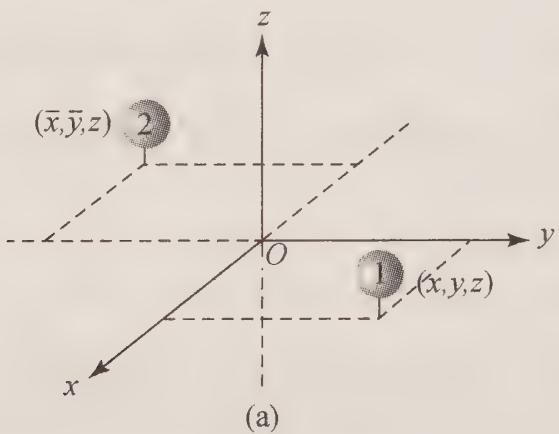

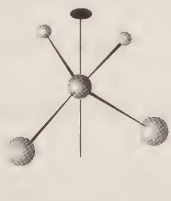  
图 4.1.1 $C_{2}^{1}$ 的对称操作(a)和 $CH_{2}Cl_{2}$ 分子中的 $C_{2}$ 轴(b)

各种对称操作相当于不同的坐标变换,而坐标变换为一种线性变换,所以可用变换矩阵表示对称操作。 $C_{2}^{1}$ 操作的表示矩阵如下

$$
\boldsymbol {C} _ {2} ^ {1} \left( \begin{array}{c} x \\ y \\ z \end{array} \right) = \left( \begin{array}{c c c} - 1 & 0 & 0 \\ 0 & - 1 & 0 \\ 0 & 0 & 1 \end{array} \right) \left( \begin{array}{c} x \\ y \\ z \end{array} \right) = \left( \begin{array}{c} - x \\ - y \\ z \end{array} \right)
$$

$C_3$ 轴有3种操作 $C_3^1, C_3^2, C_3^3$ ，这3种操作的关系示于图4.1.2(a)中。 $C_3^1$ 和 $C_3^2$ 的表示矩阵为

$$
\boldsymbol {C} _ {3} ^ {1} = \left( \begin{array}{c c c} - 1 / 2 & - \sqrt {3} / 2 & 0 \\ \sqrt {3} / 2 & - 1 / 2 & 0 \\ 0 & 0 & 1 \end{array} \right), \quad \boldsymbol {C} _ {3} ^ {2} = \left( \begin{array}{c c c} - 1 / 2 & \sqrt {3} / 2 & 0 \\ - \sqrt {3} / 2 & - 1 / 2 & 0 \\ 0 & 0 & 1 \end{array} \right)
$$

表示矩阵中的数字来源,可参看图 4.1.2(b)。由图可见,当原子由位置 $1(x,y,z)$ 转至位置 $2(x',y',z)$ 时,坐标关系为

$$
x ^ {\prime} = - \sin (3 0 ^ {\circ} + \alpha) = - \sin 3 0 ^ {\circ} \cos \alpha - \cos 3 0 ^ {\circ} \sin \alpha = - \frac {1}{2} x - \frac {\sqrt {3}}{2} y
$$

$$
y ^ {\prime} = \cos (3 0 ^ {\circ} + \alpha) = \cos 3 0 ^ {\circ} \cos \alpha - \sin 3 0 ^ {\circ} \sin \alpha = \frac {\sqrt {3}}{2} x - \frac {1}{2} y
$$

图 4.1.2(c) 示出 $NH_{3}$ 分子中的 $C_{3}$ 轴。

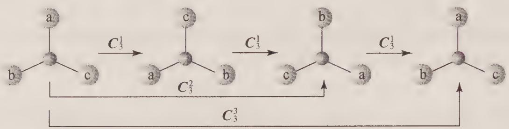  
(a)

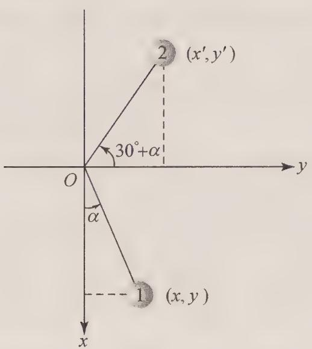  
(b)

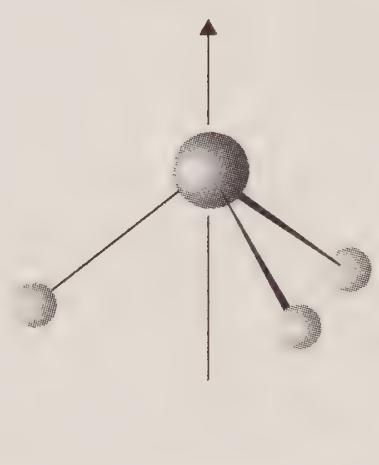  
(c)  
图 4.1.2 $C_{3}$ 轴的 3 种对称操作 (a)、坐标变换 (b) 及 $NH_{3}$ 分子中的 $C_{3}$ 轴 (c)

与 $C_4$ 轴相关的旋转操作及其表示矩阵为

$$
\boldsymbol {C} _ {4} ^ {1} = \left( \begin{array}{c c c} 0 & - 1 & 0 \\ 1 & 0 & 0 \\ 0 & 0 & 1 \end{array} \right), \quad \boldsymbol {C} _ {4} ^ {3} = \left( \begin{array}{c c c} 0 & 1 & 0 \\ - 1 & 0 & 0 \\ 0 & 0 & 1 \end{array} \right) = \boldsymbol {C} _ {4} ^ {- 1}
$$

由于 $C_{4}^{2}=C_{2}^{1}$ ，所以 $C_{4}$ 轴包括 $C_{2}$ 轴。 $C_{4}^{1}$ 和 $C_{4}^{3}$ 为 $C_{4}$ 轴的两种特征对称操作。

$C_{6}$ 轴有 6 种对称操作

$$
\boldsymbol {C} _ {6} ^ {1}, \quad \boldsymbol {C} _ {6} ^ {2} = \boldsymbol {C} _ {3} ^ {1}, \quad \boldsymbol {C} _ {6} ^ {3} = \boldsymbol {C} _ {2} ^ {1}, \quad \boldsymbol {C} _ {6} ^ {4} = \boldsymbol {C} _ {3} ^ {2}, \quad \boldsymbol {C} _ {6} ^ {5}, \quad \boldsymbol {C} _ {6} ^ {6} = \boldsymbol {E}
$$

可见 $C_6$ 轴包括 $C_2$ 轴和 $C_3$ 轴的全部对称操作，即有 $C_6$ 轴的物体一定在 $C_6$ 轴的方向上有 $C_3$ 轴和 $C_2$ 轴，通常只标明 $C_6$ 轴而不必再标明 $C_2$ 轴和 $C_3$ 轴。 $C_6$ 轴有特征操作 $C_6^1$ 和 $C_6^5$ ，其表示矩阵为

$$
\boldsymbol {C} _ {6} ^ {1} = \left( \begin{array}{c c c} 1 / 2 & - \sqrt {3} / 2 & 0 \\ \sqrt {3} / 2 & 1 / 2 & 0 \\ 0 & 0 & 1 \end{array} \right), \quad \boldsymbol {C} _ {6} ^ {5} = \left( \begin{array}{c c c} 1 / 2 & \sqrt {3} / 2 & 0 \\ - \sqrt {3} / 2 & 1 / 2 & 0 \\ 0 & 0 & 1 \end{array} \right)
$$

讨论对称操作时,常将分子定位在右手坐标轴系上,分子的重心处在坐标原点,主轴和 z 轴重合。一般主轴指分子中轴次最高的 $C_{n}$ 轴。由线性代数可推得 $C_{n}$ 轴的第 k 次对称操作 $C_{n}^{k}$ 的表示矩阵为

$$
\boldsymbol {C} _ {n} ^ {k} = \left( \begin{array}{c c c} \cos (2 k \pi / n) & - \sin (2 k \pi / n) & 0 \\ \sin (2 k \pi / n) & \cos (2 k \pi / n) & 0 \\ 0 & 0 & 1 \end{array} \right)
$$

## 4.1.2 反演操作和对称中心

当分子有对称中心 $i$ 时，从分子中任一原子至对称中心连一直线，将此线延长，必可在和对

称中心等距离的另一侧找到另一相同原子。依据对称中心进行的对称操作叫反演或倒反。由于每一个原子通过反演操作可以得到另一个相同原子，所以除位于对称中心 $i$ 上的原子外，其他原子必定成对地出现。图4.1.3示出反式-二氯乙烯 $\mathrm{C}_2\mathrm{H}_2\mathrm{Cl}_2$ 分子的对称中心的位置。两个由对称中心联系的分子是对映体，它们不一定完全相同，如左右手关系：伸出你的右手，手心朝上，指尖向左；伸出你的左手，手心朝下，指尖向右。它们是由对称中心联系的两只手。

若对称中心位置在原点 $(0,0,0)$ 处，反演操作 $i$ 的表示矩阵为

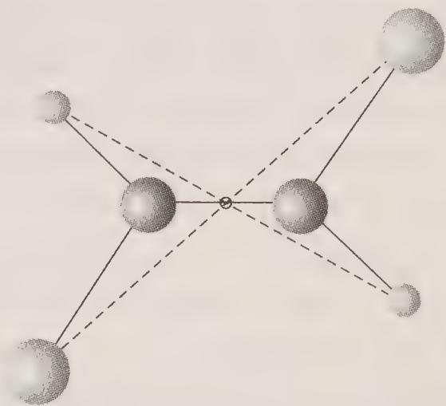  
图4.1.3 反式 $\mathrm{C}_2\mathrm{H}_2\mathrm{Cl}_2$ 分子的结构

$$
\boldsymbol {i} = \left( \begin{array}{r r r} - 1 & 0 & 0 \\ 0 & - 1 & 0 \\ 0 & 0 & - 1 \end{array} \right)
$$

连续进行两次反演操作等于主操作；反演操作和它的逆操作相等。所以

$$
\pmb {i} ^ {n} = \left\{ \begin{array}{l l} {\pmb {E},} & {n \text {为偶数}} \\ {\pmb {i},} & {n \text {为奇数}} \end{array} \right.
$$

$C_{6}H_{6}, SF_{6}, CO_{2}, C_{2}H_{4}$ ，反式 ClHC=CHCl 等分子均具有对称中心，称为中心对称分子。有些分子如 $CH_{4}, H_{2}O, NH_{3}, CO$ 等没有对称中心，称为非中心对称分子。

## 4.1.3 反映操作和镜面

镜面是平分分子的平面，在分子中除位于镜面上的原子外，其他原子成对地排在镜面两侧，它们通过反映操作可以复原。反映操作是使分子中的每一点都反映到该点到镜面垂线的延长线上，在镜面另一侧等距离处。图4.1.4示出 $\mathrm{CH}_2\mathrm{Cl}_2$ 分子中的镜面。镜面对称元素在讨论分子结构时常用 $\sigma$ 表示，在晶体学中常用 $m$ 表示。

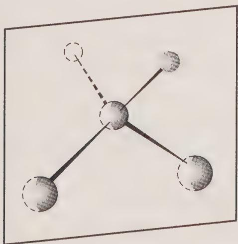  
图4.1.4 $\mathrm{CH}_2\mathrm{Cl}_2$ 分子中的一个镜面

若镜面和 $xy$ 平面平行并通过原点，则反映操作 $\sigma$ 的表示矩阵为

$$
\boldsymbol {\sigma} _ {x y} = \left( \begin{array}{c c c} 1 & 0 & 0 \\ 0 & 1 & 0 \\ 0 & 0 & - 1 \end{array} \right)
$$

和 i 相似, 连续进行两次反映操作, 相当于主操作; 反映操作和它的逆操作相等。

$$
\pmb {\sigma} ^ {n} = \left\{ \begin{array}{l l} \pmb {E}, & n \text {为偶数} \\ \pmb {\sigma}, & n \text {为奇数} \end{array} \right.
$$

一个分子和它在镜中的像完全相同,没有任何差别,包括没有左右手对映体那样的差别,则这个分子有镜面对

称性,即通过分子中心必定有一镜面。有些分子,它们的形状和它们在镜中的像的形状虽有对映关系,但并不完全相同,如左手和右手那样,这种分子的不对称性称为手性(chirality)。手性分子本身不具有镜面的对称性。

根据镜面和旋转轴在空间排布方式上的不同，常以不同的下标表示。当 $\sigma$ 垂直于主轴 $C_n$ ，以 $\sigma_h$ 表示（ $h$ 来源于 horizontal）； $\sigma$ 通过主轴 $C_n$ ，以 $\sigma_v$ 表示（ $v$ 来源于 vertical）； $\sigma$ 通过主轴 $C_n$ ，平分相邻副轴（一般为 $C_2$ 轴）的夹角，以 $\sigma_d$ 表示 [d 来源于 diagonal（对角线的）或 dihedral（双面角的）]。下标 $h, v, d$ 在标记分子点群时有重要意义。

平面形分子至少有一个镜面，就是分子平面，例如，反式-二氯乙烯ClHC=CHCl为有1个镜面的平面分子。 $\mathrm{H}_2\mathrm{O}$ 分子有2个 $\sigma_v$ ，它们彼此垂直相交，交线为 $C_2$ 轴。 $\mathrm{NH}_3$ 分子有3个 $\sigma_v$ ，它们彼此成 $120^{\circ}$ 相交，交线为 $C_3$ 轴。 $\mathrm{C_6H_6}$ 分子有6个 $\sigma_v$ ，互成 $30^{\circ}$ 相交，交线为 $C_6$ 轴，此外还有1个和 $C_6$ 轴垂直的 $\sigma_h$ 。HCl分子有 $\infty$ 个 $\sigma_v$ ，它们的交线为 $C_\infty$ 轴。同核双原子分子除 $\infty$ 个 $\sigma_v$ 外，还有垂直于 $C_\infty$ 的 $\sigma_h$ 。

## 4.1.4 旋转反演操作和反轴

反轴 $I_{n}$ 的基本操作为绕轴转 $360^{\circ} / n$ ，接着按轴上的中心点进行反演， $I_{n}^{1} = iC_{n}^{1}$ 。这个操作是 $C_n^1$ 和 $\pmb{i}$ 相继进行的联合操作。 $I_{1}$ 对称元素等于 $i; I_{2}$ 等于 $\sigma_{h}; I_{3}$ 包括下列6个对称操作

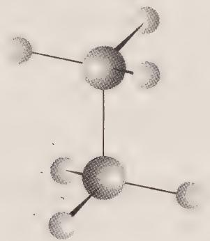  
具有反轴 $I_{3}$  
图4.1.5 交叉式乙烷分子

$$
\begin{array}{l l l} I _ {3} ^ {1} = i C _ {3} ^ {1}, & I _ {3} ^ {2} = C _ {3} ^ {2}, & I _ {3} ^ {3} = i, \\ I _ {3} ^ {4} = C _ {3} ^ {1}, & I _ {3} ^ {5} = i C _ {3} ^ {2}, & I _ {3} ^ {6} = E \end{array}
$$

$I_{3}$ 轴包括 $C_3$ 和 $i$ 的全部对称操作，而 $I_{3}^{1}$ 和 $I_{3}^{5}$ 可由 $C_3^{1}$ 和 $i$ 等组合而得，所以 $I_{3}$ 轴可看作由 $C_3$ 和 $i$ 组合得到

$$
I _ {3} = C _ {3} + i
$$

交叉式乙烷分子具有 $I_{3}$ 对称元素，如图4.1.5所示。

$I_{4}$ 对称元素包括下列操作

$$
\begin{array}{l l} \boldsymbol {I} _ {4} ^ {1} = i \boldsymbol {C} _ {4} ^ {1}, & \boldsymbol {I} _ {4} ^ {2} = \boldsymbol {C} _ {2} ^ {1}, \\ \boldsymbol {I} _ {4} ^ {3} = i \boldsymbol {C} _ {4} ^ {3}, & \boldsymbol {I} _ {4} ^ {4} = \boldsymbol {E} \end{array}
$$

可见 $I_{4}$ 轴包括 $C_2$ 轴的全部操作，即 $I_{4}$ 轴包括 $C_2$ 轴。但是一个包含 $I_{4}$ 对称性的分子，并不具有 $C_4$ 轴，也不具有 $i$ ，即 $I_{4}$ 不等于 $C_4$ 和 $i$ 两个对称元素的简单加和， $I_{4}$ 是一个独立的对称元素。例如在 $\mathrm{CH}_4$ 分子中包含3个互相垂直相交的 $I_{4}$ ，如图4.1.6所示。图中示出具有 $I_{4}$ 轴的分子，先进行 $C_4^1$ ，再进行 $\pmb{i}$ 操作使分子复原的情况。

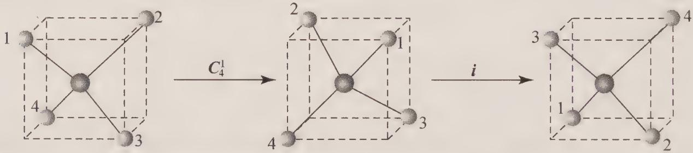  
图4.1.6 具有 $I_{4}$ 轴的分子经过 $I_{4}^{1}$ 操作的情况

$I_{6}$ 包括下列 6 个对称操作

$$
\boldsymbol {I} _ {6} ^ {1} = \boldsymbol {i} \boldsymbol {C} _ {6} ^ {1} = \sigma \boldsymbol {C} _ {3} ^ {2}, \quad \boldsymbol {I} _ {6} ^ {2} = \boldsymbol {C} _ {3} ^ {1}, \quad \boldsymbol {I} _ {6} ^ {3} = \sigma
$$

$$
\boldsymbol {I} _ {6} ^ {4} = \boldsymbol {C} _ {3} ^ {2}, \quad \boldsymbol {I} _ {6} ^ {5} = i \boldsymbol {C} _ {6} ^ {5} = \sigma \boldsymbol {C} _ {3} ^ {1}, \quad \boldsymbol {I} _ {6} ^ {6} = \boldsymbol {E}
$$

所以 $I_{6}$ 可看作由 $C_3$ 和 $\sigma_h$ 组合得到。

由上可见，对于反轴 $I_{n}$ ，当 $n$ 为奇数时，包含 $2n$ 个对称操作，可看作由 $n$ 重旋转轴 $C_{n}$ 和对称中心 $i$ 组成；当 $n$ 为偶数而不为4的整数倍时，由旋转轴 $C_{n/2}$ 和垂直于它的镜面 $\sigma_{h}$ 组成；当 $n$ 为4的整数倍时， $I_{n}$ 是一个独立的对称元素，这时 $I_{n}$ 轴与 $C_{n/2}$ 轴同时存在。

## 4.1.5 旋转反映操作和映轴

映轴 $S_{n}$ 所对应的基本操作 $S_{n}^{1}$ 为绕轴转 $360^{\circ} / n$ 接着按垂直于轴的平面进行反映， $S_{n}^{1} = \sigma C_{n}^{1}$ 。这个操作是 $C_{n}^{1}$ 和 $\sigma$ 相继进行的联合操作。按照上述对反轴那样进行分析，可得

$$
\begin{array}{l l} {{S _ {1} \text {等于镜面}}} & {{S _ {2} \text {等于对称中心}}} \\ {{S _ {3} \text {等于} C _ {3} + \sigma_ {h}}} & {{S _ {4} \text {是个独立的对称元素}}} \\ {{S _ {5} \text {等于} C _ {5} + \sigma_ {h}}} & {{S _ {6} \text {等于} C _ {3} + i}} \end{array}
$$

对于映轴 $S_{n}$ ：当 $n$ 为奇数时，有 $2n$ 个操作，它由 $C_n$ 轴和 $\sigma_h$ 组成；当 $n$ 为偶数而又不为4的整数倍时， $S_{n}$ 可看作由 $C_{n/2}$ 与 $i$ 组成；当 $n$ 为4的整数倍时， $S_{n}$ 是个独立的对称元素，而且 $S_{n}$ 轴与 $C_{n/2}$ 轴同时存在。

反轴 $I_{n}$ 和映轴 $S_{n}$ 是互有联系、互相包含的，它们与其他对称元素的关系如下：

$$
\begin{array}{l l} I _ {1} = S _ {2} ^ {-} = i & S _ {1} = I _ {2} ^ {-} = \sigma \\ I _ {2} = S _ {1} ^ {-} = \sigma & S _ {2} = I _ {1} ^ {-} = i \\ I _ {3} = S _ {6} ^ {-} = C _ {3} + i & S _ {3} = I _ {6} ^ {-} = C _ {3} + \sigma \\ I _ {4} = S _ {4} ^ {-} & S _ {4} = I _ {4} ^ {-} \\ I _ {5} = S _ {1 0} ^ {-} = C _ {5} + i & S _ {5} = I _ {1 0} ^ {-} = C _ {5} + \sigma \\ I _ {6} = S _ {3} ^ {-} = C _ {3} + \sigma & S _ {6} = I _ {3} ^ {-} = C _ {3} + i \end{array}
$$

式中右上角的负号表示逆操作，例如 $I_3^1$ 和 $S_6^1$ 的逆操作 $S_6^-$ 是相同的。式中的连续等号表示这个对称元素可以由两个或其他对称元素组合而成，不是独立存在的对称元素。

由上可见, 反轴和映轴两者是相通的, 对它们只要选择一种即可。通常对分子的对称性用 $S_{n}$ 较多, 对晶体的对称性则采用 $I_{n}$ , 因为按特征对称元素划分晶系时, 按反轴轴次规定进行。为了将分子对称性和晶体对称性统一起来, 我们主要用反轴。

分子中可能存在的对称元素及相应的对称操作列于表4.1.1中。它们可分为两大类：简单旋转操作属第一类，为实操作，其特点是能具体操作，直接实现；反映和反演属第二类，为虚操作，其特点是只能在想象中实现。旋转反映、旋转反演等是这两类对称操作的联合操作。

表 4.1.1 对称元素和对称操作

<table><tr><td>对称元素符号</td><td>对称元素名称</td><td>基本对称操作符号</td><td>基本对称操作</td></tr><tr><td>E</td><td>—</td><td>E</td><td>恒等操作</td></tr><tr><td>Cn</td><td>旋转轴</td><td>C1n</td><td>绕 Cn 轴按逆时针方向转 360°/n</td></tr><tr><td>σ</td><td>镜面</td><td>σ</td><td>通过镜面反映</td></tr><tr><td>i</td><td>对称中心</td><td>i</td><td>按对称中心反演</td></tr><tr><td>Sn</td><td>映轴</td><td>S1n=σC1n</td><td>绕 Sn 轴转 360°/n,接着按垂直于轴的平面反映</td></tr><tr><td>In</td><td>反轴</td><td>I1n=iC1n</td><td>绕 In 轴转 360°/n,接着按中心点反演</td></tr></table>

## 4.2 对称元素的组合与对称操作群

## 4.2.1 群的定义

一个分子具有的全部对称元素构成一个完整的对称元素系,和该对称元素系对应的全部对称操作形成一个对称操作群。群是按照一定规律相互联系的一些元(又称元素)的集合,这些元可以是操作、数字、矩阵或算符等。在本章中群的元均指对称操作或对称操作的表示矩阵。

连续做两个对称操作即和这两个元的乘法对应。若对称操作 A, B, C, … 的集合 $G = \{A, B, C, \cdots\}$ 同时满足下列 4 个条件，则 G 形成一个群。

## (1) 封闭性

若 A 和 B 为同一群 G 中的对称操作，则 AB = C, C 也是群 G 中的一个对称操作。

## (2) 主操作

在每个群 $G$ 中必有一个主操作 $\pmb{E}$ , 它与群中任何一个操作相乘给出

$$
\mathbf {A E} = \mathbf {E A} = \mathbf {A}
$$

## (3) 逆操作

群 $G$ 中的每一个操作 $\mathbf{A}$ 均存在逆操作 $\mathbf{A}^{-1}, \mathbf{A}^{-1}$ 也是该群中的一个操作。逆操作是按原操作途径退回去的操作。

$$
\boldsymbol {A} \boldsymbol {A} ^ {- 1} = \boldsymbol {A} ^ {- 1} \boldsymbol {A} = \boldsymbol {E}
$$

## (4) 结合律

对称操作的乘法符合下面的结合律(括号中的两个对称操作表示先进行相乘)。

$$
\mathbf {A} (\mathbf {B C}) = (\mathbf {A B}) \mathbf {C}
$$

上述 4 项既是判断对称操作的集合是否形成一个群的标准,也是群的最基本的性质。

一个对称群中 $A, B, C$ 等元的数目，称为群的阶次。阶次也代表组成物体的等同部分的数目。元的数目有限的群称为有限群，元的数目无限的群称为无限群。

当一个群中的部分元满足上述4个条件时，则这部分元构成的群称为该群的子群，子群的阶是母群的阶的一个因子。

一个有限分子的对称操作群称为点群，“点”字的含义有两层：一层是这些对称操作都是点操作，操作时分子中至少有一个点不动；另一层是分子的全部对称元素至少通过一个公共点。如果两个对称元素不交于一点，例如分子中若有两个平行的镜面存在，这两个镜面的对称操作互相作用，就会出现无数个镜面，分子就不能维持有限性质了。

## 4.2.2 群的乘法表

如果知道一个 h 阶有限群的元及这些元的所有可能的乘积(共 $h^{2}$ 个)，那么这个群就完全确定了，并可用群的乘法表的形式把它们简明地表达出来。乘法表由 h 行(每行由左至右)和 h 列(每列由上至下)组成。在行坐标为 x 和列坐标为 y 的交点上找到的元是 yx，即先操作 x，后操作 y。因为对称操作的乘法一般是不可交换的，所以要注意次序。在群的乘法表中，每个元在每一行和每一列中只出现一次，不可能有两行是全同的，也不可能有两列全同。每一行和每一列都是元的重新排列。

$\mathrm{H}_2\mathrm{O}$ 分子的对称性示于图4.2.1中，它有4个独立的对称操作： $E,C_2^1,\sigma_{xz},\sigma_{yz}$ 。这些操作形成一个群，用记号 $C_{2v}$ 表示。这些操作按乘法规则排成群的乘法表，如表4.2.1所示。

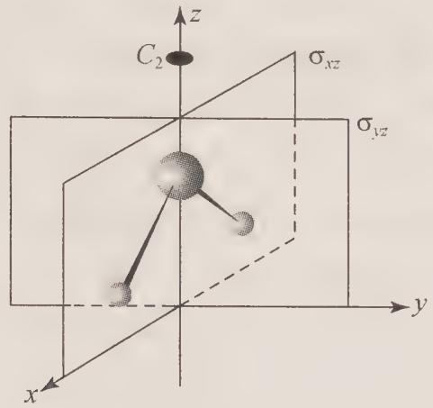  
图4.2.1 $\mathrm{H}_2\mathrm{O}$ 分子的对称性

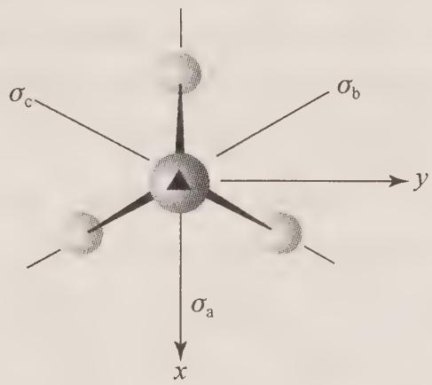  
图4.2.2 $\mathrm{NH}_3$ 分子的对称性

表 4.2.1 $C_{2v}$ 群的乘法表

<table><tr><td> $C_{2v}$ </td><td> $E$ </td><td> $C_2^1$ </td><td> $σ_{yz}$ </td><td> $σ_{xz}$ </td></tr><tr><td> $E$ </td><td> $E$ </td><td> $C_2^1$ </td><td> $σ_{yz}$ </td><td> $σ_{xz}$ </td></tr><tr><td> $C_2^1$ </td><td> $C_2^1$ </td><td> $E$ </td><td> $σ_{xz}$ </td><td> $σ_{yz}$ </td></tr><tr><td> $σ_{yz}$ </td><td> $σ_{yz}$ </td><td> $σ_{xz}$ </td><td> $E$ </td><td> $C_2^1$ </td></tr><tr><td> $σ_{xz}$ </td><td> $σ_{xz}$ </td><td> $σ_{yz}$ </td><td> $C_2^1$ </td><td> $E$ </td></tr></table>

$\mathrm{NH}_3$ 分子的对称性示于图4.2.2中，独立的对称操作有： $E,C_3^1,C_3^2,\sigma_a,\sigma_b,\sigma_c$ 。这些对称操作组成 $C_{3v}$ 点群，其乘法表列于表4.2.2中。

表 4.2.2 $C_{3v}$ 群的乘法表

<table><tr><td> $C_{3v}$ </td><td>E</td><td> $C_3^1$ </td><td> $C_3^2$ </td><td> $σ_a$ </td><td> $σ_b$ </td><td> $σ_c$ </td></tr><tr><td>E</td><td>E</td><td> $C_3^1$ </td><td> $C_3^2$ </td><td> $σ_a$ </td><td> $σ_b$ </td><td> $σ_c$ </td></tr><tr><td> $C_3^1$ </td><td> $C_3^1$ </td><td> $C_3^2$ </td><td>E</td><td> $σ_c$ </td><td> $σ_a$ </td><td> $σ_b$ </td></tr><tr><td> $C_3^2$ </td><td> $C_3^2$ </td><td>E</td><td> $C_3^1$ </td><td> $σ_b$ </td><td> $σ_c$ </td><td> $σ_a$ </td></tr><tr><td> $σ_a$ </td><td> $σ_a$ </td><td> $σ_b$ </td><td> $σ_c$ </td><td>E</td><td> $C_3^1$ </td><td> $C_3^2$ </td></tr><tr><td> $σ_b$ </td><td> $σ_b$ </td><td> $σ_c$ </td><td> $σ_a$ </td><td> $C_3^2$ </td><td>E</td><td> $C_3^1$ </td></tr><tr><td> $σ_c$ </td><td> $σ_c$ </td><td> $σ_a$ </td><td> $σ_b$ </td><td> $C_3^1$ </td><td> $C_3^2$ </td><td>E</td></tr></table>

乘法表中行和列交叉点的元是由行上的元与列上的元组合所得的对称操作。例如表4.2.2中行的第四个元 $\sigma_{\mathrm{a}}$ 和列的第二个元 $C_3^1$ 相乘得 $\sigma_{\mathrm{c}} = C_3^1\sigma_{\mathrm{a}}$ 。（进行对称操作时，参考坐标系在空间固定不动，只动分子。）

通过乘法表可以清楚地看到,一个分子的全部对称操作符合群的4项基本性质。在乘法表中,两个旋转操作相乘和两个反映操作相乘得到的是旋转操作,即第一类操作。旋转和反映相乘,得到的是反映,即第二类操作。实际上,两个第一类对称操作的乘积和两个第二类对称操作的乘积都是第一类对称操作,而第一类和第二类操作的乘积为第二类对称操作。

## 4.2.3 对称元素的组合

一个分子中有多个对称元素存在,根据对称操作的乘法关系可以证明,当两个对称元素按一定的相对位置同时存在时,必能导出第三个对称元素,这叫对称元素的组合。对称元素的组合服从一定的组合原则,下面举三方面例子。

## 1. 两个旋转轴的组合

交角为 $2\pi / 2n$ 的两个 $C_2$ 轴相组合，在其交点上必定出现一个垂直于这两个 $C_2$ 轴的 $C_n$ 轴。而垂直于 $C_n$ 轴通过交点的平面内必有 $n$ 个 $C_2$ 轴。分子中存在两个互相垂直的二次轴 $C_{2(x)}$ 和 $C_{2(y)}$ 时，必然出现一个与此两个轴垂直的二次轴 $C_{2(z)}$ 。由此也可推出，由旋转轴 $C_n$ 与垂直于它的 $C_2$ 轴组合，在垂直于 $C_n$ 轴的平面内必有 $n$ 个 $C_2$ 轴，相邻两个轴间的夹角为 $2\pi / 2n$ 。

## 2. 两个镜面的组合

两个镜面相交, 若交角为 $2\pi / 2n$ , 则其交线必为 $n$ 次轴 $C_n$ , 这可从图4.2.3得到证明。图中 $A$ 和 $B$ 两个镜面的交角为 $\alpha + \beta = 2\pi / 2n$ 。原子1经镜面 $A$ 反映至原子2, 原子1经镜面 $B$ 反映至原子3, 原子2和原子3可由通过 $AB$ 的交线(过 $O$ 点)转动 $2(\alpha + \beta)$ 即 $2\pi / n$ 而重合。将原子3通过镜面 $A$ 和镜面 $B$ 反映所得的原子, 与通过交线再转 $2\pi / n$ 的操作所得的原子重合(前者图中未画出), 所以此线为 $C_n$ 轴。

同理, $C_{n}$ 轴和通过该轴并与它平行的镜面组合,一定存在n个镜面,相邻镜面间的夹角为 $2\pi/2n$ 。

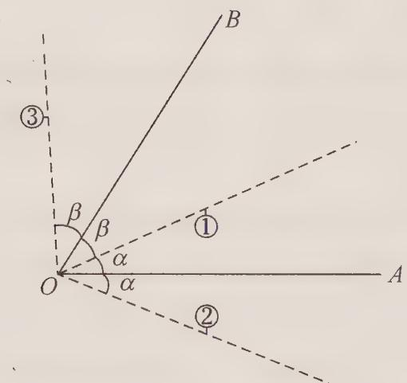  
图4.2.3 两个镜面的组合

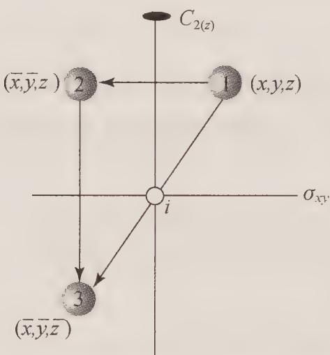  
图4.2.4 镜面与垂直于它的偶次旋转轴组合

## 3. 偶次旋转轴和与它垂直的镜面的组合

一个偶次旋转轴与一个垂直于它的镜面组合，必定在交点上出现对称中心，如图4.2.4所示。假定偶次轴 $C_{2n}$ 与 $z$ 轴重合，镜面 $\sigma_{xy}$ 和 $x, y$ 轴平行，轴与镜面的交点为原点，分子中一原子坐标为 $(x, y, z)$ ，当绕 $C_{2n(z)}$ 轴转动 $C_{2n(z)}^n$ ，即 $C_{2(z)}^1$ ，再经 $\sigma_{xy}$ 反映，得

$$
\boldsymbol {\sigma} _ {x y} \boldsymbol {C} _ {2 (z)} ^ {1} \left( \begin{array}{l} x \\ y \\ z \end{array} \right) = \boldsymbol {\sigma} _ {x y} \left( \begin{array}{c} - x \\ - y \\ z \end{array} \right) = \left( \begin{array}{l} - x \\ - y \\ - z \end{array} \right)
$$

这一结果与由对称中心反演的结果相同，如图 4.2.4 所示。

$$
\boldsymbol {i} \left( \begin{array}{l} x \\ y \\ z \end{array} \right) = \left( \begin{array}{l} - x \\ - y \\ - z \end{array} \right)
$$

所以

$$
\boldsymbol {\sigma} _ {x y} \boldsymbol {C} _ {2 n (z)} ^ {n} = \boldsymbol {\sigma} _ {x y} \boldsymbol {C} _ {2 (z)} ^ {1} = i
$$

与此类似，可得

$$
\boldsymbol {C} _ {2 n (z)} ^ {n} \boldsymbol {i} = \boldsymbol {C} _ {2 (z)} ^ {1} \boldsymbol {i} = \boldsymbol {\sigma} _ {x y}, \quad \boldsymbol {i} \boldsymbol {\sigma} _ {x y} = \boldsymbol {C} _ {2 n (z)} ^ {n}
$$

上述3个操作 $\sigma_{xy}, C_{2n(z)}^n$ 和 $i$ 中每一操作均为其余两个操作的乘积。所以可推论出：一个偶次旋转轴与对称中心组合，必有一垂直于这个轴的镜面；对称中心与一镜面组合，必有一垂直于该面的二次旋转轴。

## 4.3 分子的点群

## 4.3.1 分子点群的分类

分子的对称元素服从对称元素组合原则,每一分子都具有一对称元素系,由它产生的全部对称操作形成一个点群。分子的对称性可由对称操作所组成的点群充分体现出来。下面从只有一个旋转轴的简单情况开始,逐步增加对称元素,讨论各类点群。

常用的点群记号有 Schönflies(申夫利斯)记号和国际记号(又称 Hermann-Mauguin 记号)两种。国际记号中以数字 n 代表 n 重(次)旋转轴, $\bar{n}$ 代表 n 重(次)反轴, m 代表镜面, 2/m 代表垂直于镜面有二重轴, 其他以此类推。以下讨论中各类点群的记号采用 Schönflies 记号。

## 1. $C_n$ 点群

属于这类点群的分子, 只有一个 n 次旋转轴。该点群的独立对称操作有 n 个, 即阶次为 n 。图 4.3.1 示出若干属于 $C_{n}$ 点群的分子。

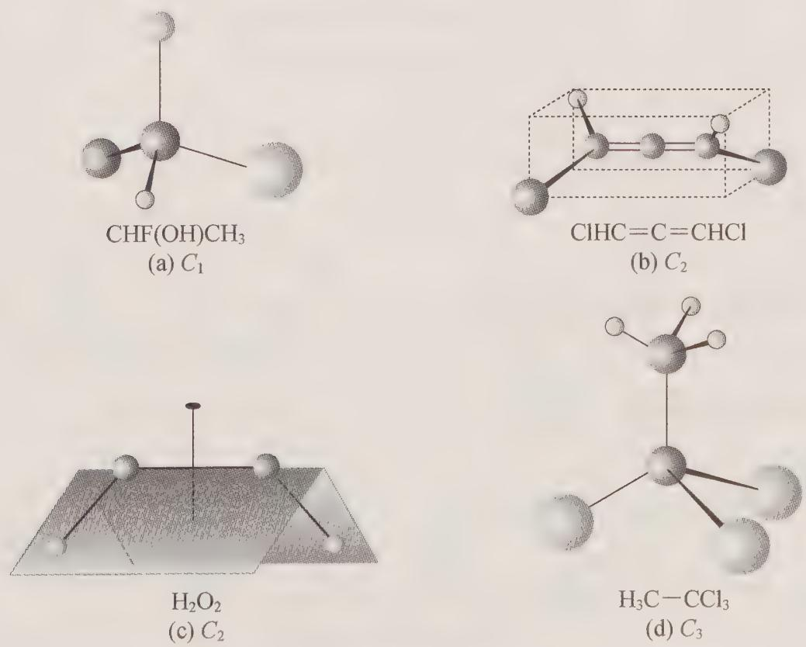  
图4.3.1 若干属于 $C_n$ 点群的分子

## 2. $C_{nh}$ 点群

属于 $C_{nh}$ 点群的分子中有一个 $n$ 次旋转轴 $C_n$ 和垂直于此轴的镜面 $\sigma_h$ ，阶次为 $2n$ 。其对称元素系为：

$$
n = \text { 偶数: } C _ {n}, \sigma_ {h}, i, (I _ {n})
$$

$n =$ 奇数： $C_n,\sigma_h,I_{2n}$

习惯上将 $C_{1h}$ 点群用 $C_s$ 记号表示。图4.3.2示出若干属于 $C_{nh}$ 点群的分子。

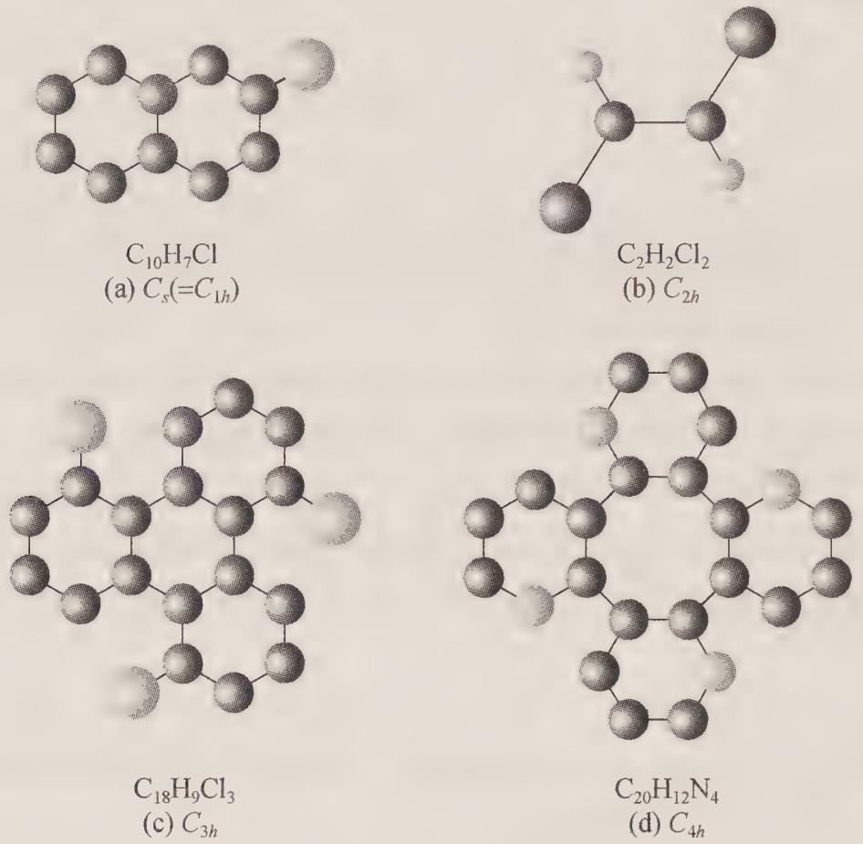  
图4.3.2 若干属于 $C_{nh}$ 点群的分子  
[除(b)外，H原子均未画出来]

注意: 在 $C_{nh}$ 点群中, n 为奇数时存在 $I_{2n}$ , 如 $C_{3h}$ 中存在 $I_{6}$ , 可用图 4.3.2 中分子(c) 进行 $I_{6}^{1}$ 操作而复原来了解。

## 3. $C_{nv}$ 点群

在 $C_n$ 点群中加入一个通过 $C_n$ 轴的镜面 $\sigma_v$ ，由 $C_n$ 转动，必产生 $n$ 个 $\sigma_v$ ，形成 $C_{nv}$ 点群，阶次为 $2n$ ，对称元素系为 $C_n$ 和 $n$ 个 $\sigma_v$ 。图4.3.3示出若干属于 $C_{nv}$ 点群的分子。CO, NO, HCN等不具对称中心的线形分子属于 $C_{\infty v}$ 点群。

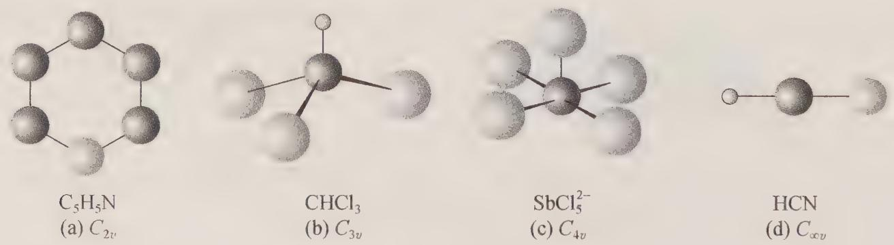  
图4.3.3 若干属于 $C_{nv}$ 点群的分子

## 4. $C_{ni}$ 点群和 $S_{n}$ 点群

分子中只包含一个反轴(或映轴)的点群属于这一类。当 n 为奇数时，所属点群为 $C_{ni}$ ，可看作在 $C_{n}$ 点群中加入 i (i 在 $C_{n}$ 轴上) 得到，其对称元素有 $C_{n}, i, I_{n}$ ，阶次为 2n。当 n 为偶数时，有两种情况：(i) n 不为 4 的整数倍时，属于 $C_{\frac{n}{2}h}$ 点群；(ii) n 为 4 的整数倍时，分子中只有一个反轴 $I_{n}$ （或只有一个映轴 $S_{n}$ ），属于 $S_{n}$ 点群，阶次为 n。图 4.3.4(a) 示出属于 $S_{4}$ 点群的分子，图中穿过分子的线和 $I_{4}$ 轴重合；图 4.3.4(b) 示出属于 $C_{i}$ 点群的分子。

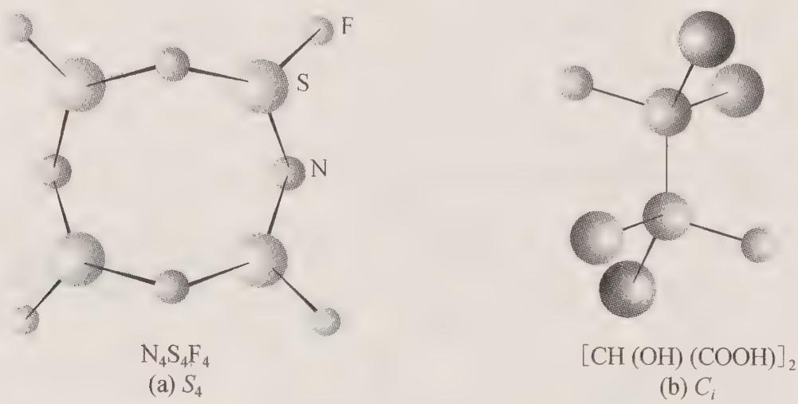  
图4.3.4 属于 $S_{4}$ 点群和 $C_i$ 点群的分子

## 5. $D_{n}$ 点群

在 $C_n$ 点群中加入一垂直于 $C_n$ 轴的 $C_2$ 轴，则在垂直于 $C_n$ 轴的平面内必有 $n$ 个 $C_2$ 轴，得 $D_n$ 点群，其对称元素有： $C_n, n$ 个 $C_2$ ，阶次为 $2n$ 。

图 4.3.5 示出属于 $D_{n}$ 点群的分子。其中图(a)的分子属 $D_{2}$ 点群，图(b)的分子属 $D_{3}$ 点群。

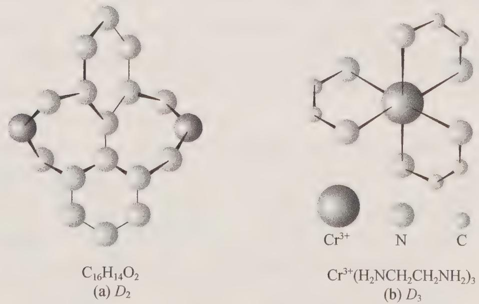  
图4.3.5 属于 $D_{2}$ 点群和 $D_{3}$ 点群的分子（H原子均未画出来）

## 6. $D_{nh}$ 点群

在 $D_{n}$ 点群的对称元素系中加入一个垂直于 $C_{n}$ 轴的镜面 $\sigma_{h}$ ，得 $D_{nh}$ 点群。由于 $n$ 个 $C_{2}$ 轴与 $\sigma_{h}$ 组合必然产生 $n$ 个 $\sigma_{v}$ ，若主轴 $C_n$ 为偶次轴，与 $\sigma_{h}$ 组合必产生对称中心，所以 $D_{nh}$ 的对称元素有 $C_n, n$ 个 $C_2, \sigma_h, I_n, n$ 个 $\sigma_{v}, i$ 等；当 $C_n$ 主轴为奇次轴，则有 $C_n, I_{2n}, n$ 个 $C_2, \sigma_h, n$ 个 $\sigma_v$ 等。 $D_{nh}$ 点群的阶次为 $4n$ 。图4.3.6示出若干属于 $D_{nh}$ 点群的分子。 $\mathrm{H}_2, \mathrm{N}_2, \mathrm{CO}_2$ 等具有对称中心的线形分子属于 $D_{\infty h}$ 点群。

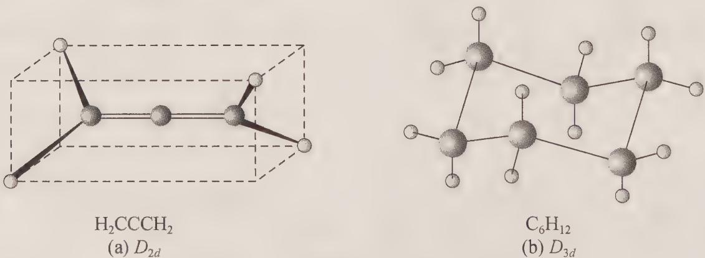  
图4.3.7 属于 $D_{nd}$ 点群的分子

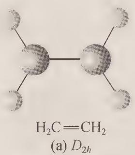

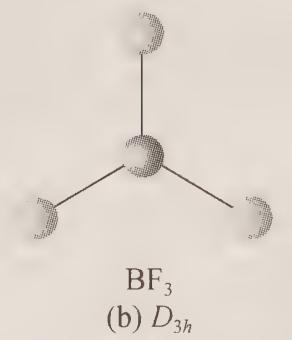

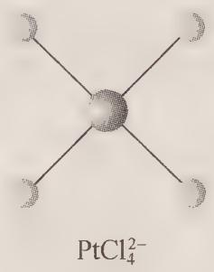

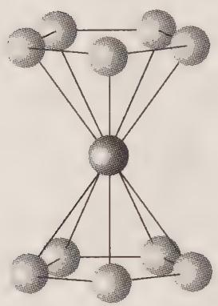  
$\mathrm{Fe(Cp)_2}$  
(d) $D_{5h}$

(c) $D_{4h}$  
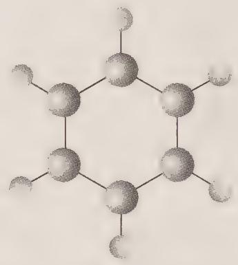  
$\mathrm{C}_{6} \mathrm{H}_{6}$  
(e) $D_{6h}$

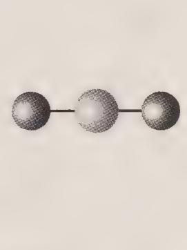  
$CO_{2}$  
(f) $D_{\infty h}$  
图4.3.6 若干属于 $D_{nh}$ 点群的分子

注意，在点群中没有标记 $D_{nv}$ 的点群，这是由于在 $D_{nh}$ 点群中 $C_2$ 和 $\sigma_h$ 组合即得 $\sigma_v$ ，不可能再单独存在 $D_{nv}$ 点群了。

## 7. $D_{nd}$ 点群

在 $D_{n}$ 点群的对称元素系中加入一个通过 $C_{n}$ 轴又平分2个 $C_2$ 轴夹角的镜面 $\sigma_d$ ，得 $D_{nd}$ 点群。 $D_{nd}$ 点群的对称元素可按主轴轴次的奇偶区分： $n =$ 奇数时，有 $C_n, n$ 个 $C_2, n$ 个 $\sigma_d, i, (I_n)$ ； $n =$ 偶数时，有 $I_{2n}, n$ 个 $C_2, n$ 个 $\sigma_d$ （因 $C_n$ 的对称操作已包括在 $I_{2n}$ 中，可不必写出）。 $D_{nd}$ 的阶次为 $4n$ 。属于 $D_{nd}$ 点群的分子示于图4.3.7中（图中 $D_{2d}$ 点群的分子中含 $I_4$ 轴，可经 $I_4^1$ 操作而复原）。

以上讨论了只有一个高次轴 $C_n (n > 2)$ 的点群。下面讨论有多个高次轴的情况。含有多个高次轴的对称元素组合所得的对称元素系和正多面体的对称性相对应。正多面体是指它的面为正多边形且彼此相等，同时它的各个顶角和棱边也相等。正多面体有5种，它们的性质列于表4.3.1中，它们的图形示于图4.3.8中。

  
图4.3.8 5种正多面体的图形

表 4.3.1 中的 T 表示四面体群(tetrahedral group); O 表示八面体群(octahedral group), 包括正八面体和立方体; I 表示二十面体群(icosahedral group), 包括正五角十二面体和正三角二十面体。

表 4.3.1 正多面体的性质

<table><tr><td></td><td>正四面体</td><td>正八面体</td><td>立方体</td><td>正五角十二面体</td><td>正三角二十面体</td></tr><tr><td>面数</td><td>4</td><td>8</td><td>6</td><td>12</td><td>20</td></tr><tr><td>面的边数</td><td>3</td><td>3</td><td>4</td><td>5</td><td>3</td></tr><tr><td>会聚于顶点的棱数</td><td>3</td><td>4</td><td>3</td><td>3</td><td>5</td></tr><tr><td>棱数</td><td>6</td><td>12</td><td>12</td><td>30</td><td>30</td></tr><tr><td>顶点数</td><td>4</td><td>6</td><td>8</td><td>20</td><td>12</td></tr><tr><td>二面角</td><td> $70^{\circ}32'$ </td><td> $109^{\circ}28'$ </td><td> $90^{\circ}$ </td><td> $116^{\circ}34'$ </td><td> $138^{\circ}12'$ </td></tr><tr><td>点群</td><td> $T_d$ </td><td> $O_h$ </td><td> $O_h$ </td><td> $I_h$ </td><td> $I_h$ </td></tr></table>

## 8. $T, T_{h}, T_{d}$ 点群

这 3 个点群的共同点是都具有 4 个 $C_{3}$ 轴，按立方体对角线安置。立方体中心作为原点，坐标轴和立方体的边平行，3 个 $C_{2}$ 轴分别和 3 个坐标轴重合， $C_{2}$ 轴作为主轴，由这 4 个 $C_{3}$ 轴和 3 个 $C_{2}$ 轴组成的点群称 T 点群，阶次为 12。

在 $T$ 点群对称元素系中加入 $\sigma_h$ 使和 $C_2$ 轴垂直，得 $T_h$ 点群，其对称元素有：4个 $C_3$ ，3个 $C_2,3$ 个 $\sigma_h,i,(4$ 个 $I_{3})$ ；阶次为24。

在 $T$ 点群对称元素系中加入 $\sigma_{d}$ 使通过 $C_2$ 轴，平分2个 $C_3$ 轴的夹角，得 $T_{d}$ 点群，其对称元素有：4个 $C_3, 3$ 个 $I_4, 6$ 个 $\sigma_{d}$ 。由于 $I_4$ 轴包括 $C_2$ 轴，故 $C_2$ 轴不必写出。3个 $I_4$ 轴和3个坐标轴重合，选作主轴。6个 $\sigma_{d}$ 分别平分4个 $C_3$ 轴的夹角，阶次为24。

属于 $T$ 和 $T_{h}$ 点群的分子不常见，而正四面体构型的分子和离子，如 $\mathrm{CH}_4, \mathrm{P}_4, \mathrm{SO}_4^{2-}$ ， $(\mathrm{CH}_2)_6\mathrm{N}_4$ 等，均属 $T_{d}$ 点群。图4.3.9(a)和(b)分别示出 $\mathrm{CH}_4$ 和 $(\mathrm{CH}_2)_6\mathrm{N}_4$ 的结构。

## 9. $O, O_h$ 点群

这两个点群的共同特点是都具有互相垂直的3个 $C_{4}$ 轴，其交点作为原点，3个 $C_{4}$ 轴分别和3个坐标轴重合，围绕原点画一立方体，使 $C_{4}$ 轴通过面中心，在立方体对角线安置4个 $C_{3}$ 轴，得O点群，其对称元素有：4个 $C_{3}$ ，3个 $C_{4}$ ，6个 $C_{2}$ ；阶次为24。

在 $O$ 点群对称元素系中加入 $\sigma_h$ 使和 $C_4$ 轴垂直，得 $O_h$ 点群，其对称元素有：3个 $C_4$ ，4个 $C_3$ ，6个 $C_2$ ，6个 $\sigma_d$ ，3个 $\sigma_h$ ， $i(3$ 个 $I_4$ 和4个 $I_{3})$ 等；阶次为48。

属于 $O$ 点群的分子不常见，而具有正八面体、立方体构型的分子和离子如 $\mathrm{SF}_6$ ， $[\mathrm{PtCl}_6]^{2-}$ 立方烷 $\mathrm{C_8H_8}$ 等属于 $O_h$ 点群。图4.3.9(c)和(d)分别示出 $\mathrm{SF}_6$ 和 $\mathrm{C_8H_8}$ 的结构。

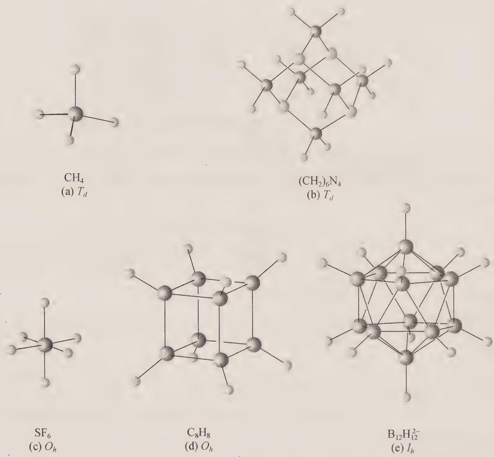  
图4.3.9 具有多个高次轴对称性分子的结构

## 10. $I, I_{h}$ 点群

这两个点群的共同特点是都具有6个 $C_5$ 轴。正五角十二面体构型的分子和正三角二十面体构型的分子如 $\mathrm{B}_{12}\mathrm{H}_{12}^{2-}$ , $\mathrm{B}_{12}$ 等属 $I_h$ 点群（或称 $I_d$ 点群）。它的对称元素包括：6个 $C_5$ , 10个 $C_3$ , 15个 $C_2$ , 15个 $\sigma$ 和 $i$ 等；阶次120。在此点群中，主轴可选择3个互相垂直的 $C_2$ 轴。

若将 $I_{h}$ 点群中的第二类对称元素去掉, 只剩第一类对称元素, 则为 I 点群; 阶次为 60。

图 4.3.9(e) 示出 $B_{12}H_{12}^{2-}$ 的结构。

## 4.3.2 分子所属点群的判别

确定某一分子所属的点群,可根据分子的对称元素系,按图 4.3.10 所示的步骤从左上角方框中列出的条件进行。

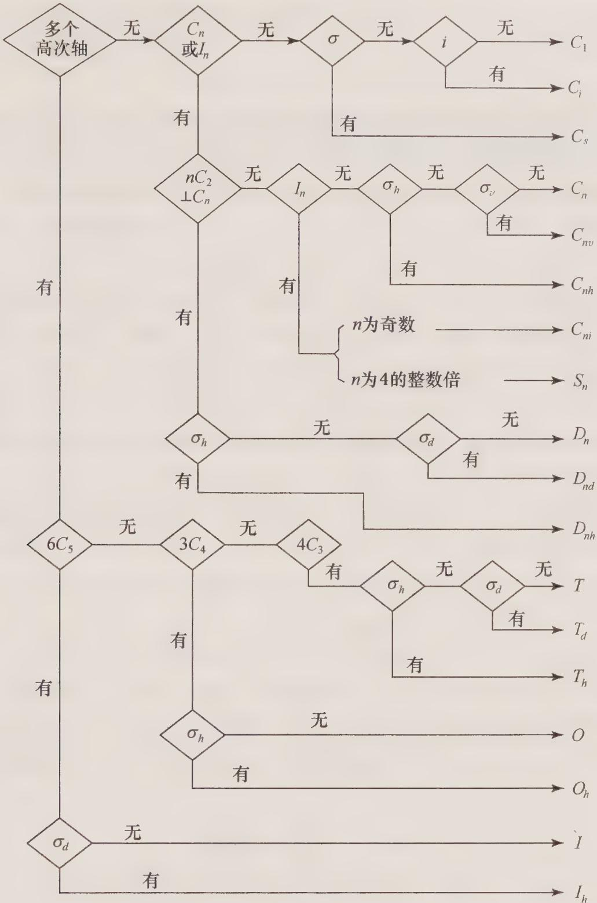  
图4.3.10 分子点群的判别

## 4.4 分子的偶极矩和极化率

偶极矩是表示分子中电荷分布的物理量。分子由带正电的原子核和带负电的电子组成，对于中性分子，正、负电荷数量相等，整个分子是电中性的，但正、负电荷的重心可以重合，也可以不重合。正、负电荷重心不重合的分子称为极性分子，它有偶极矩。偶极矩 $\mu$ 是个矢量，通常规定其方向是由正电重心指向负电重心，等于正、负电重心间的距离 r 与电荷量 q 的乘积，即

$$
\boldsymbol {\mu} = q \boldsymbol {r}
$$

偶极矩的单位为库仑米(Cm)。若电量为一个元电荷(1.6022×10 $^{-19}$ C)的正、负电荷相距10 $^{-10}$ m，则其偶极矩为

$$
\mu = 1. 6 0 2 2 \times 1 0 ^ {- 2 9} \mathrm{Cm}
$$

在 cgs 制中, 上述情况下 $\mu=4.8\times10^{-18}$ cm esu=4.8D。D 称 Debye(德拜), 是分子偶极矩的一种单位。

$$
1 \mathrm{D} = 3. 3 3 6 \times 1 0 ^ {- 3 0} \mathrm{Cm}
$$

## 4.4.1 分子的对称性和分子的偶极矩

分子有无偶极矩与分子的对称性有密切关系,可根据分子的对称性为分子有无偶极矩做出简单而明确的判据:只有属于 $C_{n}$ 和 $C_{nv}(n=1,2,3,\cdots,\infty)$ 这两类点群的分子才具有偶极矩,而其他点群的分子偶极矩为0。 $C_{1v}\equiv C_{1h}\equiv C_{s},C_{s}$ 点群也包括在 $C_{nv}$ 之中。

上述判据的物理基础是,偶极矩是分子的静态性质,这种静态性质的特点是它在分子所属点群的每一对称操作下,其大小和方向都保持不变。因此,偶极矩矢量必须坐落在每一对称元素上。由此可见,具有对称中心的分子不可能有偶极矩,因为处在点上的矢量其大小为0。具有多个 $C_{n}(n>1)$ 轴的分子,偶极矩应为0,因为一个矢量不可能同时与两个方向的轴相重合。只有 $C_{n}$ 和 $C_{nv}$ 点群,偶极矩矢量可和 $C_{n}$ 轴重合,正、负电重心可分别处在轴的任意点上。

具有镜面对称性的分子仍可以有偶极矩,而镜面和二重反轴是等同的,所以不能说具有反轴对称性的分子都没有偶极矩。

根据上述原理,可由分子的对称性推测分子有无偶极矩,也可由分子有无偶极矩以及偶极矩的大小了解分子结构的信息。

同核双原子分子没有偶极矩。异核双原子分子有偶极矩，其大小反映分子的极性，反映组成分子的两个原子间电负性的差异，也反映化学键的性质。表4.4.1列出若干分子的偶极矩数据，表中 $\mu$ 和 $r$ 都是实验测定数据。 $\mu /er$ 越大，键的极性越强。Pauling用 $\mu /er$ 值作为键的离子性判据，但有人认为还应考虑离子在其他离子电场作用下的变形因素，即诱导偶极矩的影响。

表 4.4.1 分子的偶极矩

<table><tr><td>分 子</td><td> $\mu /(10^{-30} \text{ Cm})$ </td><td> $r/(10^{-10} \text{ m})$ </td><td> $er/(10^{-30} \text{ Cm})$ </td><td> $\mu /er$ </td></tr><tr><td>CO</td><td>0.39</td><td>1.1283</td><td>18.08</td><td>0.02</td></tr><tr><td>HF</td><td>6.37</td><td>0.9168</td><td>14.69</td><td>0.43</td></tr><tr><td>HCl</td><td>3.50</td><td>1.2744</td><td>20.42</td><td>0.18</td></tr><tr><td>HBr</td><td>2.64</td><td>1.4145</td><td>22.66</td><td>0.12</td></tr><tr><td>HI</td><td>1.27</td><td>1.6090</td><td>25.78</td><td>0.05</td></tr></table>

多原子分子的偶极矩由分子中全部原子和键的性质以及它们的相对位置决定。若不考虑键的相互影响，并认为每个键可以贡献它自己的偶极矩，则分子的偶极矩可近似地由键的偶极矩（简称键矩）按矢量加和而得。

各种化学键的键矩,可根据实验测定的偶极矩数值以及分子的几何构型进行分配推出。例如, $H_{2}O$ 的 $\mu=6.17\times10^{-30}\ C\ m,\angle HOH=104.5^{\circ}$ ,如果认为 $H_{2}O$ 分子的偶极矩为2个H—O键键矩的矢量和,则 $\mu=6.17\times10^{-30}\ C\ m=2\mu_{(H-O)}\cos(104.5^{\circ}/2)$ 。这样可得 $\mu_{(H-O)}=5.04\times10^{-30}\ C\ m$ 。表4.4.2列出若干化学键的键矩值(分子中左边原子为 $\delta+$ )。

表 4.4.2 若干化学键的键矩

<table><tr><td>化学键</td><td> $\mu/(10^{-30} \text{ Cm})$ </td><td>化学键</td><td> $\mu/(10^{-30} \text{ Cm})$ </td><td>化学键</td><td> $\mu/(10^{-30} \text{ Cm})$ </td><td>化学键</td><td> $\mu/(10^{-30} \text{ Cm})$ </td></tr><tr><td>H—C</td><td>1.3</td><td>C—Cl</td><td>4.90</td><td>N—O</td><td>1.0</td><td>P=Se</td><td>10.7</td></tr><tr><td>H—N</td><td>4.44</td><td>C—Br</td><td>4.74</td><td>P—Cl</td><td>2.70</td><td>As=O</td><td>14.0</td></tr><tr><td>H—O</td><td>5.04</td><td>C—I</td><td>4.17</td><td>As—F</td><td>6.77</td><td>Sb=S</td><td>15.0</td></tr><tr><td>H—P</td><td>1.2</td><td>Si—H</td><td>3.3</td><td>S—Cl</td><td>2.0</td><td>S=O</td><td>10.0</td></tr><tr><td>H—S</td><td>2.3</td><td>Si—C</td><td>2.0</td><td>C=N</td><td>3.0</td><td>Se=O</td><td>10.3</td></tr><tr><td>C—N</td><td>0.73</td><td>Si—N</td><td>5.17</td><td>C=O</td><td>7.7</td><td>Te=O</td><td>7.7</td></tr><tr><td>C—O</td><td>2.5</td><td>Ge—Br</td><td>7.0</td><td>C=S</td><td>6.7</td><td>C≡N</td><td>11.8</td></tr><tr><td>C—S</td><td>3.0</td><td>Sn—Cl</td><td>10.0</td><td>N=O</td><td>6.7</td><td>N→B</td><td>8.5</td></tr><tr><td>C—Se</td><td>2.0</td><td>Pb—I</td><td>11.0</td><td>P=O</td><td>9.0</td><td>N→O</td><td>14.3</td></tr><tr><td>C—F</td><td>4.64</td><td>N—F</td><td>0.57</td><td>P=S</td><td>10.3</td><td>O→B</td><td>12.0</td></tr></table>

根据偶极矩与分子对称性的关系,以及键矩和分子构型对分子偶极矩的影响,可为分子的结构和性能提供一定的信息。表 4.4.3 列出 4 对结构式相似的化合物,但由于构型不同,点群不同,偶极矩数值也不同,可从偶极矩数据引出有关分子构型的信息。例如从表 4.4.3 最后一个分子的偶极矩数据可知,分子沿着 S…S 线折叠而成蝴蝶形。请读者画出其余 3 个分子的真实构型。

表 4.4.3 若干分子的偶极矩

<table><tr><td>分 子</td><td> $\frac{\mu }{10^{-30} \text{C m}}$ </td><td>点 群</td><td>分 子</td><td> $\frac{\mu }{10^{-30} \text{C m}}$ </td><td>点 群</td></tr><tr><td>H-C≡C-H</td><td>0</td><td> $D_{\infty h}$ </td><td>H-O-O-H</td><td>6.9</td><td> $C_2$ </td></tr><tr><td></td><td>0</td><td> $D_{2h}$ </td><td></td><td>6.1</td><td> $C_2$ 或 $C_{2v}$ </td></tr><tr><td></td><td>0</td><td> $C_{2h}$ </td><td></td><td>10.7</td><td> $C_{2v}$ </td></tr><tr><td></td><td>0</td><td> $D_{2h}$ </td><td></td><td>5.0</td><td> $C_{2v}$ </td></tr></table>

根据偶极矩数据可以判断分子为邻位、间位和对位异构体，例如二氯苯的3种异构体，观察值(下标o)和计算值(下标c)列于下表：

<table><tr><td></td><td> $\mu_o/(10^{-30}Cm)$ </td><td> $\mu_c/(10^{-30}Cm)$ </td></tr><tr><td>邻位</td><td>7.58</td><td>8.7</td></tr><tr><td>间位</td><td>4.9</td><td>5.0</td></tr><tr><td>对位</td><td>0</td><td>0</td></tr></table>

表中，对位和间位符合得很好，邻位偏差较大，这和两个紧邻的Cl原子间的排斥作用有关。又

如，对位二苯胺偶极矩不为0，说明— $\mathrm{NH}_2$ 基团不与苯环共面。

在烷烃中，C原子处在正四面体中心，根据对称关系，可得— $\mathrm{CH}_3$ 和—CH的偶极矩相等。由此可以推论：

(1) 烷烃的偶极矩接近于 0;

(2) 同系物的偶极矩大致相等。

由于键型的多样性, 键矩及其矢量加和规则仅在某些同系物中得到较好结果。因为在分子中原子间相互作用是很复杂的, 同是 C—H 键, C 原子采用不同的杂化轨道, 键矩就不完全相同。对于不相邻原子间的相互作用, 如诱导效应、共轭效应、空间阻碍、分子内旋转等都会对分子的偶极矩产生影响, 所以键矩矢量加和规则对分子结构信息只能获得近似的数值。反之, 根据加和规则计算结果和实验测定数值的符合程度, 可以探讨分子结构的某些信息。例如, 由表 4.4.4 中所列 RX 的偶极矩的实验测定数据可见: $\mathrm{CH}_3\mathrm{X}$ 和 $\mathrm{C}_2\mathrm{H}_5\mathrm{X}$ 相差较大, 而在 $\mathrm{C}_3\mathrm{H}_7\mathrm{X}$ 之后差别就较小了。这可解释为诱导效应是近程效应, 卤素原子 X 的诱导效应在 C 链上传递, 传递到第三个碳原子以后就基本上不起作用了。

表 4.4.4 RX 的偶极矩 $^{a}$

<table><tr><td>R</td><td> $CH_3$ </td><td> $C_2H_5$ </td><td> $n-C_3H_7$ </td><td> $n-C_4H_9$ </td><td> $n-C_5H_{11}$ </td><td> $i-C_3H_7$ </td></tr><tr><td>RCI</td><td>6.24</td><td>6.84</td><td>7.01</td><td>7.04</td><td>7.08</td><td>7.18</td></tr><tr><td>RBr</td><td>6.00</td><td>6.71</td><td>7.11</td><td>7.18</td><td>7.31</td><td>7.31</td></tr><tr><td>RI</td><td>5.47</td><td>6.24</td><td>6.71</td><td>6.94</td><td></td><td></td></tr></table>

a 表中数据单位为 $10^{-30}\mathrm{Cm}$ 。

## 4.4.2 分子的诱导偶极矩和极化率

前面讲的是永久偶极矩,它是分子本身固有的性质,与是否有外加电场无关。当没有外电场存在时,由于热运动,分子取向随机,大量分子的平均偶极矩为0。在电场中,分子产生诱导极化,它包括两部分:(i)电子极化,由电子与核产生相对位移引起;(ii)原子极化,由原子核间产生相对位移,即键长和键角改变引起。

诱导极化又称变形极化。对于极性分子还有定向极化，它是由于在电场中永久偶极矩转到与电场方向反平行的趋势，出现择优取向所引起。诱导极化产生诱导偶极矩 $(\mu_{\text{诱}})$ ，即

$$
\pmb {\mu} _ {\mathrm{诱}} = \alpha \pmb {E}
$$

E 为物体内部分子直接感受到的电场强度； $\alpha$ 称为分子的极化率，其单位为 $J^{-1}C^{2}m^{2}$ 。若将 $\mu_{诱}$ 分为3个分量 $\mu_{x},\mu_{y},\mu_{z},\alpha$ 可用对称方阵表示。它有6个独立的组元： $\alpha_{xx},\alpha_{yy},\alpha_{zz},\alpha_{xy}$ （= $\alpha_{yx}$ ）， $\alpha_{xz}$ （= $\alpha_{zx}$ ）， $\alpha_{yz}$ （= $\alpha_{zy}$ ），即

$$
\left( \begin{array}{l} \boldsymbol {\mu} _ {x} \\ \boldsymbol {\mu} _ {y} \\ \boldsymbol {\mu} _ {z} \end{array} \right) = \left( \begin{array}{l l l} \alpha_ {x x} & \alpha_ {x y} & \alpha_ {x z} \\ \alpha_ {y x} & \alpha_ {y y} & \alpha_ {y z} \\ \alpha_ {z x} & \alpha_ {z y} & \alpha_ {z z} \end{array} \right) \left( \begin{array}{l} \boldsymbol {E} _ {x} \\ \boldsymbol {E} _ {y} \\ \boldsymbol {E} _ {z} \end{array} \right)
$$

极化率 $\alpha$ 与摩尔折射度 R 有关。在光的电磁场作用下，测定物质的折射率 (n)，可求得摩尔折射度 $R(\text{molar refractivity})$

$$
R = \frac {(n ^ {2} - 1) M}{(n ^ {2} + 2) d}
$$

式中 $M$ 为摩尔质量， $d$ 为物质的密度， $R$ 主要是反映电子极化率。因为光的频率很高，分子定向变化跟不上高频光的电场的变化，而原子极化只占诱导极化中很少的一部分，可以忽略。摩尔折射度和极化率成正比，按Lorentz-Lorenz(洛伦兹-洛伦茨)方程，可得

$$
R = \frac {(n ^ {2} - 1) M}{(n ^ {2} + 2) d} = \frac {N _ {\mathrm{A}} \alpha}{3 \varepsilon_ {0}}
$$

$N_{A}$ 为 Avogadro 常数， $\varepsilon_{0}$ 为真空介电常数。

由上式可得

$$
\alpha = \frac {3 \varepsilon_ {0} R}{N _ {\mathrm{A}}} = \frac {3 \varepsilon_ {0} (n ^ {2} - 1) M}{N _ {\mathrm{A}} (n ^ {2} + 2) d}
$$

例如，293 K 时水对波长为 589 nm 的光的折射率为 n=1.3330, M=18.015 g mol $^{-1}$ , d=0.9982 g cm $^{-3}$ =0.9982×10 $^{6}$ g m $^{-3}$ , $\varepsilon_{0}$ =8.854×10 $^{-12}$ J $^{-1}$ C $^{2}$ m $^{-1}$ ，代入上式，得

$$
\alpha = 1. 6 3 8 \times 1 0 ^ {- 4 0} \mathrm{J} ^ {- 1} \mathrm{C} ^ {2} \mathrm{m} ^ {2}
$$

摩尔折射度直接与极化率成正比,所以它的数值大小反映分子中电荷分布变形的难易程度,例如 $\pi$ 键电子比 $\sigma$ 键电子容易变形,因而含有 $\pi$ 电子(如 C=C, C≡C)特别是有离域 $\pi$ 键电子的分子比只含 $\sigma$ 键电子的分子一般容易变形,极化率大,摩尔折射度也大。摩尔折射度具有加和性。表 4.4.5 列出若干化学键和离子的摩尔折射度。

表 4.4.5 若干化学键和离子的摩尔折射度

<table><tr><td>键或离子</td><td> $\frac{R}{\text{cm}^3\text{mol}^{-1}}$ </td><td>键或离子</td><td> $\frac{R}{\text{cm}^3\text{mol}^{-1}}$ </td><td>键或离子</td><td> $\frac{R}{\text{cm}^3\text{mol}^{-1}}$ </td><td>键或离子</td><td> $\frac{R}{\text{cm}^3\text{mol}^{-1}}$ </td></tr><tr><td>C—H</td><td>1.676</td><td>C—F</td><td>1.45</td><td>C—O</td><td>1.54</td><td>C—N</td><td>1.57</td></tr><tr><td>C—C</td><td>1.296</td><td>C—Cl</td><td>6.51</td><td>C=O</td><td>3.32</td><td>C≡N</td><td>3.75</td></tr><tr><td>C=C</td><td>4.17</td><td>C—Br</td><td>9.39</td><td>O—H(醇)</td><td>1.66</td><td>C≡N</td><td>4.82</td></tr><tr><td>C≡C</td><td>5.87</td><td>C—I</td><td>14.61</td><td>O—H(酸)</td><td>1.80</td><td>N—H</td><td>1.76</td></tr><tr><td> $C_6H_5$ </td><td>25.46</td><td>C—S</td><td>4.61</td><td>C=S</td><td>11.91</td><td>S—S</td><td>8.11</td></tr><tr><td> $Li^+$ </td><td>0.07</td><td> $Be^{2+}$ </td><td>0.20</td><td> $O^{2-}$ </td><td>6.6</td><td> $F^-$ </td><td>2.65</td></tr><tr><td> $Na^+$ </td><td>0.46</td><td> $Mg^{2+}$ </td><td>0.24</td><td> $S^{2-}$ </td><td>20.8</td><td> $Cl^-$ </td><td>9.30</td></tr><tr><td> $K^+$ </td><td>2.12</td><td> $Ca^{2+}$ </td><td>1.19</td><td></td><td></td><td> $Br^-$ </td><td>12.12</td></tr><tr><td> $Rb^+$ </td><td>3.57</td><td> $Al^{3+}$ </td><td>0.17</td><td></td><td></td><td> $I^-$ </td><td>18.07</td></tr></table>

根据表列数据可以计算出某一化合物的 $R$ ，可与由 $n,M,d$ 等实验测定值进行比较，互相验证(例见下表)。

<table><tr><td>化合物</td><td> $\frac{R(\text{计算值})}{\text{cm}^{3}\text{mol}^{-1}}$ </td><td> $\frac{R(\text{实验值})}{\text{cm}^{3}\text{mol}^{-1}}$ </td></tr><tr><td> $CH_{2}Cl_{2}$ </td><td>2(C—H)+2(C—Cl)=16.37</td><td>16.40</td></tr><tr><td> $C_{2}H_{5}COOH$ </td><td>5(C—H)+2(C—C)+(C=O)+(C—O)+(O—H)=17.63</td><td>17.51</td></tr><tr><td> $C_{6}H_{5}NHCH_{3}$ </td><td> $(C_{6}H_{5})+2(C—N)+3(C—H)+(N—H)=35.39$ </td><td>35.67</td></tr></table>

## 4.5 分子的对称性和旋光性

分子有无旋光性(或称光学活性)是分子结构的重要特征。分子的旋光性和分子的对称性有密切的联系。

具有旋光性的分子,其特点是分子本身和它在镜中的像只有对映关系而不完全相同,是一对等同而非全同的图形。所谓等同,是指这个图形的每一点在对映图形中必可找到一个相当点,这个图形中任意两点间的距离等于对映图形中两个相当点间的距离;所谓非全同,是指不能通过平移或转动等第一类对称操作使两个图形叠合。一对等同而非全同的分子,构成一对对映体,称为旋光异构体,如同人的左右手一样。这种没有第二类对称元素的分子称为手性分子。两种对映的手性分子现常用 $R$ (拉丁文 rectus,右,顺时针方向转)和 $S$ (拉丁文 sinister,左,逆时针方向转)来区分。旧时则常用 D(dextrorotatory,右旋)和 L(levorotatory,左旋)来区分。但需注意,实验测定的旋光异构体的旋光方向规定顺时针方向(右旋)定为(+),逆时针方向(左旋)定为(-)。虽然 $R,S$ 和 $(+)$ ,(-)都有右旋和左旋的意思,但由于 $R$ 和 $S$ 是由分子的立体结构来推引， $(+)$ 和 $(-)$ 是由实验所测定,所以 $R$ 和 $S$ 不是必定对应于 $(+)$ 和 $(-)$ 。但可肯定， $R$ 和 $S$ 旋光方向一定相反，而且等量的 $R$ 和 $S$ 异构体混合物一定无旋光性，称为外消旋体，记作 $(\pm)$ 。一种手性分子中各个基团真实排列的构型称为绝对构型(absolute configuration)。

图4.5.1示出左右两只手托出两个呈镜像关系的乳酸分子。

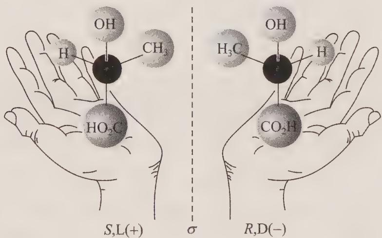  
图4.5.1 左右两只手托出一对对映体乳酸分子

根据分子的对称性, 可为分子有无旋光性提出准确而简明的判据: 若分子具有反轴 $I_{n}$ $(n=1,2,3,4,\cdots)$ 的对称性, 则该分子一定没有旋光性; 若分子不具有反轴的对称性, 则可能出现旋光性。

如前所述，依据反轴进行的对称操作是一联合的对称操作，一重反轴等于对称中心，二重反轴等于镜面，而独立的反轴只有 $I_{4n}$ 。所以判断分子有无旋光性，可归结为分子中是否有 $\sigma$ ， $i, I_{4n}$ 等对称元素。具有这3种对称元素的分子都没有旋光性，而不具有这3种对称元素的分子都可能有旋光性。

没有 $\sigma, i, I_{4n}$ 等对称性的手性分子，可从具有下列结构特征的化合物中寻找，但这些结构特征并不是手性分子的准确判断标准，也不能包括全部的手性分子。

## 1. 含有不对称碳原子(或氮原子)的化合物

一个碳原子(或氮原子)周围的4个键呈四面体分布,当这4个键所连接的基团都不相

同时，这个碳原子称为不对称碳原子。有时4个基团中的两个基团的化学组成完全相同，

但在顺反异构上的构型不同,也是不对称碳原子。有机化学中常用有无不对称碳原子作为有无旋光性的标准,这是一个简单实用而并不全面的判断标准。绝大多数含有不对称碳原子的分子是有旋光性的,但有例外。有的分子没有不对称碳原子,但也有旋光性,例如六螺烯分子;有的分子有不对称碳原子;却无旋光性,例如 $\left(\mathrm{H}_{3}\mathrm{CCHCONH}\right)_{2}$ 分子,因分子本身具有对称中心,失去旋光性,如图4.5.2所示。

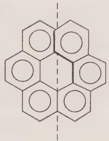  
(a)

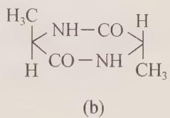  
图 4.5.2 六螺烯(a)和 $(\mathrm{H}_{3}\mathrm{CCHCONH})_{2}$ 分子(b)

## 2. 螺旋形分子

一切螺旋形结构的分子,不论有无不对称碳原子,都是手性分子,没有例外,例如 $\alpha$ -螺旋体、六螺烯分子等。螺旋型式有左手螺旋形和右手螺旋形,互成对映体。

3. 丙二烯型和联苯型化合物,以及受空间阻碍效应影响而变形的分子例如

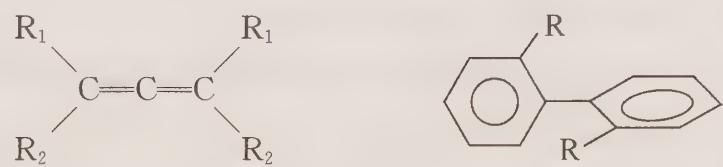

这些分子没有 $\sigma, i$ 和 $I_{4n}$ 等对称元素，是手性分子。

## 4. 风扇形分子

例如 $Co^{3+}$ 与乙二胺(en)形成的螯合物, 螯合配位体(en)像风扇排布, 属 $D_{3}$ 点群。其他风扇形的 $ML_{3}, MXYL_{2}, \cdots$ 均为手性分子。

手性分子的结构与旋光性的关系可归纳为:右手螺旋结构的分子呈现右旋光性,左手螺旋结构的分子呈现左旋光性;组成螺旋的原子和基团的极化率越大,则此螺旋贡献的旋光度越大;螺旋的匝数越多,旋光度越大;螺距越小,旋光度越大;分子内存在多个螺旋,旋光度是各个螺旋旋光度的代数和。图4.5.2(a)所示的六螺烯分子是右手螺旋构型,它的摩尔旋光度为 $[M]_{D}=+11950^{\circ}$ (文献中规定,右旋旋光性在旋光度前标“+”号,左旋标“-”号)。

在实验室或工厂中进行化学反应合成手性分子时,两种对映体分子的数量是相等的,即所得的产品中,D型和L型是等量的,称为外消旋产品。但是在天然动植物中的手性分子,往往只有一种对映体出现,例如组成蛋白质的 $\alpha$ -氨基酸,天然出现的有20多种,除甘氨酸无旋光性

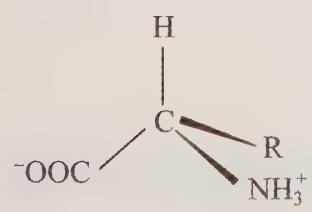

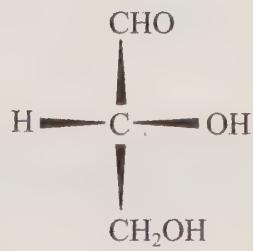  
(a)  
(b)  
图4.5.3 L型 $\alpha$ -氨基酸(a)和D型甘油醛(b)

外，其他基本上都是L型，如图4.5.3(a)所示；而组成核糖核酸的糖，基本上是D型，即其中不对称碳原子具有和D型甘油醛相同的立体结构，如图4.5.3(b)所示。这是由于动植物中的这些手性分子是酶的不对称催化作用的产物，是在不对称的环境中形成的。

酶是由蛋白质与核酸组成的巨大手性分子,是不对称的有机催化剂,有强烈的选择性功能。由于酶的催化作用产生出不对称的蛋白质和核酸,由不对称的蛋白质和核酸又产生不对称的酶,所以生命是不断地产生特定手性分子的过程。

在地球上酶是怎样出现的？可以说一定是经历了漫长的不对称合成的过程，是经历了漫长的化学进化的过程。手性分子的出现、新的化合物不断产生发展，化学不断地进化。化学进化又为生物产生和进化提供了物质基础；而生物进化过程中又产生了多种酶和蛋白质等手性分子，为产生结构复杂、作用专一的酶创造条件，为制造生命物质提供物质基础。

手性分子的不对称合成在生命科学研究和药物生产中，日益显示出它的重要性。

## 4.6 群的表示

根据分子的对称性探讨分子的性质,群的表示起重要的作用。本书简略介绍有关群的表示的一些概念、定义和性质。

## 4.6.1 对称操作的表示矩阵

一个分子的全部对称操作形成一个群。若将这些对称操作用变换矩阵表示，这些变换矩阵也形成一个群。通常称这样的矩阵群为相应点群的表示。

群中元的作用对象称为基，在前面几节讨论对称操作时，基为原子的坐标 $(x, y, z)$ 。基也可选择其他函数和物理量。基不同，同一对称操作的表示矩阵不同。今以原子坐标 $(x, y, z)$ 、原子轨道 $p_z$ 和 $p_y$ 、绕 $z$ 轴旋转的转动矢量 $R_z$ 等3种不同的基为例，说明 $C_{2v}$ 点群的4个对称操作： $E, C_2, \sigma_{xz}, \sigma_{yz}$ 的表示矩阵。对于原子坐标 $(x, y, z)$ ，用变换矩阵表示对称操作，已在4.1节中列出。对于 $p_z$ 原子轨道，绕 $z$ 轴圆柱对称， $C_{2v}$ 的4个对称操作均不改变 $p_z$ 的大小和符号，均可用单位矩阵(1)表示。而 $p_y$ 对 $C_2$ 和 $\sigma_{xz}$ 这两操作要变号。对于绕 $z$ 轴旋转的转动函数 $R_z$ ，经 $C_2$ 操作不会改变旋转方向和大小，可用单位矩阵(1)表示， $\sigma_{xz}$ 和 $\sigma_{yz}$ 的操作改变 $R_z$ 的旋转方向，用矩阵(-1)表示。这样可将这4个基的对称操作表示矩阵列于表4.6.1a中。表中第一列 $\Gamma$ 代表矩阵表示的名称符号，第二列为4个操作的表示矩阵，第三列为基。

对 $C_{3v}$ 点群，有 6 个对称操作，令 $C_{3}$ 轴和 z 轴平行，xz 平面为 $\sigma_{a}; \sigma_{c}$ 和 $\sigma_{b}$ 均与 $\sigma_{a}$ 差 $60^{\circ}$ ，如图 4.2.2 所示。上述 $(x, y, z)$ ， $p_{z}, R_{z}$ 三个基的 6 个对称操作的表示矩阵，可按同样方法获得，见表 4.6.2a。

矩阵代数证明,任何一个矩阵 A,都可以找到一个合适的变换矩阵 S,经过相似变换,即进行 $S^{-1}AS$ 操作,将它变成对角方块矩阵,这种相似变换的过程称为矩阵的约化。

当对角方块矩阵通过相似变换无法约化了,称为不可约化的矩阵。群的可约表示总是可用不可约表示描述。一个群可以有许多个可约表示,但只有几个不可约表示。

$$
S ^ {- 1} A S = S ^ {- 1} \left( \begin{array}{c c c c} a _ {1 1} & a _ {1 2} & \dots & a _ {1 n} \\ a _ {2 1} & a _ {2 2} & \dots & a _ {2 n} \\ \dots & \dots & \dots & \dots \\ a _ {n 1} & a _ {n 2} & \dots & a _ {m n} \end{array} \right) S = \left( \begin{array}{c c c c} \boxed {A _ {1}} & & 0 \\ \boxed {- - } & & \\ & A _ {2} & \\ 0 & & A _ {3} \\ & & \end{array} \right)
$$

表 4.6.1a 和 4.6.2a 中的 $\Gamma_{a}$ 对群中各对称操作具有相同的分块矩阵形式。这种表示矩阵的分块，说明基分成了互不相干的组。表 4.6.1a 的 $\Gamma_{a}$ 分成互不相干的 $(x)$ ， $(y)$ ， $(z)$ 三组，因此应属于 3 个独立的表示。表 4.6.2a 的 $\Gamma_{a}$ 分成 $(x, y)$ 和 $(z)$ 两组，它们应分属于两个独立的表示。这样， $C_{2v}$ 有 4 种不可约表示矩阵（表 4.6.1b）， $C_{3v}$ 有 3 种不可约表示矩阵（表 4.6.2b）。

表 4.6.1a $C_{2v}$ 群的几种表示

<table><tr><td> $C_{2v}$ </td><td> $E$ </td><td> $C_2^1$ </td><td> $σ_{xz}$ </td><td> $σ_{yz}$ </td><td>基</td></tr><tr><td rowspan="3"> $Γ_a$ </td><td rowspan="3"> $\begin{pmatrix} 1 & 0 & 0 \\ 0 & 1 & 0 \\ 0 & 0 & 1 \end{pmatrix}$ </td><td rowspan="3"> $\begin{pmatrix} -1 & 0 & 0 \\ 0 & -1 & 0 \\ 0 & 0 & 1 \end{pmatrix}$ </td><td rowspan="3"> $\begin{pmatrix} 1 & 0 & 0 \\ 0 & -1 & 0 \\ 0 & 0 & 1 \end{pmatrix}$ </td><td rowspan="3"> $\begin{pmatrix} -1 & 0 & 0 \\ 0 & 1 & 0 \\ 0 & 0 & 1 \end{pmatrix}$ </td><td> $x$ </td></tr><tr><td> $y$ </td></tr><tr><td> $z$ </td></tr><tr><td> $Γ_b$ </td><td>(1)</td><td>(1)</td><td>(1)</td><td>(1)</td><td> $p_z$ </td></tr><tr><td> $Γ_c$ </td><td>(1)</td><td>(-1)</td><td>(-1)</td><td>(1)</td><td> $p_y$ </td></tr><tr><td> $Γ_d$ </td><td>(1)</td><td>(1)</td><td>(-1)</td><td>(-1)</td><td> $R_z$ </td></tr></table>

表 4.6.1b $C_{2v}$ 群的不可约表示

<table><tr><td> $C_{2v}$ </td><td>E</td><td> $C_2^1$ </td><td> $σ_{xz}$ </td><td> $σ_{yz}$ </td><td>基</td></tr><tr><td> $Γ_1$ </td><td>(1)</td><td>(1)</td><td>(1)</td><td>(1)</td><td>z,  $p_z$ </td></tr><tr><td> $Γ_2$ </td><td>(1)</td><td>(1)</td><td>(-1)</td><td>(-1)</td><td> $R_z$ </td></tr><tr><td> $Γ_3$ </td><td>(1)</td><td>(-1)</td><td>(1)</td><td>(-1)</td><td>x</td></tr><tr><td> $Γ_4$ </td><td>(1)</td><td>(-1)</td><td>(-1)</td><td>(1)</td><td>y,  $p_y$ </td></tr></table>

表 4.6.2a $C_{3v}$ 群的几种表示

<table><tr><td> $C_{3v}$ </td><td colspan="3"> $E$ </td><td colspan="3"> $C_3^1$ </td><td colspan="3"> $C_3^2$ </td><td colspan="3"> $σ_a$ </td><td colspan="3"> $σ_b$ </td><td colspan="3"> $σ_c$ </td><td>基</td></tr><tr><td rowspan="2"> $Γ_a$ </td><td rowspan="2" colspan="3"> $\begin{pmatrix} 1 & 0 & 0 \\ 0 & 1 & 0 \\ 0 & 0 & 1 \end{pmatrix}$ </td><td rowspan="2" colspan="3"> $\begin{bmatrix} -\frac{1}{2} & -\frac{\sqrt{3}}{2} & 0 \\ \frac{\sqrt{3}}{2} & -\frac{1}{2} & 0 \\ 0 & 0 & 1 \end{bmatrix}$ </td><td rowspan="2" colspan="3"> $\begin{bmatrix} -\frac{1}{2} & \frac{\sqrt{3}}{2} & 0 \\ -\frac{\sqrt{3}}{2} & -\frac{1}{2} & 0 \\ 0 & 0 & 1 \end{bmatrix}$ </td><td rowspan="2" colspan="3"> $\begin{bmatrix} 1 & 0 & 0 \\ 0 & -1 & 0 \\ 0 & 0 & 1 \end{bmatrix}$ </td><td rowspan="2" colspan="3"> $\begin{bmatrix} -\frac{1}{2} & \frac{\sqrt{3}}{2} & 0 \\ \frac{\sqrt{3}}{2} & \frac{1}{2} & 0 \\ 0 & 0 & 1 \end{bmatrix}$ </td><td rowspan="2" colspan="3"> $\begin{bmatrix} -\frac{1}{2} & -\frac{\sqrt{3}}{2} & 0 \\ -\frac{\sqrt{3}}{2} & \frac{1}{2} & 0 \\ 0 & 0 & 1 \end{bmatrix}$ </td><td rowspan="2"> $x$ </td></tr><tr></tr><tr><td> $Γ_b$ </td><td colspan="3">(1)</td><td colspan="3">(1)</td><td colspan="3">(1)</td><td colspan="3">(1)</td><td colspan="3">(1)</td><td colspan="3">(1)</td><td> $p_z$ </td></tr><tr><td> $Γ_c$ </td><td colspan="3">(1)</td><td colspan="3">(1)</td><td colspan="3">(1)</td><td colspan="3">(-1)</td><td colspan="3">(-1)</td><td colspan="3">(-1)</td><td> $R_z$ </td></tr></table>

表 4.6.2b $C_{3v}$ 群的不可约表示

<table><tr><td> $C_{3v}$ </td><td> $E$ </td><td> $C_3^1$ </td><td> $C_3^2$ </td><td> $σ_a$ </td><td> $σ_b$ </td><td> $σ_c$ </td><td>基</td></tr><tr><td> $Γ_1$ </td><td>(1)</td><td>(1)</td><td>(1)</td><td>(1)</td><td>(1)</td><td>(1)</td><td> $z, p_z$ </td></tr><tr><td> $Γ_2$ </td><td>(1)</td><td>(1)</td><td>(1)</td><td>(-1)</td><td>(-1)</td><td>(-1)</td><td> $R_z$ </td></tr><tr><td> $Γ_3$ </td><td> $\begin{pmatrix} 1 & 0 \\ 0 & 1 \end{pmatrix}$ </td><td> $\begin{bmatrix} -\frac{1}{2} & -\frac{\sqrt{3}}{2} \\ \frac{\sqrt{3}}{2} & -\frac{1}{2} \end{bmatrix}$ </td><td> $\begin{bmatrix} -\frac{1}{2} & \frac{\sqrt{3}}{2} \\ -\frac{\sqrt{3}}{2} & -\frac{1}{2} \end{bmatrix}$ </td><td> $\begin{pmatrix} 1 & 0 \\ 0 & -1 \end{pmatrix}$ </td><td> $\begin{bmatrix} -\frac{1}{2} & \frac{\sqrt{3}}{2} \\ \frac{\sqrt{3}}{2} & \frac{1}{2} \end{bmatrix}$ </td><td> $\begin{bmatrix} -\frac{1}{2} & -\frac{\sqrt{3}}{2} \\ -\frac{\sqrt{3}}{2} & \frac{1}{2} \end{bmatrix}$ </td><td> $(x,y)$ </td></tr></table>

## 4.6.2 特征标的性质和特征标表

在矩阵约化过程中矩阵元的值在改变,但正方矩阵的迹,即矩阵对角元之和,在相似变换中是不变的。这种对称操作的矩阵的迹,称为特征标。通常用符号 $\chi$ 标记, $\chi(R)$ 是矩阵中操作 R 的特征标。

对某个群,它的不可约表示的数目究竟有多少个? 不可约表示的特征标怎样去找? 下面有关群的特征标的 3 条性质,有助于回答这两个问题。

(1) 群的不可约表示的数目等于群中类的数目

在群 $G\{A,B,C,\cdots\}$ 中，当进行 $BAB^{-1}=C$ 相似变换时，A 和 C 为相互共轭的元，相互共轭元的完整集合称为一共轭类。

$C_{3v}$ 群共分三类： $E, 2C_3, 3\sigma$ ，所以它应有3个不可约表示。上面提到的 $\Gamma_1, \Gamma_2, \Gamma_3$ 就是这3个不可约表示。 $C_{2v}$ 群的4个操作，各自成一类，应有4个不可约表示，即 $\Gamma_1, \Gamma_2, \Gamma_3$ 和 $\Gamma_4$ 。

同类的元有相同的特征标，因此特征标以类标出。

(2) 群的不可约表示的维数的平方和等于群的阶(又称阶次)

$C_{2v}$ 群中 $\Gamma_1, \Gamma_2, \Gamma_3, \Gamma_4$ 都是一维表示，故阶为 4。 $C_{3v}$ 群中 $\Gamma_1$ 和 $\Gamma_2$ 是一维表示， $\Gamma_3$ 为二维表示，故阶为 6。

## (3) 群的各不可约表示的特征标之间, 满足正交、归一条件

设以 $\chi_{i}(R)$ 和 $\chi_{j}(R)$ 分别代表群的元 $R$ 在第 $i$ 个和第 $j$ 个不可约表示中的特征标， $h$ 为点群的阶，则上述正交、归一条件可列式于下

$$
(1 / h) \sum_ {R} \chi_ {i} (R) \chi_ {j} (R) = \left\{ \begin{array}{l l} 0, & \text {当} i \neq j \\ 1, & \text {当} i = j \end{array} \right.\tag{4.6.1}
$$

这一关系可从表4.6.3所列数据验证。

表 4.6.3 $C_{2v}$ 群和 $C_{3v}$ 群的特征标表

<table><tr><td> $C_{2v}$ </td><td>E</td><td> $C_2$ </td><td> $σ_{xz}$ </td><td> $σ_{yz}$ </td><td>基</td></tr><tr><td> $A_1$ </td><td>1</td><td>1</td><td>1</td><td>1</td><td> $z,s,x^2,y^2,z^2$ </td></tr><tr><td> $A_2$ </td><td>1</td><td>1</td><td>-1</td><td>-1</td><td> $R_z,xy$ </td></tr><tr><td> $B_1$ </td><td>1</td><td>-1</td><td>1</td><td>-1</td><td> $x,R_y,xz$ </td></tr><tr><td> $B_2$ </td><td>1</td><td>-1</td><td>-1</td><td>1</td><td> $y,R_x,yz$ </td></tr><tr><td> $C_{3v}$ </td><td>E</td><td> $2C_3$ </td><td> $3σ$ </td><td colspan="2">基</td></tr><tr><td> $A_1$ </td><td>1</td><td>1</td><td>1</td><td colspan="2"> $z,s,x^2+y^2,z^2$ </td></tr><tr><td> $A_2$ </td><td>1</td><td>1</td><td>-1</td><td colspan="2"> $R_z$ </td></tr><tr><td>E</td><td>2</td><td>-1</td><td>0</td><td colspan="2"> $(x,y),(R_x,R_y),(xz,yz),(x^2-y^2,xy)$ </td></tr></table>

例如 $C_{3v}$ 群有 $\mathrm{A}_1, \mathrm{A}_2, \mathrm{E}$ 三种不可约表示，若 $i$ 代表 $\mathrm{A}_1$ 不可约表示， $j$ 代表 $\mathrm{A}_2$ 不可约表示，则可得

$$
(1 / 6) \{1 \times 1 + 2 (1 \times 1) + 3 \times 1 \times (- 1) \} = 0
$$

若 $i = j$ 均代表E表示，则可得

$$
(1 / 6) \{1 \times 2 \times 2 + 2 \times (- 1) \times (- 1) \} = 1
$$

将点群所有不可约表示的迹(特征标)及相应的基列成表,称为特征标表。特征标表中列出全部的不可约表示、各个不可约表示的特征标及相应的基。表4.6.3列出 $C_{2v}$ 和 $C_{3v}$ 点群的特征标表。表中第一列第一栏是点群的名称,第二栏 $A_{1},A_{2},B_{1},B_{2},E$ 等为不可约表示的符号,代替 $\Gamma_{1},\Gamma_{2},\Gamma_{3},\cdots$ 。A,B代表一维表示,E为二维表示,T为三维表示。在一维表示中,当进行 $C_{n}$ 操作以后,得到对称的图形,其迹为1,用A表示;若得到反对称的图形,其迹为-1,用B表示。下标1和2分别表示对垂直于 $C_{n}$ 轴的 $C_{2}$ 轴或 $\sigma_{v}$ (无 $C_{2}$ 轴时)是对称的和反对称的。若分子有 $\sigma_{h}$ ,则用右上角的“/”和“/”代表对 $\sigma_{h}$ 是对称和反对称的。若分子有i,则以g和u表明其不可约表示对i是对称和反对称的,如表4.6.4所示。

表 4.6.4 特征标表中不可约表示记号的意义

<table><tr><td>维数和对称性</td><td>维数和特征标</td><td>记号a</td></tr><tr><td rowspan="3">维数</td><td>1</td><td>A或B</td></tr><tr><td>2</td><td>E</td></tr><tr><td>3</td><td>T</td></tr><tr><td rowspan="2"> $C_n$ </td><td>1</td><td>A</td></tr><tr><td>-1</td><td>B</td></tr><tr><td rowspan="2">i</td><td>1</td><td>g</td></tr><tr><td>-1</td><td>u</td></tr><tr><td rowspan="2"> $C_2(\perp C_n)$ 或 $\sigma_v$ </td><td>1</td><td>下标1</td></tr><tr><td>-1</td><td>下标2</td></tr><tr><td rowspan="2"> $\sigma_h$ </td><td>1</td><td>上标&#x27;</td></tr><tr><td>-1</td><td>上标&#x27;&#x27;</td></tr></table>

$^{a}$ 不可约表示记号有时用 a, b, e 等小写英文字母，并可用它作为分子轨道的记号，如将分子轨道记为 $a_{1}, b_{1}$ 或 $a_{lg}, e_{lu}, t_{2g}$ 等。

特征标表中第二列的第一栏，表明该点群的对称操作的归类情况。第二栏中各行数字分别代表与左端不可约表示相应的特征标。例如 $C_{2v}$ 群中 $\mathrm{A}_2$ 不可约表示的特征标为1,1,-1,-1。特征标表中第三列表明对应的各不可约表示采用的基。其中 $x,y,z$ 分别代表原子的3个坐标以及在此轴上的平移运动，由于 $\mathfrak{p}_x,\mathfrak{p}_y,\mathfrak{p}_z$ 轨道的变换性质和偶极矩向量的变换性质均与平移运动的变换性质相似，也用 $x,y,z$ 代表。 $R_{q}$ 代表绕 $q$ 轴进行旋转的转动向量。 $xy$ $xz,yz,x^2 -y^2,z^2$ 分别代表各个d轨道和判断Raman光谱活性的极化率的不可约表示。

## 4.6.3 特征标表应用举例

将可约表示分解为不可约表示,是利用群论解决实际问题的关键,而约化是通过特征标进行的。知道点群的特征标表,就能依靠下式从可约表示中求出第 i 个不可约表示 $\Gamma_{i}$ 在可约表示 $\Gamma$ 中重复出现的次数 $n_{i}$ 。

$$
n _ {i} = (1 / h) \sum_ {R} n (R) \chi_ {i} (R) \chi (R)\tag{4.6.2}
$$

式中 $h$ 为点群的阶， $n(R)$ 为各类对称操作前系数， $\chi_i(R)$ 和 $\chi(R)$ 分别代表在不可约表示 $\Gamma_i$ 和可约表示 $\Gamma$ 中对称操作 $R$ 的特征标。求得 $n_i$ 后，查特征标表中不可约表示对应的基（原子轨道或其他函数）在可约表示中的贡献，根据研究的对象或讨论问题的性质和物理图像，从对称性角度找出答案。特征标表的应用可大致分成下面3个步骤：

(1) 用一个合适的基得出点群的一个可约表示；

(2) 约化这个可约表示成为构成它自己的不可约表示；

(3) 解释各个不可约表示所对应的图像, 找出问题的答案。

【例 4.6.1】 $H_{2}O$ 分子的振动光谱

$H_{2}O$ 分子包括 3 个原子, 共有 9 个自由度, 分别用 9 个箭头代表, 如图 4.6.1 所示。

$\mathrm{H}_2\mathrm{O}$ 分子属 $C_{2v}$ 点群，包括 $\pmb {E},\pmb{C}_2^1,\pmb{\sigma}_{xz},\pmb{\sigma}_{yz}$ 4个操作，分子的3个原子都坐落在 $\sigma_{xz}$ 镜面上。9个自由度用9个箭头表示，作为基。可约表示的特征标可从 $9\times 9$ 个表示矩阵找出。一种简化的找特征标的方法，可从对称操作作用在箭头上看箭头的变化来定：箭头不动该箭头的特征标为1；箭头全部移动，特征标为0；箭头反向，特征标为-1。

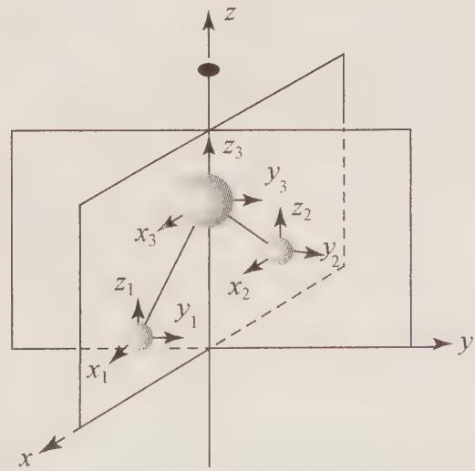  
图4.6.1 $\mathrm{H}_2\mathrm{O}$ 分子的9个自由度

E: 全部箭头均未动, $\chi(E)=9$ 。

$C_{2}^{1}$ : 原子 1,2 上所有箭头都移动, $x_{3}$ 变为 $-x_{3},y_{3}$ 变为 $-y_{3},z_{3}$ 不变。得 $\chi(C_{2})=-1$ 。

$\sigma_{xz}$ ：全部 x, z 都未移动，y 变为 -y，得 $\chi(\sigma_{xz})=3$ 。

$\sigma_{yz}$ ：原子1,2的全部箭头都移动， $x_{3}$ 变为 $-x_{3},y_{3}$ 和 $z_{3}$ 未移动，得 $\chi (\pmb{\sigma}_{yz}) = 1$ 。

<table><tr><td> $C_{2v}$ </td><td>E</td><td> $C_2$ </td><td> $σ_{xz}$ </td><td> $σ_{yz}$ </td></tr><tr><td>Γ</td><td>9</td><td>-1</td><td>3</td><td>1</td></tr></table>

按(4.6.2)式用 $C_{2v}$ 特征标表约化这个可约表示 $\Gamma$ ，可得

$$
\Gamma = 3 \mathrm{A} _ {1} + \mathrm{A} _ {2} + 3 \mathrm{B} _ {1} + 2 \mathrm{B} _ {2}
$$

这中间包括了全部9个可能的运动的对称类型,所以应从这9个运动中除去平动和转动。在基中平动用x,y,z表示,转动用 $R_{x},R_{y},R_{z}$ 表示,按 $C_{2v}$ 特征标表,前者分别属于 $A_{1},B_{1},B_{2}$ ,后者分别属于 $B_{2},B_{1},A_{2}$ 。所以

水分子全部运动的对称性： $3\mathrm{A}_1 + \mathrm{A}_2 + 3\mathrm{B}_1 + 2\mathrm{B}_2$ 水分子平动的对称性： $\mathrm{A_1}$ $+\mathrm{B_1} + \mathrm{B_2}$ 水分子转动的对称性： $\mathrm{A_2} + \mathrm{B_1} + \mathrm{B_2}$ 水分子振动的对称性： $2\mathrm{A}_1 + \mathrm{B}_1$

现在我们判断在这些振动中哪些具有红外活性,哪些具有 Raman 活性。判断的标准是:

（1）如果一个振动隶属的对称类型和偶极矩的一个分量隶属的对称类型相同，即和 $x$ （或 $y$ ，或 $z$ )隶属的对称类型相同，它就具有红外活性。

（2）如果一个振动隶属的对称类型和极化率的一个分量隶属的对称类型相同，即一个振动隶属于 $x^{2}, y^{2}, z^{2}, xy, xz, yz$ 这样的二元乘积中的某一个，或者隶属于 $x^{2} - y^{2}$ 这样的一个乘积的组合，那么它就是Raman活性。

水分子有3种振动方式，如图4.6.2所示。用上述两条判断时， $z$ 属 $\mathrm{A}_{1}$ 不可约表示， $x$ 属 $\mathrm{B}_{1}$ ，3个振动都是红外活性的。其中 $2\mathrm{A}_{1}$ 代表对称性相同、2个非简并的振动，如图4.6.2中的(a)和(b)。此外， $x^{2}, y^{2}, z^{2}$ 属于 $\mathrm{A}_{1}$ 表示， $xz$ 属 $\mathrm{B}_{1}$ ，3个振动也都是Raman活性的。所以对水分子而言，红外光谱和Raman光谱是互相对应的，红外吸收频率和Raman移动频率一致。

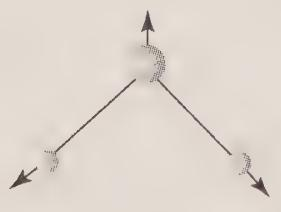  
(a)

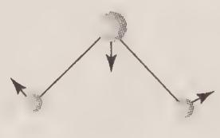  
(b)

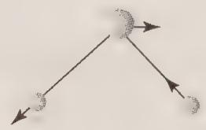  
(c)  
图4.6.2 $\mathrm{H}_2\mathrm{O}$ 分子的3种振动方式

## 【例4.6.2】 $\mathrm{H}_2\mathrm{O}$ 分子的分子轨道组成

用特征标表可简化分子轨道组成的计算。由表4.6.3可知，O原子价轨道 $2\mathrm{s}$ 和 $2\mathrm{p}_z$ 属 $\mathrm{A}_1$ 不可约表示， $2\mathrm{p}_x$ 属 $\mathbf{B}_1$ ， $2\mathrm{p_y}$ 属 $\mathbf{B}_2$ 。两个H原子不处在 $C_2$ 轴上，它们的价轨道 $1\mathrm{s_a}$ 和 $1\mathrm{s_b}$ 对 $C_2$ 是非对称的，不能直接作为基，而需进行线性组合。按图4.6.1，用H原子 $1\mathrm{s_a}$ 和 $1\mathrm{s_b}$ 为基，用简化的求可约表示的方法得

<table><tr><td> $C_{2v}$ </td><td>E</td><td> $C_2^1$ </td><td> $σ_{xz}$ </td><td> $σ_{yz}$ </td></tr><tr><td> $Γ_{2H}$ </td><td>2</td><td>0</td><td>2</td><td>0</td></tr></table>

按公式(4.6.2)约化,得

$$
\Gamma_ {2 \mathrm{H}} = \mathrm{A} _ {1} + \mathrm{B} _ {1}
$$

怎样将 $1\mathrm{s_a}$ 和 $1\mathrm{s_b}$ 组合成具有 $\mathbf{A}_1$ 和 $\mathbf{B}_1$ 对称的轨道，以作为不可约表示的基？方法是取其中之一，如 $1\mathrm{s_a}$ ，以 $C_{2v}$ 的对称操作作用，将操作结果分别乘以该不可约表示的各个操作的特征标，求和即得。例如对 $\mathbf{A}_1$ 不可约表示

$$
\psi \left(\mathrm{A} _ {1}\right) = 1 (\boldsymbol {E}) 1 \mathrm{s} _ {\mathrm{a}} + 1 \left(\boldsymbol {C} _ {2}\right) 1 \mathrm{s} _ {\mathrm{a}} + 1 \left(\sigma_ {x z}\right) 1 \mathrm{s} _ {\mathrm{a}} + 1 \left(\sigma_ {y z}\right) 1 \mathrm{s} _ {\mathrm{a}} = 2 \left(1 \mathrm{s} _ {\mathrm{a}}\right) + 2 \left(1 \mathrm{s} _ {\mathrm{b}}\right)
$$

归一化，得

$$
\psi (\mathrm{A} _ {1}) = \frac {1}{\sqrt {2}} (1 \mathrm{s} _ {\mathrm{a}} + 1 \mathrm{s} _ {\mathrm{b}})
$$

同法对 $\mathrm{B}_1$ 表示，可得

$$
\psi (\mathrm{B} _ {1}) = \frac {1}{\sqrt {2}} (1 \mathrm{s} _ {\mathrm{a}} - 1 \mathrm{s} _ {\mathrm{b}})
$$

$\psi (\mathrm{A}_1)$ 和O原子的 $2s, 2p_z$ 同属 $\mathrm{A}_1$ 不可约表示的基，对称性匹配，它们互相组合，得3个分子轨道： $\mathrm{a}_1, \mathrm{a}_1^n, \mathrm{a}_1^*$ 。 $\psi (\mathrm{B}_1)$ 和 $2p_x$ 同属 $\mathrm{B}_1$ 的基，互相组合得2个分子轨道： $\mathrm{b}_1, \mathrm{b}_1^*$ 。 $2p_y$ 为 $\mathrm{B}_2$ 不可约表示，与 $\psi (\mathrm{A}_1), \psi (\mathrm{B}_1)$ 对称性不匹配，保持非键性质，记为 $\mathbf{b}_2^n$ 。根据分子轨道能级高低和价电子数，可得 $\mathrm{H}_2\mathrm{O}$ 的分子轨道组成图，如图4.6.3所示。因为 $\mathrm{H}_2\mathrm{O}$ 分子坐落在 $xz$ 平面上，对 $\mathfrak{p}_y$ 轨道而言，键轴平面为一节面，呈现 $\pi$ 轨道特性。

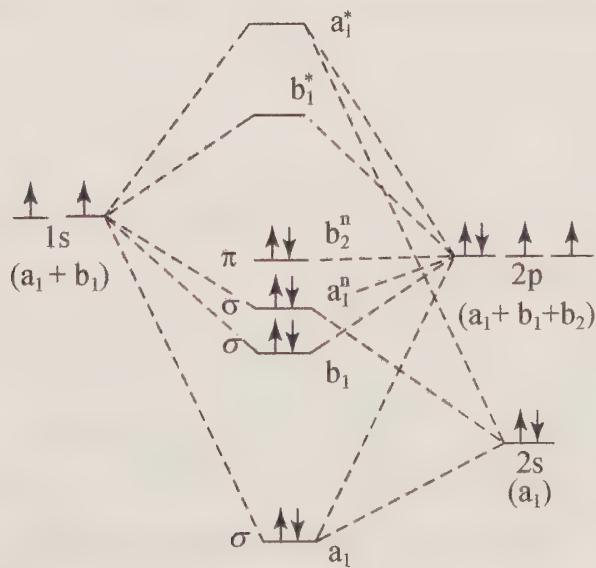  
图4.6.3 $\mathbf{H}_2\mathbf{O}$ 的分子轨道能级图

利用光电子能谱可测得 $\mathrm{H}_2\mathrm{O}$ 的分子轨道能级的高低，图4.6.4示出 $\mathrm{H}_2\mathrm{O}$ 的光电子能谱图。它和图4.6.3是完全对应的。

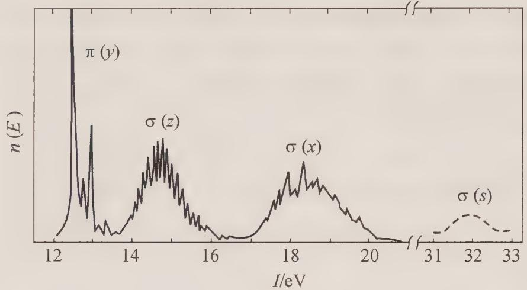  
图4.6.4 $\mathrm{H}_2\mathrm{O}$ 分子的光电子能谱图

## 习题

4.1 HCN和 $\mathrm{CS}_2$ 都是直线形分子，写出它们的对称元素。

4.2 写出 $\mathrm{H}_3\mathrm{CCl}$ 分子的对称元素。

4.3 写出三重映轴 $S_{3}$ 和三重反轴 $I_{3}$ 的全部对称操作。

4.4 写出四重映轴 $S_{4}$ 和四重反轴 $I_{4}$ 的全部对称操作。

4.5 写出 $\sigma_{xz}$ 和通过原点并与 $x$ 轴重合的 $C_2$ 轴的对称操作 $C_2^1$ 的表示矩阵。

4.6 用对称操作的表示矩阵证明：

(1) $C_{2}^{1}(z)\sigma_{xy}=i;$

(2) $C_2^1 (x)C_2^1 (y) = C_2^1 (z)$ ;

(3) $\sigma_{yz}\sigma_{xz} = C_2^1 (z)$ 。

4.7 写出 ClHC=CHCl（反式）分子的全部对称操作及其乘法表。

4.8 写出下列分子所隶属的点群：HCN, $\mathrm{SO}_3$ ，氯苯 $(\mathrm{C}_6\mathrm{H}_5\mathrm{Cl})$ ，苯 $(\mathrm{C}_6\mathrm{H}_6)$ ，萘 $(\mathrm{C}_{10}\mathrm{H}_8)$ 。

4.9 判断下列结论是否正确，说明理由。

(1) 凡线形分子一定有 $C_{\infty}$ 轴；

(2) 甲烷分子有对称中心；

(3) 分子中最高轴次(n)与点群记号中的 n 相同(例如 $C_{3h}$ 中最高轴次为 $C_{3}$ 轴);

(4) 分子本身有镜面, 它的镜像和它本身全同。

4.10 联苯 $\mathrm{C_6H_5 - C_6H_5}$ 有3种不同构象，两苯环的二面角 $(\alpha)$ 分别为：(1) $\alpha = 0$ ，(2) $\alpha = 90^{\circ}$ ，(3) $0 < \alpha < 90^{\circ}$ 。试判断这3种构象的点群。

4.11 $SF_{5}Cl$ 分子的形状和 $SF_{6}$ 相似，试指出它的点群。

4.12 画一立方体, 在 8 个顶角上放 8 个相同的球, 写明编号。若: (1) 去掉 2 个球, (2) 去掉 3 个球。分别列表指出所去掉的球的号数, 指出剩余的球构成的图形属于什么点群? (不考虑球间的连线)

4.13 判断一个分子有无永久偶极矩和有无旋光性的标准分别是什么？

4.14 画出 Ni(en)(NH₃)₂Cl₂ 可能的异构体,说明它们是否有旋光性。

4.15 由下列分子的偶极矩数据，推测分子立体构型及其点群。

<table><tr><td>分子</td><td> $\mu/(10^{-30}Cm)$ </td><td>分子</td><td> $\mu/(10^{-30}Cm)$ </td></tr><tr><td>(1) $C_3O_2$ </td><td>0</td><td>(5) $O_2N-NO_2$ </td><td>0</td></tr><tr><td>(2) $SO_2$ </td><td>5.4</td><td>(6) $H_2N-NH_2$ </td><td>6.14</td></tr><tr><td>(3) $N\equiv C-C\equiv N$ </td><td>0</td><td>(7) $H_2N-\bigcirc-NH_2$ </td><td>5.34</td></tr><tr><td>(4) $H-O-O-H$ </td><td>6.9</td><td></td><td></td></tr></table>

4.16 指出下列分子的点群、旋光性和偶极矩情况：

(1) $H_{3}C—O—CH_{3}$ ;

(2) $H_{3}C—CH=CH_{2}$ ;

(3) $\mathrm{IF}_5$

(4) $S_{8}$ (环形);

(5) $ClH_{2}C—CH_{2}Cl$ (交叉式);

(6)  
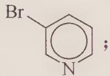

(7)  
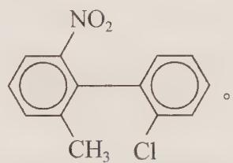

4.17 表 4.4.3 中给出 4 对化学式相似的化合物, 每对化合物中两个化合物的偶极矩不同, 请阐明分子构型主要差异是什么?

4.18 已知连接苯环上 C—Cl 键矩为 $5.17 \times 10^{-30} \, C \, m$ ， $C—CH_{3}$ 键矩为 $-1.34 \times 10^{-30} \, C \, m$ 。试推算邻位、间位和对位的 $C_{6}H_{4}ClCH_{3}$ 的偶极矩，并与实验值 $4.15 \times 10^{-30}$ ， $5.94 \times 10^{-30}$ ， $6.34 \times 10^{-30} \, C \, m$ 相比较。

4.19 水分子的偶极矩为 $6.18 \times 10^{-30} \mathrm{~Cm}$ ，而 $\mathrm{F}_2\mathrm{O}$ 的偶极矩只有 $0.90 \times 10^{-30} \mathrm{~Cm}$ ，它们的键角值很相近，试说明为什么 $\mathrm{F}_2\mathrm{O}$ 的偶极矩比 $\mathrm{H}_2\mathrm{O}$ 小很多。

4.20 甲烷分子及其置换产物的结构如下所示，试标出各个分子所具有的镜面上原子的编号（若有多个镜面，要一一标出），说明分子所属的点群、极性和旋光性。

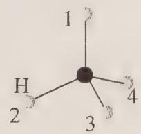  
(1) $\mathrm{CH}_4$

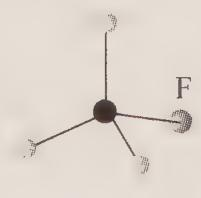  
(2) $CH_{3}F$

  
(3) $CH_{2}F_{2}$

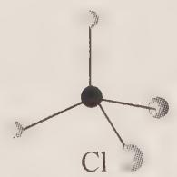  
(4) $\mathrm{CH}_2\mathrm{FCl}$

  
(5) CHFCl $_{2}$

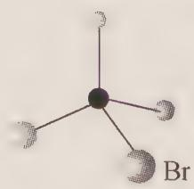  
(6) CHFCIBr

4.21 八面体配位的 $\mathrm{Fe(C_2O_4)}_{3}^{3-}$ 有哪些异构体？属什么点群？旋光性情况如何？

4.22 利用表4.4.5所列有关键的折射度数据,求算 $CH_{3}COOH$ 分子的摩尔折射度 R 值,并和实验值进行比较。实验测定醋酸折射率 n=1.3718, 密度为 $1.046\ g\ cm^{-3}$ 。

4.23 用 $C_{2v}$ 群的元进行相似变换，证明4个对称操作分4类。[提示：选群中任意一个操作为 $S$ ，逆操作为 $S^{-1}$ ，对群中某一个元（例如 $C_2^1$ )进行相似变换，若 $S^{-1}C_2^1 S = C_2^1$ ，则 $C_2^1$ 自成一类。]

4.24 用 $C_{3v}$ 群的元进行相似变换，证明6个对称操作分3类。

4.25 试述分子具有红外活性的判据。

4.26 试述分子具有 Raman 活性的判据。

4.27 将分子或离子: $\mathrm{Co(en)}_{3}^{3+}, \mathrm{NO}_{2}^{+}$ , $\mathrm{FHC=C=CHF}$ , $(\mathrm{NH}_{2})_{2} \mathrm{CO}$ , $\mathrm{C}_{60}$ , 丁三烯, $\mathrm{B(OH)}_{3}, \mathrm{N}_{4}(\mathrm{CH}_{2})_{6}$ 等按下列条件进行归类:

(1) 既有极性又有旋光性；

(2) 既无极性又无旋光性；

(3) 无极性但有旋光性；

(4) 有极性但无旋光性。

4.28 写出 $\mathrm{CH}_3^+$ , $\mathrm{C}_5\mathrm{H}_5\mathrm{N}$ , $\mathrm{Li}_4(\mathrm{CH}_3)_4$ , $\mathrm{H}_2\mathrm{C} = \mathrm{C} = \mathrm{C} = \mathrm{CH}_2$ ，椅式环己烷， $\mathrm{XeOF_4}$ 等分子所属的点群。

4.29 正八面体6个顶点上的原子有3个被另一个原子取代，有几种可能的方式？取代产物各属于什么点群？取代后所得产物是否具有旋光性和偶极矩？

## 参考文献

[1] 唐有祺. 对称性原理: (一) 对称图像的群论原理, 1977; (二) 有限对称群的表象及其群论原理, 1979. 北京: 科学出版社.

[2] 唐有祺. 漫谈对称性. 大学化学, 1987, 2(1): 1\~12.

[3] 李炳瑞. 结构化学. 第 2 版. 北京: 高等教育出版社, 2011.

[4] 高松, 陈志达, 黎乐民. 分子对称群. 北京: 北京大学出版社, 1996.

[5] 科顿(Cotton F A). 群论在化学中的应用. 刘春万, 游效曾, 赖伍江, 译. 北京: 科学出版社, 1975.

[6] 毕晓普(Bishop D M). 群论与化学. 新民, 胡文海, 等译. 北京: 高等教育出版社, 1984.

[7] 尹玉英, 刘春蕴. 有机化合物分子旋光性的螺旋理论. 北京: 化学工业出版社, 2000.

[8] 周公度. 化学中的多面体. 北京: 北京大学出版社, 2009.

[9] Öhrn Y. Elements of Molecular Symmetry. New York: Wiley, 2000.

[10] Ladd M F C. Symmetry and Group Theory in Chemistry. Chichester: Horwood, 1998.

[11] Hargittai I and Hargittai M. Symmetry through the Eyes of a Chemist. 2 $^{nd}$ ed. New York: Plenum, 1995.

[12] Baumann W. Determination of dipole moments in ground and excited states. // Rossiter B W and Hamilton J F. Determination of Chemical Composition and Molecular Structure. Vol III B, 2 $^{nd}$ ed. New York: Wiley, 1989.

## 第 5 章 多原子分子的结构和性质

绝大多数分子为多原子分子，在其中，一个原子可和一个或多个原子成键，也可由多个原子共同组成化学键。分子结构的内容有两个方面：

（1）分子的几何结构。包括原子在三维空间的排布次序和相对位置，通常由键长、键角、二面角、扭角等参数描述。分子的几何结构可用衍射方法（包括X射线衍射、电子衍射和中子衍射）测定。

(2) 分子的电子结构。包括化学键类型和相关的能量参数, 通常由分子轨道的组成、性质、能级高低和电子排布描述。分子的电子结构可用谱学方法(包括分子光谱、电子能谱和磁共振谱等)测定。

分子结构的这两方面内容互相关联,共同决定分子的性质。

## 5.1 多原子分子结构的一些原理和概念

## 5.1.1 非金属单质的成键特征

非金属单质结构的研究,可为非金属元素的结构归纳出下面几点特征:

（1）非金属单质的成键规律，一般可按参与成键的价电子数及有关的原子轨道来分析。就价电子数目来说，周期表中第NA族非金属元素，每个原子可以提供8-N个价电子与8-N个邻近的原子形成8-N个共价单键。因此在第N族非金属单质中，与每个原子邻接的原子数一般为8-N，称为8-N规则。例如稀有气体8-N为0，形成单原子分子；卤素8-N为1，形成双原子分子；S,Se,Te的8-N为2，形成二配位的链形或环形分子；P,As,Sb等，则形成三配位的有限分子 $P_{4}$ , $As_{4}$ 或无限的层形分子；C,Si,Ge,Sn，则形成四配位的金刚石型结构等。图5.1.1示出8-N规则。

(a)  
(c)  
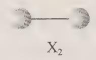

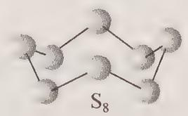

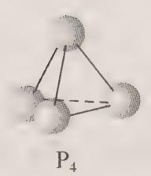

(b)  
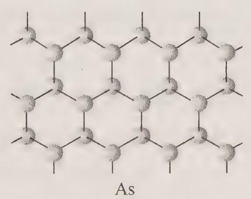

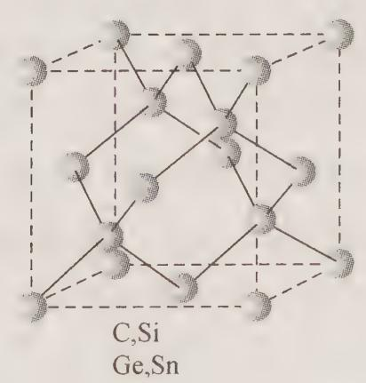  
(d)  
图5.1.1 8-N规则  
(a) 7A族，(b) 6A族，(c) 5A族，(d) 4A族

在单质结构中,有的由于形成 $\pi$ 键、多中心键或 d 轨道参与成键,键型发生变化,这时的 8-N 规则体现在: $N_{2}, O_{2}$ 分子中原子间的共价键分别是叁键和双键,硼的单质和石墨的结构中存在多中心键或离域 $\pi$ 键。

（2）在非金属的单质结构中，同一族元素随着原子序数的递增，金属性也会相应地递增，分子间的界限会越来越模糊，例如 $\mathrm{P},\mathrm{As},\mathrm{Sb},\mathrm{Bi}$ 及 $\mathrm{Cl}_2,\mathrm{Br}_2,\mathrm{I}_2$ 的结构数据，都说明分子间的最短接触距离与分子内的键长的比值随着原子序数的增加而缩小。在金属结构中，已分不出分子内和分子间的差别了。

(3) 对于 $\mathrm{P}_{4}, \mathrm{C}_{60}$ 等具有封闭凸多面体的分子, 凸多面体的面数 (F)、棱数 (E) 和顶点数 (V) 之间的关系符合 Euler(欧拉) 公式

$$
F + V = E + 2
$$

例如，四面体有4个面、6条棱、4个顶点；立方体有6个面、12条棱、8个顶点；八面体有8个面、12条棱、6个顶点。足球形的 $C_{60}$ 分子有60个顶点(V)、32个面(F)和90条边(E)，符合 $32+60=90+2$ 。

## 5.1.2 价电子对互斥(VSEPR)理论

价电子对包括成键电子对(bp)和孤对电子对(lp)。价电子对互斥(valence shell electron pair repulsion, VSEPR)理论认为:原子周围各个价电子对之间由于相互排斥,在键长一定的条件下,互相间距离愈远愈稳定。这就要求分布在中心原子周围的价电子对尽可能离得远些,由此可以说明许多简单分子的几何构型。虽然这个理论是定性的,但对判断分子构型很有用。

价电子对之间斥力的根源有两方面:(i)各电子对之间的静电排斥作用;(ii)Pauli斥力,即价电子对之间自旋相同的电子互相回避的效应。

当中心原子 A 周围存在 m 个配位体 L 及 n 个孤对电子对 E 时, 根据斥力效应, 并考虑多重键中多对电子集中在同一键区, 可当作一个键处理; 又考虑孤对电子的空间分布比较肥大及电负性大小因素等, 提出判断分子几何构型的规则:

（1）为使价电子对间斥力最小，可将价电子对看作等距离地排布在同一球面上，形成规则的多面体形式。例如：当 $m + n = 2$ 时，取直线形；为3时，取三角形；为4时，取四面体形；为5时，取三方双锥形；为6时，取八面体形；等等。

（2）中心原子 A 与 m 个配位体 L 之间所形成的键可能是单键，也可能是双键和叁键等多重键。多重键中键的性质比较复杂。价电子对互斥理论仍按照经典的共价单键、双键和叁键结构式加以处理，将双键和叁键按一个键区计算原子间互斥作用。

由于双键中的4个电子或叁键中的6个电子占据的空间大于单键中的2个电子所占据的空间，所以排斥力的大小次序可定性地表示为

$$
\text {   叁键一叁键   } > \text {   叁键一双键   } > \text {   双键一双键   } > \text {   双键一单键   } > \text {   单键一单键   }
$$

这样,多重键的存在将进一步影响分子构型。例如在 $O=CCl_{2}$ 分子中,单键—双键间键角为 $124.3^{\circ}$ ,而单键—单键键角为 $111.3^{\circ}$ 。

（3）成键电子对和孤对电子对的分布情况并不相同。前者由于受2个成键原子核的吸引，比较集中在键轴的位置。而孤对电子对没有这种限制，显得比较肥大。

孤对电子对的肥大，使它对相邻电子对的排斥作用大一些。由此，可将价电子对间排斥力

大小次序表示为

$$
\mathrm{lp} - \mathrm{lp} \gg \mathrm{lp} - \mathrm{bp} > \mathrm{bp} - \mathrm{bp}
$$

根据分子中各种价电子的可能排布方式,对比在它们之中价电子对排斥作用的大小,对判断分子构型很有帮助。由于电子对间排斥力随角度的增加迅速地下降,当夹角 $\leqslant90^{\circ}$ 时,lp—lp斥力很大,这种构型不稳定。lp和lp必须排列在相互夹角 $>90^{\circ}$ 的构型中。

（4）电负性高的配体，吸引价电子能力强，价电子离中心原子较远，占据空间角度相对较小。

根据上述规则,用 VSEPR 方法,可判断在分子 $AL_{m}E_{n}$ 中,原子 A 周围配位体 L 和孤对电子 E 的空间排布应如图 5.1.2 所示。

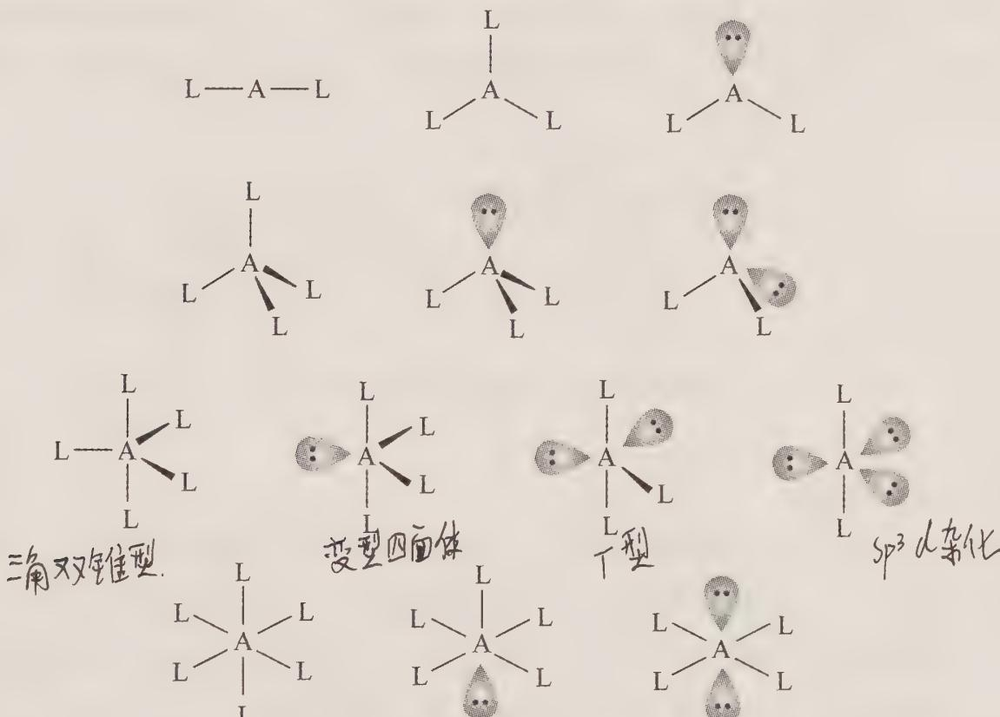  
图 5.1.2 用 VSEPR 方法判断原子 A 周围配位体和孤对电子的空间排布 $^{①}$

价电子对互斥理论对少数化合物判断不准。例如 $\mathrm{CaF}_2, \mathrm{SrF}_2, \mathrm{BaF}_2$ 是弯曲形而不是预期的直线形。价电子对互斥理论不能应用于过渡金属化合物，除非金属具有充满的、半充满的或全空的d轨道。

利用价电子对互斥理论判断分子的构型时，等电子原理常能给以一定的启发和预见。等电子原理是指两个或两个以上的分子，它们的原子数相同（有时不算H原子）、分子中电子数也相同，这些分子常具有相似的电子结构、相似的几何构型，它们的物理性质也相近。 $\mathrm{CO}_{2}$ ， $\mathrm{N}_{2}\mathrm{O}$ 和 $\mathrm{NO}_{2}^{+}$ 是等电子分子。注意， $\mathrm{N}_{2}\mathrm{O}$ 分子的构型是 $\mathrm{N}^{-} = \mathrm{N}^{+} = \mathrm{O}$ ，而不是O原子在中心； $\mathrm{NO}_{2}^{+}$ 的构型为 $\mathrm{O} = \mathrm{N}^{+} = \mathrm{O}$ ，它们都是直线形分子。 $\mathrm{BO}_{3}^{3-}$ ， $\mathrm{CO}_{3}^{2-}$ 和 $\mathrm{NO}_{3}^{-}$ 均为平面三角形构型。 $\mathrm{CH}_{4}$ 和 $\mathrm{NH}_{4}^{+}$ 为等电子体， $\mathrm{ClO}_{4}^{-}$ ， $\mathrm{SO}_{4}^{2-}$ ， $\mathrm{PO}_{4}^{3-}$ 和 $\mathrm{SiO}_{4}^{4-}$ 也是等电子体，它们均为四面体构型。 $\mathrm{Xe}$ 和 $\mathrm{I}^{-}$ 为等电子体， $\mathrm{XeF}_{2}$ 和 $\mathrm{IF}_{2}^{-}$ ， $\mathrm{XeF}_{4}$ 和 $\mathrm{IF}_{4}^{-}$ ， $\mathrm{XeO}_{3}$ 和 $\mathrm{IO}_{3}^{-}$ ， $\mathrm{XeO}_{6}^{4-}$ 和 $\mathrm{IO}_{6}^{5-}$ 等为等电子化合物，两两之间均具有相同的构型。

## 5.1.3 二面角和扭角

在多原子分子中，键长、键角等几何学概念，已在前修课程中学习过，本小节对二面角、扭角等描述分子的几何参数加以讨论。根据几何学基本原理，3个原子构成一个平面；3个以上原子组成的分子，可能是平面形，如 $\mathrm{CO}_{3}^{2-}$ ，也可能不是平面形，如 $\mathrm{NH}_{3}$ 。对非平面形分子，常以二面角和扭角描述它们的几何特征。

## 1. 二面角(dihedral angle) $^{①}$

二面角又称双面角，指分子结构中两个相交平面的法线在第三个面上的夹角，以 $\phi$ 表示。在图4.3.1(c)的 $\mathrm{H}_2\mathrm{O}_2$ 分子结构图中， $\mathrm{H}-\mathrm{O}-\mathrm{O}$ 和 $\mathrm{O}-\mathrm{O}-\mathrm{H}$ 两组3个原子分别处在两个平面上，平面法线的夹角即为二面角 $(\phi)$ ，如图5.1.3(a)所示。二面角 $(\phi)$ 和扭角 $(\omega)$ 有关，其关系为 $\phi = 180^{\circ} - |\omega|$ ，图5.1.3(b)示出 $\mathrm{H}_2\mathrm{O}_2$ 的扭角。

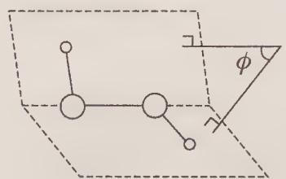  
(a)

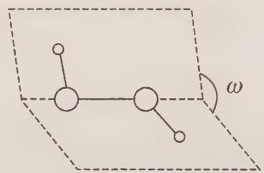  
(b)  
图5.1.3 二面角(a)和扭角(b)

## 2. 扭角(torsion angle)

链形排列的 4 个原子(或基团中的原子)A—B—C—D 的结构如图 5.1.4(a) 所示。当沿着 B—C 键投影,顺着 B—C 键观看时,将 A—B 键顺时针方向扭转,使它和 C—D 键重合,所转角度 $<180^{\circ}$ 的角度值为正的扭角 $(+\omega)$ ,如图 5.1.4(b) 所示。若采用逆时针方向扭转 A—B 键,使它和 C—D 键重合,所转角度 $<180^{\circ}$ 的角度值为负的扭角 $(-\omega)$ ,如图 5.1.4(c) 所示。

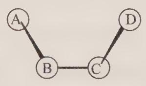  
(a)

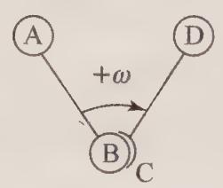  
(b)

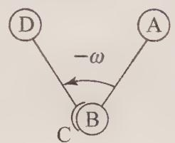  
(c)  
图5.1.4 扭角正负值的定义图

若对 A—B—C—D 结构换一个方向测定扭角, 沿 C—B 键投影观看, 依然按上部的 C—D 键顺时针方向扭转, 使它和 B—A 键重合, 所转角度 $<180^{\circ}$ 的角度值为正的扭角 $(+\omega)$ ; 若采用逆时针方向扭转, 使它和 B—A 键重合, 所转角度 $<180^{\circ}$ 的角度值为负的扭角 $(-\omega)$ 。

## 5.2 杂化轨道理论

原子在化合成分子的过程中,根据原子的成键要求,在周围原子影响下,将原有的原子轨道进一步线性组合成新的原子轨道。这种在一个原子中不同原子轨道的线性组合,称为原子轨道的杂化。杂化后的原子轨道称为杂化轨道。杂化时,轨道的数目不变,轨道在空间的分布方向和分布情况发生改变,能级改变。组合所得的杂化轨道一般均和其他原子形成较强的 $\sigma$ 键或安排孤对电子,而不会以空的杂化轨道的形式存在。

在某个原子的几个杂化轨道中，参与杂化的 s, p, d 等成分若相等，称为等性杂化轨道；若不相等，称为不等性杂化轨道。表 5.2.1 列出一些常见的杂化轨道的性质。表中 2 个 $dsp^{3}$ 是不等性杂化轨道，但可分别看作由等性杂化轨道组合而成，即三方双锥形： $sp^{2}$ 和 $p_{z}d_{z^{2}}$ ；四方锥形： $dsp^{2}$ 和 $p_{z}$ 。

表 5.2.1 一些常见的杂化轨道

<table><tr><td>杂化轨道</td><td>参加杂化的原子轨道</td><td>构型</td><td>对称性</td><td>实例</td></tr><tr><td>sp</td><td> $s, p_z$ </td><td>直线形</td><td> $D_{\infty h}$ </td><td> $CO_2, N_3^-$ </td></tr><tr><td> $sp^2$ </td><td> $s, p_x, p_y$ </td><td>平面三角形</td><td> $D_{3h}$ </td><td> $BF_3, SO_3$ </td></tr><tr><td> $sp^3$ </td><td> $s, p_x, p_y, p_z$ </td><td>四面体形</td><td> $T_d$ </td><td> $CH_4$ </td></tr><tr><td> $dsp^2$ 或 $sp^2 d$ </td><td> $d_{x^2-y^2}, s, p_x, p_y$ </td><td>平面四方形</td><td> $D_{4h}$ </td><td> $Ni(CN)_4^{2-}$ </td></tr><tr><td> $dsp^3$ 或 $sp^3 d$ </td><td> $d_{z^2}, s, p_x, p_y, p_z$ </td><td>三方双锥形</td><td> $D_{3h}$ </td><td> $PF_5$ </td></tr><tr><td> $d^2 sp^2$ 或 $sp^2 d^2$ </td><td> $d_{x^2-y^2}, d_{z^2}, s, p_x, p_y$ </td><td>四方锥形</td><td> $C_{4v}$ </td><td> $IF_5$ </td></tr><tr><td> $d^2 sp^3$ 或 $sp^3 d^2$ </td><td> $d_{z^2}, d_{x^2-y^2}, s, p_x, p_y, p_z$ </td><td>正八面体形</td><td> $O_h$ </td><td> $SF_6$ </td></tr></table>

杂化轨道具有和 s, p 等原子轨道相同的性质, 必须满足正交性和归一性。例如由 s 和 p 轨道组成杂化轨道 $\psi_{i}=a_{i}s+b_{i}p$ , 由归一性可得

$$
\int \psi_ {i} ^ {*} \psi_ {i} \mathrm{d} \tau = 1 \quad a _ {i} ^ {2} + b _ {i} ^ {2} = 1\tag{5.2.1}
$$

由正交性可得

$$
\int \psi_ {i} ^ {*}   \psi_ {j} \mathrm{d} \tau = 0, \qquad i \neq j   \text {时}\tag{5.2.2}
$$

根据这一基本性质,考虑杂化轨道的空间分布及杂化前原子轨道的取向,就能写出各个杂化轨道中原子轨道的组合系数。例如由 $s, p_{x}, p_{y}$ 组成的平面三角形的 $sp^{2}$ 杂化轨道 $\psi_{1}, \psi_{2}, \psi_{3}$ , 当 $\psi_{1}$ 极大值方向和 x 轴平行, 由等性杂化概念可知, 每一杂化轨道中 s 成分占 1/3, 组合系数为 $1/\sqrt{3}$ ; 其余 2/3 成分全由 p 轨道组成, 因 $\psi_{1}$ 与 x 轴平行, 与 y 轴垂直, $p_{y}$ 没有贡献, 所以

$$
\psi_ {1} = \sqrt {\frac {1}{3}} \mathrm{s} + \sqrt {\frac {2}{3}} \mathrm{p} _ {x}\tag{5.2.3}
$$

同理，可得

$$
\psi_ {2} = \sqrt {\frac {1}{3}} \mathrm{s} - \sqrt {\frac {1}{6}} \mathrm{p} _ {x} + \sqrt {\frac {1}{2}} \mathrm{p} _ {y}\tag{5.2.4}
$$

$$
\psi_ {3} = \sqrt {\frac {1}{3}} \mathrm{s} - \sqrt {\frac {1}{6}} \mathrm{p} _ {x} - \sqrt {\frac {1}{2}} \mathrm{p} _ {y}\tag{5.2.5}
$$

可以验证： $\psi_{1},\psi_{2},\psi_{3}$ 满足正交、归一性。

原子轨道经过杂化,可使成键的相对强度增大。因为杂化后的原子轨道在某些方向上的分布更集中,当与其他原子成键时,重叠部分增大,成键能力增强。图5.2.1示出碳原子的 $sp^{3}$ 杂化轨道等值线图。由图可见,杂化轨道角度部分相对最大数值有所增加,意味着相对成键强度增大。

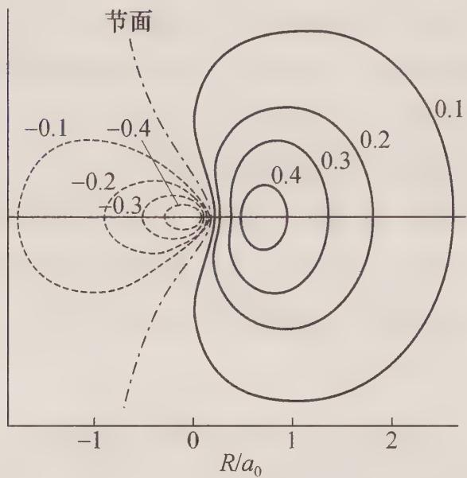  
图5.2.1 碳原子的 $\mathbf{sp}^3$ 杂化轨道等值线图

根据杂化轨道的正交、归一条件，两个等性杂化轨道的最大值之间的夹角 $\theta$ 满足

$$
\alpha + \beta \cos \theta + \gamma \left(\frac {3}{2} \cos^ {2} \theta - \frac {1}{2}\right) = 0\tag{5.2.6}
$$

式中 $\alpha, \beta, \gamma$ 分别为杂化轨道中 $s, p, d$ 轨道所占的百分数（注意，此式适用于没有 $f$ 轨道参加杂化的情况，另外因角度的特殊性，此式不适用于 $\mathrm{dsp}^2$ 杂化轨道）。例如 $\mathrm{sp}^2$ 杂化轨道， $s$ 占 $\frac{1}{3}, p$ 占 $\frac{2}{3}$ ，代入(5.2.6)式，得 $\frac{1}{3} + \frac{2}{3} \cos \theta = 0$ ，解之得 $\theta = 120^\circ$ 。

与(5.2.6)式相似,两个不等性杂化轨道 $\psi_{i}$ 和 $\psi_{j}$ 的最大值之间的夹角 $\theta_{ij}$ 可按下式计算:

$$
\sqrt {\alpha_ {i}} \sqrt {\alpha_ {j}} + \sqrt {\beta_ {i}} \sqrt {\beta_ {j}} \cos \theta_ {i j} + \sqrt {\gamma_ {i}} \sqrt {\gamma_ {j}} \left(\frac {3}{2} \cos^ {2} \theta_ {i j} - \frac {1}{2}\right) = 0\tag{5.2.7}
$$

由不等性杂化轨道形成的分子,其准确的几何构型需要通过实验测定,而不能预言其键角准确值。根据实验测定结果,可按(5.2.7)式计算每一个杂化轨道中s和等轨道的成分。下面举例说明。

【例5.2.1】 $\mathrm{H}_2\mathrm{O}$

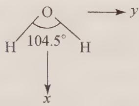

实验测定 $\mathrm{H}_2\mathrm{O}$ 分子 $\angle \mathrm{HOH}$ 为 $104.5^{\circ}$ 。设分子处在 $xy$ 平面上，按右图所示的坐标关系，可得O原子两个杂化轨道：

$$
\begin{array}{l} \psi_ {\mathrm{a}} = c _ {1} [ (\cos 5 2. 2 5 ^ {\circ}) \mathrm{p} _ {x} + (\sin 5 2. 2 5 ^ {\circ}) \mathrm{p} _ {y} ] + c _ {2} \mathrm{s} = 0. 6 1 c _ {1} \mathrm{p} _ {x} + 0. 7 9 c _ {1} \mathrm{p} _ {y} + c _ {2} \mathrm{s} \\ \psi_ {\mathrm{b}} = c _ {1} [ (\cos 5 2. 2 5 ^ {\circ}) \mathrm{p} _ {x} - (\sin 5 2. 2 5 ^ {\circ}) \mathrm{p} _ {y} ] + c _ {2} \mathrm{s} = 0. 6 1 c _ {1} \mathrm{p} _ {x} - 0. 7 9 c _ {1} \mathrm{p} _ {y} + c _ {2} \mathrm{s} \end{array}
$$

根据原子轨道的正交、归一条件，可得

解之，得

$$
\begin{array}{r l} & \left\{ \begin{array}{l} c _ {1} ^ {2} + c _ {2} ^ {2} = 1 \\ 0. 6 1 ^ {2} c _ {1} ^ {2} - 0. 7 9 ^ {2} c _ {1} ^ {2} + c _ {2} ^ {2} = 0 \end{array} \right. \\ & c _ {1} ^ {2} = 0. 8 0, \quad c _ {1} = 0. 8 9; \quad c _ {2} ^ {2} = 0. 2 0, \quad c _ {2} = 0. 4 5 \\ & \psi_ {\mathrm{a}} = 0. 5 5 \mathrm{p} _ {x} + 0. 7 0 \mathrm{p} _ {y} + 0. 4 5 \mathrm{s} \end{array}
$$

$$
\psi_ {\mathrm{b}} = 0. 5 5 \mathrm{p} _ {x} - 0. 7 0 \mathrm{p} _ {y} + 0. 4 5 \mathrm{s}
$$

若只求杂化轨道中 s 成分和 p 成分，可由(5.2.6)式简化算得。 $H_{2}O$ 分子中 O 原子只有 s 轨道和 p 轨道参加杂化。设 s 成分为 $\alpha$ ，p 成分为 $\beta=1-\alpha$ 。由(5.2.6)式简化后，得

$$
\alpha + (1 - \alpha) \cos \theta = 0
$$

$$
\alpha + (1 - \alpha) \cos 1 0 4. 5 ^ {\circ} = 0
$$

解之，得

$$
\alpha = 0. 2 0
$$

$$
c _ {2} ^ {2} = \alpha = 0. 2 0, \quad c _ {2} = 0. 4 5; \quad c _ {1} ^ {2} = 1 - \alpha = 0. 8 0, \quad c _ {1} = 0. 8 9
$$

此结果和上述结果相同。根据此结果, 还可以计算出 $H_{2}O$ 分子中 2 个孤对电子所占轨道的成分 ( $\alpha=0.30$ ) 及其夹角 ( $115.4^{\circ}$ )。

【例5.2.2】 $\mathrm{NH}_3$

实验测定 $\mathrm{NH}_3$ 分子属 $C_{3v}$ 点群。3个N—H键中s,p成分相同， $\angle HNH = 107.3^{\circ}$ 。计算一个N—H键中s成分，即可了解其他的键。设有2个H原子和N原子坐落在 $xy$ 平面上，根据对 $\mathrm{H}_2\mathrm{O}$ 分子的处理方法，可得N原子的杂化轨道中s轨道的成分

$$
\begin{array}{c} \alpha + (1 - \alpha) \cos 1 0 7. 3 ^ {\circ} = 0 \\ \alpha = 0. 2 3 \end{array}
$$

即每个形成 N—H 键的杂化轨道 $\psi_{b}$ 中，s 轨道占 0.23，p 轨道占 0.77。杂化轨道为

$$
\psi_ {\mathrm{b}} = \sqrt {0 . 7 7} \mathrm{p} + \sqrt {0 . 2 3} \mathrm{s} = 0. 8 8 \mathrm{p} + 0. 4 8 \mathrm{s}
$$

而孤对电子所占的杂化轨道 $\psi_{1}$ 中

$$
\mathrm{s} \text {轨道占:} 1. 0 0 - 3 \times 0. 2 3 = 0. 3 1
$$

$$
\mathrm{p} \text {轨道占:} 3. 0 0 - 3 \times 0. 7 7 = 0. 6 9
$$

即

$$
\psi_ {1} = \sqrt {0 . 6 9} \mathrm{p} + \sqrt {0 . 3 1} \mathrm{s} = 0. 8 3 \mathrm{p} + 0. 5 6 \mathrm{s}
$$

由 $H_{2}O$ 和 $NH_{3}$ 分子可见, 孤对电子占据的杂化轨道含较多的 s 成分。

杂化轨道理论是通俗易懂而又应用广泛的一种理论。这与它能简明地阐明分子的几何构型及一部分分子的性质有关。例如， $\mathrm{CH}_4$ 中C原子用 $\mathrm{sp}^3$ 杂化轨道，分子具有 $T_{d}$ 点群对称性；4个C—H键键长相等，按正四面体方向排列。 $\mathrm{SF}_6$ 分子中S原子用 $\mathrm{sp}^3\mathrm{d}^2$ 杂化轨道，即在成键过程中，S原子的两个电子激发到两个3d轨道杂化形成；6个S—F键键长相等，按正八面体方向排列，具有 $O_h$ 点群对称性。（在本章的习题5.14中，对 $\mathrm{SF}_6$ 分子的杂化轨道提出不同见解，可供学习时参考。） $\mathrm{PF}_5$ 分子呈三方双锥形，P原子采用 $\mathrm{sp}^3\mathrm{d}$ 杂化轨道，这种杂化轨道可以看作由 $\mathrm{sp}^2$ 和pd两种杂化轨道组合而成；P—F键有两套键长，分子具有 $D_{3h}$ 点群对称性。

用杂化轨道理论讨论分子性质时,通常结合分子的键型和分子的几何构型进行。杂化轨道和其他原子轨道形成较强的 $\sigma$ 键, $\sigma$ 键沿键轴呈圆柱对称, $\sigma$ 单键可以自由转动而不影响分子的势能。杂化后剩余轨道有一定方向, 常可形成 $\pi$ 键。 $\pi$ 键也有一定方向。以烯烃为例, C 原子以 $sp^{2}$ 杂化轨道形成平面三角形的 3 个 $\sigma$ 键后, 剩余 $p_{z}$ 轨道相互重叠, 形成和 3 个 $\sigma$ 键的平面相垂直的 $\pi$ 键。

$\pi$ 键显露在外，易受干扰，化学反应活泼。当条件合适时，发生加成，打开双键； $\pi$ 键容易极化，即 $\pi$ 电子分布容易变形，因此有 $\pi$ 键电子的化合物折射度较大；由 $\pi \rightarrow \pi^{*}$ 的能级差通常较 $\sigma \rightarrow \sigma^{*}$ 的能级差小，一般 $\sigma \rightarrow \sigma^{*}$ 能级差范围在紫外光区，而 $\pi \rightarrow \pi^{*}$ 接近可见光区。

在化学反应过程中,化学键的个数不变,但键能改变,例如 $2E(\mathrm{C}-\mathrm{C})>E(\mathrm{C}=\mathrm{C})$ 。了解反应过程有无碳-碳 $\sigma$ 键变为 $\pi$ 键或 $\pi$ 键变为 $\sigma$ 键,即可预见化学反应的一些性质。在有共轭效

应存在时,还应考虑共轭的因素。

（1）当反应有 $\sigma$ 键变成 $\pi$ 键时，通常是吸热反应。例如烷烃裂解有部分 $\sigma$ 键变为 $\pi$ 键， $\Delta H$ 为正值。裂解时气态分子数增加，熵增加， $\Delta S$ 也为正值。从 $\Delta G = \Delta H - T\Delta S$ 来看，这种吸热的熵增反应，只有升高温度，使熵效应超过焓效应， $\Delta G < 0$ ，反应才能顺利进行。

(a)  
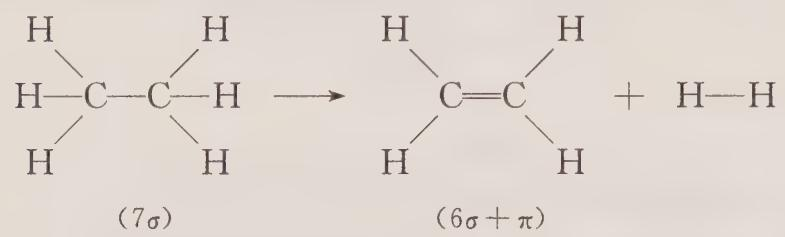  
(2) 当反应有 $\pi$ 键变为 $\sigma$ 键时, 通常是放热反应。例如烯烃聚合反应

$$
\begin{array}{r l} n (\mathrm{H} _ {2} \mathrm{C} = \mathrm{CH} _ {2}) & \longrightarrow (- \mathrm{CH} _ {2} - \mathrm{CH} _ {2}) _ {n} \\ (5 n \sigma + n \pi) & (6 n \sigma) \end{array}
$$

这个反应是放热的熵减反应,根据 $\Delta G = \Delta H - T\Delta S$ , 升高温度会使 $\Delta G$ 往正值方向增加, 平衡常数会下降。

（3）无 $\sigma$ 和 $\pi$ 键型转变的反应，例如酯化反应、酯的水解和醇解反应等，一般反应热很小。由上述讨论可见，物质的各种宏观性质均有其内部结构根源。

杂化轨道概念对了解分子的几何构型帮助很大。如计算键角，理解 $\mathrm{CH}_4$ 中4个C—H键相等，能和VSEPR理论结合等等。还可利用 $\pi$ 键轨道的方向，了解 $\mathrm{H}_2\mathrm{C} = \mathrm{C} = \mathrm{CH}_2$ 型化合物中基团在空间的排布及其对称性。

下面讨论两个与杂化轨道有关的问题。

## 1. 弯键

杂化轨道的极大值方向通常和键轴方向一致，形成圆柱对称的 $\sigma$ 键。但有时极大值方向却与分子中成键两原子间的连线方向不同。例如环丙烷中键角为 $60^{\circ}$ ，而碳原子利用 $\mathrm{sp}^{3}$ 杂化轨道成键，轨道间的夹角为 $109.5^{\circ}$ 。

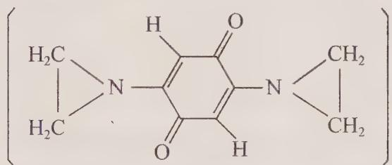

为了了解三元环中轨道叠加情况,有人曾经测定2,5-二环乙胺-1,4苯醌(见左式)在110 K下的晶体结构,并计算通过 $-NC_{2}H_{4}$ 三元环平面的电子密度差值图,如图5.2.2所示。

由图可见,轨道叠加最大区域在三角形外侧,这时形成的 $\sigma$ 键由于弯曲,不存在绕键轴的圆柱对称性,这种弯曲的 $\sigma$ 键称为弯键。四面体构型的 $P_{4}$ 分子中也存在弯键。

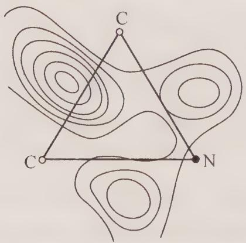

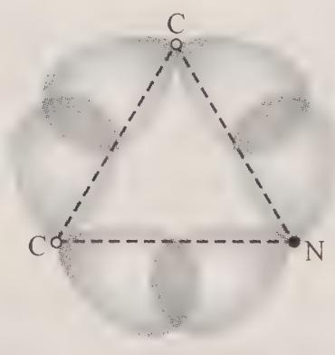  
(b)  
图 5.2.2 — $NC_{2}H_{4}$ 三元环中的弯键  
(a) 电子密度差值图，(b) 轨道叠加图

## 2. 关于共价键的饱和性与分子的不饱和数

原子轨道杂化时, 轨道数目不变, 而每个原子能提供的轨道数目和电子数目是一定的, 因此共价键有饱和性。分子中化学键数目的总和为整数 (单键算 1 个, 双键算 2 个, 叁键算 3 个; 例如 $\mathrm{CH}_4$ 共有 4 个, $\mathrm{H}_2\mathrm{C} = \mathrm{CH}_2$ 共有 6 个等等)。这就决定分子中各种原子化合的数量关系, 它可以帮助确定有机物的结构式。例如, 一个中性分子中 H、卤素、N 等奇数价元素的原子数目之和必须是偶数。又如, 在烃的结构式中含有 1 个双键或 1 个环, 分子式中 H 的数目就比相应的饱和烃减少 2 个。烃中 H 的数目与相应的饱和烃之差除以 2, 所得的数值称不饱和数。这个数即为双键数或成环数, 双键不饱和数为 1, 叁键不饱和数为 2, 苯为 4, 等等。不饱和数也可用于烃类的衍生物。这些简单规则在有机物结构鉴定中有一定的作用。

## 5.3 离域分子轨道理论

用分子轨道理论处理多原子分子时,最一般的方法是用非杂化的原子轨道进行线性组合,

构成分子轨道,它们是离域化的,即这些分子轨道中的电子并不定域在多原子分子中的两个原子之间,而是在几个原子间离域运动。这种离域分子轨道对于讨论分子的激发态、电离能以及分子的光谱性质等起很大作用,理论分析所得的结果与实验数据符合。下面以 $CH_{4}$ 分子为例进行讨论。

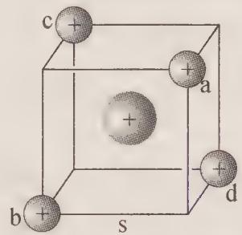

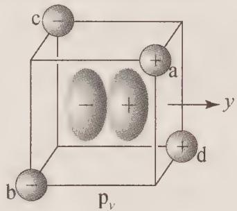

$CH_{4}$ 分子的离域 MO 是由 8 个 AO（即 C 原子的 $2s, 2p_{x}, 2p_{y}, 2p_{z}$ 和 4 个 H 原子的 1s 轨道 $1s_{a}, 1s_{b}, 1s_{c}, 1s_{d}$ ）线性组合而成的。组合时为了形成成键分子轨道，要求符合对称性匹配原则。根据分子的对称性，可使组合方式简化。4 个 H 原子的 1s 轨道为了能与中心碳原子轨道的对称性匹配，先线性组合成符合对称性要求的轨道。由

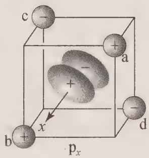

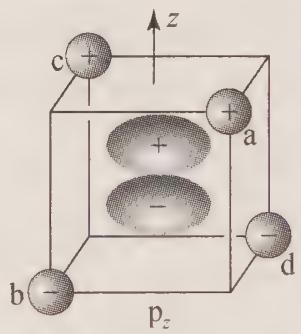  
图5.3.1 $\mathrm{CH}_4$ 的分子轨道组合图

图 5.3.1 可知,与 C 原子 2s 轨道球形对称性匹配的线性组合是

$$
\frac {1}{2} \left(1 \mathrm{s} _ {\mathrm{a}} + 1 \mathrm{s} _ {\mathrm{b}} + 1 \mathrm{s} _ {\mathrm{c}} + 1 \mathrm{s} _ {\mathrm{d}}\right)\tag{5.3.1}
$$

与C原子的 $2\mathrm{p}_x, 2\mathrm{p}_y, 2\mathrm{p}_z$ 对称性匹配的线性组合依次是

$$
\frac {1}{2} \left(1 \mathrm{s} _ {\mathrm{a}} + 1 \mathrm{s} _ {\mathrm{b}} - 1 \mathrm{s} _ {\mathrm{c}} - 1 \mathrm{s} _ {\mathrm{d}}\right)\tag{5.3.2}
$$

$$
\frac {1}{2} \left(1 s _ {\mathrm{a}} - 1 s _ {\mathrm{b}} - 1 s _ {\mathrm{c}} + 1 s _ {\mathrm{d}}\right)\tag{5.3.3}
$$

$$
\frac {1}{2} \left(1 \mathrm{s} _ {\mathrm{a}} - 1 \mathrm{s} _ {\mathrm{b}} + 1 \mathrm{s} _ {\mathrm{c}} - 1 \mathrm{s} _ {\mathrm{d}}\right)\tag{5.3.4}
$$

用中心原子的轨道和 H 原子的线性组合轨道进一步组合，得到 4 个成键分子轨道 $(\psi_{s},\psi_{x},\psi_{y},\psi_{z})$ 和 4 个反键分子轨道 $(\psi_{s}^{*},\psi_{x}^{*},\psi_{y}^{*},\psi_{z}^{*})$ 。组合时均未考虑组合系数的差异。成键分子轨道的组合情况示于图 5.3.1 中。

$$
\psi_ {\mathrm{s}} = \mathrm{s} + \frac {1}{2} (1 \mathrm{s} _ {\mathrm{a}} + 1 \mathrm{s} _ {\mathrm{b}} + 1 \mathrm{s} _ {\mathrm{c}} + 1 \mathrm{s} _ {\mathrm{d}})\tag{5.3.5}
$$

$$
\psi_ {\mathrm{s}} ^ {*} = \mathrm{s} - \frac {1}{2} (1 \mathrm{s} _ {\mathrm{a}} + 1 \mathrm{s} _ {\mathrm{b}} + 1 \mathrm{s} _ {\mathrm{c}} + 1 \mathrm{s} _ {\mathrm{d}})\tag{5.3.6}
$$

$$
\psi_ {x} = \mathrm{p} _ {x} + \frac {1}{2} (1 \mathrm{s} _ {\mathrm{a}} + 1 \mathrm{s} _ {\mathrm{b}} - 1 \mathrm{s} _ {\mathrm{c}} - 1 \mathrm{s} _ {\mathrm{d}})\tag{5.3.7}
$$

$$
\psi_ {x} ^ {*} = \mathrm{p} _ {x} - \frac {1}{2} (1 \mathrm{s} _ {\mathrm{a}} + 1 \mathrm{s} _ {\mathrm{b}} - 1 \mathrm{s} _ {\mathrm{c}} - 1 \mathrm{s} _ {\mathrm{d}})\tag{5.3.8}
$$

$$
\psi_ {y} = \mathrm{p} _ {y} + \frac {1}{2} (1 \mathrm{s} _ {\mathrm{a}} - 1 \mathrm{s} _ {\mathrm{b}} - 1 \mathrm{s} _ {\mathrm{c}} + 1 \mathrm{s} _ {\mathrm{d}})\tag{5.3.9}
$$

$$
\psi_ {y} ^ {*} = p _ {y} - \frac {1}{2} (1 s _ {a} - 1 s _ {b} - 1 s _ {c} + 1 s _ {d})\tag{5.3.10}
$$

$$
\psi_ {z} = \mathrm{p} _ {z} + \frac {1}{2} (1 \mathrm{s} _ {\mathrm{a}} - 1 \mathrm{s} _ {\mathrm{b}} + 1 \mathrm{s} _ {\mathrm{c}} - 1 \mathrm{s} _ {\mathrm{d}})\tag{5.3.11}
$$

$$
\psi_ {z} ^ {*} = \mathrm{p} _ {z} - \frac {1}{2} (1 \mathrm{s} _ {\mathrm{a}} - 1 \mathrm{s} _ {\mathrm{b}} + 1 \mathrm{s} _ {\mathrm{c}} - 1 \mathrm{s} _ {\mathrm{d}})\tag{5.3.12}
$$

$\mathrm{CH}_4$ 的离域分子轨道能级图如图5.3.2所示，图中： $\mathbf{a}_1$ 和 $t_1$ 是用群的不可约表示的符号，表达分子轨道的对称性和维数等性质。 $\mathrm{CH}_4$ 的光电子能谱图示于图5.3.3中，图中： $\sigma_{s}$ 代表 $\psi_{s}$ ，即和 $\mathbf{a}_1$ 对应； $\sigma_{x,y,z}$ 代表 $\psi_x,\psi_y,\psi_z$ ，即和 $t_1$ 相对应。

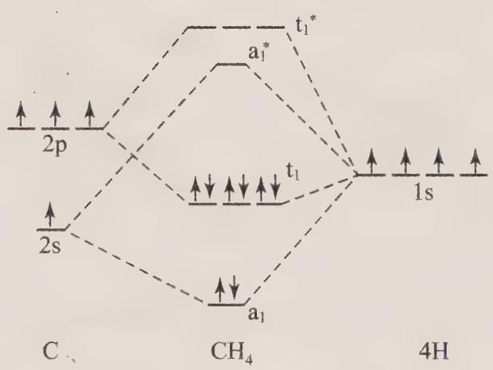  
图5.3.2 $\mathrm{CH}_4$ 的离域分子轨道能级图

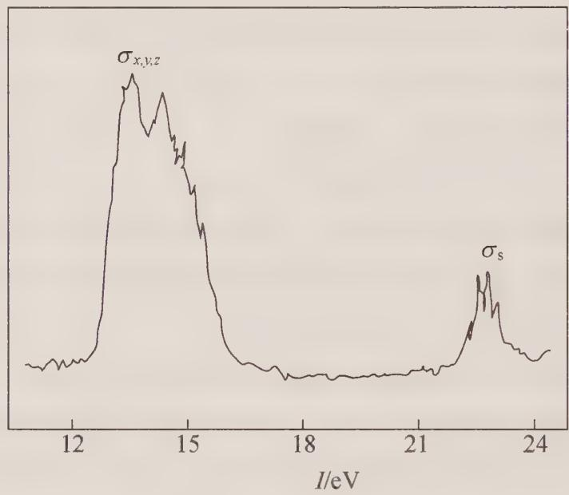  
图5.3.3 $\mathrm{CH}_4$ 的光电子能谱图

从上述离域分子轨道出发计算的分子轨道能级与由光电子能谱所得的实验结果符合得很好，由此证明离域分子轨道理论的成功。在多原子分子中，分子轨道并非传统的定域键轨道。而单个电子的实际行为并不像经典价键图像所描述的那样集中在一个键轴附近，而是遍及整个分子。

衍射实验证明, $\mathrm{CH}_4$ 分子具有 $T_{d}$ 点群对称性, 4个C—H键是等同的; 而图5.3.2的分子轨道能级图说明4个轨道的能级高低不同。这两者的差别说明, 不能把分子轨道理论中的成键轨道简单地和化学键直接联系起来。分子轨道是指分子中的单电子波函数, 本质上是离域的, 属于整个分子, 成键轨道上的电子对分子中的每个化学键都有贡献, 或者说它们的成键作用是分摊到各个化学键上的。

事实上,用杂化轨道的定域键描述 $CH_{4}$ 分子与用离域分子轨道描述的 $CH_{4}$ 分子是等价的,只是反映的物理图像有所差别。离域键描述单个电子在整个分子内运动的行为;定域键描述所有价电子在定域轨道区域内的平均行为,或者说定域键是在整个分子内运动的许多电子在该定域区域内的平均行为,而不是某两个电子真正局限于某个定域区域内运动。因此,对单个电子的运动还要用成键离域轨道来描述。将被占离域分子轨道进行适当的组合,就得定域分子轨道。例如,令

$$
\psi_ {\mathrm{a}} ^ {\prime} = \psi_ {\mathrm{s}} + \psi_ {x} + \psi_ {y} + \psi_ {z}\tag{5.3.13}
$$

$$
\psi_ {\mathrm{b}} ^ {\prime} = \psi_ {\mathrm{s}} + \psi_ {x} - \psi_ {y} - \psi_ {z}\tag{5.3.14}
$$

$$
\psi_ {\mathrm{c}} ^ {\prime} = \psi_ {\mathrm{s}} - \psi_ {x} - \psi_ {y} + \psi_ {z}\tag{5.3.15}
$$

$$
\psi_ {\mathrm{d}} ^ {\prime} = \psi_ {\mathrm{s}} - \psi_ {x} + \psi_ {y} - \psi_ {z}\tag{5.3.16}
$$

将 $\psi_{s},\psi_{x},\psi_{y},\psi_{z}$ 的表达式代入，除以2，即得到

$$
\psi_ {\mathrm{a}} ^ {\prime} = \frac {1}{2} [ \mathrm{s} + \mathrm{p} _ {x} + \mathrm{p} _ {y} + \mathrm{p} _ {z} ] + 1 \mathrm{s} _ {\mathrm{a}}\tag{5.3.17}
$$

$$
\psi_ {\mathrm{b}} ^ {\prime} = \frac {1}{2} [ \mathrm{s} + \mathrm{p} _ {x} - \mathrm{p} _ {y} - \mathrm{p} _ {z} ] + 1 \mathrm{s} _ {\mathrm{b}}\tag{5.3.18}
$$

$$
\psi_ {\mathrm{c}} ^ {\prime} = \frac {1}{2} [ \mathrm{s} - \mathrm{p} _ {x} - \mathrm{p} _ {y} + \mathrm{p} _ {z} ] + 1 \mathrm{s} _ {\mathrm{c}}\tag{5.3.19}
$$

$$
\psi_ {\mathrm{d}} ^ {\prime} = \frac {1}{2} [ \mathrm{s} - \mathrm{p} _ {x} + \mathrm{p} _ {y} - \mathrm{p} _ {z} ] + 1 \mathrm{s} _ {\mathrm{d}}\tag{5.3.20}
$$

可以看出，方括号内就是C原子的一个 $\mathrm{sp}^3$ 杂化轨道。而每个杂化轨道与一个H原子的1s轨道形成一个定域分子轨道。实验证明，除了由单个电子行为所确定的分子性质，如电子光谱、电离能等外，凡是与整个分子所有电子运动有关的分子性质，如电偶极矩、电荷密度、键能等，离域和定域两种分子轨道模型的结果都是一样的，而定域轨道模型常常具有直观明确、易于和分子几何构型相联系的优点。

## 5.4 休克尔分子轨道法(HMO 法)

共轭分子以其中有离域 $\pi$ 键为特征，它有若干特殊的物理化学性质：分子多呈平面构型；有特征的紫外吸收光谱；具有特定的化学性能，例如丁二烯倾向于1,4-加成，苯分子取代反应比加成反应容易；键长均匀化，如苯分子中6个C—C键长相等，分不出单键与双键的区别，等等。共轭分子的这些性质，用单、双键交替的定域键来解释比较困难。一种简单有效的方法是Hückel(休克尔)分子轨道法（Hückel molecular orbital method，即HMO法），1931年由E.Hückel提出，已有数十年的历史。HMO法是个经验性的近似方法，定量结果的精确度不高，但在预测同系物的性质、分子的稳定性和化学反应性能、解释电子光谱等一系列问题上，显示出高度概括能力，至今仍在广泛应用。

## 5.4.1 HMO法的基本内容

有机平面构型的共轭分子中， $\sigma$ 键是定域键，它们和原子核一起构成分子的骨架。每个C原子余下的一个垂直于分子平面的p轨道，通常不是形成定域的双中心 $\pi$ 键，而是一并组合起来形成多中心 $\pi$ 键，又称离域 $\pi$ 键（ $\pi$ 键对分子平面的反映为反对称）。所有 $\pi$ 电子在整个分子骨架的范围内运动。

用 HMO 法处理共轭分子结构时,有如下假定:

(1) 由于 $\pi$ 电子在核和 $\sigma$ 键所形成的整个分子骨架中运动, 可将 $\sigma$ 键和 $\pi$ 键分开处理。

(2) 共轭分子具有相对不变的 $\sigma$ 键骨架, 而 $\pi$ 电子的状态决定分子的性质。

(3) 用 $\psi_{k}$ 描述第 k 个 $\pi$ 电子的运动状态, 其 Schrödinger 方程为

$$
\hat {H} _ {\pi} \psi_ {k} = E _ {k} \psi_ {k}
$$

HMO 法规定各个 C 原子的 $\alpha$ 积分相同, 各相邻 C 原子的 $\beta$ 积分也相同, 而不相邻原子的 $\beta$ 积分和重叠积分 S 均为 0。这就不需要考虑势能函数 V 及 $\hat{H}_{\pi}$ 的具体形式。处理步骤如下:

（1）设共轭分子有 $n$ 个C原子，每个C原子提供一个p轨道 $\phi_{i}$ ，以组成分子轨道 $\psi$ 。按LCAO，得

$$
\psi = c _ {1} \phi_ {1} + c _ {2} \phi_ {2} + \dots + c _ {n} \phi_ {n} = \sum c _ {i} \phi_ {i}\tag{5.4.1}
$$

式中 $\psi$ 是分子轨道， $\phi_{i}$ 是组成分子的第 $i$ 个C原子的p轨道， $c_{i}$ 是分子轨道中第 $i$ 个C原子的原子轨道组合系数。

(2) 根据线性变分法(3.1节), 从

$$
\frac {\partial E}{\partial c _ {1}} = 0; \quad \frac {\partial E}{\partial c _ {2}} = 0, \dots ; \quad \frac {\partial E}{\partial c _ {n}} = 0\tag{5.4.2}
$$

可得久期方程式

$$
\left[ \begin{array}{c c c c} H _ {1 1} - E S _ {1 1} & H _ {1 2} - E S _ {1 2} & \dots & H _ {1 n} - E S _ {1 n} \\ H _ {2 1} - E S _ {2 1} & H _ {2 2} - E S _ {2 2} & \dots & H _ {2 n} - E S _ {2 n} \\ \dots & \dots & \dots & \dots \\ H _ {n 1} - E S _ {n 1} & H _ {n 2} - E S _ {n 2} & \dots & H _ {n n} - E S _ {n n} \end{array} \right] \left[ \begin{array}{l} c _ {1} \\ c _ {2} \\ \dots \\ c _ {n} \end{array} \right] = 0\tag{5.4.3}
$$

式中 $H_{ij} = \int \phi_i\hat{H}_\pi \phi_j\mathrm{d}\tau ,S_{ij} = \int \phi_i\phi_j\mathrm{d}\tau$ 。此行列式方程是 $E$ 的一元 $n$ 次代数方程。

(3) 引入下列基本假设

$$
H _ {1 1} = H _ {2 2} = \dots = H _ {n n} = \alpha\tag{5.4.4}
$$

$$
H _ {i j} \left\{ \begin{array}{l l} = \beta & (i \text {和} j \text {相邻}) \\ = 0 & (i \text {和} j \text {不相邻}) \end{array} \right.\tag{5.4.5}
$$

$$
S _ {i j} \left\{ \begin{array}{l l} = 1 & (i = j) \\ = 0 & (i \neq j) \end{array} \right.\tag{5.4.6}
$$

化简上述行列式方程，求出 $n$ 个 $E_{k}$ ，将每个 $E_{k}$ 值代回久期方程，得 $c_{ki}$ 和 $\psi_{k}$ 。

(4) 画出与分子轨道 $\psi_{k}$ 相应的能级 $E_{k}$ 图, 排布 $\pi$ 电子; 画出 $\psi_{k}$ 的图形。

(5) 计算下列数据,作分子图。

\- 电荷密度 $\rho_{i}$ ——第 $i$ 个原子上出现的 $\pi$ 电子数，即等于离域 $\pi$ 键中 $\pi$ 电子在第 $i$ 个碳原子附近出现的概率：

$$
\rho_ {i} = \sum_ {k} n _ {k} c _ {k i} ^ {2}\tag{5.4.7}
$$

式中 $n_k$ 代表在 $\psi_k$ 中的电子数， $c_{ki}$ 为分子轨道 $\psi_k$ 中第 $i$ 个原子轨道的组合系数。

\- 键级 $P_{ij}$ ——原子 $i$ 和 $j$ 间 $\pi$ 键的强度：

$$
P _ {i j} = \sum_ {k} n _ {k} c _ {k i} c _ {k j}\tag{5.4.8}
$$

\- 自由价 $F_{i}$ ——第 $i$ 个原子剩余成键能力的相对大小：

$$
F _ {i} = F _ {\max} - \sum_ {i} P _ {i j}\tag{5.4.9}
$$

式中 $F_{max}$ 是碳原子 $\pi$ 键键级和中最大者，其值为 $\sqrt{3}$ 。这是采用了理论上存在的三次甲基甲烷分子（见右式）的中心碳原子和周围 3 个 C 原子形成的 $\pi$ 键键级总和为 $\sqrt{3}$ （见习题 5.16）。 $\sum P_{ij}$ 为原子 i 与其邻接的原子间 $\pi$ 键键级之和。

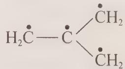

\- 分子图——把共轭分子由 HMO 法求得的电荷密度 $\rho_{i}$ 、键级 $P_{ij}$ 、自由价 $F_{i}$ 都标在一张分子结构图上，即为分子图。

(6) 根据上述结果讨论分子的性质,并对所得结果加以应用。

## 5.4.2 丁二烯的 HMO 法处理

丁二烯( $H_{2}C=CH-CH=CH_{2}$ )的分子轨道为

$$
\psi = c _ {1} \phi_ {1} + c _ {2} \phi_ {2} + c _ {3} \phi_ {3} + c _ {4} \phi_ {4}
$$

式中 $\phi_1, \phi_2, \phi_3, \phi_4$ 为参加共轭的4个C原子的 $p_z$ 轨道； $c_1, c_2, c_3, c_4$ 是变分参数。按变分法，可得 $c_1, c_2, c_3$ 和 $c_4$ 应满足的久期方程式。用(5.4.4)～(5.4.6)式化简后，得

$$
\left( \begin{array}{c c c c} \alpha - E & \beta & 0 & 0 \\ \beta & \alpha - E & \beta & 0 \\ 0 & \beta & \alpha - E & \beta \\ 0 & 0 & \beta & \alpha - E \end{array} \right) \left( \begin{array}{l} c _ {1} \\ c _ {2} \\ c _ {3} \\ c _ {4} \end{array} \right) = 0\tag{5.4.10}
$$

用 $\beta$ 除各项并令 $x = \frac{\alpha - E}{\beta}$ ，代入(5.4.10)式，得

$$
\left( \begin{array}{c c c c} x & 1 & 0 & 0 \\ 1 & x & 1 & 0 \\ 0 & 1 & x & 1 \\ 0 & 0 & 1 & x \end{array} \right) \left( \begin{array}{l} c _ {1} \\ c _ {2} \\ c _ {3} \\ c _ {4} \end{array} \right) = 0\tag{5.4.11}
$$

根据丁二烯分子具有对称中心性质， $c_{1}=\pm c_{4},c_{2}=\pm c_{3}$ 。当 $c_{1}=c_{4},c_{2}=c_{3}$ 时，(5.4.11)式可展开化简为

$$
x c _ {1} + c _ {2} = 0\tag{5.4.12}
$$

$$
c _ {1} + (x + 1) c _ {2} = 0\tag{5.4.13}
$$

由上两式系数行列式 $\left| \begin{array}{cc}x & 1\\ 1 & (x + 1) \end{array} \right| = 0$ ，解得 $x = -1.62$ 和0.62。

当 $c_{1}=-c_{4}, c_{2}=-c_{3}, (5.4.11)$ 式可展开，化简为

$$
x c _ {1} + c _ {2} = 0\tag{5.4.14}
$$

$$
c _ {1} + (x - 1) c _ {2} = 0\tag{5.4.15}
$$

由上两式系数行列式 $\left| \begin{array}{cc}x & 1\\ 1 & (x - 1) \end{array} \right| = 0$ ，解得 $x = 1.62$ 和-0.62。

将解得的每个 x 值分别代回(5.4.12)～(5.4.15)式中，并结合归一化条件

$$
c _ {1} ^ {2} + c _ {2} ^ {2} + c _ {3} ^ {2} + c _ {4} ^ {2} = 1\tag{5.4.16}
$$

可以从每个 $x$ 得到与其能级相应的分子轨道中各原子轨道的组合系数 $c_{i}$ 。例如， $c_{1} = c_{4}$ ， $c_{2} = c_{3}, x = -1.62$ ，得

$$
- 1. 6 2 c _ {1} + c _ {2} = 0\tag{5.4.17}
$$

$$
2 c _ {1} ^ {2} + 2 c _ {2} ^ {2} = 1\tag{5.4.18}
$$

由此求得 $c_{1}=c_{4}=0.372, c_{2}=c_{3}=0.602$ 。

因为 $E = \alpha -\beta x$ ，由4个不同的 $x$ 值得到离域 $\pi$ 键的4个分子轨道能级和相应的分子轨道波函数(见下表)：

<table><tr><td>分子轨道能级</td><td>分子轨道波函数</td></tr><tr><td> $E_1 = \alpha + 1.62\beta$ </td><td> $\psi_1 = 0.372\phi_1 + 0.602\phi_2 + 0.602\phi_3 + 0.372\phi_4$ </td></tr><tr><td> $E_2 = \alpha + 0.62\beta$ </td><td> $\psi_2 = 0.602\phi_1 + 0.372\phi_2 - 0.372\phi_3 - 0.602\phi_4$ </td></tr><tr><td> $E_3 = \alpha - 0.62\beta$ </td><td> $\psi_3 = 0.602\phi_1 - 0.372\phi_2 - 0.372\phi_3 + 0.602\phi_4$ </td></tr><tr><td> $E_4 = \alpha - 1.62\beta$ </td><td> $\psi_4 = 0.372\phi_1 - 0.602\phi_2 + 0.602\phi_3 - 0.372\phi_4$ </td></tr></table>

因为 $\beta$ 积分是负值，故 $E_{1} < E_{2} < E_{3} < E_{4}$ 。根据上述结果，可得丁二烯离域 $\pi$ 键轨道示意图和相应的能级图，如图5.4.1所示。图中各个p轨道的大小系按其系数 $c_{i}$ 的比例画出（因为 $c_{i}^{2}$ 代表原子轨道 $\phi_{i}$ 在分子轨道中的贡献）。

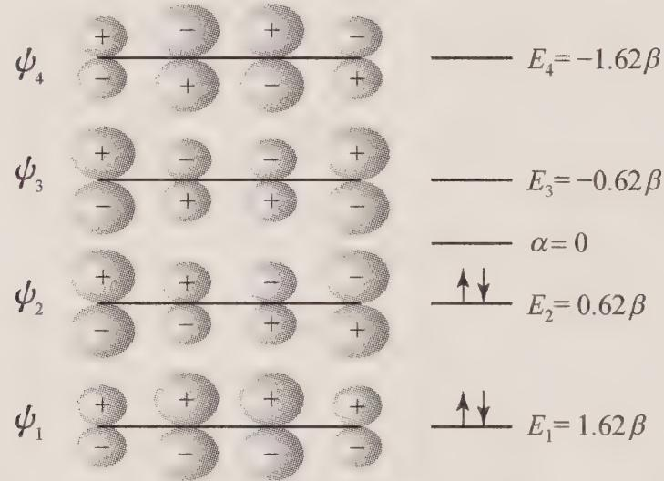  
图5.4.1 丁二烯离域 $\pi$ 键分子轨道及能级图

基态时，丁二烯的4个 $\pi$ 电子填在 $\psi_{1}$ 和 $\psi_{2}$ 上，根据各个分子轨道中原子轨道的组合系数，即可计算电荷密度、键级和自由价等数值。由(5.4.7)式可算出各碳原子的 $\pi$ 电子数均为1.00。由(5.4.8)式可算得各碳原子间键级为： $P_{12} = P_{34} = 0.896, P_{23} = 0.448$ 。

原子的自由价为

$$
\begin{array}{l} F _ {1} = F _ {4} = 1. 7 3 2 - 0. 8 9 6 = 0. 8 3 6 \\ F _ {2} = F _ {3} = 1. 7 3 2 - 0. 8 9 6 - 0. 4 4 8 = 0. 3 8 8 \end{array}
$$

所以丁二烯的分子图为

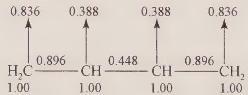

上述用 HMO 法处理丁二烯所得的结果,与实验所得结果比较符合。下面从几个方面进行讨论。

(1) $\pi$ 电子的离域可降低体系的能量。对比下面两式

$$
\begin{array}{l l} \mathrm{H} _ {3} \mathrm{C} - \mathrm{CH} _ {2} - \mathrm{HC} = \mathrm{CH} _ {2} + \mathrm{H} _ {2} \longrightarrow & \mathrm{H} _ {3} \mathrm{C} - \mathrm{CH} _ {2} - \mathrm{CH} _ {2} - \mathrm{CH} _ {3} \\ \mathrm{H} _ {2} \mathrm{C} = \mathrm{CH} - \mathrm{CH} = \mathrm{CH} _ {2} + 2 \mathrm{H} _ {2} \longrightarrow & \mathrm{H} _ {3} \mathrm{C} - \mathrm{CH} _ {2} - \mathrm{CH} _ {2} - \mathrm{CH} _ {3} \end{array} \quad \Delta H = - 1 2 6. 8 \mathrm{kJmol} ^ {- 1}
$$

丁二烯加 $\mathrm{H}_{2}$ 转变为丁烷所放出的能量小于丁烯加 $\mathrm{H}_{2}$ 变为丁烷所放的能量的2倍。这是由于形成离域 $\pi$ 键，电子填入 $\psi_{1}$ 和 $\psi_{2}$ 所致。若假定 $\alpha$ 积分近似等于原子中p电子能量，设 $\alpha = 0$ ，则两个轨道上4个电子的能量为

$$
E _ {\pi} = 2 (\alpha + 1. 6 2 \beta) + 2 (\alpha + 0. 6 2 \beta) = 4 \alpha + 4. 4 8 \beta = + 4. 4 8 \beta
$$

丁烯中2个电子的键能为 $2\beta$ ，所以丁二烯离域结果比单纯2个丁烯的双键能量要低 $0.48\beta$ ，这一差值称为离域能。

## (2) 丁二烯有顺、反异构体

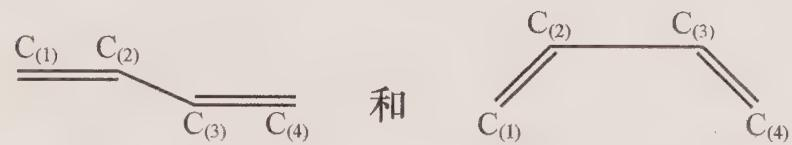

说明 $C_{(2)}$ 和 $C_{(3)}$ 之间有一定双键成分。从计算的键级看， $P_{23}=0.448$ ，具有双键成分，不能自由旋转。

(3) 丁二烯的键长均匀化。根据键长的实验值为

$$
\mathrm{C} _ {(1)} \xrightarrow {1 3 4 . 4} \mathrm{C} _ {(2)} \xrightarrow {1 4 6 . 8} \mathrm{C} _ {(3)} \xrightarrow {1 3 4 . 4} \mathrm{C} _ {(4)}
$$

说明 $\mathrm{C}_{(1)}$ 和 $\mathrm{C}_{(2)}$ 之间比典型的双键键长（ $133\mathrm{pm}$ ）要长些， $\mathrm{C}_{(2)}$ 和 $\mathrm{C}_{(3)}$ 之间比典型的单键键长（ $154\mathrm{pm}$ ）要短。键长趋向均匀化可从键级数据来理解。

(4) 丁二烯具有 1,4-加成的化学反应性能。例如

$$
\mathrm{H}_{2}\mathrm{C} = \mathrm{CH}-\mathrm{CH}=\mathrm{CH}_{2} + \mathrm{Br}_{2}\xrightarrow[200^{\circ}\mathrm{C}]{\mathrm{ZnCl}_{2}} \mathrm{BrH}_{2}\mathrm{C}-\mathrm{CH}=\mathrm{CH}-\mathrm{CH}_{2}\mathrm{Br} \tag{70\%}
$$

这可从自由价得到解释。

## 5.4.3 环状共轭多烯的 HMO 法处理

## 1. 单环共轭多烯的处理

用 HMO 法处理单环共轭多烯分子 $C_{n}H_{n}$ ，可得到一些有益的结果。设分子中参加共轭的所有碳原子都处在同一平面上，根据结构式列出久期行列式，解之，可得单环共轭体系的分子轨道能级图，如图 5.4.2 所示。

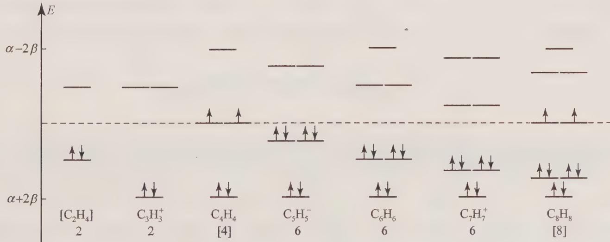  
图5.4.2 单环共轭体系的分子轨道能级图

由图可见，当 $n = 4m + 2(m$ 为整数)时，在所有成键轨道中都充满电子，反键轨道是空的，构成稳定的 $\pi$ 键体系。例如： $m = 0$ 的环丙烯基正离子 $(\mathrm{C}_3\mathrm{H}_3^+)$ ； $m = 1$ 的苯 $\mathrm{C_6H_6}$ ， $\mathrm{C_5H_5^-}$ 等；吡啶$\mathrm{C_5H_5N}$ 和吡咯 $\mathrm{C_4H_4NH}$ 也都是6个 $\pi$ 电子体系。它们和苯一样，6个电子都填在成键轨道上。所以具有 $4m + 2$ 个 $\pi$ 电子的单环共轭体系为稳定的结构，具有芳香性，此即称 $4m + 2$ 规则。

当 n=4m 时，如 $C_{4}H_{4}$ ， $C_{8}H_{8}$ 等除成键轨道充满电子外，还有一对二重简并的非键轨道，在每一轨道中有 1 个 $\pi$ 电子，从能量上看是不稳定的构型，不具有芳香性。 $C_{8}H_{8}$ 分子不是平面构型。

## 2. 多环芳烃的处理

平面构型的多环芳烃也可用 HMO 法处理。例如，用 HMO 法计算得到的萘 $\left(\mathrm{C}_{10}\mathrm{H}_{8}\right)$ 和奠 $\left(\mathrm{C}_{10}\mathrm{H}_{8}\right)$ 的分子图示于图 5.4.3。

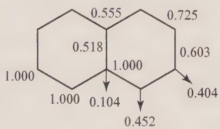  
(a)

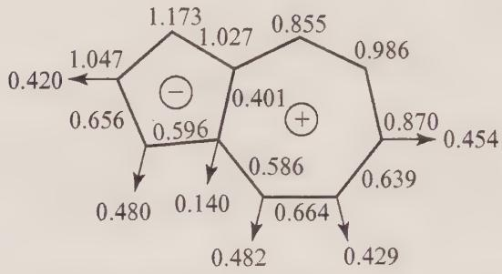  
(b)  
图5.4.3 萘(a)和薁(b)的分子图

根据分子图可以很好地解释分子的性质。在萘分子中，各个C原子所处的地位不同，自由价不同， $\alpha$ 位的自由价为0.452， $\beta$ 位为0.404，桥碳原子的自由价为0.104。说明在桥碳原子部位不易加成， $\alpha$ 位最容易发生反应。实验测得萘分子的键长 $(\mathrm{pm})$ 数据见下图：

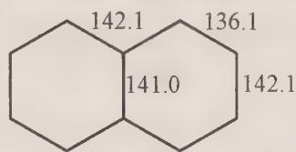

其键长应和 $\pi$ 键键级成反比，键级大，键长短，理论计算与实验测定基本一致。

用 HMO 法了解薁分子的物理性质很有说服力。薁是极性分子，七元环端显正电性，五元环端显负电性。偶极矩 $\mu=3.54\times10^{-30}$ C m。薁能溶于盐酸和浓硫酸中。出现极性的原因是 $4m+2$ 规则，即从七元环中移一个电子至五元环，可使两个环都有 6 个 $\pi$ 电子，满足 $4m+2$ 规则。

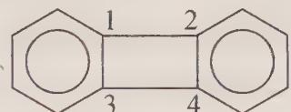

对于 $\boxed{1\quad2\quad3\quad4}$ 分子，从整个分子来看， $\pi$ 电子数为 12，不符合 $4m+2$ 规则。但是分子的两个六元环部分均为 6 个 $\pi$ 电子，符合 $4m+2$ 规则，即可看作两个苯环通过 C—C 单键相连。实验测定 $C_{1}-C_{2}, C_{3}-C_{4}$ 间的键长和单键相同，说明中间四元环不具芳香性。

## 5.5 离域 $\pi$ 键和共轭效应

## 5.5.1 离域 $\pi$ 键的形成和表示法

形成化学键的 $\pi$ 电子不局限于两个原子的区域，而是在参加成键的多个原子的分子骨架中运动，这种由多个原子形成的 $\pi$ 型化学键称作离域 $\pi$ 键。大部分离域 $\pi$ 键可由经典结构式中由单、双键交替地连接的那一部分原子组成。一般地，其形成需满足下列条件：

(1) 原子共面, 每个原子提供一个方向相同的 p 轨道, 或合适的 d 轨道。

(2) $\pi$ 电子数小于参加成键的轨道数的二倍。

但是上述两个条件不是绝对的,根据实验测定的数据,有时虽满足这两个条件,并不一定能

形成离域 $\pi$ 键, 从而也不出现共轭效应所应具有的性质。例如环丁二烯 $\square$ 和 $\bigcirc$

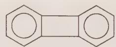

的四元环,草酸分子( $HOOC-COOH$ )中的 C—C 键等等。此外,还有层形 $(BN)_{x}$ 分子,它虽然和石墨是等电子体系,满足形成离域 $\pi$ 键的两个条件,但它是白色、绝缘性能很好的固体。其原因是 B—N 键的极化作用,使其能带分成 2 个亚带,带隙宽度达 440 kJ mol $^{-1}$ ,所以没有离域 $\pi$ 键出现。而在有些分子中,原子并不完全共面,但也有一定的共轭效应。分子中是否形成离域 $\pi$ 键,要以实验数据为准。

芳香化合物以及许多其他体系存在离域 $\pi$ 键。离域 $\pi$ 键可用 $\pi_n^m$ 表示， $n$ 为原子数， $m$ 为 $\pi$ 电子数。下面示意出一些分子和离子形成离域 $\pi$ 键的情况。

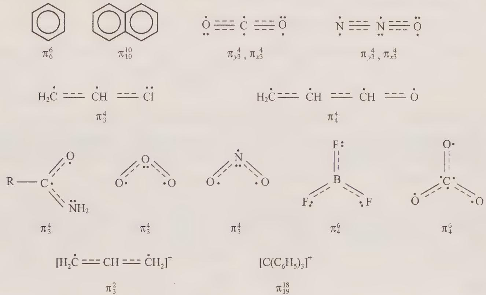

共轭分子的结构也可用2个或多个价键共振结构式表达，把分子的真实结构看作由这些价键结构的叠加或共振的结果。

【例5.5.1】苯、萘、二氧化碳和硝酸根

下图从上到下依次为苯、萘、二氧化碳和硝酸根的共振结构式：

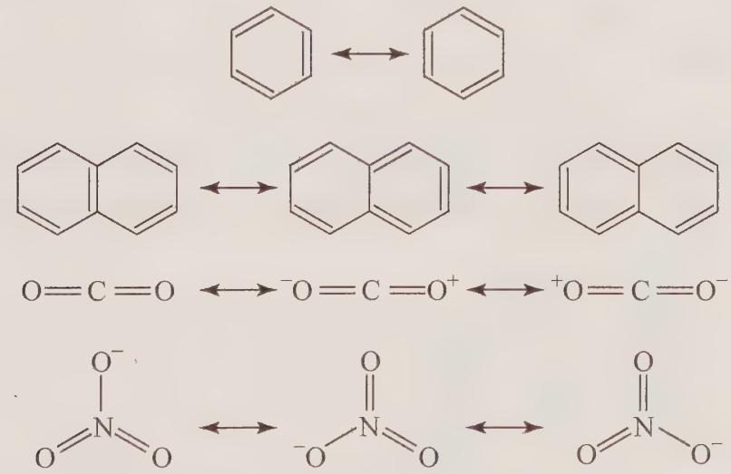

若简单地用一个共振结构式表达共轭分子,则最好选用与分子的实际键长最相近的结构式来表达。苯和硝酸根可任选其一,二氧化碳和萘则宜分别选用 O=C=O 和

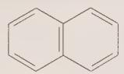

【例5.5.2】 臭氧 $\mathrm{O_3}$

前面所列的臭氧分子 $O_{3}$ ，为弯曲形结构，键角 $116.8^{\circ}$ ，键长 127.8 pm。 $O_{3}$ 为极性分子，

$\mu=1.94\times10^{-30}$ Cm, 中心氧原子显正电性。其共振结构式为

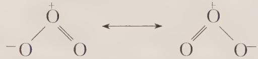

【例5.5.3】二氧化氮 $\mathrm{NO}_2$

弯曲形的 $NO_{2}$ 分子, 键角 $134.25^{\circ}$ , 键长 119.7 pm。对它的电子结构, 有三种观点:

（1）认为单电子处于 N 的一个 $sp^{2}$ 杂化轨道上，剩余 $p_{z}$ 轨道形成 $\pi_{3}^{4}$ ， $NO_{2}$ 分子的键角远大于 $120^{\circ}$ ，以及单占杂化轨道容易二聚成 $O_{2}N—NO_{2}$ 可以佐证。

（2）一对孤对电子占据 N 的一个 $sp^{2}$ 杂化轨道， $\pi$ 电子形成 $\pi_{3}^{3}$ ，因为单占的孤对电子能量较高， $\pi_{3}^{3}$ 比 $\pi_{3}^{4}$ 强，对分子稳定有利。

(3) 介于上述两者之间, 可用下面共振结构式表示:

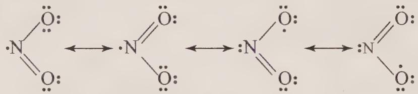

分子的电子自旋共振及分子轨道的量子化学计算结果比较支持第一种观点。

## 5.5.2 共轭效应

一般包含双键和单键相互交替排列的分子形成离域 $\pi$ 键，这时不能把分子的物理和化学性质看作各个双键和单键性质的简单加和，分子会表现出特有的性能，称为共轭效应或离域效应。共轭效应是化学中的一种基本效应，它除了影响分子的构型和构象（单键缩短、双键增长、有关原子保持共面和单键不能自由旋转）外，还影响物质的电性、颜色、酸碱性和化学反应性等许多性质。

## 1. 电性

离域 $\pi$ 键的形成增加物质的电导性能。例如，石墨具有金属光泽、能导电，四氰代二甲基苯醌(TCNQ)等类型的分子能和合适的其他分子，如四硫代富瓦烯(TTF)分子等组成有机半导体或导体，都应归因于离域 $\pi$ 键的形成。

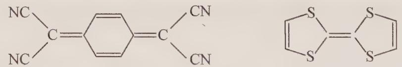

## 2. 颜色

离域 $\pi$ 键的形成, 增大 $\pi$ 电子的活动范围, 使体系能量降低, 能级间隔变小, 其光谱由 $\sigma$ 键的紫外光区移至离域 $\pi$ 键的可见光区, 例如染料和指示剂等。酚酞在碱液中变成红色是因为发生下一反应, 扩大了离域范围。

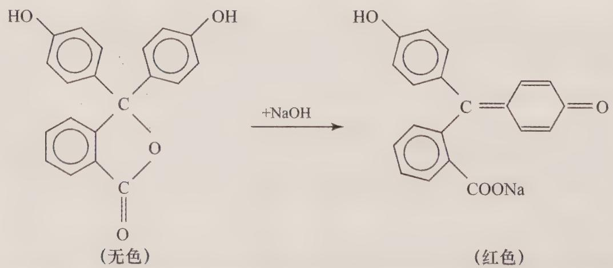

## 3. 酸碱性

苯酚显酸性，苯胺显碱性，羧酸呈酸性，酰胺呈碱性。这些均与离域 $\pi$ 键的生成与否有关。苯酚和羧酸电离出 $\mathrm{H}^{+}$ 后，酸根中的原子均参与生成离域 $\pi$ 键，稳定存在。

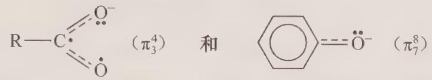

而苯胺和酰胺中已有离域 $\pi$ 键存在：

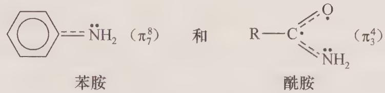

它们不易电离,苯胺可接受 $\mathrm{H}^{+}$ 形成 $-\mathrm{NH}_{3}^{+}$ 基团,故呈弱碱性(苯胺的— $\mathrm{NH}_{2}$ 基团并不和苯环共平面,但 N 原子上的孤对电子能参与组成离域 $\pi$ 键)。

## 4. 化学反应性

离域 $\pi$ 键的存在对体系性质的影响在化学中常用共轭效应表示，它是化学中最基本的效应之一。芳香化合物的芳香性，许多游离基的稳定性，丁二烯类的1,4-加成反应性等都和离域 $\pi$ 键有关。此外，丙烯醛 $\mathrm{H}_2\mathrm{C} = \mathrm{CH}-\mathrm{CH}=\mathrm{O}$ 形成 $\pi_4^4$ ，使它稳定性提高；氯乙烯 $\mathrm{H}_2\mathrm{C} = \mathrm{CH}-\mathrm{Cl}$ 出现的 $\pi_3^4$ 使C—Cl键缩短，Cl的活泼性下降等等。

## 5.5.3 肽键

一个氨基酸分子的氨基与另一个氨基酸分子的羧基缩合,失去一分子水而生成的酰胺键称为肽键,缩合脱水所得的产物称为肽。由两个氨基酸分子缩合形成的肽叫二肽,由多个氨基酸分子缩合通过肽键连接而成的分子叫多肽。

蛋白质是多肽大分子。下式表示二肽的形成。

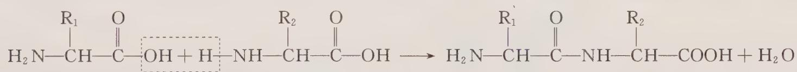

肽键是多肽分子中 C—N 键和相邻的 C=O 键中的 $\pi$ 电子形成的离域 $\pi$ 键。在肽键中，C=O 的 $\pi$ 键的电子和 N 原子上的孤对电子一起共同形成离域 $\pi$ 键 $\pi_{3}^{4}$ ，使 C—N 键具有双键成分，键长缩短（通常为 132 pm），CN 和周围原子共平面，即形成平面构象而不能自由旋转，如图 5.5.1 所示。

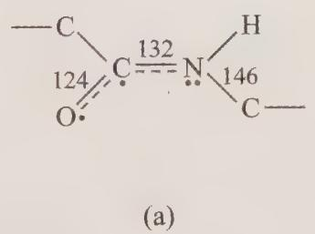

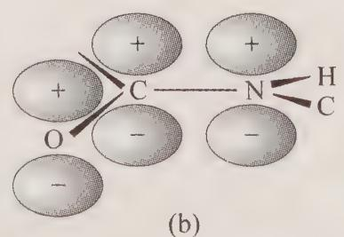  
图5.5.1 肽键结构示意图  
(a) 肽键及其键长，(b) 肽键 $\pi_3^4$ 中轨道叠加示意

在研究蛋白质和多肽化合物的结构及性质时，肽键的特性必须给予充分的重视。

## 5.5.4 超共轭效应

超共轭效应(hyperconjugation effect)是指 C—H 等 $\sigma$ 键轨道和相邻原子的 $\pi$ 键轨道或其他轨道互相叠加，扩大 $\sigma$ 电子的活动范围所产生的离域效应。

例如在 $\mathrm{H}_3\mathrm{C}-\mathrm{CH}=\mathrm{CH}_2$ 分子中， $\sigma$ 键电子与 $\pi$ 键电子间相互作用产生的离域效应如下：— $\mathrm{CH}_3$ 中的 C 原子采用 $\mathrm{sp}^3$ 杂化轨道，它和 — $\mathrm{CH}=\mathrm{CH}_2$ 相连。— $\mathrm{CH}_3$ 中 H 原子采用和 C 原子 $\mathrm{p}_z$ 轨道对称性匹配的组合，示于图 5.5.2(a) 的 $\psi_z$ 中（参见图 5.3.1）。按离域分子轨道理论，— $\mathrm{CH}_3$ 的 $\psi_z$ 和 $\psi_z^*$ 与 C=C 的 $\pi$ 和 $\pi^*$ MO 分布如图 5.5.2(a) 所示。这时— $\mathrm{CH}_3$ 的 $\sigma$ 轨道与 C=C 的 $\pi$ 轨道发生相互叠加。由于 $\psi_z$ 和 $\pi$ 轨道均充满电子，不能有效地形成 $\pi$ 键，仍处于 $\sigma$ 单键状态；而 $\psi_z$ 和 $\pi^*$ 可以有效地互相作用，因为 $\pi^*$ 是空的， $\psi_z$ 电子可以转移到低能级的分子轨道中，图 5.5.2(b) 示出分子中的 $\mathrm{p}_z$ 轨道。图 5.5.2(c) 示出 $\psi_z$ 和 $\pi^*$ 相互作用，降低能级的情况，此即超共轭效应的本质。这一效应使得 C—C 单键键长缩短，键能增加；使 C=C 双键键长略为增长。

(a)  
(b)  
(c)  
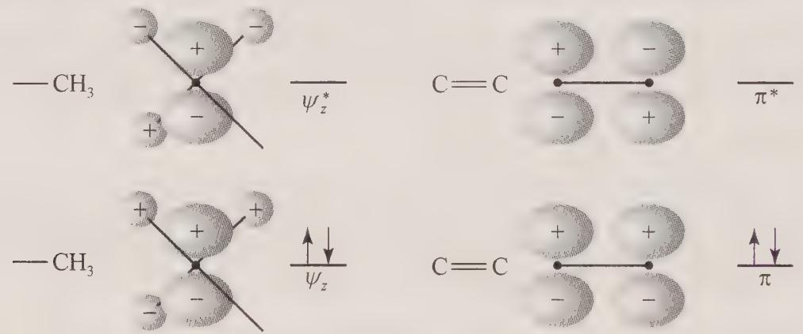

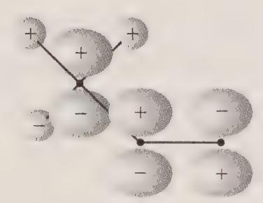

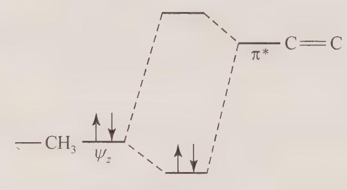  
图5.5.2 $\mathrm{CH}_3\mathrm{-CH = CH_2}$ 分子的超共轭效应

表 5.5.1 列出不同杂化轨道影响 C—C 单键的键长(实验测定的平均值)及键能(计算值)。

超共轭效应使 $-\mathrm{CH}_3$ 的C原子带有正电性 $(\delta +)$ ，这是由于碳原子的电负性依赖于它的杂化状态。当两个不同杂化形式的碳原子连接在一起时，将会出现键矩。根据计算，所得C—C键键矩如下：

$$
\begin{array}{r l r} \mathrm {C(sp^ {3}) _ {\delta + } -C(sp^ {2}) _ {\delta - }} & 2. 2 7 \times 1 0 ^ {- 3 0} \mathrm{Cm(0.68D)} \\ \mathrm {C(sp^ {2}) _ {\delta + } -C(sp) _ {\delta - }} & 3. 8 4 \times 1 0 ^ {- 3 0} \mathrm{Cm(1.15D)} \\ \mathrm {C(sp^ {3}) _ {\delta + } -C(sp) _ {\delta - }} & 4. 9 4 \times 1 0 ^ {- 3 0} \mathrm{Cm(1.48D)} \end{array}
$$

表 5.5.1 在不同碳氢化合物中,碳原子的杂化形式与 C—C 键长和键能

<table><tr><td>键型</td><td>C原子的杂化形式</td><td>C—C键长/pm</td><td>C—C键能/(kJ mol-1)</td></tr><tr><td></td><td> $sp^3-sp^3$ </td><td>154</td><td>346.3</td></tr><tr><td></td><td> $sp^3-sp^2$ </td><td>151</td><td>357.6</td></tr><tr><td></td><td> $sp^3-sp$ </td><td>146</td><td>382.5</td></tr><tr><td></td><td> $sp^2-sp^2$ </td><td>146</td><td>383.2</td></tr><tr><td rowspan="2"> $\begin{array}{c}\text{C-C}\equiv \\ \hline \hline \hline \hline \hline \hline \hline \hline \hline \hline \hline \hline \hline \hline \hline \hline \hline \hline \hline \hline \hline \hline \hline \hline \hline \hline \hline \hline \hline \hline \hline \hline \hline \hline =\text{C-C}\equiv\end{array}$ </td><td> $sp^2-sp$ </td><td>144</td><td>403.7</td></tr><tr><td>sp-sp</td><td>137</td><td>433.5</td></tr></table>

超共轭效应也会改变分子的性质。例如，由于超共轭效应，甲苯和二甲苯的紫外吸收峰分别比苯向长波方向移 $8\mathrm{nm}$ 和 $16\mathrm{nm}$ 。

## 5.6 分子轨道的对称性和反应机理

分子轨道的对称性对化学反应进行的难易程度及产物的构型和构象有决定性的作用。应用分子轨道对称性探讨反应机理，主要有福井谦一提出的前线轨道理论以及 Woodward(伍德沃德)和 Hoffmann(霍夫曼)提出的分子轨道对称守恒原理。这些理论以大量实验为基础，抓住分子轨道对称性这个关键，探讨基元反应的条件和方式，使人们对反应机理和化学反应动力学的认识深入到微观结构领域，进而通过控制反应条件使化学反应沿着预期的途径进行，合成具有特定立体构型的产品。

## 5.6.1 有关化学反应的一些概念和原理

化学反应的实质有两个方面:(i) 分子轨道在化学反应过程中进行改组, 改组时涉及分子轨道的对称性;(ii) 电荷分布在化学反应过程中发生改变, 电子发生转移, 转移时一般削弱原有化学键、加强新的化学键, 使产物分子稳定, 而电子由电负性低的原子向电负性高的原子转移比较容易。

化学反应的可能性和限度由化学势决定，反应沿化学势降低的方向进行，直至化学势相等，达到平衡状态。化学势的正负、大小，可按照热力学规律进行计算。

化学反应的速度取决于活化能的高低: 活化能高, 反应不易进行, 反应速度慢; 活化能低, 反应容易进行, 反应速度快。在反应时, 若正反应是基元反应, 则逆反应也是基元反应, 且经过同一活化体, 此即微观可逆性原理。

化学反应的条件主要指影响化学反应的外界条件。加热(△)反应,体系受热辐射影响,由于热辐射光子能量小,反应物分子不激发,一般处于基态情况下进行。光照反应(hν,例如体系受紫外线照射),光子能量大,反应物常受激发而处于激发态。催化剂的作用是改变反应物的状态和性质,加速或减慢反应进行,或改变反应的途径。如催化加氢,以 Ni 为催化剂,Ni 原子的 d 轨道和 $H_{2}$ 的反键轨道对称性合适,Ni 原子 d 轨道上的电子向 $H_{2}$ 反键轨道转移,使 $H_{2}$ 内的化学键被削弱,甚至断开,变成吸附在 Ni 原子上的活泼 H 原子,使加氢反应容易进行。

## 5.6.2 前线轨道理论

本小节用分子轨道对称性分析双分子反应。

分子中有一系列能级从低到高排列的分子轨道,电子只填充了其中能量较低的一部分。已填电子的能量最高轨道称为最高占据轨道(highest occupied molecular orbital, HOMO),能量最低的空轨道称为最低空轨道(lowest unoccupied molecular orbital, LUMO),这些轨道统称前线轨道。前线轨道理论认为,反应的条件和方式主要取决于前线轨道的对称性。其内容包括:

（1）分子在反应过程中，分子轨道发生相互作用，优先起作用的是前线轨道。当两个分子互相接近时，一个分子中的HOMO和另一个分子中的LUMO必须对称性合适，即按轨道正与正叠加、负与负叠加的方式相互接近，所形成的过渡状态是活化能较低的状态，称为对称允许的状态。

(2) 互相起作用的 HOMO 和 LUMO 能级高低必须接近(约 $6 \mathrm{eV}$ 以内)。

(3) 随着两个分子的 HOMO 与 LUMO 发生叠加, 电子便从一个分子的 HOMO 转移到另一个分子的 LUMO, 电子的转移方向从电负性判断应该合理, 电子的转移要和旧键的削弱相一致, 不能发生矛盾。

在下面几个实例中,用前线轨道理论分析双分子反应。

【例5.6.1】 $\mathrm{N}_2 + \mathrm{O}_2 \rightleftharpoons 2\mathrm{NO}$

$\mathrm{N}_2$ 的前线轨道是 $2\sigma_{\mathrm{g}}(\mathrm{HOMO})$ 和 $1\pi_{\mathrm{g}}(\mathrm{LUMO})$ 。 $\mathrm{O}_2$ 的前线轨道为 $\pi_{2\mathrm{p}}^{*}$ ，它既是HOMO也是LUMO。当这两个分子接近时，可能出现两种情况：

(1) $\mathrm{N}_{2}$ 的 $2\sigma_{\mathrm{g}}$ 和 $\mathrm{O}_{2}$ 的 $\pi_{2\mathrm{p}}^{*}$ 接近，因对称性不匹配，不能产生净的有效重叠，形成的过渡状态活化能高，电子很难从 $\mathrm{N}_{2}$ 的HOMO转移至 $\mathrm{O}_{2}$ 的LUMO，反应不能进行，如图5.6.1(a)。

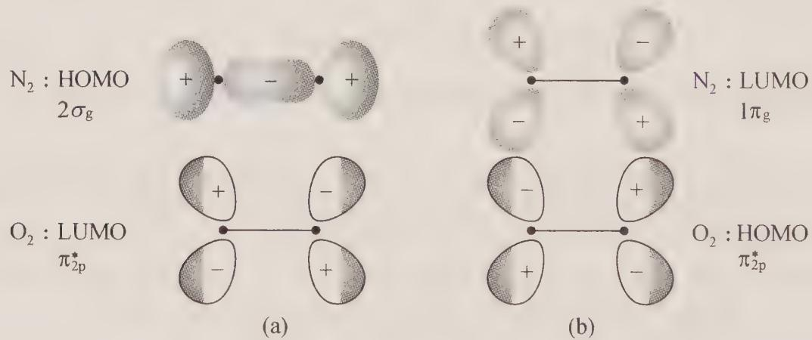  
图5.6.1 $\mathbf{N}_2$ 和 $\mathbf{O}_2$ 前线轨道相互作用

(2) $\mathrm{N}_{2}$ 的 $\mathrm{LUMO}(1\pi_{\mathrm{g}})$ 和 $\mathrm{O}_{2}$ 的 $\mathrm{HOMO}(\pi_{2\mathrm{p}}^{*})$ 对称性是匹配的, 但欲使反应进行, 电子需从电负性较高的O向电负性较低的N转移, 而当 $\mathrm{O}_{2}$ 的电子从反键轨道转移后, 要增强 $\mathrm{O}_{2}$ 分子原有的化学键,因此反应也很难进行,如图 5.6.1(b) 所示。

$N_{2}+O_{2}\rightleftharpoons2NO$ 的反应过程示意于图5.6.2中。由 $N_{2}+O_{2}\longrightarrow2NO$ 的反应很难进行，活化能高达 $389\ kJ\ mol^{-1}$ 。根据微观可逆性原理，其逆反应也很难进行，即 NO 分子不易分解为 $N_{2}$ 和 $O_{2}$ 。

$$
\begin{array}{r l} & 2 \mathrm{NO} \longrightarrow \mathrm{N} _ {2} + \mathrm{O} _ {2} \\ & \Delta H = - 1 8 0 \mathrm{kJ} \mathrm{mol} ^ {- 1} \end{array}
$$

这一分解反应是强放热反应。从热力学角度看，反应由左向右是化学势降低的方向，但因这个反应的活化能很高，达 $209\mathrm{kJ mol}^{-1}$ ，实际上反应不

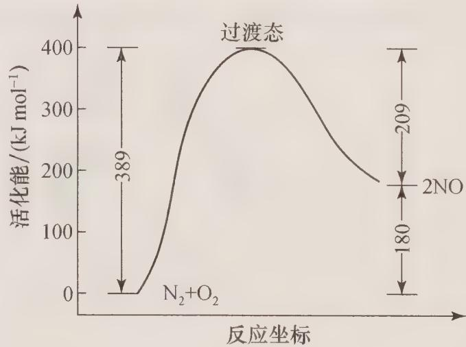  
图 5.6.2 $N_{2} + O_{2} \rightleftharpoons 2NO$ 的反应过程

易进行。所以 $\mathrm{N}_2$ 和 $\mathrm{O}_2$ 很难化合成NO，当NO一旦形成，又不易分解。NO是汽车尾气中的主要有害成分之一，它在汽缸中高温条件下生成后，排放到大气中，能和空气中的 $\mathrm{O}_2$ 反应生成 $\mathrm{NO}_2$ ； $\mathrm{NO}_2$ 可和水蒸气反应生成酸雾，污染空气环境。所以，需要用合适的催化剂使NO分解为 $\mathrm{N}_2$ 和 $\mathrm{O}_2$ ，解决污染问题。

【例5.6.2】 乙烯加氢反应

$$
\mathrm{C} _ {2} \mathrm{H} _ {4} + \mathrm{H} _ {2} \longrightarrow \mathrm{C} _ {2} \mathrm{H} _ {6} \quad \Delta H = - 1 3 7. 3 \mathrm{kJ} \mathrm{mol} ^ {- 1}
$$

从热力学角度看,反应放热,理当容易进行,但实际上这个反应需要催化剂。对这个反应,可用前线轨道理论分析如下:当 $C_{2}H_{4}$ 分子的 HOMO 和 $H_{2}$ 分子的 LUMO 接近,彼此对称性不匹配;当 $C_{2}H_{4}$ 分子的 LUMO 和 $H_{2}$ 分子的 HOMO 接近,彼此对称性也不匹配,如图5.6.3(a)及(b)所示。

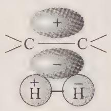  
(a)

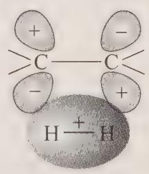  
(b)

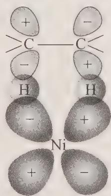  
(c)  
图5.6.3 乙烯加氢反应

利用金属镍作催化剂进行催化反应,这时 $H_{2}$ 的反键轨道和 Ni 原子的 d 轨道叠加,Ni 的 d 轨道提供电子给 H 原子,再和 $C_{2}H_{4}$ 的 LUMO 结合, $C_{2}H_{4}$ 分子加 $H_{2}$ 反应就容易进行,如图5.6.3(c)所示。

【例5.6.3】丁二烯和乙烯环加成生成环己烯的反应

$$
\mathrm{H} _ {2} \mathrm{C} = \mathrm{CH} - \mathrm{CH} = \mathrm{CH} _ {2} + \mathrm{H} _ {2} \mathrm{C} = \mathrm{CH} _ {2} \xrightarrow {\triangle} \mathrm{H} _ {2} \mathrm{C} \begin{array}{c} \mathrm{HC} = \mathrm{CH} \\ \backslash \\ \mathrm{H} _ {2} \mathrm{C} - \mathrm{CH} _ {2} \end{array} \mathrm{CH} _ {2}
$$

这一反应加热即能进行，因为它们的前线轨道对称性匹配，如图5.6.4所示。

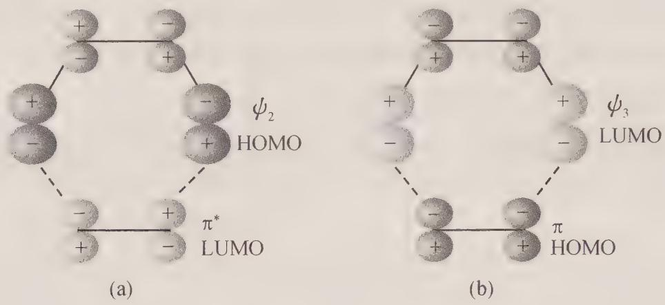  
图5.6.4 丁二烯和乙烯环加成生成环己烯的反应

但是，两个乙烯分子环加成变为环丁烷的反应，单纯加热并不能进行。（为什么？）

## 5.6.3 分子轨道对称守恒原理

本小节用分子轨道对称守恒原理中的能量相关理论来分析单分子反应，并以丁二烯型化合物和己三烯型化合物的电环化反应为例进行讨论。

电环化反应是指直链共轭烯烃分子两端的碳原子上的轨道相互作用,生成一个单键,形成环形分子的反应。在进行这种反应过程中,分子轨道对称守恒原理将整个分子轨道一起考虑,认为在一步完成的化学反应中,若反应物分子和产物分子的分子轨道对称性一致,则反应容易进行,也就是说,整个反应体系从反应物、中间态到产物,分子轨道始终保持某一点群的对称性(顺旋过程保持 $C_{2}$ 点群,对旋过程保持 $C_{s}$ 点群),反应容易进行。根据这一考虑,可将反应过程分子轨道的变化关系用能量相关图联系起来,并得出如下要点:

(1) 反应物的分子轨道与产物的分子轨道一一对应；

(2) 相关轨道的对称性相同；

(3) 相关轨道的能量应相近；

(4) 对称性相同的相关线不相交。

在能量相关图中,如果产物的每个成键轨道都只和反应物的成键轨道相关联,则反应的活化能低,易于反应,称作对称允许,一般加热就能实现反应;如果双方有成键轨道和反键轨道相关联,则反应活化能高,难于反应,称作对称禁阻,要实现这种反应,需把反应物的基态电子激发到激发态。

## 1. 丁二烯型化合物

丁二烯型化合物在不同条件下电环合，可得不同构型的环丁烯型产物。参看图5.4.1描述丁二烯离域 $\pi$ 键分子轨道的图形。在加热条件下，分子保持 $C_2$ 对称性，进行顺旋反应， $\mathrm{HOMO}(\psi_2)$ 两端轨道叠加形成 $\sigma$ 键， $\psi_1$ 中间轨道叠加成 $\pi$ 键，环合成丁烯，如图5.6.5(a)；在光照条件下，分子保持 $\sigma_v$ 对称性，进行对旋反应， $\psi_1$ 两端轨道叠加形成 $\sigma$ 键，而 $\mathrm{HOMO}(\psi_2)$ 电子激发至 $\psi_3$ ，中间轨道叠加成 $\pi$ 键，环合成丁烯，如图5.6.5(b)。由图可见，加热条件下进行顺旋反应所得产物与光照条件下所得产物的构型是不同的。

在讨论反应物和产物的分子轨道对称性时，只需考虑参与旧键断裂和新键形成的那些分子轨道，对于 $\sigma$ 键骨架以及一些取代基都可不必考虑。

将丁二烯和环丁烯的分子轨道的能级高低和对称性合并在一起，画出顺旋和对旋两种方式，并按能量相关图的几个要点连线，得到图5.6.6所示的结果。

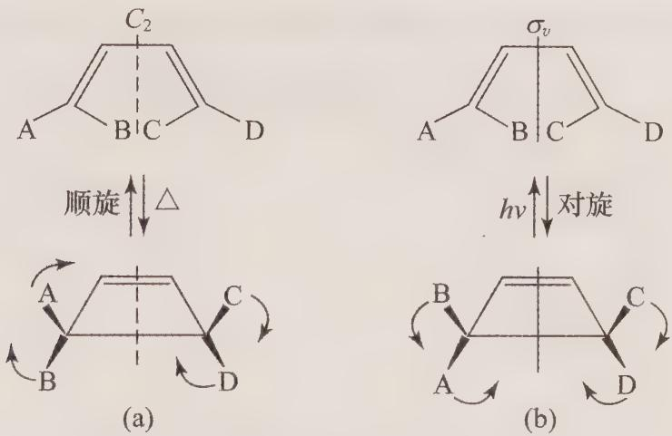  
图5.6.5 丁二烯在不同条件下的电环合

由图5.6.6可见，在进行顺旋闭环时，反应物（丁二烯）的成键轨道 $(\psi_{2}$ ，对 $C_2$ 为对称，S)是与产物(环丁烯)的成键轨道 $(\sigma ,$ 对 $C_2$ 为对称，S)相关联的，丁二烯的 $\psi_{1}$ 和环丁烯的 $\pi$ 对称性匹配。说明反应物处于基态时就可直接转化为产物的基态，一般加热条件下即可进行。在进行对旋闭环时，丁二烯的 $\psi_{1}$ 和环丁烯的 $\sigma$ 对称性匹配，相互关联。另外，反应物的成键轨道 $(\psi_{2})$ 与产物中的反键轨道 $(\pi^{*})$ 相关联，而产物中的成键轨道 $(\pi)$ 却与反应物中的反键轨道 $(\psi_{3})$ 相关联。这说明反应物必须处在激发态，即 $\psi_{2}$ 的电子激发到 $\psi_{3}$ ，才能转化为产物的基态，反应的活化能较大，在光照条件 $(h\nu)$ 下反应才能进行。

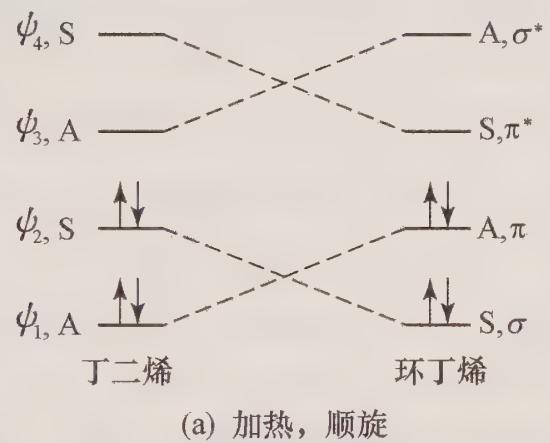

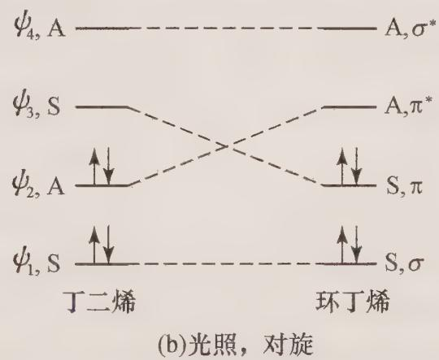  
图 5.6.6 丁二烯-环丁烯顺旋(a)和对旋(b)相互转化时的轨道能级相关图（图中 S 表示对称，A 表示反对称）

## 2. 己三烯型化合物

己三烯的分子轨道对称性和丁二烯不同,如果按照上述方法作能级相关图,可得加热情况下发生对旋闭环、光照情况下发生顺旋闭环的结论,如图 5.6.7 所示。

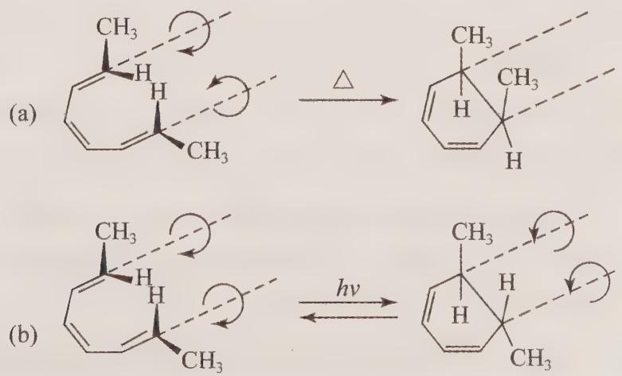  
图5.6.7 己三烯在不同条件下环合的情况

归纳以上两例,可得共轭多烯环合反应情况,列于表5.6.1中。

表 5.6.1 共轭多烯环合反应情况

<table><tr><td rowspan="2">π电子数</td><td colspan="2">MO对称性</td><td rowspan="2">反应条件</td><td rowspan="2">反应方式</td></tr><tr><td> $C_2$ </td><td>σ</td></tr><tr><td rowspan="2">4m(如丁二烯)</td><td>S</td><td>A</td><td>△</td><td>顺旋</td></tr><tr><td>A</td><td>S</td><td>hν</td><td>对旋</td></tr><tr><td rowspan="2">4m+2(如己三烯)</td><td>A</td><td>S</td><td>△</td><td>对旋</td></tr><tr><td>S</td><td>A</td><td>hν</td><td>顺旋</td></tr></table>

## 5.7 缺电子多中心键和硼烷的结构

Li, Be, B, Al 等原子价层的原子轨道数多于价电子数，它们在一定条件下倾向于接受电子，形成四面体构型的配合物。例如，平面构型的 $BF_{3}$ 很容易与具有孤对电子的原子化合成四面体配位化合物，见(a)式。

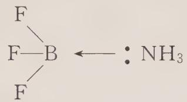  
(a)

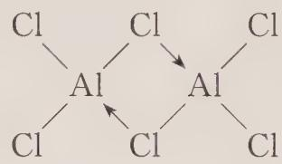  
(b)

有时没有合适的外来原子,化合物自身也可通过聚合,相互提供具有孤对电子的原子,形成四面体配位化合物。以 $AlCl_{3}$ 为例,它常以二聚体形式组成具有“氯桥”的结构,其中中间 2 个氯原子提供孤对电子形成正常的二电子键(或称为三中心四电子氯桥键),见(b)式。

在硼烷、金属烷基化合物、四氢硼烷酸盐等化合物中，常常由于没有足够的电子使原子间均能形成由2个原子和2个电子组成的二中心二电子键，而形成缺电子多中心键。

## 5.7.1 硼烷中的缺电子多中心键

关于 $B_{2}H_{6}$ 的结构,曾存在两种主要的结构模型:

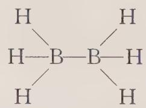  
(a) 乙烷式

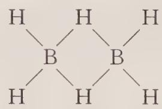  
(b) 桥式

乙烷式结构(a)和 $\mathrm{C_2H_6}$ 相似，桥式结构(b)和 $\mathrm{Al_2Cl_6}$ 相似。乙烷式结构中共有7个共价单键，需要14个价电子，但 $\mathrm{B_2H_6}$ 只有12个价电子，而且 $\mathrm{B_2H_6}$ 的化学性质和物理性质与乙烷式结构不符合。桥式结构中一价氢原子能形成2个共价键，对此不好理解。

利用电子衍射和 X 射线衍射分别测定气体和晶体中二硼烷的结构,证实 $B_{2}H_{6}$ 是桥式结构。根据电子衍射数据,结构中 B—H 间有两种键长:成桥的 $B—H_{b}$ 为 132.9 pm,两端的 $B—H_{t}$ 为 119.2 pm,如图 5.7.1(a) 所示。怎样理解 $B_{2}H_{6}$ 的桥键结构?现在比较普遍接受的观点是形成 B—H—B 三中心二电子键(3c-2e 键)。B 原子以 $sp^{3}$ 杂化轨道参与成键,除两端形成 B—H 键外,每个硼原子的 1 个 $sp^{3}$ 轨道都和氢原子的 1s 轨道叠加,共同组成

B—H—B 三中心键,如图 5.7.1 所示。在这个三中心键中只有 2 个电子,它是三中心二电子键。这是缺电子原子的一种特殊的共价结合形式。

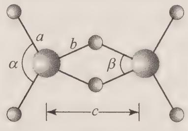  
(a)

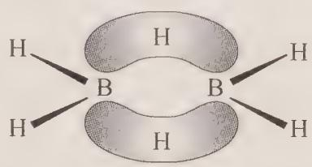  
(b)  
图5.7.1 $\mathbf{B}_2\mathbf{H}_6$ 的分子结构(a)和 $\mathbf{B}_2\mathbf{H}_6$ 中 $\mathbf{B}-\mathbf{H}-\mathbf{B}$ 三中心键的结构(b) $(a = 119.2\mathrm{pm},b = 132.9\mathrm{pm},c = 177\mathrm{pm};\alpha = 121.0^{\circ},\beta = 96.5^{\circ})$

在其他一些硼烷和碳硼烷结构中，硼原子之间（或硼原子和碳原子之间）还可形成封闭式BBB 3c-2e键(或BBC 3c-2e键)。它可看作由处在等边三角形3个顶点上的B原子各用1个 $\mathrm{sp}^3$ 杂化轨道朝向三角形中心互相叠加形成。硼烷结构式中的BHB和BBB 3c-2e键表达如下：

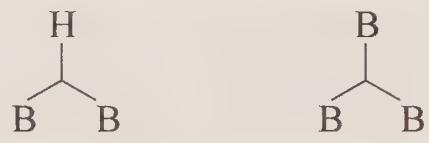

## 5.7.2 硼烷结构的描述

许多硼烷和碳硼烷的结构已经测定，图 5.7.2 示出一些实例。

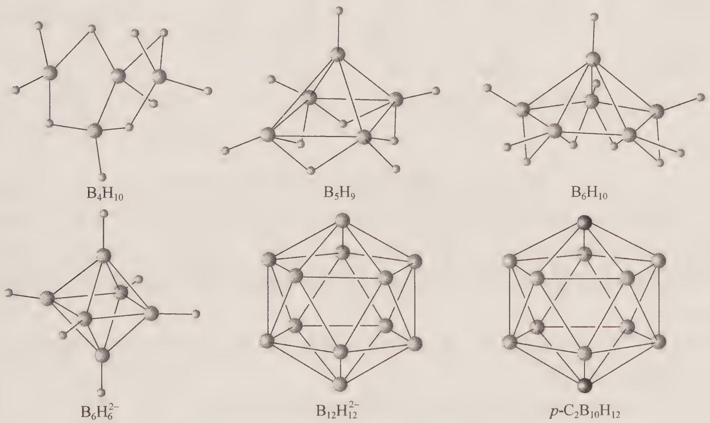  
图5.7.2 一些硼烷和碳硼烷的结构

(图中 $B_{12}H_{12}^{2-}$ 和 $p-C_{2}B_{10}H_{12}$ 没有画出 H 原子)

从图 5.7.2 可看出, 分子中价电子的总数不能满足每两个相邻原子的连线都有一对电子。例如, $B_{5}H_{9}$ 分子中只有 24 个价电子, 而图中有 8 条 B—B 连线和 13 条 B—H 连线; $B_{12}H_{12}^{2-}$ 离子中只有 50 个价电子, 而图中有 30 条 B—B 连线和 12 条 B—H 连线。这种电子的缺少可

通过形成缺电子多中心键来补偿。

styx 数码分别表示在一个硼烷分子中下列 4 种型式化学键的数目：

S  
(4220)  
(正面)  
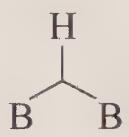

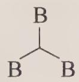

t

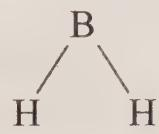

在用上述4种化学键表达硼烷的结构式中，标以 $styx$ 数码，能更清楚地表达硼烷的结构。图5.7.3示出一些硼烷的结构式和相应的 $styx$ 数码。

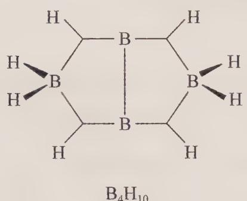  
(4012)

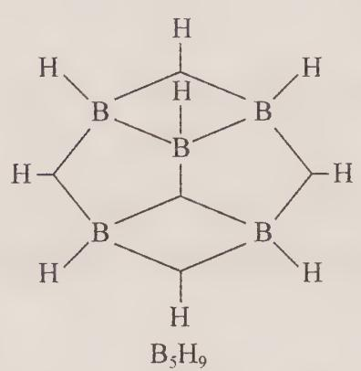  
(4120)

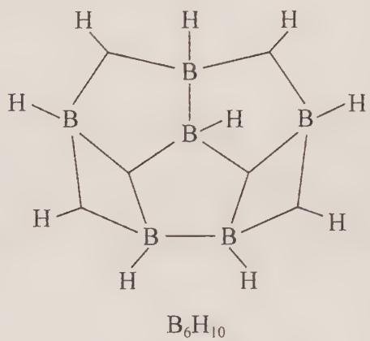

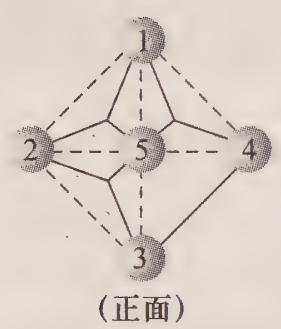  
(0430)

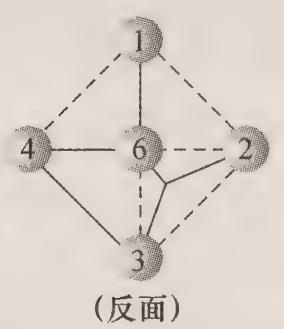

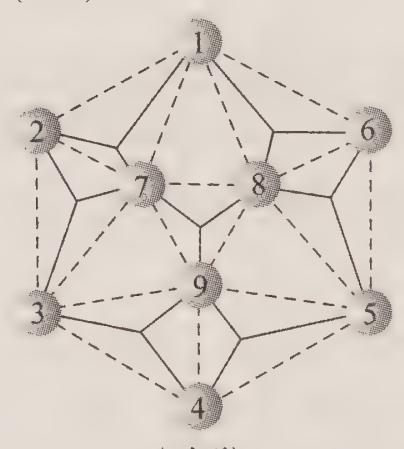  
(0,10,3,0)

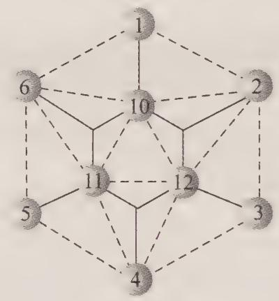  
(反面)  
图5.7.3 一些硼烷的结构式和相应的styx数码

$styx$ 结构式的表达形式和实际分子的结构尚有不同。例如 $B_{5}H_{9}$ ，它具有 $C_{4v}$ 点群对称性，而其 $styx$ 结构式只显现出 $C_{s}$ 点群对称性；又如 $B_{12}H_{12}^{2-}$ ，它具有 $I_{h}$ 点群对称性，而其 $styx$ 结构式中没有 $C_{5}$ 对称轴。这种差别可通过共振结构来理解，即把一种 $styx$ 结构式看作一个共振杂化体。

利用 $styx$ 数码结构式就是用一种价键(VB)理论描述硼烷分子中的化学键的一种方法。使用时必须遵循下列规则：

(1) 每一对相邻的硼原子由一个 B—B, BBB 或 BHB 键连接。

(2) 每个 B 原子利用它的 4 个价轨道成键, 以达到八电子组态。

（3）两个 B 原子不能同时通过二中心 B—B 键和三中心 BBB 键，或同时通过二中心 B—B 键和三中心 BHB 键结合。

(4) 每个 B 原子至少和 1 个端接 H 原子结合。

(5) 必要时,根据分子的对称性写出在共振杂化体间共振的结构式。

## 5.7.3 八隅律和分子骨干键数的计算

八隅律是指一个由主族元素(H 和 He 除外)组成的分子,其中每个原子都倾向于达到稳定的 8 个电子的电子组态。这 8 个电子由原子本身的价电子和与它成键的其他原子提供,使分子中成键分子轨道和非键轨道都填满电子,而 HOMO 和 LUMO 间的能级差较大。

对一个由 $n$ 个主族元素的原子组成的分子骨干 $\mathrm{M}_n$ （一个分子中，哪些原子算骨干原子，哪些原子为非骨干原子是相对的，可根据探讨问题的需要而定。例如硼烷和碳硼烷，常把B和C作为分子骨干，H作为配位原子）， $g$ 为其已有的价电子总数。当骨干中有一个共价单键在两个M原子间形成时，这两个M原子都互相得到1个价电子。为了使整个分子骨干满足八隅律，原子间应有 $\frac{1}{2}(8n - g)$ 对电子形成共价单键，这些成键的电子对数目，定义为分子骨干的键数 $b^{①}$

$$
b = \frac {1}{2} (8 n - g)\tag{5.7.1}
$$

对于缺电子化合物, 其电子数不足以全部都形成 2c-2e 共价单键, 而部分形成三中心二电子键时, 由于 3 个原子共享一对电子, 这时 1 个 3c-2e 键起着提供补偿 4 个电子的作用, 相当于键数为 2。

g 值可由下列电子数目加和而得: (i) 组成分子骨干 $M_{n}$ 的 n 个原子的价电子数, (ii) 围绕分子骨干 $M_{n}$ 的配位体提供的电子数, (iii) 化合物所带的正、负电荷数。例如, 将 $B_{12}H_{12}^{2-}$ 中 12 个 B 原子看作分子骨干, 12 个 H 原子看作配位体, $B_{12}H_{12}^{2-}$ 的 g 值可计算如下

$$
g = 1 2 \times 3 + 1 2 \times 1 + 2 = 5 0
$$

$\mathrm{B}_{12}$ 分子骨干的键数为

$$
b = \frac {1}{2} (8 \times 1 2 - 5 0) = 2 3\tag{5.7.2}
$$

即 $\mathrm{B}_{12} \mathrm{H}_{12}^{2-}$ 这个封闭式硼烷的分子骨干 $\mathrm{B}_{12}$ 中 B—B 共价单键数 $y$ 和 BBB 3c-2e 键数 $t$ 与 $b$ 之间应有下面关系

$$
b = 2 t + y = 2 3\tag{5.7.3}
$$

利用 $styx$ 数码描述 $\mathrm{B}_n\mathrm{H}_n^{2 - }$ 和 $\mathrm{C_2B_{n - 2}H_n}$ 封闭式硼烷和碳硼烷时，由于 $g = 4n + 2$ ，故

$$
b = \frac {1}{2} [ 8 n - (4 n + 2) ] = 2 n - 1\tag{5.7.4}
$$

由图 5.7.2 可知, 封闭式硼烷的 s 和 x 均为 0, 即分子中没有 BHB 3c-2e 键, 也没有 $BH_{2}$ 基团存在, 所以

$$
b = 2 t + y\tag{5.7.5}
$$

由(5.7.4)式和(5.7.5)式,得

$$
2 t + y = 2 n - 1\tag{5.7.6}
$$

而在 $\mathrm{B}_n\mathrm{H}_n^{2-}$ 中，价电子对的总数为 $\frac{1}{2}(4n + 2) = 2n + 1$ ，其中 $n$ 个电子对用于 $n$ 个B—H键，剩余 $n + 1$ 个电子对用于 $\mathrm{B}_n$ 骨干，即

$$
t + y = n + 1\tag{5.7.7}
$$

由(5.7.6)式和(5.7.7)式,得

$$
t = n - 2\tag{5.7.8}
$$

$$
y = 3\tag{5.7.9}
$$

所以，在封闭式硼烷(或碳硼烷)分子骨干中的化学键包括3个B—B共价单键和 $(n - 2)$ 个BBB $3\mathrm{c - }2\mathrm{e}$ 键。在 $\mathrm{B}_{12}\mathrm{H}_{12}^{2 - }$ 的分子骨干中，有3个B—B共价单键和10个BBB $3\mathrm{c - }2\mathrm{e}$ 键，键数 $b = 10\times 2 + 3 = 23$ ，如图5.7.3所示。

同理，根据稳定的鸟巢式硼烷 $(\mathrm{B}_n\mathrm{H}_{n + 4})$ ， $x = 0$ 的情况，可推得

$$
s = 4, \quad y = 2, \quad t = n - 4\tag{5.7.10}
$$

图5.7.3示出 $\mathrm{B}_5\mathrm{H}_9$ 和 $\mathrm{B}_6\mathrm{H}_{10}$ 的结构式和相应的styx数码，与它的键数是完全符合的。

## 5.8 非金属元素的结构特征

## 5.8.1 非金属单质的结构特征

非金属单质的结构,有的很简单,有的却很复杂,它们的成键规律已示于 5.1.1 小节中,据此可以讨论各族元素的结构特点:

稀有气体是单原子分子，在低温下，这些球形单原子分子堆积形成晶体。

$\mathrm{Cl}_2, \mathrm{Br}_2, \mathrm{I}_2$ 以双原子分子结晶成正交晶系晶体。在这3种晶体中，X—X的键长(d)与分子间最短的接触距离 $(d')$ 的数据如下：

<table><tr><td></td><td> $Cl_2$ </td><td> $Br_2$ </td><td> $I_2$ </td></tr><tr><td>d/pm</td><td>198.0</td><td>227</td><td>271.5</td></tr><tr><td> $d'/pm$ </td><td>332</td><td>332</td><td>350</td></tr><tr><td> $d'/d$ </td><td>1.68</td><td>1.46</td><td>1.29</td></tr></table>

由表可见，随着原子序数的增加， $d^{\prime}/d$ 值明显地下降。

硫的同素异构体(又称同素异形体)很多,据报道已接近50种。例如,在 $S_{n}$ 分子中,n=2,3,4,5,6,7,8,9,10,12,18,…。同一种分子又可有几种晶体结构型式,如 $S_{8}$ 分子可组成正交硫,也可组成单斜硫。在硫的同素异构体中, $S_{6},S_{8},S_{12},S_{x}$ 等分子形成的晶体,其结构已详细测定。在这些分子中,每个S原子均和2个S原子成键,S—S键长≈206 pm,∠SSS约为105°。Se和Te也有多种同素异构体,在室温下稳定的结构中,每个原子也是二配位的,Se—Se键长≈237 pm,Te—Te键长≈283 pm,键角103°左右。

磷、砷、锑、铋都有多种同素异构体，结构型式复杂多样，但共同点是每个原子都有3个较近的原子配位。这些单质的三方晶系的晶体都由层形分子组成，层间原子间的最短距离 $(d^{\prime})$ 和层内原子间的距离 $(d)$ 的比值 $(d^{\prime} / d)$ ，随着原子序数增加而减少。

<table><tr><td></td><td>P</td><td>As</td><td>Sb</td><td>Bi</td></tr><tr><td>d/pm</td><td>213</td><td>251.7</td><td>290.8</td><td>307.2</td></tr><tr><td>d&#x27;/pm</td><td>327</td><td>312.0</td><td>335.5</td><td>352.9</td></tr><tr><td>d&#x27;/d</td><td>1.54</td><td>1.24</td><td>1.15</td><td>1.15</td></tr></table>

碳、硅、锗、锡也都存在多种同素异构体，它们都存在金刚石型的结构，结构中每个原子均按四面体向和周围4个原子以共价单键连接。除金刚石型结构外，碳还有石墨型结构和球碳型结构，硅、锗、锡有白锡型结构。

单质碳的同素异构体很多,按键型可以分成三大类:(i)金刚石:包括立方金刚石、六方金刚石(晶体)和纳米金刚石分子。其中碳原子以 $sp^{3}$ 杂化轨道按四面体方向形成4个单键。(ii)石墨:包括六方石墨、三方石墨晶体和石墨烯(即单层石墨)分子,其中碳原子以 $sp^{2}$ 杂化轨道按平面三角形方向和3个碳原子成键。(iii)球碳:包括 $C_{60},C_{72},C_{84},\cdots$ 球形和椭球形分子、多层洋葱形球碳、单层和多层纳米碳管等。其中碳原子以介于 $sp^{2}\sim sp^{3}$ 的杂化轨道和周边的3个原子以三角锥形成键。焦炭、活性炭和无定形炭则是上述3种键型将碳原子组成不规则的聚集体。

球碳(fullerenes)是球形而有不饱和性的纯碳分子,是由几十个甚至上百个碳原子组成的封闭多面体。现在研究较多的是 $C_{60}$ ,其次是 $C_{70}$ 和 $C_{84}$ 等。对于足球形的球碳 $C_{60}$ ,其结构示于图5.8.1(a)。60个碳原子组成12个五元环面、20个六元环面、共有90条边的多面体。每个C原子参加形成2个六元环和1个五元环,3个σ键键角之和为 $348^{\circ}$ ,∠CCC平均为 $116^{\circ}$ 。碳原子的杂化轨道介于 $sp^{2}$ (石墨)和 $sp^{3}$ (金刚石)之间,为 $sp^{2.28}$ ,即每个σ轨道近似地含有s成分30.5%,p成分69.5%。而垂直于球面的π轨道s成分8.5%,p成分91.5%。实验测定C—C键长值对6/6键(2个六元环共边的键)为139 pm,对6/5键(六元环和五元环共边的键)为144 pm。图5.8.1(b)示出 $C_{60}$ 的价键结构表达式。

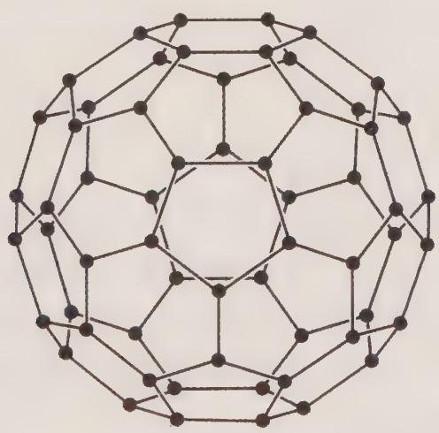  
(a)

  
(b)  
图5.8.1 球碳 $\mathbf{C}_{60}$ 的结构  
(a) 分子形状，(b) 价键结构式

单质硼的结构其复杂性仅次于硫，已报道有16种以上的同素异构体，但大多数是富硼的硼化物，如 $\mathrm{B}_{50}\mathrm{N}_2$ ；而结构被完全测定的只有 $\alpha$ -R-12和 $\beta$ -R-105（R表示三方晶系，数字表示素晶胞的原子数）。在这些结构中，可划成 $\mathrm{B}_{12}$ 二十面体单位来理解其结构。

根据 Euler(欧拉)公式以及计算键数(b)的(5.7.1)式,可以分析原子连线(即多面体的棱)中键的性质。

【例5.8.1】 $\mathrm{P_4}$ 分子

按(5.7.1)式, $P_{4}$ 分子

$$
g = 4 \times 5 = 2 0
$$

$$
b = \frac {1}{2} (8 n - g) = \frac {1}{2} (8 \times 4 - 2 0) = 6
$$

键数 b=6，四面体棱数也为 6，相当于每个棱边为 P—P 单键。

## 【例5.8.2】 $\mathrm{C}_{60}$ 分子

$C_{60}$ 分子中，顶点数为 60，面数为 32，棱数为 90。按(5.7.1)式， $C_{60}$ 分子

$$
g = 6 0 \times 4 = 2 4 0
$$

$$
b = \frac {1}{2} (8 n - g) = \frac {1}{2} (8 \times 6 0 - 2 4 0) = 1 2 0
$$

即键数为 120, 按价键表达式, 应有 60 个 C—C 单键和 30 个 C=C 双键, 如图 5.8.1(b) 所示。

## 5.8.2 非金属化合物的结构特征

非金属元素相互间可形成数目非常多的化合物,这些化合物还可以进一步和金属元素结合,形成更多的化合物。本小节从分析归纳这些化合物的结构特征着手,进而了解其性质。

## 1. 单质结构对化合物的成键作用

单质的成键规律在一定程度上将在由这些元素所形成的化合物中得到继承。下面以碳的3种同素异构体的结构特征和成键规律为例加以说明。

有机化合物是碳氢化合物及其衍生物的总称,根据碳的三类同素异构体中碳-碳原子间的化学键特征,将有机化合物归纳成三族,列于下表:

<table><tr><td>碳的同素异构体</td><td>相应的有机化合物</td><td>通式</td><td>典型代表</td></tr><tr><td>金刚石</td><td>脂肪族化合物</td><td>RX</td><td> $C_nH_{2n+2}$ (正烷烃)</td></tr><tr><td>石墨</td><td>芳香族化合物</td><td>ArX</td><td> $C_6H_6$ (苯)</td></tr><tr><td>球碳</td><td>球碳族化合物</td><td>FuX</td><td> $C_{60}Br_6$ </td></tr></table>

脂肪族化合物(RX, aliphatic compounds)的典型代表是正烷烃 $C_{n}H_{2n+2}$ ，它的结构特征是由四面体取向成键的碳原子连接成一维的碳链。其中 R 是脂肪烃基团，主要是烷烃以及它的衍生物，包括烯烃、炔烃等；X 为置换 H 原子的各种基团。

芳香族化合物(ArX, aromatic compounds)的典型代表是苯 $C_{6}H_{6}$ ，它的结构特征是由多个按平面三角形成键的碳原子共同组成离域键，使它具有芳香性。其中 Ar 是芳香基团，X 为置换 H 原子的各种基团。

球碳族化合物(FuX,fullerenic compounds)的典型代表是含球碳 $\mathrm{C}_{60}$ 基团的化合物，球碳基团的结构特征是由球面上的成键的碳原子组成三维封闭的多面体。其中Fu为球碳基团，如 $\mathrm{C}_{60},\mathrm{C}_{70},\mathrm{C}_{84}$ 等；X为加成于球面上的各种基团。

## 2. 各个原子 d 轨道是否参与成键

第一周期 H, He 只有 1s 轨道参与成键; 第二周期元素只能有 2s, 2p 轨道参与成键; 而从第三周期起, 就有空的 nd 轨道, 它与 ns, np 轨道的能级接近, 可使价层轨道扩充。由于有 d 轨道参加, 最高配位数可超过 4。但 d 轨道能否有效地参加成键, 还要看 d 轨道的分布情况: 当 d 轨道分布弥散, 离核较远, 成键效率下降, 就不能利用 d 轨道成键。例如, $SiF_{6}^{2-}$ 能稳定存在, 而 $SiCl_{6}^{2-}$ 却不存在, 其原因是硅原子的 d 轨道比 s 和 p 轨道离核较远, 参与组成 $sp^{3}d^{2}$ 杂化轨道时,不能形成稳定的键;而 $SiF_{6}^{2-}$ 能稳定存在,是由于 F 原子的电负性大,从 Si 拉走的电子较多,增加了 Si 核的有效正电荷,使 d 轨道收缩,Si—F 键增强,同时 F 原子半径较小,相互排斥较小,使它适于成键。

d 轨道的成键作用还表现在 d 轨道能在原来 $\sigma$ 键的基础上形成 $d_{\pi}-p_{\pi}$ 键，使原来的键增强，键长缩短。例如 $SO_{4}^{2-}$ 中，由于 d 轨道参加成键，使 S—O 键的键长缩短至 149 pm。这时中心硫原子组成 $sp^{3}$ 杂化轨道，每个 O 原子除以 $p_{z}$ 轨道和 S 原子的 $sp^{3}$ 杂化轨道形成 $\sigma$ 键外，尚有 2 个充满电子的 $p_{x}$ 和 $p_{y}$ 轨道垂直于 S—O 键轴，它们可分别和中心 S 原子的 $d_{x^{2}-y^{2}}$ 和 $d_{z^{2}}$ 成配键。这种配键为 $p_{\pi}\rightarrow d_{\pi}$ 配键，如图 5.8.2 所示。由于 $\sigma$ 键上附加这一配键，使 S—O 键的键长缩短。 $PO_{4}^{3-},SiO_{4}^{4-},ClO_{4}^{-}$ 等也有同样情况，列于表 5.8.1 中。

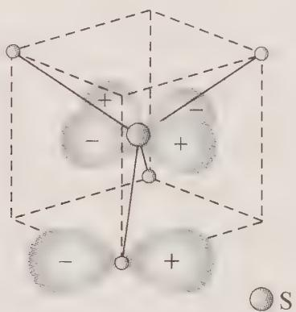

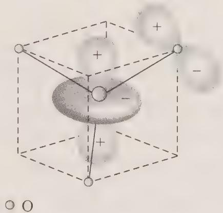  
图5.8.2 $\mathrm{SO}_4^{2-}$ 中的 $\mathbf{p}_{\pi} - \mathbf{d}_{\pi}$ 配键  
(a) $p_{\pi} \rightarrow d_{x^{2}-y^{2}}$ , (b) $p_{\pi} \rightarrow d_{z^{2}}$  
(图中每个 O 原子均取 S—O 键键轴作为 z 轴)

表 5.8.1 ${\mathrm{{AB}}}_{4}$ 型离子的结构数据

<table><tr><td rowspan="2"> $AB_4$ 型离子</td><td colspan="2">A—B 键键长/pm</td><td rowspan="2">键长缩短值/pm</td></tr><tr><td>实验测定值</td><td>共价单键半径加和值</td></tr><tr><td> $SiO_4^{4-}$ </td><td>163</td><td>186</td><td>23</td></tr><tr><td> $PO_4^{3-}$ </td><td>154</td><td>179</td><td>25</td></tr><tr><td> $SO_4^{2-}$ </td><td>149</td><td>175</td><td>26</td></tr><tr><td> $ClO_4^-$ </td><td>146</td><td>172</td><td>26</td></tr><tr><td> $SiF_4$ </td><td>156</td><td>185</td><td>29</td></tr></table>

$\mathrm{N(SiH_{3})_{3}}$ 与 $\mathrm{N(CH_{3})_{3}}$ 有相同的价电子数,但实验测定前者呈平面构型,后者呈三角锥形。这是由于 Si 的 3d 空轨道参加成键的结果,即 N 原子采用 $sp^{2}$ 杂化,孤对电子占据未参与杂化的 $p_{z}$ 轨道与 3 个 Si 的 3d 空轨道形成离域 $\pi$ 键 $\pi_{4}^{2}$ ,如图 5.8.3 所示。 $\pi_{4}^{2}$ 键的形成增加了分子的稳定性,增强了 Si—N 键,实验测定 Si—N 键长为 174 pm,短于共价单键半径和 (188 pm)。如果 $\mathrm{N(SiH_{3})_{3}}$ 分子中 N 原子采用不等性 $sp^{3}$ 杂化,分子呈三角锥形,就会破坏 $\pi_{4}^{2}$ 键的形成。

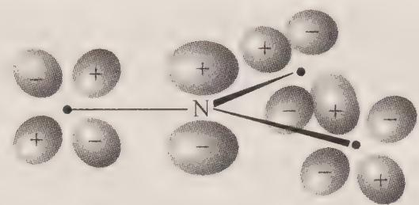  
图5.8.3 $\mathrm{N}(\mathrm{SiH}_3)_3$ 中 $\pi_4^2$ 键的形成（黑点代表Si原子）

## 3. 从分子的几何构型了解分子中原子的成键情况

分子的几何构型与分子成键情况密切相关,通过实验测定分子几何构型,是了解分子成键情况的基础。

例如 N 原子, 其基态电子组态为 $1s^{2}2s^{2}2p^{3}$ , 有 3 个不成对电子。当 N 原子和周围原子呈三角锥形时, N 原子以 $sp^{3}$ 杂化轨道成键, 除形成 3 个 $\sigma$ 键外还有一对孤对电子, 孤对电子占据其中 1 个杂化轨道, 如 $NH_{3}$ 及其衍生物。当 N 原子周围按四面体向成四配位时, N 以 $sp^{3}$ 杂化轨道形成 4 个 $\sigma$ 键, 这时 N 原子或者显正电性 $N^{+}$ , 和 C 相似, 如 $NH_{4}^{+}$ 及其衍生物, 或者以: $NH_{3}$ 的孤对电子和其他原子形成配键。当 N 原子和周围原子呈平面三角形配位时, 出现 3 个 $\sigma$ 键, 它由 $sp^{2}$ 杂化轨道成键, 剩余 1 个 p 轨道和 2 个电子, 通常参与离域 $\pi$ 键的形成。以下几种化合物就属此例。

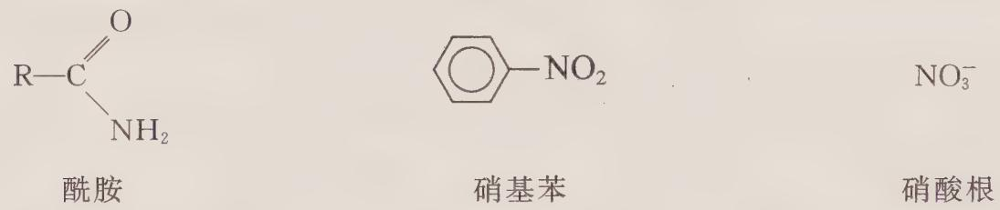

当 N 原子和周围原子呈弯曲形二配位时，则有 1 对孤对电子（如 R—NO）或 2 对孤对电子（如 $NH_{2}^{-}$ ）。前者有 $\pi$ 键形成，而后者则与 $H_{2}O$ 为等电子分子，和 $H_{2}O$ 的结构相似。当 N 原子和周围原子呈直线形二配位时，则 N 原子除形成 2 个 $\sigma$ 键外，剩余 2 个价轨道和 3 个价电子能在互相垂直的方向和两端原子形成 2 个 $\pi$ 键。例如 $N_{2}O, N_{3}^{-}, NO_{2}^{+}$ 等，其分子中中心 N 原子的成键情况与 $CO_{2}$ 分子的 C 原子相似。

分子的几何构型是讨论分子成键的一种根据。在配位化合物中将讨论到 —NO 基团对中心原子提供的电子数问题。例如，M—NO 若呈直线形( $\angle MNO\approx180^{\circ}$ )，N 提供 3 个电子参与成键(认为它是 10 e 单位)，是三电子给体，按 $NO^{+}$ 配体计算；若呈弯曲形，它提供 1 个电子参与成键(认为它是 12 e 单位)，是单电子接受体，算 $NO^{-}$ 配体。

$$
\mathrm{M} - \stackrel {\bullet} {\mathrm{N}} _ {\mathrm{O}} \quad (\angle \mathrm{MNO} \approx 1 2 5 ^ {\circ})
$$

由上述讨论可见,了解非金属化合物的结构,首先要重视分子的立体构型。

## 4. 从分子的成键情况了解分子的性质

根据分子几何构型,了解分子的成键情况,进一步计算分子中原子形成 $\sigma$ 键的数目及孤对电子对的数目,然后联系分子的性质进行讨论。表 5.8.2 示出非金属元素形成的分子中,中心原子周围的孤对电子数与键对电子数以及它们在空间的分布情况。

表 5.8.2 非金属元素分子中孤对和键对电子的排列

<table><tr><td rowspan="2">孤对电子对数</td><td colspan="5">孤对和键对电子对数</td></tr><tr><td>7</td><td>6</td><td>5</td><td>4</td><td>3</td></tr><tr><td rowspan="2">0</td><td></td><td></td><td></td><td></td><td></td></tr><tr><td> ${\mathrm{{IF}}}_{7}$ </td><td> ${\mathrm{{SF}}}_{6}$ </td><td> ${\mathrm{{PCl}}}_{5}$ </td><td> ${\mathrm{{CH}}}_{4}$ </td><td> ${\mathrm{{BCl}}}_{3}$ </td></tr><tr><td rowspan="2">1</td><td></td><td></td><td></td><td></td><td></td></tr><tr><td> ${\mathrm{{XeF}}}_{6}$ </td><td> ${\mathrm{{BrF}}}_{5}$ </td><td> ${\mathrm{{SF}}}_{4}$ </td><td> ${\mathrm{{NH}}}_{3}$ </td><td>ClNO</td></tr><tr><td rowspan="2">2</td><td></td><td></td><td></td><td></td><td></td></tr><tr><td></td><td> ${\mathrm{{XeF}}}_{4}$ </td><td> ${\mathrm{{ClF}}}_{3}$ </td><td> ${\mathrm{H}}_{2}\mathrm{O}$ </td><td></td></tr><tr><td rowspan="2">3</td><td></td><td></td><td></td><td></td><td></td></tr><tr><td></td><td></td><td> ${\mathrm{{XeF}}}_{2}$ </td><td></td><td></td></tr></table>

孤对电子和键对电子一起,按照价电子对互斥理论可以了解分子中中心原子的孤对和键对电子的排布,进而了解构型和性质;如 5.1 节中所述。

带有孤对电子的分子,其化学性质比较活泼,能形成配位键、氢键。孤对电子是和其他原子、分子或离子进行化合的结合点。

根据分子中原子的成键情况,可以较精确地从键长、键角等分子几何构型数据及原子的范德华半径,获得分子的形状和大小,进一步了解它具有的性质。

## 5.9 共价键的键长和键能

## 5.9.1 共价键的键长和原子的共价半径

通过衍射、光谱等实验,已测定大量分子立体构型的数据,获得许多分子中成键原子间的距离。由实验结果得知,在不同分子中两个原子间形成相同类型的化学键时,键长相近,即共价键键长有一定守恒性。

通过实验测定各种共价化合物的键长,求出它们的平均值,即得到共价键键长数据。根据键长数据可以获得原子的共价半径。例如,实验测定 C—C 共价单键的键长为 154 pm,取该值的一半当作碳原子的共价半径,即 77 pm。同理,由 Cl—Cl 键长得到 Cl 的共价单键半径 99 pm。若干原子的共价半径数据列于表 5.9.1 中。

表 5.9.1 原子的共价半径 (单位: $\mathrm{{pm}}$ )

<table><tr><td colspan="8">共价单键</td></tr><tr><td>H</td><td></td><td></td><td></td><td></td><td></td><td></td><td>He</td></tr><tr><td>32</td><td></td><td></td><td></td><td></td><td></td><td></td><td>-</td></tr><tr><td>Li</td><td>Be</td><td>B</td><td>C</td><td>N</td><td>O</td><td>F</td><td>Ne</td></tr><tr><td>134</td><td>90</td><td>82</td><td>77</td><td>75</td><td>73</td><td>72</td><td>-</td></tr><tr><td>Na</td><td>Mg</td><td>Al</td><td>Si</td><td>P</td><td>S</td><td>Cl</td><td>Ar</td></tr><tr><td>154</td><td>130</td><td>118</td><td>117</td><td>106</td><td>102</td><td>99</td><td>-</td></tr><tr><td>K</td><td>Ca</td><td>Ga</td><td>Ge</td><td>As</td><td>Se</td><td>Br</td><td>Kr</td></tr><tr><td>196</td><td>174</td><td>126</td><td>122</td><td>119</td><td>116</td><td>114</td><td>110</td></tr><tr><td>Rb</td><td>Sr</td><td>In</td><td>Sn</td><td>Sb</td><td>Te</td><td>I</td><td>Xe</td></tr><tr><td>211</td><td>192</td><td>144</td><td>141</td><td>138</td><td>135</td><td>133</td><td>130</td></tr><tr><td>Cs</td><td>Ba</td><td>Tl</td><td>Pb</td><td>Bi</td><td></td><td></td><td></td></tr><tr><td>225</td><td>198</td><td>148</td><td>147</td><td>146</td><td></td><td></td><td></td></tr><tr><td>共价双键和叁键</td><td>B</td><td>C</td><td>N</td><td>O</td><td>S</td><td>Se</td><td></td></tr><tr><td>双键</td><td>71</td><td>67</td><td>62</td><td>60</td><td>94</td><td>107</td><td></td></tr><tr><td>叁键</td><td>64</td><td>60</td><td>55</td><td>55</td><td>87</td><td>-</td><td></td></tr></table>

注意,不同的书刊中所给的共价半径常不相同。例如,对 H 原子,若从 $H_{2}$ 分子的键长推引,半径值应为 37 pm;若从 C—H 键键长推引,半径值为 32 pm。

利用表 5.9.1 中的数值, 可以从两个成键原子的共价半径计算出键长数据。例如 C—Cl 键键长为 $176 \, pm (= 77 \, pm + 99 \, pm)$ , 在 $CCl_{4}$ 分子中, 实验测定的 C—Cl 键键长为 $177 \, pm$ , 与计算值符合得很好。

利用原子共价半径计算键长时，应考虑下面两种情况。

(1) 异核原子间键长的计算值常常比实验测定值稍大。例如, 实验测定 $\mathrm{SnCl}_4$ 中 Sn—Cl 键键长为 $231 \mathrm{pm}$ , 而共价半径加和值为 $141 \mathrm{pm} + 99 \mathrm{pm} = 240 \mathrm{pm}$ 。这一差异的原因是由于共价半径的理论值是由同核双原子分子中获得; 而实际分子中原子间有电负性差, 额外增加了吸引力, 使键长缩短。这时可根据电负性差, 按下式计算键长 (以 $\mathrm{pm}$ 为单位)。

$$
r _ {\mathrm{A-B}} = r _ {\mathrm{A}} + r _ {\mathrm{B}} - 9 (\chi_ {\mathrm{A}} - \chi_ {\mathrm{B}})\tag{5.9.1}
$$

式中 $r_{\mathrm{A - B}}$ 是计算的键长， $r_{\mathrm{A}}$ 和 $r_{\mathrm{B}}$ 分别为A原子和B原子的共价半径， $\chi_{\mathrm{A}}$ 和 $\chi_{\mathrm{B}}$ 分别是A和B的电负性值， $\chi_{\mathrm{A}}$ 值大。

（2）同一种化学键对不同分子有它的特殊性，键长略有差异。例如同是C—C键，由于杂化形式发生改变，键中s轨道的成分发生变化时，C—C键长也发生变化(见表5.5.1)。

当有离域 $\pi$ 键或其他多重键存在时，就不能再用共价单键半径计算键长。反之，根据键长可以了解键的性质。

## 5.9.2 共价键键能

按热化学观点,双原子分子 A—B 键的键能是指在 0.1013 MPa 和 298 K 时,反应体系

$$
\mathrm{AB(g)} \longrightarrow \mathrm{A(g)} + \mathrm{B(g)}
$$

焓的增量。所以在 0.1013 MPa, 298 K 时, 双原子分子的解离能就是它的键能, 可直接从热化学测量中得到。从微观分析, 令 A(g) 和 B(g) 相距无限远时体系的相对能量为 0 , 当 A(g) 和

B(g)彼此逐渐接近,体系的能量降低,能量曲线如图3.5.5所示。至平衡距离 $r_{e}$ ,体系能量最低,降低值为平衡解离能 $D_{e}$ 。实验测定的解离能和 $D_{e}$ 值不同。若以 $D_{0}$ 表示AB分子基态的能量(即0K时的能量), $D_{e}$ 和 $D_{0}$ 之差为体系的零点能,它等于 $h\nu/2$ ,可由这个分子的振动频率计算。若精确计算298K时的解离能 $D_{298}$ ,还应当考虑温度的微小影响, $D_{298}$ 即为A—B键的键能。对于 $H_{2}$ 分子

$$
D _ {0} = 4 3 2 \mathrm{kJmol} ^ {- 1}
$$

$$
\frac {1}{2} h \nu = 0. 5 \times 6. 6 2 6 \times 1 0 ^ {- 3 4} \mathrm{Js} \times 1. 2 5 \times 1 0 ^ {1 4} \mathrm{s} ^ {- 1} \times 6. 0 2 \times 1 0 ^ {2 3} \mathrm{mol} ^ {- 1} = 2 5 \mathrm{kJ} \mathrm{mol} ^ {- 1}
$$

$$
D _ {\mathrm{e}} = D _ {0} + \frac {1}{2} h \nu = 4 5 7 \mathrm{kJmol} ^ {- 1}
$$

考虑 $T(\mathrm{K})$ 时, $H_{2}$ 和 2H 的平动和转动能量差为

$$
2 \times \frac {3}{2} R T - \frac {5}{2} R T = \frac {1}{2} R T
$$

体积膨胀能量差为 $RT$ ，两项共(3/2） $RT$ ，即 $4\mathrm{kJ mol^{-1}}$ ，所以 $\mathrm{H}_{2}$ 的 $D_{298} = 436\mathrm{kJ mol^{-1}}$ 。表5.9.2列出若干化学键的平均键能。表中，上部所列数据是对应元素的共价单键的键能。

表 5.9.2 若干化学键的平均键能 (单位: $\mathrm{{kJ}}{\mathrm{{mol}}}^{-1},{298}\mathrm{\;K}$ )

<table><tr><td>单键</td><td>H</td><td>C</td><td>N</td><td>O</td><td>F</td><td>Si</td><td>P</td><td>S</td><td>Cl</td><td>Ge</td><td>As</td><td>Se</td><td>Br</td><td>Sb</td><td>Te</td></tr><tr><td>H</td><td>436</td><td></td><td></td><td></td><td></td><td></td><td></td><td></td><td></td><td></td><td></td><td></td><td></td><td></td><td></td></tr><tr><td>C</td><td>413</td><td>356</td><td></td><td></td><td></td><td></td><td></td><td></td><td></td><td></td><td></td><td></td><td></td><td></td><td></td></tr><tr><td>N</td><td>389</td><td>293</td><td>159</td><td></td><td></td><td></td><td></td><td></td><td></td><td></td><td></td><td></td><td></td><td></td><td></td></tr><tr><td>O</td><td>465</td><td>343</td><td>201</td><td>138</td><td></td><td></td><td></td><td></td><td></td><td></td><td></td><td></td><td></td><td></td><td></td></tr><tr><td>F</td><td>570</td><td>486</td><td>272</td><td>184</td><td>159</td><td></td><td></td><td></td><td></td><td></td><td></td><td></td><td></td><td></td><td></td></tr><tr><td>Si</td><td>318</td><td>281</td><td>—</td><td>452</td><td>540</td><td>226</td><td></td><td></td><td></td><td></td><td></td><td></td><td></td><td></td><td></td></tr><tr><td>P</td><td>318</td><td>264</td><td>300</td><td>352</td><td>490</td><td>214</td><td>214</td><td></td><td></td><td></td><td></td><td></td><td></td><td></td><td></td></tr><tr><td>S</td><td>364</td><td>289</td><td>247</td><td>—</td><td>340</td><td>226</td><td>230</td><td>264</td><td></td><td></td><td></td><td></td><td></td><td></td><td></td></tr><tr><td>Cl</td><td>432</td><td>327</td><td>201</td><td>205</td><td>256</td><td>360</td><td>318</td><td>272</td><td>243</td><td></td><td></td><td></td><td></td><td></td><td></td></tr><tr><td>Ge</td><td>289</td><td>243</td><td>—</td><td>—</td><td>465</td><td>—</td><td>—</td><td>—</td><td>239</td><td>163</td><td></td><td></td><td></td><td></td><td></td></tr><tr><td>As</td><td>247</td><td>—</td><td>—</td><td>—</td><td>465</td><td>—</td><td>—</td><td>—</td><td>289</td><td>—</td><td>178</td><td></td><td></td><td></td><td></td></tr><tr><td>Se</td><td>314</td><td>247</td><td>—</td><td>—</td><td>306</td><td>—</td><td>—</td><td>—</td><td>251</td><td>—</td><td>—</td><td>193</td><td></td><td></td><td></td></tr><tr><td>Br</td><td>366</td><td>276</td><td>243</td><td>—</td><td>280</td><td>289</td><td>272</td><td>214</td><td>218</td><td>276</td><td>239</td><td>226</td><td>193</td><td></td><td></td></tr><tr><td>Sb</td><td>—</td><td>—</td><td>—</td><td>—</td><td>—</td><td>—</td><td>—</td><td>—</td><td>—</td><td>—</td><td>—</td><td>—</td><td>—</td><td>126</td><td></td></tr><tr><td>Te</td><td>268</td><td>—</td><td>—</td><td>—</td><td>343</td><td>—</td><td>—</td><td>—</td><td>—</td><td>—</td><td>—</td><td>—</td><td>—</td><td>—</td><td>138</td></tr><tr><td>I</td><td>298</td><td>239</td><td>201</td><td>201</td><td>271</td><td>214</td><td>214</td><td>—</td><td>211</td><td>214</td><td>180</td><td>—</td><td>179</td><td>—</td><td>—</td></tr><tr><td>I—I</td><td></td><td>151</td><td colspan="2">C=C</td><td>615</td><td></td><td>C=N</td><td></td><td>620</td><td>C=O</td><td></td><td>745</td><td></td><td>N=N</td><td>419</td></tr><tr><td>O=O</td><td></td><td>498</td><td colspan="2">S=O</td><td>518</td><td></td><td>S=C</td><td></td><td>578</td><td>S=S</td><td></td><td>425</td><td></td><td>Se=O</td><td>465</td></tr><tr><td>Se=C</td><td></td><td>456</td><td colspan="2">C≡C</td><td>812</td><td></td><td>C≡N</td><td></td><td>879</td><td>C≡O</td><td></td><td>1076</td><td></td><td>N≡N</td><td>945</td></tr></table>

对于多原子分子,如果仅仅拆断一个键,使一个分子变成两部分,所需的能量称为该键的解离能 D,它是热化学计算中一个很有价值的数据。但是需要注意,键的解离能(D)并不能代表键的强度,即不能代表键能,因为当分子断开一个键分成两部分时,每一部分都可能发生键或电子的重排。例如

$$
\mathrm{OCS(g)} \longrightarrow \mathrm{CO(g)} + \mathrm{S(g)} \quad D (\mathrm{oc} = \mathrm{s}) = 3 1 0 \mathrm{kJmol} ^ {- 1}
$$

$$
\begin{array}{r l r} \mathrm {OCS(g)\longrightarrow O(g) + CS(g)} & D (\mathrm {O = CS}) = 1 3 0 \mathrm {kJ mol^ {- 1}} \\ \mathrm {OCS(g)\longrightarrow O(g) + C(g) + S(g)} & \Delta H ^ {\ominus} (\mathrm{OCS}) = 1 3 8 6 \mathrm {kJ mol^ {- 1}} \end{array}
$$

$D(\mathrm{OC}=\mathrm{S})$ 与 $D(\mathrm{O}=\mathrm{CS})$ 之和远比 OCS 分解为组成它的全部原子所需的能量少。

把一个分子分解为组成它的全部原子时所需要的能量,应该恰好等于这个分子中全部化学键键能的总和。据此概念,既可以从解离能计算键能,也可以从键能粗略地计算解离能。

例如

$$
\mathrm{S} _ {8} (\mathrm{g}) \longrightarrow 8 \mathrm{S(g)} \quad \Delta H _ {\mathrm{解离}} = 2 1 3 0 \mathrm {kJ mo l ^ {- 1}}
$$

由此数据可以计算S—S键键能

$$
E (\mathrm{S} - \mathrm{S}) = 2 1 3 0 \mathrm{kJ} \mathrm{mol} ^ {- 1} / 8 = 2 6 6 \mathrm{kJ} \mathrm{mol} ^ {- 1}
$$

又如， $\mathrm{H}_2\mathrm{S}$ 的解离能为

$$
\mathrm{H} _ {2} \mathrm{S(g)} \longrightarrow 2 \mathrm{H(g)} + \mathrm{S(g)} \qquad \Delta H _ {\text {解离}} ^ {\ominus} = 7 3 5 \mathrm{kJmol} ^ {- 1}
$$

则S—H键键能

$$
E (\mathrm{S} - \mathrm{H}) = 7 3 5 \mathrm{kJ} \mathrm{mol} ^ {- 1} / 2 = 3 6 7 \mathrm{kJ} \mathrm{mol} ^ {- 1}
$$

由上述数据,就可估计出

$$
\mathrm{H} _ {2} \mathrm{S} _ {2} (\mathrm{g}) \longrightarrow 2 \mathrm{H} (\mathrm{g}) + 2 \mathrm{S} (\mathrm{g})
$$

的解离能为 $266 \, kJ mol^{-1} + 2 \times 367 \, kJ mol^{-1} = 1000 \, kJ mol^{-1}$ 。此分子的解离能的实验测定值为 $984 \, kJ mol^{-1}$ 。

表 5.9.2 所列的键能数据是统计平均值, 它反映了不同分子中同一种键的共性, 忽略了它们的个性。例如乙烯和乙烷中的 C—H 键键能不完全相同。所以, 若要对某个体系进行精确的热力学计算, 宜从文献中查出它的解离能的精确数据来用。

从键能数据,还可归纳出下面两条规律:

（1）当同种原子键 A—A 和 B—B 改组成为 2 个异种原子键 A—B 时，键能一般有所增加，即

$$
2 E (\mathrm{A-B}) > E (\mathrm{A-A}) + E (\mathrm{B-B})
$$

Pauling 认为, 这是由于异核键中有离子键成分, 其数值与两原子的电负性值差 ( $\Delta \equiv \chi_{A} - \chi_{B}$ ) 有关, 可表示为

$$
E (\mathrm{A} - \mathrm{B}) = \frac {1}{2} [ E (\mathrm{A} - \mathrm{A}) + E (\mathrm{B} - \mathrm{B}) ] + 9 6 \Delta^ {2}\tag{5.9.2}
$$

式中键能 E 以 kJ mol $^{-1}$ 为单位。

(2) 当 C=C 双键改组成 2 个 C—C 单键时, 键能总是有所增加, 即

$$
2 E (\mathrm{C} - \mathrm{C}) > E (\mathrm{C} = \mathrm{C})
$$

利用键能表及其规律估计反应热，在不要求很精确的情况下，常常是十分有用的。例如乙烯加氢反应

$$
\begin{array}{c} \mathrm{H} \\ \mathrm{C} = \mathrm{C} \\ \mathrm{H} \end{array} + \mathrm{H} _ {2} \longrightarrow \begin{array}{c} \mathrm{H} \\ \mathrm{H} - \mathrm{C} - \mathrm{C} - \mathrm{H} \\ \mathrm{H} \end{array}
$$

反应前后键的变化是

$$
4 \mathrm{C} - \mathrm{H} + \mathrm{C} = \mathrm{C} + \mathrm{H} - \mathrm{H} \longrightarrow 6 \mathrm{C} - \mathrm{H} + \mathrm{C} - \mathrm{C}
$$

可简化为

$$
\mathrm{C} = \mathrm{C} + \mathrm{H} - \mathrm{H} \longrightarrow 2 \mathrm{C} - \mathrm{H} + \mathrm{C} - \mathrm{C}
$$

由键能计算反应热(或反应焓变 $\Delta H$ ) 的公式为

$\Delta H =$ 反应物分子中键能的总和一产物分子中键能的总和

即

$$
\Delta H = \left[ 4 E (\mathrm{C} - \mathrm{H}) + E (\mathrm{C} = \mathrm{C}) + E (\mathrm{H} - \mathrm{H}) \right] - \left[ 6 E (\mathrm{C} - \mathrm{H}) + E (\mathrm{C} - \mathrm{C}) \right]
$$

也即

$$
\begin{array}{r l} \Delta H & = [ E (\mathrm{C=C}) + E (\mathrm{H-H}) ] - [ 2 E (\mathrm{C-H}) + E (\mathrm{C-C}) ] \\ & = (6 1 5 + 4 3 6) \mathrm {kJ mol^ {- 1}} - (2 \times 4 1 5 + 3 4 4) \mathrm {kJ mol^ {- 1}} \\ & = - 1 2 3 \mathrm {kJ mol^ {- 1}} \end{array}
$$

此估算值与实验测定值 $-137.3\mathrm{kJ mol}^{-1}$ 是相近的。

## 5.9.3 碳和硅化学键的比较

碳和硅是元素周期表第14族的前两种元素，它们在化学中占有极其重要的地位。碳统治着有机化学，有机化合物的定义是一切含有C—C键的化合物。硅统治着无机化学，硅在地壳中的含量按 $40\mathrm{km}$ 厚度的地壳计，约占地壳质量的 $28\%$ 。在地壳的所有元素中，硅仅次于氧而居第二位。硅和氧以及其他元素一起结合形成硅酸盐，它约占地壳质量的 $80\%$ 。为什么这两种元素有如此独特的能力？关键在于它们的原子形成化学键的特性。

在基态时,碳和硅的电子组态分别为

$$
\mathrm{C}: [ \mathrm{He} ] 2 \mathrm{s} ^ {2} 2 \mathrm{p} ^ {2} \quad \mathrm{Si}: [ \mathrm{Ne} ] 3 \mathrm{s} ^ {2} 3 \mathrm{p} ^ {2}
$$

表面上看,这两种元素有着非常相似的价层电子组态,但它们的成键性质并不相同。究其原因,是这两种元素存在下面的差异:

（1）原子大小不同。若按屏蔽常数近似估算原子轨道的有效半径 $r^{*}$ （参见2.4.2节），可得C原子2p轨道的 $r_{2p}^{*}$ 为65 pm，Si原子3p轨道的 $r_{3p}^{*}$ 为115 pm，Si比C大得多。

(2) 原子电负性不同。C 的电负性为 2.54, Si 为 1.92。

（3）价层空轨道不同。C原子价层没有能级相近的d轨道，Si原子价层有能级相近的3d轨道。

由上述差异可见：C原子利用它的s轨道和p轨道通过杂化作用和其他原子形成 $\sigma$ 键后，还可利用剩余的p轨道互相叠加，通过 $p_{\pi} - p_{\pi}$ 相互作用形成较强的多重键或离域 $\pi$ 键。Si原子因p轨道较大，形成 $\sigma$ 键后， $p_{\pi} - p_{\pi}$ 相互作用弱，Si的多重键化合物不稳定；另一方面，因d轨道参与成键，使Si—O键等类型的化学键因 $p_{\pi} - d_{\pi}$ 作用而大大增强（参看5.8.2节）。现将碳和硅的一些化学键的键长和键能列于表5.9.3中。

表 5.9.3 碳和硅的化学键的键长和键能

<table><tr><td>键</td><td>键长/pm</td><td>键能/(kJ mol-1)</td><td>键</td><td>键长/pm</td><td>键能/(kJ mol-1)</td></tr><tr><td>C—C</td><td>154</td><td>356</td><td>Si—Si</td><td>235</td><td>226</td></tr><tr><td>C—H</td><td>109</td><td>413</td><td>Si—H</td><td>148</td><td>318</td></tr><tr><td>C—O</td><td>143</td><td>343</td><td>Si—O</td><td>166</td><td>452</td></tr><tr><td>C=C</td><td>134</td><td>615</td><td>Si=Si</td><td>221</td><td>—</td></tr><tr><td>C=O</td><td>121</td><td>745</td><td>Si=O</td><td>—</td><td>—</td></tr></table>

对比表 5.9.3 列出的数据, 可看出键能(E)的关系:

$$
\begin{array}{l l} {E (\mathrm{C-C}) > E (\mathrm{Si-Si});} & {E (\mathrm{C-H}) > E (\mathrm{Si-H})} \\ {E (\mathrm{C-C}) > E (\mathrm{C-O});} & {E (\mathrm{Si-Si}) \ll E (\mathrm{Si-O})} \end{array}
$$

可见，C—C键和C—H键较短、较强，而且因 $E(\mathrm{C}-\mathrm{C})>E(\mathrm{C}-\mathrm{O})$ ，这是烷烃稳定存在以及容易使C原子间形成离域 $\pi$ 键的主要因素。但Si—Si键能远小于Si—O键能，Si—Si键不稳定而倾向于转变成更强的Si—O键。由于氧气几乎无所不在，硅烷将自发地和氧气反应形成硅酸盐。由于Si—O键很强，当硅酸 $\left[\mathrm{Si}(\mathrm{OH})_{4}\right]$ 缩聚时，Si原子总是形成 $\left[SiO_{4}\right]$ 四面体，相互共顶点连接成非常稳定的硅酸盐，而不会形成偏硅酸。迄今，人们从未得到过含有偏硅酸基团的化合物。但有的书刊和产品说明中却标明偏硅酸的含量（如某矿泉水含偏硅酸20～25mg/L），这是不妥的。

$$
\begin{array}{r l r} & \mathrm{HO} _ {\mathrm{HO}} \mathrm{Si} = \mathrm{O} \\ & \text {偏硅酸} \end{array} \quad \begin{array}{r l r} & - \mathrm{O} _ {- \mathrm{O}} \mathrm{Si} = \mathrm{O} \\ & \text {偏硅酸基团} \end{array}
$$

碳原子能形成多种型式的共价键，这种特性在元素中是独一无二的。碳的电负性适中，既不容易丢失电子成正离子，也不容易得电子成负离子。碳原子的价电子数目正好和价轨道数目相等，使碳原子周围的价电子不容易形成孤对电子，也不容易形成缺电子键。碳原子的半径较小，在分子中它可以和相邻原子的轨道有效地叠加成键，并可离域扩展到整个分子的骨架，形成芳香烃中型式多样的离域 $\pi$ 键。碳原子还可以和金属原子形成各种配位键。作为配位体的含碳原子基团，可以是线形、弯曲形，也可以是环形，碳原子数目可多可少；一个C原子可以和金属原子间形成单键、双键、叁键，或和多个金属原子形成多中心键。

同族元素的碳和硅各自发挥它们形成化学键的特点，分别在有机化学和无机化学中起着其他元素无与伦比的作用。碳在地壳中的含量按质量计只占 $0.027\%$ ，是很少的数量，况且碳的 $99.7\%$ 在地壳中以煤、甲烷和碳酸盐的形式存在， $0.2\%$ 在大气中以 $\mathrm{CO}_{2}$ 和 $\mathrm{CH}_4$ 等形式存在，剩余不到 $0.1\%$ 的碳构成地球上全部生命物种赖以生存和发展的主要物质基础。碳以其丰富多彩的化学键作为它施展才能的根据，而硅则以其量大和特殊稳定的Si—O键稳坐无机化合物的头把交椅。所以分析碳和硅的化学键特点，并据此认识化学中的规律是很有意义的。

## 习题

5.1 利用价电子对互斥理论，说明 $\mathrm{XeF_4}$ ， $\mathrm{XeO_4}$ ， $\mathrm{XeO_3}$ ， $\mathrm{XeF_2}$ ， $\mathrm{XeOF_4}$ 等分子的形状。

5.2 利用价电子对互斥理论,说明 $AsH_{3}$ , $ClF_{3}$ , $SO_{3}$ , $SO_{3}^{2-}$ , $CH_{3}^{+}$ , $CH_{3}^{-}$ 等分子和离子的几何形状,说明哪些分子有偶极矩?

5.3 画出下列分子中孤对电子和键对电子在空间的排布图：

(1) $\mathrm{ICl}_2^+$ , $\mathrm{N}_2\mathrm{O}$ ;

(2) $\mathrm{H}_3\mathrm{O}^+$ , $\mathrm{BrF}_3$ , $\mathrm{NF}_3$ ;

(3) $\mathrm{ICl}_4^-$ , $\mathrm{IF}_4^+$ , $\mathrm{SbF}_4^-$ , $\mathrm{XeO}_2\mathrm{F}_2$ ;

(4) $\mathrm{IF}_5$ ， $\mathrm{XeF}_5^+$ 。

5.4 椅式环己烷 $(\mathrm{C}_6\mathrm{H}_{12})$ 的结构示于图4.3.7(b)，它具有 $D_{3d} - \overline{3} m$ 点群的对称性，若将C原子按正四面体方向和相邻的2个C原子以及2个H原子形成共价键，试作图并回答下列问题：

(1) 画出分子的结构图, 依次在图中将 C 原子编号标出;

(2) 画出 C 原子骨架沿三重反轴( $\overline{3}$ , ▲)的投影图, 在图中标出三重反轴的位置以及 C—C—C