键的键角值；

（3）画出 $\mathrm{C_6}$ 的六元环中4个C—C—C—C原子沿着中间两个C原子所连接的4个H原子和2个C原子的投影图；

(4) 写出这 4 个 C 原子排布形成的扭角和二面角。

5.5 正交硫中环形 $S_{8}$ 分子具有 $D_{4d}-\overline{82m}$ 点群的对称性，S—S 键长 206 pm，S—S—S 键角 $108^{\circ}$ ，S—S—S—S 扭角 $98^{\circ}$ 。

（1）画出 $\mathrm{S_8}$ 分子沿 $\overline{8}$ 轴的投影图[参看示于图5.1.1(b)的结构图]，在图中标出键长和键角；

(2) 画出 S—S—S—S 的扭角( $\omega$ )和二面角( $\phi$ )所表示的图形。

5.6 写出下列分子或离子中，中心原子所采用的杂化轨道： $\mathrm{CS}_2$ ， $\mathrm{NO}_2^+$ ， $\mathrm{NO}_3^-$ ， $\mathrm{BF}_3$ ， $\mathrm{CBr}_4$ ， $\mathrm{PF}_4^+$ ， $\mathrm{SeF}_6$ ， $\mathrm{SiF}_5^-$ ， $\mathrm{AlF}_6^{3-}$ ， $\mathrm{IF}_6^+$ ， $\mathrm{MoCl}_5$ ， $(\mathrm{CH}_3)_2\mathrm{SnF}_2$ 。

5.7 臭氧 $\mathrm{O}_3$ 的键角为 $116.8^{\circ}$ 。若用杂化轨道 $\psi = c_{1}\psi_{2\mathrm{s}} + c_{2}\psi_{2\mathrm{p}}$ 描述中心氧原子的成键轨道，试按键角与轨道成分的关系式 $\cos \theta = -c_1^2 /c_2^2$ 计算：

(1) 成键杂化轨道 $\psi$ 中系数 $c_{1}$ 和 $c_{2}$ 值；

(2) 成键杂化轨道的每个原子轨道贡献的百分数。

5.8 直线形对称构型的 $\mathrm{I}_3^-$ 离子，若成键电子只是5p轨道上的电子（即将 $5\mathrm{s}^2$ 电子作为原子实的一部分）。

(1) 画出 $I_{3}^{-}$ 中每个 $\sigma$ 和 $\pi$ 轨道的原子轨道叠加图；

(2) 画出 $I_{3}^{-}$ 分子轨道能级图；

（3）试以 I 原子间的键长(d)和键级(n)关系方程： $d=267\ \text{pm}-(85\ \text{pm})\lg n$ 计算 $I_{3}^{-}$ 中 I—I 键的键级。实验测定 $I_{2}$ 分子中 I—I 键长为 267 pm，而 $I_{3}^{-}$ 中 I—I 键长为 292 pm。

5.9 $\mathrm{PF}_5$ 分子呈三方双锥构型，P原子采用 $\mathrm{sp}^3\mathrm{d}$ 杂化轨道与F原子成 $\sigma$ 键。若将 $\mathrm{sp}^3\mathrm{d}$ 杂化轨道视为 $\mathrm{sp}^2$ 和pd两杂化轨道的组合，请先将 $\mathrm{PF}_5$ 安放在一直角坐标系中，根据坐标系和杂化轨道的正交、归一性写出P原子的5个杂化轨道。

5.10 $\mathrm{PCl}_5$ 分子为三方双锥形结构，请说明或回答：

(1) 分子所属的点群和 P 原子所用的杂化轨道, 全部 P—Cl 键是否等长?

(2) 若用 VSEPR 方法判断 P—Cl 键的键长, 三次轴方向上的键长较赤道方向上的键长是长还是短?

（3）晶态时五氯化磷由 $\left[\mathrm{PCl}_4\right]^+\left[\mathrm{PCl}_6\right]^{-}$ 组成，试解释什么因素起作用？

5.11 $\mathrm{N}_2\mathrm{H}_2$ 有两种同分异构体，是哪两种？为什么 $\mathrm{C}_2\mathrm{H}_2$ 只有一种同分异构体？

5.12 试证明含 C, H, O, N 的有机分子, 若相对分子质量为奇数, 则分子中含 N 原子数必为奇数; 若相对分子质量为偶数, 则含 N 原子数亦为偶数。

5.13 用 HMO 法解环丙烯正离子 $\left(\mathrm{C}_{3}\mathrm{H}_{3}\right)^{+}$ 的离域 $\pi$ 键分子轨道波函数，并计算 $\pi$ 键键级和 C 原子的自由价。

5.14 有人根据分子轨道理论,认为 $SF_{6}$ 分子中因 S 原子的 d 轨道能级较高,不可能参加杂化形成 $sp^{3}d^{2}$ 杂化轨道, $SF_{6}$ 的八面体成键能级图应如图 5.14 所示,试按这种成键模型讨论下列问题：

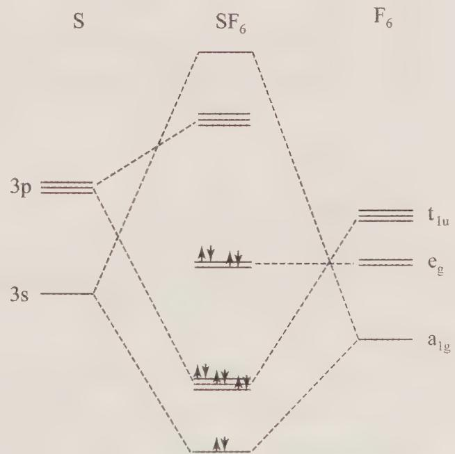  
图5.14 $\mathrm{SF}_6$ 分子轨道能级示意图（本图引自参考文献[19]）

(1) 成键电子对、非键电子对和反键电子对的数目各多少?

(2) S—F 键的键级数目是多少?

(3) 查原子共价半径值(表 5.9.1)计算 S—F 键长, 将它和实验值 156.1 pm 比较, 哪种成键方式更接近?

(4) 将它和 $sp^{3}d^{2}$ 杂化轨道理论比较, 说明它的优缺点。

5.15 说明 $\mathrm{N}_3^-$ 的几何构型和成键情况；用HMO法求离域 $\pi$ 键的波函数及离域能。

5.16 已知三次甲基甲烷 $\left[\mathrm{C}(\mathrm{CH}_2)_3\right]$ 为平面形分子，形成 $\pi_4^4$ 键。试用HMO法处理，证明中心碳原子和周围3个碳原子间的 $\pi$ 键键级之和为 $\sqrt{3}$ 。

5.17 烯丙基 $\mathrm{H}_2\mathrm{C} = \mathrm{CH}-\dot{\mathrm{CH}}_2$ 和丙烯基 $\mathrm{H}_3\mathrm{C}-\mathrm{CH}=\dot{\mathrm{CH}}$ 自由基中的各个C原子采用什么杂化轨道？形成什么π键？写出结构式，说明C原子骨架的构型；说明哪个自由基较稳定，为什么？

5.18 用前线轨道理论分析 CO 加 $H_{2}$ 反应,说明只有使用催化剂该反应才能顺利进行。

5.19 用前线轨道理论分析加热或光照条件下，环己烯和丁二烯一起进行加成反应的规律。

5.20 用前线轨道理论分析乙烯环加成变为环丁烷的反应条件及轨道叠加情况。

5.21 试用分子轨道对称守恒原理讨论己三烯衍生物电环合反应在光照和加热条件下产物的立体构型。

5.22 试分析下列分子中的成键情况，指出 C—Cl 键键长大小次序，并说明理由。

(1) $H_{3}CCl;$

(2). $H_{2}C=CHCl;$

(3) $\mathrm{HC} \equiv \mathrm{CCl}$ 。

5.23 试分析下列分子的成键情况，比较Cl的活泼性，并说明理由。

(1) $\mathrm{C_6H_5Cl}$ ;

(2) $\mathrm{C_6H_5CH_2Cl}$ ;

(3) $(\mathrm{C}_6\mathrm{H}_5)_2\mathrm{CHCl}$ ;

(4) $(\mathrm{C}_6\mathrm{H}_5)_3\mathrm{CCl}$

5.24 试比较 $\mathrm{CO}_{2}$ , CO 和丙酮中 C—O 键键长大小次序, 并说明理由。

5.25 苯胺的紫外可见光谱和苯差别很大,但其盐酸盐的光谱却和苯相近,解释这现象。

5.26 试分析下列分子中的成键情况，比较其碱性的强弱，并说明理由。

(1) $\mathrm{NH}_3$ ;

(2) $\mathrm{N}(\mathrm{CH}_3)_3$

(3) $\mathrm{C_6H_5NH_2}$ ;

(4) $\mathrm{CH}_3\mathrm{CONH}_2$ 。

5.27 下列化合物的 $\mathrm{pK_a}$ 列于相应结构式后的括号里，试从结构上解释它们的大小。

(1) $CF_{3}COOH(0.2)$ ;

(2) $p-C_{6}H_{4}(NO_{2})(COOH)(3.42)$ ;

(3) $CH_{3}COOH$ (4.74);

(4) $\mathrm{C_6H_5OH}(10.00)$ ;

(5) $\mathrm{C}_2\mathrm{H}_5\mathrm{OH}(15.9)$ 。

5.28 $\mathrm{C_2N_2}$ 分子中碳-碳键键长比乙烷中碳-碳键键长短约 $10\%$ ，试述其结构根源。

5.29 对下列分子和离子 $\mathrm{CO}_{2}, \mathrm{NO}_{2}^{+}, \mathrm{NO}_{2}, \mathrm{NO}_{2}^{-}, \mathrm{SO}_{2}, \mathrm{ClO}_{2}, \mathrm{O}_{3}$ 等，判断它们的形状，指出中

性分子的极性,以及每个分子和离子的不成对电子数。

5.30 指出 $NO_{2}^{+}, NO_{2}, NO_{2}^{-}$ 中 N—O 键的相对长度，并说明理由。

5.31 $\mathrm{B}_5\mathrm{H}_5^{2-}$ 离子中B原子排成三方双锥形多面体，试计算它的 $styx$ 数码，并画出它的结构式。

5.32 计算封闭式 $\mathrm{B}_4\mathrm{H}_4^{2-}$ 离子的 $styx$ 数码，用硼烷结构所遵循的规则，说明它不可能稳定存在的理由。

5.33 已知 $\mathrm{Cl}_2$ 分子的键能为 $242\mathrm{kJmol}^{-1}$ ，而 $\mathrm{Cl}$ 原子和 $\mathrm{Cl}_2$ 分子的第一电离能分别为 1250 和 $1085\mathrm{kJmol}^{-1}$ ，试计算 $\mathrm{Cl}_2^+$ 的键能，并讨论 $\mathrm{Cl}_2^+$ 和 $\mathrm{Cl}_2$ 哪一个键能大，说明理由。

5.34 苯 $\left(\mathrm{C}_{6}\mathrm{H}_{6}\right)$ 、环己烯 $\left(\mathrm{C}_{6}\mathrm{H}_{10}\right)$ 、环己烷 $\left(\mathrm{C}_{6}\mathrm{H}_{12}\right)$ 和 $H_{2}$ 的燃烧热分别为3301.6,3786.6,3953.0和285.8kJmol $^{-1}$ ，试求算苯的离域能。

5.35 $\mathrm{H}_2\mathrm{O}_2(\mathrm{g})$ 的生成热 $\Delta H_{\mathrm{f}} = -133\mathrm{kJmol}^{-1}$ ，O—H 键键能为 $463\mathrm{kJmol}^{-1}$ ，而 $\mathrm{H}_2$ 和 $\mathrm{O}_2$ 的解离能分别为 436 和 $495\mathrm{kJmol}^{-1}$ ，试求 O—O 键的键能。为什么不用 $\mathrm{O}_2$ 分子的解离能作为 O—O 键键能？

5.36 为什么存在 $\mathrm{OH}_3^+$ 和 $\mathrm{NH}_4^+$ ，而不存在 $\mathrm{CH}_5^+$ ？为什么存在 $\mathrm{SF}_6$ ，而不存在 $\mathrm{OF}_6$ ？

5.37 $\mathrm{C}_{70}$ 为一椭球形分子, 它有 12 个五元环的面, 25 个六元环的面, 试计算它的棱数 (E) 和键数 (b)。平均而言, 每个棱的键数是多少? 若按价键结构表达, C—C 单键和 C=C 双键的数目各多少? 碳原子间的键长处在什么范围?

5.38 图 5.38 示出氙的氟化物和氧化物的分子(或离子)结构。

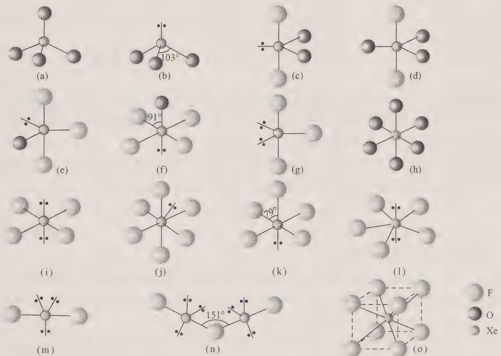  
图 5.38 氙的氧化物和氟化物的分子结构  
(a) $\mathrm{XeO_4}$ , (b) $\mathrm{XeO_3}$ , (c) $\mathrm{XeO_2F_2}$ , (d) $\mathrm{XeO_3F_2}$ , (e) $\mathrm{XeOF_3^+}$ , (f) $\mathrm{XeOF_4}$ , (g) $\mathrm{XeF_3^+}$ ,

(h) $XeO_{6}^{4-}$ , (i) $XeF_{4}$ , (j) $XeF_{6}$ , (k) $XeF_{5}^{+}$ , (l) $XeF_{5}^{-}$ , (m) $XeF_{2}$ , (n) $Xe_{2}F_{3}^{+}$ , (o) $XeF_{8}^{2-}$

(1) 根据图形及 VSEPR 理论, 指出分子的几何构型名称和所属点群;

(2) Xe 原子所用的杂化轨道；

(3) Xe 原子的表观氧化态；

（4）已知在 $\mathrm{XeF_2\cdot XeF_4}$ 加合物晶体中，两种分子的构型与单独存在时的几何构型相同，不会相互化合成 $\mathrm{XeF_3}$ ，从中说明什么问题？

5.39 在本书 5.9.3 小节中, 根据硅-氧键的特性, 认为天然矿物质中不可能含有 Si=O 键的偏硅酸化合物。怎样理解书刊和产品说明中出现的“偏硅酸钙”“含偏硅酸矿泉水”等内容?

## 参考文献

[1] 邓景发, 范康年. 物理化学. 北京: 高等教育出版社, 1993.

[2] 徐光宪, 王祥云. 物质结构. 第二版. 北京: 科学出版社, 2010.

[3] 麦松威, 周公度, 李伟基. 高等无机结构化学. 第 2 版 (第 4 次印刷). 北京: 北京大学出版社, 2014.

[4] 周公度. 碳的结构化学的新进展. 大学化学, 1992, 7(4): 29\~36.

[5] 周公度. 键价和分子几何学. 大学化学, 1996, 11(1): 9\~18.

[6] 周公度. 碳和硅结构化学的比较. 大学化学, 2005, 20(4): 1\~7; 20(5): 1\~7; 今日化学 (2006). 北京: 高等教育出版社, 2006, 324\~337.

[7] Huheey J E, Keiter E A, Keiler R L. Inorganic Chemistry: Principles of Structure and Reactivity. 4 $^{th}$ ed. New York: Harper Collins, 1993.

[8] Gil V M S. Orbitals in Chemistry: A Modern Guide for Students. Cambridge: Cambridge University Press, 2000.

[9] Gillespie R J, Popelier P L A. Chemical Bonding and Molecular Geometry: From Lewis to Electron Densities. Oxford: Oxford University Press, 2001.

[10] Greenwoods N N and Earnshaw A. Chemistry of Elements. 2 $^{nd}$ ed. Oxford: Butterworth-Heinemann, 1997.

[11] Gillespie R J. The VSEPR model revisited. Chem Soc Revs, 1992, 21: 59\~69.

[12] Gillespie R J, Robinson E A. Electron domains and the VSEPR model of molecular geometry. Angew Chem Int Ed Engl, 1996, 35: 495\~514.

[13] Berry R S, Rice S A, Ross J. Physical Chemistry. 2 $^{nd}$ ed. New York: Oxford University Press, 2000.

[14] Allen F H, Kennard O, Watson D G, et al. Tables of bond lengths determined by X-ray and neutron diffraction (Part 1). Bond lengths in organic compounds. J Chem Soc, Perkin Trans, 1987, II S1\~S19.

[15] Orpen A G, Brammer L, Allen F H, et al. Tables of bond lengths determined by X-ray and neutron diffraction (Part 2). Bond lengths in inorganic and coordination compounds. J Chem Soc, Dalton Trans, 1989, S1\~S89.

[16] Krygowski T M, Gyranski M K. Structural aspects of aromaticity. Chem Rev, 2001, 101: 1385\~1419.

[17] King R B. Three-dimensional aromaticity in polyhedral boranes and related molecules. Chem Rev, 2001, 101: 1119\~1152.

[18] Luo Yu-Ran(罗渝然). Bond Dissociation Energies. //Lide D R (editor in chief). CRC Handbook of Chemistry and Physics. 90 $^{th}$ ed. 2009\~2010. CRC Press, 2009.

[19] Atkins P W, Overton T L, Rourke J P, Weller M T, Armstrong F A. Inorganic Chemistry. 5 $^{th}$ ed. Oxford University Press, 2010.

# 第6章 配位化合物的结构和性质

## 6.1 概述

配位化合物简称配合物，又称络合物，是一类含有中心金属原子或离子(M)和若干配位体(L)的化合物 $(\mathrm{ML}_n)$ 。中心原子M通常是过渡金属元素的原子，具有空的价轨道；而配位体L则有一对或一对以上孤对电子。M和L之间通过配位键结合，成为带电的配位离子，配位离子与荷异性电荷的离子结合，形成配位化合物。有时中心原子和配位体直接结合成不带电的中性配位化合物分子。

一个配位化合物分子中只含一个中心原子的叫单核配位化合物，含两个或两个以上中心原子的叫多核配位化合物。在含两个以上金属原子的多核配位化合物中，M和M靠金属-金属键结合在一起的叫作金属原子簇化合物。

配位化合物是金属离子最普遍的一种存在形式,例如水溶液中金属离子一般是和水或其他离子配位的。金属离子和不同的配位体结合后,性质不相同,可用以进行溶解、沉淀和萃取,以达到合成制备、分离提纯、分析化验等目的。配位化合物中有许多化学工业上用的重要催化剂,在化工生产中起极为重要的作用。研究配位化合物的结构和性质,对于科研和生产、对于化学的各个分支都是十分重要的。

## 6.1.1 配位体

每个配位体至少有一个原子具有一对或一对以上的孤对电子,或分子中有 $\pi$ 电子,它们能和金属离子发生配位作用。这种原子处在周期表的 p 区,其中最重要的是 N 和 O,其次是 C,P,S,Cl,F 等。根据配位体所能提供的配位点(或称络合点)数目和结构特征,可将配位体分成下列几类。

## 1. 单齿配位体

只有一个配位点的配位体叫单齿配位体，如 $\mathrm{NH}_3$ 。通常单齿配位体与金属离子生成单核配位离子后，金属离子被掩蔽在配位体之中，它的性质会起变化。这种配位离子比单个金属离子半径大，使正、负离子之间静电引力下降，溶解度增大，不易沉淀。例如 AgCl 能溶于氨水，生成银氨配位离子。

## 2. 非螯合多齿配位体

配位体有多个配位点,但由于配位体本身几何形状的限制,同一配位体的几个配位点不能直接与同一个金属离子配位,如 $PO_{4}^{3-}, CO_{3}^{2-}$ 等。一般情况下,每个配位体要和一个以上金属离子配位;而每个金属离子为了满足配位要求,又要与若干个这样的配位体配位。这样形成的多核配位化合物,往往是不溶性的沉淀,所以非螯合多齿配位体在化学中常用作沉淀剂。

## 3. 螯合配位体

一个配位体中的几个配位点能直接和同一个金属离子配位，称为螯合配位体。

图 6.1.1 示出在 $\left[\mathrm{Co}(\mathrm{EDTA})\right]^{-}$ 配位离子中,一个 EDTA 螯合配位体和 $Co^{3+}$ 螯合的情况。

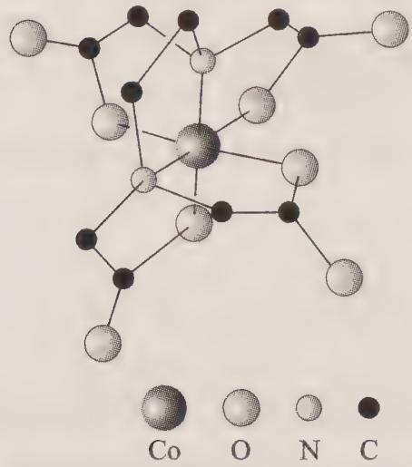  
图6.1.1 $[\mathrm{Co}(\mathrm{EDTA})]^{-}$ 螯合离子的结构

不带电的单核螯合分子,一般在水中的溶解度很小,但能溶于有机溶剂,因此这种配位体在水溶液中是一种沉淀剂,在有机溶液中能起萃取络合剂的作用。如乙酰丙酮铝 $\mathrm{Al(acac)}_{3}$ ,它是中性分子,熔点 $192^{\circ}C$ ,几乎不溶于水,却极易溶解在许多有机溶剂中。带电的单核螯合离子一般很难从水溶液中沉淀出来。这种配位体可作为掩蔽剂,如酒石酸盐、EDTA 等都是这类掩蔽剂。

## 4. $\pi$ 键配位体

含有 $\pi$ 电子的烯烃、炔烃、芳香烃等不饱和烃分子也可作为配位体，这类配位体有露在分子骨架外部的成键的 $\pi$ 电子和空的反键轨道，它们可以和过渡金属结合成配位化合物。随着石

油化工的发展,这类配位化合物的结构和性能在理论上和实际生产中都引起人们极大的兴趣。例如,烯烃是石油化工中需求量最大的一类原料,常用过渡金属化合物作催化剂进行氧化、加成、聚合等反应,以制取石油化工产品。乙烯、丁二烯、一氧化碳、苯、环戊二烯基 $\left(\mathrm{C}_{5}\mathrm{H}_{5}\right)$ 等都是 $\pi$ 键配位体。

在由多个金属原子组成分子骨干的配位化合物中，一个配位体同时和 $n$ 个金属原子M配位结合时，常在配位体前加 $\mu_{n}^{-}$ 记号，例如 $\mathrm{Fe}_3(\mathrm{CO})_{10}(\mu_2 - \mathrm{CO})_2$ ，表示有2个CO分别同时和2个Fe原子结合成桥式结构，而其余10个CO都分别只和1个Fe原子结合。若一个配位体有 $n$ 个配位点与同一金属原子结合，则在配位体前标上 $\eta^n$ -记号，例如 $(\eta^5 -\mathrm{C}_5\mathrm{H}_5)_2\mathrm{Fe}$ ，表示每个 $\mathrm{C_5H_5}$ 都有5个配位点和同一个Fe原子结合。在不同配位情况下由配位体提供给分子骨干的电子数列于表6.1.1中。

表 6.1.1 配位体提供给分子骨干的电子数目(骨干原子按不带净电荷计算)

<table><tr><td>配位体</td><td>配位形式a</td><td>电子数目</td><td>配位体</td><td>配位形式a</td><td>电子数目</td></tr><tr><td>H</td><td> $\mu_1, \mu_2, \mu_3$ </td><td>1</td><td> $NR_3, PR_3$ </td><td> $\mu_1$ </td><td>2</td></tr><tr><td>B</td><td>int</td><td>3</td><td>NCR</td><td> $\mu_1$ </td><td>2</td></tr><tr><td>CO</td><td> $\mu_1, \mu_2, \mu_3$ </td><td>2</td><td>NO</td><td> $\mu_1, \mu_2, \mu_3$ </td><td>3</td></tr><tr><td>CR</td><td> $\mu_3, \mu_4$ </td><td>3</td><td>OR,SR</td><td> $\mu_1$ </td><td>1</td></tr><tr><td> $CR_2$ </td><td> $\mu_1, \mu_2$ </td><td>2</td><td>OR,SR</td><td> $\mu_2$ </td><td>3</td></tr><tr><td> $CR_3, SiR_3$ </td><td> $\mu_1, \mu_2$ </td><td>1</td><td>O,S,Se,Te</td><td> $\mu_2$ </td><td>2</td></tr><tr><td> $η^2-C_2R_2$ </td><td> $\mu_1$ </td><td>2</td><td>O,S,Se,Te</td><td> $\mu_3$ </td><td>4</td></tr><tr><td> $η^2-C_2R_4$ </td><td> $\mu_1$ </td><td>2</td><td>O,S</td><td>int</td><td>6</td></tr><tr><td> $η^5-C_5R_5$ </td><td> $\mu_1$ </td><td>5</td><td>F, Cl, Br, I</td><td> $\mu_1$ </td><td>1</td></tr><tr><td> $η^6-C_6R_6$ </td><td> $\mu_1$ </td><td>6</td><td>F, Cl, Br, I</td><td> $\mu_2$ </td><td>3</td></tr><tr><td>C,Si</td><td>int</td><td>4</td><td>Cl, Br, I</td><td> $\mu_3, \mu_4$ </td><td>5</td></tr><tr><td>N,P,As,Sb</td><td>int</td><td>5</td><td>PR</td><td> $\mu_3, \mu_4$ </td><td>4</td></tr></table>

$^{a}$ $\mu_{1}=$ 端接配位体， $\mu_{2}=$ 桥连 2 个原子配位体， $\mu_{3}=$ 桥连 3 个原子配位体，int=填隙原子。

表 6.1.1 中所列的配位体提供的电子数目, 是按不带电荷的金属原子计算的。实际上, 许多配位体和金属是以离子形式存在的。例如在 $\left[CoCl_{6}\right]^{3-}$ , $\mathrm{Ni(CN)}_{4}^{2-}$ 和 $(\eta^{5}-\mathrm{C}_{5}\mathrm{H}_{5})_{2}\mathrm{Fe}$ 中,金属离子的价态为 $Co^{3+}, Ni^{2+}, Fe^{2+}$ ，配位体离子为 $Cl^{-}, CN^{-}, C_{5}H_{5}^{-}$ 。这时每个 $Cl^{-}$ 向 $Co^{3+}$ 提供 2 个电子，每个 $CN^{-}$ 向 $Ni^{2+}$ 提供 2 个电子，每个 $C_{5}H_{5}^{-}$ 向 $Fe^{2+}$ 提供 6 个电子。

在计算中心金属离子的配位数时，对于 $\pi$ 键配位体不是按配位点数目计算，而是按 $\pi$ 配位体提供的电子对数目计算。例如， $\eta^2 - \mathrm{C}_2\mathrm{R}_4$ 有2个C原子同时和M成键，它提供1对 $\pi$ 电子，配位数为 $1; \eta^5 - \mathrm{C}_5\mathrm{H}_5^-$ 有5个C原子同时和M成键，它提供3对 $\pi$ 电子，配位数为3，在 $(\mathrm{C}_5\mathrm{H}_5)_2\mathrm{Fe}$ 中，Fe的配位数为 $6; \eta^6 - \mathrm{C}_6\mathrm{H}_6$ 有6个C原子同时和M成键，它提供了3对 $\pi$ 电子，配位数为3，所以 $(\eta^6 - \mathrm{C}_6\mathrm{H}_6)_2\mathrm{Cr}$ 中，Cr的配位数为6。

## 6.1.2 配位化合物结构理论的发展

在阐明配位化合物结构的理论中,较重要的有价键理论、晶体场理论、分子轨道理论和配位场理论等,本节概述这些理论的基本内容。

## 1. 价键理论

配位化合物的价键理论是根据配位化合物的性质，按杂化轨道理论，用共价配键和电价配键解释配位化合物中金属离子和配位体间的作用。例如， $\mathrm{Fe(CN)}_{6}^{4-}$ ， $\mathrm{Co(NH_3)}_{6}^{3+}$ ， $\mathrm{Co(CN)}_{6}^{4-}$ ， $\mathrm{Ni(CN)}_{4}^{2-}$ 等呈现反磁性或弱顺磁性，是由于中心离子有未充满的 d 轨道和 s，p 空轨道，这些空轨道通过杂化组成杂化轨道，由配位体提供孤对电子，形成 L→M 的 $\sigma$ 配键； $\mathrm{FeF}_6^{3-}$ ， $\mathrm{CoF}_6^{3-}$ 等的磁性表明，中心离子的未成对电子数和自由离子一样，认为金属离子和配位体以静电吸引力结合在一起。上述配位离子的电子结构列于表 6.1.2 中。

表 6.1.2 配位离子的电子组态和几何构型

<table><tr><td>配位离子</td><td>3d 4s 4p 5s</td><td>杂化轨道</td><td>几何构型</td></tr><tr><td> $Fe(CN)_{6}^{4-}$ </td><td>↑↓ ↑↓ ↑↓ _ _ _ _ _ _ _ _ _</td><td> $d^{2}sp^{3}$ </td><td>八面体</td></tr><tr><td> $Co(NH_{3})_{6}^{3+}$ </td><td>↑↓ ↑↓ ↑↓ _ _ _ _ _ _ _ _ _</td><td> $d^{2}sp^{3}$ </td><td>八面体</td></tr><tr><td> $Co(CN)_{6}^{4-}$ </td><td>↑↓ ↑↓ ↑↓ _ _ _ _ _ _ _ _ ↑</td><td> $d^{2}sp^{3}$ </td><td>八面体</td></tr><tr><td> $Ni(CN)_{4}^{2-}$ </td><td>↑↓ ↑↓ ↑↓ ↑↓ _ _ _ _ _ _ _ _</td><td> $dsp^{2}$ </td><td>平面四方形</td></tr><tr><td> $FeF_{6}^{3-}$ </td><td>↑ ↑ ↑ ↑ ↑ ↑ _ _ _ _ _ _ _</td><td>—</td><td>八面体</td></tr><tr><td> $Ni(NH_{3})_{6}^{2+}$ </td><td>↑↓ ↑↓ ↑↓ ↑ ↑ _ _ _ _ _ _ _</td><td>—</td><td>八面体</td></tr></table>

价键理论能简明地解释配位化合物的几何构型和磁性等性质；可以解释 $\mathrm{Co(CN)}_{6}^{4-}$ 存在高能态电子，非常容易被氧化，是很强的还原剂，能把水中的 $\mathrm{H}^{+}$ 还原为 $\mathrm{H}_{2}$ 。价键理论是个定性理论，没有涉及反键轨道，也不涉及激发态，不能满意地解释配位化合物的光谱数据，有些配位化合物的磁性、几何构型和稳定性也不能满意地得到说明。

## 2. 晶体场理论

晶体场理论是静电作用模型，把中心离子(M)和配位体(L)的相互作用看作类似于离子晶体中正负离子的静电作用。当L接近M时，M的d轨道受到L负电荷的静电微扰作用，使原来能级简并的d轨道发生分裂。按微扰理论可计算分裂能的大小，因计算繁琐，定性地将配位体看作按一定对称性排布的点电荷与M的d轨道电子云产生排斥作用。由于d轨道分布的特点，在晶体场中原来5个能级简并的d轨道能级发生分裂，引起电子排布及其他一系列性质的变化，据此可解释配位化合物的许多性质。例如八面体配位离子中，6个配位体沿 $x, y, z$ 方向接近金属离子，L的负电荷对 $\mathrm{d}_{x^2 - y^2}$ 和 $\mathrm{d}_{z^2}$ 轨道的电子排斥作用大，使这两轨道能级上升较多；而夹在两坐标轴之间的 $\mathrm{d}_{xy}, \mathrm{d}_{xz}, \mathrm{d}_{yz}$ 受到推斥较小，能级上升较少。这样，d轨道分裂成两组：低能级的3个d轨道 $\mathrm{d}_{xy}, \mathrm{d}_{xz}, \mathrm{d}_{yz}$ 通常用 $\mathfrak{t}_{2\mathrm{g}}$ 表示；高能级的2个d轨道 $\mathrm{d}_{x^2 - y^2}, \mathrm{d}_{z^2}$ 通常用 $\mathrm{e_g}$ 表示。这两组轨道能级间的差值，称为晶体场分裂能，用 $\Delta$ 。或 $\Delta$ 表示。d电子根据晶体场分裂能(△)和电子成对能(P)的相对大小填在这两组轨道上，形成强场低自旋或弱场高自旋结构，据此可解释配位化合物的结构、光谱、稳定性及磁性等一系列性质。

晶体场理论成功地解释了配位化合物的许多结构和性质,但它只按静电作用进行处理,相当于只考虑离子键作用,出发点过于简单,而且对于分裂能的大小变化次序难以解释。例如中性的 $NH_{3}$ 分子比带负电的卤素离子产生的分裂能大,而 CO 和 $CN^{-}$ 等引起的分裂能特别大,都无法用静电场解释。

## 3. 分子轨道理论

配位化合物的分子轨道理论是用分子轨道理论的观点和方法处理金属离子和配位体的成键作用。在描述配位化合物分子的状态时，是用M的价层电子波函数 $\psi_{\mathrm{M}}$ 与配位体L的分子轨道 $\psi_{\mathrm{L}}$ 组成的离域分子轨道 $\psi$

$$
\psi = c _ {\mathrm{M}} \psi_ {\mathrm{M}} + \sum c _ {\mathrm{L}} \psi_ {\mathrm{L}}
$$

式中 $\psi_{\mathrm{M}}$ 包括M中 $(n - 1)\mathrm{d},ns,np$ 等价层轨道， $\sum c_{\mathrm{L}}\psi_{\mathrm{L}}$ 可看作L的群轨道。为了有效地组成分子轨道，要满足对称性匹配、轨道最大重叠、能级高低相近等条件，对称性匹配在其中起关键作用。

## 4. 配位场理论

配位场理论是晶体场理论的发展,其实质是配位化合物的分子轨道理论。在处理中心金属原子在其周围配位体所产生的电场作用下,金属的原子轨道能级发生变化时,以分子轨道理论方法为主,根据配位体场的对称性进行简化,并吸收晶体场理论的成果,阐明配位化合物的结构和性质。它与纯粹的分子轨道理论有一定的差别,故称为配位场理论。

## 6.2 配位场理论

## 6.2.1 ML $_{6}$ 八面体配位化合物的分子轨道

大多数六配位化合物呈正八面体或变形八面体构型，如 $\mathrm{TiF}_{6}^{3-}$ ， $\mathrm{Fe(CN)}_{6}^{4-}$ ， $\mathrm{V(H_{2}O)}_{6}^{2+}$ ， $\mathrm{Co(NH_{3})}_{6}^{3-}$ ， $\mathrm{Ni(H_{2}O)}_{6}^{2+}$ 。在 $ML_{6}$ 正八面体配位化合物中，M 原子处在对称中心位置，呈 $O_{h}$ 点群对称性。

设中心原子 M 处在直角坐标系原点，6 个配位体位于坐标轴上。按 M 和 L 组成的分子轨道是 $\sigma$ 轨道还是 $\pi$ 轨道，将 M 的价轨道进行分组：

$$
\begin{array}{l l} \sigma : & s, p _ {x}, p _ {y}, p _ {z}, d _ {x ^ {2} - y ^ {2}}, d _ {z ^ {2}} \\ \pi : & d _ {x y}, d _ {y z}, d _ {x z} \end{array}
$$

配位体 L 按能与中心原子生成 $\sigma$ 键或 $\pi$ 键轨道分别组合成新的群轨道，使与 M 的原子轨道对称性匹配。设处在 x, y, z 3 个正向的 L 的 $\sigma$ 轨道分别为 $\sigma_{1}, \sigma_{2}, \sigma_{3}$ ，负向的为 $\sigma_{4}, \sigma_{5}, \sigma_{6}$ 。这些轨道组成和中心原子 $\sigma$ 轨道对称性匹配的群轨道，它们的情况列于表6.2.1中。中心原子的各个轨道以及和它对称性匹配的配位体群轨道的图形示于图6.2.1中。由于M的 $\mathrm{d}_{xy},\mathrm{d}_{yz},\mathrm{d}_{xz}$ 轨道的极大值方向正好和L的 $\sigma$ 轨道错开，基本上不受影响，是非键轨道。M的6个轨道和6个配位体轨道组合得到12个离域分子轨道，一半为成键轨道，一半为反键轨道。这些轨道能级定性地示意于图6.2.2中。

表 6.2.1 ${\mathrm{{ML}}}_{6}$ 八面体场的分子轨道

<table><tr><td> $\psi_{M}$ </td><td> $c_{L}\psi_{L}$ </td><td>表示</td></tr><tr><td>4s</td><td> $\pm\frac{1}{\sqrt{6}}(\sigma_{1}+\sigma_{2}+\sigma_{3}+\sigma_{4}+\sigma_{5}+\sigma_{6})$ </td><td> $a_{1g},a_{1g}^{*}$ </td></tr><tr><td> $3d_{x^2-y^2}$ </td><td> $\pm\frac{1}{2}(\sigma_{1}-\sigma_{2}+\sigma_{4}-\sigma_{5})$ </td><td rowspan="2"> $e_g,e_g^*$ </td></tr><tr><td> $3d_{z^2}$ </td><td> $\pm\frac{1}{2\sqrt{3}}(2\sigma_{3}+2\sigma_{6}-\sigma_{1}-\sigma_{2}-\sigma_{4}-\sigma_{5})$ </td></tr><tr><td> $4p_x$ </td><td> $\pm\frac{1}{\sqrt{2}}(\sigma_{1}-\sigma_{4})$ </td><td rowspan="3"> $t_{1u},t_{1u}^*$ </td></tr><tr><td> $4p_y$ </td><td> $\pm\frac{1}{\sqrt{2}}(\sigma_{2}-\sigma_{5})$ </td></tr><tr><td> $4p_z$ </td><td> $\pm\frac{1}{\sqrt{2}}(\sigma_{3}-\sigma_{6})$ </td></tr><tr><td> $3d_{xy}$ </td><td></td><td rowspan="3"> $t_{2g}$ </td></tr><tr><td> $3d_{xz}$ </td><td></td></tr><tr><td> $3d_{yz}$ </td><td></td></tr></table>

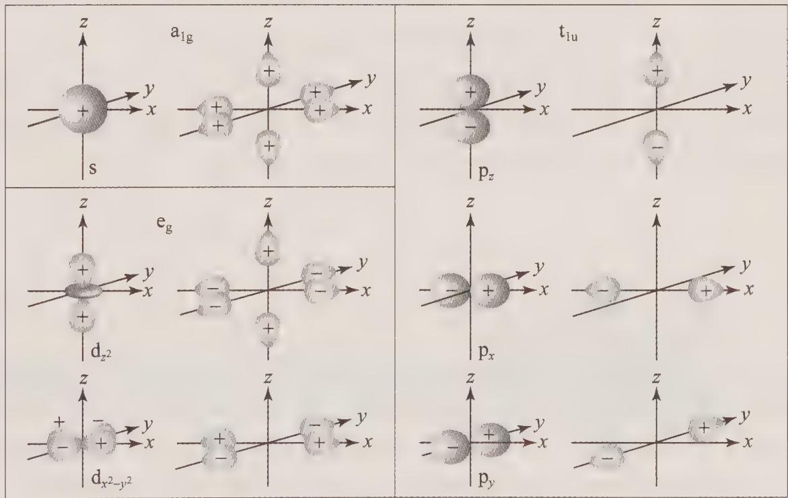  
图6.2.1 中心原子轨道及配位体的群轨道

因配位体 L 电负性较高而能级低，电子进入成键轨道，形成 $\sigma$ 配键。M 的电子安排在 $t_{2g}$ 和 $e_{g}^{*}$ 轨道上。这样，3 个 $t_{2g}$ 非键轨道与 2 个 $e_{g}^{*}$ 反键轨道所形成的 5 个轨道，用来安排中心金属离子的 d 电子。5 个轨道分成两组：3 个能级低的 $t_{2g}$ ，2 个能级高的 $e_{g}^{*}$ 。 $t_{2g}$ （或 $t_{2g}^{*}$ ）和 $e_{g}^{*}$ 间的能级间隔称为分裂能 $\Delta_{0}$ ，它和晶体场理论中 $t_{2g}$ 和 $e_{g}$ 间的 $\Delta_{0}$ 相当。

(b)  
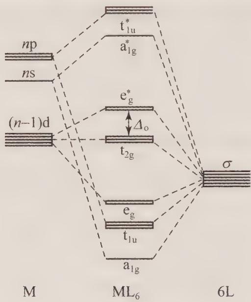  
图6.2.2 配位化合物分子轨道能级图

## 6.2.2 八面体场分裂能 $\Delta_{0}$

八面体场分裂能 $\Delta_{\circ}$ 的大小随不同的配位体和中心原子的性质而异。根据光谱数据可测得分裂能 $\Delta_{\circ}$ 的数值，并得到下面的经验规则：

(1) 对同一种金属原子(M), 配位体的场强不同, 分裂能大小不同。一般而言, 配位体对分裂能大小的影响次序为

$$
\mathrm{CO}, \mathrm{CN} ^ {-} > \mathrm{NO} _ {2} ^ {-} > \mathrm{en} > \mathrm{NH} _ {3} > \mathrm{Py} > \mathrm{H} _ {2} \mathrm{O} > \mathrm{F} ^ {-} > \mathrm{OH} ^ {-} > \mathrm{Cl} ^ {-} > \mathrm{Br} ^ {-}
$$

$\Delta_{0}$ 大者称为强场配位体， $\Delta_{0}$ 小者称为弱场配位体。为什么不带电荷的中性分子CO是强配位体，而带电荷的卤素离子是弱配位体呢？ $\pi$ 键的形成是影响分裂能大小的重要因素。 $\mathrm{d}_{xy}, \mathrm{d}_{yz}, \mathrm{d}_{xz}$ 等 $\mathrm{t}_{2\mathrm{g}}$ 轨道虽不能和配位体L形成 $\sigma$ 键，但条件合适时可形成 $\pi$ 键。

CO 和 $CN^{-}$ 等通过分子的 $\pi^{*}$ 群轨道与 M 的 $t_{2g}$ 轨道形成 $\pi$ 键，扩大了 $\Delta_{0}$ ，是强场配位体，如图 6.2.3 所示，其中：(a) 图表示轨道叠加（只示出一个方向，其他方向也相同），由有电子的轨道向空轨道（虚线）提供电子，形成配键；(b) 图表示能级变化。

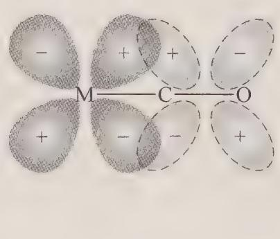  
(a)

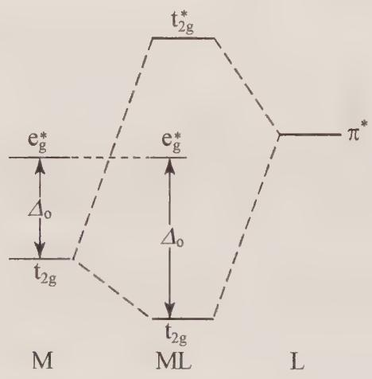  
图6.2.3 强场配位体扩大 $\Delta_0$

$\mathrm{Cl}^{-}, \mathrm{F}^{-}$ 等的 p 轨道和 M 的 d 轨道形成 $\pi$ 键, 缩小了 $\Delta_{0}$ , 是弱场配位体, 如图 6.2.4 所示, 其中: (a) 图表示轨道叠加, 由有电子的轨道向空轨道(虚线)提供电子, 形成配键; (b) 图表示能级变化。

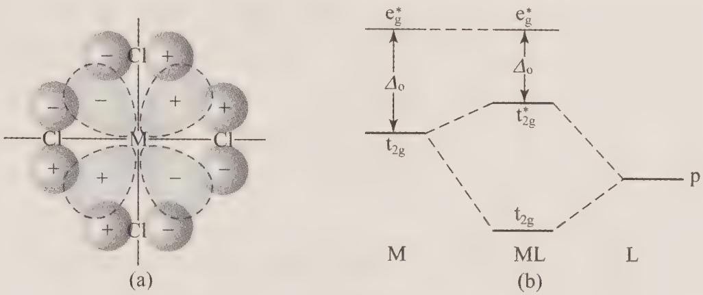  
图6.2.4 弱场配位体缩小 $\Delta_0$

若只看配位体 L 中直接配位的单个原子, $\Delta$ 。随原子序数增大而减少,次序为 C>N>O>F>S>Cl>Br>I。

(2) 对一定的配位体, $\Delta$ 。随 M 不同而异, 其大小次序为

$$
\begin{array}{r l} \mathrm{Pt} ^ {4 +} > \mathrm{Ir} ^ {3 +} > \mathrm{Pd} ^ {4 +} > \mathrm{Rh} ^ {3 +} > \mathrm{Mo} ^ {3 +} > \mathrm{Ru} ^ {3 +} > \mathrm{Co} ^ {3 +} > \mathrm{Cr} ^ {3 +} > \mathrm{Fe} ^ {3 +} > \mathrm{V} ^ {2 +} \\ & > \mathrm{Co} ^ {2 +} > \mathrm{Ni} ^ {2 +} > \mathrm{Mn} ^ {2 +} \end{array}
$$

其中中心离子的价态对 $\Delta_{\circ}$ 影响很大，价态高， $\Delta_{\circ}$ 大，例如 $\mathrm{Mn(H_2O)_6^{2+}}$ 的 $\Delta_{\circ}$ 为 $7800~\mathrm{cm}^{-1}$ ，而 $\mathrm{Mn(H_2O)_6^{3+}}$ 为 $21000~\mathrm{cm}^{-1}$ 。中心离子所处的周期数也影响 $\Delta_{\circ}$ 。第二、第三系列过渡金属离子的 $\Delta_{\circ}$ 均比同族第一系列过渡金属离子大。例如： $\mathrm{Co(NH_3)_6^{3+}}$ 为 $23000~\mathrm{cm}^{-1}$ ， $\mathrm{Rh(NH_3)_6^{3+}}$ 为 $34000~\mathrm{cm}^{-1}$ ， $\mathrm{Ir(NH_3)_6^{3+}}$ 为 $41000~\mathrm{cm}^{-1}$ 。

(3) $\Delta_{\circ}$ 可表达为配位体的贡献 $(f)$ 和中心离子的贡献 $(g)$ 的乘积，即 $\Delta_{\circ} = f \times g$ ，Jörgensen给出八面体场的 $f$ 和 $g$ （见表6.2.2）。

表 6.2.2 八面体场的 $f$ 和 $g$

<table><tr><td colspan="4">f</td><td colspan="4"> $g/(1000\ cm^{-1})$ </td></tr><tr><td>Br-</td><td>0.72</td><td> $C_2O_4^{2-}$ </td><td>0.99</td><td> $Mn^{2+}$ </td><td>8.0</td><td> $Ru^{2+}$ </td><td>20</td></tr><tr><td> $SCN^-$ </td><td>0.73</td><td> $H_2O$ </td><td>1.00</td><td> $Ni^{2+}$ </td><td>8.7</td><td> $Mn^{4+}$ </td><td>23</td></tr><tr><td> $Cl^-$ </td><td>0.78</td><td> $NCS^-$ </td><td>1.02</td><td> $Co^{2+}$ </td><td>9</td><td> $Mo^{3+}$ </td><td>24.6</td></tr><tr><td> $F^-$ </td><td>0.9</td><td>Py</td><td>1.23</td><td> $V^{2+}$ </td><td>12.0</td><td> $Rh^{3+}$ </td><td>27.0</td></tr><tr><td>尿素</td><td>0.92</td><td> $NH_3$ </td><td>1.25</td><td> $Fe^{3+}$ </td><td>14.0</td><td> $Tc^{4+}$ </td><td>30</td></tr><tr><td>HAc</td><td>0.94</td><td>en</td><td>1.28</td><td> $Cr^{3+}$ </td><td>17.4</td><td> $Ir^{3+}$ </td><td>32</td></tr><tr><td>乙醇</td><td>0.97</td><td> $CN^-$ </td><td>1.7</td><td> $Co^{3+}$ </td><td>18.2</td><td> $Pt^{4+}$ </td><td>36</td></tr></table>

## 6.2.3 配位场稳定化能与配位化合物的性质

根据八面体配位化合物分子轨道能级高低增填电子时，6个配位体的6对孤对电子填入6个成键轨道。中心离子的d电子填入 $\mathrm{t}_{2\mathrm{g}}$ 和 $\mathrm{e_g^*}$ 两组轨道。此时需要考虑电子成对能（ $P$ )和分裂能 $(\Delta_{0})$ 的相对大小。若为弱场配位体， $P > \Delta_{0}$ ，电子倾向于多占轨道，弱场形成高自旋型(HS)配合物；若为强场配位体， $P < \Delta_{0}$ ，形成低自旋型(LS)配合物。

若选取 $\mathrm{t}_{2\mathrm{g}}$ 和 $\mathrm{e_g^*}$ 能级的权重平均值作为能级的零点，即

$$
2 E \left(\mathrm{e} _ {\mathrm{g}} ^ {*}\right) + 3 E \left(\mathrm{t} _ {2 \mathrm{g}}\right) = 0
$$

而

$$
E \left(\mathrm{e} _ {\mathrm{g}} ^ {*}\right) - E \left(\mathrm{t} _ {2 \mathrm{g}}\right) = \Delta_ {\circ}
$$

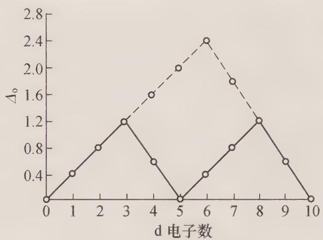  
图6.2.5 不同d电子组态的LFSE值

由此公式可得 $e_{g}^{*}$ 的能级为 $0.6\Delta_{o}$ ， $t_{2g}$ 的能级为 $-0.4\Delta_{o}$ 。这个能级零点也就作为中心离子 M 处在球形场中未分裂的 d 轨道的能级。配位化合物中 d 电子填入这些轨道后，若不考虑成对能，能级降低的总值称为配位场稳定化能(LFSE)。

表 6.2.3 示出强场和弱场时不同电子组态的 LFSE 的数值。相应的图形示于图 6.2.5 中。

成对能是指自旋相同分占两个轨道的两个电子和处在同一轨道上自旋相反的一对电子间的能量差。

表 6.2.3 不同 d 电子组态的 LFSE 的数值( $\Delta_{0}$ )

<table><tr><td rowspan="2">d 电子数目</td><td colspan="5">HS(弱场)</td><td colspan="5">LS(强场)</td></tr><tr><td colspan="3"> $t_{2g}$ </td><td> $e_g^*$ </td><td>LFSE</td><td colspan="3"> $t_{2g}$ </td><td> $e_g^*$ </td><td>LFSE</td></tr><tr><td>0</td><td>—</td><td>—</td><td>—</td><td>—</td><td>—</td><td>0</td><td>—</td><td>—</td><td>—</td><td>0</td></tr><tr><td>1</td><td>↑</td><td>—</td><td>—</td><td>—</td><td>—</td><td>0.4</td><td>↑</td><td>—</td><td>—</td><td>0.4</td></tr><tr><td>2</td><td>↑</td><td>↑</td><td>—</td><td>—</td><td>—</td><td>0.8</td><td>↑</td><td>↑</td><td>—</td><td>0.8</td></tr><tr><td>3</td><td>↑</td><td>↑</td><td>↑</td><td>—</td><td>—</td><td>1.2</td><td>↑</td><td>↑</td><td>↑</td><td>1.2</td></tr><tr><td>4</td><td>↑</td><td>↑</td><td>↑</td><td>↑</td><td>—</td><td>0.6</td><td>↓↑</td><td>↑</td><td>↑</td><td>1.6</td></tr><tr><td>5</td><td>↑</td><td>↑</td><td>↑</td><td>↑</td><td>↑</td><td>0</td><td>↓↑</td><td>↓↑</td><td>↑</td><td>2.0</td></tr><tr><td>6</td><td>↓↑</td><td>↑</td><td>↑</td><td>↑</td><td>↑</td><td>0.4</td><td>↓↑</td><td>↓↑</td><td>↓↑</td><td>2.4</td></tr><tr><td>7</td><td>↓↑</td><td>↓↑</td><td>↑</td><td>↑</td><td>↑</td><td>0.8</td><td>↓↑</td><td>↓↑</td><td>↓↑</td><td>1.8</td></tr><tr><td>8</td><td>↓↑</td><td>↓↑</td><td>↓↑</td><td>↑</td><td>↑</td><td>1.2</td><td>↓↑</td><td>↓↑</td><td>↓↑</td><td>1.2</td></tr><tr><td>9</td><td>↓↑</td><td>↓↑</td><td>↓↑</td><td>↓↑</td><td>↑</td><td>0.6</td><td>↓↑</td><td>↓↑</td><td>↓↑</td><td>0.6</td></tr><tr><td>10</td><td>↓↑</td><td>↓↑</td><td>↓↑</td><td>↓↑</td><td>↓↑</td><td>0</td><td>↓↑</td><td>↓↑</td><td>↓↑</td><td>0</td></tr></table>

由于弱场条件下不成对电子数不变,无成对能影响;而强场条件下只有 $d^{4}, d^{5}, d^{6}, d^{7}$ 有成对能影响,但此时 $\Delta_{0} > P$ 。因此,只考虑 $\Delta_{0}$ , 即可定性地解释有关规律,所以在表 6.2.3 中没有标出成对能。

LFSE 的大小不同,配位化合物的性质不同。下面列举几个方面的性质予以说明。

## 1. 离子水化热和 $\mathbf{MX}_2$ 的点阵能

第四周期二价金属离子由 $\mathrm{Ca^{2+}}$ 到 $\mathrm{Zn^{2+}}$ ，由于3d电子层受核吸引增大，离子水化热理应循序增加，但实际上由于受LFSE的影响，出现如图6.2.6所示的形状（它是按弱场情况变化的）。

第四周期金属元素的卤化物，从 $\mathrm{CaX}_2$ 到 $\mathrm{ZnX}_2(\mathrm{X} = \mathrm{Cl},\mathrm{Br},\mathrm{I})$ ，其点阵能随d电子数变化也有相似的双突起的情况。

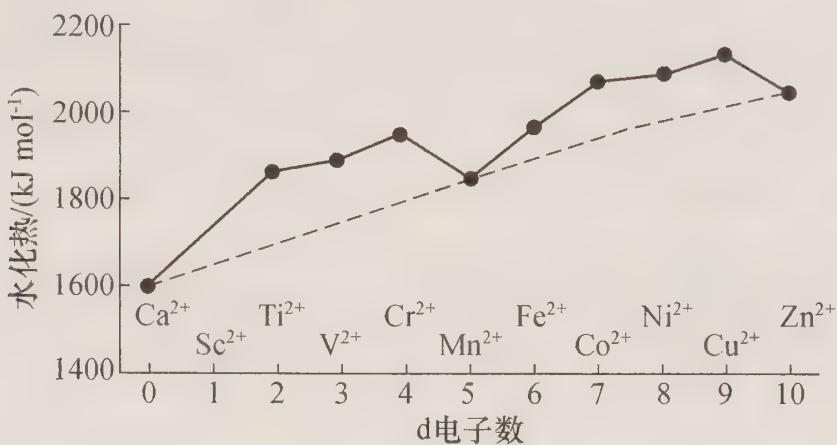  
图6.2.6 第四周期金属离子 $(\mathbf{M}^{2+})$ 的水化热

## 2. 离子半径

若将第四周期金属六配位的二价离子的离子半径对3d电子数作图，得到图6.2.7。由于随核电荷增加，d电子数目也增加，但d电子不能将增加的核电荷完全屏蔽，单从这个因素考虑，离子半径应单调下降，实际上由于LFSE的影响，HS型出现向下双峰，LS型出现向下单峰，这是LFSE的能量效应对微观结构的影响。对八面体配合物，HS态的半径（○）比LS态的半径（·）大。

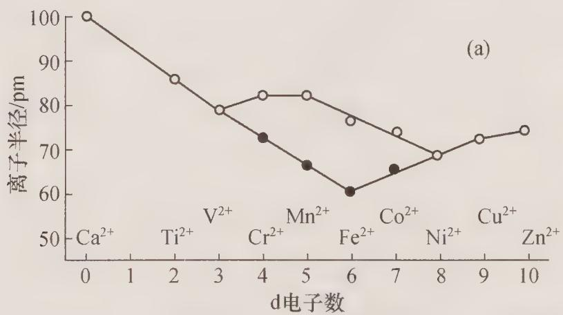

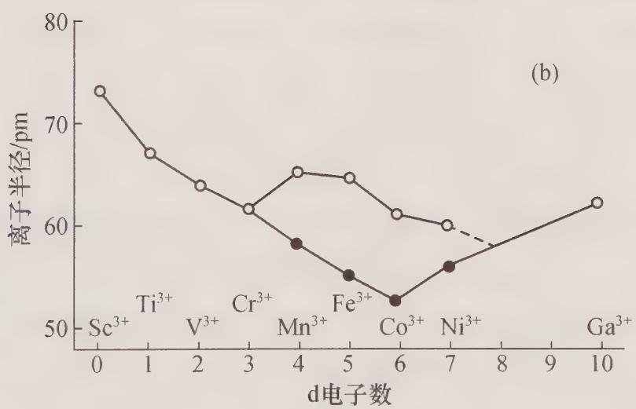  
图6.2.7 第四周期金属离子 $\mathbf{M}^{2+}$ (a)和 $\mathbf{M}^{3+}$ (b)的离子半径

由于自旋状态不同引起离子半径的差异，在生物化学中有重要意义。例如在血红蛋白中，血红素辅基的 $Fe^{2+}$ 能可逆载氧，载氧时 $Fe^{2+}$ 的状态为低自旋，半径较小，能嵌入卟啉环的平面内，呈六配位。而脱氧后 $Fe^{2+}$ 呈高自旋态，半径较大，不能嵌入卟啉环的平面中，高出平面 70～80 pm，Fe---N 距离 220 pm，为五配位，如图 6.2.8 经典解释所示。

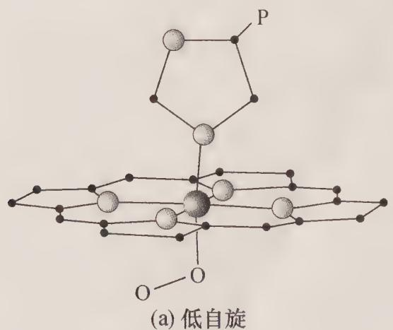

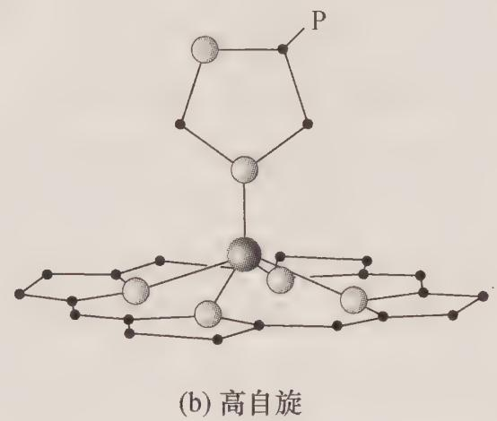  
图6.2.8 $\mathrm{Fe}^{2+}$ 在卟啉环中的位置  
(图中深色阴影球代表 Fe, 浅色阴影球代表 N, P 代表蛋白质中多肽链)

## 3. Jahn-Teller 效应

$t_{2g}$ 或 $e_{g}^{*}$ 中各个轨道上电子数不同时，就会出现简并态，例如 $(d_{x^{2}-y^{2}})^{2}(d_{z^{2}})^{1}$ 和 $(d_{x^{2}-y^{2}})^{1}(d_{z^{2}})^{2}$ 。按 Jahn-Teller(姜-特勒)理论，当遇到简并态时，配位化合物会发生变形，使一个轨道能级降低，消除简并态。 $Cu^{2+}$ 是发生 Jahn-Teller 变形的典型实例。例如 $CuL_{4}L_{2}'$ 配位离子中，不论 L 和 $L'$ 是否相等，一般均偏离正八面体构型，出现拉长或压扁的四方形配位，而以拉长的居多，即多数出现 4 个 Cu—L 短键和 2 个 $Cu—L'$ 长键。这时电子组态应为

$$
\left(\mathrm{d} _ {z ^ {2}}\right) ^ {2} \left(\mathrm{d} _ {x ^ {2} - y ^ {2}}\right) ^ {1}
$$

下表列出若干种化合物的 Cu—L 键长, 这种 Jahn-Teller 变形必将影响配位化合物的性质。  
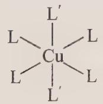

<table><tr><td>化合物</td><td>L</td><td>Cu—L 键长/pm</td><td> $L'$ </td><td> $Cu—L'$ 键长/pm</td></tr><tr><td> $CuF_2$ </td><td>4F</td><td>193</td><td>2F</td><td>227</td></tr><tr><td> $CuCl_2$ </td><td>4Cl</td><td>230</td><td>2Cl</td><td>295</td></tr><tr><td> $CuBr_2$ </td><td>4Br</td><td>240</td><td>2Br</td><td>318</td></tr><tr><td> $Cu(NH_3)_6^{2+}$ </td><td> $4NH_3$ </td><td>207</td><td> $2NH_3$ </td><td>262</td></tr><tr><td> $K_2CuF_4$ </td><td>4F</td><td>208</td><td>2F</td><td>195</td></tr></table>

乙二胺(en)和二价过渡金属离子的配合物在水溶液中的逐级稳定常数 $K_{1}, K_{2}, K_{3}$ 分别

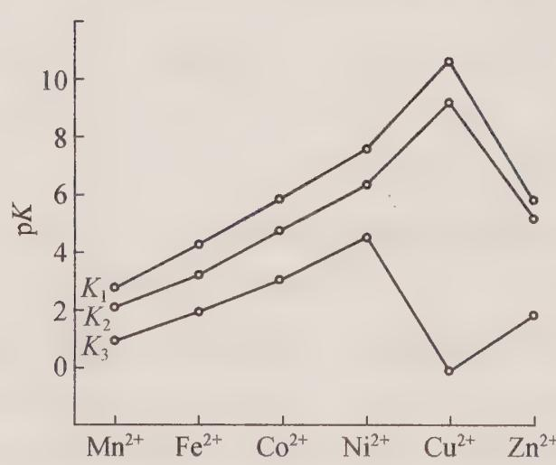  
图6.2.9 若干 $\mathbf{M}(\mathbf{en})_3^{2+}$ 的 $\mathbf{pK}$

代表 en 置换 $\left[\mathrm{M}\left(\mathrm{H}_{2}\mathrm{O}\right)_{6}\right]^{2+}$ 中的 2,4,6 个 $H_{2}O$ 分子，形成 1,2,3 个 en 与 M 螯合的离子，其 pK 如图 6.2.9 所示。

由图可见, $Cu^{2+}$ 具有反常的最高 $K_{1},K_{2}$ 值和最低的 $K_{3}$ 值,这是由于Jahn-Teller效应使 $\left[\mathrm{Cu}\left(\mathrm{en}\right)_{3}\right]^{2+}$ 明显地不稳定造成的。因为当1个或2个en和M结合时,可以形成键长较短的强M—N键;而当3个en和M结合时,则因Jahn-Teller效应,有2个长键处于对位位置,它不能由1个en配位,所以必定有2个en和M以弱M—N键结合。

## 6.2.4 配位化合物的热力学稳定性

配位化合物的稳定性常用稳定常数表示。由于在水溶液中金属离子和水结合在一起，形成水合离子，当配位体(L)加到水溶液中，配位体将置换 $\mathrm{H}_2\mathrm{O}$ ，其逐级平衡反应如下：

$$
\begin{array}{l}\mathrm {M(H_ {2} O) _ {n} + L\rightleftharpoons M(H_ {2} O) _ {n - 1} L+ H_ {2} O} \quad K _ {1} = \frac {[ \mathrm {M(H_ {2} O) _ {n - 1} L} ]}{[ \mathrm {M(H_ {2} O) _ {n}} ] [ \mathrm{L} ]}\\\mathrm {M(H_ {2} O) _ {n - 1} L+ L\rightleftharpoons M(H_ {2} O) _ {n - 2} L_ {2} + H_ {2} O} \quad K _ {2} = \frac {[ \mathrm {M(H_ {2} O) _ {n - 2} L_ {2}} ]}{[ \mathrm {M(H_ {2} O) _ {n - 1} L} ] [ \mathrm{L} ]}\\\dots \dots\\\mathrm {M(H_ {2} O)L_ {n - 1} + L\rightleftharpoons ML_ {n} + H_ {2} O} \quad K _ {n} = \frac {[ \mathrm{ML} _ {n} ]}{[ \mathrm {M(H_ {2} O)L_ {n - 1}} ] [ \mathrm{L} ]}\end{array}
$$

$K_{1}, K_{2}, \cdots, K_{n}$ 为逐级平衡常数。 $ML_{n}$ 的总的配位反应的平衡常数称为配位化合物 $ML_{n}$ 的稳定常数 K（有时用 $\beta$ 表示）。

$$
\mathrm{M} (\mathrm{H} _ {2} \mathrm{O}) _ {n} + n \mathrm{L} \rightleftharpoons \mathrm{ML} _ {n} + n \mathrm{H} _ {2} \mathrm{O} \quad K = \frac {[ \mathrm{ML} _ {n} ]}{[ \mathrm{M} (\mathrm{H} _ {2} \mathrm{O}) _ {n} ] [ \mathrm{L} ] ^ {n}} \quad K (\equiv \beta) = K _ {1} K _ {2} K _ {3} \dots K _ {n}
$$

例如 $\mathrm{Cu(H_2O)_4^{2 + }}$ 和配位体 $\mathrm{NH}_3$ 反应，其 $K_{1} = 1.66\times 10^{4},K_{2} = 3.16\times 10^{3},K_{3} = 8.31\times 10^{2}$ $K_{4} = 1.51\times 10^{2}$ 。根据这些数据，可得到 $\mathrm{Cu(NH_3)_4^{2 + }}$ 的稳定常数 $K = 6.58\times 10^{12}$ 。

$K$ 值的大小反映配位化合物的稳定性。根据反应标准自由焓变化和平衡常数的关系，可得

$$
\Delta G ^ {\ominus} = - 2. 3 0 3 R T \lg K
$$

在一定温度和压力条件下

$$
\begin{array}{c} \Delta G ^ {\ominus} = \Delta H ^ {\ominus} - T \Delta S ^ {\ominus} \\ \lg K = \frac {\Delta S ^ {\ominus}}{2 . 3 0 3 R} - \frac {\Delta H ^ {\ominus}}{2 . 3 0 3 R T} \end{array}
$$

配位化合物的稳定常数取决于配位反应的熵变和焓变两个因素。

金属离子在配位场影响下降低的能量是影响稳定常数的焓变因素, 当 L 的配位场比 $H_{2}O$ 强, 发生置换反应时放热多, 即配位场稳定化能比较大, 促使置换反应进行。配位反应时, 分子数目的增减是影响稳定常数的熵变因素。用螯合配位体置换 $H_{2}O$ 分子时, 置换反应将使分子数目增多, 是熵增加的效应, 也是促使置换反应进行的重要条件。

螯合效应是指由螯合配位体形成的配位化合物，一般要比相同配位数和相同配位原子的单齿配位体形成的配位化合物稳定的效应。螯合效应的实质是一种熵增效应。表6.2.4给出一些由过渡金属离子和 $\mathrm{NH}_3$ ，en及EDTA所形成配合物的稳定常数（实验值）。由表可见， $\mathrm{Co(NH_3)_6^{2 + }}$ 和 $\mathrm{Co(en)_3^{2 + }}$ 以及 $\mathrm{Ni(NH_3)_6^{2 + }}$ 和 $\mathrm{Ni(en)_3^{2 + }}$ 发生配位反应时，都是以N原子置换O原子，键强度的改变值差别不大，所以平衡常数的差别主要来自熵增效应。

表 6.2.4 若干配位化合物的稳定常数

<table><tr><td rowspan="4">lgK</td><td> $M^{2+}$ </td><td> $Mn^{2+}$ </td><td> $Fe^{2+}$ </td><td> $Co^{2+}$ </td><td> $Ni^{2+}$ </td><td> $Cu^{2+}$ </td><td> $Zn^{2+}$ </td></tr><tr><td> $M(NH_3)_6^{2+}$ </td><td>—</td><td>—</td><td>5.1</td><td>8.7</td><td>—</td><td>—</td></tr><tr><td> $M(en)_3^{2+}$ </td><td>5.7</td><td>9.5</td><td>13.8</td><td>18.6</td><td>18.7</td><td>12.1</td></tr><tr><td> $M(EDTA)^{2-}$ </td><td>13.8</td><td>14.3</td><td>16.3</td><td>18.6</td><td>18.7</td><td>16.1</td></tr></table>

EDTA 配合物的稳定常数大,在分析化学中,可用 EDTA 进行配位滴定分析。在医学上,当人体中有害金属离子过多时，可用EDTA进行螯合治疗，使配位体和有害金属离子螯合，排出体外。由于配位体对金属离子缺乏选择性，在排除有害离子的同时，也会螯合其他对人体必需的、有益的离子。例如用 $\mathrm{Na}_4$ (EDTA) 排除 $\mathrm{Pb}^{2+}$ 时，常会导致血钙水平降低；但如果改用 $\mathrm{Na}_2\mathrm{Ca}$ (EDTA)，既可顺利排铅，又可保持血钙不受影响。

## 6.2.5 其他多面体配位化合物的配位场

按照八面体场的处理方法对其他配位体场进行处理,所得能级分裂的相对大小数值列于表6.2.5中;5个d轨道能级的分裂情况示意于图6.2.10中,其中以正八面体场的分裂能为1,取球形场离子未分裂的d轨道的能级作为相对零点,轨道能级升高取正值,降低取负值。

表 6.2.5 各种对称性场中 d 轨道能级的分裂 ( $\Delta$ )

<table><tr><td>配位数</td><td>场对称性</td><td> $d_{x^2-y^2}$ </td><td> $d_{z^2}$ </td><td> $d_{xy}$ </td><td> $d_{yz}$ </td><td> $d_{xz}$ </td><td>注</td></tr><tr><td>2</td><td>直线形</td><td>-0.628</td><td>1.028</td><td>-0.628</td><td>0.114</td><td>0.114</td><td>键沿 z 轴</td></tr><tr><td>3</td><td>正三角形</td><td>0.545</td><td>-0.321</td><td>0.546</td><td>-0.386</td><td>-0.386</td><td>键在 xy 平面</td></tr><tr><td>4</td><td>正四面体形</td><td>-0.267</td><td>-0.267</td><td>0.178</td><td>0.178</td><td>0.178</td><td>—</td></tr><tr><td>4</td><td>平面正方形</td><td>1.228</td><td>-0.428</td><td>0.228</td><td>-0.514</td><td>-0.514</td><td>键在 xy 平面</td></tr><tr><td>6</td><td>正八面体形</td><td>0.600</td><td>0.600</td><td>-0.400</td><td>-0.400</td><td>-0.400</td><td>—</td></tr><tr><td>5</td><td>三角双锥形</td><td>-0.082</td><td>0.707</td><td>-0.082</td><td>-0.272</td><td>-0.272</td><td rowspan="3">锥底在xy 平面</td></tr><tr><td>5</td><td>四方锥形</td><td>0.914</td><td>0.086</td><td>-0.086</td><td>-0.457</td><td>-0.457</td></tr><tr><td>7</td><td>五角双锥形</td><td>0.282</td><td>0.493</td><td>0.282</td><td>-0.528</td><td>-0.528</td></tr></table>

四面体配位化合物[如 $\mathrm{VCl}_4$ ， $\mathrm{Ni(CO)_4}$ 等]的配位场能级分裂的情况是： $\mathrm{d}_{xy},\mathrm{d}_{xz},\mathrm{d}_{yz}$ 轨道比 $\mathrm{d}_{x^2 -y^2},\mathrm{d}_{z^2}$ 轨道的能级高，和八面体场是相反的，3个 $\sigma$ 型的是 $\mathfrak{t}_{2\mathrm{g}}^{*}$ 轨道，2个 $\pi$ 型的是 $\mathbf{e}_{\mathrm{g}}$ 轨道。这两组轨道间的能级差记为 $\Delta_{\mathrm{t}},\Delta_{\mathrm{t}}$ 比 $\Delta_{0}$ 小，给定了配位体和金属离子，并假定在四面体场和八面体场中金属-配位体的距离近于相等，理论上可以推得： $\Delta_{\mathrm{t}}\approx (4 / 9)\Delta_{0}$ ，即四面体配位场强度比八面体场弱很多。实验测定结果和理论推导基本一致，例如 $\mathrm{CoCl}_4^{2-}3300\mathrm{cm}^{-1}$

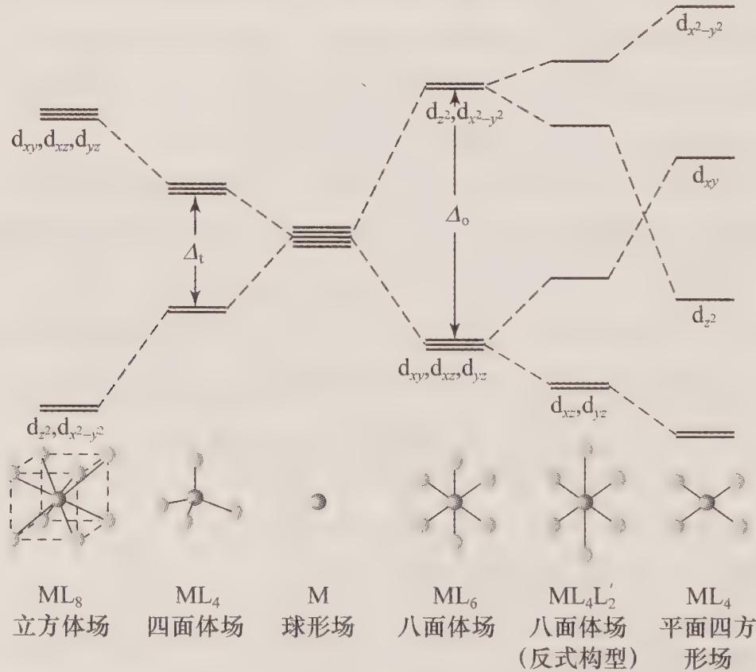  
图 6.2.10 各种配位场条件下,金属 d 轨道能级的分裂情况

(图中表示一个截面的波函数重叠情况,重叠后原来处在原子轨道上的电子主要分布在 M—C 原子之间,而分子两端电子较少)

$\mathrm{CoBr}_4^2 = 2900 \, \mathrm{cm}^{-1}, \mathrm{CoI}_4^{2-} = 2700 \, \mathrm{cm}^{-1}$ , 确实比相同金属和配位体的 $\Delta$ 。小很多。由于四面体配位场的分裂能很小, 几乎所有四面体过渡金属配位化合物都具有高自旋的基态电子组态。

四配位化合物的配位型式与 d 电子数多少有关。在弱场中， $d^{0}$ ， $d^{5}$ ， $d^{10}$ 离子采用四面体构型，相互间排斥力最小，如 $TiCl_{4}$ ， $FeCl_{4}^{-}$ ， $CuX_{4}^{3-}$ ， $ZnX_{4}^{2-}$ 等均采取四面体排列； $d^{1}$ 和 $d^{6}$ 一般仍采取四面体形，如 $VCl_{4}$ ， $FeCl_{4}^{2-}$ 。对于 $d^{8}$ 的四配位化合物，应为平面正方形，因为这种构型获得的 LFSE 较多，这时配位化合物中电子自旋成对，呈反磁性。第二和第三长周期过渡元素确是如此，如 $PdCl_{4}^{2-}$ ， $PtCl_{4}^{2-}$ ， $Au_{2}Cl_{6}$ ， $[Rh(CO)_{2}Cl]_{2}$ 等；而第一长周期过渡元素，因金属离子较小，碰到电负性高、体积大的配位体时，则需要考虑排斥的因素， $Ni(CN)_{4}^{2-}$ 为平面正方形， $NiX_{4}^{2-}(X=Cl^{-},Br^{-},I^{-})$ 为四面体形。

五配位化合物有三方双锥形和四方锥形两种构型。按杂化轨道理论，三方双锥用 $\mathrm{d}_z^2\mathrm{sp}^3$ 杂化轨道，四方锥用 $\mathrm{d}_{x^2 -y^2}\mathrm{sp}^3$ 杂化轨道。 $\mathrm{CdCl}_5^{3 - }$ 是三方双锥形的代表， $\mathrm{Ni(CN)}_{5}^{3 - }$ 则是四方锥结构的代表。而有的构型可看作是介于这两者之间。影响五配位的因素较多，LFSE是其中之一，它不是配位化合物采用三方双锥形或四方锥形的决定因素。

七配位化合物中最常见构型是五方双锥形，它可看作由 $\mathrm{d}^3\mathrm{sp}^3$ 杂化轨道组成，3个d轨道为 $\mathrm{d}_{xy},\mathrm{d}_{x^2 -y^2},\mathrm{d}_{z^2}$ 。 $\mathrm{ZrF_7^{3 - }}$ 和一些Mo的配位化合物采用这种构型。

## 6.3 $\sigma -\pi$ 配键与有关配位化合物的结构和性质

## 6.3.1 金属羰基配位化合物和小分子配位化合物

许多过渡金属能通过 $\sigma -\pi$ 配键与CO分子结合，生成羰基配位化合物，如 $\mathrm{Ni(CO)_4}$ $\mathrm{Cr(CO)_6,Fe(CO)_5,HMn(CO)_5}$ 等。

在金属羰基配位化合物中，CO以碳原子和金属原子相连，M—C—O在一直线上。CO分子一方面提供孤对电子给予中心金属原子的空轨道形成 $\sigma$ 配键，如图6.3.1(a)所示；另一方面又有空的反键 $\pi^{*}$ 轨道可以和金属原子的d轨道形成 $\pi$ 键，这种 $\pi$ 键由金属原子单方面提供电子，也称反馈 $\pi$ 键，如图6.3.1(b)所示。这两方面的键合称为 $\sigma -\pi$ 配键。两方面的电子授受作用正好互相配合，互相促进，其结果使M—C间的键比共价单键强，而C—O间的键比CO分子中的键弱（因为反键轨道上有了一定数量的电子）。图6.3.2示出 $\mathrm{Fe(CO)_5}$ 和 $\mathrm{HMn(CO)_5}$ 的结构。

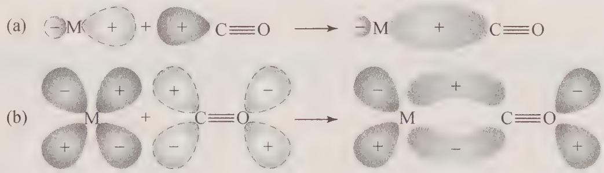  
图 6.3.1 M—C—O 中 $\sigma-\pi$ 配键示意图

许多羰基配位化合物都有一个特点:每个金属原子的价电子数和它周围配位体提供的价

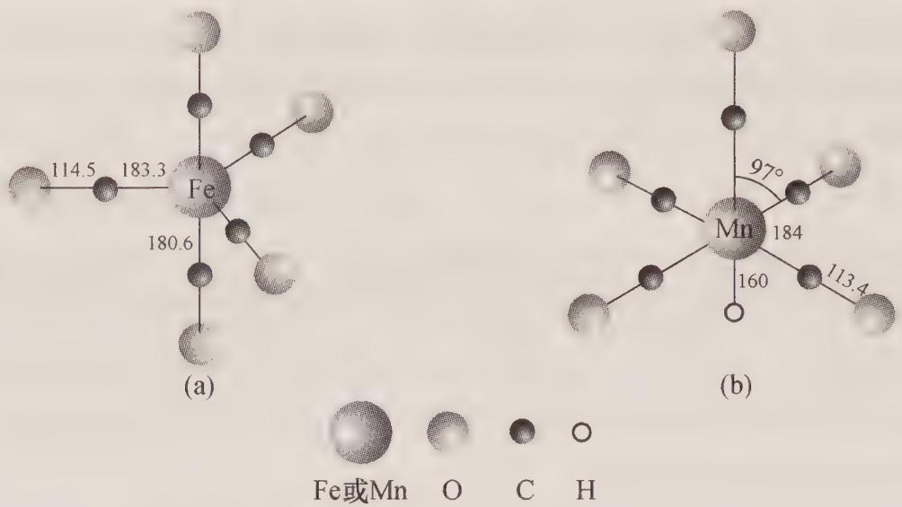  
图 6.3.2 Fe(CO) $_{5}$ 和 HMn(CO) $_{5}$ 的结构
(键长单位:pm)

电子数加在一起满足十八电子结构规则,呈反磁性。例如

<table><tr><td>M</td><td>Cr</td><td>Mn</td><td>Fe</td><td>Co</td><td>Ni</td></tr><tr><td>价电子数</td><td>6</td><td>7</td><td>8</td><td>9</td><td>10</td></tr><tr><td>需要电子数</td><td>12</td><td>11</td><td>10</td><td>9</td><td>8</td></tr><tr><td>形成的羰基配位化合物</td><td> $Cr(CO)_6$ </td><td> $Mn_2(CO)_{10}$ </td><td> $Fe(CO)_5$ </td><td> $Co_2(CO)_8$ </td><td> $Ni(CO)_4$ </td></tr></table>

$Mn_{2}(CO)_{10}$ 是典型的双核羰基化合物, 其中 Mn—Mn 直接成键。每个 Mn 与 5 个 CO 形成八面体构型中的 5 个配位, 第六个配位位置通过 Mn—Mn 键相互提供 1 个电子, 使每个 Mn 原子周围满足 18 个价电子。为了减少空间阻碍引起的排斥力, 羰基互相错开。 $Co_{2}(CO)_{8}$ 的情况和 $Mn_{2}(CO)_{10}$ 相似。

对过渡金属，CO作为配位体以C原子端和金属原子结合，形成形式多样的羰基化合物；但对稀土金属(RE)，则极难得到稀土羰基化合物，只有CO作为桥连配位体，C原子端连着过渡金属，O原子端连着稀土金属才可制得。对已测定结构的千余种稀土配合物的统计表明：约 $80\%$ 是以RE—O键结合，其次是RE—N键，含RE—C键的配位体主要是环芳烃 $\pi$ 配体。对此现象除以软硬酸碱理论归纳外，精确的结构因素尚待探讨。

$N_{2}, NO^{+}, CN^{-}$ 等和 CO 是等电子分子, 由于结构的相似性, 它们也可和过渡金属形成配位化合物。对于 $N_{2}$ 分子, 早已预料会像 M—CO 一样, 形成 M—N≡N 配位化合物, 但一直到 1965 年才获得第一个 $N_{2}$ 分子配位化合物 $\left[\mathrm{Ru}\left(\mathrm{NH}_{3}\right)_{5}\mathrm{N}_{2}\right]\mathrm{Cl}_{3}$ 。

NO 比 CO 多一个电子, 这个电子处在 $2\pi (\pi^{*})$ 轨道上。当 NO 和过渡金属配位时, 因为 $\pi^{*}$ 轨道参与反馈 $\pi$ 键的形成, 所以每个 NO 分子有 3 个电子参与成键。由 NO 分子与 CO 分子所形成的下列羰基化合物均符合十八电子结构规则, 如: V(CO) $_{5}$ NO, Mn(CO) $_{4}$ NO, Mn(CO)(NO) $_{3}$ , Fe(CO) $_{2}$ (NO) $_{2}$ , [Fe(NO)(CO) $_{3}$ ] $^{-}$ , Co(CO) $_{3}$ (NO), Co(NO) $_{3}$ 。除 CO, N $_{2}$ , NO 外, O $_{2}$ , H $_{2}$ , CO $_{2}$ , NO $_{2}$ , CH $_{4}$ , C $_{2}$ H $_{2}$ , C $_{2}$ H $_{4}$ 等小分子和过渡金属形成的配位化合物颇受人们的重视。例如, O $_{2}$ 的过渡金属配位化合物的研究工作, 既是生化、无机等化学分支感兴趣的基本课题, 也是化工和石油化工生产中催化氧化反应涉及的问题。

磷、砷、锑、铋的三价化合物，如 $\mathrm{PF}_3$ ， $\mathrm{PCl}_3$ ， $\mathrm{AsCl}_3$ ， $\mathrm{SbCl}_3$ ， $\mathrm{PR}_3$ 等，也可作为配位体形成 $\sigma -\pi$

6e

配键。P, As 等原子除有一孤对电子可以作为电子对的供给者与 M 形成 $\sigma$ 键外，还有空的外 d 轨道可和 M 形成反馈 $\pi$ 键，使配位化合物稳定存在，例如 $\mathrm{Pd}(\mathrm{PF}_{3})_{4}, \mathrm{HCo}(\mathrm{PF}_{3})_{4}, \mathrm{Ni}(\mathrm{PF}_{3})_{4}, (\mathrm{R}_{3}\mathrm{P})_{4}\mathrm{Mo}(\mathrm{CO})_{2}$ 等。

## 6.3.2 不饱和烃配位化合物

以不饱和烃为配位体，通过 $\sigma -\pi$ 配键与过渡金属形成的配位化合物，在石油化工中占有重

要地位。最早制得的此类配位化合物是 Zeise(蔡斯)盐: $K\left[\mathrm{PtCl}_{3}\left(\mathrm{C}_{2}\mathrm{H}_{4}\right)\right]\cdot\mathrm{H}_{2}\mathrm{O}$ (1825 年, W. C. Zeise 首先制得)。向 $K_{2}PtCl_{4}$ 的稀盐酸溶液中通入乙烯, 可将其沉淀出来。这种配位化合物中 $\left[\mathrm{PtCl}_{3}\left(\mathrm{C}_{2}\mathrm{H}_{4}\right)\right]^{-}$ 的结构示于图 6.3.3: $Pt^{2+}$ 按平面正方形和 4 个配位体配位, 其中 3 个是 $Cl^{-}$ , 1 个是 $C_{2}H_{4}$ ; $C_{2}H_{4}$ 的 C—C 键与 $PtCl_{3}^{-}$ 的平面接近垂直 (84°), 2 个碳原子和 $Pt^{2+}$ 保持等距离, 所以 $C_{2}H_{4}$ 按侧面方式和 $Pt^{2+}$ 配位。

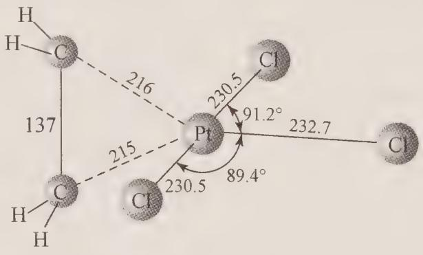  
图 6.3.3 $\left[\mathrm{PtCl}_{3}\left(\mathrm{C}_{2}\mathrm{H}_{4}\right)\right]^{-}$ 的结构
(图中键长单位:pm)

$\mathrm{C_2H_4}$ 和 $\mathrm{Pt^{2 + }}$ 间的键是 $\sigma -\pi$ 配键。 $\mathrm{C_2H_4}$ 的 $\pi$ 分子

轨道与 $\mathrm{Pt}^{2+}$ 的空的 $\mathrm{dsp}^2$ 轨道叠加成键，由 $\mathrm{C}_2\mathrm{H}_4$ 提供 $\pi$ 电子成 $\sigma$ 配键，如图6.3.4(a)所示；另一方面， $\mathrm{Pt}^{2+}$ 的充满电子的d轨道（如 $\mathrm{d}_{xz}$ ）和 $\mathrm{C}_2\mathrm{H}_4$ 的 $\pi^*$ 轨道叠加成键，由 $\mathrm{Pt}^{2+}$ 提供d电子成 $\pi$ 配键，如图6.3.4(b)所示。这样既可防止由于形成 $\sigma$ 配键使电荷过分集中到金属原子上，又促进成键作用。

6e  
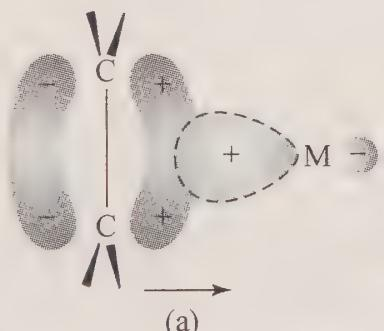  
(a)

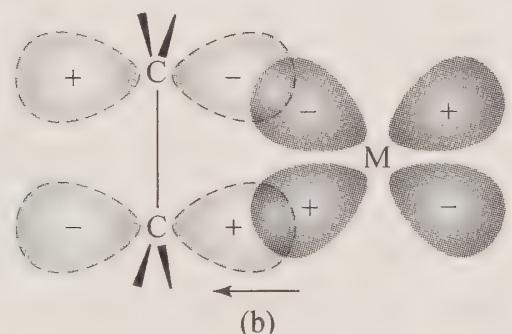  
(b)

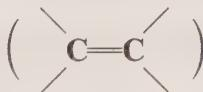  
图6.3.4 过渡金属(M)和烯烃 $\left( \begin{array}{c} \mathrm{C} = \mathrm{C} \\ \hline \end{array} \right)$ 间形成 $\sigma -\pi$ 配键的情况（箭头表示电子提供方向）

除乙烯外,其他的烯烃和炔烃也能和过渡金属形成配位化合物,其中的许多化合物已测出其结构,它们的性质也得到了不同程度的研究。

## 6.3.3 环多烯和过渡金属的配位化合物

许多环多烯具有离域 $\pi$ 键的结构，离域 $\pi$ 键可以作为一个整体和中心金属原子通过多中心 $\pi$ 键形成配位化合物。平面构型的对称环多烯有： $\left[\mathrm{C}_{3} \mathrm{Ph}_{3}\right]^{+}, \left[\mathrm{C}_{4} \mathrm{H}_{4}\right]^{2-}, \left[\mathrm{C}_{5} \mathrm{H}_{5}\right]^{-}, \mathrm{C}_{6} \mathrm{H}_{6}, \left[\mathrm{C}_{7} \mathrm{H}_{7}\right]^{+}, \left[\mathrm{C}_{8} \mathrm{H}_{8}\right]^{2-}$ 等，下图示意出它们的结构式和 $\pi$ 电子数。

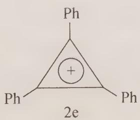

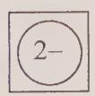

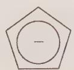  
6e

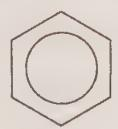

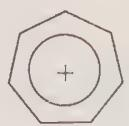

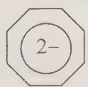  
10e

这些环多烯可以和过渡金属 M 形成形式多样的配位化合物，如 $\mathrm{TiCl}_{2}(\mathrm{C}_{5}\mathrm{H}_{5})_{2}, \mathrm{Cr}(\mathrm{C}_{6}\mathrm{H}_{6})_{2}, \mathrm{Fe}(\mathrm{C}_{5}\mathrm{H}_{5})_{2}, \mathrm{Mn}(\mathrm{C}_{5}\mathrm{H}_{5})(\mathrm{CO})_{3}, \mathrm{Ni}(\mathrm{C}_{5}\mathrm{H}_{5})[\mathrm{C}_{3}\mathrm{Ph}_{3}]$ ， $\mathrm{Mn}(\mathrm{C}_{6}\mathrm{H}_{6})(\mathrm{CO})_{3}^{+}, \mathrm{Cr}(\mathrm{C}_{6}\mathrm{H}_{6})(\mathrm{CO})_{3}$ ， $\mathrm{Fe}(\mathrm{C}_{4}\mathrm{H}_{4})(\mathrm{CO})_{3}$ 等等。这些配位化合物中，大多数符合十八电子规则。在结构中，多烯环的平面与键轴垂直，这里键轴不是指中心原子与环上原子的连线，而是中心原子和整个参与成键的环的中心的连线。图 6.3.5 示出若干环多烯与过渡金属配位化合物的结构。

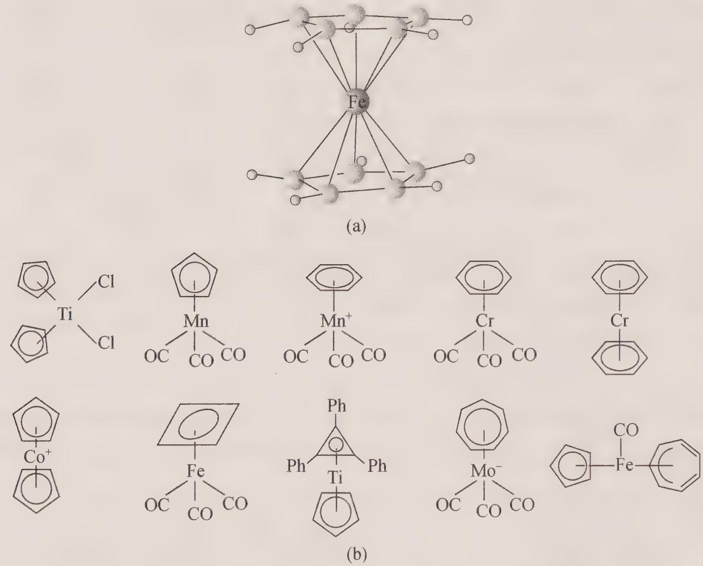  
图6.3.5 若干环多烯与过渡金属配位化合物的结构

关于 $(\mathrm{C}_5\mathrm{H}_5)_2\mathrm{Fe}$ 的结构，早年经X射线衍射测定建立了夹心式的构型，2个Cp环为交错型，属 $D_{5d}$ 点群。根据电子衍射测定气态 $(\mathrm{C}_5\mathrm{H}_5)_2\mathrm{Fe}$ 分子的结构，认为2个Cp环为覆盖型，属 $D_{5h}$ 点群。几年前用中子衍射和X射线衍射进一步研究其结构，得到在室温下2个Cp环既不是交错型，也不是覆盖型，但和覆盖型比较接近，分子点群为 $D_{5}$ ，如图6.3.5(a)所示。此外，从中子衍射测得H原子位置，发现C—H键朝向Fe原子，与过去向外倾斜正好相反。

## 6.4 金属-金属四重键和五重键

在过渡金属配位化合物中，金属原子之间可以形成单键、双键、三重键、四重键和五重键。

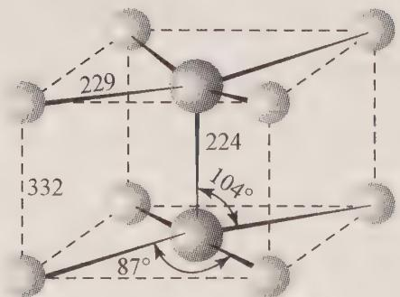  
图 6.4.1 $Re_{2}Cl_{8}^{2-}$ 的结构
(长度单位:pm)

四重键和五重键的形成必须有 d 轨道参加, 所以它只能在过渡金属原子之间形成。下面以 $\mathrm{K}_{2}\left(\mathrm{Re}_{2}\mathrm{Cl}_{8}\right)\cdot2\mathrm{H}_{2}\mathrm{O}$ 晶体中的 $Re_{2}Cl_{8}^{2-}$ 离子的结构为例, 介绍四重键的形成情况。

$Re_{2}Cl_{8}^{2-}$ 的结构示于图 6.4.1 中。由图可见，Re 原子之间虽然没有桥连配位体，但原子间距离 224 pm，比金属铼中原子距离 276 pm 短得多。不同 Re 原子上的 Cl 原子，上下对齐成四方柱形，Cl 原子间距离为 332 pm，短于 Cl 原子的范德华半径和。

$\mathrm{Mo}_{2}(\mathrm{O}_{2}\mathrm{CR})_{4}$ 和 $\mathrm{Re}_2(\mathrm{O}_2\mathrm{CR})_4\mathrm{Cl}_2$ 是等电子体系，也存在 $\mathrm{Mo}\equiv \mathrm{Mo}$ 四重键，可进行下列反应为什么 Cl 原子不因空间阻碍而互相错开,反而形成这种重叠式的构象呢?是什么作用力使 Re 和 Re 间距离这样短?这与 Re 原子之间形成多重键有关。

Re 原子的电子组态为 $[Xe]5d^{5}6s^{2}$ ，Re 除用 $dsp^{2}$ 杂化轨道（d 轨道用 $d_{x^{2}-y^{2}}$ ）和 Cl 形成 4 个键外，尚余 4 个 d 轨道 $(d_{xy}, d_{xz}, d_{yz}, d_{z^{2}})$ 和 4 个价电子。当 2 个 Re 原子沿 z 轴方向接近时，d 轨道按图 6.4.2 所示方式互相叠加而形成成键分子轨道。能级高低次序及电子填充情况也示于该图中。

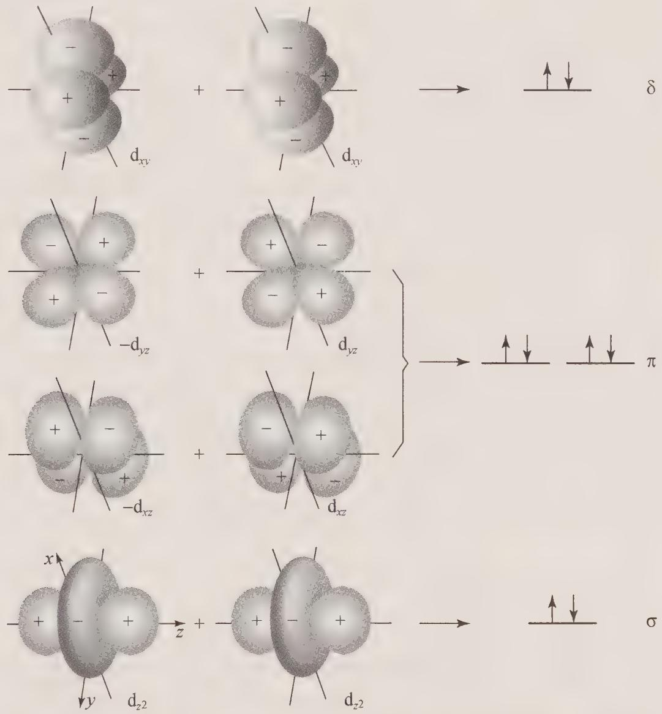  
图6.4.2 $\mathrm{Re}_2\mathrm{Cl}_8^{2 - }$ 中Re原子间d轨道互相叠加而形成四重键示意图

由图可见, 电子组态为 $\sigma^{2}\pi^{4}\delta^{2}$ , 键级为 4 , 即 Re 原子之间形成四重键。Re≡Re 四重键的形成不仅说明 $\mathrm{Re}_{2} \mathrm{Cl}_{8}^{2-}$ 的几何构型, 而且可从结构了解它的化学性质。四重键的存在说明 Re 原子间具有较强的结合力, 它能经受反应而稳定存在, 例如 $\mathrm{Re}_{2} \mathrm{Cl}_{8}^{2-}$ 和 RCOOH 进行反应时, 四重键依然存在。

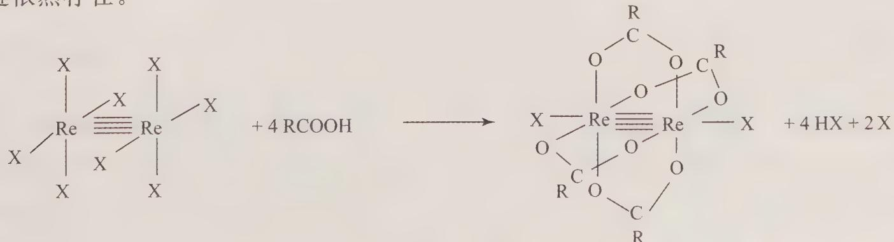

$$
\mathrm{Mo} _ {2} \left(\mathrm{O} _ {2} \mathrm{CR}\right) _ {4} + 4 \mathrm{HCl} + 4 \mathrm{Cl} ^ {-} \longrightarrow \left(\mathrm{Mo} _ {2} \mathrm{Cl} _ {8}\right) ^ {4 -} + 4 \mathrm{RCOOH}
$$

当成键电子数改变时,或者由于成键电子数减少,或者由于反键轨道填入电子,都会导致键级降低,表 6.4.1 中列出若干化合物中 M—M 化学键情况。

表 6.4.1 若干化合物中的 M—M 化学键

<table><tr><td>键级</td><td>电子组态</td><td>实例</td></tr><tr><td>4.0</td><td> $\sigma^{2} \pi^{4} \delta^{2}$ </td><td> $Cr_{2}(O_{2}CR)_{4}, Re_{2}Cl_{8}^{2-}$ </td></tr><tr><td>3.5</td><td> $\sigma^{2} \pi^{4} \delta^{2} \delta^{*1}$ </td><td> $Re_{2}Cl_{4}(PR_{3})_{4}^{+}$ </td></tr><tr><td>3.0</td><td> $\sigma^{2} \pi^{4} \delta^{2} \delta^{*2}$ </td><td> $Re_{2}Cl_{4}(PR_{3})_{4}$ </td></tr><tr><td>2.5</td><td> $\sigma^{2} \pi^{4} \delta^{2} \delta^{*2} \pi^{*1}$ </td><td> $Ru_{2}(O_{2}CR)_{4}Cl$ </td></tr><tr><td>1.0</td><td> $\sigma^{2} \pi^{4} \delta^{2} \delta^{*2} \pi^{*4}$ </td><td> $Rh_{2}(O_{2}CR)_{4}$ </td></tr></table>

多重键化合物有其特异的化学性能，图6.4.3示出含有M≡M四重键的化合物可能进行的化学反应类型，包括置换、加成、环化、氧化还原等（相关反应类型及解释见下表）。

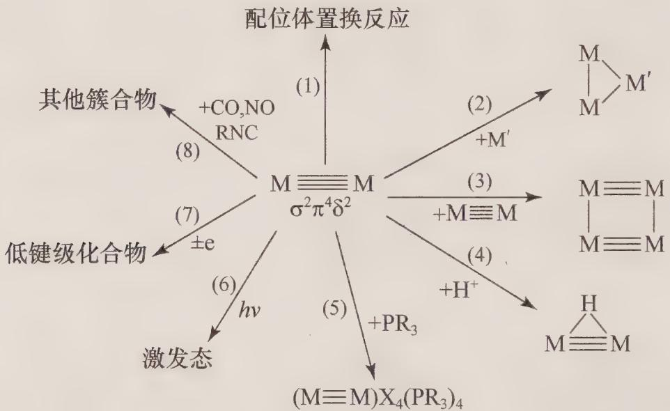

图6.4.3 含M≡M四重键化合物的化学反应性能

<table><tr><td>反应类型</td><td>解释</td></tr><tr><td>(1) 置换</td><td>可由大量配位体 L&#x27;置换 L,如前述用 RCOOH 置换 X 等</td></tr><tr><td>(2) 加成</td><td>由双核加成至三核原子簇化合物</td></tr><tr><td>(3) 环化</td><td>在一定条件下,环化成环</td></tr><tr><td>(4) 加成</td><td>以 H+进行加成,如形成 Mo≡Mo 和 W≡W 等</td></tr><tr><td>(5) 还原</td><td>以 PR3 作为还原剂,使成三重键的化合物</td></tr><tr><td>(6) 催化</td><td>将 δ 键上的电子激发至 δ*,促进催化反应</td></tr><tr><td>(7) 氧化还原</td><td>通过电化学氧化还原,使其键级降低</td></tr><tr><td>(8) 配位</td><td>与 π 配位体(如 CO,NO,RNC 等)进行化学反应,形成新的化合物</td></tr></table>

不久前报道了一种具有 $\mathrm{Cr} \equiv \mathrm{Cr}$ 五重键稳定化合物的制备、结构和性质的研究。该化合物是将 $\{\mathrm{Cr}(\mu-\mathrm{Cl})\mathrm{Ar}'\}_{2}$ 用石墨化钾 $(\mathrm{KC}_{8})$ 还原形成的一价铬 $\mathrm{Cr}^{\mathrm{I}}$ 与配位体 $\mathrm{Ar}'$ 构成的二核金属配合物 $\mathrm{Ar}'\mathrm{CrCrAr}'$ ，其中 $\mathrm{Ar}'$ 为 $\mathrm{C}_{6}\mathrm{H}_{3}-2,6-(\mathrm{C}_{6}\mathrm{H}_{3}-2,6^{-i}\mathrm{Pr}_{2})_{2},^{i}\mathrm{Pr}$ 为异丙基。这个二核金属配合物 $\mathrm{Ar}'\mathrm{CrCrAr}'$ 和甲苯 $(\mathrm{C}_{7}\mathrm{H}_{8})$ 一起结晶成暗红色的三斜晶系晶体，晶体组成为 $[\mathrm{Ar}'\mathrm{CrCrAr}'] \cdot 2\mathrm{C}_{7}\mathrm{H}_{8}$ 。该晶体在 $200^{\circ}\mathrm{C}$ 下稳定，但对空气和水汽非常敏感。通过低温(90K)

下的 X 射线衍射测得晶体结构, 晶体结构显示 $Ar^{\prime}CrCrAr^{\prime}$ 分子呈中心对称, 如图 6.4.4 所示。由图可见, 2 个 Cr 原子连接成键, Cr—Cr 键键长 183.51 pm, Cr—Cr—C 键角 102.78°, 它们被 2 个大的配位体包围。

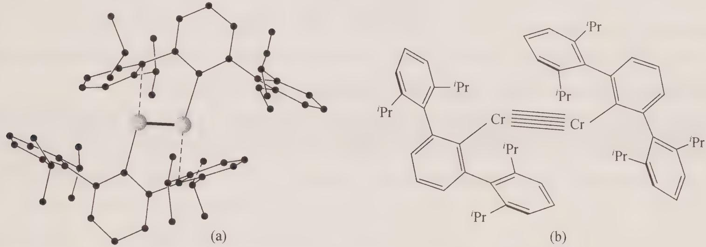  
图 6.4.4 Ar'CrCrAr' 分子的结构(a)和化学结构式(b)

根据该化合物的磁性、光谱等性质以及由分子结构数据作出的量子化学计算结果，可以推断2个Cr原子（其价电子组态为 $3\mathrm{d}^5 4\mathrm{s}^1$ ）的成键情况如下：每个Cr原子以 $3\mathrm{d}_z^2$ 和4s进行杂化，得 $\mathrm{s + d_z^2}$ 和 $\mathrm{s - d_z^2}$ 2个杂化轨道，和剩余的4个d轨道。Cr原子用 $\mathrm{s - d_z^2}$ 杂化轨道和本位(ipso position)C原子的 $\mathfrak{sp}^2$ 杂化轨道形成 $\mathrm{Cr - C}\sigma$ 键，其余的 $\mathrm{d}_{xy},\mathrm{d}_{xz},\mathrm{d}_{yz},\mathrm{d}_{x^2 -y^2}$ 和 $(\mathrm{s + d_z^2})$ 等5个轨道与相邻Cr原子的轨道相互叠加，形成5个成键轨道，每个成键轨道填充2个电子，构成五重键，如图6.4.5所示。在这种成键图像中，Cr—Cr—C的理想键角应为 $90^{\circ}$ ，与实际测定的数据相近。

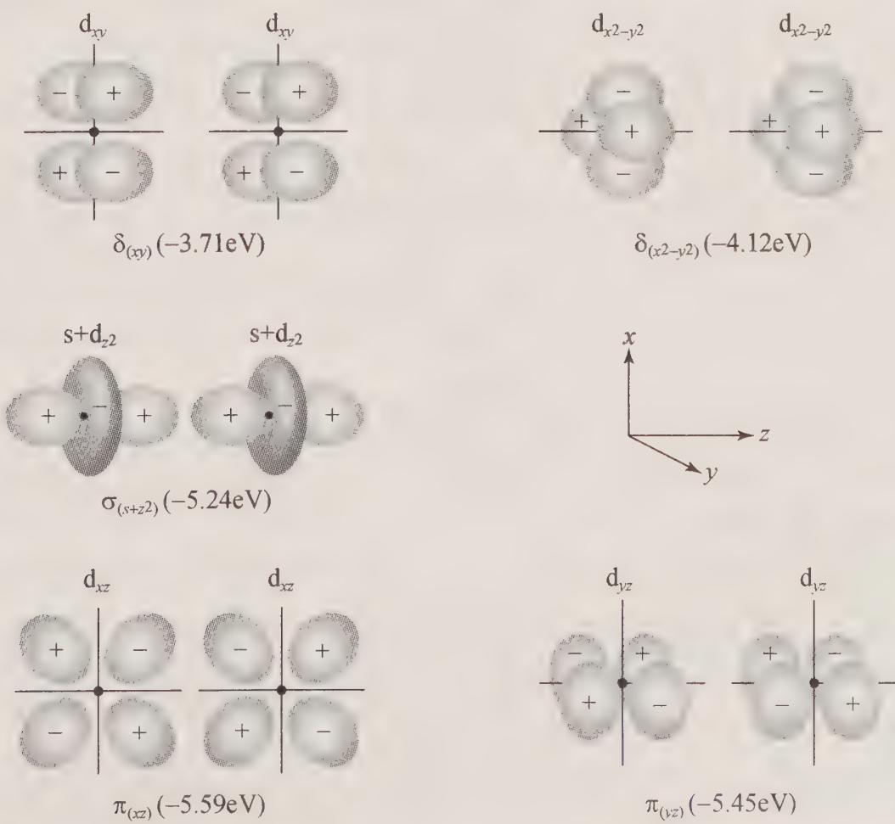  
图6.4.5 $\mathrm{Ar}^{\prime}\mathrm{CrCrAr}^{\prime}$ 中2个Cr原子间轨道叠加形成五重键示意图

## 6.5 过渡金属簇合物的结构

金属簇合物是金属原子簇化合物的简称,是指含有3个或3个以上金属原子,相互通过金属-金属键结合,形成多面体或缺顶多面体的核心骨干,周围连接配位体的配位化合物。金属-金属键不同于金属键:前者是以共价键的方式形成,后者是由一个金属晶粒中数目很多的原子轨道高度离域叠加形成的金属键。这里,数量的变化引起了质的改变。

## 6.5.1 十八电子规则和金属-金属键的键数

每个过渡金属原子(M)参加成键的价层原子轨道有9个(5个d轨道、1个s轨道和3个p

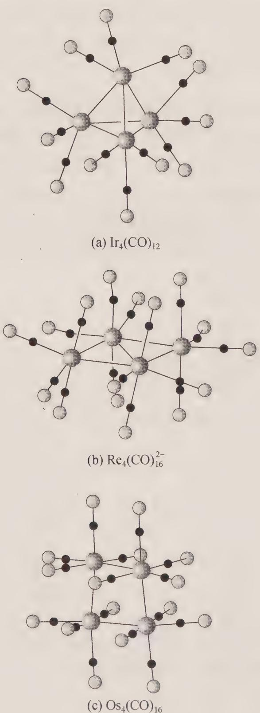  
图6.5.1 几种过渡金属羰基簇合物的结构

轨道), 在分子中每个过渡金属原子可以容纳 18 个价电子以形成稳定的结构, 此即十八电子规则。在含有 $n$ 个金属原子的原子簇化合物中, 除 M 本身的价电子和配位体提供的电子外, 金属原子间直接成键, 相互提供电子以满足十八电子规则。M 原子间成键的总数可以用键数 (b) 表示。可按和 (5.7.1) 式相似的方法计算 b

$$
b = \frac {1}{2} (1 8 n - g)\tag{6.5.1}
$$

式中 g 代表分子中与 $M_{n}$ 有关的价电子总数，它包含三部分电子：(i) 组成 $M_{n}$ 簇合物中 n 个 M 原子的价电子数；(ii) 配位体提供给 n 个 M 原子的电子数，式中每个配位体提供的电子数参见表 6.1.1；(iii) 若簇合物带有电荷，则包括所带电荷数。

许多过渡金属羰基簇合物符合十八电子规则，可用简单的电子计数方法来理解它们的几何构型以及M原子之间形成化学键的情况，下面举例说明。

$$
\begin{array}{r l} & 5. 1 ] \quad \mathrm{Ir} _ {4} (\mathrm{CO}) _ {1 2} \\ & g = 4 \times 9 + 1 2 \times 2 = 6 0 \\ & b = \frac {1}{2} (1 8 \times 4 - 6 0) = 6 \end{array}
$$

金属原子簇 $\left(\mathrm{Ir}_{4}\right)$ 的键数为6，形成6个M—M单键， $Ir_{4}$ 呈6条边的四面体形，如图6.5.1(a)。

【例6.5.2】 $\mathrm{Re}_4(\mathrm{CO})_{16}^{2-}$

$$
\begin{array}{c} {g = 4 \times 7 + 1 6 \times 2 + 2 = 6 2} \\ {b = \frac {1}{2} (1 8 \times 4 - 6 2) = 5} \end{array}
$$

$\mathrm{Re}_4$ 的键数为5，形成5个 $\mathrm{Re}-\mathrm{Re}$ 单键， $\mathrm{Re}_4$ 呈5条边的菱形，如图6.5.1(b)。

【例6.5.3】 $\mathrm{Os}_4(\mathrm{CO})_{16}$

$$
g = 4 \times 8 + 1 6 \times 2 = 6 4
$$

$$
b = \frac {1}{2} (1 8 \times 4 - 6 4) = 4
$$

$Os_{4}$ 键数为 4，呈 4 条边的四方形，如图 6.5.1(c)。

对比图6.5.1中的3个结构可见，键数 $(b)$ 不同，簇合物的金属骨干中原子的排布方式不同。对于多数羰基簇合物可以按这方法通过键数了解金属骨干的几何构型及其中的金属-金属键。下面再以若干六核簇合物为例说明。图6.5.2示出六核簇合物的键数 $(b)$ 与 $\mathbf{M}_n$ 多面体中棱边数目相同的结构。

$b = 12$  
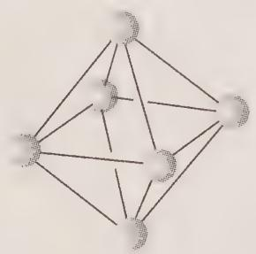  
(a) 八面体形

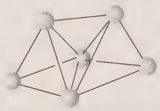

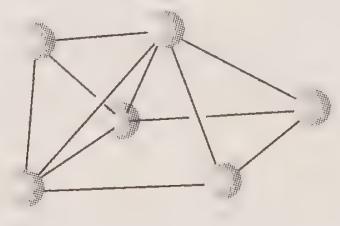

(b) 双加帽四面体形 $b = 12$  
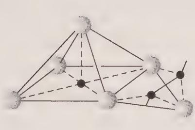  
(d) 加边四方锥形
b=10

(c) 加帽四方锥形 $b = 11$  
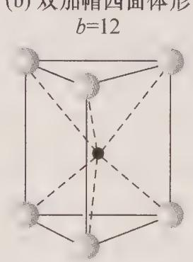  
(e) 三方棱柱体形
b=9

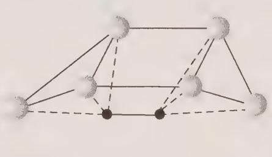  
(f) 双加边四边形 $b = 8$  
图6.5.2 若干六核簇合物的几何构型

$$
\left(\mathrm{a}\right) \left[ \mathrm{Mo} _ {6} \left(\mu_ {3} - \mathrm{Cl}\right) _ {8} \mathrm{Cl} _ {6} \right] ^ {2 -}, \quad (\mathrm{b}) \left[ \mathrm{Os} _ {6} (\mathrm{CO}) _ {1 8} \right], \quad (\mathrm{c}) \left[ \mathrm{Os} _ {6} (\mathrm{CO}) _ {1 8} \mathrm{H} _ {2} \right],
$$

$$
\left(\mathrm{d}\right) \left[ \mathrm{Os} _ {6} \mathrm{C} (\mathrm{CO}) _ {1 6} \left(\mathrm{H} _ {3} \mathrm{CC} _ {2} \mathrm{CH} _ {3}\right) \right], \quad \left(\mathrm{e}\right) \left[ \mathrm{Rh} _ {6} \mathrm{C} (\mathrm{CO}) _ {1 5} \right] ^ {2 -}, \quad \left(\mathrm{f}\right) \left[ \mathrm{Co} _ {6} \left(\mu_ {6} - \mathrm{C} _ {2}\right) \left(\mu_ {2} - \mathrm{CO}\right) _ {6} (\mathrm{CO}) _ {8} \left(\mu_ {4} - \mathrm{S}\right) \right]
$$

图 6.5.3 示出 3 种八面体簇合物，它们是由于键数不同， $M_{n}$ 中的化学键型式不同的实例。在这 3 种簇合物中，6 个金属原子形成八面体的分子骨干，但是由于成键条件不同，化学键的类型和键数也不相同。在 $\left[\mathrm{Mo}_{6}\left(\mu_{3}-\mathrm{Cl}\right)_{8}\mathrm{Cl}_{6}\right]^{2-}$ 中，8 个面由 $\mu_{3}-\mathrm{Cl}$ 和 3 个 Mo 形成多中心键，这时八面体的 12 条棱正好形成 Mo—Mo 2c-2e 共价键， $Mo_{6}$ 骨干的键数为 12。在 $\left[\mathrm{Nb}_{6}\left(\mu_{2}-\mathrm{Cl}\right)_{12}\mathrm{Cl}_{6}\right]^{4-}$ 中，12 条棱边由 $\mu_{2}-\mathrm{Cl}$ 和 2 个 Nb 形成桥键，在 8 个面上 3 个 Nb 形成 3c-2e 键。 $Nb_{6}$ 骨干中的键数为 16。在 $\mathrm{Rh}_{6}\left(\mu_{3}-\mathrm{CO}\right)_{4}\left(\mathrm{CO}\right)_{12}$ 中， $Rh_{6}$ 骨干的键数和 $B_{6}H_{6}^{2-}$ 中的键数一致（见 5.7 节），但它有较多价电子，可以形成较多的 2c-2e 键，所以它形成 1 个 3c-2e RhRhRh 键和 9 个 2c-2e Rh—Rh键，键数为 11。图 6.5.3(c) 示出它的一种共振杂化体结构。

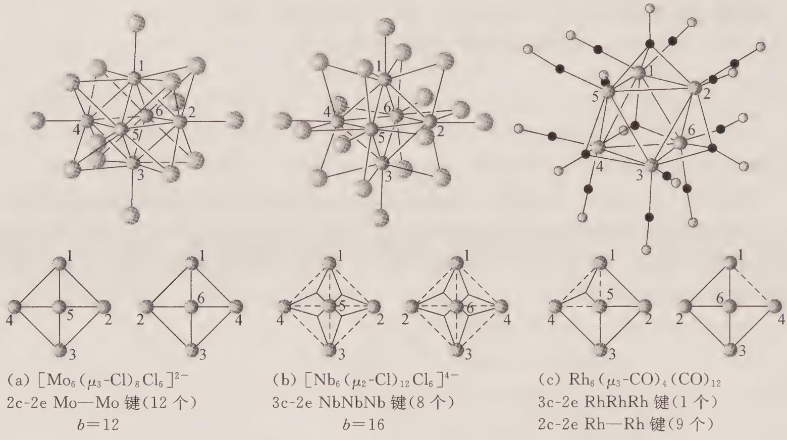  
图6.5.3 3种八面体簇合物的结构和键

## 6.5.2 等瓣相似、等同键数和等同结构

等瓣相似(isolobalanalogy)是指2个或2个以上的分子片,它们的前线轨道的数目、能级分布、形状、对称性和所含电子数等均相似。当分子片等瓣相似时,它们形成化合物的情况可

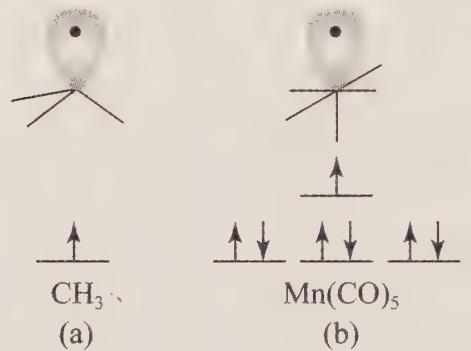  
图6.5.4 $\mathrm{CH}_3$ 和 $\mathrm{Mn(CO)_5}$ 的前线轨道

用相似的分子轨道等瓣相似连接模型进行分析。这里指的分子片，既可以是有机分子片，如 $\mathrm{CH}_3$ ， $\mathrm{CH}_2$ ，CH等；也可以是含金属原子的分子片，如 $\mathrm{Mn(CO)}_5$ ，Fe（CO）4， $\mathrm{Co(CO)}_3$ 等。

将 $\mathrm{CH}_4$ 除去1个H原子，得分子片 $\mathrm{CH}_3$ ，它的前线轨道示于图6.5.4(a)；将 $\mathrm{Mn(CO)_6}$ 除去1个CO配位体，得分子片 $\mathrm{Mn(CO)_5}$ ，它的前线轨道示于图6.5.4(b)。 $\mathrm{Mn(CO)_5}$ 中电子的排布可看作：5个CO的孤对电子进入Mn的 $\mathrm{dsp}^3$ 杂化轨道成键，Mn剩余4个d轨道，3个为非键轨道，容纳6个

电子，1个为反键轨道，容纳1个电子。

$CH_{3}$ 和 $\mathrm{Mn(CO)_{5}}$ 分子片的成键方式如下：

$$
\begin{array}{l} \mathrm {H_ {3} C + CH_ {3} (\text {   } \bullet \bullet \text {   }) \longrightarrow H_ {3} C - CH_ {3}} \\ \mathrm {Mn(CO) _ {5} +CH_ {3} (\text {   } \bullet \bullet \text {   }) \longrightarrow (CO) _ {5} Mn - CH_ {3}} \\ \mathrm {Mn(CO) _ {5} +Mn(CO) _ {5} (\text {   } \bullet \bullet \text {   }) \longrightarrow (CO) _ {5} Mn - Mn(CO) _ {5}} \end{array}
$$

分子片中轨道的这种相似，Hoffmann等用“ $\left(\overrightarrow{O}\right)$ ”符号表示。根据等瓣相似规则，可得

$$
\mathrm{Mn} (\mathrm{CO}) _ {5} \xleftarrow {\text {O}} \mathrm{CH} _ {3}
$$

$CH_{2}$ 和 $\mathrm{Fe(CO)}_{4}$ 也是等瓣相似的分子片

26
11

$$
\mathrm{Fe} (\mathrm{CO}) _ {4} \xleftarrow {\text { O }} \mathrm{CH} _ {2}
$$

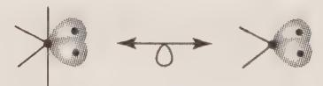

由 $CH_{2}$ 和 $\mathrm{Fe(CO)_{4}}$ ，可以结合成下列化合物

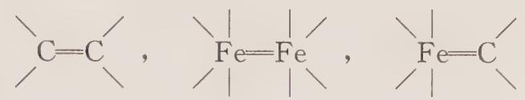

将它们推广,可得

$$
\begin{array}{r l} \mathrm{Fe(CO)} _ {4} & \xleftarrow {\text {O}} \mathrm{Re(CO)} _ {4} ^ {-} \xleftarrow {\text {O}} \mathrm{Os(CO)} _ {4} \xleftarrow {\text {O}} \mathrm{Ru(CO)} _ {4} \xleftarrow {\text {O}} \mathrm{CR} _ {2} \\ & \xleftarrow {\text {O}} \mathrm{SnR} _ {2} \xleftarrow {\text {O}} \dots \end{array}
$$

由这些等瓣相似的分子片结合,可得下列形式多样的化合物,在无机化合物和有机化合物间架起桥梁。

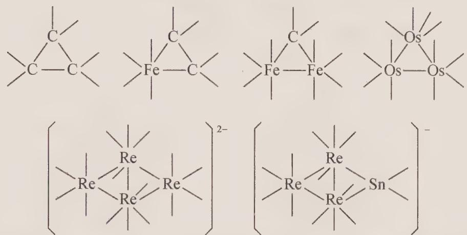

根据簇合物分子骨干中键数的计算,也可从另一个侧面,即从分子骨干的几何构型了解主族元素簇合物和过渡金属簇合物的结构的内在联系。

将八隅律和十八电子规则结合起来,即将(5.7.1)式和(6.5.1)式合并,可用以计算一个由 $n_{1}$ 个过渡金属原子和 $n_{2}$ 个主族元素原子组成的簇合物骨干的键数(b):

$$
b = \frac {1}{2} (1 8 n _ {1} + 8 n _ {2} - g)\tag{6.5.2}
$$

式中 $g$ 是指包括主族元素也包括过渡金属元素的簇合物骨干的价电子数。例如，当八面体形结构的 $\mathrm{B}_6\mathrm{H}_6^{2-}$ [或写成 $(\mathrm{BH})_6^{2-}$ ] 中的 1 个（BH）基团被 $(\mathrm{CH})^+$ 基团置换，则变成 $[(BH)_5(CH)]^-$ ， $g$ 值不变，键数值 $b$ 也不变，结构仍保持八面体形。当 1 个(BH)基团被 1 个 $\mathrm{Ru(CO)}_3$ 基团置换，因(BH)基团的价电子数为 4， $\mathrm{Ru(CO)}_3$ 基团带到分子骨干中的价电子数为 14， $[(BH)_5Ru(CO)_3]^{2-}$ 的 $g$ 值比 $(\mathrm{BH})_6^{2-}$ 多 10，按(6.5.2)式计算， $b$ 的数值不变。这些基团的置换，形成等同键数系列，它们的分子骨干的几何构型也相同，如图 6.5.5 所示。

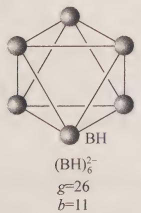

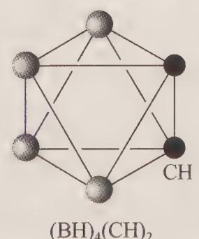

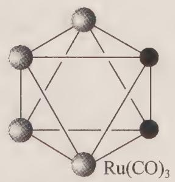

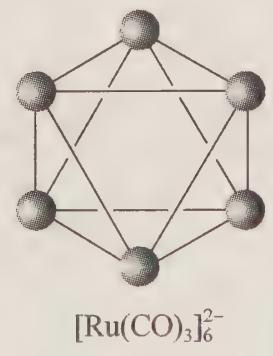  
图 6.5.5 $(\mathrm{BH})_{6}^{2-}$ 和 $[\mathrm{Ru}(\mathrm{CO})_{3}]_{6}^{2-}$ 组成的等同键数和等同结构系列

将这种等同键数的置换关系按同样方法推广到其他体系,可得到更多的等同键数和等同结构系列,为了解簇合物的结构提供一种简单的方法。图 6.5.6 示出由过渡金属元素和主族元素共同组成的 3 个系列的等同键数(b 分别为 5,6,23)和等同结构的簇合物。

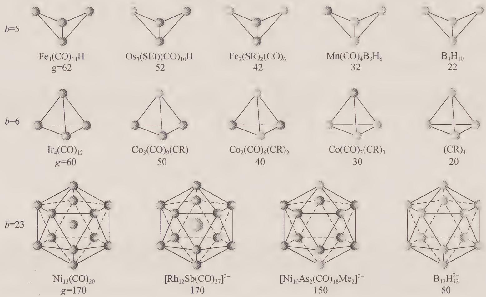  
图6.5.6 等同键数和等同结构系列

一个簇合物的构型主要由它本身的电子因素和空间几何因素所决定,还要受周围成键环境的影响。它实际出现的型式,靠实验测定来确定。然而简单地计算它的键数,就能对所研究的簇合物得到一些重要的信息。

## 6.5.3 簇合物的催化性能

许多原子簇化合物具有优良的催化性能，这与它们的空间构型和电子组态有关。例如四

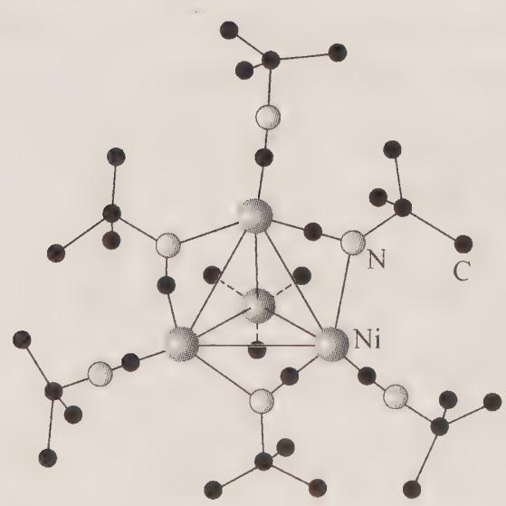  
图6.5.7 $\mathrm{Ni}_4[\mathrm{CNC}(\mathrm{CH}_3)_3]_7$ 的结构220

核原子簇化合物 $\mathrm{Ni}_4[\mathrm{CNCMe}_3]_7$ 具有由乙炔合成苯的优良催化性能。分子中4个Ni原子呈四面体排列，每个Ni原子端接1个— $\mathrm{CNCMe}_3$ 基团，另外3个配体按 $\mu_{2}$ -形式以C和N原子分别配位在2个Ni原子上，形成大三角形面，其结构如图6.5.7所示。根据过渡金属原子簇键数的计算， $\mathrm{Ni}_4$ 簇中已有60个价电子，总键数为6， $\mathrm{Ni}_4$ 簇呈四面体形，每条边上为Ni—Ni单键。

$\mathrm{Ni}_4[\mathrm{CNCMe}_3]_7$ 使乙炔环聚成苯的催化机理可由图6.5.8阐明： $\mathrm{Ni}_4[\mathrm{CNCMe}_3]_7$ 的大三角形面上的Ni原子可吸附 $\mathrm{C}_2\mathrm{H}_2$ 分子[见图(a)]，当3个 $\mathrm{C}_2\mathrm{H}_2$ 以 $\pi$ 配键和Ni结合, 每个 $C_{2}H_{2}$ 提供 2 个电子, 为保持 $Ni_{4}$ 簇价电子数及四面体几何构型不变, $\mu_{2}-CNCMe_{3}$ 中的 N 和 Ni 脱离, 如图(b)所示。在大三角形面上的 3 个 $C_{2}H_{2}$ 分子, 由于空间几何条件及电子条件合适, 环化成苯分子, 如图(c)所示。当—CNCMe $_{3}$ 配体因热运动使 N 原子重新靠拢并和 Ni 原子结合时, 为了保持 $Ni_{4}$ 簇的价电子数不变, 促使苯环离开催化剂成产品放出, $Ni_{4}[CNCMe_{3}]_{7}$ 恢复原样, 如图(a)所示。可见, 正是这样一个微观空间的特殊结构以及成键电子的需要, 为乙炔环化成苯提供了催化模板性能。

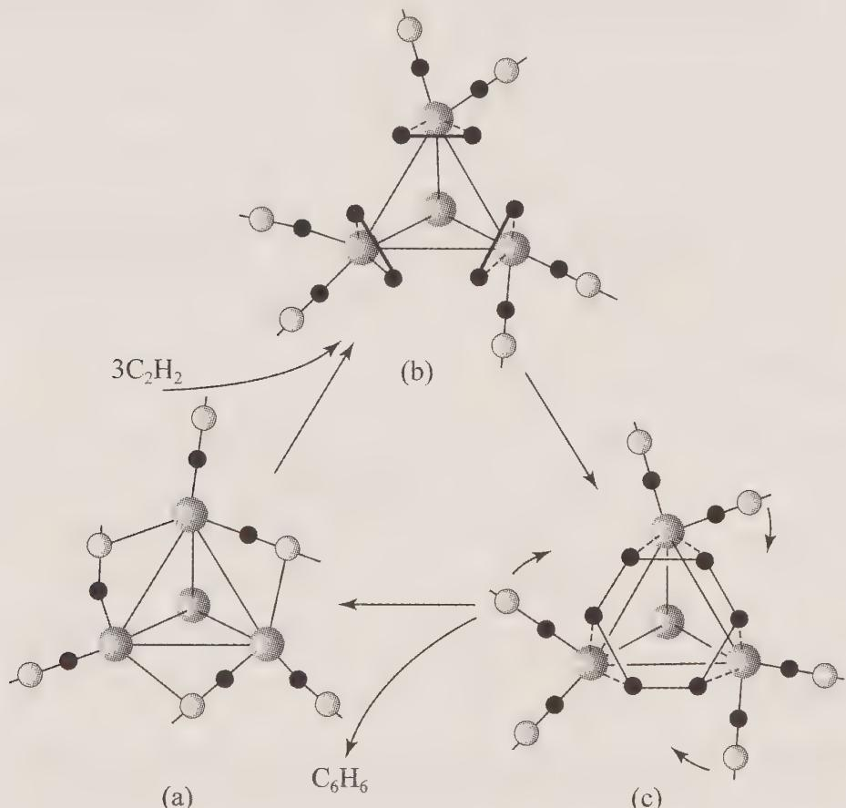  
图 6.5.8 以 $\mathrm{Ni}_{4}\left[\mathrm{CNC}\left(\mathrm{CH}_{3}\right)_{3}\right]_{7}$ 作为催化剂，将乙炔环化成苯的机理

实验测定原子簇化合物 $\mathrm{HFe_{4}(CO)_{12}(CO)^{-}}$ 具有下面蝴蝶式结构，如图 6.5.9(a) 所示。其中有一个 CO 分子和 Fe 原子结合，如图中虚线所示，由于这个原子簇化合物对 CO 分子的活化作用，将 CO 分子中的 C—O 键削弱，使其键长由 112.8 pm 增加至 126 pm，因而可以进一步进行加成反应。鉴于 $N_{2}$ 和 CO 是等电子体系，可以想象， $N_{2}$ 也能得结构类似的化合物，见图 6.5.9(b)。这些原子簇化合物的结构为阐明 $N_{2}$ 和 $H_{2}$ 在铁催化剂作用下合成氨的催化过程，提供了重要的依据和线索。

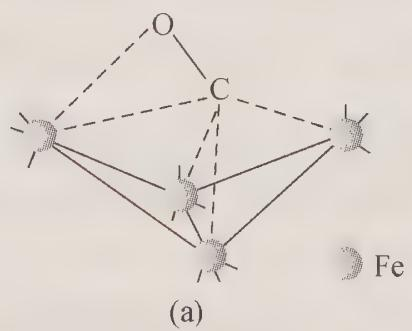

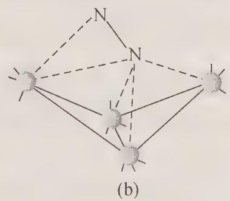  
图 6.5.9 $\mathrm{HFe}_{4}(\mathrm{CO})_{12}(\mathrm{CO})^{-}$ 的结构(a)和铁催化剂上的 $\mathrm{N}_{2}(\mathrm{~b})$

## 6.6 物质的磁性和磁共振

## 6.6.1 物质的磁性及其在结构化学中的应用

磁性是普遍存在的一种物质属性,任何一种物质都有磁性,只不过表现形式和程度有所不同。物质的磁性常用磁化率 $\chi$ 或磁矩 $\mu$ 表示。磁化率是在外磁场中物质的磁化强度 M 和磁场强度 H 的比值:

$$
\chi = M / H\tag{6.6.1}
$$

$\chi$ 量纲为1。

根据物质磁性的起源、磁化率的大小和温度的关系,可将物质的磁性分为五类[可参考图6.6.1中的(a)～(e)及下表]。图6.6.1示出了各类磁性物质的磁化率与温度的关系[注意,其中(c)和(d)的纵坐标为 $\chi^{-1}$ ]。

<table><tr><td>各类磁性物质</td><td colspan="2"> $\chi$ 及其与温度的关系</td></tr><tr><td>(a)抗磁性物质</td><td> $<0(\approx 10^{-6})$ </td><td>不随温度而变</td></tr><tr><td>(b)顺磁性物质</td><td> $>0(10^{-3} \sim 10^{-6})$ </td><td>随温度升高而降低</td></tr><tr><td>(c)铁磁性物质</td><td>&gt;0</td><td>数值很大,与温度和磁场的关系复杂</td></tr><tr><td>(d)亚铁磁性物质</td><td>同(c)</td><td>同(c)</td></tr><tr><td>(e)反铁磁性物质</td><td>&gt;0</td><td>数值与顺磁性物质相近</td></tr></table>

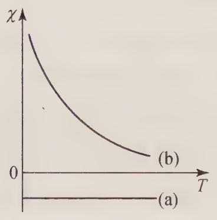

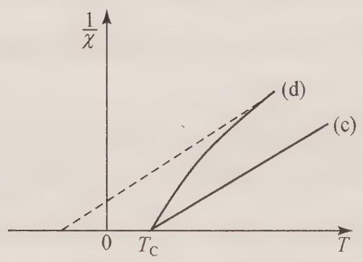

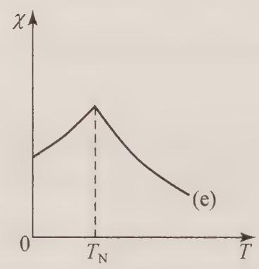  
图6.6.1 各类磁性物质的磁化率 $\chi$ 和温度 $T$ 的关系  
(a) 抗磁性，(b) 顺磁性，(c) 铁磁性，(d) 亚铁磁性，(e) 反铁磁性

物质具有不同的磁性,首先是源于物质内部的电子组态,即电子在原子轨道和分子轨道上的排布情况;其次是源于化学成分、晶体结构、晶粒组织和内应力等因素,这些因素引起磁矩排列情况不同。

磁矩 $\mu$ 是个矢量, 常用小箭头( $\uparrow$ ) 表示, 它是从物质的微观结构来理解物质磁性的一个物理量。磁矩的单位为 $A m^{2}$ 或 $J T^{-1}$ , 是闭合回路中的电流强度(单位为 A) 和回路所包围的面积(单位为 $m^{2}$ ) 的乘积, 方向(按右手定则) 和回路平面垂直。电子的自旋运动、电子的轨道运动和原子核的自旋运动, 分别产生电子自旋磁矩、电子轨道磁矩和核自旋磁矩。

由于核磁矩约比电子磁矩小5个数量级，它对物质磁性的影响可以忽略，但是核磁矩是核磁共振的基础，将在6.6.3小节中讨论。电子运动的磁矩，一般是轨道磁矩和自旋磁矩的矢量和。

各种磁性物质内部的磁结构示意于图6.6.2。(a)抗磁性:物质中全部电子在原子轨道或分子轨道上都已双双配对、自旋相反,没有永久磁矩,以小圆圈表示。(b)顺磁性:原子或分子中有未成对电子存在,如NO,O₂及配合物中金属离子的d电子和f电子未成对,存在永久磁矩,但磁矩间无相互作用,当无外磁场时,无规的热运动使磁矩随机取向,当外加磁场时,则有一定定向排布,呈现顺磁性。(c)铁磁性:金属铁和钴等材料中,每个原子都有几个未成对电子,原子磁矩较大,且相互间有一定作用,使原子磁矩平行排列,是强磁性物质。(d)亚铁磁性:如Fe₃O₄等,相邻原子磁矩部分呈现反平行排列。(e)反铁磁性:如MnO和Cr₂O₃等氧化物,在奈尔温度(T\_N)以上呈顺磁性;在低于T\_N时,因磁矩间相邻原子磁矩呈现相等的反平行排列,使磁化率随温度降低而减小。

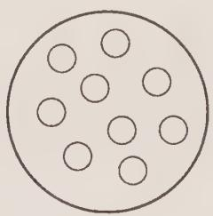  
(a)

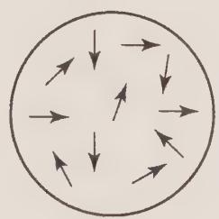  
(b)

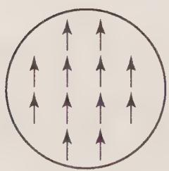  
(c)

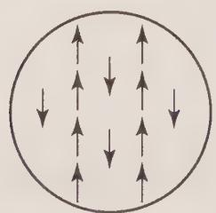  
(d)

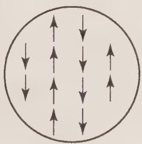  
(e)  
图6.6.2 各种磁性物质内部的磁结构  
(a) 抗磁性，(b) 顺磁性，(c) 铁磁性，(d) 亚铁磁性，(e) 反铁磁性

抗磁性物质、顺磁性物质和反铁磁性物质的磁化率都很小，它们属于弱磁性物质，当一块永久磁铁靠近这些物质时，它们既不被吸引，也不被排斥。对弱磁性物质磁性的研究，是了解物质内部电子组态的重要依据。铁磁性物质和亚铁磁性物质属强磁性物质，当一块永久磁铁靠近它们时，它们会被磁铁所吸引或排斥。这两类磁性物质用于制造各种磁性材料。

抗磁性物质没有永久磁矩，但在外磁场中，电子的轨道角动量绕磁场方向旋进（洛仑兹力），因而出现方向和外磁场相反的磁矩。这种磁矩是在外磁场诱导下产生的，撤除磁场立即消失。一切分子中都有闭壳层的成对电子，所以一切分子都有抗磁性。顺磁性物质的分子具有永久磁矩，在外磁场中，顺磁性超过抗磁性，表现出顺磁性质。

在化学中常用摩尔磁化率 $\chi_{\mathrm{m}}$ 表达物质的磁性，它等于磁化率 $\chi$ 乘以物质的相对分子质量而除以该物质的密度，单位为 $\mathrm{m}^3\mathrm{mol}^{-1}$ 。摩尔磁化率可通过磁天平等实验测定。P. Pascal（帕斯卡）总结大量化合物的摩尔抗磁磁化率 $\chi_{\mathrm{d}}$ 数据，发现它近似地具有加和性，即由该化合物的原子和离子的摩尔抗磁磁化率加和，并对某些结构单元，如双键、环和一些化学键对摩尔抗磁磁化率的影响予以修正而得。表6.6.1列出一些原子、离子和结构单元的摩尔抗磁磁化

率(又称帕斯卡常数)。

表 6.6.1 一些原子、离子和结构单元的摩尔抗磁磁化率

<table><tr><td>原子</td><td> $\frac{\chi_{d}}{10^{-12}m^{3}mol^{-1}}$ </td><td>正离子</td><td> $\frac{\chi_{d}}{10^{-12}m^{3}mol^{-1}}$ </td><td>负离子</td><td> $\frac{\chi_{d}}{10^{-12}m^{3}mol^{-1}}$ </td><td>结构单元a</td><td> $\frac{\chi_{d}}{10^{-12}m^{3}mol^{-1}}$ </td></tr><tr><td>H</td><td>-36.8</td><td> $\mathrm{Li^{+}}$ </td><td>-12.6</td><td> $\mathrm{F^{-}}$ </td><td>-114</td><td>C=C</td><td>+69</td></tr><tr><td>C</td><td>-75.4</td><td> $\mathrm{Na^{+}}$ </td><td>-85</td><td> $\mathrm{Cl^{-}}$ </td><td>-294</td><td>C≡C</td><td>+10</td></tr><tr><td>N(链)</td><td>-70.0</td><td> $\mathrm{K^{+}}$ </td><td>-188</td><td> $\mathrm{Br^{-}}$ </td><td>-435</td><td>C=C—C=C</td><td>+132</td></tr><tr><td>N(环)</td><td>-57.9</td><td> $\mathrm{Mg^{2+}}$ </td><td>-63</td><td> $\mathrm{I^{-}}$ </td><td>-636</td><td>C=O</td><td>+79</td></tr><tr><td>N(酰胺)</td><td>-19.4</td><td> $\mathrm{Ca^{2+}}$ </td><td>-131</td><td> $\mathrm{NO_{3}^{-}}$ </td><td>-237</td><td>N=N</td><td>+23</td></tr><tr><td>O(醇,醚)</td><td>-57.9</td><td> $\mathrm{As^{3+}}$ </td><td>-264</td><td> $\mathrm{ClO_{3}^{-}}$ </td><td>-379</td><td>C≡N</td><td>+10</td></tr><tr><td>O(醛,酮)</td><td>-21.6</td><td> $\mathrm{As^{5+}}$ </td><td>-540</td><td> $\mathrm{ClO_{4}^{-}}$ </td><td>-402</td><td>C=N</td><td>+103</td></tr><tr><td>O(羧基)</td><td>-42.2</td><td> $\mathrm{Cu^{+}}$ </td><td>-188</td><td> $\mathrm{CN^{-}}$ </td><td>-163</td><td>苯环</td><td>-18</td></tr><tr><td>F</td><td>-79.0</td><td> $\mathrm{Cu^{2+}}$ </td><td>-161</td><td> $\mathrm{SCN^{-}}$ </td><td>-390</td><td>环己烷</td><td>-38</td></tr><tr><td>Cl</td><td>-253</td><td> $\mathrm{Zn^{2+}}$ </td><td>-188</td><td> $\mathrm{OH^{-}}$ </td><td>-151</td><td>C—Cl</td><td>+39</td></tr><tr><td>Br</td><td>-385</td><td> $\mathrm{Hg^{2+}}$ </td><td>-503</td><td> $\mathrm{O^{2-}}$ </td><td>-151</td><td>C—Br</td><td>+52</td></tr><tr><td>I</td><td>-560</td><td> $\mathrm{Mn^{3+}}$ </td><td>-126</td><td> $\mathrm{SO_{4}^{2-}}$ </td><td>-504</td><td>C—I</td><td>+52</td></tr><tr><td>S</td><td>-188</td><td> $\mathrm{Fe^{2+}}$ </td><td>-161</td><td> $\mathrm{C_{2}O_{4}^{2-}}$ </td><td>-314</td><td></td><td></td></tr><tr><td>Se</td><td>-289</td><td> $\mathrm{Co^{2+}}$ </td><td>-161</td><td> $\mathrm{CH_{3}COO^{-}}$ </td><td>-377</td><td></td><td></td></tr><tr><td>Si</td><td>-251</td><td> $\mathrm{Ni^{2+}}$ </td><td>-161</td><td></td><td></td><td></td><td></td></tr><tr><td>P</td><td>-330</td><td> $\mathrm{Pb^{2+}}$ </td><td>-402</td><td></td><td></td><td></td><td></td></tr></table>

$^{a}$ 出现此结构单元时，按原子或离子计算的附加值。

下面通过两个实例,介绍用表 6.6.1 数据计算化合物的摩尔抗磁磁化率。

【例6.6.1】 $\mathrm{C_2H_5Br}$

$$
\begin{array}{r l} \chi (\mathrm{C} _ {2} \mathrm{H} _ {5} \mathrm{Br}) & = 2 \chi (\mathrm{C}) + 5 \chi (\mathrm{H}) + \chi (\mathrm{Br}) + \chi (\mathrm{C} - \mathrm{Br}) \\ & = (- 2 \times 7 5. 4 - 5 \times 3 6. 8 - 3 8 5 + 5 2) \times 1 0 ^ {- 1 2} \mathrm{m} ^ {3} \mathrm{mol} ^ {- 1} \\ & = - 6 6 8 \times 1 0 ^ {- 1 2} \mathrm{m} ^ {3} \mathrm{mol} ^ {- 1} \end{array}
$$

此数据和实验测定值 $-670 \times 10^{-12} \mathrm{~m}^{3} \mathrm{~mol}^{-1}$ 相近。

$$
\begin{array}{r l} & {\text {【例6.6.2】} \mathrm {Mn(C H _ {3} COCHCOCH_ {3}) _ {3}}} \\ & {\qquad \chi (\mathrm {Mn(C H _ {3} COCHCOCH_ {3}) _ {3}})} \\ & {\qquad = \chi (\mathrm {Mn^ {3 + }}) + 1 5 \chi (\mathrm{C}) + 2 1 \chi (\mathrm{H}) + 6 \chi (\mathrm{O(酮)})} \\ & {\qquad = (- 1 2 6 - 1 5 \times 7 5. 4 - 2 1 \times 3 6. 8 - 6 \times 2 1. 6) \times 1 0 ^ {- 1 2} \mathrm {m^ {3} mol^ {- 1}}} \\ & {\qquad = - 2 1 6 0 \times 1 0 ^ {- 1 2} \mathrm {m^ {3} mol^ {- 1}}} \end{array}
$$

物质的磁矩 $\mu$ 和化合物中具有的未成对电子数有关, 它和顺磁磁化率 $\chi_{P}$ 的关系为

$$
\chi_ {\mathrm{P}} = \frac {\mu_ {0} N _ {\mathrm{A}} \mu^ {2}}{3 k T}\tag{6.6.2}
$$

式中 $\mu_0$ 为真空磁导率， $N_{\mathrm{A}}$ 为Avogadro常数， $k$ 为Boltzmann常数。由于顺磁物质不仅有未成对电子，也一定有成对电子，即有抗磁性，所以摩尔顺磁磁化率 $\chi_{\mathrm{P}}$ 为摩尔磁化率 $\chi_{\mathrm{m}}$ 与抗磁磁化率 $\chi_{\mathrm{d}}$ 之差，即

$$
\chi_ {\mathrm{P}} = \chi_ {\mathrm{m}} - \chi_ {\mathrm{d}}\tag{6.6.3}
$$

当从实验上求得 $\chi_{\mathrm{m}}$ 以后，利用抗磁磁化率的加和性，根据化合物的分子式和表6.6.1计算出224

摩尔抗磁磁化率 $\chi_{\mathrm{d}}$ ，就可以求得该物质的磁矩 $\mu$ （有些书中称它为有效磁矩 $\mu_{\mathrm{eff}}$ ）。将 $\mu_0,N_{\mathrm{A}},k$ 等常数代入(6.6.2)式，磁矩以Bohr磁子 $\beta_{\mathrm{e}}$ 为单位（有些书用BM表示），得

$$
\begin{array}{r l} \mu & = 7. 3 9 7 \times 1 0 ^ {- 2 1} \sqrt {\chi_ {\mathrm{P}} T} \mathrm{A} \mathrm{m} ^ {2} \\ & = 7. 3 9 7 \times 1 0 ^ {- 2 1} \sqrt {\chi_ {\mathrm{P}} T} \mathrm{A} \mathrm{m} ^ {2} / (9. 2 7 4 \times 1 0 ^ {- 2 4} \mathrm{A} \mathrm{m} ^ {2} / \beta_ {\mathrm{e}}) \\ & = 7 9 7. 6 \sqrt {\chi_ {\mathrm{P}} T} \beta_ {\mathrm{e}} \end{array}\tag{6.6.4}
$$

对于轨道磁矩可以不计的化合物，磁矩由未成对电子贡献，这时

$$
\mu = 2 \sqrt {S (S + 1)} \beta_ {\mathrm{e}} = \sqrt {n (n + 2)} \beta_ {\mathrm{e}}\tag{6.6.5}
$$

式中系数2为电子自旋因子[见(2.2.13)和(2.2.14)式]， $n$ 为未成对电子数，电子总自旋量子数 $S = n / 2$ 。根据这些公式，即可计算化合物的磁矩、未成对电子数，推求金属离子的自旋态。例如，实验测得 $295\mathrm{K}$ 时 $\mathrm{Mn(CH_3COCHCOCH_3)_3}$ 的 $\chi_{\mathrm{m}}$ 为 $1.348\times 10^{-7}\mathrm{m}^3\mathrm{mol}^{-1}$ ，由表6.6.1可算得抗磁磁化率 $\chi_{\mathrm{d}}$ 为 $-0.022\times 10^{-7}\mathrm{m}^3\mathrm{mol}^{-1}$ （见例6.6.2）。

$$
\begin{array}{r l} & \chi_ {\mathrm{P}} = [ 1. 3 4 8 - (- 0. 0 2 2) ] \times 1 0 ^ {- 7} \mathrm{m} ^ {3} \mathrm{mol} ^ {- 1} = 1. 3 7 0 \times 1 0 ^ {- 7} \mathrm{m} ^ {3} \mathrm{mol} ^ {- 1} \\ & \mu = 7 9 7. 6 \sqrt {2 9 5 \times 1 . 3 7 0 \times 1 0 ^ {- 7}} \beta_ {\mathrm{e}} = 5. 0 7 \beta_ {\mathrm{e}} \end{array}
$$

由此数值可判断在该配合物中 $\mathrm{Mn}^{3+}$ 处于高自旋态，有4个未成对电子，这时按(6.6.5)式计算的磁矩为

$$
\mu = \sqrt {4 (4 + 2)} \beta_ {\mathrm{e}} = 4. 9 0 \beta_ {\mathrm{e}}
$$

和上述所得结果基本符合。

## 6.6.2 顺磁共振

顺磁共振是研究具有未成对电子的物质,如配合物、自由基和含有奇数电子的分子等顺磁性物质结构的一种重要方法,又称为电子顺磁共振(EPR)或电子自旋共振(ESR)。

在 2.2 节中已说明,电子的自旋磁矩 $\mu_{s}$ 在磁场方向的分量 $\mu_{sz}$ 为

$$
\mu_ {s z} = - g m _ {s} \beta_ {\mathrm{e}}\tag{6.6.6}
$$

当物质处于外磁场中时,电子自旋磁矩和外磁场作用,不同方向的磁矩有不同的能量,产生能级分裂:

$$
\begin{array}{l} m _ {s} = 1 / 2, \quad E (1 / 2) = - g \beta_ {\mathrm{e}} B / 2 \\ m _ {s} = - 1 / 2, \quad E (- 1 / 2) = g \beta_ {\mathrm{e}} B / 2 \end{array}\tag{6.6.7}
$$

(6.6.8)

磁感应强度 B 不同, 能级分裂大小不同, 能级差 $\Delta E = h\nu$ , 如图 6.6.3 所示。磁能级跃迁的选律为 $\Delta m_{s} = \pm 1$ , 所以顺磁共振吸收频率 $\nu$ 和磁感应强度 B 的关系为

$$
h \nu = g \beta_ {\mathrm{e}} B\tag{6.6.9}
$$

若顺磁共振仪选用 $B = 0.34\mathrm{T}$ ，对于 $g = 2$ 的物质，顺磁共振吸收频率为

$$
\nu = 9. 5 2 7 \times 1 0 ^ {9} \mathrm{Hz}
$$

属于厘米级波长的微波区。所以，在垂直于 B 的方向加频率为 $\nu$ 的微波，电子得到能量 $h\nu$ ，发生吸收跃迁。常用的顺磁共振仪采用扫场式, 即固定 $\nu$ , 改变 B, 使之满足 $\Delta E = h\nu$ 的条件。

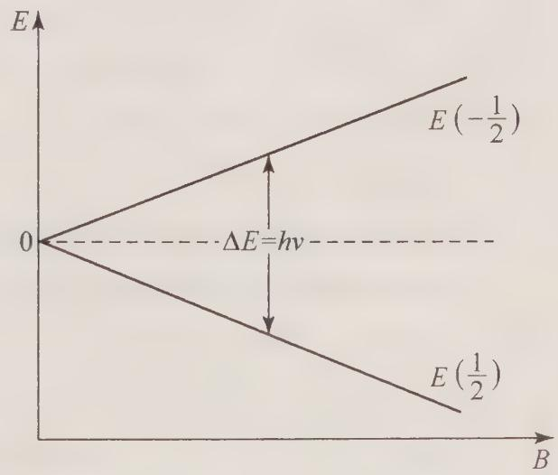  
图6.6.3 电子自旋磁矩在磁感应强度 $B$ 中能级的分裂

以 B 为横坐标、吸收强度为纵坐标，画出吸收曲线，即得顺磁共振谱。顺磁共振谱的谱图纵坐标通常有两种表示法：(i) 吸收强度大小曲线，形状如图 6.6.4(a) 所示；(ii) 以微分的形式表示，曲线形状如图 6.6.4(b) 所示。

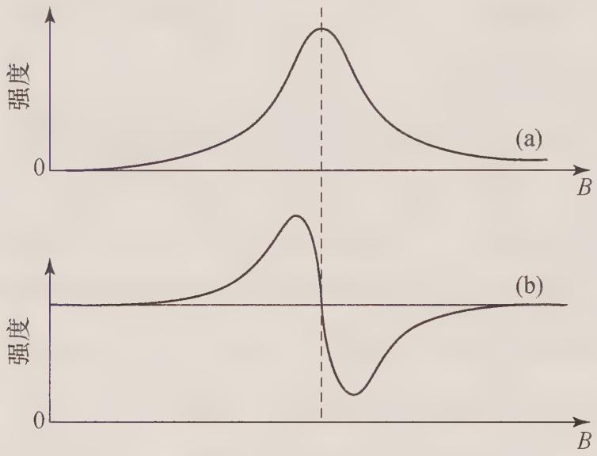  
图6.6.4 顺磁共振谱中吸收线的两种表示（a）吸收线，（b）吸收微分线

顺磁共振法和磁化率法都研究顺磁性物质中未成对电子的数目及其化学环境，但顺磁共振灵敏得多，且不受周围抗磁性物质的影响，它对过渡金属化合物、稀土化合物、有机自由基的结构和反应等的研究是一种很有用的方法，下面列举若干方面的应用。

## 1. 测定自由基的浓度

顺磁共振对自由基来说可以不考虑轨道磁矩的贡献。若每个自由基有一个未成对电子，则吸收峰的强度与未成对电子数，即自由基数目成正比，比例常数与自由基样品的性质无关，而由实验条件决定。固定实验条件，测定一个已知浓度的自由基样品，可得比例常数。通过自由基浓度的测定，可了解反应的历程。

## 2. 测定未成对电子所处的状态和环境

对苯半醌自由基(见左下式)的顺磁共振谱有5条谱线,说明该未成对电子受到周围4个

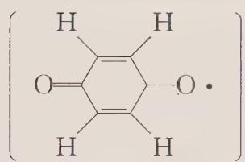

氢原子核的核磁矩的影响。因为在磁场中 $E(-1/2)$ 和 $E(1/2)$ 每个能级因受4个核磁矩影响都要进一步分裂成4个能级，根据选律可得5条谱线。将谱线数减1，即减去未分裂能级间的跃迁， $5-1=4$ ，得到影响该未成对电子的氢原子核数目。由此可以说明，这个未成对电子不是局限在氧原

子上，而是在整个苯环中运动。

## 3. 测定 g 因子, 了解配合物的电子组态

自由电子(即没有轨道磁矩的电子)的 g=2 。处在原子轨道和分子轨道中的未成对电子既有自旋磁矩又有轨道磁矩，自旋-轨道的耦合使 $g\neq2$ 。g 的大小和未成对电子的化学环境密切相关，通过 g 值可以了解未成对电子的化学环境，进而了解配合物的结构。

在实验上， $g$ 可按(6.6.9)式通过测定共振的微波频率 $\nu$ 及磁场强度 $H$ 求得；理论上， $g$ 可按总自旋量子数 $S$ 、总角量子数 $L$ 和总量子数 $J$ 进行计算

$$
g = 1 + \frac {S (S + 1) + J (J + 1) - L (L + 1)}{2 J (J + 1)}\tag{6.6.10}
$$

对过渡金属八面体配合物，因受配位场的作用，5个d轨道分裂成两组：3个 $\mathrm{t}_{2\mathrm{g}}$ 和2个 $\mathrm{e_g^*}$ 。按对称性分析， $\mathrm{e_g^*}$ 轨道上的未成对电子以及全满和半满的电子组态对轨道磁矩都没有贡献 $(L = 0)$ ；只有 $\mathrm{t_{2g}}$ 轨道上的未成对电子在 $\mathrm{d^1,d^2}$ ，高自旋的 $\mathrm{d^6,d^7}$ 以及低自旋的 $\mathrm{d^4,d^5}$ 才有轨道磁矩。对于稀土离子处于f轨道上的未成对电子，因有外层s,p电子的屏蔽，配位体的影响很小，从 $g$ 的大小即可了解f轨道的电子组态。

## 6.6.3 核磁共振

核磁共振（nuclear magnetic resonance, NMR）现象是由 Edward M. Purcell 和 Felix Block 于 1946 年发现的（二人因而共享 1952 年诺贝尔物理学奖），随后很快发展形成核磁共振波谱学，成为获取化学结构信息手段的一支新秀。20 世纪 60 年代后期，随着脉冲傅里叶 (Fourier) 变换技术的兴起，NMR 应用更加广泛，更具威力，成为物理学、化学、医学及生物学等研究领域中不可或缺的技术。迄今，已应用量子力学原理对 NMR 理论和实验进行了严格的分析与计算。本小节以量子力学原理为主，结合经典力学观点，简述 NMR 的原理及应用。

## 1. 核磁矩和核磁共振谱

与电子一样,原子核也有自旋运动,因而也有自旋角动量 $M_{N}$ 和自旋磁矩 $\mu_{N}$ ,它们由核自旋量子数 I 决定:

$$
M _ {\mathrm{N}} = \sqrt {I (I + 1)} \frac {h}{2 \pi}\tag{6.6.11}
$$

$$
\mu_ {\mathrm{N}} = g _ {\mathrm{N}} \frac {e}{2 m _ {\mathrm{p}}} M _ {\mathrm{N}} = g _ {\mathrm{N}} \frac {e}{2 m _ {\mathrm{p}}} \sqrt {I (I + 1)} \frac {h}{2 \pi} = g _ {\mathrm{N}} \frac {e h}{4 \pi m _ {\mathrm{p}}} \sqrt {I (I + 1)} = g _ {\mathrm{N}} \sqrt {I (I + 1)} \beta_ {\mathrm{N}}\tag{6.6.12}
$$

式中， $m_{p}$ 是核的质量； $g_{N}$ 是核的自旋因子，它依核的种类而变，迄今核结构理论仍不能预测各种核的 $g_{N}$ 值，需通过实验测定； $\beta_{N}$ 被称为核磁子，它是一个物理常数，可作为核磁矩的单位，其值为

$$
\beta_ {\mathrm{N}} = \frac {e h}{4 \pi m _ {\mathrm{p}}} = \frac {(1 . 6 0 2 2 \times 1 0 ^ {- 1 9} \mathrm{C}) \times (6 . 6 2 6 \times 1 0 ^ {- 3 4} \mathrm{Js})}{4 \pi (1 . 6 7 2 6 \times 1 0 ^ {- 2 7} \mathrm{kg})} = 5. 0 5 1 \times 1 0 ^ {- 2 7} \mathrm{JT} ^ {- 1}\tag{6.6.13}
$$

$I$ 可为整数或半整数，根据自旋不同的同类核可以成对（即质子和质子成对，中子和中子成对），可推知：（i）质量数为偶数而质子数为奇数的核， $I = 1,2,3$ 等正整数，如 $^{2}\mathrm{H},^{10}\mathrm{B},^{14}\mathrm{N}$ 等。（ii）质量数和质子数皆为偶数的核， $I$ 为0，自旋角动量和自旋磁矩为0，无核磁共振谱，如 $^{12}\mathrm{C},^{16}\mathrm{O}$ 等。（iii）质量数为奇数的核， $I$ 为半整数，如 $^{1}\mathrm{H},^{13}\mathrm{C},^{31}\mathrm{P},^{35}\mathrm{Cl}$ 等，是核磁共振的主要研究对象。

若将自旋量子数为 I 的原子核置于感应强度为 B 的磁场, 则核自旋角动量和自旋磁矩将发生分裂。它们在磁场方向(一般设为 z 轴方向)上的分量由核的自旋磁量子数 $m_{I}$ 决定:

$$
(M _ {\mathrm{N}}) _ {z} = m _ {I} \frac {h}{2 \pi}
$$

$$
\left(\mu_ {\mathrm{N}}\right) _ {z} = - g _ {\mathrm{N}} \frac {e}{2 m _ {\mathrm{p}}} m _ {I} \frac {h}{2 \pi} = - g _ {\mathrm{N}} m _ {I} \beta_ {\mathrm{N}}\tag{6.6.14}
$$

$m_{I}$ 可为 $-I, -I+1, -I+2, \cdots, I-2, I-1, I$ 。每个 I 下有 $(2I+1)$ 个 $m_{I}$ 。由矢量加和规则推知， $m_{I}$ 的最大值即 I 的最大值，即核磁矩在磁场方向的最大分量为 $g_{N}I\beta_{N}$ 。一些原子核的有

关性质列于表6.6.2。

表 6.6.2 一些原子核的性质

<table><tr><td>核</td><td>天然丰度/(%)</td><td>核自旋量子数I</td><td>核磁矩 $\mu_N^*/\beta_N$ </td><td>核的g因子 $g_N$ </td><td>1T场中NMR频率ν/MHz</td></tr><tr><td> $^1H$ </td><td>99.9844</td><td>1/2</td><td>2.79285</td><td>5.5857</td><td>42.576</td></tr><tr><td> $^2H$ </td><td>0.0156</td><td>1</td><td>0.85745</td><td>0.85745</td><td>6.563</td></tr><tr><td> $^{13}C$ </td><td>1.108</td><td>1/2</td><td>0.7023</td><td>1.4046</td><td>10.705</td></tr><tr><td> $^{19}F$ </td><td>100</td><td>1/2</td><td>2.62835</td><td>5.2567</td><td>40.054</td></tr><tr><td> $^{31}P$ </td><td>100</td><td>1/2</td><td>1.1305</td><td>2.2610</td><td>17.235</td></tr><tr><td> $^{35}Cl$ </td><td>75.4</td><td>3/2</td><td>0.8218</td><td>0.5479</td><td>4.171</td></tr><tr><td> $^{37}Cl$ </td><td>24.6</td><td>3/2</td><td>0.6841</td><td>0.4561</td><td>3.472</td></tr></table>

将强度为 B 的外磁场施加在含有自旋磁矩不为零的核的样品上, 核磁矩 $\mu_{N}$ 与 B 相互作用, 产生核磁偶极能量 E:

$$
E = - \mu_ {\mathrm{N}} B \cos \theta
$$

式中 $\theta$ 是 $B$ 和 $\mu_{\mathrm{N}}$ 的夹角。

若令外磁场方向为 $z$ 方向，则上式变为

$$
\begin{array}{r l} E = & - g _ {\mathrm{N}} \left(\frac {e}{2 m _ {\mathrm{p}}}\right) M _ {\mathrm{N} _ {z}} B \\ = & - g _ {\mathrm{N}} \left(\frac {e}{2 m _ {\mathrm{p}}}\right) \left(\frac {h}{2 \pi}\right) m _ {I} B \\ = & - g _ {\mathrm{N}} \beta_ {\mathrm{N}} m _ {I} B \end{array}\tag{6.6.15}
$$

式中核自旋磁量子数 $m_{I}$ 可取值为 $-I, \cdots, I$ 。对质子 $^{1}H, I=1/2, m_{I}$ 可为 -1/2 和 1/2。随外磁场强度 B 增加，不同 $m_{I}$ 值间的能级间隔增加，如图 6.6.5 所示。

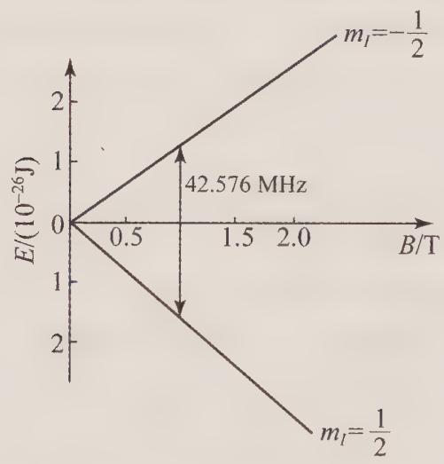  
图6.6.5 ${}^{1}\mathrm{H}$ 核自旋能级与外磁场强度 $B$ 的关系

将样品放在频率合适的电磁辐射中,可观察到核自旋能级间的跃迁,产生共振吸收谱,称为核磁共振谱(nuclear magnetic resonance spectra, NMRS)。跃迁选律为 $\Delta m_{I} = \pm 1$ ,所以吸收频率 $\nu$ 为

$$
\nu = \frac {| \Delta E |}{h} = \frac {g _ {\mathrm{N}} \beta_ {\mathrm{N}} B}{h}\tag{6.6.16}
$$

若外磁场为 1 T, 则 $^{1}$ H 核的吸收频率为

$$
\nu = \frac {5 . 5 8 6 (5 . 0 5 1 \times 1 0 ^ {- 2 7} \mathrm{J/T}) (1 \mathrm{T})}{6 . 6 2 6 \times 1 0 ^ {- 3 4} \mathrm{Js}} = 4 2. 5 7 6 \mathrm{MHz}
$$

这个频率位于电磁波的射频部分。当 $B = 1\mathrm{T}$ 时，其他核的NMR频率可参看表6.6.2。 $I = 0$ 的核，例如 ${}^{12}\mathrm{C},{}^{16}\mathrm{O}$ 等没有核磁矩，也就没有NMR谱。 $I\geqslant 1$ 的核有电四极矩，电四极

矩使 NMR 吸收线变宽, 从而失去其化学上有价值的细节的信息, 所以通常只研究 I=1/2 的核, 其中应用最多的是 ${}^{1}H$ 和 ${}^{13}C$ 。

在实际的 NMR 仪的设计中, 常用固定频率 $\nu$ , 通过改变外磁场强度 B (通常是高磁场) 的大小来改变能级间隔, 使之满足 (6.6.16) 式的要求, 而产生跃迁。图 6.6.6 示出 NMR 仪器装置示意图, 目前 NMR 谱仪主要有 200, 300, 400, 500 和 800 MHz 等商品型号。

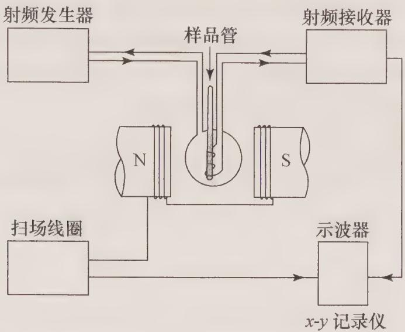  
图6.6.6 核磁共振仪装置示意图

早期使用连续波核磁共振(CW-NMR)技术,利用扫描磁场或扫描频率的方式记录共振谱,解析图谱而给出化学结构信息,效率较低。现在使用脉冲傅里叶变换核磁共振(PFT-NMR)技术,它是用一定宽度的强而短的射频脉冲作用于样品,激发原子核,产生自由感应衰减的信号(时间的函数),经过快速傅里叶变换后成为频率谱,给出化学结构信息,效率较高。

## 2. 化学位移

在一个化合物中,由于氢原子核 i 所处的化学环境不同,它感受的有效磁场 $B_{i}$ 与外磁场 B 略有差异,这是因为不同的化学环境电子的分布不同,电子的磁场对抗外磁场的程度略有不同。核 i 周围的电子对磁场的贡献是 $-\sigma_{i}B,\sigma_{i}$ 称为核 i 的屏蔽常数。例如,苯分子中 6 个质子的 $\sigma_{i}$ 都相同,因为它们都具有相同的化学环境;而氯苯 $\left(\mathrm{C}_{6}\mathrm{H}_{5}\mathrm{Cl}\right)$ 中处在邻位、间位和对位上的质子,因化学环境不同,有 3 种不同的 $\sigma_{i};CH_{3}CH_{2}OH$ 中 H 有 3 种不同的环境,所以有 3 种不同的 $\sigma_{i}$ 。这样,化合物中不同环境的 ${}^{1}H$ 核 i 感受的有效磁场 $B_{i}$ 变为

$$
B _ {\mathrm{i}} = B (1 - \sigma_ {\mathrm{i}})
$$

同一种核的共振频率或共振磁感应强度随化学环境而发生的变化称为化学位移(chemical shift)，用 $\delta$ 表示。或曰，不同化学环境的核，连接的基团不同，受到的屏蔽作用不同，它们的核磁共振信号就出现在不同的地方，这种由于化学环境不同而导致的位移称为化学位移。同一种核的化学位移在不同化合物中差别不大。对扫场式仪器，质子i的化学位移 $\delta_{\mathrm{i}}$ 定义为

$$
\delta_ {\mathrm{i}} = \frac {B _ {\mathrm{参}} - B _ {\mathrm{i}}}{B _ {\mathrm{参}}} \times 1 0 ^ {6}\tag{6.6.17}
$$

式中 $B_{\text{参}}$ 和 $B_{\mathrm{i}}$ 是使参比核和核 $\mathrm{i}$ 产生NMR跃迁吸收的外磁场。常用的参比化合物为四甲基硅 $[\mathrm{Si}(\mathrm{CH}_3)_4, \mathrm{TMS}]$ , TMS中全部质子都具有相同的化学环境, 因而只显示一个质子NMR峰; 式中乘以因子 $10^{6}$ 是为了使 $\delta$ 得到一个便于表达的数值。对扫频式仪器, $\delta$ 可以表达成

$$
\delta_ {\mathrm{i}} = \frac {\Delta \nu}{\nu_ {\mathrm{参}}} \times 1 0 ^ {6} = \frac {\nu_ {\mathrm{i}} - \nu_ {\mathrm{参}}}{\nu_ {\mathrm{参}}} \times 1 0 ^ {6}\tag{6.6.18}
$$

$\delta$ 的量纲为1，由于乘 $10^{6}$ 因子，所以单位为 $\mathrm{ppm}^{\text{①}}(10^{-6}$ ，百万分之一）。

$\mathrm{Si(CH_3)_4}$ 的质子，受屏蔽较强，吸收峰在场强较高区域，对绝大多数有机物的质子吸收峰不干扰。一般规定它的质子的 $\delta$ 为 $0.00\mathrm{ppm}$ 。其他质子吸收峰在低磁场区域， $\delta$ 为正值。实验证明，在不同化合物中，同一化学基团的质子，其 $\delta$ 的变化不大，可用以判别NMR谱中各个峰所对应的基团。表6.6.3列出若干基团中质子的 $\delta (\delta_{\mathrm{i}} / \mathrm{ppm})$ 。

表 6.6.3 若干基团中质子 $\left( {{}^{1}\mathrm{H}}\right)$ 的化学位移

<table><tr><td>化学基团</td><td> $\delta_i$ /ppm</td><td>化学基团</td><td> $\delta_i$ /ppm</td></tr><tr><td> $(CH_3)_4Si$ </td><td>0.00</td><td> $C_{10}H_8(萘)$ </td><td>7.73</td></tr><tr><td> $(CH_3)_4C$ </td><td>0.92</td><td>—C≡CH</td><td>1.4~3.1</td></tr><tr><td> $CH_3-C-$ </td><td>0.8~1.9</td><td>—OH(醇)</td><td>1.4~3.5</td></tr><tr><td> $CH_3-O-$ </td><td>3.2~4.0</td><td>—OH(酚)</td><td>4~10</td></tr><tr><td></td><td>0.3~2.1</td><td>—NH2(烷基胺)</td><td>1.1~1.8</td></tr><tr><td> $C_3H_6(环丙烷)$ </td><td>0.22</td><td>—NH2(芳基胺)</td><td>3.4~4.3</td></tr><tr><td> $\backslash C=CH-$ </td><td>4.6~7.0</td><td>—NH2(酰胺)</td><td>6.0~6.3</td></tr><tr><td> $C_6H_6(苯)$ </td><td>7.27</td><td>—CHO</td><td>8.0~10.5</td></tr><tr><td></td><td></td><td>—COOH</td><td>9.7~13.3</td></tr></table>

借助于化学位移,可获得物质的结构信息:根据共振吸收峰的数目,可知道有多少种不同环境的核;根据吸收峰面积(积分值)或高度,可知道它们之间的比例;根据峰的具体位置可推断出分别属于何种类型的核。最常用的是 $^{1}$ H核磁共振谱,下面列出各种结构对 $\delta$ 的影响:

## (1) 核外电子分布

一切改变电子云分布的因素都会对化学位移产生影响。一般，核周围电子云密度大，对核的屏蔽作用强， $\delta$ 较小。邻近基团的诱导效应会改变电子云的分布而影响化学位移。例如 $\alpha$ 位置上有卤素、N、O等原子，由于诱导效应使质子周围的电子云减少，屏蔽作用减弱， $\delta$ 增大。和电负性较强的原子相连的质子， $\delta$ 增大较多。

## (2) 抗磁各向异性效应

化学键中的 $\pi$ 键电子云容易变形，易受外磁场感应产生磁场，苯环中的 $\pi$ 电子在磁场中的环流运动产生感应磁场。外加磁场 $B$ （箭头由下朝上）与感应磁场（由带箭头的曲线表示）的关系示于图6.6.7中。

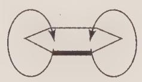  
(a) 苯

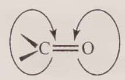  
(b) 醛

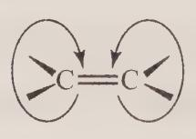  
(c) 乙烯

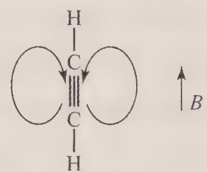  
(d) 乙炔  
图6.6.7 若干分子的抗磁各向异性效应

由图6.6.7(a)可见，当苯环平面和外磁场垂直时，由楞次定律可知， $\pi$ 电子在磁场中的环流运动所产生的感应磁场，环内和外磁场相反，为正屏蔽区；环外和外磁场相同，为负屏蔽区（去屏蔽效应）。质子在环外侧受到去屏蔽效应，化学位移较大，达6～9 ppm。实际上液态苯分子不停地快速运动，实验测定的是所有取向的平均值。在(b)中，碳氧双键中π电子的环流产生感应磁场，在醛基质子位置产生去屏蔽效应，同时氧的电负性大，诱导效应也有去屏蔽效应，使醛基质子δ特别大，达9.6～10 ppm。(c)的图像可以解释烯烃质子比烷烃质子具有较大的δ，达4.5～8 ppm。(d)中叁键与外磁场平行时，两个互相垂直分布的π键电子呈圆柱形，π电子环流运动所引起的感应磁场对质子起正屏蔽效应，因而使它的峰向高磁场方向移动，δ为2～3 ppm。

## (3) 溶剂效应和氢键

高分辨核磁共振谱只能测定液体样品，常将样品溶于溶剂之中。溶剂改变，化学位移会改变。溶剂和溶质生成氢键， $\delta$ 可增大几个ppm。容易生成氢键的溶剂（如水等）一般不常用，以免引起干扰。

## 3. 核的自旋-自旋耦合作用

NMR 谱由于存在核的自旋-自旋耦合作用,实际要比上述描述的情况复杂,因而高分辨的 NMR 谱要比低分辨 NMR 谱提供更多的信息,观察到谱线的精细结构,对每一个 $I \neq 0$ 的核都有核磁矩,这个核磁矩的磁场可以影响相邻核感受到的磁场,从而略微地改变相邻核发生 NMR 吸收的频率。频率改变的大小由耦合常数 J 表示,它取决于所涉及的两个核的性质及相隔键的数目。对于相隔 4 个或更多个键的质子,相互作用可以忽略。一些有代表性的质子-质子的 J (单位: Hz) 如下:

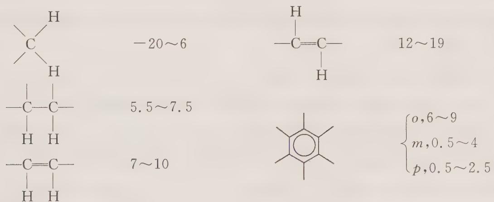

以 $\mathrm{CH}_3\mathrm{CH}_2\mathrm{OH}$ 为例， $\mathrm{CH}_3$ 质子与OH质子相隔4个键，自旋-自旋相互作用可以忽略。 $\mathrm{CH}_3$ 质子与 $\mathrm{CH}_2$ 质子只相隔3个键，相互作用不能忽略， $\mathrm{CH}_2$ 使 $\mathrm{CH}_3$ 峰发生分裂，而 $\mathrm{CH}_3$ 基团内部等价质子彼此间的自旋-自旋相互作用算作这基团的性质而不必考虑。质子的 $m_I$ 有1/2和-1/2两种，若用箭头的朝向标记这两种质子的自旋状态， $\mathrm{CH}_2$ 的两个质子有下面4种可能：

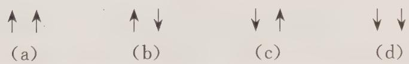

由于 $CH_{2}$ 中两个质子自旋是不可分辨的，(b) 和 (c) 的总自旋磁量子数均为 0，(a) 为 1，(d) 为 -1。按概率分布，(a) 和 (d) 各占 25%，(b) 和 (c) 共占 50%，(b) 和 (c) 不影响 $CH_{3}$ 质子感受的磁场，而 (a) 和 (d) 则增强或减弱这个磁场。所以 $CH_{2}$ 质子使 $CH_{3}$ 的 NMR 峰分裂成三重线。3 条线的间隔等于 $CH_{2}$ 和 $CH_{3}$ 质子之间的耦合常数 J，3 条线的强度比应为 1:2:1。

$CH_{3}$ 对 $CH_{2}$ 的作用情况如下。 $CH_{3}$ 质子自旋的各种可能为状态(b)，(c)，(d)有相同的总自旋磁量子数，(e)，(f)，(g)也相同。因此 $\mathrm{CH}_3$ 质子使 $\mathrm{CH}_2$ 吸收峰分裂为四重线，并具有强度比 $1:3:3:1$ 。 $\mathrm{CH}_2$ 质子与OH质子相隔3个键，应考虑到OH对 $\mathrm{CH}_2$ 的影响。微量 $\mathrm{H}_3\mathrm{O}^+$ 或 $\mathrm{OH}^{-}$ （包括来自 $\mathrm{H}_2\mathrm{O})$ 能促进乙醇分子之间OH质子的迅速交换，这种交换消除了 $\mathrm{CH}_2$ 质子和OH质子之间的自旋-自旋相互作用，使 $\mathrm{CH}_2$ 仍保持四重线，

<table><tr><td>↑ ↑ ↑(a)</td><td>↑ ↑ ↓(b)</td><td>↑ ↓ ↑(c)</td><td>↓ ↑ ↑(d)</td></tr><tr><td>↑ ↓ ↓(e)</td><td>↓ ↑ ↓(f)</td><td>↓ ↓ ↑(g)</td><td>↓ ↓ ↓(h)</td></tr></table>

## OH 质子成单重线。

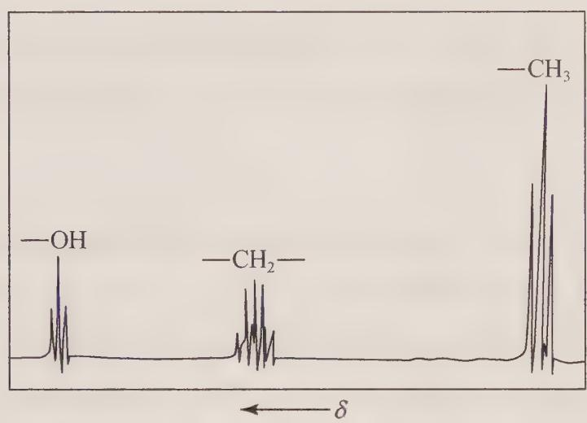  
图 6.6.8 高纯乙醇的高分辨核磁共振谱 (100 MHz)

在纯乙醇中不发生分子间 OH 质子交换，OH 质子的两种自旋态 ↑ 和 ↓，使 $CH_{2}$ 四重线的每一条线又分裂成双线， $CH_{2}$ 共有 8 条线；而 OH 吸收峰被 $CH_{2}$ 质子作用分裂成三重线。图 6.6.8 示出高纯乙醇的高分辨核磁共振谱。

由上可见,质子核磁共振谱能提供质子所属的基团和种类的信息;通过各类质子峰面积比, 可知道各类质子的数目比;通过自旋分裂,可了解各类质子的相互作用。这些信息对推测化合物的结构起很大作用。

当质子间的耦合常数比化学位移差距小很多时 $(\nu \Delta \delta / J \geqslant 25)$ ，自旋分裂图谱服从下列简单规律（这种情况为低级耦合，被称为一级谱）：

(1) 一组 $m$ 个磁等价 (化学位移相同) 的质子 $\mathrm{A}_m$ (如 $-\mathrm{CH}_3$ 中的 3 个质子): 尽管它们之间也可能存在耦合, 但在谱图上观察不到峰的分裂, 即只出现一条谱线。

(2) 对于 $\mathrm{A}_m\mathrm{X}_n$ 体系: 磁性核 A 和 X 的核自旋角量子数分别是 $I_{\mathrm{A}}$ 和 $I_{\mathrm{X}}$ , 则 $\mathrm{A}_m$ 峰被分裂为 $2nI_{\mathrm{X}} + 1$ 个多重峰, $\mathrm{X}_n$ 峰被分裂为 $2mI_{\mathrm{A}} + 1$ 个多重峰。具体而言, 一组 $m$ 个磁等价质子 $\mathrm{A}_m$ 受另一组 $n$ 个磁等价质子 $\mathrm{X}_n$ 作用, $\mathrm{A}_m$ 峰被分裂为 $n + 1$ 个等间距的多重峰, $\mathrm{X}_n$ 峰被分裂为 $m + 1$ 个等间距的多重峰。各峰的强度对称分布, 比值服从二项式展开系数比。

（3）对于 $\mathrm{X}_m\mathrm{A}_p\mathrm{M}_n$ 体系：一组 $p$ 个等价质子 $\mathrm{A}_p$ ，受到一组 $n$ 个等价质子 $\mathrm{M}_n$ 作用，同时又受到 $m$ 个等价质子 $\mathrm{X}_m$ 作用，则 $\mathrm{A}_p$ 峰被分裂为 $(n + 1)(m + 1)$ 个多重峰（这些峰可能发生重叠）。读者可以乙醇的高分辨质子NMR谱(图6.6.8)为例予以验证。

当化学位移差距与质子间耦合常数相差不大时,核磁共振谱变得很复杂,不再服从一级谱规律,称此为二级谱,需用量子力学计算才能解释并得到化学位移和耦合常数。与化学位移不同,耦合常数不随外磁场而变,因此,图谱中出现多重峰究竟是由于化学位移不同还是由于自旋耦合所致,可通过改变外磁场加以辨别。

除 $^{1}$ H外, $^{13}$ C的NMR谱发展很快,因为这种谱提供了关于有机化合物“骨架”的信息。 $^{13}$ C同位素天然丰度只有 $1\%$ ,这就使 $^{13}$ C NMR的吸收信号很弱。解决的方法之一是重复地扫描这个谱,并将结果送进计算机累加,但这样做很费时间。另一种方法是用傅里叶变换技术(FT),这个方法不用单一射频的辐射,而用一时间短、功率大的射频辐射脉冲( $1\mu s$ 达 $1kW$ )照射样品，脉冲包含各种频率，它破坏核能级的平衡集居数，当辐射脉冲停止后，体系趋向恢复平衡态而放出能量，记录不同时间的信号，用计算机FT技术将时间函数转换为频率函数，将多次连续脉冲的结果累加在一起，便得到 $^{13}$ C NMR谱。有机分子中很难得有两个 $^{13}$ C原子相邻，故 $^{13}$ C之间不耦合，再加上 $^{13}$ C的化学位移很大，峰很窄，图谱比较简单，容易解释，所以 $^{13}$ C FT NMR是一种很有用的技术。

二维核磁共振(2D NMR)已在许多领域得到广泛应用。因为在复杂分子的 $^{1}$ H NMR谱上,各种质子谱峰挤在一个较小的频率范围,难以分析和判断其耦合状况。2D NMR引入另一个频率变量,可使原来密集拥挤在一条线上的谱线分散在一个平面上。例如可将化学位移和耦合常数分别展开在横坐标和纵坐标上,清楚地得到耦合常数信息。二维和多维核磁共振谱为解决溶液中的化学结构和了解分子的立体构型提供了丰富的信息。

高场超导磁体和快速脉冲傅里叶变换用于 NMR，提高了它的灵敏度和分辨率，缩短了信息数据收集时间，可以将时域信号累加，从而使天然丰度很低的 $^{13}$ C, $^{15}$ N, $^{17}$ O 和 $^{29}$ Si 等核的信息收集成为可能。磁共振成像技术和多维 NMR 技术的发展，使 NMR 一方面可研究化学物质和生物大分子在非晶状态和溶液中分子的三维结构、分子内和分子间的相互作用、构象平衡、结构和性能关系等信息，用 NMR 法和 X 射线衍射法测定晶态物质结构，互相起着补充的作用；另一方面 NMR 具有可连续观察和成像的优点，成为研究生物活体内的生化过程的一种重要方法。NMR 的研究领域和应用范围已从化学、物理学扩展到生物学、医药学、材料科学等广泛领域，成为最具广泛应用的谱学方法。

## 习题

6.1 写出下列配合物中各配位体提供给中心金属原子的电子数目,计算中心原子周围的价电子总数:

(1) $(\eta^{5} - C_{5}H_{5})_{2}Fe$ (2) $\mathrm{Ni(CN)}_4^{2-}$ ; (3) $\mathrm{K[PtCl_3\cdot C_2H_4]\cdot H_2O}$ ; (4) $[\mathrm{Co(en)}_2\mathrm{Cl}_2]^+$ 。

(1) $\mathrm{Ti(C_5H_5)_2Cl_2}$ ; (2) $\mathrm{Ag(NH_3)_4^+}$ ; (3) $\mathrm{Cr(C_6H_6)(CO)_3}$ ; (4) $[\mathrm{Co(en)}_2\mathrm{Cl}_2]^+$ 。

6.3 判断下列配位离子是高自旋型还是低自旋型，画出 d 电子排布方式，计算 LFSE（用 $\Delta_{0}$ 表示）：
(1) $\mathrm{Mn(H_{2}O)_{6}^{2+}}$ ; (2) $\mathrm{Fe(CN)_{6}^{4-}}$ ; (3) $FeF_{6}^{3-}$ .

6.4 试给出 $\mathrm{Co(NH_3)_6^{3 + }}$ 配位离子的分子轨道能级图，指出配位离子生成前后电子的分布，并在能级图上标明分裂能位置。

6.5 已知 $\mathrm{Co(NH_3)_6^{3 + }}$ 的 $\Delta_{\circ}$ 为 $23000~\mathrm{cm}^{-1}$ , $P$ 为 $22000~\mathrm{cm}^{-1}$ ; $\mathrm{Fe(H_2O)_6^{3 + }}$ 的 $\Delta_{\circ}$ 为 $13700~\mathrm{cm}^{-1}$ , $P$ 为 $30000~\mathrm{cm}^{-1}$ 。试说明这两种离子的 d 电子排布。

6.6 解释：为什么水溶液中八面体配位的 $\mathrm{Mn}^{3+}$ 不稳定，而八面体配位的 $\mathrm{Cr}^{3+}$ 却稳定？

6.7 解释：为什么大多数 $\mathrm{Zn}^{2+}$ 的配位化合物都是无色的？

6.8 作图给出下列每种配位离子可能出现的异构体：

(1) $\left[\mathrm{Co}(\mathrm{en})_{2}\mathrm{Cl}_{2}\right]^{+}$ ; (2) $\left[\mathrm{Co}(\mathrm{en})_{2}(\mathrm{NH}_{3})\mathrm{Cl}\right]^{2+}$ ; (3) $\left[\mathrm{Co}(\mathrm{en})(\mathrm{NH}_{3})_{2}\mathrm{Cl}_{2}\right]^{+}$ 。

6.9 已知在化学式为 $\mathrm{Co(NH_3)_4Br(CO_3)}$ 的配合物中，中心 $\mathrm{Co}^{3+}$ 为六配位的八面体形结构， $\mathrm{CO}_3^{2-}$ 作为配位体既可按单齿，也可按双齿进行配位。据此回答下列问题：

(1) 根据配位体场的强弱, 写出这个化合物的组成结构式;

(2) 画出全部可能的异构体的立体结构；

（3）根据它们的什么性质可用实验方法来区分异构体？

6.10 许多 $\mathrm{Cu^{2+}}$ 的配位化合物为平面四方形结构，试写出 $\mathrm{Cu^{2+}}$ 的d轨道能级排布及电子组态。  
6.11 利用配位场理论推断下列配位离子的结构及不成对电子数。（1） $\mathrm{MnO_4^{3-}}$ ；（2） $\mathrm{Pd(CN)_4^{2-}}$ ；（3） $\mathrm{NiI_4^{2-}}$ ；（4） $\mathrm{Ru(NH_3)_6^{3+}}$ ；（5） $\mathrm{MoCl_6^{3-}}$ ；(6） $\mathrm{IrCl_6^{2-}}$ ；（7） $\mathrm{AuCl_4^-}$ 。

6.12 解释：为什么 $\mathrm{Co(C_5H_5)_2}$ 极易被氧化为 $\mathrm{Co(C_5H_5)_2^+}$ ？

6.13 用Jahn-Teller效应说明下列配位离子中哪些会发生变形。(1) $\mathrm{Ni(H_2O)_6^{2 + }}$ ；(2) $\mathrm{CuCl_4^{2 - }}$ ；(3) $\mathrm{CuCl_6^{4 - }}$ ；(4) $\mathrm{Ti(H_2O)_6^{3 + }}$ ；(5) $\mathrm{Cr(H_2O)_6^{2 + }}$

$$
\mathrm{MnC}
$$

(1) $V_{2}(CO)_{12}$ ; (2) $\mathrm{Ni}_{2}(\mathrm{CO})_{2}(\mathrm{C}_{5}\mathrm{H}_{5})_{2}$ (羰基成桥); (3) $\mathrm{Cr}_{2}(\mathrm{CO})_{4}(\mathrm{C}_{5}\mathrm{H}_{5})_{2}$ ;

(4) $\left[\mathrm{Cp}_{3} \mathrm{Mo}_{3}(\mathrm{CO})_{6}(\mu_{3}-\mathrm{S})\right]^{+}$ ; (5) $\left[\mathrm{H}_{3} \mathrm{Re}_{3}(\mathrm{CO})_{10}\right]^{2-}$ (有 2 个 Re—Re 单键, 1 个 Re=Re 双键)。

6.15 硅胶干燥剂中常加入 $\mathrm{CoCl}_2$ （蓝色），吸水后变为粉红色，试用配位场理论解释其原因。

6.16 尖晶石的化学组成可表示为 $\mathrm{AB}_2\mathrm{O}_4$ ，氧离子紧密堆积构成四面体空隙和八面体空隙。当金属离子A占据四面体空隙时，称为正常尖晶石；而当A占据八面体空隙时，则称反式尖晶石。试从配位场稳定化能计算结果说明 $\mathrm{NiAl_2O_4}$ 是何种尖晶石结构。

6.17 某学生测定了3种配合物的d-d跃迁光谱，但忘记了贴标签，请帮他将光谱波数与配合物对应起来。3种配合物是： $\mathrm{CoF}_6^{3-}$ ， $\mathrm{Co(NH_3)_6^{3+}}$ 和 $\mathrm{Co(CN)_6^{3-}}$ ；3种光谱波数是： $34000~\mathrm{cm}^{-1}$ ， $13000~\mathrm{cm}^{-1}$ 和 $23000~\mathrm{cm}^{-1}$ 。

6.18 试画出三方柱形的配合物 $\mathrm{MA}_4\mathrm{B}_2$ 的全部几何异构体。

6.19 画出羰基配合物 $\mathrm{Fe_2(CO)_6(\mu_2 - CO)_3}$ 的结构式，说明它是否符合十八电子规则。已知端接羰基的红外伸缩振动频率为 $1850\sim 2125~\mathrm{cm}^{-1}$ ，而桥羰基的振动频率为 $1700\sim 1860~\mathrm{cm}^{-1}$ ，解释原因。

6.20 二氯二氨合铂有两种几何异构体，一种是顺式，一种是反式，简称顺铂和反铂。顺铂是一种常用的抗癌药，而反铂没有抗癌作用。

(1) 写出顺铂和反铂的结构式。

（2）若用1,2-二氨基环丁烯二酮代替2个 $\mathrm{NH}_3$ 与铂配位，则生成什么结构的化合物，有无顺反异构体？分析化合物中原子的成键情况。

（3）若把1,2-二氨基环丁烯二酮上的双键加氢然后再代替2个 $\mathrm{NH}_3$ 与铂配位，则生成什么化合物？写出其结构式。该化合物有无 $\sigma -\pi$ 配键形成？

6.21 将烷烃和烯烃混合物通过 $\mathrm{AgNO_3}$ 或 $\mathrm{AgClO_4}$ 等银盐溶液，可将烷烃和烯烃分离。这一方法既可用于色谱分离，也可用于工业分离，请说明所依据的原理。

6.22 把亚铜盐分散到分子筛表面上可制得固体吸附剂，它能够把 CO 从工业废气中吸附下来，从而避免了对环境的污染，解吸后又可获得高纯 CO。试从表面化学键的形成说明 CO 吸附剂的作用原理。

6.23 根据磁性测定结果知 $NiCl_{4}^{2-}$ 为顺磁性，而 $\mathrm{Ni(CN)}_{4}^{2-}$ 为抗磁性，试推测它们的几何构型。

6.24 用查表得到的数据计算 $\mathrm{C_6H_5COCl}$ 的摩尔抗磁磁化率，并和实验测定值 $-979\times$ $10^{-12}\mathrm{m}^3\mathrm{mol}^{-1}$ 比较。

6.25 用查表得到的数据计算 $\mathrm{C_5H_{11}OH}$ 的摩尔抗磁磁化率。实验测得正戊醇的抗磁磁化率为 $-848\times 10^{-12}\mathrm{m}^3\mathrm{mol}^{-1}$ ，异戊醇为 $-886\times 10^{-12}\mathrm{m}^3\mathrm{mol}^{-1}$ ，试予以比较。

6.26 试从下列化合物实验测定的磁矩数据，判断其自旋态、未成对电子数、磁矩的计算值及轨道角动量对磁矩的贡献。

(1) $\mathrm{K_4[Mn(NCS)_6]}$ (2) $\mathrm{K_4[Mn(CN)_6]}$ (3) $[\mathrm{Cr}(\mathrm{NH}_3)_6]\mathrm{Cl}_3$ 。 $6.06\beta_{\mathrm{e}}$ $1.8\beta_{\mathrm{e}}$ $3.9\beta_{\mathrm{e}}$

6.27 下列各个配位离子分别具有八面体(六配位)和四面体(四配位)构型,由它们组成的配合物,哪些能给出顺磁共振信号?

$$
(1) \left[ \mathrm{Fe} (\mathrm{H} _ {2} \mathrm{O}) _ {6} \right] ^ {2 +}; (2) \left[ \mathrm{Fe} (\mathrm{CN}) _ {6} \right] ^ {4 -}; (3) \left[ \mathrm{Fe} (\mathrm{CN}) _ {6} \right] ^ {3 -}; (4) \left[ \mathrm{CoF} _ {6} \right] ^ {3 -};
$$

$$
(5) \left[ \mathrm{Co} (\mathrm{en}) _ {3} \right] ^ {3 +}; (6) \left[ \mathrm{Co} \left(\mathrm{NO} _ {2}\right) _ {6} \right] ^ {4 -}; (7) \left[ \mathrm{FeCl} _ {4} \right] ^ {-}; (8) \left[ \mathrm{Ag} \left(\mathrm{NH} _ {3}\right) _ {4} \right] ^ {+}; (9) \left[ \mathrm{ZnCl} _ {4} \right] ^ {2 -} 。
$$

6.28 用波长为 $1.00\mathrm{cm}$ 的微波进行一个自由基样品的电子顺磁共振测定，吸收峰出现的磁感应强度是多少？

6.29 用 $220\mathrm{MHz}$ 进行质子 $(^{1}\mathrm{H})$ 核磁共振实验，磁感应强度（B）应为多少？

6.30 解释在 NMR 法中, 化学位移的产生原因和定义。

6.31 化学位移 $\delta$ 常用 ppm 表示, 但因耦合常数常以 Hz 表示, 因而 $\delta$ 也可用 Hz 表示。对于磁感应强度 $B$ 为 $1.41 \mathrm{T}$ 的 ${}^{1} \mathrm{H}$ NMR 谱仪, 化学位移 $\delta = 1.00 \mathrm{ppm}$ , 相当于产生多少赫[兹]的化学位移?

## 参考文献

[1] 徐光宪, 王祥云. 物质结构. 第二版. 北京: 科学出版社, 2010.

[2] 唐敖庆, 李前树. 原子簇的结构规则和化学键. 济南: 山东科学技术出版社, 1998.

[3] 徐志固. 现代配位化学. 北京: 化学工业出版社, 1987.

[4] 黄春辉. 稀土配位化学. 北京: 科学出版社, 1997.

[5] 游效曾. 配位化合物的结构和性质. 北京: 科学出版社, 1992.

[6] Shriver D F, Atkins P W, Langford C H. 无机化学. 第二版. 高忆慈, 史启祯, 曾克慰, 李炳瑞, 等译. 北京: 高等教育出版社, 1997.

[7] 周公度. 键价和分子几何学. 大学化学, 1996, 11(1): 9\~18.

[8] 周公度. 第一个五重键 Cr $\equiv$ Cr 介绍. 大学化学, 2006, 21(5): 31\~33.

[9] 周公度. 化学中的多面体. 北京: 北京大学出版社, 2009.

[10] Figgis B N, Hitchman M A. Ligand Field Theory and its Applications. New York: Wiley-VCH, 2000.

[11] Mingos D M P. Structure and Bonding (Vol. 87): Structures and Electronic Paradigms in Cluster Chemistry. Berlin: Springer, 1997.

[12] Cotton F A, Wilkinson G, Murillo C A, et al. Advanced Inorganic Chemistry. 6 $^{th}$ ed. New York: Wiley, 1999.

[13] Cotton F A, Walton R A. Multiple Bonds between Metal Atoms. 2 $^{nd}$ ed. Oxford: Clarendon Press, 1993.

[14] Bersuker I B. Electronic Structure and Properties of Transition Metal Compounds: Introduction to the Theory. New York: Wiley, 1996.

[15] Kaufmann G B. Coordination Chemistry: A Century of Progress. Washington, DC: American Chemical Society, 1994.

[16] Shriver D F, Atkins P W. Inorganic Chemistry. 3 $^{rd}$ ed. New York: Freeman, 1999.

[17] Collman J P, Boulatov R, Jameson G B. The first quadrupole bond between elements of different groups. Angew Chem Int Ed Engl, 2001, 40: 1271\~1274.

# 第 7 章 晶体的点阵结构和晶体的性质

## 7.1 晶体结构的周期性和点阵

## 7.1.1 点阵、结构基元和晶胞

晶体是由原子或分子在空间按一定规律周期重复地排列构成的固体物质。晶体中原子或分子的排列具有三维空间的周期性，隔一定的距离重复出现，这种周期性规律是晶体结构最基本的特征。

晶体的分布非常广泛,自然界的固体物质中,绝大多数是晶体。气体、液体和非晶物质在一定条件下可以转变成晶体。我们日常生活中接触到的岩石、砂子、金属材料、水泥制品、食用的盐和糖、实验室用的固体试剂等绝大多数是由晶体组成的。在这些物质中,晶体颗粒大小悬殊,有些每颗质量只有几微克,有些则达几十吨。食用盐、砂糖、试剂等晶粒大小可用毫米计,金属中晶粒大小以微米计。但是不论晶体颗粒的大小如何,晶体内部原子或分子按周期性规律重复地排列的结构特征都是共同的。在固体中,有些是非晶物质,如玻璃、松香、明胶等,在它们内部,原子或分子的排列没有周期性的结构规律,像液体那样杂乱无章地分布,可以看作过冷液体,称为玻璃体、无定形体或非晶态物质。图7.1.1示意出晶体和玻璃体的结构特点。固体高聚物中,一部分是晶体,一部分是无定形体,相对数量取决于高聚物的性质和制备方法。

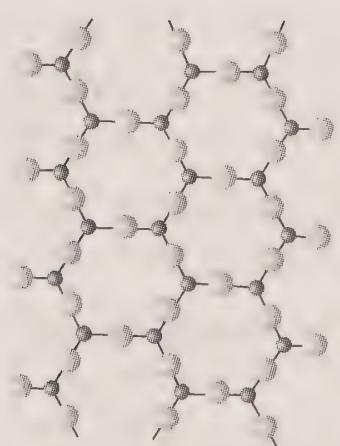  
(a)

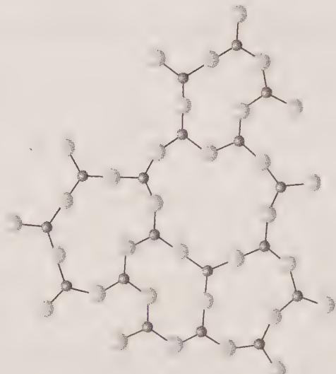  
(b)  
图7.1.1 晶体(a)和玻璃体(b)的结构特点

在晶体内部,原子或分子在三维空间作周期性重复排列,每个重复单位的化学组成相同、空间结构相同,若忽略晶体的表面效应,重复单位周围的环境也相同。这些重复单位可以是单个原子或分子,也可以是离子团或多个分子。如果每个重复单位用一个点表示,可得到一组点,这些点按一定规律排列在空间。研究这些点在空间重复排列的方式,可以更好地描述晶体内部原子排列的周期性。从晶体中无数个重复单位抽象出来的无数个点,在三维空间按一定周期重复,它具有一种重要的性质:这些点构成一个点阵。什么是点阵?点阵是一组无限个全同点的集合，连接其中任意两点可得一矢量，将各个点按此矢量平移，能使它复原。注意，这里所说的平移必须是按矢量平行移动，而没有丝毫的转动。点阵中每个点都具有完全相同的周围环境。

点阵结构中每个点阵点所代表的具体内容,即包括原子或分子的种类、数量及其在空间按一定方式排列的结构单元,称为晶体的结构基元(structural motif)。结构基元是指重复周期中的具体内容,而点阵点是一个抽象的点。如果在晶体点阵中各点阵点的位置上,按同一种方式安置结构基元,就得到整个晶体的结构。所以,可以简单地将晶体结构示意表示为:

$$
\mathrm{晶体结构} = \mathrm{点阵} + \mathrm{结构基元}
$$

或

$$
\mathrm{晶体结构} = \mathrm{结构基元} @ \mathrm{点阵}
$$

根据晶体结构的周期性,将沿着晶棱方向周期地重复排列的结构基元,抽象出一组分布在同一直线上等距离的点列,称为直线点阵。图 7.1.2 示出按一维周期排列的结构及其点阵。

图中：(a) 为金属铜中在直线上等间距排列的原子，一个原子为一个结构基元；(b) 为石墨层中某些方向上碳原子周期排列的情况，2个C原子为一结构基元；(c) 为 $\alpha$ -硒晶体中链形硒分子按螺旋形周期排列，3个Se原子为一结构基元；(d) 为NaCl晶体中一条晶棱方向上原子的排列，结构基元为相邻的一个 $\mathrm{Na}^{+}$ 和一个 $\mathrm{Cl}^{-}$ ；(e) 为伸展聚乙烯链的结构情况，结构基元为— $\mathrm{CH}_{2}-\mathrm{CH}_{2}-$ 。图中从各个结构基元抽象出点阵点，以黑点表示。由图可见，结构基元有时和化学组成的基本单位相同，而有时不同。

图 7.1.3 示出二维周期排列的结构及其点阵。图中：(a) 为 NaCl 晶体内部一个截面上原子的排列，其结构基元如虚线划出的正方形单位，包括 1 个 $Na^{+}$ 和 1 个 $Cl^{-}$ ， $Cl^{-}$ 离子中心的黑点表示点阵点；(b) 为等径原子的最密堆积层，一个原子为一个结构基元；(c) 为层形石墨分子，其结构基元为 2 个 C 原子，如虚线划出的单位，每个结构基元以一个黑点表示；(d) 为硼酸晶体中层形结构的一个层，两个硼酸分子形成一个结构基元。由这些图可见，在二维周期结构中，周期重复的单位即

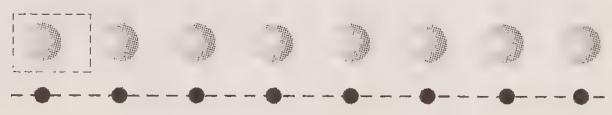  
(a)

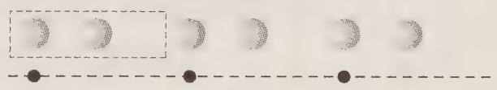  
(b)

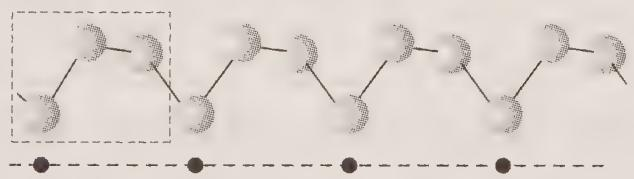

(c)  
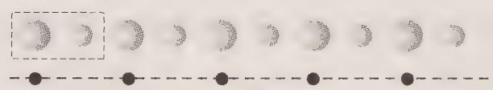  
(d)

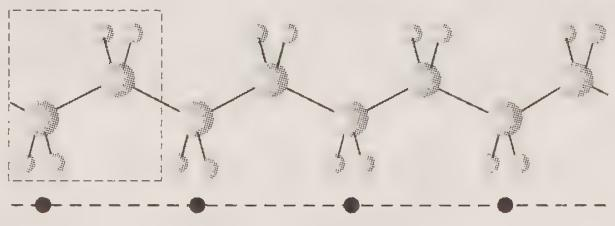  
(e)  
图7.1.2 一维周期排列的结构及其点阵（黑点代表点阵点）  
(a) Cu, (b) 石墨, (c) $\alpha$ -Se,  
(d) NaCl, (e) 伸展聚乙烯

结构基元一定是平行四边形，如图中的虚线划出的单位。按平行四边形的单位并置排列，即得二维周期结构。平行四边形的顶点为点阵点，它不一定落在原子的中心位置上。

在晶体的三维周期结构中,按照晶体内部结构的周期性,划分出一个个大小和形状完全相同的平行六面体,作为晶体结构的基本重复单位,称为晶胞。整块晶体就是按晶胞共用顶点并置排列、共面堆砌而成。周期重复单位的重复方式可用点阵表示。能用一个点阵点代表晶胞中的全部的内容者,称为素晶胞,它即为一个结构基元。含2个或2个以上结构基元的晶胞称为复晶胞。

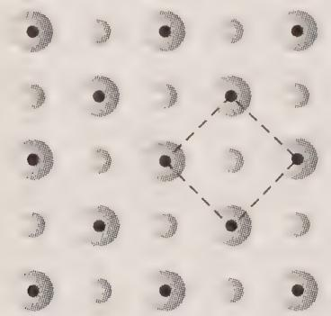  
(a)

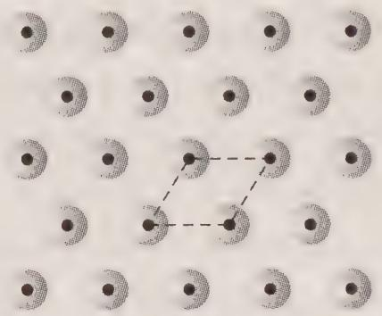  
(b)

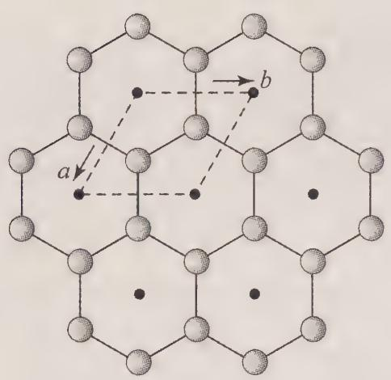  
(c)

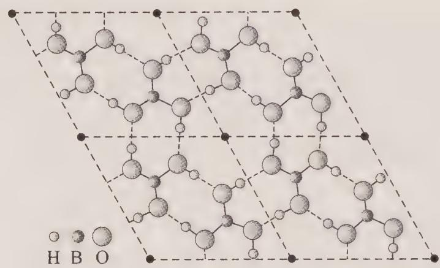  
(d)  
图 7.1.3 二维周期排列的结构及其点阵(黑点代表点阵点)
(a) NaCl, (b) Cu, (c) 石墨, (d) B(OH) $_{3}$

图 7.1.4 示出几种三维周期排列的结构及其点阵。图中: (a) 金属钋结构, 1 个 Po 原子为一个结构基元; (b) CsCl 结构, 将 1 个 $Cs^{+}$ 和 1 个 $Cl^{-}$ 合在一起作为一个结构基元抽象成一个点阵点, 点阵点虽然可以定在任意位置上, 但各个结构基元都必须保持一致, 在图中将点阵点定在较小的 $Cs^{+}$ 的中心; (c) 金属钠结构, 1 个 Na 原子即为一个结构基元; (d) 金属铜结构, 1 个 Cu 原子为一个结构基元; (e) 金属镁结构, 2 个 Mg 原子为一个结构基元; (f) 金刚石结构, 2 个 C 原子构成一个结构基元; (g) NaCl 结构, 1 个 $Na^{+}$ 和 1 个 $Cl^{-}$ 构成一个结构基元。

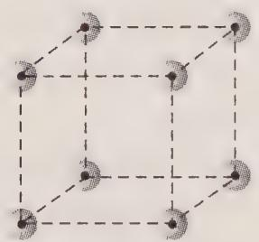  
(a)

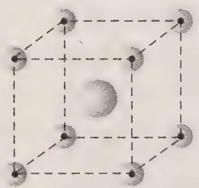  
(b)

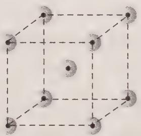  
(c)

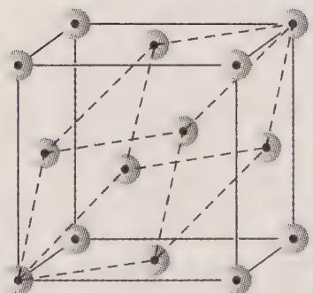  
(d)

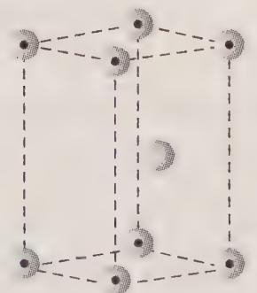  
(e)

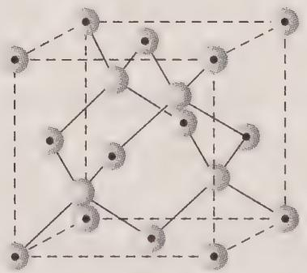  
(f)

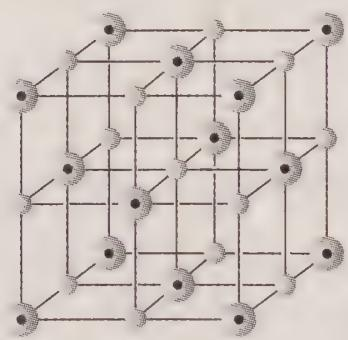  
(g)  
图 7.1.4 三维周期排列的结构及其点阵(黑点代表点阵点)  
(a) Po, (b) CsCl, (c) Na, (d) Cu, (e) Mg, (f) 金刚石, (g) NaCl

为什么金属钋、金属钠和金属铜的结构基元是由1个原子组成，而金属镁和金刚石却是由2个原子组成？这要按结构基元和点阵的基本定义去理解。在金属钋、金属钠和金属铜结构中，每个原子都具有相同的周围环境，将每个原子都作为结构基元，由它抽象出来的点的集合，符合点阵的定义，例如按连接任意两点的矢量平移，都可以使点阵复原。金属铜的面心立方单位和金属钠的体心立方单位均可划出只含1个原子的平行六面体单位，如图7.1.5所示，这也验证了这种点阵抽象的正确性。

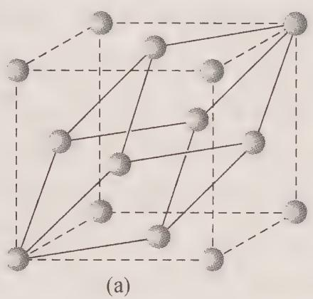

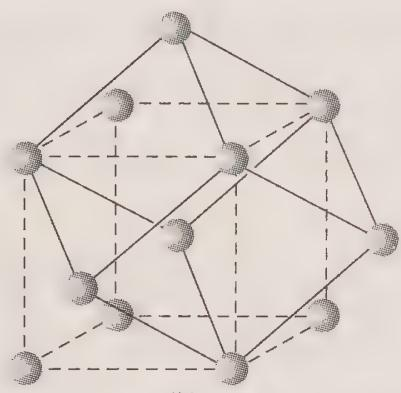  
(b)  
图7.1.5 面心立方点阵单位(a)和体心立方点阵单位(b)均可画出只含1个原子的平行六面体单位

金属镁、金刚石的情况则不同。在金刚石结构中，虽然每个C原子都是按正四面体的构型和周围原子成键，但相邻两个C原子的4个键在空间的取向不同，周围环境不同，不能将每个C原子都当作结构基元。图7.1.6(a)示出，若将相邻两个C原子都抽象成点阵点，连接它的矢量向前平移，箭头所指之处是空的，没有点阵点，不能复原，和点阵定义不符。金属镁也有同样情况，若将每个 $\mathrm{Mg}$ 原子都抽象为点阵点，连接两点间的矢量不能使点阵复原，如图7.1.6(b)所示。

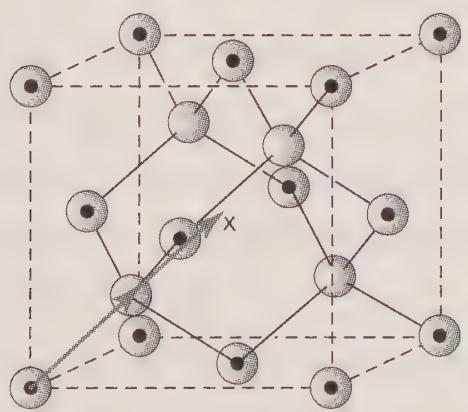  
(a)

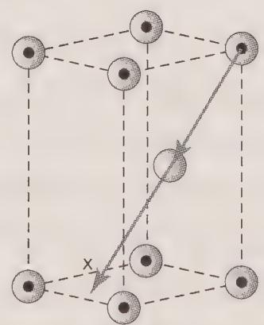  
(b)

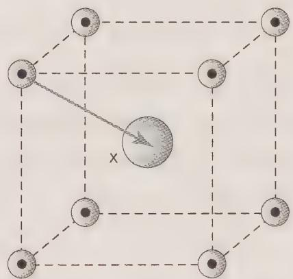  
(c)  
图 7.1.6 不符合点阵定义的矢量(×表示箭头端点不是点阵点)
(a) 金刚石, (b) 金属镁, (c) CsCl 晶体

CsCl 和 NaCl 都是由正、负两种离子交替排列形成晶体，这时每个点阵点代表由两种离子共同组成的结构基元。若将 $Cs^{+}$ 和 Cl 都作为结构基元，则因组成不同，周围环境不同，连接不同离子间的矢量不是点阵点间的矢量，如图 7.1.6(c) 所示。在一些书中，把 NaCl 等类型的晶体结构看成由一套 $Na^{+}$ 的面心立方点阵和一套 Cl 的面心立方点阵互相穿插组合而成。这种几套点阵互相穿插的方法和每个点阵点代表一个结构基元的概念不相符合，所得的几套点阵之间点和点的关系也和点阵的定义不符。

## 7.1.2 点阵参数和晶胞参数

在点阵中以直线连接各个点阵点,形成直线点阵,相邻两个点阵点的矢量 a 是这直线点阵的单位矢量,矢量的长度 $a=|a|$ , 称为点阵参数, 如图 7.1.7(a) 所示。

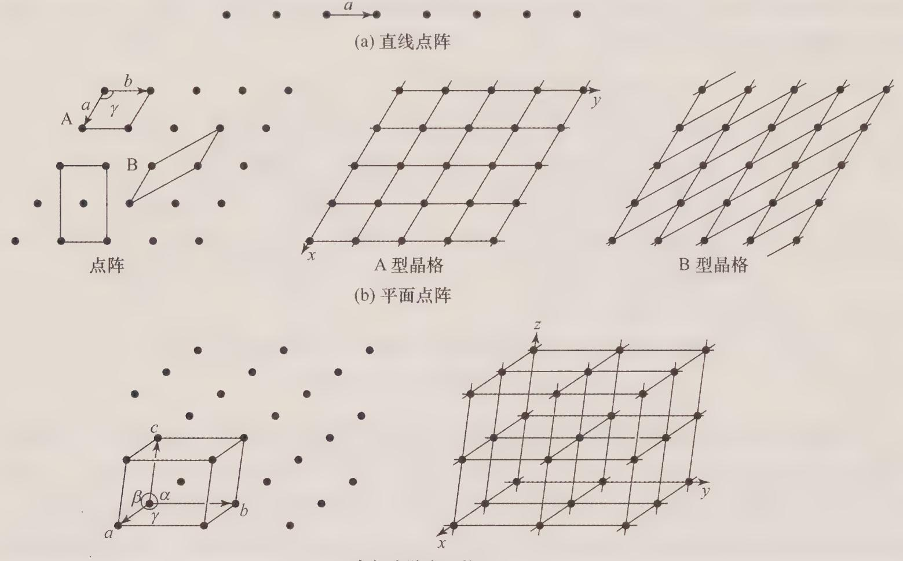  
(c) 空间点阵和晶格  
图7.1.7 点阵的划分和晶格

平面点阵必可划分为一组平行的直线点阵，并可选择两个不相平行的单位矢量 $a$ 和 $b$ 划分成并置的平行四边形单位，点阵中各点阵点都位于平行四边形的顶点上。矢量 $a$ 和 $b$ 的长度 $a = |a|, b = |b|$ 及其夹角 $\gamma$ 称为平面点阵参数，如图7.1.7(b)所示。通过点阵点划分平行四边形的方式是多种多样的，图中示出了3种，虽然它们的点阵参数不同，但若它们都只含1个点阵点，它们的面积就一定相等。含2个点阵点的平行四边形，其面积一定是含1个点阵点的2倍。

空间点阵可选择3个不相平行的单位矢量 $a, b, c$ ，它们将点阵划分成并置的平行六面体单位，称为点阵单位。相应地，按照晶体结构的周期性划分所得的平行六面体单位称为晶胞。点阵单位和晶胞都可用来描述晶体结构的周期性。点阵是抽象的，只反映晶体结构周期重复的方式；晶胞是按晶体实际情况划分出来的，它包含原子在空间的排布等内容。矢量 $a, b, c$ 的长度 $a, b, c$ 及其相互间的夹角 $\alpha, \beta, \gamma$ 称为点阵参数或晶胞参数，且

$$
\begin{array}{r l} & a = | \boldsymbol {a} |, \quad b = | \boldsymbol {b} |, \quad c = | \boldsymbol {c} | \\ & \alpha = \boldsymbol {b} \wedge \boldsymbol {c}, \quad \beta = \boldsymbol {a} \wedge \boldsymbol {c}, \quad \gamma = \boldsymbol {a} \wedge \boldsymbol {b} \end{array}
$$

通常根据矢量 $a, b, c$ 选择晶体的坐标轴 $x, y, z$ ，使它们分别和矢量 $a, b, c$ 平行。一般3个晶轴按右手定则关系安排：伸出右手的3个指头，食指代表 $x$ 轴，中指代表 $y$ 轴，大拇指代表 $z$ 轴。如图7.1.7(c)所示者即为右手坐标轴系。

空间点阵可任意选择 3 个不相平行的单位矢量进行划分。由于选择单位矢量不同, 划分的方式也不同,可以有无数种形式。但基本上可归结为两类:一类是单位中包含一个点阵点者,称为素单位。注意,计算点阵点数目时,要考虑处在平行六面体顶点上的点阵点均为8个相邻的平行六面体所共有,每一平行六面体单位只摊到该点的一部分。另一类是每个单位中包含2个或2个以上的点阵点,称为复单位。有时为了一定的目的,将空间点阵按复单位进行划分(见7.2.4节)。

空间点阵按照确定的平行六面体单位连线划分，获得一套直线网格，称为空间格子或晶格。点阵和晶格是分别用几何的点和线反映晶体结构的周期性，它们具有同样的意义，都是从实际晶体结构中抽象出来，表示晶体周期性结构的规律。晶体最基本的特点是具有空间点阵式的结构。点阵和晶格在英文中是同一个词 lattice。点阵强调的是结构基元在空间的周期排列，它反映的周期排列方式是唯一的；晶格强调的是按点阵单位划分出来的格子，由于选坐标轴和单位矢量有一定灵活性，它不是唯一的。

晶胞是晶体结构的基本重复单位,整个晶体就是按晶胞在三维空间周期性地重复排列,相互平行取向,按每一顶点为8个晶胞共有的方式堆砌而成的。晶体结构的内容,包含在晶胞的两个基本要素中:(i) 晶胞的大小和形状,即晶胞参数 $a, b, c, \alpha, \beta, \gamma$ ; (ii) 晶胞内部各个原子的坐标位置,即原子的坐标参数 $(x, y, z)$ 。有了这两方面的数据,整个晶体的空间结构也就知道了。

原子在晶胞中的坐标参数 $(x, y, z)$ 的意义是指由晶胞原点指向原子的矢量 $r$ 用单位矢量 $a, b, c$ 表达，即

$$
\boldsymbol {r} = x \boldsymbol {a} + y \boldsymbol {b} + z \boldsymbol {c}
$$

例如在图 7.1.4(g) 中, $Cl^{-}$ 和 $Na^{+}$ 的坐标参数为

$$
\mathrm{Cl} ^ {-}: \quad 0, 0, 0; \quad \frac {1}{2}, 0, \frac {1}{2}; \quad 0, \frac {1}{2}, \frac {1}{2}; \quad \frac {1}{2}, \frac {1}{2}, 0
$$

$$
\mathrm{Na} ^ {+}: \quad \frac {1}{2}, 0, 0; \quad 0, \frac {1}{2}, 0; \quad 0, 0, \frac {1}{2}; \quad \frac {1}{2}, \frac {1}{2}, \frac {1}{2}
$$

注意,晶体中原子的坐标参数是以晶胞的3个晶轴作为坐标轴,以3个晶轴的长度作为坐标轴的单位。当原点位置改变或选取的晶轴改变时,原子坐标参数也会改变。

若一整块固体基本上为一个空间点阵所贯穿，称为单晶体。有些固体是由许多小的单晶体按不同的取向聚集而成，称为多晶，金属材料及许多粉状物质是由多晶体组成的。有些固体，例如炭黑，结构重复的周期数很少，只有几个到几十个周期，称为微晶。微晶是介于晶体和非晶物质之间的物质。在棉花、蚕丝、毛发及各种人造纤维等物质中，一般具有不完整的一维周期性的特征，并沿纤维轴择优取向，这类物质称为纤维多晶物质。

## 7.2 晶体结构的对称性

本节从晶体结构的周期性出发，讨论晶体的对称性，包括对称元素、对称操作、晶系、晶族、晶体学点群、空间点阵型式等内容。有关空间群的知识则在7.4节中讨论。

## 7.2.1 晶体结构的对称元素和对称操作

晶体的内部结构具有一定的对称性,可用一组对称元素组成的对称元素系描述。晶体所具有的对称元素系是对晶体进行分类的基础,对了解晶体的结构和性质非常重要。

晶体最基本的特点是具有空间点阵结构。晶体的点阵结构使晶体的对称性和分子的对称

性有差别。分子结构的对称性是点对称性，只有4类对称元素和对称操作（参看第4章）：

(1) 旋转轴——旋转操作

(2) 镜面——反映操作

(3) 对称中心——反演操作

(4) 反轴——旋转反演操作

晶体的点阵结构,包括平移的对称操作。它一方面使晶体结构的对称性在上述点对称性的基础上增加下列3类对称元素和对称操作：

(5) 点阵——平移操作

(6) 螺旋轴——螺旋旋转操作

(7) 滑移面——反映滑移操作

另一方面，晶体的对称元素和对称操作又受到点阵的制约。在晶体结构中存在的对称轴（包括旋转轴、螺旋轴和反轴）的轴次只有1,2,3,4,6等5种。而滑移面和螺旋轴中的滑移量，也要受点阵制约。

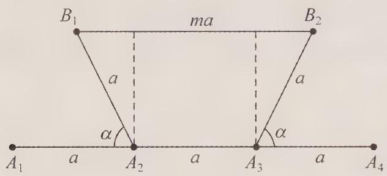

晶体的点阵结构只允许存在1,2,3,4,6等轴次的对称轴，这可证明如下：如图7.2.1所示，设点阵点 $A_{1}, A_{2}, A_{3}, A_{4}$ 相隔为 $a$ ，有一个 $n$ 重旋转轴通过点阵点。因为每个点阵点周围环境都相同，每一对称操作都存在对应的逆操作，以 $a$ 作半径转动角 $\alpha = 2\pi / n$ ，将会得到另一点阵点。绕 $A_{2}$ 点顺时针方向转 $\alpha$ 角，可得点阵点 $B_{1}$ ；绕 $A_{3}$ 点逆时针方向转 $\alpha$ 角，可得点阵点图7.2.1 晶体中对称轴轴次的证明

$B_{2}$ 。 $B_{1}$ 和 $B_{2}$ 连线平行于 $A_{1}$ 和 $A_{4}$ 连线， $B_{1}$ 和 $B_{2}$ 间的距离必须为 a 的整数倍，设为 ma，m 为整数，得

$$
\begin{array}{c} {a + 2 a \cos \alpha = m a} \\ {\cos \alpha = (m - 1) / 2, \quad | (m - 1) / 2 | \leqslant 1} \end{array}
$$

<table><tr><td>m</td><td>-1</td><td>0</td><td>1</td><td>2</td><td>3</td></tr><tr><td>cos $\alpha$ </td><td>-1</td><td>-1/2</td><td>0</td><td>1/2</td><td>1</td></tr><tr><td> $\alpha$ </td><td>180°</td><td>120°</td><td>90°</td><td>60°</td><td>0°(360°)</td></tr><tr><td>n(=360°/ $\alpha$ )</td><td>2</td><td>3</td><td>4</td><td>6</td><td>1</td></tr></table>

满足此方程的 $\alpha$ 值只能为 $0^{\circ}, 60^{\circ}, 90^{\circ}, 120^{\circ}, 180^{\circ}, 360^{\circ}$ 。这就证明点阵结构中旋转轴的轴次 $(n)$ 只有 $1, 2, 3, 4, 6$ 等5种。

在晶体结构中可能存在的对称元素除点阵外列于表7.2.1中。表中的螺旋轴和滑移面是晶体微观对称性所特有的。螺旋轴对应的对称操作是旋转和平移的联合对称操作。螺旋轴 $n_{m}$ 的基本操作是绕轴旋转 $2\pi/n$ ，接着沿着轴的方向平移m/n个和轴平行的单位矢量。例如 $2_{1}$ 轴（用半箭头表示）的基本操作是绕轴转 $180^{\circ}$ ，接着沿着轴的方向平移1/2个单位矢量。图7.2.2(a)示出 $2_{1}$ 轴联系的用左手表示的手性分子： $2_{1}$ 螺旋旋转联系的左手手性没有改变，滑移面对应的对称操作是反映和平移的联合操作，b滑移面的基本操作是按该面进行反映后，接着沿y轴方向滑移b/2。图7.2.2(b)示出b滑移面(记号为……)联系的手性分子图像，左手反映后变为右手的情况。

(a)  
(b)  
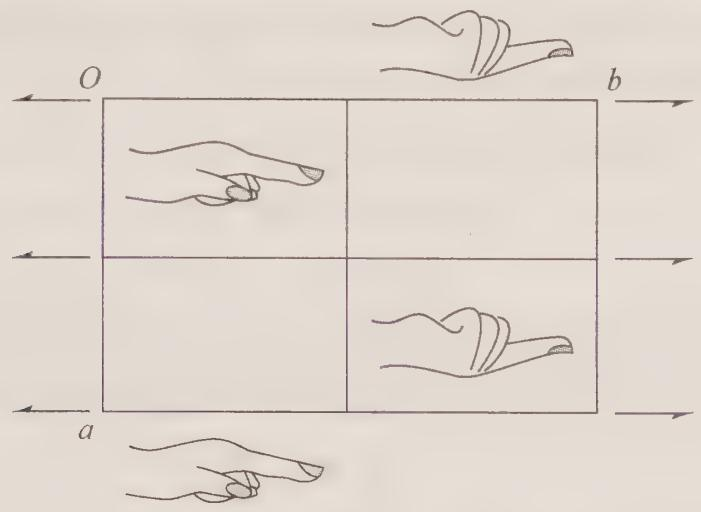

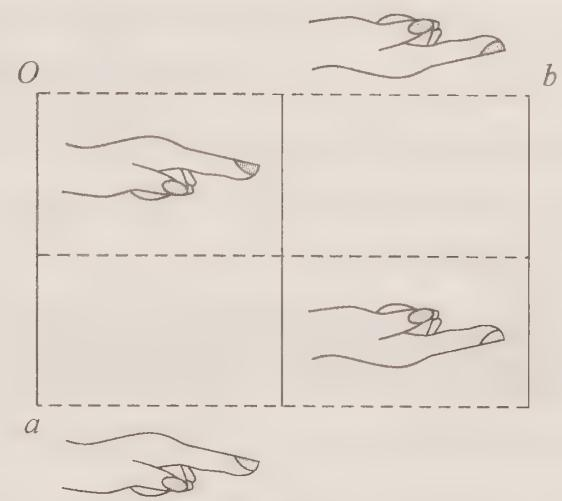  
图7.2.2 $2_{1}$ 轴(a)和滑移面(b)对手性分子在晶胞中的排布图像

上述点阵、螺旋轴和滑移面3种对称元素是晶体结构所特有的，和它们相应的对称操作中都包含有平移成分，阶次都是无限的。凡是包含平移的对称性，都要求图形本身是无限的，否则经过平移后，就会出现一边缺少另一边增多的现象。同理，包含平移对称性的对称元素，其本身的数目也是无限的。现实的晶体中原子数目总是有限的，但因其数目很多，可忽略边界效应，用理想化的点阵结构来描述。

表 7.2.1 晶体结构中可能存在的对称元素

<table><tr><td colspan="2">对称元素类型</td><td>书写记号</td><td colspan="2">图示记号</td></tr><tr><td colspan="2">对称中心</td><td>1</td><td colspan="2">。</td></tr><tr><td colspan="2">镜面</td><td>m</td><td>垂直纸面</td><td>在纸面内</td></tr><tr><td rowspan="4">滑移面</td><td>轴滑移面</td><td>a,b,c</td><td>在纸面内滑移离开纸面滑移......</td><td>箭头表示滑移方向</td></tr><tr><td>对角滑移面</td><td>n</td><td>— · — · — · —</td><td></td></tr><tr><td>金刚石滑移面</td><td>d</td><td>— : → : — : —</td><td></td></tr><tr><td>双向轴滑移面</td><td>e</td><td>— · — · — · —</td><td></td></tr><tr><td colspan="2">旋转轴</td><td>12346</td><td></td><td>→</td></tr><tr><td colspan="2">螺旋轴</td><td>2131,3241,42,4361,62,63,64,65</td><td></td><td>←→</td></tr><tr><td colspan="2">反轴a</td><td>346</td><td>▲↑▲</td><td></td></tr></table>

$^{a}$ $\overline{3}=3+i,\overline{6}=3+\sigma$ ,不是独立的。

由上可见，晶体中原子在空间呈三维周期性排列，具有以点阵结构为基本特征的长程平移有序，以及由1,2,3,4,6次对称轴所表现的长程取向有序两方面的对称性。

准晶体是指那些具有长程取向序，但无平移周期性的固体。准晶体通过电子衍射能得到衍射斑点比较明锐的、具有五次对称轴或八次、十次、十二次对称轴等通常晶体所不允许的衍射花样。详细情况可见7.8节。

## 7.2.2 晶系、晶族和惯用坐标系

根据晶体结构所具有的特征对称元素,可将晶体分为 7 个晶系(crystal system)。确定一个晶体所属的晶系时,以晶体有无特征对称元素为标准,按表 7.2.2 中从上而下的顺序进行。

表 7.2.2 晶族、晶系和惯用坐标系

<table><tr><td rowspan="2">晶族的名称和记号</td><td rowspan="2">晶系</td><td rowspan="2">特征对称元素</td><td colspan="2">惯用坐标系</td></tr><tr><td>晶胞参数规定</td><td>选坐标轴的方法</td></tr><tr><td>立方 $c$ (cubic)</td><td>立方(cubic)</td><td>4个按立方体对角线取向的三次旋转轴</td><td> $a=b=c$  $\alpha=\beta=\gamma=90^{\circ}$ </td><td>4个三次旋转轴和立方体的4条对角线平行,立方体的3个互相垂直的边即为 $a,b,c$ 的方向。 $a,b,c$ 与三次旋转轴的夹角为 $54^{\circ}44'$ </td></tr><tr><td rowspan="2">六方 $h$ (hexagonal)</td><td>六方(hexagonal)</td><td>1个六次对称轴</td><td> $a=b$  $\alpha=\beta=90^{\circ}$  $\gamma=120^{\circ}$ </td><td> $c \parallel$ 六次轴 $a,b \parallel$ 二次轴,或 $\perp$ 对称面,或 $a,b$ 选 $\perp c$ 的恰当的晶棱</td></tr><tr><td>三方(trigonal)</td><td>1个三次对称轴</td><td> $a=b$  $\alpha=\beta=90^{\circ}$  $\gamma=120^{\circ}$ </td><td> $c \parallel$ 三次轴 $a,b \parallel$ 二次轴,或 $\perp$ 对称面,或 $a,b$ 选 $\perp c$ 的晶棱</td></tr><tr><td>四方 $t$ (tetragonal)</td><td>四方(tetragonal)</td><td>1个四次对称轴</td><td> $a=b$  $\alpha=\beta=\gamma=90^{\circ}$ </td><td> $c \parallel$ 四次轴 $a,b \parallel$ 二次轴,或 $\perp$ 对称面,或 $a,b$ 选 $\perp c$ 的晶棱</td></tr><tr><td>正交 $o$ (orthorhombic)</td><td>正交(orthorhombic)</td><td>2个互相垂直的对称面或3个互相垂直的二次轴</td><td> $\alpha=\beta=\gamma=90^{\circ}$ </td><td> $a,b,c \parallel$ 二次轴,或 $\perp$ 对称面</td></tr><tr><td>单斜 $m$ (monoclinic)</td><td>单斜(monoclinic)</td><td>1个二次对称轴或1个对称面</td><td> $\alpha=\gamma=90^{\circ}$ </td><td> $b \parallel$ 二次轴,或 $\perp$ 对称面 $a,c$ 选 $\perp b$ 的晶棱</td></tr><tr><td>三斜 $a$ (anorthic)</td><td>三斜(triclinic)</td><td>无</td><td>—</td><td> $a,b,c$ 选3个不共面的晶棱</td></tr></table>

具体规定如下：

立方晶系：在立方晶胞的4个体对角线方向上均有三次旋转轴。

六方晶系：有1个六次对称轴。

四方晶系：有1个四次对称轴。

三方晶系：有1个三次对称轴。

正交晶系：有3个互相垂直的二次对称轴或2个互相垂直的对称面。

单斜晶系：有1个二次对称轴或对称面。

三斜晶系：没有特征对称元素。

这里的对称轴是指旋转轴、螺旋轴和反轴，而不是指映轴。对称面包括镜面和滑移面。晶系的确定只以特征对称元素或点群为依据，非常明确而清晰，没有任何不确定因素。

根据不同晶系的晶体在一些物理性质上的差异,可将7个晶系分为三级:高级晶系指立方晶系;中级晶系有六方、四方和三方晶系;低级晶系有正交、单斜和三斜晶系。

在国内外书刊中，对7个晶系有的用过其他名称。例如“立方晶系”用过“等轴晶系”，“三方晶系”用过“菱面体晶系”或“菱方系”（rhombohedral system），“正交晶系”用过“斜方晶系”（rhombic system）等，学习时要予以注意。

根据晶体的对称性选择平行六面体晶胞或坐标系要遵循下列三条原则：

(1) 所选的平行六面体应能反映晶体的对称性；

(2) 晶胞参数中轴的夹角 $\alpha, \beta, \gamma$ 为 $90^{\circ}$ 的数目最多；

（3）在满足上述两个条件下，所选的平行六面体的体积最小。

根据这三条原则,可将7个晶系的晶体选择如图7.2.3所示的6种几何特征的平行六面体为

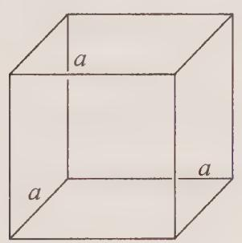  
(a)

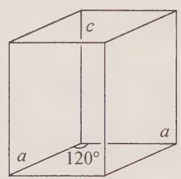  
(b)

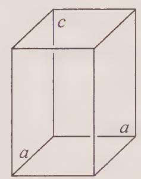  
(c)

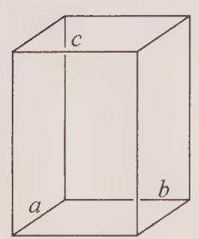  
(d)

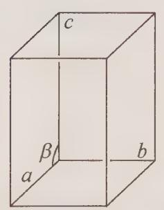  
(e)

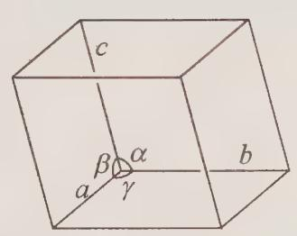  
(f)  
图7.2.3 6种晶胞的几何特征

(a) 立方晶胞，(b) 六方晶胞，(c) 四方晶胞，(d) 正交晶胞，(e) 单斜晶胞，(f) 三斜晶胞晶胞。每种几何特征的晶胞与一种晶族相对应。晶族(crystal family)是以按上述三条原则选择晶胞所得的几何特征为依据，将晶体分成6类的名称。由表7.2.2可见，除了将六方晶系和三方晶系合为一个六方晶族外，其他每个晶族都与晶系相同。另外，三斜晶族的记号用 $a$ (anorthic)而不用三斜晶系的 $t$ (triclinic)，以便和四方晶族的 $t$ (tetragonal)区分开。

根据上述选择晶胞(或坐标系)的三条原则,常见于文献的菱面体晶胞(其几何特征为 $a=b=c,\alpha=\beta=\gamma<120^{\circ}$ )因轴的夹角 $\alpha,\beta,\gamma$ 的数值都不是 $90^{\circ}$ ,没有被选上。另一方面,菱面体晶胞和立方晶系、六方晶系和三方晶系都有关系,不是三方晶系所特有。而六方晶胞(晶胞参数的限制条件为: $a=b,\alpha=\beta=90^{\circ},\gamma=120^{\circ}$ )既可满足三次对称轴转 $120^{\circ}$ 复原的要求,也可满足六次对称轴转 $60^{\circ}$ 复原的要求。从1983年《晶体学国际表》采用晶族表述空间点阵型式以来,比较明确地解决了三方晶系晶体分布在简单六方(hP)和R心六方(hR)两种空间点阵型式的问题。在空间群的表述和晶体学的各种计算上,三方晶系晶体采用六方晶胞比较方便。学习晶体学基础知识时,应当认真地理解和应用。

## 7.2.3 晶体学点群

晶体的理想外形及其在宏观观察中所表现的对称性称为宏观对称性。晶体的宏观对称性是在晶体微观结构基础上表现出来的相应的对称性。晶体宏观对称性中的对称元素和晶体微观结构中相应的对称元素一定是平行的，但宏观观察区分不了平移的差异，使晶体的宏观性质呈现出连续性和均匀性，微观对称操作中包含的平移已被均匀性所掩盖，结构中的螺旋轴和滑移面等，在宏观对称性中表现为旋转轴和镜面。所以，在晶体外形和宏观观察中表现出来的对称元素只有对称中心、镜面和轴次为1,2,3,4,6的旋转轴和反轴，与这些对称元素相应的对称操作都是点操作。当晶体具有一个以上对称元素时，这些宏观对称元素一定要通过一个公共点。将晶体中可能存在的各种宏观对称元素通过一个公共点按一切可能性组合起来，总共有32种型式，称为32种晶体学点群。

表7.2.3中列出32种晶体学点群的序号、记号、点群中包含的对称元素和所属的晶系。按4.3节有关点群的知识可知，表中 $D_{2d}$ 点群含 $I_{4}$ 对称轴，属于四方晶系； $C_{3h}$ 和 $D_{3h}$ 含 $I_{6}$ 对称轴，属六方晶系；对称元素中含有 $i$ 的11个点群为中心对称点群。

## 7.2.4 晶体的空间点阵型式

晶体的空间点阵型式是根据晶体结构的对称性,将点阵点在空间的分布按晶族规定的晶胞形状和带心型式进行分类,共有14种型式。这14种型式最早(1866年)由Bravias(布拉维)推得,又称为布拉维点阵或布拉维点阵型式。

根据点阵的特性, 点阵中全部点阵点都具有相同的周围环境, 各点的对称性都相同。当按照点阵的对称性划分点阵单位时, 除了素单位外, 尚有一些复单位存在。例如立方晶族, 含有2个点阵点的体心 (I) 单位和含有4个点阵点的面心 (F) 单位也完全满足立方晶族特征对称元素的要求。但若只有一个面带心, 例如 C 面带心 [点阵点坐标为 $(1/2, 1/2, 0)$ ], 就会破坏体对角线上三次旋转轴的对称性, 不能保持立方晶族。所以立方晶族只有3种点阵型式: 简单立方 $(cP)$ 、体心立方 $(cI)$ 、面心立方 $(cF)$ 。四方晶族有简单四方 $(tP)$ 和体心四方 $(tI)$ 。六方晶族有简单六方(hP)和R心六方(hR)。正交晶族有简单正交(oP)、C心正交(oC)、体心正交(oI)和面心正交(oF)。单斜晶族有简单单斜(mP)和C心单斜(mC)。三斜晶族则只有简单三斜(aP)。6个晶族共计14种空间点阵型式,如图7.2.4所示。

表 7.2.3 32 种晶体学点群

<table><tr><td>序号</td><td>Schönflies记号</td><td>国际记号</td><td>对称元素a</td><td>所属晶系</td></tr><tr><td>1</td><td> $C_1$ </td><td>1</td><td>—</td><td rowspan="2">三斜</td></tr><tr><td>2</td><td> $C_i$ </td><td> $\overline{1}$ </td><td>i</td></tr><tr><td>3</td><td> $C_2$ </td><td>2</td><td> $C_2$ </td><td rowspan="3">单斜</td></tr><tr><td>4</td><td> $C_s$ </td><td>m</td><td>σ</td></tr><tr><td>5</td><td> $C_{2h}$ </td><td>2/m</td><td>σ, $C_2$ ,i</td></tr><tr><td>6</td><td> $D_2$ </td><td>222</td><td> $3C_2$ </td><td rowspan="3">正交</td></tr><tr><td>7</td><td> $C_{2v}$ </td><td>mm2</td><td> $C_2$ ,2σ</td></tr><tr><td>8</td><td> $D_{2h}$ </td><td>2/mmm</td><td> $3C_2$ ,3σ,i</td></tr><tr><td>9</td><td> $C_4$ </td><td>4</td><td> $C_4$ </td><td rowspan="7">四方</td></tr><tr><td>10</td><td> $S_4$ </td><td> $\overline{4}$ </td><td> $I_4$ </td></tr><tr><td>11</td><td> $C_{4h}$ </td><td>4/m</td><td> $C_4$ ,σ,i</td></tr><tr><td>12</td><td> $D_4$ </td><td>422</td><td> $C_4$ ,4 $C_2$ </td></tr><tr><td>13</td><td> $C_{4v}$ </td><td>4mm</td><td> $C_4$ ,4σ</td></tr><tr><td>14</td><td> $D_{2d}$ </td><td> $\overline{42m}$ </td><td> $I_4$ ,2σ,2 $C_2$ </td></tr><tr><td>15</td><td> $D_{4h}$ </td><td>4/mmm</td><td> $C_4$ ,5σ,4 $C_2$ ,i</td></tr><tr><td>16</td><td> $C_3$ </td><td>3</td><td> $C_3$ </td><td rowspan="5">三方</td></tr><tr><td>17</td><td> $C_{3i}$ </td><td> $\overline{3}$ </td><td> $C_3$ ,i</td></tr><tr><td>18</td><td> $D_3$ </td><td>32</td><td> $C_3$ ,3 $C_2$ </td></tr><tr><td>19</td><td> $C_{3v}$ </td><td>3m</td><td> $C_3$ ,3σ</td></tr><tr><td>20</td><td> $D_{3d}$ </td><td> $\overline{3}m$ </td><td> $C_3$ ,3σ,3 $C_2$ ,i</td></tr><tr><td>21</td><td> $C_6$ </td><td>6</td><td> $C_6$ </td><td rowspan="7">六方</td></tr><tr><td>22</td><td> $C_{3h}$ </td><td> $\overline{6}$ </td><td> $I_6(C_3\sigma)$ </td></tr><tr><td>23</td><td> $C_{6h}$ </td><td>6/m</td><td> $C_6$ ,σ,i</td></tr><tr><td>24</td><td> $D_6$ </td><td>622</td><td> $C_6$ ,6 $C_2$ </td></tr><tr><td>25</td><td> $C_{6v}$ </td><td>6mm</td><td> $C_6$ ,6σ</td></tr><tr><td>26</td><td> $D_{3h}$ </td><td> $\overline{6}m2$ </td><td> $I_6$ ,3σ,3 $C_2$ </td></tr><tr><td>27</td><td> $D_{6h}$ </td><td>6/mmm</td><td> $C_6$ ,7σ,6 $C_2$ ,i</td></tr><tr><td>28</td><td>T</td><td>23</td><td> $4C_3$ ,3 $C_2$ </td><td rowspan="5">立方</td></tr><tr><td>29</td><td> $T_h$ </td><td> $m\overline{3}$ </td><td> $4C_3$ ,3σ,3 $C_2$ ,i</td></tr><tr><td>30</td><td>O</td><td>432</td><td> $4C_3$ ,3 $C_4$ ,6 $C_2$ </td></tr><tr><td>31</td><td> $T_d$ </td><td> $\overline{43}m$ </td><td> $4C_3$ ,3 $I_4$ ,6σ</td></tr><tr><td>32</td><td> $O_h$ </td><td> $m\overline{3}m$ </td><td> $4C_3$ ,3 $C_4$ ,9σ,6 $C_2$ ,i</td></tr></table>

$^{a}$ 对称元素符号前的数字代表该对称元素的数目,未注数字的表示为 1。

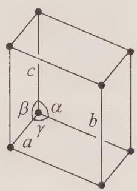  
1

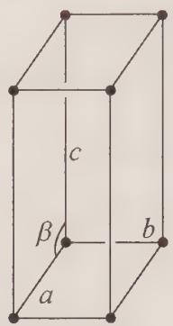  
2

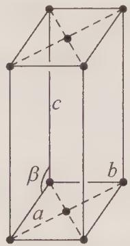  
3

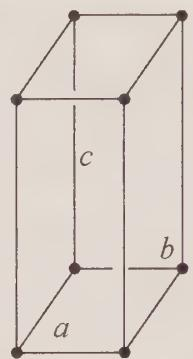  
4

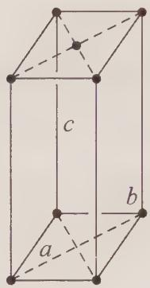  
5

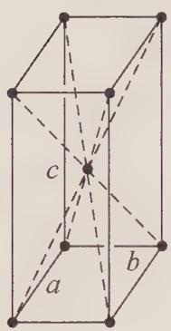  
6

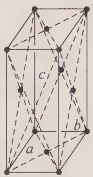  
7

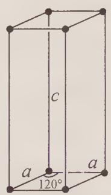  
8

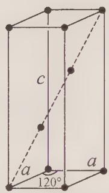  
9

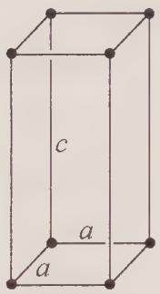  
10

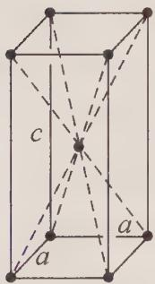  
11

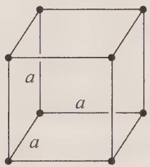  
12

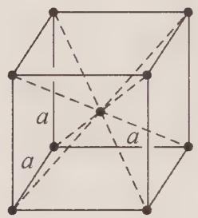  
13

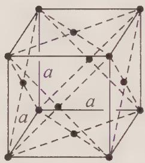  
14  
图7.2.4 14种空间点阵型式

(1) 简单三斜 $(aP)$ , (2) 简单单斜 $(mP)$ , (3) $C$ 心单斜 $(mC)$ , (4) 简单正交 $(oP)$ , (5) $C$ 心正交 $(oC)$ , (6) 体心正交 $(oI)$ , (7) 面心正交 $(oF)$ , (8) 简单六方 $(hP)$ , (9) $R$ 心六方 $(hR)$ , (10) 简单四方 $(tP)$ , (11) 体心四方 $(tI)$ , (12) 简单立方 $(cP)$ , (13) 体心立方 $(cI)$ , (14) 面心立方 $(cF)$

特别要说明，六方晶系和三方晶系同属六方晶族。可以证明，六方晶系晶体只有一种简单

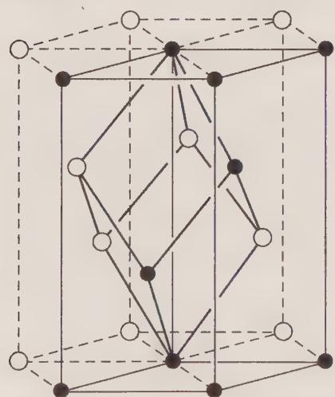  
图 7.2.5 hR 点阵型式中点阵点的分布 (hR 中为黑点), 及菱面体素单位 (顶点上为 4 个黑点和 4 个白点组成)

六方 $(hP)$ 点阵型式。而三方晶系晶体一部分属简单六方 $(hP)$ 点阵型式，还有一部分属 $R$ 心六方 $(hR)$ 点阵型式。在 $hR$ 点阵型式中，每个六方点阵单位中包含3个点阵点，其坐标位置为： $(0,0,0);\left(\frac{2}{3},\frac{1}{3},\frac{1}{3}\right);\left(\frac{1}{3},\frac{2}{3},\frac{2}{3}\right)$ 。注意，这种点阵单位只有三次对称轴的对称性。 $hR$ 复单位可划出只含1个点阵点的菱面体素单位，如图7.2.5所示。

下面选两个实例,说明点群、晶系和空间点阵型式的关系。

【例7.2.1】 $\alpha$ -硒

$\alpha-Se$ 的分子呈螺旋形长链, 其结构已示于图 7.1.2(c) 中。在晶体中, 这些螺旋长链分子互相平行地堆积在一起,

平行于螺旋轴的投影结构示于图7.2.6。晶体的点群为 $D_{3} - 32$ ，三方晶系，晶胞参数 $a = b =$

435.52pm, $c = 494.95\mathrm{pm}$ ，它的空间点阵型式为简单六方 $(hP)$ ，一个点阵点代表3个Se原子。

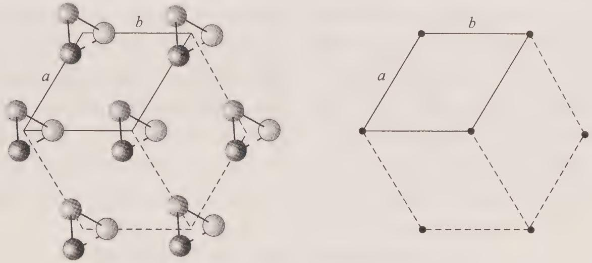  
图7.2.6 $\alpha$ -硒的晶体结构  
(a) 结构沿 $c$ 轴的投影，(b) 点阵单位

## 【例7.2.2】六方石墨和三方石墨

六方石墨和三方石墨都是由石墨层形分子[见图7.1.3(c)]平行堆积而形成的晶体。六方石墨中层形分子堆积的次序为ABAB…，三方石墨为ABCABC…，如图7.2.7左边所示。图7.2.7中间的图表示晶胞，六方石墨a=b=245.6pm,c=669.6pm，晶胞中含4个C原子；三方石墨 $a = b = 245.6\mathrm{pm}, c = 1004.4\mathrm{pm}$ ，晶胞中含6个C原子。在六方石墨堆积中，通过A层分子（或B层分子）的平面为镜面，紧邻镜面的上、下层均为B层（或A层），三次旋转轴和垂直于它的镜面组合形成六重反轴(6，▲)，晶体属 $D_{6h} - 6 / mmm$ 点群，为六方晶系。在三方石墨堆积中，通过A层分子的平面不具镜面对称性，因它上面是C层，下面是B层，它具有三次反轴对称性（3，▲），晶体属 $D_{3d} - \bar{3}m$ 点群，三方晶系。图7.2.7右边示出点阵单位，六方石墨属简单六方点阵型式(hP)，每个点阵点代表由4个C原子组成的结构基元。三方石墨属R心六方点阵型式(hR)，点阵单位中含3个点阵点，每个点阵点代表由2个C原子组成的结构基元。注意，从三方石墨晶体结构抽象出来的点阵单位只有三次对称轴，而没有六次对称轴。

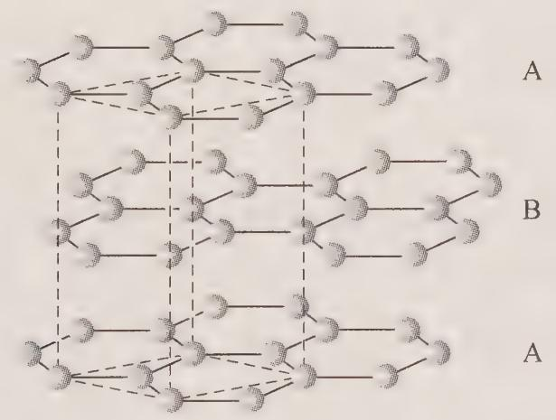

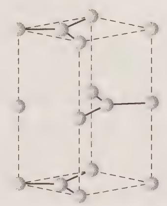  
(a)

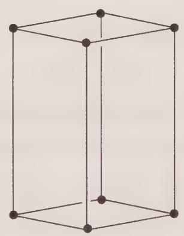  
(hP)

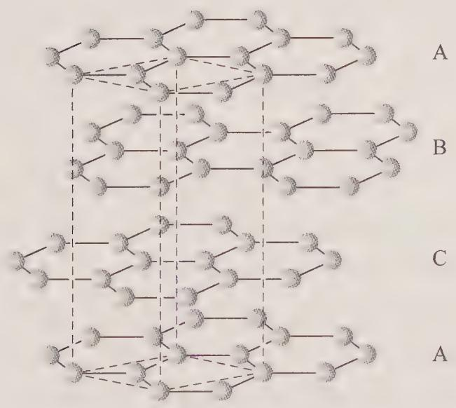

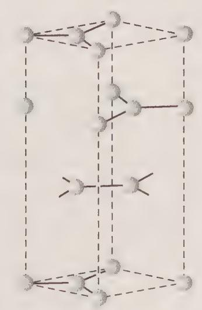  
(b)

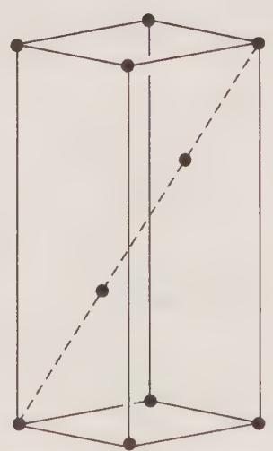  
(hR)  
图 7.2.7 石墨晶体中层形分子的堆积结构, 晶胞和点阵单位 (a) 六方石墨, (b) 三方石墨

## 7.3 点阵的标记和点阵平面间距

当空间点阵选择某一点阵点为坐标原点,选择3个不相平行的单位矢量a,b,c后,该空间点阵就按确定的平行六面体单位进行划分,单位的大小、形状就已确定。这时点阵中每一点阵点都可用一定的指标标记。而一组直线点阵或某个晶棱的方向也可用数字符号标记。一组平面点阵或晶面也可用一定的数字指标标记。

## 1. 点阵点指标 uvw

空间点阵中某一点阵点的坐标,可作从原点至该点的矢量 r,并将 r 用单位矢量 a, b, c 表示。若

$$
\boldsymbol {r} = u \boldsymbol {a} + v \boldsymbol {b} + w \boldsymbol {c}
$$

则该点阵点的指标为 uvw。

## 2. 直线点阵指标或晶棱指标[uvw]

晶体点阵中的每一组直线点阵的方向，用记号 $[uvw]$ 表示，其中 $u, v, w$ 为3个互质的整数。直线点阵 $[uvw]$ 的取向与矢量 $ua + vb + wc$ 平行。

晶体外形上晶棱的记号与和它平行的直线点阵相同。

## 3. 平面点阵指标或晶面指标 $(hkl)$

晶体的空间点阵可划分为一族平行且等间距的平面点阵。晶体外形中每个晶面都和一族平面点阵平行，可根据晶面和晶轴相互间的取向关系，用晶面指标标记同一晶体内不同方向的平面点阵族或晶体外形的晶面。

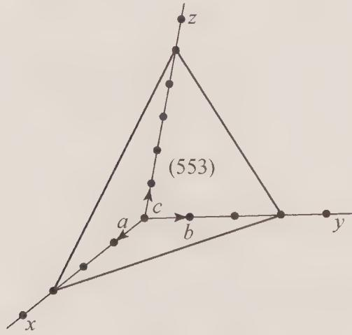  
图7.3.1 平面点阵(553)的取向

设有一平面点阵和3个坐标轴 $x, y, z$ 相交，在3个坐标轴上的截数分别为 $r, s, t$ （以 $a, b, c$ 为单位的截距数目）。截数之比即可反映出平面点阵的方向。但直接由截数之比 $r: s: t$ 表示时，当平面点阵和某一坐标轴平行，截数将会出现 $\infty$ 。为避免出现 $\infty$ ，规定用截数的倒数之比，即 $1/r: 1/s: 1/t$ 作为平面点阵的指标。由于点阵的特性，这个比值一定可化成互质的整数之比 $1/r: 1/s: 1/t = h: k: l$ ，平面点阵的取向就用指标(hkl)表示，即平面点阵的指标为(hkl)。

图 7.3.1 中 r, s, t 分别为 3, 3, 5，而 $1/r:1/s:1/t=1/3:1/3:1/5=5:5:3$ ，该平面点阵的指标为(553)。

平面点阵尚可用图 7.3.2 和图 7.3.3 表示。图 7.3.2 示出 (100)，(110)，(111) 三组点阵面在三维点阵中的取向关系。图7.3.3示出在沿 $z$ 轴的投影图中和 $z$ 轴平行的各组点阵面的取向。

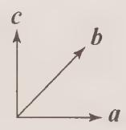

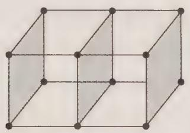  
(100)

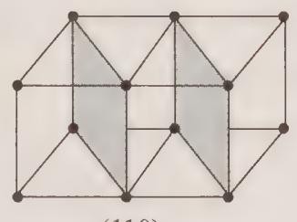  
(110)

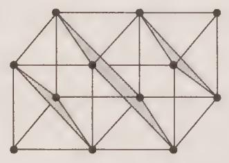  
(111)

图7.3.2 (100), (110), (111)点阵面在点阵中的取向  
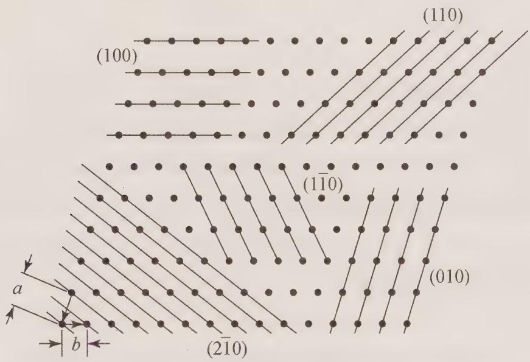  
图7.3.3 和 $z$ 轴平行的各组点阵面在投影中的取向

晶体外形中每个晶面都和一族平面点阵平行，所以 $(hkl)$ 也用作和该平面点阵平行的晶面的指标。当对晶体外形的晶面进行指标化时，通常把坐标原点放在晶体的中心，外形中两个平行的晶面一个为 $(hkl)$ ，另一个为 $(\overline{hkl})$ 。例如NaCl晶体常出现立方体的外形，其6个晶面的指标分别为(100)，(010)，(001)，(100)，(010)，(001)。明矾晶体常出现正八面体外形，这8个晶面的指标分别为(111)，(111)，(111)，(111)，(111)，(111)，(111)，(111)。四面体4个面的指标分别为(111)，(111)，(111)，(111)。图7.3.4示出NaCl、明矾、金刚石和萤石等晶体常见的理想外形。在结构化学中，通常所说的晶面指标往往是和该晶面平行的平面点阵族的指标。

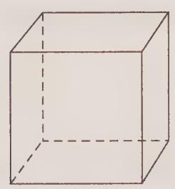  
(a)

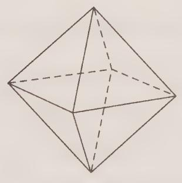  
(b)

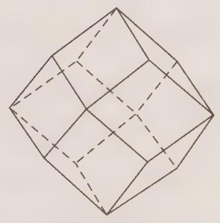  
(c)

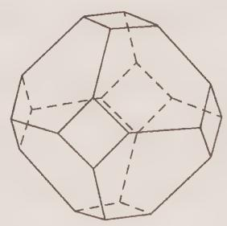  
(d)  
图7.3.4 几种晶体常见的理想外形

(a) NaCl 的立方体(100)面，(b) 明矾的八面体(111)面，(c) 金刚石的菱形十二面体(110)面，(d) 萤石的立方八面体(100)和(111)面形成的聚形

## 4. 平面间距 $d_{(hkl)}$

平面点阵族 $(hkl)$ 中相邻两个点阵面的间距用 $d_{(hkl)}$ 表示。 $d_{(hkl)}$ 又称晶面间距，它是指由指标 $(hkl)$ 规定的平面族中两个相邻平面之间的垂直距离。不同晶系使用不同的计算公式，如表7.3.1所列。

表 7.3.1 平面间距 ${d}_{\left( hkl\right) }$ 计算公式

<table><tr><td>晶系a</td><td> $d_{(khl)}$ 计算公式</td></tr><tr><td>立方</td><td> $a(h^{2}+k^{2}+l^{2})^{-1/2}$ </td></tr><tr><td>六方</td><td> $[4(h^{2}+hk+k^{2})/3a^{2}+l^{2}/c^{2}]^{-1/2}$ </td></tr><tr><td>四方</td><td> $[(h^{2}+k^{2})/a^{2}+l^{2}/c^{2}]^{-1/2}$ </td></tr><tr><td>正交</td><td> $[h^{2}/a^{2}+k^{2}/b^{2}+l^{2}/c^{2}]^{-1/2}$ </td></tr><tr><td>单斜</td><td> $\sin\beta[h^{2}/a^{2}+k^{2}\sin^{2}\beta/b^{2}+l^{2}/c^{2}-2hl\cos\beta/ac]^{-1/2}$ </td></tr><tr><td>三斜</td><td> $V[h^{2}b^{2}c^{2}\sin^{2}\alpha+k^{2}a^{2}c^{2}\sin^{2}\beta+l^{2}a^{2}b^{2}\sin^{2}\gamma+2hkabc^{2}(\cos\alpha\cos\beta-\cos\gamma)+2kla^{2}bc(\cos\beta\cos\gamma-\cos\alpha)+2hlab^{2}c(\cos\alpha\cos\gamma-\cos\beta)]^{-1/2}$ 式中: $V=abc(1-\cos^{2}\alpha-\cos^{2}\beta-\cos^{2}\gamma+2\cos\alpha\cos\beta\cos\gamma)^{1/2}$ </td></tr></table>

式中未列出三方晶系，因它取六方晶胞按六方晶系公式，取菱面体晶胞可将三斜晶系公式简化计算。

由公式可见,平面间距既与晶胞参数有关,又与平面指标(hkl)有关。h,k,l的数值越小,面间距离越大,根据经验规律,实际晶体外形中这个晶面出现的机会也越大。实际上,晶体外形出现的晶面,其指标都是简单的整数。

## 7.4 空间群及晶体结构的表达

## 7.4.1 空间群的推导和表达

晶体结构具有空间点阵式的结构,点阵结构的空间对称操作群称为空间群,即空间群是晶体空间对称操作的集合。

将点操作和平移操作组合在一起，可得到螺旋旋转（包括纯旋转）、滑移反映和旋转倒反（或旋转反映）三类复合操作，以及这些复合操作依据的对称元素的方位。例如，对称中心和平移 $t$ 组合在一起，从 $A$ 出发经平移 $t$ ，除在 $A^{\prime}$ 处有对称中心外，在 $t / 2$ 处将产生新的对称中心 $(B)$ ，如图7.4.1(a)所示。二次旋转轴和垂直于该轴的平移 $t$ 组合，从 $A$ 出发，经平移 $t$ 在 $A^{\prime}$ 处有二次旋转轴，在 $t / 2$ 处也有二次旋转轴 $(B)$ ，如图7.4.1(b)所示。三次旋转轴和垂直于它的平移 $t$ 组合，从 $A$ 出发，经平移 $t$ 在 $A^{\prime}$ 处有三次旋转轴外，在 $B$ 处出现新的三次旋转轴，如

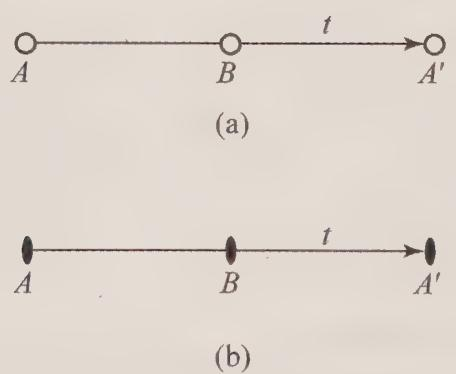

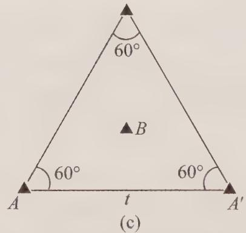  
图7.4.1 点对称操作和平移操作组合，将产生新的对称操作  
(a) 对称中心，(b) 二次旋转轴，(c) 三次旋转轴

图 7.4.1(c) 所示。

空间群可分为点式空间群和非点式空间群两大类。点式空间群是在14种空间点阵型式基础上，将点阵型式和点群进行组合得到的。例如，单斜晶系有 $mP$ 和 $mC$ 两种点阵型式，而单斜晶系的点群有 $2, m, 2/m$ 三种，将这两者组合可得 $P2, Pm, P2/m, C2, Cm, C2/m$ 等6种点式空间群，7个晶系计有73种点式空间群。非点式空间群可在点式空间群的基础上，将其中的旋转轴和镜面逐一地换成同形的对称元素，即：将二次轴(2)换成 $2_{1}$ ；三次轴(3)换成 $3_{1}, 3_{2}$ ；四次轴(4)换成 $4_{1}, 4_{2}, 4_{3}$ ；六次轴(6)换成 $6_{1}, 6_{2}, 6_{3}, 6_{4}, 6_{5}$ ；镜面 $(m)$ 换成 $a, b, c, n, d, e$ 等滑移面。替换后，抛弃其中不可能的组合，把相同的组合归并到一起。例如， $C_{2h}$ 点群可得2种点式空间群和4种非点式空间群，其编号如下：

$$
C _ {2 h} ^ {1} - P 2 / m, \quad C _ {2 h} ^ {2} - P 2 _ {1} / m, \quad C _ {2 h} ^ {3} - C 2 / m, \quad C _ {2 h} ^ {4} - P 2 / c, \quad C _ {2 h} ^ {5} - P 2 _ {1} / c, \quad C _ {2 h} ^ {6} - C 2 / c
$$

空间群的总数为 230 个。

每个空间群都有其特征的微观对称元素的排布方式，可以用一个晶胞内排布的图形表示。对称元素的排布制约着晶体中原子的排布，它既限定了原子的相对位置，也简化了晶体结构的表达内容。空间群的知识对晶体学、化学、材料科学及其相关学科都极为有用。《晶体学国际表》A卷对230个空间群一一地加以描述，并详细介绍使用指南，它是关于空间群内容最重要、最权威的参考资料。

每个空间群的记号可用 Schönflies(申夫利斯)记号,或用国际记号,也可同时将两种记号结合使用。例如 $D_{2h}^{16}-P2_{1}/n\ 2_{1}/m\ 2_{1}/a$ : $D_{2h}$ 是点群的 Schönflies 记号; $D_{2h}^{16}$ 是空间群的 Schönflies 记号;“-”后是国际记号,第一个大写字母表示点阵型式,P 为简单点阵;其余 3 个位置上的记号表示晶体中 3 个方向的对称性。各个晶系3个位置方向的规定列于表7.4.1中。

表 7.4.1 国际记号中 3 个位置代表的方向

<table><tr><td rowspan="2">晶系</td><td colspan="3">3个位置所代表的方向</td></tr><tr><td>1</td><td>2</td><td>3</td></tr><tr><td>立方晶系</td><td>a</td><td>a+b+c</td><td>a+b</td></tr><tr><td>六方晶系</td><td>c</td><td>a</td><td>2a+b</td></tr><tr><td>四方晶系</td><td>c</td><td>a</td><td>a+b</td></tr><tr><td>三方晶系(取菱面体晶胞)</td><td>a+b+c</td><td>a-b</td><td>-</td></tr><tr><td>三方晶系(取六方晶胞)</td><td>c</td><td>a</td><td>-</td></tr><tr><td>正交晶系</td><td>a</td><td>b</td><td>c</td></tr><tr><td>单斜晶系</td><td>b</td><td>-</td><td>-</td></tr><tr><td>三斜晶系</td><td>-</td><td>-</td><td>-</td></tr></table>

例如， $P2_{1}/n2_{1}/m2_{1}/a$ 表示晶体为正交晶系简单点阵型式，3个位置分别代表a,b,c方向，即： $\|a$ 有 $2_{1}$ 轴， $\perp a$ 有n滑移面； $\|b$ 有 $2_{1}$ 轴， $\perp b$ 有镜面； $\|c$ 有 $2_{1}$ 轴， $\perp c$ 有a滑移面。

属于同一点群的晶体，可分别隶属于几个空间群。各种晶体归属在230个空间群中的分布情况，数量上相差很大。由形状不规则的有机分子堆积成的晶体，属于 $C_{2h}^{5}-P2_{1}/c$ 者最多，占20%以上。图7.4.2示出 $C_{2h}^{5}-P2_{1}/c$ 对称元素分布图（以b为单轴）。

和空间群的对称元素系密切相关的另一概念是等效点系坐标位置。如果按图7.4.3表示的对称元素的分布了解晶胞中原子的排列，当在位置1处有一个原子时，因为对称元素的要求，在晶胞中2,3,4位置上也要有原子。1,2,3,4这4个点是由对称性联系的、等效的一组点。所谓等效,是指从任意一点出发,必然得出其他3个点,它们是由对称性联系的、等同的一组点。

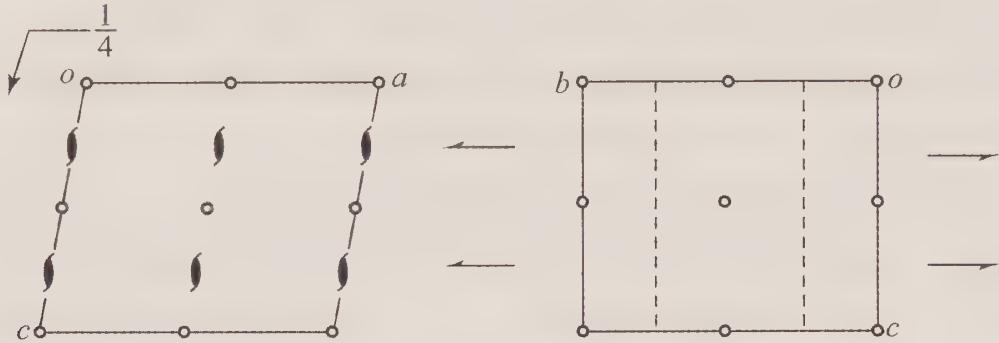  
图 7.4.2 $C_{2h}^{5}-P2_{1}/c$ 对称元素分布图 (b 轴由纸面向外)

左图为沿 $b$ 轴投影，右图为沿 $a$ 轴投影。图中平行四边形线代表晶胞形状，“○”代表对称中心，“ $\text{1}$ ”代表 $2_{1}$ 轴，“ $\sqrt{-\frac{1}{4}}$ ”代表 $y$ 值为 $1/4$ 处有 $c$ 滑移面

当等效点系位置是处在晶胞中的一般位置上，而不是处在某一对称元素上时，称为一般等

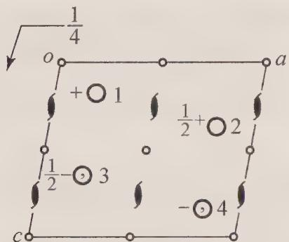  
图 7.4.3 $C_{2h}^{5}-P2_{1}/c$ 的等效点系

效点系位置。空间群 $C_{2h}^{5}-P2_{1}/c$ 的一般等效位置为（指 b 轴为单轴）：(1) x, y, z;
(2) $\bar{x}, \frac{1}{2} + y, \frac{1}{2} - z;$ (3) $x, \frac{1}{2} - y, \frac{1}{2} + z;$ (4) $\bar{x}, \bar{y}, \bar{z}$

图中○和◎表示互为镜像关系；在旁边注明的“+， $\frac{1}{2}$ +， $\frac{1}{2}$ -，-”指y轴的坐标分别为 $y,\frac{1}{2}+y,\frac{1}{2}-y,\bar{y}$ 当坐标点处在对称元素上，x, y, z 具有特定数值，这时点的数目减少。按图 7.4.3 所示，若原子坐标为 0, 0, 0，则等效点数目降为 2，这一特殊的等效点系为：0, 0, 0; 0, 1/2, 1/2。

在《晶体学国际表》中，为每个空间群列出了一般等

效点系和各种特殊位置的等效点系及其对称性。等效点系是从原子排列的方式表达晶体的对称性，对学习晶体化学有重要意义。

## 7.4.2 晶体结构的表达及应用

根据晶体具有点阵结构的特点,在描述和表达一个晶体的结构时,只要了解晶胞的大小、形状、晶胞内部原子的坐标参数(及热参数)以及晶体的周期性、对称性即可。由于晶胞内部原子之间往往有对称元素将它们联系起来,当表达原子的坐标参数时,不需要将晶胞中每一个原子的坐标参数都标出来,而只要标出不对称单位中的原子的坐标参数即可。所谓不对称单位,是指晶胞中原子之间没有对称元素联系的那一部分原子。根据不对称单位中的原子坐标参数,通过对称操作,晶胞中全部原子的坐标参数就可以导出。

一个晶体可以有多种划分晶胞的方式。不同方式的晶胞，其形状和大小不同，相应的原子坐标参数也不相同。对于一种方式的晶胞，由于原点选择不同，原子坐标参数的数值不同，但各个原子间的差值是相同的。

本小节以 $\alpha$ -二水合草酸(HOOC—COOH·2H $_2$ O)为例,介绍化学文献中对于晶体结构的表达方式,以及如何把晶体学语言(晶系、空间群、晶胞参数、原子坐标参数等)表述为化学语言（键长、键角、分子的几何构型等），进而利用晶体学数据解决化学问题。

$\alpha-$ 二水合草酸的晶体结构参数列于表7.4.2中。

表 7.4.2 α-二水合草酸的晶体学数据及原子坐标参数 (100 K)

<table><tr><td>原子</td><td>x</td><td>y</td><td>z</td></tr><tr><td>C(1)</td><td>-0.0448</td><td>0.0586</td><td>0.0520</td></tr><tr><td>O(1)</td><td>0.0851</td><td>-0.0562</td><td>0.1501</td></tr><tr><td>O(2)</td><td>-0.2214</td><td>0.2424</td><td>0.0363</td></tr><tr><td>O(w)</td><td>-0.4515</td><td>0.6309</td><td>0.1787</td></tr><tr><td>H(1)</td><td>0.0234</td><td>0.0217</td><td>0.2228</td></tr><tr><td>H( $w_1$ )</td><td>-0.5783</td><td>0.6968</td><td>0.1127</td></tr><tr><td>H( $w_2$ )</td><td>-0.3581</td><td>0.4546</td><td>0.1495</td></tr></table>

晶系: 单斜; 空间群: $C_{2h}^{5}-P2_{1}/n$ 。  
晶胞参数： $a = 609.68\mathrm{pm},b = 349.75\mathrm{pm},c = 1194.6\mathrm{pm},\beta = 105.78^{\circ};Z = 2$

根据晶胞参数、空间群和原子坐标参数等数据，画出晶体结构沿 $b$ 轴的投影，示于图7.4.4中。

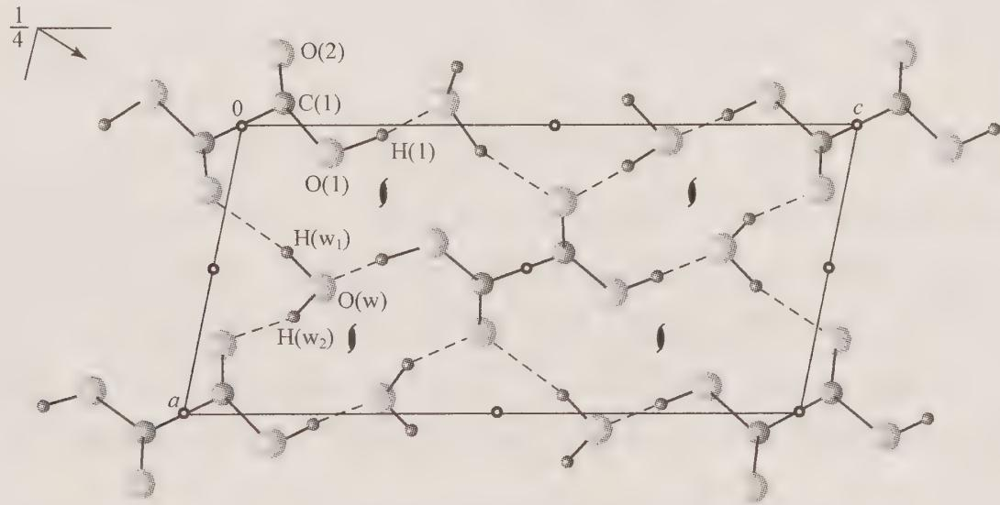  
图7.4.4 $\alpha$ -二水合草酸晶胞沿 $b$ 轴投影图  
(○代表C原子，○代表H原子，)代表O原子，----代表氢键)

上述数据和图形,提供了深入地了解 $\alpha-$ 二水合草酸的晶体学和结构化学的素材。

## 1. $\alpha$ -二水合草酸的晶体学

图7.4.4示出晶体中草酸分子和水分子交替排列的图像以及它们和微观对称元素的关系。草酸为中心对称的分子，在晶体中坐在对称中心上，通过 $2_{1}$ 和 $n$ 排列成周期性的有序结构。对比图7.4.2和图7.4.4，可看出 $C_{2h}^{5} - P2_{1} / c$ 和 $C_{2h}^{5} - P2_{1} / n$ 同属一个空间群，因为 $P2_{1} / n$ 中 $i,2_{1},n$ 的相对排布方式和 $P2_{1} / c$ 的 $i,2_{1},c$ 是完全一样的。空间群的两种记号只是标志着滑移面的滑移量和轴的取向不同， $n$ 滑移面的滑移量为 $(a + c) / 2,c$ 滑移面的滑移量为 $c / 2$ 。

图中所示的晶胞是素晶胞,整个晶胞的内容即晶体的结构基元,它由2个草酸分子和4个水分子组成。晶胞中的不对称单位则是指晶体中没有对称元素联系的那一部分原子,或是指那一部分空间。由图可见,这个晶体中不对称单位包含半个草酸分子(COOH)和1个 $H_{2}O$ 分子,或者取以对称中心为顶点划分出来的1/4个晶胞作为不对称单位。

$C_{2h}^{5} - P2_{1} / n$ 空间群的一般位置的等效点系为：

$$
x, y, z; \quad \frac {1}{2} - x, \frac {1}{2} + y, \frac {1}{2} - z; \quad - x, - y, - z; \quad \frac {1}{2} + x, \frac {1}{2} - y, \frac {1}{2} + z
$$

表 7.4.2 中所列的原子都是独立的, 在晶胞中通过对称操作, 它们都形成各自的等效点系。

## 2. 草酸分子的构型

根据表7.4.2的数据，可算得草酸分子的构型，如图7.4.5(a)所示。

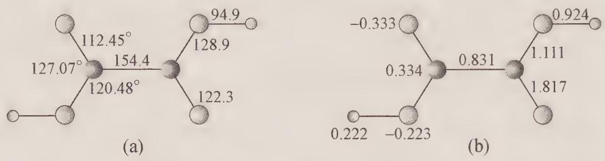  
图 7.4.5 草酸分子的键长、键角(a)及键级和电荷分布(b)  
原子所带电荷以 e 为单位, 示于图(b)左边的 4 个数

## 3. 草酸分子中化学键的性质

草酸分子为平面形分子，C—C键长在100 K下达154.4 pm，比单键要长，而且大多数草酸盐和草酸氢盐室温下C—C键长也在156～158 pm之间。为什么在草酸分子中存在单双键交替体系（见下式），而C—C键比单键还长呢？

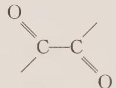

通过量子化学计算知道,是由于在占有电荷的分子轨道中,4个π轨道在2个C原子间正负、正负交替重叠,成键和反键互相抵消,没有净的π键成键效应;又由于O原子电负性较高,O原子上净电荷较多,C原子上较少,如图7.4.5(b)所示。上述因素影响了C—C键键级,只有0.831,比单键弱。草酸分子键级值示于图7.4.5(b)中。草酸容易从C—C键断裂,并氧化成2个CO₂分子,所以草酸是常用的、优良的还原剂,这与其C—C键性质有关。

生物体中糖的代谢过程都是要经过酶催化形成酮酸 $\left[\begin{array}{c}O\\C-OH\\R\end{array}\right]$ ，再经氧化脱羧反应，最终氧化成 $CO_{2}$ 和 $H_{2}O$ ，并放出大量的能量。从结构化学的观点来分析，糖类代谢过程的关键是酮酸中的C—C键较弱，容易脱羧氧化放出 $CO_{2}$ 。

## 4. 草酸分子和水分子间的氢键

由图 7.4.4 可见, 每个草酸分子周围通过氢键和 6 个 $H_{2}O$ 分子相连, 而每个 $H_{2}O$ 分子则和 3 个草酸分子相连, 形成氢键体系, 在其中每个 H 原子作为质子给体, O 原子作为质子受体, 非常合理地、和谐地结合在一起。

根据实验测定的晶胞参数和原子坐标参数(见表7.4.2)可以计算氢键的键长和O—H…O的键角,其中氢键 $O_{(1)}—H_{(1)}\cdots O_{(w)}$ 键长为250.6 pm,键角为179°。另外2个 $O_{(w)}—H\cdots O_{(2)}$ 键长分别为286.4 pm和289.2 pm,键角分别为167°和157°,其中 $O_{(1)}—H_{1}\cdots O_{(w)}$ 为强氢键,直线构型。这和酸中形成强氢键的规律是完全一致的。

目前，30多万种化合物的晶体结构已经测定，这些晶体结构数据加深了人们对化学科学的认识。促进化学的发展有许多因素，其中之一是晶体结构知识所起的作用。很难想象，如果没有X射线衍射法测定出大量的晶体结构，化学能够发展到今天这样的水平。

## 7.5 晶体的结构和晶体的性质

## 7.5.1 晶体的特性

晶体内部原子或分子按周期性规律排列,具有三维空间点阵的结构,使晶体有下列通性:

（1）各向异性。在晶体中不同的方向上具有不同的物理性质。例如在不同的方向具有不同的电导率、不同的热膨胀系数、不同的折射率以及不同的机械强度，等等。晶体的这种特性，是由晶体内部原子的周期性排列所决定的。在周期性结构中，不同方向上原子或分子的排列情况是不相同的，因而在物理性质上具有异向性。玻璃体等非晶物质，不会出现各向异性，而呈现等向性，例如玻璃的折射率、热膨胀系数等，一般不随测定的方向而改变。

（2）自发地形成多面体外形。晶体在生长过程中自发地形成晶面，晶面相交成为晶棱，晶棱会聚成顶点，从而出现具有多面体外形的特点，这种特点源自晶体的周期性结构。晶体在理想环境中生长，应长成凸多面体。凸多面体的晶面数 $(F)$ 、晶棱数 $(E)$ 和顶点数 $(V)$ 之间的关系符合Euler(欧拉)公式

$$
F + V = E + 2
$$

例如四面体有4个面，6条棱，4个顶点；立方体有6个面，12条棱，8个顶点；八面体有8个面，12条棱，6个顶点。

玻璃体不会自发地形成多面体外形,当液体玻璃冷却时,随着温度降低,黏度变大,流动性变小,固化成表面圆滑的无定形体。这与晶体的有棱、有顶角、有平面的性质完全不同。

（3）具有明显确定的熔点。晶体具有周期性结构，各个部分都按同一方式排列。当温度升高，热振动加剧，晶体开始熔化时，各部分需要同样的温度，因而有一定的熔点。玻璃体和晶体不同，它们没有一定的熔点。例如，将玻璃加热，它随着温度升高逐渐变软，黏度减小，变成黏稠的液体，进而成为流动性较大的液体。在此过程中，没有温度停顿的时候，很难指出哪一温度是其熔点。

（4）具有特定的对称性。如前所述，晶体的点阵结构使晶体具有的对称元素受到点阵的制约，点对称元素只有镜面、对称中心以及轴次为1,2,3,4,6等的对称轴。这些点对称元素通过一个公共点组合，可得32个晶体学点群。根据晶体所具有的特征对称元素或点群，可将晶体分成7个晶系。按对称性要求选择晶胞，可得6种几何特征的晶胞，由此将晶体分成6个晶族。根据各个晶族规定的点阵单位和带心型式，可推得14种空间点阵型式。将空间点阵型式、点群及平移对称操作组合在一起，可得230种空间群。这些内容构成了丰富的晶体对称性的知识宝库。

(5) 对 X 射线、电子流和中子流产生衍射。晶体结构的周期大小和 X 射线、电子流及中子流的波长相当, 可作为三维光栅, 产生衍射。而晶体的衍射成为了解晶体内部结构的重要实验方法。非晶物质没有周期性结构, 只能产生散射效应, 得不到衍射图像。

上述晶体的特性是由晶体内部原子或分子排列的周期性所决定的,是各种晶体所共有的,是晶体的一些基本性质。

另外，晶体还具有均匀性。一块晶体内部各个部分的宏观性质是相同的，例如有相同的密度、相同的化学组成，等等。晶体的均匀性来源于晶体中原子排布的周期很小，宏观观察分辨不出微观的不连续性。均匀性不是晶体的特性。气体、液体和玻璃体也有均匀性，但这是由于原子杂乱无章地分布，均匀性来源于原子无序分布的统计性规律。

## 7.5.2 晶体的点群和晶体的物理性质

晶体的宏观对称性和晶体的物理性质之间存在着密切的联系：（i）晶体的任一物理性质所拥有的对称元素必须包含晶体所属点群的对称元素，所以晶体的物理性质的对称性比晶体所属点群的对称性更高，或者说，晶体物理性质的对称性不能低于晶体所属点群的对称性。（ii）对称元素在晶体中的取向，例如三次轴、四次轴或六次轴，其取向和晶体物理性质对称性的取向一致。

上述关系称为 Neumann(诺依曼)规则,它已由大量实验事实所证实。下面介绍一些实例,以说明晶体对称性和晶体物理性质对称性的关系。

## 1. 晶体的光学性质

晶体所属晶系有高级、中级或低级晶系，它在光学性质上会表现出不同的状态。立方晶系晶体在光学上是各向同性体，指示它各个方向折射率性质的光学示性面为圆球体。它有无限多个无限次的对称轴、无数个对称面和一个对称中心，这比立方晶系任一点群的对称性都高。又如，对一个含六次轴的中级晶系的晶体，在 $c$ 轴上有六次轴，属于该点群的各种晶体的任意一种物理性质，在 $c$ 轴上的对称性都不能低于六次轴。中级晶系（六方、四方和三方晶系）晶体的光学示性面是以 $c$ 轴为旋转轴的旋转椭球面，有2个主折射率，其对称性远高于六次、四次或三次对称轴。而且不出现双折射的光轴只有一个，其取向一定和高次对称轴的取向一致。低级晶系（正交、单斜和三斜晶系）晶体的光学示性面显示有3个不相等的主折射率，是三轴椭球面，它有2个光轴，为双光轴晶体。

## 2. 不同点群晶体的物性

晶体的许多物性可将晶体的32种点群加以分类来判别。32种点群按有无对称中心和是否为极性点群可作下面的分类。

$$
3 2 \text {种点群} \left\{ \begin{array}{l l} 1 1 \text {种中心对称点群:} \overline {{1}}, 2 / m, 2 / m m m, \overline {{3}}, \overline {{3}} m, 4 / m, 4 / m m m, 6 / m, 6 / m m m, m \overline {{3}}, m \overline {{3}} m \\ 2 1 \text {种非中心对称点群} \left\{ \begin{array}{l l} 1 0 \text {种极性群:} 1, 2, 3, 4, 6, m, m m 2, 3 m, 4 m m, 6 m m \\ 1 1 \text {种非极性群:} 2 2 2, 3 2, 4, 4 2 m, 4 2 2, \overline {{6}}, \overline {{6}} m 2, 6 2 2, 2 3, 4 3 2, \overline {{4}} 3 m \end{array} \right. \end{array} \right.
$$

凡是中心对称点群的晶体都不可能具有晶体的倍频效应、热释电效应、压电效应、铁电效应、非线性电光等物理性质。所以判别晶体结构是否有对称中心，可用压电效应或非线性光学效应等来鉴别。例如 $\alpha$ -石英具有压电效应，即可断定它不存在对称中心（ $\alpha$ -石英属 $D_{3}-32$ 点群）。

对于极性点群晶体,在其某个特殊方向(如中级晶系的高次对称轴方向)上,当两端的结构不能通过该晶体所具有的对称元素的作用而互相重合,则在此方向上可以具有用矢量描述的物理性质。例如,具有自发极化的铁电晶体铌酸锂 $\left(\mathrm{LiNbO}_{3},3m\right)$ 和钛酸铅 $\left(\mathrm{PbTiO}_{3},4mm\right)$ 在结构上一定是极性晶体。

有些物性,如电极化率、电导率、介电常数等,它们和晶体本身有无对称中心没有关系,即这些性质在32个点群的晶体中都存在。

## 3. 非中心对称晶体的点群及其物理性质

一些具有重要应用价值的物理性质仅出现在21种非中心对称点群的晶体中。实验测定晶体的压电效应(piezoelectric effect,指晶体在压力作用下发生极化,在对应的晶面上产生电荷的现象)和倍频效应(frequency-doubling effect, second harmonic generation, 指单色激光通过晶体发出一些频率加倍的光的现象)可能出现于除 O-432 点群外其他 20 种非中心对称点群的晶体。而热电效应(pyroelectricity 或 thermoelectric effect, 因温度变化而使晶体的电极化状态改变的现象, 又称为热释电效应)和铁电效应(ferroelectric effect, 晶体的自发极化随外电场而变化的现象)等性质需要晶体结构具有极性, 能够进行自发极化, 所以只出现在 10 种极性点群的晶体中。图 7.5.1 示出非中心对称晶体所属的点群及其物理性质间的联系。由图可见, 晶体的旋光性和圆二色性等光学活性(optical activity)可能出现在 15 种非对称中心点群的晶体中, 它比晶体的对映体现象(enantiomorphism)可能出现的点群多 4 种, 即: $S_{4}-\overline{4}$ , $C_{s}-m$ , $C_{2v}-mm2$ 和 $D_{2d}-\overline{4}2m$ 。

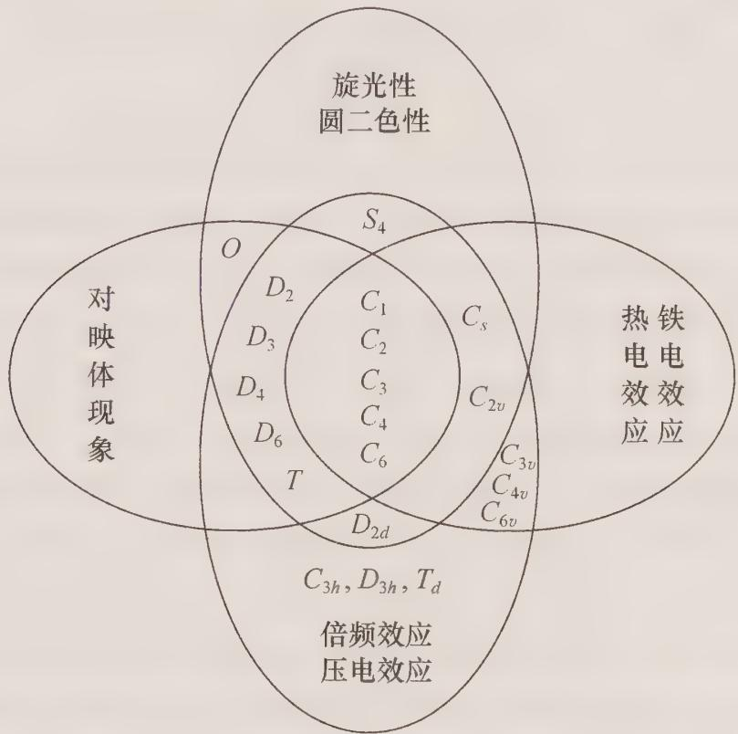  
图7.5.1 非中心对称晶体所属的点群及其物理性质间的联系

## 7.5.3 晶体的缺陷和性能

实际的晶体都是近似的空间点阵式的结构,实际晶体有一定的大小,晶体中多少都存在一定的缺陷。晶体中一切偏离理想的点阵结构都称为晶体缺陷。按几何形式,缺陷可分为点缺陷、线缺陷、面缺陷和体缺陷等。按其来源,缺陷可分为本征缺陷和掺杂缺陷。前者是指晶体原来的点阵结构随温度等外界条件的改变而出现的缺陷,后者则指掺进杂质原子而造成的缺陷。

点缺陷包括空位、杂质原子、间隙原子、错位原子和变价原子等。任何晶体，当处于一定温度时，有些原子的振动能可能瞬间增大到可以克服其势垒，离开其平衡位置而挤入间隙，形成一对空位和间隙原子。这种正离子空位和间隙原子称为Frenkel（弗伦克尔）缺陷，如图7.5.2(a)所示。有时也可能是一对正、负离子同时离开其平衡位置而迁移到晶体表面上，在原来的位置形成一对正、负离子空位。这种正、负离子空位并存的缺陷，称为Schottky（肖特基）缺陷，如图7.5.2(b)所示。这两种缺陷导致了离子晶体中由于正、负离子的运动而使晶体具有可观的导电性。在卤化银晶体中， $\mathrm{Ag^{+}}$ 具有一定的自由运动性能，Frenkel缺陷使离子从它的结构的正常位置进入空隙位置而移动，Schottky缺陷使离子从它的正常位置迁移到位错位置或表面。这两种迁移都会在晶体中造成空位，空位密度通常随温度升高而增加。 $\mathrm{AgCl}$ 晶体

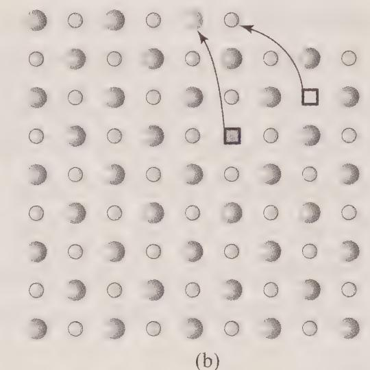

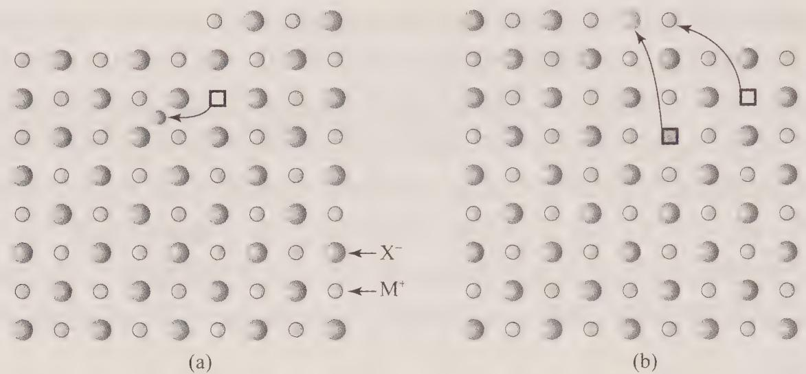  
图 7.5.2 Frenkel 缺陷 (a) 和 Schottky 缺陷 (b)

在接近熔点时,空位大约有1%。

当将微量杂质元素掺入晶体中时,可能形成杂质置换缺陷,例如 ZnS 中掺进约 $10^{-6}$ (原子)的 AgCl 时, $Ag^{+}$ 和 $Cl^{-}$ 分别占据 $Zn^{2+}$ 和 $S^{2-}$ 的位置,形成杂质缺陷。晶体中点缺陷的存在,破坏了点阵结构,使得缺陷周围的电子能级不同于正常位置原子周围的能级。因此,不同类型的缺陷,赋予晶体以特定的光学、电学和磁学性质。上述含有杂质 $Ag^{+}$ 的 ZnS 晶体是彩色电视荧光屏中的蓝色荧光粉,在阴极射线激发下,它能发射波长为 450 nm 的荧光。

最重要的线缺陷是位错，位错是使晶体出现镶嵌结构的根源。面缺陷反映在晶面、堆积层错、晶粒和双晶的界面、晶畴的界面等。体缺陷反映在晶体中出现空洞、气泡、包裹物、沉积物等。

晶体中出现空位或填隙原子，使化合物的成分偏离整比性。这是一种很普遍的现象，称为非整比化合物，如 $\mathrm{Fe}_{1 - x}\mathrm{O},\mathrm{Ni}_{1 - x}\mathrm{O},\mathrm{Ti}_{1 - x}\mathrm{O}$ 等许多过渡金属氧化物和硫化物都为非整比化合物。由于这类化合物的成分可以改变，导致其中出现变价原子，使晶体具有特异颜色等光学性质、半导体性甚至金属性、特殊的磁学性质以及化学反应活性等，因而成为重要的固体材料。下面列举数例予以说明。

【例7.5.1】 $\mathrm{Zn}_{1 + \delta}\mathrm{O}$

在 $1000\mathrm{K}$ 左右将氧化锌晶体放在锌蒸气中加热，晶体转变为红色，生成 $\mathrm{Zn}_{1 - \delta}\mathrm{O}$ 的 $\mathbf{n}$ 型半导体，它在室温下的电导率比整比化合物 $\mathrm{ZnO}$ 大很多。

【例7.5.2】 $\mathrm{TiO}_{1 + \delta}$

这个化合物的化学组成变化范围很宽，从 $\mathrm{TiO}_{0.82}$ 到 $\mathrm{TiO}_{1.18}$ 。测定整比 TiO 晶体的密度和晶胞参数可知，常温下大约有 $15\%$ 的 $\mathrm{Ti}^{2+}$ 和 $\mathrm{O}^{2-}$ 空位。将 TiO 在高于或低于整比 TiO 的分解压的各种不同的氧气分压下加热时，既可以在空位中加入过量的氧，也可脱去部分的氧造成过量的钛。氧的数量不同，Ti 的价态不同，电导性质不同，甚至可出现金属那样的导电性。

【例 7.5.3】 $Li_{\delta}TiS_{2}(0<\delta<1)$

$\mathrm{TiS}_2$ 为层形分子，分子间硫原子靠范德华引力联系。将 $\mathrm{TiS}_2$ 置于锂蒸气中或浸在正丁基锂的非极性溶液中， $\mathrm{Li}^+$ 可进入层间，生成 $\mathrm{Li}_{\delta}\mathrm{TiS}_2$ 。由于它导电性能很好，可以作为锂电池的电解质。

晶体的性质是晶体材料应用的基础,它与晶体的组成和结构密切相关。在晶体的组成、结构和性质三者的关系之中,结构是核心,它上承组成、下启性质,起着关键的作用。一般而言,性质取决于结构,但有时改变晶体的微量组成而结构的对称性尚未发现有显著的变化,对晶体的性质却产生了极大的影响。完整的刚玉( $Al_{2}O_{3}$ )是无色的,掺入少量铬置换铝,则形成鲜艳的红宝石，它既是装饰品，也是最早发现能发射激光的晶体。硅晶体掺入不同的杂质可改变其半导体性质，掺少量的镓形成p型半导体，掺少量的磷形成n型半导体，p型半导体和n型半导体接触形成p-n结，它的单向导通特性是半导体器件和微电子技术的基础。许多事实说明，晶体缺陷对晶体的生长，以及晶体的力学、电学、光学、磁学等性能均有极大的作用。研究晶体的缺陷，利用晶体缺陷改变晶体性质，改造晶体使它成为性能优异的材料，是人们进行生产和科研的用武之地，是涉及固体物理、固体化学和材料科学等领域的重要基础内容。

## 7.6 晶体的衍射

晶体的周期性结构使晶体能对 X 射线、中子流、电子流等产生衍射效应，形成 X 射线衍射法、中子衍射法和电子衍射法。这些衍射法能获得有关晶体结构可靠而精确的数据，表达出晶体内部三维空间的原子排列的重复周期，用晶胞的大小形状表示，晶胞中原子的种类、数目和相对位置用原子在晶胞中的坐标参数来表示。在衍射法中，最重要的是 X 射线衍射法，它于 1912 年问世，百年来成果丰富、应用广泛，是人们认识物质微观结构的重要途径。到 20 世纪 40～50 年代，各类有代表性的无机物和有机物的晶体结构，多数已得到测定，总结出键长、键角及其变异规律，分子的构型、构象规律，阐明固体物理的许多效应，成为化学、物理学、矿物学以及冶金学等科学和技术方面的基础。到 50 年代，成功地测定了蛋白质的晶体结构，为分子生物学的发展奠定了基础。到 60～70 年代，衍射法和计算技术结合，实现收集衍射实验数据的自动化，发展测定结构的程序，使晶体结构的测定工作从少数晶体学家手中解放出来，而为广大有机化学家和无机化学家所掌握。到 20 世纪末，同步辐射 X 射线源的应用，为生物大分子晶体结构的测定提供了有力的工具。晶体学家只要有一颗合用的单晶，一般几周之内就可完成结构测定工作。经不断积累大量结构数据，建立了多功能的晶体结构数据库。现在，国际上已建立的晶体学数据库主要有 5 种：(i) 剑桥结构数据库（英国），收集近 30 万种含碳化合物的结构数据；(ii) 蛋白质晶体结构数据库（美国），收集 9 万多种生物大分子的三维结构数据；(iii) 无机晶体结构数据库（德国），有 14 万多种无机化合物的结构数据；(iv) 金属晶体学数据文件（加拿大），有 6 万多种金属和合金的结构；(v) 粉末晶体衍射文件（美国），约有 33 万种晶体的数据。上述数据库为化学、物理学、生物学等各方面的广泛应用，提供了丰富而系统的结构信息。

## 7.6.1 衍射方向

晶体的 X 射线衍射包括两个要素: (i) 衍射方向和 (ii) 衍射强度。

衍射方向是指晶体在入射 X 射线照射下产生的衍射线偏离入射线的角度。衍射方向取决于晶体内部结构周期性重复的方式和晶体安置的方位。测定晶体的衍射方向,可以求得晶胞的大小和形状。

联系衍射方向和晶胞大小、形状的方程有两个: Laue (劳厄) 方程和 Bragg (布拉格) 方程。前者以直线点阵为出发点, 后者以平面点阵为出发点, 这两个方程是等效的。

## 1. Laue 方程

设有一直线点阵和晶胞的单位矢量 a 平行。 $s_{0}$ 和 s 分别代表入射 X 射线和衍射 X 射线的单位矢量，如图 7.6.1 所示。若要求由每个点阵点所代表的结构基元间散射的次生 X 射线互相叠加, 则要求相邻点阵点的光程差为波长的整数倍。这样, 衍射方向单位矢量 s、入射方向单位矢量 $s_{0}$ 与晶胞单位矢量 a (即 OP) 间联系的方程为

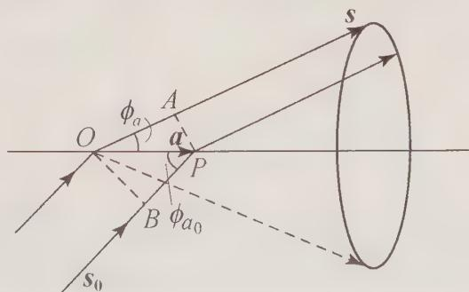  
图7.6.1 Laue方程的推导

$$
\mathrm{光程差} = O A - B P = \pmb {a} \cdot \pmb {s} - \pmb {a} \cdot \pmb {s} _ {0} = h \lambda\tag{7.6.1}
$$

式中 $h$ 为整数。若用三角函数表达，则为

$$
a \left(\cos \phi_ {a} - \cos \phi_ {a _ {0}}\right) = h \lambda\tag{7.6.2}
$$

(7.6.1)或(7.6.2)式称为Laue方程。它规定了当 $\pmb{a}$ 和 $s_0$ 的夹角为 $\phi_{a_0}$ 时，在和 $\pmb{a}$ 呈 $\phi_{a}$ 角的方向上产生衍射。实际上以 $\pmb{a}$ 作为轴线，和 $\pmb{a}$ 呈 $\phi_{a}$ 角的圆锥面的各个方向均满足这一条件，如图中虚线所示。

将(7.6.1)或(7.6.2)式推广应用于晶胞的单位矢量 b 和 c，可得相同的方程式。同时满足 a, b, c 和衍射矢量 s 的 Laue 方程组为

$$
\left\{ \begin{array}{l} \boldsymbol {a} \cdot (\boldsymbol {s} - \boldsymbol {s} _ {0}) = h \lambda \\ \boldsymbol {b} \cdot (\boldsymbol {s} - \boldsymbol {s} _ {0}) = k \lambda \\ \boldsymbol {c} \cdot (\boldsymbol {s} - \boldsymbol {s} _ {0}) = l \lambda \\ \left\{ \begin{array}{l} a (\cos \phi_ {a} - \cos \phi_ {a _ {0}}) = h \lambda \\ b (\cos \phi_ {b} - \cos \phi_ {b _ {0}}) = k \lambda \\ c (\cos \phi_ {c} - \cos \phi_ {c _ {0}}) = l \lambda \end{array} \right. \end{array} \right.\tag{7.6.3}
$$

或

(7.6.4)

(7.6.3)和(7.6.4)式中 $h, k, l$ 均为整数，这组整数 $hkl$ 称为衍射指标。晶体的衍射方向由 $s$ 规定，从图形来看， $s$ 的方向为围绕 $a, b, c$ 三轴线的圆锥面的交线方向。

衍射指标 hkl 的整数性决定了衍射方向的分立性, 即只在空间某些方向上出现衍射。在这些方向上各点阵点之间入射线和衍射线的波程差必定是波长的整数倍。这结论可证明如下: 从点阵原点 000 到点阵点 mnp 间的矢量为

$$
\mathbf {T} _ {m n p} = m \mathbf {a} + n \mathbf {b} + p \mathbf {c}
$$

通过这两个点阵点的光程差 $\Delta$ 为

$$
\begin{array}{r l} \Delta & = T _ {m n p} (s - s _ {0}) \\ & = m a (s - s _ {0}) + n b (s - s _ {0}) + p c (s - s _ {0}) \\ & = m h \lambda + n k \lambda + p l \lambda \\ & = (m h + n k + p l) \lambda \end{array}\tag{7.6.5}
$$

因 $m, n, p$ 和 $h, k, l$ 均为整数，故 $\Delta$ 必为波长的整数倍。这样，满足(7.6.3)式的方向所有晶胞散射的次生射线都是互相加强的，这些方向就是衍射方向。

## 2. Bragg 方程

晶体的空间点阵可划分为一族平行且等间距的平面点阵 $(hkl)$ 。同一晶体不同指标的晶面在空间的取向不同，晶面间距 $d_{(hkl)}$ 也不同。

X射线入射到晶体上，对于一族 $(hkl)$ 平面中的一个点阵面1来说，若要求面上各点的散射线同相，互相加强，则要求入射角 $\theta$ 和衍射角 $\theta^{\prime}$ 相等，入射线、衍射线和平面法线三者在同一平面内，才能保证光程一样，如图7.6.2(a)所示。图中入射线 $s_0$ 在 $P, Q, R$ 时波的周相相同，而散射线 $s$ 在 $P', Q', R'$ 处仍是同相，这是产生衍射的重要条件。

再考虑平面 1,2,3,…[见图 7.6.2(b)]，相邻两个平面的间距为 $d_{(hkl)}$ ，射到面 1 上的 X 射线和射到面 2 上的 X 射线的光程差为 $MB+BN$ ，而

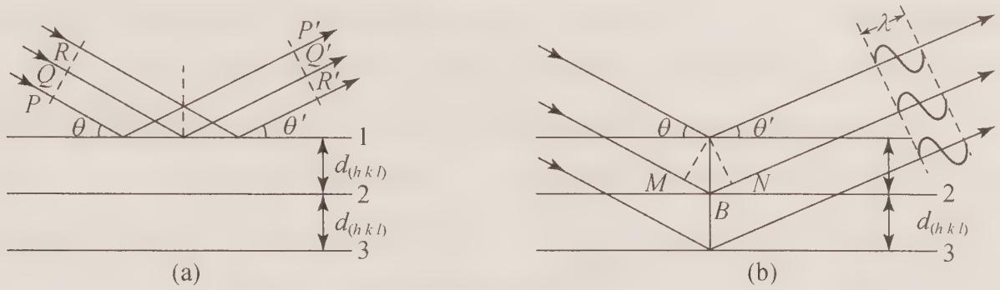  
图7.6.2 Bragg方程的推引

$$
M B = B N = d _ {(h k l)} \sin \theta
$$

光程差为 $2d_{(hkl)}\sin \theta$ 。根据衍射条件，只有光程差为波长 $\lambda$ 的整数倍时，它们才能互相加强而产生衍射。由此得Bragg方程

$$
2 d _ {(h k l)} \sin \theta_ {n} = n \lambda\tag{7.6.6}
$$

式中 $n$ （整数）称为衍射级数，可取 $1,2,3,\dots ;\theta_{n}$ 为衍射角。指标为 $(hkl)$ 的一组晶面，由于它和入射X射线取向不同，光程差不同，可产生 $n$ 为 $1,2,3,\dots$ ，衍射指标为 $hkl,2h2k2l,3h3k3l,\dots$ ，的一级，二级，三级，…，衍射。例如晶面指标为(110)这组面，在不同衍射角上可能出现衍射指标为 $110,220,330,\dots$ 的衍射线。由于 $\left|\sin \theta_n\right| \leqslant 1$ ，使得 $n\lambda \leqslant 2d_{(hkl)}$ ，所以 $n$ 是数目有限的几个整数， $n$ 大者， $\theta_{n}$ 也大。图7.6.3示出晶面指标为(110)这组面在 $\theta_{1}$ 处产生衍射指标为110的衍射，在 $\theta_{2}$ 处产生220衍射，在 $\theta_{3}$ 处产生330衍射等。

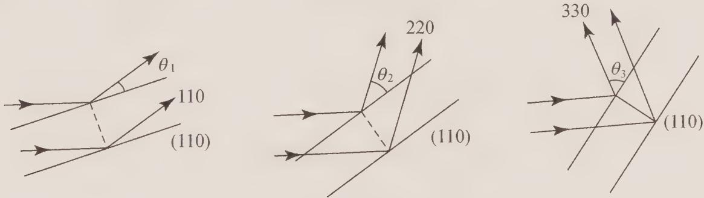  
图7.6.3 (110)面在不同衍射角上产生110,220,330等衍射的情况

$(hkl)$ 这组面的 $n$ 级衍射，可视为与 $(hkl)$ 平行但相邻两面间距为 $d_{(hkl)} / n$ 一组面的一级衍

射。 $d_{nhnknl}$ 等于 $d_{(hkl)} / n, nh nk nl$ 仍为一组整数，但并不一定互质。通常把不加括号的这组整数 $hkl$ 称为衍射指标。图7.6.4示出相邻两条虚线所示的面间距 $d_{330}$ 只有 $d_{(110)}$ 的 $1/3$ 。目前通用的Bragg方程为

$$
2 d _ {h k l} \sin \theta = \lambda\tag{7.6.7}
$$

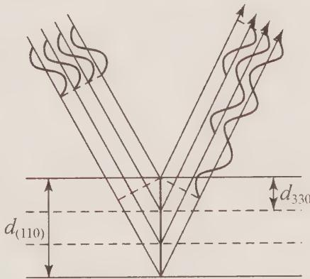

或简写为 $2d\sin \theta = \lambda$ 。(7.6.7)式中 $hkl$ 是不加括号的3个整数。用衍射指标 $hkl$ 代替晶面指标，可以计算衍射面间距 $d_{hkl}$ 。例如立方晶系 $d_{hkl} = a / (h^2 + k^2 + l^2)^{1/2}$ 。所以330也表示和(110)平行的一组面，相邻两面的间距为 $d_{(110)} / 3$ ，在 $\theta_3$ 时光程差为 $1\lambda$ 。

图7.6.4 和衍射指标330对应的一组平面

## 7.6.2 倒易点阵和反射球

倒易点阵是研究晶体衍射性质的重要物理概念和教学工具,应用非常广泛。晶体衍射的几何学、衍射方向、衍射强度、衍射仪的设计和应用、衍射数据的处理以及晶体结构测定的许多

环节都离不开倒易点阵。

倒易点阵是从晶体点阵中抽象出来的点阵，晶体点阵中的单位矢量为 $a, b, c$ ，和它相应的倒易点阵的单位矢量为 $a^*, b^*, c^*$ 。晶体点阵的平面点阵族 $(hkl)$ 中相邻两个点阵面的垂直间距为 $d_{(hkl)}$ ；对衍射指标 $hkl$ ，衍射面间距为 $d_{hkl}$ 。倒易点阵的定义为：

$a^{*}$ 垂直于 b 和 c，大小数值 $a^{*}=1/d_{100}=1/acos(a\wedge a^{*})$

$b^{*}$ 垂直于 a 和 c，大小数值 $b^{*}=1/d_{010}=1/b\cos(b\wedge b^{*})$

(7.6.8)

$c^{*}$ 垂直于 a 和 b，大小数值 $c^{*} = 1/d_{001} = 1/c\cos(c \wedge c^{*})$

(7.6.8)式的定义可由下面数学中矢量的点积来表达：

$$
\boldsymbol {a} ^ {*} \cdot \boldsymbol {a} = 1, \quad \boldsymbol {a} ^ {*} \cdot \boldsymbol {b} = 0, \quad \boldsymbol {a} ^ {*} \cdot \boldsymbol {c} = 0
$$

$$
\boldsymbol {b} ^ {*} \cdot \boldsymbol {a} = 0, \quad \boldsymbol {b} ^ {*} \cdot \boldsymbol {b} = 1, \quad \boldsymbol {b} ^ {*} \cdot \boldsymbol {c} = 0
$$

$$
\boldsymbol {c} ^ {*} \cdot \boldsymbol {a} = 0, \quad \boldsymbol {c} ^ {*} \cdot \boldsymbol {b} = 0, \quad \boldsymbol {c} ^ {*} \cdot \boldsymbol {c} = 1\tag{7.6.9}
$$

倒易点阵和晶体点阵的关系,可用图形表达。图 7.6.5 示出单斜晶系垂直 b 轴通过原点的二维图形。

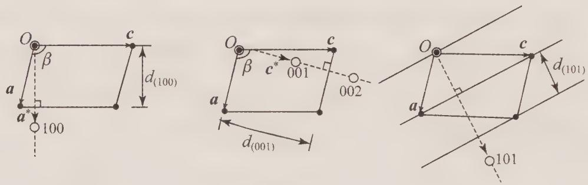  
(b)

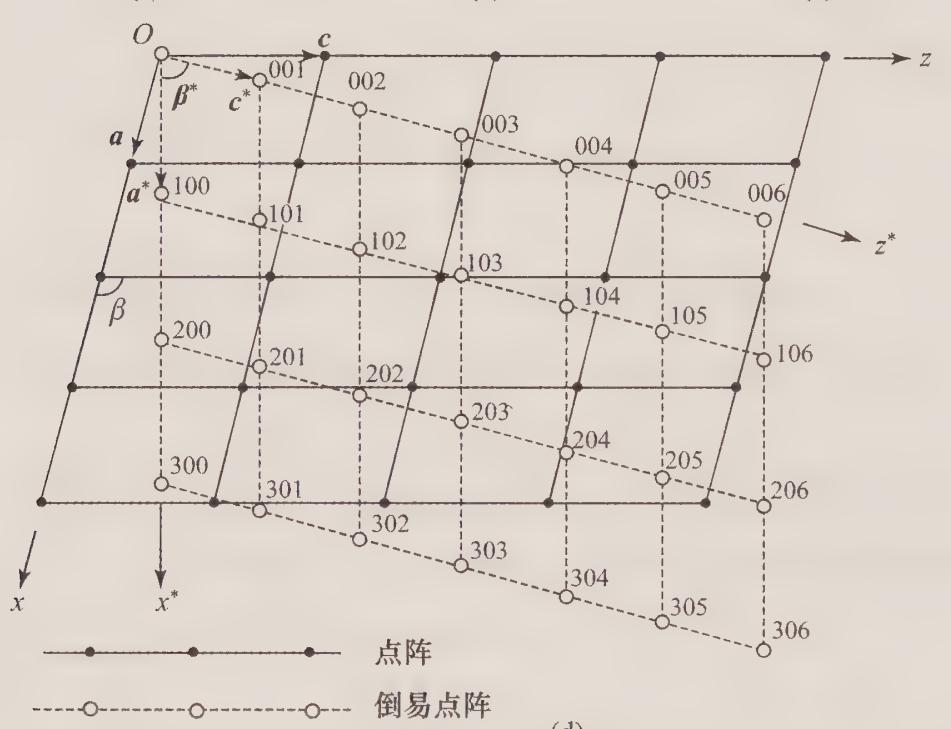  
(d)  
图7.6.5 单斜晶系垂直 $b$ 轴通过原点的二维点阵和倒易点阵关系图  
[图中(a),(b),(c)分别表示(100),(001),(101)点阵面与倒易点阵点 $h00,00l,h0h$ 间的关系；  
(d)为单斜晶系垂直 b 轴通过原点的点阵面和倒易点阵面]

从上述表达式可以顾名思义地理解倒易点阵的含义：“倒”是倒数。从公式(7.6.8)可见，对立方、四方、正交等晶系， $\alpha = \beta = \gamma = 90^{\circ}$ ， $a$ 和 $a^{*}$ 方向相同，即 $\cos (a \wedge a^{*}) = 1, a^{*} = 1 / a$ ，同理 $b^{*} = 1 / b, c^{*} = 1 / c$ ，倒易点阵和晶体点阵互为倒数。“易”指晶体点阵和倒易点阵可互易求算，倒易点阵的倒易点阵为晶体点阵。

在倒易点阵中,由原点指向倒易点阵点 hkl 的矢量 $H_{hkl}$ 为

$$
\boldsymbol {H} _ {h k l} = h \boldsymbol {a} ^ {*} + k \boldsymbol {b} ^ {*} + l \boldsymbol {c} ^ {*}\tag{7.6.10}
$$

它的长度和晶体点阵中衍射面间距 $d_{hkl}$ 成反比，若比例因子选为1，则

$$
H _ {h k l} = 1 / d _ {h k l}\tag{7.6.11}
$$

利用倒易点阵和反射球可以用图形表达出 Bragg 方程：依照晶体点阵所处的方位，画出相应的倒易点阵，沿入射 X 射线的方向通过倒易点阵原点（O 点）画一直线，在此直线上选距离原点 $1/\lambda$ 处为圆心（C 点），即半径为 $1/\lambda$ 画一个球，球面和 O 点相切，如图 7.6.6 所示，这种球称为 Ewald（埃瓦尔德）球，又称反射球。图 7.6.6(a) 表示 Bragg 方程的衍射方向，图 7.6.6(b) 表示当倒易点阵点 hkl 碰到球面时的情形：由于 AO 为直径，它等于 $2/\lambda$ ，在圆球面上的任意点 P，当 $\overrightarrow{OP} = H_{hkl}$ 时，因圆周角恒等于 $90^{\circ} (\angle APO = 90^{\circ})$ ，按图 7.6.6(b) 可得 Bragg 方程的另一种表达式：

$$
\sin \theta = \frac {O P}{A O} = \left(\frac {1}{d _ {h k l}}\right) / \left(\frac {2}{\lambda}\right)\tag{7.6.12}
$$

图中由球心(C)到 P 点的连线即为衍射指标 hkl 的衍射线方向。

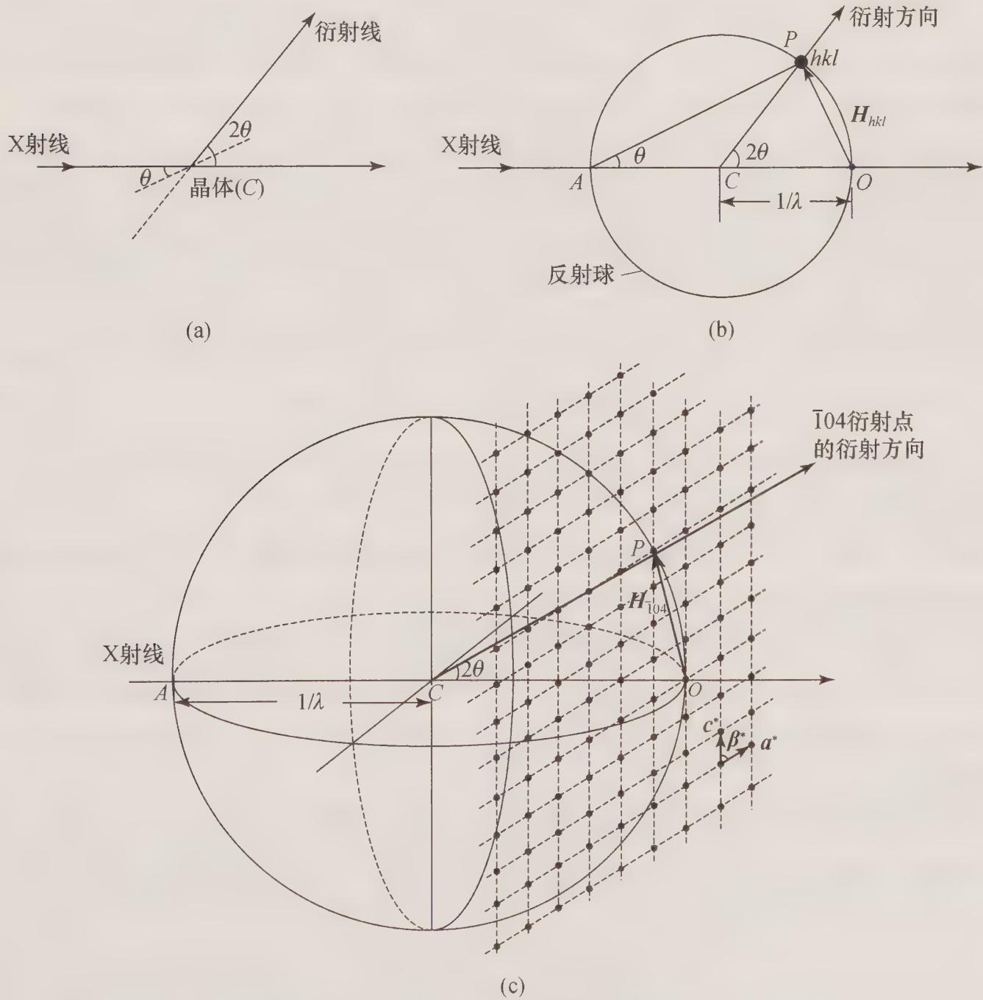  
图7.6.6 倒易点阵点 $hkl$ 、反射球和衍射方向  
（晶体的倒易点阵应分布在反射球的内外整个空间，图中只画出 $h0l$ 中的一小部分）

图 7.6.6(c) 表示晶体产生衍射时反射球和倒易点阵点 $\overline{104}$ 的关系。这时该点的位置正处在反射球面上， $\overrightarrow{OP}$ 表示它的倒易点阵矢量 $H_{\overline{104}}$ 。

注意,图 7.6.6(c) 只示出三维倒易点阵中的一个 h0l 平面的一部分,其他的绝大部分没有画出。在晶体转动时,整个倒易点阵都在转动。图中只示出倒易点阵点 $\overline{1}04$ 处在该面上的瞬时情况,并不代表这时该圆周线和 h0l 倒易点阵平面平行重合。

各种收集衍射数据的方法,都可根据反射球和倒易点阵的关系设计。不同的方法利用不同的条件使倒易点阵点和反射球面相遇,符合衍射条件,并在连接反射球心到球面上该倒易点阵点的衍射方向记录衍射强度。

学习倒易点阵时应注意：（i）晶体的点阵参数和晶体衍射用的波长单位是实际的倒易点阵参数的单位 $\mathrm{nm}^{-1}$ ， $\mathring{\mathrm{A}}^{-1}$ 或 $\mathrm{pm}^{-1}$ 则是想象的，因此反射球究竟多大，完全由实际使用时相关的尺寸表示它的单位即可。（ii）反射球的引入，主要目的是解决晶体衍射指标 $hkl$ 中那些可以产生衍射和它的衍射方向问题。在图7.6.6中， $O$ 点是晶体点阵的原点， $C$ 点是晶体衍射方向的出发点，两点相差 $1 / \lambda$ ，表面看来不合情理，但它是为了解决衍射方向问题，从 $C$ 点标明的方向也适用于 $O$ 点。而且也可将想象中的实际长度的倒数理解为无穷小，即两者是合在一起的。（iii）由于入射X射线有一定发散度，反射球面有一定厚度，而晶体存在镶嵌结构，使得点阵点（或倒易点阵点）有一定大小。在收集衍射数据过程中，晶体的运动使倒易点阵点进入球面和离开球面均需要一定的时间，这是影响记录所得该衍射点衍射强度的重要因素。

## 7.6.3 衍射强度

晶体对 X 射线在某衍射方向上的衍射强度,与衍射方向、原子的种类及晶胞中原子的分布有关。衍射方向由衍射指标 hkl 决定,原子的分布由晶胞中原子的坐标参数 $(x,y,z)$ 决定。定量地表达衍射强度和这两因素的关系,需考虑波的叠加,并引进结构因子 $F_{hkl}$

$$
F _ {h k l} = \sum_ {j = 1} ^ {N} f _ {j} \exp [ \mathrm{i} 2 \pi (h x _ {j} + k y _ {j} + l z _ {j}) ]\tag{7.6.13}
$$

利用此式,衍射 hkl 的结构因子可由晶胞中原子的种类(由原子散射因子 $f_{j}$ 表示)及各个原子的坐标参数(由 $x_{j}, y_{j}, z_{j}$ 表示)算出。

晶体由原子组成, 原子有原子核和核外电子。X 射线照射到晶体上, 电子和原子核都要随 X 射线的电磁场在振动, 因核的电荷与质量之比比电子小得多, 讨论这种振动时可忽略不计。振动着的电子就是一个发射球面电磁波的波源, 按原有波长和周相散射 X 射线。原子种类不同, 电子数目及分布不同, 散射能力有大小之别, 通常用原子散射因子 f 表示, 它是一个自由电子在相同条件下散射波振幅的 f 倍。f 随 $\sin\theta/\lambda$ 的增加而减小, 可以根据核外电子分布函数通过计算得到。

(7.6.13)式来源如下:今有一晶胞由 a, b, c 三个矢量规定, 晶胞中有 N 个原子, 其中第 j 个原子在晶胞中的坐标参数为 $(x_{j}, y_{j}, z_{j})$ , 原子散射因子为 $f_{j}$ 。从晶胞原点到第 j 个原子的矢量为 $r_{j}$

$$
\boldsymbol {r} _ {j} = x _ {j} \boldsymbol {a} + y _ {j} \boldsymbol {b} + z _ {j} \boldsymbol {c}\tag{7.6.14}
$$

在衍射 $hkl$ 中，通过晶胞原点的衍射波与通过第 $j$ 个原子的衍射波相互间的波程差 $\Delta$ 为

$$
\Delta = \boldsymbol {r} _ {j} \cdot (\boldsymbol {s} - \boldsymbol {s} _ {0})\tag{7.6.15}
$$

由(7.6.3)式,可得

$$
\Delta = \lambda (h x _ {j} + k y _ {j} + l z _ {j})\tag{7.6.16}
$$

周相差 $\alpha_{j}$ 为

$$
\alpha_ {j} = 2 \pi \Delta / \lambda = 2 \pi (h x _ {j} + k y _ {j} + l z _ {j})\tag{7.6.17}
$$

考虑晶胞中各个原子的散射波的振幅 $f_{j}$ 和原点的周相差 $\alpha_{j}$ ，将这 $N$ 个原子的散射波互相叠加而成复合波。用指数形式表示，可得

$$
F _ {h k l} = f _ {1} \exp (\mathrm{i} \alpha_ {1}) + f _ {2} \exp (\mathrm{i} \alpha_ {2}) + \dots + f _ {N} \exp (\mathrm{i} \alpha_ {N}) = \sum_ {j = 1} ^ {N} f _ {j} \exp (\mathrm{i} \alpha_ {j})\tag{7.6.18}
$$

即(7.6.13)式

$$
F _ {h k l} = \sum_ {j = 1} ^ {N} f _ {j} \exp [ \mathrm{i} 2 \pi (h x _ {j} + k y _ {j} + l z _ {j}) ]
$$

衍射 $hkl$ 的衍射强度 $I_{hkl}$ 正比于 $\left|F_{hkl}\right|^2$ ，还和晶体大小、入射光强、温度高低、晶体对X射线的吸收及其他一系列物理因素有关。对其加以修正，得

$$
I _ {h k l} = K \mid F _ {h k l} \mid^ {2}\tag{7.6.19}
$$

这样就将衍射强度和晶体结构联系在一起，通过衍射强度数据可以测定晶体的结构。

晶体结构中存在带心点阵型式、滑移面和螺旋轴时，就会出现系统消光，即许多衍射有规律地、系统地不出现，衍射强度为零。根据系统消光规律，可以测定微观对称元素和点阵型式，为测定晶体所属的空间群提供实验数据。

## 7.7 晶体衍射方法简介

## 7.7.1 单晶衍射法

作单晶衍射用的晶体一般为直径 0.1～1 mm 的完整晶粒。当选好晶体并安放到衍射仪上后，按照单晶衍射仪测定晶胞参数和晶体定向的具体要求，输入控制程序所需数据，测定晶胞参数及晶体在空间的取向，然后根据收集衍射强度的要求，收集各个衍射强度数据，输出各个衍射指标及相应的衍射强度值。

测定晶胞参数及各个衍射的相对强度数据后，需将强度数据统一到一个相对标准上，对一系列影响强度的几何因素、物理因素加以修正，求得(7.6.19)式中的 $K$ 值，从强度数据得到 $\left|F_{hkl}\right|$ 值。

测定晶体结构时,从实验数据只能得到结构振幅( $|F_{hkl}|$ )的数值,而不能直接得到结构因子( $F_{hkl}$ )的数值。结构振幅和结构因子的关系为

$$
F _ {h k l} = \left| F _ {h k l} \right| \exp \left[ i \alpha_ {h k l} \right]\tag{7.7.1}
$$

式中 $\alpha_{hkl}$ 称为衍射 $hkl$ 的相角。相角 $\alpha_{hkl}$ 的物理意义是指某一晶体在X射线照射下，晶胞中全部原子产生衍射 $hkl$ 的光束的周相，与处在晶胞原点的电子在该方向上散射光的周相，两者之间的差值。解决相角问题是测定晶体结构的关键一环。

解决相角的方法可用重原子法或直接法等多种方法。可以先解决部分(例如 $10\%$ )强度较大的衍射的相角,通过电子密度函数的计算,求出其他衍射的相角。

利用结构振幅和相角数据,按下式计算电子密度函数

$$
\rho (X Y Z) = V ^ {- 1} \sum_ {h} \sum_ {k} \sum_ {l} F _ {h k l} \exp [ - \mathrm{i} 2 \pi (h X + k Y + l Z) ]\tag{7.7.2}
$$

$\rho (XYZ)$ 称电子密度函数，它表示晶胞中坐标为 $X,Y,Z$ 点上电子密度的数值，它由全部衍射hkl 的结构因子 $F_{hkl}$ 按 (7.7.2) 式加和得到。晶胞中每一坐标点 X, Y, Z 上 $\rho$ 都和全部 $F_{hkl}$ 有关。例如，假定 X = 1/64, Y = 1/64, Z = 1/64，衍射 223 对该点 $\rho$ 的贡献为

$$
V ^ {- 1} F _ {2 2 3} \exp \left[ - \mathrm{i} 2 \pi \left(\frac {2}{6 4} + \frac {2}{6 4} + \frac {3}{6 4}\right) \right]
$$

将全部衍射对该点的贡献加和起来,就得该点的 $\rho$ 。计算出晶胞中各点的 $\rho$ , 将 $\rho$ 的数值相等的点连成线, 称为等电子密度线, 由等密度线表示 $\rho(XYZ)$ 的图叫电子密度图。电子密度图中各个极大值点即和原子的坐标位置对应, 电子多的原子 $\rho$ 大。一般可从电子密度图上区分出各种原子, 求得它们在晶胞中的坐标参数, 从而测定出晶体的结构。

图7.7.1(a)示出青蒿素 $(\mathrm{C_{15}H_{22}O_5})$ 晶体的三维电子密度叠合图，(b)示出青蒿素分子的结构式。这个分子的空间结构正是借助X射线单晶衍射法，由电子密度图测定出来的。

2015年，我国女科学家屠呦呦获得诺贝尔生理学或医学奖，表彰她用青蒿素治疗疟疾的原创思想和研究成果。在青蒿素类药物的研制过程中，我国科研人员通过晶体结构测定的绝对构型，起了重大的促进和提高作用。

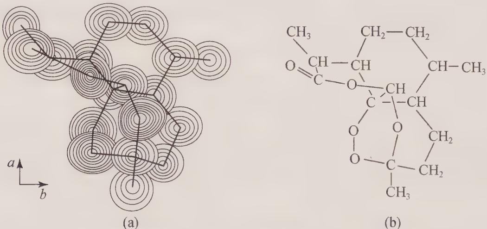  
图 7.7.1 青蒿素晶体的三维电子密度叠合图(a)及其结构式(b)

## 7.7.2 多晶衍射法

多晶样品(如一小块金属,一包晶体粉末)中含有无数个小晶粒,它们杂乱无章、取向随机地聚集在一起。当单色X射线照到多晶样品上,产生的衍射花样和单晶不同。单晶中一族平面点阵的取向若和入射X射线的夹角为 $\theta$ ,满足衍射条件,则在衍射角 $2\theta$ 处产生衍射,可使胶片感光出一个衍射点,如图7.7.2(a)所示。如果X射线照到这种晶体的粉末上,因晶粒有各种取向,同样一族平面点阵,可形成分布在张角为 $4\theta$ 的圆锥方向上的衍射线,这衍射线是由无数个符合同样衍射条件的晶粒产生的衍射点形成的,如图7.7.2(b)。晶体中有许多平面点阵族,相应地形成许多张角不同的衍射圆锥线,共同以入射的X射线为中心轴。

若放一平板感光胶片于多晶样品后方，衍射线在胶片上感光出一系列同心圆，但只能收集 $\theta$ 值小的部分衍射线。若将感光胶片围成圆筒形，按图7.7.3所示方式放置，样品位置和圆筒中心线重合，圆筒半径为 $R$ 。经感光后得图下方所示的粉末衍射图（以下简称粉末图）。若图中某一对粉末衍射线的间距为 $2L$ ，则

$$
4 \theta = \frac {2 L}{R} (\text {弧度}) = \frac {1 8 0 \times 2 L}{\pi R} (\text {度})\tag{7.7.3}
$$

由此，通过测量 $L$ 值，可算出每一衍射的衍射角 $\theta$ 。根据 $\theta$ 和 $\lambda$ ，即可按Bragg方程求出 $d$ 。

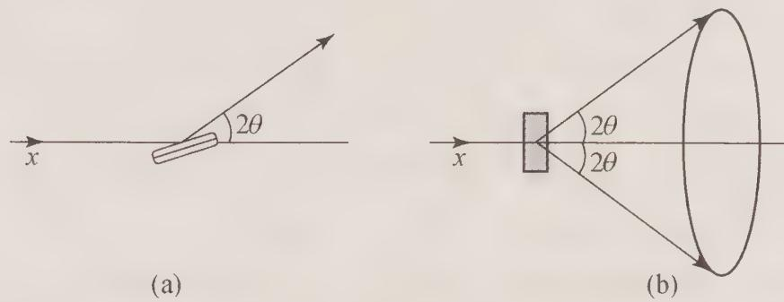  
图7.7.2 单晶(a)和多晶(b)产生衍射的情况

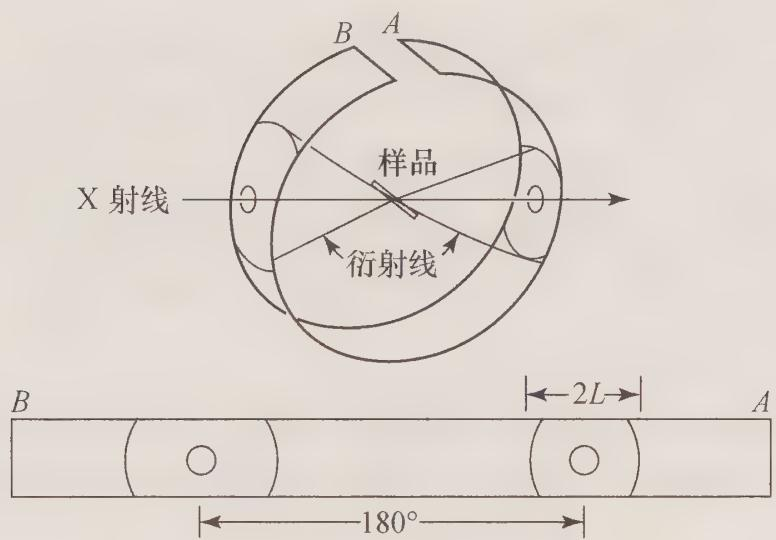  
图7.7.3 多晶衍射照相法及粉末衍射图

多晶衍射仪法是利用计数管和一套计数放大测量系统，把接收到的衍射光转换成一个大小与衍射光强成正比的信号记录下来，如图7.7.4。图中样品放在衍射仪圆的中心，计数管始终对准中心，绕中心旋转。样品每转 $\theta$ ，计数管转 $2\theta$ ，记录仪同步转动，逐一地把各衍射线的强度记录下来。

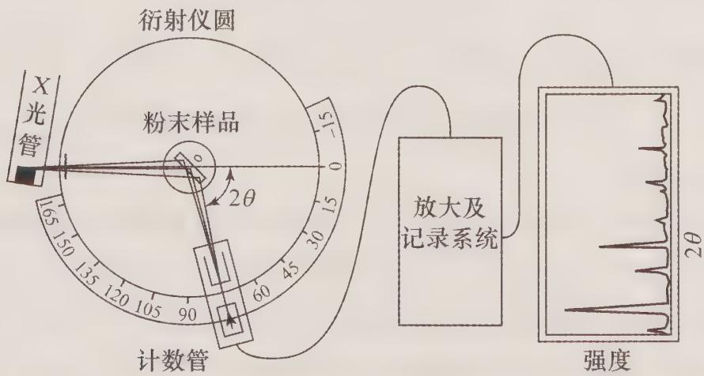  
图7.7.4 多晶衍射仪原理

多晶衍射所得的基本数据是“d-I”，即衍射面间距-衍射强度。利用此数据可进行物相分析；将各个衍射指标化，可求得晶胞参数；根据系统消光，可推得点阵型式。对于简单的金属和化合物，还可用多晶衍射法测定晶体结构。多晶衍射法是研究各种材料进行物相分析的重要方法，下面简要介绍粉末图的特点及其应用。

各种物相的粉末图都有其特点：各种纯化合物的粉末图各不相同，正如人的指纹一样，每一种晶体都有它自己的一套特征的“d-I”数据。混合物的粉末图由参与混合的各个物相的粉末图叠加而成，含量多的相出现粉末线的强度大，含量少的强度弱。有些物相由于它本身衍射能力较低，含量在 $5\%$ 以下时衍射线就不明显地出现。固溶体只出现相当于一种纯化合物的粉末图。如果是由A，B两种物质相互溶解形成的固溶体，少量的B溶于A生成 $\alpha$ 相， $\alpha$ 相的结构和纯A的晶体结构相似， $\alpha$ 相的粉末图像纯A，但每一衍射线往往向同一侧移动。无定形体和液体不出现分立的衍射线，只在某些衍射角上显现出弥散的衍射强度的分布。

根据粉末图分布的特点，X射线粉末法可作为一种重要的实验方法，广泛地应用于化学、物理学、地质、矿物、冶金、机械、建筑材料等多方面的科研工作中。下面列举几方面的应用。

## 1. 物相分析

物相分析是用于分析材料或产品由哪些相组成以及各相的相对含量和分布情况。物相分析在生产和科研中具有重要应用。例如， $\mathrm{Al}_{2} \mathrm{O}_{3}$ 随不同的制备条件和生产工艺有不同的晶体结构，性质上也有差异。但这些不同的结晶状态用化学分析和光谱分析难以鉴定，而 X 射线粉末法则是鉴别它们的好方法。又如，成分同为 $\mathrm{CaCO}_{3}$ ，但可结晶成方解石和文石；而 $\mathrm{CaCO}_{3}$ 和 $\mathrm{MgCO}_{3}$ 可能为白云石 $(\mathrm{Ca}_{0.5} \mathrm{Mg}_{0.5} \mathrm{CO}_{3})$ 晶体的成分。对材料科学、催化剂剖析、试剂生产、矿物资源分析利用等等，粉末法可发挥一定的作用。

每一种晶体的粉末图,衍射线的分布和强度有特征的规律,成为物相鉴定的基础。物相分析是根据实验获得的“d-I”数据、化学组成、样品来源等和标准多晶衍射数据互相对比,进行鉴定。

现在内容最丰富、规模最大的多晶衍射数据集是由JCPDS(Joint Committee on Powder Diffraction Standards)编的《粉末衍射卡片集》(PDF)。可通过索引查对，解释衍射图所对应的物相。

物相的定量分析是依据衍射强度。一个含有多种物相的样品，若它的某一组成物相 $i$ 的质量分数为 $x_{i}$ ，某一衍射 $hkl$ 的强度为 $I_{i}$ ，纯 $i$ 相衍射 $hkl$ 的强度为 $I_{i}^{0}$ ，考虑样品的吸收，可得

$$
I _ {i} = I _ {i} ^ {0} x _ {i} \left(\mu_ {i} / \bar {\mu}\right)\tag{7.7.4}
$$

式中 $\mu_{i}$ 为物相 $i$ 的质量吸收系数， $\bar{\mu}$ 为样品的平均质量吸收系数 $(\bar{\mu} = \sum_{j} x_{j} \mu_{j})$ 。通过已知配比成分的工作曲线求出 $\mu_{i} / \bar{\mu}$ ，即可根据某一衍射的 $I_{i}^{0}$ 和 $I_{i}$ ，从(7.7.4)式求得 $i$ 相的含量 $x_{i}$ 。

## 2. 测定简单晶体的结构

金属、合金和某些结构简单的化合物，当不易制得单晶体时，可用多晶衍射法测定晶体结构。测定结构的关键步骤是指标化，即将各条衍射线的 $hkl$ 标出。对晶胞不大的立方、四方、六方和三方晶系的晶体，粉末图一般不难指标化，低级晶系较难一些，若已用单晶衍射法测定它的晶胞参数或参考同晶型晶体的晶胞参数，就不难指标化了。

由 Bragg 方程及立方晶系的晶面间距和晶面指标的关系式, 可为立方晶系推得

$$
\sin^ {2} \theta = (\lambda / 2 a) ^ {2} (h ^ {2} + k ^ {2} + l ^ {2})\tag{7.7.5}
$$

由于衍射角较小的衍射指标都是简单整数，而 $(\lambda / 2a)$ 是常数，所以若以第一条或第二条衍射线的 $\sin^2\theta$ 值去除其他各线的 $\sin^2\theta$ 值，根据比值即可求出和各线相对应的一套整数，这套整数即为可能的平方和 $(h^2 + k^2 + l^2)$ 。也可根据比值及点阵型式的要求推出合理的平方和。有了平方和就容易得到衍射指标了。由衍射指标出现的规律，可了解系统消光，推得点阵型式，估计可能的空间群。对立方晶系，不同点阵型式（简单点阵 $P$ ，体心点阵 $I$ ，面心点阵 $F$ )可能出现的

平方和列于下表。

<table><tr><td>点阵型式</td><td>平方和</td><td>规律</td></tr><tr><td>P</td><td>1,2,3,4,5,6,8,9,10,11,12,13,14,16,17,18,19,...</td><td>缺7,15等数</td></tr><tr><td>I</td><td>2,4,6,8,10,12,14,16,18,20,22,...</td><td>和P比较,不会有空缺的衍射线,平方和全为偶数</td></tr><tr><td>F</td><td>3,4,8,11,12,16,19,20,24,...</td><td>出现二密一疏规律</td></tr></table>

根据强度数据及晶胞中原子数目和晶体所属的空间群等，可用模型法或其他方法推求原子在晶胞中的位置。由于多晶衍射仪的发展，收集衍射数据的精确度大大提高，配合指标化及解结构程序的使用，多晶衍射已广泛用于测定不易制得单晶体样品的结构。

## 3. 晶胞参数的精确测定及其应用

用粉末法测定晶胞参数能够达到很高的精密度和准确度。为要精确测定晶胞参数，一方面需要精心做好实验，注意消除在实验中带来的误差；另一方面要辅以适当的数据处理方法。若将 Bragg 方程进行微分，可得

$$
\begin{array}{c} (\partial / \partial \theta) (2 d \sin \theta) = 0 \\ 2 (\partial d / \partial \theta) \sin \theta + 2 d \cos \theta = 0 \\ \partial d / d = - \cot \theta \partial \theta \\ (\Delta a / a) = (\Delta d / d) = - \cot \theta \Delta \theta \end{array}\tag{7.7.6}
$$

或

(7.7.7)

由式可见,随着衍射角 $\theta$ 的增大, $\cot\theta$ 变小,同样的测量偏差值 $\Delta\theta$ ,高角度( $\theta$ 大)时对 d 的相对误差小,即对晶胞参数 a 的相对误差小。因此,精确测定晶胞参数,常借助于高角度数据。有时还根据高角度数据外推至 $\theta=90^{\circ}$ ,以求得准确的晶胞参数。

准确的晶胞参数有着多方面的应用,例如:

（1）根据准确的晶胞参数、化学式量(M)和晶体的准确密度(D)及晶胞中原子或分子数(Z)，测定Avogadro常数( $N_{A}$ )

$$
N _ {\mathrm{A}} = Z M / V D\tag{7.7.8}
$$

(2) 测定热膨胀系数。粉末法能测出各向异性的数据。

(3) 测定固溶度,用以绘制相图等。

## 4. 粉末衍射线的宽化及晶粒大小的测定

利用衍射线的峰形数据,能够测定粉末样品中平均晶粒大小数据。当晶粒直径小于200 nm时,衍射峰开始变宽,此时晶粒越小,宽化越多,直径小到几个纳米时,衍射线过宽而消失在背底之中。晶粒大小和衍射线变宽间的定量关系,可由下式表示

$$
D _ {\mathrm{p}} = K \lambda / (B - B _ {0}) \cos \theta\tag{7.7.9}
$$

式中 $D_{\mathrm{p}}$ 是晶粒直径； $\theta$ 为衍射角； $\lambda$ 为X射线波长； $K$ 为一常数，数值为0.9； $B_{0}$ 为晶粒较大没有宽化时的衍射峰半高宽， $B$ 为待测样品衍射峰的半高宽(2θ标度的峰)， $\Delta B$ （即 $B - B_0$ )要用弧度表示。

例如，某一 $\mathrm{MgCl}_2$ 样品经球磨 $9\mathrm{h}$ 后，003衍射峰半高宽为 $1.1^{\circ}$ ，110衍射峰半高宽为 $1.0^{\circ}$ ；而研磨前样品的003衍射峰半高宽为 $0.4^{\circ}$ ，110半高宽为 $0.6^{\circ}$ ；003衍射的衍射角 $\theta$ 为 $7.5^{\circ}$ ，110衍射为 $25.1^{\circ}$ ；实验用 $\mathrm{CuK}\alpha$ 射线， $\lambda = 154\mathrm{pm}$ 。将这些数据代入(7.7.9)式，得

003 衍射: $\Delta B=1.1^{\circ}-0.4^{\circ}=0.7^{\circ}=0.01222$ 弧度

$$
D _ {\mathrm{p}, 0 0 3} = (0. 9 \times 0. 1 5 4 \mathrm{nm}) / 0. 0 1 2 2 2 \times \cos 7. 5 ^ {\circ} = 1 1. 5 \mathrm{nm}
$$

110 衍射: $\Delta B = 1.0^{\circ} - 0.6^{\circ} = 0.4^{\circ} = 0.00698$ 弧度

$$
D _ {\mathrm{p}, 1 1 0} = (0. 9 \times 0. 1 5 4 \mathrm{nm}) / 0. 0 0 6 9 8 \times \cos 2 5. 1 ^ {\circ} = 2 2. 0 \mathrm{nm}
$$

由此可见，经球磨后晶粒大小的平均值，沿 $c$ 轴方向厚约 $11.5 \mathrm{~nm}$ ，而垂直 $c$ 轴直径约为 $22.0 \mathrm{~nm}$ 。晶粒呈扁平状。

## 7.7.3 晶体的电子衍射和中子衍射

如第1章所述，电子、中子等实物微粒具有波粒二象性，它们的运动规律服从量子力学，式(1.1.6)和式(1.1.7)体现了表征波性和粒性的物理量之间的关系。

由于电子和中子具有波性,当条件满足时,它们的射线会产生衍射现象,常用来作为测定物质微观结构的手段。本小节简要介绍电子衍射和中子衍射的基本原理和特点、实验方法和应用,详细内容可参看有关专著。

## 1. 晶体的电子衍射

电子束实际上是一种阴极射线, 是一种荷负电的粒子流。根据 de Broglie 关系式, 电子波的波长(nm)为

$$
\lambda = \frac {h}{p} = \frac {h}{m v} = \frac {h}{\sqrt {2 m e V}} = \frac {1 . 2 2 6}{\sqrt {V}}\tag{7.7.10}
$$

式中各符号的物理意义已在1.1节中予以说明。当加速电压较高时，电子运动的速度快，需引

入相对论校正。电子波的波长(nm)应按下式计算

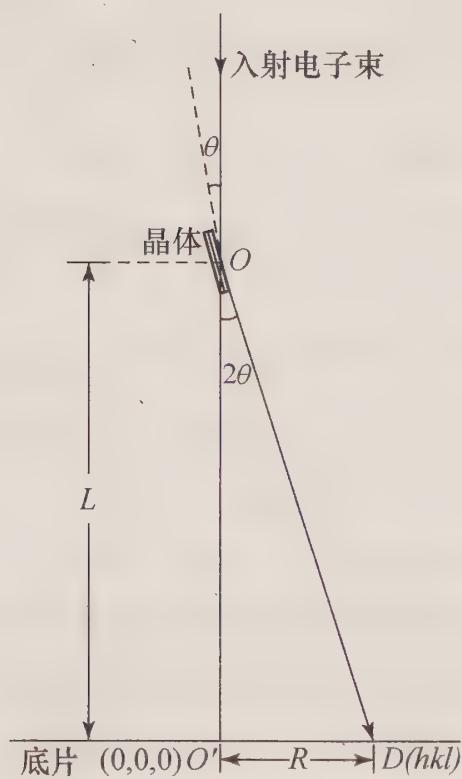  
图7.7.5 电子衍射的几何关系

$$
\lambda = \frac {h}{\sqrt {2 m e V \left(1 + \frac {e V}{2 m c ^ {2}}\right)}} = \frac {1 . 2 2 6}{\sqrt {V (1 + 0 . 9 7 8 8 \times 1 0 ^ {- 6})}}\tag{7.7.11}
$$

式中 V 的单位仍是伏[特]; m 为电子的静止质量, 即(7.7.10)式中的 m; c 为光速。

调整加速电压,可获得波长与晶体中原子间距同数量级的电子束。当这样的电子束与晶体作用时,若满足衍射条件,即可产生衍射,获得与X射线衍射相似的衍射图。

电子束与晶体之间的相互作用相当复杂。当高速运动的电子轰击晶体时，会产生若干种物理信息，其中主要有二次电子、背散射电子、俄歇电子、X射线、X射线荧光和透射电子等。电子衍射是高速运动的电子束与原子核发生弹性散射及与核外电子发生非弹性散射的结果。

与 X 射线衍射相似, 电子衍射也遵循 Bragg 方程, 即波长

为 $\lambda$ 的入射电子束与间距为 $d$ 的点阵面之间的夹角 $\theta$ 满足Bragg方程时，就会在与入射电子方向成 $2\theta$ 角的方向上产生衍射。晶体的各组衍射面产生的衍射线斑构成了有一定规律的衍射花样。单晶试样产生的衍射图样是一些按一定周期规律排布的斑点，多晶试样则产生若干半径不等但同心的衍射环。图7.7.5示出电子衍射的基本几何关系。图中 $L$ 为晶体到照相底片的距离， $R$ 是底片上衍射斑点或衍射环到透射斑点或圆心的距离。由图可得

$$
\tan 2 \theta = \frac {R}{L}
$$

由于衍射角很小(一般只有 $1^{\circ}\sim2^{\circ}$ ),因而

$$
\tan 2 \theta \approx 2 \sin \theta
$$

代入 Bragg 方程, 得

$$
\frac {\lambda}{d} = \frac {R}{L} \quad \text {或} \quad L \lambda = R d\tag{7.7.12}
$$

$\lambda$ 可根据给定加速电压按式(7.7.10)或式(7.7.11)计算。若再从实验中得到 $R$ 和 $L$ ，则可推算出某一衍射 $hkl$ 对应的面间距 $d$ ；对某些简单晶体，还可估算其晶胞参数。

电子衍射与 X 射线衍射也有许多差异,主要差异有:(i)在同样的加速电压下,电子波的波长比 X 射线的波长短得多,因而电子衍射角度比 X 射线衍射角度小得多。通常,前者约 $1^{\circ} \sim 2^{\circ}$ ,而后者在 $10^{\circ} \sim 70^{\circ}$ 之间。(ii)晶体对电子的散射能力比对 X 射线的散射能力强得多(一般情况下,前者的散射因子是后者的散射因子的 $10^{4}$ 倍),因而电子衍射强度比 X 射线衍射强度高得多。

电子衍射在几何上和光学上的特点主要源于电子束波长短(特别是高能电子)和原子对它的散射能力强。波长短决定了电子衍射的几何特点，使晶体的一张高能电子衍射图像只反映倒易点阵原点附近、垂直电子束的平面倒易点阵点的衍射情况。因此，可用以研究晶体的对称性、晶胞大小和形状。散射能力强，则决定了电子衍射的光学特点：一方面，电子衍射强度大，收集衍射数据所需时间短，一般几秒钟即可完成。而且，有时衍射束强度和透射束强度相当，以致两者发生交互作用。另一方面，晶体对电子波的吸收强，电子在晶体中的穿透力小，穿透深度短（一般小于 $10^{-4}\mathrm{mm}$ ，而X射线的穿透深度可达 $1\mathrm{mm}$ 以上），因此，电子衍射法适用于研究气体分子的结构、薄膜和晶体的表面结构。

电子衍射有许多重要应用。通常将电子衍射分为两类：高能电子衍射和低能电子衍射。前者所需加速电压高达几十万伏，甚至几百万伏；后者所需加速电压则低于 $1000\mathrm{V}$ 。

单晶薄片的高能电子衍射图呈点状分布,分析衍射图,可获得晶体的对称性、晶胞大小和形状、晶体缺陷及相变等信息。多晶样品的高能电子衍射图是一系列同心圆,根据实验条件和衍射图给出的数据,利用式(7.7.11)和(7.7.12),即可求得晶体的面间距。

在低能电子衍射(low energy electron diffraction, LEED)中,由于弹性散射电子来自晶体内部 $500\sim 1000~\mathrm{pm}$ 的深度,相当于表面几层原子。LEED已发展成为研究固体表面结构的有力手段。

如前所述,原子核对电子的散射能力比核外电子强得多,因而电子衍射能给出原子核的位置。与 X 射线衍射不同,各种原子对电子束的散射能力差别不大,轻原子甚至比重原子还大,所以电子衍射尤其适合确定轻原子的位置。

电子衍射法的应用还依托于电子显微技术的发展。目前，分辨率好、放大倍数高的透射电子显微镜(TEM)和扫描电子显微镜(SEM)能对 $10\mathrm{nm}$ 以下的微区进行形貌、成分和结构分析，将对物质微观结构的研究深入到原子层次。电子衍射显微技术同其他技术（例如X射线能量色散谱仪）互相配合，优势互补，在物质结构研究中显示更大的威力。

## 2. 晶体的中子衍射

中子是组成原子核的基本粒子，它可由原子能反应堆产生。中子也具有波粒二象性，当与晶体相互作用时也会产生与X射线和电子束类似的衍射现象。

中子束的波长亦可根据 de Broglie 关系式计算

$$
\lambda = \frac {h}{m _ {\mathrm{N}} v _ {\mathrm{N}}}
$$

式中 $m_{\mathrm{N}}$ 是中子的质量， $v_{\mathrm{N}}$ 是中子的运动速度。通常，由原子能反应堆发射出的中子波的波长是连续的。为获得具有特征波长的中子流，以满足衍射条件，可采用结晶完好的晶体进行分光，常用的晶体物质有氟化钙和方解石等。

同 X 射线衍射和电子衍射一样, 中子衍射也有两个要素: 衍射方向和衍射强度。中子衍射方向一方面取决于晶体本身的结构, 另一方面取决于实验条件。衍射方向和晶胞参数的关系体现在 Laue 方程和 Bragg 方程中。

中子衍射强度正比于结构因子的平方： $I\propto F_{hkl}^{2}$ 。对非磁性晶体而言，中子衍射是中子和原子核相互作用的结果（原子核对中子的散射），因而结构因子取决于中子的原子散射因子 $f_{N}$ 。而对于磁性晶体而言，中子衍射除了由于中子和原子核的相互作用外，还由于中子磁矩和原子磁矩的相互作用，这种相互作用称为磁性散射。因此，指标为hkl的中子衍射，其结构因子的平方可表达为下列两项之和

$$
\left| F _ {h k l} \right| ^ {2} = \left| \sum_ {j} f _ {\mathrm{N} _ {j}} \exp \left[ \mathrm{i} 2 \pi \left(h x _ {j} + k y _ {j} + l z _ {j}\right) \right] \right| ^ {2} + \left| \sum_ {j} p _ {j} \exp \left[ \mathrm{i} 2 \pi \left(h x _ {j} + k y _ {j} + l z _ {j}\right) \right] \right| ^ {2}\tag{7.7.13}
$$

该式的第一项为核散射结构因子的平方，第二项为磁散射结构因子的平方。式中 $f_{\mathrm{N}}$ 为原子散射因子，它主要取决于原子核的大小和结构，与原子序数无直接关系，也不像X射线衍射那样随 $(\sin \theta) / \lambda$ 的变化而变化； $p_j$ 是第 $j$ 个原子的磁散射因子，它取决于磁矩的大小和方向。

用中子衍射法测定晶体的结构时,若晶体为非磁性物质,则衍射强度即核衍射强度;若晶体为磁性物质,则衍射强度除核衍射强度外,还包括磁衍射强度。在实验上,通常用单晶进行中子衍射测定。收集衍射强度数据,进行结构测定,可得到原子的坐标参数。

鉴于中子衍射的特点和功能,它在研究和测定晶体结构中有重要应用。

## (1) 研究磁性晶体的结构

具有磁矩的原子可对中子产生磁散射，利用这一效应可研究磁性晶体的结构和性质，这是中子衍射法在研究晶体结构和性质中独特的作用。

抗磁性晶体无永久磁矩，因而不产生磁散射效应，其中子衍射强度只源于核散射的贡献。顺磁性晶体虽有永久磁矩，但由于其磁矩方向在原子间任意变化，因而磁散射对总衍射强度无贡献。

铁磁性晶体在单一磁畴内磁矩方向都相同，磁散射方向和核散射方向一致，即衍射角相同，每一衍射峰都是两种散射强度叠加的结果。

反铁磁性晶体中磁矩方向不同(见图 6.6.2)。若把这一因素也考虑进去,则晶体结构中“结构基元”重复出现周期扩大,于是中子衍射谱图中不是在核散射峰中增加了磁衍射强度,而是出现了新的峰,它们完全由磁散射所产生。

## (2) 测定晶体结构中轻原子的位置

由于中子的原子散射因子与原子序数无直接关系，因而轻原子的原子散射因子不是测定中的突出问题。这就为用中子衍射法测定晶体结构中轻原子的位置奠定了基础。用中子衍射法测定有机晶体中氢原子的位置尤为有效，这使得对有机化合物结构和性能的研究水平大大提高。

## (3) 识别同一化合物中原子序数相近的两种原子

在合金或某些硅铝酸盐中,往往存在原子序数相近的原子(如尖晶石中的 Mg, Al 原子),利用 X 射线衍射难以识别它们。但根据它们对中子的散射因子的差别,利用中子衍射数据便可识别它们。

## 7.8 准晶和液晶的结构化学 $^{①}$

## 7.8.1 准晶的发现

准晶是准晶体的简称。按晶体的点阵结构，其轴对称性不可能存在五次或六次以上的对称轴。准晶体的发现是晶体学传统的对称理论的突破，是自然科学的重大发现。

1984年以色列D. Shechtman和我国郭可信分别发现有些合金出现五次轴衍射图。图7.8.1示出郭可信教授发表的两张含 $\overline{5}$ 轴的电子衍射图。

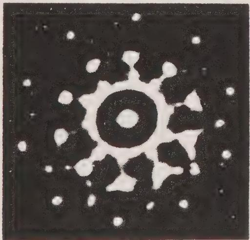  
(a)

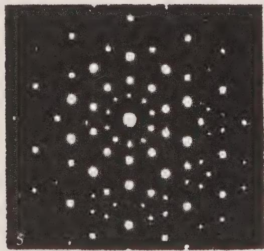  
(b)  
图 7.8.1 (a) 铁基四面体密堆积合金中的 $\overline{5}$ 衍射图；(b) $Ti_{2}Ni$ 二十面体准晶衍射图中的 $\overline{5}$ 轴

20世纪80年代，许多国家的科学家对晶体和无定形体之间出现非晶体学对称的衍射实验和理论研究，开辟了一个新的准晶体领域，它不仅使人们对合金相结构的认识不断深入，对“晶体”的认识也有提升。1992年，国际晶体学会(IUCr)将晶体定义为“任何具有基本上分立的衍射图的固体”。传统的周期性结构是它的主流，具有五次轴和六次以上对称轴的非周期性结构的固体(准晶体)也是晶体的一个分支。

2011年诺贝尔化学奖授予D. Shechtman，以表彰他在准晶体研究中的贡献。可惜郭可信先生于2006年逝世，这位中国科学家在本土首次做出的应分享诺贝尔奖的研究成果未

能获奖。

准晶体的研究开始于合金领域，它的出现有其历史的必然。首先航空航天技术的发展，需要高强度而质轻的合金，促使人们对 $\mathrm{Mg},\mathrm{Al},\mathrm{Ti}$ 等轻质合金和快速冷却技术更加重视。这类合金结构中常含有三角二十面体和五角十二面体等含有五次轴对称的原子排列骨架和密堆积结构，它们为准晶的发现和深入研究提供了晶体学基础。其次，高分辨电子显微成像技术和亚微米晶体结构的纳米电子衍射技术在20世纪70年代已经兴起，为准晶的研究提供了有力的工具。准晶物质是一些金属元素(有时也含有少数非金属元素)组合形成的合金。准晶的发现为探索改善合金的性能开辟了新路径，也扩展了认识晶体结构的眼界。

## 7.8.2 准晶的结构特点

准晶是有“长程取向序”而没有“平移对称性”的固体。下面以 Penrose 图形(图 7.8.2)进行分析来理解。图 7.8.2 示出用内角为 $36^{\circ}$ 和 $144^{\circ}$ 的瘦菱形面与内角为 $72^{\circ}$ 和 $108^{\circ}$ 的胖菱形面堆砌出来的图形。由图 7.8.2 可见，它能布满平面而没有缝隙，并具有局部五次对称轴，如图中的五角星所示。从五角星中心到周边 5 个黑点形成的矢量取向来看，具有长程取向的有序性，即沿 5 个矢量方向外延，黑点的分布相同。但是，将此矢量平移至另外一个黑点，周围环境就不相同，不能重复。不显示平移周期性，即没有平移对称性，它不是二维的晶体点阵，而是准点阵。

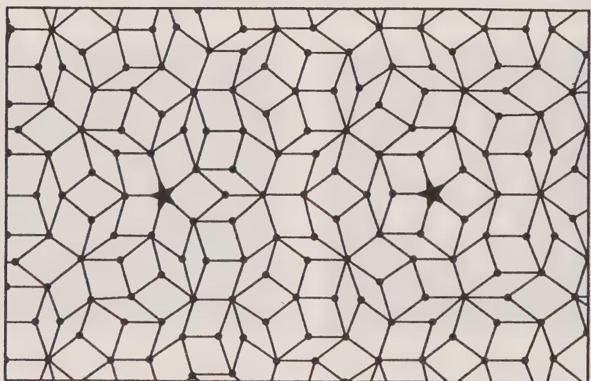  
图7.8.2 Penrose图  
用夹角分别为 $36^{\circ}$ 和 $72^{\circ}$ 的两种菱形拼砌出布满平面、没有缝隙、  
具有五次对称轴的图形，图中用五角星标明五次对称轴

准晶体的准点阵结构与晶体的点阵结构有着密切的联系。下面以二维正方点阵及其投影情况为例加以说明。晶体的点阵参数为 $a$ ，将宽度为 $t = a(\sin \alpha + \cos \alpha)$ 的条带中的点阵点（黑点·）垂直投影到一维线上，形成一维投影点列（圈点°）。投影角为 $\alpha$ ，即斜率为 $\tan \alpha$ 。当斜率为有理数（如 1/2）时，一维投影点列具有周期性，形成点阵。当斜率为无理数，即 $\tan \alpha = 1 / \tau = 0.61803$ 时，得到具有准点阵分布的点列，其间隔为 LSLSLLSLLS…。其中 $L = a\cos \alpha$ ， $S = a\sin \alpha$ ， $L / S = \tau$ 。式中

$$
\tau = (1 + \sqrt {5}) / 2 = 1. 6 1 8 0 3\tag{7.8.1}
$$

这些投影点列中的点分布在同一投影线上，具有长程位置序，而没有平移对称性，即一维准点阵，如图7.8.3所示。由图7.8.3可见，一维准点阵要用两个长短不同的矢量 $L$ 和 $S$ 来描述， $L / S$ 是无理数，这个数列构成的节点永远不重复，即没有周期性。一维准周期结构要用二维周期结构来描述，当上升到高维空间时，就可用晶体的方法来处理。

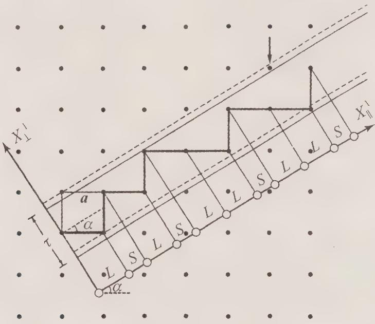  
图7.8.3 从二维正方点阵中选一斜率为无理数 $(\tan \alpha = 1 / \tau)$ 的条带(实线)作投影  
其中的阵点投影到斜率为 $1 / \tau$ 的 $X_{\parallel}^{1}$ 上，给出一维准周期点列的间隔为LSLSLLSLLS…

同理,可以证明三维二十面体准晶对应的是六维超点阵,与它的衍射对应的是六维倒易超点阵。

准晶体不同于晶体和非晶体，是一类不具有平移对称性，而具有长程有序性的固体物质。如图7.8.3的投影结构所示，在某一方向上以无理数序列排列，没有循环出现的现象，准晶的平移量满足黄金分割 $\tau$ 的比例关系。

我国彭志忠和陈敬中等科学家深入研究了准晶体的对称性，证明准晶体同样受准点阵的约束，只可能存在5,8,10,12等4种旋转对称的准点阵，同时证明和推导出：晶体有7种晶系，准晶体有5种晶系（即五方晶系、八方晶系、十方晶系、十二方晶系和二十面体晶系）；晶体有32个点群，准晶体有28个点群。

## 7.8.3 准晶的寻找、制备和应用

准晶的发现有偶然因素,当它受到人们的重视后,人们就纷纷从理论上和实际工作中去探索生成它的条件,设法去制备它,并对它进行深入的研究。在三维空间的材料中,原子的分布有二维按周期性排列,只有一维作准周期排列,称为一维准晶,如图7.8.3所示。在三维空间的材料中,原子有二维按准周期分布,如图7.8.2中的阵点呈准周期排列,另外一维按周期性排列,称为二维准晶。三维准晶只有五次对称轴的二十面体准晶一种。分析和了解具有三角二十面体以及和它共轭的五角十二面体的结构特点,实际上成为寻找和制备准晶的出发点。

五次对称轴是晶体学不允许的对称轴，但一些有远见的科学家在讨论合金中原子的密堆积结构时，却经常考虑三角二十面体密堆积和五角十二面体密堆积。这两种包含五次轴的多面体结构示于图7.8.4中。

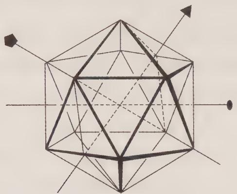  
(a)

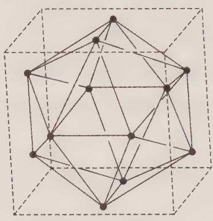  
(b)

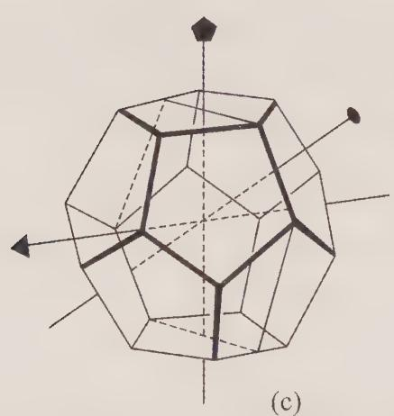

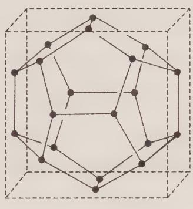  
(d)  
图 7.8.4 (a) 三角二十面体及其中的对称轴, (b) 三角二十面体放在立方体中, (c) 五角十二面体及其中的对称轴, (d) 五角十二面体放在立方体中

早在1947年，Pauling曾经指出，在等径圆球的立方最密堆积和六方最密堆积中，球的配位数是12，其中存在四面体空隙外，还有较大的八面体空隙，不应当是合金的最密堆积。而在三角二十面体中心若放一个略小一点的原子，它和周围12个原子配位，这时由中心引向20个三角形面的顶点形成20个四面体空隙，不存在较大的八面体空隙，堆积密度会较高。从几何学计算，在边长为1的三角二十面体中，中心到顶点的距离 $r$ 为

$$
r = \frac {5 ^ {\frac {1}{4}} \sqrt {\tau}}{2} = 0. 9 5 1 1\tag{7.8.2}
$$

式(7.8.2)也可以表达成： $r=\frac{\sqrt{2(\sqrt{5}+5)}}{4}$ 或 $\frac{l}{r}=\frac{1}{0.9511}=1.0514$ 。[注意：在有的书中错误地写成 $l=\frac{r}{3}(\sqrt{15}-\sqrt{3})$ ，或写成 $\frac{l}{r}=\frac{(\sqrt{5}-1)}{\sqrt{3}}$ 。]

由于边长是堆积原子半径之和,所以中心原子约小 $5\% \sim 10\%$ ,就可填入空隙之中,形成堆积密度高的合金。

在金属铝中加入过渡金属 V, Fe, Mn, Cr, Co, 可以强化铝合金。因为这些过渡金属原子半径比 Al 的原子半径约小 5%\~10%, 满足式(7.8.2)要求, 可得堆积密度较大的合金。

Pauling等根据上述理论的分析，对合金的晶体结构进行研究，其中典型的例子是 $\mathrm{Mg}_{32}(\mathrm{Al},\mathrm{Zn})_{49}$ ，他们根据测定的X射线衍射数据，提出它的结构属体心立方点阵， $a = 1.416\mathrm{nm}$ ， $Z = 2$ ，每个晶胞中有162个原子。后来更细致的结构分析结果指出，Pauling等的上述猜测基本正确，但原子坐标参数和（Al，Zn）统计原子的组成都有较大差异，最外层原子排成切角八面体，而不构成菱面三十面体。 $\mathrm{Mg}_{32}(\mathrm{Al},\mathrm{Zn})_{49}$ 合金属于立方晶系，空间群为 $T_h^5 - Im\overline{3}$ ，晶胞参数$a = 1425 \mathrm{pm}, Z = 2[\mathrm{Mg}_{32}(\mathrm{Al}, \mathrm{Zn})_{49}]$ ，晶胞中包含162个原子。它的结构可用两个完全相同的多层包合的多面体结构描述，如图7.8.5所示。这种多面体一个处在晶胞原点，另一个处在晶胞体心位置，按体心立方排列共用六边形面连接而成。下面将多层包合的多面体中各层的结构描述如下：

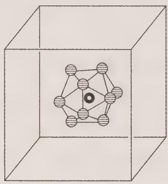  
(a)

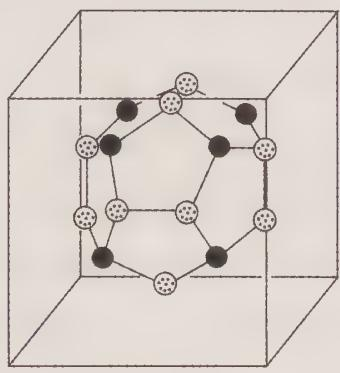  
(b)

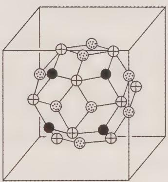  
(c)

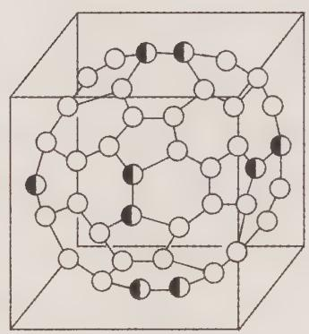  
(d)

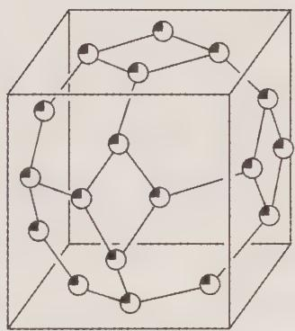  
(e)  
(Al) $(\mathrm{Al}_{0.19}\mathrm{Zn}_{0.81})$ $(\mathrm{Al}_{0.43}\mathrm{Zn}_{0.57})$ (Mg) (Mg) $(\mathrm{Al}_{0.36}\mathrm{Zn}_{0.64})$ (Mg) (Mg)  
图 7.8.5 $\mathrm{Mg}_{32}(\mathrm{Al},\mathrm{Zn})_{49}$ 晶体结构模型：(a) 三角二十面体；(b) 五角十二面体；(c) 菱面三十面体；(d) 三十二面体，即截顶二十面体；(e) 切角八面体为清楚起见，图中各个多面体只示出直接看到的前面部分，背面的原子没有示出。图中删去了没有在三十二面体面上的 6 个 C 原子

(1) 第一层由 12 个编号为 B 的原子[即为 $\left(\mathrm{Al}_{0.19}, \mathrm{Zn}_{0.81}\right)$ 统计原子]组成三角二十面体, 在这个多面体中心位置包合了一个编号为 A 的原子(即 Al 原子), 如图 7.8.5(a) 所示。

(2) 第二层的结构较为复杂, 分成(b)和(c)两个图描述。这层较内的部分由 8 个 D 和 12 个 E 原子(均为 Mg 原子)共同组成五角十二面体, 如图 7.8.5(b)所示。这层较外的部分由 12 个编号为 C 的原子[即 $\left(\mathrm{Al}_{0.43}, \mathrm{Zn}_{0.57}\right)$ 统计原子]加帽在较内部分的五角十二面体的各个面上。它们共同组成菱形三十面体, 如图 7.8.5(c)所示。这样, C, D, E 3 组共 32 个原子共同组成有 32 个顶点、30 个菱形面的多面体。

（3）第三层由48个编号为F的原子[即 $(\mathrm{Al}_{0.36},\mathrm{Zn}_{0.64})$ 统计原子]和12个G原子(即 $\mathrm{Mg}$ 原子)共同组成不规则的切角二十面体，它共有60个顶点、32个面(其中五边形面12个，六边形面20个)，见图7.8.5(d)。此层中的48个F原子都为相邻的处于晶胞顶点上的多层包合多面体共用，每个顶点只有 $1 / 2$ 属于这个多面体。处在晶胞面上的12个G原子共占24个位置，每个只有 $1 / 2$ 属于该晶胞，图中示出12个位置，其余12个因不在这个切角二十面体的面

上，没有在图中画出。

(4) 第四层由 24 个编号为 H 的原子(即 Mg 原子)组成切角八面体层, 见图 7.8.5(e)。这个最外层的多面体原子处在晶胞的面上, 为相邻晶胞所共用。这层原子的相对位置, 一方面使图 7.8.5(d) 中的每对 G 原子处于由编号为 H 原子组成的菱面体长对角线内侧, 另一方面在使图 7.8.5(d) 中由编号为 F 原子组成的六元环放在由编号为 H 原子组成的六元环的内侧 (不在一个平面上)。

由上可见， $\mathrm{Mg}_{32}(\mathrm{Al},\mathrm{Zn})_{49}$ 的多层包合结构可用下式描述：

$\mathrm{Al} @ 12(\mathrm{Al}, \mathrm{Zn})$ (三角二十面体) @ [20 个 $\mathrm{Mg} + 12$ 个 (Al, Zn)] (菱形三十面体) @ [48 (Al, Zn) + 12Mg] (切角二十面体) @ 24Mg (切角八面体) 组成这个多层包合多面体的体心立方晶胞中的实际原子数目为

$$
2 (\mathrm{A}) + 2 4 (\mathrm{B}) + 2 4 (\mathrm{C}) + 1 6 (\mathrm{D}) + 2 4 (\mathrm{E}) + 4 8 (\mathrm{F}) + 1 2 (\mathrm{G}) + 1 2 (\mathrm{H}) = 1 6 2 \text {个}
$$

从上述各层包合的结构可见：第一壳层是三角二十面体，第二层是由三角二十面体和五角十二面体共同组成的菱面三十面体，第三层是由60个原子组成的截顶二十面体，即三十二面体。这三层紧密地包在一起，按编号为A，B，C，D，E，F和G中的原子数目加和在一起计算，共有105个原子，呈球状，加上金属原子的半径，外径达约 $1.7\mathrm{nm}$ 。每层都含有五次轴结构的对称性，可以以它为基本单元，进一步向外连接堆积成准晶微粒。在这种纳米尺寸的微粒中，原子的堆积密度大，加上不同金属原子间电负性差异，原子之间除了有较强的金属键外，还有一定成分的静电引力，使微粒中原子吸引力加强，这种微粒不易变形或解体，能为提高合金的硬度和耐磨性做出贡献。所以， $\mathrm{Mg}_{32}(\mathrm{Al},\mathrm{Zn})_{49}$ 的晶体结构为研究准晶的制备和结构提供了重要的基础。

人们从 $\mathrm{Mg}_{32}(\mathrm{Al},\mathrm{Zn})_{49}$ 的二十面体对称壳层结构得到启发，考虑若要使合金中含有五次轴对称的结构，需要按原子的大小和成分比例配料。加热熔融，逐渐降低温度，使它们形成有五次轴对称壳层的纳米量级微粒，急冷凝固得到准晶。因为由这些包含五次轴多面体的结构单元构筑具有周期平移对称性的晶体结构时，多面体几何形状一定要有畸变，使五次对称轴不再存在，才能满足晶体必须具有平移对称性的条件。另一方面，这种含五次轴的多面体结构单元对称性高、堆积密度大，在铝合金及过渡金属合金中经常出现，这是由于局域的点对称性与长程的平移对称性相互制约协调的结果。在颗粒尺寸较小时，二十面体对称占主导地位，使得在急冷的合金中出现准晶，个别的如Al-Li-Cu合金以稳定的二十面体准晶相出现，人们获得了 $\mathrm{Al}_{5}\mathrm{Li}_{3}\mathrm{Cu}$ 的准晶颗粒大到毫米量级。

准晶经过30多年的发展，全世界已获得近千种准晶体，也在天然矿物中发现它的存在。准晶的研究已为发展高强超轻的Al,Ti,Li,Mg合金提供了理论基础和制备方法。

三维准晶的结构不论是以三角二十面体、五角十二面体、菱形三十面体或截顶二十面体（三十二面体）等结合的方式出现，都具有较高的堆积密度和对称性，使它形成有较高硬度、低摩擦系数、耐腐蚀性和高电阻率的材料。准晶容易和软磁材料结合，磁矩转动容易，能有效降低矫顽力和铁芯消耗，改善磁性材料的性能。准晶不易制成纯品，而且它在常温下呈脆性，限制了它作为纯品材料的应用。若将准晶颗粒弥散分布于结构材料中，形成复合材料中的增强相，用作表面涂层，在航空航天机翼和机身表面以及其他民用物品，如不粘锅等器件中，都有广大应用潜能。

## 7.8.4 液晶

液晶是介于晶体和液体之间，在一定温度区间存在的一种物质状态。液晶中分子的排列没有周期性，不是晶体，但它具有一定的取向序，是一种非周期性有序物质。液晶的这种性质是由它的分子几何形状决定的。已知的液晶都是有机化合物，其分子形状有长棒形和圆盘形两类，目前长棒形分子已开发了广泛的应用，本小节只讨论长棒形液晶分子。

液晶像液体,不能承受应切力,能够流动;液晶又像晶体,沿着分子长轴具有取向的长程有序性。从宏观性质看,液晶的介电常数、折射率、磁化率和电导率等像晶体,是各向异性的。

从液晶分子排列的结构来看,液晶可分为向列相(nematic)、胆甾相(cholesteric)和近晶相(smectic)3种类型,它们的结构特点示于图7.8.6中。

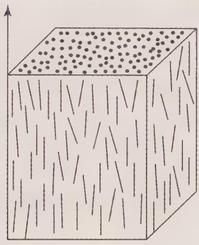  
(a) 向列相

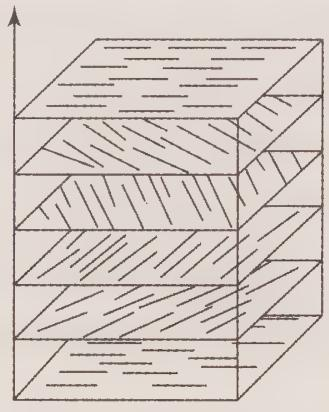  
(b) 胆甾相  
图7.8.6 液晶的结构特点

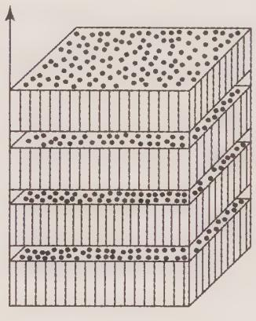  
(c) 近晶相

（1）向列相：分子具有一长的刚性中心部分，呈棒状，其一端或两端具有柔性尾链。在这种液晶相中，分子取向是长程有序的，但分子质心的分布是无规则的，如图7.8.6(a)所示。

(2) 胆甾相: 分子呈层状排列, 每层中分子长轴大致平行, 相邻两个平面上的分子长轴方向要差一确定的角度, 分子取向的扭转使分子的排列呈螺旋形, 如图 7.8.6(b) 所示。

（3）近晶相：分子排列形成层状结构，层内分子长轴大致互相平行，层内分子的质心可呈无序状态，也可呈二维有序状态。近晶相的分子排列像火柴盒中的火柴，如图7.8.6(c)所示。

常用的液晶并不多,下面列出几种类型:

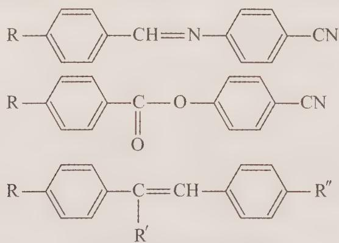

液晶中分子排列的各向异性,使得液晶相的宏观性质也出现以下多种各向异性:

（1）介电各向异性 $(\Delta \varepsilon)$ ：在向列相液晶中，平行分子长轴的介电常数 $\varepsilon_{\parallel}$ 与垂直分子长轴的介电常数 $\varepsilon_{\perp}$ 之差值 $\Delta \varepsilon (\Delta \varepsilon = \varepsilon_{\parallel} - \varepsilon_{\perp})$ 称为介电各向异性。 $\Delta \varepsilon$ 主要取决于液晶分子结构中的永久偶极矩和极化率的大小及方向。 $\Delta \varepsilon$ 对液晶电光效应起重要作用，它决定液晶在外电场作

用时分子的取向。

（2）折射率各向异性 $(\Delta n)$ ：光在液晶中的传播是各向异性的，在向列相液晶中，沿分子长轴方向振动的光(非常光)的折射率 $n_{\perp}$ 大于垂直长轴方向振动的光(寻常光)的折射率 $n_{\perp}, \Delta n (= n_{\parallel} - n_{\perp})$ 称为折射率各向异性。

（3）磁化率的各向异性和电导率的各向异性：磁化率 $(\chi)$ 的各向异性以 $\Delta \chi = \chi_{\parallel} - \chi_{\perp}$ 表示。电导率 $(\sigma)$ 的各向异性则以 $\sigma_{\parallel} / \sigma_{\perp}$ 表示。

（4）反射率的各向异性：在胆甾相液晶中，由于分子螺旋排列，当线性偏振光沿着螺旋轴方向射入时，可分为两个不同符号(指左旋和右旋)的圆偏振光，与胆甾相螺旋符号相反的将被透射，相同的被反射。

液晶的黑白显示方法是利用它的各向异性随电场变化的性质,常用的显示材料是向列相液晶。液晶的 $\Delta n$ 性质使它具有按分子取向导引偏振光的偏振面的性能。显示器的结构是两个平行、透明的导电玻璃电极(玻璃表面用 $SnO_{2}$ 处理)之间放进一层液晶,再把整个液晶盒放在两个偏振片之间,其中一个偏振片的背后再放一个反射器,这样液晶盒既反射又吸收从反射器对面照来的光。由于反射或吸收入射光的程度取决于外加电场,所以在有电场区和无电场区内它反射或吸收入射光的程度是不一样的,从而可利用电场的形状即电极形状把字符和数字显示出来。这样利用电场改变液晶分子取向,从而改变反射或透过光的偏振面,即可实现黑白显示的目的。

实现上述显示的方法之一是把透明的导电玻璃进行表面处理,使液晶分子的轴向和电极表面的一个方向平行排列,两平行电极板方向相差 $90^{\circ}$ ,处在两电极间的液晶分子轴向逐渐偏转,在两电极表面上分子轴向已差 $90^{\circ}$ 了。

若液晶盒前后所放的起偏片和检偏片的偏振光轴是互相平行的，无电场时，液晶经过起偏片的偏振光轴旋转 $90^{\circ}$ ，就透不过检偏片，此时液晶盒不透明、不显光亮。当施加的电场超过阈值后，分子轴向与电场平行，经起偏片进来的入射光的偏振光轴经液晶后没有偏转，偏振光就可以顺利地通过检偏片，施加电场处就能显出光亮。

利用上述装置控制通过彩色偏振薄膜等技术,可以实现彩色显示。

液晶显示是平面显示中发展最快、应用最广泛的新技术，从简单的电子表、计算器、数字仪表显示直到计算机终端、声像通信，几乎深入到信息社会的各个领域。由于这种显示的驱动电压低（几伏即可），功耗极小（约几个 $\mu \mathrm{Wcm}^{-2}$ ），因而与大规模集成电路、微型电池和其他微型电子元件相匹配，使信息技术如虎添翼。

## 习题

7.1 若平面周期性结构系按下列单位并置重复堆砌而成,请画出它们的点阵素单位,并写出每个素单位代表的白球和黑球的数目。

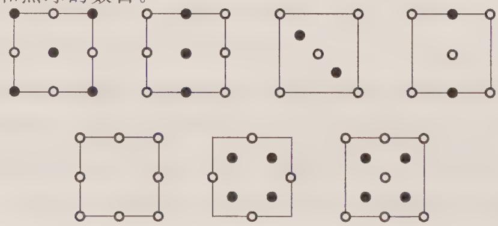

7.2 在一片广阔平坦的土地上植树，要求植株间的距离不小于 $2\mathrm{m}$ ，试安排一种方案使植株数目最多。将每株树用一个点表示，画出这些点的分布图及点阵单位，计算素单位的面积以及 $10000\mathrm{m}^2$ （1公顷）土地最多可植树的株数。

7.3 层状石墨分子中 C—C 键长为 142 pm，试根据它的结构画出层形石墨分子的原子分布图，画出二维六方素晶胞，用对称元素的图示记号标明晶胞中存在的全部六次轴，并计算每一晶胞的面积、晶胞中包含的 C 原子数和 C—C 键数。画出点阵素单位。

7.4 下表给出由X射线衍射法测得的一些链形高分子的周期。试根据C原子的立体化学，画出这些聚合物的一维结构；找出它们的结构基元；比较这些聚合物链周期的大小，并解释原因。

<table><tr><td>高分子</td><td>化学式</td><td>链周期/pm</td></tr><tr><td>聚乙烯</td><td> $(CH_2-CH_2)_n$ </td><td>252</td></tr><tr><td>聚乙烯醇</td><td> $(CH_2-CH)_n$  $\mid$ OH</td><td>252</td></tr><tr><td>聚氯乙烯</td><td> $(CH_2-CH)_n$  $\mid$ Cl</td><td>510</td></tr><tr><td>聚偏二氯乙烯</td><td> $(CH_2-C)_n$  $\mid$ Cl</td><td>470</td></tr></table>

7.5 有一组点，周期地分布于空间，其平行六面体单位如右下图所示。问这一组点是否构成一点阵？说出理由，判断它是否构成一点阵结构？请画出能够概括这一组点的周期性的点阵及其素单位。

7.6 列表比较晶体结构和分子结构的对称元素及其相应的对称操作。晶体结构比分子结构增加了哪几类对称元素和对称操作？晶体结构的对称元素和对称操作受到哪些限制？原因是什么？

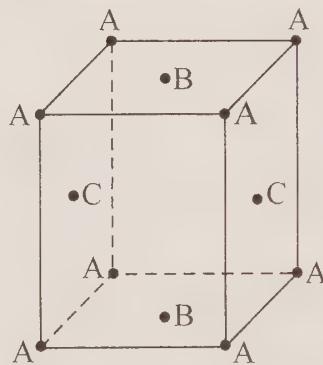

7.7 根据点阵的性质,作图证明理想晶体中不可能存在五次对称轴。

7.8 分别写出晶体中可能存在的独立的宏观对称元素和微观对称元素，并说明它们之间的关系。

7.9 有4种晶体分别属于 $C_{2h}, C_{2v}, D_{2h}$ 和 $D_{2d}$ 4种点群，试根据其特征对称元素定出它们所属的晶系。

7.10 有5种晶体分别属于 $C_{3h}, C_{3i}, C_{3v}, D_{3h}$ 和 $D_{3d}$ 5种点群，试根据其特征对称元素定出它们所属的晶系。

7.11 六方晶体可按六方柱体(八面体)结合而成,但为什么六方晶胞不能划成六方柱体?

7.12 按下图堆砌的结构为什么不是晶体中晶胞并置排列的结构？

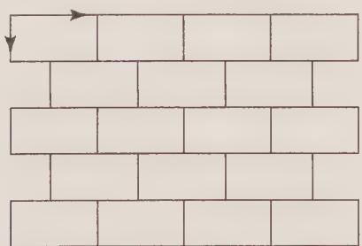

7.13 根据金属镁的晶体结构[图 7.1.4(e)]:

（1）画出金属镁晶体的六方晶胞沿 $c$ 轴的投影图，标明各个原子的分数坐标及其在晶胞中摊到的个数；

(2) 标明在晶胞内两个三角形中心处[坐标分别为 $(2/3, 1/3)$ 和 $(1/3, 2/3)$ 处]对称轴沿 $c$ 轴的投影图；

（3）画出点阵单位沿 $c$ 轴的投影，标明点阵单位内两个三角形中心处对称轴沿 $c$ 轴的投影图，说明原子分数坐标、螺旋轴 $6_{3}$ 和六次反轴 $\bar{6}$ 的定义。

7.14 根据 $\alpha$ -硒的晶体结构（见图7.2.6）及Se原子在晶胞中的坐标 $(0, u, 0), (u, 0, 2/3)$ ， $(\bar{u}, \bar{u}, 1/3), u = 0.217$ ：

（1）画出 $\alpha$ -Se 晶体的六方晶胞沿 $c$ 轴的投影图，标明各个原子的分数坐标及其在晶胞中摊到的个数；

(2) 标明晶胞内两个三角形中心处的对称轴沿 c 轴的投影图；

（3）画出点阵单位沿 $c$ 轴的投影图，标出单位内两个三角形中心处的对称轴投影图，说明晶胞对称性和点阵单位对称性不同的原因。

7.15 在下面3个六方晶胞 $(a = b \neq c, \alpha = \beta = 90^{\circ}, \gamma = 120^{\circ})$ 沿 $c$ 轴的投影中，若A(浅灰色)和B（深灰色）两种原子是排列在晶胞顶点和晶胞内两个三角形的中心，它们的结构沿 $c$ 轴投影示于下图，原子在 $c$ 轴的坐标标在原子旁。试分别写出这3种晶体通过原点平行 $c$ 轴的对称元素及晶体所属的晶系，并画出点阵单位及点阵点的位置、晶体所属的空间点阵型式。

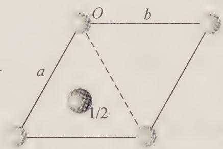  
(a)

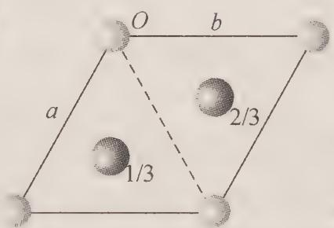  
(b)

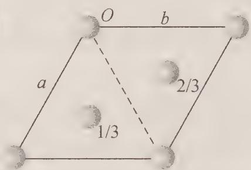  
(c)

7.16 四方晶系的金红石晶体结构中，晶胞参数 $a = 458\mathrm{pm}, c = 298\mathrm{pm}$ ；原子分数坐标为： $\mathrm{Ti}(0,0,0;1/2,1/2,1/2), \mathrm{O}(0.31,0.31,0;0.69,0.69,0;0.81,0.19,1/2;0.19,0.81,1/2)$ 。计算 $z$ 值相同的 Ti—O 键长。

7.17 许多由有机分子堆积成的晶体属于单斜晶系， $C_{2h}^{5}-P2_{1}/c$ 空间群。说明空间群记号中各符号的意义，画出 $P2_{1}/c$ 空间群对称元素的分布，推出晶胞中和原子(0.15,0.25,0.10)属同一等效点系的其他3个原子的坐标，并作图表示。

7.18 写出在3个坐标轴上的截距分别为 $2a, -3b$ 和 $-3c$ 的点阵面的指标，写出指标为(321)的点阵面在3个坐标轴上的截距之比。

7.19 标出下面点阵结构的晶面指标(100)，(210)，(120)，(210)，(230)，(010)。每组面画出3条相邻的直线表示。

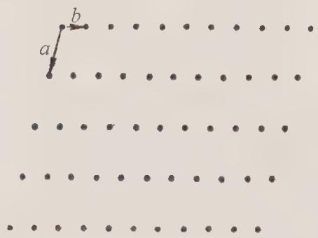

7.20 金属镍的立方晶胞参数 a=352.4 pm，试求 $d_{200}, d_{111}, d_{220}$ 。

7.21 什么是晶体衍射的两个要素？它们与晶体结构（例如晶胞的两要素）有何对应关系？写出能够阐明这些对应关系的表达式，并指出式中各符号的意义。晶体衍射的两要素在 X 射线粉末衍射图上有何反映？

7.22 写出 Bragg 方程的两种表达形式,说明 $(hkl)$ 与 $hkl,d_{(hkl)}$ 与 $d_{hkl}$ 之间的关系以及衍射角 $\theta_{n}$ 随衍射级数 n 的变化。

7.23 已知二水合草酸晶体属单斜晶系、 $P2_{1}/n$ 空间群，晶胞参数 a=609.68 pm, b=349.75 pm, c=1194.6 pm, $\beta=105.78^{\circ}$ ，试计算它的倒易点阵参数 $a^{*}, b^{*}, c^{*}, \alpha^{*}, \beta^{*}, \gamma^{*}$ ，作出垂直 b 轴通过原点的点阵和倒易点阵图。

7.24 用 $\mathrm{CuK}\alpha \mathrm{X}$ 射线收集二水合草酸晶体的衍射数据时，用7.23题所得数据计算由倒易点阵原点指向倒易点阵点的 $H_{200}$ 和 $H_{202}$ 的数值，画出衍射202产生衍射时倒易点阵和反射球的几何关系，计算200和202两个衍射的衍射角 $2\theta$ 的数值。

7.25 为什么用 X 射线粉末法测定晶胞参数时常用高角度数据(有时还根据高角度数据外推至 $\theta = 90^{\circ}$ ), 而测定超细晶粒的结构时要用低角度数据(小角散射)?

7.26 用 X 射线衍射法测定 CsCl 的晶体结构, 衍射 100 和 200 哪个强度大? 为什么?

7.27 金属铝属立方晶系，用 Cu Kα 射线摄取 333 衍射， $\theta=81^{\circ}17'$ 。由此计算晶胞参数。

7.28 $\mathrm{S_8}$ 分子既可结晶成单斜硫，也可结晶成正交硫。用X射线衍射法（ $\mathrm{CuK}\alpha$ 射线）测得某正交硫晶体的晶胞参数 $a = 1048\mathrm{pm}, b = 1292\mathrm{pm}, c = 2455\mathrm{pm}$ 。已知该硫磺的密度为 $2.07\mathrm{gcm}^{-3}$ ，S的相对原子质量为32.06。

(1) 计算每个晶胞中 $S_{8}$ 分子的数目；

(2) 计算 224 衍射线的 Bragg 角 $\theta$ ;

(3) 写出气相中 $S_{8}$ 分子的全部独立的对称元素。

7.29 硅的晶体结构与金刚石相似。 $20^{\circ}\mathrm{C}$ 下测得其立方晶胞参数 $a = 543.089\mathrm{pm}$ ，密度为 $2.3283\mathrm{gcm}^{-3}$ ，Si 的相对原子质量为 28.0854，计算 Avogadro 常数。

7.30 已知某立方晶系晶体的密度为 $2.16 \mathrm{~g} \mathrm{~cm}^{-3}$ , 相对分子质量为 234。用 $\mathrm{CuK}\alpha$ 射线在直径 $57.3 \mathrm{~mm}$ 的粉末相机中拍粉末图, 从中量得衍射 220 的衍射线间距 $2L$ 为 $22.3 \mathrm{~mm}$ , 求晶胞参数及晶胞中的分子数。

7.31 核糖核酸酶-S蛋白质晶体的晶体学数据如下:晶胞体积 $167 \, nm^{3}$ ，晶胞中分子数 6，晶体密度 $1.282 \, g \, cm^{-3}$ 。如蛋白质在晶体中占 68%（质量分数），计算该蛋白质的相对分子质量。

7.32 CaS 晶体具有 NaCl 型结构, 晶体密度为 $2.581 \, g cm^{-3}$ , Ca 和 S 的相对原子质量分别为 40.08 和 32.06。试回答下列问题:

(1) 指出 100, 110, 111, 200, 210, 211, 220, 222 衍射中哪些是允许的？

(2) 计算晶胞参数 a;

(3) 计算 $\mathrm{CuK}\alpha$ 辐射 $(\lambda = 154.2\mathrm{pm})$ 的最小可观测 Bragg 角。

7.33 $\delta$ -TiCl $_{3}$ 微晶是乙烯、丙烯聚合催化剂的活性组分。用 X 射线粉末法 (Cu K $_{\alpha}$ 线) 测定其平均晶粒度时所得数据如下表所示。

<table><tr><td>hkl</td><td>θ</td><td> $B_0$ </td><td>B</td></tr><tr><td>001</td><td>7.55°</td><td>0.40°</td><td>1.3°</td></tr><tr><td>100</td><td>26°</td><td>0.55°</td><td>1.5°</td></tr></table>

[17] Massa W. Crystal Structure Determination. Berlin: Springer-Verlag, 2000.
286

请由公式(7.7.9)估算该 $\delta-TiCl_{3}$ 微晶的大小。

7.34 冰为六方晶系晶体，晶胞参数 $a = 452.27\mathrm{pm}, c = 736.71\mathrm{pm}$ ，晶胞中含 $4\mathrm{H}_2\mathrm{O}$ ，括弧内为O原子分数坐标 $(0,0,0;0,0,0.375;2/3,1/3,1/2;2/3,1/3,0.875)$ 。请据此计算或说明：

(1) 计算冰的密度;

(2) 计算氢键 O—H…O 键长；

（3）冰的点阵型式是什么？结构基元包含哪些内容？

7.35 某 MO 型金属氧化物属立方晶系，晶体密度为 $3.581 \, g cm^{-3}$ 。用 X 射线粉末法 (Cu Kα 线) 测得各衍射线相应的衍射角分别为： $18.5^{\circ}, 21.5^{\circ}, 31.2^{\circ}, 37.4^{\circ}, 39.4^{\circ}, 47.1^{\circ}, 52.9^{\circ}, 54.9^{\circ}$ 。请据此计算或说明：

(1) 确定该金属氧化物晶体的点阵型式；

(2) 计算晶胞参数和一个晶胞中的结构基元数；

（3）计算金属原子 M 的相对原子质量，说明 M 是什么原子。

7.36 L-丙氨酸与氯铂酸钾反应,形成的晶体(见右式)属于正交晶系。已知: $a = 746.0 \mathrm{pm}$ , $b = 854.4 \mathrm{pm}, c = 975.4 \mathrm{pm}$ ; 晶胞中包含 2 个分子, 空间群为 $P2_{1}22_{1}$ , 一般等效点系数目为 4, 即每一不对称单位相当于半个分子。试由此说明该分子在晶体中的构型和点群, 并写出结构式。

## 参考文献

[1] 唐有祺. 结晶化学. 北京: 高等教育出版社, 1957.

[2] 周公度. 晶体结构测定. 北京: 科学出版社, 1981.

[3] 周公度. 晶体结构的周期性和对称性. 北京: 高等教育出版社, 1992.

[4] 周公度, 郭可信, 李根培, 王颖霞. 晶体和准晶体的衍射. 第二版. 北京: 北京大学出版社, 2013.

[5] 马喆生, 施倪承. X 射线晶体学. 北京: 中国地质大学出版社, 1995.

[6] 王仁卉, 郭可信. 晶体学中的对称群. 北京: 科学出版社, 1990.

[7] 周公度. 化学中的多面体. 第2次印刷. 北京: 北京大学出版社, 2015.

[8] 方奇, 于文涛. 晶体学原理. 北京: 国防工业出版社, 2002.

[9] 江超华. 多晶 X 射线衍射：技术和应用. 北京：化学工业出版社，2014.

[10] 周公度. 关于晶体学的一些概念. 大学化学, 2006, 21(6): 12\~19.

[11] 梁丽. 青蒿素分子和立体结构测定的历史回顾. 生物化学与生物物理进展, 2017, 44(1): 6\~16.

[12] Hahn T. International Tables for Crystallography (Vol A), Space-group Symmetry. 5 $^{th}$ ed. Dordrecht: D Reidel Publishing Company, 2002.

[13] Glusker J P, Lewis M, Rossi M. Crystal Structure Analysis for Chemists and Biologists. New York: VCH, 1994.

[14] Glusker J P, Trueblood K N. Crystal Structure Analysis: A Primer. 2 $^{nd}$ ed. New York: Oxford University Press, 1985.

[15] Dunitz J D. X-ray Analysis and the Structure of Organic Molecules. 2 $^{nd}$ ed. Corrected reprint. Weinheim: VCH, 1995.

[16] Wilson C C. Single Crystal Neutron Diffraction from Molecular Materials. Singapore: World Scientific, 2000.

## 第8章 金属的结构和性质

## 8.1 金属键和金属的一般性质

## 8.1.1 金属键的“自由电子”模型

在一百多种化学元素中，金属约占 $80\%$ ，它们有许多共同的性质：不透明、有金属光泽、导电和传热性能优良、富有延展性等。金属的这些性质是金属内部结构的反映。金属元素的电负性较小，电离能也较小。金属原子的最外层价电子容易脱离原子核的束缚，而在由各个正离子形成的势场中比较自由地运动，形成“自由电子”或称“离域电子”。这些在三维空间中运动、离域范围很大的电子，与正离子吸引胶合在一起，形成金属晶体。金属中的这种结合力称为金属键。金属的一般特性都和金属中存在着这种“自由电子”有关。自由电子能较“自由”地在整个晶粒内运动，使金属具有良好的导电和传热性；自由电子能吸收可见光并能立即放出，使金属不透明、有金属光泽；由于自由电子的胶合作用，当晶体受到外力作用时，原子间容易进行滑动，所以能锤打成薄片、抽拉成细丝，表现出良好的延展性和可塑性。金属间能形成各种组成的合金，也是由金属键的性质决定的。按“自由电子”模型，金属键没有方向性，每个原子中电子的分布基本上是球形的，自由电子的胶合作用使球形的金属原子作紧密堆积，形成能量较低的稳定体系。

按“自由电子”模型，把金属中的“自由电子”看作彼此间没有相互作用，各自独立地在平均势场中运动，势能取作0，这就相当于把金属中的电子看作在三维势箱中运动的电子。若三维势箱为边长等于 $l$ 的立方体，势场的边界条件和1.3节所述的相同，可得Schrödinger方程

$$
- \frac {h ^ {2}}{8 \pi^ {2} m} \left(\frac {\partial^ {2}}{\partial x ^ {2}} + \frac {\partial^ {2}}{\partial y ^ {2}} + \frac {\partial^ {2}}{\partial z ^ {2}}\right) \psi = E \psi\tag{8.1.1}
$$

或

$$
\nabla^ {2} \psi + \frac {8 \pi^ {2} m}{h ^ {2}} E \psi = 0\tag{8.1.2}
$$

解之，得

$$
\psi (x, y, z) = \left(\frac {2}{l}\right) ^ {\frac {3}{2}} \sin \left(\frac {n _ {x} \pi x}{l}\right) \sin \left(\frac {n _ {y} \pi y}{l}\right) \sin \left(\frac {n _ {z} \pi z}{l}\right)\tag{8.1.3}
$$

$n_x, n_y, n_z$ 均为正整数。相应的能级为

$$
E = \frac {h ^ {2}}{8 m l ^ {2}} (n _ {x} ^ {2} + n _ {y} ^ {2} + n _ {z} ^ {2}) = \frac {n ^ {2} h ^ {2}}{8 m l ^ {2}}\tag{8.1.4}
$$

若波函数用指数形式

$$
\psi = \left(\frac {1}{l}\right) ^ {\frac {3}{2}} \exp \left[ \frac {\mathrm{i} 2 \pi}{l} \left(n _ {x} x + n _ {y} y + n _ {z} z\right) \right]\tag{8.1.5}
$$

表达，则 $n_x, n_y, n_z$ 可为正整数、零和负整数，能级变为

$$
E = \frac {h ^ {2}}{2 m l ^ {2}} (n _ {x} ^ {2} + n _ {y} ^ {2} + n _ {z} ^ {2}) = \frac {n ^ {2} h ^ {2}}{2 m l ^ {2}}\tag{8.1.6}
$$

每一组量子数 $(n_x, n_y, n_z)$ 确定一个允许的量子态。因 $n^2 = n_x^2 + n_y^2 + n_z^2$ ，对 $E$ 值确定的状态，用 $n_x^2 + n_y^2 + n_z^2$ 相等的任意一组数均可。若考虑电子自旋，还要加入自旋磁量子数 $m_s$ 。

体系处在基态时,第一能级 $n^{2}=0$ , 可放 2 个电子, 即为 $n_{x}=n_{y}=n_{z}=0, m_{s}=\pm1/2$ 的状态。第二能级 $n^{2}=1$ , 按 $(n_{x}, n_{y}, n_{z}, m_{s})$ 的可能值, 计有 12 种简并态: $1, 0, 0, \pm1/2; -1, 0, 0, \pm1/2; 0, 1, 0, \pm1/2; 0, -1, 0, \pm1/2; 0, 0, 1, \pm1/2; 0, 0, -1, \pm1/2$ 。第三能级 $n^{2}=2$ , 可放 24 个电子, ……。体系处在 0 K 时, 电子从最低能级填起, 直至 Fermi 能级 $E_{F}$ , 能量低于 $E_{F}$ 的能级, 全都填满了电子; 而所有高于 $E_{F}$ 的能级都是空的。对导体, $E_{F}$ 就是 0 K 时电子所能占据的最高能级。若和 $E_{F}$ 相应的量子数为 $n_{F}$ , 用下面简单办法可以计算 $n_{F}$ 和 $E_{F}$ 。

在 $x, y, z$ 坐标轴上， $n_x, n_y$ 和 $n_z$ 均为整数的坐标点符合(8.1.6)式的量子化条件，每个点相当于一个确定量子数的状态，这些点的排列如同简单立方点阵，每一单位体积摊到一个点，以 $n_{\mathrm{F}}$ 作为半径所得的球体积，相当于状态的数目。 $n$ 小于 $n_{\mathrm{F}}$ 的点数为 $(4/3)\pi n_{\mathrm{F}}^{3}$ ，每一状态可放2个电子 $(m_s = \pm 1/2)$ ，故共可放 $(8/3)\pi n_{\mathrm{F}}^{3}$ 个电子。若金属的立方体势箱的边长为 $l$ ，则体积为 $l^3$ 。若单位体积有 $N$ 个电子，则共有 $Nl^3$ 个，即

$$
N l ^ {3} = (8 / 3) \pi n _ {\mathrm{F}} ^ {3}
$$

或

$$
\left(\frac {n _ {\mathrm{F}}}{l}\right) ^ {2} = \left(\frac {3 N}{8 \pi}\right) ^ {\frac {2}{3}}\tag{8.1.7}
$$

将此关系代入(8.1.6)式, 得 0 K 时的 Fermi 能级

$$
E _ {\mathrm{F}} = \frac {h ^ {2}}{2 m} \left(\frac {n _ {\mathrm{F}}}{l}\right) ^ {2} = \frac {h ^ {2}}{8 \pi^ {2} m} (3 \pi^ {2} N) ^ {\frac {2}{3}}\tag{8.1.8}
$$

例如金属钠, 密度为 $0.97 \, g \, cm^{-3}$ , 每一原子提供一个自由电子 (e), 电子密度 N (即每 $1 \, cm^{3}$ 中电子的数目) 为

$$
\begin{array}{r l} N & = \frac {0 . 9 7 \mathrm{gcm} ^ {- 3}}{2 3 \mathrm{g}} \times (6. 0 2 \times 1 0 ^ {2 3} \mathrm{e}) \\ & = 2. 5 \times 1 0 ^ {2 2} \mathrm{ecm} ^ {- 3} \\ & = 2. 5 \times 1 0 ^ {2 8} \mathrm{em} ^ {- 3} \end{array}
$$

将此 $N$ 值代入(8.1.8)式，得

$$
E _ {\mathrm{F}} = 5. 0 4 \times 1 0 ^ {- 1 9} \mathrm{J} (\text {或} 3. 1 5 \mathrm{eV})
$$

实验测定金属钠的 $E_{F}$ 为 3.2 eV，与计算所得结果符合较好。由金属钠的 $E_{F}$ 可见，即使在 0 K 时，电子仍有相当大的动能。

当温度升高，部分电子会得到热能，所得热能的数量级为 $kT$ 。室温下， $kT$ 约为 $4.14 \times 10^{-21} \mathrm{~J}$ ；而大多数金属 $E_{\mathrm{F}}$ 约为 $(3 \sim 10) \times 10^{-19} \mathrm{~J}, kT$ 比 $E_{\mathrm{F}}$ 约小 2 个数量级。

由于 $kT \ll E_{\mathrm{F}}$ ，只有其能量处在 $E_{\mathrm{F}}$ 附近 $kT$ 范围的电子才能被激发到较高的空能级，这部分电子数目很少，即很少一部分电子对比热有贡献，所以金属的比热很小，而室温下 $E_{\mathrm{F}}$ 和 $0\mathrm{K}$ 时的数值差别不大。

金属键的强度可用金属的原子化焓(气化焓)衡量。表8.1.1列出金属的原子化焓和熔点。原子化焓是指 $1\mathrm{mol}$ 金属变成气态原子所吸收的能量。金属的许多性质和原子化焓有关：若原子化焓的数值较小，这种金属通常比较软，熔点比较低；若原子化焓的数值较大，这种金属通常较硬，熔点较高。

表 8.1.1 金属的气化焓和熔点 $^{a}$

<table><tr><td>Li</td><td>Be</td><td></td><td></td><td></td><td></td><td></td><td></td><td></td><td></td><td></td><td></td><td></td><td></td><td></td></tr><tr><td>147</td><td>297</td><td></td><td></td><td></td><td></td><td></td><td></td><td></td><td></td><td></td><td></td><td></td><td></td><td></td></tr><tr><td>454</td><td>1560</td><td></td><td></td><td></td><td></td><td></td><td></td><td></td><td></td><td></td><td></td><td></td><td></td><td></td></tr><tr><td>Na</td><td>Mg</td><td></td><td></td><td></td><td></td><td></td><td></td><td></td><td></td><td></td><td></td><td>Al</td><td></td><td></td></tr><tr><td>97</td><td>128</td><td></td><td></td><td></td><td></td><td></td><td></td><td></td><td></td><td></td><td></td><td>294</td><td></td><td></td></tr><tr><td>371</td><td>923</td><td></td><td></td><td></td><td></td><td></td><td></td><td></td><td></td><td></td><td></td><td>933</td><td></td><td></td></tr><tr><td>K</td><td>Ca</td><td>Sc</td><td>Ti</td><td>V</td><td>Cr</td><td>Mn</td><td>Fe</td><td>Co</td><td>Ni</td><td>Cu</td><td>Zn</td><td>Ga</td><td>Ge</td><td></td></tr><tr><td>77</td><td>155</td><td>333</td><td>425</td><td>459</td><td>340</td><td>221</td><td>340</td><td>377</td><td>378</td><td>300</td><td>124</td><td>254</td><td>334</td><td></td></tr><tr><td>337</td><td>1115</td><td>1814</td><td>1941</td><td>2183</td><td>2180</td><td>1519</td><td>1811</td><td>1768</td><td>1728</td><td>1358</td><td>693</td><td>303</td><td>1211</td><td></td></tr><tr><td>Rb</td><td>Sr</td><td>Y</td><td>Zr</td><td>Nb</td><td>Mo</td><td>Tc</td><td>Ru</td><td>Rh</td><td>Pd</td><td>Ag</td><td>Cd</td><td>In</td><td>Sn</td><td>Sb</td></tr><tr><td>76</td><td>136</td><td>365</td><td>573</td><td>690</td><td>617</td><td>585</td><td>592</td><td>494</td><td>392</td><td>258</td><td>100</td><td>232</td><td>296</td><td>193</td></tr><tr><td>312</td><td>1050</td><td>1799</td><td>2128</td><td>2750</td><td>2896</td><td>2430</td><td>2607</td><td>2237</td><td>1828</td><td>1235</td><td>594</td><td>430</td><td>505</td><td>904</td></tr><tr><td>Cs</td><td>Ba</td><td>La</td><td>Hf</td><td>Ta</td><td>W</td><td>Re</td><td>Os</td><td>Ir</td><td>Pt</td><td>Au</td><td>Hg</td><td>Tl</td><td>Pb</td><td>Bi</td></tr><tr><td>64</td><td>140</td><td>402</td><td>571</td><td>733</td><td>807</td><td>704</td><td>738</td><td>612</td><td>469</td><td>324</td><td>59</td><td>165</td><td>179</td><td>151</td></tr><tr><td>302</td><td>1000</td><td>1193</td><td>2506</td><td>3290</td><td>3695</td><td>3459</td><td>3306</td><td>2719</td><td>2041</td><td>1337</td><td>234</td><td>577</td><td>601</td><td>545</td></tr></table>

表中第一排为 298 K 时的气化焓数据(其中,汞的气化焓是其熔点时的数据),单位为 kJ mol $^{-1}$ ;第二排为熔点数据,单位为 K。数据引自参考文献 $^{[5]}$ 。

## 8.1.2 固体能带理论

晶体中的电子和孤立原子中的电子不同,也和自由运动的电子不同,它是在周期性重复排列的原子间运动。量子力学中的单电子近似方法,将晶体中某个电子看作在周期性排列且固定不动的原子核势场和其他大量电子的平均势场中运动,其 Schrödinger 方程为

$$
\left[ - \frac {h ^ {2}}{8 \pi^ {2} m} \nabla^ {2} + V \right] \psi = E \psi\tag{8.1.9}
$$

对一维沿 $x$ 轴排列、周期长度为 $a$ 的晶体，在 $x$ 位置的势能 $V(x)$ 和在 $(x + na)$ 处的势能 $V(x + na)$ 相同，式中 $n$ 为整数。在实际晶体中，计算 $V(x)$ 很困难，可用一些近似方法求解。

在固体物理中, 常对晶体中传播的平面波 $\psi$ 用波矢量 k 表示, 称它为 k 空间。

$$
k = | k | = 2 \pi / \lambda\tag{8.1.10}
$$

不同的 k 标志电子运动的不同状态, 它的动量 p 和动能 E 与 k 的关系为

$$
p = \frac {h}{\lambda} = m v = h k / 2 \pi , \quad v = h k / 2 \pi m\tag{8.1.11}
$$

$$
E _ {\mathrm{k}} = \frac {1}{2} m v ^ {2} = \frac {h ^ {2} k ^ {2}}{8 \pi^ {2} m} = \frac {n ^ {2} h ^ {2}}{8 m l ^ {2}} = E _ {n}\tag{8.1.12}
$$

上式中的 $E_{\mathrm{k}}$ 因为和一维箱中粒子所得的(1.3.4)式一致，所以得到(8.1.12)式后面的等式。由于晶体的周期性结构，在 $k$ 空间中传播的电子也遵循Bragg方程 $(2a\sin \theta = n\lambda)$ ，当 $\theta = 90^{\circ}$ 时， $\sin \theta = 1$ ，这时 $2a = n\lambda$ ，即

$$
k = \frac {2 \pi}{\lambda} = \frac {n \pi}{a}, \quad n = 0, 1, 2, 3, \dots\tag{8.1.13}
$$

由(8.1.13)式可见,在 k 空间中电子传播时,当 $\theta=90^{\circ}$ , 电子反向传播,能量出现不连续性,这时的状态是能量不允许存在的区域,这种能量不允许存在的区域称为禁带,能量允许存在的区域称为能带。图8.1.1示出E和k的关系及能带。在每个能带中包含相同k值由周期性联系的N个电子。各个电子都有一个能量状态,即能级,每个能级可容纳自旋相反的两个电子,能级数目是N/2。由于N数目很大,能级间隔极小。另外,原子的内层轨道所形成的能带较窄,外层较宽,排列成能带结构。

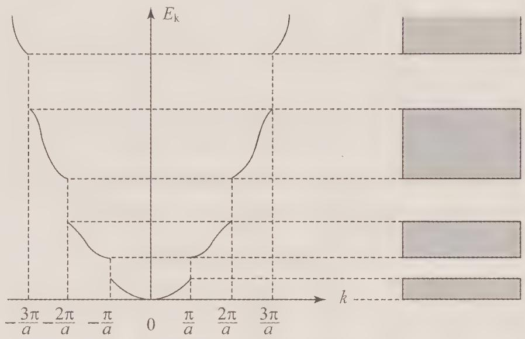  
图8.1.1 $E$ 和 $k$ 的关系及能带

根据能带的分布和电子填充情况,可分为下列几种:

(1) 充满电子的能带叫满带。

(2) 部分能级充满电子的能带叫导带。

(3) 能级最高的满带和导带总称为价带。

(4) 完全没有电子的能带叫空带。

(5) 各能带间不能填充电子的区域叫带隙,又称禁带。

若一种固体只有全满和全空的能带,它不能改变电子的运动状态,不能导电。含有部分填充电子的能带,电子受外电场作用,有可能在该能带中的不同能级间改变其能量和运动状态而导电。

在金属钠由原子的价层3s轨道叠加形成的能带中，能级数目和电子数目相同，而每个能级可容纳自旋相反的2个电子，出现部分填充电子的能带，见图8.1.2(a)。金属镁由原子的价层中s轨道和p轨道形成的能带，因能量高低互相接近，彼此交盖重叠，也出现部分填充电子的能带，见图8.1.2(b)。其他金属也具有相似的部分填充电子的能带，所以金属具有较好的导电性。

导体的能带结构特征是具有导带。绝缘体的特征是只有满带和空带，而且能量最高的满带和能量最低的空带之间的禁带较宽， $E_{g}\geqslant5\ eV$ ，在一般电场条件下，难以将满带电子激发到空带，即不能形成导带。半导体的特征，也是只有满带和空带，但最高满带和最低空带之间的禁带较窄， $E_{g}<3\ eV$ 。例如，Si的禁带宽度为1.1eV，Ge为0.72eV，GaAs为1.4eV等。图8.1.3示出导体、绝缘体和半导体的能带结构特征。

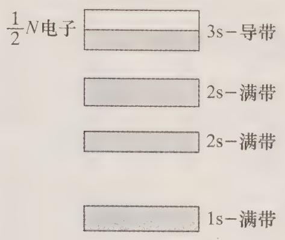  
(a) Na的能带结构

  
(b) Mg的3s与3p能带结构：3s能带已填满电子，但与3p空带重叠，总体看也是导带

图8.1.2 Na与 $\mathrm{Mg}$ 的能带结构示意图  
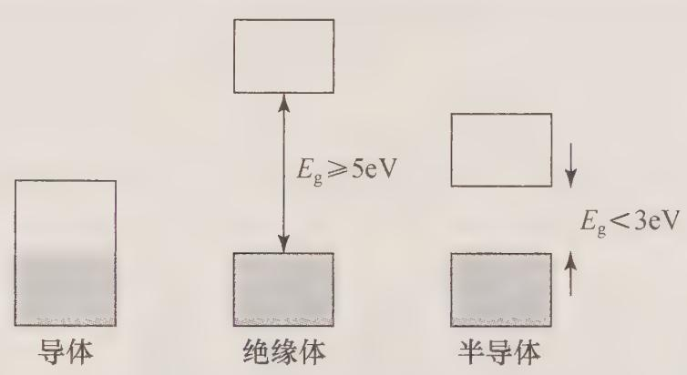  
图8.1.3 导体、绝缘体和半导体的能带结构特征

在硅的晶体中掺入不同杂质,可以改变其半导体性质。图 8.1.4(a) 示出硅中掺入磷后的能级,磷的价电子较硅多,形成 n 型半导体;图(b) 示出硅中掺入镓后的能级,镓的价电子较硅少,形成 p 型半导体。利用这两种型式的半导体,可制作 p-n 结,它是生产各种晶体管的基础。

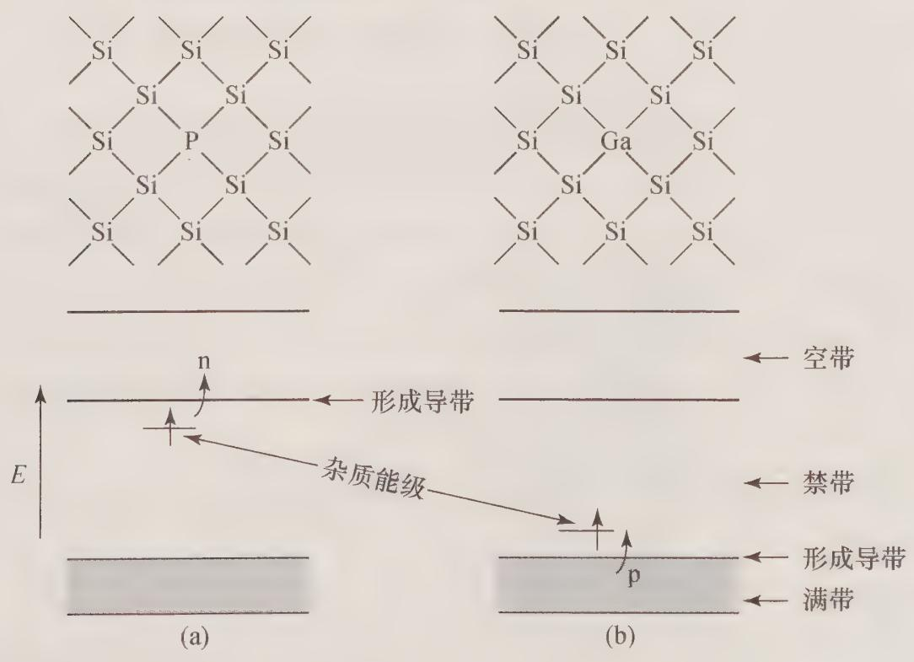  
图8.1.4 (a)n型半导体和(b)p型半导体

## 8.2 等径圆球的密堆积

上一节，从化学键的角度，分别利用“自由电子”模型和固体能带理论讨论了金属晶体的结构。把金属键看作球形原子之间的各向同性的相互作用。本节从几何角度出发，用等径圆球的密堆积模型讨论金属的结构。在金属晶体中，原子趋向于形成堆积密度大、配位数高、空间利用率大的稳定结构。

## 8.2.1 等径圆球的最密堆积

等径圆球的最密堆积结构可从密堆积层开始来了解。密堆积层的结构只有一种型式，如图8.2.1中底层球的排列。在层中每个球和周围6个球接触，即配位数为6，每个球周围有6个空隙，每个空隙由3个球围成，这样由N个球堆积成的层中，有2N个空隙，平均每个球摊到2个空隙。这些三角形空隙的顶点的朝向有一半和另一半相反。图8.2.1中底层球的球心位置为A，称为A层；B表示顶点向上的三角形空隙中心位置；C表示顶点向下的三角形空隙中心位置。

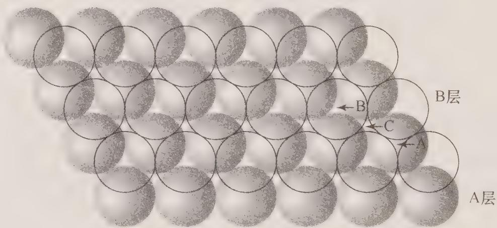  
图8.2.1 密堆积层(A)和密置双层(AB)的结构

由密堆积层进行堆积时,若采用最密堆积的方式,必须是密堆积层中原子的凸出部位正好处在相邻一密堆积层中的凹陷部位,即每一个原子都同时和相邻一密堆积层的3个原子相接触。图8.2.1中示出在A层之上加了B层球。这种由两层密堆积球紧密堆积形成的双层,称为密置双层。当密置双层中球的球心位置一层处于A,另一层处于B,这种密置双层可用AB表示。若所加球的球心所在的位置为C,则形成AC密置双层。AB和AC密置双层的结构是相同的,所以密置双层也只有一种类型。由密堆积层作最密堆积时,各个密堆积层中的球心位置实质上只有3种,即如图8.2.1标明的A,B,C所示。

等径圆球最密堆积结构类型,最常见的是立方最密堆积和六方最密堆积,此外,还有其他一些类型。现分述如下。

## 1. 立方最密堆积

将密堆积层的相对位置按照ABCABC…方式作最密堆积，这时重复的周期为3层，如图8.2.2(a)所示。由于这种堆积方式可划出立方晶胞，故称为立方最密堆积，英文名称简写为ccp(cubic closest packing)，记为A1型。图8.2.2(b)示出立方正当晶胞。图8.2.2(c)示出移去左下前方晶胞顶点上的一个圆球后显示出来的(111)面，这个面和晶胞体对角线（三重旋转轴)垂直。密置层沿着体对角线方向叠加,按照ABCABC…方式堆积形成ccp结构。

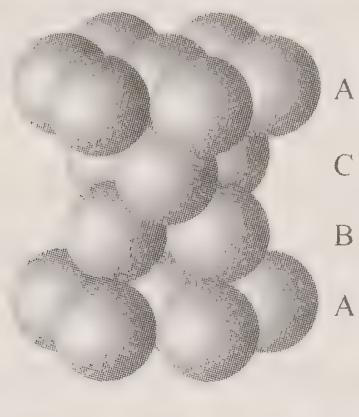  
(a)

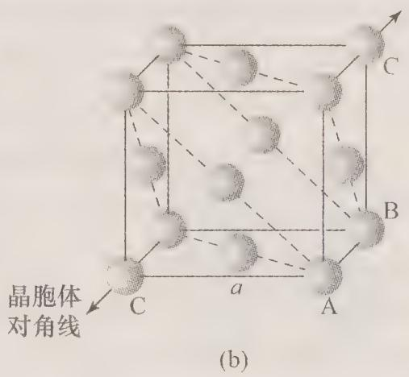

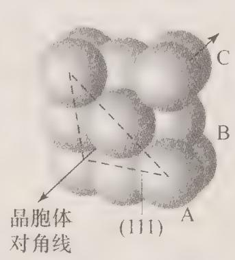  
(c)  
图8.2.2 立方最密堆积结构  
(a) 堆积层次序，(b) 正当晶胞，(c) 密堆积层在晶胞中的取向

## 2. 六方最密堆积

将密堆积层的相对位置按照ABAB…方式作最密堆积,这时重复的周期为两层,如图8.2.3(a)所示。由于这种堆积方式可划出六方晶胞,如图8.2.3(b),故这种堆积称为六方最密堆积,英文名称简写为hcp(hexagonal closest packing),记为A3型。从图8.2.3可以看出,密堆积层和(001)面平行。

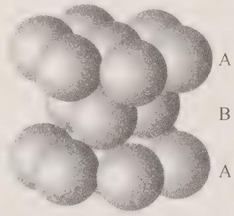  
(a)

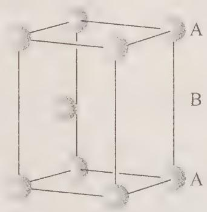  
(b)  
图8.2.3 六方最密堆积结构  
(a) 堆积层次序，(b) 正当晶胞

## 3. 其他最密堆积

除上述两种等径圆球的最密堆积外,已经发现在金属单质中还存在下面两种最密堆积方式。

## (1) 双六方最密堆积

英文名称简写为 dhcp(double hexagonal closest packing)。这种堆积的周期为4层，ABACABAC…，用 $A3^{*}$ 记号表示。图8.2.4示出它的堆积情况和晶胞。镧系元素La,β-Ce,Pr,Nd,Pm以及超铀元素Am,Cm,Bk,Cf和Es等单质呈这种类型的结构。

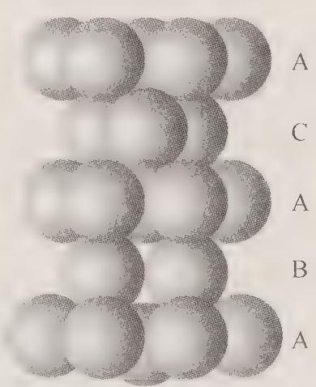  
(a)

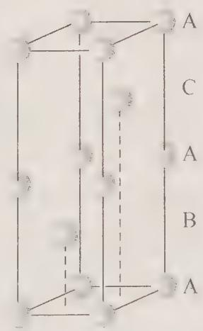  
(b)  
图8.2.4 双六方最密堆积  
(a) 密堆积层的堆积次序，(b) 正当晶胞

## (2) Sm 型最密堆积

堆积的周期为9层，堆积层的次序为ABABCBCAC…，在表8.3.1中用 $A3^{\prime \prime}$ 表示。图8.2.5示出它的晶胞结构。高压下， $\gamma$ -Dy, $\gamma$ -Gd, $\beta$ -Ho和 $\gamma$ -Tb等金属单质呈Sm型最密堆积结构。是什么因素促使金属钐采取这种方式的结构，还有待探讨。

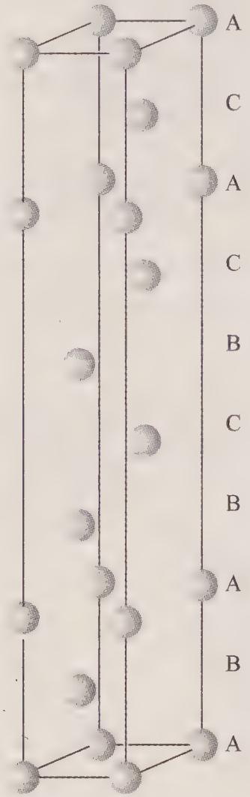  
图8.2.5 Sm型最密堆积的晶胞

在上面讨论的各种最密堆积结构中，任取其中的一个密堆积层，它们的结构都是一样的，密置双层也具有同样的情况，差别仅在于和密置双层相邻的层的位置不同。例如，和AB密置双层中的A层相邻的密置层可为B或C，和B层相邻的密置层可为A或C。所以，各种最密堆积结构中的一些几何关系是相同的或仅存在一些细小的差异。

等径圆球的各种最密堆积型式均具有相同的堆积密度，其堆积系数（或称空间利用率，即球体积与整个堆积体积之比）均为0.7405。例如ccp，可按图8.2.2(b)的立方晶胞进行计算。设球的半径为 $R$ ，晶胞边长为 $a$ ，面对角线长为 $4R$ ，它等于 $\sqrt{2} a$ ，所以

$$
a = \frac {4 R}{\sqrt {2}} = 2 \sqrt {2} R
$$

晶胞体积

$$
V _ {\mathrm{晶胞}} = a ^ {3} = (2 \sqrt {2} R) ^ {3} = 1 6 \sqrt {2} R ^ {3}
$$

晶胞内4个圆球的总体积

$$
V _ {\mathrm{球}} = 4 \times \left(\frac {4}{3} \pi R ^ {3}\right) = \frac {1 6}{3} \pi R ^ {3}
$$

$$
\mathrm{堆积系数} = \frac {V _ {\mathrm{球}}}{V _ {\mathrm{晶胞}}} = \frac {(1 6 / 3) \pi R ^ {3}}{1 6 \sqrt {2} R ^ {3}} = 0. 7 4 0 5
$$

在等径圆球最密堆积的各种型式中,每个球的配位数均为 12,中心的球和这 12 个球的距离相等,这 12 个球的配位型式只有在图 8.2.6 中示出的两种情况:立方最密堆积配位(a)和六方最密堆积配位(b)。

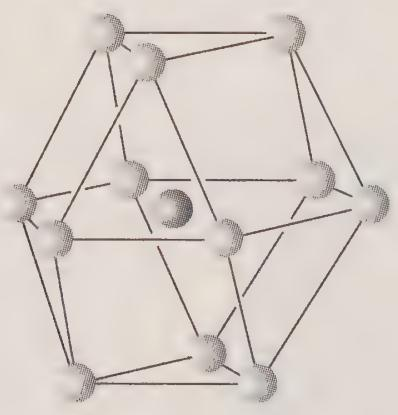  
(a) ccp

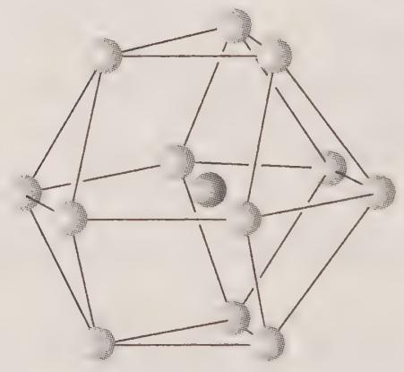  
(b) hcp  
图8.2.6 两种最密堆积的配位情况

## 8.2.2 等径圆球的体心立方密堆积

许多金属单质采取体心立方密堆积结构,它简写为 bcp(body-centered cubic packing),记

为 $A2$ 型。体心立方密堆积不是最密堆积，结构中不存在密堆积层和密置双层。

体心立方密堆积结构及其晶胞示于图8.2.7中，每个圆球均和8个处在立方体顶点上的

配位圆球接触。在正当晶胞中包含2个圆球，一个处于立方体中心，另一个为处在立方体8个顶点上的球各贡献1/8所形成。反映这种结构堆积密度的堆积系数可按下列过程计算：立方晶胞的边长为a，它的体对角线的长度为 $\sqrt{3}a$ 。圆球的半径为R。圆球在体对角线上互相接触，所以

$$
\sqrt {3} a = 4 R
$$

(a)  
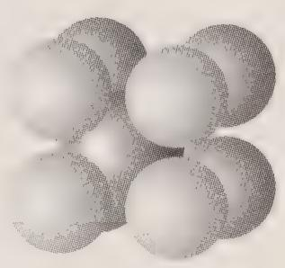

$$
a = 4 R / \sqrt {3}
$$

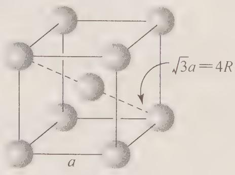  
(b)  
图8.2.7 等径圆球体心立方密堆积的结构  
(a) 球的密堆积，(b) 正当晶胞

晶胞中2个球的体积

$$
V _ {\mathrm{球}} = 2 \times \frac {4}{3} \pi R ^ {3} = \frac {8}{3} \pi R ^ {3}
$$

晶胞的体积

$$
V _ {\mathrm{晶胞}} = a ^ {3} = \left(\frac {4 R}{\sqrt {3}}\right) ^ {3} = \frac {6 4 R ^ {3}}{3 \sqrt {3}}
$$

堆积系数

$$
\frac {V _ {\mathrm{球}}}{V _ {\mathrm{晶胞}}} = \left(\frac {8}{3} \pi R ^ {3}\right) \bigg / \left(\frac {6 4 R ^ {3}}{3 \sqrt {3}}\right) = \frac {\sqrt {3} \pi}{8} = 0. 6 8 0 2
$$

由上述计算结果可见，体心立方密堆积的堆积系数比最密堆积小。许多金属采取体心立方密堆积结构的现象，说明影响晶体结构的因素除了堆积密度外，还有其他因素，如参与成键的价电子数及其轨道的影响等。另外，计算堆积密度时，用不变形的圆球模型也过于简单。实际上，在成键过程中原子会发生变形，圆球模型的计算值只是真正堆积密度的一种近似。

## 8.2.3 等径圆球密堆积中空隙的大小和分布

在各种最密堆积中,球间的空隙数目和大小都相同。由 N 个半径为 R 的球组成的堆积中,平均有 2N 个四面体空隙,可容纳半径为 0.225R 的小球;还有 N 个八面体空隙,可容纳半径为 0.414R 的小球。

在立方最密堆积和六方最密堆积中,八面体空隙和四面体空隙的分布情况分别示于图8.2.8(a)和(b)中。

了解体心立方堆积中空隙的位置和数目，对于阐明这类晶体的结构和性质十分重要。在图8.2.8(c)所示晶胞的每个面的中心和每条边的中心点上，均是由6个圆球围成的八面体空隙，每一个堆积球平均可摊到3个这种空隙。这种空隙不是正八面体，而是沿着一个轴压扁的变形八面体中心，空隙中最短处可容纳小球的半径 $r$ 与堆积球的半径 $R$ 之比 $r / R = 0.154$ 。另一种空隙为变形四面体空隙，处在晶胞的面上，每个面有4个四面体中心，这种空隙的 $r / R = 0.291$ ，每个堆积圆球平均摊到6个这种四面体空隙。图8.2.8(c)示出体心立方堆积中八面体和四面体空隙的分布。这些八面体空隙和四面体空隙在空间上是重复利用的，即空间某一点不是只属于某个多面体所有。由于划分方式不同,有时算这个多面体,有时算另外一个多面体,这些多面体共面连接,连接面为平面三角形空隙,也可看作变形的三方双锥空隙,它的数目较多,每个堆积圆球摊到12个。由上可见,在体心立方堆积中,每个圆球平均摊到3个八面体空隙,6个四面体空隙,12个三角形空隙,共计21个空隙。这些空隙的大小和分布特征直接影响到这种堆积结构的性质。

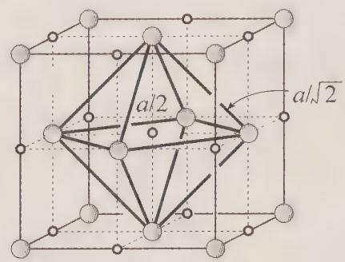  
(a)

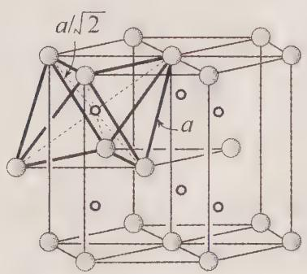

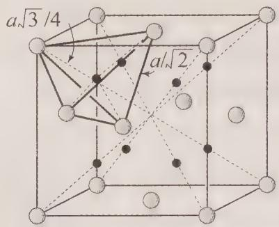

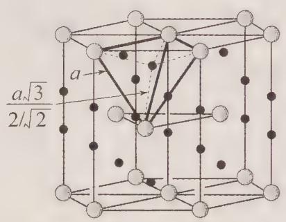  
(b)

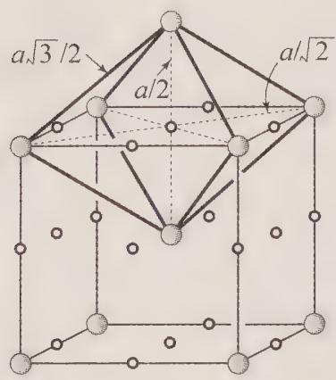

(c)  
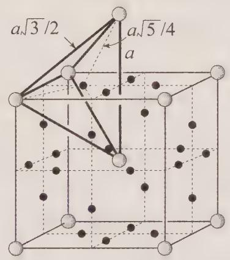  
- 金属原子
- 八面体空隙
- 四面体空隙  
图 8.2.8 几种密堆积结构及其中的空隙分布  
(a) ccp, (b) hcp, (c) bcp

灰锡为金刚石型结构,这种结构的堆积系数仅为0.3401。因为这种结构型式的共价键成分高,故计算堆积系数时,按原子共价半径计算原子的体积。

## 8.3 金属单质的结构

## 8.3.1 金属单质的结构概况

表 8.3.1 列出 74 种金属单质的结构型式。在金属单质中，由于温度和压力等外界条件的改变，可能出现多种同素异构体，但表中只列出室温下能相对稳定存在的晶型。表中每种元素符号下面注明金属结构型式：A1, A2, A3 型如前所述，A4 型为金刚石型结构[见图7.1.4(f)]，A5 型为白锡型结构，A6 型为由 A1 型变形为四方晶系的结构，A7 型和 A10 型为三方晶系的结构，A11型为金属Ga的结构，A12型和A13型分别为 $\alpha -\mathrm{Mn}$ 和 $\beta -\mathrm{Mn}$ 的结构（它们的结构较复杂，不易用简单堆积描述）。此外，表中还用 $C - 1,O - 4,O - 8,M - 16$ 等符号表示晶体结构，这些符号中前面的大写字母表示晶体所属的晶系（ $C$ 代表立方晶系， $O$ 代表正交晶系， $M$ 代表单斜晶系），短横后面的数字表示晶胞中的原子数。

表 8.3.1 金属单质的结构型式和金属的原子半径 (单位: $\mathrm{{pm}}$ )

<table><tr><td>Li</td><td>Be</td><td></td><td></td><td></td><td></td><td></td><td></td><td></td><td></td><td></td><td></td><td></td><td></td><td></td><td></td></tr><tr><td>A2</td><td>A3</td><td></td><td></td><td></td><td></td><td></td><td></td><td></td><td></td><td></td><td></td><td></td><td></td><td></td><td></td></tr><tr><td>152.0</td><td>111.2</td><td></td><td></td><td></td><td></td><td></td><td></td><td></td><td></td><td></td><td></td><td></td><td></td><td></td><td></td></tr><tr><td>Na</td><td>Mg</td><td></td><td></td><td></td><td></td><td></td><td></td><td></td><td></td><td></td><td></td><td>Al</td><td></td><td></td><td></td></tr><tr><td>A2</td><td>A3</td><td></td><td></td><td></td><td></td><td></td><td></td><td></td><td></td><td></td><td></td><td>A1</td><td></td><td></td><td></td></tr><tr><td>185.8</td><td>159.9</td><td></td><td></td><td></td><td></td><td></td><td></td><td></td><td></td><td></td><td></td><td>143.1</td><td></td><td></td><td></td></tr><tr><td>K</td><td>Ca</td><td>Sc</td><td>Ti</td><td>V</td><td>Cr</td><td>Mn</td><td>Fe</td><td>Co</td><td>Ni</td><td>Cu</td><td>Zn</td><td>Ga</td><td>Ge</td><td></td><td></td></tr><tr><td>A2</td><td>A1</td><td>A3</td><td>A3</td><td>A2</td><td>A2</td><td>A12</td><td>A2</td><td>A3</td><td>A1</td><td>A1</td><td>A3</td><td>A11</td><td>A4</td><td></td><td></td></tr><tr><td>227.2</td><td>197.4</td><td>164.0</td><td>144.8</td><td>132.1</td><td>124.9</td><td>136.6</td><td>124.1</td><td>125.3</td><td>124.6</td><td>127.8</td><td>133.3</td><td>122.1</td><td>122.5</td><td></td><td></td></tr><tr><td>Rb</td><td>Sr</td><td>Y</td><td>Zr</td><td>Nb</td><td>Mo</td><td>Tc</td><td>Ru</td><td>Rh</td><td>Pd</td><td>Ag</td><td>Cd</td><td>In</td><td>Sn</td><td>Sb</td><td></td></tr><tr><td>A2</td><td>A1</td><td>A3</td><td>A3</td><td>A2</td><td>A2</td><td>A3</td><td>A3</td><td>A1</td><td>A1</td><td>A1</td><td>A3</td><td>A6</td><td>A4</td><td>A7</td><td></td></tr><tr><td>247.5</td><td>215.2</td><td>180.1</td><td>160</td><td>142.9</td><td>136.3</td><td>135.8</td><td>132.5</td><td>134.5</td><td>137.6</td><td>144.5</td><td>149.0</td><td>162.6</td><td>140.5</td><td>143.9</td><td></td></tr><tr><td>Cs</td><td>Ba</td><td>La</td><td>Hf</td><td>Ta</td><td>W</td><td>Re</td><td>Os</td><td>Ir</td><td>Pt</td><td>Au</td><td>Hg</td><td>Tl</td><td>Pb</td><td>Bi</td><td>Po</td></tr><tr><td>A2</td><td>A2</td><td>A3*</td><td>A3</td><td>A2</td><td>A2</td><td>A3</td><td>A3</td><td>A1</td><td>A1</td><td>A1</td><td>A10</td><td>A3</td><td>A1</td><td>A7</td><td>C-1</td></tr><tr><td>265.4</td><td>217.4</td><td>187.9</td><td>156.4</td><td>143</td><td>137.1</td><td>137.1</td><td>133.8</td><td>135.7</td><td>138.8</td><td>144.2</td><td>160</td><td>170.4</td><td>175.0</td><td>182</td><td>168</td></tr><tr><td rowspan="3">镧系</td><td>Ce</td><td>Pr</td><td>Nd</td><td>Pm</td><td>Sm</td><td>Eu</td><td>Gd</td><td>Tb</td><td>Dy</td><td>Ho</td><td>Er</td><td>Tm</td><td>Yb</td><td>Lu</td><td></td></tr><tr><td>A1</td><td>A3*</td><td>A3*</td><td>A3*</td><td>A3&quot;</td><td>A2</td><td>A3</td><td>A3</td><td>A3</td><td>A3</td><td>A3</td><td>A3</td><td>A1</td><td>A3</td><td></td></tr><tr><td>182.5</td><td>182.8</td><td>182.1</td><td>181</td><td>180.4</td><td>204.2</td><td>180.1</td><td>178.3</td><td>177.4</td><td>176.6</td><td>175.7</td><td>174.6</td><td>194.5</td><td>173.5</td><td></td></tr><tr><td rowspan="3">锕系</td><td>Ac</td><td>Th</td><td>Pa</td><td>U</td><td>Np</td><td>Pu</td><td>Am</td><td>Cm</td><td>Bk</td><td>Ra</td><td></td><td></td><td></td><td></td><td></td></tr><tr><td>A1</td><td>A1</td><td>A6</td><td>O-4</td><td>O-8</td><td>M-16</td><td>A3*</td><td>A3*</td><td>A3*</td><td>A2</td><td></td><td></td><td></td><td></td><td></td></tr><tr><td>187.8</td><td>179.8</td><td>160.6</td><td>138.5</td><td>131</td><td>151.3</td><td>184</td><td>174</td><td>170.3</td><td>222.9</td><td></td><td></td><td></td><td></td><td></td></tr></table>

由表中数据可见,许多金属单质的结构采用 A1 和 A3(包括:双六方最密堆积,表中用 $A3^{*}$ 记号;Sm 型最密堆积,表中用 $A3^{\prime\prime}$ 记号)这两种最密堆积型式,还有十多种金属采用 A2 型。

如何判断一种金属究竟属于哪种结构型式？有人为金属晶体的结构型式与电子组态间总结出一些定性的关系，认为晶体结构与金属原子价层s和p电子数目有关：当每个原子平均摊到s,p电子数较少时，容易采用A2型结构；较多时，为A1型结构；而介于两者中间时，则为A3型结构。d电子对成键强度影响较大，但并不直接决定晶体的结构型式。例如钠，其电子组态为 $\left[\mathrm{Ne}\right]3\mathrm{s}^{1}$ ，价层s,p电子数为1，晶体为A2型；镁的电子组态为 $\left[\mathrm{Ne}\right]3\mathrm{s}^{2}$ ，价层s,p电子数为2，晶体为A3型；铝的电子组态为 $\left[\mathrm{Ne}\right]3\mathrm{s}^{2}3\mathrm{p}^{1}$ ，价层s,p电子数较多，晶体为A1型。

## 8.3.2 金属原子半径

表 8.3.1 列出了金属的原子半径。对于 A1 和 A2 型结构，只要把原子间最近的接触距离除以 2，即得金属原子半径。例如 A1 型结构的金属铜，原子间的接触距离为 255.6 pm，铜的原子半径为 127.8 pm。对于 A3 型的结构，12 个配位原子分成两套不等同的配位，往往 6 个配位原子距离短些，另外 6 个稍长些。这时有两种计算原子半径的方法：一是取平均值，二是取短的值。表 8.3.1 所列数值是采用平均值计算而得的。

半径和配位数有关,同一种元素,配位数高,半径大。表 8.3.1 中所列的数据是由室温下稳定晶型的实际原子接触距离求得的。若将这些数据用于配位数为 12 的情况,则应根据配位

数与相对半径比予以换算。

<table><tr><td>配位数</td><td>12</td><td>8</td><td>6</td><td>4</td></tr><tr><td>相对半径比</td><td>1.00</td><td>0.97</td><td>0.96</td><td>0.88</td></tr></table>

由表所列数据可见,金属原子半径在周期表中的变化有一定的规律性:

（1）同一族元素原子半径随原子序数的增加而增加。这是由于同族元素外层电子组态相同，电子层数增加，半径加大。

（2）同一周期主族元素原子半径随原子序数的增加而下降。这是由于电子价层不变，有效核电荷随原子序数的增加而递增，使半径收缩。

（3）同一周期过渡元素的原子半径随原子序数的增加开始时稳定下降，以后稍有增大，但变化幅度不大。这是由于一方面当原子序数增加时，电子因填在内层d轨道，有效核电荷虽有增大，但增大较少，半径下降不多；另一方面，随电子数增加，半径稍有增加，出现两种相反因素。

（4）镧系元素在原子序数递增时，核电荷增加，核外电子数也增加，但电子充填在较内部的4f轨道上，不能全部屏蔽所增加的核电荷，出现半径随原子序数增加而缩小的“镧系收缩”效应。镧系元素的原子半径由La的187.3pm下降到Lu的172.7pm。但值得注意的是，其中有两个例外：Eu和Yb的原子半径特别大。这是由于这两种元素参加成键的电子只有2个，Eu和Yb的化学性质以及 $Eu^{2+}$ 和 $Yb^{2+}$ 比较稳定存在等事实均可以佐证。

受镧系收缩效应的影响,第二长周期比第一长周期同族元素的半径大,但第三长周期与第二长周期的同族元素的半径却极相近,如:Zr 和 Hf,Nb 和 Ta,Mo 和 W 的半径极为近似,极难分离;而 Ru,Rh,Pd,Os,Ir,Pt 6 种元素的原子半径和化学性质相似,通称铂族元素。

## 8.4 合金的结构和性质

合金是两种或两种以上的金属经过熔合后所得的生成物。在形成合金的过程中，热效应一般比较小。从金属单质到合金的变化，一般不像其他化学反应那么显著。合金一般都具有一定的金属性能。研究合金的结构化学，在于了解合金的晶体结构，并联系合金的性质，阐明它们的相互关系及规律性。

按结构和相图等特点,合金一般可分为三类:(i)金属固溶体,(ii)金属化合物和(iii)金属间隙化合物。当两种金属元素的电负性、化学性质和原子大小等比较接近时,容易生成金属固溶体。若电负性和原子半径差别大,生成金属化合物的倾向就较大。金属化合物中又可分为组成可变的金属化合物与组成确定的金属化合物。过渡金属元素与半径很小的 H,B,C,N 等非金属元素形成的化合物,小的非金属原子填入金属原子堆积的空隙中,这种合金称为金属间隙化合物或金属间隙固溶体。

## 8.4.1 金属固溶体

两种金属组成的固溶体,其结构型式一般与纯金属相同,只是一部分原子被另一部分原子统计地置换,即每一原子位置两种金属均有可能存在,其概率正比于该金属在合金中所占的比例,这样的原子在很多效应上相当于一个统计原子。

形成固溶体合金的倾向取决于下列3个因素：

（1）两种金属元素在周期表中的位置及其化学性质和物理性质的接近程度；

(2) 原子半径的接近程度；

(3) 单质的结构型式。

过渡金属元素相互之间最易形成固溶体，当两种过渡金属元素的原子半径相近（差别＜15%）、单质的结构型式相同时，往往可以形成一完整的固溶体体系。例如，按金属元素的原子

半径和单质的结构型式,可列出三组过渡金属(见右表)。在这三组中,每组金属至少可与一种同组金属形成一完整的固溶体,如:Ag-Au, Ni-Pd, Mo-W。

<table><tr><td>结构型式</td><td>金属</td></tr><tr><td>ccp</td><td>Cu, Ag, Au, Ni, β-Co, γ-Fe, Pt, Ir, Rh</td></tr><tr><td>bcp</td><td>α-Fe, V, Cr, Mo, W</td></tr><tr><td>hcp</td><td>Ti, Zr</td></tr></table>

金属的互溶度不是可互易的,一般,在低价金属中的溶解度大于在高价金属中的溶解度(例见下表)。

<table><tr><td colspan="2">在低价金属中的溶解度</td><td colspan="2">在高价金属中的溶解度</td></tr><tr><td>实例</td><td>数据</td><td>实例</td><td>数据</td></tr><tr><td>Zn 在 Ag 中</td><td>37.8%(原子 Zn)</td><td>Ag 在 Zn 中</td><td>6.3%(原子 Ag)</td></tr><tr><td>Zn 在 Cu 中</td><td>38.4%(原子 Zn)</td><td>Cu 在 Zn 中</td><td>2.3%(原子 Cu)</td></tr></table>

无序的固溶体在缓慢冷却过程中,结构会发生有序化,有序化的结构称为超结构。下面以Au-Cu体系作为实例进行讨论。

铜和金在周期表中属于同一族,具有相同的价电子组态;单质结构型式也相同,均为面心立方晶体;原子半径分别为 128 pm 和 144 pm,差别不大。两种金属混合熔化成液体,即形成互溶体系,凝固后的高温固溶体也完全互溶。

当固溶体被淬火处理, 即快速冷却时, 形成无序固溶体相, 金原子完全无序地、统计地取代铜原子。这种合金的结构和单质一样, 只是以统计原子 $\mathrm{Cu}_{1-x}\mathrm{Au}_x$ 代替 $\mathrm{Cu}$ 或 $\mathrm{Au}$ , 保持立方晶系 $O_h$ 点群对称性, 这时晶胞参数随组成改变而略有变化, 其结构如图8.4.1(a)所示。

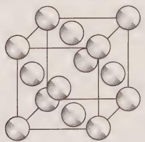  
(a)

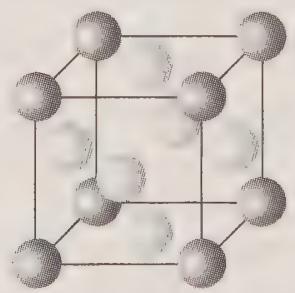  
(b)

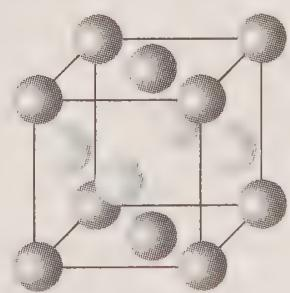  
(c)  
图8.4.1 Au-Cu体系的相结构  
(a) 无序的 $\mathrm{Cu}_{1 - x}\mathrm{Au}_x$ ，(b) 有序的 $\mathrm{Cu}_3\mathrm{Au}$ ，(c) 有序的 $\mathrm{CuAu}$

当合金进行退火, 即缓慢地冷却时, 金和铜原子的分布不再无序, 两种原子各自趋向确定的几何位置。当组成为 $\mathrm{Cu}_{3} \mathrm{Au}$ 的合金退火, 在低于 $395^{\circ} \mathrm{C}$ 时通过等温有序化, 形成图 8.4.1 (b) 所示的结构, 晶体点阵型式为简单立方, 这种相称为 $\alpha$ 相。当组成为 $\mathrm{CuAu}$ 的合金退火, 在低于 $380^{\circ} \mathrm{C}$ 时通过等温有序化, 得到图 8.4.1 (c) 所示的结构, 晶体属四方晶系, 称为 $\beta$ 相。

$\mathrm{CuAu}$ 和 $\mathrm{Cu}_{3}\mathrm{Au}$ 的有序结构在物理性质上与相同组成的无序结构不同。

将有序结构的合金加热,温度超过某一临界值(此临界值随组成而变)时,就会转变为无序结构。在临界温度时,合金的许多物理性质会有急剧变化,例如会出现比热的反常现象,因为随着合金温度的升高,必须提供额外的热能以破坏晶体的有序结构。

## 8.4.2 金属化合物

金属化合物物相有两种主要型式，一种是组成确定的金属化合物物相，另一种是组成可变的化合物物相。易于生成组成可变的金属化合物物相，是合金独有的化学性能。在相图和结构-性能关系图上具有转折点，是各种金属化合物物相的主要特点和形成金属化合物的标志。

金属化合物物相的结构特征一般表现在两个方面:(i)金属化合物的结构型式一般不同于纯组分在独立存在时的结构型式;(ii)在金属A与B形成的金属化合物物相中,各种原子在结构中的位置已经有了分化,它们已分为两套不同的结构位置,而两种原子分别占据其中的一套。下面结合 $CaCu_{5}$ 合金的结构进行讨论。

## 1. $\mathrm{CaCu}_{5}$ 合金的结构

$\mathrm{CaCu}_{5}$ 合金可看作由图8.4.2中所示的(a)，(b)两种原子层交替堆积排列而成：(a)是由 $\mathrm{Cu}$ 和 $\mathrm{Ca}$ 共同组成的层，层中 $\mathrm{Cu - Cu}$ 之间由实线相连。(b)是完全由 $\mathrm{Cu}$ 原子组成的层， $\mathrm{Cu - Cu}$ 之间也由实线相连。图中由虚线勾出的六角形，表示由这两种层平行堆积时垂直于层的相对位置，即3个六方晶胞拼在一起的轮廓(3个晶胞方向不同)。(c)是由(a)和(b)两种原子层交替堆积成 $\mathrm{CaCu}_{5}$ 的晶体结构图，图中可见六方晶胞中包含1个 $\mathrm{CaCu}_{5}$ 。在此结构中， $\mathrm{Ca}$ 有18个 $\mathrm{Cu}$ 原子配位。同一层的6个， $\mathrm{Ca} - - \mathrm{Cu}$ 距离为 $294~\mathrm{pm}$ ；相邻两层各6个， $\mathrm{Ca} - - \mathrm{Cu}$ 距离为 $327~\mathrm{pm}$ 。

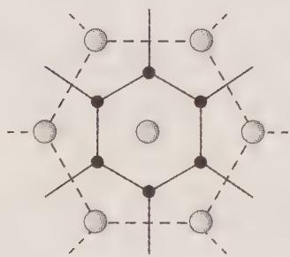  
(a)

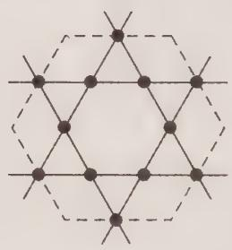  
(b)

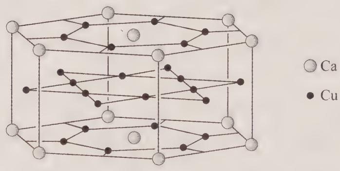  
(c)  
图8.4.2 $\mathrm{CaCu_5}$ 的结构

若干储氢材料如 $\mathrm{LaNi}_5$ ， $\mathrm{LaCo_5}$ ， $\mathrm{CeCo_5}$ 等，其结构和 $\mathrm{CaCu_5}$ 相同。

## 2. Laves 相合金

Laves(拉弗斯)相是由两种金属 A 和 B 组成的 $AB_{2}$ 合金, 数以百计的二元合金的结构都和它相关。由于 A 和 B 相对大小的不同, 典型的结构有 $MgCu_{2}$ , $MgZn_{2}$ 和 $MgNi_{2}$ 等类型。在这类合金结构中, 金属原子 B 形成四面体原子簇结构, 通过共用顶点形成骨架, A 原子处于

骨架的空隙之中。图8.4.3示出 $\mathrm{MgCu_2}$ 立方晶胞的结构， $\mathrm{MgZn_2}$ 和 $\mathrm{MgNi_2}$ 的结构较复杂。 $\mathrm{MgCu_2}$ 的结构可看作 $\mathrm{Cu}$ 原子形成 $\mathrm{Cu_4}$ 四面体，以它置换金刚石结构中的C原子，相互共用顶点连接成三维骨架，在骨架空隙处，有序地放置 $\mathrm{Mg}$ 原子。在图8.4.3的晶胞中， $\mathrm{Mg}$ 原子放置在晶胞的棱心、体心和体对角线的 $1/4$ （或 $3/4$ )等空隙处，这时 $\mathrm{Mg}$ 原子的排列也和金刚石结构中的C原子相同。在此结构中， $\mathrm{Mg}$ 原子的配位为 $4\mathrm{Mg} + 12\mathrm{Cu},\mathrm{Cu}$ 原子的配位为 $6\mathrm{Mg} + 6\mathrm{Cu}$ ，所以是一个高配位的结构。

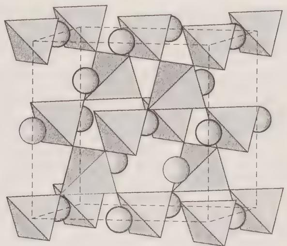  
图8.4.3 $\mathrm{MgCu_2}$ 合金的结构  
(四面体的 4 个顶点代表 Cu 原子, 圆球代表 Mg 原子)

## 8.4.3 钢铁

钢铁是以铁和碳为基本元素的合金体系的总称，通常将含碳量 $< 0.02\%$ 的叫纯铁，大于 $2.0\%$ 的叫生铁，介于这中间的叫钢。钢铁是用量最大、对国计民生最重要的金属材料，2015年全球钢产量达16亿吨，我国占一半，达8亿吨。它的优势地位源于下列因素：

（1）铁是地壳中含量高，仅次于铝，占金属元素第二位的元素。许多地方铁矿富集，易于开采。

(2) 金属铁容易从矿石通过热化学方法冶炼成金属, 成本低廉。

(3) 富有延展性及其他优良的物理性质。

（4）熔点 $1535^{\circ}C$ ，相对较低，容易和其他元素结合而改变其液相的化学成分，得到多种品种和用途的合金。

（5）可以通过浇铸、压模、锻打、冷轧和淬火等多种处理工艺，改变其组成、形状和物性，以满足使用的要求。

## 1. 钢铁的相组成和钢铁的性能

纯铁的熔点 $1535^{\circ}C$ ，沸点 $3000^{\circ}C$ ；常温下的铁为 $\alpha-Fe$ ，它具有 bcp 结构。温度升至 $912^{\circ}C$ ， $\alpha-Fe$ 发生相变变为 $\gamma-Fe$ ，它具有 ccp 结构；当温度升至 $1400^{\circ}C$ 时，另一相变发生，由 $\gamma-Fe$ 转变为 $\delta-Fe$ ，它和 $\alpha-Fe$ 一样，具有 bcp 结构。低温的铁具有铁磁性，在 $770^{\circ}C$ 以上铁磁性消失。

高炉冶炼所得的生铁由熔融液态快速冷却，断口颜色呈白色，称它为白口铁，主要成分为渗碳体 $(\mathrm{Fe}_3\mathrm{C})$ 和铁素体 $(\alpha -\mathrm{Fe})$ ；若慢慢冷却，断口颜色呈灰白色，称为灰口铁，主要成分为铁素体 $(\alpha -\mathrm{Fe})$ 和石墨薄片。白口铁硬而脆；灰口铁较软，具有优良切削加工性能。若在熔化铁液中加镁处理，使石墨呈球状，则成为可锻打和切削、机械强度较高的球墨铸铁。

钢中的相组成随着它的化学成分和热处理工艺而改变，可从铁-碳体系相图来理解（见图8.4.4）。在钢的范围内，主要存在的相有：奥氏体（austenite）、铁素体（ferrite）、渗碳体（cementite）、马氏体（martensite）和石墨等。

奥氏体是碳在 $\gamma$ -Fe 中的间隙固溶体, 碳无序地分布在八面体空隙中, 在 $727^{\circ}\mathrm{C}$ 时, 奥氏体中溶入的碳约为 $0.77\%$ (质量分数), 相当于铁原子和碳原子数之比约为 $28:1$ , 即平均 $6 \sim 7$ 个立方晶胞中才有一个 C 原子。C 原子无序地分布在图 8.4.5 所示的虚线小球位置上。

铁素体是碳在 $\alpha$ -Fe中的固溶体， $\alpha$ -Fe为bcp型结构，八面体空隙很小，以Fe原子半径为

124 pm 计算, 只能容纳半径为 19 pm 的小原子, 所以铁素体溶碳能力极低, 727℃时最高的碳质量分数为 0.022%, 几乎就是纯的 α-Fe, 铁素体的性质和纯铁相似。

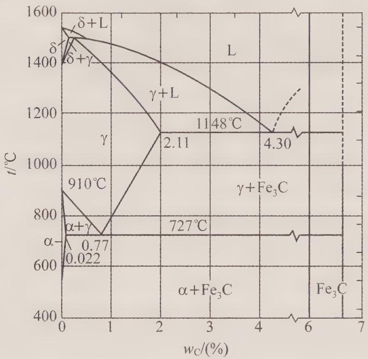  
图 8.4.4 铁-碳体系相图 ( $w_{c}$ 为 C 的质量分数)

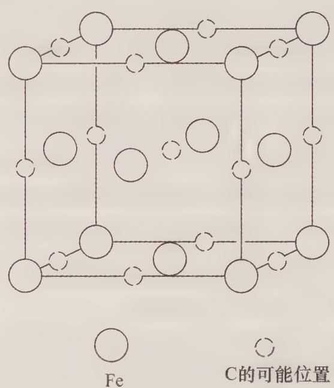  
图8.4.5 奥氏体的结构

渗碳体 $\left(\mathrm{Fe}_{3}\mathrm{C}\right)$ 是铁和碳的化合物，含碳量6.67%（质量分数）。晶体属正交晶系，晶胞参数为a=505.98 pm,b=674.62 pm,c=450.74 pm。晶胞中含 $4\left[Fe_{3}C\right]$ ，Fe原子的排列见图8.4.6。C原子处在由6个Fe原子组成的三方棱柱体中心。Fe---Fe距离为248～268 pm，Fe---C距离为196～203 pm。图8.4.6(a)示出 $Fe_{3}C$ 结构沿b轴（即垂直镜面）的投影，图中三角形为三方棱柱体沿棱柱方向的投影，两个Fe原子重合在一起，四方形为八面体的投影。图8.4.6(b)示出结构沿c轴的投影，从图可以看出三方棱柱体并不规整，有一条棱边特别长。棱柱体间共边连接成沿b轴伸展的长链，链间共用顶点连接成三维骨架。在 $Fe_{3}C$ 结构中，由6个Fe原子组成的八面体是空的，其中不含C原子。渗碳体是一种非常坚硬而又脆性的化合物。

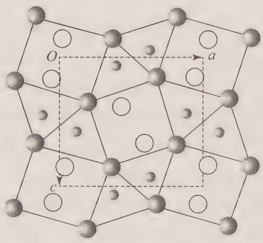  
(a) 沿 $b$ 轴（垂直镜面）的投影

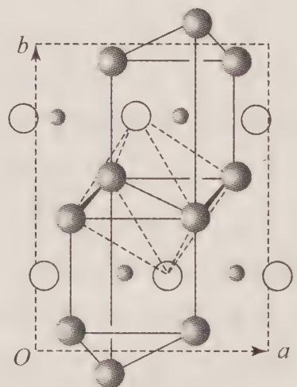  
(b) 沿 $c$ 轴的投影（镜面在 $\frac{1}{4} b$ 和 $\frac{3}{4} b$ 处）  
图8.4.6 渗碳体的结构  
[大球代表 Fe 原子, 颜色深的 Fe 原子不在镜面上,

在(a)图中镜面上下两个Fe原子重叠成一个；小球代表C原子]

马氏体是 C 在 $\alpha$ -Fe 中的过饱和间隙固溶体。在由奥氏体骤冷过程中，C 原子和 Fe 原子都来不及扩散，溶进奥氏体中的 C 原子不能通过扩散析出成渗碳体和低碳的铁素体，这时只好 Fe 原子进行错动，产生位移相变，将原来面心立方晶体转变为体心四方的马氏体，C 原子无序地分布在和四重轴平行的棱心和晶胞的 C 心位置，如图 8.4.7 所示。马氏体是介稳体系，在图 8.4.4 的铁-碳体系相平衡图中不出现。

室温下铁素体和渗碳体是稳定晶型，不同成分的钢铁慢慢冷至室温，都得到这两种晶型。碳钢淬火得到的主要是马氏体。碳的质量分数为 $0.8\%$ 的钢从高温慢慢冷却，所得的

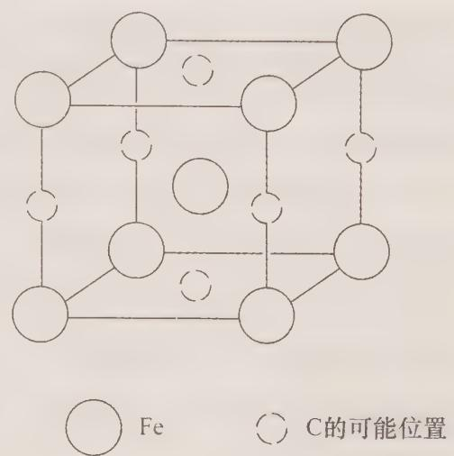  
图8.4.7 马氏体的结构

铁素体和渗碳体分布特别纤细均匀，有珍珠光泽，称为珠光体。表8.4.1列出碳质量分数为 $0.8\%$ 的碳钢经不同热处理后的情况。

表 8.4.1 碳质量分数为 $0.8\%$ 的碳钢热处理后的情况

<table><tr><td>热处理</td><td>显微结构</td><td>硬度/(kg mm-2)</td></tr><tr><td>从γ相区在空气中冷却</td><td>珠光体</td><td>280</td></tr><tr><td>从γ相区在电炉中冷却</td><td>粗珠光体,部分球化</td><td>210</td></tr><tr><td>在略低于低共熔温度下加热</td><td>完全球化</td><td>175</td></tr><tr><td>从γ相区淬火</td><td>马氏体</td><td>850</td></tr><tr><td>从γ相区淬火,然后在500°C回火1h</td><td>铁素体中出现渗碳体晶粒</td><td>400</td></tr></table>

锰钢(Mn 的质量分数 12%\~14%)特别硬,用于制造碾磨机器。含有钼、钨的合金钢,用于制造高速切削的工具。

不锈钢比普通碳钢和低合金钢有更强的抗锈蚀性能，它广泛用于化工生产的设备之中，例如合成尿素的反应塔需要用不锈钢制作。不锈钢的抗蚀性来源于铁碳合金中加入铬(Cr)，增大了奥氏体相区范围，促使含碳量较低的钢能形成奥氏体结构，改善其耐蚀性。虽然其他元素如Ni,Mo,Al等也能提高钢的抗腐蚀性，但在缺少Cr的情况下，它们的有效性受到限制。目前普遍接受以 $12\% \mathrm{Cr}$ 作为合金和不锈钢的分界线，Cr含量 $>12\%$ 为不锈钢。通常耐酸不锈钢含 $\mathrm{Cr}16\% \sim 18\%$ ，Ni $6\% \sim 8\%$ ，C0. $15\%$ ，Mn $2\%$ ，Si $1\%$ （均为质量分数）。

## 8.4.4 形状记忆合金

20 世纪五六十年代,人们发现一些合金有“记忆”自己过去形状的能力。例如,用镍钛合金丝做成圆圈,加热到 $150^{\circ}\mathrm{C}$ 再冷却,随后把它拉成笔直的形状,当把这条笔直的合金丝加热到 $95^{\circ}\mathrm{C}$ 时,发现它重新恢复到原来圆圈的形状。又如,当用镍钛合金丝弯曲加工成“Nitinol”字样,然后加热、冷却,再把字形弄乱成一团,当给这合金丝通上交流电加热到一定温度,它又重现了“Nitinol”字样。这种能“记忆”起自己受外力作用而变形前的形状,并能自动恢复的合金,称为形状记忆合金。

形状记忆合金的这种“记忆”性能，源于马氏体相变及其逆转变的特性。镍钛合金的母相为有序结构的奥氏体。当温度降低，原子发生位移相变，变为马氏体，这种马氏体和淬火钢中的马氏体不同，称为热弹性马氏体，通常它比母相还要软。在马氏体存在的温度区间中，受外力作用产生变形，成为变形马氏体。在此过程中，马氏体发生择优取向，处于和应力方向有利的马氏体片增多；而处于和应力方向不利的马氏体减少，形成单一有利取向的有序马氏体。当这种马氏体加热到一定的温度时，出现逆转变，即马氏体转变为奥氏体，晶体恢复到高温母相，其宏观形状也恢复到原来的状态。和一般合金不同，形状记忆合金主要是存在热弹性马氏体，它含有许多孪晶，对它施加外力容易变形，但其原子的结合方式并没有产生变化。所以，将它再加热到一定的温度就会发生逆转变，又变成稳定的母相。由此可见，形状记忆合金应具备下面3个特点：（i）马氏体是热弹性类型；（ii）马氏体的形变主要通过孪晶取向改变产生；（iii）母相通常是有序结构。

现已发现很多种具有形状记忆效应的合金，主要有 Ni-Ti 体系合金、Cu-Zn-Al 合金以及 Cu-Al-Ni 系合金。

形状记忆合金的应用非常广泛,举数例如下:

（1）在航天工业上做成天线：将形状记忆合金做成大型伞状天线（像一把伞），在马氏体状态下将它变形缩成很小的体积（将伞收拢），这样便于卫星携带。当发射到卫星轨道上（或到月球表面），在太阳光照射下升温，天线自动打开（伞撑开），形成正常使用的伞状天线。

我国嫦娥一号登月卫星的太阳能电池板即采用形状记忆合金制作。卫星发射时折叠成层状，紧贴在卫星表面的外侧，待卫星升空后加热，使它伸展成两翼。

（2）作合金管接头：把形状记忆合金加工成内径稍小于待接管外径的套管，在使用前将此套管在低温下加以机械扩管，使其内径稍大于待接管的外径，将这套管套在两根待接管的接头上，然后在常温下自然升温或加热，由于形状记忆效应而恢复至扩管前的较小内径，从而将两根管牢固而紧密地连接在一起。

（3）作热敏感驱动器：形状记忆合金在超过规定温度时能自动恢复原来的形状，这种感温和驱动的双重功能，可用来设计制造控制装置，例如自动电子干燥箱、灯光调节、遥控门窗开关、自动启闭的电源开关等。

除上述热弹性形状记忆合金外，到20世纪末，还发现了通过磁场控制的磁性形状记忆合金，它对外界作用的响应多样化。欣逢信息产业蓬勃发展，这类材料可用来制作各种新型的换能器、驱动器、敏感元件和微电子机械操纵系统，成为材料科学和信息产业等领域研究的热点。现已发现有一百多种合金具有这种性能。可由三元合金或四元合金组成，其结构可看作由四方体心的马氏体单位拼成。图8.4.8(a)示出 $\mathrm{Ni}_2\mathrm{MnGa}$ 和 $\mathrm{Cu_2MnAl}$ 的结构；图8.4.8(b)示出 $\mathrm{CuMnAlCo}$ 的结构。实际上，合金的组成和晶胞中原子的位置可在一定的范围内变动。

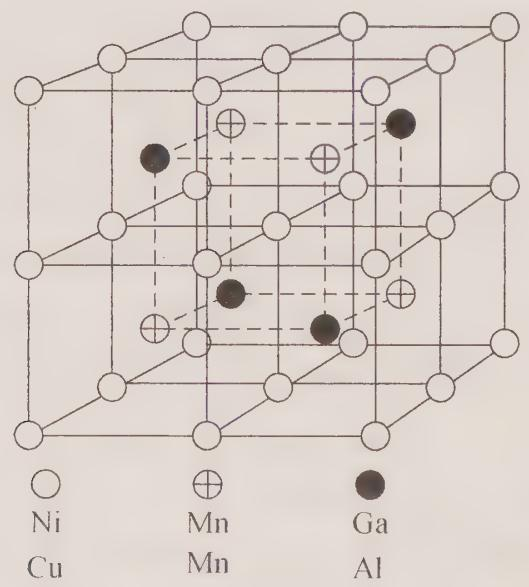  
(a)

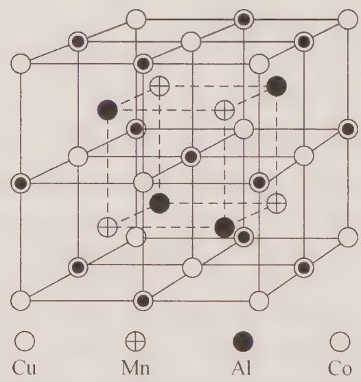  
(b)  
图 8.4.8 一些磁性形状记忆合金的结构：(a) $Ni_{2}MnGa$ 和 $Cu_{2}MnAl$ ，(b) CuMnAlCo

## 8.4.5 金属间隙化合物

金属和硼、碳、氮等元素形成的化合物，可把金属原子看作形成最密堆积结构或形成简单的结构，而硼、碳、氮等较小的非金属原子填入间隙之中，形成间隙化合物或间隙固溶体。

AlN具有六方ZnS型的结构，可将铝原子看作六方密堆积，而氮原子填在四面体空隙中，氮原子和铝原子之间实际上以共价键为主。ScN, TiN, ZrN, VN, HfN, LaN, CeN, PrN, NdN, NbN, TiC, ZrC, HfC, ThC, VC, NbC, TaC等具有NaCl型结构，可将金属原子看作立方最密堆积，而氮原子和碳原子填在八面体空隙中。在 $\mathrm{Fe_4N}$ 结构中，铁原子按立方最密堆积，氮原子统计地处在铁原子的八面体空隙中。

间隙化合物具有下列特征：

(1) 不论纯金属本身的结构型式如何,大多数间隙化合物采取 NaCl 型结构。

（2）具有很高的熔点和很大的硬度。很少数量的非金属原子，即可使纯金属的性质发生很大的变化。

（3）有导电性能良好、金属光泽等一般合金所具有的性质，填隙原子和金属原子间存在共价键。

## 8.5 固体的表面结构和性质

金属表面上原子排列的图像,理论上可以根据晶体结构加以推断,而实际上,表面结构是很复杂的。由于表面原子往往倾向于进入新的平衡位置,因而改变层内原子间的距离、改变配位数,甚至重建表面结构。表面晶体学的研究表明,不能简单地把表面看作体相的中止,应把表面结构看作体相结构的延续。对于由多种原子组成的固体,表面层的化学组成常和体相组成不同。在通常的实验条件下,表面总是被一层吸附分子所覆盖。由于吸附作用的活化能很小,当洁净的表面暴露在大气中,很快就吸附上一层分子。一般在约 $10^{-4}$ Pa真空条件下,大约几秒钟就能吸附上一层气体,所以对于表面结构的认识是随着超高真空技术的发展而逐渐深入的。

研究固体表面的组成和结构有许多方法,重要的有场离子显微镜(FIM)、低能电子衍射(LEED)、紫外光电子能谱(UPS)、X射线光电子能谱(XPS)、俄歇电子谱(AES)、离子散射谱(ISS)、电子能量损失谱(EELS),等等。利用这些方法研究表面结构,得到许多有关表面结构的知识。从原子水平看,表面并不是光滑的,而有多种情况出现,如图8.5.1所示。

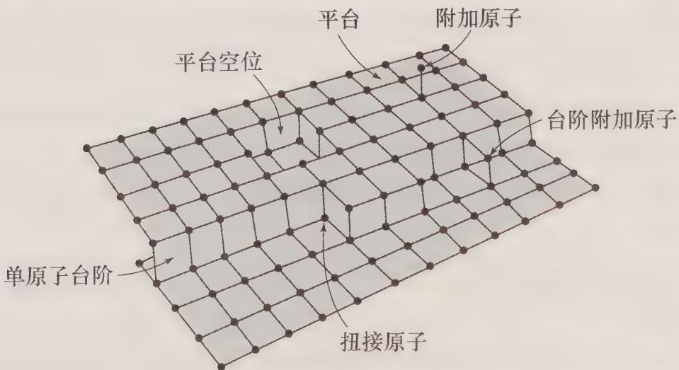  
图8.5.1 固体表面原子的情况

由图可见，在表面上原子的周围环境并不像二维点阵结构那样单一，而有多种不同的环境，图中示出有：附加原子（adatom）、台阶附加原子（step adatom）、单原子台阶（monatomic step）、平台（terrace）、平台空位（terrace vacancy）、扭接原子（kink atom），等等。这些表面原子间的差异，主要表现在它们的配位数不同。附加原子的配位数少，而平台原子的配位数较大。通常在表面上只存在很少量的附加原子，而存在大量台阶原子、平台原子和扭接原子。这些不同类型的原子，它们的化学行为不同，吸附热和催化活性差别很大。例如，附加原子和平台空位虽然数量很少，但它们对表面原子沿着表面迁移起很大作用。

研究表面结构以及表面层吸附分子的结构，对化学、物理学、材料科学等均有重要意义。

## 习题

8.1 半径为 $R$ 的圆球堆积成正四面体空隙，试作图显示，并计算该四面体的边长、高度、中心到顶点距离、中心距底面的高度、中心到两顶点连线的夹角以及中心到球面的最短距离。

8.2 半径为 $R$ 的圆球堆积成正八面体空隙，计算中心到顶点的距离。

8.3 半径为 $R$ 的圆球围成正三角形空隙，计算中心到顶点的距离。

8.4 半径为 $R$ 的圆球堆积成A3型结构，计算六方晶胞参数 $a$ 和 $c$ 的数值。

8.5 证明半径为 $R$ 的圆球所作的体心立方堆积中，八面体空隙只能容纳半径为 $0.154R$ 的小球，四面体空隙可容纳半径为 $0.291R$ 的小球。

8.6 计算等径圆球密置单层中平均每个球所摊到的三角形空隙数目及二维堆积密度。

8.7 指出A1型和A3型等径圆球密堆积晶胞中密置层的方向各是什么。

8.8 根据下面(1)～(3)中的要求,请总结 A1, A2 及 A3 型金属晶体的结构特征。

（1）原子密置层的堆积方式、重复周期（A2型除外）、原子的配位数及配位情况；

(2) 空隙的种类和大小、空隙中心的位置及平均每个原子摊到的空隙数目；

（3）原子的堆积系数、所属晶系、晶胞中原子的坐标参数、晶胞参数与原子半径的关系以及空间点阵型式等。

8.9 画出等径圆球密置双层图及相应的点阵素单位，指明结构基元。

8.10 金属铜属于 A1 型结构,试计算(111),(110)和(100)等面上铜原子的堆积系数。

8.11 金属铂为 A1 型结构, 立方晶胞参数 $a = 392.3 \mathrm{pm}, \mathrm{Pt}$ 的相对原子质量为 195.1。试求金属铂的密度及原子半径。

8.12 硅的结构和金刚石相同，Si 的共价半径为 117 pm。求硅的晶胞参数、晶胞体积和晶体密度。

8.13 已知金属钛为六方最密堆积结构，钛原子半径为 $144.8\mathrm{pm}$ 。试计算六方晶胞参数及晶体密度。

8.14 铝为面心立方结构, 密度为 $2.70 \, g cm^{-3}$ 。试计算它的晶胞参数和原子半径; 用 Cu Kα 射线摄取衍射图, 333 衍射线的衍射角是多少?

8.15 金属钠为体心立方结构， $a = 429\mathrm{pm}$ 。请计算：

(1) Na 的原子半径;

(2) 金属钠的理论密度和摩尔体积；

(3) (110)面的间距。

8.16 金属钽为体心立方结构, $a = 330 \mathrm{pm}$ 。试求:

(1) 金属钽的理论密度(Ta 的相对原子质量为 181);

(2) (110) 面间距；

(3) 若用 $\lambda=154\ pm$ 的 X 射线, 衍射指标为 220 的衍射角 $\theta$ 是多少?

8.17 金属镁属 A3 型结构, 镁的原子半径为 160 pm。

（1）指出镁晶体所属的空间点阵型式及微观特征对称元素；

(2) 写出晶胞中原子的分数坐标；

(3) 若原子符合硬球堆积规律, 计算金属镁的摩尔体积;

(4) 求 $d_{002}$ 值。

8.18 Ni 是面心立方金属，晶胞参数 $a = 352.4 \mathrm{pm}$ 。用 $\mathrm{CrK}\alpha$ 辐射 $(\lambda = 229.1 \mathrm{pm})$ 拍粉末图，列出可能出现的谱线的衍射指标及其衍射角 $(\theta)$ 的数值。

8.19 已知金属 Ni 为 A1 型结构, 原子间接触距离为 249.2 pm。试计算:

(1) Ni 的密度及 Ni 的立方晶胞参数；

(2) 画出(100)，(110)，(111)面上原子的排布方式。

8.20 金属锂晶体属立方晶系，(100)点阵面的间距为 $350\mathrm{pm}$ ，晶体密度为 $0.53\mathrm{gcm}^{-3}$ ，从晶胞中包含的原子数目判断，该晶体属何种点阵型式？（Li的相对原子质量为6.941。）

8.21 灰锡为金刚石型结构，晶胞中包含8个Sn原子，晶胞参数 $a = 648.9\mathrm{pm}$

(1) 写出晶胞中 8 个 Sn 原子的分数坐标；

(2) 计算 Sn 的原子半径；

（3）灰锡的密度为 $5.75\mathrm{gcm}^{-3}$ ，求Sn的相对原子质量；

（4）白锡属四方晶系， $a = 583.2\mathrm{pm},c = 318.1\mathrm{pm}$ ，晶胞中含4个Sn原子，通过计算说明由白锡转变为灰锡，体积是膨胀了还是收缩了；

（5）白锡中 Sn---Sn 间最短距离为 302.2 pm，试对比灰锡数据，估计哪一种锡的配位数高？

8.22 有一黄铜合金含 $\mathrm{Cu}75\%$ ， $\mathrm{Zn}25\%$ （质量分数），晶体的密度为 $8.5\mathrm{gcm}^{-3}$ 。晶体属立方面心点阵结构，晶胞中含4个原子。 $\mathrm{Cu}$ 的相对原子质量为63.5， $\mathrm{Zn}$ 为65.4。

(1) 求算 Cu 和 Zn 所占的原子百分数；

(2) 计算每个晶胞中含合金的质量;

(3) 计算晶胞体积；

(4) 计算统计原子的原子半径。

8.23 AuCu无序结构属立方晶系，晶胞参数 $a = 385\mathrm{pm}$ [如图8.4.1(a)]，其有序结构为四方晶系[如图8.4.1(c)]。若合金结构由(a)转变为(c)时，晶胞大小看作不变，请回答：

(1) 无序结构的点阵型式和结构基元；

（2）有序结构的点阵型式、结构基元和原子分数坐标；

（3）用波长 $154\mathrm{pm}$ 的X射线拍粉末图，计算上述两种结构可能在粉末图中出现的衍射线的最小衍射角 $(\theta)$ 。

8.24 $\alpha$ -Fe 和 $\gamma$ -Fe 分别属于体心立方堆积 (bcp) 和面心立方堆积 (ccp) 两种晶型。前者的原子半径为 $124.1 \mathrm{pm}$ ，后者的原子半径为 $127.94 \mathrm{pm}$ 。

(1) 对 $\alpha$ -Fe:

(a) 下列“衍射指标”中哪些不出现？

110,200,210,211,220,221,310,222,321,…,521。

(b) 计算最小 Bragg 角对应的衍射面间距；

(c) 写出使晶胞中两种位置的 Fe 原子重合的对称元素的名称、记号和方位。

(2) 对 $\gamma-Fe:$

(a) 指出密置层的方向；

(b) 指出密置层的结构基元中形成的三角形空隙的数目和原子数目；

(c) 计算二维堆积密度；

(d) 计算两种铁的密度之比。

8.25 某新型超导晶体由镁、镍和碳3种元素组成，镁原子和镍原子一起作面心立方最密堆积，形成有序结构（即无统计原子）。结构中有两种八面体空隙，一种完全由镍原子构成，另一种由镍原子和镁原子共同构成，两种八面体的数量比为 $1:3$ ，碳原子只填充在由镍原子构成的八面体空隙中。

（1）推断该晶体的结构，并画出该晶体的一个正当晶胞，写出原子在晶胞中的坐标位置；

(2) 写出该新型超导晶体的化学式；

(3) 指出该晶体的空间点阵型式；

(4) 写出两种八面体空隙中心的坐标参数。

## 参考文献

[1] 麦松威, 周公度, 李伟基. 高等无机结构化学. 第2版. 北京: 北京大学出版社, 2006.

[2] 施开良. 单质的结构. 北京: 高等教育出版社, 1990.

[3] 范康年. 物理化学. 第2版. 北京: 高等教育出版社, 2005.

[4] 阎守胜. 固体物理基础. 北京: 北京大学出版社, 2000.

[5] Emsley J. The Elements. 3 $^{rd}$ ed. Oxford: Clarendon Press, 1998.

[6] Barrett C S, Massalaki T B. Structure of Metals. 3 $^{rd}$ ed. Oxford: Pergamon Press, 1980.

[7] Wells A F. Structural Inorganic Chemistry. 5 $^{th}$ ed. Oxford: Oxford University Press, 1984.

[8] Mak T C W（麦松威），Zhou G D（周公度）。Crystallography in Modern Chemistry, A Resource Book of Crystal Structures. New York: Wiley, 1992.

[9] Greenwood N N, Earnshaw A. Chemistry of the Elements. 2 $^{nd}$ ed. Oxford: Butterworth-Heinemann, 1997.

[10] Cotton F A, Wilkinson G, Murillo C A, Bochmann M. Advanced Inorganic Chemistry. 6 $^{th}$ ed. New York: Wiley, 1999.

## 第9章 离子化合物的结构化学

离子化合物是指由正、负离子结合在一起形成的化合物，它一般由电负性较小的金属元素与电负性较大的非金属元素生成。在离子化合物中，金属元素将部分价电子转移给非金属元素，形成具有较稳定的电子组态的正、负离子。正、负离子也可由多原子组成，如 $\mathrm{NH}_4^+$ ， $\mathrm{NO}_3^-$ ， $\mathrm{SO}_4^{2-}$ 等。正、负离子之间由静电作用力结合在一起，所形成的化学键称为离子键。以离子键结合的正、负离子倾向于形成晶体，以使每个离子周围结合尽可能多的异性离子，降低体系的能量。

## 9.1 离子晶体的若干简单结构型式

许多离子晶体的结构特征可以按密堆积结构了解。一般负离子半径较大，可把负离子看作等径圆球进行密堆积，而正离子有序地填在多面体空隙（如四面体空隙或八面体空隙）之中；有时也可看作正离子进行密堆积，负离子填在空隙之中，如 $CaF_{2}$ 晶体。

图 9.1.1 示出填隙八面体和填隙四面体的图形。离子晶体的结构和组成不同, 离子占据多面体空隙的方式、比率不同, 有的能将某种空隙全部填满, 有的只是填入一部分。下面分别阐述若干离子晶体的结构。

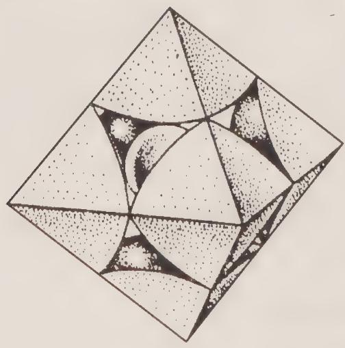  
(a)

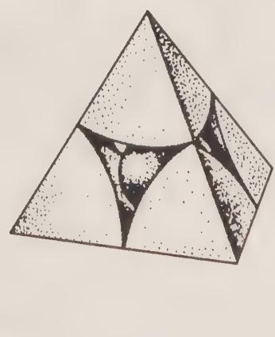  
(b)  
图 9.1.1 填隙八面体(a)和填隙四面体(b)

## 1. NaCl

在 NaCl 晶体结构中，正、负离子的配位情况相同，配位数均为 6，都是八面体配位。若以密堆积层的形式描述其结构，即 Cl⁻ 堆积层的相对位置用 A, B, C 表示，Na⁺ 层的相对位置用 a, b, c 表示，则 NaCl 晶体中正、负离子的堆积型式沿 (111) 方向周期为 |AcBaCb|。许多二元离子化合物的晶体结构属 NaCl 型，键型可以从典型的离子键过渡到共价键或金属键。同是 NaCl 型结构，它们的电性、磁性和力学性能则随键型变化而有很大差异，图 9.1.2 示出 NaCl 型晶体的结构。

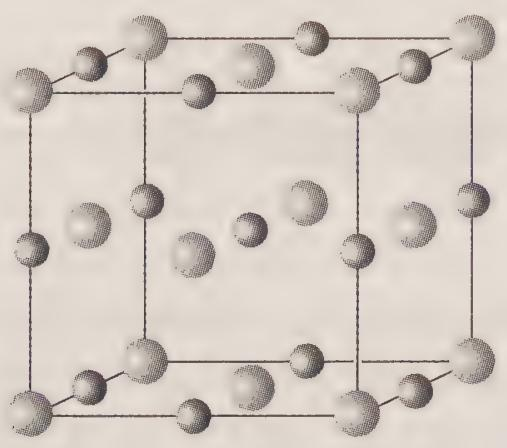  
(a)

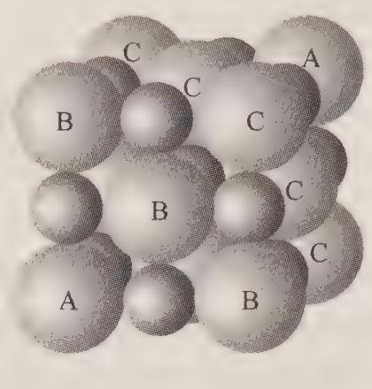  
(b)  
图9.1.2 NaCl型晶体的结构  
(a) 晶胞结构，(b) 密堆积层排列

## 2. ZnS

ZnS 的晶体结构可看作 $S^{2-}$ 作最密堆积， $Zn^{2+}$ 填在一半四面体空隙之中，填隙时互相间隔开，使填隙四面体不会出现共面连接或共边连接。立方 ZnS 结构是 $S^{2-}$ 作立方最密堆积，密堆积层堆积表示式为 $|AaBbCc|$ ，结构见图 9.1.3(a)；六方 ZnS 结构是 $S^{2-}$ 作六方最密堆积，密堆积层堆积表示式为 $|AaBb|$ ，结构见图 9.1.3(b)。

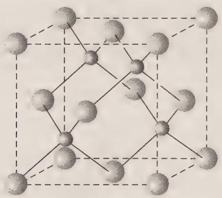  
(a)

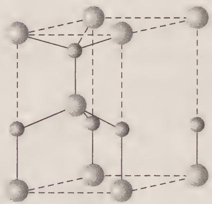  
(b)  
图9.1.3 ZnS的晶体结构  
(a) 立方 ZnS, (b) 六方 ZnS

ZnS 的结构具有代表性,但它并不是典型的离子晶体。

3. $\mathrm{CaF}_2$

萤石 $(\mathrm{CaF}_2)$ 的结构可看作 $\mathrm{Ca^{2 + }}$ 作立方最密堆积排列， $\mathrm{F}^{-}$ 填在全部四面体空隙中，结构见图9.1.4。也可看作 $\mathbf{F}^{-}$ 作立方面心堆积， $\mathrm{Ca^{2 + }}$ 占据其中全部四面体空隙，称为反萤石型。

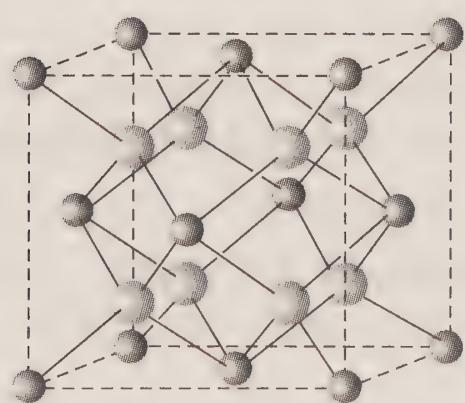  
图 9.1.4 $CaF_{2}$ 的晶体结构

## 4. $\mathrm{TiO}_2$

金红石 $(\mathrm{TiO}_2)$ 属四方晶系， $D_{4h}$ 点群，是常见的重要结构型式之一。在该结构中， $\mathrm{O}^{2 - }$ 近似地堆积成六方密堆积结构，密置层垂直晶胞 $a$ 轴延伸， $\mathrm{Ti}^{4 + }$ 填入其中一半的八面体空隙，而 $\mathrm{O}^{2 - }$ 周围有3个近于正三角形配位的 $\mathrm{Ti}^{4 + }$ 。从结构的配位多面体连接来看，每个 $[\mathrm{TiO}_6]$ 八面体和相邻2个八面体共边连接成长链，链平行于四重轴，链和链沿垂直方向共用顶点连成三维骨架。金红石的晶体结构见图9.1.5(a)，图(b)示出配位多面体

的连接及 $4_{2}$ 轴所在位置。

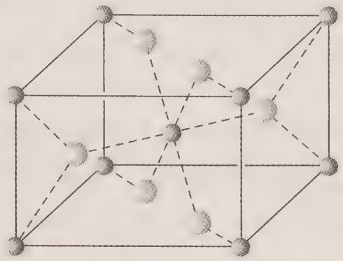  
(a)

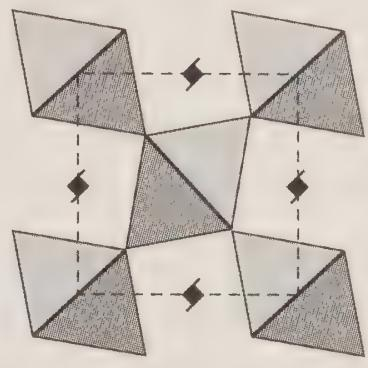  
(b)  
图9.1.5 $\mathrm{TiO_2}$ (金红石)的晶体结构  
(深灰球代表 Ti, 浅灰球代表 O)

## 5. $\mathrm{CdI}_2$ 和 $\mathrm{CdCl}_2$

$\mathrm{CdI}_2$ 和 $\mathrm{CdCl}_2$ 晶体具有层形结构，即有的整个一层八面体空隙空缺，不被金属原子占据。它们的结构示于图9.1.6(a)。在 $\mathrm{CdI}_2$ 晶体中，层形分子沿垂直于层的方向堆积， $\mathbf{I}^{-}$ 作六方最密堆积， $\mathrm{Cd^{2+}}$ 填入其中部分八面体空隙中，各层相对位置为AcB AcB AcB，如图9.1.6(b)所示。若画出六方晶胞，沿 $c$ 轴周期为cBAc，如图9.1.6(c)所示。 $\mathrm{CdCl}_2$ 晶体中 $\mathrm{Cl}^{-}$ 作立方最密堆积， $\mathrm{Cd^{2+}}$ 交替地一层填满一层空缺地填入八面体空隙中，相对位置表示为AcBCbA BaC。 $\mathrm{CdI}_2$ 若是从熔融状态结晶而得，层的排列是|AcB AbC|。

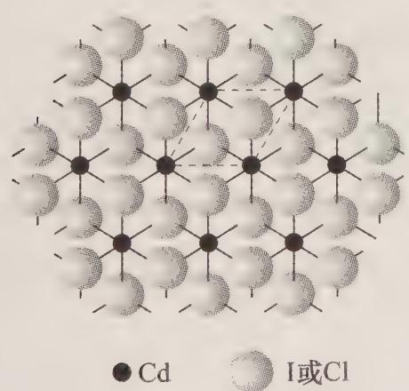  
(a)

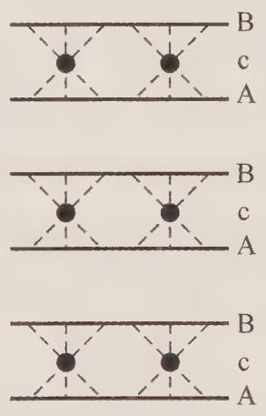  
(b)

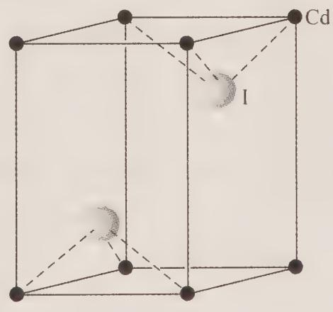  
(c)  
图9.1.6 $\mathrm{CdI}_2$ 的晶体结构

(a) $\mathrm{CdI}_2$ 和 $\mathrm{CdCl}_2$ 层形分子，(b) $\mathrm{CdI}_2$ 堆积层的结构，(c) $\mathrm{CdI}_2$ 的六方晶胞

## 6. CsCl

除上述最密堆积的结构型式外,离子化合物中简单的结构型式尚有 CsCl 型结构。CsCl

结构可看作 $\mathrm{Cl}^{-}$ 作简单立方堆积， $\mathrm{Cs}^{+}$ 填入立方体空隙中。CsCl 晶体的点阵型式为简单立方， $O_h$ 点群。正、负离子的配位数均为8，图9.1.7示出CsCl的晶体结构。

## 7. $\mathrm{CaTiO_3}$

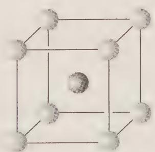

钙钛矿 $\left(\mathrm{CaTiO}_{3}\right)$ 结构可看作 $O^{2-}$ 和 $Ca^{2+}$ 一起有序地作立方最密堆积，可划分出面心立方晶胞，晶胞的顶点为 $Ca^{2+}$ ，面心为 $O^{2-}$ 。 $Ti^{4+}$ 占据晶胞体心位置，即由6个 $O^{2-}$ 组成的八面体空隙

图9.1.7 CsCl的晶体结构

中心(晶胞中共计4个八面体空隙,但只有处在晶胞中心的八面体空隙是由6个 $O^{2-}$ 组成,其他处在棱边中心的3个八面体空隙都是由4个 $O^{2-}$ 和2个 $Ca^{2+}$ 组成)。晶胞的结构(A型)如图9.1.8(a)所示。若将晶胞顶点移至 $Ti^{4+}$ 位置,则 $O^{2-}$ 处于棱边中心, $Ca^{2+}$ 处在体心位置,晶胞的结构(B型)如图9.1.8(b)所示。

已知有许多通式为 $\mathrm{ABX}_3$ (A, B 为正离子, X 为负离子)化合物的结构属于钙钛矿型。还有许多化合物的结构可从钙钛矿型结构出发来理解。例如, $\mathrm{ReO}_3$ 的结构可看作将 $\mathrm{CaTiO}_3$ 结构中的 Ca 除去后剩余的骨架的结构, 如图 9.1.9(a) 所示。由图可见, $\mathrm{ReO}_3$ 的结构是以 $\mathrm{ReO}_6$ 八面体基团共用顶点连接而成的三维骨架。

$\mathrm{WO}_3$ 的结构和 $\mathrm{ReO}_3$ 相同，由于W容易变价以及结构中有大的空隙适合于接纳其他原子，因而容易制得组成可变的化合物 $\mathrm{M}_x\mathrm{WO}_3(0 < x < 1)$ ，M通常为 $\mathrm{Na}^+$ 或 $\mathrm{K}^+$ 。这种含有 $\mathrm{W}^{5+}$ 和 $\mathrm{W}^{6+}$ 的混合价态化合物，具有金属青铜的颜色，称为钨青铜，其结构如图9.1.9(b)所示。

许多氧化物超导体的晶体结构,可从钙钛矿型结构出发,将晶胞以不同方式进行堆叠,将原子加以置换、位移和空缺等方式形成。

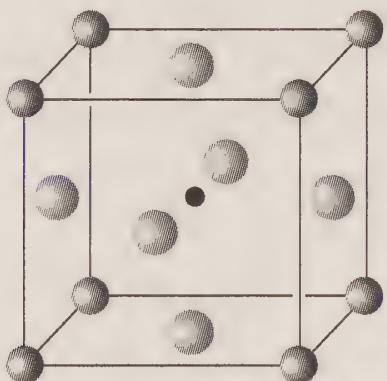  
(a) A型晶胞

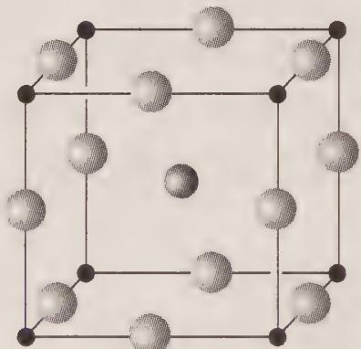  
(b) B型晶胞  
图 9.1.8 $CaTiO_{3}$ 的晶体结构  
（图中深灰球代表 $\mathrm{Ca^{2 + }}$ ，小黑球代表 $\mathrm{Ti}^{4 + }$ ，浅灰球代表 $\mathrm{O}^{2 - }$ ）

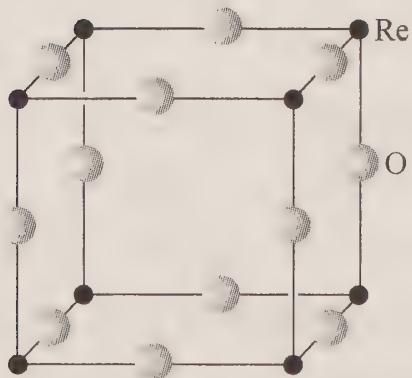  
(a)

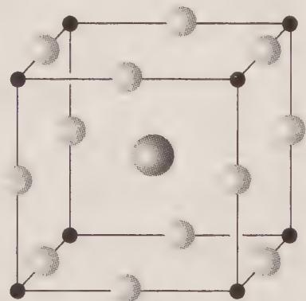  
(b)  
图 9.1.9 $ReO_{3}(a)$ 和 $M_{x}WO_{3}(b)$ 的晶体结构

$\mathrm{La}_{2} \mathrm{CuO}_{4}$ 是第一个被发现的高温氧化物超导体。它的晶体结构可看作钙钛矿型结构的 A 型晶胞的 $\mathrm{LaCuO}_{3}$ 单位为中心部分，在其上下各堆叠上 1 个去掉底层的 B 型晶胞。 $\mathrm{La}_{2} \mathrm{CuO}_{4}$ 的晶胞结构示于图 9.1.10(a) 中。

$\mathrm{YBa_2Cu_3O_6}$ 和 $\mathrm{YBa_2Cu_3O_7}$ 的晶体结构可看作以钙钛矿结构的B型晶胞去掉棱边的1个

O 原子, 形成 $YCuO_{2}$ 单位为中心部分, 在其上下各堆叠一个去掉底层的 B 型晶胞的 $BaCuO_{3}$ 单位, 再删去一些棱上的 O 原子, 通过原子位置位移而成。如图 9.1.10(b) 和 (c) 所示。

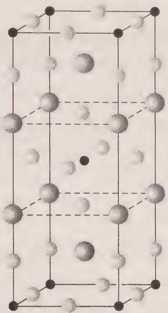  
(a) $La_{2}CuO_{4}$

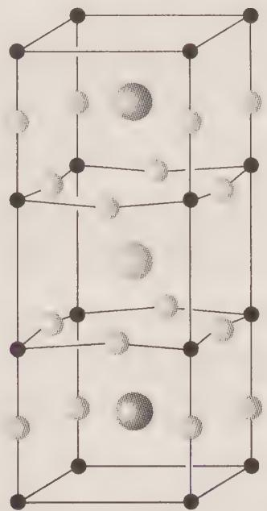  
(b) $\mathrm{YBa}_2\mathrm{Cu}_3\mathrm{O}_6$

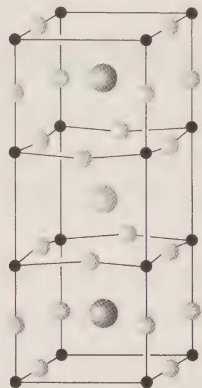  
(c) $\mathrm{YBa}_2\mathrm{Cu}_3\mathrm{O}_7$  
图9.1.10 几种氧化物超导体的晶体结构  
(小黑球代表 Cu, 浅灰小球代表 O)

## 8. NiAs

在 NiAs 晶体结构中, Ni 和 As 的配位数虽然均为 6, 但 Ni 是处在 As 的六方最密堆积的配位八面体中, 而 As 则处在由 Ni 形成的配位三方柱体中, 两者的配位结构并不相同, 如图 9.1.11 所示。按密堆积型式描述, As 作六方最密堆积, 其堆积层结构可表达为 |AcBc|。在 NiAs 结构中, 相邻 2 个 Ni 原子的配位八面体共面相连, 从 NiAs 的晶胞参数 (a=360.2 pm, c=500.9 pm) 可以看出, Ni---Ni 间的距离只有 250 pm, 与金属镍中的距离一致。NiAs 晶体有明显的金属性, 是一种合金, 所以在文中没有标明 Ni 和 As 的价态。

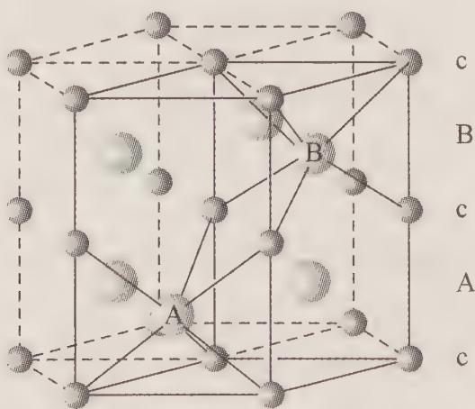  
图9.1.11 NiAs的晶体结构

（深灰小球代表 Ni，浅灰大球代表 As。在晶胞中 2 个 As 原子的坐标：A 为 $\frac{2}{3}, \frac{1}{3}, \frac{1}{4}$ ；B 为 $\frac{1}{3}, \frac{2}{3}, \frac{3}{4}$ ）

许多二元化合物属于 NiAs 型结构,例如: 硫化物(如 CoS)、硒化物(如 FeSe)、碲化物(如 MnTe)、砷化物(如 MnAs)、锑化物(如 CrSb)、铋化物(如 MnBi)和锡化物(如 AuSn)等。许多晶体化学教材将 NiAs 结构列入离子晶体的一种常见结构型式。

## 9.2 离子键和点阵能

## 9.2.1 点阵能的计算和测定

离子键的强弱可用点阵能的大小表示。以 $\mathrm{M}_{\mu}\mathrm{X}_{\chi}$ 晶体为例，点阵能是指在 $0\mathrm{K}$ 时，由相互远离的 $\mu \mathrm{mol} \mathrm{M}^{Z+}(g)$ 和 $\chi \mathrm{mol} \mathrm{X}^{Z-}(g)$ 形成 $1\mathrm{mol} \mathrm{M}_{\mu}\mathrm{X}_{\chi}$ 离子晶体时所释放出的能量。若用化学反应式表示，点阵能 $(U)$ 相当于下一反应的内能改变量。

$$
\mu \mathrm{M} ^ {Z +} (\mathrm{g}) + \chi \mathrm{X} ^ {Z -} (\mathrm{g}) \longrightarrow \mathrm{M} _ {\mu} \mathrm{X} _ {\chi} (\mathrm{s})
$$

点阵能负值越大，表示离子键越强，晶体越稳定。

如果晶体中的化学键完全是离子键，点阵能可以根据离子晶体中离子的电荷、离子的排列等结构数据加以计算。

离子间存在静电库仑力和短程排斥力，库仑力异号相互吸引，同号互相排斥，作用能和距离 $r$ 成反比。短程排斥力作用能和距离高次方成反比，目前作用力本质不很清楚。

按照库仑定律，两个荷电为 $(Z_{+})e$ 和 $(Z_{-})e$ 、距离为 $r$ 的球形离子，库仑作用能为

$$
\varepsilon_ {\mathrm{C}} = \frac {(Z _ {+}) (Z _ {-}) e ^ {2}}{4 \pi \varepsilon_ {0} r}\tag{9.2.1}
$$

式中 $\varepsilon_0$ 为真空电容率。当这两个离子近距离接触时，电子云间将产生排斥作用，相应的排斥能为

$$
\varepsilon_ {\mathrm{R}} = b r ^ {- m}\tag{9.2.2}
$$

式中 $b$ 和 $m$ 均为常数。

在晶体中，正、负离子按照一定的规律排列，每个离子的周围都有许多正、负离子和它相互作用。现以 NaCl 型晶体为例，了解晶体中离子间作用能的情况。由 NaCl 的晶体结构可知，当 $Na^{+}$ 和 $Cl^{-}$ 最近的距离为 r 时，每个 $Na^{+}$ 周围有

6个距离为 $r$ 的 $\mathrm{Cl}^{-}$

12个距离为 $\sqrt{2} r$ 的 $\mathrm{Na^{+}}$

8个距离为 $\sqrt{3} r$ 的 $\mathrm{Cl^-}$

6个距离为 $\sqrt{4} r$ 的 $\mathrm{Na^{+}}$

所以,对这个 $Na^{+}$ 离子,其库仑作用能为

$$
\varepsilon \left(\mathrm{Na} ^ {+}\right) = \frac {Z _ {+} Z _ {-} e ^ {2}}{4 \pi \varepsilon_ {0} r} \left[ 6 + \frac {1 2}{\sqrt {2}} \frac {Z _ {+}}{Z _ {-}} + \frac {8}{\sqrt {3}} + \frac {6}{\sqrt {4}} \frac {Z _ {+}}{Z _ {-}} + \dots \right]
$$

因为 NaCl 型结构中, $Z_{+}/Z_{-}=-1$ ,所以

$$
\varepsilon \left(\mathrm{Na} ^ {+}\right) = \frac {\mathrm{Z} _ {+} \mathrm{Z} _ {-} e ^ {2}}{4 \pi \varepsilon_ {0} r} \left[ 6 - \frac {1 2}{\sqrt {2}} + \frac {8}{\sqrt {3}} - \frac {6}{\sqrt {4}} + \dots \right] = \frac {\mathrm{Z} _ {+} \mathrm{Z} _ {-} e ^ {2}}{4 \pi \varepsilon_ {0} r} A\tag{9.2.3}
$$

式中 $A \approx 1.7476$ ，代表 $\left[6 - \frac{12}{\sqrt{2}} + \frac{8}{\sqrt{3}} - \frac{6}{\sqrt{4}} + \cdots\right]$ ，称为 Madelung（马德隆）常数。实际上按此级数计算 A 值并不收敛。为使级数收敛，可按保持电中性原则，取不断扩大的立方体单位进行计算，直至数据收敛。计算时在立方体内的离子算 1，在面上的算 1/2，在棱上的算 1/4，在顶角上的算 1/8，在立方体外的算 0。例如，边长为 $2a (=1127.88 \, \text{pm})$ 的立方体，其中心 $Na^{+}$ 的

$\varepsilon (\mathrm{Na}^{+})$ 可按下式计算

$$
\begin{array}{r l} \varepsilon (\mathrm{Na} ^ {+}) & = - \frac {e ^ {2}}{4 \pi \varepsilon_ {0} r} \left[ 1 \times \left(6 - \frac {1 2}{\sqrt {2}} + \frac {8}{\sqrt {3}}\right) + \frac {1}{2} \left(- \frac {6}{\sqrt {4}} + \frac {2 4}{\sqrt {5}} - \frac {2 4}{\sqrt {6}}\right) \right. \\ & \quad \left. + \frac {1}{4} \left(- \frac {1 2}{\sqrt {8}} + \frac {2 4}{\sqrt {9}}\right) - \frac {1}{8} \times \frac {8}{\sqrt {1 2}} \right] \\ & = - \frac {e ^ {2}}{4 \pi \varepsilon_ {0} r} (1. 7 5 1 8) \end{array}
$$

继续扩大立方体的体积，Madelung 常数就会逐渐趋近于 1.7476 这一数值。

同理,分析一个 $Cl^{-}$ ,其库仑作用能为

$$
\varepsilon (\mathrm{Cl} ^ {-}) = \frac {Z _ {+} Z _ {-} e ^ {2}}{4 \pi \varepsilon_ {0} r} A\tag{9.2.4}
$$

由 $1 \mathrm{~mol} \mathrm{Na}^{+}$ 和 $1 \mathrm{~mol} \mathrm{Cl}^{-}$ 组成的晶体中, $\mathrm{Na}^{+}$ 和 $\mathrm{Cl}^{-}$ 的数目均为 $N_{\mathrm{A}}$ (Avogadro 常数), 由于每一离子均计算了两次, 应除以 2 , 所以

$$
E _ {\mathrm{C}} = \frac {N _ {\mathrm{A}}}{2} \left[ \varepsilon (\mathrm{Na} ^ {+}) + \varepsilon (\mathrm{Cl} ^ {-}) \right] = \frac {Z _ {+} Z _ {-} e ^ {2}}{4 \pi \varepsilon_ {0} r} A N _ {\mathrm{A}}\tag{9.2.5}
$$

而 $1 \mathrm{~mol} \mathrm{NaCl}$ 晶体中的排斥能为

$$
E _ {\mathrm{R}} = B r ^ {- m}\tag{9.2.6}
$$

这样,对于 $1 \, mol \, NaCl$ 晶体,总的势能函数为

$$
u = E _ {\mathrm{C}} + E _ {\mathrm{R}} = \frac {Z _ {+} Z _ {-} e ^ {2} A N _ {\mathrm{A}}}{4 \pi \varepsilon_ {0} r} + B r ^ {- m}\tag{9.2.7}
$$

$u$ 显然随 $r$ 而异。在晶体中，势能达到最低值时，相邻的 $\mathrm{Na}^{+}$ 和 $\mathrm{Cl}^{-}$ 间的距离即为平衡距离 $r_{\mathrm{e}}$ ，这时

$$
\left(\frac {\partial u}{\partial r}\right) _ {r = r _ {\mathrm{e}}} = - \frac {Z _ {+} Z _ {-} e ^ {2} A N _ {\mathrm{A}}}{4 \pi \varepsilon_ {0} r _ {\mathrm{e}} ^ {2}} - \frac {m B}{r _ {\mathrm{e}} ^ {m + 1}} = 0\tag{9.2.8}
$$

由此得

$$
B = - \frac {Z _ {+} Z _ {-} e ^ {2} A N _ {\mathrm{A}}}{m 4 \pi \varepsilon_ {0}} r _ {\mathrm{e}} ^ {m - 1}\tag{9.2.9}
$$

代入(9.2.7)式,得到 NaCl 型离子晶体点阵能

$$
U = u = \frac {Z _ {+} Z _ {-} e ^ {2} A N _ {\mathrm{A}}}{4 \pi \varepsilon_ {0} r _ {\mathrm{e}}} \left(1 - \frac {1}{m}\right)\tag{9.2.10}
$$

式中 $m$ 可从晶体的压缩性因子求得。Pauling 认为 $m$ 应随离子的电子组态而变化，并给出 $m$ 的数值（见下表）：

<table><tr><td>离子的电子组态</td><td>He</td><td>Ne</td><td>Ar,  $Cu^{+}$ </td><td>Kr,  $Ag^{+}$ </td><td>Xe,  $Au^{+}$ </td></tr><tr><td>m</td><td>5</td><td>7</td><td>9</td><td>10</td><td>12</td></tr></table>

NaCl 晶体的 m 值可取 7 和 9 的平均值, 即按 m=8 计算。根据 NaCl 晶体的结构数据 $(Z_{+}=1, Z_{-}=-1, A=1.7476, r_{\mathrm{e}}=2.8197\times10^{-10}\ \mathrm{m})$ 及其他常数, 按 (9.2.10) 式计算得点阵能

$$
U = - 7 5 3 \mathrm{kJ} \mathrm{mol} ^ {- 1}
$$

排斥作用能亦可近似表达为

$$
E _ {\mathrm{R}} = - \frac {Z _ {+} Z _ {-} e ^ {2} A N _ {\mathrm{A}}}{4 \pi \varepsilon_ {0} r _ {\mathrm{e}}} \left(\frac {\rho}{r _ {\mathrm{e}}}\right)\tag{9.2.11}
$$

式中 $\rho$ 为一常数。对于碱金属卤化物， $\rho$ 值约为 $0.31 \times 10^{-10} (\mathrm{~m})$ ，用此值计算点阵能，误差不大于 $2\%$ 。所以，由 $1 \mathrm{~mol}$ 气态 $\mathrm{Na}^{+}$ 和 $1 \mathrm{~mol}$ 气态 $\mathrm{Cl}^{-}$ 生成 $1 \mathrm{~mol}$ 的 $\mathrm{NaCl}$ 晶体，内能的改变量（即点阵能）亦可表示为

$$
U = E _ {\mathrm{C}} + E _ {\mathrm{R}} = - \frac {e ^ {2} A N _ {\mathrm{A}}}{4 \pi \varepsilon_ {0} r _ {\mathrm{e}}} \left(1 - \frac {\rho}{r _ {\mathrm{e}}}\right)\tag{9.2.12}
$$

将 $e, N_{A}, \varepsilon_{0}$ 等按国际单位制数值代入计算，得

$$
U = - 1. 3 8 9 4 \times 1 0 ^ {- 7} \frac {A}{r _ {\mathrm{e}}} \left(1 - \frac {\rho}{r _ {\mathrm{e}}}\right)\tag{9.2.13}
$$

按(9.2.13)式计算,NaCl的点阵能为

$$
\begin{array}{r l} U = & - 1. 3 8 9 4 \times 1 0 ^ {- 7} \frac {1 . 7 4 7 6}{2 . 8 1 9 7 \times 1 0 ^ {- 1 0}} \left(1 - \frac {0 . 3 1}{2 . 8 1 9 7}\right) \mathrm{kJ} \mathrm{mol} ^ {- 1} \\ = & - 7 6 6 \mathrm{kJ} \mathrm{mol} ^ {- 1} \end{array}
$$

$\mathrm{M}_{\mu}\mathrm{X}_{\chi}$ 晶体的点阵能也可用(9.2.10)式计算。由于晶体不同，离子配位不同， $\mu$ 和 $\chi$ 不同，这时(9.2.10)式中的 Madelung 常数 $A$ 既考虑了离子的配位，也考虑了 $\mu$ 和 $\chi$ 的数值。表 9.2.1 列出几种结构型式的晶体的 Madelung 常数[对应于(9.2.10)式]。

表 9.2.1 几种结构型式晶体的 Madelung 常数值

<table><tr><td>结构型式</td><td>A</td></tr><tr><td>NaCl</td><td>1.7476</td></tr><tr><td>CsCl</td><td>1.7627</td></tr><tr><td>立方ZnS</td><td>1.6381</td></tr><tr><td>六方ZnS</td><td>1.6413</td></tr><tr><td> $CaF_2$ </td><td>2.5194</td></tr><tr><td> $TiO_2$ (金红石)</td><td>2.4080</td></tr><tr><td> $α-Al_2O_3$ </td><td>4.172</td></tr></table>

精确计算点阵能时,还需要考虑其他一些相互作用,例如色散能和零点能,这些能量相对较小。表 9.2.2 列出若干二元离子化合物的点阵能及各种作用能。

表 9.2.2 若干二元化合物的各种作用能 (单位: $\mathrm{{kJ}}{\mathrm{{mol}}}^{-1}$ )

<table><tr><td>晶体</td><td>库仑能</td><td>排斥能</td><td>色散能</td><td>零点能</td><td>点阵能</td></tr><tr><td>LiF</td><td>-1200</td><td>+180</td><td>-16</td><td>+16</td><td>-1020</td></tr><tr><td>NaCl</td><td>-860</td><td>+100</td><td>-16</td><td>+8</td><td>-768</td></tr><tr><td>AgCl</td><td>-875</td><td>+146</td><td>-121</td><td>+4</td><td>-846</td></tr><tr><td>MgO</td><td>-4634</td><td>+699</td><td>-6</td><td>+18</td><td>-3923</td></tr></table>

由表 9.2.2 中数据可见, 离子电荷对点阵能影响很大, 因为库仑作用能与 $Z_{+}$ 和 $Z_{-}$ 的乘积成正比。对比 NaCl 和 AgCl 的点阵能的分配可见, AgCl 的色散能特别大, 说明极化力强的 $Ag^{+}$ 对可极化性大的 $Cl^{-}$ 的极化作用较大。当这种作用能大到一定程度, 原子间作用力不能用简单的静电模型表达,键的性质发生改变,带有共价键因素,即需要考虑键型发生变异的因素。

点阵能的数值可以根据热力学第一定律通过实验间接测定。例如，NaCl晶体的点阵能可通过下图所示的Born-Haber(玻恩-哈伯)循环计算。

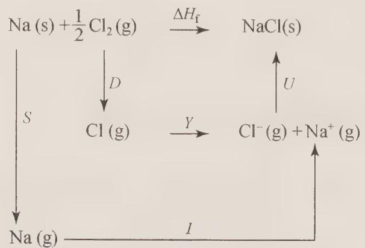

$$
\begin{array}{r l r} & {\mathrm {Na(s)\longrightarrow Na(g)}} & {S (\text {升华热}) = + 1 0 8. 4 \mathrm {kJ mol^ {- 1}}} \\ & {\mathrm {Na(g)\longrightarrow Na^ {+} (g)+ e^ {-}}} & {I (\text {电离能}) = + 4 9 5. 0 \mathrm {kJ mol^ {- 1}}} \\ & {\frac {1}{2} \mathrm {Cl_ {2} (g)\longrightarrow Cl(g)}} & {D (\text {解离能}) = + 1 1 9. 6 \mathrm {kJ mol^ {- 1}}} \\ & {\mathrm {Cl(g)+ e^ {-} \longrightarrow Cl^ {-} (g)}} & {Y (\text {电子亲和能}) = - 3 4 8. 3 \mathrm {kJ mol^ {- 1}}} \\ & {\mathrm {Na(s) + \frac {1}{2} Cl_ {2} (g)\longrightarrow NaCl(s)}} & {\Delta H _ {\mathrm{f}} (\text {生成热}) = - 4 1 0. 9 \mathrm {kJ mol^ {- 1}}} \\ & {U = \Delta H _ {\mathrm{f}} - S - I - D - Y} \\ & {= - (4 1 0. 9 + 1 0 8. 4 + 4 9 5. 0 + 1 1 9. 6) \mathrm {kJ mol^ {- 1}} + 3 4 8. 3 \mathrm {kJ mol^ {- 1}}} \\ & {= - 7 8 5. 6 \mathrm {kJ mol^ {- 1}}} \end{array}
$$

由上述循环计算点阵能时，从化学手册中查得的 $\Delta H_{\mathrm{f}}, S, D$ 等是 $298\mathrm{K}$ 的数据，而点阵能的定义规定为 $0\mathrm{K}$ 的条件。这两者之差一般小于 $10\mathrm{kJ mol}^{-1}$ ，其大小和循环中各步骤数据误差之和差不多，通常也就不予细致计算了。

根据 Born-Haber 循环计算点阵能,不同书的作者所用电子亲和能等数值不完全相同,所得点阵能也略有差异。但总的说来和理论计算值符合得很好,说明离子晶体中作用力的本质是静电力。

## 9.2.2 点阵能的应用

点阵能的数据既然可以由 Born-Haber 循环推得,有了点阵能的数据,就可用于估算其他不易直接测定的数据。

## 1. 估算电子亲和能

根据 Born-Haber 循环, 当通过实验求得 S, I, D, $\Delta H_{f}$ 以及点阵能的数值, 就可以计算电子亲和能 Y 的数值。例如欲求氧原子的电子亲和能, 即下述反应的 Y 值

$$
\mathrm{O} (\mathrm{g}) + 2 \mathrm{e} ^ {-} \longrightarrow \mathrm{O} ^ {2 -} (\mathrm{g})
$$

可根据 $\mathrm{MgO}$ 的结构计算出点阵能，再通过实验测定 $S, I, D, \Delta H_{\mathrm{f}}$ 等数据，就可求出 $Y$ 值（参见习题9.1）。

## 2. 估算质子亲和能

若要计算 $\mathrm{NH}_3(\mathrm{g}) + \mathrm{H}^+ (\mathrm{g})\longrightarrow \mathrm{NH}_4^+ (\mathrm{g})$ 的能量变化 $P$ ，可按下一循环进行

$$
\begin{array}{c c c} \mathrm {NH_ {4} Cl(s)} & \xrightarrow {- U} & \mathrm {NH_ {4} ^ {+} (g) + Cl^ {-} (g)} \\ \uparrow & & \uparrow \\ \Delta H ^ {\ominus} & & \mathrm {NH_ {3} (g) + H^ {+} (g) + Cl^ {-} (g)} \\ \mathrm {NH_ {3} (g) + HCl(g)} & \xrightarrow {D} & \mathrm {NH_ {3} (g) + H(g) + Cl(g)} \end{array}
$$

通过实验求得 $NH_{3}$ 分子的质子亲和能(P)为 $-895\ kJ\ mol^{-1}$ 。

## 3. 计算离子的溶剂化能

离子的溶剂化能或水化热是指 1 mol 气态离子与无限量的溶剂结合时所释放的能量, 即下一反应的焓变 $\Delta H_{aq}$

$$
\mathrm{M} ^ {+} (\mathrm{g}) + \mathrm{H} _ {2} \mathrm{O} (\mathrm{l}) \longrightarrow \mathrm{M} ^ {+} (\mathrm{aq})
$$

例如, 欲求 $Na^{+}$ 的水化热, 可根据下一循环, 测定 NaCl 的溶解热和点阵能, 再知道 $Cl^{-}$ 的水化热就可求得

$$
\begin{array}{c} \text {溶解热} \\ \mathrm{NaCl(s)} \\ \text {-U} \\ \mathrm {(ΔH_ {aq}) Na^ {+}} \\ \text {Na^ {+}(g) + Cl^ {-}(g)} \end{array} \xrightarrow [ + a q ]{(\Delta H_ {aq}) N a ^ {+}} \begin{array}{c} \text {Na^ {+} (aq) + Cl^ {-} (aq)} \\ \text {(ΔH_ {aq})Cl^ {-}} \end{array}
$$

下表中列出了若干离子的水化热 $\Delta H_{\mathrm{aq}}(\mathrm{kJ}\ \mathrm{mol}^{-1})$ 。

<table><tr><td> $Na^{+}$ </td><td> $K^{+}$ </td><td> $Mg^{2+}$ </td><td> $Ca^{2+}$ </td><td> $Cl^{-}$ </td><td> $OH^{-}$ </td><td> $CN^{-}$ </td><td> $NO_{3}^{-}$ </td><td> $ClO_{4}^{-}$ </td></tr><tr><td>-420</td><td>-340</td><td>-1960</td><td>-1615</td><td>-350</td><td>-510</td><td>-345</td><td>-310</td><td>-225</td></tr></table>

## 4. 点阵能和化学反应

由于点阵能正比于正、负离子电价的乘积，而和正、负离子的距离成反比，因此，对于离子化合物，其进行复分解反应的趋势常常是：半径较小的正离子趋向于和半径较小的负离子相结合，同时半径较大的正离子和半径较大的负离子相结合；价数高的正离子趋向于和价数高的负离子相结合，而价数低的正离子和价数低的负离子相结合；半径小的离子趋向于和价数高的异号离子结合。这样可以降低能量，生成较稳定的离子化合物，例如

$$
\begin{array}{r l} & \mathrm{KF+LiBr} \longrightarrow \mathrm{KBr+LiF} \\ & 2 \mathrm{NaF+CaCl} _ {2} \longrightarrow 2 \mathrm{NaCl+CaF} _ {2} \\ & \mathrm{Na} _ {2} \mathrm{S+CaCO} _ {3} \longrightarrow \mathrm{Na} _ {2} \mathrm{CO} _ {3} + \mathrm{CaS} \end{array}
$$

## 5. 估算非球形离子半径

含有非球形离子的化合物, Madelung 常数不易得到, Kapustinskii(卡普斯金斯基) 提出半经验公式计算点阵能 U(单位: kJ mol $^{-1}$ )

$$
U = 1. 2 0 2 \times 1 0 ^ {- 7} \frac {Z _ {+} Z _ {-} (\mu + \chi)}{r _ {+} + r _ {-}} \left(1 - \frac {3 . 4 5 \times 1 0 ^ {- 1 1}}{r _ {+} + r _ {-}}\right)
$$

式中 $(\mu + \chi)$ 是化学式中的离子数——NaCl为 $2, \mathrm{CaCl}_2$ 为 $3, \mathrm{KClO}_4$ 为 $2; r_+$ 和 $r_-$ 分别为六配位的正、负离子的半径，单位为 $\mathrm{m}$ 。

当用热化学方法测定了化合物的点阵能后,利用这个公式可以计算非球形离子的离子半径,称为离子的热化学半径。例如 $KClO_{4}$ 的 $U = -591 \, kJ \, mol^{-1}$ , $Z_{+} = 1$ , $Z_{-} = -1$ , 令 $r_{+} + r_{-} = r_{e}$ , 则

$$
- 5 9 1 = \frac {- 1 . 2 0 2 \times 1 0 ^ {- 7} \times 2}{r _ {\mathrm{e}}} \left(1 - \frac {3 . 4 5 \times 1 0 ^ {- 1 1}}{r _ {\mathrm{e}}}\right)
$$

解此方程，得

$$
r _ {\mathrm{e}} = 3. 6 9 \times 1 0 ^ {- 1 0} \mathrm{m} = 3 6 9 \mathrm{pm}
$$

已知 $\mathrm{K}^{+}$ 的半径为 $133\mathrm{pm}$ ，所以 $\mathrm{ClO}_4^-$ 的半径为 $236\mathrm{pm}$ 。

用此法已求得若干离子的热化学半径，例如： $\mathrm{BF}_4^-$ 228 pm, $\mathrm{BO}_3^{3-}$ 191 pm, $\mathrm{CN}^-$ 182 pm, $\mathrm{CO}_3^{2-}$ 185 pm, $\mathrm{ClO}_3^-$ 200 pm, $\mathrm{MnO}_4^-$ 240 pm, $\mathrm{NO}_3^-$ 189 pm, $\mathrm{SO}_4^{2-}$ 230 pm 等。

## 9.2.3 键型变异原理

许多简单离子化合物的晶体结构,可以成功地用离子键模型加以处理。晶体点阵能的理论计算值和实验测定值相符合,说明离子键模型对这些晶体是适用的。这种利用晶体的离子键模型处理晶体的能量和结构型式的办法,获得许多重要成果,如离子晶体的点阵能、离子大小和配位关系、配位情况与能量关系等。但是在实际晶体中,单纯的离子键很少,甚至那些很熟悉的离子化合物,往往几种键型兼而有之。原子间结合力的性质少数是纯粹属于3种极限键型之一,而多数晶体中则偏离这3种典型的键型。这种现象称为键型变异现象。

1963年在讨论有机物结构理论时，唐有祺教授提出键型变异原理，认为键型变异是和(i)离子的极化，(ii)电子的离域以及(iii)轨道的重叠成键等因素密切相关的。只要某种条件具备，就会产生和这种条件相应的成键作用。

卤化银的结构可作为由离子键向共价键过渡的例证。几种卤化银的结构和点阵能数据列于表9.2.3中，表中 $r(\mathrm{Ag}^{+})_{\text{表观}}$ 值是指 $d(\mathrm{Ag}-\mathrm{X})$ 与 $X^{-}$ 的离子半径之差 $[r(\mathrm{X}^{-})$ 数据见同表]。由表可见， $r(\mathrm{Ag}^{+})_{\text{表观}}$ 的数值从 AgF 到 AgI 愈来愈小，偏离 $Ag^{+}$ 的半径（115 pm）愈来愈多。对 AgI 晶体，Ag---I 距离为 281 pm，与 Ag 和 I 的共价半径之和（153 pm + 133 pm = 286 pm）相近。这与离子极化有关。

表 9.2.3 卤化银的结构和点阵能数据

<table><tr><td rowspan="2">AgX</td><td rowspan="2">结构型式</td><td rowspan="2"> $\frac{d(Ag---X)}{pm}$ </td><td rowspan="2"> $\frac{r(X^-)}{pm}$ </td><td rowspan="2"> $\frac{r(Ag^+)_{表观}}{pm}$ </td><td colspan="3"> $U/(kJ mol^{-1})$ </td></tr><tr><td>实验值</td><td>计算值</td><td> $\Delta U$ </td></tr><tr><td>AgF</td><td>NaCl型</td><td>246</td><td>133</td><td>113</td><td>954</td><td>921</td><td>33</td></tr><tr><td>AgCl</td><td>NaCl型</td><td>277</td><td>181</td><td>96</td><td>904</td><td>833</td><td>71</td></tr><tr><td>AgBr</td><td>NaCl型</td><td>289</td><td>196</td><td>93</td><td>895</td><td>816</td><td>79</td></tr><tr><td>AgI</td><td>ZnS型</td><td>281</td><td>220</td><td>61</td><td>883</td><td>778</td><td>105</td></tr></table>

下面分别讨论导致键型变异的因素：

## 1. 离子的极化

离子本身带有电荷,形成一个电场,它们在相互电场的作用下,电子分布的中心偏离原子核,发生电子云变形,这种变形称为离子的极化。离子极化将使正、负离子之间在原有的静电相互作用基础上,又附加新的作用,这种作用可以用诱导偶极矩( $\mu$ )和极化率 $\alpha$ 来衡量,如4.4

节所述。

正、负离子虽然相互极化，但因正离子较小，电子云不易变形，它不易被极化，而有较高的极化力，使异号离子极化；负离子较大，电子云容易变形，容易被极化，而极化力较小。

离子极化现象的存在, 将使离子键向共价键过渡。由卤化银的实例可见, 由于 $\mathrm{Ag}^{+}$ 具有较高的极化力, 当 $\mathrm{X}^{-}$ 由小增大, 原子核对外层价电子的吸引力减弱时, 被极化程度增大, 所以由 $\mathrm{F}^{-}$ 到 $\mathrm{I}^{-}$ 依次增加, 促使 $\mathrm{AgX}$ 的键型逐步由离子键向共价键过渡; 到 $\mathrm{AgI}$ 已经是按一定方向成键, 成为以共价键为主的结构。而点阵能的计算值与实验值的偏差也愈来愈大。

对于由 A, B 两原子形成的极性共价键中离子键的成分, Pauling 提出经验的估算公式, 即

$$
\mathrm{离子性数量} = 1 - \exp \Bigl [ - \frac {1}{4} (\chi_ {\mathrm{A}} - \chi_ {\mathrm{B}}) ^ {2} \Bigr ]
$$

式中 $\chi_{\mathrm{A}}$ 和 $\chi_{\mathrm{B}}$ 分别为 A, B 两元素的电负性。例如, H, F, Cl, Br, I 的电负性分别为 2.1, 4.0, 3.0, 2.8, 2.5, 按此公式可算出 HI, HBr, HCl 和 HF 的化学键中离子键的成分分别为 $4\%$ , $11\%$ , $19\%$ 和 $60\%$ 。

## 2. 电子的离域

一种原子将采用哪一种键型，常常和化合物本身的结构有关，不同的结构为原子提供成键的条件不同，键型会发生改变。金刚石和石墨均由碳原子组成，在金刚石结构中，C-C之间按典型的共价单键成键；而在石墨晶体中，由于有条件形成离域 $\pi$ 键，增大电子的离域范围，其导电性能、颜色、光泽均和金属相似。AgI有多种晶型，常温下ZnS型的 $\gamma$ -AgI，其共价键占优势；而高温下具有体心立方结构的 $\alpha$ -AgI，其离子键占优势。这时 $\mathrm{Ag}^+$ 统计地分布在 $\mathrm{I}^-$ 按体心立方堆积成的变形四面体和八面体之中，在外电场作用下，能迁移导电。 $\alpha$ -AgI的电导率比 $\gamma$ -AgI约大 $10^{4}$ 倍，而使它成为一类重要的固体离子导体材料。由此可见，不同的结构提供成键的条件不同，形成不同型式的化学键，使晶体具有不同的性质。

## 3. 轨道的重叠

在有 d 轨道参加成键的条件下,有时出现多种多样的键型,甚至有的很难确切说明是什么键。一种元素的原子在不同的化合物中,可以出现多种键型,甚至在一种化合物中一种原子也有多种键型。

每种元素都有它自己的成键规律,使其化合物的结构显现出丰富多彩的型式,这是结构化学研究的重要内容之一。

上述情况说明,在化合物中,各个原子之间只要满足成键的条件,就会以多种方式,最大可能地形成多种型式的化学键,各个原子参加成键的方式多种多样,形成化学键的型式也会多种多样。通过这些成键作用,可以改变分子中电荷的分布,促进原子轨道互相有效地重叠,使异号电荷间的吸引力加强,使分子和晶体的势能降低,稳定性增加。

## 9.3 离子半径

在离子晶体中，相邻的正、负离子间存在着静电吸引力和离子的外层电子云间的排斥力。当这两种作用力达成平衡时，离子间保持一定的接触距离。排斥力是短距离性质的作用力，当正、负离子接近时，排斥力随距离的缩短而迅速增加。所以，离子可近似地看作具有一定半径的弹性球，两个互相接触的球形离子的半径之和等于核间的平衡距离。由原子结构可知，电子在原子核外是连续分布的，并无明确的界限，因此，离子半径的数值是和离子所处的特定条件有关的。

## 9.3.1 离子半径的测定和Pauling离子半径

利用 X 射线衍射法可以很精确地测定正、负离子间的平衡距离。例如 NaCl 型晶体，其正当晶胞参数 a 的一半即为正、负离子的平衡距离或正、负离子的半径之和。而从这个平衡距离定出离子半径的基本问题是每个离子各占多少，即怎样划分正、负离子的接触距离成为两个离子半径。

Landé(朗德)在 1920 年通过对比下表中具有 NaCl 型结构的化合物的晶胞参数(表中括号内的数字为后来较精确的测定值)后,认为 MgS 和 MnS,MgSe 和 MnSe 的晶胞参数几乎相等,意味着在晶体中负离子和负离子已相接触。

<table><tr><td>晶体</td><td> $\frac{1}{2}a/pm$ </td><td>晶体</td><td> $\frac{1}{2}a/pm$ </td></tr><tr><td>MgO</td><td>210 (210.56)</td><td>MnO</td><td>224 (222.24)</td></tr><tr><td>MgS</td><td>260 (260.17)</td><td>MnS</td><td>259 (261.18)</td></tr><tr><td>MgSe</td><td>273 (272.5)</td><td>MnSe</td><td>273 (272.4)</td></tr></table>

他利用简单的几何关系,推出 $S^{2-}$ 和 $Se^{2-}$ 的离子半径

$$
\begin{array}{l} r (\mathrm{S} ^ {2 -}) = 2 6 0 \mathrm{pm} / \sqrt {2} = 1 8 4 \mathrm{pm} \\ r (\mathrm{Se} ^ {2 -}) = 2 7 3 \mathrm{pm} / \sqrt {2} = 1 9 3 \mathrm{pm} \end{array}
$$

从而给出第一批离子半径数据。

Wasastjerna(瓦萨斯雅那)在 1925 年按照离子的摩尔折射度正比于其体积的方法, 划分离子的大小, 获得 8 个正离子和 8 个负离子半径, 包括 $F^{-}(133\ \text{pm})$ 和 $O^{2-}(132\ \text{pm})$ 。

Goldschmidt(哥尔什密特)在1927年采用Wasastjerna的 $\mathrm{F}^{-}$ 和 $\mathrm{O}^{2-}$ 的离子半径数据,根据实验测定的离子晶体中离子间的接触距离的数据,得出80多种离子的半径(Goldschmidt离子半径),至今仍在通用。

1927 年, Pauling(鲍林)根据 5 个晶体(NaF, KCl, RbBr, CsI 和 Li₂O)的核间距离数据, 用半经验方法推出大量的离子半径。因为离子的大小由它最外层电子的分布所决定, 而最外层电子的分布与有效核电荷成反比, 即

$$
r = \frac {c _ {n}}{Z - \sigma} = \frac {c _ {n}}{Z ^ {*}}\tag{9.3.1}
$$

式中 $c_{n}$ 为由量子数 $n$ 决定的常数，对于等电子的离子或原子， $c_{n}$ 取相同数值。屏蔽常数 $\sigma$ 可按 Slater 规则估算（见 2.4 节）。Pauling 给出 Ne 型离子的 $\sigma = 4.52^{\text{①}}$ ，这样可得

$$
r (\mathrm{Na} ^ {+}) = \frac {c _ {n}}{1 1 - 4 . 5 2}\tag{9.3.2}
$$

$$
r (\mathrm{F} ^ {-}) = \frac {c _ {n}}{9 - 4 . 5 2}\tag{9.3.3}
$$

由实验测定 NaF 晶体的晶胞参数,从中得

$$
r \left(\mathrm{Na} ^ {+}\right) + r \left(\mathrm{F} ^ {-}\right) = 2 3 1 \mathrm{pm}\tag{9.3.4}
$$

解(9.3.2)～(9.3.4)这3个联立方程，即得 $r(\mathrm{Na}^{+})=95\ \mathrm{pm},r(\mathrm{F}^{-})=136\ \mathrm{pm},c_{n}=615$ 。用此方法推引1-1价离子晶体所得的半径，适用于1价离子的场合。有了 $c_{n}$ 值，即可计算各种Ne型离子的单价半径，例如 $O^{2-}$ 的 $r_{1}=615/Z^{*}=176\ \mathrm{pm}$ 。其他Ne型离子的单价半径也可用 $r_{1}=615/Z^{*}$ 求算，其数值列入下表(单位：pm)。

<table><tr><td>离子</td><td> $C^{4-}$ </td><td> $N^{3-}$ </td><td> $O^2$ </td><td> $F^-$ </td><td>Ne</td><td> $Na^+$ </td></tr><tr><td>r/pm</td><td>414</td><td>247</td><td>176</td><td>136</td><td>112</td><td>95</td></tr><tr><td>离子</td><td> $Mg^{2+}$ </td><td> $Al^{3+}$ </td><td> $Si^{4+}$ </td><td> $P^{5+}$ </td><td> $S^{6+}$ </td><td> $Cl^{7+}$ </td></tr><tr><td>r/pm</td><td>82</td><td>72</td><td>65</td><td>59</td><td>53</td><td>49</td></tr></table>

$\mathrm{Mg}^{2+}$ 和 $\mathrm{O}^{2-}$ 是 2 价离子，在 $\mathrm{MgO}$ 晶体中， $(1/2)a = 210\mathrm{pm}$ ，比单价半径和 $(82\mathrm{pm} + 176\mathrm{pm} = 258\mathrm{pm})$ 小。这是因为这时正、负离子间的引力 4 倍于单价离子相同距离的同型晶体。根据(9.2.10)式可知，当 $|Z_{+}| = |Z_{-}| = Z$ 时，(9.2.10)式可化为

$$
\frac {Z ^ {2} e ^ {2} A N _ {\mathrm{A}}}{4 \pi \varepsilon_ {0}} r _ {\mathrm{e}} ^ {m - 1} = - m B\tag{9.3.5}
$$

若近似地将 $Z$ 价和1价的平衡距离之比看作 $Z$ 价和1价离子半径之比，则因(9.3.5)式等号右边是常数，可得 $Z^2 r_Z^{m - 1} = 1^2 r_1^{m - 1}$ ，即

$$
r _ {Z} = r _ {1} (Z) ^ {- 2 / (m - 1)}\tag{9.3.6}
$$

表 9.3.1 若干种离子的 Pauling 离子半径

<table><tr><td>离子</td><td>r/pm</td><td>离子</td><td>r/pm</td><td>离子</td><td>r/pm</td><td>离子</td><td>r/pm</td><td>离子</td><td>r/pm</td></tr><tr><td> $Ag^{+}$ </td><td>126</td><td> $Co^{3+}$ </td><td>63</td><td> $Hg^{2-}$ </td><td>110</td><td> $Nb^{5+}$ </td><td>70</td><td> $Si^{4+}$ </td><td>41</td></tr><tr><td> $Al^{3+}$ </td><td>50</td><td> $Cr^{2+}$ </td><td>84</td><td>I</td><td>216</td><td> $Ni^{2+}$ </td><td>72</td><td> $Sr^{2+}$ </td><td>113</td></tr><tr><td> $As^{3-}$ </td><td>222</td><td> $Cr^{3+}$ </td><td>69</td><td> $In^{+}$ </td><td>132</td><td> $Ni^{3+}$ </td><td>62</td><td> $Sn^{2+}$ </td><td>112</td></tr><tr><td> $As^{5+}$ </td><td>47</td><td> $Cr^{6+}$ </td><td>52</td><td> $In^{3+}$ </td><td>81</td><td> $O^{2-}$ </td><td>140</td><td> $Sn^{4+}$ </td><td>71</td></tr><tr><td> $Au^{+}$ </td><td>137</td><td> $Cs^{+}$ </td><td>169</td><td> $K^{+}$ </td><td>133</td><td> $P^{3}$ </td><td>212</td><td> $Te^{2+}$ </td><td>221</td></tr><tr><td> $B^{3+}$ </td><td>20</td><td> $Cu^{+}$ </td><td>96</td><td> $La^{3+}$ </td><td>115</td><td> $P^{5+}$ </td><td>34</td><td> $Ti^{2+}$ </td><td>90</td></tr><tr><td> $Ba^{2+}$ </td><td>135</td><td> $Cu^{2+}$ </td><td>70</td><td> $Li^{+}$ </td><td>60</td><td> $Pb^{2+}$ </td><td>120</td><td> $Ti^{3+}$ </td><td>78</td></tr><tr><td> $Be^{2+}$ </td><td>31</td><td> $Eu^{2+}$ </td><td>112</td><td> $Lu^{3+}$ </td><td>93</td><td> $Pb^{4+}$ </td><td>84</td><td> $Ti^{4+}$ </td><td>68</td></tr><tr><td> $Bi^{5+}$ </td><td>74</td><td> $Eu^{3+}$ </td><td>103</td><td> $Mg^{2+}$ </td><td>65</td><td> $Pd^{2+}$ </td><td>86</td><td> $Tl^{+}$ </td><td>140</td></tr><tr><td> $Br^{-}$ </td><td>195</td><td> $F^{-}$ </td><td>136</td><td> $Mn^{2+}$ </td><td>80</td><td> $Ra^{2+}$ </td><td>140</td><td> $Tl^{3-}$ </td><td>95</td></tr><tr><td> $C^{4-}$ </td><td>260</td><td> $Fe^{2+}$ </td><td>76</td><td> $Mn^{3-}$ </td><td>66</td><td> $Rb^{+}$ </td><td>148</td><td> $U^{4+}$ </td><td>97</td></tr><tr><td> $C^{4+}$ </td><td>15</td><td> $Fe^{3+}$ </td><td>64</td><td> $Mn^{4+}$ </td><td>54</td><td> $S^{2}$ </td><td>184</td><td> $V^{2+}$ </td><td>88</td></tr><tr><td> $Ca^{2+}$ </td><td>99</td><td> $Ga^{+}$ </td><td>113</td><td> $Mn^{7+}$ </td><td>46</td><td> $S^{6+}$ </td><td>29</td><td> $V^{3+}$ </td><td>74</td></tr><tr><td> $Cd^{2+}$ </td><td>97</td><td> $Ga^{3+}$ </td><td>62</td><td> $Mo^{6+}$ </td><td>62</td><td> $Sb^{3}$ </td><td>245</td><td> $V^{4+}$ </td><td>60</td></tr><tr><td> $Ce^{3+}$ </td><td>111</td><td> $Ge^{2+}$ </td><td>93</td><td> $N^{3-}$ </td><td>171</td><td> $Sb^{5+}$ </td><td>62</td><td> $V^{5+}$ </td><td>59</td></tr><tr><td> $Ce^{4+}$ </td><td>101</td><td> $Ge^{4+}$ </td><td>53</td><td> $N^{5+}$ </td><td>11</td><td> $Sc^{3+}$ </td><td>81</td><td> $Y^{3+}$ </td><td>93</td></tr><tr><td> $Cl^{-}$ </td><td>181</td><td>H</td><td> $208^a$ </td><td> $Na^{+}$ </td><td>95</td><td> $Se^{2}$ </td><td>198</td><td> $Zn^{2+}$ </td><td>74</td></tr><tr><td> $Co^{2+}$ </td><td>74</td><td> $Hf^{4-}$ </td><td>81</td><td> $NH_{4}^{+}$ </td><td>148</td><td> $Se^{6+}$ </td><td>42</td><td> $Zr^{1+}$ </td><td>80</td></tr></table>

表中 $\mathrm{H}^{-}$ 数据(208 pm)偏大, 一般常用 $140~\mathrm{pm}$ 。

Ne型离子 $m = 7$ ，对2价离子 $Z = 2$ ，则 $r_2 = r_1(2)^{-1 / 3}$ ，即

$$
r _ {2} = 0. 7 9 4 r _ {1}
$$

$\mathrm{O}^{2-}$ 的晶体半径应为 $0.794 \times 176 \mathrm{pm} = 140 \mathrm{pm}$ , $\mathrm{Mg}^{2+}$ 为 $0.794 \times 82 \mathrm{pm} = 65 \mathrm{pm}$ 。Pauling 即按上述方法从各种离子的单价半径, 按 (9.3.6) 式算出晶体半径。这种晶体半径称为 Pauling 离子半径, 它覆盖面较大, 被广泛采用。

表 9.3.1 列出若干种离子的 Pauling 离子半径数据。

## 9.3.2 有效离子半径

Shannon(香农)等归纳整理了实验测定的上千个氧化物和氟化物中正、负离子间距离的数据，并假定正、负离子半径之和等于离子间的距离，考虑了配位数、电子自旋状况、配位多面体的几何构型等对正、负离子半径的影响，对某种固定的负离子、结构类型相同的一系列化合物，其晶胞体积正比于正离子的体积（但不一定是直线关系）。他们以Pauling提出的配位数为6的 $\mathrm{O}^2$ 半径为 $140\mathrm{pm}$ 、F半径为 $133\mathrm{pm}$ 作为出发点，用Goldschmidt方法划分离子间距离为离子半径，经过多次修正，提出一套较完整的离子半径数据，称为有效离子半径。所谓“有效”，是指这些数据是由实验测定的数据推得，而离子半径之和与实验测定的离子间的距离符合得最好（若从 $\mathrm{O}^{2-}$ 半径为 $132\mathrm{pm}$ 出发，可得另一套半径值）。

表 9.3.2 列出一些离子在不同价态、不同配位数和几何形状条件下的有效离子半径。在此表的配位数一栏中，(sq)代表平面四方形配位，(HS)代表高自旋状态，(LS)代表低自旋状态。

## 9.3.3 离子半径的变化趋势

在元素周期表中,离子半径的大小有一些共同变化趋势。

（1）在元素周期表 s 区和 p 区各族元素中，同族元素的离子半径随原子序数增加而增加。例如，第 1 族六配位的元素，其离子半径为

<table><tr><td>离子</td><td> $Li^{+}$ </td><td> $Na^{+}$ </td><td> $K^{+}$ </td><td> $Rb^{+}$ </td><td> $Cs^{+}$ </td></tr><tr><td>r/pm</td><td>76</td><td>102</td><td>138</td><td>152</td><td>167</td></tr></table>

这是因为同一族原子的价电子层结构相同,而最外层电子的主量子数随原子序数的增加而增加。

（2）在元素周期表的每一周期中，核外电子数相同的正离子半径随着正电荷数的增加而下降。例如当配位数为6时，离子半径为

<table><tr><td>离子</td><td>r/pm</td><td>离子</td><td>r/pm</td><td>离子</td><td>r/pm</td><td>离子</td><td>r/pm</td></tr><tr><td> $Na^+$ </td><td>102</td><td> $Mg^2$ </td><td>72</td><td> $Al^{3+}$ </td><td>53.5</td><td></td><td></td></tr><tr><td> $Au^+$ </td><td>137</td><td> $Hg^{2+}$ </td><td>102</td><td> $Tl^{3-}$ </td><td>88.5</td><td> $Pb^{4+}$ </td><td>77.5</td></tr></table>

这是因为在每一周期内，等电子离子随着原子序数的增加而核外电子数并没有增加，核对外层电子增加了吸引力；而且随着离子价数的增加，高价离子间静电吸引力增强，而使离子间距离缩短。对于同一周期相同价态的过渡元素，随着原子序数增大，半径总的趋向缩小，但并不平稳平滑。

表 9.3.2 一些离子在不同价态、不同配位数和几何形状条件下的有效离子半径

<table><tr><td>离子</td><td>配位数</td><td>r/pm</td><td>离子</td><td>配位数</td><td>r/pm</td><td>离子</td><td>配位数</td><td>r/pm</td></tr><tr><td rowspan="4"> $Ag^{+}$ </td><td>2</td><td>67</td><td> $Co^{2+}$ </td><td>4(HS)</td><td>58</td><td> $K^{+}$ </td><td>8</td><td>151</td></tr><tr><td>4</td><td>100</td><td></td><td>6(LS)</td><td>65</td><td></td><td>12</td><td>164</td></tr><tr><td>4(sq)</td><td>102</td><td></td><td>6(HS)</td><td>74.5</td><td> $La^{3+}$ </td><td>6</td><td>103.2</td></tr><tr><td>6</td><td>115</td><td> $Co^{3+}$ </td><td>6(LS)</td><td>54.5</td><td></td><td>12</td><td>136</td></tr><tr><td rowspan="2"> $Al^{3+}$ </td><td>4</td><td>39</td><td></td><td>6(HS)</td><td>61</td><td> $Li^{+}$ </td><td>4</td><td>59</td></tr><tr><td>6</td><td>53.5</td><td> $Cr^{2+}$ </td><td>6(LS)</td><td>73</td><td></td><td>6</td><td>76</td></tr><tr><td> $As^{3+}$ </td><td>6</td><td>58</td><td></td><td>6(HS)</td><td>80</td><td> $Lu^{3+}$ </td><td>6</td><td>86.1</td></tr><tr><td rowspan="2"> $As^{5+}$ </td><td>4</td><td>33.5</td><td> $Cr^{3+}$ </td><td>6</td><td>61.5</td><td> $Mg^{2+}$ </td><td>4</td><td>57</td></tr><tr><td>6</td><td>46</td><td> $Cr^{6+}$ </td><td>4</td><td>26</td><td></td><td>6</td><td>72</td></tr><tr><td> $Au^{+}$ </td><td>6</td><td>137</td><td> $Cs^{+}$ </td><td>6</td><td>167</td><td> $Mn^{2+}$ </td><td>6(LS)</td><td>67</td></tr><tr><td rowspan="2"> $Au^{3+}$ </td><td>4(sq)</td><td>68</td><td> $Cu^{+}$ </td><td>2</td><td>46</td><td></td><td>6(HS)</td><td>83</td></tr><tr><td>6</td><td>85</td><td></td><td>4</td><td>60</td><td> $Mn^{7+}$ </td><td>4</td><td>25</td></tr><tr><td rowspan="3"> $B^{3+}$ </td><td>3</td><td>1</td><td></td><td>6</td><td>77</td><td> $Na^{+}$ </td><td>6</td><td>102</td></tr><tr><td>4</td><td>11</td><td> $Cu^{2+}$ </td><td>4</td><td>57</td><td> $Ni^{2+}$ </td><td>6</td><td>69</td></tr><tr><td>6</td><td>27</td><td></td><td>4(sq)</td><td>57</td><td> $Ni^{3+}$ </td><td>6(LS)</td><td>56</td></tr><tr><td rowspan="3"> $Ba^{2+}$ </td><td>6</td><td>135</td><td></td><td>5</td><td>65</td><td></td><td>6(HS)</td><td>60</td></tr><tr><td>8</td><td>142</td><td></td><td>6</td><td>73</td><td> $O^{2-}$ </td><td>3</td><td>136</td></tr><tr><td>9</td><td>147</td><td> $F^{-}$ </td><td>2</td><td>128.5</td><td></td><td>4</td><td>138</td></tr><tr><td rowspan="2"> $Be^{2+}$ </td><td>4</td><td>27</td><td></td><td>3</td><td>130</td><td></td><td>6</td><td>140</td></tr><tr><td>6</td><td>45</td><td></td><td>4</td><td>131</td><td></td><td>8</td><td>142</td></tr><tr><td> $Br^{-}$ </td><td>6</td><td>196</td><td></td><td>6</td><td>133</td><td> $P^{3+}$ </td><td>6</td><td>44</td></tr><tr><td rowspan="2"> $C^{4+}$ </td><td>4</td><td>15</td><td> $Fe^{2+}$ </td><td>4(HS)</td><td>63</td><td> $P^{5+}$ </td><td>4</td><td>17</td></tr><tr><td>6</td><td>16</td><td></td><td>4(sq)</td><td>64</td><td> $Rb^{+}$ </td><td>6</td><td>152</td></tr><tr><td rowspan="2"> $Ca^{2+}$ </td><td>6</td><td>100</td><td></td><td>6(LS)</td><td>61</td><td> $S^{2-}$ </td><td>6</td><td>184</td></tr><tr><td>9</td><td>118</td><td></td><td>6(HS)</td><td>78</td><td> $S^{6+}$ </td><td>4</td><td>12</td></tr><tr><td rowspan="2"> $Cd^{2+}$ </td><td>4</td><td>78</td><td> $Fe^{3+}$ </td><td>4(HS)</td><td>49</td><td> $Si^{4+}$ </td><td>4</td><td>26</td></tr><tr><td>6</td><td>95</td><td></td><td>6(LS)</td><td>55</td><td></td><td>6</td><td>40</td></tr><tr><td> $Ce^{3+}$ </td><td>6</td><td>101</td><td></td><td>6(HS)</td><td>64.5</td><td> $Ti^{4+}$ </td><td>4</td><td>42</td></tr><tr><td> $Ce^{4+}$ </td><td>6</td><td>87</td><td> $I^{-}$ </td><td>6</td><td>220</td><td> $V^{5+}$ </td><td>6</td><td>54</td></tr><tr><td> $Cl^{-}$ </td><td>6</td><td>181</td><td> $K^{+}$ </td><td>6</td><td>138</td><td> $Zn^{2+}$ </td><td>4</td><td>60</td></tr></table>

(3) 同一元素各种价态的离子, 电子数越多, 离子的半径越大。例如

<table><tr><td>离子</td><td> $Cr^{2+}$ </td><td> $Cr^{3+}$ </td><td> $Cr^{4+}$ </td><td> $Cr^{6+}$ </td></tr><tr><td>r/pm</td><td>80</td><td>62</td><td>55</td><td>44</td></tr></table>

从整个元素周期表看,负离子的半径一般要比正离子的半径大,负离子的半径约在 130～230 pm,而正离子的半径则小于 190 pm。

(4) 核外电子数相同的负离子对, 随着负电价的增加而半径略有增加 (例列于下表), 但增加的数量很少。这是因为较高价的负离子以及和它配位的正离子吸引力增加，抵消了负电价增加引起的离子半径增加。

<table><tr><td>离子</td><td>r/pm</td><td>离子</td><td>r/pm</td></tr><tr><td> $F^{-}$ </td><td>133</td><td> $O^{2-}$ </td><td>140</td></tr><tr><td> $Cl^{-}$ </td><td>181</td><td> $S^{2-}$ </td><td>184</td></tr><tr><td> $Br^{-}$ </td><td>196</td><td> $Se^{2-}$ </td><td>198</td></tr></table>

（5）一种正离子出现几种配位数时，随着配位数的增加，离子半径增大，如表9.3.2所列。过渡金属离子若存在高低自旋态时，高自旋态的半径较大。

(6) 镧系元素三价离子的半径(六配位), 从 $\mathrm{La}^{3+}$ 的 $103.2 \mathrm{pm}$ 随着原子序数的增加逐渐下降到 $\mathrm{Lu}^{3+}$ 的 $86.1 \mathrm{pm}$ 。此为镧系收缩效应所引起, 它使镧系以后的元素离子半径相应地也有所减少, 以致锆和铪、铌和钽、钼和钨等同族的第五和第六周期元素具有几乎相等的离子半径。

和镧系元素同族的 $Sc^{3+}$ ， $Y^{3+}$ 的离子半径分别为 74.5 pm 和 90 pm，它们的性质和镧系相似。通称的稀土元素包括 Sc 和 Y 在内。

## 9.4 离子配位多面体及其连接规律

为了更好地描述复杂离子化合物的结构,揭示这些化合物的结构规律,通常引入离子配位多面体及有关离子晶体的结构规则:将正离子周围邻接的负离子的中心互相连成的多面体称为正离子配位多面体;将配位多面体作为结构单元,观察它们互相连接的方式,是描述离子晶体结构的重要方法。

## 9.4.1 正负离子半径比和离子的配位多面体

具有惰性气体电子组态的离子呈球形，它和荷电相反的离子的作用是各向同性的。若从简单的静电作用考虑，由球形的 $\mathrm{M}^{Z+}$ 和 $\mathrm{X}^{\mathrm{Z}-}$ 离子组成的结构中，最稳定的排列是按对称的方式进行，并使正、负离子相互接触。通常由于负离子的半径比正离子大，可以认为在离子晶体中正离子位于负离子形成的配位多面体的中心，而多面体的型式主要取决于半径比 $r_{+}/r_{-}$ 。现以配位数为6的八面体配位为例予以说明。图9.4.1(a)示出八面体配位。

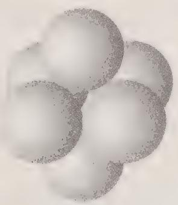  
(a)

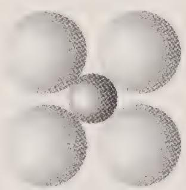  
(b)

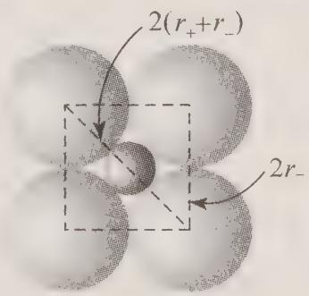  
(c)

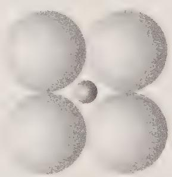  
(d)  
图9.4.1 八面体配位及其中正、负离子的接触情况

在八面体配位中,离子间的接触情况有3种,分别示于图9.4.1(b)～(d)中,图中大球代表负离子 $X^{-}$ ,小球代表正离子 $M^{+}$ 。

(1) 正、负离子相互接触, 而负离子之间不接触, 如图(b);

(2) 正、负离子之间和负、负离子之间都相互接触, 如图(c);

(3) 负离子之间接触, 而正、负离子之间不接触, 如图(d)。

由图9.4.1(c)可以得到

$$
r _ {-} = (r _ {+} + r _ {-}) / \sqrt {2}
$$

$$
r _ {+} / r _ {-} = \sqrt {2} - 1 = 0. 4 1 4
$$

所以当 $r_{+} / r < 0.414$ 时，正、负离子不相接触，而负离子自己相互接触，这时静电排斥力大，而吸引力小，晶体不很稳定；当 $r_{+} / r > 0.414$ 时，正、负离子相接触，而负离子自己不接触，因而静电吸引力大，排斥力小，晶体比较稳定。另一方面，正离子周围负离子数越多，即配位数越高，由 Madelung 常数的表达式可知，配位数高，第一项数值大，静电吸引力大，晶体的势能低。为了使晶体稳定，最优条件是正、负离子相互接触，配位数尽可能高。所以配位数为 6 的条件是 $r_{+} / r_{-} \geqslant 0.414$ 。但当 $r_{+} / r_{-}$ 大到 0.732 时，正离子周围就有可能安排 8 个负离子，使正、负离子相互接触。按照这种计算和推理，可得表 9.4.1 所示的配位多面体的半径比的极限（最小）值。

表 9.4.1 配位多面体的半径比的极限值

<table><tr><td>配位多面体</td><td>配位数</td><td>半径比 $(r_{+}/r_{-})_{\min}$ </td></tr><tr><td>三角形体</td><td>3</td><td>0.155</td></tr><tr><td>四面体</td><td>4</td><td>0.225</td></tr><tr><td>八面体</td><td>6</td><td>0.414</td></tr><tr><td>立方体</td><td>8</td><td>0.732</td></tr><tr><td>立方八面体</td><td>12</td><td>1.000</td></tr></table>

对典型的离子晶体,根据离子半径数据,就可以从几何的观点推测其结构。例见下表。

<table><tr><td>半径比( $r_{+}/r_{-}$ )</td><td>0.225~0.414</td><td>0.414~0.732</td><td>&gt;0.732</td></tr><tr><td>推测结构</td><td>四面体配位</td><td>八面体配位</td><td>立方体配位</td></tr></table>

正负离子半径比只是影响晶体结构的因素之一，在复杂多样的离子晶体中，还有其他因素影响晶体的结构。例如：

(1) M-X 间共价键的成分增大, 中心原子按一定数目的共价键的方向性与周围原子形成一定几何形状的配位体, 并使 M-X 键缩短。

(2) 某些过渡金属常形成 M—M 键, 使配位多面体扭歪, 例如 $VO_{2}$ , $MoO_{2}$ , $ReO_{2}$ 形成扭歪的金红石型结构。

(3) $\mathbf{M}^{n+}$ 周围 $\mathbf{X}^{-}$ 的配位场效应使离子配位多面体变形。

所以，离子晶体究竟采取什么样的结构型式，配位多面体是否有所变形，需要通过实验测定，而不能简单地从单一几何因素去推论。

## 9.4.2 配位多面体的连接

在无机化合物中,最重要的配位多面体是八面体和四面体。原则上这些多面体可共顶点或共棱或共面连接,但是共棱和共面会使处在多面体中心的离子相互间的距离缩短,如图9.4.2所示。表9.4.2示出两个规则的 $MX_{4}$ 四面体连接时和两个规则的 $MX_{6}$ 八面体连接时,处在多面体中心的M---M间的距离。表中共顶点和共棱的距离指的是最大值。由表可见,共面连接会大大缩短M---M间的距离,使同号离子间的排斥能增加,降低晶体结构的稳定性。所以,典型的离子化合物共面连接的方式很少。

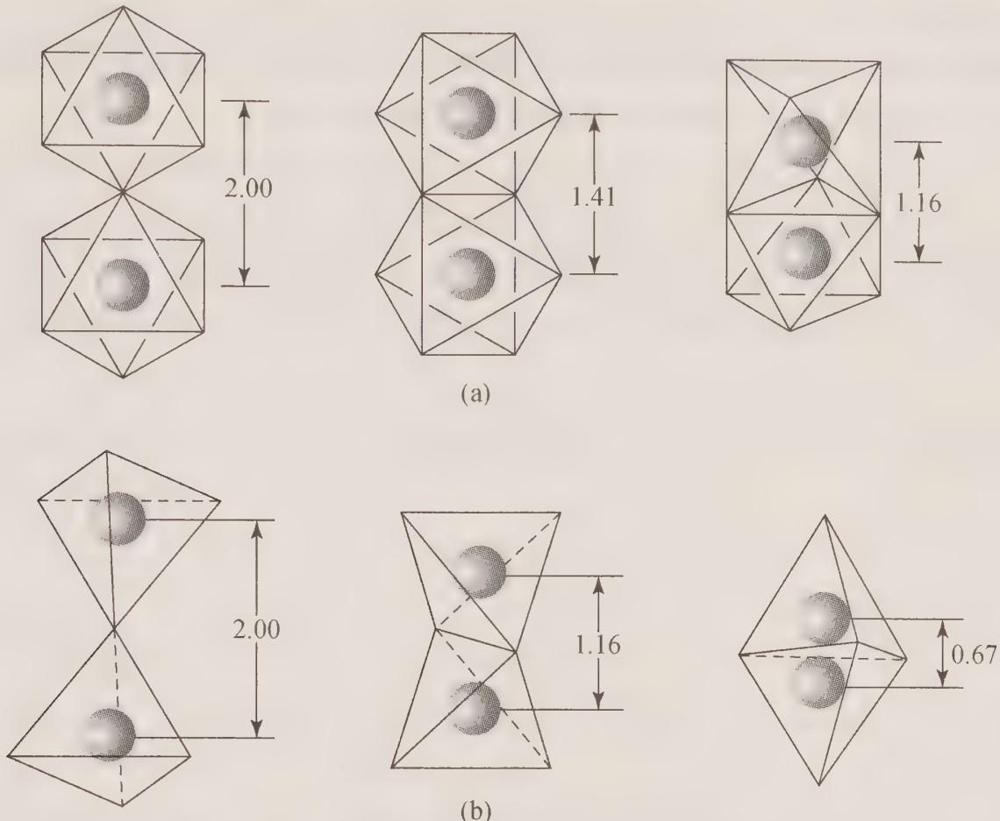  
图 9.4.2 共顶点、共棱和共面时，处在多面体中心的离子间的距离与中心到顶点的距离之比  
(a) 八面体，(b) 四面体

表 9.4.2 两个规则的 ${\mathrm{{MX}}}_{4}$ 四面体连接时和两个规则的 ${\mathrm{{MX}}}_{6}$ 八面体连接时 $\mathrm{M}\cdots \mathrm{M}$ 间的距离

<table><tr><td rowspan="2">多面体</td><td colspan="3">和X---X距离相比</td><td colspan="3">和M---X距离相比</td></tr><tr><td>共顶点</td><td>共棱</td><td>共面</td><td>共顶点</td><td>共棱</td><td>共面</td></tr><tr><td>四面体</td><td>1.22</td><td>0.71</td><td>0.41</td><td>2.00</td><td>1.16</td><td>0.67</td></tr><tr><td>八面体</td><td>1.41</td><td>1.00</td><td>0.82</td><td>2.00</td><td>1.41</td><td>1.16</td></tr></table>

多面体的连接方式和化学组成有密切关系,配位多面体的连接方式不同,化学组成也不同;反之,同样的组成,结构不同,多面体的连接方式可以有所不同。满足电中性,即正、负电荷相等是所有离子化合物必须遵循的原则,对了解多面体连接方式有一定的帮助。而复杂的离子化合物,将在9.5节中,以硅酸盐为例讨论配位四面体的若干连接方式。

## 9.4.3 Pauling 离子晶体结构规则

早在 1928 年, Pauling 就根据当时已测定的结构数据和点阵能计算公式反映的原理, 提出了关于离子化合物结构的 5 个规则, 简称 Pauling 规则。以后在《化学键的本质》(见 1960 年版, 13.6 节)一书中, Pauling 将它归纳成下面三方面加以叙述。这些内容对于了解和说明复杂离子化合物的结构有重要意义。

## 1. 离子配位多面体规则

这一规则指出,正离子周围的负离子形成了配位多面体,称为正离子配位多面体。正离子与负离子之间的距离取决于正、负离子半径之和,而正离子配位多面体的型式和配位数取决于半径之比。这一规则的基础已在本节前面加以叙述。

## 2. 离子电价规则

这一规则说明,在一个稳定的离子化合物结构中,每一负离子的电价(绝对值)等于或近乎等于从邻近的正离子至该负离子的各静电键的强度的总和,即

$$
Z _ {-} = \sum_ {i} s _ {i} = \sum_ {i} \frac {Z _ {i}}{\nu_ {i}}
$$

式中 $Z$ 为负离子的电荷； $Z_{i}$ 为正离子所带的电荷， $\nu_{i}$ 为它的配位数； $s_{i}$ 定义为静电键强度。

下表中归纳了几种稳定的氧化物中 $\mathrm{O}^{2-}$ 的电价(其值正好等于从邻近配位正离子提供的电价)。

<table><tr><td>稳定的氧化物</td><td>和  $O^{2-}$  配位的离子</td><td>O 的电价</td></tr><tr><td>石英( $SiO_2$ )</td><td>2 个  $Si^{4+}$ </td><td> $(4/4)+(4/4)=2$ </td></tr><tr><td>黄玉( $Al_2SiO_4F_2$ )</td><td>1 个  $Si^{4+}$ ,2 个  $Al^{3+}$ </td><td> $(4/4)+2\times(3/6)=2$ </td></tr><tr><td>橄榄石( $Mg_2SiO_4$ )</td><td>1 个  $Si^{4+}$ ,3 个  $Mg^{2+}$ </td><td> $(4/4)+3\times(2/6)=2$ </td></tr></table>

表中 $\mathrm{Si}^{4+}$ （四面体）， $\mathrm{Al}^{3+}$ （八面体）， $\mathrm{Mg}^{2+}$ （八面体）；每一个 Si—O 键、Al—O 键和 Mg—O 键的静电键强度分别为 $4/4, 3/6$ 和 $2/6$ 。

电价规则规定了共用同一配位多面体顶点的多面体数目, 是 Pauling 规则的核心, 涉及多面体的顶点如何共用的问题。

根据电价规则的计算， $\mathrm{CO}_{3}^{2-}$ ， $\mathrm{NO}_{3}^{-}$ ， $\mathrm{PO}_{4}^{3-}$ ， $\mathrm{SO}_{4}^{2-}$ ， $\mathrm{ClO}_{4}^{-}$ 等在晶体中应为分立的离子团，它们在各自的晶体中不会共用 $\mathrm{O}^{2-}$ 。例如 $\mathrm{CO}_{3}^{2-}$ 中，每一个 C—O 键强度为 4/3，由于 O 的电价为 2，除去 4/3，只剩 2/3，不能同时和两个 C 连接。所以 $\mathrm{CO}_{3}^{2-}$ 是分立的离子团。在 $\mathrm{SiO}_{4}^{4-}$ 中， $\mathrm{O}^{2-}$ 则能被两个 $\mathrm{SiO}_{4}^{4-}$ 四面体共用。

## 3. 离子配位多面体共用顶点、棱边和面的规则

这个规则指明，在一个配位多面体结构中，共边连接和共面连接会使结构的稳定性降低；而正离子的价数越高，配位数越小，这一效应就越显著。

离子晶体结构稳定性降低主要是由正离子间的库仑斥力所引起。当2个四面体共边连接时，将使位于四面体中心的正离子之间的距离缩短，由表9.4.2可知，共棱时的距离只有共顶点时的 $116 / 200 = 0.58$ ，共面时的距离则只有共顶点时的0.33。所以，共边和共面连接，相应的库仑斥力项增大，晶体的稳定性降低。特别是对带高电荷的正离子来说，尤其如此。

根据这些考虑,还可推测出:在含有各种不同正离子的晶体中,价数高而配位数小的正离子,趋向于彼此间不共用多面体的几何元素。

## 9.5 硅酸盐的结构化学

## 9.5.1 概述

硅酸盐是数量极大的一类无机物，约占地壳重量的 $80\%$ 。地壳中的岩石、砂子、黏土、土壤，建筑材料中的砖瓦、水泥、陶瓷、玻璃，大都由硅酸盐组成。在各种矿床中，硅酸盐起着重要的作用，它几乎是所有金属矿物的伴生矿物，而有的硅酸盐本身就是金属矿物（如 Be, Li, Zn, Ni 等金属矿）或非金属矿物（如云母、滑石、石棉、高岭石等）。

在硅酸盐中，结构的基本单位是 $\left[\mathrm{SiO}_4\right]$ 四面体，四面体互相共用顶点连接成各种各样的结构型式。四面体的连接方式决定硅氧骨干的结构型式，是了解硅酸盐结构化学的基础。

在硅酸盐的结构化学中，铝具有特殊的作用。由于 $\mathrm{Al}^{3+}$ 的大小和 $\mathrm{Si}^{4+}$ 相近， $\mathrm{Al}^{3+}$ 可以无序或有序地置换 $\mathrm{Si}^{4+}$ ，置换数量有多有少，这时 Al 处在配位四面体中和 Si 一起组成硅铝氧骨干，形成硅铝酸盐。为了保持电中性，每当骨干中有 $\mathrm{Al}^{3+}$ 置换 $\mathrm{Si}^{4+}$ 时，必然伴随着引入其他正离子补偿其电荷。 $\mathrm{Al}^{3+}$ 的大小又适合于处在配位数为 6 的配位八面体中，这时 $\mathrm{Al}^{3+}$ 又可以作为硅氧骨干外的正离子，起平衡电荷的作用。硅酸盐的结构存在下列特点：

（1）除少数例外，硅酸盐中 Si 处在 $\left[SiO_{4}\right]$ 四面体中心，其键长、键角的平均值为： $d(\mathrm{Si}-\mathrm{O})=162\mathrm{pm},\angle\mathrm{OSiO}=109.5^{\circ},\angle\mathrm{SiOSi}=140^{\circ}$ 。

(2) 在天然硅酸盐中, 离子相互置换非常广泛而重要。Al 置换 Si 形成硅铝酸盐就很普遍, 在 $\left[\mathrm{AlO}_{4}\right]$ 中, $d(\mathrm{Al}-\mathrm{O})=176\ \mathrm{pm}$ 。Al 也可占据配位八面体 (这时常称为硅氧骨干外的离子)。Al 置换 Si 伴随有正离子进入, 以平衡其电荷。

(3) $\left[(\mathrm{Si}, \mathrm{Al})\mathrm{O}_4\right]$ 只共顶点连接，而不共边和共面，而且2个 $\mathrm{Si}-\mathrm{O}-\mathrm{Al}$ 的能量比1个 $\mathrm{Al}-\mathrm{O}-\mathrm{Al}$ 和1个 $\mathrm{Si}-\mathrm{O}-\mathrm{Si}$ 的能量之和低。

(4) $\left[\mathrm{SiO}_{4}\right]$ 四面体的每个顶点上的 $\mathrm{O}^{2-}$ 最多只能共用于 2 个这样的四面体之间，并且 $\angle \mathrm{Si}-\mathrm{O}-\mathrm{Si}$ 大多数处在 $140^{\circ}$ 附近。

（5）在硅铝酸盐中，硅铝氧骨干外的金属离子容易被其他金属离子置换，置换不同的离子，对骨干的结构影响较小，但对它的性能影响很大。

硅酸盐结构中硅(铝)氧骨干的结构型式可作为硅酸盐分类的基础。硅酸盐可分为4类：(i)分立型，(ii)链形，(iii)层形和(iv)骨架型。

## 9.5.2 $\mathrm{SiO}_2$ 的结构

在常压下， $\mathrm{SiO}_2$ 有多种晶型，它们的名称和稳定存在的温度范围如表9.5.1所列。

表 9.5.1 常压下 ${\mathrm{{SiO}}}_{2}$ 的多晶型体 ${}^{\mathrm{a}}$

<table><tr><td>液态石英(慢)↓1993K</td><td>冷却固化</td><td>石英玻璃(2.196gcm-3)</td></tr><tr><td>β-方石英(高温变体)(立方晶系,2.20gcm-3)</td><td>473~458K(快)</td><td>α-方石英(低温变体)(四方晶系,2.32gcm-3)</td></tr><tr><td>(慢)↓1743K</td><td></td><td></td></tr><tr><td>β-鳞石英(高温变体)(六方晶系,2.22gcm-3)</td><td>393~433K(快)</td><td>α-鳞石英(低温变体)(正交晶系,2.26gcm-3)</td></tr><tr><td>(慢)↓1143K</td><td></td><td></td></tr><tr><td>β-石英(高温变体)(六方晶系,2.53gcm-3)</td><td>846K(快)</td><td>α-石英(低温变体)(三方晶系,2.65gcm-3)</td></tr></table>

液态的 $SiO_{2}$ 结晶比较困难,通常是固化成石英玻璃,石英玻璃热膨胀系数较小、软化点很高( $\approx1800\ K$ )、可透过紫外光、耐酸性强,是非常重要的非金属材料,有广泛的用途。

石英(quartz)、鳞石英(tridymite)和方石英(cristobalite)3种 $\mathrm{SiO}_2$ 的多晶型转变很不容易，在自然界中均可发现这些晶型的晶体，而且每一种晶型又存在两种高低温变体：(i)低温晶型称为 $\alpha$ 型，对称性较低；(ii)高温晶型称为 $\beta$ 型，对称性较高。 $\alpha-$ 石英 $\longleftrightarrow \beta-$ 石英转变温度为 $846\mathrm{K}, \alpha-$ 鳞石英 $\longleftrightarrow \beta-$ 鳞石英转变温度为 $393 \sim 433\mathrm{K}, \alpha-$ 方石英 $\longleftrightarrow \beta-$ 方石英为 $473 \sim 548\mathrm{K}$ ，后两者的 $\alpha-\beta$ 转变是在不稳定的温度区间进行，说明这3种石英晶体间的变化是很困难的。

石英、鳞石英和方石英晶体均为由 $\left[\mathrm{SiO}_{4}\right]$ 四面体共用顶点连接而成的三维骨架。方石英和鳞石英的结构中硅原子位置分别相当于立方和六方ZnS结构中Zn和S原子的位置。通过Si—O—Si键连接而成，氧原子的位置稍为偏离Si—Si的连线，Si—O键长 $161\mathrm{pm}$ ，这两种结构都比石英空旷，这可从它们的密度数据看出。

在自然界中,最常见的 $\mathrm{SiO}_2$ 多晶型体是 $\alpha$ -石英,其次是 $\beta$ -石英。 $\alpha$ -石英分布很广,也容易人工生长制备出大块晶体,成为重要的晶体材料。 $\alpha$ -石英属三方晶系, $D_3$ 点群, $\mathrm{Si}-\mathrm{O}$ 键长 $159.7\mathrm{pm}$ 和 $161.7\mathrm{pm},\angle \mathrm{SiOSi}$ 为 $144^{\circ}$ ,它有很强的压电性和旋光性,是制作石英手表等类产品的关键材料。在石英晶体结构中, $[\mathrm{SiO}_4]$ 四面体沿三重螺旋轴排列,螺旋有左手螺旋和右手螺旋的差别,所以 $\alpha$ -石英有左旋体和右旋体两种。图9.5.1示出 $\alpha$ -石英左旋体的结构,它的空间群属 $P3_{1}21$ (第152号)。注意,它的旋光性是左旋,而它的结构中四面体却按 $3_{1}$ 轴的右手螺旋排列。但围绕通过晶胞原点的 $C$ 轴,四面体排成左手大螺旋,这是它呈左旋旋光性的结构根源。右旋石英晶体结构中 $[\mathrm{SiO}_4]$ 四面体按左手螺旋排列,其空间群属于 $P3_{2}21$ (第154号),它的结构没有在书中示出,但取图9.5.1的镜像对映图即得。当石英发生 $\alpha-\beta$ 转变时,旋光性质仍能继承,即右旋 $\alpha$ -石英变为右旋 $\beta$ -石英,左旋 $\alpha$ -石英变为左旋 $\beta$ -石英。

(b)  
(a)  
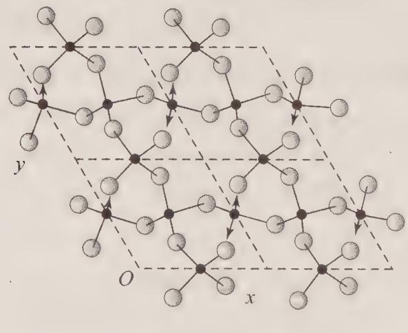

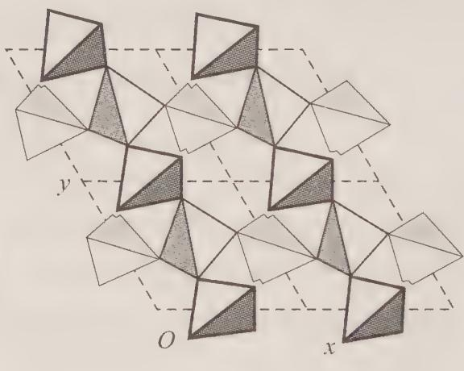  
图 9.5.1 α-石英(左旋体)的结构沿三重轴的投影(图中示出 4 个晶胞)  
(a) 球棍模型(图中的箭头表示它连接的 O 原子处在箭头所指的 O 原子的下方)  
(b) 四面体连接模型(四面体顶点代表 O 原子; Si 原子处于四面体中心, 没有表示出来)

在高压下 $SiO_{2}$ 出现一些密度较高的晶型，3 GPa 压力、室温下可得柯石英(coesite)，它的密度达 $2.89 \, g cm^{-3}$ 。当处于 $1500 \sim 1700 \, K$ 和 $16 \, GPa$ 的条件下， $SiO_{2}$ 可转变成金红石型的超石英(stishovite)，在其结构中，Si 为六配位，近于正八面体形。

## 9.5.3 各类硅酸盐的结构特点

## 1. 分立型硅酸盐

结构中含有分立的 $\left[\mathrm{SiO}_{4}\right]$ 硅氧骨干，如橄榄石（ $\mathrm{Mg}_{2} \mathrm{SiO}_{4}$ ）、锆英石（ $\mathrm{ZrSiO}_{4}$ ）、石榴石 $\left[\mathrm{Mg}_{3} \mathrm{Al}_{2} \left(\mathrm{SiO}_{4}\right)_{3}\right]$ 等。这类矿物堆积较密，属于重硅酸盐。另外，有由 2 个、3 个、6 个、12 个、… $\left[\mathrm{SiO}_{4}\right]$ 四面体连成的分立骨干。

## 2. 链形硅酸盐

链形硅酸盐可分为单链和双链两类。单链的特点是每个 $\left[\mathrm{SiO}_{4}\right]$ 四面体共用两个顶点，连成一维无限长链。如硅灰石 $\left(\mathrm{CaSiO}_{3}\right)$ 、透辉石 $\left[\mathrm{CaMg}\left(\mathrm{SiO}_{3}\right)_{2}\right]$ ，图9.5.2示出几种周期较短的单链连接方式。

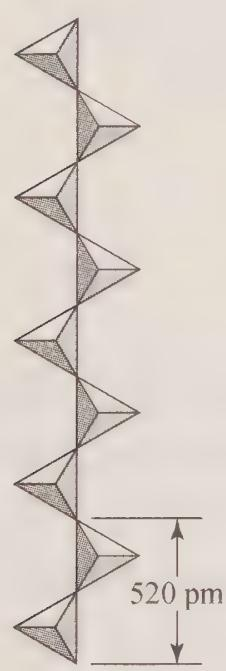  
(a)

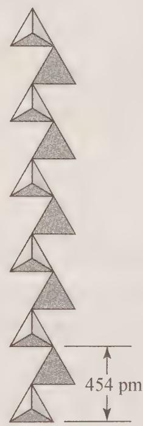  
(b)

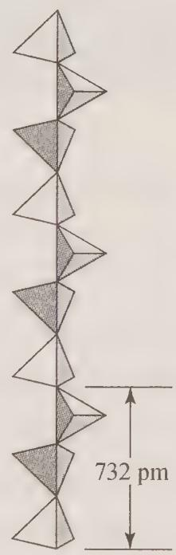  
(c)

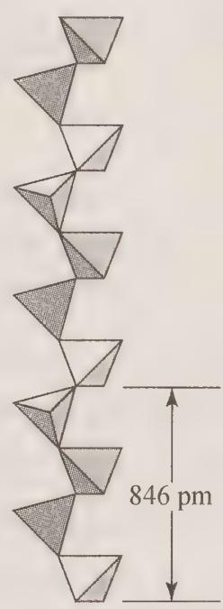  
(d)

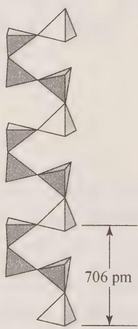  
(e)  
图9.5.2 几种周期较短的单链硅氧骨干的结构

双链结构中有一部分 $\left[\mathrm{SiO}_{4}\right]$ 四面体共用3个顶点而互相连接。石棉 $\mathrm{Mg}_{6}(\mathrm{Si}_{4}\mathrm{O}_{11})_{2}(\mathrm{OH})_{2} \cdot \mathrm{H}_{2}\mathrm{O}$ 的基本特征是能解理成纤维，沿着纤维方向具有角闪石双链的结构。但作为矿物，它是多种纤维的角闪石类的矿物的总称，如透闪石、钠闪石、阳起石、纤维蛇纹石等。石棉矿物中大半是纤维蛇纹石 $\left[\mathrm{Mg}_{3} \mathrm{Si}_{2} \mathrm{O}_{5}(\mathrm{OH})_{4}\right]$ ，它属层形硅酸盐，但由于层两边结构不同，它会卷曲，像地毯被卷起来一样，形成直径约 $10 \mathrm{~nm}$ 的一个个圆柱形纤维。

## 3. 层形硅酸盐

在层形硅酸盐中， $\left[\mathrm{SiO}_{4}\right]$ 四面体共用3个顶点，由于连接方式的不同，可形成多种类型。大多数层形硅酸盐中四面体共顶点连接成六方平面层，标记为“T”，如图9.5.3(a)所示。在这种层中共用的O原子处于同一平面，为惰性氧；顶端的氧为活性氧。 $\mathrm{OH}^{-}$ 基等组分则处于和活性氧同一平面六边形的中心。活性顶氧和 $\mathrm{OH}^{-}$ 需要和其他正离子结合，以平衡电荷。这些正离子主要为 $\mathrm{Mg}^{2+}, \mathrm{Al}^{3+}, \mathrm{Fe}^{2+}$ 等，它们为八面体配位，相互共边连接形成八面体层，标记为“O”，如图9.5.3(b)所示。

在层形硅酸盐中，T层不能单独存在，而是和[O]层结合成[TO]或[TOT]的层；[O]层可以单独存在。在此基础上，许多层形硅酸盐结构可按层的堆积形成。例如高岭石的组成$\mathrm{Al}_{4}\left[\mathrm{Si}_{4}\mathrm{O}_{10}\right](\mathrm{OH})_{3}$ ，它的结构为 $[TO][TO][TO]\cdots$ ，如图9.5.3(c)所示。

在白云母 $\{\mathrm{KAl}_{2}(\mathrm{OH})_{2}[\mathrm{AlSi}_{3}\mathrm{O}_{10}]\}$ 的层形结构中， $\mathbf{K}^{+}$ 处于层形硅氧骨干之间，配位数为12，每个K—O键的静电键强度为 $1 / 12$ ，很弱，是云母易解理成薄片的结构根源。云母是重要的绝缘材料。

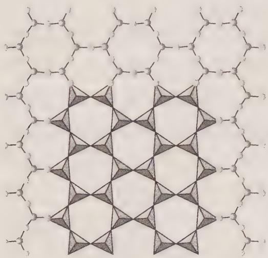  
(a)

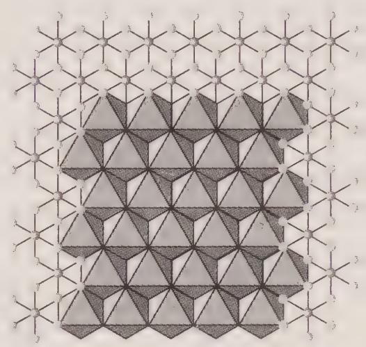  
(b)

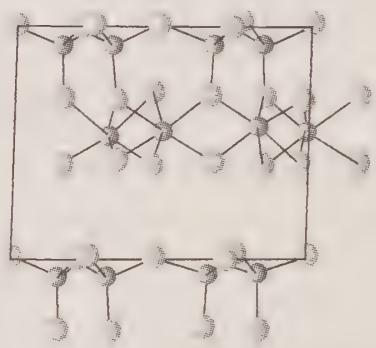  
(c)  
图9.5.3 层形硅酸盐结构示意图  
(a) 四面体层[T], (b) 八面体层[O], (c) 高岭石

层形硅酸盐的结构可以存在多种型式；层内离子可以互相置换，化学成分可在很大的范围内变化；层间的水分子和金属离子有多有少，可有可无；层间的堆积型式可以有序，也可以无序，其结构和组成随着外界条件（水分的多少、盐的浓度、机械作用力等）改变而变化。所以，由层形硅酸盐组成的黏土和土壤，其结构和性质是非常复杂多样的，但它们都是层形结构，沿层方向容易解理，晶粒较小，具有柔软、易水合、容易进行离子交换等共性。

## 4. 骨架型硅酸盐

在硅石、长石、沸石等类骨架型硅酸盐中， $\left[\mathrm{SiO}_{4}\right]$ 四面体的 4 个顶点都相互连接形成三维的骨架。除硅石外，各种骨架型硅酸盐均有 $\mathrm{Al}^{3+}$ 置换 $\mathrm{Si}^{4+}$ ，使骨架带有一定的负电荷，需在骨架外引入若干正离子。

长石是地壳岩石的主要成分,岩石界的 2/3 系长石类的硅酸盐,像坚硬的花岗岩就是由长石、石英和云母组成的。各种长石的硅氧骨架 $\left(\mathrm{AlSi}_{3}\mathrm{O}_{8}\right)_{n}^{n-}$ 都是相似的,在其骨架中,硅(铝)氧四面体组成四元环,2个顶点向上,2个顶点向下。四元环与四元环连接,形成曲折的无限长链,链间通过数量较少的 Si—O—Si 键结合而成三维骨架。

## 9.5.4 沸石分子筛

沸石是含水的骨架型硅铝酸盐，当它们被灼烧时，由于晶体中的水被赶出，产生类似沸腾的现象，故称为沸石。自然界中已经发现的沸石矿物有40多种，除丝光沸石、斜发沸石、方沸石、钙十字沸石等少数几种数量较多外，其他数量都较少。人们根据沸石的化学组成和形成条件，从20世纪40年代末开始合成出和沸石结构相似的化合物，至2005年5月，国际沸石分子筛协会认定的骨架结构类型已有165种，其中A型、X型、Y型、ZSM型等分子筛，已在工业生产中起了重大的作用。这类天然的或合成的硅铝酸盐，具有很空旷的硅氧骨架，有很多孔径均匀的孔道和内表面很大的孔穴，其中含有水分子，若将它加热，把孔道和孔穴内的水赶出，就能起吸附分离作用；直径比孔道小的分子能进入孔穴，直径比孔道大的分子被拒之门外，起着筛选分子的作用，故称分子筛。

A型、X型和Y型等分子筛可看作由 $\beta$ 笼(又称方钠石笼)构成。 $\beta$ 笼是由24个硅(铝)氧四面体连接而成的孔穴，它是一个十四面体，由立方体和八面体围聚而成，如图9.5.4所示。

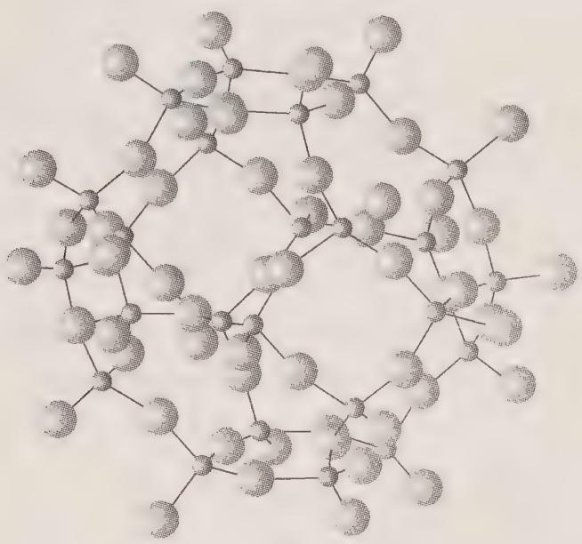  
(a)

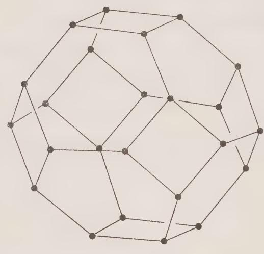  
(b)  
图9.5.4 方钠石笼(β笼)的结构及其简单表示  
(a) 硅(铝)氧骨架的原子结构，(b) 骨架的简单表示(多面体顶点代表[(Al, Si)O\_{4}]四面体中心)

将方钠石笼放在立方体的8个顶点上，相互以四元环通过立方体笼连接，这样所得的骨架即为A型分子筛的骨架结构。8个方钠石笼连接后，在中心形成一个大的 $\alpha$ 笼，它是一个二十六面体，孔穴直径达 $1140\mathrm{pm}$ ，各个 $\alpha$ 笼相互间通过八元环互相连通，这八元环是A型分子筛的主要通道或孔窗。图9.5.5为A型分子筛的结构示意图。化学式为 $\mathrm{Na}_{12}[\mathrm{Al}_{12}\mathrm{Si}_{12}\mathrm{O}_{48}] \cdot 27\mathrm{H}_2\mathrm{O}$ 的A型分子筛，其晶体孔窗直径约为 $4\mathring{\mathrm{A}}(0.4\mathrm{nm})$ 的称4A型分子筛。若以 $\mathbf{K}^{+}$ 代 $\mathrm{Na}^{+}$ ，孔窗变小，称3A型分子筛；若以 $\mathrm{Ca}^{2+}$ 代 $\mathrm{Na}^{+}, \mathrm{Ca}^{2+}$ 数目少，孔径增大至约 $5\mathring{\mathrm{A}}$ ，称5A型分子筛。孔径不同，分子筛的用途也不同：5A型分子筛可用于石油脱蜡、分离直链烷烃和侧链烷烃、气体和液体的深度干燥和纯化；4A型分子筛用于制作5A和3A型分子筛的原料以及气体和液体的深度干燥和纯化；3A型分子筛用于深度干燥乙烯和丙烯等气体。分子筛是优良的干燥剂，其吸水能力仅次于五氧化二磷，但是它不潮解、不膨胀、不腐蚀、不玷污，能反复使用。

方钠石笼有8个六元环，其中互不相邻的4个六元环呈四面体向分布。仿照金刚石中碳原子的四面体向连接方式，把方钠石笼连接起来，连接相邻2个方钠石笼的为六方柱笼，这样组成的三维骨架，即为X型和Y型分子筛骨架的结构，如图9.5.6所示。在骨架中，形成大的八面沸石笼，这个笼的自由径达1180 pm，笼和笼间通过十二元环连通，因而有很大的孔窗。X型分子筛的 $SiO_{2}/Al_{2}O_{3}$ 比值在2.2～3.0范围，大于3.0的称Y型分子筛。X型和Y型分子筛主要作为催化剂，大量应用于石油炼制等工业中。作为催化剂，骨架外金属离子常用稀土或其他过渡金属离子交换制成。骨架外金属离子主要分布在图9.5.6中所示的I, I', II, II', U等位置附近。

ZSM-5型分子筛骨架的结构示于图9.5.7中。它在结构上的特点是含有大量的五元环，并具有空旷的孔道；在组成上Si/Al比值很高，能耐高温。

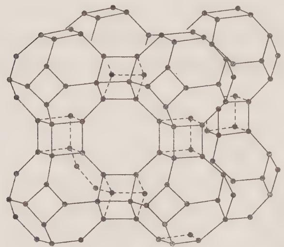  
图9.5.5 A型分子筛的结构示意图

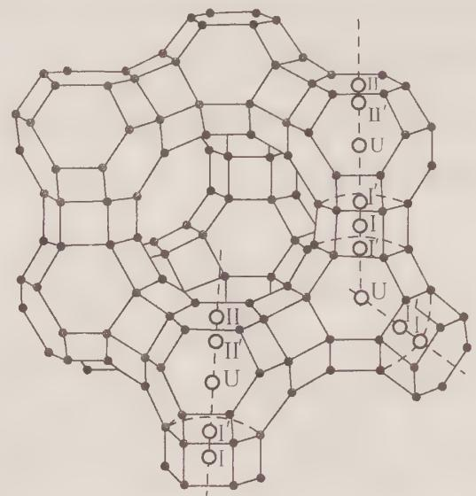  
图9.5.6 X型和Y型分子筛骨架及骨架外离子位置分布图

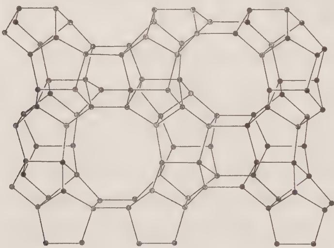  
图9.5.7 ZSM-5型分子筛骨架的结构

谢有畅和唐有祺教授等发现,利用分子筛等高比表面的固态化合物作为载体,将它和氧化物(如 $NiO, La_{2}O_{3}, MoO_{3}$ 等)及盐类(如 NaCl, CuCl, $NiSO_{4}$ )等离子化合物磨细的粉末混合后,在低于其熔点的适当温度下焙烧,氧化物和盐类晶体在载体表面上自发分散成单层。他们发现这种分散是一种很普遍的现象,并对这种现象的本质、效应和应用进行了广泛的研究。由于这种分散是氧化物和盐类由三维有序的晶相变为二维单层分散的状态,是无序度增加即熵增加的过程;同时,这些氧化物和盐类单层分散可与载体表面形成相当强的表面化学键,与原来晶体内部的化学键强度差别不大,因而焓变不大;这种分散过程,体系的总表面积不会增加。所以,这种熵增过程是自由焓减少( $\Delta G<0$ )的过程,是热力学自发变化的过程。

氧化物和盐类在载体表面的自发单层分散原理有许多用途，在指导催化剂的制备、设计和制备新型吸附剂、制备新型固体电解质以及材料科学的有关领域都有重要应用。例如，将CuCl分散在 $\mathrm{CuY}$ 型分子筛表面，制备出 $\mathrm{CuCl} / \mathrm{CuY}$ 吸附剂，研究证明 $\mathrm{CuCl}$ 可达到原子水平的分散，使大量 $\mathrm{Cu^{+}}$ 暴露在表面。由于这种吸附剂中的 $\mathrm{Cu^{+}}$ 可和CO生成配位键，使它成为对CO具有高吸附容量和选择性的吸附剂。这种“使用单层分散型 $\mathrm{CuCl}$ /分子筛吸附剂分离一氧化碳技术”可从含CO的混合气中变压吸附分离制得纯的CO，也可从 $\mathrm{N}_2,\mathrm{H}_2$ 等气体中清除微量杂质CO。目前，这种技术已在国内外许多化学工业推广应用，取得了很高的经济效益。

## 习题

9.1 MgO 的晶体结构属 NaCl 型, Mg---O 最短距离为 210 pm。

(1) 利用下面公式计算点阵能 U:

$$
U = \frac {A N _ {\mathrm{A}} Z _ {+} Z _ {-} e ^ {2}}{r _ {\mathrm{e}} (4 \pi \varepsilon_ {0})} \left(1 - \frac {\rho}{r _ {\mathrm{e}}}\right) \quad (\rho = 0. 3 1 \times 1 0 ^ {- 1 0} \mathrm{m})
$$

(2) O 原子的第二电子亲和能 $(Y_{2}$ ，即 $O^{-} + e^{-} \longrightarrow O^{2-}$ 的能量)不能直接在气相中测定，试利用下列数据及(1)中得到的点阵能数据，按 Born-Haber 循环求算：

$$
\begin{array}{l l} \mathrm {O^ {-} (g)} \longrightarrow \mathrm {O(g)+ e^ {-}} & 1 4 1. 8 \mathrm {kJ mol^ {- 1}} \\ \mathrm {O_ {2} (g)} \longrightarrow 2 \mathrm {O(g)} & 4 9 8. 4 \mathrm {kJ mol^ {- 1}} \\ \mathrm {Mg(s)} \longrightarrow \mathrm {Mg(g)} & 1 4 6. 4 \mathrm {kJ mol^ {- 1}} \\ \mathrm {Mg(g)} \longrightarrow \mathrm {Mg^ {+} (g)+ e ^ {-}} & 7 3 7. 7 \mathrm {kJ mol^ {- 1}} \\ \mathrm {Mg^ {+} (g)} \longrightarrow \mathrm {Mg^ {2 + } (g)+ e^ {-}} & 1 4 5 0. 6 \mathrm {kJ mol^ {- 1}} \\ \mathrm {Mg(s) + \frac {1}{2} O_ {2} \longrightarrow MgO(s)} & - 6 0 1. 2 \mathrm {kJ mol^ {- 1}} \end{array}
$$

9.2 写出下列 NaCl 型晶体点阵能大小的次序及依据的原理: CaO, NaBr, SrO, ScN, KBr, BaO。

9.3 已知离子半径: $Ca^{2+}$ 99 pm, $Cs^{+}$ 182 pm, $S^{2-}$ 184 pm, $Br^{-}$ 195 pm, 若立方晶系 CaS 和 CsBr 晶体均服从离子晶体的结构规则, 请判断这两种晶体的正、负离子的配位数, 配位多面体型式, 负离子的堆积方式及晶体的结构型式。

9.4 已知 $\mathrm{Ag^{+}}$ 和 $\mathrm{I}^{-}$ 离子半径分别为115和 $220\mathrm{pm}$ ，若碘化银结构完全遵循离子晶体结构规律， $\mathrm{Ag^{+}}$ 的配位数应为多少？实际上在常温下 $\mathrm{AgI}$ 的结构中， $\mathrm{Ag^{+}}$ 的配位数是多少？为什么？

9.5 $\mathrm{NH_4Cl}$ 晶体为简单立方点阵结构，晶胞中包含1个 $\mathrm{NH_4^+}$ 和1个 $\mathrm{Cl^-}$ ，晶胞参数 $a = 387\mathrm{pm}$ 。

(1) 若 $NH_{4}^{+}$ 热运动呈球形, 试画出晶胞结构示意图;

(2) 已知 $Cl^{-}$ 半径为 181 pm, 求球形 $NH_{4}^{+}$ 的半径;

(3) 计算晶体密度；

(4) 计算平面点阵族(110)相邻两点阵面的间距；

(5) 用 $\mathrm{CuK}\alpha$ 射线进行衍射, 计算衍射指标 330 的衍射角 $(\theta)$ ;

(6) 若 $NH_{4}^{+}$ 不因热运动而转动，H 为有序分布，请讨论晶体所属的点群。

9.6 NaH 具有 NaCl 型结构。已知立方晶胞参数 $a = 488 \mathrm{pm}, \mathrm{Na}^{+}$ 半径为 $102 \mathrm{pm}$ ，推算负离子 $\mathrm{H}^{-}$ 的半径。根据下述反应，阐明 $\mathrm{H}^{-}$ 的酸碱性。

$$
\mathrm{NaH} + \mathrm{H} _ {2} \mathrm{O} \longrightarrow \mathrm{H} _ {2} \uparrow + \mathrm{NaOH}
$$

9.7 第三周期元素氟化物的熔点从 $\mathrm{SiF_4}$ 开始突然下降(见下表)，试从结构观点予以分析、说明。

<table><tr><td>化合物</td><td>NaF</td><td> $MgF_2$ </td><td> $AlF_3$ </td><td> $SiF_4$ </td><td> $PF_5$ </td><td> $SF_6$ </td></tr><tr><td>熔点/°C</td><td>993</td><td>1261</td><td>1291</td><td>-90</td><td>-83</td><td>-50.5</td></tr></table>

9.8 经 X 射线分析鉴定, 某一离子晶体属于立方晶系, 其晶胞参数 $a=403.1\ pm$ 。晶胞中顶点位置为 $Ti^{4+}$ 所占, 体心位置为 $Ba^{2+}$ 所占, 所有棱心位置为 $O^{2-}$ 所占。请据此回答或计算:

(1) 用分数坐标表达诸离子在晶胞中的位置；

(2) 写出此晶体的化学式；

（3）指出晶体的点阵型式、结构基元和点群；

（4）指出 $\mathrm{Ti}^{4+}$ 的氧配位数与 $\mathrm{Ba}^{2+}$ 的氧配位数；

(5) 计算两种正离子半径值 $\left(\mathrm{O}^{2-}\right.$ 半径为140 pm);

（6）检验此晶体是否符合电价规则，判断此晶体中是否存在分立的配位离子基团；

(7) $\mathrm{Ba}^{2+}$ 和 $\mathrm{O}^{2-}$ 联合组成哪种型式的堆积？

(8) $\mathrm{O}^{2-}$ 的配位情况怎样？

9.9 具有六方 ZnS 型结构的 SiC 晶体, 其六方晶胞参数为 $a = 308 \mathrm{pm}, c = 505 \mathrm{pm}$ ; 已知 C 原子的分数坐标 $(0, 0, 0; 2/3, 1/3, 1/2)$ 和 Si 原子的分数坐标 $(0, 0, 5/8; 2/3, 1/3, 1/8)$ 。请回答或计算下列问题:

(1) 按比例清楚地画出这个六方晶胞；

(2) 晶胞中含有几个 SiC?

（3）画出点阵型式，说明每个点阵点代表什么？

(4) Si 作什么型式的堆积, C 填在什么空隙中?

(5) 计算 Si—C 键键长。

9.10 说明硅酸盐结构的共同特征。

9.11 $\mathrm{Al}^{3+}$ 为什么能部分置换硅酸盐中的硅？置换后对硅酸盐组成有何影响？

9.12 说明离子晶体结构的Pauling规则的内容。

9.13 回答下列有关A型分子筛的问题：

(1) 写出 3A, 4A, 5A 型分子筛的化学组成表达式及其用途；

(2) 最大孔窗由几个 Si 和几个 O 原子围成?

(3) 最大孔穴(笼)是什么笼? 直径大约多大?

(4) 简述筛分分子的机理。

9.14 已知氧化铁 $\mathrm{Fe}_x\mathrm{O}$ (富氏体) 为氯化钠型结构, 在实际晶体中, 由于存在缺陷, $x < 1$ 。今有一批氧化铁, 测得其密度为 $5.71\mathrm{gcm}^{-3}$ , 用 $\mathrm{MoK}\alpha$ 射线 $(\lambda = 71.07\mathrm{pm})$ 测得其衍射指标为200的衍射角 $\theta = 9.56^{\circ}$ ( $\sin \theta = 0.1661$ , Fe 的相对原子质量为55.85)。

(1) 计算 $Fe_{x}O$ 的正当晶胞参数；

(2) 求 $x$ ;

（3）计算 $\mathrm{Fe}^{2+}$ 和 $\mathrm{Fe}^{3+}$ 各占总铁量的质量分数；

(4) 写出标明铁的价态的化学式。

9.15 NiO 晶体为 NaCl 型结构, 将它在氧气中加热, 部分 $Ni^{2+}$ 被氧化为 $Ni^{3+}$ , 成为 $Ni_{x}O$ (x<1)。今有一批 $Ni_{x}O$ , 测得其密度为 $6.47\ g\ cm^{-3}$ , 用波长 $\lambda=154\ pm$ 的 X 射线通过粉末法测得立方晶胞 111 衍射指标的 $\theta=18.71^{\circ}(\sin\theta=0.3208, Ni$ 的相对原子质量为 58.70)。

(1) 计算 $Ni_{x}O$ 的立方晶胞参数；

(2) 算出 x，写出标明 Ni 的价态的化学式；

（3）在 $\mathrm{Ni}_x\mathrm{O}$ 晶体中， $(\mathrm{O})^{2-}$ 的堆积方式怎样？Ni在此堆积中占据哪种空隙？占有率（即占有分数）是多少？

(4) 在 $Ni_{x}O$ 晶体中, Ni---Ni 间最短距离是多少?

9.16 从 NaCl 晶体结构出发, 考虑下列问题:

(1) 除去其中全部 $Cl^{-}$ ，剩余 $Na^{+}$ 是何种结构型式？

(2) 沿垂直三重轴方向抽去一层 $Na^{+}$ ，保留一层 $Na^{+}$ ，是何种结构型式？

9.17 $\mathrm{Ag_2O}$ 属立方晶系晶体， $Z = 2$ ，原子分数坐标为

$$
\begin{array}{l l} \text {Ag:} & 1 / 4, 1 / 4, 1 / 4; 3 / 4, 3 / 4, 1 / 4; 3 / 4, 1 / 4, 3 / 4; 1 / 4, 3 / 4, 3 / 4; \\ \text {O:} & 0, 0, 0; 1 / 2, 1 / 2, 1 / 2. \end{array}
$$

(1) 若把 Ag 放在晶胞原点, 请重新标出原子分数坐标;

(2) 说明 Ag 和 O 的配位数和配位型式；

(3) 晶体属于哪个点群?

9.18 一种高温超导体 $\left[\mathrm{YBa}_{2} \mathrm{Cu}_{3} \mathrm{O}_{7-x}(x \approx 0.2)\right]$ 属正交晶系。空间群为 $Pmm$ ；晶胞参数为 $a = 381.87 \mathrm{pm}, b = 388.33 \mathrm{pm}, c = 1166.87 \mathrm{pm}$ 。晶胞中原子坐标参数如下表所示：

<table><tr><td>原子</td><td>x</td><td>y</td><td>z</td></tr><tr><td>Y</td><td>1/2</td><td>1/2</td><td>1/2</td></tr><tr><td>Ba</td><td>1/2</td><td>1/2</td><td>0.1844</td></tr><tr><td>Cu(1)</td><td>0</td><td>0</td><td>0</td></tr><tr><td>Cu(2)</td><td>0</td><td>0</td><td>0.3554</td></tr><tr><td>O(1)</td><td>0</td><td>1/2</td><td>0</td></tr><tr><td>O(2)</td><td>1/2</td><td>0</td><td>0.3788</td></tr><tr><td>O(3)</td><td>0</td><td>1/2</td><td>0.3771</td></tr><tr><td>O(4)</td><td>0</td><td>0</td><td>0.1579</td></tr></table>

试按比例画出晶胞的大小及晶胞中原子的分布，并和立方晶系的 $\mathrm{BaTiO_3}$ 结构(9.8题)对比，指出它们之间有哪些异同。

9.19 在 $\beta$ -TiCl $_3$ 晶体中, Cl $^-$ 作 A3 型密堆积。若按 Ti $^{3+}$ 和 Cl $^-$ 的离子半径分别为 78 pm 和 181 pm 计算, 则 Ti $^{3+}$ 应占据什么空隙? 占据空隙的分数是多少? 占据空隙的方式有多少种?

9.20 由于生成条件不同,球形 $C_{60}$ 分子可堆积成不同的晶体结构,如立方最密堆积和六方最密堆积结构。前者的晶胞参数 a=1420 pm; 后者的晶胞参数 a=b=1002 pm, c=1639 pm。

（1）画出 $\mathrm{C}_{60}$ 的ccp结构沿四重轴方向的投影图；并用分数坐标示出分子间多面体空隙中心的位置（每类多面体空隙中心只写一组坐标即可）。

（2）在 $C_{60}$ 的 ccp 和 hcp 结构中, 各种多面体空隙理论上所能容纳的“小球”的最大半径是多少?

（3） $\mathrm{C}_{60}$ 分子还可形成非最密堆积结构，使某些碱金属离子填入多面体空隙，从而制得超导材料。在 $\mathrm{K}_3\mathrm{C}_{60}$ 所形成的立方面心晶胞中， $\mathrm{K}^+$ 占据什么多面体空隙？占据空隙的百分数为多少？

9.21 Y型分子筛属于立方晶系，空间群为 $O_{h}^{7} - F\frac{4_{1}}{d}\overline{3}\frac{2}{m}$ ，其晶胞参数为 $a = 2460\mathrm{pm}$ ，晶胞组成为 $28\mathrm{Na}_2\mathrm{O}\cdot 28\mathrm{Al}_2\mathrm{O}_3\cdot 136\mathrm{SiO}_2\cdot x\mathrm{H}_2\mathrm{O}$ 。

（1）说明该分子筛晶体所属的点群和空间点阵型式；

(2) 说明该分子筛晶体的宏观对称元素和特征对称元素；

(3) 计算硅铝比；

(4) 已知该分子筛的密度为 $1.95 \, g cm^{-3}$ ，求晶胞中结晶水的数目。

9.22 $\alpha$ -MnS 晶体属于立方晶系。用 X 射线粉末法 ( $\lambda = 154.05 \mathrm{pm}$ ) 测得各衍射线 $2\theta$ 如下: $29.60^{\circ}, 34.30^{\circ}, 49.29^{\circ}, 58.56^{\circ}, 61.39^{\circ}, 72.28^{\circ}, 82.50^{\circ}, 92.51^{\circ}, 113.04^{\circ}$ 。

(1) 通过计算, 确定该晶体的空间点阵型式;

(2) 通过计算, 将各衍射线指标化;

(3) 计算该晶体正当晶胞参数；

(4) $26^{\circ}\mathrm{C}$ 测得该晶体的密度为 $4.05\mathrm{gcm}^{-3}$ ，请计算一个晶胞中的离子数；

（5）发现该晶体在 $(a + b)$ 和 $a$ 方向上都有镜面，而在 $(a + b + c)$ 方向上有 $C_3$ 轴，请写出该晶体点群的 Schönflies 记号和空间群国际记号；

（6）若某 $\alpha$ -MnS 纳米颗粒形状为立方体，边长为 $\alpha$ -MnS 晶胞边长的 10 倍，请估算其表面原子占总原子数的百分率。

## 参考文献

[1] 麦松威, 周公度, 李伟基. 高等无机结构化学. 第2版. 北京: 北京大学出版社, 2006.

[2] 周公度. 无机结构化学. 北京: 科学出版社, 1982.

[3] 埃文思(Evans R C). 结晶化学导论. 胡玉才, 戴寰, 新民, 译. 北京: 人民教育出版社, 1983.

[4] 鲍林(Pauling L). 化学键的本质. 第三版. 卢嘉锡, 黄耀曾, 曾广植, 陈元柱, 等译. 上海: 上海科学技术出版社, 1981.

[5] 邵美成. 鲍林规则与键价理论. 北京: 高等教育出版社, 1993.

[6] 秦善, 王长秋. 矿物学基础. 北京: 北京大学出版社, 2006.

[7] Xie Y C(谢有畅), Tang Y-Q(唐有祺). Advance in Catalysis, 1990, 37:1.

[8] 谢有畅, 张佳平, 童显忠, 等. 一氧化碳高效吸附剂 CuCl/分子筛. 高等学校化学学报, 1997, 18:1159\~1165.

[9] Wells A F. Structural Inorganic Chemistry. 5 $^{th}$ ed. Oxford: Oxford University Press, 1984.

[10] Shannon R D. Acta Cryst, 1976, A32:751.

[11] Liebau F. Structural Chemistry of Silicates. Berlin: Springer-Verlag, 1985.

[12] Shriver D F, Atkins P W. Inorganic Chemistry. 3 $^{rd}$ ed. New York: Freeman, 1999.

[13] Housecroft C E, Sharpe A G. Inorganic Chemistry. London: Prentice-Hall, 2001.

[14] Hude B G, Andersson S. Inorganic Crystal Structures. New York: Wiley, 1989.

## 第 10 章 次级键及超分子结构化学

在3.1节中曾讨论到，次级键是除共价键、离子键和金属键以外，其他各种化学键的总称。次级键涉及分子间和分子内基团间的相互作用，涉及超分子、各种分子聚集体的结构和性质，涉及生命物质内部的作用等等，内涵极为丰富。但是，迄今人们对次级键的认识尚很肤浅。可以预言，次级键是21世纪化学键研究的主要课题。

由于次级键内容的广泛性,本章首先通过键价理论,利用经验规律,依据由实验测定的原子间距离数据,定量地计算各种键的键价,以了解键的性质。然后讨论氢键、非氢键型次级键、范德华力、有关分子的形状和大小。最后三节讨论和次级键密切相关的超分子、纳米材料和软物质的结构化学以及物质结构研究方法的新进展等内容。

## 10.1 键价和键的强度

L. Pauling 曾为键数小于 1 的分数键的键长 $(d_{n})$ 和键数 $(n)$ 间的关系提出下方方程：

$$
d _ {n} = d _ {1} - 6 0 \times \lg n\tag{10.1.1}
$$

式中 $d_{1}$ 是同类型的单键的键长，即用同样的键轨道形成的单键的键长，单位为 $\mathrm{pm}$ 。在离域 $\pi$ 键中，键级不等于键数的条件下，例如苯分子中碳-碳键的键数为1.5，而用LACO法或HMO法算得的键级略大一点，为1.67，这时(10.1.1)式可改为

$$
d _ {n ^ {\prime}} = d _ {1} - 7 1 \times \lg n ^ {\prime}\tag{10.1.2}
$$

式中 $n'$ 为键级。利用这个公式，有时可以得到很好的结果。例如，已知 $\mathrm{H}-\mathrm{F}$ 单键键长为 $92\mathrm{pm}$ ，在对称氢键 $[\mathrm{F}-\mathrm{H}-\mathrm{F}]^{-}$ 中， $\mathrm{H}-\mathrm{F}$ 间的键级为0.5，则键长为

$$
d _ {n ^ {\prime}} = 9 2 \mathrm{pm} - (7 1 \mathrm{pm}) \times \lg (0. 5) = 1 1 3 \mathrm{pm}
$$

这和实验测定的键长完全吻合。但是由于键型的多样性，像(10.1.1)或(10.1.2)式中只含一个参数的方程，不可能普遍地适用于各种类型的化学键。为了探讨键长和键价的关系，I.D.Brown等提出键价理论(bond valence theory)，它是了解键的强弱的一种重要方法。

键价理论根据化学键的键长是键的强弱的一种量度的观点,认为由特定原子组成的化学键:键长值小,键强度高、键价数值大;键长值大,键强度低、键价数值小。他们根据实验测定所积累的键长数据,归纳出键长和键价的关系。键价理论的核心内容有两点:

(1) 通过 i, j 两原子间的键长 $r_{ij}$ 计算这两原子间的键价 $S_{ij}$

$$
S _ {i j} = \exp \left[ \left(R _ {0} - r _ {i j}\right) / B \right]\tag{10.1.3}
$$

或

$$
S _ {i j} = (r _ {i j} / R _ {0}) ^ {- N}\tag{10.1.4}
$$

式中 $R_{0}$ 和 $B$ （或 $R_{0}$ 和 $N$ ，由于表达公式不同，两式的 $R_{0}$ 值不同）是和原子种类及价态有关的经验常数，可根据 $i,j$ 两原子的氧化态和精确的键长实验值拟合得到。

(2) 键价和规则: 每个原子所连诸键的键价之和等于该原子的原子价。这一规则为键价理论的合理性提供了依据, 并加深对键的强弱和性质等内容的理解。

表 10.1.1 列出若干元素不同氧化态的正离子和负离子成键时, 按(10.1.3)式计算键价所用的参数, 由于所列数据中的 B 值均为 37 pm, 所以只列出适用于(10.1.3)式的 $R_{0}$ 值。表注部分附上几种元素的原子和氧、氮、氟、氯等成键时按(10.1.4)式计算键价所用的参数 $R_{0}$ 和 N。

表 10.1.1 若干元素原子和氧原子成键时计算键价的参数 ${}^{\mathrm{a}}$

<table><tr><td>正离子</td><td>负离子</td><td> $R_0$ /pm</td><td>正离子</td><td>负离子</td><td> $R_0$ /pm</td><td>正离子</td><td>负离子</td><td> $R_0$ /pm</td></tr><tr><td> $Ag^+$ </td><td> $I^-$ </td><td>238</td><td> $Cu^+$ </td><td> $O^{2-}$ </td><td>161</td><td> $Na^+$ </td><td> $O^{2-}$ </td><td>180.3</td></tr><tr><td> $Ag^+$ </td><td> $O^{2-}$ </td><td>180.5</td><td> $Cu^{2+}$ </td><td> $O^{2-}$ </td><td>167.9</td><td> $Nb^{5+}$ </td><td> $O^{2-}$ </td><td>191.1</td></tr><tr><td> $Al^{3+}$ </td><td> $O^{2-}$ </td><td>162</td><td> $Eu^{3+}$ </td><td> $O^{2-}$ </td><td>207.4</td><td> $Ni^{2+}$ </td><td> $O^{2-}$ </td><td>165.4</td></tr><tr><td> $As^{5+}$ </td><td> $F^-$ </td><td>162</td><td> $Fe^{2+}$ </td><td> $O^{2-}$ </td><td>173.4</td><td> $P^{5+}$ </td><td> $O^{2-}$ </td><td>161.7</td></tr><tr><td> $As^{5+}$ </td><td> $O^{2-}$ </td><td>176.7</td><td> $Fe^{3+}$ </td><td> $O^{2-}$ </td><td>175.9</td><td> $Pb^{2+}$ </td><td> $O^{2-}$ </td><td>211.2</td></tr><tr><td> $B^{3+}$ </td><td> $O^{2-}$ </td><td>137.1</td><td> $Ga^{3+}$ </td><td> $O^{2-}$ </td><td>173.0</td><td> $Pb^{4+}$ </td><td> $O^{2-}$ </td><td>204.2</td></tr><tr><td> $Ba^{2+}$ </td><td> $O^{2-}$ </td><td>228.5</td><td> $Ge^{4+}$ </td><td> $O^{2-}$ </td><td>174.8</td><td> $Pd^{2+}$ </td><td> $Cl^-$ </td><td>253</td></tr><tr><td> $Be^{2+}$ </td><td> $O^{2-}$ </td><td>138.1</td><td> $Hg^{2+}$ </td><td> $Cl^-$ </td><td>228</td><td> $Rb^+$ </td><td> $O^{2-}$ </td><td>226.3</td></tr><tr><td> $Bi^{3+}$ </td><td> $O^{2-}$ </td><td>209.4</td><td> $Hg^{2+}$ </td><td> $F^-$ </td><td>217</td><td> $S^{4+}$ </td><td> $O^{2-}$ </td><td>164.4</td></tr><tr><td> $C^{4+}$ </td><td> $O^{2-}$ </td><td>139</td><td> $I^{7+}$ </td><td> $O^{2-}$ </td><td>193</td><td> $S^{6+}$ </td><td> $O^{2-}$ </td><td>162.4</td></tr><tr><td> $Ca^{2+}$ </td><td> $F^-$ </td><td>184.2</td><td> $In^{3+}$ </td><td> $O^{2-}$ </td><td>190.2</td><td> $Sb^{5+}$ </td><td> $O^{2-}$ </td><td>194.7</td></tr><tr><td> $Ca^{2+}$ </td><td> $O^{2-}$ </td><td>196.7</td><td> $Ir^{4+}$ </td><td> $O^{2-}$ </td><td>187</td><td> $Sc^{3+}$ </td><td> $O^{2-}$ </td><td>184.9</td></tr><tr><td> $Cd^{2+}$ </td><td> $Cl^-$ </td><td>237</td><td> $K^+$ </td><td> $Cl^-$ </td><td>251.9</td><td> $Se^{4+}$ </td><td> $O^{2-}$ </td><td>181.1</td></tr><tr><td> $Cd^{2+}$ </td><td> $O^{2-}$ </td><td>190.4</td><td> $K^+$ </td><td> $O^{2-}$ </td><td>213.7</td><td> $Se^{6+}$ </td><td> $O^{2-}$ </td><td>178.8</td></tr><tr><td> $Ce^{3+}$ </td><td> $O^{2-}$ </td><td>215.1</td><td> $La^{3+}$ </td><td> $O^{2-}$ </td><td>217.2</td><td> $Si^{4+}$ </td><td> $O^{2-}$ </td><td>162.4</td></tr><tr><td> $Ce^{4+}$ </td><td> $O^{2-}$ </td><td>202.8</td><td> $Li^+$ </td><td> $O^{2-}$ </td><td>146.6</td><td> $Sn^{4+}$ </td><td> $O^{2-}$ </td><td>190.5</td></tr><tr><td> $Cl^{7+}$ </td><td> $O^{2-}$ </td><td>163.2</td><td> $Mg^{2+}$ </td><td> $O^{2-}$ </td><td>169.3</td><td> $Sr^{2+}$ </td><td> $O^{2-}$ </td><td>211.8</td></tr><tr><td> $Co^{2+}$ </td><td> $O^{2-}$ </td><td>169.2</td><td> $Mn^{2+}$ </td><td> $O^{2-}$ </td><td>176.5</td><td> $Te^{4+}$ </td><td> $O^{2-}$ </td><td>197.7</td></tr><tr><td> $Co^{3+}$ </td><td> $O^{2-}$ </td><td>163.7</td><td> $Mn^{4+}$ </td><td> $O^{2-}$ </td><td>175.3</td><td> $Ti^{4+}$ </td><td> $O^{2-}$ </td><td>181.5</td></tr><tr><td> $Cr^{3+}$ </td><td> $O^{2-}$ </td><td>172.4</td><td> $Mn^{7+}$ </td><td> $O^{2-}$ </td><td>179</td><td> $V^{5+}$ </td><td> $O^{2-}$ </td><td>180.3</td></tr><tr><td> $Cr^{6+}$ </td><td> $O^{2-}$ </td><td>179.4</td><td> $Mo^{6+}$ </td><td> $O^{2-}$ </td><td>190.7</td><td> $W^{6+}$ </td><td> $O^{2-}$ </td><td>192.1</td></tr><tr><td> $Cs^+$ </td><td> $Cl^-$ </td><td>279.1</td><td> $N^{5+}$ </td><td> $O^{2-}$ </td><td>136.1</td><td> $Zn^{2+}$ </td><td> $O^{2-}$ </td><td>170.4</td></tr><tr><td> $Cs^+$ </td><td> $O^{2-}$ </td><td>241.7</td><td> $Na^+$ </td><td> $Cl^-$ </td><td>215</td><td> $Zr^{4+}$ </td><td> $O^{2-}$ </td><td>193.7</td></tr></table>

$^{a}$ 本表是按(10.1.3)式取 B 值为 37 pm 时的 $R_{0}$ 值。若按(10.1.4)式计算的 $R_{0}/pm$ 和 N 值，则用下列参数：  
$H(1)\cdots O(-2)$ $R_{0}=87, N=2.2;$ $Sb(3)\cdots F(-1)$ $R_{0}=177.2, N=3.7;$  
$\mathrm{Sn}(2)\cdots\mathrm{F}(-1) \quad R_{0}=173.9, N=3.5; \quad V(4 \text{ 或 } 5)\cdots N(-3) \quad R_{0}=177, N=5.2。$

将键价理论用于分子和晶体,可以深入地理解化合物的结构和性质。下面举例说明:

【例10.1.1】实验测定磷酸盐的 $\mathrm{PO}_4^{3-}$ 基团的P—O键键长为 $153.5\mathrm{pm}$ ，试计算P—O键的键价及P原子的键价和。

解 查表 10.1.1, 将有关数据代入 (10.1.3) 式, 得

$$
S = \exp \left[ \frac {1 6 1 . 7 \mathrm{pm} - 1 5 3 . 5 \mathrm{pm}}{3 7 \mathrm{pm}} \right] = \exp [ 0. 2 2 2 ] = 1. 2 5
$$

即 $\mathrm{PO}_4^{3-}$ 中每个 $\mathrm{P}-\mathrm{O}$ 键的键价为1.25。P原子的键价和为 $4\times 1.25 = 5.00$ ，这和 $\mathrm{PO}_4^{3-}$ 中P原子的价态一致。

【例 10.1.2】MgO 晶体具有 NaCl 型的结构,试根据表 10.1.1 的数据,估算 Mg---O 间 340

的距离和 $\mathrm{Mg}^{2+}$ 的离子半径（按 $\mathrm{O}^{2-}$ 的离子半径为 $140\mathrm{pm},\mathrm{Mg}^{2+}$ 和 $\mathrm{O}^{2-}$ 的离子半径之和即为 $\mathrm{Mg---O}$ 间的距离计算）。

解 $\mathrm{MgO}$ 中的镁是 $+2$ 价， $\mathrm{Mg}^{2+}$ 周围有6个距离相等的 $\mathrm{O}^{2-}$ 。按键价和规则，每个键的键价(S)为 $2/6 = 0.333$ 。由表10.1.1查得 $R_0 = 169.3\mathrm{pm}$ ，按(10.1.3)式，得

$$
S = \exp \left[ \frac {1 6 9 . 3 \mathrm{pm} - r}{3 7 \mathrm{pm}} \right] = 0. 3 3 3
$$

将0.333换算成指数式

$$
0. 3 3 3 = \exp [ - 1. 1 0 ]
$$

$$
\frac {1 6 9 . 3 \mathrm{pm} - r}{3 7 \mathrm{pm}} = - 1. 1 0, \quad r = 2 1 0 \mathrm{pm}
$$

$\mathrm{Mg}^{2+}$ 的离子半径为

$$
2 1 0 \mathrm{pm} - 1 4 0 \mathrm{pm} = 7 0 \mathrm{pm}
$$

【例 10.1.3】在冰中每个水分子都按四面体方式形成 2 个 O—H…O 及 2 个 O…H—O 氢键。氢键的键长通过实验测定为 276 pm，其中 O—H 96 pm, O…H 180 pm，试求这两种键长相应的键价，以及 O 和 H 原子周围的键价和。

解 按(10.1.4)式及表 10.1.1 所列数据, 可得 O—H 键键价:

$$
S = (9 6 / 8 7) ^ {- 2. 2} = 0. 8 0
$$

O…H 键键价：

$$
S = (1 8 0 / 8 7) ^ {- 2. 2} = 0. 2 0
$$

所以，在冰中 O 原子和 H 原子周围键价的分布如下：

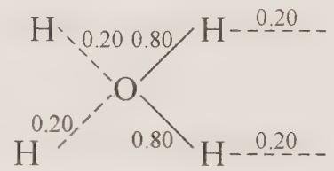

O原子周围的键价和为2，H原子的键价和为1，符合键价和规则。

## 10.2 氢键①

氢键的概念、重要性及其作用力的本质，早在1939年Pauling著的《化学键的本质》一书中就已阐明，此后氢键在化学和生物学中的作用，日益受到人们的重视。

氢键以 X—H…Y 表示,由于 H 原子通常不在 X 和 Y 的连线上,而将 X---Y 间的距离定为氢键的键长,其中 X—H σ 键的电子云趋向高电负性的 X 原子,导致出现屏蔽小的正电性的氢原子核,它强烈地被另一个高电负性的 Y 原子所吸引。X,Y 通常是 F,O,N,Cl 等原子,以及按双键或三重键成键的碳原子。例如:

$$
\begin{array}{l l} \text {C - H\cdots O} & \text {和} \\ \text {C - H\cdots N} \\ \equiv \mathrm{C-H\cdots O} & \text {和} \end{array} \quad \equiv \mathrm{C-H\cdots N}
$$

氢键键能介于共价键和范德华作用能之间，它的形成不像共价键那样需要严格的条件，它的结构参数如键长、键角和方向性等各个方面都可以在相当大的范围内变化,具有一定的适应性和灵活性。氢键的键能虽然不大,但对物质性质的影响却很大,其原因有二:

（1）氢键键能小，它的形成和破坏所需要的活化能也小，加上形成氢键的空间条件比较灵活，在物质内部分子间和分子内不断运动变化的条件下，氢键仍能不断地断裂和形成，在物质内部保持一定数量的氢键结合。

（2）在常温下含水的生命物质所进行的生理反应及相互作用，由于氢键作用显现出它们的互补性而形成稳定的状态，其他化学物质也会出现同样情况。因此，Pauling等化学家归纳出“形成最多氢键原理”，即物质内部趋向于尽可能多地生成氢键以降低体系的能量，在具备形成氢键条件的固体、液体甚至气体中都尽可能多地生成氢键。

氢键的形成对物质的各种物理化学性质都会发生深刻的影响，在人类和动植物的生理生化过程中氢键常起到自洽、互补等直接的重要作用。

## 10.2.1 氢键的几何形态

氢键的几何形态可用示于图10.2.1中的 $R, r_1, r_2, \theta$ 等参数表示。许多实验研究工作对氢键的几何形态已归纳出下列普遍存在的情况：

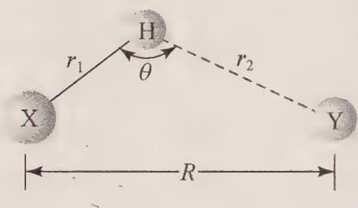

（1）大多数氢键 X—H…Y 是不对称的，即 H 原子距离 X 较近，距离 Y 较远。

(2) 氢键 X—H…Y 可以为直线形, $\theta=180^{\circ}$ ; 也可为弯曲形, 即 $\theta<180^{\circ}$ 。虽然直线形在能量上有利, 但很少出现, 因为它受晶体中原子的排列和堆积所限制。

图10.2.1 氢键的几何形态

键一样，键长越短，氢键越强。当X---Y间距离缩短时，X—H的键长增长。极端的情况是对称氢键，这时H原子处于X---Y间距离的中心点，是最强的氢键。

(4) 氢键键长的实验测定值比 X—H 共价键键长加上 H 原子和 Y 原子的范德华半径之和短。例如, 通常 O—H…O 氢键键长为 276 pm, 它比 O—H 的共价键键长 109 pm 及 H…Y 间范德华接触距离 120 pm + 140 pm 的总和 369 pm 短。

(5) 氢键 X—H…Y 和 Y—R 键间形成的角度 $\alpha$ ，通常处于 $100^{\circ} \sim 140^{\circ}$ 之间。

$$
\mathrm{X-H-} \underset {\alpha} {\underbrace {- - Y}} _ {\mathrm{R}}
$$

(6) 在通常情况下, 氢键中 H 原子是二配位, 但在有些氢键中 H 原子是三配位或四配位。

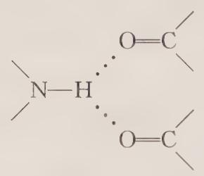  
三配位

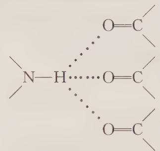  
四配位

（7）在大多数氢键中，只有一个H原子是直接指向Y上的孤对电子，但是也有许多例外。在氨晶体中，每个N原子的孤对电子接受分属其他氨分子的3个H原子；在尿素晶体中，每个

O原子同样地接受4个H原子。

对有机化合物中形成氢键的条件,可归纳出若干要点:

(1) 所有合适的质子给体和受体都能形成氢键。

（2）若分子的几何构型适合于形成六元环的分子内氢键，则形成分子内氢键的趋势大于分子间氢键。

(3) 在分子内氢键形成后, 剩余的合适的质子给体和受体相互间会形成分子间氢键。

## 10.2.2 氢键的强度

对氢键电子本性的研究说明，它涉及共价键、离子键和范德华作用等广泛的范围。非常强的氢键像共价键，非常弱的氢键接近范德华作用。大多数氢键处于这两种极端状态之间。除了一般的定义外，还利用测定物质性质的方法把出现效应的大小和氢键的强弱联系起来，并为强弱氢键的区分提供数据，如表10.2.1所示。

表 10.2.1 氢键的强弱及其性质

<table><tr><td>性 质</td><td>强氢键</td><td>中强氢键</td><td>弱氢键</td></tr><tr><td>X—H···Y相互作用</td><td>共价性占优势</td><td>静电性占优势</td><td>静电</td></tr><tr><td>键长</td><td>X—H≈H—Y</td><td>X—H&lt;X—H···Y</td><td>X—H≪H···Y</td></tr><tr><td>H···Y/pm</td><td>120~150</td><td>150~220</td><td>220~320</td></tr><tr><td>X---Y/pm</td><td>220~250</td><td>250~320</td><td>320~400</td></tr><tr><td>键角θ/(°)</td><td>175~180</td><td>130~180</td><td>90~150</td></tr><tr><td>键能/(kJ mol-1)</td><td>&gt;50</td><td>15~50</td><td>&lt;15</td></tr><tr><td>IR相对振动位移/(%)</td><td>25</td><td>10~25</td><td>&lt;10</td></tr><tr><td>低场中1H化学位移/ppm</td><td>14~22</td><td>&lt;14</td><td>-</td></tr><tr><td>实例</td><td>强酸气相二聚体、酸式盐、质子受体、HF配合物</td><td>酸、醇、酚水合物、生物分子</td><td>弱碱、碱式盐、C—H···O/N,O/N—H···π</td></tr></table>

表 10.2.1 中氢键强弱的主要判据是 X…Y 键长及键能。键长可通过晶体结构准确地测定。表中对弱氢键所给的范围较大, 是因为考虑到 Si—H…N, N—H…π 等类弱氢键。对于键能, 是指下一解离反应的焓的改变量 $\Delta H$

$$
\mathrm{X} - \mathrm{H} \dots \mathrm{Y} \longrightarrow \mathrm{X} - \mathrm{H} + \mathrm{Y}
$$

对少数非常强的对称氢键 O—H—O 和 F—H—F, $\Delta H$ 超过 $100 \, kJ mol^{-1}$ 。在 $KHF_{2}$ 中，F—H—F 氢键的 $\Delta H$ 达到 $212 \, kJ mol^{-1}$ ，是迄今观察到的最强氢键。

在冰- $I_{h}$ 中，O—H…O氢键键能为25kJ mol $^{-1}$ ，它是下述相互作用的结果。

(1) 静电相互作用: 这一作用可由下式表示, 它使 H…O 间的距离缩短。

$$
\begin{array}{c} \delta - \quad \delta^ {\prime} + \quad \delta - \\ \mathrm{O} - \mathrm{H} \dots \mathrm{O} \end{array}
$$

(2) 离域或共轭效应: H 原子和 O 原子间的价层轨道相互叠加所引起, 它包括 3 个原子。

(3) 电子云的推斥作用: H 原子和 O 原子的范德华半径和为 260 pm, 在氢键中 H…O 间的距离趋于 180 pm 之内, 这样将产生电子-电子推斥能。

(4) 范德华作用: 如同所有分子之间的相互吸引作用, 提供能量用于成键, 但它的效应相

对较小。

有关 O—H…O 体系的能量,通过分子轨道计算,其值列于表 10.2.2 中。

表 10.2.2 在 O—H…O 氢键中各种能量的贡献

<table><tr><td>能量贡献形式</td><td>能量/(kJ mol-1)</td></tr><tr><td>(1)静电能</td><td>-33.4</td></tr><tr><td>(2)离域能</td><td>-34.1</td></tr><tr><td>(3)推斥能</td><td>+41.2</td></tr><tr><td>(4)范德华作用能</td><td>-1.0</td></tr><tr><td>总能量</td><td>-27.3</td></tr><tr><td>键能实验测定值</td><td>+25.0</td></tr></table>

最强的氢键出现在对称的 O—H—O 和 F—H—F 体系中。直线形的 $HF_{2}^{-}$ 离子中，H 原子处在 2 个 F 原子的中心点

$$
\left[ \mathrm{F} \xrightarrow {1 1 3 \mathrm{pm}} \mathrm{H} \xrightarrow {1 1 3 \mathrm{pm}} \mathrm{F} \right] ^ {-}
$$

对称氢键为共价性的键,可将其视为三中心四电子(3c-4e)体系。若将分子轴取作 z 轴,H 原子的 1s 轨道和 2 个 F 原子(分别以 A 和 B 表示)的 $2p_{z}$ 轨道互相叠加,形成 3 个分子轨道:

$$
\begin{array}{l} \psi_ {1} = N _ {1} \left[ 2 p _ {z} (A) + c 1 s + 2 p _ {z} (B) \right] \\ \psi_ {2} = N _ {2} \left[ 2 p _ {z} (A) - 2 p _ {z} (B) \right] \\ \psi_ {3} = N _ {3} \left[ 2 p _ {z} (A) - c 1 s + 2 p _ {z} (B) \right] \end{array}
$$

式中 c 是一个权重系数，而 $N_{1}, N_{2}$ 和 $N_{3}$ 为归一化常数。

图10.2.2(a)示出分子轨道的叠加情况，(b)定性地表示分子轨道能级高低的次序。由于参加这一体系成键作用有4个价电子，成键分子轨道 $\psi_{1}$ 和非键分子轨道 $\psi_{2}$ 均由电子占据，而反键分子轨道 $\psi_{3}$ 是空的，形成3c-4e键。这样在 $\mathrm{HF}_2$ 中每一个H一F连线相当于键级为0.5。它可和HF分子进行对比，所得结果列于下表。

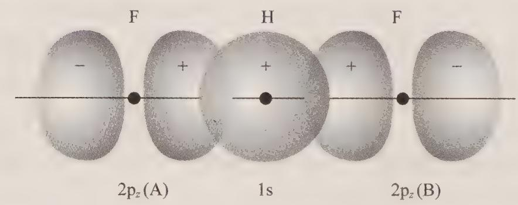

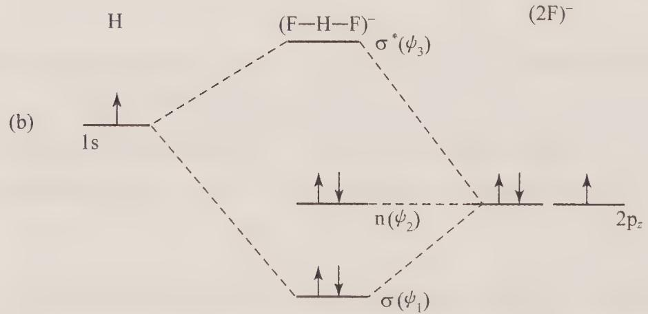  
图10.2.2 $\mathrm{HF}_2^-$ 中的氢键  
(a) 分子轨道的叠加情况，(b) 分子轨道能级高低次序

<table><tr><td>分子</td><td>键级</td><td>键长d/pm</td><td>力常数k/(Nm-1)</td></tr><tr><td>HF</td><td>1</td><td>93</td><td>890</td></tr><tr><td>HF2-</td><td>0.5</td><td>113</td><td>230</td></tr></table>

近来对氢的成键情况的深入研究显示, 氢原子在一定条件下还能和周围原子形成芳香氢键(又称 $\pi$ 氢键, X—H $\cdots$ $\pi$ )、金属氢键(X—H $\cdots$ M) 和二氢键(X—H $\cdots$ H—Y) 等类型。大大扩展了人们对原子成键能力和化学键多样性的认识。

## 10.2.3 冰和水中的氢键

水分子具有弯曲形结构，O—H键长95.72 pm，HOH键角104.52°，O—H键和孤对电子形成四面体构型的分布，如图10.2.3所示。水是极性分子，偶极矩 $\mu=6.17\times10^{-30}$ Cm。水分子的这种构型以及能够从4个方向和其他分子形成氢键的能力，是了解一切含水化合物的结构和性能的基础。

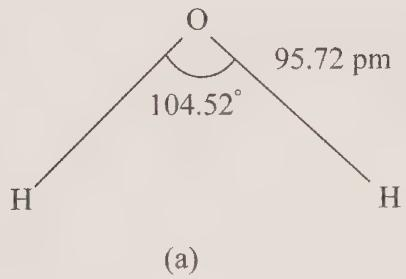

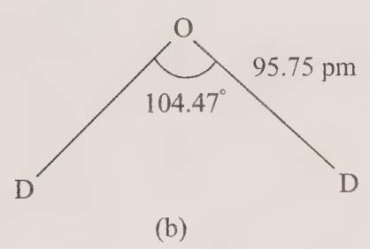

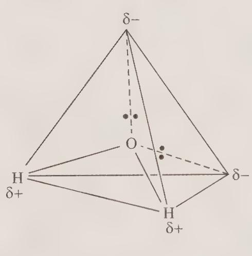  
(c)  
图 10.2.3 $H_{2}O(a)$ 和重水 $D_{2}O(b)$ 的分子构型, $H_{2}O$ 分子的电荷分布 (c)  
(2个键对电子与2个孤对电子按四面体形分布在4个顶点上)

水在不同的温度和压力条件下,可结晶成多种结构型式的冰。除已知的11种晶型外,近年陆续报道发现新的晶型,冰是迄今已知的由一种简单分子堆积出结构类型最多的化合物。

人们日常生活中接触到的雪、霜、自然界的冰和各种商品的冰都是冰- $I_{h}$ 。冰- $I_{h}$ 是六方晶系晶体，它的晶体结构示于图10.2.4。0℃时，六方晶胞参数为：a=452.27 pm, c=736.71 pm；晶胞中包含4个 $H_{2}O$ 分子，空间群为 $D_{6h}^{4}-P6_{3}/mmc$ ；其密度为0.9168 g cm $^{-3}$ 。

在冰- $I_{h}$ 中平行于六重轴方向的O—H…O的距离为275.2 pm，而其他3个为276.5 pm，∠OOO接近于109.5°。由于 $H_{2}O$ 分子的∠HOH为104.5°，O—H键长为96 pm，在O—H…O氢键中，H原子是处在O---O连线的附近，而不是正好处在连线上；氢原子靠近一个O原子，所以出现O—H…O和O…H—O两种方式。在冰- $I_{h}$ 中，由于氢原子的无序分布，这两种方式相等。平均而言，就每一氢键，相当于距离其中一个氧原子为96 pm和180 pm（按中子衍射测定 $\mathrm{D}_2\mathrm{O}$ 的数据为 $101~\mathrm{pm}$ 和 $175~\mathrm{pm})$ 处都有半个氢原子，如图10.2.5所示。正是由于氢原子的无序统计分布，提高了冰- $I_{\mathrm{h}}$ 的对称性，使它具有 $D_{6h}$ 点群的对称性。

冰中的这种无序结构，使它在低温时仍有可以测出的熵值——残余熵。一块冰的晶体可能以许多构型中的任何一个存在，每种构型与水分子的某种取向相对应，当冰冷却到很低温度时，它就冻结在许多可能的构型中的某个构型，而不可能出现排布完全整齐的构型，因此它具有残余熵 $k\ln W$ （k 为 Boltzmann 常数，W 为晶体可实现的构型数）。1 mol 冰有 $2N_{A}$ 个 H 原子，每个 H 在 O—O 间有 2 个位置可供选择，共有 $2^{2N_{A}}$ 个构型；但是每个 O 原子只和 2 个 H 原子靠近，只占图 10.2.6 示出的全部 16 种可能构型中的 6 种，即 6/16。

$$
W = 2 ^ {2 N _ {\mathrm{A}}} \left(\frac {6}{1 6}\right) ^ {N _ {\mathrm{A}}} = \left(\frac {3}{2}\right) ^ {N _ {\mathrm{A}}}
$$

$$
k \ln \left(\frac {3}{2}\right) ^ {N _ {\mathrm{A}}} = R \ln \left(\frac {3}{2}\right) = 3. 3 7 2 \mathrm{J} \mathrm{mol} ^ {- 1} \mathrm{K} ^ {- 1}
$$

这一数据与实验测定值 $(3.430\mathrm{Jmol}^{-1}\mathrm{K}^{-1})$ 符合得很好，为早期冰的无序结构的假设提供了有力的支持。

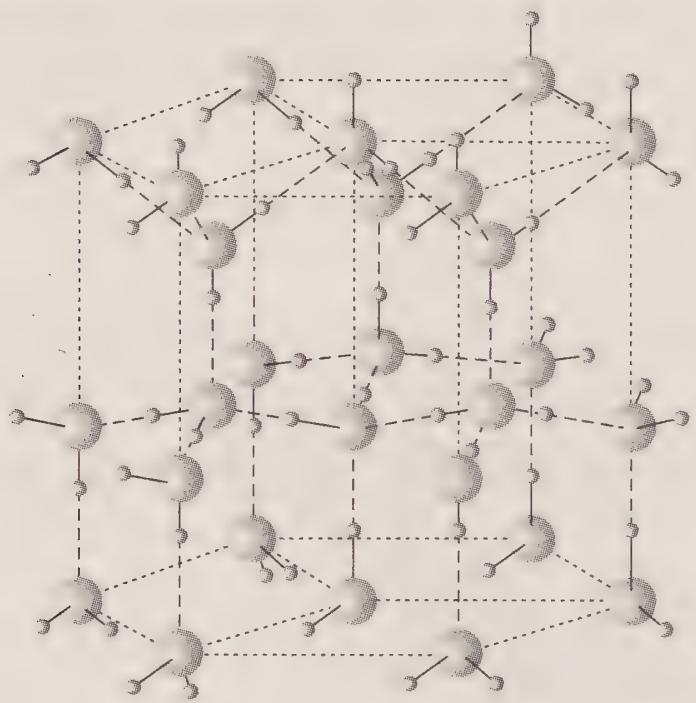  
图10.2.4 冰- $I_{\mathrm{h}}$ 的结构

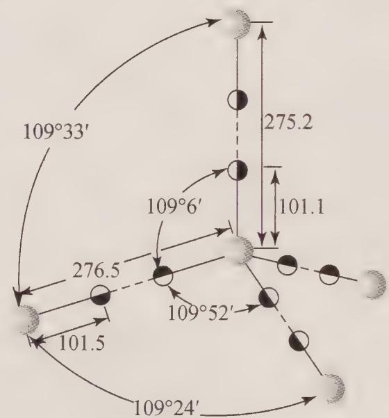  
图10.2.5 冰- $I_{\mathrm{h}}$ 中 $\mathbf{D}_2\mathbf{O}$ 的平均环境

（图中：大球代表 O 原子，小球代表 H 原子，每个氢键都存在 O—H…O 和 O…H—O 两种概率相等的 H 原子分布方式，图中任意地选了一种。但每个 O 原子严格地只和 2 个 H 原子以共价键相连。点线划出六方晶胞，有 3 个晶胞并在一起，更好地显示出它的对称性）

在 $-50^{\circ}\mathrm{C}$ 时，用中子衍射法测定（图中：大球代表O原子，一半涂黑的小球代表D原子在此占有率为 $1 / 2$ ，键长单位为pm。中子衍射测定D原子位置和 $\mathrm{H}_2\mathrm{O}$ 中的H原子位置略有差异）

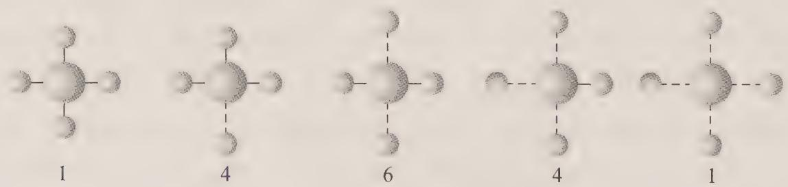  
图10.2.6 冰中水分子的可能构型

当温度升高冰熔化为水,这时大约有 $15\%$ 的氢键断裂,冰的空旷的氢键体系瓦解,一部分形成由氢键连接的链状和环状聚集体,另一部分冰的“碎片”环化成堆积密度较大的多面体,如五角十二面体。水中存在的多面体不一定完整独立地存在，也可包含带心的、不完整的、相互连接的并不断改变结合型式呈动态平衡的氢键体系。这种转变过程促使分子间堆积较密，体积缩小，密度增加。另一方面，温度上升，热运动加剧，使密度减小。两种影响密度的相反因素，导致水在 $4^{\circ}\mathrm{C}$ 时密度最大。冰、水和水蒸气（或称汽）三者间热学性质存在如下关系，由此也正好说明水中水分子由大量氢键结合在一起。

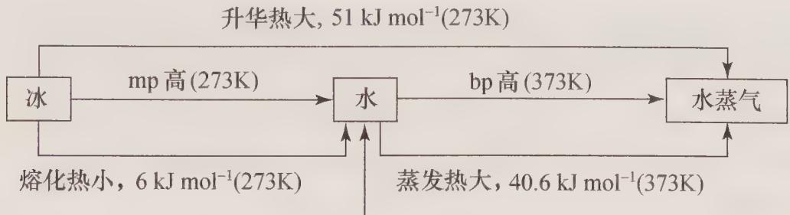  
水的比热大, $76 \mathrm{~J} \mathrm{~mol}^{-1} \mathrm{~K}^{-1}$

冰和水中分子间氢键连接的空旷结构,使它能和许多种小分子形成多种类型的晶态水合物,其中最重要的是天然气与水在高压低温条件下结晶成的天然气水合物,它的外形和冰相似,可以燃烧,又称为可燃冰。

天然气的主要成分为甲烷。甲烷气体水合物为I型冰晶体，它属立方晶系，晶胞参数 $a = 1.20\mathrm{nm}$ ，晶胞的组成为 $8\mathrm{CH}_4\cdot 46\mathrm{H}_2\mathrm{O}$ 。晶体中水分子骨架的结构可看作水分子通过氢键连接成两种多面体，再由它们共面连接而成骨架， $\mathrm{CH_4}$ 分子处在多面体孔穴的中心。这两种多面体一种是由12个五边形面围成的五角十二面体（ $5^{12}$ ），另一种是由12个五边形面和2个六边形面围成的十四面体（ $6^2 5^{12}$ ），分别如图10.2.7(a)和(b)所示。甲烷水合物的晶体结构，可看作在晶胞的顶点和中心上分别安放五角十二面体（ $5^{12}$ ），但彼此取向不同；在6个面的中心线上放2个共面连接的十四面体（ $6^2 5^{12}$ ），如图10.2.7(c)所示。晶胞中含2个（ $5^{12}$ ）和6个（ $6^2 5^{12}$ ），每个多面体中放一个 $\mathrm{CH_4}$ 分子。晶胞的组成为 $8\mathrm{CH}_4\cdot 2(5^{12})\cdot 6(6^2 5^{12})$ 或 $8\mathrm{CH}_4\cdot 46\mathrm{H}_2\mathrm{O}$ 。理论上， $1\mathrm{m}^3$ 甲烷水合物在标准温度和压力下可释放出 $170\mathrm{m}^3$ 的 $\mathrm{CH_4}$ 气体和 $0.8\mathrm{m}^3$ 的淡水（参见习题10.6）。

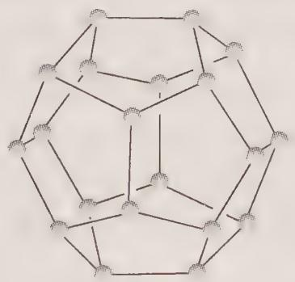  
(a)

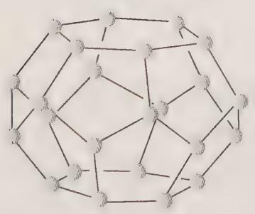  
(b)

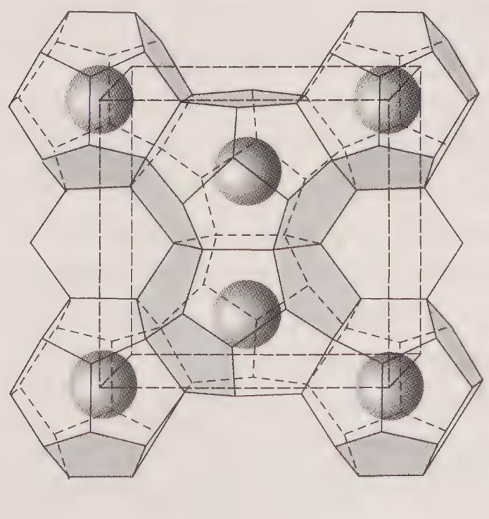  
(c)  
图10.2.7 甲烷气体水合物的结构

(a) 五角十二面体 $(5^{12})$ ，(b) 十四面体 $(6^{2}5^{12})$ ，(c) 晶胞前面多面体连接情况[在(a)和(b)中小球代表O原子，连线代表O—H…O氢键；在(c)中多面体顶点代表O原子位置，大球代表CH $_{4}$ 分子]

天然气水合物广泛地存在于大海底部和永久冻土带的地层中，据估算全球资源量可达 $2 \times 10^{16} \mathrm{~m}^3$ 。若按其含碳量估算，为全球的煤、石油和常规天然气等总含碳量的2倍。它热值高、燃烧污染少，可望成为人类未来能源的重要组成部分。近来我国在南海北部陆坡进行勘探，可燃冰远景资源量可达上百亿吨油当量，沉积层厚度 $18 \sim 34 \mathrm{~m}$ ，气体中 $\mathrm{CH}_4$ 含量在 $99.5\%$ 以上。开采利用可燃冰已是当前的重要课题。

## 10.2.4 氢键和物质的性能

物质的许多性能可根据物质中分子间形成氢键的聚集状态,而不是单个分子的性质来理解。下面从三方面分析分子间通过氢键形成的聚集体与物质性能的关系。

## 1. 物质的溶解性能

水是应用最广的极性溶剂。汽油、煤油等是典型的非极性溶剂，通称为油。溶质分子在水中和油中的溶解性质，可用“相似相溶”原理表达。这个经验原理指出：结构相似的化合物容易互相混溶，结构相差很大的化合物不易互溶。其中“结构”二字主要有两层含义：(i) 指物质结合在一起所依靠的化学键型式，对于由分子结合在一起的物质，主要指分子间结合力形式；(ii) 指分子或离子、原子的相对大小以及离子的电价。

水是极性较强的分子, 水分子之间有较强的氢键生成, 水分子既可为生成氢键提供 H, 又能有孤对电子接受 H。氢键是水分子间的主要结合力。油分子不具极性, 分子间依靠较弱的范德华力结合。当以水为溶剂时, 对于溶质分子, 凡能为生成氢键提供 H 与接受 H 者, 均和水相似, 例如 ROH, RCOOH, Cl₃CH, R₂C=O, RCONH₂ 等等, 均可通过氢键和水结合, 在水中溶解度较大。而不具极性的碳氢化合物, 不能和水生成氢键, 在水中溶解度很小。

在同一类型的溶质分子中,如 ROH,随着 R 基团加大,在水中溶解度越来越小。

从热力学分析， $\Delta G = \Delta H - T\Delta S$ ，自发进行的过程自由焓减少。溶质分子和溶剂分子混合，熵总是增加的，即溶解过程 $\Delta S$ 为正值：只要 $\Delta H$ 项不是很大的正值，不超过 $T\Delta S$ 项，就会溶解。若溶质和溶剂相似，溶质和溶剂分子间相互作用能和原来溶质、溶剂单独存在时变化不大， $\Delta H$ 不大，故易互溶。如果溶质和溶剂差异很大，例如水和苯，当苯分子进入水内，会破坏原来水内部分子间较强的氢键，同时也破坏原来苯分子间的较强的色散力，而代之以水和苯分子间的诱导力。这种诱导力在分子间作用力中占的比重较小，故 $\Delta H$ 变成较大的正值，超过 $T\Delta S$ 项， $\Delta G$ 成为正值，使溶解不能进行，所以水和苯不易互溶。

丙酮、二氧六环烷、四氢呋喃等，既能接受 $\mathrm{H}$ 和 $\mathrm{H}_2\mathrm{O}$ 分子生成氢键，又有很大部分和非极性的有机溶剂相似，所以它们能与水和油等多种溶剂混溶。

温度升高， $T\Delta S$ 项增大，互溶度一般也增大。

## 2. 物质的熔沸点和气化焓

由于气态物质分子间作用力可以忽略不计，气化过程将使分子间作用力消失。所以分子间作用力愈大的液态和固态物质，其气化焓愈大，沸点愈高，愈不易气化。熔化过程也需克服部分分子间作用力，但因影响熔点和熔化焓的因素较多，其规律性不如沸点和气化焓明显。

结构相似的同系物质,若系非极性分子,色散力是分子间的主要作用力;随着相对分子质量增大,极化率增大,色散力加大,熔沸点升高。但若分子间存在氢键,结合力较色散力强,会使熔沸点显著升高。图10.2.8示出各种氢化物的沸点和熔点,由图可见,HF,H₂O,NH₃等由于分子间有较强的氢键生成,熔点和沸点就特别高。主族元素氢化物的气化焓,其大小规律

和它们的沸点高低一致。

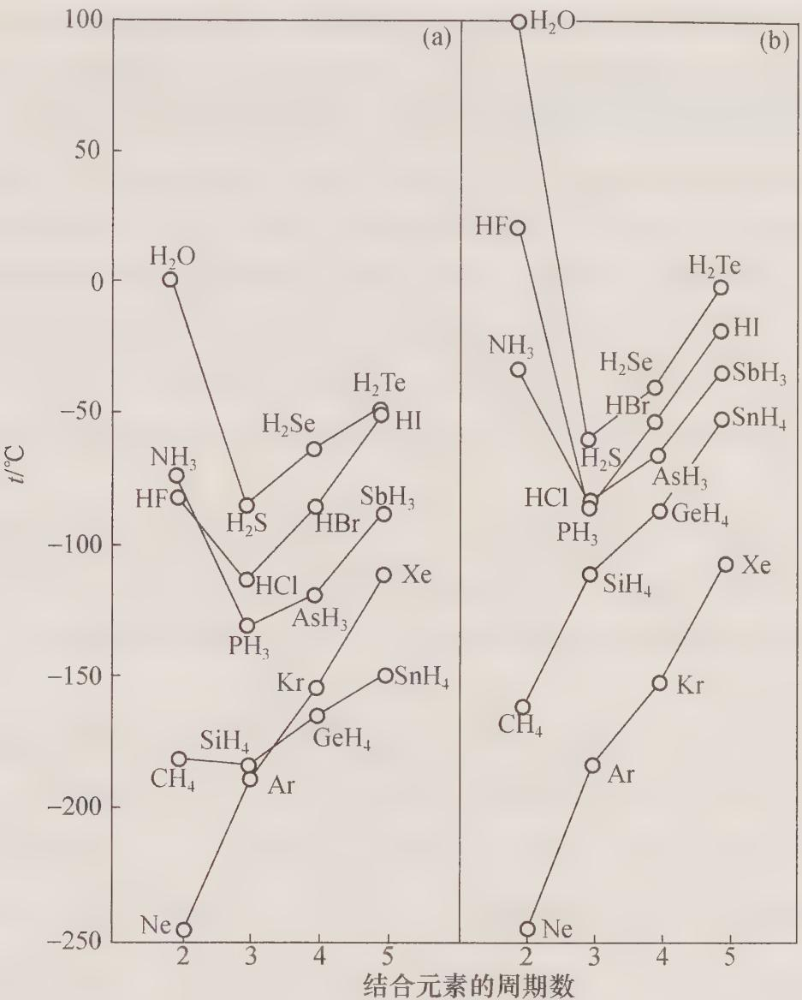  
图10.2.8 主族元素氢化物的熔点(a)和沸点(b)  
分子间生成氢键，熔点、沸点会上升；分子内生成氢键，一般熔、沸点要降低。例如，邻硝基苯酚生成分子内氢键，熔点为 $45^{\circ}\mathrm{C}$ ；而生成分子间氢键的间位和对位硝基苯酚，其熔点分别为 $96^{\circ}\mathrm{C}$ 和 $114^{\circ}\mathrm{C}$ 。  
图中 $\mathrm{H}_2\mathrm{O},\mathrm{NH}_3$ 和HF等分子所具有的反常性质，说明在它们分子间有着明显的作用力。这是这些分子通过分子间氢键自组装成 $(\mathrm{H}_2\mathrm{O})_n,(\mathrm{NH}_3)_m,(\mathrm{HF})_p$ 等聚合体，使它们显示出特定功能的证明。

## 3. 黏度和表面张力

分子间生成氢键,黏度会增大,例如甘油和浓硫酸

$$
\begin{array}{c c c} \mathrm{CH} _ {2} - \mathrm{CH} - \mathrm{CH} _ {2} \\ | & | & | \\ \mathrm{OH} & \mathrm{OH} & \mathrm{OH} \end{array} \qquad \mathrm{H} _ {2} \mathrm{SO} _ {4} (\text {浓})
$$

等都是黏度较大的液体。水的表面张力很高，其根源也在于水分子间的氢键。  
物质表面能的大小与分子间作用力大小有关,因为表面分子受到的作用力不均匀,能量较高,有使表面自动缩小的趋势。一些液态物质表面能的数值列于下表:

<table><tr><td>液态物质</td><td>水</td><td>苯</td><td>丙酮</td><td>乙醇</td><td>乙醚</td></tr><tr><td>表面能 $10^{-7} \text{J cm}^{-2}$ </td><td>72.8</td><td>28.9</td><td>23.3</td><td>22.6</td><td>17.1</td></tr></table>

表中所列液态物质中,水的表面能最高,因为水分子之间有强的氢键作用。若加表面活性剂破坏表面层的氢键体系,就可降低表面能,这在工业生产中有着重要的意义。

## 10.2.5 氢键在生命物质中的作用

生命物质由蛋白质、核酸、碳水化合物、脂类等有机物以及水和无机盐组成。各组分都有其特殊的生命功能，例如：酶是蛋白质，在机体内催化各种生化反应；核酸是遗传的主要物质基础；碳水化合物是生命活动的主要能源；脂类起着供能和保温作用，也是组成细胞膜的主要成分；水起着溶剂作用，许多生化反应在水环境中进行。此外，水在生命活动中通过氢键起极为重要的生理作用，水是必不可少的生命物质。这些物质结合在一起具有生命的特性，氢键在其中起关键的作用。下面介绍蛋白质和核酸中的氢键，以及通过氢键形成的非周期性有序物质。

## 1. 蛋白质

蛋白质是由数十个或更多个氨基酸分子缩合, 相互通过肽键连接形成的多肽长链分子。分子中不同氨基酸的排列顺序称为蛋白质的一级结构, 它包括分子中由共价键连接的全部情况, 还包括链内和链间的二硫键位置、氨基酸数目和类型以及连接的顺序。一级结构是蛋白质生物活性的分子基础。

蛋白质的二级结构是指多肽链中不同基团通过氢键，使链盘绕或折叠形成的特定的重复性的立体结构。在蛋白质中最典型和含量丰富的二级结构有两种模式：一种是 $\alpha-$ 螺旋链，另一种是 $\beta-$ 折叠片，其结构分别示于图10.2.9和图10.2.10中。生物体中的 $\alpha-$ 螺旋链大部分为右手螺旋结构，从结构中可以看到链中的N—H作为质子给体， $\mathrm{C}=\mathrm{O}$ 作为质子受体，相互形成 $\mathrm{N}-\mathrm{H}\cdots\mathrm{O}$ 氢键，稳定螺旋链的构型。 $\beta-$ 折叠片中的多肽链处于较伸展的曲折状态，在其中多肽链侧向之间通过 $\mathrm{N}-\mathrm{H}\cdots\mathrm{O}$ 氢键相连，形成曲折的、非平面的片状结构，如图10.2.10所示。

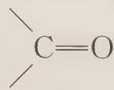

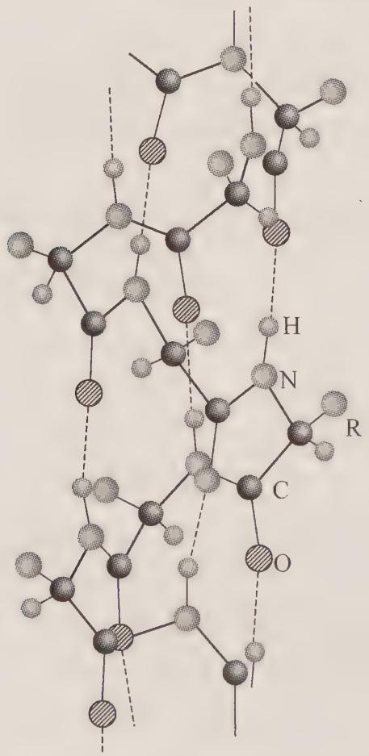  
(a)

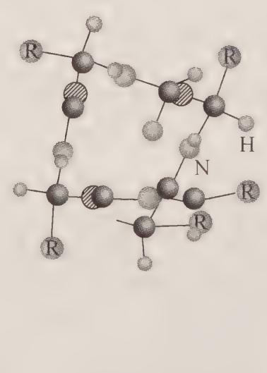  
(b)  
图 10.2.9 $\alpha$ -螺旋的结构(右手螺旋)  
(a) 侧面观，(b) 顶面观

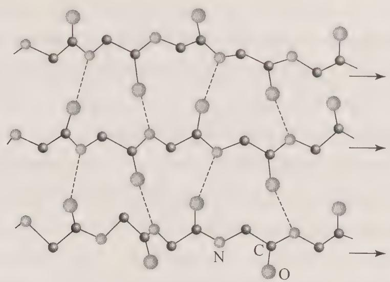  
(a)

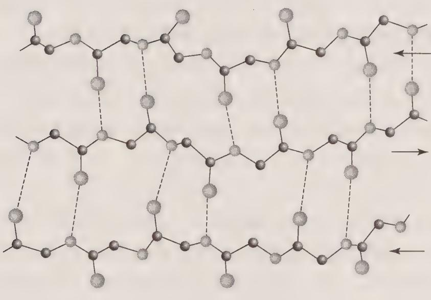  
(b)  
图10.2.10 $\beta$ -折叠片的结构  
(a) 平行 $\beta$ -折叠片，(b) 反平行 $\beta$ -折叠片  
(为清楚起见,图中略去了 R 基团和 H 原子,虚线表示 O—H…N 氢键)

蛋白质的三级结构是在二级结构基础上,进一步通过螺旋链间或折叠片间的氢键及其他化学键,使长链或折叠片结合成一个紧密的球状实体,形成蛋白质分子独立存在的功能单位,或称亚基。在三级结构中,大多数极性侧链基团暴露在分子表面,而非极性基团大多数处在分子内部。

蛋白质的四级结构是指在蛋白质晶体或其他聚集体中，三级结构单元和其他溶剂分子等通过氢键和各种次级键结合成的晶体或其聚集体的重复单元，它包括亚基的数目、种类和空间排布，是蛋白质的完整结构。具有四级结构的蛋白质，通常是由两条或多条多肽链构成的亚基，亚基的结构可以是相同的，也可以是不同的。亚基的种类一般是一种或两种。

蛋白质中氨基酸侧链基团上的

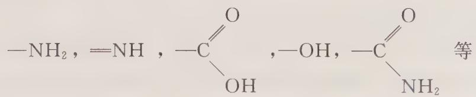

含氢基团又可作质子给体或质子受体，相互形成氢键，影响蛋白质的立体结构和功能。例如，它们通过精确定向的氢键和酶结合，进行生物催化作用。

## 2. 核酸

核酸是生命信息的物质基础。蛋白质的结构由遗传信息携带者 DNA 和 RNA 所决定, 蛋白质在生物体内的合成取决于核酸, 核酸保证了生命能精确地复制自己。从化学成分来看, 核酸是一种多聚核苷酸, 即由核苷和磷酸组成。

核酸分成两大类:脱氧核糖核酸(DNA)和核糖核酸(RNA)。前者是遗传信息的携带者,后者在生物体内蛋白质的合成中起重要作用。1953年,Watson和Click首次确立了DNA的双螺旋结构模型,阐明了碱基配对原则。DNA双螺旋结构的确立,是20世纪自然科学最伟大的发现之一。DNA由两条多核苷酸链组成,链中每个核苷酸含有一个戊糖、一个磷酸根和一个碱基。碱基分两类:一类为双环的嘌呤,包括腺嘌呤(adenine,A)和鸟嘌呤(guanine,G);一类为单环的嘧啶,包括胸腺嘧啶(thymine,T)和胞嘧啶(cytosine,C)。在RNA中不含胸腺嘧啶,而代之为尿嘧啶(uracil,U)。戊糖分子上第1'位碳原子与一个碱基结合,形成核苷。如果戊糖是脱氧核糖,形成脱氧核糖核苷;如果戊糖是核糖,形成核糖核苷。DNA中磷酸根上2个O原子分别和2个脱氧核糖核苷上的5'位和3'位的C原子相连成长链。两链的碱基相互通过氢键配对。A和T间形成2个氢键,G和C间形成3个氢键,如图10.2.11(a)所示。由于形成氢键的要求,这种配对是互补的、专一的,而不可替代的,称为碱基互补配对。DNA双链结构中,A和T两种碱基的数量相同,G和C数量也相同。由于碱基配对的要求,两条链的走向相反。

DNA 中两条长链分子因空间结构的要求, 相互形成右手螺旋的结构。它好像一个螺旋梯子, 磷酸根和戊糖构成梯子两侧的扶架, 碱基对像梯子的踏板, 碱基间距离 0.34 nm, 每个螺旋周期含 10 对碱基, 周期长 3.4 nm, 如图 10.2.11(b) 所示。DNA 碱基对之间的较短间距 (0.34 nm) 表明碱基间有 $\pi \cdots \pi$ 相互作用, 它是使 DNA 双螺旋稳定的重要因素。

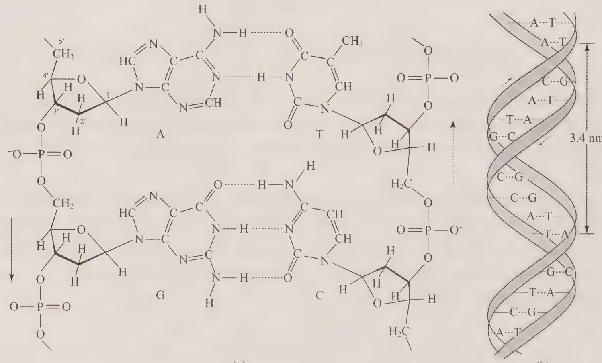  
(a)  
图10.2.11 DNA双螺旋结构

在确立 DNA 结构以后, 纤维衍射技术被用来测定 DNA 的结构, 1978 年 Arnott 等测得含有 12 个碱基片段的大肠杆菌 DNA 寡核苷酸 d(CGCGAATTTCGCG) 的结构。到 1980 年利用 X 射线单晶衍射技术, 获得了第一个 DNA 双螺旋的单晶结构。2000 年, Boton 等利用 NMR 技术得到了 DNA 双螺旋结构在溶液中的构象。

从 DNA 双螺旋的结构可知,链中磷酸和糖的骨架结构完全规则地排列,但是碱基对的排列顺序则可以不同,一个很长的 DNA 分子有很多不同的碱基排列顺序。不同的排列顺序携带了遗传信息的密码,这些密码可以复制,复制的步骤是:第一步将双螺旋链中的氢键断裂,分开成为两条链;第二步是每条链都作为模板,和相关的碱基相互通过氢键配成碱基对,复制出两条双螺旋链。

基因是具有遗传效应的 DNA 片段,每个基因平均大约由 1 万个碱基对组成。基因通过上述的复制方式传递遗传信息。所以,基因是掌控遗传的因子,在染色体中有确定的位置。DNA 的结构帮助人们了解碱基对如何组成基因、每个基因的功能、基因如何相互影响以及控制人的生命过程。基因工程又称遗传工程或重组 DNA 技术。2005 年生物学家已完成人体细胞核染色体的 DNA 中 31.647 亿个碱基对的排列顺序,确定染色体上的基因分布,得到人体基因的遗传信息,以便进一步弄清每种基因控制的特定蛋白质的合成及其作用。

## 3. 非周期性有序物质①

Watson 和 Click 在测定 DNA 双螺旋结构后发表感想,他俩之所以热衷于探索遗传物质的分子结构,乃得益于 Schrödinger 的著作《生命是什么:活细胞的物理学观》的启示。

Erwine Schrödinger (1887—1961) 是量子力学的主要创始人, 他于 1926 年提出了 Schrödinger 方程(参见第 1 章), 1933 年获得诺贝尔物理学奖。他坚信“科学一定是统一的和相通的”, 他又致力于生命科学的研究。1944 年, 他著的《生命是什么》一书出版, 反映他对生命的本质问题作了深入思考, 后人常称他为分子生物学的先驱者。

Schrödinger 指出生命的特异性是由基因决定的,要懂得什么是生命就必须知道基因是如何发挥作用的。对基因的结构,他提出了“非周期性有序物质”的概念,认为生命细胞的最基本部分——染色体结构是非周期性有序物质。他评论,物理学只涉及周期性晶体,它与非周期性有序物质相比,显得既简单又呆滞。在阐述生物大分子时,他认为一个小分子可作为固体的胚芽,从它开始有两种长大的方式:一种是在3个方向按相同结构重复的晶体,另一种是没有单调重复的聚集体,即“非周期性固体”。一个基因或染色体就是这种非周期性有序固体。非周期性蕴含着分子排列的多样性,即遗传物质包含大量丰富的遗传信息;另一方面它具有有序性,使全部原子或分子都与周围的原子或分子连接在一起,因而它有相当的稳定性。他指出,从遗传性质在世代传承中保持不变的事实,说明携带遗传性质的物质的稳定性,即在没有很大改变的情况下被后代复制。他还从热力学关于有序、无序和熵的观点来说明维持生命物质的高度有序性,提出“生命赖负熵为生”,即生物体要从生活中不断吸取负熵,在高度有序的状态下,保持它自身的稳定性。

DNA 结构中 A…T 和 G…C 氢键配对的原理, 就是非周期性有序物质的结构和性能关系的阐述。现在已知基因是生物染色体上有遗传功能的 DNA 片段, 测定 DNA 碱基间氢键的顺序、识别生物体的基因是基因工程的前提。Schrödinger 将物理学、化学、生物学三门自然科学基础结合在一起，以“Schrödinger方程”和“生命是什么”等内容，将物理学和化学的概念用来考虑生物学的本质问题。他这种跨越学科、跨越时代的科学思维，是我们后辈学习的榜样。

## 10.3 非氢键型次级键

由于次级键的多样性,本节讨论除氢键和范德华力以外的次级键,并将它分成两个小节:非金属原子间的次级键以及金属原子和其他原子间的次级键。判断次级键形成的标准,主要以原子间的距离和典型的共价键及范德华半径之和作比较,用一些实际的结构为例进行说明。由于次级键的统一成键理论尚在发展之中,读者可通过这些实例进行思考。

## 10.3.1 非金属原子间的次级键

许多非金属原子间的次级键可在分子间或分子内部形成,下面列出若干实例。

【例10.3.1】碘 $(\mathrm{I}_2)$ 晶体

卤素分子 $\mathrm{X}_2$ 按 $\mathrm{F}_2\rightarrow \mathrm{Cl}_2\rightarrow \mathrm{Br}_2\rightarrow \mathrm{I}_2$ 金属性增强。由 $\mathrm{I}_2$ 分子组成的碘晶体，具有金属光泽和较高的导电性。这是由于在碘晶体中， $\mathrm{I}_2$ 分子间存在次级键，分子间I---I的最短距离为 $350~\mathrm{pm}$ ，比I原子的范德华半径和 $430~\mathrm{pm}$ 短得多。

【例 10.3.2】 $\mathrm{Ph}_{2}\mathrm{I}(\mu_{2}-\mathrm{X})_{2}\mathrm{IPh}_{2}$ (X=Cl,Br,I)

$\mathrm{Ph}_2\mathrm{I}(\mu_2 - \mathrm{X})_2\mathrm{IPh}_2$ 的晶体结构显示分子具有对称中心的平面四元环结构，I---X的距离列于结构式旁的表中。

<table><tr><td rowspan="4"></td><td>I---X 键</td><td>I---X 距离pm</td><td>气相 IX 分子中共价键长pm</td><td>I---X 范德华半径之和pm</td></tr><tr><td>I---Cl</td><td>308.5</td><td>232.1</td><td>395</td></tr><tr><td>I---Br</td><td>325.0</td><td>248.5</td><td>410</td></tr><tr><td>I---I</td><td>343.7</td><td>266.7</td><td>430</td></tr></table>

由表中数据可见，I---X 的键长介于共价单键键长和范德华半径和之间。

【例10.3.3】 $(\mathrm{NO})_{2}$

NO 分子可通过 N---N 键形成二聚分子(如右图所示), 实验测定, 不论单体或二聚体, N=O 间的键长都是 115 pm。N---N 间的距离在晶体中的测定值为 218 pm, 在气相中的测定值为 223.7 pm, 都比 N—N 共价单键键长 150 pm 长得多, 而比范德华半径和 300 pm 短得多。

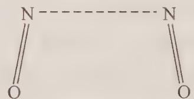

【例10.3.4】 $\mathrm{S}_4\mathrm{N}_4$

$\mathrm{S}_4\mathrm{N}_4$ 分子结构如右图所示。该分子形成八元环，N原子处在同一平面内，S原子两两结合成次级键，键长 $258~\mathrm{pm}$ ，比一般S—S共价单键 $206~\mathrm{pm}$ 长，但比S原子范德华半径和(368 pm)短得多。在通常结构中，N原子形成3个共价单键，S原子形成2个，可是在 $\mathrm{S}_4\mathrm{N}_4$ 分子中却相反。

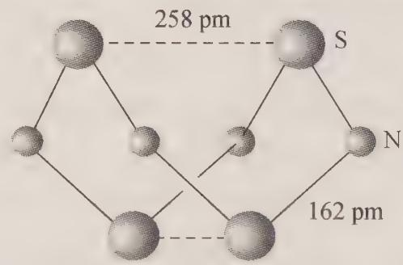

【例10.3.5】1,6-二氮双杂环[4,4,4]十四烷(1)

化合物 1 的结构示于图 10.3.1。分子 1 中 N---N 原子间距 280.6 pm，从结构看，尽管 2

个 N 原子相互以孤对电子相向, 斥力应当较大, 但仍比范德华半径和 (300 pm) 短 20 pm。

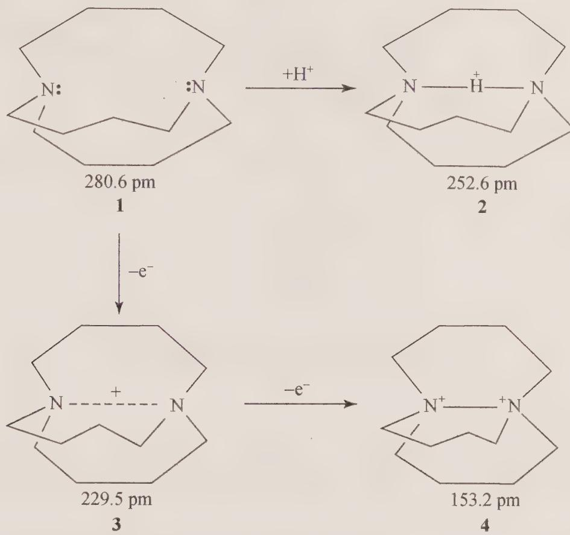  
图10.3.1 1,6-二氮双杂环[4,4,4]十四烷分子的氧化还原反应产物（图中标明的键长数据是指N---N间的距离）  
当有一个 N 原子质子化,形成分子 2,结构测定结果说明 H 原子处于两个 N 原子中央,形成对称氢键 N—H—N,其键长为 252.6 pm,是这类氢键中最短的。将分子 1 氧化,形成一价正离子 3,N 原子间距离显著缩短,键长为 229.5 pm,相当于二中心三电子(2c-3e)次级键。若再失去一个电子成二价正离子 4,则 N 原子间形成正常的共价 $\sigma$ 单键,键长为 153.2 pm。这些氧化还原反应呈可逆性,所得产物呈现出不同键型过渡的图像。

## 10.3.2 金属原子与其他原子间的次级键

在金属卤化物、氧化物以及配合物中，金属原子和其他原子成键结合在一起。通过大量晶体结构测定的数据和键价理论的计算，在其中存在许多次级键，它们使金属原子的配位环境显现出完整性和稳定性，也较好地符合键价和规则。下面列出若干实例。  
【例 10.3.6】 VO(acac) $_{2}$ · Py  
晶体中 $\mathrm{VO(acac)_2}$ 和Py分子通过次级键结合在一起的图形示于图10.3.2中。根据实验测定V原子与周围的6个配位原子的键长以及用表10.1.1数据计算所得的键价如下：

<table><tr><td>键</td><td> $V-O_{(a)}$ </td><td> $V-O_{(c)}$ </td><td>V---N</td></tr><tr><td>键长/pm</td><td>157</td><td>201</td><td>248</td></tr><tr><td>键价</td><td>1.86</td><td>0.52</td><td>0.17</td></tr></table>

键价和为 $1.86 + 4 \times 0.52 + 0.17 = 4.11$ ，和 V 的四价氧化态相近。

(b)  
(a)  
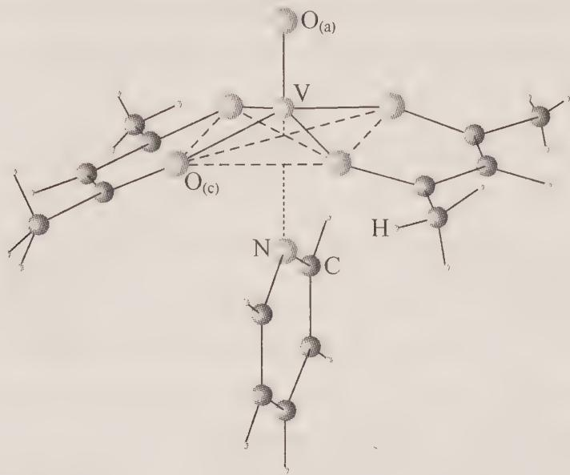  
图10.3.2 $\mathrm{VO(acac)_2\cdot Py}$ 的分子结构  
【例10.3.7】 $\mathrm{V}_2\mathrm{O}_5$

$\mathrm{V}_2\mathrm{O}_5$ 是层形结构的氧化物，如图10.3.3所示。在此结构中，V原子除和层内的5个O原子配位外，还和相邻层中的1个O原子以较弱的键结合，V和O原子间的键长及键价列于下表中：

<table><tr><td>键</td><td> $V-O_{(a)}$ </td><td> $V-O_{(b)}$ </td><td> $V-O_{(c)}$ </td><td> $V-O_{(d)}$ </td><td> $V-O_{(e)}$ </td></tr><tr><td>键长/pm</td><td>159</td><td>178</td><td>188</td><td>202</td><td>281</td></tr><tr><td>键价</td><td>1.83</td><td>1.03</td><td>0.78</td><td>0.54</td><td>0.10</td></tr></table>

键价和为 $1.83 + 1.03 + 2 \times 0.78 + 0.54 + 0.10 = 5.06$ ，和 V 的五价氧化态相符。

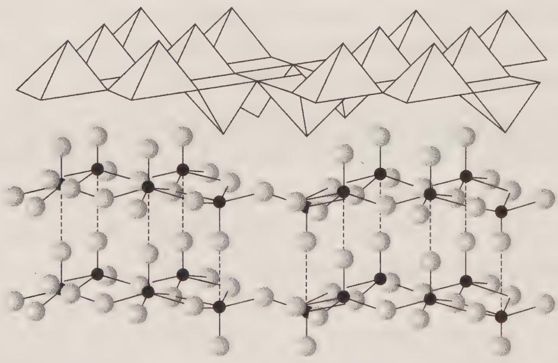

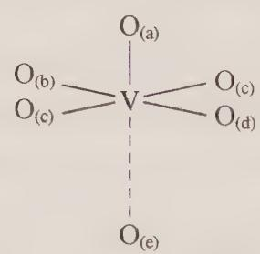  
图10.3.3 $\mathrm{V}_2\mathrm{O}_5$ 的结构

【例10.3.8】 $\mathrm{Sn}_4\mathrm{F}_8$ （即 $\mathrm{SnF_2}$ ）

$\mathrm{Sn}_4\mathrm{F}_8$ 的分子结构示于图10.3.4中，该分子呈八元环，如图(a)所示，图(b)和(c)则示出分子中两个不等价的 $\mathrm{Sn}$ 原子在晶体中的周围配位情况。

根据晶体结构实验测定的原子间距离数据和表 10.1.1 所列的参数, 可计算 Sn(1) 和 Sn(2) 周围原子间的键价如下:

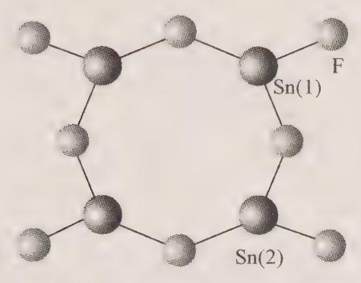  
(a) 分子结构

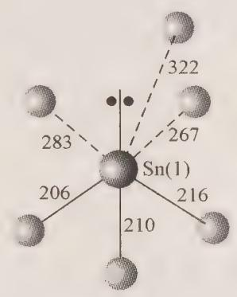  
(b) $\mathrm{Sn}(1)$ 的配位

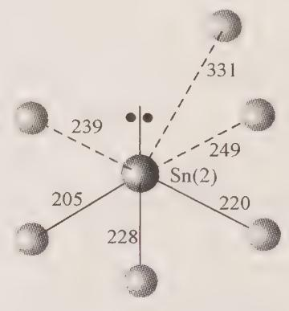  
(c) Sn(2)的配位

图10.3.4 $\mathrm{Sn_4F_8}$ 的结构

<table><tr><td colspan="7">Sn(1)</td><td>键价和</td></tr><tr><td>键长/pm</td><td>206</td><td>210</td><td>216</td><td>267</td><td>283</td><td>322</td><td></td></tr><tr><td>键价</td><td>0.55</td><td>0.52</td><td>0.47</td><td>0.22</td><td>0.18</td><td>0.12</td><td>2.07</td></tr><tr><td colspan="7">Sn(2)</td><td>键价和</td></tr><tr><td>键长/pm</td><td>205</td><td>220</td><td>228</td><td>239</td><td>249</td><td>331</td><td></td></tr><tr><td>键价</td><td>0.56</td><td>0.44</td><td>0.39</td><td>0.33</td><td>0.28</td><td>0.10</td><td>2.10</td></tr></table>

由所得结果看,若不考虑 Sn 原子周围的次级键,Sn 原子呈三角锥形,孤对电子方向的配位不完整,也不满足键价和规则,而计及次级键后,可得到较完整的配位环境并使 $Sn^{2+}$ 的价态与键价和一致。

金属原子间除存在金属键、共价键(金属簇合物中的金属-金属键)外,也已发现存在金属原子间的非键相互作用,即次级键。目前关注较多的是亲金作用(aurophilicity)和亲银作用(argentophilicity)。它们是指在含 $\mathrm{Au}^{\mathrm{I}}$ 或 $\mathrm{Ag}^{\mathrm{I}}$ 的晶体结构中,非共价键的 $\mathrm{Au}^{\mathrm{I}}---\mathrm{Au}^{\mathrm{I}}$ 或 $\mathrm{Ag}^{\mathrm{I}}---\mathrm{Ag}^{\mathrm{I}}$ 间的距离明显地短于它们的范德华半径和。

## 10.4 范德华力和范德华半径

范德华力又称范德华键,它主要由三方面的作用力组成:(i) 静电力,(ii) 诱导力和(iii) 色散力。

## 1. 静电力

来自永久多极矩间的相互作用,主要是偶极矩。极性分子有永久偶极矩,偶极矩间产生静电吸引作用,其平均能量为

$$
E _ {\mathrm{静}} = - \frac {2 \mu_ {1} ^ {2} \mu_ {2} ^ {2}}{3 k T r ^ {6}} \frac {1}{(4 \pi \varepsilon_ {0}) ^ {2}}\tag{10.4.1}
$$

式中 $\mu_{1}$ 和 $\mu_{2}$ 分别是两个相互作用分子的偶极矩， $r$ 是分子质心间的距离， $k$ 为Boltzmann常数， $T$ 为热力学温度，负值表示能量降低。由此式可见，偶极分子间作用能随分子永久偶极矩的增加而增大，对同类分子， $\mu_{1} = \mu_{2}, E_{\text{静}}$ 和偶极矩四次方成正比。当温度升高时，破坏偶极分子的取向，相互作用能降低，故它是和热力学温度成反比的。

在室温下 $(T=300\mathrm{K})$ ，具有偶极矩约1D的分子，相距为0.3nm，这时

$$
\mu_ {1} = \mu_ {2} = 1 \mathrm{D} = 3. 3 3 6 \times 1 0 ^ {- 3 0} \mathrm{Cm}
$$

$$
\begin{array}{r l} \varepsilon_ {0} & = 8. 8 5 4 \times 1 0 ^ {- 1 2} \mathrm{J} ^ {- 1} \mathrm{C} ^ {2} \mathrm{m} ^ {- 1} \\ k & = 1. 3 8 1 \times 1 0 ^ {- 2 3} \mathrm{JK} ^ {- 1} \\ T & = 3 0 0 \mathrm{K} \\ r & = 3 \times 1 0 ^ {- 1 0} \mathrm{m} \end{array}
$$

将这些数据代入式(10.4.1)，得

$$
E _ {\mathrm{静}} = - 2. 2 \times 1 0 ^ {- 2 1} \mathrm{J} = - 1. 3 \mathrm{kJmol} ^ {- 1}
$$

一些非极性分子, 如 $\mathrm{N}_{2}, \mathrm{CO}_{2}$ 等, 具有电四极矩 $Q$ , 它对静电能也有类似的贡献。偶极矩-四极矩和四极矩-四极矩间的作用能可分别表示如下:

$$
E _ {\mu Q} = - \frac {\mu_ {1} ^ {2} Q _ {2} ^ {2} + \mu_ {2} ^ {2} Q _ {1} ^ {2}}{\left(4 \pi \varepsilon_ {0}\right) ^ {2} k T r ^ {8}}\tag{10.4.2}
$$

$$
E _ {Q Q} = - \frac {1 4 Q _ {1} ^ {2} Q _ {2} ^ {2}}{5 (4 \pi \varepsilon_ {0}) ^ {2} k T r ^ {1 0}}\tag{10.4.3}
$$

## 2. 诱导力

永久偶极矩将诱导邻近分子使发生电荷位移，出现诱导偶极矩。永久偶极矩和诱导偶极矩之间存在吸引作用，此相互作用的能量称为诱导能。偶极矩为 $\mu_{1}$ 的分子1与极化率为 $\alpha_{2}$ 的分子2之间的平均诱导能为

$$
E _ {\mathrm{诱}} = - \frac {\alpha_ {2} \mu_ {1} ^ {2}}{(4 \pi \varepsilon_ {0}) ^ {2} r ^ {6}}\tag{10.4.4}
$$

例如某一分子具有偶极矩 $\mu_{1} = 1\mathrm{D}$ ，而相邻分子的极化率 $\alpha_{2} = 1.11\times 10^{-40}\mathrm{J}^{-1}\mathrm{C}^{2}\mathrm{m}^{2}$ 。它们相隔 $0.3\mathrm{nm}$ 时，可算得

$$
E _ {\mathrm{诱}} = - 0. 0 8 \mathrm {kJ mo l^ {-1}}
$$

## 3. 色散力

非极性分子有瞬间的偶极矩。瞬间偶极矩将在邻近分子中诱导出偶极矩，瞬间偶极矩与诱导偶极矩间的相互作用力叫色散力。这种相互作用的能量叫色散能。London推出两个分子之间色散能的近似表达式为

$$
E _ {\mathrm{色}} = - \frac {3}{2} \frac {I _ {1} I _ {2}}{I _ {1} + I _ {2}} \Big (\frac {\alpha_ {1} \alpha_ {2}}{r ^ {6}} \Big) \frac {1}{(4 \pi \varepsilon_ {0}) ^ {2}}\tag{10.4.5}
$$

式中 $I_{1}$ 和 $I_{2}$ 是两个相互作用分子的电离能， $\alpha_{1}$ 和 $\alpha_{2}$ 是它们的极化率。例如，对两个相同分子

$$
\begin{array}{r l} \alpha_ {1} & = \alpha_ {2} = 2. 9 \times 1 0 ^ {- 4 0} \mathrm{J} ^ {- 1} \mathrm{C} ^ {2} \mathrm{m} ^ {2} \\ & I = 7 \mathrm{eV} = 6 7 0 \mathrm{kJmol} ^ {- 1} \end{array}
$$

当二者相隔 0.3 nm 时, 可算得

$$
E _ {\mathrm{色}} = - 4. 7 \mathrm {kJ mo l ^ {-1}}
$$

静电力和诱导力只存在于极性分子间,色散力则不管是极性分子或非极性分子间都存在。这些作用力不仅存在于不同分子间,而且还存在于同一分子内的不同原子或基团之间。实验表明,一般分子之间的这3种作用力,色散力是主要的。

一些纯化合物中分子间作用能的贡献列于表10.4.1。由表可见，除个别极性很高的分子外， $E_{\text{色}}$ 是主要的，而 $E_{\text{诱}}$ 和 $E_{\text{静}}$ 都较小。 $E_{\text{色}}$ 由分子的极化率 $(\alpha)$ 决定， $\alpha$ 反映分子中电子云是否容易变形，当分子中电子数目增加，原子变大，外层电子离核较远， $\alpha$ 增加。例如卤素分子，其 $\alpha$ 值随相对分子质量的增加而加大， $E_{\text{色}}$ 也加大。

表 10.4.1 若干分子的范德华作用能

<table><tr><td>分子</td><td>偶极矩 $\mu$  $10^{-30}Cm$ </td><td>极化率 $\alpha$  $10^{-40}J^{-1}C^2m^2$ </td><td> $E_{\text{静}}$  $kJmol^{-1}$ </td><td> $E_{\text{诱}}$  $kJmol^{-1}$ </td><td> $E_{\text{色}}$  $kJmol^{-1}$ </td><td> $E_{\text{总}}$  $kJmol^{-1}$ </td></tr><tr><td>Ar</td><td>0</td><td>1.85</td><td>0.000</td><td>0.000</td><td>8.50</td><td>8.50</td></tr><tr><td>CO</td><td>0.390</td><td>2.20</td><td>0.003</td><td>0.008</td><td>8.75</td><td>8.76</td></tr><tr><td>HI</td><td>1.40</td><td>6.06</td><td>0.025</td><td>0.113</td><td>25.87</td><td>26.00</td></tr><tr><td>HBr</td><td>2.67</td><td>4.01</td><td>0.69</td><td>0.502</td><td>21.94</td><td>23.11</td></tr><tr><td>HCl</td><td>3.60</td><td>2.93</td><td>3.31</td><td>1.00</td><td>16.83</td><td>21.14</td></tr><tr><td> $NH_3$ </td><td>4.90</td><td>2.47</td><td>13.31</td><td>1.55</td><td>14.95</td><td>29.60</td></tr><tr><td> $H_2O$ </td><td>6.17</td><td>1.65</td><td>36.39</td><td>1.93</td><td>9.00</td><td>47.31</td></tr></table>

当分子中有 $\pi$ 键，其电子云比 $\sigma$ 键容易变形；若有离域 $\pi$ 键，则 $\alpha$ 一般都较大，如苯和萘等。 $E_{\text{色}}$ 增加，分子间作用力增加。

分子相距较远时，吸引力较明显；而当分子靠近时，就会出现排斥力。和吸引力相比，排斥力是短程力，其作用能可近似表达为

$$
E _ {\mathrm{排斥}} = \frac {A}{r ^ {n}}\tag{10.4.6}
$$

A 是个正值常数, n 是约 9\~12 的数值。这样, 分子间相互作用的势能可表达为

$$
E = \frac {A}{r ^ {n}} - \frac {B}{r ^ {6}}\tag{10.4.7}
$$

Lennard-Jones(林纳德-琼斯)认为,对大多数物质 n=12 符合得较好。这样分子间作用势能可用 Lennard-Jones 6-12 关系式表达:

$$
E = \frac {A}{r ^ {1 2}} - \frac {B}{r ^ {6}}\tag{10.4.8}
$$

式中常数 $A$ 和 $B$ 可通过实验(如在分子束中分子的散射)予以测定。根据这公式作 $E - r$ 曲线时,曲线会出现最低点,相应此最低点的距离即平衡距离。也就是说,当分子相互接近到吸引和排斥达到平衡时,体系能量最低,此时分子间保持一定的接触距离。相邻分子相互接触的原子间的距离即为该两原子的范德华半径和。范德华半径比共价半径大,变动范围也大,即守恒性差。现在应用最广的范德华半径是由Pauling所给定的数值;胡盛志等根据晶体结构测定所得的数据,经过长期的研究、归纳和整理,提出了一套覆盖元素周期表,由原子序数 $Z = 1$ 到 $Z = 95$ 的元素原子的范德华半径值,数据合理、可靠、完整。表10.4.2列出由Pauling和胡盛志等所给的一些原子和基团的范德华半径。

根据 Pauling 所给的范德华半径值, 卤素原子 X 和 O, S, Se, Te 等原子的范德华半径, 分别和它们相应的 1 价负离子 X⁻ 和 2 价负离子 O²⁻, S²⁻, Se²⁻, Te²⁻ 的离子半径相近。例如: Cl 的范德华半径为 180 pm, Cl⁻ 的离子半径为 181 pm; O 的范德华半径为 140 pm, O²⁻ 的离子半径为 140 pm。这是由于在离子晶体中, Cl⁻ 离子间的接触状况与含氯分子中 Cl 在非键方向电子云分布的状况相似。

表 10.4.2 一些原子和基团的范德华半径 $^{a}$

<table><tr><td>原子</td><td> $r_{H}$ /pm</td><td> $r_{P}$ /pm</td><td>原子</td><td> $r_{H}$ /pm</td><td> $r_{P}$ /pm</td><td>原子</td><td> $r_{H}$ /pm</td><td> $r_{P}$ /pm</td></tr><tr><td>H</td><td>110</td><td>120</td><td>Si</td><td>193</td><td>—</td><td>He</td><td>140</td><td>140</td></tr><tr><td>Li</td><td>214</td><td>—</td><td>Ge</td><td>205</td><td>—</td><td>Ne</td><td>154</td><td>154</td></tr><tr><td>Na</td><td>238</td><td>—</td><td>Sn</td><td>223</td><td>—</td><td>Ar</td><td>163</td><td>188</td></tr><tr><td>K</td><td>252</td><td>—</td><td>Pb</td><td>237</td><td>—</td><td>Kr</td><td>184</td><td>202</td></tr><tr><td>Rb</td><td>261</td><td>—</td><td>N</td><td>153</td><td>150</td><td>Xe</td><td>216</td><td>218</td></tr><tr><td>Cs</td><td>275</td><td>—</td><td>P</td><td>188</td><td>190</td><td>Cu</td><td>196</td><td>—</td></tr><tr><td>Be</td><td>169</td><td>—</td><td>As</td><td>208</td><td>200</td><td>Ag</td><td>211</td><td>—</td></tr><tr><td>Mg</td><td>200</td><td>—</td><td>Sb</td><td>224</td><td>220</td><td>Au</td><td>214</td><td>—</td></tr><tr><td>Ca</td><td>227</td><td>—</td><td>Bi</td><td>238</td><td>—</td><td>Zn</td><td>201</td><td>—</td></tr><tr><td>Sr</td><td>242</td><td>—</td><td>O</td><td>143</td><td>140</td><td>Cd</td><td>218</td><td>—</td></tr><tr><td>Ba</td><td>259</td><td>—</td><td>S</td><td>181</td><td>184</td><td>Hg</td><td>223</td><td>—</td></tr><tr><td>B</td><td>168</td><td>—</td><td>Se</td><td>194</td><td>200</td><td>Ni</td><td>197</td><td>—</td></tr><tr><td>Al</td><td>192</td><td>—</td><td>Te</td><td>216</td><td>220</td><td>Pd</td><td>210</td><td>—</td></tr><tr><td>Ga</td><td>203</td><td>—</td><td>F</td><td>138</td><td>135</td><td>Pt</td><td>213</td><td>—</td></tr><tr><td>In</td><td>221</td><td>—</td><td>Cl</td><td>178</td><td>180</td><td>La</td><td>243</td><td>—</td></tr><tr><td>Tl</td><td>227</td><td>—</td><td>Br</td><td>192</td><td>195</td><td>U</td><td>241</td><td>—</td></tr><tr><td>C</td><td>160</td><td>172</td><td>I</td><td>211</td><td>215</td><td> $CH_3$ </td><td>—</td><td>200</td></tr></table>

$^{a}r_{H}$ 表示由胡盛志等所给的值； $r_{P}$ 表示 Pauling 所给的值。

## 10.5 分子的形状和大小

一个分子具有什么形状？它有多大？这是分子结构包含的重要信息之一。本节先讨论与分子的形状、大小密切相关的构型和构象的内容，再估算分子的大小。

## 10.5.1 构型和构象

分子的构型(configuration)是指分子中的原子或基团在空间按特定的方式排布的结构形象。构型由分子中原子的排布次序、连接方式、键长和键角等决定。相同的化学成分而构型不同的分子称为构型异构体。构型异构体有顺反异构体和旋光异构体两类，后者是对手性分子而言。

二氯乙烯分子的顺反异构体及其所属点群示意如下：

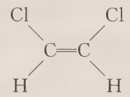  
顺式构型 $(C_{2v})$

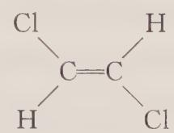  
反式构型 $(C_{2h})$

旋光异构体的绝对构型能准确测定,但是描述它们的记号有 R 和 S,D 和 L 以及实验测定的旋光方向,右旋标“+”,左旋标“-”(参见 4.5 节)。

$R$ 和 $S$ 标记法是将不对称碳原子连接的4个基团按原子序数大小的顺序排列，将最小的（例如H)排在观测者对面、向外，其他3个形成的三角形向着观测者，当按大小顺时针排列时，称 $R$ 构型(Rectus，右)，逆时针排列时称 $S$ 构型(Sinister，左)。乳酸的两种标记示出于下：

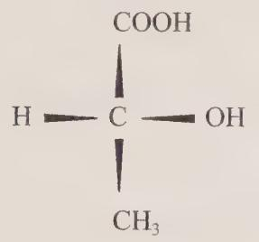

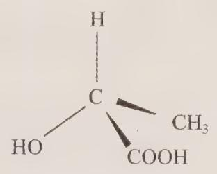

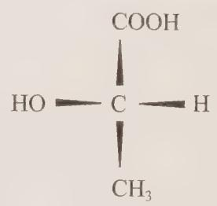  
D(-), R  
$\mathrm{L}(+)$ , $S$

D 和 L 标记是以甘油醛为基准, 规定将分子主链中两基团按上下向后排列, —CHO 在上, H 和 OH 按左右向前排列的投影结构式中, H 在左边为 D, H 在右边为 L, 其他分子按此规定进行标记, 例如:

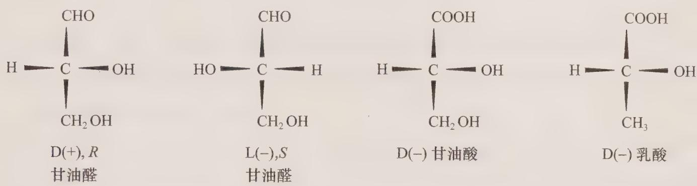

由上可见，D,L 和 R,S 以及 $(+)$ ， $(-)$ 并没有确定的互相对应关系，使用时要多加注意。

当分子中有一个或多个共价单键和某些非球形的基团相连接，在围绕单键旋转时，分子中原子在空间的排布随旋转的不同而异，这种分子中原子的特定排列形式称为构象（conformation）。构象是用以描述分子在三维空间中的形状的。由可旋转的单键连接的基团因旋转角度不同，分子得到不同的形状称为分子的构象异构体。例如乙烷中的两个— $\mathrm{CH}_3$ 围绕C—C单键可以形成重叠式、交叉式和多种中间形式的构象异构体。

知道了分子的构型和构象,可以得到分子骨架的形状,再将各个原子的范德华半径表达出来,就得到了分子的完整形状。

## 10.5.2 分子大小的估算

分子的大小、形状可由分子内部原子间的键长、键角、扭角和原子的范德华半径等求得。例如，单原子分子（如稀有气体）是圆球形分子，它的体积为 $(4 / 3)\pi R^3$ ， $R$ 为该原子的范德华半径。双原子分子的长度为两个原子的共价半径与范德华半径之和，最大直径为大原子的范德华半径的2倍，分子的体积 $(V_{\text{分子}})$ 可以 $\mathrm{Cl}_2$ 分子为例，按图10.5.1的数据计算如下：

$$
\begin{array}{r l} V _ {\text {分子}} & = 2 \Big [ \frac {4}{3} \pi R ^ {3} - \pi h ^ {2} \left(R - \frac {h}{3}\right) \Big ] \\ & = 2 \pi \Big [ \frac {4}{3} (1 8 0) ^ {3} - 8 1 ^ {2} \left(1 8 0 - \frac {8 1}{3}\right) \Big ] \mathrm{pm} ^ {3} \\ & = 4 2. 5 \times 1 0 ^ {- 3} \mathrm{nm} ^ {3} \end{array}
$$

所以 $Cl_{2}$ 分子全长 558 pm，最大直径 360 pm，分子体积为 $42.5 \times 10^{-3} \, nm^{3}$ 。

估算多原子分子的大小形状,则可先按共价键画出分子骨架,再按各原子的范德华半径将分子的边界画出。图 10.5.2为乙烯 $\left(\mathrm{C}_{2}\mathrm{H}_{4}\right)$ 分子的图形。由图可得乙烯分子的长、宽、高分别约为 520,400,340 pm。

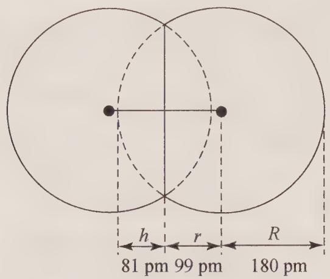  
图10.5.1 $\mathrm{Cl}_2$ 分子体积的计算

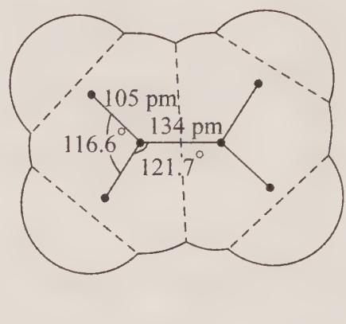  
图10.5.2 乙烯分子的图形

烷烃分子 $\mathrm{n - C_nH_{2n + 2}}$ 伸展时的碳原子骨架呈共面的曲折长链，C—C—C角度为 $109^{\circ}28^{\prime}$ ，C—C键长为 $154\mathrm{pm}$ ，两端一 $\mathrm{CH}_3$ 基团范德华半径为 $200~\mathrm{pm}$ 。由此可算得分子长度为

$$
\begin{array}{r l} & {\left[ 1 5 4 \sin \left(\frac {1 0 9 . 5 ^ {\circ}}{2}\right) (n - 1) + 2 \times 2 0 0 \right] \mathrm{pm}} \\ & {= [ 1 2 6 (n - 1) + 4 0 0 ] \mathrm{pm}} \end{array}
$$

圆柱分子直径约为 490 pm。

液体和固体中分子的大小可从物质的密度或摩尔体积求得。例如，水的摩尔体积是 $18\ cm^{3}\ mol^{-1}$ ，液态水中一个 $H_{2}O$ 分子占有的体积为 $18\ cm^{3}/(6.02\times10^{23})=30\times10^{-24}\ cm^{3}$ 。这就是一个 $H_{2}O$ 分子的大小，它包括了分子间的空隙。

分子间的空隙大小随分子形状的差异而不同。等径圆球作最密堆积的堆积系数为74.05%，即空隙占总体积的25.95%。石墨等层形分子只有层间有空隙，堆积系数可高达90%以上。一般晶体中分子的堆积系数为0.65～0.75，液体一般为0.5～0.6。

对有机分子, 分子的体积可看作原子基团体积的和, 表 10.5.1 列出若干原子基团体积的增量。一个有机分子的体积按照组成的基团体积相加在一起即得, 如正辛烷(汽油的重要组分), 其结构式为 $\mathrm{H}_{3} \mathrm{C} - (\mathrm{CH}_{2})_{6} - \mathrm{CH}_{3}$ , 一个分子的体积为 2 个— $\mathrm{CH}_{3}$ 和 6 个 $\mathrm{CH}_{2}$ 体积增量之总和, 即

表 10.5.1 若干原子基团的体积增量

<table><tr><td>基团</td><td> $\Delta V/(10^{-24} cm^3)$ </td><td>基团</td><td> $\Delta V/(10^{-24} cm^3)$ </td></tr><tr><td> $-CH_3$ </td><td>23.5</td><td> $-NO_2$ </td><td>23.0</td></tr><tr><td> $\backslash CH_2$ </td><td>17.1</td><td> $-NH_2$ </td><td>19.7</td></tr><tr><td> $=CH_2$ </td><td>13.1</td><td> $-F$ </td><td>9.6</td></tr><tr><td> $\backslash CH$ </td><td>11.1</td><td> $-Cl$ </td><td>19.9</td></tr><tr><td> $\backslash C-H(芳烃)$ </td><td>14.7</td><td> $-Br$ </td><td>26.0</td></tr><tr><td> $\backslash C-$ </td><td>5.0</td><td> $-CN$ </td><td>15.9</td></tr><tr><td> $\backslash C=$ </td><td>8.4</td><td> $-COOH$ </td><td>23.1</td></tr></table>

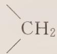

$$
(2 \times 2 3. 5 + 6 \times 1 7. 1) \times 1 0 ^ {- 2 4} \mathrm{cm} ^ {3} = 1 4 9. 6 \times 1 0 ^ {- 2 4} \mathrm{cm} ^ {3}
$$

若取一般液体堆积系数的平均值 0.55 计算, 在液体中一个分子占据体积为

$$
(1 4 9. 6 \times 1 0 ^ {- 2 4} \mathrm{cm} ^ {3}) / 0. 5 5 = 2 7 2 \times 1 0 ^ {- 2 4} \mathrm{cm} ^ {3}
$$

摩尔体积为

$$
6. 0 2 \times 1 0 ^ {2 3} \mathrm{mol} ^ {- 1} \times 2 7 2 \times 1 0 ^ {- 2 4} \mathrm{cm} ^ {3} = 1 6 3. 7 \mathrm{cm} ^ {3} \mathrm{mol} ^ {- 1}
$$

根据正辛烷的摩尔质量(114 g mol $^{-1}$ )和密度(0.703 g cm $^{-3}$ )可算出其摩尔体积为

$$
\frac {1 1 4 \mathrm{g} \mathrm{mol} ^ {- 1}}{0 . 7 0 3 \mathrm{g} \mathrm{cm} ^ {- 3}} = 1 6 2. 2 \mathrm{cm} ^ {3} \mathrm{mol} ^ {- 1}
$$

可见，从宏观性质计算所得结果与微观结构数据计算结果相当一致。

估算分子的形状和大小在实际工作中具有重要的意义,下面举例说明。

## 1. 了解空间阻碍效应

空间阻碍效应是一种基本的化学效应,它和共轭效应、诱导效应等一样,是了解化合物性质的重要依据之一。空间阻碍效应主要是分子内部基团之间的相互排斥作用,它会影响分子

的构型和性质。联苯型分子由于邻位取代基 $\mathbb{R}_1, \mathbb{R}_2$ 空间阻碍作用，当 $\mathbb{R}_1$ 和 $\mathbb{R}_2$ 较大时，两个苯环不能共面，破坏镜面对称性，使分子具有旋光性。

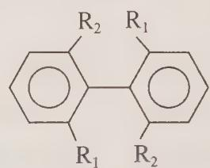

一系列有机反应,由于空间阻碍效应,减少了反应基团间互相接触机会,使产率降低。

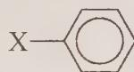

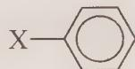

将 x—○ 进行取代反应,在通常条件下,对位、间位和邻位的产品有一定的比例,很难获得单一的对位产品。欲得单一的对位产品,可利用空间阻碍效应控制反应进行的部位,方法之一是利用环糊精保护法。环糊精具有管状结构,其内壁由疏水基团组成。当在环糊精水溶液中加入 x—○ 后,环糊精内壁的亲油效应使分子进入管中,露出两头,再进行反应,可获得单一的对位取代产物 x—○—Y。

## 2. 了解表面吸附性质

评价催化剂的品位和性质需要了解催化剂的比表面,可根据催化剂对气体分子的单层饱和吸附量和分子的截面积求算。常用的几种分子的截面积为: $\mathrm{H}_{2}\mathrm{O}$ 0.125 nm $^{2}$ (25℃), $\mathrm{N}_{2}$ 0.162 nm $^{2}$ (−195℃), $\mathrm{C}_{6}\mathrm{H}_{6}$ 0.43 nm $^{2}$ (20℃)。

水表面上单分子层吸附的性质与分子的大小密切相关。以一种长链有机酸为例， $\mathrm{CH}_3(\mathrm{CH}_2)_{16}\mathrm{COOH}$ ，其相对分子质量为284，密度为 $0.85\mathrm{gcm}^{-3}$ ，它的摩尔体积为

$$
2 8 4 \mathrm{g} \mathrm{mol} ^ {- 1} / (0. 8 5 \mathrm{g} \mathrm{cm} ^ {- 3}) = 3 3 0 \mathrm{cm} ^ {3} \mathrm{mol} ^ {- 1}
$$

一个分子所占体积为 $330\mathrm{cm}^3 /(6.02\times 10^{23}) = 0.55\mathrm{nm}^3$ 。而从曲折的碳氢链长度加上端基 $-\mathrm{CH}_3$ 和O的范德华半径，可近似求得分子的长度为

$$
1 8 \times 1 5 4 \mathrm{pm} \times \cos 3 5 ^ {\circ} + 2 0 0 \mathrm{pm} + 1 4 0 \mathrm{pm} = 2 6 1 0 \mathrm{pm} = 2. 6 1 \mathrm{nm}
$$

式中 $35^{\circ}$ 来自 $[90^{\circ} - (110^{\circ} / 2)]$ ，分子的截面积为

$$
0. 5 5 \mathrm{nm} ^ {3} / 2. 6 1 \mathrm{nm} = 0. 2 1 \mathrm{nm} ^ {2}
$$

这一数值和实验测定该有机酸在水表面上单层饱和吸附所得数值 $0.205\mathrm{nm}^2$ 是比较符合的。

## 10.6 超分子结构化学

传统化学所指的分子主要是由共价键将原子结合在一起形成的物种，它包括相对分子质量很大的高聚物和生物大分子。由离子键和金属键两类强化学键将原子结合形成的晶体和物相，由于它们常以固态晶体出现，不使用分子这个名词，直接以它的成分和它的物相名称表示。

超分子(supermolecule)通常是指两种或两种以上的分子,通过分子之间的次级键结合在一起,形成分子以上层次的多分子体系。这时分子之间形成了有序的聚集体,显示出它特有的结构和功能。研究由两种以上分子所形成的聚集体的化学,称为超分子化学,它是超越分子的化学,而淡化了化学中原有的无机化学、有机化学、高分子化学等的界限,强调超分子体系所具有的结构、性质、功能及其应用,提出了分子组装、分子识别、分子器件、化学信息等一系列新概念和新内容,成为材料科学、生命科学等学科的重要基础。

超分子和超分子化学通常包括两个范围较广而部分交叠的领域：

(1) 将超分子定义为由确定的少数组分(受体和底物)在分子识别原则基础上经过分子间缔合形成确定组成的、分立的低聚分子物种。

(2) 由大量不确定数目的组分按其性质自发缔合成超分子聚集体 (supramolecular assemblies), 它又可分为两类: (i) 薄膜、囊泡、胶束、介晶相等, 它的组成和结合形式在不断变动, 但具有或多或少确定的微小组织, 按其性质, 可以宏观表征的体系; (ii) 由分子组成的晶体, 它组成确定, 并且具有整齐排列的点阵结构, 研究这种超分子的工作常称为晶体工程。

## 10.6.1 超分子稳定形成的因素

超分子体系和其他化学体系一样,它由分子形成稳定超分子的因素可从热力学自由焓的降低( $\Delta G<0$ )来理解

$$
\Delta G = \Delta H - T \Delta S
$$

式中 $\Delta H$ 是焓变，它代表降低体系的能量因素； $\Delta S$ 是熵变的因素，即增加体系的熵。

## 1. 能量降低因素

分子聚集在一起,依靠分子间的相互作用使体系的能量降低。下面列出常见的降低超分子体系能量的因素。

（1）静电作用。包括盐键，即带电基团间的作用，如 $\mathrm{R - NH_3^+}\dots^{-}\mathrm{OOC - R}$ ；离子-偶极子作用以及偶极子-偶极子作用等。

(2) 氢键。包括常规的氢键 $X - H \cdots Y (X, Y = F, O, N, C, Cl)$ ; 也包括非常规氢键, 例如: $X - H \cdots \pi, X - H \cdots M, X - H \cdots H - Y$ 。

（3）M—L 配位键。金属原子(M)和配位体分子(L)间形成的各种各样的 M—L 配位键，其中以共价配键更为普遍和重要。

(4) $\pi\cdots\pi$ 堆叠作用。它既可以按面对面的形式，也可以采取边对面的形式。

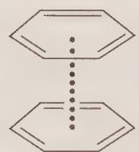  
面对面堆叠

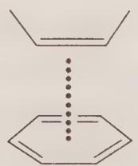  
边对面堆叠

（5）诱导偶极子-诱导偶极子的作用。这种作用即范德华作用力中主要组成部分的色散力。

（6）疏水效应。它既包括能量因素也包括熵因素，从能量因素看，溶液中疏水基团或油滴互相聚集，将增加溶液中水分子间的氢键数量，使体系能量降低。

## 2. 熵增加因素

## (1) 螯合效应

指由螯合配位体形成的配位化合物，要比相同的配位原子和相同的配位数的单齿配位体所形成的配位化合物稳定。螯合效应的实质是熵增效应，已在6.3节中举例阐明。

## (2) 大环效应

它和螯合效应有关，在能量因素和熵因素上都增进体系的稳定性。下面给出实例：

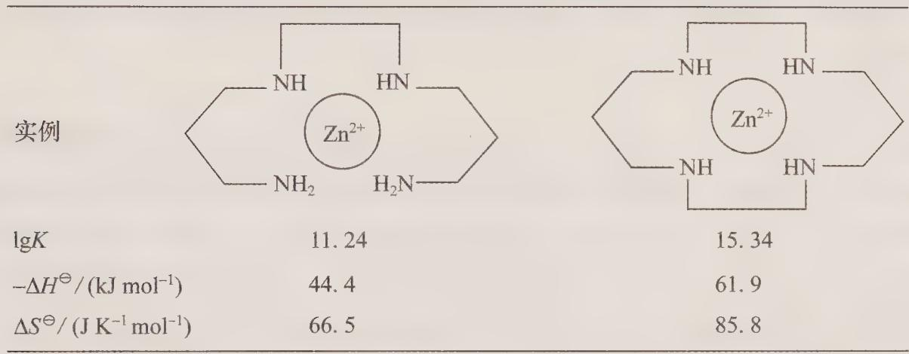

## (3) 疏水空腔效应

此即疏水空腔所呈现的疏水效应或熵增效应。在疏水空腔中，水分子相对有序地通过氢键聚集在一起；当有疏水的客体分子(G)存在时，客体分子会自发地进入空腔，而排挤出水分子，这时水分子呈现自由的状态，无序度增加，即熵增加，如图10.6.1所示。

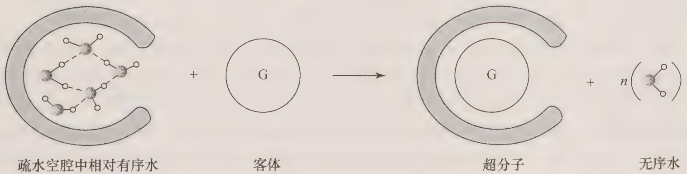  
图10.6.1 疏水空腔和客体结合产生熵增效应

如上所述，疏水基团结合在一起排挤出水分子，既可以增加水分子间的氢键，降低体系的能量；又可以使无序的自由活动的水增加，熵增大。两个因素都促进超分子体系稳定性增加。

## 3. 锁和钥匙原理

锁和钥匙原理是指受体和客体(或称主体和底物)之间,在能量效应和熵效应上互相配合、互相促进,形成稳定的超分子体系的原理。

典型的共价单键能量为 $300 \sim 950 \mathrm{~kJ} \mathrm{~mol}^{-1}$ ; 而上述分子间相互作用的能量效应较小, 从色散力的 $2 \mathrm{~kJ} \mathrm{~mol}^{-1}$ 到中等强度氢键的 $25 \mathrm{~kJ} \mathrm{~mol}^{-1}$ , 到盐键的 $200 \mathrm{~kJ} \mathrm{~mol}^{-1}$ , 它们单个作用的相对强度都较弱,但是在受体和客体(底物)间相互匹配,一方面形成数量较多的分子间相互作用,可以达到可观的能量降低效应;另一方面,通过大环效应和疏水空腔效应等,促进体系熵值的增加。这样,锁(指受体)和钥匙(指客体)间的每一局部是弱的相互作用,而各个局部间相互的加和作用、协同作用形成强的分子间作用力,形成稳定的超分子,如图10.6.2所示。锁和钥匙原理是超分子体系识别记忆功能和专一选择功能的结构基础。

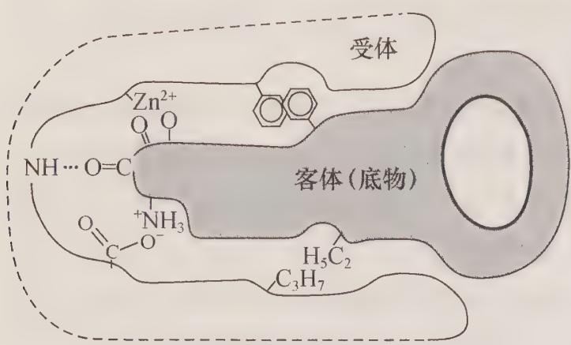  
图10.6.2 锁和钥匙原理示意图

## 10.6.2 分子识别和超分子自组装

## 1. 相关概念

## (1) 分子识别

分子识别(molecular recognition)是一种分子具有选择性地和另一种分子成键结合,产生特定功能的过程。它是由于不同分子间的一种特殊的、专一的相互作用,它既满足相互结合的分子间的空间要求,也满足分子间各种次级键力的匹配。在超分子中,一种受体分子的特殊部位具有某些基团,正适合和另一种客体分子的基团相结合,体现出锁和钥匙原理。当受体分子和客体分子相遇时,相互选择对方,一起形成次级键;或者受体分子按客体分子的大小尺寸,通过次级键构筑起适合客体分子居留的孔穴的结构。所以,分子识别的本质就是使受体和客体分子间有着形成次级键的最佳条件,互相选择对方结合在一起,使体系趋于稳定。

## (2) 超分子自组装

超分子自组装(supermolecular self-assembly)是指一种或多种分子,依靠分子间相互作用自发地结合起来,形成分立的或伸展的超分子。由分子组成的晶体,也可看作分子通过分子间作用力组装成一种超分子。有的文献又将自组装称为自组织(self-organization)。

超分子化学为化学科学提供了新的观念、方法和途径。设计和制造自组装构建元件，开拓分子自组装途径，使具有特定的结构和基团的分子自发地按一定方式组装成所需的超分子。

分子识别和超分子自组装的结构化学内涵,体现在电子因素和几何因素两个方面,前者使分子间的各种作用力得到充分发挥,后者适应于分子的几何形状和大小能互相匹配,使在自组装时不发生大的阻碍。分子识别和超分子自组装是超分子化学的核心内容。

## (3) 超分子合成子

合成子(synthon)一词是在有机合成中表示“用已知的或想象的合成操作所能形成或组装出来的分子中的结构单位”。将这个通用的、可变的定义用于超分子，即得：“超分子合成子是用已知的或想象的、包含分子间相互作用的合成操作所能形成或组装出来的超分子中的结构单位”。

超分子合成子是从设计的相互作用组合中推得的,是指超分子产物中的结构单位,而不等同于反应物的作用基团。超分子合成子把分子片的化学特征和几何识别特征结合在一起,即把明确的和含蓄的分子间相互作用的内容包含在内。下面列出几种以氢键结合、以电荷转移作用和 $\pi\cdots\pi$ 堆叠作用的超分子合成子:

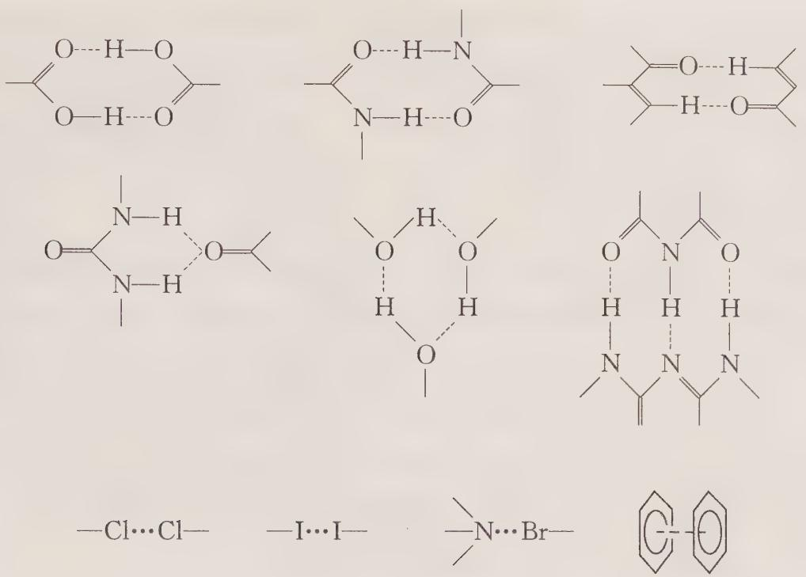

## 2. 冠醚和穴状配体的识别和自组装

以冠醚和穴状配体作为主体和客体分子组装成超分子的研究,是20世纪60～70年代创立的超分子化学的基础内容。

## (1) 球形离子大小的识别

不同的冠醚以其大小尺寸和电荷分布适合于不同大小的球形碱金属离子，使难以分离的碱金属离子在不同的冠醚中各得其所。表10.6.1列出各种冠醚孔穴的直径以及适合组装的碱金属离子。

表 10.6.1 各种冠醚的孔穴直径和适合组装的碱金属离子

<table><tr><td>冠醚</td><td>孔穴直径/pm</td><td>适合组装的离子(离子直径/pm)</td></tr><tr><td>[12]C4</td><td>120~150</td><td> $Li^{+}$ (152)</td></tr><tr><td>[15]C5</td><td>170~220</td><td> $Na^{+}$ (204)</td></tr><tr><td>[18]C6</td><td>260~320</td><td> $K^{+}$ (276), $Rb^{+}$ (304)</td></tr><tr><td>[21]C7</td><td>340~430</td><td> $Cs^{+}$ (334)</td></tr></table>

图10.6.3(a)示出 $(\mathrm{K}^{+}[18]\mathrm{C}6)$ 的结构。在人体的生理现象中， $\mathrm{Na}^{+}$ 和 $\mathrm{K}^{+}$ 可选择性地通过细胞膜，其作用机理类似于冠醚和 $\mathrm{Na}^{+},\mathrm{K}^{+}$ 间的作用。

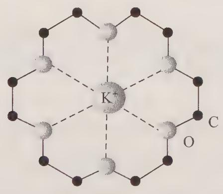  
(a)

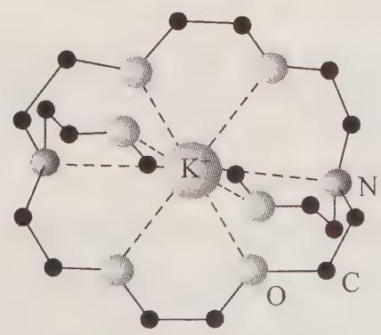  
(b)  
图10.6.3 (a) $\mathbf{K}^{+}[18]\mathbf{C}6$ 及(b) $\mathbf{K}^{+}\mathbf{C}[222]$ 的结构

二氮穴状配体是在2个N原子间以醚链桥连，具有穴状孔穴，可以选择性地和不同大小的离子结合。例如穴状配体C[222]，它在水溶液中对碱金属离子的稳定常数 $K$ 以 $\mathrm{K}^{+}$ 最大， $\mathrm{Rb}^{+}, \mathrm{Na}^{+}$ 次之， $\lg K$ 的数值： $\mathrm{Na}^{+}3.8, \mathrm{K}^{+}5.4, \mathrm{Rb}^{+}4.3$ 。图10.6.3(b)示出穴状配体和KI配位组装所得晶体 $(\mathrm{K}^{+} \cdot \mathrm{C}[222])$ 的结构。

## (2) 四面体方向成键的识别

三环氮杂冠醚分子中有四面体配位点的孔穴，它除具有大小识别功能外，还能按成键方向

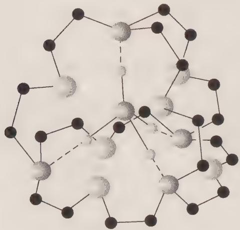  
图10.6.4 三环氮杂冠醚  
和 $\mathbf{NH}_4^+$ 识别组装

选择合适的离子优先进行组装。例如， $\mathrm{NH_4^+}$ 和 $\mathbf{K}^{+}$ 具有非常近似的大小尺寸，普通冠醚不能进行选择区分。而三环氮杂冠醚只倾向于和 $\mathrm{NH_4^+}$ 结合，因为在孔穴中4个N原子的排布位置，正好适合于和 $\mathrm{NH_4^+}$ 形成4个N—H…N氢键。图10.6.4示出三环氮杂冠醚和 $\mathrm{NH_4^+}$ 结合的结构。

## 3. 氢键识别和自组装

氢键是超分子识别和自组装中最重要的一种分子间相互作用，由于它的作用较强，涉及面极广，在生命科学和材料科学中都极为重要。例如，DNA的碱基配对，互相识别，将两条长链自组装成双螺旋体，如10.2节所述。

利用不同分子中所能形成氢键的条件,可以组装成多种多样的超分子。图 10.6.5 示出三聚氰胺和三聚氰酸在分子的 3 个方向上形成分子间 N—H…O 和 N—H…N 氢键,组装成薄层。

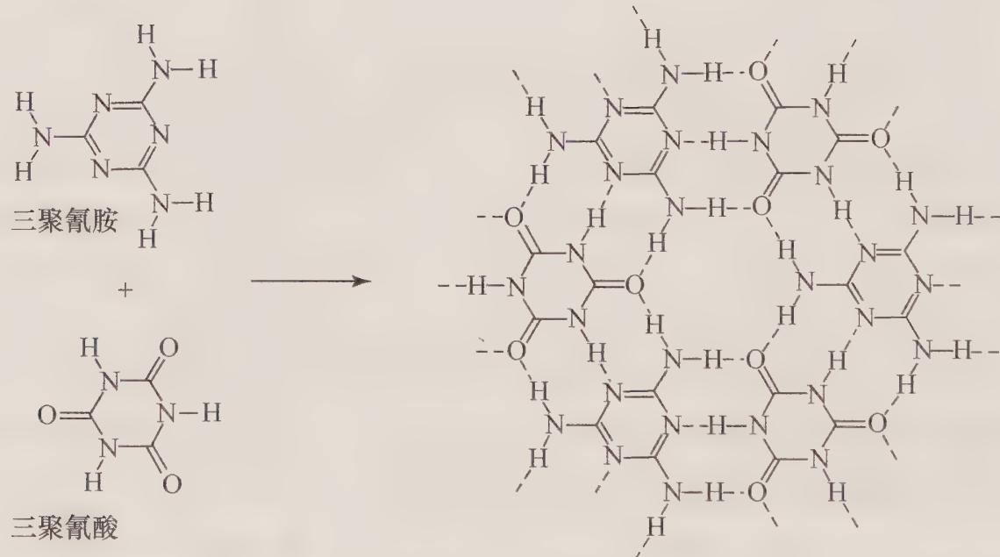  
图10.6.5 通过氢键自组装成超分子

## 4. 配位键的识别和组装

过渡金属的配位几何学以及和配位体相互作用位置的方向性特征，提供了合理地组装成各类超分子的蓝图。图10.6.6(a)是在酸性 $\mathrm{Na_2MoO_4}$ 溶液中，通过Mo—O配位键使 $\mathrm{MoO_4^{2-}}$ 互相缩合组装成大环超分子，大环的组成为 $\mathrm{Mo_{176}O_{496}(OH)_{32}(H_2O)_{80}}$ ，在大环内外充满了 $\mathrm{H}_2\mathrm{O}$ ，晶体的组成为 $[\mathrm{Mo}_{176}\mathrm{O}_{496}(\mathrm{OH})_{32}(\mathrm{H}_2\mathrm{O})_{80}]\cdot (600\pm 50)\mathrm{H}_2\mathrm{O}$ 。图10.6.6(b)是由Mo—C和Mo—N配位键使中心Mo原子将2个 $\mathrm{C}_{60}$ 分子、2个 $p$ -甲酸丁酯吡啶及2个CO分子组装成超分子。

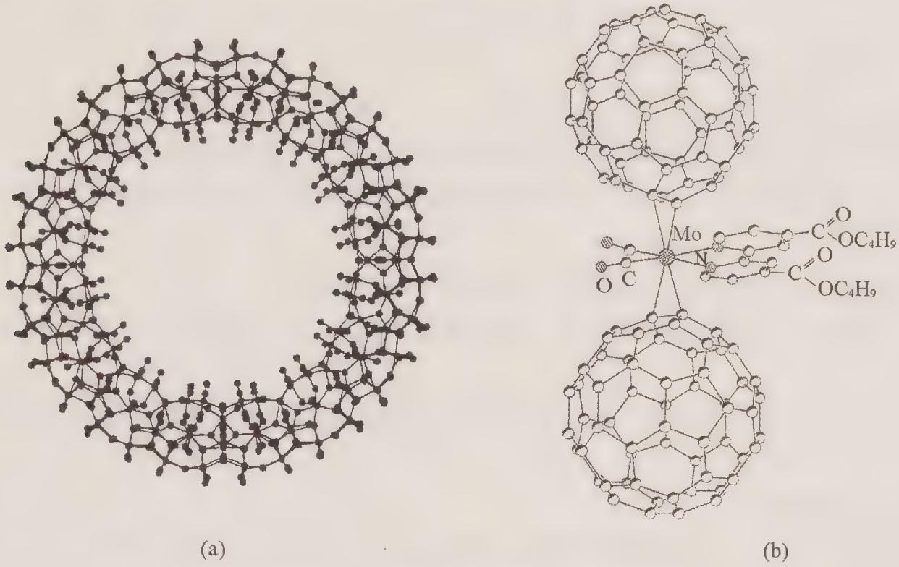  
图10.6.6 通过配位键组装成超分子  
(a) Mo—O 键组装成大环超分子, 大环的组成为 $\left[\mathrm{Mo}_{176}\mathrm{O}_{496}(\mathrm{OH})_{32}(\mathrm{H}_{2}\mathrm{O})_{80}\right]$  
(b) Mo—C 键和 Mo—N 键组装成球碳超分子

## 5. 疏水作用的识别和组装

如前所述，疏水基团互相结合在一起，并非在它们之间出现强的相互作用，而是它们结合时排挤水分子。其效果一方面增加水分子间的氢键，降低体系的能量；另一方面，使无序的自由活动的水增加，熵增大。两个因素都促使疏水基团互相识别，而自发地进行组装。

环糊精的内壁具有疏水性。如果在环糊精的小口径端置换上一个疏水基团，例如 $-\mathrm{C}_6\mathrm{H}_4\mathrm{CMe}_3$ ，它的大小适合于进入环糊精内部。这种疏水基团能和环糊精内壁互相识别而自发地进行组装，形成长链，如图10.6.7所示。

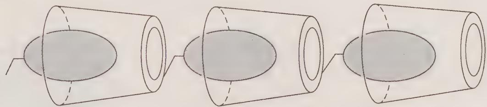  
图 10.6.7 带有疏水基团的环糊精的自组装

## 10.6.3 晶体工程

## 1. 晶体工程的特点

许多晶体,特别是有机晶体,是完美的超分子,是在一个惊人的准确水平上,数以百万计的分子互相识别、自行排列。晶态超分子是分子通过分子间相互作用构建起来的。

晶体工程通常定义为:根据分子堆积以及分子间的相互作用,将超分子化学原理、方法以及控制分子间作用的谋略用于晶体,以设计和制出奇特新颖、花样繁多、具有特定的物理性质和化学性质的新晶体。晶体工程的目的是沿着分子识别指引的途径进行超分子的自发组装,使分子组分间的功能得到多方面配合,优化分子间不同强度的、定向的和与距离有关的各种相

互作用。

晶体工程的特点可归纳如下：

(1) 晶体工程是研究晶态超分子的科学。

(2) 分子间相互作用可直接用 X 射线晶体学进行研究, 结论明确可靠。

(3)设计方案既包括晶体中分子在空间的排列,也能将分子间强的和弱的相互作用独立地或结合起来考虑。

(4) 设计涉及的对象既包括单组分,也包括多组分物种。

(5) 在主宾配合物型的超分子中, 主体孔穴可由几个相同的分子或几种不同的分子组成。

由于晶体工程具有上述特点,它已由化学家利用晶体学的知识加以发展,去设计新材料和固态反应。

## 2. 晶体工程的谋略

晶体的周期性结构,要求晶体中各种分子间相互作用必须遵循晶体学定律。在设计超分子晶体时,选择原子、分子或基团作为结点,以“●”表示;分子间较强的相互作用,例如氢键和配位键作为连接棒,以“——”表示。利用结点和连接棒组装出各种式样的超分子化合物,它们可以是分立有限的超分子,可以形成一维、二维或三维的超分子网络。图 10.6.8 示出一些超分子网络的式样。

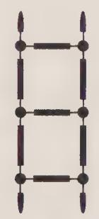  
梯子型

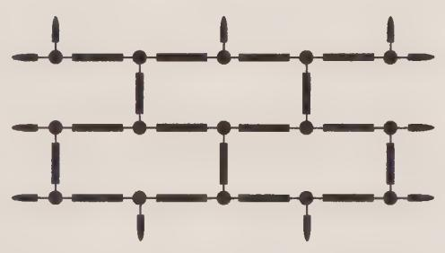  
砖墙型

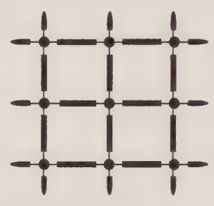  
四方格型

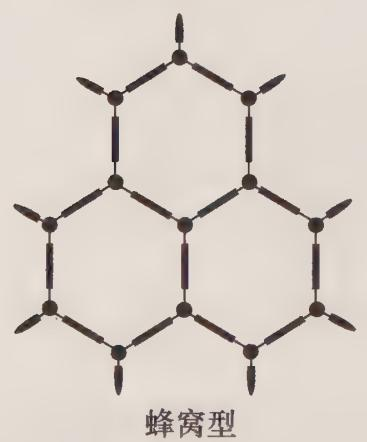

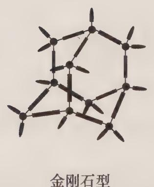  
金刚石型

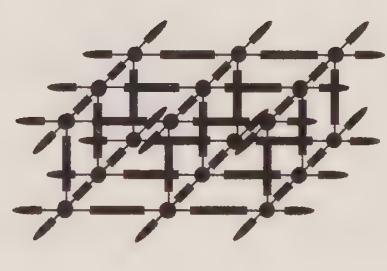  
立方体型  
图10.6.8 超分子网络的式样

羧酸通过氢键结合成分立的、一维、二维和三维超分子结构，就是一种组分起着互补作用功能的实例。图10.6.9示出通过羧酸的氢键结合成超分子的型式。

有时可利用多种组分间互相识别和互补地相互作用，构筑起稳定的多组分晶体。例如在 $(\mathrm{C}_2\mathrm{H}_5)_4\mathrm{N}^+ \cdot \mathrm{HCO}_3^- \cdot (\mathrm{NH}_2)_2\mathrm{CO} \cdot 2\mathrm{H}_2\mathrm{O}$ 晶体中，通过分子间氢键形成带负电的层形结构，其组成为 $[\mathrm{HCO}_3^- \cdot (\mathrm{NH}_2)_2\mathrm{CO} \cdot 2\mathrm{H}_2\mathrm{O}]$ ，层间通过静电作用和带正电的 $(\mathrm{C}_2\mathrm{H}_5)_4\mathrm{N}^+$ 离子结合起来。图10.6.10示出 $[\mathrm{HCO}_3^- \cdot (\mathrm{NH}_2)_2\mathrm{CO} \cdot 2\mathrm{H}_2\mathrm{O}]$ 层的结构。

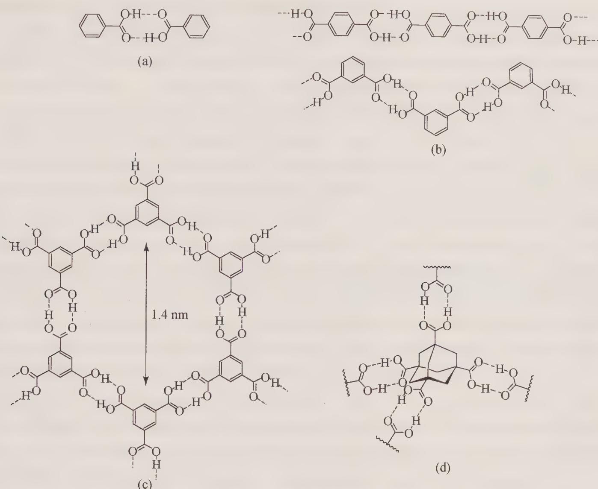  
图10.6.9 羧酸通过氢键组装成超分子  
(a) 分立的结构，(b) 一维结构，(c) 二维结构，(d) 三维结构

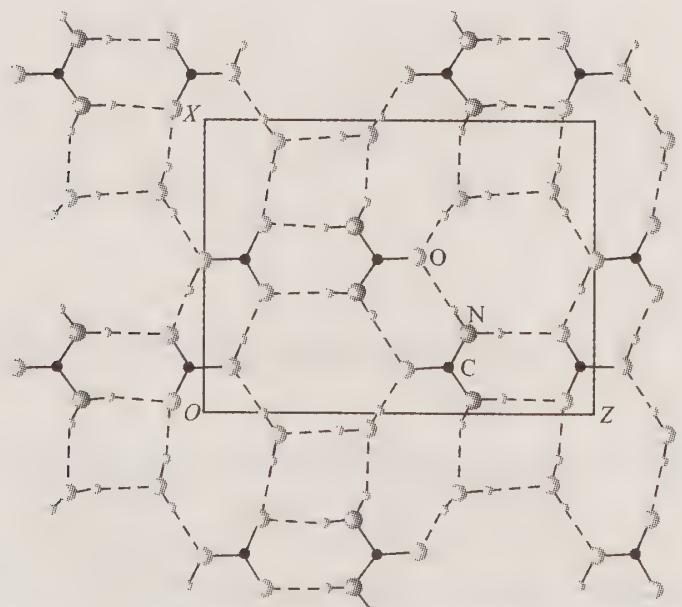  
图10.6.10 在 $(\mathrm{C}_2\mathrm{H}_5)_4\mathrm{N}^+ \cdot \mathrm{HCO}_3^- \cdot (\mathrm{NH}_2)_2\mathrm{CO} \cdot 2\mathrm{H}_2\mathrm{O}$ 晶体中 $[\mathrm{HCO}_3^- \cdot (\mathrm{NH}_2)_2\mathrm{CO} \cdot 2\mathrm{H}_2\mathrm{O}]$ 层的结构

## 10.6.4 超分子和化学信息 $^{①}$

化学信息是超分子化学的重要内容,它是贯穿整个超分子领域的主线。超分子形成过程中的识别性和自组装,是受体对作用物的选择性地结合,产生特定的功能,出现一系列新问题:超分子自组装的原动力是什么,信息存储于何处?分子之间怎样互相匹配、互相识别?通过自组装产生的超分子的结构和功能的关系怎样?周围环境对自组装有何影响?许多问题都涉及分子信息的产生、处理、传输和探测等内容。

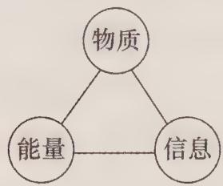

信息是客观世界一切事物变化及其特征的反映,是事物之间相互联系的表征。化学信息不是物质,也不是能量,而是如左图所示三者鼎立地存在。化学信息指明物质在一定条件下,会发生原子间的化学键沿着特定的化学反应途径变化,出现新的结构和功能,成为化学科学的重要内

容。例如，一个成年人的 DNA 约有 $6 \times 10^{-12}$ g，占人体重量（按 60 kg 计）的 $10^{16}$ 分之一。DNA 的含量如此之少，在生命过程中由它引起的能量变化微乎其微，但它却包含着生命的发育和成长的全部信息。人体或生物体中的 DNA 通过它的自我复制和 RNA 等的变化，控制着蛋白质等生命物质的合成，其基础存在于简明的化学信息之中。

从结构化学的观点来分析超分子形成的过程和自组装获得的化学信息,首要的作用力是分子间能生成氢键。氢键具有较强的键能,具有较灵活地形成氢键的条件,没有严格的空间限制的约束。在含水的无机物和有机物中,分子间形成氢键的数量非常多,在生物体系中更是如此。人体大脑中含水量达80%以上,这是人的生物进化以及人的成长过程中,为了储存记忆信息的需要,大量地吸收水分子参加的结果。水在大脑存储记忆信息中起着重要的作用。氢键体系的形成对于信息的传递有重要作用。在电化学实验测定离子淌度时, $H^{+}$ (或 $H_{3}O^{+}$ )和 $OH^{-}$ 两种离子的淌度要比其他离子的淌度大得多。物理化学家常用氢键体系内原子间电子的位移接力快速传递模型来理解,如图10.6.11所示。由此可见,大量存储信息和快速传递信息是人体中氢键体系的功能。

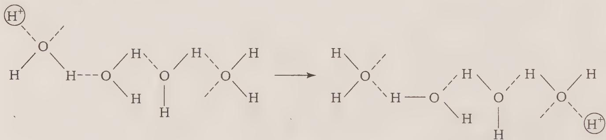  
图10.6.11 $\mathrm{H}^{+}$ (或 $\mathrm{H}_3\mathrm{O}^+$ )在氢键体系中快速接力传递电荷的模型

DNA 主要有两个功能：第一，通过氢键相互匹配，进行自我复制，由亲代复制一份 DNA 传给子代；第二，通过信使 RNA 分子控制生命物质，即蛋白质的合成，使亲代的性状在子代的蛋白质结构上反映出来，使生物体能在生长发育、传种接代中保持性状的相对稳定，使后代表现出和亲代相似的性状。此外，DNA 可接受偶然的改变或突变，使生物体得以进化。

DNA存在于细胞核中，而蛋白质的合成在细胞质中进行。DNA携带的遗传信息通过RNA来传递。RNA结构和DNA不同，它是由核苷酸分子连接成的单链。RNA的功能有二：一是“转录”，二是“翻译”。“转录”指子代以DNA的一条链为模板，按碱基配对原则来合成RNA，这过程在细胞核中进行。“翻译”指以RNA为模板合成和亲代一样、具有一定氨基酸顺序的蛋白质的过程。

RNA 有 A, G, C, U4 种碱基, 3 个碱基决定形成一种氨基酸, 所以有 $4^{3} = 64$ 种组合。3 个

相邻碱基叫密码子，20种氨基酸则和相应的密码子对应。

人体有 3.5 万种基因,为了区别它们,将 DNA 片段的碱基对特征作为识别基因的方法,做成基因信息芯片。将待测的 DNA 在水溶液中先分解成单链,经荧光标记后,让它流过芯片,根据碱基配对原则,和识别的基因配对,再将芯片由荧光显微术输出信号,读出待测基因的信息。利用这种信息,可用于亲子鉴定,可进一步用于“克隆”,即无性繁殖,可用于生物体的转基因工程的医学,制造药物,抗病治病。

DNA 长链分子间匹配所形成的 A…T 和 G…C 氢键体系,除上述生物基因和遗传密码等生物信息外,也成为化学信息的重要内容,组装成各种神奇的、功能各异的酶,它显示出自动的、高度有序的、无缺陷地进行的自组装,使许多分子个体形成一个整体,展现出化学信息应研究的内容。

## 10.6.5 应用

超分子结构化学原理的应用非常广泛，是生命科学、材料科学和信息科学等领域的重要基础内容。已发展起来的主-客体化学、包合物化学已成为化学的重要分支。下面举数例，简单说明这些原理和观点对实际工作的启发和指导作用。

## 1. 相转移

KF 是由离子键将 $K^{+}$ 和 $F^{-}$ 结合在一起的典型的离子化合物，它不溶于有机溶剂。但在冠醚的乙腈溶液中，由于 $K^{+}$ 和冠醚结合，使 KF 溶于乙腈溶液，放出 $F^{-}$ 。溶液中的 $F^{-}$ 能置换有机化合物中的 $Cl^{-}$ ，生成有机氟化物。

下面示出一个反应的实例：

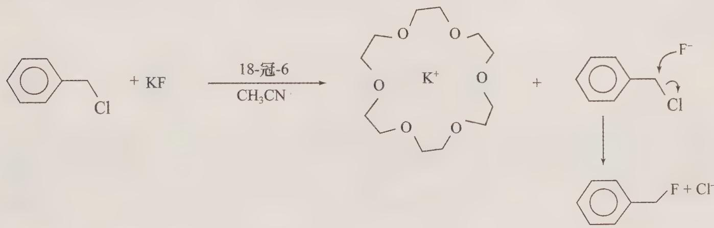

## 2. 分离

利用分子的大小和几何形状的不同,可对同类的有机化合物进行分离。再举两个实例予以说明。

## 【例10.6.1】 尿素-烷烃包合物

尿素 $\left[\left(\mathrm{NH}_{2}\right)_{2}\mathrm{CO}\right]$ 可以和正烷烃 $\left(\mathrm{n}-\mathrm{C}_{n}\mathrm{H}_{2n+2},n\geqslant8\right)$ 形成超分子包合物。在其中，尿素分子通过N—H…O氢键有序地组合成具有蜂窝状六角形通道结构的受体，如图10.6.12(a)所示。正烷烃分子作为客体分子填入到通道之中，图10.6.12(b)示出垂直于通道截面的结构。通道为六方柱形，直径约为525 pm，正好容纳正烷烃分子，彼此通过范德华力结合，使体系能量降低，稳定存在。注意，单纯的尿素不可能结晶出具有空的六角形通道的晶体（甚至n<8的正烷烃也不稳定），这也说明范德华力在超分子形成中的重要意义。

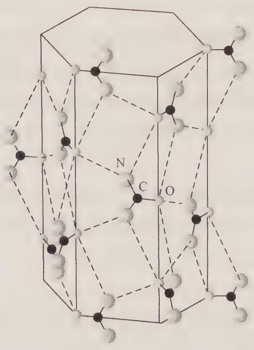

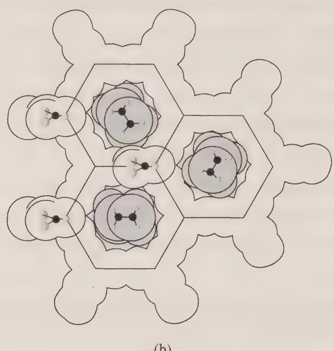  
图10.6.12 尿素和正烷烃形成的包合物  
(a) 尿素分子通过氢键形成六角形通道的结构，(b) 正烷烃填入蜂窝状六角形通道，形成晶体结构

由于支链烷烃直径较大,装不进通道之中,根据此原理可用在工业上作为正烷烃和支链烷烃的一种分离技术。

【例10.6.2】用杯芳烃纯化 $\mathrm{C}_{60}$

$p$ -叔丁基杯芳烃[8]的分子结构式示于图10.6.13(a)中，它的形状像一只广口杯子，杯口和内壁为疏水性叔丁基和 $\pi$ 键的苯基，其大小和作用力正适合于球形 $C_{60}$ 分子，但 $C_{70}$ 和其他杂质则不适合。

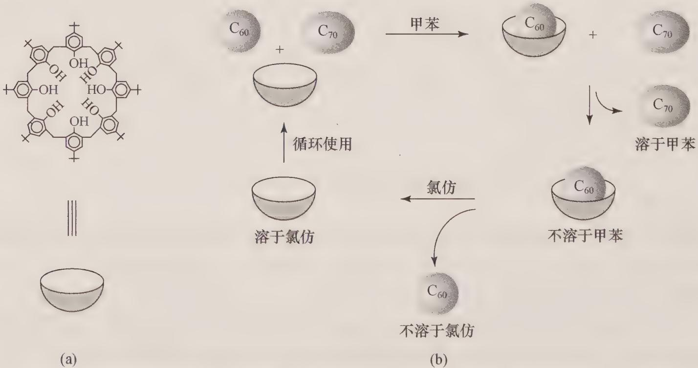  
图10.6.13 用 $p$ -叔丁基杯芳烃[8]从 $\mathbf{C}_{60}$ 和 $\mathbf{C}_{70}$ 混合物中纯化 $\mathbf{C}_{60}$

当将这种杯芳烃和 $\mathrm{C}_{60}$ 及 $\mathrm{C}_{70}$ 的甲苯溶液（即不纯的 $\mathrm{C}_{60}$ 溶液）一起作用， $\mathrm{C}_{60}$ 装入杯中形成加合物超分子，它不溶于甲苯而沉淀出来； $\mathrm{C}_{70}$ 及杂质溶于甲苯而分离除去。将杯芳烃 $\mathrm{C}_{60}$ 超分子悬浮于氯仿中，氯仿分子会顶替出 $\mathrm{C}_{60}$ 。 $\mathrm{C}_{60}$ 因不溶于氯仿，结晶沉淀出来，过滤分离即得纯

品。用这方法比色谱分离法高效价廉。

图 10.6.13(b) 表示用杯芳烃纯化 $C_{60}$ 示意图。

## 3. 制备LB膜

LB膜是一种超薄有序膜，因纪念其创始人I. Langmuir和D.B.Blodgett而命名。LB膜技术是在分子水平上制备有序的超分子薄膜的技术。它根据两亲分子在溶液表面的定向排列，进行二维的分子组装或多层的排列组合，形成各种分子水平的器件。图10.6.14示意出基片已进行化学处理从而具有亲水性表面的成膜过程：图(a)为基片上提时，表面定向排列分子的亲水基团沉积到基片上，疏水基团向外垂直于基片平面，形成单层有序膜的情况；图(b)为基片向下穿过单分子层，形成疏水基团和第一层疏水基团相向排列，将第二层固定沉积在其上；图(c)示出再向上提时，两亲分子的亲水基团和第二层的亲水基团相向排列，固定沉积成第三层。以此类推，可制得一定厚度和一定化学组成的超分子薄膜。

(a)  
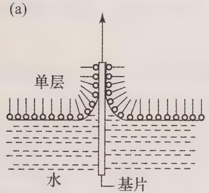

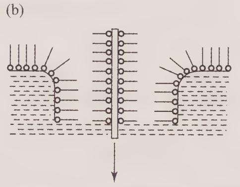

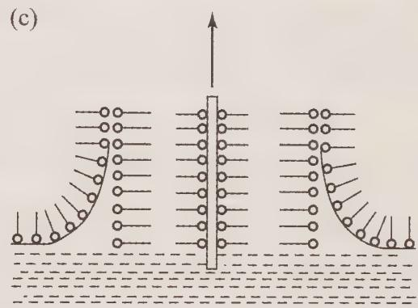  
图10.6.14 LB膜的制备

## 10.7 纳米材料和软物质的结构化学 $^{①}$

## 10.7.1 纳米材料概况

纳米材料(nanomaterials)是指构成该材料的基本单元在三维空间中至少有一维的大小处于纳米尺度(1～100 nm)的范围之内。纳米材料的基本单元可以为原子簇、纳米粒子、纳米线、纳米管、纳米棒、纳米片、超薄膜、多层膜等。纳米材料的制备和应用已有几千年的历史，例如，收集油烟的烟炱，以它为原料制成写字用的墨汁。近一百多年来胶体化学对纳米粒子的宏观体系(胶体)的系统研究，揭示出该体系的基本物理化学性质。近三十多年来，制备各种有独特性能的纳米材料掀起高潮，并用现代科技对纳米粒子的形态、特性、微观结构等进行系统研究，取得了巨大成绩，出现了许多新概念、新理论、新方法、新技术，为科学的发展提供了一个新平台。纳米材料的研究已成为高新技术的热门领域，在信息、能源、生命、环境、军事等方面的

应用都非常重要。

纳米材料有多种形态和应用,下面列出几个实例:

(1) 纳米微晶: 指颗粒尺度在 $100 \mathrm{~nm}$ 以下, 介于宏观物质和微观物质之间的介观领域, 表现出热力学不稳定性。它和宏观物质的性质有显著的差别。

(2) 纳米塑料: 指纳米尺寸的无机填充物粒子分散于有机聚合物中形成的塑料。这种塑料既有无机物的刚性、热稳定性、绝热性, 又有有机聚合物的韧性、易加工性和绝缘性, 可制作高性能管材、机械零配件、电子和电器部件、包装管材等。

（3）纳米陶瓷：指由大小在 $100 \mathrm{~nm}$ 以下的晶粒组成的多晶陶瓷，或用粉体制成的薄膜、单相和复相陶瓷。纳米陶瓷质地致密，具有优良的室温和高温力学性能、抗弯强度、断裂韧性、抗腐蚀性、可加工性等特点。生产这种陶瓷的关键在于纳米粉体的制备和烧结条件的控制。

（4）纳米气泡：指采用特定方法将气体在水中分散成纳米量级的气泡，并能稳定地存在一定时间。纳米气泡具有较大的表面积和表面能。当气泡为空气或氧气时，因它具有较大的表面积和较强的表面能，用于城市污水处理，可以更有效地使水体中的有机物含量降低，提高污水处理能力。血液中载有纳米级氧气，可以用于急救。

（5）纳米器件：纳米材料的另一大类是在块体材料的表面上制造纳米器件。在单晶硅片表面上通过光刻或电子束刻蚀技术，制造出小于 $100 \mathrm{~nm} \times 100 \mathrm{~nm}$ 的晶体管集成电路，在一个 $1 \mathrm{~cm}^{2}$ 的芯片上组装数千万个晶体管元件，使微电子电路的功能更加优越，集成电路的容量和性能更加强大。这种器件的小型化和高度集成化，大大提高了集成电路的性能和功率，降低了制造成本。目前大小在 $14 \mathrm{~nm}$ 特征尺寸的晶体管已在应用，而特征尺寸小于 $10 \mathrm{~nm}$ 的晶体管也在试制中。

## 10.7.2 表面效应

表面(或界面)效应是指粒子的粒径变小时,粒子的比表面积增大,处在表面上的粒子数和总的粒子数的比值增大,由于面上粒子所处的环境、配位结构和相互作用力都与内部粒子不同,引起粒子性质发生变化。

粒子越小,处在表面上粒子的相对数目越多。下面以立方最密堆积(A1型晶体结构)的切角八面体外形的粒子为例,按图10.7.1计算不同粒径时,表面上的原子数和该粒子中原子总数的比值。由图10.7.1可见,表面的原子数由三部分组成,按层数为n的表面计:

顶点原子数：24

棱边原子数： $(n - 1)\times 36$

面中原子数：6个正方形面， $(n - 1)^{2}\times 6$

8个正六边形面， $[1 + 3n(n - 1)]\times 8$

即第 $n$ 层表面的原子数为

$$
2 4 + (n - 1) \times 3 6 + (n - 1) ^ {2} \times 6 + [ 1 + 3 n (n - 1) ] \times 8\tag{10.7.1}
$$

表 10.7.1 列出立方八面体粒子中表面的原子数和在该多面体内包合的总原子数及它们的比值。表中 n 由 1 到 6 的数据根据(10.7.1)式计算；虚线以下 n=50 和 100 的粒子数则根据原子所占的体积近似求算。计算方法根据多面体几何学，设球形原子的直径为 1 单位，堆积成的切角八面体的边长为 l，该多面体的体积 V 为

$$
V = 1 1. 3 1 4 l ^ {3}\tag{10.7.2}
$$

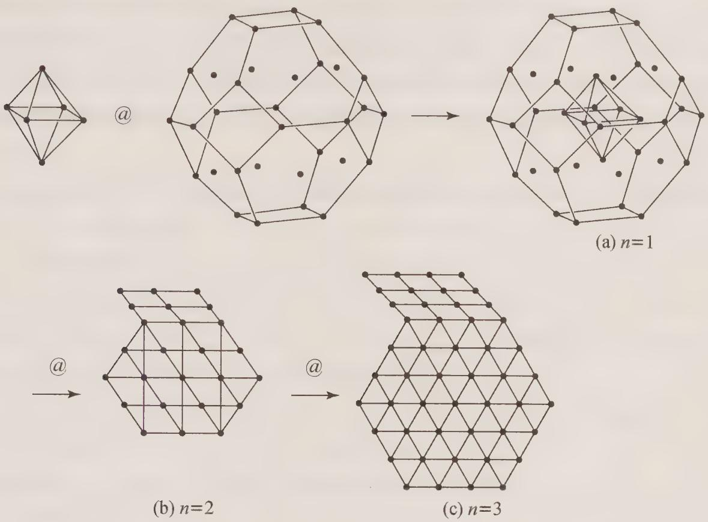  
图10.7.1 切角八面体形粒子包合的原子数目计算示意图

表面上原子体积可按原子的直径为1单位厚度乘以表面积近似算得：

$$
V _ {\text {面}} = 6 l ^ {2} + 8 \times (2. 6 l ^ {2}) = 2 6. 8 l ^ {2}\tag{10.7.3}
$$

若 $l = 50$ ，表面原子数所占百分数为

$$
\frac {26.8 l ^ {2}}{11.314 l ^ {3}} = \frac {26.8 \times 50 ^ {2}}{11.314 \times 50 ^ {3}} = 4.7\%\tag{10.7.4}
$$

若 $l = 100$ ，表面原子数所占百分数为

$$
\frac {26.8 \times 100^{2}}{11.314 \times 100^{3}} = 2.4\%\tag{10.7.5}
$$

表 10.7.1 立方八面体粒子中表面原子数和总原子数的比值

<table><tr><td>层数n</td><td>表面原子数</td><td>粒子总原子数</td><td>表面原子百分数/(%)</td></tr><tr><td>1</td><td>32</td><td>38</td><td>84.2</td></tr><tr><td>2</td><td>122</td><td>160</td><td>76.3</td></tr><tr><td>3</td><td>272</td><td>432</td><td>63.0</td></tr><tr><td>4</td><td>482</td><td>914</td><td>52.7</td></tr><tr><td>5</td><td>752</td><td>1666</td><td>45.1</td></tr><tr><td>6</td><td>1082</td><td>2478</td><td>39.4</td></tr><tr><td>50</td><td>67000</td><td>1414250</td><td>4.7</td></tr><tr><td>100</td><td>268000</td><td> $11.314 \times 10^6$ </td><td>2.4</td></tr></table>

原子的直径一般约为 0.2 nm, 100 层切角八面体粒径约为 20 nm。由表 10.7.1 可见, 随着纳米粒径变小, 表面原子百分数增大, 表面效应非常显著, 促使它的物理性质和化学性质产生重大变化。以金属的熔点为例, 闪亮的黄金晶体, 熔点高达 1337 K, 被赞为“真金不怕火烧”。但是，贵金属的纳米微粒，表面上原子数目相对增大，处在表面上的原子受周围原子的约束较小，即金属键力降低，当温度升高时，表面原子的热运动幅度增大，容易移动，熔点显著下降，2 nm 的纳米粉金熔点只有 600 K。图 10.7.2 示出实验测定金的熔点和颗粒大小的关系。由图可见，当金的晶粒粒径小于 10 nm 时，熔点随着晶粒变小而急剧下降。同样，纳米银粉的熔点可降至 373 K。

纳米微粒的熔点降低效应，为粉末冶金工业制作高熔点合金开辟了新的工艺。

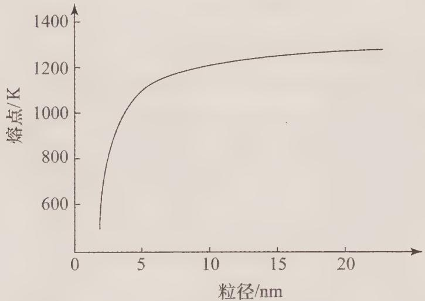  
图10.7.2 金的熔点和粒径大小的关系

许多有机化合物微粒粒径减小时，具有很高的化学反应活性，很容易和空气中的氧气等发生化学反应，即产生粉尘爆炸。例如我国台湾新北市八仙乐园于2015年6月29日举行彩虹派对时，喷洒淀粉，引起爆炸，致使7人死亡，许多人严重烧伤。

纳米材料颗粒的大小和磁学性能有密切的关系。例如 $\alpha-Fe, Fe_{3}O_{4}$ 和 $Fe_{2}O_{3}$ 的粒径各为 5 nm, 16 nm 和 20 nm 时，就变成顺磁体，磁化率 ( $\chi$ ) 不服从 Curie-Weiss 定律。原因是微粒尺寸减小，各向异性也变小，当它的尺寸很小时，磁化方向就不再固定在一个易磁化的方向，微粒作无规律的变化，导致超顺磁性的出现。不同材料的临界尺寸不同，例如粒径为 85 nm 的镍微粒，矫顽力很高， $\chi$ 服从 Curie-Weiss 定律；当粒径小到 15 nm 时，矫顽力趋于 0，镍微粒进入超顺磁状态。

纳米微粒的尺寸在小于超顺磁临界尺寸时，常出现高矫顽力。因为当尺寸小到某一临界值时，每个微粒就是一个单磁畴，使微粒成为永久磁铁，呈现出高的矫顽力。纳米微粒的尺寸还影响它的磁化率和Curie温度，例如将Fe-Co合金和氧化铁的纳米强磁性颗粒的尺寸降到单磁畴时，它就具有很高矫顽力。

## 10.7.3 量子尺寸效应和隧道效应

固体能带理论显示,块状金属处在宏观尺寸时,Fermi 能级附近的电子能级间距几乎为 0,能级呈现连续性。对纳米微粒,因它包含的原子数目很少,能级间距增大,能隙变宽,当能隙大于热能、磁能、光子能量时,它的性质就显著地和宏观尺寸的状态不同,这种现象称为量子尺寸效应。

实验证明,块状金属银具有优良的导电性能,但当用纳米技术制得纳米尺寸的颗粒银时,导电能力大大降低。粒径<14 nm 的银粉,1 K 时为电绝缘体,出现明显的量子尺寸效应。

纳米微粒的量子尺寸效应和表面效应,显著地影响着材料的性质。以金属的光学性质为例:金属的纳米微粒由于它的反射率极低和吸收率极强,致使它几乎都呈黑色。例如,纳米尺寸的铂微粒,反射率只有1%。又如一些氧化物和碳化物,如 $Al_{2}O_{3}$ , $SiC$ , $Si_{3}N_{4}$ 等纳米微粒,表面上原子的平均配位数降低,没有一个单一的择优的键振动模,出现较宽的键振动模分布,使红外吸收带宽化。

固体的能隙随颗粒直径变小而增大,会使它的光谱发生蓝移。这可从键强来分析:颗粒变小,表面张力增大,键长缩短而导致键的本征振动频率增大,使光吸收带向高频率移动。例如,大块 SiC 红外吸收频率为 $794 \, cm^{-1}$ ,纳米颗粒为 $814 \, cm^{-1}$ ,蓝移约 $20 \, cm^{-1}$ 。

在本书第1章中讨论了微观粒子具有不同于宏观物体的隧道效应。对于纳米微粒等介观粒子，在一些性质上也具有隧道效应，为了区别于微观粒子，有时称这种效应为宏观量子隧道效应。下面几种实例表现出纳米粒子的宏观量子隧道效应：

（1）当电子器件的尺寸小于电子平均自由程时，电子从一个电极传输到另一个电极，不会出现“随机游动”的散射现象，平稳地通过短而窄的隧道。

（2）纳米微粒的运动在一定条件下遵循 Schrödinger 方程的波动规律。例如当大于粒子能量的势垒区域窄到量子尺度，粒子可直接穿过该势垒，即粒子波包有穿越势垒的概率。

(3) 一些宏观物理量, 如纳米粒子的磁化强度和量子相干器件的磁通量, 具有量子效应。

## 10.7.4 碳的纳米材料

传统体相晶态碳的单质有三类同素异构体：金刚石、石墨和球碳。本小节简单介绍一些由组成这三类晶体的原子和纳米量级的小晶粒衍生发展的材料。

## 1. 纳米金刚石

纳米金刚石(nanodiamond, ND)是指粒径大小处在纳米量级的金刚石晶体, 它可用爆炸方法、冲击波方法或其他方法制得。现在每年已能成吨地批量生产。由于它具有较高化学稳定性、无毒性和巨大的比表面等性质, 在许多领域得到应用。例如直接将粒径在约 $5 \mathrm{~nm}$ 的 ND 放在胶体材料中, 作为悬浮物, 改变胶体的光学性质或力学性能, 形成具有一定特性的材料。但是更主要的是纳米技术的发展, 利用纳米金刚石的表面反应性能, 通过多种表面功能化的方法, 在 ND 晶粒表面上连接出含有多种功能的基团, 再在这些基团的基础上, 根据使用要求, 得到多种多样的衍生物材料。

## 2. 石墨烯

石墨烯(graphene)是单层石墨分子的通用名称,它为层状结构,只有一个原子厚,是最薄、接近透明的碳原子层。在层中碳原子以 $sp^{2}$ 杂化轨道互相形成 $\sigma$ 键,连接成蜂窝状的六边形平面结构;垂直平面的 $p_{\pi}$ 轨道互相叠加,形成多环芳烃的离域 $\pi$ 键。在实际工作中,石墨烯材料包括多层石墨分子的层状物,层间有其他分子填充,层的边缘和其他多功能基团连接,使它的组成、结构、性能和应用非常丰富多彩。

2004 年, Geim 和 Novoselov 首先在实验室中用胶带从石墨晶体将单层厚度的石墨烯粘起并转移到硅晶片上, 研究它的结构和性质, 发现它具有独特的性质和应用, 开辟了一个新材料领域, 这两位科学家因此获得 2010 年诺贝尔物理学奖。

在石墨烯中,碳原子间由于有 $\sigma$ 键和离域 $\pi$ 键结合在一起,使它具有独特的物理性质和化学性质。它是迄今发现的最强、最轻的材料,其强度比同等质量的钢强 100 倍,它还可以弯曲到很大角度而不断裂，能耐受很高的压力。电子在其中的传导速率可达 $10^{6} \mathrm{~m} \mathrm{~s}^{-1}$ ，是光速的 1/300；而且电子在石墨烯中运动受到的阻力几乎为 0，产生的热量很少，因此它是良好的热导体，能很快散发热量。单层石墨烯的比表面积非常大，达到 $2630 \mathrm{~m}^{2} \mathrm{~g}^{-1}$ ，可制作充电速度快、储电容量大的新型电容器，并具有功率高、寿命长等优点。石墨烯的超高透光性，可制作透明电极、太阳能电池和液晶显示器。石墨烯的上述力学、电学、热学和光学性能，可用于制作性能优异、高于硅材料的芯片、晶体管和电子器件，大幅度提升计算机的运算速度，在微电子领域存在美好前景。石墨烯可制作高性能的电极材料，用于锂离子电池等高性能电池。石墨烯的应用前景日益受到人们的重视和关注。

由碳原子组成的平面形石墨烯分子，在其边缘上和面上的原子都有一定的化学反应性能，可以和其他化学品制备出石墨烯化合物，成为近年来化学发展的一大热点。人们怀着巨大的期望，通过氧化和氢气作用等办法使碳骨架的原子和氧原子以及氢原子结合，进一步和其他试剂反应转变成所需的官能团，形成新的质轻的层形化合物，通过层间作用，可以形成夹层化合物，大量储存氢气等化学物质。在能源转化和储存方面，石墨烯可作为燃料电池的催化剂载体，将活性很高的铂等金属粒子沉积到片层中，提高催化活性，成为供燃料电池等能源和环境科学所需的材料。

要想将具有优异物理和化学性能的石墨烯制成实际应用的材料,需要克服面临的多方面的问题:首先,要开辟成熟又廉价的工艺,制备出规格统一而完整的石墨烯片;其次,要创新成熟的方法,来操作处理单原子层厚度的薄片,将它和其他材料整合在一起,制造一定规格的元器件;第三,石墨烯虽然具有优良的导电性能,但它没有带隙,电流在其中开始流动就很难关闭,要克服这个问题,才能将它用于制作数字电路核心的“开-关”转换器件。可见,开发石墨烯的应用是一个潜力无限而对科学技术要求很高的产业,盼望读者们努力学习,了解石墨烯的特性,为制出可供高端应用的材料作贡献。

层形 $(\mathrm{BN})_n$ 是石墨烯的等电子体，预计它的许多物理性质和石墨烯相似，应关注和探索它的制备和应用。

## 3. 纳米碳管

纳米碳管可看作球碳沿一个方向延伸形成的管状椭球，也可看作由石墨分子卷曲形成单层或多层的管状碳分子。由于它的特殊结构及优异的电学和力学性能，在材料科学、化学和纳米技术领域中均有广泛的应用潜能。

纳米碳管的凹形内表面在加成反应中显示出很低的反应活性,但管中可以填充金属原子、无机盐和无机小分子,改变管的性质。

纳米碳管在各种溶剂中溶解度都很低，对它的应用主要不是着眼于管内包合的原子或基团，而是着眼于管外壁和管口的功能化，即通过共价键使碳原子和其他官能团结合。单层碳管外管壁上的碳原子和球碳分子面上的碳原子相似，相互通过介于 $\mathrm{sp}^2$ 和 $\mathrm{sp}^3$ 之间的杂化轨道形成共价键，垂直管壁的p轨道相互叠加比平面石墨层减少，导电性也较石墨低。在碳管口上存在的碳原子活性较高，在功能化过程中容易发生反应，即它们容易转变成四面体形 $\mathrm{sp}^3$ 杂化轨道和基团连接。

许多研究工作已在纳米碳管外壁接上 $\mathrm{COOH, - OH, C = CH_2 - SH}$ ，卤素和冠醚等基团,改善纳米碳管的性质和功能,用作气体传感器和生物传感器等材料。

## 4. 球碳化合物

以 $C_{60}$ 为例，在分子表面上的 C 原子被两个六元环和一个五元环共用，它的 3 个 $\sigma$ 键的键角之和为 $348^{\circ}$ ，呈三角锥形，不是平面三角形，C 原子采用 $sp^{2.28}$ 杂化轨道。球碳可以通过多种途径制得球碳化合物，它的直径约在纳米量级，有待开发它的应用价值。例如：

球碳 $C_{60}$ 和 $F_{2}$ 反应，制得全氟球碳分子 $C_{60}F_{60}$ ，呈白色粉末状，它是超级耐高温（约 $700^{\circ}C$ ）的润滑剂。

球碳 $\mathrm{C}_{60}$ 能吸附 $\mathbf{N}_2$ ，削弱 $\mathbf{N}_2$ 的多重键，使它和 $\mathrm{H}_{2}$ 反应生成 $\mathrm{NH}_{3}$ 。这种不含金属的合成氨催化剂，对人工模拟生物固氮具有重要意义。

已发现球碳包合物 $\mathrm{M}_n@\mathrm{C}_{60}$ 有许多奇特性质，在材料、催化和生物功能等方面有着许多潜在的应用前景。例如 $\mathrm{La}_2@\mathrm{C}_{60}$ 中的2个La原子在温度升高时作环形运动，温度降低时停止运动，可探讨制作受温度控制的分子器件。球碳和碱金属形成的球碳盐在低温下具有超导性： $\mathrm{K}_2@\mathrm{C}_{60}$ 的 $T_{\mathrm{c}}$ 为 $19\mathrm{K},\mathrm{Rb}_3@\mathrm{C}_{60}$ 为 $28\mathrm{K},\mathrm{Cs}_3@\mathrm{C}_{60}$ 为 $30\mathrm{K},\mathrm{RbCs}_2@\mathrm{C}_{60}$ 为 $48\mathrm{K}$ ，可探索制作有机超导体。

## 10.7.5 软物质

软物质(soft matter)又称软凝聚态物质(soft condensed matter)，是一大类物质的存在形式，它一般由大分子或颗粒物组成，其大小和纳米材料中的基本单元接近，如液晶、橡胶、泡沫、凝胶、聚合物等。软物质的性能介于液体和固体之间。“软物质”的名称是20世纪70年代由法国科学家P.G. de Gennes(德热纳)提出的。他发现，软物质具有短程有序性，而缺乏长距离的周期性，其形态和体系的熵值有重大关系，它对外界所给予的作用非常敏感。软物质非常容易变形，和“硬物质”相比，弹性常数非常低。de Gennes发现，用于研究简单体系中的有序现象而发展起来的方法，特别是在研究液晶和高聚物等材料时，也适用于软物质的复杂体系的研究。由于de Gennes在研究软物质领域的贡献，他于1991年获诺贝尔物理学奖。

de Gennes 曾说：“天然橡胶的每 200 个碳原子中，只有一个原子和硫发生反应，尽管其化学作用如此微弱，却使其物理性质发生变化，由液态转变为固态。如同雕塑家轻轻地压一压黏土，就能改变其形状。这便是软物质的核心和基本定义。”

软物质领域涉及的面非常广,它是由许多经过长期研究的学科演变合并而成的,其内容包括各种分子间的作用力,以及对高聚物、胶体和液晶等学科所得的研究成果。而促进这些成果结合在一起形成软物质科学的原因,关键在生命科学的发展。由于生物体的每一个器官都是由软物质组成,对它进行研究需要综合应用纳米科学及上述各个自然科学分支的研究技术、方法和所得的成果。软物质的科学研究已成为21世纪跨越物理、化学、生物三大学科的前沿。

软物质是大小处于纳米量级的分子及其聚集体，因具有复杂性和柔软性而得名。复杂性至少有三层含义：一是构成软物质的基元多数是化学结构颇为复杂的链状和支状分子，如各种聚合物分子或分子基团；二是分子本身具有不同的官能团，如两亲分子中不同的部位显现不同的性质；三是这些分子常常通过自组装形成各种复杂的结构，如蛋白质分子的折叠，表面活性分子在溶液表面上的定向排列等。软物质的柔软性是指当它受到外界的微小作用力时，会发生巨大的状态变化，即对外界影响具有高度敏感性。

形成软物质特性的基本原因在于,软物质受外界作用力时,不会破坏分子内部原子间的强化学键,如共价键,不改变分子中原子间连接次序和化学键性质,而是改变分子的构象和扭角等分子的形状,同时大量地改变分子间的作用力和相互位置,改变分子内部和分子之间的氢键,破坏一些分子间和分子内部基团间的氢键,同时形成一些新的氢键,以适应外界作用力对它的影响。在变形过程中,分子内部基团间的相对位置以及分子间的相对位置常发生巨大变化,但是分子间相互作用的次级键的数量改变不大,致使变化时键能等能量的变化不太大,而熵值却发生较大的变化。

软物质最突出的性质是它的自组装能力,即体系受外界作用,为适应新条件,自发地转变为新的结构,这是软物质行为的核心。

软物质是一类柔软的物质，和固体硬物质相比，其形状容易发生变化。软物质容易受温度升降的影响，改变它的有序度，也容易受外力影响，使其结构或聚集状态发生改变。上述这些变化导致软物质的性质发生变化，在实际应用中起重大作用。例如，墨汁中加一点阿拉伯胶，其稳定存在的时间大大延长；豆浆中加一点卤水，就能凝结成豆腐；水中加几滴洗洁精，会产生一大堆泡沫；液晶手表的运转是液晶分子在耗能极低条件下使聚集状态可逆改变的结果。

软物质大多来自有机化合物，在介观尺寸下存在着有序结构特性。软物质和简单纯液体不同，纯液体在不同条件下不会形成有序的结构，所以简单纯液体不是软物质。软物质有着多种自由度，例如高聚物会出现构象自由度，液晶出现取向自由度，正是由于这些自由度引起软物质通过自组装变成局部的有序结构，显示出独特的功能，附加自由度产生作用，使构象熵和取向熵发生改变，使软物质结构和性能发生复杂的变化。

在最近由牛津大学出版社出版的《软凝聚态物质的牛津手册》中，其内容分成13章论述，它们分别是：胶态悬浮物，表面活性剂，液晶，泡沫，粒状体系，缠结聚合物的动态力学，嵌段聚合物，弹性体和类橡胶的弹性，高分子电解质溶液和凝胶，凝胶中的流体迁移，细胞外的基质，细胞骨架，界面和膜。从上述内容可以看出，研究软物质的化学主要包含在胶体化学和高分子化学之中，在其中熵值起主要作用的变化规律的物质，则属于软物质，即软物质是熵增加效应起主要作用的物质。

## 10.8 结构化学研究方法的新进展

## 1. 回顾和展望

通过前面各章的学习,使我们了解到结构化学是在原子-分子水平上,主要以量子力学理论、对称性理论、点阵理论和化学键理论为基础,利用计算推理方法和各种实验的测定技术,阐述下列三方面的知识:(i)化学物质中电子的运动状态、原子的结构和性质、分子和晶体中原子的空间排布、化学键的本质以及结构和性能的联系等;(ii)结构化学和化学的各个分支学科间的密切联系,为化学反应机理、各类新发现的化合物、生物大分子以及处于动态和激发态时的物质给出键型、构型和构效关系等基础知识;(iii)结构化学和物理化学、生命科学、医药学、材料科学、地球化学等许多学科密切联系,共同进行研究。

课程内容中介绍的20世纪结构化学的主要实验研究方法如下：通过衍射法测定晶态物质的结构；通过磁共振法测定液态分子中分子的存在状况和结构特征；通过光谱法测定各种状态下原子和分子的结构和性质。这些研究物质微观结构方法的应用，使人们对各种状态下物质的结构和性质有着深入的了解，推动自然科学各个学科蓬勃发展，为社会生产力的提高、创造丰富的物质财富、改善医疗水平、促进人们的身体健康起着重大作用。

进入 21 世纪,研究物质结构的方法不断更新发展,对化学物质的认识水平不断提高深入,使化学的各个分支学科出现了崭新的面貌。展望结构化学的发展,可从下面的观察角度了解它的状况:

从化学键的角度看,新的发展对次级键的作用和重要性的认识不断深入。

从研究的总体对象看,不局限于组成确定、结构稳定的无机化合物、有机化合物和高分子化合物,进入到生物大分子以及复杂多变的溶液中“活的”生物大分子的形态和结构。

从测定结构的速度看,将原先投入以年月计算所需的时间测定一个化合物结构,进展到以天数和小时数计算测定复杂的化合物和生物大分子的结构。

从研究晶体和液体中大量分子的平均统计所显示的结构和性质,进入到单个分子的结构状况和特征性质的研究。

徐光宪教授曾提出，21世纪化学的发展趋势有“五多”：（i）多学科交叉，不仅是化学中各分支学科之间的交叉，化学还会和生命科学、电子学、材料科学、纳米科学、能源科学等多学科交叉；（ii）多层次发展，化学不满足于合成新化合物，而是向分子以上多层次发展，如分子器件、分子机器；（iii）多尺度分布，调控颗粒的形貌和尺寸，改变物质的性能，例如纳米尺度的石墨烯，显示和石墨性质不同的新材料和新发展的领域；（iv）多整合生产，将各类化合物的特异结构和性质结合在一起，例如将化合物中的刚性部分和柔性部分整合起来，制成刚柔结合、超强度超细纤维，以及多功能的新材料和新器件；（v）多方法协作，将合成、组装、分离、分析、性能测试相结合，实验和理论共同并进，化学、物理和信息学等各种方法协作联用。

上述“五多”反映出化学是自然科学发展的中心环节，是为社会发展创造物质财富的基础科学。“工欲善其事，必先利其器”，要使化学科学快速发展以适应社会发展的需求，必须关注物质结构研究方法的新发展，提高对物质结构的深入认识，为自然科学的高速发展和应用奠定坚实的基础。

下面仅以测定晶体结构的衍射法所用的 X 射线光源发展进程为例,说明学习结构化学不仅要认真关注前人所提出的理论、已测定的化学物质的结构和性能,还要关注不断出现的新思想、新理论、新概念、新技术和测定结构方法的新进展,扩大我们的思想境界,提高认识水平。

## 2. 同步辐射在结构化学中的应用

在历史上曾出现过四次对人类文明带来革命性推动的新光源：第一次是电光源，为夜晚带来光明；第二次是X光，它不仅将我们的视野扩展到物体内部，而且通过衍射“看到”物体中原子排列的结构；第三次是激光，它的波长的单一性、方向的准直性、相位的相干性，使得它在工业、通信、信息、国防、医疗、科研等领域中发挥了十分重要的作用；第四次指同步辐射，它已成为物理学、化学、材料科学、生命科学等众多学科领域进行研究的一种先进手段。

同步辐射(synchrotron radiation)是由接近光速运动的带电粒子在改变运动方向时放射的电磁波,又称为同步辐射光。它具有下列特性和在化学科学中的应用。

第一,光的强度非常强,是普通光源的几百倍到几万倍,光强特别稳定,适用于测定衍射能力很弱的晶体、晶胞特大的晶体以及耐辐射能力很差的生物大分子晶体等。同步辐射光源配合面探测器的技术,可在不到1秒的时间内记录超过1万个衍射的衍射斑点图。

第二，高准直性和高单色性。同步辐射是电子在加速器中沿着圆周轨道的切线方向从一个很小角度范围内放射出来的光，准直性高，对晶胞特大的晶体，衍射点间的距离非常小，利用同步辐射可减小衍射点的发散度,避免衍射点的重叠。同步辐射优异的准直性,大大提高了衍射点空间分布的清晰度,对晶胞参数的微小变化,以及晶体在外界条件改变时(如在电磁场中、高压下、热处理过程中)内部结构变化的动态过程,作实时的研究和观察。

第三,同步辐射是波长连续可调的光,它的波长由加速器中电子的能量(即运行速度)和运动轨道的弯转半径所确定,是用作多波长反常散射(MAD)和Laue衍射图像的理想光源。

第四，同步辐射是一种非常“干净”的光，因它是电子在超高真空的环境中受磁场作用产生，它不存在普通X光管中金属靶内包含的杂质以及管中残余气体所发的光，可用它分析极高纯度的样品，例如检测含量在 $10^{-12}$ 量级的杂质元素。

第五,同步辐射是偏振光,可应用于 X 射线荧光分析法来测定含量很低的元素。

高强度的同步辐射为研究非晶态或有序度不高的物质结构开辟了新的方法，扩展的X射线吸收精细结构(extended X-ray absorption fine structure, EXAFS)就是一例。样品中的某种原子在波长连续变化的高强X射线照射时，吸收系数对特定波长有突然变化，这是由于入射的X射线光子能量等于该元素中电子的一种结合能，激发该电子成自由电子，按波粒二象性，该电子波到达邻近原子时产生反射波。这两种波叠加起来将出现干涉现象，使它的振幅增大或减小，由两种波的相位差而定。这个相位差则由X射线的波长，反射原子的距离、种类和数量（即配位情况）而定。不同结构的样品会出现不同的EXAFS谱。利用高强度的同步辐射光源，可以研究晶态和非晶态物质中原子周围配位层的配位数和配位距离，定性地鉴别配位原子的种类、配位结构型式、表面吸附态的结构等。例如， $\mathrm{Br}_2$ 分子在石墨表面吸附呈平躺式。

同步辐射的应用不仅提高了X射线衍射技术测定生物大分子结构的速度，缩短了测定结构所需的时间，而且所得结构模型的精度之高和数量之多，以往任何时期都无法比拟。蛋白质晶体结构数据库(PDB)中归档的结构数目快速增加，例如2013年4月库存数目为89008个，到2013年5月达到90810个，一个月就增加了1800个。生物大分子晶体衍射的发展，不仅丰富了结构化学和结构生物学等学科的内容，也为药物设计和合成提供了可靠的结构依据。

## 3. X 射线自由电子激光 (X-ray free-electron lasers, XFEL)

XFEL 是一种新型超强 X 射线激光光源, 光强度可达同步辐射光源的近亿倍, 兼有同步辐射和激光两者的优点, 它的发现为人们打开了进入和认识“超级快速”“超级微小”的世界之门, 使人们能够捕捉在飞秒 $(10^{-15} \mathrm{~s})$ 级短时间内的化学过程, 拍摄原子尺度动态图像, 使阐明生物的单分子行为和结构成为可能。

XFEL 以第三代同步辐射光源为光子源，核心设备为线性加速器、波荡器（或摇摆器）磁铁以及聚焦系统。XFEL 在生物大分子晶体学中的应用，将摆脱以往需要制备“大的、有衍射质量的”晶体样品和辐射衰减影响的困境，在室温（不用低温）下实现收集大小约 200 nm 的生物大分子微小晶体衍射数据。特别适合研究瞬时分子结构变化（过渡态），从而进一步扩充和拓宽了生物大分子研究领域。这个超强脉冲 X 射线源，即线性相干光源的高能、高效性，对晶体样品要求低等特点，将真正激起和开辟生物大分子飞秒 X 射线纳米晶体学，使连续飞秒晶体学的概念实用化，克服传统晶体学的两个瓶颈——制备晶体样品和相角问题的困境，揭示和阐明纳米晶体和单分子结构。

在结构化学基础课中,着重学习原子、简单分子和晶体等的结构和性质,这些是掌握化学知识的基础。在这些基础上进一步将它们和纳米材料、生物大分子、软物质及各种材料的特性和应用相结合,和物质结构研究方法的新进展相结合,看到所学基础和实际使用时所碰到问题的差距。一个人的想象力应当比他已拥有的知识更为重要,提出解决问题的方法和思路,比了解已解决的问题更重要。衷心希望读者们依靠所学的基础知识,在万众创新中发挥出高度的创新思维和解决实际问题的能力。

## 习题

10.1 在硫酸盐和硼酸盐中， $\mathrm{SO}_4^{2-}$ 和 $\mathrm{BO}_3^{3-}$ 的构型分别为正四面体和平面正三角形，S—O键和B—O键的键长平均值分别为 $148~\mathrm{pm}$ 和 $136.6~\mathrm{pm}$ ，试计算S—O键和B—O键的键价以及S原子和B原子的键价和。

10.2 $\mathrm{ClO}_2^-$ （弯曲形）， $\mathrm{ClO}_3^-$ （三角锥形）和 $\mathrm{ClO}_4^-$ （四面体形）离子中， $\mathrm{Cl}-\mathrm{O}$ 键的平均键长值分别为 $157~\mathrm{pm}, 148~\mathrm{pm}$ 和 $142.5~\mathrm{pm}$ ，试分别计算其键价及键价和。

10.3 试计算下列化合物已标明键长值的 Xe—F 键键价。说明稀有气体 Xe 原子在不同条件下和其他原子形成化学键的情况。[按(10.1.3)式计算 Xe—F 键时， $R_{0}$ 为： $Xe^{2+}$ 200 pm, $Xe^{4+}$ 193 pm, $Xe^{6+}$ 189 pm; B 为 37 pm]。

(1) $XeF_{2}$ (直线形): Xe—F 200 pm;

$$
\left[ \mathrm{Xe} _ {2} \mathrm{F} _ {3} \right] ^ {+} + \left[ \mathrm{SbF} _ {6} \right] ^ {-}: \left[ \mathrm{Xe} - \underbrace {\mathrm{F} ^ {2 1 4 \mathrm{pm}}}{1 5 1 ^ {\circ}} \mathrm{Xe} \underbrace {1 9 0 \mathrm{pm}} _ {\mathrm{F}} \right] ^ {+}; \tag {2}
$$

$$
\left[ \mathrm{NO} _ {2} \right] ^ {+} \left[ \mathrm{Xe} _ {2} \mathrm{F} _ {1 3} \right] ^ {-}: \left(\mathrm{F} _ {5} \mathrm{Xe} \left\langle\begin{array}{c c}\mathrm{F}&\\&\mathrm{F} - 2 5 5 \mathrm{pm}\end{array}\right.\right. \mathrm{XeF} _ {6}\left. \right) ^ {-}; \tag {3}
$$

$$
\left[ (2, 6 - \mathrm{F} _ {2} \mathrm{C} _ {6} \mathrm{H} _ {3}) \mathrm{Xe} \right] ^ {+} \left[ \mathrm{BF} _ {4} \right] ^ {-}: \mathrm{H} - \mathrm{C} \xrightarrow [ \mathrm{H} ]{\mathrm{C} - \mathrm{C}} \mathrm{C} - \mathrm{Xe} ^ {- 2 7 9 \mathrm{pm}} \mathrm{F} - \mathrm{BF} _ {3}; \tag {4}
$$

(5) $\left[Me_{4}N\right]^{+}\left[XeF_{5}\right]^{-}$ : 平面五角形的 $XeF_{5}^{-}$ 离子中 Xe—F 202 pm。

10.4 CaO 具有 NaCl 型的晶体结构, 试根据表 10.1.1 的数据估算 Ca—O 的键长及 $Ca^{2+}$ 的半径 (按 $O^{2-}$ 的离子半径为 140 pm, $Ca^{2+}$ 和 $O^{2-}$ 的离子半径和即为 Ca—O 的键长计算)。

10.5 NiO 具有 NaCl 型结构, 试根据表 10.1.1 数据估算 $Ni^{2+}$ 离子半径。

10.6 已知甲烷水合物晶体属于立方晶系，晶胞参数 $a = 1.20 \mathrm{~nm}, Z = 1(8 \mathrm{CH}_{4} \cdot 46 \mathrm{H}_{2} \mathrm{O})$ 。试求晶体的密度，标准状态下 $1 \mathrm{~m}^{3}$ 晶体可得多少甲烷和淡水？

10.7 怎样知道液态水中仍保留一定的氢键？怎样解释水在 $4^{\circ}\mathrm{C}$ 时密度最大？

10.8 下表给出 $15^{\circ} \mathrm{C}$ 时几种物质的黏度（单位： $10^{-3} \mathrm{~kg} \mathrm{~m}^{-1} \mathrm{~s}^{-1}$ ），试说明为什么会有这样的大小次序。

<table><tr><td>物质</td><td>丙酮</td><td>苯</td><td>HAc</td><td> $C_2H_5OH$ </td><td> $H_2SO_4$ </td></tr><tr><td>黏度</td><td>0.34</td><td>0.91</td><td>1.31</td><td>1.33</td><td>32.8</td></tr></table>

10.9 水和乙醚的表面能分别为72.8和 $17.1(10^{-7}\mathrm{Jcm}^{-2})$ ，说明存在如此大差异的原因。

10.10 举例说明什么是配位水、骨架水、结构水和结晶水。为什么硫化物和磷化物一般不存在结晶水？

10.11 根据 $\mathrm{SbF}_3$ 晶体结构测定数据， $\mathrm{Sb}-\mathrm{F}$ 间除3个较短的强键呈三角锥形分布外，还有3个弱键和3个非常弱的键。它们的键长（以pm为单位）如下：195,195,206;250,256,256;375,378,378。

试计算各键的键价及 Sb 原子的键价和。

10.12 什么是绝对构型？画出 $R$ 型甘油酸 $\mathrm{H}_2\mathrm{C(OH)} - \mathrm{CH(OH)} - \mathrm{COOH}$ 的立体结构式。

10.13 已知乙酸、丙酸、丁酸、戊酸的密度分别为 1.049, 0.993, 0.959 和 $0.939 \, g cm^{-3}$ 。试根据表 10.5.1 所列原子基团的体积增量数据，计算分子的堆积系数。讨论它们的变化规律，解释其原因。

10.14 邻位和对位硝基苯酚 $20^{\circ}$ C 时在水中的溶解度之比为 0.39，在苯中为 1.93，请由氢键说明其差异的原因。

10.15 乙醚相对分子质量比丙酮大，但沸点 $(34.6^{\circ}\mathrm{C})$ 比丙酮沸点 $(56.5^{\circ}\mathrm{C})$ 低；乙醇相对分子质量更小，但沸点 $(78.5^{\circ}\mathrm{C})$ 更高。试分别解释其原因。

10.16 请根据分子中原子的共价半径和范德华半径，画出尿素分子的形状和大小。

10.17 环氧乙烷中含少量水,试画出它们的分子模型,估计最小分子直径,并判断能否用3A型分子筛(孔径3.3 Å)作为环氧乙烷的干燥剂?4A和5A型(孔径分别为4 Å和5 Å)又如何?

10.18 试根据苯分子的构型和原子的范德华半径估算分子的直径及厚度。

10.19 计算水分子的体积以及液态水中和冰中分子的堆积系数。

10.20 举例说明什么是分子识别。

10.21 疏水效应为什么能降低体系能量、增高熵值？

## 参考文献

[1] 邵美成. 鲍林规则与键价理论. 北京: 高等教育出版社, 1993.

[2] 胡盛志. 晶体化学中的次级键. 大学化学, 2001, 16(3): 6\~14.

[3] 麦松威, 周公度, 李伟基. 高等无机结构化学. 第 2 版. 北京: 北京大学出版社, 2006.

[4] 周公度. 氢的新键型. 大学化学, 1999, 14(4): 8\~16; 今日化学, 187\~196. 北京: 高等教育出版社, 2001.

[5] 林梦海, 谢兆雄, 等. 结构化学. 第三版. 北京: 科学出版社, 2014.

[6] 周公度, 郭可信, 李根培, 王颖霞. 晶体和准晶体的衍射. 第二版. 北京: 北京大学出版社, 2013.

[7] 林建华, 荆西平, 等. 无机材料化学. 北京: 北京大学出版社, 2006.

[8] 刘育, 尤长城, 张衡益. 超分子化学: 合成受体的分子识别与组装. 天津: 南开大学出版社, 2001.

[9] 胡盛志. 键价理论的研究进展. 大学化学, 2007, 22(6): 1\~12.

[10] Weaver R F, 著. 分子生物学. 原书第 4 版. 郑用琏, 张富春, 徐启江, 岳兵, 等译. 北京: 科学出版社, 2010.

[11] Devlin T M, 等著. 生物化学——基础理论与临床. 原书第 6 版. 王红阳, 等译. 北京: 科学出版社, 2008.

[12] Nelson D L, Cox M M, 著. 生物化学原理. 原书第 3 版. 周海梦. 等译. 北京: 高等教育出版社, 2005.

[13] Tytko K H, Mehmke J, Kurad D. Bond length-bond valence relationships. Structure and 386

Bonding, 1999, 93: 1\~66.

[14] Jeffrey G A. An Introduction to Hydrogen Bonding. New York: Oxford University Press, 1997.

[15] Brown I D. The Chemical Bond in Inorganic Chemistry: The Bond Valence Model. Oxford: Oxford University Press, 2006.

[16] Gans W, Boeyens J C A. Intermolecular Interactions. New York: Plenum, 1998.

[17] Beer P D, Gale P A, Smith D K. Supramolecular Chemistry. Oxford: Oxford University Press, 1999.

[18] Lehn J-M. Supramolecular Chemistry—Concepts and Perspectives. Weinheim: VCH, 1995.

[19] Lehn J-M (Series editor). Comprehensive Supramolecular Chemistry (Vol. 1\~11). Oxford: Pergamon, 1996.

[20] Steed J W, Atwood J L. Supramolecular Chemistry. Chichester: Wiley, 2000.

## 附录 单位、物理常数和换算因子

表 1 国际单位制的基本单位

<table><tr><td>物理量名称</td><td>单位名称</td><td>单位符号</td></tr><tr><td>长度</td><td>米</td><td>m</td></tr><tr><td>质量</td><td>千克</td><td>kg</td></tr><tr><td>时间</td><td>秒</td><td>s</td></tr><tr><td>电流强度</td><td>安[培]</td><td>A</td></tr><tr><td>热力学温度</td><td>开[尔文]</td><td>K</td></tr><tr><td>物质的量</td><td>摩[尔]</td><td>mol</td></tr><tr><td>发光强度</td><td>坎[德拉]</td><td>cd</td></tr></table>

表 2 若干重要的导出单位

<table><tr><td>物理量名称</td><td>单位名称</td><td>单位符号</td></tr><tr><td>力</td><td>牛[顿]</td><td>N (kg m s-2)</td></tr><tr><td>能量</td><td>焦[耳]</td><td>J (Nm)</td></tr><tr><td>功率</td><td>瓦[特]</td><td>W (Js-1)</td></tr><tr><td>电荷量</td><td>库[仑]</td><td>C (As)</td></tr><tr><td>电位</td><td>伏[特]</td><td>V (WA-1)</td></tr><tr><td>电容</td><td>法[拉]</td><td>F (CV-1)</td></tr><tr><td>电阻</td><td>欧[姆]</td><td>Ω (VA-1)</td></tr><tr><td>频率</td><td>赫[兹]</td><td>Hz (s-1)</td></tr><tr><td>磁通量</td><td>韦[伯]</td><td>Wb (Vs)</td></tr><tr><td>磁感应强度</td><td>特[斯拉]</td><td>T (Wbm-2)</td></tr><tr><td>电感</td><td>亨[利]</td><td>H (Wb A-1)</td></tr></table>

表 3 常用物理常数

<table><tr><td>名称</td><td>符号</td><td>物理常数</td></tr><tr><td>电子质量</td><td> $m_e$ </td><td>9.10953× $10^{-31}$ kg</td></tr><tr><td>质子质量</td><td> $m_p$ </td><td>1.67265× $10^{-27}$ kg</td></tr><tr><td>真空电容率</td><td> $ε_0$ </td><td>8.854188× $10^{-12}$ C2J−1m−1</td></tr><tr><td>真空磁导率</td><td> $μ_0$ </td><td>4π× $10^{-7}$ Js2C−2m−1</td></tr><tr><td>真空光速</td><td>c</td><td>2.997925× $10^8$ ms−1</td></tr><tr><td>电子电荷</td><td>e</td><td>-1.60219× $10^{-19}$ C</td></tr><tr><td>Boltzmann 常数</td><td>k</td><td>1.38066× $10^{-23}$ JK−1</td></tr><tr><td>摩尔气体常数</td><td>R</td><td>8.31441JK−1mol−1</td></tr><tr><td>Planck 常数</td><td>h</td><td>6.62618× $10^{-34}$ Js</td></tr><tr><td>Avogadro 常数</td><td> $N_\Lambda$ </td><td>6.02205× $10^{23}$ mol−1</td></tr><tr><td>Bohr 磁子</td><td> $β_c(=eh/4\pi m_e)$ </td><td>9.2740× $10^{-24}$ JT−1</td></tr></table>

$1\mathrm{G}(\mathrm{Gauss}) = 10^{-4}\mathrm{T}$

<table><tr><td>名称</td><td>符号</td><td>物理常数</td></tr><tr><td>核磁子</td><td> $\beta_{\text{N}} \left( = \frac{eh}{4\pi m_{\text{p}}} \right)$ </td><td> $5.05082 \times 10^{-27} \text{ J T}^{-1}$ </td></tr><tr><td>Bohr半径</td><td> $a_0 \left( = \frac{\varepsilon_0 h^2}{\pi m_e e^2} \right)$ </td><td> $5.29177 \times 10^{-11} \text{ m}$ </td></tr><tr><td>Rydberg常数</td><td> $R_\infty \left( = \frac{m_e e^4}{8ch^3 \varepsilon_0^2} \right)$ </td><td> $1.097373 \times 10^5 \text{ cm}^{-1}$ </td></tr></table>

表 4 能量和其他一些物理量单位间的换算

<table><tr><td></td><td> $J mol^{-1}$ </td><td> $kcal mol^{-1}$ </td><td>eV</td><td> $cm^{-1}$ </td></tr><tr><td> $1 J mol^{-1}$ </td><td>1</td><td> $2.390 \times 10^{-4}$ </td><td> $1.036 \times 10^{-5}$ </td><td> $8.359 \times 10^{-2}$ </td></tr><tr><td> $1 kcal mol^{-1}$ </td><td> $4.184 \times 10^{3}$ </td><td>1</td><td> $4.336 \times 10^{-2}$ </td><td> $3.497 \times 10^{2}$ </td></tr><tr><td> $1 eV$ </td><td> $9.649 \times 10^{4}$ </td><td>23.060</td><td>1</td><td> $8.065 \times 10^{3}$ </td></tr><tr><td> $1 cm^{-1}$ </td><td> $1.196 \times 10$ </td><td> $2.859 \times 10^{-3}$ </td><td> $1.240 \times 10^{-4}$ </td><td>1</td></tr></table>

$1\AA = 100\mathrm{pm} = 10^{-8}\mathrm{cm} = 10^{-10}\mathrm{m}$  
$1\mathrm{atm} = 760\mathrm{mmHg} = 1.01325\times 10^{5}\mathrm{Nm}^{-2} = 1.01325\times 10^{5}\mathrm{Pa}$  
1 D(Debye) ≅ 3.33564 × 10 $^{-30}$ C m

表 5 原子单位 (au)

<table><tr><td>长度</td><td> $1\mathrm{au} = {a}_{0} = {5.29177} \times {10}^{-{11}}\mathrm{\;m}$ (Bohr半径)</td></tr><tr><td>质量</td><td> $1\mathrm{au} = {m}_{\mathrm{e}} = {9.109534} \times {10}^{-{31}}\mathrm{\;{kg}}$ (电子静质量)</td></tr><tr><td>电荷</td><td> $1\mathrm{au} = e = - {1.6021892} \times {10}^{-{19}}\mathrm{C}$ (电子电荷)</td></tr><tr><td>能量</td><td> $1\mathrm{au} = \frac{{e}^{2}}{{4\pi {\varepsilon }_{0}{a}_{0}}} = {27.2116}\mathrm{{eV}}(2 \text{个电子相距 }{a}_{0} \text{的势能})$ </td></tr><tr><td>时间</td><td>在原子单位中, $4{\pi {\varepsilon }_{0}} = 1,\frac{h}{2\pi } = 1$ ,因而时间的原子单位不是秒,而是 ${2.418885} \times {10}^{-{17}}\mathrm{\;s}$ (即电子在氢原子基态轨道转 $1{a}_{0}$ 所需的时间)</td></tr><tr><td>角动量</td><td> $1\mathrm{au} = \frac{h}{2\pi }\left( {\equiv h}\right) = {1.0545887} \times {10}^{-{34}}\mathrm{\;Js}$ </td></tr></table>

表 6 用于构成十进倍数和分数单位的词头

<table><tr><td>词头符号</td><td>词头名称</td><td>所表示的因素</td><td>词头符号</td><td>词头名称</td><td>所表示的因素</td></tr><tr><td>E</td><td>艾 (exa)</td><td> $10^{18}$ </td><td>a</td><td>阿 (atto)</td><td> $10^{-18}$ </td></tr><tr><td>P</td><td>拍 (peta)</td><td> $10^{15}$ </td><td>f</td><td>飞 (femto)</td><td> $10^{-15}$ </td></tr><tr><td>T</td><td>太 (tera)</td><td> $10^{12}$ </td><td>p</td><td>皮 (pico)</td><td> $10^{-12}$ </td></tr><tr><td>G</td><td>吉 (giga)</td><td> $10^9$ </td><td>n</td><td>纳 (nano)</td><td> $10^{-9}$ </td></tr><tr><td>M</td><td>兆 (mega)</td><td> $10^6$ </td><td>μ</td><td>微 (micro)</td><td> $10^{-6}$ </td></tr><tr><td>k</td><td>千 (kilo)</td><td> $10^3$ </td><td>m</td><td>毫 (milli)</td><td> $10^{-3}$ </td></tr><tr><td></td><td></td><td></td><td>c</td><td>厘 (centi)</td><td> $10^{-2}$ </td></tr><tr><td></td><td></td><td></td><td>d</td><td>分 (deci)</td><td> $10^{-1}$ </td></tr></table>

## 索引

A
C60 分子 184
CaCu5 合金 300
A 型分子筛 334
CaF2(萤石) 310
螯合配位体 197
CaTiO3(钙钛矿) 311
螯合效应 207,365
CdCl2 311
奥氏体 301
CdI2 311
CH4 的离域分子轨道 162
(C5H5)2Fe 212
B2 91
[Co(EDTA)]- 198
Bohr(玻尔)氢原子模型 24
CO 92,98
Bohr 半径 9,25
Cr ≡ Cr 五重键 214
Born-Haber(玻恩-哈伯)循环 317
CsCl 311
Bragg(布拉格)方程 261
层形硅酸盐 331
Bravias(布拉维)点阵 246
超分子(supermolecule) 364
八隅律 181
超分子化学 364
倍频效应 259
超分子自组装(supermolecular self-assembly) 366
本征方程 11
超共轭效应 172
本征态 11
成对能 203
本征值 11
成键电子对 154
变分法(variation method) 78
成键轨道 85
变数分离法 27
重叠积分 80
标准原子量 50
臭氧 O3 169
表面结构 305
磁化率 χ 222
表面效应 376
磁结构 223
表示矩阵 144
磁矩 μ 222
冰和水中的氢键 345
磁量子数 33,60
波函数 8,9,34
次级键 73,339,354
波粒二象性 1,4
簇合物 216
玻色子(bosons) 14
催化反应 175
不等性杂化轨道 158
D
不对称单位 254
不确定度关系(uncertainty relation) 7
de Broglie(德布罗意) 4
不确定原理(uncertainty principle) 6
大环效应 365
不锈钢 303
单齿配位体 197
单电子原子 26
C
单环共轭多烯 167
C2 91
单晶体 241
390

单晶衍射法 267
胆甾相(cholesteric) 281
蛋白质 350
倒易点阵 263
等瓣相似(isolobal analogy) 218
等电子原理 155
等径圆球的最密堆积结构 292
等同键数系列 219
等效点系 253
低能电子衍射(LEED) 273
点阵 236
点阵能 314
碘(I₂)晶体 354
电负性 54
电子的状态 59
电子结合能 43,45
电子亲和能 51,53,317
电子探针 69
电子衍射 272
电子云 34
电子云分布图 38
电子云界面图 38
丁二烯 165,175,176
定态规则 24
对称操作 122,242
对称操作群 128
对称性 122
对称元素 122,242
对称中心 125
对映体现象 259
多电子原子 41
多环芳烃 168
多晶体 241
多晶衍射法 268
多原子分子 153
多中心键 178
E

Einstein(爱因斯坦)光子学说 2,24
Euler(欧拉)公式 28,154,183
Ewald(埃瓦尔德)球 265
俄歇电子能谱(AES) 118
厄米算符(Hermitian operator) 10

二面角(dihedral angle) 156
二水合草酸 255
二维核磁共振(2D NMR) 233
二氧化氮 NO₂ 170

F

f 轨道轮廓图 40
F₂ 90
Fe(CO)₅ 210
Fermi(费米)能级 288
Franck-Condon(弗兰克-康登)原理 111
Frenkel(弗伦克尔)缺陷 259
反键轨道 85
反射球 265
反演操作 125
反映操作 125
反轴 126
泛分子 73
范德华半径 359
范德华键 74
范德华力 357
方钠石笼 333
方石英(cristobalite) 330
芳香族化合物(ArX,aromatic compounds) 184
非螯合多齿配位体 197
非键轨道 85
非金属单质结构 153,182
非周期性有序物质 353
沸石分子筛 332
费米子(fermions) 14
分立型硅酸盐 331
分裂能 201,203
分子 73
分子的不饱和数 161
分子的大小 361
分子的电子结构 153
分子的几何结构 153
分子点群 131

分子点群的判别 137
分子光谱 100,111,112
分子轨道对称守恒原理 173,176
分子轨道(MO)理论 83,98,200
分子氢配位键 76

分子识别(molecular recognition) 366  
分子图 164  
副族元素 50

## G

Goldschmidt(哥尔什密特)离子半径 321
概率波 6
甘油醛 361
钢铁 301
共轭效应 168,170
共价单键 75
共价键 74,83
共价键的饱和性 161
共价键的本质 82
共振结构 169
构象(conformation) 361
构型(configuration) 360
孤对电子对 154
骨架型硅酸盐 332
固体能带理论 289
冠醚 367
光电效应 2
光电子 112
光电子能谱 112
光谱项 58,60,63
光子学说 2
归一性 12
硅酸盐 328
轨道角动量 60
国际记号(Hermann-Mauguin 记号) 131
过渡状态 174

## H

$\mathrm{H}^{-}$ 配键 76  
Hamilton 算符 $\hat{H}$ 12  
Heitler-London 法 95  
HF 93 $\mathrm{HMn(CO)}_5$ 210  
HMO 法 163  
Hückel(休克尔)分子轨道法 163  
Hund(洪特)规则 42,47,66 $\mathrm{H}_2\mathrm{O}$ 的分子轨道能级 149  
392

$\mathrm{H}_2\mathrm{O}$ 分子 147,158  
合成子(synthon) 366  
核磁共振(NMR) 227  
核酸 352  
核糖核酸(RNA) 352  
黑体辐射 1  
红外光谱 101  
宏观粒子 14  
滑移面 242  
化学反应的实质 173  
化学分析电子能谱(ESCA) 113  
化学键 73  
化学位移 229  
化学信息 371

## J

Jahn-Teller(姜-特勒)理论 206  
基因 353  
基因工程 353  
极化率 140,358  
己三烯 177  
介观粒子 8  
价电子对互斥(VSEPR)理论 154  
价键法 94  
价键(VB)理论 97,98,199  
简谐振子模型 104  
碱基配对原则 352  
碱金属 52,53  
碱土金属 53  
键长 187  
键级 87,164  
键价和规则 339  
键价理论(bond valence theory) 339  
键矩 138  
键能 187,188  
键数 $b$ 181,216,219  
键型变异 74  
键型变异原理 319  
键型的多样性 74  
交换积分 80  
角量子数 $l$ 32,60  
节点 17  
结构化学 1,382