# 2026 机构初赛模拟题 · 组题实测样卷（教师版）

> 用途：验证「2026机构初赛模拟题」专区的组卷可用性。10 题，跨 13 机构、4 学科抽取。
> 说明：题面/答案均取自 `04-题库/2026机构初赛模拟题/`；配图已按 hash 复制到本目录 `images/`。

## 第 1 题（元素与分析 · 壹尖培优）

### 第 1 题 不常见的氟化物水解反应（12 分，占 5%）

已知以下几种氟化物在室温下均可与水发生剧烈反应，请写出相应的化学方程式。

1-1 三氟化溴与水反应，产生了 1:1 的两种单质。

1-2 二氟化氧与水反应。

1-3 二氟化氙与水反应。

1-4 三氟化溴与过量氢氧化钠溶液反应，生成三种钠盐。

1-5 在本题前面的 4 个反应中，哪些属于归中反应？哪些属于歧化反应？（用小题号表示）

### 参考答案

<table><tr><td>1-1共3分</td><td> $3BrF_{3} + 5H_{2}O == HBrO_{3} + Br_{2} + 9HF + O_{2}$ (3分)</td></tr><tr><td>1-2共2分</td><td> $OF_{2} + H_{2}O == 2HF + O_{2}$ (2分)</td></tr><tr><td>1-3共2分</td><td> $2XeF_{2} + 2H_{2}O == 2Xe + 4HF + O_{2}$ (2分)</td></tr><tr><td>1-4共3分</td><td> $3BrF_{3} + 12NaOH == 2NaBrO_{3} + 9NaF + NaBr + 6H_{2}O$ (3分)</td></tr><tr><td>1-5共2分</td><td>1-2的反应属于归中反应(1分),1-1、1-4的反应属于歧化反应(1分)</td></tr></table>

## 第 2 题（元素与分析 · 质心GChO）

### 第 6 题 开环聚合反应（5分，占 $4\%$ ）

如下是两个 DBU 作用下的开环聚合反应，请写出聚合反应的产物。如果能明确端基的，需要把端基结构也展示清楚。

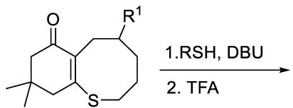

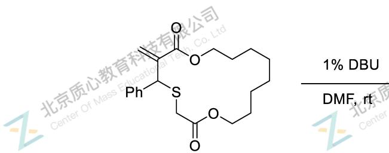

有机部分缩写及部分英文单词含义：

$^{t}$ Bu：叔丁基；Ph：苯基；reflux：回流；TFA：三氟乙酸；Ms：甲磺酰基；Boc：叔丁氧羰基；Bz：苯甲酰基；LED：发光二极管；TEMPO：四甲基哌啶氧化物；wt%：质量百分比。

### 参考答案

### 第 6 题 开环聚合反应（5分，占 $4\%$ ）

如下是两个 DBU 作用下的开环聚合反应，请写出聚合反应的产物。如果能明确端基的，需要把端基结构也展示清楚。

重复单元 2 分，端基 1 分。

2 分，如果写了端基，扣 1 分。

有机部分缩写及部分英文单词含义:

$^{t}$ Bu：叔丁基；Ph：苯基；reflux：回流；TFA：三氟乙酸；Ms：甲磺酰基；Boc：叔丁氧羰基；Bz：苯甲酰基；LED：发光二极管；TEMPO：四甲基哌啶氧化物；wt%：质量百分比。

## 第 3 题（化学原理 · 北京夏令营）

### 第 6 题（10分）

完成下列反应，给出中间体。提示：最后产物中只有一个三元环。

$$
\mathrm{C} _ {23} \mathrm{H} _ {22} \mathrm{N} _ {2} \mathrm{O}
$$

### 参考答案

⚠️ 答案原为**手写/图形**，OCR 未识别。**已附源 PDF 答案页**（第 5 页）对照：

## 第 4 题（化学原理 · 汇智）

### 第 10 题 骨架编辑全合成 （18分， 10%)

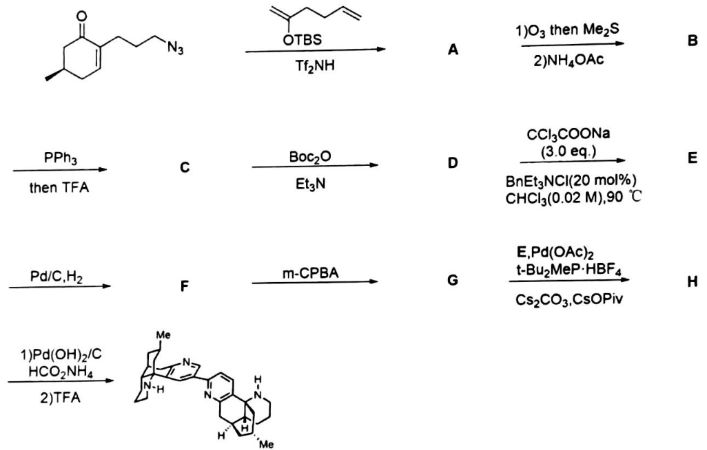

Complanadine A 的显著特征是含吡啶环的多环结构与异源二聚体骨架，根据所学有机知识和提示， 给出A-H的结构式，并给出D→E的关键中间体。  
已知： 底物→A发生步Michael加成反应，B中含有个芳环，B→C成了桥环结构，D→E发生了扩环。

### 参考答案

F

每个结构式2分， 中间体2分

## 第 5 题（化学原理 · 北京夏令营）

### 第 1 题（6分）

完成下列反应

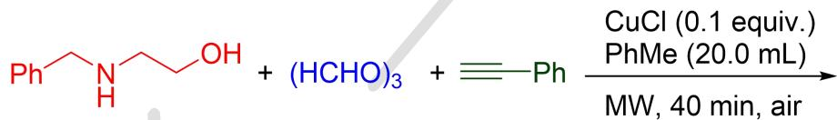

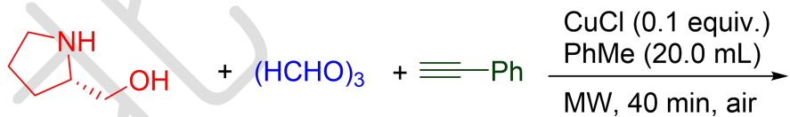

### 参考答案

(b) 画出缩醛 E 被 m-CPBA 氧化至 F 的机理（用下列环缩醛替代）。

## 第 6 题（结构化学 · 方圆）

### 第 七 题 合金结构（7分）

合金 $MgCu_{2}$ 为面心立方结构，在此结构中，每个铜原子被 12 个原子包围，其中 Cu-Cu 的距离为 247.1 pm。

7-1 计算该晶体的密度

7-2 指出包围铜原子的 12 个原子中，有几个铜原子几个镁原子

7-3 在晶胞中任意圈出一个铜原子，以晶胞左后下角的镁原子为坐标原点，写出其原子坐标

7-4 该晶胞中有几种化学环境的镁原子，几种空间环境的铜原子

### 参考答案

合金 $\mathrm{MgCu_2}$ 为面心立方结构，在此结构中，每个铜原子被12个原子包围，其中 $\mathrm{Cu - Cu}$ 的距离为 $247.1\mathrm{pm}$ 。 $7 - 15.892\mathrm{g / cm^{-3}}$ $7 - 26 + 6$

8-1、

8-2、V 原子为一个，式量为 50.9/0.153=333，
含 H 量求出 H 原子数：333/0.0420=14,
N 为 2 个，O 为 3 个，求出 C 16 个，所以分子式为： $C_{16}H_{14}N_{2}O_{3}V$ 8-3、配合物 A 的结构

钒氧化态+4

## 第 7 题（结构化学 · 质心UChO）

### 第 1 题 奇怪的实验现象 (7分，占 $4\%$ )

1-1 将 TIF 溶于 KF-HF 溶液可以得到一种 T1 质量分数为 83.97% 的离子化合物晶体，写出其化学式，正负离子分开写。

1-2 该晶体有多种晶型，研究人员将一块晶体取出后置于显微玻片上试图使用 X 射线衍射进行晶型分析，结果所得数据与此前报道均不相符，随后研究人员对其进行元素分析表明 T1 的质量分数有所下降，尝试解释该现象。

1-3 研究人员随后收集了该固体进行元素分析，分析表明形成了几种不同的化合物，其中一种化合物 A 中 T1 质量分数为 74.21%，写出其化学式，正负离子分开写。

1-4 研究人员通过其他方法合成了纯净的 A 并得到了其晶体，X 射线衍射结果表明其与一种含氟的常见离子晶体结构相似，给出 A 中阴离子的堆积方式。

### 参考答案

1-1 将 TIF 溶于 KF-HF 溶液可以得到一种 T1 质量分数为 83.97% 的离子化合物晶体，写出其化学式，正负离子分开写。

<table><tr><td>1-1(1分)</td><td> $[Tl^{+}][HF_{2}^{-}]$ (1分)其他答案不得分</td></tr></table>

1-2 该晶体有多种晶型，研究人员将一块晶体取出后置于显微玻片上试图使用 X 射线衍射进行晶型分析，结果所得数据与此前报道均不相符，随后研究人员对其进行元素分析表明 Tl 的质量分数有所下降，尝试解释该现象。

<table><tr><td>1-2(2分)</td><td> ${\mathrm{{HF}}}_{2}{}^{ - }$ 腐蚀了显微玻片使Si元素混入晶体(2分)意思对即可</td></tr></table>

1-3 研究人员随后收集了该固体进行元素分析，分析表明形成了几种不同的化合物，其中一种化合物 A 中 Tl 质量分数为 74.21%，写出其化学式，正负离子分开写。

<table><tr><td>1-3(3分)</td><td> $[Tl^{+}]_{2}[SiF_{6}^{2-}]$ (3分)其他答案不得分</td></tr></table>

1-4 研究人员通过其他方法合成了纯净的 A 并得到了其晶体，X 射线衍射结果表明其与一种含氟的常见离子晶体结构相似，给出 A 中阴离子的堆积方式。

<table><tr><td>1-4(1分)</td><td>立方最密堆积或面心立方堆积(1分)其他答案不得分</td></tr></table>

## 第 8 题（有机化学 · 伽马）

### 第 十 题(12 分，10%) (-)-cyclopamine 的合成

以下是生物碱环巴胺的部分全合成:

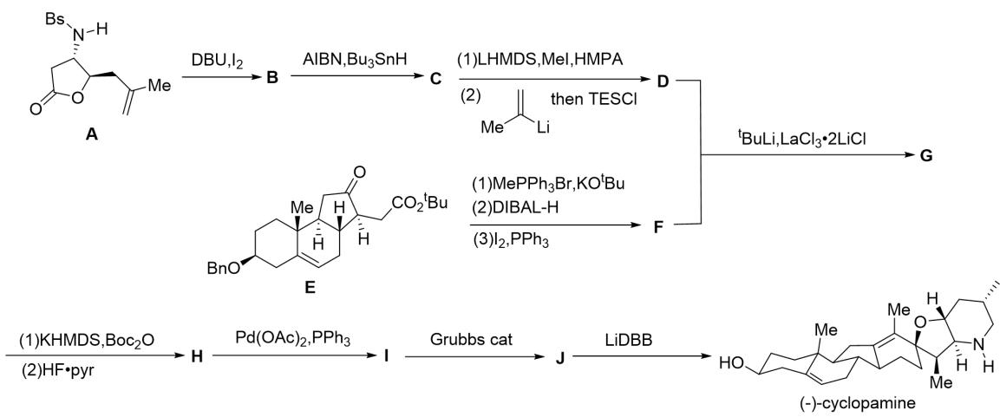

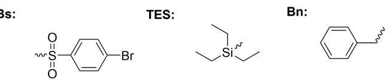

10-1 已知 H 生成 I 的过程中生成了氧杂五元环，最后一步反应为脱除氧原子与氮原子上的保护基，请画出 B,C,D,F,G,H,I,J 的结构。

10-2 已知 A 生成 B 存在自由基反应，请画出该过程的中间体。

10-3 对于 A 生成 B 的反应还可用什么条件？

### 参考答案

10-1(8分)

c

均不要求立体化学

10-2(3 分)

10-3(1 分)NIS 后加热，或其他合理答案

## 第 9 题（有机化学 · 伽马）

### 第 八 题(10 分，6%)苯炔的反应

8-1 苯炔是将苯环的两个领位取代基去除后得到的高活性中间体，试分析苯炔 HOMO 与 LUMO 相对于直线型的炔键能量怎么变化。

8-2 由于苯炔活性非常高，可参与各类反应。试完成下列反应。

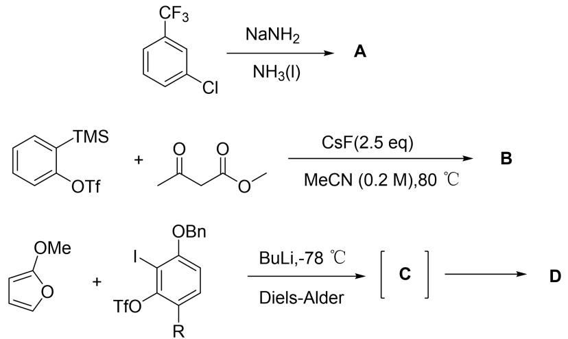

人们利用苯炔的反应性实现了芳基上的三官能团化

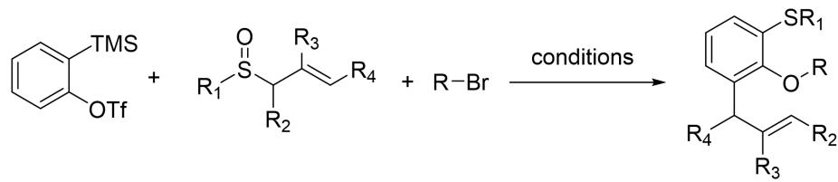

实验表明该反应的反应机理如下:

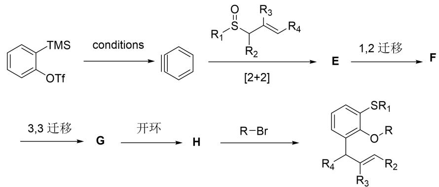

8-3 请画出 E，F，G，H 的结构，F 含有电荷分离结构。

### 参考答案

8-1(2分)

由于巨大的角张力，苯炔三键的 $p$ 轨道重叠较差，导致LUMO反键作用减弱，轨道能量降低；HOMO成键作用减弱，轨道能量升高。

8-2(4分)

8-3(4分)

E

## 第 10 题（有机化学 · 清北营）

### 第 4 题（11 分，占 7%）磷杂环丙烯与碳龙化学

含磷杂环因其独特的空间结构和物理化学性质，近年来已在医药、功能材料和能源等多个领域展现出强大的发展潜力和广阔的应用前景。而磷杂环丙烯由于其小环内的磷碳多重键，具有多样的反应性。

近日厦门大学与南方科技大学的团队首次通过磷氰酸钠盐（NaOCP）与碳龙配合物[1+2]环加成反应，实现了金属磷杂环丙烯的构筑。本题所有结构中Os均满足EAN规则。

4-1-1 将如下底物 X 与 NaOCP 于 DCM 在 $0^{\circ}$ C 反应 12h 即得到了含有磷杂金属环丙烯的配合物 A，反应过程中无小分子气体产生且反应前后配合物中 P 原子数目未发生改变，给出配合物 A 的结构。

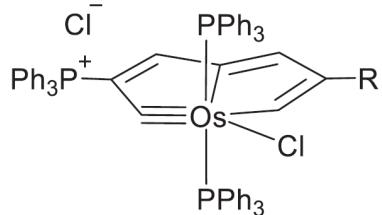

4-1-2 配合物 A 可以在 $PPh_{3}$ 存在下进一步与 AgOTf 反应，而后在 $o-O_{2}C_{6}Cl_{4}$ （四氯邻苯醌）的作用下磷杂环丙烯开环得到了离子型配合物 B，给出配合物 B 的结构。

4-2-1 事实上与 A 相似的磷杂金属环丙烯中间体亦可被三键化合物捕获得到锇杂戊搭烯双五元环开环的独特产物。例如配合物 X 可与 NaOCP、AdCP 同时反应得到含有 $[C_{2}P_{2}]$ 四元环的电中性配合物 C，反应过程中生成了一种小分子气体，且 C 中 $[C_{2}P_{2}]$ 四元环通过 $\pi$ 体系与锇配位，给出 C 的结构。

4-2-2 配合物 A 与丁炔二酸二甲酯的反应则会通过另一种反应模式，反应发生了形式上的 $[2 + 2 + 1]$ 环加成反应，生成锇磷杂五元环产物 D，且 D 中仍然存在三元环，给出配合物 D 的结构。

### 参考答案

⚠️ 答案原为**手写/图形**，OCR 未识别。**已附源 PDF 答案页**（第 1 页）对照：

