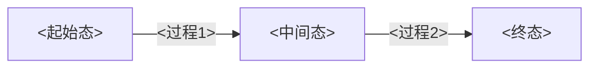

# 模板：教学逻辑提炼

> 📋 **使用方式**：导入竞赛指导教程、教师讲义、教材章节时，除提取 KP 外，专门记录“作者/教师怎么讲”。
>
> 🎯 **职责定位**：为专题页、备课大纲、学生讲义提供“教学路径数据库”：前置/后置、认知台阶、轮次边界、禁止提前展开内容。
>
> ⚠️ **核心原则**：本模板不追求知识点全面罗列，而追求讲授顺序、铺垫方式、结论出现时机与深度取舍。

---

## 模板正文

```markdown
---
title: 教学逻辑提炼-<资料名>-<章节/主题>
type: 教学逻辑提炼
source_file: "[[ ]]"
source_type: 教师讲义 / 竞赛指导教程 / 教材章节 / 课堂实录 / 其他
subject: <化学原理 / 无机和结构化学 / 分析化学 / 有机化学 / 决赛要求>
related_topic: "[[专题-XX]]"
related_kps: [KP-1, KP-2]
applicable_rounds: [第一轮, 第二轮, 第三轮]
status: 待审核
pending_verifications: []
created: <YYYY-MM-DD>
updated: <YYYY-MM-DD>
tags: [教学逻辑, 资料提炼, 备课]
---

# 教学逻辑提炼：<资料名>-<章节/主题>

## 一、来源信息

| 字段 | 内容 |
|:---|:---|
| 资料名称 | |
| 章节/页码 | |
| 作者/讲授者 | |
| 适用对象 | |
| 原资料定位 | 入门 / 提高 / 决赛 / 复习 / 习题 |
| 关联专题 | [[专题-XX]] |
| 关联 KP | [[KP-1]]、[[KP-2]] |

---

## 二、原资料讲解顺序

> 按原资料出现顺序记录，不要先按知识点分类重排。

| 顺序 | 原资料先讲什么 | 目的 | 后续承接 | 对应 KP/专题 |
|:---:|:---|:---|:---|:---|
| 1 | | 激活前置 / 制造问题 / 给工具 / 推结论 | | [[ ]] |
| 2 | | | | [[ ]] |
| 3 | | | | [[ ]] |

**原顺序一句话概括**：
- 

### 二点五、内容缺口自检（v1.2 新增）

> 网课/讲义等资料常存在内容缺口，需主动对照教材/考纲自检，避免下游备课大纲因资料不全而遗漏重要章节。

| 检查项 | 本资料是否覆盖 | 缺口说明 | 补救措施 |
|:---|:---:|:---|:---|
| 与考纲条目对照：考纲要求但资料未讲的内容 | | | 触发教材提炼补充 |
| 与教材目录对照：常见教材章节是否缺失 | | | 标记为“网课缺失，需教材补充” |
| 公式/数据完整性：关键公式是否碎片化或缺失 | | | 标记 `⚠️ 据教材校正` |
| 例题覆盖度：是否有足够例题支撑核心概念 | | | 从教材/其他来源补充例题 |

---

## 三、教学切入点

| 维度 | 内容 |
|:---|:---|
| 从什么现象/问题切入 | |
| 学生已有认知是什么 | |
| 第一处认知冲突是什么 | |
| 作者/教师如何铺垫 | |
| 核心结论何时出现 | 开头 / 中段 / 末尾 / 例题后归纳 |
| 结论呈现策略 | 结论先行 / 结论后置 / 问题驱动 / 题目驱动 |

---

## 四、认知台阶表

> 台阶顺序必须从学生已有认知出发，不按 KP 难度或考纲编号机械排列。

| 台阶 | 学生已有认知 | 新认知 | 关键问题/活动 | 讲解策略 | 对应 KP | 深度标记 |
|:---:|:---|:---|:---|:---|:---|:---|
| 1 | | | | 问题/现象 → 铺垫 → 推理 → 结论 | [[ ]] | 第一轮必讲 / 点到为止 / 后续轮次 |
| 2 | | | | | [[ ]] | |
| 3 | | | | | [[ ]] | |

---

## 五、例题/活动出现顺序

| 出现位置 | 例题/活动 | 作用 | 难度 | 是否适合第一轮 | 可回流位置 |
|:---|:---|:---|:---:|:---:|:---|
| 概念前 / 概念后 / 总结后 | | 引入 / 巩固 / 反例 / 综合 | ⭐⭐ | 是/否/选讲 | 备课大纲 / 讲义 / 题库 |

---

## 六、轮次切分建议

| 轮次 | 本轮目标 | 本轮讲到哪里为止 | 本轮不展开 | 典型例题难度 |
|:---|:---|:---|:---|:---:|
| 第一轮 | 建立直觉和基础工具 | | | ⭐⭐-⭐⭐⭐ |
| 第二轮 | 强化综合应用与横向联系 | | | ⭐⭐⭐ |
| 第三轮 | 理论深化与竞赛拔高 | | | ⭐⭐⭐-⭐⭐⭐⭐ |
| 决赛/拓展 | 完整理论与前沿应用 | | | ⭐⭐⭐⭐-⭐⭐⭐⭐⭐ |

---

## 七、本轮禁止提前展开内容

| 内容 | 为什么暂不展开 | 放到哪个轮次/专题 | 若课堂被问到如何回应 |
|:---|:---|:---|:---|
| | 容易压垮第一轮主线 / 前置不足 / 性价比低 | [[ ]] | 先给一句直觉解释，标记后续专题展开 |

---

## 八、关键教学语言段（v1.3 新增）

> 📌 **定位**：教学逻辑提炼的核心价值不仅在"讲了什么、按什么顺序"，更在"**怎么说的**"。
> 本板块从网课笔记、课堂实录中摘录教师原话或近原话表达，保留教学的"现场感"。
> 这些语言段是下游 [[模板-教学洞察]] 的**直接原料**——类比、口诀、冲突设计都应先在本板块找到原始出处。

### 8.1 制造认知冲突的原话

> 教师如何让学生意识到"我以为我会 ≠ 我真的会"？

```markdown
> "<教师原话或近原话>"
> — <来源>，约 <时间位置>
```

### 8.2 解释难点时的比喻/类比

> 教师用什么日常经验翻译抽象概念？

```markdown
| 概念 | 比喻 | 教师原话（或近原话） | 来源 |
|:---|:---|:---|:---|
| | | | |
```

### 8.3 预防错误时的警告语

> 教师在什么地方、用什么措辞预警学生"这里会错"？

```markdown
> "<教师原话>"
> — <来源>，<场景：例题前/作业讲评时/概念引入时>
```

### 8.4 过渡与衔接语

> 教师如何从一个主题自然过渡到下一个？如何铺垫后续内容？

```markdown
> "<教师原话>"
> — <来源>，<从 X 过渡到 Y 时>
```

### 8.5 板书/演示的实时节奏

> 教师在黑板/PPT上先写什么、后写什么？哪里停顿让学生试？

```markdown
| 时刻 | 板书/PPT 动作 | 教师同时说的话 | 目的 |
|:---|:---|:---|:---|
| | | | |
```

---

## 九、核心内容速查（v1.4 新增）

> 📌 **定位**：本板块解决了原模板"只记录怎么教、不记录教什么"的结构性缺口。
> 现有 §一~§八 保持原职责（教学逻辑/HOW 层），§九 新增 WHAT 层——直接从原始资料中提取核心概念、定义、规律、例题和常见误区。
> **下游用途**：备课大纲取 §一~§八（教学路径），学生讲义取 §九（内容素材），两份产出互相咬合。
>
> ⚠️ **记录原则**：
> - 仅记录原始资料中**明确给出**的内容（定义、公式、例题），不自行补充外部知识
> - 与 KP 文件交叉索引时使用 wikilink，避免内容重复
> - 若该视频/资料未覆盖某子节内容，标注"本资料未覆盖"即可，不必自行编撰

### 9.1 核心定义与公式

> 本节记录原始资料中给出的核心概念定义和定量公式。
> 每个定义/公式后标注其在原资料中的出现位置。

| 概念/公式 | 定义/表达式 | 出现位置 | 对应 KP |
|:---|:---|:---|:---|
| | | 视频/讲义 §X | [[ ]] |

### 9.2 规律总结（含对比表）

> 原始资料中给出的系统性规律、趋势总结、对比表格。
> 可以是元素递变趋势、同族/同周期对比、反应活性排序等。

| 对比维度 | 条目 A | 条目 B | 条目 C | 规律/结论 |
|:---|:---|:---|:---|:---|
| | | | | |

**关键规律文字总结**：
- 

### 9.3 典型例题与解析

> 原始资料中的代表性例题，标注难度、来源和对应知识点。
> 例题选择标准：最能体现该章节核心概念的 2-4 道题。

| 例题 | 知识点 | 难度 | 来源位置 | 解析概要 |
|:---|:---|:---:|:---|:---|
| | | ⭐⭐ | | |

### 9.4 常见误区

> 原始资料中教师特别指出的学生易错点、思维误区、常见错误。

| 误区 | 错误表现 | 正确理解 | 教师原话/预警位置 |
|:---|:---|:---|:---|
| | | | |

### 9.5 与 KP 文件交叉索引

> 本节建立本章节核心内容与知识库 KP 文件的映射关系，为讲义创作提供"内容来源链路"。
> 要求：每个核心概念至少关联 1 个 KP 文件，且关联总数 ≥3。

| 核心概念 | 关联 KP | KP 中对应内容 | 讲义中可直接引用的素材 |
|:---|:---|:---|:---|
| | [[ ]] | §X | 定义/公式/对比表/例题 |

---

## 十、可提取资产清单

> 除了"教学逻辑"本身，原始资料中还可能包含可直接回流到知识库的高价值内容。
> 本表要求逐项登记，确保提取的资产有明确去向、可信度和回流状态追踪。

### 10.1 资产分类定义

| 类型 | 定义 | 典型示例 | 首选回流目标 |
|:---|:---|:---|:---|
| 数据资产 | 定量参数（键长、键角、晶胞参数、振动频率、熔沸点、键能等） | "二氢键键长 170-220 pm" | KP §五 数据表/示意图 |
| 分类资产 | 分类体系、对比框架、决策树、判断流程 | "Fischer vs Schrock 卡宾对比维度" | 专题页 §二 对比表格 / KP §四 关键结论 |
| 实例资产 | 反常现象、认知冲突、特例、边界案例 | "氨硼烷熔点 +104℃ vs 乙烷 -181℃" | KP §十二 教学视角 / §七 常见比较与易混点 |
| 反应资产 | 特征反应方程式、配位反应、氧化加成、催化循环 | "H₂ 氧化加成：M + H₂ → M(H)₂" | KP §三 核心原理 |
| 机理资产 | 箭头推动、轨道重叠图、电子流向、能级变化 | "CO σ给体+π反馈轨道重叠图" | 专题页 §四 机理分析 / KP §三 核心原理 |

### 10.2 可信度评级标准

| 等级 | 标准 | 使用建议 |
|:---|:---|:---|
| 高 | 来源明确（教材/讲义/论文直接给出），数字清晰，与已知数据一致 | 可直接回流，无需二次验证 |
| 中 | OCR识别但数值合理，或来源为课堂口述，无原始文献页码 | 回流前建议查原始教材/论文确认 |
| 低 | OCR乱码、数值反常、与主流教材冲突、无法找到原始出处 | 仅作参考，回流时需标注"待核实"，优先寻找替代来源 |

### 10.3 资产清单表

| 序号 | 资产类型 | 资产内容摘要 | 可信度 | 目标回流位置 | 回流状态 | 备注 |
|:---:|:---|:---|:---:|:---|:---:|:---|
| 1 | | | 高/中/低 | | ⏳ 待回流 | |
| 2 | | | | | | |

> **回流状态说明**：
> - ⏳ 待回流：已识别，尚未执行回流
> - 🔄 回流中：已开始写入目标位置
> - ✅ 已回流：已完成写入目标位置
> - ⛔ 暂不回流：因可信度低或当前轮次不需要，暂不执行

---

## 十一、审核意见

### 11.1 自检清单

- [ ] 原资料顺序已如实记录，没有过早重排为知识点列表
- [ ] 已标注核心结论出现时机
- [ ] 已区分第一轮/提高班/深化轮次边界
- [ ] 已列出本轮禁止提前展开内容
- [ ] 已摘录关键教学语言段（§八）：制造冲突原话、解释难点比喻、预防错误警告、过渡衔接语
- [ ] 已登记可提取资产清单（§十），含资产类型、可信度、目标回流位置与回流状态
- [ ] 已完成 §2.5 内容缺口自检（网课/讲义必备）
- [ ] 已填写 §九 核心内容速查（网课/讲义必备）：核心定义与公式、规律总结、典型例题、常见误区、与 KP 交叉索引

### 11.2 待核实项追踪（v1.2 新增）

> 中/低可信度资产、OCR 碎片化公式、课堂口述数据等需要后续核实的内容，必须同时在 **frontmatter** 和 **正文** 中登记，确保跨文件可追踪。

**frontmatter 登记格式**：
```yaml
pending_verifications:
  - id: T1
    content: "待核实内容简述"
    risk: 低 / 中 / 高
    status: pending        # pending / in_progress / resolved / deprecated
    resolution: ""         # 解决后填写结论
    date_resolved: ""      # 解决日期
```

**正文登记格式**：
```markdown
| 编号 | 待核实内容 | 风险等级 | 建议处理方式 |
|:---:|:---|:---:|:---|
| T1 | ... | 中 | ... |
```

**状态流转**：
- `pending` → `in_progress`（开始核实）→ `resolved`（已解决，填写 resolution）→ 同步更新正文表格和 frontmatter
- 解决后正文表格中该行追加 **状态标记**（如 `[已核实]` `[已核实·修正]` `[已补充]`）
- 所有待核实项解决后，frontmatter 中保留记录（作为审计痕迹），正文表格可归档到 §10.3
```

---

## 附录 A：资产回流格式速查表

> 本附录为 Agent 执行回流时提供标准化格式参考，确保跨文件回流的一致性。
> 回流 ≠ 复制粘贴，而是**跨模板的格式翻译**——需将教学逻辑提炼中的资产”转写”为目标 KP/专题页模板的标准段落格式。

### A.1 回流操作流程（5 步）

```
Step 1: 读取目标 KP/专题页，确认段落结构（防止编号错位）
Step 2: 按下方速查表选择对应格式模板
Step 3: 将资产内容”翻译”为目标格式（不要直接复制原始表格行）
Step 4: 写入目标位置，同步更新 KP frontmatter 的 source_extracts 字段
Step 5: 三向同步更新状态：目标 KP → 备课待办总表 → 源文件
```

### A.2 数据资产 → KP §五 数据表/示意图

```markdown
### <子标题>（<来源>素材）

> 来源：[[<教学逻辑提炼文件>]] · 资产 <编号> · 可信度：<高/中/低>

| <列1> | <列2> | <列3> | 解释 |
|:---|:---:|:---|:---|
| ... | ... | ... | ... |

**教学要点**：
- <要点1：数据的反常之处或对比逻辑>
- <要点2：与已有认知的冲突点>
```

### A.3 分类资产 → 专题页 §二 对比表格 / KP §四 关键结论

```markdown
| <对比维度> | A | B | C |
|:---|:---|:---|:---|
| <维度1> | ... | ... | ... |
| <维度2> | ... | ... | ... |

**判断/决策流程**（可选）：
1. 先区分 <特征X> → 2. 再看 <特征Y> → 3. 最终归类为 A/B/C
```

### A.4 实例资产 → KP §十二 教学视角 / §七 常见比较与易混点

**§十二 教学视角标准格式**：
```markdown
### 12.x <子标题>：”<认知冲突问题>”

> 来源：[[<教学逻辑提炼文件>]] · 资产 <编号> · 可信度：<高/中/低>

**冲突数据**：
- <数据点1（制造反差）>
- <数据点2（强化矛盾）>

**学生已有认知**：
- <学生直觉/前概念>

**认知冲突**：
- <冲突点1：为什么已有认知是错的/不完整的>
- <冲突点2：新视角如何解释反常数据>

**教学策略**：
1. <步骤1：先给数据，制造冲突>
2. <步骤2：引导学生质疑前提>
3. <步骤3：引出新概念>

**适用轮次**：
- 第一轮：<讲到哪里为止>
- 第二轮/第三轮：<深化内容>
```

**§七 常见比较与易混点标准格式**：
```markdown
- **<反例名称>**：<反常现象简述>
  - 表面看：<学生直觉解释>
  - 实际上：<正确解释>
  - 关键区分：<一句话总结>
```

### A.5 反应资产 → KP §三 核心原理

```markdown
**<反应/过程名称>**：

$$\ce{<反应方程式或关键步骤>}$$

- <条件/驱动因素>
- <与已有知识的联系（如”本质上是XX的延伸”）>
- <结构变化的关键指标（键长/键角/配位数变化）>
```

### A.6 机理资产 → 专题页 §四 机理分析 / KP §三 核心原理

**专题页 §四 标准格式**：
```markdown
### <机理名称>

<文字描述（2-3 句话概括核心逻辑）>

**关键电子流向 / 结构变化**：
1. <步骤1：谁给谁，形成什么>
2. <步骤2：谁断裂，谁生成>
3. <步骤3：最终稳定结构>

**<可选> Mermaid 流程图**：

```

---

## 版本历史

- v1.4（2026-06-23）：新增 §九「核心内容速查」——解决原模板”只记录怎么教（HOW）、不记录教什么（WHAT）”的结构性缺口，§九 直接从原始资料提取核心定义、规律、例题、误区和 KP 交叉索引。§九→§十 可提取资产清单，§十→§十一 审核意见。
- v1.3（2026-06-10）：新增 §八「关键教学语言段」——从网课笔记/课堂实录中摘录教师原话（制造冲突、解释难点、预防错误、过渡衔接），为教学洞察提供”血肉”素材。后续章节编号顺延（§八→§九 可提取资产清单，§九→§十 审核意见）。
- v1.2（2026-06-01）：新增 §2.5「内容缺口自检」——网课/讲义资料常有章节缺失（如沉淀滴定、重量分析），要求主动对照考纲/教材目录自检并标记补救措施；升级 §9「审核意见」为结构化追踪，frontmatter 新增 `pending_verifications` 字段，中/低可信度资产和 OCR 碎片化内容必须跨文件追踪，解决”待核实项散落在正文中、解决后无审计痕迹”的问题。
- v1.1（2026-05-31）：新增 §八「可提取资产清单」——将原”可回流内容”升级为结构化资产登记，引入 5 类资产分类（数据/分类/实例/反应/机理）、可信度评级（高/中/低）、回流状态追踪（⏳/🔄/✅/⛔），解决”提取了教学逻辑但高价值数据/实例/分类体系散失”的问题。本次同时新增附录 A「资产回流格式速查表」，规范跨模板回流的格式翻译标准。
- v1.0（2026-05-27）：初始版本——面向竞赛指导教程/教师讲义导入，专门提炼”怎么讲”的教学逻辑与轮次深度边界。
