# 必修一 教案总览（人教版必修第一册 2019）

> 本页为**导航 hub 页（非课时）**，串联本目录下全部课时教案与章节文档，便于检索、跳转与整册打印。
> 全套规模：共 **4 章 · 30 课时 · 12 份章节文档**（每章配套"教材分析 / 学情分析 / 知识体系与概念关联图"3 份）。
> 使用方式：先读各章"教材分析"定方向，再依次打开课时教案备课，用"知识体系与概念关联图"统整；建议配合 [[必修一 知识主线总图]]、[[必修一 高频易错点手册]] 同步研读。

## 一、全套结构图（Mermaid）

```mermaid
graph TD
    ROOT["必修一 教案体系"]
    ROOT --> C1["第一章 物质及其变化"]
    ROOT --> C2["第二章 钠和氯"]
    ROOT --> C3["第三章 铁 金属材料"]
    ROOT --> C4["第四章 物质结构 元素周期律"]

    C1 --> L11["1.1 物质的分类及转化"]
    C1 --> L12["1.2 分散系与胶体"]
    C1 --> L13["1.3 电解质的电离与离子反应"]
    C1 --> L14["1.4 氧化还原反应：概念与规律"]
    C1 --> L15["1.5 氧化还原反应方程式的配平与计算"]
    C1 --> D1a["第一章 教材分析"]
    C1 --> D1b["第一章 学情分析"]
    C1 --> D1c["第一章 知识体系与概念关联图"]

    C2 --> L21["2.1 钠"]
    C2 --> L22["2.2 钠的氧化物"]
    C2 --> L23["2.3 碳酸钠和碳酸氢钠"]
    C2 --> L24["2.4 氯气的性质"]
    C2 --> L25["2.5 氯气的实验室制法、氯离子检验与卤素"]
    C2 --> L26["2.6 物质的量 与 摩尔质量"]
    C2 --> L27["2.7 气体摩尔体积"]
    C2 --> L28["2.8 物质的量浓度"]
    C2 --> L29["2.9 一定物质的量浓度溶液的配制"]
    C2 --> L210["2.10 物质的量在化学计算中的应用"]
    C2 --> D2a["第二章 教材分析"]
    C2 --> D2b["第二章 学情分析"]
    C2 --> D2c["第二章 知识体系与概念关联图"]

    C3 --> L31["3.1 铁的单质"]
    C3 --> L32["3.2 铁的氧化物与氢氧化物"]
    C3 --> L33["3.3 铁盐与亚铁盐"]
    C3 --> L34["3.4 合金"]
    C3 --> L35["3.5 铝单质与氧化铝"]
    C3 --> L36["3.6 氢氧化铝与铝三角"]
    C3 --> L37["3.7 新型金属材料与本章整合"]
    C3 --> D3a["第三章 教材分析"]
    C3 --> D3b["第三章 学情分析"]
    C3 --> D3c["第三章 知识体系与概念关联图"]

    C4 --> L41["4.1 原子结构"]
    C4 --> L42["4.2 核素与同位素"]
    C4 --> L43["4.3 元素周期表"]
    C4 --> L44["4.4 元素周期律"]
    C4 --> L45["4.5 第三周期元素性质递变探究与周期律本质"]
    C4 --> L46["4.6 化学键 离子键与电子式"]
    C4 --> L47["4.7 共价键与电子式"]
    C4 --> L48["4.8 分子间作用力与氢键"]
    C4 --> D4a["第四章 教材分析"]
    C4 --> D4b["第四章 学情分析"]
    C4 --> D4c["第四章 知识体系与概念关联图"]
```

## 二、按章分表

### 第一章 物质及其变化（5 课时）

| 课时 | 课题 | 一句话定位 | 跳转 |
|---|---|---|---|
| 1.1 | 物质的分类及转化 | 树状/交叉分类法与物质转化关系，奠定分类观 | [[1.1 物质的分类及转化]] |
| 1.2 | 分散系与胶体 | 分散系分类与胶体性质、丁达尔效应辨析 | [[1.2 分散系与胶体]] |
| 1.3 | 电解质的电离与离子反应 | 电离本质、离子方程式书写与离子共存 | [[1.3 电解质的电离与离子反应]] |
| 1.4 | 氧化还原反应：概念与规律 | 化合价升降判氧化还原与价态变化规律 | [[1.4 氧化还原反应：概念与规律]] |
| 1.5 | 氧化还原反应方程式的配平与计算 | 得失电子守恒配平与氧化数相关计算 | [[1.5 氧化还原反应方程式的配平与计算]] |

本章配套章节文档：[[第一章 教材分析]] · [[第一章 学情分析]] · [[第一章 知识体系与概念关联图]]

### 第二章 钠和氯（10 课时）

| 课时 | 课题 | 一句话定位 | 跳转 |
|---|---|---|---|
| 2.1 | 钠 | 碱金属代表，单质活泼性与保存方法 | [[2.1 钠]] |
| 2.2 | 钠的氧化物 | Na₂O 与 Na₂O₂ 性质对比与相互转化 | [[2.2 钠的氧化物]] |
| 2.3 | 碳酸钠和碳酸氢钠 | 两盐性质、鉴别、转化与生产生活用途 | [[2.3 碳酸钠和碳酸氢钠]] |
| 2.4 | 氯气的性质 | 卤素代表单质，强氧化性与歧化反应 | [[2.4 氯气的性质]] |
| 2.5 | 氯气的实验室制法、氯离子检验与卤素 | 制取法、Cl⁻ 检验与卤素性质递变 | [[2.5 氯气的实验室制法、氯离子检验与卤素]] |
| 2.6 | 物质的量 与 摩尔质量 | 计量桥梁 n 的定义与摩尔质量换算 | [[2.6 物质的量 与 摩尔质量]] |
| 2.7 | 气体摩尔体积 | 标况下 Vm 概念与阿伏加德罗定律应用 | [[2.7 气体摩尔体积]] |
| 2.8 | 物质的量浓度 | c 的定义、溶液浓度换算与稀释 | [[2.8 物质的量浓度]] |
| 2.9 | 一定物质的量浓度溶液的配制 | 容量瓶配制步骤与误差分析 | [[2.9 一定物质的量浓度溶液的配制]] |
| 2.10 | 物质的量在化学计算中的应用 | 关系式法与守恒法综合计算 | [[2.10 物质的量在化学计算中的应用]] |

本章配套章节文档：[[第二章 教材分析]] · [[第二章 学情分析]] · [[第二章 知识体系与概念关联图]]

### 第三章 铁 金属材料（7 课时）

| 课时 | 课题 | 一句话定位 | 跳转 |
|---|---|---|---|
| 3.1 | 铁的单质 | 铁在周期表位置、单质性质与冶炼 | [[3.1 铁的单质]] |
| 3.2 | 铁的氧化物与氢氧化物 | FeO/Fe₂O₃/Fe₃O₄ 与氢氧化物转化 | [[3.2 铁的氧化物与氢氧化物]] |
| 3.3 | 铁盐与亚铁盐 | Fe³⁺/Fe²⁺ 转化、检验与除杂提纯 | [[3.3 铁盐与亚铁盐]] |
| 3.4 | 合金 | 合金特性与常见金属材料的选用 | [[3.4 合金]] |
| 3.5 | 铝单质与氧化铝 | 铝的两性与 Al₂O₃ 的耐火、电解用途 | [[3.5 铝单质与氧化铝]] |
| 3.6 | 氢氧化铝与铝三角 | 两性氢氧化物与 Al³⁺/Al(OH)₃/AlO₂⁻ 转化 | [[3.6 氢氧化铝与铝三角]] |
| 3.7 | 新型金属材料与本章整合 | 新材料简介与铁、铝性质整合提升 | [[3.7 新型金属材料与本章整合]] |

本章配套章节文档：[[第三章 教材分析]] · [[第三章 学情分析]] · [[第三章 知识体系与概念关联图]]

### 第四章 物质结构 元素周期律（8 课时）

| 课时 | 课题 | 一句话定位 | 跳转 |
|---|---|---|---|
| 4.1 | 原子结构 | 原子核外电子排布与能层能级初步 | [[4.1 原子结构]] |
| 4.2 | 核素与同位素 | 质量数、核素与同位素概念辨析 | [[4.2 核素与同位素]] |
| 4.3 | 元素周期表 | 周期表结构、分区与位—构—性关系 | [[4.3 元素周期表]] |
| 4.4 | 元素周期律 | 原子半径、金属性非金属性递变规律 | [[4.4 元素周期律]] |
| 4.5 | 第三周期元素性质递变探究与周期律本质 | 实验探究递变并揭示周期律本质 | [[4.5 第三周期元素性质递变探究与周期律本质]] |
| 4.6 | 化学键 离子键与电子式 | 离子键形成与电子式规范书写 | [[4.6 化学键 离子键与电子式]] |
| 4.7 | 共价键与电子式 | 共价键类型与共价分子电子式 | [[4.7 共价键与电子式]] |
| 4.8 | 分子间作用力与氢键 | 范德华力、氢键对物质性质的影响 | [[4.8 分子间作用力与氢键]] |

本章配套章节文档：[[第四章 教材分析]] · [[第四章 学情分析]] · [[第四章 知识体系与概念关联图]]

## 三、全册课时统计表

| 章节 | 章名 | 课时数 | 章节文档数 |
|---|---|---:|---:|
| 第一章 | 物质及其变化 | 5 | 3 |
| 第二章 | 钠和氯 | 10 | 3 |
| 第三章 | 铁 金属材料 | 7 | 3 |
| 第四章 | 物质结构 元素周期律 | 8 | 3 |
| **合计** | **全册** | **30** | **12** |

> 说明：以上 30 课时、12 份章节文档均为目录实际提取结果（非预设 30，而是真实 30）。

## 四、配套可视化文档索引

- [[必修一 知识主线总图]]：以"分类观 → 价态观 → 定量观 → 位构性"为轴，串联四章核心概念的主线脉络，用于单元统整与复习导航。
- [[必修一 高频易错点手册]]：汇总全书易混点（如 Na₂O₂ 与 H₂O 反应、Fe²⁺/Fe³⁺ 检验、c 与 w 换算等），用于备课避坑与考前强化。
