# 必修一 教案总览（人教版必修第一册 2019）

> 本页为**导航 hub 页（非课时）**，串联本目录下全部课时教案与章节文档，便于检索、跳转与整册打印。
> 全套规模：共 **4 章 · 37 课时 · 12 份章节文档**（每章配套"教材分析 / 学情分析 / 知识体系与概念关联图"3 份）。
> 使用方式：先读各章"教材分析"定方向，再依次打开课时教案备课，用"知识体系与概念关联图"统整；建议配合 [[必修一 知识主线总图]]、[[必修一 高频易错点手册]] 同步研读。
> 📌 **2026-09-05 更新**：第一章已由 5 课时重排为 **10 课时**，第二章已由 10 课时重排为 **12 课时**（2.5、2.10 各拆为二），原 7 份以「（合订版）」后缀保留作底本。

## 一、全套结构图（Mermaid）

```mermaid
graph TD
    ROOT["必修一 教案体系"]
    ROOT --> C1["第一章 物质及其变化"]
    ROOT --> C2["第二章 钠和氯"]
    ROOT --> C3["第三章 铁 金属材料"]
    ROOT --> C4["第四章 物质结构 元素周期律"]

    C1 --> L11["1.1 物质的分类"]
    C1 --> L12["1.2 物质的转化"]
    C1 --> L13["1.3 分散系与胶体"]
    C1 --> L14["1.4 电解质的电离"]
    C1 --> L15["1.5 离子反应"]
    C1 --> L16["1.6 离子反应的应用"]
    C1 --> L17["1.7 氧化还原反应：特征、本质与表示方法"]
    C1 --> L18["1.8 氧化剂和还原剂"]
    C1 --> L19["1.9 氧化还原反应的规律与应用"]
    C1 --> L110["1.10 氧化还原反应方程式的配平与计算"]
    C1 --> D1a["第一章 教材分析"]
    C1 --> D1b["第一章 学情分析"]
    C1 --> D1c["第一章 知识体系与概念关联图"]

    C2 --> L21["2.1 钠"]
    C2 --> L22["2.2 钠的氧化物"]
    C2 --> L23["2.3 碳酸钠和碳酸氢钠"]
    C2 --> L24["2.4 氯气的性质"]
    C2 --> L25["2.5 氯气的实验室制法"]
    C2 --> L26["2.6 氯离子检验与卤素递变"]
    C2 --> L27["2.7 物质的量 与 摩尔质量"]
    C2 --> L28["2.8 气体摩尔体积"]
    C2 --> L29["2.9 物质的量浓度"]
    C2 --> L210["2.10 一定物质的量浓度溶液的配制"]
    C2 --> L211["2.11 综合计算（一）：关系式与守恒"]
    C2 --> L212["2.12 综合计算（二）：Nₐ 陷阱与过量"]
    C2 --> D2a["第二章 教材分析"]
    C2 --> D2b["第二章 学情分析"]
    C2 --> D2c["第二章 知识体系与概念关联图"]

    C3 --> L31["3.1 铁的单质"]
    C3 --> L32["3.2 铁的氧化物与氢氧化物"]
    C3 --> L33["3.3 铁盐与亚铁盐"]
    C3 --> L34["3.4 合金"]
    C3 --> L35["3.5 铝单质与氧化铝"]
    C3 --> L36["3.6 氢氧化铝与铝三角"]
    C3 --> L37["3.7 新型金属材料与本章整合"]
    C3 --> D3a["第三章 教材分析"]
    C3 --> D3b["第三章 学情分析"]
    C3 --> D3c["第三章 知识体系与概念关联图"]

    C4 --> L41["4.1 原子结构"]
    C4 --> L42["4.2 核素与同位素"]
    C4 --> L43["4.3 元素周期表"]
    C4 --> L44["4.4 元素周期律"]
    C4 --> L45["4.5 第三周期元素性质递变探究与周期律本质"]
    C4 --> L46["4.6 化学键 离子键与电子式"]
    C4 --> L47["4.7 共价键与电子式"]
    C4 --> L48["4.8 分子间作用力与氢键"]
    C4 --> D4a["第四章 教材分析"]
    C4 --> D4b["第四章 学情分析"]
    C4 --> D4c["第四章 知识体系与概念关联图"]
```

## 二、按章分表

### 第一章 物质及其变化（10 课时）

> ⚠️ **本轮已重排（2026-09-05）**：原 5 课时合订版拆为 10 课时，编号全面变更。原文件以「（合订版）」后缀保留在同级目录作为底本，不再更新。

| 课时 | 课题 | 一句话定位 | 跳转 |
|---|---|---|---|
| 1.1 | 物质的分类 | 树状/交叉分类法、氧化物六类辨析，奠定分类观 | [[1.1 物质的分类]] |
| 1.2 | 物质的转化 | 八圈转化网络、类别×价态二维图、4 类基本反应 | [[1.2 物质的转化]] |
| 1.3 | 分散系与胶体 | 分散系分类与胶体性质、丁达尔效应辨析 | [[1.3 分散系与胶体]] |
| 1.4 | 电解质的电离 | 导电本质、电解质/非电解质、强弱与电离方程式 | [[1.4 电解质的电离]] |
| 1.5 | 离子反应 | 离子浓度降低本质、四步法、拆写边界与共存 | [[1.5 离子反应]] |
| 1.6 | 离子反应的应用 | 与量有关、滴加顺序、信息型离子方程式 | [[1.6 离子反应的应用]] |
| 1.7 | 氧化还原反应：特征、本质与表示方法 | 三级认识台阶、氧化数、双线桥/单线桥 | [[1.7 氧化还原反应：特征、本质与表示方法]] |
| 1.8 | 氧化剂和还原剂 | 常见剂清单、中间价兼性、四大类型韦恩 | [[1.8 氧化剂和还原剂]] |
| 1.9 | 氧化还原反应的规律与应用 | 价态规律、强弱五法、强者优先、归中歧化 | [[1.9 氧化还原反应的规律与应用]] |
| 1.10 | 氧化还原反应方程式的配平与计算 | 电子守恒配平四步法与相关计算 | [[1.10 氧化还原反应方程式的配平与计算]] |

本章配套章节文档：[[第一章 教材分析]] · [[第一章 学情分析]] · [[第一章 知识体系与概念关联图]]

原 5 课时合订版存档（内容已拆分，保留作底本）：[[1.1 物质的分类及转化（合订版）]] · [[1.2 分散系与胶体（合订版）]] · [[1.3 电解质的电离与离子反应（合订版）]] · [[1.4 氧化还原反应：概念与规律（合订版）]] · [[1.5 氧化还原反应方程式的配平与计算（合订版）]]

### 第二章 钠和氯（12 课时）

> ⚠️ **本轮已重排（2026-09-05）**：原 10 课时中 2.5（制法+检验+卤素三主题捆绑）与 2.10（计算方法+陷阱混合）各拆为 2 课时，原 2.6~2.9 顺延为 2.7~2.10。原 2.5、2.10 以「（合订版）」保留作底本。

| 课时 | 课题 | 一句话定位 | 跳转 |
|---|---|---|---|
| 2.1 | 钠 | 碱金属代表，单质活泼性与保存方法 | [[2.1 钠]] |
| 2.2 | 钠的氧化物 | Na₂O 与 Na₂O₂ 性质对比与相互转化 | [[2.2 钠的氧化物]] |
| 2.3 | 碳酸钠和碳酸氢钠 | 两盐性质、鉴别、转化与生产生活用途 | [[2.3 碳酸钠和碳酸氢钠]] |
| 2.4 | 氯气的性质 | 卤素代表单质，强氧化性与歧化反应 | [[2.4 氯气的性质]] |
| 2.5 | 氯气的实验室制法 | 两路线、装置五段流程、氯碱工业 | [[2.5 氯气的实验室制法]] |
| 2.6 | 氯离子检验与卤素递变 | Cl⁻ 检验、卤素七维递变、F 特殊性、漂白粉 | [[2.6 氯离子检验与卤素递变]] |
| 2.7 | 物质的量 与 摩尔质量 | 计量桥梁 n 的定义与摩尔质量换算 | [[2.7 物质的量 与 摩尔质量]] |
| 2.8 | 气体摩尔体积 | 标况下 Vm 概念与阿伏加德罗定律应用 | [[2.8 气体摩尔体积]] |
| 2.9 | 物质的量浓度 | c 的定义、溶液浓度换算与稀释 | [[2.9 物质的量浓度]] |
| 2.10 | 一定物质的量浓度溶液的配制 | 容量瓶配制步骤与误差分析 | [[2.10 一定物质的量浓度溶液的配制]] |
| 2.11 | 物质的量综合计算（一）：关系式与守恒 | 关系网、四守恒、关系式法与工业产率 | [[2.11 物质的量综合计算（一）：关系式与守恒]] |
| 2.12 | 物质的量综合计算（二）：Nₐ 陷阱与过量 | Nₐ 六类陷阱三查流程与限量判定 | [[2.12 物质的量综合计算（二）：Nₐ 陷阱与过量]] |

本章配套章节文档：[[第二章 教材分析]] · [[第二章 学情分析]] · [[第二章 知识体系与概念关联图]]

原合订版存档：[[2.5 氯气的实验室制法、氯离子检验与卤素（合订版）]] · [[2.10 物质的量在化学计算中的应用（合订版）]]

### 第三章 铁 金属材料（7 课时）

| 课时 | 课题 | 一句话定位 | 跳转 |
|---|---|---|---|
| 3.1 | 铁的单质 | 铁在周期表位置、单质性质与冶炼 | [[3.1 铁的单质]] |
| 3.2 | 铁的氧化物与氢氧化物 | FeO/Fe₂O₃/Fe₃O₄ 与氢氧化物转化 | [[3.2 铁的氧化物与氢氧化物]] |
| 3.3 | 铁盐与亚铁盐 | Fe³⁺/Fe²⁺ 转化、检验与除杂提纯 | [[3.3 铁盐与亚铁盐]] |
| 3.4 | 合金 | 合金特性与常见金属材料的选用 | [[3.4 合金]] |
| 3.5 | 铝单质与氧化铝 | 铝的两性与 Al₂O₃ 的耐火、电解用途 | [[3.5 铝单质与氧化铝]] |
| 3.6 | 氢氧化铝与铝三角 | 两性氢氧化物与 Al³⁺/Al(OH)₃/AlO₂⁻ 转化 | [[3.6 氢氧化铝与铝三角]] |
| 3.7 | 新型金属材料与本章整合 | 新材料简介与铁、铝性质整合提升 | [[3.7 新型金属材料与本章整合]] |

本章配套章节文档：[[第三章 教材分析]] · [[第三章 学情分析]] · [[第三章 知识体系与概念关联图]]

### 第四章 物质结构 元素周期律（8 课时）

| 课时 | 课题 | 一句话定位 | 跳转 |
|---|---|---|---|
| 4.1 | 原子结构 | 原子核外电子排布与能层能级初步 | [[4.1 原子结构]] |
| 4.2 | 核素与同位素 | 质量数、核素与同位素概念辨析 | [[4.2 核素与同位素]] |
| 4.3 | 元素周期表 | 周期表结构、分区与位—构—性关系 | [[4.3 元素周期表]] |
| 4.4 | 元素周期律 | 原子半径、金属性非金属性递变规律 | [[4.4 元素周期律]] |
| 4.5 | 第三周期元素性质递变探究与周期律本质 | 实验探究递变并揭示周期律本质 | [[4.5 第三周期元素性质递变探究与周期律本质]] |
| 4.6 | 化学键 离子键与电子式 | 离子键形成与电子式规范书写 | [[4.6 化学键 离子键与电子式]] |
| 4.7 | 共价键与电子式 | 共价键类型与共价分子电子式 | [[4.7 共价键与电子式]] |
| 4.8 | 分子间作用力与氢键 | 范德华力、氢键对物质性质的影响 | [[4.8 分子间作用力与氢键]] |

本章配套章节文档：[[第四章 教材分析]] · [[第四章 学情分析]] · [[第四章 知识体系与概念关联图]]

## 三、全册课时统计表

| 章节 | 章名 | 课时数 | 章节文档数 |
|---|---|---:|---:|
| 第一章 | 物质及其变化 | 10 | 3 |
| 第二章 | 钠和氯 | 12 | 3 |
| 第三章 | 铁 金属材料 | 7 | 3 |
| 第四章 | 物质结构 元素周期律 | 8 | 3 |
| **合计** | **全册** | **37** | **12** |

> 说明：以上为目录实际提取结果。第一章已于 2026-09-05 由 5 课时重排为 **10 课时**（原文件以「（合订版）」保留），全册课时数由 30 增至 **35**；二~四章待评估是否同样拆细。

## 四、配套可视化文档索引

- [[必修一 知识主线总图]]：以"分类观 → 价态观 → 定量观 → 位构性"为轴，串联四章核心概念的主线脉络，用于单元统整与复习导航。
- [[必修一 高频易错点手册]]：汇总全书易混点（如 Na₂O₂ 与 H₂O 反应、Fe²⁺/Fe³⁺ 检验、c 与 w 换算等），用于备课避坑与考前强化。

## 五、概念图资产（18 张 Mermaid）

> 四份「知识体系与概念关联图」中的 ASCII 框图已改为 Mermaid 图并渲染为 PNG 嵌入（18 张），源文件保留可重渲染。
> 更新于 2026-09-05：①18 张全部重渲染并通过**程序化遮挡检测（18/18 零命中）**；②**P0 断层已修复**——此前 18 张图只存在于 docx 里、源稿 md 一行未改，现已全部回写进四个关联图 md。

| 章节 | 源文件（`概念图源/`） | 渲染图（`概念图PNG/`） | 一句话内容 |
|---|---|---|---|
| 第一章 | `ch1-01-体系总览.mmd` | `ch1-01-体系总览.png` | 物质分类—转化—反应类型全景 |
| 第一章 | `ch1-02-反应分类决策树.mmd` | `ch1-02-反应分类决策树.png` | 四大反应类型判定路径（菱形决策） |
| 第二章 | `ch2-01-体系总览.mmd` | `ch2-01-体系总览.png` | 钠、氯两条元素线 + 物质的量工具线 |
| 第二章 | `ch2-02-钠系转化网络.mmd` | `ch2-02-钠系转化网络.png` | Na→Na₂O/Na₂O₂→NaOH→Na₂CO₃/NaHCO₃ |
| 第二章 | `ch2-03-氯系转化网络.mmd` | `ch2-03-氯系转化网络.png` | Cl₂ 歧化/氧化与漂白原理 |
| 第二章 | `ch2-04-物质的量枢纽.mmd` | `ch2-04-物质的量枢纽.png` | n 与 m/V/c 的换算枢纽 |
| 第三章 | `ch3-01-体系总览.mmd` | `ch3-01-体系总览.png` | 铁、铝两条元素线 + 合金主线 |
| 第三章 | `ch3-02-铁三角.mmd` | `ch3-02-铁三角.png` | Fe / Fe²⁺ / Fe³⁺ 三向转化 |
| 第三章 | `ch3-03-铝三角.mmd` | `ch3-03-铝三角.png` | Al³⁺ / Al(OH)₃ / AlO₂⁻ 两性转化 |
| 第三章 | `ch3-04-合金主线.mmd` | `ch3-04-合金主线.png` | 合金概念—性质—选材 |
| 第三章 | `ch3-05-物质的量枢纽.mmd` | `ch3-05-物质的量枢纽.png` | 金属计算中的物质的量应用 |
| 第三章 | `ch3-06-价态阶梯.mmd` | `ch3-06-价态阶梯.png` | 铁/铝常见价态与氧化还原方向 |
| 第三章 | `ch3-07-体系关联.mmd` | `ch3-07-体系关联.png` | 本章各块之间的关联收束 |
| 第四章 | `ch4-01-体系总览与位构性三角.mmd` | `ch4-01-体系总览与位构性三角.png` | 位置—结构—性质三角 |
| 第四章 | `ch4-02-原子结构网络.mmd` | `ch4-02-原子结构网络.png` | 核素/同位素/排布规律 |
| 第四章 | `ch4-03-元素周期表网络.mmd` | `ch4-03-元素周期表网络.png` | 周期表结构与分区 |
| 第四章 | `ch4-04-元素周期律.mmd` | `ch4-04-元素周期律.png` | 半径/金属性/非金属性递变 |
| 第四章 | `ch4-05-化学键与分子间作用力.mmd` | `ch4-05-化学键与分子间作用力.png` | 离子键/共价键/范德华力/氢键 |

- 一键浏览：**`概念图PNG/概念图总览.html`**（18 张按章节分组，点击放大，单文件离线可用）。
- **双轨引用（重要）**：
  - 源稿 md 用**语义名** `![[概念图PNG/chN-xx-名称.png]]`——人类可读，Obsidian 与导出工具都能解析。
  - 导出用的 staging 副本（`.workbuddy/tmp/jiaoan_docx_src/`）用**哈希名** `![[<sha256>.png]]`，对应文件在 `媒体仓库/`。
  - **改图后的正确顺序**：改 `.mmd` → 重渲染 PNG → 跑 `refresh_diagrams.py`（算 hash、写媒体仓库、刷 staging 副本的哈希引用）→ 跑 `build-all-handout-docx.py` 重出 docx。**PNG 像素未变则哈希不变**，staging 副本无需改动（用 Pillow 逐像素比对判定；Mermaid 每次渲染的 SVG 带随机 id，字节必变，不能按文件哈希判断）。

## 六、导出产物（Word / 网页 / PDF）

| 产物 | 位置 | 数量 | 说明 |
|---|---|---|---|
| Word | `Word导出/` | **45 个 docx** | 30 课时 + 3 份总览类 + 12 份章节文档，管线导出 0 error |
| 网页版 | `Word导出/网页版/` | 4 个 HTML | 四章「知识体系与概念关联图」，图片 base64 内嵌，单文件可离线打开 |
| PDF 备用 | `Word导出/PDF备用/` | 4 个 PDF | 同上四份，LibreOffice 转出，用于打印与规避预览器问题 |

> ⚠️ **已知外部问题**：四份「知识体系与概念关联图」docx 在腾讯文档预览器中报 **C14005 打不开**。已用五层证据（zip 完整性 / PNG 头与 IHDR / `[Content_Types].xml` 首条目与 png 声明 / rels 与 blip 一一对应 / 无非法控制字符 / extent 合理）证明文件合法，且 LibreOffice 可正常转 PDF，缩到 760px + 128 色的兼容版实测仍失败 → 判定为**预览器转码缺陷**，改走网页版 HTML / PDF / PNG 三路查看，不再在 docx 上投入。

## 七、维护状态（2026-09-05）

- ✅ **第二章节点重排（本轮新增）**：10 课时 → **12 课时**（仅拆主题捆绑的 2.5 与 2.10，其余 8 课不动），编号引用清扫覆盖 2.1~2.4 与 4 份新课时；关联图站位表同步 12 行。
- ✅ **第一章课时重排**：5 课时 → **10 课时**，编号全面变更；原 5 份以「（合订版）」后缀保留作底本。新 10 份均含完整 11 节结构（课标 / 学情 / 目标 / 重难点 / 素材 / 教学过程含逐字稿 / 板书 / 作业三层 / 库内关联 / 反思 / 溯源），共 2887 行 / 12.4 万字。校验：js-yaml 15/15 通过（10 新 + 5 合订版）。
- ✅ 45 篇 md 全部完成，Word 导出 0 error，临时文件（`_*.tmp.md`）已清理。
- ✅ 18 张概念图全部重渲染并完成遮挡检测（node-node / label-node / label-label / edge-through-node 四类，18/18 零命中）。
- ✅ 化学勘误：第二章关联图 `H₂+Cl₂→2HCl` 由误标 `[非氧化还原]` 改为 `[氧化还原：H 0→+1、Cl 0→−1]`，全库同类标注已逐条复核。
- ✅ **P0 断层修复（本轮）**：18 张 PNG 回写进四个 `第N章 知识体系与概念关联图.md`（第一章 2、第二章 4、第三章 7、第四章 5），共替换 21 个 ASCII 围栏块中的 18 个；4 个 docx 已重出（90/168/400/318 KB，zip 完整、media 数 = blip 数）。校验：PNG 引用 18/18 命中、js-yaml 6/6 通过、git diff +18/−337 行（仅 ASCII→图片引用，零破坏）。
- 保留 3 个 ASCII 块（第二章「类别×价态二维图」、第四章「位—构—性打通链」与「体系关联站位图」）——均为跨章复用的骨架说明，写成文字比画成图更利于复述与改写。
- ⏳ 遗留：`[[必修一 知识主线总图]]` 3 个 ASCII 块（与 ch1-02 / ch2-02·03·04 / ch3-02·03·04·06 重叠，边际价值低，倾向删除并改为跳转）；课时板书块实测 **30 篇 × 35 块 / 1893 行**，其中 Part 1 是提纲式**文字稿**（算例/误区/口诀/试剂清单，转图会丢 90% 信息），仅 Part 2 的站位图（每篇 8~15 行）值得图形化，待定是否抽提。是否续做必修二待用户指示。
