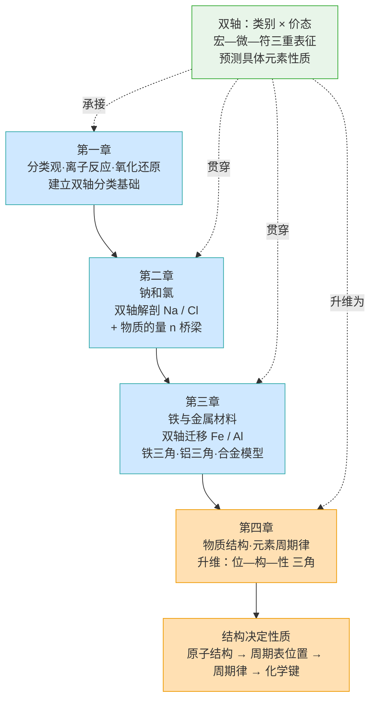
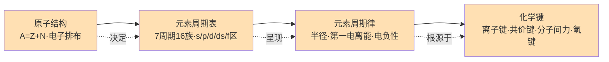
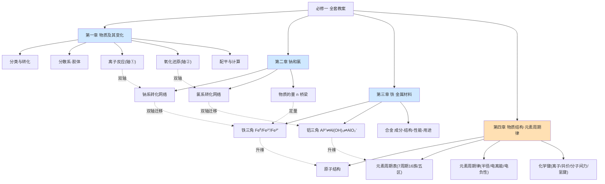

# 必修一 · 跨章贯通知识主线总图（全套教案"地图"）

> 本图是四章《知识体系与概念关联图》的"总图"，把 5+10+7+8 共 30 课时的元素化合物学习与结构化学学习，收束为一条**研究方法进化的主线**：第一章至第三章用"**类别 × 价态 双轴**"预测具体元素（Na / Cl / Fe / Al）的性质；第四章升维为"**位—构—性 三角**"，把具体元素提炼为一般规律。全程贯穿"**宏—微—符三重表征**"与"**物质的量 n 定量桥梁**"。

## 一、核心主线：研究方法的进化（双轴 → 位构性三角）



**读法**：蓝色＝具体元素研究（Ch1–Ch3，用双轴解剖 Na/Cl/Fe/Al）；橙色＝一般规律研究（Ch4，升维为位构性三角）。双轴方法从 Ch1 建立、Ch2/Ch3 迁移，到 Ch4 升维为"结构决定性质"的总纲。

## 二、各章核心概念网络

### 2.1 第一章 物质及其变化
```
     全部化学反应
   ┌────────┴────────┐
有离子参加?          有电子转移?
 (轴①离子反应)        (轴②氧化还原)
   │                    │
   ▼                    ▼
离子反应 / 非离子    氧化还原 / 非氧化还原
   └──── 交叉区 ────┘
   如 Zn+2H⁺→Zn²⁺+H₂↑（既离子又氧化还原）
   分类 ⇄ 转化（八圈网络）· 胶体(1~100 nm) · 双线桥/单线桥
   氧化剂/还原剂 · 电子守恒配平
```

### 2.2 第二章 钠和氯
```
钠系：Na→Na₂O/Na₂O₂(歧化)→NaOH→Na₂CO₃⇌NaHCO₃（侯氏制碱）
氯系：Cl₂→HCl/HClO(永久漂白)→NaClO/Ca(ClO)₂(84/漂白粉)→卤素递变
双轴：Na 0→+1 ； Cl 0→−1/+1/+5/+7
定量桥梁 n：n=N/Nₐ=m/M=V/Vₘ=c·V
```

### 2.3 第三章 铁与金属材料
```
铁三角：Fe⁰ ─氧化剂→ Fe³⁺ ⇄(Fe还原) Fe²⁺
铝三角：Al³⁺ ⇌ Al(OH)₃ ⇌ AlO₂⁻（两性，pH窗口）
合金：成分→结构→性能→用途（硬度↑熔点↓）
双轴：Fe 0→+2/+3 ； Al 0→+3
```

### 2.4 第四章 物质结构·元素周期律（位构性三角）


## 三、全册知识地图（四章递进：具体元素 → 一般规律）



## 四、各课站位表（★=本课焦点系统）

### 第一章（5 课）
| 课时 | ★ 焦点 |
|------|--------|
| 1.1 物质的分类及转化 | 宏观类别视角 + 转化（八圈网络） |
| 1.2 分散系与胶体 | 粒子尺度视角（1~100 nm） |
| 1.3 电解质的电离与离子反应 | 轴① 离子反应 |
| 1.4 氧化还原反应：概念与规律 | 轴② 价态 / 双线桥单线桥 |
| 1.5 氧化还原方程式的配平与计算 | 轴② 定量工具（电子守恒） |

### 第二章（10 课）
| 课时 | ★ 焦点 |
|------|--------|
| 2.1 金属钠 | 钠系单质（Na 强还原） |
| 2.2 钠的氧化物 | Na₂O / Na₂O₂（Na₂O₂ 歧化） |
| 2.3 碳酸钠和碳酸氢钠 | Na₂CO₃ ⇌ NaHCO₃ · 侯氏制碱 |
| 2.4 氯气的性质 | 氯系单质（Cl₂ / HClO 漂白） |
| 2.5 氯气的制备与卤素 | 制备 · 漂白粉 · 卤素递变 |
| 2.6 物质的量和摩尔质量 | 定量桥梁 n / M |
| 2.7 气体摩尔体积 | Vₘ = 22.4 L/mol（三前提） |
| 2.8 物质的量浓度 | c = n / V |
| 2.9 一定浓度溶液配制 | 容量瓶实验 · 定容误差 |
| 2.10 物质的量在计算中的应用 | n 四量综合 · Nₐ 陷阱 |

### 第三章（7 课）
| 课时 | ★ 焦点 |
|------|--------|
| 3.1 铁的单质 | 铁系 Fe⁰（变价 / 冶炼） |
| 3.2 铁的氧化物与氢氧化物 | FeO / Fe₂O₃ / Fe₃O₄ · Fe(OH)₂ 防氧化 |
| 3.3 铁盐与亚铁盐 | 铁三角闭合（Fe²⁺ / Fe³⁺） |
| 3.4 合金 | 成分—结构—性能—用途 |
| 3.5 铝单质与氧化铝 | 活泼性 / 氧化膜 / 两性 / 铝热 |
| 3.6 氢氧化铝与铝三角 | 两性氢氧化物 · 铝三角 |
| 3.7 新型金属材料与整合 | 三分支收口 · 全章体系 |

### 第四章（8 课）
| 课时 | ★ 焦点 |
|------|--------|
| 4.1 原子结构 | 原子构成 A=Z+N · 电子排布 · 模型史 |
| 4.2 核素与同位素 | 元素 / 核素 / 同位素辨析 |
| 4.3 元素周期表 | 7周期16族 · s/p/d/ds/f 五区 |
| 4.4 元素周期律 | 半径 / 第一电离能(反常) / 电负性 |
| 4.5 第三周期性质递变探究 | "元素争霸赛" · 结构决定性质本质 |
| 4.6 离子键与电子式 | 离子键本质 · 电子式规范 |
| 4.7 共价键与电子式 | 极性/非极性 · σ/π · 配位键 |
| 4.8 分子间作用力与氢键 | 范德华力 · 氢键 · 物性反常 |

## 五、后续接口（衔接初中与选择性必修）

**衔接初中**：物质分类（纯净物/混合物、酸碱盐氧化物）、原子结构初步、元素周期表初识、金属活动性顺序——本册把"是什么"升级为"为什么（结构决定性质）"。

**衔接选择性必修**：
- 《物质结构与性质》：位构性三角深化（电子排布式、能级交错、σ/π 键、杂化、晶体；d 区过渡元素多变价、f 区镧系收缩）。
- 《化学反应原理》：离子反应与平衡（电离/水解/沉淀溶解）、电化学（原电池/电解池，氯碱工业、钢铁腐蚀）、反应与能量（键能算 ΔH）；物质的量计量的滴定/产率/关系式。
- 《有机化学基础》：氧化还原反应视角（加氧/脱氢即氧化）、分子结构与官能团性质、共价键/分子极性/氢键解释有机物物性与生命分子结构（DNA 氢键）。
- 研究范式迁移：双轴（类别×价态）方法延伸至硫、氮等后续元素化合物学习；合金材料模型延伸至材料科学基础。

> 教学建议：以本总图作为全册导入的"地图"，每章导入时高亮对应蓝色（Ch1–3）或橙色（Ch4）色块，30 课连成一条"具体元素 → 一般规律"的认知主线，章末用对应章节关联图做结构化复盘，避免知识点碎片化。
