# 第 25 届中国化学奥林匹克竞赛(初赛)试题解析

(2011年9月11日)

## 试题

## 第 1 题(15 分)

1-1 2011 年是国际化学年, 是居里夫人获得诺贝尔化学奖 100 周年。居里夫人发现的两种化学元素的元素符号和中文名称分别是 \_\_\_\_ 和 \_\_\_\_。

1-2 向 $TiOSO_{4}$ 水溶液中加入锌粒，反应后溶液变为紫色。在清液中滴加适量的 $CuCl_{2}$ 水溶液，产生白色沉淀。生成白色沉淀的离子方程式是 \_\_\_\_ 。继续滴加 $CuCl_{2}$ 水溶液，白色沉淀消失，其离子方程式是 \_\_\_\_ 。

1-3 20世纪60年代维也纳大学V. Gutmann研究小组报道，三原子分子A可由 $\mathrm{SF}_4$ 和 $\mathrm{NH}_3$ 反应合成；A被 $\mathrm{AgF_2}$ 氧化得到沸点为 $27^{\circ}C$ 的三元化合物B。A和B分子中的中心原子与同种端位原子的核间距几乎相等；B分子有一根三重轴和3个镜面。画出A和B的结构式(明确示出单键和重键，不在纸面上的键用楔形键表示，非键合电子不必标出）。

1-4 画出 $\mathrm{Al}_{2}(n - \mathrm{C}_{4}\mathrm{H}_{9})_{4}\mathrm{H}_{2}$ 和 $\mathrm{Mg}[\mathrm{Al}(\mathrm{CH}_3)_4]_2$ 的结构简式。

1-5 已知 $E^{\ominus}(\mathrm{FeO}_{4}^{2-}/\mathrm{Fe}^{3+})=2.20\ \mathrm{V}, E^{\ominus}(\mathrm{FeO}_{4}^{2-}/\mathrm{Fe}(\mathrm{OH})_{3})=0.72\ \mathrm{V}$ 。

① 写出氯气和三氯化铁反应形成高铁酸根的离子方程式。

② 写出高铁酸钾在酸性水溶液中分解的离子方程式。

③ 用高铁酸钾与镁等组成碱性电池，写出该电池的电极反应。

## 第2题(11分)

2-1 画出 2,4-戊二酮的钠盐与 $Mn^{3+}$ 形成的电中性配合物的结构式(配体用 O-O 表示)。

2-2 已知该配合物的磁矩为 4.9 玻尔磁子, 配合物中 Mn 的未成对电子数为 \_\_\_\_。

2-3 回答:该化合物有无手性?为什么?

2-4 画出 2,4-戊二酮负离子的结构简式(须明确示出其共轭部分)，写出其中离域 $\pi$ 键的表示符号。

2-5 橙黄色固体配合物 A 的名称是三氯化六氨合钴（Ⅲ），是将二氯化钴、浓氨水、氯化铵和过氧化氢混合，以活性炭为催化剂合成的。机理研究发现，反应过程中首先得到 $\mathrm{Co(NH_{3})_{6}^{2+}}$ 离子；随后发生配体取代反应，得到以新配体为桥键的双核离子 $B^{4+}$ ；接着发生桥键断裂，同时两个中心原子分别将一个电子传递到均裂后的新配体上，得到两个 $C^{2+}$ 离子；最后 $C^{2+}$ 离子在活性炭表面上发生配体取代反应，并与氯离子结合形成固体配合物 A。写出合成配合物 A 的总反应方程式；画出 $B^{4+}$ 和 $C^{2+}$ 离子的结构式。

## 第3题(8分)

近年来，某些轻元素的含氢化合物及其复合体系作为氢源受到广泛关注。化合物 A $(XYH_{2})$ 和 B(XH)都是具有潜在应用价值的释氢材料。A 受热分解生成固体化合物 C 并放出刺激性气体 D, D 可使湿润的 pH 试纸变蓝。A 和 B 混合可优化放氢性能。研究发现，该混合体系的放氢反应分三步进行：

$$
2 \mathbf {A} = \mathbf {C} + \mathbf {D}\tag{1}
$$

$$
\mathbf {D} + \mathbf {B} = \mathbf {A} + \mathrm{H} _ {2}\tag{2}
$$

$$
\mathbf {C} + \mathbf {B} = \mathbf {E} + \mathrm{H} _ {2}\tag{3}
$$

将 A 和 B 按 1:2 的摩尔比混合，在催化剂作用下，所含的氢全部以氢气放出，失重 10.4%。

A、C、E均能水解生成F和D。G是由X和Y组成的二元化合物，其阴离子是二氧化碳的等电子体，G分解生成E和一种无色无味的气体I。写出A、B、C、D、E、F、G和I的化学式。

## 第 4 题(9 分)

固溶体 $BaIn_{x}Co_{1-x}O_{3-\delta}$ 是兼具电子导电性与离子导电性的功能材料，Co 的氧化数随组成和制备条件而变化，In 则保持 +3 价不变。为测定化合物 $BaIn_{0.55}Co_{0.45}O_{3-\delta}$ 中 Co 的氧化数，确定化合物中的氧含量，进行了如下分析：称取 0.2034 g 样品，加入足量 KI 溶液和适量 HCl 溶液，与样品反应使其溶解。以淀粉为指示剂，用 0.05000 mol L $^{-1}$ $Na_{2}S_{2}O_{3}$ 标准溶液滴定，消耗 10.85 mL。

4-1 写出 $BaIn_{0.55}Co_{0.45}O_{3-\delta}$ 与 KI 和 HCl 反应的离子方程式。

4-2 写出滴定反应的离子方程式。

4-3 计算 $\mathrm{BaIn}_{0.55}\mathrm{Co}_{0.45}\mathrm{O}_{3 - \delta}$ 样品中 $\mathrm{Co}$ 的氧化数 $S_{\mathrm{Co}}$ 和氧缺陷的量 $\delta$ （保留到小数点后两位）。

## 第 5 题(10 分)

1965 年合成了催化剂 A, 实现了温和条件下的烯烃加氢。

5-1 A 是紫红色晶体, 相对分子质量 925.23, 抗磁性。它通过 $\mathrm{RhCl}_{3} \cdot 3\mathrm{H}_{2}\mathrm{O}$ 和过量三苯基膦 $(\mathrm{PPh}_{3})$ 的乙醇溶液回流制得。画出 A 的立体结构。

5-2 A 可能的催化机理如下页图所示(图中 16e 表示中心原子周围总共有 16 个电子): 画出 D 的结构式。

5-3 确定图中所有配合物的中心原子的氧化态。

5-4 确定 A、C、D 和 E 的中心离子的杂化轨道类型。

5-5 用配合物的价键理论推测 C 和 E 显顺磁性还是抗磁性,说明理由。

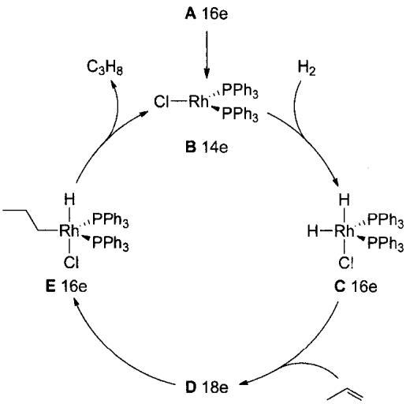

## 第6题(10分)

$NO_{2}$ 和 $N_{2}O_{4}$ 混合气体的针管实验是高中化学的经典素材。理论估算和实测发现，混合气体体积由 V 压缩为 V/2，温度由 298 K 升至 311 K。已知，这两个温度下 $\mathrm{N}_{2}\mathrm{O}_{4}(\mathrm{~g}) \rightleftharpoons 2\mathrm{NO}_{2}(\mathrm{~g})$ 的压力平衡常数 $K_{p}$ 分别为 0.141 和 0.363。

6-1 通过计算回答, 混合气体经上述压缩后, $NO_{2}$ 的浓度比压缩前增加了多少倍。

6-2 动力学实验证明,上述混合气体几微秒内即可达成化学平衡。压缩后的混合气体在室温下放置,颜色如何变化?为什么?

## 第 7 题(9 分)

12000 年前，地球上发生过一次大灾变，气温骤降，导致猛犸灭绝、北美 Clovis 文化消亡。有一种假说认为，灾变缘起一颗碳质彗星撞击地球。2010 年几个研究小组发现，在北美和格陵兰该地质年代的地层中存在超乎寻常浓度的纳米六方金刚石，被认为是该假设的证据。

7-1 立方金刚石的晶胞如图 7-1 所示。画出以两个黑色碳原子为中心的 C—C 键及所连接的碳原子。

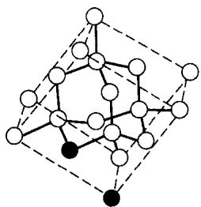  
图7-1

7-2 图 7-2 上、下分别是立方金刚石和六方金刚石的碳架结构。它们的碳环构型有何不同？

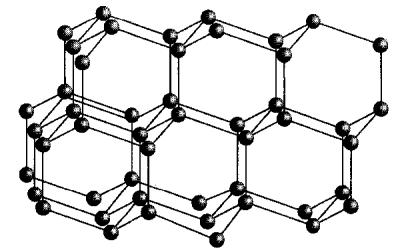

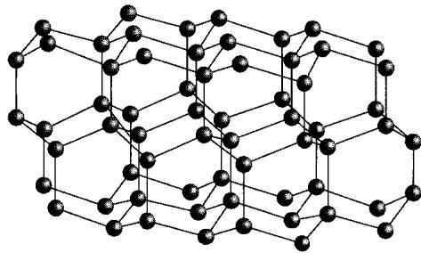  
图7-2

7-3 六方硫化锌的晶体结构如图 7-3 所示。用碳原子代替硫原子和锌原子，即为六方金刚石。请在该图内用粗线框出六方金刚石的一个晶胞，要求框线必须包含图中已有的一段粗线，且框出的晶胞体积最小。

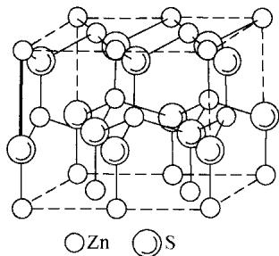  
图7-3

7-4 立方金刚石中周期性重复的最小单位包含 \_\_\_\_ 个碳原子。

## 第 8 题(10 分)

化合物 B 是以 $\beta$ -紫罗兰酮为起始原料制备维生素 A 的中间体。

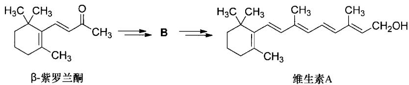

由 $\beta$ -紫罗兰酮生成 $\mathbf{B}$ 的过程如下所示：

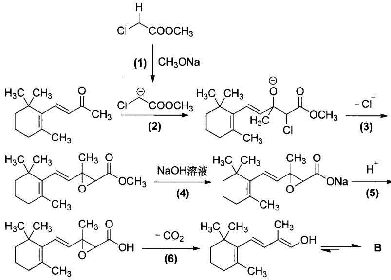

8-1 维生素 A 分子的不饱和度为 \_\_\_\_。

8-2 芳香化合物 C 是 $\beta$ -紫罗兰酮的同分异构体，C 经催化氢解生成芳香化合物 D, D 的 ${}^{1}$ H NMR 图谱中只有一个单峰。画出 C 的结构简式。

8-3 画出中间体 B 的结构简式。

8-4 以上由 $\beta$ -紫罗兰酮合成中间体 B 的过程中，(2)、(3)、(4)、(6) 反应分别属于什么反应类型（反应类型表述须具体，例如取代反应必须指明是亲电取代、亲核取代还是自由基取代）。

## 第 9 题(10 分)

化合物 A、B 和 C 的化学式均为 $C_{7}H_{8}O_{2}$ 。它们分别在催化剂作用和一定反应条件下加足量的氢，均生成化合物 $\mathrm{D}(\mathrm{C}_{7}\mathrm{H}_{12}\mathrm{O}_{2})$ 。D 在 NaOH 溶液中加热反应后再酸化生成 $\mathrm{E}(\mathrm{C}_{6}\mathrm{H}_{10}\mathrm{O}_{2})$ 和 $\mathrm{F}(\mathrm{CH}_{4}\mathrm{O})$ 。

A 能发生如下转化：

$$
\mathbf {A} + \mathrm{CH} _ {3} \mathrm{MgCl} \longrightarrow \xrightarrow {\mathrm{H} _ {2} \mathrm{O}} \mathbf {M} (\mathrm{C} _ {8} \mathrm{H} _ {1 2} \mathrm{O}) \xrightarrow [ \triangle ]{\text {浓硫酸}} \mathbf {N} (\mathrm{C} _ {8} \mathrm{H} _ {1 0})
$$

生成物 N 分子中只有 3 种不同化学环境的氢, 它们的数目比为 1:1:3。

9-1 画出化合物 A、B、C、D、E、M 和 N 的结构简式。

9-2 A、B 和 C 互为哪种异构体？（在正确选项的标号前打钩）

① 碳架异构体 ② 位置异构体 ③ 官能团异构体 ④ 顺反异构体

9-3 A 能自发转化为 B 和 C, 为什么?

9-4 B和C在室温下反应可得到一组旋光异构体L,每个旋光异构体中有\_\_\_\_个不对称碳原子。

## 第10题(8分)

Vilsmeier 反应是在富电子芳环上引入甲酰基的有效方法。其过程首先是 N,N-二甲基甲酰胺与 $POCl_{3}$ 反应生成 Vilsmeier 试剂：

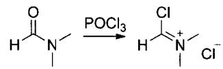

接着 Vilsmeier 试剂与富电子芳环反应,经水解后在芳环上引入甲酰基。例如

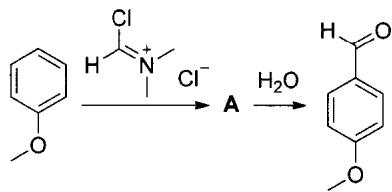

10-1 用共振式表示 Vilsmeier 试剂正离子。

10-2 由甲氧基苯转化为对甲氧基苯甲醛的过程中,需经历以下步骤:

(1)芳香亲电取代；(2)分子内亲核取代；(3)亲核加成；(4)质子转移；(5)消除。画出所有中间体的结构简式。

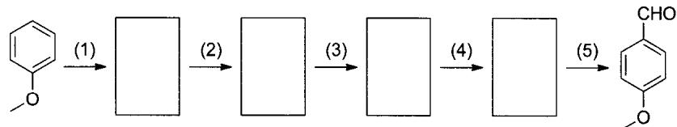

10-3 完成下列反应：

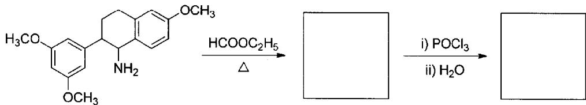

## 试题解析

## 第1题

## 背景

2011年是居里夫人获诺贝尔化学奖100周年，也恰逢国际纯粹与应用化学联合会(IUPAC)的前身国际化学会联盟成立100周年。2008年年底，联合国决议将2011年定为“国际化学年”，主题为“化学——我们的生活，我们的未来”。

## 分析与解答

1-1 本题考查同学们对化学基本常识的了解和掌握。同学们需要对一些基本的化学史内容有所了解：1898年居里夫妇先后发现了钋(Po)和镭(Ra)两种放射性元素。

1-2 本题考查第一过渡系元素的元素性质，是一道很基础的题目。Ti是第四周期IVB族的元素，其价电子构型为 $3\mathrm{d}^2 4\mathrm{s}^2$ ，主要氧化数为 $+3$ 和 $+4$ 。Ti(Ⅲ)在水中呈紫色，而 $\mathrm{Ti(IV)}$ 为无色。很显然，“ $\mathrm{TiOSO_4}$ 水溶液中加入锌粒，反应后溶液变为紫色”，说明反应后 $+4$ 氧化数的钛离子被 $\mathbf{Zn}$ 还原成 $\mathrm{Ti}^{3 + }$ 。其反应方程式为

$$
2 \mathrm{TiO} ^ {2 +} + \mathrm{Zn} + 4 \mathrm{H} ^ {+} = \mathrm{Zn} ^ {2 +} + 2 \mathrm{Ti} ^ {3 +} + 2 \mathrm{H} _ {2} \mathrm{O}
$$

$\mathrm{Ti}^{3+}$ 在水中是一种比较强的还原剂。 $\mathrm{Cu}$ 在水中的可能氧化数为 $+1$ 及 $+2$ ，因此加入 $\mathrm{CuCl}_2$ 后， $\mathrm{Cu}^{2+}$ 可能被 $\mathrm{Ti}^{3+}$ 还原为 $\mathrm{Cu}^+$ 或 $\mathrm{Cu}$ 。 $\mathrm{Cu}$ 单质为红色，与题目不符。考虑到题设环境中存在 $\mathrm{Cl^-}$ ，与 $\mathrm{Cu}^+$ 可以形成溶解度较小且呈白色的 $\mathrm{CuCl}$ 。故反应方程式为

$$
\mathrm{Ti} ^ {3 +} + \mathrm{Cu} ^ {2 +} + \mathrm{Cl} ^ {-} + \mathrm{H} _ {2} \mathrm{O} = \mathrm{TiO} ^ {2 +} + 2 \mathrm{H} ^ {+} + \mathrm{CuCl} \downarrow
$$

另外，同学们需要注意 $CuCl_{2}$ 的水解产物是蓝色沉淀，与题目不符，因此应排除水解的可能。CuCl 的 $K_{sp}$ 较小，为 $1.72 \times 10^{-7}$ ，而且由于 $K_{sp}$ 等于氯离子的浓度乘以铜离子的浓度，在外界氯离子的浓度增大以后铜离子浓度变小（即同离子效应），所以我们应该考虑使溶解度增大的两种效应——盐效应和配位效应。盐效应指在加入大量电解质以后，会使得溶液中离子的活度降低，从而变相增大了溶解度；而配位效应指沉淀物的金属离子与沉淀剂（此时作为配位剂）进行配位，由勒夏特列原理，平衡正向移动，体现为沉淀物不断溶解。盐效应和配位效应的最大区别在于，盐效应涉及的离子与沉淀的形成无关（否则会与同离子效应抵消），而配位效应则一般与沉淀形成离子有关。加入 $CuCl_{2}$ 以后，沉淀溶解，所以应该为配位效应。当 $Cl^{-}$ 浓度升高时，多余的 $Cl^{-}$ 会与 CuCl 发生配位反应，形成二配位的 Cu(I) 离子，从而使 CuCl 沉淀溶解。

$$
\mathrm{CuCl} + \mathrm{Cl} ^ {-} = \mathrm{CuCl} _ {2} ^ {-}
$$

1-3 本题考查同学们对主族元素知识的掌握和运用,需要同学们能够熟练并灵活地掌握 S、N 化合物的一些性质,而非机械背诵元素知识。仅凭借反应物 $SF_{4}$ 和 $NH_{3}$ 很难判断 A 的组成,我们要根据题目条件以及对化合物性质的理解来猜测 A 的组成元素。A 是三原子分子,说明 A 只可能由两种或者三种元素组成(单质显然不符合题设)。考虑只含两种元素的情况，S、F、N、H，无论哪两种元素组成“ $\mathrm{AB}_2$ ”型分子，都显然不符合题目条件。因此A只能是含三种元素的分子。我们可以猜测A是S、N、F或者S、N、H三种元素组成，再参考反应物中S、N的价态以及所连接的原子，故A的化学式为SNF。 $\mathrm{AgF}_2$ 由于其中高价态的 $\mathrm{Ag(II)}$ ，是一种常用的氟化试剂，三原子分子A被 $\mathrm{AgF}_2$ 氟化得到三元化合物B。由A的元素组成，B可能是 $\mathrm{SNF}_x$ 。“B分子中的中心原子与同种端位原子的核间距几乎相等”，意味着B中F原子的化学环境是相同的。而B分子有一根三重轴和三个镜面，说明 $x = 3$ 。根据价层电子对互斥理论(VSEPR理论)，可以判断出S处于中心位置，N与三个F原子是四个配位原子。所以A的中心原子也为S而非N。于是我们可以画出A和B的结构式为

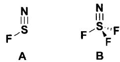

1-4 本题考查等电子体原理、Lewis 结构式和 VSEPR 理论，是一道综合性很强的基础题目。根据广义的等电子体原理，正丁基负离子由于只有一对孤对电子，可以类比于氢负离子，因此 $\mathrm{Al}_{2}(n-\mathrm{C}_{4}\mathrm{H}_{9})_{4}\mathrm{H}_{2}$ 相当于“ $Al_{2}H_{6}$ ”，或者更进一步可以类比成乙硼烷“ $B_{2}H_{6}$ ”。根据乙硼烷的结构，我们可以画出其结构：

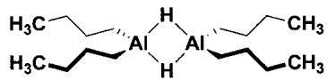

$\mathrm{Mg}$ 和 $\mathrm{Al}$ 的配合物以四配位为多。根据广义等电子体原理， $\mathrm{Mg}[\mathrm{Al}(\mathrm{CH}_3)_4]_2$ 中的 $\mathrm{CH}_3$ 相当于 $\mathrm{H}$ ，即 $[\mathrm{Al}(\mathrm{CH}_3)_4]$ （相当于 $[\mathrm{AlH}_4]$ ）作为一个整体与 $\mathrm{Mg}$ 配位。由于 $\mathrm{Al}$ 已经达到饱和的四配位结构， $\mathrm{Mg}$ 和 $\mathrm{Al}$ 之间只能通过 $\mathrm{CH}_3$ 以桥键连接。为了使 $\mathrm{Mg}$ 达到饱和的四配位结构，每个 $[\mathrm{Al}(\mathrm{CH}_3)_4]$ 都需提供两个甲基与 $\mathrm{Mg}$ 形成桥键。另外， $\mathrm{Mg}$ 和 $\mathrm{Al}$ 都是 $\mathfrak{sp}^3$ 杂化，周围的四个配体形成四面体结构。综合上述分析，可画出如下结构：

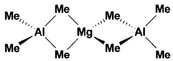

1-5 本题考查同学们对高铁酸根离子 $FeO_{4}^{2-}$ 性质的掌握。

① $FeO_{4}^{2-}$ 在酸性条件下有很强的氧化性 $\left(\mathrm{FeO}_{4}^{2-}/\mathrm{Fe}^{3+}\right.$ 的标准电极电势是 2.20 V)，可以氧化 $H_{2}O$ ；而在碱性条件下 $FeO_{4}^{2-}$ 的氧化性呈现出惰性，其电极电势只有 0.72 V。题目中虽然没有明确给出 $Cl_{2}/Cl^{-}$ 的电极电势，但是同学们不难猜出 $Cl_{2}/Cl^{-}$ 的电极电势应该介于 0.72～2.20 V 之间。因此， $Cl_{2}$ 只能在碱性条件下氧化 $Fe^{3+}$ 生成高铁酸根离子。其离子方程式为

$$
2 \mathrm{Fe} ^ {3 +} + 3 \mathrm{Cl} _ {2} + 1 6 \mathrm{OH} ^ {-} = 2 \mathrm{FeO} _ {4} ^ {2 -} + 6 \mathrm{Cl} ^ {-} + 8 \mathrm{H} _ {2} \mathrm{O}
$$

② 如①中的分析,高铁酸钾在酸性水溶液中会氧化水,生成氧气,而自身被还原为

$Fe^{3+}$ 。其离子方程式为

$$
4 \mathrm{FeO} _ {4} ^ {2 -} + 2 0 \mathrm{H} ^ {+} = 4 \mathrm{Fe} ^ {3 +} + 3 \mathrm{O} _ {2} + 1 0 \mathrm{H} _ {2} \mathrm{O}
$$

③ 本小题考查电极反应半反应式的书写，是一道基础题目。在碱性条件下 $\mathrm{FeO}_4^{2-}$ 还原成 $\mathrm{Fe(OH)}_3$ ， $\mathrm{Mg}$ 氧化成 $\mathrm{Mg(OH)}_2$ 。（在高中化学书中强调正极与负极反应得失电子数要一致，但是这在书写电极反应时不是必要的。）

$$
\text {   正极:   } \mathrm{FeO} _ {4} ^ {2 -} + 4 \mathrm{H} _ {2} \mathrm{O} + 3 \mathrm{e} ^ {-} = \mathrm{Fe(OH)} _ {3} + 5 \mathrm{OH} ^ {-}
$$

$$
\text {负极:} \mathrm{Mg} + 2 \mathrm{OH} ^ {-} - 2 \mathrm{e} ^ {-} = \mathrm{Mg(OH)} _ {2}
$$

像本题这样在碱性条件下制备强氧化剂的反应还有很多，例如碱性条件下 $H_{2}O_{2}$ 可以将 Cr(Ⅲ) 氧化到 Cr(VI)；而酸性条件下则正好相反， $H_{2}O_{2}$ 会将 Cr(VI) 还原到 Cr(Ⅲ)。

## 第2题

## 分析与解答

2-1 本题考查八面体场配合物的异构问题。对于 $\mathbf{M}(\mathbf{AA})_3$ 型配合物，不存在几何异构体，仅存在一对旋光异构体，其结构式如下：

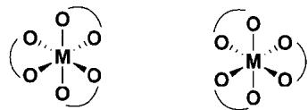

2-2 本题考查过渡金属配合物磁矩公式的运用。根据磁矩简易计算公式 $\mu = \sqrt{n(n + 2)}\mu_{\mathrm{B}}(n$ 为中心离子的未成对电子数)，同学们可以轻松计算出该配合物中心金属离子的未成对电子数为4。

2-3 本题考查手性判据。判断手性的方法不仅仅适用于配合物异构体，在有机分子的异构体中也经常使用，因此同学们需要对此有所了解。初赛中出现的分子都是比较简单的分子，简单地通过验证对称面和对称中心就可以判断手性：如果分子存在对称面或对称中心（即第二类对称元素），那么就可以认定此物质一定没有手性。当然也可以采用更简单、直接的判断方法，即在纸上将分子作任意的镜面对称并画出来，然后将镜面对称前后的分子作对比，如果相同，那么就没有手性。

本题所述配合物不存在对称面和对称中心，只有旋转轴，因此有手性。

2-4 本题考查离域大 $\pi$ 键的画法。同学们应先找出所有非 $\mathrm{sp}^3$ 杂化或端基上能够提供垂直于平面的 $\mathfrak{p}$ 轨道的原子，并计算 $\mathfrak{p}$ 轨道上的电子数。其过程如下：

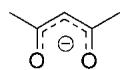

如上图所示的结构中，三个碳原子和两个氧原子都是能参与离域的原子，它们分别提供一个 $p_{z}$ 轨道，垂直于分子所在的平面，每个原子提供一个电子，再加上2,4-戊二酮负离子本身的负电荷，一共有6个电子参与离域。因此大 $\pi$ 键为 $\pi_{5}^{6}$ 。

2-5 本题重点考查配位现象对氧化性的影响,以及对无机反应机理的理解,对同学们来说有一定难度。

Co 的常见氧化数为 +2 和 +3。简单的 $Co^{3+}$ 具有非常强的氧化性，可以氧化水而变成 $Co^{2+}$ ，因此水溶液中不存在简单的 Co(Ⅲ) 离子。但是加入氨水后， $NH_{3}$ 可以与 $Co^{3+}$ 结合生成稳定的 $\mathrm{Co(NH_{3})_{6}^{3+}}$ ，极大地降低了 $Co^{3+}/Co^{2+}$ 的电极电势，所以在氧化剂 $H_{2}O_{2}$ 存在下，钴(Ⅱ) 氨离子会被氧化成三价钴（活性炭是必不可少的，否则产物会有所不同）。

整个氧化过程是从配体取代反应开始的，因为后续过程含有氧化，即有电子转移，说明新配体肯定是 $\mathrm{H}_2\mathrm{O}_2$ （但是新配体中氢的数量尚不能确定）。“得到新配体为桥键的双核离子 $\mathbf{B}^{4 + }$ ”，说明两个钴配离子与一个过氧化氢分子发生了配体取代，即两个Co之间由过氧键相连。新生成的双核离子 $\mathbf{B}^{4 + }$ 有4个正电荷，而两个Co（Ⅱ）就已经满足了电荷需求，说明 $\mathrm{H}_2\mathrm{O}_2$ 是以分子形式取代的，新配体中每个氧上的氢仍然保留。整体反应如下：

$$
2 \left( \begin{array}{c} \mathrm{NH} _ {3} \\ \mathrm{H} _ {3} \mathrm{N} _ {4} \mathrm{NH} _ {3} \\ \mathrm{H} _ {3} \mathrm{N} \xrightarrow {\mathrm{Co}} \mathrm{NH} _ {3} \\ \mathrm{NH} _ {3} \end{array} \right) ^ {2 +} \xrightarrow [ - 2 \mathrm{NH} _ {3} ]{+ \mathrm{H} _ {2} \mathrm{O} _ {2}} \left( \begin{array}{c} \mathrm{NH} _ {3} \\ \mathrm{H} _ {3} \mathrm{N} _ {4} \mathrm{NH} _ {3} \\ \mathrm{H} _ {3} \mathrm{N} _ {4} \mathrm{NH} _ {3} \\ \mathrm{H} _ {3} \mathrm{N} \xrightarrow {\mathrm{O}} \mathrm{O} \xrightarrow {\mathrm{CO}} \mathrm{NH} _ {3} \\ \mathrm{NH} _ {3} \end{array} \right) ^ {4 +}
$$

过氧键是一种不稳定的键，整个氧化过程的核心就是过氧键的断裂，这与“桥键发生断裂”相吻合。从对称性上知，过氧键的断裂是均裂，形成两个相同的自由基，单电子在氧上。“两个中心原子分别将一个电子传递到均裂后的新配体上”，意味着中心的 $\mathrm{Co(II)}$ 将失去一个电子，被氧化成 $\mathrm{Co(III)}$ ，同时O得到一个单电子成为羟基，总电荷数不变，与 $\mathbf{C}^{2+}$ 的 $+2$ 电荷数吻合。因此可以写出 $\mathbf{C}^{2+}$ 的结构如下：

$$
1 / 2 \left( \begin{array}{c} \mathrm{B} \\ \mathrm{H} _ {3} \mathrm{N} \xrightarrow {\mathrm{H} _ {3} \mathrm{N}} \mathrm{O} \xrightarrow {\mathrm{O}} \mathrm{H} \end{array} \right) ^ {4 +} \longrightarrow \left( \begin{array}{c} \mathrm{H} _ {3} \mathrm{N} \xrightarrow {\mathrm{NH} _ {3}} \mathrm{OH} \\ \mathrm{H} _ {3} \mathrm{N} \xrightarrow {\mathrm{CO}} \mathrm{NH} _ {3} \\ \mathrm{NH} _ {3} \end{array} \right) ^ {2 +} \longrightarrow \left( \begin{array}{c} \mathrm{NH} _ {3} \\ \mathrm{H} _ {3} \mathrm{N} \xrightarrow {\mathrm{CO}} \mathrm{NH} _ {3} \\ \mathrm{NH} _ {3} \end{array} \right) ^ {2 +}
$$

最后发生配体取代反应，对比产物 A 的结构式 $\mathrm{Co(NH_{3})_{6}^{3+}}$ 可知，C 中羟基被 $NH_{3}$ 取代后即可得到产物 A。

$$
\left( \begin{array}{c} \mathrm{H} _ {3} \mathrm{N} _ {\text {   }} \mathrm{NH} _ {3} \\ \mathrm{H} _ {3} \mathrm{N} \xrightarrow {\mathrm{Co}} \mathrm{NH} _ {3} \\ \mathrm{NH} _ {3} \end{array} \right) ^ {2 +} \xrightarrow [ - \mathrm{OH} ^ {-} ]{+ \mathrm{NH} _ {3}} \left( \begin{array}{c} \mathrm{NH} _ {3} \\ \mathrm{H} _ {3} \mathrm{N} _ {\text {   }} \mathrm{NH} _ {3} \\ \mathrm{H} _ {3} \mathrm{N} \xrightarrow {\mathrm{Co}} \mathrm{NH} _ {3} \\ \mathrm{NH} _ {3} \end{array} \right) ^ {3 +}
$$

综合上述所有过程的方程式可得

$$
2 \mathrm{CoCl} _ {2} + 1 0 \mathrm{NH} _ {3} + 2 \mathrm{NH} _ {4} \mathrm{Cl} + \mathrm{H} _ {2} \mathrm{O} _ {2} = 2 \mathrm{Co} (\mathrm{NH} _ {3}) _ {6} \mathrm{Cl} _ {3} + 2 \mathrm{H} _ {2} \mathrm{O}
$$

## 评注

本题前四小问是基础题目，难度较低，考查的知识点较为单一，对于同学们而言，前四小问应该势在必得。如果这几道小题有错误或疑问，同学们应该加强基础知识的训练，查漏补缺。最后一问是一道综合性比较强的题目，对配位反应和氧化还原反应的理解提出了较高的要求。想要冲刺决赛的同学们应该给予第5小问更多的关注。

以下是八面体场配合物异构体数目表，可作为练习参考使用[括号里加号前的数字为几何异构体的数目，加号后面的数字表示旋光异构体的对数；a、b、c、d分别代表不同种类的单齿配体；(AA)、(AB)分别表示配位原子化学环境相同和不同的双齿配体]：

<table><tr><td>类型</td><td>个数</td><td>类型</td><td>个数</td></tr><tr><td> $Ma_{2}b_{2}cd$ </td><td>8(6+2)</td><td> $M(AA)b_{2}c_{2}$ </td><td>4(3+1)</td></tr><tr><td> $Ma_{2}b_{2}c_{2}$ </td><td>6(5+1)</td><td> $M(AA)b_{2}cd$ </td><td>6(4+2)</td></tr><tr><td> $Ma_{3}bcd$ </td><td>5(4+1)</td><td> $M(AA)b_{3}c$ </td><td>2(2+0)</td></tr><tr><td> $Ma_{3}b_{2}c$ </td><td>3(3+0)</td><td> $M(AA)_{2}b_{2}$ </td><td>3(2+1)</td></tr><tr><td> $Ma_{3}b_{3}$ </td><td>2(2+0)</td><td> $M(AA)_{3}$ </td><td>2(1+1)</td></tr><tr><td> $Ma_{4}bc$ </td><td>2(2+0)</td><td> $M(AB)_{2}cd$ </td><td>11(6+5)</td></tr><tr><td> $Ma_{4}b_{2}$ </td><td>2(2+0)</td><td> $M(AB)_{3}$ </td><td>4(2+2)</td></tr><tr><td> $M(AA)_{2}bc$ </td><td>3(2+1)</td><td> $M(AB)_{2}c_{2}$ </td><td>8(5+3)</td></tr></table>

## 第3题

## 分析与解答

本题是一道类似于高考题出题模式的元素化学考题,难度较小。

本题的突破点在于 D。由题可知，D 是碱性的刺激性气体，从这一点我们可以基本判断 D 是 $NH_{3}$ 。由元素守恒，元素 X、Y 中必有一个是氮。但是 B 的化学式是 XH，若 X 为氮，则 B 的化学式有违常识。因此 Y 是氮，A 是 $XNH_{2}$ 。A 与 B 能以 1:2 的摩尔比混合放出所有氢气，可以写出如下化学方程式：

$$
\mathrm{XNH} _ {2} + 2 \mathrm{XH} = 2 \mathrm{H} _ {2} + \mathrm{X} _ {3} \mathrm{N}
$$

由失重 $10.4\%$ 可知

$$
\{(2 \times 2 \times 1.008) + [3A_{r}(X) + 14.00]\} \times 10.4\% = 2 \times 2 \times 1.008
$$

解得 X 的相对原子质量为

$$
A _ {r} (X) = 6. 9
$$

由此可得 X 是 Li。所以 A 是 $LiNH_{2}$ ，B 是 LiH。

由 A 的化学式可以写出化学方程式(1):

$$
2 \mathrm{LiNH} _ {2} = \mathrm{Li} _ {2} \mathrm{NH} + \mathrm{NH} _ {3}
$$

所以 $\mathbf{C}$ 是 $\mathrm{Li}_2\mathrm{NH}$ 。根据 $\mathbf{C}$ 还可以写出化学方程式(3)：

$$
\mathrm{Li} _ {2} \mathrm{NH} + \mathrm{LiH} = \mathrm{Li} _ {3} \mathrm{N} + \mathrm{H} _ {2}
$$

即 E 是 $Li_{3}N$ 。

不难写出 A 水解的化学方程式：

$$
\mathrm{LiNH} _ {2} + \mathrm{H} _ {2} \mathrm{O} = \mathrm{LiOH} + \mathrm{NH} _ {3}
$$

D 是已知的 $NH_{3}$ ，因此 F 是 LiOH。G 的阴离子与 $CO_{2}$ 是等电子体，且由 Li 和 N 两种元素组成，不难想到 G 的阴离子是 $N_{3}^{-}$ ，继而 G 是 $LiN_{3}$ 。由 G 和 E 的化学式可以写出 G 分解的化学方程式为

$$
3 \mathrm{LiN} _ {3} = \mathrm{Li} _ {3} \mathrm{N} + 4 \mathrm{N} _ {2}
$$

因此 I 是 $N_{2}$ ，这与其“无色无味”的性质相吻合。

评注

本题形式上与高考题类似，难度也比较低，同学们应该保证全部正确。

## 第4题

## 分析与解答

本题以定量分析计算题的方式考查同学们对间接碘量法的掌握。

4-1 同学们通读题干后可以发现，整个分析过程是标准的间接碘量法，KI在第一步作为还原剂出现。为了写出溶解反应的方程式，确定反应物材料中金属离子的氧化数就非常重要。由题目易知， $\mathrm{Ba}^{2+}$ 与 $\mathrm{In}^{3+}$ 保持原来氧化数不变，而钴离子会由 $+3$ 或 $+4$ 价被还原为 $+2$ 价。所以滴定反应的产物为 $\mathrm{Ba}^{2+}$ 、 $\mathrm{In}^{3+}$ 、 $\mathrm{Co}^{2+}$ 和 $\mathrm{I}_2$ 。再根据电荷守恒和物料守恒，即可配平溶解反应方程式：

$$
\begin{array}{r l} & \mathrm{Baln} _ {0. 5 5} \mathrm{Co} _ {0. 4 5} \mathrm{O} _ {3 - \delta} + (1. 4 5 - 2 \delta) \mathrm{I} ^ {-} + (6 - 2 \delta) \mathrm{H} ^ {+} = \\ & \mathrm{Ba} ^ {2 +} + 0. 5 5 \mathrm{In} ^ {3 +} + 0. 4 5 \mathrm{Co} ^ {2 +} + (0. 7 2 5 - \delta) \mathrm{I} _ {2} + (3 - \delta) \mathrm{H} _ {2} \mathrm{O} \end{array}
$$

由于 $\mathrm{I}_2$ 在水中的溶解度较小，所以 $\mathrm{I}_2$ 在水中的主要存在形式应该是 $\mathrm{I}_3^-$ 。所以同学们写出以下方程式也算对：

$$
\begin{array}{r l} & \mathrm {BaIn_ {0.55} Co_ {0.45} O_ {3- \delta}} + (2. 1 7 5 - 3 \delta) \mathrm{I} ^ {-} + (6 - 2 \delta) \mathrm{H} ^ {+} = \\ & \mathrm{Ba} ^ {2 +} + 0. 5 5 \mathrm{In} ^ {3 +} + 0. 4 5 \mathrm{Co} ^ {2 +} + (0. 7 2 5 - \delta) \mathrm{I} _ {3} ^ {-} + (3 - \delta) \mathrm{H} _ {2} \mathrm{O} \end{array}
$$

4-2 间接碘量法的滴定反应因为其快速、定量等特点而被广为使用，是每一位初赛参赛者都必须熟练掌握的滴定方法，其离子方程式如下：

$$
2 \mathrm{S} _ {2} \mathrm{O} _ {3} ^ {2 -} + \mathrm{I} _ {2} = \mathrm{S} _ {4} \mathrm{O} _ {6} ^ {2 -} + 2 \mathrm{I} ^ {-}
$$

4-3 对于氧化还原滴定反应的计算, 只需要找出电子转移的数量关系, 就可以轻松算出答案。若用“～”关联两个物种转移相等电子数的计量关系, 那么有

$$
2 \mathrm{I} ^ {-} \sim \mathrm{I} _ {2} \sim 2 \mathrm{S} _ {2} \mathrm{O} _ {3} ^ {2 -} \sim 2 \mathrm{e} ^ {-}
$$

所以根据计量关系可以写出如下方程：

$$
\begin{array}{r l} n _ {\mathrm{S} _ {2} \mathrm{O} _ {3} ^ {2 -}} & = n _ {\mathrm{e}} = 2 \times n _ {\mathrm{I} _ {2}} \\ & = (0. 0 5 0 0 0 \times 1 0. 8 5 \times 1 0 ^ {- 3}) \mathrm{mol} \end{array}
$$

$$
= 2 \times \frac {0 . 2 0 3 4}{1 3 7 . 3 + 0 . 5 5 \times 1 1 4 . 8 + 0 . 4 5 \times 5 8 . 9 3 + (3 - \delta) \times 1 6 . 0 0} \times \frac {1 . 4 5 - 2 \delta}{2} \mathrm{mol}
$$

解得

$$
\delta = 0. 3 7
$$

再根据化学式的电中性得

$$
2 + 0. 5 5 \times 3 + 0. 4 5 \times S _ {\mathrm{Co}} - (3 - 0. 3 7) \times 2 = 0
$$

解得

$$
S _ {\mathrm{Co}} = 3. 5 8
$$

## 第5题

## 分析与解答

本题基于烯烃在配合物催化下的加氢循环,考查内容涉及配合物杂化轨道理论、磁矩计算、EAN规则等知识点。

5-1 由循环图可知，A 的中心金属 Rh 有 16 个电子，而 B 有 14 个，说明 A→B 的过程中，Rh 失去了一个 2 电子配体。通过相对分子质量计算：

$$
M _ {\mathsf {A}} - M _ {\mathsf {B}} = 9 2 5. 2 3 - (1 0 2. 9 + 3 5. 4 5 + 2 \times 2 6 2. 2 7) = 2 6 2. 3 4 = M (\mathrm{PPh} _ {3})
$$

可知失去的 2 电子配体是 PPh $_{3}$ 。所以 A 的化学式为 Rh(PPh $_{3}$ ) $_{3}$ Cl。

考虑到 Rh(I) 的价电子构型为 $4d^{8}$ ，而 $d^{8}$ 构型的过渡金属形成四配位的配合物时会形成平面四方形配合物以及四面体形配合物两种构架。而两者的区别在于配合物的杂化方式：如果杂化轨道用到了 s 轨道以内的 d 轨道，即内轨型的时候，配合物的杂化方式是 $dsp^{2}$ ，为平面四方形；反之，如果杂化轨道用到了 s 轨道外边的 d 轨道，即外轨型的时候，配合物的杂化方式为 $sp^{3}$ ，为四面体形。价键理论（VB 理论）认为，强场配体会使得配合物呈现内轨型，弱场配体会使得配合物呈现外轨型，并根据配体的“强弱”划分出一个序列，即光谱化学序列。在此序列中，三苯基膦为仅次于氰基和羰基的强场配体，所以 A 为内轨型。因此 A 的立体结构应为

$$
\begin{array}{c} \mathrm{Ph} _ {3} \mathrm{P} \\ \mathrm{Ph} _ {3} \mathrm{P} ^ {\bullet} \end{array} \begin{array}{c} \mathrm{Rh} ^ {\bullet} \end{array} \begin{array}{c} \mathrm{Cl} \\ \mathrm{PPh} _ {3} \end{array}
$$

5-2 D 是丙烯与 C 加成的产物, 因此在 C 的五配位结构的基础上增加丙烯配体, 就可以得到六配位 18 电子的化合物 D。考虑到六配位结构主要是八面体结构, 因此可以画出以下结构(其旋光异构体也为正确答案):

$$
\mathrm{H} _ {2} \mathrm{Rh} _ {\text {Cl}} ^ {\mathrm{H}} \xrightarrow [ \mathrm{PPh} _ {3} ]{\mathrm{PPh} _ {3}}
$$

5-3&5-4 配合物氧化数的计算是一个相对来说比较复杂的工作。一般而言，单电子给予体将使中心金属氧化数加1，两电子给予体对中心金属氧化数无影响。因此 $\mathrm{PPh}_3$ 和丙烯对Rh的氧化数无影响，而Cl和H都将使Rh的氧化数加1。因此，通过单电子配体的数量

就可以给出配合物的氧化数。

根据求出的氧化数可以写出每个物种的价电子构型,再综合配位数,就可以给出各个物种的杂化类型。(由于强场配体三苯基膦的存在,所以配合物均为内轨型配合物。)

<table><tr><td>物质</td><td>Cl</td><td>H</td><td>正丙基</td><td>氧化数</td><td>价电子构型</td><td>配位数</td><td>杂化类型</td></tr><tr><td>A</td><td>1</td><td>0</td><td>0</td><td>+1</td><td> $4d^{8}$ </td><td>4</td><td> $dsp^{2}$ </td></tr><tr><td>B</td><td>1</td><td>0</td><td>0</td><td>+1</td><td> $4d^{8}$ </td><td>3</td><td> $sp^{2}$ </td></tr><tr><td>C</td><td>1</td><td>2</td><td>0</td><td>+3</td><td> $4d^{6}$ </td><td>5</td><td> $dsp^{3}$ </td></tr><tr><td>D</td><td>1</td><td>2</td><td>0</td><td>+3</td><td> $4d^{6}$ </td><td>6</td><td> $d^{2}sp^{3}$ </td></tr><tr><td>E</td><td>1</td><td>1</td><td>1</td><td>+3</td><td> $4d^{6}$ </td><td>5</td><td> $dsp^{3}$ </td></tr></table>

5-5 由上题结论可知，C 和 E 中的 Rh 都是 +3 氧化数，价电子构型为 $4d^{6}$ ， $dsp^{3}$ 杂化。5 个 4d 轨道中只有 1 个 d 轨道参与了杂化，6 个 d 电子要安排在剩下的 4 个 d 轨道中。根据洪特规则和泡利不相容原理，其必然存在 2 个未成对电子，因此都是顺磁性。

## 第6题

## 分析与解答

6-1 本题是一道非常经典的化学平衡计算题,要求同学们能够清楚地梳理题目所给的已知条件,充分理解平衡常数的定义表达式,熟练使用理想气体状态方程求解。

首先同学们需要判断反应体系压力是否发生变化,即这是不是恒压反应,这对解题思路有很大的影响。从题目已知信息可知,体积和温度的变化都已经给定,说明压力必然发生变化,即本题不是恒压反应。设压缩前后反应转化率为 $\alpha_{1}$ 和 $\alpha_{2}$ , 压力为 $p_{1}$ 和 $p_{2}$ , 则

$$
\begin{array}{r l r l r l} & {\mathrm {N_ {2} O_ {4} (g)}} & {=} & {2 \mathrm {NO_ {2} (g)}} & {\text {总物质的量}} & {\text {平衡常数表达式}} \\ {2 9 8 \mathrm{K}} & {1 - \alpha_ {1}} & & {2 \alpha_ {1}} & {1 + \alpha_ {1}} & {K _ {p _ {1}} = \frac {[ 2 \alpha_ {1} / (1 + \alpha_ {1}) ] ^ {2}}{(1 - \alpha_ {1}) / (1 + \alpha_ {1})} \times \frac {p _ {1}}{p ^ {\ominus}}} \\ {3 1 1 \mathrm{K}} & {1 - \alpha_ {2}} & & {2 \alpha_ {2}} & {1 + \alpha_ {2}} & {K _ {p _ {2}} = \frac {[ 2 \alpha_ {2} / (1 + \alpha_ {2}) ] ^ {2}}{(1 - \alpha_ {2}) / (1 + \alpha_ {2})} \times \frac {p _ {2}}{p ^ {\ominus}}} \\ {\text {已知}} & & & & {p _ {1} = 1 \mathrm{atm}} & \end{array}\tag{①}
$$

②

由①可推出

$$
\begin{array}{l} p _ {1} = 1 \text { atm } \\ \alpha_ {1} = 0. 1 8 5 \end{array}
$$

根据压缩前后两种状态的理想气体状态方程可知

$$
\frac {p _ {1} V _ {1}}{p _ {2} V _ {2}} = \frac {1 + \alpha_ {1}}{1 + \alpha_ {2}} \times \frac {T _ {1}}{T _ {2}}
$$

由②可推出

$$
p _ {2} = K _ {p _ {2}} \cdot p ^ {\ominus} \cdot \frac {1 - \alpha_ {2} ^ {2}}{4 \alpha_ {2} ^ {2}}
$$

以上两式联立,可解出

$$
\alpha_ {2} = 0. 2 0 3
$$

$$
\begin{array}{r l} & p _ {2} = 2. 1 2 0 \mathrm{atm} \\ & \therefore p _ {\mathrm{NO} _ {2}, 1} = \frac {2 \alpha_ {1}}{1 + \alpha_ {1}} \cdot p _ {1} = 0. 3 1 2 \mathrm{atm} \\ & p _ {\mathrm{NO} _ {2}, 2} = \frac {2 \alpha_ {2}}{1 + \alpha_ {2}} \cdot p _ {2} = 0. 7 1 4 \mathrm{atm} \\ & \therefore \frac {c _ {\mathrm{NO} _ {2} , 2}}{c _ {\mathrm{NO} _ {2} , 1}} = \frac {p _ {\mathrm{NO} _ {2} , 2}}{p _ {\mathrm{NO} _ {2} , 1}} \cdot \frac {T _ {1}}{T _ {2}} = 2. 1 9 \end{array}
$$

所以浓度增加了 1.19 倍。

6-2 本题考查温度对化学平衡的影响以及同学们对勒夏特列平衡移动原理的应用。 $N_{2}O_{4}$ 分子含有N—N键，其分解为 $NO_{2}$ 的过程也就是N—N键断裂的过程，因此分解反应是吸热的，即

$$
\mathrm{N} _ {2} \mathrm{O} _ {4} (\mathrm{g}) = 2 \mathrm{NO} _ {2} (\mathrm{g}) \quad \Delta_ {\mathrm{r}} H _ {\mathrm{m}} > 0
$$

因此，在室温下放置时，温度降低并放出热量，平衡向左移动。因此 $NO_{2}$ 浓度减小，颜色逐渐变浅，直至体系温度达到室温，反应达到新的平衡，此时颜色不再变化。

## 第7题

## 分析与解答

7-1 本题考查晶体的平移对称性。题目要求画出晶胞面上和顶点处的原子在晶胞外的键连关系，同学们可以通过平移晶胞的方式，想象出黑色碳原子周围的化学环境，并画出与之相连的原子。所得结果如下：

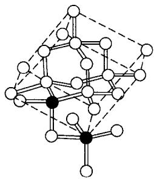

7-2 本题考查同学们对金刚石结构的掌握以及立方密堆积和六方密堆积结构的理解。立方金刚石类似于立方硫化锌的结构，那么不难想到六方金刚石与六方硫化锌的结构相类似。如果用 A, B, C 表示搭建密堆积骨架的同层不同位置的碳原子，用 a, b, c 表示填充密堆积空隙的同层不同位置的碳原子（二维密堆积中只有三种位置，用 A/a, B/b, C/c 分别表示二维密堆积结构中的三种不同位置）。于是，立方金刚石可以表示为…AbBcCaAbBcCa…，而六方金刚石可表示为…AbBaAbBaAbBa…。因此，立方金刚石属于 AbBcCa 的排列结构，碳原子构成的六元环中只可能存在椅式结构，如下图所示：

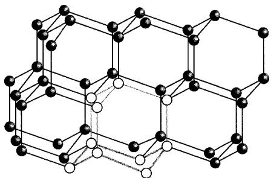

然而六方金刚石中只有 AbBa 的排列结构, 因此碳原子构成的六元环有船式结构以及椅式结构两种(两层之间的六元环是椅式结构), 如下图所示:

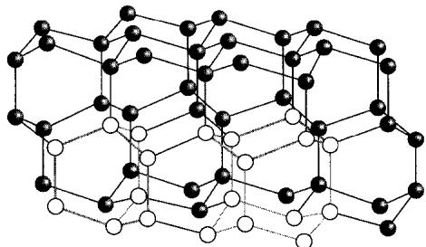

7-3 本题考查同学们对六方硫化锌晶体结构的掌握。如果同学们已经知道六方硫化锌的结构，则可以直接在图中画出答案。如果不知道或者不记得所求晶胞，则可以通过如7-2中使用的字母表示法表示ZnS的晶体结构。具体细节如下：

用 A, B, C 表示同层 Zn 的不同位置，用 a, b, c 表示同层 S 的不同位置。观察题目所给的晶胞结构可知，Zn 原子只占有两种位置，可用 A, B 表示，其层间排列为…ABABAB…，这种堆积即六方最密堆积，而 S 原子处于一半的四面体空隙中。观察图中所给位置，可得其晶体排列为…AbBaAbBaAbB…，其层间重复单位刚好是图中晶体结构的高度，即 AbBaA。又因为所有晶胞都是平行六面体，我们可以在层内找到一个面积最小的平行四边形，即同一层内相邻的 4 个 Zn（或 4 个 S）。根据上述分析即可画出晶胞：

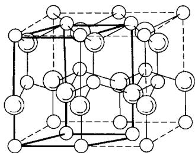  
○Zn ◯S

7-4 结构基元是周期性重复的最小单位。立方金刚石的点阵型式为面心立方，即一个单位点阵格子中有4个点阵点，而一个晶胞中有8个碳原子，所以一个点阵点含有两个碳原子，即结构基元中含有碳原子个数为2。同学们还可以通过观察碳原子在空间的键连关系来判断有几种不同化学环境的碳原子。由立方金刚石的晶胞可知，相邻两个碳原子的四面体键连关系是不同的，而且只有这两种化学环境的碳原子（可以简单理解为一种四面体朝上，一种朝下）。因此最小重复单位有2个碳原子。

## 第8题

## 分析与解答

8-1 本题考查不饱和度公式的计算。有机分子不饱和度公式为

$$
\text { 不饱和度 } = \text { 碳数 } + 1 - 0. 5 \times \text { 氢数 }
$$

如果分子中含有卤素，则把卤素原子当成氢原子计算；如果分子中含有N，则计算氢数时还需减去N的数量；如果分子中含有氧，在计算不饱和度时可直接忽略。另一种计算不饱和度的方法是计数：双键不饱和度+1，叁键+2，环数+1。

根据上述方法,同学们不难算出不饱和度为6。

8-2 本题考查同分异构体的相关知识以及催化氢解反应。β-紫罗兰酮的化学式为 $C_{13}H_{20}O$ ，不饱和度为4，又因为C催化氢解后仍然是芳香化合物，因此可以推断出C和D中含有苯环，且取代基都是饱和基团，这说明基团上必定含有氢。“D的 $^{1}$ H NMR图谱中只有一个单峰”，说明D中只有一种化学环境的氢。如果存在与苯环直接相连的氢，那么苯环上的氢与取代基上的氢是不同的化学环境，这与前面的推论不符。因此苯环上每个碳上都有取代基，而且是相同的取代基。考虑到C有13个碳，而D的碳数必定小于13个（因为催化氢解），而且D中还存在苯环，因此D中所有取代基的总碳数小于7个。由此不难推断出D是六甲苯。D只比C少1个碳，且C催化氢解就可以得到D，于是不难得出C是甲基苄基醚，其结构式如下：

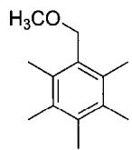

在做本题的时候要克服一些思维定式: 氢气在有机反应中不仅仅能作为加成试剂, 同时, 它也能与溴、醇羟基等发生自由基取代反应。

8-3 本题考查烯醇互变。烯醇互变是有机化学中非常常见和基础的知识点。含有 $\alpha$ 氢的羰基可以发生烯醇互变。在大多数情况下，酮式结构要比烯醇结构稳定，因此题目中的中间体B就是由前一步的烯醇经过互变异构得到的，烯醇羟基碳的 $\alpha$ 位会得到一个氢，羟基失去氢并与碳形成双键。其结构如下：

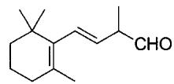

8-4 本题考查对反应物与产物的关系的分类。

(2): 乙酸甲酯负离子与羰基发生了加成反应, 所以是亲核加成反应。

(3): 氧负离子进攻分子内的 $\alpha$ 位的 Cl, 所以是(分子内)亲核取代反应。

(4): 酯基在碱性条件下转变为羧酸钠, 这是水解反应。

(6): 羧基脱去了 $CO_{2}$ ，所以是脱羧反应。

## 第9题

## 分析与解答

本题是一道经典的有机推断题，同学们应能够综合运用格氏试剂的亲核加成、酸性消除，以及同分异构等相关考点，梳理题目逻辑和思路。对于题目中给出的每一句话，同学们都应该能转化成已知条件，并把它转化为逻辑推理的出发点。

9-1 首先根据 A、B、C 的化学式可以推算其不饱和度为 4，但它们都可以与 2 倍量的 $H_{2}$ 经催化得到 D，说明 A、B、C 不是苯环结构，而且 D 中剩余的 2 个不饱和度可能是环或者羰基造成的。“D 在 NaOH 溶液中加热反应后再酸化”是酯水解的常用条件，其产物为酸和醇，分别对应题目中的 E 和 F。根据 F 的化学式不难看出 F 是甲醇 $CH_{3}OH$ 。分别计算不饱和度可知，E 为 2，F 为 0。因此，E 中的两个不饱和度分别产生于一个羧基 COOH 和一个环（因为 E 的化学式中只有两个氧，不可能产生两个羧基或者两个羰基）。E 除去羧基后还剩 5 个碳，猜测可能是一个饱和五元环，或一个饱和四元环加一个碳，或一个饱和三元环加两个碳。考虑最简单的情况，即 E 由一个五元环与一个羧基组成：

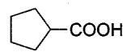

由此也自然推出 D:

$$
\text { COOMe }
$$

而A、B、C则是在D的基础上在五元环中添加两个双键的结构：

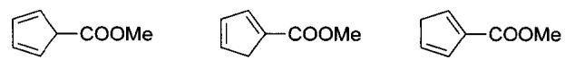

A 与甲基格氏试剂的反应就是酯与格氏试剂的亲核加成，而且酯既可以与一个格氏试剂加成变成酮而不改变不饱和度，也可以与两个格氏试剂加成变成三级醇而使不饱和度减少1。计算 M 的不饱和度为3，比 A 少了1个不饱和度。因此 A 加成了两个格氏试剂。于是 M 的可能结构为

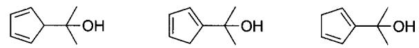

M在浓硫酸的作用下会脱水增加1个不饱和度,变成

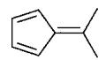

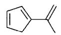

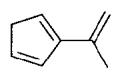

然而只有一种结构满足题目的对称性要求，即

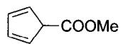

9-2 本题考查互变异构基本概念,同学们应对各种类型的异构体的定义有所了解。

碳架异构体: 因为碳架不同产生的异构体。

位置异构体: 官能团在碳链或环上位置不同而产生的异构体。

官能团异构体: 官能团种类不同而产生的异构体。

顺反异构体:因双键或成环碳原子的单键不能自由旋转而产生的异构体。

A、B、C仅仅是碳碳双键位置有所区别，因此它们之间属于位置异构体。

9-3 “为什么能实现……的转化”类题目是有机化学题目中常考的一种题型。一般而言，此类 A→B 的转化常常是非芳香体系到芳香体系、小离域共轭到大离域共轭、未成环到成环，以及三、四、七、八元环到五、六元环的转变。发生转变的原因也不外乎电子效应和空阻效应。前两种情况由于 $\pi$ 电子实现了芳香结构或者达到了更大范围的离域，都会带来更大的稳定性；而后两种情况是因为实现了稳定的空间结构。

本题中 B、C 都比 A 有更大的共轭体系，因此比 A 更稳定。

9-4 不对称碳原子可以简单理解为分子中四个基团都不相同的碳原子。B 和 C 可以发生 Diels-Alder 反应。虽然不容易确定谁是双烯体，谁是亲双烯体，但是无论是哪种组合方式，双烯体和亲双烯体的端位碳原子都将成为手性碳原子，而 B 和 C 原本不存在手性碳原子。因此异构体 L 中有 4 个不对称碳原子。

## 第10题

## 背景

Vilsmeier 反应是取代过的酰胺与三氯氧磷和富电子苯环反应得到芳香醛、酮的反应，是在富电子苯环上添加甲酰基的常用方法。

## 分析与解答

本题以 Vilsmeier 反应为背景,考查芳香亲电取代反应。同学们应该能够判断反应试剂的亲电性、亲核性以及反应位点,找出大致的反应过程。

10-1 当一个分子、离子或自由基的结构不能用单独的 Lewis 结构式正确地描述时，可以用多个 Lewis 结构式表示，这些 Lewis 结构式称为共振式。在共振式之间用双箭头联系，以表示它们的共振关系。

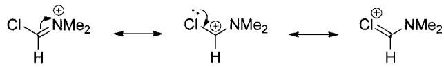

从共振式可以看出来，Vilsmeier 试剂具有亲电性，可以对苯环进行亲电取代。

10-2 本题要求同学们根据提示找出富电子苯环与 Vilsmeier 试剂的反应过程。由 10-1 的共振式不难看出，Vilsmeier 试剂的碳具有亲电性。因此，(1) 是 Vilsmeier 试剂与苯甲醚的芳香亲电取代反应。由甲氧基的共轭效应可知，反应位点发生在甲氧基的邻、对位。对比反应物和产物不难发现，发生反应的位点是对位，因此有

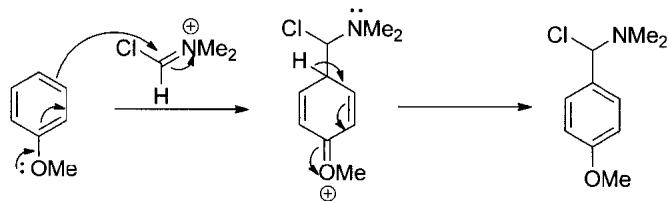

(2) 是分子内亲核取代反应。观察(2)的反应物, 它的 Cl 在饱和碳上, 而且 $\beta$ 位上有可以提供孤对电子的 N, 因此可以发生类似于 Elcb 消除反应的过程:

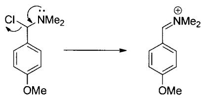

(3) 是亲核加成反应, 而反应底物是具有亲电性的亚胺, 因此需要其他的亲核试剂。考虑到最终产物是醛, 需要引入氧原子, 因此 $H_{2}O$ 在这一步作为亲核试剂进攻亚胺离子:

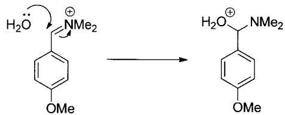

显然,氨基需要被消除,才能得到最终的产物。而(4)的质子转移增强了氨基的离去能力,使氨基更容易被消除:

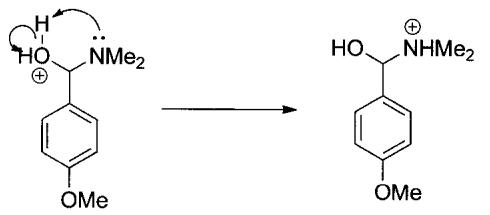

反应最后一步消除一个胺分子,得到最终产物:

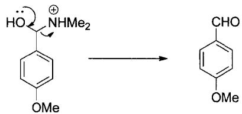

10-3 前两问的目的在于帮助同学们了解和熟悉 Vilsmeier 反应，以便在第三问能够举一反三。第三问不仅要求同学们正确理解和写出 Vilsmeier 反应的反应机理，还考查同学们对底物分子各个官能团的分析能力，要求能够举一反三，猜测非经典情况下的 Vilsmeier 反应。

Vilsmeier 反应是酰胺与三氯氧磷和富电子苯环的反应，然而反应底物只有氨，没有酰胺。这就提示我们，反应的第一步应该是生成酰胺的反应。另外，反应条件中没有另外提供富电子苯环，因此在反应第二步中，Vilsmeier 试剂很可能与自身的富电子苯环发生反应。

基于上述分析,同学们应该能够看出第一步是胺与甲酰酯反应生成酰胺和醇的过程:

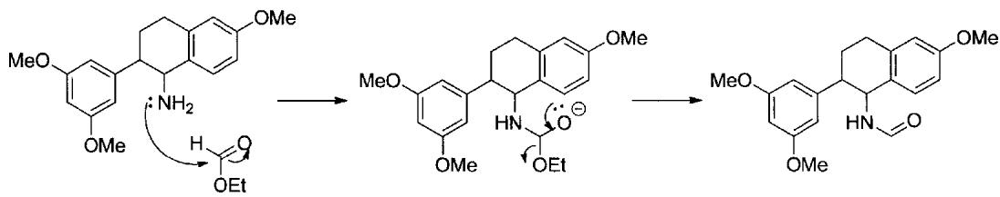

第二步先加入 $POCl_{3}$ ，目的在于生成 Vilsmeier 试剂，过程同 10-2，此处省略。生成的 Vilsmeier 试剂会与自身含两个甲氧基、最富电子的苯环发生分子内亲电取代反应。但与 10-2 不同的是，在这里，亚胺不会水解，因为芳香亚胺的 C=N 双键会与苯环发生共轭作用，稳定了亚胺，因此产物最终保持了稳定的环状结构：

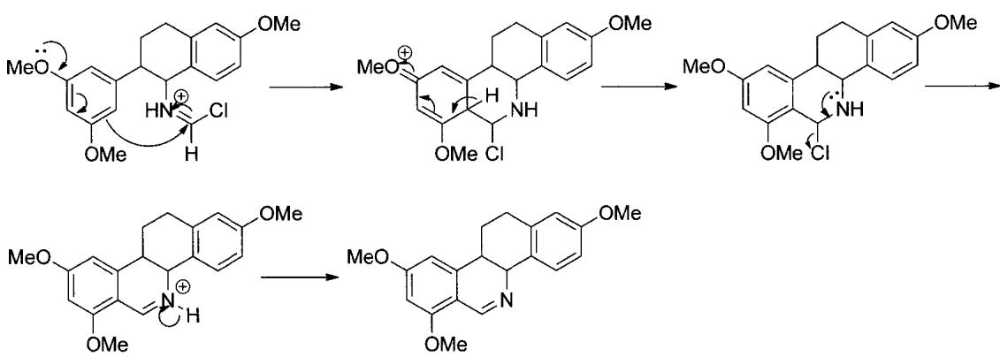

至此，本套试卷已经全部分析完毕。纵观近几年的初赛题目不难发现，化学竞赛初赛的出题风格发生了较大的变化。初赛整体难度逐渐下降，让更多高中学生也能够参与到“化学竞赛大家庭”中。试卷中甚至出现了第3题这样具有浓厚的高考出题风格的题目。从各部分题目来看：无机化学题目减少了对记忆性知识的考查，而强调思维分析，不推崇死记硬背，而注重灵活掌握；有机化学题目难度逐年上升，考查重点逐渐从《基础有机化学》（“邢大本”）上册向下册转移，从注重反应物与产物的关系转变为强调对反应机理的分析；分析计算题目数量减少；配位化学题目覆盖范围越来越广。题目综合性越来越强。而2011年恰逢题目风格变革，这对同学们的灵活应变能力提出了比较高的要求。在这样的背景下，同学们更应该夯实基础知识，才能在越来越不确定的考试风格面前做到胸有成竹、稳如泰山。

(本章初稿由黄禹铖完成)

# 第 25 届中国化学奥林匹克竞赛(决赛)理论试题解析

(2011年12月3日·长春)

## 试题

## 第 1 题(13 分)

同族金属 A、B、C 具有优良的导热、导电性能，若以 I 表示电离能， $I_{1}$ 最低的是 B， $(I_{1} + I_{2})$ 最低的是 A， $(I_{1} + I_{2} + I_{3})$ 最低的是 C。

1-1 同族元素 D、E、F(均为非放射性副族元素)基态原子的价层电子组态符合同一个通式，在元素周期表中，位置在 A、B、C 所在族之前。请给出 D、E、F 的元素符号及价层电子组态的通式。

1-2 元素 A 存在于动物的血蓝蛋白中，人对 A 元素代谢紊乱可导致 Wilson 病。

(1) $A^{2+}$ 硫酸盐在碱性溶液中加入缩二脲 $\mathrm{HN}(\mathrm{CONH}_{2})_{2}$ ，会得到特征的紫色物质，该物质为 -2 价的配位阴离子，具有对称中心和不通过 A 的二重旋转轴，无金属-金属键。请画出该阴离子的结构（A 必须写元素符号，下同）。

(2) 通过 $\mathbf{A}^{2+}$ 与过量的丁二酮肟形成二聚配合物, 实现了 $\mathbf{A}^{2+}$ 的平面正方形配位向 $\mathbf{A}^{2+}$ 的四方锥形配位转化, 请画出该配合物的结构 (丁二酮肟用 N N 表示)。

1-3 用 $\mathbf{B}^{+}$ 的标准溶液滴定 KCl 和 KSCN 的中性溶液, 得到电位滴定曲线, 其拐点依次位于 M、N、P 处。

(1) 请分别写出在 M、N、P 处达到滴定终点的离子方程式。

(2) 在 N 处的物质是无支链的聚合物, 请至少画出三个单元表示其结构。

1-4 元素 C 的单质与单一的无机酸不起作用，但可溶于王水。C 与 $O_{2}$ 和 $F_{2}$ 作用制得化合物 X，在 X 中 C 的质量分数为 57.43%，X 的结构与 1962 年 N. Barlett 开创性工作的产物极为相似，通过推演给出 X 的化学式。

## 第 2 题(12 分)

化合物 A 为非放射性主族元素 M 与氧的化合物，将 13.712 g A 与过量热稀硝酸充分反应后，得到不溶物 B 和溶液 C，将 B 洗净后与过量草酸混合，加入过量稀硫酸并充分反应，生成的气体全部通入过量的熟石灰溶液中，得到 4.004 g 不溶物质。控制温度，M 的单质与氧反应，生成具有较强氧化性的 D，D 含氧 10.38%。

2-1 通过计算给出 D 的化学式。

2-2 通过计算给出 A 的化学式。

2-3 给出 B 在硫酸溶液中与草酸反应的离子方程式。

2-4 图 2 示出 M 的一种氧化物的晶体结构, 写出该氧化物的化学式, 简述推理过程。

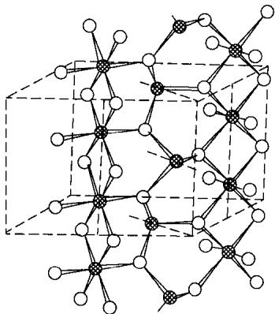  
(a)

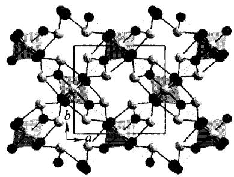  
(b)

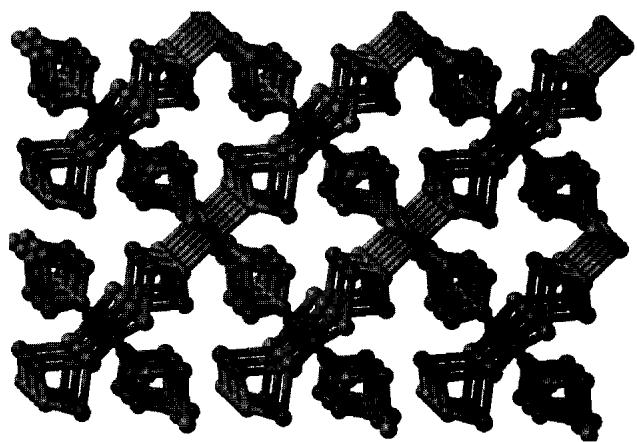  
(c)  
图2 $\mathbf{M}$ 的一种氧化物的晶体结构

## 第 3 题(10 分)

一容积可变的反应器，如图3所示，通过活塞维持其内部压力与恒外压相等。

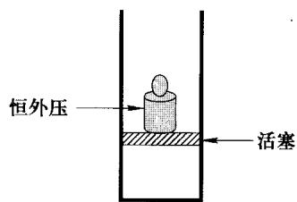  
图 3 容积可变的反应器示意图

在恒温、有催化剂条件下，反应器内进行如下反应：

$$
\mathrm{N} _ {2} (\mathrm{g}) + 3 \mathrm{H} _ {2} (\mathrm{g}) \rightleftharpoons 2 \mathrm{NH} _ {3} (\mathrm{g})
$$

3-1 若平衡时,反应器的容积为 1.0 L,各物质的浓度如下:

<table><tr><td>物质</td><td> $N_{2}$ </td><td> $H_{2}$ </td><td> $NH_{3}$ </td></tr><tr><td> $c/(mol\ L^{-1})$ </td><td>0.11</td><td>0.14</td><td>0.75</td></tr></table>

现向平衡体系中注入 $4.0 \, mol \, N_{2}$ 。试计算反应的平衡常数 $K_{c}$ 和反应商 $Q_{c}$ ，并由此判断反应将向什么方向进行。

3-2 若平衡时，反应器的容积为 V，各物质的浓度分别为 $c(\mathrm{N}_{2})$ ， $c(\mathrm{H}_{2})$ 和 $c(\mathrm{NH}_{3})$ ，现向平衡体系中注入体积为 xV 的 $N_{2}$ （同温同压）。设此条件下 1 mol 气体的体积为 $V_{0}$ ，试推导出 $Q_{c}$ 的表达式，并判断反应方向。

## 第 4 题(13 分)

4-1 硅酸根基本结构单元是硅氧四面体 $\left(\mathrm{SiO}_{4}\right)$ ，可以用三角形表示硅氧四面体的平面投影图形，三角形的顶点代表一个O原子，中心是Si和一个顶角O的重叠。若干硅氧四面体可以连接成层状结构，如图4-1(a)所示；两个硅氧四面体共用一个氧原子，又可以将其简单地表示为图4-1(b)。

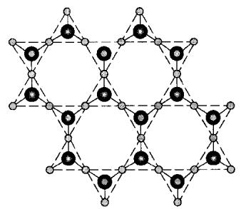  
(a)

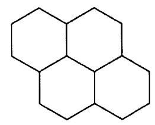

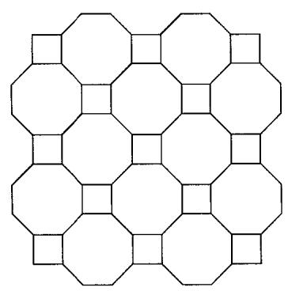  
(c)

(b)  
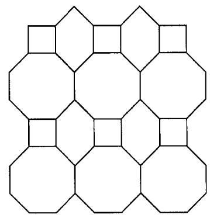  
(d)  
图4-1 几种层状硅酸根结构的图示方法

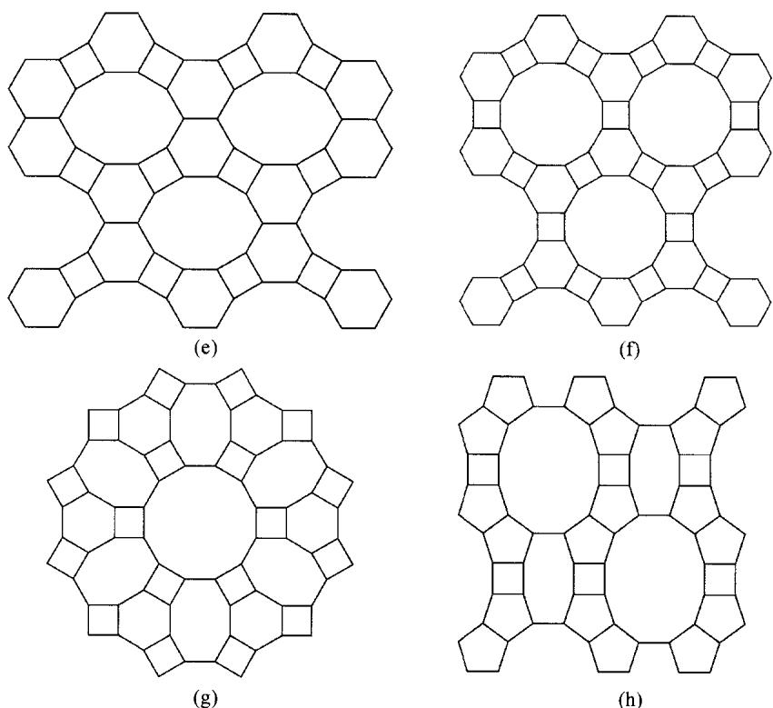  
图 4-1 几种层状硅酸根结构的图示方法(续)

(h)

每一种层状结构可以用交于一点的 n 元环及环的数目来描述,例如图 4-1(b) 可以描述为 $6^{3}$ 。

图 4-1(c)～(h)给出在沸石分子筛中经常见到的二维三连接层结构，图 4-1(c) 和图 4-1(d) 可分别描述为 $4.8^{2}$ 和 $(4.6.8)(6.8^{2})$ 。

试将对图 4-1(e)～(h) 的描述分别写在答卷上。

4-2 分子筛骨架中存在一些特征的笼状结构，见图 4-2。笼状结构是根据构成它们的多面体的各种 n 元环进行描述的。例如图 4-2(a) 所示的笼可以描述为 $4^{5}.5^{2}$ ; 而图 4-2(b) 的笼可以描述为 $4^{6}.6^{2}.6^{3}$ 。

试将对图 4-2(c)～(h) 的描述写在答卷上。

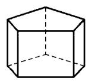  
(a)

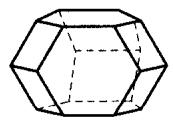

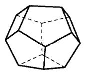  
(c)

(b)  
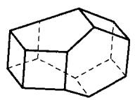  
(d)

  
(e)

  
(f)

  
(g)

  
(h)  
图4-2 分子筛骨架中存在的一些特征笼状结构

4-3 分子筛骨架中的笼状结构可以采用下述方法画出: 将最上一层放在平面图的最内圈, 下一层放在次内圈, 以此类推, 直到最底层放在平面图的最外圈。图中各原子之间的连接关系、各种环及其位置当然要与笼状结构中保持一致。例如图 4-3(a) 所示的笼, 可以表示为图 4-3(a')。

图 4-3(b)～(d) 结构不完整地图示在图 4-3(b')～(d'), 即只给出了结构的最上层和最下层的图示, 试在答卷上画出完整的平面图。

  
(a)

  
(a')

  
(b)

  
(b')  
图 4-3 几种笼状结构及图示(或不完整图示)

  
(c)

  
(c')

  
(d)

  
(d')  
图 4-3 几种笼状结构及图示(或不完整图示)(续)

## 第 5 题(14 分)

高温条件下反应机理的研究一直是化学反应动力学的基本课题，1956年的诺贝尔化学奖获得者在该领域作出过杰出的贡献。科研工作者研究了1000 K下丙酮的热分解反应并提出了如下反应历程：

$$
\mathrm{CH} _ {3} \mathrm{COCH} _ {3} \xrightarrow {k _ {1}} \mathrm{CH} _ {3} \bullet + \mathrm{CH} _ {3} \mathrm{CO} \bullet
$$

(1)

$$
E _ {\mathrm{a}} (1) = 3 5 1 \mathrm{kJ} \mathrm{mol} ^ {- 1}
$$

$$
\mathrm{CH} _ {3} \mathrm{CO} \cdot \xrightarrow {k _ {2}} \mathrm{CH} _ {3} \cdot + \mathrm{CO}
$$

(2)

$$
E _ {\mathrm{a}} (2) = 4 2 \mathrm{kJ} \mathrm{mol} ^ {- 1}
$$

$$
\mathrm{CH} _ {3} \cdot + \mathrm{CH} _ {3} \mathrm{COCH} _ {3} \xrightarrow {k _ {3}} \mathrm{CH} _ {4} + \mathrm{CH} _ {3} \mathrm{COCH} _ {2} \cdot
$$

(3)

$$
E _ {\mathrm{a}} (3) = 6 3 \mathrm{kJ} \mathrm{mol} ^ {- 1}
$$

$$
\mathrm{CH} _ {3} \mathrm{COCH} _ {2} \cdot \xrightarrow {k _ {4}} \mathrm{CH} _ {3} \cdot + \mathrm{CH} _ {2} \mathrm{CO}
$$

(4)

$$
E _ {\mathrm{a}} (4) = 2 0 0 \mathrm{kJ} \mathrm{mol} ^ {- 1}
$$

$$
\mathrm{CH} _ {3} \cdot + \mathrm{CH} _ {3} \mathrm{COCH} _ {2} \cdot \xrightarrow {k _ {5}} \mathrm{C} _ {2} \mathrm{H} _ {5} \mathrm{COCH} _ {3}\tag{5}
$$

$$
E _ {\mathrm{a}} (5) = 2 1 \mathrm{kJ} \mathrm{mol} ^ {- 1}
$$

5-1 上述历程是根据两个平行反应而提出的,请写出反应方程式。

5-2 实验测得 1000 K 下热分解反应对丙酮为一级反应,试推出反应的速率方程。提示:① 消耗丙酮的主要基元步骤是反应(3);② 可忽略各基元反应指前因子的影响。

5-3 根据 5-2 推出的速率方程, 计算表观活化能。

5-4 分解产物中的 $CH_{4}$ 可以和水蒸气反应制备 $H_{2}$ :

$$
\mathrm{CH} _ {4} (\mathrm{g}) + \mathrm{H} _ {2} \mathrm{O} (\mathrm{g}) \longrightarrow 3 \mathrm{H} _ {2} (\mathrm{g}) + \mathrm{CO} (\mathrm{g})
$$

试根据下表数据计算该反应在 298 K 时的 $\Delta_{r}G_{m}^{\ominus}$ 和平衡常数 $K^{\ominus}$ ，并指出平衡常数随温度的变化趋势。

相关物质的热力学数据(298 K)

<table><tr><td>物质</td><td> $\Delta_{\text{f}} H_{\text{m}}^{\ominus} / (\text{kJ mol}^{-1})$ </td><td> $S_{\text{m}}^{\ominus} / (\text{J mol}^{-1} \text{ K}^{-1})$ </td></tr><tr><td> $\text{CH}_{4}(\text{g})$ </td><td>-74.4</td><td>186.3</td></tr><tr><td> $\text{H}_{2}\text{O}(\text{g})$ </td><td>-241.8</td><td>188.8</td></tr><tr><td> $\text{H}_{2}(\text{g})$ </td><td>0</td><td>130.7</td></tr><tr><td> $\text{CO}(\text{g})$ </td><td>-110.5</td><td>197.7</td></tr><tr><td> $\text{H}_{2}\text{O}(\text{l})$ </td><td>-285.8</td><td>69.9</td></tr></table>

## 第6题(8分)

甲酸和乙酸都是重要的化工原料。移取 20.00 mL 甲酸和乙酸的混合溶液，以 0.1000 mol L $^{-1}$ NaOH 标准溶液滴定至终点，消耗 25.00 mL。另取 20.00 mL 上述混合溶液，加入 50.00 mL 0.02500 mol L $^{-1}$ KMnO $_{4}$ 强碱性溶液，反应完全后，调节至酸性，再加入 40.00 mL 0.2000 mol L $^{-1}$ Fe $^{2+}$ 标准溶液，用上述 KMnO $_{4}$ 标准溶液滴定至终点，消耗 24.00 mL。

6-1 计算混合溶液中甲酸和乙酸的总量；

6-2 写出氧化还原滴定反应的化学方程式；

6-3 计算混合酸溶液中甲酸和乙酸的浓度。

## 第 7 题(18 分)

2002 年, Scott 等人首次完成了 $C_{60}$ 的化学全合成, 该成果为今后合成更多和更丰富的 $C_{60}$ 衍生物带来了可能。下面是其全合成的路线(无机产物及副产物已略去):

7-1 写出上述合成路线中 a、b、c 和 d 所对应的试剂或反应条件；

7-2 画出上述合成路线中中间体 A\~I 的结构简式；

7-3 写出中间体 J 的对称元素；

7-4 给出从中间体 I 到 J 的反应机理。

## 第8题(12分)

最近的研究表明,某种新型的胍盐离子液体(GIL)对 Michael 加成反应有很好的催化活性。进一步的研究表明,GIL 还具有一定的碱性。以下是某研究小组利用 GIL 为催化剂,合成多官能团化合物 H 的路线:

8-1 画出 A 和 C 的结构简式；

8-2 画出 B、D、F 和 G 的结构简式；

8-3 给出从中间体 $\mathbf{E}$ 到 $\mathbf{F}$ 的反应机理；

8-4 从周环反应的角度看, 反应中间体 G 转化为目标产物需经过一次 (1) 迁移, 其驱动力为 (2)。

## 试题解析

## 第1题

## 分析与解答

本题是一道较为综合的元素及化合物推断题,考查同学们对整个元素周期表以及其他相关基础化学知识的掌握情况。

A、B、C 的推断是本题的第一步，必须解出这三种元素才能继续解答后面的问题。本题的主题干给出了推断 A、B、C 的信息，最有效的信息无疑是关于其电离能的叙述， $I_{1}$ 最低的是 B， $(I_{1}+I_{2})$ 最低的是 A， $(I_{1}+I_{2}+I_{3})$ 最低的是 C，则这一族金属中 +1 价最稳定的是 B，+2 价最稳定的是 A，+3 价最稳定的是 C。纵观元素周期表，具有这一性质的同族三种金属只有第 11 族的 Cu、Ag、Au 三种元素。元素化学知识基础比较好的同学应该很容易从主题干判断出 A、B、C 分别是 Cu、Ag、Au。

1-1 要求同学们写出第 10 族之前副族元素中电子排布形式相同的一族元素,实际上要求同学们对整个元素周期表中元素的电子排布情况有较好的掌握。写出第 3 族至第 10 族的价层电子排布如下 $^{[1]}$ :

<table><tr><td>Sc</td><td>Ti</td><td>V</td><td>Cr</td><td>Mn</td><td>Fe</td><td>Co</td><td>Ni</td></tr><tr><td> $3d^{1}4s^{2}$ </td><td> $3d^{2}4s^{2}$ </td><td> $3d^{3}4s^{2}$ </td><td> $3d^{5}4s^{1}$ </td><td> $3d^{5}4s^{2}$ </td><td> $3d^{6}4s^{2}$ </td><td> $3d^{7}4s^{2}$ </td><td> $3d^{8}4s^{2}$ </td></tr><tr><td>Y</td><td>Zr</td><td>Nb</td><td>Mo</td><td>Tc*</td><td>Ru</td><td>Rh</td><td>Pd</td></tr><tr><td> $4d^{1}5s^{2}$ </td><td> $4d^{2}5s^{2}$ </td><td> $4d^{4}5s^{1}$ </td><td> $4d^{5}5s^{1}$ </td><td> $4d^{5}5s^{2}$ </td><td> $4d^{7}5s^{1}$ </td><td> $4d^{8}5s^{1}$ </td><td> $4d^{10}$ </td></tr><tr><td>La</td><td>Hf</td><td>Ta</td><td>W</td><td>Re</td><td>Os</td><td>Ir</td><td>Pt</td></tr><tr><td> $5d^{1}6s^{2}$ </td><td> $5d^{2}6s^{2}$ </td><td> $5d^{3}6s^{2}$ </td><td> $5d^{4}6s^{2}$ </td><td> $5d^{5}6s^{2}$ </td><td> $5d^{6}6s^{2}$ </td><td> $5d^{7}6s^{2}$ </td><td> $5d^{9}6s^{1}$ </td></tr></table>

注意到 $\mathrm{Tc}$ 为放射性元素，则满足题意的只有第3和第4族元素，写出答案：

$$
\begin{array}{l} \mathbf {S c}, \mathbf {Y}, \mathbf {L a}, (n - 1) \mathbf {d} ^ {1} n \mathbf {s} ^ {2} \\ \mathbf {T i}, \mathbf {Z r}, \mathbf {H f}, (n - 1) \mathbf {d} ^ {2} n \mathbf {s} ^ {2} \end{array}
$$

本小题的解答失误必然是由于基础知识(电子排布)掌握不牢固,同时也要注意一题多解,不能只得到一种答案就停止思考。

1-2 考查同学们根据已有信息(尤其是对称性信息)推断化合物结构的能力。

第一小题所述的反应是双缩脲反应， $\mathrm{Cu}^{2+}$ 与缩二脲反应生成紫色配合物。题干所述的信息主要是对称性的信息，“具有对称中心和不通过 $\mathbf{A}$ 的二重旋转轴，无金属-金属键”，表明配合物中有不止一个 $\mathrm{Cu}$ 原子。考虑到缩二脲的结构适于充当螯合配体且 $\mathrm{Cu}$ 倾向于平面四方配位，则此配合物很有可能是偶数个如下片段由桥连配体连接的结构：

再读题干所述的反应条件“ $\mathbf{A}^{2+}$ 硫酸盐在碱性溶液中加入缩二脲 $\mathrm{HN}(\mathrm{CONH}_2)_2$ ”，以及“该物质为-2价的配位阴离子”，可知桥连配体最可能为OH，且为两个上述片段组成，故可得出答案：

双缩脲反应首次发现于1833年[2]，是非常古老而经典的鉴定蛋白质的方法。从此意义上说，本题的答案应该是唯一的。不过从竞赛的角度考虑，若是能在此体系中发现其他的合适的不牵强的-1价桥连配体，也应当认为正确。

另外，解答完此题后同学们应当发现该配合物实际上拥有通过2个A的 $C_{2}$ 轴。题干中所描述的是一根 $C_{2}$ 轴，这是为了提供“不止一个Cu”的信息，并不矛盾。

第二小题要求画出 Cu-丁二酮肟的二聚配合物。题目中说明二聚时由平面四方配位转变成四方锥配位，考虑到 Cu-丁二酮肟配合物（上图）中羟基氧（或氧负离子）还有配位作用，可得出二聚体应为如下形式 $^{[3]}$ ，解离的羟基氧占据 Cu 的第五个配位位置。

按照题目要求的简略方式则应画成

  
(实际上并不准确,并不是 N 原子提供二聚的配位作用)

此类结构在竞赛所用的经典书籍《元素化学》[4]和《无机化学丛书》[5]的相关章节均有提及。

1-3 考查简单的银量法的内容,同学们需要掌握 $Ag^{+}$ 的各种沉淀在沉淀时的先后顺序以及可能的配合物。在本题中,首先形成配合物:

$$
\mathrm{Ag} ^ {+} + 2 \mathrm{SCN} ^ {-} = \mathrm{Ag(SCN)} _ {2} ^ {-}
$$

$\mathrm{Ag^{+}}$ 过量后再生成 $\mathrm{AgSCN}$ 沉淀：

$$
\mathrm{Ag} ^ {+} + \mathrm{Ag(SCN)} _ {2} ^ {-} = 2 \mathrm{AgSCN} \downarrow
$$

最后生成 AgCl 沉淀：

$$
\mathrm{Ag} ^ {+} + \mathrm{Cl} ^ {-} = \mathrm{AgCl} \downarrow
$$

N处的物质是 AgSCN，要求画出其多聚结构，容易想到 $SCN^{-}$ 为双齿配体，S 端和 N 端都可以和 $Ag^{+}$ 结合，则可以形成简单的一维长链。然后需要考虑具体结构：N 和 Ag 的连接处由于 N 是 sp 杂化，故一定为直线；而 S 和 Ag 的连接处由于 S 为 $sp^{3}$ 杂化，故存在角度。

大部分竞赛题和此题类似,即在容易想到的知识点后面还有考查点,让同学们在想到第一点之后的自我满足中犯下错误。

1-4 本题的解答要求同学们具有元素化学的基本知识: N. Barlett 的开创性工作—— $O_{2}PtF_{6}$ 的发现 $^{[6]}$ 。因此 X 应为 $[O_{2}][Au_{m}F_{n}](m,n$ 均为正整数），则

$$
w (\mathrm{Au}) = \frac {m \cdot M (\mathrm{Au})}{M \left(\mathrm{O} _ {2} \mathrm{Au} _ {m} \mathrm{F} _ {n}\right)} = \frac {197.0 m}{32.00 + 197.0 m + 19.00 n} \times 100 \% = 57.43\%
$$

令 m=1，则 n=6 合理；m=2，则 n=13.68（舍去）； $m \geqslant 3$ ，均无合理正整数解。

可得出 X 为 $[O_{2}][AuF_{6}]$ 。

此种方法是解答此类竞赛题的万金油,能否熟练应用这种方法能够反映同学们的逻辑思维能力强弱,这也是竞赛命题者希望考查同学们的一个重要方面。

本题是一道综合题，从三种元素的推断入手，综合考查无机化学、元素化学、分析化学、结构化学等方面的知识，既要求同学们对基础知识牢固掌握，又考查了逻辑思维能力。元素化学等基础知识掌握不牢的同学们很难单凭题目信息完成所有的解答，这反映出决赛对同学们有更高水平的要求。

## 第2题

## 分析与解答

本题是一道非常典型的元素和化合物推断题，其解答过程具有普遍应用价值。

首先是 D 的推断, D 是唯一给出了含氧量数据的化合物, 因此可以通过类似第 1 题 1-4 的设未知数-赋值-找合理解的方式进行解答。

设 $\mathbf{D}$ 的化学式为 $\mathbf{MO}_n$ ， $\mathbf{D}$ 的摩尔质量为 $x$ ，则

$$
\frac{16.00n}{x + 16.00n} = 10.38\% \]\[ x = 138.15n
$$

然后给 n 赋值, 令 n 为有意义的 D—O 比例, 观察能否找到有意义的 x:

$$
\begin{array}{l l l} {\text {若} n = 1 / 2} & {x = 6 9. 1} & {\mathbf {M} \text {为} \mathrm{Ga}, \text {氧化物无氧化性}, \text {不合题意}} \\ {\text {若} n = 1} & {x = 1 3 8. 1} & {\mathbf {M} \text {为} \mathrm{La} \text {系}, \text {非主族金属}, \text {不合题意}} \\ {\text {若} n = 4 / 3} & {x = 1 8 4. 2} & {\mathbf {M} \text {为} \mathrm{W}, \text {非主族金属}, \text {不合题意}} \\ {\text {若} n = 3 / 2} & {x = 2 0 7. 2} & {\mathbf {M} \text {为} \mathrm{Pb}, \text {主族金属}} \end{array}
$$

所以，D 为 $Pb_{2}O_{3}$ ，M 为 Pb。

则可以马上根据元素化学的知识得出: A 是另一种 Pb 的氧化物(极有可能是 $Pb_{3}O_{4}$ ), B 是 $PbO_{2}$ , C 是 $\mathrm{Pb(NO_{3})_{2}}$ , 然后可以推断 A(实际上可以说是验证)。

4.004 g CaCO $_{3}$ 沉淀的物质的量为

$$
\frac {4 . 0 0 4 \mathrm{g}}{1 0 0 . 1 \mathrm{g} \mathrm{mol} ^ {- 1}} = 0. 0 4 0 0 0 \mathrm{mol}
$$

则反应的 $H_{2}C_{2}O_{4}$ 的物质的量为 0.02000 mol。

$$
\mathrm{PbO} _ {2} + 2 \mathrm{H} ^ {+} + \mathrm{H} _ {2} \mathrm{C} _ {2} \mathrm{O} _ {4} + \mathrm{H} _ {2} \mathrm{SO} _ {4} = \mathrm{PbSO} _ {4} + 2 \mathrm{CO} _ {2} + 2 \mathrm{H} _ {2} \mathrm{O}
$$

由反应式可知：

$$
\begin{array}{r l} & {\mathrm {PbO_ {2}} \text {的物质的量为} 0. 0 2 0 0 0 \mathrm{mol}} \\ & {\mathrm {PbO_ {2}} \text {的质量为} [ (2 0 7. 2 + 3 2) \times 0. 0 2 0 0 0 ] \mathrm{g} = 4. 7 8 4 \mathrm{g}} \\ & {\text {化合物} \mathbf {A} \text {中} \mathrm{PbO} \text {的质量为} (1 3. 7 1 2 - 4. 7 8 4) \mathrm{g} = 8. 9 2 8 \mathrm{g}} \\ & {\mathrm{PbO} \text {的物质的量为} (8. 9 2 8 / 2 2 3. 2) \mathrm{mol} = 0. 0 4 0 0 0 \mathrm{mol}} \\ & {\text {所以} n (\mathrm{PbO}) / n (\mathrm {PbO_ {2}}) = 2} \end{array}
$$

即化合物 A 为 $2PbO \cdot PbO_{2}$ 或 $Pb_{3}O_{4}$ 。

对于那些元素化学知识掌握得非常熟练的同学,这些推理过程实际上并不必要,通过题目中所述的各种信息片段已经足以判断 M 是 Pb,所有的计算都是验证。这种熟练程度只能通过扩大阅读量和多做练习磨炼思维才能做到。

2-4 本小题考查同学们从晶胞推断化学式的能力。本题给出了较为复杂的三个晶胞，本意是希望同学们能够在三个图中各获得一部分信息然后获得化学组成：

(1)由图(a)可见,晶体中有两种不同配位数的金属原子:六配位和三配位;

(2)由图(c)可见,六配位和三配位的金属个数比为1:2;

(3)由图(b)可见,每个氧原子被三个金属原子共用;

(4) 因此有: $PbO_{\frac{6}{3}} \cdot 2PbO_{\frac{3}{3}} = PbO_{2} \cdot 2PbO = Pb_{3}O_{4}$ ;

或者: Pb 呈现 +4 和 +2 两种氧化态, 八面体的 Pb 为 +4, 三角锥体的 Pb 为 +2, 根据电中性原理, $Pb^{VI}O_{2} \cdot 2Pb^{II}O$ , 因此为 $Pb_{3}O_{4}$ 。

若是空间想象能力足够强,则可以根据(a),(b)两个图直接看出最小重复单位的化学组成而无需考虑配位数关系:

(b)是(a)的俯视图，(b)中的正方形和(a)中的虚线框均为最小重复单位。结合(a)，(b)不难看出，四个侧面上均有两个Pb(六配位)，上下两个底面各有四个三配位Pb，内部还有四个三配位Pb，共 $4+4+4=12$ 个Pb原子，而氧原子仅有上下底面有共用，其余均在内部，共 $2\times4\times1/2+4+8=16$ 个，即组成为 $Pb_{3}O_{4}$ 。

## 评注

本题以 Pb 的氧化物入手,考查同学们的计算推理能力,试题难度不大,但是掌握其解题方法具有普遍意义。第三问考查同学们的识图能力,要求同学们具有较好的空间思维能力和清晰的思路,能够迅速从较为混乱的图中提取有效信息。

## 第3题

## 分析与解答

3-1 本题要求计算 $K_{c}$ 以及充入 $N_{2}$ 后的 $Q_{c}$ ，并判断反应的移动方向。可以按照最基本的化学平衡计算的方法进行计算：

$$
\begin{array}{r l}&\mathrm {N_ {2} (g) + 3H_ {2} (g)\rightleftharpoons 2NH_ {3} (g)}\\K _ {c} = \frac {[ \mathrm {NH_ {3}} ] ^ {2}}{[ \mathrm {N_ {2}} ] [ \mathrm {H_ {2}} ] ^ {3}} = \frac {(0 . 7 5 \mathrm{molL} ^ {- 1}) ^ {2}}{(0 . 1 1 \mathrm{molL} ^ {- 1}) (0 . 1 4 \mathrm{molL} ^ {- 1}) ^ {3}} = 1. 9 \times 1 0 ^ {3} (\mathrm{molL} ^ {- 1}) ^ {- 2}\end{array}
$$

加入 $4.0 \, mol \, N_{2}$ 后，体积变化到原体积的 5.0 倍，则

$$
\begin{array}{r l r l r l}&\mathrm {N_ {2} (g)}&+&3 \mathrm {H_ {2} (g)}&\rightleftharpoons&2 \mathrm {NH_ {3} (g)}\\n / \mathrm{mol}&4. 1 1&&0. 1 4&&0. 7 5\\c / (\mathrm{mol} \mathrm{L} ^ {- 1})&4. 1 1 / 5&&0. 1 4 / 5&&0. 7 5 / 5\end{array}
$$

$$
Q _ {c} = \frac {\left[ \mathrm{NH} _ {3} \right] ^ {2}}{\left[ \mathrm{N} _ {2} \right] \left[ \mathrm{H} _ {2} \right] ^ {3}} = \frac {(0 . 1 5 \mathrm{molL} ^ {- 1}) ^ {2}}{(0 . 8 2 2 \mathrm{molL} ^ {- 1}) (0 . 0 2 8 \mathrm{molL} ^ {- 1}) ^ {3}} = 1. 2 \times 1 0 ^ {3} (\mathrm{molL} ^ {- 1}) ^ {- 2}
$$

$Q_{c}<K_{c}$ ，反应向右移动。

## 3-2 本题要求计算出一个 $Q_{c}$ 的表达式。

同样可以按照上述思路运算,首先需要算出各物种在加入 $N_{2}$ 后的浓度:加 xV 的 $N_{2}$ 后体积为 $V + xV$ , 加入 $N_{2}$ 的物质的量 $n(N_{2}) = \frac{xV}{V_{0}}$ , 则

$$
c \left(\mathrm{N} _ {2}\right)
$$

$$
V c \left(\mathrm{N} _ {2}\right)
$$

$$
\begin{array}{r l r} {\text {加入} \mathrm{N} _ {2} \text {后的浓度}} & {\frac {V c (\mathrm{N} _ {2}) + \frac {x V}{V _ {0}}}{V + x V}} & {\frac {V c (\mathrm{H} _ {2})}{V + x V}} \\ {\text {约掉} V} & {\frac {c (\mathrm{N} _ {2}) + \frac {x}{V _ {0}}}{1 + x}} & {\frac {c (\mathrm{H} _ {2})}{1 + x}} \\ & {Q _ {c} = \frac {\frac {c ^ {2} (\mathrm{NH} _ {3})}{(1 + x) ^ {2}}}{\frac {c (\mathrm{N} _ {2}) + \frac {x}{V _ {0}}}{1 + x} \frac {c ^ {3} (\mathrm{H} _ {2})}{(1 + x) ^ {3}}}} \\ & {= \frac {c ^ {2} (\mathrm{NH} _ {3}) (1 + x) ^ {2}}{c ^ {3} (\mathrm{H} _ {2}) \left[ c (\mathrm{N} _ {2}) + \frac {x}{V _ {0}} \right]}} \\ & {= \frac {c ^ {2} (\mathrm{NH} _ {3}) (1 + x) ^ {2}}{c ^ {3} (\mathrm{H} _ {2}) c (\mathrm{N} _ {2}) \left[ 1 + \frac {x}{c (\mathrm{N} _ {2}) V _ {0}} \right]}} \\ & {= K _ {c} \frac {(1 + x) ^ {2}}{1 + \frac {x}{c (\mathrm{N} _ {2}) V _ {0}}}} \end{array}
$$

若 $(1 + x)^2 / \left[1 + \frac{x}{c(\mathrm{N}_2)V_0}\right] > 1$ ，则

$$
\begin{array}{r l} & (1 + x) ^ {2} > 1 + \frac {x}{c (\mathrm{N} _ {2}) V _ {0}} \\ & 1 + 2 x + x ^ {2} > 1 + \frac {x}{c (\mathrm{N} _ {2}) V _ {0}} \\ & 2 x + x ^ {2} > \frac {x}{c (\mathrm{N} _ {2}) V _ {0}} \\ & x > \frac {1}{c (\mathrm{N} _ {2}) V _ {0}} - 2 \end{array}
$$

即 $x > \frac{1}{c(\mathbf{N}_2)V_0} - 2$ 时，平衡左移； $x < \frac{1}{c(\mathbf{N}_2)V_0} - 2$ 时，平衡右移； $x = \frac{1}{c(\mathbf{N}_2)V_0} - 2$ 时，为平衡态。

评注

本题是一道化学平衡问题,考查同学们对于“化学平衡”这一概念的理解及相应的计算能力。题目涉及的反应和装置都极为简单,而计算却较为复杂,要求同学们有较强的条理性和逻辑性、较好的计算能力和耐心。

## 第4题

## 分析与解答

本题以沸石分子筛的表示为背景考查同学们的逻辑思维能力，在实际解答时可以完全脱离化学知识，仅仅当做一道简单的数学问题来解答，同学们仅凭逻辑思考就可以完成此题。

4-1 本题是二维层的表示,同学们不必理解沸石硅酸盐和这种层的关系,只需理解这种简单的图形表示如何用题目所述的数字方法表示。(c)和(d)的表示已经给出,分别是 $4.8^{2}$ 和(4.6.8)(6.8 $^{2}$ ),同学们需要理解这种数字表示的意义,包括数字的意义,右上角数字的意义,数字的排列顺序,括号的意义,括号内容作为一个单元的排列顺序,这五个要素缺一不可。

观察(c)和(d)的结构可以发现，(c)图形的连接点只有一种，且每个点由一个四边形和两个八边形共用，(d)中有两种连接点，其中一个是由一个四边形、一个六边形、一个八边形共用，另一个是由两个八边形和一个六边形共用。如此一来，这种表示方法的意义就很清楚了，即写出层状结构中每个连接点周围的多边形的边数，从小到大排列，以“.”隔开，某多边形有多个的，其多重性写在右上角，不同的种类的连接点用括号区分，排列顺序：第一个数最小的写在前面，第一个数相同则比较第二个，以此类推。

比如(e)有两种顶点,分别是四边形、六边形、十边形,六边形、六边形、十边形。按照上述规律,两个顶点分别写成4.6.10和 $6^{2}$ .10,再排序,4<6,第一个写在前面,故为(4.6.10) $(6^{2}.10)$ 。按照这个叙述写出剩余几个图形的表示即可,只要注意不读错图即可:

$$
(f) (4. 6. 1 2) \quad (g) (4. 6. 8) (4. 8. 1 2) \quad (h) (4. 5. 8) (4. 5. 1 2) (5 ^ {2}. 1 2) (5. 8. 1 2)
$$

4-2 本题是笼状结构的表示,需要写出每种多边形的个数。由给出的(b)的表示可以看出,并不是所有同一种多边形都等同,需要考虑空间上的关系。写出空间上等同的每种多边形的个数,按多边形边数从小到大排列,边数相同的按其个数从少到多排列,比如(d)中共有六个四边形和四个六边形,四个六边形都等同而四边形不全等同,和两个六边形相接的有两个,和三个六边形相接的有四个,故写做 $4^{2}.4^{4}.6^{4}$ 。同样,按照这种分析写出剩余几种即可:

$$
(c) 4 ^ {3}. 5 ^ {6} \quad (e) 5 ^ {1 2}. 6 ^ {2} \quad (f) 4 ^ {6}. 6 ^ {1 2} \quad (g) 4 ^ {6}. 6 ^ {2}. 6 ^ {3}. 6 ^ {6} \quad (h) 4 ^ {6}. 4 ^ {6}. 6 ^ {2}. 8 ^ {6}
$$

4-3 本题是将笼状结构以平面图画出来，题干中已经较为清楚地给出了绘图的方式：将最上一层放在平面图的最内圈，下一层放在次内圈，以此类推，直到最底层放在平面图的最外圈。图中各原子之间的连接关系、各种环及其位置当然要与笼状结构中保持一致。在给出了例子的情况下，这种画图方式应该是比较容易理解的。画图时，先将最内圈和最外圈对应顶点依次连接，然后保证四边形、六边形和八边形出现顺序与原图一致，添上横线即可，则很容易画出：

评注

此类题是信息给予题,要求同学们不拘泥于传统思维,胆大心细,精确求解,能迅速而正确地处理所给信息,从文字叙述和所给实例中建立正确的逻辑结构来描述这一系统。这对于化学学科的学习和化学科研的进行都是极为重要的。

## 第5题

## 分析与解答

本题考查热力学和动力学的有关计算,要求同学们能够根据反应机理写出反应的速率方程并计算表观活化能。

5-1 要求写出两个平行的总反应方程式,需要将反应历程的五个方程式加在一起消去其中的自由基。简单观察即可发现,反应(3)和(4)加在一起可消去自由基,(1)(2)(3)和(5)可消去自由基,得到两个方程式:

$$
\begin{array}{r l} & \mathrm {CH_ {3} COCH_ {3}} \longrightarrow \mathrm {CH_ {4}} + \mathrm {CH_ {2} CO} \\ & 2 \mathrm {CH_ {3} COCH_ {3}} \longrightarrow \mathrm {C_ {2} H_ {5} COCH_ {3}} + \mathrm {CH_ {4}} + \mathrm{CO} \end{array}
$$

5-2 然后需要从反应历程写出反应的速率方程。对于自由基反应,可以用稳态近似,三种自由基消耗速率等于生成速率:

$$
\begin{array}{r l} & {\frac {\mathrm{d} c (\mathrm{CH} _ {3} \bullet)}{\mathrm{d} t} = r _ {1} + r _ {2} - r _ {3} + r _ {4} - r _ {5} = 0} \\ & {\qquad \frac {\mathrm{d} c (\mathrm{CH} _ {3} \mathrm{CO} \bullet)}{\mathrm{d} t} = r _ {1} - r _ {2} = 0} \\ & {\qquad \frac {\mathrm{d} c (\mathrm{CH} _ {3} \mathrm{COCH} _ {2} \bullet)}{\mathrm{d} t} = r _ {3} - r _ {4} - r _ {5} = 0} \end{array}
$$

以上三式联立，可得

$$
k _ {3} k _ {5} \left[ \mathrm{CH} _ {3} \bullet \right] ^ {2} - k _ {1} k _ {5} \left[ \mathrm{CH} _ {3} \bullet \right] - k _ {1} k _ {4} = 0
$$

解得

$$
\left[ \mathrm{CH} _ {3} \bullet \right] = \frac {k _ {1} k _ {5} \left(1 \pm \sqrt {1 + \frac {4 k _ {3} k _ {4}}{k _ {1} k _ {5}}}\right)}{2 k _ {3} k _ {5}}
$$

这个表达形式不够简略,而且并没有用上所给的提示。题干中所述可忽略各基元反应指前因子的影响应表明,可根据活化能的数值直接估计各基元反应速率的相对大小,故

$$
\begin{array}{r l} \frac {k _ {3} k _ {4}}{k _ {1} k _ {5}} & \approx \exp \left(- \frac {E _ {3} + E _ {4} - E _ {1} - E _ {5}}{R T}\right) \approx 4. 9 \times 1 0 ^ {5} \gg 1 \\ & [ \mathrm{CH} _ {3} \bullet ] \approx \sqrt {\frac {k _ {1} k _ {4}}{k _ {3} k _ {5}}} \end{array}
$$

以丙酮的消耗速率表示总反应速率，且丙酮的消耗以反应(3)为主，得

$$
\begin{array}{r l} & r = - \frac {\mathrm{d} c (\mathrm{CH} _ {3} \mathrm{COCH} _ {3})}{\mathrm{d} t} = r _ {3} = k _ {3} [ \mathrm{CH} _ {3} \mathrm{COCH} _ {3} ] [ \mathrm{CH} _ {3} \bullet ] \\ & = \sqrt {\frac {k _ {1} k _ {3} k _ {4}}{k _ {5}}} [ \mathrm{CH} _ {3} \mathrm{COCH} _ {3} ] \end{array}
$$

5-3 然后可以根据 Arrhenius 方程计算表观活化能：

$$
\begin{array}{r l} E _ {\mathrm{a}} & = \frac {1}{2} \left[ E _ {\mathrm{a}} (1) + E _ {\mathrm{a}} (3) + E _ {\mathrm{a}} (4) - E _ {\mathrm{a}} (5) \right] \\ & = \frac {1}{2} (3 5 1 \mathrm{kJmol} ^ {- 1} + 6 3 \mathrm{kJmol} ^ {- 1} + 2 0 0 \mathrm{kJmol} ^ {- 1} - 2 1 \mathrm{kJmol} ^ {- 1}) = 2 9 6 \mathrm{kJmol} ^ {- 1} \end{array}
$$

5-4 实际上是一道非常简单的热力学计算题,思路非常直接,直接将题目所给数据代入计算即可。

$$
\begin{array}{r l} & {\Delta_ {\mathrm{r}} H _ {\mathrm{m}} ^ {\ominus} = - 1 1 0. 5 \mathrm {kJ mol^ {- 1}} - (- 7 4. 4 \mathrm {kJ mol^ {- 1}}) - (- 2 4 1. 8 \mathrm {kJ mol^ {- 1}}) = 2 0 5. 7 \mathrm {kJ mol^ {- 1}}} \\ & {\Delta_ {\mathrm{r}} S _ {\mathrm{m}} ^ {\ominus} = (1 9 7. 7 + 3 \times 1 3 0. 7 - 1 8 6. 3 - 1 8 8. 8) \mathrm {J mol^ {- 1} K^ {- 1}} = 2 1 4. 7 \mathrm {J mol^ {- 1} K^ {- 1}}} \\ & {\Delta_ {\mathrm{r}} G _ {\mathrm{m}} ^ {\ominus} = \Delta_ {\mathrm{r}} H _ {\mathrm{m}} ^ {\ominus} - T \Delta_ {\mathrm{r}} S _ {\mathrm{m}} ^ {\ominus} = 2 0 5. 7 \mathrm {kJ mol^ {- 1}} - 2 9 8 \mathrm {K\times214.7\times10^ {-3} kJ mol^ {- 1} K^ {- 1}}} \\ & {\quad = 1 4 1. 7 \mathrm {kJ mol^ {- 1}}} \\ & {K ^ {\ominus} = \exp \left(- \frac {\Delta_ {\mathrm{r}} G _ {\mathrm{m}} ^ {\ominus}}{R T}\right) = \exp \left(- \frac {1 4 1 . 7 \mathrm {kJ mol^ {- 1}}}{8 . 3 1 4 \times 1 0 ^ {- 3} \mathrm {kJ mol^ {- 1} K^ {- 1} \times298 K}}\right) = 1. 4 5 0 \times 1 0 ^ {- 2 5}} \\ & {K ^ {\ominus} = \exp \left(- \frac {\Delta_ {\mathrm{r}} G _ {\mathrm{m}} ^ {\ominus}}{R T}\right) = \exp \left(- \frac {\Delta_ {\mathrm{r}} H _ {\mathrm{m}} ^ {\ominus}}{R T} + \frac {\Delta_ {\mathrm{r}} S _ {\mathrm{m}} ^ {\ominus}}{R}\right)} \end{array}
$$

因此 $K^{\ominus}$ 将随着温度的上升而增大。

## 第6题

## 分析与解答

本题是一道分析化学计算题,简单地考查酸碱滴定和氧化还原滴定中的高锰酸钾法,思考过程比较直接,在近几年的冬令营试题中难度较低。

首先可以由酸碱滴定的数据求两种酸总物质的量：

$$
\begin{array}{r l} & n = n (\mathrm{HCOOH}) + n (\mathrm{HAc}) = c (\mathrm{NaOH}) \cdot V (\mathrm{NaOH}) \\ & = 0. 1 0 0 0 \mathrm{molL} ^ {- 1} \times 2 5. 0 0 \times 1 0 ^ {- 3} \mathrm{L} \\ & = 2. 5 0 0 \times 1 0 ^ {- 3} \mathrm{mol} \end{array}
$$

然后可以根据氧化还原滴定数据计算分别的浓度，在碱性条件下高锰酸钾氧化甲酸的反应如下：

$$
\mathrm{HCOO} ^ {-} + 2 \mathrm{MnO} _ {4} ^ {-} + 3 \mathrm{OH} ^ {-} = \mathrm{CO} _ {3} ^ {2 -} + 2 \mathrm{MnO} _ {4} ^ {2 -} + 2 \mathrm{H} _ {2} \mathrm{O}
$$

酸化后锰酸根发生歧化：

$$
3 \mathrm{MnO} _ {4} ^ {2 -} + 4 \mathrm{H} ^ {+} = 2 \mathrm{MnO} _ {4} ^ {-} + \mathrm{MnO} _ {2} + 2 \mathrm{H} _ {2} \mathrm{O}
$$

加入 $\mathrm{Fe}^{2+}$ 溶液后， $\mathrm{Fe}^{2+}$ 将 $\mathrm{MnO}_4^{2-}$ 和 $\mathrm{MnO}_2$ 都还原为 $\mathrm{Mn}^{2+}$ ：

$$
\begin{array}{l} 5 \mathrm{Fe} ^ {2 +} + \mathrm{MnO} _ {4} ^ {-} + 8 \mathrm{H} ^ {+} = 5 \mathrm{Fe} ^ {3 +} + \mathrm{Mn} ^ {2 +} + 4 \mathrm{H} _ {2} \mathrm{O} \\ 2 \mathrm{Fe} ^ {2 +} + \mathrm{MnO} _ {2} + 4 \mathrm{H} ^ {+} = 2 \mathrm{Fe} ^ {3 +} + \mathrm{Mn} ^ {2 +} + 2 \mathrm{H} _ {2} \mathrm{O} \end{array}
$$

然后滴定剩余的 $Fe^{2+}$ 即可求得甲酸含量：

$$
5 \mathrm{Fe} ^ {2 +} + \mathrm{MnO} _ {4} ^ {-} + 8 \mathrm{H} ^ {+} = 5 \mathrm{Fe} ^ {3 +} + \mathrm{Mn} ^ {2 +} + 4 \mathrm{H} _ {2} \mathrm{O}
$$

细致地分析每一步的氧化还原情况会带来非常复杂的计算,实际上只需在最后考虑电子守恒即可:

前后加入的共 74.00 mL 0.02500 mol L $^{-1}$ KMnO $_{4}$ 溶液最后均被还原至二价锰，而还原剂为 40.00 mL 0.2000 mol L $^{-1}$ Fe $^{2+}$ 标准溶液和 20.00 mL 待测溶液。

$$
\begin{array}{r l} n (\mathrm{HCOOH}) & = \frac {1}{2} \times (5 \times 0. 0 2 5 0 0 \mathrm{molL} ^ {- 1} \times 7 4. 0 0 \mathrm{mL} - 0. 2 0 0 0 \mathrm{molL} ^ {- 1} \times 4 0. 0 0 \mathrm{mL}) \\ & \quad \times 1 0 ^ {- 3} \mathrm{LmL} ^ {- 1} \\ & = 6. 2 5 0 \times 1 0 ^ {- 4} \mathrm{mol} \end{array}
$$

则混合酸溶液中 HAc 的物质的量为

$$
\begin{array}{r l} n (\mathrm{HAc}) & = n - n (\mathrm{HCOOH}) \\ & = 2. 5 0 0 \times 1 0 ^ {- 3} \mathrm{mol} - 6. 2 5 0 \times 1 0 ^ {- 4} \mathrm{mol} \\ & = 1. 8 7 5 \times 1 0 ^ {- 3} \mathrm{mol} \end{array}
$$

混合酸溶液中 HCOOH 和 HAc 的浓度分别为

$$
\begin{array}{r l} c (\mathrm{HCOOH}) & = \frac {6 . 2 5 0 \times 1 0 ^ {- 4} \mathrm{mol}}{2 0 . 0 0 \times 1 0 ^ {- 3} \mathrm{L}} = \mathbf {0 . 0 3 1 2 5 m o l L ^ {- 1}} \\ c (\mathrm{HAc}) & = \frac {1 . 8 7 5 \times 1 0 ^ {- 3} \mathrm{mol}}{2 0 . 0 0 \times 1 0 ^ {- 3} \mathrm{L}} = \mathbf {0 . 0 9 3 7 5 m o l L ^ {- 1}} \end{array}
$$

## 第7题

## 背景

$C_{60}$ 是竞赛中经常见到的一种 C 的特殊单质, 其有机合成方法一直吸引了化学家的很大兴趣。2002 年, Scott 等人报道的这种化学全合成方法通过合理的有机反应合成了含有所有 60 个碳、13 个苯环和 75 根 C—C 键的卤代烃 J, 进而通过“缝合”的方式将其成功转化为 $C_{60}$ 分子 $^{[7]}$ 。

## 分析与解答

本题是一道比较典型的有机合成推断题,要求同学们对典型的有机合成反应有较好的掌握。

7-1&7-2 首先要完成从起始原料到第一个已知化合物的推断,通过观察二者的结构及给出的几个反应条件,可以设想出其合成思路如下:

列出这样的合成思路之后，推断每个步骤及相应化合物就容易得多了。不难看出，加粗的 C—C 键一定是在最后芳构化时才形成的，即 F 为如下结构：

那么,很明显 F 中加粗的双键一定是通过步骤 d 的 Wittig 反应得到的,故条件 d 对应的试剂和化合物 E 分别是

继而很容易推出化合物 A、B、C、D:

从而 a、b、c 条件分别应该是格氏试剂的制备，与乙醛反应，以及之后的酸化形成醇。这时候需要注意一个细节：条件 a 需要写出的是所用溶剂，苯环上格氏试剂的制备本来应该采用四氢呋喃(THF)充当溶剂；但是对于二卤代苯环，为了只制备溴端的格氏试剂，必须采用乙醚(无水乙醚)，才能区分 Br 和 Cl 的反应性。因为在低于乙醚沸点的温度条件下，只有溴

端能够与 Mg 发生反应。

接下来的 G、H、I 的推断只需要顺次完成反应式即可: 溴化、取代; 水解、卤代; 分子内傅-克酰基化。这几步推断应当说非常简单。

7-3 此小题要求写出 J 的对称元素: J 为平面构型, 自然有一个对称面。同样也很容易看出, J 由三个 I 三聚形成, 有一个 $C_{3}$ 轴。

7-4 此小题要求写出这个 Lewis 酸催化的三聚反应的机理, 参考答案中给出的是类似于协同过程的一步到位的环化过程, 但此种描述并不准确:

原始文献中并未详细描述这一过程, 只是将其描述为“aldol cyclotrimerization”, 即应该是通过羟醛缩合的环化过程(类似《中级有机化学》[8]第10章问题1所述的机理):

从原始文献的角度考虑,应当是第二种机理较为合理。

## 评注

本题以 $C_{60}$ 的全合成为背景，考查同学们对典型有机合成反应及其中一些细节的掌握，要求能够全面掌握有机化学的相关知识。作为决赛题来说题目并不难，考查的知识点也并不新颖，是一道较为保守的有机推断题。

## 第8题

## 分析与解答

本题以一种离子液体 GIL 为切入点,背景看似新颖,实际上考查的却是非常经典的 Michael 反应等知识点。不需要同学们真的对离子液体有多少了解,只将其当做一种碱即可。

8-1～8-3 从起始原料到第一个已知化合物 E, 经过了三步由 GIL 催化的反应以及两步脱水反应, 引入了两次 C, 容易观察到 E 中的丙二腈部分是引入了两次的 C:

$$
\mathrm{NC} \stackrel {\frown} {\mathrm{CN}}
$$

c

C具有活泼氢，在碱性条件下是很好的亲核试剂，在GIL的催化下可以发生亲核加成反应，故容易推断出引入C之前的B和D分别为

  
B

D

起始原料与 A 发生缩合反应得到 D, 那么 A 的结构也就呼之欲出了:

  
A

观察 E 和最终产物 H 的结构可以发现，H 的构建还需要一步非常关键的分子内关环，也就是二腈的碳负离子对另一边的腈的亲核加成，即 E 到 F 的过程：

  
E  
F

F脱去一分子HCN形成G:

8-4 G与H的骨架是一样的，组成也是一样的，从G到H只需要一步[1,5]H迁移的过程。显然这个过程的驱动力是能够形成芳环，稳定性大大增强。

## 评注

本题以一种离子液体 GIL 作为背景,实际上却是“换汤不换药”,考查点比较陈旧,同学们对碱性条件下的各种缩合反应有较好的掌握,即可正确解答此题。

## 参考文献

[1] 周公度，段连运．结构化学基础．第5版．北京：北京大学出版社，2017:49.

[2] Ferdinand Rose. Über die Verbindungen des Eiweiss mit Metalloxyden (On the Compounds of Albumin with Metal Oxides). Ann Phys, 1833, 104(5): 132\~142.

[3] Beatriz C, Rafael R, Francesc L, Miguel J, Juan C, Juan F, Claudette B, Jerzy M. Tuning the nature of the exchange interaction in out-of-plane oximato-bridged dinuclear copper (II) complexes. J Chem Soc, Dalton Trans, 1997, 3: 395\~401.

[4] Greenwood N N. 元素化学. 曹庭礼, 等译. 北京: 高等教育出版社, 1997.

[5] 钟兴厚, 等. 无机化学丛书: 第六卷. 北京: 科学出版社, 1995.

[6] Bartlett N, Sladky F E. The Chemistry of Krypton, Xenon and Radon, in Comprehensive Inorganic Chemistry, Vol 1. Oxford: Pergamon Press, 1973: 213\~330.

[7] Scott L T, Boorum M M, McMahon B J, Hagen S, Mack J, Blank J, Wagner H, de Meijere A. Science, 2002, 295(5559): 1500\~1503.

[8] 裴坚. 中级有机化学. 北京：北京大学出版社，2012：273.

(本章初稿由杨中天完成)

# 第 26 届中国化学奥林匹克竞赛(初赛)试题解析

(2012年9月2日)

## 试题

## 第1题(7分)

1-1 向硫酸锌水溶液中滴加适当浓度的氨水至过量，发生两步主要反应。简述实验现象并写出两步主要反应的离子方程式。

1-2 化合物 $\left[\mathrm{Cu}(\mathrm{Pydc})(\mathrm{amp})\right] \cdot 3\mathrm{H}_{2}\mathrm{O}$ 的组成为 $\mathrm{C}_{11}\mathrm{H}_{14}\mathrm{CuN}_4\mathrm{O}_7$ 。热重分析曲线表明，该化合物受热分解发生两步失重：第一个失重峰在 $200 \sim 250^{\circ}\mathrm{C}$ ，失重的质量分数为 $15.2\%$ ；第二个失重峰在 $400 \sim 500^{\circ}\mathrm{C}$ ，失重后的固态残渣质量为原化合物质量的 $20.0\%$ 。Pydc 和 amp 是含有芳环的有机配体。通过计算回答：

(1)第一步失重失去的组分。

(2)第二步失重后的固态残渣是什么,解释理由。

## 第 2 题(7 分)

A 和 X 是两种常见的非金属元素, 其核外电子数之和为 22, 价电子数之和为 10。在一定条件下可生成 AX、AX₃ (常见的 Lewis 酸)、A₂X₄ 和 A₄X₄, 反应如下:

$$
\begin{array}{r l} & {\mathbf {A} (\mathrm{s}) + 3 / 2 \mathbf {X} _ {2} (\mathrm{g}) \longrightarrow \mathbf {A X} _ {3} (\mathrm{g})} \\ & {\mathbf {A X} _ {3} (\mathrm{g}) \longrightarrow \mathbf {A X} (\mathrm{g}) + 2 \mathbf {X} (\mathrm{g})} \\ & {2 \mathrm{Hg} + 2 \mathbf {X} (\mathrm{g}) \longrightarrow \mathrm{Hg} _ {2} \mathbf {X} _ {2} (\mathrm{g})} \\ & {\mathbf {A X} (\mathrm{g}) + \mathbf {A X} _ {3} (\mathrm{g}) \longrightarrow \mathbf {A} _ {2} \mathbf {X} _ {4} (\mathrm{g})} \\ & {4 \mathbf {A X} (\mathrm{g}) \longrightarrow \mathbf {A} _ {4} \mathbf {X} _ {4} (\mathrm{s})} \end{array}
$$

2-1 指出 A 和 X 各是什么元素。

2-2 $\mathbf{A}_4\mathbf{X}_4$ 具有4个三重旋转轴，每个 $\mathbf{A}$ 原子周围都有4个原子，画出 $\mathbf{A}_4\mathbf{X}_4$ 的结构示意图。

2-3 写出 $AX_{3}$ 与 $CH_{3}MgBr$ 按计量数比为 1:3 反应的方程式。

2-4 写出 $A_{2}X_{4}$ 与乙醇发生醇解反应的方程式。

## 第3题(10分)

$\mathrm{CuSO_4}$ 溶液与 $\mathrm{K}_2\mathrm{C}_2\mathrm{O}_4$ 溶液反应，得到一种蓝色晶体。通过下述实验确定该晶体的组成：

(a)称取 0.2073 g 样品, 放入锥形瓶, 加入 40 mL 2 mol L $^{-1}$ 的 H $_{2}$ SO $_{4}$ , 微热使样品溶解, 加入 30 mL 水, 加热近沸, 用 0.02054 mol L $^{-1}$ KMnO $_{4}$ 溶液滴定至终点, 消耗 24.18 mL。

(b) 接着将溶液充分加热, 使浅紫红色变为蓝色, 冷却后加入 $2 \mathrm{~g} \mathrm{KI}$ 固体和适量

$Na_{2}CO_{3}$ ，溶液变为棕色并生成沉淀。用 $0.04826 \, mol \, L^{-1}$ 的 $Na_{2}S_{2}O_{3}$ 溶液滴定，近终点时加入淀粉指示剂，至终点，消耗 $12.69 \, mL$ 。

3-1 写出步骤(a)中滴定反应的方程式。

3-2 写出步骤(b)中溶液由淡紫色变为蓝色的过程中所发生反应的方程式。

3-3 用反应方程式表达 KI 在步骤(b)中的作用；写出 $Na_{2}S_{2}O_{3}$ 滴定反应的方程式。

3-4 通过计算写出蓝色晶体的化学式(原子数取整数)。

## 第4题(5分)

1976 年中子衍射实验证实: trans- $\left[\mathrm{Co}(\mathrm{en})_{2}\mathrm{Cl}_{2}\right]\mathrm{Cl}\cdot\mathrm{HCl}\cdot2\mathrm{H}_{2}\mathrm{O}$ 晶体中只存在 3 种离子: $X^{+}$ 、含钴的 $A^{+}$ 和 $Cl^{-}$ 。 $X^{+}$ 中所有原子共面，有对称中心和 3 个相互垂直的镜面。注：en 是乙二胺的缩写符号。

4-1 画出 $\mathbf{A}^{+}$ 及其立体异构体的结构简图。

4-2 画出 $\mathbf{X}^{+}$ 的结构图。

## 第5题(8分)

从尿素和草酸的水溶液中得到一种超分子晶体。X射线衍射实验表明，该晶体属于单斜晶系，晶胞参数 $a = 505.8\mathrm{pm},b = 1240\mathrm{pm},c = 696.4\mathrm{pm},\beta = 98.13^{\circ}$ 。晶体中两种分子通过氢键形成二维分子结构，晶体密度 $d = 1.614\mathrm{gcm}^{-3}$ 。

5-1 推求晶体中草酸分子和尿素分子的比例。

5-2 画出一个化学单位的结构,示出其中的氢键。

## 第6题(6分)

2,3-吡啶二羧酸，俗称喹啉酸，是一种中枢神经毒素，阿尔兹海默症、帕金森症等都与它有关。常温下喹啉酸呈固态，在185～190℃下释放 $CO_{2}$ 转化为烟酸。

6-1 晶体中,喹啉酸采取能量最低的构型,画出此构型(碳原子上的氢原子以及孤对电子可不画)。

6-2 喹啉酸在水溶液中的 $pK_{a_{1}}=2.41$ ，写出其一级电离的方程式（共轭酸碱用结构简式表示）。

6-3 画出烟酸的结构。

## 第 7 题(10 分)

硼的总浓度 $\geqslant 0.4\mathrm{mol}\mathrm{L}^{-1}$ 的硼酸及其盐的水溶液中不仅存在四硼酸根离子 $\mathrm{B_4O_5(OH)_4^{2 - }}$ ，还存在电荷为-1的五硼酸根离子以及电荷为-1和-2的两种三硼酸根离子。这些多硼酸根离子均由 $\mathrm{B(OH)_3}$ 和 $\mathrm{B(OH)_4^-}$ 缩合而成，结构中硼原子以B—O—B的方式连接成环。

7-1 上述五硼酸根离子中,所有三配位硼原子的化学环境完全相同,画出其结构示意

图(不画孤对电子,羟基用—OH 表达)。

7-2 下图示出硼酸-硼酸盐体系在硼的总浓度为 $0.4 \, mol \, L^{-1}$ 时，其存在形式与 pH 的关系。1、2、3、4 分别为 4 种多硼酸根离子存在的区域。推出 1、2、3、4 分别对应的多硼酸根离子的化学式。

注：以 $\mathrm{B}_{4}\mathrm{O}_{5}(\mathrm{OH})_{4}^{2-}$ 为范例，书写其他3种多硼酸根离子的化学式；形成这些物种的缩合反应速率几乎相同，其排列顺序不受反应速率制约；本体系中缩合反应不改变硼原子的配位数。

## 第8题(16分)

下图示出在碳酸-碳酸盐体系 $\left(\mathrm{CO}_{3}^{2-}\right.$ 的分析浓度为 $1.0\times10^{-2}\mathrm{mol~L}^{-1}$ 中，铀的存在物种及相关电极电势随pH的变化关系(E-pH图，以标准氢电极为参比电极)。作为比较，虚线示出 $H^{+}/H_{2}$ 和 $O_{2}/H_{2}O$ 两个电对的E-pH关系。

  
8-1 计算在 pH 分别为 4.0 和 6.0 的条件下碳酸-碳酸盐体系中主要物种的浓度。

已知 $\mathrm{H}_2\mathrm{CO}_3$ 的 $K_{\mathrm{a_1}} = 4.5\times 10^{-7},K_{\mathrm{a_2}} = 4.7\times 10^{-11}$

8-2 图中 a 和 b 分别是 pH=4.4 和 6.1 的两条直线，分别写出与 a 和 b 相对应的铀的物种发生转化的方程式。

8-3 分别写出与直线 c 和 d 相对应的电极反应,说明其斜率为正或负的原因。

8-4 在 pH=4.0 的缓冲体系中加入 $UCl_{3}$ ，写出反应方程式。

8-5 在 pH=8.0\~12 之间，体系中 $\mathrm{UO}_{2}(\mathrm{CO}_{3})_{3}^{4-}$ 和 $\mathrm{U}_{4}\mathrm{O}_{9}(\mathrm{s})$ 能否共存？说明理由； $\mathrm{UO}_{2}(\mathrm{CO}_{3})_{3}^{4-}$ 和 $\mathrm{UO}_{2}(\mathrm{s})$ 能否共存？说明理由。

## 第9题(12分)

Knoevenagel 反应是一类有用的缩合反应。如下图所示，丙二酸二乙酯与苯甲醛在六氢吡啶催化下生成 2-苯亚甲基丙二酸二乙酯。

9-1 指出该反应中的亲核试剂。

9-2 简述催化剂六氢吡啶在反应中的作用。

9-3 化合物 A 是合成抗痉挛药物 D(gabapentin) 的前体。根据上述反应式, 写出合成 A 的 2 个起始原料的结构简式。

9-4 画出由 A 制备 D 过程中中间体 B、C 和产物 D 的结构简式。

$$
\mathrm{A} \xrightarrow [ \mathrm{H} _ {2} \mathrm{O} ]{\mathrm{NaCN}} \mathrm{B} \xrightarrow [ \triangle ]{\mathrm{H} _ {2} , \text {催化剂}} \mathrm{C} _ {\mathrm{C} _ {1 2} \mathrm{H} _ {1 9} \mathrm{NO} _ {3}} \xrightarrow [ \triangle ]{\mathrm{NaOH} , \mathrm{H} _ {2} \mathrm{O}} \mathrm{D} _ {\mathrm{C} _ {9} \mathrm{H} _ {1 7} \mathrm{NO} _ {2}}
$$

## 第 10 题(6 分)

辣椒的味道主要来自辣椒素类化合物。辣椒素 F 的合成路线如下：

画出化合物A、B、C、D、E和F的结构简式。

## 第 11 题(12 分)

11-1 烯烃羟汞化反应的过程与烯烃的溴化相似。现有如下两个反应：

$$
\mathrm{CH} _ {2} \xrightarrow [ \text {ii) } \mathrm{NaBH} _ {4} , \mathrm{OH} ^ {-} ]{\text {i)Hg(OAc)} _ {2} , \mathrm{THF/H} _ {2} \mathrm{O}} \mathrm{A}
$$

4-戊烯-1-醇在相同条件下反应的主要产物为 B。画出化合物 A 和 B 的结构简式。
11-2 下列有机化合物中具有芳香性的是

1

2

3

4

5

化合物 A 经过如下两步反应后生成化合物 D。回答如下问题：

11-3 写出化合物 $^{①}$ B 的名称。

11-4 圈出 $\mathbf{C}$ 中来自原料 $\mathbf{A}$ 的氧原子。

11-5 画出化合物 D 的结构简式。

## 试题解析

## 第1题

## 分析与解答

1-1 此小题可以利用锌的基本元素化学知识进行解答:滴入氨水后首先生成白色沉淀,沉淀物为 $\mathrm{Zn(OH)}_{2}$ ;继续滴加氨水后锌氨配离子生成,使得沉淀逐渐溶解。对应的离子方程式为

$$
\mathrm{Zn} ^ {2 +} + 2 \mathrm{NH} _ {3} + 2 \mathrm{H} _ {2} \mathrm{O} = \mathrm{Zn} (\mathrm{OH}) _ {2} \downarrow + 2 \mathrm{NH} _ {4} ^ {+}
$$

$$
\mathrm{Zn} (\mathrm{OH}) _ {2} + 2 \mathrm{NH} _ {4} ^ {+} + 2 \mathrm{NH} _ {3} = [ \mathrm{Zn} (\mathrm{NH} _ {3}) _ {4} ] ^ {2 +} + 2 \mathrm{H} _ {2} \mathrm{O}
$$

这里需要注意几点：(1)在实验现象中，对颜色的描述是非常重要的，因此未表明“白色”是不恰当的。(2)注意体系的酸碱环境： $\mathrm{Zn(OH)_2}$ 开始沉淀时的 $\mathrm{pH}$ 为6.0，此时任何生成的氢离子均应以 $\mathrm{NH_4^+}$ 的形式存在，不应该写 $\mathrm{H^{+}}$ ；另一方面，沉淀完全时的 $\mathrm{pH}$ 为8.0，因此第二个方程式写做 $\mathrm{Zn(OH)_2 + 4NH_3 = [Zn(NH_3)_4]^{2+} + 2OH^-}$ 也是可以的。(3)正常条件下，锌离子与氨的配合物配位数是4，不应写为 $[\mathrm{Zn(NH_3)_6}]^{2+}$ 。(4)将锌离子 $\mathrm{Zn^{2+}}$ 写做 $[\mathrm{Zn(H_2O)_6}]^{2+}$ ，氨水写做 $\mathrm{NH_3\cdot H_2O}$ 都是可以的。

1-2 本题以热重分析为背景,考查配合物的稳定性与热分解规律。首先计算第一次失去的组分的摩尔质量:

$$
M _ {\mathrm{失去}} = M _ {\mathrm{配合物}} \times 15.2\% = 377.81 \mathrm{g} \mathrm{mol} ^ {- 1} \times 15.2\% = 57.4 \mathrm{g} \mathrm{mol} ^ {- 1}
$$

配合物带有三个水分子,它们在加热条件下是最容易失去的,同时三个水分子的摩尔质量为 $54.0\ g\ mol^{-1}$ ,与 $57.4\ g\ mol^{-1}$ 比较接近,二者间3.4的差别可能是实验误差造成的。因此第一步失重失去的组分为 $3H_{2}O$ 。

首先对分解产物的组成作定性判断。失水后，配合物的化学式为 $C_{11}H_{8}CuN_{4}O_{4}$ 。在 $400\sim500^{\circ}C$ 的高温下，有机配体被完全分解，由于 C、H、N 元素均不能与 Cu 形成高温下稳定的化合物，因此它们均以小分子（如 $H_{2}O,N_{2},CO,CO_{2}$ 等）形式离去。分解后剩余物应为铜的氧化物：CuO 或 $Cu_{2}O$ 或二者的混合物。

接下来计算剩余物质的摩尔质量：

$$
M_{\text{剩余}} = M_{\text{配合物}} \times 20.0\% = 377.81 \mathrm{g mol}^{-1} \times 20.0\% = 75.6 \mathrm{g mol}^{-1}
$$

$\mathrm{CuO}$ 的摩尔质量为 $79.55 \mathrm{~g} \mathrm{~mol}^{-1}$ ; $\mathrm{Cu}_{2} \mathrm{O}$ 为了方便计算计为 $\mathrm{CuO}_{0.5}$ , 摩尔质量为 $71.55 \mathrm{~g} \mathrm{~mol}^{-1}$ 。剩余物质的摩尔质量介于二者之间, 因此剩余物质为 $\mathrm{CuO}$ 与 $\mathrm{Cu}_{2} \mathrm{O}$ 的混合物。

1-2 的第(2)小问有同学给出了 $Cu_{2}C_{2}$ (乙炔亚铜) 的答案。 $Cu_{2}C_{2}$ 的摩尔质量恰好等于计算值，但是 $Cu_{2}C_{2}$ 在 400～500℃ 的高温下会自发分解，因此是错误的答案。章末参考文献介绍了 $Cu_{2}C_{2}$ 的合成与催化应用，有兴趣的同学可以自行查阅 $^{[1]}$ 。

## 第2题

## 分析与解答

2-1 A 和 X 的核外电子数之和为 22，因此 A 和 X 必然为第二周期和第三周期的非金属元素。因此我们可以从第二周期的 B 开始枚举，电子数符合条件的组合有：B 和 Cl、C 和 S、N 和 P、O 和 Si。这四对组合中只有 B 和 Cl 组合能够形成满足 AX、AX₃、A₂X₄ 和 A₄X₄ 这四类形式的化合物，并且 BCl₃ 为常见的 Lewis 酸。所以 A 为 B，X 为 Cl。

2-2 具有 4 个三重旋转轴的分子通常为正四面体构型, 因此将 $B_{4}Cl_{4}$ 中的 4 个 B 连接成正四面体, 每个 B 再连接一个 Cl 原子, 即得到 $B_{4}Cl_{4}$ 的结构:

2-3 我们可以把格氏试剂 $CH_{3}MgBr$ 理解为 $\left[MgBr\right]^{+}\left[CH_{3}\right]^{-}$ ，其含有的甲基负离子与 $BCl_{3}$ 发生取代反应：

$$
\mathrm{BCl} _ {3} + 3 \mathrm{CH} _ {3} \mathrm{MgBr} = \mathrm{B} (\mathrm{CH} _ {3}) _ {3} + 3 \mathrm{MgBrCl}
$$

2-4 我们先考虑 $B_{2}Cl_{4}$ 的水解反应：

$$
\mathrm{B} _ {2} \mathrm{Cl} _ {4} + 4 \mathrm{H} _ {2} \mathrm{O} = \mathrm{B} _ {2} (\mathrm{OH}) _ {4} + 4 \mathrm{HCl}
$$

$H_{2}O$ 可以看成 H—OH，水解反应的结果是氢与氯原子结合，硼与羟基结合。乙醇可以看成 $C_{2}H_{5}O—H$ ，因此醇解反应也会有类似的结果：

$$
\mathrm{B} _ {2} \mathrm{Cl} _ {4} + 4 \mathrm{C} _ {2} \mathrm{H} _ {5} \mathrm{OH} = \mathrm{B} _ {2} (\mathrm{OC} _ {2} \mathrm{H} _ {5}) _ {4} + 4 \mathrm{HCl}
$$

## 知识拓展

p 区非金属元素卤化物的水解是相当重要的元素化学知识。卤化物 AX 水解时， $A^{+}$ 与 $OH^{-}$ 结合， $X^{-}$ 与 $H^{+}$ 结合 $^{[2]}$ ，水解反应可以写成如下通式：

$$
\mathrm{AX} + \mathrm{H} _ {2} \mathrm{O} = \mathrm{AOH} + \mathrm{HX}
$$

个别情况下,水解反应得到的产物还会发生后续的氧化还原反应,例如 $NCl_{3}$ 按上述通式写出的水解产物是 $NH_{3}$ 和 HClO,但 $NH_{3}$ 紧接着被 HClO 氧化为 $N_{2}$ ,总反应方程式如下:

$$
2 \mathrm{NCl} _ {3} + 3 \mathrm{H} _ {2} \mathrm{O} = \mathrm{N} _ {2} + 3 \mathrm{HCl} + 3 \mathrm{HClO}
$$

若想进一步了解 p 区非金属卤化物水解规律, 可以查看相应的元素化学教材。

## 第3题

分析与解答

3-1 步骤(a)使用 $KMnO_{4}$ 滴定晶体中的草酸根,由于滴定在 $H_{2}SO_{4}$ 中进行,草酸应写成 $H_{2}C_{2}O_{4}$ 。相应的离子方程式如下:

$$
2 \mathrm{MnO} _ {4} ^ {-} + 5 \mathrm{H} _ {2} \mathrm{C} _ {2} \mathrm{O} _ {4} + 6 \mathrm{H} ^ {+} = 2 \mathrm{Mn} ^ {2 +} + 1 0 \mathrm{CO} _ {2} \uparrow + 8 \mathrm{H} _ {2} \mathrm{O}
$$

3-2 步骤(a)得到的溶液显浅紫红色,是因为其中含有少量的 $MnO_{4}^{-}$ 。在加热条件下

$MnO_{4}^{-}$ 会分解生成浅粉红色的 $Mn^{2+}$ （浓度较小时显无色）：

$$
4 \mathrm{MnO} _ {4} ^ {-} + 1 2 \mathrm{H} ^ {+} = 4 \mathrm{Mn} ^ {2 +} + 5 \mathrm{O} _ {2} \uparrow + 6 \mathrm{H} _ {2} \mathrm{O}
$$

因此 $\mathrm{MnO_4^-}$ 的紫红色褪去之后，溶液显 $\mathrm{Cu^{2 + }}$ 的蓝色。

3-3 步骤(b)中采用经典的碘量法测定 $Cu^{2+}$ 的含量, KI 作为还原剂, 被 $Cu^{2+}$ 定量氧化生成 $I_{2}$ 。继而用 $Na_{2}S_{2}O_{3}$ 滴定 $I_{2}$ , 离子方程式 ( $I_{2}$ 写成 $I_{3}^{-}$ 也可以) 如下:

$$
\begin{array}{r l} & 4 \mathrm{I} ^ {-} + 2 \mathrm{Cu} ^ {2 +} = 2 \mathrm{CuI} + \mathrm{I} _ {2} \\ & 2 \mathrm{S} _ {2} \mathrm{O} _ {3} ^ {2 -} + \mathrm{I} _ {2} = \mathrm{S} _ {4} \mathrm{O} _ {6} ^ {2 -} + 2 \mathrm{I} ^ {-} \end{array}
$$

3-4 根据 3-1 的反应方程式和题中数据, 首先通过消耗 $KMnO_{4}$ 的量计算出 $C_{2}O_{4}^{2-}$ 的量:

$$
n (\mathrm{C} _ {2} \mathrm{O} _ {4} ^ {2 -}) = \left(0. 0 2 0 5 4 \times 2 4. 1 8 \times \frac {5}{2}\right) \mathrm{mmol} = 1. 2 4 1 \mathrm{mmol}
$$

再根据 3-3 的方程式和题中数据计算 $Cu^{2+}$ 的量：

$$
\begin{array}{r l} & n (\mathrm{Cu} ^ {2 +}) = (1 2. 6 9 \times 0. 0 4 8 2 6) \mathrm{mmol} = 0. 6 1 2 4 \mathrm{mmol} \\ & n (\mathrm{Cu} ^ {2 +}): n (\mathrm{C} _ {2} \mathrm{O} _ {4} ^ {2 -}) = 0. 4 9 3 5 \approx 0. 5 \end{array}
$$

因此，配合物中 $\mathrm{Cu}$ 与 $\mathrm{C}_2\mathrm{O}_4^{2-}$ 的比例为 $1:2$ 。考虑到电荷守恒，配合物中应有2个 $\mathrm{K}^+$ ，可将其化学式表示为 $\mathrm{K}_2[\mathrm{Cu}(\mathrm{C}_2\mathrm{O}_4)_2] \cdot x\mathrm{H}_2\mathrm{O}$ ，通过配合物的质量可以计算 $x$ 的值：

$$
\begin{array}{r l} & M _ {\text {配合物}} = \frac {0 . 2 0 7 3}{0 . 6 1 2 4 \times 1 0 ^ {- 3}} \mathrm{g} \mathrm{mol} ^ {- 1} = 3 3 8. 5 \mathrm{g} \mathrm{mol} ^ {- 1} \\ & x = \frac {3 3 8 . 5 - 3 9 . 1 0 \times 2 - 6 3 . 5 5 - 8 8 . 0 2 \times 2}{1 8 . 0 2} = 1. 1 5 \end{array}
$$

题中条件给出晶体化学式中原子数为整数,那么晶体中所含的水分子的个数也应为整数。由此推得 x=1,则蓝色晶体的化学式为 $\mathbf{K}_{2}\left[\mathbf{Cu}\left(\mathbf{C}_{2}\mathbf{O}_{4}\right)_{2}\right]\cdot\mathbf{H}_{2}\mathbf{O}$ 。

## 第4题

## 分析与解答

题干中已经明确说明 $A^{+}$ 中含有钴，因此 $A^{+}$ 就是 $trans-\left[\mathrm{Co}(\mathrm{en})_{2}\mathrm{Cl}_{2}\right]^{+}$ ，trans-表示 $A^{+}$ 中的两个 Cl 处于反式。 $A^{+}$ 的结构如下：

$\mathbf{A}^{+}$ 两个立体异构体的结构为

$\mathbf{A}^{+}$ 的两个立体异构体互为镜像，它们互为旋光异构体。

$X^{+}$ 中不含钴，而配合物中除钴之外带正电的元素只有氢，因此 $X^{+}$ 为二水合氢离子 $H_{5}O_{2}^{+}$ 。根据题干中要求的对称性得到如下结构：

$$
\left[ \begin{array}{c} H \\ H \end{array} \begin{array}{c} O \\ H \end{array} \begin{array}{c} - H \\ - O \end{array} \begin{array}{c} H \\ H \end{array} \right] ^ {+}
$$

中间的 H 原子处在两个 O 原子的中间, 形成对称氢键。

## 知识拓展

对于氢键而言，一般键长越短，强度越大，强氢键在势能曲线上表现为单势阱，弱氢键表现为双势阱 $^{[3]}$ 。例如 $HF_{2}^{-}$ 中的氢键 F—H…F 的长度为 226 pm，显著短于一般的氢键，并且在 $HF_{2}^{-}$ 中 H 到两个 F 的距离相等。我们把这种 H 处于两个高电负性原子中心的氢键称为对称氢键，对称氢键的强度很大。

## 第5题

## 分析与解答

5-1 根据晶体密度的计算公式: $d=\frac{M}{N_{A}V}$ ，其中 M 是晶胞所有原子的摩尔质量之和，V 是晶胞体积， $N_{A}$ 是阿伏加德罗常数。使用题目中给出的晶胞参数可以计算 V：

$$
\begin{array}{r l} V = a b c \sin \beta & = [ 5 0 5. 8 \times 1 2 4 0 \times 6 9 6. 4 \times \sin (9 8. 1 3 ^ {\circ}) ] \mathrm{pm} ^ {3} = 4. 3 2 4 \times 1 0 ^ {8} \mathrm{pm} ^ {3} \\ & = 4. 3 2 4 \times 1 0 ^ {- 2 2} \mathrm{cm} ^ {3} \end{array}
$$

由前述公式可求得

$$
M = d \cdot V \cdot N _ {\mathrm{A}} = (4. 3 2 4 \times 1 0 ^ {- 2 2} \times 1. 6 1 4 \times 6. 0 2 2 \times 1 0 ^ {2 3}) \mathrm{g} \mathrm{mol} ^ {- 1} = 4 2 0. 3 \mathrm{g} \mathrm{mol} ^ {- 1}
$$

已知晶体是由草酸和尿素两种分子组成的，可设晶胞中含有 x 个草酸分子，y 个尿素分子，草酸的摩尔质量为 $90.04 \, g mol^{-1}$ ，尿素的摩尔质量为 $60.06 \, g mol^{-1}$ ，得到不定方程：

$$
9 0. 0 4 x + 6 0. 0 6 y = 4 2 0. 3
$$

试探求解, 得 x=2, y=4, 故晶体中草酸分子与尿素分子的比例为 1:2。

5-2 已知晶体中草酸分子与尿素分子的比例为 1:2，则一个化学单位为 $H_{2}C_{2}O_{4}\cdot2CO(NH_{2})_{2}$ 。类比羧酸分子的双聚，猜测草酸形成的氢键与羧酸双聚时形成的氢键相似，两个羧基分别连接一个尿素分子，结构如下：

## 知识拓展

5-2 要求画出的只是一个化学单位的结构。在晶体中一个化学单位中草酸上的氧与相

邻化学单位中尿素氨基上的氢形成两个氢键，从而形成二维结构 $^{[4]}$ ，示意图如下：

通过氢键连接的超分子聚合物也是目前研究的热点。

## 第6题

## · 分析与解答

6-1 此题首先考查吡啶环的编号方法。对于只有一个杂原子的单环化合物，编号规则要求将杂原子编为1号，则吡啶的N为1号位置，依此即可确定两个羧基的位置。吡啶的氮原子具有碱性，其 $pK_{b}=8.75$ ，因此喹啉酸会发生分子内酸碱反应生成内盐化合物。即电荷分离式化合物。同时分子内的两个羧基会形成分子内氢键。以下就是喹啉酸最稳定的构型：

关于这个结构仍有一些细节问题需要注意:由于吡啶 N 原子的诱导效应,靠近 N 原子的羧基酸性更强,应该将这个羧基写成羧酸负离子;五元环的分子内氢键很少见,因此 N 连接的 H 与 2 号位羧基的 O 之间没有氢键。

6-2 要求同学们写出喹啉酸的一级电离方程式。对于内盐型的化合物，其一级电离对应的酸式型体是将所有碱性位点质子化后得到的形态，因此喹啉酸的一级电离方程式为

6-3 要求同学们画出烟酸的结构。烟酸是喹啉酸在加热下脱羧得到的，一般情况下连有吸电子基团的羧基更容易脱羧，2号位的羧基受到吡啶氮原子的诱导效应更强，因此喹啉酸脱去2号位的羧基生成烟酸。烟酸的结构为

## 知识拓展

内盐型化合物常常具有酸性基团和碱性基团，它们发生分子内的酸碱反应，使得分子成为电荷分离的形式。由于分子内存在分离的正负电荷中心，分子间作用力有较强的离子键成分，故内盐型化合物的熔点普遍较高。非常重要的生物分子蛋白质和氨基酸大多是内盐型化合物：

$$
\mathrm{H} _ {3} \mathrm{N} ^ {\oplus} - \underset {\mathrm{R}} {\overset {\mathrm{H}} {\mathrm{COO}}} ^ {\ominus}
$$

对于蛋白质和氨基酸,等电点是一个非常重要的概念。在某一 pH 的溶液中,氨基酸或蛋白质解离成阴阳离子的趋势及程度相等,所带净电荷为零,氨基酸或蛋白质分子呈电中性,此时溶液的 pH 称为等电点。在等电点下,氨基酸或蛋白质的溶解度最小,因此经常在等电点分离提纯蛋白质或氨基酸。等电点的计算方法在一般的分析化学教材中都有涉及,同学们可以自行查阅。

## 第7题

## 分析与解答

7-1 本题的题干给出了非常关键的信息: 多硼酸根离子可以看成 $\mathrm{B(OH)_3}$ 和 $\mathrm{B(OH)_4^-}$ 缩合而成, 并且此缩合过程不会改变 B 原子的配位数和形式电荷。因此, 多硼酸根中四配位 B 原子的个数与缩合反应前自由 $\mathrm{B(OH)_4^-}$ 的个数相同, 并且等于多硼酸根的负电荷总数。由此, 五硼酸根中有 1 个四配位 B 原子、4 个三配位 B 原子。由于 4 个三配位的 B 原子等价, 说明它们都与四配位 B 原子通过 B—O—B 键连接。又因为 B 原子连接成环, 将两对三配位 B 用氧桥连接恰好可得到两个六元环, 即得到五硼酸根的结构:

$$
\left[ \begin{array}{c} \mathrm{HO} \\ \mathrm{O} - \mathrm{B} - \mathrm{O} \\ \mathrm{O} - \mathrm{B} - \mathrm{O} \\ \mathrm{HO} \end{array} \right] \text {   B-O   } \text {   B-O   } \text {   B-O   } \text {   B-O   } \text {   B-O   } \text {   B-O   }
$$

7-2 给出了硼酸-硼酸盐体系在硼的总浓度为 $0.4\mathrm{mol}\mathrm{L}^{-1}$ 时B的存在型体与 $\mathsf{pH}$ 的关系图。首先我们要理解这张图的含义：取定一个 $\mathsf{pH}$ ，作一条平行于 $y$ 轴的直线，这条直线被各个区域所截线段的长度即表示相应的型体占B总量的摩尔分数。可以很明显地发现，随着 $\mathsf{pH}$ 升高， $\mathrm{B(OH)_3}$ 的比例下降， $\mathrm{B(OH)_4^-}$ 的比例上升，最后其他型体消失，B全部以 $\mathrm{B(OH)_4^-}$ 存在。这说明，随着 $\mathsf{pH}$ 升高，多硼酸根中四配位B原子的比例逐渐上升，因此多硼酸根中四配位B原子的比例越高，其消失时对应的 $\mathsf{pH}$ 越大。四个区域消失的顺序为：1、2、3、4，则1、2、3、4分别对应： $\mathrm{B_5O_6(OH)_4^-}$ 、 $\mathrm{B_3O_3(OH)_4^-}$ 、 $\mathrm{B_4O_5(OH)_4^{2 - }}$ 、 $\mathrm{B_3O_3(OH)_5^{2 - }}$ 。三硼酸根的化学式可由它们的环状结构和所带负电荷数得出，同学们可自行推导。

本题是一道非常新颖的初赛试题，命题者给出了一幅普通无机化学教材上不常见的图

像。要求同学们自行分析图像，了解图像的含义，考查了同学们对知识的灵活应用能力。

## 知识拓展

本题的分析与解答中提到了多硼酸根的一条规律: 四配位的 B 原子数 = 多硼酸根的电荷数。但如下六硼酸根不满足这条规律, 请同学们自己找出原因, 并依此领会上述规律成立的条件。

  
六硼酸根的结构图

## 第8题

## 分析与解答

8-1 在溶液中,弱酸各种型体的浓度是氢离子浓度和弱酸分析浓度(总浓度)的函数,此函数被称为分布系数。分布系数公式可通过溶液的物料守恒和电离平衡推导得到。我们以 $H_{2}CO_{3}$ 为例给出简单的推导:

$$
c _ {0} = \left[ \mathrm{H} _ {2} \mathrm{CO} _ {3} \right] + \left[ \mathrm{HCO} _ {3} ^ {-} \right] + \left[ \mathrm{CO} _ {3} ^ {2 -} \right] (\text {物料守恒})
$$

由 $\mathrm{H}_2\mathrm{CO}_3$ 的电离平衡可得

$$
\left[ \mathrm{HCO} _ {3} ^ {-} \right] = \frac {\left[ \mathrm{H} _ {2} \mathrm{CO} _ {3} \right] K _ {\mathrm{a} _ {1}}}{\left[ \mathrm{H} ^ {+} \right]}, \quad \left[ \mathrm{CO} _ {3} ^ {2 -} \right] = \frac {\left[ \mathrm{H} _ {2} \mathrm{CO} _ {3} \right] K _ {\mathrm{a} _ {1}} K _ {\mathrm{a} _ {2}}}{\left[ \mathrm{H} ^ {+} \right] ^ {2}}
$$

代入物料守恒方程,整理后得到

$$
\begin{array}{r l} & {\left[ \mathrm{H} _ {2} \mathrm{CO} _ {3} \right] = \frac {c _ {0} \cdot \left[ \mathrm{H} ^ {+} \right] ^ {2}}{\left[ \mathrm{H} ^ {+} \right] ^ {2} + K _ {\mathrm{a} _ {1}} \left[ \mathrm{H} ^ {+} \right] + K _ {\mathrm{a} _ {1}} K _ {\mathrm{a} _ {2}}}} \\ & {\left[ \mathrm{HCO} _ {3} ^ {-} \right] = \frac {c _ {0} \cdot K _ {\mathrm{a} _ {1}} \left[ \mathrm{H} ^ {+} \right]}{\left[ \mathrm{H} ^ {+} \right] ^ {2} + K _ {\mathrm{a} _ {1}} \left[ \mathrm{H} ^ {+} \right] + K _ {\mathrm{a} _ {1}} K _ {\mathrm{a} _ {2}}}} \\ & {\left[ \mathrm{CO} _ {3} ^ {2 -} \right] = \frac {c _ {0} \cdot K _ {\mathrm{a} _ {1}} K _ {\mathrm{a} _ {2}}}{\left[ \mathrm{H} ^ {+} \right] ^ {2} + K _ {\mathrm{a} _ {1}} \left[ \mathrm{H} ^ {+} \right] + K _ {\mathrm{a} _ {1}} K _ {\mathrm{a} _ {2}}}} \end{array}
$$

将 $[\mathrm{H}^{+}] = 1\times 10^{-4}\mathrm{molL}^{-1},1\times 10^{-6}\mathrm{molL}^{-1},c_0 = 1.0\times 10^{-2}\mathrm{molL}^{-1}$ 代入，则可以得到8-1的答案。在 $\mathrm{pH} = 4.0$ 时：

$$
\left[ \mathrm{H} _ {2} \mathrm{CO} _ {3} \right] = 1. 0 \times 1 0 ^ {- 2} \mathrm{mol} \mathrm{L} ^ {- 1}
$$

此时 $H_{2}CO_{3}$ 浓度相当接近总浓度，故主要物种只有 $H_{2}CO_{3}$ 。而在 pH=6.0 时：

$$
\begin{array}{r l} & {\left[ \mathrm{H} _ {2} \mathrm{CO} _ {3} \right] = 6. 9 \times 1 0 ^ {- 3} \mathrm{molL} ^ {- 1}} \\ & {\left[ \mathrm{HCO} _ {3} ^ {-} \right] = 3. 1 \times 1 0 ^ {- 3} \mathrm{molL} ^ {- 1}} \end{array}
$$

此时二者的浓度在同一数量级，且加起来等于总浓度，溶液的主要物种为 $H_{2}CO_{3}$ 和 $HCO_{3}^{-}$ 。

8-2 题中给出的图像为 E-pH 图, E-pH 图用一系列斜率不一的直线表示溶液中氧化还原电对的电极电势随溶液 pH 的变化关系，例如本题图中的 $H^{+}/H_{2}$ 和 $O_{2}/H_{2}O$ 两条虚线即表示 $\varphi_{H^{+}/H_{2}}^{\ominus}$ 和 $\varphi_{O_{2}/H_{2}O}^{\ominus}$ 随 pH 增大而减小。E-pH 图中，每一个由线段围成的区域表示某物种的存在区间，每一个点表示多相共存。那些平行于 y 轴的直线表示关联质子转移的反应，即一定条件下物种存在型体随 pH 变化。本题中 a, b 表示 U 的配位情况随 pH 的变化，对应的方程式如下：

$$
\begin{array}{r l} & \mathrm {a: U O_ {2} ^ {2 + } + H_ {2} CO_ {3} \longrightarrow U O_ {2} CO_ {3} + 2 H^ {+}} \\ & \mathrm {b: U O_ {2} CO_ {3} + 2HC O _ {3} ^ {-} \longrightarrow U O_ {2} (CO_ {3}) _ {2} ^ {2 - } + H_ {2} CO_ {3}} \end{array}
$$

本小问中容易犯的细节错误是不注意碳酸物种的存在型体。在 pH=4.4 时溶液中主要物种为 $H_{2}CO_{3}$ ，故方程式 a 的反应物应写成 $H_{2}CO_{3}$ ；pH=6.1 时溶液中主要物种为 $H_{2}CO_{3}$ 和 $HCO_{3}^{-}$ ， $HCO_{3}^{-}$ 既可做酸也可做碱，故方程式 b 的左边应写 $HCO_{3}^{-}$ ，并且除了提供配位的 $HCO_{3}^{-}$ ，还需一分子 $HCO_{3}^{-}$ 做碱与 $H^{+}$ 结合生成 $H_{2}CO_{3}$ 。

8-3 c,d 代表的电极反应即为相邻区域物种之间的氧化还原电极反应,容易写出

$$
\mathrm{c}: \quad 4 \mathrm{UO} _ {2} ^ {2 +} + \mathrm{H} _ {2} \mathrm{O} + 6 \mathrm{e} ^ {-} \longrightarrow \mathrm{U} _ {4} \mathrm{O} _ {9} + 2 \mathrm{H} ^ {+}
$$

该反应生成 $\mathbf{H}^{+}$ , pH 增大 $\mathbf{H}^{+}$ 浓度减小, 有利于反应正向进行, 故其斜率为正。

$$
\mathrm{d}: \quad \mathrm{U} _ {4} \mathrm{O} _ {9} + 2 \mathrm{e} ^ {-} + 2 \mathrm{H} ^ {+} \longrightarrow 4 \mathrm{UO} _ {2} + \mathrm{H} _ {2} \mathrm{O}
$$

与 c 反应相反，d 反应消耗 $H^{+}$ ，pH 增大不利于反应正向进行，故其斜率为负。

8-4 从图的左下部分可以看到， $\mathrm{pH} = 4$ 时 $\varphi_{\mathrm{UO}_2 / \mathrm{U}^{3+}}$ 远小于 $\varphi_{\mathrm{H}^+ / \mathrm{H}_2}$ ， $\varphi_{\mathrm{U}_4\mathrm{O}_9(\mathrm{s}) / \mathrm{UO}_2}$ 大于 $\varphi_{\mathrm{H}^+ / \mathrm{H}_2}$ 。故 $\mathrm{UCl}_3$ 会被 $\mathrm{H}^+$ 氧化为 $\mathrm{UO}_2$ ：

$$
\mathrm{U} ^ {3 +} + 2 \mathrm{H} _ {2} \mathrm{O} \longrightarrow \mathrm{UO} _ {2} + 1 / 2 \mathrm{H} _ {2} + 3 \mathrm{H} ^ {+}
$$

8-5 不同氧化态的物种能够共存的条件是，在所给条件下它们不会发生归中反应，同时各自不会和 $\mathrm{H}_2\mathrm{O}$ 发生氧化还原反应。 $\mathrm{UO_2(CO_3)_3^{4 - }}$ 和 $\mathrm{U_4O_9(s)}$ 处于相邻区域，它们不会发生归中反应，并且在 $\mathrm{pH} = 8.0\sim 12$ 的条件下 $\varphi_{\mathrm{UO_2(CO_3)_3^{4 - } / U_4O_9(s)}}$ 小于 $\varphi_{\mathrm{O_2 / H_2O}}$ 同时大于 $\varphi_{\mathrm{H}^{+} / \mathrm{H}_{2}}$ ，所以氧化态 $\mathrm{UO_2(CO_3)_3^{4 - }}$ 不会氧化 $\mathrm{H}_2\mathrm{O}$ 产生 $\mathrm{O}_2$ ，还原态 $\mathrm{U_4O_9(s)}$ 也不会还原 $\mathrm{H}_2\mathrm{O}$ 放出 $\mathrm{H}_2$ 。综上， $\mathbf{UO}_2(\mathbf{CO}_3)_3^{4 - }$ 和 $\mathbf{U}_4\mathbf{O}_9(\mathbf{s})$ 可以共存在溶液中。

而 $\mathrm{UO}_{2}(\mathrm{CO}_{3})_{3}^{4-}$ 和 $\mathrm{UO}_{2}(\mathrm{s})$ 的区域之间有 $\mathrm{U}_{4}\mathrm{O}_{9}(\mathrm{s})$ 区域存在，说明它们会发生归中反应：

$$
\mathrm{UO} _ {2} \left(\mathrm{CO} _ {3}\right) _ {3} ^ {4 -} + 3 \mathrm{UO} _ {2} + \mathrm{H} _ {2} \mathrm{O} \longrightarrow \mathrm{U} _ {4} \mathrm{O} _ {9} + 2 \mathrm{HCO} _ {3} ^ {-} + \mathrm{CO} _ {3} ^ {2 -}
$$

因此 $\mathrm{UO}_2(\mathrm{CO}_3)_3^{4-}$ 和 $\mathrm{UO}_2(\mathrm{s})$ 不能共存。

## 第9题

## 分析与解答

9-1 & 9-2 Knoevenagel 反应为碳负离子对羰基的亲核加成反应和消除反应,该反应使用二羰基化合物提供稳定的碳负离子,使得反应在温和的条件下即可进行。题中反应的亲核试剂为 $\mathrm{CH}_{2}(\mathrm{COOCH}_{2}\mathrm{CH}_{3})_{2}$ ,亲电试剂为苯甲醛。在反应条件下,六氢吡啶首先与苯甲醛缩合形成亚胺化合物,醛和胺缩合反应的速率相当快,体系中立刻生成一定量的亚胺正离子,生成的亚胺正离子中碳原子的亲电性比醛羰基更高,提高了苯甲醛的亲电性:

本反应中六氢吡啶的另一个作用是作为碱夺去丙二酸二乙酯上的活泼氢来产生碳负离子，进而与亚胺正离子发生亲核加成反应，虽然攫氢反应的平衡常数不高（六氢吡啶共轭酸的 $pK_{a}=11.2$ ，而丙二酸二乙酯的 $pK_{a}=14.2$ ），但亚胺正离子与之反应，使平衡向正反应方向移动：

9-3 本题要求同学们写出合成 A 的两个反应原料。根据题中给出的条件，A 中的双键可由 Knoevenagel 反应合成，故合成 A 的两个原料为

9-4 本题难度较高。A首先与NaCN发生Michael加成反应得到B，之后对B进行催化加氢。B中含有两个酯基和一个氰基，化学式为 $\mathrm{C_{14}H_{21}O_4N}$ ，C相比于B减少了两个C原子和一个O原子，据此可以推测B到C的过程中有一个乙氧基离去。那么乙氧基是如何离去的呢？在催化加氢反应中，由于氰基呈直线形结构，加氢反应速率远大于酯基，因此氰基先被加成，得到的氨基进攻邻近的酯基，消除乙醇生成五元环。具体过程如下：

C 在 $NaOH/H_{2}O$ 条件下酯基和酰氨基发生水解反应，生成的 $\beta-$ 二羧基化合物不稳定，在加热条件下发生脱羧反应，得到 D:

## 知识拓展

本题9-4实际上涉及有机合成中一类重要的反应——串联反应，其特征是：底物在外界作用下发生化学反应生成相应中间体或产物，这些中间体或产物在生成的同时又作为下一步反应的底物继续参与反应，最终生成稳定的产物为止[5]。串联反应有突出的优越性，例如由于底物的特性，串联反应经常得到具有独特化学结构的化合物且表现出较高的化学、区域以及立体选择性。请同学们思考串联反应的其他优越性。

## 第10题

## 分析与解答

辣椒的辣味想必同学们多少体验过一些,本题采用简单的有机合成路线和基础的有机反应即合成了辣味的来源辣椒素,体现了化学与生活的紧密联系,也展示了化学的魅力。这里我们沿着合成路线进行分析:

$PBr_{3}$ 是把醇羟基转化为溴原子的经典试剂, 因此 A 的结构式为

丙二酸二乙酯负离子是典型的亲核试剂，与 A 发生亲核取代反应， $Br^{-}$ 作为离去基团离去，生成 B:

B在碱性条件下水解后酸化得到C,C在 $180^{\circ}\mathrm{C}$ 脱去两个羧基中的一个，得到D:

$\mathrm{SOCl}_2$ 是常用的氯化试剂，可以将醇羟基或羧酸羟基转化为氯原子，因此 $\mathbf{E}$ 是酰氯：

下步反应中，芳香试剂同时带有两个亲核基团——羟基和氨基。由于中性条件下，氨基的亲核性强于羟基，因此氨基与酰氯E反应生成酰胺F，即辣椒素：

## 评注

辣椒素又名辣椒碱(capsaicin)，是常见的生物碱之一。辣椒素的“辣味”来源于其与跨膜受体Trpv1的相互作用。Trpv1是一种离子通道，可以被各种外因性及内因性的物理及化学刺激所激发，如受热 $(>43^{\circ}\mathrm{C})$ 、物理磨损、与质子作用等，其结果是在神经元上产生去极化作用，向大脑传递对应信号。事实上，“辣味”并不是一种味觉，而是痛觉。味觉（酸一质子、甜一醛或酮、苦一碱、咸一碱金属离子、鲜一氨基酸）是通过刺激味觉细胞上的受体蛋白、激活味觉细胞以及相连的神经通路产生的。而辣椒素受体Trpv1属于痛觉受体，辣除了可以被舌头感知，也可被眼睑、指尖、嘴唇、阴囊等皮肤较薄的部位感知，向大脑传递痛觉信号，同时使体温升高。而薄荷类化合物的激活的受体(Trpm8,Anktm1等)可以使体温降低。

有趣的是,辣椒素在结构上隶属于与其味道迥异的香草素(vanilloids)家族,它们的结构如下:

生物碱的结构、反应性与合成是有机化学家长期关注的话题，一些典型的生物碱骨架值得同学们引起重视。

## 第11题

## 分析与解答

11-1 烯烃的羟汞化反应和溴化反应都属于烯烃的亲电加成反应，溴化反应中 $Br_{2}$ 作为亲电试剂进攻烯烃得到三元环溴鎓离子；羟汞化反应中 $\mathrm{Hg(OAc)_{2}}$ 中的 $\mathrm{Hg(II)}$ 具有空轨道，可以接受孤对电子，因此 $\mathrm{Hg(OAc)_{2}}$ 作为亲电试剂与烯烃反应，得到含汞三元环中间体；之后水分子进攻打开三元环，这步开环反应类似于环氧化合物的酸性水解， $H_{2}O$ 进攻形成的碳正离子更稳定的位点；最后 $NaBH_{4}$ 还原 C—Hg 为 C—H 键，得产物：

若反应物为 4-戊烯-1-醇，在形成三元环中间体后，分子内羟基会快速进攻三元环，发生分子内 $S_{N}2$ 反应，最后得到取代的四氢呋喃 B:

11-2 考查芳香性的判断。芳香性(aromaticity)的判断有多个指标:化合物共振能的大小、结构特征(通常体现为键长的平均程度)和维持抗磁环电流的能力 $^{[6]}$ 。目前有若干种方法判断化合物是否具有维持环电流的能力,其中最重要的是通过 $^{1}$ H NMR谱中质子的化学位移判断。当然,在缺乏核磁共振等手段时,对于简单的单环化合物,我们仍可以使用Hückel规则进行初步判断:

化合物 1 明显不满足封闭共轭多烯的条件, 因为 1 的三元环上有一个 $sp^{3}$ 杂化的 C, 共轭双键的连续性被破坏了。对于剩下的四个化合物, 不能确定它们是否满足单环平面封闭共轭多烯的条件, 因此我们先假设它们符合这个条件, 接下来看 $\pi$ 电子数是否满足 $4n+2$ 的要求。

化合物 2 可以写成如下共振式, 结构中的环庚三烯正离子具有 6 个 $\pi$ 电子, 满足 Hückel 规则, 因此 2 具有芳香性。

化合物3如要满足封闭共轭多烯的条件，两个N原子的 $\mathfrak{p}$ 电子对必须都参与共轭，因此

3 具有 8 个 $\pi$ 电子, 不满足 Hückel 规则; 化合物 4 有 12 个 $\pi$ 电子, 也不满足 Hückel 规则, 因此 3 和 4 都没有芳香性。

化合物 5 中碳负离子上的一对孤对电子参与共轭, 具有 6 个 $\pi$ 电子, 满足 Hückel 规则, 因此具有芳香性。

综合以上讨论，2和5具有芳香性。

11-3 从 A 到 C, 化学式增加了 3 个氧原子, 并且 C 中出现了过氧键, 这和臭氧化反应的中间体二级臭氧化物的结构类似, 由此可推知 B 为 $O_{3}$ 。

A 到 C 反应过程为: A 先与 $O_{3}$ 发生 1,3-偶极环加成, 得到一级臭氧化物; 随后一级臭氧化物分解, 在形成二级臭氧化物过程中 C3 上的羟基邻基参与, 最终得到 C。其机理如下:

11-4 通过甲基的位置,可以确定 C 中碳原子的编号为

A 中的碳氧键在臭氧化反应中不会断裂,因此与 C3 相连的氧原子即为化合物 A 中的氧原子。即使同学们不了解 A 到 C 的反应机理,从取代基的位置关系仍可以得到答案。

11-5 本小问要求同学们通过写出反应机理来推得产物的结构式。C 的 C2 是一个半缩醛，因此在 $NaOH/H_{2}O$ 条件下，C2 羟基上的质子首先被夺去，此时的 C2 相当于一个四面体中间体，发生消除反应。这时消除有两个方向，即下图中示出的 a 和 b:

若消除按方向 a 进行, 消除后得到的过氧负离子, 由于过氧负离子发生消除时会生成单线态氧(参见第 28 届初赛第 6 题知识拓展), 不能得到稳定的产物。

而当消除按方向 b 进行时, 可以发生一系列消除(碎片化)反应, 得到稳定产物:

但这个二羰基化合物并不是最终产物 D。因为它在碱性条件下会发生分子内羟醛缩合反应，得到的六元环 $\alpha, \beta-$ 不饱和酮才是 D:

## 评注

本题考查同学们分析并灵活运用有机反应机理的能力。初赛的有机试题往往灵活性较高，解决这类试题的根本方法是在平时的学习中熟练掌握基本的有机反应机理，并把未知的反应和已知机理的反应进行类比，对学到的有机反应总结分类，这对提高有机部分的解题能力是很有帮助的。当然，命题者将 B 臭氧写成化合物，也给同学们带来了许多困惑，在此表示歉意。

整套试卷到这里就结束了，前8题为无机化学部分，重点考查了未知物的推断(第1、3题)和与氢键相关的知识(第4、5、6题)；后三题为有机化学部分，有机部分的试题比较灵活，相对于无机部分的难度更大，如第11题即要求同学们通过写出反应机理推出反应产物。总体来说，本套试题还是以基础知识为起点，加以适当的难度提高，如第7题从多硼酸根的结构出发，要求同学们从硼酸盐的缩合来理解多硼酸根的结构。这样的命题风格体现了竞赛开拓思路、提倡思考的特点。

## 参考文献

[1] Judai K, Numao S, Nishijo J, Nishi N. In situ preparation and catalytic activation of copper nanoparticles from acetylide molecules. J Mol Catal A: Chem, 2011, 347(1): 28\~33.

[2] 严宣申, 等. 普通无机化学. 第2版. 北京: 北京大学出版社, 1999: 147.

[3] Atkins P W, Overton T L, Rourke J P, Weller M T. Shriver and Atkins' Inorganic Chemistry. 5th

ed. Oxford: Oxford University Press, 2010.

[4] Reddy M V V S, Lingam K V, Gundu Rao T K. ESR and proton ENDOR studies in urea oxalic acid (2:1) single crystal: Radical transformation. J Chem Phys, 1982, 76(9): 4398\~4405.

[5] 裴坚. 中级有机化学. 北京: 北京大学出版社, 2012.

[6] IUPAC. Compendium of Chemical Terminology. 2nd ed. Oxford: Blackwell Scientific Publications, 1997.

(本章初稿由贺麒霖完成)

# 第 26 届中国化学奥林匹克竞赛(决赛)理论试题解析

(2012年12月1日·天津)

## 试题

## 第 1 题(25 分)

2011 年中国科学院上海硅酸盐研究所报道合成了长达 600 mm 的世界最大的锗酸铋单晶。锗酸铋单晶由于密度大，化学稳定性好，有较好的压电性能、热学性能和光学性能而在高能物理、核物理、核医学等领域获得广泛应用。

1-1 铋所在族各元素氢化物按沸点由高到低顺序为：（）＞（）＞ $NH_{3}$ ＞（）＞（），它们的键角从大到小顺序为：\_\_\_\_。

1-2 铋的高价化合物具有很强的氧化性，酸性介质中可用 $NaBiO_{3}$ 氧化 Mn(Ⅱ) 得到 Mn(VII) 以鉴定锰。写出该反应的离子方程式。

1-3 卤氧化铋作为一种新型光化学催化剂，具有较高的催化活性和稳定性，近几年备受关注。已知 $\varphi_{BiOCl/Bi}^{\ominus}=0.17\ V,\varphi_{BiO^{+}/Bi}^{\ominus}=0.32\ V$ ，求算 BiOCl 的溶度积。

1-4 ${}^{213}Bi$ 可作为治疗小型肿瘤的放疗药剂，与蛋白质形成生物超分子，可在目标细胞内特定区域释放 $\alpha$ 粒子。写出 ${}^{213}Bi$ 的衰变方程式。

1-5 溶出伏安法用于测定金属离子浓度。原理是将待测金属离子还原为单质沉积在电极表面的汞膜内而达到富集的效果。为了减少污染，可以用铋膜代替汞膜。利用电解将铋离子还原为单质铋，沉积在圆柱形电极的底面上均匀成膜。设电极直径为 3 mm，电流强度为 1 mA，电解 2 min，计算电极上沉积的铋膜厚度（已知铋密度为 $9.8 \, g cm^{-3}$ ）。

1-6 使用二氯甲基铋与甲基黄原酸钠盐或钾盐 $\mathrm{M}(\mathrm{S}_{2}\mathrm{COMe})(\mathrm{M}=\mathrm{Na},\mathrm{K})$ 在苯中反应，可得到结构如图 1.1 所示的化合物 A。

1-6-1 根据图 1.1 写出化合物 A 的化学式。

1-6-2 写出制备 A 的化学反应方程式。

1-6-3 说明反应不用水做溶剂的原因。

1-6-4 若用 $La^{3+}$ 取代 A 中的 $Bi^{3+}$ ，产物能否稳定存在？说明理由 ( $Bi^{3+}$ 和 $La^{3+}$ 的半径均为 117 pm)。

1-7 锗酸铋本质上是复合氧化物，此类氧化物有多种不同组成的晶体。其中有两种属立方晶系，对空气、水、高能辐射和热稳定，熔点高于 $900^{\circ}\mathrm{C}$ ，是重要的光学材料，以下简称B和D。B的晶胞参数 $a = 1014.5\mathrm{pm}$ ，密度 $\rho = 9.22\mathrm{gcm}^{-3}$ ，晶胞中有2个Ge原子；D的晶胞参数为 $a = 1059.4\mathrm{pm}, \rho = 6.93\mathrm{gcm}^{-3}$ ，每个O原子键连1个Bi和1个Ge。根据以上信息推出B和D的化学式（整比化合物，须写出推求过程）。

1-8 $Bi^{3+}$ 在水溶液里与 $O^{2-}$ 和/或 $OH^{-}$ 结合形成复杂多样的离子。离子 E 是 $Bi^{3+}$ 与- $\mathrm{OH}^{-}$ 形成的多核离子，离子电荷 $+6$ ，具有与立方体相同的对称性（忽略H的取向）。E中Bi—Bi的核间距相等(370 pm，对比：金属铋中Bi—Bi核间距为307和353 pm)，Bi—O的核间距也相等。写出E的化学式并画出其立体结构图（用OH表示O—H）。

  
图1.1 化合物 $\mathbf{A}$ 的结构

## 第 2 题(9 分)

用 EDTA 标准溶液测定铅铋合金中铅、铋的含量。用 0.02000 mol L $^{-1}$ EDTA 滴定 25.00 mL 含有未知浓度的 Bi $^{3+}$ 和 Pb $^{2+}$ 的混合溶液。以二甲酚橙为指示剂，用 EDTA 滴定 Bi $^{3+}$ ，消耗 22.50 mL。在滴定完 Bi $^{3+}$ 后，溶液的 pH=1.00。加入六次甲基四胺，调节溶液的 pH 到 5.60，再用 EDTA 滴定 Pb $^{2+}$ ，消耗 22.80 mL。(CH $_{2}$ ) $_{6}$ N $_{4}$ 的 pK $_{b}$ =8.85（计算中不考虑滴定过程中所加水和指示剂所引起的体积变化）。

2-1 计算应加入多少克六次甲基四胺，使溶液的 pH 从 1.00 变到 5.60。

2-2 计算未知液中 $Bi^{3+}$ 和 $Pb^{2+}$ 的浓度 ( $g L^{-1}$ )。

## 第 3 题(20 分)

铁卟啉(FeP)是细胞色素(P-450)的活性中心,具有将各种氧原子供体的氧活化并转移至底物的能力。研究人员为模拟活体内的加氧酶催化β-胡萝卜素(β)分解为维生素A(VA)的反应,以FeP为催化剂、间氯过氧化苯甲酸(CPBA)为氧化剂,研究了β-胡萝卜素的分解反应动力学。研究中FeP和CPBA的浓度可视为不变。无论是否存在催化剂FeP,该分解反应对β-胡萝卜素均为一级反应。

已知: 若 $y=ax+b$ ，则 $\frac{dy}{dt}=a\frac{dx}{dt}$ 。式中 a、b 均为与 t 无关的常数。

实验 A. 在无 FeP 情况下, $\beta$ -胡萝卜素-间氯过氧化苯甲酸反应体系( $\beta$ -CPBA)的反应机理 1 如下(其中 $\beta \times$ CPBA 为反应中间物, CBA 为间氯苯甲酸):

(i)

$$
\begin{array}{r l} & {\beta + \mathrm{CPBA} \xrightarrow {K _ {i} ^ {\prime}} \beta * \mathrm{CPBA} \quad \text {快速平衡}} \\ & {\beta * \mathrm{CPBA} \xrightarrow {k _ {2} ^ {\prime}} \mathrm{VA} + \mathrm{CBA}} \end{array}\tag{ii}
$$

实验 B. 以 FeP 为催化剂, $\beta$ -胡萝卜素-间氯过氧化苯甲酸-铁卟啉反应体系( $\beta$ -CPBA-FeP)的反应机理 2 如下(其中 FeOP \* CBA、 $\beta$ \* FeOP \* CBA、 $\beta$ \* CPBA 为反应中间物):

$$
\mathrm{FeP} + \mathrm{CPBA} \stackrel {K _ {1}} {\rightleftharpoons} \mathrm{FeOP} * \mathrm{CBA} \quad \text { 快速平衡 }
$$

$$
\mathrm{FeOP} * \mathrm{CBA} + \beta \stackrel {K _ {2}} {\rightleftharpoons} \beta * \mathrm{FeOP} * \mathrm{CBA} \quad \text {快速平衡}
$$

$$
\beta * \mathrm{FeOP} * \mathrm{CBA} \stackrel {k _ {1}} {\rightleftharpoons} \mathrm{VA} + \mathrm{FeP} + \mathrm{CBA}
$$

$$
\beta + \mathrm{CPBA} \stackrel {k _ {i}} {\rightleftharpoons} \beta * \mathrm{CPBA} \tag {vi}
$$

$$
\text {(vii)} \quad \beta * \mathrm{CPBA} \stackrel {k _ {2}} {\rightleftharpoons} \mathrm{VA} + \mathrm{CBA}
$$

对该体系的实验结果进行曲线拟合，可得表3-1数据 $(k_{\mathrm{obs}}$ 为反应的表观速率常数）：

表3-1

<table><tr><td>T/K</td><td> $k_{1}/s^{-1}$ </td><td> $k_{2}/s^{-1}$ </td><td> $k_{obs}/s^{-1}$ </td></tr><tr><td>293.2</td><td> $4.869\times 10^{-3}$ </td><td> $1.350\times 10^{-4}$ </td><td> $5.865\times 10^{-4}$ </td></tr><tr><td>301.2</td><td> $7.731\times 10^{-3}$ </td><td> $2.398\times 10^{-4}$ </td><td> $9.795\times 10^{-4}$ </td></tr></table>

3-1 对 $\beta$ -CPBA 体系，根据实验测得的表观速率常数 $k_{\mathrm{obs}}^{\prime}(293.2\mathrm{~K})=4.795\times10^{-4}\mathrm{s}^{-1}$ ， $k_{\mathrm{obs}}^{\prime}(301.2\mathrm{~K})=8.285\times10^{-4}\mathrm{s}^{-1}$ ，求反应的表观活化能 $E_{a,obs}^{\prime}$ 。

3-2 已知反应机理2推导 $-\frac{\mathrm{d}[\beta ]}{\mathrm{d}t}$ 与 $[\beta ]$ 间关系的速率方程，并给出 $k_{\mathrm{obs}}$ 的表达式。

3-3 已知 $\beta$ -CPBA-FeP 体系反应的表观活化能 $E_{a,obs}=47.07\ kJ\ mol^{-1}$ 和机理 2 中 (v) 步的活化能 $E_{a,1}=42.43\ kJ\ mol^{-1}$ ，计算 (vii) 步的活化能 $E_{a,2}$ 。

3-4 分别根据以下条件，说明 $\beta$ -CPBA 和 $\beta$ -CPBA-FeP 中哪一个体系反应更为有利。

3-4-1 $E_{a,1}$ 与 $E_{a,2}$ 的结果与题中所给其他数据。

3-4-2 $E_{a,obs}^{\prime}$ 与 $E_{a,obs}$ 的结果与题中所给其他数据。

实验 C. 在金属卟啉催化氧化反应体系中加入一些含氮小分子,会加速反应。为揭示反应机理,研究了 FeP 与咪唑类(Im)含氮小分子的配位反应热力学。

$$
\mathrm{FeP} + 2 \mathrm{Im} \rightleftharpoons \mathrm{FePIm} _ {2} \quad 1
$$

实验测得反应1的标准平衡常数 $K_{i}^{\ominus}$ 见表3-2。

表3-2

<table><tr><td>T/K</td><td>293.2</td><td>297.2</td><td>301.2</td><td>305.2</td></tr><tr><td> $K_i^{\ominus}$ </td><td> $2.775\times 10^{5}$ </td><td> $1.012\times 10^{5}$ </td><td> $4.080\times 10^{4}$ </td><td> $1.458\times 10^{4}$ </td></tr></table>

3-5 请根据表 3-2 中 293.2 K 和 301.2 K 的平衡常数计算反应 1 的 $\Delta_{r}H_{m}^{\ominus}$ 和 $\Delta_{r}S_{m}^{\ominus}$ 。已知 273～400 K 间 $\Delta C_{p}^{\ominus}=0$ 。

3-6 用表3-2中所给数据和3-5的计算结果分别解释温度对反应1的影响。

3-7 已知在一定温度下反应方向会发生变化,请计算反应的转向温度。

## 第 4 题(15 分)

冰有 16 种晶型。冰中每个水分子与周围 4 个水分子形成氢键，氢键键长可表示为通过氢键相连接的两个氧原子的核间距。

4-1 自然界中最常见的冰是冰- $I_{h}$ ，属六方晶系(图 4.1)，晶胞参数 a=b=449.75 pm，c=732.24 pm。

4-1-1 设冰- $I_{h}$ 中键角均为 $109.5^{\circ}$ ，计算氢键键长。

4-1-2 冰- $I_{h}$ 理想模型中与每个氧原子相连的4个氧原子构成正四面体。计算实际晶体与理想模型的晶胞参数c的相对偏差(用百分数表示)。

4-2 冰-XI是冰- $I_{h}$ 在低温下的平衡结构，可在低于72 K、常压下从KOH稀溶液中析出，其网状结构与冰- $I_{h}$ 相似，但氢原子位置是有序的。冰-XI属正交晶系，晶胞参数a=450.19 pm,b=779.78 pm,c=732.80 pm，计算该晶胞中水分子的个数。

4-3 冰- $I_{c}$ 是一种亚稳态，在 $-80^{\circ}C$ 由水蒸气凝结而成，属立方晶系，晶体内所有氢键键长均相等，晶胞参数a=635.80 pm。计算氢键键长并给出该晶体的点阵类型（不考虑氢原子，须写出简要的分析过程）。

  
五角十二面体

  
十四面体  
图 4.1 (○为()原子)  
图4.2

4-4 在高压下，可得到立方晶系的冰-X，晶胞参数 $a = 278.50\mathrm{pm}$ 。在冰-X中，所有氢键键长均相等，且氢原子在相邻两个氧原子的中点。求冰-X的密度与冰- $I_{\mathrm{h}}$ 密度的比值并确定其点阵类型（须写出简要的分析过程）。

4-5 水与一些气体形成笼状化合物晶体。气体 A 与水形成的晶体由五角十二面体和十四面体两种水笼(图 4.2)构成,每个水笼中心均包含一个 A 分子(视为球形),X 射线衍射表明该晶体属立方晶系,晶胞中心为对称中心,体对角线为三重旋转轴。已知其中两个 A 的分数坐标分别为 $(0,0,0)$ 和 $(0,1/2,1/4)$ 。写出该晶胞所有 A 的分数坐标及相应水笼的类型;不考虑氢原子,写出该晶体的点阵类型(须写出简要的分析过程)。

## 第 5 题(14 分)

尖防己碱(Acutumine)是一类氯代氮杂螺桨烷生物碱,1929年首次由Goto和Sudzuki从中草药青风藤中分离得到。该分子官能团密集,具有多种重要的生理活性。尖防己碱合成难度大,其合成工作引起了科学家们广泛的研究兴趣。在设计合成尖防己碱环骨架的过

程中，曾进行了如下的研究工作：

  
(THF 为四氢呋喃, HMPA 为六甲基磷酸三胺, 是常用有机溶剂; t-BuOH 为叔丁醇)

解答以下问题时不考虑反应过程中的立体化学。

5-1 写出 A、B、C 的结构和 D 代表的反应条件。

5-2 化合物(5)在叔丁醇中加热处理,依次经3个中间物E、F、G,生成产物(6),E和G各含3个羰基,F含2个羰基。

5-2-1 请写出 E、F、G 的结构。

5-2-2 用电子转移箭头标明 G 到(6)的机理。

5-3 用格氏试剂(7)和化合物(1)反应,然后依次用 $CH_{3}I$ 、 $CH_{3}COOH$ 处理,得到化合物(8),如下式所示:

(LDA 为二异丙基氨基锂, 是一个空阻比较大的强碱; p-TsOH 为对甲苯磺酸)

请写出从 J 到(8)的反应历程,用弯箭头标明电子转移的方向,并说明(1)与(2)和(1)与(7)反应,为何采用相同的反应条件,却得到不同类型的反应产物(3)和(8)。

## 第6题(17分)

对艾滋病进行化疗，通常采用逆转录酶抑制HIV蛋白酶作用的机制，但易产生抗药性。近年来，科学家们设计合成了一类基于双四氢呋喃配体的HIV酶抑制剂，具有很好的抗HIV病毒活性。这类化合物合成的关键中间物(4)，可通过如下两条路线合成。

路线1：

其中 $\mathbf{D} \longrightarrow \mathbf{E} + \mathbf{F}$ 的反应为烯烃复分解反应(2005年诺贝尔化学奖)。以下是烯烃复分解反应的一个实例[Ru配合物(2)为烯烃复分解反应的催化剂]：

路线2：

6-1 写出路线 1 中 B、D、E、F、G 的结构(不考虑反应过程中的立体化学)和反应条件 A 和 C。

6-2 写出路线 2 中 H、J、M、N 的结构(不考虑反应过程中的立体化学)和反应条件 I、K、L。

6-3 化合物(4)的一种立体异构体(4-1)，在温和条件下氧化得化合物Q，化合物Q经 $\mathrm{NaBH}_4$ 还原得化合物(4-2)。

画出化合物 Q 和(4-2)的立体构型,并解释为何得到该立体构型的产物。

## 试题解析

## 第1题

## 分析与解答

这是一道题量很大、涉及面很广的无机化学试题，题目围绕着 Bi 元素进行了元素化学、电化学与晶体结构等方面的考查。但题目难度不大，考查的知识点相对比较基础。

1-1 本题考查基础的元素化学性质与分子结构的关系。VA族元素即N、P、As、Sb和Bi，其氢化物沸点主要受分子间作用力影响。其中只有 $NH_{3}$ 分子间有比较明显的氢键作用，而其余四个分子之间主要以范德华力为主。分子摩尔质量越大，范德华力越大。因此，沸点顺序为 $BiH_{3}>SbH_{3}>NH_{3}>AsH_{3}>PH_{3}$ 。由于中心元素电负性不同，因此从 $NH_{3}$ 至 $BiH_{3}$ ，成键电子对越来越靠近氢，相互间排斥力降低，因此键角顺序为 $NH_{3}>PH_{3}>AsH_{3}>SbH_{3}>BiH_{3}$ 。但是从杂化轨道理论的角度，按照VSEPR理论分析，五个分子的中心原子均为 $sp^{3}$ 杂化，孤对电子排斥力大，使得键角小于 $109.5^{\circ}$ ；原子半径越大，电子对排斥力越低，这样分析得到的结果与答案相反。这是由于对于 $PH_{3}$ 而言，其杂化形式已经与 $sp^{3}$ 相去甚远， $\angle HPH=96.3^{\circ}$ ，更接近不杂化的P原子。杂化的目的是将电子对互相远离，使体系能量降低。在 $PH_{3}$ 中，由于P—H键之间排斥力很小，P即使不杂化，能量也不会上升很多；如果杂化，反而会使得原来处于s轨道的孤对电子能量上升。这个效应对周期越大的原子越明显，因此可以预见到的是在 $BiH_{3}$ 中 $\angle HBiH$ 会很接近 $90^{\circ}$ 。

1-2 本题考查元素化学和基本的离子方程式的书写。本题中最容易出错的是 $NaBiO_{3}$ 在离子方程式中的写法， $NaBiO_{3}$ 是碱金属 Na 经典的不溶盐，因此必须写为分子形式而不能写为离子形式。完整的离子方程式为

$$
5 \mathrm{NaBiO} _ {3} + 2 \mathrm{Mn} ^ {2 +} + 1 4 \mathrm{H} ^ {+} = 2 \mathrm{MnO} _ {4} ^ {-} + 5 \mathrm{Bi} ^ {3 +} + 5 \mathrm{Na} ^ {+} + 7 \mathrm{H} _ {2} \mathrm{O}
$$

1-3 这是一道很基本的 Nernst 方程计算题，考查溶液平衡中的氧化还原平衡和沉淀平衡。题目给了两个 Bi(Ⅲ)/Bi(0) 电对的电极电势，两者只相差一个沉淀平衡。因此，为了计算 BiOCl 的 $K_{sp}$ ，应列出以 $BiO^{+}/Bi$ 为标态的 BiOCl/Bi 电对的 Nernst 方程，将未知的物种浓度用平衡常数替代：

$$
\varphi_ {\mathrm{BiOCl/Bi}} ^ {\ominus} = \varphi_ {\mathrm{BiO} ^ {+} / \mathrm{Bi}} ^ {\ominus} + \frac {R T}{n F} \ln [ \mathrm{BiO} ^ {+} ] = \varphi_ {\mathrm{BiO} ^ {+} / \mathrm{Bi}} ^ {\ominus} + \frac {R T}{n F} \ln K _ {\mathrm{sp}}
$$

于是

$$
\begin{array}{r l} \ln K _ {\mathrm{sp}} & = \frac {n F}{R T} \left(\varphi_ {\mathrm{BiOCl/Bi}} ^ {\ominus} - \varphi_ {\mathrm{BiO} ^ {+} / \mathrm{Bi}} ^ {\ominus}\right) = \frac {3 \times 9 6 5 0 0}{8 . 3 1 4 \times 2 9 8 . 1 5} (0. 1 7 - 0. 3 2) = - 1 7. 5 2 \\ K _ {\mathrm{sp}} & = 2. 5 \times 1 0 ^ {- 8} \end{array}
$$

1-4 本题考查核反应方程式的书写。 $\alpha$ 粒子即氦原子核，写做 $\alpha$ 或 $^{4}_{2}He$ 。 $^{213}Bi$ 衰变释放一个 $\alpha$ 粒子后变为 $^{209}Tl$ ，反应方程式为

$$
{ } _ { 8 3 } ^ { 2 1 3 } \mathrm{Bi} \longrightarrow { } _ { 8 1 } ^ { 2 0 9 } \mathrm{Tl} + \alpha \quad \text {或} \quad { } _ { 8 3 } ^ { 2 1 3 } \mathrm{Bi} \longrightarrow { } _ { 8 1 } ^ { 2 0 9 } \mathrm{Tl} + { } _ { 2 } ^ { 4 } \mathrm{He}
$$

1-5 本题考查基本的电化学计算。 $Bi^{3+}$ 电解后还原为Bi单质沉积在阴极，形成圆柱形Bi膜。已知Bi的密度，为了计算厚度，需要知道沉积出的Bi的质量。根据Faraday定律，电解消耗的电荷量与 $Bi^{3+}$ 接受的电荷量相等，每1 mol $Bi^{3+}$ 接受3 mol电子，即 $n(e)=3n(Bi)$ ：

$$
Q = I t = n (\mathrm{e}) F = 3 n (\mathrm{Bi}) F \Rightarrow n (\mathrm{Bi}) = \frac {I t}{3 F}
$$

由几何关系,圆柱的厚度 h 等于体积 V 和底面积 S 的比值,圆柱体积等于质量 m 与密度 $\rho$ 的比值,因此

$$
\begin{array}{r l} h & = \frac {V}{S} = \frac {4 m}{\pi d ^ {\prime 2} \rho} = \frac {4 n (\mathrm{Bi}) A _ {\mathrm{r}} (\mathrm{Bi})}{\pi d ^ {\prime 2} \rho} = \frac {4 I t A _ {\mathrm{r}} (\mathrm{Bi})}{3 F \pi d ^ {\prime 2} \rho} \\ & = \frac {4 \times 1 0 ^ {- 3} \times 2 \times 6 0 \times 2 0 9}{3 \times 9 6 5 0 0 \times 3 . 1 4 \times (0 . 3) ^ {2} \times 9 . 8} \mathrm{cm} = 1. 2 5 \times 1 0 ^ {- 4} \mathrm{cm} = 1. 2 5 \mu \mathrm{m} \end{array}
$$

由于这道题目本身对于有效数字要求不高,因此官方答案中结果写做3位有效数字。笔者认为,结果按照有效数字规则,写为 $1\times10^{-4}cm$ 更为妥当。对于计算题,建议中间过程不带数据计算,一来减少计算失误,二来减少中间结果由于有效数字修约带来的变化。

1-6-1 这是一道识图题。图中各原子都已标出，可写出 A 的化学式为 $CH_{3}Bi(S_{2}COCH_{3})_{2}$ 。

1-6-2 题目中说化合物 A 由二氯甲基铋与甲基黄原酸盐反应得到, 这可以理解为一个复分解反应, 软硬酸碱的转变以及 MCl 在非水溶剂中的低溶解度使得平衡向右进行。反应方程式为

$$
\mathrm{BiCl} _ {2} \mathrm{CH} _ {3} + 2 \mathrm{MS} _ {2} \mathrm{COCH} _ {3} = \mathrm{CH} _ {3} \mathrm{Bi} (\mathrm{S} _ {2} \mathrm{COCH} _ {3}) _ {2} + 2 \mathrm{MCl} \quad (\mathrm{M} = \mathrm{Na}, \mathrm{K})
$$

1-6-3 溶剂在化学中十分重要。通常选择溶剂的原则是能够溶解底物，但并不与底物反应。如果用水做溶剂，与 $BiCl_{3}$ 类似， $BiCl_{2}CH_{3}$ 非常容易水解失去活性，因此必须使用非水溶剂。

1-6-4 这是一道考查软硬酸碱的题目。 $La^{3+}$ 和 $Bi^{3+}$ 半径相同，最大的区别是 $La^{3+}$ 为硬酸而 $Bi^{3+}$ 为软酸。而化合物 A 中与 $Bi^{3+}$ 结合的分别为 S 和 C，都是软碱。因此如果用 $La^{3+}$ 替代 $Bi^{3+}$ ，硬酸与软碱结合差，化合物不能稳定存在。

1-7 这是一道与晶体结构有关的计算题,考查晶体密度的计算。题目分别给出了 B 和 D 的晶胞参数以及晶体结构的信息: B 中每个晶胞含两个 Ge; D 中每个氧与一个 Ge 和一个 Bi 相连。B 和 D 为锗酸铋,考虑到 Ge 和 Bi 的稳定氧化数分别为 +4 和 +3,因此可以将锗酸铋写为复合氧化物的形式,即 $xGeO_{2} \cdot yBi_{2}O_{3}$ , $GeO_{2}$ 和 $Bi_{2}O_{3}$ 的摩尔质量分别为 104.61 g mol $^{-1}$ 和 466.00 g mol $^{-1}$ 。

对于 B, 每个晶胞含有两个 Ge, 令 x=2, 此时 B 的化学式可写为 $2GeO_{2} \cdot yBi_{2}O_{3}$ 。将 B 的晶体密度公式写出, 每个晶胞中包含一个化学式即 Z=1:

$$
\rho = \frac {Z M}{V N _ {\mathrm{A}}} = \frac {M}{a ^ {3} N _ {\mathrm{A}}} = \frac {1 0 4 . 6 1 \times 2 + 4 6 6 y}{a ^ {3} N _ {\mathrm{A}}} \Rightarrow y = \frac {a ^ {3} \rho N _ {\mathrm{A}} - 2 0 9 . 2 2}{4 6 6} = 1 2
$$

因此 B 的化学式可以表示为 $2GeO_{2} \cdot 12Bi_{2}O_{3}$ ，化简后结果为 $Bi_{12}GeO_{20}$ 。

对于 D, 每个氧分别与一个 Ge 和一个 Bi 相连, 每个 $\mathrm{Ge(IV)}$ 都位于 $\left[GeO_{4}\right]$ 四面体中, 即 $GeO_{4}^{4-}$ 。它与 $Bi^{3+}$ 形成化合物, 可以保证每个氧分别与一个 Ge 和一个 Bi 相连, 因此化学式写为 $\mathrm{Bi}_{4}(\mathrm{GeO}_{4})_{3}$ 或 $Bi_{4}Ge_{3}O_{12}$ 。为了验证这个化学式是否正确，可以将它的摩尔质量代入晶体密度公式，求得 Z。如果 Z 为整数，说明我们推断得到的化学式合理。此化学式的摩尔质量为 $1245.83\ g\ mol^{-1}$ 。

$$
Z = \frac {\rho V N _ {\mathrm{A}}}{M} = \frac {\alpha^ {3} N _ {\mathrm{A}}}{M} = \frac {6 . 9 3 \times (1 0 5 9 . 4 \times 1 0 ^ {- 1 0}) ^ {3} \times N _ {\mathrm{A}}}{1 2 4 5 . 8 3} = 3. 9 8 \approx 4
$$

Z 为整数,说明我们的化学式是正确的,即 D 的化学式为 $Bi_{4}Ge_{3}O_{12}$ 。

1-8 这是一道考查分子结构推理的题目，这个物质的结构在无机化学教材[1]中曾多次出现。根据题目信息，忽略氢原子后，结构具有立方体对称性，因此 $\mathrm{Bi}^{3+}$ 的数目可以为1、6、8、12等，分别对应立方体的体心、面心、顶点和棱心。离子电荷为 $+6$ ，可以排除1个Bi的情况。如果为8个Bi，氢氧根数目为 $8\times 3 - 6 = 18$ 个，18个 $\mathrm{OH}^{-}$ 为了满足Bi—O键键长相等，离子具有立方体对称性，必须占据立方体的12个棱心和6个面心。此时Bi被 $\mathrm{OH}^{-}$ 分开，之间无成键可能。而题目中给出的Bi—Bi键键长为 $370~\mathrm{pm}$ ，与晶体中的键长相似。这种情况不满足题意。同理，可以说明 $\mathrm{Bi}^{3+}$ 数目为12时也没有满足题意的结构。因此 $\mathrm{Bi}^{3+}$ 的数目为6个，氢氧根数目为 $6\times 3 - 6 = 12$ 个。12个 $\mathrm{OH}^{-}$ 占据立方体的棱心，6个 $\mathrm{Bi}^{3+}$ 占据立方体的面心。此时Bi原子间还有成键的可能性，满足题目中Bi—Bi键键长的要求。因此E的化学式为 $\mathrm{Bi}_6(\mathrm{OH})_{12}^{6-}$ ，其立体结构为

## 第2题

## 分析与解答

这是一道分析化学中的基础题目。重点考查缓冲溶液中 pH 的计算以及配位滴定的计算。题目中对有效数字有较高要求，应注意 pH 的有效数字位数只取其小数位数。

2-1 这道题在计算上稍显复杂，但并不困难。首先计算 $(\mathrm{CH}_2)_6\mathrm{N}_4\mathrm{H}^+$ 的 $\mathrm{pK_a = pK_w - }$ $\mathrm{pK_b = 5.15}$ 。溶液的总体积为 $(25.00 + 22.50)\mathrm{mL} = 0.04750\mathrm{L}$ 。在加入六次甲基四胺前，溶液中氢离子物质的量为 $n(\mathrm{H}^{+})_{1} = (10^{-1.00}\times 0.04750)\mathrm{mol} = 4.8\times 10^{-3}\mathrm{mol}$ ；加入六次甲基四胺后，溶液中氢离子物质的量为 $n(\mathrm{H}^{-})_{2} = (10^{-5.60}\times 0.04750)\mathrm{mol} = 1.2\times 10^{-7}\mathrm{mol}$ 。加入六次甲基四胺后，溶液为缓冲溶液， $\mathrm{pH}$ 满足下式：

$$
\mathrm{pH} = \mathrm{pK} _ {\mathrm{a}} + \lg \frac {\left[ (\mathrm{CH} _ {2}) _ {6} \mathrm{N} _ {4} \right]}{\left[ (\mathrm{CH} _ {2}) _ {6} \mathrm{N} _ {4} \mathrm{H} ^ {+} \right]} \Rightarrow \frac {\left[ (\mathrm{CH} _ {2}) _ {6} \mathrm{N} _ {4} \right]}{\left[ (\mathrm{CH} _ {2}) _ {6} \mathrm{N} _ {4} \mathrm{H} ^ {+} \right]} = 1 0 ^ {5. 6 0 - 5. 1 5} = 2. 8
$$

在得到“盐型”和“酸型”的浓度比值之后，只要知道其中某一个具体的物质的量，就能算出加入碱的总质量。在加入碱后，溶液的 pH 升高，初始的氢离子有两个“去处”：一种仍然以氢离子形式存在，这在 pH 中表现出；另一种与六次甲级四胺结合，不表现在 pH 中。氢离子是守恒的，因此

$$
\begin{array}{r l} & n (\mathrm{H} ^ {+}) _ {1} = n (\mathrm{H} ^ {+}) _ {2} + n ((\mathrm{CH} _ {2}) _ {6} \mathrm{N} _ {4} \mathrm{H} ^ {+}) \\ & n ((\mathrm{CH} _ {2}) _ {6} \mathrm{N} _ {4} \mathrm{H} ^ {+}) = n (\mathrm{H} ^ {+}) _ {1} - n (\mathrm{H} ^ {+}) _ {2} = 4. 8 \times 1 0 ^ {- 3} \mathrm{mol} \\ & m ((\mathrm{CH} _ {2}) _ {6} \mathrm{N} _ {4}) _ {\text {tot}} = (2. 8 + 1) \times 4. 8 \times 1 0 ^ {- 3} \times M _ {\mathrm{r}} = 2. 5 \mathrm{g} \end{array}
$$

在酸碱平衡中还有另一个很好用的“武器”: 分布系数。实际上, 上面的计算中由 pH 计算盐型和酸型的比值是存在近似的, 更加精确的算法是通过分布系数。对于六次甲级四胺来说, 分布系数满足:

$$
\delta_ {\left(\mathrm{CH} _ {2}\right) _ {6} \mathrm{N} _ {4} \mathrm{H} ^ {+}} = \frac {[ \mathrm{H} ^ {+} ]}{K _ {\mathrm{a}} + [ \mathrm{H} ^ {+} ]} = \frac {1 0 ^ {- 5 . 6 0}}{1 0 ^ {- 5 . 1 5} + 1 0 ^ {- 5 . 6 0}} = 0. 2 6 \Rightarrow \frac {[ (\mathrm{CH} _ {2}) _ {6} \mathrm{N} _ {4} ]}{[ (\mathrm{CH} _ {2}) _ {6} \mathrm{N} _ {4} \mathrm{H} ^ {+} ]} = 2. 8
$$

计算结果与之前一样,这说明前面的近似是合理的。

酸碱平衡计算中有两个重要的思想:一个是“守恒”,找出反应前后或平衡前后不变的量,如氢离子、电荷等;另一个是“近似”,在列出复杂的方程或平衡式的时候,找到相对较小的量,进行忽略,简化方程。

2-2 直接应用题目中的数据,可以分别求算 $Bi^{3+}$ 和 $Pb^{2+}$ 的浓度,只需注意单位和有效数字即可。

$$
\begin{array}{r l} & b _ {\mathrm{Bi} ^ {3 +}} = \frac {0 . 0 2 0 0 0 \times 0 . 0 2 2 5 0 \times 2 0 9 . 0}{0 . 0 2 5 0 0} \mathrm{gL} ^ {- 1} = 3. 7 6 2 \mathrm{gL} ^ {- 1} \\ & b _ {\mathrm{Pb} ^ {2 +}} = \frac {0 . 0 2 0 0 0 \times 0 . 0 2 2 8 0 \times 2 0 7 . 2}{0 . 0 2 5 0 0} \mathrm{gL} ^ {- 1} = 3. 7 7 9 \mathrm{gL} ^ {- 1} \end{array}
$$

## 第3题

## 分析与解答

这是一道信息量和计算量很大的物化综合题。这样的物化题，尤其是动力学部分，在决赛的历史上也属于难度较大的。题目整体考查同学们对动力学方程推导、Arrhenius方程的应用以及热力学中平衡常数、Gibbs自由能的相关知识与计算。

3-1 这道题目直接考查 Arrhenius 方程积分式的应用, 即知道两个温度下的速率常数, 求活化能。将题目所给数据代入后即得到答案。

$$
\begin{array}{r l} & \ln \frac {k _ {1}}{k _ {2}} = - \frac {E _ {\mathrm{a}}}{R} \left(\frac {1}{T _ {1}} - \frac {1}{T _ {2}}\right) \\ & \Rightarrow E _ {\mathrm{a}} = \frac {T _ {1} T _ {2}}{T _ {1} - T _ {2}} R \ln \frac {k _ {1}}{k _ {2}} = \left(\frac {2 9 3 . 2 \times 3 0 1 . 2}{2 9 3 . 2 - 3 0 1 . 2} \times 8. 3 1 4 \times \ln \frac {4 . 7 9 5}{8 . 2 8 5}\right) \mathrm{kJmol} ^ {- 1} = 5 0. 1 9 \mathrm{kJmol} ^ {- 1} \end{array}
$$

3-2 这是整道题最难的一问。化学动力学的题目中最难的一类莫过于根据反应机理推求速率方程，这类问题变化很多，处理方法不单一，需要同学们有较高的应变能力与解题技巧。许多同学对数学并不看重，但在物理化学中求导、求积分的熟练应用是非常重要的。在本题中，题目给出了一个数学中微分的结论，如果对数学了解甚少，那么对这个提示和结论可能完全不知道如何应用，更别提解题了。其实这个数学结论很简单，即一元一次函数 $y = ax + b$ 的导函数可以写做 $y' = a$ 。而题目中的提示更明显，它将被求导变量写做 $t$ ，正与动力学中的时间相对应。也即是说，如果一个物质 $y$ 的浓度可以写做物质 $x$ 浓度的一次函数 $y = ax + b$ ，那么用物质 $y$ 所表示的反应速率 $r(y)$ 与用物质 $x$ 所表示的反应速率 $r(x)$ 之间的关系为 $r(y) = ar(x)$ 。这对于解这道题是非常大的提示。

题目中让同学们求物质 $\beta$ 的消耗速率对 $\beta$ 浓度的速率方程。熟悉动力学的同学都很清楚这是最常见的设问，但本题出现了很大的不同。观察反应机理 2，可以发现与 $\beta$ 浓度相关的反应全部出现在快速平衡中，而题目并没有给出快速平衡中的速率常数，这使得我们无法直接写出 $-\frac{d[\beta]}{dt}$ 。根据提示，如果我们可以把 $\beta$ 的浓度写做另一个物质浓度的函数，而这个物质的速率可以表示，就可以写出 $-\frac{d[\beta]}{dt}$ 。观察机理后发现，两个决速步均生成了 VA，而 VA 又是由 $\beta$ 氧化而来，则根据 VA 的速率方程和 $\beta$ 的物料守恒可以求得我们要的答案。

因此，第一步是求用 VA 表示的速率方程。生成 VA 的两个决速步中出现了两种中间体 $\beta * FeOP * CBA$ 和 $\beta * CPBA$ 。这两个中间体的浓度可以根据三个快速平衡的平衡常数求得

$$
\begin{array}{r l} K _ {1} & = \frac {[ \mathrm{FeOP} * \mathrm{CBA} ]}{[ \mathrm{FeP} ] [ \mathrm{CPBA} ]}, \quad K _ {2} = \frac {[ \beta * \mathrm{FeOP} * \mathrm{CBA} ]}{[ \mathrm{FeOP} * \mathrm{CBA} ] [ \beta ]} \\ & \Rightarrow [ \beta * \mathrm{FeOP} * \mathrm{CBA} ] = K _ {1} K _ {2} [ \mathrm{FeP} ] [ \mathrm{CPBA} ] [ \beta ] \\ K _ {i} & = \frac {[ \beta * \mathrm{CPBA} ]}{[ \beta ] [ \mathrm{CPBA} ]} \\ & \Rightarrow [ \beta * \mathrm{CPBA} ] = K _ {i} [ \beta ] [ \mathrm{CPBA} ] \end{array}
$$

这样,我们可以用初始物质的浓度表示出以 VA 表示的反应速率:

$$
\begin{array}{r l} \frac {\mathrm{d} [ \mathrm{VA} ]}{\mathrm{d} t} & = k _ {1} [ \beta * \mathrm{FeOP} * \mathrm{CBA} ] + k _ {2} [ \beta * \mathrm{CPBA} ] \\ & = k _ {1} K _ {1} K _ {2} [ \mathrm{FeP} ] [ \mathrm{CPBA} ] [ \beta ] + k _ {2} K _ {i} [ \beta ] [ \mathrm{CPBA} ] \end{array}
$$

假设 $\beta$ 的分析浓度为 $[\beta]_0$ ，在反应的某一时刻， $\beta$ 有四种形式：一种以游离的 $\beta$ 形式存在，一种与 CPBA 结合，一种与 FeOP 和 CBA 结合，最后一种被氧化成 VA 的形式。它们满足物料守恒，即

$$
[ \beta ] _ {0} = [ \beta ] + [ \beta * \mathrm{CPBA} ] + [ \beta * \mathrm{FeOP} * \mathrm{CBA} ] + [ \mathrm{VA} ]
$$

将上面所求的中间体浓度代入：

$$
[ \beta ] _ {0} = [ \beta ] + K _ {i} [ \beta ] [ \mathrm{CPBA} ] + K _ {1} K _ {2} [ \mathrm{FeP} ] [ \mathrm{CPBA} ] [ \beta ] + [ \mathrm{VA} ]
$$

可以看出,这个方程描述了 VA 和 $\beta$ 浓度的一次关系。利用题目所给的数学结论,移项后方程两边对时间 t 求微分:

$$
\begin{array}{l} {\left[ \mathrm{VA} \right] = \left[ \beta \right] _ {0} - (1 + K _ {i} [ \mathrm{CPBA} ] + K _ {1} K _ {2} [ \mathrm{FeP} ] [ \mathrm{CPBA} ]) [ \beta ]} \\ {\Rightarrow \frac {\mathrm{d} [ \mathrm{VA} ]}{\mathrm{d} t} = - (1 + K _ {i} [ \mathrm{CPBA} ] + K _ {1} K _ {2} [ \mathrm{FeP} ] [ \mathrm{CPBA} ]) \frac {\mathrm{d} [ \beta ]}{\mathrm{d} t}} \\ {\Rightarrow - \frac {\mathrm{d} [ \beta ]}{\mathrm{d} t} = \frac {1}{1 + K _ {i} [ \mathrm{CPBA} ] + K _ {1} K _ {2} [ \mathrm{FeP} ] [ \mathrm{CPBA} ]} \frac {\mathrm{d} [ \mathrm{VA} ]}{\mathrm{d} t}} \end{array}
$$

将之前求得的以 VA 表示的速率方程代入后, 可得最后的速率方程:

$$
- \frac {\mathbf {d} [ \boldsymbol {\beta} ]}{\mathbf {d} t} = \frac {k _ {1} K _ {1} K _ {2} [ \mathrm{FeP} ] [ \mathrm{CPBA} ] + k _ {2} K _ {i} [ \mathrm{CPBA} ]}{1 + K _ {i} [ \mathrm{CPBA} ] + K _ {1} K _ {2} [ \mathrm{FeP} ] [ \mathrm{CPBA} ]} [ \boldsymbol {\beta} ] = k _ {\mathrm{obs}} [ \boldsymbol {\beta} ]
$$

其中， $k_{\mathrm{obs}}$ 满足

$$
k _ {\mathrm{obs}} = \frac {(k _ {1} K _ {1} K _ {2} [ \mathrm{FeP} ] + k _ {2} K _ {i}) [ \mathrm{CPBA} ]}{1 + (K _ {i} + K _ {1} K _ {2} [ \mathrm{FeP} ]) [ \mathrm{CPBA} ]}
$$

回头来看这道题目,有许多同学没有很准确地理解以某种物质表示的反应速率的物理含义。以本题为例,许多同学认为一个 $\beta$ 可以变成一个 VA,就因此将 $-\frac{d[\beta]}{dt}$ 与 $\frac{d[VA]}{dt}$ 等同而得到错误的答案。本题属于整张卷子中区分度非常大的题目,需要同学们对动力学有深刻的理解,并将题目中的数学提示加以理解并应用。

3-3 本题与 3-1 相似, 直接根据表 3-1 中有关 $k_{2}$ 的数据, 利用 Arrhenius 方程积分式求算活化能:

$$
E _ {\mathrm{a}} = \frac {T _ {1} T _ {2}}{T _ {1} - T _ {2}} R \ln \frac {k _ {1}}{k _ {2}} = \left(\frac {2 9 3 . 2 \times 3 0 1 . 2}{2 9 3 . 2 - 3 0 1 . 2} \times 8. 3 1 4 \times \ln \frac {1 . 3 5 0}{2 . 3 9 8}\right) \mathrm{kJ} \mathrm{mol} ^ {- 1} = 5 2. 7 3 \mathrm{kJ} \mathrm{mol} ^ {- 1}
$$

3-4 本题包含两个小问。题目希望从两个角度分析 FeP 对 $\beta$ 氧化为 VA 的反应是否有利。比较两个不同的反应机理，可以从具体的决速步的活化能来看，也可以从表观速率常数或表观活化能来看。

3-4-1 从反应机理来看, 反应机理 1 中的步骤(ii)和反应机理 2 中的步骤(vii)完全相同, 这意味着两步反应的活化能、速率常数均相等。但是对于反应机理 2, 除了有步骤(vii)生成 VA 外, 还有一个活化能更低的步骤(v)也能生成 VA。不论从快速步数量还是步骤(v)和步骤(vii)的活化能比较, 反应机理 2 都将是更快的反应。因此, FeP 参与对 β 氧化为 VA 的反应是有利的。

3-4-2 从表观活化能来看，反应机理1的表观活化能为3-1的答案，为 $50.19\mathrm{kJ mol}^{-1}$ ，比反应机理2的表观活化能大。因此，反应机理2的表观速率常数更大，FeP参与对 $\beta$ 氧化为VA的反应是有利的。

3-5 题目从动力学转向了热力学部分。对于反应1，题目给出了不同温度下的平衡常数，求算反应的焓变和熵变。题目还给出了一个条件： $\Delta C_{p}^{\ominus}=0$ 。对于没学过物化，或对物化不熟悉的同学可能不知道这个条件的意义。在这里先简单地描述一下非等温化学反应的热效应。对于某一种特定物质，在不发生相变的情况下，单位物质的量的物质恒压下每升高单位温度所吸收的热称为摩尔恒压热容，写做 $C_{p,m}$ 。因此，这告诉我们物质在温度发生变化时会存在焓变，放热时焓变为负，温度下降；吸热时焓变为正，温度上升。当一个化学反应在不同的温度下进行时，由于各个物质的热容不同，会造成反应焓变也会随温度而改变，这种变化遵循吉尔霍夫定律：

$$
\Delta_ {\mathrm{r}} H _ {\mathrm{m}} ^ {\ominus} (T _ {2}) - \Delta_ {\mathrm{r}} H _ {\mathrm{m}} ^ {\ominus} (T _ {1}) = \int_ {T _ {1}} ^ {T _ {2}} \Delta C _ {p} ^ {\ominus} \mathrm{d} T
$$

式中 $\Delta C_{p}^{\ominus}$ 表示生成物与反应物的摩尔恒压热容之差, 可以写为

$$
\Delta C _ {p} ^ {\ominus} = \sum_ {\mathrm{B}} \nu_ {\mathrm{B}} C _ {p, \mathrm{m}} ^ {\ominus} (\mathrm{B})
$$

同样，反应熵变也满足类似的关系：

$$
\Delta_ {\mathrm{r}} S _ {\mathrm{m}} ^ {\ominus} (T _ {2}) - \Delta_ {\mathrm{r}} S _ {\mathrm{m}} ^ {\ominus} (T _ {1}) = \int_ {T _ {1}} ^ {T _ {2}} \frac {\Delta C _ {p} ^ {\ominus}}{T} \mathrm{d} T
$$

题目中将 $\Delta C_{p}^{\ominus}=0$ 代入后，说明反应焓变和熵变不随温度变化。根据平衡常数与焓变的关系：

$$
\begin{array}{r l} \ln \frac {K _ {1}}{K _ {2}} & = - \frac {\Delta_ {\mathrm{r}} H _ {\mathrm{m}} ^ {\ominus}}{R} \left(\frac {1}{T _ {1}} - \frac {1}{T _ {2}}\right) \\ \Rightarrow \Delta_ {\mathrm{r}} H _ {\mathrm{m}} ^ {\ominus} & = \frac {T _ {1} T _ {2}}{T _ {1} - T _ {2}} R \ln \frac {K _ {1}}{K _ {2}} = \left(\frac {2 9 3 . 2 \times 3 0 1 . 2}{2 9 3 . 2 - 3 0 1 . 2} \times 8. 3 1 4 \times \ln \frac {2 7 . 7 5}{4 . 0 8 0}\right) \mathrm{kJmol} ^ {- 1} \\ & = - 1 7 6. 0 \mathrm{kJmol} ^ {- 1} \end{array}
$$

再根据平衡常数和 Gibbs 自由能的关系, 将焓变代入任一温度下的自由能表达式, 可以求出熵变:

$$
\Delta_ {\mathrm{r}} G _ {\mathrm{m}} ^ {\ominus} (3 0 1. 2 \mathrm{K}) = - R T \ln K _ {i} ^ {\ominus} = \Delta_ {\mathrm{r}} H _ {\mathrm{m}} ^ {\ominus} - T \Delta_ {\mathrm{r}} S _ {\mathrm{m}} ^ {\ominus}
$$

$$
\begin{array}{r l} \Delta_ {\mathrm{r}} S _ {\mathrm{m}} ^ {\ominus} & = \frac {\Delta_ {\mathrm{r}} H _ {\mathrm{m}} ^ {\ominus}}{T} + R \ln K _ {i} ^ {\ominus} \\ & = \left[ \frac {8 . 3 1 4 \times \ln \frac {2 7 . 7 5}{4 . 0 8 0}}{3 0 1 . 2} \times \frac {2 9 3 . 2 \times 3 0 1 . 2}{2 9 3 . 2 - 3 0 1 . 2} + 8. 3 1 4 \times \ln (4. 0 8 0 \times 1 0 ^ {4}) \right] \mathrm{Jmol} ^ {- 1} \mathrm{K} ^ {- 1} \\ & = - 4 9 5. 9 \mathrm{Jmol} ^ {- 1} \mathrm{K} ^ {- 1} \end{array}
$$

建议这里先列出完整公式,然后代入题目所给的原始数据进行计算,最后对得到的结果进行修约。如果这里的焓变代入的是中间结果-176.0 kJ mol $^{-1}$ ,会造成熵变的结果有0.1 J mol $^{-1}$ K $^{-1}$ 的误差。

物化有关热力学与化学平衡的考点中,最重要的就是 Gibbs 自由能、电动势与平衡常数之间的换算,在备考时应着重注意。

3-6 这道题目考查的是温度对化学平衡的影响。从表 3-2 可知, 温度上升, 平衡常数减小, 因此温度越高对反应越不利。而从 3-5 的计算结果可知反应焓变为负, 这是一个放热反应, 升温对反应不利。在这里要强调温度、平衡和 Gibbs 自由能之间的关系。同学们可以参考一下官方答案, 并和笔者接下来要讨论的内容作一下对比, 看看官方答案是否合理。

很多同学在学习 Gibbs 自由能时，由于 $\Delta_{r}G_{m}^{\ominus}=\Delta_{r}H_{m}^{\ominus}-T\Delta_{r}S_{m}^{\ominus}$ ，因此熵变的正负决定了温度对反应的影响。如果熵变为正，则 $-T\Delta_{r}S_{m}^{\ominus}$ 为负，因此升温对反应有利；反之，则降温对反应有利。但是应该注意的是，此处所讲的“对反应有利”指的是 $\Delta_{r}G_{m}^{\ominus}$ 的绝对值，而并非平衡常数。那么，平衡常数与温度的关系到底由什么来决定呢？我们把平衡常数与 Gibbs 自由能的关系代入后，可以发现

$$
\Delta_ {\mathrm{r}} G _ {\mathrm{m}} ^ {\ominus} = \Delta_ {\mathrm{r}} H _ {\mathrm{m}} ^ {\ominus} - T \Delta_ {\mathrm{r}} S _ {\mathrm{m}} ^ {\ominus} = - R T \ln K \Rightarrow \ln K = - \frac {\Delta_ {\mathrm{r}} H _ {\mathrm{m}} ^ {\ominus}}{R T} + \frac {\Delta_ {\mathrm{r}} S _ {\mathrm{m}} ^ {\ominus}}{R}
$$

如果以 $\ln K$ 对 $1 / T$ 作图，可以得到一条直线，此直线的斜率由焓变决定，截距由熵变决定。这说明了一个重要的结论：熵变的正负与温度对平衡常数的影响无关。也就是说，焓变为正，升温对反应有利；焓变为负，降温对反应有利。此处的“有利”指的是平衡常数大，平衡常数越大，生成物越多，可以认为这个“有利”是“真的有利”。这个结论看似和Gibbs自由能中熵变决定了温度影响的结论相反，实则不然。平衡常数的大小除了与Gibbs自由能变的大小有关外，还与温度有关。也就是说，Gibbs自由能变越负，并不一定意味着平衡常数越大，也有可能意味着熵变项很负，即熵变为正而温度很高；反之，Gibbs自由能变越正，也并不一定意味着平衡常数越小，也有可能意味着熵变项很正，即熵变为负而温度很高。总之，温度和Gibbs自由能同时影响着平衡常数的大小，而决定温度对平衡常数影响反应方向的因素只有一个，即反应焓变。

3-7 这是一道很简单的应用 Gibbs 自由能定义式的计算题。在 3-5 中已经计算出了焓变和熵变，两者同号，当 $\Delta_{\mathrm{r}}G_{\mathrm{m}}^{\ominus} = 0$ 时的温度为转向温度，满足：

$$
T _ {\mathrm{r}} = \frac {\Delta_ {\mathrm{r}} H _ {\mathrm{m}} ^ {\ominus}}{\Delta_ {\mathrm{r}} S _ {\mathrm{m}} ^ {\ominus}} = \frac {- 1 7 6 0 0 0}{- 4 9 5 . 9} \mathrm{K} = 3 5 4. 9 \mathrm{K}
$$

在这里总结一下在已知两个温度 $T_{1}$ 、 $T_{2}$ 的平衡常数 $K_{1}$ 、 $K_{2}$ 时，能够求出的热力学量的表达式。由焓变与平衡常数的关系：

$$
\ln \frac {K _ {1}}{K _ {2}} = - \frac {\Delta_ {\mathrm{r}} H _ {\mathrm{m}} ^ {\ominus}}{R} \left(\frac {1}{T _ {1}} - \frac {1}{T _ {2}}\right) \Rightarrow \Delta_ {\mathrm{r}} H _ {\mathrm{m}} ^ {\ominus} = \frac {T _ {1} T _ {2}}{T _ {1} - T _ {2}} R \ln \frac {K _ {1}}{K _ {2}}
$$

若假设焓变、熵变不随温度变化,为了精确求解熵变,可将下面两个方程联立求解:

$$
\begin{array}{l} \Delta_ {\mathrm{r}} G _ {\mathrm{m}} ^ {\ominus} (T _ {1}) = \Delta_ {\mathrm{r}} H _ {\mathrm{m}} ^ {\ominus} - T _ {1} \Delta_ {\mathrm{r}} S _ {\mathrm{m}} ^ {\ominus} = - R T _ {1} \ln K _ {1} \\ \Delta_ {\mathrm{r}} G _ {\mathrm{m}} ^ {\ominus} (T _ {2}) = \Delta_ {\mathrm{r}} H _ {\mathrm{m}} ^ {\ominus} - T _ {2} \Delta_ {\mathrm{r}} S _ {\mathrm{m}} ^ {\ominus} = - R T _ {2} \ln K _ {2} \end{array}
$$

两式相减可得

$$
\Delta_ {\mathrm{r}} S _ {\mathrm{m}} ^ {\ominus} = \frac {T _ {2} \ln K _ {2} - T _ {1} \ln K _ {1}}{T _ {2} - T _ {1}} R
$$

因此任一温度 $T$ 下的Gibbs自由能变、平衡常数和电动势均可求：

$$
\begin{array}{r l} \Delta_ {\mathrm{r}} G _ {\mathrm{m}} ^ {\ominus} (T) & = \Delta_ {\mathrm{r}} H _ {\mathrm{m}} ^ {\ominus} - T \Delta_ {\mathrm{r}} S _ {\mathrm{m}} ^ {\ominus} = \frac {T _ {1} T _ {2}}{T _ {1} - T _ {2}} R \ln \frac {K _ {1}}{K _ {2}} - \frac {T _ {2} \ln K _ {2} - T _ {1} \ln K _ {1}}{T _ {2} - T _ {1}} R T \\ & = - R T \ln K = n F E ^ {\ominus} \end{array}
$$

如果焓变、熵变同号，可以进一步求得转向温度：

$$
T _ {\mathrm{r}} = \frac {\Delta_ {\mathrm{r}} H _ {\mathrm{m}} ^ {\ominus}}{\Delta_ {\mathrm{r}} S _ {\mathrm{m}} ^ {\ominus}} = \frac {T _ {1} T _ {2}}{T _ {1} \ln K _ {1} - T _ {2} \ln K _ {2}} \ln \frac {K _ {1}}{K _ {2}}
$$

可见，在仅仅知道两组温度和平衡常数的情况下，就可以计算出一个反应基本上全部的热力学函数。决赛难度的热力学题目基本都建立在这些方程中，熟练掌握会很有帮助。

## 第4题

## 分析与解答

这是一道晶体学的题目,考查与冰相关的晶体学中有关密度、点阵结构、几何计算等知识点。这样的晶体题在历年决赛中属于题量和难度都很大的。这整道题有一个特点,除第一问外其他小问考查的晶体都没有晶胞图可以参考,因此绝大多数问题的晶胞图像都需要同学们自己画出或完全靠头脑中的想象来进行答题。

4-1 $I_{\mathrm{h}}$ 冰是竞赛大纲明确要求掌握的晶体，对于这些晶体结构，需要做到完全掌握它的结构。什么叫完全掌握？首先要能画出它的晶胞，这是最难也是最基础的；然后能够指出其中的结构基元、晶体所属的点阵；最后指认晶体所属的晶系。如果这个晶体是层状的，还要求用ABC等符号描述它的层状结构[2]。因此，如果同学们事先很了解 $I_{\mathrm{h}}$ 冰的结构特征，本

题中与 $I_{h}$ 冰有关的小问都是非常简单的。

4-1-1 本题考查晶胞中的几何关系。首先要明确什么是氢键的键长，题干中指明氢键键长是两个用氢键相连的氧原子核间距。那么在 $I_{\mathrm{h}}$ 冰晶胞中，有“两种”氢键，这两种指的是键长计算式的不同，一种平行于 $c$ 轴，另一种与 $c$ 轴有 $109.5^{\circ}$ 的夹角。如果垂直于 $c$ 轴看晶体，可以明确找到这两种氢键键长与晶胞参数之间的几何关系。平行于 $c$ 轴的氢键键长 $x$ 和另一种氢键键长 $y$ 满足以下关系：

$$
\begin{array}{r l} y \cdot \sin 1 0 9. 5 ^ {\circ} & = \frac {2}{3} a \cdot \sin 6 0 ^ {\circ}, \quad y \cdot \cos 1 0 9. 5 ^ {\circ} + x = \frac {1}{2} c \\ & \Rightarrow x = 2 7 4. 1 7 \mathrm{pm}, \quad y = 2 7 5. 4 6 \mathrm{pm} \end{array}
$$

有一个很常见的错误是，认为氧和周围四个氧构成正四面体，因此将平行于 $c$ 轴的氢键键长算为 $(3 / 8)c$ 。这个错误在阅读完下一小问后应该可以自己发现。如果为正四面体， $x$ 与 $y$ 应该严格相等，但是同学们会通过计算发现 $x$ 与 $y$ 有不小的差距。

4-1-2 这一问在第一小问的基础上明确指出了题目所给的冰不是理想情况，晶体中不存在氧正四面体。因此，为了计算 $c$ 的相对偏差，首先应计算理想情况下 $c$ 的值。理想情况下 $x$ 与 $y$ 应相等，而 $y$ 与 $c$ 无关，那么可以列出方程：

$$
\frac {1}{2} c = y - y \cdot \cos 1 0 9. 5 ^ {\circ} \Rightarrow c = 7 3 4. 8 2 \mathrm{pm}
$$

于是相对偏差 $d_{\mathrm{r}}$ 为

$$
d _ {\mathrm{r}} = \frac {732.24 - 734.82}{734.82} = -0.35\%
$$

在求解理想情况的 c 时有许多种思路, 得到的结果会不同。例如, 如果令 x 为 $(3/8)c$ , 那列出的方程则为

$$
\frac {1}{2} c = \frac {3}{8} c - y \cdot \cos 1 0 9. 5 ^ {\circ} \Rightarrow c = 7 3 4. 5 6 \mathrm{pm}
$$

或者认为 x 与 y 相等，都等于 $(3/8)c$ ，得到的结果与上面的相同。第一种，也就是 c=734.82 pm 的情况中将 y 作为对 c 唯一的限制条件，但是这样算出来 $(3/8)c$ 与 y 不严格相等。因此笔者认为这些思路都是可以的，哪种最合理有待商榷。

4-2 题目中有几个关键性的提示词：“常压”“网状结构相似”，这提示冰-XI与冰-Ih有很接近的密度。这也是这道题唯一的突破口。如果认为两者密度相同，那么单位体积内水分子的个数就相同。冰-Ih的晶胞已知，因此可以数出一个冰-Ih晶胞内有多少个水分子，再与冰-XI的晶胞体积比较即可得出答案。看题目所给的冰-Ih晶胞，可以数出一个晶胞中有4个水分子。冰-XI与冰-Ih的晶胞体积比为

$$
\frac {V _ {I _ {\mathrm{h}}}}{V _ {\mathrm{XI}}} = \frac {a b c \sin \theta}{a ^ {\prime} b ^ {\prime} c ^ {\prime}} = \frac {4 4 9 . 7 5 ^ {2} \times 7 3 2 . 2 4 \times \sqrt {3}}{4 5 0 . 1 9 \times 7 7 9 . 7 8 \times 7 3 2 . 8 0 \times 2} = 0. 4 9 9 \approx 0. 5
$$

意味着一个冰-XI的晶胞中有8个水分子。

如果同学们没能抓住密度相同这个隐含信息,这道题基本无从下手。

4-3 这道题目信息更加让人抓不到头脑，最关键的信息是“立方晶系”和“氢键键长相等”。突破口与上一题一样，认为冰- $I_{c}$ 与冰- $I_{h}$ 密度相等，那么计算晶胞体积比：

$$
\frac {V _ {I _ {\mathrm{h}}}}{V _ {I _ {\mathrm{c}}}} = \frac {a b c \sin \theta}{a ^ {\prime 3}} = \frac {4 4 9 . 7 5 ^ {2} \times 7 3 2 . 2 4 \times \sqrt {3}}{6 3 5 . 8 0 ^ {3} \times 2} = 0. 4 9 9 \approx 0. 5
$$

因此，一个冰- $I_{c}$ 晶胞含有8个水分子。氢键键长相等意味着任两个相邻的氧原子距离相等，而这个晶体又是立方晶系，综合所有信息可以得到一个结论：水分子在冰- $I_{c}$ 中作金刚石型堆积。换句话说，氧原子与金刚石中的排列完全相同。

晶体有非常多种，如果不能找到晶体结构之间的共性，那如此多的晶体结构是无法都理解和记忆的。在晶体结构的学习中，典型的密堆积和离子晶体结构都是经常出现的，要充分地理解、掌握其结构最明显的特征，并且能够举一反三，看到陌生的晶体结构后能够与已经会的晶体结构作类比，寻找结构之间的联系。本题一旦确定冰- $I_{c}$ 就是“金刚石”之后，剩下的就好办了。氢键键长对应的就是金刚石中C—C键键长，它等于体对角线的四分之一，即

$$
d _ {0 - 0} = \left(\frac {\sqrt {3}}{4} \times 6 3 5. 8 0\right) \mathrm{pm} = 2 7 5. 3 1 \mathrm{pm}
$$

忽略氢原子后，冰- $I_{c}$ 的点阵型式与金刚石也完全一致，为面心立方点阵，结构基元为两个相邻的氧。

4-4 这道题与前两小问有很明显的差别，题目要求密度比，也就意味着冰-X与冰- $I_{h}$ 密度不同。这与冰-X在高压下形成的条件有关。因此本题的突破口在于，如何能够确定冰-X中水分子的个数。题目给出的信息有“氢键键长相等”“氢原子在氧原子之间”。其实还有一个很大的提示，是晶胞参数a的值：278.50 pm。这个晶胞参数与之前相比小了许多，顶点假设都为氧原子的话，体对角线长度为

$$
\sqrt {3} a = (\sqrt {3} \times 2 7 8. 5 0) \mathrm{pm} = 4 8 2. 3 8 \mathrm{pm}
$$

这个长度是4-3中氧核距离的1.75倍，接近两倍。为了满足氧呈正四面体结构，并且为立方晶系，体心必须有一个氧。在得到这些信息后，应该能够在脑中想象出如下晶胞结构：

这就是冰-X的晶胞，氧原子占据顶点和体心，氢有序排列在氧原子核间中心，每根氢键长度都相等，很好地满足了题意。所有这些推断均告诉我们：冰-X的晶胞中含有2个水分子。因此冰-X和冰- $I_{h}$ 两者密度比为

$$
\frac {\rho_ {X}}{\rho_ {I _ {\mathrm{h}}}} = \frac {2 / a ^ {\prime 3}}{4 / (a b c \sin \theta)} = \frac {4 4 9 . 7 5 ^ {2} \times 7 3 2 . 2 4 \times \sqrt {3}}{4 \times 2 7 8 . 5 0 ^ {3}} = 2. 9 6 9
$$

可见，在高压下的冰-X的密度将是普通冰的3倍。

从晶胞结构图中可以得知顶点和体心的氧原子不相同，因此为简单立方点阵。

4-5 这道题是非常难的一个小问，考查分数坐标、配位数以及晶体对称性等知识点。题目建立在三个信息点上：“体对角线的三重轴”“晶胞中心的对称中心”“(0,0,0)和(0,1/2,1/4)”。只从这三个信息推出晶体的全貌确实非常困难。首先从(0,1/2,1/4)这个分数坐标出发，由于晶体中心有对称中心，那么在(1,1/2,3/4)的位置，也就是(0,1/2,3/4)的位置也有一个A。又由于体对角线存在三重轴，那么将(0,1/2,1/4)和(0,1/2,3/4)两个A沿着体对角线进行旋转后，分别得到(1/4,0,1/2)、(3/4,0,1/2)和(1/2,1/4,0)、(1/2,3/4,0)这四个位置。将这些位置画在晶胞中可以发现，体心必须有一个A满足水分子之间堆积形成笼的要求。因此(1/2,1/2,1/2)位置也有一个A。这样，晶体中A的位置就全部确定了，每一个黑点代表一个A，大致的结构图为

下一步就是确定每个 A 所在的水笼类型。顶点和体心 A 周围有 12 个临近的 A，即顶点和体心的配位数为 12，两个 A 之间通过水笼共面连接，因此顶点和体心的水笼为五角十二面体。其余在面上的 A 配位数为 14，因此水笼类型为十四面体。

至此我们解答完了第4题中所有的小问。每道题都有不小的难度，对同学们是一个很大的考验。最难的晶体题就是没有晶胞图的题目，所有图像都靠手画。因此，能不能想象出或画出晶胞的样子是很重要的。有时在画晶胞时要学会从简，只画出最关键的原子，画图时多用●，少用○，对图像的干净整洁很有帮助。

## 第5题

## 分析与解答

这道题是基于 Sarah 小组在 2012 年发表的对 Acutumine 全合成的工作 $^{[3]}$ 设计的。作为有机化学考题整体创新度好，涉及的反应有较基础的，也有同学们不是很熟悉的光催化 $[2+2]$ 环加成，总体难度中上。

5-1 首先看第一步反应,化合物(2)是一个格氏试剂,所以我们应该关注化合物(1)中的亲电位点。(1)中存在一个亚氨基、硫酰基以及碳碳双键,都可作为格氏试剂的进攻位点。但是,对比化合物(3)的结构可知,格氏试剂应该进攻亚氨基的碳原子。需要注意的是,条件中并没有反应后处理,因此A应该为一镁盐,负电荷在N上。考虑到(3)的立体化学,我们在A中也把立体化学明确表示出来。

  
A

第二步反应是一个亲核取代上甲基的过程,化合物 A 中最好的亲核位点是 N 的负离子,因此 B 的结构为

  
B

从 B 到(3)可以看出是六元环上的缩酮水解的过程, 水解后得到环己二烯酮的结构(3)。随后由(4)出发, 光照后变为 C, 再经由条件 D 变为化合物(5)。观察(5)和(4), 可以发现呋喃环的两个双键不见了。其中一个与 $\alpha, \beta$ -不饱和酮的碳碳双键发生了 $[2+2]$ 环加成反应, 生成了四元环。这一步应该是在光照后发生的。另一个双键变为了二醇结构, 其中一个醇羟基构成了半缩醛。这一步对应的是条件 D, 即烯烃的双羟基化。因此 C 的结构为 $[2+2]$ 环加成的产物, 对照(5)补充结构中的立体化学。

而条件 D 有多种可选，常见的有冷稀碱性 $KMnO_{4}$ 溶液或 $OsO_{4}$ 。要注意，如果使用 $KMnO_{4}$ 去氧化双键为邻二醇，冷、稀、碱性或中性这三个条件缺一不可。

5-2 这一问与串联反应有关。这一类反应在有机化学中非常常见，在一个条件下底物经历了一连串的化学反应转变为结构差异很大的另一个分子，中间步骤通常较为复杂，也经常是考查的重点。在处理串联反应时，首先应该注意从底物到产物，哪些键形成了，哪些键断裂了。底物第一步可以发生什么反应，中间体可能会有多种反应方式，要在每一步都尝试寻找最为可能的反应路径。

本题中化合物(5)在叔丁醇中加热,经历了三个中间体变为了(6)。对比(5)和(6)可以发现,四元环左边的碳碳键断了,上方五元环中的半缩醛结构不见了,而下方六元环的羰基变成了半缩酮,同时原本四元环的碳形成了缩酮。那么从(5)出发,第一步反应只有可能是半缩醛的不稳定引起的半缩醛向醇和醛的转化:

生成的结构还不是 E, 不满足题目中所说 E 有三个羰基的条件。观察这个结构发现, 四元环上的羟基和六元环上的羰基构成了一个 β-羟基酮, 这是羟醛缩合的产物。在四元环张力的作用下, 此化合物继续发生羟醛缩合逆反应生成两个羰基, 得到的结构有三个羰基, 满足 E 的条件。

随后 E 转变为 F，而 F 只有两个羰基，因此 E 发生了一个反应使得羰基转化为了别的官能团。对比最后的结构(6)，上方五元环右侧的羟基最终转变为羰基，这只能由 E 中的 $\alpha$ -羟基酮的互变异构来实现，而 E 互变异构的中间体烯二醇正好比 E 少一个羰基，因此 F 的结构也跃上纸面。F 转化为 G 的过程中又多了一个羰基，也就是烯二醇互变回了羰基化合物，但是此时的羰基与 E 中的互换了位置。最终 G 中的羟基进攻乙酰基的羰基，生成的羟基再进攻六元环的羰基，最终生成了结构(6)。其机理为

5-3 这一问主要考查呋喃环上的亲电取代反应。化合物(1)与(7)的反应与5-1中的反应类似，仍然是格氏试剂对亚胺的亲核加成，生成镁盐，随后甲基化。

原合成路线中最后一步醋酸的作用是提供酸性水溶液水解缩酮，而这里缩酮转变成了稀醇醚，并且六元环和呋喃环相连。呋喃环为芳香环，同学们很容易想到这里发生了呋喃环α位的芳香亲电取代反应。由J生成(8)的反应机理有许多写法，笔者认为最合理恰当的是下面这种：在酸性条件下，缩酮的甲氧基首先被质子化，接着发生分子内亲核取代反应离去一个甲醇后变为类羰基正离子，此时体系为一个α,β-不饱和羰基化合物，然后呋喃环作为亲核试剂进攻双键，发生Michael加成反应，随后α-H离去，重新形成呋喃环。

在这个机理中最关键的中间体是呋喃进攻后得到的正离子中间体，这个中间体有三个极限共振式，非常稳定。这也是为什么呋喃在亲电取代时通常发生在 $\alpha$ 位的原因。

为什么 $\mathbf{B}$ 不能发生呋喃环的亲电取代而发生缩酮的水解？这是因为如果 $\mathbf{B}$ 中的呋喃环进行 $\alpha$ 位取代反应，则生成的是七元环，能量较高；如果要生成六元环，则要在 $\beta$ 位进行反应，它的关键中间体只能写出两个极限共振式，因此活化能较高，不容易反应。

## 第6题

## · 分析与解答

这是一道推断难度较大的题目，考查新反应较多，包括近年来竞赛考查的热点：烯烃复分解反应。最后一题还考查了立体化学，题量较大，思维含量高，是一道不错的有机综合题。题目取材自2004年Noetzel小组的工作[4]。

6-1 有机题中较难的一类就是这种条件非常少，需要同学们从题目当中寻找蛛丝马迹进行突破的题。本题就属于这种，一上来两个条件、两个产物都不知道，本题最大的提示是 $\mathbf{F}$ 的相对分子质量。 $\mathbf{D}$ 发生烯烃复分解反应生成 $\mathbf{E}$ 和 $\mathbf{F}$ ，那么 $\mathbf{E}$ 和 $\mathbf{F}$ 肯定是两个烯烃，并且 $\mathbf{D}$ 发生的是分子内的烯烃复分解。相对分子质量只有28的 $\mathbf{F}$ ，很容易想到是乙烯， $\mathrm{CH}_2 = \mathrm{CH}_2$ 。

到此很多同学就没了头绪，那我们继续往后看。E, 也就是除乙烯外另一个烯烃复分解的产物，光照条件下与1,3-二氧杂环戊烷反应，生成(3)。这一步反应没有氧化剂或还原剂参与，因此不是氧化还原。在推断题中，氧化还原很重要，如果一个反应不是氧化还原，那么氢原子的个数肯定不会变。在这个反应中我们需要思考E中什么官能团和1,3-二氧杂环戊烷的缩醛碳发生了反应，很容易想到应该是一个双键。因为只有E中存在这样的一个双键，才能发生这种加成反应。因此E的结构为

既然知道了 E, 那么向前推, D 发生烯烃复分解生成 E 和乙烯, 很容易推出 D 的结构为

化合物(1)经历了两步反应得到 D,(1)中的醛基变成了取代的酯基,很容易想到一条合成方法,即先用乙烯基格氏试剂进攻(1),得到烯基醇;烯基醇再和丙烯酰氯或丙烯酸酐反应,就能得到 D。这一部分考查了同学们对有机合成的敏感程度,在给定底物、产物和步数时，要对可能的步骤有敏锐的洞察力。因此，条件 A 为 $CH_{2}=CHMgBr/Et_{2}O$ ，条件 C 为 $CH_{2}=CHCOCl$ 或 $(\mathrm{CH}_{2}=\mathrm{CHCO})_{2}\mathrm{O}$ 。B 的结构为

化合物(3)经过 $H_{2}$ 还原得到 G,(3)中的酯基和苄基都可以被还原除去,但注意到后面的步骤中并没有能够除去苄基的条件,最终产物(4)中没有苄基,并且在 G 之后紧跟着一步 $LiAlH_{4}$ 的目的就是为了还原酯基,因此这一步中发生的是苄基的催化氢解反应,因此 G 的结构为

有不少做题较少的同学可能对这个反应不是很熟悉，在基础有机化学中这个反应出现的频率相对较少。实际上这个反应在有机合成中还是很常见的，最常用于羟基和氨基用苄基保护后的脱保护。苯甲位连有的任何杂原子都会被还原，令X代表杂原子，这个反应的通式可以写为

6-2 第一步的反应有些奇怪,实际上底物中酸性最强的氢应该为羟基氢而非酯基的 $\alpha$ -氢,对有机化学理解深刻的同学可能会先想到是羟基变为负离子亲核进攻。但实际上后面的化合物(6)提醒没有醚键,这告诉我们,第一步反应的烯丙基连在碳原子上,因此第一步发生的是酯基 $\alpha$ 位的取代反应。底物中有两个不同的酯基 $\alpha$ -氢,同样根据化合物(6)同学们可以判断出第一步发生取代的是 $\alpha$ 位没有羟基的酯基。实际上,笔者认为这里的区域选择性是由于六元环的锂盐中间体更稳定:

因此 $\mathbf{H}$ 的结构为

接下来又是两步未知反应，观察一下从 H 到化合物(6)的过程，发现两个酯基都被还原了，得到的二醇还被丙酮保护了，很显然还原在前，保护在后。因此条件 I 是还原酯基的条件，酯基的还原条件中 $LiAlH_{4}$ 是最常见的。J 为还原产物三醇。条件 K 为丙酮保护，这一步条件很苛刻，由于缩酮的形成比较难，通常需要使用沸点较高的强酸在分水器中完成，基础有机化学中有三种常用条件，分别为浓 $H_{2}SO_{4}$ 、p-TsOH 以及干 HCl 气体。这三种都是可以的，最常用也最方便的是 p-TsOH。

继续往后,化合物(6)到(7)是一个一级醇氧化为醛的过程。不少看书多的同学能想到许多较现代的人名反应如 Swern 氧化、Dess-Martin 试剂等等,基础有机化学需要同学们掌握的条件是 Sarrett 试剂,即 $CrO_{3} + py$ ,这就是条件 L 的答案。

接下来化合物(7)在 p-TsOH 和 $CH_{3}OH$ 的作用下变为 M,M 的化学式已知,不饱和度为 2。对比化合物(7),少了两个碳,(7)没有什么反应一步少掉两个碳,因此最直接的想法应该是将缩酮保护水解,然后再与一分子甲醇反应,满足碳原子数。因此,首先可以画出的是缩酮水解后的二醇,这个二醇端位的羟基在 p-TsOH 的作用下可以与一分子甲醇一起与醛基作用形成稳定的缩醛,画出结构后发现与化学式一致。因此 M 的结构为

  
M

这个过程的机理较为复杂,笔者画一个示例如下,这类羰基和羟基互相之间形成缩酮、缩醛的反应机理一定要注意,能形成类羰基化合物的时候一定要形成。

M

M接下来进行臭氧化再还原，将端位的双键先转化为醛，再变为醇。这个策略在许多合成中也都出现过，在做题时可以适当积累这种合成思路。N的结构为

  
N

最后一步 N 到化合物(4)虽然题目没有问反应机理,但是实际上这是一道非常好的机理题,考查了缩酮和羰基之间转换的机理。大致过程是甲氧基被质子化后离去,生成类羰基化合物,端位羟基进攻后失去质子得到产物。

6-3 最后一问考查醛酮亲核加成反应的立体化学。Cram 曾系统地研究了这一问题，提出了 Cram 规则。具体到这个题目中，化合物(4-1)被氧化后得到酮 Q，羟基失去立体化学。随后硼氢化钠还原时存在进攻方向的问题，最正确的方法是画出稳定构象，观察氢从哪个方向进攻空阻更小。对于五元环，用平面构象代替真实构象差距不大。画出 Q 的平面结构可以发现，由于另一个环的影响，下图中 $BH_{4}^{-}$ 从上方进攻的空阻要小很多。

因此得到的化合物(4-2)应该为

通篇来看,此届的决赛试题在有机化学方面难度中等,物化和晶体部分难度较大,整体题量中等偏上。无机化学中没有考查配合物,物化中没有考查相平衡这两个常见考点。总体来说,相比历届决赛题,本届属于较难拿分的一届。

## 参考文献

[1] 严宣申，王长富．普通无机化学．第2版．北京：北京大学出版社，1999：105.

[2] 麦松威，周公度，李伟基．高等无机结构化学．第2版．北京：北京大学出版社，2006：315.

[3] Reisman S E, Navarro R. Rapid construction of the aza-propellane core of acutumine via a photochemical $[2+2]$ cycloaddition reaction. Org Lett, 2012, 14(17): 4354\~4357.

[4] Ghosh A K, Leshchenko S, Noetzel M. Stereoselective photochemical 1,3-dioxolane addition to 5-alkoxymethyl-2(5H)-furanone: Synthesis of bis-tetrahydrofuranyl ligand for HIV protease inhibitor UIC-94017 (TMC-114). J Org Chem, 2004, 69(23): 7822\~7829.

(本章初稿由唐麒完成)

# 第 27 届中国化学奥林匹克竞赛(初赛)试题解析

(2013年9月8日)

## 试题

## 第 1 题(12 分)

写出下列化学反应的方程式：

1-1 加热时，三氧化二锰与一氧化碳反应产生四氧化三锰。

1-2 将 KCN 加入到过量的 $CuSO_{4}$ 水溶液中。

1-3 在碱性溶液中， $Cr_{2}O_{3}$ 和 $K_{3}Fe(CN)_{6}$ 反应。

1-4 在碱性条件下， $\mathrm{Zn(CN)_{4}^{2-}}$ 和甲醛反应。

1-5 $\mathrm{Fe(OH)_{2}}$ 在常温无氧条件下转化为 $Fe_{3}O_{4}$ 。

1-6 将 $NaNO_{3}$ 粉末小心加到熔融的 $NaNH_{2}$ 中，生成 $NaN_{3}$ （没有水生成）。

## 第2题(23分)

2-1 $\mathrm{Bi}_2\mathrm{Cl}_8^{2-}$ 离子中铋原子的配位数为5，配体呈四角锥形分布，画出该离子的结构并指出Bi原子的杂化轨道类型。

2-2 在液氨中， $E^{\ominus}(\mathrm{Na}^{+}/\mathrm{Na})=-1.89\ \mathrm{V}$ ， $E^{\ominus}(\mathrm{Mg}^{2+}/\mathrm{Mg})=-1.74\ \mathrm{V}$ ，但可以发生 Mg 置换 Na 的反应： $Mg+2NaI=MgI_{2}+2Na$ 。指出原因。

2-3 将 Pb 加到氨基钠的液氨溶液中，先生成白色沉淀 $Na_{4}Pb$ ，随后转化为 $Na_{4}Pb_{9}$ （绿色）而溶解。在此溶液中插入两块铅电极，通直流电，当 1.0 mol 电子通过电解槽时，在哪个电极（阴极或阳极）上沉积出铅？写出沉积铅的量。

2-4 下图是某金属氧化物的晶体结构示意图。图中，小球代表金属原子，大球代表氧原子，细线框出其晶胞。

2-4-1 写出金属原子的配位数（m）和氧原子的配位数（n）。

2-4-2 写出晶胞中金属原子数（p）和氧原子数（q）。

2-4-3 写出该金属氧化物的化学式(金属用 M 表示)。

2-5 向含 $\left[ cis - Co(NH_3)_4(H_2O)_2\right]^{3+}$ 的溶液中加入氨水，析出含 $\left\{\mathrm{Co}\left[\mathrm{Co}\left(\mathrm{NH}_3\right)_4(\mathrm{OH})_2\right]_3\right\}^{6+}$ 的难溶盐。 $\left\{\mathrm{Co}\left[\mathrm{Co}\left(\mathrm{NH}_3\right)_4(\mathrm{OH})_2\right]_3\right\}^{6+}$ 是以羟基为桥键的多核配离子，具有手性。画出其结构。

2-6 向 $K_{2}Cr_{2}O_{7}$ 和 NaCl 的混合物中加入浓硫酸制得化合物 X(154.9 g mol $^{-1}$ )。X 为暗红色液体，沸点 117℃，有强刺激性臭味，遇水冒白烟，遇硫燃烧。X 分子有两个相互垂直的镜面，两镜面的交线为二重旋转轴。写出 X 的化学式并画出其结构式。

2-7 实验得到一种含钯化合物 $\mathrm{Pd}\left[\mathrm{C}_{x}\mathrm{H}_{y}\mathrm{N}_{z}\right](\mathrm{ClO}_{4})_{2}$ ，该化合物中 C 和 H 的质量分数分别为 30.15% 和 5.06%。将此化合物转化为硫氰酸盐 $\mathrm{Pd}\left[\mathrm{C}_{x}\mathrm{H}_{y}\mathrm{N}_{z}\right](\mathrm{SCN})_{2}$ ，则 C 和 H 的质量分数分别为 40.46% 和 5.94%。通过计算确定 $\mathrm{Pd}\left[\mathrm{C}_{x}\mathrm{H}_{y}\mathrm{N}_{z}\right](\mathrm{ClO}_{4})_{2}$ 的组成。

2-8 甲烷在汽车发动机中平稳、完全燃烧是保证汽车安全和高能效的关键。甲烷与空气按一定比例混合，氧气的利用率为 $85\%$ ，计算汽车尾气中 $\mathrm{O}_2$ 、 $\mathrm{CO}_2$ 、 $\mathrm{H}_2\mathrm{O}$ 和 $\mathrm{N}_2$ 的体积比。（空气中 $\mathrm{O}_2$ 和 $\mathrm{N}_2$ 体积比按 $21:79$ 计；设尾气中 $\mathrm{CO}_2$ 的体积为1。）

## 第 3 题(11 分)

白色固体 A, 熔点 182℃, 摩尔质量 76.12 g mol $^{-1}$ , 可代替氰化物用于提炼金的新工艺。A 的合成方法有: (1) 142℃下加热硫氰酸铵; (2) CS $_{2}$ 与氨反应; (3) CaCN $_{2}$ 和 (NH $_{4}$ ) $_{2}$ S 水溶液反应(放出氨气)。常温下, A 在水溶液中可发生异构化反应, 部分转化成 B。酸性溶液中, A 在氧化剂(如 Fe $^{3+}$ 、H $_{2}$ O $_{2}$ 和 O $_{2}$ )存在下能溶解金, 形成 sp 杂化的 Au(I)配合物。

3-1 画出 A 的结构式。

3-2 分别写出合成 A 的方法（2）、（3）中的化学反应方程式。

3-3 画出 B 的结构式。

3-4 写出 A 在硫酸铁存在下溶解金的离子方程式。

3-5 A 和 Au(I) 形成的配合物中配位原子是什么?

3-6 在提炼金时，A 可被氧化成 C:2A $\longrightarrow$ C + 2e $^{-}$ ; C 能提高金的溶解速率。画出 C 的结构式。写出 C 和 Au 反应的方程式。

## 第 4 题(7 分)

人体中三分之二的阴离子是氯离子，主要存在于胃液和尿液中。可用汞量法测定体液中的氯离子：以硝酸汞(Ⅱ)为标准溶液，二苯卡巴腙为指示剂。滴定中 $Hg^{2+}$ 与 $Cl^{-}$ 生成电离度很小的 $HgCl_{2}$ ，过量的 $Hg^{2+}$ 与二苯卡巴腙生成紫色螯合物。

4-1 简述配制硝酸汞溶液时必须用硝酸酸化的理由。

4-2 称取 $1.713 \, \text{g Hg(NO}_{3})_{2} \cdot x \, H_{2}O$ ，配制成 500 mL 溶液作为滴定剂。取 20.00 mL 0.0100 mol L $^{-1}$ NaCl 标准溶液注入锥形瓶，用 1 mL 5% HNO $_{3}$ 酸化，加入 5 滴二苯卡巴腙指示剂，用上述硝酸汞溶液滴定至紫色，消耗 10.20 mL。推断该硝酸汞水合物样品的化学式。

4-3 取 0.500 mL 血清放入小锥形瓶，加 2 mL 去离子水、4 滴 5% HNO₃ 和 3 滴二苯卡巴腙指示剂，用上述硝酸汞溶液滴定至终点，消耗 1.53 mL。为使测量结果准确，以十倍于血清样品体积的水为试样进行空白实验,消耗硝酸汞溶液 0.80 mL。计算该血清样品中氯离子的浓度(mg/100 mL)。

## 第 5 题(10 分)

$\mathbf{M}_3\mathbf{XY}$ 呈反钙钛矿结构，是一种良好的离子导体。M为金属元素，X和Y为非金属元素，三者均为短周期元素且原子序数 $Z(\mathbf{X}) < Z(\mathbf{M}) < Z(\mathbf{Y})$ 。 $\mathbf{M}_3\mathbf{XY}$ 可由M和X、M和Y的二元化合物在约 $500\mathrm{K},3\mathrm{MPa}$ 的惰性气氛中反应得到。为避免采用高压条件，研究者发展了常压下的合成反应：

$$
\mathbf {M} + \mathbf {M X A} + \mathbf {M Y} \longrightarrow \mathbf {M} _ {3} \mathbf {X Y} + 1 / 2 \mathbf {A} _ {2} (\mathrm{g})
$$

其中 $A_{2}$ 无色无味。反应消耗 0.93 g M 可获得 0.50 L $A_{2}$ 气体（25℃，100 kPa）。（摩尔气体常数 R=8.314 kPa L mol $^{-1}$ K $^{-1}$ ）

5-1 计算 M 的摩尔质量。

5-2 A、M、X、Y 各是什么？

5-3 写出 $M_{3}XY$ 发生水解的方程式。

5-4 $\mathbf{M}_3\mathbf{XY}$ 晶体属于立方晶系，若以 $\mathbf{X}$ 为正当晶胞的顶点，写出 $\mathbf{M}$ 和 $\mathbf{Y}$ 的坐标以及该晶体的最小重复单位。

## 第6题(10分)

某同学从书上得知，一定浓度的 $\mathrm{Fe}^{2+}$ 、 $\mathrm{Cr(OH)}_{4}^{-}$ 、 $Ni^{2+}$ 、 $MnO_{4}^{2-}$ 和 $CuCl_{3}^{-}$ 的水溶液都呈绿色。于是，请老师配制了这些离子的溶液。老师要求该同学用蒸馏水、稀 $H_{2}SO_{4}$ 以及试管、胶头滴管、白色点滴板等物品和尽可能少的步骤鉴别它们，从而了解这些离子溶液的颜色。请为该同学设计一个鉴别方案，用离子方程式表述反应并说明发生的现象（若 A 与 B 混合，必须写清是将 A 滴加到 B 中还是将 B 滴加到 A 中）。

第 7 题(5 分)

根据所列反应条件,画出 A、B、C、D 和 F 的结构简式。

$$
\xrightarrow [ 2 . \mathrm{CH} _ {3} \mathrm{SCH} _ {3} ]{1 . \mathrm{O} _ {3}} \xrightarrow [ \mathrm{H} _ {2} \mathrm{O} ]{\mathrm{CrO} _ {3} , \mathrm{H} _ {2} \mathrm{SO} _ {4}} \xrightarrow [ \mathrm{H} _ {2} \mathrm{SO} _ {4} ]{\text {   CrO } _ {3} , \mathrm{H} _ {2} \mathrm{SO} _ {4}} \xrightarrow [ \mathrm{H} _ {2} \mathrm{SO} _ {4} ]{\text {   EtOH }} \xrightarrow [ \mathrm{H} _ {2} \mathrm{O} ^ {+} ]{\text {   EtONa,   EtOH }} \xrightarrow [ \mathrm{H} _ {3} \mathrm{O} ^ {+} ]{\text {   LiAlH } _ {4}} \xrightarrow [ \mathrm{H} _ {2} \mathrm{O} ]{\text {   LiAlH } _ {4}} \xrightarrow [ \mathrm{C} _ {1 3} \mathrm{H} _ {2 4} \mathrm{O} _ {2} ]{\text {   F }}
$$

## 第 8 题(10 分)

画出下列反应中合理的、带电荷中间体1、3、5、7和8以及产物2、4、6、9和10的结构简式。

8-1

8-2

$$
\mathrm{CH} _ {2} \mathrm{COCH} = \xrightarrow {(n - \mathrm{C} _ {5} \mathrm{H} _ {1 1}) _ {2} \mathrm{CuLi}} 3 \xrightarrow {\mathrm{H} _ {2} \mathrm{O}} 4\tag{8-3}
$$

8-4

$$
\mathrm{CH} _ {3} \mathrm{CH} _ {2} \xrightarrow {\text {   }} \mathrm{H} \xrightarrow [ \mathrm{H} _ {2} \mathrm{O} ]{\mathrm{Br} _ {2}} 7 \longrightarrow 8 \longrightarrow 9 \xlongequal {\quad} 1 0
$$

## 第9题(12分)

9-1 常用同位素标记法研究有机反应历程。如利用 $^{18}$ O 标记的甲醇钠研究如下反应，发现最终产物不含 $^{18}$ O。根据实验事实画出中间体的结构简式。

9-2 某同学进行如下实验时在碱性条件下得到了两个产物 D 和 E, 产率分别为 74.3% 和 25.7%。

(1) 画出产物 D 和 E 的结构简式。

(2) 指明反应所属的具体反应类型。

(3) 简述 D 产率较高的原因。

(4) 简述反应体系中加入二氧六环的原因。

## 试题解析

## 第1题

## 背景

2013年适逢各大学科竞赛改革，对化学奥林匹克竞赛提出了“回归基础，降低难度”的要求[1]。作为卷首的第1题直截了当地考查了经典无机化学反应方程式的书写，从形式上回归到了高考的出题风格，在内容上也与高考知识点相互关联（如氧化锰的还原反应可以与铁类比、非水体系反应也常在各地高考题中频繁出现）。然而考试结果表明，第1题的实际得分率与同学们期望值相差较大，在某些省份，第1题丢分的多少甚至影响着高手之间对决的结果。

## 分析与解答

书写化学方程式题,常用的思路为:

(1) 获取信息: 明确反应物与反应产物。尤其要注意反应的条件!

(2) 根据获取的信息, 推断方程式中可能缺少的部分, 书写反应方程式并配平。

（3）结合实际，分析所写反应是否合理。注意：产物之间，反应物与产物间不能再发生其他反应。

1-1 该反应与氧化铁的部分还原反应类似,难度较低,简单配平即得

$$
3 \mathrm{Mn} _ {2} \mathrm{O} _ {3} + \mathrm{CO} = 2 \mathrm{Mn} _ {3} \mathrm{O} _ {4} + \mathrm{CO} _ {2}
$$

1-2 本题表面上考查的是铜的元素化学，实质上考查配位平衡对氧化还原反应的影响。Cu(I)在溶液中通常不稳定，极易歧化为 Cu 单质与 Cu(II)；然而在特定配体，如 $CN^{-}$ 、 $I^{-}$ 存在的条件下，Cu(I)能够与它们生成稳定的配合物，改变了裸离子对 $Cu^{2+}/Cu^{+}$ 与 $Cu^{+}/Cu$ 的电极电势，使得反应逆转。在题目条件下， $Cu^{2+}$ 从 $CN^{-}$ 处得电子，形成 Cu(I) 氰化物， $CN^{-}$ 被氧化为剧毒的 $(\mathrm{CN})_{2}$ 气体。Cu(I) 氰化物有多重状态：CuCN， $\mathrm{Cu(CN)}_{2}^{-}$ ， $\mathrm{Cu(CN)}_{3}^{2-}$ 等，到底哪一个是真正的产物？注意反应条件—— $Cu^{2+}$ 处于过量，因此只能得到 CuCN。反应为

$$
4 \mathrm{CN} ^ {-} + 2 \mathrm{Cu} ^ {2 +} = 2 \mathrm{CuCN} + (\mathrm{CN}) _ {2} \uparrow
$$

1-3 本题本质上同样考查配位平衡与酸碱平衡对氧化还原电势的影响。酸性介质中重铬酸根氧化铁离子的反应是同学们所熟知的：

$$
\mathrm{Cr} _ {2} \mathrm{O} _ {7} ^ {2 -} + 6 \mathrm{Fe} ^ {2 +} + 1 4 \mathrm{H} ^ {+} = 2 \mathrm{Cr} ^ {3 +} + 6 \mathrm{Fe} ^ {3 +} + 7 \mathrm{H} _ {2} \mathrm{O}
$$

而在此题的情形下，酸碱性、配位条件正好发生了倒置，对逆向反应的发生反而有利，因而反应为

$$
\mathrm{Cr} _ {2} \mathrm{O} _ {3} + 6 \mathrm{Fe(CN)} _ {6} ^ {3 -} + 1 0 \mathrm{OH} ^ {-} = 2 \mathrm{CrO} _ {4} ^ {2 -} + 6 \mathrm{Fe(CN)} _ {6} ^ {4 -} + 5 \mathrm{H} _ {2} \mathrm{O}
$$

1-4 本题难度较大，在实际考试中，这道题成为“高手之间过招”的试金石。题目中的反应源自分析化学课程中“掩蔽剂的解蔽”，在用EDTA滴定 $\mathrm{Mg}^{2+}$ 、 $\mathrm{Zn}^{2+}$ 混合溶液时，先加入 $\mathrm{CN}^{-}$ 配位 $\mathrm{Zn}^{2+}$ ，此时 $\mathrm{Mg}^{2+}$ 可被EDTA单独滴定，然后加入甲醛解蔽。反应的方程式为

$$
\mathrm{Zn} (\mathrm{CN}) _ {4} ^ {2 -} + 4 \mathrm{HCHO} + 4 \mathrm{H} _ {2} \mathrm{O} = 4 \mathrm{HOCH} _ {2} \mathrm{CN} + \mathrm{Zn} (\mathrm{OH}) _ {4} ^ {2 -}
$$

如何理解这个反应？在溶液中， $\mathrm{Zn(CN)}_4^{2-}$ 存在着解离平衡：

$$
\mathrm{Zn(CN)} _ {4} ^ {2 -} \rightleftharpoons \mathrm{Zn} ^ {2 +} + 4 \mathrm{CN} ^ {-}
$$

作为配体 $\mathrm{CN}^{-}$ 自然也是优良的亲核试剂，能够亲核进攻甲醛，形成稳定常数更大的氰醇：

$$
\mathrm{HCHO} + \mathrm{CN} ^ {-} + \mathrm{H} _ {2} \mathrm{O} = \mathrm{HOCH} _ {2} \mathrm{CN} + \mathrm{OH} ^ {-}
$$

水解出的 $OH^{-}$ 正好可以与 $Zn^{2+}$ 配位。若从软硬酸碱的角度来看，反应的本质即为酸碱对的交换——软碱 $CN^{-}$ 与软酸 $H_{2}C^{\delta+}=O^{\delta-}$ 选择性结合，硬碱 $OH^{-}$ 与交界酸 $Zn^{2+}$ 选择性结合。

1-5 无氧条件下 $\mathrm{Fe(II)}$ 被氧化， $\mathrm{Fe(OH)}_2$ 中O已经处于最低价，因此氧化剂仅可能是 $\mathbf{H}^{+}$ 。反应方程式为

$$
3 \mathrm{Fe} (\mathrm{OH}) _ {2} = \mathrm{Fe} _ {3} \mathrm{O} _ {4} + \mathrm{H} _ {2} \uparrow + 2 \mathrm{H} _ {2} \mathrm{O}
$$

1-6 本题难度较低,不过需要注意写出的反应不能有水的生成。反应方程式为

$$
\mathrm{NaNO} _ {3} + 3 \mathrm{NaNH} _ {2} = \mathrm{NaN} _ {3} + \mathrm{NH} _ {3} \uparrow + 3 \mathrm{NaOH}
$$

## 知识拓展

无机与有机叠氮化物化学是有趣的，兹将有关的反应总结如下：

叠氮化钠的工业制备: 将 $N_{2}O$ 通入熔融的 $NaNH_{2}$ 即可得到 $NaN_{3}$ ，注意这个反应也是无水的。

$$
\mathrm{N} _ {2} \mathrm{O} + 2 \mathrm{NaNH} _ {2} = \mathrm{NaN} _ {3} + \mathrm{NaOH} + \mathrm{NH} _ {3} \uparrow
$$

叠氮化物不稳定,容易爆炸且可以产生大量氮气。早期汽车的安全气囊曾经使用叠氮化钠作为气体发生剂。

$$
2 \mathrm{NaN} _ {3} = 2 \mathrm{Na} + 3 \mathrm{N} _ {2} \uparrow
$$

由于生成的金属钠很不安全，更关键的是叠氮化钠具有很高的毒性，因而目前已经不再使用。叠氮化钠的替代品有：硝基胍、硝酸铵、四唑、三唑、硝化纤维等——显然，它们在爆炸时也可以产生大量氮气。

结构特殊的 $N_{5}^{+}$ 是通过 $N_{3}^{-}$ 与 $N_{2}F^{+}$ 发生亲核取代反应制备的，溶剂为液态 HF：

$$
[ \mathrm{N} _ {2} \mathrm{F} ] [ \mathrm{AsF} _ {6} ] + \mathrm{HN} _ {3} = [ \mathrm{N} _ {5} ] [ \mathrm{AsF} _ {6} ] + \mathrm{HF}
$$

有机叠氮化物可以用无机叠氮化物的亲核取代反应制备：

$$
\begin{array}{r l} \mathrm{R} \xrightarrow {\mathrm{O}} & \mathrm{Cl} \xrightarrow {\mathrm{NaN} _ {3}} \mathrm{R} \xrightarrow {\mathrm{O}} \mathrm{N} _ {3} \\ \mathrm{Cl} \xrightarrow {\mathrm{O}} & \mathrm{S} - \mathrm{Cl} \xrightarrow {\mathrm{NaN} _ {3}} \mathrm{Cl} \xrightarrow {\mathrm{O}} \mathrm{S} - \mathrm{N} _ {3} \xrightarrow {\mathrm{HN}} \mathrm{N} \\ & \mathrm{O} \end{array}
$$

第二个反应生成的咪唑磺酰叠氮可作为其他一级胺的叠氮化试剂：

$$
\mathrm{RNH} _ {2} \xrightarrow {\text {   N   -   S   O   -   N   _ {3 }  }} \mathrm{RN} _ {3}
$$

当然,有机叠氮化物也可以通过 Dutt-Wormall 反应制备:

$$
\left\langle \mathrm{N} ^ {+} \right\rangle + \mathrm{R} - \mathrm{S} - \mathrm{NH} _ {2} \xrightarrow {\mathrm{OH} ^ {-}} \left\langle \mathrm{N} _ {3} \right.
$$

有兴趣的同学可以尝试写出上面两个反应的机理。

有机叠氮化物用途广泛，可参与诸如 Curtius 重排、氮宾插入、Staudinger 偶联、Huisgen 环加成（点击化学）等一系列反应，这些反应不论从机理还是应用的角度上讲都是十分重要的，请同学们写出它们的机理。

## 第2题

## 分析与解答

本题是一道考查基础无机化学、元素化学和结构化学的综合题目，题量较大，难度较低，要求同学们耐心、冷静分析每一道小题。

2-1 本题考查简单分子结构的有关知识, 只要认真审题, 即可做对。已知离子中 Bi 的配位数为 5, 而 2 个 Bi 原子只有 8 个 Cl, 故必定有 2 个 Cl 是共用的, 很自然地可以写出如下结构:

配体呈四角锥分布,则剩余两个 Cl 垂直于此平面,且有顺反两种异构体:

Bi 为 15 族元素, 最外层有 5 个电子, 为了形成 6 个杂化轨道(其中有一个空轨道和一个排一对电子的轨道), 需要 $sp^{3}d^{2}$ 杂化。

2-2 这是一道简单的“解释化学”类型的题目，即：理论 A 告诉我们某化学现象应为 A，而实际化学现象却是 B，解释原因。同学们需要做的就是将现象 B 背后的理论 B（在无机化学中更多时候是另一种“更本质”的现象 C）挖掘出来。

具体到本题，理论 A 为 Na 电极电势低于 Mg，应有的现象 A 为 Na 还原 Mg；实际的现象 B 为 Mg 还原 Na。那么可以推得的理论，或者说现象 C 就是实际反应中的 $E(\mathrm{NaI}/\mathrm{Na}) > E(\mathrm{MgI}_{2}/\mathrm{Mg})$ 。联想到基础的电化学知识，可知在此条件下降低电极电势的原因为难溶物的产生，即 $MgI_{2}$ 在液氨中为难溶物。

解答本题需要牢记液氨作为背景，不能以水溶液化学中的刻板印象去思考。

## 2-3 这是一道非常简单的计算题。

在此体系中，Pb的存在形式为 $\mathrm{Pb}_{9}^{4-}$ ，处在负氧化态，要变为Pb单质需失电子发生氧化反应，故在阳极沉积出，方程式为

$$
\mathrm{Pb} _ {9} ^ {4 -} - 4 \mathrm{e} ^ {-} = 9 \mathrm{Pb}
$$

每 9 mol Pb 失 4 mol 电子, 故 1 mol 电子能氧化产生 9/4 mol Pb。

2-4 本题是一道读图题,要求同学们能够在不是很直观的晶胞中获得其组成和结构信息。

首先判断配位数,容易看出所有的 M 都是四配位,晶胞内的氧原子为四配位,棱上的氧均等同,可知也都是四配位,即 m=n=4,M 是平面四方配位,而氧是四面体配位。

接下来要判断其组成,仔细观察晶胞中用阴影标出的面,可知晶体由斜交的 MO 面共用氧原子形成。可以画出更便于观察的晶胞如下:

可见，4个M原子在面上，2个M原子在晶胞内，共 $4\times1/2+2=4$ 个；8个氧在棱上，2个氧在晶胞内，共 $8\times1/4+2=4$ 个。所以化学式为MO。

2-5 这是一道结构推断题。离子 $\{\mathrm{Co}[\mathrm{Co}(\mathrm{NH}_3)_4(\mathrm{OH})_2]_3\}^{6+}$ 的组成已知，并且以羟基为桥键，可以判断此结构中三个 $[cis - \mathrm{Co}(\mathrm{NH}_3)_4(\mathrm{OH})_2]$ 相当于双齿配体，各以两个羟基与中心 Co 桥连，大致结构为

这种三个双齿配体的配合物一定具有手性，画出结构如下：

2-6 根据元素知识和结构信息推断化合物及其结构。

根据题目所述，X 是一种含铬的具有强氧化性的分子。对元素化学知识比较熟悉的同学应该可以迅速推知 X 为铬酰氯，即 $CrO_{2}Cl_{2}$ ，通过相对分子质量可以验算之。而根据其对称性的描述， $2\sigma + C_{2}$ ，可以推出 X 是一种组成为 $AB_{2}C_{2}$ 的四面体形分子，再根据其生成过程也可推出 X 为 $CrO_{2}Cl_{2}$ 。结构如下：

2-7 通过元素含量计算化合物组成。

首先，可以根据 $\mathrm{Pd}\left[\mathrm{C}_{x}\mathrm{H}_{y}\mathrm{N}_{z}\right](\mathrm{ClO}_{4})_{2}$ 和 $\mathrm{Pd}\left[\mathrm{C}_{x}\mathrm{H}_{y}\mathrm{N}_{z}\right](\mathrm{SCN})_{2}$ 中两种元素的含量计算两个化合物中的 C、H 比。

$Pd[C_{x}H_{y}N_{z}](ClO_{4})_{2}$ 中：

$$
\frac {3 0 . 1 5}{1 2 . 0 1}: \frac {5 . 0 6}{1 . 0 0 8} = 1: 2
$$

即 $y = 2x$ 。

$\mathrm{Pd}[\mathrm{C}_x\mathrm{H}_y\mathrm{N}_z](\mathrm{SCN})_2$ 中：

$$
\frac {4 0 . 4 6}{1 2 . 0 1}: \frac {5 . 9 4}{1 . 0 0 8} = 0. 5 7 2
$$

即 $(x+2)/y=0.572$ 。

即可解得: $x = 13.89 \approx 14, y = 28$ 。

$$
\begin{array}{l} {\text {然后,可以通过相对分子质量计算} z:} \\ {z = \frac {1 4 \times 1 2 . 0 1 / 3 0 . 1 5 \% - [ 1 0 6 . 4 + 1 2 . 0 1 \times 4 + 1 . 0 0 8 \times 2 8 + 2 \times (3 5 . 4 5 + 6 4 . 0 0) ]}{1 4 . 0 1}} \\ {= 3. 9 9 = 4} \end{array}
$$

故 $\mathrm{Pd}[\mathrm{C}_x\mathrm{H}_y\mathrm{N}_z](\mathrm{ClO}_4)_2$ 的组成为 $\mathbf{Pd}[\mathbf{C}_{14}\mathbf{H}_{28}\mathbf{N}_4](\mathbf{ClO}_4)_2$ 。

## 2-8 简单的化学反应计量计算。

反应方程式为

$$
\mathrm{CH} _ {4} + 2 \mathrm{O} _ {2} = \mathrm{CO} _ {2} + 2 \mathrm{H} _ {2} \mathrm{O}
$$

1 体积 $\mathrm{CH}_4$ 完全燃烧需要 2 体积 $\mathrm{O}_2$ ，而 $\mathrm{O}_2$ 的利用率为 $85\%$ ，故需要的 $\mathrm{O}_2$ 为 $2/0.85 = 2.35$ 体积，剩余的 $\mathrm{O}_2$ 为 0.35 体积。又空气中的 $\mathrm{N}_2$ 为 $2.35 \times 79/21 = 8.84$ 。则汽车尾气中 $\mathrm{O}_2$ 、 $\mathrm{CO}_2$ 、 $\mathrm{H}_2\mathrm{O}$ 、 $\mathrm{N}_2$ 的比例为 $0.35:1:2:8.84$ 。

## 评注

本题分为 8 个小题,考查基本的无机化学知识,只涉及很简单的元素化学和结构化学知识及简单的计算。虽然题量较大,但只要认真分析仔细审题都可做对,要求同学们能够在连续处理不相关问题时保持耐心和清晰的思路。

## 第3题

## 分析与解答

本题是一道围绕一种物质 A 展开的元素化学题。

3-1～3-3 A 在题目中给出的性质有: ① 熔点比较高, 摩尔质量 $76.12 \, g mol^{-1}$ ; ② 可以通过题目中所述的三种途径合成; ③ 在水溶液中能异构化。

在三条信息中，第二条信息比较全面，是推出 A 的化学式和结构的突破口。第一种合成 A 的途径为“142℃下加热硫氰酸铵”。加热固体在高中化学的学习中多为放出气体的反应，故较常规的想法便是通过反应前后摩尔质量的差值来计算放出气体的摩尔质量。硫氰酸铵的摩尔质量为 76.12 g mol $^{-1}$ ，与 A 的摩尔质量相同，故反应中没有任何气体生成。由物料守恒关系，A 的化学式应该与硫氰酸铵相同，为 CSN $_{2}$ H $_{4}$ 。

故，合成 $\mathbf{A}$ 的另两个反应的方程式即为

$$
\begin{array}{r l} & \mathrm{CS} _ {2} + 3 \mathrm{NH} _ {3} = \mathrm{CSN} _ {2} \mathrm{H} _ {4} + \mathrm{NH} _ {4} \mathrm{HS} \\ & \mathrm{CaCN} _ {2} + (\mathrm{NH} _ {4}) _ {2} \mathrm{S} + 2 \mathrm{H} _ {2} \mathrm{O} = \mathrm{CSN} _ {2} \mathrm{H} _ {4} + \mathrm{Ca(OH)} _ {2} + 2 \mathrm{NH} _ {3} \uparrow \end{array}
$$

方法(2)的方程式写成下述形式也可：

$$
\mathrm{CS} _ {2} + 4 \mathrm{NH} _ {3} = \mathrm{CSN} _ {2} \mathrm{H} _ {4} + (\mathrm{NH} _ {4}) _ {2} \mathrm{S}
$$

$CSN_{2}H_{4}$ 常见的异构体有以下三种(此处仅为列举,异构体不一定均存在):

$$
\stackrel {+} {\mathrm{NH}} _ {4} \stackrel {-} {\mathrm{S}} - \mathrm{C} \equiv \mathrm{N} \quad \stackrel {+} {\mathrm{SH}} _ {3} \stackrel {-} {\mathrm{HN}} - \mathrm{C} \equiv \mathrm{N} \quad \stackrel {\mathrm{S}} {\mathrm{H} _ {2} \mathrm{N}} \stackrel {\mathrm{C}} {\mathrm{C}} \mathrm{NH} _ {2}
$$

其中，第一种物质便是硫氰酸铵；第二种物质中 $H_{3}S^{+}$ 为强酸性的离子， $NCNH^{-}$ 为强碱性的离子，两者放在一起十分不稳定。所以 A 的结构最有可能是第三种，即硫脲。

尿素等一类具有酰胺结构的物质由于氮原子上的孤对电子与羰基的双键相共轭，故可以发生双键( $\pi$ 电子)从羰基转移到酰胺上的反应：

A 的结构与尿素的结构相比,仅将羰基氧变成了羰基硫,所以也应可以发生类似的反应:

由于 N 的孤对电子的原因，A 呈现 Lewis 碱性，在强酸性环境下应该以 $AH^{+}$ ，即 $\left[\mathrm{CS}\left(\mathrm{NH}_{2}\right)\left(\mathrm{NH}_{3}\right)\right]^{+}$ 的形式存在。由于其异构体 B 中存在具有一定酸性的巯基，所以硫脲相对于尿素碱性较弱，可能在酸性环境下以非质子化的形式存在。

3-4 & 3-5 题目中说：“酸性溶液中，A 在氧化剂存在下能溶解金，形成 sp 杂化的 Au(I) 配合物。”很明显，这是一个氧化还原反应，而且氧化剂和还原剂均已知。那么硫脲在反应中有何作用呢？Au 在氧化后生成了 Au(I) 配合物，而配位基团在所给的反应条件中只有 A，故 A 在反应体系中作为配位剂使用。由于 Au(I) 配合物为 sp 杂化，只能形成二配位化合物。由上述信息，我们可以写出离子方程式：

$$
\mathrm{Au} + \mathrm{Fe} ^ {3 +} + 2 \mathrm{CS} (\mathrm{NH} _ {2}) _ {2} = \mathrm{Fe} ^ {2 +} + \mathrm{Au} [ \mathrm{CS} (\mathrm{NH} _ {2}) _ {2} ] _ {2} ^ {+}
$$

考虑到反应在酸性环境下进行,也可以写成下述形式:

$$
\mathrm{Au} + \mathrm{Fe} ^ {3 +} + 2 \mathrm{CSN} _ {2} \mathrm{H} _ {5} ^ {+} = \mathrm{Fe} ^ {2 +} + \mathrm{Au} [ \mathrm{CS} (\mathrm{NH} _ {2}) _ {2} ] _ {2} ^ {+} + 2 \mathrm{H} ^ {+}
$$

$\mathrm{Au}^{+}$ 是典型的 $18\mathrm{e}^{-}$ 型的化合物，所以是一种软酸。在硫脲中，一共有两类配位原子：较硬的氮原子和较软的硫原子。根据软硬酸碱理论，A 和 Au 的配位原子应该是 S。

3-6 本小问是此题中难度较高的一问。从题意来看，2 mol 的 A 失去 2 mol 的电子生成 1 mol 的 C。根据 A 的化学式，可推出 C 的化学式为 $C_{2}S_{2}N_{4}H_{8}^{2+}$ 。从结果能看出反应应该是两分子 A 的氧化偶联，A 中可以参与偶联的原子有 C、N、S 三种，所以我们可以写出三种备选答案：

1 明显是通过还原偶联生成, 舍去。下面分辨 2 和 3 即可。(请同学们自行思考 2 和 3 的质子化位置。)

3中的特征结构是氮氮单键，这种结构在联氨中也有存在，它赋予了这种结构很强的还原性——可能比硫脲还要强，故我们不能通过氧化硫脲的方法得到3。所以C的结构便是2。同学们也可以通过基本的生物知识——在蛋白质中，半胱氨酸残基侧链的巯基往往通过氧化偶联形成S—S键，从而维稳着蛋白质的空间结构——来进行解题。

于是根据 C 的化学式和前述方程式,我们可以写出 C 和 Au 反应的离子方程式:

$$
\mathrm{C} _ {2} \mathrm{S} _ {2} \mathrm{N} _ {4} \mathrm{H} _ {8} ^ {2 +} + 2 \mathrm{CS} (\mathrm{NH} _ {2}) _ {2} + 2 \mathrm{Au} = 2 \mathrm{Au} [ \mathrm{CS} (\mathrm{NH} _ {2}) _ {2} ] _ {2} ^ {+}
$$

评注

本题是一道基础的元素化学题，题目围绕硫脲在冶金中的应用，考查同学们的元素化学和无机化学的相关知识。硫脲是一种重要的工业材料，除了作为不少药物的反应物以外，由于其两可配位性和一定的还原性，可被作为还原漂白剂、浮选剂、硫化促进剂使用。

## 第4题

## 分析与解答

本题是一道基础的分析化学题。

4-1 $\mathrm{Hg}^{2+}$ 的离子半径和 $\mathrm{Ca}^{2+}$ 近似，但是由于其为 $18\mathrm{e}^{-}$ 结构，变形性比较大，所以只有在具高负电性的阴离子化合物诸如氟化物、硝酸盐中才具有离子型结构。这同时也导致了硝酸汞会在中性水溶液中强烈解离并水解，所以要加入硝酸来抑制 $\mathrm{Hg}^{2+}$ 水解，阻止 $\mathrm{Hg(OH)NO_3}$ 的生成。

4-2 滴定时发生的反应为 $Hg^{2+}$ 和 $Cl^{-}$ 反应生成 $HgCl_{2}$ 。其计量关系为

$$
1 \mathrm{Hg} ^ {2 +} \sim 2 \mathrm{Cl} ^ {-}
$$

故参与滴定的 $Hg^{2+}$ 浓度为

$$
c _ {\mathrm{Hg} \left(\mathrm{NO} _ {3}\right) _ {2}} = \frac {1}{2} c _ {\mathrm{NaCl}} \cdot \frac {V _ {\mathrm{NaCl}}}{V _ {\mathrm{Hg} \left(\mathrm{NO} _ {3}\right) _ {2}}} = \left(\frac {1}{2} \times \frac {2 0 . 0 0}{1 0 . 2 0} \times 0. 0 1 0 0\right) \mathrm{mol} \mathrm{L} ^ {- 1} = 9. 8 0 \times 1 0 ^ {- 3} \mathrm{mol} \mathrm{L} ^ {- 1}
$$

样品中含有的硝酸汞的物质的量为

$$
n _ {\mathrm{Hg} \left(\mathrm{NO} _ {3}\right) _ {2}} = c _ {\mathrm{Hg} \left(\mathrm{NO} _ {3}\right) _ {2}} \cdot V _ {\mathrm{Hg} \left(\mathrm{NO} _ {3}\right) _ {2}} = (9. 8 0 \times 1 0 ^ {- 3} \times 0. 5 0 0) \mathrm{mmol} = 4. 9 0 \mathrm{mmol}
$$

摩尔含水量为

$$
M = \frac {m}{n} = \left(\frac {1 . 7 1 3}{4 . 9 0} \times 1 0 0 0\right) \mathrm{g} \mathrm{mol} ^ {- 1} = 3 5 0 \mathrm{g} \mathrm{mol} ^ {- 1}
$$

$$
x = \frac {M _ {\mathrm{结晶水}}}{M _ {\mathrm {H_ {2} O}}} = \frac {M - M _ {\mathrm {Hg(NO_ {3}) _ {2}}}}{M _ {\mathrm {H_ {2} O}}} = \frac {3 5 0 - 3 2 4 . 6}{1 8 . 0 0} = 1. 4
$$

故该硝酸汞水合样品的化学式为 $\mathrm{Hg}(\mathrm{NO}_{3})_{2} \cdot 1.4\mathrm{H}_{2}\mathrm{O}$ 。

4-3 空白实验是科研中常用的方法,经常被用来校正方法误差。配位滴定中的指示剂多为配位剂,也会消耗一部分的金属离子,本小题的二苯卡巴腙也不例外。故要使用空白实验法来校正空白误差。

0.500 mL 血清样品实际消耗的硝酸汞标准溶液体积为

$$
V _ {\mathrm{Hg} (\mathrm{NO} _ {3}) _ {2}} = (1. 5 3 - 0. 8 0 \times 0. 1) \mathrm{mL} = 1. 4 5 \mathrm{mL}
$$

氯离子的浓度为

$$
c _ {\mathrm{Cl} ^ {-}} = 2 c _ {\mathrm{Hg} \left(\mathrm{NO} _ {3}\right) _ {2}} \cdot \frac {V _ {\mathrm{Hg} \left(\mathrm{NO} _ {3}\right) _ {2}}}{V _ {\mathrm{Cl} ^ {-}}} = (2 \times 9. 8 0 \times 1 0 ^ {- 3} \times \frac {1 . 4 5}{0 . 5 0 0}) \mathrm{mol} \mathrm{L} ^ {- 1} = 5. 6 8 \times 1 0 ^ {- 2} \mathrm{mol} \mathrm{L} ^ {- 1}
$$

换算成 mg/100 mL 单位为 201 mg/100 mL。

## 第5题

## 分析与解答

这道题综合了晶体结构和无机化学推断，是一道难度中等的初赛题目。首先题干中的“反钙钛矿结构”是同学们之前没有接触过的概念，在晶体结构的学习中接触得较多的是“反萤石结构”，因此这个考点属于竞赛考点的自然延伸，也是这道题最难的地方。我们回顾一下“反萤石结构”，在晶体学教材中，一个典型的例子是 $Na_{2}O$ 。如果对应 $CaF_{2}$ 的萤石结构，可以发现“反××结构”要求阴阳离子电荷数交换，阳离子占据原结构中阴离子的位置，阴离子占据原结构中阳离子的位置。做题时如果能清楚地认识到这一点，就能很好地应对这道题。

5-1 直接利用题目所给的 $A_{2}$ 的体积、温度和压强确定 $A_{2}$ 的物质的量，利用方程式和 M 的质量就可以直接得到 M 的摩尔质量。

$$
n (\mathbf {A} _ {2}) = \frac {p V}{R T}
$$

$$
M (\mathbf {M}) = \frac {m (\mathbf {M})}{2 n \left(\mathbf {A} _ {2}\right)} = \frac {m (\mathbf {M}) R T}{p V} = \frac {0 . 9 3 \times 8 . 3 1 4 \times 2 9 8 . 1 5}{2 \times 1 0 0 \times 0 . 5} \mathrm{g} \mathrm{mol} ^ {- 1} = 2 3. 0 5 \mathrm{g} \mathrm{mol} ^ {- 1}
$$

5-2 由 5-1 的结果可以得知 M 应该为 Na 元素，结合原子序数的信息 $Z(X) < Z(M) < Z(Y)$ ，也就是说，X 是第二周期的非金属元素，Y 是第三周期非金属元素。Y 和 Na 以 1:1 比例结合，因此 Y 为 Cl。X 和 Na、Cl 可以结合形成 $Na_{3}XCl$ ，因此 X 为 O。A 可以和 O、Na 结合形成 NaOA，A 又可以形成双原子分子，因此 A 为 H。至此 X、Y、M、A 可以分别确定为 O、Cl、Na、H。作为一道无机化学推断的小题，本题难度相对较低。

5-3 确定了元素组成,本题也就是问 $Na_{3}OCl$ 的水解方程式。 $Na_{3}OCl$ 可以看成 $Na_{2}O \cdot NaCl$ , 其中 NaCl 不能水解, 而 $Na_{2}O$ 可以结合水生成 NaOH。因此这个方程式也就迎刃而解:

$$
\mathrm{Na} _ {3} \mathrm{OCl} + \mathrm{H} _ {2} \mathrm{O} = 2 \mathrm{NaOH} + \mathrm{NaCl}
$$

5-4 这一问需要结合题干中的信息，即 $Na_{3}OCl$ 为反钙钛矿型结构，钙钛矿为 $CaTiO_{3}$ 。这道题要求同学们考虑清楚 O 和 Cl 哪个代替 Ca，哪个代替 Ti。在 $CaTiO_{3}$ 中，Ca 的配位数为 12，Ti 的配位数为 6，这是由于 $Ca^{2+}$ 半径比 $Ti^{4+}$ 大，因此配位数高。在 $Na_{3}OCl$ 中， $Cl^{-}$ 的半径大于 $O^{2-}$ ，这就意味着 $Ca^{2+}$ 应对应 $Cl^{-}$ ，而 $Ti^{4+}$ 对应 $O^{2-}$ 。这个问题考虑清楚后，写出分数坐标也就不那么难了。在写分数坐标之前，应该在草稿上画出晶胞的草图：

画出晶胞后，分数坐标就很好写了。M: (0.5,0,0)，(0,0.5,0)，(0,0,0.5)；Cl: (0.5,0.5,0.5)。

最小重复单位就是一个晶胞，即 $Na_{3}OCl$ 。

## 第6题

## 分析与解答

这是一道以实验为背景的元素化学题,知识点较为基础,对同学们的方案设计能力提出了一定的要求。在鉴别离子时,选用特征反应,遵循“从易到难,逐一排除”的原则。

提供的试剂只有稀硫酸、蒸馏水，考虑它们与5种离子 $Fe^{2+}$ 、 $\mathrm{Cr(OH)_4^-}$ 、 $Ni^{2+}$ 、 $MnO_4^{2-}$ 和 $CuCl_3^-$ 之间的作用[仍为绿色溶液者用(一)表示]：

<table><tr><td></td><td> $Fe^{2+}$ </td><td> $Cr(OH)_4^-$ </td><td> $Ni^{2+}$ </td><td> $MnO_4^{2-}$ </td><td> $CuCl_3^-$ </td></tr><tr><td> $H_2O$ </td><td>(一)</td><td>(一)</td><td>(一)</td><td>久置缓慢歧化为紫色溶液+棕色沉淀</td><td>蓝色溶液</td></tr><tr><td> $H_2SO_4$ </td><td>(一)</td><td>绿色沉淀</td><td>(一)</td><td>紫色溶液+棕色沉淀</td><td>蓝色溶液</td></tr></table>

因此第1步我们将5种溶液滴到点滴板上，分别滴加稀硫酸，能够检出3种离子： $\mathrm{Cr(OH)}_4^-$ 、 $\mathrm{MnO}_4^{2-}$ 和 $\mathrm{CuCl}_3^-$ ，现象如上。反应方程式为

$$
\begin{array}{r l} & \mathrm {CuCl_ {3} ^ {-}} + 4 \mathrm {H_ {2} O} = \mathrm {Cu(H_ {2} O) _ {4} ^ {2 + }} + 3 \mathrm {Cl^ {-}} \\ & \mathrm {Cr(OH) _ {4} ^ {-}} + \mathrm {H^ {+}} = \mathrm {Cr(OH) _ {3} \downarrow} + \mathrm {H_ {2} O} \\ & 3 \mathrm {MnO_ {4} ^ {2 - }} + 4 \mathrm {H^ {+}} = 2 \mathrm {MnO_ {4} ^ {-}} + \mathrm {MnO_ {2} \downarrow} + 2 \mathrm {H_ {2} O} \end{array}
$$

官方答案给出:先用蒸馏水检出 $CuCl_{3}^{-}$ ，再用稀硫酸检出 $\mathrm{Cr(OH)}_{4}^{-}$ 与 $MnO_{4}^{2-}$ 。这其实是不必要的。

确定了已知的几种溶液后,便可以用已知的溶液作为试剂鉴别余下的溶液(注意 $Fe^{2+}$ 、 $Ni^{2+}$ 溶液均呈酸性):

<table><tr><td></td><td> $Fe^{2+}$ </td><td> $Ni^{2+}$ </td></tr><tr><td> $Cr(OH)_4^-$ </td><td>绿色沉淀,迅速转变为红褐色 $Fe^{2+} + 2Cr(OH)_4^- = Fe(OH)_2 \downarrow + 2Cr(OH)_3 \downarrow$  $4Fe(OH)_2 + O_2 + 2H_2O = 4Fe(OH)_3$ </td><td>绿色沉淀 $Ni^{2+} + 2Cr(OH)_4^- = Ni(OH)_2 \downarrow + 2Cr(OH)_3 \downarrow$ </td></tr><tr><td> $MnO_4^{2-}$ </td><td>少量  $MnO_4^{2-}$ 时:溶液呈酸性,黄色溶液+黑色沉淀 $3MnO_4^{2-} + 4H^+ = 2MnO_4^- + MnO_2 \downarrow + 2H_2O$  $MnO_4^- + 5Fe^{2+} + 8H^+ = Mn^{2+} + 5Fe^{3+} + 4H_2O$  $MnO_4^{2-} + 4Fe^{2+} + 8H^+ = Mn^{2+} + 4Fe^{3+} + 4H_2O$ 过量  $MnO_4^{2-}$ 时:溶液呈碱性,反应较为复杂,结果常为混合色</td><td> $Ni^{2+}$ 难以被氧化,仅发生  $MnO_4^{2-}$ 的歧化:紫色溶液+黑色沉淀 $3MnO_4^{2-} + 4H^+ = 2MnO_4^- + MnO_2 \downarrow + 2H_2O$ </td></tr><tr><td> $CuCl_3^-$ </td><td>蓝绿色溶液(混合色) $CuCl_3^- + 4H_2O = Cu(H_2O)_{4}^{2+} + 3Cl^-$ </td><td>蓝绿色溶液(混合色) $CuCl_3^- + 4H_2O = Cu(H_2O)_{4}^{2+} + 3Cl^-$ </td></tr></table>

考虑到操作的现象的显著性因素,第2步使用 $\mathrm{Cr(OH)}_{4}^{-}$ 鉴别:将 $\mathrm{Cr(OH)}_{4}^{-}$ 分别滴加到 $Fe^{2+}$ 和 $Ni^{2+}$ 的试液中,都得到氢氧化物沉淀。颜色发生变化的是 $Fe^{2+}$ ,不发生变化的是 $Ni^{2+}$ 。评注

常见离子的检测与分离是无机元素知识最直接的应用与考查方式之一。事实上，学习常见离子的元素化学，最好的方法就是多做试管实验。只有实际体会，才能真正理解无机物的形貌、颜色、状态、反应性等一系列性质，光靠书本背诵是本末倒置、事倍功半的。

本题难度相对较低,但在实际考试过程中,很多同学都花费了大量的时间纠结:“我选择的区分法到底正不正确?能有效鉴别吗?”这是由于元素化学基础知识不牢固所导致的。再次强调:化学原理与常见化合物性质是无机化学基本功,不要在“偏、难、怪”知识点上花费大量时间!在平常解题过程中,即便对于简单的元素题目,也要充分挖掘题目中的价值。例如此题,同学们可以列一张这样的表格,通过做实验/查书的方法及时总结归纳:

<table><tr><td></td><td> $Fe^{2+}$ </td><td> $Cr(OH)_4^-$ </td><td> $Ni^{2+}$ </td><td> $MnO_4^{2-}$ </td><td> $CuCl_3^-$ </td></tr><tr><td> $Fe^{2+}$ </td><td></td><td></td><td></td><td></td><td></td></tr><tr><td> $Cr(OH)_4^-$ </td><td></td><td></td><td colspan="3">现象:少量?过量?</td></tr><tr><td rowspan="2"> $Ni^{2+}$ </td><td></td><td colspan="4">条件(非常重要):pH?配体?温度?溶剂?催化剂?</td></tr><tr><td></td><td colspan="4">方程式(可不配平):产物?</td></tr><tr><td> $MnO_4^{2-}$ </td><td></td><td colspan="4">结论:能推理出什么性质?</td></tr><tr><td> $CuCl_3^-$ </td><td></td><td></td><td></td><td></td><td></td></tr></table>

## 知识拓展

本题假设的情景较为简单:五份不同的溶液,成分相对单一,很容易检出。而实际更常遇到的情况是:多种离子混合在同一溶液中(如水体样品),且相对含量各不相同,此时如何检出？分析化学家在百年的实践中，总结出了常见阴、阳离子的系统分析手段。以常见阳离子 $Na^{+}$ 、 $K^{+}$ 、 $NH_{4}^{+}$ 、 $Mg^{2+}$ 、 $Ca^{2+}$ 、 $Ba^{2+}$ 、 $Ag^{+}$ 、 $Pb^{2+}$ 、 $Hg^{2+}$ 、 $Cu^{2+}$ 、 $Bi^{3+}$ 、 $Zn^{2+}$ 、 $Cr^{3+}$ 、 $Fe^{3+}$ 、 $Al^{3+}$ 、 $Mn^{2+}$ 、 $Co^{2+}$ 、 $Ni^{2+}$ 等为例，首先使用常用试剂 HCl、 $H_{2}SO_{4}$ 、 $H_{2}S$ 、NaOH、 $NH_{3}\cdot H_{2}O$ 、 $(NH_{4})_{2}CO_{3}$ 、 $(NH_{4})_{2}S$ 等按照一定顺序分别与待测溶液作用，不同阳离子与不同试剂的现象（通常是沉淀）不同，利用反应性的差异可以将待测离子系统分离，再用特异性试剂一一检出：

关于阴阳离子定性分析的详细介绍与实验操作可以参考北京大学《普通化学实验（第3版）》附录Ⅰ“水溶液中常见离子的分离和检出”。[2]

## 第7题

## 分析与解答

这是一道很简单的有机推断题，属于本套试卷中最容易拿分的题目之一。底物的官能团非常简单，只有一个碳碳双键，首先在 $O_{3}$ 的作用下进行烯烃的臭氧化反应。臭氧化反应实际可以看做碳碳双键和臭氧进行的加成及逆加成反应的组合：

得到的二级臭氧化物通常在 $Zn/H_{2}O$ 的条件下还原得到醛酮。而本题中使用了一种不太常见的还原剂二甲硫醚(DMS)来还原二级臭氧化物，其机理可写为

简单来看,第一步反应就是将双键打断,两边各插入一个羰基氧得到二羰基化合物 A。随后经过一个 Cr(VI) 的氧化条件,分子中的醛基被氧化成羧基,得到酸 B,接着在酯化的条件下形成乙酯 C。

得到的 C 的分子中包含一个羰基和一个酯基，有多个活泼的 $\alpha-$ 氢，在醇钠作用下可发生缩合反应。其中活性最高的 $\alpha-H$ 为酮羰基旁的亚甲基氢，形成烯醇负离子后对分子内的酯羰基进行亲核加成-消除，形成双环化合物 D。最后一步，D 在 $LiAlH_{4}$ 的作用下羰基被还原为羟基，得到二醇 F。

整体来看,这是一道考查基本反应的简单有机题,所涉及的反应都是基础有机化学教学中的重点,如缩合反应、羰基和双键的氧化还原等,较容易拿分。有些同学对缩合反应不敏感,在由 C 推 D 时遇到了困难,就是由于平时对缩合反应积累得太少,导致反应位点较多时无从下手。在这道题遇到困难的同学应该在有机化学上多下工夫了!

## 第8题

## 分析与解答

很明显，本题考查同学们对基本有机反应的掌握情况，并涉及部分反应历程和反应机理。

8-1 HBr 对烯烃的加成反应,遵循马氏规则。首先是烯和 $H^{+}$ 反应,产物是比较稳定的

三级碳正离子，这也是马氏规则的本质。然后是碳正离子和溴离子反应生成溴化物。

8-2 本题的反应为有机金属化合物对 $\alpha, \beta$ -不饱和羰基的加成。烷基铜锂是空阻较大、亲核性较软的有机金属试剂，对于 $\alpha, \beta$ -不饱和羰基只能发生 1,4-加成反应。然后加入水提供质子。

8-3 这一小题是相对比较有难度的一题，主要是源于对 Se 的陌生。在 $CH_{3}SeCl$ 这个化合物中，Se 其实就是一个半径更大并带有部分正电荷的原子。首先，烯烃常作为亲核试剂。而相对应地，从电性的角度考虑，可能与其发生反应的位点有带正电的 C 和 Se。但是很明显，Se—Cl 键远比 C—Se 键容易断裂。因此

氯离去后，Se不再带有部分正电荷，此时Se会有很强的亲核性。因此，这个中间体不会以如上所示的正离子形式存在，而会形成比较稳定的三元环中间体，最后在氯离子反式进攻下开环。

当然，若是能将 $\mathrm{CH}_3\mathrm{SeCl}$ 假想成 $\mathrm{BrCl}$ ，也能很好地解答本小题。

8-4 首先是炔和溴加成，形成溴鎓离子；由 $H_{2}O$ 开环生成烯醇，异构化得到羰基。这个反应类似于炔的羟汞化反应。

## 第9题

## 分析与解答

这两题主要考查有机反应在实际情况下的运用，对有机化学的综合能力有一定的要求。

9-1 通过给定的信息推测反应历程。首先观察反应物和产物，发现产物中的甲磺酰基变成了产物中的甲基，并且没有在产物中引入 $^{18}$ O。这就说明，该 C—O 键在反应过程中没有发生断裂，即这不是一个简单的 S $_{N}$ 2 取代反应。

既然 C—O 键没有发生断裂,那么 S—O 键就一定被破坏,从而产生一个氧负离子中间体,然后甲基化得到产物。因此,首先是由 $CH_{3}^{18}O^{-}$ 进攻磺酰基,发生加成-消去反应,使反应物以氧负离子的形式离去,这就相当于一步酯交换反应。而后,得到的甲磺酸甲酯是一个良好的甲基化试剂,对新形成的氧负离子进行甲基化反应:

那么,中间体 A 应该是加成-消去反应的中间体,B 和 C 分别是生成的氧负离子和甲磺酰甲酯。

9-2 显而易见,这是一个芳香亲核取代反应,利用正丁胺取代 2,4-二硝基氯苯上的氯。那么主产物 D 一定就是 2,4-二硝基氯苯被正丁胺取代的产物。正丁胺和 2,4-二硝基氯苯无法发生其他反应,而二氧六环是一种比较惰性的溶剂,只剩下溶剂中有一定亲核能力的 $H_{2}O$ 。但在此条件下,水的亲核能力弱于正丁胺。所以,副产物 E 是水和 2,4-二硝基氯苯发生芳香亲核取代反应的产物:

D 和 E 的产率差别就相当于正丁胺和水在这个反应中的区别。这是一个芳香亲核取代反应,那么最大的区别就是正丁胺和水的亲核能力的差异:正丁胺的亲核能力大于水,因此

## D产率较高。

溶剂的作用一般主要是为有机反应提供一个好的反应环境。在本题中，很明显，若是不加入二氧六环，水这样一个极性很大的质子溶剂将难以溶解芳香化合物，不利于反应发生。所以，加入二氧六环的作用是增大有机反应物在水中的溶解度。

## 参考文献

[1] 中国化学会. 中国化学会 2013 年全国高中学生化学竞赛工作会议纪要. 2013.

[2] 北京大学化学与分子工程学院普通化学实验教学组．普通化学实验．第3版．北京：北京大学出版社，2012.

# 第 27 届中国化学奥林匹克竞赛(决赛)理论试题解析

(2013年11月29日·北京)

## 试题

## 第 1 题(7 分)

氮与其他元素可形成多种化合物，如二元氮化物 $Li_{3}N$ 、GaN、 $Ge_{3}N_{4}$ 、 $P_{3}N_{5}$ ，叠氮化物 $NaN_{3}$ 、 $Ca(N_{3})_{2}$ 等。这些氮化物在发光、安全气囊等方面有重要应用。

1-1 $NaN_{3}$ 受热产生气体, 写出反应方程式。

1-2 在二元氮化物 $Ca_{3}N_{2}$ 、GaN 和 $Ge_{3}N_{4}$ 结构中，金属与氮采用四面体配位方式结合，N 原子只有一种化学环境，写出这 3 种氮化物中 N 的配位数。

1-3 $P_{3}N_{5}$ 晶体结构中，P 的配位数为 4，指出 N 有几种配位方式、配位数和不同配位方式的 N 的比例。

1-4 $\mathrm{Ca(N_3)_2}$ 中， $\mathrm{Ca}$ 与 $\mathrm{N}_3^-$ 中两端的 $\mathbf{N}$ 相连接， $\mathrm{Ca}$ 的配位数为8，指出 $\mathrm{N}_3^-$ 两端的 $\mathbf{N}$ 与几个 $\mathrm{Ca}$ 相连。

## 第 2 题(9 分)

光合作用是自然界最重要的过程之一,其总反应一般表示为

$$
6 \mathrm{CO} _ {2} + 6 \mathrm{H} _ {2} \mathrm{O} \longrightarrow \mathrm{C} _ {6} \mathrm{H} _ {1 2} \mathrm{O} _ {6} + 6 \mathrm{O} _ {2}
$$

实际反应分多步进行。其中，水的氧化过程是一个重要环节，此过程在光系统Ⅱ(简称PSⅡ)中发生，使水氧化的活性中心是含有4个锰原子的配位簇(称为锰氧簇)。初始状态的锰氧簇(S0)在光照下依次失去电子变为S1、S2、S3和S4，S4氧化 $H_{2}O$ 生成 $O_{2}$ 。该过程简式如下：

2-1 光合作用中,水的氧化是几个电子转移的过程?

2-2 $25^{\circ}$ C, 标态下, 下列电极反应的电极电势分别为

$$
\begin{array}{l l} \text {(a)} \mathrm {MnO_ {4} ^ {3 - } + 4 H^ {+} + e^ {-} \longrightarrow MnO_ {2} + 2 H_ {2} O} & E ^ {\ominus} = 2. 9 0 \mathrm{V} \\ \text {(b)} \mathrm {MnO_ {2} + 4 H^ {+} + e^ {-} \longrightarrow Mn^ {3 + } + 2 H_ {2} O} & E ^ {\ominus} = 0. 9 5 \mathrm{V} \\ \text {(c)} \mathrm {O_ {2} + 4 H^ {+} + 4 e^ {-} \longrightarrow 2 H_ {2} O} & E ^ {\ominus} = 1. 2 3 \mathrm{V} \end{array}
$$

计算上述半反应在中性条件下的电极电势。假定 $MnO_{4}^{3-}$ 和 $Mn^{3+}$ 的浓度均为 0.10 mol $L^{-1}$ ，氧分压等于其在空气中的分压。回答此条件下 $MnO_{4}^{3-}$ 和 $MnO_{2}$ 能否氧化水。

2-3 在模拟锰氧簇的人工光合作用研究中,研究者注意到如下 Mn(Ⅲ)/Mn(Ⅱ)体系 (25℃):

$$
(d) \mathrm{Mn} ^ {3 +} + \mathrm{e} ^ {-} \longrightarrow \mathrm{Mn} ^ {2 +} \quad E ^ {\ominus} = 1. 5 1 \mathrm{V}
$$

$$
\text {在} \left[ \mathrm{H} _ {2} \mathrm{P} _ {2} \mathrm{O} _ {7} ^ {2 -} \right] = 0. 4 0 \mathrm{molL} ^ {- 1}, \left[ \mathrm{Mn} \left(\mathrm{H} _ {2} \mathrm{P} _ {2} \mathrm{O} _ {7}\right) _ {3} ^ {3 -} \right] = \left[ \mathrm{Mn} \left(\mathrm{H} _ {2} \mathrm{P} _ {2} \mathrm{O} _ {7}\right) _ {2} ^ {2 -} \right] \text {的溶液中：}
$$

$$
\mathrm{Mn} \left(\mathrm{H} _ {2} \mathrm{P} _ {2} \mathrm{O} _ {7}\right) _ {3} ^ {3 -} + 2 \mathrm{H} ^ {+} + \mathrm{e} ^ {-} \longrightarrow \mathrm{Mn} \left(\mathrm{H} _ {2} \mathrm{P} _ {2} \mathrm{O} _ {7}\right) _ {2} ^ {2 -} + \mathrm{H} _ {4} \mathrm{P} _ {2} \mathrm{O} _ {7} \quad E = 1. 1 5 \mathrm{V}
$$

2-3-1 计算(e)中的半反应的标准电极电势。( $H_{4}P_{2}O_{7}$ 的酸解离常数: $K_{a_{1}}=1.2\times10^{-1},K_{a_{2}}=7.9\times10^{-3},K_{a_{3}}=2.0\times10^{-7},K_{a_{4}}=4.5\times10^{-10}$ )

2-3-2 计算 $\mathrm{Mn}(\mathrm{H}_{2}\mathrm{P}_{2}\mathrm{O}_{7})_{2}^{2-}$ 和 $\mathrm{Mn}(\mathrm{H}_{2}\mathrm{P}_{2}\mathrm{O}_{7})_{3}^{3-}$ 的稳定常数之比。

## 第 3 题(13 分)

X、Y、Z 均为非金属元素(X 的原子序数小于 Y 的原子序数)，三者形成多种化合物。其中化学式为 $XYZ_{6}$ 的化合物被认为是潜在的储氢材料，氢的质量分数达 19.6%。

3-1 通过计算说明 X、Y、Z 各是什么元素。

3-2 下图示出 $XYZ_{6}$ 及相关化合物的生成与转化的流程图：

其中，实线箭头表示在一定条件的转化过程，虚线仅表示分子式的关联关系；由 A 和 B 制备 $XYZ_{6}$ 的过程中给出了所有的反应物和产物，而其他过程仅给出所有反应物及其参与反应的计量系数的比例（例如，A→C，箭头上的 1/2B 表示“2A+B”反应，产物为 C 或者 C 和其他可能的物质，计量系数未给出）；B 和 D 的结构中均含有正四面体构型的负离子基团，E、F 和 G 均为六元环结构。根据图中的关系与所述条件，写出化合物 A、B、C、D、E、F、G、H 和 I 的化学式；画出 D 和 G 的结构简式。

## 第 4 题(10 分)

工业漂白粉由次氯酸钙、氢氧化钙、氯化钙和水组成，有效成分为次氯酸钙。

准确称取 7.630 g 研细试样，用蒸馏水溶解，定容于 1000 mL 容量瓶。

移取 25.00 mL 该试样溶液至 250 mL 锥形瓶中，加入过量的 KI 水溶液，以足量的 1:1 乙酸水溶液酸化，以 0.1076 mol L $^{-1}$ 的 Na $_{2}$ S $_{2}$ O $_{3}$ 标准溶液滴定至终点，消耗 18.54 mL。

移取 25.00 mL 试样溶液至 250 mL 锥形瓶中，缓慢加入足量的 3% $H_{2}O_{2}$ 水溶液，搅拌至不再产生气泡。以 0.1008 mol $L^{-1}$ 的 $AgNO_{3}$ 标准溶液滴定至终点，消耗 20.36 mL。

移取 25.00 mL 试样溶液至 100.0 mL 容量瓶中，以蒸馏水稀释至刻度。移取 25.00 mL 该稀释液至 250 mL 锥形瓶中，以足量的 3% H₂O₂ 水溶液处理至不再产生气泡。于氨性缓冲液中以 0.01988 mol L⁻¹ 的 EDTA 标准溶液滴定至终点，消耗 24.43 mL。

4-1 计算该漂白粉中有效氯的百分含量(以 $Cl_{2}$ 计)。

4-2 计算总氯百分含量。

4-3 计算总钙百分含量。

## 第 5 题(7 分)

稀溶液的一些性质只取决于所含溶质的分子数目而与溶质本性无关，所谓分子的数目必须是独立运动的质点数目，此即稀溶液的依数性。1912年McBain在研究脂肪酸钠水溶液时发现，与一般电解质(如NaCl)水溶液不同，脂肪酸钠体系在浓度达到一定值后，其电导率、表面张力等依数性质严重偏离该浓度前的线性规律，依数性-浓度曲线上呈现一个明显的拐点。而密度等非依数性质则符合一般电解质的规律。通过对多种脂肪酸盐的实验，他发现这是一个普遍的规律。他认为，在浓度大于拐点值时，脂肪酸盐在溶液中并非以单分子形式存在，而是发生了分子聚集。他将这些聚集体称为缔合胶体。

5-1 根据上述事实,你认为 McBain 的推论是否合理?说明理由。

5-2 McBain 对脂肪酸钠体系进行了量热实验, 发现在拐点浓度附近, 由拐点前到拐点后体系的标准焓变几乎为零, 这让他百思不得其解。经过长期的研究和思考, 他鼓起勇气在国际学术会议上宣讲了自己的研究结果, 认为脂肪酸盐在拐点浓度后的缔合胶体形成是热力学稳定的。当时的会议主席对此勃然大怒, 没有等报告讲完就以 “McBain, 胡说!”, 将 McBain 轰下讲台。

假设在脂肪酸盐拐点浓度前、后体系中水的结构性质没有变化，结合基础热力学和熵的统计意义，简单说明会议主席认为 McBain 的观点“荒谬”的原因。

5-3 然而,大量研究结果证明 McBain 的结论是正确的,原因是“在脂肪酸盐拐点浓度前、后水的结构性质没有变化”这一假设是错误的。如果认为“脂肪酸盐在拐点浓度前、后对溶剂水的结构会产生不同的影响”,那么请基于熵的统计意义,推测水的结构在拐点浓度前和拐点后哪个更有序,说明理由。

5-4 除脂肪酸盐外,还有很多物质具有类似的变化规律。这些物质(表面活性剂)的分子结构具有一个共同的特点，都具有亲水头基和疏水尾链(如下图所示)。请给出表面活性剂在水中形成的“缔合胶体”的结构示意图。若表面活性剂的分子长度为1.0 nm，估算“缔合胶体”在刚过拐点浓度时的最大尺寸。

## 第6题(9分)

\- 将 $1 \mathrm{~mol}$ 水在 $100^{\circ} \mathrm{C}, 101.3 \mathrm{kPa}$ 下全部蒸发为水蒸气，再沿着 $p / V = a$ （常数）的可逆过程压缩，终态压力为 $152.0 \mathrm{kPa}$ 。设水蒸气为理想气体，在此过程温度范围内，它的摩尔等压热容 $C_{p, \mathrm{m}} = 33.20 \mathrm{~J} \mathrm{~mol}^{-1} \mathrm{~K}^{-1}$ 。水的气化热为 $40.66 \mathrm{~kJ} \mathrm{~mol}^{-1}$ （假设一定温度范围内水的气化热不变）。

6-1 计算整个过程终态的热力学温度 $T_{2}$ 。

6-2 通过计算,判断终态时体系中是否存在液态水。若存在,液态水的量是多少?

6-3 计算整个过程发生后,体系的焓变 $\Delta H$ 。

6-4 若整个过程的熵变为 $132.5 \, J \, K^{-1}$ ，推算可逆过程的熵变 $\Delta S$ 。

## 第7题(5分)

某酸碱催化反应(E 和 S 是反应物, P 是产物)机理如下:

$k_{1}=1.0\times10^{7}\ mol^{-1}dm^{3}\ s^{-1},\ k_{2}=1.0\times10^{2}\ mol^{-1}dm^{3}\ s^{-1},pK_{a}=5.0$ ，反应决速步骤为中间体 $HES^{\neq}$ 和 $ES^{\neq}$ 之生成。

7-1 推导表观反应速率常数 $k_{exp}$ 的表达式，式中只能含有基元反应的速率常数 $k_{1}$ 和 $k_{2}$ 以及氢离子浓度 $[H^{+}]$ 和 E 的电离常数 $K_{a}$ 。

7-2 推断上述反应属于酸催化还是碱催化。若控制此反应缓慢进行，通过计算，判断pH在什么范围内， $k_{exp}$ 基本不随pH发生变化(在1%以内)。

## 第8题(11分)

金属氢化物是储氢及超导领域的一个研究热点。在 70 GPa 下钡的氢化物可形成四方晶系晶体: 晶胞参数 a=305.2 pm, b=305.2 pm, c=383.1 pm; 通过晶胞顶点有四重旋转轴，通过顶点垂直于 $a, b, c$ 方向均有镜面；在晶胞顶点处有 $\mathrm{Ba}^{2+}$ 离子，在(0.500，0.500，0.237)处有 $\mathrm{H}^{-}$ 离子，在(0.132，0.500，0.500)处有 $\mathrm{H}$ 原子。

8-1 写出一个正当晶胞中各离子(原子)的坐标及结构基元(须指明具体的原子或离子种类及数目)。

8-2 画出一个正当晶胞沿 a 方向的投影图, 标出坐标方向。

8-3 计算该晶体中 H 原子之间的最短距离。

8-4 该晶体可看做由 $\mathrm{H}_{2}$ 分子填入 $\mathrm{Ba}^{2+}$ 离子和 $\mathrm{H}^{-}$ 离子组成的多面体中心而形成，说明此多面体的连接方式。

8-5 假设常压脱氢后氢化物的骨架不变,计算最大储氢密度。

## 第9题(6分)

9-1 下列化合物中碱性最强的是

A

B

C

D

9-2 下列化合物在酸性条件下最难发生水解的是

A

B

c

D

9-3 部分丙烷与卤素自由基发生的反应及其相应的反应焓变如下：

$$
\mathrm{CH} _ {3} \mathrm{CH} _ {2} \mathrm{CH} _ {3} + \mathrm{Cl} \cdot \longrightarrow \mathrm{CH} _ {3} \dot {\mathrm{C}} \mathrm{HCH} _ {3} + \mathrm{HCl}
$$

$$
\Delta H ^ {\ominus} = - 3 4 \mathrm{kJ} \mathrm{mol} ^ {- 1}\tag{1}
$$

$$
\mathrm{CH} _ {3} \mathrm{CH} _ {2} \mathrm{CH} _ {3} + \mathrm{Cl} \cdot \longrightarrow \mathrm{CH} _ {3} \mathrm{CH} _ {2} \dot {\mathrm{C}} \mathrm{H} _ {2} + \mathrm{HCl}
$$

$$
\Delta H ^ {\ominus} = - 2 2 \mathrm{kJ} \mathrm{mol} ^ {- 1}\tag{2}
$$

$$
\mathrm{CH} _ {3} \mathrm{CH} _ {2} \mathrm{CH} _ {3} + \mathrm{Br} \cdot \longrightarrow \mathrm{CH} _ {3} \mathrm{CH} _ {2} \dot {\mathrm{CH}} _ {2} + \mathrm{HBr}
$$

$$
\Delta H ^ {\ominus} = + 4 4 \mathrm{kJ} \mathrm{mol} ^ {- 1}\tag{3}
$$

当反应温度升高,上述反应的速率将()。

A. 都降低； B. 都升高；

C. 反应（1）和（2）降低，反应（3）升高；D. 反应（1）和（2）升高，反应（3）降低。

9-4 25℃, 下列反应两种产物的比例已经给出:

$$
\mathrm{CH} _ {3} \mathrm{CH} _ {2} \mathrm{CH} _ {3} + \mathrm{Cl} \cdot \longrightarrow \mathrm{CH} _ {3} \mathrm{CH} _ {2} \dot {\mathrm{CH}} _ {2} + \mathrm{CH} _ {3} \dot {\mathrm{CH}} \mathrm{CH} _ {3} + \mathrm{HCl} 4 3 \% 5 7 \%
$$

结合 9-3 题中给出的信息,预测当反应温度升高而其他反应条件不变时,一级自由基的比例将( )。
A. 降低 B. 升高 C. 不变 D. 无法判断

## 第 10 题(10 分)

根据下列化学反应回答问题。

10-1 在下列化学反应中：

10-1-1 试剂 $NH_{4}Cl$ 在反应中的作用是 \_\_\_\_。

10-1-2 画出产物 D 稳定的互变异构体结构简式。

10-1-3 产物 D 中碱性最强的氮原子是。

10-2 下列两个反应在相同条件下发生,分别画出两个反应的产物的结构简式。

## 第 11 题(13 分)

11-1 画出下列反应的中间体的结构简式。

11-2 画出下列两个反应的所有产物的结构简式。

## 试题解析

## 第1题

## 分析与解答

1-1 叠氮化钠是一种常见于安全气囊中的物质，在受到碰撞或者被加热的时候会放出大量气体—— $N_{2}$ ，Na 则以金属钠的形式析出。所以总反应的方程式是

$$
2 \mathrm{NaN} _ {3} = 2 \mathrm{Na} + 3 \mathrm{N} _ {2} \uparrow
$$

有部分同学认为反应后 Na 的存在形式是 $Na_{3}N$ ，而事实是 Na 和 $N_{2}$ 即使在高温下也不能生成 $Na_{3}N$ ——这是因为 Na 和氮气反应是消耗气体的反应，必然熵减， $\Delta G = \Delta H - T\Delta S$ ，所以即使 $\Delta H < 0$ ，也应该在低温下自发反应，而高温下则不反应——这反倒证明了在高温下 $Na_{3}N$ 会自发分解，所以产物写 $Na_{3}N$ 不是一个好的选择。实际上 $Na_{3}N$ 的生成焓为 $62 \sim 66 kJ mol^{-1}$ ，所以 Na 和 $N_{2}$ 不论什么时候都不会生成 $Na_{3}N$ 。 $^{[1]}$

1-2～1-4 后三问则考查配位数方面的概念。配位数原本是配位化学中的概念，指直接同中心离子(或原子)配位的原子数目；在晶体化学中则指一个离子周围最近的异电性离子的数目。由于配位数定义的相对性，所以晶体中阳离子的总配位数等于阴离子的总配位数。

所以，1-2要计算出化学式中N的配位数，需要先计算出其中阳离子即Ca、Ga、Ge的总配位数。金属原子均以四面体配位，配位数为4，乘以其原子个数即为总配位数。由于N只有一种环境，故最后除以N的个数即得N的配位数。所以 $\mathrm{Ca}_3\mathrm{N}_2$ 、GaN和 $\mathrm{Ge}_3\mathrm{N}_4$ 中N的配位数分别为6、4、3。

同样，1-3中一个化学式中P的总配位数为 $3 \times 4 = 12$ ，故N的平均配位数为2.4。由于5个氮的配位数均为整数，而且N的最大配位数为4，所以可以猜测N为二配位和三配位混杂的。所以一个化学式中有2个三配位、3个二配位的氮。故总体来说，三配位的与二配位的氮的个数比为 $2:3$ 。实际上其结构如下图[2]，P、N首先连接成类似石墨单层的六元环长链，然后链之间通过三配位的N连接。

1-4 中 Ca 的配位数为 8，所以 $N_{3}^{-}$ 的配位数为 4，而 $N_{3}^{-}$ 两端 N 的化学环境相同，配位状况也应该相同，所以氮与两个 Ca 相连。

## 第2题

## 分析与解答

这是一道计算量很大的电化学题目，题目以植物光合作用中水被氧化为氧气作为背景，重点考查同学们对 Nernst 方程的理解和应用。由于给定的 Faraday 常数值为一诡异的 96470，因此注意在计算时不要想当然地代入 96485 或 96500 等常用值。

2-1 这道题目属于高考难度的题目,不论从反应机理中总转移电子数,或直接从化合价角度考虑,水的氧化都是 $4e^{-}$ 转移过程。

2-2 这道题目直接考查 Nernst 方程的计算。首先明确各物种浓度：由于是“中性溶液”，因此氢离子浓度 $\left[H^{+}\right]=1.0\times10^{-7}$ mol L $^{-1}$ ；题目又明确 $\left[MnO_{4}^{3-}\right]=\left[Mn^{3+}\right]=0.10$ mol L $^{-1}$ ，氧分压 $p_{O_{2}}=0.21$ atm。在这些条件下，三个反应的电极电势满足 Nernst 方程：

$$
\begin{array}{r l} E _ {\mathrm{MnO} _ {4} ^ {3 -} / \mathrm{MnO} _ {2}} & = E _ {\mathrm{MnO} _ {4} ^ {3 -} / \mathrm{MnO} _ {2}} ^ {\ominus} + \frac {R T}{n F} \ln \left(\left[ \mathrm{MnO} _ {4} ^ {3 -} \right] \left[ \mathrm{H} ^ {+} \right] ^ {4}\right) \\ & = \left[ 2. 9 0 + \frac {8 . 3 1 4 \times 2 9 8}{9 6 4 7 0} \ln (0. 1 \times 1 0 ^ {- 2 8}) \right] \mathrm{V} \\ & = 1. 1 9 \mathrm{V} \end{array}
$$

$$
\begin{array}{r l} E _ {\mathrm {MnO_ {2} /Mn^ {3 + }}} & = E _ {\mathrm {MnO_ {2} /Mn^ {3 + }}} ^ {\ominus} + \frac {R T}{n F} \ln \left(\frac {[ \mathrm{H} ^ {+} ] ^ {4}}{[ \mathrm{Mn} ^ {3 +} ]}\right) \\ & = \left[ 0. 9 5 + \frac {8 . 3 1 4 \times 2 9 8}{9 6 4 7 0} \ln \left(\frac {1 0 ^ {- 2 8}}{0 . 1 0}\right) \right] \mathrm{V} \\ & = - 0. 6 5 \mathrm{V} \end{array}
$$

$$
\begin{array}{r l} E _ {\mathrm {O_ {2} / H_ {2} O}} & = E _ {\mathrm {O_ {2} / H_ {2} O}} ^ {\ominus} + \frac {R T}{n F} \ln \left(\frac {p _ {\mathrm {O_ {2}}}}{p ^ {\ominus}} [ \mathrm {H^ {+}} ] ^ {4}\right) \\ & = \left[ 1. 2 3 + \frac {8 . 3 1 4 \times 2 9 8}{9 6 4 7 0} \ln (0. 2 1 \times 1 0 ^ {- 2 8}) \right] \mathrm{V} \\ & = - 0. 4 7 \mathrm{V} \end{array}
$$

从电极电势的直接比较就能得出答案: 由于 $E_{MnO_{4}^{3-}/MnO_{2}} > E_{O_{2}/H_{2}O} > E_{MnO_{2}/Mn^{3+}}$ ，因此 $MnO_{4}^{3-}$ 可以氧化水，而 $MnO_{2}$ 不能。

2-3-1 本题主要考查同学们对 Nernst 方程的应用和对热力学标准态概念的理解。这道题要求解反应(e)的标准电极电势，而题目所给出的半反应(e)的条件为 $\left[\mathrm{H}_{2} \mathrm{P}_{2} \mathrm{O}_{7}^{2-}\right] = 0.40 \mathrm{~mol} \mathrm{L}^{-1}, \left[\mathrm{Mn}(\mathrm{H}_{2} \mathrm{P}_{2} \mathrm{O}_{7})_{3}^{3-}\right] = \left[\mathrm{Mn}(\mathrm{H}_{2} \mathrm{P}_{2} \mathrm{O}_{7})_{2}^{2-}\right]$ 。读题到这里，同学们应该问自己一个问题：半反应(e)的标态是什么？我们对于一个反应的标态有很明确的定义：反应中涉及的物质的浓度都为 $1 \mathrm{~mol} \mathrm{L}^{-1}$ ，气体分压均为 1 个大气压。那么在半反应(e)中，所谓标态就是 $\left[\mathrm{Mn}(\mathrm{H}_{2} \mathrm{P}_{2} \mathrm{O}_{7})_{3}^{3-}\right] = \left[\mathrm{Mn}(\mathrm{H}_{2} \mathrm{P}_{2} \mathrm{O}_{7})_{2}^{2-}\right] = \left[\mathrm{H}_{4} \mathrm{P}_{2} \mathrm{O}_{7}\right] = \left[\mathrm{H}^{+}\right] = 1 \mathrm{~mol} \mathrm{L}^{-1}$ 。明确了这一点，剩下的就是数学上的计算了。最简单的情况是在已知 $\left[\mathrm{H}_{2} \mathrm{P}_{2} \mathrm{O}_{7}^{2-}\right]$ 和 $\mathrm{H}_{4} \mathrm{P}_{2} \mathrm{O}_{7}$ 四个电离常数的情况下，求得此状态下的 $\left[\mathrm{H}^{+}\right]$ 和 $\left[\mathrm{H}_{4} \mathrm{P}_{2} \mathrm{O}_{7}\right]$ ，代入 Nernst 方程即可，但实际上本题是无法求得这些浓度的。有一些同学到这里可能就没了思路抓耳挠腮了，但是聪明的同学会在数学上更敏感。我们把这个反应的 Nernst 方程写出来：

$$
E _ {\mathrm{Mn} \left(\mathrm{H} _ {2} \mathrm{P} _ {2} \mathrm{O} _ {7}\right) _ {3} ^ {3 -} / \mathrm{Mn} \left(\mathrm{H} _ {2} \mathrm{P} _ {2} \mathrm{O} _ {7}\right) _ {2} ^ {2 -}} = E _ {\mathrm{Mn} \left(\mathrm{H} _ {2} \mathrm{P} _ {2} \mathrm{O} _ {7}\right) _ {3} ^ {3 -} / \mathrm{Mn} \left(\mathrm{H} _ {2} \mathrm{P} _ {2} \mathrm{O} _ {7}\right) _ {2} ^ {2 -}} ^ {\ominus} + \frac {R T}{F} \ln \frac {[ \mathrm{H} ^ {+} ] ^ {2} [ \mathrm{Mn} (\mathrm{H} _ {2} \mathrm{P} _ {2} \mathrm{O} _ {7}) _ {3} ^ {3 -} ]}{[ \mathrm{Mn} (\mathrm{H} _ {2} \mathrm{P} _ {2} \mathrm{O} _ {7}) _ {2} ^ {2 -} ] [ \mathrm{H} _ {4} \mathrm{P} _ {2} \mathrm{O} _ {7} ]}
$$

我们惊喜地发现题目所给的条件能够正好符合Nernst方程式， $\left[\mathrm{Mn}\left(\mathrm{H}_2\mathrm{P}_2\mathrm{O}_7\right)_3^{3 - }\right] =$ $\left[\mathrm{Mn}\left(\mathrm{H}_2\mathrm{P}_2\mathrm{O}_7\right)_2^{2 - }\right]$ 这个条件使得我们可以不用知道两者的确切浓度，而把相等的关系代入Nernst方程，就可以直接将这两个浓度项消掉。我们再把 $[\mathbf{H}^{+}]$ 和 $[\mathrm{H}_4\mathrm{P}_2\mathrm{O}_7]$ 与题目所给的 $[\mathrm{H}_2\mathrm{P}_2\mathrm{O}_7^{2 - }]$ 通过电离常数联系起来：

$$
\begin{array}{l} K _ {1} K _ {2} = \frac {[ \mathrm{H} ^ {+} ] ^ {2} [ \mathrm{H} _ {2} \mathrm{P} _ {2} \mathrm{O} _ {7} ^ {2 -} ]}{[ \mathrm{H} _ {4} \mathrm{P} _ {2} \mathrm{O} _ {7} ]} \\ \Rightarrow \frac {[ \mathrm{H} ^ {+} ] ^ {2}}{[ \mathrm{H} _ {4} \mathrm{P} _ {2} \mathrm{O} _ {7} ]} = \frac {K _ {1} K _ {2}}{[ \mathrm{H} _ {2} \mathrm{P} _ {2} \mathrm{O} _ {7} ^ {2 -} ]} \end{array}
$$

由此，在不用知道直接涉及物种的具体浓度的情况下，我们就可以把 Nernst 方程中所有浓度项全部消掉，非常巧妙，因此本题最终也就迎刃而解。将相关数据代入 Nernst 方程：

$$
\begin{array}{r l} E _ {\mathrm {Mn(H_ {2} P_ {2} O_ {7})_ {3} ^ {3 - } / Mn(H_ {2} P_ {2} O_ {7}) _ {2} ^ {2 - }}} ^ {\ominus} & = E _ {\mathrm {Mn(H_ {2} P_ {2} O_ {7})_ {3} ^ {3 - } / Mn(H_ {2} P_ {2} O_ {7}) _ {2} ^ {2 - }}} - \frac {R T}{F} \ln \frac {[ \mathrm{H} ^ {+} ] ^ {2} [ \mathrm {Mn(H_ {2} P_ {2} O_ {7}) _ {3} ^ {3 - }} ]}{[ \mathrm {Mn(H_ {2} P_ {2} O_ {7}) _ {2} ^ {2 - }} ] [ \mathrm{H} _ {4} \mathrm{P} _ {2} \mathrm{O} _ {7} ]} \\ & = E _ {\mathrm {Mn(H_ {2} P_ {2} O_ {7}) _ {3} ^ {3 - } / Mn(H_ {2} P_ {2} O_ {7}) _ {2} ^ {2 - }}} - \frac {R T}{F} \ln \frac {K _ {1} K _ {2}}{[ \mathrm{H} _ {2} \mathrm{P} _ {2} \mathrm{O} _ {7} ^ {2 -} ]} \\ & = (1. 1 5 - \frac {8 . 3 1 4 \times 2 9 8}{9 6 4 7 0} \ln \frac {1 . 2 \times 7 . 9 \times 1 0 ^ {- 4}}{0 . 4 0}) \mathrm{V} \\ & = 1. 3 1 \mathrm{V} \end{array}
$$

2-3-2 本题要把 2-3-1 和题目所给的反应(d)通过 Nernst 方程联系起来。首先考虑反应(d)的 Nernst 方程：

$$
E _ {\mathrm{Mn} ^ {3 +} / \mathrm{Mn} ^ {2 +}} = E _ {\mathrm{Mn} ^ {3 +} / \mathrm{Mn} ^ {2 +}} ^ {\ominus} + \frac {R T}{F} \ln \frac {[ \mathrm{Mn} ^ {3 +} ]}{[ \mathrm{Mn} ^ {2 +} ]}
$$

如果将反应(e)看做反应(d)的非标态,那么反应(e)的标准电极电势与反应(d)的标准电极电势存在如下关系:

$$
E _ {\mathrm{Mn} \left(\mathrm{H} _ {2} \mathrm{P} _ {2} \mathrm{O} _ {7}\right) _ {3} ^ {3 -} / \mathrm{Mn} \left(\mathrm{H} _ {2} \mathrm{P} _ {2} \mathrm{O} _ {7}\right) _ {2} ^ {2 -}} ^ {\ominus} = E _ {\mathrm{Mn} ^ {3 +} / \mathrm{Mn} ^ {2 +}} ^ {\ominus} + \frac {R T}{F} \ln \frac {[ \mathrm{Mn} ^ {3 +} ]}{[ \mathrm{Mn} ^ {2 +} ]}
$$

设 $\mathrm{Mn}^{\text{III}}$ 和 $\mathrm{Mn}^{\text{II}}$ 的配合物稳定常数分别为 $K_{\mathrm{f}}^{\text{III}}$ 和 $K_{\mathrm{f}}^{\text{II}}$ ，将相应的配位平衡式代入上式得

$$
\begin{array}{r l} E _ {\mathrm {Mn(H_ {2} P_ {2} O_ {7})_ {3} ^ {3 - } / Mn(H_ {2} P_ {2} O_ {7}) _ {2} ^ {2 - }}} ^ {\ominus} & = E _ {\mathrm {Mn^ {3 + } /Mn^ {2 + }}} ^ {\ominus} + \frac {R T}{F} \ln \frac {K _ {\mathrm{f}} ^ {\mathrm{II}} \left[ \mathrm {Mn(H_ {2} P_ {2} O_ {7}) _ {3} ^ {3 - }} \right] / \left[ \mathrm {H_ {2} P_ {2} O_ {7} ^ {2 - }} \right] ^ {3}}{K _ {\mathrm{f}} ^ {\mathrm{II}} \left[ \mathrm {Mn(H_ {2} P_ {2} O_ {7}) _ {2} ^ {2 - }} \right] / \left[ \mathrm {H_ {2} P_ {2} O_ {7} ^ {2 - }} \right] ^ {2}} \\ & = E _ {\mathrm {Mn^ {3 + } /Mn^ {2 + }}} ^ {\ominus} + \frac {R T}{F} \ln \frac {K _ {\mathrm{f}} ^ {\mathrm{III}} \left[ \mathrm {Mn(H_ {2} P_ {2} O_ {7}) _ {3} ^ {3 - }} \right]}{K _ {\mathrm{f}} ^ {\mathrm{II}} \left[ \mathrm {Mn(H_ {2} P_ {2} O_ {7}) _ {2} ^ {2 - }} \right] \left[ \mathrm {H_ {2} P_ {2} O_ {7} ^ {2 - }} \right]} \end{array}
$$

我们发现,如果要计算稳定常数之比,需要知道 $\left[H_{2}P_{2}O_{7}^{2-}\right]$ ,但相对来讲这是不好求算的。有没有其他的方法?实际上题目给了我们很大的提示,反应(e)的标态没法求。如果直接用题目中反应(e)的条件是否可以呢?在题目所给条件中, $\left[H_{2}P_{2}O_{7}^{2-}\right]=0.40\ mol\ L^{-1}$ , $\left[Mn(H_{2}P_{2}O_{7})_{3}^{3-}\right]=\left[Mn(H_{2}P_{2}O_{7})_{2}^{2-}\right]$ ,这两个条件正好完全对应上述Nernst方程中的未知项。因此将1.15 V这个电势代入后:

$$
E (\mathrm{e}) = E _ {\mathrm{Mn} ^ {3 +} / \mathrm{Mn} ^ {2 +}} ^ {\ominus} + \frac {R T}{F} \ln \frac {K _ {f} ^ {\text {III}} \left[ \mathrm{Mn} \left(\mathrm{H} _ {2} \mathrm{P} _ {2} \mathrm{O} _ {7}\right) _ {3} ^ {3 -} \right]}{K _ {f} ^ {\text {II}} \left[ \mathrm{Mn} \left(\mathrm{H} _ {2} \mathrm{P} _ {2} \mathrm{O} _ {7}\right) _ {2} ^ {2 -} \right] \left[ \mathrm{H} _ {2} \mathrm{P} _ {2} \mathrm{O} _ {7} ^ {2 -} \right]}
$$

$$
\begin{array}{r l} & = E _ {\mathrm{Mn} ^ {3 +} / \mathrm{Mn} ^ {2 +}} ^ {\ominus} + \frac {R T}{F} \ln \frac {K _ {\mathrm{f}} ^ {\mathrm{II}}}{0 . 4 0 K _ {\mathrm{f}} ^ {\mathrm{II}}} \\ & \Rightarrow \frac {K _ {\mathrm{f}} ^ {\mathrm{III}}}{K _ {\mathrm{f}} ^ {\mathrm{II}}} = 0. 4 0 \times \mathrm{e} ^ {\frac {F [ E (\mathrm{e}) - E ^ {\ominus} (\mathrm{Mn} ^ {3 +} / \mathrm{Mn} ^ {2 +}) ]}{R T}} = 0. 4 0 \times \mathrm{e} ^ {\frac {9 6 4 7 0 \times (0 . 1 5 - 0 . 5 1)}{8 . 3 1 4 \times 2 9 8}} = 3. 3 \times 1 0 ^ {- 7} \end{array}
$$

## 第3题

## 分析与解答

3-1 若 X 或 Y 为氢元素，则化合物 $XYZ_{6}$ 的相对分子质量过小，为 1.008/0.196=5.14，没有合理的化合物。所以 Z 为氢元素， $XYZ_{6}$ 的相对分子质量为 $5.14\times6=30.84$ 。同时 X、Y 都是非金属元素且 X 的原子序数小于 Y，据此运用枚举法可以推得：X 为 B，Y 为 N。

3-2 本小问有一定的难度,需要灵活运用题中的信息推得未知物。3-1 中我们已经推得 $XYZ_{6}$ 为 $BNH_{6}$ ,因此我们从这里开始进行推断。

首先看到 $XYZ_{6}$ 缩聚可以得到六元环化合物 F，很容易联想到 F 就是常见的环状硼氮化合物： $B_{3}N_{3}H_{6}$ （无机苯）。其结构如下（请同学们自己标出形式电荷）：

F 与 HCl 的反应是双键被加成的过程, 由于 N 的电负性大于 B, 反应的结果是 B 与 Cl 连接, N 与 H 连接。由此推得 G 的化学式为: $B_{3}N_{3}H_{9}Cl_{3}$ , 结构式为

E 可以转化为 F, 由此推得 E 也是六元环硼氮化合物。而 A 与 $BCl_{3}$ 反应可生成 E, 因此 A 中必定含有氮元素。接下来我们再看 A 和 B 制备 $XYZ_{6}$ 的过程：

$$
\mathbf {A} + \mathbf {B} \longrightarrow \mathrm{BNH} _ {6} + \mathrm{H} _ {2} + \mathrm{LiCl}
$$

题中给出 B 含有正四面体构型的负离子基团，而 B、N、Cl 和 H 四种元素能够形成的此类基团只有 $BH_{4}^{-}$ ，因此 B 中含 $BH_{4}^{-}$ 。B 的阳离子可能是 $NH_{4}^{+}$ 或 $Li^{+}$ ，因为 A 含有氮元素，我们假设 B 中不含有氮元素，因此 B 中的阳离子是 $Li^{+}$ ，其化学式为 $LiBH_{4}$ 。 $LiBH_{4}$ 是一个稳定的化合物，所以我们的假设是合理的。

再通过方程式左右两边的原子数守恒，可推得 A 为 $NH_{4}Cl$ 。 $NH_{4}Cl$ 与 $BCl_{3}$ 发生缩合反应得到 E, E 为 $B_{3}N_{3}H_{3}Cl_{3}$ 。

$\mathrm{BNH}_6$ 与 $\mathrm{BF}_3$ 发生的是强Lewis酸 $\mathrm{BF}_3$ 置换弱Lewis酸 $\mathrm{BH}_3$ 的反应，再注意到 $\mathsf{H}$ 可以

和 $NH_{3}$ 反应，因此 H 为 $B_{2}H_{6}(BH_{3}$ 不稳定，易双聚），I 为 $BNH_{3}F_{3}$ 。

至此，我们已经解决了流程图的上半部分，接着求解下半部分。

D 的化学式为 $B_{2}N_{2}H_{12}$ ，同时 D 可以由下述方程式生成（产物及其系数不定）：

$$
\mathrm{B} _ {2} \mathrm{H} _ {6} + 2 \mathrm{NH} _ {3} \longrightarrow \mathbf {D}
$$

与 B 类似，D 中的负离子只能是 $BH_{4}^{-}$ ，所以 D 中的阳离子为 $[BN_{2}H_{8}]^{+}$ 。由此可推得其合理的结构：

$$
\left[ \begin{array}{c} H _ {2} N H _ {3} \\ H _ {2} N H _ {3} \end{array} \right] ^ {+} \quad \left[ \begin{array}{c} H _ {2} H _ {3} \\ H _ {2} H _ {3} \end{array} \right] ^ {-}
$$

最后我们来推断化合物 C。先考虑流程图中涉及 C 的两个反应(产物及其系数不定):

$$
\begin{array}{r l} & \text {a:} 2 \mathrm{NH} _ {4} \mathrm{Cl} + \mathrm{LiBH} _ {4} \longrightarrow \mathbf {C} \\ & \text {b:} 2 \mathrm{NH} _ {4} \mathrm{Cl} + \left[ \mathrm{BH} _ {2} (\mathrm{NH} _ {3}) _ {2} \right] \left[ \mathrm{BH} _ {4} \right] \longrightarrow \mathbf {C} \end{array}
$$

不难发现，方程式a、b具有相似性：都是 $\mathrm{NH_4Cl}$ 与带碱性 $\mathrm{BH}_4^-$ 负离子的化合物发生反应。a中 $\mathrm{Li^{+}}$ 与 $\mathrm{Cl^-}$ 结合成LiCl，通过类比猜测b中会生成 $[\mathrm{BH}_2(\mathrm{NH}_3)_2]\mathrm{Cl}$ ，我们进一步猜测这就是C的化学式，并用方程式a、b进行验证：

$$
\begin{array}{l} \text {a:} 2 \mathrm{NH} _ {4} \mathrm{Cl} + \mathrm{LiBH} _ {4} \longrightarrow [ \mathrm{BH} _ {2} (\mathrm{NH} _ {3}) _ {2} ] \mathrm{Cl} + \mathrm{LiCl} + 2 \mathrm{H} _ {2} \\ \text {b:} 2 \mathrm{NH} _ {4} \mathrm{Cl} + [ \mathrm{BH} _ {2} (\mathrm{NH} _ {3}) _ {2} ] [ \mathrm{BH} _ {4} ] \longrightarrow 2 [ \mathrm{BH} _ {2} (\mathrm{NH} _ {3}) _ {2} ] \mathrm{Cl} + 2 \mathrm{H} _ {2} \end{array}
$$

可以看到，两个方程式中 $NH_{4}Cl$ 与 $BH_{4}^{-}$ 的反应是一致的，如下：

$$
2 \mathrm{NH} _ {4} \mathrm{Cl} + \mathrm{BH} _ {4} ^ {-} \longrightarrow [ \mathrm{BH} _ {2} (\mathrm{NH} _ {3}) _ {2} ] \mathrm{Cl} + \mathrm{Cl} ^ {-}
$$

因此写出的方程式是合理的，C 的化学式为 $\left[\mathbf{BH}_{2}\left(\mathbf{NH}_{3}\right)_{2}\right]\mathbf{Cl}$ 。

## 评注

本题在考试中以第3题出现，并具有较大的难度，在考查同学们知识运用的同时也考查了同学们调整心态的能力。如果考试时过于紧张，是很难推出本题的。在要求的知识上，同学们初步掌握氮硼烷的合成与性质将有利于求解此题。在冬令营的赛场上，同学们掌握的元素化学知识越丰富对求解推断题就越有利，因此笔者建议有志参加冬令营的同学阅读大学化学教材，打下牢固的元素化学基础，在遇到此类试题时方可沉着冷静，顺利求解。

## 第4题

## 分析与解答

本题是一道接近初赛难度的分析化学题。一般来说，分析化学题只要将每步反应的目的及计量关系弄清楚，则分析结果的得出便不在话下。

4-1 漂白粉具有一定的氧化性,可以在酸性环境下氧化碘化钾、过氧化氢等具有一定还原性的物质到碘单质和氧气,然后自身变为氯离子:

$$
\begin{array}{r l} & \mathrm{ClO} ^ {-} + 3 \mathrm{I} ^ {-} + 2 \mathrm{H} ^ {+} = \mathrm{Cl} ^ {-} + \mathrm{I} _ {3} ^ {-} + \mathrm{H} _ {2} \mathrm{O} \\ & 2 \mathrm{ClO} ^ {-} + \mathrm{H} _ {2} \mathrm{O} _ {2} + 2 \mathrm{H} ^ {+} = 2 \mathrm{Cl} ^ {-} + 2 \mathrm{H} _ {2} \mathrm{O} + \mathrm{O} _ {2} \end{array}
$$

所以第一步滴定反应的目的便是将漂白粉的氧化性转移到 $\mathrm{I}_3^-$ 上去，然后用 $\mathrm{Na_2S_2O_3}$ 定

量地还原 $I_{3}^{-}$ ，即间接碘量法。反应的计量关系为

$$
1 \mathrm{Cl} _ {2} \sim 1 \mathrm{ClO} ^ {-} \sim 1 \mathrm{I} _ {2} \sim 2 \mathrm{S} _ {2} \mathrm{O} _ {3} ^ {2 -}
$$

所以，25.00 mL 溶液中含有 $Cl_{2}$ 的物质的量为

$$
n \left(\mathrm{Cl} _ {2}\right) = \frac {c \left(\mathrm{S} _ {2} \mathrm{O} _ {3} ^ {2 -}\right) \cdot V \left(\mathrm{S} _ {2} \mathrm{O} _ {3} ^ {2 -}\right)}{2} = \frac {0 . 1 0 7 6 \times 1 8 . 5 4}{2} \mathrm{mmol} = 0. 9 9 7 5 \mathrm{mmol}
$$

漂白粉中有效氯的含量为

$$
w(\mathrm{Cl}_{2}) = \frac{1000}{25.00}\cdot \frac{n(\mathrm{Cl}_{2})\cdot M(\mathrm{Cl}_{2})}{m_{\text{样}}} = 37.07\%
$$

由于分步计算有效数字取舍的原因,答案在 37.06% \~ 37.08% 均正确。

4-2 第二步滴定则是 $Ag^{+}$ 对 $Cl^{-}$ 的沉淀滴定, 计量关系为

$$
1 \mathrm{Ag} ^ {+} \sim 1 \mathrm{Cl} ^ {-}
$$

所以 25.00 mL 溶液中含有 $Cl^{-}$ 与 $ClO^{-}$ 的总物质的量为

$$
n \left(\mathrm{Cl} ^ {-}\right) = c \left(\mathrm{Ag} ^ {+}\right) \cdot V \left(\mathrm{Ag} ^ {+}\right) = (0. 1 0 0 8 \times 2 0. 3 6) \mathrm{mmol} = 2. 0 5 2 \mathrm{mmol}
$$

漂白粉中总氯的含量为

$$
w(\mathrm{Cl}) = \frac{1000}{25.00}\cdot \frac{n(\mathrm{Cl})\cdot M(\mathrm{Cl})}{m_{\text{样}}} = 38.14\%
$$

4-3 第三步则是 EDTA 对 $Ca^{2+}$ 的配位滴定, 计量关系为

$$
1 \mathrm{Ca} ^ {2 +} \sim 1 \mathrm{EDTA}
$$

所以 25.00 mL 溶液中含有 $Ca^{2+}$ 的物质的量为

$$
n \left(\mathrm{Ca} ^ {2 +}\right) = c (\text {EDTA}) \cdot V (\text {EDTA}) = (0. 0 1 9 8 8 \times 2 4. 4 3) \mathrm{mmol} = 0. 4 8 5 7 \mathrm{mmol}
$$

漂白粉中总钙的含量为

$$
w(\mathrm{Ca}) = \frac{1000}{25.00}\cdot \frac{100.0}{25.00}\cdot \frac{n(\mathrm{Ca})\cdot M(\mathrm{Ca})}{m_{\text{样}}} = 40.82\%
$$

本题没有比较难的点,但是需要注意稀释的倍数,以防止低级的计算错误带来的失分。

## 第5题

背景

近几年来，考查胶体与溶液依数性的题目相对较少。因为胶体与依数性的知识点难度比较小，基础概念偏多，而胶体中模型虽很多，但不适合作为决赛考题考查中学生。然而本题结合特定的历史背景，生动地展现了McBain探索“缔合胶体”的思索过程，既考查了同学们对基本概念的掌握，难度也适中，不失为一道新颖独特的题目。

## 分析与解答

5-1 依数性是一类性质,是依靠溶质数量的性质的总称。依数性(例如溶液的沸点、熔点、渗透压等)的核心在于质点数目。一般而言,当溶质浓度较小时,沸点、熔点、渗透压等依数性质与质点数目呈线性关系,而质点数目又与溶质浓度呈线性关系,因此依数性与浓度存在线性关系。而当溶液浓度增大时,质点数目与浓度的关系不再是线性关系,如高浓度使得分子可以显著地缔合,导致浓度的增长不能带来质点数目同比例地增长,因此溶液的依数性会逐渐偏离线性。因此5-1中McBain的推论是合理的,即溶质的缔合使得体系中实际的独立运动的质点数目与按照配制浓度计算得到的独立运动的粒子数目不同。

5-2 根据题意,脂肪酸盐溶液的依数性随浓度增大而出现拐点,说明脂肪酸钠体系的依数性的改变不仅仅是普通地由于浓度增大导致的。那么,首先用热力学基本公式来理解这一现象。题中提到“拐点前到拐点后体系的标准焓变几乎为零”,说明这一过程的 $\Delta G$ 取决于熵变 $\Delta S$ 。

McBain 认为缔合胶体的形成是热力学稳定的, 这必然推出 Gibbs 判据 $\Delta G < 0$ ; 又根据 $\Delta H = 0$ , 因此 $\Delta S > 0$ 。但是会议主席认为分子聚集是一个混乱度减小的过程, 因此体系的 $\Delta S < 0$ 。这与 McBain 的推论矛盾。因此, 会议主席认为 McBain 的观点是荒谬的。

5-3 题中用水的结构性质在拐点前后发生了变化来阐释 McBain 观点的合理性,但是 5-2 中会议主席的观点也不是完全错误的。如果仅仅考虑聚集的分子(脂肪酸钠),其熵变确实小于零,即

$$
\Delta S _ {\mathrm{脂肪酸盐}} <   \mathbf {0}
$$

而 McBain 的观点也是正确的, 即体系是热力学稳定的, 由 5-2 推导可知

$$
\Delta S _ {\mathrm{体系}} > 0
$$

由题意可知

$$
\begin{array}{r l} \Delta S _ {\text {体系}} & = \Delta S _ {\text {水}} + \Delta S _ {\text {脂肪酸盐}} > 0 \\ & \therefore \Delta S _ {\text {水}} > 0 \end{array}
$$

所以拐点前水的熵更小，因此水的结构在拐点前更有序。

5-4 考查胶体最简单的一种结构。由于表面活性剂比水要少很多(即不是水的表面活性剂溶液,而是表面活性剂的水溶液),因此二者会形成“水包油”,即亲水头基露在外面,而疏水尾链包在内部,形成球状缔合体。其剖面图结构为

显然,刚过拐点浓度时,脂肪酸盐分子应该刚刚好形成球状缔合体,因此其直径为分子长度的二倍,即2.0 nm。

评注

本题考查物理化学中胶体与溶液依数性的基本知识,同学们需要了解溶液依数性的概念,并对表面活性剂在溶液中的存在形式有一定了解。

## 第6题

## 分析与解答

本题是一道较综合的物理化学题目，要求同学们对热力学中的许多基本概念，比如焓、熵、热容、可逆过程等有明确的认识，这使得不太熟悉物理化学的同学难以解答这道题目；不仅如此，本题还较细致地考查了相平衡里的知识点，这使得有一定物理化学基础的同学也不容易拿到这道题的满分。因此，这道题当年的得分率较低。

6-1 本题考查可逆过程中过程方程式的应用。

由题意知,本题的过程是

$$
\mathrm{H} _ {2} \mathrm{O} (\mathrm{l}) \xrightarrow {1 0 0 ^ {\circ} \mathrm{C} , 1 0 1 . 3 \mathrm{kPa}} \mathrm{H} _ {2} \mathrm{O} (\mathrm{g}) \xrightarrow {\frac {p}{V} = a} x \mathrm{H} _ {2} \mathrm{O} (\mathrm{g}) + y \mathrm{H} _ {2} \mathrm{O} (\mathrm{l})
$$

观察上述过程,第一步相变的结果已由题目告知:水全部蒸发为水蒸气,而第二步相变的结果尚不得知。在可逆过程中,始态和终态可由过程方程式联系起来,即 $\frac{p_{始}}{V_{始}}=a=\frac{p_{终}}{V_{终}}$ 。本题要求终态温度,因而不妨将上述过程方程式经由理想气体状态方程化为与温度相关的式子:将V=nRT/p代入过程方程式,得 $p^{2}/T=b(b$ 也为常数 $)$ 。

始态时: p=101.3 kPa, T=373.15 K; 终态时: p=152.0 kPa, $T=T_{终}$ 。则由过程方程式得

$$
\frac {p _ {\mathrm{始}} ^ {2}}{T _ {\mathrm{始}}} = \frac {p _ {\mathrm{终}} ^ {2}}{T _ {\mathrm{终}}}
$$

代入数据, 解得 $T_{终}=840.1\ K$ 。

6-2 本题考查相平衡中的 Clapeyron 方程。

气态水按题述过程压缩时,如果终态是气液共存的平衡态,则必须满足 Clapeyron 方程。

Clapeyron 方程是指: 设在一定的压力和温度下, 某物质的两个相达到平衡, 若温度改变 dT, 相应的压力改变 dp 后, 两相仍平衡, 此时体积变化 $\Delta V$ , 焓变为 $\Delta H$ , 则必须满足:

$$
\frac {\mathrm{d} p}{\mathrm{d} T} = \frac {\Delta H}{T \Delta V}
$$

特别地，对于有气相参加的两相平衡，固体和液体的体积与气相相比，前者可以忽略不计，则 $\Delta V=V_{气}$ 。将理想气体状态方程V=nRT/p代入，则有

$$
\frac {\mathrm{d} p}{\mathrm{d} T} = \frac {\Delta_ {\mathrm{vap}} H}{T \left(\frac {n R T}{p}\right)}
$$

移项后得

$$
\frac {\mathrm{d} \ln p}{\mathrm{d} T} = \frac {\Delta_ {\mathrm{vap}} H}{R T ^ {2}}
$$

作定积分,有

$$
\ln \frac {p _ {2}}{p _ {1}} = \frac {\Delta_ {\mathrm{vap}} H}{R} \left(\frac {1}{T _ {1}} - \frac {1}{T _ {2}}\right)
$$

应用定积分的式子时，常常需要另一个共存平衡态的 p、T。对于水，我们可以取其沸腾时的值： $p=101.3\ kPa,\ T=373.15\ K$ ；而本题中 p=152.0 kPa，代入计算，得到 $T_{气液共存终态}=385.0\ K$ 。这与上题计算值相差甚远，所以终态不可能是气液共存平衡态，故不可能出现液态水。

6-3 由上一题的答案知, 第二步的过程仍然是气态水的变化, 不涉及液态水。考虑到 $\delta Q_{p} = nC_{p,\mathrm{m}}\mathrm{d}T$ , 题述温度范围内 $C_{p,\mathrm{m}}$ 为常数, 因而有 $Q_{p} = nC_{p,\mathrm{m}}\Delta T$ 。而不做非体积功时, 等压下热变化等于焓变, 因而有 $Q_{p} = \Delta H$ 。

对于整个过程， $\Delta H = \Delta H_{1} + \Delta H_{2}$ ，下标1和2分别对应前后两个过程。第一个过程是可逆相变，有 $\Delta H = n\Delta_{\mathrm{vap}}H_{\mathrm{m}}^{\ominus} = 40.66\mathrm{kJ}$ ；第二个过程有 $Q_{p} = \Delta H$ 。综上，代入数据，可得 $\Delta H = 56.16\mathrm{kJ}$ 。

6-4 本题十分简单,与前面几问是独立的。大概命题者是想让前面第二问没算出来,进而影响第三问作答的同学也能在本题得到一定的分数。

类似于第三问： $\Delta S=\Delta S_{1}+\Delta S_{2}$ 。算出 $\Delta S_{1}$ 即可得到答案。

第一问是一个可逆相变，由于它是可逆过程， $\Delta G = 0$ 。按 Gibbs-Helmholtz 方程： $\Delta G = \Delta H - T \Delta S$ ，可得 $\Delta S = \Delta H / T$ 。代入数据： $\Delta H = n \Delta_{\mathrm{vap}} H_{\mathrm{m}}^{\ominus} = 40.66 \mathrm{~kJ}$ ， $T = 373.15 \mathrm{~K}$ ，计算得 $\Delta S_{1} = 109.0 \mathrm{~J} \mathrm{~K}^{-1}$ 。

将题目中 $\Delta S=132.5\ J\ K^{-1}$ 代入，可得 $\Delta S_{2}=23.5\ J\ K^{-1}$ 。

## 第7题

## 分析与解答

这是一道难度适中的化学动力学题目，主要考查了复杂反应速率方程的书写和基本的动力学计算。题目以催化反应为背景，相关的知识点在物理化学教材中属于基本知识，对一些教材阅读量较大的同学，此题涉及的催化动力学模型应不陌生。

7-1 这道题目考查平行反应的表观速率常数的书写,和往年的动力学方程推导题目相比,属于比较简单的题目。如果不考虑 E 的酸碱平衡,这是一个由 E 和 S 变为 P 的平行反应,因此总反应速率为两个平行反应速率之和,即表观速率满足:

$$
r = r _ {1} + r _ {2} = k _ {1} \left[ \mathrm{HE} ^ {+} \right] [ \mathrm{S} ] + k _ {2} [ \mathrm{E} ] [ \mathrm{S} ]
$$

E 和 HE $^{+}$ 之间存在酸碱平衡, 即

$$
K _ {\mathrm{a}} = \frac {[ \mathrm{E} ] [ \mathrm{H} ^ {+} ]}{[ \mathrm{HE} ^ {+} ]} \Rightarrow [ \mathrm{HE} ^ {+} ] = \frac {[ \mathrm{E} ] [ \mathrm{H} ^ {+} ]}{K _ {\mathrm{a}}}
$$

将 $HE^{+}$ 的浓度代入反应速率方程, 可得

$$
\begin{array}{r l} r & = \left(\frac {k _ {1}}{K _ {\mathrm{a}}} [ \mathrm{H} ^ {+} ] + k _ {2}\right) [ \mathrm{E} ] [ \mathrm{S} ] = k _ {\exp} [ \mathrm{E} ] [ \mathrm{S} ] \\ & k _ {\exp} = \frac {k _ {1}}{K _ {\mathrm{a}}} [ \mathrm{H} ^ {+} ] + k _ {2} \end{array}
$$

7-2 从这道题目可以看出,此届动力学的题目与往届相比更注重动力学方程的应用而非推导。从7-1的结论可知表观速率常数随 $H^{+}$ 的浓度增大而增大,因此不需计算直接可以得到此反应为酸催化的结论。从反应机理也可看出,结合质子后虽然 $HE^{+}$ 与S的结合与E相比更慢,但是从平行反应的角度,每多一条平行反应途径,总反应速率总是增大的。

如果想控制反应的速率随 pH 波动很小,我们需要把相关数据代入,求得 $k_{exp}$ 与 pH 的具体函数关系:

$$
k _ {\mathrm{exp}} = \frac {k _ {1}}{K _ {\mathrm{a}}} [ \mathrm{H} ^ {+} ] + k _ {2} = 1 0 ^ {2} + 1 0 ^ {1 2} [ \mathrm{H} ^ {+} ] = 1 0 ^ {2} + 1 0 ^ {1 2 - \mathrm{pH}}
$$

从这个表达式可以看出，表观速率常数由两项决定，一项与 $\mathrm{pH}$ 无关，而另一项与 $\mathrm{pH}$ 有关。当 $\mathrm{pH} = 12$ 时， $10^{12 - \mathrm{pH}} = 1$ ；当 $\mathrm{pH} > 12$ 时， $10^{12 - \mathrm{pH}} < 1$ 。即

$$
\text{若} \frac {1 0 ^ {1 2 - \mathrm{pH}}}{1 0 ^ {2}} <   1 \%, \quad \text{则} \mathrm{pH} > 1 2
$$

因此最终的结果是， $\mathrm{pH} > 12$ 时表观速率常数基本不随 $\mathrm{pH}$ 变化，波动小于 $1\%$ 。

## 评注

关于这道题,看似已经完整地解答了,也与标准答案的思路吻合。但是实际上此题的这种解法存在一定的争议,笔者认为有必要与同学们进行讨论:题目并没有明确用什么物种浓度来表示速率方程,一个很直接的想法是用反应物 E 的浓度来表示,如果这样的话,那答案便与上述解法相同。但实际上由于体系内 E 和 HE $^{+}$ 存在酸碱平衡,因此 E 的浓度会和 H $^{+}$ 浓度相关。因此,上述答案中的表观速率常数还不够“表观”。更加具体地说,由于酸碱平衡的存在,氢离子浓度上升的同时,虽然表观速率常数在变大,但是 E 的浓度在下降,那么 H $^{+}$ 浓度对反应速率的影响就没有上述解析中描述的这么明确。

因此,笔者认为,更加严谨的做法是在考虑表观速率常数的时候还需考虑 E 的浓度随氢离子的变化。如果 E 与 $HE^{+}$ 在溶液中达到快速平衡,那么存在:

$$
K _ {\mathrm{a}} = \frac {[ \mathrm{E} ] [ \mathrm{H} ^ {+} ]}{[ \mathrm{HE} ^ {+} ]} \Rightarrow [ \mathrm{HE} ^ {+} ] = \frac {[ \mathrm{E} ] [ \mathrm{H} ^ {+} ]}{K _ {\mathrm{a}}}
$$

如果考虑溶液中的 E 总量, 即分析浓度 $[E]_{0}$ , 满足:

$$
[ \mathrm{E} ] _ {0} = [ \mathrm{HE} ^ {+} ] + [ \mathrm{E} ] = \frac {K _ {\mathrm{a}} + [ \mathrm{H} ^ {+} ]}{K _ {\mathrm{a}}} [ \mathrm{E} ]
$$

因此,溶液中 E 的浓度与氢离子、E 的总浓度之间存在如下关系,此关系也可用分布系数推求:

$$
[ \mathrm{E} ] = \frac {K _ {\mathrm{a}}}{K _ {\mathrm{a}} + [ \mathrm{H} ^ {+} ]} [ \mathrm{E} ] _ {\circ}
$$

将此表达式代入速率方程中,可以得到

$$
r = \left(\frac {k _ {1}}{K _ {\mathrm{a}}} [ \mathrm{H} ^ {+} ] + k _ {2}\right) \frac {K _ {\mathrm{a}}}{K _ {\mathrm{a}} + [ \mathrm{H} ^ {+} ]} [ \mathrm{E} ] _ {0} [ \mathrm{S} ] = \frac {k _ {1} [ \mathrm{H} ^ {+} ] + k _ {2} K _ {\mathrm{a}}}{K _ {\mathrm{a}} + [ \mathrm{H} ^ {+} ]} [ \mathrm{E} ] _ {0} [ \mathrm{S} ] = k _ {\exp} [ \mathrm{E} ] _ {0} [ \mathrm{S} ]
$$

笔者认为,这才是更加严谨和科学的速率方程表达式。为了确定表观速率常数随 $H^{+}$ 浓度或 pH 的增减性,可以将表观速率常数进行变形:

$$
k _ {\mathrm{exp}} = \frac {k _ {1} [ \mathrm{H} ^ {+} ] + k _ {2} K _ {\mathrm{a}}}{K _ {\mathrm{a}} + [ \mathrm{H} ^ {+} ]} = \frac {k _ {1} \times 1 0 ^ {- \mathrm{pH}} + k _ {2} K _ {\mathrm{a}}}{K _ {\mathrm{a}} + 1 0 ^ {- \mathrm{pH}}}
$$

将相应的数据代入,左边取对数后作图如下:

从 $\ln k_{exp}-pH$ 图中可以看出，随着 pH 的增大，反应速率确实在变小，这与题目官方答案中的酸催化相吻合。但是笔者认为，需要上述的分析才能得到酸催化的结论。

## 第8题

## 分析与解答

本题以高压下一种新型的钡的氢化物为背景考查晶体结构的相关知识,解题的关键在于根据给出的对称性信息和原子坐标推出整个晶体结构。

8-1&8-2 首先已知晶体为四方晶系，晶胞顶点为 $\mathrm{Ba}^{2+}$ 离子，根据对称性并不能推出其他 $\mathrm{Ba}^{2+}$ 的存在，故晶胞中只有一个 $\mathrm{Ba}^{2+}$ ，只有一个结构基元。然后推断 $\mathrm{H}^{-}$ 的位置：由于 $\mathrm{Ba}^{2+}$ 只有一个，故 $\mathrm{H}^{-}$ 只能有两个，其中一个坐标为(0.500, 0.500, 0.237)；由 $c$ 方向存在的镜面可知，必然还存在一个 $\mathrm{H}^{-}$ 的坐标为(0.500, 0.500, 1-0.237)。

H 原子位置的推断则必须完全依赖对称性信息: 一个氢原子的坐标为 $(0.132, 0.500, 0.500)$ ; 由于 a 方向镜面的存在, 必然存在坐标为 $(1-0.132, 0.500, 0.500)$ 的另一个氢原子; 由于沿 c 轴的四重旋转轴, 必然存在 $(0.500, 1-0.132, 0.500)$ 的再一个氢; 然后由 b 方向的镜面可知, 还有一个 $(0.500, 0.132, 0.500)$ 的氢。即晶胞沿 c 方向的投影图如下:

晶胞整体也可画出：

至此可知晶胞中含有一个结构基元，包括一个 $\mathrm{Ba}^{2+}: (0, 0, 0)$ ；两个 $\mathbf{H}^{-}: (0.500, 0.500, 0.237)$ ， $(0.500, 0.500, 0.763)$ ；四个 $\mathbf{H}: (0.132, 0.500, 0.500)$ ， $(0.500, 0.132, 0.500)$ ， $(0.500, 0.868, 0.500)$ ， $(0.868, 0.500, 0.500)$ 。沿 $a$ 方向投影图如下：

8-3 从晶胞图(或沿 a 轴投影图)不难看出,H 原子之间的距离有三种,分别为

$$
2 \times 0. 1 3 2 a = 8 0. 6 \mathrm{pm}
$$

$$
\begin{array}{r l} \sqrt {2} \times (0. 5 - 0. 1 3 2) a & = 1 5 8 \mathrm{pm} \\ a - 8 0. 5 7 \mathrm{pm} & = 2 2 4. 6 \mathrm{pm} \end{array}
$$

故最短距离为 80.6 pm。

8-4 将两个晶胞画出, 即可勾勒出 $Ba^{2+}$ 与 $H^{-}$ 构成的多面体如下:

不难看出，a, b, c 三个方向都是共棱连接的，其他方向上的连接方式需要进一步考虑。画出多晶胞的 c 轴投影图（下图），可以看出 $a \pm b$ 方向是共面连接的。

8-5 储氢密度应以晶体中氢原子的质量除以体积, 注意不能将 $H^{-}$ 算进去, 因为脱氢时 $H^{-}$ 不能脱去:

$$
\frac {2 \times 2 \times 1 . 0 0 8}{6 . 0 2 2 \times 1 0 ^ {2 3} \times 3 0 5 . 2 ^ {2} \times 3 . 8 3 1 \times 1 0 ^ {- 3 0}} \mathrm{gcm} ^ {- 3} = 0. 1 8 7 6 \mathrm{gcm} ^ {- 3}
$$

评注

本题通过一种通常条件下不稳定的晶体考查晶体学的基础知识,要求同学们对晶体结构对称性有较好的掌握,具有良好的空间想象能力,能根据对称性等信息正确画出晶胞及其投影图。

## 第9题

## 分析与解答

本题考查的是有机化学反应性的基础知识。

9-1 苯胺的碱性主要取决于苯环和胺上电子的共轭程度。共轭程度越大，胺的碱性也就越弱。在 4 个结构式中，只有 C 因胺上甲基和苯环上甲基之间明显存在空阻，所以 C 更倾向于不形成平面结构，共轭程度较差，因此 C 的碱性最强。

9-2 在酸性条件下，醚的水解是一个取代反应。在本小问中，4个化合物发生取代的位点都在三级碳上，其反应机理均为 $S_{N}1$ ：先结合质子生成锌盐，然后以醇的形式离去，形成碳正离子。于是，本题的问题转化成了判断碳正离子的稳定性：生成的碳正离子越不稳定，醚的水解就越困难。

A、B形成的碳正离子都是普通的三级碳正离子，而C、D中正电荷位于桥头三级碳上。碳正离子一般倾向于平面构型，桥头碳正离子由于桥环的限制无法形成平面构型，因而与普通碳正离子相比更不稳定，其中C的桥环上碳数少，张力更大，比D更不易形成平面构型。所以在这4个化合物中，C产生的碳正离子最不稳定，因而C最不易水解。

9-3 这一小题是一个很大的陷阱题。题目中给出了三个反应的反应焓变，很多同学没有仔细审题，就选择了 C 或 D。本题的考点是反应速率而并非是反应限度，对于任何反应，温度升高，反应速率必然上升，故选择 B。

9-4 对于这个自由基反应,一级自由基是动力学产物,二级自由基是热力学产物。当温度升高时,反应位点的选择性下降,动力学产物比例将会上升,因此一级自由基产物的比例上升。这是通过有机化学的相关常识判断,当然也可以用化学平衡的知识判断。

$$
\mathrm{CH} _ {3} \mathrm{CH} _ {2} \dot {\mathrm{CH}} _ {2} \longrightarrow \mathrm{CH} _ {3} \dot {\mathrm{CHCH}} _ {3} \quad \Delta H ^ {\ominus} = - 1 2 \mathrm{kJ} \mathrm{mol} ^ {- 1}
$$

根据高中化学的知识: 温度升高时, 平衡向吸热方向移动, 因此一级自由基产物的比例上升。

该高中知识可以用 Gibbs-Helmholtz 方程证明：

$$
\left(\frac {\partial (\Delta G / T)}{\partial T}\right) _ {p} = - \frac {\Delta H}{T ^ {2}}
$$

若 $\Delta H > 0$ ，温度升高时， $\Delta G$ 减小，K 增大，平衡右移，即平衡向吸热方向移动；若 $\Delta H < 0$ ，温度升高时， $\Delta G$ 增大，K 减小，平衡左移，即平衡向吸热方向移动。

由于高中化学竞赛对物理化学要求比较低,不会涉及带有偏微分的方程,比较简易的证法如下:

$$
\begin{array}{r l} \Delta H - T \Delta S & = \Delta G = - R T \ln K \\ \ln K & = \frac {1}{R} \left(\Delta S - \frac {\Delta H}{T}\right) \end{array}
$$

其中， $\Delta S, \Delta H$ 可以视为常数，那么平衡常数随温度的改变与 $\Delta H$ 的符号有关，通过简单的分析就可以得到相同的结论。

评注

本题是一道非常基础的有机化学题，作为本届决赛题的第一道有机题，也在一定程度上反映了高中化学竞赛有机化学的考查宗旨。高中化学竞赛中所学习的有机化学知识是整个有机化学学科的基础，是在为将来学习有机化学作准备。因此，高中竞赛的有机化学更倾向于考查基础知识以及对基础知识的灵活运用，即使是一些非常复杂的有机题目，也希望同学们能够从基础出发,经过一步步分析得到答案,又或者能在题目中发现基础反应的影子,通过对比找到相同点和不同点,进而能更加容易地分析未知反应。

## 第10题

## 分析与解答

有机化学知识的考查向来都是从基础反应出发，或者可以说不会远离《基础有机化学》这本书。就如10-1，如果能在第一时间联想到Mannich反应，恐怕立刻能够读懂并掌握这个看上去陌生的反应。当然，若是对《基础有机化学》中的知识有深刻的理解，并能灵活地运用它，自然能够直接分析官能团的活性和反应条件而写出反应机理。但是在此之前，联系已知反应是最好的办法。

10-1 反应原料是胺、醛和异腈。异腈的反应性可能大家较为陌生，但是从其结构可以看出，异腈的端位碳有很强的亲核性。在酸性条件下，胺和醛先缩合成亚胺，然后被异腈进攻，其反应机理如下：

此反应和 Mannich 反应的区别是:用异腈代替了原 Mannich 反应中的羰基化合物,从而有了后续的反应。因此,此反应也可以看做 Mannich 反应的进一步发展。

10-1-1 在此反应中 $NH_{4}Cl$ 的作用就是提供质子，增加羰基和亚胺的正电性，增加它们的亲电能力。这一点与 Mannich 反应是一致的。

10-1-2 D的稳定互变异构体有两个,分别是1号N原子上的氢转移到2号N和3号N上。其结构式如下:

10-1-3 对于碱性，主要考虑2号、3号和5号N；1号和4号N中孤对电子由于参与形成芳环，碱性极弱。5号N的电子和芳基共轭，碱性比一般氨基要弱。2号和3号N碱性的比较主要看芳环的电子云密度。3号N所处的环上有氨基取代，电子云密度更高，所以D中

碱性最强的氮原子是3号N。

10-2 本题中给出了产物的化学式，可以先依此判断出有多少物质参与反应。第一个反应中，两个原料的化学式分别为 $\mathrm{C}_5\mathrm{H}_8\mathrm{O}$ 和 $\mathrm{C}_{13}\mathrm{H}_{11}\mathrm{N}$ ，直接相加就可得到产物。第二个反应中，两个原料的化学式分别为 $\mathrm{C}_5\mathrm{H}_8\mathrm{O}$ 和 $\mathrm{C}_{14}\mathrm{H}_9\mathrm{NF}_2$ ，相加后和产物还差 $\mathrm{C}_2\mathrm{H}_3\mathrm{N}$ 。这说明，在第一个反应中乙腈仅仅作为溶剂；而在第二个反应中，乙腈参与了反应。清楚了参与反应的物质，可以为之后探究反应产物和反应机理免去很多不必要的麻烦。

原料为烯基醚和亚胺，这两者分别有很好的亲核性和亲电性。条件中， $CF_{3}SO_{3}^{-}$ 阴离子是一个活性很低的阴离子，而阳离子可作为 Lewis 酸。所以自然而然地可以先写出以下步骤：

生成的碳氧双键带一个正电荷，有很好的亲电位点，需要一个亲核试剂来继续下一步的反应。在第一个反应中，显然这个亲核试剂是左侧的苯环，该苯环有氨基取代，氨基的邻位有很好的亲核性。而在第二个反应中，产物本身没有合适的亲核位点，此时联想到化学式中多了一个乙腈，乙腈中的N有一定的亲核性，可以参与反应。后续的反应如下：

## 第11题

背景

11-2 小题的第二步反应使用了三甲基氧鎓四氟硼酸盐 $\left[\mathrm{Me}_{3} \mathrm{O}\right]^{+}\left[\mathrm{BF}_{4}\right]^{-}$ ，这是一个有机氧镝化合物，与其同系物 $\mathrm{Et}_3\mathrm{OBF}_4$ 并称 Meerwein 盐。Meerwein 盐是白色固体，可溶于极性非质子溶剂。三甲基氧镝阳离子 $[\mathrm{Me}_3\mathrm{O}]^+$ 呈三角锥形，正电中心均匀分布在三个甲基碳上（而非中心氧原子上），因此甲基碳易于被亲核试剂进攻，发生烷基化反应。Meerwein 盐是有机合成中强有力的烷基化试剂。

## 分析与解答

11-1 反应第 1 步是容易看出的。首先分析电性: $Br_{2}$ 缺电子, 需要底物中的富电子基团对其进行亲核进攻。比较反应性可知, 烯烃与 $Br_{2}$ 优先反应, 生成溴鎓离子 A:

有些同学使用三级胺去进攻 $Br_{2}$ :

这是不合适的。三级胺是硬碱，对于软酸 $Br_{2}$ ，其亲核能力弱于软碱烯烃。从另一方面印证：NBS 对双键的溴化反应，非光照条件下烯烃能够直接进攻 N—Br，生成溴鎓离子：

这一实验事实也证明了 $\mathbf{A}'$ 不能够稳定存在，会发生分子内重排变为 $\mathbf{A}$ 。

第 2, 3 步: 中间产物 C 所含的六元环与溴原子的位置提示了 B 的结构。如此反应路径便很明确了: 三级胺进攻溴镓离子, 生成中间体 B。B 再被自由 Br $^{-}$ 进攻, 开环得到 C:

接下来一步出人意料:中间产物在碱的处理下,N原子竟然进攻C—Br键,重新关环得到B。

为何重新生成了 B? 让我们结合下一步一起分析。在 $K_{2}CO_{3}$ 的作用下，B 发生消除反应，得到 D，再经水解得到醛 RCHO。由于醛是 D 水解得到的，因此 D 必然含有亚胺结构，说明 $K_{2}CO_{3}$ 消除反应一步，碱进攻的是铵盐 $\alpha$ 位的 H，发生一个碎片化过程得到 D，最终得到产物：

铵盐 $\alpha-H$ 的攫取是必需的，但 $K_{2}CO_{3}$ 是弱碱，只有当 $\alpha-H$ 酸性较强时酸碱反应才能顺利进行。C 中氨基是一个富电子基团， $\alpha-H$ 酸性非常弱，必须待其变为四级铵盐的时候，反应才能够顺利进行，如下所示的消除过程是不能发生的（可以联系 Hofmann 消除反应的条件来理解）。所以 C 重新转化为 B 的一步是必需的。在实际考试过程中，命题者使用方框代替了 A, B, C, D 编号，使得同学们无法分辨“C 重新生成了 B”这一信息，只能通过产物醛 RCHO 进行倒推，难度更大。

而此时 C 中 N 的 $\alpha$ 位氢酸性太弱，无法被 $CO_{3}^{2-}$ 攫取。这与三级胺不会发生 Hofmann 消除反应是一致的。

11-2 正确理解反应的第1步是成功解题的关键所在。反应第1步涉及三种物质：多官能团底物、三氟乙酸酐 $\left(\mathrm{F}_{3}\mathrm{CCO}\right)_{2}\mathrm{O}$ （TFAA）和NaI。乍一看可以反应的位点很多，如何入手？记住：寻找亲核性、亲电性最强的位点，永远是可取的。本题中，亲电性最高的物种是TFAA上羧基碳原子，而亲核性最高的位点是什么？我们有三种选择——羟基、亚硫酰基和 $I^{-}$ ：

到底哪一种是最佳选项？首先排除 $\mathbf{I}^{-}$ ，因为 $\mathbf{I}^{-}$ 对羰基的亲核能力较差（软碱硬酸），即使进攻，也只能得到不稳定的酰碘 $\mathrm{F}_3\mathrm{CCOI}$ ，为无效反应（酰碘仍然会被其他亲核试剂进攻）。而羟基—OH与亚硫酰基 $\mathrm{S} = \mathrm{O}$ 何者亲核性更强？请考虑三级醇的酯化反应机理，然后回忆我们熟悉的Swern氧化反应：

这里的羟基、亚硫酰基与 TFAA 也都同时存在，显然反应的第 1 步为 DMSO 进攻 TFAA，生成活化的 DMSO：

因而亚硫酰基 $\mathrm{S} = \mathrm{O}$ 亲核性是强于羟基的。究其原因， $\mathrm{S} = \mathrm{O}$ 键具有很强的极性，绝大部分电荷集中在端基氧上，电荷分离的极限式b甚至是共振结构的贡献主体，因而亚硫酰基 $\mathrm{S} = \mathrm{O}$ 的亲核性远强于羟基一OH；另一方面，醇羟基上氢的存在也削弱了氧的亲核性。作为比较：异丙醇 $\mathrm{Me}_2\mathrm{CH}-\mathrm{OH}$ 的偶极矩 $\mu$ 仅为 $1.66\mathrm{D}^{\text{①}}$ ，而 $\mathrm{DMSO~Me_2S = O}$ 的偶极矩有3.96D之多，大于前者的2倍。

这样，亚硫酰基 S=O 首先进攻 TFAA，生成活化的亚硫酰基中间体：

下一步，活化的亚硫酰基 $\left(S^{+}\right)$ 变成体系中亲电性最强的位点，此时体系中的亲核试剂有 $I^{-}$ 、羟基、三氟乙酸根。三氟乙酸根亲核性极弱，而羟基进攻S会生成四元环， $I^{-}$ 的亲核性优良，且 S—I 键为软-软相互作用，反应易于进行：

接下来的反应应当如何进行？前面已经提及：TFAA+亚硫酰基是Swern氧化的经典组合，然而本题中的醇为三级醇，无法发生氧化反应。另一方面，我们知道 $\mathbf{I}^{-}$ 是优良的还原剂，既然无法氧化羟基，那么只能氧化体系中唯一的还原剂了。从电性角度来看， $\mathbf{I}^{-}$ 为体系中最强的亲核试剂；而底物中S原子与I原子都是潜在的亲电位点。由于I原子相对暴露在外，因此 $\mathbf{I}^{-}$ 进攻I原子，正好生成氧化产物 $\mathrm{I}_2$ ，反应如下：

至此，我们得到了第1步反应中的所有产物。

反应第 2 步相对难度较低。硫醚进攻 Meerwein 试剂, 得到锍盐, 然后羟基进攻正电性的锍盐 $\alpha$ -碳, 得到环氧化合物, 此即第 2 步答案:

## 评注

本题是历年决赛有机化学题中难度很大的一题。无论从涉及反应的广度——Hofmann消除反应、Swern氧化、Meerwein试剂，还是对有机反应理解考查的深度——酸碱性、亲核能力、亲电能力、软硬酸碱理论等，都对同学们提出了更高的要求。此题也提醒我们：有机化学的学习绝对不能靠机械背诵，只见树木不见森林。

在平时学习有机化学与有机反应的过程中,最基本的要求是能从机理的角度出发,充分理解底物的反应性关系(缺电子?富电子?)、各个过渡态与中间体的能量关系(焓驱动?熵驱动?)、产物生成时的三大选择性(化学选择性、区域选择性、立体选择性)。

第二个层次，是将类似的反应进行串联、比较。比如本题的 DMSO 氧化反应，可与下列 7 种反应找到联系：Pfitzner-Moffatt 氧化、Swern 氧化、Parrikh-Doering 氧化、Corey-Kim 氧化、Mukaiyama 氧化、Kornblum 氧化、Pummerer 重排。

在串联学习反应的过程中,应当注意反应的共性(如上述反应的关键步骤是 DMSO 的活化),同时对各反应的异性有所了解。当然,共性是更为重要的。

再高一个层次，是从“分子片”（包括但不限于官能团、活性中间体、特殊的结构等）角度出发，综合无机、配位与物理化学的知识（软硬酸碱理论、前线轨道理论、速率方程等）深刻理解有机物的反应性能。这是因为绝大部分的有机反应本质上都是Lewis酸碱之间的配位反应，有了无机、配位与物理化学知识对我们的帮助，对反应的理解是事半功倍的。

笔者认为,若能真正达到这样的三个层次,那么在面对一个新的有机反应时,就能够以最快的速度抓住该反应的核心。当然,对于目前的化学竞赛而言,达到第二个层次:反应的串联,再辅以一本好的人名反应工具书(平时阅读,并理解!不要背诵!),在竞赛路上就已经能“傲视群雄”了。

## 参考文献

[1] Vajenine G V. Plasma-assisted synthesis and properties of $Na_{3}N$ . Inorg Chem, 2007, 46(13): 5146\~5148.

[2] Schnick W, Lücke J, Krumeich F. Phosphorus nitride $P_{3}N_{5}$ : Synthesis, spectroscopic, and electron microscopic investigations. Chemistry of Materials, 1996, 8(1): 281\~286.

# 第 28 届中国化学奥林匹克竞赛(初赛)试题解析

(2014年8月31日)

## 试题

## 第1题(6分)

合成氨原料气由天然气在高温下与水和空气反应而得。涉及的主要反应如下：

$$
(1) \mathrm{CH} _ {4} (\mathrm{g}) + \mathrm{H} _ {2} \mathrm{O} (\mathrm{g}) \longrightarrow \mathrm{CO} (\mathrm{g}) + 3 \mathrm{H} _ {2} (\mathrm{g})
$$

$$
(2) 2 \mathrm{CH} _ {4} (\mathrm{g}) + \mathrm{O} _ {2} (\mathrm{g}) \longrightarrow 2 \mathrm{CO} (\mathrm{g}) + 4 \mathrm{H} _ {2} (\mathrm{g})
$$

$$
(3) \mathrm{CO(g)} + \mathrm {H_ {2} O(g)} \longrightarrow \mathrm {H_ {2} (g)} + \mathrm {CO_ {2} (g)}
$$

假设反应产生的 CO 全部转化为 $CO_{2}$ ， $CO_{2}$ 被碱液完全吸收，剩余的 $H_{2}O$ 通过冷凝干燥除去。进入合成氨反应塔的原料气为纯净的 $N_{2}$ 和 $H_{2}$ 。

1-1 为使原料气中 $N_{2}$ 和 $H_{2}$ 的体积比为 1:3，推出起始气体中 $CH_{4}$ 和空气的比例。设空气中 $O_{2}$ 和 $N_{2}$ 的比例为 1:4，所有气体均按理想气体处理。

1-2 计算反应(2)的反应热。已知：

$$
(4) \mathrm{C} (\mathrm{s}) + 2 \mathrm{H} _ {2} (\mathrm{g}) \longrightarrow \mathrm{CH} _ {4} (\mathrm{g}) \quad \Delta H _ {4} = - 7 4. 8 \mathrm{kJ} \mathrm{mol} ^ {- 1}
$$

$$
(5) \mathrm{C(s)} + 1 / 2 \mathrm {O_ {2} (g)} \longrightarrow \mathrm{CO(g)} \quad \Delta H _ {5} = - 1 1 0. 5 \mathrm{kJ} \mathrm{mol} ^ {- 1}
$$

## 第 2 题(5 分)

连二亚硫酸钠是一种常用的还原剂。硫同位素交换和顺磁共振实验证实，其水溶液中存在亚磺酰自由基负离子。

2-1 写出该自由基负离子的结构简式,根据 VSEPR 理论推测其形状。

2-2 连二亚硫酸钠与 $CF_{3}Br$ 反应得到三氟甲烷亚磺酸钠。文献报道，反应过程主要包括自由基的产生、转移和湮灭（生成产物）三步，写出三氟甲烷亚磺酸根形成的反应机理。

## 第3题(6分)

2013 年, 科学家通过计算预测了高压下固态氮的一种新结构: $N_{8}$ 分子晶体。其中, $N_{8}$ 分子呈首尾不分的链状结构; 按价键理论, 氮原子有 4 种成键方式; 除端位以外, 其他氮原子采用 3 种不同类型的杂化轨道。

3-1 画出 $N_{8}$ 分子的 Lewis 结构并标出形式电荷。写出端位之外的 N 原子的杂化轨道类型。

3-2 画出 $N_{8}$ 分子的构型异构体。

## 第4题(5分)

2014 年 6 月 18 日,发明开夫拉(Kevlar)的波兰裔美国女化学家 Stephanie Kwolek 谢世，享年90岁。开夫拉的强度比钢丝高5倍，用于制防弹衣，也用于制从飞机、装甲车、帆船到手机的多种部件。开夫拉可由对苯二胺和对苯二甲酸缩合而成。

4-1 写出用结构简式表达的生成链状高分子的反应式。

4-2 写出开夫拉高分子链间存在的 3 种主要分子间作用力。

## 第 5 题(7 分)

环戊二烯钠与氯化亚铁在四氢呋喃中反应，或环戊二烯与氯化亚铁在三乙胺存在下反应，可制得稳定的双环戊二烯基合铁(二茂铁)。163.9 K以上形成的晶体属于单斜晶系，晶胞参数 $a=1044.35\ pm, b=757.24\ pm, c=582.44\ pm, \beta=120.958^\circ$ 。密度 $1.565\ g\ cm^{-3}$ 。

5-1 写出上述制备二茂铁的两种反应的方程式。

5-2 通常认为,二茂铁分子中铁原子的配位数为 6,这是如何算得的?

5-3 二茂铁晶体属于哪种晶体类型？

5-4 计算二茂铁晶体的 1 个正当晶胞中的分子数。

## 第6题(16分)

肌红蛋白(Mb)是由肽链和血红素辅基组成的可结合氧的蛋白,广泛存在于肌肉中。肌红蛋白与氧气的结合度( $\alpha$ )与氧分压 $p(\mathrm{O}_{2})$ 密切相关,存在如下平衡:

$$
\mathrm{Mb(aq)} + \mathrm {O_ {2}} \underset {k _ {\mathrm{D}}} {\overset {k _ {\mathrm{A}}} {\rightleftharpoons}} \mathrm {MbO_ {2} (aq)}\tag{a}
$$

其中， $k_{A}$ 和 $k_{D}$ 分别是正向和逆向反应的速率常数。37℃，反应达平衡时测得的一组实验数据如下图所示：

6-1 计算 $37^{\circ}$ C 下反应 (a) 的平衡常数 K。

6-2 导出平衡时结合度( $\alpha$ )随氧分压变化的表达式。若空气中氧分压为20.0 kPa, 计算人正常呼吸时Mb与氧气的最大结合度。

6-3 研究发现，正向反应速率 $v_{\mathrm{正}} = k_{\mathrm{A}}[\mathrm{Mb}]p(\mathrm{O}_{2})$ ，逆向反应速率 $v_{逆} = k_{D}[\mathrm{MbO}_{2}]$ 。已知 $k_{D} = 60 s^{-1}$ ，计算速率常数 $k_{A}$ 。当保持氧分压为 20.0 kPa，计算结合度达 50% 所需时间。（提示：对于 $v_{逆} = k_{D}[\mathrm{MbO}_{2}]$ ， $MbO_{2}$ 分解 50% 所需时间为 $t = 0.693 / k_{D}$ ）。

6-4 Mb 含有一个 Fe(Ⅱ)，呈顺磁性，与 $O_{2}$ 结合后形成的 $MbO_{2}$ 是抗磁性的。 $MbO_{2}$ 中的铁周围的配位场可近似为八面体场。

6-4-1 这一过程中 Fe(Ⅱ) 的价态是否发生改变？简述原因。

6-4-2 写出 $MbO_{2}$ 中铁离子在八面体场中的价电子排布。

6-4-3 结合 $O_{2}$ 前后铁离子的半径是不变、变大还是变小？简述原因。

6-4-4 $O_{2}$ 分子呈顺磁性, 它与 Mb 结合后, 价电子排布是否发生变化? 简述原因。

## 第 7 题(12 分)

在 0.7520 g $Cu_{2}S$ 、CuS 与惰性杂质的混合样品中加入 100.0 mL 0.1209 mol $L^{-1}KMnO_{4}$ 的酸性溶液，加热，硫全部转化为 $SO_{4}^{2-}$ ，滤去不溶杂质。收集滤液至 250 mL 容量瓶中，定容。取 25.00 mL 溶液，用 0.1000 mol $L^{-1}FeSO_{4}$ 溶液滴定，消耗 15.10 mL。在滴定所得溶液中滴加氨水至出现沉淀，然后加入适量 $NH_{4}HF_{2}$ 溶液（掩蔽 $Fe^{3+}$ 和 $Mn^{2+}$ ），至沉淀溶解后，加入约 1 g KI 固体，轻摇使之溶解并反应。用 0.05000 mol $L^{-1}Na_{2}S_{2}O_{3}$ 溶液滴定，消耗 14.56 mL。

7-1 写出硫化物溶于酸性高锰酸钾溶液的反应方程式。

7-2 计算混合样品中 $Cu_{2}S$ 和 CuS 的含量。

## 第8题(14分)

不同条件下， $\mathrm{HgBr_2}$ 溶液(必要时加 $\mathrm{HgO}$ )与氨反应可得不同产物。向 $\mathrm{HgBr_2}$ 溶液中加入氨性缓冲溶液，得到二氨合溴化汞A。向浓度适中的 $\mathrm{HgBr_2}$ 溶液中加入氨水，得到白色沉淀B，B的化学式中汞离子、氨基与 $\mathrm{Br}^{-}$ 的比例为 $1:1:1$ 。将含 $\mathrm{NH_4Br}$ 的 $\mathrm{HgBr_2}$ 浓溶液与 $\mathrm{HgO}$ 混合，得到化合物C，C中汞离子、亚氨基和 $\mathrm{Br}^{-}$ 的比例为 $2:1:2$ 。 $\mathrm{HgBr_2}$ 的浓溶液在搅拌下加入稀氨水，得到浅黄色沉淀D，D是一水合溴氮化汞。

从 A 到 D 的结构中， $\mathrm{Hg(II)}$ 与 N 的结合随 N 上所连氢原子的数目而变化，N 均成 4 根键，N—Hg—N 键角为 $180^{\circ}$ 。A 中， $Br^{-}$ 作简单立方堆积，两个立方体共用的面中心存在一个 $\mathrm{Hg(II)}$ ， $NH_{3}$ 位于立方体的体心。B 中， $\mathrm{Hg(II)}$ 与氨基形成一维链。C 中，存在 $\mathrm{Hg(II)}$ 与亚氨基形成的按六边形扩展的二维结构， $Br^{-}$ 位于六边形中心。D 中， $(\mathrm{Hg}_{2}\mathrm{N})^{+}$ 形成具有类似 $SiO_{2}$ 的三维结构。

8-1 写出生成 C 和 D 的反应方程式。

8-2 画出 A 的结构示意图( $NH_{3}$ 以 N 表示)。

8-3 画出 B 中 Hg(Ⅱ)与氨基(以 N 表示)形成的一维链式结构示意图。

8-4 画出 C 中二维层的结构示意图, 写出其组成式。层间还存在哪些物种? 给出其比例。

8-5 画出 D 中 $(\mathrm{Hg}_{2}\mathrm{N})^{+}$ 的三维结构示意图(示出 Hg 与 N 的连接方式即可)。

8-6 令人惊奇的是，组成为 $\mathrm{HgNH_2F}$ 的化合物并非与 $\mathrm{HgNH_2X(X = Cl,Br,I)}$ 同构，而与D相似，存在三维结构的 $(\mathrm{Hg}_2\mathrm{N})^+$ 。写出表达 $\mathrm{HgNH_2F}$ 结构特点的结构简式。

## 第9题(7分)

9-1 按稳定性顺序分别画出由氯甲基苯、对甲氧基氯甲基苯以及对硝基氯甲基苯生成的稳定阳离子的结构简式。

9-2 间硝基溴苯、2,4-二硝基溴苯、对硝基溴苯以及2,4,6-三硝基溴苯在特定条件下均能与 $\mathrm{OH}^{-}$ 反应，按其反应活性顺序分别画出对应化合物的结构简式。

## 第 10 题(12 分)

在有机反应中,反式邻二醇是一类重要原料,可以通过烯烃的氧化反应制备。下式给出了合成反式邻二醇的一种路线:

第一步反应：

第二步反应：

$$
\mathrm{D} \xrightarrow [ 2 . \mathrm{H} ^ {+} , \mathrm{H} _ {2} \mathrm{O} ]{1 . \mathrm{HO} ^ {-} , \mathrm{H} _ {2} \mathrm{O}} \mathrm{Cyclohexanol}
$$

10-1 画出上述反应的4个关键中间体A、B、C和D的结构简式。

10-2 如在第一步反应过程中, 当碘完全消耗后, 立即加入适量的水, 反应的主要产物则为顺式邻二醇。画出生成顺式邻二醇的两个主要中间体 E 和 F 的结构简式。

## 第 11 题(10 分)

异靛蓝及其衍生物是一类具有生理活性的染料，目前在有机半导体材料中有重要的应用。其合成路线如下：

11-1 画出第一步反应的关键中间体 G(电中性)的结构简式并说明此反应的类型。但在合成非对称的异靛蓝衍生物时，却得到 3 个化合物：

  
11-2 画出产物 H、I 及 J 的结构简式，并画出生成 I 和 J 的反应过程。

## 试题解析

## 第1题

## 分析与解答

1-1 这是一道简单的计算热身题，与第27届初赛2-8小题相似。这里给出两种解法：

法一:分析法。简化计算,从不参与反应的 $N_{2}$ 入手:设起始气体中 $N_{2}$ 有 4 mol,则共有空气 5 mol (4 mol $N_{2}$ + 1 mol $O_{2}$ )。为使原料气中 $N_{2}$ 和 $H_{2}$ 的体积比为 1:3,需要产生 12 mol $H_{2}$ 。

$O_{2}$ 被消耗的唯一途径就是与 $CH_{4}$ 反应。由反应(2)知，用于消耗 $O_{2}$ 的 $CH_{4}$ 共需 2 mol，产物为 $4\ mol\ H_{2} + 2\ mol\ CO$ ；而产生的 CO 经反应(3)转化为 $2\ mol\ CO_{2} + 2\ mol\ H_{2}$ 。故总的转化过程为： $O_{2}$ 被 $CH_{4}$ 完全消耗，共生成 $6\ mol\ H_{2}$ 。

另外的 $6\mathrm{molH_2}$ 由反应(1)和(3)提供。可看出 $\mathrm{CH}_4\sim (3 + 1)\mathrm{H}_2 = 4\mathrm{H}_2$ ，故需 $\mathrm{CH}_4$ 1.5mol。

因此，起始体系中 $\mathrm{CH}_4$ 与 $\mathrm{O}_2$ 的体积比为 $3.5:1,\mathrm{CH}_4$ 与空气的体积比为 $3.5:5$ 。

法二: 综合法。分析法在处理复杂问题时往往力不从心: 初始物种物质的量的选择、方程式的多寡、物种之间的亲疏关系很大程度上决定了使用分析法的思考难度。而采用综合法, 则可以大大简化不必要的拼凑过程, 直达结论。

首先列出总的转化方程式。这里将惰性的 $N_{2}$ 也写入方程，能更加明确各物种间的比例关系：

$$
x \mathrm{CH} _ {4} + y \mathrm{O} _ {2} + 4 y \mathrm{N} _ {2} + z \mathrm{H} _ {2} \mathrm{O} \longrightarrow x \mathrm{CO} _ {2} + 1 2 y \mathrm{H} _ {2} + 4 y \mathrm{N} _ {2}
$$

很容易得到物质的量方程：

$$
\begin{array}{r l} 4 x + 2 z & = 2 4 y \quad (\mathrm{H} \text {守恒}) \\ 2 y + z & = 2 x \quad (\mathrm{O} \text {守恒}) \end{array}
$$

联立以上方程，得

$$
\begin{array}{c} 4 x - 4 y = 2 4 y - 4 x \\ 8 x = 2 8 y \\ x: y = 7: 2 \\ x: 5 y = 7: 1 0 \end{array}
$$

1-2 本问为基本的热力学计算。利用方程式加减法很容易得到答案：

$$
\begin{array}{r l} \Delta H _ {2} & = 2 \Delta H _ {5} - 2 \Delta H _ {4} \\ & = 2 \times (- 1 1 0. 5 \mathrm{kJ} \mathrm{mol} ^ {- 1}) - 2 \times (- 7 4. 8 \mathrm{kJ} \mathrm{mol} ^ {- 1}) \\ & = - 7 1. 4 \mathrm{kJ} \mathrm{mol} ^ {- 1} \end{array}
$$

事实上， $\Delta H_{4}$ 、 $\Delta H_{5}$ 就是 $CH_{4}$ 和 CO 的生成焓，因此上述等式在形式上与生成焓算法相同。

## 评注

本题作为全卷第一题,知识与思维难度并不高,命题者希望同学们能够通过几行简单的计算来平复初入考场的紧张情绪,快速进入状态。在平时训练中遇到这样的热身小题,应细读题,多动笔,速战速决,一遍正确,不留检查的余地。只有这样,才能提高在实际考场上的做题效率,避免在答卷时瞻前顾后、反复纠结,浪费不必要的时间——在这一点上,竞赛与高考对同学们的要求是一致的。

## 第2题

## 分析与解答

本题也是一道较为简单的热身题,考查基本化学原理——分子结构与反应机理。

2-1 硫的含氧酸盐的结构与反应性是元素化学的基本知识。很容易画出连二亚硫酸根 $\mathrm{S}_2\mathrm{O}_4^{2-}$ 的结构：

可以清楚地看到，硫原子具有一对孤对电子，化合价为4（但氧化数为+3，请读者注意区分）。亚磺酰自由基是通过均裂最弱的S—S单键产生的，其结构简式为 $\cdot SO_{2}^{-}$ 。

我们还可以改换另一条思路:磺酸负离子的结构简式为 $R—SO_{3}^{-}$ ，则亚磺酸负离子的结构简式应为 $R—SO_{2}^{-}$ ，亚磺酰自由基通过均裂 C—S 键生成，结构简式为 $\cdot SO_{2}^{-}$ 。

题目提示使用 VSEPR 理论,因此很容易判断亚磺酰自由基呈 V 形:

2-2 考查经典的自由基链式反应的机理。三氟甲烷亚磺酸根的结构简式为 $F_{3}C-SO_{2}^{-}$ 。反应中发生了 $\cdot SO_{2}^{-}$ 自由基对溴原子的取代，机理为

$$
\begin{array}{r l r} & ^ {-} \mathrm{O} _ {2} \mathrm{S} - \mathrm{SO} _ {2} ^ {-} \longrightarrow 2 \cdot \mathrm{SO} _ {2} ^ {-} & (\text {链引发}) \\ & \mathrm{CF} _ {3} \mathrm{Br} + \cdot \mathrm{SO} _ {2} ^ {-} \longrightarrow \cdot \mathrm{CF} _ {3} + \mathrm{BrSO} _ {2} ^ {-} & (\text {链增长}) \\ & ^ {-} \mathrm{O} _ {2} \mathrm{S} \cdot + \cdot \mathrm{CF} _ {3} \longrightarrow \mathrm{F} _ {3} \mathrm{C} - \mathrm{SO} _ {2} ^ {-} & (\text {链终止}) \end{array}
$$

## 评注

本题从同学们都很熟悉的化合物——“保险粉”连二亚硫酸钠出发，引申到对其还原反应机理的探究，是典型的“知识点自然外延”型题目。虽然难度较低，但这种出题方式符合奥林匹克竞赛精神，值得同学们揣摩。另一方面，本题从反应机理等新角度解读无机化学反应，引导同学们从化学原理、反应性与反应机理等新角度重新理解无机化学、描述（元素）化学，打破“描述化学就是背诵化学”的误区。

仿照本题的模式,在此补充一道小题,希望对同学们有所启发:

## 思考题A

过二硫酸钾 $K_{2}S_{2}O_{8}$ 是实验室中常用的强氧化剂， $\varphi^{\ominus}(S_{2}O_{8}^{2-}/SO_{4}^{2-})$ 高达 2.01 V。其与碘化钾 KI 的反应常被用来研究无机反应的动力学原理与反应机理。过二硫酸根的立体结构如下：

A-1 写出过二硫酸钾与碘化钾的反应方程式。

$S_{2}O_{8}^{2-}$ 氧化反应的速率往往很低。但如果有催化剂存在，反应就会变得特别迅速。常用 Ag(I) 做这一类反应的催化剂。已知 $S_{2}O_{8}^{2-}$ 离子在水中存在如下解离平衡：

$$
\mathrm{S} _ {2} \mathrm{O} _ {8} ^ {2 -} \rightleftharpoons 2 \mathrm{SO} _ {4} ^ {-} \cdot
$$

A-2 请写出催化量 Ag(I) 离子存在时， $S_{2}O_{8}^{2-}$ 离子氧化 KI 的机理。

A-3 在没有 $\mathrm{Ag(I)}$ 离子催化时， $\mathrm{S}_2\mathrm{O}_8^{2-}$ 仍然可以缓慢地氧化KI。动力学实验表明，这一过程不是通过自由基机理进行的，反应的级数为2。请写出此时的反应机理。

答案将在本章末尾给出。

## 第3题

## 分析与解答

本题考查基本的化学原理——Lewis 结构式的书写,考点与前一题有较大程度的重叠。

3-1 Lewis 结构有多种绘制方法,这里仅给出较为通用的一种。首先计算总价电子数: $8 \times 5 = 40$ ,达到八隅体所需的总电子数为 $8 \times 8 = 64$ ,进而求出成键数: $\frac{64 - 40}{2} = 12$ ,孤对电子对数: $\frac{40}{2} - 12 = 8$ (对)。由于 $\mathbf{N}_8$ 为链状结构,故分子内有7根 $\sigma$ 键、5根 $\pi$ 键。合理安排 $\pi$ 键的位置,绘出孤对电子并给出形式电荷(形式电荷数=价电子数-成键与非键电子总数),即得Lewis结构式:

$$
\begin{array}{c} \text {sp sp^{3} sp^{2} sp^{2} sp^{3} sp} \\ : \mathrm{N} \equiv \mathrm{N} - \stackrel {{\cdot}} {{\mathrm{N}}} - \mathrm{N} = \mathrm{N} - \stackrel {{\cdot}} {{\mathrm{N}}} - \mathrm{N} \equiv \mathrm{N}: \\ \oplus \quad \stackrel {{\cdot}} {{\ominus}} \quad \stackrel {{\cdot}} {{\ominus}} \quad \stackrel {{\cdot}} {{\ominus}} \quad \stackrel {{\cdot}} {{\ominus}} \end{array}
$$

考查各 N 原子的键连形式, 可以写出它们的杂化方式, 如上图所示。

3-2 观察写好的 Lewis 结构式, 可以发现仅有双键的顺反异构属于构型异构, 因而构型异构体为

事实上，我们也可把 $N_{8}$ 看做 $N_{3}^{-}$ 取代 $N_{2}F_{2}$ 中 F 原子得到的化合物。 $N_{3}^{-}$ 化学在竞赛中多次考查，请同学们参考第 27 届初赛第 1 题的知识拓展。

## 第4题

## 分析与解答

本题依旧是基础题目，考查聚合反应式的书写与分子间作用力。

4-1 这是一个典型的缩聚反应。首先写出对苯二胺与对苯二甲酸的结构式，二者缩合得到酰胺：

4-2 观察所得高分子的结构,容易判断链间存在氢键、van der Waals 力与芳环相互作用( $\pi-\pi$ 堆积)。芳环相互作用在一般的大学普通/无机化学课本中通常被略去或一笔带过,但在有机化学与高分子化学课本中都有介绍。

## 知识拓展

Kevlar 学名为聚对苯二甲酰对苯二胺。其发明者 Stephanie Kwolek 供职于著名的杜邦(DuPont)公司。1964 年，她的小组着手开发一种低密度、高强度的新型纤维。在考察聚对苯撑对苯二甲酸酯与聚苯甲酰胺的过程中，Kwolek 发现这些聚合物在溶液中呈液晶态，这在当时是极为少见的。通常，这种“低黏度，云雾状，在搅动下显乳白色”的溶液，是被作为失败品而丢弃的。然而，她却敏锐地察觉到这次得到的聚合物的不同之处，并对其进行了深入的研究。结果表明，这类聚合物的强度远远高于传统的尼龙纤维，与钢铁近乎相同。1971 年，Kevlar 纤维走向市场。

纺后的 Kevlar 纤维, 其拉伸强度高达 3620 MPa, 比钢丝高 5 倍之多[1]。在决定 Kevlar 强度的三个因素中, 氢键与芳环相互作用占主导地位, 这与一般的聚合物截然不同 (后者的链间作用通常以 van der Waals 力为主导)。氢键增强了聚合物的链间相互作用, 而芳环相互作用使聚合物束间张力更强。由于芳环相互作用的存在, 使得 Kevlar 分子横向刚性较强, 形成片状结构, 而非肽链聚合物常见的丝状结构。

## 第5题

## 分析与解答

本题从经典化合物——二茂铁出发，考查配位化学与晶体化学的基本概念。本题仍属基础题目。

5-1 二茂铁中，环戊二烯负离子氧化态为-1，因此铁的氧化态为+2，即 $\mathrm{Fe(II)}$ 。容易看出，反应1是简单的复分解反应，而反应2为环戊二烯的去质子化与反应1的偶合（ $-\mathrm{Cp} = -\mathrm{C}_3\mathrm{H}_5$ ）：

$$
\begin{array}{r l} & \mathrm{FeCl} _ {2} + 2 \mathrm{CpNa} \longrightarrow \mathrm{FeCp} _ {2} + 2 \mathrm{NaCl} \\ & \mathrm{FeCl} _ {2} + 2 \mathrm{CpH} + 2 \mathrm{Et} _ {3} \mathrm{N} \longrightarrow \mathrm{FeCp} _ {2} + 2 \mathrm{Et} _ {3} \mathrm{NH} ^ {+} \mathrm{Cl} ^ {-} \end{array}
$$

5-2 在配位化学中，配位数指的是配体向中心离子提供的孤对电子对数。环戊二烯基有6个 $\pi$ 电子，两个环戊二烯基负离子共同向Fe原子提供6对 $\pi$ 电子。

5-3 分子晶体。注意不要与“晶型”相混淆。

5-4 由密度公式 $\rho = ZM / N_{\mathrm{A}}V$ 得

$$
\begin{array}{r l} Z = & \frac {\rho N _ {A} V}{M} = \frac {\rho N _ {A} a b c \sin \beta}{M} \\ = & \frac {1 . 5 6 5 g c m ^ {- 3} \times 6 . 0 2 2 \times 1 0 ^ {2 3} m o l ^ {- 1} \times (1 0 4 4 . 3 5 p m \times 7 5 7 . 2 4 p m \times 5 8 2 . 4 4 p m \times \sin 1 2 0 . 9 5 8 ^ {\circ})}{1 8 6 . 0 4 g m o l ^ {- 1}} \\ = & 2. 0 0 1 \approx 2 \end{array}
$$

因此 1 个正当晶胞中的分子数为 2。

## 评注

茂合物是配位化学与金属有机化学中的经典化合物，其构象、电子效应(18电子规则)、d轨道分裂模式、金属-配体作用方式等均是很有趣的无机/结构化学知识，值得同学们关注。

## 思考题B

低氧化态的 Ti 配合物 X 为棕色或深棕红色盐，在加热或空气暴露条件下具有很好的稳定性。X 的合成反应是化学计量的，如下图所示：

$$
\mathrm{TiCl} _ {4} (\mathrm{THF}) _ {2} \xrightarrow [ \mathrm{THF} , - 6 0 ^ {\circ} \mathrm{C} ]{6 \mathrm{KC} _ {1 0} \mathrm{H} _ {8}} \xrightarrow [ \mathrm{THF} , - 6 0 ^ {\circ} \mathrm{C} ]{1 8 - \text {   Crown   } - 6} \mathrm{A} \xrightarrow [ \mathrm{THF} , - 6 0 ^ {\circ} \mathrm{C} ]{2 . 5 \mathrm{P} _ {4}} \mathrm{X}
$$

B-1 化合物 $\mathrm{KC}_{10}\mathrm{H}_8$ 中的离域键：\_\_\_\_。

B-2 写出中间体 A 与产物 X 的结构简式。

B-3 给出配合物 X 中, Ti 的氧化数。

B-4 X 是否符合 18 电子规则？这与其独特的稳定性矛盾吗？（最后一问仅需思考）

## 第6题

## 分析与解答

从本题开始,试卷从知识点与难度上进入了初赛范畴。本题主要考查化学热力学、化学动力学及配合物电子结构与性质的有关内容。综合了概念辨析、识图计算与推导等多方面考点,尤其加入了之前从未考查过的反应速率计算的内容,同学们应予以重视。

6-1 简单的读图代数计算。题中 $\alpha-p$ 曲线与主网格线有一明显交点(2.00,80.0)，即 $p(\mathrm{O}_{2})=2.00\ \mathrm{kPa}$ 时 $\alpha=80.0\%$ , 因此

$$
\mathbf {K} = \frac {\left[ \mathrm{MbO} _ {2} \right]}{\left[ \mathrm{Mb} \right] p \left(\mathrm{O} _ {2}\right)} = \frac {0 . 8 0}{0 . 2 0 \times 2 . 0 0 \mathrm{kPa}} = 2. 0 0 \mathrm{kPa} ^ {- 1}
$$

6-2 考查平衡常数与转化率的关系。由于

$$
K = \frac {\left[ \mathrm{MbO} _ {2} \right]}{\left[ \mathrm{Mb} \right] p \left(\mathrm{O} _ {2}\right)} = \frac {\alpha}{(1 - \alpha) p \left(\mathrm{O} _ {2}\right)}
$$

整理为 $\alpha = f(K, p)$ 形式，结果为

$$
\alpha = \frac {K p (\mathrm{O} _ {2})}{1 + K p (\mathrm{O} _ {2})}
$$

$p(\mathrm{O}_{2})=20.0\ \mathrm{kPa}$ 时，代入解得 $\alpha=97.6\%$ 。

6-3 考查基本的化学反应速率与动力学, 这也是自 2000 年以来, 定量的化学动力学内容首次成为初赛考点。血红素结合氧为可逆平衡, 因此正、逆反应速率相等:

$$
\begin{array}{r l} & k _ {\mathrm{A}} [ \mathrm{Mb} ] p (\mathrm{O} _ {2}) = v _ {\mathrm{正}} = v _ {\mathrm{逆}} = k _ {\mathrm{D}} [ \mathrm{MbO} _ {2} ] \\ & K = \frac {[ \mathrm{MbO} _ {2} ]}{[ \mathrm{Mb} ] p (\mathrm{O} _ {2})} = \frac {k _ {\mathrm{A}}}{k _ {\mathrm{D}}} \\ & k _ {\mathrm{A}} = K k _ {\mathrm{D}} = 2. 0 0 \mathrm{kPa} ^ {- 1} \times 6 0 \mathrm{s} ^ {- 1} = 1. 2 \times 1 0 ^ {2} \mathrm{s} ^ {- 1} \mathrm{kPa} ^ {- 1} \end{array}
$$

下一问，在氧分压为 20.0 kPa 时，计算结合度达 50% 所需时间。命题者在这里作了一步省略，认为氧的结合速率仅等于正反应速率，即仅存在

$$
\mathrm{Mb} (\mathrm{aq}) + \mathrm{O} _ {2} (\mathrm{g}) \xrightarrow {k _ {\mathrm{A}}} \mathrm{MbO} _ {2} (\mathrm{aq})
$$

在氧分压为 20.0 kPa 时，此反应相当于 Mb(aq) 的一级反应，因而结合度达 50% 所需时间 [等同于 Mb(aq)“衰变”为 $MbO_{2}(aq)$ 的半衰期] 为

$$
t = \frac {\ln 2}{k _ {\mathrm{A}} p (\mathrm{O} _ {2})} = \frac {0 . 6 9 3}{1 . 2 \times 1 0 ^ {2} \mathrm{s} ^ {- 1} \mathrm{kPa} ^ {- 1} \times 2 0 . 0 \mathrm{kPa}} = 2. 9 \times 1 0 ^ {- 4} \mathrm{s}
$$

这样的近似是否合理呢？在 $2.9 \times 10^{-4} \mathrm{~s}$ 内，考虑纯 $\mathrm{MbO}_2(\mathrm{aq})$ 的分解反应：

$$
\begin{array}{r l} & \mathrm {MbO_ {2} (aq)} \xrightarrow {k _ {\mathrm{D}}} \mathrm {Mb(aq) + O_ {2} (g)} \\ & - \frac {\mathrm{d} [ \mathrm {MbO_ {2}} ]}{\mathrm{d} t} = k _ {\mathrm{D}} [ \mathrm {MbO_ {2}} ] \\ & \int_ {c _ {0}} ^ {c} \frac {\mathrm{d} [ \mathrm {MbO_ {2}} ]}{[ \mathrm {MbO_ {2}} ]} = \int_ {0} ^ {t} - k _ {\mathrm{D}} \mathrm{d} t \\ & \ln \frac {c}{c _ {0}} = - k _ {\mathrm{D}} t \end{array}
$$

分解比例为

$$
\frac {1 - c}{c _ {0}} = 1 - \mathrm{e} ^ {- k _ {\mathrm{D}} t} = 1 - \mathrm{e} ^ {- 60 \mathrm{s} ^ {- 1} \times 2.9 \times 10 ^ {- 4} \mathrm{s}} = 1.7 \%
$$

在这样短的时间内，即使是纯的 $\mathrm{MbO}_{2}(\mathrm{aq})$ ，分解也是很少的，因此近似是合理的。

6-4 考查配合物的晶体场理论。

6-4-1 首先根据条件: $MbO_{2}$ 中铁周围为近似的八面体场, $\mathrm{Fe(II)}$ 的电子构型为 $3d^{6}$ 。如果在 $MbO_{2}$ 中 $\mathrm{Fe(II)}$ 被氧化变为 $\mathrm{Fe(III)}$ , 则其电子构型变为 $3d^{5}$ , 无论强、弱场排布都会存在单电子, 呈顺磁性, 与实验事实矛盾。因此 Fe 的价态不发生改变。

6-4-2 因为 $MbO_{2}$ 呈抗磁性，故处于强场低自旋，电子均配对。价电子排布为 $t_{2g}^{6}e_{g}^{0}$ ，亦即

$$
\begin{array}{c c c} - & - & e _ {g} \\ \updownarrow & \updownarrow & \updownarrow \\ \hline \end{array} t _ {2 g}
$$

6-4-3 变小, 因为 Fe(Ⅱ)由高自旋态变为低自旋态, 电子收缩到内层轨道。在肌红蛋白分子未与氧气结合的状态下, Fe-卟啉配合物呈四方锥构型, Fe 处在卟啉环外, 半径较大; 而结合氧气后, Fe-卟啉配合物变为低自旋八面体构型, 组氨酸残基向卟啉环移动, Fe 被压入卟啉环内, 同时 N—Fe 距离减小, Fe 半径收缩。

6-4-4 因为 $MbO_{2}$ 呈抗磁性, 自由的 $O_{2}$ 分子有两个未成对电子, 结合后顺磁性消失, 因此配体 $O_{2}$ 的价电子排布必然发生变化——电子应全部配对。

## 知识拓展

6-4-4 小题提到了电子全部配对的 $O_{2}$ “分子”，这可看做 $O_{2}$ 分子的一种激发态。由分子

轨道理论， $O_{2}$ 分子具有两个单电子，呈顺磁性。该状态在光谱学上记为 $^{3}\Sigma_{g}^{-}$ 。

重新排布 $\pi^{*}$ 轨道上的两个单电子，可以得到 $\mathrm{O}_2$ 分子的两个激发态，其中电子填充在两个轨道上的记为 $^1\Sigma_{\mathrm{g}}^{-}$ ，配对填充在一个轨道上的记为 $^1\Delta_{\mathrm{g}}$ 。它们的电子结构与能量关系示于下表：

<table><tr><td>状态</td><td>基态</td><td> $\Sigma$ 激发态</td><td> $\Delta$ 激发态</td></tr><tr><td>HOMO轨道电子排布</td><td> $\uparrow \uparrow$ </td><td> $\uparrow \downarrow$ </td><td> $\uparrow \downarrow$ </td></tr><tr><td>光谱学记号</td><td> $^{3}\Sigma_{g}^{-}$ </td><td> $^{1}\Sigma_{g}^{-}$ </td><td> $^{1}\Delta_{g}$ </td></tr><tr><td>相对能量</td><td>0 eV</td><td>1.61 eV</td><td>0.95 eV</td></tr></table>

可以看到， $^{1}\Delta_{g}O_{2}$ 的 $\pi^{*}$ 电子相互配对，呈抗磁性。量子力学计算表明，电子配对能大于电子排斥能，因而激发态 $^{1}\Delta_{g}$ 能量小于激发态 $^{1}\Sigma_{g}^{-}$ ，寿命更长。氯气通入碱性过氧化氢中生成红光，就是由于生成了较为稳定的 $^{1}\Delta_{g}O_{2}$ 导致的：

$$
\mathrm{H} _ {2} \mathrm{O} _ {2} + \mathrm{NaOCl} = \mathrm{O} _ {2} (^ {1} \Delta_ {\mathrm{g}}) + \mathrm{NaCl} + \mathrm{H} _ {2} \mathrm{O}
$$

$^{1}\Delta_{g}O_{2}$ 的反应性与烯烃类似,但性质更活泼(为什么?请同学们从烯烃的电子结构角度思考),可以与丁二烯发生 D-A 反应,与丙烯发生类烯烃反应等。

## 第7题

## 分析与解答

本题考查基本的分析化学知识,方程经典,提示详尽,是一道得分率较高的题目。

7-1 酸性 $KMnO_{4}$ 溶液是常用的氧化剂，还原产物为 $Mn^{2+}$ 。 $Cu_{2}S$ 、CuS 在 $KMnO_{4}$ 氧化下变为 $Cu^{2+}$ 与 $SO_{4}^{2-}$ 。用化合价升降法配平两个方程，结果为

$$
\begin{array}{r l} & \mathrm{Cu} _ {2} \mathrm{S} + 2 \mathrm{MnO} _ {4} ^ {-} + 8 \mathrm{H} ^ {+} = 2 \mathrm{Cu} ^ {2 +} + \mathrm{SO} _ {4} ^ {2 -} + 2 \mathrm{Mn} ^ {2 +} + 4 \mathrm{H} _ {2} \mathrm{O} \\ & 5 \mathrm{CuS} + 8 \mathrm{MnO} _ {4} ^ {-} + 2 4 \mathrm{H} ^ {+} = 5 \mathrm{Cu} ^ {2 +} + 5 \mathrm{SO} _ {4} ^ {2 -} + 8 \mathrm{Mn} ^ {2 +} + 1 2 \mathrm{H} _ {2} \mathrm{O} \end{array}
$$

7-2 分析化学应用题解题模式: 明确操作流程、处理(与未知量关联的)数据、列出核心物料方程并求解。

第 1 步, 列出操作流程图, 计算各物种的物质的量(使用毫摩尔单位更加方便)。尤其注意稀释、取样等操作:

$$
\begin{array}{l} \mathrm {Cu_ {2} S, CuS} \\ \text {杂质} \\ 7 5 2. 0 \mathrm{mg} \end{array} \xrightarrow [ 1 2 . 0 9 \mathrm{mmol} ]{\mathrm {KMnO_ {4} , H^ {+} ;过滤}} \begin{array}{l} \mathrm {MnO_ {4} ^ {-} , Cu^ {2 +}} \\ \mathrm {Mn^ {2 + } , SO_ {4} ^ {2 -}} \end{array} \xrightarrow [ V _ {1} = 2 5 . 0 0 \mathrm{mL} ]{V _ {0} = 2 5 0 . 0 \mathrm{mL}} \begin{array}{l} V _ {1} = 1 / 1 0 V _ {0} \\ \mathrm {FeSO_ {4}} \end{array} \xrightarrow [ 1 . 5 1 0 \mathrm{mmol} ]{} \begin{array}{l} \mathrm {Fe^ {3 +} , Mn^ {2 +}} \\ \mathrm {Cu^ {2 + } , SO_ {4} ^ {2 -}} \end{array} \xrightarrow [ \mathrm {NH_ {4} HF_ {2}} ]{\mathrm {NH_ {3} * H_ {2} O}} \begin{array}{l} \mathrm {Cu^ {2 +}} \\ \mathrm {FeF_ {6} ^ {3 - } , MnF_ {6} ^ {4 - }} \\ \mathrm {SO_ {4} ^ {2 - }} \end{array} \xrightarrow [ K I ]{\mathrm {Kl}} \begin{array}{l} \mathrm {CuI, I_ {3} ^ {-} (or I_ {2})} \\ \mathrm {FeF_ {6} ^ {3 - } , MnF_ {6} ^ {4 - }} \\ \mathrm {SO_ {4} ^ {2 - }} \end{array} \xrightarrow [ 0 . 7 2 8 0 \mathrm{mmol} ]{\mathrm {Na_ {2} S_ {2} O_ {3}}} \begin{array}{l} \mathrm {I ^ {-} , S_ {4} O_ {6} ^ {2 -}} \\ \mathrm {CuI, FeF_ {6} ^ {3 -}} \\ \mathrm {MnF_ {6} ^ {4 - } , SO_ {4} ^ {2 - }} \end{array}
$$

$$
\begin{array}{r l} & n _ {0} (\mathrm{KMnO} _ {4}) = c (\mathrm{KMnO} _ {4}) \cdot V (\mathrm{KMnO} _ {4}) = 0. 1 2 0 9 \mathrm{molL} ^ {- 1} \times 1 0 0. 0 \mathrm{mL} = 1 2. 0 9 \mathrm{mmol} \\ & n (\mathrm{FeSO} _ {4}) = c (\mathrm{FeSO} _ {4}) \cdot V (\mathrm{FeSO} _ {4}) = 0. 1 0 0 0 \mathrm{molL} ^ {- 1} \times 1 5. 1 0 \mathrm{mL} = 1. 5 1 0 \mathrm{mmol} \\ & n (\mathrm{Na} _ {2} \mathrm{S} _ {2} \mathrm{O} _ {3}) = c (\mathrm{Na} _ {2} \mathrm{S} _ {2} \mathrm{O} _ {3}) \cdot V (\mathrm{Na} _ {2} \mathrm{S} _ {2} \mathrm{O} _ {3}) = 0. 0 5 0 0 0 \mathrm{molL} ^ {- 1} \times 1 4. 5 6 \mathrm{mL} = 0. 7 2 8 0 \mathrm{mmol} \end{array}
$$

第 2 步, 处理数据。滴定 $KMnO_{4}$ 的离子方程式为

$$
5 \mathrm{Fe} ^ {2 +} + \mathrm{MnO} _ {4} ^ {-} + 8 \mathrm{H} ^ {+} = 5 \mathrm{Fe} ^ {3 +} + \mathrm{Mn} ^ {2 +} + 4 \mathrm{H} _ {2} \mathrm{O}
$$

故滴定消耗 $\mathrm{KMnO_4}$

$$
n _ {1} (\mathrm{KMnO} _ {4}) = \frac {1}{5} n (\mathrm{FeSO} _ {4}) = \frac {1}{5} \times 1. 5 1 0 \mathrm{mmol} = 0. 3 0 2 0 \mathrm{mmol}
$$

溶样消耗 $\mathrm{KMnO_4}$

$$
\begin{array}{r l} n _ {1} (\mathrm{KMnO} _ {4}) & = n _ {0} (\mathrm{KMnO} _ {4}) - 1 0 \cdot n _ {1} (\mathrm{KMnO} _ {4}) \\ & = 1 2. 0 9 \mathrm{mmol} - 1 0 \times 0. 3 0 2 0 \mathrm{mmol} \\ & = 9. 0 7 \mathrm{mmol} \end{array}
$$

另一方面，滴定 $\mathrm{I}_3^-$ 的离子方程式为

$$
\begin{array}{r l} & 2 \mathrm{Cu} ^ {2 +} + 5 \mathrm{I} ^ {-} = 2 \mathrm{CuI} + \mathrm{I} _ {3} ^ {-} \\ & \mathrm{I} _ {3} ^ {-} + 2 \mathrm{S} _ {2} \mathrm{O} _ {3} ^ {2 -} = 3 \mathrm{I} ^ {-} + \mathrm{S} _ {4} \mathrm{O} _ {6} ^ {2 -} \end{array}
$$

$Cu^{2+}\sim\frac{1}{2}I_{3}^{-}\sim S_{2}O_{3}^{2-}$ ，因此

$$
n (\mathrm{Cu} ^ {2 +}) = n (\mathrm{Na} _ {2} \mathrm{S} _ {2} \mathrm{O} _ {3}) = 0. 7 2 8 0 \mathrm{mmol}
$$

则起始样品所得溶液中 $\mathrm{Cu}^{2+}$ 含量为： $n_0(\mathrm{Cu}^{2+}) = 7.280\mathrm{mmol}$ 。

第 3 步, 列方程求解。设样品中含 x mmol $Cu_{2}S$ 、y mmol CuS, 则

$$
\begin{array}{r l} & 2 x + \frac {8}{5} y = 9. 0 7 2 \\ & 2 x + y = 7. 2 8 0 \\ & \Rightarrow x = 2. 1 5, \quad y = 2. 9 8 \end{array}
$$

故 $Cu_{2}S$ 含量: $2.15\ mmol \times 159.2\ g\ mol^{-1} = 0.342\ g$ ，质量分数: $0.342\ g \div 0.7520\ g = 45.5\%$ .

故 CuS 含量: $2.98 \, mmol \times 95.61 \, g mol^{-1} = 0.285 \, g$ ，质量分数: $0.285 \, g \div 0.7520 \, g = 37.9\%$ .

## 第8题

## 分析与解答

8-1 第一段中已经给出 A～D 四种化合物的名称, 结合实验条件可得

$$
\begin{array}{r l} & \mathrm {HgBr_ {2}} + 2 \mathrm {NH_ {3}} \cdot \mathrm {H_ {2} O} = \mathrm {Hg(NH_ {3}) _ {2} Br_ {2} (A)} + 2 \mathrm {H_ {2} O} \\ & \mathrm {HgBr_ {2}} + 2 \mathrm {NH_ {3}} \cdot \mathrm {H_ {2} O} = \mathrm {HgNH_ {2} Br(B)} + \mathrm {NH_ {4} Br} + 2 \mathrm {H_ {2} O} \\ & \mathrm {HgBr_ {2}} + 3 \mathrm{HgO} + 2 \mathrm {NH_ {4} Br} = 2 \mathrm {Hg_ {2} NHBr_ {2} (C)} + 3 \mathrm {H_ {2} O} \\ & 2 \mathrm {HgBr_ {2}} + 4 \mathrm {NH_ {3}} \cdot \mathrm {H_ {2} O} = \mathrm {Hg_ {2} NBr} \cdot \mathrm {H_ {2} O(D)} + 3 \mathrm {NH_ {4} Br} + 3 \mathrm {H_ {2} O} \end{array}
$$

8-2 A 中 $Br^{-}$ 作简单立方堆积, 因此 A 的每个立方体“格子”(不是晶格)中有 $8 \times 1/8 = 1$ 个 $Br^{-}$ 。因为 Hg : Br = 1 : 2, 因此每个立方体中 Hg 仅可以在一个面上存在(“面心”处)。而 N : Br = 1 : 1, 因此每个立方体的“体心”均有一个 $NH_{3}$ 。晶体结构为

8-3 B中N与Hg的比例为1:1，因此形成一维链时，配位数均为2。注意N仅成4根键，为 $\mathfrak{sp}^3$ 杂化，键角在 $109.5^{\circ}$ 左右，又 $\angle N - Hg - N = 180^{\circ}$ ，因此B的结构为

$$
\mathrm{N} ^ {\mathrm{Hg}} \mathrm{N} ^ {\mathrm{Hg}} \mathrm{N} ^ {\mathrm{Hg}} \mathrm{N} ^ {\mathrm{Hg}} \mathrm{N} ^ {\mathrm{Hg}} \mathrm{N} ^ {\mathrm{Hg}} \mathrm{N} ^ {\mathrm{Hg}} \mathrm{N} ^ {\mathrm{Hg}} \mathrm{N}
$$

8-4 首先可以画出不填充原子的六边形扩展结构(与石墨类似)。因为 $\angle N—Hg—N=180^{\circ}$ ，所以 Hg 处在六边形的边上，N 处在六边形的顶点，据此画出如下二维层结构。我们很容易从中抽取出结构基元，例如虚线框便示出了一种取法。可以看到，结构基元的化学式为 $\mathrm{Hg}_{1+4\times 1/2}(\mathrm{NH})_{2}\mathrm{Br}_{4\times 1/4}=\mathrm{Hg}_{3}(\mathrm{NH})_{2}\mathrm{Br}$ ，加上电荷即为组成式 $[\mathrm{Hg}_{3}(\mathrm{NH})_{2}\mathrm{Br}]^{+}$ 。

对比 C 的化学式 $Hg_{2}NHBr_{2}$ 与组成式, 易得层间物种:

$$
2 \mathrm{Hg} _ {2} \mathrm{NHBr} _ {2} - \left[ \mathrm{Hg} _ {3} (\mathrm{NH}) _ {2} \mathrm{Br} \right] ^ {+} = 1 \mathrm{Hg} ^ {2 +} + 3 \mathrm{Br} ^ {-}
$$

需要说明的是,亚氨基 NH 配位数较高,如果在层间出现,则没有足够的 Hg 原子与其配位,因此左侧的既约系数是唯一的。

8-5 石英 $SiO_{2}$ 的结构，在高中化学课堂中就已学过，类比 $SiO_{2}$ 画出 $(\mathrm{Hg}_{2}\mathrm{N})^{+}$ ：

事实上， $(\mathrm{Hg}_2\mathrm{N})^+$ 正是 $\mathrm{SiO}_2$ 的“反等电子体”，请同学们结合 $\mathrm{Hg}, \mathrm{N}$ 的配位数特点自行推演。

8-6 本小题仍然利用减法，从2分子 $\mathrm{HgNH_2F}$ 中减去 $(\mathrm{Hg}_2\mathrm{N})^{+}:2\mathrm{HgNH_2F} - (\mathrm{Hg}_2\mathrm{N})^{+} = 1\mathrm{NH}_4^+ +2\mathrm{F}^-$ 。因此结构简式为 $(\mathbf{NH}_4^+)$ $(\mathbf{Hg}_2\mathbf{N})^+ (\mathbf{F}^-)_2$ 。

## 第9题

## 分析与解答

试卷自第9题开始进入有机化学部分。本题考查基本结构与反应性知识，难度不大。

9-1 苄基正离子可与苯环 $\pi$ 电子发生共轭而稳定。苯环电子云密度越大，给电子能力越强，稳定能力越大，因而三个底物形成的正离子稳定性顺序如下：

9-2 吸电子取代的溴苯与 $OH^{-}$ 发生芳香亲核取代 ( $S_{N}2Ar$ ) 反应，亲核位点正电性越高，反应活性越高。硝基具有吸电子共轭效应，硝基越多，苯环电子云密度越小，亲核位点正电性越高，反应活性越高。另一方面，硝基的吸电子共轭效应在苯环上形成密度交替的电荷分布：

$$
\delta + \begin{array}{c} \delta - \\ \text {   } \end{array} \begin{array}{c} \delta + \\ \text {   } \end{array} \text {   } \xrightarrow [ \delta - ]{\text {   }} \mathrm{NO} _ {2}
$$

因此硝基使邻、对位碳上电子云密度降低更多。需要指出的是，虽然这里我们用 $\delta+$ ， $\delta-$ 区分不同碳原子 $\pi$ 电子密度的相对多寡，实际上，引入硝基后苯环各位点上的 $\pi$ 电子密度均是降低的，请同学们留意。反应活性顺序为

## 第10题

## 分析与解答

10-1 本题实质是对反应性的考查。从反应物的电子性质着手，找出正电性与负电性最高的2个物种：碘单质 $\mathrm{I}_2$ 与环己烯。在 $\mathrm{Ag}^+$ 的辅助作用下，环己烯 $\pi$ 电子(HOMO)进攻 $\mathrm{I}_2$ 的 $\sigma^{*}$ 轨道(LUMO)，异裂得到碘鎓离子A与 $\mathrm{I}^{-}$ ——后者与 $\mathrm{Ag}^+$ 生成 AgI 沉淀，拉动反应向右进行。现代有机化学认为，碘鎓离子的形成是一步反应，不经过碳正离子中间体：

继续寻找正电性、负电性最高的物种:这次是 A 与乙酸根 $AcO^{-}$ 。显然有 $AcO^{-}$ 进攻碘鎓离子,开环得到外消旋体 B。笔者建议将乙酸根写成结构式而不用缩写,并将两种对映异构体全部画出,以保持思路清晰,不易丢解:

接下来求解化合物 C, 这是整个合成中最关键的一步。碘离子是很好的离去基团，在 $Ag^{+}$ 的辅助作用下，这个离去过程更加容易进行。因此，我们只需要找到对应的亲核物种即可，可能的选择有 3 个：自由的乙酸根离子 $AcO^{-}$ 、分子内酯基上的羟基氧和羰基氧。分子内反应速率远大于分子间反应，因而排除自由乙酸根离子 $AcO^{-}$ 。另一方面，由于酯基中 p-π 共轭效应，羰基氧的亲核性远强于羟基氧：

因此亲核物质是羰基氧,生成 C 的方程式被明确下来:

C 为一正离子, 正电性最高, 被负电性最高的 $AcO^{-}$ 进攻, 生成 D:

D在第二步反应中发生酯基的水解反应，得到反式邻二醇(一对对映体)，与结果吻合。

10-2 有些同学可能会纠结:何时“碘被完全消耗”?事实上,只要充分理解了反应机理,这完全是多余的:一旦环己烯与碘单质加成生成A,后续两步快反应便立刻发生,只有在较为稳定的中间体C处才能“停留”。因此中间体E由C与水反应得到。注意:这里水进攻的位点是羰基碳,而非六元环上的碳原子,只有这样才可能得到顺式产物。

为什么水的进攻位点与羧酸根的进攻位点不同？请同学们思考。

E在碱性条件下水解开环,得到F。至此我们完成了整道题目的解答:

## 评注

本题是试卷中相对难度较大的一题，以人名反应 Prévost 反应为背景，综合考查碳碳双键的亲电加成、碘离子良好的离去能力、邻基参与效应、酯基中羟基氧与羰基氧亲核性的比较等基础有机化学中重要的概念。表面上在考查如何书写反应机理，实质上是在考验同学们对基础有机化学的理解深度与融会贯通的能力。自 2010 年以来，初赛有机题的考查要点与考查形式从传统的“命名、结构推断、完成反应式”转化为对“电子效应、空间效应、反应性与反应机理”的综合考查，对同学们提出了更高的要求，也是近现代有机化学教学的主流趋势。这需要同学们在学习有机化学的过程中，冲破“按官能团归类”的书本目录，从反应性的角度去横向归纳总结，深度挖掘貌似不同的反应之间的关联（如硼氢化-氧化反应与 Baeyer-Villiger 重排反应，Mitsunobu 反应与 Corey-Nicolaou 大环内酯化反应等等）。只有这样，才能真正提高有机化学的知识水平，事半功倍。

另一方面，随着初赛有机化学对结构与反应性考查的不断深入，原先被大纲所淡化的立体化学内容在2013—2015年的试题中不断被强调。在考虑反应的立体化学时，将所有异构体全部写出，展开反应中心附近的全部简写，是充分讨论、不丢分的好方法。

  
本题几种常见错误答案

## 第11题

## 背景

靛蓝(indigo)是常见的还原染料(vat dyes)，也是人类最早应用的天然染料，以其特征性的靛蓝色而得名。其异构体异靛蓝(isoindigo)亦为具有生理活性的染料。二者的平面与立体结构如下：

1870 年, 德国化学家拜尔 (Adolf von Baeyer) 用靛红与三氯化磷反应并进行还原, 成功合成了靛蓝 $^{[2]}$ , 他也因此获得了 1905 年诺贝尔化学奖。靛红 (isatin) 也称 1H-吲哚-2,3-二酮、吲哚二酮, 常用做靛蓝染料以及某些药物的制取原料, 是本题中重要的合成片段。从下图可以看出靛红与靛蓝、异靛蓝的结构关系:

作为靛蓝的同分异构体，异靛蓝被用于人工染料研究得不多，但因它具有良好的共平面性、强的吸电子能力以及溶解性可调等优势，因而被广泛地用于合成高性能的有机/聚合物光电功能材料[3]。受到并吡咯二酮(DPP)染料在太阳能电池中的启发，Reynolds等人报道了基于异靛蓝小分子的太阳能电池给体材料，然而转化效率并不高。2011年，裴坚课题组首次将异靛蓝结构应用于聚合物场效应晶体管(field-effect transistor, FET)领域, 设计合成了一系列以异靛蓝为母核的给受体型聚合物 $\mathrm{IIDDT}^{[4]}$ 。并证明这一结构不仅使得聚合物具有较高的迁移率(mobility), 并且其较低的 HOMO 能级使得器件表现出极好的稳定性, 可以在湿度高达 $60\%$ 的空气中稳定长达 6 个月之久。裴坚课题组进而深入开展了聚合物主链的结构与性能关系研究, 发现聚合物片段的对称性和聚合物骨架在膜状态下的构象具有密切的关系, 进而影响其迁移率。这些研究经验对设计与合成高性能聚合物半导体材料具有重要的指导意义。

  
IIDDT

感兴趣的同学可访问裴坚-王婕妤课题组主页，了解更多信息：http://www.chem.pku.edu.cn/pei/。

## 分析与解答

11-1 这是一个典型的羟醛缩合反应。底物吲哚酮酸性条件下烯醇化，进攻靛红 C3 位的羰基，生成中间体 G:

11-2 参考 11-1 的反应流程, 最先发生的自然是酰胺 N 进攻 $CH_{3}I$ , 生成直接甲基化产物。通过化学式对比, 得知这就是产物 H:

接下来的工作就是推理两个特殊产物 I 和 J 的结构。从化学式入手，我们很明显地注意到，I、J 的化学式与 H 有很大程度的相似。将 I、J 的化学式与 H 的相减，得

$$
\begin{array}{r l} \mathbf {I} - \mathbf {H} & = \mathrm{CBrN} _ {- 1} \\ \mathbf {J} - \mathbf {H} & = \mathrm{C} _ {- 1} \mathrm{Br} _ {- 1} \mathrm{N} \end{array}
$$

再考虑不饱和度：

$$
\begin{array}{r l} \Omega (\mathbf {H}) & = 1 7 (\mathrm{C}) - \frac {1 2 (\mathrm{H}) + 1 (\mathrm{Br}) - 3 (\mathrm{N})}{2} + 1 = 1 3 \\ \Omega (\mathbf {I}) & = 1 8 - \frac {1 2 + 2 - 2}{2} + 1 = 1 3 \\ \Omega (\mathbf {J}) & = 1 6 - \frac {1 2 - 4}{2} + 1 = 1 3 \end{array}
$$

可见，H、I、J的不饱和度均为13。这说明，I、J与直接甲基化产物H不仅在化学式上相近，在结构上或许也有很大的相似！我们不妨猜想：I、J很可能是H发生重排产生的。但H中Br、N等原子均与芳香 $sp^{2}C$ 相连，难以在题目所给的反应条件下断裂！怎么办？

让我们从更大的范围入手: 在 H 向 I、J 变化的过程中, C、Br 的减少/增加与 N 的增加/减少是同步的。这提示我们, 在 H 重排的过程中, 或许应从含有这些变化原子, 但更广大的分子片段去考虑。对比 H 的结构与 11-1 产物的结构, 很容易找到 H 向 I、J 变化时增加或减少的原子, 如下图所示。再考虑对称性与反应难易程度, 切断的位置便被唯一确定下来:

容易想到,这样的切断实际上就是羟醛缩合的逆反应。反应底物中的水是从 $K_{2}CO_{3}$ 与酰胺氢的酸碱反应而来的,因此我们得到了生成 I、J 的反应历程(返回 H 的历程被略去):

## 思考题C

请写出下列反应的机理。

## 思考题解答

思考题A

A-1 考查基本的元素化学知识：

$$
\mathrm{S} _ {2} \mathrm{O} _ {8} ^ {2 -} + 2 \mathrm{I} ^ {-} = 2 \mathrm{SO} _ {4} ^ {2 -} + \mathrm{I} _ {2}
$$

A-2 题目已经提示, Ag(I) 存在时会发生自由基反应。机理如下:

$$
\begin{array}{r l}&\mathrm{S} _ {2} \mathrm{O} _ {8} ^ {2 -} \rightleftharpoons 2 \cdot \mathrm{SO} _ {4} ^ {-}\\&\cdot \mathrm{SO} _ {4} ^ {-} + \mathrm{Ag} ^ {+} \longrightarrow \mathrm{SO} _ {4} ^ {2 -} + \mathrm{Ag} ^ {2 +}\\&\mathrm{Ag} ^ {2 +} + \mathrm{I} ^ {-} \longrightarrow \mathrm{I} \cdot + \mathrm{Ag} ^ {+}\\&2 \mathrm{I} \cdot \longrightarrow \mathrm{I} _ {2}\end{array}
$$

注意:这里不会形成 Ag(Ⅲ)物种,请同学们自行查询有关热力学、动力学数据加以理解。

A-3 反应机理: I⁻ 进攻 S(VI), 发生 S=O 的亲核加成反应。中间体上的碘原子再被第二分子 I⁻ 进攻, 发生 O=O 键的断裂, 得到产物。

此反应的机理与过酸一般的氧化机理有所不同——如 Boyland-Sims 氧化中，苯胺直接进攻 O—O 键生成氧化苯胺。可能的原因有二：（1）硫原子与碘负离子半径相近，轨道重叠较好， $I^{-}$ 倾向于进攻 S 原子。（2）碘负离子体积较大，直接进攻位于 $S_{2}O_{8}^{2-}$ 中间的 O 原子较为困难，而从反向进攻暴露在外侧的 S 原子更为有利；而 $-NH_{2}$ 基团体积远小于 $I^{-}$ ，直接进攻 O 原子较为容易。感兴趣的同学可查阅有关文献 $^{[5\sim7]}$ 。

## 思考题B

B-1 萘负离子自由基: $\pi_{10}^{11}$ 。

B-2 中间体 A 的结构简式: $\left[\mathrm{K}(18-\mathrm{C}-6)\right]_{2}\left[\mathrm{Ti}(\mathrm{C}_{10}\mathrm{H}_{8})_{2}\right]$ ; X 的结构式和 3D 图(不要求画出重叠式)分别为

B-3 Ti 的氧化数:0。提示:磷茂环的氧化数与茂环相同,为-1。

B-4 $4(\mathrm{Ti}^0) + 2\times 6(\mathrm{P}_5^-) = 16,\mathbf{X}$ 不符合18电子规则。

虽然 X 不符合 18 电子规则,但它仍具有特殊的稳定性,这与磷茂环特殊的电子效应有关。下图给出了金属中心与两种配体 $Cp_{2}$ 、 $(P_{5})_{2}$ 作用的分子轨道能级 $^{[8]}$ 。请同学们读图,思考磷茂环与普通茂环的电子性质有何差异。

## 思考题C

本反应是一古老的人名反应: Baeyer-Drewson 靛蓝合成(1882), 其机理为

## 参考文献

[1] Quintanilla J. Microstructure and properties of random heterogeneous materials: A review of theoretical results. Polym Eng Sci, 1990, 39(3): 559\~585.

[2] Bayer A, Emmerling A. Reduction des Isatins zu Indigblau. Ber Dtsch Chem Ges, 1870, 3 (1): 514\~517.

[3] Wang E, Mammo W, Andersson M R. 25th Anniversary article: Isoindigo-based polymers and small molecules for bulk heterojunction solar cells and field effect transistors. Adv Mater, 2014, 26(12): 1801\~1826.

[4] Lei T, Cao Y, Fan Y, Liu C-J, Yuan S-C, Pei J. High-performance air-stable organic field-effect transistors: Isoindigo-based conjugated polymers. J Am Chem Soc, 2011, 133(16): 6099\~6101.

[5] Jette E, King C V. The oxidation of iodide ion by persulfate ion: The effect of tri-iodide ion formation on the reaction velocity. J Am Chem Soc, 1929, 51(4): 1034\~1047.

[6] Anderson J M, Kochi J K. Silver(I)-catalyzed oxidative decarboxylation of acids by peroxydisulfate role of silver(II). J Am Chem Soc, 1970, 92(6): 1651\~1659.

[7] Minisci F, Citterio A, Giordano C. Electron-transfer processes: Peroxydisulfate, a useful and versatile reagent in organic chemistry. Acc Chem Res, 1983, 16(1): 27\~32.

[8] Urneúzyius E, Brennessel W W, Cramer C J, Ellis J E, Schleyer P v R. A carbon-free sandwich complex $[(P_{5})_{2}Ti]_{2}^{-}$ . Science, 2002, 295(5556): 832\~834.

(本章初稿由柳晗宇完成)

# 第 28 届中国化学奥林匹克竞赛(决赛)理论试题解析

(2014年11月27日·长春)

## 试题

第1题(10分)

M为常见金属，不溶于盐酸和稀硫酸，质地坚韧，富延展性。将M溶于硝酸后蒸发、浓缩、冷却得到A的水合盐。A受热分解得到黑色固体B。B溶于盐酸，经蒸发、浓缩、冷却得到绿色晶体C。B溶于稀硫酸后经过蒸发、浓缩、冷却得到蓝色晶体D。D在270℃恒温下生成白色粉末E,E经600℃恒温后生成B。

1-1 写出 A、B、C 和 E 的化学式。

1-2 将 E 溶于水, 加入过量的碘化钾溶液充分反应, 其后缓慢滴加硫代硫酸钠溶液至过量。简述反应过程中发生的现象, 写出相关反应的离子方程式。

1-3 A 的熔点较低, 真空时易升华, 这与一般离子晶体的性质不相符。简述理由。

1-4 M在一定温度下与氧作用得到固体 G。G 属立方晶系，其正当晶胞如下图所示，密度为 $6.00 \, g \, cm^{-3}$ 。通过计算给出 M-O 的距离。

## 第2题(15分)

如下页图所示,无摩擦、无质量的活塞1、2、3和4将反应器隔成甲、乙、丙和丁四部分,分别进行反应:

$$
\mathbf {A} (\mathrm{g}) + \mathbf {B} (\mathrm{g}) \rightleftharpoons \mathbf {C} (\mathrm{g})
$$

起始时物质量已标在图中。某温度和 100 kPa 下实现平衡时，各部分的体积分别为 $V_{甲}$ 、 $V_{乙}$ 、 $V_{丙}$ 和 $V_{丁}$ 。这时若去掉活塞 1 或 3，均不会引起其他活塞移动。

活塞1 活塞2 活塞3 活塞4

<table><tr><td>x mol B3 mol C</td><td>1 mol A3 mol B</td><td>1 mol A8 mol B</td><td>a mol Ab mol By mol C</td><td></td></tr><tr><td>甲</td><td>乙</td><td>丙</td><td>丁</td><td></td></tr></table>

2-1 已知平衡常数 K 和反应商 Q，如何判断反应进行方向？

2-2 求算 $V_{甲}$ 与 $V_{乙}$ 之比。

2-3 求算 $y$ 值。

2-4 去掉活塞 2 后再次达到平衡时, 活塞 3 向哪个方向发生移动? 试通过计算加以解释, 可以假定反应的 $K^{\ominus}$ 等于 1。

## 第 3 题(10 分)

已知： $H_{2}S$ 水溶液的酸式解离常数为

$$
K _ {1} = 1. 1 \times 1 0 ^ {- 7}, K _ {2} = 1. 3 \times 1 0 ^ {- 1 3}
$$

ZnS 的溶度积常数为

$$
K _ {\mathrm{sp}} = 2. 5 \times 1 0 ^ {- 2 2}
$$

CuS 的溶度积常数为

$$
\begin{array}{r l r}K _ {\mathrm{sp}}&= 6. 3 \times 1 0 ^ {- 3 6}\\\mathrm{NO} _ {3} ^ {-} + 4 \mathrm{H} ^ {+} + 3 \mathrm{e} ^ {-}&\rightleftharpoons \mathrm{NO} + 2 \mathrm{H} _ {2} \mathrm{O}&E _ {1} ^ {\ominus} = 0. 9 5 7 \mathrm{V}\\\mathrm{S} + 2 \mathrm{H} ^ {+} + 2 \mathrm{e} ^ {-}&\rightleftharpoons \mathrm{H} _ {2} \mathrm{S}&E _ {2} ^ {\ominus} = 0. 1 4 2 \mathrm{V}\\\mathrm{S} + 2 \mathrm{e} ^ {-}&\rightleftharpoons \mathrm{S} ^ {2 -}&E _ {3} ^ {\ominus} = - 0. 4 7 6 \mathrm{V}\end{array}
$$

3-1 ZnS 可以溶于稀盐酸, 反应式为

$$
\mathrm{ZnS} + 2 \mathrm{H} ^ {+} \rightleftharpoons \mathrm{Zn} ^ {2 +} + \mathrm{H} _ {2} \mathrm{S}
$$

拟将 0.010 mol ZnS 溶于 1 L 盐酸中，求所需盐酸的最低浓度。

3-2 CuS 可以溶于 $HNO_{3}$ ，反应式为

$$
3 \mathrm{CuS} + 2 \mathrm{NO} _ {3} ^ {-} + 8 \mathrm{H} ^ {+} \rightleftharpoons 3 \mathrm{Cu} ^ {2 +} + 2 \mathrm{NO} + 3 \mathrm{S} + 4 \mathrm{H} _ {2} \mathrm{O}
$$

求该反应的平衡常数 $K^{\ominus}$ 。

## 第4题(6分)

某铅合金中含有 Pb、Bi、Ni 等元素，称取此合金试样 2.420 g，用 $HNO_{3}$ 溶解并定容至 250 mL。移取 50.00 mL 上述试液于 250 mL 锥形瓶中，调节 pH=1，以二甲酚橙为指示剂，用 0.07500 mol $L^{-1}$ EDTA 标准溶液滴定，消耗 5.25 mL。然后，用六次甲基四胺缓冲溶液将 pH 调至 5，再以上述 EDTA 标准溶液滴定，消耗 28.76 mL。加入邻二氮菲，置换出镍配合物中的 EDTA，用 0.04500 mol $L^{-1}$ $\mathrm{Pb(NO_{3})_{2}}$ 标准溶液滴定置换出的 EDTA，消耗 8.76 mL。计算此合金试样中 Pb、Bi、Ni 的质量分数。 $(\lg K_{\mathrm{BiY}}=27.94,\lg K_{\mathrm{PbY}}=18.04,\lg K_{\mathrm{NiY}}=18.62)$

## 第5题(8分)

$Hg \cdot Ba \cdot Cu \cdot O$ 高温超导晶体 A 属四方晶系, 正当晶胞如下图所示: 晶胞参数 $a = 388.8 \text{ pm}, c = 954.6 \text{ pm}$ 。

5-1 铜离子易形成配合物。请说明 $\left[\mathrm{Cu}(\mathrm{NH}_3)_6\right]^{2+}$ 和 $\left[\mathrm{Fe}(\mathrm{CN})_6\right]^{4-}$ 的空间构型。写出不变形配离子的全部轴次最高的旋转轴（方向及位置）。

5-2 写出 $\mathbf{A}$ 的周期性重复的最小单位。

5-3 写出 A 晶胞中 Ba 离子的分数坐标(两个 Ba 离子之间的距离为 z)。

5-4 通过掺杂 X 离子可以获得具有更高临界转变温度的超导材料 B。B 也属于四方晶系，晶胞参数 a=385.9 pm, c=1269.7 pm，正当晶胞的组成为 $HgBa_{2}XCu_{2}O_{6}$ 。部分离子坐标为： $X(0.5,0.5,y)$ ， $Ba(0.5,0.5,0.2202)$ ， $Cu(0,0,0.3771)$ ， $O_{(1)}(0,0.5,0.3771)$ ， $O_{(2)}(0,0,0.1556)$ ， $O_{(3)}(0.5,0,0.3771)$ 。B 的全部宏观对称元素与 A 相同，画出以 Hg 为顶点的 B 的正当晶胞，并指出 y 的数值。

5-5 写出 A、B 二晶体中 Cu 原子的氧配位数。

5-6 已知 B 晶体的理论密度为 $6.49 \, g \, cm^{-3}$ ，通过计算说明 X 是何种元素。

## 第6题(10分)

下列反应,其自由能变在一定范围内符合给出的关系式:

$$
\begin{array}{r l} 2 \mathrm{NaHCO} _ {3} (\mathrm{s}) & = \mathrm{Na} _ {2} \mathrm{CO} _ {3} (\mathrm{s}) + \mathrm{H} _ {2} \mathrm{O} (\mathrm{g}) + \mathrm{CO} _ {2} (\mathrm{g}) \\ \mathrm{NH} _ {4} \mathrm{HCO} _ {3} (\mathrm{s}) & = \mathrm{NH} _ {3} (\mathrm{g}) + \mathrm{H} _ {2} \mathrm{O} (\mathrm{g}) + \mathrm{CO} _ {2} (\mathrm{g}) \end{array} \quad \begin{array}{l} \Delta_ {\mathrm{r}} G _ {\mathrm{m}} ^ {\ominus} = [ 1 2 9 0 7 6 - 3 3 4. 2 T / \mathrm{K} ] \mathrm{Jmol} ^ {- 1} \\ \Delta_ {\mathrm{r}} G _ {\mathrm{m}} ^ {\ominus} = [ 1 7 1 5 0 2 - 4 7 6. 4 T / \mathrm{K} ] \mathrm{Jmol} ^ {- 1} \end{array}
$$

以下问题中与上述反应相关的自由能,均可由上述条件计算,所有分压均须以 $p^{\ominus}$ 表示。

6-1 计算在 298 K 时，当 $\mathrm{NaHCO_{3}(s)}$ 、 $\mathrm{Na_{2}CO_{3}(s)}$ 和 $\mathrm{NH_{4}HCO_{3}(s)}$ 平衡共存时氨的分

压 $p_{NH_{3}}$ 。

6-2 将 $\mathrm{NaHCO}_{3}(\mathrm{s})$ 、 $\mathrm{Na}_{2}\mathrm{CO}_{3}(\mathrm{s})$ 和 $\mathrm{NH}_{4}\mathrm{HCO}_{3}(\mathrm{s})$ 放入一个真空容器中平衡后，体系的独立组分数 K、相数 $\varphi$ 和自由度 f 各为多少？

6-3 计算当 $p_{\mathrm{NH_3}} = \frac{p^\ominus}{2}$ 时， $\mathrm{NaHCO_3(s)}$ 、 $\mathrm{Na_2CO_3(s)}$ 和 $\mathrm{NH_4HCO_3(s)}$ 平衡共存的温度。

6-4 在 298 K 时，将 $\mathrm{NaHCO_{3}(s)、Na_{2}CO_{3}(s)}$ 和 $\mathrm{NH_{4}HCO_{3}(s)}$ 共同置于密闭容器中，使 $\mathrm{NH_{4}HCO_{3}(s)}$ 免受更多的分解，这种设想能否实现？请用热力学原理计算说明。

6-5 在 373 K, $p^{\ominus}$ 条件下，将含有 $\mathrm{H}_{2}\mathrm{O}(\mathrm{g})$ 和 $\mathrm{CO}_{2}(\mathrm{~g})$ 的气流通过 $\mathrm{NaHCO}_{3}(\mathrm{~s})$ ，计算：为避免 $\mathrm{NaHCO}_{3}(\mathrm{~s})$ 分解，气流中水的摩尔分数。

6-6 $\mathrm{CO}_{2}(\mathrm{~g})$ 为温室气体，焙烧 $\mathrm{CaCO}_{3}(\mathrm{~s})$ 时产生过程有两种：

6-6-1 $\mathrm{CaCO_3(s)}$ 热分解制生石灰，不同温度下的分解压力即 $\mathrm{CO}_{2}$ 的平衡压力示于下表。由 $\mathrm{CaCO_3(s)}$ 烧制生石灰时，若窑中气体不与外界对流，则窑温至少应维持多少摄氏度？

<table><tr><td>t/°C</td><td>600</td><td>795</td><td>840</td><td>880</td><td>896</td><td>910</td></tr><tr><td>p/p $^{\ominus}$ </td><td>0.0132</td><td>0.210</td><td>0.421</td><td>0.763</td><td>1.00</td><td>1.32</td></tr></table>

6-6-2 用焦炭做燃料产生 $\mathrm{CO}_{2}$ : 若通入空气的量恰好能使其中的 $\mathrm{O}_{2}$ 完全转化为 $\mathrm{CO}_{2}$ , 燃烧后的气体从窑顶逸出, 欲使 $\mathrm{CaCO}_{3}(\mathrm{s})$ 不断分解, 窑的温度最低维持多少? (设空气体积分数为 $21.0\% \mathrm{O}_{2}$ 和 $79.0\% \mathrm{N}_{2}$ , 每种气体均看做理想气体)

## 第 7 题(16 分)

在 298.2 K, $p^{\ominus}$ 时，以 Cu 为阴极，石墨为阳极，电解含有 $\mathrm{PbCl}_{2}(0.0100\ \mathrm{mol}\ \mathrm{L}^{-1})$ 和 $\mathrm{CuCl}_{2}(0.0500\ \mathrm{mol}\ \mathrm{L}^{-1})$ 的水溶液（不用盐桥），忽略电解过程中的超电势，活度因子均为 1.00。已知 $\varphi^{\ominus}(\mathrm{Pb}^{2+}/\mathrm{Pb})=-0.125\ \mathrm{V},\varphi^{\ominus}(\mathrm{Cu}^{2+}/\mathrm{Cu})=0.337\ \mathrm{V},\varphi^{\ominus}(\mathrm{Cl}_{2}/\mathrm{Cl}^{-})=1.36\ \mathrm{V},\varphi^{\ominus}(\mathrm{O}_{2}/\mathrm{H}_{2}\mathrm{O})=1.229\ \mathrm{V}$ ，水的 $K_{w}=1.00\times10^{-14}$ 。通过计算说明：

7-1 为使第二种金属析出, 至少需要加多大电压? 此时第一种金属离子的浓度是多少?

7-2 若很短时间即停止通电, 此时 $CuCl_{2}$ 的浓度为 0.0400 mol L $^{-1}$ , 反应槽 pH = 4.00, 温度同上, 放置一段时间后是否有 CuOH 生成? (不需要考虑是否进一步生成 $Cu_{2}O$ 等)

$$
\text { 已知 } K _ {\mathrm{sp}} ^ {\ominus} = 1. 0 0 \times 1 0 ^ {- 1 4}, \varphi^ {\ominus} (\mathrm{Cu} ^ {2 +} / \mathrm{Cu} ^ {+}) = 0. 1 6 0 \mathrm{V} 。
$$

7-3 分析纯的 $CuCl_{2}$ 溶于蒸馏水后，加酸调 pH=3.00, $Cu^{2+}$ 仍可水解。此时假定只生成 $\left[\mathrm{Cu(OH)}\right]^{+}$ ，若此水解反应的平衡常数 K=0.125，计算 1 L 蒸馏水中溶解的 $CuCl_{2}$ 的质量。

7-4 电化学中通常将实际分解电压与理论分解电压之间的差称为超电压或超电势。 $O_{2}(g)$ 在石墨上析出，存在超电势，若其超电势为 0.800 V，通过计算说明用氯碱工业（电解饱和食盐水)法制 $Cl_{2}$ 是否可行? (设 $Cl^{-}$ 的浓度为 0.120 mol $L^{-1}$ )

7-5 20世纪50年代末开发的在均相溶液中用 $\mathrm{PdCl_2 / CuCl_2}$ 催化剂在温和条件将乙烯氧化制乙醛，是过渡金属催化剂在工业上著名的应用实例。其总反应可表示为下面3个催化流程：

$$
\begin{array}{r l} & \mathrm {PdCl_ {2}} + \mathrm {C_ {2} H_ {4}} + \mathrm {H_ {2} O} \longrightarrow \mathrm {CH_ {3} CHO} + \mathrm{Pd} + 2 \mathrm{HCl} \\ & \mathrm {Pd + 2CuCl_ {2}} \longrightarrow \mathrm {PdCl_ {2}} + 2 \mathrm{CuCl} \\ & 2 \mathrm{CuCl} + 2 \mathrm{HCl} + \frac {1}{2} \mathrm {O_ {2}} \longrightarrow 2 \mathrm {CuCl_ {2}} + \mathrm {H_ {2} O} \end{array}
$$

乙烯氧化制乙醛的反应速率可以通过反应过程中乙烯体积的减少或压强的降低来测定。实验发现，当反应刚开始时，乙烯很快地被溶液吸收，且吸收量超过了饱和该溶液所需要的量，随后吸收速率减慢。在中等的 $H^{+}$ 和氯化物浓度下，其实验速率方程可表示为

$$
r = \frac {\mathrm{d} c (\mathrm{C} _ {2} \mathrm{H} _ {4})}{\mathrm{d} t} = k c (\mathrm{PdCl} _ {4} ^ {2 -}) ^ {x} c (\mathrm{C} _ {2} \mathrm{H} _ {4}) ^ {y} c (\mathrm{H} ^ {+}) ^ {z} c (\mathrm{Cl} ^ {-}) ^ {\omega}
$$

目前学术界公认的机理为

$$
① \left[ \mathrm{PdCl} _ {4} \right] ^ {2 -} + \mathrm{C} _ {2} \mathrm{H} _ {4} \xrightarrow [ k _ {- 1} ]{k _ {1}} \left[ \mathrm{PdCl} _ {3} (\mathrm{C} _ {2} \mathrm{H} _ {4}) \right] ^ {-} + \mathrm{Cl} ^ {-}
$$

$$
② \left[ \mathrm{PdCl} _ {3} (\mathrm{C} _ {2} \mathrm{H} _ {4}) \right] ^ {-} + \mathrm{H} _ {2} \mathrm{O} \underset {k _ {- 2}} {\overset {k _ {2}} {\rightleftharpoons}} \left[ \mathrm{PdCl} _ {2} (\mathrm{H} _ {2} \mathrm{O}) (\mathrm{C} _ {2} \mathrm{H} _ {4}) \right] + \mathrm{Cl} ^ {-} \quad \text { 快反应 }
$$

$$
③ \left[ \mathrm{PdCl} _ {2} (\mathrm{H} _ {2} \mathrm{O}) (\mathrm{C} _ {2} \mathrm{H} _ {4}) \right] \underset {k _ {- 3}} {\overset {k _ {3}} {\rightleftharpoons}} \left[ \mathrm{PdCl} _ {2} (\mathrm{OH}) (\mathrm{C} _ {2} \mathrm{H} _ {4}) \right] ^ {-} + \mathrm{H} ^ {+} \quad \text { 快反应 }
$$

$$
④ \left[ \mathrm{PdCl} _ {2} (\mathrm{OH}) \left(\mathrm{C} _ {2} \mathrm{H} _ {4}\right) \right] ^ {-} \xrightarrow {k _ {4}} \left[ \mathrm{Cl} _ {2} \mathrm{PdCH} _ {2} \mathrm{CH} _ {2} \mathrm{OH} \right] ^ {-}
$$

$$
⑤ \left[ \mathrm{Cl} _ {2} \mathrm{PdCH} _ {2} \mathrm{CH} _ {2} \mathrm{OH} \right] ^ {-} \xrightarrow {k _ {5}} \mathrm{CH} _ {3} \mathrm{CHO} + \mathrm{Pd} + \mathrm{HCl} + \mathrm{Cl} ^ {-}
$$

同位素示踪表明， $C_{2}H_{4}$ 在 $D_{2}O$ 中氧化不含 $D, C_{2}D_{4}$ 的氧化产物只有 $CD_{3}CDO$ ，并且 $C_{2}H_{4}$ 和 $C_{2}D_{4}$ 的氧化反应速率基本相同。

7-5-1 通过所给机理及相关信息,判断④和⑤哪个是决速步,并推导 x、y、z、 $\omega$ 的值。

7-5-2 为何在反应开始阶段,乙烯吸收速率很快且是过量的,随后吸收减少?

7-5-3 在历程③中, 经历五配位中间体, 请判断产物 $\left[\mathrm{PdCl}_{2}(\mathrm{OH})(\mathrm{C}_{2}\mathrm{H}_{4})\right]^{-}$ 是顺式还是反式更有利于后续的反应?

7-5-4 历程⑤重排过程中,有一个 Pd 的四配位中间体,画出该中间体的立体结构。

7-5-5 在实际工业生产中,要求控制 Cl/Pd(原子比个数)在一个合理的范围内,试说明两个主要的原因。

7-5-6 原料乙烯需预先纯化除去 $C_{2}H_{2}$ ，试说明理由。

## 第8题(4分)

画出反应(a)中 A、反应(b)中主要产物 B、(c)中主要产物 C 的结构简式。

(a)

## 第9题(9分)

近年来，对可再生资源——生物质及其衍生物的研究愈来愈受到人们的重视。尤其是D-葡萄糖的加氢产物山梨醇A，已经成为重要的生物质转化平台化合物。如下式所示，A经分子内脱水生成的主要产物为手性化合物B，B经多步转化生成化合物F，F是一种治疗心绞痛的药物。

$$
\begin{array}{r l} & \text {   D - 葡萄糖   } \xrightarrow [ \mathrm{H} _ {2} ]{\text { cat. }} \text {   A   } \xrightarrow [ \mathrm{-2H} _ {2} \mathrm{O} ]{\mathrm{H} _ {2} \mathrm{SO} _ {4}} \text {   B   } \xrightarrow [ \mathrm{N} ]{\left(\mathrm{CH} _ {3} \mathrm{CO}\right) _ {2} \mathrm{O}} \text {   C   } \\ & \text {   conc.   HNO } _ {3} \xrightarrow [ \mathrm{(C} _ {8} \mathrm{H} _ {1 1} \mathrm{O} _ {7} \mathrm{N)} ]{\text { NaOH }} \text {   F   } \end{array}
$$

9-1 用 Fischer 投影式示出 A 的结构。

9-2 B 主要生成 C 及少量的 D(C 的非对映异构体)。画出 B、C 和 D 的立体结构式，并说明 B 主要生成 C 的具体原因。

9-3 画出 E 和 F 的立体结构式。

## 第 10 题(12 分)

喹啉、酰卤和氰化钾三组分反应是合成喹啉衍生物的重要方法之一。如下图所示：

10-1 喹啉、苯甲酰氯、氰化钾反应生成中间体 B, B 在一定的条件下与水反应生成喹啉衍生物 C、另一个有机化合物 D 和无机化合物 E。画出 B、C 和 D 的结构简式，写出 E 的化学式。

10-2 B与F反应生成G,G在四丁基氰化铵(TBACN)催化下发生重排反应生成H。画出G的结构简式。写出G重排生成H的反应机理(用箭头标出电子的流向)，说明重排反应的驱动力。

## 试题解析

## 第1题

## 分析与解答

这是一道十分中规中矩的元素推断题，考查的元素化学知识也非常基础。从“常见金属”“不溶于盐酸和稀硫酸”以及“溶于硝酸”就可以轻易地看出M是Cu。题目中一系列化学变化和颜色变化也可以进一步证实这一点。甚至在1-2中，经典的碘量法滴定铜也可以帮助我们进行判断。

对于元素推断题,一般来说,尽量不要将物质的颜色作为判断依据,而是将其用来验证答案。因为不同的教科书对物质颜色的描述不同,同一种物质的浓度不同,其颜色也可能不同,甚至对颜色的描述也因人而异,通过颜色来推断,可能会出现错误。

化合物的热分解是无机化学题的常见考点。一般来说，首先失去的是结晶水（结晶水可能会分多次失去），然后是不稳定盐的分解，如碳酸盐、硝酸盐、氯酸盐等的分解，最后可能是高价氧化物分解产生氧气。对于金这样的惰性金属来说，分解的最终产物一定是金单质；而对于一些活泼金属来说，其最终产物可能是过氧化物或者是超氧化物。同时还要注意，对于含有结晶水的氯化铝和氯化镁等，在没有保护的情况下受热分解得到的是氧化物而非盐。

1-1 通过简单分析就可以得到答案：
A: $\mathrm{Cu(NO_{3})_{2}}$ B: CuO
C: $CuCl_{2} \cdot 2H_{2}O$ E: $CuSO_{4}$

1-2 加入过量碘化钾后，产生大量沉淀（碘化亚铜会吸附碘单质，因此沉淀会偏黄），溶液变黄：

$$
\begin{array}{r l} & 2 \mathrm{Cu} ^ {2 +} + 5 \mathrm{I} ^ {-} = 2 \mathrm{CuI} + \mathrm{I} _ {3} ^ {-} \\ & \text {或} \quad 2 \mathrm{Cu} ^ {2 +} + 4 \mathrm{I} ^ {-} = 2 \mathrm{CuI} + \mathrm{I} _ {2} \end{array}
$$

加入硫代硫酸钠溶液后，先是黄色褪去，沉淀变白：

$$
\begin{array}{r l} & {\mathrm{I} _ {3} ^ {-} + 2 \mathrm{S} _ {2} \mathrm{O} _ {3} ^ {2 -} = 3 \mathrm{I} ^ {-} + \mathrm{S} _ {4} \mathrm{O} _ {6} ^ {2 -}} \\ {\text {或}} & {\mathrm{I} _ {2} + 2 \mathrm{S} _ {2} \mathrm{O} _ {3} ^ {2 -} = 2 \mathrm{I} ^ {-} + \mathrm{S} _ {4} \mathrm{O} _ {6} ^ {2 -}} \end{array}
$$

硫代硫酸钠溶液加入过量时，白色沉淀会溶解，得到无色溶液：

$$
\mathrm{CuI} + 2 \mathrm{S} _ {2} \mathrm{O} _ {3} ^ {2 -} = [ \mathrm{Cu} (\mathrm{S} _ {2} \mathrm{O} _ {3}) _ {2} ] ^ {3 -} + \mathrm{I} ^ {-}
$$

若是将该无色溶液长久放置，溶液会逐渐变黄，变浑浊，最后产生黑色沉淀 CuS。该反应较为复杂，难以用一个简单的反应方程式来描述。

1-3 对于此题,题目中给出了明确的提示“这与一般离子晶体的性质不相符”。从这一点考虑,其原因可能有两点:

(1) 在升华的过程中, 硝酸铜先从离子晶体转变为分子晶体, 再升华成为气态分子。

(2) 一般的离子晶体升华后会得到气态离子或离子团, 而硝酸铜升华后会得到更加稳

定的气态硝酸铜分子。在气态硝酸铜分子中，每个硝酸根离子的两个氧和铜离子配位。

1-4 本题考查晶胞密度和晶胞参数的简单计算。我们可以通过密度计算出晶胞边长，再通过简单的几何运算就可以得到晶胞中各种距离和键长。在本题中，黑白球的比例是2∶1，不难得出，G应是 $Cu_{2}O$ 。

$$
a ^ {3} \cdot \rho \cdot N _ {\mathrm{A}} = 2 M (\mathrm{Cu} _ {2} \mathrm{O})
$$

代入数据得， $a = 429\mathrm{pm}$

$$
d = \frac {\sqrt {3}}{4} a = 1 8 6 \mathrm{pm}
$$

评注

对于决赛来说,这是一道十分简单的题目,但是仍有一些要注意的细节:如“得到 A 的水合盐”中的物质 A 并不含结晶水,而“得到绿色晶体 C”中的物质 C 却含结晶水。

## 第2题

## 分析与解答

这是一道有趣的气体平衡题。对于此题，不妨先探究一下，在什么情况下去掉某活塞时不会引起其他活塞移动。

“不引起其他活塞移动”，说明在去掉活塞后气压没有改变，也即没有发生化学反应（本题中化学反应前后气体物质的量发生改变）。这里有两种可能：一是去掉活塞前，两部分都只含A或者都只含B，这样去掉活塞后自然不会发生化学变化；二是去掉活塞前，左右两部分单位体积的组成完全一致，换句话说，就是这两部分的强度性质完全相同。

在此题中,我们只需考虑第二种情况,气体的强度性质完全相同,就等价于气体中各物质的物质的量比相同,若将 C 全部转化为 A、B,则转化后 A 与 B 的比值也相同。若能得到这一结论,那么此题差不多就解决了一半了。

2-1 判断反应是否进行以及反应方向的判据主要有 4 个: 电动势 E、平衡常数 K 以及自由能 G 和 A。

K 判据：

当 Q > K 时，反应向逆方向进行或者向左进行；

当 Q=K 时, 反应处于平衡状态;

当 Q<K 时, 反应向正方向进行或者向右进行。

2-2 不妨先将4个部分中的起始物质全都转化成等价的只有A、B的形式：

<table><tr><td>甲</td><td>乙</td><td>丙</td><td>丁</td></tr><tr><td>3 mol A</td><td>1 mol A</td><td>1 mol A</td><td>(a+y)mol A</td></tr><tr><td>(3+x)mol B</td><td>3 mol B</td><td>8 mol B</td><td>(b+y)mol B</td></tr></table>

可以轻易地看出 $V_{甲}:V_{乙}=3$ 。

## 2-3 根据比例相同得到

$$
b + y = 8 (a + y)
$$

解得

$$
y = \frac {b - 8 a}{7}
$$

## 2-4 去掉活塞 2 后：

对于本题来说,由于甲位于内部,不直接与大气相邻,因此活塞1不会移动。所以只需考虑去掉活塞2,乙和丙中气体混合后,气体总量是增加还是减少。

乙平衡时：

设 $n(\mathbf{C})_{\text{乙}} = z_{1} \mathrm{~mol}$ , 则有

$$
K ^ {\ominus} = \frac {\frac {z _ {1}}{4 - z _ {1}}}{\frac {1 - z _ {1}}{4 - z _ {1}} \times \frac {3 - z _ {1}}{4 - z _ {1}}} = 1
$$

解得 $z_{1} = 2 - \frac{\sqrt{10}}{2}$ 。

即 $n(\mathbf{A})_{\text{乙}} = \left(\frac{\sqrt{10}}{2} - 1\right) \mathrm{mol},$ $n(\mathbf{B})_{\text{乙}} = \left(\frac{\sqrt{10}}{2} + 1\right) \mathrm{mol},$ $n(\mathbf{C})_{\text{乙}} = \frac{\sqrt{10}}{2} \mathrm{~mol}$ 。

丙平衡时：

设 $n(\mathbf{C})_{\text{丙}} = z_2 \mathrm{~mol}$ , 则有

$$
K ^ {\ominus} = \frac {\frac {z _ {2}}{9 - z _ {2}}}{\frac {1 - z _ {2}}{9 - z _ {2}} \times \frac {8 - z _ {2}}{9 - z _ {2}}} = 1
$$

解得 $z_{2} = \frac{9 - \sqrt{65}}{2}$ 。

$$
\text { 即 } n (\mathbf {A}) _ {\text { 丙 }} = \frac {\sqrt {6 5} - 7}{2} \mathrm{mol}, n (\mathbf {B}) _ {\text { 丙 }} = \frac {7 + \sqrt {6 5}}{2} \mathrm{mol}, n (\mathbf {C}) _ {\text { 丙 }} = \frac {9 - \sqrt {6 5}}{2} \mathrm{mol}.
$$

撤去活塞2后：

$$
n (\mathbf {A}) = n (\mathbf {A}) _ {\text {乙}} + n (\mathbf {A}) _ {\text {丙}} = 1. 1 1 2 \mathrm{mol}
$$

$$
n (\mathbf {B}) = n (\mathbf {B}) _ {\text {乙}} + n (\mathbf {B}) _ {\text {丙}} = 1 0. 1 1 2 \mathrm{mol}
$$

$$
\begin{array}{r l} n (\mathbf {C}) & = n (\mathbf {C}) _ {\text {乙}} + n (\mathbf {C}) _ {\text {丙}} = 0. 8 8 8 \mathrm{mol} \\ & n _ {\text {总}} = 1 2. 1 1 2 \mathrm{mol} \end{array}
$$

$$
Q = \frac {\frac {0 . 8 8 8}{1 2 . 1 1 2}}{\frac {1 . 1 1 2}{1 2 . 1 1 2} \times \frac {1 0 . 1 1 2}{1 2 . 1 1 2}} = 0. 9 5 7 <   K ^ {\ominus}
$$

因此，撤去活塞2后，反应正方向进行，气体总物质的量减少，压强降低，活塞3向左侧移动。

## 第3题

## 分析与解答

本题是一道十分简明的关于溶度积和电极电势的平衡题,不需要在冗长的题目中寻找

有用的信息,是本套试卷中难度较低的题目之一。

3-1 若 0.010 mol ZnS 全部溶于 1 L 盐酸中，则 $\left[Zn^{2+}\right]=0.010\ mol\ L^{-1}$ 。

$$
[ \mathrm{Zn} ^ {2 +} ] [ \mathrm{S} ^ {2 -} ] = K _ {\mathrm{sp}} (\mathrm{ZnS})
$$

得 $\left[S^{2-}\right]=2.5\times10^{-20}\ mol\ L^{-1}$ ，其数量级很小。此时，可忽略 $S^{2-}$ 和 $HS^{-}$ 的浓度，令 $\left[H_{2}S\right]\approx0.010\ mol\ L^{-1}$ 。

$$
\frac {[ \mathrm{H} ^ {+} ] ^ {2} [ \mathrm{S} ^ {2 -} ]}{[ \mathrm{H} _ {2} \mathrm{S} ]} = K _ {1} K _ {2}
$$

代入数据解得 $\left[\mathrm{H}^{+}\right] = 0.076\mathrm{molL}^{-1}$ 。这时不妨计算一下 $\mathrm{HS}^-$ 的浓度来验证之前的忽略：

$$
\frac {[ \mathrm{H} ^ {+} ] [ \mathrm{S} ^ {2 -} ]}{[ \mathrm{HS} ^ {-} ]} = K _ {2}
$$

解得 $\left[\mathrm{HS}^{-}\right] = 1.5\times 10^{-8}\mathrm{molL}^{-1}$ ，远小于 $0.010\mathrm{molL}^{-1}$ ，说明 $\mathrm{S}^{2 - }$ 和 $\mathrm{HS}^{-}$ 的浓度确实可以被忽略。故所需的盐酸浓度为： $c(\mathrm{HCl}) = [\mathrm{H}^{+}] + [\mathrm{HS}^{-}] + 2[\mathrm{H}_{2}\mathrm{S}] = 0.096\mathrm{molL}^{-1}$ 。

3-2 该反应式可以看做第一个和第三个半反应式以及 CuS 的溶解平衡式的加和。可以先计算下面这个反应式的电动势：

$$
\begin{array}{r l}&3 \mathrm{S} ^ {2 -} + 2 \mathrm{NO} _ {3} ^ {-} + 8 \mathrm{H} ^ {+} \rightleftharpoons 2 \mathrm{NO} + 3 \mathrm{S} + 4 \mathrm{H} _ {2} \mathrm{O}\\E ^ {\ominus} = E _ {1} ^ {\ominus} - E _ {3} ^ {\ominus} = [ 0. 9 5 7 - (- 0. 4 7 6) ] \mathrm{V} = 1. 4 3 3 \mathrm{V}\end{array}
$$

接下来可以通过 Nernst 方程计算：

$$
\begin{array}{r l} & {\left[ \mathrm{S} ^ {2 -} \right] = \frac {K _ {\mathrm{sp}}}{\left[ \mathrm{Cu} ^ {2 +} \right]} = 6. 3 \times 1 0 ^ {- 3 6} \mathrm{molL} ^ {- 1}} \\ & {\qquad E = E ^ {\ominus} + \frac {R T}{n F} \ln [ \mathrm{S} ^ {2 -} ] ^ {3} = 0. 3 9 1 \mathrm{V}} \\ & {\qquad K ^ {\ominus} = \mathrm{e} ^ {\frac {n F E}{R T}} = 4. 3 \times 1 0 ^ {3 9}} \end{array}
$$

仔细观察可以发现,本题中数据多余, $K_{1}K_{2}$ 、 $E_{2}^{\ominus}$ 和 $E_{3}^{\ominus}$ 这三个数据中,任意两个数据均可以计算出第三个数据。稍加计算,可以发现这三个数据相互矛盾。

$$
n F (E _ {3} ^ {\ominus} - E _ {2} ^ {\ominus}) \neq R T \ln (K _ {1} K _ {2})
$$

上述答案是采用 $E_{3}^{\ominus}$ 计算得出的；若采用 $K_{1}, K_{2}$ 和 $E_{2}^{\ominus}$ ，则最后答案为 $K^{\ominus} = 4.3 \times 10^{36}$ 。进一步探索数据矛盾的原因，两个结果恰好相差 1000 倍，正好是 $\mathrm{H}_{2} \mathrm{~S}$ 溶解度的 3 次方。最后我们得知， $E_{2}^{\ominus}$ 中的 $\mathrm{H}_{2} \mathrm{~S}$ 事实上指的是 $\mathrm{H}_{2} \mathrm{~S(g)}$ 而非 $\mathrm{H}_{2} \mathrm{~S(aq)}$ ，因此 $4.3 \times 10^{39}$ 才是正确的答案。

注意:在对数运算与指数运算中,有效数字的取舍对最终结果影响很大。所以,在解题过程中需尽量减少中间过程,将精确结果存储在寄存器中,得到最终解后再约化。

## 第4题

## 分析与解答

本题是典型的连续滴定分析题, 其唯一的难度在于明确每一次滴定的目的。在铅铋连续滴定中, 先在强酸性环境中滴定 Bi, 再在弱酸性环境中滴定 Pb。假如同学们对此不熟悉, 也可以从配位稳定常数中看出来: BiY 的配位稳定常数远大于 PbY 和 NiY 的配位稳定常数, 所以在 pH 较小的情况下, Bi 会先被滴定。因此在 pH=1 时, 是 Bi 的直接滴定; 在 pH=5 时, 是 Ni 和 Pb 总量的直接滴定; 加入邻二氮菲后, 是 Ni 的间接滴定。知道这些之后,

就可以通过简单计算得到答案。

$$
\begin{array}{r l} & n (\mathrm{Bi}) = 5.25 \mathrm{mL} \times 0.07500 \mathrm{mol} \mathrm{L} ^ {- 1} \times \frac {250.0 \mathrm{mL}}{50.00 \mathrm{mL}} = 1.97 \times 10 ^ {- 3} \mathrm{mol} \\ & n (\mathrm{Pb}) + n (\mathrm{Ni}) = 28.76 \mathrm{mL} \times 0.07500 \mathrm{mol} \mathrm{L} ^ {- 1} \times \frac {250.0 \mathrm{mL}}{50.00 \mathrm{mL}} = 1.079 \times 10 ^ {- 2} \mathrm{mol} \\ & n (\mathrm{Ni}) = 8.76 \mathrm{mL} \times 0.04500 \mathrm{mol} \mathrm{L} ^ {- 1} \times \frac {250.0 \mathrm{mL}}{50.00 \mathrm{mL}} = 1.97 \times 10 ^ {- 3} \mathrm{mol} \\ & n (\mathrm{Pb}) = 1.079 \times 10 ^ {- 2} \mathrm{mol} - 1.97 \times 10 ^ {- 3} \mathrm{mol} = 8.82 \times 10 ^ {- 3} \mathrm{mol} \\ & w (\mathrm{Bi}) = \frac {n (\mathrm{Bi}) \cdot M (\mathrm{Bi})}{2 .420 \mathrm{g}} \times 100 \% = 17.0 \% \\ & w (\mathrm{Ni}) = \frac {n (\mathrm{Ni}) \cdot M (\mathrm{Ni})}{2 .420 \mathrm{g}} \times 100 \% = 4.78 \% \\ & w (\mathrm{Pb}) = \frac {n (\mathrm{Pb}) \cdot M (\mathrm{Pb})}{2 .420 \mathrm{g}} \times 100 \% = 75.5 \% \end{array}
$$

评注

这样的滴定分析题,难度基本上都不高。只要能够清楚地分析出滴定的对象,计算没有失误,就不会出什么问题。所以,熟知各类经典的标定和滴定反应对解题的帮助是非常大的。另外,滴定的对象是全部样品还是从样品中取出的一部分,这是大多数同学经常犯错的地方。还值得一提的是,例如本题中的250.0 mL/50.00 mL,不能简单地用倍数5来代替。因为前者显示了4位有效数字,而后者则表示了1位或无限位有效数字。在分析化学中,容量瓶、移液管等量取的体积并不是绝对精确的,它们之间的比值的有效数字由它们本身的有效数字决定。

## 第5题

## 分析与解答

本题难度不高，但是涉及的知识范围广，是一道比较偏向于考查基础的题目。

5-1 此小题考查配离子的空间构型和分子对称性。 $\left[\mathrm{Cu}\left(\mathrm{NH}_{3}\right)_{6}\right]^{2+}$ 和 $\left[\mathrm{Fe}\left(\mathrm{CN}\right)_{6}\right]^{4-}$ 均为六配位化合物，都是八面体构型。但是 $\left[\mathrm{Cu}\left(\mathrm{NH}_{3}\right)_{6}\right]^{2+}$ 因单电子会导致 Jahn-Teller 效应使八面体构型畸变，因此， $\left[\mathrm{Cu}\left(\mathrm{NH}_{3}\right)_{6}\right]^{2+}$ 为变形八面体， $\left[\mathrm{Fe}\left(\mathrm{CN}\right)_{6}\right]^{4-}$ 为正八面体。 $\left[\mathrm{Fe}\left(\mathrm{CN}\right)_{6}\right]^{4-}$ 的最高轴次旋转轴为 3 根 $C_{4}$ 轴，分别为 C—Fe—C 所处的直线，或经过中心原子分别与三条坐标轴平行。

5-2 A 的周期性最小重复单位即为 A 正当晶胞中含有的所有物质,从晶胞图中可以看出,为: $HgBa_{2}CuO_{4}$ , 或 1Hg, 2Ba, 1Cu, 4O。

5-3 两个 Ba 离子之间的距离为 z，则 Ba 离子到 Cu 离子平面的距离为 z/2，Ba 离子的竖直方向上的坐标为 0.5-z/2 和 $0.5+z/2$ ，所以 Ba 的分数坐标为 $(0.5,0.5,0.5-z/2)$ 和 $(0.5,0.5,0.5+z/2)$ 。

5-4 显然,要解此题首先要找出 A 的对称元素:最主要的为竖直方向上的 $C_{4}$ 轴和垂直于 $C_{4}$ 轴的镜面。在 B 的晶胞中只含有一个 X,因此 y 只能为 0 或 0.5。根据镜面对称得,另一个 Ba 的坐标为 $(0.5,0.5,0.7798)$ ,另一个 Cu 的坐标为 $(0,0,0.6229)$ , $O_{(2)}$ 镜面对称得到(0,0,0.8444), $\mathrm{O}_{(1)}$ 和 $\mathrm{O}_{(3)}$ 镜面对称得到(0,0.5,0.6229)和(0.5,0,0.6229)。这样，除了 $\mathbf{X}$ ，其余所有的元素全部找齐。先画出没有 $\mathbf{X}$ 的晶胞。

X 的坐标只能为 $(0.5, 0.5, 0)$ 或 $(0.5, 0.5, 0.5)$ ，从已经部分完成的晶胞结构上看， $(0.5, 0.5, 0.5)$ 更为合理。因为 $(0.5, 0.5, 0.5)$ 周围有更多的氧负离子，有利于晶体的稳定；而若在 $(0.5, 0.5, 0)$ 位置，X 离子和 Hg 离子之间的排斥力明显，不利于晶体的稳定。所以 y = 0.5，B 的完整晶胞如下：

5-5 在 A 中, Cu 有上下左右前后 6 个氧配位; 而 B 中, 在竖直方向上少一个氧, 只有 5 个氧配位。

5-6 本小题是典型的关于晶胞密度的计算, 只要注意单位的转化, 就没有什么难度了。

$$
M = \rho a ^ {2} c N _ {\mathrm{A}} = (6. 4 9 \times 3 8 5. 9 ^ {2} \times 1 2 6 9. 7 \times 6. 0 2 2 \times 1 0 ^ {- 7}) \mathrm{g} \mathrm{mol} ^ {- 1} = 7 3 9 \mathrm{g} \mathrm{mol} ^ {- 1}
$$

$$
M (\mathbf {X}) = (7 3 9 - 1 6. 0 0 \times 6 - 6 3. 5 5 \times 2 - 1 3 7. 3 \times 2 - 2 0 0. 6) \mathrm{g} \mathrm{mol} ^ {- 1} = 4 1 \mathrm{g} \mathrm{mol} ^ {- 1}
$$

从相对原子质量看,最接近的是 Ca, 同时 Ca 的化合价为 +2, 符合 B 的化学式。据此可以确定 X 为 Ca。

## 第6题

分析与解答

$$
\begin{array}{r l} & 2 \mathrm{NaHCO} _ {3} (\mathrm{s}) = \mathrm{Na} _ {2} \mathrm{CO} _ {3} (\mathrm{s}) + \mathrm{H} _ {2} \mathrm{O} (\mathrm{g}) + \mathrm{CO} _ {2} (\mathrm{g}) \\ & \mathrm{NH} _ {4} \mathrm{HCO} _ {3} (\mathrm{s}) = \mathrm{NH} _ {3} (\mathrm{g}) + \mathrm{H} _ {2} \mathrm{O} (\mathrm{g}) + \mathrm{CO} _ {2} (\mathrm{g}) \end{array}\tag{1}
$$

(2)

6-1 在三种固体共存的情况下,两个反应方程式都达到化学平衡:

$$
K _ {1} ^ {\ominus} = \frac {p _ {\mathrm{H} _ {2} \mathrm{O}}}{p ^ {\ominus}} \frac {p _ {\mathrm{CO} _ {2}}}{p ^ {\ominus}}
$$

$$
K _ {2} ^ {\ominus} = \frac {p _ {\mathrm{NH} _ {3}}}{p ^ {\ominus}} \frac {p _ {\mathrm{H} _ {2} \mathrm{O}}}{p ^ {\ominus}} \frac {p _ {\mathrm{CO} _ {2}}}{p ^ {\ominus}}
$$

$$
p _ {\mathrm{NH} _ {3}} = \frac {K _ {2} ^ {\ominus}}{K _ {1} ^ {\ominus}} p ^ {\ominus} = \frac {\mathrm{e} ^ {- \frac {\Delta_ {\mathrm{r}} G _ {\mathrm{m} 2} ^ {\ominus}}{K T}}}{\mathrm{e} ^ {- \frac {\Delta_ {\mathrm{r}} G _ {\mathrm{m} 1} ^ {\ominus}}{K T}}} p ^ {\ominus} = 0. 9 8 0 p ^ {\ominus}
$$

6-2 本题考查的是化学反应中的自由度。对于这两个化学反应方程式，物种数 S=6；独立化学反应数 R=2；限制条件为真空，即 $H_{2}O$ 和 $CO_{2}$ 的分压相同， $R'=1$ 。

因此，独立组分数 $K = S - R - R' = 3$ 。

三个固体为三相，所有气体为一相，故相数 $\varphi=4$ 。

自由度 $f=K-\varphi+2=1$ 。

6-3 (1)-(2)得

$$
\begin{array}{r l} & 2 \mathrm {NaHC O _ {3} (s) + NH_ {3} (g)} = \mathrm {Na_ {2} CO_ {3} (s) + NH_ {4} HC O _ {3} (s)} \\ & \Delta_ {\mathrm{r}} G _ {\mathrm{m}} ^ {\ominus} = \Delta_ {\mathrm{r}} G _ {\mathrm{m1}} ^ {\ominus} - \Delta_ {\mathrm{r}} G _ {\mathrm{m2}} ^ {\ominus} = \left(- 4 2 4 2 6 + \frac {1 4 2 . 2 T}{\mathrm{K}}\right) \mathrm{Jmol} ^ {- 1} \\ & K ^ {\ominus} = \frac {1}{\frac {p _ {\mathrm {NH_ {3}}}}{p ^ {\ominus}}} = 2 \\ & \Delta_ {\mathrm{r}} G _ {\mathrm{m}} ^ {\ominus} = - R T \ln K ^ {\ominus} = - R T \ln 2 = (- 4 2 4 2 6 + 1 4 2. 2 T / \mathrm{K}) \mathrm{Jmol} ^ {- 1} \end{array}
$$

解得 T=286.7 K。

6-4 本题的关键在于如何比较 $\mathrm{NH_{4}HCO_{3}(s)}$ 分解的多少。在密闭的空间中， $NH_{3}$ 全部由 $\mathrm{NH_{4}HCO_{3}(s)}$ 分解得到， $NH_{3}$ 的分压可用来表现 $\mathrm{NH_{4}HCO_{3}(s)}$ 分解的程度。

$\mathrm{NaHCO_{3}(s)、Na_{2}CO_{3}(s)}$ 和 $\mathrm{NH_{4}HCO_{3}(s)}$ 共存时，在6-1中已经有过计算， $p_{\mathrm{NH_{3}}} = 0.980p^{\ominus}$ 。

只存在 $NH_{4}HCO_{3}(s)$ 时：

$$
\Delta_ {\mathrm{r}} G _ {\mathrm{m} 2} ^ {\ominus} = (1 7 1 5 0 2 - 4 7 6. 4 T / \mathrm{K}) \mathrm{J} \mathrm{mol} ^ {- 1} = - R T \ln \left(\frac {p _ {\mathrm{NH} _ {3}}}{p ^ {\ominus}}\right) ^ {3}
$$

解得 $p_{\mathrm{NH_3}} = 0.0188p^{\ominus} < 0.980p^{\ominus}$ 。所以三种物质共存时， $\mathbf{NH}_4\mathbf{HCO}_3(\mathbf{s})$ 分解会加剧。

除此之外，也可以通过化学反应平衡来判断：

只存在 $NH_{4}HCO_{3}(s)$ 时：

$$
p _ {\mathrm{H} _ {2} \mathrm{O}} = p _ {\mathrm{CO} _ {2}} = p _ {\mathrm{NH} _ {3}} = 0. 0 1 8 8 p ^ {\ominus}
$$

若向体系中加入 $\mathrm{NaHCO_{3}(s)}$ 和 $\mathrm{Na_{2}CO_{3}(s)}$ ，对于反应(1):

$$
K _ {1} ^ {\ominus} = \mathrm{e} ^ {- \frac {\Delta_ {\mathrm{r}} G _ {\mathrm{ml}} ^ {\ominus}}{R T}} = 6. 7 9 \times 1 0 ^ {- 6}
$$

$$
Q = \frac {p _ {\mathrm{H} _ {2} \mathrm{O}}}{p ^ {\ominus}} \frac {p _ {\mathrm{CO} _ {2}}}{p ^ {\ominus}} = 3. 5 3 \times 1 0 ^ {- 4} > 6. 7 9 \times 1 0 ^ {- 6}
$$

反应(1)会逆方向进行， $p_{H_{2}O}$ 和 $p_{CO_{2}}$ 降低，拉动反应(2)正方向进行， $NH_{4}HCO_{3}(s)$ 分解会加剧。

6-5 通过平衡常数计算各物质量：

$$
K _ {1} ^ {\ominus} = \mathrm{e} ^ {- \frac {\Delta_ {\mathrm{r}} G _ {\mathrm{ml}} ^ {\ominus}}{R T}} \leqslant x _ {\mathrm{H} _ {2} \mathrm{O}} (1 - x _ {\mathrm{H} _ {2} \mathrm{O}})
$$

解得 $40.2\% \leqslant x_{\mathrm{H_2O}} \leqslant 59.8\%$ 。

6-6-1 窑内的气体与外界不对流，表明窑内的气压仍为 $p^{\ominus}$ ，但是全部为 $CO_{2}$ ，这与完全密闭不同。因此要让 $\mathrm{CaCO}_{3}(\mathrm{s})$ 持续分解， $CO_{2}$ 的平衡分压要大于 $p^{\ominus}$ ，温度至少为 $896^{\circ}C$ 。

6-6-2 通入的 $O_{2}$ 全部转化为 $CO_{2}$ ,

$$
p _ {\mathrm{CO} _ {2}} = p _ {\mathrm{O} _ {2}} = 0. 2 1 p ^ {\ominus}
$$

根据表格可知,温度至少需要维持在 $795^{\circ}C$ , 才能让 $\mathrm{CaCO}_{3}(\mathrm{s})$ 持续分解。

## 第7题

## 分析与解答

本题包含电化学、化学动力学以及过渡金属配位催化的相关知识，题目长、信息量大，十分考验综合能力。

7-1 首先计算在题设浓度条件下,各半反应的电极电势:

$$
\begin{array}{r l} & {\left[ \mathrm{Pb} ^ {2 +} \right] = 0. 0 1 0 0 \mathrm{mol} \mathrm{L} ^ {- 1}} \\ & {\left[ \mathrm{Cu} ^ {2 +} \right] = 0. 0 5 0 0 \mathrm{mol} \mathrm{L} ^ {- 1}} \\ & {\left[ \mathrm{Cl} ^ {-} \right] = 2 \times 0. 0 1 0 0 \mathrm{mol} \mathrm{L} ^ {- 1} + 2 \times 0. 0 5 0 0 \mathrm{mol} \mathrm{L} ^ {- 1} = 0. 1 2 0 \mathrm{mol} \mathrm{L} ^ {- 1}} \\ & {\left[ \mathrm{H} ^ {+} \right] = 1 \times 1 0 ^ {- 7} \mathrm{mol} \mathrm{L} ^ {- 1}} \\ & {\varphi (\mathrm{Pb} ^ {2 +} / \mathrm{Pb}) = \varphi^ {\ominus} (\mathrm{Pb} ^ {2 +} / \mathrm{Pb}) + \frac {0 . 0 5 9 2}{2} \lg [ \mathrm{Pb} ^ {2 +} ] = - 0. 1 8 4 \mathrm{V}} \\ & {\varphi (\mathrm{Cu} ^ {2 +} / \mathrm{Cu}) = \varphi^ {\ominus} (\mathrm{Cu} ^ {2 +} / \mathrm{Cu}) + \frac {0 . 0 5 9 2}{2} \lg [ \mathrm{Cu} ^ {2 +} ] = 0. 2 9 8 \mathrm{V}} \\ & {\varphi (\mathrm{Cl} _ {2} / \mathrm{Cl} ^ {-}) = \varphi^ {\ominus} (\mathrm{Cl} _ {2} / \mathrm{Cl} ^ {-}) - \frac {0 . 0 5 9 2}{1} \lg [ \mathrm{Cl} ^ {-} ] = 1. 4 1 \mathrm{V}} \end{array}
$$

$$
\varphi (\mathrm{O} _ {2} / \mathrm{H} _ {2} \mathrm{O}) = \varphi^ {\ominus} (\mathrm{O} _ {2} / \mathrm{H} _ {2} \mathrm{O}) + \frac {0 . 0 5 9 2}{4} \lg [ \mathrm{H} ^ {+} ] ^ {4} = 0. 8 1 5 \mathrm{V}
$$

由于 $\varphi(\mathrm{Pb}^{2+}/\mathrm{Pb})<\varphi(\mathrm{Cu}^{2+}/\mathrm{Cu})$ ，第二个析出的金属是 Pb，且两者相差较大，可认为 Pb 开始析出时，Cu 几乎完全析出。因为 $\varphi(\mathrm{Cl}_{2}/\mathrm{Cl}^{-})>\varphi(\mathrm{O}_{2}/\mathrm{H}_{2}\mathrm{O})$ ，所以在阳极上析出的是氧气。

当铜完全析出时， $\left[H^{+}\right]=2\times0.0500\ mol\ L^{-1}=0.100\ mol\ L^{-1}$ 。

$$
\varphi (\mathrm{O} _ {2} / \mathrm{H} _ {2} \mathrm{O}) = \varphi^ {\ominus} (\mathrm{O} _ {2} / \mathrm{H} _ {2} \mathrm{O}) + \frac {0 . 0 5 9 2}{4} \lg [ \mathrm{H} ^ {+} ] ^ {4} = 1. 1 7 0 \mathrm{V}
$$

阳极上析出的仍然是氧气。

则析出 Pb 时的电动势为

$$
E = \varphi (\mathrm{O} _ {2} / \mathrm{H} _ {2} \mathrm{O}) - \varphi (\mathrm{Pb} ^ {2 +} / \mathrm{Pb}) = 1. 3 5 4 \mathrm{V}
$$

此时 $\varphi (\mathrm{Cu}^{2 + } / \mathrm{Cu}) = \varphi^{\ominus}(\mathrm{Cu}^{2 + } / \mathrm{Cu}) + \frac{0.0592}{2}\lg [\mathrm{Cu}^{2 + }] = \varphi (\mathrm{Pb}^{2 + } / \mathrm{Pb}) = -0.184\mathrm{V}$

解得 $[\mathbf{Cu}^{2+}] = 2.50 \times 10^{-18} \mathrm{~mol} \mathrm{L}^{-1}$ , 同时也验证了铜确实几乎完全析出。

一般来说，在实际情况下，有氯离子存在时是不会析出氧气的，但本题是理想情况，并没有考虑超电势。在7-4中，我们可以清楚地知道，氯气比氧气先一步析出，也表明在实际情况中，超电势对电化学反应的影响是非常大的。

7-2 本题与电极反应无关,主要是考虑在题设条件下,CuOH 是否能够稳定存在。反应式为

$$
\begin{array}{r l} & \mathrm{Cu} ^ {2 +} + \mathrm{Cu} + 2 \mathrm{H} _ {2} \mathrm{O} \longrightarrow 2 \mathrm{CuOH} + 2 \mathrm{H} ^ {+} \\ \boldsymbol {E} = \varphi^ {\ominus} (\mathrm{Cu} ^ {2 +} / \mathrm{Cu} ^ {+}) - \varphi^ {\ominus} (\mathrm{Cu} ^ {+} / \mathrm{Cu}) + \frac {0 . 0 5 9 2}{1} \lg \frac {[ \mathrm{Cu} ^ {2 +} ] K _ {\mathrm{w}} ^ {2}}{K _ {\mathrm{sp}} ^ {2} [ \mathrm{H} ^ {+} ] ^ {2}} = \mathbf {0}. \mathbf {0 3 7 V} > \mathbf {0} \end{array}
$$

故该反应能够发生, 即 CuOH 能够生成。

此外，也可通过平衡常数来计算：

$$
\begin{array}{r l} & \mathrm {Cu^ {2 + } + Cu\longrightarrow 2Cu^ {+}} \\ E ^ {\ominus} = \varphi^ {\ominus} (\mathrm {Cu^ {2 + } / Cu^ {+}}) - \varphi^ {\ominus} (\mathrm {Cu^ {+} / Cu}) \\ & = \varphi^ {\ominus} (\mathrm {Cu^ {2 + } / Cu^ {+}}) - [ 2 \varphi^ {\ominus} (\mathrm {Cu^ {2 + } / Cu}) - \varphi^ {\ominus} (\mathrm {Cu^ {2 + } / Cu^ {+}}) ] = - 0. 3 5 4 \mathrm{V} \\ & \frac {[ \mathrm {Cu^ {+}} ] ^ {2}}{[ \mathrm {Cu^ {2 + }} ]} = K ^ {\ominus} = \mathrm{e} ^ {\frac {n F E ^ {\ominus}}{R T}} \\ & [ \mathrm {Cu^ {+}} ] = \sqrt {[ \mathrm {Cu^ {2 + }} ] \mathrm{e} ^ {\frac {n F E ^ {\ominus}}{R T}}} = 2. 0 4 \times 1 0 ^ {- 4} \mathrm{molL} ^ {- 1} \\ & [ \mathrm {OH^ {-}} ] = 1 \times 1 0 ^ {- 1 0} \mathrm{molL} ^ {- 1} \\ & Q = [ \mathrm {Cu^ {+}} ] [ \mathrm {OH^ {-}} ] = 2. 0 4 \times 1 0 ^ {- 1 4} > K _ {\mathrm{sp}} \end{array}
$$

会有 CuOH 生成。

7-3

$$
\mathrm{Cu} ^ {2 +} + \mathrm{H} _ {2} \mathrm{O} \longrightarrow \mathrm{Cu(OH)} ^ {+} + \mathrm{H} ^ {+} \quad K = 0. 1 2 5
$$

事实上，本题缺少数据，无法计算。不过根据官方提供的参考答案，可以推断出并没有加入酸，应将“加酸调 pH=3.00”改为“测得 pH=3.00”。

$$
\left[ \mathrm{Cu} (\mathrm{OH}) ^ {+} \right] \approx \left[ \mathrm{H} ^ {+} \right] = 1. 0 0 \times 1 0 ^ {- 3} \mathrm{mol} \mathrm{L} ^ {- 1}
$$

$$
\begin{array}{r l} & {\left[ \mathrm{Cu} ^ {2 +} \right] = \frac {\left[ \mathrm{Cu(OH)} ^ {+} \right] \left[ \mathrm{H} ^ {+} \right]}{K} = 8. 0 0 \times 1 0 ^ {- 6} \mathrm{molL} ^ {- 1}} \\ & {c (\mathrm{CuCl} _ {2}) = \left[ \mathrm{Cu(OH)} ^ {+} \right] + \left[ \mathrm{Cu} ^ {2 +} \right] = 1. 0 1 \times 1 0 ^ {- 3} \mathrm{molL} ^ {- 1}} \\ & {m (\mathrm{CuCl} _ {2}) = c (\mathrm{CuCl} _ {2}) M (\mathrm{CuCl} _ {2}) V = 0. 1 3 5 \mathrm{g}} \end{array}
$$

7-4 此题中相关浓度与 7-1 中相同：

$$
\begin{array}{r l} & \varphi (\mathrm{Cl} _ {2} / \mathrm{Cl} ^ {-}) = 1. 4 1 \mathrm{V} \\ & \varphi (\mathrm{O} _ {2} / \mathrm{H} _ {2} \mathrm{O}) = 0. 8 1 5 \mathrm{V} + 0. 8 0 0 \mathrm{V} = 1. 6 1 5 \mathrm{V} > \varphi (\mathrm{Cl} _ {2} / \mathrm{Cl} ^ {-}) \end{array}
$$

因为超电势的存在,所以在实际生产中,电解一般会先生成氯气,因此氯碱工业法制氯气可行。

7-5 这一小题以 Wacker 反应为背景, 全面地考查化学动力学和配位化学。Wacker 反应的完整过程可以用以下循环图表示:

7-5-1 其实很容易就能看出，步骤④是决速步。因为 $\left[\mathrm{Cl}_2\mathrm{PdCH}_2\mathrm{CH}_2\mathrm{OH}\right]^{-}$ 的浓度无法用原料的浓度表述出，若⑤是决速步，则无法推断出实验速率方程。

由决速步得

$$
r = \frac {\mathrm{d} c (\mathrm{C} _ {2} \mathrm{H} _ {4})}{\mathrm{d} t} = k _ {4} c ([ \mathrm{PdCl} _ {2} (\mathrm{OH}) (\mathrm{C} _ {2} \mathrm{H} _ {4}) ] ^ {-})
$$

$c(\left[\mathrm{PdCl}_{2}(\mathrm{OH})(\mathrm{C}_{2}\mathrm{H}_{4})\right]^{-})$ 的值可由三个快反应平衡式得到：

$$
K _ {1} = \frac {k _ {1}}{k _ {- 1}} = \frac {c (\mathrm{Cl} ^ {-}) c ([ \mathrm{PdCl} _ {3} (\mathrm{C} _ {2} \mathrm{H} _ {4}) ] ^ {-})}{c (\mathrm{PdCl} _ {4} ^ {2 -}) c (\mathrm{C} _ {2} \mathrm{H} _ {4})}
$$

$$
K _ {2} = \frac {k _ {2}}{k _ {- 2}} = \frac {c (\mathrm{Cl} ^ {-}) c ([ \mathrm{PdCl} _ {2} (\mathrm{H} _ {2} \mathrm{O}) (\mathrm{C} _ {2} \mathrm{H} _ {4}) ])}{c ([ \mathrm{PdCl} _ {3} (\mathrm{C} _ {2} \mathrm{H} _ {4}) ] ^ {-}) c (\mathrm{H} _ {2} \mathrm{O})}
$$

$$
K _ {3} = \frac {k _ {3}}{k _ {- 3}} = \frac {c (\mathrm{H} ^ {+}) c ([ \mathrm{PdCl} _ {2} (\mathrm{OH}) (\mathrm{C} _ {2} \mathrm{H} _ {4}) ] ^ {-})}{c ([ \mathrm{PdCl} _ {2} (\mathrm{H} _ {2} \mathrm{O}) (\mathrm{C} _ {2} \mathrm{H} _ {4}) ])}
$$

$$
\begin{array}{r l} c ([ \mathrm {PdCl_ {2} (OH)(C_ {2} H_ {4}) ] ^ {-}}) & = \frac {K _ {3} c ([ \mathrm {PdCl_ {2} (H_ {2} O)(C_ {2} H_ {4}) ]})}{c (\mathrm {H^ {+}})} \\ & = \frac {K _ {3} K _ {2} c ([ \mathrm {PdCl_ {3} (C_ {2} H_ {4}) ] ^ {-}}) c (\mathrm {H_ {2} O})}{c (\mathrm {H^ {+}}) c (\mathrm {Cl^ {-}})} \\ & = \frac {K _ {3} K _ {2} K _ {1} c (\mathrm {H_ {2} O}) c (\mathrm {PdCl_ {4} ^ {2 - }}) c (\mathrm {C_ {2} H_ {4}})}{c (\mathrm {H^ {+}}) c ^ {2} (\mathrm {Cl^ {-}})} \\ r & = \frac {\mathrm{d} c (\mathrm {C_ {2} H_ {4}})}{\mathrm{d} t} = k _ {4} c ([ \mathrm {PdCl_ {2} (OH)(C_ {2} H_ {4}) ] ^ {-}}) \\ & = \frac {k _ {4} K _ {3} K _ {2} K _ {1} c (\mathrm {H_ {2} O}) c (\mathrm {PdCl_ {4} ^ {2 - }}) c (\mathrm {C_ {2} H_ {4}})}{c (\mathrm {H^ {+}}) c ^ {2} (\mathrm {Cl^ {-}})} \end{array}
$$

所以

$$
\begin{array}{r l} k & = k _ {4} K _ {3} K _ {2} K _ {1} c (\mathrm{H} _ {2} \mathrm{O}) = \frac {k _ {1} k _ {2} k _ {3} k _ {4} c (\mathrm{H} _ {2} \mathrm{O})}{k _ {1} k _ {2} k _ {3}} \\ \mathfrak {x} & = 1, \quad \mathbf {y} = 1, \quad z = - 1, \quad \boldsymbol {\omega} = - 2 \end{array}
$$

7-5-2 气态乙烯的消耗主要分两个过程:首先是反应刚开始时二价钯对乙烯的吸收;当所有的二价钯都吸收后,反应后新生成的二价钯吸收乙烯。很明显,前者的消耗速率远快于后者,后者的速率取决于催化反应的反应速率。

7-5-3 历程④中发生的反应是乙烯的插入反应，这要求羟基和乙烯尽可能地靠近，因此历程③的产物 $\left[\mathrm{PdCl}_{2}(\mathrm{OH})(\mathrm{C}_{2}\mathrm{H}_{4})\right]^{-}$ 为顺式时更有利于后续反应。

7-5-4 历程⑤本质上是一个负氢迁移的过程,所以中间体的四个配体分别为2个氯离子、氢负离子以及乙烯醇:

$$
\left[ \begin{array}{c} \mathrm{Cl} _ {\text {Pd}} \\ \mathrm{Cl} ^ {\prime} \quad \mathrm{H} \end{array} \right] ^ {-}
$$

7-5-5 一般来说,对于一个工业反应,主要需要考虑的因素有:反应的可行性、反应速率、成本和污染问题。本题显然不涉及成本和污染问题,所以主要从反应的可行性和反应速率入手。其中反应速率这一点是比较好考虑的:

$$
r = \frac {k _ {4} K _ {3} K _ {2} K _ {1} c (\mathrm{H} _ {2} \mathrm{O}) c (\mathrm{PdCl} _ {4} ^ {2 -}) c (\mathrm{C} _ {2} \mathrm{H} _ {4})}{c (\mathrm{H} ^ {+}) c ^ {2} (\mathrm{Cl} ^ {-})}
$$

从速率方程上可以看出，氯离子的浓度对反应速率的影响是比较大的，氯离子浓度过高会大大抑制反应的进行。氯离子在反应中的作用是配位，提高 $PdCl_{4}^{2-}$ 的稳定性，使 0 价 Pd 可以被铜离子氧化，这是 Pd 催化剂循环的关键；在催化反应过程中，氯离子占据着 Pd 离子的配位位置，可以防止杂质和 Pd 离子配位，从而防止催化剂失活或者生成副产物。因此，氯离子的浓度不宜过低。

7-5-6 在过渡金属催化中，乙炔也是一个常见的化合物，和乙烯不同的是，它的 $\pi$ 键配位能力较弱，但是乙炔的氢有一定的酸性，容易和金属生成乙炔金属化合物。在 Wacker 反应中，若存在乙炔，会生成乙炔铜和乙炔钯，使催化剂失活，并容易发生爆炸。

## 第8题

## 分析与解答

这是一道简洁明了的有机题,要求写出中间体并仿照已知反应式书写反应产物。初看此题,首先应该要注意到的是底物中的阳离子:

这是一个非常好的亲电试剂，中心碳的正电性让其能够很好地被亲核进攻。仔细观察其结构后，应该可以联想到 Vilsmeier-Haack 反应中，由 DMF 和 $POCl_{3}$ 反应生成的中间体：

与 Vilsmeier 反应对照,就不难看出题中反应的反应机理。氨基的亲核性要强于羟基,所以反应由氨基氮对阳离子中碳的亲核进攻开始。另外, $Et_{3}N$ 一般有三个作用:配体、作易离去的亲核试剂、提供碱性,在特殊的情况下也可能有一定的还原性。在这个反应中, $Et_{3}N$ 明显只是用于中和生成的 HCl。

生成中间体的反应机理如下：

联系产物,剩余的反应机理也不难猜测:未反应的羟基继续和带正电的亚胺进行加成,最后是氨基的消去,是一个芳构化的过程。机理如下:

在反应(b)、(c)中，两个氨基不同，无非是考查在最后芳构化的时候，是哪一个氨基离去。这需要考虑N上取代基对氨基的影响。在产物中，氨基取代的位点容易发生取代反应，因此产物应该是由热力学决定的。从这点上出发，碱性较弱的氨基离去更加有利于热力学稳定。所以在反应(b)、(c)中，离去的氨基都是二甲胺，于是B、C的结构式也就不难写出了。

## 评注

这是一道非常简单的有机题，即使对 Vilsmeier 反应不太熟悉，通过简单的分析也能轻易得到答案。但是书写答案更要注意，在画 A 的结构时，若不是画成题中那样的大共轭形式，则要仔细考虑正电荷位于哪个氮上。显然，正电荷在靠近苯环的氮上，正电荷才能够分散到一个大的共轭体系中，使结构更加稳定。

## 第9题

## 分析与解答

本题是一道非常传统的有机题，根据所给条件和一些其他的已知信息来推导产物。本题涉及的反应中，没有什么陌生的反应条件和结构，每个化合物也给出了相应的化学式，不难画出各个化合物的结构。一个比较大的难点恐怕是D-葡萄糖的立体结构。D-葡萄糖的结构为

D-葡萄糖在催化剂条件下加氢气是将醛基还原成羟基，在硫酸条件下分子内脱两分子水，在多羟基的情况下成醚比消去更容易发生。成醚的可能性很多，但是无疑的是，C1上的羟基和C4上的羟基成醚，C3上的羟基和C6上的羟基成醚，形成两个五元环最为稳定。

  
A

  
B

B到C的乙酸酐加吡啶是乙酰化条件，从化学式可以看出，B中的两个羟基只有一个发生乙酰化。由此看来，B中的两个羟基存在一定的差别，其中一个羟基更易发生乙酰化，生成C；另一个羟基不易发生乙酰化，生成D。在化合物B中，两个羟基在不考虑立体构型的时候完全相同，所以其区别只能是立体化学导致的空阻差异。乙酰化反应是羟基氧进攻乙酸酐的羰基碳，羟基上的空阻越小，越有利于反应的发生。在B中，左侧的羟基和桥头氢成顺式，空阻更小。C、D的结构如下：

  
C

  
D

C 到 E 是对羟基的硝化。E 到 F 是脱去乙酰保护，它们的结构式如下：

  
E

  
F

## 第10题

## 分析与解答

杂环化合物的合成一直是有机化学中的重点，其研究成果广泛地应用在药物和材料等领域。本题以此为题材，考查化合物的推断，是一道综合性非常强的题目。初看此题，每一步反应都比较复杂，并且最后一步反应是重排，难以逆推，因此本题没有什么解题技巧，只是对有机化学的基本功要求很高。

在有机化学中，氰化钾一般作为反应底物，只有在少数情况下才会用做催化剂，比如极性反转。而在本题的第一步反应中，很明显，首先是由喹啉进攻苯甲酰氯。而在产生的中间体中，N带正电荷，这使得N的邻位容易被亲核进攻，发生加成反应。其反应过程如下：

至于 $Me_{3}SiCN$ ，硅和 O、N 的结合能力很强，相当于一个 Lewis 酸，能够催化反应的进行，同时提供氰根离子。

这一步反应的难点大部分在于喹啉环的打开，这让许多同学“难以接受”，或者说根本没有考虑过芳香体系被破坏。芳香体系确实稳定，但并不是完全不参与到化学反应当中。尤其像喹啉、吲哚这样的双环，发生反应后只是破坏部分芳香体系，仍能够得到较为稳定的产物。

B 水解成 3 个化合物, 即喹啉衍生物、一个有机物以及一个无机物。其中无机物一定是 $NH_{3}$ , 来自腈的水解; 喹啉衍生物只能是喹啉酸; 而剩下的有机物根据原子守恒或者化合价都可以推断出是苯甲醛。这个反应的推动力应该来自喹啉的芳构化。事实上, 这是一个人名反应——Reissert 反应。其完整的机理如下:

值得注意的是,若写出如下 H 迁移的机理,虽然也能得到正确产物,但却不如上述机理那么好,请同学们思考原因。

化合物 F 的主体是一个 $\alpha,\beta-$ 不饱和酯，结构中右上角的部分是一个苄基保护基。DABCO 的作用相当于 $Et_{3}N$ ，提供碱性或者作为一个易离去的亲核试剂催化反应进行。两者搭配，可能的反应有两种：一是 Michael 加成反应；二是三级胺催化下， $\alpha,\beta-$ 不饱和羰基的 $\alpha$ 位上的亲电反应，即 Baylis-Hillman 反应，其反应示意图为

另一底物 B 中，氰基取代的碳在碱性条件下有较好的亲核性，而另一有可能的反应位点——酰胺的碳的反应活性并不高，因此可以判断出，此步反应就是 Michael 加成反应。同时在碱性条件下，发生消去反应，得到化合物 G。

在接下来的重排反应中，酯基的 $\alpha$ 位与苯甲酰基成键，由此可以联想到上面提到过的 Baylis-Hillman 反应。只不过用氰根离子代替了原反应的三级胺，到了反应的最后一步并不会发生消去反应。

  
这步反应的主要驱动力也应该非常明显,就是喹啉的芳构化。

## 评注

有机化合物的结构推断和相关反应机理的推测是化学竞赛的难点之一。本题所涉及的反应均较为复杂，底物和所加试剂的复杂结构可能使同学们难分主次，从而考查同学们对各官能团性质及相关反应的掌握。解答此类复杂有机化学问题的一个较好方法是从底物或条件联想熟知的有机反应，再稍加修饰，从而大大提高解题效率。

(本章初稿由余子迪完成)

# 第 29 届中国化学奥林匹克竞赛(初赛)试题解析

(2015年8月30日)

## 试题

## 第1题(8分)

写出下列各化学反应的方程式：

1-1 将热的硝酸铅溶液滴入热的铬酸钾溶液，产生碱式铬酸铅沉淀 $\left[\mathrm{Pb}_{2}\left(\mathrm{OH}\right)_{2}\mathrm{CrO}_{4}\right]$ 。

1-2 向含氰化氢的废水中加入铁粉和 $K_{2}CO_{3}$ 制备黄血盐 $\left[\mathrm{K}_{4}\mathrm{Fe}(\mathrm{CN})_{6} \cdot 3\mathrm{H}_{2}\mathrm{O}\right]$

1-3 酸性溶液中，黄血盐用 $KMnO_{4}$ 处理，被彻底氧化，产生 $NO_{3}^{-}$ 和 $CO_{2}$ 。

1-4 在水中， $Ag_{2}SO_{4}$ 与单质 S 作用，沉淀变为 $Ag_{2}S$ ，分离，所得溶液中加碘水不褪色。

## 第 2 题(12 分)

2-1 实验室现有试剂:盐酸、硝酸、乙酸、氢氧化钠、氨水。从中选择一种试剂,分别分离以下各组固体混合物(不要求复原,括号内数据是溶度积),指出溶解的固体。

(1) $\mathrm{CaCO_3}$ (3. $4\times 10^{-9}$ ) 和 $\mathrm{CaC_2O_4}$ (2. $3\times 10^{-9}$ )

(2) $\mathrm{BaSO}_4(1.1\times 10^{-10})$ 和 $\mathrm{BaCrO_4}(1.1\times 10^{-10})$

(3) $\mathrm{Zn(OH)}_2(3.0\times 10^{-17})$ 和 $\mathrm{Ni(OH)}_2(5.5\times 10^{-16})$

(4) $\mathrm{AgCl}(1.8\times 10^{-10})$ 和 $\mathrm{AgI}(8.5\times 10^{-17})$

(5) $\mathrm{ZnS}(2.5\times 10^{-22})$ 和 $\mathrm{HgS}(1.6\times 10^{-52})$

2-2 在酸化的 KI 溶液中通入 $SO_{2}$ ，观察到溶液变黄并出现混浊(a)，继续通 $SO_{2}$ ，溶液变为无色(b)，写出与现象 a 和 b 相对应的反应方程式。写出总反应方程式(c)，指出 KI 在反应中的作用。

2-3 相对分子质量为 4000 的聚乙二醇有良好的水溶性, 是一种缓泻剂。它不会被消化道吸收, 也不会在体内转化, 却能使肠道保持水分。

2-3-1 以下哪个结构简式代表聚乙二醇？

2-3-2 聚乙二醇为何能保持肠道里的水分?

2-3-3 聚乙二醇可由环氧乙烷在酸性条件下聚合而成，写出反应方程式。

## 第3题(10分)

3-1 早在 19 世纪初期, 法国科学家 Dulong 和 Petit 测定比热时, 发现金属的比热 ( $c_{m}$ ) 与其相对原子质量的乘积近似为常数 $6\ cal\ g^{-1}\ ^{\circ}C^{-1}(1\ cal=4.18\ J)$ 。当时已知的相对原子质量数据很少, 因此, 可利用比热推算相对原子质量, 进而采用其他方法分析得到更精确的相对原子质量。

3-1-1 将 40.0 g 金属 M 块状样品加热到 100℃，投入 50.0 g 温度为 15.2℃ 的水中，体系温度为 17.2℃。推算该金属的摩尔质量。

3-1-2 取金属 M 的粉末样品 1.000 g，加热与氧气充分反应，得氧化物 1.336 g。计算该金属的摩尔质量，推测其氧化物的化学式（金属与氧的比例为简单整数比）。

## 3-1-3 M是哪种金属？

3-2 电解法生产铝须用纯净的氧化铝。铝矿中常含石英、硅酸盐等杂质，需预先除去。在Bayer法处理过程中，硅常以硅铝酸盐 $(\mathrm{Na}_6\mathrm{Al}_6\mathrm{Si}_5\mathrm{O}_{22}\cdot 5\mathrm{H}_2\mathrm{O})$ “泥”的形式沉积下来。现有一种含 $10.0\%$ （质量分数）高岭土 $(\mathrm{Al_2Si_2O_7}\cdot 2\mathrm{H_2O})$ 的水铝石 $[\mathrm{Al(OH)}_3]$ 原料，计算纯化处理中铝的损失率。

## 第4题(8分)

腐殖质是土壤中结构复杂的有机物，土壤肥力与腐殖质含量密切相关。可采用重铬酸钾法测定土壤中腐殖质的含量：称取 $0.1500\mathrm{g}$ 风干的土样，加入 $5\mathrm{mL}0.10\mathrm{mol}\mathrm{L}^{-1}$ $\mathrm{K}_2\mathrm{Cr}_2\mathrm{O}_7$ 的 $\mathrm{H}_2\mathrm{SO}_4$ 溶液，充分加热，氧化其中的碳（ $\mathrm{C}\rightarrow \mathrm{CO}_{2}$ ，腐殖质中含碳 $58\%$ ， $90\%$ 的碳可被氧化）。以邻菲罗啉为指示剂，用 $0.1221\mathrm{mol}\mathrm{L}^{-1}$ 的 $(\mathrm{NH}_4)_2\mathrm{SO}_4\cdot \mathrm{FeSO}_4$ 溶液滴定，消耗 $10.02~\mathrm{mL}$ 。空白实验如下：上述土壤样品经高温灼烧后，称取同样质量，采用相同的条件处理和滴定，消耗 $(\mathrm{NH}_4)_2\mathrm{SO}_4\cdot \mathrm{FeSO}_4$ 溶液 $22.35~\mathrm{mL}$ 。

4-1 写出在酸性介质中 $K_{2}Cr_{2}O_{7}$ 将碳氧化为 $CO_{2}$ 的反应方程式。

4-2 写出硫酸亚铁铵滴定过程的反应方程式。

4-3 计算土壤中腐殖质的质量分数。

## 第5题(8分)

有一类复合氧化物具有奇特的性质:受热时密度不降反升。这类复合氧化物的理想结构属立方晶系,晶胞示意图如下所示。图中,八面体中心是锆原子,位于晶胞的顶点和面心;四面体中心是钨原子,均在晶胞中。八面体和四面体之间通过共用顶点(氧原子)连接。锆和钨的氧化数分别等于它们在元素周期表里的族数。

5-1 写出晶胞中锆原子和钨原子的数目。

5-2 写出这种复合氧化物的化学式。

5-3 晶体中,氧原子的化学环境有几种?各是什么类型?在一个晶胞中各有多少?

5-4 已知晶胞参数 $a = 0.916 \mathrm{~nm}$ ，计算该晶体的密度（以 $\mathrm{gcm}^{-3}$ 为单位）。

## 第 6 题(7 分)

最近报道了一种新型可逆电池。该电池的负极为金属铝，正极为 $\left(\mathrm{C}_{n}\left[\mathrm{AlCl}_{4}\right]\right)$ ，式中 $C_{n}$ 表示石墨；电解质为烃基取代咪唑阳离子 $\left(\mathrm{R}^{+}\right)$ 和 $AlCl_{4}^{-}$ 阴离子组成的离子液体。电池放电时，在负极附近形成双核配合物。充放电过程中离子液体中的阳离子始终不变。

6-1 写出电池放电时，正极、负极以及电池的反应方程式。

6-2 该电池所用石墨按如下方法制得:甲烷在大量氢气存在下热解,所得炭沉积在泡沫状镍模板表面。写出甲烷热解反应的方程式。采用泡沫状镍的作用何在?简述理由。

6-3 写出除去制得石墨后的镍的反应方程式。

6-4 该电池的电解质是将无水三氯化铝溶入烃代咪唑氯化物离子液体中制得,写出反应方程式。

## 第 7 题(8 分)

7-1 在如下反应中,反应前后钒的氧化数和配位数各是多少? N—N 键长如何变化?

7-2 单晶衍射实验证实，配合物 $\left[\mathrm{Cr}_{3} \mathrm{O}\left(\mathrm{CH}_{3} \mathrm{CO}_{2}\right)_{6} \left(\mathrm{H}_{2} \mathrm{O}\right)_{3}\right] \mathrm{Cl} \cdot 8 \mathrm{H}_{2} \mathrm{O}, 3$ 个铬原子的化学环境完全相同，乙酸根为桥连配体，水分子为单齿配体。画出该配合物中阳离子的结构示意图。

## 第8题(9分)

金属 A 常用于铁的防护。A 与氯气反应，生成易挥发的液态物质 B，B 和过量 A 反应生成具有还原性的物质 C，C 可以还原 $Fe^{3+}$ ；B 和格氏试剂 $\left(\mathrm{C}_{6}\mathrm{H}_{5}\mathrm{MgBr}\right)$ 反应生成 D（只含元素 A、碳和氢）。D 和 B 反应得到 E，E 水解、聚合成链状的 F 并放出 HCl。向 B 的盐酸溶液中通入 $H_{2}S$ ，得到金黄色沉淀 G（俗名“金粉”），G 溶于硫化铵液得到 H。向 C 的盐酸溶液中通入 $H_{2}S$ ，得到黑色沉淀 I，I 可溶于多硫化铵溶液但不溶于硫化铵溶液。写出 A～I 的化学式。

## 第 9 题(7 分)

Coniine 是一种有毒生物碱, 可以通过麻痹呼吸系统导致死亡, 致死量小于 0.1 g。公元前 399 年苏格拉底就是由于饮用了含 coniine 的混合物而被毒死的。Hofmann 在 1881 年确定 coniine 化学式为 $C_{8}H_{17}N$ 。将 coniine 彻底甲基化后接着进行 Hofmann 消除反应的产物为 $4S-(N,N-$ 二甲基 $)-$ 辛-7-烯-4-胺。

9-1 画出 $4S - (N, N-$ 二甲基)-辛-7-烯-4-胺及其对映体的结构简式；

9-2 从 Hofmann 消除反应的结果可以确定 coniine 具有哪些结构特征？并以此结果画出你所推断的 coniine 所有可能的结构简式。

## 第 10 题(10 分)

当溴与1,3-丁二烯在环己烷溶液中发生加成反应时，会得到两个产物A和B(不考虑立体化学)。在 $-15^{\circ}C$ 时A和B的比例为62:38；而在 $25^{\circ}C$ 时A和B的比例为12:88。

10-1 画出化合物 A 和 B 的结构简式; 并确定哪个为热力学稳定产物, 哪个为动力学产物。

10-2 在室温下，A 可以缓慢地转化为 B。画出此转化过程的反应势能示意图和中间体的结构简式。

10-3 根据以上的研究结果,确定以下反应的产物:

## 第 11 题(13 分)

11-1 Tropinone 是一个莨菪烷类生物碱, 是合成药物阿托品硫酸盐的中间体。它的合成在有机合成史上具有里程碑意义, 开启了多组分反应的研究。Tropinone 的许多衍生物具有很好的生理活性, 从而可以进行各种衍生化反应。在研究 tropinone 和溴苄的反应中发现:

此反应的两个产物 A 和 B 可以在碱性条件下相互转化。因此，纯净的 A 或 B 在碱性条件下均会变成 A 和 B 的混合物。画出 A、B 以及二者在碱性条件下相互转化的中间体的结构简式。

11-2 高效绿色合成一直是有机化学家追求的目标，用有机化合物替代金属氧化剂是重要的研究方向之一。硝基甲烷负离子是一种温和的有机氧化剂。画出硝基甲烷负离子的共振式(氮原子的形式电荷为正)，并完成以下反应(写出所有产物)：

## 试题解析

## 第1题

## 背景

1-1 硝酸铅与铬酸钾都是常见的易溶化合物。硝酸铅与铬酸钾或重铬酸钾在一系列不同的 pH 条件下反应，可以生成一系列颜料，如俗称“铬红”的碱式铬酸铅、俗称“铬黄”的铬酸铅等。

1-2 & 1-3 两题均与黄血盐有关。黄血盐学名三水合六氰合铁(Ⅱ)酸钾，又称亚铁氰化钾，是一种比较稳定的氰根配合物，毒性与一般的无机氰化物相比小了很多。处理氰化物的方法有很多种，本题提供了一种处理方法。即先将氰化物转变为低毒性的黄血盐，然后再用高锰酸钾将其彻底氧化为二氧化碳与硝酸盐。

1-4 $\mathrm{Ag^{+}}$ 与 $\mathrm{S}^{2-}$ 是常见的软酸软碱，亲和力较强。碘水是实验室检验还原性物质的常用试剂。

## 分析与解答

本题与第 27 届初赛第 1 题在形式和内容上都极为类似。

1-1 这是一个非氧化还原的离子反应。首先明确酸碱性，本题中硝酸铅溶液为酸性，而铬酸钾为碱性，将硝酸铅溶液滴入碱性铬酸钾溶液，这说明产物体系为碱性，生成的 $H^{+}$ 需要被中和。总反应可以看做下列两个反应的偶合：

$$
\begin{array}{l l} \text {沉淀反应:} & 2 \mathrm{Pb} ^ {2 +} + \mathrm{CrO} _ {4} ^ {2 -} + 2 \mathrm{H} _ {2} \mathrm{O} = \mathrm{Pb} _ {2} (\mathrm{OH}) _ {2} \mathrm{CrO} _ {4} \downarrow + 2 \mathrm{H} ^ {+} \\ \text {同多酸缩聚反应:} & 2 \mathrm{CrO} _ {4} ^ {2 -} + 2 \mathrm{H} ^ {+} = \mathrm{Cr} _ {2} \mathrm{O} _ {7} ^ {2 -} + \mathrm{H} _ {2} \mathrm{O} \end{array}
$$

实际上，若交换滴加顺序，将铬酸钾滴入酸性的硝酸铅，会生成“铬黄”铬酸铅。

题目未要求写出化学方程式或离子方程式，故两种答案均可：

$$
\begin{array}{r l} 2 \mathrm{Pb} (\mathrm{NO} _ {3}) _ {2} + 3 \mathrm{K} _ {2} \mathrm{CrO} _ {4} + \mathrm{H} _ {2} \mathrm{O} & = \mathrm{Pb} _ {2} (\mathrm{OH}) _ {2} \mathrm{CrO} _ {4} \downarrow + 4 \mathrm{KNO} _ {3} + \mathrm{K} _ {2} \mathrm{Cr} _ {2} \mathrm{O} _ {7} \\ 2 \mathrm{Pb} ^ {2 +} + 3 \mathrm{CrO} _ {4} ^ {2 -} + \mathrm{H} _ {2} \mathrm{O} & = \mathrm{Pb} _ {2} (\mathrm{OH}) _ {2} \mathrm{CrO} _ {4} \downarrow + \mathrm{Cr} _ {2} \mathrm{O} _ {7} ^ {2 -} \end{array}
$$

1-2 这是一个简单的氧化还原与配位反应。可以这样理解:氰化氢废水呈酸性,可以与加入的 $K_{2}CO_{3}$ 直接发生中和反应。此外,也可以考虑铁与 $H^{+}$ 反应生成氢气,自身转化为 $Fe^{2+}$ ,接着 $Fe^{2+}$ 与氰根配位;这时,同学们还需理解其中的一个偶合反应:

$$
\mathrm{Fe} + 6 \mathrm{HCN} = \mathrm{Fe(CN)} _ {6} ^ {4 -} + 6 \mathrm{H} ^ {+}
$$

体系中多余的 $4H^{+}$ 仍需 $2K_{2}CO_{3}$ 中和，因此，总反应为

$$
\mathrm{Fe} + 6 \mathrm{HCN} + 2 \mathrm{K} _ {2} \mathrm{CO} _ {3} = \mathrm{K} _ {4} \mathrm{Fe(CN)} _ {6} + 2 \mathrm{CO} _ {2} + \mathrm{H} _ {2} \uparrow + 2 \mathrm{H} _ {2} \mathrm{O}
$$

1-3 本题难点在于反应的配平。酸性高锰酸钾是一种常见无机强氧化剂。由 Mn(Ⅶ) 还原为 Mn(Ⅱ) 需要得到 5 个电子，而黄血盐被氧化则需要 Fe(Ⅱ) 失去 1 个电子氧化成为 Fe(Ⅲ)，以及每个氰根氧化需要失去 10 个电子，一共 61 个电子。为了保证高锰酸钾的氧化能力，体系中的酸一定是过量的。虽然最终配平系数很大，但只要同学们足够细心，还是能

准确得到答案的：

$$
5 \mathrm{Fe} (\mathrm{CN}) _ {6} ^ {4 -} + 6 1 \mathrm{MnO} _ {4} ^ {-} + 1 8 8 \mathrm{H} ^ {+} = 5 \mathrm{Fe} ^ {3 +} + 6 1 \mathrm{Mn} ^ {2 +} + 3 0 \mathrm{NO} _ {3} ^ {-} + 3 0 \mathrm{CO} _ {2} \uparrow + 9 4 \mathrm{H} _ {2} \mathrm{O}
$$

1-4 这是一个典型的歧化反应。硫酸银微溶 $(K_{\mathrm{sp}}=1.20\times10^{-5})$ 而硫化银难溶 $(K_{\mathrm{sp}}=6.69\times10^{-50})$ 是我们的常识，所以在硫离子的存在下，硫酸银必定会转化为硫化银。而硫离子必然由硫歧化而得到。问题的关键在于，另一种歧化产物是什么？题目告诉我们“所得溶液中加碘水不褪色”，表明另一个产物不显还原性，只有硫酸具有这个特点。体系中没有其他物质，反应生成硫酸也不会破坏硫化银的形成，故反应体系应为酸性。根据以上信息便可以得到结果：

$$
3 \mathrm{Ag} _ {2} \mathrm{SO} _ {4} + 4 \mathrm{S} + 4 \mathrm{H} _ {2} \mathrm{O} = 3 \mathrm{Ag} _ {2} \mathrm{S} + 4 \mathrm{H} _ {2} \mathrm{SO} _ {4}
$$

## 评注

反应方程式的书写一直以来都是高中化学考试与化学竞赛中最基础的内容。对于陌生的反应，我们应该从实验现象入手，结合化学原理进行推断与猜想，并通过比较与筛选得出合理的答案。另一方面，掌握常见的元素化学知识对解题是大有裨益的，但是我们不鼓励大量背书的行为，尤其不要在读书过程中拘泥于特殊现象，避免只见树木不见森林。

## 第2题

## 分析与解答

2-1 固体混合物的分离方法常常用于化合物的定性与定量分析上。本题要求同学们通过分析沉淀的组成离子性质，结合基本的元素化学知识解答。

(1) $CaCO_{3}$ 和 $CaC_{2}O_{4}$ 的 $K_{sp}$ 接近，但 $H_{2}C_{2}O_{4}$ 是比 $CH_{3}COOH$ 更强的酸， $H_{2}CO_{3}$ 是比 $CH_{3}COOH$ 更弱的酸，因此 $CaCO_{3}$ 可以溶于 $CH_{3}COOH$ 而 $CaC_{2}O_{4}$ 不能。

（2）两种沉淀也具有相近的 $K_{sp}$ ，但 $CrO_{4}^{2-}$ 是比 $SO_{4}^{2-}$ 更强的碱，因此可以用硝酸或盐酸使 $BaCrO_{4}$ 溶解。

(3) $Zn^{2+}$ 具有两性, 可以和 $OH^{-}$ 形成配离子而 $Ni^{2+}$ 不可, 故可使用 NaOH 溶解 $\mathrm{Zn(OH)}_{2}$ 而分离这两者的混合物。

(4)，(5)同学们可以通过基本的元素化学知识解题：AgCl溶于氨水而AgI不溶，ZnS溶于强酸，HgS是极难溶的沉淀。据此，(4)选用氨水使AgCl溶解，(5)选用盐酸或硝酸使ZnS溶解。

2-2 题目中涉及的化学物质只有四种： $H^{+}$ 、 $H_{2}O$ 、KI 和 $SO_{2}$ 。首先通入 $SO_{2}$ ，溶液变黄，不难推测产生了碘单质，发生了氧化还原反应， $SO_{2}$ 氧化了 KI，那么 $SO_{2}$ 本身应该被还原。注意题文“溶液变黄并出现混浊”，只有 $SO_{2}$ 的还原产物——S 单质能使溶液变混（产生的碘单质的量不足以使溶液变混浊，同学们可以自行实验）。因此，第一个反应是

$$
\mathrm{H} _ {2} \mathrm{O} + \mathrm{SO} _ {2} + 6 \mathrm{I} ^ {-} + 4 \mathrm{H} ^ {+} = 2 \mathrm{I} _ {3} ^ {-} + \mathrm{S} + 3 \mathrm{H} _ {2} \mathrm{O}
$$

$$
\text {或} \quad \mathrm{H} _ {2} \mathrm{O} + \mathrm{SO} _ {2} + 4 \mathrm{I} ^ {-} + 4 \mathrm{H} ^ {+} = 2 \mathrm{I} _ {2} + \mathrm{S} + 3 \mathrm{H} _ {2} \mathrm{O}
$$

继续通 $SO_{2}$ ，黄色消失，碘单质被消耗，是被继续氧化了吗？基本的电化学知识告诉我们，这不可能。应当是随着上述反应中酸的消耗，电极电势发生了改变，碘单质成为氧化剂，氧化 $\mathrm{SO}_{2}(\mathrm{SO}_{2}$ 相对于硫单质是更好的还原剂），反应为

$$
2 \mathrm{H} _ {2} \mathrm{O} + \mathrm{SO} _ {2} + \mathrm{I} _ {3} ^ {-} = \mathrm{SO} _ {4} ^ {2 -} + 3 \mathrm{I} ^ {-} + 4 \mathrm{H} ^ {+}
$$

$$
\text {或} \quad 2 \mathrm{H} _ {2} \mathrm{O} + \mathrm{SO} _ {2} + \mathrm{I} _ {2} = \mathrm{SO} _ {4} ^ {2 -} + 2 \mathrm{I} ^ {-} + 4 \mathrm{H} ^ {+}
$$

注意:溶液混浊与否和有色与否是两个概念。题目所述“溶液变为无色”指的是黄色消失,并不是溶液变澄清,沉淀并没有消失。有部分同学错误地将无色理解为澄清,导致后面解题失误,这是命题者设计得很好的一个考查点。

查阅手册 $^{[1]}$ (参赛者并不能通过查阅手册做题, 只能凭借自己的电化学知识, 这里只是一种讨论)得知, $\varphi^{\ominus}(\mathrm{I}_{2}/\mathrm{I}^{-})=0.536\mathrm{~V}, \varphi^{\ominus}(\mathrm{SO}_{2}/\mathrm{S})=0.449\mathrm{~V}, \varphi^{\ominus}(\mathrm{SO}_{4}^{2-}/\mathrm{SO}_{2})=0.172\mathrm{~V}$ 。这几个数据表明, $SO_{2}$ 可以发生歧化反应, 而 $I_{2}/I^{-}$ 催化了这一反应: 溶液中只有 $I^{-}$ 时, 通入 $SO_{2}$ 可将其氧化; 而当碘单质积累到一定程度, 使 $\varphi(\mathrm{I}_{2}/\mathrm{I}^{-})$ 大于 $\varphi(\mathrm{SO}_{4}^{2-}/\mathrm{SO}_{2})$ 时, 碘单质又被消耗。总反应就是 $SO_{2}$ 的歧化反应。

2-3 本题是一道简单的考查高分子化学知识的题目。高分子化学的基本知识是高中化学的授课内容，如在人教版《高中化学·选修5：有机化学基础》[2]中就有一章来讲授高分子化学的基本知识。同时，聚乙二醇是一种经常出现在高中生物课程中的物质，所以本题对于同学们来说应该比较简单。总体而言，本题与高考水平相当。

2-3-1 考查聚合物单体的判断。显然，只有单体是乙二醇的高分子才是聚乙二醇。对于聚合物单体的判断应当是高考水平的问题，同学们应当很容易判断出答案是 A。

2-3-2 简单的“现象解释”题。要求同学们秉持“结构决定性质”的思想，从化合物的结构出发解释化合物的有关性质。此题的思路是比较明显的，保持水分显然与聚乙二醇和水分子之间的氢键有关，这也是相对分子质量极大的高分子可溶的原因。

2-3-3 要求同学们写出聚合反应的方程式, 只要第一问的结构判断正确, 此问是不难的。需要注意的细节是, 环氧乙烷聚合不能提供端基, 需要加上一分子水, 使聚合产物和前面的结构式一致。

$$
n \xrightarrow {\mathrm{O}} \xrightarrow {\mathrm{H} ^ {+}} \xrightarrow {\mathrm{H} _ {2} \mathrm{O}} \mathrm{H} _ {\mathrm{O}} \left[ \mathrm{CH} _ {2} \mathrm{O} \right] _ {n}
$$

有同学给出了如下答案：

$$
n \quad \text { O } + \mathrm{H} _ {2} \mathrm{O} \xrightarrow {\mathrm{H} ^ {+}} \mathrm{H} _ {\mathrm{O}} \left[ \mathrm{CH} _ {2} \mathrm{O} \right] _ {n}
$$

这种答案是错误的。环氧乙烷经酸催化聚合的过程是一个阳离子聚合的过程，是不允许能够破坏这个过程的水分子存在的。水分子的存在会使环氧乙烷水解为乙二醇，从而得不到聚乙二醇。当阳离子聚合的过程进行到一定程度后，方能加入水猝灭反应得到最后的产物。

评注

2-1 掌握常见沉淀的溶解性质是化学工作者必不可少的一种素质,全国初赛对此也有基本的要求。命题者为了避免此题完全考验同学们的元素化学知识记忆情况,特别给出了这些沉淀的 $K_{sp}$ 数值，同学们通过合理的分析再结合基本的元素化学知识，即可得出答案。本题在形式上与第 27 届初赛第 6 题相似，旨在将化学原理与实验相结合。事实上，近年来的化学竞赛实验也越来越注重这种理论-实践的串联，比如酸碱/离子滴定指示剂的选择、反应条件的控制等，同学们在日常实验训练中也要加强这方面的意识。

2-2 这是一道竞赛中非常典型的“现象解释”题，要求根据实验现象猜测反应方程式。同时，这也是一道比较简单的题目，命题者应该是希望同学们在此题得分的。由于 pH 的改变而导致氧化还原反应的改变甚至逆转，无论是在竞赛还是在高考中都是比较常见的情况，要求同学们掌握这一点并不过分。

题中的反应与著名的 Bunsen 反应有关。Bunsen 反应是一个使水、二氧化硫和碘互相混合并产生无机硫酸及碘化氢的化学反应，以德国化学家罗伯特·威廉·本生(Robert Wilhelm Bunsen)命名。Bunsen 反应是硫-碘热化学循环(sulfur-iodine cycle)制备氢气的第一步。该反应的化学反应方程式如下：

$$
2 \mathrm{H} _ {2} \mathrm{O} + \mathrm{SO} _ {2} + \mathrm{I} _ {2} = \mathrm{H} _ {2} \mathrm{SO} _ {4} + 2 \mathrm{HI}
$$

2015 年北京市高考理综卷考查了类似内容。另外，与这个反应相近的化学反应还有 Karl Fischer 滴定法，值得同学们去深入学习。

2-3 如前所述,本题是一道基本处于高考水平的题目,考查高分子化学的基本知识,只不过需要掌握一些水平略高的知识,但仍属于高中知识的自然生长点。

## 第3题

## 分析与解答

3-1 此题难度不大,主要考查同学们的推理能力和细致程度。具有一定的推理能力和计算功底的同学应该可以较轻松地拿下这一道题。

3-1-1 考查同学们对能量守恒定律的掌握。高温金属投入低温水中，最后两者能量一致，这是一个能量转化与守恒的过程。因此我们可以列出如下方程：

$$
4 0. 0 \mathrm{g} \times c _ {\mathrm{m}} \times (1 0 0 ^ {\circ} \mathrm{C} - 1 7. 2 ^ {\circ} \mathrm{C}) = 5 0. 0 \mathrm{g} \times 4. 1 8 \mathrm{Jg} ^ {- 1} ^ {\circ} \mathrm{C} ^ {- 1} (1 7. 2 ^ {\circ} \mathrm{C} - 1 5. 2 ^ {\circ} \mathrm{C})
$$

$$
c _ {\mathrm{m}} = 0. 1 2 6 \mathrm{Jg} ^ {- 1} \mathrm {^ {\circ} C} ^ {- 1}
$$

然后利用题目中给出的条件：“金属的比热与其相对原子质量的乘积近似为 $6 \, cal \, g^{-1} \, ^{\circ}C^{-1}$ ”，可得金属 M 的相对原子质量： $\frac{6 \times 4.18 \, J \, g^{-1} \, ^{\circ}C^{-1}}{0.126 \, J \, g^{-1} \, ^{\circ}C^{-1}} = 199$ ，所以 M 的摩尔质量为 $199 \, g \, mol^{-1}$ 。

3-1-2 本题是我们熟悉的假设推演题。先设计出模型 $M_{n}O_{m}$ ，由题给条件：金属M的粉末样品1.000 g，得金属的物质的量为

$$
\frac {1 . 0 0 0 \mathrm{g}}{1 9 9 \mathrm{g} \mathrm{mol} ^ {- 1}} = 5. 0 3 \times 1 0 ^ {- 3} \mathrm{mol}
$$

而反应后多出的质量即为氧元素的质量,所以可以算出氧的物质的量:

$$
\frac {0 . 3 3 6 \mathrm{g}}{1 6 . 0 0 \mathrm{g} \mathrm{mol} ^ {- 1}} = 0. 0 2 1 0 \mathrm{mol}
$$

因此 $n: m = (5.03 \times 10^{-3}) : 0.0210 = 1 : 4.17 \approx 1 : 4$ ，化学式应为 $MO_{4}$ 。再倒推金属的摩

尔质量,即可得到精确值:

$$
M = \frac {1 . 3 3 6 \mathrm{g}}{(0 . 0 2 1 0 / 4) \mathrm{mol}} - (4 \times 1 6. 0 0) \mathrm{g} \mathrm{mol} ^ {- 1} = 1 9 0 \mathrm{g} \mathrm{mol} ^ {- 1}
$$

3-1-3 此题建立在前两问的基础上,非常简单。只要成功答出前两问,将摩尔质量对照试卷卷首给出的元素周期表,即可得知此元素是饿,答 Os 也可以。

3-2 此问是简单计算题。先根据题目中的质量分数，求出各种元素在各组分中的物质的量。不妨设有 $100\mathrm{g}$ 原料样品，那么高岭土的质量为： $100\mathrm{g} \times 10.0\% = 10.0\mathrm{g}$ 。则高岭土的物质的量为

$$
\frac {1 0 . 0 \mathrm{g}}{2 5 8 . 2 \mathrm{gmol} ^ {- 1}} = 0. 0 3 8 7 \mathrm{mol}
$$

所以高岭土中的铝有 0.0774 mol，硅有 0.0774 mol。

用同样的计算方法可得水铝石的质量为 90.0 g，其物质的量为 1.154 mol，其中的铝有 1.154 mol。所以铝的总物质的量为

$$
0. 0 7 7 4 \mathrm{mol} + 1. 1 5 4 \mathrm{mol} = 1. 2 3 1 \mathrm{mol}
$$

而高岭土变为“泥”需要的铝为

$$
0. 0 7 7 4 \mathrm{mol} \times \frac {6}{5} = 0. 0 9 2 9 \mathrm{mol}
$$

所以两者相比，即得铝的损失率：

$$
\frac {0 . 0 9 2 9 \mathrm{mol}}{1 . 2 3 1 \mathrm{mol}} = 7.54 \%
$$

评注

本题是一道信息给予-推断-计算的综合题。以一种不常见的相对原子质量测定方法为背景，考查同学们学习应用新知识的能力和热力学计算、元素推断和基础的物质的量计算等基本功。

此题取自于 Dulong-Petit 定律: 无论晶体属于何种类型, 其比热容 $c(\mathrm{J}\ \mathrm{kg}^{-1}\mathrm{K}^{-1})$ 与摩尔气体常数 $R(\mathrm{J}\ \mathrm{K}^{-1}\mathrm{mol}^{-1})$ 、摩尔质量 $M(\mathrm{kg}\ \mathrm{mol}^{-1})$ 的关系均为

$$
c = \frac {3 R}{M}
$$

命题者利用这个定律在物理和化学之间架起一座桥梁，有利于同学们将这两个学科联系起来，活学活用。关于这个定律的详细内容，可以参考有关文献[3]。

## 第4题

## 分析与解答

本题所述的滴定方法属于典型的返滴定法。首先加入过量的氧化剂 $K_{2}Cr_{2}O_{7}$ ，将样品中的腐殖质氧化后，再用还原剂 $(\mathrm{NH}_{4})_{2}\mathrm{SO}_{4} \cdot \mathrm{FeSO}_{4}$ 滴定剩余的 $K_{2}Cr_{2}O_{7}$ ，以确定消耗的 $K_{2}Cr_{2}O_{7}$ 的量，进而求出腐殖质的含量。由于土壤中的还原性物质不只有腐殖质，还需要做空白对照实验消除误差，于是采用了高温灼烧除去腐殖质的方法，再进行同样的滴定，即可确定其他还原性物质所消耗的 $K_{2}Cr_{2}O_{7}$ 的量。

需要指出，有的同学在滴定方程中将铬写成了 $\mathrm{Cr}(\mathrm{phen})_{3}^{3+}$ 的形式，这是错误的。 $\mathrm{Cr}(\mathrm{phen})_{3}^{3+}$ 绝非 $\mathrm{Cr}(\mathrm{III})$ 的主要存在形式，题目中的邻菲罗啉并不是直接作为指示剂，而是与亚铁离子结合后以邻菲罗啉-亚铁的形式作为滴定指示剂，其量是极少的，故在方程式中写出邻菲罗啉-铬的形式是不可取的。

4-1&4-2 要求写出滴定有关的反应方程式。这两个反应方程式都是比较简单的反应，题目中甚至给出了碳的存在形式和氧化产物，命题者应该是有意降低难度的。对氧化还原反应有关知识能够掌握并能正确读题的同学应当不会在这里犯错误。反应方程式中氧化剂、还原剂等的存在形式和反应的酸碱环境是没有不明确之处的：

$$
\begin{array}{r l} & {4 - 1 \quad 2 \mathrm{Cr} _ {2} \mathrm{O} _ {7} ^ {2 -} + 3 \mathrm{C} + 1 6 \mathrm{H} ^ {+} = 4 \mathrm{Cr} ^ {3 +} + 3 \mathrm{CO} _ {2} + 8 \mathrm{H} _ {2} \mathrm{O}} \\ & {\text {或} \quad 2 \mathrm{K} _ {2} \mathrm{Cr} _ {2} \mathrm{O} _ {7} + 3 \mathrm{C} + 8 \mathrm{H} _ {2} \mathrm{SO} _ {4} = 2 \mathrm{K} _ {2} \mathrm{SO} _ {4} + 2 \mathrm{Cr} _ {2} (\mathrm{SO} _ {4}) _ {3} + 3 \mathrm{CO} _ {2} + 8 \mathrm{H} _ {2} \mathrm{O}} \\ & {4 - 2 \quad \mathrm{Cr} _ {2} \mathrm{O} _ {7} ^ {2 -} + 6 \mathrm{Fe} ^ {2 +} + 1 4 \mathrm{H} ^ {+} = 6 \mathrm{Fe} ^ {3 +} + 2 \mathrm{Cr} ^ {3 +} + 7 \mathrm{H} _ {2} \mathrm{O}} \\ & {\text {或} \quad \mathrm{K} _ {2} \mathrm{Cr} _ {2} \mathrm{O} _ {7} + 6 \mathrm{FeSO} _ {4} + 7 \mathrm{H} _ {2} \mathrm{SO} _ {4} = 3 \mathrm{Fe} _ {2} (\mathrm{SO} _ {4}) _ {3} + \mathrm{Cr} _ {2} (\mathrm{SO} _ {4}) _ {3} + \mathrm{K} _ {2} \mathrm{SO} _ {4} + 7 \mathrm{H} _ {2} \mathrm{O}} \end{array}
$$

4-3 要求计算腐殖质的含量。同学们答此题时需注意答题规范和步骤，按照正确的逻辑和顺序计算，同时也要注意运算过程中有效数字的保留。

首先计算样品测定中剩余的 $\mathrm{K}_2\mathrm{Cr}_2\mathrm{O}_7$ （注意 $\mathrm{K}_2\mathrm{Cr}_2\mathrm{O}_7$ 和 $\mathrm{Fe}^{2+}$ 的比例）：

$$
\frac {0 . 1 2 2 1 \mathrm{mol} \mathrm{L} ^ {- 1} \times 1 0 . 0 2 \mathrm{mL}}{6} = 0. 2 0 3 9 \mathrm{mmol}
$$

然后计算空白实验中剩余的 $K_{2}Cr_{2}O_{7}$ :

$$
\frac {0 . 1 2 2 1 \mathrm{mol} \mathrm{L} ^ {- 1} \times 2 2 . 3 5 \mathrm{mL}}{6} = 0. 4 5 4 8 \mathrm{mmol}
$$

那么腐殖质所消耗的 $\mathrm{K}_2\mathrm{Cr}_2\mathrm{O}_7$ 的量为

$$
0. 4 5 4 8 \mathrm{mmol} - 0. 2 0 3 9 \mathrm{mmol} = 0. 2 5 0 9 \mathrm{mmol}
$$

结合 $K_{2}Cr_{2}O_{7}$ 与碳的比例,以及题目中所述的两个比例,可以算出腐殖质的质量分数(注意单位换算):

$$
\frac {0.2509 \mathrm{mmol} \times \frac {3}{2} \times 12.02 \mathrm{g} \mathrm{mol} ^ {- 1}}{90 \% \times 58 \% \times 0.1500 \mathrm{g} \times 1000} = 5.8 \%
$$

注意:题目中所给的两个比例 90% 和 58% 均只有两位有效数字,所以最后结果只有两位有效数字。

## 评注

本题是一道比较典型的定量分析化学试题，除了考查基本的氧化还原滴定有关的知识以外，还要求同学们具有比较清晰的思路和逻辑，从难度来看应当是本套试卷中比较简单的一道题。理解整个实验的设计思路是正确解答本题的必要条件，对返滴定和空白实验的正确理解是其中的关键。这两个内容是定量分析化学中非常基本的知识，在高中化学和生物课程中也有所涉及，是很基本的科学实验的思想，要求同学们掌握这些基本知识是非常合理的。

我们可以对土壤腐殖质的测定稍作讨论:本题所述方法是一种简单的测定土壤有机质的方法,在很多土壤理化分析的书籍中均有提及 $^{[4][5]}$ ,更为严谨的样品处理需要用到焦磷酸钠。除此之外,测定腐殖质含量还可以用比色法,有兴趣的同学可以阅读相关文献 $^{[6]}$ 。

## 第5题

## 分析与解答

本题的考点为晶体结构,考查同学们对面心立方结构的熟悉程度、多面体间原子的共用问题以及识图能力。最后一问还考查经典的晶体密度计算问题。

5-1&5-2 题中的信息主要由晶胞示意图给出，观察晶胞图并结合题干中所给的信息可以看出：晶胞的6个面和8个顶点被八面体占据；晶胞内有8个四面体。依此可以确定晶胞中有4个锆原子和8个钨原子，而锆位于IVB族，钨位于VI B族，所以它们的氧化数分别为+4和+6，复合氧化物的化学式即可被确定，为 $ZrW_{2}O_{8}$ 。

5-3 本小题是整道题的难点。晶体中氧原子可能的化学环境有5种：只位于四面体上、只位于八面体上、四面体与四面体之间、四面体与八面体之间、八面体与八面体之间。由于晶胞中氧原子太多，无法通过观察得出氧原子有几种化学环境，但我们可以看出：每个四面体都单独拥有一个氧原子；四面体和四面体之间没有共用氧原子。据此，在一个晶胞中，四面体上的氧原子有 $4 \times 8 = 32$ 个，等于晶胞中所有的氧原子数，这说明不存在只位于八面体上的氧原子和位于八面体之间的氧原子，从而可以确定晶胞中氧原子的化学环境有两种，两种氧原子的个数分别为8和24。

5-4 题中给出了晶胞参数 a, 5-2 已经得到了化学式, 晶体的密度也就不难算得, 为 $5.07 \, g \, cm^{-3}$ 。需要注意的是, 在计算晶体密度时, 完整的解答要具备“列公式”“代数据”“得答案”这三个步骤。

实际考试时，试卷上给出的晶胞图为黑白打印版。但若同学们采用了正确的解题思路，只需通过简单的观察便也能得出上述结论，并不影响解题。彩图参见：http://www.chemsoc.org.cn/news/?hid=1658。

本题中 5-1, 5-2, 5-4 问旨在考查同学们对晶体结构基础知识的掌握情况；5-3 问的考点是晶体中原子的化学环境，这方面的题目多较灵活，需要同学们对晶体的结构有较深的理解，并具备一定的推理和运算能力。另外，同学们不妨分析一下图中给出的晶体是什么点阵类型。

本题中涉及的复合氧化物 $ZrW_{2}O_{8}$ 在受热时密度不降反升，具有反常膨胀的特性。为了解释这个现象，我们需要为晶体的膨胀给出微观解释：一般的晶体以框架的伸缩振动为主，受热时伸缩振动的增强会使原子间距离增大，发生膨胀。而 $ZrW_{2}O_{8}$ 晶体中存在很多只与一个 W 连接的端基氧原子，导致结构刚性较小，晶体框架的转动成为主要的运动方式，受热时转动增强使得晶体结构更加紧密，导致密度上升。关于 $ZrW_{2}O_{8}$ 晶体的更多介绍可以参考相关文献 $^{[7]}$ 。

## 第6题

## 分析与解答

本题为一道比较简单的电化学问题,难度与高考化学水平相当,体现了自2013年以来中国化学会对化学奥林匹克竞赛“回归基础,降低难度”的态度 $^{[8]}$ 。

6-1 首先分析题中所给内容: 负极为金属 Al, 正极为 $C_{n}[AlCl_{4}]$ , 放电时前者形成