## 第5题

## 分析与解答

本题的考点为晶体结构,考查同学们对面心立方结构的熟悉程度、多面体间原子的共用问题以及识图能力。最后一问还考查经典的晶体密度计算问题。

5-1&5-2 题中的信息主要由晶胞示意图给出，观察晶胞图并结合题干中所给的信息可以看出：晶胞的6个面和8个顶点被八面体占据；晶胞内有8个四面体。依此可以确定晶胞中有4个锆原子和8个钨原子，而锆位于IVB族，钨位于VIB族，所以它们的氧化数分别为+4和+6，复合氧化物的化学式即可被确定，为 $ZrW_{2}O_{8}$ 。

5-3 本小题是整道题的难点。晶体中氧原子可能的化学环境有5种：只位于四面体上、只位于八面体上、四面体与四面体之间、四面体与八面体之间、八面体与八面体之间。由于晶胞中氧原子太多，无法通过观察得出氧原子有几种化学环境，但我们可以看出：每个四面体都单独拥有一个氧原子；四面体和四面体之间没有共用氧原子。据此，在一个晶胞中，四面体上的氧原子有 $4 \times 8 = 32$ 个，等于晶胞中所有的氧原子数，这说明不存在只位于八面体上的氧原子和位于八面体之间的氧原子，从而可以确定晶胞中氧原子的化学环境有两种，两种氧原子的个数分别为8和24。

5-4 题中给出了晶胞参数 a, 5-2 已经得到了化学式, 晶体的密度也就不难算得, 为 $5.07 \, g \, cm^{-3}$ 。需要注意的是, 在计算晶体密度时, 完整的解答要具备“列公式”“代数据”“得答案”这三个步骤。

实际考试时，试卷上给出的晶胞图为黑白打印版。但若同学们采用了正确的解题思路，只需通过简单的观察便也能得出上述结论，并不影响解题。彩图参见：http://www.chemsoc.org.cn/news/?hid=1658。

本题中 5-1, 5-2, 5-4 问旨在考查同学们对晶体结构基础知识的掌握情况；5-3 问的考点是晶体中原子的化学环境，这方面的题目多较灵活，需要同学们对晶体的结构有较深的理解，并具备一定的推理和运算能力。另外，同学们不妨分析一下图中给出的晶体是什么点阵类型。

本题中涉及的复合氧化物 $ZrW_{2}O_{8}$ 在受热时密度不降反升，具有反常膨胀的特性。为了解释这个现象，我们需要为晶体的膨胀给出微观解释：一般的晶体以框架的伸缩振动为主，受热时伸缩振动的增强会使原子间距离增大，发生膨胀。而 $ZrW_{2}O_{8}$ 晶体中存在很多只与一个 W 连接的端基氧原子，导致结构刚性较小，晶体框架的转动成为主要的运动方式，受热时转动增强使得晶体结构更加紧密，导致密度上升。关于 $ZrW_{2}O_{8}$ 晶体的更多介绍可以参考相关文献 $^{[7]}$ 。

## 第6题

## 分析与解答

本题为一道比较简单的电化学问题,难度与高考化学水平相当,体现了自2013年以来中国化学会对化学奥林匹克竞赛“回归基础,降低难度”的态度 $^{[8]}$ 。

6-1 首先分析题中所给内容: 负极为金属 Al, 正极为 $C_{n}[AlCl_{4}]$ , 放电时前者形成

Al(Ⅲ)化合物,后者中 $C_{n}^{+}$ 被还原为 $C_{n}$ 物种。接下来确定各化合物的具体形式:因为 $C_{n}$ 就是石墨,自身足够稳定,无需其他物质与之配合。故正极反应方程式为

$$
\mathrm{C} _ {n} \left[ \mathrm{AlCl} _ {4} \right] + \mathrm{e} ^ {-} \longrightarrow \mathrm{AlCl} _ {4} ^ {-} + \mathrm{C} _ {n}
$$

生成的 $AlCl_{4}^{-}$ 进入离子液体，定向移动形成内电流。

本问难点在于确定负极产物的形式以及对离子液体概念的理解。 $AlCl_{4}^{-}$ 需要形成电流，因此它必然在负极被消耗，即与“ $Al^{3+}$ ”反应。由“电池放电时，在负极附近形成双核配合物”，结合配位化学知识可知产物为Al—Cl—Al桥连配合物 $Al_{2}Cl_{7}^{-}$ 。负极反应方程式为

$$
\mathrm{Al} + 7 \mathrm{AlCl} _ {4} ^ {-} \longrightarrow 4 \mathrm{Al} _ {2} \mathrm{Cl} _ {7} ^ {-} + 3 \mathrm{e} ^ {-}
$$

注意:此时不能将产物写做 $Al_{2}Cl_{6}$ 。因为 $Al_{2}Cl_{6}$ 导电性能很差,且在离子液体 $AlCl_{4}^{-}$ 氛围下, $Al_{2}Cl_{6}$ 也会与 $Cl^{-}$ 配位生成 $Al_{2}Cl_{7}^{-}$ 。综上,总反应方程式为

$$
\mathrm{Al} + 3 \mathrm{C} _ {n} \left[ \mathrm{AlCl} _ {4} \right] + 4 \mathrm{AlCl} _ {4} ^ {-} \longrightarrow 4 \mathrm{Al} _ {2} \mathrm{Cl} _ {7} ^ {-} + 3 \mathrm{C} _ {n}
$$

6-2 本题第一问较为简单：

$$
\mathrm{CH} _ {4} \longrightarrow \mathrm{C} + 2 \mathrm{H} _ {2}
$$

第二问主要考查表面化学的基本知识,答案比较宽松:无论是从底物高比表面的多孔镍角度回答,还是从产物高比表面的石墨电极角度回答,都可以得满分。

6-3 考查“混合物的分离”知识点。用酸溶去镍，即可得到石墨电极：

$$
\mathrm{Ni} + 2 \mathrm{H} ^ {+} \longrightarrow \mathrm{Ni} ^ {2 +} + \mathrm{H} _ {2}
$$

有些同学错用形成 $\mathrm{Ni(CO)_{4}}$ 的方法除镍，却不了解 $\mathrm{Ni(CO)_{4}}$ 类化合物的形成条件，反而失了分数。

6-4 本题背景为离子液体的制备,难度较小,反应方程式为

$$
\mathrm{AlCl} _ {3} + \mathrm{R} ^ {+} \mathrm{Cl} ^ {-} \longrightarrow \mathrm{R} ^ {+} \mathrm{AlCl} _ {4} ^ {-}
$$

## 第7题

## 分析与解答

此题有一定难度,主要考查同学们对配位化学一些基础知识的掌握及根据对称性和一些其他条件绘出分子结构的推演能力。

7-1 考查配位化学基本概念。氧化数: 底物分子中, 胺和膦是中性配体, Cl 和环戊二烯是 1 价配体, 所以氧化数为: $1 + 1 + 1 = +3$ 。产物分子中, 炔烃、 $N_{2}$ 都是中性配体, 所以氧化数为 +1。

配位数:底物分子中,两个 Cl 和一个 N、P 各提供 1 对电子和钒配位,6 个 $\pi$ 电子的环戊二烯负离子可以提供 3 对电子,故配位数为: $2+1+1+3=7$ 。产物分子中,N、P 各提供一对电子给金属配位,环戊二烯负离子提供 3 对电子,炔烃提供一组 $\pi$ 键中的电子去配位,而另一组 $\pi$ 键由于对称性不匹配,即无法“头碰头”地去和金属的轨道成键,因此炔烃只提供一对电子。故配位数为: $1+1+1+3=6$ 。

判断 N—N 键键长变化从键级入手: 键级增大, 键变强, 键长缩短; 键级减小, 键变弱, 键长增长。金属钒除了提供空的杂化轨道来和 $N_{2}$ 形成配位键外, 它本身还有 d 电子处在未杂化的轨道上, 可以与 $N_{2}$ 的反键轨道形成反馈 $\pi$ 键。所以, $N_{2}$ 的成键轨道上电子云密度降低，反键轨道上电子云密度升高，N—N 总键级降低，故其键长应该增长。

反应产物的结构由 X 射线衍射确定,如下图所示:

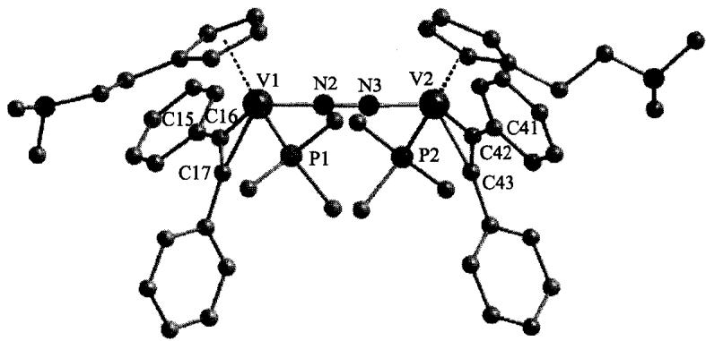

文献表明 $^{[9]}$ ，配位后的 N—N 键键长为 121.2(8) pm，相比于单纯的氮气分子，键长有所增加，同时 V—N 键键长介于单键和双键之间，这些都有力地证明了反馈 $\pi$ 键的存在。

7-2 此题是一道结构绘制题,题目中给的提示较多,难度较低。

（1）铬原子的化学环境完全相同 $\Rightarrow$ 它们必呈等边三角形分布，其他配体分布不能破坏这个对称性。

（2）乙酸根为桥连配体 $\Rightarrow$ 乙酸根必均分在3个铬中间，注意到分子中一共有6个乙酸根，所以每2个铬原子之间会夹杂2个乙酸根，而且它为桥连配体，所以应该是用羧酸根上的两个氧去把金属连接起来。

（3）水分子为单齿配体 $\Rightarrow$ 注意到分子中正好有3个水分子，所以正好每个铬均分1个水分子。

最后还剩 1 个氧原子,由于铬的等价性,氧只有分配到上述等边三角形的中心,才能维持这个等价性。综上,我们可以绘出下述结构:

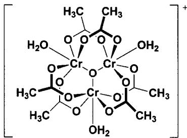

## 评注

7-1 小题围绕一个比较新颖的反应展开, 综合了氧化还原、配位化学、氮气活化等多个知识点, 考查了配位数和反馈 $\pi$ 键等问题, 检验了同学们的基本功; 其中用反馈 $\pi$ 键削弱 $N_{2}$ 键级来活化 $N_{2}$ 的思想也是在现代科研中所常用的。

7-2 小题从一个复杂结构的对称性入手,引导同学们去发现化学中的对称美,通过对称

性信息推断分子结构，构思较为巧妙。

## 第8题

## 分析与解答

这是一道经典的元素化学题。由题目第一句“金属 A 常用于铁的防护”，可知应该从元素周期表中常见金属元素入手。囿于篇幅，这里我们仅仅对初赛大纲中列出的金属元素进行分析：根据中国化学会 2008 年发布的《全国高中学生化学(奥林匹克)竞赛基本要求》 $^{[10]}$ ，初赛所考查的元素主要位于主族、d 区第一周期及 ds 区，其中金属有（为增强可阅读性，此处用元素符号代替其中文名称）

$$
\text {碱金属，碱土金属} \mid \mathrm{Al}, \mathrm{Sn}, \mathrm{Pb} \mid \mathrm{Ti}, \mathrm{V}, \mathrm{Cr}, \mathrm{Mo}, \mathrm{W}, \mathrm{Mn} \mid \mathrm{Fe}, \mathrm{Co}, \mathrm{Ni} \mid \mathrm{Cu}, \mathrm{Ag}, \mathrm{Au}, \mathrm{Zn}, \mathrm{Hg}
$$

下面通过题中所给信息,对这些元素进行逐步筛选,找出答案。

<table><tr><td></td><td>信息与分析</td><td>符合条件的元素</td></tr><tr><td>(1)</td><td>“金属A常用于铁的防护”。表明A的金属活动序位于Fe之前,故排除Fe,Cu,Ag,Au。</td><td>碱金属;碱土金属;Al;Sn,Pb;Ti;V;Cr,Mo,W;Mn;Co;Ni;Zn,Hg</td></tr><tr><td>(2)</td><td>“A与氯气反应,生成易挥发的液态物质B”。由于碱金属,碱土金属,Al,Pb,Cr,Mn,Co,Ni,Zn,Hg的氯化物均为固体,故排除之。注:VCl2,VCl3;MoCl3,MoCl4,MoCl5;WCl2,WCl4,WCl5,WCl6是固体,VCl4是液体。但在不掌握这些化合物物理性质的前提下,仅靠高中知识也可以完成相当有效的排除。</td><td>Sn;Ti;V;Mo,W</td></tr><tr><td>(3)</td><td>“E水解、聚合成链状的F并放出HCl”。E中所含元素仅有C,H,Cl和A,而前三种元素均不能与O缩聚形成长链结构,说明链上另外一种元素只可能是A。这意味着A与O的亲和性较高,且易于形成长链结构。</td><td>重点关注:Sn,Ti</td></tr><tr><td>(4)</td><td>“向B的盐酸溶液中通入H2S,得到金黄色沉淀G;向C的盐酸溶液中通入H2S,得到黑色沉淀I”。至此,可供元素A选择的范围已经非常之小了,相信许多同学早已猜出了答案。暂且将猜想搁置一边,继续分析:元素A与S的亲和性也很强,且两种价态能形成含S化合物沉淀。从而排除Ti,V,Mo,W,此时仅剩Sn。于是我们得出了唯一的答案:金属A是Sn。根据Sn特征化合物SnS,SnS2的颜色特征,可以从另一个侧面证明“A为Sn”的正确性。</td><td>Sn</td></tr></table>

确定 A 是 Sn 后,接下来的工作就简单了:Sn 与 $Cl_{2}$ 反应,一步生成 $SnCl_{4}(B)$ ,后者与 Sn 进一步反应生成还原性的 $SnCl_{2}(C)$ 。 $SnCl_{4}$ 与 $C_{6}H_{5}MgBr$ 反应,生成全取代的 $Sn(C_{6}H_{5})_{4}$ (D)。 $\mathrm{Sn}(\mathrm{C}_{6}\mathrm{H}_{5})_{4}$ 与 $SnCl_{4}$ 反应生成 E，但 E 中各配体数目无法确定。但看到下一条：E 水解（—Cl 被—OH 取代），聚合成链状化合物，自然地推出 E 中含两个 Cl，为 $\mathrm{Sn}(\mathrm{C}_{6}\mathrm{H}_{5})_{2}\mathrm{Cl}_{2}$ ，同时 F 的结构式也得到了确定：

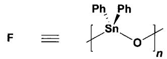

最后三个化合物 $\mathbf{G},\mathbf{H},\mathbf{l}$ 的推断，考查了Sn的硫化物、多硫化物的基本知识，答案分别为： $\mathrm{SnS}_2(\mathbf{G}),\mathrm{SnS}_3^{2 - }(\mathbf{H})$ 和 $\mathrm{SnS(l)}$ 。

## 评注

元素推断是化学竞赛里一种经典的出题模式，其目的在于考查同学们的无机化学功底与推理演绎能力。然而，随着同学们对大学无机化学知识的接触不断增多，元素推断题更多地从“技能考查”变成了“知识背诵”，甚至有“背好某某书，元素推断全精通”之语，使得元素推断题着实成为了命题者、教练、学生共同的无奈。以今年题目为例，元素化学基础好的同学一看到“金粉”，便可以直接推断出A是Sn；而未能答对的同学则会责怪出题老师考“金粉”导致自己失分——这两种做法都是不可取的。这里，仅仅使用高中化学知识及大学一年级普通化学知识，给出了一条较为系统，不要求“偏、难、怪”知识点的分析方法，体现了中学化学奥林匹克竞赛的初衷。当然，我们完全可以从整张元素周期表入手，通过同样的方法得到正确答案，请同学们自行完成。另一方面，在元素知识及答题技巧较为成熟的情况下，我们可以不机械地从第一条信息开始分析，而是从最关键的信息入手进行筛选，但需要注意最后检查每条信息是否都能与判断结果吻合。

值得一提的是,许多同学答题时错误地将 A 推断为 Ti,导致整个题目失分。请同学们考虑这种错误推断产生的可能原因,在今后的学习中加以避免。

## 第9题

## 背景

Coniine, 中文名毒芹碱, 以盐的形式存在于毒芹等植物中, 为剧毒品, 但在小量使用时具有抗痉挛的生理作用。Coniine 是第一个人工合成的生物碱, 合成的是其外消旋混合物, 可用 D-酒石酸重结晶分离为光学纯的化合物。

## 分析与解答

9-1 考查基本的有机化合物命名和旋光性判断。4S-(N,N-二甲基)-辛-7-烯-4-胺的主链上有8个碳，其中C7、C8号位为双键，C4位取代有二甲氨基。根据Cahn-Ingold-Prelog规则判断其C4位碳的手性，可以得coniine与其对映体的结构简式：

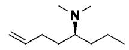

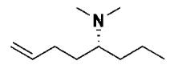  
4S-(N,N-二甲基)-辛-7-烯-4-胺  
4R-(N,N-二甲基)-辛-7-烯-4-胺

9-2 Hofmann 消除反应是一个四级铵盐在碱性条件下发生消除的反应。4S-(N,N-二甲基)-辛-7-烯-4-胺的化学式为 $C_{8}H_{17}N$ ，与 coniine 的化学式对比可以得知，coniine 经历了两次甲基化得到四级铵盐，而发生 Hofmann 消除反应后得到的产物中双键和氨基位于同一分子内，可以判断出 coniine 是一个环状的二级胺。再根据 Hofmann 消除反应逆推，氮原子有两个可能的连接位点，所以化合物 coniine 的结构可能有五元环和六元环两类，其中五元环产生了一个手性碳。如下图所示，coniine 所有可能的结构共有 3 个：

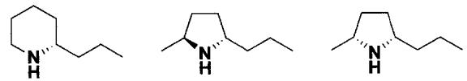

注意:上图中的两个五元环结构并不互为对映异构体,不能用(±)表示两个五元环的结构。

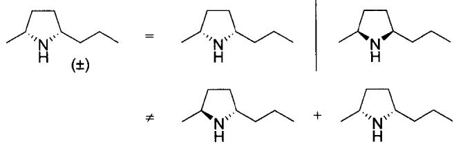

## 评注

这道题考查的是同学们对有机化合物命名和旋光性判断的基本功以及对简单人名反应的掌握程度，体现了化学奥林匹克竞赛回归基础的发展方向。同时，从这道题中可以体会在没有当今这些高端化学仪器的帮助下，早期有机化学家准确确定有机化合物结构的难度，也从中体现了这些科学家的天才之处，这也是有机化学的魅力。

## 第10题

## 分析与解答

10-1 溴与 1,3-丁二烯在环己烷溶液中发生加成反应时，会得到两个产物：1,2-加成产物和 1,4-加成产物。其反应机理如下：

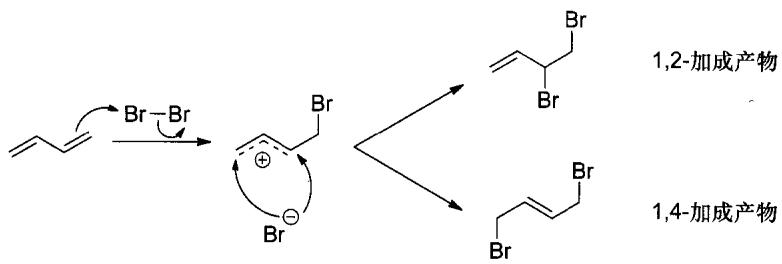

1,4-加成产物更加稳定，但是反应的活化能较1,2-加成产物更高。在这个反应中，1,2-加成产物是动力学产物，而1,4-加成产物是热力学产物。在较低温度时，反应的活化能不容易克服，动力学产物比例相对较高；而高温时，活化能容易克服，更易生成热力学产物。因此，A是动力学产物，为1,2-加成产物；B是热力学产物，为1,4-加成产物。同时，从10-2的“A可以缓慢地转化为B”也可以看出A是动力学产物，B是热力学产物。

10-2 A 到 B 的转化通过正离子中间体来完成,该正离子的结构可表示为

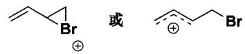

A 的能量要高于 B, 但是 A 到中间体的活化能应低于中间体到 B 的活化能, 同时, 中间体的势能要高于 A 和 B 的势能。反应势能图如下:

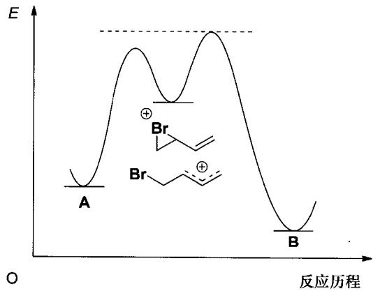

10-3 不对称的 1,3-二烯和氯化氢的加成反应要稍微复杂一点,但是其原理并没有改变,只需在原有的基础上多考虑一个马氏规则(本质是碳正离子的稳定性)即可。其反应历程如下:

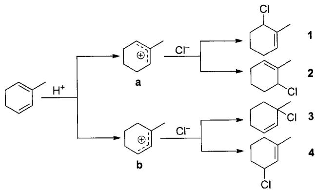

从结果我们可以看出，产物 2 和 3 是 1,2-加成产物，产物 1 和 4 是 1,4-加成产物。这里我们还要注意到产物 1 和产物 2 是同一个化合物，因此在不考虑手性的情况下该反应的产物只有以下 3 个。

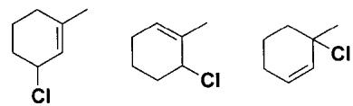

除此之外，甲基取代对反应结果也会产生一定的影响。甲基有给电子能力，这导致有甲基取代的双键的电子云密度更高，活泼性更强，更易和 $\mathrm{H^{+}}$ 结合，因此中间体b的比例会略高于a。有些同学提出：a是次要中间体，那么化合物1、2应该和反马氏规则产物一样被忽略。在这里，我们要说的是，并不是所有的次要产物都应该被忽略，这要视该次要产物的含量甚至重要性而定。而在这道题中，我们可以通过已学的知识来简单判断一下：马氏产物中间体是一个烯丙基正离子，我们知道烯丙基正离子的稳定性远大于普通碳正离子，所以产物几乎都是马氏产物，或者说几乎没有反马氏产物；甲基是一个给电子基团，但只是一个比较弱的给电子基团，它并不能显著提高双键的电子云密度，因此a的比例低于b，但也仅仅是略低于b，产物1和2自然也就不能忽略。

## 评注

这道题考查的是简单有机反应中的反应原理,要求的并不是同学们有宽广的知识面,而是对于基础反应的深刻理解。有机反应复杂多样,但究其根本是从基础反应发展而来的,其原理与本质也大同小异。对基础反应的深刻理解是学习有机化学的基础,也更有利于日后在有机化学方面的进一步学习。

氯气和1,3-丁二烯的1,2-加成与1,4-加成是有机化学的经典内容，甚至人教版《高中化学·选修5：有机化学基础》[2]都有所介绍。遗憾的是，人教版高中化学书中并没有详细描述1,2-加成与1,4-加成的反应条件与反应机理，仅仅停留在表面而未能深入本质。

## 第11题

## 背景

11-1 托品酮(tropinone)大家都不陌生,它具有莨菪烷类即氮杂二环[3.2.1]辛烷的结构,R.Willstätter确定了它的结构并于1896—1902年期间用18步反应完成了托品酮的全合成[11]。

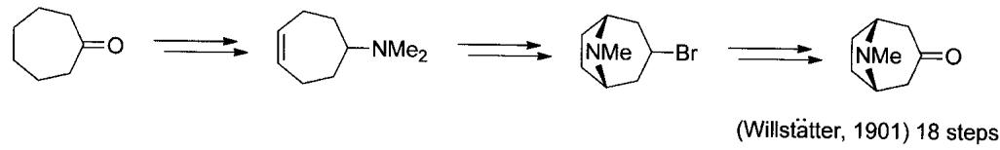

Willstätter 的合成过程已达到了当时有机合成的巅峰，在有机合成的历史上也堪称装配式合成设计的经典之作。而在 1917 年，R. Robinson 利用 Mannich 反应进行仿生合成，只用了两步便得到了托品酮。Robinson 的这一合成具有划时代的意义，被 Willstätter 称为“出类拔萃的合成”[12]。

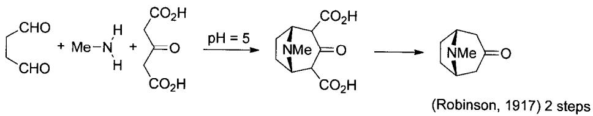

11-2 氧化还原反应因其能便捷地进行官能团转化而在有机合成中占有重要地位。在有机化学发展的初期，人们借鉴无机化学经验，使用一些常用的无机氧化剂参与有机反应，发展了一系列以无机试剂为核心的氧化反应。但是无机氧化反应条件一般比较剧烈，官能团耐受力较差，因此有机化学家对无机氧化剂进行了改进，得到了一系列带有有机基团的无机氧化剂。另一方面，也发展出了一些不含有无机金属元素的有机氧化剂，与传统的无机氧化剂相比，有机氧化剂大多溶解性很好，反应条件温和，并能更高效地进行氧化反应。

我们以一级醇氧化生成醛的反应为例。常用的无机氧化剂例如 Jones 试剂、Sarett 试剂、PCC/PDC 以 Cr(VI) 进行氧化，反应后往往产生大量含 Cr 废液，也会对环境产生污染。而有机氧化剂则使用有机硫（Pfitzner-Moffatt 反应、Swern 反应、Corey-Kim 反应）、有机碘（Dess-Martin 试剂、IBX），或简单的有机物 TEMPO（一种氧化铵）、丙酮（Oppennauer 氧化中）作为氧化剂。这些反应的氧化机理各有各的特点，但选择性及官能团耐受性都远远好于无机氧化剂。因此，发展有机氧化剂一直是有机方法学研究的重点。

## 分析与解答

11-1 本题题目所给的条件不多,但对于解题来说已经非常充分。首先对底物进行分析,托品酮含有一个三级氨基,而溴苄则是一个常见的亲电试剂。由于反应在中性条件下进行,酮羰基的 $\alpha$ 位不能进行烃基化反应,因此这里只发生 $S_{N}2$ 反应:三级胺进攻苄溴,产物是四级铵盐。但是,为什么产物却有 A 和 B 两个呢?观察一下托品酮的结构:

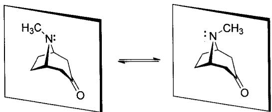

虽然托品酮分子的两个构象都具有对称面,没有手性,但反应中心三级胺两侧的化学环境是不同的。由于胺的孤对电子可以自由翻转,因此托品酮在进攻苄溴时便会有两个方向,自然产物会有 A、B 两个。

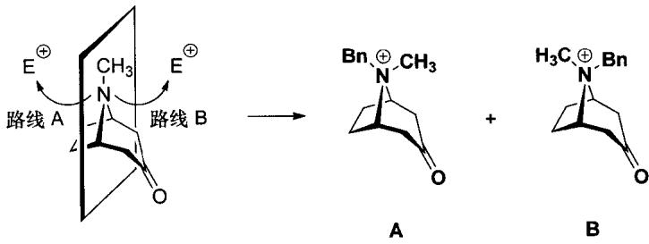

下一问: A、B 两个结构可以在碱性条件下相互转化。考虑一些光学纯产物外消旋化的过程, 其基本原理无非有一个共同的中间体, 并与两个对映异构体形成可逆平衡:

$$
\begin{array}{c}R _ {1}\\R _ {2} \stackrel {\prime \prime} {\underset {R _ {3}} {\rightleftharpoons}} O H\\\xrightarrow [ H _ {2} O ]{H ^ {+}} \stackrel {+} {\underset {R _ {2} R _ {3}} {\rightleftharpoons}} \stackrel {H _ {2} O} {\underset {H ^ {+}} {\rightleftharpoons}} H O\end{array}
$$

$$
\mathrm{OHC} _ {\mathrm{R} _ {1} \mathrm{R} _ {2}} \xrightarrow [ \mathrm{H} ^ {+} ]{\mathrm{B} ^ {-}} \mathrm{C} _ {\mathrm{R} _ {1} \mathrm{R} _ {2}} ^ {\mathrm{O} ^ {-}} \xrightarrow [ \mathrm{B} ^ {-} ]{\mathrm{H} ^ {+}} \mathrm{CHO} _ {\mathrm{R} _ {2}}
$$

因此，我们需要找到这样一个中间体，与两个产物都能形成平衡。分析 A、B 的结构，与托品酮相比，酮羰基没有变化，而三级胺变成了四级铵盐。由于反应条件是碱性，因此 A、B 难以通过脱去苄基回到托品酮。我们需要探索其他路径。观察酮羰基 $\alpha-H$ ：由于同时受羰基和四级铵盐的影响，羰基 $\alpha-H$ 的酸性大大增强。若消除这个氢，便可得到一个 $\alpha,\beta-$ 不饱和酮——这就是连接 A、B 的共同中间体：

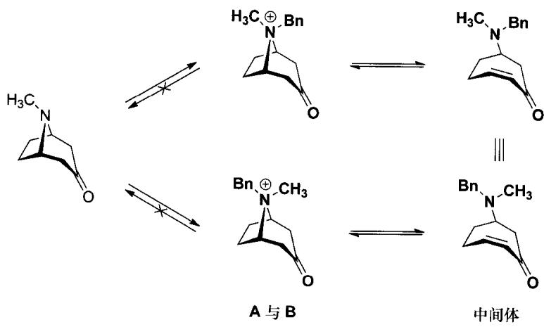

本题中反应并不复杂,主要考查的是同学们是否具有基本的立体化学概念以及对反应过程的立体思考能力。

11-2 这是一个氧化反应。底物含有良好的离去基团—OTs。从价态上，我们可以将底物等价为一级醇；从反应性上，我们知道它是一个亲电试剂，可以类比为上一题的苄溴。

硝基甲烷的甲基氢由于硝基的吸电子效应而具有一定的酸性。其共轭碱上的负电荷可以在两个氧与一个碳上共振，这也是第一个问题的答案：

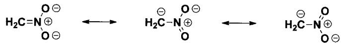

更进一步可以看出，硝基甲烷负离子是一个两位负离子。其中碳的可极化能力强，亲核性更强；氧上负电荷密度更大，碱性更强。由软硬酸碱理论，O端较硬，C端较软。那么在反应中，到底是C端进攻还是O端进攻？我们以烯醇负离子为例进行讨论。当烯醇负离子与 $\mathrm{Br}_2$ 发生反应时，是较软的C端进攻软酸 $\mathrm{Br}_2$ （实质上是进攻其 $\sigma^{*}$ 反键轨道），软亲软，生成C端溴化产物。而在烯醇硅醚的制备中，是较硬的O端进攻硬酸TMSCl，硬亲硬，形成稳定的O—Si键（当然这里d-p相互作用也作出了贡献）：

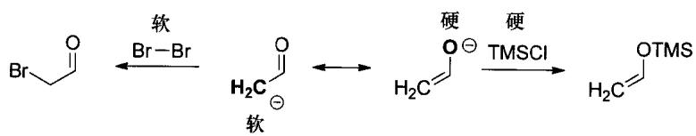

回到题目,底物由一个活性很高的苄基和一个离去能力很好的—OTs组成,—OTs的吸电子性使得C—O键上的 $\sigma$ 电子比原先更多地向O偏移,C的硬度增强。因此这里应该由氧去进攻:

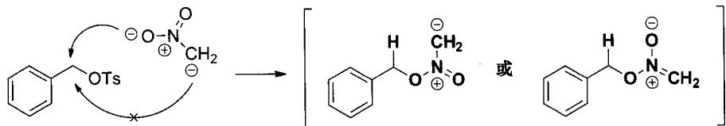

其实仅就题目而言,即使考虑不到软硬酸碱理论的层面,我们也可以通过推断法得到结果。题目已经告诉我们:硝基甲烷负离子是一种氧化剂,如果是碳去进攻,接下来便无法写出合理的氧化反应。

得到了中间体之后,我们来分析下一步反应应如何进行。由于底物与一级醇同类,那么很自然地便可以联想到该反应的氧化产物应该是醛。生成醛需要脱氢,在这里,我们可以选择用氧攫氢,得到甲醛肟;或是用碳攫氢,得到亚硝基甲烷。需要指出的是,在亚硝基甲烷与甲醛肟的互变异构中,平衡有利于甲醛肟,但这并不是题目的考查重点,因此这两个答案都是合理的。至此,我们完成了整道题目的解答:

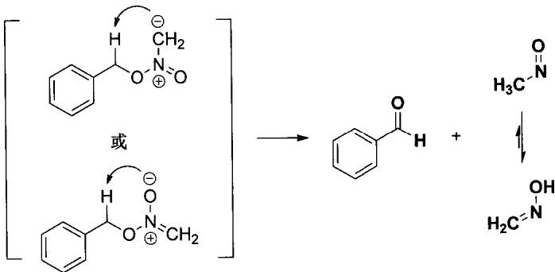

## 评注

在解 11-1 小题的过程中,有些同学认为托品酮发生了羰基 $\alpha$ -烷基化反应,写出了以下反应产物:

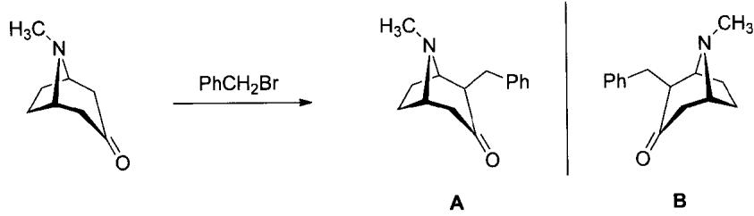

这里得到的 A、B 也是一对对映异构体，而且在强碱条件下，A 或许可以通过类似于 Favor-skii 重排的过程（四元环状过渡态）与 B 发生相互转化。然而，考虑到题目中的反应条件，倘若托品酮真的能够发生羰基 $\alpha-$ 烷基化反应，其必然先发生一步酸碱反应生成碳负离子。这样的反应真的能发生吗？我们来看一下相关化合物的酸碱性：

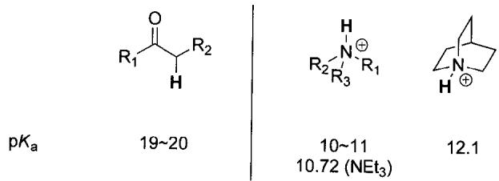

反应常数相差8个数量级之大，即便是碱性较强的环状三级胺，也不足以攫取羰基的 $\alpha -\mathrm{H}$ 因此在本题的反应条件下，羰基 $\alpha$ 烷基化的发生是不可能的。

## 参考文献

[1] Lide D R, ed. CRC Handbook of Chemistry and Physics. 90th ed, CD-ROM version. Boca Raton: CRC Press/Taylor and Francis, 2010.

[2] 人民教育出版社 课程教材研究所 化学课程教材研究开发中心. 化学·选修 5: 有机化学基础. 北京: 人民教育出版社, 2004.

[3] Landau L D, Lifshitz E M. Statistical Physics. 3rd ed, Part 1 (Course in Theoretical Physics, Volume 5). Oxford: Pergamon Press, 1980.

[4] 南京土壤研究所．土壤理化分析．上海：上海科学技术出版社，1977.

[5] 鲁如坤. 土壤农业化学分析方法. 北京：中国农业科技出版社，1999.

[6] 杨俐苹，白由路，王向阳．腐殖酸，2011，1：15～19.

[7] Jorgensen J D, Hu Z, Teslic S, Argyriou D N, Short S, Evans J S, Sleight A W. Pressure-induced cubic-to-orthorhombic phase transition in $ZrW_{2}O_{8}$ . Phys Rev B, 1999, 59(215): 215\~225.

[8] 中国化学会. 中国化学会 2013 年全国高中学生化学竞赛工作会议纪要. 2013.

[9] Liu G, Liang X, Meetsma A, Hessen B. Synthesis and structure of an aminoethyl-functionalized cyclopentadienyl vanadium(I) dinitrogen complex. Dalton Trans, 2010, 39(34): 7891\~7893.

[10] 中国化学会. 全国高中学生化学(奥林匹克)竞赛基本要求. 2008.

[11] Smit W A, Bochkov A F, Caple R. Organic Synthesis: The Science behind the Art. London: Royal Society of Chemistry, 1998.

[12] Birch A J. Investigating a Scientific Legend: The Tropinone Synthesis of Sir Robert Robinson, F R S. Notes and Records of the Royal Society of London (1938—1996), 1993, 47 (2): 277.

# 第 29 届中国化学奥林匹克竞赛(决赛)理论试题解析

(2015年11月28日·合肥)

## 试题

## 第 1 题(7 分)

1-1 $\mathrm{CH}_3\mathrm{SiCl}_3$ 和金属钠在液氨中反应，得到组成为 $\mathrm{Si}_6\mathrm{C}_6\mathrm{N}_9\mathrm{H}_{27}$ 的分子。此分子有一条三重旋转轴，所有 Si 原子不可区分，画出该分子的结构图（必须标明原子种类，H 原子可不标），并写出化学反应方程式。

1-2 金属钠和 $\left(\mathrm{C}_{6}\mathrm{H}_{5}\right)_{3}\mathrm{CNH}_{2}$ 在液氨中反应，生成物中有一种红色钠盐，写出化学反应方程式，解释红色产生的原因。

1-3 最新研究发现,高压下金属 Cs 可以形成单中心的 $CsF_{5}$ 分子,试根据价层电子对互斥理论画出 $CsF_{5}$ 的中心原子价电子对分布,并说明分子形状。

## 第 2 题(11 分)

将银电极插入 298 K 的 $1.000 \times 10^{-1} \, mol \, L^{-1} \, NH_{4}NO_{3}$ 和 $1.000 \times 10^{-3} \, mol \, L^{-1} \, AgNO_{3}$ 混合溶液中，测得其电极电势 $\varphi_{Ag^{+}/Ag}$ 随溶液 pH 的变化如下图所示：

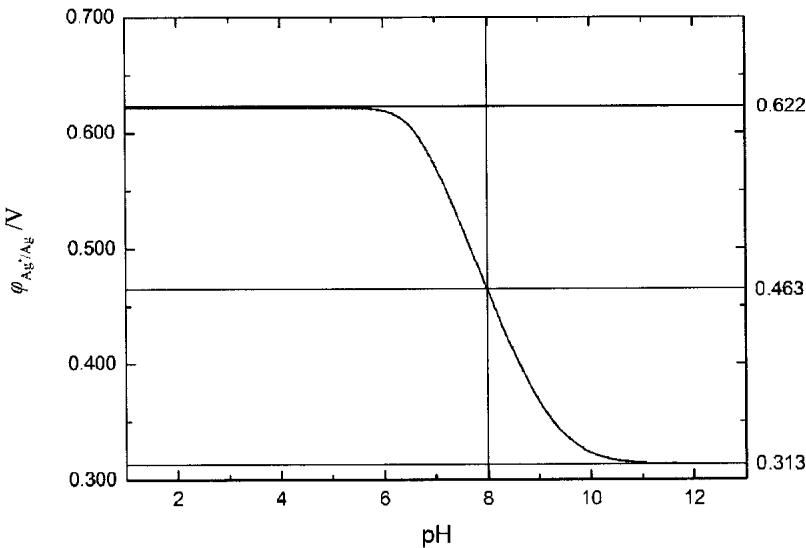

已知氨水的解离常数 $K_{b}=1.780\times10^{-5}$ ，摩尔气体常数 $R=8.314\ J\ mol^{-1}\ K^{-1}$ ，法拉第常数 $F=96500\ C\ mol^{-1}$ 。

2-1 计算 298 K 时银电极的标准电极电势 $\varphi_{Ag^{+}/Ag}^{\ominus}$

2-2 计算银氨配离子的逐级稳定常数 $K_{1}^{\ominus}$ 和 $K_{2}^{\ominus}$ 。

2-3 利用银离子的配位反应设计一个原电池,其电池反应方程式为

$$
\mathrm{Ag} ^ {+} (\mathrm{aq}) + 2 \mathrm{NH} _ {3} (\mathrm{aq}) \longrightarrow \mathrm{Ag} (\mathrm{NH} _ {3}) _ {2} ^ {+} (\mathrm{aq})
$$

计算该原电池的标准电动势。若未能算出银氨配离子的一、二级逐级标准稳定常数，可假设都是 $1.00\times10^{3}$ 。

## 第 3 题(12 分)

CuO 和 $\mathrm{Ba(NO_{3})_{2}}$ 以物质的量之比 1:1 混合，加热溶解于稀硝酸中，将获得溶液进行喷雾冷冻成小颗粒，并低温干燥，干燥后物质移入铂坩埚中，在 $1.0 \times 10^{5}$ Pa 的氧气中加热至 $620^{\circ}C$ ，并保温 18 小时，获得固体物质 A 和 B 的混合物，分离得到物质 A 和 B。

元素和结构分析表明，物质 A 由 Ba、Cu、O 三种元素组成，Cu 原子位于由 O 原子构成的四边形的中心，四边形通过共棱组成一维的铜氧链，Ba 位于链之间。将 1.00 g $^{①}$ A 与足量碘化钾混合，在氩气气氛下滴入 3 mol L $^{-1}$ 盐酸，直至固体完全溶解，得到溶液 S（反应式 1）。溶液 S 加水稀释，得到白色固体沉淀 C（反应式 2）；溶液 S 加入少量淀粉，得到蓝色溶液，用 0.100 mol L $^{-1}$ 硫代硫酸钠溶液滴定，消耗 44.54 mL（反应式 3）。若 A 先用盐酸溶解（反应式 4），再滴入碘化钾溶液（反应式 5），直接得到含有沉淀 C 的溶液，该溶液用 0.100 mol L $^{-1}$ 硫代硫酸钠溶液滴定，消耗 26.72 mL。

物质 B 在 20% 氧气 + 80% 氮气混合气氛保护下缓慢加热至 820℃，失重 9.45%（反应式 6），得到物质 D，而缓慢降温至 400℃后，又恢复到原质量。

相对原子质量:Ba:137.33,Cu:63.55,O:16.00。

3-1 写出 A、B、C 和 D 的化学式。

3-2 写出反应的化学方程式(溶液中反应必须用离子方程式表示)。

3-3 在上述滴定实验中,用硫代硫酸钠溶液滴定到接近终点时,常加入少量 KSCN 以提高测定精确度,阐明原理及必须在接近终点时才加入 KSCN 的理由。

## 第 4 题(14 分)

氢最有可能成为21世纪的主要能源，但氢气需要由其他物质来制备，制氢的方法之一是以煤的转化为基础。基本原理是用炭、水在气化炉中发生如下反应：

$$
\mathrm{C(s)} + \mathrm {H_ {2} O(g)} \rightleftharpoons \mathrm{CO(g)} + \mathrm {H_ {2} (g)}\tag{1}
$$

$$
\mathrm{CO(g)} + \mathrm {H_ {2} O(g)} \rightleftharpoons \mathrm {CO_ {2} (g)} + \mathrm {H_ {2} (g)}\tag{2}
$$

利用 CaO 吸收产物中的 $CO_{2}$ :

$$
\mathrm{CaO(s)} + \mathrm {CO_ {2} (g)} \rightleftharpoons \mathrm {CaCO_ {3} (s)}\tag{3}
$$

产物中的 $H_{2}$ 与平衡体系中的 C、CO、 $CO_{2}$ 发生反应，生成 $CH_{4}$ ：

$$
\mathrm{C(s)} + 2 \mathrm {H_ {2} (g)} \rightleftharpoons \mathrm {CH_ {4} (g)}\tag{4}
$$

$$
\mathrm{CO(g)} + 3 \mathrm {H_ {2} (g)} \rightleftharpoons \mathrm {CH_ {4} (g)} + \mathrm {H_ {2} O(g)}\tag{5}
$$

$$
\mathrm{CO} _ {2} (\mathrm{g}) + 4 \mathrm{H} _ {2} (\mathrm{g}) \rightleftharpoons \mathrm{CH} _ {4} (\mathrm{g}) + 2 \mathrm{H} _ {2} \mathrm{O} (\mathrm{g})\tag{6}
$$

将 2 mol C(s)、2 mol $H_{2}O(g)$ 、2 mol CaO(s) 放入气化炉，在 850℃ 下发生反应。已知 850℃ 下相关物种的热力学参数：

<table><tr><td>物质</td><td> $\Delta_f H_m^\ominus/(kJ mol^{-1})$ </td><td> $S_m^\ominus/(J mol^{-1} K^{-1})$ </td></tr><tr><td>C(s)</td><td>8.70</td><td>21.04</td></tr><tr><td>CO(g)</td><td>-93.65</td><td>229.22</td></tr><tr><td>CO2(g)</td><td>-368.1</td><td>260.49</td></tr><tr><td>CaO(s)</td><td>-606.97</td><td>90.58</td></tr><tr><td>CaCO3(s)</td><td>-1147.40</td><td>196.92</td></tr><tr><td>H2(g)</td><td>16.21</td><td>161.08</td></tr><tr><td>H2O(g)</td><td>-221.76</td><td>226.08</td></tr><tr><td>CH4(g)</td><td>-46.94</td><td>236.16</td></tr></table>

4-1 计算气化炉总压为 $2.50 \times 10^{6}$ Pa 时， $H_{2}$ 在平衡混合气中的摩尔分数。

4-2 计算 $850^{\circ}$ C 从起始原料到平衡产物这一过程的热效应。

4-3 碳在高温下是一种优良的还原剂，可用于冶炼多种金属。试写出 $600^{\circ}$ C 碳的可能氧化产物的化学式。从热力学角度说明原因（假设 $600^{\circ}$ C 反应的熵变、焓变和 $850^{\circ}$ C 下的熵变、焓变相同）。

## 第 5 题(14 分)

MAX(M代表过渡金属元素，A代表主族元素，X代表碳或氮)相是一类备受关注的新型陶瓷材料。由于独特的层状晶体结构，其具有自润滑、高韧性、可导电等性能，可作为高温结构材料、电极材料和化学防腐材料。某MAX相材料含有Ti、Al、N3种原子，属六方晶系，Ti原子的堆积方式为…BACBBCABBACBBCAB…，其中A、B、C都是密置单层。N原子占据所有的正八面体空隙，而Al原子占据一半的三棱柱空隙。如果Ti原子层上下同时接触N和Al原子，则沿着晶胞c轴方向，Al和N原子的投影重合。

5-1 写出该化合物的化学式,及每个正当晶胞中的原子种类和个数。

5-2 沿着晶胞 c 轴方向，画一条同时含有 Al 和 N 原子的直线，标出直线上的原子排列（无需考虑原子间距离，直线上总原子数不少于 10 个。Al、Ti、N 分别用 ○、△、□ 表示）。

5-3 已知 Ti、N 原子之间的平均键长为 210.0 pm，Ti、Al 原子之间的平均键长为 281.8 pm，估算晶体的理论密度（相对原子质量：Ti:47.87, Al:26.98, N:14.01, $N_{A}=6.02 \times 10^{23} mol^{-1}$ ）。

5-4 晶粒尺寸会影响上述材料的性质,所以高温制备时一般通过延长保温时间来增加晶粒尺寸。判断常温下晶粒生长过程的熵变、焓变和自由能变的正负,并从化学热力学角度判断常温下该晶粒生长过程是否自发。

5-5 以上描述均针对完美晶体。一般情况下，晶粒中会出现缺陷。从热力学角度证明：对于足够大的晶体，出现缺陷是自发的。

## 第6题(12分)

反应体系为气体、催化剂为固体的异相催化反应很普遍。设气体在均匀的固体催化剂表面发生单层吸附，各吸附活性中心能量相同，忽略吸附粒子间相互作用，吸附平衡常数不随压力变化。

6-1 理想气体 X 在 180 K 和 $3.50 \times 10^{5}$ Pa 条件下，1 g 固体的吸附量为 $1.242 \, cm^{3}$ 。在 240 K 达到相同的吸附量时，需要将压力增加到 1.02 MPa。估算 X 在该固体表面的摩尔吸附焓变（假设此温度范围内摩尔吸附焓变为定值）。

6-2 已知反应 $\mathbf{A}(\mathrm{g}) \xrightarrow{k_2} \mathbf{B}(\mathrm{g})$ 的反应机理为: $\mathbf{A} + * \xrightarrow[k_{\mathrm{d}}]{k_{\mathrm{a}}} \mathbf{A}^* \xrightarrow{k_1} \mathbf{B}(\mathrm{g}) + *$ , 其中 \* 表示固体催化剂表面的活性中心。每个活性中心只能吸附一个气态分子 $\mathbf{A}(\mathrm{g})$ , 形成吸附态分子 $\mathbf{A}^*$ 。 $\mathbf{A}^*$ 可直接转化生成气相产物 $\mathbf{B}$ , 该表面反应为决速步骤。吸附态 $\mathbf{A}^*$ 的浓度用表面覆盖度 ( $\mathbf{A}^*$ 分子所占据的活性中心个数与表面活性中心总个数之比) 表示。在 $298\mathrm{K}$ 时测量 $\mathbf{A}(\mathrm{g}) \xrightarrow{k_2} \mathbf{B}(\mathrm{g})$ 反应的速率常数 $k_2$ , 高压下为 $5\mathrm{kPa~s^{-1}}$ , 低压下为 $0.1\mathrm{s^{-1}}$ 。试计算气体 $\mathbf{A}$ 分压为 $50\mathrm{kPa}$ 时, 由 $\mathbf{A}$ 生成 $\mathbf{B}$ 的反应速率。

6-3 假如产物 B 也发生表面吸附, 反应机理变为

$$
\mathbf {A} (\mathrm{g}) + * \xrightarrow [ k _ {\mathrm{d}} ]{k _ {\mathrm{a}}} \mathbf {A} ^ {*} \xrightarrow [ k _ {\mathrm{d}} ]{k _ {\mathrm{l}}} \mathbf {B} ^ {*} \xrightarrow [ k _ {\mathrm{al}} ]{k _ {\mathrm{dl}}} \mathbf {B} (\mathrm{g}) + *
$$

其中由 $\mathbf{A}^*$ 生成 $\mathbf{B}^*$ 的表面反应为决速步骤。假设 $k_{\mathrm{a}}, k_{\mathrm{d}}, k_{1}$ 都和6-2中的相同。当产物 $\mathbf{B}$ 的分压 $p_{\mathbf{B}}$ 远大于 $p_{\mathbf{A}}$ 时， $\mathbf{A}(\mathrm{g}) \xrightarrow{k_3} \mathbf{B}(\mathrm{g})$ 的反应对于 $\mathbf{A}$ 来说是一级反应，且速率常数 $k_3$ 可表达为 $p_{\mathbf{B}}$ 的函数： $k_3 = \frac{10}{p_{\mathbf{B}}} \mathrm{kPa} \mathrm{s}^{-1}$ 。求 $\mathbf{B}(\mathrm{g})$ 在催化剂上的吸附平衡常数 $K_{\mathbf{B}} = k_{\mathrm{a1}} / k_{\mathrm{d1}}$ 。

## 第 7 题(9 分)

海洋生物体内蕴含着丰富的生物活性物质，误食某些海鲜食品会导致严重的食物中毒。细胞毒素 chlorosulpholipid 是从某海洋生物体中分离得到的一种天然产物，其全合成研究表明，该分子内含有的多氯代结构对其生物活性具有重要意义。在该分子合成路线中，氯原子的引入涉及如下所示的环氧开环反应 $\left[\mathrm{TBS}=t-\mathrm{Bu}\left(\mathrm{CH}_{3}\right)_{2} \mathrm{Si}\right]$ ：

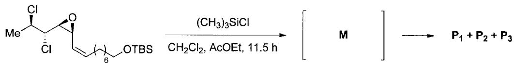

以二氯甲烷与乙酸乙酯为溶剂，得到3种开环产物 $P_{1}$ 、 $P_{2}$ 和 $P_{3}$ 。

7-1 给出中间体 M 的结构简式。

7-2 给出 $P_{1}$ 、 $P_{2}$ 和 $P_{3}$ 的结构简式，以及由 M 得到相应产物的生成机理。

## 第 8 题(11 分)

从简单易得的化合物出发，合成复杂天然产物是合成化学家们追求的目标。复杂天然产物的人工合成挑战着合成化学家的智慧。如下所示为天然产物萜类化合物 eudesmane 合成路线的片段（反应条件中“r.t.”表示室温，PCC 为 $CrO_{3}$ /吡啶/盐酸）：

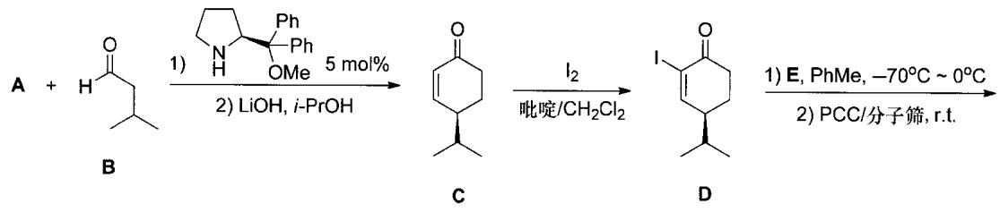

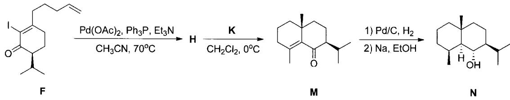

8-1 给出产物 $\mathbf{N}$ 的稳定构象。

8-2 给出试剂 E、K 及中间产物 H 的结构简式。

8-3 给出由 M 到 N 转化的中间产物的结构简式。

8-4 给出中间产物 C 的逆合成分析(不考虑立体化学), 据此给出反应物 A 的结构简式。

8-5 通过反应过程中关键中间体结构的形成，简述形成 $\mathbf{C}$ 的过程中的立体控制机理。

## 第9题(10分)

Wittig 于 1953 年报道了磷叶立德(phosphoniumylide,又称 Wittig 试剂)与醛、酮反应，将羰基直接转化为碳碳双键，同时生成副产物三苯氧膦，称之为 Wittig 反应，是构建碳碳双键的重要方法。有关改进和拓展 Wittig 反应的研究得到了广泛的重视和发展，文献报道了如下所示的类似 Wittig 反应的研究：

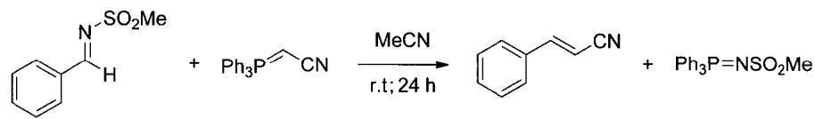

9-1 给出反应物中 C=N 双键的构型(Z 或 E)。

9-2 画出反应物 $Ph_{3}P=CHCN$ 的共振结构式。

9-3 指出下列哪一种 $^{1}$ H NMR 谱信息可用来测定反应物 C=N 双键构型。

Ⅰ．化学位移 Ⅱ．磁各向异性 Ⅲ．屏蔽效应 Ⅳ．NOE 效应

9-4 说明反应物结构中的— $SO_{2}$ Me 基团对该反应的作用。

9-5 研究上述反应机理时,发现如下反应:

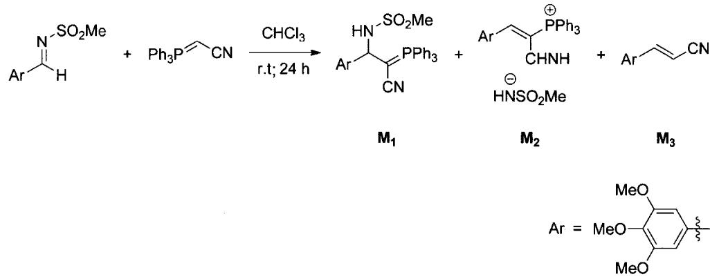

分别给出生成 $M_{2}$ 和 $M_{3}$ 的反应机理。

9-6 在 9-5 反应中,以四氢呋喃(THF)为溶剂,室温下反应后,再用福尔马林(formalin)猝灭反应,得到如下实验结果:

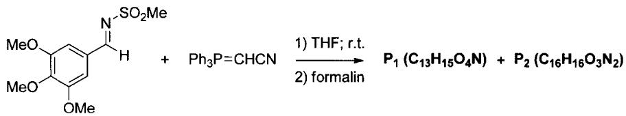

写出 $P_{1}$ 、 $P_{2}$ 的结构简式。

9-7 Wittig 反应一般是在非质子极性溶剂中进行,但在 9-6 反应中,用福尔马林 (formalin) 猝灭反应得到了产物 $\mathbf{P}_1$ 和 $\mathbf{P}_2$ , 写出 $\mathbf{P}_2$ 形成过程中关键中间体的结构简式。

## 试题解析

## 第1题

## 分析与解答

本题主要考查对氢的酸性、 $Na/NH_{3}$ 体系、亲核取代反应和分子对称性的掌握，要求同学们对分子结构有较强的理解，能够从结构判断分子的反应性质，准确找到反应物的反应位点，正确判断生成物的键连关系，并能通过对称性分析推断出分子的骨架结构。总体来说，这是一道综合性很强的题目。

1-1 对于分子结构题,我们不能仅仅凭借化学式和题目所给出的对称性来推测结构,而应该根据反应条件先推测出合成该分子的大致“机理”,明确每种试剂、原料中每个基团的作用,从而推测出具体的键连关系,最后再根据化学式或者对称性给出最终的分子结构。为了方便表达,将题目所求分子记为 A。

首先，产物中的碳与 Si 原子的比例为 1:1，这说明反应物 $CH_{3}SiCl_{3}$ 的 Si—C 键比较稳定，在反应过程中没有发生任何变化；甲基上的氢酸性很弱，不会在 $Na/NH_{3}$ 的环境下脱去，更不会以 $H^{-}$ 离子的形式离去（这也说明化学式中 27 个 H 原子中有 18 个属于甲基，也表明分子中 N 原子只有一个 H 原子连接），因此反应只能发生在 Si—Cl 键，很明显 Cl 原子在反应过程中可以作为离去基团。

在亲核取代反应中，离去基团必然对应一种亲核试剂。在 $Na/NH_{3}$ 体系中，一个合理的亲核试剂便是由 Na 和 $NH_{3}$ 二者相互作用产生的 $NH_{2}^{-}$ 。判断出反应位点和大致机理后，再来看化学式：把化学式改写为 $(\mathrm{CH}_{3})_{6}\mathrm{Si}_{6}\mathrm{N}_{9}\mathrm{H}_{9}$ 。剩下的 9 个 H 原子只可能在 N 原子上，于是可以进一步写成 $(\mathrm{CH}_{3})_{6}\mathrm{Si}_{6}(\mathrm{NH})_{9}$ 。结合对称性：A 分子存在三重旋转轴，而且所有 Si 原子化学环境相同，说明 A 分子具有比较高的对称性。最先想到的就是六元环的结构，其中 3 个 Si 原子与 3 个 N 原子各构成六元环的 3 个顶点。考虑上述结论，其结构可表示为（记为 B）

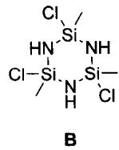

B 中每个 Si 原子上还有 Cl 原子, 还可以发生亲核取代反应。注意到 A 分子有 6 个 Si 原子, 而上述 B 只有 3 个 Si 原子, 说明可能存在两个 B 结构中的六元环, 而两个 B 通过化学键连接在一起成为 A。再考察两个 B 的化学式与 A 化学式的差别, 可以发现二者相差两个 NH 基团, 而 NH 基团正好可以形成两个化学键, 可以作为“桥”将两个 B 分子连接在一起,

于是可以得到 $\mathbf{A}$ 的分子结构：

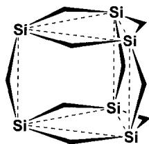  
A 的结构示意图, 其中 Si=Si-Me, 楔形折点代表 NH, 虚线不表示键连关系

反应方程式为

$$
6 \mathrm{CH} _ {3} \mathrm{SiCl} _ {3} + 1 8 \mathrm{Na} + 9 \mathrm{NH} _ {3} \longrightarrow (\mathrm{CH} _ {3}) _ {6} \mathrm{Si} _ {6} (\mathrm{NH}) _ {9} + 1 8 \mathrm{NaCl} + 9 \mathrm{H} _ {2} \uparrow
$$

1-2 本题主要考查对有机物颜色、颜色互补效应、 $\mathrm{Na/NH_3}$ 体系的还原性，及三苯甲基结构等的理解和掌握，要求同学们掌握三苯甲基负离子的稳定性的原因，正确判断是 $\mathrm{Na/NH_3}$ 体系的还原性而不是碱性在起作用，并且能够从化合物的电子结构出发解释颜色。

反应物中出现了 $Ph_{3}CNH_{2}$ ，而题目给定的 $Na/NH_{3}$ 体系是一个强极性、强碱性的环境，只有三苯甲基负离子能够在这种条件下生成。而且题目还提到生成物中出现了红色的钠盐，这种有机物的颜色一般是由于长程离域 $\pi$ 键，导致分子轨道能级差减小，根据颜色互补效应，吸收蓝绿光，从而显现出红色。在此条件下，只有此负离子与苯基共轭，才能产生此效果，这进一步证实了 $Ph_{3}C^{-}$ 的生成。

产生 $Ph_{3}C^{-}$ 离子，需要让体系中的 $NH_{2}^{-}$ 进攻 N 原子，打开 C—N 键；或者让 Na 的电子直接介入 C—N 键，还原三苯甲基的 C 原子。但是，前者是带负电的亲核试剂进攻负电端，违背常理，因此考虑后者，写出如下方程式：

$$
\left(\mathrm{C} _ {6} \mathrm{H} _ {5}\right) _ {3} \mathrm{CNH} _ {2} + 2 \mathrm{Na} \longrightarrow \left(\mathrm{C} _ {6} \mathrm{H} _ {5}\right) _ {3} \mathrm{CNa} + \mathrm{NaNH} _ {2}
$$

三苯甲基负离子中共有19个C原子参与共轭，其中18个苯环上的C原子提供18个电子，而中间的C原子提供两个电子，一共是20个离域电子。因此传统地讲， $\mathbf{Ph}_3\mathbf{C}^-$ 离子形成 $\pi_{19}^{20}$ 离域键。

1-3 本题主要考查原子结构和 VSEPR 模型,但考查突破常规,内涵比较丰富。题目背景为 2013 年 Nature Chemistry 杂志上的一篇理论工作[1]。传统化学原理一般认为,原子中只有最外层电子参与成键和化学反应,内层电子不参与,因此碱金属只有 0 和 +1 两种氧化态。不过如果考虑到下面两个因素,上述原理就不一定成立了:首先,碱金属元素自上而下,随着层数的增加,轨道能级差递减。Cs 位于碱金属元素的底部,因此它的价层 6s 轨道与内层 5p 轨道之间能级差相差不大。其次,在高压条件下,原子间距较小,使得次外层电子有可能参与成键。在这两种情况下,Cs 的氟化物有可能突破经典“价”的约束,出现更高的价和氧化态。本题中,Cs 的氧化态为 +5。

在确定中心 Cs 原子的氧化态之后, 下面需要确定中心原子的电子对数。 $CsF_{5}$ 与 $XeF_{5}^{-}$ 为等电子结构, 是 $AX_{5}E_{2}$ 构型, 其中有 5 对键对和 2 对孤对电子, 即 Cs 周围一共有 7 对电子。根据 VSEPR 理论可以推测, Cs 周围的电子对分布为五角双锥形, 而两对大空阻的孤对电子应分别处于“双锥”的位置。因此， $\mathrm{CsF}_5$ 的分子形状是正五边形，如下图所示：

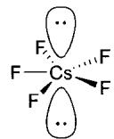

## 第2题

## 分析与解答

本题涉及配位平衡、酸碱平衡，考查 Nernst 方程的应用，以及在复杂体系中对物料守恒的使用，要求同学们能够理解 $\varphi-pH$ 图，利用 Nernst 方程将图中信息转化为数学方程，正确使用分布系数简化方程，并正确使用守恒方程求解未知量。

## 2-1 本题考查对 Ncrnst 方程的直接运用。

由图可知，在 pH<6 时 pH 对电极电势没有影响， $\varphi_{Ag^{+}/Ag}$ 保持在 0.622 V 不变。根据半反应的 Nernst 方程：

$$
\begin{array}{r l} & \mathrm {Ag^ {+} (aq)+ e^ {-} \longrightarrow Ag(s)} \\ \varphi_ {\mathrm {Ag^ {+} /Ag}} = & \varphi_ {\mathrm {Ag^ {-} /Ag}} ^ {\ominus} + \frac {R T}{n F} \ln [ \mathrm {Ag^ {+}} ] = \varphi_ {\mathrm {Ag^ {+} /Ag}} ^ {\ominus} + 0. 0 5 9 2 \mathrm{V} \cdot \lg [ \mathrm {Ag^ {+}} ] \end{array}\tag{1}
$$

可知当 pH<6 时， $[Ag^{+}]$ 保持不变，说明此时体系中的 $NH_{3}$ 浓度太低，配位平衡可以忽略。所以

$$
\left[ \mathrm{Ag} ^ {+} \right] = c _ {\mathrm{Ag} ^ {+}, 0} = 1. 0 0 0 \times 1 0 ^ {- 3} \mathrm{mol} \mathrm{L} ^ {- 1}
$$

将 $\varphi_{\mathrm{Ag}^{+}/\mathrm{Ag}}$ 与 $[\mathrm{Ag}^{+}]$ 代入Nernst方程，可解出

$$
\varphi_ {\mathrm{Ag} ^ {+} / \mathrm{Ag}} ^ {\ominus} = 0. 7 9 9 \mathrm{V}
$$

2-2 本题需要考虑配位平衡，而且题目中要求计算逐级稳定常数，说明 $\mathrm{Ag(NH_3)^+}$ 与 $\mathrm{Ag(NH_3)_2^+}$ 同时存在，而且由于稳定常数未知，二者浓度的相对大小就未知，因此不能轻易忽略其中任何一方的浓度。对于这样的复杂体系，可以使用副反应系数和守恒方程来进行计算。

先来考虑 $NH_{3}/NH_{4}^{+}$ 的酸碱平衡, $NH_{3}$ 的副反应系数为

$$
\alpha_ {\mathrm{NH} _ {3}} = \frac {c _ {\mathrm{NH} _ {4} ^ {+} , 0}}{\left[ \mathrm{NH} _ {3} \right]} = \frac {\left[ \mathrm{NH} _ {3} \right] + \left[ \mathrm{NH} _ {4} ^ {+} \right] + \left[ \mathrm{Ag} \left(\mathrm{NH} _ {3}\right) ^ {+} \right] + 2 \left[ \mathrm{Ag} \left(\mathrm{NH} _ {3}\right) _ {2} ^ {+} \right]}{\left[ \mathrm{NH} _ {3} \right]}\tag{2}
$$

注意到

$$
c _ {\mathrm{NH} _ {4} ^ {+}, 0} \gg c _ {\mathrm{Ag} ^ {+}, 0}
$$

因此(2)式可改写为

$$
\begin{array}{r l} \alpha_ {\mathrm{NH} _ {3}} & = \frac {c _ {\mathrm{NH} _ {4} ^ {+} , 0}}{\left[ \mathrm{NH} _ {3} \right]} = \frac {\left[ \mathrm{NH} _ {3} \right] + \left[ \mathrm{NH} _ {4} ^ {+} \right]}{\left[ \mathrm{NH} _ {3} \right]} = 1 + \frac {\left[ \mathrm{NH} _ {4} ^ {+} \right]}{\left[ \mathrm{NH} _ {3} \right]} = 1 + \frac {K _ {\mathrm{b}}}{K _ {\mathrm{w}}} [ \mathrm{H} ^ {+} ] \\ & \quad [ \mathrm{NH} _ {3} ] = \frac {c _ {\mathrm{NH} _ {4} ^ {+} , 0}}{1 + \frac {K _ {\mathrm{b}}}{K _ {\mathrm{w}}} [ \mathrm{H} ^ {+} ]} \end{array}\tag{3}
$$

由(3)式可以计算出任何 $\mathrm{pH}$ 条件下 $\mathrm{NH}_3$ 的浓度。

对 $\mathrm{Ag^{+}}$ 也可以运用类似的技巧，求出 $[\mathrm{Ag^{+}}]$ 与 $[\mathrm{NH_3}]$ 的关系：

$$
\begin{array}{r l} \alpha_ {\mathrm{Ag} ^ {+}} & = \frac {c _ {\mathrm{Ag} ^ {+} , 0}}{\left[ \mathrm{Ag} ^ {+} \right]} = \frac {\left[ \mathrm{Ag} ^ {+} \right] + \left[ \mathrm{Ag} (\mathrm{NH} _ {3}) ^ {+} \right] + \left[ \mathrm{Ag} (\mathrm{NH} _ {3}) _ {2} ^ {+} \right]}{\left[ \mathrm{Ag} ^ {+} \right]} = 1 + K _ {1} ^ {\ominus} \left[ \mathrm{NH} _ {3} \right] + K _ {1} ^ {\ominus} K _ {2} ^ {\ominus} \left[ \mathrm{NH} _ {3} \right] ^ {2} \\ & \therefore \left[ \mathrm{Ag} ^ {+} \right] = \frac {c _ {\mathrm{Ag} ^ {+} , 0}}{1 + K _ {1} ^ {\ominus} \left[ \mathrm{NH} _ {3} \right] + K _ {1} ^ {\ominus} K _ {2} ^ {\ominus} \left[ \mathrm{NH} _ {3} \right] ^ {2}} \end{array} \tag {4}
$$

至此，得出了 $\left[\mathrm{Ag}^{+}\right]$ 与 $\left[\mathrm{NH}_{3}\right]$ 的关系（即(4)式）和 $\left[\mathrm{NH}_{3}\right]$ 与 $\left[\mathrm{H}^{+}\right]$ 的关系（即(3)式）。也就是说，对于任一 $\mathrm{pH}$ ，都可以通过(3)和(4)式表示 $\left[\mathrm{Ag}^{+}\right]$ ；通过(1)式和图中读出的电极电势数据可以求出 $\left[\mathrm{Ag}^{+}\right]$ 。于是可以建立方程求解。

当 pH=8 时，由(1)式求出 $\left[Ag^{+}\right]=2.064\times10^{-6}\ mol\ L^{-1}$ ，由(3)式求出 $\left[NH_{3}\right]=5.319\times10^{-3}\ mol\ L^{-1}$ 。

$$
2. 0 6 4 \times 1 0 ^ {- 6} = \frac {c _ {\mathrm{Ag} ^ {+} , 0}}{1 + K _ {1} ^ {\ominus} \times 5 . 3 1 9 \times 1 0 ^ {- 3} + K _ {1} ^ {\ominus} K _ {2} ^ {\ominus} (5 . 3 1 9 \times 1 0 ^ {- 3}) ^ {2}}\tag{5}
$$

当 $\mathrm{pH} > 12$ 时，由(1)式求出 $[\mathrm{Ag}^{+}] = 5.979 \times 10^{-9} \mathrm{~mol} \mathrm{L}^{-1}$ ，由于是强碱性环境，因此 $[\mathrm{NH}_{3}] = c_{\mathrm{NH}_{4}^{+},0} = 1.000 \times 10^{-1} \mathrm{~mol} \mathrm{L}^{-1}$ 。

$$
5. 9 7 9 \times 1 0 ^ {- 9} = \frac {c _ {\mathrm{Ag} ^ {+} , 0}}{1 + K _ {1} ^ {\ominus} \times 1 . 0 0 0 \times 1 0 ^ {- 1} + K _ {1} ^ {\ominus} K _ {2} ^ {\ominus} (1 . 0 0 0 \times 1 0 ^ {- 1}) ^ {2}}\tag{6}
$$

(5)、(6)式联立可解得

$$
\begin{array}{l} K _ {1} ^ {\ominus} = 2. 0 7 \times 1 0 ^ {3} \\ K _ {2} ^ {\ominus} = 8. 0 7 \times 1 0 ^ {3} \end{array}
$$

2-3 本题主要考查配位平衡对电极电势的影响。由已知简单离子的标准电极电势和配合物稳定常数，求配合物标准电极电势的问题，属于电化学中的简单问题，直接应用Nernst方程即可求解。

对于半反应

$$
\mathrm{Ag} (\mathrm{NH} _ {3}) _ {2} ^ {+} (\mathrm{aq}) + \mathrm{e} ^ {-} \longrightarrow \mathrm{Ag} (\mathrm{s}) + 2 \mathrm{NH} _ {3} (\mathrm{aq})
$$

$\left[\mathrm{Ag}(\mathrm{NH}_{3})_{2}^{+}\right] = \left[\mathrm{NH}_{3}\right] = 1\mathrm{molL}^{-1}$ ，根据稳定常数表达式可知 $[\mathrm{Ag}^{+}] = \frac{1}{K_{1}^{\ominus}K_{2}^{\ominus}}$ 。代入(1)式可知

$$
\varphi_ {\mathrm{Ag} \left(\mathrm{NH} _ {3}\right) _ {2} ^ {+} / \mathrm{Ag}} ^ {\ominus} = \varphi_ {\mathrm{Ag} ^ {+} / \mathrm{Ag}} = \varphi_ {\mathrm{Ag} ^ {+} / \mathrm{Ag}} ^ {\ominus} + 0. 0 5 9 2 \mathrm{V} \cdot \lg \frac {1}{K _ {1} ^ {\ominus} K _ {2} ^ {\ominus}} = 0. 3 7 2 \mathrm{V}
$$

用 $\mathrm{Ag(NH_{3})_{2}^{+}/Ag}$ 做负极， $Ag^{+}/Ag$ 做正极，二者构成原电池反应：

$$
\begin{array}{r l} & \mathrm {Ag^ {+} (aq) + 2NH_ {3} (aq) = Ag(NH_ {3}) _ {2} ^ {+} (aq)} \\ & \therefore E ^ {\ominus} = \varphi_ {\mathrm {Ag^ {+} /Ag}} ^ {\ominus} - \varphi_ {\mathrm {Ag(NH_ {3}) _ {2} ^ {+} /Ag}} ^ {\ominus} = 0. 4 2 7 \mathrm{V} \end{array}
$$

(若用假定的稳定常数计算,则结果为 $E^{\ominus}=0.355\ V$ 。)

## 第3题

## 分析与解答

3-1&3-2 首先需要推断 A、B、C、D 的组成, 我们所具有的有效信息是制备完成之后对产物的结构和元素分析的数据, 这里需要注意一开始的 CuO 和 $\mathrm{Ba(NO_{3})_{2}}$ 的投料比并不是进行产物组成判断的有效信息。可能有部分同学认为产物中 Cu 和 Ba 的比例一定是 1:1，这是错误的。对产物组成的判断只能由对产物的分析中得出，而不能由投料比进行武断的推测，更何况这里不单单只生成一种物质。

对 A 的结构分析表明，“Cu 原子位于由 O 原子构成的四边形的中心，四边形通过共棱组成一维的铜氧链，Ba 位于链之间”。根据晶体学的基本知识，很容易判断出 A 中 Cu 和 O 的比例是 1:2，而 Ba 的量是不确定的。据此，不妨设 A 的化学式为 $Ba_{x}CuO_{2}$ ，x 取决于 A 中 $\mathrm{Cu(II)}$ 和 $\mathrm{Cu(III)}$ 的比例，这需要由滴定分析的数据进行确定。

对 A 的滴定分析过程是典型的碘量法测定超导体组成的流程，对竞赛熟悉的同学应该见过不少此类问题。“A 与足量碘化钾混合。在氩气气氛下滴入 $3 \, mol \, L^{-1}$ 盐酸，直至固体完全溶解，得到溶液 S”，此过程是让 I⁻ 还原 A 中的所有 Cu 至 +1 价，生成 CuI 和 I₂。注意到得到的是溶液 S，稀释后才产生白色固体 C(CuI)，不难想到过量的碘离子与 CuI 生成了配离子使其溶解。据此可以写出方程式（为解题方便，先忽略 CuI 和 I₂ 的形式）：

$$
\mathrm{Ba} _ {x} \mathrm{CuO} _ {2} + (4 - 2 x) \mathrm{I} ^ {-} + 4 \mathrm{H} ^ {+} \longrightarrow x \mathrm{Ba} ^ {2 +} + \mathrm{CuI} + 2 \mathrm{H} _ {2} \mathrm{O} + \frac {3 - 2 x}{2} \mathrm{I} _ {2}
$$

然后根据 $\mathrm{I}_2$ 和硫代硫酸根的关系即可列出方程：

$$
\frac {m}{1 3 7 . 3 3 x + 6 3 . 5 5 + 2 \times 1 6 . 0 0} \times (3 - 2 x) = 4 4. 5 4 \times 0. 1 0 0 \times 1 0 ^ {- 3}
$$

若按题目中的数据 $m = 1.00\mathrm{g}$ 解方程，则得出 $x = 0.985$ ，这个解并没有意义。按正确值 $m = 0.50\mathrm{g}$ 解方程，则可得 $x = 0.667$ ，即可得出A的化学式为 $\mathbf{Ba}_2\mathbf{Cu}_3\mathbf{O}_6$ ，也就是 $\mathrm{Ba_2Cu_1^II Cu_2^III O_6}$ 。

由于试卷上本题数据有误，根据卷面上的数据解此方程只能得到没有价值的解。A的组成的推断采用这种方法在考场上是不能成功的，但是有另一种解题方法能够判断出数据的错误。这种方法就是，先从两次滴定数据入手，第一次滴定： $S_{2}O_{3}^{2-}\sim Cu(II)+2Cu(III)$ ；第二次滴定： $S_{2}O_{3}^{2-}\sim Cu(II)+Cu(III)$ ，进而可以算出

$$
\frac {n (\mathrm{Cu(III)})}{n (\mathrm{Cu(II)})} = \frac {4 4 . 5 4 - 2 6 . 7 2}{2 7 . 6 2 - (4 4 . 5 4 - 2 6 . 7 2)} = 2. 0 0
$$

根据此比例,考虑到 Cu 和 O 的比例是 1:2,则得出 A 的组成为 $Ba_{2}Cu_{3}O_{6}$ ,并能进一步判断该数据是错误的。而第一种计算方法不需要用到第二次滴定的数据,但也不能判断出错误的数据。

然后我们可以写出完整的反应方程式(注意物质的存在形式):

$$
\begin{array}{r l} & 2 \mathrm{Ba} _ {2} \mathrm{Cu} _ {3} \mathrm{O} _ {6} + 2 2 \mathrm{I} ^ {-} + 2 4 \mathrm{H} ^ {+} = 4 \mathrm{Ba} ^ {2 +} + 6 \mathrm{CuI} _ {2} ^ {-} + 1 2 \mathrm{H} _ {2} \mathrm{O} + 5 \mathrm{I} _ {2} \\ & \quad \mathrm{CuI} _ {2} ^ {-} = \mathrm{CuI} + \mathrm{I} ^ {-} \\ & \quad \mathrm{I} _ {3} ^ {-} + 2 \mathrm{S} _ {2} \mathrm{O} _ {3} ^ {2 -} = 3 \mathrm{I} ^ {-} + \mathrm{S} _ {4} \mathrm{O} _ {6} ^ {2 -} \\ & 2 \mathrm{Ba} _ {2} \mathrm{Cu} _ {3} \mathrm{O} _ {6} + 2 0 \mathrm{H} ^ {+} = 4 \mathrm{Ba} ^ {2 +} + 6 \mathrm{Cu} ^ {2 +} + 1 0 \mathrm{H} _ {2} \mathrm{O} + \mathrm{O} _ {2} \\ & \quad 2 \mathrm{Cu} ^ {2 +} + 4 \mathrm{I} ^ {-} = 2 \mathrm{CuI} + \mathrm{I} _ {2} \end{array}
$$

B 的组成则需要根据热重分析数据进行推断, 不难设想 B 也是 Cu、Ba 的氧化物, 其失重应为失去 $O_{2}$ 转化为其他氧化物, 可能的组成形式有 $BaO, BaO_{2}, CuO$ 和 $Cu_{2}O_{3}$ [其实 Cu(Ⅲ) 的氧化物在加热失重后再降温并不会恢复原重, 但是在做题的时候不妨也将其考虑进去]。考虑到 $\mathrm{Cu(III)}$ 与 $O_{2}^{2-}$ 不会同时存在, 则可以把 B 的化学式写成 $BaO_{2} \cdot xBaO \cdot yCuO$ 或者

$mBaO \cdot Cu_{2}O_{3} \cdot nCuO$ , 其失重为

$$
\begin{aligned} & \mathrm {BaO_ {2} \cdot xBaO\cdot yCuO:}\\ & \frac {16.00}{(137.33 + 16.00\times 2) + x(137.33 + 16.00) + y(63.55 + 16.00)}\leqslant 9.45\% \\ & m\mathrm{BaO}\cdot \mathrm{Cu_{2}O_{3}}\cdot n\mathrm{CuO:}\\ & \frac {16.00}{m(137.33 + 16.00) + (63.55 + 16.00) + n(63.55 + 16.00)}\leqslant 9.14\% \end{aligned}
$$

经过这样简单的数学处理, 就可以清楚地得知 B 的组成应为 $BaO_{2} \cdot xBaO \cdot yCuO$ 类型, 进而解出 x = 0, y = 0, 即 B 为 $BaO_{2}$ 。当然, 如果对 $BaO_{2}$ 的性质有足够的了解, 就可以直接计算 $BaO_{2}$ 的失重, 很快得到答案。其失重的反应方程式为

$$
2 \mathrm{BaO} _ {2} = 2 \mathrm{BaO} + \mathrm{O} _ {2}
$$

B 的推断过程中需要注意:题目中的信息不足以单纯从化学角度判断 B 的组成,单纯地从元素化学的角度猜测 B 的组成会非常困难,这时就需要同学们重视数学工具的运用。

3-3 为直接考查间接碘量法测定铜含量的两个问题。第一问比较简单，认真学习过分析化学的同学解答此题应当是毫无困难的：由于 CuI 沉淀会吸附 $I_{2}$ 造成滴定误差，因此需加入 $SCN^{-}$ 将 CuI 转化为更难溶的 CuSCN，释放被吸附的 $I_{2}$ 。

第二问则存在一些疑问，按照《分析化学教程》（李克安主编，北京大学出版社）的说法[2]，不能过早加入KSCN，是因为 $\mathrm{I}_2$ 可能氧化加入的 $\mathrm{SCN}^-$ ，从而达不到预期效果。但是根据计算，反应 $\mathrm{I}_2 + 2\mathrm{SCN}^- = 2\mathrm{I}^- + (\mathrm{SCN})_2$ 的电极电势为 $-0.23\mathrm{V}$ ，是很难进行的。在滴定的 $\mathrm{I}_2$ 浓度条件下， $(\mathrm{SCN})_2$ 的平衡浓度为 $1.6\times 10^{-10}\mathrm{molL}^{-1}$ 才能使反应进行，这毫无意义。所以上述答案应该是存在问题的。另一种可能答案是：过早加入 $\mathrm{SCN}^-$ 生成的CuSCN仍可能吸附 $\mathbf{I}_2$ ，同时硫氰酸盐中的其他杂质可能还原 $\mathbf{I}_2$ 造成误差。其他可能性请同学们自行思考。

本题以低温喷雾冷冻法制备超导体为背景,考查同学们通过结构分析和元素分析数据进行推断的能力以及对相关的分析化学和无机化学的基本知识的掌握情况,也考查对数学工具的运用情况,难度适中。关于 $Ba_{2}Cu_{3}O_{6}$ 及其制备的相关内容,有兴趣的同学可以阅读相关文献 $^{[3]}$ 。

## 第4题

## 分析与解答

本题是一道涉及多重平衡的热力学试题。

4-1 主要考查同学们对多重平衡体系的分析能力。同学们首先需要判断题目给出的6个反应方程式中哪些是独立的方程式，再利用这些方程式的平衡常数表达式推导几种气体的分压关系，最后得到只关于 $p_{\mathrm{H_2}}$ 的方程求解。

首先选取以下4个独立的方程式，其中方程式(2) $^{'}$ 是题干中的方程式(1)、(2)叠加得到的。它们的特点是互相之间不能通过叠加表出，但可以叠加表示出另外剩余的两个方程式。求这四个方程式的平衡常数：

<table><tr><td></td><td></td><td> $\Delta_{\text{r}}H_{\text{m}}^{\ominus}/(\text{kJ mol}^{-1})$ </td><td> $\Delta_{\text{r}}S_{\text{m}}^{\ominus}/(\text{J mol}^{-1}\text{ K}^{-1})$ </td><td> $K^{\ominus}$ </td></tr><tr><td>(1)</td><td> $\text{C(s)} + \text{H}_{2}\text{O} \rightleftharpoons \text{CO(g)} + \text{H}_{2}(\text{g})$ </td><td>135.62</td><td>143.18</td><td>14.82</td></tr><tr><td>(2)&#x27;</td><td> $\text{C(s)} + 2\text{H}_{2}\text{O} \rightleftharpoons \text{CO}_{2}(\text{g}) + 2\text{H}_{2}(\text{g})$ </td><td>99.14</td><td>109.45</td><td>12.75</td></tr><tr><td>(3)</td><td> $\text{CaO(s)} + \text{CO}_{2}(\text{g}) \rightleftharpoons \text{CaCO}_{3}(\text{s})$ </td><td>-172.33</td><td>-154.15</td><td>0.9198</td></tr><tr><td>(4)</td><td> $\text{C(s)} + \text{H}_{2}(\text{g}) \rightleftharpoons \text{CH}_{4}(\text{g})$ </td><td>88.06</td><td>-107.04</td><td>0.03196</td></tr></table>

方程式(3)是本题的一个突破点,因为在(3)中只有 $CO_{2}$ 这一种气体,因此可以直接通过(3)的平衡常数得到 $CO_{2}$ 的平衡分压。

$$
p _ {\mathrm{CO} _ {2}} = \frac {1}{K _ {3} ^ {\ominus}} = 1. 0 8 9 p ^ {\ominus}\tag{7}
$$

再根据平衡(2) $^{'}$ 有

$$
\frac {p _ {\mathrm{H} _ {2}}}{p _ {\mathrm{H} _ {2} \mathrm{O}}} = \sqrt {\frac {K _ {2} ^ {\ominus}}{p _ {\mathrm{CO} _ {2}}}} = 3. 4 2 2\tag{8}
$$

根据平衡(1)有

$$
\frac {p _ {\mathrm{H} _ {2}} p _ {\mathrm{CO}}}{p _ {\mathrm{H} _ {2} \mathrm{O}}} = K _ {1} ^ {\ominus} = 1 4. 8 2\tag{9}
$$

将(8)式代入(9)式,可以得到

$$
p _ {\mathrm{co}} = 4. 3 3 1 p ^ {\ominus}
$$

最后还有 $K_{4}^{\ominus}$ 的表达式：

$$
\frac {p _ {\mathrm{CH} _ {4}}}{(p _ {\mathrm{H} _ {2}}) ^ {2}} = K _ {4} ^ {\ominus} = 0. 0 3 1 9 6\tag{10}
$$

气体的总压为

$$
p _ {\mathrm{H} _ {2}} + p _ {\mathrm{CH} _ {4}} + p _ {\mathrm{CO}} + p _ {\mathrm{CO} _ {2}} + p _ {\mathrm{H} _ {2} \mathrm{O}} = 2 5. 0 p ^ {\ominus}\tag{11}
$$

将(8)式、(10)式和 $\mathrm{CO},\mathrm{CO}_2$ 的分压值代入(11)式，得到关于 $p_{\mathrm{H_2}}$ 的二次方程，解得

$$
p _ {\mathrm{H} _ {2}} = 1 1. 7 4 p ^ {\ominus}, \quad p _ {\mathrm{H} _ {2} \mathrm{O}} = 3. 4 3 1 p ^ {\ominus}, \quad p _ {\mathrm{CH} _ {4}} = 4. 4 0 5 p ^ {\ominus}
$$

因此

$$
x_{\mathrm{H}_{2}} = 47.0\%
$$

4-2 考查同学们对热力学状态函数的理解。如果通过 4-1 中四个独立的方程式去求，整个计算过程将会相当繁琐。同学们应该把这个平衡体系作为一个整体考虑，求得整体的末状态，再计算由始态到末态的焓变。

体系中氢元素的物料守恒表达式为

$$
\begin{array}{r l} & n _ {\mathrm{H} _ {2}} + n _ {\mathrm{H} _ {2} \mathrm{O}} + 2 n _ {\mathrm{CH} _ {4}} = 2. 0 0 \mathrm{mol} \\ & n _ {\mathrm{H} _ {2}} = \frac {2 . 0 0 p _ {\mathrm{H} _ {2}}}{p _ {\mathrm{H} _ {2}} + 2 p _ {\mathrm{CH} _ {4}} + p _ {\mathrm{H} _ {2} \mathrm{O}}} = 0. 9 7 9 1 \mathrm{mol} \end{array}
$$

进而可以求得达到平衡时其他气体的物质的量：

$$
n _ {\mathrm{H} _ {2} \mathrm{O}} = 0. 2 8 6 1 \mathrm{mol}, \quad n _ {\mathrm{CH} _ {4}} = 0. 3 6 7 4 \mathrm{mol}, \quad n _ {\mathrm{CO}} = 0. 3 6 1 2 \mathrm{mol}, \quad n _ {\mathrm{CO} _ {2}} = 0. 0 9 0 8 \mathrm{mol}
$$

再考虑氧元素和碳元素的守恒，可以求得

$$
n _ {\mathrm{C}} = 0. 5 9 5 0 \mathrm{mol}, \quad n _ {\mathrm{CaO}} = 1. 4 1 4 \mathrm{mol}, \quad n _ {\mathrm{CaCO} _ {3}} = 0. 5 8 5 6 \mathrm{mol}
$$

因此全过程的焓变为

$$
\begin{array}{r l} \Delta H & = [ 0. 2 8 6 1 \times (- 2 2 1. 7 6) + 0. 3 6 7 4 \times (- 4 6. 9 4) + 0. 3 6 1 2 \times (- 9 3. 6 5) \\ & + 0. 0 9 0 8 \times (- 3 6 8. 1) + 0. 5 9 5 0 \times 8. 7 0 + 1. 4 1 4 \times (- 6 0 6. 9 7) \\ & + 0. 5 8 5 6 \times (- 1 1 4 7. 4 0) + 0. 9 7 9 1 \times 1 6. 2 - 2. 0 0 \times 8. 7 0 - 2. 0 0 \\ & \times (- 6 0 6. 9 7) - 2. 0 0 \times (- 2 2 1. 7 6) ] \mathrm{kJ} \\ & = - 1 7. \mathrm{0kJ} \end{array}
$$

与官方参考答案有 0.5 kJ 的差值, 是由于运算中保留的有效数字位数不同造成的。

4-3 要求判断在 $600^{\circ}$ C 的条件下碳的氧化产物,实际上要求找到一个合理的方法来判断 $CO, CO_{2}$ 的稳定性。题目中没有给出 $O_{2}$ 的热力学数据,因此考虑 CO 的歧化反应:

$$
2 \mathrm{CO} (\mathrm{g}) \rightleftharpoons \mathrm{CO} _ {2} (\mathrm{g}) + \mathrm{C} (\mathrm{s}) \quad \Delta_ {\mathrm{r}} G _ {\mathrm{m}} ^ {\ominus} = - 1 7. 6 6 \mathrm{kJ} \mathrm{mol} ^ {- 1} <   0
$$

由此得到 CO 在 $600^{\circ}$ C 不稳定，它会自发歧化为 C 和 $CO_{2}$ 。碳的氧化产物是 $CO_{2}$ 。

本题是一道较为基础的热力学计算题,解题的关键在于理清多个平衡反应的关系,然后使用多重平衡原理解题。本题也要求同学们有较强的计算能力。

## 第5题

## 分析与解答

本题以一种新型材料入手,考查晶体结构和热力学方面的知识,重点考查同学们对于密堆积这一从学习结构化学便开始接触的概念的掌握程度。最后两问涉及热力学的基本概念——熵、焓和 Gibbs 自由能。

5-1 本题涉及的 MAX 相陶瓷由 Ti、Al、N 三种元素组成。其中，Ti 的堆积方式在题目中给出：“…BACBBCABBACBBCAB…”，可以看到 Ti 的重复单元是 BACBBCAB。由基本的结构化学知识可知，在两个不同的密堆积层（假设为 A、B）间，填隙层的排布形式和这两层相同（即为 A 或 B）的时候是占据四面体空隙，且与密堆积层的比例是 2:1；如果填隙层和这两层均不同，则是八面体空隙（C 层），且与密堆积层的比例是 1:1。

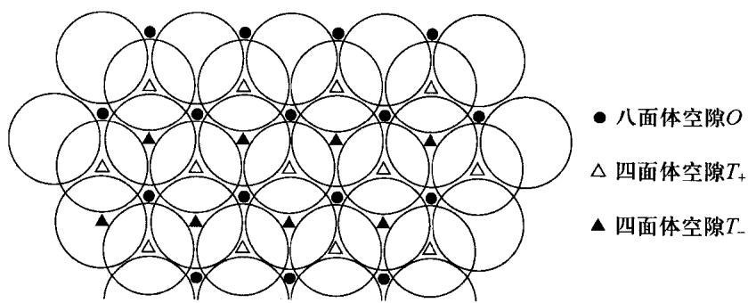

在此结构的一个重复单元 BACBBCAB 中, 共有 6 组不同的密堆积层和 2 组相同的密堆积层。不同的密堆积层间有四面体空隙和八面体空隙; 而相同的密堆积层间, 由于原子的位置是相同的位置, 形成的空隙是棱柱。在单一密堆积层中, 三个原子形成三角形, 所以在一组相同的密堆积层(设为 A)中,形成的是三棱柱空隙。两层 A 之间的三棱柱空隙可以再区分为与 B 层或 C 层一致的空隙(见下图)。所以三棱柱空隙的数量和密堆积层的比例是 2:1。

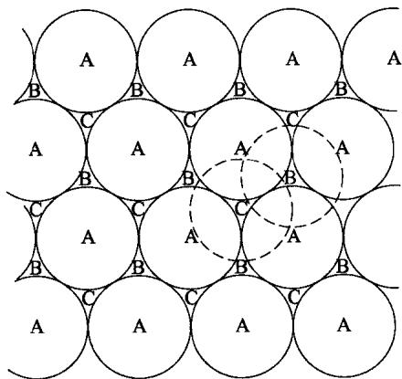

根据上述分析以及题目中给出的堆积方式,可以算得 $N_{Ti}:N_{N}:N_{Al}=8:(6\times1):(2\times2\times0.5)=4:3:1$ ,所以得出晶体的组成为 $Ti_{4}AlN_{3}$ 。一个正当晶胞应包含一个重复单位 BACBBCAB,则应含有两个化学式,即含有 8 个 Ti 原子,2 个 Al 原子和 6 个 N 原子。

5-2 至此已经知道了此 MAX 晶体的组成,但是 B 层与 B 层三棱柱空隙有 A、C 两种,仍然不知道 Al 的具体位置。试题的最后还有一条信息——Al 和 N 原子的投影重合——可知 Al 占据的位置应与其上下两层 N 一致。

先写出 Ti 和 N 的堆积形式: 以大写字母表示 Ti 的堆积类型, 希腊字母代表 N 的堆积类型, □ 表示 Al 的位置。

$$
\dots \mathrm{B} \gamma \mathrm{A} \beta \mathrm{C} _ {\alpha} \mathrm{B} \square \mathrm{B} _ {\alpha} \mathrm{C} \beta \mathrm{A} \gamma \mathrm{B} \square \mathrm{B} \gamma \mathrm{A} \dots
$$

则可以很清楚地看出 Al 应占据的三棱柱空隙，以小写字母加下划线表示之：

$$
\dots \mathrm{B} \gamma \mathrm{A} \beta \mathrm{C} _ {\alpha} \mathrm{B} _ {\underline {{a}}} \mathrm{B} _ {\alpha} \mathrm{C} \beta \mathrm{A} \gamma \mathrm{B} _ {\underline {{a}}} \mathrm{B} \gamma \mathrm{A} \dots
$$

由于题目要求画出同时含有 Al 和 N 原子的直线, 因此必须抽取 A 层, 为…—Ti—N—Al—N—Ti—…, 抽象成符号即为

$$
- \triangle - \square - \bigcirc - \square - \triangle - \triangle - \square - \bigcirc - \square - \triangle -
$$

## 5-3 晶体的密度计算如下：

六方晶系晶胞体积 $V = a^{2} c \sin 60^{\circ}$ 。其中 a 相当于 Ti 形成的八面体的边长，其中两个 Ti—N 连接形成了八面体的对角线长度，所以 $a = \sqrt{2} r_{Ti-N} = 297.0 \, pm$ 。

然后求 $c: c'$ 由6个八面体相对的三角形之间的间距和2个三棱柱的高组成。其中八面体和三棱柱中填隙原子和密堆积原子构成四面体，其高度 $h$ 由勾股定理和基本的几何关系得出等于 $2\sqrt{r_{\mathrm{Ti - X}}^2 - \left(\frac{r_{\mathrm{Ti - Ti}}}{\sqrt{3}}\right)^2}$ 。所以在相同的密堆积层中高度为 $447.2\mathrm{pm}$ ，不同的密堆积层中为 $242.2\mathrm{pm}, c = (6\times 242.2 + 2\times 447.2)\mathrm{pm} = 2347.6\mathrm{pm}$ 。代入密度计算公式算得密度：

$$
\begin{array}{r l} \rho = & \frac {Z M}{N _ {\mathrm{A}} V} = \frac {Z M}{N _ {\mathrm{A}} a ^ {2} c \sin 6 0 ^ {\circ}} \\ = & \frac {2 \times (1 4 . 0 1 \times 3 + 2 6 . 9 8 + 4 \times 4 7 . 8 7)}{6 . 0 2 \times 1 0 ^ {2 3} \times 2 9 7 . 0 ^ {2} \times 2 3 4 7 . 6 \times 1 0 ^ {- 3 0} \times \sin 6 0 ^ {\circ}} \mathrm{gcm} ^ {- 3} = 4. 8 2 \mathrm{gcm} ^ {- 3} \end{array}
$$

5-4 重点考查一定过程的热力学参数的变化。原子由气体变成固体，其排列由无序变得规则，所以无论高温还是常温，体系的熵一定减少， $\Delta S < 0$ 。高温下结晶过程是自发的，所以其 Gibbs 自由能变小于零， $\Delta G = \Delta H - T\Delta S$ ，则可知其焓变一定是小于零的，在温度降低的时候，反应依然自发。本题也可以类比晶体陈化的过程，其中小晶体的单位质量表面能比较大，所以也可以得到焓变小于零。

5-5 在完美晶体形成缺陷的过程中，由于原子间距变化，焓增大；但是由于混乱度增加，所以熵增加。因此缺陷的形成在焓变上是不利的，在熵变上则是有利的。注意到题目中所述“足够大”的晶体的缺陷的形成是自发的，则需要解释 Gibbs 自由能在晶体尺寸的增加过程中减小的原因。答案中“熵效应占据主导”实际上只是把这个现象复述了一遍。下面我们尝试解释：首先焓变基本上是恒定的，同时，单位体积中产生缺陷的熵是不变的，但是随着晶体体积的增大，产生缺陷的状态数增加，由 Boltzmann 熵计算公式，熵增的值也增加，所以在大晶体中出现缺陷必然自发。

## 评注

本题考查晶体学中的基础知识:密堆积,由点入面,层层递进,既达到考查同学们的基础的目的,也对同学们对结构化学的理解程度提出了不小的要求。后两问十分新颖,在结构中考查了同学们对热力学的认识,最后一问注重对于熵的基本理解。整道题难度适中,区分度偏高。

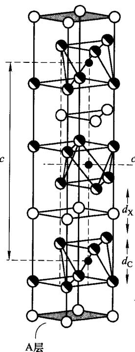  
(a)

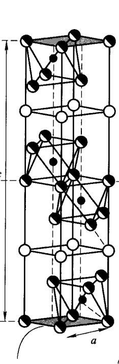  
(b)

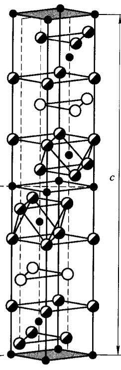  
(c)  
(a)211,(b)312,(c)413的晶胞结构,其中平行于 $c$ 轴的辅助线穿过 $\mathbf{A}$ 层的一个三角形空隙

关于本题介绍的新型材料 MAX，有兴趣的同学可以继续深入了解。MAX 是六方晶系，其晶体结构是类似于岩盐结构的 $M_{n+1}X_{n}$ 与紧密堆积的 A 族原子面在 c 方向交错堆叠而成，故其通式为 $M_{n+1}AX_{n}$ 。2000 年，Barsoum 对这种比较新型的材料按照 n 的个数分为三类 $^{[4]}$ ： $M_{2}AX(211\text{ 相})$ ， $M_{3}AX_{2}(312\text{ 相})$ ， $M_{4}AX_{3}(413\text{ 相})$ 。上页图依次是三种结构的晶胞。

## 第6题

## 分析与解答

这是一道很典型的化学动力学题，主要考查同学们对化学动力学中三大假设和反应速率计算的掌握。题目选取异相催化反应作为背景，在介绍相关知识的同时，也对同学们的应变能力提出了一定的要求。

6-1 本题为热身题目,考查基本的化学热力学与平衡计算。首先写出两个温度下的平衡常数:

$$
K _ {1 8 0 \mathrm{K}} = \frac {x}{3 . 5 0 \times 1 0 ^ {5} \mathrm{Pa}}
$$

$$
K _ {2 4 0 \mathrm{K}} = \frac {x}{1 . 0 2 \mathrm{MPa}}
$$

其中 x 是表示 1 g 固体吸附 $1.242 \, cm^{3}$ 气体的一个物理量。然后就可计算出吸附反应的焓值，也即摩尔吸附焓变：

$$
\ln \frac {K _ {1 8 0 \mathrm{K}}}{K _ {2 4 0 \mathrm{K}}} = - \frac {\Delta_ {\mathrm{ad}} H _ {\mathrm{m}} ^ {\ominus}}{R} \left(\frac {1}{1 8 0 \mathrm{K}} - \frac {1}{2 4 0 \mathrm{K}}\right)
$$

代入 $K_{180\mathrm{K}}$ 和 $K_{240\mathrm{K}}$ ，消去 $x$ 即可求出摩尔吸附焓：

$$
\Delta_ {\mathrm{ad}} H _ {\mathrm{m}} ^ {\ominus} = - 6. 4 0 \mathrm{kJ} \mathrm{mol} ^ {- 1}
$$

此外,也可以通过 Gibbs 自由能变来计算摩尔吸附焓:

$$
\begin{array}{l} \Delta_ {\mathrm{ad}} G _ {\mathrm{m} (1 8 0 \mathrm{K})} ^ {\ominus} = - R T \ln K _ {1 8 0 \mathrm{K}} = \Delta_ {\mathrm{ad}} H _ {\mathrm{m}} ^ {\ominus} - 1 8 0 \mathrm{K} \times \Delta_ {\mathrm{ad}} S _ {\mathrm{m}} ^ {\ominus} \\ \Delta_ {\mathrm{ad}} G _ {\mathrm{m} (2 4 0 \mathrm{K})} ^ {\ominus} = - R T \ln K _ {2 4 0 \mathrm{K}} = \Delta_ {\mathrm{ad}} H _ {\mathrm{m}} ^ {\ominus} - 2 4 0 \mathrm{K} \times \Delta_ {\mathrm{ad}} S _ {\mathrm{m}} ^ {\ominus} \end{array}
$$

在一个较小的温度范围内， $\Delta_{\mathrm{ad}}H_{\mathrm{m}}^{\ominus}$ 和 $\Delta_{\mathrm{ad}}S_{\mathrm{m}}^{\ominus}$ 都可视做不变量。以上两式消去 $\Delta_{\mathrm{ad}}S_{\mathrm{m}}^{\ominus}$ ，就可计算出 $\Delta_{\mathrm{ad}}H_{\mathrm{m}}^{\ominus} = -6.40\mathrm{kJ mol^{-1}}$ 。

以上两种方法都可以得到本题的答案，请同学们自行推导它们之间的关系。

6-2 这是一道典型、常规的动力学题目。首先注意题目中的几句话：

（1）“该表面反应为决速步骤”，表明在决速步之前的 $\mathbf{A}$ 的吸附和解离过程可以认为是一个快速平衡的过程。即

$$
r _ {\mathrm{a}} = r _ {\mathrm{d}}
$$

(2) “吸附态 $A^{*}$ 的浓度用表面覆盖度 ( $A^{*}$ 所占据的活性中心个数与表面活性中心总个数之比) 表示。” 在吸附化学中，速率和表面覆盖率成正比。假如我们用 $\theta_{A^{*}}$ 来表示 $A^{*}$ 的表面覆盖率， $(1-\theta_{A^{*}})$ 是“表面未覆盖率”，那么

$$
\begin{array}{r l} r _ {\mathrm{a}} & = k _ {\mathrm{a}} p _ {\mathbf {A}} (1 - \theta_ {\mathbf {A} ^ {*}}) \\ & r _ {\mathrm{d}} = k _ {\mathrm{d}} \theta_ {\mathbf {A} ^ {*}} \end{array}
$$

(3) “高压下为 $5 \, kPa s^{-1}$ ，低压下为 $0.1 \, s^{-1}$ 。”在高压和低压下，反应速率常数不仅数值不同,单位也不同。高压下反应级数为零级,而低压下则变为一级。同学们应该带着这个信息进行解题。

由决速步假设可得

$$
\frac {\mathrm{d} p _ {\mathbf {B}}}{\mathrm{d} t} = k _ {1} \theta_ {\mathbf {A} ^ {*}}
$$

$\theta_{\mathbf{A}^*}$ 可由快速平衡假设得到，即

$$
k _ {\mathrm{a}} p _ {\mathbf {A}} (1 - \theta_ {\mathbf {A} ^ {*}}) = k _ {\mathrm{d}} \theta_ {\mathbf {A} ^ {*}}
$$

$$
\theta_ {\mathbf {A} ^ {*}} = \frac {k _ {\mathrm{a}} p _ {\mathbf {A}}}{k _ {\mathrm{a}} p _ {\mathbf {A}} + k _ {\mathrm{d}}}
$$

在这一步我们也可以得到反应的平衡常数：

$$
K _ {\mathbf {A}} = \frac {\theta_ {\mathbf {A} ^ {*}}}{p _ {\mathbf {A}} (1 - \theta_ {\mathbf {A} ^ {*}})} = \frac {k _ {\mathrm{a}}}{k _ {\mathrm{d}}}
$$

那么

$$
\frac {\mathrm{d} p _ {\mathbf {B}}}{\mathrm{d} t} = k _ {1} \frac {k _ {\mathrm{a}} p _ {\mathbf {A}}}{k _ {\mathrm{a}} p _ {\mathbf {A}} + k _ {\mathrm{d}}} = k _ {1} \frac {K _ {\mathbf {A}} p _ {\mathbf {A}}}{K _ {\mathbf {A}} p _ {\mathbf {A}} + 1}
$$

在高压条件下， $K_{A}p_{A}\gg1$ ：

$$
\frac {\mathrm{d} p _ {\mathbf {B}}}{\mathrm{d} t} = k _ {1} = k _ {2} = 5 \mathrm{kPa} \mathrm{s} ^ {- 1}
$$

在低压条件下， $K_{A}p_{A}\ll1$ ：

$$
\frac {\mathrm{d} p _ {\mathbf {B}}}{\mathrm{d} t} = k _ {1} K _ {\mathbf {A}} p _ {\mathbf {A}} = k _ {2} p _ {\mathbf {A}}
$$

$$
K _ {\mathbf {A}} = \frac {k _ {2}}{k _ {1}} = \frac {0 . 1 0 \mathrm{s} ^ {- 1}}{5 \mathrm{kPa} \mathrm{s} ^ {- 1}}
$$

则在 $p_{\mathbf{A}} = 50 \mathrm{kPa}$ 时，

$$
\frac {\mathrm{d} p _ {\mathbf {B}}}{\mathrm{d} t} = k _ {1} \frac {K _ {\mathbf {A}} p _ {\mathbf {A}}}{K _ {\mathbf {A}} p _ {\mathbf {A}} + 1} = 2. 5 \mathrm{kPa} \mathrm{s} ^ {- 1}
$$

6-3 本题是6-2的扩展。但要注意的是，在这里“表面未覆盖率”为 $(1 - \theta_{\mathbf{A}^*} - \theta_{\mathbf{B}^*})$ 。对于两个快速平衡，我们有

$$
k _ {\mathrm{a}} p _ {\mathbf {A}} (1 - \theta_ {\mathbf {A} ^ {*}} - \theta_ {\mathbf {B} ^ {*}}) = k _ {\mathrm{d}} \theta_ {\mathbf {A} ^ {*}}, \quad K _ {\mathbf {A}} = \frac {k _ {\mathrm{a}}}{k _ {\mathrm{d}}}
$$

$$
k _ {\mathrm{al}} p _ {\mathbf {A}} \left(1 - \theta_ {\mathbf {A} ^ {*}} - \theta_ {\mathbf {B} ^ {*}}\right) = k _ {\mathrm{dl}} \theta_ {\mathbf {B} ^ {*}}, \quad K _ {\mathbf {B}} = \frac {k _ {\mathrm{al}}}{k _ {\mathrm{dl}}}
$$

可以计算出 $\theta_{\mathbf{A}^*}$ 和 $\theta_{\mathbf{B}^*}$ ：

$$
\begin{array}{l} \theta_ {\mathbf {A} ^ {*}} = \frac {K _ {\mathbf {A}} p _ {\mathbf {A}}}{1 + K _ {\mathbf {A}} p _ {\mathbf {A}} + K _ {\mathbf {B}} p _ {\mathbf {B}}} \\ \theta_ {\mathbf {B} ^ {*}} = \frac {K _ {\mathbf {B}} p _ {\mathbf {B}}}{1 + K _ {\mathbf {A}} p _ {\mathbf {A}} + K _ {\mathbf {B}} p _ {\mathbf {B}}} \end{array}
$$

由稳态近似,我们有

$$
\frac {\mathrm{d} \theta_ {\mathbf {B} ^ {*}}}{\mathrm{d} t} = k _ {1} \theta_ {\mathbf {A} ^ {*}} = k _ {1} \frac {K _ {\mathbf {A}} p _ {\mathbf {A}}}{1 + K _ {\mathbf {A}} p _ {\mathbf {A}} + K _ {\mathbf {B}} p _ {\mathbf {B}}}
$$

又 $p_{\mathsf{B}} \gg p_{\mathsf{A}}$ ，且总反应对 $\mathsf{A}$ 为一级，需 $1 + K_{\mathsf{A}} p_{\mathsf{A}} \ll K_{\mathsf{B}} p_{\mathsf{B}}$ ，因此有

$$
\frac {\mathrm{d} \theta_ {\mathbf {B} ^ {*}}}{\mathrm{d} t} = k _ {1} \frac {K _ {\mathbf {A}} p _ {\mathbf {A}}}{K _ {\mathbf {B}} p _ {\mathbf {B}}}
$$

速率常数 $k_{3} = \frac{10}{p_{\mathrm{B}}}\mathrm{kPa s^{-1}}$ ，故

$$
\begin{array}{r l} k _ {3} & = k _ {1} \frac {K _ {\mathbf {A}}}{K _ {\mathbf {B}} p _ {\mathbf {B}}} = \frac {1 0}{p _ {\mathbf {B}}} \mathrm{kPa} \mathrm{s} ^ {- 1} \\ & K _ {\mathbf {B}} = \mathbf {0 . 0 1 k P a} ^ {- 1} \end{array}
$$

## 第7题

## 背景

有机合成中的三大选择性——化学、区域与立体选择性，始终是有机化学家关注的经典问题之一。这样一类涉及选择性的策略合成，在细胞毒素 chlorosulpholipid 中得到了集中的体现。Chlorosulpholipid 是一类含有多手性中心的多卤代磺酸酯化合物，由于在自然界中的稀缺性，chlorosulpholipid 生物特性一直未得到深入的研究，因而有必要实现这类化合物的实验室合成。2009 年，Carreira 小组在 Nature 杂志上发表文章，首次实现了 chlorosulpholipid(1) 的全合成，不仅用合成的方法确证了这类化合物的结构，而且揭露了它们未被开发的反应性质[5]。如下图所示，1 呈一长链结构，包含 6 个手性中心。如何合理地构建这些手性中心，便是能否成功合成这类化合物的关键。

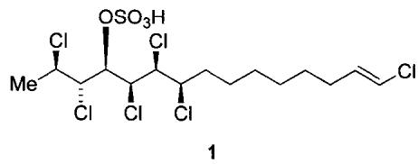

## 分析与解答

7-1 这是一个简单的酸碱反应。多氯底物 2 带有一个特征的环氧基团，可以用其孤对电子进攻 TMSCl，生成加合物中间体 M。这里 Lewis 酸 TMSCl 用 3d 轨道接受电子，生成五配位中间体，再经 Si—Cl 键断裂得到对应的内盐。

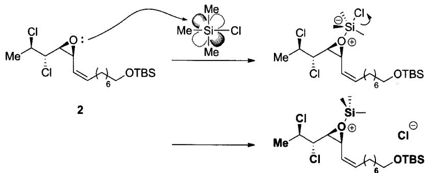  
M

7-2 考查中间体 M 的特殊反应性。题目已经提示: 内盐 M 在溶剂中继续反应, 发生环氧开环。但产物有三种, 而不是预想的一种! 如何推理出这些产物的结构? 从简单情况入手: Cl⁻ 直接进攻环氧, 开环得到产物。由于反应发生在偶极非质子溶剂中, 遵循 S $_{N}$ 2 机理, 因而产物的构型发生翻转。再考察区域选择性: 由于烯丙位碳在 S $_{N}$ 2 过渡态中可以发生共轭, 降低过渡态能量, 因此氯原子选择性地在右侧的烯丙位碳上反应。

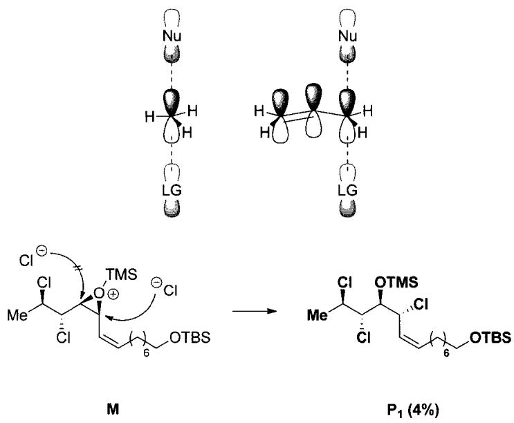

然而，这并不是反应的全貌：化合物 $P_{2}$ 和 $P_{3}$ 仍需被我们解析。此时应该关注 M 的结构中可以使反应发生特殊走向的因素：脂环构象控制、插烯规则及邻基参与等。由于三元环与烯烃互为邻位，因此可推断这里发生了 $S_{N}2'$ 反应，这样就得到了 $P_{2}$ 的结构：

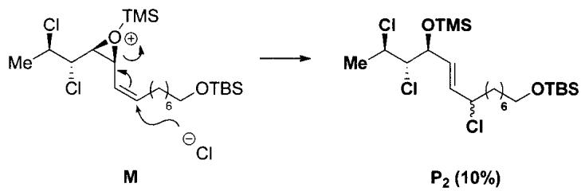

再来考察其余的结构因素:三元环左侧的氯原子带有孤对电子,可以通过一步不常见的氯原子邻基参与形成五元环(或四元环)中间体,再经开环得到 $P_{3}$ 。

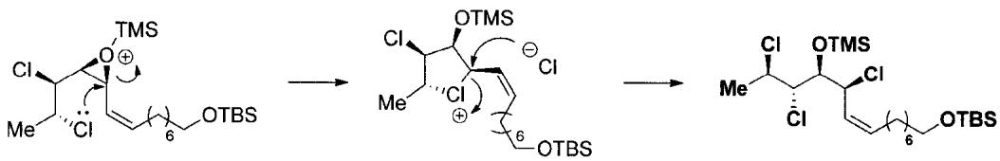

需要指出的是,本题通过提示主、副产物的数目来引导我们推导出它们的结构。但在实际科研过程中,情况远比这复杂得多。考察 chlorosulpholipid 的结构可以看出,Carreira 教授设计一步 TMSC1 开环反应的原意是得到与产物构型相同的 4,5-syn 化合物 3:

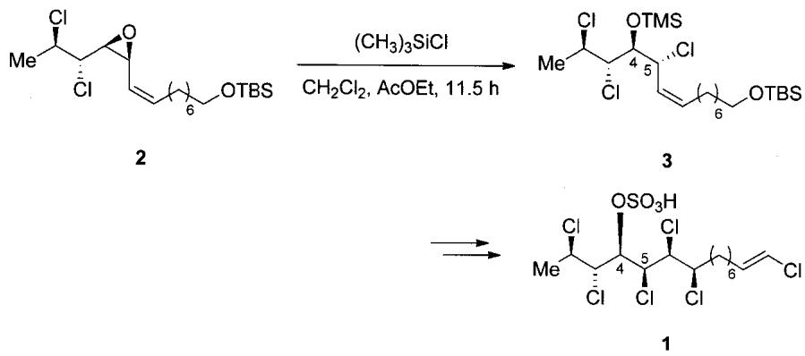  
Carreira 教授合成路线设计, 注意中间体 3 与产物 1 手性中心的对应关系

与7-2小题对比可知，3即是直接一步 $\mathbf{S}_{\mathrm{N}}2$ 产物 $\mathbf{P}_1$ ，然而 $\mathbf{P}_1$ 的收率只有 $4\%$ ，远远低于预期。事实上，由于氯原子亲核能力较差，这样一步邻基参与的开环产物是Carreira始料未及的。在原文献中，Carreira小组甚至将收率较高(39%)的副产物 $\mathbf{P}_3$ 直接误认为化合物3，导致直到全合成进行到最后一步才发现，得到的产物4竟与目标产物1构型不同！这导致了原始合成路线的更改。可以看出，即使是对于经验丰富的科研工作者，有机合成中发生的各种特殊情况，尤其是涉及三大选择性的特殊反应，始终需要我们密切的关注与详尽的探究。这也是有机化学始终吸引一代又一代化学家的魅力之一。

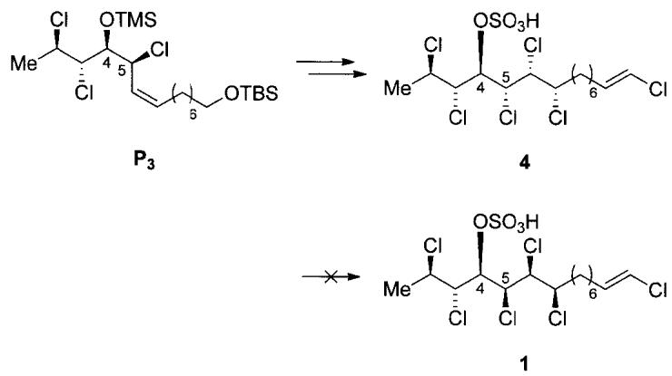

## 第8题

背景

Eudesmane 是一个包含超过 1000 种萜类分子的大家族, 这些分子大多具有较小的相对分子质量和刚性的环系, 这对于高质量的合成是极具挑战的。Scripps 研究所的 Phil S.

Baran教授在2009年发表了基于选择性碳氢键氧化的eudesmane家族的全合成方法[6]。

## 分析与解答

8-1 此题考查十氢化萘衍生物构象。N 为一个反式的十氢化萘；由于取代基中异丙基体积最大，因此它在稳定构象中位于平伏键。正确答案为

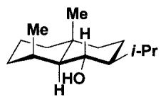

8-2 本题重点考查有机化学中的逆向思维，即已知反应物和底物来推断反应条件。D经E处理，再由PCC氧化两步反应转变为F，其中羰基发生了移位，并且引入了一个5个碳的链烃基 $R(R=-CH_{2}CH_{2}CH_{2}CH=CH_{2})$ ，因此E中应包含这个烃基R。与R直接相连的碳是底物D中的羰基碳，因此R应该是具有一定亲核性的金属有机化合物。D为 $\alpha,\beta-$ 不饱和酮，金属有机化合物对其亲核进攻有1,2-加成和1,4-加成两种可能。当金属有机化合物为锂试剂或格氏试剂时，在空阻较小的情况下更容易对羰基加成，因此E的最佳选择是格氏试剂RMgX或RLi：

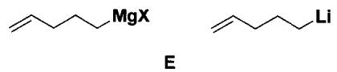

在 E 的作用下，D 首先被亲核加成，生成一个烯丙醇 $D'$ ，随后在氧化剂 PCC 作用下，依次发生醇的消除、碳正离子的重排和水分子进攻碳正离子三步反应，生成中间体烯丙醇 $D'$ ，最后醇羟基被氧化，完成了 D 到 F 的转化。由于 $D'$ 为三级烯丙醇，无法继续被氧化，因此重排反应的动力是最后醇羟基转化为酮羰基的氧化反应。反应机理如下：

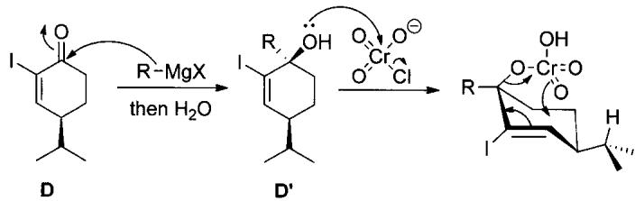

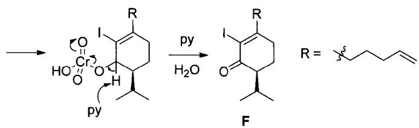

F 到 H 的转化为分子内的 Heck 反应 $^{[7]}$ ，这是一个非常经典的 Pd 参与的偶联反应。卤代烷与烯烃在 Pd 的作用下，脱去卤原子和烯基氢，发生偶联：

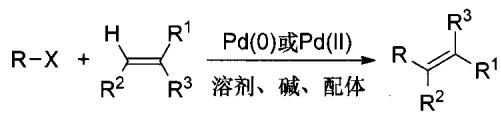

反应的发现者 Richard F. Heck 与日本的 Eiichi Negishi 和 Akira Suzuki 因有机合成中钯催化交叉偶联共同获得了 2010 年诺贝尔化学奖。Heck 反应的反应机理可表示为

回到题目,此时碘原子和末端双键有两种反应方式,即使用最末端氢偶联生成七元环或使用次末端氢偶联生成六元环。考虑到六元环在形成过程中活化能较低,以及 M 和 N 的结构,可知 H 的结构为

  
H

H到M引入了一个甲基，并且双键发生了位移。H中引入甲基的碳为 $\alpha, \beta-$ 不饱和酮中具有亲电性的碳原子，因此甲基化试剂应是一个金属有机化合物，可供选择的有锂试剂、格氏试剂和烷基铜锂试剂。考虑到烷基铜锂试剂对 $\alpha, \beta-$ 不饱和酮的1,4-加成选择性最好，因此选择烷基铜锂试剂，即条件K为 $\mathbf{Me}_2\mathbf{CuLi}$ 。

8-3 由 M 至 N 发生了两步还原反应,由于碳碳双键较羰基的极性小,因此 $Pd/C + H_{2}$ 条件对应碳碳双键的加氢还原,而最后羰基的还原使用活泼金属还原。第一步还原由于甲基和异丙基的空阻,催化剂和氢气从分子平面后方接近碳碳双键,因此反应具有立体专一性,第一步产物为

8-4 C 是一个 $\alpha, \beta-$ 不饱和酮，可以由 $\beta-$ 羟基酮脱水生成，而 $\beta-$ 羟基酮可以切断为碳负离子和羰基化合物，即可以由羟醛缩合反应得到。因此前两步的逆合成分析如下：

接下来的起始物质是一个1,5-二羰基化合物，一个常见的切断方法是从一个羰基的 $\alpha$ 碳和 $\beta$ 碳之间进行切断，因此有如下图示的a,b两种切断方式。但对比题目中合成路线的起始物B，只有切断b满足题意。至此A的结构也跃然纸上。

于是完整的逆合成分析为

8-5 这道题目考查了立体化学,条件中的不对称四氢吡咯衍生物是不对称催化剂。底物中醛羰基的活性最高,先与催化剂结合,经由中间体 X 生成亚胺盐。

在中间体 X 脱水的过程中,由于碳氮键可以自由旋转,氮原子的构型也可以翻转,所以两个稳定的交叉式构象有较大的能量差异,使得生成的亚胺盐具有特定的构型,即异丁基与大空阻的二苯基甲氧基甲基处于尽量远离的位置。

随后亚胺阳离子发生 $\beta$ -消除生成稳定的 E 型烯胺中间体，进而对体系中的 $\alpha,\beta$ -不饱和酮(A)进行 Michael 加成，由于二苯基甲氧基甲基特定的空间取向，化合物 A 只能从平面下方接近烯胺，生成异丙基朝上的产物。随后烯醇负离子互变至末端，对刚刚生成的亚胺阳离子进行亲核加成，得到 $\beta$ -氨基酮，之后消除催化剂得到产物 C。这步反应利用了小分子不对称胺作为催化剂，一方面提供了不对称环境，高立体选择性地生成了化合物 C，同时二级胺催化了 A 与 B 的 Robinson 成环反应，非常巧妙。

## 评注

本题结合金属偶联反应中极为重要的 Heck 反应,考查同学们对有机化学中构象分析、立体化学、氧化反应、重排反应和手性控制等知识的掌握,要求同学们能够灵活运用有机合成的知识,能够进行合理的逆合成分析,并具有较宽的知识面。

## 第9题

## 背景

Wittig 试剂的稳定性对反应的条件与选择性控制起到了决定性作用。使用含有吸电子基团的卤代烃制备 Wittig 试剂时，由于季磷盐 $\alpha-H$ 酸性较强，仅使用较弱的碱便可攫取。得到的叶立德性质稳定（“stabilized” yilde）但反应活性较低，只能与一些活性较高的羰基化合物反应。反之，若使用带有给电子基团的卤代烃，则需要使用像苯基锂、正丁基锂一类的强碱，产物非稳定叶立德(“nonstabilized” ylide)对水、氧都敏感，但活性较高，一般不经分离直接用于下一步反应。

叶立德的稳定性决定了 Wittig 反应的立体化学。一般来说，非稳定叶立德反应生成 $(Z)$ -烯烃产物，而稳定叶立德则一般得到 $(E)$ -烯烃。

## 分析与解答

9-1 考查顺反异构的判断。根据顺序规则，碳碳双键中两个大基团分别位于双键两侧，故为 E 型。

9-2 考查共振式的书写。Wittig 试剂可以写成双键及内盐两种形式, 同时注意到氰基可以与负离子共轭, 因此还可以写出第三个极限式:

$$
\mathrm{Ph} _ {3} \mathrm{P} \xrightarrow {\text { CN }} \mathrm{Ph} _ {3} \mathrm{P} ^ {\oplus} \xrightarrow {\ominus} \mathrm{CN} \quad \longleftrightarrow \quad \mathrm{Ph} _ {3} \mathrm{P} ^ {\oplus} \xrightarrow {\mathrm{H}} \mathrm{C} = \mathrm{N} ^ {\ominus}
$$

9-3 以双键构型的判断为例,考查 $^{1}$ H NMR 的相关知识。一般来说,如果双键连有至少两个氢原子,则可以通过它们的耦合常数(来自一维或二维氢谱)来判断双键构型。但如果双键上仅有一个氢原子,则需要另寻他法。本题就利用了 Overhauser 核效应 (nuclear Overhauser effect, NOE) 来判断双键的构型。有别于自旋耦合效应,NOE 发生在空间上邻近(而非共价键邻近)的两个或两组氢原子间。本题中,E 构型中双键 H 与 SO $_{2}$ Me 甲基上的 H 在空间上较为接近,可以发生 NOE 效应;而 Z 构型中双键 H 与甲基 H 位置较远,它们之间不能发生 NOE 效应。这样就能够方便地判断双键的构型。

(Z)

事实上，化学位移也可以判断反应物的 Z/E 构型，请同学们思考这里引起化学位移差异的结构因素。

9-4 考查电子效应。— $\mathrm{SO}_{2}\mathrm{Me}$ 具有吸电子效应,增强了 $\mathbf{C} = \mathbf{N}$ 双键的极性,从而增强了 $\mathbf{C}$ 的亲电性,有利于叶立德试剂的进攻。

9-5 反应机理的书写是有机化学的重要内容。本题考查一个类Wittig反应中，主、副产物的生成机理。首先，叶立德试剂对亚胺进行亲核进攻，生成一个内盐。此时氮负离子可以进攻两个位点：氰基 $\alpha -\mathrm{H}$ 与磷正离子。若选择进攻氰基 $\alpha -\mathrm{H}$ ，会得到一个新的叶立德，即副产物 $\mathbf{M}_1$ 。接下来发生消除反应得到烯基磷盐 $\mathbf{M}_2$ 。若选择进攻磷正离子，则会形成四元环中间体，再经消除得到 $\mathbf{M}_3$ ——与经典的Wittig反应类似。

9-6 考查结构的推断, 是全卷中难度较高的一题。已知题中两个产物是在 9-5 的基础上, 使用福尔马林猝灭反应得到的。首先计算出 $\mathbf{P}_{1}$ 的不饱和度 $\Omega = 7$ , $\mathbf{P}_{2}$ 的不饱和度 $\Omega = 10$ , 进而考虑底物的结构及 9-5 的反应产物: 底物中磺酰氨基较为稳定, 不会水解, 但产物中磺酰基却不存在, 说明两个产物中的氮原子来自叶立德的氰基, 而多出的 C、O 则来自福尔马林。 $\mathbf{M}_{2}$ 作为一个亲电试剂与叶立德试剂或水继续反应, 反应后生成新的叶立德试剂, 可以与甲醛反应。底物去掉磺酰基后化学式为 $\mathrm{C}_{10} \mathrm{H}_{12} \mathrm{O}_{3}, \mathbf{P}_{1}$ 中增加的 1 个 N 和 3 个 C 必定来自一分子叶立德和一分子甲醛； $P_{2}$ 中增加的2个N和6个C则是来自两分子叶立德和两分子甲醛，应是 $M_{2}$ 与另一分子叶立德反应，然后和两分子甲醛缩合生成的。推出 $P_{1}$ 与 $P_{2}$ 结构如下：

9-7 承接 9-6 小题, 主要考查机理推断。 $P_{2}$ 的生成过程: 首先是叶立德对烯基季磷盐的亲核进攻, 在磺酰胺负离子的作用下攫取氢离子, 得到一个双叶立德。然后再与甲醛进行缩合, 便可以得到 $P_{2}$ 。

另附 $P_{1}$ 的生成过程:水作为亲核试剂进攻烯基季磷盐,得到的叶立德再与甲醛缩合,得到 $P_{1}$ 。

评注

有别于经典的Wittig反应，该反应底物分别为磺酰基取代的亚胺与带有缺电子基团的Wittig试剂。虽然 $\mathrm{C} = \mathrm{N}$ 键的极性不如 $\mathrm{C} = \mathrm{O}$ 键，但强吸电子基团的存在使得 $\mathrm{C} = \mathrm{N}$ 足以与反应性较差的稳定型叶立德试剂反应。底物取代模式的改变可以更精确地调控该反应的更多细节。虽然题面并没有涉及立体化学，但实际上本反应的立体选择性也相当重要。题目的原始文献[8]指出，此工作还详细探究了此类反应的立体选择性。考虑了立体化学的反应

机理如下：

此机理表明，产物的立体选择性直接与四元环中间体的构型相关，而后者则由内盐的结构直接决定。文献中的机理实验证明了体系中中间体 $\mathbf{M}_1^{\prime}$ 及 $\mathbf{M}_2^{\prime}$ 的存在，表明整个过程中两种构型的内盐可以通过中间体 $\mathbf{M}_1^{\prime}$ 及 $\mathbf{M}_2^{\prime}$ 的存在形成平衡。这使得以氰基叶立德作为底物时，通过吸电子基团的调控可以较高的选择性获得 $Z$ 型烯烃。

本题考查同学们对有机化学的基本概念和反应机理的掌握情况及结构推断的能力,题目前后关联性较大,同学们可以通过合理安排做题顺序获取更多用于解题的信息。

## 参考文献

[1] Miao M-S. Caesium in high oxidation states and as a p-block element. Nat Chem, 2013, 5 (10): 846\~852.

[2] 李克安, 主编. 分析化学教程. 北京: 北京大学出版社, 2005: 154.

[3] Brosha E L, Garzon F H, Raistrick I D, Davies P K. Low-temperature synthesis, structure, and stability of $Ba_{2+y}Cu_{3}O_{6}$ . J Solid State Chem, 1996, 122(1): 176\~185.

[4] Barsoum M W. The $M_{N+1}AX_{N}$ phases: A new class of solids: Thermodynamically stable nanolaminates. Prog Solid St Chem, 2000, 28(3): 201\~281.

[5] Nilewski C, Geisser R W, Carreira E M. Total synthesis of a chlorosulpholipid cytotoxin associated

with seafood poisoning. Nature, 2009, 457(7229): 573\~576.

[6] Chen K, Baran P S. Total synthesis of eudesmane terpenes by site-selective C—H oxidations. Nature, 2009, 459(7248): 824\~828.

[7] Heck R F. Acylation, methylation, and carboxyalkylation of olefins by Group VIII metal derivatives. J Am Chem Soc, 1968, 90(20): 5518.

[8] Fang F, Li Y, Tian S-K. Stereoselective olefination of N-sulfonyl imines with stabilized phosphonium ylides for the synthesis of electron-deficient alkenes. Eur J Org Chem, 2011, 6: 1084\~1091.

# 第 30 届中国化学奥林匹克竞赛(初赛)试题解析

(2016年8月28日)

## 试题

## 第 1 题(8 分)

1-1 离子化合物 $A_{2}B$ 由四种元素组成，一种为氢，另三种为第二周期元素。正、负离子皆由两种原子构成且均呈正四面体构型。写出这种化合物的化学式。

1-2 对碱金属 Li、Na、K、Rb 和 Cs，随着原子序数增加，以下哪种性质的递变不是单调的？简述原因。

(a) 熔、沸点 (b) 原子半径 (c) 晶体密度 (d) 第一电离能

1-3 保险粉 $\left(\mathrm{Na}_{2}\mathrm{S}_{2}\mathrm{O}_{4}\cdot2\mathrm{H}_{2}\mathrm{O}\right)$ 是重要的化工产品，用途广泛，可用来除去废水 $(\mathrm{pH}\approx8)$ 中的 $\mathrm{Cr(VI)}$ ，所得含硫产物中硫以 $\mathrm{S(IV)}$ 存在。写出反应的离子方程式。

1-4 化学合成的成果常需要一定的时间才得以应用于日常生活。例如，化合物 A 合成于 1929 年，至 1969 年才被用做牙膏的添加剂和补牙填充剂成分。A 是离子晶体，由 NaF 和 $NaPO_{3}$ 在熔融状态下反应得到。它易溶于水，阴离子水解产生氟离子和对人体无毒的另一种离子。

1-4-1 写出合成 A 的反应方程式。

1-4-2 写出 A 中阴离子水解反应的离子方程式。

## 第2题(9分)

鉴定 $NO_{3}^{-}$ 离子的方法之一是利用“棕色环”现象：将含有 $NO_{3}^{-}$ 的溶液放入试管，加入 $FeSO_{4}$ ，混匀，然后顺着管壁加入浓 $H_{2}SO_{4}$ ，在溶液的界面上出现“棕色环”，分离出棕色物质，研究发现其化学式为 $\left[\mathrm{Fe}(\mathrm{NO})(\mathrm{H}_{2}\mathrm{O})_{5}\right]\mathrm{SO}_{4}$ 。该物质显顺磁性，磁矩为 $3.8\mu_{B}$ （玻尔磁子），未成对电子分布在中心离子周围。

2-1 写出形成“棕色环”的反应方程式。

2-2 推出中心离子的价电子组态、自旋态(高或低)和氧化态。

2-3 棕色物质中 NO 的键长与自由 NO 分子中 N—O 键长相比, 变长还是变短? 简述理由。

## 第3题(13分)

3-1 好奇心是科学发展的内在动力之一。 $P_{2}O_{3}$ 和 $P_{2}O_{5}$ 是两种经典的化合物，其分子结构已经确定。自然而然会有如下问题：是否存在磷氧原子比介于两者之间的化合物？由此出发，化学家合成并证实了这些中间化合物的存在。

3-1-1 写出这些中间化合物的分子式。

3-1-2 画出其中具有二重旋转轴的分子的结构图。根据键长不同，将 P—O 键分组并用阿拉伯数字标出(键长相同的用同一个数字标识)。比较键角 $\angle O - P(V) - O$ 和键角 $\angle O - P(III) - O$ 的大小。

3-2 $NH_{3}$ 分子独立存在时 H—N—H 键角为 $106.7^{\circ}$ ，下图是 $\left[\mathrm{Zn}\left(\mathrm{NH}_{3}\right)_{6}\right]^{2+}$ 离子的部分结构以及 H—N—H 键角的测量值。解释配合物中 H—N—H 键角变为 $109.5^{\circ}$ 的原因。

3-3 量子化学计算预测未知化合物是现代化学发展的途径之一。2016年2月有人通过计算预言铁也存在四氧化物，其分子构型是四面体，但该分子中铁的氧化态是+6而不是+8。

3-3-1 写出该分子中铁的价电子组态。

3-3-2 画出该分子结构的示意图(用元素符号表示原子,用短线表示原子间的化学键)。

## 第 4 题(10 分)

固体电解质以其在电池、传感器等装置中的广泛应用而备受关注。现有一种由正离子 $A^{n+}$ 、 $B^{m+}$ 和负离子 $X^{-}$ 组成的无机固体电解质，该物质50.7℃以上形成无序结构（高温相），50.7℃以下变为有序结构（低温相），二者结构示意见下图。图中，浅色球为负离子；高温相中的深色球为正离子或空位；低温相中的大深色球为 $A^{n+}$ 离子，小深色球为 $B^{m+}$ 离子。

  
低温相  
4-1 推出这种电解质的化学式, 写出 n 和 m 的值。

4-2 温度变化会导致晶体在立方晶系和四方晶系之间转换,上述哪种晶相属于立方

晶系？

4-3 写出负离子的堆积方式及形成的空隙类型。指出正离子占据的空隙类型及占有率。

4-4 高温相具有良好的离子导电性,这源于哪种离子的迁移?简述导电性与结构的关系。

## 第5题(8分)

化学式为 $MO_{x}Cl_{y}$ 的物质有氧化性，M为过渡金属元素，x和y均为正整数。将2.905 g样品溶于水，定容至100 mL。移取20.00 mL溶液，加入稀硝酸和足量 $AgNO_{3}$ ，分离得到白色沉淀1.436 g。移取溶液20.00 mL，加入适量硫酸，以N-邻苯基氨基苯甲酸作指示剂，用标准硫酸亚铁铵溶液滴至终点，消耗3.350 mmol。已知其中阳离子以 $MO_{x}^{y+}$ 存在，推出该物质的化学式，指出M是哪种元素。写出硫酸亚铁铵溶液滴定 $MO_{x}^{y+}$ 的离子反应方程式。

## 第 6 题(14 分)

$N_{2}O_{4}$ 和 $NO_{2}$ 的相互转化 $\mathrm{N}_{2}\mathrm{O}_{4}(\mathrm{~g})\rightleftharpoons2\mathrm{NO}_{2}(\mathrm{~g})$ 是讨论化学平衡问题的常用体系。已知该反应在 295 K 和 315 K 温度下的平衡常数 $K_{p}$ 分别为 0.100 和 0.400。将一定量的气体充入一个带活塞的特制容器，通过活塞移动使体系总压恒为 1 bar(1 bar=100 kPa)。

6-1 计算 295 K 下体系达到平衡时 $N_{2}O_{4}$ 和 $NO_{2}$ 的分压。

6-2 将上述体系温度升至 315 K，计算达平衡时 $N_{2}O_{4}$ 和 $NO_{2}$ 的分压。

6-3 计算恒压下体系分别在 315 K 和 295 K 达平衡时的体积比及物质的量之比。

6-4 保持恒压条件下,不断升高温度,体系中 $NO_{2}$ 分压最大值的理论趋近值是多少(不考虑其他反应)? 根据平衡关系式给出证明。

6-5 上述体系在保持恒外压的条件下,温度从 295 K 升至 315 K,下列说法正确的是:

(a) 平衡向左移动 (b) 平衡不移动 (c) 平衡向右移动 (d) 三者均有可能

6-6 与体系在恒容条件下温度从 $295\mathrm{K}$ 升至 $315\mathrm{K}$ 的变化相比，恒压下体系温度升高，下列说法正确的是（简述理由，不要求计算）：

(a) 平衡移动程度更大 (b) 平衡移动程度更小 (c) 平衡移动程度不变 (d) 三者均有可能

## 第 7 题(8 分)

乙醇在醋酸菌作用下被空气氧化是制造醋酸的有效方法，然而这一传统过程远远不能满足工业的需求。目前工业上多采用甲醇和一氧化碳反应制备醋酸： $\mathrm{CH}_3\mathrm{OH} + \mathrm{CO}\longrightarrow$ $\mathrm{CH}_3\mathrm{COOH}$ 。第9族元素（Co，Rh，Ir）的一些配合物是上述反应良好的催化剂。以 $[\mathrm{Rh}(\mathrm{CO})_2\mathrm{I}_2]$ 为催化剂、以碘甲烷为助催化剂合成乙酸(Monsanto法)的示意图如下：

7-1 在催化循环中，A 和碘甲烷发生氧化加成反应，变为 B。画出 B 及其几何异构体 B1 的结构示意图。

7-2 分别写出化合物 A 和 D 中铑的氧化态及其周围的电子数。

7-3 写出由 E 生成醋酸的反应式(E 须用结构简式表示)。

7-4 当将上述醋酸合成过程的催化剂改为 $\left[\mathrm{Ir}(\mathrm{CO})_{2}\mathrm{I}_{2}\right]^{-}$ ，被称为 Cativa 法。Cativa 法催化循环过程与 Monsanto 法类似，但中间体 C 和 D（中心离子均为 Ir）有差别，原因在于：由 B（中心离子为 Ir）变为 C，发生的是 CO 取代 I 的反应；由 C 到 D 过程中则发生甲基迁移。画出 C 的面式结构示意图。

## 第8题(10分)

8-1 画出以下反应过程中化合物 A～F 的结构简式。

8-2 某同学设计了以下反应,希望能同时保护氨基和羟基。

请选择最有利于实现该反应的实验条件：

(a) 反应在浓盐酸与乙醇(1:3)的混合溶剂中加热进行。

(b) 反应在过量三乙胺中加热进行。

(c) 催化量的三氟化硼作用下, 反应在无水乙醚中进行。

(d) 反应在回流的甲苯中进行。

8-3 理论计算表明,甲酸的 Z- 和 E- 型两种异构体存在一定的能量差别。

已知 $Z$ -型异构体的 $\mathrm{p}K_{\mathrm{a}} = 3.77$ ，判断 $E$ -型异构体的 $\mathrm{p}K_{\mathrm{a}}$ ：

(a) >3.77 (b) <3.77 (c) =3.77 (d) 无法判断

## 第 9 题(12 分)

9-1 氨基乙醇在盐酸中与乙酸酐反应如下：

当此反应在 $K_{2}CO_{3}$ 中进行,得到了另一个非环状产物 B;化合物 A 在 $K_{2}CO_{3}$ 作用下也转化为化合物 B。

9-1-1 画出化合物 B 的结构简式。

9-1-2 为什么在 HCl 作用下, 氨基乙醇与乙酸酐反应生成化合物 A; 而在 $K_{2}CO_{3}$ 作用下, 却生成化合物 B?

9-1-3 为什么化合物 A 在 $K_{2}CO_{3}$ 作用下转化为化合物 B?

9-2 某同学设计如下反应条件,欲制备化合物 C。但反应后实际得到其同分异构体 E。

9-2-1 画出重要反应中间体 D 及产物 E 的结构简式。

在下面的反应中，化合物 F 与二氯亚砜在吡啶-乙醚溶液中发生反应时未能得到氯代产物，而是得到了两种含有碳碳双键的同分异构体 G 和 H；没有得到另一个同分异构体 J。

9-2-2 画出 G、H 以及 J 的结构简式。

9-2-3 解释上述反应中得不到产物 J 的原因。

## . 第 10 题(8 分)

10-1 以下两种生物碱可以在室温下相互转化，在达到平衡态时，两者的比例为 $3:2$ 。画出它们互相转化时中间体 $\mathbf{A}$ 的立体结构简式。

10-2 画出下面反应过程中合理的关键反应中间体的结构简式(3个)。

## 试题解析

## 第1题

## 分析与解答

1-1 这是一道简单的元素推断题，考查对前两周期元素基本性质的掌握。题目条件已经指出： $A^{n+}$ 呈四面体构型且由两种原子构成。在竞赛大纲要求中，常见的正四面体阳离子只有 $NH_{4}^{+}$ 一种， $NH_{4}^{+}$ 也符合氮为第二周期元素的限制条件。因此，基本可以确定 $A^{n+}$ 离子就是 $NH_{4}^{+}$ 离子。离子化合物整体呈电中性，所以负离子应为 $B^{2-}$ 。由于 $B^{2-}$ 同样是由两种原子构成的正四面体离子，因此可以判断 $B^{2-}$ 应为 $XY_{4}^{2-}$ 型配离子。由于第二周期元素的最高氧化数为 +5（氮元素），而配离子又只带有两个单位负电荷，所以配体只可能是氧化数为 -1 的 $F^{-}$ 。由此可以推导出中心原子氧化态应为 +2，第二周期中只有 Be 符合条件；且当阴离子为 $BeF_{4}^{2-}$ 时，符合化合物由四种元素组成的条件。所以， $B^{2-}$ 离子应为 $BeF_{4}^{2-}$ ，化合物 $A_{2}B$ 应为 $(\mathrm{NH}_{4})_{2}\mathrm{BeF}_{4}$ 。

1-2 本题考查元素的性质递变规律及特例。Li、Na、K、Rb 和 Cs 同属第 1 族，熔沸点由上至下逐渐降低，原子半径逐渐增大，第一电离能逐渐降低，均是单调的。然而，晶体密度的递变却不是单调的：Na 的密度 $(0.97 \, \text{g cm}^{-3})$ 高于 K 的密度 $(0.89 \, \text{g cm}^{-3})^{[1]}$ 。这是由于随着原子序数的增加，碱金属原子质量和体积均增大，但二者对晶体密度的作用相反：原子质量增大，晶体密度增大；原子半径增大，晶体密度减小（碱金属的晶体结构类型相同，它们的晶体密度主要取决于其原子质量和原子半径）。由于二者增加的速率不一致，随原子序数增加，单质的晶体密度递变不是单调的。

<table><tr><td>元素[1]</td><td>相对原子质量</td><td>共价半径/pm</td><td>晶体密度/(g cm-3)</td></tr><tr><td>Li</td><td>6.94</td><td>130</td><td>0.53</td></tr><tr><td>Na</td><td>22.99</td><td>160</td><td>0.97</td></tr><tr><td>K</td><td>39.10</td><td>200</td><td>0.89</td></tr><tr><td>Rb</td><td>85.47</td><td>215</td><td>1.53</td></tr><tr><td>Cs</td><td>132.9</td><td>238</td><td>1.87</td></tr></table>

1-3 本题考查反应方程式的书写。这是一个经典的无机氧化还原反应: Cr(VI) 具有氧化性, 在强还原剂保险粉的作用下还原为 Cr(III)。重点在于确定反应中各物种的主要存在形式。反应初期, pH≈8, Cr(VI) 以 CrO $_{4}^{2-}$ 形式存在 [pK $_{a_{2}}$ (H $_{2}$ CrO $_{4}$ ) = 6.49[1], 本处数据具体值仅作参考, 并不是解题所必需的, 下同], 保险粉则以 S $_{2}$ O $_{4}^{2-}$ 形式存在 (也可写做$\mathrm{Na}_{2} \mathrm{~S}_{2} \mathrm{O}_{4}$ 。再看产物：亚硫酸为弱酸 $\left[\mathrm{pK}_{\mathrm{a}_{2}} \left(\mathrm{H}_{2} \mathrm{SO}_{3}\right)=7.2^{[1]}\right]$ ， $\mathrm{pH} \approx 8$ 时以 $\mathrm{HSO}_{3}^{-}/\mathrm{SO}_{3}^{2-}$ 缓冲对形式存在，而 $\mathrm{Cr(III)}$ 则以 $\mathrm{Cr(OH)}_{3}$ 形式沉淀。最后配平方程，由于反应过程中 $\mathrm{pH}$ 变化不大且始终接近中性，所以使用 $\mathrm{HSO}_{3}^{-}$ 和 $\mathrm{SO}_{3}^{2-}$ 而不是 $\mathrm{OH}^{-}$ 配平：

$$
2 \mathrm{CrO} _ {4} ^ {2 -} + 3 \mathrm{S} _ {2} \mathrm{O} _ {4} ^ {2 -} + 4 \mathrm{H} _ {2} \mathrm{O} = 2 \mathrm{Cr} (\mathrm{OH}) _ {3} \downarrow + 4 \mathrm{SO} _ {3} ^ {2 -} + 2 \mathrm{HSO} _ {3} ^ {-}
$$

1-4-1 磷氟键强度高于磷氧键。反应物偏磷酸钠中，偏磷酸根以长链或环状形式存在。其中的 P—O—P 键有酸酐的性质，加入氟离子后长链或环很容易从此处断裂，生成单氟磷酸钠：

反应方程式如下：

$$
\mathrm{NaF} + \mathrm{NaPO} _ {3} = \mathrm{Na} _ {2} \mathrm{PO} _ {3} \mathrm{F}
$$

1-4-2 A 的阴离子水解生成氟离子和另一种无毒阴离子，由于 $PO_{3}F^{2-}$ 只含磷、氧、氟三种元素，故可确定另一种阴离子为磷酸根离子的某种形式。依照题意， $PO_{3}F^{2-}$ 在水解时未额外加入酸碱，由电荷守恒可知，此时磷酸根的存在形式为磷酸二氢根离子，这样就可以写出反应方程式：

$$
\mathrm{PO} _ {3} \mathrm{F} ^ {2 -} + \mathrm{H} _ {2} \mathrm{O} = \mathrm{H} _ {2} \mathrm{PO} _ {4} ^ {-} + \mathrm{F} ^ {-}
$$

评注

本题考查了化学原理与元素化学知识,其中隐含了对各碱金属单质晶体密度以及弱酸、弱碱在指定 pH 条件下存在形式的考查。在学习过程中,同学们没有必要对一些单质和化合物的性质数据死记硬背,但应对它们的性质规律有定性的认识。对于常见化合物的性质,最好能有半定量的认识(如酸常数、溶解度等数据的量级,电极电势序列等),这样才能够真正充分认识这些物质的性质,并在实际应用时胸有成竹。

## 第2题

## 分析与解答

2-1 本题考查反应方程式的书写。 $\left[\mathrm{Fe}(\mathrm{NO})(\mathrm{H}_{2}\mathrm{O})_{5}\right]\mathrm{SO}_{4}$ 可以视为 $FeSO_{4}$ （也可写做 $\left[\mathrm{Fe}(\mathrm{H}_{2}\mathrm{O})_{6}\right]\mathrm{SO}_{4}$ ）与 NO 反应得到：

$$
\begin{array}{r l} & {\left[ \mathrm{Fe} (\mathrm{H} _ {2} \mathrm{O}) _ {6} \right] ^ {2 +} + \mathrm{NO} = \left[ \mathrm{Fe} (\mathrm{NO}) (\mathrm{H} _ {2} \mathrm{O}) _ {5} \right] ^ {2 +} + \mathrm{H} _ {2} \mathrm{O}} \\ & {\text {或} \mathrm{Fe} ^ {2 +} + \mathrm{NO} = \left[ \mathrm{Fe} (\mathrm{NO}) \right] ^ {2 +}} \end{array}
$$

由于反应物中只有 $NO_{3}^{-}$ 含有氮元素，故 NO 只可能是 $NO_{3}^{-}$ 的还原产物。酸性条件下 $Fe^{2+}$ 可以还原 $HNO_{3}$ ：

$$
\begin{array}{r l} & 3 \mathrm{Fe} (\mathrm{H} _ {2} \mathrm{O}) _ {6} ^ {2 +} + \mathrm{NO} _ {3} ^ {-} + 4 \mathrm{H} ^ {+} = 3 \mathrm{Fe} (\mathrm{H} _ {2} \mathrm{O}) _ {6} ^ {3 +} + \mathrm{NO} + 2 \mathrm{H} _ {2} \mathrm{O} \\ & \text {或} 3 \mathrm{Fe} ^ {2 +} + \mathrm{NO} _ {3} ^ {-} + 4 \mathrm{H} ^ {+} = 3 \mathrm{Fe} ^ {3 +} + \mathrm{NO} + 2 \mathrm{H} _ {2} \mathrm{O} \end{array}
$$

两方程式也可以合并写做

$$
\begin{array}{r l} & 4 \mathrm{Fe} (\mathrm{H} _ {2} \mathrm{O}) _ {6} ^ {2 +} + \mathrm{NO} _ {3} ^ {-} + 4 \mathrm{H} ^ {+} = 3 \mathrm{Fe} (\mathrm{H} _ {2} \mathrm{O}) _ {6} ^ {3 +} + [ \mathrm{Fe} (\mathrm{NO}) (\mathrm{H} _ {2} \mathrm{O}) _ {5} ] ^ {2 +} + 3 \mathrm{H} _ {2} \mathrm{O} \\ & \text {或} 4 \mathrm{Fe} ^ {2 +} + \mathrm{NO} _ {3} ^ {-} + 4 \mathrm{H} ^ {+} = 3 \mathrm{Fe} ^ {3 +} + [ \mathrm{Fe} (\mathrm{NO}) ] ^ {2 +} + 2 \mathrm{H} _ {2} \mathrm{O} \end{array}
$$

2-2 本题考查 d 区元素电子结构与磁性的知识。题中条件指出，产物显顺磁性且未成对电子分布在中心离子周围，故磁矩均由 Fe 原子上未成对电子产生。根据有效磁矩 $\mu_{eff}$ 和未成对电子数 n 的关系：

$$
\mu_ {\mathrm{eff}} = \sqrt {n (n + 2)} \mu_ {\mathrm{B}}
$$

可知，未成对电子数 n=3（保留至整数）。

配体 NO 可能以 $NO^{-}$ 或 $NO^{+}$ 形式存在，故 Fe 的氧化态可能为 +3 或 +1。此外，铁原子可能有高自旋和低自旋两种状态。将以上所有可能状态中单电子个数汇总于下表：

<table><tr><td>铁原子氧化态</td><td>d 电子个数</td><td>自旋态</td><td>价电子组态</td><td>单电子个数</td></tr><tr><td rowspan="2">+1</td><td rowspan="2">7</td><td>高自旋</td><td> $t_{2g}^{5} e_{g}^{2}$ </td><td>3</td></tr><tr><td>低自旋</td><td> $t_{2g}^{6} e_{g}^{1}$ </td><td>1</td></tr><tr><td rowspan="2">+3</td><td rowspan="2">5</td><td>高自旋</td><td> $t_{2g}^{3} e_{g}^{2}$ </td><td>5</td></tr><tr><td>低自旋</td><td> $t_{2g}^{5} e_{g}^{0}$ </td><td>1</td></tr></table>

由此可见，只有铁原子氧化态为+1且为高自旋时，未成对电子数才为3。

2-3 本题考查分子轨道理论。由2-2中的讨论可知，在 $\left[\mathrm{Fe}(\mathrm{NO})(\mathrm{H}_2\mathrm{O})_5\right]^{2+}$ 中，Fe为 $+1$ 价，所以NO以 $\mathrm{NO}^+$ （亚硝酰正离子）形式存在。由分子轨道理论可知，NO的分子轨道式为 $\mathrm{KK}(\sigma_{2s})^2 (\sigma_{2s}^*)^2 (\sigma_{2p_x})^2 (\pi_{2p_y})^2 (\pi_{2p_z})^2 (\pi_{2p_y}^*)^1$ ，其中成键轨道上有8个电子，反键轨道上有3个电子，N—O键键级为 $(8 - 3) / 2 = 2.5$ ；而 $\mathrm{NO}^+$ 的分子轨道式为 $\mathrm{KK}(\sigma_{2s})^2 (\sigma_{2s}^*)^2$ $(\sigma_{2p_x})^2 (\pi_{2p_y})^2 (\pi_{2p_z})^2$ ，其中成键轨道上有8个电子，反键轨道上有2个电子，N—O键键级为 $(8 - 2) / 2 = 3$ 。 $\mathrm{NO}^+$ 键级更高，故 $\left[\mathrm{Fe}(\mathrm{NO})(\mathrm{H}_2\mathrm{O})_5\right]\mathrm{SO}_4$ 中NO的键长比自由NO分子中N—O键长更短。

## 知识拓展

硝酸根与亚硝酸根的定性检测是无机与分析化学中的基本内容。与硝酸根类似，亚硝酸根离子 $\left(\mathrm{NO}_{2}^{-}\right)$ 也可以与 $Fe^{2+}$ 反应生成 $\left[\mathrm{Fe}(\mathrm{NO})(\mathrm{H}_{2}\mathrm{O})_{5}\right]^{2+}$ 。但由于 $NO_{2}^{-}$ 的氧化性强于硝酸根离子（请同学们思考原因），反应可在弱酸性条件下进行。可想而知，当亚硝酸根离子与硝酸根离子共存时，亚硝酸根离子会干扰对硝酸根离子的鉴定。为了排除 $NO_{2}^{-}$ 带来的干扰，可以向溶液中加入少量尿素，酸化加热，除去亚硝酸根。反应方程式如下：

$$
2 \mathrm{NO} _ {2} ^ {-} + \mathrm{CO} (\mathrm{NH} _ {2}) _ {2} + 2 \mathrm{H} ^ {+} = \mathrm{CO} _ {2} \uparrow + 2 \mathrm{N} _ {2} \uparrow + 3 \mathrm{H} _ {2} \mathrm{O}
$$

此外，还有一些其他反应可以用于鉴定 $NO_{2}^{-}$ 和 $NO_{3}^{-}$ $^{[1]}$ 。

重氮化反应:用于鉴定溶液中的 $NO_{2}^{-}$ 。向含有 $NO_{2}^{-}$ 的溶液加入适量 HOAc 溶液酸化,之后加入少量对氨基苯磺酸和少量 $\alpha-$ 萘胺,溶液显粉红色。反应方程式如下:

二苯胺试剂:用于鉴定溶液中的 $NO_{3}^{-}$ （在生物化学中也可用于 DNA 的鉴定）。向二苯胺的浓硫酸溶液中沿管壁缓慢加入适量硫酸酸化的含 $NO_{3}^{-}$ 的溶液，在两种溶液的界面处会出现蓝色环，反应方程式如下：

NO 有重要的生理作用。亚硝基铁氰化钠 $\left(\mathrm{Na}_{2}\left[\mathrm{Fe}(\mathrm{CN})_{5}(\mathrm{NO})\right]\right)$ ，又称硝普钠）是一种鲜红色晶体，它在人体内可以释放出 NO，常用于治疗高血压急症和急性心衰竭。硝普钠还可以用于鉴定硫离子 $^{[2]}$ ，向含 $S^{2-}$ 的溶液中加入适量 $\mathrm{Na}_{2}\left[\mathrm{Fe}(\mathrm{CN})_{5}(\mathrm{NO})\right]$ 溶液，溶液显紫红色，反应方程式如下：

$$
\left[ \mathrm{Fe} (\mathrm{CN}) _ {5} (\mathrm{NO}) \right] ^ {2 -} + \mathrm{S} ^ {2 -} = \left[ \mathrm{Fe} (\mathrm{CN}) _ {5} (\mathrm{NOS}) \right] ^ {4 -}
$$

请同学们联系题目进行思考:硝普钠中的 NO 以什么形式存在 $\left(\mathrm{NO}^{+}/\mathrm{NO}^{-}\right)$ ? $S^{2-}$ 可以亲核进攻 NO, 这体现了 NO 配体的什么性质? NOS 配体的存在形式又是什么?

## 第3题

## 分析与解答

3-1-1 本题要求同学们正确掌握常见磷氧化合物的实际结构。 $P_{2}O_{3}$ 和 $P_{2}O_{5}$ 为磷氧化合物的最简式，其实际分子式是 $P_{4}O_{6}$ 和 $P_{4}O_{10}$ 。 $P_{4}O_{10}$ 与 $P_{4}O_{6}$ 相比，前者增加了 4 个磷氧双键，磷的平均氧化态由 +3 变为 +5。磷原子个数不变，氧原子个数介于两者之间的磷氧化合物则应为 $P_{4}O_{7}$ 、 $P_{4}O_{8}$ 、 $P_{4}O_{9}$ 。它们的结构以 $P_{4}O_{6}$ 为基础，分别在 1～3 个磷原子上添加磷氧双键，如下图所示：

3-1-2 $\mathrm{P_4O_7}$ 、 $\mathrm{P_4O_8}$ 、 $\mathrm{P_4O_9}$ 中只有 $\mathrm{P_4O_8}$ 的结构具有二重旋转轴，即分子绕此轴旋转 $180^{\circ}$ 后与原结构重合。

磷氧双键的键长必然小于单键的键长。其次，即使同为磷氧单键，磷原子或氧原子所处的环境不同，磷氧单键的键长也不同。 $P_{4}O_{8}$ 中有两种氧化态的磷原子：P(V)和P(Ⅲ)；四种化学环境的氧原子：磷氧双键的氧原子、P(V)—O—P(V)中的氧原子、P(Ⅲ)—O—P(Ⅲ)中的氧原子和P(Ⅲ)—O—P(V)中的氧原子。根据磷、氧原子所处化学环境的不同，可以将磷氧键按键长分为5组，如下图所示：

涉及键角的问题常用价层电子对互斥(VSEPR)理论解决。本题中的P(V)和P(Ⅲ)都具有4个价层电子对，其构型均为四面体。两种磷原子都以磷氧单键形式与3个氧原子相连。所不同的是，P(Ⅲ)具有一对孤对电子，而P(V)上有一个磷氧双键。根据VSEPR理论，孤对电子与成键电子对的排斥力大于成键电子对之间的排斥力，因此 $\angle O-P(V)-O$ 大于 $\angle O-P(Ⅲ)-O$ 。

3-2 本题同样涉及 VSEPR 理论。形式为 $AX_{4}$ 的分子，例如 $CH_{4}$ ，分子构型为正四面体；而形式为 $AX_{3}E$ 的分子，例如 $NH_{3}$ ，分子构型为三角锥。由于孤对电子与成键电子对之间的排斥力更大，因此 $AX_{3}E$ 分子的键角会小于 $109.5^{\circ}$ 。而当氨分子与 $Zn^{2+}$ 形成配合物后，孤对电子与 $Zn^{2+}$ 成键，原来的孤对电子与成键电子对间的作用变成了成键电子对间的相互作用，排斥力减弱，故 H—N—H 键角变大。H—N 成键电子对和 $Zn^{2+}$ —N 成键电子对的排斥力与 H—N 成键电子对间的排斥力十分接近，所以键角为 $109.5^{\circ}$ 。

3-3 零价的 Fe 价电子组态为 $3d^{6}4s^{2}$ ，失去六个电子后，氧化态转化为 +6，价电子组态变为 $3d^{2}$ 。铁的四氧化物分子式为 $FeO_{4}$ 。根据题目所提供的条件，Fe 的氧化态是 +6，所以有两个 O 的氧化态是 -1，即分子中有一根过氧键。因此，四氧化物的分子式可以写成 $\mathrm{FeO}_{2}\left(\mathrm{O}_{2}\right)$ 。由于该分子为四面体构型，故分子结构如下：

## 第4题

## 分析与解答

本题的主要考点为晶体结构,考查了立方晶系和四方晶系的概念、对晶胞示意图的理解和识图能力、晶体空隙及其对导电性的影响等知识。

4-1 高温相中深色球代表的是统计平均分布的未知比例的阳离子及空隙，只能从低温相的晶胞着手分析。从题中低温相晶体结构图可以看出，低温相晶体中，阴离子浅色球以立方最密堆积形式排列，共8个 $X^{-}$ ；阳离子填充在四面体空隙中，共4个 $A^{n+}$ 、2个 $B^{m+}$ 。故化合物的最简式为 $A_{2}BX_{4}$ 。

如题所述，X为-1价阴离子，根据晶体电荷守恒，整数n、m满足 $2n+m=4$ 。故n=1，m=2。

4-2 高温相的两种阳离子和空隙平均分布,可从统计学意义上视为等同的。高温相的晶胞为立方 ZnS 型,故高温相为立方晶系。

也可通过立方晶系与四方晶系的区别来判断:立方晶系比四方晶系的对称性更高,晶胞的4条体对角线分别是4根三重旋转轴 $(4C_{3})$ 。观察晶体结构图可知,高温相满足这一条件。

4-3 晶体中阴离子堆积方式如图 4.1。晶体由不同颜色标明的 A、B、C 三种堆积层以 ABCABC…的形式堆积，故阴离子呈立方最密堆积。阴离子的堆积产生了两种空隙：八面体空隙和四面体空隙。八面体空隙位于棱心和体心，共 4 处；四面体空隙位于晶胞的（±1/4，±1/4，±1/4），共 8 处，正离子占据的是四面体空隙。

  
图4.1

图 4.1 的立方体骨架中包含 4 个 $X^{-}$ ，其间存在 8 个四面体空隙，而 3 个正离子占据了其中的 3 个空隙，故正离子对空隙的占有率为 3/8=37.5%。

4-4 离子导电是在外加电场作用下，介质中的阴、阳离子发生定向迁移的现象。该现象通常发生于熔融盐及电解质溶液中。通常离子晶体难以导电，将其加热至熔点附近才会引起电导率的上升。但是，少数晶体在相对较低的温度下即可获得较高的电导率，这种现象一般是晶体内存在空隙且至少一种离子可以在其间较为自由地运动引起的，它使晶体产生了离子导电性，这也就是常说的固体电解质的工作原理。体积较大的阴离子通常不易运动，构成刚性的晶格骨架，阳离子在阴离子的空隙间迁移产生离子导电性，如本题中的阳离子在晶体中存在的大量的四面体空隙间迁移从而导电，这类阳离子迁移导电的晶体被称为阳离子固体电解质。也有部分阴离子可以迁移导电或两种离子均可迁移导电的晶体，称为阴离子

子固体电解质或者混合型固体电解质。

在低温时，该晶体中的离子热运动的动能不足，无法跨越在四面体空隙间迁移的能垒，所以两种阳离子处于固定的位置上。而温度升高时，离子的热运动动能较高，容易跨过能垒，造成四面体空隙中A、B阳离子分布的统计平均化，形成了新的相，即发生了低温相到高温相的相变。二者的电荷数分别为 $+1$ 和 $+2$ ，可以对迁移的活化能和速率造成明显的差异：电荷数较低的原子在晶体静电场中四面体空隙处和三角形空隙处的势能差更低，即迁移能垒更低。而题目中没有强调 $\mathbf{A}^{+}$ 和 $\mathbf{B}^{2 + }$ 的离子半径差异有多大，与电荷数相比并不是迁移速率的主要影响因素。综上所述， $\mathbf{A}^{+}$ 更容易迁移。

## 知识拓展

4-2 题并未考查低温相属于四方晶系的原因。如果要分析低温相晶体属于何种晶系，需要找到晶体内的对称元素加以判断。如图 4.2，将晶胞平移使汞原子变为原点，便于观察晶胞的对称性。经过四重旋转 $\left(\mathbf{C}_{4}\right)$ （不妨从顶面看逆时针旋转）和关于体心点的反演(i)操作后，坐标为 $(0.5+a,0.5+b,0.5+c)$ 的原子变换到了 $(0.5+b,0.5-a,0.5-c)$ 。可以发现，将晶胞中各原子坐标经过如上变换后所得的坐标处均有对应的同种原子。所以晶胞上下底面面心的连线为 $I_{4}$ 轴（四重旋转反演轴），也就是说，低温相晶体具有四重对称轴。而上文分析过该晶体不存在 4 个三重旋转轴，不是立方晶系，故低温相晶体只能属于四方晶系。

  
图4.2

4-4题中四碘合汞（Ⅱ）酸银是一种热致变色材料，具有两种晶体结构： $\alpha-\mathrm{Ag}_{2}\mathrm{HgI}_{4}$ 、 $\beta-\mathrm{Ag}_{2}\mathrm{HgI}_{4}$ 。常温下该化合物以 $\beta$ 型为主，为黄色四方晶系晶体。加热至 $40^{\circ}\mathrm{C}$ 以上，此材料会逐渐转变为橙色，直至 $50.7^{\circ}\mathrm{C}$ 完全转化为橙红色的 $\alpha$ 型晶体。 $\alpha$ 型晶体结构与立方ZnS和 $\alpha-\mathrm{AgI}$ 相似（ $\alpha-\mathrm{AgI}$ 也是一种在较高温度下相变形成的常见固体电解质）。这一过程就像 $\mathrm{Cu}_{3}\mathrm{Au}$ 合金加热后变为原子统计平均分布的相一样，所有的银离子和汞离子在受热后具有足够的热运动动能，跨越在空隙间运动的能垒，统计平均分布到了空隙中。

1938年，Ketelaar $^{[3]}$ 等通过对 $Ag_{2}HgI_{4}$ 的研究，发现在50.7℃时 $Ag_{2}HgI_{4}$ 的电导率与比热容均发生了突跃：电导率在50.7℃处突然增加；等压比热容在45～50℃间快速上升，而在50.7℃处却发生骤降，恢复至低温数值，如图4.3所示。比热容曲线表明，晶体在45～50℃之间持续吸热，说明晶体发生了相变；而电导率曲线则显示，在50.7℃后离子迁移率大幅上升，证明高温相中离子能够自由运动，即形成了固体电解质。

  
图4.3

Ketelaar 等还研究了这两种离子的迁移优先性。既然低温相到高温相这一转化过程中离子有足够的热运动动能来克服能垒，那么两种离子在外加电场时应该都更容易迁移。然而实验事实表明，只有 6% 的电荷迁移是源于汞离子。这可能是由于迁移过程中的势能是电势能（源于周围所有离子在该点共同激发的电场），二价阳离子在四面体空隙处和三角形空隙处的电势能之差比同样位置上一价阳离子的电势能之差更高，能垒也更大，然而热运动的动能和电荷数无关，所以一价的银离子比二价的汞离子更容易跨过能垒发生迁移。二者迁移的能垒和优先性是动力学问题，而相变时达到平衡的统计分布是热力学问题，不可混为一谈。

## 第5题

## 分析与解答

根据题意,该化合物溶于水后产生了 $MO_{x}^{y+}$ 离子和氯离子,加入硝酸银得到了白色的氯化银沉淀,考虑到溶液中除氯离子外没有其他能与银离子沉淀的阴离子,故白色沉淀只是氯化银一种物质。由此可以计算出样品中氯的物质的量(测量溶液的体积是样品的1/5):

$$
n \left(\mathrm{Cl} ^ {-}\right) = 5 \times 1. 4 3 6 \mathrm{g} / (1 0 7. 9 + 3 5. 4 5) \mathrm{gmol} ^ {- 1} = 5 0. 0 9 \mathrm{mmol}
$$

题目涉及的滴定反应是氧化还原反应，氧化剂只能是 $\mathbf{MO}_x^{\mathrm{y} + }$ ，还原剂也只能是 $\mathrm{Fe}^{2 + }$ ，由于未知M的价态，故在此需要假设解题。题目中另一个重要信息是 $x$ 和 $y$ 都是正整数，故我们可以采用列举法找到答案。设在氧化还原反应中一个 $\mathbf{MO}_x^{\mathrm{y} + }$ 得到 $p$ 个电子， $\mathrm{Fe}^{2 + }$ 被氧化到 $\mathrm{Fe}^{3 + }$ ，故一个 $\mathbf{MO}_x^{\mathrm{y} + }$ 对应 $p$ 个 $\mathrm{Fe}^{2 + }$ ，于是

$$
n \left(\mathrm{MO} _ {x} ^ {\mathrm{y} +}\right) = 5 \times 3. 3 5 0 \mathrm{mmol} / p = (1 6. 7 5 / p) \mathrm{mmol}
$$

$$
y = n (\mathrm{Cl} ^ {-}) / n (\mathbf {M O} _ {x} ^ {y +}) = 2. 9 9 0 p \approx 3 p
$$

y 是 3 的倍数。如果 y=6, x 最小是 1，此时 M 氧化态为 +8，已是罕见的价态，容易自身氧化还原生成氯气，不甚合理。因此考虑 y 为 3 的情况。y=3, x=1 时：

$$
\begin{array}{r l} & M (\text { 未知物 }) = 2. 9 0 5 \mathrm{g/16.75mmol} = 1 7 3. 4 \mathrm{gmol} ^ {- 1} \\ & M (\mathbf {M}) = (1 7 3. 4 - 3 5. 4 5 \times 3 - 1 6) \mathrm{gmol} ^ {- 1} = 5 1. 0 5 \mathrm{gmol} ^ {- 1} \end{array}
$$

这与钒的摩尔质量很接近。而在 x>1 时，摩尔质量并没有合理解。因此 M 为钒。化学式为 $VOCl_{3}$ 。

反应时为 $VO^{3+}$ 氧化 $Fe^{2+}$ ，钒的氧化态转化为 +4，因此得到 $VO^{2+}$ ：

$$
\mathrm{VO} ^ {3 +} + \mathrm{Fe} ^ {2 +} = \mathrm{VO} ^ {2 +} + \mathrm{Fe} ^ {3 +}
$$

## 第6题

## 分析与解答

6-1 题目给了 295 K 下的平衡常数 $K_{p}$ ，题干中的平衡常数没有单位，而该反应后分子数变多了，因此该 $K_{p}$ 指的是用压强表示的标准平衡常数 $K^{\ominus}$ 。设 $NO_{2}$ 的分压为 x kPa，则 $N_{2}O_{4}$ 的分压为 $(100-x)\mathrm{kPa}$ 。根据平衡常数表达式列出方程：

$$
\begin{array}{r l} K ^ {\ominus} & = \frac {\left(\frac {x}{p ^ {\ominus}}\right) ^ {2}}{\frac {1 0 0 - x}{p ^ {\ominus}}} = 0. 1 0 0 \quad (p ^ {\ominus} = 1 0 0 \mathrm{kPa}) \\ & x = 2 7. 0 \mathrm{kPa} \end{array}
$$

所以 $NO_{2}$ 分压为 27.0 kPa, $N_{2}O_{4}$ 分压为 73.0 kPa。

6-2 与 6-1 解法相同, 只需把平衡常数换做 0.400 即可:

$$
\begin{array}{r l} K ^ {\ominus} = \frac {\left(\frac {x}{p ^ {\ominus}}\right) ^ {2}}{\frac {1 0 0 - x}{p ^ {\ominus}}} & = 0. 4 0 0 \quad (p ^ {\ominus} = 1 0 0 \mathrm{kPa}) \\ & x = 4 6. 3 \mathrm{kPa} \end{array}
$$

故 $N_{2}O_{4}$ 分压为 53.7 kPa, $NO_{2}$ 分压为 46.3 kPa。

6-3 此题中的恒量是氮元素的物质的量(因为是一个封闭的容器)，抓住这一点可以先求算出前后的物质的量之比。设 295 K 时 $NO_{2}$ 有 27.0q mol，则 $N_{2}O_{4}$ 有 73.0q mol，故氮元素的总量为

$$
(2 7. 0 q + 7 3. 0 q \times 2) \mathrm{mol} = 1 7 3. 0 q \mathrm{mol}
$$

设 $315\mathrm{K}$ 时 $\mathrm{NO}_2$ 有 $x\mathrm{mol},\mathrm{N}_2\mathrm{O}_4$ 有 $y\mathrm{mol}$ ，可以列出方程组：

$$
\left\{ \begin{array}{l} x + 2 y = 1 7 3. 0 q \\ \frac {x}{y} = \frac {4 6 . 3}{5 3 . 7} \end{array} \right.
$$

解得

$$
\left\{ \begin{array}{l} x = 5 2. 1 q \\ y = 6 0. 4 q \end{array} \right.
$$

因此物质的量之比为

$$
\frac {n _ {2}}{n _ {1}} = \frac {5 2 . 1 q + 6 0 . 4 q}{2 7 . 0 q + 7 3 . 0 q} = 1. 1 2
$$

体积比为

$$
\frac {V _ {2}}{V _ {1}} = \frac {n _ {2} T _ {2}}{n _ {1} T _ {1}} = 1. 2 0
$$

6-4 设 $\mathrm{NO}_2$ 分压为 $z$ bar, 则 $\mathrm{N}_2\mathrm{O}_4$ 分压为 $(1 - z)$ bar, 根据平衡关系式:

$$
K ^ {\ominus} = \frac {z ^ {2}}{1 - z}
$$

有

$$
z ^ {2} + K ^ {\ominus} z - K ^ {\ominus} = 0
$$

$$
z = \frac {- K ^ {\ominus} + \sqrt {K ^ {\ominus 2} + 4 K ^ {\ominus}}}{2}
$$

根据

$$
\Delta_ {\mathrm{r}} H _ {\mathrm{m}} ^ {\ominus} - T \Delta_ {\mathrm{r}} S _ {\mathrm{m}} ^ {\ominus} = - R T \ln K ^ {\ominus}
$$

分别将 295 K 下和 315 K 下的平衡常数代入, 可得

$$
\left\{ \begin{array}{l} \Delta_ {\mathrm{r}} H _ {\mathrm{m}} ^ {\ominus} = 5 3. 6 \mathrm{kJ} \mathrm{mol} ^ {- 1} \\ \Delta_ {\mathrm{r}} S _ {\mathrm{m}} ^ {\ominus} = 1 4 3. 2 \mathrm{J} \mathrm{mol} ^ {- 1} \mathrm{K} ^ {- 1} \end{array} \right.\tag{1}
$$

式(1)变形,有

$$
\frac {\Delta_ {r} H _ {m} ^ {\ominus}}{T} - \Delta_ {r} S _ {m} ^ {\ominus} = - R \ln K ^ {\ominus}
$$

当 $T$ 不断增大， $\Delta_{\mathrm{r}}H_{\mathrm{m}}^{\ominus}/T$ 趋近于零，因此有 $\Delta_{\mathrm{r}}S_{\mathrm{m}}^{\ominus} \to R \ln K^{\ominus}$ ，继而

$$
K ^ {\ominus} \rightarrow \mathrm{e} ^ {\Delta_ {\mathrm{r}} S _ {\mathrm{m}} ^ {\ominus} / R} = 3. 0 2 \times 1 0 ^ {7}
$$

$$
z = \frac {- K ^ {\ominus} + \sqrt {K ^ {\ominus 2} + 4 K ^ {\ominus}}}{2} = \frac {- K ^ {\ominus} + \sqrt {(K ^ {\ominus} + 2) ^ {2} - 4}}{2} \rightarrow \frac {- K ^ {\ominus} + \sqrt {(K ^ {\ominus} + 2) ^ {2}}}{2} = 1
$$

故理论趋近值为 1 bar, 即 100 kPa。

6-5 由 6-1、6-2 问的计算可知， $NO_{2}$ 分压增大，故平衡向右移动。

6-6 在恒容体系中, 温度升高, 由于平衡常数增大, 平衡要向右移动, 即 $NO_{2}$ 浓度增加, 此时体系中分子数增加, 压强增大, 但是压强增大不利于反应向分子数多的方向移动, 即在一定程度上抑制了平衡的右移。

在恒压体系中,温度升高平衡右移,体系分子数增加,由于压强不变,故体积增大,而体积增大利于反应向反应分子数增加的方向移动,即在一定程度上促进了平衡的右移。

不论如何考虑,都可以得到结论,即恒压体系下温度升高,平衡右移程度更大。

本题以经典的 $N_{2}O_{4}$ 分解反应为模型，考查化学平衡计算与平衡移动的理解。计算部分难度较低，无需特殊技巧，利用物料守恒思想很容易求解。平衡移动考点与高中化学内容一脉相承，需要同学们对基础知识有很好的把握和理解。

## 第7题

## 分析与解答

7-1 本题要求同学们推断反应产物并书写异构体。根据条件，A 和碘甲烷发生了氧化加成反应，产物 B 中心离子 Rh 氧化态上升，因而是 Rh(I) 对碘甲烷中 C—I 键进行了氧化加成；而且，此氧化加成的方式是碘和甲基分别加成在 Rh 上。由上可知，B 的结构为

本题另一问为画出 B 的几何异构体 B1。在上述的面式结构中，改变 CO 和 $CH_{3}$ 的位置，不能形成新的异构体。而在经式结构中，有 $CH_{3}$ 和 CO 对位及 CO 和 CO 对位两种可能。综上所述，B1 即为上述两个经式异构体，结构为

注意:在画结构的时候一定不要忘记标出离子自身所带的电荷数。

7-2 本题考查对过渡金属配合物中心原子氧化态以及电子数的计算。离子 A 带一个负电荷，配体为 2 个 I⁻ 和 2 个 CO，因此不难得出中心原子 Rh 的氧化态为 +1。而 Rh(I) 价电子构型为 $4d^{8}$ ，再加上 4 个配体所提供的 4 对电子，即可得出周围电子数为 16。

离子 D 的相关计算与上相同，离子总电荷为 -1，配体带负电荷的有 3 个 I $^{-}$ 以及 1 个乙酰基，故中心原子 Rh 氧化态为 +3，其电子构型为 4d $^{6}$ 。而 Rh 周围有 6 个配体，一共提供 6 对电子，即可以得出周围电子数为 18。

7-3 本题考查对循环图中反应的理解。题目要求写出由 E 生成醋酸的反应式, 因此需要先得出 E 的结构。

由循环图可知，E 和 $H_{2}O$ 生成了 $CH_{3}COOH$ 和 HI，由基础有机化学的知识可知 E 为酰卤化合物，即为 $CH_{3}COI$ ，因此反应式为

$$
\mathrm{CH} _ {3} \mathrm{COI} + \mathrm{H} _ {2} \mathrm{O} \longrightarrow \mathrm{CH} _ {3} \mathrm{COOH} + \mathrm{HI}
$$

7-4 本题考查同学们理解并类比运用知识的能力,要求同学们根据题目描述写出对应的结构式。

由题目描述可知，Cativa 法和 Monsanto 法类似，但 C 和 D 不一样，因此对应的 B 的结构除了中心离子改变外没有区别，即 B 的结构为

又由题目所述，B到C发生的是CO取代 $\mathrm{I}^{-}$ 的反应，因此只需将上述离子中的I换成CO，但此时会产生异构体，而题目仅要求写出面式结构，故只需要将最下方的I换成CO即可得出答案。此处应注意，取代之后离子由负电荷变为中性了，不可再写电荷符号。本题中C的面式结构为

## 评注

本题考查了同学们对氧化加成反应的理解、对配合物异构体的书写，以及对过渡金属元素配合物中离子氧化态以及价电子结构的理解。此外，本题还对同学们理解循环图并类比的能力进行了考查，涉及一些基础的反应。同学们需要对一些基础的配合物、过渡元素以及基础有机反应的知识有所掌握，才能做好这一类题目。

## 第8题

## 分析与解答

8-1 本题属于较为基础的有机反应产物推断题,考查同学们对基础有机反应的理解。

生成 A 的反应中有 HCHO 和 $(\mathrm{CH}_{3})_{2}\mathrm{NH}_{2}^{+}\mathrm{Cl}^{-}$ 参与，而反应物为一个羰基化合物，故此反应为胺甲基化反应 (Mannich 反应) $^{[4]}$ 。A 的结构为

值得注意的是,所有有机反应均需要经过后处理。在本反应中,为了方便下一步反应,需要加入碱使氮不再质子化,故将 A 的结构写成铵盐的形式是错误的。

随后，A 与过量的碘甲烷反应。反应底物为三级胺，而过量的原料也提示碘甲烷与氮原子发生取代反应，形成一个四级铵盐，阴离子为碘离子，则 B 的结构为

此处应注意不要漏掉化合物的阴离子。

接下来，B与NaOEt反应，由于四级铵盐在碱性环境下易消除得烯烃，而羰基旁又有一个酸性较强的氢原子，故在NaOEt的作用下铵盐B很容易发生消除反应，生成烯烃C:

其后，体系中加入了一个1,3-二羰基化合物，而 $\mathbf{C}$ 又是一个 $\alpha, \beta$ -不饱和酮，因此两者在碱的作用下会发生Michael加成反应，形成如下产物：

此产物在碱的作用下可以继续进行 Robinson 增环反应, 得到 D:

之后的反应为 D 与 NaOH 作用, 再和酸作用。D 是一个酯类化合物, 因此与 NaOH 作用会水解为对应的羧酸钠盐, 随后酸化便能得到对应的羧酸, 故 E 为

E 是一个 $\beta$ -羰基酸，在加热时很容易脱羧，因此 E 到 F 的反应即为一个简单的脱羧反应，故 F 为

此产物和甲基 Grignard 试剂加成，在酸性条件下脱水后可得如下碳正离子：

这个碳正离子有多种方式脱去质子得到共轭双烯，其中如下烯烃带有最多的烷基取代基，稳定性最好，它也就是题目中的最终产物：

8-2 本题考查同学们对有机反应适宜条件的理解,需要同学们熟练掌握反应的本质。

本题中，一种反应物有酰氨基、氨基和羟基三种官能团，而另外一种反应物为缩酮。氨基、羟基与缩酮的取代反应需要用Lewis酸催化，以增强缩酮上烷氧基的离去能力。条件(c)给出了适合反应的Lewis酸催化剂，即三氟化硼。它能够与缩酮中的氧结合，增强烷氧基的离去能力，从而催化反应。另外，条件(c)提供了非质子溶剂乙醚，能够让反应物缩酮稳定存在，使得反应能够顺利进行，故本题的答案为(c)。

下面分析其他条件的不合理性。

本题条件(a)中有强酸浓盐酸,会使得氨基质子化,不能发生亲核取代反应。此外,浓盐酸中的水也会使得缩酮不稳定,无法进行后续的反应。故本条件不合理。

条件(b)中三乙胺虽然能够提供亲核反应所需的碱性溶剂环境,但此条件下缩酮的甲氧基很难离去(因其离去只能以甲氧基负离子离去,不能很好地存在于三乙胺中),故此条件也不适合反应的发生。

条件(d)为回流的甲苯。虽然有加热促进反应的进行,但没有加入合适的推动反应进行的催化剂,因此反应难以发生,故此条件也不适合。

综上可知, 只有(c)提供了合适的催化剂, 另外也有适合反应的溶剂(缩酮类化合物在无水乙醚中较为稳定), 因此最有利的条件为(c)。

8-3 本题考查同学们对于同种物质不同构型性质的推断。

由题目可知，从 $Z$ -型异构体转化为 $E$ -型异构体需要吸收一定量的能量。而两种异构体电离之后的产物相同，均为氢离子和甲酸根离子，没有异构体，因此这是两个产物相同、反应物不同的反应。而由于 $E$ -型异构体能量更高，它从酸分子转化为离子吸收的能量必然比 $Z$ 型更少。又由热力学基础知识，平衡常数和反应的能变大小息息相关。 $E$ -型酸电离吸收的能量更少，那么它相比于 $Z$ -型酸电离的反应平衡常数就更大，对应的 $\mathsf{pK}_{\mathrm{a}}$ 也就更小，因此 $E$ -型酸的 $\mathsf{pK}_{\mathrm{a}}$ 比 $Z$ -型酸更小，即小于3.77，故本题答案选(b)。

## 知识拓展

8-3 题中 s-cis 和 s-trans 两种甲酸构象的能量差异源于广义的异头碳效应；更具体地说，是羟基氧的孤对电子与羰基 $\sigma^{*}$ 轨道间的负超共轭 (negative hyperconjugation，指负离子与邻近 C—X 键相互作用导致能量显著降低的现象，其中 X 是一个吸电子基团) 效应。在这个例子中，羟基氧 n 轨道起到了与负离子 p 轨道相同的作用。当 n 轨道与 $\sigma^{*}$ 轨道处于 anti 位置关系时（也即采取 s-trans 构象时），二者重叠更佳，稳定效果更好。下图给出了羟基氧与羰基之间负超共轭与共轭效应的图示（为明确起见，只画出了各自相关的轨道）。此外，环状的内酯之所以比开链的酯反应性更高，也是由于前者几何关系必须采取能量更高的 s-cis 构象的缘故。

## 评注

本题考查了基础有机化学知识,包括有机反应的试剂和反应条件的控制等。此外,还涉及化学热力学。此类题目要求同学们熟练掌握基础有机反应及其机理,根据反应物和条件给出对应的产物。

## 第9题

## 分析与解答

9-1 本题中，底物氨基乙醇含有羟基和氨基两个官能团，均可与乙酸酐发生反应（醇解和胺解）。一般来说，氨基氮的亲核性强于羟基氧，会优先发生胺解；然而，在盐酸中发生的却是醇解反应。这是由于具有碱性的氨基会被盐酸质子化，生成铵盐从而失去亲核性。因此，反应物中仅有的亲核基团羟基便与乙酸酐发生酰基碳上的亲核取代反应，得到化合物A。而在碱性条件 $(\mathrm{K}_2\mathrm{CO}_3)$ 下则不存在上述问题，因而得到的产物B就是乙酸酐的胺解产物， $N-$ 羟乙基乙酰胺。这里，题目已经明确提示B是非环状的，也就排除了羟基和氨基都发生亲核进攻而生成了 $\mathbf{B}^{\prime}$ 这种可能。

但 A 如何在碱性条件下转化为 B? 首先, 可以排除酯先水解后形成酰胺的想法: 水解得到的羧酸负离子亲电性非常弱, 无法接受氨基的亲核进攻。故此反应应该经历分子内重排过程。观察产物, 最后氮原子取代了氧原子与羰基碳相连, 因此在过程中的某一步, 必有 C—N 键形成、C—O 键断裂。在铵离子被碱中和后, 氮原子重新具有孤对电子, 可以通过亲核加成的方式与羰基碳相连, 而形成的恰好是一个稳定的五元环。我们迫切想知道的中间体结构,原来就是之前想到的 $B'$ 。这启发我们,做题的时候多想开去一些,是有益无害的,竞赛考查的要点之一就是同学们的发散性思维。

上已述及两点动力学上的原因, 现在还剩最后一个问题: 为什么四面体中间体 B' 裂解后主要得到 B? 由于 A 经过 B' 得到 B 是一个可逆的平衡, 所以平衡偏向于生成 B 应该是一个热力学上的原因。最简单的想法便是酰胺在热力学上比酯更稳定, 这反映在前者更不容易受到亲核进攻。更深层的原因是氮原子给电子能力强于氧原子, 导致酰基碳亲核性减弱。

9-2 首先我们要捋清该同学所期望发生的反应的历程。第一步，二级醇进攻二氯亚砜中的硫原子，得到 ROSOCl 和氯化氢。由于反应发生在非质子溶剂乙醚中，体系中的 HCl 本应无法电离出氯离子；但由于吡啶的存在，发生酸碱中和生成 $PyH^{+}$ 和 $Cl^{-}$ 。第二步，游离的 $Cl^{-}$ 与 ROSOCl 发生 $S_{N}2$ 反应，得到构型翻转的卤代烃。

事实上，反应得到另一个同分异构体，那么某步反应机理势必发生了变化。由于反应物只有羟基一个亲核位点，所以第一步机理发生变化的可能性不大，因此反应会经历化合物D。而在第二步中，则有如下图所示两个亲电位点可供游离的氯离子进攻（分别用虚线和实线表示）。用实线标明的反应历程叫做“ $\mathrm{S_N2'}$ 反应”，这样反应就得到了实际产物E。在标准答案中，还给出了E的绝对构型(不作具体要求)。关于为何该 $\mathrm{S_N2'}$ 反应会产生这样的绝对构型，将在下面的“知识拓展”栏目作简要说明。

9-2-2 和 9-2-3 中，仍然是二氯亚砜、吡啶与醇的反应。此时，底物中已不再含有双键，因此不可能发生 $S_{N}2'$ 反应。根据题目所给的条件，该反应生成了含有双键的产物。9-2-1 已经说明，—OSOCl 可以作为离去基团（事实上，羟基与二氯亚砜的第一步反应，就是为了将难离去的羟基转化为容易离去的氯亚砜基）。除了可以发生亲核取代反应之外，在碱（吡啶）作用下，还有可能竞争地发生消除反应。这里有两个细节可以佐证这个猜想：一是反应温度由 -45℃ 升高到了 0℃，更有利于消除反应的发生；二是消除反应的确可得三种同分异构体 G、H、J。由于质子的酸性和吡啶的碱性不够强，不可能发生 E1cb 消除；惰性溶剂中又很难发生 E1 消除，所以这里发生的是 E2 消除。E2 消除对质子和离去基团有反式共平面的立体化学要求，因此不能生成 J。

  
G

  
H

  
J

## 知识拓展

为什么在9-1中，乙酸酐可以出现在一个水相反应中呢？其实，乙酸酐于水相中反应在合成酰胺中是一个成熟的应用[5]。主要的原因在于胺、醇、水三者竞争时，亲核性呈现一个递减的序列。比如乙酰苯胺的合成，一般的做法是先将苯胺做成盐酸盐水溶液，然后加入等物质的量的乙酸钠水溶液和乙酸酐。因为反应物都溶于水，该反应为均相反应。此反应中，乙酸钠的加入十分重要，它可将苯胺盐酸盐中和，产生亲核性远强于水的氨基，从而降低乙酸酐水解的概率。

9-2-1 中涉及的“ $\mathrm{S_N2'}$ 反应”，事实上是比较罕见的。只有在像乙醚这样的惰性溶剂中，较“软”的亲核试剂对离去基团所在位置空间位阻较大的底物发生进攻时，它才能在与 $\mathrm{S_N2}$ 的竞争中胜出[6]。显然，在此反应中氯离子从双键处进攻，空间位阻会更小。

下面用 $\tau$ 键模型就9-2-1答案中新生成手性中心的构型作简单解释[8]（当然，更深层次的原因牵涉到分子轨道理论，这里暂不涉及）。该模型认为，碳碳双键是由两个 $\mathfrak{sp}^3$ 杂化碳中间形成的两个 $\tau$ 键组成的（见左下图。因为“杂化”的概念仅仅是将某些分子轨道重新线性组合得到的、为便于解释而提出的模型，原子本身并不能指定是什么杂化的，只能确定是四面体、平面三角还是直线形的，所以用 $\mathfrak{sp}^3$ 杂化来处理平面三角碳原子是完全可行的）。在该模型的处理方式下， $\mathrm{S_N2'}$ 反应可以看做是 $\mathrm{S_N2}$ 和E2的组合。由于两者都有反式的立体化学要求，所以如下中间示意图的箭头方向所示，氯离子将从原来羟基所在的syn面进攻得到目标产物（图中的粗线表示发生断裂的化学键。此外，为明确起见，示意图中省略了标星号的两个碳原子间的单键）。

值得注意的是,本题原文献中所认为的同面迁移机理(见右上图)是存在争议的。囿于篇幅,此处不作过多讨论,有兴趣的同学可以参考相关文献 $^{[7][8]}$ 。

## 第10题

## 背景

1993年，Blackman $^{[9]}$ 等人对从冻干的海鞘类动物Clavelina cylindrica中提取出的两种生物碱cylindricine A和cylindricine B进行了研究。二者均具有在自然界中首次发现的环系结构：全氢吡咯并 $[2,1-j]$ 喹啉环系和全氢吡啶并 $[2,1-j]$ 喹啉环系（如10-1题左、右两结构）。

Cylindricine A 和 cylindricine B 在溶液中室温放置 6 天后均会转变为 3:2 的混合物，Blackman 提出了经氮杂环丙烷正离子中间体的立体专一的关环-开环机理（见“分析与解答”）。事实上，这两种化合物在游离态时均不稳定，但是形成的铵盐的晶体和溶液均较为稳定，常温下可存在数周。这从侧面证明了关环机理的正确性——这是因为氮的孤对电子与质子结合，亲核性大大下降，无法发生互变的反应。可以利用这一点将这两种生物碱制备成苦味酸盐，便于进行化合物的结构测定，如 $^{1}$ H NMR、 $^{13}$ C NMR、X 射线衍射等。

## 分析与解答

10-1 两种化学式相同的生物碱可以互相转化。观察两个分子的结构可知:右侧的六元并环结构没有变化,而左侧的五元环与六元环发生可逆转化。该环系中没有特殊的活泼碳碳键,在室温下很难发生碳碳单键可逆断裂的反应,故碳原子的连接顺序没有变化。据此可将该分子左侧环系如下图编号进行分析:

观察编号可知:反应中发生了 C4—N 和 C5—Cl 键的断裂,以及 C4—Cl 和 C5—N 键的形成,同时该反应具有立体选择性。由于该分子自身即可发生互变,所以反应是分子内的。该分子含有一个三级胺结构的氮原子,具有一定的亲核性;氯原子可作为一个离去基团。故该分子可发生分子内 $S_{N}2$ 反应,结合对断键-成键的分析容易看出,氮原子的孤对电子进攻 C5—Cl 键,同时形成 C5—N 键:

此时，还剩下 C4—N 键的断裂和 C4—Cl 键的形成两步没有完成。这对应着 $S_{N}2$ 反应的再次发生： $Cl^{-}$ 对 C4 亲核进攻，同时— $R_{3}N^{+}$ 离去，三元环开环释放张力。

最后可验证该反应的机理的确与立体选择性相符。该反应与 $\alpha$ -卤代胺的邻基参与效应类似，C—X键邻位的氨基可以发生动力学上有优势的分子内亲核取代反应，生成氮杂环丙烷结构的中间体A。A可发生 $\mathrm{Cl^-}$ 对C4和C5的竞争性进攻，得到两种生物碱的混合物。

10-2 重氮化合物是一类活泼的化合物，在光照条件下易发生碳氮键断裂，生成卡宾 $X_{1}$ 和氮气。卡宾作为一个缺电子物种，可被邻位羰基上富电子的氧原子所稳定，生成环氧乙烯结构的互变异构体 $X_{2}$ 。同理，该三元环可从另一侧打开，生成另一个异构体卡宾 $X_{1}^{\prime}$ 。这两种卡宾结构均可以发生烷基迁移的重排反应，生成同一种较为活泼的联烯酮中间体 $\mathbf{Y}$ 。反应体系内的甲醇作为亲核试剂进攻 Y 中正电性的羰基碳原子, 得到不稳定的两性离子中间体 $Z'$ , 随后发生快速的分子间质子交换生成酯的烯醇结构 Z, 并互变成最终产物酯。

## 知识拓展

10-2 题中反应为 Wolff 重排反应，通常由 $\alpha$ -重氮酮在氧化银或光照条件下生成卡宾，并进一步重排为烯酮。烯酮是一类活泼化合物，易与体系内的亲核试剂（如水、醇、胺等）进一步反应生成羧酸或羧酸衍生物，也可与体系内的烯烃等发生 $[2 + 2]$ 反应。Arndt-Eistert 增碳反应便是利用了这一重排，以 $\mathrm{RCO}_2\mathrm{H}$ 为底物，转化为相应的酰氯并与两分子重氮甲烷反应得到 $\mathrm{RCOCHN}_2$ （第二分子重氮甲烷吸收产生的 HCl，生成 $\mathrm{CH}_3\mathrm{Cl}$ ），随后在银盐催化下发生重排，生成增加了一个碳原子的羧酸 $\mathrm{RCH}_2\mathrm{CO}_2\mathrm{H}$ 。

$$
\mathrm{R} \xrightarrow [ \mathrm{-SO} _ {2} , - \mathrm{HCl} ]{\mathrm{O}} \xrightarrow [ \mathrm{-N} _ {2} , - \mathrm{CH} _ {3} \mathrm{Cl} ]{\mathrm{SOCl} _ {2}} \xrightarrow [ \mathrm{-N} _ {2} , - \mathrm{CH} _ {3} \mathrm{Cl} ]{\mathrm{O}} \xrightarrow [ \mathrm{-N} _ {2} ]{\mathrm{2CH} _ {2} \mathrm{N} _ {2}} \xrightarrow [ \mathrm{-N} _ {2} ]{\mathrm{O}} \xrightarrow [ \mathrm{-N} _ {2} ]{\mathrm{Ag} _ {2} \mathrm{O}, \mathrm{H} _ {2} \mathrm{O}} \xrightarrow [ \mathrm{-N} _ {2} ]{\mathrm{R}} \xrightarrow [ \mathrm{-N} _ {2} ]{\mathrm{OH}}
$$

酰基卡宾有一种常见等电子体酰基氮宾(RCON: )。酰基氮宾通常由相应的酰基叠氮 $\left(\mathrm{RCON}_{3}\right)$ 热解或光解得到，与10-2答案中的机理相似。与之类似，酰基叠氮也可发生与Wolff重排类似的Curtius重排反应：酰基氮宾重排生成异氰酸酯中间体，随即被体系内的亲核试剂进攻，生成胺或相应的酰基衍生物。需要注意的是，亲核试剂为水时，产物氨基甲酸不稳定，容易发生脱羧反应生成 $RNH_{2}$ 。

## 参考文献

[1] Weast R C. CRC Handbook of Chemistry and Physics. 95th ed. CRC Press: Boca Raton,

2014—2015.

[2] 北京大学化学与分子工程学院普通化学实验教学组．普通化学实验．第3版．北京：北京大学出版社，2012.

[3] Ketelaar J A. A Trans Faraday Soc, 1938, 34: 874.

[4] 邢其毅，裴伟伟，徐瑞秋，裴坚．基础有机化学．第4版．北京：北京大学出版社，2016—2017.

[5] Clayden J, Greeves N, Warren S. Organic Chemistry. 2nd ed. New York: Oxford University Press, 2012: 177\~177.

[6] Fleming I. Molecular Orbitals and Organic Chemical Reactions. Student Edition. West Sussex: John Wiley & Sons, 2010: 77\~79, 85\~86, 141\~142, 152, 157\~158, 174.

[7] Tao D J, Slutskyy Y, Overman L E. J Am Chem Soc, 2016, 138: 2186.

[8] Ireland R E, Wrigley T I, Young W G. J Am Chem Soc, 1958, 80: 4604.

[9] Blackman A J, Li C. Tetrahedron, 1993, 49(38): 8645.

# 第 30 届中国化学奥林匹克竞赛(决赛)理论试题解析

(2016年11月24日·长沙)

## 试题

## 第 1 题(13 分)

1-1 简要解释为什么水溶液中 HCN 是弱酸, 而液态 HCN 的酸性相比其水溶液显著增强。

1-2 $\mathrm{Hg}^{2+}$ 离子具有亲硫性，可与二硫代氨基甲酸盐形成 $[\mathrm{Hg}(\mathrm{S}_2\mathrm{CNEt}_2)_2]$ 的二聚体，请画出该二聚体的立体结构，并指出中心原子的杂化方式。

异烟酰腙的结构如下：

它与2-乙酰基吡啶反应生成一种配体L。将一定量的四水醋酸镍、配体L以及 $4,4^{\prime}$ -联吡啶溶解在 $1:1$ 的乙醇-水的混合溶剂中回流2小时，冷却至室温，析出物质经洗涤干燥后得到褐色片状晶体M。分析结果表明，M中N元素含量为 $21.0\%$ 。

1-3 画出配体 L 的结构,请在图中用 \* 号标出配位原子。

1-4 通过计算,写出配合物 M 符合 IUPAC 规则的分子式,画出 M 的所有几何异构体的结构,在每个几何异构体下面标注 I、II、III 等,指出哪些几何异构体存在旋光异构现象?哪个几何异构体稳定性最高?请说明理由。

1-5 说明 $4,4^{\prime}$ -联吡啶的作用。

## 第2题(10分)

某白色固体 A 室温时不稳定，而在水中稳定。A 具有弱碱性和较显著的还原性，分子只有 1 个镜面，有顺式和反式异构体。在酸性条件下 A 分解为三种产物 B、C 和 D，其中 B 为二元化合物，与 $CO_{2}$ 是等电子体。在中性溶液中，A 与亚硝酸作用可生成化合物 E 和 C。纯净的 E 是一种无色晶体，为二元酸 $(pK_{a_{1}}=6.9, pK_{a_{2}}=11.6)$ 。E 的阴离子有 $C_{2}$ 轴和与此轴垂直的镜面，其钠盐 F 可通过金属钠与硝酸铵 1:1 反应而成，也可在乙醇介质中由 A 与 RO-NO 和乙醇钠反应而成。

2-1 写出以上两种方法合成 F 的反应方程式。

2-2 画出 A 的顺式和反式异构体的立体结构。

2-3 干燥的 E 晶体极易爆炸, 水溶液中较稳定, 但仍会逐渐分解, 写出其分解反应方程式。

2-4 E的异构体 G 是弱酸, $pK_{a}=6.6$ ,画出 G 的 Lewis 结构。

2-5 用液态 $\mathrm{N}_2\mathrm{O}_4$ 与 $\mathbf{F}$ 反应生成 $\mathbf{H}$ ，此法得到的 $\mathbf{H}$ 为 $\beta$ 构型，其中 $\mathrm{Na}$ 的百分含量为 $37.69\%$ 。存在一个 $\mathrm{O}-\mathrm{O}$ 键。推断 $\mathbf{H}$ 的化学式并画出其阴离子的结构（孤对电子不需标出）。

2-6 H 的 $\alpha$ 构型同分异构体(没有 O—O 键)可由 A 与 $BuONO_{2}$ 和甲醇钠在甲醇介质中反应而成, 写出 $\alpha-H$ 的制备反应方程式。

## 第 3 题(11 分)

某金属 M 的氧化物 A 是易挥发的液体，有毒，微溶于水。在氯化氢气氛中蒸发 A 的盐酸溶液（含 1.000 g 的 A）得到 1.584 g 晶体 $MCl_{3} \cdot 3H_{2}O$ 。

3-1 假定转化反应按化学计量比进行,通过计算确定 A 的化学式,并写出金属 M 的价电子构型。

从精炼镍的阳极泥提取 $\mathbf{M}$ 的步骤为：

(1) 用王水处理溶解 Pt、Pd 和 Au。

(2) 固体不溶物与碳酸铅共热, 然后用稀硝酸处理除去可溶物 B。

(3) 剩余固体不溶物与硫酸氢钠共熔,用水浸取除去可溶物 C。

（4）留下的固体不溶物与过氧化钠共熔，用水浸取，过滤。滤液中含有 M 的盐 D，D 为 $Na_{2}SO_{4}$ 型电解质，无水 D 中氧含量为 30.32%。

（5）往 D 溶液中通入 $Cl_{2}$ ，加热，收集 40～50 ℃ 的馏分，得到 A。A 收集在盐酸中，加热得到 E 的溶液，E 中 Cl 含量为 67.14%。

（6）溶液 E 中加入适量 $NH_{4}Cl$ 溶液得到沉淀 F, F 中 Cl 含量为 57.81%。F 在氢气中燃烧即得到金属 M。

已知 $\varphi_{\mathrm{A}}^{\ominus}(\mathrm{NO}_{3}^{-}/\mathrm{NO}) = 0.957\mathrm{V}, \varphi^{\ominus}([PtCl_{4}]^{2-}/\mathrm{Pt}) = 0.755\mathrm{V}, \varphi^{\ominus}([PtCl_{6}]^{2-}/[PtCl_{4}]^{2-}) = 0.680\mathrm{V}$ , 所有离子活度系数均为 $1.00$ 。

3-2 写出步骤(1)中除去 Pt 的化学反应方程式, 计算该反应在 298 K 下的 $K^{\ominus}$ 。

3-3 写出步骤(2)中除去银的化学反应方程式。

3-4 D、E、F中均只有1个金属原子，试通过计算确定D、E、F的化学式。

## 第4题(8分)

镍是钢中的重要元素之一，镍的加入可以增加钢的硬度、弹性、延展性和抗腐蚀性。某实验室有两份含 Ni 钢样，1 号钢样中 Ni 的质量分数为 0.362%，2 号钢样 Ni 含量未知。实验人员用过二硫酸铵-丁二酮肟吸光光度法对钢样中 Ni 含量进行测定：取一定质量的钢样在通风柜中加入适量硝酸，加热溶解，转移至 100 mL 容量瓶，定容摇匀。移取 10.00 mL 试样溶液于 50 mL 容量瓶中，依次加入酒石酸钠、NaOH、丁二酮肟和过二硫酸铵。丁二酮肟加入后有混浊现象，加入过二硫酸铵后溶解成酒红色溶液，再加水定容。

4-1 请写出镍溶解及氧化过程中的离子方程式，并说明酒石酸钠和 $\mathrm{NaOH}$ 的作用。

4-2 1号钢样经上述分解步骤和显色反应后制备的溶液，利用普通吸光光度法进行检测。使用 2 cm 吸收池于 530 nm 处 ( $\varepsilon=6.60\times10^{3}$ L mol $^{-1}$ cm $^{-1}$ ) 测量，欲使测量的相对误差最小，称取 1 号钢样的质量应为多少？

4-3 请指出 4-2 中普通吸光光度法使用的参比溶液的组成,为何使用该溶液作为参比溶液?

4-4 以示差吸光光度法测定2号钢样中Ni含量，称取 $0.382\mathrm{g}2$ 号钢样，经与测定1号钢样同样步骤配制的溶液，使用 $2\mathrm{cm}$ 吸收池，波长选择 $530\mathrm{nm}$ ，以4-2中配制的1号钢样显色反应后的溶液作参比液，并以此调节透射比为 $100\%$ ，此时测得2号钢样显色后溶液的透射比为 $T = 31.4\%$ ，计算2号钢样中Ni的质量分数。

## 第 5 题(12 分)

近年来，光电材料领域有一类有机/无机杂化材料获得突破。某该类材料由三种离子组成，其晶体的晶胞有4条沿体对角线的 $C_{3}$ 轴，A为显正一价的阳离子或基团，其分数坐标为： $(0,0,0)$ ；B为金属 $Pb^{2+}$ 、 $Sn^{2+}$ 等阳离子，其分数坐标为： $(1/2,1/2,1/2)$ ；X为 $Cl^{-}$ 、 $Br^{-}$ 、 $I^{-}$ 等卤素离子，分数坐标为： $(0,1/2,1/2)$ ， $(1/2,0,1/2)$ ， $(1/2,1/2,0)$ 。

5-1 分别以●、·和○代表 A、B 和 X 离子，画出该晶体的正当晶胞。

5-2 写出 A 为 $CH_{3}NH_{3}^{+}$ 、B 为 $Pb^{2+}$ 、X 为 $I^{-}$ 形成晶体的化学式。

5-3 指出 A、B、X 的配位数，并推断该晶体是否存在分离的配位离子。

5-4 某该类晶体材料的带隙 $E_{g}$ 为 1.55 eV，计算其吸收光的波长。

5-5 通过改变晶体中的阳离子和/或阴离子，可能对其光电性能进行调节，但是为了使该晶体结构保持稳定，离子尺寸受到限制，即要求填隙离子半径与空隙半径比 $b$ 在一定范围。现有一同类晶体，B位 $\mathrm{Pb}^{2+}$ 半径为 $133\mathrm{pm},\mathbf{X}$ 位 $\mathrm{I}^{-}$ 半径为 $203\mathrm{pm}$ ，如 $b$ 为 $0.9\sim 1.05$ ，试估算A位阳离子的半径范围。

5-6 此类有机/无机杂化薄膜太阳能电池材料的优异特性源于其无机组分和有机组分特性的优异组合，请分别指出各自特性所起的作用。

## 第6题(17分)

甲醇既是重要的化工原料，又是一种很有发展前途的代用燃料。甲醇分解制氢已经成为制取氢气的重要途径，它具有投资省、流程短、操作简便、氢气成本相对较低等特点。我们可以根据298 K时的热力学数据(如下表)对于涉及甲醇的各种应用进行估算、分析和预判。

<table><tr><td>物质</td><td> $H_{2}(g)$ </td><td> $O_{2}(g)$ </td><td>CO(g)</td><td> $CO_{2}(g)$ </td><td> $H_{2}O(l)$ </td><td> $H_{2}O(g)$ </td><td> $CH_{3}OH(l)$ </td><td> $CH_{3}OH(g)$ </td></tr><tr><td> $-\Delta_{f}H_{m}^{\ominus}/(kJ mol^{-1})$ </td><td>0</td><td>0</td><td>110.52</td><td>393.51</td><td>285.83</td><td>241.82</td><td>238.66</td><td>200.66</td></tr><tr><td> $S_{m}^{\ominus}/(J mol^{-1} K^{-1})$ </td><td>130.68</td><td>205.14</td><td>197.67</td><td>213.74</td><td>69.91</td><td>188.83</td><td>126.80</td><td>239.81</td></tr></table>

6-1 估算 $400.0\mathrm{K}$ ，总压为 $100.0\mathrm{kPa}$ 时甲醇裂解制氢反应的平衡常数（设反应的 $\Delta_{\mathrm{r}}H_{\mathrm{m}}^{\ominus}$ 和 $\Delta_{\mathrm{r}}S_{\mathrm{m}}^{\ominus}$ 不随温度变化，下同）。

6-2 将 0.426 g 甲醇置于体积为 1.00 L 的抽真空刚性容器中，维持温度为 298 K 时，甲醇在气相与液相的质量比为多少？已知甲醇在大气中的沸点为 337.7 K。

6-3 由甲醇制氢的实际生产工艺通常是在催化剂的作用下利用水煤气转化反应与裂解反应偶联，以提高甲醇的平衡转化率。请写出偶联后的总反应方程式，并求总压为100.0 kPa，甲醇与水蒸气体积进料比为1:1时，使甲醇平衡转化率达到99.0%所需的温度。

6-4 设想利用太阳能推动反应进行,可将甲醇裂解反应设计为光电化学电池,请写出电极反应,并指出需要解决的两个最关键的问题。

6-5 有研究者对甲醇在纳米 Pd 催化剂上的分解反应提出如下反应机理：

$$
\begin{array}{r l} & \mathrm {CH_ {3} OH(g) + S\xrightarrow [ k _ {- 1} ]{k_ {1}} CH_ {3} OH(ad)} \\ & \mathrm {CH_ {3} OH(ad) \xrightarrow {k_ {2}} CH_ {3} O(ad) + H(ad)} \\ & \mathrm {CH_ {3} O(ad) \xrightarrow {k_ {3}} CH_ {2} O(ad) + H(ad)} \\ & \mathrm {CH_ {2} O(ad) \xrightarrow {k_ {4}} CHO(ad) + H(ad)} \\ & \mathrm {CHO(ad) \xrightarrow {k_ {5}} CO(ad) + H(ad)} \\ & \mathrm {CO(ad) \xrightarrow {k_ {6}} CO(g) + S} \\ & 2 \mathrm{H(ad)} \xrightarrow {k _ {7}} \mathrm {H_ {2} (g)} \end{array}
$$

以上各式中“S”表示表面活性中心，“g”表示气态，“ad”表示吸附态。设 S 的浓度仅随甲醇吸附而变化，请根据以上机理用稳态近似推导反应速率方程，并对结果进行讨论。

6-6 金属催化剂的表面活性与表面原子的能量有关，假设表面为完整的二维结构，表面能量由原子的断键引起。请估算 Pd 金属(110)面(即与二重轴垂直的面)的单位表面能量。已知 Pd 为立方最密堆积，Pd 原子半径为 179 pm，原子化热为 351.6 kJ mol $^{-1}$ 。

## 第 7 题(8 分)

醇转化为相应的卤代烃, 是一类重要的反应。下列由醇制备相应氯代烃的方法具有高的立体选择性。其反应机理可以用下图表示:

7-1 请给出活性中间体 A、B 及另一产物 C 的结构简式。标出电子的流向，并表明其立体化学。

7-2 该反应的活性大小主要取决于 \_\_\_\_。如果用 $p\text{-O}_2\mathrm{NC}_6\mathrm{H}_4\mathrm{COCl}$ 代替 $\mathrm{PhCOCl}$ ，该反应的速率将 \_\_\_\_（增大/减小/不变）。

## 第8题(9分)

串联反应,也称多米诺(domino)反应,即多步合成反应结合在一种合成操作中完成,无需额外的试剂或反应条件变化;中间体无需分离,随后转化为能量较低的物种。化合物Ⅰ是许多药物的成分及具有生物活性的天然产物,具有降糖、抗癌、抗病毒、抗肿瘤、抗疟、抑制HIV-1活性等功效,其制备方法如下:

原料 D 形成活性中间体 F; F 与 E 通过下列串联反应, 形成化合物 I:

如果用异腈 J 代替 E, 则得到产物 K:

8-1 请写出 F、G、H、I 及 K 的结构简式。

8-2 给出 $\mathbf{D} \rightarrow \mathbf{F}, \mathbf{F} \rightarrow \mathbf{G}, \mathbf{G} \rightarrow \mathbf{H}$ 及 $\mathbf{H} \rightarrow \mathbf{I}$ 的具体反应类型。

## 第9题(12分)

2-吡喃酮(N)的衍生物广泛存在于自然界,有强心、抑菌等作用。化合物 L 真空热裂解,经中间体 M 转化为 N。M 是具有一定稳定性和强反应活性的非环状分子。

利用该反应原理,起始原料 O 通过系列反应,成功合成 2-吡喃酮衍生物 T。Q→R 的反应具有很好的立体选择性。

$$
\mathrm{R} \left(\mathrm{C} _ {1 7} \mathrm{H} _ {1 6} \mathrm{O} _ {2}\right) \xrightarrow [ \mathrm{DCM/MeOH,rt} ]{\mathrm{H} _ {2} \mathrm{O} _ {2} , \mathrm{NaOH}} \quad \mathrm{S} \xrightarrow [ 6 5 0 ^ {\circ} \mathrm{C} ]{\text {FVT}} \quad \mathrm{T} \left(\mathrm{C} _ {1 2} \mathrm{H} _ {1 0} \mathrm{O} _ {3}\right) \quad \text {备注：DCM = CH_{2} Cl_{2}}
$$

9-1 请写出 M 及 Q、R、S、T 的结构简式(如为立体选择性反应产物,需标明立体化学结构)。①

9-2 判断化合物 N 有无芳香性，并简述理由。

9-3 请比较化合物 N 及 1,3-环己二烯作为双烯体发生 Diels-Alder 反应的相对活性大小，并简述理由。

9-4 请指出在 $\mathbf{Q} \rightarrow \mathbb{R}$ 反应中, PhOH 的作用。

## 试题解析

## 第1题

## 分析与解答

1-1 本题考查分子结构与性质的相关知识。本题需要分两个方面解释：HCN 在水溶液中体现出的弱酸性和在液态 HCN 中体现出的较强酸性。HCN 解离会形成 $H^{+}$ 和 $CN^{-}$ 。碳元素电负性比较小，且碳、氮原子半径均较小，难以分散负电荷，导致单独的 $CN^{-}$ 稳定负电荷的能力较差。HCN 的共轭碱不稳定，水溶液中 HCN 酸性便会较差。而在液态 HCN 中，HCN 解离形成的 $CN^{-}$ 可以和 HCN 分子形成氢键，进而可形成多聚物 $(\mathrm{HCN})_{n} \cdot \mathrm{CN}^{-}$ [类似于 HF 中的 $(\mathrm{HF})_{n} \cdot \mathrm{F}^{-}$ 等聚合物]。这种多聚物与单体 $CN^{-}$ 相比，能够更好地分散负电荷，使得阴离子更稳定，从而 HCN 更易解离，酸性更强。

在原题答案中，命题者使用键能和多聚阴离子来解释不同溶剂下酸性不同的现象：由于H—C键键能大，在水中难电离，因此HCN的水溶液为弱酸；液态HCN中由于 $\mathrm{CN}^{-}$ 能聚合成 $(\mathrm{CN})_n^{n-}$ ，根据电荷守恒可得氢离子浓度大大增加，故液态HCN中酸性显著增强。但这种解释存在两个问题。第一，键能是指成键双方基团均裂所需的能量，而电离是基团的异裂过程，故键能大小不能解释电离的难易。例如，HCN中H—C键键能为 $528\mathrm{kJ mol}^{-1}$ ，与HF的H—F键键能 $565\mathrm{kJ mol}^{-1}$ 十分接近[1]，但是两者酸常数相差巨大。第二， $(\mathrm{CN})_n^{n-}$ 电荷较多而且单体之间没有化学键或者次级相互作用(轨道作用不匹配)来稳定结构并且分散电荷，导致多聚阴离子较 $\mathrm{CN}^{-}$ 而言更不稳定(更易结合氢离子)，所以 $(\mathrm{CN})_n^{n-}$ 其实并不能形成。而且，由于两者溶剂不同，不能单单通过能够多聚和电荷守恒便得出结论，还应该比较阴离子的稳定程度。 $(\mathrm{CN})_n^{n-}$ 若能够自发形成，则其应比 $\mathrm{CN}^{-}$ 稳定，而前文得出 $(\mathrm{CN})_n^{n-}$ 没有想象中那么稳定，两者矛盾。故不能从这两点来切入答题。

1-2 二硫代氨基甲酸根的结构如下：

$$
\mathrm{Et} _ {2} \mathrm{N} \stackrel {\mathrm{S}} {\mathrm{C}} \stackrel {\ominus} {\mathrm{S}}
$$

由题述“Hg 为亲硫元素”，可知在这个配体中两个硫原子与 Hg(Ⅱ) 配位。而每个 Hg(Ⅱ) 对应两个配体，故 Hg(Ⅱ) 平均至少四配位。若 Hg(Ⅱ) 为四配位，由于双聚必有用于桥连的配体，可得如下两种结构：

但是，在右侧结构中两个带正电荷的 $\mathrm{Hg(II)}$ 中心距离较近，电性作用力较大且没有

Hg—Hg 键稳定配合物。另外，由于 Hg(Ⅱ) 的 3d 轨道全满，只能采用 sp³ 杂化，为四面体结构，在这种情况下有很大的张力。故，右侧结构不稳定，四配位应取左侧结构。

若 $\mathrm{Hg(II)}$ 为五配位，则必有硫原子作为 $\mu_{2}$ 桥配体，故结构应如下所示：

其中 Hg 原子为 $sp^{3}d$ 杂化。

若 $\mathrm{Hg(II)}$ 为六配位及更多，同理会得到多个硫原子桥配的结构，但 $\mathrm{Hg}$ 并不能容下这么多配体，故不采取更高配位数的结构。

注:原题答案仅给出了五配位的结构,但由所给信息并不能推出为何不能得到四配位结构,且四配位结构也已在研究中发现 $^{[2]}$ ,因此四配位结构也应为合理结构。

1-3 2-乙酰基吡啶的结构如下：

注意到这个化合物中存在羰基，由有机化学中缩合反应的基本知识可知，产物 $\mathsf{L}$ 应为酰肼与酮的缩合产物。故 $\mathsf{L}$ 为

该配体中可以配位的原子为羰基氧和其中两个氮原子，用 \* 标记如下。酰胺氮由于与酰基共轭，左边的吡啶氮由于空间位阻太大，两者均不能参与配位。

1-4 由题述，M是由四水醋酸镍、配体L以及 $4,4^{\prime}$ -联吡啶反应得到的产物，而题干又指出 $\mathsf{L}$ 是一种配体，所以M中氮元素的来源应为L，而 $4,4^{\prime}$ -联吡啶的结构使得它不能作为一个很好的配体，故氮元素应该仅来源于L，即M中氮原子个数应为4的倍数。假设一分子M中仅含一个L，那M的摩尔质量应为

$$
\frac {4 M _ {\mathrm{N}}}{21.0 \%} = 266.67 \mathrm{gmol} ^ {- 1}
$$

它减去一个配体 $\mathbf{L}$ 的摩尔质量 $(240.23\mathrm{g mol}^{-1})$ ，剩余部分为 $26.43\mathrm{g mol}^{-1}$ ，小于一个镍原子的摩尔质量，即 $58.69\mathrm{g mol}^{-1}$ ；但若假设一分子 $\mathbf{M}$ 中含两个 $\mathbf{L}$ ，那么剩余部分便十分接近，为

$$
M _ {\text { metal }} = 5 3 3. 3 3 \mathrm{g} \mathrm{mol} ^ {- 1} - 2 \times 2 4 0. 2 3 \mathrm{g} \mathrm{mol} ^ {- 1} = 5 2. 8 7 \mathrm{g} \mathrm{mol} ^ {- 1}
$$

此时考虑到镍氧化数为+2，故L作为配体时应带有一个负电荷，即L在配位时应当失去一个氢离子。此时剩余部分的摩尔质量为54.89 g mol $^{-1}$ ，与镍原子的摩尔质量接近，相差部分可能为实验误差。由上述推理可知化合物M的分子式为 $NiC_{26}H_{22}N_{8}O_{2}$ ，重新计算可知该化合物中氮的质量分数为20.9%，与题干所给21.0%十分接近，可以认定此即为得到的化合物M。

在 1-3 中已经给出 L 的配位原子，在 M 中 L 为三齿配体。配体 L 不对称，故三个配位原子均不等价，采用下述表示以简化：

在 M 中, 镍原子六配位, 为八面体构型, 两个配体 L 可以经式或面式两种形式进行配位, 可得到以下 6 种几何异构体:

其中除了第二个结构，其余结构均无对称中心和对称面，即有旋光异构体。

在稳定性上，Ⅵ中配体均在同一平面上，张力最小，故最稳定。

1-5 由 1-4 可知，配体 L 在和镍配位时失去了氢离子，体系中会产生多余的酸；而 $4,4'$ -联吡啶为一种有机碱，可用于中和酸。所以， $4,4'$ -联吡啶的作用为中和反应中产生的氢离子，促进反应的进行。

## 第2题

## 分析与解答

本题考查了元素化学知识。题目条件指出，F可通过金属钠与硝酸铵1∶1反应得到。根据元素守恒，F至多包括氮、氢、氧和钠四种元素。A与亚硝酸反应生成E，F是E的钠盐，并且A具有弱碱性和较显著的还原性，因此猜测A很可能是含氮的化合物。在常见的含氮化合物中符合上述条件的有羟胺和联胺两种。A分解生成二元化合物B，而B与 $CO_{2}$ 是等电子体。在常见的含氮二元化合物中只有 $N_{2}O$ 是 $CO_{2}$ 的等电子体，所以 B 应为 $N_{2}O$ 。A 在酸性条件下可以分解生成 $N_{2}O$ 等化合物，所以 A 应为羟胺，即 $NH_{2}OH$ 。

A 与亚硝酸作用可以生成 E，而钠与硝酸铵反应可以生成 E 的钠盐 F。故 E 为连二次硝酸 $H_{2}N_{2}O_{2}$ ，其结构可以看做由羟胺和亚硝酸脱去一分子水生成，即 C 为 $H_{2}O$ 。F 为连二次硝酸钠 $Na_{2}N_{2}O_{2}$ 。E 的阴离子有 $C_{2}$ 轴和与此轴垂直的镜面，E 只能为反式构型，其结构如下图：

酸性条件下羟胺分解生成 $N_{2}O$ 、 $H_{2}O$ 和 D，羟胺中氮的氧化数为 -1， $N_{2}O$ 中氮的氧化数为 +1，D 中氮的氧化数应低于 -1。D 为羟胺的分解产物，应有较高的稳定性，故可推出 D 为 $NH_{3}$ 。至此，A～F 的化学式已全部推出。

2-1 金属钠与硝酸铵 1:1 反应生成 $Na_{2}N_{2}O_{2}$ ，含氮元素的产物除 $Na_{2}N_{2}O_{2}$ 外还有 $N_{2}$ ，使用氧化还原配平反应方程式如下：

$$
2 \mathrm{Na} + 2 \mathrm{NH} _ {4} \mathrm{NO} _ {3} = \mathrm{Na} _ {2} \mathrm{N} _ {2} \mathrm{O} _ {2} + \mathrm{N} _ {2} \uparrow + 4 \mathrm{H} _ {2} \mathrm{O}
$$

A 与 RONO 和乙醇钠反应生成 $Na_{2}N_{2}O_{2}$ ，RONO 的结构与亚硝酸类似，因此可以将这一反应与羟胺和亚硝酸生成 $H_{2}N_{2}O_{2}$ 的反应类比，反应方程式如下：

$$
\mathrm{RONO} + \mathrm{NH} _ {2} \mathrm{OH} + 2 \mathrm{NaOEt} = \mathrm{Na} _ {2} \mathrm{N} _ {2} \mathrm{O} _ {2} + \mathrm{ROH} + 2 \mathrm{EtOH}
$$

2-2 羟胺中的氮氧键为 $\sigma$ 单键, 可以自由旋转。 $\sigma$ 键旋转形成的构象异构体中, 包括 “顺式” 构象和 “反式” 构象, 如下图:

羟胺分子在这两种构象中只有一个镜面，与题干描述相符。但根据IUPAC的定义，顺反异构体指“在烯烃、环烷烃或它们的杂原子类似物中，原子或基团的位置相对参考平面不同的异构体；在顺式异构体中原子或基团在参考平面的同一侧，而在反式异构体中它们处于参考平面的相对两侧[3]”。因此，本题题干中A“有顺式和反式异构体”的表述不够严谨。

2-3 E的化学式为 $\mathrm{H}_2\mathrm{N}_2\mathrm{O}_2$ ，可以看做 $\mathrm{N}_2\mathrm{O}$ 的水合物。而 $\mathrm{N}_2\mathrm{O}$ 与 $\mathrm{H}_2\mathrm{O}$ 都很稳定，因此E易分解为 $\mathrm{N}_2\mathrm{O}$ 与 $\mathrm{H}_2\mathrm{O}$ ，反应方程式如下：

$$
\mathrm{H} _ {2} \mathrm{N} _ {2} \mathrm{O} _ {2} = \mathrm{H} _ {2} \mathrm{O} + \mathrm{N} _ {2} \mathrm{O}
$$

2-4 除 E 之外, 还可以写出两种化学式为 $H_{2}N_{2}O_{2}$ 的 Lewis 结构式, 如下图:

在这两种结构中，(亚)氨基均连有吸电子基团，有一定的酸性。故从题目条件出发无法排除任何一种结构。但题干已给出 $\mathbf{G}$ 的 $\mathrm{p}K_{\mathrm{a}}$ ，表明 $\mathbf{G}$ 是唯一的。文献报道 $\mathbf{G}_1$ 结构的 $\mathrm{p}K_{\mathrm{a}}$ 为6.6，与题目中给出的数值相符[4]。因此本题中的 $\mathbf{G}$ 应指 $\mathbf{G}_1$ ，但题目中没有给同学们足够的信息。

2-5 H 由 $Na_{2}N_{2}O_{4}$ 和 $N_{2}O_{4}$ 反应得到，所以 H 只可能含钠、氮、氧三种元素。 $\beta-H$ 中包含 O—O 键，因此 H 的化学式中至少有两个氧原子。假设 H 的化学式中只含有一个钠原子，则

$$
M _ {\mathrm{H}} = \frac {M _ {\mathrm{Na}}}{\omega_ {\mathrm{Na}}} = \frac {22.99 \mathrm{g} \mathrm{mol} ^ {- 1}}{37.69 \%} = 61.00 \mathrm{g} \mathrm{mol} ^ {- 1}
$$

而 H 的摩尔质量扣除钠原子和两个氧原子的摩尔质量后, 剩余:

$$
M _ {\mathrm{H}} - M _ {\mathrm{Na}} - 2 M _ {\mathrm{O}} = 6. 0 1 \mathrm{g} \mathrm{mol} ^ {- 1}
$$

即不可能包含钠、氮、氧中的任何一种元素，因此 H 的化学式中不可能只含一个钠原子。假设 H 的化学式中只含有两个钠原子，则

$$
M _ {\mathrm{H}} = \frac {2 M _ {\mathrm{Na}}}{\omega_ {\mathrm{Na}}} = \frac {2 \times 22.99 \mathrm{g} \mathrm{mol} ^ {- 1}}{37.69 \%} = 122.00 \mathrm{g} \mathrm{mol} ^ {- 1}
$$

H的摩尔质量扣除两个钠原子和两个氧原子的摩尔质量后,剩余:

$$
M _ {\mathrm{H}} - 2 M _ {\mathrm{Na}} - 2 M _ {\mathrm{O}} = 4 4. 0 2 \mathrm{g} \mathrm{mol} ^ {- 1}
$$

恰好等于一个氧原子和两个氮原子的摩尔质量之和：

$$
2 M _ {\mathrm{N}} + M _ {\mathrm{O}} = 4 4. 0 2 \mathrm{g} \mathrm{mol} ^ {- 1}
$$

所以找到了一种 $\mathbf{H}$ 的合理的化学式 $\mathrm{Na_2N_2O_3}$ ，可以看做由 $\mathrm{Na_2N_2O_2}$ 加一个氧原子组成。 $\mathbf{H}$ 中包含 $\mathrm{O} - \mathrm{O}$ 键，可以推出 $\beta -\mathbf{H}$ 的阴离子的结构为

$$
\mathrm{O} ^ {- N} = \mathrm{N} ^ {- O} - \mathrm{O} ^ {-}
$$

2-6 这一反应的反应物和产物相比 2-1 的第一个反应各多了一个氧原子, 因此可以直接类比上式写出 $\alpha-H$ 的制备反应方程式:

$$
\mathrm{RONO} _ {2} + \mathrm{NH} _ {2} \mathrm{OH} + 2 \mathrm{NaOMe} \longrightarrow \alpha - \mathrm{Na} _ {2} \mathrm{N} _ {2} \mathrm{O} _ {3} + \mathrm{ROH} + 2 \mathrm{MeOH}
$$

## 第3题

## 分析与解答

3-1 设 M 在其氧化物 A 中的氧化数为 x, M 的相对原子质量为 y, 则 A 可以表示成 $MO_{x/2}$ 。1.000 g 的 A 中所含 M 的物质的量与 1.584 g 晶体 $MCl_{3} \cdot 3H_{2}O$ 中相同，即有如下关系：

$$
\frac {1 . 0 0 0}{y + 8 . 0 0 x} = \frac {1 . 5 8 4}{y + 1 6 0 . 3 9 8}
$$

化简得到 y 与 x 的关系为 y=274.654-21.699x。将常见的氧化数代入式中，当 x=8 时，y=101.07，与 Ru 的相对原子质量相同，且 $RuO_{4}$ 的性质与题中描述相符。故 M 为 Ru，A 为 $RuO_{4}$ ，金属 M 的价电子构型为 $4d^{7}5s^{1}$ 。

3-2 步骤(1)中用王水除去 Pt。根据题中给出的 $\varphi^{\ominus}\left(\left[\mathrm{PtCl}_{4}\right]^{2-}/\mathrm{Pt}\right)$ 与 $\varphi^{\ominus}\left(\left[\mathrm{PtCl}_{6}\right]^{2-}/\right.$

$\left[\mathrm{PtCl}_{4}\right]^{2-})$ 可解出

$$
\varphi_ {\mathrm{A}} ^ {\ominus} \left(\left[ \mathrm{PtCl} _ {6} \right] ^ {2 -} / \mathrm{Pt}\right) = \frac {0 . 7 5 5 \mathrm{V} \times 2 + 0 . 6 8 0 \mathrm{V} \times 2}{4} = 0. 7 1 8 \mathrm{V} <   \varphi_ {\mathrm{A}} ^ {\ominus} \left(\mathrm{NO} _ {3} ^ {-} / \mathrm{NO}\right)
$$

实际反应时， $\mathrm{H}^{+}$ 、 $\mathrm{Cl}^{-}$ 和 $\mathrm{NO}_3^-$ 浓度都大于 $1\mathrm{mol}\mathrm{L}^{-1}$ ，因此热力学上王水可以氧化除去 $\mathrm{Pt}$ 。步骤(1)中除去 $\mathrm{Pt}$ 的反应方程式为

$$
3 \mathrm{Pt} + 4 \mathrm{HNO} _ {3} + 1 8 \mathrm{HCl} = 3 \mathrm{H} _ {2} \left[ \mathrm{PtCl} _ {6} \right] + 4 \mathrm{NO} \uparrow + 8 \mathrm{H} _ {2} \mathrm{O}
$$

反应的标准电极电势为

$$
E ^ {\ominus} = 0. 9 5 7 \mathrm{V} - 0. 7 1 8 \mathrm{V} = 0. 2 3 9 \mathrm{V}
$$

电极电势与标准平衡常数的关系为

$$
\ln K ^ {\ominus} = \frac {n F E ^ {\ominus}}{R T}
$$

将 $n = 12, F = 96485 \mathrm{C} \mathrm{mol}^{-1}, R = 8.314 \mathrm{J} \mathrm{mol}^{-1} \mathrm{K}^{-1}, T = 298 \mathrm{K}$ 代入关系式中，得到 $\mathbf{K}^{\ominus} = 3.21 \times 10^{48}$ 。

3-3 步骤(1)中用王水处理阳极泥时，Ag转化成 AgCl。步骤(2)中固体不溶物与碳酸铅共热，AgCl转化成 Ag。随后用稀硝酸溶解除去 Ag。除去银的反应方程式为

$$
4 \mathrm{AgCl} + 2 \mathrm{PbCO} _ {3} = 4 \mathrm{Ag} + 2 \mathrm{CO} _ {2} \uparrow + \mathrm{O} _ {2} \uparrow + 2 \mathrm{PbCl} _ {2}
$$

$$
3 \mathrm{Ag} + 4 \mathrm{HNO} _ {3} = 3 \mathrm{AgNO} _ {3} + \mathrm{NO} \uparrow + 2 \mathrm{H} _ {2} \mathrm{O}
$$

3-4 D 为 $Na_{2}SO_{4}$ 型电解质，由于之前的操作只引入了 $Na^{+}$ ，故可设其组成为 $Na_{2}RuO_{x}$ 。无水 D 中氧的质量分数为 30.32%，据此可列出方程：

$$
\frac {16.00 x}{101.1 + 2 \times 22.99 + 16.00 x} = 30.32 \%
$$

解得 x=4，因此 D 的化学式为 $Na_{2}RuO_{4}$ 。

设 E 的化学式为 $H_{x}RuCl_{y}$ 。则 Cl 的质量分数为

$$
\frac {35.45y}{101.1 + 1.008x + 35.45y} = 67.14\%
$$

得到 x 与 y 的关系式: x = 17.21y - 100.3, 仅有 y = 6, x = 3 一组合理取值。故 E 的化学式为 $H_{3}RuCl_{6}$ 。按照同样的方式可以推导出 F 的化学式为 $(\mathrm{NH}_{4})_{3}\mathrm{RuCl}_{6}$ 。

## 第4题

## 分析与解答

4-1 硝酸溶解镍的离子方程式为

$$
3 \mathrm{Ni} + 2 \mathrm{NO} _ {3} ^ {-} + 8 \mathrm{H} ^ {+} = 3 \mathrm{Ni} ^ {2 +} + 2 \mathrm{NO} \uparrow + 4 \mathrm{H} _ {2} \mathrm{O}
$$

与丁二酮肟(用 $DH_{2}$ 表示)形成 $\mathrm{Ni(DH)_{2}}$ 红色沉淀,烘干后称量沉淀质量可以测定 Ni 的含量。而在碱性溶液中,当有氧化剂过硫酸铵存在时, $Ni^{2+}$ 被氧化成 $\mathrm{Ni(IV)}$ ,此时 $\mathrm{Ni(IV)}$ 与丁二酮肟形成酒红色的可溶性配合物 $NiD_{3}^{2-}$ 。由于从题目条件中无法推出产物结构,因此同学们将产物写成 $\mathrm{Ni(DH)_{2}^{2+}}$ 亦可。对应的离子方程式为

$$
\mathrm{Ni} (\mathrm{DH}) _ {2} + \mathrm{S} _ {2} \mathrm{O} _ {8} ^ {2 -} + \mathrm{DH} _ {2} + 4 \mathrm{OH} ^ {-} = \mathrm{NiD} _ {3} ^ {2 -} + 2 \mathrm{SO} _ {4} ^ {2 -} + 4 \mathrm{H} _ {2} \mathrm{O}
$$

$$
\mathrm{或} \mathrm{Ni} (\mathrm{DH}) _ {2} + \mathrm{S} _ {2} \mathrm{O} _ {8} ^ {2 -} = \mathrm{Ni} (\mathrm{DH}) _ {2} ^ {2 +} + 2 \mathrm{SO} _ {4} ^ {2 -}
$$

由于碱性溶液中， $\mathrm{Fe}^{3+}$ 会产生 $\mathrm{Fe(OH)}_3$ 沉淀。酒石酸钠能与 $\mathrm{Fe}^{3+}$ 形成稳定的配离子，起到掩蔽 $\mathrm{Fe}^{3+}$ 的作用。NaOH调节溶液pH至碱性，促进 $\mathrm{S}_2\mathrm{O}_8^{2-}$ 氧化Ni(Ⅱ)至Ni(Ⅳ)，若未加入NaOH或加入量过少，会影响过二硫酸铵对Ni(Ⅱ)的氧化，影响测量结果。

4-2 使用吸光光度法进行检测时,相对误差与吸光度的关系可以由 Lambert-Beer 定律导出 $^{[5]}$ 。对

$$
A = - \lg T = \varepsilon l c
$$

等式两端微分后得到

$$
\Delta (\lg T) = \lg e \cdot \Delta (\ln T) = 0. 4 3 4 \frac {\Delta T}{T} = - \varepsilon l \Delta c
$$

将此式重新代入 Lambert-Beer 定律, 得到

$$
\frac {\Delta c}{c} = 0. 4 3 4 \frac {\Delta T}{T \lg T}
$$

此处的 $\Delta c$ 可视为由 T 的绝对误差引起的 c 的绝对误差。

为求出使得相对误差 $\Delta c/c$ 最小的 T 值, 令等式右侧对 T 的导数等于 0, 得到关于 T 的方程:

$$
\frac {\mathrm{d}}{\mathrm{d} T} \left(\frac {0 . 4 3 4 \Delta T}{T \lg T}\right) = \frac {0 . 4 3 4 \Delta T (\lg T + 0 . 4 3 4)}{(T \lg T) ^ {2}} = 0
$$

在此认为 T 的测量绝对误差与 T 无关，即式中 $\Delta T$ 为与 T 无关的常数。

解得 $\lg T = -0.434$ ，即当 $A = -\lg T = 0.434$ 时，吸光光度法测量的相对误差最小。

1号钢样经上述分解步骤和显色反应后制备的溶液中 $\mathrm{Ni}^{2+}$ 的浓度为

$$
c _ {1} = \frac {A _ {1}}{\varepsilon l} = \frac {0 . 4 3 4}{6 . 6 0 \times 1 0 ^ {3} \mathrm{L} \mathrm{mol} ^ {- 1} \mathrm{cm} ^ {- 1} \times 2 \mathrm{cm}} = 3. 2 9 \times 1 0 ^ {- 5} \mathrm{mol} \mathrm{L} ^ {- 1}
$$

1号钢样的质量为

$$
m = 3.29 \times 10 ^ {- 5} \mathrm{mol} \mathrm{L} ^ {- 1} \times 0.0500 \mathrm{L} \times \frac {100 \mathrm{mL}}{10.00 \mathrm{mL}} \times \frac {58.69 \mathrm{g} \mathrm{mol} ^ {- 1}}{0.362\%} = 0.267 \mathrm{g}
$$

4-3 考虑到钢样溶液中的铁离子等有色离子含量比 $Ni^{2+}$ 多得多，若直接以溶剂作为参比溶液，这些有色离子会对测量结果造成干扰。由于显色剂丁二酮肟无色，4-2 中可以使用不加丁二酮肟的被测试液作为参比溶液（即不加丁二酮肟，钢样试液、酒石酸钠、NaOH 和过二硫酸铵等其他试剂按相同量添加并加水定容后的溶液），溶液中不产生显色物质 Ni(Ⅳ) 与丁二酮肟的配合物，满足试剂空白，又可以较好地消除其他组分可能导致的测量误差。

4-4 以示差吸光光度法测定2号钢样中Ni的含量。1号钢样显色后的溶液吸光度 $A_{1}$ 为0.434，透射比为

$$
T_{1} = 10^{-A_{1}} = 36.8\%
$$

进而求出

$$
T _ {2} = 36.8 \% \times 31.4 \% = 11.6 \%
$$

因此 2 号钢样显色后的溶液中 Ni 的浓度为

$$
c _ {2} = c _ {1} \frac {A _ {2}}{A _ {1}} = - \frac {\lg T}{A _ {1}} \cdot c _ {1} = \frac {0 . 9 3 6}{0 . 4 3 4} \times 3. 2 9 \times 1 0 ^ {- 3} \mathrm{molL} ^ {- 1} = 7. 0 9 \times 1 0 ^ {- 5} \mathrm{molL} ^ {- 1}
$$

2号钢样中Ni的质量分数为

$$
\omega_ {2} = 7. 0 9 \times 1 0 ^ {- 5} \mathrm{mol} \mathrm{L} ^ {- 1} \times 0. 0 5 0 0 \mathrm{L} \times 5 8. 9 6 \mathrm{g} \mathrm{mol} ^ {- 1} \times \frac {1 0 0 \mathrm{mL}}{1 0 . 0 0 \mathrm{mL}} \div 0. 3 8 2 \mathrm{g} = 0. 5 4 5 \%
$$

## 第5题

## 分析与解答

本题以近来研究比较火热的钙钛矿太阳能电池为切入点，考查了晶体结构的基本知识。

5-1 题目中已经给出了各原子的原子坐标，A离子位于晶胞顶点处，B离子位于体心，X离子位于所有的面心。晶胞有四条沿体对角线的 $C_3$ 轴，属于立方晶系。可画出晶体的正当晶胞如下：

5-2 从原子坐标可以看出,一个晶胞含1个A离子,1个B离子,3个X离子,因此该晶体的化学式为 $ABX_{3}$ ,即 $(CH_{3}NH_{3})PbI_{3}$ 。

5-3 由晶胞图可以看出，A与X共同构成立方密堆积。A与12个X离子配位，故A对X的配位数为12；B填充于6个X离子构成的八面体空隙中，因此B对X的配位数为6。而一个X和4个A离子与2个B离子配位，因此X的配位数为 $4+2=6$ 。

判断有无分离的配位离子,可以根据电价规则:A与12个X配位,因此1个A的正电荷平均分到12个X上;B与6个X配位,因此B的2个正电荷平均分到6个X上。由此计算X周围的负电荷等于

$$
4 \times \frac {1}{1 2} + 2 \times \frac {2}{6} = 1
$$

即正、负电荷平衡，不存在分立的配位离子，结构能够保持稳定。

5-4 带隙的能量为电子从价带最高点激发到导带最低点所需的能量, 即电子被激发所需的最小能量。根据 $E_{g}=hc/\lambda_{max}$ , 得

$$
\lambda_ {\max} = \frac {h c}{E _ {\mathrm{g}}} = 8 0 1 \mathrm{nm}
$$

当电子由价带的其他位置激发到导带时吸收光能量会更大，即波长更长。由于能带的连续性，因此该晶体能够吸收波长在 801 nm 及以下的光。

5-5 A 填在由 12 个 X 离子围成的立方八面体空隙中。根据对称性可知，该空隙的半径为四个顶点为 X 离子的正方形中心空隙的半径，因此只需根据已知的 X 离子半径求出该正方形的边长（即晶胞参数），随后计算出空隙大小即可。

计算 $r_{B}/r_{X}=0.655,0.655$ 介于满足八面体空隙的半径比最小值 0.414 和满足立方体空隙的半径比最小值 0.732 之间，由填隙的半径比规则，B 填在八面体空隙中。由于 X 离子不互相接触，由此求得晶胞参数：

$$
a = 2 r _ {\mathrm{B}} + 2 r _ {\mathrm{x}} = 6 7 2 \mathrm{pm}
$$

计算得到空隙半径：

$$
r = \frac {\sqrt {2} a}{2} - r _ {\mathbf {x}} = 2 7 2. 2 \mathrm{pm}
$$

填隙离子半径等于比率 b 与空隙半径的乘积，题目中 $b=0.9\sim1.05$ ，因此 A 离子半径范围为 245～286 pm。

5-6 本题考查此类太阳能电池的前沿知识，需要较为广博的知识面和文献阅读背景，有较大的难度。题目中强调“此类有机/无机薄膜太阳能电池”，因而答题要点应放在两类组分添加对于有机/无机杂化薄膜太阳能电池在结构与功能的改进上。有机离子在有机/无机杂化薄膜太阳能电池中一般作为钙钛矿材料的阳离子。其可以在一定程度上增进材料的成膜性并且改变钙钛矿材料的功函，从而间接调节带隙：作为钙钛矿材料的重要参数，功函影响着其与直接接触材料的接触性，从而影响了太阳能电池的能量转换效率。而无机离子构成的晶体骨架则可以稳定结构，提供载流子传输的通道，降低载流子复合概率并提供较高的载流子迁移率，降低了载流子的损失。

## 评注

本题考查了Pauling第一规则和Pauling第二规则。Pauling第一规则即半径比规则，指晶体中离子的配位多面体类型取决于阴阳离子的半径比；Pauling第二规则即电价规则，其内容是：在一个稳定的离子化合物结构中，每一负离子的电价等于或近似等于从邻近正离子至该负离子的各静电键弧度的总和，5-3中即应用电价规则来判断晶体是否存在分立结构。

## 第6题

## 分析与解答

本题以同学们比较熟悉的甲醇裂解反应考查热力学以及动力学的基本知识和应用，涉及的题型比较常见，难度相对不大。

6-1 本题利用 Gibbs 自由能与平衡常数进行计算即可。题目中表格提供的焓变数据为 $-\Delta_{f}H_{m}^{\ominus}$ ，计算时需注意符号问题。对于甲醇裂解制氢反应：

$$
\begin{array}{r l} & \mathrm {CH_ {3} OH(g)\longrightarrow CO(g) + 2H_ {2} (g)} \\ & \Delta_ {\mathrm{r}} H _ {\mathrm{m}} ^ {\ominus} = \Delta_ {\mathrm{f}} H _ {\mathrm{m}} ^ {\ominus} (\mathrm{CO(g)}) - \Delta_ {\mathrm{f}} H _ {\mathrm{m}} ^ {\ominus} (\mathrm {CH_ {3} OH(g)}) = 9 0. 1 4 \mathrm{kJmol} ^ {- 1} \\ & \Delta_ {\mathrm{r}} S _ {\mathrm{m}} ^ {\ominus} = S _ {\mathrm{m}} ^ {\ominus} (\mathrm{CO}) + 2 S _ {\mathrm{m}} ^ {\ominus} (\mathrm {H_ {2}}) - S _ {\mathrm{m}} ^ {\ominus} (\mathrm {CH_ {3} OH(g)}) = 2 1 9. 2 2 \mathrm{Jmol} ^ {- 1} \mathrm{K} ^ {- 1} \\ & \Delta_ {\mathrm{r}} G _ {\mathrm{m}} ^ {\ominus} = \Delta_ {\mathrm{r}} H _ {\mathrm{m}} ^ {\ominus} - T \Delta_ {\mathrm{r}} S _ {\mathrm{m}} ^ {\ominus} = 2. 4 6 \mathrm{kJmol} ^ {- 1} \\ & K ^ {\ominus} = \exp \left(- \frac {\Delta_ {\mathrm{r}} G _ {\mathrm{m}} ^ {\ominus}}{R T}\right) = 0. 4 7 7 \end{array}
$$

6-2 本题考查甲醇的相变平衡,需要先计算出在该温度下甲醇的饱和蒸气压,进而计算出气相中甲醇的量。题目中给出了甲醇的大气沸点，即甲醇的饱和蒸气压达到外部压力时的温度。利用 Clausius-Clapeyron 方程即可计算出 298 K 下甲醇的饱和蒸气压。

首先计算甲醇的蒸发焓：

$$
\Delta_ {\mathrm{v}} H _ {\mathrm{m}} ^ {\ominus} = \Delta_ {\mathrm{f}} H _ {\mathrm{m}} ^ {\ominus} (\mathrm{CH} _ {3} \mathrm{OH(g)}) - \Delta_ {\mathrm{f}} H _ {\mathrm{m}} ^ {\ominus} (\mathrm{CH} _ {3} \mathrm{OH(l)}) = 3 8. 0 0 \mathrm{kJmol} ^ {- 1}
$$

根据 Clausius-Clapeyron 方程：

$$
\ln \frac {p _ {2}}{1 0 0 . 0 \mathrm{kPa}} = \frac {\Delta_ {\mathrm{v}} H _ {\mathrm{m}} ^ {\ominus}}{R} \left(\frac {1}{3 3 7 . 7 \mathrm{K}} - \frac {1}{2 9 8 \mathrm{K}}\right)
$$

得到 $p_{2}=16.48\ kPa$ ，因此

$$
m _ {\mathrm{g}} = \frac {M p _ {2} V}{R T} = 0. 2 1 3 \mathrm{g}
$$

所以， $m_{g}:m_{1}=1.0$ 。

6-3 水煤气转化反应为

$$
\mathrm{CO(g)} + \mathrm {H_ {2} O(g)} \longrightarrow \mathrm {CO_ {2} (g)} + \mathrm {H_ {2} (g)}
$$

该反应可以与甲醇裂解反应偶联，其净结果相当于消耗掉反应产生的CO气体，从而拉动平衡，提高总平衡转化率。由此可以写出总反应：

$$
\mathrm{CH} _ {3} \mathrm{OH(g)} + \mathrm{H} _ {2} \mathrm{O(g)} \longrightarrow \mathrm{CO} _ {2} (\mathrm{g}) + 3 \mathrm{H} _ {2} (\mathrm{g})
$$

通过题目给出的平衡转化率可以计算出平衡常数,根据平衡常数随温度变化的关系,可以计算出此时平衡常数对应的温度。

为了方便计算,我们假设所有反应的甲醇全部转换成 $CO_{2}$ 。首先计算平衡常数:设平衡时 $CH_{3}OH$ 有 0.01y mol, $H_{2}O$ 有 0.01y mol, $CO_{2}$ 有 0.99y mol, $H_{2}$ 有 2.97y mol, 共有 3.98y mol, 则

$$
K ^ {\ominus} = \frac {p _ {\mathrm{CO} _ {2}} \cdot p _ {\mathrm{H} _ {2}} ^ {3}}{p _ {\mathrm{CH} _ {3} \mathrm{OH}} \cdot p _ {\mathrm{H} _ {2} \mathrm{O}} \cdot p ^ {\ominus 2}} = \frac {x _ {\mathrm{H} _ {2}} ^ {3} \cdot x _ {\mathrm{CO}} \cdot p _ {\text {total}} ^ {2}}{x _ {\mathrm{CH} _ {3} \mathrm{OH}} \cdot x _ {\mathrm{H} _ {2} \mathrm{O}} \cdot p ^ {\ominus 2}} = 1. 6 4 \times 1 0 ^ {4}
$$

对于该反应：

$$
\begin{array}{r l} \Delta_ {\mathrm{r}} H _ {\mathrm{m}} ^ {\ominus} & = \Delta_ {\mathrm{f}} H _ {\mathrm{m}} ^ {\ominus} (\mathrm{CO} _ {2} (\mathrm{g})) - \Delta_ {\mathrm{f}} H _ {\mathrm{m}} ^ {\ominus} (\mathrm{CH} _ {3} \mathrm{OH} (\mathrm{g})) - \Delta_ {\mathrm{f}} H _ {\mathrm{m}} ^ {\ominus} (\mathrm{H} _ {2} \mathrm{O} (\mathrm{g})) = 4 8. 9 7 \mathrm{kJmol} ^ {- 1} \\ \Delta_ {\mathrm{r}} S _ {\mathrm{m}} ^ {\ominus} & = S _ {\mathrm{m}} ^ {\ominus} (\mathrm{CO} _ {2}) + 3 S _ {\mathrm{m}} ^ {\ominus} (\mathrm{H} _ {2}) - S _ {\mathrm{m}} ^ {\ominus} (\mathrm{CH} _ {3} \mathrm{OH} (\mathrm{g})) - S _ {\mathrm{m}} ^ {\ominus} (\mathrm{H} _ {2} \mathrm{O} (\mathrm{g})) = 1 7 7. 1 4 \mathrm{Jmol} ^ {- 1} \mathrm{K} ^ {- 1} \\ T & = \frac {\Delta_ {\mathrm{r}} H _ {\mathrm{m}} ^ {\ominus}}{\Delta_ {\mathrm{r}} S _ {\mathrm{m}} ^ {\ominus} - R \ln K ^ {\ominus}} = 5 0 8 \mathrm{K} \end{array}
$$

6-4 对于甲醇裂解反应 $\mathrm{CH_{3}OH(g)}\longrightarrow\mathrm{CO(g)}+2\mathrm{H_{2}(g)}$ ，需要找出氧化产物和还原产物，进而判断正负极产物各是什么。显然，从氧化态来看，CO 是氧化产物， $H_{2}$ 是还原产物，因此负极生成 CO，正极生成 $H_{2}$ 。而 CO 是由甲醇放电产生，因此可以写出负极反应：

$$
\mathrm{CH} _ {3} \mathrm{OH} \longrightarrow \mathrm{CO} + 4 \mathrm{H} ^ {+} + 4 \mathrm{e} ^ {-}
$$

由于负极产生 $\mathrm{H}^{-}$ , 因此正极的 $\mathrm{H}_{2}$ 是由 $\mathrm{H}^{+}$ 放电产生的, 故可以写出正极反应:

$$
2 \mathrm{H} ^ {+} + 2 \mathrm{e} ^ {-} \longrightarrow \mathrm{H} _ {2}
$$

电池离不开电池材料,因此电池电极材料的研制与开发便是一个关键问题。同时此电池的正极上产生了有毒气体 CO,此气体的后续处理与利用也需要考量。

6-5 Pt 表面活性中心 S 的总量为一常数, 且 S 的浓度只与当前甲醇的吸附状态有关: 活性中心的总量等于未吸附的活性中心浓度和所吸附甲醇的浓度和。为了避免引入未知量,可以用吸附等温式的处理方法,直接设吸附甲醇占据表面活性中心的分数为 $\theta$ ,故剩余活性中心分数可以表示为 $1-\theta$ 。气态甲醇分压为 p。对机理各方程式依次标注为(1)～(7),对(1)式和(2)式利用稳态近似,认为 $\mathrm{CH}_{3}\mathrm{OH}(\mathrm{ad})$ 的浓度不变,因此有

$$
k _ {1} p (1 - \theta) = k _ {- 1} \theta + k _ {2} \theta
$$

推出

$$
\theta = \frac {K p}{1 + K p + \frac {k _ {2}}{k _ {- 1}}}, \quad K = \frac {k _ {1}}{k _ {- 1}}
$$

反应的速率可以用 CO 的生成速率表示。根据稳态近似，机理中的中间产物 $\mathrm{CH}_{3}\mathrm{O}(\mathrm{ad})$ 、 $\mathrm{CH}_{2}\mathrm{O}(\mathrm{ad})$ 、 $\mathrm{CHO}(\mathrm{ad})$ 、 $\mathrm{CO}(\mathrm{ad})$ 的浓度在反应进度变化不大时为常数，由此可以得到

$$
r = \frac {\mathrm{d} p _ {\mathrm{CO}}}{\mathrm{d} t} = k _ {6} [ \mathrm{CO} (\mathrm{ad}) ] = k _ {5} [ \mathrm{CHO} (\mathrm{ad}) ] = k _ {4} [ \mathrm{CH} _ {2} \mathrm{O} (\mathrm{ad}) ] = k _ {3} [ \mathrm{CH} _ {3} \mathrm{O} (\mathrm{ad}) ] = k _ {2} \theta
$$

代入 $\theta$ 的表达式：

$$
r = \frac {k _ {2} K p}{1 + K p + \frac {k _ {2}}{k _ {- 1}}}
$$

一般， $k_{2}\ll k_{-1}$ ，所以

$$
r = \frac {k _ {2} K p}{1 + K p}
$$

观察分母,有两项,因此有两种特殊情况:当 $Kp \gg 1$ 时,忽略 1 的贡献,对应为 K 很大或者 p 很大,即甲醇的吸附的平衡常数很大,属于强吸附或者甲醇气体的分压很大,此时 $r \approx k_{2}$ ,总反应为零级反应;当 $Kp \ll 1$ 时,对应甲醇的弱吸附或者分压很小,此时 $r = k_{2}Kp$ ,总反应为一级反应。

6-6 根据题意,表面能量由原子的断键引起,因此题目假设金属中每个金属原子与周围的配位原子成键。Pd 为立方最密堆积,配位数为 12,即 1 个原子会与周围原子形成 12 根化学键,在表面由于金属原子配位不饱和导致了断键,从而产生表面能量。只需找出(110)面上金属原子的断键情况(配位情况),即可算出表面能量。如下图:

粗实线所在的晶面即为(110)晶面,虚线代表晶胞缺失的部分,从晶胞图中可观察(110)晶面上单个Pd原子的配位环境。黑色原子代表中心Pd原子,12个加粗原子代表理应存在的配位原子,其中有5个是缺失的。因此(110)晶面上的Pd原子配位数为7,每个Pd原子的断键数为2.5。

首先计算晶体中每根键的能量,1个Pd原子对应12根键,1根键对应2个Pd原子,因此1个Pd原子净拥有6根键,Pd的原子化热相当于把所有键断掉需要的能量,因此1根键

的能量为

$$
\varepsilon = \frac {3 5 1 . 6}{6 N _ {\mathrm{A}}} = 9. 7 3 \times 1 0 ^ {- 2 0} \mathrm{J}
$$

利用 Pd 的原子半径 r 求单位表面能量。考虑晶胞中的对角面包含 2 个 Pd 原子，其长度为 4r，宽度为 $2\sqrt{2}r$ ，故单位表面能量为

$$
\gamma = \frac {2 \times 2 . 5 \varepsilon}{4 r \times 2 \sqrt {2} r} = 1. 3 4 \mathrm{Jm} ^ {- 2}
$$

## 知识拓展

6-3 中我们假设甲醇完全转换成了 $CO_{2}$ 。然而偶联反应达到平衡等价于其中的每一步反应均达到平衡，所以 CO 的生成不可避免。不妨通过

$$
\mathrm{CO(g)} + \mathrm {H_ {2} O(g)} \longrightarrow \mathrm {CO_ {2} (g)} + \mathrm {H_ {2} (g)}
$$

来计算 CO 的量。此反应为等容反应，所以不用考虑总压的影响，此时引入主反应系数 m，即用来生成 $CO_{2}$ 的 $CH_{3}OH$ 占所有反应的 $CH_{3}OH$ 的比例。题目中计算温度 508 K 下，该反应的平衡常数如下：

$$
\begin{array}{r l} \Delta_ {\mathrm{r}} H _ {\mathrm{m}} ^ {\ominus} & = \Delta_ {\mathrm{f}} H _ {\mathrm{m}} ^ {\ominus} (\mathrm{CO} _ {2} (\mathrm{g})) - \Delta_ {\mathrm{f}} H _ {\mathrm{m}} ^ {\ominus} (\mathrm{CO} (\mathrm{g})) - \Delta_ {\mathrm{f}} H _ {\mathrm{m}} ^ {\ominus} (\mathrm{H} _ {2} \mathrm{O} (\mathrm{g})) = - 4 1. 1 7 \mathrm{kJmol} ^ {- 1} \\ \Delta_ {\mathrm{r}} S _ {\mathrm{m}} ^ {\ominus} & = S _ {\mathrm{m}} ^ {\ominus} (\mathrm{CO} _ {2}) + S _ {\mathrm{m}} ^ {\ominus} (\mathrm{H} _ {2}) - S _ {\mathrm{m}} ^ {\ominus} (\mathrm{CO} (\mathrm{g})) - S _ {\mathrm{m}} ^ {\ominus} (\mathrm{H} _ {2} \mathrm{O} (\mathrm{g})) = - 4 2. 0 8 \mathrm{Jmol} ^ {- 1} \mathrm{K} ^ {- 1} \\ \Delta_ {\mathrm{r}} G _ {\mathrm{m}} ^ {\ominus} & = \Delta_ {\mathrm{r}} H _ {\mathrm{m}} ^ {\ominus} - T \Delta_ {\mathrm{r}} S _ {\mathrm{m}} ^ {\ominus} = - 1 9. 7 9 \mathrm{kJmol} ^ {- 1} \end{array}
$$

$$
K ^ {\ominus} = \exp \left(- \frac {\Delta_ {\mathrm{r}} G _ {\mathrm{m}} ^ {\ominus}}{R T}\right) = 1 0 8 = \frac {0 . 9 9 m \cdot 0 . 9 9 (2 + m)}{0 . 9 9 (1 - m) \cdot (1 - 0 . 9 9 m)} = \frac {n _ {\mathrm{CO} _ {2}} \cdot n _ {\mathrm{H} _ {2}}}{n _ {\mathrm{CO}} \cdot n _ {\mathrm{H} _ {2} \mathrm{O}}}
$$

解得 m=0.85。说明原题假设甲醇完全转换成了 $CO_{2}$ 并不合理。不过我们可以通过这个数据进一步修正温度：

$$
\begin{array}{r l} K ^ {\ominus} = \frac {p _ {\mathrm{CO} _ {2}} \cdot p _ {\mathrm{H} _ {2}} ^ {3}}{p _ {\mathrm{CH} _ {3} \mathrm{OH}} \cdot p _ {\mathrm{H} _ {2} \mathrm{O}} \cdot p ^ {\ominus 2}} & = \frac {x _ {\mathrm{H} _ {2}} ^ {3} \cdot x _ {\mathrm{CO}} \cdot p _ {\text {total}} ^ {2}}{x _ {\mathrm{CH} _ {3} \mathrm{OH}} \cdot x _ {\mathrm{H} _ {2} \mathrm{O}} \cdot p ^ {\ominus 2}} = \frac {[ 0 . 9 9 (2 + m) ] ^ {3} \cdot 0 . 9 9 m}{0 . 0 1 \cdot (1 - 0 . 9 9 m) \cdot 3 . 9 8 ^ {2}} \\ T & = \frac {\Delta_ {\mathrm{r}} H _ {\mathrm{m}} ^ {\ominus}}{\Delta_ {\mathrm{r}} S _ {\mathrm{m}} ^ {\ominus} - R \ln K ^ {\ominus}} \end{array}
$$

通过代入上一次计算温度所对应的 m 即可得到此次计算的温度。通过多次代入运算后，计算的温度会收敛到一定值。这种方法便是迭代法，可以在方程比较复杂或者参数比较多时通过较为简单的一系列重复计算得到足够精确的解。本题最后 m 会收敛在 0.93，对应的温度为 431 K。同学们不妨将其作为一道思考题去练习。

## 第7题

## 分析与解答

本题考查了酰基碳、饱和碳上的亲核取代反应的机理，难度不高，但在解题时需要注意一些细节。

7-1 首先看生成 A 的反应: 酰氯是强的亲电试剂, 而酰胺中的氧原子具有亲核性(可从其共振式 D 看出)。两者发生酰基碳上的亲核取代反应, 得到盐 A。注意, 不要漏写阴离子 $Cl^{-}$ 。

下一步是亚胺 A 与醇的反应: A 的结构类似于 Vilsmeier 试剂, 可被二级醇亲核进攻, 得到四面体中间体 E。因为羧酸是比醇更好的离去基团, 所以随后消除羧酸, 得到中间体 B 与 C(PhCOOH):

在非质子溶剂中，由于溶剂化作用弱，氯离子变为一个较强的亲核试剂。它在 B 的 $sp^{3}$ 碳上发生一次 $S_{N}2$ 反应，在得到构型翻转的产物氯代烃的同时，完成了催化剂酰胺的再生。

7-2 本反应中影响反应速率的主要是二级醇与 A 发生酰基碳上的亲核取代一步, 其中又以亲核进攻形成四面体中间体作为决速步。于是第一空的答案不难得出: 反应活性大小主要取决于醇的亲核性。如果考虑氯化试剂, 则它影响的主要是生成 A 的亲核取代反应。当酰氯的苯环上引入吸电子基团硝基, 则羰基碳更显正电性, 于是羰基碳亲电性更强, 反应速率将增加。

## 知识拓展

有机合成中，还有一种将醇转化为构型翻转的卤代烃的方法，称为 Appel 反应 $^{[6]}$ 。它利用四卤化碳作为卤原子源，使用三苯基膦将羟基转化为易离去的基团，从而发生 $S_{N}2$ 反应完成转化（机理见下）。总之，这类反应的共同点是活化羟基，发生 $S_{N}2$ 反应，高效、立体专一地得到卤代烃。

## 第8题

## 分析与解答

在氟离子作用下，三氟甲磺酸邻三甲硅基苯酚酯发生消除反应，是合成苯炔的典型方法之一。该反应高效、定量，条件温和，逐渐替代了传统的使用亚硝酸与邻氨基苯甲酸反应的方法。其中，18-冠-6作为钾离子的配位剂，可增强氟离子的亲核性。

苯炔作为一个缺电子体系，易受醇、胺或其对应负离子的亲核进攻；亲核试剂E中，氨基为反应性最强的亲核位点，两者发生亲核加成反应得到G。至于此处的中间体应填写两性离子 $\mathbf{G}^{\prime}$ 还是发生了质子转移后的产物G，笔者倾向于后者。因为质子转移的速率是远大于酰基碳上的亲核取代反应的。随后，G发生酰基碳上的亲核取代反应（同时也是苯环的芳香亲电取代反应）得到H，与题目所给的分子式互相印证。

根据题给分子式 $C_{28}H_{21}NO$ ，I 是 H 和苯炔 F 的加合物。但这时如果仍用氨基去亲核进攻苯炔，则只能生成一个季铵盐氟化物 $C_{28}H_{22}NO^{+}F^{-}$ ，无法与题给分子式匹配。再次观察中间体 H 的结构：H 不仅含有富电子基团三级胺，同时含有缺电子基团 $\alpha,\beta-$ 不饱和酮。考虑到叁键具有亲电性，尝试写出如下的共轭加成，经负氢转移，得到的化合物分子式正好为 $C_{28}H_{21}NO$ ：

这样的想法虽然让我们得到了答案,但只能作为一种思路,真实的反应历程并不如此。首先,苯炔的亲电加成并不容易发生,需要另一个反应物是强亲电试剂(如三卤化硼、卤素、卤化硅等 $^{[7]}$ );此外,上述机理中的负氢迁移步骤提示我们,H中氨基与烯丙基 $\alpha$ 位上的H具有活泼性。结合苯炔易进行周环反应的特点,注意到所得的I又是个烯丙基衍生物,可以想到其实发生了烯反应:

针对异腈 J, 它的末端碳具有亲核性(虽然同时也具有亲电性), 首先与苯炔发生亲核加成反应, 然后经过快速的质子转移得到中间体 L。L 的氮原子与氧原子都有一定的亲核性, 但它作为一个酰胺负离子, 氮原子上的亲核性更强一些(这一点与中性酰胺不同)。于是, 该氮原子发生优势的 5-endo-dig 关环, 得到产物 $K^{[8]}$ 。

## 评注

本题以串联反应的概念为背景,涉及的知识点如苯炔、亲核加成、亲核取代、周环反应虽然是基础知识,但串联在一起考查,考点难度呈指数上升。同学们在做题时,可以采取迂回的方法,先使用推箭头的方法对产物的结构进行合理猜测,然后再进一步将写出的机理合理化,检查一开始的简单想法是否存在问题、哪一种历程更为合理,从而作出修正,得到最终答案。

## 知识拓展

苯炔的碳碳叁键中有一个 $\pi$ 键是由 $\mathfrak{sp}^2$ 轨道通过侧面微弱地重叠形成的，比一般烯烃和炔烃的 $\pi$ 键弱得多。苯炔的分子轨道图如下所示[9]。可见，与烯烃和炔烃相比，苯炔的LUMO能量更低，更容易受亲核进攻；同时HOMO能量会更高，受亲电进攻的倾向也更高，但事实上该反应途径很少发生。

产生这个现象的原因可以从产物稳定性的方面来考虑。如下图所示，苯炔受亲核进攻和亲电进攻后的产物分别是苯基负离子和苯基正离子。众所周知，平面三角构型 $(\mathrm{sp}^2$ 杂化）的碳负离子中，碳原子电负性更高，具有更裸露的原子核，因而比四面体 $(\mathrm{sp}^3)$ 碳负离子更稳定；而碳正离子则反之。此外，苯基正/负离子的p轨道处于共轭体系之外，不会受取代基共轭效应的影响。综上所述，生成的苯基正离子通常是不稳定的，因而苯炔一般不显示亲核性[10]。

此外，苯炔是一个较为缺电子的体系。有些同学认为，H和F可能会发生如下的氧杂Diels-Alder反应。但首先，题目提示了这一反应会产生一分子MeOH，而如果经由Diels-Alder反应途径，则不可能产生MeOH；其次， $\alpha,\beta-$ 不饱和酮也是一个缺电子体系，故和苯炔的Diels-Alder反应较难发生。

## 第9题

## 分析与解答

本题的主要考点为基础有机反应,考查了周环反应、Michael 加成、环氧化等反应形式及其机理,以及中间体构象对产物立体结构的影响。

9-1 M的结构:首先观察反应,环氧环戊烯经热裂解生成吡喃酮。注意到吡喃酮的共轭二烯烃结构及热裂解的反应条件,推测该反应为周环反应。从吡喃酮逆推出具有联烯酮结构的中间体:

观察反应物和推断出的中间体结构,发现二者同样可以经过高张力三元环参与的周环反应发生转化。故可验证图中的 M 是本题所求的中间体结构。

  
M $(\mathrm{C}_5\mathrm{H}_4\mathrm{O}_2)$

由 O 到 P 的反应机理并未考查。首先 O 被质子化并脱水，形成的碳正离子被呋喃环所稳定。随后一分子水进攻正电性的呋喃环，并重排开环形成具有醛羰基和酮羰基的中间体。该中间体发生分子内的羟醛缩合反应，并被乙酰化，得到产物 P。

P的结构包含缺电子的碳碳双键，可在Lewis酸活化下与高活性的环戊二烯发生Diels-Alder反应得到 $\mathbf{Q}_1$ ，需注意其中所有结构均为外消旋体，标记（±）。此处须结合下一步反应后R的化学式判断 $\mathbf{Q}_1$ 是否为所求中间产物 $\mathbf{Q}$ 。 $\mathbf{Q}_1$ 在下一步反应条件下可能发生羰基α位的氢被 $^n\mathrm{Bu}_3\mathrm{P}$ 脱除，随后进攻苯甲醛的羟醛缩合反应，得到产物 $\mathbb{R}_1$ 。 $\mathbb{R}_1$ 与最终产物R的化学式相差 $\mathrm{C_2H_4O_2}$ ，可经Elcb反应脱除一分子乙酸得到产物R。

而乙酸的脱除未必在第二步发生，也可能是 $\mathbf{Q}_1$ 第一步中消除一分子乙酸得到 $\mathbf{Q}_2$ ，随后在三烷基膦作用下进行Morita-Baylis-Hillman反应，得到最终产物 $\mathbb{R}$ 。考虑到 $\mathrm{PR}_3$ 是常用的Morita-Baylis-Hillman反应催化剂， $(\mathbf{Q}_2,\mathbb{R})$ 这组答案优于 $(\mathbf{Q}_1,\mathbb{R})$ 。

此外，Diels-Alder 反应具有 endo/exo 的立体选择性，反应实际生成的是上述 endo 产物，但从题中无法判断生成哪种产物。故解答本题时可相应地给出另一组合理答案，如下图所示：

$\mathbf{R} \rightarrow \mathbf{S}$ 这一步发生的是在碱性条件下过氧化氢对 $\alpha, \beta$ -不饱和酮中双键的环氧化反应。[4.2.1.02,6]并环体系的手性可以导致环氧化反应的立体选择性：反应位点所在的五元环的上方只有两个氢原子，而下方连接了空阻较大的六并五元环系，故过氧根从上方进攻。

结合题中所给的反应可知：S→T经过了真空热裂解反应。故S需先转化为环氧环戊烯酮类化合物，发生了逆Diels-Alder反应。

9-2 判断一个分子是否具有芳香性可以有多种方式。对于吡喃酮，可以写出以下两个具有6个 $\pi$ 电子的共振式。根据Hückel $4n + 2$ 规则，吡喃酮具有一定的芳香性。

9-3 通常来说,反应活性如无特殊说明,指的都是势能面上从底物到过渡态这一反应历程的难易程度,是一个动力学概念。从 9-2 可知,吡喃酮具有一定的芳香性,而 1,3-环己二烯是普通的共轭二烯烃。二者发生 Diels-Alder 反应的过渡态如下图所示:

吡喃酮发生 Diels-Alder 反应形成过渡态时原本的六元环平面发生弯折，部分破坏了芳香性结构。而 1,3-环己二烯没有芳香性，形成过渡态配合物时不需要克服额外的芳香稳定化能，故吡喃酮比 1,3-环己二烯的反应活性更低。

9-4 以 $\mathbf{Q}_2\to \mathbb{R}$ 的反应为例：

该反应具有高度的立体选择性。原因是羟醛缩合等碳负离子缩合反应通常经过椅式的六元环过渡态，而六元环椅式构象中基团位于平伏键和直立键对稳定性有很大影响。如上图，在过渡态的椅式构象中，苯甲醛中的苯基处于空阻较小的平伏键，而氢原子处于直立键，从而生成立体选择性的产物。该反应直接由烷基膦亲核进攻共轭烯酮生成烯醇负离子结构，并没有Lewis酸的生成或参与（注：这里苯酚只提供一个电子云密度比较低的氢原子用于形成氢键，故为Lewis酸）。故需加入苯酚作为Lewis酸，提供氢原子形成分子间氢键构成六元环中间体结构，从而控制产物的立体化学。

## 知识拓展

吡喃酮衍生物是一类重要的 Diels-Alder 反应前体，因为它反应后的中间产物可以进一步发生逆反应，脱去一分子 $CO_{2}$ ，生成共轭二烯烃结构。该反应产生气体小分子，熵驱动反应进行。这是从热力学角度进行的考虑，涉及的是底物到产物的完整反应进程，不可与本题中只考虑底物到过渡态这一过程的动力学反应活性混为一谈。

和吡喃酮反应方式相似的 Diels-Alder 前体分子还包括可以脱去氮气的哒嗪(邻二氮杂苯)衍生物、可以脱去一氧化碳的环戊二烯酮衍生物等。需要注意的是，环戊二烯酮环系具有反芳香性，故环戊二烯酮单体极易二聚；而取代的环戊二烯酮由于高空阻，较为稳定，如四苯基环戊二烯酮 $^{[11]}$ 。此外，使用炔烃作为亲双烯体时可得到芳环产物。

## 参考文献

[1] Berkowitz J, Ellison G B, Gutman D J. Phys Chem, 1994, 98(11): 2744\~2765.

[2] Iwasaki H. Acta Cryst, 1973, 29: 2115

[3] IUPAC. Compendium of Chemical Terminology. 2nd ed (the "Gold Book"). Compiled by A D McNaught and A Wilkinson. Blackwell Scientific Publications, Oxford (1997). XML on-line corrected version: http://goldbook.iupac.org (2006-) created by M Nic, J Jirat, B Kosata; updates compiled by A Jenkins. ISBN 0-9678550-9-8.

[4] Greenwood N N, Earnshaw A. Chemistry of the Elements. 2nd ed. Oxford: Butterworth-Heinemann, 1998: 459.

[5] Li N, Hefferren J J, Li K A. Quantitative Chemical Analysis. 北京：北京大学出版社，2009：226.

[6] Wang Z. Comprehensive Organic Name Reactions. West Sussex: John Wiley, 2009: 95\~98.

[7] 邢其毅，裴伟伟，徐瑞秋，裴坚．基础有机化学．第4版．北京：北京大学出版社，2016—2017.

[8] Gesù A, Pozzoli C, Torre E, Aprile S, Pirali T. Org Lett, 2016, 18(9): 1992\~1995.

[9] Hoffmann R, Imamura A, Hehre W J. J Am Chem Soc, 1968, 90: 1499\~1509.

[10] Fleming I. Molecular Orbitals and Organic Chemical Reactions. Student Edition. West Sussex: John Wiley & Sons, 2010: 143.

[11] Ogliaruso M A, Romanelli M G, Becker E I. Chem Rev, 1965, 65(3): 261\~367.

# 第 31 届中国化学奥林匹克竞赛(初赛)试题解析

(2017年8月27日)

## 试题

## 第1题(10分)

根据条件书写化学反应方程式。

1-1 工业上从碳酸氢铵和镁硼石 $\left[\mathrm{Mg}_{2}\mathrm{B}_{2}\mathrm{O}_{4}(\mathrm{OH})_{2}\right]$ 在水溶液中反应制备硼酸。

1-2 从乏燃料提取钚元素的过程中,利用亚硝酸钠在强酸溶液中将 $Pu^{3+}$ 氧化为 $Pu^{4+}$ ，放出笑气。

1-3 $NaBH_{4}$ 与氯化镍(摩尔比 2:1)在水溶液中反应, 可得到两种硼化物: 硼化镍和硼酸(摩尔比 1:3)。

1-4 通过 $\mathrm{KMnO_4}$ 和 $\mathrm{H}_2\mathrm{O}_2$ 在KF-HF介质中反应获得化学法制 $\mathbf{F}_2$ 的原料 $\mathrm{K}_2\mathrm{MnF}_6$ 。

1-5 磷化氢与甲醛的硫酸溶液反应,产物仅为硫酸磷(盐)。

## 第2题(10分)

2-1 氨晶体中, 氨分子中的每个氢均参与一个氢键的形成, 氮原子邻接几个氢原子? 1 mol 固态氨中有几摩尔氢键? 氨晶体融化时, 固态氨下沉还是漂浮在液氨的液面上?

2-2 $\mathrm{P_4S_5}$ 是个多面体分子，结构中的多边形虽非平面状，但仍符合欧拉定律，两种原子成键后价层均满足8电子，S的氧化数为-2。画出该分子的结构图（用元素符号表示原子）。

2-3 水煤气转化反应 $\left[\mathrm{CO(g)} + \mathrm{H}_2\mathrm{O(g)}\longrightarrow \mathrm{H}_2(\mathrm{g}) + \mathrm{CO}_2(\mathrm{g})\right]$ 是一个重要的化工过程，已知如下键能（BE）数据： $\mathrm{BE(C = O) = 1072kJmol^{-1}}$ ， $\mathrm{BE(O - H) = 463kJmol^{-1}}$ $\mathrm{BE(C = O) = 799kJmol^{-1}}$ ， $\mathrm{BE(H - H) = 436kJmol^{-1}}$ 。估算反应热。该反应低温还是高温有利？简述理由。

2-4 硫粉和 $S^{2-}$ 反应，可以生成多硫离子。在 10 mL $S^{2-}$ 溶液中加入 0.080 g 硫粉，控制条件使硫粉完全反应，检测到溶液中最大聚合度的多硫离子是 $S_{3}^{2-}$ ， $S_{n}^{2-}$ ( $n = 1, 2, 3, \cdots$ ) 离子浓度之比符合等比数列 1, 10, $\cdots$ , $10^{n-1}$ 。若不考虑其他副反应，计算反应后溶液中 $S^{2-}$ 的浓度 $c_{1}$ 和其起始浓度 $c_{0}$ 。

## 第3题(12分)

在金属离子 $M^{3+}$ 的溶液中，加入酸 $H_{m}X$ ，控制条件，可以得到不同沉淀。pH<1，得到沉淀 $\mathbf{A}(\mathbf{M}_{2}\mathbf{X}_{n}\cdot y\mathrm{H}_{2}\mathrm{O},y<10)$ ; pH>7，得到沉淀 B[MX(OH)]。A 在空气气氛中的热重分析显示，从 $30^{\circ}C$ 升温至 $100^{\circ}C$ 失重 11.1%，对应于失去 5 个结晶水（部分）；继续加热至 $300^{\circ}C$ ，再失重 31.2%，放出无色无味气体，残留物为氧化物 $M_{2}O_{3}$ 。B 在氮气气氛中加热至 $300^{\circ}C$ ，

总失重 29.6%。

3-1 通过计算,指出 M 是哪种金属,确定 A 的化学式。

3-2 写出 A 在空气中热解的反应方程式。

3-3 通过计算, 确定 B 在 $N_{2}$ 气氛中失重后的产物及产物的定量组成(用摩尔分数表示)。

3-4 写出 B 在氮气气氛中分解的反应方程式。

## 第4题(10分)

随着科学的发展和大型实验装置(如同步辐射和中子源)的建成,高压技术在物质研究中发挥着越来越重要的作用。高压不仅会引发物质的相变,也会导致新类型化学键的形成。近年来就有多个关于超高压下新型晶体的形成与结构的研究报道。

4-1 NaCl 晶体在 50～300 GPa 的高压下和 Na 或 $Cl_{2}$ 反应，可以形成不同组成、不同结构的晶体。下图给出其中三种晶体的晶胞（大灰球为氯，小灰球为钠）。写出 A、B、C 的化学式。

4-2 在超高压（300 GPa）下，金属钠和氦可形成化合物。结构中，钠离子按简单立方排布，形成 $Na_{8}$ 立方体空隙（如下页图所示），电子对（ $2e^{-}$ ）和氦原子交替分布填充在立方体的中心。

4-2-1 写出晶胞中的钠离子数。

4-2-2 写出体现该化合物结构特点的化学式。

4-2-3 若将氦原子放在晶胞顶点，写出所有电子对 $(2e^{-})$ 在晶胞中的位置。

4-2-4 晶胞边长 $a = 395 \mathrm{pm}$ ，计算此结构中 Na-He 的间距 $d$ 和晶体的密度 $\rho$ （单位： $\mathrm{g} \, \mathrm{cm}^{-3}$ ）。

## 第 5 题(10 分)

由元素 X 和 Y 形成的化合物 A 是一种重要的化工产品，可用于制备润滑剂、杀虫剂等。A 可由生产 X 单质的副产物 $FeP_{2}$ 与黄铁矿反应制备，同时得到另一个二元化合物 B。B 溶于稀硫酸放出气体 C，而与浓硫酸反应放出二氧化硫。C 与大多数金属离子发生沉淀反应。纯净的 A 呈黄色，对热稳定，但遇潮湿空气极易分解而有臭鸡蛋味。A 在乙醇中发生醇解，得到以 X 为单中心的二酯化合物 D 并放出气体 C，D 与 $Cl_{2}$ 反应生成制备杀虫剂的原料 E、放出刺激性的酸性气体 F 并得到 Y 的单质（产物的摩尔比为 1:1:1）。A 与五氧化二磷混合加热，可得到两种与 A 结构对称性相同的化合物 $G_{1}$ 和 $G_{2}$ 。

5-1 写出 A、C、D、E、F、 $G_{1}$ 、 $G_{2}$ 的分子式。

5-2 写出由生产 X 单质的副产物 $FeP_{2}$ 与黄铁矿反应制备 A 的方程式。

5-3 写出 B 与浓硫酸反应的方程式。

## 第6题(12分)

钌的配合物在发光、光电、催化、生物等领域备受关注。

6-1 研究者制得一种含混合配体的 Ru(Ⅱ)配合物 $\left[\mathrm{Ru}(\mathrm{bpy})_{n}(\mathrm{phen})_{3-n}\right](\mathrm{ClO}_{4})_{2}$ （配体结构如下图）。元素分析结果给出 C、H、N 的质量分数分别为 $48.38\%$ 、 $3.06\%$ 、 $10.54\%$ 。磁性测量表明该配合物呈抗磁性。

6-1-1 推算配合物化学式中的 n 值。

6-1-2 写出中心钌原子的杂化轨道类型。

6-2 利用显微镜观察生物样品时，常用到一种被称为“钌红”的染色剂，钌红的化学式为 $\left[\mathrm{Ru}_{3}\mathrm{O}_{2}\left(\mathrm{NH}_{3}\right)_{14}\right]\mathrm{Cl}_{6}$ ，由 $\left[\mathrm{Ru}\left(\mathrm{NH}_{3}\right)_{6}\right]\mathrm{Cl}_{3}$ 的氨水溶液暴露在空气中形成，钌红阳离子中三个钌原子均为六配位且无金属-金属键。

6-2-1 写出生成钌红阳离子的反应方程式。

6-2-2 画出钌红阳离子的结构式并标出每个钌的氧化态。

6-2-3 写出钌红阳离子中桥键原子的杂化轨道类型。

6-2-4 经测定, 钉红阳离子中 Ru—O 键长为 187 pm, 远小于其单键键长。对此, 研究者解释为: 在中心原子和桥键原子间形成了两套由 d 和 p 轨道重叠形成的多中心 π 键。画出多中心 π 键的原子轨道重叠示意图。

## 第 7 题(6 分)

嵌段共聚物指由不同聚合物链段连接而成的聚合物。若其同时拥有亲水链段和疏水链段，会形成内部为疏水链段、外部为亲水链段的核-壳组装体（如胶束）。下图所示为一种ABA型嵌段共聚物，该嵌段共聚物在水中可以形成胶束并包载药物分子，在氧化或还原的条件刺激下，实现药物的可控释放。

  
ABA型三嵌段共聚物

7-1 该共聚物的合成方法如下: 先使单体 X 与稍过量单体 Y 在无水溶剂中进行聚合反应, 形成中部的聚氨酯链段, 随后加入过量乙二醇单甲醚 $\mathrm{CH}_{3}(\mathrm{OCH}_{2}\mathrm{CH}_{2})_{n}\mathrm{OH}$ 进行封端。写出单体 X 与 Y 的结构式。

7-2 在氧化还原条件下二硫键可发生断裂,采用 R—S—S—R 简式,写出其断键后的氧化产物 O 和还原产物 R。

7-3 该嵌段共聚物所形成的胶束可以包载下图中哪种抗癌药物？简述理由。

## 第8题(13分)

8-1 判断以下分子是否有手性。

<table><tr><td>1</td><td>2</td><td>3</td><td>4</td><td>5</td></tr><tr><td></td><td></td><td></td><td></td><td></td></tr></table>

8-2 画出以下反应所得产物的立体结构简式，并写出反应类型 $(S_{N}1 \text{ 或 } S_{N}2)$ 。

<table><tr><td>反应</td><td>原料</td><td>反应试剂</td><td>产物</td><td>反应类型</td></tr><tr><td>1</td><td></td><td> $H_2S/KOH$ </td><td></td><td></td></tr><tr><td>2</td><td></td><td> $K_2CO_3$ </td><td></td><td></td></tr><tr><td>3</td><td></td><td> $H_2O$ </td><td></td><td></td></tr><tr><td>4</td><td></td><td> $CH_3OH$ </td><td></td><td></td></tr></table>

## 第 9 题(10 分)

画出以下转换的中间体和产物（A～E）的结构简式。

元素分析结果表明化合物 E 中含: C, 64.84%; H, 8.16%; N, 12.60%。化合物 B 不含羟基。

## 第10题(7分)

影响有机反应的因素较多。例如，反应底物中的取代基不同往往会使反应生成不同的产物。

10-1 当 $R=CH_{3}$ 时，产物为 A，分子式为 $C_{15}H_{12}O_{4}$ 。研究表明 A 不含羟基，它的 ${}^{1}H$ NMR (CDCl $_{3}$ , ppm): δ 1.68 (3H), 2.73\~2.88 (2H), 5.57 (1H), 7.72\~8.10 (4H)。画出 A 的结构简式。提示：δ 不同，氢的化学环境不同。

10-2 当 R=Ph 时，产物为 B，分子式为 $C_{20}H_{14}O_{4}$ 。研究表明 B 含有一个羟基，它的 ${}^{1}H$ NMR (CDCl $_{3}$ , ppm): δ 2.16 (1H), 3.79 (1H), 4.07 (1H), 5.87 (1H), 6.68 (1H), 7.41\~7.77 (5H), 7.82\~8.13 (4H)。画出 B 的结构简式；解释生成 B 的原因。

10-3 当 $\mathrm{R} = \mathrm{OEt}$ 时，产物为 $\mathbf{C}$ ，分子式为 $\mathrm{C_{14}H_{10}O_5}$ 。参照以上实验结果，画出 $\mathbf{C}$ 的结构简式。

## 试题解析

## 第1题

## 分析与解答

1-1 这是一个非氧化还原反应,我们通过逐步推理分析:

简单对比反应物和产物可知，若镁硼石中的硼酸根离子转化为 $\mathrm{H}_3\mathrm{BO}_3$ ，需要从反应体系中获得质子。而体系中可以提供质子的物种有 $\mathrm{NH_4^+}$ 和 $\mathrm{HCO_3^-}$ ，其 $\mathsf{pK}_{\mathfrak{a}}$ 分别为9.25和10.25，相差不大，因此在反应过程中应该同时作为质子供体，反应生成 $\mathrm{NH}_3$ 和 $\mathrm{CO}_3^{2-}$ 。随后考虑到镁硼石中还含有 $\mathrm{Mg}^{2+}$ ，在 $\mathrm{NH}_3$ 和 $\mathrm{CO}_3^{2-}$ 存在的碱性环境下会以碳酸镁或者碱式碳酸镁的形式沉淀。最后检查：所得的这些物质在题目的条件下确实可以共存。事实上这可以看做沉淀转化反应，镁硼石逐渐转化为镁的氢氧化物或者碱式碳酸盐沉淀。所以最终的方程式写为

$$
\mathrm{Mg} _ {2} \mathrm{B} _ {2} \mathrm{O} _ {4} (\mathrm{OH}) _ {2} + 2 \mathrm{NH} _ {4} \mathrm{HCO} _ {3} = 2 \mathrm{H} _ {3} \mathrm{BO} _ {3} + 2 \mathrm{NH} _ {3} + 2 \mathrm{MgCO} _ {3}
$$

$$
\mathrm{或} \quad \mathrm {Mg_ {2} B_ {2} O_ {4} (OH) _ {2} + NH_ {4} HC O _ {3} + 2 H_ {2} O = 2 H_ {3} BO_ {3} + NH_ {3} + Mg_ {2} (OH) _ {2} CO_ {3}}
$$

1-2 由题意得,这是一个简单的氧化还原反应:氧化剂为亚硝酸钠,还原剂为 $Pu^{3+}$ ; 氧化产物为 $Pu^{4+}$ , 还原产物为笑气。产生一分子 $Pu^{4+}$ 失去 1 个电子, 产生一分子笑气则需要得到 4 个电子, 两者系数比例为 4:1。因此我们可以直接写出方程式并配平:

$$
4 \mathrm{Pu} ^ {3 +} + 2 \mathrm{NO} _ {2} ^ {-} + 6 \mathrm{H} ^ {+} = 4 \mathrm{Pu} ^ {4 +} + \mathrm{N} _ {2} \mathrm{O} + 3 \mathrm{H} _ {2} \mathrm{O}
$$

1-3 这是一个氧化还原反应，除了两种含硼化合物外应该还有氯化钠生成，而硼氢化钠中的负氢有可能转化为氢气。对于书写方程式，题目给出了重要的提示：反应物的摩尔比与产物的摩尔比。故假设硼化镍的化学式为 $Ni_{x}B_{y}$ ，写出反应式并待定系数求解：

$$
\begin{array}{r l} 2 x \mathrm {NaBH_ {4}} + x \mathrm {NiCl_ {2}} + 9 \mathrm {H_ {2} O} & = \mathrm {Ni_ {x} B_ {y}} + 3 \mathrm {H_ {3} BO_ {3}} + a \mathrm {H_ {2}} \uparrow + 2 x \mathrm{NaCl} \\ & \left\{ \begin{array}{l l} \mathrm{B:} & 2 x = y + 3 \\ \mathrm{H:} & 8 x + 1 8 = 9 + 2 a \end{array} \right. \end{array}
$$

故有

$$
4 x \mathrm{NaBH} _ {4} + 2 x \mathrm{NiCl} _ {2} + 1 8 \mathrm{H} _ {2} \mathrm{O} = 2 \mathrm{Ni} _ {x} \mathrm{B} _ {2 x - 3} + 6 \mathrm{H} _ {3} \mathrm{BO} _ {3} + (8 x + 9) \mathrm{H} _ {2} \uparrow + 4 x \mathrm{NaCl}
$$

由此可见，理论上这并不是一个可以配平出唯一解的方程式，故需要考虑何种组成可以实际存在。常见的硼化镍有 $Ni_{3}B_{2}$ 、 $Ni_{3}B$ 、 $Ni_{2}B$ 、 $NiB_{2}$ 几种；x=2 时，化学式为 $Ni_{2}B$ ，其他情况 $(\mathrm{Ni}_{3}\mathrm{B}_{3},\mathrm{Ni}_{4}\mathrm{B}_{5},\mathrm{Ni}_{5}\mathrm{B}_{7},\cdots)$ 均不合理。因此可以写出

$$
8 \mathrm{NaBH} _ {4} + 4 \mathrm{NiCl} _ {2} + 1 8 \mathrm{H} _ {2} \mathrm{O} = 2 \mathrm{Ni} _ {2} \mathrm{B} + 6 \mathrm{H} _ {3} \mathrm{BO} _ {3} + 2 5 \mathrm{H} _ {2} \uparrow + 8 \mathrm{NaCl}
$$

1-4 这是一个氧化还原反应，锰的氧化数由 +7 变为 +4，容易判断 $H_{2}O_{2}$ 在反应中是还原剂，被氧化为 $O_{2}$ 。1 mol $KMnO_{4}$ 被还原需要 3 mole $^{-}$ ，1 mol $H_{2}O_{2}$ 被氧化则失去 2 mole $^{-}$ 。书写方程式时注意，KF-HF 介质中的 KF 最好写为 $KHF_{2}$ 形式。最后可以写出

$$
2 \mathrm{KMnO} _ {4} + 3 \mathrm{H} _ {2} \mathrm{O} _ {2} + 2 \mathrm{KHF} _ {2} + 8 \mathrm{HF} = 2 \mathrm{K} _ {2} \mathrm{MnF} _ {6} + 8 \mathrm{H} _ {2} \mathrm{O} + 3 \mathrm{O} _ {2} \uparrow
$$

1-5 甲醛在有机反应中常作为亲电试剂，而磷化氢恰好有一对孤对电子，具有强亲核性。需要注意的是，磷原子上质子的结合与解离是可逆的。结合有机化学中的电子效应相关知识可知，羟甲基比氢的给电子能力更强，故该反应的中间产物膦会比底物磷化氢的亲核性更强，因此可以最多与4个甲醛分子发生亲核加成反应，得到最终产物。方程式如下：

$$
2 \mathrm{PH} _ {3} + 8 \mathrm{CH} _ {2} \mathrm{O} + \mathrm{H} _ {2} \mathrm{SO} _ {4} \longrightarrow [ \mathrm{P} (\mathrm{CH} _ {2} \mathrm{OH}) _ {4} ] _ {2} \mathrm{SO} _ {4}
$$

此外，如果没有想到以上解题要点，可以使用类比法：与 $PH_{3}$ 类似的 $NH_{3}$ 可以和甲醛缩合生成乌洛托品，在这个过程中就发生了多次取代反应。此类反应在 2013 年初赛试题中同样出现过，希望同学们能洞察出题意图。

## 知识拓展

硼氢化钠是一种理想的储氢材料，它可以与水直接反应释放大量的氢气，很早就在氢气制备的领域受到关注。这个水解反应在强碱性条件下速率很慢 $(\mathrm{pH} = 14$ ，半衰期430天），而减小 $\mathsf{pH}$ 或者加入某些催化剂（过渡金属的二价盐）可以大幅度加快反应的进行。1953年，Schlesinger等人[1]发现了氯化钴在该体系中转化为一种黑色物质，鉴定为 $\mathrm{Co_2B}$ 。经实验发现，这种过渡金属硼化物具有良好的催化硼氢化钠分解的性质。同样，氯化镍则可以产生类似的物质：Dong[2]等人对镍催化硼氢化钠水解进行了研究，并通过X射线衍射表征其催化剂成分为 $\mathrm{Ni}_{1.5\sim 2}\mathrm{B}$ 以及少量 $\mathrm{Ni}(\mathrm{BO}_2)_2$ 。对于硼氢化钠的水解，目前已经发展了许多不同种类、效果良好的催化剂，它们各自具有不同的优缺点，并应用在不同的领域[3]。

## 第2题

## 分析与解答

2-1 这道题考查晶体结构中均分等效思想的应用。由“氨分子中的每个氢均参与一个氢键的形成”可知，每一个 H 原子直接与两个 N 原子邻接，根据均分思想，每一个 H 原子将会给它周围的每一个 N 原子贡献 1/2 个 H 原子。在整体化学式为 $NH_{3}$ 的氨晶体中，每个 N 原子均分后应有 3 个 H 原子与其相邻，因此在均分前的晶体结构中，每个 N 原子应与 6 个 H 原子邻接。

每个 H 原子均参与一个氢键的形成, 显然, 每个氢键也均只由一个 H 原子参与形成。根据均分思想, 每个氨分子均分得到 3 个 H 原子, 也即每个氨分子均分得到 3 个氢键, 这也就是说, 1 mol 氨中有 3 mol 氢键。

对于一般的物质,其固体密度应当比液体密度更大。而通过文献查得的数据也确实如此:198 K 时,液氨的密度为 $(0.731\pm0.004)\mathrm{g}\ \mathrm{cm}^{-3}$ ;193 K 时,固态氨的密度为 $(0.820\pm0.004)\mathrm{g}\ \mathrm{cm}^{-3}$ 。因此氨晶体融化时,固态氨下沉。

并且应当指出的是，这个情景下将液氨、固态氨与水、冰类比并不合适。原因在于，氨中的氢键并不像是常见的具有方向性与饱和性的氢键，而更像是一种带正电的质子与氮上孤对电子的较弱的静电相互作用，因此才会每个氮原子都形成三根氢键。正因为氨中的氢键键能较低，不具方向性、饱和性，因此，固态氨中不具备冰中由于传统氢键形成的笼状结构中的较大空隙，故而其密度比液氨更大。下面两图给出了固态氨 $^{[4]}$ 和冰的晶体结构，可以借此清晰地比较二者的差别。

2-2 本题考查价键理论。这道题有两种思考方式: 其一, 可以参考 $\mathrm{P}_{4} \mathrm{~S}_{5}$ 的类似物 $\mathrm{P}_{4} \mathrm{O}_{6}$ , 将基本框架搭建好之后再去掉一个 S 原子即可得到答案; 其二, 通过题目中给出的信息“两种原子成键后价层均满足 8 电子, S 的氧化数为 -2”可知, 所有的 S 原子都以单键形式与其他两个 P 原子相连, 而所有的 P 原子都以单键形式与另外的三个原子相连。经过计算, 可知共有 10 根 S—P 单键、1 根 P—P 单键, 这样所画出的结果也应当是下图所示的唯一的结果。

2-3 本题考查键能的应用。整个过程可视为断开一根 C=O 键、两根 O—H 键，形成一根 H—H 键和两根 C=O 键，因此整个过程的焓变可以通过键能进行估算。

$$
\begin{array}{r l} \Delta H _ {\mathrm{m}} & = \mathrm{BE(C=O)} + 2 \mathrm{BE(O-H)} - \mathrm{BE(H-H)} - 2 \mathrm{BE(C=O)} \\ & = 1 0 7 2 \mathrm {kJ mol^ {- 1}} + 2 \times 4 6 3 \mathrm {kJ mol^ {- 1}} - 4 3 6 \mathrm {kJ mol^ {- 1}} - 2 \times 7 9 9 \mathrm {kJ mol^ {- 1}} \\ & = - 3 6 \mathrm {kJ mol^ {- 1}} \end{array}
$$

可以看到,这是一个放热反应,因此在低温时反应更有利。

2-4 本题考查水溶液中的物料守恒和电荷守恒。根据题意，以反应前后溶液中 $S^{2-}$ 的浓度 $c_{0}, c_{1}$ 列出电荷守恒方程和物料守恒方程，即

$$
\begin{array}{r l} & 2 c _ {1} + 2 0 c _ {1} + 2 0 0 c _ {1} = 2 c _ {0} \\ & 1 0 c _ {1} + 2 \times 1 0 0 c _ {1} = \frac {0 . 0 8 0 \mathrm{g}}{3 2 \mathrm{gmol} ^ {- 1} \times 0 . 0 1 0 \mathrm{L}} = 0. 2 5 \mathrm{mol} \mathrm{L} ^ {- 1} \end{array}
$$

由此解得

$$
\begin{array}{r l} c _ {1} & = 1. 2 \times 1 0 ^ {- 3} \mathrm{mol} \mathrm{L} ^ {- 1} \\ c _ {0} & = 0. 1 3 \mathrm{mol} \mathrm{L} ^ {- 1} \end{array}
$$

## 评注

在 2-3 中涉及键能的概念, 这一概念在严格意义上与键焓是不同的。显然, 通过键能的加减得到的应是化学反应的内能改变量, 即 $\Delta U$ ; 而通过键焓的加减得到的应是化学反应的焓变, 即 $\Delta H$ 。这二者之间的差值为化学反应的 $\Delta(pV)$ , 也即等温过程的 $\Delta(nRT)$ 。但这些键焓数据都采用的是大量实验数据的平均值, 它的误差范围较大, 而其中体积功的影响与之相比却非常小, 因此我们常常将这两者的概念通用, 即在此类估算的情况下可以认为 $\Delta H \approx \Delta U$ 。

## 知识拓展

在 2-2 中考查了 $P_{4}S_{5}$ 的结构，除了解答中给出的思路，也可由以下思路解出。 $P_{4}S_{5}$ 符合多面体骨架电子对理论（PSEPT）中的 5n 规则。 $P_{4}S_{5}$ 的总价电子数 $=4\times5+5\times6=50=5n+5$ ，其中总原子数 n=9。根据 $5n+k$ 规则，可形成 n-k 个顶点的三连多面体，还有 k 个顶点在棱边里。因此， $P_{4}$ 构成四面体，而 5 个 S 放在四面体的五个棱边里。如下图所示：

## 第3题

## 分析与解答

3-1 本题可通过空气气氛中的热重分析给出的数据计算得到结果。若要确定 M 是哪种金属，只需算出它的摩尔质量；通过热重分析的数据，可以比较直观地得到氧化物 $M_{2}O_{3}$ 的式量。遵循这种思路，我们先算出 A 的式量。

$M(\mathbf{A}) = 5M(\mathrm{H}_{2}\mathrm{O}) \div 11.1\% = 5 \times (2 \times 1.008 + 16.00) \, \mathrm{g} \, \mathrm{mol}^{-1} \div 11.1\% = 811 \, \mathrm{g} \, \mathrm{mol}^{-1}$ 通过失重推出剩余物的重量占总重的比例，并推出剩余物的式量。

$$
\begin{aligned} M(\mathbf{M}_{2}\mathrm{O}_{3}) & = M(\mathbf{A}) \times (1 - 11.1\% - 31.2\%) = 811\mathrm{g mol^{-1}} \times (1 - 11.1\% - 31.2\%) \\ & = 468\mathrm{g mol^{-1}} \end{aligned}
$$

由此可以得到 M 的摩尔质量。

$$
\begin{array}{r l} M (\mathbf {M}) & = \frac {1}{2} \times \left[ M \left(\mathbf {M} _ {2} \mathrm{O} _ {3}\right) - 3 \times M (\mathrm{O}) \right] = \frac {1}{2} \times (4 6 8 \mathrm{g} \mathrm{mol} ^ {- 1} - 3 \times 1 6 \mathrm{g} \mathrm{mol} ^ {- 1}) \\ & = 2 1 0 \mathrm{g} \mathrm{mol} ^ {- 1} \end{array}
$$

这样通过查阅元素周期表便可以确定 $\mathbf{M}$ 为Bi。接下来我们需要确定A中X是什么。通过沉淀 B 的化学式可以看出，X 为一种二价阴离子，因此在 A 的化学式中的未知量 n 可以确定为 3。到目前为止，我们推出了 A 的化学式为 $\mathrm{Bi}_{2}\mathrm{X}_{3} \cdot y\mathrm{H}_{2}\mathrm{O}(5 < y < 10)$ 。另一方面，这个二价阴离子热分解会放出无色无味的气体，在常见的二价阴离子中只有碳酸根、草酸根具有这种性质。常见碳酸盐中在 $300^{\circ}C$ 以下分解为氧化物和 $CO_{2}$ 的只有碳酸铵，其他化合物的热分解温度都高于 $300^{\circ}C$ ；而草酸盐的热分解温度通常较低。易求得

$$
\begin{array}{l} M (\mathrm{CO} _ {3} ^ {2 -}) = 6 0 \mathrm{g} \mathrm{mol} ^ {- 1} \\ M (\mathrm{C} _ {2} \mathrm{O} _ {4} ^ {2 -}) = 8 8 \mathrm{g} \mathrm{mol} ^ {- 1} \end{array}
$$

并且，通过前面的条件可推得

$$
3 M (\mathbf {X}) + y \cdot M \left(\mathrm{H} _ {2} \mathrm{O}\right) = 8 1 1 \mathrm{g} \mathrm{mol} ^ {- 1} - 2 \times 2 1 0 \mathrm{g} \mathrm{mol} ^ {- 1} = 3 9 1 \mathrm{g} \mathrm{mol} ^ {- 1}
$$

在 $y$ 取相应的值时， $M(\mathbf{X})$ 计算结果如下表：

<table><tr><td>y</td><td>6</td><td>7</td><td>8</td><td>9</td></tr><tr><td> $M(\mathbf{X})/(g\ mol^{-1})$ </td><td>94</td><td>88</td><td>82</td><td>76</td></tr></table>

显然 y = 7, X 为草酸根为唯一答案, 即 A 为 $\mathrm{Bi}_{2}(\mathrm{C}_{2}\mathrm{O}_{4})_{3} \cdot 7\mathrm{H}_{2}\mathrm{O}$ 。

3-2 根据 3-1 的结论可直接写出方程式, 即

$$
2 \mathrm{Bi} _ {2} \left(\mathrm{C} _ {2} \mathrm{O} _ {4}\right) _ {3} \cdot 7 \mathrm{H} _ {2} \mathrm{O} + 3 \mathrm{O} _ {2} = 2 \mathrm{Bi} _ {2} \mathrm{O} _ {3} + 1 2 \mathrm{CO} _ {2} + 1 4 \mathrm{H} _ {2} \mathrm{O}
$$

唯一需要注意的地方是:这个热解反应是在空气中进行的,氧气参与反应,因此碳全部转化为 $CO_{2}$ 。

3-3 B 的化学式为 $\mathrm{BiC}_{2}\mathrm{O}_{4}(\mathrm{OH})$ ，易求得

$$
M (\mathbf {B}) = 3 1 4 \mathrm{g} \mathrm{mol} ^ {- 1}
$$

因此剩余物总式量为

$$
M (\text {剩余物}) = M (\mathbf {B}) \times (1 - 29.6 \%) = 314 \mathrm{g} \mathrm{mol} ^ {- 1} \times (1 - 29.6 \%) = 221 \mathrm{g} \mathrm{mol} ^ {- 1}
$$

这个式量介于Bi的式量和 $\mathrm{BiO}_{1.5}$ 的式量之间，因此剩余物中应当有Bi和 $\mathrm{Bi}_2\mathrm{O}_3$ 两种物质，下面只需要计算出二者的比例即可。设单质Bi占产物中所有Bi的摩尔分数为 $x$ ，则可列出如下方程：

$$
x \cdot M (\mathrm{Bi}) + \frac {1 - x}{2} \cdot M (\mathrm{Bi} _ {2} \mathrm{O} _ {3}) = 2 2 1 \mathrm{g} \mathrm{mol} ^ {- 1}
$$

解得 x=0.5，即两个组分中 Bi 的摩尔比为 1:1，因此 Bi 和 $Bi_{2}O_{3}$ 的摩尔比为 2:1，Bi 的摩尔分数为 0.33， $Bi_{2}O_{3}$ 的摩尔分数为 0.67。

3-4 根据 3-3 得出的摩尔比,很容易写出方程式:

$$
4 \mathrm{BiC} _ {2} \mathrm{O} _ {4} (\mathrm{OH}) = 2 \mathrm{Bi} + \mathrm{Bi} _ {2} \mathrm{O} _ {3} + 2 \mathrm{H} _ {2} \mathrm{O} + 7 \mathrm{CO} _ {2} \uparrow + \mathrm{CO} \uparrow
$$

## 第4题

## 分析与解答

这是一道比较常规的晶体结构题,考查了解读晶胞结构示意图、理解晶体空隙和计算晶体密度的能力。

4-1 观察晶胞示意图, 晶胞 A 的钠离子位于顶点和体心, 共 $8 \times 1/8 + 1 = 2$ 个; 氯离子分布在立方体的六个面上, 每个面上两个原子, 共 $6 \times 2 \div 2 = 6$ 个。晶胞 B 的钠离子位于棱心和晶胞内, 共 $4 \times 1/4 + 2 = 3$ 个; 氯离子位于顶点, 共 $8 \times 1/8 = 1$ 个。晶胞 C 的钠离子分布在上下底面、棱心和体内, 共 $2 \times 1/2 + 4 \times 1/4 + 2 = 4$ 个; 氯离子在棱上, 共 $8 \times 1/4 = 2$ 个。可以得出 A、B、C 的化学式分别为 $NaCl_{3}$ 、 $Na_{3}Cl$ 、 $Na_{2}Cl$ 。

4-2 对于金属钠晶胞，钠离子作简单立方堆积，最小重复单位为一个小立方体。在立方体体心交替掺杂电子对 $(2e^{-})$ 和氦原子之后，晶胞扩展为一个 $2\times2\times2$ 的立方体，钠离子位于顶点、面心和棱心，共8个；电子对和氦原子交替分布在8个小立方体的中心，各4个。晶胞中钠离子、氦原子和电子对之比为2:1:1，化学式为 $[Na^{+}]_{2}He[e_{2}]^{2-}$ 。

将大立方体中8个小立方体的中心作为新的顶点，也可以连接成一个小立方体，这个小立方体单位由4个氦原子和4个电子对构成。扩展这个单元，很容易得到电子对位于棱心和体心，位置坐标为 $(1 / 2,0,0),(0,1 / 2,0),(0,0,1 / 2),(1 / 2,1 / 2,1 / 2)$ ，如下图所示：

还有一种更普遍的方法。以钠离子为晶胞顶点时，考虑一个位置坐标为 $(1/4,1/4,3/4)$ 的氦原子，如果把这个氦原子作为晶胞顶点，相当于对原来的坐标叠加一个 $(-1/4,-1/4,1/4)$ 的位移矢量，平移到 $(0,0,0)$ 的位置（注：晶胞具有三维周期性，0和1对应的是同一个位置）。相应地，对于坐标为 $(1/4,3/4,3/4)$ 的电子对，平移后的坐标为 $(0,1/2,0)$ 。另外三对电子对也作如上处理，或直接根据对称性得出电子对的位置坐标为 $(1/2,0,0),(0,1/2,0),(0,0,1/2),(1/2,1/2,1/2)$ 。

晶胞结构中 Na-He 的间距为体对角线的 1/4，计算结果如下：

$$
d = \frac {1}{4} \times \sqrt {3} \times 3 9 5 \mathrm{pm} = 1 7 1 \mathrm{pm}
$$

晶胞中含有 8 个 Na 和 4 个 He, 晶体密度计算如下:

$$
\rho = \frac {Z M}{N _ {\mathrm{A}} \cdot a ^ {3}} = \frac {4 \times (2 2 . 9 9 \times 2 + 4 . 0 0)}{(6 . 0 2 \times 1 0 ^ {2 3}) \times (3 9 5 \times 1 0 ^ {- 1 0}) ^ {3}} \mathrm{gcm} ^ {- 3} = 5. 3 9 \mathrm{gcm} ^ {- 3}
$$

## 第5题

## 分析与解答

这是一道综合性的元素推断题,考查了氧化还原反应、溶剂解反应,以及磷、硫元素的相关性质,具有一定的难度。

5-1 黄铁矿的化学式为 $FeS_{2}$ 。A 可由 $FeP_{2}$ 与 $FeS_{2}$ 反应制备，且由两种元素 X 和 Y 组成。根据题目“A 是一种重要的化工产品，可用于制备润滑剂、杀虫剂”等信息进行推断：常见的有机杀虫剂通常含有 P、S 和 Cl 元素，如敌敌畏、对硫磷、甲胺磷等；而润滑剂通常为层状化合物，如石墨、滑石、二硫化钼、氮化硼。综上，A 不太可能是 Fe 与 S 或 P 形成的离子化合物，而是 P、S 两种元素组成的二元化合物。根据生产 X 单质的副产物为 $FeP_{2}$ 可知：X 为 P 元素，Y 为 S 元素。

$\mathrm{FeP}_2$ 与 $\mathrm{FeS}_2$ 的反应中铁元素必然进入了二元化合物 B, 另一元素可能为硫或磷, 与冷酸反应生成对应的氢化物。考虑到磷化氢还原性较强, 且“C 与大多数金属离子发生沉淀反应”, 故 B 应为 FeS, 与稀硫酸反应产生的气体 C 应为 $\mathbf{H}_2\mathbf{S}$ 。

接下来的部分涉及很多未知反应，如硫化磷醇解生成二酯类化合物，这不能作为推断的入手点，故暂时跳过此部分。注意题目最后一句话“A与五氧化二磷混合加热，可得到两种与A结构对称性相同的化合物 $G_{1}$ 和 $G_{2}$ ”，这说明A具有某种值得题目提及的对称性。我们知道另一反应物五氧化二磷实际上是十氧化四磷，是一种高对称性( $T_{d}$ 点群)的分子，故可以合理猜测这种硫化磷可能是类似的十硫化四磷，即A为 $P_{4}S_{10}$ ，如下图( $\mu_{2}$ 代表与两个中心原子相连的桥连配体)：

在此猜测的基础上进行前面的推断：A遇潮湿空气分解产生有臭鸡蛋味的气体，应是水解生成偏磷酸和硫化氢。A的乙醇解反应可以类比为水解，得到的二酯化合物D应为硫代磷酸酯，可以类比为磷酸，这个反应类似于 $\mathrm{P_4O_{10}}$ 吸水转化为酸的反应。这种二酯化合物含有两个P—OEt单键，考虑到醇解反应的价态应该没有改变，磷仍形成五根键，应该还有一个双键和一个单键。由于乙醇中氧和乙基的键在该反应中应该不会断裂，所以剩余两个位置不会是 $= \mathrm{O}$ 或一OH，只可能是 $= \mathrm{S}$ 和一SH。故D为 $\mathbf{S} = \mathbf{P}(\mathbf{OEt})_2(\mathbf{SH})$ 。

D与 $\mathrm{Cl}_2$ 反应可认为是一Cl取代了一SH，方程式为

$$
\mathrm{S} = \mathrm{P} (\mathrm{OEt}) _ {2} (\mathrm{SH}) + \mathrm{Cl} _ {2} \longrightarrow \mathrm{S} = \mathrm{P} (\mathrm{OEt}) _ {2} \mathrm{Cl} + \mathrm{HCl} + \mathrm{S}
$$

即 F 为 HCl, E 为 S = P(OEt)₂Cl。E 的结构为

$$
\mathrm{Cl} \stackrel {\mathrm{S}} {\underset {\mathrm{OEt}} {\mathrm{P}}} \dots \mathrm{OEt}
$$

最后考虑 A 与 $P_{4}O_{10}$ 混合加热发生的反应。由于反应前后对称性始终是相同的，说明物质在整体结构上没有发生显著的变化，只发生了硫原子与氧原子的简单交换。注意到 $P_{4}S_{10}$ 分子中的磷硫键有两种，如果 P—S 单键发生断裂，需要破坏整个分子的结构，比较困难；更可能发生的是端基的 $\mathrm{P} = \mathrm{S}$ 双键断裂，与 $\mathrm{P_4O_{10}}$ 端基的 $\mathrm{P} = \mathrm{O}$ 双键发生交换。这样可以得到如下两个化合物，恰好生成对称性相同的 $\mathbf{G}_1$ 和 $\mathbf{G}_2$ ，分子式分别为 $\mathbf{P}_4\mathbf{S}_6\mathbf{O}_4$ 和 $\mathbf{P}_4\mathbf{O}_6\mathbf{S}_4$ ，如下图所示：

此外，笔者推断 $\mathbf{A}$ 的化学式时考虑到了另一种情况，即 $\mathbf{A}$ 是与 $\mathrm{P_4O_6}$ 相似的笼状结构 $\mathrm{P_4S_6}$ ，发生配体交换后产物如下：

仅从理论上分析,该反应相比原题答案的反应更合理:它相当于 $P_{4}S_{6}$ 和 $P_{4}O_{6}$ 的竞争性氧化,富电子的硫化物四面体更容易氧化,反应平衡倾向于 $P_{4}S_{6}O_{4}$ 这一侧;而原题答案中的配体交换更像是熵驱动的反应,无法进行完全。进一步推断,P 的氧化数为 +3,二酯 D 为 $\mathrm{P(OEt)_{2}(SH)}$ ,D 与 $Cl_{2}$ 反应的方程式如下,生成的二乙氧基亚磷酰氯可以转化为毒性较高的三价磷化合物,也可能作为杀虫剂原料:

$$
\mathrm{P} (\mathrm{OEt}) _ {2} (\mathrm{SH}) + \mathrm{Cl} _ {2} \longrightarrow \mathrm{P} (\mathrm{OEt}) _ {2} \mathrm{Cl} + \mathrm{HCl} + \mathrm{S}
$$

笔者认为，仅从推断的方面考虑，以上也不失为一个正确答案。但是事实上 $P_{4}S_{6}$ 并非这种结构，而是相当于一个桥连氧转移到了端基，不满足对称性要求；而且这些化合物实际上并不具备题目中所说的杀虫剂、润滑剂、杀虫剂原料等性质。若不查阅资料，这两个答案较难取舍。

5-2 确定了 A 为 $P_{4}S_{10}$ 之后， $FeP_{2}$ 与黄铁矿反应制备 A 的方程式就很容易给出。此题考查了氧化还原反应方程式的配平。分析各元素氧化数的改变：Fe 始终为 +2，P 由 -1 上升到 +5，S 由 -1 降低为 -2。由此得出 $FeP_{2}$ 、 $FeS_{2}$ 前的系数比应为 6:1，配平后的反应方程式为

$$
2 \mathrm{FeP} _ {2} + 1 2 \mathrm{FeS} _ {2} = \mathrm{P} _ {4} \mathrm{S} _ {1 0} + 1 4 \mathrm{FeS}
$$

5-3 前面已经推出 B 是 FeS，与浓硫酸发生氧化还原反应，Fe 被氧化到 +3 氧化态，放出 $SO_{2}$ 气体。

$$
2 \mathrm{FeS} + 1 0 \mathrm{H} _ {2} \mathrm{SO} _ {4} = \mathrm{Fe} _ {2} (\mathrm{SO} _ {4}) _ {3} + 9 \mathrm{SO} _ {2} \uparrow + 1 0 \mathrm{H} _ {2} \mathrm{O}
$$

第6题

分析与解答

6-1 本题考查对配合物杂化理论的基本理解。首先元素分析给出了 C、H、N 的质量分数，那么可以直接除以相对原子质量，转化为摩尔比 C:H:N=32.1:24.2:6.0，与 n=1（34:24:6）和 n=2（32:24:6）比较可知 n=2。钌的价电子组态是 $4d^{6}5s^{2}$ ，配合物中有两个高氯酸根阴离子，故钌失去两个电子后在 5 个 4d 轨道、1 个 5s 轨道和 3 个 5p 轨道上共有 6 个电子。根据其抗磁性，应占据 3 个 4d 轨道，剩余的 6 个空轨道提供给配体的 6 对孤对电子，故中心钌原子为 $d^{2}sp^{3}$ 杂化，配合物呈八面体构型。

6-2 本题考查配合物的价键与杂化理论。第一问根据“暴露在空气中”可知氧气氧化了过渡金属配合物 $\left[\mathrm{Ru}\left(\mathrm{NH}_{3}\right)_{6}\right]\mathrm{Cl}_{3}$ ，钉的平均氧化数从 $+3$ 变为 $+10 / 3$ ；同时为了平衡电荷，水参与反应并提供质子。值得注意的是，题中有“氨水溶液”的描述，且反应也生成氨，所以生成物中不可直接写出质子。故可写出离子方程式：

$$
1 2 \left[ \mathrm{Ru} \left(\mathrm{NH} _ {3}\right) _ {6} \right] ^ {3 +} + \mathrm{O} _ {2} + 6 \mathrm{H} _ {2} \mathrm{O} = 4 \left[ \mathrm{Ru} _ {3} \mathrm{O} _ {2} \left(\mathrm{NH} _ {3}\right) _ {1 4} \right] ^ {6 +} + 1 2 \mathrm{NH} _ {4} ^ {+} + 4 \mathrm{NH} _ {3}
$$

根据题中“无金属键”和“均为六配位”的描述，可知钌红阳离子中两个氧原子提供4对孤对电子，均为 $\mu_{2}$ -配位；且 $NH_{3}$ 只有一对孤对电子，不可作为桥连配体。所以两个 $\mu_{2}-O$ 只能以Ru—O—Ru—O—Ru的形式桥接起三个Ru中心，剩下的空位全部留给 $NH_{3}$ 即可。氧化态的标注也很容易，首先可以计算出Ru的氧化数之和是+10，故只有一个Ru(Ⅲ)被氧化。中间的Ru连接了两个 $\mu_{2}-O$ ，为+4氧化态；旁边的Ru为+3氧化态。另外，从对称性的角度也可以得出答案：

对于不了解 $\pi$ 键类型的同学，直接求解6-2-3可能比较困难，但是6-2-4给了一个明显的提示。根据题意，两个钉和桥氧之间存在除了 $\sigma$ 配键之外的相互作用，即 $\mathrm{d - p}\pi$ 键，中心原子钉提供d轨道，氧原子提供p轨道。同时这个 $\pi$ 键是多中心的，亦即在Ru—O—Ru这个链中，两个d轨道和桥氧的同一个p轨道以“肩并肩”的形式重叠成键，故这三个原子必须共线。所以，6-2-3中的桥氧必为sp杂化。因此这5个原子均共线，三个d轨道和两个p轨道可以形成一个共面的五中心的大 $\pi$ 键，如下图所示 $(\mathbf{d}_x$ 与 $\mathbf{p}_x$ ，或 $\mathbf{d}_{yz}$ 与 $\mathbf{p}_y)$ 。需要注意的是，成键的轨道的重叠部分相位必须相同。下图所示为 $xz$ 平面的多中心 $\pi$ 键，在 $yz$ 平面上有另一套类似的多中心 $\pi$ 键，此即为题中所述的两套多中心 $\pi$ 键。

## 评注

本题考查配合物的基础知识,得分比较容易,但是分析题中 $\pi$ 键的类型并非易事。同学们需要熟练掌握“特殊” $\pi$ 键的主要类型:d-p $\pi$ 键,出现在(按价键理论解释的)硫酸根、高锰酸根等化合物中，发生条件为具有空d轨道中心体和具有孤对p电子配体之间；d-d反馈 $\pi$ 键，出现在富电子中心体(后过渡金属)的膦、硫醚、肿等配合物中，发生条件为配体有孤对电子进行 $\sigma$ 配位，同时有空的d轨道接收中心体的d电子； $\mathrm{d - }\pi^{*}$ 反馈 $\pi$ 键，出现在一氧化碳、一氧化氮、乙烯等的配合物中，配体有 $\pi^{*}$ 轨道接收中心体的d电子；以及离域 $\mathfrak{p} - \mathfrak{p}\pi$ 键、多中心 $\pi$ 键等，同时也要掌握它们的分子轨道的简单画法。

本题中，若同学们事先了解 $\mathrm{Ru - O}$ 之间可以形成 $\mathrm{d - p}\pi$ 键，画出一个 $\mathrm{d}_{xz}$ 和 $\mathfrak{p}_x$ 轨道的重叠，6-2-3和6-2-4就可依此类比拓展到多中心情况，问题迎刃而解。

注:按照价键理论,硫酸根的 d 轨道参与 $\pi$ 键的形成;然而计算结果表明,实际上 d 轨道的能量相对较高,很少参与成键。

## 第7题

## 分析与解答

7-1 观察图中共聚物的结构:两端为聚乙二醇单甲醚,中间为聚氨酯。将聚氨酯从C—O处切断,得到两个合成子醇负离子和酰基正离子(稍过量),醇负离子可以倒推为二醇X。乍一看,酰基正离子可以倒推为酸 $ArNHCO_{2}H$ 或者酰氯 ArNHCOCl,但这里我们有更好的选择:直接“脱去”氮原子上的质子,得到异氰酸酯 Y,正向的反应过程为醇对异氰酸酯的亲核加成与互变异构(请同学们自己写出)。

7-2 二硫键是一个活泼的化学键，其中硫的氧化数为-1，发生氧化还原反应时伴随着S—S键的断裂，氧化产物为磺酸 $\mathbf{R} - \mathbf{SO}_3\mathbf{H}$ ，还原产物为硫醇 $\mathbf{R} - \mathbf{SH}$ 。

7-3 题目中已经提示共聚物内部是疏水段，因此药物若想被包裹（疏水相互作用），也需要有疏水性。题图中右边的盐酸阿霉素是亲水的铵盐，而左边的紫杉醇是含有大量芳基的疏水化合物。故答案是紫杉醇。

## 知识拓展

部分初学有机化学的同学可能会直接断定:该反应是最熟悉的酯化反应或是酰化反应, Y 为 $ArNHCO_{2}H$ 或 ArNHCOCl。事实上,这两种化合物并不稳定,会快速发生(水解)脱羧过程,并用做稳定的反应底物。回忆 Curtius 重排反应:异氰酸酯中间体水解后,立刻就发生

脱羧反应，生成一级胺。

此外，应注意题中提到了“无水溶剂”。均相缩聚反应的要点之一就是要在反应过程中不断除去生成的小分子，以使得平衡向产物方向移动，否则无法得到高聚合度的产物。题目条件中并没有给出除水或除 HCl 的试剂，且选用无水溶剂，说明反应不应当生成水或 HCl 等小分子。

这类反应被称为聚加成反应，与缩聚反应同属于逐步聚合反应，其特点是：① 每步反应的速率与活化能类似，多为平衡反应；② 单体与任何中间产物（单体或聚合物）均可以发生反应，反应体系始终由相对分子质量不同的一系列中间产物组成；③ 聚合物相对分子质量随时间延长逐步增大。

生成高分子的另一类主要反应是链式聚合反应，典型的例子如烯烃的自由基聚合反应。链式聚合反应的特点是：① 必须有引发剂与单体结合形成活性中心；② 单体之间不发生反应，而只能和活性中心反应并发生链增长（极快），反应体系总是存在单体、高分子和极少量的活性中间体；③ 聚合物相对分子质量不随时间改变。（为什么？）

## 第8题

## 分析与解答

8-1 手性判断题。化学竞赛中常见的手性化合物可以分为三种：含有手性中心的化合物（如化合物1）、含有手性轴的化合物（如化合物2、4）和含有手性面的化合物（如化合物3）。分子具有手性的充分必要条件是分子没有对称面、对称中心或四重反轴（统称为第二类对称元素）；反之，若具有这三种对称元素中的任意一种，则该分子没有手性。

化合物 1 是氢化的甘露糖, 含有多个手性中心, 应当将分子作为一个整体进行判断。将 Fischer 投影式还原成楔形式(横前竖后), 可以看出该化合物没有对称面、对称中心或反轴, 因而分子具有手性。

有些同学是这样判断此化合物的手性的：“中间四个手性碳原子均为 R 构型，所以整个分子具有手性。”这种方法是不正确的，很容易犯错。下图左边的分子中，中间四个碳原子的构型分别为 RSSR，但这四个碳原子的手性没有“抵消”，分子是有手性的！它的对映体也是如此（请同学们自己验证）。

化合物2是人类历史上首次合成出的不含手性碳原子的手性化合物，最早由van't Hoff提出丙二烯类化合物不含有手性碳原子，但是却有对映异构体，具有光学活性。1909年Perkin和Pope等人首次合成出了化合物2，并分离出了一对对映异构体[5]。化合物2不具有对称轴、对称中心或四重反轴，属于具有手性轴的化合物，具有光学活性。

化合物 3 是具有手性面的螺苯类似物, 这种化合物的手性源自于芳基上氢原子的排斥作用, 整个分子略微翘起呈螺旋形, 假想的对称面消失, 且没有对称中心或反轴, 故具有手性。这类分子手性的定义方法: 大拇指朝上, 其余四指从分子靠下的一端转至靠上的一端握拳, 使用的是右手即为右旋, 反之为左旋。

化合物 4 与丙二烯类似,也是属于具有手性轴的化合物,环的存在限制了螺环碳原子构象的改变,化合物具有手性。

化合物 5 是金刚烷衍生物, 具有对称面, 故不具有手性。

8-2 本题考查对反应性的理解和反应位点的判断。

反应 1 这是一个典型的 $S_{N}2$ 反应。甲磺酸根 $\mathrm{CH}_{3}\mathrm{SO}_{3}^{-}(\mathrm{M}\mathrm{SO}^{-})$ 是很好的离去基团， $\mathrm{H}_{2}\mathrm{S}(pK_{\mathrm{a}}=7)$ 在碱性条件下以 $HS^{-}$ 存在，具有较强的亲核性，从磺酸酯背面进攻。生成的硫醇 $(pK_{\mathrm{a}}=10)$ 在碱性条件下再次脱去质子生成负离子，发生分子内 $S_{N}2$ 反应得到产物：

反应 2 与反应 1 类似, 硫醇与碳酸钾 $(pK_{a_{2}}=10.3)$ 反应脱去质子生成负离子, $S_{N}2$ 进攻环氧开环, 烷氧基负离子 $(pK_{a}=16)$ 质子化得到立体专一的产物。产物有两个手性中心, 在答案中都需要示出:

反应 3 反应物中与溴原子相连的碳原子为三级碳原子, 只可能发生 $S_{N}1$ 反应。

该反应的立体化学值得注意:通常碳正离子为平面结构,但是这个碳正离子的周围上方(上左图)有三个邻近的H原子,下方有六个稍远的H原子。如果碳正离子完全形成了平面构型(上右图),在这个结构中上方的三个H原子会向外倾斜,而下方的六个稍远的H原子会向里收缩,在平面下方造成过大的1,3-H排斥。所以,实际上碳正离子为了减小构象变化造成的排斥,依然更加倾向于上左图的构象。故 $H_{2}O$ 从位阻更小的下方进攻,最终生成构型保持的产物:

反应 4 氧上的孤对电子进攻 C—Cl 键, Cl⁻ 离去生成稳定的锌盐, 甲醇 Sₙ1 进攻得到一对外消旋体:

## 知识拓展

反应 4 氯原子离去时处于直立位置,这样氧原子的孤对电子可以与 $\sigma^{*}$ (C—Cl) 反键轨道有效重叠(超共轭),既使得底物能量更低(即优势构象),又加快了氯的离去速率。这种由于杂原子的超共轭效应导致直立键构象占优势的效应称为异头碳效应 $^{[6]}$ , $\alpha-$ 吡喃糖更稳定也是由于此效应。

## 第9题

## 分析与解答

本题是一道有机推断题，同时考查同学们对反应机理的理解。题目给出了化合物 E 的元素分析信息，不妨假设 E 仅含 C、H、O、N，可知 E 的分子式为 $C_{6}H_{9}NO$ 。第一步，EtONa 是强碱，底物酰胺中酸性最强的位点只有羰基 $\alpha-H$ ，因而 EtONa 拔除羰基 $\alpha-H$ 生成烯醇负离子。烯醇负离子为亲核试剂，另一个反应物是亲电试剂草酸二乙酯，二者反应经过亲核加成-消除机理给出 A:

第二步，LiH 是强碱，A 中酸性最强的位点是 1,3-二羰基 $\alpha-H$ ，二者反应同样生成烯醇负离子。紧接着，HCHO 和烯醇负离子快速反应，得到烷氧基负离子。氧负离子进一步进攻酯基，生成五元环内酯：

第三步采用了一个弱碱 $NaHCO_{3}$ 。值得注意的是，有机实验中较少直接使用 $NaHCO_{3}$ 固体作为反应物，而一般采用其饱和水溶液参与反应。此处即是这种情况：溶液中的 $OH^{-}$ 作为亲核试剂和 B 中亲电能力最强的酮羰基发生亲核加成，生成水合酮 C。反应的选择性来源于羰基亲电性的差异：酯羰基和酰胺羰基由于杂原子的给电子共轭效应，亲电性较弱；而酮羰基由于邻位羰基吸电子共轭效应，亲电性更强。

下一步， $\mathrm{OH}^{-}$ 拔除中间体C的羟基氢，通过消除反应转化为D，驱动力来源于拥挤四面体结构的张力。在这里，有两个消除方向可以选择——内酯方向与内酰胺方向。通过推箭头尝试，可以发现向内酰胺方向消除可以导出最合理的中间体——烯醇负离子，即D(Claisen酯缩合逆反应)。但向内酯方向消除，必须脱去二氧化碳，形成甲基碳负离子 $\mathrm{RCH}_2^-$ ，或者通过环状过渡态同时脱去二氧化碳与“甲酸碳负离子” $^-\mathrm{CO}_2\mathrm{H}$ ，直接得到亚甲基结构，而这些转化都是很困难的。因此，唯一合理的答案只能是形成烯醇负离子D。

最后一步,草酸氢根作为离去基团离去,羰基的 $\alpha$ 位生成一个环外双键,得到产物 E,结构式如下:

本题改编自 J. McMurry 于 1977 年发表的一篇方法学论文。原文中，作者本意开发出一种类似于丁烯酮（又称甲基乙烯基酮，MVK）的 Robinson 反应前体试剂（该时期经典的 Robinson 前体之一就是 TMS-MVK）。然而他们并没有得到所期望的 Michael 加成产物。McMurry 通过分析反应机理，改变思路开发出一种高效、温和的 β-亚甲基化试剂。原文中有很多有意思的细节，推荐感兴趣的同学阅读 $^{[7]}$ 。

## 第10题

## 分析与解答

10-1 本题考查内容为羰基 1,4-加成反应、羰基及其 $\alpha$ 位的各种反应性，并且结合核磁数据考查结构推断和分析。部分同学在看到核磁数据后，由于此处知识比较薄弱而失去信心。事实上，本题的核磁数据没有给出化合物的裂分情况，难以直接解析结构，只是作为一种辅助信息判断答案是否正确。

在解读此题时，首先从分子式信息入手，可以知道底物分子式的加和比产物多了5个C、1个O、8个H和1个正电荷，分别对应1个吡啶分子、1个 $H_{2}O$ 和1个 $H^{+}$ 。然后分析反应性能：第一个底物有两个亲核位点（羟基）、两个亲电位点（不饱和碳原子，Michael加成）。第二个底物有三个亲电位点：羰基碳原子、羰基 $\alpha-C$ 原子（与离去基团N-吡啶阳离子相连）和 $\alpha-H$ 原子（脱质子后极性反转为亲核位点）。由于吡啶阳离子和羰基共同的作用， $\alpha-H$ 显出较强的酸性，在碱的作用下容易脱除，并发生Michael加成反应。需要注意的是，这里不能发生羟基对C=C双键的Michael加成（Baldwin规则禁阻，见第31届决赛第7题“知识拓展”）。

随后吡啶基在碱性条件下发生 E1cb 消除：

环外双键在碱性条件下容易异构化为环内双键，形成对苯醌环系（请同学们写出机理）。接下来分析反应性，分子中有两个亲核位点（羟基）、三个亲电位点（两个羰基和一个缺电子双键），可能发生三种反应：① 端羟基 Michael 加成（实际上是 Baldwin 禁阻的）；② 一个羟基与羰基关环；③ 两个羟基与羰基缩酮化。三种可能的产物结构分别为：

分析三个产物的几组氢的比例,容易判断缩酮产物与核磁谱的氢的比例一致。此外需要注意:缩酮对碱性条件稳定,所以缩酮很难在碱性条件下生成或水解,这步缩酮化反应是酸化后处理时进行的。有机反应文献中通常只给出反应条件而省略后处理(workup)条件,原试题中也并未明示后处理酸化步骤(如 Grignard 试剂参与的反应)。同学们在推断时最好熟悉这类共识,如果无法得到目标产物的结构,应观察是否可以经过酸化、水解等后处理过程得到目标产物。

10-2 题目已经指出，“反应底物中的取代基不同往往会使反应生成不同的产物”，故题目要求同学们具有分析比较底物反应性的能力。首先仍然从分子式入手，仍然是失去了1个吡啶分子、1个 $H_{2}O$ 和1个 $H^{+}$ 。另外题目中给出了一个关键信息：分子结构中存在一个羟基。此处先进行一个类似的1,4-加成反应，随后发生分子内亲核加成反应成环，再脱水形成共轭体系。比较作为亲核位点的两个羟基：从动力学上来看，一级羟基反应性高于位阻更大的二级羟基。但是考虑到反应时间接近20 h，此处应考虑热力学因素：二级羟基反应后能生成稳定的六元环，稳定性高于一级羟基反应形成的七元环。反应历程为：

从核磁上看,题目中氢的分布是 5:4:1:1:1:1:1, 上文三种产物(甲基换为苯基后)中的第二种符合核磁谱。此外, 分子内有一个羟基, 且 $\delta = 5.87$ 处于烯基氢的特征的化学位移范围 (5\~6) 内, 说明有一个烯基氢。如果对化学位移具体数值比较敏感, 判断起来会更加容易, 但这不是必需的。

在考场上，部分同学认为羟基 $\alpha$ 位的两个 H 处于相同的化学环境，而造成了质疑自己原本的判断的现象。对于本题中的分子，羟基 $\alpha$ 位 $CH_{2}$ 上的两个氢原子处于不同的空间环境中：六元环的手性碳原子上这两个氢原子并不能通过旋转重合，因而它们并不等价，化学位移不同。这样的两个氢原子称为磁不等价（anisotropic）氢原子，在有机化合物中是常见的。其实，氢原子的不等价性不需要特意学习，用对称性与立体化学的知识足以判断，只是同学们在考场上难以意识到。

生成 B 而不生成桥环的原因是: 留意到此处取代基由甲基变为苯环, 在 B 中形成了更大的共轭体系,根据此处反应时间推测应是有利于热力学产物。故可从热力学上解释 B 的成因:形成了较大的稳定共轭体系。

10-3 首先进行与 10-1、10-2 相似的 Michael 加成与双键移位反应。在 10-2 的基础上，根据分子式推断，减少的片段为 HOEt 和吡啶。酯基不能发生类似羰基的缩酮化反应，故此时反应后半部分历程必定不可能按照 10-1 进行。

此时再留意到分子内有两个羟基,可以发生形成内酯的反应。由于六元环稳定性高于七元环,容易推测此处形成了六元环内酯。可以写出互为互变异构体的两个合理答案:

## 评注

本题目的知识来源是 1999 年 Norbert De Kimpe 等人发表在 Journal of Organic Chemistry 上的一篇研究文章 “Synthesis of Isagarin, a New Type of Tetracyclic Naphthoquinone from Pentas longiflora”[8]，其中 Isagarin 即为题目当中的 A 物质。而当该作者对于自己的 Isagarin 的合成路线进行衍生化，试图合成其衍生物时，发现若取代基由甲基换成苯基或酯基，会以极高的收率（98%；99%）发生副反应，得到了三并环的结构。原文中的路线如下：

发生的副反应如下：

## 参考文献

[1] Schlesinger H I, Brown H C, Finholt A E, et al. J Am Chem Soc, 1953, 75: 215\~219.

[2] Dong H, Yang H X, Ai X P, et al. Int J Hydrogen Energy, 2003, 28: 1095\~1100.

[3] 徐东彦，张华民，叶威．化学进展，2007，19：1598～1605.

[4] Maschio L, Usvyat D, Schütz M, Civalleri B. J Chem Phys, 2010, 134706: 132.

[5] Perkin W H, Pope W J, Walla O. J Chem Soc, 1909, 95: 1789\~1802.

[6] 邢其毅, 裴伟伟, 徐瑞秋, 裴坚. 基础有机化学. 第4版. 北京: 北京大学出版社, 2016: 950\~953.

[7] Ksander G M, McMurry J E, Johnson M. J Org Chem, 1977, 42: 1180.

[8] Kesteleyn B, van Puyvelde L, De Kimpe N. J Org Chem, 1999, 64:438\~440.

# 第 31 届中国化学奥林匹克竞赛(决赛)理论试题解析

(2017年11月25日·深圳)

## 试题

## 第1题(11分)

1-1 1.000 g 铝黄铜合金(设只含铜、锌、铝)与 $0.100 \, mol \, dm^{-3}$ 硫酸反应，在 $25^{\circ}C$ 和 $101.325 \, kPa$ 下测得放出的气体的体积为 $149.3 \, cm^{3}$ 。将相同质量的该合金溶于足量热浓硫酸，在相同温度和压强下测得放出的气体的体积为 $411.1 \, cm^{3}$ 。计算此铝黄铜合金中各组分的质量分数。

1-2 向 $\left[\mathrm{Cu}\left(\mathrm{NH}_{3}\right)_{4}\right]\mathrm{SO}_{4}$ 水溶液中通入 $SO_{2}$ 气体至溶液呈微酸性，析出白色沉淀 $NH_{4}CuSO_{3}$ 。 $NH_{4}CuSO_{3}$ 与足量的硫酸混合并微热，得到金属 Cu 等物质，本法制得的 Cu 呈超细粉末状，有重要用途。

1-2-1 写出生成 $NH_{4}CuSO_{3}$ 的反应方程式。

1-2-2 写出 $NH_{4}CuSO_{3}$ 与 $H_{2}SO_{4}$ 作用的反应方程式，若反应在敞开反应器中进行，计算反应物中的 Cu 元素变成超细粉末 Cu 的转化率。

1-2-3 若反应在密闭容器中进行,且酸量充足,计算反应物中的 Cu 元素变成超细粉末 Cu 的转化率。并对此做出解释。

## 第2题(12分)

已知 $K_{\mathrm{a}_1}^{\ominus}(\mathrm{H}_2\mathrm{S}) = 1.1\times 10^{-7}, K_{\mathrm{a}_2}^{\ominus}(\mathrm{H}_2\mathrm{S}) = 1.3\times 10^{-3}, K_{\mathrm{sp}}^{\ominus}(\mathrm{ZnS}) = 2.5\times 10^{-22}$ 。假定本题两杯中的液体体积始终等于 $1.00~\mathrm{dm}^3$ ，且 $\mathrm{H}_2\mathrm{S}$ 饱和溶液的浓度均等于 $0.100\mathrm{mol}\mathrm{dm}^{-3}$ 。天平两盘各有一盛着 $1.0\mathrm{dm}^3\mathrm{H}_2\mathrm{O}$ 的烧杯，天平平衡。

2-1 向左杯中溶入 $2.72 \, g \, ZnCl_{2}$ ，试通过计算说明，为使天平再次平衡需向右杯中加入多少克 $Na_{2}O_{2}$ ?

2-2 天平再次平衡后，向左杯中通入 $H_{2}S$ 气体，充分反应且使 $H_{2}S$ 达到饱和。接着向右杯中通入 $H_{2}S$ 气体。试通过计算求出，当天平第三次平衡时右杯中溶液的 pH。

2-3 天平第三次平衡后，向左杯中缓缓通入 HCl 气体。试通过计算求出，当杯中的沉淀刚好溶解掉一半时溶液的 Cl⁻ 浓度。

2-4 拟使天平第四次平衡，需向右杯中通入多少克 HCl 气体？试通过计算加以说明。

## 第3题(8分)

某混合物含有下列物质中的3种或更多种，各0.01 mol:

$$
\left(\mathrm{NH} _ {4}\right) _ {2} \mathrm{SO} _ {3} \quad \mathrm{NaCl} \quad \mathrm{CaSO} _ {4} \quad \mathrm{K} _ {2} \mathrm{CrO} _ {4} \quad \mathrm{Mg} \left(\mathrm{NO} _ {3}\right) _ {2} \quad \mathrm{NH} _ {4} \mathrm{Cl}
$$

将该混合物置于水中，充分反应后离心分离得到白色沉淀和 $0.1 \, dm^{3}$ 无色溶液。向该溶液中通入 0.01 mol 氨气,无沉淀生成;若将氨气换成 0.01 mol NaF,则有白色沉淀生成。试指出该混合物中肯定存在的物质、肯定不存在的物质、不能判断是否存在的物质各有哪些。并对肯定存在的物质简要说明理由。

$$
\begin{array}{l l} K _ {\mathrm{a} _ {1}} ^ {\ominus} (\mathrm{H} _ {2} \mathrm{SO} _ {3}) = 1. 3 \times 1 0 ^ {- 2} & K _ {\mathrm{a} _ {2}} ^ {\ominus} (\mathrm{H} _ {2} \mathrm{SO} _ {3}) = 6. 2 \times 1 0 ^ {- 8} \\ K _ {\mathrm{b}} ^ {\ominus} (\mathrm{NH} _ {3} \cdot \mathrm{H} _ {2} \mathrm{O}) = 1. 8 \times 1 0 ^ {- 5} & K _ {\mathrm{sp}} ^ {\ominus} (\mathrm{CaSO} _ {4}) = 4. 9 \times 1 0 ^ {- 5} \\ K _ {\mathrm{sp}} ^ {\ominus} (\mathrm{CaSO} _ {3}) = 6. 8 \times 1 0 ^ {- 8} & K _ {\mathrm{sp}} ^ {\ominus} (\mathrm{MgSO} _ {3}) = 3. 2 \times 1 0 ^ {- 3} \\ K _ {\mathrm{sp}} ^ {\ominus} (\mathrm{CaCrO} _ {4}) = 7. 1 \times 1 0 ^ {- 4} & K _ {\mathrm{sp}} ^ {\ominus} (\mathrm{CaF} _ {2}) = 5. 3 \times 1 0 ^ {- 9} \\ K _ {\mathrm{sp}} ^ {\ominus} (\mathrm{MgF} _ {2}) = 5. 2 \times 1 0 ^ {- 1 1} & K _ {\mathrm{sp}} ^ {\ominus} (\mathrm{Mg(OH)} _ {2}) = 5. 6 \times 1 0 ^ {- 1 2} \\ K _ {\mathrm{sp}} ^ {\ominus} (\mathrm{Ca(OH)} _ {2}) = 5. 5 \times 1 0 ^ {- 6} & \end{array}
$$

## 第 4 题(8 分)

人工合成的某固氮铁钼催化剂的组成分析方法如下:取一定量的样品加酸溶解并调至pH为1。分成两份,第2份体积为第1份的两倍。第1份溶液以磺基水杨酸为指示剂,用EDTA标准溶液滴至终点,消耗24.40 mL。第2份先用沉淀法除去铁,用盐酸羟胺将Mo(VI)还原成Mo(V),然后加入25.00 mL EDTA标准溶液,充分反应后,加入一定体积pH 5.0的醋酸-醋酸钠缓冲溶液,以二甲酚橙为指示剂,用 $Zn^{2+}$ 标准溶液滴至终点,消耗22.12 mL。

4-1 $Zn^{2+}$ 标准溶液的配制: 称取 0.3289 g 金属 Zn, 溶解后转移至 250 mL 的容量瓶, 定容。EDTA 溶液的标定: 用移液管取 25.00 mL 上述 $Zn^{2+}$ 标准溶液, 以二甲酚橙作指示剂, 用 EDTA 标准溶液滴至终点, 消耗 20.24 mL。计算 $Zn^{2+}$ 标准溶液和 EDTA 标准溶液的浓度。

4-2 实验误差用标准差表示。对 $n$ 次测量结果作加减和乘除运算，运算结果（ $Q$ ）的误差为 $\Delta Q$ ，其计算公式分别为 $\Delta Q_{\pm} = \sqrt{\sum_{i=1}^{n} (\Delta q_i)^2}$ 和 $\Delta Q_{\times \div} = |Q| \sqrt{\sum_{i=1}^{n} (\Delta q_i / q_i)^2}$ ，其中 $\Delta Q_i$ 为第 $i$ 次测量值 $q_i$ 的误差。已知分析天平称量的标准差为 $0.1 \mathrm{mg}$ ，移液管、容量瓶和滴定管的标准差均为 $0.01 \mathrm{~mL}$ ，忽略其他误差因素，计算4-1中EDTA标准溶液浓度的最小标准差。

4-3 请计算该催化剂中 Fe 和 Mo 的原子个数之比。

4-4 欲在室温下配制 1.0 L pH 5.00 的醋酸-醋酸钠缓冲溶液，现有 11.8 g 醋酸钠，请计算需要加入醋酸 ( $\rho=1.05\ g\ mL^{-1}$ ) 的体积（醋酸在水溶液中的 $K_{a}^{\ominus}=1.8\times10^{-5}$ ）。

## 第 5 题(17 分)

酸性溶液中 $\mathrm{Ce(IV)}$ 是一种强氧化剂，被用于定量分析和有机合成等领域。

5-1 尽管水溶液中 $Ce^{4+}$ 强烈水解，但在 $\left[HClO_{4}\right]>6.05\ mol\ kg^{-1}$ 的高酸度溶液中 $Ce^{4+}$ 仍然会发生反应： $Ce^{4+} + e^{-} \rightleftharpoons Ce^{3+}$ 。高氯酸溶液中 $Ce^{4+}$ 与 $OH^{-}$ 形成 4 种配合物的累积生成常数的对数分别为 $\lg\beta_{1}^{\ominus}=14.76, \lg\beta_{2}^{\ominus}=28.04, \lg\beta_{3}^{\ominus}=40.53, \lg\beta_{4}^{\ominus}=51.86$ ，有关物质的标准摩尔生成 Gibbs 自由能 $\Delta_{f}G_{m}^{\ominus}(298.15\ K)$ 列于下表。

表5-1

<table><tr><td>物质</td><td> $\Delta_{\text{f}}G_{\text{m}}^{\ominus}/(\text{kJ mol}^{-1})$ </td></tr><tr><td> $H_{2}O(l)$ </td><td>-237.10</td></tr><tr><td> $OH^{-}(aq)$ </td><td>-157.20</td></tr><tr><td> $H^{+}(aq)$ </td><td>0</td></tr><tr><td> $Ce^{4+}(aq)$ </td><td>-503.80</td></tr></table>

5-1-1 写出 $Ce^{4+}$ 水解反应的一般表达式、标准水解平衡常数的一般表达式。

5-1-2 写出 $Ce^{4+}$ 与 $OH^{-}$ 形成配合物反应的一般表达式、标准累积生成常数的一般表达式。

5-1-3 求 $Ce^{4+}$ 水解反应生成的 4 种氢氧化物的 $\Delta_{f}G_{m}^{\ominus}$ 。

5-1-4 当 pH<8, $Ce^{3+}$ 不水解。当 $HClO_{4}$ 浓度 <6.05 mol kg $^{-1}$ 时， $Ce^{4+}/Ce^{3+}$ 电对的电势是溶液的 pH、 $\mathrm{Ce(IV)}$ 配合物的 $\beta_{i}^{\ominus}$ 、有关物种浓度的函数，试导出这一函数关系。

5-2 在 $HClO_{4}$ 溶液中， $Ce^{4+}/Ce^{3+}$ 电对的电势与温度的关系如下图所示。

根据上图指出，当 $HClO_{4}$ 浓度大于或小于 1.85 mol dm $^{-3}$ 时， $Ce^{4+}$ 被还原成 $Ce^{3+}$ 的反应的摩尔熵变 $\Delta_{r}S_{m}$ 大于、等于或小于 0，并说明反应摩尔焓变 $\Delta_{r}H_{m}$ 的相应变化情况。

5-3 采用分光光度法研究了高氯酸中 $\mathrm{Ce(IV)}$ 对有机物ATF的氧化反应。所有动力学测试都在准一级条件下进行，即ATF的浓度大大过量于 $[\mathrm{Ce(IV)}]$ 。研究发现， $\mathrm{Ce(IV)}$ 氧化ATF的反应对 $\mathrm{Ce(IV)}$ 的分级数为一级，求得的表观一级速率常数 $k_{\text{表}}$ 列于下表(293.3K, $[\mathrm{Ce(IV)}] = 2.0 \times 10^{-4} \mathrm{~mol} \mathrm{dm}^{-3})$ 。该反应的化学计量反应式如下：

表5-2

<table><tr><td>[ATF]/( $10^{-3}$  mol dm $^{-3}$ )</td><td>[H $^{+}$ ]/(mol dm $^{-3}$ )</td><td> $k_{\text{表}}$ /( $10^{-4}$  s $^{-1}$ )</td></tr><tr><td>3.0</td><td>0.5</td><td>16.2</td></tr><tr><td>4.0</td><td>0.5</td><td>19.4</td></tr><tr><td>5.0</td><td>0.5</td><td>24.3</td></tr><tr><td>7.0</td><td>0.5</td><td>32.5</td></tr><tr><td>9.0</td><td>0.5</td><td>40.9</td></tr><tr><td>6.0</td><td>0.2</td><td>46.1</td></tr><tr><td>6.0</td><td>0.3</td><td>39.9</td></tr><tr><td>6.0</td><td>0.4</td><td>34.2</td></tr><tr><td>6.0</td><td>0.6</td><td>24.9</td></tr><tr><td>6.0</td><td>0.8</td><td>18.5</td></tr></table>

结果表明, $\mathrm{Ce(IV)}$ 氧化 ATF 的反应是自由基反应。在题给酸度条件下, $\mathrm{Ce(III)}$ 不水解,于是提出如下反应机理:

$$
\mathrm{Ce} ^ {4 +} + \mathrm{H} _ {2} \mathrm{O} \xrightarrow {\mathrm{K} _ {\mathrm{OH}}} \mathrm{Ce} (\mathrm{OH}) ^ {3 +} + \mathrm{H} ^ {+}
$$

$$
\text {(4)} \quad \begin{array}{c} \mathrm{N} - \mathrm{N} \\ \mathrm{H} \end{array} \mathrm{N} = \mathrm{NMe} _ {2} + \mathrm{Ce(OH)} ^ {3 +} \xrightarrow {\text {fast}} \begin{array}{c} \mathrm{N} - \mathrm{N} \\ \mathrm{H} \end{array} \mathrm{N} = \mathrm{NMe} _ {2} + \mathrm{Ce} ^ {3 +}
$$

$$
\text {(5)} \quad \begin{array}{c} \mathrm{N} - \mathrm{N} \\ \mathrm{H} \end{array} \begin{array}{c} \mathrm{OH} \\ \mathrm{N} \end{array} \begin{array}{c} \mathrm{NMe} _ {2} \end{array} + \quad \mathrm{H} _ {2} \mathrm{O} \quad \xrightarrow {\text {fast}} \quad \begin{array}{c} \mathrm{N} - \mathrm{N} \\ \mathrm{N} \end{array} \begin{array}{c} \mathrm{NH} _ {2} \end{array} + \quad \begin{array}{c} \mathrm{OH} \\ \mathrm{O} \end{array}
$$

$$
\mathrm{O} \xrightarrow {\text {OH}} \mathrm{NMe} _ {2} \quad \xrightarrow {\text {fast}} \quad \mathrm{CO} _ {2} + \quad \mathrm{HNMe} _ {2} \tag {6}
$$

已知： $K_{OH}=0.27\ mol\ dm^{-3},K=120\ dm^{3}\ mol^{-1}$ 。

5-3-1 请根据以上反应机理,导出 Ce(Ⅳ) 氧化 ATF 反应的速率方程,并给出 $k_{表}$ 的表达式。

5-3-2 根据 $k_{表}$ 的表达式, 结合表 5-2, 讨论 [ATF] 对 $k_{表}$ 的影响, 指出反应对 ATF 的级数大于 1 或小于 1。

5-3-3 根据 $k_{表}$ 的表达式, 结合表 5-2, 讨论 $[H^{+}]$ 对 $k_{表}$ 的影响。

## 第6题(14分)

六亚甲基四胺（HMTA）是一个与金刚烷的结构类似的杂环多面体化合物，广泛应用于有机合成、染料和医药等工业中。HMTA 晶体是一种电光材料，其折射率可被外电场改变，在激光技术中具有广泛应用。该晶体属于立方晶系，正当晶胞参数 $a=7.02\times10^{2}$ pm。晶体结构的正视图如下图所示，其中右侧是沿 a 方向的投影。

6-1 画出HMTA分子的结构图；说明其最高对称轴的名称、方位和数目。

6-2-1 指出 HMTA 晶体中作周期性重复的最小结构单元；说明 1 个正当晶胞中有多少个这样的结构单元。

6-2-2 写出该晶体最高对称轴的名称或记号、方向，以及特征对称元素的名称和取向。

6-3 晶体的宏观对称性与构成该晶体的分子的对称性是否完全相同？从下列物质中选择实例说明：

$$
\mathrm{HMTA}, \mathrm{CO} _ {2}, (\mathrm{NH} _ {2}) _ {2} \mathrm{CO}, \mathrm{Fe} (\mathrm{C} _ {5} \mathrm{H} _ {5}) _ {2}, \mathrm{C} _ {6} \mathrm{H} _ {6}, \mathrm{C} _ {6 0}
$$

6-4-1 指出 HMTA 晶体的点阵型式；说明该点阵的轴次最高的对称轴及其方向。

6-4-2 假设左图所示的正当晶胞中心的分子取向不同于顶点的分子, 晶体的点阵型式是什么?

6-4-3 计算每个正当晶胞中 C—H…N 氢键的数目。

6-4-4 从结构化学角度简述该晶体格外稳定的原因。

6-5 计算 HMTA 晶体的密度 $\rho$ 。

## 第7题(16分)

丙烯与过量的乙醛在酸催化及低于 $70^{\circ}\mathrm{C}$ 条件下反应生成化合物1；如果丙烯与乙醛的摩尔比为 $1:1$ 且反应温度高于 $70^{\circ}\mathrm{C}$ ，则主要产物为2,4-戊二醇（化合物3）和3-戊烯-2-醇（化合物4）。进一步研究表明，化合物1、3、4的生成经过相同的关键中间体2： $\left[\mathrm{C}_5\mathrm{H}_{11}\mathrm{O}\right]^+$ 。

7-1 请用反应机理解释产物 1、3、4 的生成过程并指出关键中间体 2 的构造式。

7-2 化合物5在Lewis酸 $\mathrm{O}_3\mathrm{ReOSiPh}_3$ 催化下与苯甲醛反应得到化合物6：

在 $\mathrm{O_3ReOSiPh_3}$ 催化下化合物7转化为 $8(\mathrm{C_{14}H_{18}O_2})$ ，而7的异构体9则转化为10 $(\mathrm{C_{28}H_{36}O_4})$ 。

请画出 6、8 和 10 的构造式。

7-3 化合物 11 经下列反应生成 14:

7-3-1 请画出化合物 12、14 的构造式及构型为 $(2S,4S,6S)$ -14 的最稳定构象式。

7-3-2 化合物13如用 $\mathrm{TiCl_4}$ 处理，则得到含氯的产物 $15(\mathrm{C}_{15}\mathrm{H}_{27}\mathrm{ClO}_3)$ ，请画出15的构造式。

7-4 画出下列反应的主要产物 16 的构造式。

## 第8题(14分)

某生物碱 M 的立体选择性合成方法如下：

$$
\mathrm{N} _ {\mathrm{CO} _ {2} \mathrm{H}} ^ {\text {Boc}} \xrightarrow [ \mathrm{NaHCO} _ {3} ]{\mathrm{I} _ {2} , \mathrm{KI}} \mathrm{A} \xrightarrow [ \mathrm{F} _ {3} \mathrm{CCO} _ {2} \mathrm{H} ]{\text {MeOH}} \mathrm{B} \xrightarrow [ \mathrm{Et} _ {3} \mathrm{N} ]{(\mathrm{CH} _ {3} \mathrm{CO}) _ {2} \mathrm{O}} \mathrm{C}
$$

$$
\xrightarrow [ 8 5 ^ {\circ} \mathrm{C} ]{\text {DBU}} \quad \mathrm{D} \quad \xrightarrow [ (2) \mathrm{H} _ {2} \mathrm{O} , \mathrm{H} ^ {+} ]{(1) \mathrm{CH} _ {3} (\mathrm{CH} _ {2}) _ {5} \mathrm{MgBr} , \mathrm{AlCl} _ {3} , - 1 5 ^ {\circ} \mathrm{C}} \quad \begin{array}{c c c c} & \mathbf {E} & + & \mathbf {F} \\ & 4 & : & 1 \end{array} (\mathrm{C} _ {1 8} \mathrm{H} _ {3 1} \mathrm{NO} _ {4})
$$

$$
\cdot \quad E \xrightarrow [ \mathrm{PtO} _ {2} ]{\mathrm{H} _ {2}} G \xrightarrow [ (2) \mathrm{H} _ {2} \mathrm{O} , \mathrm{H} ^ {+} ]{(1) \text {DIBAL - H, 0 °C}} \xrightarrow [ \text {OH} ]{\mathrm{nC} _ {6} \mathrm{H} _ {1 3}} \xrightarrow [ \mathrm{Et} _ {3} \mathrm{N} , - 7 8 ° C ]{(\mathrm{COCl}) _ {2} , \mathrm{DMSO}} H \xrightarrow [ \mathrm{NaH} ]{(\mathrm{EtO}) _ {2} \mathrm{POCH} _ {2} \mathrm{CO} _ {2} \mathrm{Et}}
$$

$$
I \xrightarrow [ \mathrm{PtO} _ {2} ]{\mathrm{H} _ {2}} J \xrightarrow [ \text {MeOH} ]{\mathrm{HCl}} K \left(\mathrm{C} _ {1 5} \mathrm{H} _ {2 9} \mathrm{NO} _ {2}\right) \xrightarrow [ \triangle ]{i \mathrm{Pr} _ {2} \mathrm{NEt}} L \xrightarrow [ (2) \mathrm{H} _ {3} \mathrm{O} ^ {+} ]{(1) \mathrm{LiAlH} _ {4}} M \left(\mathrm{C} _ {1 4} \mathrm{H} _ {2 7} \mathrm{N}\right)
$$

$$
\left[ \begin{array}{c} \mathrm{Boc-} = ^ {i} \mathrm{BuO-CO-}; \quad \mathrm{DBU} = \\ (\text {强有机碱}) \end{array} ; \quad \mathrm{DIBAL-H} = ^ {i} \mathrm{Bu} _ {2} \mathrm{AlH}; \quad \mathrm{DMSO} = (\mathrm{CH} _ {3}) _ {2} \mathrm{SO} \right]
$$

8-1 画出上述合成路线中化合物 A～M 的立体结构式。

8-2 请说明产物 E 比 F 多的原因。

## 试题解析

## 第1题

## 分析与解答

1-1 本题主要考查 Cu、Al、Zn 三种金属元素单质的性质以及相关计算。Al、Zn 为相对较活泼的金属，与稀硫酸作用可释放出 $H_{2}$ ，Cu 则不发生此反应。而将稀硫酸换成热浓硫酸时，合金全部溶解，释放的气体（还原产物）变为 $SO_{2}$ 。注意，热浓硫酸不会使 Al 钝化。

根据氧化还原转移电子数的关系得到金属与气体的摩尔比：

$$
\mathrm{Zn} \propto \mathrm{H} _ {2} \quad \mathrm{Al} \propto 1. 5 \mathrm{H} _ {2} \quad \mathrm{Zn} \propto \mathrm{SO} _ {2} \quad \mathrm{Cu} \propto \mathrm{SO} _ {2} \quad \mathrm{Al} \propto 1. 5 \mathrm{SO} _ {2}
$$

根据 $pV = nRT$ ，求算 $\mathrm{H}_2$ 和 $\mathrm{SO}_2$ 的物质的量：

$$
n \left(\mathrm{H} _ {2}\right) = p V / R T = \left[ 1 0 1. 3 2 5 \times 0. 1 4 9 3 / (8. 3 1 4 \times 2 9 8. 1 5) \right] \mathrm{mol} = 6. 1 0 3 \times 1 0 ^ {- 3} \mathrm{mol}
$$

$$
n \left(\mathrm{SO} _ {2}\right) = p V / R T = \left[ 1 0 1. 3 2 5 \times 0. 4 1 1 1 / (8. 3 1 4 \times 2 9 8. 1 5) \right] \mathrm{mol} = 1. 6 8 0 \times 1 0 ^ {- 2} \mathrm{mol}
$$

设在 0.1000 g 合金中，Zn、Al、Cu 的物质的量分别为 $n_{Zn}$ 、 $n_{Al}$ 、 $n_{Cu}$ 。根据两个反应方程式和质量守恒关系：

$$
\left\{ \begin{array}{l} n _ {\mathrm{Zn}} + 1. 5 n _ {\mathrm{Al}} = 6. 1 0 3 \times 1 0 ^ {- 3} \mathrm{mol} \\ n _ {\mathrm{Zn}} + 1. 5 n _ {\mathrm{Al}} + n _ {\mathrm{Cu}} = 1. 6 8 0 \times 1 0 ^ {- 2} \mathrm{mol} \\ (6 5. 3 8 n _ {\mathrm{Zn}} + 2 6. 9 8 n _ {\mathrm{Al}} + 6 3. 5 5 n _ {\mathrm{Cu}}) \mathrm{g} \mathrm{mol} ^ {- 1} = 1. 0 0 0 \mathrm{g} \end{array} \right.
$$

解得

$$
\left\{ \begin{array}{l} n _ {\mathrm{Zn}} = 4. 4 4 0 \times 1 0 ^ {- 3} \mathrm{mol} \\ n _ {\mathrm{Al}} = 1. 1 0 9 \times 1 0 ^ {- 3} \mathrm{mol} \\ n _ {\mathrm{Cu}} = 1. 0 7 0 \times 1 0 ^ {- 2} \mathrm{mol} \end{array} \right.
$$

所以 Zn、Al、Cu 的质量分数分别为

$$
\begin{array}{l}w_{\mathrm{Zn}} = M_{\mathrm{Zn}}\times n_{\mathrm{Zn}} / 1.000 \mathrm{~g} = 29.02\% \\ w_{\mathrm{Al}} = M_{\mathrm{Al}}\times n_{\mathrm{Al}} / 1.000 \mathrm{~g} = 2.992\%\\ w_{\mathrm{Cu}} = M_{\mathrm{Cu}}\times n_{\mathrm{Cu}} / 1.000 \mathrm{~g} = 68.00\% \end{array}
$$

1-2 本题主要考查方程式书写、Cu 的元素性质以及对体系概念的理解。注意体系酸碱性对生成物存在形式的影响。

1-2-1 本题考查方程式的书写，即在已知部分反应物和生成物的条件下配平反应方程式。在产物 $NH_{4}CuSO_{3}$ （亚硫酸亚铜铵）中，铜元素氧化数为 +1，相对于反应物中的铜氨配离子，铜元素被还原，故 $SO_{2}$ 被氧化，而氧化产物为常见的 $SO_{4}^{2-}$ ，方程式得以写出并配平。

$$
2 \left[ \mathrm{Cu} \left(\mathrm{NH} _ {3}\right) _ {4} \right] ^ {2 +} (\mathrm{aq}) + 3 \mathrm{SO} _ {2} (\mathrm{g}) + 4 \mathrm{H} _ {2} \mathrm{O} (1) = 2 \mathrm{NH} _ {4} \mathrm{CuSO} _ {3} (\mathrm{s}) + \mathrm{SO} _ {4} ^ {2 -} (\mathrm{aq}) + 6 \mathrm{NH} _ {4} ^ {+} (\mathrm{aq})
$$

1-2-2 反应物 $NH_{4}CuSO_{3}$ 既为一价铜盐也为亚硫酸盐，一价铜离子在酸性溶液中容易发生歧化，而亚硫酸盐在强酸性条件下溶解并分解产生 $SO_{2}$ 。由于反应器敞口， $SO_{2}$ 气体生成后即逸出反应体系，而不发生后续反应。故反应方程式为

$2NH_{4}CuSO_{3}(s) + 4H^{+}(aq) = Cu^{2+}(aq) + Cu(s) + 2NH_{4}^{+}(aq) + 2SO_{2}(g) + 2H_{2}O(l)$ 从方程式可知，有一半的 Cu(I) 转化为 Cu(0)，故转化率为 50%。

1-2-3 在密闭容器中,首先酸溶产生 $SO_{2}$ ,但此时 $SO_{2}$ 无法逸出体系,而是继续参与反应,将歧化产生的 $\mathrm{Cu(II)}$ 还原为 $\mathrm{Cu(I)}$ ,而 $\mathrm{Cu(I)}$ 在酸性条件下继续歧化,故总的结果是 $NH_{4}CuSO_{3}$ 中的 $S(IV)$ 将 $\mathrm{Cu(I)}$ 还原为 $\mathrm{Cu(0)}$ ,自身被氧化到 $S(VI)$ 。总反应方程式为

$$
2 \mathrm{NH} _ {4} \mathrm{CuSO} _ {3} (\mathrm{s}) = 2 \mathrm{Cu} (\mathrm{s}) + \mathrm{SO} _ {4} ^ {2 -} (\mathrm{aq}) + \mathrm{SO} _ {2} (\mathrm{g}) + 2 \mathrm{NH} _ {4} ^ {+} (\mathrm{aq})
$$

此反应中 S(Ⅳ) 过量, Cu(I) 被全部转化为 Cu(0), 故转化率为 100%。

## 知识拓展

部分同学可能从无机化学书中或是从实验中得知:二价铜离子在弱酸性水溶液中可以和亚硫酸根形成配合物,使溶液显绿色——这一结果似乎与答案所述的“ $SO_{2}$ 将歧化产生的 $\mathrm{Cu(II)}$ 还原为 $\mathrm{Cu(I)}$ ”矛盾。实则不然:在密闭体系中产生气体导致压强增大、气体溶解度升高,体系中的 $SO_{2}$ 浓度远高于正常条件下的浓度,改变了氧化还原电势,使得反应可以进行。

笔者就此进行了实验:在氮气保护下,将亚硫酸钠溶液与酸化的硫酸铜溶液封管反应。实验中观察到,在搅拌下,浅蓝色溶液快速转变为紫红色悬浊液。将沉淀滤出并进行后续实验,可以证明这种紫红色物质是细小的金属铜颗粒。

## 第2题

## 分析与解答

本题主要考查硫元素有关化合物的性质与相关平衡的计算,计算量较大,需要同学们做题时保持清晰的思路,熟练掌握计算技巧。

2-1 首先将 $ZnCl_{2}$ 溶于水，导致左杯增重 2.72 g。为使天平平衡，需要右杯增重 2.72 g。而在右杯中加入 $Na_{2}O_{2}$ 时会发生如下反应：

$$
2 \mathrm{Na} _ {2} \mathrm{O} _ {2} (\mathrm{s}) + 2 \mathrm{H} _ {2} \mathrm{O} (\mathrm{l}) = 4 \mathrm{NaOH(aq)} + \mathrm{O} _ {2} (\mathrm{g})
$$

右杯增加的质量等于加入的 $Na_{2}O_{2}$ 的质量减去生成的 $O_{2}$ 的质量，而根据方程式，后两者之间有定量关系：

$$
m \left(\mathrm{Na} _ {2} \mathrm{O} _ {2}\right) / M \left(\mathrm{Na} _ {2} \mathrm{O} _ {2}\right) = 2 m \left(\mathrm{O} _ {2}\right) / M \left(\mathrm{O} _ {2}\right)
$$

而

$$
m (\mathrm{Na} _ {2} \mathrm{O} _ {2}) - m (\mathrm{O} _ {2}) = 2. 7 2 \mathrm{g}
$$

解得

$$
m \left(\mathrm{Na} _ {2} \mathrm{O} _ {2}\right) = 3. 4 2 \mathrm{g}
$$

2-2 左杯中加入 $2.72 \, g \, ZnCl_{2}$ ，故

$$
n \left(\mathrm{ZnCl} _ {2}\right) = m \left(\mathrm{ZnCl} _ {2}\right) / M \left(\mathrm{ZnCl} _ {2}\right) = [ 2. 7 2 / (6 5. 3 8 + 3 5. 4 5 \times 2) ] \mathrm{mol} = 2. 0 0 \times 1 0 ^ {- 2} \mathrm{mol}
$$

$$
2 \left[ Z n ^ {2 +} \right] = \left[ C l ^ {-} \right] = (2 \times 2. 0 0 \times 1 0 ^ {- 2} / 1. 0 0) \mathrm{mol} \mathrm{dm} ^ {- 3} = 4. 0 0 \times 1 0 ^ {- 2} \mathrm{mol} \mathrm{dm} ^ {- 3}
$$

左杯中通入 $H_{2}S$ 气体, 发生如下反应:

$$
\begin{array}{r l}&\mathrm {Zn^ {2 + } (aq)+ H_ {2} S(aq)\rightleftharpoons ZnS(s) + 2H^ {+} (aq)}\\&K ^ {\ominus} = \frac {K _ {\mathrm{a} _ {1}} ^ {\ominus} (\mathrm {H_ {2} S}) \cdot K _ {\mathrm{a} _ {2}} ^ {\ominus} (\mathrm {H_ {2} S})}{K _ {\mathrm{sp}} ^ {\ominus} (\mathrm{ZnS})} = 5 7\end{array}
$$

容易判断 ZnS 沉淀完全，即沉淀出 $2.00 \times 10^{-2}$ mol 的 ZnS。而 $[H_{2}S] = 0.100 \, mol \, dm^{-3}$ ，即在沉淀完 ZnS 以后，又通入 $H_{2}S$ 气体：

$$
0. 1 0 0 \times 1. 0 0 \mathrm{mol} = 0. 1 0 0 \mathrm{mol}
$$

故共通入 $\mathrm{H}_2\mathrm{S}$ 气体：

$$
(0. 1 0 0 + 2. 0 0 \times 1 0 ^ {- 2}) \mathrm{mol} = 0. 1 2 0 \mathrm{mol}
$$

右杯中第一次加入了 $3.42 \, g \, Na_{2}O_{2}$ ，生成了 NaOH。

$$
2 \mathrm{Na} _ {2} \mathrm{O} _ {2} (\mathrm{s}) + 2 \mathrm{H} _ {2} \mathrm{O} (\mathrm{l}) = 4 \mathrm{NaOH} (\mathrm{aq}) + \mathrm{O} _ {2} (\mathrm{g})
$$

$$
n (\mathrm{NaOH}) = 2 n \left(\mathrm{Na} _ {2} \mathrm{O} _ {2}\right) = [ 2 \times 3. 4 2 / (2 2. 9 9 \times 2 + 1 6. 0 0 \times 2) ] \mathrm{mol} = 8. 7 7 \times 1 0 ^ {- 2} \mathrm{mol}
$$

通入 $H_{2}S$ 气体后, 发生中和:

$$
\mathrm{H} _ {2} \mathrm{S} (\mathrm{aq}) + \mathrm{OH} ^ {-} (\mathrm{aq}) = \mathrm{HS} ^ {-} (\mathrm{aq}) + \mathrm{H} _ {2} \mathrm{O} (1)
$$

$$
\left[ \mathrm{HS} ^ {-} \right] = (8. 7 7 \times 1 0 ^ {- 2} / 1. 0 0) \mathrm{mol} \mathrm{dm} ^ {- 3} = 8. 7 7 \times 1 0 ^ {- 2} \mathrm{mol} \mathrm{dm} ^ {- 3}
$$

$$
\left[ \mathrm{H} _ {2} \mathrm{S} \right] = \left[ (0. 1 2 0 - 8. 7 7 \times 1 0 ^ {- 2}) / 1. 0 0 \right] \mathrm{mol} \mathrm{dm} ^ {- 3} = 3. 2 \times 1 0 ^ {- 2} \mathrm{mol} \mathrm{dm} ^ {- 3}
$$

根据缓冲溶液 pH 计算公式：

$$
\mathrm{pH} = \mathrm{pK} _ {\mathrm{a} _ {1}} ^ {\ominus} (\mathrm{H} _ {2} \mathrm{S}) + \lg ([ \mathrm{HS} ^ {-} ] / [ \mathrm{H} _ {2} \mathrm{S} ]) = 7. 4
$$

2-3 左杯中通入 HCl 气体时, ZnS 固体发生溶解:

$$
\mathrm{ZnS(s)} + 2 \mathrm{H} ^ {+} (\mathrm{aq}) \rightleftharpoons \mathrm{Zn} ^ {2 +} (\mathrm{aq}) + \mathrm{H} _ {2} \mathrm{S(aq)}
$$

ZnS溶解一半，即溶解了 $1.00 \times 10^{-2} \mathrm{~mol}, [Zn^{2+}] = (1.00 \times 10^{-2} / 1.00) \mathrm{~mol} \mathrm{dm}^{-3} = 1.00 \times 10^{-2} \mathrm{~mol} \mathrm{dm}^{-3}$ ，而因为 $\mathrm{H}_{2} \mathrm{~S}$ 已达饱和，故生成的 $\mathrm{H}_{2} \mathrm{~S}$ 会逸出 $1.00 \times 10^{-2} \mathrm{~mol}, [\mathrm{H}_{2} \mathrm{~S}] = 0.100 \mathrm{~mol} \mathrm{dm}^{-3}$ 。根据2-2中的标准平衡常数求出 $[\mathrm{H}^{+}]$ ：

$$
\begin{array}{r l} & K ^ {\ominus} = [ \mathrm{H} ^ {+} ] ^ {2} / [ \mathrm{Zn} ^ {2 +} ] [ \mathrm{H} _ {2} \mathrm{S} ] \\ & [ \mathrm{H} ^ {+} ] = 0. 2 3 9 \mathrm{mol} \mathrm{dm} ^ {- 3} \end{array}
$$

在 2-2 中，ZnS 沉淀产生了 $4.00 \times 10^{-2} \, mol \, dm^{-3}$ 的 HCl， $H_{2}S$ 气体逸出带走了 $2.00 \times 10^{-2} \, mol$ 的 $H^{+}$ ，所以通入的 HCl 物质的量应为

$$
[ (0. 2 3 9 - 4. 0 0 \times 1 0 ^ {- 2}) \times 1. 0 0 + 2. 0 0 \times 1 0 ^ {- 2} ] \mathrm{mol} = 0. 2 1 9 \mathrm{mol}
$$

而原有的 $\mathrm{Cl}^{-}$ 物质的量为

$$
(4. 0 0 \times 1 0 ^ {- 2} \times 1. 0 0) \mathrm{mol} = 4. 0 0 \times 1 0 ^ {- 2} \mathrm{mol}
$$

所以总的 $\mathrm{Cl}^{-}$ 浓度为

$$
\left[ \mathrm{Cl} ^ {-} \right] = \left[ (0. 2 1 9 + 4. 0 0 \times 1 0 ^ {- 2}) / 1. 0 0 \right] \mathrm{mol} \mathrm{dm} ^ {- 3} = 0. 2 5 9 \mathrm{mol} \mathrm{dm} ^ {- 3}
$$

2-4 在 2-3 中, 左杯共通入 $0.219 \mathrm{~mol} \mathrm{HCl}$ 而逸出了 $1.00 \times 10^{-2} \mathrm{~mol} \mathrm{H}_{2} \mathrm{~S}$ , 因此质量增加:

$$
\begin{array}{r l} \Delta m & = m (\mathrm{HCl}) - m (\mathrm{H} _ {2} \mathrm{S}) \\ & = [ 0. 2 1 9 \times (1. 0 0 8 + 3 5. 4 5) - 1. 0 0 \times 1 0 ^ {- 2} \times (1. 0 0 8 \times 2 + 3 2. 0 7) ] \mathrm{g} = 7. 6 4 \mathrm{g} \end{array}
$$

因此右杯质量同样需要增加 7.64 g 才能使天平平衡。

先大致判断在通入 HCl 过程中 $H_{2}S$ 是否会逸出: 原溶液中 $H_{2}S$ 的浓度为 $3.2 \times 10^{-2} \, mol \, dm^{-3}$ ，因此使 $H_{2}S$ 达到饱和时通入 HCl 质量为

$$
m = \left[ (0. 1 0 0 - 3. 2 \times 1 0 ^ {- 2}) \times 1. 0 0 \times (1. 0 0 8 + 3 5. 4 5) \right] \mathrm{g} = 2. 5 \mathrm{g}
$$

而此时仅增重 2.5 g，需继续通入 HCl 气体。

其次判断过量 $H_{2}S$ 全部逸出时的情况。此时共有 0.120 mol $H_{2}S$ ，其中 0.100 mol $H_{2}S$ 溶于水并形成饱和溶液，剩下 $2.0 \times 10^{-2}$ mol $H_{2}S$ 气体逸出。共通入 HCl 气体：

$$
m = [ 8. 7 7 \times 1 0 ^ {- 2} \times 1. 0 0 \times (1. 0 0 8 + 3 5. 4 5) ] \mathrm{g} = 3. 2 0 \mathrm{g}
$$

仍然不足 7.64 g。

故 HCl 过量, 逸出 $2.0 \times 10^{-2}$ mol $H_{2}S$ 气体。所以通入 HCl 气体的质量应为

$$
m (\mathrm{HCl}) = \Delta m + m \left(\mathrm{H} _ {2} \mathrm{S}\right) = [ 7. 6 4 + 2. 0 \times 1 0 ^ {- 2} \times (1. 0 0 8 \times 2 + 3 2. 0 7) ] \mathrm{g} = 8. 3 2 \mathrm{g}
$$

## 第3题

## 分析与解答

首先考虑不可能存在的物质和无法判断的物质。显然 $CrO_{4}^{2-}$ 是其中唯一有色组分，在溶液中为黄色，在沉淀中呈现黄色至砖红等颜色。而沉淀和溶液均不显色，因此可以直接判断混合物中不含 $K_{2}CrO_{4}$ 。

观察反应条件与题目给出的平衡常数,没有任何信息和数据与 NaCl 有关,也没有任何化合物可以与 NaCl 发生复分解反应。由此可知,NaCl 的存在性暂时无法判断(除非最终判断只有少于 3 种化合物一定或可能存在)。

由题意，剩余4种化合物中应至少存在2种。由“将该混合物置于水中，充分反应后离心分离得到白色沉淀”可知，这种沉淀一定含钙或镁，故混合物中必然含有 $\mathrm{CaSO_4}$ 、 $\mathrm{Mg(NO_3)_2}$ 中的至少一种。又“若将氨气换成 $0.01\mathrm{molNaF}$ ，则有白色沉淀生成”，若无 $\mathrm{Mg(NO_3)_2}$ 存在，因为前一步中的 $\mathrm{Ca^{2+}}$ 必然以 $\mathrm{CaSO_3}$ 或 $\mathrm{CaSO_4}$ 的形式沉淀而消耗殆尽，则无法产生氟化物沉淀，因此混合物必然含有 $\mathrm{Mg(NO_3)_2}$ 。（注：参考答案认为，如果形成亚硫酸钙或硫酸钙，则沉淀一定完全。以下解析均按照原答案思路继续推理。笔者认为，这一假设并不妥当，实际计算时可以发现亚硫酸根和硫酸根沉淀钙离子并不那么完全，若按照这种更严谨的思路进行推断，会得到完全不同的答案。有兴趣的同学可以参考以下文章：https://www.zhihu.com/question/68624080/answer/266086509。）

但是情况似乎产生了矛盾，若混合物中含有 $Mg^{2+}$ ，在通入 0.01 mol 氨气的碱性条件下， $\mathrm{Mg(OH)}_{2}$ 将生成，不满足“通入 0.01 mol 氨气，无沉淀生成”的现象。唯一的解释是混合物中还含有 $NH_{4}^{+}$ ，与通入的氨气形成了缓冲溶液体系。此时的结论是：混合物必然含有 $(\mathrm{NH}_{4})_{2}\mathrm{SO}_{3}$ 、 $NH_{4}Cl$ 中的至少一种。

接下来继续讨论可能含有的物质是否可以确定存在或可以排除。若混合物中无 $\mathrm{CaSO_{4}}$ ，由于混合物加入水后会产生沉淀，此时沉淀可能为 $\mathrm{MgSO_{3}}$ ，近似计算产生 $\mathrm{MgSO_{3}}$ 沉淀的最小pH：

$$
\left[ \mathrm{SO} _ {3} ^ {2 -} \right] = \frac {K _ {\mathrm{sp}}}{\left[ \mathrm{Mg} ^ {2 +} \right]} = (3. 2 \times 1 0 ^ {- 3} \div 0. 1) \mathrm{molL} ^ {- 1} = 0. 0 3 2 \mathrm{molL} ^ {- 1}
$$

$$
\begin{array}{r l} \left[ \mathrm{H} ^ {+} \right] & = \frac {\left[ \mathrm{HSO} _ {3} ^ {-} \right] \times K _ {\mathrm{a} _ {2}}}{\left[ \mathrm{SO} _ {3} ^ {2 -} \right]} = \frac {0 . 0 6 8 \times 6 . 2 \times 1 0 ^ {- 8}}{0 . 0 3 2} \mathrm{molL} ^ {- 1} = 1. 3 \times 1 0 ^ {- 7} \mathrm{molL} ^ {- 1} \\ & \approx 1 0 ^ {- 7} \mathrm{molL} ^ {- 1} \end{array}
$$

为达到这个 pH, 额外的质子只能由铵根提供, 此时氨的浓度:

$$
[ \mathrm{NH} _ {3} ] = 0. 0 6 8 \mathrm{molL} ^ {- 1}
$$

$$
\left[ \mathrm{NH} _ {4} ^ {+} \right] = (1. 8 \div 1 0 ^ {- 5} \div 1 0 ^ {- 1 4} \times 1. 3 \times 1 0 ^ {- 7} \times 0. 0 6 8) \mathrm{molL} ^ {- 1} = 1 6 \mathrm{molL} ^ {- 1}
$$

但实际上并不能提供这么多“酸”(铵根)调低 pH，所以在题目条件的铵根离子浓度下 $MgSO_{3}$ 确实可以沉淀，只是并不完全。我们此时考虑的是“ $CaSO_{4}$ 是否肯定存在”，因此若在满足不存在 $CaSO_{4}$ 的情况下，只有通入氨气也可以不产生沉淀时，才可得知 $CaSO_{4}$ 不是必需的。但由于没有 $CaSO_{4}$ 存在时的 $MgSO_{3}$ 是沉淀不完全的，因此一旦通入碱性的氨气，会立即产生新的 $MgSO_{3}$ 沉淀，即断定 $CaSO_{4}$ 一定存在。也由于 $CaSO_{4}$ 存在，比较溶度积常数得知混合后的白色沉淀必然不含镁。因此镁离子浓度仍为 0.1 mol L $^{-1}$ 。

此时已知铵根必然存在,那么通入氨气之后溶液则是氨缓冲溶液。最后需要知道不让 $\mathrm{Mg(OH)}_{2}$ 生成需要的铵根的最小浓度:

$$
\left[ \mathrm{OH} ^ {-} \right] = \sqrt {\frac {K _ {\mathrm{sp}}}{\left[ \mathrm{Mg} ^ {2 +} \right]}} = 7. 5 \times 1 0 ^ {- 6} \mathrm{molL} ^ {- 1}
$$

此为氢氧根浓度的最大值。为使 pH 不高于此值：

$$
\left[ \mathrm{NH} _ {4} ^ {+} \right] = \frac {K _ {\mathrm{b}} \times \left[ \mathrm{NH} _ {3} \right]}{\left[ \mathrm{OH} ^ {-} \right]} = \frac {1 . 8 \times 1 0 ^ {- 5} \times 0 . 1}{7 . 5 \times 1 0 ^ {- 6}} \mathrm{molL} ^ {- 1} = 0. 2 4 \mathrm{molL} ^ {- 1}
$$

因此需要 $(\mathrm{NH}_4)_2\mathrm{SO}_3$ 、 $\mathrm{NH_4Cl}$ 都存在才能满足此浓度。得出结论：

不存在: $K_{2}CrO_{4}$ 一定存在: $\left(\mathrm{NH}_{4}\right)_{2}\mathrm{SO}_{3}$ 、 $CaSO_{4}$ 、 $\mathrm{Mg}\left(\mathrm{NO}_{3}\right)_{2}$ 、 $NH_{4}Cl$

不能判断:NaCl

## 第4题

## 分析与解答

本题是一道分析化学计算题,着重考查了分析化学实验中物质的量的对应关系,根据题意推进题目比较容易做出。如果对分析化学实验有一定了解,会降低思维难度。

4-1 本题描述了分析化学的配位滴定实验中标准溶液的标定过程。题目中利用锌作为基准试剂，先将其配成标准溶液，再用来标定 EDTA 标准溶液的浓度。解这道题时，只需抓住物质的量之间的关系，便可使其迎刃而解。根据题意，首先计算锌标准溶液的浓度：

$$
c _ {\mathrm{Zn}} = \frac {m _ {\mathrm{Zn}} / M _ {\mathrm{Zn}}}{V} = \frac {0 . 3 2 8 9 \mathrm{g} / (6 5 . 3 9 \mathrm{gmol} ^ {- 1})}{0 . 2 5 0 0 \mathrm{L}} = 0. 0 2 0 1 2 \mathrm{molL} ^ {- 1}
$$

然后计算 EDTA 标准溶液的浓度：

$$
c _ {\mathrm{EDTA}} = \frac {(c V) _ {\mathrm{Zn}}}{V _ {\mathrm{EDTA}}} = \frac {0 . 0 2 0 1 2 \mathrm{mol} \mathrm{L} ^ {- 1} \times 2 5 . 0 0 \mathrm{mL}}{2 0 . 2 4 \mathrm{mL}} = 0. 0 2 4 8 2 \mathrm{mol} \mathrm{L} ^ {- 1}
$$

在计算过程中还要注意有效数字,本题中取四位即可。

4-2 本题是一道信息题,需要结合题目中给出的误差计算公式计算结果。本题的主要难点在于要求熟悉分析化学实验的一般流程,清晰地认识到测量过程中获取数据的次数。若对实验过程有比较清晰的认识,将很容易解出本题。首先我们需要清晰地认识到,用分析天平以及用滴定管进行测量都采用的是两次读数结果的差值,因此可以得到

$$
\begin{array}{r l} \Delta m _ {\mathrm{Zn}} & = \sqrt {(0 . 1 \mathrm{mg}) ^ {2} + (0 . 1 \mathrm{mg}) ^ {2}} \\ \Delta V _ {2 5 0 \mathrm{mL}} & = \Delta V _ {2 5 \mathrm{mL}} = 0. 0 1 \mathrm{mL} \\ \Delta V _ {\mathrm{EDTA}} & = \sqrt {(0 . 0 1 \mathrm{mL}) ^ {2} + (0 . 0 1 \mathrm{mL}) ^ {2}} \end{array}
$$

因此可由公式计算得到

$$
\begin{array}{r l} \Delta c _ {\mathrm{Zn}} & = | c _ {\mathrm{Zn}} | \sqrt {\left(\frac {\Delta m _ {\mathrm{Zn}}}{m _ {\mathrm{Zn}}}\right) ^ {2} + \left(\frac {\Delta V _ {2 5 0 \mathrm{mL}}}{V _ {2 5 0 \mathrm{mL}}}\right) ^ {2}} \\ & = | 0. 0 2 0 1 2 \mathrm{mol} \mathrm{L} ^ {- 1} | \times \sqrt {\left(\frac {\sqrt {(0 . 1 \times 1 0 ^ {- 3} \mathrm{g}) ^ {2} + (0 . 1 \times 1 0 ^ {- 3} \mathrm{g}) ^ {2}}}{0 . 3 2 8 9 \mathrm{g}}\right) ^ {2} + \left(\frac {0 . 0 1 \mathrm{mL}}{2 5 0 . 0 \mathrm{mL}}\right) ^ {2}} \\ & = 9 \times 1 0 ^ {- 6} \mathrm{mol} \mathrm{L} ^ {- 1} \end{array}
$$

最后计算最终结果的最小标准差：

$$
\begin{array}{r l} \Delta c _ {\mathrm{Zn}} & = | c _ {\mathrm{EDTA}} | \sqrt {\left(\frac {\Delta c _ {\mathrm{Zn}}}{c _ {\mathrm{Zn}}}\right) ^ {2} + \left(\frac {\Delta V _ {2 5 \mathrm{mL}}}{V _ {2 5 \mathrm{mL}}}\right) ^ {2} + \left(\frac {\Delta V _ {\mathrm{EDTA}}}{V _ {\mathrm{EDTA}}}\right) ^ {2}} \\ & = | 0. 0 2 4 8 2 \mathrm{mol} \mathrm{L} ^ {- 1} | \times \sqrt {\left(\frac {9 \times 1 0 ^ {- 6} \mathrm{mol} \mathrm{L} ^ {- 1}}{0 . 0 2 0 1 2 \mathrm{mol} \mathrm{L} ^ {- 1}}\right) ^ {2} + \left(\frac {0 . 0 1 \mathrm{mL}}{2 5 . 0 0 \mathrm{mL}}\right) ^ {2} + \left(\frac {\sqrt {(0 . 0 1 \mathrm{mL}) ^ {2} \times 2}}{2 0 . 2 4 \mathrm{mL}}\right) ^ {2}} \\ & = 2 \times 1 0 ^ {- 5} \mathrm{mol} \mathrm{L} ^ {- 1} \end{array}
$$

注:官方给出的答案中认为,移液管移取锌标准溶液的体积的误差为两次误差的叠加,即

$$
\Delta V _ {2 5 \mathrm{mL}} = \sqrt {(0 . 0 1 \mathrm{mL}) ^ {2} + (0 . 0 1 \mathrm{mL}) ^ {2}}
$$

笔者认为这种说法并不妥当。在用移液管(而不是吸量管)移取液体时,不存在读取两次数据的差值的操作,而应是一次的误差更为合理:

$$
\Delta V _ {2 5 \mathrm{mL}} = 0. 0 1 \mathrm{mL}
$$

4-3 本题是对主题干内容的计算,要求一定程度的分析化学知识,整体比较容易。第一份滴定中,pH=1 的条件下,铁可以与 EDTA 形成较好的配位,而钼则不行,因此以磺基水杨酸为指示剂的滴定只测定了铁。而在第二份滴定中,除去了铁并将钼还原之后,在 pH = 5.0 的条件下,以二甲酚橙为指示剂的滴定只测定了钼。因此可以分别计算两份溶液中铁与钼的物质的量。第一份溶液中铁的物质的量为

$$
n _ {\mathrm{Fe}} = (c V) _ {\mathrm{EDTA}} = 0. 0 2 4 8 2 \mathrm{mol} \mathrm{L} ^ {- 1} \times 0. 0 2 4 4 0 \mathrm{L} = 6. 0 5 6 \times 1 0 ^ {- 4} \mathrm{mol}
$$

第二份溶液中钼的物质的量为

$$
\begin{array}{r l} n _ {\mathrm{Mo}} & = (c V) _ {\mathrm{EDTA}} - (c V) _ {\mathrm{Zn}} = 0. 0 2 4 8 2 \mathrm{mol} \mathrm{L} ^ {- 1} \times 0. 0 2 5 0 0 \mathrm{L} - 0. 0 2 0 1 2 \mathrm{mol} \mathrm{L} ^ {- 1} \times 0. 0 2 2 1 2 \mathrm{L} \\ & = 1. 7 5 4 \times 1 0 ^ {- 4} \mathrm{mol} \end{array}
$$

注意到两份溶液的体积比为 1:2，立即得到铁与钼的原子个数比例：

$$
N _ {\mathrm{Fe}}: N _ {\mathrm{Mo}} = 2 n _ {\mathrm{Fe}} \div n _ {\mathrm{Mo}} = 6. 9 0 5
$$

4-4 本题考查缓冲溶液的配制过程。由题意得

$$
c _ {\mathrm{b}} = \frac {m / M}{V} = \frac {1 1 . 8 \mathrm{g} / (8 2 . 0 \mathrm{gmol} ^ {- 1})}{1 . 0 \mathrm{L}} = 0. 1 4 4 \mathrm{mol} \mathrm{L} ^ {- 1}
$$

然后利用公式

$$
\begin{array}{r l} & \mathrm {pH = pK_ {a} + lg \frac {c_ {b}}{c_ {a}}} \\ & 5. 0 0 = 4. 7 4 + \lg \frac {0 . 1 4 4 \mathrm{molL} ^ {- 1}}{c _ {a}} \end{array}
$$

解得

$$
\begin{array}{r l} c _ {\mathrm{a}} & = 0. 0 7 9 9 \mathrm{mol} \mathrm{L} ^ {- 1} \\ V _ {\mathrm{HAc}} & = \frac {c _ {\mathrm{a}} V M}{\rho} = \frac {0 . 0 7 9 9 \mathrm{mol} \mathrm{L} ^ {- 1} \times 1 . 0 \mathrm{L} \times 6 0 . 0 \mathrm{g} \mathrm{mol} ^ {- 1}}{1 . 0 5 \times 1 0 ^ {3} \mathrm{g} \mathrm{L} ^ {- 1}} = 4. 6 \times 1 0 ^ {- 3} \mathrm{L} \end{array}
$$

## 第5题

## 分析与解答

这是一道物理化学综合题。以 $Ce^{4+}/Ce^{3+}$ 这一氧化还原电对为背景，分别从平衡、热力学函数、动力学方程推导等角度考查了物理化学内容，考查内容全面，计算量稍大。

5-1 本题主要考查平衡的计算及平衡常数与 Gibbs 自由能之间的关系。在进行计算时，需要对化学平衡有着较好的理解，若熟悉分布系数的概念，会显著帮助解题。

5-1-1 本题比较容易,依据题意, $Ce^{4+}$ 会发生四级水解,只需将四级水解的表达式写成字母表示的一般表达即可,即

$$
\mathrm{Ce} ^ {4 +} + i \mathrm{H} _ {2} \mathrm{O} \rightleftharpoons \mathrm{Ce(OH)} _ {i} ^ {(4 - i) +} + i \mathrm{H} ^ {+} \quad \text {其中} i = 1, 2, 3, 4
$$

然后根据反应式写出其标准平衡常数。需要注意的是，题干中用来表示浓度的量纲为质量浓度的量纲，因此选取的浓度标准应是 $m^{\ominus}=1\ mol\ kg^{-1}$ 。

$$
\mathbf {K} _ {i} ^ {\ominus} = \frac {[ \mathrm{Ce(OH)} _ {i} ^ {(4 - i) +} ] ([ \mathrm{H} ^ {+} ] / m ^ {\ominus}) ^ {i}}{[ \mathrm{Ce} ^ {4 +} ]} \quad \text {其中} i = 1, 2, 3, 4
$$

5-1-2 本题依旧比较容易,思路与前一小问相同。形成配合物的一般表达式为

$$
\mathrm{Ce} ^ {4 +} + i \mathrm{OH} ^ {-} \rightleftharpoons \mathrm{Ce(OH)} _ {i} ^ {(4 - i) +} \quad \text {其中} i = 1, 2, 3, 4
$$

其标准累积平衡常数表达式为

$$
\beta_ {i} ^ {\ominus} = \frac {[ \mathrm{Ce(OH)} _ {i} ^ {(4 - i) +} ]}{[ \mathrm{Ce} ^ {4 +} ] ([ \mathrm{OH} ^ {-} ] / m ^ {\ominus}) ^ {i}} \quad \text {其中} i = 1, 2, 3, 4
$$

5-1-3 对于本题,为了得到水解产物的标准摩尔生成 Gibbs 自由能,我们需要将其置于一个化学反应中,通过计算这个反应的其他所有物种的标准摩尔生成 Gibbs 自由能及此反应的标准摩尔 Gibbs 自由能变来求得目标量。通过观察,应当可以发现配位反应正好适合用于计算。可以利用累积平衡常数求得标准摩尔 Gibbs 自由能变,

$$
\Delta_ {\mathrm{r}} G _ {\mathrm{m}} ^ {\ominus} = - R T \ln \beta_ {i} ^ {\ominus}
$$

$Ce^{4+}$ 和 $OH^{-}$ 的标准摩尔生成 Gibbs 自由能已给出, 因此

$$
\Delta_ {\mathrm{f}} G _ {\mathrm{m}} ^ {\ominus} (\mathrm{Ce(OH)} _ {i} ^ {(4 - i) +}) = - R T \ln \beta_ {i} ^ {\ominus} + \Delta_ {\mathrm{f}} G _ {\mathrm{m}} ^ {\ominus} (\mathrm{Ce} ^ {4 +}) + i \Delta_ {\mathrm{f}} G _ {\mathrm{m}} ^ {\ominus} (\mathrm{OH} ^ {-})
$$

将数据代入上式,得到以下结果:

<table><tr><td>物种</td><td> $Ce(OH)^{3+}$ </td><td> $Ce(OH)_2^{2+}$ </td><td> $Ce(OH)_3^+$ </td><td> $Ce(OH)_4$ </td></tr><tr><td> $\Delta_f G_m^\ominus/(kJ mol^{-1})$ </td><td>-745.24</td><td>-978.25</td><td>-1206.74</td><td>-1428.61</td></tr></table>

## 5-1-4 根据Nernst方程

$$
\varphi = \varphi^ {\ominus} - \frac {R T}{F} \ln \frac {[ \mathrm{Ce} ^ {3 +} ]}{[ \mathrm{Ce} ^ {4 +} ]}
$$

根据题意, $Ce^{3+}$ 不水解,因此只需推导 $Ce^{4+}$ 的浓度与 $\mathrm{Ce(IV)}$ 的总浓度的关系即可。我们已在5-1-2中推导过,

$$
\beta_ {i} ^ {\ominus} = \frac {[ \mathrm{Ce(OH)} _ {i} ^ {(4 - i) +} ]}{[ \mathrm{Ce} ^ {4 +} ] ([ \mathrm{OH} ^ {-} ] / m ^ {\ominus}) ^ {i}} = \frac {[ \mathrm{Ce(OH)} _ {i} ^ {(4 - i) +} ]}{[ \mathrm{Ce} ^ {4 +} ] (1 0 ^ {\mathrm{pH} - 1 4}) ^ {i}}
$$

因此

$$
\left[ \mathrm{Ce} (\mathrm{OH}) _ {i} ^ {(4 - i) +} \right] = \beta_ {i} ^ {\ominus} \left[ \mathrm{Ce} ^ {4 +} \right] (1 0 ^ {\mathrm{pH} - 1 4}) ^ {i}
$$

由此推得

$$
\frac {\left[ \mathrm{Ce} ^ {4 +} \right]}{\left[ \mathrm{Ce(IV)} \right]} = \frac {\left[ \mathrm{Ce} ^ {4 +} \right]}{\left[ \mathrm{Ce} ^ {4 +} \right] + \sum_ {i = 1} ^ {4} \beta_ {i} ^ {\ominus} \left[ \mathrm{Ce} ^ {4 +} \right] (1 0 ^ {\mathrm{pH} - 1 4}) ^ {i}} = \frac {1}{1 + \sum_ {i = 1} ^ {4} \beta_ {i} ^ {\ominus} (1 0 ^ {\mathrm{pH} - 1 4}) ^ {i}}
$$

代入Nernst方程得到函数关系

$$
\varphi = \varphi^ {\ominus} - \frac {R T}{F} \ln \frac {[ \mathrm{Ce} ^ {3 +} ] \left\{1 + \sum_ {i = 1} ^ {4} \beta_ {i} ^ {\ominus} (1 0 ^ {\mathrm{pH} - 1 4}) ^ {i} \right\}}{[ \mathrm{Ce(IV)} ]}
$$

其中 $\varphi^{\ominus}$ 为半电池反应的标准电极电势。

5-2 本题考查焓、熵、Gibbs 自由能等热力学函数的关系。根据题中图示，我们首先需导出电势与温度的关系。根据方程

$$
\begin{array}{c} {{\Delta G = - n F E}} \\ {{\Delta G = \Delta H - T \Delta S}} \end{array}
$$

得

$$
n F E = T \Delta S - \Delta H
$$

其关系的斜率为

$$
\frac {\mathrm{d} E}{\mathrm{d} T} = \frac {\Delta S}{n F}
$$

因此观察得到，当 $\left[HClO_{4}\right]>1.85\ mol\ dm^{-3}$ 时， $\Delta S>0$ ；当 $\left[HClO_{4}\right]<1.85\ mol\ dm^{-3}$ 时， $\Delta S<0$ 。

又因为

$$
\Delta H = \Delta G + T \Delta S
$$

在体系中反应自发， $\Delta G < 0$ 。因此当 $[\mathrm{HClO}_4] > 1.85 \, \mathrm{mol} \, \mathrm{dm}^{-3}$ 时，无法判断 $\Delta H$ 的符号；当 $[\mathrm{HClO}_4] < 1.85 \, \mathrm{mol} \, \mathrm{dm}^{-3}$ 时， $\Delta H < 0$ 。

5-3 本题考查动力学的内容,考查重点为根据机理推导动力学方程。

5-3-1 本题考查动力学方程的推导,计算量较大,涉及平衡态假设和合理近似方法,难度较大,但根据题意逐步推理可以得到结果。下面将详细介绍推导过程。首先,依据定义,反应的速率为反应物消耗的速率,而反应物 Ce(Ⅳ) 的消耗在第(3)步机理完成,因此

$$
r = - \frac {\mathrm{d} [ \mathrm{Ce(IV)} ]}{\mathrm{d} t} = k _ {1} [ \mathbf {M} ]
$$

实验测得的表观数据是基于溶液中某一型体的全部物种的总浓度测定的,因此在最终的动力学方程中出现的所有浓度量应是溶液中某一型体的全部物种的总浓度,而非某一物种的平衡浓度。我们需要基于某些方程来将上式中的[M]写成[Ce(IV)]与ATF的总浓度[ATF]的形式。

观察机理,这个机理由两个平衡步骤、一个慢步骤及慢步骤之后的三个快步骤组成,因此在慢步骤前的两个平衡步骤都可以按照平衡态假设处理,即

$$
K _ {\mathrm{OH}} = \frac {[ \mathrm{Ce(OH)} ^ {3 +} ] [ \mathrm{H} ^ {+} ]}{[ \mathrm{Ce} ^ {4 +} ]}
$$

$$
K = \frac {[ \mathbf {M} ]}{[ \mathrm{Ce} (\mathrm{OH}) ^ {3 +} ] [ \mathrm{ATF} ] _ {\mathrm{F}}}
$$

其中 $\left[ATF\right]_{F}$ 表示自由的 ATF 的浓度。将二式联立可将[M]表示出来，

$$
[ \mathbf {M} ] = \frac {K K _ {\mathrm{OH}} [ \mathrm{Ce} ^ {4 +} ] [ \mathrm{ATF} ] _ {\mathrm{F}}}{[ \mathrm{H} ^ {+} ]}
$$

将上式代入最初的速率表达式将得到

$$
r = k _ {1} [ \mathbf {M} ] = \frac {k _ {1} K K _ {\mathrm{OH}} [ \mathrm{Ce} ^ {4 +} ] [ \mathrm{ATF} ] _ {\mathrm{F}}}{[ \mathrm{H} ^ {+} ]}
$$

接下来只需要将 $\left[\mathrm{Ce}^{4+}\right]$ 和 $\left[\mathrm{ATF}\right]_{\mathrm{F}}$ 与总浓度 $\left[\mathrm{Ce(IV)}\right]$ 和 $\left[\mathrm{ATF}\right]$ 建立联系即可。先看ATF，非自由状态的ATF主要为M，其余物种出现在慢步骤之后，因此在出现后将立即被反应掉，浓度很低，可以忽略。

$$
\begin{array}{r l} & {[ \mathrm{ATF} ] = [ \mathrm{ATF} ] _ {\mathrm{F}} + [ \mathbf {M} ] = [ \mathrm{ATF} ] _ {\mathrm{F}} + \frac {K K _ {\mathrm{OH}} [ \mathrm{Ce} ^ {4 +} ] [ \mathrm{ATF} ] _ {\mathrm{F}}}{[ \mathrm{H} ^ {+} ]}} \\ & {\quad = [ \mathrm{ATF} ] _ {\mathrm{F}} \left(1 + \frac {K K _ {\mathrm{OH}} [ \mathrm{Ce} ^ {4 +} ]}{[ \mathrm{H} ^ {+} ]}\right)} \end{array}
$$

在题目所给 pH 条件下， $\left[Ce^{4+}\right]$ 非常低，再根据题中所给数据估计，

$$
\frac {K K _ {\mathrm{OH}} \left[ \mathrm{Ce} ^ {4 +} \right]}{\left[ \mathrm{H} ^ {+} \right]} = \frac {0 . 2 7 \mathrm{mol} \mathrm{L} ^ {- 1} \times 1 2 0 \mathrm{L} \mathrm{mol} ^ {- 1} \left[ \mathrm{Ce} ^ {4 +} \right]}{\left[ \mathrm{H} ^ {+} \right]} \ll 1
$$

因此可将后一项忽略,即可以认为

$$
[ \mathrm{ATF} ] = [ \mathrm{ATF} ] _ {\mathrm{F}}
$$

再看 $\mathrm{Ce(IV)}$ ，其非自由形态包括 $\mathrm{Ce(OH)^{3 + }}$ 和M，因此

$$
\begin{array}{r l} \left[ \mathrm{Ce(IV)} \right] & = \left[ \mathrm{Ce} ^ {4 +} \right] + \left[ \mathrm{Ce(OH)} ^ {3 +} \right] + [ \mathbf {M} ] \\ & = \left[ \mathrm{Ce} ^ {4 +} \right] + \frac {K _ {\mathrm{OH}} \left[ \mathrm{Ce} ^ {4 +} \right]}{\left[ \mathrm{H} ^ {+} \right]} + \frac {K K _ {\mathrm{OH}} \left[ \mathrm{Ce} ^ {4 +} \right] \left[ \mathrm{ATF} \right] _ {\mathrm{F}}}{\left[ \mathrm{H} ^ {+} \right]} \\ & = \left[ \mathrm{Ce} ^ {4 +} \right] \left(1 + \frac {K _ {\mathrm{OH}}}{\left[ \mathrm{H} ^ {+} \right]} + \frac {K K _ {\mathrm{OH}} [ \mathrm{ATF} ]}{\left[ \mathrm{H} ^ {+} \right]}\right) \end{array}
$$

将这两个关系代入含有 $\left[\mathrm{Ce}^{4+}\right]$ 和 $\left[\mathrm{ATF}\right]_{\mathrm{F}}$ 的速率方程得到

$$
\begin{array}{r l} r = & \frac {k _ {1} K K _ {\mathrm{OH}} [ \mathrm{Ce} ^ {4 +} ] [ \mathrm{ATF} ] _ {\mathrm{F}}}{[ \mathrm{H} ^ {+} ]} = \frac {k _ {1} K K _ {\mathrm{OH}} [ \mathrm{Ce(IV)} ] [ \mathrm{ATF} ]}{[ \mathrm{H} ^ {+} ] \left(1 + \frac {K _ {\mathrm{OH}}}{[ \mathrm{H} ^ {+} ]} + \frac {K K _ {\mathrm{OH}} [ \mathrm{ATF} ]}{[ \mathrm{H} ^ {+} ]}\right)} \\ = & \frac {k _ {1} K K _ {\mathrm{OH}} [ \mathrm{Ce(IV)} ] [ \mathrm{ATF} ]}{[ \mathrm{H} ^ {+} ] + K _ {\mathrm{OH}} + K K _ {\mathrm{OH}} [ \mathrm{ATF} ]} \end{array}
$$

此即速率方程。在准一级条件下，有

$$
r = k _ {\text {表}} \left[ \mathrm{Ce(IV)} \right]
$$

两方程对比得出

$$
k _ {\text {表}} = \frac {k _ {1} \mathbf {K K} _ {\mathrm{OH}} [ \mathbf {A T F} ]}{[ \mathbf {H} ^ {+} ] + \mathbf {K} _ {\mathrm{OH}} + \mathbf {K K} _ {\mathrm{OH}} [ \mathbf {A T F} ]}
$$

5-3-2 本题考查对前一问所推动力学方程的解释。题目的原意为定性考虑[ATF]对反应速率的贡献(或对表观速率常数的贡献)。观察速率常数表达式可知,其分子有[ATF]的项,分母中不仅有[ATF]的项,还有其他常数项,因此其级数小于1。这一结论在实验数据中也有体现,实验中增大[ATF],表观速率常数随之增大,但其增大速率比线性增加得更慢,因此其反应级数在0\~1之间。

此问的结论也可以定量获得。我们假设此反应对于[ATF]是一个 $n$ 级反应，因此显然有

$$
k _ {\text {表}} = k [ \mathrm{ATF} ] ^ {n}
$$

由此可推得

$$
\begin{array}{r l} & {\mathrm{ln} k _ {\text {表}} = \mathrm{ln} k + n \mathrm{ln} [ \mathrm{ATF} ]} \\ & {n = \frac {\mathrm{d} \mathrm{ln} k _ {\text {表}}}{\mathrm{d} \mathrm{ln} [ \mathrm{ATF} ]} = \frac {[ \mathrm{ATF} ] \mathrm{d} k _ {\text {表}}}{k _ {\text {表}} \mathrm{d} [ \mathrm{ATF} ]}} \end{array}
$$

利用速率常数表达式计算上式,得到

$$
n = \frac {\left[ \mathrm{H} ^ {+} \right] + K _ {\mathrm{OH}}}{\left[ \mathrm{H} ^ {+} \right] + K _ {\mathrm{OH}} + K K _ {\mathrm{OH}} [ \mathrm{ATF} ]} <   1
$$

本题的重点在于对反应级数的定性判断和结合实验数据作出的说明,若前一问推得表达式正确,则不难得出结论。

5-3-3 本题的思路与上一问一致。观察速率常数表达式， $\left[H^{+}\right]$ 只出现在分母中，因此其对反应起阻抑作用，为负级数。通过实验数据也可以有所说明，增大 $\left[H^{+}\right]$ ，表观速率常数下降。亦可依照上题方法计算得到

$$
n = - \frac {\left[ \mathrm{H} ^ {+} \right]}{\left[ \mathrm{H} ^ {+} \right] + K _ {\mathrm{OH}} + K K _ {\mathrm{OH}} [ \mathrm{ATF} ]}
$$

此结果介于 $-1\sim0$ 之间。

## 第6题

分析与解答

6-1 六亚甲基四胺(HMTA)与金刚烷的结构类似,只需把其中的4个CH换成N原子。其分子结构如下:

该分子的对称性与正四面体相同（正四面体的4个顶点被N原子占据，6条棱被 $\mathrm{—CH_2}$ —替代），属于 $T_{\mathrm{d}}$ 点群。最高对称轴为4重映轴 $(S_4)$ 或4重反轴 $(I_4,$ 或 $\overline{4})$ ，如下图。这三根 $I_{4}$ 轴位于任意两个N原子连线中点与另外两个N原子连线中点之间的连线上。

6-2-1 HMTA 晶体中周期性重复的最小单元是一个 HMTA 分子或 $\mathrm{N}_{4}(\mathrm{CH}_{2})_{6}$ 。从图中可知，HMTA 分子位于晶胞的顶点和体心，一个正当晶胞中有 $8 \times 1/8 + 1 = 2$ 个结构单元。

6-2-2 本题考查立方晶系的对称元素。立方晶系的特征对称元素为三重对称轴，共4个，取向为正当晶胞的体对角线(或 $a+b+c$ )；最高对称轴为四重对称轴，共3个，分别平行于正当晶胞的三条相互垂直的棱(或a、b、c)。除此之外，我们还必须明确是哪种对称轴(旋转轴还是反轴)。下图分别为晶胞沿a方向及 $(a+b+c)$ 的投影，其中圆圈代表了N原子(四个氮原子可以代表四面体结构的HMTA分子的对称性)。由此我们可以判断，作为最高对称轴的四重轴是四重反轴 $(I_{4}$ ，或 $\overline{4}$ )，而作为特征对称元素的三重轴则是三重旋转轴 $(C_{3}$ 或3)。

值得注意的是,虽然四重映轴等价于四重反轴 $(S_{4}=I_{4})$ ;但在按特征对称元素划分晶系时,我们是通过反轴(或旋转轴)的轴次(而非映轴的轴次)来确定的。因此晶体对称性通常只采用反轴而非映轴来说明 $^{[1]}$ 。

6-3 晶体的宏观对称性与构成晶体的分子的对称性没有必然的联系。本题只需从给定的范围内挑选至少一个例证，说明两者对称性相同及不同的情况均存在。

本题中，HMTA 晶体的宏观对称性恰好与单个 HMTA 分子相同，均属于 $T_{d}$ 点群（通过具有 3 个 $I_{4}$ 、4 个 $C_{3}$ 判断）。

$\mathrm{CO}_{2}$ 晶体的宏观对称性与 $\mathrm{CO}_{2}$ 分子显然不同。 $\mathrm{CO}_{2}$ 分子为直线形，具有 $C_{\infty}$ 轴。由晶体轴次定理可知，晶体可能出现的对称轴只能是二重轴、三重轴、四重轴、六重轴，不可能存在五重轴及高于六重的对称轴[1]。

尿素分子与晶体对称性是否相同较难判断；事实上，在考场中，若没有文献的支持，是无法确定二者对称性异同的，因此不宜选取它作为例证。我们知道，尿素分子属于 $C_{2v}$ 点群；而根据相关文献 $^{[2]}$ ，尿素晶体具有 $P42_{1}m$ 空间群对称性，属于 $D_{2d}$ 点群。因此事实上两者的对称性并不一致。

二茂铁分子为 $D_{5d}$ （交错型）、 $D_{5h}$ （重叠型）或 $D_{5}$ （中间型）点群，三种构象均具有 $C_{5}$ 轴。由晶体轴次定理可知，其晶体不可能存在五重轴。

苯的情况难以直接根据晶体轴次定理判断，因此也不宜作为例证。查阅相关文献 $^{[3]}$ 可知，苯晶体属于Pbca空间群，正交晶系，因此显然不含六重旋转轴，与苯分子的对称性不同。

$C_{60}$ 分子与晶体的对称性显然不同。该分子为 $I_{h}$ 点群，具有晶体中不可能存在的 $C_{5}$ 轴。

6-4-1 HMTA 晶体的点阵型式为体心立方(或 cI)。注意, 当最小重复单元内容(一个 HMTA 分子)被抽象为一个点阵点后, 它对整体造成的不对称性也就随之消失了。因此, 体心立方点阵的最高轴次的对称轴为四重旋转轴 $(C_{4})$ , 而不再是 $I_{4}$ ; 它平行于正当晶格或正当点阵单位的棱。当然, 该晶体本身并没有 $C_{4}$ 。

6-4-2 若正当晶胞中心的分子取向与顶点不同，则晶体的点阵型式由体心立方退化为简单立方 $(cP)$ 。位于晶胞顶点的分子和晶胞体心的分子形成两套独立的简单立方点阵。

6-4-3 沿晶胞的 $C_{3}$ 轴(体对角线)方向观察, 每个 HMTA 分子的 N 原子作为氢键受体, 与邻近的一个分子中的三个亚甲基的三个 H 形成氢键。这三根 C—H 键大致与体对角线平行(见下右图)。位于晶胞体心的 HMTA 分子的 4 个 N 原子, 分别接受晶胞交错顶点处分子的 $4 \times 3 = 12$ 根 C—H 键; 该分子还有 12 根 C—H 键作为氢键给体, 与晶胞上其余 4 个交错顶点处分子的 N 形成 12 根 C—H…N 氢键。因此, 晶胞中心的分子与周围的 8 个分子总共形成 24 根 C—H…N 氢键。由于一个正当晶胞中含有两个分子, 但分子间任何一根氢键只能计算一次, 因此每个正当晶胞中有 24 根 C—H…N 氢键。

6-4-4 结合上一问中的讨论，HMTA 分子间存在具有方向性的氢键（对比普通的氢键，通常只有一个氢原子指向受体孤对电子，基本无饱和性和方向性），这种特殊的氢键对晶体结构有很大影响，使得晶体中分子倾向于沿 $C_{3}$ 轴方向形成规整的排列，从而格外稳定。另一方面，该晶体中沿着 $C_{3}$ 旋转轴排列的两分子之间恰好形成凹凸交错的结构（如上右图），

也使得分子排列更为紧凑、堆积较为稳定。

6-5 每个正当晶胞中含有2个HMTA分子(化学式为 $\mathrm{C_6H_{12}N_4}$ )。

$$
M = (1 2. 0 1 \times 6 + 1. 0 0 8 \times 1 2 + 1 4. 0 1 \times 4) \mathrm{g} \mathrm{mol} ^ {- 1} = 1 4 0. 2 0 \mathrm{g} \mathrm{mol} ^ {- 1}, \quad z = 2
$$

$$
\rho = \frac {z M}{N _ {\mathrm{A}} V} = \frac {z M}{N _ {\mathrm{A}} a ^ {3}} = \frac {2 \times 1 4 0 . 2 0}{6 . 0 2 2 \times 1 0 ^ {2 3} \times (7 . 0 2 \times 1 0 ^ {- 8}) ^ {3}} \mathrm{gcm} ^ {- 3} = 1. 3 5 \mathrm{gcm} ^ {- 3}
$$

## 第7题

## 分析与解答

本题从一个经典的反应——Prins 反应 $^{[4]}$ 的基本原理展开。

7-1 本题考查有机化合物的命名与反应机理。根据化合物3、4的系统命名，可写出它们的结构简式(如下图所示)。进一步推断出3、4所经历的共同中间体——碳正离子2：

反应机理很容易写出：

7-2 本题考查反应机理。需要同学们具有分析底物不同部分的反应性，进而判断反应历程的能力。

首先分析底物 5, 底物 5 有两个亲核位点: 羟基和碳碳双键。醇可以在酸性条件下和醛反应, 形成半缩醛、缩醛。在这里, 亲核性更强的羟基优先与活化的苯甲醛羰基发生亲核加成反应, 形成半缩醛。然后中间体在 Lewis 酸作用下形成氧镝离子(可看做一个被稳定的碳正离子)。此时双键再对碳正离子进行加成, 最后碳正离子与水加成生成醇。通过检验, 确定所得 6 的分子式无误。

当反应的底物变为 7 时,由于参与反应的羟基、醛基以及双键都在一个分子内,因此可发生分子内反应,历程与上面类似,得到产物 8:

由于醛基和羟基的空间距离过远，底物9难以形成分子内的半缩醛。同时，观察到产物10的分子式中的所有原子均两倍于底物9，因此10是由两分子9中的醛基、双键和羟基经过两次反应得到的：

7-3-1 逆合成分析: 化合物 13 中的双键同时一端连有吸电子基团, 一端连有亲核氧原子, 切断 C—O 键得到醇 11 与丙炔酸乙酯 12, 正向反应就是炔烃的 Michael 加成。

随后在质子酸的条件下，烯醇醚的双键被质子化得到氧鎓离子（可看做一个被稳定的碳正离子）。该离子和双键的位置关系与上一题的中间体相同，因此可发生类似7-2的反应：碳正离子被分子内亲核进攻，关上六元环得到另一个碳正离子；该碳正离子与三氟乙酸根加成（此时溶剂是什么？如果有亲核性溶剂，是否一定会生成酯？），随后在乙醇/碳酸钾碱性条件下发生酯交换（是否可以认为是水解，因为毕竟是碱性？），形成产物醇14。核对分子式无误后即可确定14的构造式，根据基础的立体化学知识(Cahn-Ingold-Prelog顺序规则和 $R / S$ 的判断)，即可给出(2S, 4S, 6S)-14的构象式。

7-3-2 此题与 7-3-1 不同之处在于使用了含有氯的 Lewis 酸 $TiCl_{4}$ 进行反应, 观察到产物的分子式只是将一个 OH 换成了 Cl, 类比上述的类似反应, 易知产物结构如下:

7-4 此题仍可类比之前的反应。在酸性条件下，首先发生亚胺和醛的缩合反应，形成亚胺正离子。该离子与上面几题的中间体相似，可发生类似反应，得产物16，反应历程如下：

## 知识拓展

为什么如下的分子内双键和氧鎓反应的时候主要形成六元环而非五元环？

1976 年, J. Baldwin $^{[5]}$ 在 A. Eschenmoser 的实验基础上, 总结提出了一套脂环族化合物关环反应可行性的参考规则, 定性地预言了 3\~7 元环成环反应的难易程度, 称为 Baldwin 规则。Baldwin 发现, 由于不同类型反应的分子轨道重叠不同, 因而特定组合的闭环反应具有相应的禁阻和允许性质。Baldwin 规则并没有预言更大环系的反应性, 因为当环系较大时, 虽然构象允许在很大范围内变化, 但由于两端基团距离较远, 反应发生概率较低。目前

被广泛接受的 Baldwin 规则如下：

<table><tr><td rowspan="2">类型</td><td colspan="2">3</td><td colspan="2">4</td><td colspan="2">5</td><td colspan="2">6</td><td colspan="2">7</td></tr><tr><td>exo</td><td>endo</td><td>exo</td><td>endo</td><td>exo</td><td>endo</td><td>exo</td><td>endo</td><td>exo</td><td>endo</td></tr><tr><td>tet</td><td>允许</td><td></td><td>允许</td><td></td><td>允许</td><td>禁阻</td><td>允许</td><td>禁阻</td><td>允许</td><td>禁阻</td></tr><tr><td>trig</td><td>允许</td><td>禁阻</td><td>允许</td><td>禁阻</td><td>允许</td><td>禁阻</td><td>允许</td><td>允许</td><td>允许</td><td>允许</td></tr><tr><td>dig</td><td>禁阻</td><td>允许</td><td>禁阻</td><td>允许</td><td>允许</td><td>允许</td><td>允许</td><td>允许</td><td>允许</td><td>允许</td></tr></table>

其中，tet=tetrahedral，指的是成环反应中被进攻的原子是四面体形的配位、 $sp^{3}$ 杂化的碳原子；trig=trigonal，指的是成环反应中被进攻的原子是三角形的配位、 $sp^{2}$ 杂化的碳原子；dig=diagonal，指的是成环反应中被进攻的原子处于直线形的配位，是sp杂化的碳原子。

而 endo 和 exo 则表示闭环时断键的位置, 环内对应 endo, 环外对应 exo。下图示给出了一些实例:

显然，本题讨论了典型的6-endo-trig及5-endo-trig反应。根据Baldwin规则，前者是允许的，而后者则是禁阻的。其深层原因涉及比较多的立体化学内容，感兴趣的同学可以查阅高等有机化学或其他相关书籍[6]进行学习。需要提醒同学们注意的是，Baldwin规则只是一般的规律，含正离子和非第二周期元素的反应(如S、P等)通常不符合Baldwin规则。分子内Prins反应大体符合Baldwin规则。

## 第8题

## 背景

本题源于2008年发表于J. Org. Chem.上的一篇全合成文献[7]。该工作以13步、 $14\%$ 的总收率高效地合成了Indolizidine alkaloid trans-209D（M），它是一种提取自热带箭毒蛙皮肤的物质，具有非竞争性的肌肉神经传递阻断作用。先前的众多合成路线均无法得到具有光学活性的产物，而本路线的亮点之一即在于其高立体选择性。可以看出，在合成该化合物的过程中，立体中心的手性来源与起始原料蓓豆氨酸的手性有着密不可分的关系。本题所用的手性蓓豆氨酸主要是通过Sharpless不对称环氧化反应来构筑手性中心的，有兴趣的同学可参考相关文献[8]。

## 分析与解答

8-1 本题是一道典型的有机推断题。第一步是碘内酯化反应。首先，双键与 $\mathrm{I}_2$ 反应形成碘鎓离子，随后被邻基羧氧负离子进攻，打开三元环形成一个桥环化合物A。这可与Woodward双羟基化反应[4]的机理进行类比(参见第28届初赛第10题)。由于羧基的朝向被环所固定，羧基负离子必须从环下方进攻，由此立体专一地构建了两个手性中心。

A 在 MeOH 和三氟乙酸的作用下发生甲醇解反应，打开内酯环得到立体专一的甲酯 B。随后，B 与乙酸酐反应，转化为酯化产物 C（文献中还加入了 HMPA 作为活化酸酐的试剂）。

第四步加入的 DBU 是一个典型的大位阻有机强碱，再结合后续分析（E、F 不含碘元素）可知这里发生了一个消除反应。与—I 相比，—OAc 的离去能力相对较差，从题干条件分析，该反应中仅消除了一I，而—OAc 则不受影响。此外不难得知，在上右图所示的优势构象中，C 的—I 和—OAc 均处于平伏键位置。在进行消除反应时，由于需要符合反式共平面要求，环必须发生构象翻转，使离去基团处于直立键位置，因此该反应需要在较高温度下进行，同时还需要控制反应时间，以防—OAc 亦发生消除，生成二氢吡啶副产物。

根据 E、F 的分子式，接下来的一步转化中发生了一OAc 的离去。因此可判断这一步是 D 在 Lewis 酸催化下发生了烯丙位重排反应 $\left(S_{N}2^{\prime}\right.$ 机理，见下图)，得到烷基化产物 E、F。由于格氏试剂可从环上方或下方进攻，因此 E、F 应当是一对光学异构体。根据后续转化所得分子的结构来看，E 的烷基链应当是朝向环上方的，故 F 的烷基链相应地朝向环下方。至于为何产物 E 比 F 多，将在 8-2 中解释。

E催化加氢得到产物G,其中最易发生还原的位点为环内的双键。G进一步被DIBAL(其作用与 $\mathrm{LiAlH_4}$ 类似)还原为伯醇。伯醇在Swern氧化条件下可以被温和氧化，得到醛

H。H发生 Horner-Wadsworth-Emmons 反应，转化为反式烯烃 I，氢化得到 J。

J在酸性条件下能发生甲醇解。K分子式只有两个氧原子，说明—Boc保护基已脱除；同时仔细比较碳数可知，乙酯结构也在HCl/MeOH作用下醇解为甲酯。通过分析M的分子式，可知接下来两步转化增加了1个不饱和度，这可能是由新环的形成所造成的。此外，在碱催化、加热条件下，酯K有可能发生胺解反应。由此推断得L结构式如下。随后，酰胺在 $LiAlH_{4}$ 作用下被还原，得到胺M，与题给分子式吻合。至此完成整条合成路线的推断。

8-2 本题考查同学们对反应立体化学的分析能力。正如我们在8-1中分析的那样，该步转化涉及Grignard试剂的亲核进攻，而进攻又存在从环上方或下方两种可能。根据题干我们推断，从环上方进攻得到的产物E明显多于另一种异构体。这容易通过位阻效应来解释。因为较大的—OAc基团及— $\mathrm{CO}_{2}\mathrm{Me}$ 基团均处于环下方，因此阻碍了格氏试剂从该方向的进攻，导致其从环上方加成所得的产物更多。

## 参考文献

[1] 周公度，段连运．结构化学基础. 第4版．北京：北京大学出版社，2008：123，235.

[2] 李奇，麦松威．自然科学进展，2002，12：337.

[3] Cox E G, Smith J A S. Nature, 1954, 173: 75.

[4] Li J J. Name Reactions: A Collection of Detailed Mechanisms and Synthetic Applications. 5th ed. San Francisco: Springer Science & Business Media, 2010: 496\~498, 646\~647.

[5] Baldwin J E. J Chem Soc, Chem Commun, 1976, 18: 734\~736.

[6] Fleming I. Molecular Orbitals and Organic Chemical Reactions. Student Edition. West Sussex: John Wiley & Sons, 2010;163\~165.

[7] Alegret C, Riera A. J Org Chem, 2008, 73: 8661.

[8] Ginesta X, Pericàs M A, Riera A. Tetrahedron Lett, 2002, 43:779.

# 第 32 届中国化学奥林匹克竞赛(初赛)试题解析

(2018年9月3日)

## 试题

## 第1题(8分)

根据所给条件按照要求书写化学反应方程式(要求系数为最简整数比)。

1-1 氮化硅可用做 LED 的基质材料, 它可通过等离子法由 $SiH_{4}$ 与氨气反应制得。

1-2 将擦亮的铜片投入装有足量浓硫酸的大试管中, 微热片刻, 有固体析出但无气体产生, 固体为 $Cu_{2}S$ 与另一种白色物质的混合物。

1-3 在 $50^{\circ}$ C 的水溶液中，单质碲与过量 $NaBH_{4}$ 反应制备碲氢化钠，反应过程中析出硼砂 $\left[\mathrm{Na}_{2}\mathrm{B}_{4}\mathrm{O}_{5}(\mathrm{OH})_{4}\cdot8\mathrm{H}_{2}\mathrm{O}\right]$ 。

1-4 天然气的无机成因说十分诱人。据称，地幔主成分之一的橄榄石与水和二氧化碳反应，可以生成甲烷。橄榄石以 $Mg_{2}SiO_{4}$ 和 $Fe_{2}SiO_{4}$ 表示，反应后变为蛇纹石 $\left[\mathrm{Mg}_{3}\mathrm{Si}_{2}\mathrm{O}_{5}\left(\mathrm{OH}\right)_{4}\right]$ 和磁铁矿。

## 第 2 题(8 分)

2-1 195 K, 三氧化二磷在二氯甲烷中与臭氧反应得到 $P_{4}O_{18}$ ，画出 $P_{4}O_{18}$ 分子的模型示意图。

2-2 $CH_{2}SF_{4}$ 是一种极性溶剂，其分子几何构型符合价层电子对互斥(VSEPR)模型，画出 $CH_{2}SF_{4}$ 的分子结构示意图(体现合理的成键及角度关系)。

2-3 2018年足球世界杯比赛用球使用了生物基三元乙丙橡胶(EPDM)产品Keltan Eco。EPDM属三元共聚物，由乙烯、丙烯及第三单体经溶液共聚而成。

2-3-1 EPDM 具有优良的耐紫外光、耐臭氧、耐腐蚀等性能。写出下列分子中不可用于制备 EPDM 的第三单体(可能多选,答案中含错误选项不得分)。

A

B

c

D

E

2-3-2 合成高分子主要分为塑料、纤维和橡胶三大类，下列高分子中与 EPDM 同为橡胶的是：

F聚乙烯 G聚丙烯腈 H反式聚异戊二烯 I聚异丁烯

## 第 3 题(12 分)

为纪念门捷列夫发现元素周期律 150 周年, 国际纯粹与应用化学联合会将 2019 年设为 “国际化学元素周期表年”。门捷列夫预言了多种当时未知的元素, A 即为其中之一。

将含元素 A 的硫化物矿在 $N_{2}$ 气氛中 $800^{\circ}C$ 处理，分解产物中有 A 的硫化物 B；随后升温至 $825^{\circ}C$ 并向体系中通入氨气，得到红色化合物 C, C 溶于发烟硝酸得到白色沉淀 D，经过滤洗涤，D 在 $600^{\circ}C$ 与 $COCl_{2}$ 反应，产物冷却后得液体 E, E 遇水生成 D，在 E 的 $6\ mol\ L^{-1}$ 盐酸溶液中通入 $H_{2}S$ 得沉淀 B；将 D 溶于 NaOH 溶液，用硝酸调 $H^{+}$ 浓度至约 $0.3\ mol\ L^{-1}$ ，加入钼酸铵溶液，常温下反应产生橙黄色沉淀 F, F 与十二钼磷酸结构等同；将 D 加入 $H_{3}PO_{2}$ 和 $H_{3}PO_{3}$ 的混合溶液可得黄绿色的亚磷酸盐沉淀 G, G 在碱性溶液中转化为黄色沉淀 H, H 放置时脱水变为 I, I 也可由 D 和 A 的单质在高温下反应产生，D 变为 I 失重 15.3%。

3-1 写出 A\~I 的化学式。

3-2 写出 B 与氨气反应生成 C 的反应方程式。

3-3 写出 D 在 $H_{3}PO_{2}$ 和 $H_{3}PO_{3}$ 中生成 G 的反应方程式。

## 第 4 题(12 分)

4-1 利用双离子交换膜电解法可以从含硝酸铵的工业废水中生产硝酸和氨。

4-1-1 阳极室得到的是哪种物质？写出阳极半反应方程式。

4-1-2 阴极室得到的是哪种物质？写出阴极半反应方程式及获得相应物质的方程式。

4-2 电解乙酸钠水溶液，在阳极收集到 X 和 Y 的混合气体。气体通过新制的澄清石灰水，X 被完全吸收，得到白色沉淀。纯净的气体 Y 冷却到 90.23 K，析出无色晶体。X 射线衍射表明，该晶体属立方晶系，体心立方点阵，晶胞参数 a=530.4 pm, Z=2，密度 $\rho=0.669\ g\ cm^{-3}$ 。继续冷却，晶体转化为单斜晶系，a=422.6 pm, b=562.3 pm, c=584.5 pm, $\beta=90.41^{\circ}$ 。

4-2-1 写出 X 的化学式; 写出 X 和石灰水反应的方程式。

4-2-2 通过计算推出 Y 的化学式(Y 的分子中存在三重旋转轴)。

4-2-3 写出电解乙酸钠水溶液时阳极半反应的方程式。

4-2-4 写出单斜晶系的细胞中 Y 分子的数目。

4-2-5 降温过程中晶体转化为对称性较低的单斜晶体，简述原因。

## 第 5 题(10 分)

元素同位素的类型及其天然丰度不仅决定相对原子质量的数值,也是矿物年龄分析、反应机理研究等的重要依据。

5-1 已知 Cl 有两种同位素 $^{35}$ Cl 和 $^{37}$ Cl，二者丰度比为 0.75:0.25；Rb 有 $^{85}$ Rb 和 $^{87}$ Rb，二者丰度比为 0.72:0.28。

5-1-1 写出气态中同位素组成不同的 RbCl 分子。

5-1-2 这些分子有几种质量数？写出质量数，并给出其比例。

5-2 年代测定是地质学的一项重要工作，Lu-Hf 法是 20 世纪 80 年代随着等离子体发射光谱、质谱等技术发展而建立的一种新断代法。Lu 有两种天然同位素： $^{176}$ Lu 和 $^{177}$ Lu；Hf 有六种天然同位素： $^{176}$ Hf， $^{177}$ Hf， $^{178}$ Hf， $^{179}$ Hf， $^{180}$ Hf， $^{181}$ Hf。 $^{176}$ Lu 发生 β 衰变生成 $^{176}$ Hf，半衰期为 $3.716 \times 10^{10}$ 年。 $^{177}$ Hf 为稳定同位素且无放射性来源。地质工作者获得一块岩石样品，从该样品的不同部位取得多个样本进行分析。其中两组有效数据如下：样本 1， $^{176}$ Hf 与 $^{177}$ Hf 的比值为 0.28630（原子比，记为 $^{176}$ Hf/ $^{177}$ Hf）， $^{176}$ Lu/ $^{177}$ Hf 为 0.42850；样本 2， $^{176}$ Hf/ $^{177}$ Hf 为 0.28239， $^{176}$ Lu/ $^{177}$ Hf 为 0.01470。

（一级反应，物种含量 $c$ 随时间 $t$ 变化的关系式： $c = c_{0}\mathrm{e}^{-kt}$ 或 $\ln \frac{c}{c_0} = -kt$ ，其中 $c_{0}$ 为起始含量）

5-2-1 写出 $^{176}$ Lu 发生 $\beta$ 衰变的核反应方程式(标出核电荷数和质量数)。

5-2-2 计算 $^{176}$ Lu 衰变反应速率常数 k。

5-2-3 计算该岩石的年龄。

5-2-4 计算该岩石生成时 $^{176}$ Hf/ $^{177}$ Hf 的比值。

## 第6题(10分)

将 0.0167 mol I₂ 和 0.0167 mol H₂ 置于预先抽真空的特制 1 L 密闭容器中，加热到 1500 K，体系达平衡，总压强为 4.56 bar(1 bar=100 kPa)。体系中存在如下反应关系：

$$
\begin{array}{l l}(1) \mathrm {I_ {2} (g)} \rightleftharpoons 2 \mathrm{I(g)}&K _ {p 1} = 2. 0 0\\(2) \mathrm {I_ {2} (g)+ H_ {2} (g)} \rightleftharpoons 2 \mathrm{HI(g)}&K _ {p 2}\\(3) \mathrm{HI(g)} \rightleftharpoons \mathrm{I(g)+H(g)}&K _ {p 3} = 8. 0 \times 1 0 ^ {- 6}\\(4) \mathrm {H_ {2} (g)} \rightleftharpoons 2 \mathrm{H(g)}&K _ {p 4}\end{array}
$$

6-1 计算 $1500\mathrm{K}$ 体系中 $\mathrm{I}_2(\mathrm{g})$ 和 $\mathrm{H}_2(\mathrm{g})$ 未分解时的分压。（ $R = 8.314\mathrm{J mol}^{-1}\mathrm{K}^{-1}$ ）

6-2 计算 1500 K 平衡体系除 H(g) 以外所有物种的分压。

6-3 计算 $K_{p2}$ 。

6-4 计算 $K_{p4}$ 。(若未算出 $K_{p2}$ ，可设 $K_{p2} = 10.0$ )

为使处理过程简洁方便,计算中请务必使用以下约定符号!在平衡表达式中默认各分压项均除以标准分压。

<table><tr><td>体系</td><td> $I_2(g)$ </td><td> $I_2(g)$ </td><td>I(g)</td><td> $H_2(g)$ </td><td> $H_2(g)$ </td><td>H(g)</td><td>HI(g)</td></tr><tr><td>总压</td><td>起始分压</td><td>平衡分压</td><td>平衡分压</td><td>起始分压</td><td>平衡分压</td><td>平衡分压</td><td>平衡分压</td></tr><tr><td> $p_1$ </td><td> $x_0$ </td><td> $x_1$ </td><td> $x_2$ </td><td> $y_0$ </td><td> $y_1$ </td><td> $y_2$ </td><td>z</td></tr></table>

## 第 7 题(10 分)

蛋白质中的巯基可以作为配体。多种酶中存在金属-硫簇。在含硫配体的研究中，得到一类过渡金属离子与乙二硫醇离子 $\left[^{-}\mathrm{SCH}_{2}\mathrm{CH}_{2}\mathrm{S}^{-}\right]$ ，简写为 $(\mathrm{edt})^{2-}$ 形成的双核配离子$\left[\mathrm{M}_{2}(\mathrm{edt})_{4}\right]^{2-}(\mathrm{M}=\mathrm{V},\mathrm{Mn},\mathrm{Fe})$ 。它们尽管通式相同，但结构不同。在 $\left[\mathrm{V}_{2}(\mathrm{edt})_{4}\right]^{2-}$ 中，每个V原子周围有六个硫原子配位，通过两个V连线中心有三个相互垂直的二次轴；当金属为Mn和Fe时，M周围有五个硫原子配位，形成四方锥形排布， $\left[\mathrm{M}_{2}(\mathrm{edt})_{4}\right]^{2-}$ 离子有对称中心。

7-1 画出 $\left[\mathrm{V}_{2}(\mathrm{edt})_{4}\right]^{2-}$ 的结构(忽略氢原子)。

7-2 画出 $\left[\mathrm{M}_{2}(\mathrm{edt})_{4}\right]^{2-}(\mathrm{M}=\mathrm{Mn},\mathrm{Fe})$ 的结构（忽略氢原子）。

7-3 写出 $\left[\mathrm{V}_2(\mathrm{edt})_4\right]^{2-}$ 中钒的价电子组态。磁性测试表明，它显抗磁性，简述原因。

7-4 $\left[\mathrm{Mn}_{2}(\mathrm{edt})_{4}\right]^{2-}$ 可由 $MnCl_{2}$ 溶液和 $\mathrm{Na}_{2}(\mathrm{edt})$ 溶液在空气中反应得到，写出反应方程式。

## 第8题(11分)

8-1 以下化合物与乙胺均可发生亲核取代反应，写出亲核取代反应的类型。

8-2 按亲核取代反应进行的快慢,对以上化合物(用字母表示)进行排序(答题框中,数字1表示最快,5表示最慢)。

8-3 判定以下正离子(用字母表示)稳定性的顺序(答题框中,数字1表示稳定性最高,5表示稳定性最低)。

## 第 9 题(9 分)

近年来,我国有机化学家发展了一些新型的有机试剂,如氟化试剂 CpFluors 系列。在这些氟化试剂中,CpFluors-2 与醇反应可以高产率、高选择性地生成氟代物:

(提示:画结构简式时可用 Ar 代替 CpFluors-2 中的芳香取代基)

9-1 简要解释 CpFluors-2 中 C—F 键容易断裂的主要原因。

9-2 研究表明,反应体系中存在的痕量水可以加快反应进程,画出 CpFluors-2 与水反应所得产物的结构简式。

9-3 画出 3-苯基丙醇氟化过程中三个关键中间体的结构简式。

9-4 研究表明,9-3 的反应中存在一个重要的副产物,其结构式如下:

画出形成该副产物过程中三个关键中间体的结构简式。

## 第 10 题(10 分)

以下正离子可以经过 $4\pi$ 电子体系的电环化反应形成环戊烯正离子，该离子可以失去质子形成共轭烯烃：

根据以上信息,画出下列反应主要产物的结构简式(产物指经后处理得到的化合物)。10-1

10-2

10-3  

(提示: i-Pr 是异丙基, n-Pr 是正丙基)

10-4

  
(提示: $AlCl_{3}$ 是一个 Lewis 酸)

10-5

  
(提示: $TiCl_{4}$ 是一个 Lewis 酸)

## 试题解析

## 第1题

## 分析与解答

本题为近年来常见的根据所给条件书写化学反应方程式的题目。这类题目的考查点大致可以分成两类：一是根据题目所给出的俗名、反应条件或是理化性质等，判断反应物或生成物的化学式；二是对反应方程式进行配平，难点主要在氧化还原反应上。前者属于知识积累，主要源自元素化学的知识，后者属于技能与技巧的运用。

1-1 首先,不论是根据平时积累的元素知识,还是根据 Si 和 N 的常见化合价,都可以得出氮化硅的化学式为 $Si_{3}N_{4}$ 。氮化硅可以由 $SiH_{4}$ 与 $NH_{3}$ 反应制得。在 $SiH_{4}$ 中,硅为正价,氢为负价。不难知道,在制备氮化硅的反应中,硅和氮都没有发生化合价的变化,而氢发生归中反应生成氢气,因此化学反应方程式为

$$
3 \mathrm{SiH} _ {4} + 4 \mathrm{NH} _ {3} = \mathrm{Si} _ {3} \mathrm{N} _ {4} + 1 2 \mathrm{H} _ {2}
$$

1-2 铜与浓硫酸的反应十分复杂，并不像我们高中学过的生成 $SO_{2}$ 和 $CuSO_{4}$ 那么简单。浓硫酸与常见的水溶液体系不一样，部分水溶性的盐在浓硫酸中无法溶解，因此不能用离子反应的知识来判断浓硫酸体系中的反应。

铜与浓硫酸反应的过程中,首先会生成一些黑色固体,然后逐渐转变为灰白色。黑色固体的成分较为复杂,根据反应物的比例,可能会包含 CuO、CuS、 $Cu_{2}S$ 和 $Cu_{2}SO_{4}$ （灰黑色）等。然后这些物质会进一步和浓硫酸反应,生成白色的无水硫酸铜。值得注意的是,硫酸铜在浓硫酸中仅为微溶,加之浓硫酸的脱水作用,最后硫酸铜会以白色的无水硫酸铜粉末的形式析出。

本题中主要的难点是,由于水溶液中的惯性思维,并没有将白色沉淀联想到无水硫酸铜上。

该反应的化学方程式为

$$
5 \mathrm{Cu} + 4 \mathrm{H} _ {2} \mathrm{SO} _ {4} = \mathrm{Cu} _ {2} \mathrm{S} + 3 \mathrm{CuSO} _ {4} + 4 \mathrm{H} _ {2} \mathrm{O}
$$

本题的化学方程式的配平也是一个比较经典的例子，其突破点在于 $Cu_{2}S$ 。氧化还原方程式一般是根据氧化剂得电子和还原剂失电子之间的电子得失守恒进行配平的。在本题中，氧化剂 $H_{2}SO_{4}$ 中的 S 为 +6 价，氧化产物 $Cu_{2}S$ 中的 S 为 -2 价，得电子数为 8。还原剂为 $\mathrm{Cu}(0 \text{ 价})$ ，还原产物有两个，分别为 $\mathrm{Cu}_{2}\mathrm{S}(\mathrm{Cu}+1 \text{ 价})$ 和 $\mathrm{CuSO}_{4}(\mathrm{Cu}+2 \text{ 价})$ ，分别失去 1 和 2 个电子。而由 $Cu_{2}S$ 的化学式决定的 $\mathrm{Cu}(+1 \text{ 价})$ 和 S(-2 价) 的摩尔比为 2:1，可以计算出 $CuSO_{4}$ 中 Cu 的总失电子数： $8-1\times2=6$ 个，从而得到 $n(\mathrm{Cu}_{2}\mathrm{S}):n(\mathrm{CuSO}_{4})=1:3$ 。再由元素守恒配平其他物质的系数。

当然我们也可以假设 $Cu_{2}S$ 中 Cu 和 S 的化合价均为 0 价，则 S 得 6 个电子，Cu 失 2 个电子，可以直接得到 $n(\mathrm{Cu}_{2}\mathrm{S}):n(\mathrm{CuSO}_{4})=1:3$ 。

1-3 首先判断出碲氢化钠的化学式为 NaHTe，可类比硫氢化钠，或源自碲化氢 $H_{2}Te$ 。若所有的 $NaBH_{4}$ 均用于还原单质碲，在配平的过程中我们发现，反应物中不可避免地要加入 NaOH，得到如下化学反应方程式：

$$
1 6 \mathrm{Te} + 4 \mathrm{NaBH} _ {4} + 1 4 \mathrm{NaOH} + 3 \mathrm{H} _ {2} \mathrm{O} = 1 6 \mathrm{NaHTe} + \mathrm{Na} _ {2} \mathrm{B} _ {4} \mathrm{O} _ {5} (\mathrm{OH}) _ {4} \cdot 8 \mathrm{H} _ {2} \mathrm{O}
$$

然而，题目中并未提及 NaOH 溶液这样重要的反应体系的信息，私自加入 NaOH 明显是存在问题的。一般来说，题目中可能会缺失一些不太重要的产物的信息，例如 $H_{2}O$ 等，而很少会忽略反应物，尤其是反应条件，例如酸碱性。

因此，更合理的猜想是反应中还生成了一些其他物质。首先应该联想到的是 $NaBH_{4}$ 常见的反应产物 $B_{2}H_{6}$ ，而在水溶液环境中， $B_{2}H_{6}$ 并不能稳定存在，可以进一步推出另一个产物为 $H_{2}$ 。

本题的化学方程式的配平和一般的氧化还原反应不同，由于不能在反应物中加入NaOH，本题的配平主要依据元素守恒而非电子得失守恒。先后利用B元素守恒和Na元素守恒即可完成配平，该化学反应方程式为

$$
1 7 \mathrm{H} _ {2} \mathrm{O} + 2 \mathrm{Te} + 4 \mathrm{NaBH} _ {4} = 2 \mathrm{NaHTe} + \mathrm{Na} _ {2} \mathrm{B} _ {4} \mathrm{O} _ {5} (\mathrm{OH}) _ {4} \cdot 8 \mathrm{H} _ {2} \mathrm{O} + 1 4 \mathrm{H} _ {2}
$$

事实上， $NaBH_{4}$ 加入水中得到的体系确实为碱性，因此体系中存在 NaOH 并不是那么不合理。我们不妨写出 $NaBH_{4}$ 和水生成 NaOH 的化学方程式：

$$
4 \mathrm{NaBH} _ {4} + 1 9 \mathrm{H} _ {2} \mathrm{O} = \mathrm{Na} _ {2} \mathrm{B} _ {4} \mathrm{O} _ {5} (\mathrm{OH}) _ {4} \cdot 8 \mathrm{H} _ {2} \mathrm{O} + 1 6 \mathrm{H} _ {2} + 2 \mathrm{NaOH}
$$

将该化学方程式与本小题第一个化学方程式加和，消去 $\mathrm{NaOH}$ 恰好就得到了最后的答案。据此，我们也可以更好地理解这个反应：该反应的确是在碱性条件下发生的，而碱性是由 $\mathrm{NaBH}_4$ 溶于水后产生的。在该反应中， $\mathrm{NaOH}$ 应该被视为一种中间产物，而非反应物，不应该被写到化学反应方程式的左侧。

1-4 本题则是非常中规中矩的对于氧化还原化学反应方程式配平的考查。磁铁矿的化学式为 $Fe_{3}O_{4}$ 。可以写出未配平的化学反应方程式：

$$
\mathrm{Mg} _ {2} \mathrm{SiO} _ {4} + \mathrm{Fe} _ {2} \mathrm{SiO} _ {4} + \mathrm{H} _ {2} \mathrm{O} + \mathrm{CO} _ {2} \longrightarrow \mathrm{Mg} _ {3} \mathrm{Si} _ {2} \mathrm{O} _ {5} (\mathrm{OH}) _ {4} + \mathrm{CH} _ {4} + \mathrm{Fe} _ {3} \mathrm{O} _ {4}
$$

氧化剂 $CO_{2}$ 中的 C 为 +4 价，氧化产物 $CH_{4}$ 中的 C 为 -4 价，一个 $CH_{4}$ 得 8 个电子；还原剂 $Fe_{2}SiO_{4}$ 中的 Fe 为 +2 价，还原产物 $Fe_{3}O_{4}$ [或写成 $\mathrm{Fe(II)O\cdot Fe(III)_{2}O_{3}}$ ] 中的 Fe 为 +3 价，一个 $Fe_{3}O_{4}$ 失去 2 个电子。因此 $n(\mathrm{CH}_{4}):n(\mathrm{Fe}_{3}\mathrm{O}_{4})=1:4$ 。再根据元素守恒即可完成配平：

$$
1 8 \mathrm{Mg} _ {2} \mathrm{SiO} _ {4} + 6 \mathrm{Fe} _ {2} \mathrm{SiO} _ {4} + 2 6 \mathrm{H} _ {2} \mathrm{O} + \mathrm{CO} _ {2} = 1 2 \mathrm{Mg} _ {3} \mathrm{Si} _ {2} \mathrm{O} _ {5} (\mathrm{OH}) _ {4} + \mathrm{CH} _ {4} + 4 \mathrm{Fe} _ {3} \mathrm{O} _ {4}
$$

评注

本题化学方程式的考查相对比较简单,没有必要死记经典化学方程式。题目给出的信息也相对比较充足,答案唯一,没有争议。

## 第2题

## 分析与解答

本题由一半的分子结构内容和一半的高分子内容组成。分子结构，例如杂化轨道理论、VSEPR、Lewis 结构式的书写等，一般以独立小题的形式存在，常位于前两道大题中。分子结构的相关理论是整个化学体系的基础,根据已知信息,画出分子或配合物的结构几乎是每份竞赛试题的必考题。高分子近年来似乎被逐渐重视,成为竞赛试题的常客。前几年考查的聚合反应仍有一些有机化学的影子,而本题中的塑料、纤维、橡胶则是完完全全地偏向了高分子化学领域。

2-1 阅读完题干,我们首先十分确定的是, $P_{4}O_{18}$ 中的磷一定为最高价+5价,因为+3价的磷有较强的还原性,在臭氧氧化条件下是绝对无法稳定存在的。相比于+5价磷的氧化物 $P_{4}O_{10},P_{4}O_{18}$ 多了8个氧。 $P_{4}O_{10}$ 有4个端基氧和6个桥连氧,从对称性的角度出发考虑,将8个氧分别分配至4个端基更为合适。可以画出 $P_{4}O_{18}$ 的结构式:

$P_{4}O_{18}$ 由 $P_{4}O_{6}$ 和臭氧反应得到，从结构上看， $P_{4}O_{6}$ 的主体骨架并没有发生变化，仅是 +3 价的磷和臭氧形成四元环结构。臭氧是一个常见的 1,3-偶极子；而同样的，+3 价的磷有一对孤对电子，又有空的 d 轨道，+3 价的磷可以看做是一个“1,1-偶极子”。因此，臭氧和 $P_{4}O_{6}$ 的反应过程可以看做是两个偶极子成环的过程，也可以看做是臭氧对 +3 价磷氧化的过程。

2-2 利用 VSEPR 的“ $m+n$ 规则”可以简单判断， $\mathrm{CH}_{2} \mathrm{SF}_{4}$ 为三角双锥构型，并且，体积较大的亚甲基基团位于三角双锥的赤道面上，其他 4 根 F—S 键由于亚甲基的斥力，稍稍远离亚甲基：

$$
\mathrm{H} _ {2} \mathrm{C} = \mathrm{S} \begin{array}{c} \text {   F   } \\ \text {   F   } \end{array}
$$

2-3-1 本小题的主要突破点，尽在题干中提出的“优良的耐紫外光、耐臭氧、耐腐蚀”。烯烃的聚合一般存在两种单体情况：丁二烯单体和乙烯单体。

乙烯单体在聚合后不饱和度完全消失，而丁二烯单体发生聚合后则会残留一个双键。这个残留的双键使 EPDM 失去了“耐臭氧”的性能。因此，包含丁二烯结构的聚合单体不能

制备 EPDM。此题选 C、E。

2-3-2 此小题考查了同学们对三种不同高分子材料的区分,要完全凭借个人的知识积累作答。

聚乙烯是一种热塑性树脂，属于塑料，一般作为管材等结构型材料。

聚丙烯腈是纤维的一种，可作为纺织物。

反式聚异戊二烯在硫化处理前是热塑性塑料，硫化交联后为橡胶。

中低相对分子质量的聚异丁烯用于涂料、润滑剂等，高相对分子质量的聚异丁烯用做塑料、生胶。

## 此题选 H、I。

## 第3题

## 分析与解答

本题是一道非常典型的元素推断题，难度看上去比较大。之所以说难度看上去比较大，是因为本题中能够用于推断出未知元素的指向性信息实际上只有两个：门捷列夫预言的元素、D的失重数据。而前者对大多数人都不起作用，只能通过后者计算未知元素的相对原子质量来推测未知元素。一旦没有推测出该元素或是推测错误，就会导致连锁性的失分。

我们先按照题干的顺序对化合物的转化过程进行逐步分析。B为A的硫化物，高温下通入氨气一般为还原过程，C应该为A的低价硫化物；C用发烟硝酸氧化，元素A从低价回到高价，其中的硫也会被氧化，最后得到的D一般是A的氧化物、含氧酸或硝酸盐；D与 $\mathrm{COCl}_2$ 反应生成E,E遇水又回到D，前者是一个氯化的过程，后者则是水解，可以看出高价的A偏酸性；将D加入 $\mathrm{H}_3\mathrm{PO}_2$ 和 $\mathrm{H}_3\mathrm{PO}_3$ 的混合溶液，可得黄绿色的亚磷酸盐沉淀G， $\mathrm{H}_3\mathrm{PO}_2$ 的作用明显为还原，在碱性条件下则生成A的低价氢氧化物沉淀H,H失水变为I,I应该为A的低价氧化物，可以看出低价的A偏碱性。I也可由D和A的单质在高温下反应产生，该反应为归中反应，可以确定D为A的高价氧化物。

3-1 D 和 I 分别为 A 的高价和低价氧化物, D 变为 I 失重 15.3%, 可以用于推断元素 A:

设 D 的化学式为 $AO_{x}$ ，I 的化学式为 $AO_{y}$ 。

假设 D 和 I 中 A 的化合价相差 1，即 x - y = 0.5。

$$
M (\mathbf {A O} _ {x}) = (0. 5 \times 16.00 / 15.3\%) \text { g mol} ^ {- 1} = 52.29 \text { g mol} ^ {- 1}
$$

若 $x = 1, M(\mathbf{A}) = 36.29 \mathrm{~g} \mathrm{~mol}^{-1}$ , 没有符合的元素。

若 $x = 1.5, M(\mathbf{A}) = 28.29 \mathrm{~g} \mathrm{~mol}^{-1}$ , 为硅, 价态不符。

若 $x = 2, M(\mathbf{A}) = 20.29 \mathrm{~g} \mathrm{~mol}^{-1}$ , 没有符合的元素。

假设 D 和 I 中 A 的化合价相差 2，即 x-y=1。

$$
M (\mathbf {A O} _ {x}) = (16.00 / 15.3\%) \mathrm{g} \mathrm{mol} ^ {- 1} = 104.6 \mathrm{g} \mathrm{mol} ^ {- 1}
$$

若 $x = 1.5, M(\mathbf{A}) = 80.6 \mathrm{~g} \mathrm{~mol}^{-1}$ , 为溴, 价态不符。

若 $x = 2, M(\mathbf{A}) = 72.6\mathrm{g mol}^{-1}$ ，为锗，价态符合。

将 A 为 Ge 代入题干进行验证: 高价硫化物 B 为 $GeS_{2}$ ，低价硫化物 C 为 GeS，高价氧化物 D 为 $GeO_{2}$ ，高价氯化物 E 为 $GeCl_{4}$ 。D 加入钼酸铵溶液生成十二钼磷酸类似物，十二钼磷酸为 $\mathrm{H}_{3}\left[\mathrm{PMo}_{12}\mathrm{O}_{40}\right]$ （或写成 $\mathrm{H}_3\mathrm{PO}_4\cdot 12\mathrm{MoO}_3$ ），将其中的磷酸替换成锗酸，即为F—— $\mathbf{H}_4[\mathrm{GeMo}_{12}\mathrm{O}_{40}]$ （或写成 $\mathrm{H}_4\mathrm{GeO}_4\cdot 12\mathrm{MoO}_3$ ）。低价亚磷酸盐沉淀G为 $\mathrm{GeHPO_3}$ ，亚磷酸只有两个可解离质子。低价氢氧化物H为 $\mathrm{Ge(OH)_2}$ ，低价氧化物I为 $\mathrm{GeO}$ 。

3-2 高温氨还原产物为氮气：

$$
3 \mathrm{GeS} _ {2} + 2 \mathrm{NH} _ {3} = 3 \mathrm{GeS} + 3 \mathrm{H} _ {2} \mathrm{S} + \mathrm{N} _ {2}
$$

## 3-3 答案为

$$
\mathrm{GeO} _ {2} + \mathrm{H} _ {3} \mathrm{PO} _ {2} = \mathrm{GeHPO} _ {3} + \mathrm{H} _ {2} \mathrm{O}
$$

评注

元素推断题在可用信息较少的情况下,要学会合理运用仅有的数据,利用“枚举法”猜测元素。

## 第4题

## 分析与解答

本题涉及基础的电化学和晶体学的知识,难度低,比较贴近高中化学。

4-1 该反应的总反应是将硝酸铵这种盐还原为其对应的酸和碱,其本质就是电解水生成酸和碱的过程。

4-1-1 阳极失电子,生成氧气: $H_{2}O-2e^{-}=2H^{+}+1/2O_{2}$ 。同时生成酸,得到硝酸。

4-1-2 阴极得电子,生成氢气: $2H_{2}O+2e^{-}=2OH^{-}+H_{2}$ 。同时生成碱,得到氨。

$$
\mathrm{OH} ^ {-} + \mathrm{NH} _ {4} ^ {+} = \mathrm{NH} _ {3} + \mathrm{H} _ {2} \mathrm{O}
$$

4-2-1 初中化学知识:能够使澄清石灰水变混浊,结合原料乙酸钠,可判断 X 为 $CO_{2}$ 。

$$
\mathrm{CO} _ {2} + \mathrm{Ca(OH)} _ {2} = \mathrm{CaCO} _ {3} \downarrow + \mathrm{H} _ {2} \mathrm{O}
$$

4-2-2 电解羧酸钠溶液生成二氧化碳,经典的电解自由基脱羧偶联反应——Kolbe电解反应:

$$
\begin{array}{r l} \mathrm{CH} _ {3} \mathrm{COO} ^ {-} - \mathrm{e} ^ {-} & = \mathrm{CO} _ {2} + \mathrm{CH} _ {3} \cdot \\ 2 \mathrm{CH} _ {3} \cdot & = \mathrm{C} _ {2} \mathrm{H} _ {6} \end{array}
$$

Y 为乙烷。

题目要求通过计算得出 Y 的化学式,需计算 Y 的摩尔质量:

$$
M = \frac {a ^ {3} \rho N _ {\mathrm{A}}}{Z} = \frac {(5 3 0 . 4 \times 1 0 ^ {- 1 0}) ^ {3} \times 0 . 6 6 9 \times 6 . 0 2 2 \times 1 0 ^ {2 3}}{2} \mathrm{g} \mathrm{mol} ^ {- 1} = 3 0. 0 \mathrm{g} \mathrm{mol} ^ {- 1}
$$

4-2-3 阳极半反应式：

$$
2 \mathrm{CH} _ {3} \mathrm{COO} ^ {-} - 2 \mathrm{e} ^ {-} = 2 \mathrm{CO} _ {2} + \mathrm{C} _ {2} \mathrm{H} _ {6}
$$

4-2-4 晶胞参数变化量较小，Z 不变，为 2。

4-2-5 温度下降导致晶胞对称性缺失是晶体中常见的现象，尤其是在小分子晶胞中。降温使分子的转动受限，晶胞体心和定点的分子取向不同，对称性下降。

## 第5题

分析与解答

5-1-1 两种 Cl 的同位素和两种 Rb 的同位素相互组合, 共可以得到 4 种 RbCl 分子:

$^{85}Rb^{35}Cl$ 、 $^{87}Rb^{35}Cl$ 、 $^{85}Rb^{37}Cl$ 和 $^{87}Rb^{37}Cl$ 。

5-1-2 ${}^{87}Rb^{35}Cl$ 和 ${}^{85}Rb^{37}Cl$ 的质量数是相同的，因此共有 3 种质量数，分别为：120、122 和 124。

$$
\begin{array}{r l} \omega_ {1 2 0} & = 0. 7 5 \times 0. 7 2 = 0. 5 4 \\ \omega_ {1 2 2} & = 0. 2 5 \times 0. 7 2 + 0. 7 5 \times 0. 2 8 = 0. 3 9 \\ \omega_ {1 2 4} & = 0. 2 5 \times 0. 2 8 = 0. 0 7 \\ \omega_ {1 2 0}: \omega_ {1 2 2}: \omega_ {1 2 4} & = 5 4: 3 9: 7 \end{array}
$$

5-2-1 核反应方程式由于不常出现在真题中,是比较容易被遗忘的考点之一。在书写核反应方程式时,须将所有离子的(核)电荷数和质量数标出,同时保证(核)电荷数和质量数守恒。 $^{176}$ Lu 的 $\beta$ 衰变反应式为

$$
{ } _ { 7 1 } ^ { 1 7 6 } \mathrm{Lu} \longrightarrow { } _ { 7 2 } ^ { 1 7 6 } \mathrm{Hf} + { } _ { - 1 } ^ { 0 } \mathrm{e}
$$

5-2-2 已知 $^{176}$ Lu 衰变反应的半衰期为 $3.716 \times 10^{10}$ a，即 $t = 3.716 \times 10^{10}$ a 时， $c/c_{0} = 0.5$ ，因此

$$
k = \frac {\ln 2}{t} = \frac {\ln 2}{3 . 7 1 6 \times 1 0 ^ {1 0} \mathrm{a}} = 1. 8 6 5 \times 1 0 ^ {- 1 1} \mathrm{a} ^ {- 1}
$$

计算反应速率的时候,要注意最后结果的单位。

5-2-3 已知 $^{177}$ Hf 为稳定同位素且无放射性来源，可认为其含量保持不变，不妨假设为 1。 $^{176}$ Lu 发生 $\beta$ 衰变生成 $^{176}$ Hf，减少的 $^{176}$ Lu 等于增加的 $^{176}$ Hf：

$$
{ } ^ { 1 7 6 } \mathrm{Lu} _ { 0 } - { } ^ { 1 7 6 } \mathrm{Lu} = { } ^ { 1 7 6 } \mathrm{Hf} - { } ^ { 1 7 6 } \mathrm{Hf} _ { 0 }
$$

将 $^{176}Lu_{0}=^{176}Lu\times e^{kt}$ 代入上式：

$$
{ } ^ { 1 7 6 } \mathrm{Lu} ( e ^ { k t } - 1 ) = { } ^ { 1 7 6 } \mathrm{Hf} - { } ^ { 1 7 6 } \mathrm{Hf} _ { 0 }
$$

代入样本1和样本2的数据：

$$
0. 4 2 8 5 0 \left(\mathrm{e} ^ {k t} - 1\right) = 0. 2 8 6 3 0 - ^ {1 7 6} \mathrm{Hf} _ {0}
$$

$$
0. 0 1 4 7 0 (\mathrm{e} ^ {k t} - 1) = 0. 2 8 2 3 9 - ^ {1 7 6} \mathrm{Hf} _ {0}
$$

可解得 $t = 5.043 \times 10^{8} \mathrm{~a}, ^{176} \mathrm{Hf}_{0} = 0.28225$ 。

岩石的年龄为 $5.043 \times 10^{8} a$ 。

5-2-4 答案为： $^{176}Hf_{0}/^{177}Hf=0.28225$ 。

## 评注

本题考查了同位素放射性和动力学一级反应两个方面,题目比较新颖,信息量大,比较考验同学们的应变能力。本题难度适中。

## 第6题

## 分析与解答

本题是一道设计比较巧妙的气体平衡题,计算过程较为复杂,有一定的难度。

6-1 最基础的气体状态方程的运用：

$$
x _ {0} = y _ {0} = \frac {n R T}{V} = \frac {0 . 0 1 6 7 \times 8 . 3 1 4 \times 1 5 0 0}{1} \mathrm{kPa} = 2 0 8 \mathrm{kPa}
$$

6-2 本题的计算较为复杂,我们首先将能得到的关系式一一列出:

$H_{2}$ 、 $I_{2}$ 和 HI 之间的相互转化是不会引起气压的改变的，气压的增加是由于生成自由基 $\mathrm{H(g)}$ 和 $\mathrm{I(g)}$ ：

$$
x _ {2} + y _ {2} = (4. 5 6 - 2. 0 8 \times 2) \mathrm{bar} \times 2 = 0. 8 0 \mathrm{bar}
$$

平衡式(1)和(3)的平衡关系：

$$
\frac {(x _ {2} / p ^ {\ominus}) ^ {2}}{x _ {1} / p ^ {\ominus}} = 2. 0 0
$$

$$
\frac {x _ {2} y _ {2} / p ^ {\ominus^ {2}}}{z / p ^ {\ominus}} = 8. 0 0 \times 1 0 ^ {- 6}
$$

碘元素守恒：

$$
x _ {1} + \frac {x _ {2}}{2} + \frac {z}{2} = 2. 0 8 \mathrm{bar}
$$

共有 4 个方程，4 个未知数： $x_{1}$ 、 $x_{2}$ 、 $y_{2}$ 、z，方程可解。将前三式代入第四式可解得

$$
\begin{array}{l} x _ {1} = 3 2 \mathrm{kPa} \\ x _ {2} = 8 0 \mathrm{kPa} \\ y _ {1} = 7 2 \mathrm{kPa} \\ z = 2 7 2 \mathrm{kPa} \end{array}
$$

此为最准确的解法。

除此之外，对比 $K_{p1}$ 和 $K_{p3}$ 可知，H(g) 的浓度很小，故可以忽略不计，可以简化计算过程，此处不再重复。

6-3 根据 $K_{\rho 2}$ 的表达式可计算：

$$
K _ {p 2} = \frac {z ^ {2}}{x _ {1} y _ {1}} = \frac {2 7 2 ^ {2}}{3 2 \times 7 2} = 3 2
$$

6-4 通过平衡反应之间的换算可以计算 $K_{p4}$ :

$$
\mathbf {K} _ {p 4} = \frac {\mathbf {K} _ {p 2}}{\mathbf {K} _ {p 1}} \cdot \mathbf {K} _ {p 3} ^ {2} = 1. 0 \times 1 0 ^ {- 9}
$$

评注

本题较为考验同学们平衡常数计算的基本功,但是只要能够理清思路,在复杂的条件中找到关键的等式,就能把复杂的问题化为简单的数学计算。此题不仅要求同学们熟练掌握反应平衡中的平衡常数、物料守恒等关系,还对同学们的计算能力和数学技巧有一定的要求。

## 第7题

## 分析与解答

本题的主要难点在 7-1 和 7-2，根据题目中提供的对称性的信息画出双核配离子的结构。由于没有“化学上的限制”，这两题更像是“立体几何”题，这类题没有太多的技巧，完全依靠个人的空间想象能力。然而，题干给出的信息并不完美，符合题意的答案并不止一种。

7-1 根据配位数和配位原子数,可以很容易算出八个 S 原子中的四个为桥连二配位的连接方式。符合题意的结构有以下两种:

左侧结构中四个桥连 S 原子来自两个 $(edt)^{2-}$ ，右侧结构中四个桥连 S 原子则分别来自四个 $(edt)^{2-}$ 。这两个结构都符合题意中的“通过两个 V 连线中心有三个相互垂直的二次轴”。我们也可以进一步写出两个结构的点群，分别为 $D_{2h}$ 和 $D_{2d}$ （所有的 $D_{2}$ 点群都包含三个相互垂直的二次轴）。

7-2 同样根据配位数和配位原子数,算出八个 S 原子中的两个为桥连二配位的连接方式。符合题意的结构有以下三种:

前两个结构为两个四方锥共用底棱连接，第三个结构为两个四方锥共用侧棱连接，都存在对称中心。但是事实上，四方锥不同配位环境的原子是可以通过三角双锥过渡态相互转化的。因此上述三个结构是可以相互转变的。

虽然有多个符合题意的答案,但是我们仍可以分析其中的最优解。一般来说,多硫醇配体在和金属离子发生配位时,首先生成单核配离子;由于 S 的半径较大,变形性强,即使是配位的硫原子,和其他金属之间也存在较强的相互作用,因而形成二聚体。其过程如下所示:

两个平面四方单核配离子相互靠近,通过 S 原子桥连形成双核配离子,上图中的两个结构便是最合理的双核配离子的结构。

7-3 在 $\left[\mathrm{V}_2(\mathrm{edt})_4\right]^{2-}$ 中， $\mathrm{V}$ 为 $+3$ 价，价电子组态为 $3\mathbf{d}^2$ 。而 $\left[\mathrm{V}_2(\mathrm{edt})_4\right]^{2-}$ 中 $\mathrm{V}$ 为三棱柱配位，其晶体场分裂如下所示：

在正常情况下，三棱柱构型的 $V^{3+}$ 应该有两个单电子。但是 $\left[\mathrm{V}_{2}\left(\mathrm{edt}\right)_{4}\right]^{2-}$ 却是抗磁性的，最可能的原因则是 $\left[\mathrm{V}_{2}\left(\mathrm{edt}\right)_{4}\right]^{2-}$ 中的两个钒之间形成金属-金属双键，使单电子相互成对，而呈现抗磁性。

7-4 $\left[\mathrm{Mn}_{2}(\mathrm{edt})_{4}\right]^{2-}$ 中 Mn 为 +3 价， $\mathrm{MnCl}_{2}$ 中 Mn 为 +2 价，反应通过空气中的氧气氧化完成。根据电子得失守恒，可以非常容易地写出反应方程式：

$$
4 \mathrm{Mn} ^ {2 +} + 8 (\mathrm{edt}) ^ {2 -} + \mathrm{O} _ {2} + 2 \mathrm{H} _ {2} \mathrm{O} = 2 [ \mathrm{Mn} _ {2} (\mathrm{edt}) _ {4} ] ^ {2 -} + 4 \mathrm{OH} ^ {-}
$$

## 第8题

## 分析与解答

本题为有机化学中最简单直接的排序题,考查的内容也为基础中的基础,属于送分题。

8-1 对于简单的卤代烷烃，在发生亲核取代反应时，仅有 $S_{N}1$ 和 $S_{N}2$ 两种反应机理。这两种反应机理的选择主要与底物的结构、溶剂的极性以及催化剂有关。当氯代烃的碳卤键容易发生异裂的时候，反应倾向于 $S_{N}1$ 机理；反之，则倾向于 $S_{N}2$ 机理。

三级卤代烃碳卤键异裂后，生成稳定的碳正离子，一般发生 $S_{N}1$ 反应，二级卤代烃两者兼有，一级卤代烃则主要发生 $S_{N}2$ 反应；强极性溶剂和质子溶剂有利于稳定正负电荷，使反应偏向 $S_{N}1$ 机理；更好的离去基团也有利于 $S_{N}1$ 反应的发生；此外加入一些特殊试剂，如 $Ag^{+}$ ，可以强行解离碳卤键，从而发生 $S_{N}1$ 反应。

本小题中的五个化合物均为一级卤代烃或二级卤代烃，因此主要通过 $S_{N}2$ 机理发生亲核取代反应。

8-2 卤代烃的 $S_{N}2$ 反应的反应速率与亲核试剂的亲核能力、离去基团的离去能力、溶剂的极性、反应位点的位阻等诸多因素有关。在本题中，不涉及亲核试剂和溶剂的比较，我们只需比较离去基团的离去能力和反应位点的位阻即可。

碘相比于溴更易离去，反应速率更快；一级卤代烃的位阻最小，反应速率最快。因此反应速率从1到5排序分别为：B、A、C、E、D。

8-3 本小题是关于碳正离子的稳定性，且只涉及烯基、苯基和羟基三种。其中，羟基共轭给电子能力最强，对邻位的碳正离子的稳定能力最好，其存在如下共振式：

苯环有更大的共轭体系，能更好地分摊正电荷，因此，苄位碳正离子比烯丙位碳正离子更稳定；K中甲氧基为给电子基团，相比于I稳定性进一步提高。这五个碳正离子的稳定性从1到5分别为：K、I、H、G、F。

## 第9题

## 分析与解答

本题给出一个新型反应,通过一步步的提问引导同学们发现和理解新反应的反应机理,考查的是对有机化学基础原理的掌握,是一类非常科学并且有趣的题型。此题难度不大。

本题的新反应是关于醇的卤化(附该反应文献 $^{[1]}$ )。如果对基础反应掌握得比较好,就能得到一些题干中没有给出的信息。事实上,几乎所有醇的卤化反应都是先通过醇的亲核进攻,将羟基转化为易离去基团,再被卤素离子取代。而本题的氟化试剂也不例外。

9-1 此小题既是一个考点,也是出题者给出的提示。CpFluors-2 的 C—F 键容易发生断裂,毫无疑问,此处的断裂是异裂:

一个反应是否容易发生,一般可以通过三个方面判断:反应物、反应条件和反应产物。反应物越不稳定、反应条件越剧烈、反应产物越稳定,则反应越容易发生。

在本题中，反应物 CpFluors-2 中虽然含有一个三元环，但是 C—F 键断裂的过程并没有打开三元环，因此无法说明反应物不稳定；仅讨论 CpFluors-2 单个化合物，没有反应条件；反应产物为环丙烯正离子，正离子位于烯丙位，并且环丙烯正离子具有 Hückel 芳香性，反应产物非常稳定。因此，CpFluors-2 的 C—F 键容易发生断裂。

9-2 虽然题干中提到“痕量水可以加快反应进程”，但是此小题没有涉及氟化反应，暂时先不考虑。CpFluors-2 和水的反应可以看成水的羟基被氟化的过程，或是 CpFluors-2 水解的过程。不难写出：

9-3 我们之前提到过,几乎所有醇的卤化反应都是先通过醇的亲核进攻,将羟基转化为易离去基团,再被卤素离子取代。所以,我们不妨将 CpFluors-2 的氟化反应与经典的 Appel 反应类比。

Appel 反应: 将羟基转化为易离去的三苯氧膦, 再用卤素离子亲核进攻。

CpFluors-2 的氟化反应: 完全模仿 Appel 反应, 将羟基转化为易离去的环丙烯酮, 再用氟离子亲核取代。

则三个中间体为

9-4 虽然 CpFluors-2 的氟化反应和 Appel 反应非常类似,但仍然存在一些不同:(1)氟离子的亲核能力相对较弱;(2)环丙烯的正离子较为稳定。这两点导致最后一步 $S_{N}2$ 反应成为了反应的决速步。

至此，我们再回头看痕量水对氟化反应催化的原因。最后一步 $S_{N}2$ 反应为总反应的决速步，在反应刚开始时，氟离子的浓度很低，仅存在 CpFluors-2 自发解离出的氟离子。因此，我们不妨可以猜想，痕量水催化的原因是使 CpFluors-2 水解出氟离子，从而提高氟离子的浓度，加速反应进行。

由于 $S_{N}2$ 反应速率较慢,体系中大量的反应物以中间体的形式存在,就可能存在以下平衡:

对比副产物可知,环丙烯发生了开环:

则三个中间体为

## 思考题

事实上，二芳基环丙烯酮自身并不是一个惰性产物，当体系中存在过量亲核试剂时，就会继续和二芳基环丙烯酮发生反应。

可以尝试画出以下两个过程的反应机理，并比较异同。

  
(选自北京大学裴坚老师所授“基础有机化学”课程期末考试试题)

## 第10题

## 分析与解答

直接选用经典的人名反应，考查对人名反应的理解和运用是初赛常见的题型之一，例如以往的 Vilsmeier 反应、Knoevenagel 反应、Prévost 反应及 Woodward-Brutcher 改进法等，而本题则是 Nazarov 环化反应。对于这些经典的人名反应，我们需要充分理解其反应试剂和反应条件选择，明晰反应历程；同时，基于这些理解，将其运用至具体的反应底物中，判断反应的选择性以及该人名反应与其他简单反应之间的互动。

Nazarov 环化反应是由 Ivan Nikolaevich Nazarov 在 1941 年研究烯丙基乙烯基酮的重排时发现的。Nazarov 环化反应最关键的步骤是形成一个 $4\pi$ 电子体系环正离子，最初是由二乙烯基酮在质子酸或者 Lewis 酸催化下形成的。而如今，只要是经历类似的 $4\pi$ 电子体系环正离子中间体的反应，即使反应底物和反应条件不同，也被归入 Nazarov 反应之中。

Nazarov 反应的一般机理如下所示：

Nazarov 反应已经被证实为一个分子内电环化的过程: 首先, 二乙烯基酮在质子酸或者 Lewis 酸的催化下形成戊二烯正离子, 然后按照 Woodward-Hoffmann 规则发生热允许的 $4\pi$ 电子体系顺旋电环化过程, 生成环戊烯正离子。戊二烯正离子的前线轨道和顺旋电环化过程如下图所示:

此外,我们还可以观察到,Nazarov 反应的产物环戊烯基酮并不是一个结构对称的产物。因此,当原料二烯基酮两个乙烯基上的取代基 $R_{1}$ 和 $R_{2}$ 不同时,就可能会生成两种产物:

根据 Nazarov 反应的反应机理,我们可以推断出主要产物,有两种方法:

（1）反应机理中，电子从一个烯基流向另一个烯基。因此，我们可以将原料中的两个烯基区分为亲核烯基和亲电烯基。根据取代基的给电子性或吸电子性，我们就能判断出电子流动的方向，从而得到最终产物的正确结构。

（2）Nazarov 反应终究是一个碳正离子重排的过程，因此根据关键中间体碳正离子的稳定性或产物的稳定性，也能推断产物的结构。

以上便是我们对 Nazarov 反应的简单理解,基于这些理解,本题也就迎刃而解了。

10-1 比较苯环和烯烃的亲核和亲电性较为困难,而比较产物的稳定性则更为直观:

产物的比较:具有完整苯环的产物能量更低。

10-2 氧具有更强的给电子能力,因此电子从左侧双键流向右侧双键:

当然,也可以比较中间体碳正离子的稳定性和产物的稳定性:氧的给电子能力能够稳定碳正离子,氧和双键共轭也能使体系能量降低。

10-3 此小题是 Nazarov 反应的经典变体之一, 通过银离子催化烯丙基二氯环丙烷的正离子开环, 也能得到类似的 $4\pi$ 电子体系正离子, 发生 Nazarov 环化反应[2]。

丙基为给电子基团，氯为吸电子基团，根据上述方法可以非常容易地得到 C 的结构。

10-4 & 10-5 这两个小题则稍微复杂一些，采用了将 Nazarov 反应和其他简单反应串联实现的“一锅煮”方法。10-4 是通过 Lewis 酸催化生成 Nazarov 反应的前体，在 Lewis 酸催化下继续发生 Nazarov 反应；而 10-5 则是通过亲核试剂（分子内的双键）捕获 Nazarov 反应的碳正离子中间体，继而发生多米诺反应。

## 知识扩展

Nazarov 反应具有多种变体形式, 许多底物在一定条件下都能得到 Nazarov 反应关键的戊二烯正离子中间体, 继而发生环化反应。以下列举出其中的一部分:

(1) 通过炔的汞化水合得到二烯基酮前体 $^{[3]}$ :

(2) 通过硅基诱导双键的位置 $^{[4]}$ :

## 评注

我们曾不止一次在试题解析中强调基础反应和经典人名反应的重要性,不论是多么复杂的有机化学反应,总能将其分解为几个经典过程的组合。对经典人名反应的熟练掌握,有利于同学们对陌生反应的快速理解。

本题作为有机压轴大题,相较往年难度有很大的降低。

相较往年的试题，今年的试题更加侧重理论推导能力和计算能力，试题的难度分布较宽，部分试题回归高考，紧贴高中化学，而部分试题难度相对较大，对同学们的知识面和理论运用能力要求较高。此外，本届试题也出现了许多风格新颖、让人眼前一亮的好题目，例如门捷列夫预测的元素推断、氢碘平衡的新“表现”和利用同位素推断岩石年龄等。

## 参考文献

[1] Li L, Ni C, Wang F, Hu J. Nat Commun, 2016, 7:13320.

[2] Grant T N, West F G. J Am Chem Soc, 2006, 128(29): 9348.

[3] Kürti L, Czakó B. Strategic Applications of Named Reactions in Organic Synthesis. 1st ed. Elsevier Academic Press: Burlington, MA, 2005: 304-305.

[4] Denmark S E, Jones T K. J Am Chem Soc, 1982, 104: 2642.

(本章初稿由余子迪完成)

# 第 32 届中国化学奥林匹克竞赛(决赛)理论试题解析

(2018年11月30日·济南)

## 试题

## 第1题(12分)

近年来,研究人员制得了一系列含 Ir 的化合物。

1-1 在该系列化合物中， $\left[\mathrm{IrO}_{4}\right]^{+}$ 有A、B、C三种异构体。A无对称中心，Ir—O键的键长均为 $170.8~\mathrm{pm}$ 。B中Ir的配位数为4，氧化态为 $+7$ ，只有两种Ir—O键，键长分别为 $188.8~\mathrm{pm}$ 和 $168.0~\mathrm{pm},\mathbf{C}$ 中只有一个镜面，也只有两种Ir—O键，键长分别为 $209.6~\mathrm{pm}$ 和 $167.9~\mathrm{pm}$ 。画出A、B、C的结构。

1-2 $\mathrm{IrBr}_3$ 与 $\mathrm{N}_2\mathrm{O}_5$ 可在室温下反应，得到一紫色配合物 $\mathrm{Ir}_3\mathrm{O}(\mathrm{NO}_3)_{10}$ ，同时产生一红棕色的液体单质，并释放出具有顺磁性的无色气体，写出该反应的方程式。

1-3 具有三方双锥构型的 $\mathrm{Cr}(\mathrm{CO})_{x}(\mathrm{NO})_{y}$ 配合物，满足 18 电子规则，计算 x 和 y。

## 第 2 题(17 分)

2-1 在一定条件下， $\mathrm{AlMe}_3$ 与 $\mathrm{H}_2\mathrm{NMe}$ 反应生成 $\mathbf{A}, \mathbf{A}$ 的分子式为 $\mathrm{Al_8C_{16}N_8H_{48}}$ 。 $\mathbf{A}$ 是多面体分子，多面体的骨干由四边形和六边形构成，分子中除一条四次反轴外，没有其他独立的对称元素。写出生成 $\mathbf{A}$ 的化学反应方程式，画出 $\mathbf{A}$ 多面体骨干的结构，结构中的原子用元素符号表示。

2-2 最近研究发现，在 $200\mathrm{GPa}$ 压力下生成分子式为 $\mathrm{N}_2\mathrm{F}_8$ 的B。B中存在N一N键，但2个N原子的配位数不同。画出该分子的结构，结构中的原子用元素符号表示，不在纸面上的化学键用楔形键表示。

2-3 肼的制备一般采用 Raschig 反应，即在强碱性溶液中用 NaOCl 氧化 $NH_{3}$ 来制取，反应分两步进行，第一步生成含 Cl 的中间体（方程式 1），中间体与 $NH_{3}$ 进一步反应生成肼（方程式 2）。含 Cl 中间体与生成的肼会发生副反应（方程式 3）。有的工厂用尿素代替 $NH_{3}$ 来生产肼，写出用尿素生产肼的化学反应方程式（方程式 4）。异烟肼（结构如下图）可以与银氨溶液发生银镜反应，写出化学反应方程式（方程式 5）。

2-4 通过 X 射线衍射测定了晶体 $\mathrm{W}(\mathrm{N}_{3})_{6}$ 的结构，结果发现， $\mathrm{W}(\mathrm{N}_{3})_{6}$ 晶体属于三方晶系，其六方晶胞参数为： $a=b=939.62\ pm, c=722.25\ pm, \alpha=\beta=90^{\circ}, \gamma=120^{\circ}$ 。已知晶体的密度为 $2.622 \, g \, cm^{-3}$ 。该晶体的点阵型式是简单六方，通过计算推断结构基元。（阿伏加德罗常数 $N_{A} = 6.022 \times 10^{23} \, mol^{-1}$ ）

2-5 分子 $H_{3}SiNCS$ 中除 H 之外，其余原子共线，写出分子中 N 原子的杂化方式及分子中的大 $\pi$ 键。

## 第3题(10分)

硼成键复杂,形成的化合物多种多样,许多化合物具有独特的结构。

3-1 迄今为止对称性最高的封闭笼形硼烷负离子(与 $C_{60}$ 对称性一样)与 $Cs^{+}$ 形成的盐 X，可由 $CsB_{3}H_{8}$ 来制备。X 与 $H_{2}O_{2}$ 反应(方程式 1)，B—H 键上的 H 全部被 OH 取代，转变成另一种盐 Y。 $B_{3}N_{3}H_{6}$ 在 270 K 与水反应，得到产物 Z，其稳定构象是椅式六元环，具有三重旋转轴。Z 加热到 373 K 左右发生分解(方程式 2)，重新生成具有平面六元环结构的化合物。

3-1-1 写出上述两个反应的方程式。

3-1-2 Y 在水中的溶解度很小,说明原因。

3-1-3 画出 $\mathrm{CsB}_3\mathrm{H}_8$ 中负离子的结构。

3-2 封闭笼形碳硼烷 1,7- $\mathrm{C}_{2}\mathrm{B}_{6}\mathrm{H}_{8}$ (结构如下图) 在一定条件下，与 $\mathrm{CoCl}_{2}, \mathrm{NaC}_{5}\mathrm{H}_{5}$ 反应，扩笼生成了另一种笼形分子 $[\{\mathrm{Co}(\mathrm{C}_{5}\mathrm{H}_{5})\}_{2}(\mathrm{C}_{2}\mathrm{B}_{6}\mathrm{H}_{8})]$ ，分子中存在金属-金属键，每个 Co 的配位原子数是 10，处于笼骨干上的每个 C 原子的配位原子数是 5，且都只与 1 个 Co 原子配位。画出 $[\{\mathrm{Co}(\mathrm{C}_{5}\mathrm{H}_{5})\}_{2}(\mathrm{C}_{2}\mathrm{B}_{6}\mathrm{H}_{8})]$ 的结构。

## 第 4 题(9 分)

采用乙酰丙酮光度法测定废水中的甲醛含量,实验步骤如下:

4-1 $Na_{2}S_{2}O_{3}$ 溶液的标定。

移取 $25.00 \, cm^{3}$ 浓度为 $8.333 \times 10^{-3} \, mol \, dm^{-3}$ 的 $K_{2}Cr_{2}O_{7}$ 标准溶液于 $250 \, cm^{3}$ 碘量瓶中，加入 KI，用硫酸酸化，至反应完全，生成 $I_{3}^{-}$ ，用 $Na_{2}S_{2}O_{3}$ 溶液滴定，消耗 $24.22 \, cm^{3}$ 。计算 $Na_{2}S_{2}O_{3}$ 溶液的浓度。

4-2 甲醛标准储备液的标定。

移取 $20.00 \, cm^{3}$ 甲醛标准储备液于 $250 \, cm^{3}$ 碘量瓶中，加入 $50.00 \, cm^{3}$ 浓度为 $0.025 \, mol \, dm^{-3}$ 碘溶液和适量 NaOH 溶液使反应完全，然后加入适量稀硫酸酸化至弱酸性。用上述 $Na_{2}S_{2}O_{3}$ 标准溶液滴定至终点，消耗 $22.02 \, cm^{3}$ 。用相同步骤做空白实验，消耗 $48.10 \, cm^{3}$ 。写出碱性条件下甲醛与碘溶液反应方程式，计算甲醛标准储备液的浓度（HCHO，

$\mathrm{mgcm}^{-3})$ 。

## 4-3 废水中甲醛含量的测定。

将甲醛标准储备液用去离子水逐级稀释 100 倍得甲醛标准使用液。

向数支 $25 \, cm^{3}$ 的比色管中分别加入不同体积的甲醛标准使用液，加水至标线，分别加入 $2.50 \, cm^{3}$ 乙酰丙酮显色剂溶液，混匀，于 $45 \sim 60 \, ^{\circ}C$ 水浴中加热 $30 \, min$ ，取出冷却。于 $414 \, nm$ 波长处，以去离子水作参比，用 $1 \, cm$ 比色皿测定吸光度 A。

另移取废水 $25.00 \, cm^{3}$ 于 $25 \, cm^{3}$ 的比色管中，按上述步骤进行显色和吸光度测量，所得数据如下：

<table><tr><td>甲醛标准使用液的体积/cm3</td><td>0.00</td><td>0.50</td><td>1.00</td><td>2.00</td><td>3.00</td><td>4.00</td><td>6.00</td><td>废水样</td></tr><tr><td>吸光度A</td><td>0.019</td><td>0.067</td><td>0.131</td><td>0.259</td><td>0.396</td><td>0.522</td><td>0.801</td><td>0.412</td></tr></table>

计算出标准曲线的回归方程，并计算废水中甲醛的含量(HCHO, mg dm $^{-3}$ )。

提示:标准曲线的回归方程中 a 为直线的截距, b 为直线的斜率, 其中 a 和 b 可按下式求解。

$$
b = \frac {\sum_ {i = 1} ^ {n} (x _ {i} - \bar {x}) (y _ {i} - \bar {y})}{\sum_ {i = 1} ^ {n} (x _ {i} - \bar {x}) ^ {2}} a = \bar {y} - b \bar {x}
$$

## 第 5 题(18 分)

NO 氢化还原反应为

$$
2 \mathrm{NO(g)} + 2 \mathrm {H_ {2} (g)} = \mathrm {N_ {2} (g)} + 2 \mathrm {H_ {2} O(g)}
$$

实验得到了起始反应速率的一组数据如下：

<table><tr><td>实验序号</td><td>NO起始浓度/(mol dm-3)</td><td>H2起始浓度/(mol dm-3)</td><td>起始反应速率/(mol dm-3s-1)</td></tr><tr><td>I</td><td>6.4×10-3</td><td>2.2×10-3</td><td>2.6×10-5</td></tr><tr><td>II</td><td>12.8×10-3</td><td>2.2×10-3</td><td>1.0×10-4</td></tr><tr><td>III</td><td>6.4×10-3</td><td>4.5×10-3</td><td>5.1×10-5</td></tr></table>

5-1 根据以上实验结果,求出反应物的反应级数(取整数),并计算反应的平均速率常数。

5-2 NO 氢化还原反应的动力学研究发现：

(a) NO 为含有奇数电子的分子, 易于发生聚合反应, 并达到平衡。

(b) 反应中间产物除了 NO 聚合产物外, 还有其他氮氧化物。

(c) NO 并非直接被还原变成产物 $N_{2}$ 及 $H_{2}O$ ，而是通过中间产物的还原实现的。

5-2-1 根据上述事实,提出 NO 氢化还原反应的机理。

5-2-2 根据提出的反应机理(紧接平衡反应的步骤为速控步骤), 推导反应速率方程, 并与实验测定的反应速率方程进行比较, 说明反应机理的合理性。

5-2-3 根据推导的反应速率方程,推算反应表观活化能与相关基元步骤活化能之间的关系。

5-2-4 $HN_{3}$ 是非直线形分子，NO 能够取代 $HN_{3}$ 中的 H 形成 $N_{4}O$ ，画出 $N_{4}O$ 分子最稳定的结构式，并按 N—O 键键长由长到短的顺序排列 NO、 $NO^{+}$ 和 $N_{4}O$ 。

## 第6题(12分)

一般地，炔烃与卤化氢的反应比较慢，且因卤代烯烃更容易发生加成反应，所以卤代烯烃的产率不高。而在氧化铝存在下，炔烃的氢卤化反应能够很好地得到控制，生成产物为卤代烯烃。

根据如下实验结果：

在三氧化二铝存在下，1-苯基丙炔与氯化氢反应，主要产物为氯代烯烃 A 和 B。

$$
\left\langle \right\rangle - \mathrm{C} \equiv \mathrm{C} - \mathrm{CH} _ {3} \quad \xrightarrow [ \mathrm{Al} _ {2} \mathrm{O} _ {3} ]{\mathrm{HCl}} \quad \mathbf {A} + \mathbf {B}
$$

1-苯基丙炔及产物的含量随时间延长而变化,达到平衡时 A 与 B 的含量之比为 1:35,如下图所示:

6-1 写出主要产物 A 和 B 的结构简式, 指出其几何构型 (Z 或 E)。

6-2 写出生成产物 A 的中间体, 画出其中 1,2 号碳原子形成 $\pi$ 键的原子轨道重叠示意图, 解释反应初期主要生成 A 的主要原因。