# 第40届中国化学奥林匹克(初赛)试题参考答案和评分标准

(2026年9月6日上午9:00\~12:00)

第1题 磷化学 (19分，7%)

磷氢化物 $\mathrm{PH}_{3}$ 是半导体产业常用的磷源前驱体, 其纯度要求在 $99.9999\%$ 以上, 主要用于生长含磷的 III-V 族半导体外延层 (InP、GaP、InGaP 等)。研究表明, $\mathrm{PH}_{3}$ 不仅能与有机化合物反应构建 P-C 和 P-OC 键, 还能与主族元素形成相应的化合物。

1.1 PH₃ 常用磷化钙水解或白磷与热的 KOH 水溶液反应制备，白磷中 25% 的磷转化为 PH₃。分别写出这两种制备方法的反应方程式。
答案：
Ca₃P₂ + 6 H₂O → 2 PH₃ + 3 Ca(OH)₂ (2 分) 产物 1 分，配平 1 分
P₄ + 3 KOH + 3 H₂O → PH₃ + 3 KH₂PO₂ (2 分) 产物 1 分，配平 1 分，反应物写成 P 不给分共 4 分

1.2 在乙醇溶液中， $\mathrm{PH}_{3}$ 可被过量的 $\mathrm{I}_{2}$ 氧化，写出此化学反应方程式。
答案： $4\mathrm{I}_{2} + \mathrm{PH}_{3} + 4\mathrm{CH}_{3}\mathrm{CH}_{2}\mathrm{OH} \rightarrow (\mathrm{HO})_{3}\mathrm{PO} + 4\mathrm{CH}_{3}\mathrm{CH}_{2}\mathrm{I} + 4\mathrm{HI}$ $4\mathrm{I}_{2} + \mathrm{PH}_{3} + 8\mathrm{CH}_{3}\mathrm{CH}_{2}\mathrm{OH} \rightarrow (\mathrm{HO})_{3}\mathrm{PO} + 8\mathrm{CH}_{3}\mathrm{CH}_{2}\mathrm{I} + 4\mathrm{H}_{2}\mathrm{O}$ $4\mathrm{I}_{2} + \mathrm{PH}_{3} + 4\mathrm{CH}_{3}\mathrm{CH}_{2}\mathrm{OH} \rightarrow (\mathrm{CH}_{3}\mathrm{CH}_{2}\mathrm{O})_{3}\mathrm{PO} + \mathrm{CH}_{3}\mathrm{CH}_{2}\mathrm{I} + 7\mathrm{HI}$ $4\mathrm{I}_{2} + \mathrm{PH}_{3} + 11\mathrm{CH}_{3}\mathrm{CH}_{2}\mathrm{OH} \rightarrow (\mathrm{CH}_{3}\mathrm{CH}_{2}\mathrm{O})_{3}\mathrm{PO} + 8\mathrm{CH}_{3}\mathrm{CH}_{2}\mathrm{I} + 7\mathrm{H}_{2}\mathrm{O}$ 产物1分，配平1分，共2分

\- P 的产物为 $(\mathrm{HO})_{3} \mathrm{PO}$ 或 $(\mathrm{CH}_{3} \mathrm{CH}_{2} \mathrm{O})_{3} \mathrm{PO}, \mathrm{I}_{2}$ 的还原产物为 $\mathrm{CH}_{3} \mathrm{CH}_{2} \mathrm{I}$ , 或 $\mathrm{CH}_{3} \mathrm{CH}_{2} \mathrm{I}$ 和 $\mathrm{HI}$ , 产物即可得分
- 产物正确的前提下配平, 即给分

1.3 在盐酸溶液中, $\mathrm{PH}_{3}$ 与甲醛反应, 生成一种被广泛用于防燃布料的化合物 THPC。THPC 在过量 NaOH 作用下, 生成等摩尔数的氢气、甲醛和氯化钠。分别写出这两个反应的反应方程式。

答案: $\mathrm{PH}_{3} + 4 \mathrm{CH}_{2} \mathrm{O} + \mathrm{HCl} \rightarrow (\mathrm{HOCH}_{2})_{4} \mathrm{P}^{+} \mathrm{Cl}^{-}$ (或写作 $[\mathrm{P}(\mathrm{CH}_{2} \mathrm{OH})_{4}] \mathrm{Cl})$ (1 分) $(\mathrm{HOCH}_{2})_{4} \mathrm{PCl} + \mathrm{NaOH} \rightarrow (\mathrm{HOCH}_{2})_{3} \mathrm{PO} + \mathrm{H}_{2} + \mathrm{HCHO} + \mathrm{NaCl}$ (2 分) 产物 1 分, 配平 1 分, 共 3 分

1.4 通常， $\mathrm{PH}_{3}$ 中常含有易自燃的杂质 $\mathrm{P}_{2} \mathrm{H}_{4}$ 。彻底去除 $\mathrm{P}_{2} \mathrm{H}_{4}$ 后，就可以大幅抑制其自燃。 $\mathrm{P}_{2} \mathrm{H}_{4}$ 不稳定，可通过加热或催化剂下经歧化反应转化为 $\mathrm{PH}_{3}$ ，写出此反应方程式。

答案： $6 \mathrm{P}_{2} \mathrm{H}_{4} \rightarrow 8 \mathrm{PH}_{3} + \mathrm{P}_{4}$ $3 \mathrm{P}_{2} \mathrm{H}_{4} \rightarrow 4 \mathrm{PH}_{3} + 2 \mathrm{P}$ 产物 1 分 ( $\mathrm{P}_{4}$ 写成 P 也得分)，配平 1 分，共 2 分

1.5 $\mathrm{PH}_{3}$ 能与第三主族的 Lewis 酸形成配合物, 其成键能力不仅受 $\sigma$ 配键的影响, 也受 $\pi$ 反馈键的影响。

1.5.1 与 $\mathrm{PR}_{3}$ 相比, (a) 形成 $\sigma$ 配位键的能力 $\mathrm{PH}_{3} \quad \_ \quad \mathrm{PR}_{3}, (\mathrm{b})$ 形成 $\pi$ 反馈键的能力 $\mathrm{PH}_{3} \quad \_ \quad \mathrm{PR}_{3}$ 。(填写大于、小于、等于或无法判断)

答案:

(a) 小于 (1 分), (b) 大于 (1 分), 共 2 分; 答无法判断也给满分

1.5.2 $\mathrm{PH}_{3}$ 与 $\mathrm{Bu}_{3} \mathrm{Ga}$ 反应生成一个含磷镓键的六元环分子, 画出此分子的结构式。答案:

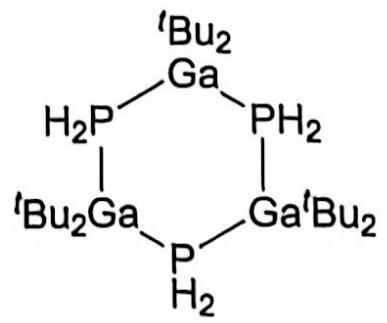  
(2 分)

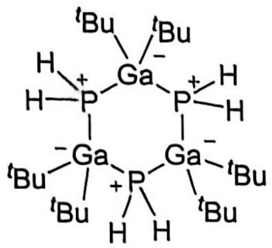

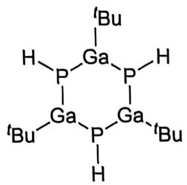

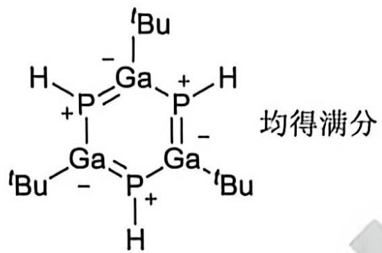

1.6 PH₃与第四主族元素的二芳基化合物 GeAr₂ (Ar = C₆H₃-2,6(C₆H₂-2,4,6-Me₃)₂) 反应，首先通过对 P-H 键的活化生成了氧化加成的产物(a)；研究表明，还有一个含有一个四元环的、芳基消除的产物(b)。分别画出产物(a)和(b)的结构式。

答案:

(a)

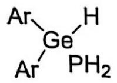

(2 分)

(b)

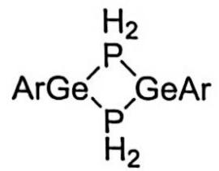

(2 分), 共 4 分

(b) 如果画成以下结构，也得 2 分。如果结构正确，不标形式电荷不扣分，形式电荷标错不得分。

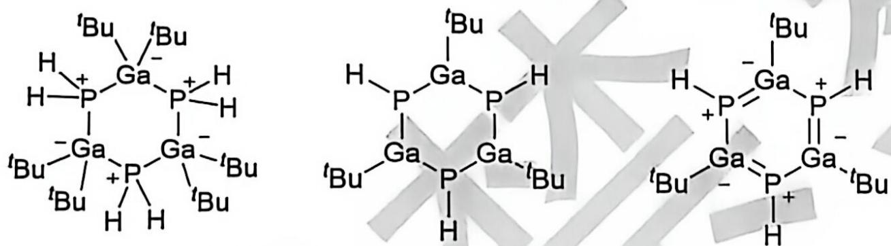

(b) 如果画成以下结构，得 1 分

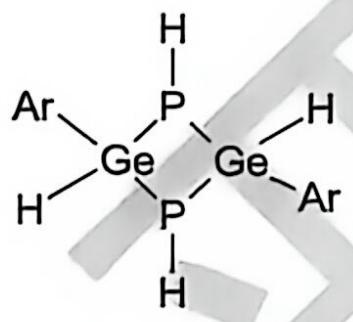

## 第 2 题 生物相容性化学反应 (21 分, 8%)

生物相容性化学反应是指能在细胞、组织或生物体等生命环境中进行，并对生命体系损伤较小的化学反应。它在药物递送、疾病诊断、生物成像和活细胞标记等领域具有广泛的应用，为研究生命过程、精准检测疾病和开发新型治疗方法提供了新的途径。

2.1 叠氮基团与炔基之间的反应是常用的生物相容性化学反应之一。由于这类反应可以像“点击”(Click)一样，在温和条件下快速、高效、选择性地把两个分子连接起来，因此被称为 Click 反应。早期的叠氮-炔基 Click 反应通常需要一价铜离子催化；然而，如下所示的 DBCO 与叠氮的反应不需要任何催化剂，在常温、常压的水溶液中就能高效发生。为此反应无需过渡金属催化也能高效进行给出合理的解释。

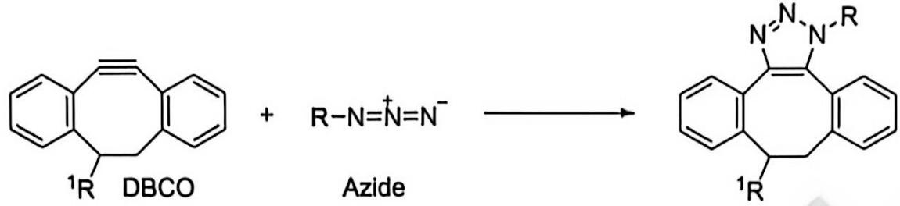

答案:

含炔基的八元环/中环张力较大，反应活化能降低。(1 分);

只需答出：八元环/中环张力大，或八元环/中环上叁键活泼即可给分。

回答只涉及叠氮基性质不给分。

2.2 上述反应通常可在数小时内完成。然而，实际体系中蛋白质、核酸等生物大分子浓度通常很低，直接测定其反应动力学参数具有一定的困难。一种可行的方法是通过监测物质分子量的变化来判断反应进程。分子量与分子扩散系数紧密相关，两者通过Stokes-Einstein关系式关联：

$$
D = \frac {k _ {B} T}{3 \pi \eta d}
$$

其中 D 为扩散系数， $\eta$ 为溶液黏度，d 为分子的水合直径。

2.2.1 通过 Click 反应可以将荧光基团引入蛋白质中。反应物 A (分子量 $\approx 1.12 \mathrm{kDa}$ ) 为荧光基团 AF647 ( $\mathbf{R}^2$ ) 修饰的 DBCO, 反应物 B (分子量 $\approx 43.7 \mathrm{kDa}$ ) 为叠氮基修饰的卵清蛋白 (Ovalbumin, OVA), A 和 B 通过 Click 反应生成产物 C。已知反应物 A 在 pH = 7.0 的水溶液中扩散系数为 $257 \mu \mathrm{m}^2 \mathrm{s}^{-1}$ 。估算最终产物 C 的扩散系数, 并给出估算所需的假设。

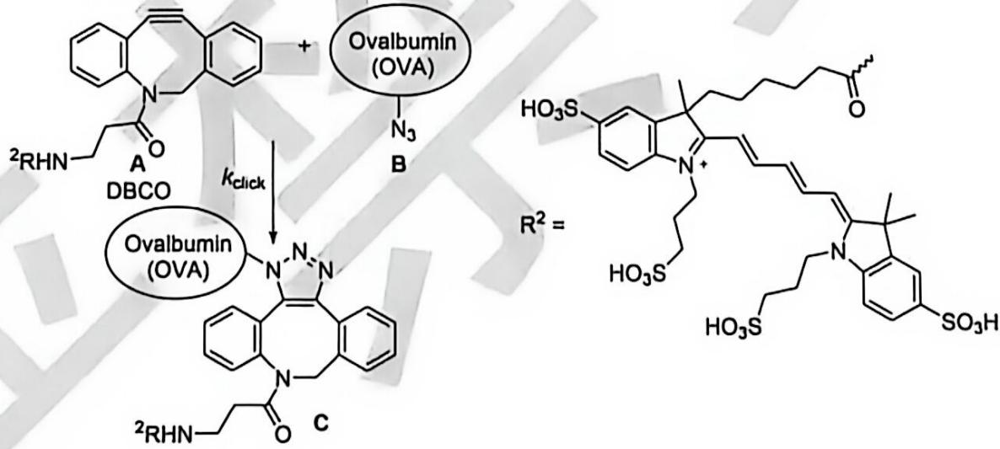

答案:

假设所有溶液中分子近似为球体，且密度相近/体积与分子量成正比， (1 分)

球体的质量与直径的三次方成正比，因此，由 $D \propto d^{-1}$ ，可得 $D \propto M_{\mathrm{w}}^{-1/3}$

产物 $M = 44.8 \mathrm{kDa}$ ,

(1 分)

产物的扩散系数:

$$
D _ {C} = D _ {A} \Big (\frac {M _ {W} (A)}{M _ {W} (C)} \Big) ^ {1 / 3} = 2 5 7 \cdot \frac {1 . 1 2 ^ {1 / 3}}{4 4 . 8 ^ {1 / 3}}\tag{1 分}
$$

$= 75.1 \mu \mathrm{m}^{2} / \mathrm{s}$

(1 分)

评分标准:

\- 假设必须有两点: 球状或球体; 体积或密度与分子量成正比才能得 1 分,

● 产物分子量 1 分，计算式 1 分，答案 1 分，共 4 分。

● 如果没有明确写出假设，但是使用了扩散系数与分子量 1/3 次方成反比关系，计算正确得 3 分，

● 如有跳步，正确则得至该步的所有分，错误则扣掉至该步的分数。

2.2.2 该体系中扩散系数通过分子的荧光信号变化测定, 因此, 只能测得含 AF647 荧光基团的所有分子的平均扩散系数 $\overline{D} = \sum_{l=1}^{N} x_l D_l$ , 其中 $x_l$ 和 $D_l$ 分别为荧光分子 $i$ 占全部荧光分子的摩尔分数和扩散系数。在 1.000 mL 水溶液中, 反应物 A 的浓度为 $100.0 \mathrm{pM}$ , 反应物 B 的浓度为 $40.00 \mu \mathrm{M}$ 。反应开始后第 $800 \mathrm{~s}$ 时测得体系的平均扩散系数为 $131 \mu \mathrm{m}^{2} \mathrm{s}^{-1}$ , 计算此反应的速率常数 $k_{\mathrm{click}}$ 。提示: 对于一级反应, 反应物浓度随时间变化满足: $c = c_0 e^{-kt}$ , 其中 $c_0$ 为反应物初始浓度, $k$ 为速率常数。如果你没有算出 2.2.1 的答案, 本题计算时, 可以使用 $D_{\mathbf{C}} = 80.1 \mu \mathrm{m}^{2} \mathrm{s}^{-1}$ , $D_{\mathbf{B}} = 80.8 \mu \mathrm{m}^{2} \mathrm{s}^{-1}$ 。

答案:

首先测定的是反应物 A 和产物 C 的平均扩散系数,

$$
\overline {{{D}}} = D _ {\mathrm{A}} \cdot x _ {\mathrm{A}} + D _ {\mathrm{C}} \cdot (1 - x _ {\mathrm{A}})\tag{1 分}
$$

$$
x _ {\Lambda} = (\bar {D} - D _ {C}) / (D _ {\Lambda} - D _ {C}) = (1 3 1 - 7 5. 1) / (2 5 7 - 7 5. 1) = 0. 3 0 7\tag{1 分}
$$

B 大过量，[B]基本不变，由 $c = c_{0} e^{-kt}$ 得

$$
x _ {\Lambda} = \exp (- k t) = \exp (- k _ {\mathrm{Click}} [ \mathrm{B} ] t)\tag{2 分}
$$

$$
\mathrm{代入} t = 8 0 0 \mathrm{s}, x _ {\mathrm{A}} = 0. 3 0 7, [ \mathrm{B} ] = 4 0. 0 0 \mu \mathrm{M}
$$

$$
\mathrm{解得} k = 0. 0 0 1 4 7 6 \mathrm{s} ^ {- 1}, k _ {\mathrm{Click}} = 3. 6 9 \times 1 0 ^ {- 5} \mu \mathrm{M} ^ {- 1} \mathrm{s} ^ {- 1} = 3 6. 9 \mathrm{M} ^ {- 1} \mathrm{s} ^ {- 1}
$$

(1 分) 共 5 分

评分标准:

\- 由平均扩散系数得出 $x_{\Lambda}$ 得到 2 分, 如果扩散系数中包含了 B 的贡献, 不得分;

由动力学方程得到 $x_{\mathrm{A}}$ 与 $t$ 的关系，且速率常数正确表达2分；

\- 最终答案 1 分。如果没有除[B]，k 正确，扣结果分。

● 如有跳步，正确则得至该步的所有分，错误则扣掉至该步的分数；

若使用 $D_{\mathbf{C}} = 80.1 \mu \mathrm{m}^{2} \mathrm{s}^{-1}$

则 $x_{\mathrm{A}} = (\overline{D} - D_{\mathrm{C}}) / (D_{\mathrm{A}} - D_{\mathrm{C}}) = (131 - 80.1) / (257 - 80.1) = 0.288$

代入 $t = 800\mathrm{s}$ ， $x_{\mathrm{A}} = 0.288$ ， $[\mathrm{B}] = 40.00\mu \mathrm{M}$

解得 $k = 0.001556 \mathrm{~s}^{-1}$ , $k_{\mathrm{Click}} = 3.89 \times 10^{-5} \mu \mathrm{M}^{-1} \mathrm{s}^{-1} = 38.9 \mathrm{M}^{-1} \mathrm{s}^{-1}$

2.3 另一种将荧光基团引入蛋白质的方法是将 $\mathrm{R}^2\mathrm{CO}$ 基与 $N$ -羟基琥珀酰亚胺反应形成酯 $\mathbf{E}$ (分子量 $\approx 953$ Da), $\mathbf{E}$ 可与蛋白质中的氨基进行氨酯交换反应 (速率常数为 $k_{1}$ ), 形成产物 $\mathbf{F}$ ; 酯 $\mathbf{E}$ 也会发生水解反应 (速率常数为 $k_{2}$ ) 生成羧酸 $\mathbf{G}$ 。相关物质的扩散系数分别为: $D_{\mathbf{E}} = 271 \mu \mathrm{m}^{2} \mathrm{s}^{-1}, D_{\mathbf{F}} = 65.5 \mu \mathrm{m}^{2} \mathrm{s}^{-1}, D_{\mathbf{G}} = 281 \mu \mathrm{m}^{2} \mathrm{s}^{-1}$ 。

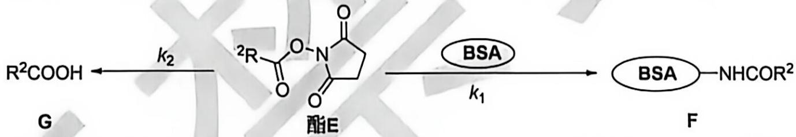

100.0 pM 的反应物 E 与不同浓度的 BSA (Bovine Serum Albumin, 牛血清白蛋白, 分子量 ≈ 66.4 kDa) 溶液进行反应, pH 维持在 7.3。测得体系的平均扩散系数 $\overline{D}$ 和时间 $t$ 满足以下关系:

$$
\bar {D} (t) = P _ {1} \exp (- k t) + P _ {2}
$$

BSA 的不同初始浓度 $c_{0}$ 对应的参数 $P_{1} 、 P_{2} 、$ 和 $k$ 如下表所示:

| BSA 的初始浓度 $c_0/\mu M$ | $P_1/\mu m^2 s^{-1}$ | $P_2/\mu m^2 s^{-1}$ | $k/s^{-1}$ |
| --- | --- | --- | --- |
| 5.000 | 85 | 186 | $3.80 \times 10^{-3}$ |
| 10.00 | 122 | 149 | $5.48 \times 10^{-3}$ |

2.3.1 写出参数 $k$ 、 $P_{1}$ 和 $P_{2}$ 的表达式，用三个化合物的扩散系数 $D_{l} (i = \mathbf{E}, \mathbf{F}, \mathbf{G})$ 、 $k_{1}$ 、 $k_{2}$ 和 $c_{0}$ 表示。答案：

BSA 和水均为大过量， $c_{0}$ 可以视为常数，

因此 E 消耗的一级动力学常数 $k = k_{1}c_{0} + k_{2}$ (1 分)

$$
\text { 则 } [ \mathrm{E} ] = [ \mathrm{E} ] _ {0} \exp (- k t)\tag{1 分}
$$

$$
\text { 由物料守恒: } [ \mathrm{F} ] + [ \mathrm{G} ] = [ \mathrm{E} ] _ {0} - [ \mathrm{E} ] = [ \mathrm{E} ] _ {0} [ 1 - \exp (- k t) ]
$$

$$
\mathrm{根据提示:} [ \mathrm{F} ] / [ \mathrm{G} ] = k _ {1} c _ {0} [ \mathrm{E} ] / k _ {2} [ \mathrm{E} ] = k _ {1} c _ {0} / k _ {2}
$$

解得： $[\mathrm{F}] = [\mathrm{E}]_0[1 - \exp (-kt)]\cdot k_1c_0 / k$ (1分)

$$
[ \mathrm{G} ] = [ \mathrm{E} ] _ {0} [ 1 - \exp (- k t) ] \cdot k _ {2} / k\tag{1 分}
$$

$$
\overline {{{D}}} = D _ {\mathbf {E}} [ \mathbf {E} ] / [ \mathbf {E} ] _ {0} + D _ {\mathbf {F}} [ \mathbf {F} ] / [ \mathbf {E} ] _ {0} + D _ {\mathbf {G}} [ \mathbf {G} ] / [ \mathbf {E} ] _ {0}\tag{1 分}
$$

$$
= \left(D _ {\mathsf {E}} - D _ {\mathsf {F}} k _ {1} c _ {0} / k - D _ {\mathsf {F}} k _ {2} / k\right) \cdot \exp (- k t) + \left(D _ {\mathsf {F}} k _ {1} c _ {0} / k + D _ {\mathsf {F}} k _ {2} / k\right)
$$

因此

$$
k = k _ {1} c _ {0} + k _ {2}
$$

$$
P _ {1} = D _ {\mathsf {E}} - \left[ D _ {\mathsf {F}} k _ {1} c _ {0} + D _ {\mathsf {G}} k _ {2} \right] / \left(k _ {1} c _ {0} + k _ {2}\right)
$$

(1 分)

$$
P _ {2} = \left[ D _ {\mathbf {F}} k _ {1} c _ {0} + D _ {\mathbf {G}} k _ {2} \right] / \left(k _ {1} c _ {0} + k _ {2}\right)
$$

(1 分)

评分标准:

● 共 7 分，答案正确就给满分；

\- 如果只写了答案，没有过程，则 $k$ 的结果1分， $P_{1}$ 结果3分， $P_{2}$ 结果3分；

E、F、G每个物种浓度各1分，共3分；平均扩散系数表达式1分；每个答案各1分，共3分

\- 如有跳步，正确则得至该步的所有分，错误则扣掉至该步的分数

\- 若写成以下形式:

$$
k = k _ {1} c _ {0} + k _ {2}
$$

$$
P _ {1} = D _ {\mathsf {E}} - P _ {2}
$$

$$
P _ {2} = [ D _ {\mathsf {F}} k _ {1} c _ {0} + D _ {\mathsf {G}} k _ {2} ] / k
$$

也得满分。但如果 $k$ 表达式错误, 则这种写法结果分为 0 分; 若 $k$ 表达式正确而 $P_{2}$ 表达式正确, 得 1 分。

2.3.2 计算 $k_{1}$ 和 $k_{2}$ 。提示: 反应中, 任一时刻产物 $\mathbf{F}$ 和 $\mathbf{G}$ 的浓度之比均等于其生成速率之比。答案:

由两个 BSA 浓度下的 $k$ 值，得

$$
3. 8 0 \times 1 0 ^ {- 3} = 5 k _ {1} + k _ {2}
$$

$$
5. 4 8 \times 1 0 ^ {- 3} = 1 0 k _ {1} + k _ {2}
$$

解得

(2 分)

$$
k _ {1} = 3. 3 6 \times 1 0 ^ {- 4} \mu \mathrm{M} ^ {- 1} \mathrm{s} ^ {- 1} = 3 3 6 \mathrm{M} ^ {- 1} \mathrm{s} ^ {- 1}\tag{1 分}
$$

$$
k _ {2} = 2. 1 2 \times 1 0 ^ {- 3} \mathrm{s} ^ {- 1}\tag{1 分}
$$

方程式 2 分，每个答案 1 分，共 4 分。

或用

$P_{2}=[D_{F}k_{1}c_{0}+D_{G}k_{2}]/k$ 列式求解：

$$
1 8 6 = (6 5. 5 \times k _ {1} \times 5 \times 1 0 ^ {- 6} \mathrm{M} + 2 8 1 \times k _ {2}) / (3. 8 0 \times 1 0 ^ {- 3})
$$

$$
1 4 9 = (6 5. 5 \times k _ {1} \times 1 0 \times 1 0 ^ {- 6} \mathrm{M} + 2 8 1 \times k _ {2}) / (5. 4 8 \times 1 0 ^ {- 3})
$$

解得： $k_{1}=3.35\times10^{2}M^{-1}s^{-1}$

$$
k _ {2} = 2. 1 3 \times 1 0 ^ {- 3} \mathrm{s} ^ {- 1}\tag{1 分}
$$

所有涉及计算的题目，因常数取舍、有效数字取舍等原因，计算过程正确，数值结果(有效数字范围内，最后一位)与参考答案给的数值相差不大的不扣结果分。

## 第 3 题 酱油中氨基酸态氮含量的测定 (15 分, 5%)

氨基酸态氮含量直接决定酱油的等级和鲜味，国家标准规定每 $100 \mathrm{~mL}$ 不得低于 $0.4 \mathrm{~g}$ ，特级每 $100 \mathrm{~mL}$ 需达到 $0.8 \mathrm{~g}$ 以上。为了测定某酱油样品中酸和氨基酸态氮的含量，进行了如下实验：

步骤一: 取 $5.00 \mathrm{~mL}$ 酱油样品于 $100 \mathrm{~mL}$ 容量瓶中, 加水稀释摇匀定容至刻度线。从容量瓶中移取 $20.00 \mathrm{~mL}$ 该溶液至烧杯中, 加入 $60 \mathrm{~mL}$ 蒸馏水, 对该溶液进行充分搅拌后, 用 $0.05005 \mathrm{~mol} \mathrm{L}^{- 1}$ 的氢氧化钠标准溶液滴定样品。用 $\mathrm{pH}$ 计监测体系的 $\mathrm{pH}$ 值, 当 $\mathrm{pH}$ 值达到 8.2 时停止滴定, 记录所消耗氢氧化钠的体积 $(V_{0})$ 。步骤二: 向步骤一所得的溶液中加入 $10.0 \mathrm{~mL}$ 质量分数 $37 \%$ 的甲醛溶液, 摇匀。用 $0.05005 \mathrm{~mol} \mathrm{L}^{- 1}$ 的氢氧化钠标准溶液继续滴定, 当 $\mathrm{pH}$ 达到 9.2 时停止滴定, 记录所消耗氢氧化钠的体积 $(V_{1})$ 。

步骤三: 另取一个洁净烧杯, 加入 $80 \mathrm{~mL}$ 蒸馏水, 再滴加氢氧化钠溶液调整 $\mathrm{pH}$ 值为 8.2 , 再加入 $10.0 \mathrm{~mL}$ 步骤二所使用的甲醛溶液, 摇匀。用 $0.05005 \mathrm{~mol} \mathrm{~L}^{- 1}$ 的氢氧化钠标准溶液继续滴定上述溶液, 当 $\mathrm{pH}$ 达到 9.2时停止滴定, 记录所消耗氢氧化钠的体积 $(V_{2})$ 。

重复上述步骤三次，得到如下数据：

|  | $V_0$ /mL | $V_1$ /mL | $V_2$ /mL |
| --- | --- | --- | --- |
| 第一次 | 3.36 | 13.70 | 1.35 |
| 第二次 | ... | ... | ... |
| 第三次 | ... | ... | ... |

3.1 在步骤二中, 需要加入甲醛, 用化学反应式说明甲醛的作用 (提示: 只需写出一个反应式即可)。答案:

甲醛可与氨基酸上的 $-NH_{2}$ 结合，使 $-NH_{3}^{+}$ 上的 $H^{+}$ 游离出来。

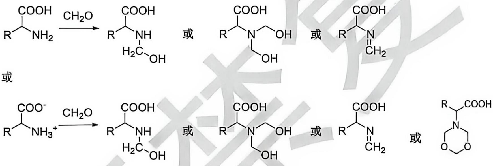  
只需写出甲醛和氨基的反应，形成氨甲基、亚胺、成六元环都可以，不要求产物准确结构；共2分。

3.2 依据国家测定标准，需要进行步骤三。给出步骤三的目的。

答案:

由于甲醛中可能含有酸，第二步反应可能会导致含氮量偏高：因此，第三步是确定甲醛中酸的含量（1 分）答出确定甲醛中酸的含量即可得分。

建议评分标准加上“只有明确写出滴定甲醛中的酸”才给分，只表述“空白试验消除其他因素干扰”不给分。

3.3 滴定中所用的甲醛溶液在室温条件下，敞口放置了 10 天，与采用新配制的甲醛溶液相比， $V_{1}$ 和 $V_{2}$ 会发生什么变化，测定结果将如何变化(回答：变大、变小或无变化即可)，解释你所判断的结果。

$V_{1}$ 和 $V_{2}$ 都变大， (1 分)
最终结果不受影响。 (1 分)

甲醛在空气中发生氧化生成甲酸，消耗了更多的氢氧化钠。(1 分)，共 3 分

3.4 实验过程中发现所用的甲醛有白色晶状固体析出，加热至 $70^{\circ} \mathrm{C}$ 后，固体逐渐溶解，采用加热后冷切至室温的甲醛溶液进行实验，实验效果不受影响。你认为甲醛中白色晶状固体是什么？

答案:

多聚甲醛/三聚甲醛 (1 分)

3.5 计算酱油样品中酸的含量 (以乳酸计, 乳酸的分子量为 $90.08 \mathrm{~g} \mathrm{~mol}^{- 1}$ , 单位用 $\mathrm{g}(100 \mathrm{~mL})^{- 1}$ 表示。答案:

酸含量:

$$
X _ {1} = \frac {3 . 3 6 \times 0 . 0 5 0 0 5 \times 9 0 . 0 8}{5 . 0 0 \frac {2 0 . 0 0}{1 0 0 . 0 0}} = 1 5. 1 g / L = 1. 5 1 g / 1 0 0 m L\tag{2 分}
$$

计算公式 1 分，结果 1 分。本题有效数字错误扣 1 分。

3.6 计算酱油样品中氨基酸态氮的含量, 单位用 $\mathrm{g}(100 \mathrm{~mL})^{- 1}$ 表示。答案:

氨基酸态氮含量:

$$
X _ {1} ^ {\prime} = \frac {(1 3 . 7 0 - 1 . 3 5) \times 0 . 0 5 0 0 5 \times 1 4 . 0 1}{5 . 0 0 \times \frac {2 0 . 0 0}{1 0 0 . 0 0}} = 8. 6 6 g / L = 0. 8 6 6 g / 1 0 0 m L\tag{2 分}
$$

计算公式 1 分，结果 1 分。本题有效数字错误扣 1 分。

氮原子量用14.0则结果如下

$$
X _ {1} ^ {\cdot} = \frac {(1 3 . 7 0 - 1 . 3 5) \times 0 . 0 5 0 0 5 \times 1 4 . 0}{5 . 0 0 \times \frac {2 0 . 0 0}{1 0 0 . 0 0}} = 8. 6 5 g / L = 0. 8 6 5 g / 1 0 0 m L\tag{2 分}
$$

计算式中氮原子量用 14，计算结果正确，即使最终保留 3 位有效数字，也扣有效数字 1 分。

3.7 能否利用滴管和滴定用的 $0.05005 \mathrm{~mol} \mathrm{L}^{-1}$ 氢氧化钠溶液将蒸馏水的 $\mathrm{pH}$ 值调整为 8.2，通过计算说明。答案：

用滴管移取溶液, 每滴约 $0.05 \mathrm{~mL}$ (0.02-0.1 mL 皆视为合理, 超过此范围不得分)。去离子水为中性, 滴入 1 滴氢氧化钠后体系的 $\mathrm{pH}$ 值将变为:

$$
p H \approx 1 4 - \log (\frac {0 . 0 5 \times 0 . 0 5 0 0 5}{8 0}) = 9. 5
$$

因此无法控制。

(2 分)

或者

将 $80 \mathrm{~mL}$ 去离子水的 $\mathrm{pH}$ 值调至 8.2 需要的氢氧化钠溶液的体积为:

$$
V \approx \frac {8 0 \times 1 0 ^ {(- 1 4 + 8 . 2)}}{0 . 0 5 0 0 5} = 2. 5 \times 1 0 ^ {- 3} m L
$$

这么少的体积用滴管无法移取。

因此无法实现上述调节。

(2 分)

用两种方法均可，没有计算过程不得分。

3.8 在酱油检测标准的步骤一和步骤二中，为何分别需要将 $\mathrm{pH}$ 值定为8.2和9.2？答案：

将游离酸完全滴定, 而此时碱还没与氨基酸反应, 这时的 $\mathrm{pH}$ 值大约为 8.2; (1 分)氨基酸完全与碱反应后, 这时的 $\mathrm{pH}$ 值为 9.2。 (1 分)

## 第 4 题 从金刚烷到金刚石的电子显微学研究 (27 分, 12%)

金刚烷(Ad)是一种高度对称的烃类分子, 其中仅包含两种不同的碳原子。最近研究发现, 在电子辐照下, Ad 会优先断裂 C-H 键而非 C-C 键, 然后转化成纳米金刚石 (ND), 转化过程中会形成一系列一维链状的 Ad 寡聚体 $\mathrm{Ad}_{\mathrm{n}}$ , 金刚石可以看成无数个 Ad 单元在三维方向重复得到的结构, 下图中给出了 Ad、 $\mathrm{Ad}_{3} \sim \mathrm{Ad}_{5}$ 和金刚石的结构。

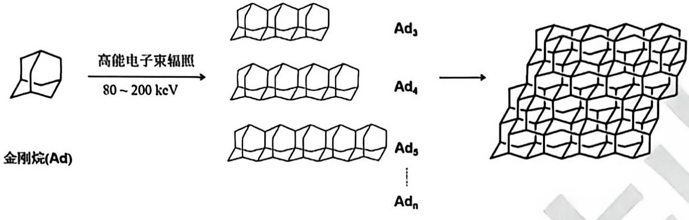  
Ad一维链状寡聚体 $Ad_{n}$

4.1 以下哪些是与 Ad 等价的拓扑结构？选出所有正确的答案；若所有选项均错误，填写 X。

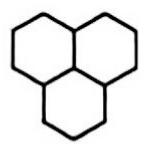

(A)

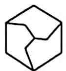

(B)

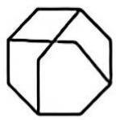

(C)

(D)

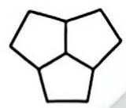

(E)

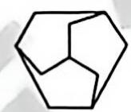

(F)

(2 分)

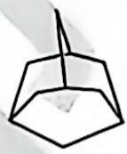

(G)

(H)

答案: B, C, F, H

有错误选项不得分，0-1 个正确 0 分，2-3 个正确 1 分

4.2 在电子束辐照生成 ND 的过程中, Ad 中的 C-H 键会发生断裂, 其中一种中间体 (Ad-2H) 断裂了两根 C-H 键, 而碳骨架与 Ad 完全相同, 中间体 Ad-2H 共有多少种异构体? 答案: 6 种 (2 分)

同一个 $CH_{2}$ ：1 种， $2^{*}CH$ ：1 种， $2^{*}CH_{2}$ ：2 种， $CH + CH_{2}$ ：2 种

4.3 写出一维链状寡聚体 $\mathbf{Ad}_{\mathfrak{n}}$ 的化学式，用含 $\mathfrak{n}$ 的式子表示。

答案:

$$
\mathrm{C} _ {\mathrm{n}} = \mathrm{C} _ {\mathrm{n-1}} + 7
$$

$$
\mathrm{H} _ {\mathrm{n}} = \mathrm{H} _ {\mathrm{n-1}} + 8
$$

$$
\mathrm{C} _ {1} = 1 0
$$

$$
\mathrm{H} _ {1} = 1 6
$$

$C_{n}=C_{1}+7(n-1)=10+7(n-1)=7n+3$ (1分)

$H_{n}=H_{1}+8(n-1)=16+8(n-1)=8n+8$ (1分)

化学式为： $C_{7n+3}H_{8n+8}$

● C 和 H 数量各 2 分，其中递推关系 1 分，结果 1 分

● 如有跳步，正确则得至该步的所有分，错误则扣掉至该步的分数：

4.4 根据表格中的单键键焓数据，计算以下反应的焓变，假设反应物和生成物均为气态。

4.4.1 由 Ad 生成 1 mol 金刚石。

|  | C-H | C-C | H-H |
| --- | --- | --- | --- |
| 键焓(kJ mol-1) | 400 | 380 | 435 |

答案:

反应式为： $C_{10}H_{16}\rightarrow10C+8H_{2}$ (1分)

金刚石中每个碳原子上有 2 根 C-C 键，

$$
\Delta \mathrm{H} = [ (1 6 \mathrm{BE(C-H)} + 1 2 \mathrm{BE(C-C)}) - (2 0 \mathrm{BE(C-C)} + 8 \mathrm{BE(H-H)}) ] / 1 0
$$

$$
= [ (1 6 \times 4 0 0 + 1 2 \times 3 8 0) - (2 0 \times 3 8 0 + 8 \times 4 3 5) ] / 1 0
$$

$$
= - 1 2 \left(\mathrm{kJ} \mathrm{mol} ^ {- 1}\right)
$$

(1 分)

或: 断裂的 C-H:生成的 C-C 键:生成的 H-H 键 = 2:1:1$\Delta \mathrm{H} = [16\mathrm{BE(C - H)} - (8\mathrm{BE(C - C)} + 8\mathrm{BE(H - H)})] / 10$ $= [16\times 400 - (8\times 380 + 8\times 435)] / 10$ (2分) $= -12(\mathrm{kJ mol^{-1}})$ (1分)

\- 反应方程式 1 分, 反应热和键能的关系式 2 分 (其他合理推断也得分), 结果 1 分;

\- 计算时没有除以 10，答案为 $-120 \mathrm{~kJ} \mathrm{~mol}^{-1}$ ，只扣结果分；

\- 正负号弄反了只扣结果分；

● 如有跳步，正确则得至该步的所有分，错误则扣掉至该步的分数。

4.4.2 由 Ad 生成 1 mol $Ad_{n}$ ，用含 n 的式子表示。

答案:

反应式为： $(7n+3)/10\cdot C_{10}H_{16}\rightarrow C_{7n+3}H_{8n+8}+1.6(n-1)H_{2}$ (1分)

断裂的 C-H:生成的 C-C 键:生成的 H-H 键 = 2:1:1，从反应式的 $H_{2}$ 生成数可知生成 1.6(n-1)个 H-H 键，所以 $\Delta H = 1.6(n - 1)[2BE(C-H) - (BE(C-C) + BE(H-H))]$ = 1.6(n - 1) [2 × 400 - (435 + 380)] (2 分)
= 24(1 - n) (kJ mol $^{-1}$ ) (1 分)

\- 反应方程式 1 分, 反应热和键能的关系式 2 分 (其他合理推断也得分), 结果 1 分;

\- 正负号弄反了只扣结果分;

\- 如有跳步，正确则得至该步的所有分，错误则扣掉至该步的分数。

4.5 研究人员利用透射电子显微镜 (TEM) 研究由 Ad 生成 ND 的动力学过程和机理。TEM 可以看成微观世界的 X 光机, 利用高能电子束照射样品, 电子束透过样品后在屏幕上成像, 样品颗粒会阻碍电子的透过, 在屏幕上呈现较暗的区域。下图显示了同一 Ad 样品区域经电子束辐照不同时间的四张照片 (照片边长对应 $250 \mathrm{~nm}$ ), 图中逐渐出现并变大的黑色颗粒对应的正是经电子束辐照生成的 ND 颗粒; 进一步对其中单个颗粒放大, 可以直接看到其中的原子排列, 如下图最右边的图片所示 (照片边长对应 $5 \mathrm{~nm}$ )。

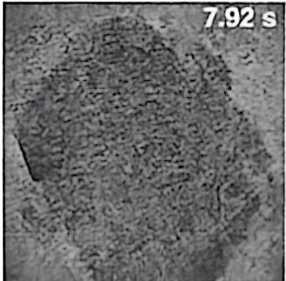

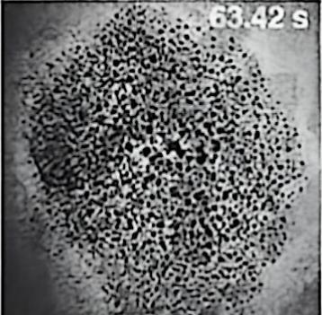

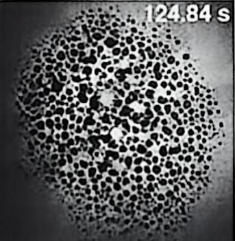

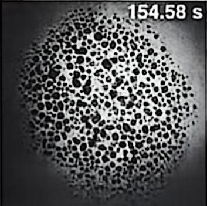

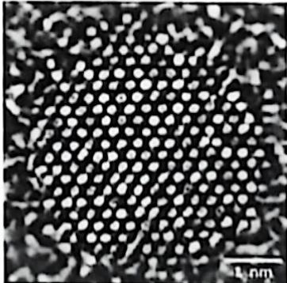

TEM 测量中, 可以在成像的同时控制电子束的能量和辐照强度, 可以用 “眼见为实” 的方式研究电子辐照引发的化学反应的微观过程。在 TEM 的观测过程中, 样品台上的样品可视为封闭体系。研究表明, 在 TEM 电子束照射足够长时间后, Ad 会全部转化成 ND, 经其他途径损失的 Ad 可以忽略不计。

4.5.1 为了研究 ND 的产率随时间的变化，在不同时刻对同一区域拍照，利用图像处理技术对每一张图像中不同面积的 ND 颗粒数目进行统计。下表列出了某次实验中电子束辐照后第 200 s 和 Ad 完全转化成 ND 后拍摄的照片中不同面积的 ND 颗粒数。根据这些数据计算电子束辐照 200 s 时的 ND 产率，精确至 1%。提示：TEM 观察到的颗粒为其三维形状在屏幕平面上的投影，可以假设颗粒近似为球形。

<table><tr><td>颗粒面积/nm2</td><td>1.0</td><td>4.0</td><td>9.0</td><td>16.0</td><td>25.0</td><td>36.0</td><td>49.0</td><td>64.0</td><td>81.0</td></tr><tr><td>辐照200s后的颗粒数</td><td>40</td><td>40</td><td>30</td><td>0</td><td>0</td><td>0</td><td>0</td><td>0</td><td>0</td></tr><tr><td>完全转化成ND后的颗粒数</td><td>0</td><td>0</td><td>0</td><td>10</td><td>15</td><td>10</td><td>4</td><td>0</td><td>0</td></tr></table>

答案:

转化率

$$
\begin{aligned} & = (40\times 1.0^{3 / 2} + 40\times 4.0^{3 / 2} + 30\times 9.0^{3 / 2}) / (10\times 16.0^{3 / 2} + 15\times 25.0^{3 / 2} + 10\times 36.0^{3 / 2} + 4\times 49.0^{3 / 2})\\ & = 19\% \end{aligned}
$$

表达式 2 分，结果 1 分。

4.5.2 利用两种辐照强度 $I$ (单位面积单位时间内的入射电子数量) 不同的电子束照射 Ad 样品, 发现在 ND

转化率为 $20 \% \sim 60 \%$ 区间内, 转化率与电子辐照剂量 (单位面积内的入射电子总数) 存在较好的线性关系, 斜率与电子辐照强度无关, 如右图所示。在 $20 \% \sim 60 \%$ 转化区间内, ND 的生成速率相对于 Ad 浓度和 $I$ 的反应级数分别是多少, 说明理由。

答案:

对 Ad: 0 级 (1 分)

Ad 消耗但 ND 生成速率不变，

答出[Ad]对 ND 生成速率无影响即可得分 (1 分)

对I：1级 (1分)

$\Delta[ND]/(I\Delta t)$ 为常数，则 $\Delta[ND]/\Delta t \propto I$ (1分)

每个答案 1 分，理由 1 分。

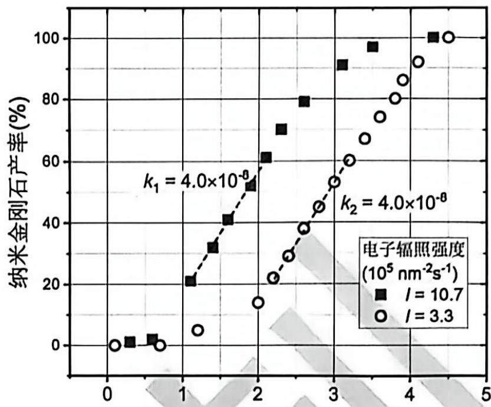  
电子辐照剂量 $(10^{7}\ \text{e nm}^{-2})$

4.5.3 高能电子引发的 Ad 中 C-H 键的断裂是形成 ND 的关

键。TEM 中电子能量约 80～200 keV，从能量上看一个电子可以打断多根 C-H 键。实验中观察到，当电子能量为 200 keV、辐照剂量为 $4.5 \times 10^{7} e \mathrm{nm}^{-2}$ ，在半径为 100 nm 的圆形视野内，最终观察到 100 个半径为 5 nm 的 ND 颗粒，已知金刚石中 C-C 键长为 1.54 Å。根据上面的数据，通过分析和估算说明：ND 形成过程中，一个电子打断多根 C-H 键是否是必须的。

答案:

金刚石晶胞参数为 $a$ ，则 $d_{\mathrm{C - C}} = \sqrt{3} a / 4$ ，则 $a = d_{\mathrm{C - C}}4 / \sqrt{3} = 0.154\times 4 / \sqrt{3} = 0.356\mathrm{nm}$

金刚石中每个 C 原子对应的体积 $V_{C} = a^{3}/8 = 0.356^{3}/8 = 0.0056 \, \mathrm{nm}^{3}$

视野中的金刚石总体积: $V_{\mathrm{total}} = 100 \times 4 / 3 \pi \mathrm{r}^{3} = 100 \times 4 / 3 \pi \times 5^{3} = 5.24 \times 10^{4} \mathrm{~nm}^{3}$

C 原子总数 $n_{C}=V_{total}/V_{C}=5.24\times10^{4}/0.0056=9.4\times10^{6}$ (1 分)

断裂的 C-H 最大数目 $n_{C-H}=1.6n_{C}=1.6\times9.4\times10^{6}=1.5\times10^{7}$ (1 分)

电子总数： $4.5 \times 10^{7} \times \pi \times 100^{2} \sim 10^{12} >> n_{C-H}$ (1 分)

因此一个电子打断多根 C-H 不是必须的 (1 分)

C 原子数量 $(10^{6}\sim10^{8})$ 1 分，C-H 数量 $(10^{6}\sim10^{8})$ 1 分，电子数量 $(10^{12}\sim10^{13})$ 1 分，结论 1 分，

数量级正确即可给分，无需计算出精确结果。

类似这种更粗略的估算也得满分：

电子总数： $4.5 \times 10^{7} \times \pi \times 100^{2} \sim 10^{12}$

金刚石中一个 C 的体积 $\sim\pi(0.154/2)^{3}/3=4.8\times10^{-4}\mathrm{nm}^{3}$

C 原子数目： $\pi100\times5^{3}/3/(4.8\times10^{-4})\sim10^{8}$ (1 分)

C-H 键数目也为同一数量级<<电子总数 (1 分)

因此一个电子打断多根 C-H 不是必须的。 (1 分)

## 第 5 题 密堆积结构 (30 分, 12%)

某一类离子晶体由 X、Y、Z 三种元素组成，其中 X、Y 为阳离子，Z 为阴离子，在描述其晶体结构时均可视为刚性小球。X 和 Z 可近似看作半径相同的球，其半径显著大于 Y。如下图所示，X 和 Z 形成密堆层，每个 X 离子周围最近邻的 6 个位置均由 Z 离子占据；相邻的 XZ 层沿垂直纸面方向按照等径球密堆积的形式堆叠形成三维结构，较小的 Y 离子可以进入其中的八面体空隙。相邻 XZ 层之间形成的八面体空隙

可以表示为 $X_{n}Z_{6 - n}$ , 其中 $n$ 为八面体顶点中 $\mathbf{X}$ 的数目。该结构与经典的等径圆球密堆积非常相似, 但一个显著的区别是电性相同的离子不允许直接接触。

5.1.1 右图所示的二维密堆积层中, 每个最小重复单元中可被第二层中 $\mathbf{X}$ 离子占据的位置有几个。

答案: 2 (1 分)

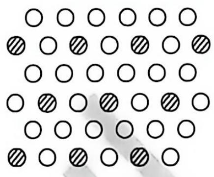

5.1.2 相邻两个 XZ 层能形成多少不同类型的八面体空隙？按照 $n$ 增加的顺序列出所有类型，并计算其比例。

$Z_{6}$ 、 $X_{2}Z_{4}$ (2分) 少写、多写均不得分，顺序错误不扣分， $Z_{6}$ 写成 $X_{0}Z_{6}$ 不扣分 $n(Z_{6})/n(X_{2}Z_{4})=1/3$ (2分) 若还有其他类型，但 $Z_{6}/X_{2}Z_{4}$ 比例正确，得1分

5.2 当 XZ 层沿垂直方向按照立方最密堆积方式堆积时, 形成的结构称为 3C 型结构。当 XZ 层沿垂直方向按照六方最密堆积方式堆积时, 形成的结构称为 $2 \mathrm{~H}$ 型结构。上述结构中, Y 离子占据了其中所有允许填充的八面体空隙。

5.2.1 写出 2H 型结构的化学式。

答案: $\mathrm{XYZ}_3$ (2分) 其他答案不得分

5.2.2 以 X 为晶胞顶点，写出 2H 型结构晶胞中所有 Y 原子的分数坐标。
答案：
(2/3, 1/3, 1/4) (1 分)
(2/3, 1/3, 3/4) (1 分)

或：(1/3, 2/3, 1/4)，(1/3, 2/3, 3/4)

评分标准:

\- 如果只写了一个正确答案，得 1 分；

\- 只要有错误坐标，就不得分；

\- 两个坐标中， $x$ 和 $\dot{y}$ 的坐标必须相同，否则不得分；

\- 如果写成: (2/3, 1/3, 1/4) 和 (2/3, 1/3, 3/4), 或 (1/3, 2/3, 1/4) 和 (1/3, 2/3, 3/4), 即明确表示出是两种正确答案中的任意一种, 得 2 分。

5.2.3 在 3C 和 2H 型结构中, 含有 Y 的八面体分别以何种方式进行连接? 填写: 共面、共顶点、或既有共面也有共顶点。

答案:
2H-共面 (1分)
3C-共顶点 (1分)

5.2.4 仅考虑静电相互作用时, $3 \mathrm{C}$ 型和 $2 \mathrm{H}$ 型中哪一种结构具有更高的稳定性, 说明理由。答案: 3C (1 分)

3C 中阳离子 Y 之间的距离更远，排斥力较小/2H 中 Y 之间的距离更近，排斥力较大 (1 分)共 2 分，正确选项 1 分，理由 1 分

除 3C 型和 2H 型结构外，XZ 层可以同时包含立方和六方两种局域堆积模式，形成非常丰富的衍生结构。右图给出了两种衍生结构的示意图，其中的长方形代表晶胞。这类结构中每个 XZ 层（图中用数字 1\~14 标出）的堆积模式可以用 h 或 c 表示，其定义为：若连续三个 XZ 层按六方密堆积形式堆积，则中间层记为 h；若连续三个 XZ 层按立方密堆积形式堆积，则中间层记为 c。题 5.2 中的 2H 结构是指每个 XZ 层均以 h 模式堆积，重复单元是 2 层；而 3C 结构是指每个 XZ 层均以 c 模式堆积，重复单元是 3 层。

5.3 写出图中 A 和 B 两种结构中所有属于 h 堆积模式的层对应的编号。
答案：
A: 6, 12 (2 分)
B: 1, 2, 5, 6, 9, 10, 13, 14 (2 分)
各 2 分，

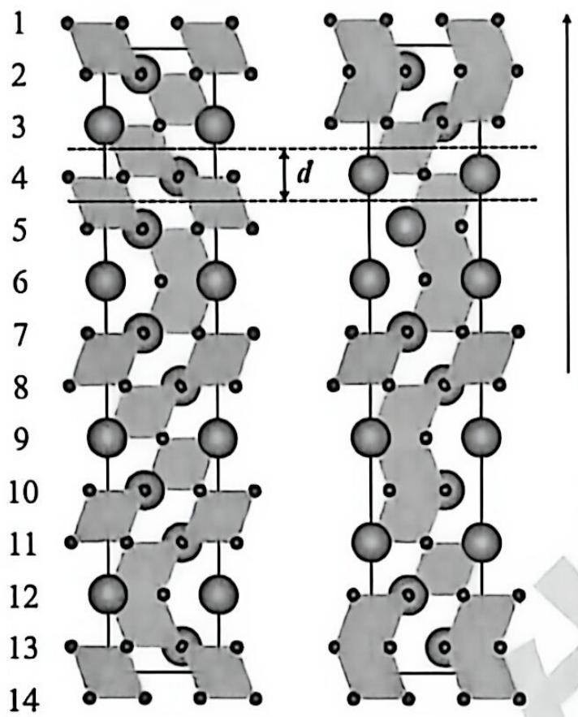  
A  
B

\- 有错误编号不给分；

\- 若未写全，A 只写了 1 个，得 1 分；B 写出 4 个或 4 个以上，得 1 分

## 堆积方向

说明:
• 大球代表X;
• 小球代表Z;
• 平行四边形代表填充了Y的八面体空隙;
• 球的大小仅用于区分不同粒子, 不反映其真实半径差异。

5.4 化合物 N 存在多种晶型，分别标记为 $\alpha$ 、 $\beta$ 、 $\gamma$ 和 $\delta$ ，均为 XZ 层不同堆积模式 (h 或 c) 的衍生结构，其中 XZ 层可以视为理想的等径圆球密堆积层，Y 占据全部允许占据的八面体空隙，堆积模式会引起层间距 d（定义见上图）的微小变化。随着压力升高，该化合物可发生 $\alpha \rightarrow \beta \rightarrow \gamma \rightarrow \delta$ 的结构相变，对应 XZ 层堆积模式的变化。已知： $\gamma$ 和 $\delta$ 两种晶型中，一种为 3C 相；另一种为 xH 相，属于六方结构，其晶胞参数 a = 5.7127 Å，c = 14.0499 Å； $\alpha$ 和 $\beta$ 分别对应 I 和 II 两种堆积序列，序列 I 为 hhchhhchhc...，序列 II 为为 hchchc...。

5.4.1 通过计算说明，h 和 c 两种堆积模式中，哪种层间距较大，并说明理由。

由题意，XZ 层内相邻原子距离为 a/2、则理想的等径圆球密堆积，即 3C 结构的层间距为 $d_{l}=\sqrt{6}a/6=\sqrt{6}\times5.7127/6=2.3322\ \text{\AA}$ (1 分)
六方晶胞中，c 方向的 XZ 层数约为： $c/d_{i}=14.0499/2.3322=6.02>6$ 即六方晶胞 c 方向共有 6 层 XZ，(1 分)
六方晶胞平均层间距略大于 $d_{i}$ ，(1 分)
因其中含有 h 型的堆叠模式，故 h 的层间距较大。(1 分)

\- 理想层间距 1 分，c 方向的层数 1 分，结论 1 分，理由 1 分，每一点有遗漏就扣 1 分。

\- 本问必须通过晶胞参数和层间距进行计算比较, 如未进行计算, 只根据结构特点 (h 结构中 Y 距离更近, 排斥作用大), 得出 h 的层间距较大, 本题得 2 分。

5.4.2 在 $\gamma$ 和 $\delta$ 两种晶型中, 哪一种对应 3C 型结构? 说明理由。

答案:

δ (1 分)

h 层间距离大于 c，3C 密度最大/摩尔体积最小 (1 分)，高压稳定 (1 分)。共 3 分答案 1 分，3C 密度最大 1 分，高压稳定 1 分，每一点有遗漏就扣 1 分。

5.4.3 写出 $\alpha$ 和 $\beta$ 对应的堆积序列 (I 或 II), 并说明理由。答案: $\alpha - I, \beta - II$ (1 分)

c 含量越高，密度越大/为高压相。（1 分）
理由只需答出 c 或 h 的含量与密度的关系，或与压力的关系即可得分。
共 2 分，理由 1 分。答出密度或压力与 h/c 比例关系 1 分，每一点有遗漏就扣 1 分。

5.4.4 六方结构的 $xH$ 相的堆积序列中, $h$ 和 $c$ 数目的比例 $(h / c)$ 可能是多少? 说明理由。

h/c = 1/2 (1 分)

该六方结构 c 方向有 6 层 XZ，且密度应大于 hchchc，

可能是 $2\mathrm{h}4\mathrm{c}$ 或 $1\mathrm{h}5\mathrm{c}$ ，(2分)

但 $1 \mathrm{~h} 5 \mathrm{c}$ 不具有平移对称性 (参见图中 A 结构), 因此是 $2 \mathrm{~h} 4 \mathrm{c}$ 。 (1 分)

评分标准: 答案 1/2 得 1 分 (不论推理是否正确都得分): 推理出 $2 \mathrm{~h} 4 \mathrm{~c}$ 和 $1 \mathrm{~h} 5 \mathrm{~c}$ 两种可能得 2 分; 排除 $1 \mathrm{~h} 5 \mathrm{~c}$ 得 1 分。

# 亚桥原创

## 第 6 题 钙钛矿纳米晶体的尺寸效应 (30 分, 13%)

当钙钛矿型金属卤化物的尺寸为几个纳米时, 可得到具有特殊光学效应的纳米晶, 又称为钙钛矿量子点。某研究组以正辛烷、正己烷为溶剂, 合成了单分散、高发光效率的 $\mathrm{CsPbBr_3}$ 钙钛矿量子点。本题将从表面热力学、量子限域效应、光谱吸收等维度, 系统探讨纳米尺寸效应的内在规律。

## 6.1 比表面吉布斯自由能与分散度

比表面吉布斯自由能是在恒温、恒压、恒组分条件下，可逆地增加单位表面积时体系吉布斯自由能的增量。已知 $25^{\circ}$ C、100 kPa 时，正己烷的比表面吉布斯自由能为 $17.89 \, mJ \cdot m^{-2}$ ，现将半径为 $1 \, mm$ 的正己烷液滴分散成半径为 $1 \, \mathrm{nm}$ 的小液滴。

6.1.1 计算小液滴的个数 N。

答案： $n = (\frac{R}{r})^3 = \left(\frac{10^{-3}}{10^{-9}}\right)^3 = 10^{18}$

(1 分)

6.1.2 计算分散前后总表面积的变化量 $\Delta A$ 。

答案: $\Delta A = 4\pi (nr^{2} - R^{2}) = 4\pi (10^{18} \times (10^{-9})^{2} - (10^{-3})^{2}) \approx 12.57 \mathrm{~m}^{2}$

(1 分)

6.1.3 计算整个过程中正己烷表面吉布斯自由能的增加量 $\Delta G$ (单位: J)。答案: $\Delta G = 17.89 \times 10^{-3} \Delta A = 17.89 \times 10^{-3} \times 12.57 = 0.2248$ (J) (1分)以上三问, 式子和答案均正确才给分

## 6.2 半导体纳米晶的带隙估算

当半导体材料的尺寸缩小至纳米量级时, 其内部电子运动受限, 原来近似连续的电子能级变为离散的电子能级, 导致导带与价带之间的带隙由本征带隙 $(E_{\mathrm{g}})$ 增大至 $E_{\mathrm{g}}'$ 。半导体纳米晶体的带隙 $(E_{\mathrm{g}}')$ 的计算方法为: $E_{\mathrm{g}}' = E_{\mathrm{g}} + E_{\mathrm{c}}$ 其中 $E_{\mathrm{c}}$ 表示电子和空穴的量子禁闭能级, 可用势箱模型进行计算。不同形状的势箱, $E_{\mathrm{c}}$ 的表达式分别为: 球形势箱: $E_{c} = \frac{n^{2}h^{2}}{8\mu^{*}r^{2}}$ , 式中 $r$ 为球形势箱半径。三维长方体势箱: $E_{c} = \frac{h^{2}}{8\mu^{*}} (\frac{n_{x}^{2}}{L_{x}^{2}} + \frac{n_{y}^{2}}{L_{y}^{2}} + \frac{n_{z}^{2}}{L_{z}^{2}})$ , 式中 $L_{x}$ 、 $L_{y}$ 、 $L_{z}$ 为三维长方体势箱三个方向的长度。上述计算式中的 $n$ 、 $n_{x}$ 、 $n_{y}$ 、 $n_{z}$ 称为量子数, 均为正整数, 计算带隙时取值均为 $1: \mu^{\bullet}$ 为折合有效质量, $\frac{1}{\mu^{\bullet}} = \left( \frac{1}{m_{e}^{\bullet}} + \frac{1}{m_{h}^{\bullet}} \right)$ , $m_{\mathrm{c}}^{\bullet} = 0.15 m_{\mathrm{c}}$ 和 $m_{\mathrm{h}}^{\bullet} = 0.14 m_{\mathrm{c}}$ 分别为电子和空穴的有效质量, $m_{\mathrm{c}} = 9.109 \times 10^{-31} \mathrm{~kg}$ 为自由电子质量, $h$ 为普朗克常数, 基本电荷 $\mathbf{c} = 1.602 \times 10^{-19} \mathrm{C}$ 。提示: $\frac{h^{2}}{8m_{\mathrm{c}}} = 6.025 \times 10^{-38} \mathrm{~J} \cdot \mathrm{m}^{2} = 0.376 \mathrm{eV} \cdot \mathrm{nm}^{2}$

6.2.1 纳米晶的带隙可以通过吸收光谱方法测得, 但普通光源无法测量单个半导体纳米晶的带隙, 为什么? 答案: 常见的光波长为数百 $\mathrm{nm}$ , 远大于纳米晶尺寸 (几 $\mathrm{nm}$ ), 测得的是大量颗粒的统计平均光谱, 无法得到单颗粒带隙。(2 分)

答出 “光波长远大于纳米晶尺寸” 即可得分。

回答普通光源单色性差不给分。

6.2.2 为获得单个半导体纳米晶的带隙, 采用 $100 \mathrm{keV}$ 的高能电子束来 “照射” 单个 $\mathrm{CsPbBr}_{3}$ 量子点。估算 $100 \mathrm{keV}$ 电子束的德布罗意波长 (精确至 $1 \mathrm{~nm}$ ), 并说明为什么电子束能用于测量单个纳米晶的带隙。

$$
\begin{array}{r l r} & \lambda = \frac {h}{m _ {c} v} = \frac {h}{\sqrt {2 m _ {c} E _ {k}}} = \frac {6 . 6 2 6 \times 1 0 ^ {- 3 4}}{\sqrt {2 \times 9 . 1 0 9 \times 1 0 ^ {- 3 1} \times (1 . 6 0 2 \times 1 0 ^ {- 1 9} \times 1 0 0 \times 1 0 ^ {3})}} \\ & = 3. 8 8 \times 1 0 ^ {- 1 2} m \approx 0. 0 0 4 \mathrm{nm} / \approx 0 \mathrm{nm} \end{array} \tag {1分}
$$

电子束波长远小于量子点尺寸和光学衍射极限(约 200 nm)，因此可聚焦到单个纳米晶上，用于测量其带隙。(1 分)

计算式 1 分, 答案 1 分 (0.004 nm 和 0 nm 都得分),

理由 1 分，答出 “波长远小于纳米晶尺寸” 理由即可得分。

使用相对论动量公式

$$
\begin{array}{r l} & \lambda = \frac {h}{m _ {e} v} = \frac {h}{\sqrt {2 m _ {e} E _ {k} (1 + \frac {E _ {k}}{2 m _ {e} c ^ {2}})}} = \frac {h}{\sqrt {2 m _ {e} E _ {k} + \frac {E _ {k} ^ {2}}{c ^ {2}}}} = \frac {6 . 6 2 6 \times 1 0 ^ {- 3 4}}{\sqrt {2 \times 9 . 1 0 9 \times 1 0 ^ {- 3 1} \times 1 . 6 0 2 \times 1 0 ^ {- 1 9} \times 1 0 0 \times 1 0 ^ {3} + \left(\frac {1 . 6 0 2 \times 1 0 ^ {- 1 9} \times 1 0 0 \times 1 0 ^ {3}}{2 . 9 9 8 \times 1 0 ^ {8}}\right) ^ {2}}} \\ & {= 3. 7 0 \times 1 0 ^ {- 1 2} m \approx 0. 0 0 4 n m / \approx 0 n m, \quad \text {可得分}} \end{array}
$$

6.2.3 三种球形 $\mathrm{CsPbBr_3}$ 纳米晶的平均半径分别为 3.00、4.00、4.50 nm，实验测得的带隙 $E_{\mathrm{g}}'$ 分别为 2.880、2.628、2.561 eV，估算 $\mathrm{CsPbBr_3}$ 材料的本征带隙 $E_{\mathrm{g}}$ (单位：eV)。提示：若未计算出此值，后续可用 2.200 eV。答案：

$$
\frac {1}{\mu^ {*}} = \left(\frac {1}{0 . 1 4 m _ {e}} + \frac {1}{0 . 1 5 m _ {e}}\right) = \frac {1 3 . 8 1}{m _ {e}}\tag{1 分}
$$

$$
E _ {g} ^ {\prime} = E _ {g} + \frac {n ^ {2} h ^ {2}}{8 \mu^ {*} r ^ {2}} = E _ {g} + \frac {0 . 3 7 6 \times 1 3 . 8 1}{r ^ {2}}\tag{2 分}
$$

$$
E _ {g 1} = 2. 8 8 0 - 0. 3 7 6 \times \frac {1 3 . 8 1}{3 . 0 0 ^ {2}} = 2. 3 0 3 e V
$$

$$
E _ {g 2} = 2. 6 2 8 - 0. 3 7 6 \times 1 3. 8 1 / 4. 0 0 ^ {2} = 2. 3 0 3 e V
$$

$$
E _ {g 3} = 2. 5 6 1 - 0. 3 7 6 \times 1 3. 8 1 / 4. 5 0 ^ {2} = 2. 3 0 4 e V
$$

$$
\overline {{{E _ {g}}}} = 2. 3 0 3 e V\tag{2 分}
$$

\- $\mu^{*}$ 与 $m_{c}$ 关系1分，需要给出正确的数字系数；

\- $E_{g}$ 与 $r$ 的关系2分，需要给出正确的数字系数：

\- 答案没有以 $\mathrm{cV}$ 为单位，答案分为0分；

\- 最终答案 2 分, 如果 3 个数据取平均, 或拟合方程得到结果均得 2 分; 如果只计算了 1-2 个数据点得 1 分。

\- 如有跳步，正确则得至该步的所有分，错误则扣掉至该步的分数。

6.2.4 采用单颗粒光谱技术, 测得某立方体形 $\mathrm{CsPbBr}_{3}$ 颗粒带隙 $E_{\mathrm{g}}'$ 为 $2.710 \mathrm{eV}$ , 求该颗粒的边长 $a$ (精确至 $0.01 \mathrm{~nm}$ )。

答案:

$$
E _ {\mathrm{c}} = E _ {g} ^ {\prime} - E _ {g} = 2. 7 1 0 - 2. 3 0 3 = 0. 4 0 7 \mathrm{eV}\tag{1 分}
$$

$$
r = \sqrt {\frac {3 h ^ {2}}{8 \mu^ {*}}} = \sqrt {\frac {3 \times 0 . 3 7 6 \times 1 3 . 8 1}{E _ {\mathrm{c}}}} = \sqrt {\frac {3 \times 0 . 3 7 6 \times 1 3 . 8 1}{0 . 4 0 7}}\tag{1 分}
$$

(1 分)

\- $E_{\mathrm{c}}$ 计算式和结果 1 分， $r$ 的计算式 1 分，结果 1 分。

\- 如有跳步，正确则得至该步的所有分，错误则扣掉至该步的分数。

若以 $E_{g} = 2.200\mathrm{eV}$ 计算，

$$
E _ {\mathrm{c}} = E _ {g} ^ {\prime} - E _ {g} = 2. 7 1 0 - 2. 2 0 0 = 0. 5 1 0 \mathrm{eV} \quad (1 \text {分})
$$

$$
\begin{array}{l} r = \sqrt {\frac {3 \times 0 . 3 7 6 \times 1 3 . 8 1}{0 . 5 1 0}} \\ = 5. 5 3 \mathrm{nm} \end{array}\tag{1 分}
$$

(1 分)

## 6.3 纳米晶的电子能级与光谱

钙钛矿纳米晶的电子能级也可以用上述势箱模型进行计算, 但与量子禁闭能级的计算有两个差别: (1)要使用自由电子质量 $m_{\mathrm{c}}$ , 而非折合有效质量 $\mu^{*}$ ; (2) $n$ 、 $n_{\mathrm{x}}$ 、 $n_{\mathrm{y}}$ 、 $n_{\mathrm{z}}$ 等量子数可以取所有的正整数。6.3.1 写出电子在立方体势箱中运动时最低的 4 个能级对应的量子数的所有组合 (例: 量子数组合 (123) 表示 $n_{\mathrm{x}} = 1, n_{\mathrm{y}} = 2, n_{\mathrm{z}} = 3$ 的能级)。若测得某立方体钙钛矿的第一激发态与基态之间的能级差为 $2.385 \mathrm{eV}$ , 计算该纳米晶的边长 $a$ (精确至 $0.01 \mathrm{~nm}$ )。

答案:

$E_{1}$ : (111) (1 分)

$\mathrm{E}_2$ : (211), (121), (112) (1分)

$\mathrm{E}_{3}$ : (221), (212), (122) (1 分)

$\mathrm{E_4}$ : (311), (131), (113) (1分)

(1 分)

(1 分)

$$
\Delta E = E _ {2} - E _ {1} = \frac {(2 ^ {2} + 1 ^ {2} + 1 ^ {2} - 3) h ^ {2}}{8 m _ {e} a ^ {2}} = \frac {\partial h ^ {2}}{8 m _ {e} a ^ {2}} = 2. 3 8 5 \mathrm{eV}
$$

$$
a = \sqrt {\frac {1 \times 0 . 3 7 6}{2 . 3 8 S}} = 0. 6 9 \mathrm{nm}
$$

● 能级的量子数每个 1 分，能级差表达式 1 分，答案 1 分

\- $E_{1} - E_{4}$ 中写出其中一个即可得分，如果有错误答案则相应的能级不得分

6.3.2 写出电子在长方体势箱 $(L_{z}=L_{T}=2b, L_{2}=b)$ 中运动时，第一激发态能级所对应的量子数组合和简井度。

答案:

$$
E _ {m} = \frac {h ^ {2}}{8 m _ {p}} \left(\frac {n _ {1} ^ {2}}{L _ {f} ^ {2}} + \frac {n _ {2} ^ {2}}{L _ {r} ^ {2}} + \frac {n _ {3} ^ {2}}{L _ {s} ^ {2}}\right) = \frac {h ^ {2}}{8 m _ {p}} \left(\frac {n _ {1} ^ {2}}{a b ^ {j}} + \frac {n _ {2} ^ {2}}{a b ^ {i}} + \frac {n _ {3} ^ {2}}{b ^ {i}}\right) = \frac {\theta^ {2}}{8 m _ {p} b ^ {j}} \left(\frac {n _ {1} ^ {2}}{4} + \frac {n _ {2} ^ {2}}{4} + \frac {n _ {3} ^ {2}}{1}\right)
$$

基态： $E_{111} = \frac{h^2}{\mathrm{Hm}_4D^2}\left(\frac{1}{4} +\frac{1}{4} +\frac{1}{1}\right) = \frac{9}{2}\times \frac{G^2}{\mathrm{Hm}_{4}D^{2}}$

第一激发态:

(211), (121) (2分) 每个1分

简井度为2. (1分)

6.4 纳米固体粉末比表面积的测定——间湿热法

纳米材料的比表面积 (单位质量的总表面积, 单位 $m^{2} \cdot g^{-1}$ ) 是表征其表面活性和反应性的关键参数。25°C、100 kPa 时将 5 g 高分散、表面覆盖薄水层的固体粉末, 投入同温度的水中, 测定放出热量为 165.2 J, 求此固体粉末的比表面 $A_{3}$ (精确至 $1 m^{2} \cdot g^{-1}$ ), 已知 $25^{\circ}C$ 、 $100 kPa$ 时, 水的表面张力 $\sigma = 0.07197 N \cdot m^{-1}$ , 水表面张力的温度系数为 $-1.49 \times 10^{-4} J \cdot K^{-1} m^{-2}$ 。

答案:

水的比表面吉布斯自由能 $G^{\circ}=\sigma=0.07197\cdot N\cdot m^{-3}=0.07197\ J\cdot m^{-3}$ (1 分)

比表面焓 $H^{0}=G^{0}+TS^{0}=0.07197+298.15\times1.49\times10^{-4}$ (1分)

$$
= 0. 1 1 6 3 9 \mathrm{J} \cdot \mathrm{m} ^ {- 2}\tag{1 分}
$$

实验测得的热效应 $Q_{p}=A_{x}\times m\times H^{2}$

$$
A _ {3} = \frac {\theta_ {p}}{\pi \cdot t ^ {3}} = \frac {1 6 5 . 2}{5 \times 0 . 1 1 6 3 9}
$$

$= 284\mathrm{m}^2\mathrm{g}^{-1}$ (1分)

\- 得到焓变或热效应3分，其中计算式2分；结果1分：

\- 比表面结果2分，其中计算式1分，最终答案1分：

\- 如果没有除以质量 $(5\mathrm{g})$ ，拘到 $1420\mathrm{m}^2\mathrm{g}^{-1}$ ，只扣结果分。

\- 如有跳步，正确则得至该步的所有分，错误则扣掉至该步的分数。

或：

$\Delta G = \sigma A_{S}$ (1分)

$\Delta S = -\partial \Delta G / \partial T = -A s - \partial \sigma' \partial T$ (1 分)

$$
\Delta G = \Delta H - T \Delta S
$$

$$
\sigma m A _ {S} = \Delta H + m A _ {S} \cdot T \cdot \partial \sigma^ {\prime} \partial T
$$

$$
A s = \Delta H / [ m (\sigma - T \cdot \partial \sigma^ {\prime} \partial T) ]
$$

$= 165.2 / [5 \times (0.07197 - 298 \times (-1.49 \times 10^{-4}))]$ (2分)

$= 284\mathrm{m}^3\mathrm{g}^{-1}$ (1分)

\- 得到 $\Delta G$ 与 $\sigma$ 关系 1 分, $\Delta S$ 和 $\sigma$ 的温度系数关系 1 分, 正确的 $A_{\mathrm{S}}$ 计算式 2 分, 答案 1 分

\- 其他标准同上

Mo(PNP)I $_{3}$

第 7 题 电化学 $N_{2}$ 还原 (24 分, 10%)

用电化学方法活化 $\mathrm{N}_{2}$ , 将其还原成 $\mathrm{NH}_{3}$ 或其他高附加值的含氮化合物, 是极具挑战性的问题。一条研究较广泛的路线是金属配合物催化下的 $\mathrm{N}_{2}$ 电化学还原, 常在 THF、 $\mathrm{CH}_{3} \mathrm{CN}$ 中进行, 以 $\mathrm{Fc}^{+} / \mathrm{Fc}^{0}$ 电对为电极电势的参考。已知在 THF 中, $\varphi^{\circ}(\mathrm{Fc}^{+} / \mathrm{Fc}^{0}) = +0.64 \mathrm{~V}$ (相对于标准氢电极)。

7.1 Mo 基配合物是将 $N_{2}$ 还原成 $NH_{3}$ 的常见催化剂， $\mathrm{Mo(PNP)I_{3}}$ 是其中的典型代表，在 THF 溶剂体系中与 $N_{2}$ 反应，转化为 (PNP)MoNI (两种配合物结构如图所示)，进一步通过质子耦合电子转移反应转化为 $NH_{3}$ 。

7.1.1 在 (PNP) $MoI_{3}\rightarrow(PNP)MoNI$ 的转化过程中，涉及一种对称的双核 Mo 配合物，Mo 的配位数为 5，画出双核 Mo 配合物的结构，有机配体可以简写成 PNP (提示：只需画出一种合理结构式即可，多画不给分)。

答案：

(PNP)IMo-N=N-MoI(PNP), 或(PNP)IMo-N≡N-MoI(PNP), 或(PNP)IMo=N-N=MoI(PNP)

任意一个均可 (1 分)

7.1.2 实验结果表明，向(PNP)MoNI 中加入 SmI₃ 可以显著提高其催化性能, 其机理是通过 Sm(II) 和 Sm(III) 的相互转化, 促进催化循环中的电子转移, 如图 2 所示。在图 2 的催化循环中填入相应的物种, 并指出其中 Mo 的价态。已知其中有三个物种是 (PNP)MoNI、Sm(II) 和 Sm(III)。

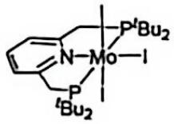

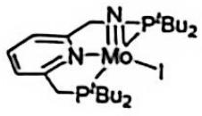

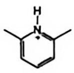  
Mo(PNP)NI

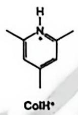

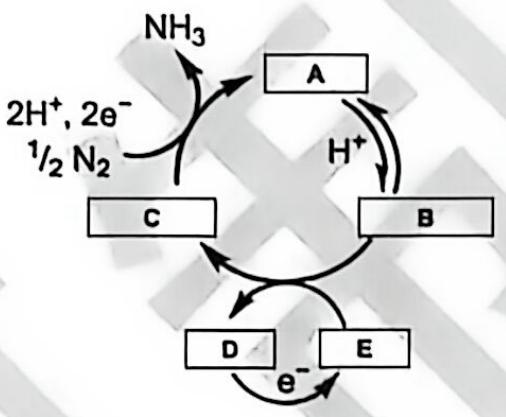  
图2 Sm介导的Mo基配合物催化循环

答案:

| A | B | C | D | E |
| --- | --- | --- | --- | --- |
| (PNP)MoIVNI | (PNP)MoIV(NH)I+ | (PNP)MoIII(NH)I | Sm(III) | Sm(II) |

共 10 分，每个 2 分，

\- 组成、电荷、价态正确即可得分，NH连在一起不写括号不扣分，但如果H不连在N上不得分

● 配体及 Mo 的先后顺序可以互换。

● A\~C 中，Mo 价态错误扣 1 分。

\- Sm(III)和 Sm(II)写成 SmI $_{3}$ 和 SmI $_{2}$ 扣 1 分，写成其他形式不得分。

7.1.3 催化性能也与体系中质子给体的性质有关, 图 1 给出了两种质子给体的结构。在 THF 溶剂中, $\mathrm{LutH^{+}}$ $(\mathrm{pK_{a}} = 9)$ 的催化效果优于 $\mathrm{ColH^{+}}$ $(\mathrm{pK_{a}} = 10.4)$ , 说明理由。

答案:

$\mathrm{H^{+}}$ 参与反应, 较强的酸促进反应热力学 (1 分)答出 $\mathrm{H^{+}}$ 促进反应即可得分

7.1.4 以乙二醇 $(\mathrm{p}K_{\mathrm{a}} = 16)$ 为质子给体时, 初始的催化活性甚至高于 $\mathrm{LutH^{+}}$ 为质子给体时的活性, 但性能迅速衰减。研究表明是 $\mathrm{Sm(II)}$ 和 $\mathrm{Sm(III)}$ 的相互转化受到了影响。给出其可能的原因。

答案:

$\mathrm{OCH}_{2} \mathrm{CH}_{2} \mathrm{O}^{-} / \text {乙二醇} / \text {含氧物种可以稳定 Sm(III), 使其难以还原至 Sm(II) (2 分)}$

答出上述含氧物种之一可以稳定 Sm(III)即可得分，答稳定 Sm(II)不得分。

7.1.5 在 THF 中的循环伏安实验表明: 图 2 中 B 和 C 相互转化的平衡电极电势约为 $-0.9 \mathrm{~V}$ ; 不加入 $\mathrm{SmI}_{3}$ 时, $\mathrm{NH}_{3}$ 生成的电势约 $-1.6 \mathrm{~V}$ ; 加入 $\mathrm{SmI}_{3}$ 后, $\mathrm{NH}_{3}$ 生成的电势正移至约 $-1.45$

| Ln | Sm | Eu | Gd |
| --- | --- | --- | --- |
| $\varphi^{\circ}(Ln^{3+}/Ln^{2+})$ | -1.55 V | -0.35 V | <-3.1 V |

V, Sm(III)和 Sm(II)相互转化的电极电势也是约-1.45 V (以上电极电势数值均相对于 THF 中的 $\mathrm{Fc}^{+}/\mathrm{Fc}^{0}$ )。参考表中水溶液体系中 $\mathrm{Ln}^{3+}/\mathrm{Ln}^{2+}$ 的电极电势数据 (Ln: 镧系元素, 表中电极电势数据均相对于标准氢电极),判断镧系元素碘化物 $LnI_{3}$ 对图 1 中的 Mo 基催化剂性能的提升效果。选择所有正确的答案，并说明理由。
(A) $EuI_{3}$ 可以提升 Mo 基催化剂的性能；
(B) $GdI_{3}$ 可以提升 Mo 基催化剂的性能；
(C) $EuI_{3}$ 和 $GdI_{3}$ 均无法提升 Mo 基催化剂的性能。
答案：C
(1 分)
假设水溶液中 $Ln^{3+}/Ln^{2+}$ 电极电势差值与 THF 中差值接近， $Eu(III)/Eu(II)$ 转化电势过正(高)，约 $-1.45 + (-0.35 - (-1.55)) = -0.2 V$ 在反应条件下，Eu(II)无法将 B 还原成 C；(1 分) $Gd(III)/Gd(II)$ 转化电势过低，约 $-1.45 + (-3.1 - (-1.55)) = -3 V$ 在反应条件下，Gd(III)无法被电化学转化为 Gd(II)。(1 分)
答案 1 分，每个原因 1 分。

7.2 以物质 X 为催化剂, 苯酚为质子给体, THF 为溶剂, 可通过电化学将 $\mathrm{N}_{2}$ 高选择性的还原成 $\mathrm{N}_{2} \mathrm{H}_{4}$ 。X 的制备方法如下: 将 $6 \mathrm{~mL}$ 含 $5 \mathrm{mmol} \mathrm{NiCl}_{2}$ 的水溶液缓慢滴加至含 $10 \mathrm{mmol}$ 的 1,3-丙二硫醇钠 $(\mathrm{NaSCH}_{2} \mathrm{CH}_{2} \mathrm{CH}_{2} \mathrm{SNa})$ 水溶液中, 将所得的深绿色溶液搅拌 $2 \mathrm{~h}$ 后过滤除去少量棕褐色不溶残渣。往滤液内加入含有 $10 \mathrm{mmol}$ 四正丁基溴化铵 "Bu $_{4}$ NBr (C $_{16}$ H $_{36}$ NBr) 的水溶液 $8 \mathrm{~mL}$ , 混合体系持续搅拌 $3 \mathrm{~h}$ , 析出深绿色微晶, 将收集到的晶体用冷水洗涤, 真空干燥, 得到 X。分析结果表明: X 的分子量低于 2000; 其元素组成为: Ni: $15.7\%$ ; N: $2.50\%$ ; C: $47.1\%$ ; H: $8.99\%$ 。X 中含有一个 Ni-S 簇配合物离子, 其中每个 Ni 原子均为近似平面四方配位, 与 Ni 配位的配体有两种不同的化学环境; X 分子中含有结晶水, 但均未与 Ni 发生配位。

7.2.1 写出 X 的化学式，化学式应能清楚反映 X 的组成。

答案: Ni/N 原子比 = 15.7%/58.7/(2.46%/14) = 1.49

X 中含有 3 个 Ni，2 个 N，此时分子量为 $58.7 / 15.7\% = 1121$ ，可见最多就是 3 个 Ni (1 分)有两个 $\mathrm{Bu}_{4} \mathrm{~N}^{+}$ 阳离子 (1 分)

$$
= (1121 \times 47.1\% / 12 - 2 \times 16) / 3 = 4
$$

$$
" \mathrm{Bu} _ {4} \mathrm{N} ^ {+}
$$

$$
\mathrm{Ni} _ {3} \left[ \mathrm{S} \left(\mathrm{CH} _ {2}\right) _ {3} \mathrm{S} \right] _ {4} ^ {2 -}
$$

$$
32 * 8 / 1121 = 22.8\%
$$

$$
100\% - (15.7\% + 47.1\% + 2.50\% + 8.99\% + 22.8\%) = 2.87\%
$$

$$
= 1121 \times [100\% - (15.7\% + 47.1\% + 2.50\% + 8.99\% + 22.8\%)] / 16 = 2
$$

化学式为： $\left[\mathrm{Bu}_{4}\mathrm{N}\right]_{2}\mathrm{Ni}_{3}\left[\mathrm{S}\left(\mathrm{CH}_{2}\right)_{3}\mathrm{S}\right]_{4}\cdot2\mathrm{H}_{2}\mathrm{O}$

● 共 4 分，Ni 数目 1 分，“Bu $_{4}$ N 数目 1 分，S(CH $_{2}$ ) $_{3}$ S 数目 1 分，H $_{2}$ O 数目 1 分；

\- 答案正确就给分。

7.2.2 画出 X 中阴离子的结构。

答案: 不写电荷不扣分, 不画楔形键不扣分, 其他答案不得分

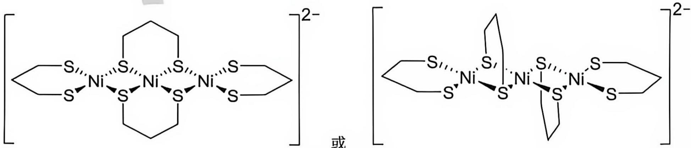

第 8 题 有机化学的基本概念 (20 分, 占 8%)

8.1 $(\mathrm{CH}_{3})_{2} \mathrm{CCHO}$ 的几何形状是平面的还是非平面的 (不包括甲基上氢)? 为你的判断给出合理的解释。答案:

非平面(1 分): 稳定碳正离子的主要是氧原子的孤对电子(1 分), 而不是 $\mathrm{C} = \mathrm{O}$ 的 $\pi$ 电子。共 2 分

8.2 为以下四个醇在水中的溶解度从大到小进行排序:

(a) ${\mathrm{CH}}_{3}{\left( {\mathrm{CH}}_{2}\right) }_{3}\mathrm{OH}$ ; (b) ${\left( {\mathrm{CH}}_{3}\right) }_{3}\mathrm{COH}$ ; (c) ${\mathrm{CH}}_{3}{\mathrm{CH}}_{2}\mathrm{CH}\left( \mathrm{OH}\right) {\mathrm{CH}}_{3}$ ; (d) ${\left( {\mathrm{CH}}_{3}\right) }_{2}{\mathrm{CHCH}}_{2}\mathrm{OH}$

答案: $b > c > d > a$ , 2 分, 错 1 个, 给 0 分, 排序错误不得分。

8.3 仔细分析右图中的 8 个结构式:

8.3.1 属于同一化合物的有：\_\_\_\_；

8.3.2 有几组同分异构体：\_\_\_\_；

8.3.3 属于对映异构体的有：\_\_\_\_；

8.3.4 属于手性分子的有：\_\_\_\_；

8.3.5 以等摩尔量混合后是外消旋体的有: \_\_\_\_。

答案:

8.3.1: E 和 G 是同一化合物 1 分

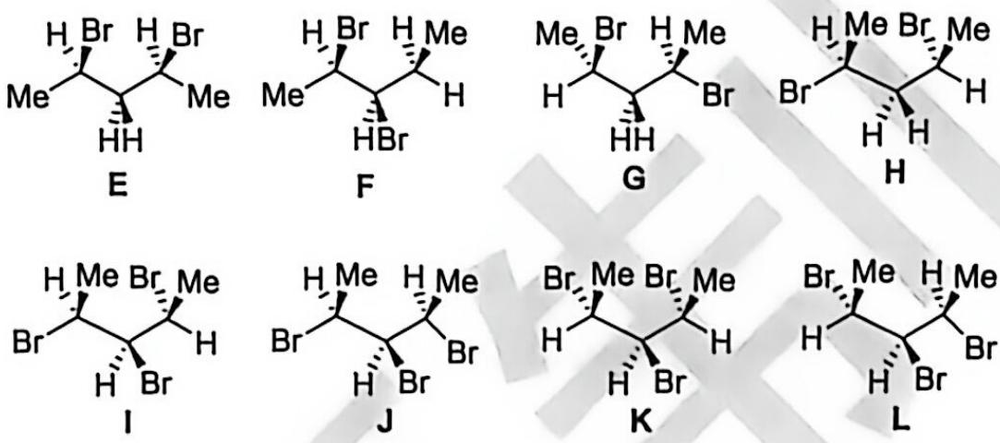

8.3.2: FHE/G 是同分异构体: IJKL 是同分异构体 2 组, 1 分

8.3.3: I 和 L 是对映异构体 1 分

8.3.4: 下列化合物有手性的是: F, H, I, L 有手性 2 分, 写对 3 个给 1 分, 写对 4 个给 2 分, 写错一个得 0 分

8.3.5: 下列化合物以等摩尔量混合后是外消旋体的是: I 和 L 是外消旋体 1 分, 共 6 分

8.4 分馏是利用互溶液体混合物中各组分沸点不同，通过多次部分气化、多次部分冷凝，一次性分离多种沸点相近液体的物理分离方法。

8.4.1 为了达到高效的分馏效果，以下哪些条件是必需的：

(a) 分馏柱自下而上保持一定的温度梯度: (b) 分馏柱需要有足够的长度: (c) 溶液里各组分的沸点必须有一定的差距; (d) 分馏柱中必须有冷凝水; (e) 混合蒸气进入分馏柱后发生连续热交换。

答案: a、b、c、c 答对 2 个给 1 分, 答对 3 个给 2 分, 答对 4 个给 3 分, 共 3 分, 选错 1 个, 给 0 分。

8.4.2 为了实现良好的分馏效果，常用的方法可以在分馏柱内填入一些材料，以下哪些是适合作为填充物：

(a) 硅胶；(b) 分子筛；(c) 玻璃；(d) 各种形状的金属片；(e) 陶瓷片。

答案: c、d、e 答对 2 个给 1 分, 答对 3 个给 2 分, 共 2 分, 选错 1 个, 给 0 分。

8.5 吸附薄层色谱是一种微量、快速的不同极性有机物分离提纯方法，属于物理分离手段。将吸附剂硅胶或氧化铝均匀涂在玻璃板或塑料板上作为固定相，利用流动相展开，依据不同物质吸脱附能力差异实现混合物分离。

8.5.1 吸附薄层色谱中被分离物质与固定相之间的作用力包括:

(a) 静电力；(b) 诱导力；(c) $\pi \pi$ 堆积；(d) 氢键；(e) 以上答案都不对。

答案: a、b、d 答对 2 个给 1 分, 答对 3 个给 2 分, 共 2 分, 选错 1 个, 给 0 分。

8.5.2 对于正相吸附薄层色谱，以下说法正确的有：

(a) 展开剂液面不能高于薄层板点样基线；(b) 点样斑点不能过大；(c) 不同物质吸脱附能力差异实现混合物分离；(d) 极性大化合物的 $R_{\mathrm{f}}$ 值小；(e) 以上答案都不对。

答案: a、b、c、d 答对 2 个给 1 分, 答对 3 个给 2 分, 答对 4 个给 3 分, 共 3 分, 选错 1 个, 给 0 分。

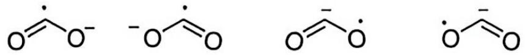

第 9 题 二氧化碳化学 (35 分, 占 13%)

二氧化碳再利用, 是将工业排放、大气中的 $\mathrm{CO}_{2}$ 捕集后, 通过物理、化学、生物方式变废为宝, 实现碳循环、缓解温室效应、资源化利用的低碳技术。在有机合成中, 二氧化碳阴离子自由基是非常强的单电子还原剂, 是制备羧酸衍生物的原料。

9.1 画出二氧化碳阴离子自由基的共振式。

答案:

画对 2 个，给 1 分，画对 4 个，给 2 分，共 2 分

$\overset{+}{\mathrm{O}}\overset{-.}{\mathrm{O}}^{-}$ ：也可以，但不计分

9.2 在一个无隔膜电解池中，二氧化碳在电场的作用下被还原为二氧化碳自由基阴离子，接着与庚-1,6-二烯衍生物 1 反应，以 $78\%$ 的收率得到产物 2。

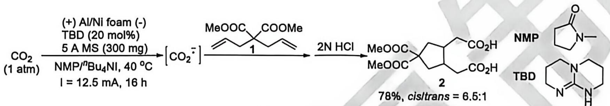

9.2.1 研究结果表明，反应通过二氧化碳自由基阴离子启动反应，而且始终以单自由基中间体的形式进行转换。画出反应关键中间体的结构式。提示：不超过三个，超过三个不得分。
答案：

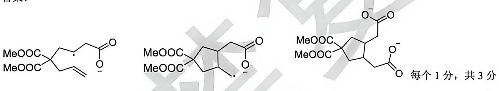

9.2.2 研究结果表明，反应具有良好的非对映选择性，分别画出形成顺、反五元环过渡态的结构，并分析主要产物形成的原因。提示：顺式和反式过渡态都只需要画一个。

答案:

顺式成环的过渡态:

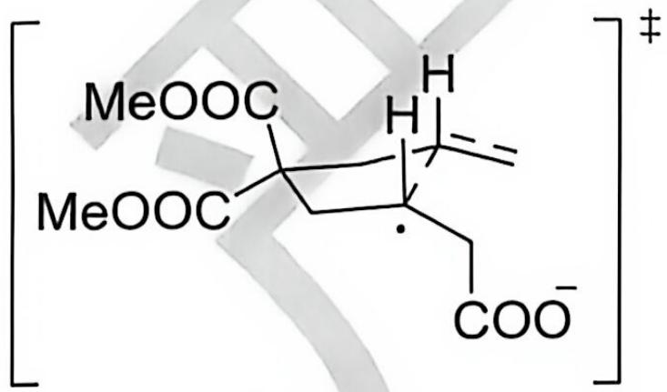

3 分, 方括号和过渡态符号 1 分, 五元环过渡态, 环中将要成键的那

根键画成虚线 1 分，两个氢处在顺式直立键 1 分，共 3 分；过渡态结构正确，才能开始算方括号和过渡态符号的 1 分。

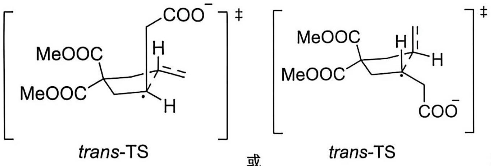

反式成环的过渡态:

或

3 分，方括号和过渡态符号 1 分，

五元环过渡态，环中将要成键的那根键画成虚线1分，两个氢处在反式1分，共3分：过渡态结构正确，才能开始算方括号和过渡态符号的1分。

理由: 在反式过渡态构象中, 总有一个基团 (一个基团 $\mathrm{CH}_{2} \mathrm{COO}^{-}$ 或烯基) 和直立的甲酯基存在 1,3-双直立键的空阻效应。1 分

9.2.3 该反应在串联反应和反应产物二酯在高分子聚酯合成上也体现了重要作用，画出 E、F、G 的结构式。串联反应：

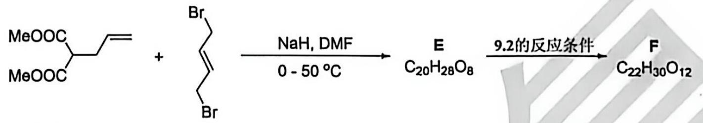

高分子合成:

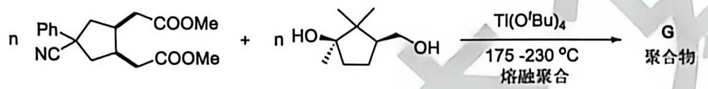

答案:

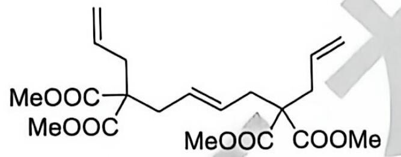

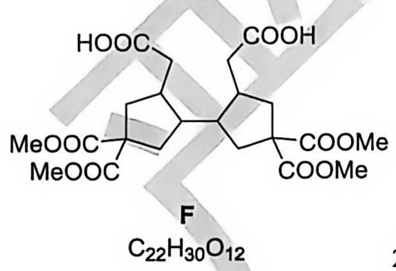

2 分，其他答案不得分

2 分，其他答案不得分

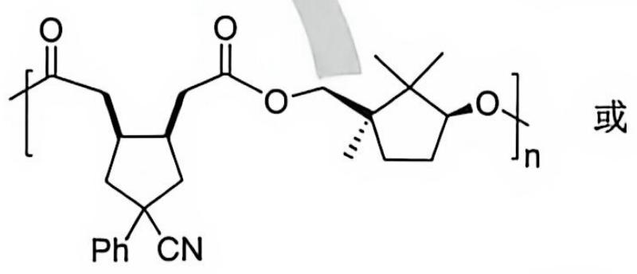

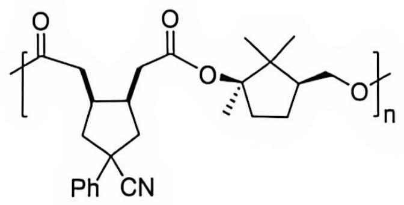  
G 聚合物

链结构式 1 分, 方括号和 $\mathrm{n},1$ 分,共 2 分,不要求立体化学和封端基团

9.2.4 上述反应可以应用于活性分子1的合成，画出顺式产物H的所有结构式和产物1的结构式。

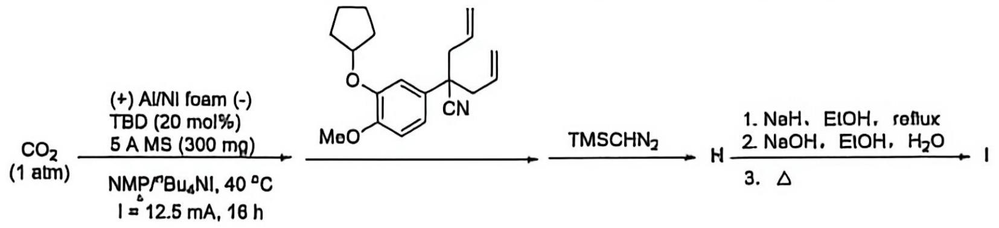

答案:

五元环上 CN 与两个氢成顺式:

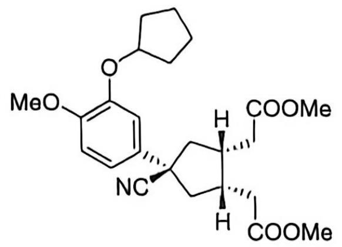

五元环上 CN 与两个氢成反式:

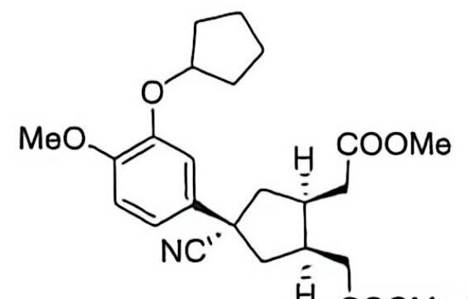

H COOMe 每个 1 分，共 2 分，多写对映体也给满分

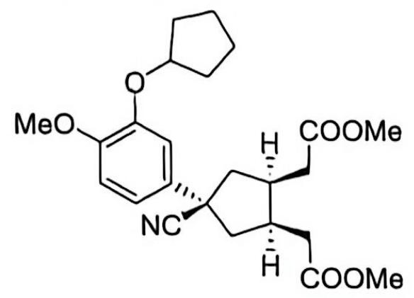

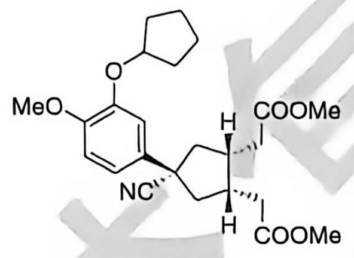

COOMe 每个 1 分，共 2 分.

或

亦可。（左边手性碳无选择性：右边只需要两个日顺式）

1 的结构式:

或

或

  
(±)

若用相对构型符号表示:

亦可。(左边手性碳无选择性: 右边只需要两个 H 顺式)

每个 1 分, 共 2 分, 一个结构式要求 CN 与两个氢成顺式; 另一个要求 CN 与两个氢成反式; 两个氢成反式的不得分。

9.3 后续研究表明，通过氢原子转移反应 (HAT) 可以将甲酸根负离子转化为二氧化碳阴离子自由基。在如下所示的标准条件下进行反应，以 $82\%$ 的收率得到了 2,2,3-三苯基丙酸甲酯。研究表明，没有光敏剂、或没有甲酸钾、或在黑暗中进行反应，都没有生成任何产物。

$\left[\mathrm{Ir}(\mathrm{ppy})_{2}(\mathrm{dtppy})\right]\mathrm{PF}_{8}$ :

DABCO:

9.3.1 已知在光照条件下处在激发态的 $\left[\mathrm{Ir}(\mathrm{ppy})_{2}(\mathrm{dtppy})\right] \mathrm{PF}_{6}$ 能将叔胺 DABCO 氧化为自由基正离子，在空格处填入相应的中间体或产物结构式。

答案:

J:

$$
\mathrm{Ph} ^ {\cdot}
$$

1 分，共 7 分，其他答案不得分

## 9.3.2 根据以上反应信息，推测如下反应产物的结构式。

9.3.2.1

(1 equiv)

(1 atm)

HCOOK (2 equiv), DMSO (0.1 M)
蓝光 LEDs灯, rt, 24 h

答案:

Ph

1分

9.3.2.2

答案:

1 分

9.3.2.3

答案:

1 分

9.3.2.4

答案:

Ph $^{13}$ COOMe
Ph

1 分，共 4 分，其他答案不得分

第10题 反芳香性的再理解 (26分，占 $12\%$ )

1825 年，Famday 发现了苯，这是化学史上最重要的发现之一，此后，对于芳香性的研究进入了高潮。1920 年代，Hüokol 将新兴量子力学理论应用于环状烯烃的 $\pi$ 电子体系，提出了休克尔规则，解释为何具有 $(4n+2)$ 个 $\pi$ 电子（n 为自然数）的体系格外稳定，然而，反芳香性的概念一直极难界定与定量表征，1960 年代，Breslow 提出了反芳香性概念，用于描述含 4n 个 $\pi$ 电子的平面共轭环状分子所具备的去稳定化效应，在所谓的反芳香分子中， $\pi$ 电子间的相互作用会使整个体系能量升高、稳定性下降，实际上，分子会通过几何形变来规避这种去稳定化作用。因此，反芳香体系大多仅能以过渡态形式存在。势能超曲面上的局部极小点分子仅能部分保留反芳香特征，且本身极不稳定、反应活性极强，分离制备难度极大，分离含 4n 个 $\pi$ 电子的反芳香体系还存在另一重阻碍；这类分子的三重态可能具有芳香性，在部分体系中，三重态（芳香性）的能量反而低于单重态（反芳香性），导致反芳香构型几乎无法被稳定分离，经典教材中常列举三类具备反芳香特征的 4n 个 $\pi$ 电子体系：环丙烯负离子、环丁二烯分子以及环戊二烯基阳离子。但是，现有研究已证实，环丙烯负离子属于非芳香体系，而环丁二烯应归为特例（既非芳香也非反芳香），由此，环戊二烯基正离子成为了最小的反芳香性原型分子。2023 年，Schulz 等人合成了环戊二烯基正离子盐，其合成路线如下：

10.1 研究表明, 芳基取代的环戊二烯正离子存在单线态和三线态两种可能。在答题纸上先画出相应自旋多重态的环戊二烯正离子结构式, 然后在下方画出与该结构式相对应的分子轨道( $\psi$ 1 分子轨道已经画出), 并在旁边的横线上填入电子(如果此轨道上没有电子就画X), 最后确定你所画的分子轨道为单线态还是三线态(只

需要在单成三字上画面)。提示: 画图时, 用1表示: ①; 用2表示: ②; 用3表示此碳原子上没有分配p轨道;

因此，此碳正离子分子轨道的ψ1可以表示为：i-1

答案:

结构式：每个1分，共2分

每个轨道1分，共8分

左边分子轨道中电子和X填入，全对1分，错一个不给分

右边分子轨道中电子和X填入，全对1分，错一个不给分

如果两边都填入了电子，电子填入是对的：没有填入 $X$ ，只得1分

左边: 单线态S: 右边: 三线态T, 全对给 1分, 共13分

结构式：\_\_\_\_；S

结构式： $\cdot\quad\cdot$ 或 $\cdot\quad\cdot$ ；T

所有分子轨道示意图中，所有1位置写成2、同时所有2位置写成1亦可，因为1和2本质上等价，但需要同时交换。

10.2 为了了解阳离子1的反应活性，研究人员进行了以下研究，画出以下转换过程中化合物A-D的结构式：提示：有些结构式可能是离子态，需要在相应的原子上标明电荷。

答案:

A 任何一个都是可以，2 分

B 2 分:

2 分;

D 2 分, 可以不写 $\mathrm{PyH^{+}}$ ;

共8分，其他答案不给分

10.3 完成以下反应式 (提示: 产物中 2 的结构式可以用 2 表示):

| 10.3.12 $\xrightarrow{FeCp_{2}}$ E | 10.3.22 $\xrightarrow{(Ph_{3}C)_{2}}$ F | 10.3.32 $\xrightarrow{Cp^{*}Al}$ G |
| --- | --- | --- |

答案:

10.3.1: $\left[\mathrm{Cp}_{2} \mathrm{Fe}\right]^{+} 2^{-} 1$ 分

10.3.2: $\left[\mathrm{Ph}_{3} \mathrm{C}\right]^{+} 2^{-}$ 1 分

10.3.3: $\left[\mathrm{Cp}^{*}\right]_{2}\mathrm{Al}]^{+}2^{-}$ 或 $\left[\mathrm{Cp}^{*}\mathrm{Al}^{+}\right]2_{2}^{-}$ 每个 1 分, 共 3 分, 其他答案不给分

10.4 Cp\*Al 是一个五甲基茂的一价铝配合物，其中铝符合八隅体的要求。画出该化合物的结构式。

答案:

本试题和答案版权属中国化学会所有，未经中国化学会化学竞赛负责人授权，任何人不得翻印，不得在出版物或互联网网站上转载、贩卖、赢利，违者必究。本试题和相应答案将分别于2026年9月6日14:00和9月13日14:00在www.chemsoc.org.cn网站上公布。