## 目录

缩写对照
第二版序言
有机化学与本书
译者的话

什么是有机化学？
有机化学与您
有机化合物
有机化学与化工
有机化学与元素周期表
有机化学与本书
延伸阅读

2 有机结构
碳氢骨架与官能团
绘制分子
碳氢骨架
官能团
携带官能团的碳原子可以按照氧化程度分类
化合物命名
化学家真正是如何称呼分子的？
您该怎样命名分子？
延伸阅读

3 有机结构的确定
引入
质谱法
质谱法测定同位素
高分辨率质谱法可以确定原子组成
核磁共振法 $^{13}$ C NMR 光谱区域
描述化学位移的多种方式
一些简单分子 $^{13}$ C NMR 光谱的导览 $^{1}$ H NMR 光谱
红外光谱法
质谱法、NMR 和 IR 的结合使快速识别成为可能
双键的等价物有助于结构搜索
展望 Chapters 13 和 18
延伸阅读

43
43
46
48
50
52
56
57
59
63
72
74
78
78

4 分子结构 80  
概述 80  
电子占据原子轨道 83  
分子轨道—双原子分子 88  
不同原子之间的键 95  
原子轨道的杂化 99  
旋转与刚性 105  
小结 106  
展望 106  
延伸阅读 106  

5 有机反应 107  
化学反应 107  
亲核性与亲电性 111  
用弯曲箭头表示反应机理 116  
绘制您自己的机理 120  
延伸阅读 124  

6 对羰基的亲核加成 125  
分子轨道对羰基反应性的解释 125  
氰根对醛酮的加成 127  
亲核试剂的进攻角度 129  
"负氢"在醛和酮上的亲核进攻 130  
有机金属试剂对醛和酮的加成 132  
水对醛和酮的加成 133  
醇与醛的反应得到半缩醛 135  
酮也可形成半缩醛 137  
酸和碱催化半缩醛和水合物的形成 137  
亚硫酸氢盐加成化合物 138  
延伸阅读 140

离域与共轭 141  
引入 141  
乙烯的 $(\mathrm{CH}_2 = \mathrm{CH}_2)$ 的结构 142  
有多于一根 $C = C$ 双键的分子 143

两根 $\pi$ 键的共轭 146  
紫外可见光谱 148  
烯丙基体系 150  
三个原子间的离域是一种常见的结构特征 154  
芳香性 156  
延伸阅读 162  
酸性、碱性和 $pK_{a}$ 163  
以离子存在的有机化合物更易溶于水 163  
酸、碱和 $pK_{a}$ 165  
酸性 165 $pK_{a}$ 的定义 168  
构建 $pK_{a}$ 尺度 171  
氮化合物可做酸也可做碱 174  
取代基影响 $pK_{a}$ 175  
酸性碳 176 $pK_{a}$ 发挥作用—药物西咪替丁的开发 178  
Lewis 酸碱 180  
延伸阅读 181

使用有机金属试剂构建 C-C 键 182
引入 182
有机金属化合物包含一根 碳-金属键 183
制取有机金属 184
用有机金属制取有机分子 189
醇的氧化 194
醇的氧化 196
延伸阅读 196

羰基上的亲核取代 197  
对羰基亲核加成得到的产物并不总是稳定化合物 197  
羧酸衍生物 198  
为什么四面体中间体不稳定？ 200  
所有的羧酸衍生物并非都同样活泼 205  
酸催化剂提高了羰基的活性 207  
酰氯可以由羧酸与 $\mathrm{SOCl}_2$ 或 $\mathrm{PCl}_5$ 制取 214  
通过羧酸衍生物的取代反应制取其他化合物 216  
由酯制取酮:出现问题 216  
由酯制取酮:解决办法 218  
概括 220

小结 220  
延伸阅读 220  
伴随羰基氧失去的羰基亲核取代 222  
引入 222  
醛可以与醇反应形成半缩醛 223  
缩醛可由醛或酮与醇在酸的存在下形成 224  
胺与羰基化合物的反应 229  
亚胺是羰基的氮类似物 230  
小结 238  
延伸阅读 239

平衡、速率和机理 240
多远与多快? 240
如何使平衡有利于您的产物 244
熵对于平衡常数的确定很重要 246
平衡常数随温度变化 248
动力学的介绍: 如何让反应更快和更干净地发生 250
速率方程 257
羰基取代反应中的催化 262
动力学与热力学产物 264
对 Chapters 6–12 中机理的总结 266
延伸阅读 267

$^{1}$ H NMR: 核磁共振氢谱 269
碳和质子 NMR 的区别 269
积分告诉我们每个峰对应的氢原子数量 270
质子 NMR 谱图的区域 272
饱和碳原子上的质子 272
烯烃区域和苯区域 277
醛区域: 与氧相连的不饱和碳 281
杂原子上质子的位移比碳上的多样 282
质子 NMR 光谱中的偶合 285
小结 301
延伸阅读 301

14 立体化学 302  
有些化合物可以以一对镜像的形式存在 302

另一种立体异构体: 非对映异构体 311  
没有立体中心的手性化合物 319  
对称轴和对称中心 320  
对映体拆分 322  
延伸阅读 327

饱和碳上的亲核取代 328  
亲核取代的机理 328  
如何判断给定有机物会采取的机理 $(S_{N}1$ 或 $S_{N}2)$ ? 332  
细看 $S_{N}1$ 反应 333  
细看 $S_{N}2$ 反应 340 $S_{N}1$ 与 $S_{N}2$ 之间的对比 342 $S_{N}1$ 和 $S_{N}2$ 反应中的离去基团 347 $S_{N}1$ 反应中的亲核试剂 352 $S_{N}2$ 反应中的亲核试剂 353  
亲核试剂与离去基团的对比 357  
展望: 消除反应和重排反应 358  
延伸阅读 359

构象分析 360  
键的旋转使原子链采取不同构象 360  
构象与构型 361  
旋转能垒 362  
乙烷的构象 363  
丙烷的构象 365  
丁烷的构象 365  
环张力 366  
细看环己烷 370  
取代的环己烷 374  
小结 381  
延伸阅读 381

消除反应 382  
取代与消除 382  
亲核试剂对取代、消除竞争的影响 384  
E1和E2机理 386  
允许E1的底物结构 388  
离去基团的角色 390  
E1反应可以是立体选择性的 391  
E2消除有反叠式过渡态 395  
E2消除的区域选择性 398

## 目录

阴离子稳定基的存在准许另一机理—E1cB 399  
小结 404  
延伸阅读 406

设置本章的三个原因 407  
光谱法与羰基化学 408  
红外光谱极好地区分羧酸衍生物 411  
小环向环内引入张力并在环外具有更高的s成分 412  
IR光谱法中 $C = 0$ 伸缩频率的简单计算 413  
炔烃和小环的NMR光谱 414  
质子NMR可区分环己烷上的直立和平伏质子 415  
不同核之间的相互作用会给出巨大的偶合常数 415  
通过光谱法识别产物 418  
表格 422  
质子NMR中的位移比碳NMR中的容易计算并具有更多信息 425  
延伸阅读 426

烯烃的亲电加成 427  
烯烃与溴反应 427  
烯烃氧化生成环氧 429  
不对称烯烃的亲电加成是区域选择性的 433  
双烯的亲电加成 435  
不对称溴鎓区域选择性地开环 436  
烯烃的亲电加成可以是立体专一性的 439  
添加两个羟基: 双羟基化反应 442  
彻底断裂双键: 高碘酸解和臭氧解 443  
添加一个羟基: 如何在双键上加水 444  
小结...亲电加成反应概述 447  
延伸阅读 447

20 烯醇和烯醇盐的形成和反应 449  
化合物的混合也能算做是纯净物吗？ 449  
互变异构现象: 烯醇通过质子转移生成 450  
为什么简单的醛和酮不以烯醇式存在呢？ 451

羰基化合物与烯醇平衡的证据 451  
平衡由酸或碱催化 452  
碱催化反应的中间体为烯醇阴离子 452  
烯醇和烯醇盐的种类 454  
稳定的烯醇 456  
烯醇化导致的结果 459  
烯醇或烯醇盐做中间体的反应 460  
稳定烯醇等价物 465  
烯醇和烯醇盐氧参与的反应: 烯醇醚的制备 467  
烯醇醚的反应 468  
小结 470  
延伸阅读 470

芳香亲电取代 471  
引入: 烯醇和酚 471  
苯及其与亲电试剂的反应 473  
苯酚上的亲电取代 479  
氮上的孤对电子有更强的活化作用 482  
烷基苯也在邻位和对位反应 484  
吸电子取代基给出间位取代产物 486  
卤素既有吸电子基又有给电子基的特征 489  
两个或多个取代基可能合作或竞争 491  
问题与机会 492  
细看 Friedel-Crafts 化学 492  
对硝基化学的利用 494  
小结 495  
延伸阅读 497

共轭加成和芳香亲核取代 498  
与羰基共轭的烯烃 498  
共轭烯烃可做亲电试剂 499  
总结: 控制共轭加成的因素 509  
将反应扩展到其他缺电子烯烃 510  
共轭取代反应 511  
亲核环氧化 513  
芳香亲核取代 514  
加成-消除机理 515  
芳香亲核取代的 $S_{N}1$ 机理: 重氮化合物 520  
苯炔机理 523

小结 526  
延伸阅读 527  
化学选择性和保护基 528  
选择性 528  
还原剂 530  
还原剂 530  
氢气作为还原试剂: 催化氢化 534  
赶走官能团 539  
溶解金属还原 541  
氧化反应中的选择性 544  
竞争反应性: 选择参与反应的基团 546  
保护基纵览 549  
延伸阅读 561  
区域选择性 562  
引入 562  
芳香亲电取代中的区域选择性 563  
烯烃上的亲电进攻 570  
自由基反应中的区域选择性 571  
烯丙型化合物上的亲核进攻 574  
共轭双烯上的亲电进攻 579  
共轭加成 581  
实践中的区域选择性 582  
延伸阅读 583  
烯醇盐的烷基化 584  
羰基表现出不同的反应性 584  
一件会影响所有烷基化反应的因素 584  
腈和硝基烷可以烷基化 585  
烷基化亲电试剂的选择 587  
羰基化合物的烯醇锂 587  
烯醇锂的烷基化 588  
特别的烯醇等价物用于烷基化醛和酮 591 $\beta$ -二羰基化合物的烷基化 595  
酮的烷基化引发区域选择性问题 598  
烯基酮为区域选择性问题提供了解决方案 601  
使用 Michael 受体做亲电试剂 605  
小结 612  
延伸阅读 613

26 烯醇盐和羰基化合物的反应: 羟醛反应和 Claisen 反应 614
引入 614
羟醛反应 615
交叉缩合 618

特别的烯醇等价物用于控制羟醛反应 624  
如何控制酯的羟醛反应 631  
如何控制醛的羟醛反应 632  
如果控制酮的羟醛反应 634  
分子内羟醛反应 636  
碳上的酰基化 640  
交叉酯缩合 643  
通过 Claisen 反应制备酮酯的总结 647  
通过特别的烯醇等价物控制酰基化 648  
分子内交叉 Claisen 酯缩合 652  
羰基化学—下一站？ 654  
延伸阅读 654

有机化学中的硫、硅和磷 656  
有用的主族元素 656  
硫: 充满不一致的元素 656  
被硫稳定的阴离子 660  
锍盐 664  
锍叶立德 665  
硅和碳的比较 668  
烯丙基硅烷做亲核试剂 675  
烯烃的选择性合成 677  
取决于几何结构的烯烃性质 677  
利用环状化合物 678  
烯烃的平衡 679  
E 和 Z 烯烃可通过炔烃立体选择性的加成制取 681  
通过立体选择性的消除反应得到 E 占主导的烯烃 684  
区域选择性的 Julia 成烯反应可用于连接立体专一性的消除反应可以得到烯烃纯净的单一异构体 686  
也许是烯烃最有用的制取方法—Wittig 反应 689  
小结 693  
延伸阅读 693

## 逆合成分析

创造性的化学 694  
逆合成分析: 逆向合成 694  
切断必须符合于已知、可靠的反应 695  
合成子是被理想化的试剂 695  
多步合成: 避免化学选择性问题 698

## 目录

官能团相互转化 699  
双官能团切断好于单官能团切断 702  
C-C 切断 706  
可用的起始原料 711  
供体和受体合成子 712  
双官能团 C-C 切断 712  
1,5-关系的官能团 719  
"自然反应性" 和 "极性反转" 719  
小结 722  
延伸阅读 722

芳杂环 1: 反应
723
引入    723
当苯环的一部分被氮原子替代时芳香性仍会存在    724
吡啶是一种非常不活泼的芳香亚胺    725
六元芳杂环可以包含氧    732
五元芳杂环在亲电取代上表现良好    733
呋喃和噻吩是吡咯的氧和硫类似物    735
更多五元芳杂环的反应    738
包含两个或更多氮的五元环    740
苯并杂环    745
将更多氮原子放入六元环中    748
与吡啶稠和的环: 喹啉和异喹啉    749
芳杂环可以包含很多氮原子 却只能包含一个硫或氧原子    751
芳杂环另有成千上万种    753
您应当熟悉哪些芳杂环?    754
延伸阅读    755

## 30 芳杂环 2: 合成

芳杂环 2: 合成 757
热力学与我们同在 758
首先切断 碳-杂原子键 758
吡咯、噻吩和呋喃来源于 1,4-二羰基化合物 760
如何制取吡啶: Hantzsch 吡啶合成法 763
吡唑和哒嗪来源于肼和二羰基化合物 767
嘧啶可由 1,3-二羰基化合物和脒制取 770
不对称亲核试剂会导致选择性问题 771
异噁唑由羟胺制取或通过环加成制取 772
四唑和三唑同样通过环加成制取 774
Fischer 吲哚合成法 775

喹啉和异喹啉 780  
稠环中更多的杂原子意味着更多的合成法选择 784  
总结: 芳杂环的三种主要合成方法 785  
延伸阅读 788

饱和杂环和立体电子效应 789  
引入 789  
饱和杂环的反应 790  
饱和杂环的构象 796  
杂环的制取: 关环反应 805  
环的大小和 NMR 814  
偕偶 (2J) 817  
非对映异位基团 820  
小结 824  
延伸阅读 824

环状分子中的立体选择性 825  
引入 825  
六元环中的立体化学控制 826  
小环上的反应 832  
亚环己基环氧中的区域选择性控制 836  
双环化合物中的立体选择性 839  
稠双环化合物 841  
螺环化合物 846  
有环状中间体或环状过渡态的反应 847  
小结 851  
延伸阅读 851

回顾 852  
前手性 856  
对羰基的加成即使没有环也可能是非对映选择性的 858  
非环状烯烃立体选择性的反应 865  
羟醛反应能够具有立体选择性 868  
由非对映选择性反应得到单一对映体 871  
展望 876  
延伸阅读 876

周环反应 1: 环加成 877
羟醛反应能够具有立体选择性 877
Diels–Alder 反应概述 879
环加成反应的前线轨道描述 886
Diels–Alder 反应中的区域选择性 889

Diels–Alder 反应的 Woodward–Hoffmann 描述 892
通过环加成反应捕捉活泼中间体 893
其他热环加成 894
光化学 [2 + 2] 环加成 896
热 [2 + 2] 环加成 898
制取五元环: 1,3-偶极环加成 901
两种非常重要的合成反应: 烯烃与四氧化锇和臭氧的环加成 905
环加成反应小结 907
延伸阅读 908

周环反应 2: σ重排和电环化反应 909
σ重排 909
[3,3]-σ重排的轨道描述 912
[3,3]-σ重排的方向 913
[2,3]-σ重排 917
[1,5]-σ氢移位 919
电环化反应 922
延伸阅读 930

参与、重排和碎片化 931  
邻基会加速取代反应的发生 931  
当参与基最终与另一个原子成键时重排得以发生 937  
碳阳离子很容易重排 940  
频哪醇重排 945  
二烯基酮-苯酚重排 949  
二苯乙醇酸重排 950  
Favorskii重排 950  
迁移到氧上: Baeyer-Villiger 反应 953  
Beckmann重排 958  
C-C键的极化帮助碎片化 960  
键的极化帮助碎片化 962  
通过碎片化扩环 963  
使用碎片化控制双键 965  
诺卡酮的合成: 碎片化大显身手 966  
展望 969  
延伸阅读 969

37 自由基反应 970  
自由基包含未成对电子 970  
自由基由弱键的均裂形成 971

大多数自由基极其活泼... 974  
如何分析自由基的结构: 电子自旋共振 975  
自由基稳定性 977  
自由基如何反应? 980  
自由基-自由基反应 980  
自由基链式反应 984  
烷烃的氯代 986  
烯丙型溴代 989  
选择性的逆转: 用 H 取代 Br 990  
用自由基形成碳-碳键 992  
自由基的反应性模式与极性试剂很不同 997  
由硼烷和氧得到的烷基自由基 998  
分子内比分子间的自由基反应更有效 999  
展望 1002  
延伸阅读 1002

卡宾的合成与反应 1003  
重氮甲烷可将羧酸制成甲酯 1003  
重氮甲烷的光解产生卡宾 1005  
我们如何得知卡宾的存在？ 1006  
制取卡宾的方法 1006  
卡宾可分为两类 1010  
卡宾如何反应？ 1013  
卡宾与烯烃反应得到环丙烷 1013  
插入C-H键 1018  
重排反应 1020  
氮宾是卡宾的氮类似物 1022  
烯烃复分解 1023  
小结 1027  
延伸阅读 1027

探寻反应机理 1029
类推得到的机理和真正发现机理 1029
探寻反应机理：Cannizzaro 反应 1031
获知产物的结构 1035
系统性的结构改变 1040
Hammett 关系 1041
反应机理的其他动力学证据 1050
酸催化和碱催化 1053
对中间体的检测 1060
立体化学和机理 1063

## 目录

对机理的调查方法小结
延伸阅读 1067
1068

金属有机化学 1069  
过渡金属拓宽了有机反应的范围 1069  
18电子规则 1070  
过渡金属络合物中的成键与反应 1073  
钯是均相催化中应用最广泛的金属 1078  
Heck反应将有机卤代烃或三氟甲磺酸酯与烯烃偶联 1079  
有机金属和卤代烃的交叉偶联 1082  
烯丙型亲电试剂被钯(0)活化 1088  
钯催化芳环胺化 1092  
与钯(II)配位的烯烃可被亲核试剂进攻 1096  
钯催化在一种天然生物碱的全合成中的使用 1098  
对其他一些过渡金属的概述 1099  
延伸阅读 1101

不对称合成 1102  
大自然是不对称的 1102  
手性池: 大自然"现成的"手性中心 1104  
拆分对映体 1106  
手性助剂 1107  
手性试剂 1113  
不对称催化 1114  
碳-碳键的不对称形成 1126  
不对称羟醛反应 1129  
酶催化 1132  
延伸阅读 1133

生命中的有机化学 1134  
初级代谢 1134  
生命由核酸开始 1135  
蛋白质由氨基酸制成 1139  
糖—只是能源吗？ 1142  
脂类 1147  
生物化学中的机理 1149  
天然产物 1156  
脂肪酸和其他聚酮由乙酰 CoA 制得 1161  
萜类是植物中的挥发性成分 1164  
延伸阅读 1167

当今的有机化学 1169 致谢本书插图的提供者 1182  
科学通过学科间的交流而进步 1169 元素周期表 1184  
化学 vs 病毒 1170 索引 1187  
有机化学的未来 1179  
延伸阅读 1181

## 缩写对照

<table><tr><td>Ac</td><td>乙酰基</td><td>DMS</td><td>二甲硫醚</td></tr><tr><td>Acac</td><td>乙酰丙酮盐</td><td>DMSO</td><td>二甲亚砜</td></tr><tr><td>AD</td><td>不对称双羟基化</td><td>DNA</td><td>脱氧核糖核酸</td></tr><tr><td>ADP</td><td>52-二磷酸腺苷</td><td>E1</td><td>单分子消除反应</td></tr><tr><td>AE</td><td>不对称环氧化</td><td>E2</td><td>双分子消除反应</td></tr><tr><td>AIBN</td><td>偶氮二异丁腈</td><td> $E_a$ </td><td>活化能</td></tr><tr><td>AO</td><td>原子轨道</td><td>EDTA</td><td>乙二胺四乙酸</td></tr><tr><td>Ar</td><td>芳基</td><td>EPR</td><td>电子顺磁共振</td></tr><tr><td>ATP</td><td>三磷酸腺苷</td><td>ESR</td><td>电子自旋共振</td></tr><tr><td>9-BBN</td><td>9-硼杂双环[3.3.1]壬烷</td><td>Et</td><td>乙基</td></tr><tr><td rowspan="2">BHT</td><td rowspan="2">丁基羟基甲苯(2,6-二叔丁基-4-甲基苯酚)</td><td>FGI</td><td>官能团相互转化</td></tr><tr><td>Fmoc</td><td>芴甲氧羰基</td></tr><tr><td rowspan="2">BINAP</td><td rowspan="2">双(二苯膦基)-1,1'-联萘</td><td>GAC</td><td>普通酸催化</td></tr><tr><td>GBC</td><td>普通碱催化</td></tr><tr><td>Bn</td><td>苄基</td><td>HMPA</td><td>六甲基磷酰胺</td></tr><tr><td>Boc, BOC</td><td>叔丁氧羰基</td><td>HMPT</td><td>六甲基磷酰三胺</td></tr><tr><td>Bu</td><td>丁基</td><td>HOBt</td><td>1-羟基苯并三唑</td></tr><tr><td>s-Bu</td><td>仲丁基</td><td>HOMO</td><td>最高占据分子轨道</td></tr><tr><td>t-Bu</td><td>叔丁基</td><td>HPLC</td><td>高效液相色谱</td></tr><tr><td>Bz</td><td>苯甲酰基</td><td></td><td></td></tr><tr><td>Cbz</td><td>苄氧羰基</td><td>HIV</td><td>人类免疫缺陷病毒</td></tr><tr><td>CDI</td><td>碳酰二咪唑</td><td>IR</td><td>红外光谱</td></tr><tr><td>CI</td><td>化学电离</td><td>KHMDS</td><td>六甲基二硅基氨基钾</td></tr><tr><td>CoA</td><td>辅酶A</td><td>LCAO</td><td>原子轨道的线性组合</td></tr><tr><td>COT</td><td>环辛四烯</td><td>LDA</td><td>二异丙基氨基锂</td></tr><tr><td>Cp</td><td>环戊二烯</td><td>LHMDS</td><td>六甲基二硅基氨基锂</td></tr><tr><td>DABCO</td><td>1,4-二氮杂二环[2.2.2]辛烷</td><td>LICA</td><td>异丙基环己基氨基锂</td></tr><tr><td>DBE</td><td>双键等价物</td><td>LTMP, LiTMP</td><td>2,2,6,6-四甲基哌啶锂</td></tr><tr><td>DBN</td><td>1,5-二氮杂双环[4.3.0]壬-5-烯</td><td>LUMO</td><td>最低未占据分子轨道</td></tr><tr><td>DBU</td><td>1,8-二氮杂双环[5.4.0]十一-7-烯</td><td>m-CPBA</td><td>间氯代过氧苯甲酸</td></tr><tr><td>DCC</td><td>N,N-二环己基碳二亚胺</td><td>Me</td><td>甲基</td></tr><tr><td rowspan="2">DDQ</td><td rowspan="2">2,3-二氯-5,6-二氰基-1,4-苯醌</td><td>MO</td><td>分子轨道</td></tr><tr><td>MOM</td><td>甲氧基甲基</td></tr><tr><td>DEAD</td><td>偶氮二甲酸二乙酯</td><td>Ms</td><td>甲磺酰基</td></tr><tr><td>DIBAL</td><td>二异丁基氢化铝</td><td>NAD</td><td>烟酰胺腺嘌呤二核苷酸</td></tr><tr><td>DMAP</td><td>4-二甲氨基吡啶</td><td>NADH</td><td>还原型NAD</td></tr><tr><td>DME</td><td>1,2-二甲氧基乙烷</td><td>NBS</td><td>N-溴代琥珀酰亚胺</td></tr><tr><td>DMF</td><td>N,N-二甲基甲酰胺</td><td>NIS</td><td>N-碘代琥珀酰亚胺</td></tr><tr><td>DMPU</td><td>1,3-二甲基-3,4,5,6-四氢-2(1H)-嘧啶酮</td><td>NMO</td><td>N-甲基吗啉-N-氧化物</td></tr><tr><td>xvi</td><td colspan="3">缩写对照</td></tr><tr><td>NMR</td><td>核磁共振</td><td>SOMO</td><td>单占分子轨道</td></tr><tr><td>NOE</td><td>核 Overhauser 效应</td><td>STM</td><td>扫描隧道显微镜</td></tr><tr><td>PCC</td><td>氯铬酸吡啶鎓</td><td>TBDMS</td><td>叔丁基二甲基硅基</td></tr><tr><td>PDC</td><td>重铬酸吡啶鎓</td><td>TBDPS</td><td>叔丁基二苯基硅基</td></tr><tr><td>Ph</td><td>苯基</td><td>Tf</td><td>三氟甲磺酰基</td></tr><tr><td>PPA</td><td>多聚磷酸</td><td>THF</td><td>四氢呋喃</td></tr><tr><td>Pr</td><td>丙基</td><td>THP</td><td>四氢吡喃</td></tr><tr><td>i-Pr</td><td>异丙基</td><td>TIPS</td><td>三异丙基轨迹</td></tr><tr><td>PTC</td><td>相转移催化剂</td><td>TMEDA</td><td> $N,N,N',N'-四甲基-1,2-乙二胺$ </td></tr><tr><td>PTSA</td><td>对甲苯磺酰胺</td><td></td><td></td></tr><tr><td>Py</td><td>吡啶</td><td>TMP</td><td>2,2,6,6-四甲基哌啶</td></tr><tr><td rowspan="2">Red Al</td><td rowspan="2">二(2-甲氧基乙氧基) 氢化铝钠</td><td>TMS</td><td>三甲基硅基,也指四甲基硅烷</td></tr><tr><td>TMSOTf</td><td>三氟甲磺酰基三甲基硅烷</td></tr><tr><td>RNA</td><td>核糖核酸</td><td>TPAP</td><td>高钌酸 四-N-丙基铵</td></tr><tr><td>SAC</td><td>特别酸催化</td><td></td><td></td></tr><tr><td>SAM</td><td>S-腺苷蛋氨酸</td><td>Tr</td><td>三苯甲基</td></tr><tr><td>SBC</td><td>特别碱催化</td><td>TS</td><td>过渡态</td></tr><tr><td rowspan="2"> $S_N1$ </td><td rowspan="2">单分子亲核取代反应</td><td>Ts</td><td>对甲苯磺酰基</td></tr><tr><td>UV</td><td>紫外光</td></tr><tr><td> $S_N2$ </td><td>双分子亲核取代反应</td><td>VSEPR</td><td>价层电子对互斥</td></tr></table>

## 第二版序言

化学专业的学生并不难找到一本书，来帮助他们在大学期间学习有机化学。书店书架上名为“有机化学”的选择通常至少有六本，都超过1000页。然而若仔细地研究这些书，您便会对这种多样性感到失望了。因为，几乎没有例外，通常的有机化学课本都配套传统美国大二课程使用，因而对这些课本的设计，有相当明确的要求。这使得这些书的作者很少有机会，用新的思路和观点去审视书中对于化学内容的表达。

我们想要写的这本书，它的结构生长自思路的发展，不被事实的连续陈述所支配。我们相信，能让学生受益最大的书会从引导学生从熟悉的概念，走向不熟悉的概念，不仅鼓励他们知道，而且鼓励他们理解，更鼓励他们理解背后的原因。我们参照了最好的现代大学课程，它们都遵守着这样的模式，同样，从熟悉到不熟悉，理解大于知道，这也是科学本身发展的模式。于是，如果我们能完成这一思路，我们将能把我们讨论的化学内容，与现今存在的最重要的两类化学联系以来——一种被称为生命的化学，另一种是化学家在实验室中解决实际问题时所实践的化学。

我们的目标是找到一种对如今的学生有意义、有吸引力的编书方法。但这就意味着要铲除很多长期存在的教科书传统。弄清楚某种事物发展的方式的最好办法，就是将它拆开（理解每一步），再重新组装好，因此我们将开始使用一些表达化学思想的工具：结构图和弯曲箭头。有机化学的内容非常庞大，对于死记硬背，即使只是一小部分，都会让我们吃不消，但用这些工具，学生们面对不熟悉的化学时，马上就能和它们已知和已经了解的相联系。根据机理对化学进行分类比根据物质种类来分类更有优势，我们会先讨论（根据机理，根据轨道）简单反应（如对 C=O 的加成），然后再讨论复杂的反应（如 $S_{N}1$ 和 $S_{N}2$ ）。

虽然复杂性总是会随之而来，但我们有意地避开了对我们笼统地掌握反应价值较少的细节，或者在我们的主线逻辑上只变化一小步的变体反应：它们会被归入每一章附带的问题中，可以在互联网上查看。 $^{1}$ 相似地，我们的目标是避免通过发掘原理与规则（如勒沙特列原理、马氏规则、扎伊采夫规则、最小构象改变原理等）来解释事物，我们要的是更好地理解它们更本质的的热力学或机理性概念。

一切科学都以证据为基础，支持有机化学的观点的证据是光谱学。因此，我们让学生先了解了光谱学所告诉我们的事实 (Chapter 3 有机结构的测定)，然后才去解释它们 (Chapter 4 分子结构)，最后才用它们来推断机理 (Chapter 5 有机反应)。尤其是 NMR，它构成了本书中四章的重要部分，而来自 NMR 的证据支撑着本书中数不胜数次讨论。同样，我们在 Chapter 5 中将要概述的机理原理，也牢牢地建立在 Chapter 4 所讨论的轨道理论的基础上，后者也同样支撑着本书其余部分关于各种反应的讨论。

我们对化学的表达始终这样的，它首先以事实为基础，事实固然可以得到证明，但用以描述它的观点并不被所有化学家认同。而我们的目标则是避免教条，对事实进行有益的衡量，有时会让读者自己得出结论。事实上，科学（科学思维，科学方法）不仅仅对于科学家重要，对于社会也是重要的。我们的目标是站在科学的立场上写这本书——“我们的一只脚还在已知的边界内，而另一只脚已经在边界之外了。”2——我们也鼓励读者这样做。

作者们由衷地感谢对本书的第一版持积极或批判性态度的读者，它们在过去的十年中为我们提供了无数的评论与指正、发自内心的鼓励与严厉的批评。在撰写这一版本时，我们都将这些意见都记录了下来，无一忽视。在许多时候，这些贡献都帮我们订正了错误，或者帮我们提高了文本质量。我还要感谢 OUP (牛津大学) 编辑团队的支持与指导，并再次感谢首个提出一本书可以这样讲授有机化学的 Michael Rodgers 的开创性贡献。同时我要感谢在准备此版本的这段时间中，始终给予我们耐心与理解的家人、朋友、研究小组们。

## 本版本改动

自第一版出版后，十年以来，本书变得更加清晰了，原先方法中的某些内容需要修改，根据这些年研究领域的重点，有些章节也需要增添新的材料，有些章节则需要缩短。刚入门的学生对于第一版中前面几章内容感觉到太详细，难以理解，我们考虑到了这样的问题，尤其对 Chapters 4、8 和 12 的材料做出了价值巨大的改动，并将强调的重点转向解释，而远离只适宜专业书籍的细节。每一章都经过了重写，用以提高清晰度，并广泛地采用新的解释和新的例子。光谱学内容 (3、13、18 和 31) 的样式、位置和内容都经过了修订，用以增强它们与邻近章节中出现的材料的联系。如共轭加成和区域选择性等概念，在上一版中缺乏连贯性，但现在它们有了属于自己的章节 (22 和 24)。上一版中还有用展示相似材料的好几章来说明某一内容的情况，它们都得到了缩减，比如，关于烯醇盐化学的 Chapters 25 和 26 取代了过去的四章，关于环状分子的 Chapters 31 和 32 取代了三章，关于重排和碎片化反应的 Chapter 36 取代了两章，关于生命的有机化学的 Chapter 42 取代了三章 (旧版本可在互联网上查看)。Chapters 25 和 26 不仅取代了三章，而且在内容上有所提升，更加强调材料和烯醇盐化学之间的联系，而 Chapter 27 在主族元素化学的文段内穿插着讨论了双键立体化学控制，Chapters 29 和 30 用以解决芳杂环，而我们加强了这些化合物的特征机理与之前讨论的羰基加成、缩合化学之间的联系。前面关于杂环的讨论也为后面 Chapters 29–36 环状分子和过渡态的主题创造了条件，这也更紧密地贴合本科课程中材料的典型顺序。

一些领域在过去 10 年间取得了相当显著的进展：关于有机金属化学 (40) 和不对称合成 (41) 的章节相应地得到了最广泛的修订，现在将它们连续放置，来突出有机金属催化剂在不对称合成中发挥的越来越重要的作用。贯穿本书，我们一直在用新的证据，尤其是来自于近期文章的关于药物合成的内容，来说明所讨论的反应。

## 有机化学与本书

您可以从书名中看出，本书是讲解有关有机化学的。但事实上本书将教给您更多：它会告诉您了解和诠释有机化学的方法。它会告诉您有机化学的事实，也会告诉您我们如何发现这些事实；他会告诉您各种各样的有机反应，也会告诉您如何预测反应的发生；它告诉您分子的结构，也会告诉您如何合成它们。

我们在上一段中使用了 “它告诉”，也许我们应该换成 “我们告诉”，因为本书中包含的更多是我们的话语，我们希望您能从中受到启发并产生自己的思想。您应当看出，本书有三位作者，它们有不同的思想，解释问题的角度亦不同。有机化学的内容十分丰富，无法用简单的教条规则所制约。不同的思考方式都是被允许的，我们通常无法具体的说明谁对谁错。在许多情况下，这也许并不是个问题。

我们虽然不时会提到有机化学史，但我们更多的是讨论当下有机化学的进展。虽然缓慢，但有机化学的思想是始终在发展的，就像从最初的小分子到大分子和复杂结构一样。我们只能保证您一件事。我们不会因为想避免尴尬而对您撒谎。我们的目标是诚实，因此我们会在分享喜悦的同时，整理我们对于这些问题的理解与困惑。

## 章节设定

那么我们如何开始呢？本书将开始于简单分子的结构。您不但会学习分子结构，还会学习解释分子结构的理论。这些理论被用于解释实验，并且用于预测未发生的现象。然后您会学习一些反应，同时学习机理——一种讨论反应过程的动态语言。

本书将开始于介绍部分，即前四章:

1. 什么是有机化学？

2. 有机结构

3. 有机结构的确定

4. 分子结构

Chapter 1 的主题是一个 “粗略的指南” ——它会介绍有机化学主要的应用领域，也会向您展示有机化学发展的诸多里程碑。在 Chapter 2 中，您会看到我们如何在纸面上表示分子。有机化学本来是三维的，因此您在纸面上不同的表示方式直观地反映了您的思考方式。我们会教您目前最好的分子结构的画法，比那些古老而不准确的画法要好得多。

然后在 Chapter 3 中，在开始了解那些解释分子结构的理论之前，我们会向您介绍一些实验性的技术方法，它们直接地告诉我们分子客观的真实结构。这意味着我们将学习光谱法上辐射与分子之间的相互作用——从 X-射线到无线电波的整个电磁光谱。只有在 Chapter 4 中，我们才会开始学习那些在幕后的，解释原子和它们结合方式的理论。Chapter 3 中光谱分析得到的结论在一百年后仍然是事实，但 Chapter 4 中的解释理论也许会过时。

这三章的内容大致可以总结为三个问题:
2. 有机分子有什么样的结构?
3. 有机分子的结构怎样为人所知?
4. 有机分子为什么会有那样的结构?

在您学习有机反应之前，您必须先掌握这三个问题的答案。这正是接下来要开始的任务。我们将在 Chapter 5 中开始介绍反应机理。任何化学研究的反应都是分子与分子之间的转换。这一动态过程发生的原理被称为反应机理，它可以说是有机化学的语法——一个分子变成另一个分子的方式。然后，我们在 Chapter 6 中准备了一类重要的反应，用于练习反应机理，因此这两章分别为：

## 5. 有机反应

6. 羰基上的亲核加成

Chapter 6 也同时为您揭示了我们如何对有机化学的内容进行划分：我会使用机理分类而不是使用结构分类；这意味着，本书中的每一节都介绍一类反应而不是一类化合物。剩下的章节中，有绝大部分章节都是从机理角度对某一类反应的介绍。下面节选了部分章的标题：

9. 使用有机金属试剂构建 C-C 键
10. 羰基上的亲核取代
11. 伴随羰基氧失去的羰基亲核取代
15. 平衡、速率和机理
17. 消除反应
19. 烯烃的亲电加成
20. 烯醇和烯醇盐的形成和反应
21. 芳香亲电取代
22. 共轭加成和芳香亲核取代

这些章节穿插着其他关于分子结构、反应性、立体化学、结构确定等等物理方面的内容，这些内容告诉您为什么我们讲述的反应是正确的，并且教您如何聪明地解释反应。

7. 离域与共轭

8. 酸性、碱性和 $pK_{a}$

12. 平衡、速率和机理

13. ${}^{1}$ H NMR: 核磁共振氢谱

14. 立体化学

16. 构象分析

18. 光谱分析综述

在 Chapter 22 结束时，您就已经遇到大部分有机化学的重要反应了，然后我们会花费两章来从选择性（selectivity）的角度回顾前面章节学到的一些反应：如何实现您想要的反应，并且避免您不想要的反应的发生。

## 23. 化学选择性和保护基

24. 区域选择性

现在准备材料已经备齐了，我们会向您展示如何利用学过的反应机理。我们将花费四章用碳化学，以及 Si, S, 和 P 的化学知识找到并解释构建 C-C 和 C=C 键的方法。然后我们会在下一章将它们整合起来，为您提供一个用于合成自己想要的特定分子的工具。

25. 烯醇盐的烷基化

26. 烯醇盐和羰基化合物的反应：羟醛反应和 Claisen 反应

27. 有机化学中的硫、硅和磷

28. 逆合成分析

大多数有机化合物都包含环，许多环状结构都涉及这两个特殊层面中的一个：方向性或清晰的构象。这几章将引导您通过含环化合物，获得一种用于解释为什么非环状化合物，通过反应，也可以生成含有特定空间构型的物种的工具。

29. 芳杂环 1: 反应

30. 芳杂环 2: 合成

31. 饱和杂环和立体电子效应

32. 环状分子中的立体选择性

33. 非对映选择性

我们曾说过截至 Chapter 22，大多数有机分子反应的重要途径都已经被介绍过了一一但还不是全部。接下来的一部分，我们将考察一些不太常见，但极为重要的另类机理。这部分内容将以有关如何查明有机分子遵循什么样的机理的内容收尾。

34. 周环反应 1: 环加成

35. 周环反应 2: σ 迁移和电环化反应

36. 参与、重排和碎片化

37. 自由基反应

38. 卡宾的合成与反应

39. 确定反应机理

本章的最后几章将带您进入一些有机化学中最富挑战性的内容，我们呼吁您了解有机化学的一些前沿内容。这几章将告诉您迄今最复杂的有机分子是如何合成的，并且会阐明有机化学构成生命体的方式。

## 40. 金属有机化学

41. 不对称合成

42. 生命中的有机化学

43. 当今的有机化学

## “联系”板块

全部的 43 章以线性排列，但化学绝不是一个线性排列的学科！每次介绍一个新话题，然后简单地从头到尾讲述一遍是不可能含盖整个有机化学的，因为化学是相互交联的思想组成的网络。不幸的是，一本书，自然而然就是一种从头到尾的东西。我们已经尽可能地按照难易程度将这些章节做了排序，但我们还是需要在每章开头拜访一个“联系”板块来帮助您找到学习的整体脉络。这个板块会告诉您三件事：

(a) “基础”栏：您在学习本章前应该熟悉的内容——换句话说，与本章密切相关，因此您应当先学习的内容。

(b) “目标”栏：您在本章将要学习内容的大纲。

(c) “展望”栏：后续章节中对本章内容有补充和拓展作用的介绍。

当您开始阅读一个章节时，请确保您已经度过 (a) 中的全部章节了。当您对本书更加熟悉时，(a) 与 (c) 中标出的内容会让您感受到化学是如何与它自己相联系的。

这种类型的页边注作为章节的交叉索引，帮助您进一步在其他章找到当前内容的有关信息。您会在 p.10 看到一个例子。

■ 有时正文中的一些内容需要澄清和补充，这种页边注可以对您理解难点提供一点帮助。它有时也会通过带您回顾其他内容，来阐明此处的内容。您最好在第一次阅读每一章时，同时读这些内容；当您已经熟悉这些知识点时可以跳过它。

这个图标表示当前内容包含可用的在线资源。具体的检索方法在每章开头的紫色底框中可以找到。

## 文字框和页边注

另一件您应该注意到的事物是文字框和页边注，共四种：

\- 这是最重要的一种文字框。任何出现在这种文字框的内容都是要点或总结。您最好在阅读时把它们牢记在脑子里，或者将它们记在笔记上。

像这样的文字框会包含一些附加的例子、有意思的背景信息，和有趣的、但可能不重要的类似材料。您在第一次阅读每一章时，也许想将它们跳过，然后您可以在之后阅读这些内容并且丰富该章的主题。

## 在线支持

有机结构和有机反应都是在三维世界中的，而本书的呈现是二维的。因此我们开发了一个全面的在线资源作为本书的补充，您可以从三维视角欣赏这些材料。ChemTube3D 包含了对于有机化学中的重要主题的交互式的 3D 动画与结构，并附有说明信息，它们可以帮助您掌握本书提到的概念。在线资源会通过页边注的方式标注在页面上。每个网页都包含对这个反应的介绍信息，和控制显示的方法。3D 的弯曲箭头会揭示反应机理，同时断键、成键、电荷和孤对电子的移动等过程都会通过动画展示。整个过程都可以由操作者控制，并且在任意角度观察。

ChemTube3D 基于 Jmol 展示动画，用户不仅可以仅通过浏览器浏览，还可以仅通过控制台中的按钮进行交互。这使得理想化的自主学习和开放式研究成为可能。我们建议您在读完本书中的章节后，通过这些互动资源，来巩固您对于化学的理解，同时增进您对于空间排布的理解。

本书的第二版做了很多实质性更改，例如第一版最后四章的内容有删除或压缩。在本书的官网中保存了第一版中的原始材料以便需要 www.oxfordtextbooks.co.uk/orc/clayden2e/:

• The chemistry of life

( • 生活中的化学

• Mechanisms in biological chemistry

\- 生物化学的机理

\- Natural products

\- 天然产物

\- Polymerization

\- 聚合反应

## 延伸阅读

读完每一章后，您也许想要获得更多有关这些内容的材料。我们在每张末尾准备了一些延伸阅读的建议——包括其他书籍、综述性文献，甚至一些独创的研究论文。本书中几千个例子，但绝大多数时候我们不会引导您去浏览那些原始研究报告——您可以通过一个简单的电子数据库检索到它们。相反，我们更多提供给您的是与章节主题密切相关的，且有意思的一些内容。如果您想找一本化学的百科全书，这本书并不适合您。您可以去购买 March's Advanced Organic Chemistry (M. B. Smith and J. March, 6th edn, Wiley, 2007) (译本：March高等有机化学，化学工业出版社，2010)，那里有成千上万的补充资料。

## 习题

您不可能学到有机化学的全部——那太多了。您虽然可以从本书中举的例子中学到琐碎的知识点，例如某些化合物的命名，但您也许仍然不理解这个学科背后的原则。因此为了理解这些原则，您必须通过实践。这就是为什么我们提供了很多习题，您可以从本书的官网获取。它们会帮您了解自己是不是真正懂得了每章的内容。

想要获取习题，您只需要访问 www.oxfordtextbooks.co.uk/orc/clayden2e. 它们都是免费的，您唯一需要的是在本书最前面提供的用户名和密码。

如果某一章是谈论一种有机反应的，例如消除反应 (Chapter 19)，那么文章本身会对反应发生的各种方式（“机理”）做出描述，而习题部分则会对每种机理给详尽的例子。Chapter 19 中包含三种机理和 60 个例子。您也许认为这有点多了，但实际上这三种机理的例子都数以百万计，而习题中只是触及了它的表面。这些习题会确保您理解的是正确的，并且它会使您经得起解释现实中的化学内容的严格考验。

通常来说，章末的 10-15 个习题会由浅入深、由易及难。它们可以分为三个部分。第一个部分通常是简短而容易的，其中一些是对文中原有例子的重温；它们会帮助您温习本章的内容，并且检查您是否能在与书中相似的情境下运用那些知识。第二个部分可能包含从本章的不同部分抽取知识点，并组成的具体问题，例如问您为什么两种相似的化合物反应性却完全不同。最后一个部分包括一些有挑战性的内容，可能会拓展到您不熟悉的分子，在本书的后半部分还会涉及多章知识点的综合性考察。

章末习题带领您找到自己的路线，但并不意味着本章内容理解之旅的终点。本书也许作为您的大学课本，那么您应该继续探索和练习考试中的题。您的导师会在您成长的不同阶段给予您合适的建议。

## 习题解析

如果做完后不能及时订正，那么习题对于您的意义就很微小了。为了最大程度受益，您应该首先在完成一章的学习后独立完成部分或全部的习题。然后您可以在《习题解(olutions manual)》(需要单独购买）中找到我们对问题的讨论。对待一个题目，我们首先会对其进行说明和解释。然后，如果问题很简单，就会直接给出答案；如果问题相对复杂，那么我们会给出多个可能的答案，并且给出对于每个答案价值的评判。最后，我们可能会给出习题出处，您可以将其作为参考。

## 颜色

如果您粗略翻看过这本书，您会注意到一些不寻常的现象：几乎所有的化学结构都用红色画出。这是有意而为之的：红色强调了结构在有机化学中，比文字更重要。当我们讨论有机化学中的一些杂原子（除C、H外的原子）时，在结构中使用了其他颜色，下面是 p.12 的一个例子。

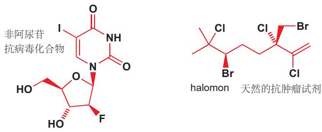

为什么我们要用黑色画这些原子？因为我们想让它们在分子中的其他部分中突出。一般来说，您会看到黑色被用于标记分子中重要的细节——也许是参与反应的基团，或者在反应结束后发生改变的片段。下面是 Chapters 9 和 17 中的例子。

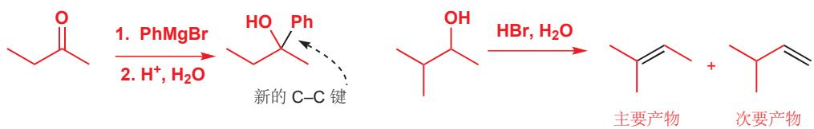

我们也经常使用黑色去强调 “弯曲箭头”，弯曲箭头是一种展示电子流向的方法，您会在 Chapter 5 中具体地学到。下面是 Chapters 11 和 22 中的例子：注意到黑色也被用作凸显 “+” 和 “-” 电荷。

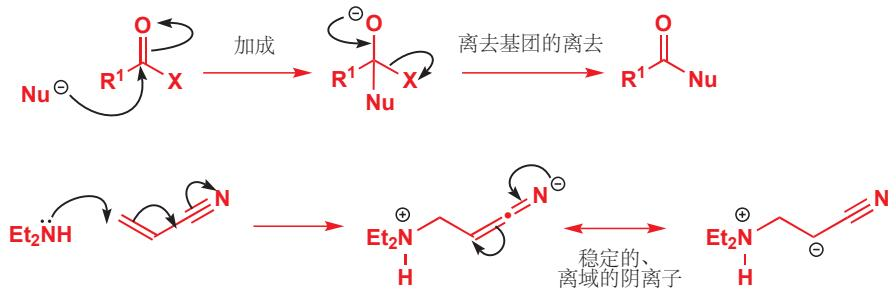

偶尔，我们也会使用绿色、橘色、棕色等其他颜色去突出次要的重点。下面的例子来自 Chapter 19 中的一个反应：我们想展示水分子 $\left(\mathrm{H}_{2} \mathrm{O}\right)$ 的形成。绿色代表了组成水分子的原子原始的位置。注意黑色的弯曲箭头，和用黑色凸显的新化学键的形成。

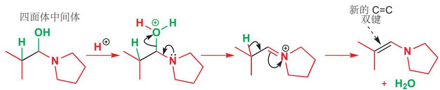

当事情变得复杂时，其他颜色也会出现——在下面这个来自 Chapter 21 的例子中，我们想展示这个反应两种可能的结果：棕色和黄色箭头表示了两种可能的电子流向，绿色标注出了两种情况都会保留的氘原子。

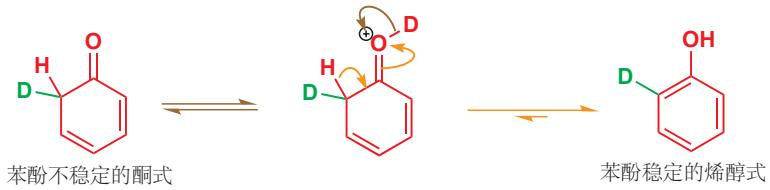

在 Chapter 14 中，颜色帮助我们看到携带四个不同基团的碳原子和携带三个不同基团的碳原子的区别。我们要告诉您的是：如果您看到有区别于红色的不同颜色出现，请特别注意——这种颜色出现是有它的原因的。

4 H $NH_{2}$ 1

甘氨酸 (例外)—

氨基酸

$^{3}$ H $_{2}$ NH $_{2}$ $^{1}$

3 R CO₂H 2

是有手性的

3 H CO₂H 2

包含 C, N, 和 $CO_{2}H$ 的

纸平面是一个对称面

## 译者的话

非常感谢您阅读由我翻译的这本书，在阅读一本书前浏览各种前言是非常好的习惯。在这里，我也希望通过简洁的文字，帮您考虑阅读本书，尤其是本译本的好处，以及本书的阅读方法。

福井谦一在他的一本书里总结，化学是一门“经验类推”的学说，其实自然科学以及人文科学固然都是如此，只是化学作为“中心科学”更加鲜明地突出了这一特点，而“有机化学”则作为“有机理的化学”更甚。在国内上过初高中课程的我们，对“经验”应该都有独特的见解，而本书则将“类推”的这一部分呈现给了您。本书作为有机化学基础书籍最大的优势，就在于它将“类推”贯彻始终，虽然每一章只有短短的二十页和不多的反应例子，但却能为我们建立对于每个模块清晰而完整的思路，在第四段中我将就此分析本书的阅读方法。我们可爱的作者简直太爱“类推”了，如果您阅读第二版序言，您会发现作者将自己的书与其他有机化学课本划分出了截然的界限。不过我希望您在注重“类推”的同时不要放弃“经验”，国内从物质分类角度出发的有机课本也十分优秀，如北大出版社基础有机化学，它们都在本书之后等着您。

再说本译本，这是我在读本书的过程中翻译的，因此您能相信，我始终是站在与您同一个视角审视这本书。当然我也体验到了作者写书的角度，完整地传授一遍有机化学，尤其是完整地写这样一本开创性的书，远比自己学会有机化学要难得多，在此角度上，我发现了本书中有许多十分巧妙的情节与引出要点的思路。若要大学老师来翻译，不免会掺入自己的东西；而我本身没学过有机化学，自己就不得不完全跟着本书作者的思路，因此这也便于我将作者的思路完整而纯粹地呈现给您。另外，本译本通过调节间距等参数做到了中文和原英文排版的最大适应，没有变动原书中页码与内容的对应，这一方面便于您对照未经翻译的习题解析上的页码找到相应的文段，另一方面也便于您利用本书的在线互动资源。

从本书的写作来由上分析，不难得出适合于这本书的阅读方法。本书旨在培养科学思维，需要同学们随着作者的思路一步步跟进，因此学习本书的要点在于读。毫不夸张地说，本书的多数篇幅都分给了聊大天，而要点确实很少。经典的课本的写作思路是将要点尽可能多而全面呈现出来，但不要求详细，其中的过程需要老师在课堂上补充，即和本书恰恰相反。本书的这种特定一来是一种优势，保证同学们只要安排足够的时间，只要认真踏实，都能跟上思路并理解内容，二来也是我反对将本书作为教科书的理由，三来更是我参照国内学习有机化学的氛围而翻译本书的原因。

最后，再次感谢您支持本书，支持本译本，希望有更多的同学能够通过此书迈进有机化学的殿堂体会科学思维，享受科学之美。

如果您有修改意见，可以在任何时间联系邮箱 $^{1}$ ，或在 Github 上提交 issue $^{2}$ ，我会定期修订错误，最新版本可于下载站 $^{3}$ 查看。截至2.0版更新前，已有4873人通过蓝奏云链接下载了电子版，已有453人通过团购链接取得了纸质版，非常高兴能将这本书分享给如此多的读者。最初译本中的诸多错误经过读者的反馈几乎已经修改，以下列出感谢名单（网名）：Hexauranate，gisonzhou，杜弘昊，黑寂之光，YuanJin，&sio2hf，melody，maggie3O61，hzy，xuke，xushfxc。

© Jonathan Clayden, Nick Greeves, and Stuart Warren 2012. The translated version is only for learning and will be deleted at any time upon request by original authors.

delay

# 什么是有机化学？

## 有机化学与您

您已经是一个炉火纯青的有机化学家了。当您读这些文字时，您的眼睛正在使用有机化合物(视觉色素)将可见光转化为神经冲动。当您拿起这本书时，糖发生的化学反应提供肌肉所需的能量。如您所理解，您脑细胞之间的缝隙正在被简单的有机分子(神经递质胺)所弥合，这样神经冲动就可以在您的大脑中传递。而您在做这些事情的时候，并不需要有意识地思考。在您还没有理解这些过程如何发生时，您就可以让它们在您大脑和身体中运作。您并不孤单。无论多么聪明的有机化学家，都无法完全了解它们的运作情况。

即便如此，我们也希望能在本书中向您展示自十九世纪早期，科学产生以来，我们在理解有机化学方面取得的巨大进步。有机化学起源于为了理解生命而产生的许许多多次尝试。如今它正在为许多现代工业提供理论保障，为数以百万计的人提供食物、衣服和医疗，其中很多人甚至没有意识到化学在他们生活中扮演的角色。化学家与物理学家、数学家合作，以了解分子的行为；与生物学家合作，以了解分子在生命过程中如何相互作用。这些想法可以作为我们在二十一世纪，对分子世界进行革命性研究的启示，它们远远没有完成，而是任重而道远。我们注重的不是给您一个骨架一样的死科学，而是让您了解一个在冲突中具有活力的科学。

和所有科学一样，化学在我们理解宇宙的方法中占有独特的地位。它是分子的科学。有机化学则更加丰富，它会自己成长，并且创造更多的知识。当然，我们需要研究自然分子，因为它们本身很有趣，而且它们在我们的生活中发挥着重要的功能。另外，有机化学也通过制造新的分子来研究生命，这些分子提供生物中原本存在的分子们中无法获得的信息。

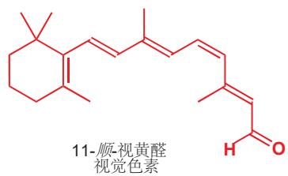

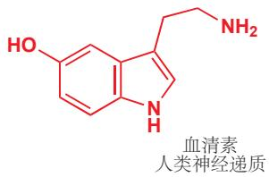  
11-顺-视黄醛视觉色素  
在本章的阐述中，我们会配上相应有机化合物的结构图。如果您不能理解它们的含义，请阅读我们在文字中提供的解释。

人工合成的分子为我们提供了新的材料，比如塑料用来制造东西，合成染料用来为我们的衣服着色，我们还可以喷新的香水，用新的药物来治疗疾病。有些人认为生产是不自然的，他们的产品是危险或不健康的。但是这些新分子是人类用天然的大脑，由地球上天然的分子合成的。鸟筑巢，人盖房子，哪个是不自然的？区分自然与否，对于有机化学家们来说是没有意义的。有有毒的化合物和有营养的化合物，有稳定的化合物和活泼的化合物——但是只有一种化学：它在我们的大脑和身体内部，也在我们的烧瓶和仪器里，产生于我们头脑中的思想和我们手中的技术。我们不会以任何方式把自己定义为道德法官。我们认为，尽可能努力地了解我们的世界，并创造性地利用它们才是正确的。这是我们想与大家分享的。

噻吩
(thiophene)

苯胺
(aniline)

在本书的结尾 (Chapter 42) 您会读到那些用于维持生命的，令人惊奇的有机化学知识——来自化学家与生物学家的合作。

## 有机化合物

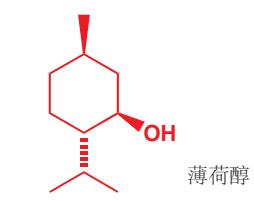

有机化学最早指的是研究生命的化学，当时被认为是不同于实验室的化学的。然后来它演变成了研究碳化合物的化学，尤其是在煤中找到的那些碳化合物。但现在其实两者都是。有机化学研究碳和其他元素形成的化合物，那些可以在生命体中，有关生命的产品中，和一切能找到碳的地方找到的化合物。

最丰富的有机物存在于生命中，包括那些存在于活着的生物中的，和数百万年前死亡的生物经变化得到的。早些时候，人们从自然界中获取有机物，例如通过蒸馏植物获得精油，通过酸萃取获得生物碱。从绿薄荷 (spearmint) 中可以提取薄荷醇 (menthol)，一种用于调味的化合物；蒸馏茉莉花 (jasmine flowers) 可以得到顺-茉莉酮 (cis -jasmon), 一种香水的成分。

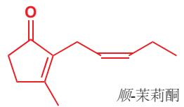

天然产品被用于治疗疾病也有很长的历史了，在十六世纪，著名的药物奎宁 (quinine)，就是从南美辛乔纳树皮中提取的，可以用于治疗发烧，特别是疟疾。发现它的那位耶稣会士 Jesuits（这种方案也被称为“耶稣会士的树皮 Jesuit's bark”）显然并不知道奎宁的结构，但是我们现在知道了。

更重要的是，奎宁的结构启发了现代药物分子的设计，我们有了比奎宁更有效的治疗疟疾的分子。十九世纪化学家的主要化学品储备来源是煤。煤蒸馏出的气体用于照明和加热（主要是氢气和一氧化碳），棕色的煤焦油中也包含丰富的芳香化合物，例如苯，丙胺，苯酚，苯胺，噻吩。

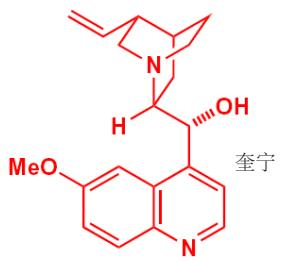

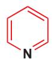  
吡啶
(pyridine)

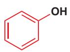  
苯酚
(phenol)

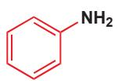

Perkin 当时正在和德国的大化学家 Hofmann 在伦敦学习。Perkin 试图用这种方法制备奎宁是相当困难的，因为当时人们并不清楚奎宁的结构。

十九世纪，苯酚被 Lister 用作外科消毒剂，苯胺被作为染料工业 (dyestuffs industry) 的基础这是人们在生活中利用自己合成的有机物替代天然产物的开始。在 1856 年，一位 18 岁的英国化学家 William Perkin 正想通过苯胺合成奎宁时，意外地产出了一种紫红色残留物，即苯胺紫 (mauveine)，这种紫红色残留物彻底革新了衣物的颜色，并且催生了染料工业。与之相关的另一种染料，俾斯麦棕 (Bismarck Brown)，至今仍在使用：很多早期的染料工作都发生在德国。

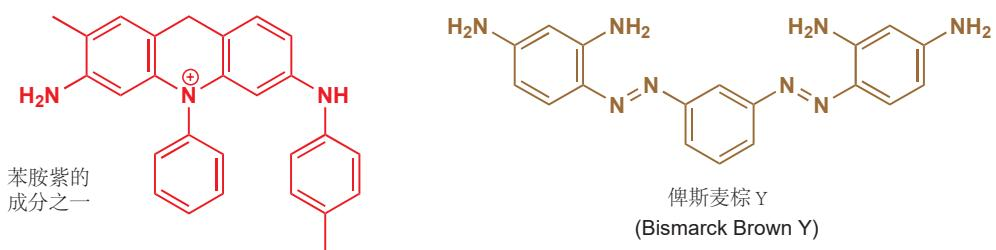

在二十世纪，石油取代煤成为人们大量获得有机化合物的又一新来源，因此简单的烃类例如甲烷 $\left(\mathrm{CH}_{4},\text{“天然气”}\right)$ ，丙烷和丁烷 $\left(\mathrm{CH}_{3}\mathrm{CH}_{2}\mathrm{CH}_{3}\right.$ 和 $\left.\mathrm{CH}_{3}\mathrm{CH}_{2}\mathrm{CH}_{2}\mathrm{CH}_{3},\text{“calor气”或LPG}\right)$ 成为了新的燃料。与此同时，化学家开始从其他的资源中寻找有机分子，例如真菌、珊瑚、细菌。另外，两种化学工业开始并行发展——大宗化学和精细化学。油漆和塑料等作为大宗化学品通常是多吨量生产的简单分子，而药物、香水和调味料等精细化学品则制造量较小，但种类丰富。

我写这本书时大约已经有 1600 万种已知的有机化合物了。这个数字还会增加到多少？通过计算那些 30 个碳原子以内的中等大小的分子（像上文苯胺紫那样大的），就大约有 1,000,000,000,000,000,000,000,000,000,000,000,000,000,000,000,000,000,000,000,000,000,000,000）（ $10^{63}$ ）种可能的稳定化合物。宇宙中全部的碳原子都不能足够把它们造出来。

在已经制得的 1600 万种化合物之间，就有各种各样的分子展现出令人惊奇的各种各样的性质。它们长什么样子？也许是晶状，油，蜡，塑料，橡皮，流动的或者挥发性的液体，或者是气体。我们熟悉的分子包括糖，一种廉价的从植物中分离得到的白色固体；石油，一种无色、易挥发、易燃的碳氢化合物。

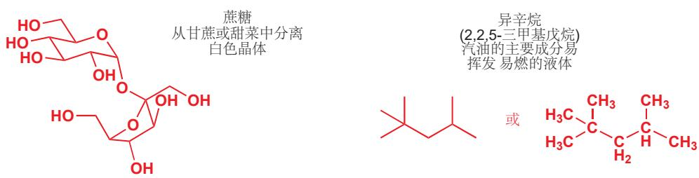

有机化合物并不缺乏颜色。事实上我们可以轻松地用有机化合物填满整张光谱，更不用说棕色和黑色了。在下表中，我尽量避免了染料，并举出了结构尽可能多样的化合物。

<table><tr><td>颜色</td><td>描述</td><td>化合物</td><td>结构</td></tr><tr><td>红色</td><td>暗红色六角片状</td><td>3-甲氧基苯并环庚三烯-2-酮</td><td></td></tr><tr><td>橙色</td><td>琥珀色针状</td><td>二氯二氰基苯醌 (DDQ)</td><td></td></tr><tr><td>黄色</td><td>有毒的黄色爆炸性气体</td><td>重氮甲烷</td><td></td></tr><tr><td>绿色</td><td>绿色三角柱状有刚蓝色光泽</td><td>9-亚硝基久洛尼定 (julolidine)</td><td></td></tr><tr><td></td><td></td><td></td><td></td></tr><tr><td>蓝色</td><td>深蓝色固体有胡椒味</td><td>奠 (azulene)</td><td></td></tr><tr><td>紫色</td><td>深蓝色气体紫色固体</td><td>三氟亚硝基甲烷</td><td></td></tr></table>

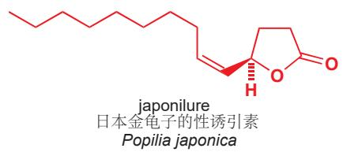

臭鼬雾中包含：

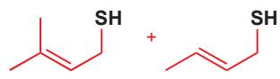

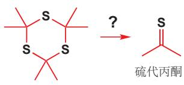

颜色不是我们识别化合物的唯一依据。很多时候，化合物的气味让我们知道它们在附近。有些有机化合物有极难闻的恶臭气味，例如臭名昭著的臭鼬雾就是两种硫醇的混合物，硫醇是含有 SH 基团 (巯基) 的一类化合物。

有史以来最糟糕的气味当属 1889 年导致德国弗莱堡市疏散的气味。三硫丙酮 (trithioacetone) 分解产生了硫代丙酮 (thioacetone), “令人反感的气味” 迅速在小镇的一大片地区蔓延，居民开始有昏厥、呕吐感，在恐慌中疏散过后，实验室工作也停止了。

1967年，牛津南部一个埃索研究站的几名研究人员重复了三硫丙酮分解的愚蠢实验。他们这样讲述了这个故事：“最近我们发现自己身上的气味问题超出了我们最坏的预期。在早期的实验中，一个瓶塞从装有残留物的瓶子上蹦了出来，尽管立即更换了瓶塞，但却登时引起了至少二百码外的楼内工作的同事的恶心和不适。我们的两位化学家只是研究了微量三硫丙酮的分解反应，他们却发现自己已经成了一家餐馆的敌对目标，并遭受了被女服务员喷洒除臭剂的羞辱。那种气味几乎无视稀释带来的影响，然而实验室里的实验员却说自己并没有感觉到无法忍受，因为实验一直在封闭环境中完成，他们不认为自己应当负责任。为了说服他们，我们一同在实验室观察了这样的实验，相隔四分之一英里，在一端滴下一滴丙酮偕二硫醇（acetone gem-dithiol）或者结晶完三硫丙酮的母液后，实验结果表明另一端通风橱的下风方向在几秒内就检测到了气味。”

两位正在争夺这种可怕气味的候选人是一一丙二硫醇 propane dithiol（上文称作丙酮偕二硫醇）与 4-甲基-4-巯基-2-戊酮。别的物质不大可能有足够的勇气去争夺这一称号。

## 丙酮偕二硫醇 4-甲基-4-巯基-2-戊酮

难闻的气味也有它们的用途。管道输送到家中的天然气中含有很少的人为添加的含硫化合物，如叔丁基硫醇 $(\mathrm{CH}_3)_3\mathrm{CSH}$ 。这里的很少是非常非常少——人类可以辨别出天然气中50,000,000,000分之一的含硫化合物。

## 世界最臭气味的两位候选人(没有人想去知道到底谁会赢)

叔丁基硫醇

化合物中一些也有令人愉快的味道。为了挽回含硫化合物的尊严，我们必须提到黑松露中气味的来源，让猪可以透过一米厚的土壤闻到的香味，十分令人愉快，闻到这种松露的成本价要高过相同重量的黄金。大马酮是玫瑰花气味的来源。如果您闻到一滴纯品的大马酮(damascenone)，您也许会失望，因为它的味道像是松节油或者樟脑；但第二天醒来后，您会发现所有您的衣服都出现了玫瑰的清香。很多气味需要稀释后才能得到。

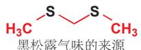

黑松露气味的来源

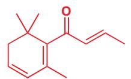

人类不是唯一有嗅觉的生物。我们可以用许多的感官寻找对象，而在一个拥挤的世界里，昆虫只能通过气味辨别自己的异性同类。大多数昆虫会生产具有挥发性的香味化合物，可以被它们潜在的配偶在极微量的情况下拾取。从65,000只雌性烟草甲虫中，我们只能分离出1.5 mg的serricornin，烟草甲虫的性诱引素，平均到每只甲虫身上的则更少。尽管如此，这仍然不妨碍它们靠着这一点点的气味聚集在一起，尝试交配。雌性日本金龟子的性诱引素已经被化学家成功合成，仅仅5 $\mu$ g（是微克，看清楚！）都要比四个处女吸引男性更加有效果。

大马酮——玫瑰花气味的来源

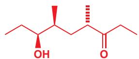

舞毒蛾的性诱引素，disparlure, 可以从这些飞蛾中分离并识别出几 $\mu g$ ：雄性舞毒蛾在田野诱因雌性时只需要使用 $2 \times 10^{-12}$ . 上文介绍的三种信息素都可以被用作捕捉这些害虫的诱饵。

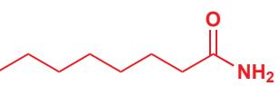  
有机化合物

  
disparlure
舞毒蛾的性诱引素
Portheria dispar

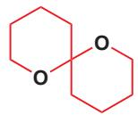  
olean
油橄榄实蝇的性诱引素
Bacrocera oleae

不要以为雌性总是做所有的工作；对于油橄榄实蝇，雌性与雄性都会产生性诱引素并吸引异性。值得注意的是，这种构造的一种镜像吸引雄性，而另一种镜像吸引雌性！对于雄象，它们能产生名为frontalin的一对镜像(一对对映体)，而雌象则可以从每个异构体的数量上判断雄象的年龄，和它们的作为潜在伴侣的吸引力。

  
吸引雄性油橄榄实蝇的镜像

  
吸引雌性油橄榄实蝇的镜像

  
有年轻雄象味道的镜像

  
有年老雄象味道的镜像  
\*如果您是一只雌象  
油橄榄实蝇

对于味道呢？拿一个西柚。西柚主要的味道来自于另一种含硫化合物，人类可以从每十亿份中分辨出 $2 \times 10^{-5}$ 份。这是一个几乎无法相信的微量，相当于每吨中的 $10^{-4} \mathrm{mg}$ 或者滴在一面相当大的湖中的一滴。究竟为什么进化让我们对西柚的味道如此敏感，这个问题留给您来想象。

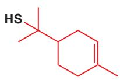

有关刻意制造讨厌味道的例子，我们应该提一下“苦味剂 (bittering agents)”，它们被加进厕所清洁剂这样家庭常用的危险物质中，阻止孩子们误食。请注意，这种复合物实际上是一种盐——季铵阳离子和羧酸根阴离子组成——这使得它溶于水。

西柚香味的来源

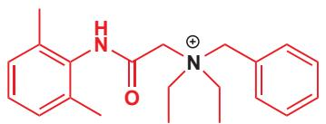

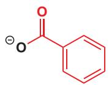  
“苯甲地那铵 (denatonium benzoate)”, 苦精 (Bitrex) 苯甲酸苄基二乙基[(2,6-二甲苯基氨基甲酰基)甲基]铵

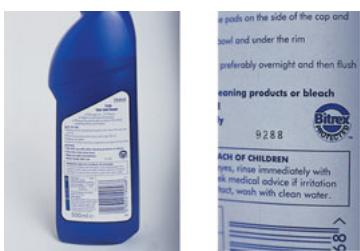

其他有机化合物对人体也有各不相同的影响。多种多样的“毒品”例如酒精、可卡因(cocaine)会给人类以短暂的愉悦。它们的危险各不相同。过量的酒精会让您感受到很大的痛苦，而任何剂量的可卡因都会让您沦为它一辈子的奴隶。

  
酒精(乙醇)

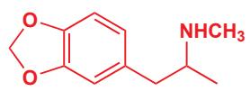

(摇头丸)

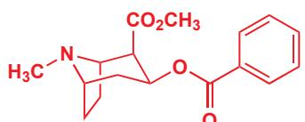  
可卡因—一种极具成瘾性的有机碱

我们不要忘了其他生物。猫似乎可以在任何时间，任何地点轻易地睡着。从猫的脑脊液中可以分离出下面这个令人惊讶的简单化合物，它似乎是猫睡眠控制机制的一部分。它可以让猫立即入睡，同样可以让老鼠和人类立即入睡。

顺-9,10-十八烯酰胺

诱发睡眠的脂肪酸衍生物

CLA
顺-9-反-11 共轭亚油酸
膳食抗癌物质

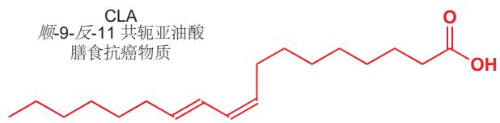

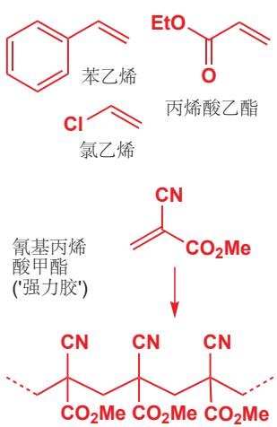

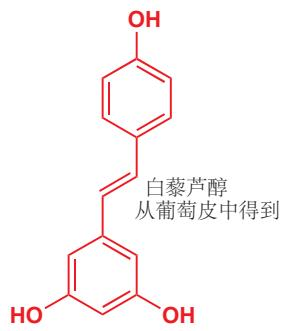

这个化合物（图在上一页）和 disparlure（上文）都是脂肪酸衍生物。脂肪酸在饮食上受到广泛关注，新闻上经常提起好的、坏的，饱和的、不饱和的，单不饱和的、多不饱和的脂肪酸：众多膳食分子中的一员，CLA (conjugated linoleic acid 共轭亚油酸)，估计有可以证实的抗癌功效；它在乳制品中有所存在，您也许知道，它在袋鼠肉中也很丰富地存在。

白藜芦醇是另一种具有良好功效的膳食化合物。它可能是红酒预防心脏病功效的主要帮手。它是有机物中很特别的一类，有两个苯环相连。

第三个可食用的分子，说说维生素 C 怎么样？它是您饮食中一个非常重要的基本要素——这就是为什么它被算作维生素——它也存在于其他灵长类生物，例如豚鼠，果蝙蝠的饮食中(其他一些哺乳动物拥自己制造它的生化机制)。在过去几个世纪的长途航海时，很多水手遭遇了软组织的退化，这种疾病是由于缺乏维生素 C 造成的。它也是一个通用的抗氧化剂，可以用于清理那些可能破坏 DNA 的自由基。有些人还认为，额外的摄入还可以用于防止普通感冒。

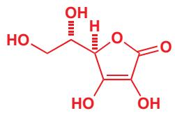  
维生素 C (抗坏血酸)

## 有机化学与化工

维生素 C 由瑞士罗氏基团大规模生产。在全世界各地，都有专门的化工企业，每年生产从几千克到数千吨不等的有机分子产品。这对学习有机化学的学生是一个好消息：了解分子的行为和合成方法是社会广泛需求的能力，它有很好的国际就业市场。

石油化工行业消耗大量的原油：世界上最大的炼油厂，位于印度的贾姆纳加尔，每年加工2亿升原油。其中令人惊讶的一大部分仍然被用作燃料，但也有一些经过精炼或者转化为有机产品，进而被用作其他化工产业。

一些简单的化合物既可以通过石油，又可以通植物获取。乙醇通常被用作制备其他化合物的起始原料，或者被用作燃料；主要通过石油中获得的乙烯催化加水得到，在巴西，人们也常常用甘蔗发酵的方法获得乙醇。植物是十分强大的有机化工厂(甘蔗发酵是其中最有效的)。植物在光合作用时可以直接获取大气中的二氧化碳，并通过太阳能转化成含有低价碳的有机分子，燃烧后可以提供能量。例如从植物油中提取的脂肪酸被称为生物柴油。

  
生产聚合物的单体

硬脂酸乙酯 (十八酸乙酯)，生物柴油的主要成分

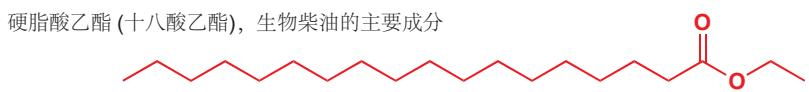

石油化工产品在生产塑料和其他高分子上发挥着重要的用途，石油化工产出聚合所需要的单体，例如苯乙烯，丙烯酸酯，氯乙烯。一切塑料产品，包括塑料家具等，还有纺织使用的化纤(每年超过2500吨产量)，汽车轮胎，填充包装的泡沫等等，都是庞大的高分子化工的产品。全球每年生产1亿吨聚合物，只算PVC的制造每年就超过2000万吨，需要雇佣50,000人。

聚合形成高分子，也是生产粘合剂的一种好方案。使用强力胶，你几乎可以将任何两样东西黏在一起，它就是氰基丙烯酸甲酯的聚合物。

洗碗时用到的洗洁精化学工业的另一个分支——像联合利华和宝洁公司，他们生产洗洁精，清洁剂，漂白剂和擦光剂，还生产肥皂，凝胶，化妆品，剃须泡沫等。这些产品闻起来像柠檬，或者薰衣草、檀香，但实际上他们大多来自于石油工业。

这类产品往往会对来源于石油这件事保持低调，并且宣传它们的清新，自然。除了时尚，他们还包含什么呢。看看这个例子——一份知名品牌沐浴露的成分清单，它的介绍上写着“含天然物质”（包括十个“真正的”柠檬）并且包含“100%纯天然柠檬与茶树精油”。

在我们看来，这样的介绍并不合情合理。我们希望这本书也会帮您真正了解这些事物的意义(和他们的无稽之谈).

成分

化学组成

作用

aqua

水

月桂醇聚醚  
硫酸酯钠  
sodium laureth sulfate

溶剂

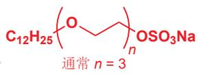

洗涤剂

椰子酰二乙醇胺
cocamide DEA

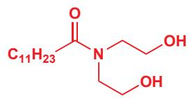

发泡剂

香橼果皮油
Citrus medica
limonum peel oil 吸引顾客的香味

12M

3360 04:53

INGREDIENTS: Aqua, Sodium Laureth Sulfate, Cocamide DEA, Citrus Medica Limonium (Lemon) Peel Oil, Melaleuca Alternifolia (Tea Tree) Leaf Oil, Glycerin, Cocamidopropyl Betaine, Sodium Chloride, Lactic Acid, Styrene/Acrylates Copolymer, Tetrasodium Glutamate Diacetate, Sodium Benzoate, PEG/PPG-120/10 Trimethylolpropane Trioleate, Laureth-2, Benzotriazolyl Dodecyl P-cresol, BHT, Citral, Limonene, CI 19140, CI 14700.

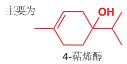

茶树精油
Melaleuca
alternifolia leaf oil吸引顾客的香味;可能还可以防腐

甘油
glycerin

潜溶剂;  
保湿;  
确保光滑和弹性 weltaged 10 real lemons into this zesty shower gel. We rapid refreshment with 100% pure & natural Lem oil essential oils. Packed with natural stuff & perfect blast away the cobwebs!

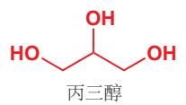

洗涤剂有抗静电作用

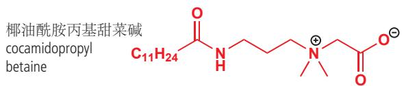

氯化钠
sodium chloride

## EMON & TEA TREES

NaCl

控制含
Na+洗涤剂的溶解性

乳酸
lactic acid酸化

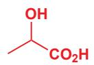

苯乙烯/丙烯酸(酯)
共聚物
styrene acrylates
copolymer

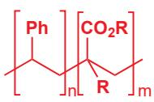

$\mathsf{R} = \mathsf{Me}$ 或 $\mathsf{H}$

成膜剂

谷氨酸二乙酸四钠
tetrasodium
glutamate diacetate螯合剂，
防止一些离子
在硬水中沉淀

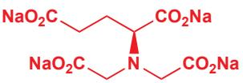

苯甲酸钠
sodium benzoate

防腐剂

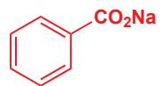

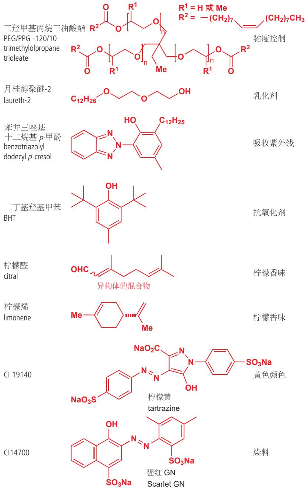

选择特定的洗涤剂、表面活性剂、酸、粘度控制剂等并混合在一起，以产生光滑的凝胶。产物应当摸起来、闻起来、看起来都具有吸引力，并可以成为一个有效的洗发水（一些化合物由于其保湿和抗静电作用也被添加）。黄色和柠檬香味让它看上去新鲜、干净。也有几种通过天然化合物添加的成分，它们不是异构体或聚合物的混合物；最不纯净的是被称作“纯天然”精油的混合烃类。它们真的来自自然吗？确实如此，一切来自自然资源，主要是数百万年前植被碳化形成的产物。

产品着色是一类庞大的业务，染色布料、染色塑料、纸张、墙漆等等都需要鲜艳的色彩。在这一领域有成就的 Akzo Nobel 等公司，在 2010 年销售额达到 146 亿欧元。最常用的染料之一，靛蓝 (indigo)，在古代使用从植物中萃取的方法，现在则使用石化原料合成。它是蓝色牛仔裤的颜色。

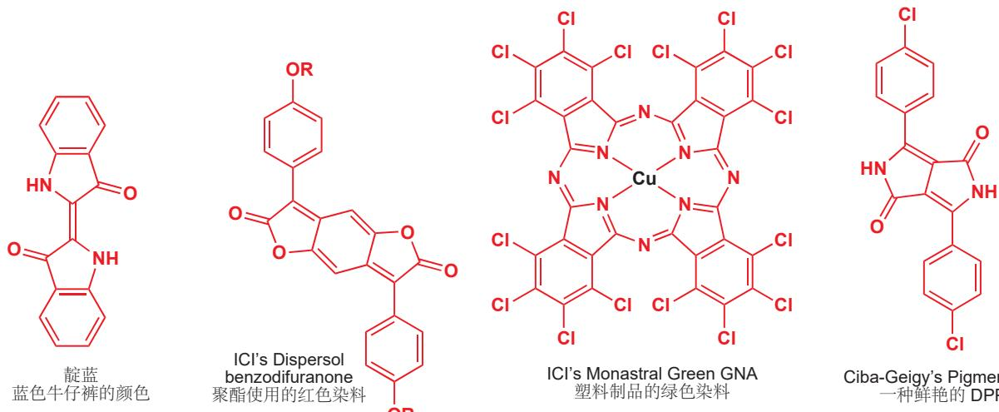

更现代染料可以以下面几个作为代表：使用 ICl 合成的 benzodifuranones，被用作合成布料如聚酯的着色剂（红色），酞菁-金属配合物（通常是蓝色或绿色），“高性能的”红色颜料 DPP（1,4-diketopyrrolo[3,4-c]pyr-roles）系列是由 Ciba-Geigy 开发的。

Ciba-Geigy's Pigment Red 254
一种鲜艳的 DPP 颜料

上面所示的沐浴露由植物提取物和纯化合物 (事实上是其两种异构体的混合物) 柠檬烯混合而成。大型香水和调味剂公司 (例如芬美意公司，美国国际香料香精公司，和奇华顿公司) 都同时使用天然产物和合成产物——天然产物指的是从植物，如树叶、种子、花朵中提取得到的化合物。合成产物是纯净物，有时是最初来源于植物的，有时是新设计的分子。这二者混合在一起得到了最终的气味。香水通常由 5–10% 的香料分子与乙醇/水 (大约 90:10) 混合形成。相比于香水溶质，香水工业更需要的是乙醇。事实上，重要的香料，例如茉莉花香香料的年产量为 a >10,000 吨。对于纯溶质，例如顺-茉莉酮 (p. 2)，茉莉花的主要成分，每克可能价值数百英镑、美元或欧元。

香水的世界

香水化学家用令人惊奇的语言描述他所取得的成就：“帕高出色男香 (PacoRabanne pour homme) 的发明是为了还原在夏天的普罗旺斯山丘，露天散步的效果：草药、迷迭香和百里香的味道，凉爽的海风与温暖的阿尔卑斯山的空气混合形成的生机感和清新感。为了得到这种效果，调香师将草本植物油、木本物质与合成香料二甲基庚醇混合，它敏锐而无法描述的清新与露天的空气和新洗的亚麻布类似。”

化学家生产的合成香料还包括“熏培根”甚至“巧克力”。肉类香味来自杂环化合物，例如烷基吡嗪（存在于咖啡和烤肉中）和呋喃酮，最初来源于菠萝。corylone 和麦芽酚等化合物提供焦糖和肉类香味。这些化合物和其他一些合成化合物的混合可以调出烤制食物的味道，从新鲜面包到咖啡，再到烧烤的味道。一点香精化合物可以既作为香水，又作为合成其他化合物的前体。香草醛是香草味道的主要来源，但它也因为其他用途被大规模生产。

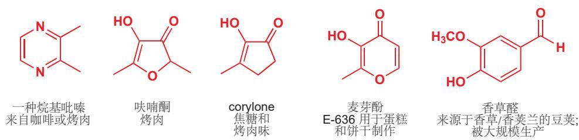

食物化学除去香水外，仍有许多其他内容。糖等甜味剂从植物中的直接分离占据其生产的很大部分。您在 p.3 看到了蔗糖，但糖精（于 1879 年发现！）和阿斯巴甜 (1965) 也同样占据了相当大的部分。阿斯巴甜是存在于一切生命体中的两种天然氨基酸的组合，NutraSweet 公司每年生产超过 10,000 吨。

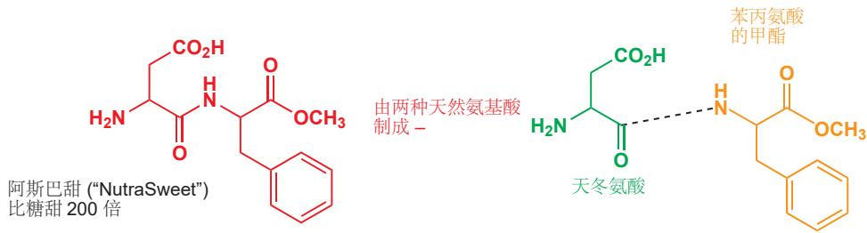

有关达菲的故事，以及在确保它们源源不断的供应上，化学家聪明才智的体现，在本书的末尾 Chapter 43 有所介绍。

现代生活最伟大的革命之一是期望能够通过专门设计的治疗手段，使人类在疾病中存活。在发达国家世界中，人可以活到老年，因为那些会导致他死亡的感染都可以被治疗，或者干脆根本无法近身。抗生素作为我们对细菌的防御，作用在于防止细菌增殖。其中最成功的是阿莫西林，由是史克必成公司开发的。这个分子的核心是四元环，即β-内酰胺环，它瞄准了致病细菌。药物化学家也同时在病毒的威胁中保护着我们，病毒是依赖人体自身的生物化学环节实现复制的。达菲是抵御流感时重要的防线，而利托那韦是组织抑制HIV复制和减缓或预防AIDS的最先进手段。

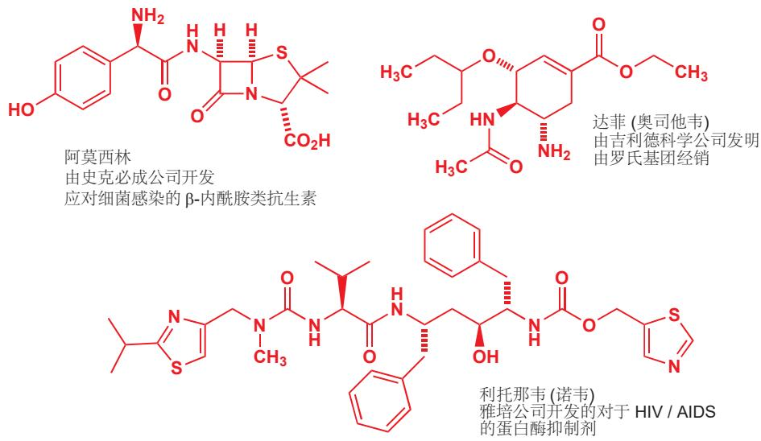

目前最畅销的药物很多是为了治疗人体自身的缺陷而设计的。立普妥和耐信两种药的销售额都在2009年达到了最大值的五十亿美元，这一数据说明了开发安全而有效的新疗法，拥有巨大的财富规模。立普妥是他汀类药物的一种，他汀类药物被广泛用于控制老年人的胆固醇水平。耐信是一种质子泵抑制剂，它能减轻消化道溃疡和十二指肠溃疡。格列卫（诺华公司开发并于2001年推出）的销售额远小于以上两种，但它是那些患有致命癌症，例如白血病的患者的救命稻草。

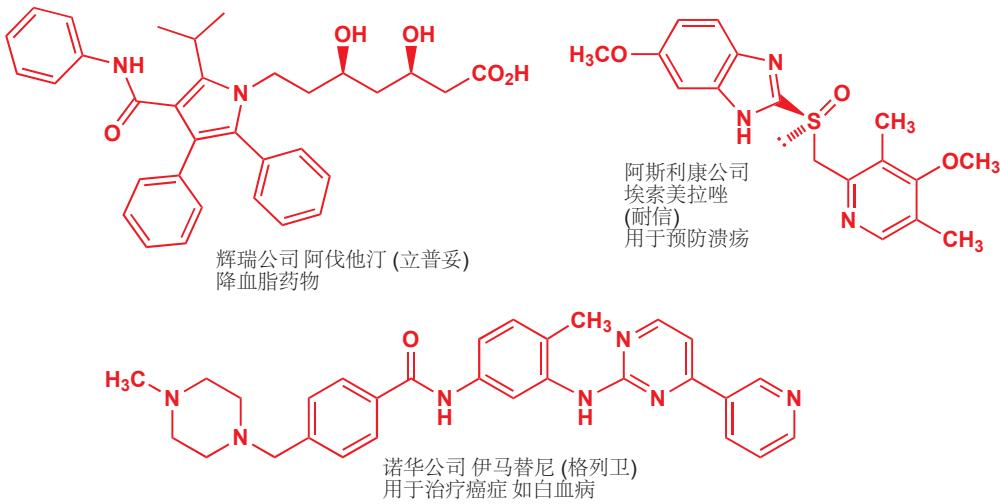

如果我们不能在来自杂草的竞争，和来自昆虫、真菌的攻击中维持我们的食物供应，那么我们就不能保持目前发达国家的高人口密度，也不能解决目前发展中国家的营养不良问题。拜耳作物科学、先正达公司等跨国公司在农用化学品上的全球市场每年超过一百亿英镑，其中可以分为除草剂、杀真菌剂和杀虫剂。

许多早期的农用化学品，由于会对环境造成持久的伤害已经被淘汰，因此现代的农用化学品都必须通过严格的环境安全测试。最著名的现代杀虫剂是以来源于植物的除虫菊酯为模型的，通过化学修饰(溴氰菊酯上的棕色和绿色部分)可以使其在阳光的降解作用下稳定，还可以使其效果只针对某种特定植物上的某种特定昆虫。溴氰菊酯的安全性体现在，它对芥末甲虫的效果超过对哺乳动物>10,000倍，每公顷只需施用10克(大约每足球场一平匙)，而且不会留下任何显著的环境残留。

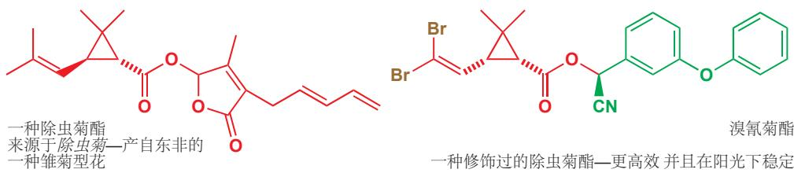

当您学完更多的化学知识后，您会欣赏大自然在这些化合物中创造三元环，并且让化学家可以将以它们为主体的化合物泼洒在田间的作物上，是有多么非凡的创造力啊。更引人注目的杀真菌剂是基于含有三个氮的五元环的一一即三唑环衍生的。这些化合物抑制真菌中酶的作用，而不会影响植物和动物中的酶。真菌病害对于植物是一个很大的威胁：就像十九世纪爱尔兰发生的马铃薯大灾荒一样，各种真菌引起的枯萎病、斑点病、腐烂病、锈病、黑穗病和霉菌可以在短时间内压倒任何作物。

## 有机化学与元素周期表

我们展示的所有化合物都是建立在碳氢骨架上的。大部分含有氧、氮原子；其中一些还含有硫、磷、卤素。以上便是有机化学中的常见元素。

三丁基锡氢

  
丁基锂

  
$Me_{3}SiCl$

halomon 天然的抗肿瘤试剂

我们将花费一整章来讨论

S, P, 和 Si 元素的有机化学 (Chapter 27) 并且还会讨论过渡金属，尤其是 Pd (Chapter 40).

您可能在从前的化学学习中了解过元素周期表。本书的1184-1185页将完整的展示元素周期表，有关族，哪些元素是金属，元素在周期表中的位置等等的基础知识，会对您未来的学习有所帮助。

但有机化学有时也向元素周期表的其他部分探索。硅、硼、锂、锡、铜、锌的有机化学也被研究地很好，同时这些“有机”试剂也成为了实验室中的常用试剂。在本书中您也会遇到它们中的许多，例如丁基锂、三甲基氯硅烷，三正丁基锡氢，二乙基锌，二甲基铜锂。

  
三甲基氯硅烷  
Et $_{2}$ Zn  
二乙基锌

卤素经常出现在一些救命的药物中。抗病毒药物例如非阿尿苷（既包含 F 原子和 I 原子，还包含 N 和 O）都是对抗 HIV 与 AIDS 的基础性药物。它们以核酸中产生的天然化合物为模型。从红藻中提取的天然抗肿瘤试剂 halomon，含有 Br 原子和 Cl 原子。

有机化学家的元素周期表必须强调下图的这些元素以及更多—大多数是常见于有机反应中的元素。人们始终在建立新的连接—上个世纪末期，钌、金和钐的有机化学是不值一提的；但如今结合着这些金属的试剂和催化剂驱动着许多重要的反应。

有机化学家眼中的元素周期表

18

所以无机化学的结束和有机化学的开始在哪里呢？你会说抗病毒化合物膦甲酸钠 (foscarnet) 是有机物吗？它含有碳，分子式为 $CPO_{5}Na_{3}$ ，但它并没有 C—H 键。那重要的试剂四(三苯基膦)钯呢？它包含很多烃类—事实上有 12 个苯环—但是苯环都在包围钯原子的一圈磷原子上，所以这个分子仅仅依靠 C—P 和 P—Pd 键来结合，并不是靠碳氢骨架支撑。虽然它的分子式 $C_{72}H_{60}P_{4}Pd$ 看起来十分像一个有机物，很多人却说它是无机的。事实是怎么样的？

膦甲酸钠—抗病毒试剂

四(三苯基膦)钯—一种重要的催化剂

$$
[ (\mathrm{C} _ {6} \mathrm{H} _ {5}) _ {3} \mathrm{P} ] _ {4} \mathrm{Pd}
$$

$$
(\mathrm{Ph} _ {3} \mathrm{P}) _ {4} \mathrm{Pd}
$$

答案是：我们不知道，我们也不在乎。传统规则中严格的学科界限是不可取的，也是毫无意义的。化学将继续跨越有机化学与无机化学的，有机化学与物理化学、材料学的，有机化学与生物化学的旧界限。很高兴这些边界本来就是模糊的，因此化学更加丰富。这个可爱的分子 $(\mathrm{Ph}_{3}\mathrm{P})_{4}\mathrm{Pd}$ 只属于化学。

## 有机化学与本书

我们已经告诉了您有机化学的历史、有机化合物的类型、有机化学所生产的东西，和有机化学需要用到的元素。今天的有机化学是研究自然界中化合物的结构和反应的学问，是研究化石原料如煤和石油可以合成的化合物的学问。这些化合物通常采用碳氢骨架作为支撑，并通常有 O, N, S, P, Si, B, 卤素以及金属原子附着在框架的上面。有机化学被用于生产塑料、颜料、染料、衣服、药物、农用化工品和其他许多东西。现在我们可以用一种不同的方式总结它们。

● 有机化学研究方向的几个主要部分:

\- 结构的确定—准确地得到一个新化合物的分子结构，即使那个化合物只存在于微量；

\- 理论有机化学—从原子、电子的结合方式等方面理解有机结构；

\- 反应机理—了解分子之间如何发生反应，并预测未知反应的发生；

\- 合成—设计新的分子，然后合成它们

\- 生物化学—了解大自然的行为，具有生物活性的分子的结构与功能间的关系。

这本书就是关于所有这些事情的。它涉及有机分子的结构，和它们组合这些结构的原因。它是关于分子的形状，和这些形状与它们功能间的联系，特别是在有关生物化学部分中。它解释如何发现这些结构和形状。它告诉您这些分子的反应过程，更重要的是，它们如何、为什么这样反应。它告诉您自然和工业。它告诉您分子如何被制造，以及在合成分子时该考虑什么。

这是您即将进入的旅程中的风景。而且，与其他旅程相同，当您进入一个新的、令人兴奋的、具有挑战性的地方时，首要的事情是先了解有关当地语言的一些知识。幸运的是，有机化学的语言再简单不过了：它们都是图片。下一章我们将具体交流。

## 延伸阅读

一本您可能感兴趣的，很有意思的书：B. Selinger, Chemistry in the Marketplace, 5th edn, Harcourt Brace, Sydney, 2001.

## 检查您的理解

为确保您真正掌握了这一章的内容，请尝试解决本书 Online Resource Centre (在线资源中心) 中的习题：http://www.oxfordtextbooks.co.uk/orc/clayden2e/

# 有机结构

## 联系

## 基础

\- 本章并不建立于 Chapter 1

## 目标

\- 书的其余部分所使用的图表

\- 使用这些图表的原因

\- 有机化学家如何在写作和演讲中命名分子

\- 什么是有机分子的骨架

\- 什么是官能团

\- 所有有机化学家都使用的一些缩写

\- 以易于理解的形式真实地绘制有机分子

## → 展望

\- 用光谱法测定有机分子 ch3

\- 什么决定了一个分子的结构 ch4

元素周期表中共有一百多个元素。而很多有机分子可以包含一百多个原子——例如岩沙海葵毒素palytoxin(一种有潜在抗癌活性的天然分子)，就包含129个碳原子，221个氢原子，54个氧原子和3个氮原子。很容易看出来，化学结构可以表现出极大的多样性，最复杂的生物都可以由足够的分子构建出来。

## 岩沙海葵毒素最早在

1971年于Hawaii 从 Limu make oHane (意为 “致命的哈纳海藻 deadly seaweed of Hana”) 中获得，当地人将它涂在矛的尖端。这是世界上最毒的物质之一，注射死亡剂量仅有 0.15 微克/千克。这种复杂的结构在几年后被确认。

## 岩沙海葵毒素

但是我们如何理解一个这样混乱的结构呢？面对由原子构成的分子，我们如何理解呢？本章将教您如何理解和诠释分子结构。这同时也会教会您通过绘制有机结构图，简洁地传达信息。

## 碳氢骨架与官能团

正像我们在 Chapter 1 中所介绍的，有机化学是研究含碳化合物的科学。另外，几乎所有的有机化合物也都包含氢原子，大多数还包含氧原子，氮原子，和其他杂原子。有机化学关注的重点是，这些原子如何成键并结合成一个稳定的结构，和这些结构在化学反应中如何变化。

下面是一些分子的结构。包括氨基酸，组成蛋白质的基本单位。看看每个分子中碳原子的数量，和它们的成键方式。即使是如此小的一类分子，它们仍然表现出十足的多样性——甘氨酸和丙氨酸只有两到三个碳原子，而苯丙氨酸有九个。

赖氨酸分子中的原子是链状排列的；色氨酸分子中有一个环。

Interactive amino acid structures

蛋氨酸(甲硫氨酸)分子中的原子排列成一条直链；亮氨酸分子中的原子则有分支。在脯氨酸中，链弯曲形成了一个环。

我们将在本章中多次用氨基酸举例子，但是关于氨基酸如何聚合形成肽、蛋白质的知识我们将在 Chapters 23 和 42 具体讨论。

尽管如此，这些分子也有它们共同的特点——它们都溶于水，它们都既有酸性又有碱性(两性的)，它们都可以和其他氨基酸结合形成蛋白质。这是因为相比于杂原子(O, N, S, P, Si...)，有机化学并不十分注重碳原子的个数和排列方式。我们将分子中比较看重的这一小部分称为一个官能团(functional group)，因为实际上分子的大多数性质都是由它们决定的。所有的氨基酸都包含两个官能团：一个氨基 $\mathrm{(NH_2}$ 或 $\mathrm{NH})$ 和一个羧基 $\mathrm{(CO_2H)}$ (当然其中一些也包含其他官能团)。

\- 官能团决定分子在化学和生物学上的运作方式。

  
丙氨酸
仅包含氨基和羧基

  
赖氨酸
有一个额外的氨基

  
蛋氨酸
有一个额外的硫醚键

这并不是说碳原子不重要；碳原子只是扮演了一个与附于其上的杂原子不同的角色。我们可以把碳原子组成的链或环想象成分子的骨架。就像我们的骨头支撑着内脏正常工作并彼此交互一样，分子骨架的作用也是支撑官能团，并允许它们参与化学反应。

\- 碳氢化合物的框架由碳原子构成的链或环组成，它作为官能团的支撑。

  
链
(chain)

  
环
(ring)

  
带分支的 (branched) 链

稍后我们将看到 “碳氢化合物作为分子的骨架 (hydrocarbon framework/skeleton)，支撑附着于其上的官能团” 的这种解释如何帮助我们更好地理解和诠释有机反应。它也能帮助我们在纸上以清楚的方式表示有机分子的结构。在 Chapter 1 中您已经看到了不少有机分子的结构图了，下面我将教您如何画它们。这一节十分重要，因为清晰地画出结构，简明扼要的交流是作为有机化学家的首要技能。

## 绘制分子

## 实事求是

下面是另一种有机结构。您也许很熟悉它，它是一种脂肪酸，俗称亚油酸。

我们也可以将其画成这样

或者这样

  
亚油酸

## 有机骨架

有机分子会在数百万年的后分解成碳骨架——例如原油就是纯碳氢化合物的混合，而煤中几乎只有碳。虽然煤和石油的性质天差地别，但它们有一个共性：没有官能团。因此它们几乎不发生化学反应：唯一能发生的只有燃烧。与其他实验室中进行的化学反应相比，燃烧是十分暴力的过程。学习到 Chapter 5 时，我们将开始研究官能团主导化学反应发生方向的方式。

■ 脂肪由三个脂肪酸分子和一个甘油分子组合而成，可以用来储存能量，构成细胞膜。亚油酸，这种特殊的脂肪酸，不能在人体中合成，必须通过必要的饮食补充，例如葵花子油中。脂肪酸间的差异主要是所含碳原子数的不同，但由于都含有羧基，它们的化学性质十分相似。我们会在 Chapter 42 中继续讨论脂肪酸。

后两种结构通常出现在一些旧书上——因为所有的原子都排列在一条直线上，这样做比较容易印刷(在计算机尚未普及的时候)。所有的键角都是 $90^{\circ}$ ，这样现实吗？在 Chapter 3 中我们会详细讨论如何确定分子结构和形状的，下图是用 X-射线晶体学 (X-ray crystallography) 测定的亚油酸结构。

X-射线 晶体学通过观察 X-射线 在晶体中原子上的回声得到分子结构。(经过处理，)它能给出清晰的分子结构图示，其中球表示原子，棍表示连接它们的键。

  
X-射线 测定的亚油酸结构

您可以看到碳原子并非呈直线形排列，而是锯齿状的。即使我们在绘制时必须将三维图像抽象到二维，但我们现在习惯画成锯齿状仍然是有原因的。

Interactive linoleic acid structure

这是我们绘制有机结构的第一个准则。

## - 准则1

## 将碳链画成锯齿状。

我们想要做到完全的实事求是是困难的——X射线测定的结构表明，亚油酸分子中双键两侧的键角和单键两侧的键角并不相同，前者只是稍稍弯曲，但我们仍然可以忽略这些细节，将整个链表示成锯齿状。晶体结构的研究表明当一个碳原子不是双键的一部分时，它的键角是 $109^{\circ}$ ；反之，当它是双键的一部分时，则是 $120^{\circ}$ 。 $109^{\circ}$ 是“四面体角”，即从四面体的中心看两个顶点之间的角度。在 Chapter 4 中我们会考察为什么碳原子会采取这种特殊的排列方式。不管怎么说，我们的绘图是将三维结构投影在纸上得到的，即使再逼真，我们也要做一些妥协。

## 简明扼要

虽然我们应该尽量追求实事求是，但是过多的考虑一些冗余的细节中是不划算的。看下面三张图。

  
1

  
2

  
3  
图(1) 十分明显，就是达芬奇的蒙娜丽莎。您也许认不出来图(2)——它其实也是蒙娜丽莎，但这幅图是从画框的顶部看的。您能看出画框十分的华美，但它带给您的信息仅此而已，就像只告诉您脂

是链状结构一样。它确实是正确的，但它也是没用的。我们绘制分子结构的时候采用的是类似图(3)的方法。它了解原作的想法，包含能让我们辨认出它的全部细节，但是把其余的删去了。这张简明扼要的图片让我们能够快速表达——一只花费了10分钟：我们没有时间把分子结构画得像一幅伟大的艺术作品！

分子性质的关键是官能团，因此我们必须在绘制的结构中突出官能团，并淡化碳氢骨架。比较如下两种画法：

第二种结构是大多数有机化学家绘制亚油酸的常用方式。瞧瞧我们如何淡化碳链骨架，而让羧基官能团脱颖而出。这个结构比往常任何一个结构都更加清晰，而且画起来更加方便！

为了从原始的结构图得到简化版的结构图，我们做了两件事。第一，我们将与碳原子直接成键的氢原子以及碳氢键都省略了。即使不画出来，我们也可以知道氢原子在哪——通常一个碳原子上连有四根键。第二，我们将整个碳骨架省略成了一条折线，这条折线的端点和转折点都代表着一个碳原子。

即以下两条准则：

## - 准则 2

省略附着在碳原子上的氢原子和碳氢键(除非您有理由不这样做)。

## - 准则3

省略大写字母 C，仅用折点代表碳原子 (除非您有理由不这样做)。

什么样的理由可以让您不这样做？比如碳氢作为官能团的一部分，或者当您需要将它们突出表示的任何情况(本书中也有很多例子)。请不要将这些准则想的过于僵化，它只是帮助您理解和表述的工具。要注意的一点是，如果您决定写出大写字母C，您必须将上面的H表示出来。

## 一目了然

四面体构型的碳原子，键角实际为 $109^{\circ}$ ，我们需要尽可能画出 $109^{\circ}$ 在平面上投影的样子！(120°是一个很好的选择，这让结构图也很简洁)

从亮氨酸开始——我们早些时候将其画成右侧的结构。请拿出一张纸，尝试用上述的三条准则画一个简洁的结构。画完之后，再翻开下一页来检验您画的是否正确，并且思考我的建议。

  
亮氨酸

您也许画出了以下几种结构中的一种，它们都是正确的。

我们给出的准则只是起到指引作用，并不是原则、规矩，无论您是否采用都是可以的。我们的目的是为了淡化作为背景的碳骨架，突显官能团。因此我们觉得后两种结构更加优秀——仅有羧基中的碳原子以字母 C 表现出来，这显然是脱颖而出的。

下面您可以继续尝试运用我们给出的准则，画出 p. 16 中提到的氨基酸们。在您画完之前请不要参考我们的建议！

再次提醒，请记住我们只是希望结构式在保证官能团清晰的情况下尽可能简洁。此外，您应该注意到上面这些图也在保持真实性上下了功夫——您可以例如拿赖氨酸、色氨酸与下面的晶体结构进行对比。

  
赖氨酸的X射线晶体结构

  
色氨酸的X射线晶体结构

## 结构式可以随需要作必要的修改

有些场合，您也许想要强调相同结构中的不同位置，这时结构式可以做必要的修改。我们提到过氨基酸既可以作为酸又可以作为碱。例如亮氨酸做酸时可以与碱（例如氢氧根离子， $\mathrm{OH}^{-}$ ）反应，碱从羧基上夺取 $\mathbf{H}^{+}$ 的过程用如下方式表示：

这个反应的产物使氧带上了负电荷。为了清晰，我们将它放在一个圆圈里；我们也建议您这样做：因为人们时常忘记给原子标上 + 或 - 。我们将来会探讨这类反应，表示时用到的“弯曲的箭头”，我们也会在 Chapter 5 中详细讲述它的含义。现在唯一要注意的是，我们将羧基的框架也表示了出来，这是因为我们想展示在碱的进攻下 O-H 键如何断裂。这就是在适应我们目的的时候对结构式做的必要修改。

■ 并不是所有的有机化学家都将形式电荷放在圆圈里——这是个人的选择。

当亮氨酸作为一个碱的时候，涉及的官能团应当是氨基 $(\mathrm{NH}_2)$ . 氮原子将自己附着在一个质子上，用自己的孤对电子形成一根新的共价键。我们可以用如下方式表示：

■ 孤对电子是原子上的未成键电子配对形成的。我们会在 Chapter 4 讨论。另外现在也不需要知道弯曲的箭头代表什么，我们会在 Chapter 5 讨论。

请注意，由于我们想展示反应机理，因此我们还将氮上的孤对电子标了出来。羧基中的两个氧原子也都带有孤对电子，但我们并没有必要把它们都表示出来，这仍然是取决于场合和需求。甚至由于讨论亮氨酸碱性与羧基无关，我们直接将羧基缩写成了 $CO_{2}H$ 。

## 在纸面表示立体结构

当然，我们刚刚画出的全部结构式都只描述了分子结构的一个方面，即原子的排列顺序。但例如亮氨酸上连有氨基和羧基的碳原子，有四面体的构型，因此四种基团的排列方式可能是不同的，这一点是我们忽略了的。

对于碳四面体的排列，观察右侧的结构 1. 如果最长的碳链作为平面，那么我们可以知道，氢原子与氨基这两个基团中，一个朝向我们，在纸平面的上方；另一个背向我们，在纸平面的下方。

对于限定构型的氨基酸，我们可以如结构 2 这样画出。我们约定，普通的直线连接的是在纸平面上的基团；实楔形线连接的是朝向我们，在纸平面上方的基团；虚楔形线连接的是背向我们，在纸平面下方的基团。图中所示的就是一种氢原子背向我们，氨基朝向我们的亮氨酸。

我们亦可以省略氢原子，画成如结构 3 所示的更简单的样子，虽然看起来不太真实。由于碳是四面体的构型，而除了平面上的两个基团外我们还要一个朝向我们、在纸面上方的氨基，很容易地想到氢会处于唯一缺陷的位置，背向我们、在直面的下方。要注意的是，如果您使用以上这种方式表示分子的三维结构，我们通常将碳链摆放在平面上，使分支与取代基位于或朝向我们，或背向我们的位置。

我们将在 Chapter 14 中具体地讨论分子的三维结构——立体化学。

这些约定能够让我在纸面上表示任何有机分子的三维形状 (立体化学) ——您会发现在本章开头展示的岩沙海葵毒素中，这种方法已经被使用。

## - 回顾

绘制有机化学结构要求实事求是，简明扼要，一目了然。

我们给您了三个准则:

\- 准则 1: 将碳链画成锯齿状。

\- 准则 2: 省略附着在碳原子上的氢原子和碳氢键。

\- 准则 3: 省略大写字母 C，仅用折点代表碳原子。

三条准则以及对于立体化学表示的公约已经成长了几十年。它们不是一些人随意的声明，而是有机化学家的通用语言！我们保证在本书接下来的章节中遵守这些规则，我们希望当您在绘制分子结构时，也遵守它们。当您写下大字母 C 或 H 的时候，问问自己是不是有必要而为之的。

了解了如何绘制分子结构，我们将回到对结构类型的讨论。在接下来的节中，我们将首先讨论碳氢骨架，然后讨论官能团。

## 碳氢骨架

碳可以形成的化合物极为广泛。最特别的一点是它可以与元素周期表中绝大部分元素形成稳定的化学键，包括和它自己。正是碳与碳形成稳定共价键的能力，造就了有机化合物种类的丰富，甚至让生物的存在变得可能。虽然碳元素在地壳中的含量只有0.2%，但它仍然值得我们为它单独设立一个化学分支。

## 碳链

最简单的一类碳氢骨架仅包含原子链。例如，我们之前见过的脂肪酸分子就是由锯齿状的原子链构成的碳氢骨架。聚乙烯是完全由碳氢链构成的聚合物，下图中我们在两端画了波浪线 (wiggly line)，以表明我们画的是不完整的片段。

  
聚乙烯结构片段

除了简单的聚乙烯，还有一些相对复杂的原子链构成的分子。下图这种抗生素在1995年从真菌中提取，并由于它的线性长链被恰如其分地被命名为线性霉素(linearmycin).这种抗生素的结构太长了，因此我们在纸面上画的时候，不得不画两个折角。另外，我们没有表示出 $\mathrm{CH}_3$ 和OH基团的立体构型，因为在写这本书的时候，线性霉素的立体化学还是未知的(不过翻译的时候已经是已知的了)。

  
注意到我们将三个甲基表示成了 $CH_{3}$ 的形式——因为我们不想让它们在如此长的结构中被忽略。它们只是一根蜿蜒的树干上的几根小小的树枝。

## 烷基的命名

用碳原子个数指代碳原子链是在方便不过的方法了。您可能早就看到过一些比较简单的有机分子，例如取代的烯烃，用过这些名字。不论是在文字表达还是用结构式表达的时候，它们都是十分常见的，我们会在不久后多次看到。

## 烷基的命名和缩写

<table><tr><td>碳原子数</td><td>烷基的命名</td><td>结构式 $^{\dagger}$ </td><td>缩写</td><td>对应的烷烃(=烷基+H)</td></tr><tr><td>1</td><td>甲基 methyl</td><td> $-CH_3$ </td><td>Me</td><td>甲烷 methane</td></tr><tr><td>2</td><td>乙基 ethyl</td><td> $-CH_2CH_3$ </td><td>Et</td><td>乙烷 ethane</td></tr><tr><td>3</td><td>丙基 propyl</td><td> $-CH_2CH_2CH_3$ </td><td>Pr</td><td>丙烷 propane</td></tr><tr><td>4</td><td>丁基 butyl</td><td> $-(CH_2)_3CH_3$ </td><td>Bu</td><td>丁烷 butane</td></tr><tr><td>5</td><td>戊基 pentyl</td><td> $-(CH_2)_4CH_3$ </td><td>— $^{\ddagger}$ </td><td>戊烷 pentane</td></tr><tr><td>6</td><td>己基 hexyl</td><td> $-(CH_2)_5CH_3$ </td><td>— $^{\ddagger}$ </td><td>己烷 hexane</td></tr><tr><td>7</td><td>庚基 heptyl</td><td> $-(CH_2)_6CH_3$ </td><td>— $^{\ddagger}$ </td><td>庚烷 heptane</td></tr><tr><td>8</td><td>辛基 octyl</td><td> $-(CH_2)_7CH_3$ </td><td>— $^{\ddagger}$ </td><td>辛烷 octane</td></tr><tr><td>9</td><td>壬基 nonyl</td><td> $-(CH_2)_8CH_3$ </td><td>— $^{\ddagger}$ </td><td>壬烷 nonane</td></tr><tr><td>10</td><td>癸基 decyl</td><td> $-(CH_2)_9CH_3$ </td><td>— $^{\ddagger}$ </td><td>癸烷 decane</td></tr></table>

$^{\dagger}$ 不建议使用此形式表示，除了 $CH_{3}$ 。 $^{\ddagger}$ 较长链的烷基通常不缩写。

(针对于英文命名)比较短烷基的名字取决于历史原因，您必须额外了解；五个碳原子及以上长度的烷基的名字来源于希腊数字。

## 有机元素

你可能会注意到，一些烷基的缩写很像元素符号：这是有意而为之的，我们可以叫它们“有机元素”。在绘制分子结构时，它们可以像化学元素一样被使用。使用“有机元素符号(organic element symbols)”来表示碳链的片段可以让整张图十分整洁。下面是一些例子。结构1是我们在第20页曾画过的蛋氨酸结构。最左侧的一根棍代表与硫原子相连的一个甲基，不过，这种方法看起来太奇怪了。大多数的化学家更喜欢绘制成结构2的样子，用“Me”代替 $CH_{3}$ (甲基)基团。四乙基铅过去曾被添加到汽油中，防止发动机“爆震”，后来因有发现健康危害而被废止。它的结构(您可以从名字中猜出)可以直接被写作 $PbEt_{4}$ 或 $Et_{4}Pb$ 。

请注意，这些符号（或者名称）只能在表示端基基团时使用。例如，我们不能将赖氨酸的结构缩写成3的样子，因为Bu代表的是4而不是5.

  
四乙基铅

苯基基团, Ph  

  
3 不正确的

  
5 $C_{4}H_{8}$ 不是 Bu

在离开对于碳链的讲解前，我们必须提到一个非常有用的有机符号 R. 在结构中，符号 R 可以表示任何基团—这是一张“万用卡”。例如结构 6 可以指代任何氨基酸，如果 R = H 则它是甘氨酸，如果 R = Me 则它是丙氨酸... 就像我们之前提到过的，有机分子的反应性取决于它们的官能团，而余下的部分是无关紧要的。在这种情况下，我们可以选择用 R 指代它们。

  
6 氨基酸

## 碳环

## 苯的环状结构

1865年，凯库勒在巴黎向法国科学院提交了一篇论文，文中提出了苯的环状结构，他把这种想法归结于自己的一个梦。然而，凯库勒是第一个提出苯的环状结构的吗？有些人不相信，他们认为那是奥地利教师约瑟夫·劳施密特(Josef Loschmidt)的功劳。1861年，凯库勒做梦前4年，劳施密特出版了一本书并在其中用环表示苯。目前尚未确定到底是他们谁，或是一位斯科特·库珀(Archibald Couper)的人第一个发现的。

原子环在有机结构中也很常见。您也许听说过奥古斯特·凯库勒 (Auguste Kekulé) 的著名故事，他做了个梦，梦中的蛇在咬它们自己的尾巴，于是他首次意识到苯有一个环状结构。您已经在苯丙氨酸和阿司匹林的结构上见过苯环了，扑热息痛的结构上也有一个苯环。

  
苯丙氨酸

## 劳施密特绘制的苯的结构

  
阿司匹林  
扑热息痛

当苯环值由其中一个碳原子附着到分子上/作为端基出现时（像苯丙氨酸，而不是阿司匹林、扑热息痛中的），我们可以叫它“苯基(phenyl)”基团，并且用符号Ph表示。

任何含有苯环或其衍生环 (Chapter 7) 的体系被称为 “芳香的 (aromatic)”，与 Ph 相关的另一个实用的有机符号是 Ar (来自 “芳基 aryl”). Ph 通常表示 $C_{6}H_{5}$ ，而 Ar 可以表示任何被取代的苯环，也就是苯环上任意数量的氢被其他基团所取代的结果。当然 Ar 也用来表示氩，但您并不需要担心，有机化合物中并不会出现氩原子。

例如，PhOH 只能指苯酚，而 ArOH 可以指代苯酚，2,4,6-三氯苯酚 (TCP 防腐剂)，扑热息痛或者阿司匹林（也包括很多其他的取代苯酚）。类似于 R 是烷基的“万用卡”而 Ar 是芳香基团的“万用卡”。

这种被称为麝香酮的化合物是最近在实验室中合成出来的。它的香味被用作香水的底味。在化学家确定它的结构并设计出实验室合成路线前，麝香的唯一来源是麝鹿，由于这个原因麝鹿现在已经开始稀有了。麝香酮的骨架是一个13给碳原子围成的环。

甾体/类固醇 激素有多个 (通常是四个) 环稠合在一起。下面的两个激素是睾酮 (testosterone) 和雌二醇 (oestradiol), 分别是男性和女性人类重要的性激素。

  
雌二醇

有些环状结构要比这些复杂得多。强效毒药士的宁是一团互相连接的环纠缠在一起构成的。

  
士的宁

  
(巴克明斯特)富勒烯

史上最优雅的环状结构之一是上面展示的巴克明斯特富勒烯 (buckminsterfullerene). 它仅由60个碳原子构成，这些碳原子构成环，弯曲并回到自己的另一侧，构成一个足球状的笼子。计算任何交点处碳原子的成键数，你会发现它们都是四，因此不需要额外添加氢原子。这个化合物的分子式是 $C_{60}$ . 注意您不能看到全部原子，因为其中一些在球体的后面。

碳原子环的命名以“环 (cyclo)”开始，然后是根据碳原子数写出的碳链名称。结构 1 展示的是菊酸，一种名叫除虫菊酯的天然杀虫剂的一部分 (Chapter 1 中有一个例子)，这个分子中含有一个环丙烷结构。丙烷 (Propane) 有三个碳原子，环丙烷 (cyclopropane) 同样表示具有三个碳原子的脂肪环。诱杀烯醇 (结构 2)，是雄性棉铃象吸引雌性使用的一种昆虫信息素，这个分子中含有一个环丁烷结构。丁烷 (Butane) 有四个碳原子，环丁烷 (cyclobutane) 同样表示具有四个碳原子的脂肪环。甜蜜素 (结构 3)，从前被用作人工甜味剂，含有一个环己烷结果。己烷 (Hexane) 有六个碳原子，环己烷 (cyclohexane) 是有六个碳原子的脂肪环。

## 支链

碳氢骨架很少只由环和链组成，它们大多数都存在支链 (branches). 环、链、支链同时存在于许多化合物中，例如在本章开始时提到的岩沙海葵毒素便是如此，再比如聚苯乙烯是由碳链和挂在上面的六元环构成的，还有让胡萝卜显橙色的化合物 $\beta$ -胡萝卜素中。

  
麝香酮

■ 提醒：实楔形 (solid wedge-shaped bonds) 朝向纸面前方，指向我们，虚楔形键 (cross-hatched bonds) 朝向纸面后方，远离我们。

Interactive structures of testosterone, oestradiol, strychnine, and buckminsterfullerene

## 巴克明斯特富勒烯

以美国发明家和建筑师理查德·巴克明斯特·富勒 (Richard Buckminster Fuller),

“穹顶建筑”的设计者的名字命名。

  
菊酸

  
诱杀烯醇

异丁基, i-Bu

Interactive structure of polystyrene

  
β-胡萝卜素

与普通的直链烷基类似，一部分含有支链的烷基也被赋予了专用的名字与“有机元素符号”。最常见的是异丙基(isopropyl)。二异丙基胺基锂(Lithium diisopropylamide, LDA)是有机化学中常用的碱。

请注意我们之前提到的“丙基 (propyl)”和“异丙基 (isopropyl)”之间的差别；它们表达的是不同的基团——换种说法，异丙基是直链的丙基的一种异构体 (isomer). 有些时候为了避免混淆，我们将直链的烷基称作“正烷基 n-alkyl”(例如 n-Pr, n-Bu)—n 代表 “normal” ——这种方法用来区别它们与它们含支链的异构体。异丙烟肼是一种抗抑郁药物，结构中我们使用了 i-Pr 表示异丙基，在英文名称上也是类似。“异丙基”可以缩写成 i-Pr, iPr 或 Pr $^{i}$ . 这是我们在本书中第一次使用这一写法，而您在今后的阅读中会看到更多。

\- 异构体表示各原子数量相同，但排列顺序不同的几种分子。

正丙醇 (n-propanol), n-PrOH, 和异丙醇 (isopropanol), i-PrOH, 就是一对异构体。异构体间不一定含有相同的基团——例如下面的这些化合物就都是 $C_{4}H_{8}O$ 的异构体:

异丁基 (isobutyl, i-Bu) 是在 i-Pr 基团中加入 $CH_{2}$ 基团获得的。等价于 $i-PrCH_{2}-$ . 还原剂二异丁基氢化铝 (diisobutyl aluminium hydride, DIBAL) 中就包含两个异丁基。止痛药布洛芬 (ibuprofen, 商品名 Nurofen $^{\circledR}$ ) 中也包含异丁基。注意布洛芬的名字实际上是由 “ibu” (来自异丁基 i-sobutyl, i-Bu) + “pro” (来自丙 propyl, 指棕色部分划出的三个碳) + “fen” (来自苯环 phen-yl ring) 拼凑而成的。我们将在本章的后一部分讲述化合物的命名。

  
等价于 HAl $_{i}$ -Bu $_{2}$  
Ibuprofen

丁基还有两个异构体，它们也都有常用的名字和缩写。仲丁基 (sec-butyl, 缩写作 s-butyl 或 s-Bu) 是取代基碳原子上连有一个甲基和一个乙基的基团。它出现在一个有机锂化合物 (organolithium compound) 仲丁基锂 (sec-butyl lithium) 中，这种试剂常用于在有机分子中引入锂原子。

  
等价于 s-BuLi

叔丁基/特丁基 (tert-butyl, 缩写作 t-butyl 或 t-Bu) 是取代基碳原子上连有三个甲基的基团。一种添加进包装食品中的抗氧化剂，丁基羟基甲苯 (butylated hydroxy toluene, BHT E321) 中就含有两个 t-Bu 基团。

  
叔丁基
t-Bu

\- 伯 (primary), 仲 (secondary), 叔 (tertiary), 季 (quaternary)

前缀 sec 和 tert 分别是仲 (secondary) 和叔 (tertiary) 的简写，是一种阐释与所指碳原子相连的其他基团数量的术语。(注: 中文的俗称命名不完全依此，但指示碳原子时可采用。)

伯碳指的是只与一个其他 C 原子相连的碳原子，仲碳指与两个其他 C 原子相连的碳原子，等等。这表明碳原子共存在五种不同的类型。这些碳氢骨架的名称不仅是在书写和交流化学时的便利手段。它们还告诉我们分子中的一些基本性质，我们将在讨论反应时使用到。

我们快速而简略地参观了自然和人类构筑出的分子大厦，它们只是作为本章节的其他部分和本书其他章节的引入。然而，幸运的是，无论碳氢骨架有多复杂，它们仍然只是作为官能团的支撑。而且，从大体上说，同一个官能团在不同分子中作用的方式基本相同。我们在下一节中将要做的，是告诉您一些官能团，并且告诉您为什么它们的属性是理解有机化学的钥匙。

## 官能团

如果您将乙烷 $\left(\mathrm{CH}_{3}\mathrm{CH}_{3},\text{或 EtH}\right)$ 通入酸、碱、氧化剂，还原剂——事实上任何您能想到的试剂中——它都不会发生变化。您唯一能做的就是燃烧它。然而乙醇 $\left(\mathrm{CH}_{3}\mathrm{CH}_{2}\mathrm{OH},\text{最好写成 EtOH—旁边有它的结构}\right)$ 不仅可以燃烧，它还可以与酸、碱、氧化剂反应。

乙醇和乙烷的区别就在于前者的官能团上——即 OH, 羟基 (hydroxyl). 我们知道上述这些化学性质 （可以和酸、碱、氧化剂反应）是羟基的性质，而不仅仅是乙醇的性质；因为其他包含 OH 官能团的化合物 (换句话说，其他醇类)，不论它的碳氢骨架是什么样的，也具有相似的性质。

您对于官能团的理解将是您理解有机化学的关键。因此，我们现在要初步了解一些相对重要的官能团。我们不会过多的提及它们各自的性质，有关性质的内容会在 Chapter 5 及以后出现。在此阶

## 乙醇

乙醇与氧化剂的反应使葡萄酒转化为醋，也使人从醉酒变为清醒。在这两种情况中，氧化剂都是空气中的氧气，同时都需要酶催化。在葡萄酒中生长的微生物使乙醇氧化为醋酸（乙酸），而人的肝脏则可以使乙醇氧化为醋醛(乙醛)。

## 人体的代谢与氧化

人体的代谢系统利用醇类的氧化反应将包含 OH 官能团的有害物质，转化为其他化合物。例如，在剧烈运动中肌肉会产生乳酸，在乳酸脱氢酶的催化下，乳酸可以转化为一种在代谢上有用的化合物丙酮酸。

段，您的任务是学习如何在这些官能团在一个结构中出现时，识别它们，所以您需要确保知道它们的名字。包含某种官能团的一类化合物也有它们的名字，例如含有羟基官能团的一类化合物被称为醇，同时学习这些名字比学习单个化合物的系统命名更为重要。我们会介绍这些官能团的知识的一些片段，以帮助您理解它们各自的角色。

## 烷烃不包含官能团

烷烃 (alkanes) 是最简单的一类有机分子，因为它们不包含任何官能团。它们非常不活泼，因此就有机化学家关心的那些内容来说，烷烃可谓相当的无聊。不过，这种不活泼性也可以作为一种优势，戊烷和己烷等等烷烃常被用作溶剂，尤其是在有机化合物的提纯上。对于烷烃的化学，唯一能做的就是燃烧——甲烷、丙烷和丁烷是家庭燃料，汽油也是包括大量异辛烷在内，多种烷烃的混合物。

## 烯烃包含 $\mathbf{C} = \mathbf{C}$ 双键

将一种键作为一类官能团也许看上去很奇怪，但接下来您就会看到 C=C 双键 (double bond) 赋予有机分子的反应性和其他的官能团，比如氧原子、氮原子的效果是相似的。很多烯烃 (alkenes/olefin) 由植物产生，并且被调香师使用 （见 Chapter 1). 例如，蒎烯有着能让人唤起松叶林般感觉的气味，而柠檬烯有着柑橘类果实的味道。

您之前见过的橘黄色色素 $\beta$ -胡萝卜素的主体部分就是由十一根 $C = C$ 双键构成的。带有颜色的有机化合物通常类似地包含带有 $C = C$ 双键的碳链或碳环。在 Chapter 7 中您会了解到为什么会这样。

## 炔烃包含 C≡C 三键

类似 C=C 双键， $C \equiv C$ 三键也与一类特殊的反应性相关，因此将 $C \equiv C$ 三键 (triple bond) 称作一种官能团也是十分有必要的。炔烃 (alkynes) 通常是直线形的，因此我们也习惯于将这四个碳原子画在一条直线上。炔烃在自然界中的分布并不及烯烃广泛，最迷人的一类含有 C≡C 三键的化合物是在1980年代发现的抗肿瘤剂。卡奇霉素 (Calicheamicin) 是这类药物中的一种，其分子中官能团的组合使其拥有高反应性，可以进攻 DNA 并且阻止癌细胞的迅速繁殖。下图是我们第一次以三维视图绘制分子，其中两条键穿过了另一条——您能感受到它的形状吗？

## 饱和与不饱和

在烷烃中，每个碳原子都与其他四个原子 (C 或 H) 成键。它没有继续成键的可能，因此这是饱和的 (saturated). 在烯烃中，组成 C=C 双键两端的碳原子至于其他三个原子相连。它们有继续成键的潜力，因此这是不饱和的。普遍上，与四个其他原子相连的碳原子是饱和的；与三个、两个，甚至一个其他原子相连的是不饱和的 (unsaturated). 记得 R 可能代表任意烷基。

## 醇(R-OH)包含羟基(OH)

我们已经探讨过在乙醇和其他醇类 (alcohol) 中的羟基 (hydroxyl). 碳水化合物就是一种富含羟基的化合物，例如在蔗糖中就有八个 (在 Chapter 1, p.3 中我们展示过它的三维画法).

含有羟基的分子通常可溶于水，生命体就通常使用这种性质，将含有羟基官能团的糖，附在其他不溶性的有机化合物上，并且让它们可以留在细胞液中。我们刚刚提到的卡奇霉素中包含的糖链也是为了这个目的。肝脏也是通过反复羟基化那些不需要的有机物，直至它们可溶于水，然后通过胆汁或尿液排出体外的。

## 醚 $(\mathsf{R}^1 -\mathsf{O} - \mathsf{R}^2)$ 包含烷氧基(OR)

醚 (ether) 指的是通过氧原子连接两个烷基的化合物，命名时可以将烷氧基 (alkoxy group) 作为取代基。(英文中) “ether”一词同样可以作为乙醚 (二乙基醚, $Et_{2}O$ ) 的俗称。这类似于 “alcohol”一词也常被用作指乙醇 (ethanol). 乙醚是一种高度易挥发的溶剂，它的沸点仅有 $35^{\circ}C$ ，它曾经被用作麻醉剂。四氢呋喃 (tetrahydrofuran, THF) 是另一种常用的溶剂，它是一个环状的醚。

短裸甲藻毒素 B (图片在下一页) 是一种迷人的天然产物，并且于 1995 年在实验室中合成。它的结构中充满了包含醚类官能团/醚键的六元环和八元环。

## 胺(R-NH $_2$ ) 包含氨基 (NH $_2$ )

我们在讨论氨基酸的时候见过了氨基 (amino group): 我们提到了正是这个官能团给了这些化合物它们基本的性质。胺类 (amine) 通常有浓重的鱼腥味：丁二胺/腐胺的味道尤其难闻。它们在肉类腐烂时生成。许多神经活性物质也是胺类：安非他命 (amphetamine) 是一种臭名昭著的兴奋剂。

Interactive structure of sucrose

如果我们想在一个结构中使用多个“R”，我们通常用给予它们编号，如 $R^{1}, R^{2}$ … 因此 $R^{1}-O-R^{2}$ 表示包含两个不同的未指定烷基的醚（不能写成 $R_{1}, R_{2}$ …，那样会意味着 $1 \times R, 2 \times R$ …）

## 短裸甲藻毒素 B

短裸甲藻毒素 B (Brevetoxin B) 是从海洋生物 (来自一种鞭毛藻/甲藻，称为短裸甲藻 Gymnodinium breve，因此得名) 中提取的一种聚醚。这种海洋生物有时会以惊人的速度繁殖，造成墨西哥湾沿岸的 “赤潮(red tides)”。鱼类无法在这种赤潮中生存；同时，如果人食用在这种赤潮中生长的贝类也会中毒。短裸甲藻毒素是这其中真正的杀手，因为醚键中的氧原子会干扰钠离子 $\left(\mathrm{Na}^{+}\right)$ 的代谢。

  
硝基

  
硝基的错误画法

## 硝基化合物 $(\mathsf{R} - \mathsf{NO}_2)$ 包含硝基 $(\mathsf{NO}_2)$

硝基 (nitro group, $NO_{2}$ ) 有时会被画成左边的错误形式，氮原子与其他原子成五根键，在 Chapter 4 中您会明白为什么这是不可能的。当您需要将硝基展开来画时，确保您画了正确的结构。如果您直接表示成 $NO_{2}$ ，那么无论如何您都是对的！

分子中包含硝基的化合物被称为硝基化合物 (nitro compound)，这些分子很不稳定甚至易爆。著名的炸药三硝基甲苯 (trinitrotoluene, TNT) 中就包含三个硝基。当然，官能团的性质也并不是千篇一律的。硝西泮分子中就包含一个硝基，但这个化合物以 Mogadon $^{®}$ 作为安眠药出售。

## 卤代烃 (R-F, R-Cl, R-Br, R-I) 包含卤原子

卤代烃 (alkyl halide/haloalkane) 的四种官能团 (卤原子，英文命名时采用类似 “卤基” 说法 fluoro, chloro, bromo, iodo) 性质相似，其中碘代烃最活泼，氟代烃最不活泼。聚氯乙烯 (PVC) 是使用最广泛的聚合物之一——它是在直链碳骨架上每隔一个碳取代一个氯原子的化合物。另一方面，碘甲烷 (MeI) 是一种危险的致癌物质，因为它可以与 DNA 反应，并且会导致基因序列变化。

## Interactive structure of PVC

由于卤代烃之间的性质相似，化学家用另一个更为广泛的符号 X, 方便地代指 Cl, Br, I, 有时也代指 F: 例如 R-X 代表任何卤代烃。

  
PVC 结构的一个片段

## 醛 (R-CHO) 和酮 ( $R^{1}-CO-R^{2}$ ) 包含羰基 (C=O)

醛 (aldehyde) 和酮 (ketone) 可以由醇的氧化反应得到——在人体中，肝脏就是通过这种方式，将血液中的乙醇氧化为乙醛 $\left(\mathrm{CH}_{3}\mathrm{CHO}\right)$ (见 p. 28) 以解毒的。如果乙醛停留在血液中不被继续代谢，则会引起宿醉。醛、酮通常有令人愉悦的气味——2-甲基十一醛是“香奈儿五号 (Chanel No. 5)”香水的关键化合物，“覆盆子酮 (raspberry ketone)”是构成一些香水中覆盆子气味的主要化合物。

## 羧酸 (R-CO₂H) 包含羧基 (CO₂H)

正如其名字所暗示的，包含羧基 (carboxyl group, $CO_{2}H$ ) 的化合物羧酸 (carboxylic acid) 可以与碱反应，失去一个质子生成羧酸盐 (carboxylate salt). 可食用的羧酸有浓烈的气味，其中不少存在于水果中——柠檬、苹果和葡萄中分别含有柠檬酸、苹果酸和酒石酸。

## 酯 $(\mathsf{R}^1 -\mathsf{CO}_2\mathsf{R}^2)$ 包含酯基 $(\mathsf{CO}_2\mathsf{R})$

脂肪往往是包含三个酯基的酯 (easter)，它们由甘油（包含三个羟基的化合物）和脂肪酸分子缩合而成。另外，酯类更容易挥发，且具有让人愉悦的果香。下面三种酯分别是香蕉、朗姆酒和苹果香味的来源：

## -CHO 代表

■ 常常听到的术语 “饱和脂肪” 和 “不饱和脂肪” ——分别表示 R 基团是饱和 (不含 C=C 双键) 还是不饱和 (含有 C=C 双键) ——见 p.29 的文本框。R 基团含有多个双键的脂肪 (例如本章开头的亚油酸形成的酯) 被称为“多不饱和的 (polyunsaturated)”.

## 酰胺 (R-CONH $_2$ , R $^1$ -CONHR $^2$ , 或 R $^1$ -CONR $^2$ R $^3$ )

在表示醛的结构时，我们不得不忽视绘制结构的准则3，而写作R-CHO——将C和H单独用字母写出来，这是因为它是我们要突出的官能团的一部分。另一点要说明的：我们通常写作R-CHO而不是R-COH，这是因为后者看上去更像一个醇。

蛋白质都是酰胺 (amide): 一个氨基酸中的羧基可以与另一氨基酸中的氨基形成酰胺键 (amide bond, 有时也被叫做肽键 peptide bond), 蛋白质就是这样缩合形成的。每个蛋白质分子都可以包含成百上千个酰胺键。另一方面, 以 NutraSweet® 为名称销售的甜味剂阿斯巴甜, 也是通过酰胺键连接两个氨基酸形成的酰胺, 两个氨基酸分别是天冬氨酸与苯丙氨酸。扑热息痛同时也是一个酰胺。

## 腈 (R-CN) 包含氰基 (C≡N)

卤代烃与氰化钾的反应可以向分子中引入氰基（cyano）从而获得腈（nitrile）。有机上的氰基与无机上的致命氰化物有着大不相同的性质：例如从杏仁中提取的腈类，苦杏仁苷（laetrile），曾经被开发为抗癌药物。

## 酰氯 (R-COCl)

酰氯 (Acyl chloride) 是最活泼的羧酸衍生物 (derivatives of carboxylic acids), 由羧酸中的-OH 被 -Cl 取代获得，可以用来制备酯或酰胺，由于太过活泼在自然界中几乎找不到。

注：旧教材常用缩酮(ketal)指中心碳连接的另两个基团均为烷基的缩醛(缩酮为缩醛之子集)，本书并无此概念。相似的还有半缩醛/半缩酮，p.136.

## 杂原子指除去C和H的原子

如您所见，官能团基本都是对烷烃结构的偏离，要么含有的氢原子比烷少(烯、炔)，要么是含有不是C和H的其他原子。有一个实用的术语描述这些原子：杂原子。杂原子指在有机分子中除去C和H的任何原子。

不要将氧化程度 (oxidation level) 与氧化态 (oxidation state) 混淆。氧化程度由碳与杂原子的成键数决定，而氧化态则由碳所有的成键数决定，包含与 C 和 H 成键的个根数。在上述化合物中，碳始终成四根键，因而氧化态均为 +4. (注：这个说法或许有一些问题)

## 缩醛

缩醛 (acetal) 是同一个碳与两个烷氧基相连的化合物。很多糖类都是缩醛。

## 携带官能团的碳原子可以按氧化程度分类

官能团虽都是不同的，但它们的差异也有大有小。例如，羧酸、酯、酰胺的结构就非常相近：它们官能团中的碳原子，都与两个杂原子(heteroatoms)成键，其中一个以双键连接，一个以单键连接。在Chapter 10中您会看到，结构上的相似性也在它们反应方式的相似性上有所反映。另外，羧酸、酯和酰胺可以通过简单的试剂，如水、醇、胺以及合适的催化剂，实现相互转化。但若想将它们转化为醛或醇，则需要特殊试剂，一种还原剂reducing agent (加氢的试剂). 如果两种官能团间的转化，只需要简单试剂，不需要还原剂(或氧化剂oxidizing agent), 我们就称携带它们的碳原子有相同的氧化程度(oxidation level)—对于上述例子，我们称它们均为“羧酸氧化程度”。

## - 羧酸氧化程度

事实上，酰胺可以相当容易地通过脱水 dehydration (水的脱除) 转化为腈，因此我们必须说氰基碳原子与羧酸、酯、酰胺有相同的氧化程度。也许您开始发现能帮您判断它们氧化程度的，这四种结构的相似性了？四种情况中，碳原子都与杂原子成三根键，与 C 或 H 原子成一根键。有几个杂原子并不重要，重要的是与杂原子共成了几根键。注意到这一点后，我们还可以将 “CFC-113”，一种对环境不友好，会损害大气臭氧层的气溶胶推进剂和制冷剂中的每个碳原子，都归入羧酸氧化程度中。

## - 醛氧化程度

醛和酮都包含与杂原子成两根键的碳原子；它们处于“醛氧化程度”中。实验室常见的溶剂二氯甲烷 $CH_{2}Cl_{2}$ 也含有与杂原子成两根键的碳原子，因此它也含有处于醛氧化等级的碳原子，缩醛中的亦然。

## - 醇氧化程度

醇、醚和卤代烷都含有一个只与杂原子成一根键的碳。我们将它们标记为“醇氧化程度”，它们之间的转化不需要氧化剂、还原剂，也很容易完成。

## - 烷烃氧化程度

简单的烷烃，不与杂原子子成键，为“烷烃氧化程度”。

## - 二氧化碳氧化程度

还要一小类与 $CO_{2}$ 相关的化合物，其中的碳与杂原子成四根键，最好将其描述为 “二氧化碳氧化程度”。

很明显，烯和炔并不能轻易地划归到其中一类，因为它们与杂原子不成键(但又与烷不同).烯烃可以通过醇的脱水制备，不需要氧化剂、还原剂，而炔与醛也存在水化/脱水的关系，它们分别被归入醇氧化程度和醛氧化程度。

## - 总结: 重要的官能团与氧化程度

## 化合物命名

到目前为止，我们已经用名字讨论了很多化合物。其中很多名字(岩沙海葵毒素,麝香酮,裸藻毒素)都是给予复杂分子的简单名称，并不考虑分子的真实结构、功能——这三种化合物的名称都来

源于它们被首次分离时所来源的有机体的名称。这样的名称叫做俗称 (trivial names, trivial 意为 “微不足道”, “琐碎”), 并不是因为他们不重要, 而是因为它们会在日常的科学交流中用到。

这样的名字对于熟悉的，在化学家、生物学家、医生、护士、香水师中应用广泛的化合物是可取的。但目前有 1600 万种已知的有机化合物，我们无法一一给它们取名，而且也没人能够全记得住。因为这点原因，国际纯粹与应用化学联合会 (International Union of Pure and Applied Chemistry, IUPAC) 发展了一套系统命名法 (systematic nomenclature)，这是一套可以给予任意一个化合物一个唯一的名称的规则，这种名称可以直接地从其化学结构上推导出来。反过来，从系统名称也可以推出一个分子的结构。

系统命名的问题在于，除了最简单的分子外，其他分子的名称都荒诞地不能读出来。在日常的演讲或写作中，化学家往往会漠视它们，使用系统和俗称命名法的混合。尽管如此，知道这些规则如何操作也是很重要的。接下来，我们将在看向真正的化学语言前，先着眼于系统命名法。

## 系统命名法

这里并没有机会，介绍全部系统命名的规则——它们填满了几卷极其无聊的书，而且有电脑的帮助，您也没有必要知道它们。我们将要做的，是阐明系统命名法的原则。您应当理解这些原则，因为它们是化学家的基础，能够帮您解决绝大多数没有俗称的化合物。

系统名称可以分为三个部分：其一描述了碳氢骨架，其二描述了官能团，还有一个阐释了官能团在碳氢骨架上的位置。

您已经遇到过一些简单的碳氢骨架片段的名称 (甲基、乙基、丙基). 在这些烷基片段上添加一个氢原子，得到对应的烷烃，名称中的 “-基” 也随之变为变为 “-烷” (-yl 变为 -ane)。它们的结构不言而喻：

## 碳氢骨架的名称

<table><tr><td>一个碳</td><td>甲烷 (methane)</td><td> $CH_4$ </td><td></td></tr><tr><td>两个碳</td><td>乙烷 (ethane)</td><td> $H_3C-CH_3$ </td><td></td></tr><tr><td>三个碳</td><td>丙烷 (propane)</td><td></td><td>环丙烷 (cyclopropane)</td></tr><tr><td>四个碳</td><td>丁烷 (butane)</td><td></td><td>环丁烷 (cyclobutane)</td></tr><tr><td>五个碳</td><td>戊烷 (pentane)</td><td></td><td>环戊烷 (cyclopentane)</td></tr><tr><td>六个碳</td><td>己烷 (hexane)</td><td></td><td>环己烷 (cyclohexane)</td></tr><tr><td>七个碳</td><td>庚烷 (heptane)</td><td></td><td>环庚烷 (cycloheptane)</td></tr><tr><td>八个碳</td><td>辛烷 (octane)</td><td></td><td>环辛烷 (cyclooctane)</td></tr><tr><td>九个碳</td><td>壬烷 (nonane)</td><td></td><td>环壬烷 (cyclononane)</td></tr><tr><td>十个碳</td><td>癸烷 (decane)</td><td></td><td>环癸烷 (cyclodecane)</td></tr></table>

  
碘代苯
(iodobenzene)

在碳氢骨架名称中，可以加入官能团的名称，既可以是前缀，也可以是后缀。下面是一些例子。数清楚链上碳原子的总数是很重要的，有时官能团内会包含碳原子：戊腈事实上是 BuCN.

  
有官能团连接在苯环上的化合物，以相似的方式命名。

## 用编号定位官能团

有时，名称中会加入编号，用来确定官能团附着的碳原子。上文展示过的那些化合物都不需要编号——检查您是否清楚每一个为什么不需要编号。使用编号时，需要从一端开始数碳原子。在大多数情况下，从任意一端开始数得到的两组编号都可以使用。一些例子会说明这一点。再次注意，一些官能团用前缀表示，一些用后缀表示，编号往往就在官能团名称的前面（注：中文命名中，做后缀的官能团的编号位于碳氢骨架名称的前面，其他与英文相同）。

一个碳上最多可以带有四个官能团：在四溴甲烷 (tetrabromomethane), $\mathrm{CBr}_4$ 的例子中达到了这一极限。下面是一些其他的多于一个官能团例子。

编号说明了官能团距碳链一端的距离。同一个化合物中各个官能团在数编号时，都要从相同的一端开始。注意如果有一个以上的相同官能团时，我们使用二、三、四 (di-, tri-, tetra-) 来说明。

对于环状化合物，并没有链端，但我们可以用编号显示两个基团间的距离——从带有其中一个官能团的碳原子开始，沿环计数。这个规则在碳氢骨架是链状或环状时可使用，但很多骨架还带有分

支。我们可以将支链视作官能团处理。

## 邻、间、对 (Ortho, meta, para)

■ ortho, meta, para 常缩写作 o, m, p.

对于取代的苯环，确认取代基位置的另一种方式是选用术语“邻”、“间”和“对”。邻化合物是1,2-二取代的，间位化合物是1,3-二取代的，而对化合物是1,4-二取代的。下面的一些例子说明得更加清晰。

当心！Ortho, meta, 和 para (英文) 在化学中还有其他意思：您可能会遇到正磷酸 (orthophosphoric acid)、亚稳态 (metastable states)、多聚甲醛 (paraformaldehyde) 等名称——这些都与苯环的取代模式无关。

术语 “邻”、“间” 和 “对” 常被化学家使用，这是因为记忆它们比记忆编号更容易，也同样因为它们带有化学含义。例如 “邻” 表示两个基团在环上挨在一起，能有效地描述相对位置，但此时它们的编号却不一定是 1 和 2. 这是化学家舍弃系统命名法，回归较方便的俗称的一个例子。我们会在下一节考虑俗称。

## 化学家真正是如何称呼分子的？

给化合物命名的目的是便于同其他化学家的交流。大多数化学家喜欢用结构图交流，因为结构远比任何种类的化学命名重要。这就是为什么我们详细介绍了结构图的画法，而只泛论了化合物命名。图示的好处在于便于理解，可快速绘制，而且不易误解。

## - 永远要在名称的旁边给出图示，除非是非常简单的化合物，如乙醇。

但我们在演讲时，还需要一种能与写作时的图示一样清晰的交流方法。原则上，我们可以用系统命名。然而在实践上，除了最简单的分子外，其他任何物种完整的系统名称都太过笨拙，因而难以用于日常化学演讲。因此有很多替代方法出现了，大多数基于俗称和系统名称的混合。

## 众所周知、广泛使用的简单化合物的名称

一部分化合物被以俗称称呼，不是因为它们的系统名称过于繁琐，而仅仅由于习惯。我们非常了解它们，因此我们使用它们熟悉的名称。

您从前可能见过右侧的化合物，也许它被称作乙酸 (ethanoic acid)，也就是其系统名称。但在化学实验室里，每个人都叫它醋酸 (acetic acid)，也就是它的俗称。下面的几种化合物都具有以上特点 (注：多数囿于英文；“\*”指英文俗称常用，但推得的中文俗称并没有其系统名称常用)。

我们还没有要求您去记忆任何分子的俗称，但左侧的10个化合物很重要，因此您必须熟记它们(及俗称).现在就开始记忆。

上述俗称都是长期使用、易于理解的历史名称，它们不像系统命名那样容易混淆。“Acetaldehyde”与“ethanal”都指乙醛，但后者更容易与“ethanol (乙醇)”混淆。

俗称同样拓展到了包含官能团的片段上。丙酮 (Acetone)，乙醛 (acetaldehyde)，和醋酸 (acetic ac-id) 都含的乙酰基 acetyl/ethanoyl (MeCO-) 可简写作 Ac，化学家通常在书写化合物的化学式时用到这个有机元素符号，例如乙酸 AcOH、乙酸乙酯 EtOAc。下面的四个片段在机理和结构上都有意义，化学家也赋予了它们特别的名称、有机元素符号，即乙烯基 (vinyl)、烯丙基 (allyl, 注：中文里类似的俗称有由远及近的不成文规定)、苯基 (phenyl) 和苄基 (benzyl)。

乙烯基的名称允许化学家给例如乙烯基氯 vinyl chlorid (中文多用 “氯乙烯”) 这样的化合物起简单的俗称，乙烯基氯是聚合得到 PVC (聚氯乙烯 polyvinyl chloride) 的原料；但这个名字的重要性，更多地体现在乙烯基与烯丙基反应性的差异上 (Chapter 15).

烯丙基的名称来源于大蒜 (葱属, Allium sp.). 右侧的化合物是大蒜味道和气味的来源，烯丙基构成了它的一部分。

二烯丙基二硫
(diallyl disulfide)

烯丙基和乙烯基是不同的，乙烯基指的是直接与双键 C=C 碳原子相连，而烯丙基指的是与与 C=C 双键相邻的碳相连。这种区别极其体现于化学反应上：经典的烯丙基化合物非常活泼，而乙烯基化合物相当不活泼。

大蒜素(allicin)

由于一些原因，烯丙基和乙烯基并没有得到有机元素符号，而苄基却有 Bn 作为符号。同样很重要的是不要将苄基与苯基混淆：苯基通过苯上的一个碳原子连接，而苄基通过连接在环上的一个碳原子相连。经典的苯基化合物不活泼，但苄基化合物通常活泼。苯基就像乙烯基，而苄基则像烯丙基。我们将在本章的最后复习您所见过的全部有机元素符号。

  
乙酸苄酯
(benzyl acetate)

  
乙酸烯丙酯
(allyl acetate)

  
乙酸苯酯
(phenyl acetate)

  
乙酸烯丙酯
(vinyl acetate)

## 更复杂，但仍广为人知的化合物的名称

从自然资源中分离得到的复杂分子通常被赋予俗称，英文这些情况下，系统命名实在不现实！士的宁 (Strychnine) 是一种有漂亮的结构的著名毒药，出现于很多侦探故事中。所有的化学家都称它为士的宁，因为它的系统名称几乎不可读。来自 IUPAC 和 Chemical Abstracts (化学文摘) 的两组专家对士的宁的系统命名持有不同的看法。其他类似的还有盘尼西林、DNA，和叶酸。

IUPAC: (1R,11R,18S,20S,21S,22S)-12-氧代-8.17-
二氮杂七环 $[15.5.0^{1,8}.0^{2,7}.0^{15,20}]$ 二十四-2,4,6,14-四烯-9-酮

(1R,11R,18S,20S,21S,22S)-12-oxa-8.17-diazaheptacyclo[15.5.0 $^{1,8}$ .0 $^{2,7}$ .0 $^{15,20}$ ]tetracosa-2,4,6,14-tetraene-9-one

Chemical Abstracts:

4aR-[4aα,5aα,8aR\*,15aα,15bα,15cβ]-2,4a,5,5a,7,8,15,15a,15b,15c-十氢合-4,6-亚甲基-6H,14H-吲哚并[3,2,1-ij]氧杂草[2,3,4-de]吡咯并[2,3-h]喹诺酮

4aR-[4aα,5aα,8aR\*,15aα,15bα,15cβ]-2,4a,5,5a,7,8,15,15a,15b,15c-decahydro-4,6-methano-6H,14H-indolo[3,2,1-ij]oxepino[2,3,4-de]pyrrolo[2,3-h]quinolone

更离谱的是维生素 $B_{12}$ ，一种复杂的钴配合物，有非常错综复杂的三维结构。不查阅有机化学的高级教科书，没有一个化学家能够背熟它的结构。在查阅时，它所在的索引也应是“维生素 $B_{12}$ ”，而非它的系统名称。我们甚至还不知道它的系统名称是什么，而且我们也并不很感兴趣。

  
维生素 $\mathsf{B}_{12}$ ，或...

甲苯  

即使是相当简单的重要分子，例如氨基酸，就有相对容易理解的系统名称，但我们一般还是用其俗称称呼。有一点经验后，俗称很容易记住，也很难搞混。在 Chapter 23 中有完整的氨基酸俗称。

  
丙氨酸 (alanine) 或 2-氨基丙酸

  
亮氨酸 (leucine) 或 2-氨基-4-甲基戊酸

  
或2,6-二氨基己酸

将一点系统命名与俗称混合，是一种获得化合物简单名称的灵活方法。丙氨酸是位于蛋白质中的一种简单氨基酸。苯基取代后，得到的是苯基丙氨酸（phenylalanine），是同样位于蛋白质中的一种较复杂的氨基酸。甲苯是通常称呼甲基苯的名称，可以加入三个硝基（既是命名上的，也是化学反应上可行的）得到著名的爆炸性三硝基甲苯（trinitrotoluene）或TNT.

  
2,4,6-三硝基甲苯

## 用首字母缩略词命名的化合物

一些化合物被我们用首字母缩略词称呼，也就是它们系统名称或俗称的简写。我们刚才看到的 T-NT 就是 TriNitroToluene 一词的缩写；首字母缩略词更加常见的用途是定义常用的溶剂或试剂。在本书中，您稍后就会遇到如下溶剂：

下面的几种试剂通常用首字母缩略词表示，它们的功能会在其他章中向您介绍，您不需要现在知道它们。您可能发现了，首字母缩略词的名称，一些来源于俗称，一些来源于系统名称。

这些常用溶剂的名称和结构都需要您记熟。

  
Lithium Di-isopropylAmide) Di-IsoButylALuminium hydride) Pyridinium ChloroChromate) DiEthyl AzoDicarboxylate)

## 化学家使用系统命名称呼的化合物

专业的有机化学家也会使用系统命名，这一点也许会让您奇怪，但事实如此。系统名称真正开始于戊烷

注：某鎓[wēng]指某物种被质子化或被烷基取代得到的阳离子，方便的话可直接使用金属旁。如“胺鎓”与“铵”等价，“氧鎓”与“锌[yáng]”等价，还有“锍[liǔ]”，“钟[shén]”，“鏻[lín]”。烷基取代的中性分子使用月字旁，如“甲胺”，“三苯基膦[lìn]”，“肿[shèn]”硫特殊用“磺”字。

pentane ( $C_{5}H_{12}$ ), 因为前缀 pent- 表示的就是五，而 but- 并不表示四 (中文则开始于十一烷)。对于 5 到 20 个碳的简单的开链，或环状衍生物，如果它们没有正在使用的常用名，化学家就会用系统名称称呼它们。下面是一些例子。

  
这些名称都包含一个阐述碳氢骨架尺寸的音节：戊（penta-）指代 $C_{5}$ ，辛（octa-）指代 $C_{8}$ ，壬（nona-）指代 $C_{9}$ ，十一（undeca-）指代 $C_{11}$ ，十二（dodeca-）指代 $C_{12}$ 。这些名词很容易从结构中的出来，更重要的是，您可以通过名称清楚地知道结构。其中一种可能需要您停下来思考（是哪一种？），但其他几种，当您在没有图示时听到它们，仍能立刻理解。

## 没有俗称的复杂分子

当化学家在实验室合成复杂的新分子，并在一家化学杂志上发表合成方法时，它们会给出完整的系统名称，无论它们可能多长，多笨拙。但在论文的正文部分，或在实验室中讲述他们制得的化合物时，它们会以“那个胺(the amine)”或“那个烯烃(the alkene)”称呼。所有人都知道这意味着哪一种胺，哪一种烯烃，因为它们见过那个化合物的化学结构，或多或少都有一些印象。这是谈论几乎任何分子最好的策略：画出结构，并给这个化合物一个“标记”名称，例如“那个胺”、“那个酸”。在书面化学中，最简单的方法是给每个化学结构以“标记”编号。为了说明我们的意思，让我们来谈论一个近期的药物合成。

这个潜在的抗肥胖药物 1，可能能够解决糖尿病患者的胰岛素抵抗，最近，Abbott 实验室由一个简单的中间体 4 合成了它。在已发表的文章中，这个药物被称作“一种选择性的 DGAT-1 抑制剂”，但这对我们的价值并不大。论文的正文部分以“化合物 1”称呼它。这比用它的系统名称明智得多：反-(1R,2R)-2-(4'-(3-苯脲基)联苯甲酰基)环戊基甲酸．对于较简单的中间体，他们根据他们自己想强调的方面曾称作“酮酸 4”、“芳基溴 4”以及“游离酸 4”。注意，最重要的是事先给出它们带有编号的结构图。

## 您该怎样命名分子？

那么您该如何称呼一个分子呢？这其实取决于实际情况，但照着本书中的例子，您不会偏离太远。本书中我们将使用真正的化学家使用的名称称呼化合物。现在，您并不需要知道所有化合物的常用名词，但您应当在您遇到每一个时，在脑海中留下印象。在传递一个化合物的名称时，您应当先了解它指的是什么结构。

## - 关于化学名称的建议——按重要性排序的六点

\- 先画出结构，然后再考虑名称。

\- 熟记官能团的名称 (酯、腈，等等)。

\- 学习和使用一些化学家常用的简单化合物的名称。

\- 在演讲中，用“那个酸”(或其他什么)来称呼，与此同时要指向结构图。

\- 掌握系统 (IUPAC) 命名法的基本原则，并能应用于中等大小的化合物上。

\- 找一个笔记本记下您将来会遇到的首字母缩略词、俗称、结构等。

本章中，我们就遇到了很多分子。它们中的大多数是为了阐明观点而引入，因此请不要去背它们的结构！相反，请识别它们包含的官能团的名称。然而，有 14 种简单化合物 (其中三种是溶剂) 的名称是我们建议您记下的。盖上下表中每列的右侧，并画出这 14 个化合物的结构。

需要熟记的重要结果  

这就是命名法这一主题的全部内容——您会发现，在实践中应用这些名称，或听他人谈论这些化合物时，您很快就会记住其中最重要的几个。但我们还要重申，在传递一个化合物名称时，请确保您完完全全知道它指的是什么——画出结构作为检查。

- 回顾：骨架片段名称和“有机元素”

<table><tr><td>R</td><td>烷基</td><td></td><td>t-Bu</td><td>叔丁基</td><td></td></tr><tr><td>Me</td><td>甲基</td><td></td><td>Ar</td><td>芳基</td><td>任何芳香环</td></tr><tr><td>Et</td><td>乙基</td><td></td><td>Ph</td><td>苯基</td><td></td></tr><tr><td>Pr (n-Pr)</td><td>丙基</td><td></td><td>Bn</td><td>苄基</td><td></td></tr><tr><td>Bu (n-Bu)</td><td>丁基</td><td></td><td>Ac</td><td>乙酰基</td><td></td></tr><tr><td>i-Pr</td><td>异丙基</td><td></td><td></td><td>乙烯基</td><td></td></tr><tr><td>i-Bu</td><td>异丁基</td><td></td><td></td><td>烯丙基</td><td></td></tr><tr><td>s-Bu</td><td>仲丁基</td><td></td><td>X</td><td>卤原子</td><td>F, Cl, Br 或 I</td></tr></table>

## 延伸阅读

所有美国的 “巨本” 教科书都有涉及结构、形状和分子的绘制的简单章节，但它们倾向于使用 Lewis 结构式（国内称结构简式），所有的原子、键、电子都被画出来，键角则惯用直角。

牛津初级读本 Foundations of Organic Chemistry by M. Hornby and J. Peach, OUP, Oxford, 1996 提供了一个简短而明智的介绍。

更多关于岩沙海葵毒素的信息: E. M. Suh and Y. Kishi, J. Am. Chem. Soc., 1994, 116, 11205–11206.

有关苯的环状结构的首次提出的竞争的讨论，见 Alfred Bader 的文章，“Out of the Shadow”刊载于 17 May 1993 发行的 Chemistry and Industry.

## 检查您的理解

# 有机结构的确定

## 联系

## 基础

\- 有机分子有哪几种结构 ch2

## 目标

\- 通过X-射线晶体学确定结构

\- 通过质谱法确定结构

\- 通过 $^{13}\mathrm{C}$ NMR 光谱法确定结构

\- 对于 $^{1}\mathrm{H}$ NMR光谱法的介绍

\- 通过红外光谱法确定结构

## → 展望

\- $^{13}\mathrm{C}$ NMR 光谱法是如何帮助定位电子的 ch7

\- 红外光谱法是如何告知我们分子的反应性的 ch10 & ch11

\- 通过 $^{1}\mathrm{H}$ NMR光谱法确定结构ch13

\- 基于光谱法解决未知结构 ch13

## 引入

## 光谱法可以准确而快速地确定有机结构

您还记得在上一章中，我们曾力劝您将结构建造得符合现实吗？现在我们需要回答这个问题：什么是真实结构？我们如何知道某种分子的真实结构？请您一定要清楚这一点：我们的确知道分子的真实结构。您如果认为现代有机化学最重要的进步是能够快速地，精准地确定分子的结构的话，那么您非常正确。一言以蔽之：光谱法赋予了我们这个能力。

## - 什么是光谱法？

<table><tr><td>与分子相互作用的射线或波</td><td>光谱法</td><td>能告诉我们什么</td></tr><tr><td>X射线被原子散射</td><td>测量散射图案</td><td>键长和键角</td></tr><tr><td>无线电波使原子核共振</td><td>绘制共振频率的图表</td><td>碳氢骨架的连接和对称性</td></tr><tr><td>红外波使键振动</td><td>绘制吸收的图表</td><td>分子中的官能团</td></tr></table>

## 本章的结构

我们首先会考虑以一个整体考虑结构的确定，然后介绍三种不同的方法：

\- 质谱法 mass spectrometry (确定分子质量和原子组成);

\- 核磁共振法 nuclear magnetic resonance (NMR) spectroscopy (确定对称性、分子中的支链，和连接方式);

\- 红外光谱法 infrared spectroscopy (决定分子中的官能团)。

如果您想更细致地了解我们讨论的光谱方法中的任何一种，您应当参考本章末尾“延伸阅读”一节中列出的专业书籍。

■ 辅酶是一种与酶共同(hand-in-hand)催化反应的生化试剂。

Interactive structure of methoxatin

俗名 “methoxatin” 有其系统表述：4,5-二氢-4,5-二氧代-1H-吡咯并[2,3-f]喹啉-2,7,9-三羧酸。两种都是有效的名称，但常用的名词是哪种则不言而喻。

在这些中，NMR 要比所有其他的加起来都重要，因而我们也将在 Chapter 13 更细致地讨论它。然后，在我们讨论了较广泛的一些分子后，将会在用于综述的 Chapter 18 中将这些观点整合，并向您展示，未知的结构是如何真正被确定的。

## X-射线是分子结构的终审

在 Chapter 2 中，我们建议您以锯齿形 (zig-zag) 绘制分子，而非以键角为 $90^{\circ}$ 或 $180^{\circ}$ 的直线绘制。这是因为我们知道它们是锯齿形的。“直”链状的二酸的 X-射线晶体结构，如下所示。您可以清晰地看出锯齿形的链，平面的羧基，和朝向您、远离您的氢原子。因而，很明显，如第二种画法那样，将分子画得更加真实，是有意义的。

X-射线晶体结构，是通过使化合物的晶体样本衍射（diffract）X-射线来确定的。由所得的衍射图案，可以推断出原子在分子中精确的空间排布——这通常不包括氢原子，因为氢原子太轻，无法衍射X-射线，它们的位置可由结构中其它部分的位置推断出。X-射线比任何其他方法都能更好地回答的一个问题是：分子采取什么样的形状。它还被用于解决另一个重要的问题，即确定未知化合物的结构。例如，有一些地下细菌（subterranean bacteria）用甲烷作为能源，它们可以将甲烷转化为有用的物质，这非常神奇，化学家想知道这一过程是如何完成的。1979年，他们发现该细菌使用一种被他们称为“methoxatin（吡咯并喹啉醌）”的辅酶（coenzyme）使甲烷氧化为甲醇。Methoxatin是一种新的化合物，结构尚未确定，并且仅能非常少地获得。用NMR确定它的结构十分困难，最终是通过X-射线晶体学确定了它是一种多环三羧酸。

## X-射线晶体学 有其局限性

X-射线晶体学既然如此强大，为什么我们还需要其他方法呢？有两点原因：

\- X-射线晶体学通过X-射线通过电子时的衍射得以工作，并且要求样品为晶体。如果一个有机化合物是液体或并不能良好结晶的固体，那么它的结构就不能用这种方式确定。

\- X-射线晶体学本身就是一门科学，需要专业技能，并且结构的确定需要较长时间。现代方法将时间缩短到了几小时，或更短，但尽管如此，与之对比的配有机器人的现代NMR设备，则可以在一夜之间处理超过100份光谱。我们通常会例行使用NMR；而对于较困难的未知结构的确定，和重要分子的具体形状的确定，还会使用X-射线。

## X-射线晶体学并不是万无一失的

X-射线晶体学通常不能“看到”H原子，因此您要认识到，它并不是万无一失的：它仍可能判断错误。一个著名的例子有关于抗生素 diazonamide A, 在1991年(从海洋有机体中分离出该化合物)至2001年(错误被意识到前)之间，人们都认为它的结构是下方右侧的。它与下方左侧的结构质量相同，而X-射线晶体学并不能区分开O和N.但当右侧的化合物被合成出来时，错误才变得明显，它的真实结构于2002年在左侧的结构被合成出来，并被证实与天然产物等价时才得以确定。

## 光谱法结构确定概述

将您自己置身于下面的专业化学家经常遇到的情形：

\- 您从化学反应中注意到了一个出乎意料的产物。

\- 您从植物提取物中发现了一个先前未知的化合物。

\- 您侦察到了一种可疑的食物污染物，并需要确定它是什么。

注：此处的“离子化/电离(ionize)”与电解质的“电离(dissociate/ionize)”不同，请注意区分。

\- 您在药物的批量生产中定期测量它们的纯度。

在这些情形中，也许除去第二个，您都需要一个快速而可靠的答案。假设您正在测量心脏药物普萘洛尔 (propranolol) 的纯度。您会首先想知道分子量 (相对分子质量)，和原子组成，它们可以来源于质谱: 普萘洛尔的的分子量为 259, 原子组成为 $C_{16}H_{21}NO_{2}$ . 下一步，您需要得知碳骨架——来源于 NMR 对如下所示的三个结构片段的揭示。

■ 质谱法 (Mass spectrometry) 与其他形式的光谱法 (spectroscopy) 不同，这是由于它测量的是质量而不是能量的吸收。

■ NMR 不会真的将分子断裂为碎片，但它将分子视作了连接在一起的碳氢碎片。

NMR 观察所得的碎片有很多组合方式，在此阶段，您不能确定氧原子以 OH 基存在，还是以醚存在，不能确定氮原子是否以胺存在，也不能确定 Y 和 Z 是否为同一个原子，例如 N. 从强调官能团的红外光谱中，您可以得到更多的信息，它会阐明，分子中有一个 OH, 氮原子以 NH 存在而非其他官能团，例如 CN 或 $NO_{2}$ . 目前仍然剩下很多种可能的结构，它们可以通过 ${}^{1}H$ NMR 所揭示的细节区分。在本章中，对于 ${}^{1}H$ NMR 的讨论会十分简要，因为它比 ${}^{13}C$ NMR 更为复杂，我们将在 Chapter 13 中单独讨论。

现在，我们必须逐个研究这些方法，并且了解，它们是如何为我们提供有关普萘洛尔分子的信息的。

## - 每种光谱方法都能告诉我们什么

<table><tr><td>光谱方法和它们所做的事</td><td>能告诉我们什么</td><td>提供的数据类型</td></tr><tr><td>质谱可为分子称重</td><td>分子量(相对分子质量)和原子组成</td><td> $259; C_{16}H_{21}NO_{2}$ </td></tr><tr><td> $^{13}C$  NMR 可揭示不同的碳原子核</td><td>碳骨架</td><td>没有  $C=O$  基;芳环中有十个电子;有两个碳挨着  $O$ ;还有三个饱和  $C$  原子</td></tr><tr><td>红外光谱揭示化学键</td><td>官能团</td><td>没有  $C=O$  基;有一个  $OH$ ;一个  $NH$ </td></tr><tr><td> $^{1}H$  NMR 揭示所以不同的  $H$  原子核</td><td> $H$  原子的区分</td><td>两个甲基;芳环上有六个  $H$  原子;挨着  $O$  的碳上有两个  $H$  原子;挨着  $N$  的碳上有三个  $H$  原子</td></tr></table>

## 质谱法

## 质谱法为分子称重

给中性分子称重并不简单，质谱仪的工作方式，是称量带电的离子：电荷使分子可被电场控制。因此，质谱仪分为以下三个组成部分：

\- 使分子汽化并离子化为带电的离子束的部分

\- 使相同质量:电荷比(质荷比)的粒子束聚集,比例不同的分开的部分

\- 检测离子的部分

所有常用种类的质谱仪都在高真空中操作，并用多种方法中的一种，使中性分子转化为离子，最常用的几种是电子轰击 (electron impact)，化学电离 (chemical ionization)，和电喷雾 (electrospray).

## 电子轰击质谱法

电子轰击 (electron impact, EI) 质谱法中，分子会被高能电子轰击，这会使结合较弱的电子被击离分子。如果您认为不好理解，请想象对着一堵砖墙扔砖块：砖块不会粘在墙上，而是会将松散的砖块从墙的顶部敲下来。失去一个电子的同时会留下另一个未成对电子，和一个正电荷。失去的电子会是能量相对较高的一个 (来自墙的顶部的砖块)，通常是不参与成键的，例如孤对电子。

若是氨，则会得到 $NH_{3}^{+}\bullet$ ，若是酮，则会得到 $R_{2}C=O^{+}\bullet$ 。这些不稳定的物种被称为自由基阳离子 (radical cations)，带电后，它们便可以被电场加速，并聚集在检测器 (detector) 上，检测器根据离子被电场偏转的距离检测离子。自由基阳离子抵达检测器仅需大约 $20 \mu s$ ，有时它们仍会在抵达前碎片化，但其他的离子仍可被检测。这些碎片往往比它们的“母体”分子离子 (molecular ion) 质量更低，因此通常，我们关注的是质谱中观测到的最重的离子。

有代表性的 EI 质谱图:

## 自由基阳离子

大多数分子中的电子都是全部成对的，而自由基 (radicals) 包含未成对电子。带有负电荷的分子是阴离子 (anions)，带有正电荷的分子是阳离子 (cations). 自由基阳离子和自由基阴离子仅仅表示的是既带电荷，又包含未成对电子的物种。

2-庚酮的电喷雾质谱图

这种化合物已被识别是工蜂在觅食时分泌的一种信息素，以防止它的同伴们前去相同的，已被采过的花蜜资源。当然仅有很少量的化合物可用于分析，但这不重要：质谱法对于微克级样本也是成功的。上一页的光谱图表明分子量为 114，即观察到的最大的分子量：事实上这个分子是挥发性酮，2-庚酮。

如果您对如何根据碎片图案得到结构感兴趣，请查阅本章结尾列出的专业书籍。

我们不会太过详细地讨论离子化技术/电离技术：在此阶段，知道有一些方法能够温和地使分子离子化，并使得质量可被确定就足够了。

## 化学电离、电喷雾质谱法和其他方法

碎片化是 EI 质谱法的一个问题，对于不牢固的分子，轰击电子的能量足以使之彻底变为碎片，无法得到任何分子离子。有用的信息可从碎片的图案中得出，但一般来说，以称量一整片分子为目标仍是较有用的。用许多其他的技术可以实现这一点，其中最常用的是化学电离（CI）和电喷雾（ES）。

化学电离是通过将一种气体，例如氨气，与质谱仪的底物混合而完成的。电子对 $NH_{3}$ 的轰击可能导致通过质子转移得到一些 $NH_{4}^{+}$ ，它可以与底物反应得到带电的配合物，并被电场加速。化学电离质谱法测量到的分子量通常相对底物的分子量来说是 $M+1$ 或 $M+18$ ( $NH_{4}^{+}$ 的分子量)。电喷雾质谱仪中，底物会以气溶胶形态（aerosol）被离子化（注：可用于称量一些难挥发的底物），此时有钠离子的存在，这意味着通常观察到的质量是 $M+1$ 和 $M+23$ ，如果离子化形成阴离子，则为 M-1。

如下是 2-庚酮 的电喷雾质谱图。注意观察，单个分子离子是多么清晰可见啊，但其分子量为137, 比(真正的)分子量114多23(换句话说，所得的质量是 $\mathrm{M} + \mathrm{Na}^{+}$ ).

## 质谱法测定同位素

大多数元素以多于一种同位素(isotope)存在。通常，其中一种同位素占该元素原子的绝大部分(也许是 $>99\%$ ).但对于某些元素，几种同位素的原子可能都在样品总体中占据可观的比例。例如氯，通常是 ${}^{35}Cl$ 和 ${}^{37}Cl$ 3:1 的混合 (35.5 为氯的平均相对原子质量), 而溴则是 ${}^{79}Br$ 和 ${}^{81}Br$ 1:1 的混合 (平均原子量 80). 由于质谱仪称量的是孤立的分子, 因此不会包含平均: 相反, 它测得的是每个分子的真实质量, 无论它包含哪种同位素。

例如，如下的芳基溴的分子离子在 EI 质谱图中，在 186 和 188 处有两个强度大抵相同的峰。如果检测到两个强度相等，且间距 2 质量单位的分子离子，这就暗示分子中含有溴。

含氯分子的质谱图也可以类似地分辨出来，同样是两个间距两个质量单位的峰，但比值为 3:1，来源于 $^{35}\mathrm{Cl}$ 和 $^{37}\mathrm{Cl}3:1$ 的同位素比例。

那么若多于一个 Br 或一个 Cl 时会如何呢？下面是一个例子：止痛药双氯芬酸 (diclofenac). 该光谱由市面上出售的药片中获得，药片中含有活性成分的钾盐 (并会在胃的酸性环境中被质子化为活性成分)。

■ 双氯芬酸在这方面与水溶性阿司匹林很相似：见 Chapter 8, p. 163.

ES 光谱图以三个峰显示羧酸根阴离子，位于 294, 296, 和 298. 峰的相对大小可以由每个 Cl 原子可为 $^{35}\text{Cl}$ 的 75% 可能性，和为 $^{37}\text{Cl}$ 的 25% 可能性得出。比例因此为 $^{3}/_{4} \times ^{3}/_{4}: 2 \times ^{3}/_{4} \times ^{1}/_{4}: ^{1}/_{4} \times ^{1}/_{4}$ 即 9:6:1.

关于常见的带有多于一种 $>1\%$ 丰度的同位素的元素的总结

<table><tr><td>元素</td><td>同位素</td><td>近似比例</td><td>确切比例</td></tr><tr><td>碳</td><td> $^{12}C, ^{13}C$ </td><td></td><td>98.9:1.1</td></tr><tr><td>氯</td><td> $^{35}Cl, ^{37}Cl$ </td><td>3:1</td><td>75.8:24.2</td></tr><tr><td>溴</td><td> $^{79}Br, ^{81}Br$ </td><td>1:1</td><td>50.5:49.5</td></tr></table>

H, N, O, S, P, F, 和 I 中不同于 ${}^{1}$ H, ${}^{14}$ N, ${}^{16}$ O, ${}^{31}$ P, ${}^{32}$ S, 和 ${}^{128}$ I 的同位素数量都很少。真正反常的是锡，锡以 10 种不同的稳定同位素的混合存在，主要的几个为 ${}^{116}$ Sn (15%), ${}^{117}$ Sn (8%), ${}^{118}$ Sn (24%), ${}^{119}$ Sn (9%), ${}^{120}$ Sn (33%), ${}^{122}$ Sn (5%), 和 ${}^{124}$ Sn (6%). 现实中，任何元素贴切准确的同位素比例都因其来源而异，这一事实可以提供有用的法医信息。

## 碳次要但却重要的同位素 $^{13}$ C

很多元素中次要同位素都低于 1% 水平地出现，因而通常不重要，但我们不能忽略了普通碳中出现的 1.1% 的 ${}^{13}C$ ，主要同位素当然为 ${}^{12}C$ 。另一种同位素， ${}^{14}C$ ，有放射性，可用于碳定年法 (carbon dating)，但它的天然丰度很微小。稳定的同位素 ${}^{13}C$ 还是 NMR 活性的 (NMR active)，我们稍后会考察。如果您仔细观察本章目前为止出现过的全部质谱图，您就会发现每一个峰旁边都会有一个小峰比其高出一个质量单位：它们来源于包含 ${}^{13}C$ 而不是 ${}^{12}C$ 的分子。这些峰的确切高度是实用的，它们可以暗示分子中碳原子的数目。每个碳都有 1.1% 的几率是 ${}^{13}C$ 而非 ${}^{12}C$ ，因此 C 原子数越多，几率会越大。如果一个分子离子中含有 n 个碳原子，则 $M^{+}$ 比 $[M + 1]^{+}$ 的比例应为 100:(1.1 × n).

观察如下的燃料添加剂 Topanol 354 的谱图，结构与分子式已经给出。它包含 15 个碳原子，因此每个分子有 16.5% 的几率包含一个 ${}^{13}$ C 原子，您可以清晰地看出位于 237 处相当大的 M + 1 峰。我们可以忽略带有两个 ${}^{13}$ C 原子的可能性，因为这种可能性很小。

  
- 对于任何质谱图，往往首先观察最重的峰。注意分子中是否有氯或溴，并检查 $\mathbf{M}^{+}$ 比 $[\mathbf{M} + 1]^{+}$ 的比例是否与您预期的碳原子数大致匹配。

## 高分辨率质谱法可以确定原子组成

确切原子量不是整数，是因为质子 $(1.67262 \times 10^{-27} \text{ kg})$ 和中子 $(1.67493 \times 10^{-27} \text{ kg})$ 在质量上有细微的区别，事实上电子也有质量 $(9.10956 \times 10^{-31} \text{ kg})$ .

普通质谱可以告诉我们分子的分子量 (MW): 例如，对于 p.48 的蜜蜂信息素，即使我们不知道它的结构，也可以轻易地知道它的 MW 为 114. 在此基础上，如果我们想推断出 $C_{7}H_{14}O$ ，那么我们需要更多的信息，因为 114 可以表示其他很多事物，例如 $C_{8}H_{18}$ 或 $C_{6}H_{10}O_{2}$ 或 $C_{6}H_{14}N_{2}$ . 尽管如此，对于这些 “同一” 分子量的不同原子组成方式，如果我们知道确切的分子量，我们仍然可以区分它们，因为单个同位素的原子量并非整数 (除了用作定义的 ${}^{12}C$ ). 下表给出了一些精确到五位小数的原子量，五位小数是您获得有意义的结果所需要的精确度。通过被称为高分辨率质谱法 (high-resolution mass spectrometry) 的技术可以获得这样精确的分子量测量值。

常见核素的确切原子量

<table><tr><td>元素</td><td>同位素</td><td>原子量</td><td>确切原子量</td></tr><tr><td>氢</td><td> $^1H$ </td><td>1</td><td>1.00783</td></tr><tr><td>碳</td><td> $^{12}C$ </td><td>12</td><td>12.00000</td></tr><tr><td>碳</td><td> $^{13}C$ </td><td>13</td><td>13.00335</td></tr><tr><td>氮</td><td> $^{14}N$ </td><td>14</td><td>14.00307</td></tr><tr><td>氧</td><td> $^{16}O$ </td><td>16</td><td>15.99492</td></tr><tr><td>氟</td><td> $^{19}F$ </td><td>19</td><td>18.99840</td></tr><tr><td>磷</td><td> $^{31}P$ </td><td>31</td><td>30.97376</td></tr><tr><td>硫</td><td> $^{32}S$ </td><td>32</td><td>31.97207</td></tr><tr><td>氯</td><td> $^{35}Cl$ </td><td>35</td><td>34.96886</td></tr><tr><td>氯</td><td> $^{37}Cl$ </td><td>37</td><td>36.96590</td></tr><tr><td>溴</td><td> $^{79}Br$ </td><td>79</td><td>78.91835</td></tr><tr><td>溴</td><td> $^{81}Br$ </td><td>81</td><td>80.91635</td></tr></table>

对于 p. 48 上的蜜蜂信息素，精确的分子量为 114.1039. 如下的表格对比了 MW 近似值为 114 的几种可能原子组成，因而结果是确定的。被确定了。在精确到三位小数的分子量中，仅有 $C_{7}H_{14}O$ 这一组成符合观察值。看到这两个数字时，您可能认为匹配得并不好，但请注意观察这四者以百万分之一级表示的误差，仅有一个答案脱颖而出。注意，即使精确到两位小数，对于区分这四种化合物也是足够了的。

蜜蜂告警信息素确切质量确定

<table><tr><td>组成</td><td>计算所得的  $M^{+}$ </td><td>观察所得的  $M^{+}$ </td><td>ppm 级误差</td></tr><tr><td> $C_{6}H_{10}O_{2}$ </td><td>114.068075</td><td>114.1039</td><td>358</td></tr><tr><td> $C_{6}H_{14}N_{2}$ </td><td>114.115693</td><td>114.1039</td><td>118</td></tr><tr><td> $C_{7}H_{14}O$ </td><td>114.104457</td><td>114.1039</td><td>5</td></tr><tr><td> $C_{8}H_{18}$ </td><td>114.140844</td><td>114.1039</td><td>369</td></tr></table>

\- 在本书的其余部分，每当我们声明一个分子具有一定的原子组成时，您便可以假定它是通过分子离子的高分辨率质谱确定的。

上表中您可能没有注意到的一件事是，没有一项只包含一个氮原子。两个氮原子的，有；一个氮原子的，没有！这是因为，任何同 C, H, O, S 组成的完整分子，若仅有一个氮原子，则分子量必定为奇数。这是因为 C, O, S, 和 N 的原子量均为偶数——只有 H 的原子量为奇数。C, O, S, 和 N 中，只有氮可以形成奇数根键 (3). 带有一个氮原子的分子中氢原子的数目必定为奇数，因而分子量也为奇数。

## - 快速数氮 (对于仅包含 C, H, N, O, 和 S 中的元素的分子)

分子量为奇数的分子必定含有奇数个数的氮原子。分子量为偶数的分子必定含有偶数个数的氮原子，或不含氮原子。

## 核磁共振法

  
$^{1}$ H NMR 可区分不同颜色的氢 $^{13}$ C NMR 可区分框出的碳

## 它能做什么？

核磁共振 (NMR) 让我们能检测原子核，并了解它们在分子中所处的环境的种类。在例如丙醇的分子中，羟基中的氢原子明显地与碳骨架上的氢原子不同——例如它可以被金属钠移去。NMR ( $^{1}\text{H}$ , 或质子 NMR) 可以容易地通过检测氢原子处在的环境以区分这两种类型的氢。此外，它还可以区分其他所有存在的不同种类的氢原子。同样，碳 (更确切地说是 $^{13}\text{C}$ ) NMR 可以容易地区分三种不同的碳原子。NMR 是的作用极为广泛：它可以扫描人体大脑 (见图片)，原理仍是相同的：检测不同环境中的原子核 (由此检验原子)。

■ 医学上使用的 NMR 通常被称为磁共振成像 (magnetic resonance imaging, MRI), 为了担心患者警惕有关核的事。

## NMR 使用强磁场

想象我们能 “关闭” 地球磁场的时候。导航的制作将更加困难，因为任何罗盘都没有用了，它们的指针会随机地指向任何方向。然而，一旦我们重新打开磁场，它们便都会指向北方——它们的最低能量状态。现在，如果我们想强迫指针指向南方，那么我们会需要耗费能量，并且当然，一旦我们放开手，指针会重新回到它的最低能状态，指向北方。

类似的，当一些原子核被放置在磁场中时，它们会像微小的罗盘指针一样，根据它们的“指向”持有不同的能级。(我们稍后会阐释原子核如何“指向”某个位置。)一个真正的指南针可以在360°间旋转，并且应有无限个数目的不同能级，它们在能量上都比“基态(ground state)”(指向北方)能量高。幸运的是，对于原子核则简单多了：它的能级，就像电子的能级一样(您将在下一章了解到)，是量子化的(quantized)，它仅可采取特定的能级。这就像是一个只能指向，比如南、北的指南针，或者是一个只能指向东、西、南、北的指南针，在这四种情况之间什么都没有。正如指南针，若想感受地球磁场的影响，则必须由磁性材料制成一样，只有某些原子核是“磁性的”。很多(包括“一般的”碳-12, $^{12}$ C)原子核根本不与磁场相互作用，因而不能被NMR设备观察到。对于本章来说重要的，是表现出磁性的，碳的次要同位素 $^{13}$ C,氢在地球上丰度最大的同位素 $^{1}$ H也有这种性质。当将 $^{13}$ C或 $^{1}$ H原子置于磁场中时，它会有两种可行的能量状态：它既可以与磁场一致(aligned with)地摆放(您可能会说，“向北”),这会是最低能状态，也可以与磁场相反(aligned against)地摆放(“向南”),较高能。

左侧的图片是一台有代表性的 NMR 仪。胖胖的圆柱体是过冷的磁铁。悬挂于其上的设备是一个自动进样器 (automatic sample changer)，前面的控制台用于控制机器。

原子核允许磁相互作用的性质， $^{13}$ C 和 $^{1}$ H 拥有，而 $^{12}$ C 没有的性质，是自旋 (spin). 如果您设想 $^{13}$ C 和 $^{1}$ H 原子核自我旋转，您便可了解到，原子核是如何朝向一个方向的——是它自旋的轴 (axis) 的方向与磁场方向一致或相反。

让我们暂时回到罗盘的例子上。如果您想让一个罗盘指针偏离指北，那么您必须推动它——此时会消耗能量。如果您将罗盘放在一个条形磁铁旁，那么向磁铁的吸引力要远大于向北极的吸引力，指针现在会指向磁铁。此时若想推动它，则也要困难得多。推动罗盘指针的困难程度，取决于磁场的强度，也取决于指南针的磁化程度——如果它仅被弱磁化，那么推动它就容易得多；而如果它根本没有被磁化，它就可以自由旋转。

同样，对于在磁场中的原子核，核自旋 (nuclear spin) 与磁场一致和与磁场相反的两种状态的能量差，取决于：

\- 磁场有多强，

\- 原子核本身的磁性。

磁场越强，两种原子核的排列方式的能量差就越大。现在我们要说明，关于 NMR 有一个不幸的事情：核自旋与磁场一致，或与磁场相反的能量差真的非常小——如此小，使得我们需要一个非常非常强的磁场，以观察区别。

## NMR 也使用无线电波

磁场中的 ${}^{1}H$ 或 ${}^{13}C$ 原子核可以有两种能级，将原子核从较稳定的状态翻转 (flip) 到较不稳定的状态需要能量。所需的能量很小，可以由无线电波频率的低能电磁辐射提供。无线电波将原子核从较低能状态转到较高能状态。关掉无限脉冲，原子核又回回到较低能状态。它这一过程发生时，能量会重新释放，而这 (微小的无线电频率的电磁辐射脉冲) 便是我们要检测的。

我们现在可以总结 NMR 光谱仪工作的原理。

1. 未知化合物的样本被溶解在合适的溶剂中，装入一个窄管中，并放入一个非常强的电磁铁。为了使样品中的缺陷 (imperfections) 均匀，用快速气流使管子高速旋转。在磁场中，任何

核自旋是量子化的，并有其符号 I. 原子核可采取的不同的能级的个数由特定核素的 I 值决定。核自旋 I 可以有多种值，例如 $0, \frac{1}{2}, 1, \frac{3}{2} \ldots$ 能级的数目由 $2I + 1$ 得到。例如 ${}^{1}H, I = {}^{1}/_{2}; {}^{2}H (= D), I = 1; {}^{11}B, I = {}^{5}/_{2}; {}^{12}C, I = 0.$

NMR 光谱仪中包含非常强的电磁铁。地球磁场的场强在 30 到 60 微特斯拉之间。而 NMR 中使用的有代表性的磁铁的常强在 2 到 10 特斯拉之间，比地磁场强约 $10^{5}$ 倍。这些磁铁是危险的，不能将任何金属物件带入它所处的房间：糊涂的工人将金属工具箱牢固地吸在 NMR 磁铁上的故事有很多。即使是使用了非常强的磁铁，能量差仍然很小，原子核对较低能状态的偏好也很小。幸运的是，我们可以检测这种小偏好。

无线电波的能量非常非常低。您可能知道——如果不知道，将来也需要知道的

——与电磁辐射相关的能量有关于波长 $\lambda$ 的关系式为：

$$
E = h c / \lambda
$$

当 h 和 c (普朗克常数和光速) 是常量时。波长以米为单位的无线电波，比波长在 380 nm (紫) 和 750 nm (红) 的可见光的能量低数百万倍。

这里的“共振”是一个很好的比喻。如果您有一架钢琴，您按下一个按键以释放一根琴弦，然后用力敲击琴盖，那么您就会听到您按下的那个音符，并且仅有它会持续地发出声响——它发生了共振。敲击声涵盖很多频率，但只有合适的频率会被琴弦吸收，并重新发出。化学上，“共振”一词还有另一种用法，将在Chapter 7涉及，那种用法没有这种用法贴切：这二者没有关系。

带有核自旋的原子核都会拥有几种不同的能级，确切个数取决于核自旋的数值。对于 ${}^{1}H$ 和 ${}^{13}C$ NMR, 存在两个能级。

2. 用无线电频率能量的短脉冲照射样品。这会扰乱两个能级间的平衡：一些吸收了能量的原子核会被激发到较高能级。

3. 脉冲结束后，原子落回低能级时释放的辐射会被检测，使用一种复杂的无线电接收器。

4. 经过大量的计算机运算，结果会以强度 (intensity, 即吸收的数量) 与频率 (frequency) 的形式被显示出来。下面是一个例子，我们将在后面详细讨论。

## 为什么化学环境不同的原子核吸收不同频率的能量？

上方的光谱中，每个峰都代表一种不同种类的碳原子：每个都在不同的频率吸收能量（吸收能量，即共振 resonates——因而称为“核磁共振”）。但为什么碳原子会“不同”呢？我们已告诉您，有两个因素影响能量差（因而影响频率）——磁场强度，和所研究的原子核的种类。所以您可能认为所有的 ${}^{13}C$ 原子核都在同一特定的频率共振，所有质子 ( ${}^{1}H$ ) 也都应该在同一（与碳不同的）频率共振。但事实并非如此。

不同类型的碳原子在频率上的变化，意味它们与磁场由“核一致”到“核平行”跳跃的能量差不同。原因在于，问题中的 $^{13}\mathrm{C}$ 原子核感受到的磁场，与我们施加的磁场并不是完全一样的。每个原子核都被电子环绕，在磁场中，它们都会产生微小的电流。这些电流会产生它们自己的磁场（感应磁场，induced magnetic field, 如同螺线管或线圈中流动的电流产生的磁场一样），这些磁场会与我们施加的磁场方向相反。我们称这些电子在外加磁场中屏蔽（shield）了原子核。如果一个 $^{13}\mathrm{C}$ 原子和另一个 $^{13}\mathrm{C}$ 原子的电子分布不同，那么它们的原子核感受到的局部磁场也是不同的，因此对应的共振频率就也不同了。

电子在施加的磁场中屏蔽了原子核
(shielding of nuclei from an applied magnetic field by electrons):

\- 原子核周围电子排布的变化会影响:

\- 原子核感受到的局部磁场

\- 原子核共振的频率

\- 分子在该原子上的化学性质

这种在频率上的变化被称作化学位移 (chemical shift). 它的符号是 $\delta$ .

作为例子，请考虑如右所示的乙醇。红色的与 OH 基相连的碳，相比于绿色的碳，周围共享的电子较少，这是因为氧原子更加负电性，会将电子拉向氧的一侧，远离红色碳原子。

因而，红色碳原子核感受到的磁场会稍比绿色碳的大，它比绿色碳原子享有的电子少，因而在外加磁场中被屏蔽得也少——换句话说，它被去屏蔽(deshielded)了。由于连有氧的碳感受到的磁场更强（由于它缺少了一部分电子屏蔽，它在磁场中更“暴露”），它两种排列方式的能量差就更大。能量差更大了，共振的频率也就更高了（能量与频率成正比）。因此，对于乙醇，我们应当料到，红色的带有OH基的碳共振的频率比绿色的碳高，这也确实被 $^{13}$ C NMR光谱所表现出来了。

  
乙醇

乙醇的 $^{13}$ C NMR 光谱图我们通常当然不会画出全部的 Cs 和 Hs, 但在此由于我们就是要讨论它们，因而我们把它们画出来了。

当您观察一幅真正的 NMR 光谱图时，您就会发现刻度并不以磁场的单位出现的，也不以频率、能量的单位，而是以“百万分之一 (parts per million)” (ppm) 表示的。对此有一个很好的理由。原子核共振的确切频率取决于外加磁场。这意味着一份样品在两台磁场不同的光谱仪上运行时，它会在不同的频率共振。如果我们不能准确地说明信号在哪，这会使工作进行得非常困难，因而我们的解决办法是，选取一种反映仪器工作频率 (operating frequency) 的标准样品 (reference/standard sample)，并用待测样品的频率到标准样品的距离表示它。我们知道，在一个给定的磁场中，所有的质子都在近似相同的频率共振，确切频率取决于它们所处的是哪种化学环境，化学环境又继而取决于它的电子。因此我们选取标准样品 (具体是什么会在后文提及) 中质子的共振频率作为仪器工作频率，它仅取决于磁场强度——磁场越强，工作频率越大。在日常生活中，化学家提及选用的磁场强度时，不会以特斯拉为单位，而是会以它的工作频率 (即标准样品中质子的共振频率) 表达。一台 9.4 T NMR 仪会被表述为一台 400 MHz 光谱仪。其他原子核，例如 $^{13}\mathrm{C}$ ，会在不同频率共振，其强度也会以质子工作频率表述。

在 77 ppm 处棕色表示的峰，来自常见溶剂 (CDCl₃)，我们暂时可以忽略。我们将在 Chapter 13 解释它们。

## 化学位移的刻度

乳酸的 $^{13}$ C NMR 光谱  
  
四甲基硅烷, TMS

■ 硅与氧对于邻位碳原子有相反的效应：正电性的硅起屏蔽作用；负电性的氧起去屏蔽作用。电负性: Si: 1.8; C: 2.5; O: 3.5.

## 标准样品—四甲基硅烷, TMS

我们通常用作标准样品的化合物是四甲基硅烷 (tetramethylsilane), TMS. 这是一种将硅烷 $(\mathrm{SiH}_4)$ 中的四个氢都用甲基替代的化合物, 即 $\mathrm{Si(CH_3)_4}$ . 与硅相连的四个碳原子都是完全等价的, 并且, 由于硅比碳更加正电性, 这四个碳原子也都很富电子 (或被屏蔽得多), 这意味着它共振的频率小于大多数有机化合物。这样, 标准样品的共振峰就不会出现在整张光谱的中央, 这是有用的!

样品中给定原子核以百万分之一 (ppm) 计的化学位移, $\delta$ , 被定义为与其共振频率有关的下式:

$$
\delta = \frac {\text {频率} (\mathrm{Hz}) - \mathrm{TMS} \text {的频率} (\mathrm{Hz})}{\mathrm{TMS} \text {的频率} (\mathrm{MHz})}
$$

无论 NMR 仪的工作频率 (即磁场强度) 为多少，同一给定样品 (例如乙醇) 都往往会出现在同一化学位移上。乙醇中 (红色的) 与 OH 相连的碳在 57.8 ppm 处共振，而甲基的 (绿色的) 碳在 18.2 ppm 处共振。注意，根据定义，TMS 本身在 0 ppm 处共振。大部分有机化合物中的碳原子核，都会在较大的化学位移处共振，一般在 0 到 200 ppm 之间。

现在，让我们回到您在 p. 54 见过的样品光谱，下图是它的正确表述，您可以从中看出我们已讨论完的细节。这是一个 100 MHz 光谱；横轴是频率，但通常以磁场的 ppm 表述，每个单位是 100 MHz 的一个 ppm，即 100 Hz. 我们可以很快看到，176.8, 66.0, 和 19.9 ppm 处有三个峰，分别是分子中的三种类型的碳原子。

■ 再次说明，请忽略 77ppm 处棕色的峰——这对目前的我们没有意义。您同样无需关注峰的强度。这是光谱记录方式产生的结果，在 $^{13}$ C 光谱中，信号强度通常无关紧要。

## $^{13}$ C NMR 光谱区域

除了观察到峰的数量，我们还可以更进一步：弄清楚碳原子所处的化学环境。所有 ${}^{13}$ C 光谱都可分为四个主要区域 (regions): 饱和碳原子 (0–50 ppm), 连有氧的饱和碳原子 (50–100 ppm), 不饱和碳原子 (100–150 ppm), 连有氧的不饱和碳原子, 即 C=O 基 (150 到大约 200 ppm).

方才您见到的光谱来自于乳酸 (2-羟基丙酸)。当您翻页时，手臂肌肉中便会有葡萄糖被合成为乳酸——这是无氧呼吸中葡萄糖的分解产物 (breakdown product). 乳酸中的碳原子的光谱峰所处的区域各不相同。

但等一下，您可能会说——我们难道不是只能看到碳-13原子核的信号，而看不到组成任何乳酸的一般样中大部分碳原子的碳-12原子核的吗？答案是肯定的，确实，任何样品中都只有 $1.1\%$ $(^{13}\mathrm{C}$ 的天然丰度)的C原子在 $^{13}\mathrm{C}$ NMR中“可见”。但由于这些 $^{13}\mathrm{C}$ 原子会在样品中或多或少地随机分布，丰度的问题并不会对光谱的外观造成任何影响。它真正的影响在于，例如， $^{13}\mathrm{C}$ NMR不如 ${}^{1}\mathrm{H}$ NMR灵敏，因为样品中基本所有的H原子都是“可见的”。

## 描述化学位移的多种方式

化学位移的刻度由零 (TMS 共振的位置) 向左发展，和通常的横坐标取法是相反的。在零附近的化学位移显然很小，但却被称为 “高场区”，这是易混的，其原因在于，这里是原子核感受到的磁场较高的一端。我们建议您用 “大的 (large)” 或 “小的 (small)” 描述化学位移， $\delta$ ，用 “高的 (high)” 或 “低的 (low)” 描述磁场以避免混淆，磁场描述的另一方式是 “高场区 (upfield)” (小 $\delta$ ) 和 “低场区 (downfield)” (大 $\delta$ ).

我们已用过的一种有用的描述方式是屏蔽。每个碳原子核都被在磁场中屏蔽它们的电子所环绕。简单的饱和碳原子受到的屏蔽较多：它们的化学位移较小 (0–50 ppm) 并且在高场区共振。负电性氧原子的加入使化学位移向低场区变化至 (downfield into) 50–100 ppm 区域。原子核被去屏蔽了。不饱和碳原子感受到的屏蔽更小 (100–150 ppm)，这是由于其电子分布在原子核周围的方式不同所致。如果它们同样与氧成键（最常见的与氧成键的不饱和碳原子是羰基碳），那么原子核就会更加被去屏蔽，并使化学位移达到最大的 200 ppm。下面的图示总结了这些谈论 NMR 光谱的方式。

## 一些简单分子 $^{13}$ C NMR 光谱的导览

现在，来看一些真实的 ${}^{13}$ C NMR 光谱。我们的第一种化合物是己二酸，它简单的 NMR 光谱如下所示。第一个问题是这样的：为什么六个原子仅出现三个峰？这是由于分子的对称性导致的，两个羧基是完全相同的，它们的峰出现在 174.2 ppm。同样，C2 和 C5 是完全相同的，C3 和 C4 也是完全相同的。它们都位于饱和区域，0–50 ppm，其中与吸电子 $CO_{2}H$ 基相连的被去屏蔽的更多，因此我们分配 C2/C5 为 33.2 ppm 处的峰，C3/C4 为 24.0 ppm 处的峰。

事实上，自然碳中 $^{13}$ C 的低丰度使得 $^{13}$ C 光谱更简单了一一我们会在 Chapter 13 中深入讨论这一问题。

NMR 光谱最初是通常变换外加场强记录的 (扫场)。现在，则是通过改变辐射脉冲产生的无线电波的频率完成的 (扫频)。“高场”和“低场”是扫场时代遗留下的术语。

如果您在读过 Chapter 4 后再回顾这一章，您就会知道为什么不饱和 C 原子比饱和碳原子更加去屏蔽，这是由于 $\pi$ 键有一个节面 (nodal plane)，即一个不会有电子出现于其中的平面。 $\pi$ 键中的电子在对原子核的屏蔽上没有 $\sigma$ 键电子有效。

为什么这个化合物没必要叫做“1,6-己二酸”呢？嗯，这是因为羧基只能位于链的末尾，因此只有一种己二酸是可能出现的：1和6是冗余的。

这个光谱是在一种不同的溶剂，DMSO (二甲亚砜 dimethylsulfoxide) 下得到的，因而棕色峰在不同区域，形式也不同。我们将在 Chapter 13 中处理这个问题。

2-庚酮是在 p. 48 涉及过的蜜蜂信息素。它没有对称性，因此全部的七个碳原子都是不同的。羰基很容易识别 (208.8 ppm)，但剩余部分的识别却较困难。连有羰基的两个碳原子在最低场区出现，而 C7 则应是最高场区 (13.9 ppm)。在正确的化学位移处有正确数目的信号出现是重要的。如果这一点满足了，我们便没必要担心我们能否将它们准确地分配给每个碳原子 (例如对于 4, 5, 6 之间)。如我们之前所说，不要关心峰的强度。

  
您在 p. 8 曾见过了 BHT: 它的分子式是 $C_{15}H_{24}O$ ，第一个令人惊讶的内容是，它有 15 个原子，却在 NMR 光谱上仅显示七个峰。很明显分子中有很多对称性；事实上，垂直于苯平面，有一个对称面，如图所示，不同颜色的碳分别相互对称，并分别给出一个信号。在 $\delta = 30.4 \, ppm$ 处最强的信号归属于叔丁基上六个完全相同的甲基（红色），另两个在 0–50 ppm 范围内的信号是 C4 轴上的甲基和叔丁基的棕色中心碳。芳香区域内，只有四个信号，因为有两对碳是相同的。与上个例子一样，我们不关心它们确切是哪一个——我们只需要检查在正确的化学位移处有没有正确数目的信号。

  
扑热息痛是一种结构简单的常见止痛药——它是一种在苯环上另连有一个酰胺取代基的苯酚。它的 NMR 光谱包含一个在 24 ppm 处的饱和碳原子 (酰胺侧链的甲基)，一个在 168 ppm 处的羰基，和在 115, 122, 132, 153 ppm 处的四个其他峰，它们是苯环上的碳原子。为什么是四个峰？因为苯环上有两对碳是相同的 (红色和绿色所示的两对都只显示一个峰)，这告诉我们， $NHCOCH_{3}$ 基不会真的像图中所示的那样处于一侧，而是会快速旋转，因此在平均上，环的两侧无法区分，与 BHT 一样。为什么有一个芳环峰出现在位于 C=O 区域的 153 ppm 处呢？这会是 C4 轴上与氧相连的原子，回忆一下，与氧相连的不饱和碳原子不一定是羰基碳 (p. 56 图表)，不过它并没有 168 ppm 处真正的 C=O 基去屏蔽得多。

$^{1}$ H NMR (或 “质子 (proton) NMR”) 光谱的记录方式与 ${}^{13}$ C NMR 光谱相同：用电磁波研究原子核的能级差。不同的地方是此时用 ${}^{1}$ H 替代了 ${}^{13}$ C 原子核。与 ${}^{13}$ C 一样， ${}^{1}$ H 原子核核自旋为 1/2，因而也有两个能级：它们既可以与外加磁场排列一致，也可以排列相反。如下是醋(乙)酸， $MeCO_{2}H$ 的 ${}^{1}$ H NMR 光谱，其下方还有它的 ${}^{13}$ C NMR 光谱。

## $^{1}$ H NMR 光谱

  
■ 位于 7.25 ppm 的峰是溶剂峰，可以忽略。  
$^{1}$ H NMR 光谱与 ${}^{13}$ C NMR 光谱有很多相似之处：刻度由右向左增长，零点由相同的标准化合物给出，即由 Me $_{4}$ Si 中的质子而非碳原子的共振位置定义为零点。然而，如上方光谱所示，刻度尺寸小得多，一共仅有 10 ppm，而碳谱则需要 200 ppm。这完全说得通：化学位移的变化，衡量的是原子

核周围电子屏蔽效应的程度。氢原子核旁仅有两个电子，其可能的分布变化不可避免地比碳原子核周围的八个电子少。尽管如此，屏蔽造成的差别也能体现出来，如您所料，醋酸中羧基上直接与氧相连的 H 原子，受到的屏蔽比甲基上的 H 原子多。

我们同样可以将 ${}^{1}$ H NMR 光谱像 ${}^{13}$ C NMR 光谱一样分成区域。与饱和碳原子成键的氢原子在右手边出现，是光谱中屏蔽较强 (5 到 0 ppm 之间) 的区域；而与不饱和碳原子成键 (主要是烯烃、芳烃，或羰基) 的氢原子出现在左手边，是位于 10 到 5 ppm 之间的弱屏蔽区域。和 ${}^{13}$ C 光谱一样，附近的氧原子也会吸电子密度，使得这些区域内的信号都各自向左手移动。

## 一些 ${}^{1}\mathrm{H}$ NMR光谱的例子

在下面的一些光谱中，您可以清楚地了解， ${}^{1}\mathrm{H}$ NMR信号是如何进入这些区域的。前两个光谱，苯和环己烷的例子中，都只含有一个峰，因为它们中的每个质子都是完全相同的。苯中，该峰位于 $7.5~\mathrm{ppm}$ ，即我们料想的，与不饱和C原子相连的氢原子该处在的区域；环己烷中，该峰位于1.35ppm处，这是因为环己烷中全部的质子都与饱和C原子相连。为了帮助对比，我们同样也展示了苯和环己烷的 ${}^{13}\mathrm{C}$ 光谱。对于苯，信号位于不饱和C区域(100-150ppm)，在 $129~\mathrm{ppm}$ 处，对于环己烷，则位于饱和C区域，在 $27~\mathrm{ppm}$ 处。

叔丁基甲基醚是一种溶剂，也是一种燃料添加剂，它的 ${}^{1}$ H 光谱说明了邻近的氧原子的影响：在 1.1 ppm 处的大峰，来源于组成分子中叔丁基部分的三个完全相同的甲基中的九个 H 原子，醚的甲基部分中的三个 H 原子则处于 3.15 ppm。这三个氢原子所连的 C 原子本身与 O 成键，氧的负电性吸引它们的电子，并去屏蔽 ${}^{1}$ H 原子核，将其转移到较大的化学位移处。

  
我们在 BHT 的 ${}^{13}$ C NMR 光谱中点出的对称面，也意味着与之相关的化合物 Topanol 354 在 ${}^{1}$ H NMR 光谱中，相比于其他含有 26 个 H 原子的化合物更加简单：在 5 到 0 ppm 间的一个大峰和两个小峰，来自叔丁基的 18 个质子和三个甲基各三个质子；另一个在 5 到 10 ppm 之间的小峰则来源于与芳环相连的两个质子。

  
$^{1}$ H NMR 还有很多其他的特征，我们会暂且将它们放在一边，毫不夸张地说，它在决定结构的一般路线中，比其他所有方法放在一起都更加重要。我们将对于 $^{1}$ H NMR 更加细致的讨论放在了 Chapter 13 中。

## NMR 在解决未知结构上是一个很有力的工具

为了说明 NMR 的强大实力，请考虑下面三种分子式为 $C_{4}H_{10}O$ 的醇，它们的 ${}^{13}C$ NMR 光谱都很不相同。光谱中峰的数值如下表所示。

正、异，和叔的含义已在 Chapter 2 (p. 26) 中阐释清楚。

化学位移 $(\delta, \mathrm{ppm})$

<table><tr><td>碳原子</td><td>正丁醇</td><td>异丁醇</td><td>叔丁醇</td></tr><tr><td></td><td>62.9</td><td>70.2</td><td>69.3</td></tr><tr><td></td><td>36.0</td><td>32.0</td><td>32.7</td></tr><tr><td></td><td>20.3</td><td>20.4</td><td>-</td></tr><tr><td></td><td>15.2</td><td>-</td><td>-</td></tr></table>

每个醇都有一个与氧连接的饱和碳原子，它们的信号也都在通常的与氧相连的饱和碳原子的区域出现 (p. 56). 然后，还有与氧隔一个碳原子连接的碳：它们在正常饱和碳原子，0–50 ppm 区域的低场一端——大约 30–35 ppm——由于它们仍被附近的氧去屏蔽。其中两种醇，还有更远的，化学位移更小（即更高场区，屏蔽更多的）碳，位于大约 20 ppm；最后，只剩一种正丁醇，还有更远的位于 15.2 处的碳原子。信号的数目和化学位移可以很清楚地辨识分子。

化学家常会遇到这样的情况，它们从例如高分辨率质谱法中，得知了一种未知化合物的分子式，并需要找到一个与 NMR 数据匹配得结构。下面是一个例子：页边栏的七种合理结构都表现出 $C_{3}H_{6}O$ 的分子式。下一页将给出三幅 ${}^{13}C$ NMR 光谱，它们可以表达这些化合物中的三种。您的挑战在于，识别出是哪三个。我们会给您一些提示，请您在阅读下一页的答案（谱图后面的段落为答案）前自己解决这个问题。

简单的对称性可以从剩下的结构中区分 A, C, 和 E, 由于它们只含有两类碳原子。D 和 E 中含有的羰基，将在 150–200 ppm 区域给出一个峰，其中 D 还有两个不同的饱和碳原子，而 E 只含有一个。对于 F 和 G 两种烯烃，它们都含有两种不饱和碳原子 (100–200 ppm)，但在醚 G 中，其中一个不饱和碳与氧相连——您会料想到，它会被去屏蔽，进而在 150 和 200 ppm 处出现峰。

最大的问题存在于三个饱和化合物 (A, B, 和 C) 上。环氧 B, 有两个不同的与氧相连的碳原子 (50–100 ppm) 和一个普通的饱和碳原子 (0–50 ppm). 余下的两个分子则都在 0–50 ppm 区域和 50–100 ppm 区域有一个峰 (注：由于碳谱的强度无意义，无法区分峰对应的原子个数)，只有用更强 ${}^{1}$ H NMR 技术，和达到一定程度的红外光谱法 (我们马上将着眼于的) 才能可靠地区分它们。

■ 环氧指三元环状醚，如 B.

下面是这些分子中的三种的 NMR 光谱。在继续阅读前，请看看自己能否将它们分配给前一页的结构。同样要试着指出哪些峰属于哪些碳原子。

我们希望这并不会给您造成多大的麻烦。唯一的有羰基和两个完全相同的碳原子的化合物是丙酮(E)因此光谱1便是它。注意，在非常低场区的信号(206.6 ppm)通常属于简单酮C=O碳原子。光谱2含有两个不饱和碳原子，和一个与氧相连的饱和碳原子，因而一定是F或G.事实上它需要是F，因为两个不饱和碳原子的信号相似(137给116 ppm)，因而它们都不能与氧相连(>150 ppm).还剩下光谱3，由于所有信号都低于50 ppm，因而没有与氧相连的碳原子出现；但并没有符合这一描述的化合物，位于48.0和48.2 ppm处的两个峰疑似接近我们武断地确定的50 ppm边界。它们当然都与氧相连，因而该化合物是B.

## 红外光谱

## 官能团可通过红外光谱识别

$^{13}$ C 和 ${}^{1}$ H NMR 光谱法可以告诉我们很多关于分子的碳氢骨架的信息，而质谱法则可以一个整体称量分子。它们都不能很好地揭示官能团。一些官能团，例如 C=O 或 C=C，由于含有碳原子，因而可在 ${}^{13}$ C NMR 光谱中观察，但更多数的官能团，例如醚键、硝基，在 NMR 中，我们只能观测到它们对临近 H 或 C 原子化学位移的影响。

红外中键的振动

胡克定律描述的是连接在一根弹簧上的两个质点的运动。如果您学习物理，就会遇到它。在此您不需要关注它的推导过程，只需要关注它的结果。如下形式：

$$
\nu = \frac {1}{2 \pi c} \sqrt {\frac {f}{\mu}}
$$

其中 v 为频率，f 为力常数， $\mu$ 为约化质量。c 是换算单位用的常量。

然而，红外 (IR) 光谱为官能团的观察提供了一种直接的途径，因为它所检测的是键的伸缩 (stretch, 伸 stretch/relax 缩 contract) 和弯曲 (bend)，而非其他关于原子本身的特点。它尤其擅长于检测例如 OH, C=O, NH₂ 和 NO₂ 等官能团中的不对称双键的伸缩，由于这个原因，IR 光谱法作为另一种实用的结构分析方法，很好地补充了 NMR.

NMR 需要光谱中无线电波区域的电磁波，使原子核由一个状态翻转到另一个状态。伸缩和弯曲单个化学键所需的能量，虽然仍然很小，但已经相当大了，因而对应短得多的波长。这些波长处在红外区内，紧贴在可见光（波长在 10 到 100 mm 之间）长波长的一侧。当一个分子的碳骨架振动时，所有结合中的键都会伸缩 (stretch, relax)，总地来说，这些吸收都是无用的。然而，一些键可以基本上独立于分子的其余部分地伸缩，我们可以利用这一特点来识别官能团。当化学键满足以下两条中的一条时，会出现该情况：

\- 比邻近的键强得多或弱得多，或

## - 处于两个比相邻原子重得多或轻得多的原子之间

的确，键振动 (vibrate, 包括伸缩和弯曲) 的频率，原子的质量和键的强度的关系，基本上与简单简谐振动的胡克定律/虎克定律 (Hooke's law) 相符。胡克定律显示，振动的频率 v 与力常数 (force constant) f——表示键的强度或多或少——的平方根成正比，并且与约化质量 (reduced mass) μ——即两个原子质量的乘积除以它们的和——的平方根成反比。

$$
\mu = \frac {m _ {1} m _ {2}}{m _ {1} + m _ {2}}
$$

对于我们化学家，精确的数学并没有简单的结果重要。

## - 键越强，原子越轻，振动得就越快。

红外光谱是简单的吸收光谱。样品被溶解在溶剂中 (或放在惰性 NaCl 板的表面)，并且暴露于红外辐射下。然后用不同波长扫谱，并用穿过样品的数目对红外辐射的波长作图。为了更好地得出这些数字，IR 光谱通常不指出波长，而是指出一种称为“波数 (wavenumber)”的值，单位为 $cm^{-1}$ ，指每厘米内波长的数目。对于典型的键，这个值会处于 4000（短波长，即高频率）到 500（长波长，即低频率）之间。振动迅速的强键、轻原子，如您所料地处于光谱的高波数一侧，通常在左手边。

为了说清楚我们的意思，如下有以两种方式分组的一些典型的键的 IR 频率数值。首先是原子重量递增的一系列键 (D, 氘的质量为 H 的两倍，Cl 的质量约为 O 的两倍)，然后是强度递增的一系列键。

<table><tr><td colspan="4">主要受原子质量影响的值 (原子越轻,频率越高)</td></tr><tr><td>C-H</td><td>C-D</td><td>C-O</td><td>C-Cl</td></tr><tr><td>3000 cm-1</td><td>2200 cm-1</td><td>1100 cm-1</td><td>700 cm-1</td></tr><tr><td colspan="4">主要受键的强度影响的值 (键越强,频率越高)</td></tr><tr><td>C=O</td><td>C=O</td><td>C-O</td><td></td></tr><tr><td>2143 cm-1</td><td>1715 cm-1</td><td>1100 cm-1</td><td></td></tr></table>

如下是经典的 IR 光谱真实的样子：注意波数的刻度由高到低排列，吸收的最大值也是颠倒的 (IR 谱图的纵坐标为 “透过率 transmission”)——您可能会说，IR 谱图上下前后都是颠倒的。如果您仔细观察，您还会发现，刻度的尺寸在中间也发生了变化，这是为了给谱图更为详细的右侧更多的空间。

  
这是氰基乙酰胺 (cyanoacetamide)，右侧所示的化合物的谱图。谱图的整个形状就是这种化合物的特征，但作为化学家，我们需要能够诠释光谱，并且我们可以通过将其分成区域做到这一点，如我们在 NMR 光谱中所做的一样。

## 红外光谱中有四个重要区域

第一个区域，位于 4000 到 $2500 \, cm^{-1}$ 的，是 C–H, N–H, 和 O–H 键伸缩的区域。有机分子中的大多数原子（例如 C, N, O）质量都近乎相同 (12, 14, 16...). 氢比这些原子都轻一个数量级，因此它通过对约化质量巨大的影响主宰着伸缩频率，任何与 H 成的键都会来到谱图的左手边。

即使是非-H原子间所成的最强的键——如 $\mathrm{C} \equiv \mathrm{C}$ 或 $\mathrm{C} \equiv \mathrm{N}$ 中的三键——都在比与氢成的键稍低的频率处吸收：它们处在下一个区域，三键区域，位于2500到 $2000~\mathrm{cm}^{-1}$ 。这个区域，和剩下的两个区域中，约化质量几乎是相同的，因而区域按键的强度划分： $\mathrm{C} = \mathrm{C}$ 和 $\mathrm{C} = \mathrm{O}$ 双键出现于大约 $2000 - 1500~\mathrm{cm}^{-1}$ ，继续向右，则是单键区域，低于 $1500~\mathrm{cm}^{-1}$ 。下面的图表总结了这些区域，您应当记住。

## 约化质量和原子质量

我们在 p. 64 介绍了约化质量的思路。为了说明 H 在约化质量上的影响，请考虑：一根 C-C 键的约化质量是 $(12 \times 12)/(12 + 12)$ ，即 $144/24 = 6.0$ 。如果我们将其中一个原子换为 $H_{r}$ ，则约化质量也变为 $(12 \times 1)/(12 + 1)$ ，即 $12/13 = 0.92$ ，但如果我们只是将其变为 $F_{r}$ ，那么约化质量变为 $(12 \times 19)/(12 + 19)$ ，即 $228/31 = 7.35$ 。当我们将质量增加到 19 (F) 时，引起的变化较小；但若将其减小到 1 (H)，则影响是巨大的。

■ IR 中的吸收经常以 “峰 (peaks)” 表述——在谱图上，它们当然表现为 “谷 (troughs)”!

这可能震惊到您：您过去可能一直认为 O—H 键比 CH 键更活泼。这当然是对的，但您会在 Chapter 5 中发现，除去键的强度，还有其他因素控制着反应性。当我们在 Chapters 35 和 39 中讨论自由基反应时，键强会重要得多。

回顾 p. 65 中氰基乙酰胺的谱图，我们可以看到位于大约 3300 和 2950 cm $^{-1}$ 之间的 X-H 的峰，它们是 NH $_{2}$ 和 CH $_{2}$ 基中 N-H 和 C-H 的伸缩。还有一个在三键区域 (2270 cm $^{-1}$ ) 中相当弱的峰，是 C≡N 基；在大约 1670 cm $^{-1}$ 处的强峰则属于 C=O 基。我们稍后会解释为什么有些 IR 峰比其他的强。光谱的剩余部分在单键区域中。这个区域一般不会被细致地诠释，但它也是化合物作为一个整体时的特征，就像同样不能被 “诠释” 的人类指纹特征一样。它确实被称为指纹区 (fingerprint region). 能从这个谱图中获取的有用信息，是化合物中存在 C≡N 和 C=O 基，也能获得 C=O 吸收的确切位置。

## X-H 区域 (4000–3000 cm $^{-1}$ ) 用于区分 C-H, N-H, 和 O-H 键

C–H, N–H, 和 O–H 组合的约化质量大约是相同的。这些键的 IR 波段的任何区别都应是由于键的强度所致。实践上，C–H 伸缩发生于 $3000 \, cm^{-1}$ 周围（虽然它们在识别化合物上用处很小，因为很少有有机物不含 C–H 键），N–H 伸缩发生于大约 $3300 \, cm^{-1}$ ，O–H 伸缩更高，在 $3500 \, cm^{-1}$ 周围。我们可以立刻推断，O–H 键比 N–H 键强，而后者又比 C–H 键强，IR 是一个很好的键的强度的量度。

与氢成的键的 IR 波段

<table><tr><td>键</td><td>约化质量, μ</td><td>IR 频率, cm-1</td><td>经典键的强度, kJ mol-1</td></tr><tr><td>C-H</td><td>12/13 = 0.92</td><td>2900–3200</td><td>CH4: 440</td></tr><tr><td>N-H</td><td>14/15 = 0.93</td><td>3300–3400</td><td>NH3: 450</td></tr><tr><td>O-H</td><td>16/17 = 0.94</td><td>3500–3600a</td><td>H2O: 500</td></tr></table>

$^{a}$ 当无氢键键合时：见下文 (有氢键时在 3500-2900 出现宽峰)。

这四种化合物中，X-H IR 伸缩所得的吸收波段的形式是非常不同的。看看如下光谱的阴影部分。

NH 基的 IR 峰 (光谱 1) 看起来与 $NH_{2}$ 基的峰不同 (光谱 2). 只有当一根键的强度和约化质量和与之相邻的键有差别时，才可得到独立的振动。在孤立 N-H 基的情境中，无论 NH 基是简单仲胺 ( $R_{2}NH$ ) 的一部分，还是酰胺 (RCONHR) 的一部分，这都很可能是正确的，我们通常在大约 3300 cm-1 处得到一个锐利 (sharp) 的峰。 $NH_{2}$ 基也与分子的其余部分独立，但 $NH_{2}$ 基内部的两根 NH 键有完全相同的键常数和约化质量，因而会作为一个简单单元振动。此时出现两种同样强的键波段：一种是两根 N-H 键同相位 (对称 symmetric) 振动，另一种是两根 N-H 键反向振动 (反对称 antisymmetric). 反对称振动需要更多的能量，因而出现在稍高的频率处。

O–H 波段发生于更高的频率，有时以一个锐利的吸收出现在 $3600 \, cm^{-1}$ ；而更常见的情况则是像在光谱 3 和 4 中那样，在 3500 到 $2900 \, cm^{-1}$ 之中的任何位置出现一个宽 (broad) 吸收，这是因为 OH 基会形成长度、强度均不同的强氢键。在 $3600 \, cm^{-1}$ 处出现锐利的吸收，则表明这是一个无氢键键合的 OH 基；吸收的频率越低，则 H 键越强。

醇会形成一个分子的羟基氧和另一个分子的羟基氢之间的氢键。这些键在长度上不同（虽然它们通常比普通的共价 O–H 键长得多），因而对真正的共价 O–H 键微弱的弱化作用也会不同。当一根键的键长和键强发生变化时，它的伸缩频率便会分布于一个均值附近的范围内。醇，包括光谱 3 所示的苯酚，通常会在大约 $3300 \, cm^{-1}$ 处给出一个圆滑 (rounded) 的吸收（与前面光谱中相同区域内 N–H 锐利的形状对比）。羧酸 $\left(\mathrm{RCO}_{2}\mathrm{H}\right)$ 可以在两分子分别提供的一个羰基氧和一个酸性氢间形成两根强 H 键，进而形成氢键合二聚体 (hydrogen-bonded dimers). 它们在长度和强度上也有相当大的差异，因而通常会得到非常宽的 V-型吸光度 (absorbance)，如您在苯甲酸的光谱 4 中所见。

Interactive vibrations of methylamine

氢键 (Hydrogen bonds) 是由富电子原子，如 O 或 N 到同样与这类原子以 “一般” 键相连的氢原子之间形成的键。下图中是两分子水之间的氢键，实线代表 “一般” 键，绿色的虚线代表较长的氢键。氢原子处在两个氧原子之间距离的大约三分之一处。

扑热息痛和 BHT (您在 pp. 58–59 所认识的) 的光谱说明了氢键对峰形 (peak shape) 的影响。扑热息痛在 $3330 \, cm^{-1}$ 处有一个典型的锐利的峰，它是 N–H 伸缩；然后，在 3300 到 $3000 \, cm^{-1}$ 区域内，N–H 和 C–H 伸缩的缝隙中，有一个圆滑的吸收，这是氢键合的 O–H 伸缩。相比之下，BHT 在 $3600 \, cm^{-1}$ 处有一个锐利的吸收，这是由于两个大的叔丁基阻止了典型氢键的形成。

  
第一次见到末端炔烃，R-C≡C-H, 的 IR 光谱时，您可能感到困惑，因为您会在大约 $3300 \, cm^{-1}$ 处看到一个像是 N-H 伸缩的相当强的 (strongish) 锐利的峰——下一页中，甲基丙炔酮/甲基乙炔基酮 (methyl propynoate/propiolate) 的光谱可说明此现象。通常的 C-H 伸缩在大约 $3000 \, cm^{-1}$

处，而在炔基中，伸缩峰的位移并不能用约化质量的变化解释，而应当用下图所标出的键的强度的增加解释。炔烃 C-H 键比烷基 C-H 键更短，更强。

  
在 Chapter 4 中，您会认识到，饱和结构中的碳用 sp³ 轨道成 C—H 键，而末端炔烃则用 sp 轨道成 C—H 键，后者的轨道含有一半 s 成分，而非四分之一的 s 成分。在 s 轨道中的电子，相比于在 p 轨道中的电子，被碳原子核抱得更紧，离其更近，因此 sp 轨道会促成一根更短，更强的 C—H 键。

\- 4000–3000 cm $^{-1}$ 区域内 X-H 键的典型峰形和频率

## 三键区域 (3000–2000 cm $^{-1}$ )

这个区域通常是空的，这就意味着，当您看到处于 2000 到 2500 之间的峰，您便可以绝对地肯定，这个化合物是一个炔烃 (通常在 2100 周围) 或是一个腈 (在 $2250 \, cm^{-1}$ 处). p. 65 上文有例子。

## - 三键区域仅有的两个峰

<table><tr><td>3000</td><td>2800</td><td>2600</td><td>2400</td><td>2200</td><td>2000 cm-1</td></tr><tr><td></td><td></td><td></td><td></td><td></td><td></td></tr><tr><td rowspan="2">腈</td><td rowspan="2">C≡N</td><td rowspan="2">2250</td><td></td><td>炔烃</td><td>C≡C</td></tr><tr><td>2100</td><td></td><td></td></tr></table>

## 双键区域在 IR 谱图中最为重要

双键区域中最重要的吸收，是羰基 $(\mathrm{C} = \mathrm{O})$ ，烯烃或芳烃 $(\mathrm{C} = \mathrm{C})$ ，和硝基 $\left(\mathrm{NO}_2\right)$ 的吸收。它们都产生锐利的波段， $\mathbf{C} = \mathbf{O}$ 会在1900到 $1500~\mathrm{cm^{-1}}$ 之间的任何位置给出一个强(strong/intense)波段；烯烃 $\mathrm{C} = \mathrm{C}$ 会在大约 $1640~\mathrm{cm^{-1}}$ 处给出一个弱(weak)波段，而 $\mathrm{NO}_2$ 则在1500s-中段和1300s-中段 $\mathrm{cm^{-1}}$ 给出两个强波段。芳烃通常在 $1600 - 1500~\mathrm{cm^{-1}}$ 间给出两个或三个波段。我们可以在下方所示的，4-硝基肉桂酸(4-nitrocinnamaldehyde)的谱图中说明其中的几个特征。

我们将在 Chapter 7 中阐明离域现象。此时此刻，请接受两根 NO 键等同的观点。

为什么硝基会给出两个峰是容易理解的。如同 OH 和 $NH_{2}$ 的关系一样，问题的关键在于，同一官能团中有多少完全一样的键存在。羰基和烯烃很明显都只有一根双键。第一眼看硝基，您会发现它有两根不同的键， $N^{+}-O^{-}$ 和 N=O，但离域 (delocalization) 意味着，它们是完全相同的，我们也能够看到对称和反对称伸缩振动的吸收。和 $NH_{2}$ 一样，反对称型振动需要更多的能量，因而发生在更高频率处 ( $>1500\ cm^{-1}$ ).

芳烃，处于环中，它的振动模式复杂得多，因而无法被简单地分析。然而，值得注意的是，芳烃 C=C 键振动的频率 $(<1600\ \mathrm{cm}^{-1})$ 比烯烃 C=C 键的 $(>1600\ \mathrm{cm}^{-1})$ 低。为什么？苯环中分离的 C-C 键当然不是完整的 C=C 双键——全部六根键都是相同的，平均每根键为二分之三根。这些键的吸收正好落在单键和双键区域的边界线上，这并不令人惊讶。

在本章中，您已认识过如下的三种羰基化合物的 IR 光谱。在它们的光谱中，很容易识别出 C=O 峰——C=O 峰往往是强峰 (稍后您会认识到原因)，并且出现在 $1700 \, cm^{-1}$ 附近的某个位置。

对于为什么峰的位置会变化 (注：如羰基)，以及我们能从峰的位置的信息中获取什么，我们将在 Chapter 18 中讨论。

## - 双键区域中重要的吸收

## IR 吸收的强度取决于偶极矩

如果您回头看 pp. 66–67 四个光谱中的 X–H 区域 (3000–4000 cm $^{-1}$ ), 您会发现一些乍一看有些奇怪的事情。虽然这些分子中的 C–H 键都比 O–H 或 N–H 键多, N–H 和 O–H 吸收仍比位于 3000 cm $^{-1}$ 处的 C–H 吸收强。这个现象的原因在于, 当键伸缩时, IR 吸收的强度随偶极矩 (dipole moment, 见下方文字框中的定义) 的变化而变化。如果键完美地对称, 那么偶极矩便不会有变化, 因而也就没有 IR 吸收。很明显, C=C 键的极化比不上 C=O 或 N=O, 因而前者的吸收在 IR 中也就没有后两者的强; 事实上, 若烯烃对称, 则前者的吸收可能并不存在。相比之下羰基非常极化, 其中氧从碳上吸引电子, 它的伸缩会导致偶极矩上大的变化。C=O 伸缩通常是 IR 光谱中最强的峰。O–H 和 N–H 伸缩比 C–H 伸缩强, 也是因为 C–H 仅仅弱极化。

对比术语“强度”在用于描述吸收和描述键时的区别。强的吸收代表更高的峰。强的键(其他条件相同时)意味着吸收频率更高。

## 偶极矩

偶极矩取决于沿着键的电子分布的变化，也取决于键的长度，因而键的伸缩会导致偶极矩的变化。对于不同原子间的键，它们电负性上的差异越大，偶极矩就越大，在伸缩时改变得也就越多。对于完全相同的原子间的键（例如 C=C），偶极矩本身，和伸缩时偶极矩的改变能力都小得多。对称分子的伸缩频率可以通过一种被称为拉曼光谱法（Raman spectroscopy）的方法测量。这是一种使用散射光的基于 IR 的技术，依赖于键的极化能力 (polarizability). 拉曼光谱不属于本书的讨论范围。

下表的总结，可帮您回忆目前为止我们对于 IR 光谱各种各样的推论。

## - IR 谱图中的吸收

<table><tr><td>波段的位置</td><td rowspan="2">原子的约化质量和键强</td><td rowspan="2">轻原子和强键给出高频率</td></tr><tr><td>取决于:</td></tr><tr><td>波段的强度取决于:</td><td>偶极矩的改变</td><td>大偶极矩给出强吸收</td></tr><tr><td>波段的宽度取决于:</td><td>氢键</td><td>强H键给出宽峰</td></tr></table>

■ 匹配的指纹可用于将嫌犯与罪犯建立联系，但您不能通过诠释指纹，推知罪犯的身高、体重、眼睛颜色。指纹区也是一样：匹配的指纹可用于确认两个化合物相同，但若没有“嫌犯”，您只能依赖于光谱的其他部分，即 $1500 \, cm^{-1}$ 上方的部分来分析。

## 单键区域被用作分子指纹

低于 $1500 \, cm^{-1}$ 的区域，是单键振动发生的位置。我们希望个别键可以独立于分子的其余部分振动，但我们的希望常常落空。C, N, 和 O 原子的原子质量几乎相同，C–C, C–N, 和 C–O 单键的键强也几乎相同。

单键

<table><tr><td>原子对</td><td>约化质量</td><td>键强</td></tr><tr><td>C—C</td><td>6.0</td><td> $350 \text{ kJ mol}^{-1}$ </td></tr><tr><td>C—N</td><td>6.5</td><td> $305 \text{ kJ mol}^{-1}$ </td></tr><tr><td>C—O</td><td>6.9</td><td> $360 \text{ kJ mol}^{-1}$ </td></tr></table>

此外，C-C 键还经常与其他有基本完全相同的强度和约化质量的 C-C 键连接，并且基本没有偶极矩。这些单键中唯一具有任何价值的是 C-O，它足够极化，可在大约 $1100 \, cm^{-1}$ 处表达出一个强吸收。其他的一些单键，例如 C-D（弱，约化质量大，因此出现在低频率），出现于 $700 \, cm^{-1}$ 处，也很有用。这些情况之外，单键区域则常常挤满来源于各种各样的振动的成百上千的吸收，被用作分子的“指纹”特征，不会得到诠释。

在指纹区成百上千的峰当中，有一些很不同的种类。伸缩并非导致 IR 吸收的键的唯一运动方式。键的弯曲，尤其是 C-H 和 N-H 键的弯曲，也会得到很强的峰。它们被称作位移 (deformations). 弯曲一根键比旋转它更容易（试想弯曲和旋转一根铁棒哪个容易？）。因此，弯曲吸收相比于相同的键的伸缩吸收，需要的能量更少，吸收的频率更低。这些弯曲可能常常不会被用于分子的识别/鉴定上，但由于它们通常很强 (例如，通常比 C=C 伸缩强) 可能会被您注意到并令您疑惑。

形变频率

<table><tr><td>基团</td><td>频率, cm-1</td></tr><tr><td>CH2</td><td>1440–1470</td></tr><tr><td>CH3</td><td>~1380</td></tr><tr><td>NH2</td><td>1550–1650</td></tr></table>

## 质谱法、NMR和IR的结合使快速识别成为可能

如我们所见，这些方法本身都很强了，那么如果将它们结合起来，会是多么有效啊！我们会以对一些简单未知化合物，运用这三种方法的识别/鉴定完成本章。第一种是一种用于将固体和液体混合为光滑的糊状的工业乳化剂。它的电喷雾质谱法显示， $\mathrm{M} + \mathrm{H}$ 质量为90，奇数分子量(89)表明分子中存在一个氮原子。高分辨率质谱法揭示，它的分子式为 $\mathrm{C_4H_{11}NO}$

$^{13}$ C NMR 谱图仅有三个峰，因此其中有两个碳原子必然是相同的。有一个与氧相连的饱和碳原子的信号，和两个其他的饱和碳原子的信号，其中一个比另一个在更低场区。  
  
IR 光谱揭示了一个 OH 基的宽峰，和两个凸出的锐利的 $NH_{2}$ 峰。如果我们将其放在一起，我们便知道分子中含有一个 C–OH 和一个 C–NH $_{2}$ . 这些碳原子都不能重复 (由于仅有一个 O 和一个 N), 因此另两个 C 原子一定是相同的。

下一个阶段经常被忽略。虽然看起来，我们没有掌握太多的信息，但我们可以试着将两个片段放在一起，由于知道分子式，可能的选择是很少的。碳链 (以红色显示) 既可以是线形，也可以带有支链。

由于我们需要容纳 11 个氢原子，因而没有空间留给双键或者环。我们不能将 N 或 O 放进链中，因为我们由 IR 得知，分子中有 OH 和 $NH_{2}$ 基团，它们都只能再连接一个其他基团。七种可能性当中，只有最后的两个，A 和 B，含有两个相同的碳原子（均为甲基）因而是可能的，其他的所有结构都会在 NMR 中含有四个信号。

那么，我们怎么在其中选择呢？我们需要 ${}^{1}$ H NMR 光谱，如下所示。只有两个可见的峰：一个在 3.3，另一个在 1.1 ppm。在 ${}^{1}$ H NMR 光谱中看不到连在 O 或 N 上的质子是很正常的（您会在 Chapter 13 知道为什么），因此我们可以排出有两种以上连在 C 上的 H 的种类的所有结构。同样剩下 A 和 B，这验证了之前的推断。但位于 δ 3.3 处的信号的化学位移可以告诉我们更多：它被去屏蔽了，所以一定是与氧原子相邻的 H 原子。工业乳化剂因而是 A: 2-氨基-2-甲基-1-丙醇。

## 双键的等价物有助于结构搜索

对于一个未知化合物，一旦您知道它的分子式，就应立即算出它是否是饱和的，这对于结构推断通常是有帮助的。上一个例子 $C_{4}H_{11}NO$ 是完全饱和的，不含双键，似乎很明显， $C_{4}H_{9}NO$ (失去两个氢原子) 含有一根双键， $C_{4}H_{7}NO$ 含有两根，以此类推。不过事实并不如此简单。这些分子式还可能有以下可能的结构。

其中一些结构含有正确数目的双键 (C=C 和 C=O)，其中一种含有一根三键，其中三种用环作为一种替代方式弥补了“失去的”氢原子。每形成一个环，或一根双键，分子都需要失去两个氢原子。因此 (任何种类的) 双键和环被称为双键等价物 (double bond equivalent, DBEs).

只画出一种符合分子式的可能结构，您便能知道该原子组成含有多少种 DBEs (相同的分子式的每种可能结构都有相同数目的 DBEs). 同样，如果您愿意，DBEs 可以通过计算得到。一个含有 n 个碳的饱和烃含有 $(2n + 2)$ 个氢原子。氧原子的加入不会造成影响：饱和醚或醇与饱和烃的 Hs 的数目相同。

因此，对于一个仅含有 C, H, 和 O 的化合物，DBEs 的数目为实际氢的数目与 $(2n + 2)$ 的差值除以二。让我们检验它是否有效，对于一个不饱和酮 $C_{7}H_{12}O$ ，计算如是：

1. 7Cs 的 H 原子的最大数目: $2n + 2 = 16$

2. 减去实际 H 原子数 (12): 16 - 12 = 4

3. 除以 2 得到 DBEs: $4 / 2 = 2$

另有两个说明该方法的例子。对于第二个，不饱和环状酸： $16 - 10 = 6$ 除以 $2 = 3$ DBEs, 它含有一个烯烃，一个 $\mathrm{C} = \mathrm{O}$ ，和一个环。正确。

芳香醚：16 - 8 = 8 除以 2 得到 4 DBEs, 它的环中含有三根双键，还有环本身。还是正确的。苯环通常给出四个 DBEs: 双键的三个，和环本身的一个。

氮会造成影响：因为氮成三根键，因而每个氮都会添加一个额外的氢。这意味着公式会变为：实际氢与 $(2n+2)$ 的差值，加上氮原子数目，再除以二。我们同样可以尝试这个公式。下面有一些含有七个C原子，一个N和各种不饱和环的结构例子。

饱和化合物含有 $(2n+3)$ 个 Hs [而不是 $(2n+2)$ 个]。对于饱和硝基化合物： $(2n+2)=16$ ，减去 15 (Hs 实际数目) 再加上一 (氮原子数目) = 2。将其除以 2 则可得到 1 DBE，这是 N=O 键。我们将第第三和第四个例子留给您尝试，对于最后一个化合物 (DMAP 我们之后将见到它):

不要将这一计算与我们在考察质谱时做出的，关于含有一个氮原子的化合物的分子量必为奇数的观察混淆了。当然，那个观察与DBEs的数目是相关的，但它们是为了不同目的所做的不同计算。

1. 7Cs 的 H 原子的最大数目: $2n + 2 = 16$

2. 减去实际 H 原子 (10): 16 - 10 = 6

3. 数加上氮原子数: $6 + 2 = 8$

4. 除以 2 得到 DBEs: $8 / 2 = 4$

确实含有三根双键和一个环，总体为四。确保您能轻松做出这些计算。

如果还含有其他元素，那么您可以画出一个试验结构，然后找出 DBEs 的数目，这是很容易的。对于所有化合物，这可能都是您倾向于选择的方法，因为它可以在您真正开始前，先给出一个可能的结构。一个很好的提示是，如果您发现氢原子相对于碳原子的数目很少 (至少四个 DBEs)，那么化合物中很有可能包含一个芳环。

通过高分辨率质谱法测得的分子式，了解双键等价物的数目，是生成一些可信的结构的捷径。然后您可以通过将它们与 IR 和 NMR 数据对比，以排除。

## - 计算未知化合物的 DBEs

1 计算饱和结构中期望的 Hs 数目

注：即 DBE(s)=1+C-(H-N)/2.

(a) 仅含 C, H, O 的 $C_{n}$ ，会是 $2n + 2H$

(b) 对于 $C_{n}N_{m}$ ，会是 $2n + 2 + m$ 个 H 原子。

2 减去实际 Hs 数目并除以 2. 则得到 DBEs.

3 如果还有其他原子 (Cl, B, P, 等) 最好先画一个试验结构。

4 一个 DBE 表明一个环或一根双键 (一根三键为两个 DBEs).

5 一个苯环含有四个 DBEs (双键的两个和环的一个)。

6 如果 Hs 很少，例如少于 Cs 的数目，则怀疑有苯环。

7 一个硝基只含有一个 DBE.

## 由一个化学反应得到的未知化合物

我们的最后一个例子讨论的是化学中非常常见的一个情境——得到一个反应的产物的结构。情境如下：您将丙烯醛(propenal/acrolein)用乙二醇溶剂中的HBr,在室温下处理了1小时。蒸馏反应混合物得到了一种无色的液体，混合物X.它是什么呢？

质谱显示了一个比起始原料， $C_{3}H_{4}O=56$ 更重的分子离子(181).事实上它在181和179显示了两个分子离子，这是典型的溴代物，因此看上去像是HBr加成到了醛的某个位置。高分辨率质谱揭示了分子式为 $C_{5}H_{9}BrO_{2}$ ，含有的五个碳原子使之看上去像是也被乙二醇加成了。如果我们将它们放在一起，则可以发现，未知化合物是三个试剂加在一起并脱去一分子水的结果。

当处理未知产物时，从它的分子量中减去起始原料的分子量，这可以帮您发现被加成上去(或被脱除下来)的事物。

现在，我们得到了多少个 DBEs? 对于像这样的分子式，最安全的选择是画出一个符合分子式的试验结构——它不必是您所认为的产物。页边栏展示了其中一种——我们仅仅添加原子，然后再加入一根双键。 $C_{5}H_{9}BrO_{2}$ 有一个 DBE.

下一件事，是通过 NMR 来看看丙烯醛的碳氢骨架还剩下什么。 $CH_{2}=CH-CHO$ 的 ${}^{13}C$ NMR 光谱很清楚地显示，有一个羰基和两个位于双键上的碳原子。它们在产物中都消失了，对于五个碳原子，存在四个信号：两个普通饱和碳，一个与氧相连的饱和碳，一个在 102.6 ppm 处，刚刚进入双键区域的信号。

IR 光谱给予了我们另一个难题——似乎根本没有官能团出现！没有 OH，没有羟基，没有烯烃——那我们还能有什么？答案是一个醚，或者说由于有两个原子，就是两个醚。现在既然我们怀疑它是醚，那么我们可以在 IR 光谱中寻找 C-O 单键的伸缩，我们在 $1128 \, cm^{-1}$ 处找到了它。

对于 $C_{5}H_{9}BrO_{2}$ 的试验结构:
一个 DBE

  
只是一个试验结构而不是真正的产物

每个醚氧，都需要在它的两侧各有一个碳原子，但在 ${}^{13}$ C NMR 中，似乎只含有一个处在与 O 相连的饱和碳的区域 (50–100 ppm) 的饱和 C. 当然，我们已经认识到，这些限制是武断的，事实上在 102 ppm 处的峰也是与 O 相连的饱和 C；形成一个烯烃需要两个碳，因此它不太可能是一个双键碳，那么，是什么让一个饱和 C 被如此地去屏蔽呢？答案是两个氧原子。如果我们假设一个占据五个碳原子中的三个的，对称的 C–O–C–O–C 片段，那么便可以解释 ${}^{13}$ C 光谱了。

所以，双键等价物在哪里呢？我们知道我们并没有得到一根双键（没有烯烃也没有 C=O），因此 DBE 必然是一个环。您可能对环感到不适，但您必须习惯它们。五、六和七元环非常常见。事实上，大多数已知的有机化合物都含有环。我们可以画出很多符合这一分子式的环状结构，如页边栏所示的一个。

但这不是真实的结构，因为它含有五个不同的碳原子。更有可能的情况是，有机试剂的基本骨架都被保存了下来，即，我们有一个两个碳的片段(来自乙二醇)和一个三个碳的片段(来自丙烯醛)，它们通过氧原子相连。这会给出四种可能性，都含有我们之前推得的 C–O–C–O–C 片段(黑色显示)。

它们都很合理，由于很容易能看出第三种结构可以由试剂衍生得到，我们更倾向于第三种。产物事实上就是第三种可能性，然后，我们还需要用 ${}^{1}$ H NMR 光谱法确认，我们将在 Chapter 13 中回到这个过程。

## 展望 Chapters 13 和 18

我们刚刚开始探索通过光谱法，鉴定结构的错综复杂的世界。认识到结构被指派，不是因为一些理论性原因或者说因为反应“应该”给出某种特定产物而给出的，它们是通过光谱上的证据被指派的。您在本章中，见到了四种有力的方法——质谱法、 $^{13}$ C 和 ${}^{1}$ H NMR，以及 IR 光谱法。在 Chapter 13 中，我们会更加深入地考察其中最重要的一种 ( ${}^{1}$ H NMR)，最后，在 Chapter 18 中，我们还会进一步地使用每一种方法，并展示较复杂的未知化合物的结构是如何真正被推断出来的。我们在这里所讨论的最后一个问题，如果没有 ${}^{1}$ H NMR 是无法真正得到解决的，现实中，没有人会舍弃这种，所有技术中最强的一个，来应付任何结构问题。从现在起，光谱证据将会出现在几乎每一章。每一种新的化合物出现时，即使我们没有明说，它们的结构事实上也都是通过光谱法确定的。化学家制取新的化合物，并用一整套谱图表征它。若不将全部的光谱，及对其的完整描述一并提交，没有一本科学杂志会接受这样的新化合物。光谱法使有机化学的科学前进。

## 延伸阅读

如果您手边有一本关于光谱分析的短书，这会是有好处的，因为它可以给您全面的数据表，问题和解释。我们推荐 Spectroscopic Methods in Organic Chemistry, 6th edn, by D. H. Williams and Ian Fleming,

McGraw-Hill, London, 2007, 和牛津初级读本 Introduction to Organic Spectroscopy by L. M. Harwood and T. D. W. Claridge, OUP, Oxford, 1996.

## 检查您的理解

为确保您真正掌握了这一章的内容，请尝试解决本书 Online Resource Centre (在线资源中心) 中的习题：http://www.oxfordtextbooks.co.uk/orc/clayden2e/

## 4

## 分子结构

## 联系

## 基础

\- 如何绘制有机结构 ch2

\- 用于确定有机结构的证据 ch3

## 目标

\- 我们如何知道电子含有不同能量

\- 电子如何填入原子轨道

\- 原子轨道如何组合形成分子轨道

\- 有机分子采取直线型、平面型或四面体型结构的原因

\- 形状和电子结构间的联系

\- 描绘简单分子的分子轨道的形状和能量

\- 预测孤对电子和空轨道的位置

## → 展望

\- 取决于原子轨道相互作用的反应
ch5 & ch6

\- 源于分子轨道能量的反应性 ch5, ch10, & ch12

\- 轨道重叠形成的共轭结果 ch7

\- NMR 涉及分子轨道 ch13

注：本章的翻译经过了一些入乡随俗化的处理，请勿作为衡量本教材水准的参考，后续所有章节均尽可能贴近原版。

## 引入

您也许会根据左侧的模型认出DNA，携带地球上生命的遗传指令的分子。DNA 的螺旋结构在1953年被发现，而 DNA 中原子的具体排列方式则由它来自蚂蚁、羚羊、金鱼草还是炭疽来决定。

您也许也会认得这个分子，它是巴克明斯特富勒烯，一种足球形状的碳的同素异形体。巴克明斯特富勒烯以网格球形穹顶（看上去非常像）的建筑设计师的名字命名，它的结构在1985被确定，确定他的科学家在1996年被颁发了诺贝尔化学奖。

现在，我们的问题来了：您是如何识别出这两种化合物的呢？您是根据形状。分子并不是原子杂乱无章的摆放形成的，而是原子以确定的三维结构聚集形成的。一个化合物的性质，不仅取决于原子组成，还取决于它的结构。石墨与金刚石——它们都是碳单质的同素异形体——都只有碳原子构成，然而它们的性质，既包括化学性质又包括物理性质，都是完完全全不一样的，这是因为碳原子的排列方式的不同造成的。石墨是碳原子构成的六边形堆积而成的层状结构，而金刚石是碳原子构成的四面体堆积形成的。

我们知道分子的形状是什么样的，因为我们可以看到它们——并非字面意思，而是指使用例如原子力显微镜 (AFM) 等方法。下图是利用 AFM 获得的并五苯的结构。利用这种方法，我们可以 “看见” 原子本身，这是我们离原子最近的观察方法。

  
Interactive structures of buckminsterfullerene, graphite, diamond, and pentacene

然而，大多数分析技术采用的是间接获得分子结构的方法。X-ray衍射实验可以揭示原子在空间中的排列方式，而您在Chapter 3遇到的那些光谱分析方法，则可以揭示分子的组成(质谱法)和分子中原子的连接方式(NMR和IR).

利用这些方法，我们就可以了解分子的形状。这就是为什么在 Chapter 2 中，我们一直要求您将分子结构画得尽可能逼真——正是因为我们知道真实的分子长什么样，我们才被允许将结构绘制得逼真。本章中我们要解决的是另一方面的问题，为什么分子表现出它们表现出的那种形状。所含原子的哪些特征决定了那些形状？我们会找到一种不仅帮助我们解释和预测分子结构，而且能帮助我们解释和预测分子的反应性 (Chapter 5 中的重点主题) 的答案。

首先，我们需要思考为什么原子会结合形成分子。有些原子（例如氦原子）非常不情愿那样做，但周期表中的大多数原子都不如形成分子后稳定。例如下面的甲烷：四个氢原子围绕着碳原子并构成了四面体形状。

分子的形成是由于正电性的原子被负电性的原子吸引，因此电子显然起到了“粘合”原子的作用。甲烷中的 C 和 H 当然都是正电性的，但十个电子 (六个来自 C, 四个来自 H) 将这些正电荷绑在了整个分子上。氨 $\left(\mathrm{NH}_{3}\right)$ 和水 $\left(\mathrm{H}_{2}\mathrm{O}\right)$ 也有十个电子，它们的形状事实上也与甲烷类似，只是有一个或两个氢原子 (氢原子核) 被删去了。

这告诉了我们重要的一点：决定分子形状的是电子的数量，而不仅仅是原子(或原子核)的数量。但究竟是什么因素决定了电子如是排列呢？例如，为什么十个电子必然形成四面体结构呢？

您在 Chapter 3 中有关 NMR 的文段中曾遇到了这种说法：低能状态吸收能量移动到高能状态，随后再释放能量。在此处我们所提到的低能与高能之间能量差会更大，因此发射光的波长也会短得多。

有两种元素，铯和铷，就是Robert Bunsen在1860和1861年通过研究发射光谱而发现的。它们的命名也来自光谱中两条明亮的谱线——“铯(caesium)”来自拉丁文“caesius”意为灰蓝色，“铷(rubidium)”来自拉丁文“rubidus”意味红色。

在回答这个问题之前，我们需要先简化一下讨论的方式，将电子想象在孤立的原子中，而不是整个分子中。这样我们可以通过考虑原子如何结合，来近似地得到分子的电子结构；记住这一思想对理解本章十分重要。然而，分子很少直接通过原子之间相互连接来生产；我们只是对分子既定结构的分析，而不是对分子制备方式上的讨论(这是我们将在书的后部分专门讨论的问题).我们将要涉及的很多内容都建立于1900年前后的工作中，它们都来自实验观察。量子理论则注重解释细节，您可以在物理化学的书上阅读到那些内容；本书介绍这些理论的目的，只是帮助您建立足够的理解，并且能够使用这些原则解释和预测有机分子的结构。

■ 您可以在物理化学的教材中找到 Balmer 的公式的细节。

所以首先，是一些证据。

## 原子发射光谱

许多城镇和街道的夜晚都被钠蒸汽灯所点亮，它发出干净的橙黄色光芒。灯的内部是金属钠。当灯被打开时，钠会慢慢地蒸发。当电流通过钠蒸汽时，钠就会发射橙色的光——与您将少量含钠化合物置于本生灯上所观察到的颜色相同。供能充足（来自电流或火焰）时，钠总能发射出相同波长的光，这是由钠原子上电子的排列方式所导致的。供给的能量使钠上的一个电子获得能量，从低能级跃迁到高能级，或激发(excited)态，随后，电子再跃迁回去，多余的能量以光的形式释放。这个过程有一点像举重运动员把重物举过头顶（激发态），然后他很快就会让重物重新掉回地上，如果没有造成脚趾骨折的话，则会通过碰撞释放能量。钠是原子光谱（atomic spectrum）研究的起源，然而不仅对于钠，对于所有元素：电子得到能量跃迁到高能级，并在返回低能级时以光的形式释放能量。

如果使钠橙色的光芒通过棱镜，您会得到一系列非常清晰的谱线，在 600 nm 附近的橙色区域包含两条十分明亮的线。其他原子也产生相似的谱线——甚至是氢；由于氢原子是最简单的原子，我们会首先由其入手。

## 电子有量子化的能级

1885 年瑞士的一名校长，约翰·巴耳末 (Johann Balmer) 测量了氢的吸收光谱，并且注意到了它谱线的波长可以用数学公式预测。当前您不需要知道这个公式的细节，相反，让我们想一想氢原子的光谱具有分立的谱线和确切的波长这一观测结果的意义。这一结果意味着电子可以占据的能级是由确切的数值决定的，换句话说就是围绕质子(氢原子核)运动的电子的能量是量子化的(quantized). 电子的能量只能有几种确切的取值，因此这些（产生光谱的）能级之间的间隔也同样是确切的数值：想象您在爬楼梯——如果您精力充沛，可以一次走一节、两节、五节或更多节，但您不能走半节或三分之二节；同样，在下楼时，您可以跨越一节直接跳到下一节——多种不同的组合都是可能的，但组合的总量应当是一个有限的数值，它取决于台阶的数量。

在上一段中我们特意提到了电子“围绕”氢原子核运动，因为这是我们思考原子结构的一个方式——作为一个微缩的 $(10^{-23}$ 倍！）太阳系模型，其中原子核是太阳，电子则是行星。当我们详细研究原子时（您马上就会看到），这个模型会被破坏；但此时，我们可以借助它思考电子必须处于量子化的能级的原因。

为此，我们需要从十九世纪的物理学中引入一个概念——实验观测的事实表明，像质子和电子这样的粒子，同时扮演波和粒子的角色。因此当思考为什么电子的能量是量子化时，我们通常从电子作为波的角度出发。

想象一个在两端固定了的紧绷的琴弦——例如钢琴弦或吉他弦。您可能知道这样的弦有一个基频(基本频率，fundamental frequency): 如果您通过按或拨的方式使其振动，它则会按照右侧第一幅图中的振动方式振动。它是对于琴弦描述的“模糊图像”：任何涉及到琴弦振动的地方都大致有如图的特点，通过慢速快门您可以拍到类似的照片。

但这不是琴弦振动的唯一方式。右侧的第二幅图也同样是一种可能性，其中不仅弦的两个终端是固定的，而且在中间还有一个点——被称作“波节 (node)”是静止不动的。这根弦振动的波长是上一根弦的一半，因此频率是上一根的两倍。这种振动在音乐效果上听起来比第一种高八度，它被称为一次谐波 (first harmonic)。后几幅图分别对应的是其他可能情况，为高次谐波。

您从前在音乐和物理课上可能没有遇到过这个想法：琴弦除了这些量子化的频率值外别无选择——它的频率只能表现为某些确定的值，因为末端已经固定，琴弦长度必须是波长的整数倍。正如我们之前看到的，频率与能量相关：因此振动着的琴弦的能量是量子化的。

  
"一次谐波"

我们已经知道电子也是一种波，那么电子的能量必须处于几个特定值的结论，就变得很好理解了。电子绕原子核的环形运动可以想象成琴弦首尾相连，经历一个循环后回到自己本身，那么电子的波长就只能取确定的可能值。而频率与波长相关，能量与频率相关：我们对电子能量的量子化有了合理的解释。

## 电子占据原子轨道

因此，我们对原子 (和分子中) 中电子位置的研究，就只限于——在一个确定的时间中，在一个确定的位置出现的概率了。将在不同位置出现的概率合并起来，就是可以得到电子 “涂抹开” 的样

行星模型虽然十分流行，但它只在某些情况下适用，我们现在要将它抛在脑后。这种对原子结构的理解存在问题，因为电子永远不可能被精确地定位，我们只能认为它被“涂抹”在空间中，也就是只能了解它的概率分布情况。这是海森堡不确定性原理 (Heisenberg's Uncertainty Principle) 所规定的，您可以在有关量子物理的任何书上读到。不确定性原理告诉我们，我们永远无法同时确切地知道任何粒子的位置和动量。如果我们知道一个电子的能量（和量子化的能级），我们就知道它的动量，但这时我们就不再能确切地知道它的位置了。

丹麦物理学家 Niels Bohr 第一次用振动的类比阐释了轨道只能有确定的能量值的原因。虽然我们接下来不会继续使用它，但它在量子物理中的作用十分广泛，同样可以用来形象化轨道的其他方面，例如波节和波函数的图像。

  
负氢离子 $(\mathsf{H}^{-})$

子，这就如同我们用慢速快门记录的琴弦振动图。由于电子在三维空间上运动，因此它采取的“振动”也是三维的，也就是我们常说的轨道，或者（当我们考虑单个原子中的电子时）称为原子轨道 (atomic orbitals). 这些轨道的形状由数学公式，即波函数 (wavefunctions) 所决定。左下图显示了最简单的分子轨道，氢原子中电子最低能的状态“涂抹开”的图片。您会发现，用点的密集程度表示在任何一个点找到电子的概率（概率密度）很不方便，因此更常用的表达方式是用实线圈出（现实中是三维的）电子出现的时间超过 95% 的位置，如有下图所示。这种最简单的轨道是球状的，被称为 1s 轨道。不同能量的轨道具有不同的形状，您马上就会看到。

  
1s 轨道电子的概率分布

  
1s 轨道示意图

  
1s 轨道
更简单的表达

原子轨道表述的是电子能量的可能取值 （能级） 中的一种，当电子处于某一能级时，我们称其为 “占据” 某一轨道。在基态氢原子中，只有一个电子，占据最低能量的 1s 轨道。因此 1s 轨道的图片同样是 H 原子的图片。当我们将 1s 轨道想成一种能级时，可以将电子使用一个小箭头来表示。

即泡利不相容原理 (Pauli exclusion principle).

如果您把多个电子放入一个原子轨道中会发生什么？虽然我们不能在这里告诉您原因，但每个原子轨道至多容纳两个电子。如果您在 H 原子的基础上加入一个电子，您会获得负氢离子 (hydride anion), $H^{-}$ ，即两个电子围绕 H 原子核 (质子) 运动。这两个电子都占据球形的 1s 轨道。

我们在 NMR 的内容中 (p. 53) 谈到了原子核的旋转。电子的自旋是与之不同的一一例如，您不能通过 NMR 观察电子，但您可使用一种称为电子自旋振动或 ESR 的技术观察。

在这里我们同样可以将轨道占用情况表述成能级图：能级用水平线表示，电子用箭头表示。为什么我们要用箭头表示电子？这是由于电子有自旋 (spin) 的性质，两个相反的箭头代表电子处于相反的自旋方向。箭头正是作为一种表述方向的符号。

氦原子的情况与负氢离子相似：两个电子占据同一原子轨道。然而，该轨道（和其他可能的能级/轨道）的能量却与氢中的不同，因为氦原子核两个单位的正电荷对电子的吸引比氢原子核更强。我们可以将其表示成下图，轨道的能量较低于 H 中的。

## s 轨道与 p 轨道有着不同的形状

前面的事情已经解释清楚了，现在我们要来关注锂。Li 核周围最低能的 1s 原子轨道只可以容纳两个电子，所以第三个电子必须前去占有更高能的轨道——原子吸收光谱分析 (atomic absorption spectroscopy) 可以表明它的存在。您可以将这个轨道想象成三维琴弦的一次谐波；正像是琴弦的振动一样，这个新的轨道有一个波节。在琴弦的振动上，波节意味着保持静止的点；而在原子轨道上，波节则表示永远无法找到电子的点——轨道分离成的两个部分之间的空隙。对于填有 Li 第 3 个电子的轨道，它的波节是球状的——它将整个轨道分成了两个彼此依偎的轨道，像是洋葱中的层或者桃子中的核。我们叫这个轨道 2s 轨道——因为 “2” 才会有波节的出现 （像一次谐波），而因为 “s” 则表明它仍然是球形的。虽然 “s” 的由来并不是 “球 (spherical)” 的缩写，但所有 “s” 轨道都是球状的，您可以使用这种方法记住它。

在锂原子中，离核较近的 1s 轨道被两个电子所占据，而离核较远的 2s 轨道则被一个电子占据。对于铍原子，2s 轨道又被填充了第二个电子。与之前相同，轨道的能级随着核电荷数的增加而降低，因此 Li 和 Be 的能级图可以画成下列形式。

  
当我们说到硼时会出现一些不同。这时，原子轨道中的波节 (就像 2s 轨道中的) 不一定是球状

的，它同样可以是一个平面。随着这种平面的波节而产生的，是原子轨道的另一种类型，即 2p 轨道。左下是 2p 轨道 “涂抹开” 的样子，我们通常将它画成如中图的螺旋桨型，右下图也是一种简便画法。

■ 我们稍后将解释 p 轨道为什么被画成一半填满一半空心的样式。

Three-dimensional representations of the shapes of atomic orbitals

与 1s 或 2s 轨道不同的是，2p 轨道是具有方向性的一一它沿着一根轴生长。因此沿着三根坐标轴，会同时出现三个 2p 轨道 (需要的时候，我们通常会使用 $2p_{x}, 2p_{y}$ 和 $2p_{z}$ 分开称呼).

三个 2p 轨道平面状的波节使它们的能量，比包含球状波节的 2s 轨道略高。因此硼原子在 1s 轨道上填有一个电子，2s 轨道有两个，三条 2p 轨道上仅有一个。左侧的能级图显示了上述的电子填充情况。您可以想象每个轨道的形状，我们无需展示它们中的所有混合后的情形。

下一个元素，碳，又多含有一个电子(第六个)，在这里我们有两种选择——第一种是在同一个2p轨道中与已经填好的第五个电子凑成一对；第二种是另辟一个新的2p轨道，第五、六个电子均成单。事实上它选择了后者：由于电子带负电，成对时会在彼此之间存在排斥力；因此如果有空着的、能级相同的轨道，电子更愿意选择分别成单。在这个例子中可选择的轨道完全相同；但要注意的是，电子成对的排斥力远远小于不同能级轨道间的能量差，因此如果只能在成对或占据更高能级的轨道中做选择，电子还是会不情愿地成对。

这条规则被称为洪特规则(Hund's rule)，其内容为：原子中的电子倾向于成单排列在简并的轨道中。这个规则虽然是经验规则，但有些许理论依据，因此很少有反例出现。您接下来会看到，同样的规则也适用于分子中的电子排布。

下面我们给出了前两个周期中剩余元素的轨道能级图，我们可以观察出如下规律。从始至终，由于原子核对电子吸引力的提高，这些轨道整体的能量都在降低。另一点，在填充 2p 轨道时，首先成单排列，直到无法成单时，再开始成对。到氖原子为止，所有含有一个波节的轨道都被填满了，我们因此称氖原子为一个“闭壳层 (closed shell)”。一个“壳层 (shell)”表示的是一类能量相近、波节数相等的轨道（“2”即指一个壳层，包含 2s 和 2p）。

## 轨道的相位

下面是与 p. 83 中展示的相同的图片：它们表示琴弦的前三种振动频率。现在让我们来想一想琴弦本身的运动：在第一种震动中，整根琴弦同时上下运动——虽然琴弦上的每个点速度不同，但方向都是相同的。这个特点不能体现在第二种“能级”的琴弦上——在这种振动中，当波节左侧的一部分向上运动时，右侧的一部分向下运动——两半琴弦的相位（phase）相反，并且在波节处发生转变。第三种能级的琴弦与之相同，只是在两个波节处相位都发生了转变。

轨道亦是如此。像 2p 轨道中那样的波节平面 (nodal plane, 简称节面)，同样会将轨道分为两个不同相位的部分；一侧的波函数为正，另一侧的波函数为负。我们通常使用阴影来表示相位的区别——即一侧涂满阴影，而另一侧留为空白，之前展示的 2p 轨道就采用了这种表示方法。值得说明的是，轨道的相位是任意规定的，将哪一侧涂阴影是无足轻重的。另外，相位指的是波函数的正负，与电荷也同样没有关系：充满的 2p 轨道每一侧都充满电子，因此它们都是带负电的。

碰巧，电子在空间中每个点的概率密度，在数学上是通过波函数的平方计算的。相位表示的是波函数的正负，但不论波函数的正负，给出的概率密度总是正的。

那为什么相位还如此重要呢？稍后我们学习原子结合形成分子时，就会遇到它，分子轨道就是原子轨道的波函数相加的结果，它能告诉我们分子中电子的位置、能量的多少等等。

s, p, d, f

为什么使用 2s, 2p. . .? 这些字母来自早期的光谱法研究，分别表示原子发射光谱中主要谱线的外观：“s”表示“锐利 (sharp)”, “p”表示“主要 (principal)”. 您接下来还会遇到 d 和 f 轨道，都有不同的波节排布方式，这两个字母分别来自“漫散 (diffuse)”和“基本 (fundamental)”. s, p, d, f 这些字母是您必须记住的，但您并不需要知道它们源自哪里。

## 对于轨道的简短澄清

我们将继续发展轨道理论，以便研究分子中的电子。但在此之前，我愿先澄清一些有关轨道易混淆的要点：

1. 轨道中不一定含有电子——它们可以是空的 (就像楼梯的存在也不随是否有人站在上面而改变). 氦的两个电子只占据 1s 轨道，但如果向体系输入能量——例如太阳的酷热——其中一个电子就会跃迁到从前空置的 2s, 2p, 或 3s 等轨道中。事实上，这种现象曾被观察到，人们正是从此过程中吸收的能量入手发现了太阳中存在的氦气。

2. 电子可以在除波节外轨道的任意位置被找到。在含有一个电子的 p 轨道中，除去中间，任何一侧都可以找到这个电子；当轨道包含两个电子时，也并不是双方各居一侧，而是在任何位置都可以找到它们两个 (除去波节处).

3. 一个原子中的所有这些轨道都与其他轨道相互重叠。1s 轨道并不是 2s 轨道中间的一部分，它们二者彼此都是独立的。每一个轨道都最多容纳两个电子，而 2s 轨道中填充的电子同样有可能进入 1s 轨道的区域 (同样也是 2p 区域，即重叠部分) 中。例如氖原子，共含有十个电子：

两个在 1s 轨道中，两个在 (更大的) 2s 轨道中，在每个 2p 轨道中都另含有三个。所有这些轨道都彼此重叠。

Three-dimensional representations of d and f orbitals

4. 当我们沿着周期表继续探索时一一到钠，由于 1s, 2s, 和 2p 轨道都被填满了，因此我们必须转向 3s 和 3p 轨道，接着是 4s, 3d, 和 4p 轨道。到 d 轨道 (和从镧系元素开始的 f 轨道) 就有很多波节的排列方式了。我们不会详细讨论这些轨道——您会在无机化学的教材中找到那些讨论——但贯穿始终的原则与我们熟悉的简单轨道相似。

原子轨道组合形成分子的过程被称为原子轨道的线性组合 (linear combination of atomic orbitals, 简写作 LCAO).

## 分子轨道—双原子分子

研究原子时，我们研究的是填充电子的原子轨道；而当我们开始研究分子时，同样我们要研究分子轨道 (molecular orbitals). 我们曾将分子想象成原子的组合 (虽然分子通常并不由原子直接化合得到)，而当下我们也可以将分子轨道想象成原子轨道的组合。

原子轨道是波函数，因此原子轨道的组合是波函数组合的体现。您可能会想到，波的叠加有两种不同的方式，即相长 constructively [相位相同/同相 (in phase, 加连字符可做形容词) 时] 和相消 destructively [相位相反/异相 (out of phase) 时]:

  
相长的叠加

  
相消的叠加

原子轨道同样以这两种方式结合——同相和异相。下图中用圆圈(代表球状)绘制了两个1s原子轨道，用点表示了原子核，用阴影表示了相位。我们可以让它们同相结合(即两个轨道相加)，这样得到的是一个在两个原子间蔓延的分子轨道；我们同样可以让它们异相结合（即两个轨道相减），这样得到的分子轨道，是由中间的节面分开的两个相位相反的部分构成的。

  
生成一个成键分子轨道

  
生成一个反键分子轨道

生成的分子轨道归两个原子所共有——它们是分子轨道而不是原子轨道。在所形成的两个分子轨道中，参与成键的两个电子会填充在第一个轨道(成键轨道)中。这是由于电子带负电，原子核带正电，因此当电子处于两个原子核之间时，可以同时受到两个原子核的吸引，电子因此而稳定了。再次提醒，您可以在一个轨道中填充零个、一个，或两个电子，但绝不能更多。填充过后，我们得到了一根化学键！由于这个原因，我们称同相叠加得到的分子轨道是成键分子轨道(bonding molecular orbital).

异相叠加而生成的分子轨道没有上述可能性——事实上将电子放入这个轨道对成键起反作用。处于这个轨道中的电子可以在大多数地方被找到，但唯独不能在两个原子核之间找到，因为那里有一个波节。裸露的正电荷彼此排斥，这就是为什么它被称为反键分子轨道（antibonding molecular orbital).

两个 1s 原子轨道相互叠加的过程同样可以被分子轨道能级图所描述。左右两侧分别是叠加前的两个原子轨道，而中间是同相、异相的两种方式结合得到的两个分子轨道。整张图表示的是成键前、后轨道情况的总和——相互作用前的轨道在左侧和右侧，相互作用后的在中间。您应当注意到成键轨道的能量低于先前的原子轨道，而反键轨道的能量高于先前的原子轨道。

Interactive molecular orbitals for hydrogen

现在我们依旧按照 p. 84 中讨论的方法将电子放置在轨道中。氢分子 (图中间显示的) 中的键由两个电子构成，每个氢原子均提供一个电子。电子的填充通常由低能到高能，填满后进入下一能级，因此两个电子理所当然放入成键轨道；而反键轨道则仍保持空置。因此电子更大概率地出现在两个原子核之间，这是我们对于 $H_{2}$ 分子中的化学键的一个合理解释。

  
像这样的图表是我们在使用分子轨道理论 (molecular orbital theory, MO theory) 解释结构、反应性的核心，您会在将来经常用到。因此在我们继续之前，需要澄清以下几点：

\- 两个原子轨道 (AOs) 叠加后生成两个分子轨道 (MOs). 其他数目的原子轨道叠加时往往得到的也是相等数目的分子轨道。

\- 两个 AOs 的波函数相加 (同相结合) 生成成键轨道，相减 (异相结合) 生成反键轨道。

\- 当参与成键的两个原子相同 (例如均为 H) 时 (虽然并不总是这样)，每个 AO 对于 MOs 的贡献是相同的。

\- 成键 MO 轨道能量低于 AOs.

\- 反键 MO 轨道能量高于 AOs.

\- 每个氢原子最初含有一个电子，它们的自旋方向并不重要。

\- 两个电子最终处在能量最低的 MO 中——成键 MO.

\- 就像 AOs 中，每个 MO 都可以填充两个自旋相反的电子 (使用相反方向的箭头表示). 您不需要纠结电子对自旋的细节，您只需要知道任何轨道都不能包含超过两个电子。

\- 成键MO轨道中处于两个原子核之间的两个电子将整个分子构成一个整体——它们就是化学键。

\- 由于这两个电子处在 MO 中，比分别在 AOs 中有更低的能量，因此形成的分子比独立的原子更加稳定，即成键时释放能量。

\- 如果您愿意，您也可以通过向体系中输入能量来断键。

从现在开始，我们将始终按照能量顺序表示分子轨道——最高能的 MO 处在最上面 (通常是一个反键 MO)，最低能的处在最下面 (通常是一个成键 MO, 所填充的电子最稳定).

当您离开这节之前，让我们来回顾一下我们是如何绘制 $H_{2}$ 的 MO 图的，下面的步骤可以帮您检查是否可以画出自己的 MO 图。

1. 在纸面的两侧分别画两个的 H 原子，以及带有一个电子的 1s 轨道。

2. 画出波函数相加或相减得到的两个 1s 轨道，即成键和反键 MOs. 这二者与 AOs 相比一高一低 (高能的反键轨道在顶端)。

3. 数清参与成键的电子总数，并将它们按照能量从低到高，即从图的底端到顶端的顺序放入 MOs 中，记得每个轨道填充两个电子。

## 断键

刚才的图表展示的是氢分子最稳定的形态，电子的能量尽可能地低。那如果成键 MO (能量最低) 中的一个电子被激发到了反键 MO (能量最高) 上会发生什么? 轨道能级图会再一次帮助我们。

现在，反键轨道中的电子抵消了成键轨道中的电子，这时两个原子之间使得它们结合的键没有了，能量上也没有获得降低。它们当然可以与彼此分开，电子占据 1s AOs，从而回到两个独立原子的状态。换句话说，将一个电子由成键 MO 移动到反键 MO 会破坏化学键。这一操作对于氢分子是困难的，但对于溴分子是容易的。光照可以使 Br₂ 分解为溴原子。

## 为什么氢是双原子分子而氦不是

就像 H 原子，He 原子同样有 1s 轨道和其中的电子，因此我们也可以照葫芦画瓢，给出 $He_{2}$ 的轨道能级图。但它们最大的区别在于：每个氦原子含有两个电子，于是成键 MO 和反键 MO 都是满的！成键轨道中的任何电子造成的成键效果都被反键轨道中对应得电子所抵消， $He_{2}$ 于是分裂回原子。因此 $He_{2}$ 是不存在的。

## 键级

成键 MOs 每比反键 MOs 多填入一对电子，两个原子之间就会多形成一根键。因此，我们将两个原子之间成键的根数定义为键级 bond order (两个电子形成一根化学键，因此除以二).

$$
\text {键级} = \frac {(\text {成键MOs轨道电子}) - (\text {反键MOs轨道电子})}{2}
$$

因此 $\mathrm{H}_2$ 和 $\mathrm{He}_2$ 的键级为

$$
\begin{array}{l l} {{\text {键级} (\mathrm{H} _ {2}) = \frac {2 - 0}{2} = 1,}} & {{\text {即一根单键}}} \\ {{\text {键级} (\mathrm{He} _ {2}) = \frac {2 - 2}{2} = 0,}} & {{\text {即不成键}}} \end{array}
$$

## 2s 和 2p 原子轨道参与成键形成的: $\sigma$ 和 $\pi$ 轨道

元素周期表中，自 Li 到 F 的原子都使用在 2s 和 2p 轨道上的电子成键，有机化学家常用的分子至少包含其中之一，因此我们必须学习 2s 和 2p 轨道相互作用的方式。另外我们还将向您介绍描述分子轨道对称性的术语。

我们将分析一种无处不在的双原子气体， $\mathrm{N}_2$ 的成键。N 原子在 1s, 2s, 和 2p 轨道中含有电子，因此我们需要逐一考虑这些轨道之间的相互作用。

我们已经处理过 1s 轨道了，2s 轨道的叠加原理基本上是一样的。成键轨道与反键轨道的形状与 1s 形成的相似，但能量升高，这是由于 2s 轨道本身比 1s 轨道能量高。另外 2s 轨道比 1s 轨道体积更大。由于 2s 轨道 “洋葱皮” 的形状，它形成的 MOs 的确切性质要比 1s 形成的相对复杂，但您同样可以使用原先的方式表述：

1s-1s 和 2s-2s 的相互作用所形成的成键轨道有另一个常见特征：它们都是圆柱对称的。换句话说，当您从侧端看向这些轨道时，您可以将它们绕轴旋转任何角度，并得到与先前相同的形状。这是雪茄、胡萝卜、棒球棒的对称性。有球形对称性的这类成键轨道称为 $\sigma$ (sigma, 描述对称性的符号) 轨道，而将电子填入其中生成的键称为 $\sigma$ 键。因此 $\mathrm{H}_{2}$ 分子中的单键为 $\sigma$ 键。

这些 AOs 结合生成的反键轨道同样有圆柱对称性，它们被称为 $\sigma^{*}$ 轨道，其中 $*$ 为反键轨道的标志。

现在我们来讨论 2p 轨道。正如 p.86 上的描述，每个原子都含有三个两两垂直的 2p 原子轨道。在例如 $N_{2}$ 的双原子分子中，这些 2p 轨道必须以两种不同的方式结合——每个原子中的一个 p 轨道 (红色所示的) 互相头碰头重叠 (end-on)，剩下的两对 p 轨道 (黑色所示的) 则以肩并肩重叠 (side-on).

我们将首先处理头碰头重叠。当我们将两个 2p 轨道以异相结合时：就像在 2s 轨道中的情形一样，我们会得到一个处于两原子间的波节，MO 中的任何电子都不会在任何时间处于两原子核之间，那个最稳定的位置——您应当猜出，这是反键轨道。

接着，如果我们使之同相结合，情形如下。

在两原子核之间的位置电子密度较大，而在两侧则较小，因此在这个分子轨道填充电子会得到两原子核共同的吸引，以及一根化学键。

这两种 MOs 均为圆柱对称的，因此它们是 $\sigma$ 和 $\sigma^{*}$ 轨道；而来自相互作用的两个 2p 轨道上的电子填充在成键 MO 上，从而构成一根 $\sigma$ 键。

## - $\sigma$ 键可以从 $s$ 或 $p$ 原子轨道得到，只要形成的轨道是圆柱对称即可。

每个原子剩余的两个 2p 轨道肩并肩重叠。其中两个 p 轨道肩并肩地异相结合得到的反键 MO 如下图所示：

肩并肩地同相结合会得到成键轨道：

这两个 MOs 没有圆柱对称的一一事实上您至少要绕穿过两个原子核的轴，旋转 $180^{\circ}$ 才能得到与原先相似的性质，而且相位是相反的一一作为结果，这种轨道的对称性用符号 $\pi$ 表示：成键轨道是 $\pi$ 轨道，而反键轨道是 $\pi^{*}$ 轨道。由填充在 $\pi$ 轨道上形成的键称为 $\pi$ 键，您会注意到由于 $\pi$ 对称性，这类键的电子密度集中于过两原子核连线的两侧，而不是两原子核的中间。

由于原子中含有的三个 2p 轨道两两垂直，因此以肩并肩相互作用所生成的两个轨道也是相互垂直的；即形成的是一对简并的 (degenerate, 能量上相等) 相互垂直的 $\pi$ 轨道，以及一对简并的相互垂直的 $\pi^{*}$ 轨道。(第三对 p 轨道头碰头相互作用，形成的是 $\sigma$ 轨道和 $\sigma^{*}$ 轨道).

这两组 MOs 之间 (形成 $\sigma$ 键与 $\pi$ 键的) 不会发生简并，即能量会有所不同——显然，AOs 通过头碰头比肩并肩重叠地更好；因此，2p-2p $\sigma$ 轨道比 2p-2p $\pi$ 轨道具有更低的能量。

由于精确地表示 p 轨道的加碱是很难的，因此您会看到简单地用“结合前的” p 轨道（像上图左侧）表示 $\pi$ 和 $\pi^{*}$ 的图表——例如 p.105 的例子。

我们现在可以绘制一幅涵盖 1s, 2s, 2p 的 AOs 形成 MOs 的能级总图，并根据需要使用 $\sigma, \sigma^{*}, \pi, \pi^{*}$ 标记每个能级。

2sσ, 2pσ, 与 2pπ 轨道在能量上非常接近：对于它们的相对能量更详尽的描述，请参看无机化学教材。(注: 这里仅仅为介绍理论而作初步处理，其实氮气分子有特别之处，也是为什么它以及 CO 等分子的三键动力学稳定)。

Interactive molecular orbitals for nitrogen

下面讨论电子。每个氮原子对于分子贡献了七个电子，因此我们将由下至上填充共14个电子，结果为：

两个 1s 和两个 2s 轨道相互作用形成的 $\sigma$ 和 $\sigma^{*}$ MOs 都充满了电子：由于成键轨道与反键轨道相互抵消，总体上并没有成键效果。剩余的六个电子构成了该分子中的所有化学键：其中两个 p 轨道及其电子构成了一根 $\sigma$ 键，另两对构成了两根 $\pi$ 键。 $\sigma$ 键的电子排列在两原子核之间； $\pi$ 键的电子子则排列在位于中心 $\sigma$ 键侧面的两个彼此垂直的云状区域中。

计算 $\mathrm{N}_2$ 的键级是很容易的一一十个成键电子与四个反键电子，对于成键的贡献总计为六个，因此键级为三。 $\mathrm{N}_2$ 具有三重键结构。

然而，我们不能直接忽略未参与成键的电子：共计八个。这些非键 (non-bonding) 电子可以被当作位于每个 N 原子上的孤对电子。四个 1s 电子位于低能的内部壳层中 (不属于价电子)，它们不包含在 $N_{2}$ 的化学中；不过四个 2s 电子则作为未参与成键的孤对电子，附着在每个 N 原子上。在绘制结构时我们需要将它们画上；不过若不需要特殊强调 (在反应图示中涉及)，孤对电子通常不画出。

## 不同原子之间的键

时至当下，我们仍只考虑了两个相同元素成键的情况；由于相同元素的两个原子，相同轨道的能量相同，因此这实际上将问题简单化了。但当两个原子不同的时候事情会发生改变。第一点十分明显——每个原子贡献的电子数(价电子数)是不同的；这一点较容易考虑，因为它只是影响了我们最后在MO图的能级中放入电子的个数。即所以如果您想画出NO，一氧化氮（一种在人体中具有显著生理作用的生物信使）的MO图，您只需要将 $\mathrm{N}_2$ 图中的14个电子换成15个即可；因为O贡献八个电子，而N贡献七个。

## 一氧化氮, NO

人们对于一氧化氮的认识长期局限于石油，或其他化石燃料燃烧时产生的空气污染的罪魁祸首。然而，在过去的20年中，科学家们证实了它的更多作用——例如作为生物信使，通过控制平滑肌收缩来调节血流量，发现一氧化氮这一令人意想不到的角色的科学家获得了1998年的诺贝尔生理学奖。

第二点改变则聚焦于两个原子成键结合时 AOs 的相对能量。也许可以很自然地假设任何地方找到的 2p 轨道都具有相同的能量，但由于 2p (或其他) 轨道受不同核电荷数的吸引并不相同，因此能量显然是不同的。原子核中的质子数越多，电子受到的吸引也就越大，由此它们结合得也就越紧密、越稳定，电子的能量也就越低。

这就是电负性(electronegativity)的起源。电负性越强的原子，其原子核对电子的吸引也就越强，它AOs的能量也就越低，所填充的任何电子结合得也就越紧密。因此，当您沿着横向浏览元周期表

电负性由左至右升高，由上至下则降低(虽然核电荷数增加). 这是因为当电子开始填充一个新的壳层时，上一层的电子会屏蔽掉原子核吸引的一部分。有关屏蔽效应的细节您可以在无机化学教材上找到。

## 这只是对于极性键

(polarized bonds) 的结构、反应性讨论的开始。在 Chapter 6 中我们会再次利用这一观点，审视羰基 C=O 的键向 O 极化的特点，不过反键 $\pi^{*}$ 轨道的不对称性导致 C=O 的亲核位点为 C 原子。

我们还从未讨论过周期表第三周期的事情。但毫无疑问，由 Na 到 Cl 的电子结构都由 3s 和 3p 轨道的填充而产生。若想知道这些轨道的形状，您可以查阅无机化学教材。

时，电负性会随着原子轨道能量的下降而增加；由 Li (电负性 0.98) 到 C (2.55)，再到 N (3.04)，O (3.44)，和 F (3.98)，元素的电负性逐渐下降，AOs 的能量也随之下降。

因此 NO 的分子轨道图应该如下。

一氧化碳 (NO) 的分子轨道图 (1s 轨道已省略)  

在本图中，我们只画了 2s 和 2p 轨道形成分子轨道的情况，这是由于 1s 轨道与它们的能量差距太大了；而且即使我们像 p.94 中绘制 $N_{2}$ 时一样将它们纳入考虑，它们也会由于成键和反键的抵消而并没有意义。

O 的轨道比 N 的轨道能量低，但它们之间仍然可以很好地相互作用。这还导致了一个有趣的结果：每个成键轨道的能量都与 O 原先的轨道更近，而与 N 稍远；每个反键轨道都与 N 更近，而与 O 更远。即 MOs 是不对称的：氧原子的 AOs 对每个成键轨道的贡献更大，而氮原子的 AOs 对每个反键轨道的贡献更大。现在我们纵观全图：成键轨道中含有八个电子，反键轨道中含有三个电子；因此两个原子共用的电子对更偏向 (极化 polarize) O, 您还可以直接通过比较 N 和 O 的电负性来得到这一结论。

八个成键电子和三个反键电子同样意味着 NO 的键级为 2½. 它包含一个未成对电子——因此它是自由基。我们无法简单地用价键理论的方法表示半根键，因此我们通常先在 NO 中用双键表示四个成键电子。然后再画出三个孤电子对和一个未成对电子。MO 图告诉我们，未成对电子的能量更接近 N 而非 O, 因此我们将未成对电子放在 N 上。

N 和 O 在电负性上的差距事实上是较小的 (分别为 N 3.04; O 3.44): 因此它们的轨道在能量上接近, 成键也十分稳定。但我们仍然要考虑两个电负性相差十分大的原子的成键情况, 以钠 (电负性 0.93) 和氯 (电负性 3.16) 的成键作为例子。我们都知道这两种元素化合 (不要在家中尝试) 的产物是离子固体 $\mathrm{Na}^{+}\mathrm{Cl}^{-}$ , 而 MO 能级图会告诉我们原因。

Na 原子中需要考虑的 AOs 是 3s 和 3p 轨道 (低能的 1s, 2s, 和 2p 轨道都充满了，因此我们可以像在 $N_{2}$ 和 NO 时一样忽略它), Cl 原子中则是 3s 和 3p 轨道 (同样，1s, 2s, 和 2p 轨道都充满了). 如下图所示，Na 上的轨道上的能量显著高于 Cl 上的轨道。

Three-dimensional structure of sodium chloride

AOs 在能量上相差太远时，就无法有效地重叠形成新的 MOs, 因而也不能形成共价键 (covalent bond). 因此电子填充的仅仅是 Cl 原子上的 3s 和 3p 轨道。填充轨道的电子，有七个来自 Cl, 有一个来自 Na: 最终结果为 $Na^{+}$ 和 $Cl^{-}$ . NaCl 中的离子键 (ionic bond) 仅仅来源于两个异种电荷的相互吸引——而不含任何轨道重叠。

这三种不同的情形包含了能量相差极大的轨道，能量相差较小的轨道，和能量相同的轨道，下面是总结。

<table><tr><td>AOs 能量完全相同</td><td>B 原子上的 AO 能量稍低于 A 原子上的 AO</td><td>B 原子上的 AO 与 A 原子上的 AO 相差很大</td></tr><tr><td>AOs 间相互作用得十分充分</td><td>AOs 间相互作用相对较少</td><td>AOs 在能量上离得太远 而不能相互作用</td></tr><tr><td>成键 MO 能量比 AOs 低很多</td><td>成键 MO 的能量相对于 B 的 AO 仅下降一点</td><td>充满轨道的能量与 B 原子的 AO 相同</td></tr><tr><td>反键 MO 能量比 AOs 高很多</td><td>反键 MO 的能量相对于 A 的 AO 仅上升一点</td><td>阳离子上空轨道的能量与 A 原子的 AO 相同</td></tr><tr><td>两个 AOs 对 MOs 的贡献相当</td><td>B 上的 AO 对成键 MO 的贡献大 A 上的 AO 对反键 MO 的贡献大</td><td>只有一个 AO 对 MO 有贡献</td></tr><tr><td>两个电子平等地占有成键 MO 中的电子</td><td>成键 MO 中的电子被两个原子贡共享,但更偏向 B</td><td>充满轨道的电子被 B 独有</td></tr><tr><td>A 与 B 之间的键是经典的共价键</td><td>A 与 B 之间的键是共价的,但稍有离子键成分</td><td>A 与 B 之间的键是经典的离子键</td></tr><tr><td>容易将键均裂 (homolytic fission) 为两个自由基</td><td>容易将键异裂为两个离子 A+ 和 B-, 均裂得到自由基也是可能的</td><td>化合物以 A+ 和 B- 的形式存在</td></tr><tr><td>键的异裂 (heterolytic fission) 生成 A+ 和 B- 或者 A- 和 B+(这一点会在 Chapters 24 和 37 中被充分讨论)</td><td></td><td></td></tr></table>

## 影响轨道相互作用程度的其他因素

决定两个 AOs 有效相互作用的因素不止能量接近，轨道重叠的方式也对此产生影响：我们曾经了解过 p 轨道头碰头的重叠 (形成 $\sigma$ 键) 比肩并肩重叠 (形成 $\pi$ 键) 更加充分。第二个影响因素是 AOs 的大小。为了更好地重叠，轨道应当处于相同大小——一个 2p 轨道与其他 2p 轨道重叠得比与一个 3p 或 4p 轨道好。

  
相似的轨道大小成就有效的重叠
(例如 2p-2p)

  
不同的轨道大小产生无效的重叠
(例如 3p-2p)

第三个影响因素是轨道的对称性——结合时，两个 AOs 必须有合适的对称性。因此一个 $2p_{x}$ 轨道不能与其他 $2p_{y}$ 或 $2p_{z}$ 轨道结合，因为它们彼此垂直 (它们是正交的). 尝试不同的对齐方式，我们发现：要么根本没有重叠，要么任何积极的重叠都被相等数目的消极重叠所抵消 （头碰肩了属于是）。同样地，一个 s 轨道仅能与 p 轨道头碰头重叠，尝试进行肩并肩重叠则会导致成键、反键相互作用数目相等，最终在能量上没有任何降低。

  
这两个 $\mathsf{p}$ 轨道无法结合因为它们彼此垂直

  
这两幅图中一切积极的重叠都被相等数目的消极重叠所抵消

  
s 和 p 轨道可以头碰头重叠

  
立方体中的甲烷分子

## 多原子分子的分子轨道

我们现在需要了解多原子分子，即含有两个以上原子的分子，中原子的结合方式。对于一些分子，例如 $H_{2}S$ 和 $PH_{3}$ ，它们中的任何键角均为 $90^{\circ}$ ，思考它们的成键方式是十分简单直率的一一中心原子的 3p 轨道（两两夹角 $90^{\circ}$ ）与氢原子的 1s 轨道重叠。

您可能会果断地认为氨， $\mathrm{NH}_3$ ，的情形与之相同，因为在元素周期表中，N 就在 P 的上方。但问题是，实验测得氨、氨的水和甲烷溶液中的键角，分别是 $104^\circ, 107^\circ$ ，和 $109^\circ$ 而非 $90^\circ$ 。每个由 Li 到 Ne 这一周期形成的共价化合物都遭遇了这一难题。我们如何能从 $90^\circ$ 夹角的轨道中得到 $109^\circ$ 的

## 键角呢？

为了了解发生了什么，我们会从甲烷入手，并将其放入一个立方体中观察——这样做是符合事实的，因为立方体的四个体对角正好构成了完美的四面体。放入其中的甲烷，其碳原子在立方体中间，氢原子在四个体对角(即四面体的四个顶点)。

现在让我们用先前的理论，轮流考察碳的每个 2s 和 2p AOs. 首先，碳的 2s 轨道可以与四个氢全部的 1s 轨道酮式同相重叠。

其次，每个 2p 轨道都指向立方体的一组对面；在这里，所有四个氢的 1s 轨道都可以与每个 p 轨道结合，结合时两侧的氢的 AOs 应当处于相反的相位。

$2p_{x}$  
  
$2p_{z}$

  
氢的 1s 轨道可以与三个 2p 轨道重叠

  
碳的 2s AO 可以与
四个氢的 1s AOs 同时重叠

第二种结合所生成的三个 MOs 是简并的。算上第一种结合，整个过程共生成了四个成键轨道。再加上四个反键轨道，我们共得到了八个 MOs, 这与原先的八个 AOs (C 提供 2s 与 $3 \times 2p$ , $4 \times H$ 提供 $4 \times 1s$ ) 在数量上是吻合的。

使用这种方法，绘制一幅甲烷的 MO 图当然是可能的一一比甲烷复杂得多的分子也同样可以。但我们知道，在实验观察中，甲烷为正四面体型。而现在的问题在于：我们分析出的甲烷，中的四个充满的成键轨道并不等价 (其一来自 C 的 2s 轨道，剩下三个来自 C 的 2p 轨道)；如果甲烷是正四面体型，那么四个 C-H 必然是等价的。

一定有什么错了，但目前还不能解释。MO 理论告诉了我们：甲烷中的一种 MO 有一个，而另一种有三个，它们中的电子在五个原子中共享；没有任何一个氢原子比其他氢原子的电子多或少，它们是等价的。观察告诉了我们甲烷分子的结构，但无法告诉我们键具体在哪里；它只告诉了我们原子在空间中的位置——而键则是我们人为添加的；原子形成一个规则的四面体，当然并不代表电子也是如此。那么，难道我们应当放弃甲烷成四根 C—H 键的结论吗？如果我们放弃了这个结论，就相当于否决了前边认可的理论，对于再简单的分子或者反应，就都需要计算机计算出一整套 MOs 及其所有的相互作用来解决了。

使用物理来处理化学问题，虽然无比准确的，但它扼杀了化学家特有的创造性。因此我们需要有一套替代方案：分子由彼此独立的键构筑，每根键包含一对电子——这一观点将被保留，但我们需要使其更加适应 MO 理论。因此，我们需要一个新概念的引入，它被称为杂化。

## 原子轨道的杂化

为了得到甲烷分子上用于成键的四对等价的电子，我们的 C 必须含有四个等价的 AOs, 这是我们目前没有得到的。不过如果我们能让 2s 和 2p 轨道首先混合，形成四个新的轨道，它们就会是等价的了；平均下来，新的轨道由四分之一的 2s 轨道和四分之三的 p 轨道构成。为了展示这一组成比例，它被叫做 $sp^{3}$ (读作 s-p-三，而不是 s-p-的立方) 杂化轨道 (hybrid orbital)。这个混合平均化的过程被称为杂化 (hybridization). 杂化轨道在数学上等同于之前的 2s 和 2p 轨道，它的优点仅在于形成 MOs 时与成键电子对数相吻合。

Interactive bonding orbitals in methane

这四个杂化轨道长什么样？每个 $sp^{3}$ 轨道都含有四分之三的 p 轨道成分和四分之一的 s 轨道成分。和 p 轨道一样，它有一个贯穿原子核的平面波节，但由于含有 2s 轨道成分，其中一个波瓣要比另一个大：考虑 2s 轨道的对称性，当将它与 2p 轨道叠加时，会同时使一个波瓣的波函数值增加，另一个波瓣的减少。

四个 $sp^{3}$ 轨道指向四面体的四个顶点，因此我们可以使用每个 $sp^{3}$ 轨道中的大波瓣与每个氢原子的 1s 轨道重叠组成分子。每次重叠都形成一个 MO $(2\mathrm{sp}^{3}+1\mathrm{s})$ ，我们可以在其中填入两个电子以形成 C-H σ 键。每种情况下，还会同时产生一个反键 MO, $\sigma^{*}(2\mathrm{sp}^{3}-1\mathrm{s})$ ，它们是空置的。这时理论分析的电子空间分布就与事实相吻合了，因此我们可以认定它们确实处在四根键中了。

这个方法最大的优势是分析的高效性，您可以很快地分析一个较大的结构，并不需要将其中每个原子都纳入考虑。拿乙烷作为例子，每个碳原子都将其中三个 $sp^{3}$ AOs 指向氢原子，而留下一个 $sp^{3}$ 轨道与另一个碳原子形成 C–C 键。

在 MO 轨道能级图中，应既包含六组 C—H 成键 $\sigma$ 和反键 $\sigma^{*}$ 轨道 (产生于 C 的 $sp^{3}$ 轨道与 H 的 1s 轨道)，又包含一组 C—C 成键 $\sigma$ 和反键 $\sigma^{*}$ 轨道 (产生于两个 C 分别的 $sp^{3}$ 轨道)。下图仅表示了后者，C—C 键的轨道。

乙烷的分子轨道 (仅展示了 C-C 键的部分)

对于乙烯，最简单的烯烃，我们需要一个新的杂化轨道类型。从事实角度上讲，乙烯是一个平面分子，键角为 $120^{\circ}$ 。我们的做法是混合C-H骨架所需要的所有轨道，并看看剩下的是什么。在此时，每个碳原子都连有三根等价的键（一根为 C-C 键，两根为 C-H 键），因此我们需要将每个碳原子上的一个 2s 轨道与两个 p 轨道混合（这样可以产生三根键）。我们可以将 2s, $2p_{y}$ ，和 $2p_{z}$ 轨道进行杂化（任取位于同一个平面上的所有 AOs），生成三个 $sp^{2}$ 轨道，并留下依旧如故的 $2p_{x}$ 轨道。生成的 $sp^{2}$ 杂化轨道含有三分之一的 s 轨道成分和三分之二的 p 轨道成分。

未参与杂化的的 $2p_{x}$ 轨道

每个碳原子上的三个 $sp^{2}$ 杂化 AOs 可以与其他原子上的三个轨道 (两个氢原子上的 1s AOs 和另一个碳原子上的 $sp^{2}$ AO) 重叠形成三个 $\sigma$ MOs. 杂化的过程在每个碳原子上都留下了一个 $2p_{x}$ 轨道，它们与它们上各自含有的一个电子构成了 $\pi$ MO. 分子骨架由五根在同一平面内的 $\sigma$ 键 (一根 C–C 和四根 C–H) 构成，中心 $\pi$ 键则由两条 $2p_{x}$ 轨道构成，位于平面的上方和下方。

Interactive bonding orbitals in ethene

这是我们第一次构建含 C=C 双键分子的 MO 图，您需要花时间想一想轨道的能量顺序。我们仍然会忽略使用掉 C 原子两个 $sp^{2}$ 轨道的 C-H 键。请记住，对于每个 C 原子，只有三个 2p 轨道中的两个与 2s 轨道参与杂化，产生 $3 \times sp^{2}$ 轨道，并留下未参与杂化的 2p 轨道。

再次梳理思路：首先双方碳原子各给出一个 sp2 轨道，它们相互作用形成 $\sigma$ 和 $\sigma^{*}$ 轨道；然后双方 C 再各给出一个 p 轨道，肩并肩相互作用形成 $\pi$ 和 $\pi^{*}$ 轨道。未参与杂化的 p 轨道能量略高于 $sp^{2}$ 杂化轨道，但它们之间的相互作用却不是很好 (肩并肩重叠的不充分性，p.93)，因此 $\pi$ 轨道与 $\pi^{*}$ 轨道的能量在 $\sigma$ 和 $\sigma^{*}$ 轨道之间。填充上每个 C 原子提供的两个电子 (价电子中还有两个与 H 成键)，总图如下所示。两个 AOs 生成两个 MOs.

p 轨道肩并肩形成 $\pi$ 键没有头碰头形成 $\sigma$ 键更充分，这一分析在实验事实上的证据是：打破一根 C-C $\pi$ 键需要的能量比 C-C $\sigma$ 键少（分别为 260 kJ mol $^{-1}$ 和 350 kJ mol $^{-1}$ ）。

  
$\sigma$ 键的轨道重叠比 $\pi$ 键的更充分

乙炔中含有一根 C≡C 三重键。每个碳原子只和两个其他原子结合形成直线形 CH 骨架。因此，首先参与杂化的是两个轨道；其次，参与杂化的两个轨道一定是能形成这种对称性的 2s 和 $2p_{x}$ 轨道。杂化后的轨道称为 sp 杂化轨道。而双方碳原子余下的 $2p_{y}$ 和 $2p_{z}$ 轨道分别构成两根 $\pi$ MOs。本分子中的 sp 杂化轨道包含 50% 的 s 成分和 p 成分，并形成直线形碳骨架。

未参与杂化的 2p 轨道

接下来我们可以如下构建 MOs. 碳原子的两个 sp AO 分别与一个氢原子 1s AO 和另一个碳原子的 sp 轨道重叠成键。剩余的两对 p 轨道结合形成相互垂直的 $\pi$ MOs.

Interactive bonding orbitals in ethyne

以上三种分子种类对应的也是三种杂化类型的碳，它们的空间构型亦相互对应。对于杂化类型、空间构型、键的种类，我们是可以知一推二的。当您想分析一个碳原子的空间构型时，唯一需要做的就是数清它连有几个原子：如果连有两个，那么碳原子是 sp 杂化的直线型；如果连有三个，则为 $sp^{2}$ 杂化的平面三角型；如果连有四个，则为 $sp^{3}$ 杂化的四面体型。由于未参与杂化的 p 轨道通常用作形成双键或三重键中的 $\pi$ 轨道，您同样可以通过数碳原子上连有的 $\pi$ 键个数判断：如果不连有 $\pi$ 键，则为四面体型 ( $sp^{3}$ 杂化)；连有一根，则为平面三角型 ( $sp^{2}$ 杂化)；连有两根，则为直线型 (sp 杂化).

左侧展示的是一个有代表性的例子。这个烃类 (hex-5-en-2-yne) 含有两个直线型 sp 碳原子 (C2 和 C3)，两个平面三角型 $sp^{2}$ 碳原子 (C5 和 C6)，一个位于分子中间的四面体型 $sp^{3} CH_{2}$ (亚甲基, C4)，和另一个在分子最右端的四面体型 $sp^{3}$ 甲基 (C1). 推理它的构型时，我们不需要分析每一个 AOs ——我们只需要数清键数就够了。

## 任何原子都可以发生杂化

我们可以在任何一种原子上应用这一策略。下一页展示了三种四面体型的分子，它们同样也是由四根等价的 $\sigma$ 键与 $sp^{3}$ 杂化的四面体型中心原子构筑的，所包含的总电子数也相同；其中心原子分

Interactive bonding orbitals in formaldehyde

别为 B, C, 和 N——结构、电子数均相同的几种分子或离子互为等电子体(isoelectronic). 不同元素贡献的电子数(价电子数)是不同的，为了形成八隅体，我们需要给硼添加一个电子以形成 $BH_{4}^{-}$ ，并减少氮一个电子以形成 $NH_{4}^{+}$ ——这是它们电荷的来源。在每个例子中，中心原子都是 $sp^{3}$ 杂化的，它们均使用 $sp^{3}$ 轨道与四个 H 原子成键，并得到四个由两个电子构成的 $\sigma$ 键。

这三种元素同样都可以形成连有三根键的化合物。硼烷， $\mathrm{BH}_3$ 的分子中含有三对成键电子（三个来自 B, 三个来自 H）。由于中心硼原子仅和三个原子相连，我们不难想象它的杂化类型为 $\mathfrak{sp}^2$ ，空间构型为平面三角型。硼的三个 $\mathfrak{sp}^2$ 轨道与三个氢的 1s 轨道重叠形成新轨道，B-H 键由填入其中的电子构成；硼上还有一个未参与杂化的、空置的 p 轨道。您可能会问为什么不能以 $\mathfrak{sp}^3$ 杂化，并空置其中一个 $\mathfrak{sp}^3$ 轨道形成四面体构型呢。这是因为我们必须使填充电子的轨道具有更低的能量，由于 $\mathfrak{sp}^2$ 轨道的 s 成分比 $\mathfrak{sp}^3$ 大，因此前者的能量低于后者；从另一个角度讲，当分子中必须含有一个空轨道时，往往要尽可能使它的能量最高；由于这个轨道没有电子，它并不会影响分子的稳定性，然而余下的、用来填充电子的轨道能量就很低了。

硼烷是甲基阳离子， $\mathrm{CH}_3^+$ 或 $\mathrm{Me}^+$ 的等电子体。因此我们刚才对于硼烷的讨论也同样适用于 $\mathrm{Me}^+$ ，因此它的杂化类型为 $\mathfrak{sp}^2$ ，并同样含有一个空置的 $\mathfrak{p}$ 轨道。这一特征当我们在 Chapters 15 和 36 中讨论碳阳离子的反应时十分重要。

那么氨， $\mathrm{NH}_{3}$ 中的情况是怎么样的呢？氨并不是硼烷和 $\mathrm{Me}^{+}$ 的等电子体！氨分子共含有八个电子——五个来自 N，三个来自 $3 \times H$ 。除去三根 N-H 键用掉的六个电子，中心氮原子还含有一对孤电子。我们再次面临两种选择：氮原子 $\mathfrak{sp}^2$ 杂化并将孤对电子填入 p 轨道，或者氮原子 $\mathfrak{sp}^3$ 杂化并将孤对电子填入其中一个 $\mathfrak{sp}^3$ 轨道。

氨分子选择了硼烷和 $Me^{+}$ 的相反结果。和空置相比，余下的孤对电子确实对氨分子的整体能量有贡献，因此它也需要填入低能轨道，即 $sp^{3}$ 而不是 p. 实证明 H-N-H 的键角均为 $107.3^{\circ}$ ，更接近 $109.5^{\circ}$ 的 $sp^{3}$ 角，而不是 $120^{\circ}$ 的 $sp^{2}$ 角。但由于键角并不完全是 $109.5^{\circ}$ ，因此氨也不能完全以 $sp^{3}$ 杂化概况。对于这个问题的一种看法是，孤对电子对键的排斥力比键与键之间的排斥力大；或者您可以解释为由于孤对电子的电荷更集中，需要比 N-H 成键电子占据更低能的轨道，因此前者轨道的 s 成分稍稍多于后者，后者轨道的 p 成分稍稍多于前者。

## 羰基

C=O 双键是有机化学中最重要的官能团，它在醛、酮、羧酸、酯、酰胺等等物种中出现。本书中的很多章都在讨论它的化学，因此在学习那些知识前请务必理清它的电子结构。我们会首先从最简单的羰基化合物，甲醛入手。像烯烃中的一样，碳原子需要三个 $sp^{2}$ 轨道与两个 H 原子、一个 O 原子形成 $\sigma$ 键。对于氧原子呢？它既需要与 C 原子形成一根 $\sigma$ 键，又需要两个杂化轨道以盛放孤对电子：因此羰基上的氧原子是 $sp^{2}$ 杂化的。最后，碳原子和氧原子分别提供一个 p 轨道一个电子形成 $\pi$ 键。示意图如下。

我们如何知道 0 原子在 $sp^{2}$ 轨道上的孤对电子呢？答案是，在一些羰基化合物中，这些孤对电子会通过形成氢键影响分子的朝向。

对于 MO 能级图，我们会以 C 和 O 之间的键为中心。首先，我们需要这两个原子都分别进行杂化，并生成 $3 \times sp^{2}$ 轨道和 $1 \times p$ 轨道。注意到我们将 O 的 AOs 画在 C 的 AOs 的下方，这是由于 O 的电负性更大，轨道能量更低。首先 O 的两对非键电子，和两根 C-H 键占据了双方的各两个 $sp^{2}$ 轨道，然后双方剩下的各一个 $sp^{2}$ 轨道相互作用形成 $\sigma$ 和 $\sigma^{*}$ 轨道，双方剩下的各一个 p 轨道相互作用形成 $\pi$ 和 $\pi^{*}$ 轨道。

■ 烯烃的 $\pi$ 键具有亲核性，然而羰基化合物的 $\pi$ 键具有亲电性。如果您还不熟悉这一术语，您会在 Chapter 5 中学到它们。

氧的电负性比碳大的特点，反映在图中有两个事实。第一点是 C=O 键占据的轨道的能量比相应的 C=C 键低。这一点导致了烯烃和羰基化合物反应性的差异，我们将在下一章讨论。

第二点是极化。我们在讨论 NO 时向您介绍过极化的概念，现在来看 MO 能级图中充满的 $\pi$ 轨道——它的能量距离 O 的 p 轨道比距离 C 的 p 轨道更近。因此我们可以理解为 O 的 p 轨道比 C 的 p 轨道对 $\pi$ 分子轨道的贡献更大。因此这个变形的轨道在 O 上的占比比 C 上的大 (轨道 “系数 coefficient” 更大)，电子在 O 附近出现的概率也随之更大，这一分析同样适用于分子中的 $\sigma$ 键。C=O 基总体表现为一个偶极子，可以用一或两个符号表示——带有竖线的箭头或者在原子上标明 $\delta+$ 和 $\delta-$ 记号 (此之谓 “部分电荷 partial charge”).

→ We will develop this idea in Chapter 6.

  
电负性的差异
导致 $C=O\pi^{*}$ 轨道偏向 C

  
电负性的差异导致 $\mathsf{C} = \mathsf{O}$ $\pi$ 轨道偏向O

  
电负性的差异
导致 C-O σ 轨道偏向 O

相反地，当您考虑反键 $\pi^{*}$ 轨道时，它的能量与 C 的 p 轨道接近，因此 C 的 p 轨道对它的贡献更大，进而更偏向碳原子。当然，由于空置， $\pi^{*}$ 轨道对于 C=O 键的结构并没有什么影响，但它对于羰基的反应性却影响深远——羰基被亲核进攻时，电子流入反键 $\pi^{*}$ 轨道，因此进攻位点为 C 一端而不是 O 一端。

## 旋转与刚性

在结束这一章的时候，我们要处理另一个可以用 MOs 回答的问题：分子的灵活性是怎么样的？当然，答案取决于分子，但更具体、本质的是取决于键的类型。您从前可能知道，很多构造相同的烯烃都有两种构型，顺式 (cis) 和反式 (trans)，也可以是 Z 和 E 型 (见 Chapter 17). 这两种构型都能稳定地存在，并在一般条件下不相互转化——即 C=C 双键是刚性的，不能发生旋转。

我们可以从 2-丁烯 的成键中找到原因。它的 $\pi$ 键来源于两个平行的 p 轨道；如果发生旋转，构成 $\pi$ 键的两个轨道必须先停止相互作用，然后经历一个相互垂直的状态，最终再次平行。这个过程中经历的相互垂直的状态（半扭曲型过渡态），在能量上是非常不利的，因为形成 $\pi$ 键获得的任何能量都将丧失。因此烯烃的旋转必须吸收充足的能量才可以进行，我们说它是刚性的。

烯烃是刚性的...

## 烯烃的异构体

马来酸和富马酸具有相同的构造，相同的官能团，但它们的性质是不同——在十九世纪，对于这一现象的原因一直是个谜。直到1874年，范霍夫(van't Hoff)提出了双键限制自由旋转的观点，表明当双键的两侧都各自有两个不同基团时（两侧之间比较则不一定不同），异构体就会出现。他使用术语顺式（“cis”在拉丁语中译为“在同一侧”）和反式（“trans”在拉丁语中译为“对面或在另一侧”）分别命名了这两种异构体。而马来酸和富马酸哪个是顺式，哪个是反式？实验证据表明，在加热时，马来酸会脱水缩合成马来酸酐，而富马酸不能，因此马来酸中的羧基一定处于不能旋转的双键的同一侧。

对于丁烷。由于 $\sigma$ 键是圆柱形对称的，绕键旋转并不会破坏任何键。只由 $\sigma$ 键连接的原子因此被认为是允许自由旋转的，即柔性的。

若想让烯烃在顺式和反式间转化，则需要相当大的能量——大约 $260 \, kJ mol^{-1}$ . 其中一种破坏 $\pi$ 键的方法是将 $\pi$ 轨道上的一个电子挪到 $\pi^{*}$ 轨道。这时，成键 $\pi$ 轨道和反键 $\pi^{*}$ 轨道都分别有一个电子，它们相互抵消从而没有成键效果。完成这一操作需要的能量与紫外光 (UV) 的能量相符。因此使用 UV 光照射可以使烯烃的 $\pi$ 键断裂 (不会破坏 $\sigma$ 键)，近而导致分子绕双键旋转。

烷烃是柔性的...

对于乙烯和乙烷也有同样的比较：在乙烯中，由于 p 轨道重叠的需要，所有原子排列作一个平面；在乙烷中，分子两端可以自由地旋转。刚、柔性在有机化学上有很重要的影响，我们会在 Chapter 16 中谈到。

事实上，并非所有的 $\sigma$ 键取向都同样有利。我们会在 Chapter 16 中重新提到它，即构象 (conformation).

乙烯是平面性刚性分子

  
乙烷可自由旋转

## 小结

本章中，我们仅是触及了林林总总的分子中的沧海一粟，但我们更向您介绍了分析分子的思想。这些简单思想的组合甚至可以被用于处理已知最复杂的分子。我们可以用 AOs 结合生成 MOs 的方法处理小分子，或者大分子中的小部分。而配合 Chapter 7 中的共轭思想，您就可以掌握任何有机化合物的结构了。从现在起，我们将不加说明地使用例如 AO, MO, 2p 轨道, $sp^{2}$ 杂化, $\sigma$ 键, 能级, 填充轨道等等术语，如果您还不能准确地说出它们的概念，一定要重新回顾本章。

## 展望

我们由原子轨道，原子轨道构成的分子轨道展开了这一章的讨论。但这是局限于一个分子中的，当两个分子发生反应时会发生什么呢？在下一章中，我们将对化学反应过程做出解释。

## 延伸阅读

一本介绍有关轨道、成键的书：Molecular Orbitals and Organic Chemical Reactions: Student Edition by Ian Fleming, Wiley, Chichester, 2009.

## 检查您的理解

# 有机反应

## 联系

## 基础

\- 真实地绘制分子 ch2

\- 用光谱法侧端分子结构 ch3

\- 什么决定了分子形状和结构 ch4

## 目标

\- 为什么分子通常不与其他分子反应

\- 为什么有些分子会与其他分子反应

\- 分子形状和结构是如何决定反应性的

\- 电子在化学反应中由充满轨道流入空轨道

\- 识别亲核试剂和亲电试剂

\- 用弯曲箭头表示电子在反应中的移动

## → 展望

\- 羰基的反应 ch6

\- 本书其余章节

## 化学反应

绝大部分物质可以稳定存在。硫酸，氢氧化钠，水，丙酮可以被安全地长期存放在实验室，而其化学组成并不发生改变。然而，一旦这些物质被混合，化学反应——也许会很激烈——就会发生。本章节主要介绍有机物分子的行为：为什么一些分子会相互发生作用，而另一些不会，以及如何通过电荷、轨道、电子移动来诠释反应。我们引入弯曲的箭头作为工具，来描述电子的运动，这就是反应机理。

为了熟练掌握有机反应，您需要熟练掌握两种化学语言。第一种是有关结构的语言：包括原子、键、轨道的结构。这一种语言我们已经在上面三章详细讨论过了：在 Chapter 2 我们学习了如何正确书写结构；在 Chapter 3 我们学习了如何通过技术手段证明结构；在 Chapter 4 我们学习了如何利用电子在原子间的排列来解释结构存在的合理性。

现在我们需要学习第二种语言：反应性 (reactivity). 化学是一门有关于分子动态特性的最重要的学科，例如，如何利用已有的分子，构造新的分子。为了理解这种特性，我们需要新的术语和工具来解释，预测以及讨论反应 (reaction)。

分子间发生反应是因为它们在运动。然而原子的运动被局限于分子之内，也就是说，原子只能够在分子之内进行伸缩，弯转运动，这种运动可以被红外光谱检测到；同时，烷烃之中的 $\sigma$ 键可以自由旋转 (但是烯烃中的 $\pi$ 键不能)。在气体或液体中，分子连续地以整体形式发生着运动。他们互相碰撞，与容器内壁碰撞，和溶剂相互作用。这些不间断的运动驱动着反应的进行；首先，我们需要研究当分子碰撞的时候发生了什么。

贝特洛 (Marcellin Berthelot, 1827–1907) 在 1860 年指出：“化学的创造力就像艺术，使这门学科不再仅仅是一门自然科学或是历史科学。(Chemistry’s creative capability, resembling that of art itself, distinguishes it from the natural and historical sciences.)”

→ 我们会在 Chapter 12 中继续讨论。

## 并非所有分子之间的碰撞都会导致化学反应

分子被电子包裹着，包括成键电子和未成键电子。因此，分子的表面显负电性，它们会相互排斥。只有当一对分子拥有足以克服这个排斥力的能量时，化学反应才会发生。如果它们不具有，它们只会单纯地碰在一起再反弹开，就像斯诺克台球相互碰撞一样，交换能量，以新的速度离开，但是化学上并未改变。容许反应发生的最低能量需求是一道阻止他们反应的顽强壁垒，这个最低能量被称为活化能(activation energy).在任何样本或化学物质中，分子都会拥有不同的能量，但是如果它们想反应，就必须拥有高于活化能的能量。

## 静电吸引使分子相聚

如果您将氯化钠溶液和硝酸银溶液混合，银离子和氯离子间的静电作用足够将它们转化为稳定的离子型晶体，沉淀而离开溶液。两种离子当然是被电子包裹着的，但是缺电子的银离子对于富电子的氯离子的吸引力足够克服他们之间的排斥力，从而导致氯化银沉淀的生成。

■ 带有负电荷的碳原子不稳定；通常稳定的有机阴离子上的负电荷带在氧或其他电负性较大的原子上，例如醋酸根离子， $CH_{3}CO_{2}^{-}$ .

在有机反应中，阴离子和阳离子直接作用十分少见，因为稳定存在的有机阴离子相对稀少，而有机阳离子更是屈指可数。有机反应更加常见的则是一个离子与另一个拥有偶极（dipole）的有机分子间的相互作用。在本章中将讨论的一个典型的例子是，羰基化合物，例如甲醛，和少见的稳定有机阴离子氰根离子（-CN，来源于 NaCN）的反应。由于氧原子的电负性比碳大许多，因此羰基是具有极性的。氰根阴离子会被羰基上带有正电性的碳原子所吸引。

实际上，不需要任何试剂都具有电荷。电中性的水也与甲醛发生反应，这是水上的孤对电子(lo-ne pair)——水分子中氧上的非键电子形成的电子对——被醛羰基偶极中具正电性的一段(碳)吸引导致的。

甲醛  

## 轨道重叠使分子相聚

电荷和偶极可以帮助分子靠近并发生反应，帮助他们克服电子排斥并降低活化能。但是没有电荷和偶极的分子仍然可以发生反应。一种古老的测定不饱和键的方法是用溴水，如果红棕色褪去，则表示分子是不饱和的（含有双键）。光谱法的发展让我们很少需要用到这种试验，但对于反应本身还是十分重要的。即使烯烃和溴分子中都不含有电荷或者偶极，它们仍然可以发生反应。这二者之间的吸引力并不是静电吸引，而是轨道吸引，溴分子上有一个空轨道—— $\sigma^{*}$ Br-Br键的反键轨道——可以接受烯烃的电子。一个充满的轨道与一个空轨道的作用同样可以引起轨道相互作用和化学反应的产生。

事实上，本页涉及的另两个反应同样涉及轨道相互作用，但在当时的情境下，轨道相互作用是随着静电吸引而发生的。

## - 总结上述情况:

\- 总地来说，分子之间会相互排斥。因此，如果想发生反应，则必须克服一个能量障碍，这个能量障碍称为活化能。

\- 大多数有机反应涉及到充满的轨道与空轨道的相互作用。

\- 许多，但不是全部的有机反应，还涉及静电吸引，这有助于克服电子排斥。

\- 一些离子反应只涉及静电吸引。

我们不需要分析静电或轨道的相互作用，哪一个是使分子聚集在一起最重要的因素。但是您确实需要意识到，两者可能在不同程度上同时作用。

## 电子在分子之间流动时发生反应

当一对分子彼此靠近，只要电子从一个分子移动到另一个分子，就会发生反应。这就是我们所说的反应机理 (reaction mechanism)，即对电子转移路径的详细描述。在大多数有机反应中，电子从一个分子开始，然后向另一个分子移动。我们将接受电子的分子称为亲电试剂 (electrophile)，将贡献电子的分子称为亲核试剂(nucleophile). (注：也可称亲核体、亲电体，但本书中不采用。)

## ● 电子由亲核试剂转移至亲电试剂并形成新的共价键:

亲核试剂贡献电子。

亲电试剂接受电子。

举一个非常简单的例子，亲核试剂是阴离子 $(\mathrm{Cl}^{-})$ ，亲电试剂是阳离子 $(\mathrm{H}^{+})$ 。两者通过电荷吸引结合在一起，新的键由亲核试剂提供的电子形成。我们很自然地用箭头表示电子的转移，也就是新键的形成过程。为了区分，显示反应本身的路径的箭头使用直的，而用于表示电子转移的箭头使用弯曲的：我们称它们为“弯曲箭头(curly arrows)”。

在下一个例子中，亲核试剂 (氨， $\mathrm{NH}_3$ ）和亲电试剂（甲硼烷， $\mathrm{BH}_3$ ）都不带电荷，但 N 原子上非键孤对电子与 B 原子上空的 p 轨道之间的相互作用可以使它们结合。电子由亲核试剂 $(\mathrm{NH}_3)$ 流入亲电试剂 $(\mathrm{BH}_3)$ 并形成新的化学键。

有关 $BH_{3}$ 和 $NH_{3}$ 中化学键的讨论在 p. 103.

“配位键”(dative covalent bond)也是一种 $\sigma$ 键，只是构成它的一对电子都来自于同一原子；而大多数键是由一个原子向另一个原子贡献电子形成的。在电子的来源上作区分是没有意义的，对于共价键类型，您唯一需要区分的是 $\sigma$ 键和 $\pi$ 键。

生成物分子中，B 和 N 上的形式电荷，顾名思义是形式上的，仅是为了正确解释电子的来源和归属所人为添加的。通常，我们认为共价键中的两个电子分别来自两端的原子；但是在这里，氮同时提供了两个电子（这种键过去被称为配位键），所以我们不得不考虑这样一个事实，硼最终会额外增加一个电子，而氮会减少一个电子。但最终形成的键仍然是正常的 $\sigma$ 键。

## 轨道重叠是反应成功的重要因素

在氨与硼烷的反应中，不仅分子必须以足够的能量碰撞才能发生反应，而且分子还必须以正确排列正确的轨道发生碰撞才能相互作用。正如您在 Chapter 3 中看到的那样，氮原子的孤对电子位于一个完整的，未参与成键的 $sp^{3}$ 轨道中。该轨道必须与 B 上的空 p 轨道重叠以形成键。所以像这样的碰撞：

可以成功地形成化学键，但是如下这些碰撞：

则无法完成反应。

当然，我们还可以绘制分子轨道能级图，展示它们头碰头成键的过程：回顾 Chapter 4，您会重新理解是如何发生的。在这里，我们需要 N 上的完整 $sp^{3}$ 原子轨道与 B 上的空 p 原子轨道相互作用，以给出一个新的 $\sigma$ 成键轨道和一个空的 $\sigma^{*}$ 反键轨道（分子轨道）。最后，放入 N 提供的一对电子形成 B-N 键。

我们忽略了 N-H 和 B-H 键，因为它们不参与反应。N 上的 $sp^{3}$ 轨道的能量低于 B 上的 p 轨道的能量，这有两个原因：首先，它的 s 成分更多；其次，N 的电负性比 B 大。

能级图清楚地说明了成键有利的原因：原本在 $sp^{3}$ 轨道上的孤对电子，转移到新形成的势能更低的 $\sigma$ 轨道，得到了能量降低。我们不需要考虑未填充轨道的能量发生了什么变化，因为它们是空的，并且对整个分子的能量没有贡献。

我们可以概括一下：决定亲核试剂与亲电试剂好坏的因素是什么？我们将使用一个抽象的亲核试剂 Nu，它在某个非键轨道（该轨道无关紧要）上具有一对电子，并可以贡献给亲电试剂 E 的空轨道。分子轨道能级图的三个不同情况：

在左侧，填满的 Nu 轨道和空的 E 轨道的能量几乎相同，当它们之间形成新的键时，能量将显著降低。但在右侧，填满的 Nu 轨道的能量与空 E 轨道的能量之间存在很大差异，这导致最终的能量降低是微乎其微的。因此：最好的反应需要亲核试剂、亲电试剂的轨道能量接近。

\- 为了让反应发生，分子必须满足：

\- 通过电荷吸引和/或轨道重叠来克服其电子排斥；

\- 能量接近的轨道——亲核试剂上充满的轨道和亲电试剂上的空轨道——可以相互作用；

\- 彼此靠近，以便这些轨道可以发生重叠。

## 亲核性与亲电性

轨道对亲核试剂和亲电试剂意味着什么？通常来说，充满的轨道的能量往往很低，这就是为什么它们是充满轨道的原因(电子首先占据能量最低的轨道)！相反，空轨道往往能量很高。因此，最佳的相互作用(能使新分子获得最大能量降低的)可能介于所有充满的轨道中能量最高的——我们可以称其为“最高占据分子轨道”(highest occupied molecular orbital)，简称HOMO；和所有空轨道中的能量最低的——“最低未占据分子轨道”(lowest unoccupied molecular orbital)，简称LUMO。下图可能有助于阐明这一想法。

请记住，我们可以忽略成对的充满轨道（成键轨道和反键轨道抵消，请参见第94页）和成对的非填充轨道（它们不包含电子，因此对分子的稳定性无贡献）之间的所有相互作用。在剩下的相互作用中，能量上最有利的相互作用是亲电试剂的 LUMO 和亲核试剂的 HOMO 之间发生的。为了使这些轨道的能量尽可能接近，我们希望亲核试剂具有高能量的 HOMO ，亲电试剂具有低能量的 LUMO.

\- 最好的亲核试剂具有高能量的最高占据分子轨道 (HOMOs).

\- 最好的亲电试剂具有低能量的最低未占据分子轨道 (LUMOs).

了解任何反应的首要任务是确定哪个是亲核试剂，哪个是亲电试剂。无论如何过分的强调正确识别亲电试剂和亲核试剂是多么重要都不为过。因此我们在下面的几个小标题中都设置了识别训练。我们将向您展示一些性质最佳的亲核试剂和性质最佳的亲电试剂，并在继续观察它们发挥作用之前，讨论他们为何具有极高的亲电或亲核性。

## 识别亲核试剂

含有一对孤对电子的亲核试剂

亲核试剂是在最高占据分子轨道 (HOMO) 中带有一对电子的，负电性或电中性的物种。最常见的一类亲核试剂具有非键的孤对电子。非键电子通常具有很高的能量，因为它们不受益于成键使电子对分散的作用，进而产生额外稳定性的贡献。具有孤对电子的典型中性亲核试剂是氨、胺，水和醇，这些物种都具有占据 $sp^{3}$ 轨道的孤对电子 (N上带有一对孤对电子，O上有两对).

元素周期表较高周期的其他带有孤对的原子，例如膦，硫醇和硫化物，也能形成良好的亲核试剂，特别是因为它们的孤对电子具有由3s和3p原子轨道组成的更高能量的最高占据分子轨道(HOMO).

带有负电荷的亲核试剂

氢氧根离子

带孤对电子的离子通常也是很好的亲核试剂，一部分原因是它们与亲电试剂间存在静电吸引。离子的中心原子通常是 O, S，或者卤素，它们都有多对孤电子，例如氢氧根有三对孤对电子。氢氧根中负电荷不能特别地分给其中的一个；而把电子对都画出来不如画一个负电荷容易，因此我们画的负电荷实际上通常表示的是一对电子——获得的“额外”电子和原本的一个电子形成的电子对——所以我们绘制机理时通常从负电荷引出箭头。

碳亲核试剂中最重要的一类是氰离子。虽然在线性的氰离子（ $N_{2}$ 的等电子体）中，碳和氮上都分别有一对孤对电子，但亲核原子通常是更偏负的碳而不是中性的氮，因为相比于负电性的氮，以sp杂化轨道成键的碳原子具有很高的能量，因此构成HOMO轨道。

即使是没有非键孤对电子的分子，有时也可以作为亲核试剂。下一个常见的例子是成键的 $\pi$ 轨道，尤其是 $C = C$ 双键，这是因为它们的能量比 $\sigma$ 轨道都要高 (见 p. 93). 简单的烯烃有弱的亲核性，因此需要强的亲电试剂，例如溴才能与之反应。记住，虽然含 $\pi$ 键的分子有亲核性，它们也可以有亲电性，当这根 $\pi$ 键包含高电负性原子时体现的尤为明显。常见的 $\pi$ 亲核试剂只有烯烃和芳香环。

最后，与高电正性原子结合形成的 $\sigma$ 键，可以是 B, Si, 或金属，也容易给出电子而作为亲核试剂。您在 p. 97看到过这些原子对于电子的吸引力是多么弱，也就是说它们的原子轨道（和因此它们贡献的分子轨道）有很高的能量。您曾经在 Chapter 4 中见过四氢合硼阴离子 $\mathrm{BH}_{4}^{-}$ . 硼氢化合物是一类很好的亲核试剂——它可以进攻亲电性的羰基化合物，您会马上看到这个反应。它从它的 HOMO，即 B-H $\sigma$ 成键轨道贡献电子。注意这个时候负电荷并不表示一对电子：您不能从负电荷出发绘制弯曲箭头。

包含位于两个电正性分子间的 $\sigma$ 键的亲核试剂

在接下来的章节中您会看到金属有机物 (organometallic)——一类包含碳-金属键的化合物，例如甲基锂——作为亲核试剂。它们可以反应的原因，在于正电性的 C 与更加正电性的 Li 所形成的 $\sigma$ 轨道是十分高能的。

● 亲核试剂从可用的高能轨道贡献电子，下面是一些代表：

上面方框中的弯曲箭头表示出了电子从亲核试剂中流出。但电子必须流入某个位置：它们被贡献给亲电试剂。

## 识别亲电试剂

亲电试剂是包含一个可以很容易地接纳电子的轨道的中性或带正电的物种，轨道可以是空的原子轨道的（例如硼烷中空的 p 轨道），也可以是低能的反键轨道。最简单的亲电试剂是氢离子 $H^{+}$ ，我们通常也叫它质子。 $H^{+}$ 的轨道是一个没有任何电子的，空置的，非常低能的 1s 轨道。它极具活泼性，可以和几乎任何亲核试剂反应，甚至很难被察觉。例如酸溶液包含的 $H^{+}$ 会被亲核的氢氧根中和；甚至强酸下水也会被质子化，水作为亲核试剂，质子作为亲电试剂，产物为水合氢离子 $H_{3}O^{+}$ ，所有强酸水溶液中真正的酸性物种。下面是氢氧根和 $H^{+}$ 结合反应的机理，包含使用弯曲箭头表明的电子流向。箭头由氢氧根离子的负电荷出发，这负电荷代表的是氧原子上的其中一对电子：

另一些包含空的原子轨道的亲电试剂还有硼烷，三氟化硼，三氯化铝等；对于硼烷，您会在 p.103 遇到它。下一页的图展示的是 $BF_{3}$ 与乙醚反应，并生成稳定的加合物。这次箭头开始于孤对电子。

有机化合物很少包含上文那样的空的原子轨道；大多数亲电试剂，则由于高电负性原子的存在，包含低能的反键轨道 (LUMO)。这些反键轨道可以是 $\pi^{*}$ 轨道，也可以是 $\sigma^{*}$ 轨道——换种说法，能作为良好的亲电试剂的分子，也许会包含一个与高电负性原子，如 O, N, Cl, 或 Br 成的双键或单键。一个高电负性原子参与成键并降低轨道的能量，对于接受电子是十分重要的 (见 p. 96)。

碳在电负性表中的位置

下面是对有机反应中常间原子的电负性的梳理

与高电负性原子成双键形成的亲电试剂

羰基化合物
LUMO 是 C=O 键的 π\* 轨道

这张条形图清晰地展示了为什么碳是如此的特别：它可以和几乎任何原子，尤其是它自己形成很牢固的共价键。在表两端的原子和与之电负性相近的元素形成的键很弱（金属-金属键很弱，卤素-卤素键，0-0键也很弱），但中间的元素可以与无论在两端还是中间的元素形成很强的键。处于电负性表的中间同时也给C带来了多彩的反应性：在于一个更具电正性的原子成键时碳是亲电的，与一个更具电负性的原子成键时碳是亲核的。

包含与高电负性原子成双键的一类重要分子是羰基化合物 (carbonyl compound). 事实上羰基也是有机化学中最重要的官能团。我们在 p. 103 看到过它的轨道，并且我们会在下一章 Chapter 6 中专门研究它的轨道和反应性。低能的 $\pi^{*}$ 轨道可以接受电子，它的亲电性随着碳原子部分正电性的增强而增加，而碳原子上的部分正电荷是由 C=O 偶极子产生的。下面是羰基化合物的一个例子，丙酮与一个阴离子亲核试剂发生反应——我们选择四氢合硼阴离子。记得当负电荷不代表一对

电子时，箭头不能由负电荷出发。

这次箭头涉及的电子移动稍微多一点，但它的解释同样是很直接的。左数第一个箭头显示了电子由亲核试剂的 HOMO (B-H σ 轨道) 流入亲电试剂的 LUMO (C=O π\* 轨道). 而这个机理相比从前多出的，是由双键指向氧原子的第二个箭头。它的解释是这样的：当电子流入一根键的反键轨道 (即 π\*) 时，该键就会断裂。在这个示例中断掉的键是 C=O 的 π 键 (双键中的另一根 σ 键完好无损). 但成键轨道中的电子必须找到合适的去处，即作为氧原子上额外的一对的孤对电子 (使用负电荷代表). 在产物中的表象则是由一根 C-H σ 键替代在了 C=O π 键原有的位置上。

包含单键与负电性原子相连的分子可以作为良好的亲电试剂，亲电位点是与负电性原子相连的那个原子。像 HCl 或 $CH_{3}Br$ 中的 $\sigma^{*}$ 轨道有非常低的能量，这是因为 Cl 或 Br 的负电性 (见 p. 95) 与偶极作用力，将亲核试剂的电子吸引到了 H 或 C 原子上。

下面是一个相关例子，其中氯化氢作为亲电试剂，氨作为亲核试剂。与羰基的理论相似，当电子流入任何一根键的反键轨道时，这根键就必须断裂。而此时，反键轨道换成了 H-Cl 的 $\sigma^{*}$ 轨道，因此该断裂的是 H-Cl $\sigma$ 键。

我们将在 Chapter 6 回顾这个非常重要的反应。

在对羰基的进攻过程中， $C=0\pi$ 键断裂，而不是 $\sigma$ 键断裂。这是因为 $\pi^{*}$ 相比于 $\sigma^{*}$ 能量更低，即作为LUMO.

您也许能认出这个反应，和 p. 113 的另一反应一样，都是酸和碱的中和反应。任何酸碱反应（acid-base reactions）都是一个亲核试剂 (碱) 和一个亲电试剂 (酸) 之间的反应。当亲电试剂中含有 X-H 键 (X 为任意原子)，并会在反应中失去 H+ 时，我们称之为酸；当亲核试剂贡献了电子以形成 X-H 键时，我们称之为碱。这是对于酸、碱的新的定义，我们将在 Chapter 8 中详细讨论，在那里您会遇到 “路易斯酸 (Lewis acid)” 一词。

有些非极性 $\sigma$ 键同样是具有亲电性的。卤素单质 $\mathrm{I}_2, \mathrm{Br}_2,$ 和 $\mathrm{Cl}_2$ 中的键就属于这一类型。例如溴单质有很强的亲电性，这是因为它含有很弱的 Br-Br 键，和很低能的 $\sigma^*$ 轨道。为什么 $\sigma^*$ 能量低？因为溴的负电性微弱，但它的体积较大：溴单质使用的是 4s 和 4p 原子轨道成键，这些轨道很大、很分散，这意味着它们的重叠将会很差，因此成键时反键 $\sigma^*$ 轨道的能量并不会上升很多，即能量较低，因此它很容易接受电子。用这种思路看 C-C 键则恰恰相反：因此 C-C 键从来没有亲电性。

Br-Br 中的键  

C-C 键的不活泼性正是我们将碳氢骨架与官能团在思考有机结构时分开的原因：碳氢骨架由较强的 C-C 键构成，包含低能的充满轨道和高能的空轨道，既不容易流出电子又不容易流入电子；官能团中通常包含电负性或电正性较强的原子，它们的反应性体现在较低能的 LUMOs 或较高能的 HOMOs 中。

溴单质与很多亲核试剂都能发生反应，例如在下面的硫醚与之的反应中。电子由硫上的孤对中流向 Br-Br σ\* 轨道。这一过程断裂了旧的 Br-Br 键，并在 S 与 Br 之间形成了共价键。

\- 亲电试剂的较低能空轨道接受电子，表示方法如下：

## 用弯曲的箭头表示反应机理

前两节中，您已经遇到了不少用弯曲箭头表示反应中电子流向的离子了，因此是时候讨论它们的细节了。毫不夸张地说，这一简单的工具是有机化学家清楚而准确地解释反应最有力的工具；所解释的内容，即反应发生的方式就是反应机理。我们在 Chapter 2 中介绍了绘制分子的准则，从那以后您可以通过十分简单的结构图表示十分复杂的分子；而且不但能清晰地表示分子所有重要的特征，而且还能抛弃不必要的细节。使用弯曲箭头绘制机理也是如此：我们知道化学反应涉及分子轨道的重叠和组合，并生成新的分子轨道，还涉及轨道中电子的移动，但很多部分是不必要表示出的。因此我们将要讨论的机理绘制准则同样需要保留重要的特征，并抛弃不必要的细节。

## 弯曲箭头表示电子的移动

一个弯曲箭头代表一对电子由一个充满的轨道流入一个空轨道。您可以将一个弯曲箭头想象成将一对电子扔出去，或是爬山者的抓钩，由它原本在的地方到它想去的地方。下面是最简单的例子，亲核试剂上的孤对电子经过移动（移动到一个空轨道），变为连接亲核试剂和亲电试剂的一根共价键。

弯曲箭头的尾端总是处在代表一对充满轨道上的电子的位置——在上图的两种情况下分别是孤电子对和负电荷（实际上也表示的是一对孤电子）。弯曲箭头的前端则指向这一对电子的最终归宿——氧与氢或氧与硼间一根新的键。当我们形成一根新建时，箭头的头部应该指向两个成键原子之间连线上的某个位置。

为什么要让一个弯曲箭头代表两个电子？正如您在 Chapter 4 中所见，形成一根键需要两个电子，而孤电子也总成对出现，因此电子对的移动要比单电子的移动更加常见。我们会用另一种箭头表示单个电子的移动，您会在 Chapters 24 和 37 中遇到。

当亲核试剂进攻反键轨道，例如我们讨论过的脆弱的 Br-Br 键时，我们需要同时画两个箭头，一个表示新键的形成，另一个则表示旧键的断裂。

有些化学家喜欢将箭头的末尾指向待生成的新键(成键两原子连线)的中间位置，这也是可以的。本书中我们选用了直接指向亲电原子的方式：这二者在面临简单问题时区别并不明显；但当我们面临较复杂的问题时，后者显得更加清晰和有意义，同时也是为了避免歧义。

用于形成新键的箭头和之前一样——由亲核试剂的孤电子对引出，然后终止于亲电试剂旁。但用于断裂旧键的箭头就有所区别，它展示了原本溴单质中成键的一对电子转移到其中一端（右侧的溴原子）并且将其转化成了负离子。同样，这一个箭头始于一对处在充满轨道——Br-Br σ 键上的电子。在绘制时，箭头由键的中央引出，箭头的前端应指向接受电子的一端(本例中为 Br 原子)。

另一个例子是碱对酸，即氨对 HBr 的进攻。

所绘制箭头的曲率并不重要——只要它足够和反应机理的箭头区分，您可以根据自己的喜好决定曲率。只要箭头的出发点和目的地明确，那么朝左或右，朝上或下也是您自己决定的。下面的机理书写就是正确的：

注意到箭头的末尾总是指向一个负电性原子，电子的转移过程满足了它对高电子密度的渴望。这也是为什么连有负电性原子的双键或单键总是好的亲电试剂。

\- 弯曲箭头总是从表示一对电子的某个东西出发：

\- 负电荷

\- 孤电子对

\- 一根键

并结束于这些电子的最终去向。

## 电荷在反应中是守恒的

电荷不能凭空产生，也不能凭空消失。如果起始原料不带电，那么产物也应如此。在上一个例子中，为什么溴原子带上了负电荷是很明显的一一它带走了原本他只占有一半的共价键的全部电子。由于两个产物的总和必须仍保持中性，因此氮需要带正电荷一一理解上，由于新形成的 N-H 键所需的两个电子都来自 N, 因此 N 在交易中亏损了一个电子，故带正电。

如果起始原料带电荷，那么产物整体的电荷必须与之相同。下图是 $H_{3}O^{+}$ 质子化氨的过程——原料和产物都带 1+ 电荷。

$H_{3}O^{+}$ (水鎓离子) 在此处当然是亲电试剂：H-0 的 $\sigma^{*}$ 轨道接受了电子。然而为什么反应不按下列方式发生呢？

这是由于氧原子已经达到了八电子结构(轨道已经占满了)——六个来自与H成的三根键，两个来自孤对电子。因此除非断掉已有的键，氧已经不能接受电子了。此处的正电荷并不像 $H^{+}$ 中的代表一个空轨道。因此 $H_{3}O^{+}$ 的亲电位点在H而不在0上。

我们在产物中特意画出了反应所新形成的 C-H 键，这是为了使机理更加清晰。在该碳上，还有另两个 C-H，但我们通常不会画出。

译者注：上个世纪的文献中有用 carbonium ion (碳鎓离子/碳离子) 指代碳阳离子的情况，该词现在指代某些反应中产生的 “五价碳” 活性中间体。

我们在 p. 103 讨论过最简单的碳阳离子, $CH_{3}^{+}$ .

在亲电的羰基团被亲核试剂进攻时，最寻常的莫过于断裂双键中 $\pi$ 键的过程——这时仅有 $\pi$ 键断裂，而 $\sigma$ 键则完好无损。机理的绘制和 $\sigma$ 键的断裂画法一致，箭头由 $\pi$ 键的中心指向这根键两端的原子中电负性更强的一个，在这个情境下是氧原子(而不是碳原子).

这个例子中，起始原料共含有一个单位的负电荷，它同样在阴离子产物中被表现了出来。氢氧根的负电荷消失了，这是由于它将一对电子与羰基碳分享，使得自己只占有其中的一个。而羰基氧则产生了负电荷，这是由于它完全地占有了原先只占有一半的 $\pi$ 键。

## $\pi$ 键作为亲核试剂

如您在上文所见，烯烃可以作为亲核试剂。烯烃与 HBr 的反应可以作为一个简单的例子。C-C $\pi$ 键是亲核试剂的 HOMO 轨道。因此，最左侧的来自 $\pi$ 键中央的箭头指向了其中一个碳原子和 HBr 的氢原子 (待成之键) 的中间。第二个箭头则将 H-Br $\sigma$ 键的电子全部转移给了溴原子，并生成一个溴负离子。由于电荷守恒，我们必须再生成一个碳阳离子 (carbocation). 碳阳离子含有一个正电荷和一个空的 p 轨道 (您可以自行清算下电子数).

请注意尤其在绘制刚刚的机理时，将两个反应物的方向排列正确是很重要的，因为箭头同时需要指明烯烃双键的哪一端与 HBr 发生反应。如果我们不按照刚刚的标准绘制，那么就有可能遇到麻烦，下面就是一个不令人满意的表述，并不能清楚地表示哪一端与 H 成键。

如果您在绘制机理时发现自己的表述含糊不清、模棱两可，那么重新检查如何画得更清晰是十分值得的。当亲核试剂是一根 $\pi$ (或 $\sigma$ ) 键而不是一对孤电子的时候，键的哪一端真正参与反应始终是一个问题。您可以使用 “具体原子箭头 (atom-specific arrow)” 表示：将机理箭头由键的中间出发，经过参与反应的原子并达到亲电位点上，如下：

在 Chapter 19 中我们会解释这根新的 C-H 键成在一边而非另一边的原因。

反应不会就此结束，上一步得到的一对阴阳离子会马上结合并形成最终产物。溴负离子做亲核试剂，包含空 p 轨道的碳阳离子做亲电试剂。

## $\sigma$ 键作为亲核试剂

当 $\sigma$ 键扮演亲核试剂的时候，也需要确认其两端的原子，哪一个与亲电试剂形成新键。我们可以回到一个从前提到过的例子，硼氢化钠 $(\mathrm{NaBH}_4)$ 与羰基化合物的反应，并补充它的机理。在这个例子中，硼氢键一端的原子（氢原子）离开 $\mathrm{BH}_4$ 负离子剩下的部分，并于羰基化合物形成新键。亲电试剂的LUMO显然是 $\mathrm{C = O}$ 的 $\pi^{*}$ 轨道。

完美的箭头应当由亲核试剂中即将断裂的键中间出发，并且更应当表达出键哪一端的电子转移到亲电试剂上。如果您想明确亲核试剂中 $\sigma$ 键的电子经过氢原子，而不是经过硼原子；那么您也可以使用具体原子箭头：

此反应产生的氧负离子是中间体，并不是最终产物。这个反应常在水体系中进行，因而随后氧负离子就会夺取水分子中的质子，而转变为醇分子的形式。水分子在这里是亲电试剂：LUMO 为 O–H 的 $\sigma^{*}$ .

本反应和上面的与 $H_{3}O^{+}$ 的反应有明显的差异：与 $H_{3}O^{+}$ 中的 O 原子不同，碳阳离子上的 C 原子只含六个电子，因此可以继续接受电子对。

记得 (p. 115) 我们曾说过：不能从 $BH_{4}^{-}$ 的负电荷上引出弯曲箭头，因为它并不代表一对孤电子：B 原子周围的全部八对电子都以 B-H 键的形式存在。这个负电荷概念上类似于 $H_{3}O^{+}$ 中的正电荷，也不代指一个空轨道。

请将它们与 HO $^{-}$ 中的负电荷 (代表一对 sp $^{3}$ 孤电子) 和 H $^{+}$ 中的正电荷 (代指一个 1s 空轨道) 比较

■ 和其他一些分子一样，水分子既可以做亲核试剂也可以做亲电试剂。因此对于这类分子，您需要综合考虑与之反应的另一试剂来判断它表现的性质。在左侧的例子中，由于负离子只能做亲核试剂，水故做亲电试剂。

## - 总结：弯曲箭头的健康检查

\- 一个弯曲箭头表示一对电子的移动。

\- 箭头的尾部显示了电子对的来源，应当是一个充满轨道 (而且是 HOMO). 这个轨道 (这对电子) 可以用如下几种方式表示：

\- 孤对电子记号

\- 或负电荷

\- 或一根 $\pi$ 键

\- 或一根 $\sigma$ 键。

\- 箭头的头部显示了电子对的最终归宿，会是如下几种：

\- 一个将要形成新键的空轨道

\- 或 $\pi^{*}, \sigma^{*}$ 反键轨道，伴随着旧键的断裂和新键的形成

\- 或一个可以 (用孤对电子) 支持负电荷的、电负性强的原子。

\- 电荷总数在反应中守恒。

## 绘制您自己的机理

遇到一个新反应时，您应当首先考虑以下两件事：

1. 识别哪根键断裂，哪根键形成；

2. 决定哪个分子是亲核试剂，哪个分子是亲电试剂。

当您完成这一考虑后，您就可以很容易地用弯曲箭头绘制机理了。我们将以三苯基膦与碘甲烷的反应作为例子实施上述思路。

$$
\mathrm{Mel} + \mathrm{Ph} _ {3} \mathrm{P} \longrightarrow \mathrm{Ph} _ {3} ^ {\oplus} \mathrm{P} - \mathrm{Me} + \mathrm{I} ^ {-}
$$

首先我们要观察发生了什么：磷原子和甲基形成了一根新键，碳-碘旧键断裂。我们首先要更加合理地表示两个试剂的结构，以让我们能够更方便地绘制机理。最重要的一点是要将反应实际要用到的键都表示出来(在这时，细节多一点总比少一点好):

现在我们面临了最重要的问题：哪个是亲核试剂，那个是亲电试剂？对于亲核试剂，我们需要寻找高能的电子对，例如三苯基膦中磷原子含有的孤对电子。同样的，碘甲烷也符合亲电试剂的条件，即 C 和负电性元素 (I) 之间的键。那么目前剩下的任务是绘制箭头。第一个箭头由电子对的来源，即磷的孤对电子出发，指向 C 原子来形成新的 P-C 键。然后 C-I 键随之断裂，电子对全部转移给 I 原子，这是第二个箭头。

诚然，这个反应实在是太简单了。但如果您能够第一次就自己写出来，您仍应给予自己鼓励。

## 警惕五价碳

我们现在要明确地阐明一件我们一直以来假设如此的事。稳定有机分子中用到的大多数元素都有一个对于周围电子数的限额（氢原子为二，碳、氮、氧原子为八），因此如果您要和这些原子形成新键，那么必须也断掉它原有的一根键。在上个例子中，假设您只是将 $Ph_{3}P$ “添加” 到了 MeI 上，而没有断开 C-I 键：会发生什么？

所生成的结构是错误的，因为碳原子不可能形成五根键——如果成五根键，那么意味着一个 2s 和三个 2p 轨道要装下十个电子。但四个轨道最多能装八个电子。

B, C, N, 和 O 不可能形成四根以上的键。如果您想要与不带电的 H, C, N, 或 O 原子成新键；那么与此同时，您必须断开一条原有的键。

## 分步机理

在本章的开始，我们提到了羰基化合物与氰化物的反应。下面是这个反应，我们现在要推断它的机理：

我们首先要理清发生了什么。NaCN 是一个离子化合物，因此真正的试剂应当是氰离子，有关氰离子的结构我们在 p.112 页介绍过。由于氰离子(负离子)必然做亲核试剂，因此羰基是亲电试剂。那么机理就不难书写了，第一个箭头由亲核试剂的负电荷出发，进攻 C=O 团；第二个箭头用于断裂原有 C=O 键：

您将越来越熟悉这种绘制反应过程的方式：首先画出有机的反应原料，然后绘制箭头，并书写试剂和溶剂。我们称其为反应流程图 (reaction scheme). 使用这种图示时两侧可以不配平，我们使用直箭头 → 而不是等号。

为了得到最终产物，我们还需要将氧负离子转化为羟基，于是它必须从某个地方获得一个质子。这个情境下，唯一能提供质子就是溶剂，水，因此我们可以按次序完整地写出下列分布机理：

请尝试下面一个稍微复杂的例子：一级醇在酸性溶液中转化为对称醚。这是一个酸催化下，一个官能团转换为另一官能团的机理。

极性反应的第一步通常是由酸碱性控制的质子化或去质子的过程，在本反应中，第一步是醇与 $H^{+}$ 的反应, 其中 $H^{+}$ 做亲电试剂，醇以其 HOMO, 即 O 原子的其中一对孤电子做亲核试剂。这步分反应得到的中间体我们称为锌 (氧鎓) 离子 (oxonium ion).

带正电的锌离子固然是第二步反应的亲电试剂，而唯一可能的亲核试剂也就是另一分子的乙醇了。但它们如何反应？静电吸引或许会让乙醇氧原子上的孤对电子进攻锌离子中的正电氧，但这会生成一个十电子氧，这种思路的错误和从前讲过的水镝离子是一样的，记得 $\mathrm{H}_3\mathrm{O}^+$ 中的正电荷并不代表一个空轨道。或许可以选择进攻 $\mathrm{H - O}$ 键，这虽然是合理的，但它又让体系回到了反应物的状态，整个过程没有意义。

观察生成物，我们需要的其实是一根新 C-O 键，因此孤对电子应当进攻碳原子；将电子对放入 C-O 的 $\sigma^{*}$ 轨道，使其断裂并离去一分子水。下图是全部的反应机理，最后一步是通过去质子形成醚分子。

下面让我们尝试完成一个新的机理。

虽然您还不知道硫醇和环醚的性质，但您不要抱怨，仔细的分析仍然能让您写出机理。首先要问自己：成了哪个键，断了哪根键？很明显，旧的 S-H 键断裂了，新的 S-C 键形成了；三元环随着 C-O 键的断裂而打开；分子的主链没有发生改变。以上的信息都在左侧的图中标识出来了，因此我们希望您在阅读接下来的内容前自己尝试画出机理。

第一步仍是极性反应的套路，碱性下 (氢氧化钠) 为去质子过程。氢氧根离子做亲核试剂，夺取亲电试剂巯基的质子，并断裂 S-H 键，生成硫负离子：

随之形成的负离子必然为亲核试剂。通过分析成键和断键的情况，我们合理地推断三元环中的C-O键为亲电试剂。因此我们可以画出机理：

上一步反应得到的还不是产物：我们仍需要负离子从某个地方获得一个质子。质子可以来源于哪里呢？第一步反应中氢氧根离子夺取一个质子转变为了水分子，因此氧负离子重新从一分子水中夺取一个质子，使之重新回到氢氧根的状态，这样的思路是合理的。

即使您的机理可能没有如上给出的一样整齐，但如果您大致正确的话，您应感到自豪。因为经过这一节的学习，您掌握了画出陌生的三步机理的能力。

## 弯曲箭头在有机化学的学习上至关重要

弯曲箭头被用于解释反应物和产物结构之间的转化过程，被用于解释绝大部分有机反应中化合物的反应性，不论它们复杂与否。如果您能熟练掌握机理中的原理，您甚至可以预测未知反应的可能结果，并由此设计合成路线。它们是理解和发展有机化学的有力工具，在有机化学的学习中，您也会越来越深刻和熟练地掌握它们。它们是描绘有机反应机理的动态语言，因此您会在今后书中的任何一章找到它们。

■ 本书中的机理，通常用红色绘制主体部分，并用黑色绘制箭头、电荷、孤电子对等需要凸显的部分。我们也建议您在笔记中绘制机理箭头和绘制结构时使用可区分的颜色。

我们即将开始学习各种各样的反应，但看起来数量庞大的“不同反应”其实并不是很多，大多数有机反应都涉及亲核试剂与亲电试剂中电子对的流动，而这些反应中所用到的常见亲核、亲电试剂也相对较少。因此掌握弯曲箭头另一同等重要的原因是，如果您能画出这些反应的机理，那么这些看起来不同的反应之中的相关性就会立刻显现出来。学习绘制机理的作用就是让您同时理解一组反应(原理上的)，而不是逐个学习(经验上的).

→ Chapters 34, 35, 37, 和 38 中将讨论不涉及亲核试剂、亲电试剂的那一少部分反应

绘制弯曲箭头的机理就好像骑自行车。在您还没有掌握这项技能的时候，您经常摔跤；一旦您掌握了这项技能，您就会发现绘制机理是多么的简单直接，还会回想没有它的时候自己做了什么。到那时，您会穿过熙熙攘攘的街道和路口，您仍然需要小心才能通过。

您会在 Chapter 10 中体会到这一道理: 羧酸、酰胺、酯、醛均有不同的官能团，但它们反应的机理相同。

## 绘制机理的步骤

如果仍然感觉上面的教学让您摇摆不定，我们罗列了对绘制机理一般步骤的指南，但您很快会发现您时常不需要严格完成它们。

1. 按 Chapter 2 中的准则清晰地绘制反应物结构，并理解作为反应环境的试剂和溶剂。例如，如果反应在碱性条件下进行，您需要观察是否有某个化合物将以负离子形式存在。

2. 审视反应原料和产物，并理清反应中发生的变化。哪根新键形成？哪根旧键断裂？有无新添加到分子上的事物？有无键在分子中移动了位置？

3. 找到反应物中的亲核试剂和亲电试剂，并识别亲核试剂上的亲核位点，亲电试剂上的亲电位点。

4. 如果这两个位点的结合正好能得到产物，那么您需要以合适的位置、合适的角度绘制这两个分子，使得成键的两个位点之间距离得当，使得进攻角度大致与轨道的方向一致。

5. 由亲电位点指向亲核位点绘制箭头。起始点必须能代表一对电子——一个充满的轨道或者一个负电荷(箭头的尾端接触键、孤对电子或负电荷)——终止点为电子的最终去向(箭头的头端指向该位置).

6. 思考有没有什么原子连有过多的键。如果有的话，那么为了避免荒谬的结构，该原子必须断裂原有的一根键。您需要选择一根将要断开的键，由该键的中央(即代表该键电子填充的轨道)引出一个新的箭头，指向某一合适的位置，例如一个负电性原子。

7. 根据弯曲箭头所示的电子转移过程画出所得到的生成物。断开的键是箭头的来源，箭头的目标为一根新的键。您还需要考虑单个电子电荷的转变，并保证整个体系电荷守恒。当您在前几步中将机理绘制出来后，得到的生成物的结构就已经确定了。如果照此画出的生成物有问题，那么机理就是错的，您没有进一步决定的空间。

8. 根据需要，重复 5-7 步并得到最终的稳定产物。

您现在已经了解了机理的语言，我们是时候讨论一些官能团反应性的细节了。下一章中，我们将从最重要的官能团，羰基出发。

## 延伸阅读

S. Warren, Chemistry of the Carbonyl Group: A Programmed Approach to Organic Reaction Mechanisms, Wiley, Chichester, 1974. 上一章我们建议的，Molecular Orbitals and Organic Chemical Reactions: Student Edition by Ian Fleming, Wiley, Chichester, 2009, 也对在化学反应的研究中运用轨道，和机理的绘制有指导作用。

关于反应性问题在理论/物理上的讨论，见 J. Keeler and P. Wothers, Why Chemical Reactions Happen, OUP, Oxford, 2003.

## 检查您的理解

为确保您真正掌握了这一章的内容，请尝试解决本书 Online Resource Centre (在线资源中心) 中的习题：http://www.oxfordtextbooks.co.uk/orc/clayden2e/

# 对羰基的亲核加成

## 联系

## 基础

\- 官能团，尤其是 $C = 0$ 基 ch2

\- 用光谱法识别分子中的官能团 ch3

\- 分子轨道如何解释分子形状和官能团 ch4

\- 分子如何，为什么在一起反应；如何，为什么用弯曲箭头描述反应 ch5

## 目标

\- $C = 0$ 如何，为什么与亲核试剂反应

\- 用分子轨道和弯曲箭头阐释 C=0 基的反应性

\- 什么样的分子可以通过 $C = 0$ 基的反应制取

\- 酸或碱催化剂如何提高 $C = 0$ 基的反应性

## → 展望

\- 有机金属试剂的加成 ch9

\- $C = 0$ 基的氧原子的取代反应 ch11

\- 羧酸衍生物中的 $C = 0$ 基如何促进取代反应 ch10

\- 带有邻位双键的 $C = 0$ 基 ch22

## 分子轨道对羰基反应性的解释

我们先抛开上一章中您遇到的大多数反应——我们将在今后的内容中继续讨论它们。而本章我们则会聚焦于它们其中的一个——也许是有机反应中最简单的一一羰基的亲核加成。羰基，出现于醛、酮以及很多其他化合物中，它无疑是有机化学中最重要的官能团，这也是我们选择它作为第一个详细研究的主题的另一个原因。

您在pp.115和121曾遇到过羰基的亲核加成，当时我们展示的是氰化物与醛反应制备醇。作为回顾，我们在下面再次提到了这个反应和它的机理，不过这次换成了酮。

反应分两个步骤进行：首先是氰根的亲核进攻，接着是阴离子的质子化。事实上，这是所有羰基亲核加成的普遍特征。

我们将频繁地使用这样的图示，表示反应的过程和机理。箭头上是反应试剂和条件。图示的上半部分表示反应过程，即如何实施这个反应；下半部分表示反应机理，即反应在实际上如何发生。

\- 羰基亲核加成的两个步骤：

\- 亲核试剂进攻羰基；

\- 氧负离子的质子化。

其中更为重要的是加成的一步，它形成了一个新的 C-C σ 键，并且断开了一个 C=O π 键。而质子化的步骤则对 HCN 对 C=O π 键的加成反应做了收尾。

至于为什么氰根，通常像其他亲核试剂一样进攻羰基官能团？而且为什么它会进攻羰基中的碳原子？想要解决这个问题，我们需要详细地了解一般羰基化合物的结构，尤其是 $\mathrm{C = O}$ 的分子轨道。

羰基中的双键，就像烯烃中的一样(我们在 Chapter 4 中提过)，包括两个部分：一根 $\sigma$ 键和一根 $\pi$ 键。其中的 $\sigma$ 键位于两个 $sp^2$ 杂化的原子之间——碳原子和氧原子——它通过两个 $sp^2$ 轨道的头碰头重叠成键。碳上的其他两个 $sp^2$ 轨道与取代基形成两个 $\sigma$ 键，而氧上的其他两个轨道则被两对孤对电子填满。 $\mathfrak{sp}^2$ 杂化意味着整个羰基是平面性的，碳上两个取代基的键角接近 $120^\circ$ 。这张图展示了最简单的羰基化合物，甲醛 (formaldehyde, methanal, $\mathrm{CH}_2\mathrm{O}$ ) 的上述信息。 $\pi$ 键则由两个剩余的/未参与杂化的 p 轨道肩并肩形成——您同样可以在下图中看到。

Interactive bonding orbitals in formaldehyde

我们在 Chapter 4 中向您介绍了轨道的极化作用，在 p.104 有针对于羰基的讨论。

我们在 Chapter 4 中讲羰基的成键时，解释了 $\pi$ 键的极化，即键偏向氧的原因；这是因为氧相比于碳具有更大的电负性；未填充的 $\pi^{*}$ 反键轨道所偏向的方向与之相反，在碳原子的一端有更大的占比。用如上所示的一个大区域来描述 $\pi$ 键比较困难，将 $\pi$ 和 $\pi^{*}$ 轨道都拆成在 C 和 O 上分开的两个部分反而是更直观的。左图就是用这种方式表现的 $\pi$ 和 $\pi^{*}$ 轨道。

<table><tr><td colspan="6">电负性,键长,键能数据</td></tr><tr><td>代表性的键能, $kJ\ mol^{-1}$ </td><td></td><td>代表性的键长, $\text{\AA}$ </td><td></td><td>电负性</td><td></td></tr><tr><td>C=0</td><td>351</td><td>C=0</td><td>1.43</td><td>C</td><td>2.5</td></tr><tr><td>C=0</td><td>720</td><td>C=0</td><td>1.21</td><td>0</td><td>3.5</td></tr></table>

因为 C 和 O 之间有两种成键方式，C=O 双键的键长往往短于 C-O 单键，键能也是其两倍多——那么为什么它那么活泼呢？极化是其中的关键。极化后的 C=O 键给予碳原子更大程度的正电性，正电荷对亲核试剂 (像氰根) 的吸引促成了反应。 $\pi^{*}$ 反键轨道的极化也很重要，当羰基与亲核试剂反应时，电子由亲核试剂的 HOMO 轨道 (氰离子的 sp 轨道) 流入亲电试剂的 LUMO 轨道—换句话说，C=O 键的 $\pi^{*}$ 轨道。 $\pi^{*}$ 轨道在碳原子上的占比越大，就意味着 HOMO–LUMO 的相互作用越好，因此碳是亲核进攻的位点。

当我们的亲核试剂——我们在此处用“Nu”表示——接近碳原子时，它HOMO上的孤对电子就开始与LUMO $(\pi^{*}$ 反键轨道)相互作用并形成一个新的 $\sigma$ 键。填充一根共价键的反键轨道会断裂该键：当这对电子流入羰基的 $\pi^{*}$ 反键轨道时， $\pi$ 键就断了，并且留下了只留下了C-O $\sigma$ 键。但电子总不能凭空消失，因此原来在 $\pi$ 成键轨道上的电子移动到了电负性更强的氧原子上，这就完成了亲核试剂上负电荷的整个流向。您可以在下面的图中看到全过程。

■ 亲核试剂的 HOMO 轨道取决于亲核试剂到底是什么；我们将会遇到其他例子，例如在 sp 或 $sp^{3}$ 轨道上包含孤对电子的，或 B-H σ 轨道，或金属-碳 σ 轨道。我们马上将讨论氰离子作为亲核试剂的情况；氰离子的 HOMO 是碳上的 sp 轨道。

请注意羰基原本平面三角形的 $sp^{2}$ 碳原子，是如何转变为产物中的四面体型的 $sp^{3}$ 碳的。对于您在本章遇到的每一类亲核试剂，我们都将向您展示其中包含的 HOMO-LUMO 相互作用。这些相互作用也向您展示了在反应过程中，化合物轨道的变化。而本章最重要的轨道作用，就是亲核试剂的孤对电子与羰基的 $\pi^{*}$ 结合形成产物中新键的过程。

## 氰根对醛酮的加成

现在我们已经了解了羰基上亲核加成的反应机理，让我们回到本章开始时的例子：羰基化合物和氰化钠生成氰醇 (cyanohydrin). 氰根含有 sp 杂化的 C 和 N 原子，并且它的 HOMO 轨道是碳上的一个 sp 轨道。该反应是一个典型的羰基上的亲核加成反应： $CN^{-}$ HOMO 轨道 (碳上的一个 sp 轨道) 上的电子对流入 C=O 的 $\pi^{*}$ 轨道； $C=O\pi$ 轨道上的电子转移到氧原子上。这个反应通常是在酸性条件下进行的，酸的作用便是使烷氧基阴离子质子化，从而形成产物中的羟基。这个反应对酮和醛都适用，下面将展示普通醛的反应机理。如您所见，这个反应首先出现在 Chapter 5.

Interactive mechanism for cyanohydrin formation

## 有机合成中的氰醇

氰醇是重要的合成中间体。例如，通过环状氨基酮的亲核加成反应生成的氰醇，是一些药物在合成上的第一个中间态(如 $5HT_{3}$ 受体拮抗剂)。这些药物大多用来减轻化疗带给患者的恶心。

氰醇也是许多天然和工业产品的组成部分，如杀虫剂氯氰菊酯（商品名“Ripcord”和“Barricade”）.

氰醇的生成是可逆的：只要把氰醇溶解在水中就能水解出作为原料的醛或酮，水体系中的碱就通常能将氰醇完全水解。这是因为氰根是一个很好的离去基团——我们将在 Chapter 10 中更详细地讨论这类反应。

氰醇的生成与水解反应中，反应物与产物之间存在一个平衡，只有当这个平衡有利于产物生成时，我们才能得到好的产率。总体来说，醛比酮更容易发生反应，即平衡常数更大，原因在于连接在羰基碳原子上的另两个取代基的大小。随着羰基碳原子从 $sp^{2}$ 变化到 $sp^{3}$ ，其键角从 $120^{\circ}$ 左右变化到 $109^{\circ}$ 左右——也就是说，产物中两个取代基靠得更近。键角的降低对醛来说不是问题，因为取代基中有一个（非常小的）氢原子，但对酮来说，尤其是所连的两个烷基较大的酮，这种影响就十分显著了。由取代基的大小和排斥所产生的效应称为空间效应（steric effects），大取代基之间所产生的排斥力称为空间位阻（简称“空阻”，steric hindrance）。空间位阻（并不是“阻碍”）是烷基取代基上，占据充满轨道的电子之间排斥的结果。

## 空间位阻

取代基的大小在很多有机反应中都起着重要影响——醛 (有一个 H 与 C=O 相连) 比酮更容易被加成的原因就是一个例子。空间位阻不仅影响反应速率，同时也可能使分子以一种完全不同的机理发生反应，正如您将在 Chapter 15 中会看到的一个发生取代反应的例子。您应当逐渐开始习惯考虑一个反应中是否有大取代基的存在，以及考虑它们所有的 C—H 和 C—C 键，是否对反应方向有所影响。

## 氰醇与木薯

氰醇形成的可逆不仅仅是理论上的。非洲部分地区以木薯作为主食，这种食物含有大量的亚麻仁苦苷（又称丙酮氰醇葡萄糖苷，葡萄糖苷是一种从葡萄糖中获得的缩醛）。我们将在本章后面讨论葡萄糖的结构，但现在，有一个事实是您需要知道的，它能够稳定分子中的氰醇结构。

这种葡萄糖苷本身没有毒性，但人体肠道中的酶会使其分解并释放 HCN。最终，每 100 克的木薯可以释放 50 毫克 HCN，一顿以未经处理的木薯为主食的饭足以杀死一个人。当地人通常将木薯碾碎并用水浸泡，在这个过程中木薯中的酶也会起到使亚麻仁苦苷分解的作用；于是在木薯煮熟并被食用之前，HCN 就会被冲洗掉。

木薯现在可以安全食用，但仍然含有一些葡萄糖苷。在尼日利亚东部发现的一些疾病正是由于长期摄入 HCN 导致的。类似的葡萄糖苷也存在于苹果核、桃核、杏仁等水果的果核中。有些人喜欢吃这些食物，但一次食用过多是不明智的！

## 亲核试剂的进攻角度

上文已经介绍了的羰基上亲核进攻的步骤和顺序 (HOMO 和 LUMO 的相互作用、新 $\sigma$ 键的形成、 $\pi$ 键的断裂)，现在我们要更多地向您介绍亲核试剂进攻羰基的方向。亲核试剂不仅总是攻击羰基上的碳，而且它们总是从一个特定的角度靠近。一开始您可能会对这个角度感到惊讶，因为亲核试剂不是从垂直于羰基平面的方向进攻，而是从 C=O 键的 $107^{\circ}$ 处进攻——也就是新键形成的角度 (译者注：同时也是原料中烯烃反键最密集的位置)。这种对进攻角度的要求被称为 Bürgi-Dunitz 轨道角，以通过美妙的晶体学方法揭示这一特点的两位科学家命名。您可以把进攻角度理解为可使得 HOMO 在与空轨道 $\pi^{*}$ 达到最大重叠时，与充满轨道 $\pi$ 达到最小排斥的均衡结果。不过，更好的理解是由于波节的存在 (Chapter 4)，碳原子上的 $\pi^{*}$ 轨道无法与相邻轨道保持平行，因此原子轨道本身已经成了一定的角度。而亲核试剂只是沿着 HOMO 中的大轨道方向进攻而已。

我们曾在 Chapter 4 的 p.104 中指明过。

纵使我们现在精确地知道了亲核试剂进攻 C=0 的方向，但我们在使用弯曲箭头表述时却不需要十分严格。Bürgi-Dunitz 轨道角的规则只需要记在您的头脑中，而绘制机理的时候则可以随心所欲。

分子中任何由于空阻对 Bürgi-Dunitz 轨迹角产生的阻碍都会大大地降低加成的速率，这也是醛比酮在亲核加成反应中更加活泼的另一原因。Bürgi-Dunitz 轨道角的重要性在今后会更加突出，尤其是在 Chapter 33.

Bürgi 与 Dunitz 通过研究一个既包含亲核氮原子又包含亲电羰基的化合物的晶体结构时，得出了轨道角的结论。他们发现，当这二者靠近得足够近，但无法达到可以发生反应的地步时，氮原子总是处在或接近 $107^{\circ}$ 角。随后的理论计算给出了与之相同的最佳进攻角数值， $107^{\circ}$ .

## “负氢”在醛和酮上的亲核进攻

负氢离子 (hydride ion), $\mathrm{H}^{-}$ , 的亲核进攻, 是一个几乎未知的反应。这种在氢化钠, NaH, 其盐中存在的物种, 有非常高的电荷密度, 只能以碱的形式反应。原因在于, 它充满的 1s 轨道, 有与——H-X 键 (X 可以是任何原子) 的 $\sigma$ 轨道中氢原子的贡献——理想的大小, 并能与之相互作用; 但相比于 C=O 基的 LUMO ( $\pi^{*}$ ) 2p 轨道中碳较分散的轨道的贡献, 就太小了, 因而不能与之相互作用。

尽管如此，向 C=O 基碳添加 $H^{-}$ 仍会是一个非常有用的反应，因为其结果会是醇的形成。这个过程会包含氧化程度由醛酮到醇的下降 (Chapter 2, p. 32) 并因而是一个还原反应。它不能通过 NaH 完成，但却可以通过与其他含有亲核氢原子的化合物完成。

这些化合物中最重要的是硼氢化钠（四氢合硼酸钠，sodium borohydride）， $\mathrm{NaBH}_4$ 。这是一个包含四面体型 $\mathrm{BH}_4^-$ 阴离子的水溶性盐，这种阴离子是甲烷的等电子体，但由于硼原子核比碳原子核少一个质子，因而带一个负电荷。在 Chapter 4 中，我们考察了硼烷 $\mathrm{BH}_3$ 和甲基阳离子 $\mathrm{CH}_3^+$ 这一对等电子体。此时我们则是在二者上同时加入一个氢负离子。

当心！四氢合硼离子中，硼上没有孤对电子 (p. 115): 您的箭头不能出发于硼上的负电荷，以形成新键。如果您这样做了，那么就会得到一个五价的 B(V) 化合物，外壳层中含有十个电子。这样的事是不可能的，因为第二周期元素仅含有四个可用的轨道 ( $1 \times 2s$ 和 $3 \times 2p$ ，最多填入八个电子). 相反，由于所有的电子 (包括负电荷所表示的) 都位于 B–H σ 轨道中，我们必须将箭头从其中一根 B–H 键出发，来表明 $BH_{4}^{-}$ 在反应中做亲核试剂。通过这对电子的转移，我们使硼原子变为电中性——带有六个电子的三价硼。

正如我们用 Nu $^{-}$ 表示任何 (未确定) 的亲核试剂一样，此处的 E $^{+}$ 意为任何 (未确定) 的亲电试剂。

当我们用一个羰基化合物作为这个反应的亲电试剂时，会有什么变化？带着 B-H 键中一对电子的氢原子，会被转移到 C=O 基的碳原子上。虽然反应不涉及真正的氢负离子， $H^{-}$ ，但带着一对电子的氢原子的转移可被视作“氢负转移 (hydride transfer)”。您会在本书中经常看到这样的描述。但要注意，不要将 $BH_{4}^{-}$ 与氢负离子本身混淆。为了更加清晰地表达，是氢原子与 C 成新键，可以在绘制箭头时，令箭头穿过氢原子。

注：转移 (transfer) 与迁移 (migrate) 是同义词，往往混用。周环机理的迁移反应用移位/迁移 (shift) 指代，详见 Chapter 35。

Interactive mechanism for borohydride reduction

后面的过程是您在 Chapter 5 中就学过的，但我们还有一些要说的。第一步形成的氧阴离子可以通过加成到其空 p 轨道以帮助稳定缺电子 $BH_{3}$ 分子。现在我们再次得到了四价硼阴离子，继而可以将第二个氢原子 (一并一对电子) 转移到另一分子的醛上。

这个过程可以继续，因此，原则上四个氢原子都会被转移到醛分子中。在实践中，它则很少那么有效，但用水或醇溶液中的硼氢化钠，通常可将醛和酮以好的产率还原为对应的醇。水或醇溶液提供了由烷氧基形成醇所需的质子。

铝的电正性(金属性)比硼强，因而无论对于羰基还是水，都更愿意放弃氢原子(与和氢原子关联的负电荷). 氢化铝锂剧烈而危险地与水发生放热反应，并产生高度易燃的氢气。

硼氢化钠是较弱的负氢供体中的一种。它可以在水中使用的事实就证明了这一点：更强的负氢供体，例如氢化铝锂 (lithium aluminium hydride), $LiAlH_{4}$ ，会剧烈地与水反应。硼氢化钠与醛和酮都可以反应，但与酮反应则较慢：例如，异丙烷中，苯甲醛的还原比乙酰基苯的还原快 400 倍。这是由于空阻所致 (见左侧)。

硼氢化钠并不会与活性较弱的羰基化合物，例如酯或酰胺反应：如果一个分子同时包含醛基和酯基，那么仅醛基会被还原。

接下来的两个例子说明了醛和酮在其他活性官能团存在下的还原反应。第一个例子中，硝基不发生反应；第二个中，卤代烷不发生反应。

## 有机金属试剂对醛和酮的加成

有机金属化合物 (Organometallic compounds) 含有 碳-金属 键。锂和镁都是非常正电性的金属，并且有机锂和有机镁试剂中的 Li-C 或 Mg-C 键也高度向碳极化。因而它们是很强的亲核试剂，可进攻羰基以给出醇，同时形成新的 C-C 键。作为第一个例子，我们将选择最简单的有机锂，在市面上可以其 $Et_{2}O$ 溶液出售的甲基锂与醛的反应。加成步骤的轨道图示显示了 C-Li 键有多么极化，这意味着亲核试剂是其中的碳原子，它进攻亲电试剂的碳原子使我们得到一根新 C-C 键。我们在 p. 113 中阐释了碳和其他负电性元素间键的极化。C 2.5, Li 1.0, Mg 1.2，两种金属都比碳的电负性小得多。MeLi 的轨道已在 Chapter 4 中讨论。

Interactive mechanism for methyllithium addition

反应的过程，与一般的对羰基的亲核加成一样，但我们需要着重强调反应图示中出现的一些差异。首先，反应条件为“1. MeLi, THF; 2. H₂O”。这意味着，首先，在THF溶剂中，向醛中加入MeLi。反应发生：MeLi加成到醛上，得到一个烷氧基阴离子。然后，才能加入水，使烷氧基阴离子质子化。“2. H₂O”的意思是，仅当MeLi已经反应完，才能加入水：与氰离子的反应，一些硼氢化物加成的反应不同，水在反应的开始并不存在。事实上，在MeLi（或其他有机金属试剂）对羰基的加成反应中，必须不能有水的存在，因为水会非常快速地通过将有机金属试剂质子化为烷烃(有

机锂、有机镁既是强亲核试剂，又是强碱）来摧毁它们。反应结束后，水，或稀酸，或氯化铵的加入，被称为后处理 (work-up).

由于有机锂太过活泼，经常需要在低温，通常是 $-78^{\circ}\mathrm{C}$ (固态 $\mathrm{CO}_{2}$ /干冰的升华温度)下，在非质子溶剂(aprotic solvents)例如 $\mathrm{Et}_2\mathrm{O}$ 或THF中使用。水、醇等质子溶剂都含有酸性质子，而非质子溶剂，如醚则没有。有机锂也会与氧气反应，因此它们的处理需要在干燥、惰性气氛的氮气或氩气中进行。其他常用，并可购买的有机锂试剂还包括正丁基锂，它们也都可以与醛和酮反应。注意，对醛的加成给出仲醇；而对酮的加成给出叔醇。

## 低温浴 (Low-temperature baths)

冷却反应混合物的工作，即低温浴通常分为两种：在 $0\;^{\circ}C$ 左右的冰水浴，和在有机溶剂，例如丙酮、乙醇中的固体 $CO_{2}/干冰浴$ ，在大约 $-78\;^{\circ}C$ 。向溶剂中缓慢地加入小块的固态 $CO_{2}$ ，直到剧烈的冒泡停下来。少有化学家会去测量浴槽温度，它可能在 -50 到 $-80\;^{\circ}C$ 间的任何值。出版物中给出的温度通常是 $-78\;^{\circ}C$ ，这是干冰浴的下限温度。更低的温度需要液氮实现。实践手册会给出详细说明。

被称为格氏试剂（格林尼亚试剂，Grignard reagents）的有机镁试剂 (RMgX)，也以相似的方式反应。一些简单的格氏试剂，例如氯化甲基镁，MeMgCl，和溴化苯基镁，PhMgBr，在市面上都是可购买的。下图展示了PhMgBr与醛的反应。这两类有机金属试剂——有机锂和格氏试剂——与羰基化合物的反应，都是构建碳-碳键最重要的反应之一，我们将在Chapter 9中更详细地考察它们。

格氏试剂由 Victor Grignard (1871–1935) 在里昂大学发现，因为这个发现，它获得了 1912 年的诺贝尔奖。它们通过卤代烃与镁 “旋转的” 反应制取。

Interactive mechanism for Grignard addition

## 水对醛和酮的加成

与醛和酮反应的亲核试剂不必是高度极化，或带有负电荷的：中性亲核试剂也是很好的。我们如何知道？下面的将甲醛， $\mathrm{H}_2\mathrm{C} = \mathrm{O}$ ，溶解在水中所获得的 $^{13}\mathrm{C}$ NMR光谱。您在Chapter 3中了解，羰基碳原子的 $^{13}\mathrm{C}$ 信号通常在 $150 - 200~\mathrm{ppm}$ 的区域内。那么甲醛羰基的峰值在哪里呢？相反，我们在 $83~\mathrm{ppm}$ 处得到了一个信号——我们会认为它是与氧成单键的四面体型碳原子显现出的。

  
通常仅醛被显著地水合

  
Interactive mechanism for hydrate formation

## 单体甲醛

甲醛会被水合的属性为它的化学提出了一个问题，即它像我们刚刚谈论过的有机金属一样，要求无水环境。幸运的是，在无水溶液中断裂聚合物“多聚甲醛 (paraformaldehyde)”(加热以使之分解)可提供甲醛单体。

聚合的“多聚甲醛”

水合氯醛是阿加莎·克里斯蒂小说中臭名昭著的“knockout drops”，也是法外黑帮所用的“Mickey Finn”. (昏睡剂)

所发生的，正是水加成到羰基上，得到了一个被称为水合物 (hydrate) 或 1,1-二醇的化合物。

这个反应，与本章开始讨论的氰离子的加成反应一样，是一个平衡，并且对于醛和酮相当普遍。但就像氰醇一样，平衡的位置取决于羰基化合物的结构。通常，与之相同的空间因素 (p. 129) 意味着简单醛会在一定程度上水合，而简单酮则不会。然而，还有特殊的因素将平衡转向被水合的方向，即使是酮都是如此，尤其是当羰基化合物活泼而不稳定时。

甲醛是一个尤其活泼的醛，没有取代基阻碍进攻——它非常活泼，以至于相当容易聚合 (polymerization). 它非常乐意由 $sp^{2}$ 转为 $sp^{3}$ 杂化时，因为伴随进行的键角由 $120^{\circ}$ 到 $109^{\circ}$ (p. 129) 对两个氢原子的空阻增加的非常少。这就是为什么甲醛的水溶液中基本上不含 $CH_{2}O$ ——它被彻底水合。水合反应的机理如下所示。注意观察，一个质子需要由一个氧原子转移到另一个氧原子上，这一过程被水分子促成。

甲醛很容易与水反应，是因为它的取代基非常小：空间因素也非常小。电子效应同样可以使与亲核试剂的反应有利——在羰基旁边的碳上附着负电性原子，例如卤素，可与根据卤素取代基的数量和吸电子能力所导致的诱导效应强弱，相应地增加水合的程度。它们使羰基更加极化，并使羰基碳原子更加正电性，进而易于遭受水的进攻。三氯甲醛（俗称氯醛，chloral, $Cl_{3}CCHO$ ）在水中被彻底水合，产物“水合氯醛(chloral hydrate)”可被分离为晶体，并用于麻醉。从下一页的两幅 IR 光谱中，您可以清晰地看出这一点。第一幅是仍在瓶中的水合氯醛的光谱——注意，在 1700 和 $1800\ cm^{-1}$ 之间（我们认为 C=O 会出现的位置）没有强吸收，相反，在 $3400\ cm^{-1}$ 处的 O-H 宽峰可以说明问题。加热以除去水，第二幅是所得的干燥氯醛的 IR 光谱：C=O 峰重新在 $1770\ cm^{-1}$ 出现，并且 O-H 峰消失了。

## - 空间效应和电子效应

\- 空间效应关心分子内基团的大小和形状。

\- 电子效应由分子内原子间电负性的差异所对电子分布造成的影响引起。它们可以分为诱导效应(i nductive effects)，电负性差异所导致的 $\sigma$ 键的极化；和共轭效应(conjugation, 有时被称为中介效应 mesomeric effects)，影响的是 $\pi$ 键中电子的分布，我们将在下一章讨论。

空间效应和电子效应是主宰亲核试剂与亲电试剂反应性的两个主要因素。

下面的图表显示了几种对羰基化合物的选择，所得的 (在水中) 的水合程度：六氟丙酮大概是最易水合的羰基化合物！平衡常数越大，平衡越偏向右侧。  

Interactive structures of carbonyl compounds and hydrates

环丙酮——三元环酮——也同样会显著程度地水解，但这是不同的原因所致。您之前已经观察到，非环状酮由 $sp^{2}$ 变为 $sp^{3}$ 杂化时，键角也会由 $120^{\circ}$ 变为 $109^{\circ}$ ，因而空阻增加。而环丙酮（和其他小环酮），则更加喜欢小键角，因为它们的取代基依然被限定在一个环中。以这样的方式看：三元环的张力已经非常大了，其键角被迫处于 $60^{\circ}$ ；对于 $sp^{2}$ 杂化的酮来说，这意味着相较于正常的 $120^{\circ}$ ，键被弯曲了 $60^{\circ}$ ；而若变为 $sp^{3}$ 杂化，扭曲则只有 $49^{\circ} (=109^{\circ}-60^{\circ})$ 。因此对于 C=O 基的加成会释放一些小环中固有的张力——水合是有利的，并且环丙酮和环丁酮确实都是非常活泼的亲电试剂。

\- 有利或无利于水合物形成的相同结构因素，在确定羰基对于其他亲核试剂，无论反应可逆与否的情况下都是重要的。越大的空阻和越多的烃基取代基，会令羰基化合物面对任何亲核试剂都是越不活泼的；吸电子基和小环则将使其更活泼。

## 醇与醛的反应得到半缩醛

由于水可以加成到羰基化合物上 (至少可以加成一点)，醇同样可以就不会令人感到吃惊了。这个反应的产物被称为一个半缩醛 (hemiacetal)，由于它完成了缩醛 (acetal) 形成的一半，缩醛是您在

Interactive mechanism for hemiacetal formation

Chapter 2 (p. 32) 中见过的官能团，我们会在 Chapter 11 中详细讨论它。机理与水合物的形成过程相同：只是用 ROH 替代了 HOH.

如上所示的机理中，也有一个质子，需要像 p.134 的水合物形成机理中一样，由一个氧原子转移到另一个上。我们所展示的是一分子乙醇（或水）来完成这一工作，但其实我们无法准确地确定，质子在氧原子间转移时究竟走什么样的路经。也许两个氧上出现的不是同一个质子：左下方所示的便是另一种可能的机理，乙醇分子同时送出一个质子，并得到另一个。最简单的写法则如右下所示，质子直接由一个氧原子跳到另一个上；这样表示机理并没有什么可耻的：它既不比其他机理准确，也不比它们更不准确。

质子在氧原子间转移的另两种 (同样准确的) 机理:  

可以肯定的是，质子在氧原子间的转移是非常快并且可逆的，对于其原因来说，我们并不需要纠结细节——质子往往可以为机理的下一步的进行，前去任何需要它的位置。对于所有这些羰基化合物，真正重要的是加成的步骤，而不是质子的移动。

半缩醛的形成是可逆的，并且，半缩醛被与稳定水合物的相同的特定结构特征所稳定。然而，半缩醛还可以通过处于环中，而得到稳定型——当羰基进攻的羟基在同一分子中时，反应便是分子内的 (intramolecular) 加成，与我们之前在考察的分子间的 (intermolecular) 加成相对。

分子间反应在两个分子间发生。分子内反应在同一分子内部发生。我们将在 Chapters 11 和 12 中讨论为什么分子内反应有利，以及为什么环状半缩醛、环状缩醛更稳定。

  
虽然环状半缩醛 (也被称作内半缩醛 lactol) 产物更加稳定，它仍然与一些开链形态处在平衡中。

它的稳定性，和它形成时的容易性，取决于环的大小：五元和六元环不受环张力的束缚（它们的键可以自由地采取 $109^{\circ}$ 或 $120^{\circ}$ 角——对比p.135中的三元环)，五六元的内半缩醛是常见的。许多糖就是最重要的例子。例如葡萄糖（glucose），就是一个主要以六元环半缩醛的形式存在的羟基醛 $(>99\%)$ 的葡萄糖在溶液中成环存在)，核糖(ribose)则以五元环半缩醛存在。

我们绘制这些分子中的某些的方式可能让您感到不熟悉，我们在 Chapter 2 中首次提过：我们需要展示立体化学 stereochemistry (键沿纸面向上，还是向下——用波浪线表示二者的混合)，对于环状葡萄糖，还需要展示构象 conformation (分子真正采取的形状)。它们对于糖是非常重要的：我们将在 Chapter 14 中学习立体化学，Chapter 16 中学习构象。

## 酮也可形成半缩醛

羟基酮也可形成半缩醛，但如您所料，它们通常不如羟基醛容易。但下面的羟基酮必须以环状半缩醛形式存在，因为没有 C=O 伸缩出现在它的 IR 光谱中，原因是什么？这个羟基酮已经是环状的了，其中 OH 基已经在准备进攻酮的位置上了一一它不能离开，因而环化是高度有利的。

## 酸和碱催化半缩醛和水合物的形成

在 Chapter 8 中，我们将会详细地考察酸和碱，但在此处，我们需要介绍给您它们在化学上扮演的一个重要角色：它们可以作为很多羰基加成反应的催化剂，包括半缩醛和水合物的形成反应。为了观察为什么，我们需要重回 p.138 的半缩醛形成机理，以及 p.134 的水合物形成机理。它们都包含质子转移步骤，我们可以这样表述：

在第一个质子转移中，乙醇做碱，用于移去质子；而在第二个中，则作酸，来提供质子。您在 Chapter 5 观察过，水既可以做酸也可以做碱。强酸和强碱 (例如 HCl 或 NaOH) 可以加速半缩醛、水合物形成的原因，便是因为它们可以在羰基被加成前，分别先完成这两种质子转移步骤。

在酸中 (比如说稀 HCl), 机理在细节上有一些区别。第一步是羰基孤对电子的质子化, 随之带上的正电荷使之更加亲电, 因此加成反应变快。注意, 开始时加上的质子在反应结束后还会失去——

在酸性下，半缩醛还可能继续反应变为缩醛，但这是 Chapter 11 中要处理的问题，您目前还不需要担心。

如您会在 Chapter 11 中观察到，碱性下的反应往往在停止于半缩醛——缩醛绝不能在碱中形成。

酸真的是催化剂。

酸性下的半缩醛形成

在碱性溶液中的机理又有些许不同。第一步是乙醇被氢氧根的去质子化，这个过程通过使乙醇更加亲核，而加速加成反应。再一次，碱(氢氧根)会在最后一步中重新生成，整个过程是碱催化的反应。

碱性下的半缩醛形成

最后一步也可以等价地表述为乙醇被烷氧基阴离子去质子——烷氧基阴离子也可以很好地作为反应的催化剂（做碱）。事实上，您会经常遇到，在机理中以“B-”表示碱，这意味着碱是什么并不重要。

\- 对羰基的亲核加成反应:

\- 酸催化剂通过使羰基更亲电而工作；

\- 碱催化剂通过亲核试剂更亲核而工作；

\- 两种催化剂都在反应结束时重新生成。

  
亚硫酸氢盐加成反应中涉及的轨道

## 亚硫酸氢盐加成化合物

本章的最后一种亲核试剂，亚硫酸氢钠 sodium bisulfite (NaHSO $_{3}$ ) 对醛和一些酮的加成会给出通常被称为亚硫酸氢盐加成化合物 (bisulfite addition compound) 的产物。反应通过硫的孤对电子对羰基的亲核进攻发生，与氰离子的相似。这会使硫原子带正电，但通过简单的质子转移则可得到产物。

产物是实用的，有两点原因。第一，它们通常是晶体，因此可以通过重结晶来纯化液态的醛。

这种价值，建立在这个反应是可逆的上，如您在本章中遇到的许多反应一样。亚硫酸氢盐化合物可以通过将醛或酮与饱和亚硫酸氢钠水溶液在冰浴中混合，震荡，并重结晶而制得。亚硫酸氢盐加成化合物经过纯化后，可以通过在稀酸或碱的水溶液中水解，重新得到醛。

反应的可逆性，使亚硫酸氢盐化合物成为由醛或酮合成其他加合物时，有用的中间体。例如，制取氰醇的一种实践方法就涉及亚硫酸氢盐化合物。著名的实践书“Vogel”建议，先用丙酮与亚硫酸氢钠反应，然后再与氰化钠反应，可以以好的产率(70%)得到氰醇。

NaHSO $_{3}$ , 亚硫酸氢钠的结构, 相当有趣。它是一种硫(IV)化合物的氧阴离子, 在其硫原子的 HOMO 上具有一对孤对电子, 但形式电荷却在更加负电性的氧上。作为第三周期元素 (元素周期表的第三行), 硫可具有多于八个电子——S 或 P, 不像 B 或 O 一样, 它们可以成四、五, 或六根键。第三周期元素除了 s 和 p 轨道, 还有 d 轨道, 可容纳更多电子。

过程中发生了什么？首先形成亚硫酸氢盐化合物，但仅作为到氰醇途径中的中间体。当添加了氰根后，亚硫酸氢盐化合物的形成逆向进行，所得的亚硫酸氢根还可提供反应结束时回到羟基所需的一个质子。相比于用从酸中得到质子，这种方法不会释放危险的 HCN (氰离子和酸同时存在时往往都是危险的).

## 其他由氰醇制取的化合物

氰醇可以提供简单的反应，转化为羟基酸或氨基醇。下面是这两个过程的例子，但对于反应机理，您需要等到 Chapter 10 再学习。注意，第一个氰醇通过最简单的方法——NaCN 和酸制得——而第二个则通过我们刚刚讨论的亚硫酸氢盐路线得到。

通过氰醇中 CN 的水解得到羟基酸

通过氰醇中 CN 的还原得到氨基醇

亚硫酸氢盐化合物有用的第二个原因在于，它们可溶于水。只有分子量低的醛和酮，例如丙酮是水溶的；超过四个左右碳原子的都是不溶的。这对于大多数化学家来说不成问题，因为我们通常在有机溶剂中，而不是水中完成反应。但这却会困扰药物化学家，因为它们制取的化合物需要与生物体系共存。而在这个情形中，亚硫酸氢盐加合物的水溶性就委实至关重要了。

达普松/氨苯砜（Dapsone）是一种抗麻风药，特别是当与另外两种药物（注：利福平和氯苯吩嗪）在“cocktail”中联合使用时，非常有效，使用时无需任何特殊设备，可以直接以水溶液形式饮用。但有一个问题！达普松在水中不溶。解决方法是制取它的亚硫酸氢盐化合物。您可能会问，达普松没有醛基和酮基——只有两个氨基和一个砜基——该如何实现这一点呢。所用的诡计，是先制取甲醛的亚硫酸氢盐化合物，再用达普松中的氨基取代其中的OH基。

现在这个化合物便可溶于水了，并且可在患者体内释放达普松。这类化学的细节将在 Chapter 11 中展开，您会看到亚胺做中间体。在此阶段，我们只想让您明白，即使是在本章中这些相对简单的化学，在合成、商业，和医药上都是有用的。

## 延伸阅读

S. Warren, Chemistry of the Carbonyl Group, Wiley, Chichester, 1974 中的 Section 1, “Nucleophilic addition to the carbonyl group”, 和 P. Sykes, A Guidebook to Mechanism in Organic Chemistry, 6th edn, Longman, Harlow, 1986, pp. 203–219. 想了解更多理论性内容，建议查阅 J. Keeler and P. Wothers, Why Chemical Reactions Happen, OUP, Oxford, 2003, especially pp. 102–106.

关于 木薯-HCN 问题更深入、更先进、更细致的讨论: D. Siritunga, D. Arias-Garzon, W. White, and R. T. Sayre, Plant Biotechnology Journal, 2004, 2, 37. 用亚硫酸钠形成氰醇的细节: B. S. Furniss, A. J. Hannaford, P. W. G. Smith, and A. T. Tatchell, Vogel's Textbook of Practical Organic Chemistry, 5th edn, Longman, Harlow, 1989, pp. 729–730.

## 检查您的理解

## 离域与共轭

## 联系

## 基础

\- 轨道和成键 ch4

\- 用弯曲箭头表达机理 ch5

\- 用光谱法测定 ch3

## 目标

\- 多个键的轨道之间的相互作用

\- 电子在多于两个原子上共享可提供稳定化作用

\- 色彩来自哪里

\- 分子的形状和结构决定反应性

\- 用弯曲箭头表达结构的一个方面

\- 芳香化合物的结构

## → 展望

\- 酸性和碱性 ch8

\- 共轭如何影响反应性 ch10, ch11, & ch15

\- 共轭加成和共轭取代 ch22

\- 芳香化合物的化学 ch21 & ch22

\- 烯醇和烯醇盐 ch20, ch24-ch27

\- 杂环的化学 ch29 & ch30

\- 生命的化学 ch42

\- 双烯和多烯的化学 ch34 & ch35

## 引入

放眼四周，您会发现竟有这么多种不同的颜色——从外面的绿色和棕色，到您穿的衣服上明亮的蓝色与红色。所有这些颜色都来源于光与不同物质中色素的相互作用——一些频率的光会被吸收，其他则会被散射。这些光进入您的眼睛中后，化学反应会检测到这些不同的频率并将其转换成不同的神经电冲动以发送至大脑。所有这些色素都具有一个共同的特点——具有多个双键。例如，番茄红色颜色的来源，番茄红素 (lycopene) 是一种长链多烯。

番茄红素, 番茄、玫瑰果和其他浆果中的红色色素

番茄红素仅包含碳和氢；很多色素还包含其他元素。但它们几乎都含有双键——而且有很多双键。本章的内容关于这些具有多个双键的分子的性质，其中包括颜色。这些性质依赖于双键彼此连接起来的方式，也就是共轭(conjugate)，以及共轭所导致的，它们内部电子的离域(delocalization)。

在前几章中，我们讨论了由 $\sigma$ 键构建起来的碳骨架。而在本章中，我们将看到，在某些情形中，我们也可以具有分散在多个原子间的大 $\pi$ 骨架，它们还主宰着这些化合物的性质。与此同时，我们还将了解这种 $\pi$ 骨架给特定的环状多不饱和化合物，包括苯环，提供出乎意料的稳定性，以及给其他特定的化合物，如丁二烯提供反应性的方式。我们还将了解这种 $\pi$ 骨架产生颜色的方式。为了更好地理解这些分子，我们需要从所有不饱和化合物中最简单的，乙烯，开始。

## 乙烯 $\left(\mathrm{CH}_{2}=\mathrm{CH}_{2}\right)$ 的结构

乙烯的结构为我们熟知，由电子衍射确定，它的结构是平面型的（所有原子都在同一平面内），键长和键角如左侧所示。碳原子大约是三角型的，C=C 键的距离比典型的 C-C 单键短。您会回忆起 Chapter 4，乙烯的电子结构可以考虑为两个 $sp^{2}$ 杂化的 C 原子，一根处于它们之间的 $\sigma$ 键，和四根将它们各自与两个 H 原子相连的 $\sigma$ 键。 $\pi$ 键由每个碳原子上的 p 轨道重叠形成。

Interactive bonding orbitals in ethene

由于 $\pi$ 体系的存在，乙烯在化学上也比乙烷更加有趣。如您在 Chapter 5 中所见，烯烃 $\pi$ 键中的电子可以贡献给亲电试剂，因而烯烃可以做亲核试剂。但请记住，当我们组合两个原子轨道的时候，我们也会得到两个分子轨道，它们是由 p 轨道同相和异相结合形成的。同相结合对应成键轨道 $(\pi)$ ，异相结合则对应反键轨道 $(\pi^{*})$ 。我们在 Chapter 4 中介绍它们时，也给出了如下的，这些轨道的形状，不过，在本章中我们还会使用棕色框中的另一种表达形式——用构成它们的 p 轨道表达。

我们在 Chapter 4 中描述了乙烯的结构 (p. 101)。

## 有多于一根 $\mathbf{C} = \mathbf{C}$ 双键的分子

## 苯具有三根有强相互作用的双键

本章的剩余部分将考虑具有多于一根 C=C 双键的分子，以及当 $\pi$ 轨道相互作用时发生的变化。首先，让我们稍微跳跃一点，来看看苯的结构。苯自 1825 年来就是备受争议的话题。人们很快就得出它的分子式是 $C_{6}H_{6}$ ，但这些原子是如何排列的呢？在凯库勒 (Kekulé) 于 1865 年提出正确结构之前，人们提出过一些奇怪的结构。

如下所示的是凯库勒结构的分子轨道。如简单烯烃中一样，每个碳原子都是 $sp^{2}$ 杂化的，并剩下了一个自由的p轨道。

早期关于苯的两种假设是错的，但尽管如此它们却是苯的稳定异构体（它们都是 $C_{6}H_{6}$ ），并且都被合成出来了。关于凯库勒结构的更多内容请见 p.24。

苯环的 $\sigma$ 骨架和烯烃中的一样，简便起见，我们仅以绿色线表示 $\sigma$ 键。但在 $p$ 轨道上出现了麻烦——我们该组合哪些对 $p$ 轨道来形成 $\pi$ 键呢？看起来有两种可能性。

组合不同对 p 轨道
会将双键放置在不同位置上

对苯环本身来说，这两种组合是完全相同的，但假如我们拥有的是 1,2- 或 1,3-双取代的苯，那么两种形式将是不同的。人们合成了右边文本框中所示的两种化合物，并发现它们完全相同。这给凯库勒提出了问题——它的结构看起来并不适用于全部问题。他所提出的解决方案是一一我们现在知道，这是错误的一一苯处在两种形式的快平衡，或“共振 (resonates)”中，并会给二者之间的平均结构。

分子轨道可以解决这个问题，所有的六个 p 轨道可以重叠以形成 (六条) 新分子轨道，这些轨道中的电子会在分子平面的上方和下方形成环形电子密度。苯不会在两种凯库勒结构之间共振——分子轨道中的电子等同地分布在所有碳原子上。然而，人们有时仍会使用术语 “共振” 来描述分子轨道的混合造成的平均化作用 (但并不会出现在本书中)。我们会将苯中的 $\pi$ 电子描述为离域(化)的 (del-localized)，也就是说，并不定域 (localized) 在两个特定的碳原子之间特殊的双键中，而是分散在环上的全部六个原子之上。

■ 举个例子，如果双键是定域的，那么下面的两个化合物在化学上应当是不同的。(将双键画得比单键短以强调区别。)

现实中它们是相同的化合物

用左侧所示的方式，将 $\pi$ 体系表达为一个环，无需将双键放入其中：您可能感受到，这是一种更准确的表达，但它会在我们书写机理时产生麻烦。如您在 Chapter 5 中所了解，我们会用弯曲箭头表达两个电子的流动，可是这里的一个环代表了六个电子。因此为了方便，我们还是需要将苯表示成双键好像定域的样子。然而，当您这样做的时候，您必须在脑海中记住，这些电子是离域的，用哪种摆放双键的方式也都随心所欲。

如果我们想用这些 “定域” 的结构表达离域化的时候，我们也可以使用弯曲箭头。如下是对应于 2-溴代苯甲酸 的两种 “定域” 结构，但双键并不是定域的，这两个结构之间的关系，即两组键交织在一起的方式可以用弯曲箭头表达。

离域化箭头被用于连接同一结构的不同表达方式。请勿将其与平衡箭头混淆，平衡箭头表示两个结构存在相互转化。在平衡中，至少有一根 $\sigma$ 键改变位置。

离域化箭头

弯曲箭头与我们在 Chapter 5 中介绍的相似，但它具有关键性的区别：这里并没有反应发生。在真正的反应中，电子确实会移动。但在此处，电子并不会移动：唯一“移动”了的是结构中的双键。弯曲箭头仅表示同一分子的两种可替代表达方式之间的联系。您千万不能将它们想象为“电子绕环移动”。为了强调这种区别，我们会选用新的一类箭头连接它们——由单线和在两端的箭头组成的离域化箭头 (delocalization arrow)。离域化箭头会提醒我们，简单的定键结构并不能告诉我们真相的全部，真实结构是它们的杂糅。

$\pi$ 电子并不定域在交替的双键中，而是离域在整个环体系内的这一事实，由热力学计算提出并且已由实验观察证实。电子衍射研究显示，苯为平面正六边形结构，所有碳-碳键长都完全相同(139.5 pm)。此键长介于碳-碳单键(154.1 pm)和完整的碳-碳双键(133.7 pm)之间。质子NMR也有关于环状电子的一项强有力的证据，我们将在Chapter 13中讨论。

  
苯分子的电子衍射图像

## 如何描述离域化现象？

用什么词语来描述离域化是一个非常棘手的问题。您可以在书上找到诸如共振、中介异构 (mesomerism)、共轭、离域这几个词语。您已经注意到了，我们始终避免使用共振，因为这个词会让人产生所谓真实结构在几个定域结构间以某种方式震荡的误解。我们将会使用共轭和离域这两个词：共轭关注于双键连接成单一的一个 $\pi$ 体系的方式，而共轭关注它们中的电子。如您所见，相邻的双键是共轭的，它们之间的电子是离域(化)的。

## 不成环的多根双键

没有环的时候，电子还会发生离域化吗？为了考虑这一点，我们将着眼于己三烯——包含三根双键和六个电子，和苯一样，但却没有环。己三烯存在两种异构体，由于中心双键的顺式和反式几何结构，它们具有不同的化学性质和物理性质。顺、反己三烯的结构都已被电子衍射测定，我们得到了如下两条重要的特征：

\- 二者的结构都基本是平面。

\- 和苯不同，单双键键长不同，但在二者中，中心双键都比两端的双键稍长，单键比“常规”单键稍短。

这是反己三烯最稳定的结构，苯与之对比如右。

键长偏离经典数值和倾向于平面结构的原因，同样来源于六个 p 轨道结合产生的分子轨道。和苯中一样，这些轨道可以结合给出在整个分子上延伸的一个分子轨道。不过只有分子处于平面时，p 轨道才可以重叠并结合。

■ 末端双键无法具有两种形式，因为它们只有一端有取代基。

如果分子绕着其中一根单键旋转，那么有些重叠便会失去，这使得在这一结构中，单键的旋转比普通烯烃中的难。不过其他平面型排列也是稳定的，反己三烯可以采取如页边所示的任何一种平面构象。

## 共轭

在苯和己三烯中，每个碳原子均为 $sp^{2}$ 杂化，并留出一个可用的 p 轨道与邻居相重叠。交替的单双键产生了不间断的 p 轨道的链。当两根双键仅由一根单键隔开时，这两根双键就是所谓共轭的 (conjugated)。共轭双键与孤立双键具有不同的性质，既有物理性质（如您已经见到，它们通常会更长），也有化学性质 (见 Chapters 22)。

您已经见过不少共轭体系了：如本章开头的番茄红素和 Chapter 3 中的 β-胡萝卜素。β-胡萝卜素

## 共轭

“conjugated (共轭)”在字典中的定义是“结合在一起，尤指成对”以及“结合在一起行动”，这与共轭双键的行为非常贴切，共轭体系的性质与各组成成分单独时不同。（正韻：“輑：轅端横木，駕馬領者。”，指牲畜拉车时脖子上的木头，“共轭”就指两头牲畜一起拉车，与两根双键一起反应的行为同样贴切。）

这样的共轭羰基化合物的化学与其各组分的化学显著地不同。比如，丙烯醛中的烯烃并不是亲核的，而是亲电的。我们将在 Chapter 22 中阐释。

中 11 条双键中的每一条都由一根单键彼此分开。我们便有了一条所有 p 轨道可以一起重叠形成分子轨道的长链。

想要拥有一个共轭体系并无需有两根 C=C 双键——丙烯醛 (败脂醛, acrolein) 中的 C=C 和 C=O 双键也是共轭的。真正重要之处在于双键由一根且仅一根单键隔开。如下是一个反例：花生四烯酸 (arachidonic acid) 是著名的 “多不饱和” 脂肪酸之一。它结构中的四根双键没有一根是共轭的，因为任两根双键之间都存在一个 $sp^{3}$ 碳。这意味着此处没有可用的 p 轨道与双键中的轨道重叠。饱和碳原子使双键彼此 “绝缘”，并阻止了共轭的发生。

如果一个原子直接参与两根双键的形成，也就是说这两根双键未被一根单键所分开，那么共轭也是不可行的。有这样排列方式的最简单的化合物是丙二烯 (allene)。丙二烯中 p 轨道的排列如下所示，由于两根 $\pi$ 键彼此正交，它们无法发生离域化。

丁二烯通常指代 1,3-丁二烯。但 1,2-丁二烯同样存在，它是另一个丙二烯的例子。

Interactive bonding orbitals in allene

## - 共轭的要求

## 丁二烯的异构体

\- 共轭要求双键被一根单键隔开。

\- 由两根单键隔开的双键，或者未被隔开的双键不共轭。

## 两根 $\pi$ 键的共轭

为了理解共轭对分子的影响，我们需要着眼于它们的分子轨道。我们只会关注 $\pi$ 轨道中的电子——您可以认为，所有的 C-C 和 C-H $\sigma$ 键与我们在 Chapter 4 中遇到的其他分子中的基本相同。我们将从可以具有两根共轭 $\pi$ 键的最简单的化合物，丁二烯开始。如您所料，丁二烯倾向于保持平面形状，使其 p 轨道之间的重叠最大化。但重叠究竟是如何发生的，键又是如何产生的呢？

## 丁二烯的分子轨道

丁二烯具有两根 $\pi$ 键，它们都由两条 p 轨道组成：总计四个原子轨道。因此我们认为共有四个分子轨道，包含四个电子。和上文的己三烯一样，这些轨道会伸展到整个分子上，不过，我们可以简单地用(假设的共轭前的)两个烯烃的轨道肩并肩地相互作用而得到这些分子轨道的样子。我们拥有

两条 $\pi$ 轨道和两条 $\pi^{\star}$ 轨道，我们可以使它们同相或异相相互作用。如下是由两条 $\pi$ 轨道得到的前两个分子轨道：

由两条 $\pi^{*}$ 轨道可得到接下来的两个：

我们可以像这样表达全部的四个分子轨道，并按它们能量的高低排序在分子轨道能级图中。由于有四个轨道，我们无法只用“\*”表达反键轨道，因此我们照惯例将它们标号为 $\psi_{1} - \psi_{4}$ ( $\psi$ 为希腊字母 psi)。

在我继续之前，关于我们表达这四个分子轨道的方式，还有一些值得注意的地方。首先，波节的数目(两个相邻轨道之间波相改变)从 $\psi_{1}$ 中的零到 $\psi_{4}$ 中增加到了三。其次，请注意组成 $\pi$ 体系的p轨道并非都以同样的大小显示一一它们的系数(coefficients)会根据它们所参与形成的分子轨道不同而变化。这是轨道加合时的数学结果，您还不需要考虑这样的细节，只要知道 $\psi_{1}$ 和 $\psi_{4}$ 在中间有最大的系数， $\psi_{2}$ 和 $\psi_{3}$ 在两端有最大的系数即可。

现在来考虑电子：每个轨道能持有两个电子，因此 $\pi$ 体系中的四个电子会进入 $\psi_{1}$ 和 $\psi_{2}$ 两个轨道。

Interactive bonding orbitals in butadiene

Chapter 4 介绍了越高能的轨道具有越多的波节数的思想，您应该对此熟悉—见 p. 88。

术语 “系数” 描述每个原子轨道对分子轨道的贡献。它是由每个原子上的波瓣大小表达的。

  
在前文简短考察己三烯的过程中，我们见过同样的效应：形成平面形的倾向性和绕着这根稍短的单键旋转的受阻。

为了很好地理解本节，您需要回忆起能量与频率的关系式 E = hν，以及能量与波长的关系式 $E = hc/\lambda$ 。更多请见 p. 53。

细致地观察充满轨道，您会发现，在 $\psi_{1}$ ，最低能的成键轨道中，电子处在一条连续的轨道上，并分散在全部四个碳原子间（在平面的上方和下方），该分子轨道在所有四个 C 原子之间都有成键相互作用——净成键相互作用为三。而 $\psi_{2}$ 虽然在 1 号和 2 号、3 号和 4 号碳原子间具有成键相互作用，但在 2 号和 3 号碳之间具有一个反键相互作用，换句话说，净成键相互作用 2 - 1 = 1。对于未占据的轨道， $\psi_{3}$ 有 -1 的净反键相互作用， $\psi_{4}$ 有 -3 的净反键相互作用。

观察所有占据的 $\pi$ 轨道，1 号和 2 号碳、3 号和 4 号碳之间均为成键相互作用，有电子占据，但 2 号和 3 号碳在 $\psi_{2}$ 中为反键相互作用，这部分地抵消了 $\psi_{1}$ 中的成键相互作用。由于 $\psi_{2}$ 中反键的一对轨道的系数小于 $\psi_{1}$ 中成键的一对轨道，因此仅仅是“部分”抵消。这就解释了为什么丁二烯中所有键并不等长，也解释了中间的键更像一根单键，但却有一点双键成分的原因。它的双键成分体现在它对于平面形的倾向性上，体现在绕着它旋转要比绕着典型单键旋转花费更多的能量上，也体现在它比典型 C-C 单键 (1.54 Å 左右) 稍短的键长上 (1.45 Å)。

分子轨道图同样能帮助我们解释丁二烯反应性的一些方面。注意，我们已经为您标记了 HOMO $(\psi_{2})$ 和 LUMO $(\psi_{3})$ 。在两侧您还可以看到等价的孤立烯烃，即乙烯的 HOMO ( $\pi$ 轨道) 和 LUMO $(\pi^{*}$ 轨道)。有一些特征需要注意：

\- 丁二烯两个成键轨道的总能量低于烯烃的两个分子轨道。这意味着共轭丁二烯在热力学上比两个孤立双键稳定。

\- 丁二烯的 HOMO 能量高于乙烯的 HOMO 能量。这与丁二烯面对亲电试剂比乙烯更加活泼的事实相符。

\- 丁二烯的 LUMO 能量低于乙烯的 LUMO 能量。这与丁二烯面对亲核试剂比乙烯更活泼的事实相符。(注：p.684 甲氧基阴离子可对丁二炔亲核加成)

因此，共轭会使得丁二烯更加稳定，但同样会使它更加活泼，既在亲电性上更活泼，也在亲核性上更活泼！我们将在 Chapter 19 中再细致地回顾这令人惊奇的结果。

## 紫外可见光谱

在 Chapter 2 中您了解到，如果提供正确数目的能量，电子可以被从低能原子轨道激发到高能原子轨道上，由此可产生原子吸收光谱。分子轨道也可以发生相同的过程：正确波长的能量可以将电子从充满轨道 (例如 HOMO) 激发到未充满轨道 (例如 LUMO) 上，将吸收的能量对波长作图，可产生一种新类型的光谱，由于您马上就会见到的一种明显的原因，它被称为紫外可见光谱 (UV-visible spectrum)。

您已看到，丁二烯 HOMO 和 LUMO 之间的能量差小于乙烯的。因此我们预料，丁二烯吸收的光的波长要长于乙烯（波长越长，能量越低）。这的确是事实：丁二烯在 215 nm 吸收，而乙烯在 185 nm。丁二烯中的共轭意味着它会吸收比乙烯更长的波长。共轭作用的结果之一就是充满轨道和空轨道之间的间隙变小，因此将可以吸收更长波长的光。

UV absorption in ethene and butadiene

## - 一种化合物越共轭，它HOMO和LUMO之间的能量跃迁就越小，因此可以吸收的波的波长也就越长。紫外可见光谱学的内容关于分子中的共轭。

乙烯和丁二烯都会在电磁波谱 (electromagnetic spectrum) 中的 UV 区域吸收。如果我们将共轭拓展，HOMO 和 LUMO 之间的间隔也会越来越小，最终会小到允许化合物吸收可见光并具有颜色。在本章的开头我们介绍的，番茄中的红色色素，番茄红素具有 11 根共轭双键（以及两根不共轭的）。它会在大约 470 nm 吸收蓝绿色光：因此番茄是红色的。页边所示的叶绿素 (chlorophyll) 具有一个环状共轭体系：它会在长波处吸收，并表现出绿色。

## 色素的颜色取决于共轭

很多高度共轭的化合物具有颜色并不是巧合。所有基于有机化合物的染料和色素都高度共轭。
下表显示了包含 n 根双键的多烯共轭体系吸收波长的近似数值。注意，被吸收的颜色与透过的颜色(表现出来的颜色)是互补的一一红色化合物必须吸收蓝光和绿光来表现出红色。

不同颜色共轭化合物的对应关系

<table><tr><td>吸收频率, nm</td><td>吸收颜色</td><td>透过颜色</td><td> $R(CH=CH)_nR, n=$ </td></tr><tr><td>200–400</td><td>紫外</td><td>—</td><td>&lt; 8</td></tr><tr><td>400</td><td>紫罗兰色</td><td>黄绿色</td><td>8</td></tr><tr><td>425</td><td>靛蓝色</td><td>黄色</td><td>9</td></tr><tr><td>450</td><td>蓝色</td><td>橙色</td><td>10</td></tr><tr><td>490</td><td>蓝绿色</td><td>红色</td><td>11</td></tr><tr><td>510</td><td>绿色</td><td>紫色</td><td></td></tr><tr><td>530</td><td>黄绿色</td><td>紫罗兰色</td><td></td></tr><tr><td>550</td><td>黄色</td><td>靛蓝色</td><td></td></tr><tr><td>590</td><td>橙色</td><td>蓝色</td><td></td></tr><tr><td>640</td><td>红色</td><td>蓝绿色</td><td></td></tr><tr><td>730</td><td>紫色</td><td>绿色</td><td></td></tr></table>

在化学中，染料 (dye) 指可溶性着色剂，色素 (pigment) 则由不溶性有色颗粒组成。在生物学中，色素一词用于指代任何有颜色的化合物。颜料 (Dyeing pigments) 常指无机化合物，它们的颜色虽然不是因为共轭，但却也和轨道间的间隙有关。

少于八根共轭双键的化合物通常只吸收紫外光。对于多于八根双键的化合物，吸收会非常缓慢地进入到可见光区，直到它达到 11 时，化合物为红色。蓝色和绿色的多烯很少见，这些颜色的染料通常依赖更复杂的共轭体系。

靛蓝的无色前体

## 牛仔裤

由成键到反键 $\pi$ 轨道的跃迁被称为 $\pi \rightarrow \pi^{*}$ 跃迁。如果电子被从非键孤对 (n 轨道) 激发到 $\pi^{*}$ 轨道 (一个 $n \rightarrow \pi^{*}$ 跃迁)，那么能量间隙会更小，很多染料都利用 $n \rightarrow \pi^{*}$ 跃迁产出波长跨度很大的颜色。例如，牛仔裤的颜色来源于染料靛蓝。两个氮原子提供的孤对电子可以激发进分子剩余部分的 $\pi^{*}$ 轨道中。由于有两个羰基，后者能量较低，因此此染料会吸收黄光，并透过靛蓝色光。

牛仔裤是通过浸在还原态靛蓝 (reduced indigo) 的桶中而染色的，由于共轭被中心单键所打断，因此还原态靛蓝是无色的。当将布挂起来晾干时，空气中的氧气会将染料氧化并使牛仔裤转变为蓝色。

## 烯丙基体系

## 烯丙基阴离子

→ 您会在下一章中遇到能完成此工作的强碱。

注：碳阴离子的孤电子正常应该占据 $sp^{3}$ 轨道，不可能直接选择占据高能的 p 轨道。而烯丙基阴离子是为了获得共轭带来的稳定性而曲意迁就，本书此段文字混淆视听，请同学们分辨。

当然，阴离子不会像这样“自由地”存在；它更愿意具有一个能以某种方式配位的金属阳离子。但无论它是否连有金属，我们对它结构的论证都仍然是适用。

在丁二烯中，四条 p 原子轨道相互作用组成四条分子轨道；而在己三烯中（您马上还会见到苯的），则是六条原子轨道相互作用组成六条分子轨道。现在，我们将会考虑一些由三条相互作用的 p 轨道组成的常见共轭体系。用非常强的碱处理丙烯，将其甲基上的一个质子移去，可得到我们要考虑的结构。 $H^{+}$ 被移去，产物必定具有一个负电荷，形式上位于原先甲基的碳上。这个碳原子起初是 $sp^{3}$ 杂化的（即四面体型：具有四个取代基），但在它被去质子后，它会变为三角型的 $(sp^{2})$ ，只有三个取代基加一个用于容纳负电荷的 p 轨道。

我们可以通过将这条 p 轨道与已经形成的 $\pi$ 键相互作用，而得到烯丙基 (allyl) 阴离子的轨道，但这一次，我们选择由三条分开的 p 原子轨道开始，将它们结合并得到三条分子轨道。起初，我们不会关心电子位于何处——我们的工作仅仅是建立起分子轨道。

在最低能的轨道 $(\psi_{1})$ 中，它们都同相结合。由于所有相互作用均为成键相互作用，因此这是一个成键轨道。下一个轨道 $(\psi_{2})$ 需要有一个波节，唯一的包含一个波节并保留体系对称性的方式就是使波节通过中心原子。这意味着当电子占据这个轨道时，中心原子上将没有电子密度。由于在两个相邻的原子轨道间既没有成键相互作用，也没有反键相互作用，因此这是一个非键 (non-bonding)

轨道。最后一个轨道 $(\Psi_{3})$ 必定具有两个节面，于是所有原子轨道都异相重叠，所得的分子轨道是一个反键轨道。

  
非键 $\psi_{2}$ (净成键相互作用 $= 0$ )

  
反键 $\psi_{3}$ (净成键相互作用 $= -2$ )

我们可以将上述全部信息总结在分子轨道能级图中，并同时将电子填入轨道中。我们需要四个电子——两个来源于烯烃 $\pi$ 键，两个来源于阴离子（也就是C-H中的两个，由于移去的是一个质子， $\mathrm{H^{+}}$ ，因此它们还在原地)。四个电子会进入最低能的两个轨道， $\psi_{1}$ 和 $\psi_{2}$ 中，并空置 $\psi_{3}$ 。也要注意观察，其中两个电子的能量相比于之前在未共轭的p轨道中得到了降低：共轭降低了充满轨道的能量并稳定化合物。

此图只显示了烯丙基体系的 $\pi$ 轨道。我们忽略了构成 $\sigma$ 骨架的所有分子轨道，因为成键 $\sigma$ 轨道的能量一定低于 $\pi$ 体系的能量，空置的反键 $\sigma^{*}$ 轨道的能量也一定比 $\pi$ 反键轨道高得多。

Interactive bonding orbitals in the allyl anion

烯丙基阴离子 $\pi$ 体系的电子密度在何方呢？我们有两个充满的 $\pi$ 分子轨道，电子密度就来源于这两个轨道的总和。这意味着全部三个碳原子上都有电子密度。在两个轨道中，端碳都有显著的系数，但在 $\psi_{2}$ 中，中心碳原子根本不具有电子密度——它处于一个波节上。因此总得来说，即使负电荷确实分散在整个分子上，端碳也会比中心碳携带更多的电子密度。我们仍然可以用两种方式表达该体系——如下的第一种结构强调了电荷在整个分子上的离域，但却不能表达负电荷主要处在两端的这一重点。弯曲箭头可以很好地完成这一点：我们可以用它来表达，负电荷并不定域，但主要被分割到两个端碳上。

## 提示: 这并不是一个平衡

——箭头不表示电荷的移动。两个结构都是某个“平均化的”结构的不完美的表达方式，它们由双头离域化箭头相连。

这些带有弯曲箭头的结构的问题在于，它们看上去似乎表示负电荷（以及双键）在分子的两端跳跃。如我们所了解，这并不是事实。左图是另一种可能更好的表达，使用虚线和部分电荷。但用虚线的结构和用圆圈表达苯一样，不便于机理的绘制。每一种表达都有优缺点：我们要根据场合合适使用。

## 用NMR来研究离域化

烯丙基阴离子的离域化现象，以及负电荷主要处在端碳上的定域化现象，由 ${}^{13}$ C NMR 光谱也可以得出。在 Chapter 3 中，我们阐释了， ${}^{13}$ C NMR 可以很好地测量 C 原子周围的电子密度——它去屏蔽的程度，也就是暴露在外加磁场中的程度。如果您需要回忆关于 NMR 的术语、理论和实践问题，请翻回 Chapter 3, pp. 52–63。

记录带有锂反号离子的烯丙基阴离子的 ${}^{13}$ C NMR 光谱是可行的。谱图显示出两个信号：中心碳在 147 ppm 处，两端碳都在 51 ppm。这证实了两件事：(i) 两端碳相同，因此结构是离域的；(ii) 大多数负电荷处在端碳上——它们上面电子密度更大，被屏蔽得更多（具有较小的化学位移）。事实上，中心碳 147 ppm 的化学位移与正常的双键碳 (与丙烯的比较) 接近。端位碳的则在双键碳和饱和碳阴离子 (即直接与金属相连的饱和碳，如甲基锂，化学位移为负) 之间。

## 烯丙基阳离子

那么如果我们不只是拿掉一个质子，还从丙烯上拿掉两个电子，会怎么样呢？事实上，我们可以很直接地由烯丙基溴(2-丙烯基溴或1-溴代-2-丙烯)得到这样的结构。此化合物中的1号碳连有四个原子(一个碳，两个氢，和一个溴原子)，因此它是四面体型的(或 $sp^{3}$ 杂化的)。

溴的电负性大于碳，因此 C–Br 键向溴极化。完全断裂此键很容易，这时溴会带走 C–Br 键上的电子并变为溴离子， $Br^{-}$ ，留下一个烯丙基阳离子。带正电的碳现在只剩下三个取代基，因此它变为三角型 $(sp^{2}$ 杂化的)。于是还剩下一个空置的 p 轨道。

和烯丙基阴离子一样，烯丙基阳离子的轨道也是来源于三个原子的三条 p 原子轨道的结合。因此我们可以拿出之前阴离子相同的分子轨道能级图，仅仅改变放入轨道的电子的数目。这一次只有两个电子，因为 C–Br 键中的已经随阴离子溴离开了。

充满轨道中的两个电子，相比于它们处在未共轭的 p 轨道时能量降低：和阴离子一样，共轭导致了稳定化作用。

在烯丙基阳离子中，两个电子在三个原子上分散，整体上它具有一个正电荷。但正电荷集中在哪里呢？这时我们应该观察缺电子的位置。唯一有电子填充的轨道是成键分子轨道 $\psi_{1}$ ，由在每个原子上系数的相对大小可见，中心碳上的电子密度比两端碳多，因此两端碳比中心碳正电性更强。

我们同样认为两端的碳完全相同， $^{13}$ C NMR 告诉我们这是事实 (见下文)。我们再一次需要找到合适的方法展示离域，用单独的离域结构或者一对由离域箭头连接的定域结构均可。

注意观察我们绘制弯曲箭头的方式：我们要展示的是正电荷的“移动”，这很容易让人直接从正电荷上绘制箭头。但是弯曲箭头往往表达的是一对电子，因此我们需要移动的是双键上的电子，而正电荷则作为双键移动的结果产生：当我们将双键推向另一端时，就会留下一个正电荷。

P. 123 给出了绘制弯曲箭头的指导方法。

## 离域阳离子的NMR光谱

如下的反应形成了一个在结构上类似于烯丙基阳离子的阳离子。非常强的酸（见 Chapter 15）可以使 3-环己醇的 OH 基质子化，于是以水的形式离开。所得的阳离子不出所料是不稳定的，一半会迅速地与亲核试剂反应。然而，在低温下，没有亲核试剂存在时，这个阳离子相对稳定，甚至可以记录 $^{13}$ C NMR 光谱 ( $-80^{\circ}$ C 下)。

此烯丙型 (allylic) 阳离子的 ${}^{13}$ C NMR 光谱揭示出对称面的存在，这证实了正电荷分散在两个碳上。这些碳高达 224 ppm 的位移表明有非常强的去屏蔽作用 (即缺电子)，但是远不及定域阳离子的大 (在大约 330 ppm 共振)。中心碳 142 ppm 的位移几乎与一根常规双键等同，这表明它的富电子程度也不明显。事实上，值得关注的是，此阳离子与我们之前描述的烯丙基阴离子，中心碳的位移几乎相同——这证实了电荷几乎都在烯丙基体系的两端。

$^{13}$ C NMR 位移/ppm—注意观察
穿过分子中线的对称面

## 三个原子间的离域是一种常见的结构特征

## 羧酸根阴离子

您也许早已熟悉的一个阴离子与烯丙基阴离子非常相似——也就是羧酸根阴离子，由羧酸与碱反应形成。在其结构中，我们同样具有一个带负电的原子，并由一根单键与一根双键隔开：它是烯丙基阴离子的等价物，其中两个氧原子替换了其中两个碳原子。

X 射线晶体学显示，此阴离子中的两根碳-氧键长相同，均为 136 pm，介于一般碳-氧双键 (123 pm) 和单键 (143 pm) 之间。负电荷等同地分散在两个氧原子上，我们可以以两种方式表达——和上文一样，左侧的结构强调两根 C-O 键之间的等价性，但在书写机理时，您会更愿意用右侧的一个。离域箭头告诉我们两种定域式对真实结构都有贡献。

## 硝基

这一重要原则已于 p. 30 阐释。

硝基由一个氮原子连着两个氧原子和一个碳原子 (如烷基) 组成。有两种方式表达它的结构：一种使用形式电荷，另一种 (我们建议您避免) 使用配位键。注意观察，在两种情形中，都只有一个氧被描述为双键，另一个氧则通过单键连接。将两个氧都画成双键连接是不对的——氮不能参与五根键的形成：这需要 N 原子周围容纳十个电子，然而它却没有足够的 s 和 p 轨道承载。

我们将如硝基和羧基阴离子这样的结构称为一组等电子体 (isoelectronic): 原子有所差异，但成键电子的数目和排布相同。

即使左侧的结构是“正确”的，但它也面临一个问题，它不能清楚地表达两根 N-O 键的等价性。硝基所具有的电子数与羧酸根阴离子相同（硝基是中性的，因为氮本身比碳多一个电子），也可以以相同方式用弯曲箭头绘制离域结构。

我们没有展示羧酸根阴离子与硝基的分子轨道能级图，因为它们与烯丙基阴离子大体相同，只是因为不同元素的电负性不同，分子轨道的绝对能量有所差异而已。

## 酰胺基

生命是由酰胺构筑起来的，酰胺基将氨基酸连接起来，形成构建起生命系统大部分结构特征的蛋白质。尼龙 (Nylon) 是一种合成多酰胺，与许多蛋白质一样具有耐久性。这个看似简单的官能团的结构，其实具有意想不到的特征，这也是它赋予酰胺的稳定性的来源。

烯丙基阴离子、羧酸根阴离子、硝基都在分散在三个原子的 $\pi$ 体系中具有四个电子。而酰胺基中的氮，也具有一对孤对电子与羰基 $\pi$ 键共轭。若想与 $\pi$ 键有效地重叠，这对电子必须处在一条 p 轨道中。这使得氮必须 $sp^{2}$ 杂化。

  
酰胺

  
氮是三角型的 $(\mathfrak{sp}^2)$ 其孤对电子处在 $p$ 轨道中

  
酰胺最低能的 $\pi$ 轨道

■ 将这与一般胺中的孤对电子对比，后者处在 $sp^{3}$ 轨道中 (见 p. 103): 胺 N 为四面体型 ( $sp^{3}$ )，酰胺 N 为平面三角型 ( $sp^{2}$ )。

在羧酸根阴离子中，负电荷在两个氧原子之间等同地分享。而在酰胺中，没有这样的一个电荷——是氮上的孤电子在氮和氧之间分享。离域可以如常规地用弯曲箭头表示，如页边所示。

此表达方式又面临着通常的问题。弯曲箭头通常显示电子的移动，但这里并不是这样的意思：它们仅仅显示如何在两种可替代的极限表达之间转换。酰胺的分子轨道图告诉我们， $\pi$ 体系中的电子在三个原子上分布并不均匀，并在氧上有更大的电子密度：您可以从右侧的离域结构中看出，有一个极限式包含带一整个负电荷的O和一整个正电荷的N。(我们也能在上文最低能 $\pi$ 轨道中指出这一点，由于O电负性大，因此在此轨道中系数最大，于是有更大的电子密度。)这一对结构也正确地表明了的酰胺结构的另一方面是，在C原子和N原子之间有部分双键成分。我们稍后将会回到这一块。

酰胺基中的离域

酰胺基的真实结构介于两种由离域化箭头连接的极限结构之间：更好的表达可能是右侧这样的。用括号表示潜在而未完全形成的电荷，可能是一半的电荷，也可能是四分之一的电荷。然而，我们不能用这种结构绘制机理。

我们可以总结出关于酰胺基结构的几个要点，我们将会一一细致地考察：

\- 酰胺基是平面形的——包括连在羰基碳和氮原子上的(一共三个)R基的第一个碳原子。

\- 氮上的孤电子会离域到羰基中。

\- C-N 键被此相互作用加强——它会获得部分双键特征。这同样意味着也不再能绕 C-N 键旋转。

\- 氧比氮更加富电子。因此我们认为亲电进攻的位点是氧而不是氮(注：除非碱性下氮被去质子)。

\- 酰胺基作为一个整体由于离域而稳定。

我们如何知道酰胺基是平面形的？X射线晶体结构是最简单的答案。其他技术，如电子衍射，同样会表现出简单的(非晶态)酰胺具有平面形结构。N,N-二甲基甲酰胺(DMF)就是其中一个例子。

DMF 中的 N–CO 键长 (135 pm) 相比于标准 C–N 单键 (149 pm) 与双键 (127 pm) 更为接近。这种我们从离域结构中也能认识到的部分双键特征，正是绕此 C–N 键旋转受限的原因。如果我们想旋转 DMF 中的这根 C–N 键，我们需要施加 88 kJ mol $^{-1}$ (记得，旋转单键仅需要大约 3 kJ mol $^{-1}$ ，而完整的 C–C 双键需要大约 260 kJ mol $^{1}$ )。室温能提供的能量的数目仅仅允许这跟键缓慢地旋转，这一结果很清晰地呈现在了 DMF 的 ${}^{13}$ C NMR 谱图上。总共有三个碳原子，同时表现出了三个信号——表明氮上的两个甲基不等同。如果可以绕这根 C-N 键旋转，那么两个甲基将会完全相同，我们期待只能看到两个信号。

事实上，如果我们在更高温度下记录光谱，能有足够的能量克服旋转能垒使两个甲基相互转换，那么我们确实能看到两个信号。

## 蛋白质中的酰胺

蛋白质由多个氨基酸由酰胺键连接而成。一个氨基酸的氨基与另一个氨基酸的羧基结合，形成的酰胺被称为肽 (peptide)——两个氨基酸连接形成二肽，多个氨基酸连接得到多肽。

  
由于绕 C-N 键旋转受阻，这样形成的酰胺单元是平面形的刚性结构。这种刚性给蛋白质结构提供了组织稳定性。

## 共轭和反应性: 展望 Chapter 10

如同离域化稳定烯丙基阳离子和阴离子一样(至少共轭体系中的某些电子最终会处在比没有共轭时更低能的轨道)，酰胺基同样会被氮上孤对电子与羰基的共轭所稳定。这使得酰胺的 $\mathrm{C = O}$ 是活性最低的羰基之一（我们还将在Chapter10中讨论）。此外，酰胺基上的氮原子与通常胺中的非常不同。大多数胺很容易被质子化，但酰胺氮上的孤对电子由于共轭进了 $\pi$ 体系，因而更难用于质子化，事实上也是与任何亲电试剂反应的都变少了。这件事的结果是，当酰胺被质子化（而且您将在下一章中了解到，它并不容易被质子化）时，质子化会在氧上发生而不会在氮上。共轭对反应性的影响还可延伸得很远，这将是贯穿本书许多章节的主题。

## 芳香性

是时候回归到苯的结构了。苯作为烯烃有着异常的稳定性，一般不会被描述为烯烃。比如，一般的烯烃(不论共轭与否都)很容易与溴单质反应，得到二溴烷烃加成产物，但苯与溴的反应很困难

\- 它需要催化剂 (如铁)，而且产物也不是加成产物，而是取代产物单溴苯。

溴会与苯发生取代反应（一个溴原子替换一个氢原子），并保留苯的结构完好无损。这种经历各种反应却仍然保留共轭结构的性质是苯与其他烯烃重要的区别。

## 什么使苯这样稳定？

您可能设想苯的特征是它的环结构。为了了解是不是真的如此，我们将着眼于另一种环状多烯，环辛四烯，在一个环内有四个双键。我们刚刚说完， $\pi$ 体系会通过让它们的p轨道相互重叠而获得稳定性，但可能出您意料的是，环辛四烯和苯不同，它不是平面的。任何双键之间都没有共轭作用

——虽然结构中确实有单双键交替，但双键的 p 轨道并没有彼此重叠而阐释共轭。没有共轭存在的事实也可以从环辛四烯交替的 C-C 键长看出——一条 146.2，一条 133.4 pm——基本上就是单、双 C-C 键长。如果可以的话，请自己搭建一个环辛四烯的模型——您会发现这个化合物会很自然地采取如下所示的形状。这个形状通常被称为“浴缸形/澡盆形 (tub)”。

Interactive structures of cyclooctatetraene, the dianion and dication

在化学上，环辛四烯和烯烃表现相似，和苯不相似。例如它与溴单质反应会得到加成产物而非取代产物。由此我们得知，苯的特殊性并非来源于环状结构——环辛四烯虽然也是环状，但与苯表现不同。

## 苯和环辛四烯的氢化热

C=C 双键可被使用氢气和金属催化剂 (通常用镍或钯) 还原以产出饱和烷烃。这一过程被称为氢化反应 (hydrogenation)，由于这一过程从烯烃得到热力学更稳定的烷烃，因此它是放热的 (即会释放能量)。

当将顺环辛烯氢化为环辛烷时，会释放 $96 \, kJ mol^{-1}$ 的能量，而将环辛四烯氢化时，则会释放 $410 \, kJ mol^{-1}$ 的能量，如我们所料，后一数值近似等于一根双键价值的四倍。然而，由环己烯得到环己烷的氢化热为 $120 \, kJ mol^{-1}$ ，但苯在氢化时只给出 $208 \, kJ mol^{-1}$ ，远小于用环己烯的数值乘 3 所预测的 $360 \, kJ mol^{-1}$ 。因此，苯具有一些环辛四烯所没有的，给它带来了额外稳定性的东西。

Chapter 23 有更多关于氢化反应的内容。

## 改变电子数目

这一谜团，会在您了解用强氧化剂或还原剂处理环辛四烯时所发生的变化后，变得更深入。如果在低温下 $(-78^{\circ}\mathrm{C})$ 用 $\mathrm{SbF_5 / SO_2ClF}$ (强氧化条件) 处理1,3,5,7-环辛四烯，那么则会形成一个双阳离子。这个阳离子与中性化合物不同，它是平面形的，而且所有C-C键长相同。

Interactive structures of cyclooctatetraene, the dianion and dication

此双阳离子与中性物种具有相同数目的原子，只是电子数减少了。电子来源于 $\pi$ 体系，现在共减少了两个电子，我们可以画出表现为两个定域正电荷的结构，此电荷事实上分散在整个环内。

通过用碱金属处理环辛四烯，向其中加入电子得到双阴离子，也会发生类似的事。X射线结构揭示这个双阴离子也是平面形的，同时所有C-C键长相同(140.7 pm)。环辛四烯的双阳离子、双阴离子，与环辛四烯本身的区别就在于 $\pi$ 体系中的电子数。中性、非平面的环辛四烯（如果形成大共轭体系则）具有八个 $\pi$ 电子，平面形的双阳离子具有六个 $\pi$ 电子(和苯一样)，平面形的双阴离子具有十个。

您能从中观察出模型吗？重点不在于共轭原子的数目，而在于 $\pi$ 体系中电子的数目。

如果有四个或八个 $\pi$ 电子，无论是六元还是八元环都会采取非平面(不共轭)结构；而如果有六个或十个 $\pi$ 电子，平面形结构则会受欢迎。

如果您制作了环辛四烯的模型，您可能也尝试过将它掰平。但即便您成功了，您也很可能发现它并不会在这种状态待太长时间，而会弹回浴缸形状。平面形环辛四烯的张力会由分子采取浴缸构象而得以缓解。此张力来源于环内原子和双键的数目——这与电子数目无关，平面形的双阴离子、双阳离子也具有这种张力。而这些离子选择采取平面形构象的事实，就意味着有其他稳定化作用的形式盖过了平面形张力的不利性。这种额外的稳定性就被称为芳香性 (aromaticity)。

## 苯具有六条 $\pi$ 分子轨道

我们预测的苯的氢化热 (360 kJ mol $^{-1}$ ) 与实际观察到的 (208 kJ mol $^{-1}$ ) 之间的差值大约为 150 kJ mol $^{-1}$ 。此数值粗略地描述了苯的实际结构，相比于有三条定域双键时的情况所额外稳定的程度。为了理解这种稳定化作用的起源，我们必须着眼于分子轨道。我们可以从处在环内的六条 p 轨道出发，思考它们结合得到苯 $\pi$ 分子轨道的样子，与丁二烯一样，轨道能量连续升高的同时新增一个波节。所得如下：

最低能的分子轨道， $\psi_{1}$ ，没有波节，所有轨道都同相结合。此低能的分子轨道会具有一个节面，这个节面可以以两种方式排列，它既可以穿过键也可以穿过原子，这样会得到两条具有相同能量的不同分子轨道，即它们是简并的 (degenerate)，我们可以把它们都称作 $\psi_{2}$ 。同样，排列两个节面也有两种方式，于是也有两条简并的分子轨道 $\psi_{3}$ 。最后的分子轨道 $\psi_{4}$ 会具有三个节面，这意味着所有 p 轨道异相重叠。然后，六个电子整齐地进入最低能的三个成键轨道中。

## 其他环状烃的 $\pi$ 分子轨道

观察上方苯的能级图，您会发现整体布局是顶点向下的正六边形。事实证明，任何 p 轨道规则的环状排列所得的分子轨道的布局，都是顶点向下的正多边形。(见下一页) 水平线 (红色线) 代表碳 p 轨道本身的能量，任何在此线上的能级都代表非键分子轨道。所有能级低于此线的分子轨道都是成键轨道，高于此线的分子轨道都是反键轨道。

## Aromaticity of cyclic polyenes

关于这些能级图，有一些要注意的要点：

\- 该方法仅能预测完全相同的原子 (通常所有 C) 环状排列所得的平面形分子轨道的能级。

\- 通常只有一个分子轨道处在最低能级。这是因为往往所有 p 轨道都同相结合的分子轨道往往只有一条。

\- 如果有偶数个原子，那么最高能级的轨道也只有一条；如果有奇数的原子，那么最高能级将会有一对简并的分子轨道。

\- 除了最低能级的一条和 (偶数个原子的体系中) 最高能级的一条，所有轨道都会呈现简并的一对。

## 分子轨道和芳香性

现在，我们可以开始整合我们所知道的这些信息，来寻找一些意义。我们将比较电子填入苯和(假设下)平面形的环戊二烯的方式。我们不会考虑所涉及的分子轨道的真实形状，只会考虑它们的能量。

为什么闭壳层带来的稳定性那么高？您可以与原子中电子排列的闭壳层做类比。

苯具有六个 $\pi$ 电子，这意味着它所有的三条成键分子轨道都被完全占据，给出我们称为“闭壳层(closed shell)”的结构。不过，虽然环辛四烯有八个电子，但它们却不能如此整齐地填入轨道。其中六个电子会填入成键轨道，但还剩下两个电子，它们必须进入简并的一对非键轨道。洪特规则(Chapter 4)认为每个轨道各填有一个。平面形环辛四烯不具有苯所具有的闭壳层结构——因此它的共轭并没有带来足够抵消平面形张力的稳定性，因此环辛四烯还是采取了避免不利电子排列的，有定域键的浴缸形状。

## Hückel 规则告诉我们一个化合物是否芳香

如我们在上一页指出，所有环状共轭烃都只具有一条最低能级的分子轨道，然后是一堆能量依次升高的简并轨道对。由于最低能的轨道可填两个电子，然后每对简并轨道可填四个电子，因此“闭壳层”的排列，即低于某一特定能级的全部轨道都被填充的情况，总是具有 $(4n+2)$ 个电子（其中n是整数——0、1、2等——对应于被填充的简并轨道对的数目）。这是Hückel规则（休克尔规则，Hückel's rule）的基础。

## Hückel 规则

具有 $(4n + 2)$ 个 $\pi$ 电子的平面形，完全共轭的单环体系具有全部填在成键轨道中的电子闭壳层，并且格外的稳定。我们称这样的体系是芳香的(aromatic)。

■ 这不是关于芳香性的严格定义：精确地定义芳香性事实上非常困难，但所有芳香体系都服从 Hückel $(4n + 2)$ 规则。

类似的具有 4n 个 $\pi$ 电子的体系被称为是反芳香的 (anti-aromatic)。(通常通过不采取平面构象等方式避免反芳香。)

六以后的下一个 $(4n + 2)$ 数字是十，因此我们会预料到所对应的环状烯烃，[10]轮烯也是芳香的。但如果一种有五根顺式双键的化合物是平面形的，每个内角将会是 $144^{\circ}$ ，一般双键键角为 $120^{\circ}$ ，这与理想相差太远。这个化合物可以制得，但它不会采取平面形构象，因此即便有十个 $\pi$ 电子，也不是芳香的。（译者注：中间有两根反式双键，类似萘的[10]轮烯也不是芳香的，因为替代了萘中间碳碳键的两个氢原子排斥会产生张力。）

轮烯 (annulenes) 指有单双键交替结构的环状化合物。轮烯的命名在方括号中用数字表达环内碳原子的个数。用此命名法，您可以称苯为 [6] 轮烯，环辛四烯为 [8] 轮烯——但后者事实上不存在。

全顺-[10]轮烯服从 $(4n + 2)$ 规则但由于平面形时张力太大也不是芳香的  

与之相比，[18]轮烯同样是 $(4n + 2)\pi$ 电子体系 $(n = 4)$ ，它会采取平面形构象，而且是芳香的。反-反-顺的双键排列方式使所有键角都可以为 $120^{\circ}$ 。[20]轮烯大概也能形成平面形（虽然不那么好），但由于它是 $4n\pi$ 电子体系而非 $4n + 2$ 体系，平面形结构也获得不了芳香性，因而它的结构不是平面的，显示出定域的单双键。

当共轭体系不是单环时，情况会稍微不清楚一点。比如萘 (naphthalene) 具有十个电子，但是您可以将它想象成两个稠合的苯环。从它的化学性质来看，萘具有芳香性特征是很清楚的（它会发生取代反应），但它的芳香性没有苯的强。比如，萘很容易被还原为四氢合萘 tetralin (1,2,3,4-四氢合萘)，并仍包含一个苯环。同样，与苯相比，萘中的键长也不都相同。1,6-亚甲桥基[10]轮烯 (1,6-methano[10]annulene) 与萘非常相似，但中间的一根键被一个亚甲基桥基所替代。这个化合物几乎是平面形的，并表现出芳香性特征。

Hückel 规则能帮我们预测和理解大量其他体系芳香的稳定性。比如环戊二烯具有两根共轭双键，但它的环中包含一个 $sp^{3}$ 碳，因此共轭体系并非环状。不过，这个化合物相对容易被去质子，并给出一个所有键长都相同的非常稳定的阴离子。

每根双键贡献两个电子，负电荷 (要完成共轭必须处在 p 轨道中) 贡献另两个，一共六个电子。能级图显示这六个 $\pi$ 电子完整地填入成键分子轨道，给出稳定的芳香结构。

## 杂环芳香化合物

■ 不仅大多数芳香体系都是杂环，而且现今所有有机化合物中超过 50% 的都包含芳杂环。

目前为止您所见过的所有芳香化合物都是烃类。然而，大多数芳香体系是杂环——即包含一个碳氢以外的原子。(事实上，有机化合物主要也都是芳杂环！)吡啶(pyridine)是一个简单的例子，其中一个氮替换了苯中的CH基。环仍然具有三根双键，六个 $\pi$ 电子。

请考虑吡咯（pyrrole）的结构。它同样是芳香的，但仅仅考虑双键中的电子并不够：在吡咯中，氮原子上的孤对电子贡献了两个电子，形成了芳香体系所需的六个 $\pi$ 电子。芳香化学还会在本书中出现数次：在 Chapter 21 中，我们将观察苯的化学，在 Chapters 30 和 31 中，我们将更细致地讨论芳香杂环化合物/芳杂环。

## 延伸阅读

Molecular Orbitals and Organic Chemical Reactions: Student Edition by Ian Fleming, Wiley, Chichester, 2009 为离域化现象给出了极好的说明。

## 检查您的理解

## 酸性、碱性和 $pK_{a}$

## 联系

## 基础

\- 共轭和分子稳定性 ch7

\- 用弯曲箭头表达离域和机理 ch5

\- 轨道如何重叠形成共轭体系 ch4

## 目标

\- 为什么有些分子是酸性的，有些分子是碱性的

\- 为什么有些酸强，有些酸弱

\- 为什么有些碱强，有些碱弱

\- 用 $\mathrm{pH}$ 和 $\mathrm{pK}_{\mathrm{a}}$ 估计酸碱性

\- 质子转移反应的结构与平衡

\- 复杂分子中哪个质子酸性最强

\- 复杂分子中哪对孤电子碱性最强

\- 影响反应和溶解度的，定量的酸碱性思想

\- 定量的酸碱性思想对药物设计的影响

## → 展望

\- 羰基反应中的酸碱催化剂 ch10 & ch11

\- 催化剂在有机机理中的角色 ch12

\- 用酸和碱使反应具有选择性 ch23

\- 更多酸碱催化剂上的细节 ch39

## 以离子存在的有机化合物更易溶于水

大多数有机化合物不溶 (insoluble) 于水。但有时，需要它们溶解，这时便有可能通过将它们转化为阴离子和阳离子的方式。与您稍后会见到的一些溶剂不同，水既可以溶剂化 (solvate) 阳离子，又可以溶剂化阴离子。阿司匹林 (aspirin) 是一个简单的例子：虽然酸本身在水中并不非常可溶，但其钠盐则可溶得多。用弱碱碳酸氢钠可使钠盐形成。

水因为许多原因是特别的，它属于我们称为极性质子溶剂的一类溶剂。我们会在 Chapter 12 中讨论这一类中的其他溶剂，以及极性非质子溶剂 (例如丙酮和 DMF) 和非极性溶剂 (例如甲苯和己烷)

“一般”阿司匹林的钠盐或钙盐通常以“可溶阿司匹林”出售。当阿司匹林钠盐溶液的 $\mathrm{pH}$ 变低时，“一般的”酸形态的量就会增加，溶解性也会下降。在胃的酸性环境下(pH1-2左右)，可溶阿司匹林会被转化回一般的酸形态并从溶液中沉淀析出。

以相同的方式，胺等有机碱也可通过降低 pH 得以溶解。可待因 Codeine (7,8-二去氢-4,5-环氧-3-甲氧基-17-甲基-6-吗啡喃醇) 常用作止痛药。可待因本身并不非常溶于水，但它包含一个碱性氮原子，可被质子化以给出更可溶的盐。它通常以磷酸盐的形态出现。此结构是复杂的，但这不重要。

## 带电化合物可通过酸碱萃取分离

调节溶液的 pH 通常为分离化合物提供了一种简单方法。将苯甲酸 $\left(\mathrm{PhCO}_{2}\mathrm{H}\right)$ 和甲苯 $\left(\mathrm{PhMe}\right)$ 的混合物分离出来是容易的：将混合物溶解于 $CH_{2}Cl_{2}$ ，加入 NaOH 的水溶液，振动混合溶液并分液。 $CH_{2}Cl_{2}$ 层包含全部的甲苯；水溶液层包含苯甲酸的钠盐。再向水溶液层加入 HCl 即可沉淀出不溶的苯甲酸。

一本现代实践书籍提供了一种分离 Cannizzaro 反应产物较现实的方法。您会在 Chapters 26 和 39 遇到这个反应，但您现在需要知道的是，此反应会大约等量地形成两种产物。若能将它们从起始原料和溶剂中分离，并与彼此分离，这将是一个有用的反应。

在碱性条件下，产物是酸的盐 (可溶于水) 和醇 (不可溶于水)。用二氯甲烷萃取 (exact)，可移去醇并将盐、溶剂甲醇，和残留的 KOH 留在水溶液层中。旋转蒸发 (Rotary evaporation) $CH_{2}Cl_{2}$ 层，可得到结晶的醇；酸化水溶液层，可沉淀出中性的酸。

同样，任何溶解在有机层中的碱性化合物都可通过稀酸水溶液的洗涤（wash）而得以萃取，并通过提高 pH 重新以较不易溶的中性化合物而沉淀出来。制取胺常用的方法是“还原胺化”。现在请忽略这个反应的细节 (我们将在 Chapter 11 中研究)，但请思考胺可能是如何被从起始原料、副产物，以及溶剂中分离出来的。

由于反应混合物具有弱酸性，胺会被质子化并会可溶于水。起始原料和中间体（中间体存在得非常少）都可溶于有机溶剂。萃取水溶液层并用 NaOH 中和即可得到胺。

当您在实际实验中进行萃取和洗涤时，请停下来问自己：“这里发生了什么？我的化合物在哪一层中，以及为什么？”这样您就不太可能丢弃错误的一层(以及您珍贵的化合物)!

## 酸、碱和 $pK_{a}$

如果我们要继续利用刚刚所描述的化合物的酸碱性质，那么我们就会需要衡量酸碱性程度的方法。提高 pH 会导致阿司匹林的去质子，降低 pH 会导致可待因的质子化，但做这些事情需要我们升高或者降低多少 pH 呢？我们需要的这种对酸性、碱性的量度被称为 $pK_{a}$ 。 $pK_{a}$ 的数值会告诉我们化合物中一个给定氢原子显 (或不显) 酸性的程度。对 $pK_{a}$ 的了解会告诉我们，比如，上文中反应的胺产物会在弱酸 pH 5 下被质子化，或者像阿司匹林这样的羧酸只需要弱碱 (碳酸氢钠) 就可被去质子。很多反应都需要经历其中一个试剂的质子化或去质子来进行 (您在 Chapter 6 中见到了一些例子)，因而了解需要多强的酸或碱明显是有用的。用太弱的碱试图给化合物去质子是徒劳的，同样，用太强的碱完成弱碱就可完成的任务，会有像用大锤子敲核桃一样的风险。

本章的目标是帮您理解为什么某个化合物具有它所具有的 $pK_{a}$ 。一旦您理解了所涉及的趋势，您就会对常遇到的化合物的 $pK_{a}$ 值有很好的感觉，这会让您能够大致预测不熟悉的化合物的值。

## 苯甲酸被用于软饮料的保存

苯甲酸被用于食物和软饮料的防腐剂 (E210)。和醋酸一样，它只在酸形态下有杀菌剂的效果。因此，苯甲酸只可被用于相对低 pH 的食物的防腐剂，理想上低于它的 $pK_{a}$ 4.2。这通常不是问题：例如，软饮料通常具有 2-3 的 pH。苯甲酸通常以其钠盐 (E211) 加入，这可能是因为，其钠盐可以以其浓水溶液加入。在最终饮料中较低的 pH 下，大多数的盐都会被质子化并得到苯甲酸，由于这时溶液很稀，它很有可能留在其中。

## 酸性

让我们由两个简单，可能对您很熟悉的定义开始：

\- 酸是具有失去质子的倾向的物种。

\- 碱是具有接受质子的倾向的物种。

“质子作为一个裸露的核，是一种独特的化学物种。因此在凝聚态下，它并不会独立存在，而是会被一对电子束缚在另一个原子上。” Ross Stewart, The Proton: Applications to Organic Chemistry, Academic Press, Orlando, 1985, p. 1.

  
水中溶剂化的
水镝离子/水合氢离子
(hydronium ion) 的结构:
虚线表示氢键

注：碱 (base) 笼统地指代能提供孤对电子的 Lewis 碱，而对于提供氢氧根的质子碱，英文中有专有称呼，“alkali”，但译者未能寻找到合适的中文译名，仍只能翻译为“碱”，因此在后文遇到此类情况时，都会在后面用括号标注“(alkali)”。

■ 稍后我们会解释为什么刻度看似停在了 pH 0 和 14 ——事实上这些数字是近似的，但很容易记住。

## 孤立质子尤其活泼——水中会形成 $H_{3}O^{+}$

HCl 气体根本不具有酸性——由于 H-Cl 键很强，它没有表现出解离为 $H^{+}$ 和 $Cl^{-}$ 的倾向。但盐酸/氢氯酸——即 HCl 的水溶液——是一种强酸。它们的区别在于，在一般条件下，孤立质子 $H^{+}$ 太不稳定，但在水中，HCl 的氢会被转移到水分子上，而不是以自由物种被释放。

$$
\mathrm{H} - \mathrm{Cl} \underset {\text {气体}} {\longrightarrow} \mathrm{H} ^ {\oplus} \mathrm{Cl} ^ {-}
$$

两种情形中，氯阴离子是相同的：唯一的区别是，气相中非常不稳定的裸露质子不得不变为其他产物，而在水中则会形成稳定得多的 $H_{3}O^{+}$ 阳离子。事实上它比这还要好，因为其他分子的水会聚集在 $H_{3}O^{+}$ 阳离子周围（“溶剂化”），用氢键网络使之稳定。

这就是为什么 HCl 在水中是一种酸。但它是多强的酸呢？氯在此会起作用：盐酸是一种强酸，这是因为氯离子是一种稳定的阴离子。大海充满了氯离子！要揭示 HCl 的酸性程度，我们需要水，酸性是在以水做标准溶剂的情况下确定的。如果我们测量水中的酸性，我们真正测量的是转移到水分子上的质子的多少。

HCl 几乎完全将其质子转移到了水上，它是一种强酸。但羧酸只会将部分质子转移到水上，这就是为什么羧酸是弱酸。和 HCl 与水的反应不同，下面的反应是一个平衡。

## pH尺度和 $\mathbf{p}K_{\mathrm{a}}$

任何水溶液中 $H_{3}O^{+}$ 的数目都可用 pH 尺度描述。pH 是以对数尺度对 $H_{3}O^{+}$ 浓度简单的量度，它对于任何酸的水溶液都是独特的——它不仅取决于是什么酸（盐酸、醋酸等），还取决于酸的浓度。

$$
\mathrm{H} _ {3} \mathrm{O} ^ {+}
$$

$$
\mathrm{pH} = - \log [ \mathrm{H} _ {3} \mathrm{O} ^ {+} ]
$$

您已经知道，中性是 pH 7，pH 7 以下，水的酸性增加，高于 pH 7，水的碱性增加。在较高的 pH 下，溶液中 $H_{3}O^{+}$ 的量很少，而氢氧根离子 (hydroxide ion) 的量会较高；在较低的 pH 下， $H_{3}O^{+}$ 较多而氢氧根很少。

较高的 pH 意味着较少的 $H_{3}O^{+}$ 的原因是 pH 人为的定义，它是 $H_{3}O^{+}$ 浓度的的负对数 (以 10 为底)。用一个图表总结：

pH 被用于衡量水溶液的酸性，但对于酸性化合物内在的将 $H^{+}$ 给予水并形成这些酸性溶液的倾向性又怎么样呢？衡量这种倾向性的一种好方法是找到包含相同量的质子化的酸形态与未质子化的碱形态的溶液的 pH。此数值对于任何酸都是独特的，它被称为 $pK_{a}$ 。在上方的例子中，这是羧酸与羧酸盐的量匹配时的 pH——在大约 pH 5 时发生：乙酸的 $pK_{a}$ 是 4.76。

稍后我们会重新考察 $pK_{a}$ 更正式的定义，但首先我们需要更加仔细地考察这对物种——质子化的酸与其未质子化的碱搭档。

## 每个酸都具有共轭碱

回顾乙酸溶于水时建立的平衡，画出逆向进行的机理，我们看出这是羧酸根离子做碱和 $H_{3}O^{+}$ 做酸的反应。在所有仅涉及质子转移的平衡中，一侧的物种扮演碱，另一侧的物种扮演酸。我们将 $H_{3}O^{+}$ 描述为水的共轭酸 (conjugate acid)，并将水描述为 $H_{3}O^{+}$ 的共轭碱。同样，乙酸是乙酸根离子的共轭酸，乙酸根离子是乙酸的共轭碱。

\- 对于任何酸和任何碱：

$$
\mathrm{B}: + \mathrm{HA} \rightleftharpoons \mathrm{BH} ^ {\oplus} + \mathrm{A} ^ {\ominus}
$$

AH 是一种酸，A $^{-}$ 是其共轭碱；B 是一种碱，BH $^{+}$ 是其共轭酸。也就是说，每种酸都有与其关联的共轭碱，每种碱也都有于其关联的共轭酸。

其中一个组分不一定必须是水——如果我们用氨替换我们讨论的反应中的水，那么我们就有了作为 $NH_{4}^{+}$ (铵离子) 共轭碱的氨，和作为氨共轭酸的铵离子。平衡的位置出现了什么区别：氨的碱性强于水，平衡会更倾向于右侧。您将会了解到， $pK_{a}$ 会帮我们估计像这样的平衡所处的位置。

您在 Chapter 2 遇到的氨基酸，在同一分子内具有羧基和氨基官能团。当将它们溶解在水中时，它们会从 $CO_{2}H$ 基上转移一个质子到 $NH_{2}$ 基上，并形成一个内盐/两性离子 (zwitterion)。此德语术语描述在同一分子上同时带有正电荷和负电荷的双离子。

## 水即可做酸也可做碱

到目前为止，我们了解到水可扮演(非常弱的)碱以形成 $\mathrm{H}_3\mathrm{O}^+$ 。如果我们向水中加入强碱，例如氢化钠，那么碱会使水去质子并给出氢氧根离子， $HO^{-}$ ，水在此处会扮演酸。注意到氢气扮演了负氢离子的共轭酸是有趣的，但更重要的是要注意，氢氧根离子是水的共轭碱。

$$
\mathrm{NaH} \rightleftharpoons \mathrm{Na} ^ {\oplus} + \mathrm{H} ^ {\ominus} \xrightarrow {\text {   }} \mathrm{H} ^ {\ominus} \mathrm{O} - \mathrm{H} \longrightarrow \mathrm{H} _ {2} + \mathrm{OH}
$$

水既是一种弱酸，又是一种弱碱，因此若要得到较多的 $\mathrm{H}_3\mathrm{O}^+$ ，我们需要像HCl这样的强酸；若要得到较多的氢氧根，则需要像负氢离子这样的强碱。

■ 喝水仍然是安全的，因为水镝离子和氢氧根离子的浓度都非常小 $(10^{-7} \, \text{mol dm}^{-3}$ 对应于每十亿份中 2 份)。这种非常低的浓度意味着，当您喝水时，自由的水镝离子和氢氧根离子的浓度并不足以伤害您，它们都不足以作为需要它们的反应的酸或碱催化剂。

## ■ 数字0和14是近似的

——有一个简单的原因解释它，我们马上就会解释。但现在您已了解到了为什么我们在这些点结束了刻度——低于0和高于14时，变化 $H_{3}O^{+}$ 浓度的机会很小。

## 水的电离

水中 $H_{3}O^{+}$ 离子的浓度非常低，事实上是 $10^{-7} \, mol \, dm^{-3}$ 。因而纯水在 $25^{\circ}C$ 下的 pH 是 7.00。纯水中的水鎓离子的浓度，只有当水质子化 (并去质子化) 它本身时，才可得以上升。一分子的水扮演碱，使另一分子扮演酸的水去质子。每形成一个 $H_{3}O^{+}$ 离子，都必然也形成一个氢氧根离子，因此在 pH 7 的纯水中， $H_{3}O^{+}$ 和氢氧根离子的浓度必然是相等的： $[H_{3}O^{+}] = [HO^{-}] = 10^{-7} \, mol \, dm^{-3}$ 。

这两个浓度的乘积被称为水的电离常数 ionization constant (或离子积 ionic product)， $K_{W}$ ，其值为 $10^{-14} \, mol^{2} \, dm^{-6}$ (25 °C 下)。在水溶液中，这是一个常数，因此只要我们知道水镝离子的浓度 (可通过测量 pH 得到)，我便也知道了氢氧根的浓度，因为这两个浓度的乘积总是等于 $10^{-14}$ 。

因此，在什么 pH 下，大部分的水会变为 $H_{3}O^{+}$ 离子；在什么 pH 下大部分变为氢氧根离子呢？现在我们可以向之前给您的近似图表上添加两个额外的信息。在 pH 7 下，水几乎完全是 $H_{2}O$ 。在大约 pH 0 下，水的浓度和 $H_{3}O^{+}$ 离子的浓度大约是相同的，在大约 pH 14，氢氧根的浓度和水的浓度大约是相同的。

## 酸做防腐剂

醋酸被用于许多食物的防腐剂，例如酸菜、蛋黄酱、面包，和鱼产品，它能防止真菌和细菌的生长。然而，它的防腐性质并不来源于食物 pH 的降低。事实上，它以低于 0.1–0.3% 浓度的未解离酸扮演抗真菌剂和抗细菌剂。另外，这样低的浓度对于食物的 pH 没有什么影响。

虽然可以将乙酸直接加入到食品中 (E260)，但更常见的方式是加入包含 10 到 15% 之间的乙酸的醋。这避免了令人不愉快的 “E 编号”。事实上，醋同样取代了其他用做防腐剂的酸，例如丙酸 (E280) 和它的盐 (E281, E282, 和 E283).

## $pK_{a}$ 的定义

当我们在 p. 167 向您介绍 $pK_{a}$ 时，我们说过，它是某种酸与其共轭碱以相等的浓度存在时溶液的 pH。现在我们可以更精确地考虑 $pK_{a}$ 的定义。

pH。现在我们可以更精确地考虑 $pK_{a}$ 的定义。 $pK_{a}$ 是酸解离的平衡常数的负对数 (以十为底)。对于酸 HA:

$$
\mathrm{HA} + \mathrm{H} _ {2} \mathrm{O} \stackrel {K _ {\mathrm{a}}} {\rightleftharpoons} \mathrm{H} _ {3} \mathrm{O} ^ {\ominus} + \mathrm{A} ^ {\ominus} \quad \mathrm{p} K _ {\mathrm{a}} = - \log K _ {\mathrm{a}} \quad K _ {\mathrm{a}} = \frac {[ \mathrm{H} _ {3} \mathrm{O} ^ {+} ] [ \mathrm{A} ^ {-} ]}{[ \mathrm{AH} ]}
$$

水的浓度在定义中被忽略了，因为它同样可视作常数 (在 $25^{\circ}$ C 下)。由于定义中的负号 (和 pH 的定义中一样)， $pK_{a}$ 越低，则平衡常数越大，酸也越强。您可能发现我们引入 $pK_{a}$ 的方式对于形象化理解 $pK_{a}$ 的概念是有用的：任何酸都会在 pH 匹配于酸的 $pK_{a}$ 的溶液中解离一半。在 pH 高于酸的 $pK_{a}$ 的溶液中，酸较多地以其共轭碱 ( $A^{-}$ ) 存在，在 pH 低于酸的 $pK_{a}$ 的溶液中，酸较多地以 HA 存在。

水的浓度是怎么样的呢？一摩尔的水具有 18 g 的质量，并占据 $18 \, cm^{3}$ 。因此，在 $1 \, dm^{3}$ 内，有 $1000/18 = 55.56 \, mol$ 。水在水的水溶液中的浓度是 $55.56 \, mol \, dm^{-3}$ 。

利用 $\mathrm{pK_a}$ ，我们可以用数据衡量前文介绍的盐酸和醋酸的酸性。HCl是比醋酸强得多的酸：HCl的 $\mathrm{pK_a}$ 在-7左右，醋酸在4.76左右。这告诉我们，在溶液中，盐酸的 $K_{\mathrm{a}}$ 是 $10^{7} \, \mathrm{mol} \, \mathrm{dm}^{-3}$ 。这是一个巨大的数值：每10,000,000(一千万)个分子中只有一个未解离，因此它基本上是充分解离的。但醋酸的 $K_{\mathrm{a}}$ 只有 $10^{-4.76} = 1.74 \times 10^{-5} \, \mathrm{mol} \, \mathrm{dm}^{-3}$ ，因此它根本就很难解离：每一百万个醋酸中只有几分子以醋酸根离子的形式存在。

$$
\mathrm{HCl} + \mathrm{H} _ {2} \mathrm{O} \quad \xrightarrow {\text {   }} \quad \mathrm{H} _ {3} \mathrm{O} ^ {\oplus} + \mathrm{Cl} ^ {\ominus} \quad K _ {\mathrm{a}} = 1 0 ^ {7}
$$

那么水的 $pK_{a}$ 呢？您已经知道了这个数字：水的 $K_{a}$ 是 $[H_{3}O^{+}]\times[HO^{-}]/[H_{2}O]=10^{-14}/55.5$ 。因此 $pK_{a}=-\log[10^{-14}/55.5]=15.7$ 。现在您也知道了，为什么事实上水并不在 pH 14 下半解离——将水的浓度带入方程，可知 p.168 刻度的两端并不是 0 和 14，而应该是 -1.7 和 15.7。

## 酸和碱 $\mathbf{p}K_{\mathrm{a}}$ 的图示描述

对这两种情况，调整 pH 都可改变酸形态和共轭碱的占比。下面的图示画出了自由酸 AH (绿色曲线) 和电离的共轭碱 A $^{-}$ (红色曲线) 的浓度在 pH 变化时占总浓度的比例。在低 pH 下，化合物完全以 AH 存在，在高 pH 下完全以 A $^{-}$ 存在；在 pK $_{a}$ 下，两个物种，AH 和 A $^{-}$ 的浓度相同。在接近 pK $_{a}$ 的 pHs 处，化合物以两种形态的混合物存在。

我们已经说明了为什么您需要理解酸和碱，因而我们必须转向考虑为什么有些酸比其他酸强，有些碱比其他碱强。为了实现这一点，我们需要能够估计常见类型的有机化合物的 $pK_{a}$ 。您不需要记忆 $pK_{a}$ 的确切数值，但您当然需要建立对它们近似值的一种感觉——我们会指导您，哪些数值值得记忆，哪些数值是可以放过，并可在需要它们的时候随时查阅的。

## 酸的 $pK_{a}$ 取决于它共轭碱的稳定性

酸越强，它就越容易电离，这也意味着它必然具有稳定的共轭碱。相反，弱酸不情愿电离，因为它的共轭碱不稳定。硬币的反面是，不稳定的阴离子 $A^{-}$ 是强的碱，它们的共轭酸 AH 是弱的酸。

\- 酸和共轭碱的强度

酸 HA 越强，它的共轭碱 A $^{-}$ 就越弱。

碱 A $^{-}$ 越强，它的共轭酸 AH 就越弱。

例如，碘化氢的 $pK_{a}$ 非常低，大约为 -10。这意味着 HI 是足以使几乎任何东西质子化的强酸。因而它的共轭碱根本就不具有碱性——它不会使任何东西去质子。甲基锂，MeLi 是一种非常强的碱。虽然，我们会在 Chapter 9 中讨论，它事实上是一种共价化合物，但就此处讨论的目的，您可以将 MeLi 想象为 $CH_{3}^{-}Li^{+}$ 。 $CH_{3}^{-}$ 可以接受质子并变为中性的甲烷， $CH_{4}$ 。因而甲烷是其共轭酸。很明显，甲烷根本就不具有酸性——它的 $pK_{a}$ 估计要有 48。下表给出了几种无机化合物和它们的近似 $pK_{a}$ 值。

一些无机化合物的近似 $pK_{a}$ 值

<table><tr><td>酸</td><td> $pK_a$ </td><td>共轭碱</td><td>酸</td><td> $pK_a$ </td><td>共轭碱</td><td>酸</td><td> $pK_a$ </td><td>共轭碱</td></tr><tr><td> $H_2SO_4$ </td><td>-3</td><td> $HSO_4^-$ </td><td> $H_3O^+$ </td><td>-1.7</td><td> $H_2O$ </td><td> $NH_4^+$ </td><td>9.2</td><td> $NH_3$ </td></tr><tr><td>HCI</td><td>-7</td><td> $Cl^-$ </td><td> $H_2O$ </td><td>15.7</td><td> $HO^-$ </td><td> $NH_3$ </td><td>33</td><td> $NH_2^-$ </td></tr><tr><td>HI</td><td>-10</td><td> $I^-$ </td><td> $H_2S$ </td><td>7.0</td><td> $HS^-$ </td><td></td><td></td><td></td></tr></table>

注意到，沿着周期表向下，氢化物的酸性越强。同样注意到，氧对应的酸也比氮对应的强。我们写下了更精确的水的 $pK_{a}$ 值，但您只需要记住近似的 0 和 14 就可以了。在下几页中，我们会考虑这些酸强度差异的原因。注意， $pK_{a}$ 所覆盖的范围很大：从 HI 的大约 -10 到甲烷的接近 50；这在平衡常数上对应着 $10^{60}$ 的差异。

## 溶剂的选择限制了我们可以使用的 $\mathsf{pK}_{\mathrm{a}}$ 范围

在水中，只有当一个酸并不能完全将水质子化为 $H_{3}O^{+}$ 或者其共轭碱不能完全将水去质子化为 $HO^{-}$ 时，我们才可以测量它的 $pK_{a}$ 。我们大致被限制在了 pH-1.7 到 15.7 之间，超出此范围时，水的质子化或去质子化会超过 50%。在任何溶剂中，我们可以使用的酸或碱的强度都受到溶剂本身酸性和碱性的限制。请这样想这件事：比方说，您想要移去一个具有高 $pK_{a}$ ，如 25–30 的化合物的质子；那么这是做不到的，因为我们可以使用的最强碱是氢氧根。如果您加入比氢氧根更强的碱，它不会使您的化合物去质子，它无论如何都会使水去质子制得氢氧根。同样，比 $H_{3}O^{+}$ 更强的酸也不能在水中存在：它会使水完全去质子并制得 $H_{3}O^{+}$ 。如果您需要比 $OH^{-}$ 更强的碱（或比 $H_{3}O^{+}$ 更强的酸，这样的酸很少见），您必须使用其他溶剂。

让我们以乙炔为例。乙炔的 $pK_{a}$ 为 25。对于烃类，这引人注目地低（下文将讨论原因），但即使是这样，氢氧根（水溶液中可用的最强的碱， $pK_{a}$ 15.7）也只能建立 $10^{9.3}$ 份中只有 1 份 $(10^{15.7}/10^{25})$ ，或者说大约 2 十亿份中只有 1 份乙炔被去质子化的平衡。由于将更强的碱溶于水充其量只能得到氢氧根离子，因而若想要将乙炔去质子到可观的程度，我们只能换用其他溶剂——没有低于 25 的 $pK_{a}$ 的溶剂。通常用于完成此反应的条件是液氨中的氨基钠 $(\mathrm{NaNH}_{2})$ 。运用 $NH_{3}$

(大约 33) 和乙炔的 $pK_{a}$ 值 (25)，我们可以估算这个反应的平衡常数为 $10^{8}(10^{-25}/10^{-33})$ ——向右偏得很好。氨基离子可被用于炔烃的去质子化。

$$
\text {   没有阴离子形成   } \xleftarrow {\mathrm{OH} ^ {\ominus}} \mathrm{H} \xrightarrow [ \text {   乙烯   } ]{\mathrm{NH} _ {2} ^ {\ominus}} \mathrm{H} \xrightarrow [ \mathrm{NH} _ {3} (\mathrm{I}) ]{\mathrm{NH} _ {3} ^ {\ominus}} \mathrm{H} \xrightarrow {\mathrm{O}}
$$

由于我们可以在水中使用的酸和碱的强度具有上限和下限，这便提出了一个困难：我们如何知道HCl和 $\mathrm{H}_2\mathrm{SO}_4$ 都能使水完全质子化，那么我们又如何知道前者的 $\mathsf{pK}_{\mathrm{a}}$ 比后者的更负呢？甲烷和乙炔的共轭碱都能完全使水去质子，我们又如何知道前者共轭酸的 $\mathsf{pK}_{\mathrm{a}}$ 比后者的大呢？答案在于，我们不能仅仅测量水中反应的平衡——只有在此 $\mathsf{pK}_{\mathrm{a}}$ 值落在水的两个 $\mathsf{pK}_{\mathrm{a}}$ 值之间时，我们才可以这样做。在此范围之外的 $\mathsf{pK}_{\mathrm{a}}$ 值都是在其他溶剂中测量，并根据此结果外推出在水中可能的 $\mathsf{pK}_{\mathrm{a}}$ 的。

由于非常强的酸和碱的 $pK_{a}$ 值很难确定，您会发现在不同文章里它们的值是不同的——有时这些值并不比猜出来的好！然而，尽管绝对值可能不同，但相对关系(由于我们需要的是粗糙的指引，因而相对值更重要)通常一致。

## 构建 $pK_{a}$ 尺度

现在，我们需要寻找使不同化合物 $pK_{a}$ 值合理化，以及估测它们的方法——我们不需要记住全部的值。您会需要获得对不同化合物的 $pK_{a}$ 值的一种感觉，如果您知道影响它们的因素，那么预测和估计 $pK_{a}$ 值，至少是理解一个化合物的 $pK_{a}$ 值就会简单得多了。

$$
\mathrm{AH} (\text {溶剂}) \rightleftharpoons \mathrm{A} ^ {-} (\text {溶剂}) + \mathrm{H} ^ {+} (\text {溶剂})
$$

有一些因素影响着一种酸 AH 的强度，包括：

1. 共轭碱阴离子 $\mathrm{A}^{-}$ 固有的稳定性。稳定性可以通过负电荷带在负电性原子上，或负电荷被分散到几个原子、基团(离域化)上而提升。不管怎样，共轭碱越稳定，酸HA就越强。

2. A-H 键的强度。很明显，键越容易断，酸就越强。

3. 溶剂。溶剂对阴离子的稳定化作用越好，发生反应也就越容易。

## - 酸的强度

酸强度最重要的影响因素是其共轭碱的稳定性——共轭碱越稳定，酸的酸性越强。共轭碱稳定性的重要影响因素是负电荷带在哪种元素上——元素电负性越大，共轭碱越稳定。

## 带在负电性原子上的负电荷稳定共轭碱

第二周期元素 “氢化物”， $CH_{4}$ 、 $NH_{3}$ 、 $H_{2}O$ 和 HF 的 $pK_{a}$ 值分别大约为 48、33、16 和 3。这种趋势来源于同一周期由左向右电负性的增加：由于氟的电负性比碳大得多，因而 $F^{-}$ 比 $CH_{3}^{-}$ 稳定得多。

<table><tr><td>酸</td><td>共轭碱</td><td>pKa</td></tr><tr><td>甲烷 CH4</td><td>CH3-</td><td>~48</td></tr><tr><td>氨 NH3</td><td>氨基离子 NH2-</td><td>~33</td></tr><tr><td>水 H2O</td><td>氢氧根离子 HO-</td><td>~16</td></tr><tr><td>HF</td><td>氟离子 F-</td><td>3</td></tr></table>

## 弱的A-H键对应强的酸

然而，在 VII 族 (17 族) 中向下考察，HF、HCl、HBr 和 HI 的 $pK_{a}$ 逐渐下降：为 3、-7、-9 和 -10。从由上至下电负性的减小，我们可能认为 $pK_{a}$ 会增加。但事实上它是减小的，这来源于同一族由上到下键强度的键弱，某种程度上也是由于阴离子更大时，电荷更加分散所致。

高氯酸根阴离子上的负电荷在全部四个氧上离域

<table><tr><td>酸</td><td>共轭碱</td><td> $pK_{a}$ </td></tr><tr><td>HF</td><td>氟离子 F-</td><td>3</td></tr><tr><td>HCl</td><td>氯离子 Cl-</td><td>-7</td></tr><tr><td>HBr</td><td>溴离子 Br-</td><td>-9</td></tr><tr><td>HI</td><td>碘离子 I-</td><td>-10</td></tr></table>

## 负电荷的离域稳定共轭碱

酸 $\mathrm{HClO}$ 、 $\mathrm{HClO}_2$ 、 $\mathrm{HClO}_3$ 和 $\mathrm{HClO}_4$ 的 $\mathrm{pK_a}$ 值分别为7.5、2、-1和大约-10。每种情况中，酸性质子都在附着在氯上的氧上，也就是说，每种情况中所移去的质子处在相同的环境中。那么为什么高氯酸， $\mathrm{HClO}_4$ 的酸性却比次氯酸， $\mathrm{HClO}$ 强17的数量级呢？一旦质子被移去，我们会得到在氧上的负电荷。对于次氯酸，它只定域在一个氧上。每有一个氧相连，负电荷便可以更加离域，这也使阴离子更加稳定。例如，对于高氯酸根，负电荷可以离域在全部四个氧原子上。

<table><tr><td>酸</td><td>共轭碱</td><td> $pK_a$ </td></tr><tr><td>次氯酸 HO-Cl</td><td> $ClO^-$ </td><td>7.5</td></tr><tr><td>亚氯酸 HO-CIO</td><td> $ClO_2^-$ </td><td>2</td></tr><tr><td>氯酸 HO- $ClO_2$ </td><td> $ClO_3^-$ </td><td>-1</td></tr><tr><td>高氯酸 HO- $ClO_3$ </td><td> $ClO_4^-$ </td><td>-10</td></tr></table>

电荷等同地分布在四个氧原子上，这可以通过电子衍射的研究表现：高氯酸具有两种类型的 Cl-O 键，一根长 163.5 pm，另三根长 140.8 pm，而在高氯酸根阴离子中，所有 Cl-O 键都是等长的，144 pm，所有 O-Cl-O 键角也都是 109.5°。提醒您：离域化箭头并不真正表示电荷由一个原子到另一个原子上的移动，我们在 Chapter 7 中已经讨论过；这些结构仅仅表示电荷在分子轨道中是分散的，主要集中在几个氧原子上。

着眼于一些有机酸，我们会认为，醇的 $pK_{a}$ 应和水差不了太多，对于乙醇这是正确的 $(pK_{a}$ 15.9)。如果我们让共轭碱中的电荷离域到两个氧原子上，比方说醋酸根，对应的醋酸实际上是很强的酸 $(pK_{a}$ 4.8)。乙醇和醋酸的区别是很明显的：共轭使醋酸的酸性强了 $10^{10}$ 倍。

使有机酸根上的负电荷分散到三个原子上也是可行的——磺酸的阴离子就是这样。甲磺酸的 $pK_{a}$ 为 -1.9。

甲磺酸根

甚至向分子中烃部分的离域也能增强酸性。在苯酚，PhOH 中，OH 基直接连接在苯环上。去质子化时，负电荷同样可以离域，这时并非离域到其他氧原子上，而是离域到芳环本身中。这种效应稳定了酚氧基阴离子，这体现在苯酚和与之相对的环己醇的 $pK_{a}$ 值中：苯酚为 10，环己醇为 16。

现在，我们可以扩展酸碱强度的图表，将重要的醇、酚，和羧酸包括在内。方便记忆， $\mathrm{pK_a}$ 值小于0的酸可以使醇质子化，大于5的酸的共轭碱可以使羧酸去质子，大于10的可以使酚去质子，大于15的可以使醇去质子。以上每个 $\mathrm{pK_a}$ 值的平衡表明，在近似那个 $\mathrm{pH}$ 下，两个物种都形成混合物中的 $50\%$ 。您会发现，羧酸是弱酸，烷氧基阴离子（ $\mathrm{RO^-}$ ）是强碱，羧酸不能使醇质子化，使醇质子化需要强酸。

平衡箭头： $\xrightarrow{\quad}$ 离域化箭头： $\xleftarrow{\quad}$ 提醒：平衡箭头表示两种互相转化的化合物。双头箭头表示绘制同一共轭结构的两种方式。

■ 记忆这些近似值很值得。

如果我们需要制得苯酚的阴离子，像 NaOH 这样的碱就足够了，但如果我们想从醇制取阴离子，那么我们需要更强的碱。Vogel (p. 986) 提出，碳酸钾 $\left(\mathrm{K}_{2}\mathrm{CO}_{3}\right)$ 的碱性就足以由苯酚制取醚。碳酸根阴离子的碱性大约与酚氧基离子 $\left(\mathrm{PhO}^{-}\right)$ 相同，因而这二者会处在一个平衡中，但有足够使反应发生的酚氧基阴离子存在。

在另一方面，如果我们想将 OH 制成一个好的离去基团，那么我们需要使之质子化，这也需要非常强的酸。硫酸被用于由醇制取醚。OH 基的质子化会导致水的失去和阳离子的形成。后者会与更多的醇反应给出醚。Chapter 5 中有此反应的另一个例子。

如您在 Chapters 10 和 15 中所发现的，离去基团是会从分子上离去的官能团，带走成键的一对电子。离去基团可能是阴离子，如溴离子 Br-，也可以是像这个例子中的质子化的醇中质子化的官能团以水离去。

## 氮化合物可做酸也可做碱

最重要的有机氮化合物是胺和酰胺。胺氮可以与烷基或芳基相连 (与芳基相连的胺被称为苯胺 anilines)。它们都在氮上具有一对孤电子，可能还在氮上具有氢原子。由于氮的电负性比氧小，您可能预料到，胺的酸性会比醇小，共轭碱的碱性会比醇的大。它们就是如此。质子化的胺的 $pK_{a}$ 值大约为 10 (水和醇大约为 0)，胺做酸时的 $pK_{a}$ 值非常高，有时是 35 (醇大约为 15)。因此铵盐大约于苯酚酸性相当，胺会在 pH 7 的水中被质子化。这也是为什么氨基酸 (p. 167) 在水中会以内盐形式存在。

$$
\begin{array}{r l r l r l} \mathrm{RNH} _ {3} ^ {\oplus} & \xrightarrow [ \text {于pH7} ]{\mathrm{pK} _ {\mathrm{a}} = \sim 1 0} & \mathrm{RNH} _ {2} & \xrightarrow [ \text {于pH>10} ]{\mathrm{pK} _ {\mathrm{a}} = \sim 3 5} & \mathrm{RNH} ^ {\ominus} \\ & \text {氨基酸内盐} \end{array}
$$

从胺上移去一个质子是非常难的，因为其阴离子 (被称为 “胺基” 阴离子) 是非常不稳定并且碱性非常强的。成功的唯一办法是使用非常强的碱，通常是烷基锂。“阴离子” 会具有一根 N-Li 键并可溶于有机溶剂。左侧的例子，被称为 LDA，在有机化学中常被当作强碱使用。

胺作为中性化合物的碱性是由它们共轭酸的 $pK_{a}$ 测定的一一例如，常用的叔胺，三乙胺的质子化过程对应的 $pK_{a}$ 是 11.0。

碱的“pKa”

化学家通常喜欢这样说：“三乙胺的 $pK_{a}$ 大约是 10。”(它事实上是 11.0，但 10 是对于典型胺更容易记住的好数字)。这可能会让您惊讶，因为三乙胺没有酸性氢。它们的意思实际上是：“三乙胺共轭酸的 $pK_{a}$ 大约是 10。”另一种使用方式是：“三乙胺的 $pK_{aH}$ 大约是 10。”下标 “aH” 指代共轭酸。

$$
\begin{array}{l l} \text {三乙铵离子:} \\ \text {三乙胺的共轭酸} \\ \mathrm{Et} _ {3} \mathrm{NH} ^ {+} & \mathrm{pKa=11} \\ + \mathrm{H} _ {2} \mathrm{O} & \end{array} \quad \begin{array}{l l} \text {三乙胺} \\ \mathrm{Et} _ {3} \mathrm{N} \\ + \mathrm{H} _ {3} \mathrm{O} ^ {+} \end{array} \quad \begin{array}{l l} \text {说“三乙胺的pKa大约是10”是可以的} \\ \text {但您要理解实际上意思是} \\ \text {“三乙铵离子的pKa大约是10”} \\ \text {同样可以表达为} \\ \text {“三乙胺的pKaH大约是10”} \end{array}
$$

当一个分子既是酸性又是碱性的时，例如对于苯胺，搞清楚它的 $pK_{a}$ 指的是什么是很重要的，化学家同样会含糊地称“苯胺的 $pK_{a}$ 是 4.6”。由于苯胺氮上的孤对电子与环共轭，不利于质子化，因而苯胺的碱性比氨或三乙铵都弱得多。

由于同样的原因，苯胺的酸性也比氨强 $(pK_{a}$ 33)，从氮上失去质子的过程是苯胺名副其实的 $pK_{a}$ 之所在。因此我们可以正确地说：“苯胺的 $pK_{a}$ 大约是 28。”对于这样的化合物，要仔细检查 $pK_{a}$ 所指的是什么。完整的图示是：

典型的仲胺，哌啶的质子化对应的 $pK_{a}$ 大约为 13。而吡啶——具有与哌啶相似的杂环结构，但孤电子却位于 $sp^{2}$ 而非 $sp^{3}$ 轨道上的化合物——的 $pK_{a}$ 则只有 5.5：吡啶是比哌啶更弱的碱（它的共轭酸是更强的酸）。腈的孤对电子是 sp 杂化的，因而根本不具有碱性。具有更多 p 成分（p charac-ter）的轨道 ( $sp^{3}$ 轨道有 3/4 的 p 成分，sp 轨道有 1/2 p）在能量上更高——它们上的电子更多时候会远离原子核——因而碱性会更强。

酰胺是非常不同的，因为孤对电子离域到了羰基之中。这使得酰胺酸性更强，碱性更弱，其质子化会发生在氧上而不是氮上。酰胺的 $pK_{a}$ 值大约在 15 左右，它们扮演酸时，比胺强 $10^{10}$ 倍。质子化的酰胺的 $pK_{a}$ 大约为 0，它们的碱性比胺弱 $10^{10}$ 倍。

→ 酰胺中的离域已于 p. 155 讨论过。

如果我们将酰胺中的羰基氧原子换为氮，那么我们会得到脒。脒与酰胺一样是共轭的，但和酰胺不同的是，由于两个氮同时向对方贡献电子密度，它们是比酰胺更强的碱，强大约2-3个 $\mathrm{pK}_{\mathrm{a}}$ 单位。双环脒DBU常被用作强有机碱(见Chapter 17)。

但冠军还得是胍 (guanidines)，胍中的三个氮原子都同时贡献孤对电子。胍基 (绿色所示) 使精氨酸成为碱性最强的氨基酸。

## 取代基影响 $pK_{a}$

与得到或失去质子的位点共轭的取代基，甚至是不共轭的负电性基团也能对 $pK_{a}$ 值产生显著的影响。苯酚的 $pK_{a}$ 为 10，但其他共轭碱阴离子被额外的共轭所稳定的酚具有低得多的 $pK_{a}s$ 。一个硝

## 苦味酸是酸性很强的酚

2,4,6-三硝基苯酚 更常见的名字是苦味酸 (picric acid)，这个名字反映出该化合物的强酸性 ( $pK_{a}$ 0.7，与苯酚10.0 对比)。苦味酸曾被用于燃料工业，但现在这样用得很少了，因为它在干燥时具有很强的爆炸性。(对比它与TNT的结构！)

如果您画出它们的羧酸根阴离子，您会发现，除了在两个氧原子间，找不到任何可以通过共轭稳定负电荷的途径了。

如果您不能理解为什么这样，那么请思考 s 和 p 轨道的形状：原子核在 p 轨道中处于一个波节上，但在 s 轨道中，原子核处在高电子密度的区域。负电荷处在的轨道具有越高的 s 成分，电子密度就会越靠近原子核，它也就越稳定。

基，如对硝基苯酚中，会将 $pK_{a}$ 降至 7.14，酸性增加了近乎一千倍。这是因为在氧上的负电荷可以离域到非常吸电子的硝基中。仅有 C-Cl 键诱导吸电子的 4-氯苯酚的 $pK_{a}$ 为 9.38，对比发现，它与苯酚没有多大差距。

邻近的负电性基团的诱导效应，同样可以对酸的 $pK_{a}$ 产生引人注目的影响。将氟添加到醋酸上，每步可以使 $pK_{a}$ 减小大约 5。三氟乙酸 trifluoroacetic acid (TFA) 事实上是一种非常强的酸，在有机反应中，它是方便而常用的强酸。当一端的原子比另一端更负电性的时候，诱导效应会通过 $\sigma$ 键的极化发生。氟的电负性比碳大得多（确实，F 是电负性最强的元素），因此每根 $\sigma$ 键都非常极化，这使碳原子更加正电，羧酸根阴离子也随之被稳定。

## 酸性碳

烃类是不具有酸性的。我们已经指出，甲烷的 $pK_{a}$ 大约为 48 (上文 p.170)—它基本上不可能被去质子。因而烷基锂也成为可用的最强的碱。但有些烃类是可以被去质子的，最重要的例子是炔烃

——您在 p. 171 了解到，乙炔的 $pK_{a}$ 是 25，可以被 $NH_{2}^{-}$ 去质子 (也可以被其他强碱，如 BuLi 去质子)。区别之一在于杂化——上文关于氮碱的讨论中曾使用过。乙炔基阴离子的负电荷居于 sp 轨道中，这使它比负电荷在 $sp^{3}$ 轨道中的甲基阴离子远容易制得，这是因为 sp 轨道中的电子，相比于 $sp^{3}$ 轨道，大多数时间都分布在离原子核近的地方。

如果所得的阴离子可以参与共轭，那么 C-H 键的酸性会变得更强。与羰基的共轭产生了惊人的效果。乙醛中的一个羰基会将 $pK_{a}$ 降至 13.5，这样即使是氢氧根离子都可以使之去质子。在 Chapter 20 中，您会发现，我们将这个阴离子称为“烯醇阴离子”，虽然该阴离子可以被画为碳阴离子的形式，但电荷主要分布在氧上。

比较下面相似结构的碳、氮，和氧酸的酸性是有意思的。酮 (丙酮) 的酸性当然最弱，酰胺酸性稍强，羧酸最强。共轭碱都能离域到氧阴离子上，但离域到第二个电负性非常大的氧原子上要比离域到氮上更有效 (\~10 pH 单位)，后者相比于离域到碳上又更有效 4 pH 单位。

尽管如此，有共轭的酸性碳，与甲烷相比的变化仍是巨大的 (\~30 pH 单位)，这使碳上质子的移去落入可获得的碱的范围内。

硝基还要更加有效：硝基甲烷的 $pK_{a}$ 为 10，它可以溶解在 NaOH 水溶液中。质子会从碳上失去，但共轭碱上的负电荷会处在氧上。有一个很大的区别是，氮原子上始终带一个正电荷。如果硝基甲烷阴离子在水中被一些酸（HA）质子化，起始产物会是硝基甲烷的“烯醇”形态，它会缓慢地转变为硝基甲烷本身。负电性原子（O、N 等）间的电子转移是迅速的，而到碳上或从碳上出发的电子转移会是缓慢的。

酸性碳在有机化学中非常重要，它们可以用于碳-碳键的构筑，您会在本书后面的章节中遇到更多例子。

## 为什么我们要对比O和N酸的强弱？

您在 Chapter 6 中遇到的对羰基加成的速率取决于亲核试剂的碱性。氮碱比氧碱强得多 (或者您也可以说，铵离子是比 $H_{3}O^{+}$ 更弱的酸)，胺的亲核性也远比水或醇好。这在由苯胺和醋酸酐在水溶液中合成酰胺的反应中得到了显著的说明。

苯胺在水中溶解度不大，但 HCl 的添加，会通过在氮上的质子化，将其转化为可溶的阳离子。现在，溶液会被温热，并添加等量的醋酸酐和醋酸钠。醋酸的 $pK_{a}$ 大约为 5，这也是 $PhNH_{3}^{+}$ 的 $pK_{a}$ ，因此会建立一个平衡，现在，溶液中包含这些物种：

$$
\begin{array}{c}\mathrm{PhNH} _ {3} ^ {\oplus} \rightleftharpoons \mathrm{PhNH} _ {2}\\\text {苯胺}\end{array}\quad\begin{array}{c}\mathrm{AcOH} \rightleftharpoons \mathrm{AcO} ^ {\ominus}\\\text {醋酸根}\end{array}\quad\begin{array}{c}\mathrm{Ac} _ {2} \mathrm{O} =\\\mathrm{O}\end{array}
$$

唯一亲电的是醋酸酐，它具有两个亲电性的羰基。可用的亲核试剂有水、苯胺，和醋酸根。这里的水十分充裕，确实会与乙酸酐反应，但却不能与另两种碱性更强的 (相差大约 $10^{5}$ ) 竞争。如果醋酸根进攻酸酐，只会重新生成醋酸根。如果苯胺进攻，则会形成酰胺，并释放醋酸根。

产物的分离是容易的，因为酰胺不溶于水，于是可以被过滤掉。从环境方面考虑，我们不应当太多地使用有机溶剂，在能使用水时应当使用水。如果我们对 $pK_{a}s$ 有了解，我们便可以估计，水是否会干扰其中一个反应，并决定出水是否是合适的溶剂。在水溶液中用更活泼的酰氯使胺酰基化甚至也是可行的，我们将在 Chapter 10 中详细讨论像这样的酰基化反应。

组胺是一种产生胃酸的激动剂。它与胃细胞中的特定位点 (受体位点 receptor sites) 结合，并触发胃酸 (主要是 HCI) 的产生。

拮抗剂 (antagonist) 通过与受体结合，但不刺激胃酸的分泌而工作。因而它会通过阻碍受体位点抑制胃酸的分泌。

此药被发明时，该公司被称为Smith, Kline and French (SKF)，与Beechams合并后，该公司改名为SmithKline Beecham (SB，史克必)。SB和GlaxoWelcome (葛兰素威康)后来又合并为GlaxoSmithKline (GSK，葛兰素史克)。当您读这本书时，事情可能又发生了进一步的变化。

我们在 p. 175 向您介绍了胍。

■ 回忆 p. 175，脒和胍具有碱性但酰胺不具有。硫脲确实是一种脲，但它与酰胺更相似。

## $pK_{a}$ 发挥作用——药物西咪替丁的开发

抗消化性溃疡药西咪替丁 (cimetidine) 的开发为人们对 $pK_{a}$ 在化学上重要角色的认识，提供了引人入胜的展现。消化性溃疡 (peptic ulcers) 是在粘膜上的局部侵蚀 (localized erosion)，由于胃酸 (gastric acid) 过多所致。控制胃酸生产的其中一种化合物是组胺 (histamine)。(组胺也是花粉热和过敏症状的成因。)

组胺通过与胃黏膜上的受体结合，并刺激酸的产生而工作。Smith, Kline and French 的西咪替丁开发人员想要的是一种能于这些受体结合，但不能激活它们的药物，这样能在防止组胺结合的情况下不对酸分泌本身产生刺激。不幸的是，成功用于花粉热治疗的药物，在这里不能起作用——它们涉及不同的组胺受体。

注意观察，西咪替丁和组胺的结构中都具有相同的含氮环（黑色所示）。这个环被称为咪唑——咪唑本身是一种强碱，它质子化的形态可以以如下方式离域。这并不是偶然——西咪替丁的设计围绕于组胺的结构。

在体内，大多数组胺以在伯胺上被质子化的盐的形式存在，早期化合物模拟了这一情形。人们合成并检验了胍类似物是否具有抗病作用（检验它是否能与组胺受体结合，并阻止组胺的结合）。它确实与受体结合了，但不幸的是，它扮演了促病剂而非抗病剂，它刺激了酸的分泌，而没有阻碍它。由于胍类似物的 $\mathrm{pK}_{\mathrm{a}}$ 比组胺的还大(大约14.5，组胺大约10)，在生理 $\mathrm{pH}$ 下，它会有效地被全部质子化。

很明显，药物的促病作用必须被抑制。化学家们突然想到，也许是正电荷使这种化合物具有促药性，因此它们要寻找的是一种也有极性，但碱性弱得多的化合物。最终，他们发现了布立马胺 (burimamide)。最重要的改变，是将胍化合物中的 C=NH 换成了 C=S。我们得到了硫脲 (thiourea) 而不是胍，硫脲的碱性弱得多。其他调整方法还有增加链的长度，向链中插入第二个硫原子，或者在硫脲和咪唑环上添加甲基，于是得到效果更佳的甲硫米特 (metiamide)。

新得到的甲硫米特，在人体上测试时比布立马胺强效十倍。然而，它不幸地具有一种副作用：在有些患者当中，这种药引起了白细胞数量的减小，并使病人易于感染。这最终被追溯到了硫脲基团上。硫再一次被氧所取代，得到一般的脲，并且让我们也观察一下被氮取代得到另一种胍时会发生的变化。

这二者都与甲硫米特一样有效，但重要的发现是，胍类似物不再表现出与之前的胍一样的促病效果。当然，胍同样会被质子化，我们也会面临与之前同样的问题——如何降低铷(胍鎓)离子的 $pK_{a}$ 。本章的一节考虑了吸电子效应对 $pK_{a}$ 的影响，吸电子效应会使碱的碱性更弱。这是现在采用的方法——胍上吸电子基团的引入降低了它的 $pK_{a}$ 。下表显示了各种取代铷离子的 $pK_{a}s$ 。

取代的铷离子的 $\mathsf{pK}_{\mathrm{a}}\mathsf{s}$

<table><tr><td>R</td><td>H</td><td>Ph</td><td> $CH_3CO$ </td><td> $NH_2CO$ </td><td>MeO</td><td>CN</td><td> $NO_2$ </td></tr><tr><td> $pK_a$ </td><td>14.5</td><td>10.8</td><td>8.33</td><td>7.9</td><td>7.5</td><td>-0.4</td><td>-0.9</td></tr></table>

很明显，氰基和硝基取代的胍根本无法被质子化。将它们合成出来，人们发现它们与甲硫米特同样有效，并且不具有副作用。在这两者中，氰基胍化合物稍稍更有效一点，它被开发并被命名为“西咪替丁(cimetidine)”。

Smith, Kline and French 开发西咪替丁的过程，从项目刚开始到最后投入市场，花费了 13 年。如此巨大的努力是值得的一一泰胃美 Tagamet（西咪替丁药物的商品名）成为了世界上最畅销的药物，也是第一个年总收入超过十亿美元的药物。世界范围内，成千上万名溃疡患者不再忍受病痛、手术，甚至是死亡。西咪替丁的开发遵循了一种以生理和化学原理为基础的理性过程，参与研究的科学家之一，Sir James Black，分享了 1988 年的诺贝尔生理学或医学奖。如果您不对 $pK_{a}s$ 有一定理解，这一切都将无法实现。

Johannes Nicolaus Brønsted (1879–1947) 是一位丹麦物理化学家，它在 1923 年与 Thomas Lowry 同时提出了酸碱反应的质子理论 (protic theory)。

美国化学家 Gilbert Lewis (1875–1946) 在 1924 年提出了酸碱相互作用的电子理论 (electronic theory)。

## Lewis 酸碱

到目前为止，我们讨论的所有酸和碱都是质子酸、质子碱，或者说 Brønsted (布朗斯特) 酸和碱。事实上，我们在 p. 165 给您的酸和碱的定义，是 Brønsted 酸和 Brønsted 碱的定义。当羧酸将质子给予胺时，它扮演了一种 Brønsted 酸，而胺则扮演了一种 Brønsted 碱。产生的铵离子是一种 Brønsted 酸，羧酸根阴离子是一种 Brønsted 碱。

\- Brønsted 酸贡献质子。

\- Brønsted 碱接受质子。

但酸还有另一种重要的类别：Lewis (路易斯) 酸。这些酸不会贡献质子——事实上它们通常没有可贡献的质子。相反，它们接受电子。事实上，这是更普遍性的定义，酸接受电子，碱贡献电子。Lewis 酸通常是高氧化态金属的卤化物，例如 $BF_{3}$ 、 $AlCl_{3}$ 、 $ZnCl_{2}$ 、 $SbF_{5}$ 和 $TiCl_{4}$ 。Lewis 酸，可通过从有机化合物上移去电子，在重要反应中扮演重要的催化剂，例如在苯的 Friedel–Crafts 烷基化和酰基化 (Chapter 21)， $S_{N}1$ 取代反应 (Chapter 15)，以及 Diels–Alder 反应 (Chapter 34) 中。

\- Lewis 酸接受电子。

\- Lewis 碱贡献电子。

$\mathrm{BF}_3$ 是一种简单 Lewis 酸。如您在 Chapter 5 中所了解的，硼化合物单体只与其他原子成三根键，并具有空 p 轨道，外层只有六个电子。因而它们是不稳定的， $\mathrm{BF}_3$ 一般会以其“醚合物 (etherate)”——与 $\mathrm{Et}_2\mathrm{O}$ 的配合物——使用。醚会将其孤对电子贡献进 $\mathrm{BF}_3$ 的空 p 轨道中，这种配合物包含具有八个电子的四面体硼。在此反应中，醚贡献了电子 (可以描述为 Lewis 碱)， $\mathrm{BF}_3$ 接受了电子：后者是一种 Lewis 酸。没有质子交换发生。配合物是稳定的液体，它通常可从供应商处直接购得。

Lewis 酸通常会与负电性原子，如卤素和氧产生强相互作用。在您将在 Chapter 21 遇到的 Friedel-Crafts 酰基化反应中， $AlCl_{3}$ 从酰氯上移去氯离子并得到足以与苯结合的酰基镓离子。