延伸阅读

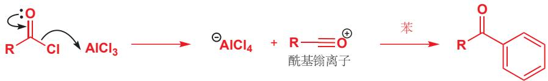

Lewis 酸碱相互作用在化学上非常常见，并且常常相当微妙。在下一章中，您将遇到通过有机金属对羰基化合物的加成，制取 C-C 键的重要方法，这些反应中很多都包含 Lewis 酸性的金属阳离子与 Lewis 碱性的羰基之间的相互作用。

## 延伸阅读

本章开头的引用来自 Ross Stewart, The Proton: Applications to Organic Chemistry, Academic Press, Orlando, 1985, p 1。

更多酸碱萃取过程的细节可以从实践有机化学书籍中找到。Cannizarro 反应的细节来自 J. C. Gilbert and S. F. Martin, Experimental Organic Chemistry, Harcourt, Fort Worth, 2002。酰胺到胺的还原反应来自 B. S. Furniss, A. J. Hannaford, P. W. G. Smith, and A. R. Tatchell, Vogel's Textbook of Practical Organic Chemistry, 5th e-

dn, Longman, Harlow, 1989。

胺与酸酐和酰氯的酰基化反应的细节：L. M. Harwood, C. J. Moody, and J. M. Percy, Experimental Organic Chemistry, 2nd edn, Blackwell, Oxford, 1999, p 279。

更多有关西咪替丁发现的内容：W. Sneader, Drug Discovery: a History, Wiley, Chichester, 2005。

## 检查您的理解

为确保您真正掌握了这一章的内容，请尝试解决本书 Online Resource Centre (在线资源中心) 中的习题：http://www.oxfordtextbooks.co.uk/orc/clayden2e/

## 使用有机金属试剂构建 C-C 键

## 联系

## 基础

\- 电负性和键的离域 ch4

\- 格氏试剂和有机锂对羰基的进攻ch6

\- C-H 会被非常强的键去质子化 ch8

## 目标

\- 有机金属: 亲核性，通常还是强碱

\- 由卤代烃制取有机金属

\- 通过碳原子的去质子制取有机金属

\- 用有机金属在 $C = 0$ 基上制取新 $C - C$ 键

## → 展望

\- 关于有机金属的更多内容 ch24 & ch40

\- 更多制取由 C=0 基制取 C-C 键的方法 ch25, ch26, & ch27

\- 分子的合成 ch28

## 引入

在 Chapters 2–8 中，我们阐明了关于结构 (Chapters 2–4 和 7) 和反应性 (Chapters 5, 6, 和 8) 的基本化学概念。这些概念是支撑所有有机化学的基本框架，而现在，我们将会开始充实这些框架。在 Chapters 9–22 中，我们向您更细致地介绍有机反应中最重要的几类。

出于各种原因，有机化学家所要做的一件事就是构建分子。而构建分子就意味着要构建 C-C 键，在本章中，我们将着眼于构建 C-C 键最重要的方式之一：使用有机金属 (organometallics)——如烷基锂和格氏试剂——与羰基化合物的结合。我们会考虑如下这样的反应：

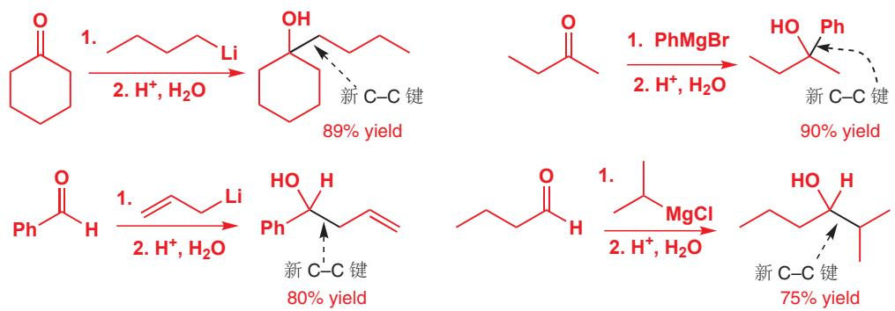  
您在 Chapter 6 中遇到了这类反应：在本章中，我们将为有机金属的性质，以及利用此反应可以构建什么样的分子这两方面添加一些细节。有机金属试剂面对亲电的羰基，会扮演亲核试剂，于是

我们首先需要讨论的事情就是：为什么有机金属是亲核的？然后我们会继续研究，首先是如何制取有机金属，然后关于会与它们反应的亲电试剂的种类，最后关于我们可以利用它们制取的有机分子的种类。

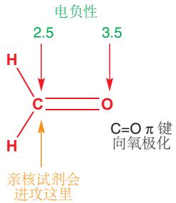

## 有机金属化合物包含一根碳-金属键

两种不同元素之间共价键的极性是由它们的电负性决定的。一个元素的电负性越强，它吸引键中的电子密度就越多。因此，两种元素电负性的差异越大，它们对成键电子的吸引程度之间的差异也就越显著，键也就会更加极化。在完全极化的极端情况下，共价键将不复存在，取而代之的是反号离子间的吸引力(，即离子键)。我们在 Chapter 4 (p. 96) 中讨论过这种情况，即 NaCl 中的成键。

## 有机金属在构建 C-C 键上有多么重要？

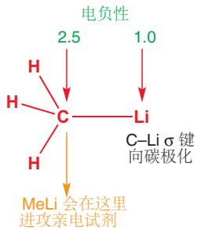

让我们以一种被称为“保幼激素 juvenile hormone”的分子作为例子。这个化合物能阻止数种昆虫成熟，可被用作控制害虫的手段。这种化合物虽然天然存在于昆虫中，但能提取出的非常少，不过，它可以由简单的原料在实验室中制取。在此阶段，您不需要考虑完成合成的全过程，但我们可以告诉您，最终产物有16根C-C键，而在其中一种合成法中，有七根都是由有机金属试剂的反应制取的，其中很多也是我们将在本章中描述的反应。这个例子并不孤立。为了进一步证实，我们还可以选取一种重要的酶抑制剂，与您在Chapter 7中遇到的花生四烯酸非常相似。它就是由一连串使用有机金属试剂的C-C键形成反应制取的：产物中有20根C-C键，其中八根通过有机金属反应形成。

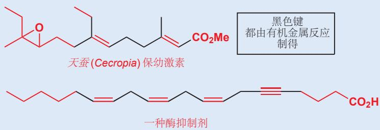

当我们 (在 Chapter 6 中) 讨论羰基化合物的亲电性质时，我们了解到，它们的反应性是碳-氧键向电负性更大的氧极化，使碳成为被亲核进攻的位点的直接结果。在 Chapter 6 中，您同样见到了两种最重要的有机金属化合物——有机锂和卤化有机镁（被称为格氏试剂）。在这些有机金属试剂中，关键的化学键向相反方向极化——朝碳极化——使碳成为亲核中心。对于大多数有机金属试剂，这都是正确的，您可以从下方节选的元素周期表中看出，金属 (如 Li、Mg、Na 和 Al) 的电负性都比碳小。

几种元素的 Pauling 电负性

<table><tr><td>Li 1.0</td><td></td></tr><tr><td>Na 0.9</td><td>Mg 1.3</td></tr></table>

<table><tr><td>B 2.0</td><td>C 2.5</td><td>N 3.0</td><td>O 3.5</td><td>F 4.0</td></tr><tr><td>Al 1.6</td><td>Si 1.9</td><td>P 2.2</td><td>S 2.6</td><td>Cl 3.2</td></tr></table>

Interactive display of polarity of organometallics

若用分子轨道能级图—您在 Chapter 4 中见到的那种——表达甲基锂中的 C–Li 键，则它被看作碳和锂原子轨道的组合。一种原子的电负性越大，它原子轨道的能量也就越低 (p. 96)。充满的 C–Li σ 轨道在能量上与碳的 $sp^{3}$ 轨道接近，而不与锂的 2s 轨道接近，因此我们可以说碳的 $sp^{3}$ 轨道对 C–Li σ 键的贡献更大，C–Li 键在碳上有更大的系数。因而涉及这条充满的 σ 轨道的反应将会

→ We explained this reasoning on p. 104.

■ 携有负电荷的碳原子被称为碳阴离子 (carbanions)。您已将了解过氰根 (p. 121)，一种真的在碳上具有一对孤电子的碳阴离子。氰根上的孤对电子由于处在低能的 sp 轨道 (而非 $sp^{3}$ ) 中，并且有一个负电性的氮原子与碳三键相连而稳定。

R 可以是烷基, 烯丙基或芳基
R-X X 可以是 I, Br 或 Cl
↓ Mg, Et₂O
R-Mg-X
卤化烷基镁
(格氏试剂)

Interactive mechanism for Grignard addition

在 C 上而非 Li 上发生。同样的论证也适用于有机镁或由其发明者 Victor Grignard 命名的格氏试剂中的 C–Mg 键。

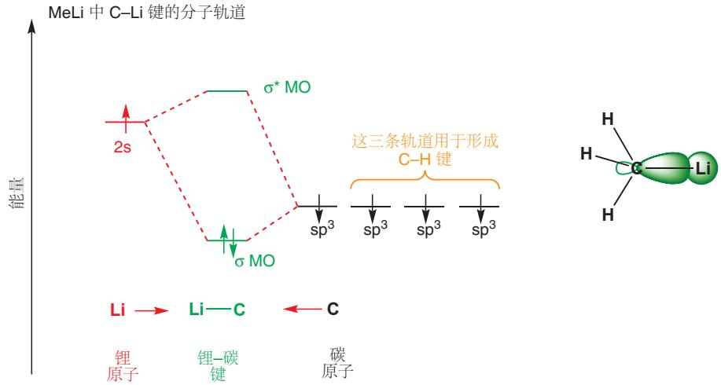

我们同样可以说，由于碳的 $sp^{3}$ 轨道对 C–Li σ 键的贡献更大，因此 σ 键在结构上更加接近一条充满的 C $sp^{3}$ 轨道——即在碳上的一对孤对电子。这种思路非常有用，但可能太过头了：甲基锂并不是离子化合物 $Me^{-}Li^{+}$ ——不过在机理中，您有时会看到用 $Me^{-}$ 表示 MeLi 或 MeMgCl 的情况。

有机锂和格氏试剂的真实结构的结构相当复杂！虽然这些有机金属化合物对水和氧极其活泼，不得不在氮气或氩气气氛下处理，但其中一些以被用固态的X射线晶体学与溶液中的NMR研究过了。事实表明，它们通常是两个、四个、六个或更多分子，通常还有溶剂分子键合在一起得到的复合物，这也是为什么像BuLi这样的极性化合物也能溶于烃类的原因。在本书中，我们不会关心这些细节，我们只会用简单的单体结构表示有机金属化合物。

## 制取有机金属

## 如何制取格氏试剂

格氏试剂是通过在醚溶剂中，使镁与卤代烃反应制得的，由此会形成卤化烷基镁的溶液。卤素可以使用碘、溴和氯，基团既可以是烷基，也可以是芳基，如下的例子包括甲基、伯、仲和叔烷基，酰基和烯丙基。但基团中不能包含任何一旦生成格氏试剂，就会与之反应的官能团。最后一个例子包含一个缩醛官能团，作为不会与格氏试剂反应的官能团的例子。(如果是醛，就会与格氏试剂反应，由此我们用缩醛的形成保护了醛基，Chapter 23中有更多讨论。)

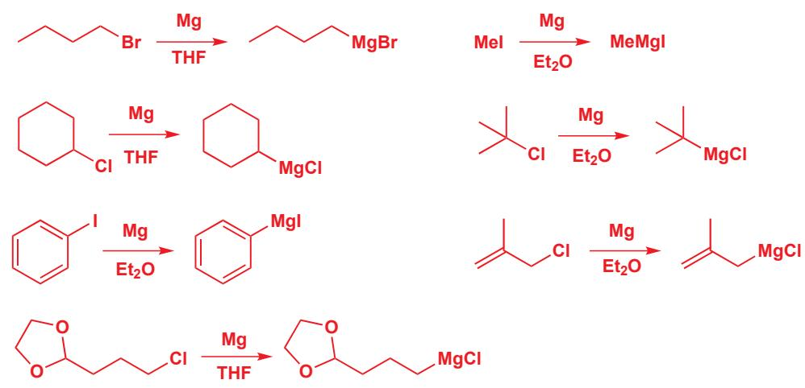

这些例子中的溶剂都是醚类，使用乙醚 $Et_{2}O$ 或 THF 均可。有时也会使用二醚，包括二噁烷 (dioxane)、乙二醇二甲醚 (dimethoxyethane, DME) 等其他溶剂。

常用醚类溶剂

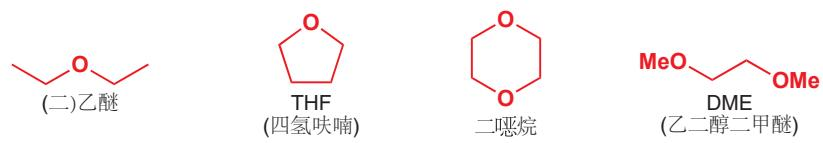

画出反应图十分简单，但反应的机理呢？总得来说，它涉及镁对碳-卤键的插入(insertion)。这一步在对镁的氧化态有所改变，使之从 $\mathrm{Mg}(0)$ 变为 $\mathrm{Mg(II)}$ 。因此这个反应被称为氧化插入反应或氧化加成反应，这是一个许多金属都能完成的普遍过程，如 $\mathrm{Mg}$ 、Li(我们稍后会遇到)、Cu和Zn都是如此。 $\mathrm{Mg(II)}$ 比 $\mathrm{Mg}(0)$ 稳定得多，这驱动了反应的发生。

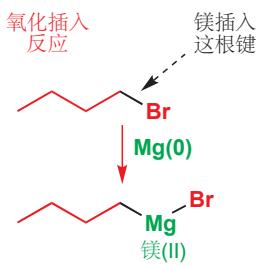

这个反应的机理并未被完全理清，很可能还涉及自由基中间体。但我们能确信的是，镁在反应的末尾交出了它的孤对电子并获得了两根 $\sigma$ 键。真实产物是一一格氏试剂，很有可能还有两分子醚溶剂——的配合物，其中 Mg(II) 倾向于四面体型结构。

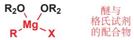

## 关于制取格氏试剂的更多内容

这个反应并非在溶液内部发生，而是发生于金属的表面，制取格氏试剂的难易程度也取决于表面的状态——比如金属被切割得有多细。金属镁通常被一层薄薄的氧化镁所包裹，于是格氏试剂的形成也需要能让金属直接与烷基镁接触的“引发”过程。这通常意味着，要加入少量的碘或1,2-二碘乙烷，或者用超声波去除氧化膜。一旦有格氏试剂已经形成，它便还会催化后续卤代烃与 $\mathrm{Mg}(0)$ 的反应，机理可能如下所示。

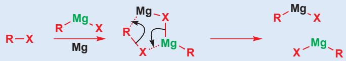

## 如何制取有机锂试剂

有机锂试剂可能也是通过类似的氧化插入反应，由金属锂和卤代烷制取的。每次插入反应都需要两个锂原子，并还生成一当量的卤化锂盐。与格氏试剂的形成一样，可通过此方式制取的烷基锂的类别也没有什么限制。

R 可以是
烷基或芳基 R-X X 可以是
Br 或 Cl
Li, THF
R-Li LiX
烷基锂加卤化锂

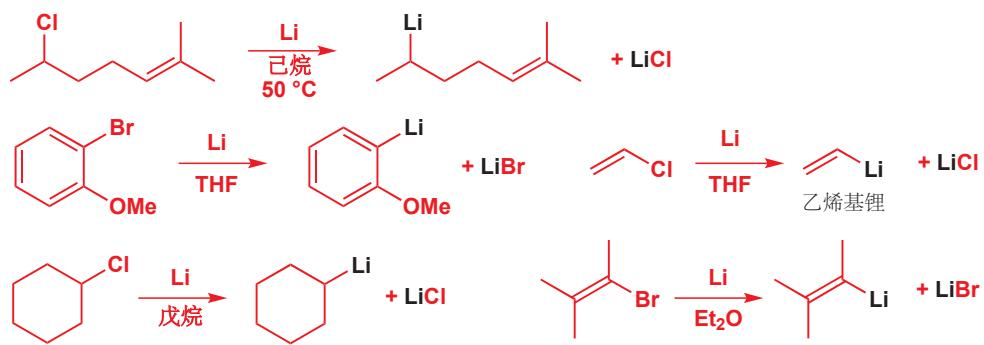

您会注意到，这里有两个仲烷基锂，一个芳基锂和两个烯基锂。所存在的其他官能团只有烯烃和醚。到目前为止，这都十分类似于格氏试剂的形成。然而，它们之间存在差异。锂在反应过程中由

Interactive mechanism for organolithium addition

Li(0) 变为 Li(I)，并且没有与 Li 相连的卤素。取而代之的是卤素被第二个 Li 原子带走，变为卤化 Li。同样，Li(I) 比 Li(0) 稳定得多，因此反应不可逆。虽然通常还是使用醚类溶剂，但是由于不需要配位，因此用烃类溶剂如戊烷、己烷同样很好。

## 可以购买到的有机金属

有些格氏试剂和有机锂试剂可以购买得到。大多数化学家（除非需要非常大规模使用时）通常都不会用上述方法制取较简单的烷基锂或格氏试剂，它们会成瓶地从化学品公司购买（化学品公司当然会用上述方法制取）。下表列出了最重要的几种可以购买到的有机锂和格氏试剂。

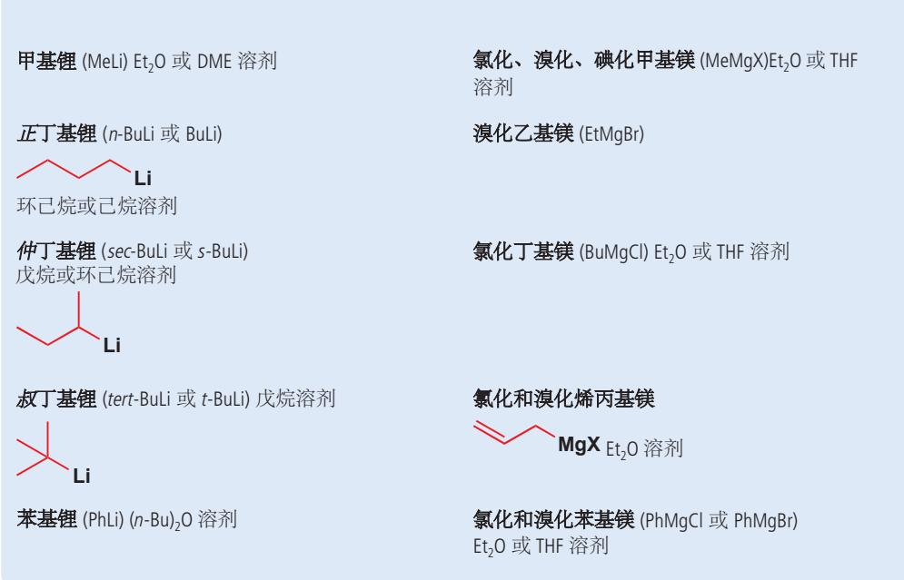

## 有机金属试剂用做碱

有机金属需要与水分完全远离——即使是空气中的水都会摧毁他们。原因在于，它们会与水非常迅速且高度放热地反应，并产出烷烃。任何可以使它们质子化的东西都会发生类似地事情。有机金属试剂是一种强碱，会被质子化形成它们的共轭酸——下面的情形中是甲烷和苯。甲烷的 $pK_{a}$ 在 50 左右 (Chapter 8)：它可以说根本不具有酸性，因而几乎不会有任何东西能从甲烷上去质子。

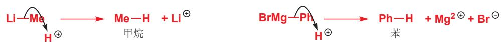

平衡极大地偏向于右侧：甲烷和 $Li^{+}$ 比 MeLi 稳定得多，苯和 $Mg^{2+}$ 也比 PhMgBr 稳定得多。做碱也是有机锂最重要的用途之一——尤其是丁基锂，因为它们碱性非常强，几乎会使任何东西被去质子。因此它们也可以作为制取其他有机锂的试剂。

$$
\mathrm{Me} - \mathrm{H} + \mathrm{H} _ {2} \mathrm{O} \quad \xleftarrow {\text {   Me   } ^ {\ominus}} + \mathrm{H} _ {3} \mathrm{O} ^ {\oplus} \quad \mathrm{Ph} - \mathrm{H} + \mathrm{H} _ {2} \mathrm{O} \quad \xleftarrow {\text {   Ph   } ^ {\ominus}} + \mathrm{H} _ {3} \mathrm{O} ^ {\oplus}
$$

## 通过给炔烃去质子制取有机金属

在 Chapter 8 (p. 175) 中我们讨论了杂化对酸性的影响。炔烃的 C–H 键由 sp 轨道形成，因此是烃类中酸性最强的， $pK_{a}s$ 大约为 25。它们可以被碱性更强的有机金属，如丁基锂和溴化乙基镁去质子，甚至，炔烃的酸性足够使它们被您在 p. 171 见到的氨基碱去质子，给炔烃去质子最常用的方式是使用 $NaNH_{2}$ （氨基钠），通过使钠与液氨反应获得。下面显示了这样的一个例子。乙炔和丙炔都是气体，通过向碱的溶液中鼓气完成反应。

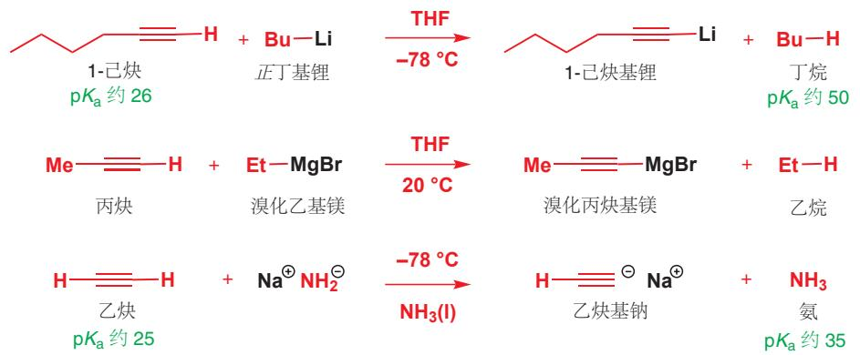

我们选择将炔基锂、溴化炔基镁表达成有机金属的形式，而将炔基钠表达成离子盐的形式。它们很有可能都具有一些共价成分，但锂的正电性弱于钠，因此炔基锂共价性更大并通常在非极性溶剂中使用，而钠衍生物则通常在极性溶剂中使用。

炔基的金属衍生物可以如下面几个例子中这样，加成到羰基亲电试剂上。第一个例子（我们提醒过您这个反应的机理）是抗生素由红霉内酯 A (erythronolide A) 的一种重要合成法的起始步骤，第二个例子是一种广泛存在的天然产物，合金欢醇 (farnesol) 合成法的倒数第二步。

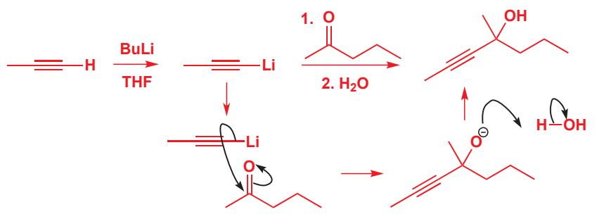

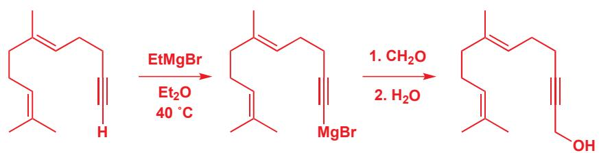

## 乙炔基雌甾二醇

几乎所有口服避孕药中抑制排卵的组分都是一种被称为乙炔基雌甾二醇 (ethynyloestradiol) 的化合物，这个化合物同样是通过炔基锂对女性激素，雌酮 (oestrone) 的加成制取的。这种激素还有很多含有乙炔单元的合成类似物，它们也被用于避孕和对激素系统紊乱的治疗。

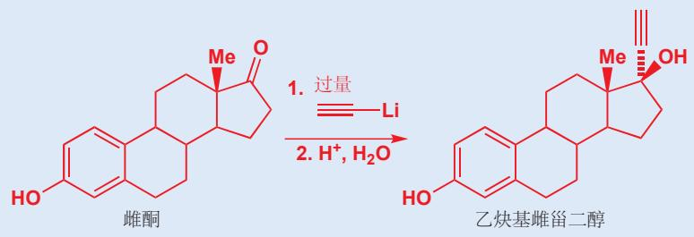

## 三键: 稳定性与酸性

现在，您已见过了所有包含三键的重要化合物了。它们都有电子填在低能 sp 杂化轨道 (图中绿色所示)，这一特征让它们稳定而不活泼。记得，sp 轨道具有 50% 的 s 成分，因此这种轨道中的电子平均离原子核更近，因此相比于 $sp^{2}$ 或 $sp^{3}$ 轨道中的电子也更稳定。

氮气， $N_{2}$ 两端的孤电子都处在 sp 轨道中，于是它几乎是惰性的。它既没有碱性，也没有亲核性，豆科植物 (如豌豆) 根部的细菌能将氮气 “固定 (fixing)”，即用还原化学反应将它们捕捉，这被看作生命体的一大主要成就。HCN 在氮上具有一条 sp 轨道，在另一端具有一根 C—H σ 键。氮的 sp 孤电子不具有碱性，而 HCN 事实上有可观的酸性， $pK_{a}$ 约为 10，因为共轭碱 (CN-) 中的负电荷处在 sp 轨道中。腈的化学键与之类似，它们也没有亲核性和碱性。最后，我们刚刚遇到了炔烃，它们是烃类中酸性最强的，同样是由于负电荷处在 sp 轨道中稳定了阴离子。

$$
\begin{array}{c} \text {N≡N} \\ \text {氮分子} \end{array}
$$

$$
\begin{array}{c} \mathrm{H-C≡N} \\ \mathrm{HCN} \end{array} \xrightarrow [ p K _ {\mathrm{a}} 1 0 ]{\text {   碱   }} \begin{array}{c} \mathrm{C≡N} \\ \text {氰离子 } \end{array}
$$

$$
\begin{array}{c} \text {R - C\equiv N} \\ \text {腈} \end{array}
$$

$$
\begin{array}{c c c} \mathrm{R-C} \equiv \mathrm{C-H} & \xrightarrow {\text {碱}} & \mathrm{R-C} \equiv \mathrm{C} \\ \text {炔烃} & \mathrm{pK} _ {\mathrm{a}} \sim 2 5 & \text {乙炔离子} \end{array}
$$

## 卤素-金属交换

由一种 (较简单的) 有机金属试剂生成另一种 (更有用的) 有机金属试剂时, 去质子化并非唯一的方法。有机锂还可以通过用一种被称为卤素-金属交换 (锂卤交换, halogen-metal exchange) 的反应由烷基、酰基卤和另一种有机锂制取。

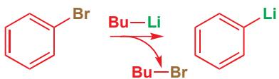

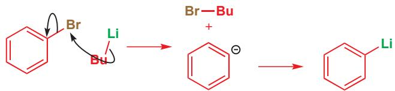

在反应中，溴和锂互换了位置。与许多这样的有机金属过程一样，机理尚未完全清晰，但可以表达为丁基锂对溴的一个亲核进攻过程。但是，为什么这个反应能够发生呢？我们“机理”的产物并不是PhLi和BuBr，而是一个苯基阴离子和一个锂阳离子，虽然说这二者结合成PhLi和BuBr是很明显的，但是总要有一个合理的解释，让我们知道反应向其中一侧而非另一侧发生。关键同样在于 $\mathrm{pK_a}$ 。我们可以将有机锂想象成 $\mathrm{Li^{+}}$ 与碳阴离子之间的配合物。

$$
\begin{array}{r l r} & {\mathrm {Bu - Li \quad \stackrel {(-)} {Bu} -Li}} & {\stackrel {(+)} {\ominus} \mathrm {Bu\cdotsLi^ {+}}} \\ & {\text {极化的} \sigma \text {键}} & {\mathrm {Bu^{-} 和 Li^{+} 的配合物}} \\ & {\mathrm{极化的} \sigma \text {键}} & {\mathrm {Ph - Li \quad \stackrel {(-)} {Ph} -Li}} \\ & {\mathrm {Ph^{-} 和 Li^{+} 的配合物}} \end{array}
$$

■ 原因同样在于，烯基和芳基阴离子处在 $sp^{2}$ 轨道而非 $sp^{3}$ 轨道中。见 Chapter 8, p. 175。

在两种情况中，锂阳离子是相同的：发生变化的只有碳阴离子。因此配合物的稳定性取决于碳阴离子配体的稳定性。苯 $(\mathrm{pK}_{\mathrm{a}}$ 约为43)比丁烷 $(\mathrm{pK}_{\mathrm{a}}$ 约为50)酸性更强，因此苯基配合物比丁基配合物更稳定，反应于是反应在由BuLi制取PhLi的方向上。烯基锂(锂与烯烃直接成键)同样可以由此方法制取，此反应允许具有 $\mathbb{R}_2\mathbb{N}-$ 取代基。溴代物和碘代物比氯代物反应得更快。

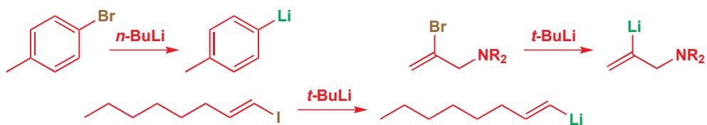

卤素-金属 交换反应的存在为一种吸引人的 碳-碳 键构建方法敲响了丧钟。您也许曾经想到，我们会用格氏试剂或有机锂试剂与卤代烃的结合构建新的 碳-碳 σ 键。

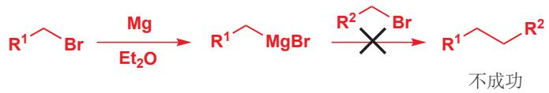

但由于转金属反应的存在，这个反应无法实现。两种溴代烃与它们的格氏试剂会处在平衡中，即使偶联能够发生，那么也会产生三种偶联产物的混合物。

$$
\mathrm{R} ^ {1} \text {   MgBr   } + \mathrm{R} ^ {2} \text {   Br   } \rightleftharpoons \mathrm{R} ^ {1} \text {   Br   } + \mathrm{R} ^ {2} \text {   MgBr   }
$$

稍后您会了解到，这种反应需要过渡金属的参与。这类反应中唯一成功的一个是炔烃的金属衍生物与卤代烷之间的。由于炔基金属比烷基金属稳定太多，因而它们不会发生交换。

由乙炔本身生成一种取代炔烃的合成方法是一个很好的例子。一个烷基化反应用 $NaNH_{2}$ 做碱，制得乙炔钠而完成，另一个则用 BuLi 制得炔基锂完成。

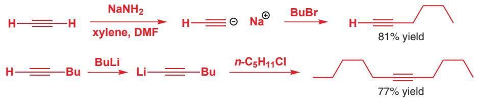

## 转金属反应

有机金属可以通过转金属反应——用另一种正电性不及先前的金属的盐处理即可——转化为其他类别的有机金属试剂。更正电性的 Mg 或 Li 会以离子盐的形式进入溶液中，而正电性不及它们的金属，如 Zn 会带走烷基。

$$
\begin{array}{c} \mathrm{R-MgBr} \xrightarrow {\mathrm{ZnBr} _ {2}} \mathrm{MgBr} _ {2} + \mathrm{R-Zn-R} \xrightarrow {\mathrm{H} _ {2} \mathrm{O}} \mathrm{Zn(OH)} _ {2} + \mathrm{RH} \\ \text {格氏试剂} \end{array}
$$

但这又何苦呢？嗯，格氏试剂和有机锂的高活性——尤其是它们的强碱性——会引发一些不想要的副反应。与非常强的亲电试剂，如酰氯的结合通常会导致剧烈而不受控制的反应。如果使用较不活泼的有机锌化合物，那么反应则更加可控。这些有机锌化合物既可以由格氏试剂制取，也可以由有机锂化合物制取。有机锌化学的先驱者，根岸英一（E. Negishi），由于在有机金属化合物上的研究工作，与 R. F. Heck 和铃木章 (A. Suzuki) 获得了 2010 年的诺贝尔化学奖。

注：左侧文字框中所示的方法被称为有机金属的“软化”，现在常用的方法是直接将亚铜盐如Cul随有机锂或格氏试剂一同加入。它可以起到很多用途，比如使上文提到的有机金属对卤代烃的取代可行，或者用于Chapter 22中将提到的共轭加成等。

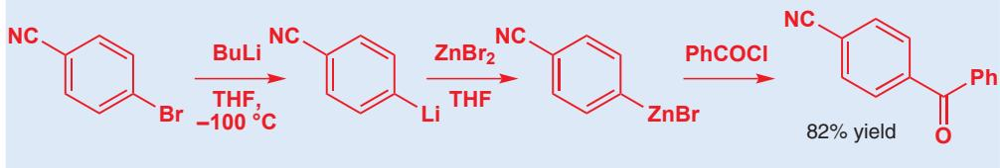

## 用有机金属制取有机分子

您现在已经了解了所有制取有机金属的重要方法了，我们在下一页做了总结。而接下来我们将继续考虑如何利用它们制取分子：首先考虑它们会与什么样的亲电试剂反应，然后考虑我们可以用它们的反应制取什么样的产物。在本章的剩余部分中，我们只会关心格氏试剂和有机锂。而在几乎我们将要讨论的所有情形中，这两类有机金属都可以互换使用。

## - 制取有机金属的方法

\- Mg 对卤代烃的氧化插入

\- Li 对卤代烃的氧化插入

\- 炔烃的去质子

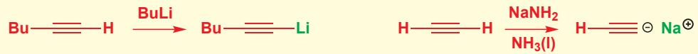

\- 卤素-金属交换

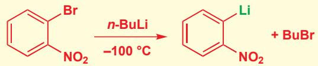

\- 转金属

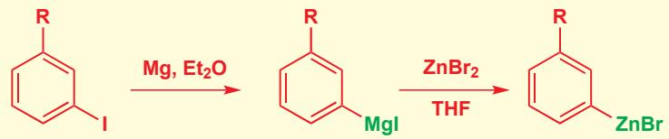

## 由有机金属和二氧化碳制取羧酸

二氧化碳可以与有机锂或格氏试剂反应给出羧酸盐。用酸使羧酸盐质子化即可得到比起始有机金属多一个碳原子的羧酸。这个反应通常是通过向有机锂的 THF 或乙醚溶液中加入固态 $CO_{2}$ 完成的，但同样可以使用干燥 $CO_{2}$ 气流完成。

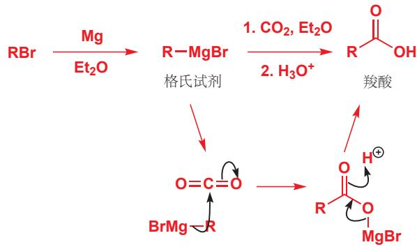  
完成此反应分三步：(1) 制取有机金属，(2) 与亲电试剂 $\left(\mathrm{CO}_{2}\right)$ 反应，(3) 酸性后处理，即淬灭(quench)，此步骤会使产物质子化并摧毁所有未反应的有机金属。这三步反应都需要仔细监控，以

确保每一步都是在上一步完成之后开始的。尤其是要注意的是，在前两个步骤中都不能有水存在——水只能在反应结束后，即当有机金属与亲电试剂反应完全后加入。您偶尔会看到没有标明淬灭步骤的流程图，但尽管如此，这个步骤始终是需要的。

由有机金属制取羧酸

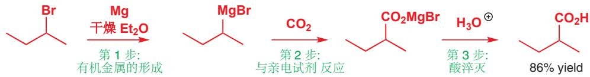

下一个例子表明，即使氯原子周围空间阻碍很大，也可以使用。当您读过 Chapter 15 后，您会对这一点的重要性更加清晰。

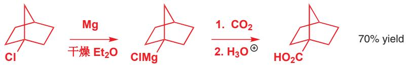

## 由有机金属和甲醛制取伯醇

您在 Chapter 6 中遇到了甲醛，最简单的醛类，当时我们讨论了要把甲醛应用于醛类反应中的困难性：它会水合，而且会形成多聚体，多聚甲醛 $\left(\mathrm{CH}_{2}\mathrm{O}\right)_{n}$ ，要想得到纯净而干燥的甲醛，则需要加热（“破解 crack”）多聚体使之分解。不过，甲醛是制取伯醇——携带羟基的 C 原子只另有一个取代基的醇——非常有用的试剂。如同二氧化碳加入一个碳原子并制取了酸一样，甲醛向有机金属加入了一个碳原子并制得醇。

由甲醛形成的一种伯醇

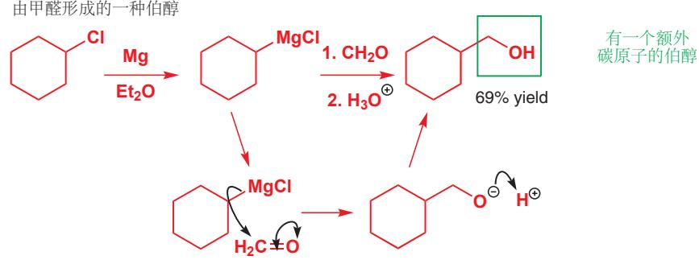

下面两个是甲醛由两个被去质子的炔烃制取伯醇的离子。此处的第二个反应（我们将用于有机锂的形成、反应和淬灭的三个连续添加的试剂写在同一个箭头上）是天蚕保幼激素合成法的最后几步之一，最终产物的结构已于本章开头示出。

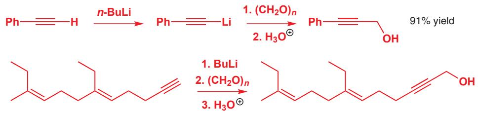

\- 对于所有有机金属试剂对羰基的加成反应一定要记住的是，这一过程会使氧化程度降低一(Chapter 2, p. 33 介绍了氧化程度)。换句话说，如果由醛开始，您会得到醇。具体来说，

\- 对 $\mathrm{CO}_{2}$ 的加成得到羧酸

\- 对甲醛 $\left(\mathrm{CH}_{2} \mathrm{O}\right)$ 的加成给出伯醇

\- 对其他醛 (RCHO) 的加成给出仲醇

\- 对酮的加成给出叔醇

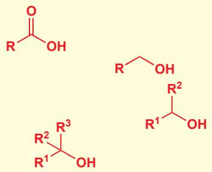

仲和叔醇：哪些有机金属，哪些醛，哪些酮？

醇和酮会与有机金属试剂反应，分别形成仲醇与叔醇，下面所示的例子都以普遍书写格式呈现。

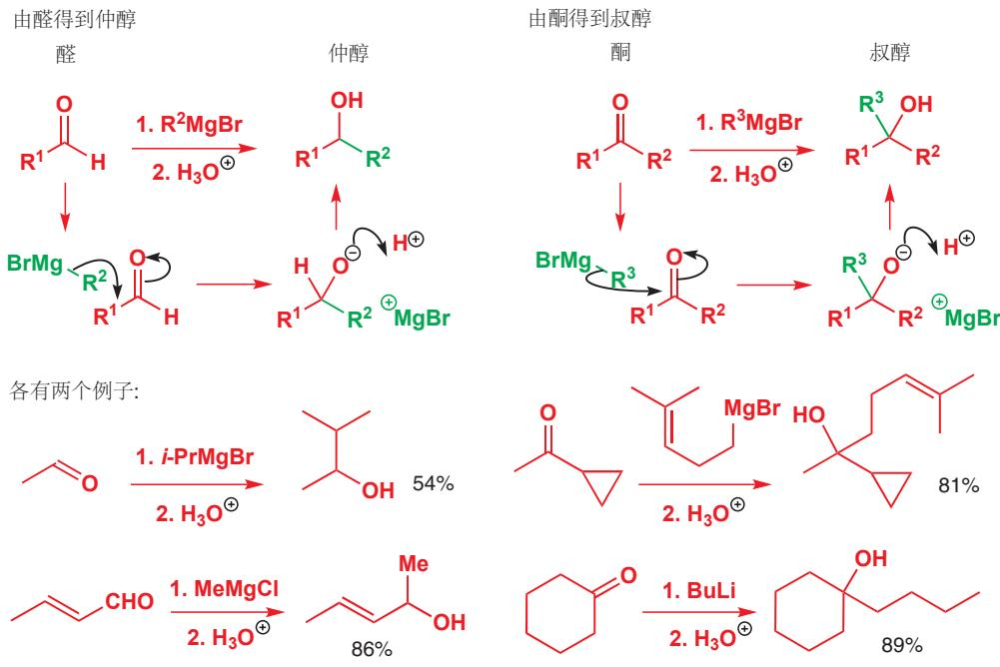

各有两个例子:

氯苯嘧啶醇

氯苯嘧啶醇 (fenarimol) 是一种杀菌剂，通过抑制真菌内部重要的甾体分子的生物合成而起作用。它是由二烷基酮与由卤素-金属交换制得的有机金属反应制成的。

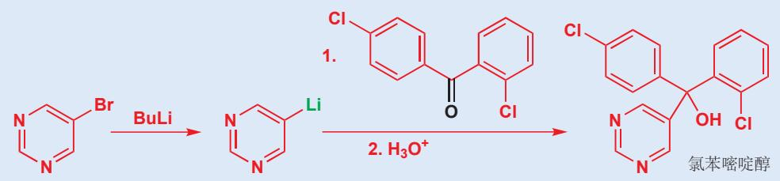

然而若要制取仲醇，则会有两种可以选择的路线，这取决于您选择哪一部分制取有机金属，选择哪一部分制取醛。比如这里所示的第一个例子是由溴化异丙基镁和乙醛制取仲醇的合成法。不过，由异丁醛和甲基锂或者卤化甲基镁制取这种仲醇也同样可行。

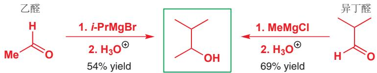

事实上，早在 1912 年当这种醛被第一次详细地描述的时候，制取它的化学家选择了由乙醛开始，而在 1983 年，当有机合成需要它做起始原料时，它又由异丁醛制取了。哪一种方法更好呢？1983 年的化学家选择异丁醛路线，很可能是由于这条路线产率较高。不过如果您在实验室中第一次制取某一种仲醇，那么您需要尝试这两者并先了解哪一种产率更高。

或者，您可能更加关心哪一种的起始原料更加便宜，更容易获得——这很有可能是下面的一个例子中选取氯化甲基锂和不饱和醛的因素。它们都可以购买得到，而另一种线路需要的烯基锂或者溴化烯基镁试剂都不能买到，只能由烯基卤自己制取，但烯基卤同样不能买到，另外还涉及乙醛干燥的困难性。

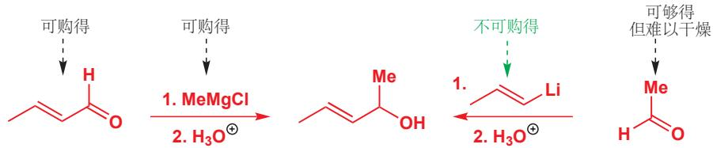

制取仲醇还有另一种选择：由酮还原。酮可以与硼氢化钠反应得到仲醇。在一种环状醇的合成中，这成为了一条很好的路线。下面的双环酮可以以很好的产率给出仲醇。在第二个例子中，二酮的两个羰基被同时还原。

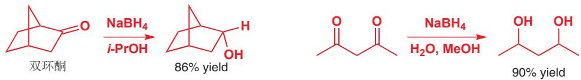

## 醇合成法中的灵活性

为了说明仲醇制取方法的灵活性，我们选取了一种会抑制细胞中跨某种特定膜的运输作用的高毒性化合物，米酵菌酸 (bongkrekic acid) 的合成法作为例子，它的合成需要这两种 (非常相似的) 醇。哈佛大学制取这种化合物的化学家选择由两种很不同的起始原料制取它们：第一个情形中是一个不饱和醛和一个含炔有机锂，第二个情形中是一个含炔醛和溴化烯基镁。

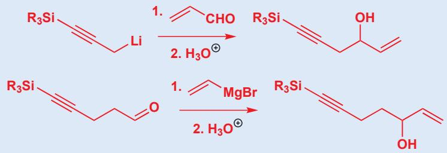  
对于叔醇，选择就更多了。下面的例子是天然产物，橙花叔醇 (nerolidol) 合成法的其中一步。制

取此叔醇的巴黎化学家原则上可以选择以下三条路线中的任意一条。注意，为避免混淆，我们省略了图示中的水溶液淬灭步骤。

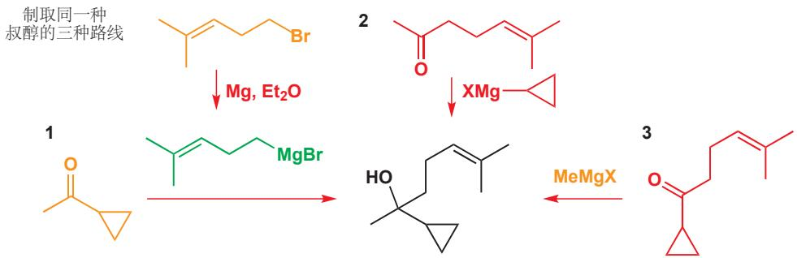

然而只有橙色的试剂是可以买到的，不过碰巧的是，绿色的格氏试剂可以由可以购得的溴代烷制取，这使得左侧的第1种路线最为合理。

不过，您不需要惊慌！我们并不希望您去记忆供应商目录，来知道哪些化合物可以购得，哪些化合物不可以。在此阶段，我们希望您欣赏，制取同一给定产物可以有多种方法，您应当做到的是能够根据醇产物提出多种由醛或酮、格氏试剂或有机锂试剂的结合制取的方法。您并不需要做到评估一个化合物不同的可行线路之间的相对优劣。这是我们在逆合成分析的一章，Chapter 28 中的主题。

## 醇的氧化

到目前为止，我们所使用的金属都只有一种非零氧化态：Li(I)、Mg(II) 和 Zn(II)。如果我们想用金属氧化有机化合物，那么这种金属至少具有两种高氧化态，过渡金属具有这一特点。到目前为止最重要的是铬，常用氧化态为 Cr(III) 和 Cr(VI)。橙色的 Cr(VI) 化合物是很好的氧化剂：它们可以从有机化合物上脱氢，自身被还原为绿色的 Cr(III)。有机化学上使用的 Cr(VI) 试剂很多，较重要的一些都与缩聚氧化物 $CrO_{3}$ 。三氧化铬是铬酸的酸酐，被水分解会得到铬酸的溶液。吡啶同样可以分解该聚合物并给出一种配合物。它 (Collins 试剂) 被用于氧化有机化合物，但它相当不稳定，人们通常更倾向于使用重铬酸吡啶鎓 (pyridinium dichromate, PDC) 和氯铬酸吡啶鎓 (pyridinium chlorochromate, PCC)，尤其因为它们可溶于有机溶剂，如 $CH_{2}Cl_{2}$ 。

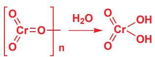

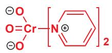

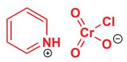

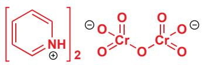

通过这些试剂，本章所制取的一些伯醇和仲醇可以被氧化，提升到更高的氧化程度。伯醇的氧化先得到醛，再得到羧酸，而仲醇的氧化得到酮。注意，叔醇无法氧化 (除非您断裂 C-C 键)。

符号 [0] 意思是非特定的氧化剂。

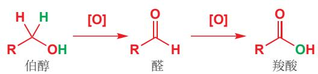

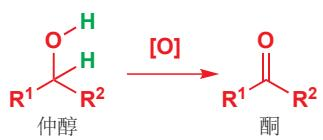

您会注意到，氧化步骤涉及移去两个氢原子的过程和/或添加一个氧原子的过程。在 Chapter 6 中，您了解到，还原意味着氢的添加（以及氧的移去）。在这种事实背后更为本质的思想是，还原需要添加电子，而氧化需要移去电子。只要用碱，我们就可以从仲醇的 OH 上移去质子，但如果想得到醛，我们还需要从 C–H 上脱去一个负氢离子 H $^{-}$ ，这一般是不会发生的，移去负氢离子也意味着移去一个质子和一对电子。这就是氧化剂所做的事情。

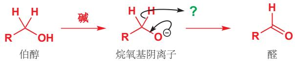

这里的 $\mathrm{Cr(VI)}$ 在获得了来自负氢的质子后，变为了 $\mathrm{Cr(III)}$ 。此过程通过一个在 $\mathrm{Cr(VI)}$ 酯上进行的环状机理发生。首先一个氢原子/质子会（从OH基上）被移去得到酯，然后第二个氢原子会和它的电子一起(从碳上)被移去。注意观察箭头停在 $\mathrm{Cr}$ 原子上并在 $\mathrm{Cr = O}$ 键上重新开端，因此这一过程向铬添加了两个电子。该过程所得的事实上是 $\mathrm{Cr(IV)}$ ，铬的一种不稳定氧化态，它会通过进一步的反应得到绿色的 $\mathrm{Cr(III)}$ 。

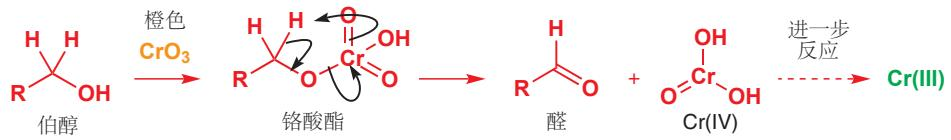

Interactive mechanism for chromium (VI) oxidation of alcohols

下面的两个使用 PCC 的氧化反应来自 Vogel (沃氏实用有机化学教程)。己醇可以在二氯甲烷溶剂中被氧化为己醛，可购买得到的香芹醇 (carveol, 一种不纯的天然产物) 会在己烷溶液中被负载在矾土上的 PCC 氧化为纯的香芹酮 (carvone)。在这两种情形中，都可以通过蒸馏分离出纯的醛与酮。

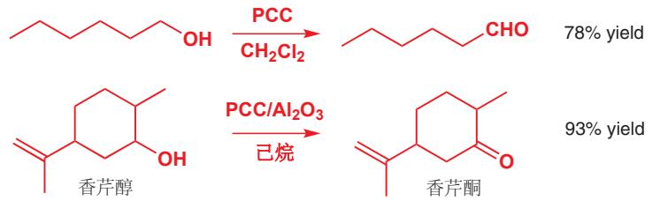

但有一句话需要警告：像次氯酸钙或次氯酸钠 （漂白剂 bleach） 这样的强氧化剂，尤其在水中，也许会将伯醇一路氧化到羧酸。下面是对氯苯甲醇的情形，所得的固态酸很容易通过我们在上一章介绍的那一类酸/碱萃取分离出来。

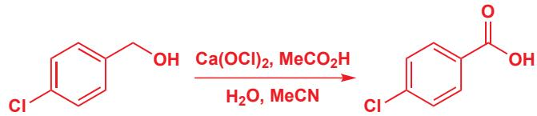

对氧化剂的讨论在本书的后面章节中还会继续。在这里我们只是简单地介绍给您，让您看到由有机金属试剂的加成制取的伯醇和仲醇，可以被氧化到醛或醇，继而还能再次进行有机金属的加成。可以通过两种方式制取的仲醇，能被吡啶- $CrO_{3}$ 络合物氧化到酮，于是再与格氏试剂或有机锂化合物反应得到许许多多的叔醇。

## 展望

在本章中，我们阐明了酮、醛、醇，通过使用有机金属形成 C-C 键，而实现的相互转化。然后，我们又补充了氧化还原方法——对于某一种伯醇、仲醇或叔醇，您应当至少能给出一种由简单前体合成它们的方法。在下面两章中，我们会将视野从醛、酮中拓宽，着眼于其他羰基化合物——羧酸与羧酸衍生物，如酯、酰胺——的反应性，以及其他亲核试剂。但您应当始终记住，我们研究有机反应的思路不只局限于知道它们本身，而还要想着用它们来制造事物。我们将在 Chapter 28 中继续学习设计分子合成路线的方式，其中许多方法都将使用您在此学到的有机金属。在 Chapter 40 中，我们将了解更广泛，更复杂的金属有机方法。

## 展望

关于格氏试剂的详细结构，P. G. Williard 在 Comprehensive Organic Synthesis, vol. 1, 1999, p. 1 中有更多的说明。炔烃的烷基化：P. J. Garratt 在 Comprehensive Organic Synthesis, vol. 1, 3rd edn, 1999, p. 271 中。本章中的例子来源于 T. F. Rutledge, J. Org. Chem., 1959, 24, 840, D. N. Brattesoni, C. H. Heathcock, Synth. Commun. 1973, 3, 245, R. Giovannini, P. Knochel, J. Am. Chem. Soc., 1998, 120, 11186, C. E. Tucker, T. N. Majid, 和 P. Knochel, J. Am. Chem. Soc., 1992, 114, 3983。关于有机锌化合物相当高等的综述，请见 P. Knochel, J. J. Almena Perea, and P. Jones, Tetrahedron, 1998, 54, 8275。

重铬酸吡啶鎓 (PCC) 的发现过程: G. Piancatelli, A. Scettri, and M. D'Auria, Synthesis, 1982, 245; H. S. Kasmai, S. G. Mischke, and T. J. Blake, J. Org. Chem., 1995, 60, 2267, 关于 PDC: E. J. Corey and J. W. Suggs, Tetrahedron Lett., 1975, 2647. 关于氧化实验的细节: B. S. Furniss, A. J. Hannaford, P. W. G. Smith, and A. R. Tatchell, Vogel's Textbook of Practical Organic Chemistry, 5th edn, Longman, Harlow, 1989, pp. 590 and 610; J. C. Gilbert and S. F. Martin, Experimental Organic Chemistry, Harcourt, Fort Worth, 2002, p. 507。

## 检查您的理解

## 羰基上的亲核取代

## 联系

## 基础

\- 绘制机理 ch5

\- 羰基上的亲核进攻 ch6 & ch9

\- 酸性和 $\mathrm{pK}_{\mathrm{a}}$ ch8

\- 格氏试剂和 RLi 对 $C = 0$ 基的加成 ch9

## 目标

\- 亲核进攻后伴随离去基团的失去

\- 好的亲核试剂是什么样的

\- 好的离去基团是什么样的

\- 往往会有一个四面体中间体

\- 如何制取羧酸衍生物

## → 展望

\- 羰基氧的失去 ch11

\- 羧酸衍生物的活性

\- 烯醇的反应 ch20, ch25, & ch26

\- 动力学和机理 ch12

\- 化学选择性 ch23

\- 如何由酸制取酮

\- 如何将酸还原为醇

您已经熟悉了包含羰基的化合物的反应。醛、酮会在羰基碳上与亲核试剂反应，给出包含羟基的化合物。由于羰基良好的亲电性，它可以与大量不同的亲核试剂反应：您曾遇到过醛、酮与氰根、水、醇的反应 (Chapter 6)，与有机金属试剂 (有机锂和有机镁，或格氏试剂，Chapter 9) 的反应。

在本章和 Chapter 11 中，我们将着眼于羰基的另一些反应——并重温 Chapter 6 中接触的一些反应。我们一共用四章的篇幅来讨论羰基的化学，这是对它在有机化学上重要性的彰显。和 Chapters 6 和 9 中的反应一样，Chapters 10 和 11 的反应也都涉及亲核试剂对羰基的进攻。有所区别的地方在于接下来的其他机理步骤，它们可能意味着总反应从加成反应变为了取代反应 (substitutions)。

## 对羰基亲核加成得到的产物并不总是稳定化合物

格氏试剂对醛、酮的加成可给出稳定的烷氧基阴离子，它会被酸质子化并产出醇 (您在 Chapter 9 中遇到的反应)。但若换成醇在碱的作用下对羰基的加成反应，则就不是这么一回事儿了——在 Chapter 6 中，我用可逆的平衡箭头表示了这一转化，并提到，除非半缩醛 (hemiacetal) 产物是环状的，否则都不能以显著程度地形成。

这种不稳定性的原因在于， $\mathrm{RO}^{-}$ 很容易再从分子上脱去。我们称这种可从分子上脱去，并通常带着一个负电荷脱去的基团为离去基团 (leaving groups)。在本章后文以及 Chapter 15 中，我们还会详细考察离去基团。

## - 离去基团

离去基团指 $Cl^{-}$ 、 $RO^{-}$ 、 $RCO_{2}^{-}$ 等可以带着负电荷被从分子中排出的阴离子。

因此，如果亲核试剂同样是一个离去基团，那么它就有机会再次失去，羰基也会重新形成——换句话说，反应变成了可逆的。C=O 键形成时释放的能量 (键能 $720 \, kJ mol^{-1}$ ) 弥补了失去两根 C-O 单键 (每根大约 $350 \, kJ mol^{-1}$ )，半缩醛产物不稳定的其中一个原因就在于此 (Chapter 12 中有讨论其他原因)。

如果起始羰基本来就包含一个潜在的离去基团，那么它可以直接脱去自己的离去基团。当格氏试剂加成酯时，会先得到红框中带负电的不稳定中间体。

它会失去离去基团 $\mathrm{RO}^{-}$ 。此时我们并没有得到起始原料：而是经历了取代反应，得到了一个新的化合物 (酮)——起始原料的 OR 基团在产物中被 Me 基所取代。事实上，酮产物还会再次与格氏试剂反应得到叔醇。在本章的后文中，我们会讨论为什么反应不会停在在酮的一步。

## 羧酸衍生物

在这些取代反应的起始原料和产物中，大部分都是羧酸衍生物 (carboxylic acid derivatives)，具有通式 RCOX。您在 Chapter 2 中已经遇到过此类化合物中大多数重要的成员了：我们重新展示以做提醒。

■ 醇与酰氯、酸酐的反应是制取酯最重要的方法，但也不是唯一的方法。我们接下来会看到让羧酸直接与醇反应的情形。

## 羧酸衍生物

## 酰氯和酸酐会与醇反应得到酯

乙酰氯可以在碱的存在下与醇反应得到乙酸酯，用乙酸酐也能得到相同的产物。

还记得表示乙酰基的符号吗？ $Ac=CH_{3}CO$ 。您可以将醇 ROH 的乙酸酯表示为 ROAc（不是 RAc，它指代一种酮）。

在这两种情形中，都发生了取代反应(原料分子的黑色部分， $\mathrm{Cl^-}$ 或 $\mathrm{AcO^-}$ 被环己氧基取代)——但这是如何发生的呢？对您来说，重要的不是知道酰氯和酸酐能与醇反应的事实，而是知道反应的机理——这样，一旦您理解了其中一个，您就会对其他所有感到合情合理。

如您所预料，反应的第一步是亲核的醇对亲电的羰基的加成反应——我们将以酰氯为例。碱的重要性体现在它可以在醇进攻羰基的时候，移去醇上的质子。常用的碱是吡啶。如果亲电试剂是醛或酮，我们会得到不稳定的半缩醛，继而通过醇的消除坍塌 (collapse) 回起始原料。而当亲电试剂是酰氯时，烷氧基中间体同样不稳定，它也会通过消除反应坍塌，但这时失去的是氯离子，由此形成酯。氯离子在此做了离去基团——它带着负电荷离去。

以这个反应为模型，您应当能够写出酸酐与醇成酯反应的机理。请尝试不看上方酰氯的反应机理，当然要不要看下方的答案，自己回忆写出反应机理。如下所示，吡啶做碱，亲核试剂的加成同样给出不稳定中间体，继而经历消除反应，失去羧酸根阴离子得到酯。

我们称由此类反应形成的不稳定中间体为四面体中间体 (tetrahedral intermediate, 专有名词), 因为羰基中心的三角型 $(\mathrm{sp}^2)$ 碳原子变为了四面体型 $(\mathrm{sp}^3)$ 碳原子。

## - 四面体中间体

在三角型羰基上的取代反应经历四面体中间体进行，然后给出三角型产物。

## 关于此反应的更多细节

吡啶存在下与酰氯的酰基化反应 (acylation) 事实上比第一眼看上去更加微妙。如果您第一次阅读本章，您可以跳过这一部分，因为它对于我们的整体思路的贯通并不必要，您可以看完整章后再回过头看这些补充。我们要补充的有三点。

在这两个反应中，吡啶最终都被质子化，因此吡啶被消耗了。因此我们需要一整当量的吡啶，而事实上，这些反应是在吡啶做溶剂中进行的。

您们中细心的人可能会注意到，这个反应中的(弱碱性吡啶)碱催化剂与我们在p.197讲述半缩醛形成反应中用到的(强碱性氢氧根)碱催化剂在作用方式上有些许差别：吡啶在亲核试剂加成之后移去质子；而氢氧根则在亲核试剂加成之前移去质子。这是经过了深思熟虑的，对此的进一步考虑我们放在了Chapters 12和39中，吡啶(质子化吡啶的 $pK_{a}$ 为5.5)和氢氧根(水的 $pK_{a}$ 为15.7)的碱性已于C-hapter 8中讨论。

事实上，吡啶的亲核性比醇强，它会快速地进攻酰氯并形成一个高度亲电的（由于有正电荷）中间体。然后这个中间体才会与醇反应得到酯。由于吡啶作为亲核试剂加速了反应，但并未被反应所改变，因此我们称之为亲核催化剂 (nucleophilic catalyst)。

Interactive mechanism for pyridine nucleophilic catalysis

成酯反应中的亲核催化剂  

## 为什么四面体中间体不稳定？

由格氏试剂和醛、酮的加成反应形成的烷氧基阴离子是稳定的，可以存在足够长的时间以至于会在酸的后处理 (work-up) 步骤中被质子化给出产物醇。

四面体中间体与之类似，是由亲核试剂，如碱性下的乙醇，对酰氯的羰基加成得到的，但它们却不稳定。为什么它们不稳定呢？答案在于离去基团的离去能力。亲核试剂加成到羰基上得到的产物(或四面体中间体)的稳定性，取决于连接在新的四面体碳原子上的基团带着负电荷移去的好坏程度。为了让四面体中间体坍塌(并真正成为“中间体”而非最终产物)，其中一个基团必须从带着负电荷离去。

最稳定的阴离子会是最好的离去基团。现在有三种离去基团可以选择： $\mathrm{Cl^-}$ 、 $\mathrm{EtO^-}$ 或 $\mathrm{Me^-}$ 。我们只能制得 MeLi，而不能制得 $\mathrm{Me^-}$ ，因为它非常不稳定， $\mathrm{Me^-}$ 是非常差的离去基团。 $\mathrm{EtO^-}$ 并不是很差——烷氧基盐是稳定的，不过它们还是活性较高的强碱。 $\mathrm{Cl^-}$ 是最好的离去基团： $\mathrm{Cl^-}$ 离子具有

完美的稳定性，活性很低，并非常愿意从氧上带走负电荷。您每天都会吃下数克的 $Cl^{-}$ ，但吃下 $EtO^{-}$ 或 MeLi 则是不明智的。因此这两个反应不会发生：

## 我们如何得知四面体中间体的存在？

我们并不希望您满足于在这些反应中形成四面体中间体的乏味说法：当然，您并不知道这是否是真的。羧酸衍生物的取代反应中四面体中间体存在的第一个证据，由Bender于1951年发现。它制取了被氧的同位素， $^{18}$ O——一种非放射性，但可以通过质谱法检测出来的同位素——标记的羧酸衍生物RCOX。然后它将所得的衍生物与水反应制取被标记的羧酸。无论是否经历四面体中间体体，由被标记的起始原料得到的产物，都会有且只有一个 $^{18}$ O原子，事实同样如此(注：得到的羧酸/羧酸根亲电性弱，不会被进攻)。由于羧酸上的质子快速地在两个氧之间交换，因此两个氧都被同等地标记。

在 Bender 的原始研究中，X 为烷氧基 (即 RCOX 是一种酯)。

然后，他将这些衍生物与少量的，不足以消耗全部起始原料的水反应。在反应结束时，他发现在剩余的起始原料中被标记的分子有明显的减少：换句话说就是，“没反应”的原料并没有全部 $^{18}$ O标记，有些包含了“正常的” $^{16}$ O。四面体中间体会如先前一样形成，但快速的质子转移会使两个氧原子等同。现在，您也许已经发现论证的下一步了。

如果说 X 是直接被 $H_{2}O$ ，不经历四面体中间体而取代的，那么上述事实就无法解释了，上述事实证实了在反应中存在能让被标记的 ${}^{16}O$ 和被标记的 ${}^{18}O$ 可以“改变位置”的中间体。这个中间体便是四面体中间体。两种异构体都可以失去 X 并得到被标记的羧酸。

两种四面体中间体也都可失去水。其中一种(下面的)情形中，会重新生成带标记的起始原料。但在第二种情形中，失去的是被标记的水，因而形成未被标记的起始原料。这一结果若不用有足够质子交换发生的长时间存在的四面体中间体，是无法解释的。当下，“加成-消除”机理已被普遍接受。

## $pK_{a}$ 实用地指示离去能力

定量地比较离去基团的离去能力非常有用。这件事并不能精确地做到，但我们可以用离去基团共轭酸的 $pK_{a}$ (Chapter 8) 作为指引。如果离去基团是 $X^{-}$ ，那么 HX 的 $pK_{a}$ 越小， $X^{-}$ 的离去性越好/离去能力越强。如果我们回到最初的乙酰氯与醇成酯的反应，四面体中间体面临 $Me^{-}$ 、 $EtO^{-}$ 和 $Cl^{-}$ 的选择。HCl 是比 EtOH 更强的酸，后者又是比甲烷更强的酸。因此 $Cl^{-}$ 是最好的离去基团， $EtO^{-}$ 其次。这些观察只适用于羰基上的反应。

## - 离去能力

HX 的 $pK_{a}$ 越小， $X^{-}$ 在羰基取代反应中就是越好的离去基团。

羰基反应中最重要的取代基是烷基或芳基 (R)、酰胺中的氨基 $\left(\mathrm{NH}_{2}\right)$ 、酯中的烷氧基 $\left(\mathrm{RO}^{-}\right)$ 、酸酐中的酯基/酰氧基 $\left(\mathrm{RCO}_{2}^{-}\right)$ 、酰氯中的氯 $\left(\mathrm{Cl}^{-}\right)$ 。离去能力的排序如下：

<table><tr><td>羧酸衍生物</td><td>离去基团,X-</td><td>共轭酸,HX</td><td>HX的pKa</td><td>离去能力</td></tr><tr><td>酰氯</td><td>Cl-</td><td>HCl</td><td>&lt;0</td><td>极好</td></tr><tr><td>酸酐</td><td>RCOO-</td><td>RCO2H</td><td>大约5</td><td>好</td></tr><tr><td>酯</td><td>RO-</td><td>ROH</td><td>大约15</td><td>差</td></tr><tr><td>酰胺</td><td>NH2-</td><td>NH3</td><td>大约25</td><td>非常差</td></tr><tr><td>酮(烷基或芳基衍生物)</td><td>R-</td><td>RH</td><td>&gt;40</td><td>不能做离去基团</td></tr></table>

我们可以用 $pK_{a}$ 预测当将酰氯和羧酸盐放在一起反应时发生的变化。我们认为羧酸根（此处用甲酸钠， $HCO_{2}Na$ 的甲酸根）会扮演亲核试剂并形成四面体中间体，它会通过三种方式中的一种坍塌。我们直接排除 $Me^{-}$ ，并猜测 $Cl^{-}$ 是比 $HCO_{2}^{-}$ 更好的离去基团，因为 HCl 的酸性远强于甲酸，我们是正确的。甲酸钠与乙酰氯的反应可以得到混合酸酐。

## 胺与酰氯反应得到酰胺

运用上述原则，您应当能了解到这些化合物通过与合适亲核试剂的取代反应相互转换的方式。我们已经见过了酰氯与羧酸反应得到酸酐，与醇反应得到酯的过程。它们同样可以与胺(如氨)反应得到酰胺。

其机理与成酯反应的非常相似。注意观察，有第二分子的氨用于移去质子；然后有氯离子——离去基团——失去，形成酰胺。氯化铵是反应的副产物。

还有另一个例子，使用到仲胺，二甲胺。请尝试不看上方的机理写出它反应的机理。同样，我们需要两当量的二甲胺，而发表这个反应的化学家还另外添加到了三个当量。

## Schotten-Baumann 酰胺合成方法

如上述机理所示，由酰氯和胺成酰胺的同时还会有一当量的 HCl 产生，它需要有另一当量的胺来中和。因此我们想到，可与用其他碱，如 NaOH 来完成中和 HCl 的任务。问题在于，OH- 同样会进攻酰氯，这会得到羧酸。Schotten 和 Baumann 在十九世纪晚期发表了一种解决问题的方法，它将反应在不互溶的水、二氯甲烷两相体系中进行。有机胺 (不必要是氨) 和酰氯处在 (下方的) 二氯甲烷层中，而碱 (NaOH) 处在 (上方的) 水溶液层中。二氯甲烷和氯仿是比水重的两种常用有机溶剂。酰氯只会与胺反应，而副产物 HCl 会溶解在水溶液中并被其中的 NaOH 中和。

Schotten–Baumann 酰胺合成方法

## 用碱的强度预测羧酸衍生物取代反应的结果

您已见过酸酐可与醇反应得到酯：它们也可与胺反应得到酰胺。但您是否会认为酯能与胺反应得到酰胺，或者酰胺能与醇反应得到酯？它们听上去都很合理。

事实上，只有上方的反应能够工作：酰胺可以由酯形成，但酯不能由酰胺形成。这两个反应共用一个四面体中间体，因此关键问题在于，这个四面体中间体会失去哪个基团？答案是 $MeO^{-}$ 而不是 $NH_{2}^{-}$ 。您应当能从阴离子的稳定性上推断出这一结构。烷氧基阴离子是很强的碱 (ROH 的 $pK_{a}$ 约为 15)，因此不是好的离去基团；但 $NH_{2}^{-}$ 则是非常不稳定的阴离子 ( $NH_{3}$ 的 $pK_{a}$ 约为 25)，因此是非常差的离去基团。

您还会遇到很多这样的，移去质子的碱并不确定的机理。只要您自己确信确实有可用的碱来完成这一任务，那么用下列任何一种简写的机理都可以接受。

因此 $MeO^{-}$ 会离去，由此形成酰胺。用于给首先形成的中间体去质子的碱，既可以是反应产生的 $MeO^{-}$ ，在最开始时也可以是另一分子的 $NH_{3}$ 。

下面有一个稍稍不寻常的例子，原料分子中也有一个酮基。在本章之后，我们会有机会考虑研究其他官能团对我们想要进行的反应可能存在的干扰的方法。

## 除离去能力外其他重要的因素

事实上，由酰胺和醇根本就形成不了四面体中间体；酰胺的亲电性太差，而醇也不是足够好的亲核试剂。我们一直在关注离去基团的离去能力：而接下来，我们还将考虑亲核试剂 Y 的亲核能力，以及亲电试剂 RCOX 的亲电能力。

## - 反应条件

如果反应要发生：

1 X- 必须是比 Y- 更好的离去基团 (否则逆反应比主反应更会发生)。

2 Y $^{-}$ 的亲核性必须足以进攻 RCOX。

3 RCOX 的亲电性必须足以与 Y-反应。

## 亲核试剂的亲核性与离去基团的离去能力相关，它们都可以 $\mathbf{pK}_{\mathrm{a}}$ 作为指导

我们已经了解到， $\mathrm{pK_a}$ 可为离去基团的离去能力提供指导：除此之外，它还能为亲核试剂的亲核能力提供良好的指导。这两个性质正好相反：好的亲核试剂是差的离去基团。稳定的阴离子会是好的离去基团，但也是差的亲核试剂。弱酸的阴离子 (HA 具有高 $\mathrm{pK_a}$ ) 是差的离去基团，但也是对于羰基好的亲核试剂。

\- 对于羰基亲核性的指导

一般来说，AH 的 $pK_{a}$ 越大，A $^{-}$ 就是越好的亲核试剂。

注意文中说明是“对于羰基”。我们将在 Chapter 15 中回顾这一概念，您将了解到这一原则并不适用于饱和碳原子上亲核取代反应的亲核性判断。

但请稍等片刻——我们忽略了重要的一点。有时候，我们会使用阴离子作为亲核试剂（例如当用酰氯和羧酸盐制取酸酐时，我们用到了阴离子亲核试剂 $RCO_{2}^{-}$ ），但在其他情况中，我们使用的是中性的亲核试剂（例如由酰氯和胺制取酰胺时，我们用的是中性的亲核试剂 $NH_{3}$ ）。阴离子对于羰基，是比中性化合物更好的亲核试剂，我们可以据此选择亲核试剂。

要恰当地进行比较，如果我们用中性氨做亲核试剂，我们应选取 $NH_{4}^{+}$ 的 $pK_{a}$ (约为 10)，如果我们用羧酸根阴离子做亲核试剂，我们应当选取 $RCO_{2}H$ 的 $pK_{a}$ of (约为 5)。由此可见，氨本身就是好的亲核试剂，我们并不需要使用它的阴离子，而羧酸即使用阴离子仍然非常差。

下面的反应在两种方向上都很差，因此我们不会用这种方法制取或水解酯。在本章后文中，我们会介绍用酸催化剂帮助我们的方法。

MeOH 是差的亲核试剂， $HO^{\ominus}$ 是差的离去基团

虽然胺与乙酸酐的反应在室温下就能很快速地发生（反应在几小时内完成），但醇的反应在没有碱的存在下则极其缓慢。另一方面，烷氧基阴离子与酸酐的反应极其快速——反应在 $0^{\circ}$ C 下也只用几秒就可完成。我们并不需要完全将醇去质子以增强它的活性：只用催化量的碱就可以完成工作。Chapter 8 中有您需要的所有 $pK_{a}$ 值。

## 所有的羧酸衍生物并非都同样活泼

我们可以按活性的“等级”列出常见的羧酸衍生物，其中最活泼的位于顶部，最不活泼的位于底部。每种情形中的亲核试剂都相同(水)，产物也都为羧酸，但亲电试剂由非常活泼变化到非常不活泼。成功反应所需的条件显示了活性上的变化之大。酰氯在低温下与水反应就十分剧烈，而酰胺则需要与10% NaOH或浓HCl在封管，100℃下回流过夜。我们能够看出，这种“等级”的排列部分地由于离去基团离去性的好坏(最顶端的衍生物有最好的离去基团)。但同时，它也取决于羧酸衍生物的活性。如此大的差异从何而来呢？

译者注：事实上羧酸衍生物的活性(速率/动力学)与离去基团的好坏一点关系都没有(只是恰巧顺序一致)，离去基团的好坏只能决定反应的结果(平衡/热力学)。决定羰基取代反应速率的是加成的步骤而非四面体中间体坍塌的步骤，鉴于您还没有足够的知识储备，因此在这里，原书并没有过多地纠缠，我希望您在读过 Chapter 12 后能仔细思考这些问题。

## 离域化与羰基化合物的亲核性

酰胺对于亲核试剂的活性最低，这是因为它们表现出了最大程度的离域化。您在 Chapter 7 中学习了这一概念，今后我们还将多次使用它。在酰胺中，氮上的孤对电子会被与羰基 $\pi^{*}$ 轨道的重叠所稳定——孤对电子占据 p 轨道时重叠得最好 (在胺中，孤对电子占据 $sp^{3}$ 轨道)。

分子轨道图显示了此相互作用的方式，它一方面降低了成键轨道（离域化的氮孤对电子）的能量，减弱了其碱性和亲核性，一方面也升高了 $\pi^{*}$ 轨道的能量，使之更不容易与亲核试剂反应。酯与之类似，但由于氧上的孤对电子能量较低，因此效果没有酰胺中的明显。离域化的程度取决于取代基的给电子能力，按下面的次序增加，由几乎完全没有离域化作用的酰氯，到完全离域——负电荷等同地被两个氧原子分享——的羧酸根阴离子。

离域化越大，C=O 键也就变得越弱。这可以由羧酸衍生物 IR 谱图中羰基的伸缩频率清楚地显示——记得，伸缩频率取决于键的力常数，力常数是对键强度的量度。我们涉及了羧酸根阴离子，因为它是这一系列的极限，是完全离域的，负电荷分散在两个氧原子上。酸酐与羧酸根阴离子都有两个频率，这是由于完全相同的键对称和不对称伸缩产生的。

红外光谱法已于 Chapter 3 中介绍。

酰胺只有与非常强的亲核试剂，如 $HO^{-}$ 在一起时才能扮演亲电试剂。另一方面，酰氯即使面对非常弱的亲核试剂也可以反应：如面对 ROH 时。它们的高活性来源于氯原子的吸电子效应对羰基碳原子亲电性的强化。

## 键的强度与活性

您也许以为越弱的 C=0 键越活泼。这是不正确的，因为碳上的部分正电荷也因为离域而衰减了，而分子作为一个整体也被离域化所稳定了。键的强度并不总能指示活性！

例如，乙酸中键的强度十分令人震惊。最强的键是 O—H 单键，最弱的键是 C—C 键。但乙酸非常少的反应会断裂 C—C 键，而它作为酸，特征的反应性则涉及所有键中最强的 O—H 键的断裂。

原因在于，键的极化，和离子的溶剂化对分子的反应性起到了相当重要的决定性作用。在 Chapter 37 中，您会见到相对不受溶剂化影响的自由基，以及它们与键的强度关系紧密的反应。

## 羧酸在碱性条件下不能发生取代反应

$RCO_{2}H$ 的取代反应包含 $OH^{-}$ 这样很差的离去基团。水的 $pK_{a}$ 大约是 15，因此酸并不如酯一样亲电。酯可以很好地与氨反应得到酰胺。但如果尝试用羧酸与胺反应制取酰胺，则不会发生任何取代反应：会发生的是铵盐的形成，因为胺本身有碱性，可以从羧酸上移去质子。

一旦羧酸被去质子，取代反应就被完全阻止了，(几乎)没有亲核试剂能够进攻羧酸根阴离子。在中性条件下，醇的活性不足以加成羧酸，但在酸催化下，醇与羧酸可以成酯。

事实上，由羧酸和胺可以制取酰胺，方法是将羧酸盐加强热使之脱水。这通常并不是制取酰胺的良好方法。

## 酸催化剂提高了羰基的活性

我们在 Chapter 6 中提出，羰基的孤对电子可被酸质子化。只有强酸足以使羰基质子化：质子化丙酮的 $pK_{a}$ 为 -7，因此举个例子，甚至是 1M HCl (pH 0) 都只能在 $10^{7}$ 个丙酮分子中质子化一个。然而，即使比例很低，这也足以大幅度地提高羰基上取代反应的速率了，因为被质子化的羰基是极强的亲电试剂。

正因如此，醇可以与羧酸在酸催化下发生反应。酸 (通常是 HCl 或 $H_{2}SO_{4}$ ) 会可逆地将少比例的羧酸分子质子化，质子化的羧酸极易接受即使是像醇这样弱亲核试剂的进攻。这是反应过程的前一半：

酸催化成酯: 四面体中间体的形成

## 酸催化可以将差的离去基团转变为好的离去基团

■ C=O 的平均键能为 720 kJ mol $^{-1}$ 。C-O 的平均键能为 350 kJ mol $^{-1}$ 。

此四面体中间体是不稳定的，因为重新生成 C=O 键所能重新获得的能量，高于断裂两根 C-O 键所需的能量。但照现在的情形来说，离去基团 $\left(\mathrm{R}^{-}, \mathrm{HO}^{-}\right.$ 或 $\left.\mathrm{RO}^{-}\right)$ 都不是非常好。此时酸催化剂又伸出了援手。它可以将其中一个氧原子可逆地质子化。同样，同一时间只有非常少量的分子被质子化，但是，一旦有一个 OH 基被质子化，它便变成了非常好的离去基团 (水替代了 $HO^{-}$ )。由四面体中间体上失去 ROH 同样可行：这回到了起始原料——因此上述图表使用的都是平衡箭头。失去 $H_{2}O$ 更加富有成效，反应得到了酯产物。

酸催化成酯: 四面体中间体的分解

## - 酸催化羧酸取代反应

\- 酸催化通过给羰基氧质子化增强了羰基的亲电性。

\- 酸催化通过给四面体中间体上的羟基质子化增强了它的离去能力。

## 成酯是可逆的：如何控制平衡

从四面体中间体上失去水的过程同样是可逆的：如同 ROH 会进攻质子化的羧酸一样，酯被质子化后也会被 $H_{2}O$ 进攻。事实上，羧酸成酯流程中的每一步都处在平衡中，总体上的平衡常数约为 1。为了提高实用性，我们会通过加入过量的醇或羧酸（通常反应是在醇或羧酸溶液中进行的）来确保将平衡推向酯的一侧。例如，在下面的反应中，不加入任何水并使用了过量的醇。醇的用量少于三当量时，酯的产率较低。

$$
\mathrm{RO} \xrightarrow {\mathrm{CO} _ {2} \mathrm{H}} \xrightarrow [ \text {干燥的HCl气体} ]{\text {3 equiv. EtOH}} \mathrm{RO} \xrightarrow {\mathrm{CO} _ {2} \mathrm{Et}} 68 - 72 \% \text {yield}
$$

另外，也可采用从产物一侧拉动平衡的方法，如可在脱水剂 (如浓 $H_{2}SO_{4}$ 或硅胶) 的存在下，或使水一旦形成就被从混合物中蒸馏出来。

■ 乳酸必须在水溶液中处理。根据我们说过的酯化的可逆性，您能发现为什么吗？

## - 由醇制取酯

您现在已经见过了三种由醇成酯的方法：

与酰氯

与酸酐

与羧酸

请试着理解不同的方法在不同情境中的合适性。如果您只想制取几毫克的复杂的酯，那么您更可能选择酰氯或酸酐，并用吡啶做弱碱催化剂，而不是试图用可能破坏起始原料的强酸并试图蒸馏出极少量的水。另一方面，如果您是香料工厂中的化学家，想要以吨级制取简单的酯(如 Chapter 2, p.31 中的例子)，那么您会倾向于更便宜的选项，用羧酸和强酸(如 $H_{2}SO_{4}$ ) 在醇溶液中反应。

## 酸催化的酯水解和酯交换反应

由酯、过量的水，和酸催化剂开始，我们便可以使逆反应发生：消耗水，生成羧酸和醇。这样的反应使用水将化合物分解，因此被称为水解 (hydrolysis, lysis=解)。

酸催化的成酯和酯水解互为逆反应：唯一控制反应的方式，就是通过改变试剂的浓度，驱动反应向我们想要的方向进行。这一原则也可用于将一种醇的酯转化为另一种醇的酯，这一过程被称为酯交换反应 (transesterification)。如下面的例子，通过从混合物中蒸馏出甲醇 (具有比反应的其他组分更低的沸点) 即可实现转变。

此酯水解反应的机理仅仅包含了一个醇的 (此处是 BuOH) 的加成和另一个醇 (此处是 MeOH) 的水解，两个过程都是酸催化的。注意观察，我们很容易确认反应被 $H^{+}$ 催化。

聚酯纤维的批量制造

在用于纺织品生产的聚酯纤维的制造中，酯交换反应得到了运用。例如 Terylene/Dacron (涤纶/的确良) 是对苯二甲酸 (terephthalic acid) 和乙二醇的聚酯 (polyester)。

涤纶事实上是由酯交换反应制得的：将对苯二甲酸二乙酯与乙二醇与酸催化剂加热，蒸馏出甲醇即可形成。

Interactive structure of polyester fibres

## 碱催化的酯水解是不可逆的

在碱性条件下，您无法由羧酸和醇制取酯，因为碱会给羧酸去质子 (见 p.207) 并使之丧失活性。然而，这个反应的逆反应可以完成，您可以在碱性下将酯水解为羧酸 (更准确来说是羧酸盐) 和醇。

这时，酯当然不会像酸中一样被质子化，不过，我们有比水强的亲核试剂 $OH^{-}$ ，足以进攻未被质子化的酯。四面体中间体可以按两种方式坍塌，一种得到酯，一种复原酸和醇的反应物。

不可逆的去质子过程

向水解产物的一侧拉动平衡

逆反应是不可行的，因为在碱性条件下，羧酸被去质子变为了羧酸盐（因此反应也消耗碱，碱至少需要有一当量）。羧酸盐通常不与亲核试剂反应，即便是那些比醇强得多的亲核试剂也无能为力。

## 我们如何得知这是真正的机理？

酯水解是一个很重要的反应，因此化学家花费了很长时间努力寻找它真正遵循的反应方式。许多能够暗示反应机理的实验都涉及氧-18标记。起始原料是富含重氧同位素 $^{18}\mathrm{O}$ 的酯。通过了解重氧原子最后去了哪里(通过质谱法——Chapter 3)，便可以验证机理的正确性。

1. “酯”氧上的 $^{18}$ O标记最后会在醇产物中。

2. 用 ${}^{18}OH_{2}$ 水解会得到被 ${}^{18}O$ 标记的羧酸，但醇不会被 ${}^{18}O$ 标记。

这些实验告诉我们，取代反应发生在羰基碳原子上，而淘汰了像下面这样在饱和碳原子上发生取代的机理。

进一步的标记实验显表明，一定有四面体中间体形成：在羰基氧上用 ${}^{18}O$ 标记的酯会将一部分 ${}^{18}O$ 标记传递到水中。我们在 p.201 讨论过这一现象。

在 Chapter 12 有更多关于酯水解机理的内容。

饱和脂肪酸十四酸 (也被称为肉蔻酸 myristic acid) 在商业上是以椰子油为原料，通过碱性下水解而批量生产的。您可能会惊讶地发现，椰子油比黄油、猪油、牛肉滴 (beef dripping) 更多的饱和脂肪。它的肉蔻酸酸大多数是以甘油三酯的形式存在的。用氢氧化钠水溶液水解，然后再用酸使羧酸钠盐重新质子化，即可得到肉蔻酸。注意观察，水解这一带支链的酯要比水解甲酯 (p. 210) 多花很长时间。

## 皂化

由酯的碱性(alkaline)水解得到羧酸盐的过程被用于肥皂的制作，因此也被称为皂化(saponification)。传统上，人们将牛油(三硬脂酸甘油酯——硬脂酸stearic acid为十八酸， $C_{17}H_{35}CO_{2}H$ )用氢氧化钠水解后得到硬脂酸钠， $C_{17}H_{35}CO_{2}Na$ ，肥皂的主要成分。(注：我国古代制作肥皂时用的是猪油。)更优质的肥皂是由棕榈油制成的，包含高比例的棕榈酸钠/软脂酸钠(sodium palmitate)， $C_{15}H_{31}CO_{2}Na$ 。用KOH水解得到的是脂肪酸钾，它们被用于液体肥皂中。这类肥皂的洗涤性质归结于极性(羧基端)和非极性(烷基链)性质的结合。

## 酰胺也可在酸性或碱性条件下水解

为了水解酰胺，最不活泼的羧酸衍生物，我们有两种选择：我们既可以通过给氮质子化，使之成为好的离去基团；也可以通过野蛮暴力，用浓氢氧根水溶液驱逐氨基阴离子离去。

酰胺作为亲电试剂非常不活泼，但它们同样的碱性比大多数羧酸衍生物强：典型质子化酰胺的 $pK_{a}$ 为-1；大多数其他羰基化合物的碱性都远弱于此。您也许会想象酰胺的质子化发生在氮上，因为毕竟胺的氮原子就很容易被质子化。酰胺碱性强的原因的确来源于氮上的孤对电子，但具体来说，是因为氮上的孤对电子离域到羰基中，使羰基比往常更加富电子。由于在氮上质子化会破坏使酰胺稳定的离域化体系，因此酰胺的质子化往往发生在羰基氧上，而不会发生在氮上，在氧上质子化可以得到一个离域的阳离子(Chapter 8)。

■ 注意观察，反应需要消耗一当量的酸——酸并不仅仅做催化剂了。

被酸在羰基上质子化，会使羰基亲电性增强，足以被水进攻并得到一个四面体中间体。四面体中间体中，酰胺氮原子的碱性远强于氧原子，因此它会被质子化，于是便得到了很好的离去基团 $\mathrm{RNH}_2$ 。它离去后，还会被再一次质子化，因此变得完全没有亲核性。反应所需的条件非常剧烈一一需要与 $70\%$ 的硫酸在 $100^{\circ}\mathrm{C}$ 下反应3小时。

酸性下的酰胺水解

酰胺在碱性下的水解需要相似剧烈的条件。氢氧根的热溶液是足以进攻酰胺羰基的强亲核试剂，不过在形成四面体中间体后，由于有更好的离去基团 $HO^{-}$ (水的 $pK_{a}$ 为 15) 的竞争， $NH_{2}^{-}$ (氨的 $pK_{a}$ 为 35) 也少有机会离去。尽管如此，在高温下和浓碱下，酰胺还是会被缓慢地水解，因为只要有反应发生，那么所得的羧酸根就不再与亲核试剂反应回去。不可逆步骤所用的“碱”可能是氢氧根或 $NH_{2}^{-}$ 。

在这些条件下，仲胺和叔胺水解得更为缓慢。因此对于它们，需要用到更浓的氢氧根，同时起作用的机理也有所改变。多出的氢氧根会使四面体中间体被去质子，以给出双阴离子，双阴离子只能失去 $NH_{2}^{-}$ ，因为剩下的选择是 $O^{2-}$ 。离去基团会给水去质子，于是第二分子的氢氧根扮演了催化剂。

您未曾见过 $O^{2-}$ 做离去基团的选项，这是当您想断开与 $O^{-}$ 取代基的键时会发生的事。让 $O^{2-}$ 做离去基团与让 $HO^{-}$ 做酸等同。

只用一点水并用大量的强碱，也能按相似的机理成功地水解仲胺与叔胺。这时反应可以在室温下完成。用于给四面体中间体去质子的是叔丁醇钾，一种强碱 $(t-\mathrm{BuOH}$ 的 $pK_{a}$ 大约为 18)。

## 腈的水解：如何制取杏仁提取物，扁桃酸

与酰胺紧密相关的一类化合物是腈。您可以将它看作是伯酰胺再失去一分子水得到的产物，而它们得确可以通过伯酰胺的脱水制得。

它们也可以像酰胺一样被水解。水对质子化腈的加成可得到伯酰胺，此酰胺再被水解可得到羧酸和氨。

不要看到这个机理有繁多的步骤就退缩——仔细观察，您会发现其中大多数都是简单的质子转移。唯一不是质子转移的步骤就是水的加成。

您方才已经设计了您的第一条天然产物全合成路线。在本书之后的一章，Chapter 28 中，我们将继续研究合成路线的设计。

■ 提醒您，进攻 S 的事实上是亲核性更强的羰基氧。如果您照着机理跟踪两个氧的命运，您会发现事实上是开始时 C=0 基上的氧被 Cl 所取代。您可能会对我们在 S=0 上发生取代反应时并未经历“四面体中间体”而感到惊讶。嗯，其实这个三价硫原子本身就是四面体型的(它还具有一对孤对)，因此在硫上可以直接发生取代反应。(译者注：三角型原子上不能直接发生取代的原因可能在于离去基团的 $\sigma^{*}$ 被完全遮挡，于是在羰基上只能先发生加成反应；但在四面体型原子，如饱和碳，亚硫酰基上并没有这种阻碍。)

在 Chapter 6 中，您了解过一种制取腈的方法——由 HCN (或 NaCN + HCl) 和醛制取：所得的羟基腈产物被称为氰醇。回忆起这些东西，您应当能给出由苯甲醛制取杏仁的提取物，扁桃酸 (mandelic acid) 的方法了。

一些化学家也是这样做的。

## 酰氯可以由羧酸用 $SOCl_{2}$ 或 $PCl_{5}$ 制取

我们已经考察了一系列羧酸衍生物之间的相互转换，在本小节最后，我们将总结您需要理解的这些转换方法。到目前为止，我们一直做的都是沿着羧酸衍生物的“等级”序列向下转换，这固然是很容易的。不过，羧酸的一些反应也会让我们能够沿着序列向上移动。我们需要一种能将差的离去基团 $\mathrm{HO}^{-}$ 转化为好的离去基团的试剂。强酸可以通过使 $\mathrm{OH}^{-}$ 质子化，让其以 $\mathrm{H}_2\mathrm{O}$ 的形式离去而做到这一点。在本节中，我们将考察另两种试剂， $\mathrm{SOCl}_2$ 和 $\mathrm{PCl}_5$ ，它们能将羧酸的 OH 基转化为好的离去基团，氯。首先，亚硫酰氯 (thionyl chloride)， $\mathrm{SOCl}_2$ ，可以与羧酸反应制得酰氯。

这是一种挥发性的液体，具有令人窒息的气味，在硫原子上是亲电的（硫与两个氯原子，一个氧原子相连，您应当能看出硫的亲电性），会被羧酸进攻并给出不稳定，高度亲电的中间体。

将此中间体重新质子化 (用刚刚产生的 HCl，即进行上一步反应的逆反应) 可得到足以被弱亲核试剂 $Cl^{-}$ 进攻的强亲电化合物 (HCl 是强酸，因此 $Cl^{-}$ 是差的亲核试剂)。四面体中间体会坍塌为酰氯、二氧化硫和氯化氢。这一步是不可逆的，因为 $SO_{2}$ 和 HCl 都是气体，于是会离开反应混合物。

Interactive mechanism for acid chloride formation with SOCl $_{2}$

虽然这个反应涉及了 HCl，但单独使用它无法制取酰氯。我们还需要有硫或磷化合物用于移去氧(附着在氧上，将氧转化为好的离去基团)。另一种将 $RCO_{2}H$ 转化为 $RCOCl$ 的试剂是五氯化磷(phosphorus pentachloride)， $PCl_{5}$ 。机理与之前类似——请尝试不看下方的图示写出机理。

酰氯可以由羧酸和五氯化磷反应制取

机理与前一个反应的紧密相关，只是用于拉动平衡的关键因素不是两种气体的离去，而是非常稳定的 P=O 双键的形成。

Interactive mechanism for acid chloride formation with $PCl_{5}$

这两种将酸转化为酰氯的方法，完善了我们将酸转化为其他羧酸衍生物的方法体系。您之前可以将酸直接转化为酯，而现在，还可以将酸直接转化为酰氯，最活泼的羧酸衍生物，并由酰氯开始制取其他衍生物。下面的图表还增添了反应条件，相关的 $pK_{a}s$ 和我们之前了解的与活性对应的红外伸缩频率。

■ 我们将在 Chapter 18 中继续探索红外伸缩频率与反应性之间的联系。

\- 羧酸衍生物的相互转换

所有这些羧酸衍生物当然都可以被水，或者取决于衍生物的活性而被不同程度的酸、碱催化水解为羧酸本身。如果要向活性次序的上方攀登，最简单的方法就是先水解为酸，再将酸转化为酰氯。

这样，您便站在了活性次序的顶端，并根据所需随意向下制取。

## 通过羧酸衍生物的取代反应制取其他化合物

■ 五种“氧化程度”——(1)烃，(2)醇，(3)醛酮，(4)羧酸，(5) $CO_{2}$ —在 Chapter 2 中定义的说法。

我们一直所讨论的终究还是羧酸衍生物之间的相互转化，阐释了如 ROH、 $H_{2}O$ 和 $NH_{3}$ 等亲核试剂，在有无酸碱存在下，进攻酰氯、酸酐、酯、酸、酰胺的机理。现在，我们将更进一步讨论能将我们从这类化合物的封闭集合中带出来，能让我们制取含有在其他氧化程度上的官能团，如酮和醇的羧酸衍生物的取代反应。

## 由酯制取酮: 出现问题

酯上的 OR 基团被 R 基取代可得到酮。因此您可能认为，酯与有机锂或格氏试剂的反应会成为制取酮非常好的方法。然而，当我们尝试这个反应时，如您在本章开头就见过的，会有一些不同的事情发生。

酯结合了两分子的格氏试剂，我们得到了醇！如果我们考察机理的话，我们就能理解为什么必然如此了。首先，如您所预料，亲核的格氏试剂会进攻羰基得到四面体中间体。唯一合适的离去基团是 $\mathrm{RO}^{-}$ ，它离去后留下了我们计划制取的酮。

得到酮后，其他的格氏试剂就会面临选择。它既可以进攻酯原料，也可以进攻新形成的酮。酮比酯更加亲电，因此格氏试剂更愿意按照您在 Chapter 9 中了解的方式与酮反应。由此形成了稳定的烷氧基阴离子，并在酸后处理中得到叔醇。

## 含有两个相同取代基的醇的合成方法

换句话说，这里的问题归根结底是因为酮产物比酯原料更活泼。这种问题在有机化学上是普遍的，您在本书中还会面临多个例子（如在 Chapter 23 中，注：这是化学选择性的研究内容）：在下一节中，我们将会考察解决这一问题的方式。不过与此同时，为什么不将它视作一个有用的反应呢？比如左侧的化合物，就被一些研究炸药的化学家所需要。

它是一个羟基被两个相同的 R (= 丁基) 基相伴两侧的叔醇。想要制取这种化合物的化学家知道，酯可以与同一种有机锂试剂反应两次，因此他们使用下一页的不饱和酯 (被称为甲基丙烯酸甲酯 methyl methacrylate) 与丁基锂反应制取了这种化合物。

## - 叔醇合成法

含有两个相同 $\mathsf{R}^2$ 基的叔醇可以由酯 $\mathsf{R}^1\mathsf{CO}_2\mathsf{R}$ 与两当量的有机锂 $\mathsf{R}^2\mathsf{Li}$ 或格氏试剂 $\mathsf{R}^2\mathsf{MgBr}$ 制取。

$$
\begin{array}{c} \text {OH} \\ \text {R} ^ {1} \text {R} ^ {2} \end{array}
$$

如果我们用氢化铝锂， $\mathrm{LiAlH_4}$ ，则也可以以这种方式发生还原反应。氢化铝锂是很强的还原剂，很容易进攻酯中的羰基。同样，四面体中间体坍塌会得到第一种化合物，一个醛，它比酯原料更加活泼，因此会发生第二个反应并将酯最终转换(还原)为醇。硼氢化钠常用于酮的还原反应，不常用于还原酯。

$LiAlH_{4}$ 还原酯

这是一个极其重要的反应，也是由酯制取醇最好的方法之一。将反应停止在醛的阶段十分困难：我们将在 Chapter 23 中讨论解决方法。

## 一些简写

在继续进行之前，我们将向您介绍一些简写方法，使许多机理的书写更为简便。您知道，能使机理的书写更为简便的简写方法。正如您现在所了解的，所有在羰基上的取代反应都经历四面体中间体发生。

于是减省步骤的方便方法，就是将四面体中间体的形成与坍塌，通过使用下图所示的双头箭头 (d-double-headed arrow) 表现在同一个结构中。这只是一个有用的简写方法，绝不能代替对真正机理的理解。当然，即便是简写，您也不能将它们表现为不涉及羰基的一步反应。

可接受

下面是简写方法在刚刚 $\mathrm{LiAlH_4}$ 的还原反应中的应用。

## 由酯制取酮: 解决办法

我们已将我们要进行的反应面临的问题，诊断为了活性上的问题：酮产物比酯原料更加活泼。若想解决这一问题，我们有两种策略：

1. 使起始原料更活泼，或

2. 使产物更不活泼。

## 使起始原料更活泼

更活泼的起始原料可以是酰氯：将酰氯与格氏试剂反应会发生什么呢？这种方法是奏效的一一例如下面的反应可以成功地进行。

通常，使用由格氏试剂或有机锂经过转金属反应 (见 Chapter 9) 得到的铜盐，可以得到更好的结果。有机铜试剂的活性不足以加成酮产物，但它们可以与酰氯反应。考虑下面的例子：该反应的产物被用在抗生素昔帕塔霉素 (septamycin) 的合成中。

注意观察，这个反应多么好地说明了酰氯官能团与酯官能团活性上的差异。

## 使产物更不活泼

这种解决办法经常是更好的。用合适的起始原料，可以使四面体中间体足够稳定，不在反应过程中坍塌为酮。四面体中间体对于亲核试剂，固然完全没有活性。而酮只会在反应最后被酸淬灭时才形成，而此时有机金属同样被酸所摧毁，并不会剩下来进行进一步的加成。

我们可以用一个看起来不太可能的亲电试剂，羧酸锂的反应说明这一概念。早在本章的开始，我们就说过，羧酸是差的亲电试剂，而羧酸盐则更甚。嗯，这是正确的，但足够强的亲核试剂（有机锂）仍然能够加成羧酸锂中的羰基。

我们可以说，锂与氧具有亲和性，这意味着 Li–O 键有显著的共价成分，这使得 $CO_{2}Li$ 较不像是真正的阴离子。因此，MeLi 加成后得到的中间体，最好也应以共价化合物的形式表达。无论如何，加成的产物是双阴离子，类似于我们在强碱催化的酰胺水解反应中遇到的双阴离子。当时至少还有氨基阴离子可以离去，但在这里就真的没有可以离去的基团了，因此双阴离子只能待在那里。直到反应结束时，加入水，氧原子被质子化给出水合酮，这时才会立即坍塌（回忆 Chapter 6）得到我们想要的酮。水的淬灭同样会摧毁所有剩下的有机锂，因此酮便不会被进一步进攻了。

此方法被用在了一些作为被称为大环内酯 (macrolides) 的环状天然产物合成的起始原料的酮的制取上。

另一套可以得到非坍塌性四面体中间体的起始原料被称为 Weinreb 酰胺 (温勒伯酰胺, Weinreb amides), 以它的发明者, S. M. Weinreb 命名。有机锂或有机镁对 N-甲氧基-N-甲基酰胺 的加成可得到下面所示的四面体中间体, 被镁原子和两个氧原子的螯合作用 (chelation) 所稳定。螯合指同一分子中多于一个给电子原子与一个金属原子的络合。

反应过程中

只有在反应结束后将加入酸时，此中间体才会坍塌得到酮。

酸淬灭时:

机理看上去很复杂，但反应本身很容易完成：

反应总结

使用二甲基甲酰胺 (DMF, Me $_2$ NCHO) 做起始原料，即可将这一策略 (注：酰胺生成的四面体中间体即使没有螯合，相比酯形成的也更不容易坍塌) 用于醛的制取。这是向有机金属亲核试剂上添加亲电的 CHO 基团极其有用的方法。同样，四面体中间体直到在反应结束时加入酸之前都是稳定的，加酸后被质子化的四面体中间体会坍塌。

注意观察，左侧的反应需要三当量的有机锂：第一当量用于酸的去质子，第二当量用于羟基的去质子，第三当量用于与羧酸锂反应。化学家还额外增添了0.5当量。

■ 词语 chelation (螯合) 来源于希腊文 chele，意思是“螯”。

最后的方法是使用腈替代酯。中间体是一个亚胺阴离子 (Chapter 12 中有更多关于亚胺 imines 的内容)，同样不具有亲电性——事实上它有较强的亲核性，但在反应被酸淬灭前，体系中没有能和它反应的亲核试剂。它会被质子化并水解 (我们将在下一章中讨论) 给出酮。

## 概括

结束之际，我们应当就您在考虑羰基上的亲核取代反应时应当思考的问题予以提醒。

## 小结

在本章中，我们向您介绍了一些重要的反应——根据您的意愿，您可以把它们看作一系列事实，但最好是将它们看作一些基于机理的步骤联系起来的逻辑性结果。请将它们与我们在 Chapters 6 和 9 中首次开始研究羰基时了解的内容联系起来，我们在本章中所认识的全部内容，都是在最简单的有机反应——对羰基的加成反应的基础上建立的一些后续转换。您应当已经注意到，所有羧酸衍生物都相互关联，也很容易通过写出合适地机理来阐释，并考虑使用酸和碱的理由。在接下来的两章中，我们将了解更多这种酸、碱催化的羰基反应。请尝试将它们与本章中的反应相联系——它们的机理所运用的原理是完全相同的。

## 延伸阅读

S. Warren, Chemistry of the Carbonyl Group, Wiley, Chichester, 1974 中的 Section 2 (第 2 节), “Nucleophilic substitution to the carbonyl group (对羰基的亲核取代)”。

Vogel, p. 716 描述了酰胺脱水制取腈的过程。

## 检查您的理解

为确保您真正掌握了这一章的内容，请尝试解决本书 Online Resource Centre (在线资源中心) 中的习题：http://www.oxfordtextbooks.co.uk/orc/clayden2e/

## 11

# 伴随羰基氧失去的羰基亲核取代

## 联系

## 基础

\- 羰基上的亲核进攻 ch6

\- 酸性和 $pK_{a}$ ch8

\- 羰基上的亲核取代 ch10

## 目标

\- 羰基氧的取代

\- 缩醛的形成

\- 亚胺形成

\- 稳定和不稳定的亚胺

## → 展望

\- 保护基 ch23

\- 速率和 pH ch12

\- Strecker 和 Wittig 反应

\- 烯醇盐的酰基化 ch26

\- 烯烃的合成 ch27

## 引入

亲核试剂对羰基的加成，可以使得羰基中的三角型碳原子变为四面体型。

对羰基的亲核加成反应

在 Chapter 10 中，您了解到，加成产物往往是不稳定的，如果起始原料包含离去基团，那么加成产物就会换了名字，叫做四面体中间体，会失去离去基团而坍塌，重新得到羰基化合物，总体上发生亲核试剂对离去基团的取代反应。

■ 缩醛在 Chapters 2 和 6 中已经扮演了跑龙套的角色；在本章中，它们将成为明星。缩醛指的仅仅是同一个碳原子上连有两个氧原子的化合物。例子中的缩醛是环状的，但也有不是环状的缩醛，如 $CH_{2}(OMe)_{2}$ 。

羰基上的亲核取代反应

在本章中，您将会遇到另一类取代反应。羰基不会有离去基团失去，取而代之的是羰基氧的失去。下面有两个重要的例子，分别是：形成亚胺时羰基氧被氮取代，形成缩醛时羰基氧被两个氧原子取代。注意观察，它们都使用了酸催化剂——我们马上就会看到需要酸催化剂的原因。这些反应就是伴随羰基氧失去的羰基亲核取代反应的例子。

亚胺形成反应

缩醛形成反应

事实上，您已经见过了一些能失去羰基氧的，但不太重要的反应，不过您当时可能并未注意到。醛和酮与其水合物的平衡 (p. 134) 就是这样的反应。

当水合物转换回起始原料时，它两个氧原子中的一个会离去：两个氧原子，一个变为水，一个重新形成羰基，因此原先属于羰基的氧原子有 50% 的几率失去。通常来说这不会导致什么结果，但有的时候它也是有用的。例如，在 1968 年，某些研究质谱仪内部发生的反应的化学家需要用同位素 ${}^{18}$ O 标记一个酮的氧原子。

在一滴酸的存在下，用大大过量的被同位素标记的水与“正常的” $^{16}$ O 化合物搅拌几个小时，他们便得到了所需的被标记的化合物了。若没有酸催化剂，交换 (exchange) 会发生得非常缓慢。酸催化通过使羰基更加亲电加速了反应，使体系更快速地达到平衡。

## 醛可以与醇反应形成半缩醛

当乙醛溶于甲醇中时，会有一个反应发生：我们通过混合物的 IR 光谱得知新化合物的形成。最引人注目的变化是羰基频率消失了。不过，我们没办法分离所得的化合物：它会分解为乙醛和甲醇。

产物事实上是一个半缩醛。和羰基水合物一样，大多数半缩醛相较于母化合物，醛、酮来说都是不稳定的，例如乙醛和简单醇反应的平衡常数约为0.5。

→ 您在 Chapter 6 学习了此可逆反应的机理。

因此只有 [MeOH] 非常大的时候 (例如用其做溶剂时)，我们才能将大多数的醛转化为半缩醛。然而，如果我们通过移去甲醇来纯化半缩醛，那么更多的半缩醛会通过持续分解来维持平衡常数。这就是为什么我们永远不能以纯品分离这样的半缩醛。

## 酸或碱催化剂能提高半缩醛与母化合物醛酮平衡的速率

环状半缩醛，如您在 Chapter 6 中所了解，即亲核的 OH 基与亲电的羰基在同一分子内的情形，是一个例外。我们将在 Chapter 12 中阐释熵解释这一现象的方式。

由醛或酮与醇形成非环状半缩醛的反应相对缓慢，但通过加入酸或加入碱，它们的形成速率会大幅提升。如您从 Chapters 6 和 10 中所预测的，酸催化剂奏效的方式是提高羰基的亲电性。

酸催化的半缩醛形成反应

另一方面，碱催化剂则通过增强醇的亲核性而奏效，方式是在 OH 进攻 C=O 基前移去它的质子。在这两种情形中，起始原料的能量都会被提高：在酸催化反应中，质子化使醛去稳定化；在碱催化反应中，去质子化使醇去稳定化。

碱催化的半缩醛形成反应

您可以看出来，为什么半缩醛是不稳定的：它们本质上是包含离去基团的四面体中间体。酸和碱可以催化半缩醛的形成，同时也可以催化它们回到起始的醛、酮与醇的分解过程。这就是为什么本节的标题是“酸或碱催化剂提高半缩醛平衡的速率”，因为催化剂永远不会改变平衡的位置。

酸催化的半缩醛分解反应

碱催化的半缩醛分解反应

\- 总结

半缩醛的形成和分解都受酸或碱的催化。

## 缩醛可由醛或酮与醇在酸的存在下形成

我们说，乙醛的甲醇溶液包含一种新的化合物：半缩醛。我们也说，通过向醇和醛的混合物中加入酸(或碱)催化剂，半缩醛形成的速率会有所提高。不过，当我们向乙醛-甲醇混合物中加入催化量的酸时，我们不仅发现乙醛与甲醇反应的速率有所提高，而且还发现有另一种产物得以形成。这个产物是缩醛，而半缩醛仅仅在形成缩醛的半路上。

在酸 (不能是碱！) 的存在下，半缩醛可以发生消除反应 (除去返回醛和醇的消除反应的另一种)，失去原来属于醛羰基的氧原子。

酸催化下由半缩醛形成缩醛

步骤为:

1. 半缩醛的羟基被质子化。

2. 通过消除反应失去水。此消除反应会给出不稳定，高度活泼的锌 (oxonium) 离子。

3. 甲醇加成锌离子 (当然要断裂 $\pi$ 键而非 $\sigma$ 键)。

4. 失去质子得到缩醛。

## 锌离子

锌离子具有连有三根键的带正电的氧原子。三根键可以都是 $\sigma$ 键，如 $\mathrm{H}_3\mathrm{O}^+$ 或 Meerwein 盐，四氟合硼酸三甲锌，一种稳定 (但却活泼) 的烷基化试剂中；也可以包含一根 $\pi$ 键，如缩醛形成反应的中间体中。它们都可以用术语“锌离子”描述。它们像是被烷基化的醚或 $O$ -烷基羰基化合物。

如同被质子化的羰基化合物远比未被质子化的活泼一样，这些锌离子也是很强的亲电试剂。它们可以快速地与第二分子的醇反应，得到被称为缩醛的新的稳定化合物。酸性溶液中半缩醛形成反应的中间体同样是一种锌离子。继续阅读之前，您值得花一些时间写出由醛或酮，经历半缩醛最终形成缩醛的整个机理，最好不要查看前文给出的部分机理，以及下一页的答案。

## - 缩醛和半缩醛的写出

半缩醛可在酸或碱的催化下写出，但缩醛只能在酸催化下形成，因为只有酸能将 OH 变为好的离去基团。

此反应的机理是您所遇到的最复杂的一个，您可以将它视作由两半组成，两半之间彼此十分相似。反应由羰基氧的质子化，和醇对 $\mathrm{C = O}$ $\pi$ 键的加成反应开始。半缩醛是这个过程的临时避风港，得到半缩醛以后，同一个氧会再次被质子化并通过断裂原先的 $\mathrm{C = O}\sigma$ 键而失去OH基，于是得到一个锌离子。反应的两半都经历锌离子，每个锌离子也都是被醇所加成。形成缩醛与半缩醛的最后一步也都是从刚刚加成的醇上失去质子。从您写出的完整机理上，您也应当能够验证，缩醛的形成反应确实需要在酸催化下进行。

Interactive mechanism for acetal formation

酸催化的缩醛形成反应

醇过量，除水

## - 记住锌离子的存在！

当您自己写出缩醛形成的反应的机理时，我们希望您不要忘记了锌离子的存在！它确实很容易被忘记，但真实机理肯定不是通过醇直接取代水实现的。

如果您想知道我们如何得知这一点，请查阅有关有机反应的专业书籍。在读过本书的 Chapter 15 后，您将能够看出这个取代反应是经历 $S_N1$ 反应，而非 (直接取代的) $S_N2$ 反应进行的。

## 制取缩醛

与我们在 Chapter 10 中讨论的酸催化下酯的形成和水解反应一样，缩醛形成反应中的每一步也都是可逆的。因此要想制取缩醛，我们需要使用过量的醇，或者通过例如蒸馏的方法，从反应混合物中去除形成的水。

事实上，缩醛的形成比酯的形成更为困难：因为酸与醇在酸催化下成酯的平衡常数通常大约是1，而醛与醇（上方所示的反应）在酸催化下成缩醛的平衡常数 $K = 0.0125$ ，对于酮，这个数值将更低，事实上，对于酮来说，除非它们是环状的（我们将在本章的后部考虑环状缩醛），否则制取它们的缩醛（有时称为缩酮ketals)通常非常困难。然而，有几种技术可被用于避免反应产生的水再次水解产物。

## 对甲苯磺酸

对甲苯磺酸常用作催化这类反应。它是一种稳定的固体，同时是和硫酸一样强的酸。它是糖精 saccharin 生产的副产品 (更多细节见 Chapter 21, p.486)，因此获得渠道广泛且便宜。

对于活性较高的醛，只要有一种试剂过量(醛)就足以驱使反应完成，这时用干燥HCl气体催化即可。对于活性较低的酮，我们还需要在反应进行时用分子筛molecular sieves (沸石zeolite)除水。

分子筛是一种矿物，被制成白色的小圆柱体。它们具有非常小的空穴可由容纳较小的分子。成缩醛时使用的分子筛可以选择性吸水。

## 缩醛只会在酸的存在下水解

如同成缩醛时需要酸催化剂一样，只有在使用酸催化剂时，缩醛才能水解。用酸的水溶液即可非常容易地将非环状缩醛水解。下面的两个例子是我们之前所制取的缩醛。

## - 缩醛的水解

缩醛在酸性下水解，并对碱稳定。

我们将不会再整理一遍机理——因为它就是您刚刚所见的缩醛形成反应的逆反应，不过，缩醛对碱稳定的事实是一个非常重要的重点，我们将在下一页及 Chapter 23 中予以利用。

## 环状缩醛比非环状缩醛更加稳定

当然，您想让我们证明这一观点。嗯，在下面的例子中，起始原料具有三个缩醛：一个由甲醇形成的普通缩醛 (黑色)，一个五元环状缩醛，和一个二硫缩醛。在所用的温和条件下，只有黑色的缩醛被水解了。

您从前见过的缩醛都是由两分子的醇与一个羰基化合物形成的。而将两分子醇换为一分子二醇——包含两个羟基的化合物——反应形成的环状缩醛同样很重要。当二醇为乙二醇/甘醇 ethylene glycol (如上文例子中) 时，所得的五元环状缩醛又名二氧戊环 (dioxolane)。

Interactive mechanism for cyclic acetal formation

■ 我们希望您没有落下形成锌离子的步骤！

像这样的环状缩醛相比于非环状缩醛，更耐水解也更容易制取——它们甚至很容易由酮制取。对此的一种解释是，每当机理中第二个锌离子形成，始终在其周围的羟基就会立刻进攻关环；而水没有机会进攻它并使缩醛水解。在 Chapter 12 中，我们还将从熵的角度出发考虑环状缩醛与半缩醛更稳定的问题。

请尝试写出这个反应的机理，然后再浏览下面的答案。

酸催化的二氧戊环形成反应

反应会生成水，并且需要被去除：在上方的例子中，您可以看出水通过蒸馏离开反应混合物。对于二醇，这种办法是可行的，因为二醇的沸点都高于水（乙二醇的沸点为 $197\ ^{\circ}C$ ）。您是不能从包含甲醇或乙醇的反应混合物中通过蒸馏除水的，因为甲醇或乙醇同样会被蒸出！有一种仪器，可以从只含有沸点比水高的试剂的混合物中蒸出水，它被称为 Dean Stark 装置（俗称分水器，Dean Stark head/apparatus）。

## Dean Stark 装置

当甲苯与水的混合物沸腾时，所产生的蒸汽是甲苯与水固定比例的混合物，被称为共沸物 (azeotro-pe)。此混合物进入到装置中后，不能混溶的甲苯与水会分为两层。分水器可以让您将水除去，并使甲苯返回反应混合物中。因而需要通过蒸馏移去水的反应，经常是在分水器搭配下，用甲苯或苯回流进行的。

## 使用缩醛修改反应性

为什么缩醛如此重要呢？嗯，它们既对自然重要，也对化学家重要，前者是因为很多糖类都是缩醛或半缩醛（见下一页的文字框），而后者，它们对于化学家一个重要的用途就是被用做保护基(pro-tection groups)。对甾体类化合物（之后会更多地介绍）的一种合成方法，需要用到一种无法制得的格氏试剂。这个化合物并不能存在，因为格氏官能团会进攻酮：它自己会进攻自己。不过，如果用相同的溴代酮，增添成缩醛的一步，就可以使用被保护的格氏试剂了。

正如我们所强调的，缩醛对碱和碱性亲核试剂，如格氏试剂是稳定的，因此我们不再担心活性问题了。一旦格氏试剂与亲电试剂反应过后，我们还可以通过稀酸将缩醛水解，重新拿回酮。在这里，缩醛的作用是保护酮不被格氏试剂进攻，这便是被用作了保护基。保护基在有机合成中极其重要，我们将在 Chapter 23 中更多地讨论。

## 自然界中的缩醛

我们在 p.137 中向您展示了葡萄糖，作为稳定的环状半缩醛的例子。事实上，葡萄糖还可以与自己本身反应，形成被称为麦芽糖 (maltose) 的缩醛。麦芽糖是一种二糖 disaccharide (由两个糖单元组成)，在自然界中是由淀粉 (starch) 或纤维素 (cellulose) 的酶促水解产生的。淀粉和纤维素本身是由长链的葡萄糖单元组成的多缩醛。

## 胺与羰基化合物的反应

丙酮酸 pyruvic acid (或 2-氧代丙酸) 等同酮羰基具有典型酮伸缩频率， $1710\ cm^{-1}$ 。当将羟胺 (hydroxylamine) 加入丙酮酸溶液中时，此伸缩频率会缓慢地消失。过后，在 $1400\ cm^{-1}$ 处出现了新的 IR 吸收。发生了什么？

您也许可以应用您在 Chapters 6 和 10 中所学的羰基化合物面对亲核试剂的反应性，来搞清楚羰基化合物与胺之间发生的事情。羟胺首先会加成到酮上形成于半缩醛类似的不稳定中间体。

中间体的形成

注意，羟胺进攻羰基的是更加亲核的氮原子，而不是氧原子。和半缩醛一样，此中间体是不稳定的，可以通过水的失去而分解。产物被称为肟 (oxime)，也就是这种具有 C=N 双键的化合物产生了在 $1400 \, cm^{-1}$ 的 IR 吸收。

中间体脱水得到肟

我们能知道形成肟的过程是通过一个中间体进行的，是因为我们发现直到 $1710 \, cm^{-1}$ 的吸收完全消失了之后， $1400 \, cm^{-1}$ 的吸收才刚刚出现。必然还存在另一个曲线显示中间体的形成与衰减。唯一的区别在于，中间体不具有双键，无法在我们关注的光谱区域内给出 IR 吸收。我们稍后会回到对肟的研究。

## 亚胺是羰基的氮类似物

事实上，由酮和羟胺形成的肟只是亚胺(imine)家族中一个特别的例子。亚胺具有一根 C=N 双键，由伯胺与醛或酮在合适的条件下形成，例如下面是苯胺与苯甲醛反应的例子。

您不会需要我们再提供反应的机理：即使不看前面所给的，形成肟的机理，您在目前的阶段也应该对这类机理十分熟悉。但由于这个反应在化学和生物学上非常重要，因此我们会展开一些深入的讨论。首先，胺会进攻醛，得到的中间体被称为半胺缩醛（hemiaminal）。胺是对于羰基好的亲核试剂，而醛和酮又是好的亲电试剂。这一步无需任何催化。而事实上，加入酸可能会将亲核的胺转化为铵盐并减缓反应的发生。

■ 酸会使胺质子化，并将其带出平衡，因此会减缓反应发生。第一步中不需要酸的参与。

形成亚胺的第一步:

胺进攻羰基形成半胺缩醛中间体:

半胺缩醛可脱水给出亚胺。现在，我们需要将 OH 基转化为好的离去基团，因此就需要酸催化了。这一步类似于半缩醛到缩醛转化过程中，得到锌离子的那一步。但区别在于，亚铵 (iminium) 离子可以失去质子，于是转化为中性的亚胺。

形成亚胺的第二步: 半胺缩醛中间体酸催化脱水

Interactive mechanism for imine formation

## - 亚胺的形成需要酸催化。

因此第二步需要酸，但酸又阻碍了第一步。显然我们需要一些妥协。若没有酸催化剂，虽然有时候也可能能发生反应，但反应会非常缓慢。事实上，亚胺的形成在大约 pH 4-6 时最快：pH 过低会导致更多的胺被质子化以降低第一步反应的速率，pH 过高会导致质子的浓度太低无法在脱水步骤中将 OH 质子化为离去基团。亚胺的形成反应很像是生物反应：在近于中性时反应得最快

在 Chapter 12 中，我们将进一步讨论这个反应的速率与 pH 的关系。

## 亚胺通常是不稳定的很容易水解

像缩醛一样，亚胺相比于它们的母化合物，羰基化合物和胺来说，是不稳定的，必须采取从反应混合物中移去水的办法才能形成。

由醛或酮与大部分的伯胺都可以形成亚胺：通常来说，只有当亚胺双键的 C 或 N 连着芳香取代基时，亚胺才足够稳定，可被分离。由氨形成的亚胺是不稳定的，但可以在溶液中检测出来。如 $CH_{2}=NH$ 会在高于 $-80^{\circ}C$ 下分解，但 PhCH=NH 可在苯甲醛和氨的甲醇溶液中被紫外光谱法检测出来。

由于此亚胺由不对称酮制得，因此它会像烯烃一样，以 $E$ 和 $Z$ 异构体的混合物存在。当它由这种方法形成时，所获得的比例为8:1 E:Z。然而，和烯烃的几何异构不同的是，亚胺的几何异构体通常在室温下就会快速地相互转化。不过，另一方面，肟的几何异构体很稳定，甚至可以被分离。

亚胺很容易被酸水解为羰基化合物和胺——事实上，除了我们将在下文讨论的尤其稳定的情形，大部分的亚胺都可直接被水，无需酸或碱催化剂水解。事实上，您已经遇到过亚胺水解的例子了：在 Chapter 10 的末尾我们讨论了格氏试剂对腈的加成。产物就是一个亚胺，并会在酸性溶液中水解为酮和氨。

此水解反应的机理就是亚胺形成反应的逆反应，经历相同的半胺缩醛中间体和相同的亚铵、锌离子。(注：注意到这里是酸催化的水解，并不是控制加很少的酸，因此倒数第二个中间体稍有不同。)所有这些步骤都是可逆的，这应当提醒您，和缩醛的形成与水解一样，在亚胺的形成与水解中重要的是起始原料与产物的相对稳定性。

## 有些亚胺是稳定的

氮原子与负电性基团相连的亚胺通常是稳定的：包括肟，腙 (hydrazones) 和缩氨(基)脲 (semicarbazones)。

Interactive mechanism for hydrazone formation

这些化合物比亚胺稳定，因为它们的负电性取代基可以参与亚胺双键的离域。离域减少了碳原子上的正电荷分布并升高了 LUMO 的能量，使之更不容易接受亲核进攻。肟、腙和缩氨基脲都需要酸碱催化才能水解。

## 历史小知识

由于从羰基化合物衍生的腙和缩氨基脲通常是稳定的结晶固体，因此在过去，它们常被用作验证醛和酮的身份。例如，下面三种五碳酮的异构体沸点相似，在 NMR 光谱法诞生以前，区分它们十分困难。

沸点 102 ℃

而在另一方面，它们的缩氨基脲与2,4-二硝基苯腙具有不同的熔点。因此通过制取这些衍生物，身份确认工作就容易得多了。当然，它们被用作分析方法的时代已经被NMR完全终结了！但这些结晶固体，在纯化挥发性醛和酮的过程，以及用 X 射线晶体学解析结构时仍然有用。

## 亚铵离子和锌离子

让我们回到形成亚胺的反应机理，并将其与形成缩醛的进行一下对比。反应开始时唯一的区别是，胺的加成无需酸催化，而醇是比胺弱得多的亲核试剂，加成时需要酸催化。

酸催化的亚胺形成反应

直到这里，这两个机理都遵循着非常相似的路径，其中间体，半缩醛和半胺缩醛，以及亚铵离子和锌离子都有明显的相似之处。但在这里，由于亚铵离子包含可以失去的质子，而锌离子没有，于是它们分道扬镳了。锌离子会扮演亲电试剂，被另一分子的醇加成，变为缩醛。

然而您可能已经猜到，如果有合适的亲核试剂存在，那么亚铵离子也会被说服，充当锌离子那样亲电试剂的角色。我们将用接下来的几页考虑亚铵离子扮演亲电试剂的反应。首先，我们将观察一个没有 N-H 质子可以失去的亚铵离子的反应。

## 仲胺可与羰基化合物反应形成烯胺

四氢吡咯 (也叫吡咯烷，pyrrolidine)，一种仲胺，若在您用于制取亚胺的条件下与异丁醛反应，您会得到烯胺 (enamine)。英文名称 enamine 由 “ene (烯)” (C=C 双键) 和 “amine (胺)” 组成。

它的机理与由伯胺形成亚胺的机理，直到亚铵离子形成前都是相同的。但此亚铵离子没有能够失去的 N-H 质子，因此它会失去与 C=N 相邻的的一个 C-H 质子并得到烯胺。烯胺与亚铵一样，在酸的水溶液中不稳定。

## - 亚胺和烯胺

\- 醛或酮与伯胺形成亚胺。

\- 醛或酮与仲胺形成烯胺。

二者都需要酸催化并需要除水。

伯胺，甚至氨的烯胺也是存在的，但它们仅仅是与亚胺异构体处在平衡中。亚胺与烯胺之间的相互转化是烯醇化反应 (enolization) 的氮类似过程，我们将在 Chapter 20 中详细讨论这一反应。

## 亚铵离子可以作为亲电中间体反应

氰基硼氢化钠包含氰基三氢合硼阴离子，它的结构包含四面体型硼。

我们在上文中表达了一个观点，就是亚铵离子与锌离子的反应性差异，就来源于亚铵离子可以失去 $H^{+}$ 并形成亚胺或烯胺，而锌离子只能作为亲电试剂反应。然而，只要有合适的亲核试剂存在，那么亚铵离子也可以作为亲电试剂反应。事实上，它们是非常好的亲电试剂，比羰基化合物更加活泼。例如，亚铵离子会被温和的还原剂，如氰基硼氢化钠 (sodium cyanoborohydride)， $Na(CN)BH_{3}$ 还原而羰基化合物不会。对 $Na(CN)BH_{3}$ 的另一种替代试剂是 $NaBH(OAc)_{3}$ （三乙酰氧基硼氢化钠 sodium triacetoxyborohydride）——后者更安全，因为强酸可能会从 $Na(CN)BH_{3}$ 中释放致命的 HCN。

氰基硼氢化钠是硼氢化钠的“弱化”版本——氰基的吸电子性质减弱了负氢转移的容易程度。

## 由亚胺形成胺：还原胺化反应

亚胺 (或亚铵离子) 的还原是制取胺的实用方法。由羰基化合物到胺的整个过程被称为还原胺化反应 (reductive amination)。事实上，这是少数制取仲胺的成功方法之一 (注：比如用伯胺和卤代烷反应就不成功，因为仲胺产物比原来的伯胺更活泼)。这应当是您制取胺的首选方法。

如果中间体是稳定的，那么这个反应可以分两步进行，但许多亚胺都是不稳定的，最方便的方法是将亚胺的形成与还原放在一个反应中完成。对亚铵离子（而不会干扰羰基化合物）的选择性还原方法，如氰基硼氢化钠使此方法可行。向典型的亚胺形成体系中加入 $\mathrm{Na(CN)BH_{3}}$ ，它只会与亚铵离子反应而不会与起始羰基化合物或者亚胺反应。下面是一个用还原胺化反应形成胺的例子。

在第一步中，酮与氨和它们的亚胺处在平衡中，亚胺在 pH 6 下被部分地质子化为亚铵离子。亚铵离子会迅速地被氰基硼氢化钠还原得到胺。像这样使用氨的还原胺化反应，通常是用氯化铵或醋酸铵作为氨的方便来源而进行的。在 pH 6 下，大部分的氨都会被质子化， $NH_{4}^{+}$ 的 $pK_{a}$ 约为 10。

在 Chapter 26 中，您会再次遇到由胺和甲醛产生的高度亲电的亚铵离子，我们会向您介绍 Mannich 反应。

在合成的第二步中，胺与甲醛加成得到亚胺，并以质子化的亚铵离子形式存在，继而被还原。甲醛非常活泼，它还会与所得的仲胺反应得到亚铵离子，并再被还原为胺。

用亚胺制取氨基酸的生命体

在实验室中，用丙酮酸的还原胺化反应可以以中等产率制得氨基酸丙氨酸(alanine)。

生命体也用非常相似的反应由酮酸制取氨基酸，但它们的反应效率高得多。关键步骤是丙酮酸与维生素 $B_{6}$ 衍生的胺，吡哆胺 (pyridoxamine) 成亚胺。

自然界中丙氨酸的合成方法:

吡哆胺

此亚胺(生物化学家称之为席夫碱 Schiff bases)与一种与之异构的亚胺处在平衡中，后者可被水解为吡哆醛和丙氨酸。当然，这个反应全部是由酶控制的，并也与不需要的氨基酸的降解过程偶联（后续过程会将吡哆醛再转换回吡哆胺）。自然界在氰基硼氢化钠发明以前已经进行了很长时间的还原胺化反应！我们将在 Chapter 42，p.1150 进一步讨论这个反应。

另一种完成还原胺化反应的方法是使用氢化反应（氢气与金属催化剂），它能在羰基化合物的存在下还原亚胺。大多数此类还原反应都不需要高温或高压。

■ 氢化反应还原各种不同官能团非常好的方式，它(通常)还原不了羰基(碳氧双键太强)。在 Chapter 23 中，我们将更详细地考察还原剂(以及其他试剂类别)并展示这些试剂在另一个相似官能团存在下作用于一个官能团的选择性(化学选择性 chemoselectivity)。

## 氢化铝锂可将酰胺还原为胺

我们讨论了对由羰基化合物和氨形成的亚铵离子的还原。亚铵离子同样可以通过氢化铝锂还原酰胺形成。此反应先形成四面体中间体，然后坍塌成亚铵离子。

当然，亚铵离子比起始原料更亲电（酰胺的羰基是最不亲电的！），因此还会被进一步还原为仲胺。这个反应可用于由伯胺和酰氯制取仲胺。还有一个相似的还原反应，用氢化铝锂由腈制取了伯胺。

## 氰根进攻亚铵离子：氨基酸的 Strecker 合成法

氰根可与亚铵离子反应形成 $\alpha$ 氨基腈。这种化合物本身不是很重要，但简单的水解步骤即可产出 $\alpha$ 氨基酸。这种制取氨基酸的路线被称为Strecker合成法(Strecker synthesis)。当然，通常我们不需要这样制取氨基酸，因为大自然会在生命体中为我们生产：氨基酸可与由蛋白质的水解提取。下面的Strecker合成法合成的是苯基甘氨酸(phenylglycine)，一种不存在于蛋白质中的氨基酸。氰离子与第一步生成的亚铵离子反应得比与起始苯甲醛更快。

■ 请确保您能写出腈水解为酸的机理！(如果您需要提示，可与查阅 Chapter 10。)

## 一种蜘蛛毒素的合成法：还原胺化反应

下面的化合物是圆蛛 (orb weaver spider) 用于麻痹猎物的毒素。注意观察它在右端具有一个胍 (guanidine)，胍一种稳定的亚胺，它

由于蜘蛛产生的化合物非常微量，因此巴斯大学的化学家需要在实验室中合成这种化合物以便研究其生物性质。这种毒素包含多酰胺和胺官能团，化学家们认为最好的制取方法就是从一个仲氨基团上将其分为两半，分开制取再通过还原胺化反应连接在一起。

  
由此反应产生的化合物和蜘蛛毒素的结构还差一点。棕色显示的额外的基团，是为了防止其他胺和酚官能团发生不想要的副反应  
而添加的保护基。我们将在 Chapter 23 中详细讨论保护基。

## C=0 被 C=C 所取代: Wittig 反应概述

在离开羰基的取代反应前，还有一个反应是我们必须要介绍的。这个反应很重要，在本书的后面章节中，尤其是 Chapter 27 中，我们还会继续研究。它具有与近几章中您所遇到的大多数反应相当不同的机理，但由于它总体上是 C=C 键对 C=O 键的取代反应，因此我们也放在这里讨论 (注：不过为什么要放在亚胺的标题下呢，奇奇怪怪)，它就是 Wittig 反应 (维蒂希反应，Wittig reaction)。

我们一般不会在告诉您反应如何进行之前，先说出它的名字，但这里是一个意外，因为它的试剂相当不寻常，并需要详细地解释。Wittig 反应是羰基化合物（只能是醛或酮）与一种被称为鳞叶立德 (phosphonium ylid) 的物种之间的反应。叶立德 (ylid，或 ylide，也称内鎓盐) 指在相邻的两个原子上具有正和负电荷的物种，鳞叶立德由强碱对磷盐的去质子制得。

Wittig 反应以其发现者，诺贝尔奖获得者 Georg Wittig (1897–1987；1979 年因 Wittig 反应获诺贝尔奖) 命名。

您已在 Chapter 5 中见过磷盐，您当时了解到，膦 (三苯基膦) 与卤代烃 (碘甲烷) 发生反应可得到四面体型的磷盐。

如下所示就是一个典型的 Wittig 反应：由磷盐开始，它被强碱 BuLi 或氢化钠处理，然后与羰基化合物反应；烯烃以 85% 产率形成。

■ 带正电的 P 原子稳定了碳上的负电荷，使得 $\varepsilon$ 粪盐成为了另一类“酸性碳”(加入您在 Chapter 8 中遇到的一类中)，可被强碱去质子。负氢离子 H- 是 $H_{2}$ 的共轭碱，后者的 $pK_{a}$ 约为 35。

机理是什么呢？我们警告过您，这个机理与您在本章中遇到的十分不同，不过反应的第一步仍然(符合羰基的基本反应性)是亲核试剂对羰基的进攻；亲核试剂是鳞叶立德的碳阴离子部分。此反应生成的带负电的氧会进攻带正电的磷，形成一个被称为氧磷丁环 (oxaphosphetane) 的四元环中间体。

四元环的形成

所得的四元环 (和许多其他四元环一样) 是不稳定的，它可以以一种形成两根双键的形式坍塌。下面展示了弯曲箭头：机理是绕环运作的，给出反应的产物，烯烃，以及氧化膦。

Interactive mechanism for the Wittig reaction

我们将在 Chapter 27 中再次，并且更加详细地考察 Wittig 反应。

某些元素的化学性质是受它们某一特别的属性所主导的，而贯穿磷化学的主题就是磷与氧格外的亲和性。P=O 键的键能为 $575 \, kJ mol^{-1}$ ，它是化学中最强的双键之一，Wittig 反应也正因此是不可逆的，它是被这根 P=O 键的形成所驱使的。在这里，并不需要像制取缩醛和亚胺时那样小心地控制平衡。

## 小结

在本章中，以及 Chapter 10 中，您遇到了大量异彩纷呈的反应，但是，我们希望您同样能够找出它们在机理上的相关性。当然，我们还没有详尽：现在我们还不可能涵盖所有羰基反应，以及它们的机理，但阅读过 Chapters 6、9 和 10 后，对于任何涉及对羰基亲核进攻的反应，您都应该自信于能推断出合理的机理。您应当对写出任何涉及对羰基亲核进攻的反应合理的机理感到自信。举个例子，您可以尝试下面的一个没有见过的反应。

■ 提示。请考虑硫在元素周期表中的位置。

在下一章中，我们将稍稍详细地考察 “合理的机理” 这一短语：我们如何得知我们写出的机理是合理的，我们又如何理解它们？我们将更为细致地观察这几张中产生的话题，如平衡，和反应的速率。羰基将在 Chapter 20 中再次成为亮点，在那里它们将展现出它们亲核的一面。

S. Warren, Chemistry of the Carbonyl Group, Wiley, Chichester, 1974 中的 Section 3 (第 3 节), “Nucleophilic substitution to the carbonyl group with complete removal of carbonyl oxygen (伴随羰基氧失去的羰基亲核取代)”。

## 检查您的理解

为确保您真正掌握了这一章的内容，请尝试解决本书 Online Resource Centre (在线资源中心) 中的习题：http://www.oxfordtextbooks.co.uk/orc/clayden2e/

## 12 平衡、速率和机理

## 联系

## 基础

\- 分子的结构 ch4

\- 绘制机理 ch5

\- 羰基上的亲核进攻 ch6 & ch9

\- 酸性和 $pK_{a}$ ch8

\- 羰基上的取代反应 ch11 & ch12

## 目标

\- 什么控制着平衡

\- 自由能，焓和熵

\- 什么控制着反应的速率

\- 中间体和过渡态

\- 催化剂如何工作

## → 展望

\- 饱和C上的取代反应ch15

\- 构象平衡 ch16

\- 消除反应 ch17

\- 温度对反应的影响

\- 机理如何被发现 ch39

\- 为什么溶剂很重要

\- 速率方程及其与机理的联系

“人们再也不能仅仅将东西混在一起了，物理化学中复杂的事物是所有化学家——包括有机化学家——研究的基础 (One could no longer just mix things; sophistication in physical chemistry was the base from which all chemists—including the organic—must start.)” Christopher Ingold (1893–1970)。Ingold 找出了很多个我们现在认为理所当然的有机反应机理。

如果您真正进入到化学实验室中，您会了解到，有些反应在沸腾的溶剂中加热进行（也许在80到120℃），而有些反应则可能在-80℃或更低的温度下发生。有些反应在几分钟内就结束了，有些反应则持续几小时。有些反应的试剂按恰好比例加入，有些反应则需要某种试剂大大过量。有些反应用水做溶剂，有些反应则必须严格除水，使用甲苯、乙醚、乙醇或DMF是反应成功所必需的。我们如何选择有利于我们想要的反应的条件呢？为了阐释这一切，我们需要研究一些热力学（thermodynamic）原理。我们会避免琐碎的代数讨论，用实际而直观的方式讨论这个话题：关于详细的代数讨论，欢迎您阅读物理化学（physical chemistry）教科书——本章的结尾有一些建议。事实上，我们一共只会用到两个代数方程。它们都非常重要，您应当记住它们；其中第二个方程，在我们思考反应如何运行时尤其有价值。

## 多远与多快?

在之前几章中，我们讨论过一些有关反应的可逆性 (reversibility) 的事情：

“氰醇的生成是可逆的：只要把氰醇溶解在水中就能水解出作为原料的醛或酮，水体系中的碱就通常能将氰醇完全水解。”(Chapter 6); “HCl 几乎完全将其质子转移到了水上，它是一种强酸。但羧酸只会将部分质子转移到水上，这就是为什么羧酸是弱酸。”(Chapter 8); 由于 “这一步是不可逆的，因为 $SO_{2}$ 和 HCl 都是气体，于是会离开反应混合物。”(Chapter 10); “四面体中间体可以按两种方式坍塌，一种得到酯，一种复原酸和醇的反应物。”(Chapter 10)。

也曾讨论过不同化合物的相对稳定性(stability):

“酸强度最重要的影响因素是其共轭碱的稳定性。”(Chapter 8); “由于氟的电负性比碳大得多，因而 $F^{-}$ 比 $CH_{3}^{-}$ 更稳定。”(Chapter 8); “负电性的羟基取代基可以参与亚胺双键上的离域，因此肟比亚胺更稳定。”(Chapter 11)。

以及反应的速率(rate):

“苯甲醛的还原比乙酰基苯的还原快 400 倍。这是由于空阻所致。”(Chapter 6); “虽然胺与乙酸酐的反应在室温下就能很快速地发生 (反应在几小时内完成), 但醇的反应在没有碱的存在下则极其缓慢。”(Chapter 10); “仲酰胺和叔酰胺难以水解, 但如果只用一点水并用大量的强碱, 那么相似的机理也能成功地发生。”(Chapter 10); “由醛或酮与醇形成非环状半缩醛的反应相对缓慢, 但通过加入酸或加入碱, 它们的形成速率会大幅提升。”(Chapter 11)。

现在，我们将要细致地考虑为什么一个反应会向前运行或者向后运行，为什么有些会不可逆地形成产物，有些则会达成平衡，为什么有些反应发生得快，有些反应发生得慢，稳定性和它们又有什么关系。理解了这些因素，您就能知道如何让您想要的反应变快，让您不想要的反应变慢，于是得到高产率的产物了。我们将会把机理拆成几个步骤，然后研究其中最重要的是哪个步骤。不过首先，我们还需要考虑分子“稳定性”的真正含义，以及当一种物质与另一种物质处于平衡时，它们的占比由何决定。

在 Chapter 10, p. 218 中讨论由酯制取酮的方法时，我们就使用了以另一个反应为代价的给一个反应提速的过程。

## 稳定性和能级

到目前为止，我们对“稳定性”这一术语一直相当模糊，仅仅是说“某种化合物比另一种化合物稳定”。这句话的真实含义其实是前面的化合物具有比后面化合物更低的能量。比如，如您从 Chapters 4 和 7 中所知，烯烃有两种形式，我们称为顺式和反式。普遍来说，反式烯烃都比顺式烯烃更稳定。我们如何得知？嗯，我们可以将两种烯烃都通过氢化反应转化为同一种烷烃，丁烷。如果我们分别测得两个反应所释放出的能量，我们就可以将两种烯烃的能量差求得，大约为 $2 \, kJ mol^{-1}$ 以上。顺丁烯的能量较高，因此较不稳定。我们可以以右侧所示的能量剖面图表达上述内容。三条红线显分子的能级，黑色箭头是氢化反应中释放的能量。

当两种化合物可以相互转化时，能量差更有意思。例如，您在 Chapter 7 中了解了绕酰胺 C-N 键旋转的缓慢性，这是由于 N 上孤对电子的离域给了这根键一些双键特征。

我们曾使用类似的手段比较苯和环辛四烯的稳定性 (见 p. 157)。

C-N 键可以旋转，但旋转缓慢的事实可以通过 NMR 光谱法测得。RNH-COR 酰胺的两个形式是两个 R 基彼此反式和顺式的两种。根据 R 的大小，我们会认为其中一种比另外一种更稳定，这可以由能量剖面图表达，能量剖面图可以从能量角度表现出两个分子之间的关系。

  
离域为C-N键提供了部分双键特征

在没有催化剂的情况下，顺式烯烃和反式烯烃不会像酰胺这样相互转化，我们在p.105详细地讨论过。

这次，我们用横坐标轴表示绕 C-N 键旋转的程度。两条红线显示了分子的能量，弯曲的黑色线显示了在两种形式的转换中，能量必然发生的变化。当 C-N 键开始旋转时，能量不断提升，直到旋转了 $90^{\circ}$ 时，得到最大值点 X，这时所有的共轭恰好消失（氮上的孤对电子不能离域到 C=O 键中，因为它与 C=O $\pi^{*}$ 键正交），接着旋转，重新获得共轭，因此能量又下降。

两种状态的相对能量取决于 R 的性质。我们所展示出的，顺式排列没有反式排列稳定的情况适用于较大的 R 基团。我们可以定义这一过程（由顺式转化为反式的过程）的平衡常数 (equilibrium costant) K。当 R 基团较大时，K 会非常大：

$$
K = \frac {[ \mathrm{R} \text {基团反式的酰胺} ]}{[ \mathrm{R} \text {基团顺式的酰胺} ]}
$$

当氮上的两个取代基均为 H 时，另一种极端情况出现了。两种排列的具有相等的能量。使结构相互转化的过程与上同，但反应物和产物没有区别，因此如果您测量平衡常数，它会是 K = 1。

更普遍地将，酰胺的旋转是平衡 (equilibrium) 反应的一个简单例子。如果我们将 “C-N 键旋转的大小” 换成 “反应坐标 (reaction coordinate)”，我们就可以得到一张典型的，试剂与产物处在平衡中的反应图示了。

## 平衡常数随反应物与产物的能量差变化

■ 反应进度是对从一分子的起始原料到一分子的产物的一个抽象而随意性的量度。您会在本章中见到多个以它为横坐标的图示。

您会发现，如果酰胺的两种形式能量相同，那么相互转换反应的平衡常数 K 必定 = 1。当一方 (反应物) 的能量比另一方 (产物) 高时，我们会说 K 很 “大”。我们可以说得更具体。对于任何处在平衡中的反应，平衡常数 K 都与起始原料和产物的能量差相关，并遵循下列方程：

$$
\Delta G = - R T \mathrm{ln} K
$$

其中 $\Delta G$ [反应的自由能(变) free energy] 是两种状态间的能量差 (单位 kJ mol $^{-1}$ ), T 是反应温度 (单位为开尔文 K, 不是 ${}^{\circ}$ C), R 是被称为 (理想) 气体常数 (gas constant) 的一个常数, 等于 8.314 J K $^{-1}$ mol $^{-1}$ 。

此关系式是由美国物理学家 J. Willard Gibbs 在 1870s 年代提出的

有了这个方程，只要我们知道产物与试剂的能量差，我们就能计算出体系的平衡组成 equilibrium composition (平衡时两种组分各有多少)。

## 一个例子：醛的水合

在 Chapter 6 中，我们向您展示了水可以可逆地添加到醛的羰基上：醛与醛的水合物处在平衡中。这里有一个异丁醛（2-甲基丙醛）水合的例子。平衡常数是水合物在平衡时的浓度/平衡浓度除以醛的平衡浓度。

虽然反应涉及水，但水是溶剂，它的消耗可以忽略不计，通常保持在 $55.5 \, mol \, dm^{-3}$ 处 (p. 169)，因此并不需要写入平衡常数中。

$$
K = \frac {[ \text {水合物} ]}{[ \text {醛} ]} = \text {约} 0. 5
$$

我们可以通过测量已知浓度的醛在水中，和在如环己烷这样不会形成水合物的溶剂中的 UV 吸收，对比它们来测定水合物与醛在水中的平衡浓度。上述实验揭示了此反应在水中，25 ℃ 下的平衡常数近似为 0.5，即在配合混合物中，醛的量大约是水合物的两倍。

使用上文的方程，我们发现对应的 $\Delta G$ 值为 $-8.314 \times 298 \times \ln(0.5) = +1.7 \, kJ mol^{-1}$ 。换句话说，水合物的水溶液在能量上比醛的水溶液高 $1.7 \, kJ mol^{-1}$ 。以上信息可以由能量剖面图展示。

  
反应坐标

## $\Delta G$ 的符号告诉我们产物与反应物在平衡中哪一方更有利

在上文的平衡中，水合物的能量比醛的高：平衡时醛也比水合物多，平衡常数因此小于1。当平

■ 反应进度只是用于图示化而可随意使用的标尺。

■ 反应 $\Delta G$ 的符号告诉我们在平衡中起始原料与产物哪一方更有利，但它不会告诉我们达到平衡需要多长时间，持续数百年的反应也是存在的！(区分热力学的平衡：多远，与动力学的速率：多快。)我们稍后将处理这个问题。

衡处在反应物而非产物的一侧时，K 都会小于 1，即它的对数小于零。这是 $\Delta G = -RT\ln K$ ， $\Delta G$ 为正使然的。相反，对于产物比反应物更有利的反应，K 必定大于 1，它的对数必定为正， $\Delta G$ 必定为负。当 K 恰好是 1 时， $\ln 1 = 0$ ， $\Delta G$ 也为零。

## - $\Delta G$ 告诉我们平衡的位置。

\- 如果反应的 $\Delta G$ 为负，产物在平衡中更有利。

\- 如果反应的 $\Delta G$ 为正，反应物在平衡中更有利。

\- 如果反应的 $\Delta G$ 为零，反应的平衡常数为1。

## $\Delta G$ 小的改变会造成 K 非常大的改变

水合物与醛在能量上的差异非常微小 $(1.7\ \text{kJ mol}^{-1})$ ，典型 C-C 键的键能大约是 $350\ \text{kJ mol}^{-1}$ 就能使平衡组成具有可察觉的差异。这是由于方程 $\Delta G = -RT\ln K$ 中的对数项所致的：相对较小的能量差对 K 的影响非常大。下表显示了 $\Delta G$ 在 0 和 $50\ kJ\ mol^{-1}$ 之间对应的 K 值。能量差很小，但平衡常数的改变十分巨大。

在旧版或美国书籍中的能量有时是以 kcal (千卡) mol $^{-1}$ 为单位的，1 kcal = 4.184 kJ (由水的比热规定)。营养学家以千卡记录热量，成年人每天的能量输出通常为 10,000 kJ (2.390 kcal)。

$K$ 随 $\Delta G$ 的变化

<table><tr><td> $\Delta G, kJ mol^{-1}$ </td><td>K</td><td>更稳定组分的平衡占比 %</td></tr><tr><td>0</td><td>1.0</td><td>50</td></tr><tr><td>1</td><td>1.5</td><td>60</td></tr><tr><td>2</td><td>2.2</td><td>69</td></tr><tr><td>3</td><td>3.5</td><td>77</td></tr><tr><td>4</td><td>5.0</td><td>83</td></tr><tr><td>5</td><td>7.5</td><td>88</td></tr><tr><td>10</td><td>57</td><td>98</td></tr><tr><td>15</td><td>430</td><td>99.8</td></tr><tr><td>20</td><td>3200</td><td>99.97</td></tr><tr><td>50</td><td>580 000 000</td><td>99.9999998</td></tr></table>

对于典型的化学反应，所谓 “将平衡拉向产物” 可能指的是比如得到 98% 的产物与仅 2% 的起始原料。您可以在表格中看出，这需要平衡常数超过 50，而能量差只要 10 kJ mol $^{-1}$ 就足够。虽然能量差很小，但它足够我们在总体上得到相当好的 98% 产率！

## 如何使平衡有利于您的产物

## 直接成酯反应

酯的形成与水解反应已于 Chapter 10 中讨论过，当时我们提出，酸和酯是处在平衡中的，平衡常数约为 1。由于平衡的位置既不倾向于起始原料，又不倾向于产物，那么要想得到 100% 的酯，我们该如何控制条件呢？

$$
\mathrm{R} \xrightarrow {\mathrm{O}} \mathrm{OH} + \mathrm{MeOH} \xrightarrow {\mathrm{H} ^ {+} \text {cat.}} \mathrm{R} \xrightarrow {\mathrm{O}} \mathrm{OMe} + \mathrm{H} _ {2} \mathrm{O} \quad K = \frac {\left[ \mathrm{RCO} _ {2} \mathrm{Me} \right] \left[ \mathrm{H} _ {2} \mathrm{O} \right]}{\left[ \mathrm{RCO} _ {2} \mathrm{H} \right] \left[ \mathrm{MeOH} \right]} = \text {大约1}
$$

重点在于，平衡常数在特定的温度下，是一个——常数。因为反应物和产物的比例必定恒定，于是给了我们一种让平衡有利于它们中的一个的方法。想象当我们向上方的反应中加入更多的甲醇。[MeOH]会增加，但总体 $K$ 值不得不保持恒定，于是更多的酸会转化为酯。同样，如果我们从平衡中移去水， $[\mathrm{H}_2\mathrm{O}]$ 下降，若要让 $K$ 回到1，酸和甲醇的浓度同样要下降，这一过程是通过转化为更多的酯和水实现的。

加入过量甲醇

这便是平衡在实际过程中使用的方法。在实验室中制取酯的一种方式就是使用大大过量的醇，并例如通过蒸馏，从反应体系中不断移去刚刚形成的水。这意味着平衡混合物中的水一直非常少，因此酯会很多，醇有很多，而羧酸也非常少；换句话说，我们已经将羧酸转化为了酯。我们还要使用酸催化剂，而我们不想有任何水存在——因而通常使用的酸是对甲苯磺酸 (tosic acid, TsOH)，浓硫酸 $\left(\mathrm{H}_{2}\mathrm{SO}_{4}\right)$ ，或 HCl 气体。酸催化剂不会改变平衡的位置，它只会加速反应的速率，使平衡更快速地达到。这时我们马上就要讲述的重点内容。

关于 TsOH 更多的内容在 p. 227。

## 制取酯的典型方法

制取酯的典型方法是，将羧酸与过量的醇 (或醇与过量的酸) 在大约 3–5% 的无机酸 (通常是 HCl 或 $H_{2}SO_{4}$ ) 做催化剂，并将反应形成的水蒸出的条件下回流制取。例如，将丁醇与四倍量以上的乙酸在催化量的浓 $H_{2}SO_{4}$ 的存在下回流加热，可以 70% 的产率给出乙酸丁酯。

“回流 (reflux)”的意思是在冷凝器下方蒸馏，沸腾的液体会不断地流回反应混合物中而不失去。

蒸馏出反应形成的水，可能也会有所帮助：己二酸二乙酯可以在甲苯溶液中，用六倍量以上的乙醇，浓 $H_{2}SO_{4}$ 做催化剂而制取，甲苯被加热时，水会通过分水器蒸出，产物向我们展示了平衡的有利性。

在这些情形中，我们是通过用过量的试剂，或及时移去产物而使平衡更加有利的。但平衡常数是保持不变的。

用于从回流混合物中移去水的分水器 (Dean Stark 装置) 已于 p. 228 中描述。

我们用高温和酸催化剂加速到达平衡的过程，若非如此，反应虽然有利，但可能持续数天。这是反应性的另一个方面——反应的速率，而非平衡的位置——我们马上将会处理。

## 酯水解的经典方法

几乎所有将酯水解回酸和醇的方法都利用了过量的水。提高 $[H_{2}O]$ 可以使得更多的酸与醇，为了回复平衡而得以生成，于是在有利的情况下高产率地得到酸与醇。

■ 再放送： $\Delta G = -RT \ln K$

## 熵对于平衡常数的确定很重要

我们于 p.243 介绍的方程，告诉我们平衡会有利于反应物、产物中能量更低的一方。但您可能会问这样一个问题：为什么它只会有利于能量更低的组分呢？既然如此，您又为什么也会得到一些较高能的组分呢？以 p.243 的水合反应为例，水合物的能量比起始原料高 $1.7 \, kJ mol^{-1}$ ，那为什么醛还会去发生反应呢？当然，平衡仍然处于较低能的状态，但醛的量虽然多于水合物，却并不是根本没有水合物。

答案归结于熵 (entropy)，无序性的量度。即使起始原料和产物在平衡中能量有所差异，但您还是会得到一些较不稳定的组分。简单地说，拥有组分的混合物是比拥有一种纯化合物更有利的，因为前者的熵更高。这对您可能是一个新的概念，因此我们将逐步研究这些思路。

## 能量、焓和熵： $\Delta G$ 、 $\Delta H$ 和 $\Delta S$

之前的这一个方程仅仅能告诉我们，能量 $\Delta G$ 的符号与程度是决定一个平衡，向这一侧还是那一侧进行的唯一因素。如果 $\Delta G$ 为负，那么平衡有利于产物，如果 $\Delta G$ (的绝对值) 还很大，那么这个反应会圆满完成。p. 244 的表格告诉我们， $\Delta G$ 只要大约 $-10\ kJ\ mol^{-1}$ 就足够反应完全进行了。不过，我们还没有考虑过 $\Delta G$ 在物理上，到底真实对应着什么。

为了这样做，我们需要引入第二个方程。反应的自由能， $\Delta G$ ，与另两个量，反应的焓(变)(enthalpy)， $\Delta H$ ，和反应的熵(变)(entropy)， $\Delta S$ 有关，方程如是：

$$
\Delta G = \Delta H - T \Delta S
$$

这一方程实际上表达的是热力学第二定律，如果您对它的推导感兴趣，您需要查阅物理化学的教科书。在不了解方程背景的情况下，您也可以跟上我们后续的阐释。

和先前一样，T 是反应温度，以开尔文计。焓，H，是热的量度，焓变， $\Delta H$ ，在化学反应中指反应放出或吸收的热量 (heat)。放出热量的反应 (放热，exothermic)， $\Delta H$ 为负；吸收热量的反应 (吸热，endothermic)， $\Delta H$ 为正。由于断键需要能量，成键释放能量，因此焓变指示了产物是否有比起始原料更稳定的键。

熵，S，是体系无序性 (disorder) 的量度，因此熵变 $\Delta S$ 代表起始原料与产物间无序性的改变。正的 $\Delta S$ 对应无序性增大，负的 $\Delta S$ 对应无序性减小。

因此 $\Delta G$ 表达了热量变化与无序性变化的结合。不过作为化学家，要想使反应以我们想要的方式进行，我们需要做什么呢？我们知道，对于一个有利的变化（即平衡有利于产物的反应）， $\Delta G$ 必须为负——事实上越负就越好，这样我们可以得到越大的平衡常数。由于 $\Delta G = \Delta H - T\Delta S$ ，因此要想得到更负的 $\Delta G$ ，最简单的办法如下：

1. $\Delta H$ 为负，即反应放热。

和

2. $\Delta S$ 为正 (于是 $-T\Delta S$ 为负)，即反应后体系更加无序。

于是，使吸热 ( $\Delta H$ 为正) 反应 $\Delta G$ 为负同样可行，我们需要让反应产物比起始原料更加无序；同样，随着反应进行体系越来越有序的反应也能做到有利，但前提它需要是放热的，来弥补熵减造成的损失。

由于因素 T 会调控熵项的大小，平衡常数 K (基于 $\Delta G$ ) 以及两个量 ( $\Delta H$ 和 $\Delta S$ ) 的相对重要性会随着温度而改变（随着温度升高，熵项越来越重要）。我们将观察几个例子来了解这一研究在实践中的使用方法。

## 熵 vs 焓——一些例子

熵决定着分子内和分子间反应之间平衡常数的差异。在 Chapter 6 中，我们说到了半缩醛的形成反应通常处在平衡中，起始原料与产物都并非特别有利。举个例子，乙醇对乙醛的加成反应如左下所示，它的平衡常数在 1 左右。因此总体上说， $\Delta G$ 近似为 0 (事实上是正值)。与反应有关的焓变是成键的改变造成的结果：在此情形中，一根 C=O 双键变为了两根 C-O 单键，这两根单键比 C=O 双键勉强更稳定些， $\Delta H$ 为(绝对值)较小的负值。但与此相反的是，每形成一分子半缩醛，都需要消耗两分子的原料，分子数目的减小（即由醛和醇的混合物变为纯半缩醛的过程）会导致体系有序度的增加——换句话说就是熵的减小。 $\Delta S$ 为负，因此 -T $\Delta S$ 为正，并且将将抵消了负的 $\Delta H$ ， $\Delta G$ 为较小的正值。

混合物的排列方式比纯物质更多样，因此混合物比纯物质具有更多的熵。想象将一摩尔纯物质和一摩尔1:1混合物排成一排的结果。对于纯物质，只有一种排法，但对于混合物，每个位置都有两种排法，总体上的可能性便会非常多。

分子间半缩醛形成反应

$\Delta H$ 是较小的负值，因为 C=O 双键没有 $2 \times C-O$ 单键稳定

$$
\begin{array}{r l} & \Delta S \text {为负, 因为一分子的产物比两分子的起始原料有序} \\ & \text {由于} \Delta G = \Delta H - T \Delta S, \Delta G \text {为正} \\ & \text {平衡处于左侧} \end{array}
$$

分子内半缩醛形成反应

$\Delta H$ 同样是较小的负值，因为 C=O 双键没有 $2 \times C-O$ 单键稳定

$\Delta S$ 的负值不再显著：此反应没有分子数目的减少由于 $\Delta G = \Delta H - T\Delta S$ ，因此 $\Delta G$ 为负平衡处于右侧

右侧的反应与之有所不同，因为它是一个分子内反应：羟基与醛基在同一个分子内。它的 $\Delta H$ 会与分子间反应的基本相同，不过，随着分子内反应的进行，一分子仍然得到一分子——熵的减小不再如先前一样显著(译者注：成环过程限制了链的运动，有较小的熵减)。于是 $T\Delta S$ 项将不再能抵消负的 $\Delta H$ 项，总体上 $\Delta G$ 为负，平衡处在右侧。

在 Chapter 11 中，我们向您展示了用缩醛作为对碱稳定的保护基，使羰基免受亲核试剂进攻的方法。我们选择使用的缩醛是被称为二氧戊环的环状化合物，其中存在一个重要的原因：环状缩醛相比于非环状缩醛对被碱水解的耐受能力更强，它们同样更容易被制取。对于它们的稳定性，我们也要感谢熵因素，对于非环状半缩醛的形成 (左下)，它是三分子变为两分子的过程，而对于环状半缩醛，则是两分子 (酮和二醇) 变为两分子 (缩醛和水) 的过程，于是通常不利的 $\Delta S$ 因素就不再与我们作对了。

若需要提醒这一内容，请回顾 p.227。

非环状缩醛的形成

环状缩醛的形成

## 克服熵：原酸酯

有一种克服在制取非环状缩醛时熵问题的巧妙方法：我们可以用原酸酯 (orthoester) 作为 “醇” 的来源。原酸酯可以看作是 “酯的缩醛”，它们会被水在酸催化下水解，得到普通的酯和两分子醇。

这里是水解反应的机理——现在，您应当对这类变化感到很熟悉。

酮和醛可以与原酸酯发生缩醛交换反应。机理由原酸酯好像要被水解开始，但所释放的醇会加成到酮上并形成缩醛。然后原酸酯水解带走缩醛形成时产生的水，并拉动平衡。我们由两分子反应物得到两分子产物：熵没有成为我们的敌人。

## 平衡常数随温度变化

我们之前说过 (p. 245)，平衡常数只有在温度不变的情况下才是一个常数。现在，让我们来研究平衡常数到底如何随温度变化，我们需要将之前的两个重要方程 $\Delta G = -RT\ln K$ 和 $\Delta G = \Delta H - T\Delta S$ 结合，于是得到

$$
- R T \ln K = \Delta H - T \Delta S
$$

如果两侧同时除以 -RT，即可得到：

$$
\ln K = - \frac {\Delta H}{R T} + \frac {\Delta S}{R}
$$

此等式将平衡常数 $K$ 分成了焓项和熵项，可以看出，焓项决定了 $K$ 随温度变化的关系。用 $\ln K$ 对 $1 / T$ 作图，则会得到一条直线，斜率为 $-\Delta H / R$ ，截距为 $\Delta S / R$ 。由于 $T$ (以开尔文计的温度)往往为正，因而斜率为正或为负取决于 $\Delta H$ 的符号：如果 $\Delta H$ 为正，那么随着温度的升高， $\ln K$ (以及 $K)$ 会增加。换句话说，如果反应放热，那么温度越高，平衡常数越小。对于吸热的反应，则是温度越高，平衡常数越大。

## 一些在加热时逆向进行的反应：裂解反应

注意观察上文的方程同样告诉我们，随着温度的升高，焓在对平衡常数影响上的重要性将减小，也就是说温度越高，熵项就变得越重要。这一事实意味着某些反应的平衡在低温下处于一侧，而在高温下会处于另一侧。环戊二烯的二聚反应就是这样的一个例子。它的机理是 Chapter 34 中所讨论的一类反应的内容，但目前来说，我们还是可以将它看作一个简单的，两根 $C = C\pi$ 键被换为两根 $C - C\sigma$ 键的二聚反应一一这是一个焓非常有利的过程，因为 $\sigma$ 键比 $\pi$ 键强。在低温下，即便两分子的单体比一分子的二聚体有更多的熵，但环戊二烯仍然愿意二聚。

但当加热时，二聚体就会裂解给出环戊二烯单体：平衡常数现在有利于起始原料。如我们所预测，二聚反应是放热的，因此加热会使反应进行不利。您同样可以从之前的方程 $\Delta G = \Delta H - T\Delta S$ 出发思考：在低温下，较大的负值 $\Delta H$ 项占主导， $\Delta G$ 较大且为负，但随着 $T$ 升高，正的 $\Delta S$ 变得越来越重要，最终 $T\Delta S$ 超过 $\Delta H$ 使 $\Delta G$ 变为正，反应有利于起始原料。(译者注：无机化学中，C 的氧化产物低温下为 $\mathrm{CO}_{2}$ ，高温下为 CO 与此类似。)

如果您想要使用环戊二烯，您就需要先将二聚体加热使之“裂解 crack”（“裂解”指由二聚体或多聚体得到单体的过程）。而如果您懒懒地将单体放置了一夜，计划第二天再继续实验，那么早上回来时，您会发现它们都变为了二聚体。

这一思想在我们研究聚合反应时更加彰显。聚氯乙烯是我们熟悉的所料，PVC，它是由大量的单体聚氯乙烯分子反应制得的。当然，此过程有巨大的熵减，任何聚合反应在一定的温度以上都无法发生。有些聚合物会在高温下解聚，这成为了回收它们的基础。

  
所有物质在足够高的温度下都会分解给出原子。大量微粒都混合在一起的熵比少量大微粒的熵大得多。

\- 总结: 热力学理论在实践上的观点

\- 反应的自由能变 $\Delta G$ 与 $\ln K$ 成正比 ( $\Delta G = -RT\ln K$ ，温度一定时)。

\- $\Delta G$ 和 $K$ 由焓项和熵项组成 ( $\Delta G = \Delta H - T\Delta S$ )。

\- 焓项 $\Delta H$ 是试剂与产物稳定性(键的强度)的差异。

\- 熵项 $\Delta S$ 是试剂与产物无序性的差异。

\- 焓项决定 $K$ 随温度变化的方式。

\- 随着温度的升高，熵项 (对反应发生的方向) 越来越占据主导。

## 勒沙特列原理

有一条规则能帮助预测一个处在平衡中的系统对外界条件的改变做出的反应——即勒沙特列/勒夏特列原理 (Le Châtelier's principle)。当我们干扰一个处在平衡中的系统时，它会做出反应并试图最小化干扰造成的影响 (注：负反馈调节)。干扰包括向处在平衡中的反应混合物中加入更多的起始原料，会发生什么呢？体系会通过形成更多的产物来消耗额外的原料。其实，这是平衡常数存在的结果，嗯，是个常数，因此其实不需要任何原理解释。

干扰也包括加热。如果一个处在平衡中的反应被加热了，那么平衡的改变取决于反应吸热还是放热。勒沙特列原理要寻找能最小化这种干扰的过程，即一个吸热的过程，对于放热反应，这个过程是它的逆反应，于是会由产物生成更多的起始原料；如果是放热的，则会有更多产物生成。这同样不需要什么“原理”来说明——这些变化都是由于平衡常数随着温度的改变而发生的。请避免在不理解科学的本质时，一味地使用各种规则和原理避免在理解科学，您会有充分地理由发现自己就不符合勒沙特列原理。

## 动力学的介绍: 如何让反应更快和更干净地发生

在化学实验室中，您会发现许多反应都需要加热，不过这其中很少是用于改变平衡位置的。这是因为大多数反应的发生都不可逆的，产物与反应物的比例通常也不需要从平衡比的角度出发考虑。化学家加热反应的主要原因十分简单——加热可加速反应。对反应速率的研究与对反应平衡状态的研究相对，它被称为动力学 (kinetics)。

● 热力学关心平衡；动力学关心速率 (rates)。

## 反应发生得有多快？活化能

下图所示的烃类是汽油的主要成分，俗称为“异辛烷(isooctane)”，它的燃烧过程在298 K下 $\Delta G=-1000\ kJ\ mol^{-1}$ 。

“异辛烷”是2,2,4-三甲基戊烷的俗称。

P. 244 的表格显示, 即使 $\Delta G$ 只有 $-50\mathrm{kJ}\mathrm{mol}^{-1}$ , 也会产生非常大的平衡常数: 而 $-1000\mathrm{kJ}\mathrm{mol}^{-1}$ 对应的平衡常数则为 $10^{175}$ (298 K下), 一个大到难以描摹的数字 (在整个可观测宇宙中, 一共“只”有大约 $10^{86}$ 个原子)。 $\Delta G$ 值 (或者对应的平衡常数值) 表明, 异辛烷并不能在有氧的环境中存在。不过我们每天都将它加入到汽车油箱中——很显然有什么东西出了问题。

由于尽管平衡常数完全处在燃烧产物的一侧，而异辛烷又可以存在于有氧的大气中，我们能得出的唯一结论是，异辛烷和氧的混合物并不能处于平衡中。让辛烷燃烧并达到平衡需要一股能量：在汽车引擎中，火花塞提供了这种能量，燃烧才得以发生。若没有这股能量，汽油很稳定，不会燃烧(如果您曾遇到过汽车电瓶没电的情况，您会意识到这一问题)。

汽油与氧气的混合物在热力学上远不及燃烧产物 $CO_{2}$ 和 $H_{2}O$ 稳定，但在动力学上却很稳定。我们可以肯定它们在热力学上不稳定，因为只要施加一点能量，它们就会全部转化为 $CO_{2}$ 和 $H_{2}O$ ，不再会变回汽油和氧气。

我们在此不用关心 $E_{a}$ (注: 表观活化能, 实际是焓变) 和 $\Delta G^{\ddagger}$ 之间的区别; 您在物理化学教科书上会找到更详细的说明。

动力学稳定意味着混合物可以转化为更稳定的产物，但由于有能垒 (energy barrier) 将它们与产物分开，因此它们并不会这样做。像异辛烷的燃烧这样的反应的能级图如下所示。产物比反应物更稳定 (能量更低)，但要变成产物，反应物不得不先克服一个反应能垒。此能垒被称为活化能 (activation energy)，通常用符号 $E_{a}$ 或 $\Delta G^{\ddagger}$ 表示。

如果一个反应不能在试剂具有足够克服活化能垒的能量之前进行的话，很显然，能垒越小，反应发生也就越容易。同样，如果我们以温度的形式给予起始原料越多的能量，它们也就越有可能具有足够的能量来越过能垒。和温度对平衡的影响——可能有利、可能不利——不同，任何反应的反应速率都会在升温时提高。

然而我们要提醒一句话：加热对于化学家来说，并不都有好处——它不仅会加速我们想要的反应，它还可能加速许多其他我们不想要的反应，包括产物的分解！我们之后将会了解如何解决这一问题，但现在我们将仔细看看什么决定了反应发生的速率。

## 从反应物到产物的路线：过渡态

动力学稳定的燃料燃烧释放能量的过程经历了非常复杂的机理。为了理解能量参与反应过程的方式，我们将换一个机理更简单、更熟悉的反应为例分析，酮被硼氢化钠还原为醇的反应。您在 Chapters 5 和 6 中见过这一反应，现在应当已经是您化学积累中相当熟悉的一部分了。右侧显示了一个例子：在这个例子中，酮被邻位叔丁基所阻碍，反应必须加热才能进行。显然，这其中一个活化能类需要克服。

让我们想想这个能垒会是什么。虽然最终产物是一个醇，但如您所知，第一步会是从硼向羰基转移一个负氢的过程，机理如下所示。如势能图所示，总体上看，这一步的产物比起始原料稳定 ( $\Delta G$ 为负)。不过我们知道，要让反应进行，则还需要跨过一个活化能垒 ( $\Delta G^{\ddagger}$ )——势能图中的最高点。这一能垒必定对应于某种氢原子只被部分地从 B 转移到 C，羰基也只部分地断裂时的结构 (我们展示在方括号中)。我们可以将这一结构——由反应物到产物时，分子必须经历的最高能形态——称为过渡态 (transition state)。过渡态通常表达在方括号中，并附有双剑标 $\ddagger$ (与活化能的 $\Delta G^{\ddagger}$ 匹配)。

注意观察，过渡态既有反应物的特征，也有产物的特征。B-H键部分断裂，因此我们以虚线表示，新的H-C键部分形成，因此我们也以虚线表示，部分断裂的C=O键同样如此。负电荷开始关联也如此。负电荷由B上出发，最后落在氧上，因此在过渡态中这些位置上都有括号中的负电荷，表明此时负电荷在两个原子间分享。由于H此时必须远离B，但并未获得显著的补偿，因此达到过渡态

绘制表达过渡态的结构很容易：首先画出所有不受反应影响的键，然后用虚线画出在反应过程中形成或断裂的键。您还需要将电荷分散在合适的原子上，用在括号中的 + 或 - 表示部分电荷。

Interactive mechanism for borohydride reduction

习惯上，以括号表示电荷表明它占重要比例，通常大约1/2，这与“δ+”或“δ-”不同，它们可以表示1/10或1/5的电荷。

需要能量。不过，一旦经过了过渡态，就会紧接着发生稳定 C-H 键的形成以及电荷迁移到负电性的氧上，这都意味着会重新获得稳定性。

过渡态往往是不稳定的，并且绝不能被分离：从此状态开始，无论是仅仅向前一点，还是仅仅向后一点，体系的能量都会更低。分离过渡态如同在保龄球上平衡一个弹珠。

## - 过渡态

过渡态是表达从反应物到产物的过程中，能量最大值的结构。它含有部分形成或部分断裂的键，中心原子周围还含有不满足价键规则的更多原子，它不是一个真实的分子。它是能量最大值的状态，任何结构变化都会得到更稳定的排列，因此无法被分离。过渡态通常表示在附双剑标的方括号中。

## 为什么有些反应可以在低温下完成

到目前为止，您了解到了，加热不仅能改变平衡的位置，它寻常的原因是为了通过给反应物更多的能量来克服活化能垒而加速反应的发生。但本章开头引入部分所说，实验室中通常也有些反应在低温下进行。为什么化学家会想要减缓一个反应的发生呢？

嗯，分子通常可以以多种方式发生反应。一个好的反应具有比其他反应较低的活化能垒。但通常还有其他不可避免的反应伺机而动，并在分子有更高的、足以达到这些副反应活化能垒的时候，与主反应竞争。理想的情况是让起始原料恰好达到发生我们想要反应的能垒，而不足以达到任何其他副反应的能垒：这意味着也要保持低温。

一个著名的必须保持低温进行的反应是由苯胺制取重氮鎓盐的重氮化反应 (diazotization)。这个反应涉及用由 $NaNO_{2}$ 和 HCl 制取的亚硝酸 (HONO) 处理苯胺。在此阶段，您不需要考虑机理——在 Chapter 22 中我们会仔细研究——目前的要点在于，产物是一个相当不稳定但又非常有用的化合物。重氮化反应在室温下很容易发生，但不幸的是，产物的分解反应也会在室温下发生，并会给出苯酚。通过降低温度，我们可以做到在不提供足以让苯酚形成的情况下，仍然很好地发生重氮化。

  
反应坐标

有机锂试剂 (您在 Chapter 9 中了解) 的使用通常涉及低温，经常低至 $-78^{\circ}\mathrm{C}$ 。有机锂非常活泼，它们所能发生的加成反应、去质子反应所具有的活化能垒很低，可以在这样的低温下发生。不过，它们同样有进攻某些溶剂的趋势，比如可以很好地溶解它们的 THF。如果在高温下进行锂化，那么 THF 同样会与 s-BuLi 反应，得到我们将在 Chapter 34 (1,3-偶极环加成) 中讨论的意想不到的副产物。

\- $78^{\circ} \mathrm{C}$ 是一个十分方便使用的温度，它是含有缓慢蒸发的固态 $\mathrm{CO}_{2}$ 粒(干冰)的丙酮浴的温度。

## 反应中间体

上文酮被四氢合硼还原的机理，当然还未完成：接下来还有另一个步骤溶剂所质子化。我们可以将这一步骤放在势能图中。

\- 烷氧基阴离子被乙醇

反应坐标

现在，第一步反应的产物是第二步反应的起始原料，由于第二步反应，质子转移过程的活化能小于第一步，因此第二步反应会直接跟着发生。注意观察，我们标出了第一步与第二步之间的这一组结构，包含准备反应的烷氧基“中间体（intermediate）”。中间体是反应途径中的一个中途站：它在一个有限的周期中是稳定的。与过渡态不同，它在势能图中是一个极小值点，因而具有有限的存在时间——原则上，中间体是可以得到分离的，并且中间体被分离的例子很多(尤其在低温下)。

Interactive mechanism for borohydride reduction

您可以将 p.252 的重氮鎓盐想象成是由苯胺得到苯酚的过程中一个可分离的中间体。注意观察，这一过程的能级图是与此处正文中讨论的所匹配的。

## - 中间体和过渡态

\- 过渡态表达能量的最大值——任何小的改变都会得到更稳定的产物。它不能被分离。

\- 中间体是表达区域内能量的最小值的分子或离子——它在形成其他更稳定的分子前必须克服能垒。中间体原则上可被分离(不过在实践上，由于它很高能，分离它比较困难)。

## 催化

在本书的一些地方 (很可能还有其他地方)，您遇到过了催化剂 (catalyst) 增快反应速率的思想。由刚刚我们讨论的内容出发，催化剂的作用一定是通过降低反应的活化能实现的。它可以以两种方式完成对活化能的降低：它可以降低过渡态的能量 (如左侧所示)，也可以升高起始原料的能量。

催化剂通过降低反应活化能加速反应的发生。

让我们以一个没有催化剂就不能工作的反应为例，简单地说明这一观点：即丁烯的异构化反应。如您在 p. 105 中所见，顺-2-丁烯的能量比反-2-丁烯高大约 $2 \, kJ mol^{-1}$ 。能量差很小，假如它们处于平衡，则对应于 2.2:1，70:30 的反式:顺式比例。但这是一个很大的假设：从一个分子转换到另一个分子所需要的活化能在 $260 \, kJ mol^{-1}$ 的量级，实际上根本无法达到。快速计算 (quick calculation) 预测这个反应的半衰期在室温下近似是 $10^{25}$ 年，比宇宙的年龄要长很多个数量级。然而在 $500 \, ^{\circ}C$ 下，半衰期是稍合适的 4 小时，不过，不幸的是，大多数烯烃在加热到这个温度的时候都还会发生其他不想要的反应。

为了使顺式和反式异构体相互转化，我们需要使用另一个策略：催化 (catalysis)。在 Chapter 27 中，您会遇到多种催化方法，但现在我们只会使用其中一个：酸催化。在 Chapter 5 中，您已了解到烯烃具有亲核性，2-丁烯的任意一种异构体都可以与酸产生的 $\mathrm{H^{+}}$ 反应形成碳阳离子中间物种。形成碳阳离子的活化能比绕 $\mathrm{C = C}$ 键旋转的低得多。碳阳离子现在很容易又失去一个质子，转化为顺、反-2-丁烯中的任意一种，重新生成催化剂并使相互转化过程得以发生。总体上看，活化能比未催化反应的低得多。我们将在本章的后文见到更多催化反应的例子。

酸催化异构化反应:

有关溶剂对反应十分重要的影响的例子，您已在本章中见过一个(醛的水合)，而在Chapter 9中，您还见过许多，包括用THF(或乙醚)做有机锂反应的溶剂：它们可以与Li络合并溶解有机金属化合物。我们不能用醇溶剂做有机锂的反应，因为醇会被碱性非常强的有机锂去质子。

## 溶剂

反应所用的溶剂的性质通常对反应的进行也有深切的影响。有时，溶剂就是其中一种试剂，这样就很容易做选择：比如在水中进行酯的水解，在醇中进行酯的形成就很好，因为溶剂的高浓度驱动了反应朝产物方向进行，如 p. 208 所阐释。同样，溶剂可能会催化反应：由酰氯与醇成酯的反应通常在吡啶溶剂中进行，因为吡啶也能作为反应的碱催化剂 (p. 199)。

偶尔，起始原料与产物的某些简单特征，比如它们的溶解度或活性会限制溶剂的选择。用无机盐做试剂的情况就是简单的例子：离子型化合物相对难溶于有机溶剂，如溴化钠可溶于水，适当溶于甲醇，难溶于其他大多数有机溶剂。

某些盐在有机溶剂中的难溶性，可以被我们利用来驱使平衡向所需的方向发展。比如，在由溴代烷与碘化钠的反应合成碘代烷时，我们会用丙酮做溶剂。这是为什么呢？嗯，碘化钠在丙酮中的溶解度远大于溴，因此溴化钠会沉淀出来，也就是被从平衡混合物中移去，这会导致有更多的起始原料转化为产物用以复原平衡常数。您在 Chapter 15 中还会遇到更多关于这个反应的内容。

溴化钠在极性溶剂中的溶解度

<table><tr><td>溶剂</td><td>溶解度,g/100 g 溶剂</td></tr><tr><td> $H_{2}O$ </td><td>90</td></tr><tr><td>MeOH</td><td>16</td></tr><tr><td>EtOH</td><td>6</td></tr></table>

水可以很好地溶解溴化钠的原因是，水可以溶剂化 (solvate) 阴阳离子：它氧原子上的 $\delta-$ 可以稳定化正电性的钠离子，对它 $\delta+$ 的氢原子的吸引也可以稳定化溴离子。具有像水中 O-H 键这样的极性键的溶剂被称为 极性 (polar) 溶剂。水和其他醇具有的 $\delta+$ 质子很容易与阴离子相互作用，它们还被称为质子 (protic) 溶剂。

另一组缺少 $\delta+$ 质子的极性溶剂是非质子极性溶剂 (polar aprotic solvents)，包括 DMSO 和 DMF。虽然它们有在氧上的 $\delta-$ 可以溶剂化阳离子，但由于它们并没有可接近 $\delta+$ 区域，因此溶剂化阴离子的能力会差得多。在 Chapter 10 (p. 213) 中您遇到，一个专门的组合， $t$ -BuOK 和 DMSO 可以帮助酰胺的水解。使用 IMSO 的原因就是：它可以溶剂化 K $^{+}$ 阳离子，使 $t$ -BuO $^{-}$ 因没有得到溶剂化而不稳定。它非常渴望通过找到一个质子变为中性分子。IMSO 中的烷氧基金属极具碱性，即使将氯化钠溶解于 DMSO 中，也会使通常作为小透明出现的氯离子具有强大的亲核性，您会在 Chapter 25 中了解到。

第三类溶剂是非极性 (non-polar) 溶剂，它们不具有极性，不过可以很好地溶解有机分子。它们包括烃类、氯化溶剂 chlorinated solvents (氯仿) 和芳香溶剂 (甲苯、苯)。

下面的表格将这三类溶剂按共同特征分类，并表示了它们的极性。极性可以以多种方式测量——这里我们给出的是“介电常数”——您不需要记住具体数值，不过花时间记住常见的溶剂在极性序列中的位置是值得的。

■ 如果可以用其他溶剂替代，请不要使用苯和氯仿，有证据表明这两种溶剂具有致癌性质。

二甲基乙酰胺中

C-N 键旋转

的速率常数

<table><tr><td>溶剂</td><td> $\Delta G^{\ddagger}$ , kJ mol $^{-1}$ </td></tr><tr><td>水</td><td>80.1</td></tr><tr><td>DMSO</td><td>76.5</td></tr><tr><td>丙酮</td><td>74.5</td></tr><tr><td>环己烷</td><td>70.0</td></tr></table>

一些常见溶剂的极性 (介电常数)

<table><tr><td colspan="2">极性增加\质子极性溶剂</td><td colspan="2">非质子极性溶剂</td><td colspan="2">非极性溶剂</td></tr><tr><td>水</td><td>80</td><td>DMSO</td><td>47</td><td>氯仿 $(CHCl_3)$ </td><td>4.8</td></tr><tr><td>甲醇</td><td>33</td><td>DMF</td><td>38</td><td>乙醚</td><td>4.3</td></tr><tr><td>乙醇</td><td>25</td><td>乙腈</td><td>38</td><td>甲苯</td><td>2.4</td></tr><tr><td></td><td></td><td>丙酮</td><td>21</td><td>苯</td><td>2.3</td></tr><tr><td></td><td></td><td>二氯甲烷</td><td>9.1</td><td>环己烷</td><td>2.0</td></tr><tr><td></td><td></td><td>四氢呋喃(THF)</td><td>7.5</td><td>己烷</td><td>1.9</td></tr><tr><td>乙酸</td><td>6</td><td>乙酸乙酯</td><td>6.0</td><td>戊烷</td><td>1.8</td></tr></table>

依靠它们溶解带电荷物种的能力，溶剂可以通过使过渡态或中间体稳定化或去稳定化，而影响反应过程。这里有一个非常简单的例子：溶剂对本章第一个“反应”——绕酰胺 C-N 键旋转——的影响。页边的表格显示了二甲基乙酰胺 (DMA) 在各种溶剂中发生 C-N 键旋转的活化能 $\Delta G^{\ddagger}$ 。您立刻可以看出，旋转的速率在极性最弱的溶剂，环己烷，中发生得最快 (活化能垒最低)。这可能是什么导致的呢？

为了理解速率，我们必须得就着活化能思考，换句话说就是思考起始原料和过渡态之间的能量差异。如您所知，在基态 ground state (换句话说，在最低能状态) 的酰胺是离域的，因为氮上的孤对电子可以与羰基共轭。这种离域导致电荷的分离以及酰胺的极化。但当 C–N 键旋转时，共轭会被破坏，分子要跨过的过渡态就是 N 的孤对电子正好与羰基 $\pi$ 体系正交的状态。因而过渡态的极性弱于基态。

现在，如果我们再去对比非极性试剂和极性试剂对此旋转的影响，我们就能发现关键点了。极性溶剂可以稳定极性的基态，以使之能量降低，如右侧图所示；不过与此同时，极性较弱的过渡态的能量无论溶剂的极性如何，都保持不变，因而在极性溶剂中，由基态到过渡态所需要获得的能量(活化能， $E_{a}$ 或 $\Delta G^{\ddagger}$ )相比于非极性溶剂中更多，旋转也更缓慢。

在 Chapter 15 中，您将会遇到一对由基态到过渡态极化程度的变化正好相反的反应 ( $S_{N}1$ 和 $S_{N}2$ )，当这样的反应发生时，您也应当能够预料到，溶剂效应会非常显著。

\- 溶剂可通过下列过程影响反应速率:

\- 作为反应物参与

\- 催化剂

\- 溶解反应物

\- 对基态和过渡态有不同的稳定化作用。

## 速率方程

我们曾经指出，高温下反应进行得更快是因为起始原料具有更多的能量。但温度并不是速率的唯一控制因素。两个具有大量能量的分子很容易相碰，但除非它们就是真正会发生反应的分子，否则能量会以热的形式失去。再次回到 p.251 中的还原反应 (页边有提示)，很明显只有酮 (A) 和四氢合硼 (B) 之间的碰撞有所成效——A 和 A 之间，或 B 和 B 之间还存在众多非生产性的碰撞。很明显，当有更多的 A 和更多的 B，尤其是有大量的 A 和 B 时，碰撞的机会就会增加。事实上，成功反应的机会与 A 和 B 浓度的乘积成正比，我们可以一个简单的速率方程 (rate equation) 表达：

我们在 Chapter 5 的开头讨论了关于两分子在之间发生反应所必须经历的事情的简单思想。现在我们将为这些简单的概念增添细节。

$$
\mathrm{反应速率} = k \times [ {\bf A} ] \times [ {\bf B} ]
$$

其中 k 值代表反应的速率常数 (rate constant)。k 值根据反应的不同而不同，并随着温度变化。k 的大小同样包含关于有分子以正确取向碰撞的可能性的信息。对影响反应速率的因素进行分析被称为反应动力学。

当然，活化能 (表观活化能) 与速率之间存在联系，连接它们的方程被称为阿伦尼乌斯方程 (Arrhenius equation)，以阐释出这一方程的瑞典化学家斯万特·阿伦尼乌斯学家 (Svante Arrhenius, 1859–1927) 命名，他于 1903 年获得了诺贝尔奖 (因电离学说)。

$$
k = A \mathrm{e} ^ {- E \mathrm{a} / R T}
$$

其中 k 是反应的速率常数，R 是气体常数 (见 p.243)，T 是温度 (开尔文为单位)，A 是被称为指前因子 (pre-exponential factor) 的量。由于次数带有负号，因而活化能 $E_{a}$ 越大，反应发生得就越慢；温度越高，反应发生得就越快。

如我们在 p.253 中所讨论，四氢合硼与酮反应得到烷氧基阴离子的过程只是反应的第一步。由于乙醇同样需要与烷氧基阴离子在第二步中碰撞，那么您有理由问自己，为什么形成醇产物的反应速率不也和 [EtOH] 有关呢，为什么速率方程不是

$$
\mathrm{反应速率} = k \times [ \mathrm{酮} ] \times [ \mathrm{四氢合硼} ] \times [ \mathrm{EtOH} ] \mathrm{呢?}
$$

答案藏在 p. 253 的能量剖面图中，我们在下一页已再次出示。质子转移步骤的活化能比加成步骤的低，因此它发生得更快。事实上，无论乙醇的浓度如何，它都可以发生得很快，因此速率方程不会涉及乙醇。任何反应的总速率都只由机理中最慢的一步，即决速步（速控步、rate-determining step、rate-limiting step）决定。这适用于许多由几个连续的步骤组成的事件：如果您想用一

译者注：想象您平时进公园的场景，排队总发生在售票处，检票口往往是空着的，因为售票的速度往往要比检票慢。游客只要买到了票，就无需考虑在检票口门口等候，而是可以顺利进入公园。于是我们说售票是决速的，而检票并不决速，增加售票处的数量可以加快进园速率，但增加检票口的数量则没有什么价值。

组闸机清空一个足球场的观众，那么限制清空速度的是闸机的运行速度——通过后的人走多快或多慢对速度并没有影响。(注：这例子好像不如我的。)

到碳上以及从碳上的质子转移可能会很慢。

在 Chapters 6、9、10 和 11 的几个地方，我们说过 “不要过于担心质子转移的细节”，您现在已经知道这是为什么了：N 或 O 原子间的质子转移非常快速，往往决速的是其他步骤 (注：质子转移是水到渠成的事情，和反应结果往往无关)。质子如何从一个负电性原子上转移到另一个负电性原子上并不重要——事实上质子会到处乱飞，任何合理的路径都有可能发生。

\- 质子转移，尤其是O或N之间的，往往发生得很快，很少决速。

## 动力学让我们对反应机理有更深的理解

在 Chapters 10 和 11 中，我们遇到了一些具有中间体的多步反应。举个例子：烷氧基 RO $^{-}$ 会与酰氯反应形成酯。如果我们测量成酯速率随着烷氧基和酰氯浓度的变化情况，我们会找到下面的速率方程

$$
\text { 速率 } = k [ \mathrm{MeCOCl} ] [ \mathrm{RO} ^ {-} ]
$$

因此我们了解到，酰氯和烷氧基都被涉及到了决速步当中，而如您在 Chapter 10 中所知，决速步必定是形成四面体中间体的过程。四面体中间体没有起始原料稳定，因此反应能量剖面图会呈现出下一页的形式，加成步骤的过渡态最高。

速率方程中存在两个物种证实了这是一个双分子 bimolecular 反应 (即涉及两个分子的反应)，我们称这样的速率方程为二级 (second order) 速率方程。

大量的动力学研究证实了，和我们在 Chapter 10 中所阐释的一样，这种包含四面体中间体的机理是在羰基上发生取代反应的一般途径。对于 p.215 上的所有反应，您只需要稍稍调整分子结构，也都可以画出相似的路径和相似的能量剖面图，它们都是二级的，决速步是进攻羰基的一步。

然而，偶尔也会有例外。它们的重要程度还不足以让您在书写取代反应机理时频繁考虑，但它们的出现说明了动力学让我们了解反应机理的观点，

此处有一个例子：当将酰氯和醇放在一起加热，并且不使用碱时，同样可以成酯。然而在这样的条件下，我们测得速率方程是一级的：它和醇的量无关，只由酰氯的浓度决定。

$$
\text { 反应速率 } = k [ \mathrm{R} ^ {1} \mathrm{COCl} ]
$$

■ 这并不是制取酯的推荐方法：加入碱后，反应以寻常的加成-消除机理进行，此时效果好得多。

很明显，由速率方程可知，让这个反应发生无需酰氯与醇之间的碰撞。决速步必定是单分子 (uni-molecular) 过程。真正发生的是酰氯自身的分解，给出活泼阳离子并失去好的离去基团 $\mathrm{Cl^-}$ 。

不寻常的单分子成酯机理

反应图示中存在三步，最后一步是不重要的去质子过程。能垒最高的必定是第一步，而第一步只涉及酰氯。阳离子是一个真实存在的中间体（虽然寿命很短），它下一步与醇的反应非常快速，因此不影响反应的速率。描述这些内容最简单的方法还是能量剖面图：

注意观察，产物的能量仍然低于起始原料，并且，虽然反应有三个过渡态，但决定反应速率的只有其中最高能的一个（第一个），反应还会经历两个中间体（局部最小值）。当反应存在中间体时，通常来说，形成最高能中间体的反应具有最高能的过渡态。

## 三级动力学的含义

我们在这里展示了具有一级动力学的不寻常取代反应，这只是为了说明动力学暗示反应机理的观点，而不应当带跑您关于羧酸衍生物的大多数取代反应（您在 Chapter 10 遇到的反应）都是四面体中间体的形成作为决速步的双分子的反应的思路。

然而，当我们考察酰胺的反应时，又有一些更奇妙的事情发生了。由于酰胺孤对电子进入羰基的离域化作用，对酰胺羰基的亲核进攻非常困难。不过还有一点，离去基团 $\left(\mathrm{NH}_{2}^{-}, \mathrm{NH}_{3}\right.$ 的 $pK_{a}$ 为 35) 也非常差。

最后的结果是，酰胺水解的第二步——四面体中间体的分解——成为了决速步。而这便为碱催化提供了机会。如果有第二个氢氧根阴离子从四面体中间体上移去质子，那么从双阴离子上失去 $NH_{2}$ 则会更快，也会直接形成稳定的羧酸根阴离子。

→ 在 Chapter 10 (p. 213) 中，您遇到了一种利用第二次去质子水解酰胺的方法。

注意观察，在第一个机理中，只涉及一个氢氧根离子，而在现在的机理中，则涉及两个：一个消耗形成产物，另一个事实上则会由产物 $NH_{2}^{-}$ 阴离子与水反应而重新生成——换句话说，第二个氢氧根离子做催化剂。

酰胺水解的速率方程反映了对两个氢氧根离子的涉及：速率取决于氢氧根浓度的平方，方程是三级方程。我们将速率常数标记为 $k_{3}$ 来强调这一点：

$$
\mathrm{速率} = k _ {3} [ \mathrm{MeCONH} _ {2} ] \times [ \mathrm{HO} ^ {-} ] ^ {2}
$$

但您也许会问自己，氢氧根离子并没有真实涉及在决速步中，那么三级动力学又是从哪里来的呢？事实上，三级动力学几乎很少来源于决速步中真实存在的三分子碰撞——这样的事件太过稀少。

这里的决速步事实上是单分子的——即双阴离子的坍塌。因此我们预料到

$$
\mathrm{速率} = k [ \mathrm{双阴离子} ]
$$

我们不知道双阴离子的浓度，但我们知道它与单阴离子存在平衡(译者注：前两步反应比第三步反应快，因此研究第三步反应速率时我们可以认为前两步总是处在平衡中：物理化学中称为平衡态假设法。)——我们可以用平衡常数 $K_{2}$ 表示它们的关系：

$$
K _ {2} = \frac {[ \text {双阴离子} ]}{[ \text {单阴离子} ] [ \mathrm{HO} ^ {-} ]}
$$

于是 [双阴离子] = $K_{2}$ [单阴离子] $[HO^{-}]$ 。

类似地，我们也不知道 [单阴离子]，它同样处在与酰胺的平衡中，用平衡常数 $K_{1}$ 表示：

$$
K _ {1} = \frac {[ \text {单阴离子} ]}{[ \text {酰胺} ] [ \mathrm{HO} ^ {-} ]}
$$

于是 [单阴离子] = $K_{1}$ [酰胺][HO $^{-}$ ]。

将这些值代入速率方程，我们发现

$$
\begin{array}{r l} & \text {速率} = k [ \text {双阴离子} ] \text {变为了} \\ & \text {速率} = k K _ {1} K _ {2} [ \text {酰胺} ] [ \mathrm{HO} ^ {-} ] ^ {2} \end{array}
$$

三级动力学由从酰胺开始，涉及两个氢氧根的两个平衡关系阐释，这两步之后才是单分子的决速步骤，“三级速率常数” $k_{3}$ 通常由两个平衡常数和一个一级速率常数相乘得到：

$$
k _ {3} = k \times K _ {1} \times K _ {2}
$$

上述现象对于决速步较晚出现的反应经常发生：速率常数可能取决于在决速步之前（并可能对决速步本身并不重要的）所涉及的任何物种的浓度，但绝不取决于决速步之后的步骤所涉及的物种浓度。

在 Chapter 39 中，我们将更细致地讨论如何设计这样的实验。而在 Chapter 15 中，您马上就会遇到另一组机理——一个一级、一个二级——并考察它们为我们提供的有关分子反应性的信息。

仅仅根据所提出的机理能给出符合实验数据的速率方程，并不足以说明机理的正确性；它只意味这与迄今的实验事实吻合，并且还会有其他机理也符合这些事实。接下来要做的就是涉及一些巧妙的实验，并试图排除其他的可能性。

本书由机理贯穿——学到最后，您将能够预测给定反应可能遵循的机理，而这些机理，都是由早期的实验人员通过动力学研究和其他方法的研究所推测出的。

## 羰基取代反应中的催化

您刚刚遇到的酰胺水解反应，在碱中比在没有碱时进行得更快，这是因为碱（此情形中为氢氧根）能使中间体去质子并使之更加活泼。对于其他许多碱催化过程，事实同样如此：通常是亲核试剂被碱去质子后形成了活性更高的阴离子。例如，酯水解反应在较高的 pH 下发生得较快，这是因为 pH 越高，扮演亲核试剂的氢氧根离子就越多。

我们可以绘制出速率对 pH 的图像:

酯水解速率随 pH 变化

注意观察，质子(绿色标出)得到循环，酸所做的确实是催化剂。(我们的命名是“酸催化水解”“碱促水解”。)

如您预料，在高 pH 下的速率方程是二级的，取决于氢氧根的浓度与酯的浓度。但注意观察，pH 低于 7 后，速率又随着 $[H^{+}]$ 的增加而开始提升。这是因为如您在 Chapter 10 中所见，酯水解反应同样可被酸催化。在酸性 pH 下，机理发生改变，其中羰基会被质子化来加速其被弱亲核试剂水的进攻。

■ 您同样会见到用其他方式标记的速率常数——这只是选择上的问题。比如用 $k_{1}$ 表示一级，用 $k_{2}$ 表示二级， $k_{3}$ 表示三级就是一种常用的方法。

→ 此机理已于 p.231 中讨论。

反应仍然是双分子的，但速率常数出现不同。我们可以用两个速率方程表示两个过程，并将速率常数用后缀“a”表示酸，后缀“b”表示碱，标记为 $k_{a}$ 和 $k_{b}$ 来更清晰地展示：

$$
\begin{array}{r l} & \text {酯在酸性(pH<   7)溶液中的水解速率} = k _ {\mathrm{a}} [ \mathrm{MeCO} _ {2} \mathrm{R} ] [ \mathrm{H} _ {3} \mathrm{O} ^ {+} ] \\ & \text {酯在碱性(pH>7)溶液中的水解速率} = k _ {\mathrm{b}} [ \mathrm{MeCO} _ {2} \mathrm{R} ] [ \mathrm{HO} ^ {-} ] \end{array}
$$

这是一个典型的酸-碱催化过程，由于所涉及的碱是 $\mathrm{H^{+}}$ (或 $\mathrm{H_3O^+}$ ) 和 $\mathrm{OH^-}$ ，因而被称为“特殊酸-碱催化(specific acid-base catalysis)”。速率对 $\mathsf{pH}$ 值的依赖形式告诉我们存在对两种机理的选择——所观察到的是在此条件下最快的那个。

您在 Chapter 11 中遇到过一个速率对 pH 的依赖关系与上述非常不同的反应：亚胺的消除反应。作为提醒，下一页给出了机理。我们在 Chapter 11 中指出，由于水的离去需要酸，因此这个反应是酸催化的。但是太多的酸也会成为问题，因为它会使起始胺被质子化并减缓反应。

pH 低于 4 时的决速步

由于这些原因，最终导致亚胺形成反应的 pH-速率关系图会如下面所示：在 pH 大约为 6 处有速率的最大值，向两侧发展都会使反应减缓。

Interactive mechanism for imine formation

亚胺形成反应的速率随 pH 变化

区别在于，在低 pH 下，决速步从脱水步骤 (酸性强时可以非常快地进行) 变为了加成步骤，酸性越强，胺越容易被质子化，反应也越缓慢。一个反应总会遵循可行的机理中最快的进行，而速率则一定由所有步骤中最慢的一步决定。

## - 多步反应速率

多步反应的总速率取决于:

\- 可行的机理中最快的机理

\- 可能的决速步中最慢的决速步

## 弱碱催化

在 Chapter 10 中我们曾用吡啶催化羰基取代反应，而吡啶只是一种弱碱。吡啶的催化涉及两种机理，已于 p.200 中讨论过。而乙酸根离子则是另一种可以催化酸酐成酯反应的弱碱：

问题在于，乙酸根的碱性 (乙酸的 $pK_{a}$ 为 5) 要去给醇 ( $pK_{a}$ 15) 去质子形成烷氧基阴离子 (按氢氧根催化的方式) 是远远不够的。但它可以做到的是在反应发生的同时从醇上移去质子。

这种类型的催化过程，任何碱，不必是强碱都能够做到，它被称为一般碱催化 general base catalysis 并将在 Chapter 39 中更多地讨论。它不能大大加速反应的发生，但仍能避免醇加成时正电荷的积累并降低过渡态的能量。一般碱催化的缺点，首先在于决速步是真正的三分子过程 (和您在 p.261 遇到的酰胺水解机理不同)。三分子同时彼此碰撞固然几乎不可能，不过在此情况中，如果 ROH 是溶剂，总能出现在任何碰撞的附近，这样的碰撞也差不多可以接受。

## 动力学与热力学产物

我们由对热力学的讨论——控制平衡的因素——开始这一章，然后我们转向讨论动力学——决定反应进行的速率的因素。根据反应的不同，二者的轻重程度也会变化，一般来说：

\- 热力学控制下的反应结果取决于平衡的位置，因而取决于可能产物的相对稳定性。

\- 动力学控制下的反应结果取决于得到可能产物的反应进行的速率，因而取决于这些反应的相对活化能。

在 Chapters 19 和 22 还有更多关于动力学与热力学控制对比的例子。

在离开这一章前，我们会介绍一个热力学控制和动力学控制会得到不同产物的反应例子——换句话说，就是最快的反应并不给出最稳定的产物。

■ 氯化氢是一种气体，但它可以吸附到矾土的表面，方便处理。

这个反应不是您曾经见过的，但它很简单，遵循并不令人惊讶的机理。它是炔烃与氯化氢在矾土 $\left(\mathrm{Al}_{2}\mathrm{O}_{3}\right)$ 的存在下发生的加成反应。反应会产出两种几个异构体的氯代烯烃。

炔烃和烯烃一样具有亲核性，因此机理的第一步是炔烃对 HCl 的进攻，这一步形成了氯阴离子，继而与烯丙基阳离子再次结合。

■ 中间体阳离子的结构值得花一点时间思考：阳离子碳是 sp 杂化的 (直线型)，存在一条与双键的 p 轨道正交的空 p 轨道 (这条 p 轨道曾被用于形成炔烃的第二根 $\pi$ 键)。

我们用 $E$ 和 $Z$ 标记这两种烯烃。在大约2小时后，主产物是 $Z$ -烯烃，但这并不是反应开始阶段的主产物。下图显示了起始原料与两种产物随时间的变化。

注意观察：

\- 10分钟时，炔烃浓度降至大约零，唯一形成的烯烃是 $E$ -烯烃。

反应坐标

\- 随着时间的推移， $E$ -烯烃减少， $Z$ -烯烃增多。

\- 最终， $E$ 和 $Z$ -烯烃的比例不再变化。

由于最终的平衡由 Z-烯烃主宰，因此它的能量势必低于 E-烯烃。由于我们知道平衡时产物的比例，我们便可以得出这两种异构体的能量差。

$$
E: Z \text {-烯烃平衡比例} = 1: 3 5
$$

$$
K _ {\mathrm{eq}} = \frac {[ Z ]}{[ E ]} = 3 5
$$

$$
\Delta G = - R T \ln K = - 8. 3 1 4 \times 2 9 8 \times \ln (3 5) = - 8. 8 \mathrm{kJ} \mathrm{mol} ^ {- 1}
$$

即 Z-烯烃的能量必 E-烯烃低 $8.8 \, kJ mol^{-1}$ 。

然而，虽然 Z-烯烃更加稳定，但 E-烯烃却在这些条件下更快地形成了：得到 E-烯烃的途径（顺式加成）必定比反式加成具有更小的活化能垒。这其实很容易理解：对于中间体阳离子，由于阳离子 C 是 sp 杂化的（直线型），因此它不具有双键几何结构。当氯离子进攻时，它倾向于与 H 原子同侧，而与（更大的）甲基异侧。

一般您都会认为 E-烯烃比 Z-烯烃更稳定——但在这里，Cl 的次序比 Ph 靠前，但体积没有 Ph 大。
Z-烯烃中两个最大的基团(Ph 和 Me)相反式(见 p. 392 关于命名法的讨论)。

快速形成的 E-烯烃 转化为更稳定的 Z-烯烃 也有一些机理。由于反应条件是酸性的，因此最有可能的机理是您在方才见过的酸催化烯烃异构化机理。

上述信息可以总结在能量剖面图中:

刚开始，炔烃会通过直线型阳离子中间体转化为 $E$ -烯烃。这一步的活化能被标记为 $\Delta G_{1}^{\ddagger}$ 。 $E$ -烯烃可以通过中间体转化为 $Z$ 异构体，这一步的活化能是 $\Delta G_{2}^{\ddagger}$ 。由于 $\Delta G_{1}^{\ddagger}$ 小于 $\Delta G_{2}^{\ddagger}$ ，因此 $E$ -烯烃的形成要比它的异构化快，先开始所有的炔烃都会快速地转化为 $E$ -烯烃。但在反应过程中， $E$ -烯烃会缓慢地异构化为 $Z$ -烯烃。最终达到的平衡有利于更稳定的 $Z$ -烯烃 (我们计算出来，能量低 8.8 kJ mol $^{-1}$ )。为什么 $Z$ -烯烃 形成得比 $E$ 慢呢？我们在上文提出，由于空阻原因，由直线型阳离子形成它的过渡态必定比形成 $E$ -烯烃的更高能。

## ● 动力学和热力学产物

\- 更快地形成的 E-烯烃 被称为动力学产物或动力学控制的产物 (kinetic product, product of kinetic control)。

\- 更稳定的Z-烯烃被称为热力学产物或热力学控制的产物。

如果我们想要分离动力学产物，E-烯烃，那么我们可以使反应在低温下进行，并缩短反应持续的时间，使之不达到平衡。另一方面，如果我们想得到热力学产物，Z-烯烃，我们会让反应在较高温度下持续较长的时间，来确保原料克服活化能垒产出更稳定的产物。

## 对 Chapters 6–12 中机理的总结

在 Chapter 5 中，我们介绍了基本的箭头绘制方法。从那之后，我们又介绍了许多内容，现在正是将一些线索放在一起的良好时机。您可能需要一些提示：

1. 当分子们在一起反应时，一个是亲电试剂一个是亲核试剂。

2. 电子由富电子中心流向缺电子中心。

3. 电荷在反应的每一步中守恒。

这三条考虑可以帮助您绘制之前未见过的反应的机理。

## 反应箭头的类别

1. 简单的反应箭头，表示反应从左往右或从右往左进行。

2. 平衡箭头，表示平衡的程度与方向。

3. 离域化箭头或共轭箭头，表示绘制同一分子的两种不同方式。两种结构（“经典式 canonical forms”或“共振结构 resonance structures”）只能在电子位置上有所差异。

## 使用弯曲箭头

1. 弯曲箭头应当清楚地显示电子的来源和目的地。

好于

⊖

2. 如果亲电试剂进攻 $\pi$ 键或 $\sigma$ 键并引起它们的断裂，箭头应当清楚地显示与亲电试剂连接的原子。

当产物是

时

或

好于

3. 羰基的反应被 $\pi$ 键的断裂支配。面对羰基化合物不熟悉的反应，先这样也许能帮您找到合理的机理。

加成 (Chapter 6)

取代 (Chapter 10)

绘制机理的快捷办法

1. 最重要的快捷办法是用于羰基取代反应的双头箭头。

等价于:

2. 符号 $\pm H^{+}$ 表示在同一步骤中得、失电子 (通常涉及 N、O 或 S：这样的步骤在动力学上通常非常快速)。

等价于:

## 延伸阅读

关于反应途径更深入的描述，请见 J. Keeler and P. Wothers, Why Chemical Reactions Happen, OUP, Oxford, 2003。关于本章中公式的更多数学细节，请与阅读物理化学教材，如 Physical Chemistry, 9th edn, by P. Atkins and J. de Paula, OUP, Oxford, 2011。

一本极好的，既现代，而又相当高级的物理有机书是 E. V. Anslyn and D. A. Dougherty, Modern Physical Organic Chemistry, University

Science Books, South Orange New Jersey, 2005 (译本：现代物理有机化学，高等教育出版社, 2009)。

半缩醛平衡反应的平衡常数：J. P. Guthrie Can J. Chem. 1975, 898。

酰胺中键的旋转对溶剂的依赖性：T. Drakenberg, K. I. Dahlqvist, and S. Forsen J. Phys. Chem., 1972, 76, 2178。

## 检查您的理解

为确保您真正掌握了这一章的内容，请尝试解决本书 Online Resource Centre (在线资源中心) 中的习题：http://www.oxfordtextbooks.co.uk/orc/clayden2e/

## $^{1}$ H NMR: 核磁共振氢谱

## 联系

## 基础

\- X 射线晶体学、质谱、NMR 和红外光谱法 ch3

## 目标

\- 质子 (或 $^{1}\mathrm{H}$ ) NMR 光谱和它们的区域

\- $^{1}\mathrm{H}$ NMR与 $^{13}\mathrm{C}$ NMR的对比:积分

\- $^{1}\mathrm{H}$ NMR中的“偶合”是如何提供找到未知分子的结构所需的大多数信息的。

## → 展望

\- 用 $^{1}\mathrm{H}$ NMR和其他光谱方法迅速解决结构ch18

\- 用 $^{1}\mathrm{H}$ NMR调查分子的详细形状(立体化学)ch31

\- 本书中大多数章都会提及 $^{1}\mathrm{H}$ NMR光谱法，因为它是确定结构最重要的工具；进一步阅读之前您必须理解本章。

## 碳和质子 NMR 的区别

我们在 Chapter 3 中，向您介绍了核磁共振 (NMR，它是三种确定)，它是确定分子结构的三管齐下战略中的一个部分。我们展示了称量分子的质谱法，提供关于官能团的信息的红外光谱法，以及提供烃骨架信息的 $^{13}\mathrm{C}$ 和 ${}^{1}\mathrm{H}$ NMR。我们着重考查了 $^{13}\mathrm{C}$ NMR，因为它比较简单，但我们必须承认，我们将所有之中最重要的技术——质子（ ${}^{1}\mathrm{H}$ ）NMR——留到了本章，它比 $^{13}\mathrm{C}$ NMR 更加复杂。在本章中，我们也需要处理一些复杂问题。我们希望您了解到， ${}^{1}\mathrm{H}$ NMR 确凿是一种美丽而强大的技术，它是化学家在解决结构的战争中首要的武器，因而这些困难也值得被我们掌握。

\- 在本书后面的章节中，我们将利用 $^{1}\mathrm{H}$ 和 $^{13}\mathrm{C}$ NMR作为结构的证据，在进一步阅读前，熟悉本章的阐释对您来说是必要的。

质子 NMR 与 ${}^{13}$ C NMR 在一些地方有差异。

\- $^{1}\mathrm{H}$ 是氢的主要同位素 (99.985% 天然丰度), 而 $^{13}\mathrm{C}$ 只是次要同位素 (1.1%)。

\- $^{1}\mathrm{H}$ NMR是定量的：峰下面积告诉我们氢原子核的数量； $^{13}\mathrm{C}$ NMR对于同样数目的 $^{13}\mathrm{C}$ 原子核可能会给出强峰，也可能会给出弱峰。

\- 质子的磁相互作用 (“偶合 couple”) 可揭示结构的连接方式， $^{13}\text{C}$ 太稀少， $^{13}\text{C}$ 核间的偶合很难被发现。

“ $^{1}$ H NMR”和“质子 NMR”是可以互换的说法。虽然所有的原子核都包含质子，但化学家常用“质子”专一地指代氢原子核，无论它是分子的一部分还是 H $^{+}$ 的“自由”形式。本章中将依此使用。

$^{1}$ H NMR 位移对于局部化学的指示比 $^{13}$ C 光谱法可靠。

在 Chapter 3 中，我们用磁场中的指南针作为类比，说明了原子核的排列。

所有原子核都有特征的“核自旋”，被称为 $I$ 的量。一个自旋为 $I$ 的原子核可用能级的数目是 $2I + 1$ 。 ${}^{1}\mathrm{H}$ 和 ${}^{13}\mathrm{C}$ 的 $I$ 均 $= 1 / 2$ 。

■ 此 10 ppm 尺度与 ${}^{13}$ C NMR 谱图的任一部分都不一样。它们的频率完全不同。

■ 回顾 Chapter 3：忽略棕色所示的在 7.25 处的峰。在 p.272 阐释过，它属于溶剂。

■ 仅仅测量峰的相对高度是不够的，因为，一些峰可能比其他峰宽。真正应当测量峰下的面积。

我们将详细考察这些要点，并帮您建立对质子 NMR 光谱法的完整理解。

质子 NMR 光谱法的记录方式与 ${}^{13}$ C NMR 光谱法相同：用电磁波研究原子核在磁场中的能级差异，此时的原子核是 ${}^{1}$ H 而不是 ${}^{13}$ C。磁场中的氢核具有两种能级：与外磁场一致，或与外磁场相反。

$^{1}$ H 和 $^{13}$ C 光谱法具有很多相似之处：刻度从右到左，零点由同样的参照化合物给出，这次用的是 $Me_{4}Si$ 的质子共振而不是它碳的共振。您一下就会注意到，尺度相当地小，只需要大约 10 ppm 的范围，而碳则需要 200 ppm。这是因为化学位移的变化，其实是对原子核周围电子的屏蔽效应的量度。氢原子核周围只有两个电子，相比于碳的八个价电子，很明显，它们的分布可以变化的范围很小。下面是醋酸的 $^{1}$ H NMR 谱图，您在 Chapter 3 中首次见到了它。

## 积分告诉我们每个峰对应的氢原子数量

从 Chapter 3 中，您知道，NMR 谱图中信号的位置告诉了我们它们的环境。在醋酸中，甲基与吸电子的羰基相连，因此它被稍稍去屏蔽，出现在大约 $\delta$ 2.0 ppm，酸性氢本身，则连接在 O 上，因而被非常去屏蔽，处在 $\delta$ 11.2 ppm。相同的效应也使这个质子酸性更强——O-H 键向氧极化——也使之在低场共振。到目前为止，事情都与 ${}^{13}C$ NMR 中相同。对于它们的区别。 ${}^{1}H$ NMR 中峰的大小同样是重要的：峰下面积与质子的数量成比例。质子光谱一般会被电脑积分，峰下面积会被记录为一条分岔的线，分岔对应于峰下面积。

  
仅仅用尺子测量分岔的高度，即可告诉您每个峰所表达的质子数目之比。发表报告时这些测量结果常需要标注在谱图下方。现在，我们不光知道原子组成（由质谱），还知道了各种质子的分布。此图中两个高度分别为 6 mm 和 18 mm，比例大约 1:3。由分子式 $C_{2}H_{4}O_{2}$ ，我们可知共有四个 H 原子，峰分别包含 $1 \times H$ 和 $3 \times H$ 。

在 1,4-二甲氧基苯的谱图中，有两种信号，比例为 3:2。这次化合物是 $C_{8}H_{10}O_{2}$ ，因此真正的比例应当是 6:4。两种信号的位置，正符合我们在 Chapter 3 中对 NMR 谱图区域做出的讨论：4H 芳香信号在谱图的左侧，在 5 和 10 ppm 之间，我们认为这属于连接在 $sp^{2}C$ 上的质子；而 6H 信号在谱图的右侧，我们认为这属于连接在 $sp^{3}C$ 上的质子。

虽然，过一会我们才会回到 ${}^{1}$ H NMR 谱图的区域上，并更加细致地考察，但在 Chapter 3 p. 60，我们介绍过它们。

下一个例子，通过测量积分，我们很容易分配谱图。有两个完全相同的甲基 $\left(\mathrm{CMe}_{2}\right)$ 具有六个 Hs，还有一个甲基具有三个 Hs，还有 OH 质子 (1 H)，与 OH 相连的 $CH_{2}$ 基 (两个 Hs)，最后还有在环内氧原子间的 $CH_{2}CH_{2}$ 基 (四个 Hs)。  

在继续之前，请注意这些谱图中棕色所示的溶剂峰。质子 NMR 光谱普遍是在氘代氯仿 $\left(\mathrm{CDCl}_{3}\right)$ 溶液中记录的一一氘代氯仿是 ${}^{1}H$ 被 ${}^{2}H$ (氘) 所取代的氯仿 $\left(\mathrm{CHCl}_{3}\right)$ 。峰的大小与氢的数量之间的相称性告诉了您原因：如果您在 $CHCl_{3}$ 中运行光谱，您会看到所有溶剂 Hs 占据了一个巨大的峰，因为溶剂比您想要观察的化合物多得多。用 $CDCl_{3}$ 即可去除所有多余的质子。 ${}^{2}H$ 原子具有不同的核性质，因而它们不会再 ${}^{1}H$ 光谱中表现出来。尽管如此， $CDCl_{3}$ 常常仍不可避免地带有少量的 $CHCl_{3}$ ，并产生在 7.25 ppm 处的小峰。在其他氘代试剂，例如重水 $\left(\mathrm{D}_{2}\mathrm{O}\right)$ 、氘代甲醇 $\left(\mathrm{CD}_{3}\mathrm{OD}\right)$ ，或氘代苯 $\left(\mathrm{C}_{6}\mathrm{D}_{6}\right)$ 中，光谱也可得到记录。

## 质子 NMR 谱图的区域

上个例子中所有的 H 都连接在 $sp^{3}$ 碳上，因此如您所料，它们都会落在 0 和 5 ppm 处。很明显，您也见到了，与氧相邻的 H 原子向低场区位移，不出 0–5 ppm 区域，到达了较大的 $\delta$ 值处（此处为 3.3 和 3.9 ppm）。我们可以运用这一事实，对我们 ${}^{1}H$ NMR 谱图区域的图片建立更多的细节。

这些区域适用于连接在 C 上的质子：连接在 O 或 N 上的质子几乎会出现在谱图的任何地方。即使对于 C-H 信号，这些区域也是近似的，会很大程度地重叠。您应当将它作为您的基本指南，您也应当了解这些区域；但您同样需要对影响质子化学位移的因素，建立更细致的理解。为了帮您达成这样的理解，现在我们需要更细致地考察质子的类型，以及它们特定位移的成因。抓住这些成因对您来说是重要的。

您将在本章中见到很多数字——化学位移以及化学位移的差异。我们需要用它们展示 ${}^{1}$ H NMR 背后思想的牢靠性，但您不需要记忆这些数字。Chapter 18 的末尾可以找到更复杂的表格，我们希望它们成为你解决问题时有用的参考。

## 饱和碳原子上的质子

## 化学位移与取代基的电负性有关

我们会由在饱和碳原子上的质子开始。下面图表上面的一半，显示了当甲基上的取代基越来越负电性时，甲基上质子的位移会越来越大。

人为规定，四甲基硅烷的化学位移为0。如果化合物的某个原子核外电子云密度比TMS更高，那么它的信号就出现在更高场，也就是负值。

当我们处理作为取代基的单一原子时，这些影响很干脆，也或多或少是可累加的。如果我们继续向碳原子上添加负电性氯原子，电子密度会被逐渐移去，碳原子核核与之相连的氢原子核也会逐渐被去屏蔽。您可以从上图的下面一半看出这一现象。二氯甲烷， $CH_{2}Cl_{2}$ ，和氯仿， $CHCl_{3}$ ，常被用作溶剂，如果您经常观察谱图，您会对它们的位移感到越来越熟悉。

## 质子位移提供有关化学性质的信息

事实上，位移与电负性并不完美地对应。取代基关键性的特征确实是吸电子性，但吸电子性指的是整个取代基与 CH 骨架中的碳和氢原子相比的吸电子能力。与相同元素——比如说氮——相连的甲基可能具有非常不同的位移，比如取代基是氨基 $\left(\mathrm{CH}_{3}-\mathrm{NH}_{2}\right.$ 中 $CH_{3}$ 基的 $\delta_{H}=2.41\ ppm$ 或取代基是硝基 $\left(\mathrm{CH}_{3}-\mathrm{NO}_{2}\right.$ 的 $\delta_{H}$ 为 4.33 ppm) 时。硝基的吸电子能力远比氨基强。

我们需要的是快速的指导，而不是详细的对应关系，最简单的是这样的：除了非常吸电子的取代基,所有官能团都会将甲基由 1 ppm （当甲基不与官能团相连的时候）向低场区移动到大约 2 ppm。非常吸电子的基团会将甲基位移到大约 3 ppm。这是值得记忆的

## 估算甲基的化学位移

我们不应该试图将这些数据与一些原子性质，或者更有用的，原子的电负性相匹配，而应该将位移，作为对所涉及的基团吸电子能力的有用量度。NMR 谱图可以为我们提供有关化学性质的信息。您或许看到，一个甲基最大的位移，3.43 ppm 会在它与硝基相连时出现，这至少是它与羰基相连时位移的两倍。这给了我们关于一些重要化学性质的一个提示：硝基的吸电子能力相当于两个羰基。您已经了解到，吸电子性与酸性有关 (Chapter 8)，在后面几章中，您会了解到，我们还可以将羰基、硝基和硫酰基的阴离子稳定能力与质子 NMR 相对应。

## 甲基向我们提供有关分子结构的信息

不起眼的甲基能告诉我们很多关于分子结构的重要信息，听起来是不可能的——但请您等一下。我们马上就会着眼于四种简单化合物和它们的NMR光谱——仅它们甲基的数据。

第一种化合物，是页边所示的酰氯，它只表现出一种包含九个 Hs 的甲基信号，位于 $\delta_{H}$ 1.10。这

您已经了解到， $\delta$ 被用于化学位移的符号。而现在，我们有两类化学位移—— $^{13}\mathrm{C}$ NMR光谱法中的位移和 $^{1}\mathrm{H}$ NMR光谱法中的位移——我们需要能区分它们。 $\delta_{\mathrm{H}}$ 表示 $^{1}\mathrm{H}$ NMR光谱法中的化学位移， $\delta_{\mathrm{C}}$ 表示 $^{13}\mathrm{C}$ NMR光谱法中的化学位移。

(1)化学位移与H核周围的电子云密度有关，可根据H核周围的电子云密度判断化合物吸收峰与标准物质吸收峰的位置关系。

(2)处于屏蔽区的质子，化学位移向高场移动；处于去屏蔽区的质子，化学位移向低场移动。

(3)高场位于标准物质的右边，低场位于标准物质的左边。

绕单键的旋转普遍是非常快的(您将会看到一个例外)；绕双键的旋转普遍是非常非常慢的(它不会发生)。我们在 Chapter 12 中讨论了旋转速率。

告诉我们两件事。首先，每个甲基上所有的质子都是完全相同的，其次，叔丁基 $(t-\text{butyl}, \text{Me}_{3}\text{C}-)$ 中所有的甲基都是完全相同的。这有赖于绕 C-C 单键的旋转是快速的，包括绕 $CH_{3}-C$ 键的和绕 $(\mathrm{CH}_{3})_{3}\mathrm{C}-\mathrm{C}$ 键的旋转。虽然在每一瞬间，甲基上的氢原子，或叔丁基上的甲基可能是不同的，但在平均上说，它们是相同的。时间平均过程 (time-averaging process) 是绕 $\sigma$ 键的快速旋转。

第二种化合物表现出两个 3H 甲基信号，一个在 1.99，另一个在 2.17 ppm。与 C-C 键不同的是，C=C 双键根本不会旋转，因此两个甲基会是不同的。其中一个在烯烃与 -COCl 基相同 (或与之 “顺式 cist”) 的一侧，另一个则在与之相反 (或与之 “反式 trans”) 的一侧。

下一对化合物包含 CHO 基团。一个是一种简单的醛，另一个是甲酸的一种酰胺：DMF，二甲基甲酰胺 (dimethylformamide)。前一个具有两种甲基：一个位于 $\delta_{H}$ 1.81 的 3H 信号，属于 SMe 基；一个位于 $\delta_{H}$ 1.35 的 6H 信号，属于 $CMe_{2}$ 基。6H 信号中的两个甲基是相同的，这同样是因为绕 C–C σ 键的自由旋转。第二种化合物同样具有两个甲基信号，位于 2.89 和 2.98 ppm，均为 3H，它们属于氮上的两个甲基。绕 N–CO 键的旋转受限制，这导致了两个 Me 基的不同。您会回想起 Chapter 7 (p. 155)，N–CO 酰胺键，由于共轭——氮上的孤对电子离域到羰基中——而具有相当大的双键成分。

与双键一样，笼式结构也会阻碍键的旋转，并可以使 $CH_{2}$ 基上的两个质子表现得不一样。很多从草本植物中得到的香味化合物（萜类 terpenoids）都具有像这样的结构。在此处的例子——从桃金娘灌木中得到的桃金娘醛 (myrtenal)—中，有一个桥连在六元环上的四元环。另一个桥上的两个甲基是不同的，因为其中一个在烯烃的下面，另一个则在 $CH_{2}$ 的下面。在这种笼状结构中，旋转是不可行的，因此这两个甲基会在不同频率处共振 (0.74 和 1.33 ppm)。对于 $CH_{2}$ 基上的两个 H 原子也是如此。

## CH 和 $CH_{2}$ 基比 $CH_{3}$ 基的化学位移高

负电性取代基对于 $\mathrm{CH}_2$ 基和CH基上质子所发挥的作用是相似地，但复杂的是， $\mathrm{CH}_2$ 基具有两个其他取代基，CH具有三个。简单的 $\mathrm{CH}_2$ (亚甲基)会在 $1.3~\mathrm{ppm}$ 处共振，大约比可比较的 $\mathrm{CH}_3$ 基进一步低场大约 $0.4~\mathrm{ppm}$ (0.9 ppm)，简单的CH基则会在 $1.7~\mathrm{ppm}$ 处共振，又低场大约 $0.4~\mathrm{ppm}$ 。将 $\mathrm{CH}_3$ 基中的每个氢原子换为碳原子，因为碳比氢的电负性稍大(C 2.5; H 2.2)，因而会导致向低场区的位移，但效果不显著。

\- 没有邻近吸电子基的 $\mathrm{CH}$ 、 $\mathrm{CH}_2$ 和 $\mathrm{CH}_3$ 基中质子的位移。

苄基 $(\mathrm{PhCH}_2 - )$ 在有机化学中是非常重要的。它天然地出现于氨基酸苯丙氨酸中，您在 Chapter 2 中遇到了它。苯丙氨酸具有位于 $3.0~\mathrm{ppm}$ 处的 $\mathrm{CH}_2$ 信号，它由 $1.3~\mathrm{ppm}$ 向低场移动主要是苯环造成的。

氨基酸常通过与酰氯的反应，被“保护”为 Cbz (苄氧羰基 carboxybenzyl) 衍生物 (我们会在 Chapter 23 中讨论细节)。产物的 NMR 谱图如下一页所示。现在，由于 $CH_{2}$ 基同时与苯和氧相连，

它也向低场区移动到了 5.1 ppm 处。

您会在 Chapter 10 中遇到这类酰胺形成反应——这里的酰胺实际上是一种氨基甲酸酯，因为 C=O 基同时被 O 和 N 相伴左右。

## CH 基的化学位移

在碳骨架中间的 CH 基会在大约 1.7 ppm 处共振——比 $CH_{2}$ 基再低场 0.4 ppm。它可以具有多达三个取代基，它们会导致进一步向低场的位移，大约与我们之前了解的 $CH_{3}$ 和 $CH_{2}$ 数值相同。有三个来自大自然的例子，尼古丁 (nicotine)，乳酸甲酯，和维生素 C。尼古丁是来自烟草的化合物，并会导致成瘾（但不会致死，致死的是一氧化碳和烟中的焦油），具有一个被捕捉在叔胺和芳环间的氢原子，在 3.24 ppm 共振。乳酸酯的 CH 质子在 4.3 ppm。您可以用 pp. 273 和 274 的两张总结表估算到可以接受的精确程度。用 1.7 (CH) 加 1.0 (C=O)，再加 2.0 (OH) = 4.7 ppm——差得不远。维生素 C (抗坏血酸) 有两个 CHs。在 4.05 ppm 的与 OH 基相连 (估算 1.7 + OH 的 2.0 = 3.7 ppm)，与双键和氧相连的在 4.52 ppm (估算 1.7 + 双键的 1 + OH 的 2 for = 4.7 ppm)。同样，作为粗略的估算还是不错的。

一个有趣的例子来自氨基酸苯丙氨酸，我们不久前考虑过它的 $CH_{2}$ 基。它同样具有一个在氨基和羰基之间的 CH 基团。在 $D_{2}O$ 中记录它的 ${}^{1}H$ NMR 光谱，分别用碱性 (NaOD) 溶液和酸性 (DCl) 溶液，我们发现 CH 基有很大的位移。在碱性溶液中，CH 在 3.60 ppm 共振，在酸性溶液中，它在 4.35 ppm 共振。这里存在着双重效应： $CO_{2}H$ 和 $NH_{3}^{+}$ 都比 $CO_{2}^{-}$ 和 $NH_{2}$ 更加吸电子，因此它们都会使 CH 基向低场移动。

■ 为避免 $H_{2}O$ 质子对光谱的干扰，我们不得不用 $D_{2}O$ ，NaOD，和 DCI 替代它们的 ${}^{1}H$ 等价物。过程中所有的酸性质子都被氘所取代——之后还会更多地提及这件事。

## - 估算化学位移的小指南

我们建议您由一副非常简单的 (不可避免是过度简化的) 图表开始，作为基础再在上面进行进一步的完善。由在 0.9 的甲基，在 1.3 的亚甲基 $\left(\mathrm{CH}_{2}\right)$ ，在 1.7 ppm 的次甲基 (CH) 开始。其他官能团都会导致 1 ppm 的低场化，氧、卤素会导致 2 ppm。下表总结了此方法。

上表非常粗略，但却非常容易记住，您应当将它背下来。除此之外，您还可以使之稍稍更精确一些，进一步细分，把会导致 3 ppm 的位移的非常吸电子的基团划分出去（硝基，氧一侧的酯基 OCOR，氟）。本页给出了总结，但我们建议您只作为参考。如果您还想要更详细的信息，您可以参考 Chapter 18 中的表格，或从专业文本中获得更复杂的表格 (见延伸阅读一节)。

## 质子 NMR 位移总结

从此表中推断出的结果不会是完美的，但会给出很好的指导。记住——这些位移都是可累加的。拿下面的酮酯做一个例子。共有三个信号，积分可以将两个甲基与 $CH_{2}$ 基区分开。由甲基的 0.9 ppm 开始，一个甲基位移了大约 1 ppm，另一个则位移了超过 2 ppm。第一个会是与 C=O 相连的甲基，另一个则是与氧相连的甲基。更精确地来说，2.14 ppm 与甲基的标准值相比 (0.9 ppm) 位移了 1.24 ppm，与我们期待的酮甲基的位移一致，另一个 3.61 ppm 位移了 2.71 ppm，接近于通过氧连接的酯的 3.0 ppm。 $CH_{2}$ 基与酯基和酮羰基相连，我们认为它在 $1.3 + 1.0 + 1.0 = 3.3$ ppm 处共振，此估算十分精确。在观察未知化合物的光谱时，我们还会使用这样的估算。

## 烯烃区域和苯区域

在 $^{13}\mathrm{C}$ NMR中，烯烃和苯上的碳会进入光谱的相同区域，但在 ${}^{1}\mathrm{H}$ NMR光谱中，连接在芳烃C和烯烃C原子H原子会将它们自己归入两类。为了说明这一点，请着眼于页边所示的，环己烯和苯的 $^{13}\mathrm{C}$ 和 ${}^{1}\mathrm{H}$ 化学位移。二者的碳信号几乎是相同的(1.3ppm的区别 $< 200~\mathrm{ppm}$ 尺度的 $1\%$ )，但质子信号非常不同(1.6ppm的区别 $= 10~\mathrm{ppm}$ 尺度的 $16\%$ )。必定有一个根本性的原因存在。

## 苯的环电流导致芳香质子较大的位移

简单烯烃在分子平面上具有一个低电子密度的区域，因为 $\pi$ 轨道在这里由一个波节，而处在该平面上的碳和氢原子核，不能从 $\pi$ 电子上获得任何的屏蔽效应。

苯环，第一眼看上去似乎是相似的，对于所有 $\pi$ 轨道，分子平面确实也是一个波节。然而，如我们在 Chapter 7 中所讨论的，苯是芳香的——由于六个 $\pi$ 电子都填入到了三个非常稳定的轨道中，并围绕整个环离域，它具有额外的稳定性。外磁场会在这些离域的电子中建立一个环电流，环电流会产生与绕核电子相当像的定域磁场。在苯环内部，这个磁场与外加磁场相反，但在苯环外部，这些磁场加强了外加磁场。碳原子就是环本身，因而没有获得任何效果，但在环外的氢原子则感受到了更强的外加磁场，并表现出较小的屏蔽（即较大的去屏蔽，较大的化学位移）。

■ 绕环电子产生的磁场就在您身边：电磁铁和螺线管就是这样的。

Interactive structures of cyclophane and annulene

环上更大的电子密度可以弥补环电流带来的任何改变。

为什么您通常应该期待单取代苯环应有三种类型的质子？

## 环蕃和轮烯

您可能会认为，想象在芳环内部发生的事是没有意义的，因为我们无法将氢原子放在苯环内部。然而，我们可以接近那里。被称为环蕃/环芳烷（cyclophanes）的化合物，具有连接在同一苯环的两端的一圈饱和碳原子。下面的结构是[7]-对环蕃，它具有连接在同一苯环的对位的一条七个 $\mathrm{CH}_2$ 基的链。苯环上的四个H原子在 $7.07~\mathrm{ppm}$ 表现出一个峰一一典型的被苯环的环电流去屏蔽的数值。连接在苯环上的两个 $\mathrm{CH}_2$ 基(C1)同样被环电流去屏蔽，在 $2.64~\mathrm{ppm}$ 处共振。C2和C3上的两组 $\mathrm{CH}_2$ 基既不被屏蔽，也不被去屏蔽，在 $1.0~\mathrm{ppm}$ 共振。但在链中间的 $\mathrm{CH}_2$ 基(C4)指向了环 $\pi$ 体系的中间，并被环电流屏蔽到了-0.6 ppm)。

芳环较大时，使氢原子真正处在环的内部是可能的。如果一个化合物在环中有 $4n + 2$ 个离域电子，它就是芳香的，上图的环具有九根双键，即18个 $\pi$ 电子，是芳香的。环外的氢在相当低场的(9.28 ppm)芳烃区域共振，在环内的氢原子在惊人的-2.9 ppm处共振，这显示了环电流强的屏蔽作用。这样扩展的芳环被称为轮烯(annulenes)：您已经在Chapter7见过它们。

## 芳环中不规律的电子分布

这种简单的芳香胺的 ${}^{1}$ H NMR 光谱具有比例为 1:2:2 的三个峰，它们对应于 3H:6H:6H。6.38 ppm 信号很明显属于苯环上的质子，但为什么它们在 6.38 而不在 7.2 ppm 左右呢？我们同样需要区分 2.28 ppm 和 2.89 ppm 处的两种甲基。根据 p. 276 的图表，它们都应该在大约 2.4 ppm，这足够接近 2.28 ppm 但并不接近 2.89 ppm。这些困扰的答案是芳环中的电子分布。氮将电子填入 $\pi$ 体系中，使之更加富电子：环上质子更加被屏蔽，氮原子变得正电性因而使其甲基更被去屏蔽。在 2.89 ppm 处的峰必然属于 NMe $_{2}$ 基。

其他基团，例如烷基，对芳香体系的影响较小，常见情况是，烷基苯上的五个质子表现出同一种信号，而非我们可能期待的三种信号。下面是也包含一些非芳香质子的例子：p. 275 还有另一个例子——被 Cbz 保护的氨基酸。

  
芳环上的五个质子都具有相同的化学位移。请检查您是否可以分配其余的位移。OCH₃基(绿色)是典型的酯甲基位移(p.276表格估算为3.9 ppm)。在两个羰基间有一个CH₂基(黄色，将其与p.277相似的CH₂基的3.35 ppm对比)。剩下的亚甲基(红色)与一个酯和一个苯环相连：计算结果为1.3 + 1.5 + 3.0 = 5.8 ppm——和所观察到的5.19 ppm很接近。注意观察，Ph和O一同作用，使连接在这个sp³C上的Hs向低场位移到了我们通常期待是烯烃区域的位置。不要对p.272的区域划分太较真！

## 给电子和吸电子如何改变化学位移

我们可以通过观察在 1 和 4 位具有相同取代基的苯环，考察电子分布对化学位移的影响。此取代模式使环上的四个氢完全相同。下面是按化学位移列出的几个化合物：最大的位移（最低的场；最大的去屏蔽）在最前面。用常规的弯曲箭头表示共轭，用在基团边上的直箭头表示诱导效应。只示出一个氢原子和一组箭头。

在 Chapter 7 中讨论了共轭，它是沿着 $\pi$ 键传递的，而诱导的吸电子和给电子效应只是通过分子中 $\sigma$ 键的极化传递的。见 p.135。

吸电子基团的影响通过共轭

最大的位移来自通过共轭吸电子的基团。硝基是最强的——这不会令您惊讶，因为非芳香化合物在 ${}^{13}C$ 和 ${}^{1}H$ NMR 光谱中都有同样的现象；然后是羰基和氰基；最后跟着仅仅通过诱导吸电子的基团， $CF_{3}$ 是这类基团最重要的例子——三个氟原子的结合可以发挥强大的效应。

这对于不同取代的苯环的反应性是非常重要的结果：Chapter 21 中会讨论它们的反应。

在序列的中部，苯本身的 $7.27\mathrm{ppm}$ 位移周围，是卤素，它们的诱导吸电子和孤对电子的给电子几乎平衡。

诱导吸电子与孤对电子的共轭给电子之间存在平衡

烷基是弱的诱导给体；而给出最多屏蔽的——也许令人惊讶的——是负电子原子 O 和 N 的基团。尽管它们是诱导吸电子的 (C-O 和 C-N σ 键极化，C 带 δ+)，但这与它们孤对电子对环的共轭给电子相平衡 (如您在 p. 278 所见)，净效果为给电子。它们会增加环上氢的屏蔽效应。氨基是最好的。注意，氮基官能团包含最好的吸电子体 (NO₂)，也包含最好的给电子体 (NH₂)。

给电子基团的影响

通过诱导效应

诱导吸电子与孤对电子的共轭给电子之间存在平衡—给电子获胜

对于具有孤对电子的给体 (卤素加 O 和 N)，有两点因素是重要的——孤对电子的大小和元素的电负性。如果我们观察本页上方的四种卤素，它们的孤对电子分别在 2p (F)、3p (Cl)、4p (Br) 和 5p (I) 轨道。所有情形中，苯环的轨道均为 2p，因此氟的轨道在合适的大小，而其他的轨道则太大了。既是氟是电负性最大的，它仍是最好的给电子体。其他卤素不会将电子密度推出去太多，但它们同时也拿不回来多少。

如果我们横向对比第二周期的 p 区元素——F、OH，和 $NH_{2}$ ——它们都具有在 2p 轨道上的孤对电子，因而电负性会是唯一的变量。如您所料，电负性最大的元素，F，是其中最弱的给体。

## 富电子和缺电子的烯烃

这样的事也发生在烯烃上。我们会聚焦于环己烯，以与苯环做出很好的对比。苯上六个完全相同的质子在 7.27 ppm 处共振，环己烯上的两个完全相同的烯烃质子则在 5.68 ppm 处共振。酮等共轭和吸电子基团会如您所料地——对两侧不同等地——从双键上移去电子。与 C=O 基邻近的质子只由环己烯稍稍向低场一点，但较远的质子则向低场移动了超过 1 ppm。弯曲箭头可以显示的电子分布同时也可从 NMR 光谱中推断出。

氧作为共轭给电子体是十分戏剧性的。将它连接在双键上，它会通过诱导效应，将与之相连的质子向低场移动，但同时也会通过共轭给电子，将较远的质子向高场移动整整 1 ppm。这两个质子间分隔了将近 2 ppm。

这两类取代基的效应，都在较远的 (β) 质子上最为显著。如果这些位移反映真正的电子分布，我们应当能推断出下面三种化合物的一些化学性质。您可能料到，亲核试剂会进攻硝基烷烃的缺电子位点，而亲电试剂会进攻烯醇硅醚或烯胺的给电子位点。它们都是重要的试剂，也确实如我们所预测地反映，您会在后面的章节中遇到。请观察区别——硝基烯烃和烯胺上相同位置质子的位移差了将近 3 ppm!

## 从烯烃区域得到结构信息

如果烯烃两端的碳原子不同，它们上的质子也会很明显地不同，我们已经见到了这样的例子。如果质子连在烯烃的同一个碳原子上，它们也可以是不同的。所需的只是双键另一端的取代基不同。下面的烯醇硅醚和不饱和酯就属于这一类。双键上的质子，与不同的基团顺式，因而必然是不同的。我们也许不能分配哪个是哪个，但仅仅是差异就能告诉我们一些事。第三种化合物是一个有趣的情形：环上两个质子具有不同的位移，这证实了 N-Cl 键处在 C=N 键的键角。如果它们呈直线，那么这两个氢就应当是相同的。C=N 键的外侧被孤对电子占据，氮原子是三角型的 $sp^{2}$ 杂化）。

## 醛区域: 与氧相连的不饱和碳

醛质子是独特的。它直接连接在羰基——存在的最吸电子的基团——上，并且被非常地去屏蔽，在任何 CH 质子中最大的位移处，9–10 ppm 区域共振。下面的例子都是我们之前遇到过的化合物。其中两个是简单的醛类——芳香醛与脂肪醛。第三个是溶剂 DMF。它的 CHO 质子比大多数醛去屏蔽得少——酰胺的离域将电子填入羰基，并提供了额外的屏蔽。

■ 脂肪(族)(Aliphatic)是对所有非芳香化合物的统称。

与氧孤对电子的共轭有相同的效果——甲酸酯在大约 8 ppm 共振——但与 $\pi$ 键的共轭并非如此。上方的芳香醛，和下方仅有共轭的醛，以及桃金娘醛都具有在一半区域共振的 CHO 质子 (9–10 ppm)。

  
P. 176 还有关于硝基吸电子性质的其他内容。

注意，下面所示的“另一种”共轭方式是错误的。让两根相邻的双键存在于六元环中是不可行的，并且如您在 Chapter 8 中所了解，氮的孤对电子处在与环的 p 轨道正交的 sp² 轨道中。正交的轨道间没有相互作用。

## 处在醛区域的非醛基氢：吡啶

还有两类其他的质子也在 9–10 ppm 左右的区域共振：一些芳香质子，和连接在某些杂原子，像 OH 和 NH 上的质子。我们会在下一节处理 NH 和 OH 质子，但首先，我们必须着眼于一些具有特殊的大位移的缺电子芳环。

在双键上的质子，即使在硝基烯烃上非常吸电子的双键上，也很难到达醛基区域。然而，有些具有非常吸电子的基团的苯环却可以达到，因为它还有环电流造成的额外的低场位移，留心，硝基苯可能具有在 8–9 ppm 区域内的信号。

具有在此区域的信号的更重要的分子是吡啶等芳杂环，您在 Chapters 8 和 10 曾见过它们做碱。NMR 位移很明显地显示出，吡啶是芳香的：有一个质子位于 7.1 ppm，基本上与苯的相同，其他质子还要更低场，C2 处的一个在醛区域中。这并不是因为吡啶比苯“更芳香”，而是因为氮比碳的电负性更大。C2 位和醛是很像的一一质子连在与杂原子相连的 $sp^{2}$ C 上。而 C4 则因为共轭（负电性氮是吸电子的）而缺电子。异喹啉（isoquinoline）是吡啶与苯的稠合环，它具有一个在更低场的 9.1 ppm 共振的质子——这是一个感受到了苯环的环电流的亚胺质子。

## 杂原子上质子的位移比碳上的多样

直接连接在 O、N 或 S (其他杂原子也行，但这些最为重要) 上的氢在 NMR 光谱法中同样具有信号。我们之前避开了它们，是因为这些信号的共振位置，受交换所影响，因而可靠性较小。

  
在 Chapter 2 中，您了解了抗氧化剂 BHT。它的质子 NMR 非常简单，仅由四条线组成，积分为 2、1、3 和 18。叔丁基 (棕色)，苯环上的甲基 (橙色)，以及两个等价的芳香质子 (绿色) 的化学位移应当不会让您感到惊讶。所剩下的是在 5.0 ppm (粉色) 处的 1 H 信号，这必然是 OH。在本章的早期，我们见到了醋酸的谱图， $CH_{3}CO_{2}H$ ，它表现出在 11.2 ppm 共振的 OH；简单醇，如叔丁醇在 $CDCl_{3}$ (常用 NMR 溶剂) 中的 OH 信号位于 2 ppm 左右。为什么差距这么大呢？

这是酸性的问题。质子的酸性越强——它就越容易以 $H^{+}$ 逃离 (这是 Chapter 8 中酸性的定义)——OH 键也就越向氧极化。RO-H 键越极化，我们也越接近游离的 $H^{+}$ ，后者根本不具有屏蔽电子，因而会越向低场移动。OH 化学位移和 OH 基的酸性——至少在粗略程度上——是相关的。

  
a醇b酚c羧酸

硫醇 (RSH) 与醇的行为相似，但如您对电负性较小的硫所期待的，它们比醇去屏蔽得少 (苯酚都在大约 5.0 ppm, PhSH 在 3.41 ppm)。烷基硫醇出现在大约 2 ppm，芳基硫醇在大约 4 ppm。胺和酰胺，如根据所涉及的官能团的多样性预料的一样，它们也表现出巨大的多样性/变化性，如下所总结。您在 Chapter 8 中了解到，酰胺稍具酸性，而酰胺的质子也在很低场共振。吡咯是特殊的——环的芳香性使 NH 质子不寻常的具有酸性——它们在大约 10 ppm 处出现。

NH 质子的化学位移  

## 酸性质子的交换会被质子 NMR 谱图所揭示

具有极性非常强的基团的化合物，在水中通常会极好地解离。NMR 通常是在 $CDCl_{3}$ 中运行的，不过重水， $D_{2}O$ 同样是极好的 NMR 溶剂。这种介质会导致一些结果的产生。

甘氨酸被认为以内盐形式存在 (Chapter 8, p. 167)。它，在两种形态下，两个官能团间的 $CH_{2}$ 都具有一个 2H 信号 (绿色)，但在 4.90 ppm 的 3H 信号 (橙色) 可能告诉我们 $NH_{3}^{+}$ 基团的存在。在您这样决定之前，再思考片刻。

氨基硫醇盐具有 $CMe_{2}$ 和 $CH_{2}$ 基，它们处在我们预期的位置上 (棕色和绿色)，但 SH 和 $NH_{3}^{+}$ 质子是以一个 4H 信号出现的。

EDTA 是乙二胺四乙酸 (ethylenediamine tetraacetic acid)，一种常用的金属络合剂。此处用的是它与两当量氨所成的盐。

EDTA 的二盐具有不少有趣的特征。中间两个 (绿色的) $CH_{2}$ 基是很好的，但剩下的四个 $CH_{2}$ (棕色) 基则都完全相同地出现， $CO_{2}H$ 和 $NH_{4}^{+}$ 基中的氢也是如此。

对其原因最佳的证据，来源于这些分子中 OH、NH、SH 质子奇怪的巧合。在实验误差内，它们都是相同的：甘氨酸中为 4.90 ppm，氨基硫醇中为 4.80 ppm，EDTA 中为 4.84 ppm。事实上它们都对应于相同的物种：HOD，半重水（单氘代水，monodeuterated water）。XH （其中 X=O、N，或 S）质子的交换是及其快的，溶剂 D₂O 会提供大大过量的可交换氘。D 会立即取代分子中所有的 OH、NH 和 SH 质子，并在过程中形成 HOD。请回想，我们不会看到氘原子的信号（这也是为什么使用氘代溶剂）。它们在其他频率具有它们自己的光谱。

与之同种的，在 OH 或 NH 质子之间的交换，或与样品中痕量的水间的交换，都意味着在 $CDCl_{3}$ 中测得的大多数谱图中，OH 和 NH 峰都比 CH 质子的峰宽。

还剩下两个问题。首先，我们如何分辨甘氨酸在水中是否是一种内盐？不见得：谱图对二者都符合，对它们之间的平衡也符合——其他证据会让我们认为水中存在内盐。其次，为什么EDTA中全部的四个 $\mathrm{CH}_2\mathrm{CO}$ 基是相同的呢？我可以给出答案。和 $\mathrm{CO_2H}$ 与溶剂间的质子交换平衡一样，在 $\mathrm{CO_2D}$ 和 $\mathrm{CO_2^-}$ 之间的质子交换平衡也是同样快速的。这使得EDTA全部的四只“胳膊”是相同的。

在离开本节前，请在脑海中牢牢记住这样一条重要的化学原理。

## - 杂原子间的质子交换是快速的

杂原子，尤其是O、N和S之间的质子交换，与其他化学反应相比，是非常快速的过程，通常导致 $^{1}\mathrm{H}$ NMR光谱中平均化的峰。

我们在对 C=0 基的加成反应的机理的文段中 (p. 136) 提及过这一事实，在整本书中，我们还会继续探索它从机理意义上的结果。

## 质子 NMR 光谱中的偶合

## 邻近的氢原子核会相互作用并给出多重峰

目前为止，质子 NMR 除了尺度较小以外，与碳 NMR 似乎没什么不同。然而，我们事实上还没有讨论到质子 NMR 真正的实力所在，它比化学位移更重要的，并且让我们不仅看到单个原子，而且还看到 C–H 骨架连接的方式。这是邻近质子之间相互作用，即偶合/耦合 (coupling) 的结果。

核酸的组成部分胞嘧啶 (cytosine) 是我们可以在上一节选做例子的化合物，它具有交换中的 $NH_{2}$ 和 NH 质子，并会在 4.5 ppm 给出 HOD 的峰。我们没有将它选做例子，是因为另两个峰可能会让您困扰，每个质子并非只给出一条线，它们都给出了两条线——您会学着称之为双重峰 (doublet) ——是时候讨论此 “偶合” 的来源了。

胞嘧啶是与脱氧核糖(deoxyribose)、磷酸酯基(phosphate)一同组成DNA的四种碱基(bases)之一。它是被称为嘧啶的一类杂环的成员。我们将在本书的末尾，Chapter 42中研究DNA的化学。

您可能会认为，下面的杂环，和胞嘧啶一样也是嘧啶， $\mathrm{NH}_2$ 质子与杂环上的质子也同样处于交换中，因而也会给出像胞嘧啶的谱图。但环上的两个质子，没有给出胞嘧啶谱图中那样的四条线，而是给出了预期的两条线。分配此谱图很容易：标记 $\mathrm{H}^{\mathrm{A}}$ 的绿色质子连接在类醛基的 $\mathrm{C} = \mathrm{N}$ 上，因此在最低场；标记 $\mathrm{H}^{\mathrm{X}}$ 的红色质子与两个给电子的 $\mathrm{NH}_2$ 基邻位，因此在芳香质子中处于高场 (p.272)。这些质子彼此间不发生偶合，因为它们离得太远。它们被五根键所分割，而胞嘧啶上的环质子仅相隔三根键。

  
理解此现象是很重要的，我们将会以三种不同的方式阐释——请您选取最吸引您的一种方式。每种方式都提供了不同的视角。

您方才看到的二氨基嘧啶的光谱具有两条单线（之后我们会称之为单重峰 singlets），这是因为， $\mathrm{H}^{\mathrm{A}}$ 或 $\mathrm{H}^{\mathrm{X}}$ ，每个质子都可以与外加磁场排列一致或排列相反。胞嘧啶的光谱与之不同，这是因为每个质子——比如说 $\mathrm{H}^{\mathrm{A}}$ ——都与另一质子 $\mathrm{H}^{\mathrm{X}}$ 离得足够近，因而它不但能感受到外加磁场，还能感受到 $\mathrm{H}^{\mathrm{X}}$ 产生的小磁场。下图显示了结果。

  
如果每个质子都只与外加磁场相互作用，那么我们会得到两个信号。但是 $\mathrm{H}^{\mathrm{A}}$ 质子事实上感受

到的是两个稍有不同的磁场：外加磁场加 $H^{X}$ 的磁场，和外加磁场减 $H^{X}$ 的磁场。 $H^{X}$ 既会加强，也会减弱 $H^{A}$ 所感受到的磁场。共振的位置取决于质子感受到的磁场，因此两种情况会产生两个稍有不同的峰——得到我们称为双重峰的谱图。 $H^{A}$ 所经历的事， $H^{X}$ 也会经历，因而谱图会具有两个双重峰，每个质子各一个，都与彼此偶合。质子产生的磁场相比于磁铁产生的磁场确凿非常小，因而双重峰两条线间分离得也非常小。后文我们会讨论偶合的大小 (pp. 294–300)。

第二种阐释考虑到了原子核的能级。当我们在 Chapter 4 中讨论化学键时，我们想象了相邻原子彼此发生相互作用，裂分 (split)，产生新的分子轨道——有些在能量上下降，有些在能量上上升

——的过程中涉及的电子能级。当一个分子中的氢原子核彼此接近时，核的能级也会相互作用，裂分，产生新的能级。如果单个氢核与磁场相互作用，我们就会得到本章 p.270 的图片：产生两个能级，原子核可以与磁场方向一致，也可以相反，于是有一种可能的能级跳跃，因而存在在某一个频率下的共振。这样的论述您已经见过多次，可以总结为下图。

P. 286 中二氨基嘧啶的谱图就显示了这种情况：两个质子在分子中分隔得很开，它们都独立地表现它们的行为。每个质子都具有两个能级，也都给出单重峰，谱图中便出现了两条线。但在谱图示出于 p. 285 的胞嘧啶中，情况就不同了：每个氢原子都具有另一个邻近的氢原子核，并且有四个能级。 $H^{A}$ 和 $H^{X}$ ，每个原子核都可以与外加磁场一致或相反地排列。当它们都与磁场一致地排列时，存在一种 (较低的) 能级；当它们都相反地排列时，存在一种 (较高的) 能级；在它们中间，还有一个原子核一致，一个原子核相反的两种不同能级。有两条稍稍不同的路径，都可完成将 $H^{A}$ 从与外加磁场相反的排列方式中激发的过程，分别在下图中显示为 $A_{1}$ 和 $A_{2}$ 。结果便是谱图中非常靠近的两种共振。

两个相互作用的原子核的能级  

光谱仪通常使用 200–500 MHz 强度的磁场。

请注意，我们对 $H^{A}$ 的讨论，离不开对 $H^{X}$ 以相同方式的讨论。如果有两种稍稍不同的，激发 $H^{A}$ 的能级跳跃，那么也必然有两种稍稍不同的，激发 $H^{X}$ 的能级跳跃。 $A_{1}$ 、 $A_{2}$ 、 $X_{1}$ 和 $X_{2}$ 都是不同的，但 $A_{1}$ 和 $A_{2}$ 的差距与 $X_{1}$ 和 $X_{2}$ 的差距是相同的。现在，每个质子都在 NMR 谱图中给出两条线（一个双重峰），而它们的间隔应该是相同的。我们称这种情况为偶合。我们会说 “A 和 X 偶合” 或 “X 被 A 所偶合”（当然反过来也一样）。自此之后，我们会使用这一语言，您也需要如此。

现在请回顾本节开始的胞嘧啶的谱图。您可以看出两个双重峰，属于芳环上的两个质子。它们都分隔开相同的数值（用尺子很容易检查），这被称为偶合常数(coupling constant)即 $J$ 。在此情况中， $J = 4\mathrm{Hz}$ 。为什么我们不用ppm而要用赫兹衡量 $J$ 呢？在p.55(Chapter3)，我们指出，用ppm衡量化学位移，是因为在NMR机器的MHz数量级下，我们会得到相同的数值。而我们用.Hz衡量 $J$ 则是为了在不同的机器下得到相同的数值。

下面展示了同种化合物在两台不同的 NMR 机器上运行得到的两幅 $^{1}$ H NMR 谱图——其中是 90 MHz 光谱仪，另一个是 300 MHz 光谱仪 (这是通常使用的磁场强度范围的上限与下限)。注意，在化学位移尺度 (ppm) 上，峰都处在相同的位置上，但偶合的大小看上去发生了改变，因为 1 ppm 在上面的谱图中值 90 Hz，而在下面的谱图中值 300 Hz。

## 以赫兹测量偶合常数

若要测量偶合常数，最基本的是了解 NMR 机器的 MHz (兆赫兹) 数量级。这就是为什么我们在说明一副谱图时，会告诉您它是 “400 MHz $^{1}$ H NMR 谱图”。电子设备可能会直接将偶合标注在谱图上，如果没有，则需要用尺子和水平刻线以 ppm 量出间隔。将百万分之一兆赫兹转换为赫兹是很容易的，您只需要将百万忽略掉就可以了！因此 300 MHz 机器上的 1 ppm 是 300 Hz；500 MHz 机器上的 10 Hz 偶合会呈现出 0.02 ppm 的分割。

## - 不同机器所得的光谱

当您改变机器，比如从 200 MHz 换用 500 MHz NMR 机器时，化学位移 ( $\delta$ ) 会在 ppm 上保持相同，偶合常数 (J) 则会在 Hz 上保持相同。

现在，到了描述偶合的第三种方式。如果您再次观察 $\mathrm{H}^{\mathrm{A}}$ 和 $\mathrm{H}^{\mathrm{X}}$ 间没有偶合的光谱，您会发现如右侧所示的模式，每个质子的化学位移都清晰明了。

但您并没有看到它，因为每个质子都与另一质子偶合，并将其信号从真正的化学位移处向两侧分隔开相等的数值。真正的谱图具有两对双重峰，都分隔开完全相同的数值。注意观察，在真正的化学位移处没有出现线，但通过取双重峰的中点，很容易测得化学位移。

因此这一谱图应该描述为 $\delta_{H}$ 7.5 (1H, d, J 4 Hz, H $^{A}$ ) 和 5.8 (1H, d, J 4 Hz, H $^{X}$ )。主数是以 ppm 为单位的化学位移，在括号中，是以 Hs 的数量计算的积分数值，信号的形状（“d”代表双重峰），以 Hz 为单位的偶合常数，以及通常与一个图表关联的分配方式。积分是双重峰两条峰下面积的加合，如果双重峰完全对称，那么每个峰的积分都为半个质子。无论有多么复杂，组合后信号的积分对应正确的质子数目。

我们把这些质子描述为 A 和 X 是有目的的。有两个等同双重峰 (equal doublet，指间隔等同) 的光谱被称为 AX 光谱。A 总是指您正在讨论的质子，X 则是有不同化学位移的另一个质子。然后用其他字母作为标尺：近处（在化学位移尺度上——而不是在结构上相近！）的质子被称为 B、C 等，远处的被称为 X、Y 等。您马上就会了解原因。

如果涉及更多的质子，裂分过程则还会继续。下面是一种著名的，具有“绿叶丁香”气味的香水化合物的 NMR 光谱。该化合物是一种缩醛，在正常的苯位置具有五个邻近的完全相同的质子(7.2–7.3 ppm)和在两个完全相同的 OMe 基上的六个质子。

我在 p. 270 介绍了 ${}^{1}$ H NMR 谱图上的积分。  

所剩的三个质子吸引了我们。它们表现为在 2.9 ppm 的一个 2H 双重峰，和在 4.6 ppm 的一个 1H 三重峰 (triplet)。在 NMR 讨论中，三重峰的意思是三个以等同距离分割的线，积分比例为 1:2:1。三重峰产生于 $CH_{2}$ 基上两个完全相同质子的三种可能状态。

如果质子 $\mathrm{H}^{\mathrm{A}}$ 与两个 $\mathrm{H}^{\mathrm{X}}$ 质子相互作用，它就可以感受到三种不同的可能状态的 $\mathrm{H}^{\mathrm{X}}$ ：都一致，都相反，或一一致一相反。两个 $\mathrm{H}^{\mathrm{X}}$ 都与磁场一致，或都与磁场相反的这两种状态，都会增强或减弱原有的外磁场。但如果一个质子 $\mathrm{H}^{\mathrm{X}}$ 一致排列，另一个质子相反排列，那么 $\mathrm{H}^{\mathrm{A}}$ 就没有感受到外磁场的净变化。这样的排列方式有两种（见下一页的图)，因而我们会看到 $\mathrm{H}^{\mathrm{A}}$ 在正确的化学位移处表现出了双倍强度的信号，在更低场和更高场各有另两个信号，也就是一个1:2:1三重峰。

$H^{A}$ 与两个质子 $H^{X}$ 偶合的影响

我们还会用另一种方法观察这个结果。两个原子核都与外磁场一致排列的有一种方式，都相反排列的有一种方式，但一个一致排列、一个相反排列的有两种方式。质子 $H^{A}$ 会与每种状态相互作用，结果便为 1:2:1 三重峰。

  
用我们了解偶合的第三种方式来看三重峰的形成，我们可以画出峰在连续的步骤中裂分的过程：

所得的 $\mathsf{AX}_2$ 谱图

如果还涉及更多的质子，我们也还会继续得到更复杂的体系，体系中峰的强度可以由给出二项式展开系数的杨辉三角形 (Pascal's triangle) 简单地推断出来。如下图所示。

## ■ 构建杨辉三角形

首先在顶部放上 “1”，然后在每一行，通过将上一行两侧的数字加起来添加新的数字。如果一侧没有数字，则记为零，每行的第一个和最后一个数字始终是 “1”。

您可以从杨辉三角形上读出与 n 个等价的邻近氢偶合的质子会表现出的模式，模式始终是按杨辉三角的强度排列的 $n + 1$ 个峰。目前为止，您已经见过了与 1 个质子偶合产生的 1:1 双重峰（杨辉三角的第 2 行），与 2 个质子偶合产生的 1:2:1 三重峰（第 3 行）。您经常会见到乙基 $\left(\mathrm{CH}_{3}\mathrm{CH}_{2}\mathrm{X}\right)$ ，其中与三个等价质子偶合的 $CH_{2}$ 基就表现为一个 1:3:3:1 四重峰，而甲基则表现为一个 1:2:1 三重峰。在异丙基， $\left(\mathrm{CH}_{3}\right)_{2}\mathrm{CHX}$ 中，甲基表现为一个 6H 双重峰，CH 基表现为七重峰。

这里有一个简单的例子：四元环状醚噁丁环(oxetane)。它的NMR谱图具有一个属于与氧相邻的两个完全相同的 $\mathrm{CH}_2$ 基的4H三重峰，以及一个属于中部的 $\mathrm{CH}_2$ 的2H五重峰。每个质子 $\mathrm{H}^{\mathrm{X}}$ 都会“看到”四个完全相同的邻近氢 $(\mathrm{HA})$ ，并被它们同等地裂分，给出1:4:6:4:1五重峰。每个质子 $\mathrm{HA}$ 都会“看到”两个完全相同的邻近 $\mathrm{HX}$ ，并裂分为1:2:1三重峰。五重峰中所有线积分的和为2，三重峰中所有线积分的和为4。

## ■ 完全相同的质子不与它们自身偶合

记住，偶合只来自于邻近的 (neighbouring) 质子：信号自身有多少个质子 ( $H^{x}$ 有 2 个， $H^{A}$ 有 4 个) 并不重要

——重要的是有多少个在它邻位(有4个与 $H^{x}$ 相邻，有2个与 $H^{A}$ 相邻)。每个 $CH_{2}$ 基中的质子是完全相同的，它们不能与彼此偶合。重要的是氢看到了什么，而不是氢本身是是什么。

一个稍稍复杂的例子是下方所示的二乙缩醛 (diethyl acetal)。它具有一对属于“骨架”上的两个质子 (红色和绿色) 的简单的 AX 双重峰，和一个典型的乙基信号 (2H 四重峰和 3H 三重峰)。乙基通过它的 $CH_{2}$ 基只能与一个取代基相连，而 $CH_{2}$ 基的化学位移会告诉我们它连着什么样的原子，在这里，峰处在 3.76 ppm，这意味着乙基与氧相连构成 OEt 基。当然此分子中有两个完全相同的 $CH_{2}$ 基。

  
在上述所有的分子中，质子可能拥有多个邻近氢，但这些邻近氢都是相同的，因此所有的偶合常数也都是相同的。当偶合常数不同时，会发生什么呢？菊酸 (chrysanthemic acid)，除虫菊 (pyrethrum) 花产生的杀虫剂的结构核心，提供了关于最简单的情况——拥有两个不同的邻近氢的质子——的例子。

菊酸在三元环上有一个羧基、一个烯基，和两个甲基。质子 $H^{A}$ 拥有两个邻居， $H^{X}$ 和 $H^{M}$ 。与 $H^{X}$ 的偶合常数是 8 Hz，与 $H^{M}$ 的是 5.5 Hz。我们可以构建出如右侧所示的裂分模式。

结果是四条强度相同的线，被称作是双重双重峰 double doublet (有时也称为双重峰的双重峰 doublet of doublets)，简作 dd。线 1 和线 2，或线 3 和线 4 之间的分隔是较小的化学位移，线 1 和线 3，或线 2 和线 4 之间的分隔是较大的化学位移。中间两条线之间的分隔并不代表任何偶合常数。您可以将双重双重峰视作是第二个偶合太小，不能将中间两条线带到一起的，不完美的三重峰：同样，您也可以将三重峰视作是两个偶合完全相同，中间两条线重合了的双重双重峰的特殊情况。

  
信号形式的简称

## 偶合是一种沿键效应

邻近原子核是沿空间相互作用的，还是沿键上的电子相互作用的呢？我们知道，偶合事实上是一种“沿键效应 (through-bond effect)”，因为偶合常数是会随分子形状的变化而变化的。最重要的例子是来自双键两端质子的偶合，如果这两个氢是顺式的，那么偶合常数 J 通常在大约 10 Hz；但如果它们是反式的，那么 J 会大得多，通常在 15–18 Hz。下面的两种氯代酸是好的例子。

<table><tr><td>简称</td><td>含义</td><td>备注</td></tr><tr><td>s</td><td>单重峰</td><td></td></tr><tr><td>d</td><td>双重峰</td><td>在高度上相同</td></tr><tr><td>t</td><td>三重峰</td><td>应当是1:2:1</td></tr><tr><td>q</td><td>四重峰</td><td>应当是1:3:3:1</td></tr><tr><td rowspan="2">dt</td><td>双重</td><td>也有其他组合</td></tr><tr><td>三重峰</td><td>如dd, dq, tt</td></tr><tr><td>m</td><td>多重峰</td><td>复杂而难以描述的信号*</td></tr></table>

  
\* 要么是包含复杂的偶合模式，要么是不同质子的信号发生了重叠。

如果偶合是沿空间的，那么相距较近的顺式氢会给出较大的 J。但事实上，偶合沿键发生，在反式化合物中，键完美的平行排列提供了更好的交流，并给出了更大的 J。

在分配光谱时，偶合至少是和化学位移一样重要的。当我们说环己烯酮中的质子具有某个化学位移时 (p. 280)，我们是如何知道的呢？是偶合告诉了我们答案。与羰基相邻的质子（图中 $\mathrm{H}^2$ ）具有一个邻居 ( $\mathrm{H}^3$ ) 并且以 $J = 11\mathrm{Hz}$ 的双重峰出现，这正表明了双键上的，具有顺式邻氢的质子。质子 $\mathrm{H}^3$ 本身，以双重三重峰出现。在每个三重峰内部，线的分隔都是 $4\mathrm{Hz}$ ，两个三重峰分隔 $11\mathrm{Hz}$ 。

  
$\mathrm{H}^3$ 的偶合比您之前见过的复杂，但我们还是可以用之前所用的方法，将其图示化地表达出来。

随着偶合变得越来越复杂，对结果的诠释也会变得越来越困难，但如果您知道要寻找的是什么，那么事情就会变得简单。下面是一个2-庚酮的例子。与羰基相邻的绿色质子是一个 $J7\mathrm{Hz}$ 的2H三重峰（与两个红色质子偶合）。红色质子本身与四个质子相邻，虽然这四个质子并不完全相同，但偶合常数大约是相同的：因而红色质子以一个2H五重峰出现，偶合常数也是 $7\mathrm{Hz}$ 。棕色信号更加复杂，我们必须称其为一个“4H多重峰”，因为5号碳和6号碳上四个棕色质子发生了重叠，多重峰由一个2H五重峰(C5上的质子)和一个2H六重峰(C6上的质子)组成。我们可以看出C6上质子与末端甲基的偶合，因为甲基(橙色)以一个3H三重峰出现(同样是 $7\mathrm{Hz}$ 的偶合常数)。

## 偶合常数取决于三个因素

环己烯酮中的偶合常数是不同的，但为什么庚酮中所有的偶合常数都大约是相同的——围绕 7 Hz 呢？

## - 影响偶合常数的因素

\- 质子间的沿键距离。

\- 两根 C-H 键间的角度。

\- 负电性取代基。

我们目前所见过的偶合常数，都发生于邻位碳原子上氢原子之间——换句话说，这种偶合途经三根键 $(\mathrm{H - C - C - H})$ ，用 $^{3}J_{\mathrm{HH}}$ 特指之。 $^{3}J_{\mathrm{HH}}$ 偶合常数在如庚酮那样可自由旋转的开链体系中，通常在 $7\mathrm{Hz}$ 左右。庚酮中C-H键键长的差异很小，但由于环己烯酮中的C-C键是一根双键，因而它显著地短于单键。跨双键的偶合 $(^{3}J_{\mathrm{HH}})$ 通常会大于 $7\mathrm{Hz}$ (环己烯酮中为 $11\mathrm{Hz}$ )。由于质子在相邻的t碳原子上，因而 $^{3}J_{\mathrm{HH}}$ 偶合也被称作邻偶(vicinal couplings)。

还存在其他的不同：开链体系具有所有旋转构象的时间平均（我们会在下一章中研究），而当跨一根双键时，旋转将不再能进行，两根 C–H 键间的角度也被固定了：它们始终处在同一平面上。在烯酮的平面上，C–H 键与彼此或处在 $60^{\circ}$ （顺式），或处在 $180^{\circ}$ （反式）。苯环上的偶合常数会比跨顺式烯烃的稍小，因为苯的键比烯烃的长（键级为 1.5 而非 2）。

在萘的两个环中，存在不相等的键长。两个环共有的键是最短的，其他的键长如右侧所示。跨较短的键的偶合 (8 Hz) 显著地比跨较长的键的偶合 (6.5 Hz) 大。

第三种因素，电负性的影响，很容易从普通烯烃和烷氧基取代的烯烃，烯醇醚之间的对比上看出来。我们将要对比两对带有顺式或反式双键的烯烃，一对在烯烃一端都具有苯基，另一对则具有OPh基。在每一对中，如您所料，反式偶合都比顺式偶合大。但如果您对比这两对，您会发现烯醇醚具有比烯烃小得多的偶合常数。烯醇醚的反式偶合仅仅比烯烃的顺式偶合大一点。负电性的氧原子从烯醇醚的C-H键上吸电子，并弱化了经由这根键的交流。

## 长程偶合

当一种偶合要经过三根键以上的距离发生时，通常就观察不到它了。换种说法就是，四键偶合 $^{4}J_{HH}$ 通常为零。然而，在有些物种中也可观察到这种情况，最重要的例子是芳环上的间位偶合，和烯烃上的烯丙型偶合。在这两种情况中，两个氢原子间的轨道都可以排列成锯齿形，以使相互作用最大化。排列看上去很像字母 “W”，这类偶合被称为 W-偶合。即使有了这样的优势， $^{4}J_{HH}$ 值通常仍很小，大约为 1–3 Hz。

当同时存在邻位偶合时，间位偶合非常常见；而这里有一个例子，其中的芳基质子没有邻位质子，因而没有邻位偶合，只存在间位偶合。有两个完全相同的 $H^{As}$ ，它们都具有一个间位邻近氢，并以 2H 双重峰出现。在两个 MeO 基之间的 $H^{X}$ 有两个等价的间位邻近氢，因而以 1H 三重峰出现。偶合非常小 (J \~ 2.5 Hz)。

我们之前见过的环己烯酮就有烯丙型偶合存在。上文中，我们较详细地讨论了环己烯酮的 $H^{3}$ 具有双重三重峰的原因。但 $H^{2}$ 也具有双重三重峰则较不明显。三重峰偶合不明显，J 较小（大约 2 Hz）是由于它是一个 ${}^{4}J_{HH}$ ——与 C4 上 $CH_{2}$ 基的烯丙型偶合。下面是偶合的图示，您能够在 p. 293 环己酮光谱的放大图中看出。

## 相似的质子间的偶合

完全相同的质子不与彼此偶合。同一个甲基上的三个质子可能与其他某些质子偶合，但绝不会彼此偶合。它们是一个 $A_{3}$ 体系。完全相同的邻居也不会偶合。回到 p.271，您会发现对二取代苯上的四个氢都各自具有一个邻居，但它们只以一个单重峰出现，因为每个质子都与它们的邻居完全相同。

我们也见过了两个不同质子形成 AX 体系并给出两个分立的双重峰的情况。而现在，我们需要观察在这两个极端的中间的情况。相似的一对邻居间会发生什么呢？当两个质子越来越接近时，您在 AX 体系中观察到的两个双重峰会突然地坍缩 (collapse) 成 $A_{2}$ 体系的单重峰吗？您可能已经猜到，它们不会。这种转变是逐渐发生的。假设我们在一个芳环上拥有两个不同的质子。我们看到的光谱会如下所示，它们全都是在 1 和 4 位有不同取代基 (最后一幅相同) 的 1,4-二取代苯。

您会注意到，在第一幅光谱中，两个双重峰相隔很远，它们看上去像一般的双重峰。但随着它们越来越接近，双重峰也会逐渐畸变(distort)，最终当它们完全相同时，便会坍缩成一个4H单重峰。

对峰形来说，关键性的因素是两个质子在所用的机器中化学位移的差异 $(\Delta \delta)$ 与它们偶合常数 $(J)$ 的比较。如果 $\Delta \delta$ 比 $J$ 大得多，就不会出现畸变：比如说，在 $500\mathrm{MHz}$ 的机器中， $\Delta \delta$ 为 $2\mathrm{ppm}$ ( $= 1000\mathrm{Hz}$ )，偶合常数是一般的 $7\mathrm{Hz}$ ，条件满足，我们会拥有包含两个1:1双重峰的AX谱图。如果 $\Delta \delta$ 在大小上接近 $J$ ，两个双重峰内部的两条线就会增大，外部的线会减小；当 $\Delta \delta$ 为零是，外部的线会消失，同时我们会得到完全重合的两条内部线——即 $\mathrm{A}_2$ 谱图的单重峰。您可以在右侧的图示中看出这一过程。

您可能会见到将此情况描述为“AB四重峰”的情形。它不是这样的！四重峰是与三个完全相同的质子偶合产生的间距完全相同的1:3:3:1体系，您应当避免使用这种误导性用法。

我们称畸变很大，但质子仍然不同的阶段为一个 AB 谱图，在这样的情况中，您对 $H^{A}$ 的讨论离不开对 $H^{B}$ 的讨论。两条内部线靠近得，可能比双重峰间的间隔还要近，四条线的间隔还有可能均匀分配。AB 体系的两种版本已在上一页的图示中展示了出来——还有更多种变体存在。

有一个常用而实用的技巧是，畸变双重峰总是“指向”与它偶合的质子。

或者，换一种方式讲，AB 体系是 “带屋顶的 (roofed)” ，它具有在两边较低的墙，和在中间较高的屋顶。请注意观察这样的双重峰 (或其他任何偶合信号)。

我们将用最后一个，包含对二取代苯、ABX体系，和一个异丙基的例子结束这一节。该化合物的芳环质子形成了一对畸变双峰（每个双重峰有2H)，这显示它是一个对二取代苯。然后，烯烃质子形成了ABX谱图的AB部分；它们以较大的(反式) $J = 16\mathrm{Hz}$ 彼此偶合，其中一个与远距离的质子发生烯丙型偶合；大的双重峰存在畸变(AB)，而AB体系右半边内部的两个双重峰则几乎等高。远处的质子 $\mathrm{H}^{\mathrm{X}}$ 是一个i-Pr基的一部分，它与 $\mathrm{H}^{\mathrm{B}}$ 和六个完全相同的质子偶合。这两个Js几乎相同，因此它被七个质子裂分并得到八重峰。它看上去像一个六重峰，因为八重峰中线强度的比例会为1:7:21:35:35:21:7:1(由杨辉三角形)，外部的两条线自然会在图中几乎消失。

  
偶合可以发生在同一个碳原子上的两个质子间

我们了解过处在同一个碳原子上的质子不相同的情况：在一端未被取代的烯烃。如果质子是不同的(它们当然也离得很近)，它们就应当偶合。事实如此，但在这种情况中，偶合常数通常非常小。下面是您在 p.281 遇到的例子的谱图。

  
较小的 $1.4\mathrm{Hz}$ 偶合是同一个碳原子上，由于双键不能旋转而不同的两个质子间的 $^2 J_{\mathrm{HH}}$ 偶合。 $^2 J_{\mathrm{HH}}$ 偶合被称为偕偶 (geminal coupling)。

这意味着单取代烯烃 (乙烯基) 对双键上三个质子具有特征性的信号。下面是丙烯酸乙酯 (形成非环状聚合物的单体) 的例子。谱图第一眼看上去相当复杂，但运用偶合常数就会很容易归类。  

最大的 $J(16\mathrm{Hz})$ 很明显属于橙色和绿色质子之间(反式偶合)，中等的 $J(10\mathrm{Hz})$ 属于橙色和红色之间（顺式偶合)，较小的 $J(4\mathrm{Hz})$ 必定属于红色和绿色（偕偶)。这便分配了全部的质子：红色 $5.60~\mathrm{ppm}$ ；绿色 $6.40~\mathrm{ppm}$ ；橙色 $6.11~\mathrm{ppm}$ 。基于偶合的分配，比只基于化学位移的分配更加可靠。

## - 乙烯基中的偶合常数

乙基乙烯基醚是常用作醇的保护的试剂。由于负电性的氧原子直接与烯烃相连，它所有的偶合常数都比烯烃通常的小。分配乙烯基的质子仍然很简单，因为 13、7 和 2 Hz 的偶合必定分别为反式、顺式偶合，和偕偶。另外，在与氧相连的碳原子上的橙色 H 非常低场，而红色和绿色质子从氧原子孤对电子的共轭作用上获取了额外的屏蔽 (见 p. 281).

只有当 $CH_{2}$ 基上的两个氢不同时，我们才可以看到饱和碳原子上的偕偶。桃金娘醛 (p. 274) 的桥 $CH_{2}$ 基就提供了这样的一个例子。桥上质子的偶合常数， $J_{AB}$ 为 9 Hz。饱和体系上的偕偶可以比不饱和体系上的大得多 (通常为 10–16 Hz)。

## - 典型偶合常数

\- 偕偶 $^{2}J_{HH}$ 饱和

10–16 Hz  

不饱和

\- 邻偶 $^{3}J_{HH}$ 饱和

  
6–8 Hz

不饱和反式

  
14–18 Hz

  
10–12 Hz

不饱和芳香

\- 长程 $^{4}J_{\mathrm{HH}}$

间位

烯丙型

## 小结

通过 Chapter 3 和本章，您已经了解了用于研究有机分子结构的所有重要的光谱技术。现在，我们希望您能够理解，为什么迄今为止，质子 NMR 会是这些技术中最强大的一个，我们也希望您在阅读本书的其余部分时能够回来再参考本章。我们还将大量地讨论质子 NMR，专门讨论它的还有 Chapter 18，我们将会在那里着眼于这些光谱技术的结合，在 Chapter 31 中，我们还会讨论 NMR 提供有关分子形状的信息的方式。

## 延伸阅读

提醒：如果您手边有一本关于光谱分析的短书，这会是有好处的，因为它可以给您全面的数据表，问题和解释。我们推荐 Spectroscopic Methods in Organic Chemistry by D. H. Williams and Ian Fleming, McGraw-Hill, London, 6th edn, 2007。

牛津初级读本 Introduction to Organic Spectroscopy, L. M. Harwood and T. D. W. Claridge, OUP, Oxford, 1996 提供了简单的介绍。对立体化学实践性使用更高级的资源是 Stereoselectivity in Organic Synthesis, Garry Procter, OUP, Oxford, 1998。

## 检查您的理解

## 14 立体化学

## 联系

## 基础

\- 绘制有机分子 ch2

\- 有机结构 ch4

\- 对羰基的亲核加成 ch6

\- 羰基上的亲核取代 ch10 & ch11

## 目标

\- 分子的三维形状

\- 带有镜像的分子

\- 带有对称性的分子

\- 如何分离镜像分子

\- 非对映异构体/非对映体

\- 形状和生物活性

\- 如何绘制立体化学

## → 展望

\- 饱和C上的亲核取代ch15

\- 构象 ch16

\- 消除反应 ch18

\- 控制烯烃几何结构 ch27

\- 控制环状化合物的立体化学 ch32

\- 非对映选择性 ch33

\- 不对称合成 ch41

\- 生命的化学 ch42

## 有些化合物可以以一对镜像的形式存在

回想您在很早 (Chapter 6) 就遇到的一个反应，醛与氰离子反应，生成一个包含氰基和羟基的化合物。

这个反应生成了多少个化合物？您可能会直率地说是一个——只有一种醛、一种氰离子，和一种可能的机理。但这种分析并不完全正确。我们第一次讨论这一反应的时候忽略了一点，那就是醛的羰基有两个可被进攻的面，而这一点是当时的我们认为无关紧要的。如下所示，氰离子从这两种侧面进攻得到的产物，是截然不同的。

## Interactive results of cyanide addition to carbonyls

■ 实楔形键朝向纸面前方，指向我们；虚楔形键朝向纸面后方，远离我们。

Chapter 6 (pp. 125–7) 中介绍过此反应的原理，即氰离子进攻垂直于醛分子平面的 $\pi^{*}$ 轨道（以和 C 原子旧的 p 轨道成键）。假如平面三角型的醛在纸平面上，那么它有两个面都可以接受进攻，氰离子从纸面上，或下进攻，很自然地会使之转变为氰基凸出，或凹下纸平面的两种形式。

这二者是不同的化合物吗？您可以通过搭建模型尝试，无论如何排列，这二者都不能完全重叠，因此虽然它们的原子相对位置(构造)相同，但它们的立体结构(构型)是相区别的。它们是两种不同的结构，也是两种不同的化合物。而每一个都是另一个的镜像(mirror image): 让其中一个结构，A，在镜子中反射，得到的图像与B的结构是一样的。

对于这样的一对构造相同、构型不同，且互为镜像的异构体，我们称之为对映异构体（enantio-mer，简称对映体）。一个不能和其镜像完全重叠的结构，会同时存在与其构造相同的一对对映体，这样的结构是手性的(chiral adj., chirality n.). 在这个反应中，氰离子从“正面”、“背面”进攻的可能性没有任何区别，因此我们得到的产物是两个对映体的50:50混合物。

本章涉及了大量的三维空间中的操作，而本书只能以二维平面的形式展现。在学习初期，我们建议您通过制作分子模型参与我们的讨论。这种练习也能锻炼您的空间想象能力，最终您将能够不依靠模型，想象这些内容。

## - 对映体和手性

Interactive aldehyde cyanohydrin structures—chiral

\- 对映体指一对互为镜像的结构，它们的构造相同，构型相反。

\- 手性的结构不能与其镜像完全重叠。

如果说我们对这个反应稍稍变动，改为氰离子对丙酮的加成。

同样生成了一个氰醇分子. 您可能会设想：这个反应仍然会由于进攻方向的不同而产生两种结构，如下图 C 和 D.

然而，与上一个反应不同的是，第一种结构经过旋转是可以与第二种结构(其镜像)完全重叠的，因此它们事实上是一模一样的结构。

Interactive acetone cyanohydrin structure—achiral

请确保您明白了这一点：C 和 D 是完全一样的分子，与互为镜像的 A 和 B 不同。真实世界中的分子可以平移和旋转，但不能反映（镜像）；而能否在真实世界中能否将两种形式完全重叠，是界定它们是否为同一结构的根本方法。仅通过第一类对称操作（实际操作）就可以完全重叠的两种形式，只是同一结构的不同画法。和自己的镜像可以完全重叠的结构是非手性的 (achiral).

● 非手性的结构可以与其镜像完全重叠。

  
对称面穿过中心碳原子OH和CN

## 手性分子中不存在对称面

有些化合物可以与其镜像完全重叠，而有些不能，它们最本质的区别是什么？答案是对称性（主要是对称面），含对称面的分子都不具有手性，具有手性的分子都不含有对称面。最左侧图的丙酮氰醇有一个穿过分子的对称面，这个对称面将中心碳原子及其取代基分成了两个部分，OH 和 CN 基各自与一个甲基在一侧。另外，一切平面型分子 （例如简单的醛） 都不存在手性，因为分子平面同时也是一个对称面。一部分环状分子有贯穿相对的两个原子的一个对称面，如下图的对甲基环己酮结构，它的对称面贯穿甲基、羰基，以及这两个氢原子 （没有画出）。最右侧的双环缩酮看起来十分复杂，但仍可发现一个将分子一分为二的对称面。这些分子都是非手性的。

含有对称面的分子

Interactive molecules with a plane of symmetry

  
丙酮氰醇

  
任何平面分子:
分子平面即使对称
面

  
对甲基环己酮: 对称面正交于纸面

  
一种双环缩酮: 对称面正交于纸面

另一方面，醛氰醇分子中不含任何对称面：对于纸平面，则 OH 在一端而 CN 在另一端；对于垂直于纸平面的屏幕，则 H 在一端而 $RCH_{2}$ 在另一端。这个化合物没有对称面，因此它和另一结构互为对映异构体。

  
醛氰醇

  
纸平面不是对称面

  
OH 和 CN 同处的平面
不是对称面

  
因此这个分子是手性的有一对对映异构体

■ 稍后我们会介绍一个稍微不那么重要的分子对称性，即对称中心。没有对称面，而有对称中心的分子也不具有手性。

## - 对称面与手性

\- 任何没有对称面的分子是手性的(并不严谨)，存在两种互为镜像的分子(对映异构体).

\- 任何含有对称面的分子是非手性的，它们与它们的镜像为同一分子。

说到 “结构”，我们并不仅仅指化学结构：以上的规则同样适用于生活用品。从我们熟悉的一些物件中找到例子也能加深我们的理解。看看您的周围，找到一个手性的物件——一把剪刀，一个螺丝钉，一辆汽车，任何写了字的东西，比如这张纸。再找找那些非手性的，有对称面的物件——一个普通的杯子，一口平底锅，一把椅子，以及大多数没有写过字的简单产品。在这其中，您身边最重要的手性的物件是您互为一对对映体的两只手。

## 手套，手和袜子

大多数手套以一套镜像的形式出现：只有左手套适合左手，只有右手套适合右手。手套，以及其中的手的这种性质，就是“手性(chiral)”这一词的最初来源——“cheir”在希腊语中指“手”。手和手套都是有手性的，它们不含对称面，左手套也不能与其镜像(右手套)完全重叠。但袜子(通常)和前面两者不同：虽然有时候，我们很难找到两只颜色匹配的袜子，但一旦您找到了，您从来不会顾及哪只袜子对应哪只脚，这是因为袜子是非手性的。一对袜子由两个完全相同的物品组成，每个物品都含有一个对称面。

古埃及人不太注意手的手性，它们画作中的人，甚至是法老，都经常有两只左手或者两只右手——它们似乎没有注意到这一特点。

  
网球拍和高尔夫球杆

如果您是想玩高尔夫球的左利手者，那么您要么适应用右手打球，要么去找一套左手杆。如果您看过高尔夫球杆，那么您会明白，它没有对称面，因此显然是手性的；它们可以以两个对映体存在。但网球球拍与之相反。左手持拍的运动员和右手持拍的运动员使用完全相同的球拍，一些运动员交替使用左右手持同一球拍。任何一款网球拍的镜像与其本身是一致的，它含有一个对称面，因而没有手性。

立体异构体：连接次序和连接方式相同，但在空间上排列方式不同。

虽然如上结论可以在大多数情况下帮您判断，但它并不完整(严谨)：我们很快会来到有关对称中心的介绍(p. 321).

## - 总结

\- 含有对称面的结构是非手性的，可以与其镜像完全重叠，无对映体之分。

\- 不含对称面的结构是手性的，不能与其镜像完全重叠，因此它们是两种不同的化合物（一对对映体）.

## 手性中心

回到氰离子和醛的反应，上文我们已经解释了其产物的手性，它以一对对映体存在。对映体显然是一类异构体，而且，它们是一对以不同方式连接相同部分而得到的化合物。对于这类仅在空间排列上不同的异构体，我们称其为立体异构体（stereoisomers，也称构型异构体）。立体异构体间的区别不表现于原子的连接次序、连接方式上，仅表现在分子的整体形状上。

## - 立体异构体 (构型异构体) 和构造异构体

异构体(同分异构体)描述的是每种原子数目相同，但排列方式不同的化合物。如果原子连接次序和连接方式(构造)，它们被称为构造异构体(constitutional isomers).如果连接次序和连接方式均相同 (而构型不同)，它们才是立体异构体。对映体是立体异构体，双键的 E、Z 构型也是立体异构体。我们稍后会遇到其他一些立体异构体的例子。

  
构造异构体：每种原子数目相同但连接次序或连接方式不同。

  
对映体

  
E/Z 异构体 (双键异构)

现在我们会简要地向您介绍另一组概念，即构型 (configuration) 和构象 (conformation)，您会在 Chapter 16 中学习有关它们更多的细节。所谓的异构体即指两个真正不同的分子：它们不能在不破坏化学键的情况下相互转化，立体异构体 (构型异构体) 具有这一特点。构象指的是分子的空间排布形象；分子绕单键旋转就会产生另一种构象；构象的不同也是排列方式的暂时不同，任何分子都具有多种构象 (本书中不将构象作为一种异构体)。类比，每个人类都有一种构型：手臂分别连在两个肩膀上；但每个人类都可以摆出不同的构象：例如手臂交叉、举起，指向某一位置，挥手等等。

## ● 构型和构象

\- 分子构型的转变通常需要经过键的断裂 (和重组).

\- 有不同构型的结构是不同的分子。

\- 分子构象的转变意味着绕键旋转，而不是键的断裂。

\- 有相同构型、不同构象的结构是易于转化的，它们不是不同的分子。

两种构型：手性分子转化为自己的对映体需要一根键的断裂

同一对映体的三种构象：由其一转化为另一个需要绕键旋转全部三个都是同一分子

刚刚，我们判断醛氰醇具有手性，依据的是分子中没有对称面。事实上，对于分子中任意一个四面体碳原子，只要它所连的四个基团是不同的，那么这个分子自然没有对称面，因而就是手性的。例如醛氰醇中同时连有 OH, CN, RCH₂, 和 H 的碳原子使氰醇有手性。对于这样的碳原子，我们称其为手性中心 (stereogenic/chiral centre)，有手性中心的分子就是手性的。丙酮氰醇是没有手性的，这是因为它的中心碳原子上有两个相同甲基 (其他的碳原子也不是手性中心).

\- 如果一个分子中含有携带四个不同基团的碳原子，分子中就不会出现对称面，因此分子具有手性。携带四个不同基团的碳原子是手性中心。

■ 您不久后会看到包含多于一个手性中心的化合物不都是手性的 (内消旋化合物).

上文中我们还分析了产生醛氰醇两种对映体的原因，即氰离子进攻醛羰基的两个面。对于这两个面，氰离子没有理由更偏爱某一个，因此该反应得到的是相同比例的两种对映体的混合物。我们将一对对映体同等比例的混合物称为外消旋混合物（racemic mixture，意思是每个分子都有旋光性，但混合物整体的旋光性在外部消失，旋光性即手性）.

两种对映体以完全相同的比例形成：产物是外消旋混合物

\- 外消旋混合物指一对对映体以相同比例组成的混合物。这一原则十分重要：如果一个反应的原料是非手性的，而其产物却是手性的，那么该反应的产物以两种对映体的外消旋混合物存在。

下面是更多的通过非手性原料合成手性产物的反应例子。每种情况都坚守如上原则——得到相同比例的两种对映体的混合物(外消旋混合物).

## 自然界中的许多手性分子只以其中一种对映体存在

当我们不用楔形键表示分子的三维结构时，就意味着我们在同时讨论其两种对映体。另外也通常使用波浪线表示如上这种情况，即模棱两可的，两种异构体(构型)均存在的情况。不过，有的时候波浪键也会被用于表示一种单一，却未知的构型(即其中一种对映体)。

让我们转向一些简单，但却有手性的分子——天然的氨基酸。所有氨基酸都含一个同时携带氨基、羧基、氢原子和 R 基团（随氨基酸种类不同而不同）的碳原子。因此除非 R=H（即甘氨酸），氨基酸都带有一个手性中心，并不含对称面。

氨基酸可以在实验室中直接地合成，比如下面的图示是一种使用 Strecker 氨基酸合成法 (您已在 Chapter 11 遇到) 合成丙氨酸的方法：

实验室中以乙醛为原料合成外消旋丙氨酸记得我们用构型一词描述键的三维排列。不破坏化学键不能改变一个分子的构型。

  
植物中提取的丙氨酸只有如上(两种对映体中的)一种

  
天然的丙氨酸

Interactive configuration assignment

使用这种方法合成的丙氨酸必定是外消旋的，因为原料是非手性的，而产物是手性的。然而，我们从自然资源——例如通过水解植物蛋白——得到的丙氨酸仅有左图的一种立体构型(并不是外消旋的)。类似的，如果一份样品仅含该手性化合物一对对映体中的一种，那么这份样品是光学纯/对映纯的(enantiomerically pure,或optically pure).我们通过观察X-ray晶体结构来判断。

## 命名烯烃的 E, Z 构型

时，同样需要使用这种次序规则排序。我们有时称其为Cahn-Ingold-Prelog (CIP)规则。您也可以选择使用原子量排序，这还能解决同位素的排序问题(D优先级高于H)——前提是手性碳不连有极少出现的Te和I原子(观察元素周期表看看为什么).

## 丙氨酸的对映体

事实上，自然界有时候也（但很少）使用丙氨酸的另一种对映体，例如在细菌细胞壁的构建中。一些抗生素（例如万古霉素）就利用对这些“非自然的”丙氨酸的识别，以达到破坏细菌细胞壁的目的。

## 手性和光学纯

继续学习之前，我们需要再次强调这一对易混淆的概念。手性是针对一个分子而言的：任何不含对称面的分子就是手性的。而外消旋与光学纯是针对一份包含手性化合物的样品的，如果它仅包含同一种构型的对映体，则它是光学纯的，反之是外消旋的。任何丙氨酸都是手性的（由于分子中没有对称面），但实验室制得的丙氨酸是外消旋的(对映体50:50的混合物)，而自然界中分离的丙氨酸是光学纯的。

## - “手性”不意味着“光学纯”。

大多数我们在自然界中找到的分子是手性的——一个复杂的分子显然不太可能含有对称面。另外，在生命体中找到的这些手性分子还几乎都是单一的对映体，而不是外消旋的。这一特征有深远的影响，例如在药物的设计上，我们稍后会提及这一方面。

## $R$ 和 $S$ 可以被用于描述手性中心的构型

讨论立体化学时，化学家们如何说清楚自己描述的哪一种对映体呢。当然，画出结构图并且标明朝向纸面前和朝向直面后的基团就可以了。这对于复杂的分子是方便的。对于简单的分子，我们同样可以用文字来叙述它们的手性。由于分子的手性是由手性碳引起的，因此将两种立体构型的手性碳分别用 R 或 S 表示。

以从生命体中提取到的丙氨酸的构型作为例子:

1. 给手性中心上连有的取代基排序 (1-4). 首先, 按照所连原子 (元素) 的原子序数排列, 原子序数大的序号小 (优先)。丙氨酸的手性碳连有一个 N 原子 (原子序数为 7), 两个 C 原子 (原子序数为 6), 和一个 H 原子 (原子序数为 1). 由于 N 的原子序数最大, H 的原子序数最小, 因此我们给 $\mathrm{NH}_{2}$ 基标号为 1, 给氢原子标号为 4.

其次，我们还需要确定 $CO_{2}H$ 和 $CH_{3}$ 基的顺序。对于所连原子的原子序数相同的情况，我们将继续比较所连原子的所连原子的原子序数。在本例中，羧基连有氧原子 (原子序数为 8) 而甲基仅连有氢原子 (原子序数为 1). 因此 $CO_{2}H$ 的优先级高于 $CH_{3}$ ，分别标号 2 和 3.

2. 重新排列分子结构，让最小的 (次序最低的) 基团远离您。在本例中，您应当让序号为 4 的 H 远离您，即从 H 朝向纸面内的方向看这个分子，如右下图所示。

3. 观察，如果由 1 到 2, 再到 3 的旋转方向是顺时针的，那么在手性中心上标注 R；如果是逆时针的，则标注 S.

您可以形象地理解为将方向盘按次序方向转动，如果您的车会右转，那么它是 R；如果您的车会左转，那么它是 S。对于我们的分子，转动的方向由 $NH_{2}$ (1) 到 $CO_{2}H$ (2) 再到 $CH_{3}$ (3)，是逆时针的，因此这个对映体为 (S)-丙氨酸。

将这个过程反过来，您还需要练习从构型类型推测结构。以乳酸为例，乳酸是牛奶被细菌作用而产生的；您的肌肉在氧气供应不充分的情况下工作时也会产生，例如在您剧烈运动时。某些细菌仅产生 $(R)$ -乳酸，但大多数通过发酵得到的乳酸是外消旋的；不过，肌肉中无氧呼吸产生的乳酸通常是 S 构型的。

请试着画出 $(R)$ -乳酸的三维结构。您可以先将这一对映体都画出来，然后再标出构型类型。

回忆一下，如果我们在实验室中使用非手性原料制备乳酸，那么得到的一定是 $(R)$ - 和 $(S)$ -乳酸的外消旋混合物。生命体产生光学纯的化合物，其核心是利用酶的催化，而酶本身是光学纯的 $(S)$ -氨基酸。

## 两种对映体在性质上有什么不同吗？

简短的回答是：没有。\*以(S)-丙氨酸(从植物在提取的)和(R)-丙氨酸(从细菌细胞壁中发现的)为例，它们有完全相同的NMR光谱，完全相同的IR光谱，完全相同的物理性质。唯一重要的区别在于当平面偏振光通过这二者的溶液时，在(S)-丙氨酸中会向右旋转，而在(R)-丙氨酸中会向左旋转；二者的旋转幅度相同，而外消旋的丙氨酸不会旋转通过它的偏振光。

## 平面偏振光的旋转被称为旋光性

观察平面偏振光通过溶液的旋转，可以直接地测定一个样品是外消旋的，还是一种对映体比另一种多的，这种方法被称为旋光法 (polarimetry). 测定旋光的仪器为旋光仪，其中，由光源发出单色光，通过盛有溶液的测量管，随后探测器可以探测到光旋转的角度，向右偏移角度为正，向左偏移为负。

  
\* 在 Chapter 41 中我们会讨论这一问题较长、较复杂的回答。

还记得在 Chapter 2 (p. 21) 中我们是如何我们如何省略手性碳上的氢原子吗——四面体碳原子上的取代基占据四面体的四个顶点，因此我们自动想象氢原子填充了剩余的位置。
这同样是绘制分子的一个技巧，即将该分子手性中心所连的碳骨架画在纸平面上。如画成：

  
这二者都是正确的，但对于有多个手性中心的分子，第一种会更加方便。

■ 平面偏振光可以理解为所有波的振动方向都平行的的一束光。将光通过偏振滤光片可以得到平面偏振光。

平面偏振光通过化合物样品产生的旋转角由多种因素决定，最主要的是路径长度 (光通过溶液行进了多少距离)、溶液浓度、温度、溶剂和偏振光的波长。通常，测定实验是在 $20\;^{\circ}C$ 下的乙醇或氯仿中进行的，偏振光由钠灯产生，波长为 589 nm.

■ 请注意，旋转角 $\alpha$ 以角度制表示；按照正确的单位计算得到的比旋度 $[\alpha]$ 无量纲。

$[\alpha]_{D}$ 值可以阐明一份样品中的光学纯度，换种说法是，它可以阐明两种对映体的比例。我们会在 Chapter 41 中回到这一讨论。

符号 $\alpha$ 表示偏振光通过溶液旋转的角度，这个数值除以路径长度 (in dm) 和浓度 $c$ (in g cm $^{-3}$ ) 得到一个新的数值，即 $[\alpha]$ ，这个数值在不同化合物的情形下是不同的。事实上 $[\alpha]$ 被称作化合物的比旋度 (specific rotation). 这几个单位的选择都是古怪而武断的，但它们却是普遍的，因此我们必须接受它。

$$
[ \alpha ] = \frac {\alpha}{c}
$$

大多数情况下，我们使用的是 $[\alpha]_{D}$ (D 表示波长为 589 nm, 即钠灯的 “D 谱线”) 或 $[\alpha]_{D}^{20}$ (20 °C), 于是去掉了其余的变量。

下面是一个例子。苦杏仁酸，一种简单的酸，可以从杏仁中获得它光学纯的一种对映体(左侧). 将 $28 \mathrm{mg}$ 样品溶解在 $1 \mathrm{~cm}^{3}$ 的乙醇中，并放入 $10 \mathrm{~cm}$ 长的测量管中，旋光仪在 $20^{\circ} \mathrm{C}, 589 \mathrm{~nm}$ 下测量的旋转角 $\alpha$ 为 $-4.35^{\circ}$ (向左旋转 $4.35^{\circ}$ ). 那么这种酸的比旋度是多少呢？

首先，我们需要进行单位换算：28 mg 溶于 $1 \, cm^{3}$ 中得到溶液的浓度为 $0.028 \, g \, cm^{-3}$ ；路径长度 10 cm 等价于 1 dm。然后计算比旋度：

$$
[ \alpha ] _ {\mathrm{D}} ^ {2 0} = \frac {\alpha}{c} = \frac {- 4 . 3 5}{0 . 0 2 8 \times 1} = - 1 5 5. 4
$$

## 对映体可以用 $(+)$ 或 $(-)$ 描述

对于两种对映体标识的选择，可以从构型入手，也同样可以从性质入手。即我们可以将两种对映体按平面偏振光旋转的方向（比旋度的正负）标记，这种标记方法不考虑分子的微观构型。我们把会导致偏振光向右旋转（正旋转）的对映体标记为 $(+)$ -对映体（或右旋对映体dextrorotatory enantiomer)；把会导致偏振光向左旋转（负旋转）的对映体标记为 $(-)$ -对映体（或左旋对映体laevorotatory enantiomer).偏振光的旋转方向不依赖于手性中心的 $R, S$ 构型。一种 $(R)$ 型手性化合物既可能是 $(+)$ ，又可能是 $(-)$ ——当然，如果它是 $(+)$ ，那么它的对映体（相同构造的 $(S)$ 型化合物）必定是 $(-)$ .举个例子，刚才提到的一种苦杏仁酸的比旋度为负，因此为 $(R)$ -(–)-苦杏仁酸；而 $(S)$ -丙氨酸为 $(S)$ -(+)-丙氨酸。 $(+)$ 和 $(-)$ 的标记在X-ray晶体学出现之前十分有用，当时的化学家并不知道他们研究的分子的微观构型是什么样的，只能通过比旋度对两种对映体加以区分。

## 对映体可以用D或L描述

X-ray 晶体学作为分析工具出现之前，化学家必须通过一系列复杂的拆分过程研究分子的详细结构和立体化学。就结构而言，他们通过将分子分解成许多组成部分，然后从已知的组成部分推导未知的分子的可能情况；就立体化学而言，他们可以测定化合物的比旋度，但不能知晓它们的具体构型。然而，通过一系列的拆分过程，也可以分析出两种化合物有相同还是相反的构型。

甘油醛是自然界最简单的手性化合物之一。因此，化学家将它作为拆分分子的目标，并用甘油醛的立体化学衡量未知分子的立体化学。甘油醛的两个对映体分别被标记为 D (标记右旋 (dextro) 的 (+)-对映体) 和 L (标记左旋 (laevo) 的 (-)-对映体). 通过拆分过程，任何能与 D-(+)-甘油醛建立联系的分子被标记为 D, 任何能与 L-(-)-甘油醛建立联系的分子被标记为 L. 这种标记方法费时费力(下面的图表中展示了 $(-)$ -乳酸 被标记为 D- $(-)$ -乳酸 的过程)，因此在如今已经不再使用。目前，D 和 L 只用来标注那些众所周知的天然分子，以保留传统，例如 L-氨基酸 或 D-糖。D 和 L 的标记使用小号的大写字母书写。

\- 记住， $R / S, + / -$ ，和 $D / L$ 来自对分子不同方面的观察结果。这意味着，知道一个分子是 $R$ 构型的并不能直接推断出它的旋光性是 $+$ 或是 $-$ ，也不能推断出它是 $D$ 还是 $L$ . 另外，永远不要仅通过观察结构就断言分子的 $D / L$ 或 $+ / -$ 标记。同样，不要妄图观察一个分子的结构就得出它的旋光性 $+$ 或 $-$ .

## D-(-)-乳酸和D-(+)-甘油醛的关系研究

作为例子，我们将向您展示如何将(-)-乳酸与D-(+)-甘油醛建立联系。我们不指望您记住这其中用到的反应。

  
注意图中有三个中间体都有“相同的”立体化学，但它们中有一个为 $(R)$ ，两个为 $(S)$ ，这是不同元素优先级的不同而导致的。这更加印证了三种标记方法无任何联系， $(R)$ 既可以是 $D$ ，又可以是 $L$ ；即可以是 $(+)$ 又可以是 $(-)$ 。

## 另一种立体异构体：非对映异构体

两个互为对映异构体的分子，由于一个是另一个的镜像，因此在化学性质上完全相同。但其他立体异构体之间有可能在化学性质(和物理性质)上产生区别。例如下图的两种烯烃，它们互为几何异构体 geometrical isomers (或顺反异构体 cis-trans isomers). 由于分子形状上的区别，它们的物理性质也有很大的区别。不过由于它们是平面分子，因此都没有手性。

环状化合物中还存在另一种类似的立体异构类型。下图的 4-叔丁基环己醇 中，两个取代基可以处于环的一侧，也可以分别处于环的上下两侧。同样，这两个化合物在化学和物理性质上也有显著的区别。

我们通常并不画出全部的氢原子。如果叔丁基在三维结构中指向纸面外，那么氢原子只可能指向纸面内。

并不互为镜像的一对立体异构体被称为非对映异构体(diastereoisomers, 简称非对映体). 以上两类异构体都属于这一分类。请注意一对非对映异构体的化学和物理性质是如何不同的。

## 非对映异构体可以是手性的或非手性的

如下的一对化合物是宾夕法尼亚州的化学家在研究缓解哮喘的药物时生产的。很明显，它们同样是非对映异构体，并同样有不同的性质。生产过程会同时产生两种非对映异构体，但化学家仅需要第一种 (反式的) 环氧。由于这两种化合物的极性不同，因此可利用色谱法 (chromatography) 分离。

下面我们要讨论一些有关非对映异构体的复杂问题。首先来看，我们最先了解的这两对非对映异构体都是非手性的一一因为它们都含有一个穿过分子的对称面。

两对非手性的非对映异构体

Interactive structures of achiral diastereoisomers

然后，我们后来了解了一对环氧化物。它们都是手性的，我们不能画出其分子中的对称面。为了验证这一点，我们可将其关于一个镜面反映，然后就会观察到镜像分子与原分子不能完全重叠。

如果一个化合物是手性的，那么它就可以以一对对映体的形式存在。而我们刚刚已经画出了这两种环氧化物的对映体。因此这种构造可以分为四种不同的构型，其中有两组非对映异构体(不互为镜像的立体异构体)，每组又有两个对映异构体（互为镜像的立体异构体）。非对映异构体是顺式和反式两种环氧，它们在性质上有很大区别；对映异构体间则只能以旋光性加以区分。当您考虑一个化合物的立体化学时，应当先区分非对映异构体；然后，如果化合物有手性，再分别讨论每个非对映异构体的对映体。

事实上，研究它们的化学家仅需要反式环氧中的一种对映体——即左上方的异构体。虽然可以通过色谱法分离非对映异构体，即顺式和反式环氧；但对映体具有相同的物理和化学性质，分离它们就困难许多。实验室中由非手性的原料制备它们时，得到的必定是外消旋混合物，因此为了得到光学纯的一种化合物，化学家需要开发全新的化学方法，并使用从自然界中获得的光学纯化合物作为原料。

本章末尾我们会介绍分离对映体得到光学纯化合物的方法，然后我们会在 Chapter 41 学习更多细节。

## 绝对立体化学和相对立体化学

为了严谨，我们必须画出四个分子，包括非对映异构体和其对映异构体。但当我们想讨论非对映异构体间的区别，而对映异构体间只是简单的外消旋混合时，我们可以使用一种新的记号，即画出对映体中的一种，并在其旁边标出“±”(表示外消旋)，它表示的是“这种非对映异构体”而非“这种非对映异构体的这种对映体”。这种画法在实验上也有意义，它代表化学家可以区分两种非对映异构体，但不能仅通过化学方法分离某一种对映体。

  
顺式和 反式两种非对映异构体很容易分离

  
但反式环氧中的这种对映异构体不易分离

当我们强调非对映异构体间的立体化学时，我们讨论的是相对立体化学 (relative stereochemistry, 也称相对构型 “relative configuration”)，即分子内多个手性中心的相对位置和联系；当我们强调对映异构体间的立体化学时，我们讨论的是绝对立体化学 (absolute stereochemistry, 绝对构型 “absolute configuration”)，即两个分子内所有手性中心都是同时反转的，但相对位置相同。

## - 对映异构体和非对映异构体

\- 对映异构体是互为镜像的一对立体异构体。一对对应异构体是相同的化合物，但它们有不同的绝对立体化学。

\- 非对映异构体是不互为镜像的立体异构体。一对非对映异构体是不同的化合物，它们有不同的相对立体化学。

\- 非对映异构体既可以是手性的(不含对称面)，也可以是非手性的(含对称面,这样的非对映异构体不能继续拆分为两个对映异构体).

  
非手性的一对非对映异构体

  
手性的一对非对映异构体

## 当立体中心有一个以上时 就会出现非对映异构体

让我们继续深入考察之前的环氧的四个立体异构体。您可能发现每个结构都包含两个立体中心。请回到 p.312 的底部，独立给每个立体中心标出 R 或 S 标签，请不要先参看下一页的答案。

您应该这样完成 R 和 S 的安排。

您必须要掌握 R 和 S 的标记方法。如果您遇到了问题或者标错了，请回顾 p.308 的内容并确保您知道原因。

反式环氧  
  
顺式环氧

## - 互为非对映体、对映体的分子间的关系

\- 如果一个分子是另一个分子的对映体，那么它们两个立体中心都是相反的。

\- 如果一个分子是另一个分子的非对映体，那么仅有其中一个立体中心相反。

如给考试里要求您阐释一些立体化学要点，请选择一个环状例子——最容易说清楚。

到目前为止，我们讨论的全部化合物都是环状的，因为环状化合物的非对映异构体比较容易考虑：立体中心上的两个取代基指向相同或相反的方向（纸面上或纸面下）就是一对非对映异构体（顺式或反式）。但链状化合物同样也可以以非对映异构体的形式存在。下面的麻黄碱和伪麻黄碱都属于安非他命类兴奋剂，它们都起到模拟肾上腺素功能的作用。

  
麻黄碱

  
伪麻黄碱

麻黄碱和伪麻黄碱是不互为镜像的立体异构体——麻黄碱中的其中一个立体中心翻转得到伪麻黄碱——因此它们互为非对映异构体。从立体中心的角度看分子十分有必要，这种含有两个立体中心的化合物可以以两个非对映异构体存在；而排列组合告诉我们，任何含有一个以上立体中心的化合物都可以以一个以上的非对映异构体存在。

麻黄碱和伪麻黄碱都是植物生产的光学纯产物，因此不同于前文抗哮喘药物的中间体，我们讨论的是非对映体中的一种中的对映体中的一种。肾上腺素同样是手性的，但由于它仅含一个立体中心，在自然界中它只能以对映体中的一种存在，而不能以其他的“非对映异构体”存在。

  
(1R,2S)-(-)-麻黄碱

  
(1S,2S)-(+)-伪麻黄碱

## 麻黄碱和伪麻黄碱

麻黄碱是中草药“麻黄”的提取物，它还被用做减充血的鼻喷剂(治疗鼻黏膜充血).伪麻黄碱是减充血药速达菲(Sudafed)的有效成分。

这两种非对映体的“天然”对映体分别是 $(-)$ -麻黄碱和 $(+)$ -伪麻黄碱，但您并不能从其中获得有关结构的任何消息，但如果告诉您分别是 $(1R,2S)-(-)$ -麻黄碱和 $(1S,2S)-(+)-$ 伪麻黄碱，您就可以

推断出相应的结构了。

下面是 $(1R,2S)-(-)$ -麻黄碱， $(1S,2S)-(+)-$ 伪麻黄碱，以及它们的“非天然”对映体（需要在实验室中合成得到）， $(1S,2R)-(+)-$ 麻黄碱和 $(1R,2R)-(-)$ -伪麻黄碱的一些性质。

<table><tr><td></td><td>(1R,2S)-(-)-麻黄碱</td><td>(1S,2R)-(+)-麻黄碱</td><td>(1S,2S)-(+)-伪麻黄碱</td><td>(1R,2R)-(-)-伪麻黄碱</td></tr><tr><td>mp</td><td>40–40.5 °C</td><td>40–40.5 °C</td><td>117–118 °C</td><td>117–118 °C</td></tr><tr><td> $[\alpha]_{D}^{20}$ </td><td>-6.3</td><td>+6.3</td><td>+52</td><td>-52</td></tr></table>

■ 回忆一下，(+) 和 (-) 反映的是特征的旋光性的信息，而 R 和 S 由观察化合物的结构直接得到。两种对映体间两个信息均相反，但它们之间没有简单的联系。

\- 两种非对映异构体是不同的化合物，有不同的名称和不同的性质；而一对对映异构体具有相同的性质，仅仅在旋光方向上相反。

我们可以通过考虑您与他人的握手，来说明同一化合物中含有两个手性中心的情况。显然，只有双方使用同一侧的手时，握手的过程才是成功的！按照习惯，您通常使用右手；当然，用左手握同样是可能的；这两种握手的总体模式是相同的：右手与右手握手，左手与左手握手，这二者是一对对映体，区别仅仅在于它们互为镜像。然而，如果您不小心使用右手握了别人的左手，这时握着的手包含一只左手和一只右手；这时并不是握手，而是牵手。两种牵手的过程和两种握手的过程的互动效果是截然不同的，我们可以说它们是非对映异构体。我们用可能是 R 或 S 构型的两个手性中心代表我们的两只手。

那么有两个以上立体中心的化合物呢？糖家族提供了很多例子。核糖是一种含有三个立体中心的五碳糖，下图所示的是核糖的一种对映体，在任何生命体的新陈代谢中都是必须的，习惯称之 D-核糖。D-核糖 的三个立体中心全部为 R 构型。为了方便起见，我们考虑开链形式的核糖，但它们通常以第二张图所示的环状形式存在。

在理论上，我们只需知道有几个立体中心，就可以通过 Rs 和 Ss 的排列组合，知道该分子有多少个“立体异构体”，本情境中为 $8 (= 2^{3})$ .

RRR RRS RSR RSS
SSS SSR SRS SRR

但这种算法模糊了非对映异构体和对应异构体间的区别。观察这八种情况，同一列的两个构型是一对对映体（全部三个中心都翻转），而四列之间则是非对映异构体。三个立体中心实际是产生了四种非对映异构体，每种非对映异构体包含一对对映体。在这个 $C_5$ 醛糖的例子中，每个非对映异构体都是一种不同的糖（有不同的名字）。下面的图表绘制了上面八种情况的结构，上方的是(D)构型的，而下方的是(L)的。

■ 您不需要记住这些糖的名字。

## 糖类的结构

糖类的实验式为 $C_{n}H_{2n}O_{n}$ ，由碳链构成，其中一个碳是羰基的一部分，其他碳连有 OH 基团。如果羰基在碳链的末端（换句话说，是一个醛），我们叫它醛糖 (aldose)；如果羰基不在碳链末端，我们叫它酮糖 (ketose). 我们将会在 Chapter 42 中详细讨论。碳原子的总数 n 为 3-8: 醛糖含有 n-2 个立体中心，酮糖含有 n-3 个立体中心。事实上，大多数糖是以开链形式和环状形式的平衡混合物存在的 (Chapter 6).

这是一种过于简单化的算法，它默认了所有的非对映异构体均有手性，对于对称的分子无效，因此在使用时需要谨慎。

您可能已经发现，一个结构的立体中心的数目和立体异构体的数目之间，存在一个简单的数学关系式。通常情况下，一个包含 n 个立体中心的结构有 $2^{n}$ 个立体异构体 (包括它本身). 这些立体异构体包含 $2^{n-1}$ 个非对映异构体，每个非对映异构体包含一对对映体。

## 费歇尔投影式

糖类的立体化学常常通过费歇尔投影式（Fischer projections）表示。首先竖直的直线表示碳原子，然后整个分子随之扭曲，使得取代基都朝向纸面前方，即朝向我们的方向。费歇尔投影式和真正的分子差异十分大，因此您可能永远不需要使用它们。但您仍会在一些旧书中遇到它们，因此您至少需要掌握如何识别它们。您只需要记住，连在中间主干上的所有分支，实质上都是粗楔形键（朝向纸面前方），而中间主干处于纸平面上。通过想象将主干扭曲成锯齿状，您就会得到熟悉的糖分子。

## 非“通常情况下”——含多个立体中心的非手性化合物

有时，分子的对称性会导致一些立体异构体的简并，或者说“抵消”——立体异构体的数目并没有您期待的那么多。以酒石酸为例，这种酒石酸的立体异构体存在于葡萄中；它的盐，酒石酸氢钾，可以在葡萄酒的底部析出形成晶体。它有两个立体中心，因此您会期待它有 $2^{2} = 4$ 个立体异构体：两个非对映异构体，每个含有一对对映体。

Interactive stereoisomers of tartaric acid

左边的一对结构显然就是一对对映体，但当您仔细看右边的一对结构时，您会发现它们其实是一模一样的结构，而不是对映体。您只需要将上方的结构在纸平面上旋转 $180^{\circ}$ 即可证明这一点。

(1R,2S)-酒石酸和(1S,2R)-酒石酸不是一对对映体，而是完全相同的。这是因为虽然它们具有手性中心，但它们是非手性的。将(1R,2S)-酒石酸的一侧绕中心的键旋转 $180^{\circ}$ 后，您会发现该分子具有一个对称面，因此它必定是非手性的。由于分子含有一个对称面，而且 $R$ 是 $S$ 的镜像，因此构型为 $R,S$ 非对映异构体不能是手性的。

Interactive display of meso form of tartaric acid

这两个结构是同一分子的两种不同构象—只需要绕着中心键旋转整个分子的一半就可以由其中一种得到另外一种。

\- 含有手性中心，但是非手性的化合物被称为内消旋化合物 (meso compounds). 这表示该分子中含有一个对称面，两个手性中心分布在对称面两侧并分别具有 $R$ 和 $S$ 的立体化学。

因此酒石酸可以以两个非对映异构体存在，其中一个包含两对对映体，另一个是非手性的（内消旋化合物）。值得注意的是，“含有 n 个立体中心的化合物含有 $2^{n-1}$ 个非对映异构体”的公式仍然成立，仅是“含有 $2^{n}$ 个‘立体异构体’”的公式不成立了。一般来说，相比于直接计算“立体异构体”的数目；更安全的方法是先计算非对映异构体，再人工判断哪个非对映异构体有手性，即具有一对对映体。

## 内消旋的握手

我们也可以将握手与非对映体间的类比也推广到内消旋化合物。想象一对双胞胎兄弟握手，我们可以区分它们分别都握左手，或都握右手时的情形，因为这二者是一对对映体。但当他们牵手的时候(一人的左手握另一人的右手)，我们就无法区分是左手拉右手还是右手拉左手了，因为兄弟二人本身就无法区分——这就是内消旋的牵手！

<table><tr><td rowspan="2"></td><td colspan="2">手性的非对映体</td><td>非手性的非对映体</td></tr><tr><td>(+)-酒石酸</td><td>(-)-酒石酸</td><td>内消旋-酒石酸</td></tr><tr><td> $[\alpha]_{D}^{20}$ </td><td>+12</td><td>-12</td><td>0</td></tr><tr><td>熔点</td><td>168–170 °C</td><td>168–170 °C</td><td>146–148 °C</td></tr></table>

## 肌醇的内消旋非对映体

注意到，内消旋的非对映体在其分子整体上具有一定程度的对称性。肌醇有六个立体中心，其中一种非对映体是一种重要的生长因子。或许考察它有多少个立体异构体是有挑战性的一一事实上除了一种非对映体外，其余的都是内消旋的。

  
2,3,4-戊三醇

■ syn (顺式) 和 anti (反式): 它们反映取代基在碳链、碳环的同侧 (顺式) 或异侧 (反式). 它们只能用于参考图表。

## 化合物立体化学的研究方法

当您想讨论一个化合物的立体化学时，我们建议您先识别非对映异构体，然后再逐一考察它们是否有手性。请不要直接计算“立体异构体”的数目——一直截了当地认为一个含有两个立体中心的化合物就是含有四个“立体异构体”。分清主次是根本要求，就像是当您说两个人要结婚了的时候，不要说“四只手结婚了”一样。

让我们通过一个简单的例子，直线型的2,3,4-三羟基戊烷或2,3,4-戊三醇来巩固研究一个化合物立体化学的基本方法。下面是您需要做的事：

1. 在纸上画出化合物的结构，其中碳链表示为锯齿形，如图 1.

2. 识别全部手性中心，如图2.

3. 判断非对映异构体的数目。每对手性中心上的两个取代基可以在同侧 (syn) 或是在异侧 (anti)，写出每个非对映异构体的构型类型会对您有所帮助。本例有三个非对映异构体：三个 OH 基团可以都在同侧，也可以是两侧的 OHs 与中间的在异侧，还可以是一侧的与其余的在异侧。我们称第一种为 syn, syn，因为两对手性中心 (1 & 2, 和 2 & 3) 都将各自的两个 OHs 排列在同一侧 (顺式).

4. 通过检查是否存在对称面，确定非对映异构体是否有手性。本例中，只有穿过中心的平面可能成为对称面。

5. 画出手性的非对映异构体的对映体，即将其全部立体中心上的构型翻转。纸平面就是为我们准备的镜面，做分子关于纸平面的镜像，得到的就是对映体，全部“朝上”的基团都“朝下”，反之亦然。

6. 得出最终结论。最普通的表述是，本例中有四个“立体异构体”。更有价值的表述是，本例中有三个非对映异构体，即 syn, syn, syn, anti, 和 anti, anti；其中 syn, syn 和 anti, anti 是非手性的（内消旋），而 syn, anti 是手性的，并包含两个对映体。

## 费斯特酸 (Feist's acid) 的奥秘

现在的我们无法理解在光谱法诞生之前求解结构的困难性。一个著名的例子是“费斯特酸”，1893年由费斯特（Feist）通过一个看似简单的反应合成并发现。不包含光谱法的早期研究指向两种可能的结构，这二者都是建立在一个三元环的基础上的。三元环的出现给了这个化合物很多名声，因为不饱和的三元环是十分稀少的。最受人喜爱的是第一种环丙烯式结构。

对于该物质结构的争论即使到 1950 年代第一台 NMR 光谱仪出现时仍在继续。虽然红外观察支持了环丙烯式的结构，但原始的 40 MHz 仪器显示，该分子没有甲基，并且双键连有两个质子。这一研究佐证了第二种环外亚甲基式的结构。

这一结构含有两个手性中心，那么会有多少非对映异构体呢？答案很简单：由于费斯特酸是手性的，因此(环上的两个羧基)必然是反式构型(顺式构型有一个对称面)，因此它以一对对映体的形式存在。另外，虽然费斯特酸没有对称面，但它有对称轴，学完后面您会知道，对称轴和手性是可以共存的。

现代的 NMR 光谱的方法大大简化了推断流程。氢谱：仅有两个 $CO_{2}H$ 上的两个质子会与溶剂 DMSO 中的交换；而双键上的两个质子等价 (5.60 ppm)，环上两个羧基上的质子也等价，与预期的强场相符 (2.67 ppm). 碳谱共四个：一个 C=O 碳的信号在 170 ppm 处，双键两侧碳的信号介于 100 和 150 ppm 之间，环上另两个等价碳的信号在 25.45 ppm 处。

## 没有立体中心的手性化合物

有一少部分手性化合物并没有立体中心。例如右侧展示的丙二烯，它没有手性中心，但它不能与其镜像完全重叠，因此它也是手性的：这种化合物存在两种对映体。一些联芳类化合物（biaryl compounds）也与之相似，例如下面所示的双膦(bisphosphine)结构，被称为BINAP，由于围绕绿色的联芳键的旋转受到阻碍，因此也以两个独立的对映体存在。所谓的阻碍在于，如果您沿着这根键向下看这个分子，您会看到两个环所在的平面实际上是互相正交的，整个分子与丙二烯一样处于 $90^{\circ}$ 扭曲的状态。像这样的，由于单键的旋转受阻导致的手性/对映体，我们称之为阻转异构体(atropisomers,来自希腊语“不会旋转”)。

Interactive possible structures for Feist's acid

  
Interactive chiral compounds without stereogenic centres—allene

我们会在 Chapter 41 中继续了解 BINAP.

Interactive chiral compounds without stereogenic centres—BINAP

Interactive chiral compounds without stereogenic centres—spiro amide

绕此轴旋转 $180^{\circ}$ 可复原：它有 $C_2$ 对称性

  
(R)-BINAP

Interactive BINAP showing $C_{2}$ axis of symmetry

下标 2 代表“二重”对称轴。化学中也包含其他重数的对称轴，但在一般的有机物中它们却十分稀少。

Interactive epoxide

diastereoisomers showing plane of symmetry

■ 我们之前曾提醒过您，这种表述是不完整的(pp. 304 和 312): 现在我们将要完善它。

以上两个例子都依赖于 $\pi$ 体系的刚性，如下简单的不饱和体系也同样是手性的。由于中心碳原子是四面体构型，因此两个环必须是正交的。由此，虽然分子中没有立体中心，但分子中也同样没有对称面。像这种，包含两个环通过单个 C 原子连接起来的化合物称为螺环化合物（spiro compounds）。对于螺环化合物，虽然您一眼看过去它们都很对称，但它们常常是手性的；当您想研究它们的立体化学时，请从对称面出发仔细考察。

## 对称轴与对称中心

您可能会纳闷为什么刚刚这三个化合物 (l连同 p. 319 文字框中的费斯特酸) 是手性的，因为它们看上去是如此的 “有对称性”。事实上，它们含有的唯一对称元素是对称轴，而对称轴恰恰是唯一的不对分子的手性产生影响的对称元素。如果一个分子可以绕一轴旋转 $180^{\circ}$ 后能复原回原分子。那么称它有二次对称性 (twofold axial symmetry)，或 $C_{2}$ 对称性。只要不含对称面或对称中心，那么无论化合物有没有对称轴，它都是手性的。

除去上节举的例子外， $C_{2}$ 对称性在日常分子中也是很普遍的。下面是一个拥有两种对映异构体的化合物的例子。一种 (我们称其为 syn 非对映体——由于两个苯环在同一侧) 包含对称面

——因此它是非手性的(尽管整个分子非手性，但它含有手性中心，我们可以叫它内消旋非对映体)；另一分子仅有对称轴作为对称元素，因此它是手性的。橘色展示了其 $C_{2}$ 对称轴，绕此轴旋转 $180^{\circ}$ 可以得到相同的结构。但关于一个镜面做它的镜像则不能与之重合。

到目前为止，我们一直在使用对称面作为衡量一个分子是否具有手性的特征：我们已经说过多次，如果一个分子没有对称面，那么它就具有手性。但现在我将向您介绍另一个与分子手性不兼容的对称元素类型。如果一个分子含有对称中心，那么它也是非手性的。现在我们将解释如何注意到分子的对称中心。

右侧的二酰胺骨架具有两个对称面，一个是纸平面，另一个是与纸平面垂直的，穿过两个饱和碳原子的平面(图中绿色标出的)。如果我们在这个结构中加入两个R取代基，我们可以得到两个非对映异构体，R基分别在环平面的同侧(syn)或异侧(anti).虽然纸平面不再是一个对称面，但由于原先的另一对称面在此时仍然将两个取代基平分，因此它仍然是非手性的。到目前为止还没有新知识。

  
都含有对称面：都是非手性的

现在，请考虑右侧的一个二酰胺。这次纸平面仍然是一个对称面，但垂直的另一对称面却不存在了。这种杂环被称为“二酮哌嗪”，它可以由一种氨基酸二聚得到：右侧的二酮哌嗪是由甘氨酸二聚得到的。对于有取代的氨基酸，例如 $R \neq H$ 时下图所示的情况，又会产生两种非对映异构体，syn 和 anti. 这二者的对称性是不同的，其中 syn 异构体是手性的，而 anti 异构体是非手性的。

对于手性的 syn 非对映体，它不含任何对称面，但您可以找到一个穿过环中央的 $C_{2}$ 对称轴。当然，对称轴是与手性相兼容的。在这个化合物中，两个手性中心都是 S 构型，而它的对映体则都是 R 构型。

Interactive diamides showing centre of symmetry

非手性的 anti 非对映体，既不含对称面，也不含对称轴，但它含一个对称中心(下一页图中黑点标出的). 这意味着，当从该中心出发，沿一个方向能遇到一个事物，例如一个 R 基团时；仍从该中心出发，沿相反的方向也同样能得到相同的事物（绿色箭头）. 同样的道理也适用于棕色箭头，还使用与环本身。在 syn 异构体中不存在这种对称中心，因为这里的绿色、棕色箭头，在该分子中均连接的是一侧的 R 和另一侧的 H. 因为对称中心的存在，anti 异构体能与其镜像完全重叠，并因此是非手性的。

\- 从对称面、对称中心、对称轴的角度看手性

\- 任何含有对称面或对称中心的分子是非手性的。

\- 如果不含对称面或对称中心，含有对称轴的分子仍是手性的。对称轴是唯一与手性相兼容的对称元素。

## 对映体拆分

本章的早期内容谈到过，自然界产生的分子大多是手性的，而且自然界通常仅生产单一对映体。我们已经讨论过氨基酸、糖类、麻黄碱、伪麻黄碱和酒石酸——自然资源经过分离得到的这些化合物均为单一对映体。而另一方面，在实验室中使用非手性原料合成的手性化合物，注定是外消旋混合物。那么如果不从自然资源中提取，化学家是如何分离得到单一对映体的化合物的呢？我们将在 Chapter 41 更详细地讨论这一话题，而现在我们将以一种简单的方式考察：使用自然界中的光学纯化合物，帮助我们分离自己的外消旋混合物。这一过程称为拆分。现在，请您想象一下在普通的酸催化酯化机理下 (Chapter 10)，手性但外消旋的醇和羧酸，生成酯的过程。

产物有两个手性中心，因此我们预计它会产生两种非对映异构体，每种非对映异构体都是各自的一对对映体的外消旋混合物。而非对映异构体间有不同的物理性质，可以使用例如色谱法等手段分离。

然后我们可以进行逆酯化过程，水解这两种非对映异构体中的任意一个，则可以重新得到外消旋的醇和外消旋的酸。

■ 回忆：(±)代表以外消旋混合物存在：于是我们可以舍弃绝对立体化学，仅展示相对立体化学。

如果我们用光学纯的羧酸重复这一反应，例如用您在 p. 310 看到的杏仁提取物，(R)-苦杏仁酸。产物同样是两种非对映体，但与之前不同的是，这两种非对映体都是光学纯的。注意下图中最右侧的产物结构，它的立体化学是绝对立体化学。

现在，如果我们将每种非对映体分离后分别水解，那么我们就完成了一件非凡的事情：我们将起始的外消旋醇，分离为了两种单一的对映体。

一对对映体的分离被称为拆分 (resolution). 拆分过程需要利用一种已经达到光学纯的化合物 (旋光性拆分剂 optically active resolving agent): 大自然给我们提供了这样的便利; 拆分过程几乎总是在使用从自然界中分离的化合物。

## 大自然的手性

为什么大自然对于那些重要的生化物质的使用，仅钟情于一种对映体。当您了解了不对称性是如何第一次进入分子世界的，或者了解了L-氨基酸和D-糖相比其另一对映体更具的优势是什么时，这个问题可能变得简单。例如，如果有大量非对映异构体的存在，外消旋的氨基酸样品可能会产生十分复杂的蛋白质。有关起源问题，有人认为生命产生于单手性的石英晶体的表面，它为生命体所需的光学纯分子提供了不对称的环境；又有人认为这种不对称性最初起源于伽马射线释放的电子的自旋不对称性；还有人考虑到，光学纯的生命系统比外消旋的更加简单，也许是偶然的机会让L-氨基酸和D-糖胜出了。

现在让我们考察一个真实的例子。研究氨基酸在脑功能中的作用的化学家，需要分离右侧的氨基酸的两种非对映体。通过您在 Chapter 11 学过的 Strecker 合成法，可以得到外消旋混合物。然后他们用乙酸酐处理，得到混合酸酐，再用从自然界中获取的光学纯的薄荷醇钠，得到两个非对映的酯。

在这两种非对映体中，其中一种比另一种更易结晶（即有更高的熔点），化学家可以通过逐渐结晶它们的混合物，得到前者；然后蒸发剩余的溶液（“母液”），进而得到后者。

两种对映体得以分离

注意，一对纯的非对映体的旋光度并不是相同或相反的。与对映体不同，非对映体间是不同的化合物，它们没有理由在旋光上具有相似性。

然后将两种非对映酯分别溶于 KOH 溶液煮沸，使之水解。两个体系分别得到了两种对映体，从其产物（几乎）相反的旋光度和相似的熔点可以证明这一结论。最后，对酰胺进行更剧烈的水解（用 20% 的 NaOH 煮沸 40 小时），可以得到生物研究中需要的氨基酸（见 p. 322 底部）。

## 通过非对映盐拆分

对映体拆分的关键点是我们必须将两个立体中心联系起来：可分离的非对映异构体是由不可分离的对映体产出的。在上两个例子中，两个立体中心被联系到了一个共价化合物中，即酯中。而离子化合物也可以很好地完成这项工作——事实上，如果使用离子化合物，还有拆分后便于回收的优点。

一个重要的例子是萘普生对映体的拆分。萘普生是非甾体抗炎药（NSAIDs，2-芳基丙酸）中的一员。由博姿公司(Boots)开发的布洛芬(商品名为诺洛芬Nurofen)的止痛药也属于这一类。

萘普生和布洛芬都是手性的，它们也都是仅有 (S) 对映体有止痛，或抗炎作用。布洛芬在人体内会外消旋化 racemize (见 Chapter 20)，因此分离它的对映体没有什么意义。但萘普生的对映体则会在发售前被美国制药公司 Syntex 所拆分。

由于萘普生是一个羧酸，因此他们选择使用一种光学纯的胺产出羧酸盐，他们发现最有效的试剂是葡萄糖衍生物。羧酸与胺的反应产生了 $(S)$ -萘普生铵盐和 $(R)$ -萘普生铵盐，后者更易溶解，因此在逐渐结晶时留在了溶液中。将晶体滤出，用碱洗涤后可重新得到胺（回收再利用），并得到想要的 $(S)$ -萘普生的钠盐。这次拆分过程所用的胺类是不寻常的，因为我们通常使用简单的胺类；但为了找到合适的拆分试剂，化学家需要经过多次尝试。

## 手性药物

您可能会纳闷，对映体总是有相同的性质，而萘普生却需要在上架前拆分对映体。虽然萘普生的两个对映体确实在实验室中具有相同的性质，但当它们进入一个生命系统后，它们就会与生命系统中原有的其他手性分子(光学纯的)相互作用，于是就自然产生了区别。比方说一对手套，它们有相同的重量，用相同的材料制成，也有相同的颜色——在这些方面它们是相同的；但如果试图将它们戴在一只手上(外在的手性环境)，却只有其中一只手套是合适的。

药物与受体的结合十分接近手套与手的结合这一类比。药物受体，几乎都是由纯 L-氨基酸形成的光学纯的蛋白质。因此药物的一种对映体往往比另一种对映体与之相互作用的效果好得多，或者干脆以完全不同的方式相互作用，因此手性药物的两种对映体在药理效果上往往完全不同。对于萘普生来说，(S)-对映体要比(R)-对映体高效28倍。另一方面，布洛芬仍然以外消旋体(racemate)的形式出售，因为这种化合物在血循环中会外消旋化。

有时候，一种药物的两种对映体可能具有完全不同的治疗性质。例如止痛药 Darvon，它的对映体 Novrad 却是一种止咳药。注意高于它们结构之上的对映体关系！在 Chapter 41 中，我们会详细讨论两种对映体具有完全不同生物效果的情况。

## 通过基于手性原料的色谱法拆分

二氧化硅, $SiO_{2}$ , 是硅原子和氧原子组成的大分子体系。它的表面分布着游离OH基团，可以与手性衍生物试剂相结合。

对映体的拆分还可利用比离子键更弱的相互作用进行。色谱 (也称层析，chromatographic) 分离依赖于物质与固定相 (stationary phase，通常是二氧化硅) 和物质与流动相 (mobile phase，流过固定相的溶剂，被称为洗脱液 eluent) 之间亲和性的差异，此亲和性是由氢键或范德华相互作用产生的。当固定相与光学纯化合物 (通常是氨基酸的衍生物) 结合后，它便会具有手性，这时就可以用色谱法分离对映体了。

当待拆分的化合物没有合适于制取经典拆分衍生物（酯或盐）所需的官能团时，手性固定相的色谱法就显得尤为重要。例如，一种镇静剂安定（地西泮）的类似物有两种对映体，它们具有完全不同的生物活性，因此必须被拆分。

一种安定的类似物

3. (S)-对映体与手性的固定性亲和性好，因此它移动的更慢

要进一步研究这些化合物的性质，则必须获得光学纯的两种对映体。将外消旋混合物的溶液加载到与手性的氨基酸衍生物成键后的二氧化硅(固定相)色谱柱(column)上，然后使用洗脱剂洗涤；这时，由于 $(R)$ -(-)-对映体对固定相的亲和性很差，因此率先被从色谱柱上洗脱(elute)下来，而 $(S)$ -(+)-对映体则最后才被洗脱下来。

一个分子的两种对映体或许是相同的化合物，但它们仍在有限的情境下表现出差异。比如它们与生物体系的作用方式是不同的；比如它们与另一光学纯的（单一对映体的）化合物反应时，会得到性质差距较大的两种盐或化合物。实质上，互为对映体的两种化合物在手性环境中表现得不同，在非手性环境中表现得相同。在 Chapter 41 中我们会了解利用这一事实制取单一对映体的情形，而接下来，我们将开始讨论立体化学在其中扮演决定性作用的三类反应：取代反应，消除反应和加成反应。

您可以这样考虑手性色谱法。考虑下列情形，您要帮助一位在战争中失去左腿的退休朋友找鞋(仅需右鞋)。此时，一爿本地鞋店愿意捐给您他们多余的鞋，其中既有左鞋又有右鞋，都适合他的尺码(同时也适合您的)。您需要挑出右鞋，但这时候突然停电了，您要怎么挑呢？您会依次用右脚去试每双鞋，如果它合适(和流动相亲和性更好)，那么您会把它拿走，如果不合适，则还会放回原处(和固定相亲和性更好)。

固定相就像很多只伸出来的“右脚”（用于吸附的光学纯手性分子），外消旋混合物就是各种“鞋”，“右鞋”会和固定相紧密地结合，而“左鞋”则一经洗涤就流到色谱柱的下端去了。

## 延伸阅读

关于立体化学的书很多。最详尽的大概是：E. L. Eliel and S. H. Wilen, Stereochemistry of Organic Compounds, Wiley Interscience, Chichester, 1994. 在此阶段，详尽的内容可能不适合您。牛津初级读本 Organic Stereochemistry, M. J. T. Robinson, OUP, Oxford, 2001 中有更加易懂的介绍。

Feist 酸正确结构的首次发表：M. G. Ettinger, J. Am. Chem. Soc., 1952, 74, 5805 还有一篇很有趣的补充文章，给出了其 NMR 光谱：W. E. von Doering and H. D. Roth, Tetrahedron, 1970, 26, 2825.

## 检查您的理解

## 15

## 饱和碳上的亲核取代

## 联系

## 基础

\- 在羰基上的亲核进攻 ch6 & ch9

\- 羰基上的取代反应 ch10

\- 羰基氧原子的取代反应 ch11

\- 反应机理 ch12

• $^{1}$ H NMR ch13

\- 立体化学 ch14

## 目标

\- 在饱和碳原子上的亲核进攻，导致取代反应

\- 饱和碳原子上的取代反应与 $C = 0$ 上的取代反应的不同

\- 亲核取代反应的两种机理

\- 取代反应的中间体和过渡态

\- 取代反应如何影响立体化学

\- 什么样的亲核试剂可以取代，什么样的离去基团可以被取代

\- 可以通过取代反应制取的分子，和它们可以由什么制取

## → 展望

\- 消除反应 ch17

\- 芳香化合物作为亲核试剂的取代反应 ch21

\- 烯醇盐作为亲核试剂的取代反应 ch25

\- 逆合成分析 ch28

\- 参与、重排和碎片化反应 ch36

Chapter 10...

本章...

## 亲核取代的机理

取代反应是一个基团被另一个基团取代的过程。您在 Chapter 10 中遇到过如左图所示的反应，反应中 Cl 被 $NH_{2}$ 基团所取代，因此它是一个取代反应。当时您还学过，我们管反应中的氨 $\left(\mathrm{NH}_{3}\right)$ 叫做亲核试剂 (nucleophile)，管氯离子叫做离去基团 (leaving group). 在 Chapter 10 中，亲核取代通常发生在羰基的三角型 $\left(\mathrm{sp}^{2}\right)$ 碳上。

而在本章中，我们将要了解的是左图的第二种反应。这同样是取代反应，因为 Cl 被 PhS 基团取代。不同的是，这个反应发生在 $CH_{2}$ 基的四面体型 $(sp^{3})$ ，或者说饱和的碳原子上。从表面上看，这两个反应好像是相同的，但它们在机理上有相当大的区别；它们对好的试剂的要求也是不同的——这也是为什么我们将亲核试剂从 $NH_{3}$ 换成了 PhS：氨在第二个反应中生成 $PhCH_{2}NH_{2}$ 的过程不会有好的产率。

让我们来看一看为什么这两个取代反应的机理必须是不同的。下面是第一个反应的机理。

羰基上的亲核取代机理

在第一步中，亲核试剂进攻 $\mathrm{C = O}$ $\pi$ 键。十分明显，这一步在饱和碳原子上不可能发生。电子无法加入 $\pi$ 键，因为 $\mathrm{CH}_2$ 基已经饱和了；事实上，亲核试剂根本无法在离去基团离去之前先加上去(就像羰基的反应一样)，因为这样会得到一个不可能的五键碳原子。

Interactive mechanism for amide formation

相反，另两种新的机理是可能的。其一是离去基团先自己离去，然后亲核试剂再加成到原来的位置上；其二是加成和离去两步在同时发生。我们常称第一种可能性为 $S_{N}1$ 机理，第二种为 $S_{N}2$ 机理，第二种机理展示了中性分子如何在接受电子的同时失去另一对电子。您接下来会发现，对于这个分子，苄基氯，这两种机理都是可行的。

Interactive mechanisms for $S_{N}1$ and $S_{N}2$

## 为什么了解这两种取代机理很重要？

如果我们知道一个化合物以哪种机理反应，我们就会知道用哪种条件可以得到高产率。例如，醇中的 OH 被 Br 取代的反应是一个十分常见的亲核取代反应；而您会发现，取决于醇的结构，叔丁醇与伯醇使用了两种完全不同的反应条件。叔醇与 HBr 迅速反应得到叔丁基溴；而另一方面，伯醇与 HBr 仅缓慢地反应，常常通过 $PBr_{3}$ 使其转化为溴代烃。原因在于，前者是 $S_{N}1$ 反应的例子，而后者是 $S_{N}2$ 反应的例子：在本章的结尾，您会对如何预测机理，和选择合适的反应条件有一个清晰的描绘。

叔丁醇的取代反应

## $S_{N}1$ 和 $S_{N}2$ 机理的动力学证据

在我们继续深入前，我们要更详细地看看这两种反应，因为它们允许我们解释和预测取代反应的很多方面。动力学证据让化学家确信，饱和碳原子的亲核取代有两种不同的机理：反应速率，例如右边氢氧根取代溴离子的反应速率。

这一理论主要由 Hughes 和 Ingold 在 1930s 发现：有些亲核取代反应是一级反应(即速率仅取决

则是二级反应

(速率与 [R-Br] 和 $\mathrm{[OH^{-}]}$ 均有关系)

Edward David Hughes (1906–63) 和英果尔德 (Sir Christopher Ingold, 1893–1970) 在 1930s 年间在伦敦大学工作。他们首创了当今有机化学家认为理所当然的很多机理性想法。

在 Chapter 12 中有更多关于机理与反应速率之间关系的描述。方括号表示浓度，比例系数 k 被称为速率常数。

■ 请注意如何书写这个符号，S 和 N 均为大写字母，其中 N 是下标。

于卤代烃单分子的浓度，与亲核试剂的浓度无关)，还有一些是二级反应（速率与卤代烃、亲核试剂的浓度都有关系). 我们如何解释这一现象？p. 329 中我们称为“ $S_{\mathrm{N}}2$ ”的机理仅包含一步，下面是正丁基溴被氢氧根取代的一步 $S_{\mathrm{N}}2$ 机理。

由于仅有一步，那么它同时也是决速步 (rate-determining step). 整个反应的速率都取决于决速步的速率，动力学理论告诉我们，一个反应的速率与其反应物的浓度成比例：

$$
\mathrm{速率} = k [ \mathrm{n-BuBr} ] [ \mathrm {HO^ {-}} ]
$$

如果机理是正确的，那么反应速率将仅简单地与 $[n\text{-BuBr}]$ 和 $[\mathrm{HO}^{-}]$ 成线性比例关系。事实也是如此，Ingold测量了反应速率，并发现它们确实与这每种反应物的浓度都成正比一一换句话说，这个反应是二级反应。因此该反应是二级亲核取代反应(Substitution, Nucleophilic, 2nd order)，简写作 $S_{N}2.$ 速率方程如下所示， $k_{2}$ 为二级反应速率常数。

$$
\mathrm{速率} = k _ {2} [ \mathrm{n-BuBr} ] [ \mathrm{HO} ^ {-} ]
$$

## $S_{N}2$ 速率方程的意义

这个方程之所以有用，是在于两个地方。其一是，它验证了 $S_{N}2$ 机理；让我们用另一个例子来说明这一点：NaSMe（一个离子盐——亲核试剂是阴离子 $MeS^{-}$ ）与 MeI 生成 $Me_{2}S$ （二甲硫醚）的反应。

$$
\mathrm{MeS} ^ {\ominus} \xrightarrow {\quad} \mathrm{Me} - \mathrm{I} \quad \xrightarrow {\quad S _ {N} 2 \quad ?} \quad \mathrm{MeS} - \mathrm{Me} + \mathrm{I} ^ {\ominus}
$$

为了研究速率方程，我们首先要控制 NaSMe 的浓度恒定，并在一系列实验中改变 MeI 的浓度，观察速率的变化。另一组实验则是保持 MeI 浓度恒定，改变 MeSNa，观察速率的变化。如果反应确实是 $S_{N}2$ ，那么我们会在两种情况下都得到线性关系：第一张图展示了一组典型数据。

第一张图告诉我们，速率与 [MeI] 成正比，即 $\text{速率} = k_{\mathrm{a}}[\mathrm{MeI}]$ ；而第二张图告诉我们速率与 [MeSNa] 成正比，即 $\text{速率} = k_{\mathrm{b}}[\mathrm{MeSNa}]$ 。但为什么它们的斜率不同？仔细考察这两个速率方程您就会发现我们将每组实验中，控制恒定的那个反应物的浓度混入了速率常数中。正确的速率方程是：

如果 [MeSNa] 恒定，则方程变为 速率 = $k_{2}[MeSNa][MeI]$

$$
\text { 速率 } = k _ {\mathrm{a}} [ \mathrm{MeI} ], \text { 其中 } k _ {\mathrm{a}} = k _ {2} [ \mathrm{MeSNa} ]
$$

如果 [MeI] 恒定，则方程变为

$$
\text { 速率 } = k _ {\mathrm{b}} [ \mathrm{MeSNa} ], \text { 其中 } k _ {\mathrm{b}} = k _ {2} [ \mathrm{MeI} ]
$$

如果您仔细观察左图，就会发现两个变量分别恒定时简化得到的方程斜率不同，因为

$$
\text { 斜率 } 1 = k _ {\mathrm{a}} = k _ {2} [ \mathrm{MeSNa} ], \quad \text { 而斜率 } 2 = k _ {\mathrm{b}} = k _ {2} [ \mathrm{MeI} ]
$$

我们可以很容易地从这些结论中得到这真正的速率常数 $k_{2}$ ，因为我们知道第一个实验中控制的 [MeSNa] 的数值，和第二个实验中控制的 [MeI] 的数值。两个实验中得到的 $k_{2}$ 应当相等。这个反应的机理确实是 $S_{N}2$ : 亲核试剂 $MeS^{-}$ 进攻，伴随着离去基团 $I^{-}$ 的离去。

$S_{N}2$ 速率方程的第二个有用之处在于，它证实了， $S_{N}2$ 反应的效果同时取决于亲核试剂和碳亲电试剂。因此我们可以通过改变其中任何一个，来使反应进行得更好（加速反应，或增加产率）。例如，如果我想用氧亲核试剂取代 MeI 中的 I $^{-}$ ，那么我们会考虑下表中的任何一种。

$S_{N}2$ 反应的氧亲核试剂

<table><tr><td>氧亲核试剂</td><td>共轭酸的  $pK_a$ </td><td> $S_N2$  反应速率</td></tr><tr><td> $HO^-$ </td><td>15.7 ( $H_2O$ )</td><td>快</td></tr><tr><td> $RCO_2^-$ </td><td>大约 5( $RCO_2H$ )</td><td>适中</td></tr><tr><td> $H_2O$ </td><td>-1.7 ( $H_3O^+$ )</td><td>慢</td></tr><tr><td> $RSO_2O^-$ </td><td>0 ( $RSO_2OH$ )</td><td>慢</td></tr></table>

见 Chapter 8 对 $pK_{a}$ 值的讨论。

氢氧根有碱性，和好的亲核性是同一原因造成的(主要由于负离子状态不稳定，因此活泼). 碱性可以看作是对质子的亲核性，与对碳原子的亲核性必定是有一定联系的。因此如果我们想让反应加速，我们就应该用 NaOH，而不是例如 $Na_{2}SO_{4}$ 做亲核试剂。因为即使在相同浓度下， $HO^{-}$ 作为亲核试剂的速率常数 $k_{2}$ 也远大于 $SO_{4}^{-}$ 做亲核试剂的速率常数 $k_{2}$ .

但这不是我们唯一可做选择的地方。亲电碳的反应性和结构也对反应效果产生影响。如果我们想让在甲基上的取代速率更快，我们虽然不能改变碳链结构，但我们可以改变离去基团。下表展示了使用不同的甲基卤与 NaOH 反应的情况。使反应快速进行的最佳选择 $(k_{2}$ 的最大值）是 MeI 与 NaOH 得到甲醇。

您在 Chapter 10 中曾看到，亲核试剂对羰基的进攻与碱性的联系十分密切。但对饱和碳原子的进攻与碱性的关系与其不同，但我们可以知道，仍有一些联系。

$$
\mathrm{HO} ^ {\ominus} \xrightarrow {\text {   Me   -   I   }} \xrightarrow {\mathrm{S} _ {\mathrm{N}} 2} \quad \mathrm{HO-Me} + \mathrm{I} ^ {\ominus}
$$

$$
\mathrm{速率} = k _ {2} [ \mathrm{NaOH} ] [ \mathrm{Mel} ]
$$

■ 我们会在稍后更详细地讨论亲核性和离去基团的离去性。

$S_{N}2$ 反应的卤素离去基

<table><tr><td>MeX 中的卤素 X</td><td>共轭酸 HX 的  $pK_a$ </td><td>与 NaOH 的反应速率</td></tr><tr><td>F</td><td>+3</td><td>确实非常慢</td></tr><tr><td>Cl</td><td>-7</td><td>适中</td></tr><tr><td>Br</td><td>-9</td><td>快</td></tr><tr><td>I</td><td>-10</td><td>非常快</td></tr></table>

\- $S_{N}2$ 反应的速率取决于:

\- 亲核试剂

\- 碳骨架结构

\- 离去基团

当然，通常还有温度和溶剂因素。

## $S_{N1}$ 速率方程的意义

如果将正丁基溴换成叔丁基溴，那么我们可以得到如右图所示的取代反应。动力学结果表面，这个反应是一级反应：它的速率仅取决于 tert-BuBr 的浓度——而与所加入的氢氧根的浓度无关：速率方程为

$$
\mathrm{速率} = \mathrm{k} _ {1} [ t - \mathrm{BuBr} ]
$$

原因在于，这个反应分两步进行：第一步中溴离子离去，生成一个碳阳离子；然后氢氧根才去进攻，生成醇。

$S_{N}1$ 机理：t-BuBr 与氢氧根离子的反应

阶段 1: 碳阳离子的生成  

在 $S_{N}1$ 机理中，碳阳离子的生成是决速步。这很有道理：碳阳离子是不稳定的物种，因此由稳定的中性有机分子生成碳阳离子是很缓慢的；一旦碳阳离子生成，它就会立刻反应，不管亲核试剂是什么。因此，t-BuBr 消失的速率仅是缓慢的第一步的速率：亲核试剂氢氧根并没有参加这一步，因此也不含出现在速率方程中，更不会影响反应速率。如果这个观点对您来说不好理解，那么想象一下，一簇人群正在通过几个闸机（turnstiles）离开火车站或者球赛场，无论他们能走多快，能跑多快，或者之后坐的出租车能开多快，但仅有闸机开合的速度可以决定火车站或球赛场的散场速率。

再重复一遍，速率方程让我们方便地判断反应是 $S_{N}1$ 还是 $S_{N}2$ . 之前我们画了 $S_{N}2$ 机理速率随浓度变化的图，我们也可以画出 $S_{N}1$ 的变化图，如左侧所示。一张图是 [NaOH] 恒定时速率随 [t-BuBr] 的变化规律，另一张图是 [t-BuBr] 恒定时速率随 [NaOH] 的变化规律。

图一的斜率是简单的一级速率常数，因为 $\text{速率} = k_{1}[t-\text{BuBr}]$ ；但图二的斜率是零。这是由于决速步不含 NaOH，因此添加再多也不会加速反应。这个反应的表现是一级动力学的（速率仅与一种物质的浓度成正比），因此该机理被称作 $S_{N}1$ ，即一级亲核取代（Substitution, Nucleophilic, 1st order）。

这种观察十分有价值。亲核试剂并没有出现在速率方程中，这意味着它的浓度在反应速率上是无关紧要的——它的反应性同样无关紧要！如果我们为了完成这个反应而打开一瓶 NaOH，那我们完全是在浪费时间——用水就能办到同样的事。前面提到过的所有氧亲核试剂与 t-BuBr 反应的速率都是相同的（虽然与 MeI 反应的速率天差地别）。实际上， $S_{N}1$ 取代反应通常使用亲核性较弱的、无碱性的亲核试剂，这是最好的，目的是为了避免与消除反应的竞争，我们会在 Chapter 17 详细讨论。

\- $S_{N}1$ 反应的速率取决于：

\- 碳骨架结构

\- 离去基团

当然，通常还有温度和溶剂因素。

不取决于亲核试剂。

## 如何判断给定有机物会采取的机理 $(S_{N}1$ 或 $S_{N}2)$

综上所述，饱和 C 上的亲核取代反应会遵循两种机理中的一种反应，这两种机理对亲核试剂的性质的依赖程度完全不同。能够预测每个此类的反应所遵循的机理是十分重要的，与其通过动力学实验探究，我们可以给您一些关于哪类情况适用哪类机理的简单观点。影响反应采用哪种机理的因素

会帮我们解释为什么这种机理会被适用。

最重要的因素是碳骨架的结构。一个泛论是，能够形成相对稳定的碳阳离子的化合物倾向于采取 $S_{N}1$ 机理，而其他的化合物别无选择，不得不采取 $S_{N}2$ 机理。您马上就会看到，最稳定的碳阳离子通常是带正电的碳上所连取代基最多的一个，因此反应中心上的取代基越多，越容易采取 $S_{N}1$ 机理。

恰巧，使碳阳离子稳定的结构因素通常也会减缓 $S_{N}2$ 反应的速率。反应中心取代基多的化合物在 $S_{N}1$ 中表现很好，同时也在 $S_{N}2$ 反应中表现得很不好，这是因为亲核试剂必须通过拥挤的取代基抵达反应中心。 $S_{N}2$ 反应的底物最好在反应中心上仅有氢原子——甲基代物在 $S_{N}2$ 机理中反应迅速。最简单的结构变化产生的影响，可以总结为下表 (R 是一个简单的烷基，例如甲基、乙基).

## - $S_{N}1$ 还是 $S_{N}2?$

简单的结构和对 $S_{N}1$ 或 $S_{N}2$ 机理的选择  

唯一值得怀疑的是仲烷基取代物，因为这两种机理它们都可以采用，然而在每一种机理中反应都不是特别好。当您面对一个新的亲核取代反应时，您首先要问的问题是“亲电碳是甲基碳，伯碳，仲碳还是叔碳？”这会让您对那个反应的研究有一个好的开始，这也是为什么我们在 Chapter 2 中向您介绍这些重要的术语。

在本章的后面，我们将更详细地探讨这两种机理的差异，和倾向于按各自反应的结构，但一切内容都建立在上面的表格上。

## 细看 $S_{N}1$ 反应

在上面关于 $S_{N}1$ 反应的讨论中，我们提到，叔丁基溴通过先离去溴离子，得到一个合理的中间体，叔丁基碳阳离子。而我们现在需要解释碳阳离子如何存在，以及为什么叔丁基碳阳离子相比于例如正丁基碳阳离子等等其他的碳阳离子稳定很多。

在 Chapter 12 中，我们介绍了用反应能量变化图跟踪反应进程的思路，包括从反应物、产物、过渡态、中间体的能量相对关系。叔丁基溴与水发生 $S_{N}1$ 反应的反应能量变化图如下一页所示：

碳阳离子在图中被表示为一个中间体——一个寿命有限的物种，原因我们稍后讨论。因为我们知道，反应的第一步，即碳阳离子的生成是缓慢的，因此过渡态的能量很高。过渡态的能量，决定了反应速率，同时也与碳阳离子中间体的稳定性密切相关；正是由于这个原因，决定一个 $S_{N}1$ 反应效果的最重要因素，是可能作为中间体生成的碳阳离子的稳定性。

## 碳阳离子的形状和稳定性

我们在 Chapter 4 (p. 103) 讨论了甲基阳离子的平面型形状，而叔丁基阳离子也与其相似：中心碳原子是六电子构型的，来自三根 $\sigma$ 键，因此它还含有一个空的 $p$ 轨道。任何碳阳离子都表现为平面型中心碳，和其上的一个空 $p$ 轨道。用下列方式思考：只有填充了电子的轨道会对分子的能量产生影响，因此如果一个原子不得不有一个空轨道（碳阳离子通常有的），那么空轨道最好在能量上尽可能高，这样充满轨道的能量就随之变得最低了。 $p$ 轨道的能量高于 $s$ 轨道（也高于 $sp, sp^2$ , 和 $sp^3$ 杂化轨道），因此碳阳离子通常让一个 $p$ 轨道空置。

## 碳阳离子稳定性

叔丁基阳离子比其他碳阳离子稳定很多很多，但仍然不足以让您将它们存在一个瓶子里并摆在架子上！碳阳离子稳定与否的概念在理解 $S_{N}1$ 反应时很重要，但您要知道这些比较都是相对的：最稳定的碳阳离子也是活泼的缺电子物种。

叔丁基阳离子足够稳定，以至于可以被观察到。George Olah曾对此进行研究，并于1994年获诺贝尔化学奖。这个实验所面临的挑战是，碳阳离子是十分活泼的亲电试剂，解决这个问题，Olah的想法是使用没有亲核试剂的溶液。而任何阳离子都需要相对应的阴离子来平衡电荷，因此他使用了由卤素包裹住中心原子的阴离子，它们有负电荷，但很稳定，不会作为亲核试剂。例如 $\mathrm{BF}_4^-$ , $\mathrm{PF}_6^-$ 和 $\mathrm{SbF}_6^-$ 第一种是小体积的四面体型，后两者是大体积的八面体型。

在这些阴离子中，负电荷不等于一对孤电子(例如 $BH_{4}^{-}$ 中负电荷所表示的)，并且它们中也没有高能的充满轨道，可以作为亲核试剂。使用非亲核性溶剂，液态 $SO_{2}$ 在低温下观察，Olah 能够将醇转化为碳阳离子与这些负离子的盐。下面是叔丁醇与 $SbF_{5}$ ，HF 在液态 $SO_{2}$ 中的变化。酸使羟基质子

化，进而离去水分子；这时 $SbF_{5}$ 紧紧抓住氟离子，使其不能充当亲核试剂。碳阳离子现在孤立无援。

叔丁基阳离子的质子 NMR 表明，三个甲基只有一个在 4.15 ppm 处的信号，与 C–Me 基的低磁场相距很远。则远低于此信号。 $^{13}$ C 光谱也显示了在 47.5 ppm 处的低磁场 Me 信号，但证实阳离子形成的关键证据在于中心碳原子的位移达到了惊人的 320.6 ppm，比任何您之前见过的物种都低磁场。这个碳去屏蔽性很强——它带正电，极度缺电子。

从 Olah 的工作中，我们知道了叔丁基阳离子在 NMR 中的样子，那么我们可以通过 NMR 证实它是取代反应中的中间体吗？如果我们在 NMR 管中混合 t-BuBr 和 NaOH，并让它们在 NMR 仪中反应，我们不会观察到属于碳阳离子的信号。这没有证明任何问题。我们不能指望一个活泼的中间体以明显的浓度出现。原因很简单。如果碳阳离子不稳定，它就会迅速与周围的任何亲核试剂发生反应，溶液中则不会出现任何可观浓度的碳阳离子。碳阳离子生成的速率会比反应掉的速率慢很多。

## 烷基取代使碳阳离子稳定

Olah 发现，他可以测出叔丁基阳离子的光谱，但他一直无法在溶液中测出甲基阳离子。为什么中心碳上取代基的增多会使碳阳离子稳定呢？

任何带电荷的有机中间体都天生不稳定。碳阳离子也仅仅在有一些额外的稳定性的帮助下，才会生成。额外的稳定性可以来源于 $\sigma$ 键对空 p 轨道的给体作用 ( $\sigma$ -共轭, $\sigma$ -conjugation)，这种作用较微弱。在叔丁基阳离子中，这种作用同一时间存在三个：C-H 键指向上方还是下方并不产生影响；在任何时间，每个甲基中必定有一个 C-H 键平行于空 p 轨道的一个波瓣。第一张图使用轨道图表示了其中一个重叠，第二、三张用虚线表示了同时存在的三个重叠。

Interactive display of stability and structure of carbocations

C–H 键对空轨道的给体作用并没有什么特别的：G–C 键同样可以，其他一些键还会作用得更好(例如 C–Si)。但它们必定都属于一类——如果直接连氢原子，则既没有孤对电子，也没有 $\sigma$ 键可以稳定碳阳离子。

碳阳离子的平面型是非常重要的结构特征，如果叔碳阳离子不能形成平面型，那么它也不会形成。一个经典的例子是右侧的结构，它不能与亲核试剂通过 $S_{N}1$ 或 $S_{N}2$ 机理反应。它不能通过 $S_{N}1$ 反应是因为不能生成平面型的碳阳离子；不能通过 $S_{N}2$ 反应是因为亲核试剂不能从正确的方向接近碳原子。

一般来说，简单的叔碳取代会以 $S_{N}1$ 机理有效地发生。在有好的离去基团，例如卤素的情况下，取代反应可以在中性条件下进行；离去基团较差，例如反应物是醇类或是醚类的时候，则需要酸催化。下面给出了 $S_{N}1$ 反应可以很好地发生的几种不同情形。

## 相邻的 $\mathbf{C} = \mathbf{C}\pi$ 体系使碳阳离子稳定：烯丙基阳离子和苄基阳离子

我们在 Chapter 7 中讨论过了烯丙基阳离子的共轭作用。

叔碳阳离子比伯碳阳离子要更稳定，但当空 p 轨道与相邻的 $\pi$ 键或孤对电子产生名副其实的共轭时，则会提供更强大的稳定作用。烯丙基阳离子含有一个充满的轨道，这个轨道上的两个电子离域在三个原子之间，而正电荷离域在两端的碳原子上。这个轨道是会被亲核试剂进攻的轨道，弯曲箭头告诉我们相同的事情。

烯丙基亲电试剂会很好地以 $S_{N}1$ 机理反应，因为烯丙基阳离子相对稳定。下面是一个与您目前看到的大多数反应相反方向进行的例子——我们开始于醇，并得到溴代物。环己烯醇和 HBr 的反应中给出了烯丙基阳离子的溴化物。

在这个情形中，只生成了一种化合物，因为进攻烯丙基阳离子的两端都给出相同的产物。但当烯丙基阳离子是不对称的时候，就会得到烦人的混合产物。下面两种丁烯醇与 HBr 反应的效果是相同的，因为它们会经历相同的离域的烯丙基阳离子中间体。

当这个阳离子与 Br $^{-}$ 反应时，大约 80% 进攻一侧，而 20% 进攻另一侧，得到两种丁烯基溴的混合物。这种区域选择性 regioselectivity（亲核试剂进攻位置的选择性）来源于空间位阻：在烯丙基体系中阻碍小的地方进攻快，在阻碍大的地方进攻慢。

区域选择性的概念将在 Chapter 24 中更详细地讨论。

这种选择性的分析是模棱两可的，但有时却很有用。叔丙烯基醇 2-甲基-3-丁烯-2-二醇 很容易通过 $S_{N}1$ 机理的反应制备，因为制备反应所经过的碳阳离子既是叔的，又是烯丙基的。烯丙基碳阳离子中间体是不对称的，溴仅进攻取代少的一端得到 “prenyl bromide”.

苄基阳离子与烯丙基阳离子一样稳定，但并不能像烯丙基阳离子一样得到混合产物。虽然正电荷被离域到整个苯环上，尤其是在下图所示的三个位置，但苄基阳离子通常还是会在侧链上反应，这样可以保护芳香性。

当三个苯环用于稳定同一个正电荷时，所得到的碳阳离子，即三苯甲基阳离子 (triphenylmethyl cation, 简写作 “the trityl cation”)，就会异常稳定。通过 $S_{N}1$ 反应，三苯甲基氯可以与伯醇制备醚。在这个反应中，我们用吡啶作溶剂。不过，吡啶 (一个弱碱：它的共轭酸的 $pK_{a}$ 为 5.5——见 Chapter 8) 并不足以去掉伯醇的质子 ( $pK_{a}$ 大约 15)，因此没有足够强的碱性生成 $RCH_{2}O^{-}$ 作为亲核试剂，并没有影响 $S_{N}1$ 反应的发生。相反，TrCl 会先电离成三苯甲基阳离子，然后捕获伯醇，并生成锌离子，这时吡啶就有能力从锌盐上移去质子了。吡啶并不是反应的催化剂；它的作用在于除去生成的 HCl，使体系不会随着反应进行而逐渐变酸。吡啶也是被用于离子反应的一种方便的有机极性溶剂。

符号 Tr 代表 $Ph_{3}C$ 基。

下一页的表格展示了在 50% 的乙醇水溶液中取代的烯丙基氯、苄基氯和简单氯代烃的溶剂解（即溶剂充当亲核试剂的反应）速率。这些数值可以帮您建立一个对不同种类化合物之间相对反应性的印象。这些速率大多反映的是 $S_{N}1$ 的，但其中有一些是伯醇，有 $S_{N}2$ 反应性。

50% 乙醇水溶液，44.6 ℃ 下氯代烃的溶剂解速率

<table><tr><td>化合物</td><td>相对速率</td><td>注释</td></tr><tr><td></td><td>0.07</td><td>伯氯代物:很可能仅发生 $S_{N}2$ </td></tr><tr><td></td><td>0.12</td><td>仲氯代物:可以发生 $S_{N}1$ 但不是很好</td></tr><tr><td></td><td>2100</td><td>叔氯代物:在 $S_{N}1$ 上表现很好</td></tr><tr><td></td><td>1.0</td><td>伯烯丙基氯: $S_{N}1$ 是好的</td></tr><tr><td></td><td>91</td><td>其中一端是仲碳的烯丙基氯</td></tr><tr><td></td><td>130000</td><td>其中一端是叔碳的烯丙基氯:与简单叔氯代物的2100进行对比</td></tr><tr><td>Ph=CH2Cl</td><td>7700</td><td>伯碳,但既是烯丙基阳离子也是苄基阳离子</td></tr></table>

## 相邻的孤对电子使碳阳离子稳定

被称为甲基氯甲基醚的卤代烷， $\mathrm{MeOCH_2Cl}$ ，可以很好地与醇反应生成酯。作为一个伯卤代烷，您会想这个反应是遵循 $S_N2$ 机理的，但事实上它有 $S_N1$ 的特征反应性。通常来说，它倾向于 $S_N1$ 机理的原因，在于它有生成稳定碳阳离子的能力。在相邻的氧的孤对电子的帮助下，可以脱去氯离子，我们可以将所生成的阳离子画成锌离子，也可以将其画成碳阳离子。

Olah 也曾使用上述方法在溶液中制造甲氧基甲基阳离子。虽然这个阳离子既可画作锌离子，又可以画作伯碳阳离子，但锌离子的结构更贴近真实。将这个阳离子的质子 NMR 光谱与异丙醇的对比（我们可以做的最适合的对比）显示 $CH_{2}$ 基上的质子在 9.9 ppm 处共振，而不是真正的碳阳离子的 13.0 ppm 处。

回想 Chapter 11，您会回忆起缩醛水解的第一部反应与之相似，水代替烷氧基得到半缩醛。我们在 Chapter 11 中考虑这个反应的机理时，没有考虑关注第一步反应所属的分类。它其实是一种 $S_{N}1$ 取代反应：质子化的缩醛分解产生锌离子。如果您将这一步与刚才氯醚的反应对比，就会发现它们在机理上十分相似。

Interactive mechanism for acetal hydrolysis

## 常见错误

请不要试图走捷径，水直接通过 $S_{N}2$ 反应取代甲醇的机理是错误的。

在如此拥挤的碳上不会发生 $S_{N}2$ 机理。然而，主要原因在于，由于 MeO 上孤对电子对碳阳离子中间体的稳定作用， $S_{N}1$ 机理已经十分有效了， $S_{N}2$ 机理并没有机会实施。

同一个碳原子上，一个负电性基团作为亲核试剂，通过 $S_{N}1$ 机理取代另一个负电性基团的例子十分常见。您应该在一个碳原子上连有两个，例如 O, N, S, Cl, 或 Br 的基团时注意这个问题。很好的离去基团（例如卤素）不需要酸催化，稍微差些的离去基团 (N, O, S) 则需要酸。

对于氮的例子，请回顾 Chapter 11 中亚胺离子的生成。

下面较完整地梳理了一般会通过 $S_{N}1$ 机理(而非 $S_{N}2$ ) 发生反应的结构种类。

$S_{N1}$ 反应中作为中间体的稳定碳阳离子

<table><tr><td>碳阳离子类型</td><td>例子1</td><td>例子2</td></tr><tr><td rowspan="2">简单烷烃</td><td>叔(好)</td><td>仲(不是很好)</td></tr><tr><td>叔丁基阳离子 $Me_{3}C^{+} = Me \xrightarrow{Me} Me$ </td><td>异丙基阳离子 $Me_{2}CH^{+} = H \xrightarrow{Me} Me$ </td></tr><tr><td>共轭</td><td>烯丙基阳离子\( \ce{H-CH=CH-CH2-CH2-CH=CH-CH2-CH2-CH2-CH2-CH2-CH2-CH2-CH2-CH2-CH2-CH2-CH2-CH2-CH2-CH2-CH2-CH2-CH2-CH2-CH2-CH2-CH2-CH2-CH2-CH2-CH2-CH2-CH2-CH2-CH2-CH2-CH2-CH2-CH2</td><td>苄基阳离子\( \ce{H-C6H4-CH2-CH2-CH2-CH2-CH2-CH2-CH2-CH2-CH2-CH2-CH2-CH2-CH2-CH2-CH2-CH2-CH2-CH2-CH2-CH2-CH2-CH2-CH2-CH2-CH2-CH2-CH2-CH2-CH2-CH2-CH2-CH2-CH2</td></tr><tr><td>杂原子</td><td>氧(锌离子)\( \ce{MeO-CH=CH-CH2-CH2-CH2-CH2-CH2-CH2-CH2-CH2-CH2-CH2-CH2-CH2-CH2-CH2-CH2-CH2-CH2-CH2-CH2-CH2-CH2-CH2-CH2-CH2-CH2-CH2-CH2-CH2-CH2-CH2-CH2-CH=CH2-CH2-CH2-CH2-CH2-CH2-CH2-CH2-CH2-CH2-CH2-CH2-CH2-CH2-CH2-CH2-CH2-CH2-CH2-CH2-CH2-CH2-CH2-CH2-CH2-CH2-CH2-CH2-CH2-CH2-CH2-CH2-CH2-</td><td>氮(亚胺离子)\( \ce{Me_{2}N-CH=CH-CH2-CH2-CH2-CH2-CH2-CH2-CH2-CH2-CH2-CH2-CH2-CH2-CH2-CH2-CH2-CH2-CH2-CH2-CH2-CH2-CH2-CH2-CH2-CH2-CH2-CH2-CH2-CH2-CH2-CH2-CH2-CH3-CH3-CH3-CH3-CH3-CH3-CH3-CH3-CH3-CH3-CH3-CH3-CH3-CH3-CH3-CH3-CH3-CH3-CH3-CH3-CH3-CH3-CH3-CH3-CH3-CH3-CH3-CH3-CH3-CH3-CH3-CH3-CH3-CH3</td></tr></table>

注意到我们说的是“简单的烷基化合物”：当然，伯烯丙基，伯苄基和RO或 $R_{2}N$ 取代的伯碳也可能通过 $S_{N}1$ 反应！

亲核试剂通过 $S_{N2}$ 反应利落地进攻甲基化合物 (R=H) 和伯烷基化合物 (R=烷基)

我们在 Chapter 12 中介绍了过渡态 (transition state) 和中间体 (intermediate) 的术语。

Interactive mechanism for simple $S_{N}2$

## 细看 $S_{N}2$ 反应

简单的烷基化合物中，甲基碳和伯碳通常通过 $S_{N}2$ 机理反应，从不通过 $S_{N}1$ 机理反应。一部分是因为碳阳离子的不稳定性，一部分是因为氢原子的空阻小，使亲核试剂很容易穿过。

醚类通常可以通过烷氧基阴离子和一个烷基卤代物的反应制备。如果是甲基卤代物，那么我们可以肯定地说，反应会通过 $S_{N}2$ 机理进行。我们还需要一个强碱，例如此处的 NaH，用来生成烷氧基阴离子 (alkoxide ion)，因为醇的酸性很弱 ( $pK_{a}$ 大约 16). 碘甲烷是一种合适的亲电试剂。

对于酸性较强的苯酚 $(pK_{a}$ 大约 10)，NaOH 就足以作为生成烷氧基阴离子的碱。硫酸二甲酯（dimethyl sulfate）常被用作亲电试剂。使用强碱，来让醇成为更好的亲核试剂是十分值得的，因为 p. 331 关于 $S_{N}2$ 反应的速率方程的描述告诉我们：亲核试剂的能力和浓度对于反应的速率是会产生影响的。

## $S_{N}2$ 反应的过渡态

有关这一机理，我们还可以从过渡态予以讨论，亲核试剂、甲基和离去基团都在过渡态中出现。过渡态是反应过程的能量最高点。在 $S_{N}2$ 反应中，它会是亲核试剂将要形成的新键还未完全形成，而离去基团的旧键还未完全断裂的时刻。如下所示：

过渡态中的虚线表示半键 partial bonds （即 C–Nu 键断裂一半，而 C–X 键形成一半），而括号中的电荷表示部分电荷 partial charges （本情形中两个基团都带半个单位负电荷）。过渡态通常画在方括号中，并用符号 $\ddagger$ 即标记。

轨道也可以作为一种理解方式。亲核试剂必定有孤对电子，正是孤对电子与 C-X 键的 $\sigma^{*}$ 轨道相互作用。

在过渡态中，中心碳原子有一个 p 轨道在旧键、新键之间共享一对电子。这两幅图都表明， $S_{N}2$ 反应的过渡态在中间有一个近似平面的碳原子，亲核试剂和离去基团分别排列在其两侧，成角 $180^{\circ}$ . 这幅图可以帮助我们解释对 $S_{N}2$ 反应的观察得到的两个重要结论——第一是可以有效反应的结构种类，第二是反应的立体化学。

## 相邻的 C=C 或 C=0 $\pi$ 体系可以提高 $S_{N}2$ 反应的速率

我们认可：甲基和伯碳化合物通过 $S_{N}2$ 机理反应良好，而仲碳化合物则只是勉强能通过 $S_{N}2$ 反应。但同样有一些重要的结构特征会促进 $S_{N}2$ 机理的发生。烯丙基和苄基化合物的出现会促进 $S_{N}1$ 机理，然而它们也可以促进 $S_{N}2$ 机理。

烯丙基溴可以很好地与醇盐反应生成醚，此过程是一个典型的 $S_{N}2$ 机理，如下所示。观察反应过渡态可以发现，烯丙基化合物通过 $S_{N}2$ 反应十分迅速的原因是邻位双键的 $\pi$ 体系通过共轭对过渡态的稳定作用。反应中心的 p 轨道（图中以棕色表示，和 p.340 中棕色表示的轨道相同）通过两个电子成两根半键——它是缺电子的，因此相邻的 $\pi$ 体系所提供的额外的电子密度，会对过渡态有稳定作用，并且加快反应速率。

Interactive $S_{N}2$ mechanism at allylic and benzylic centres

苄基的作用与其大同小异，苯环的 $\pi$ 体系会通过与 p 轨道的共轭稳定过渡态。苄基溴可以很好地与醇盐反应生成苄醚。

在所有的 $S_{N}2$ 反应中，离去基团与羰基相邻的情况反应速率最快。对于 $\alpha$ -溴代羰基化合物，如图中的两个相邻的碳原子都是强的亲电位点；都有低能的空轨道——C=O 的 $\pi^{*}$ 和 G-Br 的 $\sigma^{*}$ (这两个碳原子亲电性的具体体现)。它们可以结合生成一个新的 LUMO ( $\pi^{*} + \sigma^{*}$ )，它在能量上比两个轨道都要更低，而亲核试剂则会进攻这个轨道的系数最大的位点，如下图橘色。

这两个反键轨道之间相互作用的效果是：由于另一个基团的存在，每个基团的亲电性都有所增强——C=O的存在使C-Br键更加活泼，而Br使C=O更加活泼。事实上，亲核试剂确实可能会进攻羰基，但这种情况可逆的，而对溴的进攻则是不可逆的。

这类反应有很多例子，例如胺就可以很好地反应，而氨基酮 (aminoketone) 产物也被广泛地应用于药物合成。

## 结构对 $S_{N}2$ 反应的定量影响

一些真实数据可能会帮助您理解。以下是烷基氯与 KI 中 50 °C 丙酮中反应的反应速率，大致反映了我们刚刚分析的 $S_{N}2$ 反应方式。它们都是将 n-BuCl 看作fi典型的伯卤代物 (为 1) 从而得到的相对速率。您不应该过分注意它们确切的数值，而是应该从趋势上考察，并注意大的变化——最差到最好的变化是从 0.02 到 100,000，大约是十的八次。

  
烷基氯与碘离子发生取代反应的相对速率

<table><tr><td>烷基氯</td><td>相对速率</td><td>注释</td></tr><tr><td>Me—Cl</td><td>200</td><td>空阻最小的烷基氯</td></tr><tr><td></td><td>0.02</td><td>仲烷基氯;由于空阻比较慢</td></tr><tr><td></td><td>79</td><td>过渡态中的共轭加速烯丙基氯反应</td></tr><tr><td></td><td>200</td><td>苄基氯比烯丙基稍稍活泼:苯环提供的 $\pi$ 共轭稍好于孤立双键提供的</td></tr><tr><td></td><td>920</td><td>氧原子孤对电子通过共轭加速反应(这是一个 $S_{N}1$ 反应)</td></tr><tr><td></td><td>100,000</td><td>羰基提供的共轭比简单的烯烃或苯环都要有效; $\alpha$ -卤代羰基化合物是最活泼的烷基卤</td></tr></table>

## $\mathbf{S}_{\mathrm{N}}1$ 与 $\mathbf{S}_{\mathrm{N}}2$ 之间的对比

目前为止，这两种重要的取代机理的关键特征都呈现在您面前了；阅读到此处时，您应当对 $S_{N}1$ 和 $S_{N}2$ 反应过程的动力学，过渡态和中间产物的性质，以及电子因素、空间因素有所把握。

本节，我们将继续更详细地探讨这两种机理中的重要差异，要么是因为某种差异会导致不同的结果产生，要么是因为它会让遵循两种机理发生反应的反应性变化。

## 空间因素

我们已经指出，反应中心上的烷基取代基越多，就越倾向于通过 $S_{N}1$ 而非 $S_{N}2$ 机理反应，有两点原因：首先是碳阳离子随着碳级数的增大而稳定，随之更倾向于 $S_{N}1$ ；其次是因为 $S_{N}2$ 反应的决速步涉及亲核试剂对中心碳的进攻，而取代基越多，则由于空阻原因亲核试剂越难靠近。让我们更详细地讨论这两个反应中最缓慢的一步的过渡态，来考察空阻是如何影响它们的。

在 $S_{N}2$ 的过渡态中，被进攻的碳原子接受新的取代基，并 (短暂地) 处于五配位/五价 (five-coordinate). 取代基之间的键角由四面体角减少为 $90^{\circ}$ .

在起始物中，所有的四个角均为 $109^{\circ}$ 。而在过渡态（使用 $\ddagger$ 标记的方括号中的）中则有三个角是 $120^{\circ}$ ，另六个角是 $90^{\circ}$ ，拥挤程度显著增加。取代基 R 的体积越大，拥挤的严重程度就越大，而过渡态的能量也随之越高。比较如下三种结构发生反应的效果，我们可以很轻易地看出空阻的影响。

\- 甲基: $\mathrm{CH}_3$ -X: 很快的 $S_{\mathrm{N}}2$ 反应

\- 伯碳: $\mathrm{RCH}_2$ -X: 较快的 $S_{N}2$ 反应

\- 仲碳: $\mathrm{R}_2\mathrm{CH}-\mathrm{X}$ : 较慢的 $S_{N}2$ 反应

$S_{N}1$ 反应的情况则恰恰相反。这类反应的决速步是离去基团的离去，其过渡态如下图所示——有相比于起始物更长、更脆弱、更极化的 C-X 键。起始物中的四个键角仍是四面体角 $109^{\circ}$ ，而中间体阳离子中的三个键角是 $120^{\circ}$ ——更大的角度，意味着拥挤程度的缓解，因此过渡态会向阳离子的方向转变。正是由于过渡态中的 R 基团间的距离比起始物中的远，因此 R 基团越大，过渡态和起始物间的活化能则会越低。烷基取代加快 $S_{N}1$ 反应的原因，是碳阳离子的稳定性，和拥挤程度的缓解所共同导致的。

## 立体化学

请回到 p. 340 重新考察 $S_{N}2$ 反应的过程图，您会发现，亲核试剂总会从离去基团的反位（正好相对的位置）进攻碳原子。然后，仔细观察受进攻的这个碳原子，在反应前后，它的所有取代基都发生了由内而外的翻转，就像大风中的雨伞一样。如果这个受进攻的碳是一个立体中心 (Chapter 14)，那么反应的发生会导致构型翻转 (inversion of configuration). 而在 $S_{N}1$ 反应中，这件事则完全不同，我们会通过一个简单的例子说明这种差别。

由正旋光性的仲丁醇(2-丁醇，一种二级醇)出发，可以按 p. 338 叙述的方法得到二级碳阳离子。然后用水淬灭(quench)碳阳离子，就会得到得到无光活性的醇。在这一过程中，水分子必然会以

虽然叔碳化合物由于空阻，根本无法通过 $S_{N}2$ 机理发生反应；但事实上它们通过 $S_{N}1$ 反应的速度是其他一切通过 $S_{N}2$ 反应的化合物，甚至是甲基化合物，所不能望其项背的。您可以参照 p.338 的数据。

有一些叔碳化合物也可以缓慢地，勉强发生 $S_{N}2$ 反应；例如如果邻位有吸电子的羰基，那么 $S_{N}1$ 反应的发生会被阻止，而与之对应的 $S_{N}2$ 反应则略有优势。

另一类特例，由于其他原因而导致空间位阻增大的伯烷基卤，既不能通过 $S_{N}1$ 反应（因为是伯碳），也不能通过 $S_{N}2$ 反应（因为空阻）——“新戊基卤化物”就因此不具反应性。

  
新戊基氯

  
不发生 $S_{N}1$ ; 缓慢地 $S_{N}2$ (由于空阻)  
非常缓慢的 $S_{N}1$ ; 缓慢地 $S_{N}2$

注意到 $S_{N}1$ 反应过渡态的结构很接近于碳阳离子的结构，在 p.334 的能量分布图上它们也是离的很近的。当我们说到碳阳离子的稳定性对 $S_{N}1$ 反应速率的影响时，就意味着我们其实在说即将生成碳阳离子的过渡态的稳定性。然而，由于它们的结构十分相似，您完全可以假设它们的空间因素、电子因素都是相似的。

相同的可能性进攻平面型碳阳离子的两个面：因此其产物是 50:50 的 (S)-仲丁醇与 (R)-仲丁醇的混合物，即外消旋。

或者，我们还可以将羟基做成一个好的离去基团，使仲丁醇发生 $S_{N}2$ 反应。几页后我们会向您介绍我们将要用的离去基团，即一个磺酸酯，的具体内容；但现在您只需要接受以下观点：在吡啶中，磺酰氯可以通过对 OH 的亲核取代得到如下图棕色所示的磺酸酯；在手性碳原子上没有任何键的形成和断裂，也就是说该手性碳仍是 (S) 立体化学。

于是，醋酸根离子就可以通过 $S_{N}2$ 反应进攻。我们将醋酸根以季铵盐 (tetra-alkyl ammonium salt) 的形式溶解在 DMF 中，有效地避免了溶剂化，增强了其作为亲核试剂的反应活性，这在作为 $S_{N}2$ 反应的试剂时是十分有用的。而磺酸根阴离子是一个极好的离去基团——因为负电荷离域在三个氧原子上。

→ 旋光性的描述在 p. 309.

产物仲丁醇乙酯是有光活性的，我们可以测量其旋光度。但就目前来说，这是毫无意义的，因为我们无法通过旋光度的正负判断构型，除非我们知道其中一种仲丁醇乙酯纯品的旋光度。在理论上，我们期待它是(R)立体化学的，以下方法可以轻易地证实这一结论。我们将酯水解，重新得到醇。醇是我们的起始原料，因此我们知道醇旋光度的正负与其构型的对应关系；而且我们也知道酯水解(Chapter 10)发生在羰基碳上，对我们要研究的手性中心的立体化学无影响。

现在事情解决了。得到的仲丁醇样品与我们的起始样品的旋光度正好互为相反数。它是光学纯的 $(-)-(R)$ -仲丁醇，因此反应过程经历了构型翻转。我们知道构型翻转并不发生在硫酸酯的形成、乙酯的水解，这些在手性中心上没有键的形成或断裂的步骤上。因此它发生在 $S_{\mathrm{N}}2$ 反应的过程本身。

\- $S_{N}2$ 反应会导致被进攻的碳原子构型翻转，而 $S_{N}1$ 反应通常得到外消旋产物。

## 溶剂效应

→ Chapter 12 叙述了不同种类的溶剂。

为什么刚刚的 $S_{N}2$ 反应要在 DMF 中进行？您会发现， $S_{N}2$ 反应通常发生于非质子，极性较小的溶剂中；而 $S_{N}1$ 反应则典型地发生在质子偶极溶剂中。 $S_{N}2$ 反应的一个常用溶剂是丙酮——弱极性足以用来溶解离子性试剂，而极性又比不上醋酸， $S_{N}1$ 反应的常用溶剂。

$S_{N}1$ 反应需要极性溶剂的原因十分明显：其决速步包含离子的生成（通常是离去基团阴离子，和碳阳离子/阳离子），因此作为可以溶剂化这些离子的极性溶剂，当然有增快反应速率的作用。更准确地讲，反应的过渡态比反应物更加极化(之前的图中括号中的电荷)，因此会被极性溶剂所稳定。因此水或者羧酸 $\left(\mathrm{RCO}_{2}\mathrm{H}\right)$ 是理想的。

然而 $S_{N}2$ 反应为什么需要弱极性溶剂的原因，就不那么明显了。最寻常的 $S_{N}2$ 反应需要一个阴离子作为亲核试剂，而其过渡态则比反应物更不极化（电荷由定域在一个原子上，到在两个原子间传递）。下面是一个例子：烷基溴被取代为烷基碘。由于丙酮不能溶剂化碘离子，因此使得它的反应活性很高，而过渡态对溶剂化的需求很少，所以总体上反应速度加快。

这个反应还利用了碘化钠、溴化钠在丙酮中的溶解度区别，使生成物溴化钠从溶液中沉淀出来，以防止溴离子竞争亲核试剂的地位。

DMF 和 DMSO，都是我们在 Chapter 12 讨论过的非质子极性溶剂 (p. 255)，它们也是 $S_{N}2$ 反应很好的溶剂，因为它们可以很好地溶解离子化合物，但却不能很好地溶解阴离子，进而使阴离子更加活泼。选择 $Bu_{4}N^{+}$ 的原因则是因为它是一个大的、非配位性（non-coordinating，指与反号离子作用弱的）阳离子。

量化 $S_{N}1$ 和 $S_{N}2$ 反应的速率

下面的数据说明了结构对 $S_{N}1$ 和 $S_{N}2$ 反应速率的影响。图中绿色曲线显示了一个 $S_{N}1$ 反应的速率 $(k_{1})$ ：100 ℃ 下甲酸中烷基溴转化为烷基甲酯的反应。甲酸是一个极性溶剂，也是一个弱亲核试剂，十分有利于 $S_{N}1$ 反应。红色曲线显示了 25 ℃ 的丙酮中 Br- 被放射性的 ${}^{82}Br-$ 取代的速率。丙酮溶剂和亲核试剂 Br- 都有利于 $S_{N}2$ 。其速率 $(k_{2})$ 需要乘以 $10^{5}$ 才可使对于的曲线被画在同一幅图中。

两条曲线都以对数标尺绘制，真实速率的 $\log_{10}$ 被画在 y 轴上，x 轴没有真实含义，仅给出四种简单结构：MeBr, MeCH $_{2}$ Br, Me $_{2}$ CHBr, 和 Me $_{3}$ CBr 所对应的四个点。

简单烷基溴的 $S_{N}1$ 和 $S_{N}2$ 反应速率

下表也总结了这几个值，相对速率是以仲烷基溴 $i$ -PrBr为1.0得出的相对值。

简单烷基溴的 $S_{N}1$ 和 $S_{N}2$ 反应速率、

<table><tr><td>烷基溴类型</td><td> $CH_3Br$ 甲基</td><td> $CH_3CH_2Br$ 伯碳</td><td> $(CH_3)_2CHBr$ 仲碳</td><td> $(CH_3)_3CBr$ 叔碳</td></tr><tr><td> $k_1(s^{-1})$ </td><td>0.6</td><td>1.0</td><td>26</td><td> $10^8$ </td></tr><tr><td> $10^5k_2(M^{-1}dm^{-3}s^{-1})$ </td><td>13,000</td><td>170</td><td>6</td><td>0.0003</td></tr><tr><td>相对的 $k_1$ </td><td> $2\times 10^{-2}$ </td><td> $4\times 10^{-2}$ </td><td>1</td><td> $4\times 10^6$ </td></tr><tr><td>相对的 $k_2$ </td><td> $6\times 10^3$ </td><td>30</td><td>1</td><td> $5\times 10^{-5}$ </td></tr></table>

尽管某种情况下会较多地发生 $S_{N}1$ 反应，另一种情况下会较多地发生 $S_{N}2$ 反应，但当然，我们无法阻止分子“错误地”发生反应！MeBr 和 $MeCH_{2}Br$ 有 “ $S_{N}1$ ” 反应发生，事实上是由于弱亲核试剂 $HCO_{2}H$ 对溴离子 $S_{N}2$ 取代稍缓导致的，而 t-BuBr 发生 “ $S_{N}2$ ” 也许是由于丙酮减缓了 t-BuBr 的电离。

## 电子因素

上文中我们提到过，相邻的 $\pi$ 体系会通过稳定过渡态增加 $S_{N}2$ 反应的速率，也会通过稳定碳阳离子增加 $S_{N}1$ 反应的速率。G=C（富电子）和 G=O（缺电子）两种 $\pi$ 体系都对 $S_{N}2$ 反应的速率产生影响，但仅有 C=C 的 $\pi$ 体系对 $S_{N}1$ 反应的速率产生影响。事实上，相邻 C=O 的存在还会显著地减慢烷基卤的 $S_{N}1$ 反应速率，因为羰基的吸电子效应会显著地使碳阳离子不稳定。

在一个将两种机理平衡地很好的物种上添加吸电子基或给电子基，就会使其倾向于其中一种机理。例如，苄基化合物不论 $S_{N}1$ 还是 $S_{N}2$ 都能反应地很好，溶剂的更换就可能会使其反应从一个机理切换至另一个。而如果在合适位置上放置给电子基团，则可以使其倾向于 $S_{N}1$ 机理。4-甲氧基苄基氯就因此按 $S_{N}1$ 机理反应；下图是甲氧基帮助氯离子离去，并稳定阳离子的过程。

给电子物种喜欢 $S_{N}1$ 机理

另一方面，如果将甲氧基换做一个吸电子基团，例如一个硝基，那么苄基化合物发生 $S_{N}1$ 反应的速率就会减慢，进而 $S_{N}2$ 机理占据上风。

对苄基氯的速率测量验证了这一影响。我们可以使用甲醇作溶剂(甲醇是弱的亲核试剂，也是极性溶剂：都不利于 $S_{N}2$ )，从而强迫它们都按 $S_{N}1$ 机理反应。将二者的速率与苄氯， $PhCH_{2}Cl$ 其自身对比：4-甲氧基苄基氯与甲醇的反应比苄氯快2500倍，而4-硝基苄基氯则慢3000倍。

吸电子物种不喜欢 $S_{N}1$ 机理

相反，它以 $S_{N}2$ 机理反应

## - 结构变化与亲核取代机理的总结

现在，我们可以梳理一下前面几页我们讨论过的，结构对于两种机理的影响。下表列出了结构类型，以及定性的速率比较。

<table><tr><td rowspan="2">亲电试剂</td><td>Me-X</td><td>R X H H</td><td>R X H R</td><td>R X R</td><td></td></tr><tr><td>甲基</td><td>伯碳</td><td>仲碳</td><td>叔碳</td><td>“新戊基”</td></tr><tr><td> $S_N1$ 机理?</td><td>差</td><td>差</td><td>一般</td><td>极好</td><td>差</td></tr><tr><td> $S_N2$ 机理?</td><td>极好</td><td>好</td><td>一般</td><td>差</td><td>差</td></tr><tr><td rowspan="2">亲电试剂</td><td></td><td>Ar X</td><td>RO X</td><td></td><td rowspan="2">α-羰基并且是叔碳</td></tr><tr><td>烯丙基</td><td>苄基</td><td>α-烷氧基(孤对电子)</td><td>α-羰基</td></tr><tr><td> $S_N1$ 机理?</td><td>好</td><td>好</td><td>好</td><td>差</td><td>差</td></tr><tr><td> $S_N2$ 机理?</td><td>好</td><td>好</td><td>还行,但 $S_N1$ 更好</td><td>极好</td><td>可行</td></tr></table>

我们已经考虑了基本碳骨架和溶剂对 $S_{N}1$ 和 $S_{N}2$ 反应的重要影响，而现在话题将转向最后的两种结构因素：亲核试剂和离去基团。我们首先要应对离去基团的问题，因为它在不论 $S_{N}1$ 还是 $S_{N}2$ 反应中都发挥着重要作用。

## $S_{N}1$ 和 $S_{N}2$ 反应中的离去基团

离去基团对于不论 $S_{N}1$ 还是 $S_{N}2$ 反应都是重要的，因为这两种机理的决速步都包含离去基团的离去。

$S_{N1}$ 反应中的离去基团

$S_{N2}$ 反应中的离去基团

到目前为止，您见到的反应基本上都是以卤离子或者水（醇的质子化产生）做离去基团。卤素和氧原子是十分重要的离去原子。现在我们将要找到影响离去基团好坏的因素，并建立理论。离去基团的好坏取决于它的离去性；但作为一个化学家，我们当然也要让反应物不那么不稳定，因此离去基团也要有适当的持久性。

## 卤离子作为离去基团

当卤素作为离去基团时，有两个发挥作用的因素：C-卤键的强度和卤素阴离子的稳定性。C-X键的强度可以很容易地测量(键能)，但我们如何测量离子的稳定性呢？一个您在Chapter8遇到过的方法，是使用HX酸的 $\mathrm{pK_a}$ ， $\mathrm{pK_a}$ 量化了阴离子相比于其共轭酸的稳定性。虽然我们希望了解的是阴离子相比于其与C成键时的稳定性，而不是其与H成键的稳定性，但 $\mathrm{pK_a}$ 仍然有其指导作用。

$S_{N}1$ 和 $S_{N}2$ 反应中的卤素离去基团

<table><tr><td>卤素(X)</td><td>C-X键的键能, kJ mol-1</td><td>HX的pKa</td></tr><tr><td>氟</td><td>118</td><td>+3</td></tr><tr><td>氯</td><td>81</td><td>-7</td></tr><tr><td>溴</td><td>67</td><td>-9</td></tr><tr><td>碘</td><td>54</td><td>-10</td></tr></table>

在 Chapter 10 中对于 C=O 的亲核取代上您接受了相同的观点：氢氧根从来不做离去基团。在 Chapter 17 中的 E1cb 反应出现了这一规则的特例，但特例确实很稀少，您有足够的理由在此阶段忽略它们。

页边的表格显示了它们共轭酸的 $pK_{a}$ . 断裂一根 C-I 键很容易，但断裂 C-F 键是最困难的。碘似乎是最好的离去基团。我们从 $pK_{a}$ 值的比较中也得到了相同的结论：HI 是其中最强的酸，因此它很容易电离成 $H^{+}$ 和 $I^{-}$ . 结果很清楚——碘是一个极好的离去基团，而氟是一个很差的离去基团，其他卤素的离去能力位于二者之间。

## 醇上的亲核取代：如何让 OH 基离去

那么对于以 C-O 键连接的离去基团呢？这种离去基团有很多类，其中最重要的是 OH 自身、羧酸酯和磺酸酯。首先我们必须先明确一点：醇不会与亲核试剂反应。换句话说，OH $^{-}$ 从来不会作为离去基团。其原因在于，氢氧根阴离子的碱性很强，如果亲核试剂的碱性强到足以取代一个氢氧根下来，那么它首先就必然能够使醇去质子。

氢氧根的 $S_{N}2$ 取代从不发生

由于醇很容易制得 (例如用 Chapter 9 中的方法)，我们是很想让其能够参与亲核取代反应的。最简单的方法是使用强酸质子化 OH 基。您需要注意亲核试剂是否与强酸兼容 (很多是可以的)。例如，由 t-BuOH 制备 t-BuCl 的办法就是将其与浓 HCl 在一起振荡。这是很明显的 $S_{N}1$ 反应，叔丁基阳离子作为中间体。

叔丁基醇 转化为 叔丁基氯

相似的方法可以用于其他情形，仲溴代烷只需要用 HBr 就可以制得，而伯溴卤代烷需要 HBr 和 $H_{2}SO_{4}$ 混合使用。

伯醇取代的机理必定是 $S_{N}2$ ，羟基先被质子化，再被溴直接取代。

使用一个能够与氧成十分强的键的元素处理 OH, 则也可以将其转化为一个好的离去基团，进而使亲核取代能在羟基上发生。最受欢迎的选择是磷和硫。使用 $PBr_{3}$ 制备伯溴代物的方法效果很好。

磷试剂首先被 OH 基进攻 (一个在磷上发生的 $S_{N}2$ 反应)。然后此时取代反应就可以很好地发生了，因为氧阴离子被磷所稳定。

## 由醇制备磺酸酯 (对甲苯磺酸酯和甲磺酸酯)

将羟基转化为一个好的离去基团最广泛使用的方法是将其做成磺酸酯。伯醇和仲醇可以在碱性下使用磺酰氯轻易地被转化为磺酸酯。磺酸酯通常是结晶状的。另外，正是由于其使用广泛，两种最常用的磺酸酯有它们自己的俗称——其中对甲苯磺酸酯 $(p\text{-toluenesulfonates})$ 被称作“tosylates”，甲基磺酸酯（methanesulfonates）被称为“mesylates”——这两种酰基（对甲苯磺酰基“tosyl”和甲基磺酰基酰基“mesyl”）也有它们的“有机元素”符号，即Ts和Ms.

对甲苯磺酸酯由醇和对甲苯磺酰氯在吡啶的存在下制得，而甲基磺酰氯也可以以类似的方法与醇制得甲基磺酸酯。这两个反应十分类似，但机理却不相同，我们会在 Chapter 17 具体讨论。

→ 磺酸酯生成的机理会在 Chapter 17 中详细地讨论。

磺酸 $RSO_{3}H$ 是强酸 ( $pK_{a}$ 大约为 0)，因此任何的磺酸阴离子 $RSO_{3}^{-}$ 都是一个好的离去基团：对甲苯磺酸和甲基磺酸可以被几乎任何亲核试剂所取代。在 Chapter 8 中您知道，通过强碱丁基锂的去质子作用，可以制备炔烃的锂衍生物（炔锂）。在下面的例子中，伯醇的对甲苯磺酸酯可以与炔锂发生 $S_{N}2$ 反应。注意对甲苯磺酸阴离子的离去基团是 $TsO^{-}$ （而非 $Ts^{-}$ ）！

在 p. 344 有一个醋酸根阴离子通过 $S_{N}2$ 反应取代对甲苯磺酰基 (即磺酰基) 的过程。醋酸根不是一个好的亲核试剂，通常难以发生 $S_{N}2$ 反应，于是这也印证了磺酸酯发生取代反应的能力。

## 通过光延反应取代醇

与其用两步，先将 OH 基转化为磺酸酯，然后再取代，不如试试另一种可行的方法，我们直接将醇加入反应混合物中，并且仅需一步操作即可得到 $S_{N}2$ 产物。这就是光延反应 (Mitsunobu 反应)。在这个反应中，醇做亲电试剂，而亲核试剂通常相对较弱（例如羧酸的共轭碱），我们需要额外加入两种试剂。

光延旺洋 (Oyo Mitsunobu, 1934–2003) 在东京的青山学院大学工作。西方化学家经常拼错他的名字 (指英文): 请确保您不会!

一个光延反应

## 偶氮化合物

化合物 DEAD 名称中的“偶氮(azo)”代表一类包含两个氮原子由一根双键连接起来的化合物，例如广为人知的偶氮苯。很多染料的结构中都有偶氮基团

——您在 Chapter 1 看到过。另有一类重氮化合物 Diazo compounds (我们会在 Chapter 38 研究)，也含两个氮原子，氮仅有一个与碳相连。

偶氮苯

其中一个试剂， $\mathrm{Ph}_3\mathrm{P}$ ，三苯基膦，是您在 Chapter 11 中遇到过的简单磷化物（膦）。膦做亲核试剂，而不像胺做碱。另一个试剂值得进一步解释。它的全称是偶氮二甲酸二乙酯，简写作 DEAD.

那么光延反应是如何运作的呢？虽然它的机理很长，但请不要气馁：每一步都有其内在逻辑，我们会引导您一步一步地完成它。第一阶段既不包含醇，也不包含亲核试剂。而是膦加成到脆弱的 $N=N\pi$ 键上，并且得到由其中一个酯基稳定的阴离子。

光延反应的第1步

您会注意到，亲核试剂是以其共轭酸 “HNu” 的形式添加的一一通常可能是羧酸，例如苯甲酸。第一阶段得到的阴离子有足够的碱性，可以将该酸的质子去除，并得到准备参与反应的 $Nu^{-}$ .

氧与磷的亲和性很强，这一点我们可以在 $PBr_{3}$ 下醇转化为溴代物的反应 (p. 348)，以及 Wittig 反应 (Chapter 11, pp. 237–8) 中都可见一斑。而回到此处，带正电荷的磷也因此会被醇所进攻，并在磷上发生取代氮阴离子（第二个氮阴离子）的 $S_{N}2$ 反应（三苯基膦本身是亲核性而不是亲电性的，因此若想利用磷氧的亲和性，我们利用了 DEAD）。这一步生成的氮阴离子还会被酯基的共轭所稳定，但它也能很快地去除另一生成物的质子，并得到亲电试剂 $R-O-PPh_{3}^{+}$ ，而其自身变为整个反应的一个副产物，即被还原了的 DEAD。

光延反应的第3步

最终，亲核试剂阴离子可以通过一个普通的 $S_{N}2$ 反应进攻醇的磷衍生物中的碳原子，使氧化膦(三苯氧磷)作为离去基团。我们得到了最终产物。

Interactive mechanism for the Mitsunobu reaction

整个过程在一步操作下完成。四个试剂都被加入同一个烧瓶中，产物则是氧化膦、还原后的偶氮酯 (N=N 键被两个 NH 键所替代)，和醇上 $S_{N}2$ 反应的产物。这个反应的另一种看法是，一分子水会被脱去——一个来自醇的 OH 和一个来自亲核试剂的 H；氢和氧原子最终结束于很稳定的分子——P=O 和 N-H 都是强键，而 N=N 是弱键，它们之间的转换所造成的稳定性提高，弥补了醇中 C-O 强键断裂的牺牲。

如果上述分析是正确的，那么关键的 $S_{N}2$ 一步应该导致构型的翻转 ( $S_{N}2$ 反应通常所包含的). 这也是光延反应的一大优点——这一反应也是在构型翻转的要求下，用亲核试剂取代 OH 的一

个可靠方法。这个反应用于成酯是十分引人注目的。相比于一般的成酯过程，它经历了构型翻转。另外，在一般的成酯过程中，都是酸的 C-O 键而不是醇的断裂，而在应用本反应进行的成酯过程中，则恰恰相反；对比下列两个成酯反应，注意有颜色标识的氧和氢原子的去处。

二级醇经历构型翻转成酯：光延反应

## 醚做亲电试剂

醚是不与亲核试剂反应的稳定分子：正是这个原因，THF 和 $Et_{2}O$ 是广泛使用的溶剂。想让它们反应，我们需要让氧带正电荷，使它更乐意接受电子了，而且还要选用好的亲核试剂。一个能够同时满足这两种需求的方法是使用 HBr 和 HI 处理；酸用于质子化氧原子，而碘离子、溴离子都是 $S_{N}2$ 反应极好的亲核试剂（见上文）。这一反应更倾向于在更易于发生 $S_{N}2$ 反应的碳原子上进行（通常是空阻较小的一个）。芳基烷基醚仅在烷基一侧发生碳氧键的断裂——您总不能让苯环接受进攻。

目前为止，我们只使用了质子酸来帮助氧原子离开。但 Lewis 酸——也有 $H^{+}$ 的能接受电子的空轨道的物种——也可以发挥作用，芳基烷基酯与 $BBr_{3}$ 的反应是一个好例子。三价硼化合物有一个非常亲电的空 p 轨道，很乐于进攻氧。得到的锌离子可以被 $Br^{-}$ 通过 $S_{N}2$ 反应进攻。

我们在 Chapter 8, p. 180 介绍了 Lewis 酸。

## 环氧做亲电试剂

有一类醚可以在甚至没有质子酸或 Lewis 酸的存在下发生亲核取代反应。他们就是三元环醚，也被称为环氧 (epoxides, 环氧乙烷为 oxiranes). 离去基团着实是难以离去的烷氧基阴离子 RO $^{-}$ ，因此很明显有一些特殊的特征使这类醚不稳定。这个特征就是环张力，即三元环中的键角不得不是 60°，而不是理想的四面体角 109°. 相减得到，每个原子都有 “49°” 的张力角度，整个分子共有 150° 的张力角度。因此当环被打开，并使得所有原子恢复理想的四面体角时，分子会稳定许多。这就是亲

→ 您会在 Chapter 19 看到如何从烯烃得到环氧。

核取代的同时所做出的贡献。

→ Chapter 16, p. 368 讨论了环张力。

$S_{N}2$ 对环氧的进攻解放了环张力

环氧利落地与胺反应得到氨基醇 (amino alcohols). 到目前为止我们还没有讨论过胺做亲核试剂的情况，因为它们与卤代烃的反应经常被反应过度所困扰（见下一节），但它们却能与环氧反应得到很好的结果。

■ 亲核试剂进攻环氧的哪一侧是有选择的，控制其选择性的因素会在 Chapter 24 讨论。

当环氧接在(或“稠和”)在另一个环上时，您就能很轻易看出 $S_{N}2$ 反应中发生的构型翻转了。下列五元环上的亲核进攻就经历翻转，得到了反式产物。由于起始物中的环氧是向上的，那么亲核试剂一定从下方进攻，因此新的C-N键就会是向下的(向上的氧变为向下的氨基，发生了构型翻转).

## $S_{N}1$ 反应中的亲核试剂

我们在之前讨论 $S_{N}1$ 反应时已经确定，亲核试剂在速率方面并不重要。反应的决速步是离去基团的离去，离去后无论亲核试剂好与坏都可以得到产物。我们不需要让亲核试剂去质子化以增强反应性（水和氢氧根的效果是相同的），因此我们通常采用酸性条件完成 $S_{N}1$ 反应，目的是协助离去基团的离去。

作为对比，以下是制备甲基醚和叔丁基醚的典型条件。甲基醚 (p. 340 曾出现过) 由碘甲烷通过 $S_{N}2$ 反应制备，它需要一个好的亲核试剂，因此需要在 DMF (p. 345 讲过的， $S_{N}2$ 反应的良好溶剂) 中加入氢化钠，使醇去质子得到烷氧基阴离子。然而叔丁基醚仅需要叔丁醇和一些酸搅和搅和即可得到；不需要任何碱，反应发生得十分迅速。

制备甲基醚

## $S_{N1}$ 反应在亲核试剂很差时也能很好地进行：Ritter 反应

亲核试剂对于 $S_{N}1$ 反应速率的不重要性引起了一个十分有趣的结果，即在没有更好的亲核试剂存在时，非常差的亲核试剂也能参与反应。例如腈就是非常弱的碱，和非常差的亲核试剂，因为氮原子上的孤对电子在低能的 sp 轨道上。然而，当用腈作溶剂溶解叔丁醇，并加入强酸后，也会发生反应。强酸并不会质子化腈，而会质子化醇，并通过一个非常寻常的 $S_{N}1$ 反应的第一步得到叔丁基阳离子。阳离子的反应性足够使其与腈这样弱的亲核试剂相结合。

所得到的阳离子会被第一步反应所释放的水所捕获，然后质子交换产生二级胺。整个过程被称为Ritter反应 (reaction)，它是为数不多的在叔碳中心成C-N键的方法。

## $S_{N2}$ 反应中的亲核试剂

在一个 $S_{N}2$ 反应中，好的亲核试剂是最基本的要求。在本章结束之际，我们将对通过 $S_{N}2$ 反应与 $sp^{3}$ 碳成新键的有效选择做一个调查，并且描述决定亲核试剂好坏的因素。

## 氮亲核试剂：一个问题和一个解决方案

胺是很好的亲核试剂，但胺与卤代烃间的反应几乎不会干净俐落地得到单一产物。得到的产物是同样具有亲核性的伯胺，它会与起始物的胺竞争与卤代烃的反应。

这还不只是全部！烷基化（alkylation）会继续进行，得到仲胺、叔胺，只会在得到没有亲核性的季铵离子 $\mathrm{R}_4\mathrm{N}^+$ 后才会终止。要点在于，当胺被一次次烷基化的同时，新加的烷基也会给予N更多的电子密度，使每个产物都比从前的更加活泼。您虽然可以通过加入大大过量的卤代烃RX得到纯净的季铵盐，但事实上我们需要的是更多可控的合成伯、仲、叔胺的方法。

一个对于伯胺合成的解决方案是用叠氮根阴离子 (azide ion) $N_{3}^{-}$ 替代胺。这种直线型的三氮物种，其两端都是亲核位点，就像一根细长的电子棒，可以将其自身插入几乎一切亲电位点。我们常用其水溶性钠盐 $NaN_{3}$ .

有时候这种烷基化反应也是可以使用的，但通常只有在烷基化试剂或者胺有非常大的空阻，或者当烷基化试剂含有吸电子基团时(例如环氧开环得到的羟基：环氧是可选的胺烷基化试剂)才可以。尽管如此，您也应当对于陌生的胺烷基化反应保持最坏的看法。

腈的碱性很弱
亲核性也很差
R—≡N
sp 轨道含有孤对电子■ 叠氮根与二氧化碳是等电子体，具有相同的直线型形状。

## 关于叠氮化物的警告

叠氮化物可以通过加热——有时甚至只是一次重击——瞬间爆炸为氮气。换句话说，它们是潜在易爆的，尤其是无机(即离子状态的)叠氮化物和小分子量的共价有机叠氮化物。

叠氮化物被三苯基膦还原的机理可以在 p.1176 找到。

叠氮根阴离子 $\mathsf{N}_3^-$ 的结构

叠氮根只会和卤代烃反应一次，因为其产物，烷基叠氮化物并不再是亲核试剂。然而，我们很少需要叠氮化物的产物：通常通过催化氢化 (Pd 催化剂上有 $H_{2}$ ——见 Chapter 23)， $LiAlH_{4}$ ，或三苯基膦将其还原为伯胺。

$$
\mathrm{RX} + \mathrm{NaN} _ {3} \longrightarrow \mathrm{RN} _ {3} \xrightarrow [ \text {或H} _ {2} / \mathrm{Pd} ]{\mathrm{LiAlH} _ {4}} \mathrm{RNH} _ {2}
$$

叠氮根也与环氧发生反应。下图所示的环氧是一种非对映体的外消旋混合物，结构下方的（±）符号会提示您这一点(Chapter 14).叠氮根可以进攻三元环的任意一端（两端是相同的），并得到羟基叠氮化物。这个反应在水和有机溶剂的混合溶剂中进行，加入氯化铵作为缓冲物，为中间体提供质子。水中的三苯基膦被用于将叠氮化物还原为伯胺。

硫是 $S_{N}2$ 反应中比氧强的亲核试剂

烷硫基阴离子（Thiolate anions）RS $^{-}$ 是对于卤代烃上的 S $_{N}$ 2 反应极好的亲核试剂。将硫醇 (thiol)、氢氧化钠和卤代烃混合在一起，可以获得高产率的硫醚 (sulfide).

$$
\begin{array}{c c c c c} \text {PhSH} & + & \text {NaOH} & + & n - \text {BuBr} \\ \text {硫醇} & & & & \text {硫醚} \end{array} \longrightarrow \begin{array}{c c c c c} \text {PhSBu} & + & \text {NaBr} \\ \text {硫醚} & & & & \text {硫醚} \end{array}
$$

硫醇比水的酸性强 (RSH 的 $pK_{a}$ 通常是 9–10, PhSH 的 $pK_{a}$ 是 6.4, $H_{2}O$ 的 $pK_{a}$ 是 15.7)，因此氢氧根与硫醇之间发生快速的电子转移，并得到即将扮演 $S_{N}2$ 反应的亲核试剂的烷硫基阴离子。

如何制备需要用的硫醇呢？最明显的制备脂肪硫醇的方法是使用 NaSH 取代卤代烷的 $S_{N}2$ 反应。

这种方法看起来效果很好，但不幸地，其产物很容易失去质子，做亲核试剂进攻另一分子卤代烃，因此这一反应通常得到对称的硫醚——想一想胺取代时发生的事情！

解决方案是使用硫代乙酸（通常使用其钾盐）。它通过具有亲核性的硫原子干净俐落地进攻得到酯，而酯可以再在碱性下水解以释放硫醇。

## $S_{N}2$ 反应中不同亲核试剂的效果比较

在 Chapter 10 中我们指出，碱性 (basicity) 就是对质子的亲核性 (nucleophilicity). 在那里，我们说过：对羰基亲核加成的亲核性与碱性几乎是完全对应的。我们可以使用 $pK_{a}$ 作为比较羰基上亲核取代反应的亲核试剂的效果的依据。

在本章中，我们曾向您提到：对饱和碳原子的亲核性并不如此直接地与碱性联系。现在我们得郑重其事地考察这一问题，并向您给出有帮助的参考准则。

1. 对于亲电位点 (与碳原子成新键的原子) 为同一原子的几种亲核试剂——例如 $OH^{-}$ , $PhO^{-}$ , $AcO^{-}$ 和 $TsO^{-}$ 的亲电位点均为氧——那么亲核性就与碱性对应。最弱的酸的负离子是最好的亲核试剂。我刚刚提到的几种亲核试剂的亲核性顺序为： $HO^{-} > PhO^{-} > AcO^{-} > TsO^{-}$ . 它们在 EtOH 中对 MeBr 真实的进攻速率相比于水的进攻速率 (= 1) 如下表所示。

在 EtOH 中与 MeBr 反应的相对速率 (水 = 1)

<table><tr><td>亲核试剂 X-</td><td>HX 的 pKa</td><td>相对速率</td></tr><tr><td>HO-</td><td>15.7</td><td> $1.2 \times 10^{4}$ </td></tr><tr><td>PhO-</td><td>10.0</td><td> $2.0 \times 10^{3}$ </td></tr><tr><td>AcO-</td><td>4.8</td><td> $9 \times 10^{2}$ </td></tr><tr><td>H2O</td><td>-1.7</td><td>1.0</td></tr><tr><td>CIO4-</td><td>-10</td><td>0</td></tr></table>

HNu 的 $pK_{a}$ 是研究此类反应速率的一个依据

2. 如果比较亲核位点不是同一原子的亲核试剂，则还需要考虑另一种重要的因素。在一个很早之前提到的例子中，我们强调过 $\mathrm{RS}^{-}$ 是对饱和碳原子极好的亲核试剂。换种方式说，就是： $\mathrm{RS}^{-}$ 是一个比 $\mathrm{RO}^{-}$ 更好的亲核试剂。这种情况是在 $\mathrm{RO}^{-}$ 比 $\mathrm{RS}^{-}$ 的碱性强(见下表)的情况下出现的。

在 EtOH 中与 MeBr 反应的相对速率 (水 = 1)

<table><tr><td>亲核试剂 X-</td><td>HX 的 pKa</td><td>相对速率</td></tr><tr><td>PhS-</td><td>6.4</td><td> $5.0 \times 10^{7}$ </td></tr><tr><td>PhO-</td><td>10.0</td><td> $2.0 \times 10^{3}$ </td></tr></table>

对于饱和碳原子，硫显然是比氧更好的亲核试剂。但这是为什么呢？正如我们在 Chapter 5 讨论过的，双分子反应受两种因素控制：(1) 静电吸引 (相对的电荷、相对的部分电荷之间的吸引) 和 (2) 亲核试剂的 HOMO 与亲电试剂的 LUMO 间的成键相互作用。

$\mathrm{C = O}$ 上的亲核进攻

但这一类反应要更加复杂

电负性:

C: 2.55 I: 2.66 Br: 2.96 O: 3.44

C=O 基
极化相当显著

C-Br 键的极化小很多

质子当然是带正电的，因此静电吸引是碱性 (对 $H^{+}$ 的亲核性)，或者说 $pK_{a}$ 最重要的影响因素。由于 C=O $\pi$ 键不均匀的电子分布，碳原子承载了羰基一大部分的正电荷，因此亲核试剂与羰基的反应也很大程度地受静电吸引的影响，HOMO-LUMO 相互作用同样在其中发挥很小的作用。

而到了携带离去基团的饱和碳原子这里，极化通常就很不显要了。当然，饱和碳与溴原子之间的键也有一些极性，但 C 与 Br 的电负性差异小于 C 与 O 间差异的一半。在碘代烷， $S_{N}2$ 反应的一类重要的亲电试剂中，事实上偶极近乎并不存在——C 的电负性是 2.55，而 I 是 2.66.

\- 静电吸引在 $S_{N}2$ 反应中通常不重要。

而真正有用的是 HOMO-LUMO 相互作用的强度。在对羰基的亲核进攻中，亲核试剂进入的是低能的 $\pi^{*}$ 轨道；而在对饱和碳原子的亲核进攻中，亲核试剂必须将电子贡献给 C-X 键的 $\sigma^{*}$ 轨道，例如左侧显示的烷基溴与亲核试剂的非键孤对电子的反应。

$\sigma^{*}$ 反键轨道当然在能量上高于非键孤对电子的轨道，因此亲核试剂的孤对电子能量越高，两个轨道重叠得就越好。硫的 $3\mathrm{sp}^3$ 孤对电子与C-X的 $\sigma^{*}$ 轨道重叠得比氧的 $2\mathrm{sp}^3$ 孤对电子好，因为硫的轨道能量高，与C-X $\sigma^{*}$ 轨道接近。结论是，周期表下方元素的亲核试剂在 $S_{\mathrm{N}}2$ 反应中比周期表上方元素的亲核试剂更好。

● 一般来说，对饱和碳的亲核能力大致如下顺序：

$$
\begin{array}{l} \mathrm {I^ {-} >Br^ {-} >Cl^ {-} >F^ {-}} \\ \mathrm {RS e ^ {-} >RS^ {-} >RO^ {-}} \\ \mathrm {R_ {3} P: > R_ {3} N:} \end{array}
$$

取代反应中的亲核试剂

EtOH 中 MeBr 的相对速率 (水 = 1)

<table><tr><td>亲核试剂</td><td> $F^{-}$ </td><td> $H_{2}O$ </td><td> $Cl^{-}$ </td><td> $Et_{3}N$ </td><td> $Br^{-}$ </td><td> $PhO^{-}$ </td><td> $EtO^{-}$ </td><td> $I^{-}$ </td><td> $PhS^{-}$ </td></tr><tr><td>相对速率</td><td>0.0</td><td>1.0</td><td>1100</td><td>1400</td><td>5000</td><td> $2.0 \times 10^{3}$ </td><td> $6 \times 10^{4}$ </td><td> $1.2 \times 10^{5}$ </td><td> $5.0 \times 10^{7}$ </td></tr></table>

## 软硬亲核试剂

事实上一些亲核试剂，像 $R_{3}P$ 和 $RS^{-}$ ，与饱和 C 原子的反应十分迅速（它们有高能的孤对电子），但面对 C=O 基却很糟糕，这是由于它们要不就是不带电，要不就是电荷被分散在大的轨道中；这与另一类强碱性的亲核试剂，例如 $HO^{-}$ 不同，它们可以十分迅速地进攻 C=O 基。我们称易于进攻饱和碳原子的亲核试剂是软的（soft）亲核试剂；称那些有较强碱性，并能与羰基很好地反应的亲核试剂为硬的（hard）亲核试剂。这一术语能很好地反映他们的特征，软的亲核试剂的轨道是大而松散的，其携带的电子是被分散开的；而硬的亲核试剂的轨道则是小而尖锐的，其携带的电子十分紧密，有较高的电子密度。

(注：英文中通常先说“hard”再说“soft”，而中文则喜欢先说“软”再说“硬”。)

当我们说 “硬的” (亲核试剂或亲电试剂) 时，我们指的是那些反应时受制于静电吸引的物种；而当我们说 “软的” (亲核试剂或亲电试剂) 时，我们指的是那些反应时受制于 HOMO-LUMO 相互作用的物种。

## - 两类亲核试剂特征的总结

<table><tr><td>硬亲核试剂 X</td><td>软亲核试剂 Y</td></tr><tr><td>小</td><td>大</td></tr><tr><td>带电</td><td>中性</td></tr><tr><td>有碱性 (HX 酸性弱)</td><td>碱性弱 (HY 酸性强)</td></tr><tr><td>HOMO 低能</td><td>HOMO 高能</td></tr><tr><td>乐于进攻 C=O</td><td>乐于进攻饱和碳</td></tr><tr><td>例如 RO-, NH2-, MeLi</td><td>例如 RS-, I-, R3P</td></tr></table>

■ 提醒您：受制于静电吸引的反应仍需要 HOMO 向 LUMO 的电子流动，但受制于 HOMO-LUMO 相互作用的反应不受静电吸引的影响。

## 亲核试剂与离去基团的对比

在 Chapter 10 中我们曾解释过，在对羰基的亲核加成上，一个好的亲核试剂同时也是一个差的离去基团，反之亦然。我们给您的挑战是预测下列反应会向哪一侧进行。

现在您应该很清楚，反应由酯向酰胺进行，而不是反过来，因为 $NH_{3}$ 是比 MeOH 更好的亲核试剂， $NH_{2}^{-}$ 也是比 $MeO^{-}$ 更差的离去基团。

但在 $S_{N}2$ 反应中就不同了：一些最好的亲核试剂同时也是最好的离去基团。最重要的例子是溴离子和碘离子。正如 p. 356 的表格所示，碘离子是对饱和碳原子最好的亲核试剂之一，因为在周期表中，它是卤族底部的元素，它的孤对电子能量很高。氯代烷或者对甲苯磺酰代烷能轻而易举地转化为碘代烷。下面是两个例子。其一是在溶剂丙酮的协助下，使 NaCl 沉淀并推动反应向前进行。

我们在 p. 347 解释了为什么 I- 是一个好的离去基团：C-I 是特别脆弱的。C 与 I 的原子轨道重叠很差，也意味着 $\sigma^{*}$ 处于较低的位置上，很容易被亲核试剂的 HOMO 接近。

溶剂二甲苯 (xylene, dimethyl benzene) 也需要一些解释。二甲苯有三种异构体，混合形态的二甲苯可以很便宜地从石油中分离，通常作为一个相对的高沸点溶剂 (沸点大约 140 °C)，用于高温反应。在本情况中，起始物可以溶于二甲苯，但盐类的产物则很容易在反应过程中沉淀出来。非极性的二甲苯也有利于 $S_N2$ 反应 (p. 345).

第二个例子是在萜烯合成中磷盐的制备。一个不饱和伯醇首先被制成对甲苯磺酰酯，然后对甲苯磺酰酯转换为碘代烷，最后碘代烷再转为磷盐。

为什么要通过碘代烷，绕一个圈子呢？回答是，碘是一个极好的亲核试剂，也是一个不错的离去基团。卤代烷经常作为促进其他亲核试剂取代的中间体。绕圈子的制法往往比用最终的亲核试剂直接与对甲苯磺酸酯反应产率高。

然而，碘离子是很贵的，但我们可以只使用催化量的碘离子。通过苄溴合成下面的磷盐十分缓慢，但添加少量的 LiI 后，速率则大大提升。

碘离子既是比 $Ph_{3}P$ 更好的亲核试剂，也是比 $Br^{-}$ 更好的离去基团。每个碘离子都作为亲核催化剂 (nucleophilic catalyst) 在下列过程中循环。

  
间二甲苯 meta-xylene 1,3-二甲基苯

亲核催化剂通过其既是好的亲核试剂，又是好的离去基团的性质加速反应。在 Chapter 10 中，您已见过在酸酐 C=O 基的亲核取代中发挥相似作用的吡啶。

## 展望：消除反应和重排反应

简单的饱和碳原子上的亲核取代是进行有机化学的基本反应。它们被广泛应用于工业生产和实验室药物合成。它的重要性和意义值得您认真学习。

这幅简单的图画还有其另一面。它们是第一批被彻底研究了机理的反应，它们的机理由 Ingold 在 1930s 年提出，从此以后，对它们的研究可能比任何其他反应都要多。我们对有机反应的理解也开始于 $S_{N}1$ 和 $S_{N}2$ 反应，您需要正确地理解它们的基本机理。

本章中您遇到的碳阳离子并不仅仅是 $S_{N}1$ 取代，而且也是其他的一些反应的活性中间体。对于它们的形成的最有力的证据是，除了被亲核试剂加成外，它们还会发生其他的一些反应，例如碳阳离子的碳骨架会发生重排 (rearrange)，我们会在 Chapter 36 中讨论。

一个重排反应

碳阳离子的另一个常见的命运，也是可能替代我们想要进行的 $S_{N}1$ 或 $S_{N}2$ 反应的，是消除(elimination).下面是亲核试剂不添加到分子上，而是扮演碱，消去HX并得到烯烃的一个反应。

一个消除反应 (E1)

在我们对于立体化学作进一步的探索后，您会在接下来的一章 (17) 遇到消除反应。

## 延伸阅读

每本有机化学教科书都会涉及这一主题，通常作为第一个描述的反应，例如：J. Keeler and P. Wothers, Why Chemical Reactions Happen, OUP, Oxford, 2003,

chapter 11 和 F. A. Carey and R. J. Sundberg, Advanced Organic Chemistry A, Structure and Mechanisms, 5th edn, Springer, 2007, chapter 4.

## 检查您的理解

为确保您真正掌握了这一章的内容，请尝试解决本书 Online Resource Centre (在线资源中心) 中的习题：http://www.oxfordtextbooks.co.uk/orc/clayden2e/

<table><tr><td colspan="3">联系</td></tr><tr><td>→基础如何确定一个分子的结构 ch3 &amp; ch13一些分子以立体异构体形式存在 ch14</td><td>目标如果我能看到分子,它的三维形状(构象)会是什么样的呢?分子的形状对它的反应有什么影响?单键可以自由旋转,但大多数时间却只停留在两三种确定的排列方式上原子通常并不是平面型的,而是&quot;折叠的&quot;&quot;折叠的&quot;六元环中原子确定的排列方式如何准确地绘制六元环如何运用已知的原子在六元环中的排列方式,预测和解释它们的反应</td><td>→展望原子的构象和对准如何影响消除反应 ch17用 NMR 光谱法证实本章内容 ch31分子的构象如何支配它们的反应,例如它们会被试剂从哪个方向进攻 ch32 &amp; ch33键的对准如何允许基团在分子中移动(重排反应),如何允许 C-C 键的断裂(碎片化反应) ch36轨道的对准如何控制反应性(立体电子效应) ch31精确绘制环状过渡态 ch32, ch34, &amp; ch35</td></tr></table>

## 16 构象分析

## 联系

## 键的旋转使原子链采取不同构象

本书中有好几章都在讨论如何找出分子的结构。X-ray 晶体学图像可以揭示晶体中原子的确切位置；IR 光谱可以告诉我们有关于分子中化学键的信息；NMR 光谱则为我们提供了分子中原子，以及它们结合方式的信息。到目前为止，我们兴趣的重点一直聚焦于哪个原子与哪个原子相连，以及基团局部的情况。例如，一个甲基基团包含三个氢原子和一个碳原子相连，该碳原子周围的四个原子占据一个四面体的四个顶角；一个酮包含一个碳原子与其他两个碳原子成单键，再与一个氧原子成双键，这几个原子都在同一平面内。

但是，如果研究较大范围的形状，就不能很明确地界定了。因为单键的旋转是允许的，所以当分子局部的形状不变(饱和碳原子始终是四面体型)时，整个分子的形状却会千变万化。下一页展示了同一分子可能形成的多种姿势——这是豌豆蛀荚蛾用于吸引配偶的性诱引素。虽然这几个结构看上去如此的不同，但仔细观察会发现仅仅是一个或多个单键发生了旋转造成的。整个分子的形状是不同的，但局部仍然是相同的：四面体型 $\mathfrak{sp}^3$ 碳原子；平面三角型 $\mathfrak{sp}^2$ 碳原子。注意另一点我们之后还会继续提及的：由于双键的是不能旋转的，因此双键两侧基团的排列方式始终是相同的。

在 Chapters 4 和 12 中我们也谈到了这一点。

豌豆蛀荚蛾的性诱引素

Interactive conformations of pea moth pheromone

在室温下的溶液中，分子内的一切单键都始终在旋转——两个分子在同一时间处于完全相同的形状的机会是很小的。

虽然两个分子不会在同一时间处于完全相同的形状，但它们仍然是同一化合物——它们有相同的原子，这些原子也都以相同方式链接。我们称同一化合物处于的不同形状为它们不同的构象 (conformations).

## 构象与构型

使分子从一个构象转换为另一个构象，我们可以旋转任意多的单键；但唯一不能做的是破坏化学键。这也是为什么我们不能旋转双键——因为这样做的同时需要破坏和重新形成 $\pi$ 键。下面每对结构都可以通过旋转单键加以转换：它们是同一分子的不同构象。

三种化合物，每种都以两个不同的构象呈现

而在下面的这几对分子都是完全不同的：每一对之间的转换都需要破坏化学键。这说明它们有不同的构型 (configurations)—构型之间的转换必须经历化学键的破坏。我们在 Chapter 14 中已经讨论过了：具有不同构型 (但有相同构造) 的化合物是一对立体异构体。

## ■ 搭建模型

如果您觉得这很难理解，请搭建每一对结构的模型；您会轻易地发现如何旋转单键以达到它们之间的转换。对于本章，我们的建议是：当您对由于二维书的限制我们仅能展示的二维图感到难以理解时，请建立三维模型。

三对立体异构体: 每对中的两个结构都有不同的构型

\- 旋转还是断键？

\- 仅通过单键的旋转就能完成转换的结构是同一分子的不同构象。

\- 必须经历断键才能完成转换的结构有不同构型，它们是一对立体异构体。

## 构象和构型

同一个人的不同构象——其中一些会比另一些更稳定...

与之不同的构型

## 旋转能垒

在 Chapter 7 中我们曾看到：室温下酰胺的 G-N 键旋转相对缓慢——DMF 的 NMR 谱清楚地显示了两个分开的甲基信号 (p. 156). 在 Chapter 12 中我们谈到：一个化学过程的速率与其能垒密切相关 (这一结论不但适用于反应，也适用于键的旋转)：速率越慢，能垒越高。例如乙烷 (A) 中单键在室温下的旋转速率很快，它的能垒约为 $12 \, kJ mol^{-1}$ .

丁二烯 (B) 中单键旋转的能垒略大，这源于双键的共轭作用，但在这个分子中此作用较微弱。对比 2-丁烯 (D) 中名副其实的双键，则能垒很大，不能自发旋转。但 DMF (C) 中绕 C–N 键旋转的能垒约为 80 kJ mol $^{-1}$ ，在 20°下的旋转速率约为 0.1 s $^{-1}$ ，比丁二烯要更困难，这是由于酰胺中的共轭作用产生的影响较大，使得 C–N 键具有显著的双键特征。

乙烷的重叠式构象

## 速率和能垒

让我们回忆一下 Chapter 12 中关于速率和能垒之间关系的几个简单结论。例如：

\- $25^{\circ} \mathrm{C}$ 下 $73 \mathrm{~kJ} \mathrm{~mol}^{-1}$ 的能垒允许其每秒旋转一次 (即速率为 $1 \mathrm{~s}^{-1}$ ).

\- 25°C下能垒每增加6kJ mol $^{-1}$ ,速率相应减小到1/10.

为了在 NMR 光谱中看到两种不同的构象，它们的旋转速率不能超过 (非常粗略地) $1000 \, s^{-1}$ —— $25 \, ^{\circ}C$ 下跨越 $55 \, kJ mol^{-1}$ 能垒旋转的速率。这就是为什么 NMR 可以分别检测到 DMF 中的两个甲基信号，但却只能在丁二烯中检验到一组信号。

为了使旋转速率慢到将二者区分成两个不同的化合物，能垒必须超过 $100 \, kJ mol^{-1}$ . C=C 双键旋转的速率是 $260 \, kJ mol^{-1}$ ——这也是为什么我们将 E 和 Z 异构体分开。

## 乙烷的构象

为什么单键的旋转存在能垒呢？为了回答这个问题，我们会从最简单的 C-C 键开始研究——也就是乙烷中的。乙烷有两种极限构象，分别为完全交叉式 (staggered) 和完全重叠式 (eclipsed) 构象，下图以三种不同的视角分别展示了这两种构象。

乙烷的两种极限构象，完全交叉式和完全重叠式，每种以三种视角展现

请观察端试图，您会明白这两种构象名字的的来。重叠式构象中，离镜头近的三个 C-H 键完全挡住了离得远的三个，就像一次日食 (solar eclipse) 中，地球上不能看到被挡月球挡住的太阳。在交叉式构象中，离得远的 C-H 键处于离得近的 C-H 键组成的缝隙中——这些键是交叉排列的。

乙烷的交叉式构象

化学键有两种不同的方式用于快速表示这些构象，每种都有各自的优点。右侧展示的是第一种方法，即表示分子的侧视图，其中在纸面上和下的键分别用实楔形键和虚楔形键 (Chapter 14 中介绍过) 形象地画出来。特别需要注意哪些键在平面中，哪些在其上方和下方。

第二种方法表示的是分子的端视图，沿着 C-C 键从一端看。这种观察方法被称为纽曼投影式 (Newman projection)，绘制纽曼投影式有下列习惯：

\- 靠近观察者的碳原子以三根键的交汇点表示。

\- 远离观察者的碳原子 (我们不能在端视图中看到的哪一个) 被表示为一个大圆。这种表示方法并不严谨，但它是一种习惯。

■ 画出二面角有时候很难——有一种方法是想想两个C-H键分别被画在一本书的两个对着的页上。而二面角即为垂直于书脊测量的两页之间的夹角。见 Chapter 31.

\- 远端碳原子成的键连接在圆的边缘上，并不相交到中心。

\- 为了清晰起见，重叠式中重叠的几对键均需要略微偏离——就好像旋转了一小点。

乙烷交叉式与重叠式的纽曼投影式  

乙烷的交叉式和重叠式构象在能量上并不完全相等：交叉式构象的能量比重叠式构象的能量低 $12 \, kJ mol^{-1}$ ，这一值即为旋转能垒。当然，在这两种极限式之间还有很多其他可能的构象，我们可以用一个图表表示 C–C 键旋转时系统能量的变化。我们将近端与远端 C–H 键的夹角称为二面角 (dihedral angle)， $\theta$ (或称为扭转角 torsion angle)。在交叉式构象中， $\theta = 60^{\circ}$ ；而在重叠式构象中， $\theta = 0^{\circ}$ 。

能级图显示：交叉式构象是最低能的状态，重叠式构象是最高能的状态。这意味着重叠式构象并不是一个稳定的构象，任何轻微的旋转都会使之转变为一个更低能的构象。事实上，分子大多数时候都会处于完全交叉式构象，或者近似完全交叉的构象，而重叠式仅仅作为前往下一个交叉构象过程中的短暂经历。

Interactive conformations of ethane

但是为什么重叠式构象比交叉式构象能量高呢？共有两点原因。第一点原因是两对成键电子之间的排斥，这种排斥在重叠式构象中达到了最大值。第二点原因是一个碳原子上的 C–H σ 成键轨道和另一个碳原子上的 C–H σ\* 反键轨道可能存在一种使体系稳定的相互作用，当两个轨道平行时这种作用达到最大值：即发生在交叉式中。一切键的旋转引起的构象稳定性都同样受这两种效应影响——成键轨道间的排斥作用 (空间效应的一种，见 p. 129) 和对反键轨道贡献引起的稳定作用。

重叠式:

成键轨道排斥

交叉式:

使之稳定的相互作用

来自 C-H σ 键...

和空的 C-H σ\* 反键轨道

## 丙烷的构象

丙烷是第二简单的烃类。在考虑丙烷可能的构象前，我们首先要了解这个分子中最基本的几何要求。C-C-C键的夹角并不是我们预想的 $109.5^{\circ}$ (即四面体角，见Chapters 2和4)，而是 $112.4^{\circ}$ . 随之，中心碳原子的H-C-H键角同时会比理想的 $109.5^{\circ}$ 要小，仅为 $106.1^{\circ}$ . 这一特征不能用空间位阻(中心碳原子上的两个甲基相互抵触)简单地解释，而应当解释为两根C-C键间的排斥比两根C-H间键的排斥大。

  
两个 C-C 间的排斥比两个 C-H 键间的排斥大

和乙烷的情况一样，丙烷也存在两个极限构象——其中一个是 C-H 和 C-C 键完全交叉，另一种是完全重叠。

  
丙烷的交叉式构象

  
丙烷的重叠式构象

注意：在画重叠式构象的纽曼投影式时，虽然我们要将前后两根键稍稍偏移，但事实上，一个是在另一个的正后方。

丙烷的旋转能垒比乙烷稍高： $14\ kJ\ mol^{-1}$ （乙烷为 $12\ kJ\ mol^{-1}$ ）。这再次反映了重叠式构象中共面键的电子排斥（而非空阻效应）。丙烷中键旋转的能级图，除去能垒变为 $14\ kJ\ mol^{-1}$ ，其余与乙烷完全一致。

## 丁烷的构象

由丁烷开始，事情变得稍稍复杂。我们现在将丙烷中的两个氢都换成了较大的甲基，它们足够产生相互的排斥，近而空阻效应成为了控制能垒的一个显著因素。然而，最能使问题复杂化的地方其实在于，并不是所有的重叠式都相同，也并不是所有的交叉式都相同。当中心以 $60^{\circ}$ 的间隔旋转时，丁烷会产生如下六种构象。其中绿色的 Me 基和棕色的氢原子在旋转，而另一个碳原子上保持静止。

仔细观察这几种不同的构象。其中二面角为 $60^{\circ}$ 和 $300^{\circ}$ 的两个，和 $120^{\circ}$ 和 $240^{\circ}$ 的两个都是彼此的镜像。这意味着如果画出能级图，将会有四个峰：两个重叠式构象形成高峰，两个交叉式构象形成低谷。上图最底下一行是这些构象的名字，在顺叠式构象（注：分析反应原理时有时被称作“两个基团处于顺式共平面”，反叠式同理“反式共平面”，英文为同一词）中，两个 C–Me 键位于同一平面中；在顺错式和反错式构象中，它们朝向同一方向 (syn) 或朝向不同方向 (anti).

注：“构象的名称”的第二行是常会被用到代指它们的中文名称，但由于太过冗长，本译本后文不采用，但您需要知道如何对应。

在画能级图前，让我们先停下来想象一下，它会是怎么样的。两个重叠式构象都处在高峰上，其中顺叠式构象 $(\theta=0^{\circ})$ 会比两个反错式构象 $(\theta=120^{\circ}$ 和 $240^{\circ})$ 更高：顺叠式构象中，两个甲基彼此重叠；而在反错式构象中，每个甲基与一个氢重叠。两个交叉式构象都处在低谷上，其中反叠式中两个甲基距离最远，因此比顺错式低能。

Interactive conformations of butane

这种旋转着实很迅速： $20\mathrm{kJ mol}^{-1}$ 的能垒对应室温下 $2\times 10^{9}s^{-1}$ 的速度。不同异象体间的转化速度已经快到NMR无法区别了(见p.363):丁烷的NMR光谱仅能看到由全部构象的平均值构成的一组信号。

在 Chapter 17 的消除反应中，您会看到详细的构象分析对于无环化合物有多么重要；因为消除反应的产物仅能通过考虑反应物和过渡态的构象解释。但接下来，我们首先要使用以上思路来解决另一个分支——环状结构的构象。

与乙烷一致：在继续旋转到一个更稳定的构象前，两种重叠式构象都是不稳定的；而处在势阱中的两个交叉式构象都是稳定的。两个甲基在其中处于对面位置的反叠式是最稳定的。由此我们可以想象，丁烷分子始终迅速地在顺错式、反叠式两种构象间转换，而停留在两种能量很高的重叠式的时间很短，它们仅作为转换到另一稳定状态途中的过渡状态。

如果我们尽可能减缓丁烷构象转换的速度（例如降低到十分低的温度），我们就可以分离出三种稳定的构象——一种反叠式和两种顺错式。与乙烷不同的是，丁烷的稳定构象（处在势能极小值处的）有三种，它们在某种程度上可以被称为异构体，即构象异构体（conformational isomers, 简称异象体 conformers).

## ● 构象和异象体

丁烷有无数种构象(我们仅选择了六种最主要的)，但仅有三个异象体(势能的三个低谷)——两种顺错式，和一种反叠式。

我们在 Chapter 2 中曾向您介绍，将碳链画作锯齿状是贴近现实的，而到目前为止，您对这一结论已经有了更全面的理解。如果您将全部的 C-C 键排列成反叠式，即锯齿状形状，那么这将是任何线性烷烃最稳定的构象。

## 环张力

到目前为止，我们对环状化合物都还没有一个完全准确的印象。我们一直将它们视作平面型的，但事实上这并不贴切。在本节中，您会学习如何更准确地绘制环，并理解其所采用的不同构象的性质。

如果我们假设饱和碳环中的碳原子都是 $sp^{3}$ 杂化的，那么每个键角都最好是 $109.5^{\circ}$ . 然而在一个平面环中，碳原子并没有决定自己键角的自由：因为多边形的内角已经由顶点原子数决定好了。如过内角偏离理想的 $109.5^{\circ}$ ，分子中就会存在某种张力（strain）。下图中的原子被强制排列成平面型的，它们形象地展示了这一特点。分子的掌力越大，键便会越弯曲——在无张力的分子中，键是直的。

■ 我们之前已经多次使用环张力解释环状分子的反应性了 (p. 352).

  
所有内角均为 $109.5^{\circ}$

注意在超小的环中键向外形成张力，而在超大的环中键向内形成张力。右表给出了规则的平面多边形的内角值；并给出了这些大小的环为了形成理想的四面体角 $109.5^{\circ}$ ，每个碳原子所均分到的张力角度。

这一数据最好用图来表示，下一页展示了一直到 17 元碳环中每个碳原子所均分到的环张力角度。键的张力到底向内还是向外并不重要，重要的是其大小。

从这些数据 (在 p. 368 中呈现的), 整理得:

\- 它们都是假设的平面环的计算数据。如您所见，真实的碳环与之大不一样。

<table><tr><td>环中的原子个数ring</td><td>规则平面环的内角</td><td>109.5°-内角a</td></tr><tr><td>3</td><td>60°</td><td>49.5°</td></tr><tr><td>4</td><td>90°</td><td>19.5°</td></tr><tr><td>5</td><td>108°</td><td>1.5°</td></tr><tr><td>6</td><td>120°</td><td>-10.5°</td></tr><tr><td>7</td><td>128.5°</td><td>-19°</td></tr><tr><td>8</td><td>135°</td><td>-25.5°</td></tr></table>

$^{a}$ 每个碳原子均分的张力量。

\- 计算的环张力在三元环时最大，并在四元环处迅速下降，在五元环时达到最小。

\- 计算的环张力在超过 5 元环的最小值后又重新增加 (虽然比之前缓慢).

相比于假想的平面环，我们更需要一个对真实化合物中环张力的量度。燃烧热就是一种很好的量度。下表中展示了直链烷烃的燃烧热；最引人注目的是，每增加一个原子，随之增加的燃烧热几乎是一个常数，在 $-660 \, kJ mol^{-1}$ 附近。

在 Chapter 7 中我们为了探究苯的芳香性所造成的稳定性，也用了燃烧热作为量度。

## 一些直链烷烃的燃烧热

<table><tr><td>直链烷烃</td><td> $CH_3(CH_2)_nCH_3, n=$ </td><td> $-\Delta H_{燃}, kJ mol^{-1}$ </td><td>差值,  $kJ mol^{-1}$ </td></tr><tr><td>乙烷</td><td>0</td><td>1560</td><td></td></tr><tr><td>丙烷</td><td>1</td><td>2220</td><td>660</td></tr><tr><td>丁烷</td><td>2</td><td>2877</td><td>657</td></tr><tr><td>戊烷</td><td>3</td><td>3536</td><td>659</td></tr><tr><td>己烷</td><td>4</td><td>4194</td><td>658</td></tr><tr><td>庚烷</td><td>5</td><td>4853</td><td>659</td></tr><tr><td>辛烷</td><td>6</td><td>5511</td><td>658</td></tr><tr><td>壬烷</td><td>7</td><td>6171</td><td>660</td></tr><tr><td>癸烷</td><td>8</td><td>6829</td><td>658</td></tr><tr><td>十一烷</td><td>9</td><td>7487</td><td>658</td></tr><tr><td>十二烷</td><td>10</td><td>8148</td><td>661</td></tr></table>

如果我们假设直链烷烃没有张力(这是合理的)，那么每增加一个亚甲基， $-\mathrm{CH}_2-$ ，对烷烃燃烧热的贡献就为 $658.7 \mathrm{~kJ} \mathrm{~mol}^{-1}$ (平均值). 环烷烃 $(\mathrm{CH}_2)_n$ 不过是由数个亚甲基组合而成的：因此如果某个环烷烃没有张力，它的燃烧热应当是 $n \times 658.7 \mathrm{~kJ} \mathrm{~mol}^{-1}$ ；而如果有张力，则会导致环不稳定(也就是增加它的能量)，燃烧时也会释放更多的能量。现在让我们将它们放入一个图中，对于每一种大小的环：(a) 每个 $\mathrm{CH}_2$ 基团均分的张力角度和 (b) 每个 $\mathrm{CH}_2$ 基团均分的燃烧热增加量。

从上图中观察到的几个要点:

\- 环丙烷远远比其他环的环张力都大 $(n = 3)$ .

\- 环张力迅速下降，并在环己烷处达到了最大值(而不是计算中预测的环戊烷).

\- 随后环张力开始增加，比计算的结果要缓慢；在 $n = 9$ 时达到最大值并再次开始下降。

\- 环张力不再随着环的扩大而增大，在 $n = 14$ 之后大致保持恒定。

化学家根据环的大小，将其分为小环、普通环、中环和大环。

\- 环己烷 $(n = 6)$ 和较大的环烷烃 $(n \geq 14)$ 中每个 $-\mathrm{CH}_2$ 的燃烧量都处在与直链烷烃等同的 658 kJ mol $^{-1}$ 左右，也就是说它们是基本无环张力的。

小环, n = 3, 4

普通环, n = 5, 6, 7

中环, n = 8 到大约 14

大环, n > 大约 14

这是由于这几组环之间的性质和合成方法都是各不相同的。上图中的张力变化的规律也与这种分类方式相吻合。

您可能会问自己一些问题:

为什么六元环和较大的环几乎无环张力？

为什么纵使平面五元环的键角如此贴近 $109.5^{\circ}$ ，它却仍然有一些环张力？

也许您已经猜到这两个问题的答案了，也就是，我们初期对于“碳环在一个平面上”的假设是错误的。很容易看出，较大的环也可以像无环化合物那样扭出多种多样的构象；但对于六元环，就不太容易猜出来了。

## 六元环

如果您将六个四面体型的碳原子放在一起，您大概会发现得到了如下形状的产物。

■ 掌握这些形状最最最简单的办法是建立模型。我们强烈地建议您这样做！

所有的碳原子并不在同一个平面上，所有的键角都是 $109.5^{\circ}$ ，因而也没有环张力。如果您将一个六元环的模型压在桌上，强迫它保持一个平面，那么在您松手的时候，它就会自动弹成如图的形状。如果您从模型的侧面看（上图中第二张），您会发现有四个碳原子在同一平面内，第五个在平面上方，第六个在平面下方（不过六个原子是完全等价的，认识到这一点很重要——请旋转自己的模型）。它有一个十分创造性的名字——椅式构象 (chair conformation)——正是来源于此。

环己烷还有如下的另一种构象。

这种构象被称为船式构象 (boat conformation). 在这种构象中，仍然有四个碳原子在同一平面内，但剩下的两个碳原子则都在平面的上方。现在，所有的碳原子就不完全等价了——四个在平面内的碳与两个在平面上方的碳是不同的。然而，虽然同样没有环张力 (所有的键角均为 $109.5^{\circ}$ )，但这并不是环己烷的一个稳定的构象。为了知道这一问题的原因，我们首先要回到之前的另一个问题：为什么在平面型构象中没有环张力的环戊烷，在真实情况下仍然受环张力？

## 小环 (三、四、五元环)

在任何位置点三个点都必有一平面同时穿过，因此环丙烷中的三个碳原子必然是平面型的。三根C-C等长，这也意味着三个碳原子在正三角形的三个顶点处。从每个亚甲基均分到的巨大的燃烧热看(p.368)，我们知道这个分子中存在相当大的环张力。主要是由于键角偏离理想的四面体角 $109.5^{\circ}$ 太大，但只是主要原因一一而不是全部。如果我们沿着其中一根C-C键观察，我们会看到更深层次的原因一一所有的C-H键都是彼此重叠的(后文简称重叠式相互作用).

乙烷的重叠式构象能量最高，任何旋转都会使其进入一个更稳定的构象；但环丙烷的 C-C 键则根本没有机会旋转，因此 C-H 键是被强制彼此重叠的。事实上，在任何平面型的构象中，C-H 键都会与相邻的一个重叠。环丁烷会扭曲，不形成平面型；即使这样做会由于减小键角而增大环张力，但为了减弱重叠式的相互作用，它仍然这样做了(全面考虑)。环丁烷采用折叠式构象 (pucker-ed conformation, 也称“翼式”构象 “wing-shaped”conformation).

这也解释了为什么环戊烷并不完全没有环张力，因为即使平面型的构象内保证 C-C-C 键角接近 $109.5^{\circ}$ ，但仍然存在邻位 C-H 键重叠的相互作用问题。燃烧热的数据给了我们综合全部因素的总指标，但键角的计算只是其中一个方面。就像环丁烷中一样，环会扭曲以减少重叠式的相互作用，同时免不了增加张力角度。无论如何，系统中总是会有一些张力；最低能的构象是两种效果相反的因素的平衡结果。环戊烷采用了一种类似于“打开的信封”的形状（称为信封型构象 envelope conformation），其中四个 C 原子在一个平面上，另一个在平面上方或下方。这些原子迅速地轮流处在平面上，或不在平面上。环戊烷的构象性质远没有环己烷定义明确，我们接下来要回到环己烷了。

■ 我们将会在 Chapter 32 继续讨论环戊烷的构象和反应性。

## 细看环己烷

在 p. 368 的燃烧热数据显示，环己烷几乎无环张力。这说明无论是张力角度，还是重叠式的相互作用都不存在。环己烷的椅式构象所包含的氢原子如下模型所示。

沿着两根 C-C 键的试图显示了，环己烷的椅式构象中没有任何重叠式的 C-H 键——事实上，所有的键都是交叉式的，进而给出了可能的最低能量。这就是为什么环己烷是无环张力的。而在船式构象中，四对 C-H 键都是重叠式的，而且在“船帆”位置的两个 C-H 键还有相互作用。

这解释了为什么船式构象没有椅式构象重要。虽然两种构型都不存在张力角度，但船式构象的重叠式相互作用导致了大约 $25 \, kJ mol^{-1}$ 的能量上升。事实上，我们会在将来看到，环己烷的椅式构象是能量最低的构象，而船式构象是能量最高的构象。之前说过，环丁烷和环戊烷可以通过扭曲减小重叠式的相互作用，这一点同样适用于船式环己烷。如果一条 “页边” 的两个 C–C 键可以都朝反方向扭曲，那么重叠式相互作用会稍稍减小。

扭船式构象的端视图
显示了减弱了的重叠式相互作用  
…给出另一种构象：扭船式构象其中重叠式相互作用减小了  

船式构象的扭曲得到了环己烷的另一种构象，它被称为扭船式构象（twist-boat conformation），虽然舍弃了在张力角度上的优势，但最终结果却比船式稳定（能量低 $4 \, kJ mol^{-1}$ ），而且它是一个局部能量最小值（我们接下来会了解）。环己烷有两个稳定的异象体，椅式和扭船式，其中椅式大约比扭船式低能 $21 \, kJ mol^{-1}$ 。

## 直立式和平伏式

重新回到 p. 368 的椅式构象。全部的六个碳原子都是等同的，但却有两种类型的氢原子——一种是竖直地向下或向上插上去的，被称为直立 (axial) 氢原子；另一种从侧面伸出来的，被称为平伏 (equatorial) 氢原子。如果您环视整个环，就会发现每个 $CH_{2}$ 基都有一个直立的氢原子和一个平伏的氢原子。然而，所有的直立键 (简称直键) 和平伏键 (简称平键) 都在不断交替。

## 一个局部能量最小值

(local energy minimum) 是一个势阱的底端，但并不一定是最深的势阱，最深的势阱的底端称为全局能量最小值 (global energy minimum). 对于处在局部能量最小值的构象，任何小的能量变化都会增加能量，而大的能量变化才有可能减小能量。例如邻位交叉式是丁烷的一个局部能量最小值，而对位交叉式是丁烷的全局能量最小值。

■ 可以与地球的赤道 (equator) 和地轴 (axis): 平伏键 (equatorial bonds) 是环绕在分子的赤道的一周。注意拼写 (不是 equatorial!).

在继续学习之前，您首先要知道如何准确地画环己烷。为了不使 Cs 和 Hs 杂乱，化学家会将其画成如下三种结构中的一种。

A

B

C

到目前为止，我们一直在使用六边形 A 的表示方法来表示环己烷。我们会看到，虽然这是这三种画法中能传递的信息最少的，尽管如此它仍然是有用的。信息量更大的结构 B 和 C (实际上同一分子的不同视角) 需要一些练习才能画的准确，但您必须掌握如何画出令人信服的环己烷，因此花费这些时间去学习是值得的。

## 环己烷绘制准则

## 碳骨架

试图一笔画出环己烷的椅式构象时，可能会得到一些糟糕透顶的图。绘制环己烷的椅式构象最简单的方法是由其中一端出发。

然后画两条等长的平行线段。

在这一阶段，新线段的顶部应与第一次画的一端的顶部齐平。

最后，添加最后两条线，补全另一端。如图所示，此端的两条线段应与另一端的两条线段分别平行，底端也要与第二步线段的底端齐平。

## 添加氢原子

这是最棘手的部分。请记住您需要将每个碳原子都表示作四面体型（注意，在画椅式构象时，我们通常不使用楔形键表示键的前后顺序，那样的话会使事情变得混乱。）

直立键相对好画一些。先围绕整个环，上下交替画出，使其竖直整齐地排列。

画平伏键时需要多一点点注意。需要注意的是每个平伏键都需要与两根 C-C 键平行。

下图是包含全部氢原子的成品图。大多数时候您并不想画出全部 Hs，但为了不时之需，您需要知道它们的位置在哪里。

## 常见错误

如果您按照上述规则绘制，您很快就会得到很好的构象图。然而，有一些常见的错误是您需要注意的！

如何错误地画环己烷...

当椅子中间两根键被画成水平的后，两个顶端和两个底端都不再齐平。这意味着直立氢不能再被画成竖直的。

直立氢的上下与碳的走势有关，本图中全部画反了。这一结构是不存在的，因为任何一个碳都不是四面体构型。

红色的氢伸出的角度错误了——请找找平行的先线，以及“W”和“M”形状。

## 环己烷的环翻转

鉴于椅式构象是环己烷的理想构象，那么您希望它的 ${}^{13}$ C NMR 光谱是什么样的呢？全部的六个碳原子都是相同的，因此应当只有一个信号（确实是，在 25.2 ppm）。但对于 ${}^{1}$ H NMR 光谱呢？两种不同的质子（直立键和平伏键的）应该会在不同频率处共振，因此会出现两个信号（一个碳上的两个氢分别在两组中）。但事实上，氢谱仅有一组共振信号，在 1.40 ppm。在单取代的环己烷中会出现两个可检测到的异构体，一个是取代基处于直立键的，一个是取代基处于平伏键的。但在室温下仍然同样仅有一组信号。

  
单取代环己烷的环翻转  
注意氢原子在直立到平伏的转换过程中变化

在低温下的 NMR 光谱中这一现象会有所影响。这时两种异构体是可区分的，这给了我们对于刚刚的事实解释的线索：两种异构体是会相互转化的异象体，在室温下转化迅速，在低温下放缓。回想一下，NMR 不能区分丁烷的三种异象体（两种邻位交叉式和一种对位交叉式），因为它们的转化速率太快了，只能观测到平均值。环己烷与之相同——也是通过键的旋转（即不需要断键！），即可发生环翻转。在环翻转发生时，所有原先直立的键现在都平伏了，反之亦然。

■ 建立环己烷的模型，并自行体验环翻转。

整个环翻转的过程可以拆分成如下几种构象。绿色箭头表示为了到达下一个构象，某些碳原子需要移动的方向。

环翻转过程中能量变化大致如下示意图所示，半椅式构象是能量最高点，是由椅式向扭船式转换的过渡状态。船式构象也是能量最高点，是两种扭船式之间转换的过渡状态。

Interactive conformations of cyclohexane

环己烷环翻转过程中的构象变化  
  
反应坐标

正好领您回顾 Chapter 12. 这张能量示意图展示了两种椅式构象，经历一个扭船式过渡状态 (局部能量最小值) 实现转化的过程。在两个能量最小值之间，是能量最大值，也就是过程的过渡态。环翻转反应的过程由较随意的“反应坐标”展示。

## 画出其他的环己烷构象

在环己烷的半椅式构象（half-chair conformation）中，四个相邻的碳原子在同一平面上，而第五个在平面上方，第六个在平面下方。您会在将来再次遇到它——例如对于环己烯，这种构象是其能量最小值。

绘制扭船式异象体也有许多种方法，下面是最简单的一种:

从图中可以清楚地看到，环己烷环翻转的势垒为 $43 \, kJ mol^{-1}$ ，因此在 $25^{\circ}C$ 下速率为 $2 \times 10^{5} \, s^{-1}$ 。环翻转同样可以交换直立键和平伏键上的质子，因此它们在 $25^{\circ}C$ 下也会以 $2 \times 10^{5} \, s^{-1}$ 的速率交换——超过了 NMR 可区分的速率，这就是为什么它们以平均信号的形式出现的原因。

## 转换速率和光谱法

NMR 光谱仪就像照相机一样，它的快门速度是 1/1000 s. 任何比这个间隔快的变化在照片中都难以区分；事情发生的越慢，在照片上就越清晰。事实上，NMR 光谱仪的 “快门速度” 有一个精确的数值 (不是真正的快门速度——是比喻的说法)，由下列等式给出：

$$
k = \pi \Delta \mathbf {v} / \sqrt {2} = 2. 2 2 \times \Delta \mathbf {v}
$$

其中 k 是能使两种信号独立的转换速率的最大值， $\Delta v$ 是 NMR 光谱上可以分开显示的两个信号的间隔，以赫兹为单位。例如在一个 400 MHz 的光谱仪上，可以分开显示两个间隔为 0.25 ppm 也就是 100 Hz 的信号，那么任何慢于 $222 s^{-1}$ 的转换过程会分被成两个信号，任何快于 $222 s^{-1}$ 的转换过程会显示一个平均信号。

单取代环己烷只有一种平伏键异象体，和一种直立键异象体。说服自己，下列图片均是同一种构象，仅观察角度不同：

我们在 Chapter 12 中讨论过能量差与平衡常数的关系。

上述等式适用于任何光谱方法，只需要我们具体考虑两个信号或峰的间隔即可。例如，两个 $100\mathrm{cm}^{-1}$ 的IR吸收可以显示 $0.01\mathrm{cm}(1\times 10^{-4}\mathrm{m})$ 的波长或 $3\times 10^{12}\mathrm{s}^{-1}$ 的频率。因此IR可以侦查的转换速率要可以比NMR的快很多——它的“快门速度”在十万分之一秒数量级。

1,3-双直立相互作用

## 取代的环己烷

单取代的环己烷可以以两种椅式异象体存在：一种是取代基处于直立键的，一种是处于平伏键的。这二者处于转换迅速的平衡中(我们刚刚描述的过程)，它们的能量也不相同。在大多数时候，取代基处于直立键的构象能量更高，这意味着平衡中的直立键构象较少。

例如，对于甲基环己烷 $\left(\mathrm{X}=\mathrm{CH}_{3}\right)$ ，甲基处于直立键的构象比处于平伏键的构象高能 $7.3\ kJ\ mol^{-1}$ 。这种能量差导致在 $25^{\circ}C$ 下前者和后者的比例为 20:1。

关于直立构象比平伏构象能量高，有两种原因。其一是，直立构象中，直立的 X 基团与环上处于同侧的另两个直立的氢存在排斥，使得体系不稳定，这种相互作用被称为 1,3-双直立相互作用（或 1,3-二直键相互作用）。X 基团越大，这种相互作用就越严重，直立键构象占比也就越小。第二个原因是在平伏键构象中，

C-X 键与两个 C-C 键处于对位交叉式；而在直立键构象中，C-X 键与两个 C-C 键处于邻位交叉式。

下表展示了多种单取代环己烷在 $25^{\circ}$ C 下平伏异象体比直异象体键的优势。

<table><tr><td>X</td><td>平衡常数K</td><td>直立取代与平伏取代的能量差, kJ mol-1</td><td>平伏取代的百分数</td></tr><tr><td>H</td><td>1</td><td>0</td><td>50</td></tr><tr><td>OMe</td><td>2.7</td><td>2.5</td><td>73</td></tr><tr><td>Me</td><td>19</td><td>7.3</td><td>95</td></tr><tr><td>Et</td><td>20</td><td>7.5</td><td>95</td></tr><tr><td>i-Pr</td><td>42</td><td>9.3</td><td>98</td></tr><tr><td>t-Bu</td><td>&gt;3000</td><td>&gt;20</td><td>&gt;99.9</td></tr><tr><td>Ph</td><td>110</td><td>11.7</td><td>99</td></tr></table>

注意以下几点 (在 Chapter 12 中提到过的思路).

\- 表格中三列是相同信息的不同表达侧面。然而，只看百分数这一列，并不能马上准确地看出平伏构象有多少优势——甲基、乙基、异丙基、叔丁基和苯基环己烷的平伏构象都占 $95\%$ 或更多。平衡常数的观察相对更清晰。

\- 平伏异象体的数量确实按序列 $\mathrm{Me} < \mathrm{Et} < i\text{-Pr} < t\text{-Bu}$ 增加，但并不完全在意料之中。乙基的体积比甲基大很多，但在平衡常数上却上升不明显。从 Et 到 $i\text{-Pr}$ 取代的平衡常数仅上升了两倍；但对于叔丁基取代，平伏异象体的浓度却是直立异象体的大约 3000 倍。

\- 在甲氧基的位置也出现了反常——甲氧基取代的直立异象体比甲基取代的直立异象体多。这违反了甲氧基比甲基体积大的事实。

\- 平衡常数并不取决于取代基的具体体积，而是取决于它与另两个直立氢相互作用的大小。在甲基环己烷的直立异象体中，甲基与另两个氢间有直接的相互作用。

\- 而在甲氧基环己烷的直立异象体中，氧原子将甲基拽离了环，因此减弱了相互作用。

