## - 估算化学位移的小指南

我们建议您由一副非常简单的 (不可避免是过度简化的) 图表开始，作为基础再在上面进行进一步的完善。由在 0.9 的甲基，在 1.3 的亚甲基 $(\mathrm{CH}_2)$ ，在 $1.7~\mathrm{ppm}$ 的次甲基 (CH) 开始。其他官能团都会导致 $1~\mathrm{ppm}$ 的低场化，氧、卤素会导致 $2~\mathrm{ppm}$ 。下表总结了此方法。

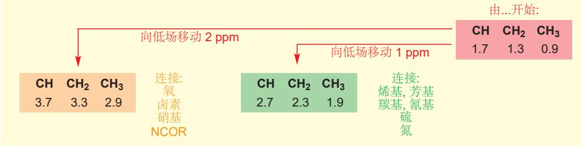

上表非常粗略，但却非常容易记住，您应当将它背下来。除此之外，您还可以使之稍稍更精确一些，进一步细分，把会导致 3 ppm 的位移的非常吸电子的基团划分出去（硝基，氧一侧的酯基 OCOR，氟）。本页给出了总结，但我们建议您只作为参考。如果您还想要更详细的信息，您可以参考 Chapter 18 中的表格，或从专业文本中获得更复杂的表格 (见延伸阅读一节)。

## 质子 NMR 位移总结

从此表中推断出的结果不会是完美的，但会给出很好的指导。记住——这些位移都是可累加的。拿下面的酮酯做一个例子。共有三个信号，积分可以将两个甲基与 $CH_{2}$ 基区分开。由甲基的 0.9 ppm 开始，一个甲基位移了大约 1 ppm，另一个则位移了超过 2 ppm。第一个会是与 C=O 相连的甲基，另一个则是与氧相连的甲基。更精确地来说，2.14 ppm 与甲基的标准值相比 (0.9 ppm) 位移了 1.24 ppm，与我们期待的酮甲基的位移一致，另一个 3.61 ppm 位移了 2.71 ppm，接近于通过氧连接的酯的 3.0 ppm。 $CH_{2}$ 基与酯基和酮羰基相连，我们认为它在 $1.3 + 1.0 + 1.0 = 3.3$ ppm 处共振，此估算十分精确。在观察未知化合物的光谱时，我们还会使用这样的估算。

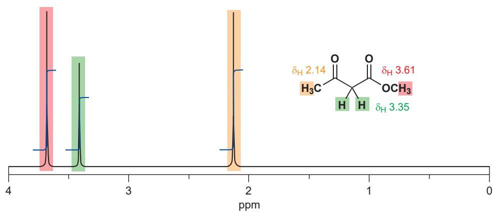

## 烯烃区域和苯区域

在 $^{13}\mathrm{C}$ NMR中，烯烃和苯上的碳会进入光谱的相同区域，但在 ${}^{1}\mathrm{H}$ NMR光谱中，连接在芳烃C和烯烃C原子H原子会将它们自己归入两类。为了说明这一点，请着眼于页边所示的，环己烯和苯的 $^{13}\mathrm{C}$ 和 ${}^{1}\mathrm{H}$ 化学位移。二者的碳信号几乎是相同的(1.3ppm的区别 $< 200~\mathrm{ppm}$ 尺度的 $1\%$ )，但质子信号非常不同(1.6ppm的区别 $= 10~\mathrm{ppm}$ 尺度的 $16\%$ )。必定有一个根本性的原因存在。

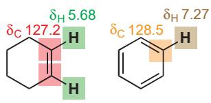

## 苯的环电流导致芳香质子较大的位移

简单烯烃在分子平面上具有一个低电子密度的区域，因为 $\pi$ 轨道在这里由一个波节，而处在该平面上的碳和氢原子核，不能从 $\pi$ 电子上获得任何的屏蔽效应。

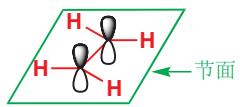

苯环，第一眼看上去似乎是相似的，对于所有 $\pi$ 轨道，分子平面确实也是一个波节。然而，如我们在 Chapter 7 中所讨论的，苯是芳香的——由于六个 $\pi$ 电子都填入到了三个非常稳定的轨道中，并围绕整个环离域，它具有额外的稳定性。外磁场会在这些离域的电子中建立一个环电流，环电流会产生与绕核电子相当像的定域磁场。在苯环内部，这个磁场与外加磁场相反，但在苯环外部，这些磁场加强了外加磁场。碳原子就是环本身，因而没有获得任何效果，但在环外的氢原子则感受到了更强的外加磁场，并表现出较小的屏蔽（即较大的去屏蔽，较大的化学位移）。

■ 绕环电子产生的磁场就在您身边：电磁铁和螺线管就是这样的。

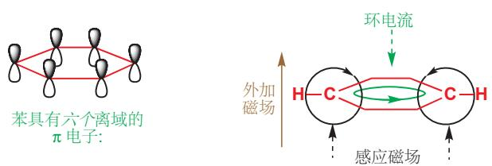

Interactive structures of cyclophane and annulene

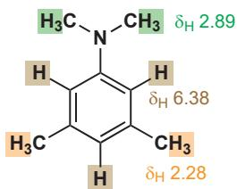

环上更大的电子密度可以弥补环电流带来的任何改变。

为什么您通常应该期待单取代苯环应有三种类型的质子？

## 环蕃和轮烯

您可能会认为，想象在芳环内部发生的事是没有意义的，因为我们无法将氢原子放在苯环内部。然而，我们可以接近那里。被称为环蕃/环芳烷（cyclophanes）的化合物，具有连接在同一苯环的两端的一圈饱和碳原子。下面的结构是[7]-对环蕃，它具有连接在同一苯环的对位的一条七个 $\mathrm{CH}_2$ 基的链。苯环上的四个H原子在 $7.07~\mathrm{ppm}$ 表现出一个峰一一典型的被苯环的环电流去屏蔽的数值。连接在苯环上的两个 $\mathrm{CH}_2$ 基(C1)同样被环电流去屏蔽，在 $2.64~\mathrm{ppm}$ 处共振。C2和C3上的两组 $\mathrm{CH}_2$ 基既不被屏蔽，也不被去屏蔽，在 $1.0~\mathrm{ppm}$ 共振。但在链中间的 $\mathrm{CH}_2$ 基(C4)指向了环 $\pi$ 体系的中间，并被环电流屏蔽到了-0.6 ppm)。

芳环较大时，使氢原子真正处在环的内部是可能的。如果一个化合物在环中有 $4n + 2$ 个离域电子，它就是芳香的，上图的环具有九根双键，即18个 $\pi$ 电子，是芳香的。环外的氢在相当低场的(9.28 ppm)芳烃区域共振，在环内的氢原子在惊人的-2.9 ppm处共振，这显示了环电流强的屏蔽作用。这样扩展的芳环被称为轮烯(annulenes)：您已经在Chapter7见过它们。

## 芳环中不规律的电子分布

这种简单的芳香胺的 ${}^{1}$ H NMR 光谱具有比例为 1:2:2 的三个峰，它们对应于 3H:6H:6H。6.38 ppm 信号很明显属于苯环上的质子，但为什么它们在 6.38 而不在 7.2 ppm 左右呢？我们同样需要区分 2.28 ppm 和 2.89 ppm 处的两种甲基。根据 p. 276 的图表，它们都应该在大约 2.4 ppm，这足够接近 2.28 ppm 但并不接近 2.89 ppm。这些困扰的答案是芳环中的电子分布。氮将电子填入 $\pi$ 体系中，使之更加富电子：环上质子更加被屏蔽，氮原子变得正电性因而使其甲基更被去屏蔽。在 2.89 ppm 处的峰必然属于 NMe $_{2}$ 基。

其他基团，例如烷基，对芳香体系的影响较小，常见情况是，烷基苯上的五个质子表现出同一种信号，而非我们可能期待的三种信号。下面是也包含一些非芳香质子的例子：p. 275 还有另一个例子——被 Cbz 保护的氨基酸。

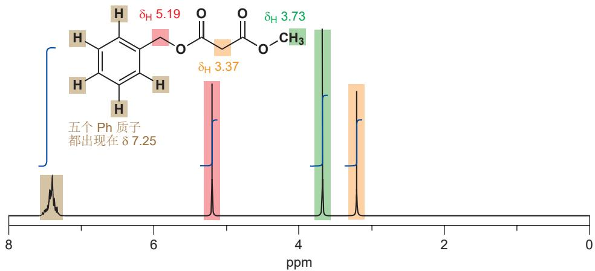  
芳环上的五个质子都具有相同的化学位移。请检查您是否可以分配其余的位移。OCH₃基(绿色)是典型的酯甲基位移(p.276表格估算为3.9 ppm)。在两个羰基间有一个CH₂基(黄色，将其与p.277相似的CH₂基的3.35 ppm对比)。剩下的亚甲基(红色)与一个酯和一个苯环相连：计算结果为1.3 + 1.5 + 3.0 = 5.8 ppm——和所观察到的5.19 ppm很接近。注意观察，Ph和O一同作用，使连接在这个sp³C上的Hs向低场位移到了我们通常期待是烯烃区域的位置。不要对p.272的区域划分太较真！

## 给电子和吸电子如何改变化学位移

我们可以通过观察在 1 和 4 位具有相同取代基的苯环，考察电子分布对化学位移的影响。此取代模式使环上的四个氢完全相同。下面是按化学位移列出的几个化合物：最大的位移（最低的场；最大的去屏蔽）在最前面。用常规的弯曲箭头表示共轭，用在基团边上的直箭头表示诱导效应。只示出一个氢原子和一组箭头。

在 Chapter 7 中讨论了共轭，它是沿着 $\pi$ 键传递的，而诱导的吸电子和给电子效应只是通过分子中 $\sigma$ 键的极化传递的。见 p.135。

吸电子基团的影响通过共轭

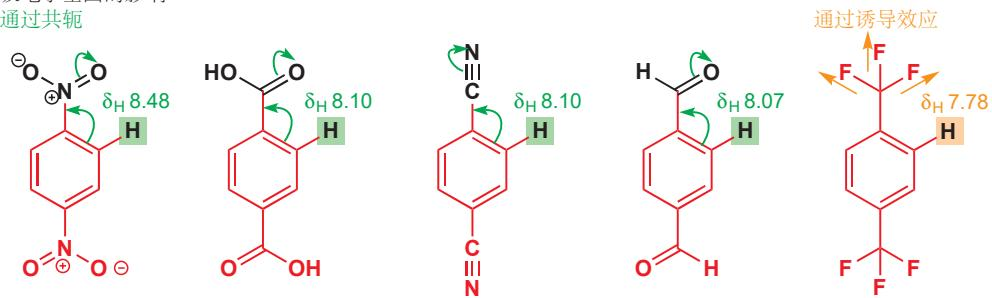

最大的位移来自通过共轭吸电子的基团。硝基是最强的——这不会令您惊讶，因为非芳香化合物在 ${}^{13}C$ 和 ${}^{1}H$ NMR 光谱中都有同样的现象；然后是羰基和氰基；最后跟着仅仅通过诱导吸电子的基团， $CF_{3}$ 是这类基团最重要的例子——三个氟原子的结合可以发挥强大的效应。

这对于不同取代的苯环的反应性是非常重要的结果：Chapter 21 中会讨论它们的反应。

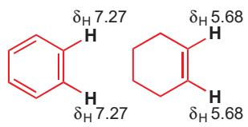

在序列的中部，苯本身的 $7.27\mathrm{ppm}$ 位移周围，是卤素，它们的诱导吸电子和孤对电子的给电子几乎平衡。

诱导吸电子与孤对电子的共轭给电子之间存在平衡

烷基是弱的诱导给体；而给出最多屏蔽的——也许令人惊讶的——是负电子原子 O 和 N 的基团。尽管它们是诱导吸电子的 (C-O 和 C-N σ 键极化，C 带 δ+)，但这与它们孤对电子对环的共轭给电子相平衡 (如您在 p. 278 所见)，净效果为给电子。它们会增加环上氢的屏蔽效应。氨基是最好的。注意，氮基官能团包含最好的吸电子体 (NO₂)，也包含最好的给电子体 (NH₂)。

给电子基团的影响

通过诱导效应

诱导吸电子与孤对电子的共轭给电子之间存在平衡—给电子获胜

对于具有孤对电子的给体 (卤素加 O 和 N)，有两点因素是重要的——孤对电子的大小和元素的电负性。如果我们观察本页上方的四种卤素，它们的孤对电子分别在 2p (F)、3p (Cl)、4p (Br) 和 5p (I) 轨道。所有情形中，苯环的轨道均为 2p，因此氟的轨道在合适的大小，而其他的轨道则太大了。既是氟是电负性最大的，它仍是最好的给电子体。其他卤素不会将电子密度推出去太多，但它们同时也拿不回来多少。

如果我们横向对比第二周期的 p 区元素——F、OH，和 $NH_{2}$ ——它们都具有在 2p 轨道上的孤对电子，因而电负性会是唯一的变量。如您所料，电负性最大的元素，F，是其中最弱的给体。

## 富电子和缺电子的烯烃

这样的事也发生在烯烃上。我们会聚焦于环己烯，以与苯环做出很好的对比。苯上六个完全相同的质子在 7.27 ppm 处共振，环己烯上的两个完全相同的烯烃质子则在 5.68 ppm 处共振。酮等共轭和吸电子基团会如您所料地——对两侧不同等地——从双键上移去电子。与 C=O 基邻近的质子只由环己烯稍稍向低场一点，但较远的质子则向低场移动了超过 1 ppm。弯曲箭头可以显示的电子分布同时也可从 NMR 光谱中推断出。

氧作为共轭给电子体是十分戏剧性的。将它连接在双键上，它会通过诱导效应，将与之相连的质子向低场移动，但同时也会通过共轭给电子，将较远的质子向高场移动整整 1 ppm。这两个质子间分隔了将近 2 ppm。

这两类取代基的效应，都在较远的 (β) 质子上最为显著。如果这些位移反映真正的电子分布，我们应当能推断出下面三种化合物的一些化学性质。您可能料到，亲核试剂会进攻硝基烷烃的缺电子位点，而亲电试剂会进攻烯醇硅醚或烯胺的给电子位点。它们都是重要的试剂，也确实如我们所预测地反映，您会在后面的章节中遇到。请观察区别——硝基烯烃和烯胺上相同位置质子的位移差了将近 3 ppm!

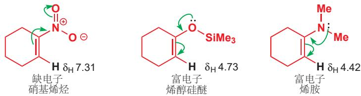

## 从烯烃区域得到结构信息

如果烯烃两端的碳原子不同，它们上的质子也会很明显地不同，我们已经见到了这样的例子。如果质子连在烯烃的同一个碳原子上，它们也可以是不同的。所需的只是双键另一端的取代基不同。下面的烯醇硅醚和不饱和酯就属于这一类。双键上的质子，与不同的基团顺式，因而必然是不同的。我们也许不能分配哪个是哪个，但仅仅是差异就能告诉我们一些事。第三种化合物是一个有趣的情形：环上两个质子具有不同的位移，这证实了 N-Cl 键处在 C=N 键的键角。如果它们呈直线，那么这两个氢就应当是相同的。C=N 键的外侧被孤对电子占据，氮原子是三角型的 $sp^{2}$ 杂化）。

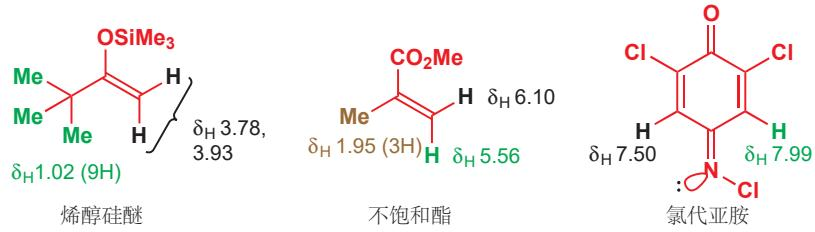

## 醛区域: 与氧相连的不饱和碳

醛质子是独特的。它直接连接在羰基——存在的最吸电子的基团——上，并且被非常地去屏蔽，在任何 CH 质子中最大的位移处，9–10 ppm 区域共振。下面的例子都是我们之前遇到过的化合物。其中两个是简单的醛类——芳香醛与脂肪醛。第三个是溶剂 DMF。它的 CHO 质子比大多数醛去屏蔽得少——酰胺的离域将电子填入羰基，并提供了额外的屏蔽。

■ 脂肪(族)(Aliphatic)是对所有非芳香化合物的统称。

与氧孤对电子的共轭有相同的效果——甲酸酯在大约 8 ppm 共振——但与 $\pi$ 键的共轭并非如此。上方的芳香醛，和下方仅有共轭的醛，以及桃金娘醛都具有在一半区域共振的 CHO 质子 (9–10 ppm)。

  
P. 176 还有关于硝基吸电子性质的其他内容。

注意，下面所示的“另一种”共轭方式是错误的。让两根相邻的双键存在于六元环中是不可行的，并且如您在 Chapter 8 中所了解，氮的孤对电子处在与环的 p 轨道正交的 sp² 轨道中。正交的轨道间没有相互作用。

## 处在醛区域的非醛基氢：吡啶

还有两类其他的质子也在 9–10 ppm 左右的区域共振：一些芳香质子，和连接在某些杂原子，像 OH 和 NH 上的质子。我们会在下一节处理 NH 和 OH 质子，但首先，我们必须着眼于一些具有特殊的大位移的缺电子芳环。

在双键上的质子，即使在硝基烯烃上非常吸电子的双键上，也很难到达醛基区域。然而，有些具有非常吸电子的基团的苯环却可以达到，因为它还有环电流造成的额外的低场位移，留心，硝基苯可能具有在 8–9 ppm 区域内的信号。

具有在此区域的信号的更重要的分子是吡啶等芳杂环，您在 Chapters 8 和 10 曾见过它们做碱。NMR 位移很明显地显示出，吡啶是芳香的：有一个质子位于 7.1 ppm，基本上与苯的相同，其他质子还要更低场，C2 处的一个在醛区域中。这并不是因为吡啶比苯“更芳香”，而是因为氮比碳的电负性更大。C2 位和醛是很像的一一质子连在与杂原子相连的 $sp^{2}$ C 上。而 C4 则因为共轭（负电性氮是吸电子的）而缺电子。异喹啉（isoquinoline）是吡啶与苯的稠合环，它具有一个在更低场的 9.1 ppm 共振的质子——这是一个感受到了苯环的环电流的亚胺质子。

## 杂原子上质子的位移比碳上的多样

直接连接在 O、N 或 S (其他杂原子也行，但这些最为重要) 上的氢在 NMR 光谱法中同样具有信号。我们之前避开了它们，是因为这些信号的共振位置，受交换所影响，因而可靠性较小。

  
在 Chapter 2 中，您了解了抗氧化剂 BHT。它的质子 NMR 非常简单，仅由四条线组成，积分为 2、1、3 和 18。叔丁基 (棕色)，苯环上的甲基 (橙色)，以及两个等价的芳香质子 (绿色) 的化学位移应当不会让您感到惊讶。所剩下的是在 5.0 ppm (粉色) 处的 1 H 信号，这必然是 OH。在本章的早期，我们见到了醋酸的谱图， $CH_{3}CO_{2}H$ ，它表现出在 11.2 ppm 共振的 OH；简单醇，如叔丁醇在 $CDCl_{3}$ (常用 NMR 溶剂) 中的 OH 信号位于 2 ppm 左右。为什么差距这么大呢？

这是酸性的问题。质子的酸性越强——它就越容易以 $H^{+}$ 逃离 (这是 Chapter 8 中酸性的定义)——OH 键也就越向氧极化。RO-H 键越极化，我们也越接近游离的 $H^{+}$ ，后者根本不具有屏蔽电子，因而会越向低场移动。OH 化学位移和 OH 基的酸性——至少在粗略程度上——是相关的。

  
a醇b酚c羧酸

硫醇 (RSH) 与醇的行为相似，但如您对电负性较小的硫所期待的，它们比醇去屏蔽得少 (苯酚都在大约 5.0 ppm, PhSH 在 3.41 ppm)。烷基硫醇出现在大约 2 ppm，芳基硫醇在大约 4 ppm。胺和酰胺，如根据所涉及的官能团的多样性预料的一样，它们也表现出巨大的多样性/变化性，如下所总结。您在 Chapter 8 中了解到，酰胺稍具酸性，而酰胺的质子也在很低场共振。吡咯是特殊的——环的芳香性使 NH 质子不寻常的具有酸性——它们在大约 10 ppm 处出现。

NH 质子的化学位移  

## 酸性质子的交换会被质子 NMR 谱图所揭示

具有极性非常强的基团的化合物，在水中通常会极好地解离。NMR 通常是在 $CDCl_{3}$ 中运行的，不过重水， $D_{2}O$ 同样是极好的 NMR 溶剂。这种介质会导致一些结果的产生。

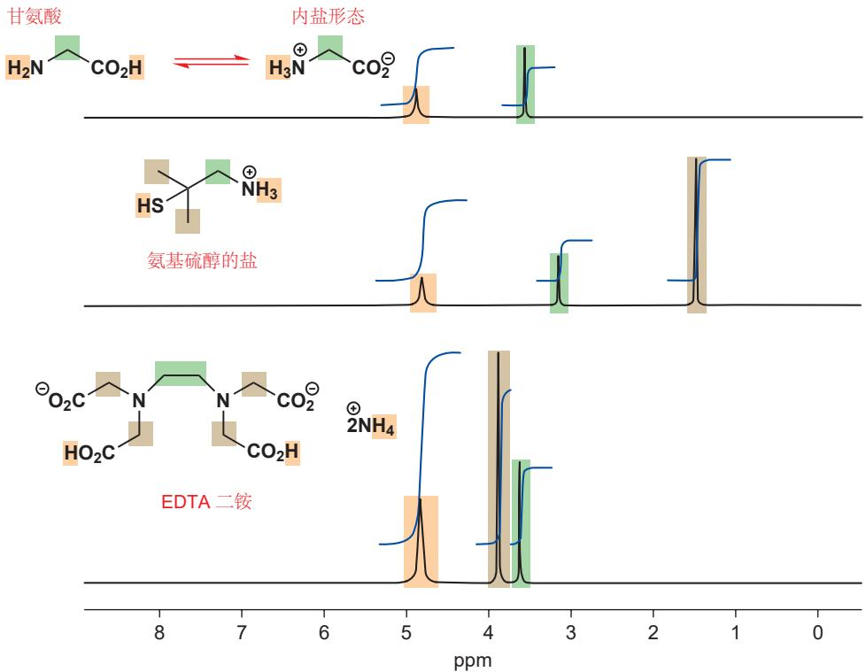

甘氨酸被认为以内盐形式存在 (Chapter 8, p. 167)。它，在两种形态下，两个官能团间的 $CH_{2}$ 都具有一个 2H 信号 (绿色)，但在 4.90 ppm 的 3H 信号 (橙色) 可能告诉我们 $NH_{3}^{+}$ 基团的存在。在您这样决定之前，再思考片刻。

氨基硫醇盐具有 $CMe_{2}$ 和 $CH_{2}$ 基，它们处在我们预期的位置上 (棕色和绿色)，但 SH 和 $NH_{3}^{+}$ 质子是以一个 4H 信号出现的。

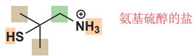

■ EDTA 是乙二胺四乙酸 (ethylenediamine tetraacetic acid)，一种常用的金属络合剂。此处用的是它与两当量氨所成的盐。

EDTA 的二盐具有不少有趣的特征。中间两个 (绿色的) $CH_{2}$ 基是很好的，但剩下的四个 $CH_{2}$ (棕色) 基则都完全相同地出现， $CO_{2}H$ 和 $NH_{4}^{+}$ 基中的氢也是如此。

对其原因最佳的证据，来源于这些分子中 OH、NH、SH 质子奇怪的巧合。在实验误差内，它们都是相同的：甘氨酸中为 4.90 ppm，氨基硫醇中为 4.80 ppm，EDTA 中为 4.84 ppm。事实上它们都对应于相同的物种：HOD，半重水（单氘代水，monodeuterated water）。XH （其中 X=O、N，或 S）质子的交换是及其快的，溶剂 D₂O 会提供大大过量的可交换氘。D 会立即取代分子中所有的 OH、NH 和 SH 质子，并在过程中形成 HOD。请回想，我们不会看到氘原子的信号（这也是为什么使用氘代溶剂）。它们在其他频率具有它们自己的光谱。

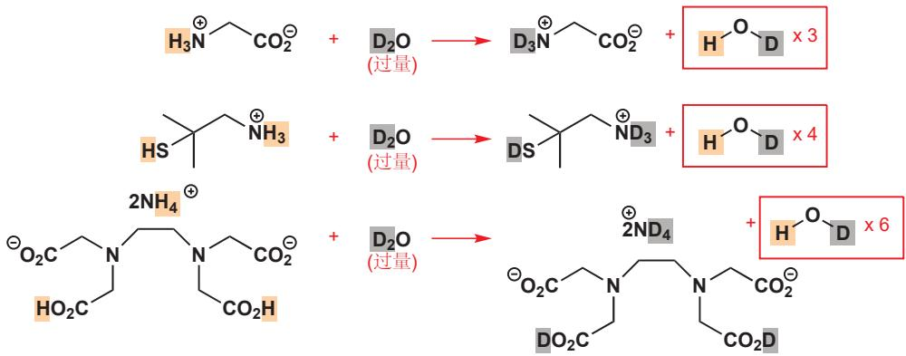

与之同种的，在 OH 或 NH 质子之间的交换，或与样品中痕量的水间的交换，都意味着在 $CDCl_{3}$ 中测得的大多数谱图中，OH 和 NH 峰都比 CH 质子的峰宽。

还剩下两个问题。首先，我们如何分辨甘氨酸在水中是否是一种内盐？不见得：谱图对二者都符合，对它们之间的平衡也符合——其他证据会让我们认为水中存在内盐。其次，为什么EDTA中全部的四个 $\mathrm{CH}_2\mathrm{CO}$ 基是相同的呢？我可以给出答案。和 $\mathrm{CO_2H}$ 与溶剂间的质子交换平衡一样，在 $\mathrm{CO_2D}$ 和 $\mathrm{CO_2^-}$ 之间的质子交换平衡也是同样快速的。这使得EDTA全部的四只“胳膊”是相同的。

在离开本节前，请在脑海中牢牢记住这样一条重要的化学原理。

## - 杂原子间的质子交换是快速的

杂原子，尤其是O、N和S之间的质子交换，与其他化学反应相比，是非常快速的过程，通常导致 $^{1}$ H NMR光谱中平均化的峰。

我们在对 C=0 基的加成反应的机理的文段中 (p. 136) 提及过这一事实，在整本书中，我们还会继续探索它从机理意义上的结果。

## 质子 NMR 光谱中的偶合

## 邻近的氢原子核会相互作用并给出多重峰

目前为止，质子 NMR 除了尺度较小以外，与碳 NMR 似乎没什么不同。然而，我们事实上还没有讨论到质子 NMR 真正的实力所在，它比化学位移更重要的，并且让我们不仅看到单个原子，而且还看到 C–H 骨架连接的方式。这是邻近质子之间相互作用，即偶合/耦合 (coupling) 的结果。

核酸的组成部分胞嘧啶 (cytosine) 是我们可以在上一节选做例子的化合物，它具有交换中的 $NH_{2}$ 和 NH 质子，并会在 4.5 ppm 给出 HOD 的峰。我们没有将它选做例子，是因为另两个峰可能会让您困扰，每个质子并非只给出一条线，它们都给出了两条线——您会学着称之为双重峰 (doublet) ——是时候讨论此 “偶合” 的来源了。

胞嘧啶是与脱氧核糖(deoxyribose)、磷酸酯基(phosphate)一同组成DNA的四种碱基(bases)之一。它是被称为嘧啶的一类杂环的成员。我们将在本书的末尾，Chapter 42中研究DNA的化学。

您可能会认为，下面的杂环，和胞嘧啶一样也是嘧啶， $\mathrm{NH}_2$ 质子与杂环上的质子也同样处于交换中，因而也会给出像胞嘧啶的谱图。但环上的两个质子，没有给出胞嘧啶谱图中那样的四条线，而是给出了预期的两条线。分配此谱图很容易：标记 $\mathrm{H}^{\mathrm{A}}$ 的绿色质子连接在类醛基的 $\mathrm{C} = \mathrm{N}$ 上，因此在最低场；标记 $\mathrm{H}^{\mathrm{X}}$ 的红色质子与两个给电子的 $\mathrm{NH}_2$ 基邻位，因此在芳香质子中处于高场 (p.272)。这些质子彼此间不发生偶合，因为它们离得太远。它们被五根键所分割，而胞嘧啶上的环质子仅相隔三根键。

  
理解此现象是很重要的，我们将会以三种不同的方式阐释——请您选取最吸引您的一种方式。每种方式都提供了不同的视角。

您方才看到的二氨基嘧啶的光谱具有两条单线（之后我们会称之为单重峰 singlets），这是因为， $\mathrm{H}^{\mathrm{A}}$ 或 $\mathrm{H}^{\mathrm{X}}$ ，每个质子都可以与外加磁场排列一致或排列相反。胞嘧啶的光谱与之不同，这是因为每个质子——比如说 $\mathrm{H}^{\mathrm{A}}$ ——都与另一质子 $\mathrm{H}^{\mathrm{X}}$ 离得足够近，因而它不但能感受到外加磁场，还能感受到 $\mathrm{H}^{\mathrm{X}}$ 产生的小磁场。下图显示了结果。

  
如果每个质子都只与外加磁场相互作用，那么我们会得到两个信号。但是 $\mathrm{H}^{\mathrm{A}}$ 质子事实上感受

到的是两个稍有不同的磁场：外加磁场加 $H^{X}$ 的磁场，和外加磁场减 $H^{X}$ 的磁场。 $H^{X}$ 既会加强，也会减弱 $H^{A}$ 所感受到的磁场。共振的位置取决于质子感受到的磁场，因此两种情况会产生两个稍有不同的峰——得到我们称为双重峰的谱图。 $H^{A}$ 所经历的事， $H^{X}$ 也会经历，因而谱图会具有两个双重峰，每个质子各一个，都与彼此偶合。质子产生的磁场相比于磁铁产生的磁场确凿非常小，因而双重峰两条线间分离得也非常小。后文我们会讨论偶合的大小 (pp. 294–300)。

第二种阐释考虑到了原子核的能级。当我们在 Chapter 4 中讨论化学键时，我们想象了相邻原子彼此发生相互作用，裂分 (split)，产生新的分子轨道——有些在能量上下降，有些在能量上上升

——的过程中涉及的电子能级。当一个分子中的氢原子核彼此接近时，核的能级也会相互作用，裂分，产生新的能级。如果单个氢核与磁场相互作用，我们就会得到本章 p.270 的图片：产生两个能级，原子核可以与磁场方向一致，也可以相反，于是有一种可能的能级跳跃，因而存在在某一个频率下的共振。这样的论述您已经见过多次，可以总结为下图。

P. 286 中二氨基嘧啶的谱图就显示了这种情况：两个质子在分子中分隔得很开，它们都独立地表现它们的行为。每个质子都具有两个能级，也都给出单重峰，谱图中便出现了两条线。但在谱图示出于 p. 285 的胞嘧啶中，情况就不同了：每个氢原子都具有另一个邻近的氢原子核，并且有四个能级。 $H^{A}$ 和 $H^{X}$ ，每个原子核都可以与外加磁场一致或相反地排列。当它们都与磁场一致地排列时，存在一种 (较低的) 能级；当它们都相反地排列时，存在一种 (较高的) 能级；在它们中间，还有一个原子核一致，一个原子核相反的两种不同能级。有两条稍稍不同的路径，都可完成将 $H^{A}$ 从与外加磁场相反的排列方式中激发的过程，分别在下图中显示为 $A_{1}$ 和 $A_{2}$ 。结果便是谱图中非常靠近的两种共振。

两个相互作用的原子核的能级  

光谱仪通常使用 200–500 MHz 强度的磁场。

请注意，我们对 $H^{A}$ 的讨论，离不开对 $H^{X}$ 以相同方式的讨论。如果有两种稍稍不同的，激发 $H^{A}$ 的能级跳跃，那么也必然有两种稍稍不同的，激发 $H^{X}$ 的能级跳跃。 $A_{1}$ 、 $A_{2}$ 、 $X_{1}$ 和 $X_{2}$ 都是不同的，但 $A_{1}$ 和 $A_{2}$ 的差距与 $X_{1}$ 和 $X_{2}$ 的差距是相同的。现在，每个质子都在 NMR 谱图中给出两条线（一个双重峰），而它们的间隔应该是相同的。我们称这种情况为偶合。我们会说 “A 和 X 偶合” 或 “X 被 A 所偶合”（当然反过来也一样）。自此之后，我们会使用这一语言，您也需要如此。

现在请回顾本节开始的胞嘧啶的谱图。您可以看出两个双重峰，属于芳环上的两个质子。它们都分隔开相同的数值（用尺子很容易检查），这被称为偶合常数 (coupling constant) 即 $J$ 。在此情况中， $J = 4 \mathrm{~Hz}$ 。为什么我们不用 ppm 而要用赫兹衡量 $J$ 呢？在 p.55 (Chapter 3)，我们指出，用 ppm 衡量化学位移，是因为在 NMR 机器的 MHz 数量级下，我们会得到相同的数值。而我们用 Hz 衡量 $J$ 则是为了在不同的机器下得到相同的数值。

下面展示了同种化合物在两台不同的 NMR 机器上运行得到的两幅 $^{1}$ H NMR 谱图——其中是 90 MHz 光谱仪，另一个是 300 MHz 光谱仪 (这是通常使用的磁场强度范围的上限与下限)。注意，在化学位移尺度 (ppm) 上，峰都处在相同的位置上，但偶合的大小看上去发生了改变，因为 1 ppm 在上面的谱图中值 90 Hz，而在下面的谱图中值 300 Hz。

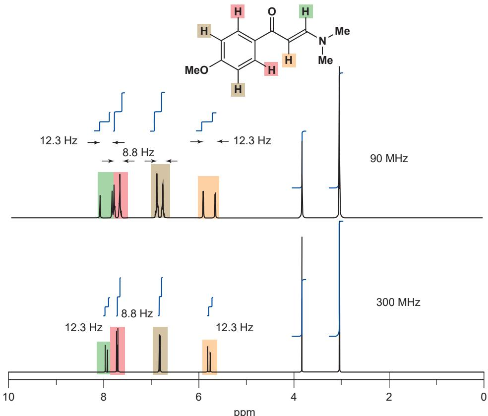

## 以赫兹测量偶合常数

若要测量偶合常数，最基本的是了解 NMR 机器的 MHz (兆赫兹) 数量级。这就是为什么我们在说明一副谱图时，会告诉您它是 “400 MHz $^{1}$ H NMR 谱图”。电子设备可能会直接将偶合标注在谱图上，如果没有，则需要用尺子和水平刻线以 ppm 量出间隔。将百万分之一兆赫兹转换为赫兹是很容易的，您只需要将百万忽略掉就可以了！因此 300 MHz 机器上的 1 ppm 是 300 Hz；500 MHz 机器上的 10 Hz 偶合会呈现出 0.02 ppm 的分割。

## - 不同机器所得的光谱

当您改变机器，比如从 200 MHz 换用 500 MHz NMR 机器时，化学位移 ( $\delta$ ) 会在 ppm 上保持相同，偶合常数 (J) 则会在 Hz 上保持相同。

现在，到了描述偶合的第三种方式。如果您再次观察 $\mathrm{H}^{\mathrm{A}}$ 和 $\mathrm{H}^{\mathrm{X}}$ 间没有偶合的光谱，您会发现如右侧所示的模式，每个质子的化学位移都清晰明了。

但您并没有看到它，因为每个质子都与另一质子偶合，并将其信号从真正的化学位移处向两侧分隔开相等的数值。真正的谱图具有两对双重峰，都分隔开完全相同的数值。注意观察，在真正的化学位移处没有出现线，但通过取双重峰的中点，很容易测得化学位移。

因此这一谱图应该描述为 $\delta_{H}$ 7.5 (1H, d, J 4 Hz, H $^{A}$ ) 和 5.8 (1H, d, J 4 Hz, H $^{X}$ )。主数是以 ppm 为单位的化学位移，在括号中，是以 Hs 的数量计算的积分数值，信号的形状（“d”代表双重峰），以 Hz 为单位的偶合常数，以及通常与一个图表关联的分配方式。积分是双重峰两条峰下面积的加合，如果双重峰完全对称，那么每个峰的积分都为半个质子。无论有多么复杂，组合后信号的积分对应正确的质子数目。

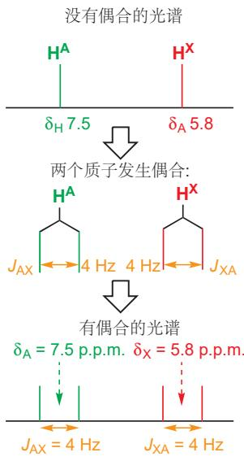

我们把这些质子描述为 A 和 X 是有目的的。有两个等同双重峰 (equal doublet，指间隔等同) 的光谱被称为 AX 光谱。A 总是指您正在讨论的质子，X 则是有不同化学位移的另一个质子。然后用其他字母作为标尺：近处（在化学位移尺度上——而不是在结构上相近！）的质子被称为 B、C 等，远处的被称为 X、Y 等。您马上就会了解原因。

如果涉及更多的质子，裂分过程则还会继续。下面是一种著名的，具有“绿叶丁香”气味的香水化合物的 NMR 光谱。该化合物是一种缩醛，在正常的苯位置具有五个邻近的完全相同的质子(7.2–7.3 ppm)和在两个完全相同的 OMe 基上的六个质子。

我在 p. 270 介绍了 ${}^{1}$ H NMR 谱图上的积分。  

所剩的三个质子吸引了我们。它们表现为在 2.9 ppm 的一个 2H 双重峰，和在 4.6 ppm 的一个 1H 三重峰 (triplet)。在 NMR 讨论中，三重峰的意思是三个以等同距离分割的线，积分比例为 1:2:1。三重峰产生于 $CH_{2}$ 基上两个完全相同质子的三种可能状态。

如果质子 $\mathrm{H}^{\mathrm{A}}$ 与两个 $\mathrm{H}^{\mathrm{X}}$ 质子相互作用，它就可以感受到三种不同的可能状态的 $\mathrm{H}^{\mathrm{X}}$ ：都一致，都相反，或一一致一相反。两个 $\mathrm{H}^{\mathrm{X}}$ 都与磁场一致，或都与磁场相反的这两种状态，都会增强或减弱原有的外磁场。但如果一个质子 $\mathrm{H}^{\mathrm{X}}$ 一致排列，另一个质子相反排列，那么 $\mathrm{H}^{\mathrm{A}}$ 就没有感受到外磁场的净变化。这样的排列方式有两种（见下一页的图)，因而我们会看到 $\mathrm{H}^{\mathrm{A}}$ 在正确的化学位移处表现出了双倍强度的信号，在更低场和更高场各有另两个信号，也就是一个1:2:1三重峰。

$H^{A}$ 与两个质子 $H^{X}$ 偶合的影响

我们还会用另一种方法观察这个结果。两个原子核都与外磁场一致排列的有一种方式，都相反排列的有一种方式，但一个一致排列、一个相反排列的有两种方式。质子 $H^{A}$ 会与每种状态相互作用，结果便为 1:2:1 三重峰。

  
用我们了解偶合的第三种方式来看三重峰的形成，我们可以画出峰在连续的步骤中裂分的过程：

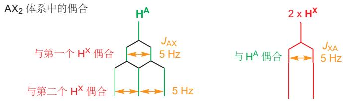

所得的 $\mathsf{AX}_2$ 谱图

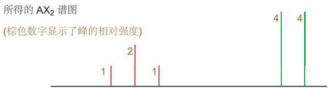

如果还涉及更多的质子，我们也还会继续得到更复杂的体系，体系中峰的强度可以由给出二项式展开系数的杨辉三角形 (Pascal's triangle) 简单地推断出来。如下图所示。

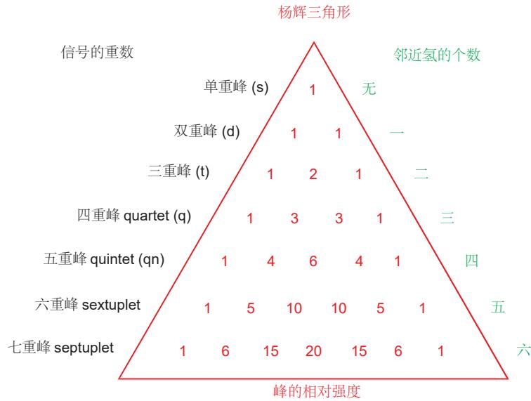

## ■ 构建杨辉三角形

首先在顶部放上 “1”，然后在每一行，通过将上一行两侧的数字加起来添加新的数字。如果一侧没有数字，则记为零，每行的第一个和最后一个数字始终是 “1”。

您可以从杨辉三角形上读出与 n 个等价的邻近氢偶合的质子会表现出的模式，模式始终是按杨辉三角的强度排列的 $n + 1$ 个峰。目前为止，您已经见过了与 1 个质子偶合产生的 1:1 双重峰（杨辉三角的第 2 行），与 2 个质子偶合产生的 1:2:1 三重峰（第 3 行）。您经常会见到乙基 $\left(\mathrm{CH}_{3}\mathrm{CH}_{2}\mathrm{X}\right)$ ，其中与三个等价质子偶合的 $CH_{2}$ 基就表现为一个 1:3:3:1 四重峰，而甲基则表现为一个 1:2:1 三重峰。在异丙基， $\left(\mathrm{CH}_{3}\right)_{2}\mathrm{CHX}$ 中，甲基表现为一个 6H 双重峰，CH 基表现为七重峰。

这里有一个简单的例子：四元环状醚噁丁环(oxetane)。它的NMR谱图具有一个属于与氧相邻的两个完全相同的 $\mathrm{CH}_2$ 基的4H三重峰，以及一个属于中部的 $\mathrm{CH}_2$ 的2H五重峰。每个质子 $\mathrm{H}^{\mathrm{X}}$ 都会“看到”四个完全相同的邻近氢 $(\mathrm{HA})$ ，并被它们同等地裂分，给出1:4:6:4:1五重峰。每个质子 $\mathrm{HA}$ 都会“看到”两个完全相同的邻近 $\mathrm{HX}$ ，并裂分为1:2:1三重峰。五重峰中所有线积分的和为2，三重峰中所有线积分的和为4。

## ■ 完全相同的质子不与它们自身偶合

记住，偶合只来自于邻近的 (neighbouring) 质子：信号自身有多少个质子 ( $H^{X}$ 有 2 个， $H^{A}$ 有 4 个) 并不重要

——重要的是有多少个在它邻位(有4个与 $H^{x}$ 相邻，有2个与 $H^{A}$ 相邻)。每个 $CH_{2}$ 基中的质子是完全相同的，它们不能与彼此偶合。重要的是氢看到了什么，而不是氢本身是是什么。

一个稍稍复杂的例子是下方所示的二乙缩醛 (diethyl acetal)。它具有一对属于“骨架”上的两个质子 (红色和绿色) 的简单的 AX 双重峰，和一个典型的乙基信号 (2H 四重峰和 3H 三重峰)。乙基通过它的 $CH_{2}$ 基只能与一个取代基相连，而 $CH_{2}$ 基的化学位移会告诉我们它连着什么样的原子，在这里，峰处在 3.76 ppm，这意味着乙基与氧相连构成 OEt 基。当然此分子中有两个完全相同的 $CH_{2}$ 基。

  
在上述所有的分子中，质子可能拥有多个邻近氢，但这些邻近氢都是相同的，因此所有的偶合常数也都是相同的。当偶合常数不同时，会发生什么呢？菊酸 (chrysanthemic acid)，除虫菊 (pyrethrum) 花产生的杀虫剂的结构核心，提供了关于最简单的情况——拥有两个不同的邻近氢的质子——的例子。

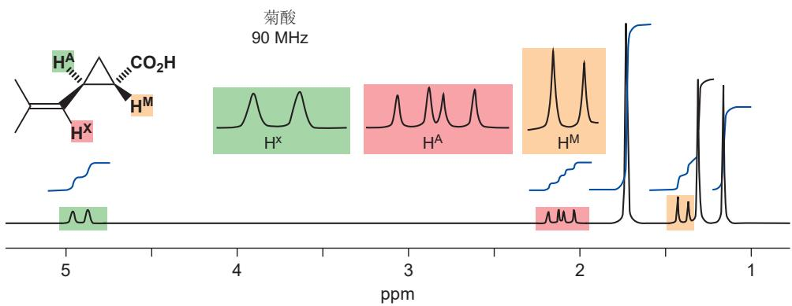

菊酸在三元环上有一个羧基、一个烯基，和两个甲基。质子 $H^{A}$ 拥有两个邻居， $H^{X}$ 和 $H^{M}$ 。与 $H^{X}$ 的偶合常数是 8 Hz，与 $H^{M}$ 的是 5.5 Hz。我们可以构建出如右侧所示的裂分模式。

结果是四条强度相同的线，被称作是双重双重峰 double doublet (有时也称为双重峰的双重峰 doublet of doublets)，简作 dd。线 1 和线 2，或线 3 和线 4 之间的分隔是较小的化学位移，线 1 和线 3，或线 2 和线 4 之间的分隔是较大的化学位移。中间两条线之间的分隔并不代表任何偶合常数。您可以将双重双重峰视作是第二个偶合太小，不能将中间两条线带到一起的，不完美的三重峰：同样，您也可以将三重峰视作是两个偶合完全相同，中间两条线重合了的双重双重峰的特殊情况。

  
信号形式的简称

## 偶合是一种沿键效应

邻近原子核是沿空间相互作用的，还是沿键上的电子相互作用的呢？我们知道，偶合事实上是一种“沿键效应 (through-bond effect)”，因为偶合常数是会随分子形状的变化而变化的。最重要的例子是来自双键两端质子的偶合，如果这两个氢是顺式的，那么偶合常数 J 通常在大约 10 Hz；但如果它们是反式的，那么 J 会大得多，通常在 15–18 Hz。下面的两种氯代酸是好的例子。

<table><tr><td>简称</td><td>含义</td><td>备注</td></tr><tr><td>s</td><td>单重峰</td><td></td></tr><tr><td>d</td><td>双重峰</td><td>在高度上相同</td></tr><tr><td>t</td><td>三重峰</td><td>应当是1:2:1</td></tr><tr><td>q</td><td>四重峰</td><td>应当是1:3:3:1</td></tr><tr><td rowspan="2">dt</td><td>双重</td><td>也有其他组合</td></tr><tr><td>三重峰</td><td>如dd, dq, tt</td></tr><tr><td>m</td><td>多重峰</td><td>复杂而难以描述的信号*</td></tr></table>

  
\* 要么是包含复杂的偶合模式，要么是不同质子的信号发生了重叠。

如果偶合是沿空间的，那么相距较近的顺式氢会给出较大的 J。但事实上，偶合沿键发生，在反式化合物中，键完美的平行排列提供了更好的交流，并给出了更大的 J。

在分配光谱时，偶合至少是和化学位移一样重要的。当我们说环己烯酮中的质子具有某个化学位移时 (p. 280)，我们是如何知道的呢？是偶合告诉了我们答案。与羰基相邻的质子（图中 $\mathrm{H}^2$ ）具有一个邻居 ( $\mathrm{H}^3$ ) 并且以 $J = 11\mathrm{Hz}$ 的双重峰出现，这正表明了双键上的，具有顺式邻氢的质子。质子 $\mathrm{H}^3$ 本身，以双重三重峰出现。在每个三重峰内部，线的分隔都是 $4\mathrm{Hz}$ ，两个三重峰分隔 $11\mathrm{Hz}$ 。

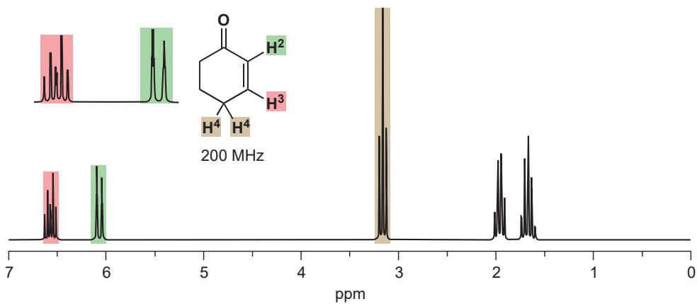  
$\mathrm{H}^3$ 的偶合比您之前见过的复杂，但我们还是可以用之前所用的方法，将其图示化地表达出来。

随着偶合变得越来越复杂，对结果的诠释也会变得越来越困难，但如果您知道要寻找的是什么，那么事情就会变得简单。下面是一个2-庚酮的例子。与羰基相邻的绿色质子是一个 $J7\mathrm{Hz}$ 的2H三重峰（与两个红色质子偶合）。红色质子本身与四个质子相邻，虽然这四个质子并不完全相同，但偶合常数大约是相同的：因而红色质子以一个2H五重峰出现，偶合常数也是 $7\mathrm{Hz}$ 。棕色信号更加复杂，我们必须称其为一个“4H多重峰”，因为5号碳和6号碳上四个棕色质子发生了重叠，多重峰由一个2H五重峰(C5上的质子)和一个2H六重峰(C6上的质子)组成。我们可以看出C6上质子与末端甲基的偶合，因为甲基(橙色)以一个3H三重峰出现(同样是 $7\mathrm{Hz}$ 的偶合常数)。

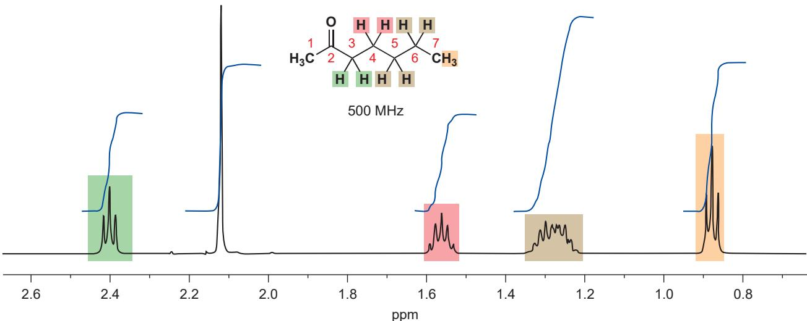

## 偶合常数取决于三个因素

环己烯酮中的偶合常数是不同的，但为什么庚酮中所有的偶合常数都大约是相同的——围绕 7 Hz 呢？

## - 影响偶合常数的因素

\- 质子间的沿键距离。

\- 两根 C-H 键间的角度。

\- 负电性取代基。

我们目前所见过的偶合常数，都发生于邻位碳原子上氢原子之间——换句话说，这种偶合途经三根键 $(\mathrm{H - C - C - H})$ ，用 $^{3}J_{\mathrm{HH}}$ 特指之。 $^{3}J_{\mathrm{HH}}$ 偶合常数在如庚酮那样可自由旋转的开链体系中，通常在 $7\mathrm{Hz}$ 左右。庚酮中C-H键键长的差异很小，但由于环己烯酮中的C-C键是一根双键，因而它显著地短于单键。跨双键的偶合 $(^{3}J_{\mathrm{HH}})$ 通常会大于 $7\mathrm{Hz}$ （环己烯酮中为 $11\mathrm{Hz})$ 。由于质子在相邻的t碳原子上，因而 $^{3}J_{\mathrm{HH}}$ 偶合也被称作邻偶(vicinal couplings)。

还存在其他的不同：开链体系具有所有旋转构象的时间平均（我们会在下一章中研究），而当跨一根双键时，旋转将不再能进行，两根 C–H 键间的角度也被固定了：它们始终处在同一平面上。在烯酮的平面上，C–H 键与彼此或处在 $60^{\circ}$ （顺式），或处在 $180^{\circ}$ （反式）。苯环上的偶合常数会比跨顺式烯烃的稍小，因为苯的键比烯烃的长（键级为 1.5 而非 2）。

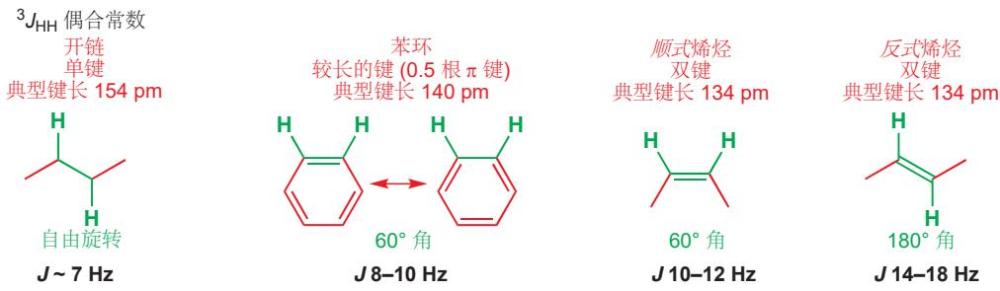

在萘的两个环中，存在不相等的键长。两个环共有的键是最短的，其他的键长如右侧所示。跨较短的键的偶合 (8 Hz) 显著地比跨较长的键的偶合 (6.5 Hz) 大。

第三种因素，电负性的影响，很容易从普通烯烃和烷氧基取代的烯烃，烯醇醚之间的对比上看出来。我们将要对比两对带有顺式或反式双键的烯烃，一对在烯烃一端都具有苯基，另一对则具有OPh基。在每一对中，如您所料，反式偶合都比顺式偶合大。但如果您对比这两对，您会发现烯醇醚具有比烯烃小得多的偶合常数。烯醇醚的反式偶合仅仅比烯烃的顺式偶合大一点。负电性的氧原子从烯醇醚的C-H键上吸电子，并弱化了经由这根键的交流。

## 长程偶合

当一种偶合要经过三根键以上的距离发生时，通常就观察不到它了。换种说法就是，四键偶合 $^{4}J_{HH}$ 通常为零。然而，在有些物种中也可观察到这种情况，最重要的例子是芳环上的间位偶合，和烯烃上的烯丙型偶合。在这两种情况中，两个氢原子间的轨道都可以排列成锯齿形，以使相互作用最大化。排列看上去很像字母 “W”，这类偶合被称为 W-偶合。即使有了这样的优势， $^{4}J_{HH}$ 值通常仍很小，大约为 1–3 Hz。

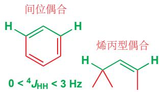

当同时存在邻位偶合时，间位偶合非常常见；而这里有一个例子，其中的芳基质子没有邻位质子，因而没有邻位偶合，只存在间位偶合。有两个完全相同的 $H^{As}$ ，它们都具有一个间位邻近氢，并以 2H 双重峰出现。在两个 MeO 基之间的 $H^{X}$ 有两个等价的间位邻近氢，因而以 1H 三重峰出现。偶合非常小 (J \~ 2.5 Hz)。

我们之前见过的环己烯酮就有烯丙型偶合存在。上文中，我们较详细地讨论了环己烯酮的 $H^{3}$ 具有双重三重峰的原因。但 $H^{2}$ 也具有双重三重峰则较不明显。三重峰偶合不明显，J 较小（大约 2 Hz）是由于它是一个 ${}^{4}J_{HH}$ ——与 C4 上 $CH_{2}$ 基的烯丙型偶合。下面是偶合的图示，您能够在 p. 293 环己酮光谱的放大图中看出。

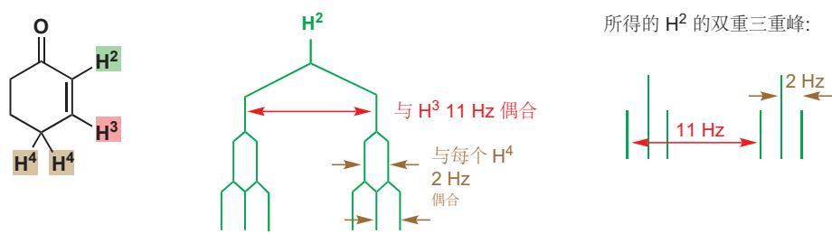

## 相似的质子间的偶合

完全相同的质子不与彼此偶合。同一个甲基上的三个质子可能与其他某些质子偶合，但绝不会彼此偶合。它们是一个 $A_{3}$ 体系。完全相同的邻居也不会偶合。回到 p.271，您会发现对二取代苯上的四个氢都各自具有一个邻居，但它们只以一个单重峰出现，因为每个质子都与它们的邻居完全相同。

我们也见过了两个不同质子形成 AX 体系并给出两个分立的双重峰的情况。而现在，我们需要观察在这两个极端的中间的情况。相似的一对邻居间会发生什么呢？当两个质子越来越接近时，您在 AX 体系中观察到的两个双重峰会突然地坍缩 (collapse) 成 $A_{2}$ 体系的单重峰吗？您可能已经猜到，它们不会。这种转变是逐渐发生的。假设我们在一个芳环上拥有两个不同的质子。我们看到的光谱会如下所示，它们全都是在 1 和 4 位有不同取代基 (最后一幅相同) 的 1,4-二取代苯。

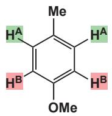

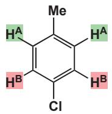

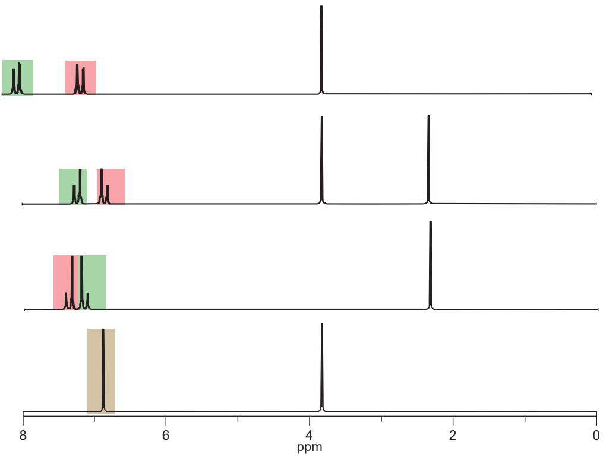

您会注意到，在第一幅光谱中，两个双重峰相隔很远，它们看上去像一般的双重峰。但随着它们越来越接近，双重峰也会逐渐畸变(distort)，最终当它们完全相同时，便会坍缩成一个4H单重峰。

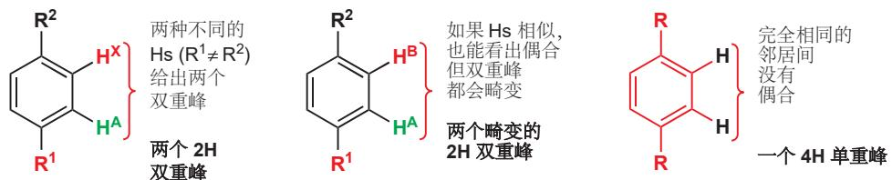

对峰形来说，关键性的因素是两个质子在所用的机器中化学位移的差异 $(\Delta \delta)$ 与它们偶合常数 $(J)$ 的比较。如果 $\Delta \delta$ 比 $J$ 大得多，就不会出现畸变：比如说，在 $500\mathrm{MHz}$ 的机器中， $\Delta \delta$ 为 $2\mathrm{ppm}$ ( $= 1000\mathrm{Hz}$ )，偶合常数是一般的 $7\mathrm{Hz}$ ，条件满足，我们会拥有包含两个1:1双重峰的AX谱图。如果 $\Delta \delta$ 在大小上接近 $J$ ，两个双重峰内部的两条线就会增大，外部的线会减小；当 $\Delta \delta$ 为零是，外部的线会消失，同时我们会得到完全重合的两条内部线——即 $\mathrm{A}_2$ 谱图的单重峰。您可以在右侧的图示中看出这一过程。

您可能会见到将此情况描述为“AB四重峰”的情形。它不是这样的！四重峰是与三个完全相同的质子偶合产生的间距完全相同的1:3:3:1体系，您应当避免使用这种误导性用法。

我们称畸变很大，但质子仍然不同的阶段为一个 AB 谱图，在这样的情况中，您对 $H^{A}$ 的讨论离不开对 $H^{B}$ 的讨论。两条内部线靠近得，可能比双重峰间的间隔还要近，四条线的间隔还有可能均匀分配。AB 体系的两种版本已在上一页的图示中展示了出来——还有更多种变体存在。

有一个常用而实用的技巧是，畸变双重峰总是“指向”与它偶合的质子。

或者，换一种方式讲，AB 体系是 “带屋顶的 (roofed)” ，它具有在两边较低的墙，和在中间较高的屋顶。请注意观察这样的双重峰 (或其他任何偶合信号)。

我们将用最后一个，包含对二取代苯、ABX体系，和一个异丙基的例子结束这一节。该化合物的芳环质子形成了一对畸变双峰（每个双重峰有2H)，这显示它是一个对二取代苯。然后，烯烃质子形成了ABX谱图的AB部分；它们以较大的(反式) $J = 16\mathrm{Hz}$ 彼此偶合，其中一个与远距离的质子发生烯丙型偶合；大的双重峰存在畸变(AB)，而AB体系右半边内部的两个双重峰则几乎等高。远处的质子 $\mathrm{H}^{\mathrm{X}}$ 是一个i-Pr基的一部分，它与 $\mathrm{H}^{\mathrm{B}}$ 和六个完全相同的质子偶合。这两个Js几乎相同，因此它被七个质子裂分并得到八重峰。它看上去像一个六重峰，因为八重峰中线强度的比例会为1:7:21:35:35:21:7:1(由杨辉三角形)，外部的两条线自然会在图中几乎消失。

  
偶合可以发生在同一个碳原子上的两个质子间

我们了解过处在同一个碳原子上的质子不相同的情况：在一端未被取代的烯烃。如果质子是不同的(它们当然也离得很近)，它们就应当偶合。事实如此，但在这种情况中，偶合常数通常非常小。下面是您在 p.281 遇到的例子的谱图。

  
较小的 $1.4\mathrm{Hz}$ 偶合是同一个碳原子上，由于双键不能旋转而不同的两个质子间的 $^2 J_{\mathrm{HH}}$ 偶合。 $^2 J_{\mathrm{HH}}$ 偶合被称为偕偶 (geminal coupling)。

这意味着单取代烯烃 (乙烯基) 对双键上三个质子具有特征性的信号。下面是丙烯酸乙酯 (形成非环状聚合物的单体) 的例子。谱图第一眼看上去相当复杂，但运用偶合常数就会很容易归类。  

最大的 $J(16\mathrm{Hz})$ 很明显属于橙色和绿色质子之间(反式偶合)，中等的 $J(10\mathrm{Hz})$ 属于橙色和红色之间（顺式偶合)，较小的 $J(4\mathrm{Hz})$ 必定属于红色和绿色（偕偶)。这便分配了全部的质子：红色 $5.60~\mathrm{ppm}$ ；绿色 $6.40~\mathrm{ppm}$ ；橙色 $6.11~\mathrm{ppm}$ 。基于偶合的分配，比只基于化学位移的分配更加可靠。

## - 乙烯基中的偶合常数

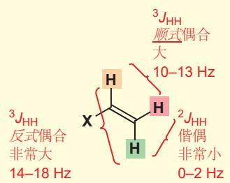

乙基乙烯基醚是常用作醇的保护的试剂。由于负电性的氧原子直接与烯烃相连，它所有的偶合常数都比烯烃通常的小。分配乙烯基的质子仍然很简单，因为 13、7 和 2 Hz 的偶合必定分别为反式、顺式偶合，和偕偶。另外，在与氧相连的碳原子上的橙色 H 非常低场，而红色和绿色质子从氧原子孤对电子的共轭作用上获取了额外的屏蔽 (见 p. 281).

只有当 $CH_{2}$ 基上的两个氢不同时，我们才可以看到饱和碳原子上的偕偶。桃金娘醛 (p. 274) 的桥 $CH_{2}$ 基就提供了这样的一个例子。桥上质子的偶合常数， $J_{AB}$ 为 9 Hz。饱和体系上的偕偶可以比不饱和体系上的大得多 (通常为 10–16 Hz)。

## - 典型偶合常数

\- 偕偶 $^{2}J_{HH}$ 饱和

10–16 Hz  

不饱和

\- 邻偶 $^{3}J_{HH}$ 饱和

  
6–8 Hz

不饱和反式

  
14–18 Hz

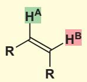  
10–12 Hz

不饱和芳香

\- 长程 $^{4}J_{\mathrm{HH}}$

间位

烯丙型

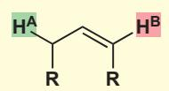

## 小结

通过 Chapter 3 和本章，您已经了解了用于研究有机分子结构的所有重要的光谱技术。现在，我们希望您能够理解，为什么迄今为止，质子 NMR 会是这些技术中最强大的一个，我们也希望您在阅读本书的其余部分时能够回来再参考本章。我们还将大量地讨论质子 NMR，专门讨论它的还有 Chapter 18，我们将会在那里着眼于这些光谱技术的结合，在 Chapter 31 中，我们还会讨论 NMR 提供有关分子形状的信息的方式。

## 延伸阅读

提醒：如果您手边有一本关于光谱分析的短书，这会是有好处的，因为它可以给您全面的数据表，问题和解释。我们推荐 Spectroscopic Methods in Organic Chemistry by D. H. Williams and Ian Fleming, McGraw-Hill, London, 6th edn, 2007。

牛津初级读本 Introduction to Organic Spectroscopy, L. M. Harwood and T. D. W. Claridge, OUP, Oxford, 1996 提供了简单的介绍。对立体化学实践性使用更高级的资源是 Stereoselectivity in Organic Synthesis, Garry Procter, OUP, Oxford, 1998。

## 检查您的理解

## 14 立体化学

## 联系

## 基础

\- 绘制有机分子 ch2

\- 有机结构 ch4

\- 对羰基的亲核加成 ch6

\- 羰基上的亲核取代 ch10 & ch11

## 目标

\- 分子的三维形状

\- 带有镜像的分子

\- 带有对称性的分子

\- 如何分离镜像分子

\- 非对映异构体/非对映体

\- 形状和生物活性

\- 如何绘制立体化学

## → 展望

\- 饱和C上的亲核取代ch15

\- 构象 ch16

\- 消除反应 ch18

\- 控制烯烃几何结构 ch27

\- 控制环状化合物的立体化学 ch32

\- 非对映选择性 ch33

\- 不对称合成 ch41

\- 生命的化学 ch42

## 有些化合物可以以一对镜像的形式存在

回想您在很早 (Chapter 6) 就遇到的一个反应，醛与氰离子反应，生成一个包含氰基和羟基的化合物。

这个反应生成了多少个化合物？您可能会直率地说是一个——只有一种醛、一种氰离子，和一种可能的机理。但这种分析并不完全正确。我们第一次讨论这一反应的时候忽略了一点，那就是醛的羰基有两个可被进攻的面，而这一点是当时的我们认为无关紧要的。如下所示，氰离子从这两种侧面进攻得到的产物，是截然不同的。

## Interactive results of cyanide addition to carbonyls

■ 实楔形键朝向纸面前方，指向我们；虚楔形键朝向纸面后方，远离我们。

Chapter 6 (pp. 125–7) 中介绍过此反应的原理，即氰离子进攻垂直于醛分子平面的 $\pi^{*}$ 轨道（以和 C 原子旧的 p 轨道成键）。假如平面三角型的醛在纸平面上，那么它有两个面都可以接受进攻，氰离子从纸面上，或下进攻，很自然地会使之转变为氰基凸出，或凹下纸平面的两种形式。

这二者是不同的化合物吗？您可以通过搭建模型尝试，无论如何排列，这二者都不能完全重叠，因此虽然它们的原子相对位置(构造)相同，但它们的立体结构(构型)是相区别的。它们是两种不同的结构，也是两种不同的化合物。而每一个都是另一个的镜像(mirror image): 让其中一个结构，A，在镜子中反射，得到的图像与B的结构是一样的。

对于这样的一对构造相同、构型不同，且互为镜像的异构体，我们称之为对映异构体（enantio-mer，简称对映体）。一个不能和其镜像完全重叠的结构，会同时存在与其构造相同的一对对映体，这样的结构是手性的(chiral adj., chirality n.). 在这个反应中，氰离子从“正面”、“背面”进攻的可能性没有任何区别，因此我们得到的产物是两个对映体的50:50混合物。

本章涉及了大量的三维空间中的操作，而本书只能以二维平面的形式展现。在学习初期，我们建议您通过制作分子模型参与我们的讨论。这种练习也能锻炼您的空间想象能力，最终您将能够不依靠模型，想象这些内容。

## - 对映体和手性

Interactive aldehyde cyanohydrin structures—chiral

\- 对映体指一对互为镜像的结构，它们的构造相同，构型相反。

\- 手性的结构不能与其镜像完全重叠。

如果说我们对这个反应稍稍变动，改为氰离子对丙酮的加成。

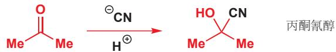

同样生成了一个氰醇分子. 您可能会设想：这个反应仍然会由于进攻方向的不同而产生两种结构，如下图 C 和 D.

然而，与上一个反应不同的是，第一种结构经过旋转是可以与第二种结构(其镜像)完全重叠的，因此它们事实上是一模一样的结构。

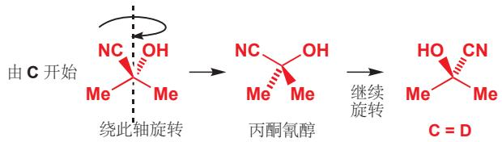

Interactive acetone cyanohydrin structure—achiral

请确保您明白了这一点：C 和 D 是完全一样的分子，与互为镜像的 A 和 B 不同。真实世界中的分子可以平移和旋转，但不能反映（镜像）；而能否在真实世界中能否将两种形式完全重叠，是界定它们是否为同一结构的根本方法。仅通过第一类对称操作（实际操作）就可以完全重叠的两种形式，只是同一结构的不同画法。和自己的镜像可以完全重叠的结构是非手性的 (achiral).

● 非手性的结构可以与其镜像完全重叠。

  
对称面穿过中心碳原子OH和CN

## 手性分子中不存在对称面

有些化合物可以与其镜像完全重叠，而有些不能，它们最本质的区别是什么？答案是对称性（主要是对称面），含对称面的分子都不具有手性，具有手性的分子都不含有对称面。最左侧图的丙酮氰醇有一个穿过分子的对称面，这个对称面将中心碳原子及其取代基分成了两个部分，OH 和 CN 基各自与一个甲基在一侧。另外，一切平面型分子 （例如简单的醛） 都不存在手性，因为分子平面同时也是一个对称面。一部分环状分子有贯穿相对的两个原子的一个对称面，如下图的对甲基环己酮结构，它的对称面贯穿甲基、羰基，以及这两个氢原子 （没有画出）。最右侧的双环缩酮看起来十分复杂，但仍可发现一个将分子一分为二的对称面。这些分子都是非手性的。

含有对称面的分子

Interactive molecules with a plane of symmetry

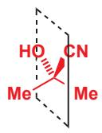  
丙酮氰醇

  
任何平面分子:
分子平面即使对称
面

  
对甲基环己酮: 对称面正交于纸面

  
一种双环缩酮: 对称面正交于纸面

另一方面，醛氰醇分子中不含任何对称面：对于纸平面，则 OH 在一端而 CN 在另一端；对于垂直于纸平面的屏幕，则 H 在一端而 $RCH_{2}$ 在另一端。这个化合物没有对称面，因此它和另一结构互为对映异构体。

  
醛氰醇

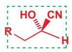  
纸平面不是对称面

  
OH 和 CN 同处的平面
不是对称面

  
因此这个分子是手性的有一对对映异构体

■ 稍后我们会介绍一个稍微不那么重要的分子对称性，即对称中心。没有对称面，而有对称中心的分子也不具有手性。

## - 对称面与手性

\- 任何没有对称面的分子是手性的(并不严谨)，存在两种互为镜像的分子(对映异构体).

\- 任何含有对称面的分子是非手性的，它们与它们的镜像为同一分子。

说到 “结构”，我们并不仅仅指化学结构：以上的规则同样适用于生活用品。从我们熟悉的一些物件中找到例子也能加深我们的理解。看看您的周围，找到一个手性的物件——一把剪刀，一个螺丝钉，一辆汽车，任何写了字的东西，比如这张纸。再找找那些非手性的，有对称面的物件——一个普通的杯子，一口平底锅，一把椅子，以及大多数没有写过字的简单产品。在这其中，您身边最重要的手性的物件是您互为一对对映体的两只手。

## 手套，手和袜子

大多数手套以一套镜像的形式出现：只有左手套适合左手，只有右手套适合右手。手套，以及其中的手的这种性质，就是“手性(chiral)”这一词的最初来源——“cheir”在希腊语中指“手”。手和手套都是有手性的，它们不含对称面，左手套也不能与其镜像(右手套)完全重叠。但袜子(通常)和前面两者不同：虽然有时候，我们很难找到两只颜色匹配的袜子，但一旦您找到了，您从来不会顾及哪只袜子对应哪只脚，这是因为袜子是非手性的。一对袜子由两个完全相同的物品组成，每个物品都含有一个对称面。

古埃及人不太注意手的手性，它们画作中的人，甚至是法老，都经常有两只左手或者两只右手——它们似乎没有注意到这一特点。

  
网球拍和高尔夫球杆

如果您是想玩高尔夫球的左利手者，那么您要么适应用右手打球，要么去找一套左手杆。如果您看过高尔夫球杆，那么您会明白，它没有对称面，因此显然是手性的；它们可以以两个对映体存在。但网球球拍与之相反。左手持拍的运动员和右手持拍的运动员使用完全相同的球拍，一些运动员交替使用左右手持同一球拍。任何一款网球拍的镜像与其本身是一致的，它含有一个对称面，因而没有手性。

立体异构体：连接次序和连接方式相同，但在空间上排列方式不同。

虽然如上结论可以在大多数情况下帮您判断，但它并不完整(严谨)：我们很快会来到有关对称中心的介绍(p. 321).

## - 总结

\- 含有对称面的结构是非手性的，可以与其镜像完全重叠，无对映体之分。

\- 不含对称面的结构是手性的，不能与其镜像完全重叠，因此它们是两种不同的化合物（一对对映体）.

## 手性中心

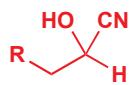

回到氰离子和醛的反应，上文我们已经解释了其产物的手性，它以一对对映体存在。对映体显然是一类异构体，而且，它们是一对以不同方式连接相同部分而得到的化合物。对于这类仅在空间排列上不同的异构体，我们称其为立体异构体（stereoisomers，也称构型异构体）。立体异构体间的区别不表现于原子的连接次序、连接方式上，仅表现在分子的整体形状上。

## - 立体异构体 (构型异构体) 和构造异构体

异构体(同分异构体)描述的是每种原子数目相同，但排列方式不同的化合物。如果原子连接次序和连接方式(构造)，它们被称为构造异构体(constitutional isomers).如果连接次序和连接方式均相同 (而构型不同)，它们才是立体异构体。对映体是立体异构体，双键的 E、Z 构型也是立体异构体。我们稍后会遇到其他一些立体异构体的例子。

  
构造异构体：每种原子数目相同但连接次序或连接方式不同。

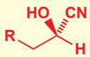  
对映体

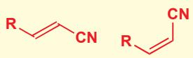  
E/Z 异构体 (双键异构)

现在我们会简要地向您介绍另一组概念，即构型 (configuration) 和构象 (conformation)，您会在 Chapter 16 中学习有关它们更多的细节。所谓的异构体即指两个真正不同的分子：它们不能在不破坏化学键的情况下相互转化，立体异构体 (构型异构体) 具有这一特点。构象指的是分子的空间排布形象；分子绕单键旋转就会产生另一种构象；构象的不同也是排列方式的暂时不同，任何分子都具有多种构象 (本书中不将构象作为一种异构体)。类比，每个人类都有一种构型：手臂分别连在两个肩膀上；但每个人类都可以摆出不同的构象：例如手臂交叉、举起，指向某一位置，挥手等等。

## ● 构型和构象

\- 分子构型的转变通常需要经过键的断裂 (和重组).

\- 有不同构型的结构是不同的分子。

\- 分子构象的转变意味着绕键旋转，而不是键的断裂。

\- 有相同构型、不同构象的结构是易于转化的，它们不是不同的分子。

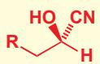

两种构型：手性分子转化为自己的对映体需要一根键的断裂

同一对映体的三种构象：由其一转化为另一个需要绕键旋转全部三个都是同一分子

刚刚，我们判断醛氰醇具有手性，依据的是分子中没有对称面。事实上，对于分子中任意一个四面体碳原子，只要它所连的四个基团是不同的，那么这个分子自然没有对称面，因而就是手性的。例如醛氰醇中同时连有 OH, CN, RCH₂, 和 H 的碳原子使氰醇有手性。对于这样的碳原子，我们称其为手性中心 (stereogenic/chiral centre)，有手性中心的分子就是手性的。丙酮氰醇是没有手性的，这是因为它的中心碳原子上有两个相同甲基 (其他的碳原子也不是手性中心).

\- 如果一个分子中含有携带四个不同基团的碳原子，分子中就不会出现对称面，因此分子具有手性。携带四个不同基团的碳原子是手性中心。

■ 您不久后会看到包含多于一个手性中心的化合物不都是手性的 (内消旋化合物).

上文中我们还分析了产生醛氰醇两种对映体的原因，即氰离子进攻醛羰基的两个面。对于这两个面，氰离子没有理由更偏爱某一个，因此该反应得到的是相同比例的两种对映体的混合物。我们将一对对映体同等比例的混合物称为外消旋混合物（racemic mixture，意思是每个分子都有旋光性，但混合物整体的旋光性在外部消失，旋光性即手性）.

两种对映体以完全相同的比例形成：产物是外消旋混合物

\- 外消旋混合物指一对对映体以相同比例组成的混合物。这一原则十分重要：如果一个反应的原料是非手性的，而其产物却是手性的，那么该反应的产物以两种对映体的外消旋混合物存在。

下面是更多的通过非手性原料合成手性产物的反应例子。每种情况都坚守如上原则——得到相同比例的两种对映体的混合物(外消旋混合物).

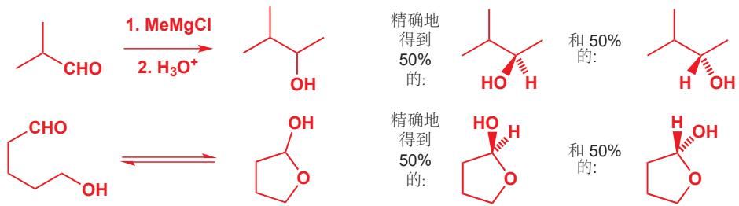

## 自然界中的许多手性分子只以其中一种对映体存在

当我们不用楔形键表示分子的三维结构时，就意味着我们在同时讨论其两种对映体。另外也通常使用波浪线表示如上这种情况，即模棱两可的，两种异构体(构型)均存在的情况。不过，有的时候波浪键也会被用于表示一种单一，却未知的构型(即其中一种对映体)。

让我们转向一些简单，但却有手性的分子——天然的氨基酸。所有氨基酸都含一个同时携带氨基、羧基、氢原子和 R 基团（随氨基酸种类不同而不同）的碳原子。因此除非 R=H（即甘氨酸），氨基酸都带有一个手性中心，并不含对称面。

氨基酸可以在实验室中直接地合成，比如下面的图示是一种使用 Strecker 氨基酸合成法 (您已在 Chapter 11 遇到) 合成丙氨酸的方法：

实验室中以乙醛为原料合成外消旋丙氨酸记得我们用构型一词描述键的三维排列。不破坏化学键不能改变一个分子的构型。

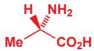  
植物中提取的丙氨酸只有如上(两种对映体中的)一种

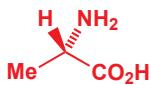  
天然的丙氨酸

Interactive configuration assignment

使用这种方法合成的丙氨酸必定是外消旋的，因为原料是非手性的，而产物是手性的。然而，我们从自然资源——例如通过水解植物蛋白——得到的丙氨酸仅有左图的一种立体构型(并不是外消旋的)。类似的，如果一份样品仅含该手性化合物一对对映体中的一种，那么这份样品是光学纯/对映纯的(enantiomerically pure,或optically pure).我们通过观察X-ray晶体结构来判断。

## 命名烯烃的 E, Z 构型

时，同样需要使用这种次序规则排序。我们有时称其为Cahn-Ingold-Prelog (CIP)规则。您也可以选择使用原子量排序，这还能解决同位素的排序问题(D优先级高于H)——前提是手性碳不连有极少出现的Te和I原子(观察元素周期表看看为什么).

## 丙氨酸的对映体

事实上，自然界有时候也（但很少）使用丙氨酸的另一种对映体，例如在细菌细胞壁的构建中。一些抗生素（例如万古霉素）就利用对这些“非自然的”丙氨酸的识别，以达到破坏细菌细胞壁的目的。

## 手性和光学纯

继续学习之前，我们需要再次强调这一对易混淆的概念。手性是针对一个分子而言的：任何不含对称面的分子就是手性的。而外消旋与光学纯是针对一份包含手性化合物的样品的，如果它仅包含同一种构型的对映体，则它是光学纯的，反之是外消旋的。任何丙氨酸都是手性的（由于分子中没有对称面），但实验室制得的丙氨酸是外消旋的(对映体50:50的混合物)，而自然界中分离的丙氨酸是光学纯的。

## - “手性”不意味着“光学纯”。

大多数我们在自然界中找到的分子是手性的——一个复杂的分子显然不太可能含有对称面。另外，在生命体中找到的这些手性分子还几乎都是单一的对映体，而不是外消旋的。这一特征有深远的影响，例如在药物的设计上，我们稍后会提及这一方面。

## $R$ 和 $S$ 可以被用于描述手性中心的构型

讨论立体化学时，化学家们如何说清楚自己描述的哪一种对映体呢。当然，画出结构图并且标明朝向纸面前和朝向直面后的基团就可以了。这对于复杂的分子是方便的。对于简单的分子，我们同样可以用文字来叙述它们的手性。由于分子的手性是由手性碳引起的，因此将两种立体构型的手性碳分别用 R 或 S 表示。

以从生命体中提取到的丙氨酸的构型作为例子:

1. 给手性中心上连有的取代基排序 (1-4). 首先, 按照所连原子 (元素) 的原子序数排列, 原子序数大的序号小 (优先)。丙氨酸的手性碳连有一个 N 原子 (原子序数为 7), 两个 C 原子 (原子序数为 6), 和一个 H 原子 (原子序数为 1). 由于 N 的原子序数最大, H 的原子序数最小, 因此我们给 $\mathrm{NH}_{2}$ 基标号为 1, 给氢原子标号为 4.

其次，我们还需要确定 $CO_{2}H$ 和 $CH_{3}$ 基的顺序。对于所连原子的原子序数相同的情况，我们将继续比较所连原子的所连原子的原子序数。在本例中，羧基连有氧原子 (原子序数为 8) 而甲基仅连有氢原子 (原子序数为 1). 因此 $CO_{2}H$ 的优先级高于 $CH_{3}$ ，分别标号 2 和 3.

2. 重新排列分子结构，让最小的 (次序最低的) 基团远离您。在本例中，您应当让序号为 4 的 H 远离您，即从 H 朝向纸面内的方向看这个分子，如右下图所示。

3. 观察，如果由 1 到 2, 再到 3 的旋转方向是顺时针的，那么在手性中心上标注 R；如果是逆时针的，则标注 S.

您可以形象地理解为将方向盘按次序方向转动，如果您的车会右转，那么它是 R；如果您的车会左转，那么它是 S。对于我们的分子，转动的方向由 $NH_{2}$ (1) 到 $CO_{2}H$ (2) 再到 $CH_{3}$ (3)，是逆时针的，因此这个对映体为 (S)-丙氨酸。

将这个过程反过来，您还需要练习从构型类型推测结构。以乳酸为例，乳酸是牛奶被细菌作用而产生的；您的肌肉在氧气供应不充分的情况下工作时也会产生，例如在您剧烈运动时。某些细菌仅产生 $(R)$ -乳酸，但大多数通过发酵得到的乳酸是外消旋的；不过，肌肉中无氧呼吸产生的乳酸通常是 S 构型的。

请试着画出 $(R)$ -乳酸的三维结构。您可以先将这一对映体都画出来，然后再标出构型类型。

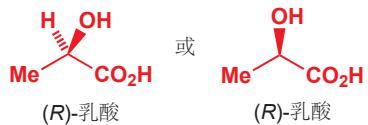

回忆一下，如果我们在实验室中使用非手性原料制备乳酸，那么得到的一定是 $(R)$ - 和 $(S)$ -乳酸的外消旋混合物。生命体产生光学纯的化合物，其核心是利用酶的催化，而酶本身是光学纯的 $(S)$ -氨基酸。

## 两种对映体在性质上有什么不同吗？

简短的回答是：没有。\*以 (S)-丙氨酸 (从植物在提取的) 和 (R)-丙氨酸 (从细菌细胞壁中发现的) 为例，它们有完全相同的 NMR 光谱，完全相同的 IR 光谱，完全相同的物理性质。唯一重要的区别在于当平面偏振光通过这二者的溶液时，在 (S)-丙氨酸 中会向右旋转，而在 (R)-丙氨酸 中会向左旋转；二者的旋转幅度相同，而外消旋的丙氨酸不会旋转通过它的偏振光。

## 平面偏振光的旋转被称为旋光性

观察平面偏振光通过溶液的旋转，可以直接地测定一个样品是外消旋的，还是一种对映体比另一种多的，这种方法被称为旋光法 (polarimetry). 测定旋光的仪器为旋光仪，其中，由光源发出单色光，通过盛有溶液的测量管，随后探测器可以探测到光旋转的角度，向右偏移角度为正，向左偏移为负。

  
\* 在 Chapter 41 中我们会讨论这一问题较长、较复杂的回答。

还记得在 Chapter 2 (p. 21) 中我们是如何我们如何省略手性碳上的氢原子吗——四面体碳原子上的取代基占据四面体的四个顶点，因此我们自动想象氢原子填充了剩余的位置。
这同样是绘制分子的一个技巧，即将该分子手性中心所连的碳骨架画在纸平面上。如画成：

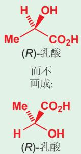  
这二者都是正确的，但对于有多个手性中心的分子，第一种会更加方便。

■ 平面偏振光可以理解为所有波的振动方向都平行的的一束光。将光通过偏振滤光片可以得到平面偏振光。

平面偏振光通过化合物样品产生的旋转角由多种因素决定，最主要的是路径长度 (光通过溶液行进了多少距离)、溶液浓度、温度、溶剂和偏振光的波长。通常，测定实验是在 $20\;^{\circ}C$ 下的乙醇或氯仿中进行的，偏振光由钠灯产生，波长为 589 nm.

■ 请注意，旋转角 $\alpha$ 以角度制表示；按照正确的单位计算得到的比旋度 $[\alpha]$ 无量纲。

$[\alpha]_{D}$ 值可以阐明一份样品中的光学纯度，换种说法是，它可以阐明两种对映体的比例。我们会在 Chapter 41 中回到这一讨论。

符号 $\alpha$ 表示偏振光通过溶液旋转的角度，这个数值除以路径长度 (in dm) 和浓度 $c$ (in g cm $^{-3}$ ) 得到一个新的数值，即 $[\alpha]$ ，这个数值在不同化合物的情形下是不同的。事实上 $[\alpha]$ 被称作化合物的比旋度 (specific rotation). 这几个单位的选择都是古怪而武断的，但它们却是普遍的，因此我们必须接受它。

$$
[ \alpha ] = \frac {\alpha}{c}
$$

大多数情况下，我们使用的是 $[\alpha]_{D}$ (D 表示波长为 589 nm, 即钠灯的 “D 谱线”) 或 $[\alpha]_{D}^{20}$ (20 °C), 于是去掉了其余的变量。

下面是一个例子。苦杏仁酸，一种简单的酸，可以从杏仁中获得它光学纯的一种对映体(左侧). 将 $28 \mathrm{mg}$ 样品溶解在 $1 \mathrm{~cm}^{3}$ 的乙醇中，并放入 $10 \mathrm{~cm}$ 长的测量管中，旋光仪在 $20^{\circ} \mathrm{C}, 589 \mathrm{~nm}$ 下测量的旋转角 $\alpha$ 为 $-4.35^{\circ}$ (向左旋转 $4.35^{\circ}$ ). 那么这种酸的比旋度是多少呢？

首先，我们需要进行单位换算：28 mg 溶于 $1 \, cm^{3}$ 中得到溶液的浓度为 $0.028 \, g \, cm^{-3}$ ；路径长度 10 cm 等价于 1 dm。然后计算比旋度：

$$
[ \alpha ] _ {\mathrm{D}} ^ {2 0} = \frac {\alpha}{c} = \frac {- 4 . 3 5}{0 . 0 2 8 \times 1} = - 1 5 5. 4
$$

## 对映体可以用 $(+)$ 或 $(-)$ 描述

对于两种对映体标识的选择，可以从构型入手，也同样可以从性质入手。即我们可以将两种对映体按平面偏振光旋转的方向（比旋度的正负）标记，这种标记方法不考虑分子的微观构型。我们把会导致偏振光向右旋转（正旋转）的对映体标记为 $(+)$ -对映体（或右旋对映体dextrorotatory enantiomer)；把会导致偏振光向左旋转（负旋转）的对映体标记为 $(-)$ -对映体（或左旋对映体laevorotatory enantiomer).偏振光的旋转方向不依赖于手性中心的 $R, S$ 构型。一种 $(R)$ 型手性化合物既可能是 $(+)$ ，又可能是 $(-)$ ——当然，如果它是 $(+)$ ，那么它的对映体（相同构造的 $(S)$ 型化合物）必定是 $(-)$ .举个例子，刚才提到的一种苦杏仁酸的比旋度为负，因此为 $(R)$ -(–)-苦杏仁酸；而 $(S)$ -丙氨酸为 $(S)$ -(+)-丙氨酸。 $(+)$ 和 $(-)$ 的标记在X-ray晶体学出现之前十分有用，当时的化学家并不知道他们研究的分子的微观构型是什么样的，只能通过比旋度对两种对映体加以区分。

## 对映体可以用D或L描述

X-ray 晶体学作为分析工具出现之前，化学家必须通过一系列复杂的拆分过程研究分子的详细结构和立体化学。就结构而言，他们通过将分子分解成许多组成部分，然后从已知的组成部分推导未知的分子的可能情况；就立体化学而言，他们可以测定化合物的比旋度，但不能知晓它们的具体构型。然而，通过一系列的拆分过程，也可以分析出两种化合物有相同还是相反的构型。

甘油醛是自然界最简单的手性化合物之一。因此，化学家将它作为拆分分子的目标，并用甘油醛的立体化学衡量未知分子的立体化学。甘油醛的两个对映体分别被标记为 D (标记右旋 (dextro) 的 (+)-对映体) 和 L (标记左旋 (laevo) 的 (-)-对映体). 通过拆分过程，任何能与 D-(+)-甘油醛建立联系的分子被标记为 D, 任何能与 L-(-)-甘油醛建立联系的分子被标记为 L. 这种标记方法费时费力(下面的图表中展示了 $(-)$ -乳酸 被标记为 D- $(-)$ -乳酸 的过程)，因此在如今已经不再使用。目前，D 和 L 只用来标注那些众所周知的天然分子，以保留传统，例如 L-氨基酸 或 D-糖。D 和 L 的标记使用小号的大写字母书写。

\- 记住， $R / S, + / -$ ，和 $D / L$ 来自对分子不同方面的观察结果。这意味着，知道一个分子是 $R$ 构型的并不能直接推断出它的旋光性是 + 或是 -，也不能推断出它是 D 还是 L。另外，永远不要仅通过观察结构就断言分子的 $D / L$ 或 $+ / -$ 标记。同样，不要妄图观察一个分子的结构就得出它的旋光性 + 或 -。

## D-(-)-乳酸和D-(+)-甘油醛的关系研究

作为例子，我们将向您展示如何将(-)-乳酸与D-(+)-甘油醛建立联系。我们不指望您记住这其中用到的反应。

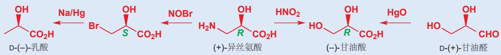  
注意图中有三个中间体都有“相同的”立体化学，但它们中有一个为 $(R)$ ，两个为 $(S)$ ，这是不同元素优先级的不同而导致的。这更加印证了三种标记方法无任何联系， $(R)$ 既可以是 $D$ ，又可以是 $L$ ；即可以是 $(+)$ 又可以是 $(-)$ 。

## 另一种立体异构体：非对映异构体

两个互为对映异构体的分子，由于一个是另一个的镜像，因此在化学性质上完全相同。但其他立体异构体之间有可能在化学性质(和物理性质)上产生区别。例如下图的两种烯烃，它们互为几何异构体 geometrical isomers (或顺反异构体 cis-trans isomers). 由于分子形状上的区别，它们的物理性质也有很大的区别。不过由于它们是平面分子，因此都没有手性。

环状化合物中还存在另一种类似的立体异构类型。下图的 4-叔丁基环己醇 中，两个取代基可以处于环的一侧，也可以分别处于环的上下两侧。同样，这两个化合物在化学和物理性质上也有显著的区别。

我们通常并不画出全部的氢原子。如果叔丁基在三维结构中指向纸面外，那么氢原子只可能指向纸面内。

并不互为镜像的一对立体异构体被称为非对映异构体(diastereoisomers,简称非对映体). 以上两类异构体都属于这一分类。请注意一对非对映异构体的化学和物理性质是如何不同的。

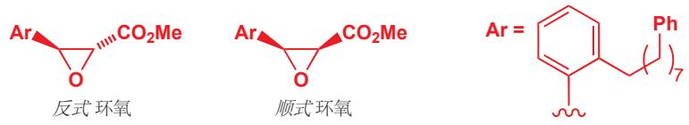

## 非对映异构体可以是手性的或非手性的

如下的一对化合物是宾夕法尼亚州的化学家在研究缓解哮喘的药物时生产的。很明显，它们同样是非对映异构体，并同样有不同的性质。生产过程会同时产生两种非对映异构体，但化学家仅需要第一种 (反式的) 环氧。由于这两种化合物的极性不同，因此可利用色谱法 (chromatography) 分离。

下面我们要讨论一些有关非对映异构体的复杂问题。首先来看，我们最先了解的这两对非对映异构体都是非手性的一一因为它们都含有一个穿过分子的对称面。

两对非手性的非对映异构体

Interactive structures of achiral diastereoisomers

然后，我们后来了解了一对环氧化物。它们都是手性的，我们不能画出其分子中的对称面。为了验证这一点，我们可将其关于一个镜面反映，然后就会观察到镜像分子与原分子不能完全重叠。

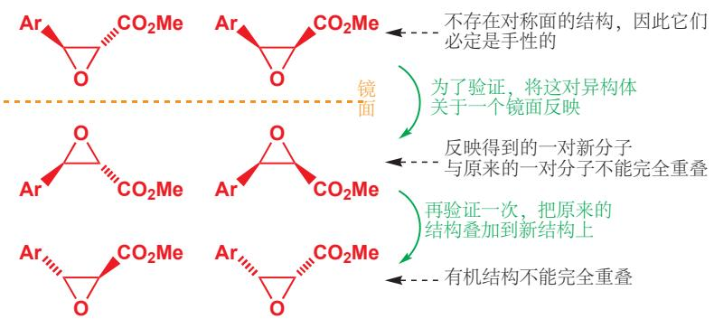

如果一个化合物是手性的，那么它就可以以一对对映体的形式存在。而我们刚刚已经画出了这两种环氧化物的对映体。因此这种构造可以分为四种不同的构型，其中有两组非对映异构体(不互为镜像的立体异构体)，每组又有两个对映异构体（互为镜像的立体异构体）。非对映异构体是顺式和反式两种环氧，它们在性质上有很大区别；对映异构体间则只能以旋光性加以区分。当您考虑一个化合物的立体化学时，应当先区分非对映异构体；然后，如果化合物有手性，再分别讨论每个非对映异构体的对映体。

事实上，研究它们的化学家仅需要反式环氧中的一种对映体——即左上方的异构体。虽然可以通过色谱法分离非对映异构体，即顺式和反式环氧；但对映体具有相同的物理和化学性质，分离它们就困难许多。实验室中由非手性的原料制备它们时，得到的必定是外消旋混合物，因此为了得到光学纯的一种化合物，化学家需要开发全新的化学方法，并使用从自然界中获得的光学纯化合物作为原料。

本章末尾我们会介绍分离对映体得到光学纯化合物的方法，然后我们会在 Chapter 41 学习更多细节。

## 绝对立体化学和相对立体化学

为了严谨，我们必须画出四个分子，包括非对映异构体和其对映异构体。但当我们想讨论非对映异构体间的区别，而对映异构体间只是简单的外消旋混合时，我们可以使用一种新的记号，即画出对映体中的一种，并在其旁边标出“±”(表示外消旋)，它表示的是“这种非对映异构体”而非“这种非对映异构体的这种对映体”。这种画法在实验上也有意义，它代表化学家可以区分两种非对映异构体，但不能仅通过化学方法分离某一种对映体。

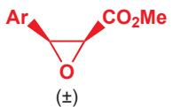

  
顺式和 反式两种非对映异构体很容易分离

  
但反式环氧中的这种对映异构体不易分离

当我们强调非对映异构体间的立体化学时，我们讨论的是相对立体化学 (relative stereochemistry, 也称相对构型 “relative configuration”)，即分子内多个手性中心的相对位置和联系；当我们强调对映异构体间的立体化学时，我们讨论的是绝对立体化学 (absolute stereochemistry, 绝对构型 “absolute configuration”)，即两个分子内所有手性中心都是同时反转的，但相对位置相同。

## - 对映异构体和非对映异构体

\- 对映异构体是互为镜像的一对立体异构体。一对对应异构体是相同的化合物，但它们有不同的绝对立体化学。

\- 非对映异构体是不互为镜像的立体异构体。一对非对映异构体是不同的化合物，它们有不同的相对立体化学。

\- 非对映异构体既可以是手性的(不含对称面)，也可以是非手性的(含对称面,这样的非对映异构体不能继续拆分为两个对映异构体).

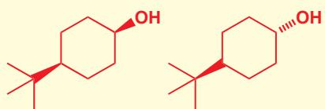  
非手性的一对非对映异构体

  
手性的一对非对映异构体

## 当立体中心有一个以上时 就会出现非对映异构体

让我们继续深入考察之前的环氧的四个立体异构体。您可能发现每个结构都包含两个立体中心。请回到 p.312 的底部，独立给每个立体中心标出 R 或 S 标签，请不要先参看下一页的答案。

您应该这样完成 R 和 S 的安排。

您必须要掌握 R 和 S 的标记方法。如果您遇到了问题或者标错了，请回顾 p.308 的内容并确保您知道原因。

反式环氧  
  
顺式环氧

## - 互为非对映体、对映体的分子间的关系

\- 如果一个分子是另一个分子的对映体，那么它们两个立体中心都是相反的。

\- 如果一个分子是另一个分子的非对映体，那么仅有其中一个立体中心相反。

如给考试里要求您阐释一些立体化学要点，请选择一个环状例子——最容易说清楚。

到目前为止，我们讨论的全部化合物都是环状的，因为环状化合物的非对映异构体比较容易考虑：立体中心上的两个取代基指向相同或相反的方向（纸面上或纸面下）就是一对非对映异构体（顺式或反式）。但链状化合物同样也可以以非对映异构体的形式存在。下面的麻黄碱和伪麻黄碱都属于安非他命类兴奋剂，它们都起到模拟肾上腺素功能的作用。

  
麻黄碱

  
伪麻黄碱

麻黄碱和伪麻黄碱是不互为镜像的立体异构体——麻黄碱中的其中一个立体中心翻转得到伪麻黄碱——因此它们互为非对映异构体。从立体中心的角度看分子十分有必要，这种含有两个立体中心的化合物可以以两个非对映异构体存在；而排列组合告诉我们，任何含有一个以上立体中心的化合物都可以以一个以上的非对映异构体存在。

麻黄碱和伪麻黄碱都是植物生产的光学纯产物，因此不同于前文抗哮喘药物的中间体，我们讨论的是非对映体中的一种中的对映体中的一种。肾上腺素同样是手性的，但由于它仅含一个立体中心，在自然界中它只能以对映体中的一种存在，而不能以其他的“非对映异构体”存在。

  
(1R,2S)-(-)-麻黄碱

  
(1S,2S)-(+)-伪麻黄碱

## 麻黄碱和伪麻黄碱

麻黄碱是中草药“麻黄”的提取物，它还被用做减充血的鼻喷剂(治疗鼻黏膜充血).伪麻黄碱是减充血药速达菲(Sudafed)的有效成分。

这两种非对映体的“天然”对映体分别是 $(-)$ -麻黄碱和 $(+)$ -伪麻黄碱，但您并不能从其中获得有关结构的任何消息，但如果告诉您分别是 $(1R,2S)-(-)$ -麻黄碱和 $(1S,2S)-(+)-$ 伪麻黄碱，您就可以

推断出相应的结构了。

下面是 $(1R,2S)-(-)$ -麻黄碱， $(1S,2S)-(+)-$ 伪麻黄碱，以及它们的“非天然”对映体（需要在实验室中合成得到）， $(1S,2R)-(+)-$ 麻黄碱和 $(1R,2R)-(-)$ -伪麻黄碱的一些性质。

<table><tr><td></td><td>(1R,2S)-(-)-麻黄碱</td><td>(1S,2R)-(+)-麻黄碱</td><td>(1S,2S)-(+)-伪麻黄碱</td><td>(1R,2R)-(-)-伪麻黄碱</td></tr><tr><td>mp</td><td>40–40.5 °C</td><td>40–40.5 °C</td><td>117–118 °C</td><td>117–118 °C</td></tr><tr><td> $[\alpha]_{D}^{20}$ </td><td>-6.3</td><td>+6.3</td><td>+52</td><td>-52</td></tr></table>

■ 回忆一下，(+) 和 (-) 反映的是特征的旋光性的信息，而 R 和 S 由观察化合物的结构直接得到。两种对映体间两个信息均相反，但它们之间没有简单的联系。

\- 两种非对映异构体是不同的化合物，有不同的名称和不同的性质；而一对对映异构体具有相同的性质，仅仅在旋光方向上相反。

我们可以通过考虑您与他人的握手，来说明同一化合物中含有两个手性中心的情况。显然，只有双方使用同一侧的手时，握手的过程才是成功的！按照习惯，您通常使用右手；当然，用左手握同样是可能的；这两种握手的总体模式是相同的：右手与右手握手，左手与左手握手，这二者是一对对映体，区别仅仅在于它们互为镜像。然而，如果您不小心使用右手握了别人的左手，这时握着的手包含一只左手和一只右手；这时并不是握手，而是牵手。两种牵手的过程和两种握手的过程的互动效果是截然不同的，我们可以说它们是非对映异构体。我们用可能是 R 或 S 构型的两个手性中心代表我们的两只手。

那么有两个以上立体中心的化合物呢？糖家族提供了很多例子。核糖是一种含有三个立体中心的五碳糖，下图所示的是核糖的一种对映体，在任何生命体的新陈代谢中都是必须的，习惯称之 D-核糖。D-核糖 的三个立体中心全部为 R 构型。为了方便起见，我们考虑开链形式的核糖，但它们通常以第二张图所示的环状形式存在。

在理论上，我们只需知道有几个立体中心，就可以通过 Rs 和 Ss 的排列组合，知道该分子有多少个“立体异构体”，本情境中为 $8 (= 2^{3})$ .

RRR RRS RSR RSS
SSS SSR SRS SRR

但这种算法模糊了非对映异构体和对应异构体间的区别。观察这八种情况，同一列的两个构型是一对对映体（全部三个中心都翻转），而四列之间则是非对映异构体。三个立体中心实际是产生了四种非对映异构体，每种非对映异构体包含一对对映体。在这个 $C_5$ 醛糖的例子中，每个非对映异构体都是一种不同的糖（有不同的名字）。下面的图表绘制了上面八种情况的结构，上方的是(D)构型的，而下方的是(L)的。

■ 您不需要记住这些糖的名字。

## 糖类的结构

糖类的实验式为 $C_{n}H_{2n}O_{n}$ ，由碳链构成，其中一个碳是羰基的一部分，其他碳连有 OH 基团。如果羰基在碳链的末端（换句话说，是一个醛），我们叫它醛糖 (aldose)；如果羰基不在碳链末端，我们叫它酮糖 (ketose). 我们将会在 Chapter 42 中详细讨论。碳原子的总数 n 为 3-8: 醛糖含有 n-2 个立体中心，酮糖含有 n-3 个立体中心。事实上，大多数糖是以开链形式和环状形式的平衡混合物存在的 (Chapter 6).

这是一种过于简单化的算法，它默认了所有的非对映异构体均有手性，对于对称的分子无效，因此在使用时需要谨慎。

您可能已经发现，一个结构的立体中心的数目和立体异构体的数目之间，存在一个简单的数学关系式。通常情况下，一个包含 n 个立体中心的结构有 $2^{n}$ 个立体异构体 (包括它本身). 这些立体异构体包含 $2^{n-1}$ 个非对映异构体，每个非对映异构体包含一对对映体。

## 费歇尔投影式

糖类的立体化学常常通过费歇尔投影式（Fischer projections）表示。首先竖直的直线表示碳原子，然后整个分子随之扭曲，使得取代基都朝向纸面前方，即朝向我们的方向。费歇尔投影式和真正的分子差异十分大，因此您可能永远不需要使用它们。但您仍会在一些旧书中遇到它们，因此您至少需要掌握如何识别它们。您只需要记住，连在中间主干上的所有分支，实质上都是粗楔形键（朝向纸面前方），而中间主干处于纸平面上。通过想象将主干扭曲成锯齿状，您就会得到熟悉的糖分子。

## 非“通常情况下”——含多个立体中心的非手性化合物

有时，分子的对称性会导致一些立体异构体的简并，或者说“抵消”——立体异构体的数目并没有您期待的那么多。以酒石酸为例，这种酒石酸的立体异构体存在于葡萄中；它的盐，酒石酸氢钾，可以在葡萄酒的底部析出形成晶体。它有两个立体中心，因此您会期待它有 $2^{2} = 4$ 个立体异构体：两个非对映异构体，每个含有一对对映体。

Interactive stereoisomers of tartaric acid

左边的一对结构显然就是一对对映体，但当您仔细看右边的一对结构时，您会发现它们其实是一模一样的结构，而不是对映体。您只需要将上方的结构在纸平面上旋转 $180^{\circ}$ 即可证明这一点。

(1R,2S)-酒石酸和(1S,2R)-酒石酸不是一对对映体，而是完全相同的。这是因为虽然它们具有手性中心，但它们是非手性的。将(1R,2S)-酒石酸的一侧绕中心的键旋转 $180^{\circ}$ 后，您会发现该分子具有一个对称面，因此它必定是非手性的。由于分子含有一个对称面，而且 $R$ 是 $S$ 的镜像，因此构型为 $R,S$ 非对映异构体不能是手性的。

Interactive display of meso form of tartaric acid

这两个结构是同一分子的两种不同构象—只需要绕着中心键旋转整个分子的一半就可以由其中一种得到另外一种。

\- 含有手性中心，但是非手性的化合物被称为内消旋化合物 (meso compounds). 这表示该分子中含有一个对称面，两个手性中心分布在对称面两侧并分别具有 $R$ 和 $S$ 的立体化学。

因此酒石酸可以以两个非对映异构体存在，其中一个包含两对对映体，另一个是非手性的（内消旋化合物）。值得注意的是，“含有 n 个立体中心的化合物含有 $2^{n-1}$ 个非对映异构体”的公式仍然成立，仅是“含有 $2^{n}$ 个‘立体异构体’”的公式不成立了。一般来说，相比于直接计算“立体异构体”的数目；更安全的方法是先计算非对映异构体，再人工判断哪个非对映异构体有手性，即具有一对对映体。

## 内消旋的握手

我们也可以将握手与非对映体间的类比也推广到内消旋化合物。想象一对双胞胎兄弟握手，我们可以区分它们分别都握左手，或都握右手时的情形，因为这二者是一对对映体。但当他们牵手的时候(一人的左手握另一人的右手)，我们就无法区分是左手拉右手还是右手拉左手了，因为兄弟二人本身就无法区分——这就是内消旋的牵手！

<table><tr><td rowspan="2"></td><td colspan="2">手性的非对映体</td><td>非手性的非对映体</td></tr><tr><td>(+)-酒石酸</td><td>(-)-酒石酸</td><td>内消旋-酒石酸</td></tr><tr><td> $[\alpha]_{D}^{20}$ </td><td>+12</td><td>-12</td><td>0</td></tr><tr><td>熔点</td><td>168–170 °C</td><td>168–170 °C</td><td>146–148 °C</td></tr></table>

## 肌醇的内消旋非对映体

注意到，内消旋的非对映体在其分子整体上具有一定程度的对称性。肌醇有六个立体中心，其中一种非对映体是一种重要的生长因子。或许考察它有多少个立体异构体是有挑战性的一一事实上除了一种非对映体外，其余的都是内消旋的。

  
2,3,4-戊三醇

■ syn (顺式) 和 anti (反式): 它们反映取代基在碳链、碳环的同侧 (顺式) 或异侧 (反式). 它们只能用于参考图表。

## 化合物立体化学的研究方法

当您想讨论一个化合物的立体化学时，我们建议您先识别非对映异构体，然后再逐一考察它们是否有手性。请不要直接计算“立体异构体”的数目——一直截了当地认为一个含有两个立体中心的化合物就是含有四个“立体异构体”。分清主次是根本要求，就像是当您说两个人要结婚了的时候，不要说“四只手结婚了”一样。

让我们通过一个简单的例子，直线型的2,3,4-三羟基戊烷或2,3,4-戊三醇来巩固研究一个化合物立体化学的基本方法。下面是您需要做的事：

1. 在纸上画出化合物的结构，其中碳链表示为锯齿形，如图 1.

2. 识别全部手性中心，如图2.

3. 判断非对映异构体的数目。每对手性中心上的两个取代基可以在同侧 (syn) 或是在异侧 (anti)，写出每个非对映异构体的构型类型会对您有所帮助。本例有三个非对映异构体：三个 OH 基团可以都在同侧，也可以是两侧的 OHs 与中间的在异侧，还可以是一侧的与其余的在异侧。我们称第一种为 syn, syn，因为两对手性中心 (1 & 2, 和 2 & 3) 都将各自的两个 OHs 排列在同一侧 (顺式).

4. 通过检查是否存在对称面，确定非对映异构体是否有手性。本例中，只有穿过中心的平面可能成为对称面。

5. 画出手性的非对映异构体的对映体，即将其全部立体中心上的构型翻转。纸平面就是为我们准备的镜面，做分子关于纸平面的镜像，得到的就是对映体，全部“朝上”的基团都“朝下”，反之亦然。

6. 得出最终结论。最普通的表述是，本例中有四个“立体异构体”。更有价值的表述是，本例中有三个非对映异构体，即 syn, syn, syn, anti, 和 anti, anti；其中 syn, syn 和 anti, anti 是非手性的（内消旋），而 syn, anti 是手性的，并包含两个对映体。

## 费斯特酸 (Feist's acid) 的奥秘

现在的我们无法理解在光谱法诞生之前求解结构的困难性。一个著名的例子是“费斯特酸”，1893年由费斯特（Feist）通过一个看似简单的反应合成并发现。不包含光谱法的早期研究指向两种可能的结构，这二者都是建立在一个三元环的基础上的。三元环的出现给了这个化合物很多名声，因为不饱和的三元环是十分稀少的。最受人喜爱的是第一种环丙烯式结构。

对于该物质结构的争论即使到 1950 年代第一台 NMR 光谱仪出现时仍在继续。虽然红外观察支持了环丙烯式的结构，但原始的 40 MHz 仪器显示，该分子没有甲基，并且双键连有两个质子。这一研究佐证了第二种环外亚甲基式的结构。

这一结构含有两个手性中心，那么会有多少非对映异构体呢？答案很简单：由于费斯特酸是手性的，因此(环上的两个羧基)必然是反式构型(顺式构型有一个对称面)，因此它以一对对映体的形式存在。另外，虽然费斯特酸没有对称面，但它有对称轴，学完后面您会知道，对称轴和手性是可以共存的。

现代的 NMR 光谱的方法大大简化了推断流程。氢谱：仅有两个 $CO_{2}H$ 上的两个质子会与溶剂 DMSO 中的交换；而双键上的两个质子等价 (5.60 ppm)，环上两个羧基上的质子也等价，与预期的强场相符 (2.67 ppm). 碳谱共四个：一个 C=O 碳的信号在 170 ppm 处，双键两侧碳的信号介于 100 和 150 ppm 之间，环上另两个等价碳的信号在 25.45 ppm 处。

## 没有立体中心的手性化合物

有一少部分手性化合物并没有立体中心。例如右侧展示的丙二烯，它没有手性中心，但它不能与其镜像完全重叠，因此它也是手性的：这种化合物存在两种对映体。一些联芳类化合物（biaryl compounds）也与之相似，例如下面所示的双膦(bisphosphine)结构，被称为BINAP，由于围绕绿色的联芳键的旋转受到阻碍，因此也以两个独立的对映体存在。所谓的阻碍在于，如果您沿着这根键向下看这个分子，您会看到两个环所在的平面实际上是互相正交的，整个分子与丙二烯一样处于 $90^{\circ}$ 扭曲的状态。像这样的，由于单键的旋转受阻导致的手性/对映体，我们称之为阻转异构体(atropisomers,来自希腊语“不会旋转”)。

Interactive possible structures for Feist's acid

  
Interactive chiral compounds without stereogenic centres—allene

我们会在 Chapter 41 中继续了解 BINAP.

Interactive chiral compounds without stereogenic centres—BINAP

Interactive chiral compounds without stereogenic centres—spiro amide

绕此轴旋转 $180^{\circ}$ 可复原：它有 $C_2$ 对称性

  
(R)-BINAP

Interactive BINAP showing $C_{2}$ axis of symmetry

下标 2 代表“二重”对称轴。化学中也包含其他重数的对称轴，但在一般的有机物中它们却十分稀少。

Interactive epoxide

diastereoisomers showing plane of symmetry

■ 我们之前曾提醒过您，这种表述是不完整的(pp. 304 和 312): 现在我们将要完善它。

以上两个例子都依赖于 $\pi$ 体系的刚性，如下简单的不饱和体系也同样是手性的。由于中心碳原子是四面体构型，因此两个环必须是正交的。由此，虽然分子中没有立体中心，但分子中也同样没有对称面。像这种，包含两个环通过单个 C 原子连接起来的化合物称为螺环化合物（spiro compounds）。对于螺环化合物，虽然您一眼看过去它们都很对称，但它们常常是手性的；当您想研究它们的立体化学时，请从对称面出发仔细考察。

## 对称轴与对称中心

您可能会纳闷为什么刚刚这三个化合物 (l连同 p. 319 文字框中的费斯特酸) 是手性的，因为它们看上去是如此的 “有对称性”。事实上，它们含有的唯一对称元素是对称轴，而对称轴恰恰是唯一的不对分子的手性产生影响的对称元素。如果一个分子可以绕一轴旋转 $180^{\circ}$ 后能复原回原分子。那么称它有二次对称性 (twofold axial symmetry)，或 $C_{2}$ 对称性。只要不含对称面或对称中心，那么无论化合物有没有对称轴，它都是手性的。

除去上节举的例子外， $C_{2}$ 对称性在日常分子中也是很普遍的。下面是一个拥有两种对映异构体的化合物的例子。一种 (我们称其为 syn 非对映体——由于两个苯环在同一侧) 包含对称面

——因此它是非手性的(尽管整个分子非手性，但它含有手性中心，我们可以叫它内消旋非对映体)；另一分子仅有对称轴作为对称元素，因此它是手性的。橘色展示了其 $C_{2}$ 对称轴，绕此轴旋转 $180^{\circ}$ 可以得到相同的结构。但关于一个镜面做它的镜像则不能与之重合。

到目前为止，我们一直在使用对称面作为衡量一个分子是否具有手性的特征：我们已经说过多次，如果一个分子没有对称面，那么它就具有手性。但现在我将向您介绍另一个与分子手性不兼容的对称元素类型。如果一个分子含有对称中心，那么它也是非手性的。现在我们将解释如何注意到分子的对称中心。

右侧的二酰胺骨架具有两个对称面，一个是纸平面，另一个是与纸平面垂直的，穿过两个饱和碳原子的平面(图中绿色标出的)。如果我们在这个结构中加入两个R取代基，我们可以得到两个非对映异构体，R基分别在环平面的同侧(syn)或异侧(anti).虽然纸平面不再是一个对称面，但由于原先的另一对称面在此时仍然将两个取代基平分，因此它仍然是非手性的。到目前为止还没有新知识。

  
都含有对称面：都是非手性的

现在，请考虑右侧的一个二酰胺。这次纸平面仍然是一个对称面，但垂直的另一对称面却不存在了。这种杂环被称为“二酮哌嗪”，它可以由一种氨基酸二聚得到：右侧的二酮哌嗪是由甘氨酸二聚得到的。对于有取代的氨基酸，例如 $R \neq H$ 时下图所示的情况，又会产生两种非对映异构体，syn 和 anti. 这二者的对称性是不同的，其中 syn 异构体是手性的，而 anti 异构体是非手性的。

对于手性的 syn 非对映体，它不含任何对称面，但您可以找到一个穿过环中央的 $C_{2}$ 对称轴。当然，对称轴是与手性相兼容的。在这个化合物中，两个手性中心都是 S 构型，而它的对映体则都是 R 构型。

Interactive diamides showing centre of symmetry

非手性的 anti 非对映体，既不含对称面，也不含对称轴，但它含一个对称中心(下一页图中黑点标出的).这意味着，当从该中心出发，沿一个方向能遇到一个事物，例如一个 R 基团时；仍从该中心出发，沿相反的方向也同样能得到相同的事物（绿色箭头）.同样的道理也适用于棕色箭头，还使用与环本身。在 syn 异构体中不存在这种对称中心，因为这里的绿色、棕色箭头，在该分子中均连接的是一侧的 R 和另一侧的 H.因为对称中心的存在，anti 异构体能与其镜像完全重叠，并因此是非手性的。

\- 从对称面、对称中心、对称轴的角度看手性

\- 任何含有对称面或对称中心的分子是非手性的。

\- 如果不含对称面或对称中心，含有对称轴的分子仍是手性的。对称轴是唯一与手性相兼容的对称元素。

## 对映体拆分

本章的早期内容谈到过，自然界产生的分子大多是手性的，而且自然界通常仅生产单一对映体。我们已经讨论过氨基酸、糖类、麻黄碱、伪麻黄碱和酒石酸——自然资源经过分离得到的这些化合物均为单一对映体。而另一方面，在实验室中使用非手性原料合成的手性化合物，注定是外消旋混合物。那么如果不从自然资源中提取，化学家是如何分离得到单一对映体的化合物的呢？我们将在 Chapter 41 更详细地讨论这一话题，而现在我们将以一种简单的方式考察：使用自然界中的光学纯化合物，帮助我们分离自己的外消旋混合物。这一过程称为拆分。现在，请您想象一下在普通的酸催化酯化机理下 (Chapter 10)，手性但外消旋的醇和羧酸，生成酯的过程。

产物有两个手性中心，因此我们预计它会产生两种非对映异构体，每种非对映异构体都是各自的一对对映体的外消旋混合物。而非对映异构体间有不同的物理性质，可以使用例如色谱法等手段分离。

然后我们可以进行逆酯化过程，水解这两种非对映异构体中的任意一个，则可以重新得到外消旋的醇和外消旋的酸。

■ 回忆：(±)代表以外消旋混合物存在：于是我们可以舍弃绝对立体化学，仅展示相对立体化学。

如果我们用光学纯的羧酸重复这一反应，例如用您在 p. 310 看到的杏仁提取物，(R)-苦杏仁酸。产物同样是两种非对映体，但与之前不同的是，这两种非对映体都是光学纯的。注意下图中最右侧的产物结构，它的立体化学是绝对立体化学。

现在，如果我们将每种非对映体分离后分别水解，那么我们就完成了一件非凡的事情：我们将起始的外消旋醇，分离为了两种单一的对映体。

一对对映体的分离被称为拆分 (resolution). 拆分过程需要利用一种已经达到光学纯的化合物 (旋光性拆分剂 optically active resolving agent): 大自然给我们提供了这样的便利; 拆分过程几乎总是在使用从自然界中分离的化合物。

## 大自然的手性

为什么大自然对于那些重要的生化物质的使用，仅钟情于一种对映体。当您了解了不对称性是如何第一次进入分子世界的，或者了解了L-氨基酸和D-糖相比其另一对映体更具的优势是什么时，这个问题可能变得简单。例如，如果有大量非对映异构体的存在，外消旋的氨基酸样品可能会产生十分复杂的蛋白质。有关起源问题，有人认为生命产生于单手性的石英晶体的表面，它为生命体所需的光学纯分子提供了不对称的环境；又有人认为这种不对称性最初起源于伽马射线释放的电子的自旋不对称性；还有人考虑到，光学纯的生命系统比外消旋的更加简单，也许是偶然的机会让L-氨基酸和D-糖胜出了。

现在让我们考察一个真实的例子。研究氨基酸在脑功能中的作用的化学家，需要分离右侧的氨基酸的两种非对映体。通过您在 Chapter 11 学过的 Strecker 合成法，可以得到外消旋混合物。然后他们用乙酸酐处理，得到混合酸酐，再用从自然界中获取的光学纯的薄荷醇钠，得到两个非对映的酯。

在这两种非对映体中，其中一种比另一种更易结晶（即有更高的熔点），化学家可以通过逐渐结晶它们的混合物，得到前者；然后蒸发剩余的溶液（“母液”），进而得到后者。

两种对映体得以分离

注意，一对纯的非对映体的旋光度并不是相同或相反的。与对映体不同，非对映体间是不同的化合物，它们没有理由在旋光上具有相似性。

然后将两种非对映酯分别溶于 KOH 溶液煮沸，使之水解。两个体系分别得到了两种对映体，从其产物（几乎）相反的旋光度和相似的熔点可以证明这一结论。最后，对酰胺进行更剧烈的水解（用 20% 的 NaOH 煮沸 40 小时），可以得到生物研究中需要的氨基酸（见 p. 322 底部）。

## 通过非对映盐拆分

对映体拆分的关键点是我们必须将两个立体中心联系起来：可分离的非对映异构体是由不可分离的对映体产出的。在上两个例子中，两个立体中心被联系到了一个共价化合物中，即酯中。而离子化合物也可以很好地完成这项工作——事实上，如果使用离子化合物，还有拆分后便于回收的优点。

一个重要的例子是萘普生对映体的拆分。萘普生是非甾体抗炎药（NSAIDs，2-芳基丙酸）中的一员。由博姿公司(Boots)开发的布洛芬(商品名为诺洛芬Nurofen)的止痛药也属于这一类。

萘普生和布洛芬都是手性的，它们也都是仅有 (S) 对映体有止痛，或抗炎作用。布洛芬在人体内会外消旋化 racemize (见 Chapter 20)，因此分离它的对映体没有什么意义。但萘普生的对映体则会在发售前被美国制药公司 Syntex 所拆分。

由于萘普生是一个羧酸，因此他们选择使用一种光学纯的胺产出羧酸盐，他们发现最有效的试剂是葡萄糖衍生物。羧酸与胺的反应产生了 $(S)$ -萘普生铵盐和 $(R)$ -萘普生铵盐，后者更易溶解，因此在逐渐结晶时留在了溶液中。将晶体滤出，用碱洗涤后可重新得到胺（回收再利用），并得到想要的 $(S)$ -萘普生的钠盐。这次拆分过程所用的胺类是不寻常的，因为我们通常使用简单的胺类；但为了找到合适的拆分试剂，化学家需要经过多次尝试。

## 手性药物

您可能会纳闷，对映体总是有相同的性质，而萘普生却需要在上架前拆分对映体。虽然萘普生的两个对映体确实在实验室中具有相同的性质，但当它们进入一个生命系统后，它们就会与生命系统中原有的其他手性分子(光学纯的)相互作用，于是就自然产生了区别。比方说一对手套，它们有相同的重量，用相同的材料制成，也有相同的颜色——在这些方面它们是相同的；但如果试图将它们戴在一只手上(外在的手性环境)，却只有其中一只手套是合适的。

药物与受体的结合十分接近手套与手的结合这一类比。药物受体，几乎都是由纯 L-氨基酸形成的光学纯的蛋白质。因此药物的一种对映体往往比另一种对映体与之相互作用的效果好得多，或者干脆以完全不同的方式相互作用，因此手性药物的两种对映体在药理效果上往往完全不同。对于萘普生来说，(S)-对映体要比(R)-对映体高效28倍。另一方面，布洛芬仍然以外消旋体(racemate)的形式出售，因为这种化合物在血循环中会外消旋化。

有时候，一种药物的两种对映体可能具有完全不同的治疗性质。例如止痛药 Darvon，它的对映体 Novrad 却是一种止咳药。注意高于它们结构之上的对映体关系！在 Chapter 41 中，我们会详细讨论两种对映体具有完全不同生物效果的情况。

## 通过基于手性原料的色谱法拆分

二氧化硅, $SiO_{2}$ , 是硅原子和氧原子组成的大分子体系。它的表面分布着游离OH基团，可以与手性衍生物试剂相结合。

对映体的拆分还可利用比离子键更弱的相互作用进行。色谱 (也称层析，chromatographic) 分离依赖于物质与固定相 (stationary phase，通常是二氧化硅) 和物质与流动相 (mobile phase，流过固定相的溶剂，被称为洗脱液 eluent) 之间亲和性的差异，此亲和性是由氢键或范德华相互作用产生的。当固定相与光学纯化合物 (通常是氨基酸的衍生物) 结合后，它便会具有手性，这时就可以用色谱法分离对映体了。

当待拆分的化合物没有合适于制取经典拆分衍生物（酯或盐）所需的官能团时，手性固定相的色谱法就显得尤为重要。例如，一种镇静剂安定（地西泮）的类似物有两种对映体，它们具有完全不同的生物活性，因此必须被拆分。

一种安定的类似物

3. (S)-对映体与手性的固定性亲和性好，因此它移动的更慢

要进一步研究这些化合物的性质，则必须获得光学纯的两种对映体。将外消旋混合物的溶液加载到与手性的氨基酸衍生物成键后的二氧化硅(固定相)色谱柱(column)上，然后使用洗脱剂洗涤；这时，由于 $(R)$ -(-)-对映体对固定相的亲和性很差，因此率先被从色谱柱上洗脱(elute)下来，而 $(S)$ -(+)-对映体则最后才被洗脱下来。

一个分子的两种对映体或许是相同的化合物，但它们仍在有限的情境下表现出差异。比如它们与生物体系的作用方式是不同的；比如它们与另一光学纯的（单一对映体的）化合物反应时，会得到性质差距较大的两种盐或化合物。实质上，互为对映体的两种化合物在手性环境中表现得不同，在非手性环境中表现得相同。在 Chapter 41 中我们会了解利用这一事实制取单一对映体的情形，而接下来，我们将开始讨论立体化学在其中扮演决定性作用的三类反应：取代反应，消除反应和加成反应。

您可以这样考虑手性色谱法。考虑下列情形，您要帮助一位在战争中失去左腿的退休朋友找鞋(仅需右鞋)。此时，一爿本地鞋店愿意捐给您他们多余的鞋，其中既有左鞋又有右鞋，都适合他的尺码(同时也适合您的)。您需要挑出右鞋，但这时候突然停电了，您要怎么挑呢？您会依次用右脚去试每双鞋，如果它合适(和流动相亲和性更好)，那么您会把它拿走，如果不合适，则还会放回原处(和固定相亲和性更好)。

固定相就像很多只伸出来的“右脚”（用于吸附的光学纯手性分子），外消旋混合物就是各种“鞋”，“右鞋”会和固定相紧密地结合，而“左鞋”则一经洗涤就流到色谱柱的下端去了。

## 延伸阅读

关于立体化学的书很多。最详尽的大概是：E. L. Eliel and S. H. Wilen, Stereochemistry of Organic Compounds, Wiley Interscience, Chichester, 1994. 在此阶段，详尽的内容可能不适合您。牛津初级读本 Organic Stereochemistry, M. J. T. Robinson, OUP, Oxford, 2001 中有更加易懂的介绍。

Feist 酸正确结构的首次发表：M. G. Ettinger, J. Am. Chem. Soc., 1952, 74, 5805 还有一篇很有趣的补充文章，给出了其 NMR 光谱：W. E. von Doering and H. D. Roth, Tetrahedron, 1970, 26, 2825.

## 检查您的理解

## 15

## 饱和碳上的亲核取代

## 联系

## 基础

\- 在羰基上的亲核进攻 ch6 & ch9

\- 羰基上的取代反应 ch10

\- 羰基氧原子的取代反应 ch11

\- 反应机理 ch12

• $^{1}$ H NMR ch13

\- 立体化学 ch14

## 目标

\- 在饱和碳原子上的亲核进攻，导致取代反应

\- 饱和碳原子上的取代反应与 $C = 0$ 上的取代反应的不同

\- 亲核取代反应的两种机理

\- 取代反应的中间体和过渡态

\- 取代反应如何影响立体化学

\- 什么样的亲核试剂可以取代，什么样的离去基团可以被取代

\- 可以通过取代反应制取的分子，和它们可以由什么制取

## → 展望

\- 消除反应 ch17

\- 芳香化合物作为亲核试剂的取代反应 ch21

\- 烯醇盐作为亲核试剂的取代反应 ch25

\- 逆合成分析 ch28

\- 参与、重排和碎片化反应 ch36

Chapter 10...

本章...

## 亲核取代的机理

取代反应是一个基团被另一个基团取代的过程。您在 Chapter 10 中遇到过如左图所示的反应，反应中 Cl 被 $NH_{2}$ 基团所取代，因此它是一个取代反应。当时您还学过，我们管反应中的氨 $\left(\mathrm{NH}_{3}\right)$ 叫做亲核试剂 (nucleophile)，管氯离子叫做离去基团 (leaving group). 在 Chapter 10 中，亲核取代通常发生在羰基的三角型 $\left(\mathrm{sp}^{2}\right)$ 碳上。

而在本章中，我们将要了解的是左图的第二种反应。这同样是取代反应，因为 Cl 被 PhS 基团取代。不同的是，这个反应发生在 $CH_{2}$ 基的四面体型 $(sp^{3})$ ，或者说饱和的碳原子上。从表面上看，这两个反应好像是相同的，但它们在机理上有相当大的区别；它们对好的试剂的要求也是不同的——这也是为什么我们将亲核试剂从 $NH_{3}$ 换成了 PhS：氨在第二个反应中生成 $PhCH_{2}NH_{2}$ 的过程不会有好的产率。

让我们来看一看为什么这两个取代反应的机理必须是不同的。下面是第一个反应的机理。

羰基上的亲核取代机理

在第一步中，亲核试剂进攻 $\mathrm{C = O}$ $\pi$ 键。十分明显，这一步在饱和碳原子上不可能发生。电子无法加入 $\pi$ 键，因为 $\mathrm{CH}_2$ 基已经饱和了；事实上，亲核试剂根本无法在离去基团离去之前先加上去(就像羰基的反应一样)，因为这样会得到一个不可能的五键碳原子。

Interactive mechanism for amide formation

相反，另两种新的机理是可能的。其一是离去基团先自己离去，然后亲核试剂再加成到原来的位置上；其二是加成和离去两步在同时发生。我们常称第一种可能性为 $S_{N}1$ 机理，第二种为 $S_{N}2$ 机理，第二种机理展示了中性分子如何在接受电子的同时失去另一对电子。您接下来会发现，对于这个分子，苄基氯，这两种机理都是可行的。

Interactive mechanisms for $S_{N}1$ and $S_{N}2$

## 为什么了解这两种取代机理很重要？

如果我们知道一个化合物以哪种机理反应，我们就会知道用哪种条件可以得到高产率。例如，醇中的 OH 被 Br 取代的反应是一个十分常见的亲核取代反应；而您会发现，取决于醇的结构，叔丁醇与伯醇使用了两种完全不同的反应条件。叔醇与 HBr 迅速反应得到叔丁基溴；而另一方面，伯醇与 HBr 仅缓慢地反应，常常通过 $PBr_{3}$ 使其转化为溴代烃。原因在于，前者是 $S_{N}1$ 反应的例子，而后者是 $S_{N}2$ 反应的例子：在本章的结尾，您会对如何预测机理，和选择合适的反应条件有一个清晰的描绘。

叔丁醇的取代反应

## $S_{N}1$ 和 $S_{N}2$ 机理的动力学证据

在我们继续深入前，我们要更详细地看看这两种反应，因为它们允许我们解释和预测取代反应的很多方面。动力学证据让化学家确信，饱和碳原子的亲核取代有两种不同的机理：反应速率，例如右边氢氧根取代溴离子的反应速率。

这一理论主要由 Hughes 和 Ingold 在 1930s 发现：有些亲核取代反应是一级反应(即速率仅取决

则是二级反应

(速率与 [R-Br] 和 $\mathrm{[OH^{-}]}$ 均有关系)

Edward David Hughes (1906–63) 和英果尔德 (Sir Christopher Ingold, 1893–1970) 在 1930s 年间在伦敦大学工作。他们首创了当今有机化学家认为理所当然的很多机理性想法。

在 Chapter 12 中有更多关于机理与反应速率之间关系的描述。方括号表示浓度，比例系数 k 被称为速率常数。

■ 请注意如何书写这个符号，S 和 N 均为大写字母，其中 N 是下标。

于卤代烃单分子的浓度，与亲核试剂的浓度无关)，还有一些是二级反应（速率与卤代烃、亲核试剂的浓度都有关系). 我们如何解释这一现象？p. 329 中我们称为“ $S_{\mathrm{N}}2$ ”的机理仅包含一步，下面是正丁基溴被氢氧根取代的一步 $S_{\mathrm{N}}2$ 机理。

由于仅有一步，那么它同时也是决速步 (rate-determining step). 整个反应的速率都取决于决速步的速率，动力学理论告诉我们，一个反应的速率与其反应物的浓度成比例：

$$
\mathrm{速率} = k [ \mathrm{n-BuBr} ] [ \mathrm {HO^ {-}} ]
$$

如果机理是正确的，那么反应速率将仅简单地与 $[n\text{-BuBr}]$ 和 $[\mathrm{HO}^{-}]$ 成线性比例关系。事实也是如此，Ingold测量了反应速率，并发现它们确实与这每种反应物的浓度都成正比一一换句话说，这个反应是二级反应。因此该反应是二级亲核取代反应(Substitution, Nucleophilic, 2nd order)，简写作 $S_{N}2.$ 速率方程如下所示， $k_{2}$ 为二级反应速率常数。

$$
\mathrm{速率} = k _ {2} [ \mathrm{n-BuBr} ] [ \mathrm{HO} ^ {-} ]
$$

## $S_{N}2$ 速率方程的意义

这个方程之所以有用，是在于两个地方。其一是，它验证了 $S_{N}2$ 机理；让我们用另一个例子来说明这一点：NaSMe（一个离子盐——亲核试剂是阴离子 $MeS^{-}$ ）与 MeI 生成 $Me_{2}S$ （二甲硫醚）的反应。

$$
\mathrm{MeS} ^ {\ominus} \xrightarrow {\quad} \mathrm{Me} - \mathrm{I} \quad \xrightarrow {\quad S _ {N} 2 \quad ?} \quad \mathrm{MeS} - \mathrm{Me} + \mathrm{I} ^ {\ominus}
$$

为了研究速率方程，我们首先要控制 NaSMe 的浓度恒定，并在一系列实验中改变 MeI 的浓度，观察速率的变化。另一组实验则是保持 MeI 浓度恒定，改变 MeSNa，观察速率的变化。如果反应确实是 $S_{N}2$ ，那么我们会在两种情况下都得到线性关系：第一张图展示了一组典型数据。

第一张图告诉我们，速率与 [MeI] 成正比，即 $\text{速率} = k_{\mathrm{a}}[\mathrm{MeI}]$ ；而第二张图告诉我们速率与 [MeSNa] 成正比，即 $\text{速率} = k_{\mathrm{b}}[\mathrm{MeSNa}]$ 。但为什么它们的斜率不同？仔细考察这两个速率方程您就会发现我们将每组实验中，控制恒定的那个反应物的浓度混入了速率常数中。正确的速率方程是：

如果 [MeSNa] 恒定，则方程变为 速率 = $k_{2}[MeSNa][MeI]$

$$
\text { 速率 } = k _ {\mathrm{a}} [ \mathrm{MeI} ], \text { 其中 } k _ {\mathrm{a}} = k _ {2} [ \mathrm{MeSNa} ]
$$

如果 [MeI] 恒定，则方程变为

$$
\text { 速率 } = k _ {\mathrm{b}} [ \mathrm{MeSNa} ], \text { 其中 } k _ {\mathrm{b}} = k _ {2} [ \mathrm{MeI} ]
$$

如果您仔细观察左图，就会发现两个变量分别恒定时简化得到的方程斜率不同，因为

$$
\text { 斜率 } 1 = k _ {\mathrm{a}} = k _ {2} [ \mathrm{MeSNa} ], \quad \text { 而斜率 } 2 = k _ {\mathrm{b}} = k _ {2} [ \mathrm{MeI} ]
$$

我们可以很容易地从这些结论中得到这真正的速率常数 $k_{2}$ ，因为我们知道第一个实验中控制的 [MeSNa] 的数值，和第二个实验中控制的 [MeI] 的数值。两个实验中得到的 $k_{2}$ 应当相等。这个反应的机理确实是 $S_{N}2$ : 亲核试剂 $MeS^{-}$ 进攻，伴随着离去基团 $I^{-}$ 的离去。

$S_{N}2$ 速率方程的第二个有用之处在于，它证实了， $S_{N}2$ 反应的效果同时取决于亲核试剂和碳亲电试剂。因此我们可以通过改变其中任何一个，来使反应进行得更好（加速反应，或增加产率）。例如，如果我想用氧亲核试剂取代 MeI 中的 I $^{-}$ ，那么我们会考虑下表中的任何一种。

$S_{N}2$ 反应的氧亲核试剂

<table><tr><td>氧亲核试剂</td><td>共轭酸的  $pK_a$ </td><td> $S_N2$  反应速率</td></tr><tr><td> $HO^-$ </td><td>15.7 ( $H_2O$ )</td><td>快</td></tr><tr><td> $RCO_2^-$ </td><td>大约 5( $RCO_2H$ )</td><td>适中</td></tr><tr><td> $H_2O$ </td><td>-1.7 ( $H_3O^+$ )</td><td>慢</td></tr><tr><td> $RSO_2O^-$ </td><td>0 ( $RSO_2OH$ )</td><td>慢</td></tr></table>

见 Chapter 8 对 $pK_{a}$ 值的讨论。

氢氧根有碱性，和好的亲核性是同一原因造成的(主要由于负离子状态不稳定，因此活泼). 碱性可以看作是对质子的亲核性，与对碳原子的亲核性必定是有一定联系的。因此如果我们想让反应加速，我们就应该用 NaOH，而不是例如 $Na_{2}SO_{4}$ 做亲核试剂。因为即使在相同浓度下， $HO^{-}$ 作为亲核试剂的速率常数 $k_{2}$ 也远大于 $SO_{4}^{-}$ 做亲核试剂的速率常数 $k_{2}$ .

但这不是我们唯一可做选择的地方。亲电碳的反应性和结构也对反应效果产生影响。如果我们想让在甲基上的取代速率更快，我们虽然不能改变碳链结构，但我们可以改变离去基团。下表展示了使用不同的甲基卤与 NaOH 反应的情况。使反应快速进行的最佳选择 $(k_{2}$ 的最大值）是 MeI 与 NaOH 得到甲醇。

您在 Chapter 10 中曾看到，亲核试剂对羰基的进攻与碱性的联系十分密切。但对饱和碳原子的进攻与碱性的关系与其不同，但我们可以知道，仍有一些联系。

$$
\mathrm{HO} ^ {\ominus} \xrightarrow {\text {   Me   -   I   }} \xrightarrow {\mathrm{S} _ {\mathrm{N}} 2} \quad \mathrm{HO-Me} + \mathrm{I} ^ {\ominus}
$$

$$
\mathrm{速率} = k _ {2} [ \mathrm{NaOH} ] [ \mathrm{Mel} ]
$$

■ 我们会在稍后更详细地讨论亲核性和离去基团的离去性。

$S_{N}2$ 反应的卤素离去基

<table><tr><td>MeX 中的卤素 X</td><td>共轭酸 HX 的  $pK_a$ </td><td>与 NaOH 的反应速率</td></tr><tr><td>F</td><td>+3</td><td>确实非常慢</td></tr><tr><td>Cl</td><td>-7</td><td>适中</td></tr><tr><td>Br</td><td>-9</td><td>快</td></tr><tr><td>I</td><td>-10</td><td>非常快</td></tr></table>

\- $S_{N}2$ 反应的速率取决于:

\- 亲核试剂

\- 碳骨架结构

\- 离去基团

当然，通常还有温度和溶剂因素。

## $S_{N}1$ 速率方程的意义

如果将正丁基溴换成叔丁基溴，那么我们可以得到如右图所示的取代反应。动力学结果表面，这个反应是一级反应：它的速率仅取决于 tert-BuBr 的浓度——而与所加入的氢氧根的浓度无关：速率方程为

$$
\mathrm{速率} = \mathrm{k} _ {1} [ t - \mathrm{BuBr} ]
$$

原因在于，这个反应分两步进行：第一步中溴离子离去，生成一个碳阳离子；然后氢氧根才去进攻，生成醇。

$S_{N}1$ 机理：t-BuBr 与氢氧根离子的反应

阶段 1: 碳阳离子的生成  

在 $S_{N}1$ 机理中，碳阳离子的生成是决速步。这很有道理：碳阳离子是不稳定的物种，因此由稳定的中性有机分子生成碳阳离子是很缓慢的；一旦碳阳离子生成，它就会立刻反应，不管亲核试剂是什么。因此，t-BuBr 消失的速率仅是缓慢的第一步的速率：亲核试剂氢氧根并没有参加这一步，因此也不含出现在速率方程中，更不会影响反应速率。如果这个观点对您来说不好理解，那么想象一下，一簇人群正在通过几个闸机（turnstiles）离开火车站或者球赛场，无论他们能走多快，能跑多快，或者之后坐的出租车能开多快，但仅有闸机开合的速度可以决定火车站或球赛场的散场速率。

再重复一遍，速率方程让我们方便地判断反应是 $S_{N}1$ 还是 $S_{N}2$ . 之前我们画了 $S_{N}2$ 机理速率随浓度变化的图，我们也可以画出 $S_{N}1$ 的变化图，如左侧所示。一张图是 [NaOH] 恒定时速率随 [t-BuBr] 的变化规律，另一张图是 [t-BuBr] 恒定时速率随 [NaOH] 的变化规律。

图一的斜率是简单的一级速率常数，因为 $\text{速率} = k_{1}[t-\text{BuBr}]$ ；但图二的斜率是零。这是由于决速步不含 NaOH，因此添加再多也不会加速反应。这个反应的表现是一级动力学的（速率仅与一种物质的浓度成正比），因此该机理被称作 $S_{N}1$ ，即一级亲核取代（Substitution, Nucleophilic, 1st order）。

这种观察十分有价值。亲核试剂并没有出现在速率方程中，这意味着它的浓度在反应速率上是无关紧要的——它的反应性同样无关紧要！如果我们为了完成这个反应而打开一瓶 NaOH，那我们完全是在浪费时间——用水就能办到同样的事。前面提到过的所有氧亲核试剂与 t-BuBr 反应的速率都是相同的（虽然与 MeI 反应的速率天差地别）。实际上， $S_{N}1$ 取代反应通常使用亲核性较弱的、无碱性的亲核试剂，这是最好的，目的是为了避免与消除反应的竞争，我们会在 Chapter 17 详细讨论。

\- $S_{N}1$ 反应的速率取决于：

\- 碳骨架结构

\- 离去基团

当然，通常还有温度和溶剂因素。

不取决于亲核试剂。

## 如何判断给定有机物会采取的机理 $(S_{N}1$ 或 $S_{N}2)$

综上所述，饱和 C 上的亲核取代反应会遵循两种机理中的一种反应，这两种机理对亲核试剂的性质的依赖程度完全不同。能够预测每个此类的反应所遵循的机理是十分重要的，与其通过动力学实验探究，我们可以给您一些关于哪类情况适用哪类机理的简单观点。影响反应采用哪种机理的因素

会帮我们解释为什么这种机理会被适用。

最重要的因素是碳骨架的结构。一个泛论是，能够形成相对稳定的碳阳离子的化合物倾向于采取 $S_{N}1$ 机理，而其他的化合物别无选择，不得不采取 $S_{N}2$ 机理。您马上就会看到，最稳定的碳阳离子通常是带正电的碳上所连取代基最多的一个，因此反应中心上的取代基越多，越容易采取 $S_{N}1$ 机理。

恰巧，使碳阳离子稳定的结构因素通常也会减缓 $S_{N}2$ 反应的速率。反应中心取代基多的化合物在 $S_{N}1$ 中表现很好，同时也在 $S_{N}2$ 反应中表现得很不好，这是因为亲核试剂必须通过拥挤的取代基抵达反应中心。 $S_{N}2$ 反应的底物最好在反应中心上仅有氢原子——甲基代物在 $S_{N}2$ 机理中反应迅速。最简单的结构变化产生的影响，可以总结为下表 (R 是一个简单的烷基，例如甲基、乙基).

## - $S_{N}1$ 还是 $S_{N}2?$

简单的结构和对 $S_{N}1$ 或 $S_{N}2$ 机理的选择  

唯一值得怀疑的是仲烷基取代物，因为这两种机理它们都可以采用，然而在每一种机理中反应都不是特别好。当您面对一个新的亲核取代反应时，您首先要问的问题是“亲电碳是甲基碳，伯碳，仲碳还是叔碳？”这会让您对那个反应的研究有一个好的开始，这也是为什么我们在 Chapter 2 中向您介绍这些重要的术语。

在本章的后面，我们将更详细地探讨这两种机理的差异，和倾向于按各自反应的结构，但一切内容都建立在上面的表格上。

## 细看 $S_{N}1$ 反应

在上面关于 $S_{N}1$ 反应的讨论中，我们提到，叔丁基溴通过先离去溴离子，得到一个合理的中间体，叔丁基碳阳离子。而我们现在需要解释碳阳离子如何存在，以及为什么叔丁基碳阳离子相比于例如正丁基碳阳离子等等其他的碳阳离子稳定很多。

在 Chapter 12 中，我们介绍了用反应能量变化图跟踪反应进程的思路，包括从反应物、产物、过渡态、中间体的能量相对关系。叔丁基溴与水发生 $S_{N}1$ 反应的反应能量变化图如下一页所示：

碳阳离子在图中被表示为一个中间体——一个寿命有限的物种，原因我们稍后讨论。因为我们知道，反应的第一步，即碳阳离子的生成是缓慢的，因此过渡态的能量很高。过渡态的能量，决定了反应速率，同时也与碳阳离子中间体的稳定性密切相关；正是由于这个原因，决定一个 $S_{N}1$ 反应效果的最重要因素，是可能作为中间体生成的碳阳离子的稳定性。

## 碳阳离子的形状和稳定性

我们在 Chapter 4 (p. 103) 讨论了甲基阳离子的平面型形状，而叔丁基阳离子也与其相似：中心碳原子是六电子构型的，来自三根 $\sigma$ 键，因此它还含有一个空的 $p$ 轨道。任何碳阳离子都表现为平面型中心碳，和其上的一个空 $p$ 轨道。用下列方式思考：只有填充了电子的轨道会对分子的能量产生影响，因此如果一个原子不得不有一个空轨道（碳阳离子通常有的），那么空轨道最好在能量上尽可能高，这样充满轨道的能量就随之变得最低了。 $p$ 轨道的能量高于 $s$ 轨道（也高于 $sp, sp^2$ , 和 $sp^3$ 杂化轨道），因此碳阳离子通常让一个 $p$ 轨道空置。

## 碳阳离子稳定性

叔丁基阳离子比其他碳阳离子稳定很多很多，但仍然不足以让您将它们存在一个瓶子里并摆在架子上！碳阳离子稳定与否的概念在理解 $S_{N}1$ 反应时很重要，但您要知道这些比较都是相对的：最稳定的碳阳离子也是活泼的缺电子物种。

叔丁基阳离子足够稳定，以至于可以被观察到。George Olah曾对此进行研究，并于1994年获诺贝尔化学奖。这个实验所面临的挑战是，碳阳离子是十分活泼的亲电试剂，解决这个问题，Olah的想法是使用没有亲核试剂的溶液。而任何阳离子都需要相对应的阴离子来平衡电荷，因此他使用了由卤素包裹住中心原子的阴离子，它们有负电荷，但很稳定，不会作为亲核试剂。例如 $\mathrm{BF}_4^-$ , $\mathrm{PF}_6^-$ 和 $\mathrm{SbF}_6^-$ 第一种是小体积的四面体型，后两者是大体积的八面体型。

在这些阴离子中，负电荷不等于一对孤电子(例如 $BH_{4}^{-}$ 中负电荷所表示的)，并且它们中也没有高能的充满轨道，可以作为亲核试剂。使用非亲核性溶剂，液态 $SO_{2}$ 在低温下观察，Olah 能够将醇转化为碳阳离子与这些负离子的盐。下面是叔丁醇与 $SbF_{5}$ ，HF 在液态 $SO_{2}$ 中的变化。酸使羟基质子

化，进而离去水分子；这时 $SbF_{5}$ 紧紧抓住氟离子，使其不能充当亲核试剂。碳阳离子现在孤立无援。

叔丁基阳离子的质子 NMR 表明，三个甲基只有一个在 4.15 ppm 处的信号，与 C–Me 基的低磁场相距很远。则远低于此信号。 $^{13}$ C 光谱也显示了在 47.5 ppm 处的低磁场 Me 信号，但证实阳离子形成的关键证据在于中心碳原子的位移达到了惊人的 320.6 ppm，比任何您之前见过的物种都低磁场。这个碳去屏蔽性很强——它带正电，极度缺电子。

从 Olah 的工作中，我们知道了叔丁基阳离子在 NMR 中的样子，那么我们可以通过 NMR 证实它是取代反应中的中间体吗？如果我们在 NMR 管中混合 t-BuBr 和 NaOH，并让它们在 NMR 仪中反应，我们不会观察到属于碳阳离子的信号。这没有证明任何问题。我们不能指望一个活泼的中间体以明显的浓度出现。原因很简单。如果碳阳离子不稳定，它就会迅速与周围的任何亲核试剂发生反应，溶液中则不会出现任何可观浓度的碳阳离子。碳阳离子生成的速率会比反应掉的速率慢很多。

## 烷基取代使碳阳离子稳定

Olah 发现，他可以测出叔丁基阳离子的光谱，但他一直无法在溶液中测出甲基阳离子。为什么中心碳上取代基的增多会使碳阳离子稳定呢？

任何带电荷的有机中间体都天生不稳定。碳阳离子也仅仅在有一些额外的稳定性的帮助下，才会生成。额外的稳定性可以来源于 $\sigma$ 键对空 p 轨道的给体作用 ( $\sigma$ -共轭, $\sigma$ -conjugation)，这种作用较微弱。在叔丁基阳离子中，这种作用同一时间存在三个：C-H 键指向上方还是下方并不产生影响；在任何时间，每个甲基中必定有一个 C-H 键平行于空 p 轨道的一个波瓣。第一张图使用轨道图表示了其中一个重叠，第二、三张用虚线表示了同时存在的三个重叠。

Interactive display of stability and structure of carbocations

C–H 键对空轨道的给体作用并没有什么特别的：G–C 键同样可以，其他一些键还会作用得更好(例如 C–Si)。但它们必定都属于一类——如果直接连氢原子，则既没有孤对电子，也没有 $\sigma$ 键可以稳定碳阳离子。

碳阳离子的平面型是非常重要的结构特征，如果叔碳阳离子不能形成平面型，那么它也不会形成。一个经典的例子是右侧的结构，它不能与亲核试剂通过 $S_{N}1$ 或 $S_{N}2$ 机理反应。它不能通过 $S_{N}1$ 反应是因为不能生成平面型的碳阳离子；不能通过 $S_{N}2$ 反应是因为亲核试剂不能从正确的方向接近碳原子。

一般来说，简单的叔碳取代会以 $S_{N}1$ 机理有效地发生。在有好的离去基团，例如卤素的情况下，取代反应可以在中性条件下进行；离去基团较差，例如反应物是醇类或是醚类的时候，则需要酸催化。下面给出了 $S_{N}1$ 反应可以很好地发生的几种不同情形。

## 相邻的 $\mathbf{C} = \mathbf{C}\pi$ 体系使碳阳离子稳定：烯丙基阳离子和苄基阳离子

我们在 Chapter 7 中讨论过了烯丙基阳离子的共轭作用。

叔碳阳离子比伯碳阳离子要更稳定，但当空 p 轨道与相邻的 $\pi$ 键或孤对电子产生名副其实的共轭时，则会提供更强大的稳定作用。烯丙基阳离子含有一个充满的轨道，这个轨道上的两个电子离域在三个原子之间，而正电荷离域在两端的碳原子上。这个轨道是会被亲核试剂进攻的轨道，弯曲箭头告诉我们相同的事情。

烯丙基亲电试剂会很好地以 $S_{N}1$ 机理反应，因为烯丙基阳离子相对稳定。下面是一个与您目前看到的大多数反应相反方向进行的例子——我们开始于醇，并得到溴代物。环己烯醇和 HBr 的反应中给出了烯丙基阳离子的溴化物。

在这个情形中，只生成了一种化合物，因为进攻烯丙基阳离子的两端都给出相同的产物。但当烯丙基阳离子是不对称的时候，就会得到烦人的混合产物。下面两种丁烯醇与 HBr 反应的效果是相同的，因为它们会经历相同的离域的烯丙基阳离子中间体。

当这个阳离子与 Br $^{-}$ 反应时，大约 80% 进攻一侧，而 20% 进攻另一侧，得到两种丁烯基溴的混合物。这种区域选择性 regioselectivity（亲核试剂进攻位置的选择性）来源于空间位阻：在烯丙基体系中阻碍小的地方进攻快，在阻碍大的地方进攻慢。

区域选择性的概念将在 Chapter 24 中更详细地讨论。

这种选择性的分析是模棱两可的，但有时却很有用。叔丙烯基醇 2-甲基-3-丁烯-2-二醇 很容易通过 $S_{N}1$ 机理的反应制备，因为制备反应所经过的碳阳离子既是叔的，又是烯丙基的。烯丙基碳阳离子中间体是不对称的，溴仅进攻取代少的一端得到 “prenyl bromide”.

苄基阳离子与烯丙基阳离子一样稳定，但并不能像烯丙基阳离子一样得到混合产物。虽然正电荷被离域到整个苯环上，尤其是在下图所示的三个位置，但苄基阳离子通常还是会在侧链上反应，这样可以保护芳香性。

当三个苯环用于稳定同一个正电荷时，所得到的碳阳离子，即三苯甲基阳离子 (triphenylmethyl cation, 简写作 “the trityl cation”)，就会异常稳定。通过 $S_{N}1$ 反应，三苯甲基氯可以与伯醇制备醚。在这个反应中，我们用吡啶作溶剂。不过，吡啶 (一个弱碱：它的共轭酸的 $pK_{a}$ 为 5.5——见 Chapter 8) 并不足以去掉伯醇的质子 ( $pK_{a}$ 大约 15)，因此没有足够强的碱性生成 $RCH_{2}O^{-}$ 作为亲核试剂，并没有影响 $S_{N}1$ 反应的发生。相反，TrCl 会先电离成三苯甲基阳离子，然后捕获伯醇，并生成锌离子，这时吡啶就有能力从锌盐上移去质子了。吡啶并不是反应的催化剂；它的作用在于除去生成的 HCl，使体系不会随着反应进行而逐渐变酸。吡啶也是被用于离子反应的一种方便的有机极性溶剂。

符号 Tr 代表 $Ph_{3}C$ 基。

下一页的表格展示了在 $50\%$ 的乙醇水溶液中取代的烯丙基氯、苄基氯和简单氯代烃的溶剂解（即溶剂充当亲核试剂的反应）速率。这些数值可以帮您建立一个对不同种类化合物之间相对反应性的印象。这些速率大多反映的是 $S_{N}1$ 的，但其中有一些是伯醇，有 $S_{N}2$ 反应性。

50% 乙醇水溶液，44.6 ℃ 下氯代烃的溶剂解速率

<table><tr><td>化合物</td><td>相对速率</td><td>注释</td></tr><tr><td></td><td>0.07</td><td>伯氯代物:很可能仅发生 $S_{N}2$ </td></tr><tr><td></td><td>0.12</td><td>仲氯代物:可以发生 $S_{N}1$ 但不是很好</td></tr><tr><td></td><td>2100</td><td>叔氯代物:在 $S_{N}1$ 上表现很好</td></tr><tr><td></td><td>1.0</td><td>伯烯丙基氯: $S_{N}1$ 是好的</td></tr><tr><td></td><td>91</td><td>其中一端是仲碳的烯丙基氯</td></tr><tr><td></td><td>130000</td><td>其中一端是叔碳的烯丙基氯:与简单叔氯代物的2100进行对比</td></tr><tr><td>Ph=CH2Cl</td><td>7700</td><td>伯碳,但既是烯丙基阳离子也是苄基阳离子</td></tr></table>

## 相邻的孤对电子使碳阳离子稳定

被称为甲基氯甲基醚的卤代烷， $\mathrm{MeOCH_2Cl}$ ，可以很好地与醇反应生成酯。作为一个伯卤代烷，您会想这个反应是遵循 $S_N2$ 机理的，但事实上它有 $S_N1$ 的特征反应性。通常来说，它倾向于 $S_N1$ 机理的原因，在于它有生成稳定碳阳离子的能力。在相邻的氧的孤对电子的帮助下，可以脱去氯离子，我们可以将所生成的阳离子画成锌离子，也可以将其画成碳阳离子。

Olah 也曾使用上述方法在溶液中制造甲氧基甲基阳离子。虽然这个阳离子既可画作锌离子，又可以画作伯碳阳离子，但锌离子的结构更贴近真实。将这个阳离子的质子 NMR 光谱与异丙醇的对比（我们可以做的最适合的对比）显示 $CH_{2}$ 基上的质子在 9.9 ppm 处共振，而不是真正的碳阳离子的 13.0 ppm 处。

回想 Chapter 11，您会回忆起缩醛水解的第一部反应与之相似，水代替烷氧基得到半缩醛。我们在 Chapter 11 中考虑这个反应的机理时，没有考虑关注第一步反应所属的分类。它其实是一种 $S_{N}1$ 取代反应：质子化的缩醛分解产生锌离子。如果您将这一步与刚才氯醚的反应对比，就会发现它们在机理上十分相似。

Interactive mechanism for acetal hydrolysis

## 常见错误

请不要试图走捷径，水直接通过 $S_{N}2$ 反应取代甲醇的机理是错误的。

在如此拥挤的碳上不会发生 $S_{N}2$ 机理。然而，主要原因在于，由于 MeO 上孤对电子对碳阳离子中间体的稳定作用， $S_{N}1$ 机理已经十分有效了， $S_{N}2$ 机理并没有机会实施。

同一个碳原子上，一个负电性基团作为亲核试剂，通过 $S_{N}1$ 机理取代另一个负电性基团的例子十分常见。您应该在一个碳原子上连有两个，例如 O, N, S, Cl, 或 Br 的基团时注意这个问题。很好的离去基团（例如卤素）不需要酸催化，稍微差些的离去基团 (N, O, S) 则需要酸。

对于氮的例子，请回顾 Chapter 11 中亚胺离子的生成。

下面较完整地梳理了一般会通过 $S_{N}1$ 机理(而非 $S_{N}2$ ) 发生反应的结构种类。

$S_{N1}$ 反应中作为中间体的稳定碳阳离子

<table><tr><td>碳阳离子类型</td><td>例子1</td><td>例子2</td></tr><tr><td rowspan="2">简单烷烃</td><td>叔(好)</td><td>仲(不是很好)</td></tr><tr><td>叔丁基阳离子 $Me_{3}C^{+} = Me \xrightarrow{Me} Me$ </td><td>异丙基阳离子 $Me_{2}CH^{+} = H \xrightarrow{Me} Me$ </td></tr><tr><td>共轭</td><td>烯丙基阳离子 $\ce{H-CH=CH-CH2-CH2-CH=CH-CH2-CH2-CH2-CH2-CH2-CH2-CH2-CH2-CH2-CH2-CH2-CH2-CH2-CH2-CH2-CH2-CH2-CH2-CH2-CH2-CH2-CH2-CH2-CH2-CH2-CH2-CH2-CH2-CH2-CH2-CH2-CH2-CH2-CH2}$ </td><td>苄基阳离子 $\ce{H-C6H4-CH2-CH2-CH2-CH2-CH2-CH2-CH2-CH2-CH2-CH2-CH2-CH2-CH2-CH2-CH2-CH2-CH2-CH2-CH2-CH2-CH2-CH2-CH2-CH2}$ </td></tr><tr><td>杂原子</td><td>氧(锌离子) $\ce{MeO-CH=CH-CH2-CH2-CH2-CH2-CH2-CH2-CH2-CH2-CH2-CH2-CH2-CH2-CH2-CH2-CH2-CH2-CH2-CH2-CH2}$ </td><td>氮(亚胺离子) $\ce{Me_{2}N-CH=CH-CH2-CH2-CH2-CH2-CH2-CH2-CH2-CH2-CH2-CH2-CH2-CH2-CH2-CH2-CH2-CH2-CH2-CH2-CH2}$ </td></tr></table>

注意到我们说的是“简单的烷基化合物”：当然，伯烯丙基，伯苄基和RO或 $R_{2}N$ 取代的伯碳也可能通过 $S_{N}1$ 反应！

亲核试剂通过 $S_{N2}$ 反应利落地进攻甲基化合物 (R=H) 和伯烷基化合物 (R=烷基)

我们在 Chapter 12 中介绍了过渡态 (transition state) 和中间体 (intermediate) 的术语。

Interactive mechanism for simple $S_{N}2$

## 细看 $S_{N}2$ 反应

简单的烷基化合物中，甲基碳和伯碳通常通过 $S_{N}2$ 机理反应，从不通过 $S_{N}1$ 机理反应。一部分是因为碳阳离子的不稳定性，一部分是因为氢原子的空阻小，使亲核试剂很容易穿过。

醚类通常可以通过烷氧基阴离子和一个烷基卤代物的反应制备。如果是甲基卤代物，那么我们可以肯定地说，反应会通过 $S_{N}2$ 机理进行。我们还需要一个强碱，例如此处的 NaH，用来生成烷氧基阴离子 (alkoxide ion)，因为醇的酸性很弱 ( $pK_{a}$ 大约 16). 碘甲烷是一种合适的亲电试剂。

对于酸性较强的苯酚 $(pK_{a}$ 大约 10)，NaOH 就足以作为生成烷氧基阴离子的碱。硫酸二甲酯（dimethyl sulfate）常被用作亲电试剂。使用强碱，来让醇成为更好的亲核试剂是十分值得的，因为 p. 331 关于 $S_{N}2$ 反应的速率方程的描述告诉我们：亲核试剂的能力和浓度对于反应的速率是会产生影响的。

## $S_{N}2$ 反应的过渡态

有关这一机理，我们还可以从过渡态予以讨论，亲核试剂、甲基和离去基团都在过渡态中出现。过渡态是反应过程的能量最高点。在 $S_{N}2$ 反应中，它会是亲核试剂将要形成的新键还未完全形成，而离去基团的旧键还未完全断裂的时刻。如下所示：

过渡态中的虚线表示半键 partial bonds （即 C–Nu 键断裂一半，而 C–X 键形成一半），而括号中的电荷表示部分电荷 partial charges （本情形中两个基团都带半个单位负电荷）。过渡态通常画在方括号中，并用符号 $\ddagger$ 即标记。

轨道也可以作为一种理解方式。亲核试剂必定有孤对电子，正是孤对电子与 C-X 键的 $\sigma^{*}$ 轨道相互作用。

在过渡态中，中心碳原子有一个 p 轨道在旧键、新键之间共享一对电子。这两幅图都表明， $S_{N}2$ 反应的过渡态在中间有一个近似平面的碳原子，亲核试剂和离去基团分别排列在其两侧，成角 $180^{\circ}$ . 这幅图可以帮助我们解释对 $S_{N}2$ 反应的观察得到的两个重要结论——第一是可以有效反应的结构种类，第二是反应的立体化学。

## 相邻的 C=C 或 C=0 $\pi$ 体系可以提高 $S_{N}2$ 反应的速率

我们认可：甲基和伯碳化合物通过 $S_{N}2$ 机理反应良好，而仲碳化合物则只是勉强能通过 $S_{N}2$ 反应。但同样有一些重要的结构特征会促进 $S_{N}2$ 机理的发生。烯丙基和苄基化合物的出现会促进 $S_{N}1$ 机理，然而它们也可以促进 $S_{N}2$ 机理。

烯丙基溴可以很好地与醇盐反应生成醚，此过程是一个典型的 $S_{N}2$ 机理，如下所示。观察反应过渡态可以发现，烯丙基化合物通过 $S_{N}2$ 反应十分迅速的原因是邻位双键的 $\pi$ 体系通过共轭对过渡态的稳定作用。反应中心的 p 轨道（图中以棕色表示，和 p.340 中棕色表示的轨道相同）通过两个电子成两根半键——它是缺电子的，因此相邻的 $\pi$ 体系所提供的额外的电子密度，会对过渡态有稳定作用，并且加快反应速率。

Interactive $S_{N}2$ mechanism at allylic and benzylic centres

苄基的作用与其大同小异，苯环的 $\pi$ 体系会通过与 p 轨道的共轭稳定过渡态。苄基溴可以很好地与醇盐反应生成苄醚。

在所有的 $S_{N}2$ 反应中，离去基团与羰基相邻的情况反应速率最快。对于 $\alpha$ -溴代羰基化合物，如图中的两个相邻的碳原子都是强的亲电位点；都有低能的空轨道——C=O 的 $\pi^{*}$ 和 G-Br 的 $\sigma^{*}$ (这两个碳原子亲电性的具体体现)。它们可以结合生成一个新的 LUMO ( $\pi^{*} + \sigma^{*}$ )，它在能量上比两个轨道都要更低，而亲核试剂则会进攻这个轨道的系数最大的位点，如下图橘色。

这两个反键轨道之间相互作用的效果是：由于另一个基团的存在，每个基团的亲电性都有所增强——C=O的存在使C-Br键更加活泼，而Br使C=O更加活泼。事实上，亲核试剂确实可能会进攻羰基，但这种情况可逆的，而对溴的进攻则是不可逆的。

这类反应有很多例子，例如胺就可以很好地反应，而氨基酮 (aminoketone) 产物也被广泛地应用于药物合成。

## 结构对 $S_{N}2$ 反应的定量影响

一些真实数据可能会帮助您理解。以下是烷基氯与 KI 中 50 °C 丙酮中反应的反应速率，大致反映了我们刚刚分析的 $S_{N}2$ 反应方式。它们都是将 n-BuCl 看作fi典型的伯卤代物 (为 1) 从而得到的相对速率。您不应该过分注意它们确切的数值，而是应该从趋势上考察，并注意大的变化——最差到最好的变化是从 0.02 到 100,000，大约是十的八次。

  
烷基氯与碘离子发生取代反应的相对速率

<table><tr><td>烷基氯</td><td>相对速率</td><td>注释</td></tr><tr><td>Me—Cl</td><td>200</td><td>空阻最小的烷基氯</td></tr><tr><td></td><td>0.02</td><td>仲烷基氯;由于空阻比较慢</td></tr><tr><td></td><td>79</td><td>过渡态中的共轭加速烯丙基氯反应</td></tr><tr><td></td><td>200</td><td>苄基氯比烯丙基稍稍活泼:苯环提供的 $\pi$ 共轭稍好于孤立双键提供的</td></tr><tr><td></td><td>920</td><td>氧原子孤对电子通过共轭加速反应(这是一个 $S_{N}1$ 反应)</td></tr><tr><td></td><td>100,000</td><td>羰基提供的共轭比简单的烯烃或苯环都要有效; $\alpha$ -卤代羰基化合物是最活泼的烷基卤</td></tr></table>

## $\mathbf{S}_{\mathrm{N}}1$ 与 $\mathbf{S}_{\mathrm{N}}2$ 之间的对比

目前为止，这两种重要的取代机理的关键特征都呈现在您面前了；阅读到此处时，您应当对 $S_{N}1$ 和 $S_{N}2$ 反应过程的动力学，过渡态和中间产物的性质，以及电子因素、空间因素有所把握。

本节，我们将继续更详细地探讨这两种机理中的重要差异，要么是因为某种差异会导致不同的结果产生，要么是因为它会让遵循两种机理发生反应的反应性变化。

## 空间因素

我们已经指出，反应中心上的烷基取代基越多，就越倾向于通过 $S_{N}1$ 而非 $S_{N}2$ 机理反应，有两点原因：首先是碳阳离子随着碳级数的增大而稳定，随之更倾向于 $S_{N}1$ ；其次是因为 $S_{N}2$ 反应的决速步涉及亲核试剂对中心碳的进攻，而取代基越多，则由于空阻原因亲核试剂越难靠近。让我们更详细地讨论这两个反应中最缓慢的一步的过渡态，来考察空阻是如何影响它们的。

在 $S_{N}2$ 的过渡态中，被进攻的碳原子接受新的取代基，并 (短暂地) 处于五配位/五价 (five-coordinate). 取代基之间的键角由四面体角减少为 $90^{\circ}$ .

在起始物中，所有的四个角均为 $109^{\circ}$ 。而在过渡态（使用 $\ddagger$ 标记的方括号中的）中则有三个角是 $120^{\circ}$ ，另六个角是 $90^{\circ}$ ，拥挤程度显著增加。取代基 R 的体积越大，拥挤的严重程度就越大，而过渡态的能量也随之越高。比较如下三种结构发生反应的效果，我们可以很轻易地看出空阻的影响。

\- 甲基: $\mathrm{CH}_3$ -X: 很快的 $S_{\mathrm{N}}2$ 反应

\- 伯碳: $\mathrm{RCH}_2$ -X: 较快的 $S_{N}2$ 反应

\- 仲碳: $\mathrm{R}_2\mathrm{CH}-\mathrm{X}$ : 较慢的 $S_{N}2$ 反应

$S_{N}1$ 反应的情况则恰恰相反。这类反应的决速步是离去基团的离去，其过渡态如下图所示——有相比于起始物更长、更脆弱、更极化的 C-X 键。起始物中的四个键角仍是四面体角 $109^{\circ}$ ，而中间体阳离子中的三个键角是 $120^{\circ}$ ——更大的角度，意味着拥挤程度的缓解，因此过渡态会向阳离子的方向转变。正是由于过渡态中的 R 基团间的距离比起始物中的远，因此 R 基团越大，过渡态和起始物间的活化能则会越低。烷基取代加快 $S_{N}1$ 反应的原因，是碳阳离子的稳定性，和拥挤程度的缓解所共同导致的。

## 立体化学

请回到 p. 340 重新考察 $S_{N}2$ 反应的过程图，您会发现，亲核试剂总会从离去基团的反位（正好相对的位置）进攻碳原子。然后，仔细观察受进攻的这个碳原子，在反应前后，它的所有取代基都发生了由内而外的翻转，就像大风中的雨伞一样。如果这个受进攻的碳是一个立体中心 (Chapter 14)，那么反应的发生会导致构型翻转 (inversion of configuration). 而在 $S_{N}1$ 反应中，这件事则完全不同，我们会通过一个简单的例子说明这种差别。

由正旋光性的仲丁醇(2-丁醇，一种二级醇)出发，可以按 p. 338 叙述的方法得到二级碳阳离子。然后用水淬灭(quench)碳阳离子，就会得到得到无光活性的醇。在这一过程中，水分子必然会以

虽然叔碳化合物由于空阻，根本无法通过 $S_{N}2$ 机理发生反应；但事实上它们通过 $S_{N}1$ 反应的速度是其他一切通过 $S_{N}2$ 反应的化合物，甚至是甲基化合物，所不能望其项背的。您可以参照 p.338 的数据。

有一些叔碳化合物也可以缓慢地，勉强发生 $S_{N}2$ 反应；例如如果邻位有吸电子的羰基，那么 $S_{N}1$ 反应的发生会被阻止，而与之对应的 $S_{N}2$ 反应则略有优势。

另一类特例，由于其他原因而导致空间位阻增大的伯烷基卤，既不能通过 $S_{N}1$ 反应（因为是伯碳），也不能通过 $S_{N}2$ 反应（因为空阻）——“新戊基卤化物”就因此不具反应性。

  
新戊基氯

  
不发生 $S_{N}1$ ; 缓慢地 $S_{N}2$ (由于空阻)  
非常缓慢的 $S_{N}1$ ; 缓慢地 $S_{N}2$

注意到 $S_{N}1$ 反应过渡态的结构很接近于碳阳离子的结构，在 p.334 的能量分布图上它们也是离的很近的。当我们说到碳阳离子的稳定性对 $S_{N}1$ 反应速率的影响时，就意味着我们其实在说即将生成碳阳离子的过渡态的稳定性。然而，由于它们的结构十分相似，您完全可以假设它们的空间因素、电子因素都是相似的。

相同的可能性进攻平面型碳阳离子的两个面：因此其产物是 50:50 的 (S)-仲丁醇与 (R)-仲丁醇的混合物，即外消旋。

或者，我们还可以将羟基做成一个好的离去基团，使仲丁醇发生 $S_{N}2$ 反应。几页后我们会向您介绍我们将要用的离去基团，即一个磺酸酯，的具体内容；但现在您只需要接受以下观点：在吡啶中，磺酰氯可以通过对 OH 的亲核取代得到如下图棕色所示的磺酸酯；在手性碳原子上没有任何键的形成和断裂，也就是说该手性碳仍是 (S) 立体化学。

于是，醋酸根离子就可以通过 $S_{N}2$ 反应进攻。我们将醋酸根以季铵盐 (tetra-alkyl ammonium salt) 的形式溶解在 DMF 中，有效地避免了溶剂化，增强了其作为亲核试剂的反应活性，这在作为 $S_{N}2$ 反应的试剂时是十分有用的。而磺酸根阴离子是一个极好的离去基团——因为负电荷离域在三个氧原子上。

→ 旋光性的描述在 p. 309.

产物仲丁醇乙酯是有光活性的，我们可以测量其旋光度。但就目前来说，这是毫无意义的，因为我们无法通过旋光度的正负判断构型，除非我们知道其中一种仲丁醇乙酯纯品的旋光度。在理论上，我们期待它是(R)立体化学的，以下方法可以轻易地证实这一结论。我们将酯水解，重新得到醇。醇是我们的起始原料，因此我们知道醇旋光度的正负与其构型的对应关系；而且我们也知道酯水解(Chapter 10)发生在羰基碳上，对我们要研究的手性中心的立体化学无影响。

现在事情解决了。得到的仲丁醇样品与我们的起始样品的旋光度正好互为相反数。它是光学纯的 $(-)-(R)$ -仲丁醇，因此反应过程经历了构型翻转。我们知道构型翻转并不发生在硫酸酯的形成、乙酯的水解，这些在手性中心上没有键的形成或断裂的步骤上。因此它发生在 $S_{\mathrm{N}}2$ 反应的过程本身。

\- $S_{N}2$ 反应会导致被进攻的碳原子构型翻转，而 $S_{N}1$ 反应通常得到外消旋产物。

## 溶剂效应

→ Chapter 12 叙述了不同种类的溶剂。

为什么刚刚的 $S_{N}2$ 反应要在 DMF 中进行？您会发现， $S_{N}2$ 反应通常发生于非质子，极性较小的溶剂中；而 $S_{N}1$ 反应则典型地发生在质子偶极溶剂中。 $S_{N}2$ 反应的一个常用溶剂是丙酮——弱极性足以用来溶解离子性试剂，而极性又比不上醋酸， $S_{N}1$ 反应的常用溶剂。

$S_{N}1$ 反应需要极性溶剂的原因十分明显：其决速步包含离子的生成（通常是离去基团阴离子，和碳阳离子/阳离子），因此作为可以溶剂化这些离子的极性溶剂，当然有增快反应速率的作用。更准确地讲，反应的过渡态比反应物更加极化(之前的图中括号中的电荷)，因此会被极性溶剂所稳定。因此水或者羧酸 $\left(\mathrm{RCO}_{2}\mathrm{H}\right)$ 是理想的。

然而 $S_{N}2$ 反应为什么需要弱极性溶剂的原因，就不那么明显了。最寻常的 $S_{N}2$ 反应需要一个阴离子作为亲核试剂，而其过渡态则比反应物更不极化（电荷由定域在一个原子上，到在两个原子间传递）。下面是一个例子：烷基溴被取代为烷基碘。由于丙酮不能溶剂化碘离子，因此使得它的反应活性很高，而过渡态对溶剂化的需求很少，所以总体上反应速度加快。

这个反应还利用了碘化钠、溴化钠在丙酮中的溶解度区别，使生成物溴化钠从溶液中沉淀出来，以防止溴离子竞争亲核试剂的地位。

DMF 和 DMSO，都是我们在 Chapter 12 讨论过的非质子极性溶剂 (p. 255)，它们也是 $S_{N}2$ 反应很好的溶剂，因为它们可以很好地溶解离子化合物，但却不能很好地溶解阴离子，进而使阴离子更加活泼。选择 $Bu_{4}N^{+}$ 的原因则是因为它是一个大的、非配位性（non-coordinating，指与反号离子作用弱的）阳离子。

量化 $S_{N}1$ 和 $S_{N}2$ 反应的速率

下面的数据说明了结构对 $S_{N}1$ 和 $S_{N}2$ 反应速率的影响。图中绿色曲线显示了一个 $S_{N}1$ 反应的速率 $(k_{1})$ ：100 ℃ 下甲酸中烷基溴转化为烷基甲酯的反应。甲酸是一个极性溶剂，也是一个弱亲核试剂，十分有利于 $S_{N}1$ 反应。红色曲线显示了 25 ℃ 的丙酮中 Br- 被放射性的 ${}^{82}Br-$ 取代的速率。丙酮溶剂和亲核试剂 Br- 都有利于 $S_{N}2$ 。其速率 $(k_{2})$ 需要乘以 $10^{5}$ 才可使对于的曲线被画在同一幅图中。

两条曲线都以对数标尺绘制，真实速率的 $\log_{10}$ 被画在 y 轴上，x 轴没有真实含义，仅给出四种简单结构：MeBr, MeCH $_{2}$ Br, Me $_{2}$ CHBr, 和 Me $_{3}$ CBr 所对应的四个点。

简单烷基溴的 $S_{N}1$ 和 $S_{N}2$ 反应速率

下表也总结了这几个值，相对速率是以仲烷基溴 $i$ -PrBr为1.0得出的相对值。

简单烷基溴的 $S_{N}1$ 和 $S_{N}2$ 反应速率、

<table><tr><td>烷基溴类型</td><td> $CH_3Br$ 甲基</td><td> $CH_3CH_2Br$ 伯碳</td><td> $(CH_3)_2CHBr$ 仲碳</td><td> $(CH_3)_3CBr$ 叔碳</td></tr><tr><td> $k_1(s^{-1})$ </td><td>0.6</td><td>1.0</td><td>26</td><td> $10^8$ </td></tr><tr><td> $10^5k_2(M^{-1}dm^{-3}s^{-1})$ </td><td>13,000</td><td>170</td><td>6</td><td>0.0003</td></tr><tr><td>相对的 $k_1$ </td><td> $2\times 10^{-2}$ </td><td> $4\times 10^{-2}$ </td><td>1</td><td> $4\times 10^6$ </td></tr><tr><td>相对的 $k_2$ </td><td> $6\times 10^3$ </td><td>30</td><td>1</td><td> $5\times 10^{-5}$ </td></tr></table>

尽管某种情况下会较多地发生 $S_{N}1$ 反应，另一种情况下会较多地发生 $S_{N}2$ 反应，但当然，我们无法阻止分子“错误地”发生反应！MeBr 和 $MeCH_{2}Br$ 有 “ $S_{N}1$ ” 反应发生，事实上是由于弱亲核试剂 $HCO_{2}H$ 对溴离子 $S_{N}2$ 取代稍缓导致的，而 t-BuBr 发生 “ $S_{N}2$ ” 也许是由于丙酮减缓了 t-BuBr 的电离。

## 电子因素

上文中我们提到过，相邻的 $\pi$ 体系会通过稳定过渡态增加 $S_{N}2$ 反应的速率，也会通过稳定碳阳离子增加 $S_{N}1$ 反应的速率。G=C（富电子）和 G=O（缺电子）两种 $\pi$ 体系都对 $S_{N}2$ 反应的速率产生影响，但仅有 C=C 的 $\pi$ 体系对 $S_{N}1$ 反应的速率产生影响。事实上，相邻 C=O 的存在还会显著地减慢烷基卤的 $S_{N}1$ 反应速率，因为羰基的吸电子效应会显著地使碳阳离子不稳定。

在一个将两种机理平衡地很好的物种上添加吸电子基或给电子基，就会使其倾向于其中一种机理。例如，苄基化合物不论 $S_{N}1$ 还是 $S_{N}2$ 都能反应地很好，溶剂的更换就可能会使其反应从一个机理切换至另一个。而如果在合适位置上放置给电子基团，则可以使其倾向于 $S_{N}1$ 机理。4-甲氧基苄基氯就因此按 $S_{N}1$ 机理反应；下图是甲氧基帮助氯离子离去，并稳定阳离子的过程。

给电子物种喜欢 $S_{N}1$ 机理

另一方面，如果将甲氧基换做一个吸电子基团，例如一个硝基，那么苄基化合物发生 $S_{N}1$ 反应的速率就会减慢，进而 $S_{N}2$ 机理占据上风。

对苄基氯的速率测量验证了这一影响。我们可以使用甲醇作溶剂(甲醇是弱的亲核试剂，也是极性溶剂：都不利于 $S_{N}2$ )，从而强迫它们都按 $S_{N}1$ 机理反应。将二者的速率与苄氯， $PhCH_{2}Cl$ 其自身对比：4-甲氧基苄基氯与甲醇的反应比苄氯快2500倍，而4-硝基苄基氯则慢3000倍。

吸电子物种不喜欢 $S_{N}1$ 机理

相反，它以 $S_{N}2$ 机理反应

## - 结构变化与亲核取代机理的总结

现在，我们可以梳理一下前面几页我们讨论过的，结构对于两种机理的影响。下表列出了结构类型，以及定性的速率比较。

<table><tr><td rowspan="2">亲电试剂</td><td>Me-X</td><td>R X H H</td><td>R X H R</td><td>R X R</td><td></td></tr><tr><td>甲基</td><td>伯碳</td><td>仲碳</td><td>叔碳</td><td>“新戊基”</td></tr><tr><td> $S_N1$ 机理?</td><td>差</td><td>差</td><td>一般</td><td>极好</td><td>差</td></tr><tr><td> $S_N2$ 机理?</td><td>极好</td><td>好</td><td>一般</td><td>差</td><td>差</td></tr><tr><td rowspan="2">亲电试剂</td><td></td><td>Ar X</td><td>RO X</td><td></td><td rowspan="2">α-羰基并且是叔碳</td></tr><tr><td>烯丙基</td><td>苄基</td><td>α-烷氧基(孤对电子)</td><td>α-羰基</td></tr><tr><td> $S_N1$ 机理?</td><td>好</td><td>好</td><td>好</td><td>差</td><td>差</td></tr><tr><td> $S_N2$ 机理?</td><td>好</td><td>好</td><td>还行,但 $S_N1$ 更好</td><td>极好</td><td>可行</td></tr></table>

我们已经考虑了基本碳骨架和溶剂对 $S_{N}1$ 和 $S_{N}2$ 反应的重要影响，而现在话题将转向最后的两种结构因素：亲核试剂和离去基团。我们首先要应对离去基团的问题，因为它在不论 $S_{N}1$ 还是 $S_{N}2$ 反应中都发挥着重要作用。

## $S_{N}1$ 和 $S_{N}2$ 反应中的离去基团

离去基团对于不论 $S_{N}1$ 还是 $S_{N}2$ 反应都是重要的，因为这两种机理的决速步都包含离去基团的离去。

$S_{N1}$ 反应中的离去基团

$S_{N2}$ 反应中的离去基团

到目前为止，您见到的反应基本上都是以卤离子或者水（醇的质子化产生）做离去基团。卤素和氧原子是十分重要的离去原子。现在我们将要找到影响离去基团好坏的因素，并建立理论。离去基团的好坏取决于它的离去性；但作为一个化学家，我们当然也要让反应物不那么不稳定，因此离去基团也要有适当的持久性。

## 卤离子作为离去基团

当卤素作为离去基团时，有两个发挥作用的因素：C-卤键的强度和卤素阴离子的稳定性。C-X键的强度可以很容易地测量(键能)，但我们如何测量离子的稳定性呢？一个您在Chapter8遇到过的方法，是使用HX酸的 $\mathrm{pK_a}$ ， $\mathrm{pK_a}$ 量化了阴离子相比于其共轭酸的稳定性。虽然我们希望了解的是阴离子相比于其与C成键时的稳定性，而不是其与H成键的稳定性，但 $\mathrm{pK_a}$ 仍然有其指导作用。

$S_{N}1$ 和 $S_{N}2$ 反应中的卤素离去基团

<table><tr><td>卤素(X)</td><td>C-X键的键能, kJ mol-1</td><td>HX的pKa</td></tr><tr><td>氟</td><td>118</td><td>+3</td></tr><tr><td>氯</td><td>81</td><td>-7</td></tr><tr><td>溴</td><td>67</td><td>-9</td></tr><tr><td>碘</td><td>54</td><td>-10</td></tr></table>

在 Chapter 10 中对于 C=O 的亲核取代上您接受了相同的观点：氢氧根从来不做离去基团。在 Chapter 17 中的 E1cb 反应出现了这一规则的特例，但特例确实很稀少，您有足够的理由在此阶段忽略它们。

页边的表格显示了它们共轭酸的 $pK_{a}$ . 断裂一根 C-I 键很容易，但断裂 C-F 键是最困难的。碘似乎是最好的离去基团。我们从 $pK_{a}$ 值的比较中也得到了相同的结论：HI 是其中最强的酸，因此它很容易电离成 $H^{+}$ 和 $I^{-}$ . 结果很清楚——碘是一个极好的离去基团，而氟是一个很差的离去基团，其他卤素的离去能力位于二者之间。

## 醇上的亲核取代：如何让 OH 基离去

那么对于以 C-O 键连接的离去基团呢？这种离去基团有很多类，其中最重要的是 OH 自身、羧酸酯和磺酸酯。首先我们必须先明确一点：醇不会与亲核试剂反应。换句话说，OH $^{-}$ 从来不会作为离去基团。其原因在于，氢氧根阴离子的碱性很强，如果亲核试剂的碱性强到足以取代一个氢氧根下来，那么它首先就必然能够使醇去质子。

氢氧根的 $S_{N}2$ 取代从不发生

由于醇很容易制得 (例如用 Chapter 9 中的方法)，我们是很想让其能够参与亲核取代反应的。最简单的方法是使用强酸质子化 OH 基。您需要注意亲核试剂是否与强酸兼容 (很多是可以的)。例如，由 t-BuOH 制备 t-BuCl 的办法就是将其与浓 HCl 在一起振荡。这是很明显的 $S_{N}1$ 反应，叔丁基阳离子作为中间体。

叔丁基醇 转化为 叔丁基氯

相似的方法可以用于其他情形，仲溴代烷只需要用 HBr 就可以制得，而伯溴卤代烷需要 HBr 和 $H_{2}SO_{4}$ 混合使用。

伯醇取代的机理必定是 $S_{N}2$ ，羟基先被质子化，再被溴直接取代。

使用一个能够与氧成十分强的键的元素处理 OH, 则也可以将其转化为一个好的离去基团，进而使亲核取代能在羟基上发生。最受欢迎的选择是磷和硫。使用 $PBr_{3}$ 制备伯溴代物的方法效果很好。

磷试剂首先被 OH 基进攻 (一个在磷上发生的 $S_{N}2$ 反应)。然后此时取代反应就可以很好地发生了，因为氧阴离子被磷所稳定。

## 由醇制备磺酸酯 (对甲苯磺酸酯和甲磺酸酯)

将羟基转化为一个好的离去基团最广泛使用的方法是将其做成磺酸酯。伯醇和仲醇可以在碱性下使用磺酰氯轻易地被转化为磺酸酯。磺酸酯通常是结晶状的。另外，正是由于其使用广泛，两种最常用的磺酸酯有它们自己的俗称——其中对甲苯磺酸酯 $(p\text{-toluenesulfonates})$ 被称作“tosylates”，甲基磺酸酯（methanesulfonates）被称为“mesylates”——这两种酰基（对甲苯磺酰基“tosyl”和甲基磺酰基酰基“mesyl”）也有它们的“有机元素”符号，即Ts和Ms.

对甲苯磺酸酯由醇和对甲苯磺酰氯在吡啶的存在下制得，而甲基磺酰氯也可以以类似的方法与醇制得甲基磺酸酯。这两个反应十分类似，但机理却不相同，我们会在 Chapter 17 具体讨论。

→ 磺酸酯生成的机理会在 Chapter 17 中详细地讨论。

磺酸 $RSO_{3}H$ 是强酸 ( $pK_{a}$ 大约为 0)，因此任何的磺酸阴离子 $RSO_{3}^{-}$ 都是一个好的离去基团：对甲苯磺酸和甲基磺酸可以被几乎任何亲核试剂所取代。在 Chapter 8 中您知道，通过强碱丁基锂的去质子作用，可以制备炔烃的锂衍生物（炔锂）。在下面的例子中，伯醇的对甲苯磺酸酯可以与炔锂发生 $S_{N}2$ 反应。注意对甲苯磺酸阴离子的离去基团是 $TsO^{-}$ （而非 $Ts^{-}$ ）！

在 p. 344 有一个醋酸根阴离子通过 $S_{N}2$ 反应取代对甲苯磺酰基 (即磺酰基) 的过程。醋酸根不是一个好的亲核试剂，通常难以发生 $S_{N}2$ 反应，于是这也印证了磺酸酯发生取代反应的能力。

## 通过光延反应取代醇

与其用两步，先将 OH 基转化为磺酸酯，然后再取代，不如试试另一种可行的方法，我们直接将醇加入反应混合物中，并且仅需一步操作即可得到 $S_{N}2$ 产物。这就是光延反应 (Mitsunobu 反应)。在这个反应中，醇做亲电试剂，而亲核试剂通常相对较弱（例如羧酸的共轭碱），我们需要额外加入两种试剂。

光延旺洋 (Oyo Mitsunobu, 1934–2003) 在东京的青山学院大学工作。西方化学家经常拼错他的名字 (指英文): 请确保您不会!

一个光延反应

## 偶氮化合物

化合物 DEAD 名称中的“偶氮(azo)”代表一类包含两个氮原子由一根双键连接起来的化合物，例如广为人知的偶氮苯。很多染料的结构中都有偶氮基团

——您在 Chapter 1 看到过。另有一类重氮化合物 Diazo compounds (我们会在 Chapter 38 研究)，也含两个氮原子，氮仅有一个与碳相连。

偶氮苯

其中一个试剂， $\mathrm{Ph}_3\mathrm{P}$ ，三苯基膦，是您在 Chapter 11 中遇到过的简单磷化物（膦）。膦做亲核试剂，而不像胺做碱。另一个试剂值得进一步解释。它的全称是偶氮二甲酸二乙酯，简写作 DEAD.

那么光延反应是如何运作的呢？虽然它的机理很长，但请不要气馁：每一步都有其内在逻辑，我们会引导您一步一步地完成它。第一阶段既不包含醇，也不包含亲核试剂。而是膦加成到脆弱的 $N=N\pi$ 键上，并且得到由其中一个酯基稳定的阴离子。

光延反应的第1步

您会注意到，亲核试剂是以其共轭酸 “HNu” 的形式添加的一一通常可能是羧酸，例如苯甲酸。第一阶段得到的阴离子有足够的碱性，可以将该酸的质子去除，并得到准备参与反应的 $Nu^{-}$ .

氧与磷的亲和性很强，这一点我们可以在 $PBr_{3}$ 下醇转化为溴代物的反应 (p. 348)，以及 Wittig 反应 (Chapter 11, pp. 237–8) 中都可见一斑。而回到此处，带正电荷的磷也因此会被醇所进攻，并在磷上发生取代氮阴离子（第二个氮阴离子）的 $S_{N}2$ 反应（三苯基膦本身是亲核性而不是亲电性的，因此若想利用磷氧的亲和性，我们利用了 DEAD）。这一步生成的氮阴离子还会被酯基的共轭所稳定，但它也能很快地去除另一生成物的质子，并得到亲电试剂 $R-O-PPh_{3}^{+}$ ，而其自身变为整个反应的一个副产物，即被还原了的 DEAD。

光延反应的第3步

最终，亲核试剂阴离子可以通过一个普通的 $S_{N}2$ 反应进攻醇的磷衍生物中的碳原子，使氧化膦(三苯氧磷)作为离去基团。我们得到了最终产物。

Interactive mechanism for the Mitsunobu reaction

整个过程在一步操作下完成。四个试剂都被加入同一个烧瓶中，产物则是氧化膦、还原后的偶氮酯 (N=N 键被两个 NH 键所替代)，和醇上 $S_{N}2$ 反应的产物。这个反应的另一种看法是，一分子水会被脱去——一个来自醇的 OH 和一个来自亲核试剂的 H；氢和氧原子最终结束于很稳定的分子——P=O 和 N-H 都是强键，而 N=N 是弱键，它们之间的转换所造成的稳定性提高，弥补了醇中 C-O 强键断裂的牺牲。

如果上述分析是正确的，那么关键的 $S_{N}2$ 一步应该导致构型的翻转 ( $S_{N}2$ 反应通常所包含的). 这也是光延反应的一大优点——这一反应也是在构型翻转的要求下，用亲核试剂取代 OH 的一

个可靠方法。这个反应用于成酯是十分引人注目的。相比于一般的成酯过程，它经历了构型翻转。另外，在一般的成酯过程中，都是酸的 C-O 键而不是醇的断裂，而在应用本反应进行的成酯过程中，则恰恰相反；对比下列两个成酯反应，注意有颜色标识的氧和氢原子的去处。

二级醇经历构型翻转成酯：光延反应

## 醚做亲电试剂

醚是不与亲核试剂反应的稳定分子：正是这个原因，THF 和 $Et_{2}O$ 是广泛使用的溶剂。想让它们反应，我们需要让氧带正电荷，使它更乐意接受电子了，而且还要选用好的亲核试剂。一个能够同时满足这两种需求的方法是使用 HBr 和 HI 处理；酸用于质子化氧原子，而碘离子、溴离子都是 $S_{N}2$ 反应极好的亲核试剂（见上文）。这一反应更倾向于在更易于发生 $S_{N}2$ 反应的碳原子上进行（通常是空阻较小的一个）。芳基烷基醚仅在烷基一侧发生碳氧键的断裂——您总不能让苯环接受进攻。

目前为止，我们只使用了质子酸来帮助氧原子离开。但 Lewis 酸——也有 $H^{+}$ 的能接受电子的空轨道的物种——也可以发挥作用，芳基烷基酯与 $BBr_{3}$ 的反应是一个好例子。三价硼化合物有一个非常亲电的空 p 轨道，很乐于进攻氧。得到的锌离子可以被 $Br^{-}$ 通过 $S_{N}2$ 反应进攻。

我们在 Chapter 8, p. 180 介绍了 Lewis 酸。

## 环氧做亲电试剂

有一类醚可以在甚至没有质子酸或 Lewis 酸的存在下发生亲核取代反应。他们就是三元环醚，也被称为环氧 (epoxides, 环氧乙烷为 oxiranes). 离去基团着实是难以离去的烷氧基阴离子 RO $^{-}$ ，因此很明显有一些特殊的特征使这类醚不稳定。这个特征就是环张力，即三元环中的键角不得不是 60°，而不是理想的四面体角 109°. 相减得到，每个原子都有 “49°” 的张力角度，整个分子共有 150° 的张力角度。因此当环被打开，并使得所有原子恢复理想的四面体角时，分子会稳定许多。这就是亲

→ 您会在 Chapter 19 看到如何从烯烃得到环氧。

核取代的同时所做出的贡献。

→ Chapter 16, p. 368 讨论了环张力。

$S_{N}2$ 对环氧的进攻解放了环张力

环氧利落地与胺反应得到氨基醇 (amino alcohols). 到目前为止我们还没有讨论过胺做亲核试剂的情况，因为它们与卤代烃的反应经常被反应过度所困扰（见下一节），但它们却能与环氧反应得到很好的结果。

■ 亲核试剂进攻环氧的哪一侧是有选择的，控制其选择性的因素会在 Chapter 24 讨论。

当环氧接在(或“稠和”)在另一个环上时，您就能很轻易看出 $S_{N}2$ 反应中发生的构型翻转了。下列五元环上的亲核进攻就经历翻转，得到了反式产物。由于起始物中的环氧是向上的，那么亲核试剂一定从下方进攻，因此新的C-N键就会是向下的(向上的氧变为向下的氨基，发生了构型翻转).

## $S_{N}1$ 反应中的亲核试剂

我们在之前讨论 $S_{N}1$ 反应时已经确定，亲核试剂在速率方面并不重要。反应的决速步是离去基团的离去，离去后无论亲核试剂好与坏都可以得到产物。我们不需要让亲核试剂去质子化以增强反应性（水和氢氧根的效果是相同的），因此我们通常采用酸性条件完成 $S_{N}1$ 反应，目的是协助离去基团的离去。

作为对比，以下是制备甲基醚和叔丁基醚的典型条件。甲基醚 (p. 340 曾出现过) 由碘甲烷通过 $S_{N}2$ 反应制备，它需要一个好的亲核试剂，因此需要在 DMF (p. 345 讲过的， $S_{N}2$ 反应的良好溶剂) 中加入氢化钠，使醇去质子得到烷氧基阴离子。然而叔丁基醚仅需要叔丁醇和一些酸搅和搅和即可得到；不需要任何碱，反应发生得十分迅速。

制备甲基醚

## $S_{N1}$ 反应在亲核试剂很差时也能很好地进行：Ritter 反应

亲核试剂对于 $S_{N}1$ 反应速率的不重要性引起了一个十分有趣的结果，即在没有更好的亲核试剂存在时，非常差的亲核试剂也能参与反应。例如腈就是非常弱的碱，和非常差的亲核试剂，因为氮原子上的孤对电子在低能的 sp 轨道上。然而，当用腈作溶剂溶解叔丁醇，并加入强酸后，也会发生反应。强酸并不会质子化腈，而会质子化醇，并通过一个非常寻常的 $S_{N}1$ 反应的第一步得到叔丁基阳离子。阳离子的反应性足够使其与腈这样弱的亲核试剂相结合。

所得到的阳离子会被第一步反应所释放的水所捕获，然后质子交换产生二级胺。整个过程被称为Ritter反应 (reaction)，它是为数不多的在叔碳中心成C-N键的方法。

## $S_{N2}$ 反应中的亲核试剂

在一个 $S_{N}2$ 反应中，好的亲核试剂是最基本的要求。在本章结束之际，我们将对通过 $S_{N}2$ 反应与 $sp^{3}$ 碳成新键的有效选择做一个调查，并且描述决定亲核试剂好坏的因素。

## 氮亲核试剂：一个问题和一个解决方案

胺是很好的亲核试剂，但胺与卤代烃间的反应几乎不会干净俐落地得到单一产物。得到的产物是同样具有亲核性的伯胺，它会与起始物的胺竞争与卤代烃的反应。

这还不只是全部！烷基化（alkylation）会继续进行，得到仲胺、叔胺，只会在得到没有亲核性的季铵离子 $\mathrm{R}_4\mathrm{N}^+$ 后才会终止。要点在于，当胺被一次次烷基化的同时，新加的烷基也会给予N更多的电子密度，使每个产物都比从前的更加活泼。您虽然可以通过加入大大过量的卤代烃RX得到纯净的季铵盐，但事实上我们需要的是更多可控的合成伯、仲、叔胺的方法。

一个对于伯胺合成的解决方案是用叠氮根阴离子 (azide ion) $N_{3}^{-}$ 替代胺。这种直线型的三氮物种，其两端都是亲核位点，就像一根细长的电子棒，可以将其自身插入几乎一切亲电位点。我们常用其水溶性钠盐 $NaN_{3}$ .

有时候这种烷基化反应也是可以使用的，但通常只有在烷基化试剂或者胺有非常大的空阻，或者当烷基化试剂含有吸电子基团时(例如环氧开环得到的羟基：环氧是可选的胺烷基化试剂)才可以。尽管如此，您也应当对于陌生的胺烷基化反应保持最坏的看法。

腈的碱性很弱
亲核性也很差
R—≡N
sp 轨道含有孤对电子■ 叠氮根与二氧化碳是等电子体，具有相同的直线型形状。

## 关于叠氮化物的警告

叠氮化物可以通过加热——有时甚至只是一次重击——瞬间爆炸为氮气。换句话说，它们是潜在易爆的，尤其是无机（即离子状态的）叠氮化物和小分子量的共价有机叠氮化物。

叠氮化物被三苯基膦还原的机理可以在 p.1176 找到。

叠氮根阴离子 $\mathsf{N}_3^-$ 的结构

叠氮根只会和卤代烃反应一次，因为其产物，烷基叠氮化物并不再是亲核试剂。然而，我们很少需要叠氮化物的产物：通常通过催化氢化 (Pd 催化剂上有 $H_{2}$ ——见 Chapter 23)， $LiAlH_{4}$ ，或三苯基膦将其还原为伯胺。

$$
\mathrm{RX} + \mathrm{NaN} _ {3} \longrightarrow \mathrm{RN} _ {3} \xrightarrow [ \text {或H} _ {2} / \mathrm{Pd} ]{\mathrm{LiAlH} _ {4}} \mathrm{RNH} _ {2}
$$

叠氮根也与环氧发生反应。下图所示的环氧是一种非对映体的外消旋混合物，结构下方的（±）符号会提示您这一点(Chapter 14).叠氮根可以进攻三元环的任意一端（两端是相同的），并得到羟基叠氮化物。这个反应在水和有机溶剂的混合溶剂中进行，加入氯化铵作为缓冲物，为中间体提供质子。水中的三苯基膦被用于将叠氮化物还原为伯胺。

硫是 $S_{N}2$ 反应中比氧强的亲核试剂

烷硫基阴离子（Thiolate anions）RS $^{-}$ 是对于卤代烃上的 S $_{N}$ 2 反应极好的亲核试剂。将硫醇 (thiol)、氢氧化钠和卤代烃混合在一起，可以获得高产率的硫醚 (sulfide).

$$
\begin{array}{c c c c c} \text {PhSH} & + & \text {NaOH} & + & n - \text {BuBr} \\ \text {硫醇} & & & & \text {硫醚} \end{array} \longrightarrow \begin{array}{c c c c c} \text {PhSBu} & + & \text {NaBr} \\ \text {硫醚} & & & & \text {硫醚} \end{array}
$$

硫醇比水的酸性强 (RSH 的 $pK_{a}$ 通常是 9–10, PhSH 的 $pK_{a}$ 是 6.4, $H_{2}O$ 的 $pK_{a}$ 是 15.7)，因此氢氧根与硫醇之间发生快速的电子转移，并得到即将扮演 $S_{N}2$ 反应的亲核试剂的烷硫基阴离子。

如何制备需要用的硫醇呢？最明显的制备脂肪硫醇的方法是使用 NaSH 取代卤代烷的 $S_{N}2$ 反应。

这种方法看起来效果很好，但不幸地，其产物很容易失去质子，做亲核试剂进攻另一分子卤代烃，因此这一反应通常得到对称的硫醚——想一想胺取代时发生的事情！

解决方案是使用硫代乙酸（通常使用其钾盐）。它通过具有亲核性的硫原子干净俐落地进攻得到酯，而酯可以再在碱性下水解以释放硫醇。

## $S_{N}2$ 反应中不同亲核试剂的效果比较

在 Chapter 10 中我们指出，碱性 (basicity) 就是对质子的亲核性 (nucleophilicity). 在那里，我们说过：对羰基亲核加成的亲核性与碱性几乎是完全对应的。我们可以使用 $pK_{a}$ 作为比较羰基上亲核取代反应的亲核试剂的效果的依据。

在本章中，我们曾向您提到：对饱和碳原子的亲核性并不如此直接地与碱性联系。现在我们得郑重其事地考察这一问题，并向您给出有帮助的参考准则。

1. 对于亲电位点 (与碳原子成新键的原子) 为同一原子的几种亲核试剂——例如 $OH^{-}$ , $PhO^{-}$ , $AcO^{-}$ 和 $TsO^{-}$ 的亲电位点均为氧——那么亲核性就与碱性对应。最弱的酸的负离子是最好的亲核试剂。我刚刚提到的几种亲核试剂的亲核性顺序为： $HO^{-} > PhO^{-} > AcO^{-} > TsO^{-}$ . 它们在 EtOH 中对 MeBr 真实的进攻速率相比于水的进攻速率 (= 1) 如下表所示。

在 EtOH 中与 MeBr 反应的相对速率 (水 = 1)

<table><tr><td>亲核试剂 X-</td><td>HX 的 pKa</td><td>相对速率</td></tr><tr><td>HO-</td><td>15.7</td><td> $1.2 \times 10^{4}$ </td></tr><tr><td>PhO-</td><td>10.0</td><td> $2.0 \times 10^{3}$ </td></tr><tr><td>AcO-</td><td>4.8</td><td> $9 \times 10^{2}$ </td></tr><tr><td>H2O</td><td>-1.7</td><td>1.0</td></tr><tr><td>CIO4-</td><td>-10</td><td>0</td></tr></table>

HNu 的 $pK_{a}$ 是研究此类反应速率的一个依据

2. 如果比较亲核位点不是同一原子的亲核试剂，则还需要考虑另一种重要的因素。在一个很早之前提到的例子中，我们强调过 $\mathrm{RS}^{-}$ 是对饱和碳原子极好的亲核试剂。换种方式说，就是： $\mathrm{RS}^{-}$ 是一个比 $\mathrm{RO}^{-}$ 更好的亲核试剂。这种情况是在 $\mathrm{RO}^{-}$ 比 $\mathrm{RS}^{-}$ 的碱性强(见下表)的情况下出现的。

在 EtOH 中与 MeBr 反应的相对速率 (水 = 1)

<table><tr><td>亲核试剂 X-</td><td>HX 的 pKa</td><td>相对速率</td></tr><tr><td>PhS-</td><td>6.4</td><td> $5.0 \times 10^{7}$ </td></tr><tr><td>PhO-</td><td>10.0</td><td> $2.0 \times 10^{3}$ </td></tr></table>

对于饱和碳原子，硫显然是比氧更好的亲核试剂。但这是为什么呢？正如我们在 Chapter 5 讨论过的，双分子反应受两种因素控制：(1) 静电吸引 (相对的电荷、相对的部分电荷之间的吸引) 和 (2) 亲核试剂的 HOMO 与亲电试剂的 LUMO 间的成键相互作用。

$\mathrm{C = O}$ 上的亲核进攻

但这一类反应要更加复杂

电负性:

C: 2.55 I: 2.66 Br: 2.96 O: 3.44

C=O 基
极化相当显著

C-Br 键的极化小很多

质子当然是带正电的，因此静电吸引是碱性(对 $H^{+}$ 的亲核性)，或者说 $pK_{a}$ 最重要的影响因素。由于 C=O $\pi$ 键不均匀的电子分布，碳原子承载了羰基一大部分的正电荷，因此亲核试剂与羰基的反应也很大程度地受静电吸引的影响，HOMO-LUMO 相互作用同样在其中发挥很小的作用。

而到了携带离去基团的饱和碳原子这里，极化通常就很不显要了。当然，饱和碳与溴原子之间的键也有一些极性，但 C 与 Br 的电负性差异小于 C 与 O 间差异的一半。在碘代烷， $S_{N}2$ 反应的一类重要的亲电试剂中，事实上偶极近乎并不存在——C 的电负性是 2.55，而 I 是 2.66.

\- 静电吸引在 $S_{N}2$ 反应中通常不重要。

而真正有用的是 HOMO-LUMO 相互作用的强度。在对羰基的亲核进攻中，亲核试剂进入的是低能的 $\pi^{*}$ 轨道；而在对饱和碳原子的亲核进攻中，亲核试剂必须将电子贡献给 C-X 键的 $\sigma^{*}$ 轨道，例如左侧显示的烷基溴与亲核试剂的非键孤对电子的反应。

$\sigma^{*}$ 反键轨道当然在能量上高于非键孤对电子的轨道，因此亲核试剂的孤对电子能量越高，两个轨道重叠得就越好。硫的 $3\mathrm{sp}^3$ 孤对电子与C-X的 $\sigma^{*}$ 轨道重叠得比氧的 $2\mathrm{sp}^3$ 孤对电子好，因为硫的轨道能量高，与C-X $\sigma^{*}$ 轨道接近。结论是，周期表下方元素的亲核试剂在 $S_{\mathrm{N}}2$ 反应中比周期表上方元素的亲核试剂更好。

● 一般来说，对饱和碳的亲核能力大致如下顺序：

$$
\begin{array}{l} \mathrm {I^ {-} >Br^ {-} >Cl^ {-} >F^ {-}} \\ \mathrm {RS e ^ {-} >RS^ {-} >RO^ {-}} \\ \mathrm {R_ {3} P: > R_ {3} N:} \end{array}
$$

取代反应中的亲核试剂

EtOH 中 MeBr 的相对速率 (水 = 1)

<table><tr><td>亲核试剂</td><td> $F^{-}$ </td><td> $H_{2}O$ </td><td> $Cl^{-}$ </td><td> $Et_{3}N$ </td><td> $Br^{-}$ </td><td> $PhO^{-}$ </td><td> $EtO^{-}$ </td><td> $I^{-}$ </td><td> $PhS^{-}$ </td></tr><tr><td>相对速率</td><td>0.0</td><td>1.0</td><td>1100</td><td>1400</td><td>5000</td><td> $2.0 \times 10^{3}$ </td><td> $6 \times 10^{4}$ </td><td> $1.2 \times 10^{5}$ </td><td> $5.0 \times 10^{7}$ </td></tr></table>

## 软硬亲核试剂

事实上一些亲核试剂，像 $R_{3}P$ 和 $RS^{-}$ ，与饱和 C 原子的反应十分迅速（它们有高能的孤对电子），但面对 C=O 基却很糟糕，这是由于它们要不就是不带电，要不就是电荷被分散在大的轨道中；这与另一类强碱性的亲核试剂，例如 $HO^{-}$ 不同，它们可以十分迅速地进攻 C=O 基。我们称易于进攻饱和碳原子的亲核试剂是软的（soft）亲核试剂；称那些有较强碱性，并能与羰基很好地反应的亲核试剂为硬的（hard）亲核试剂。这一术语能很好地反映他们的特征，软的亲核试剂的轨道是大而松散的，其携带的电子是被分散开的；而硬的亲核试剂的轨道则是小而尖锐的，其携带的电子十分紧密，有较高的电子密度。

(注：英文中通常先说“hard”再说“soft”，而中文则喜欢先说“软”再说“硬”。)

当我们说 “硬的” (亲核试剂或亲电试剂) 时，我们指的是那些反应时受制于静电吸引的物种；而当我们说 “软的” (亲核试剂或亲电试剂) 时，我们指的是那些反应时受制于 HOMO-LUMO 相互作用的物种。

## - 两类亲核试剂特征的总结

<table><tr><td>硬亲核试剂 X</td><td>软亲核试剂 Y</td></tr><tr><td>小</td><td>大</td></tr><tr><td>带电</td><td>中性</td></tr><tr><td>有碱性 (HX 酸性弱)</td><td>碱性弱 (HY 酸性强)</td></tr><tr><td>HOMO 低能</td><td>HOMO 高能</td></tr><tr><td>乐于进攻 C=O</td><td>乐于进攻饱和碳</td></tr><tr><td>例如 RO-, NH2-, MeLi</td><td>例如 RS-, I-, R3P</td></tr></table>

■ 提醒您：受制于静电吸引的反应仍需要 HOMO 向 LUMO 的电子流动，但受制于 HOMO-LUMO 相互作用的反应不受静电吸引的影响。

## 亲核试剂与离去基团的对比

在 Chapter 10 中我们曾解释过，在对羰基的亲核加成上，一个好的亲核试剂同时也是一个差的离去基团，反之亦然。我们给您的挑战是预测下列反应会向哪一侧进行。

现在您应该很清楚，反应由酯向酰胺进行，而不是反过来，因为 $NH_{3}$ 是比 MeOH 更好的亲核试剂， $NH_{2}^{-}$ 也是比 $MeO^{-}$ 更差的离去基团。

但在 $S_{N}2$ 反应中就不同了：一些最好的亲核试剂同时也是最好的离去基团。最重要的例子是溴离子和碘离子。正如 p. 356 的表格所示，碘离子是对饱和碳原子最好的亲核试剂之一，因为在周期表中，它是卤族底部的元素，它的孤对电子能量很高。氯代烷或者对甲苯磺酰代烷能轻而易举地转化为碘代烷。下面是两个例子。其一是在溶剂丙酮的协助下，使 NaCl 沉淀并推动反应向前进行。

我们在 p. 347 解释了为什么 I- 是一个好的离去基团：C-I 是特别脆弱的。C 与 I 的原子轨道重叠很差，也意味着 $\sigma^{*}$ 处于较低的位置上，很容易被亲核试剂的 HOMO 接近。

溶剂二甲苯 (xylene, dimethyl benzene) 也需要一些解释。二甲苯有三种异构体，混合形态的二甲苯可以很便宜地从石油中分离，通常作为一个相对的高沸点溶剂 (沸点大约 140 °C)，用于高温反应。在本情况中，起始物可以溶于二甲苯，但盐类的产物则很容易在反应过程中沉淀出来。非极性的二甲苯也有利于 $S_N2$ 反应 (p. 345).

第二个例子是在萜烯合成中磷盐的制备。一个不饱和伯醇首先被制成对甲苯磺酰酯，然后对甲苯磺酰酯转换为碘代烷，最后碘代烷再转为磷盐。

为什么要通过碘代烷，绕一个圈子呢？回答是，碘是一个极好的亲核试剂，也是一个不错的离去基团。卤代烷经常作为促进其他亲核试剂取代的中间体。绕圈子的制法往往比用最终的亲核试剂直接与对甲苯磺酸酯反应产率高。

然而，碘离子是很贵的，但我们可以只使用催化量的碘离子。通过苄溴合成下面的磷盐十分缓慢，但添加少量的 LiI 后，速率则大大提升。

碘离子既是比 $Ph_{3}P$ 更好的亲核试剂，也是比 $Br^{-}$ 更好的离去基团。每个碘离子都作为亲核催化剂 (nucleophilic catalyst) 在下列过程中循环。

  
间二甲苯 meta-xylene 1,3-二甲基苯

亲核催化剂通过其既是好的亲核试剂，又是好的离去基团的性质加速反应。在 Chapter 10 中，您已见过在酸酐 C=O 基的亲核取代中发挥相似作用的吡啶。

## 展望：消除反应和重排反应

简单的饱和碳原子上的亲核取代是进行有机化学的基本反应。它们被广泛应用于工业生产和实验室药物合成。它的重要性和意义值得您认真学习。

这幅简单的图画还有其另一面。它们是第一批被彻底研究了机理的反应，它们的机理由 Ingold 在 1930s 年提出，从此以后，对它们的研究可能比任何其他反应都要多。我们对有机反应的理解也开始于 $S_{N}1$ 和 $S_{N}2$ 反应，您需要正确地理解它们的基本机理。

本章中您遇到的碳阳离子并不仅仅是 $S_{N}1$ 取代，而且也是其他的一些反应的活性中间体。对于它们的形成的最有力的证据是，除了被亲核试剂加成外，它们还会发生其他的一些反应，例如碳阳离子的碳骨架会发生重排 (rearrange)，我们会在 Chapter 36 中讨论。

一个重排反应

碳阳离子的另一个常见的命运，也是可能替代我们想要进行的 $S_{N}1$ 或 $S_{N}2$ 反应的，是消除(elimination).下面是亲核试剂不添加到分子上，而是扮演碱，消去HX并得到烯烃的一个反应。

一个消除反应 (E1)

在我们对于立体化学作进一步的探索后，您会在接下来的一章 (17) 遇到消除反应。

## 延伸阅读

每本有机化学教科书都会涉及这一主题，通常作为第一个描述的反应，例如：J. Keeler and P. Wothers, Why Chemical Reactions Happen, OUP, Oxford, 2003,

chapter 11 和 F. A. Carey and R. J. Sundberg, Advanced Organic Chemistry A, Structure and Mechanisms, 5th edn, Springer, 2007, chapter 4.

## 检查您的理解

为确保您真正掌握了这一章的内容，请尝试解决本书 Online Resource Centre (在线资源中心) 中的习题：http://www.oxfordtextbooks.co.uk/orc/clayden2e/

<table><tr><td colspan="3">联系</td></tr><tr><td>→基础如何确定一个分子的结构 ch3 &amp; ch13一些分子以立体异构体形式存在 ch14</td><td>目标如果我能看到分子,它的三维形状(构象)会是什么样的呢?分子的形状对它的反应有什么影响?单键可以自由旋转,但大多数时间却只停留在两三种确定的排列方式上原子通常并不是平面型的,而是&quot;折叠的&quot;&quot;折叠的&quot;六元环中原子确定的排列方式如何准确地绘制六元环如何运用已知的原子在六元环中的排列方式,预测和解释它们的反应</td><td>→展望原子的构象和对准如何影响消除反应 ch17用 NMR 光谱法证实本章内容 ch31分子的构象如何支配它们的反应,例如它们会被试剂从哪个方向进攻 ch32 &amp; ch33键的对准如何允许基团在分子中移动(重排反应),如何允许 C-C 键的断裂(碎片化反应) ch36轨道的对准如何控制反应性(立体电子效应) ch31精确绘制环状过渡态 ch32, ch34, &amp; ch35</td></tr></table>

## 16 构象分析

## 联系

## 键的旋转使原子链采取不同构象

本书中有好几章都在讨论如何找出分子的结构。X-ray 晶体学图像可以揭示晶体中原子的确切位置；IR 光谱可以告诉我们有关于分子中化学键的信息；NMR 光谱则为我们提供了分子中原子，以及它们结合方式的信息。到目前为止，我们兴趣的重点一直聚焦于哪个原子与哪个原子相连，以及基团局部的情况。例如，一个甲基基团包含三个氢原子和一个碳原子相连，该碳原子周围的四个原子占据一个四面体的四个顶角；一个酮包含一个碳原子与其他两个碳原子成单键，再与一个氧原子成双键，这几个原子都在同一平面内。

但是，如果研究较大范围的形状，就不能很明确地界定了。因为单键的旋转是允许的，所以当分子局部的形状不变(饱和碳原子始终是四面体型)时，整个分子的形状却会千变万化。下一页展示了同一分子可能形成的多种姿势——这是豌豆蛀荚蛾用于吸引配偶的性诱引素。虽然这几个结构看上去如此的不同，但仔细观察会发现仅仅是一个或多个单键发生了旋转造成的。整个分子的形状是不同的，但局部仍然是相同的：四面体型 $\mathfrak{sp}^3$ 碳原子；平面三角型 $\mathfrak{sp}^2$ 碳原子。注意另一点我们之后还会继续提及的：由于双键的是不能旋转的，因此双键两侧基团的排列方式始终是相同的。

在 Chapters 4 和 12 中我们也谈到了这一点。

豌豆蛀荚蛾的性诱引素

Interactive conformations of pea moth pheromone

在室温下的溶液中，分子内的一切单键都始终在旋转——两个分子在同一时间处于完全相同的形状的机会是很小的。

虽然两个分子不会在同一时间处于完全相同的形状，但它们仍然是同一化合物——它们有相同的原子，这些原子也都以相同方式链接。我们称同一化合物处于的不同形状为它们不同的构象 (conformations).

## 构象与构型

使分子从一个构象转换为另一个构象，我们可以旋转任意多的单键；但唯一不能做的是破坏化学键。这也是为什么我们不能旋转双键——因为这样做的同时需要破坏和重新形成 $\pi$ 键。下面每对结构都可以通过旋转单键加以转换：它们是同一分子的不同构象。

三种化合物，每种都以两个不同的构象呈现

而在下面的这几对分子都是完全不同的：每一对之间的转换都需要破坏化学键。这说明它们有不同的构型 (configurations)—构型之间的转换必须经历化学键的破坏。我们在 Chapter 14 中已经讨论过了：具有不同构型 (但有相同构造) 的化合物是一对立体异构体。

## ■ 搭建模型

如果您觉得这很难理解，请搭建每一对结构的模型；您会轻易地发现如何旋转单键以达到它们之间的转换。对于本章，我们的建议是：当您对由于二维书的限制我们仅能展示的二维图感到难以理解时，请建立三维模型。

三对立体异构体: 每对中的两个结构都有不同的构型

\- 旋转还是断键？

\- 仅通过单键的旋转就能完成转换的结构是同一分子的不同构象。

\- 必须经历断键才能完成转换的结构有不同构型，它们是一对立体异构体。

## 构象和构型

同一个人的不同构象——其中一些会比另一些更稳定...

与之不同的构型

## 旋转能垒

在 Chapter 7 中我们曾看到：室温下酰胺的 G-N 键旋转相对缓慢——DMF 的 NMR 谱清楚地显示了两个分开的甲基信号 (p. 156). 在 Chapter 12 中我们谈到：一个化学过程的速率与其能垒密切相关 (这一结论不但适用于反应，也适用于键的旋转)：速率越慢，能垒越高。例如乙烷 (A) 中单键在室温下的旋转速率很快，它的能垒约为 $12 \, kJ mol^{-1}$ .

丁二烯 (B) 中单键旋转的能垒略大，这源于双键的共轭作用，但在这个分子中此作用较微弱。对比 2-丁烯 (D) 中名副其实的双键，则能垒很大，不能自发旋转。但 DMF (C) 中绕 C–N 键旋转的能垒约为 80 kJ mol $^{-1}$ ，在 20°下的旋转速率约为 0.1 s $^{-1}$ ，比丁二烯要更困难，这是由于酰胺中的共轭作用产生的影响较大，使得 C–N 键具有显著的双键特征。

乙烷的重叠式构象

## 速率和能垒

让我们回忆一下 Chapter 12 中关于速率和能垒之间关系的几个简单结论。例如：

\- $25^{\circ} \mathrm{C}$ 下 $73 \mathrm{~kJ} \mathrm{~mol}^{-1}$ 的能垒允许其每秒旋转一次 (即速率为 $1 \mathrm{~s}^{-1}$ ).

\- 25°C下能垒每增加6kJ mol $^{-1}$ ,速率相应减小到1/10.

为了在 NMR 光谱中看到两种不同的构象，它们的旋转速率不能超过 (非常粗略地) $1000 \, s^{-1}$ —— $25 \, ^{\circ}C$ 下跨越 $55 \, kJ mol^{-1}$ 能垒旋转的速率。这就是为什么 NMR 可以分别检测到 DMF 中的两个甲基信号，但却只能在丁二烯中检验到一组信号。

为了使旋转速率慢到将二者区分成两个不同的化合物，能垒必须超过 $100 \, kJ mol^{-1}$ . C=C 双键旋转的速率是 $260 \, kJ mol^{-1}$ ——这也是为什么我们将 E 和 Z 异构体分开。

## 乙烷的构象

为什么单键的旋转存在能垒呢？为了回答这个问题，我们会从最简单的 C-C 键开始研究——也就是乙烷中的。乙烷有两种极限构象，分别为完全交叉式 (staggered) 和完全重叠式 (eclipsed) 构象，下图以三种不同的视角分别展示了这两种构象。

乙烷的两种极限构象，完全交叉式和完全重叠式，每种以三种视角展现

请观察端试图，您会明白这两种构象名字的的来。重叠式构象中，离镜头近的三个 C-H 键完全挡住了离得远的三个，就像一次日食 (solar eclipse) 中，地球上不能看到被挡月球挡住的太阳。在交叉式构象中，离得远的 C-H 键处于离得近的 C-H 键组成的缝隙中——这些键是交叉排列的。

乙烷的交叉式构象

化学键有两种不同的方式用于快速表示这些构象，每种都有各自的优点。右侧展示的是第一种方法，即表示分子的侧视图，其中在纸面上和下的键分别用实楔形键和虚楔形键 (Chapter 14 中介绍过) 形象地画出来。特别需要注意哪些键在平面中，哪些在其上方和下方。

第二种方法表示的是分子的端视图，沿着 C-C 键从一端看。这种观察方法被称为纽曼投影式 (Newman projection)，绘制纽曼投影式有下列习惯：

\- 靠近观察者的碳原子以三根键的交汇点表示。

\- 远离观察者的碳原子 (我们不能在端视图中看到的哪一个) 被表示为一个大圆。这种表示方法并不严谨，但它是一种习惯。

■ 画出二面角有时候很难——有一种方法是想想两个C-H键分别被画在一本书的两个对着的页上。而二面角即为垂直于书脊测量的两页之间的夹角。见 Chapter 31.

\- 远端碳原子成的键连接在圆的边缘上，并不相交到中心。

\- 为了清晰起见，重叠式中重叠的几对键均需要略微偏离——就好像旋转了一小点。

乙烷交叉式与重叠式的纽曼投影式  

乙烷的交叉式和重叠式构象在能量上并不完全相等：交叉式构象的能量比重叠式构象的能量低 $12 \, kJ mol^{-1}$ ，这一值即为旋转能垒。当然，在这两种极限式之间还有很多其他可能的构象，我们可以用一个图表表示 C–C 键旋转时系统能量的变化。我们将近端与远端 C–H 键的夹角称为二面角 (dihedral angle)， $\theta$ (或称为扭转角 torsion angle)。在交叉式构象中， $\theta = 60^{\circ}$ ；而在重叠式构象中， $\theta = 0^{\circ}$ 。

能级图显示：交叉式构象是最低能的状态，重叠式构象是最高能的状态。这意味着重叠式构象并不是一个稳定的构象，任何轻微的旋转都会使之转变为一个更低能的构象。事实上，分子大多数时候都会处于完全交叉式构象，或者近似完全交叉的构象，而重叠式仅仅作为前往下一个交叉构象过程中的短暂经历。

Interactive conformations of ethane

但是为什么重叠式构象比交叉式构象能量高呢？共有两点原因。第一点原因是两对成键电子之间的排斥，这种排斥在重叠式构象中达到了最大值。第二点原因是一个碳原子上的 C–H σ 成键轨道和另一个碳原子上的 C–H σ\* 反键轨道可能存在一种使体系稳定的相互作用，当两个轨道平行时这种作用达到最大值：即发生在交叉式中。一切键的旋转引起的构象稳定性都同样受这两种效应影响——成键轨道间的排斥作用 (空间效应的一种，见 p. 129) 和对反键轨道贡献引起的稳定作用。

重叠式:

成键轨道排斥

交叉式:

使之稳定的相互作用

来自 C-H σ 键...

和空的 C-H σ\* 反键轨道

## 丙烷的构象

丙烷是第二简单的烃类。在考虑丙烷可能的构象前，我们首先要了解这个分子中最基本的几何要求。C-C-C键的夹角并不是我们预想的 $109.5^{\circ}$ (即四面体角，见Chapters 2和4)，而是 $112.4^{\circ}$ 。随之，中心碳原子的H-C-H键角同时会比理想的 $109.5^{\circ}$ 要小，仅为 $106.1^{\circ}$ 。这一特征不能用空间位阻(中心碳原子上的两个甲基相互抵触)简单地解释，而应当解释为两根C-C键间的排斥比两根C-H间键的排斥大。

  
两个 C-C 间的排斥比两个 C-H 键间的排斥大

和乙烷的情况一样，丙烷也存在两个极限构象——其中一个是 C-H 和 C-C 键完全交叉，另一种是完全重叠。

  
丙烷的交叉式构象

  
丙烷的重叠式构象

注意：在画重叠式构象的纽曼投影式时，虽然我们要将前后两根键稍稍偏移，但事实上，一个是在另一个的正后方。

丙烷的旋转能垒比乙烷稍高： $14\ kJ\ mol^{-1}$ （乙烷为 $12\ kJ\ mol^{-1}$ ）。这再次反映了重叠式构象中共面键的电子排斥（而非空阻效应）。丙烷中键旋转的能级图，除去能垒变为 $14\ kJ\ mol^{-1}$ ，其余与乙烷完全一致。

## 丁烷的构象

由丁烷开始，事情变得稍稍复杂。我们现在将丙烷中的两个氢都换成了较大的甲基，它们足够产生相互的排斥，近而空阻效应成为了控制能垒的一个显著因素。然而，最能使问题复杂化的地方其实在于，并不是所有的重叠式都相同，也并不是所有的交叉式都相同。当中心以 $60^{\circ}$ 的间隔旋转时，丁烷会产生如下六种构象。其中绿色的 Me 基和棕色的氢原子在旋转，而另一个碳原子上保持静止。

仔细观察这几种不同的构象。其中二面角为 $60^{\circ}$ 和 $300^{\circ}$ 的两个，和 $120^{\circ}$ 和 $240^{\circ}$ 的两个都是彼此的镜像。这意味着如果画出能级图，将会有四个峰：两个重叠式构象形成高峰，两个交叉式构象形成低谷。上图最底下一行是这些构象的名字，在顺叠式构象（注：分析反应原理时有时被称作“两个基团处于顺式共平面”，反叠式同理“反式共平面”，英文为同一词）中，两个 C–Me 键位于同一平面中；在顺错式和反错式构象中，它们朝向同一方向 (syn) 或朝向不同方向 (anti).

注：“构象的名称”的第二行是常会被用到代指它们的中文名称，但由于太过冗长，本译本后文不采用，但您需要知道如何对应。

在画能级图前，让我们先停下来想象一下，它会是怎么样的。两个重叠式构象都处在高峰上，其中顺叠式构象 $(\theta=0^{\circ})$ 会比两个反错式构象 $(\theta=120^{\circ}$ 和 $240^{\circ})$ 更高：顺叠式构象中，两个甲基彼此重叠；而在反错式构象中，每个甲基与一个氢重叠。两个交叉式构象都处在低谷上，其中反叠式中两个甲基距离最远，因此比顺错式低能。

Interactive conformations of butane

这种旋转着实很迅速： $20\mathrm{kJ mol}^{-1}$ 的能垒对应室温下 $2\times 10^{9}s^{-1}$ 的速度。不同异象体间的转化速度已经快到NMR无法区别了(见p.363):丁烷的NMR光谱仅能看到由全部构象的平均值构成的一组信号。

在 Chapter 17 的消除反应中，您会看到详细的构象分析对于无环化合物有多么重要；因为消除反应的产物仅能通过考虑反应物和过渡态的构象解释。但接下来，我们首先要使用以上思路来解决另一个分支——环状结构的构象。

与乙烷一致：在继续旋转到一个更稳定的构象前，两种重叠式构象都是不稳定的；而处在势阱中的两个交叉式构象都是稳定的。两个甲基在其中处于对面位置的反叠式是最稳定的。由此我们可以想象，丁烷分子始终迅速地在顺错式、反叠式两种构象间转换，而停留在两种能量很高的重叠式的时间很短，它们仅作为转换到另一稳定状态途中的过渡状态。

如果我们尽可能减缓丁烷构象转换的速度（例如降低到十分低的温度），我们就可以分离出三种稳定的构象——一种反叠式和两种顺错式。与乙烷不同的是，丁烷的稳定构象（处在势能极小值处的）有三种，它们在某种程度上可以被称为异构体，即构象异构体（conformational isomers, 简称异象体 conformers).

## ● 构象和异象体

丁烷有无数种构象(我们仅选择了六种最主要的)，但仅有三个异象体(势能的三个低谷)——两种顺错式，和一种反叠式。

我们在 Chapter 2 中曾向您介绍，将碳链画作锯齿状是贴近现实的，而到目前为止，您对这一结论已经有了更全面的理解。如果您将全部的 C-C 键排列成反叠式，即锯齿状形状，那么这将是任何线性烷烃最稳定的构象。

## 环张力

到目前为止，我们对环状化合物都还没有一个完全准确的印象。我们一直将它们视作平面型的，但事实上这并不贴切。在本节中，您会学习如何更准确地绘制环，并理解其所采用的不同构象的性质。

如果我们假设饱和碳环中的碳原子都是 $sp^{3}$ 杂化的，那么每个键角都最好是 $109.5^{\circ}$ . 然而在一个平面环中，碳原子并没有决定自己键角的自由：因为多边形的内角已经由顶点原子数决定好了。如过内角偏离理想的 $109.5^{\circ}$ ，分子中就会存在某种张力（strain）。下图中的原子被强制排列成平面型的，它们形象地展示了这一特点。分子的掌力越大，键便会越弯曲——在无张力的分子中，键是直的。

■ 我们之前已经多次使用环张力解释环状分子的反应性了 (p. 352).

  
所有内角均为 $109.5^{\circ}$

注意在超小的环中键向外形成张力，而在超大的环中键向内形成张力。右表给出了规则的平面多边形的内角值；并给出了这些大小的环为了形成理想的四面体角 $109.5^{\circ}$ ，每个碳原子所均分到的张力角度。

这一数据最好用图来表示，下一页展示了一直到 17 元碳环中每个碳原子所均分到的环张力角度。键的张力到底向内还是向外并不重要，重要的是其大小。

从这些数据 (在 p. 368 中呈现的), 整理得:

\- 它们都是假设的平面环的计算数据。如您所见，真实的碳环与之大不一样。

<table><tr><td>环中的原子个数ring</td><td>规则平面环的内角</td><td>109.5°-内角a</td></tr><tr><td>3</td><td>60°</td><td>49.5°</td></tr><tr><td>4</td><td>90°</td><td>19.5°</td></tr><tr><td>5</td><td>108°</td><td>1.5°</td></tr><tr><td>6</td><td>120°</td><td>-10.5°</td></tr><tr><td>7</td><td>128.5°</td><td>-19°</td></tr><tr><td>8</td><td>135°</td><td>-25.5°</td></tr></table>

$^{a}$ 每个碳原子均分的张力量。

\- 计算的环张力在三元环时最大，并在四元环处迅速下降，在五元环时达到最小。

\- 计算的环张力在超过 5 元环的最小值后又重新增加 (虽然比之前缓慢).

相比于假想的平面环，我们更需要一个对真实化合物中环张力的量度。燃烧热就是一种很好的量度。下表中展示了直链烷烃的燃烧热；最引人注目的是，每增加一个原子，随之增加的燃烧热几乎是一个常数，在 $-660 \, kJ mol^{-1}$ 附近。

在 Chapter 7 中我们为了探究苯的芳香性所造成的稳定性，也用了燃烧热作为量度。

## 一些直链烷烃的燃烧热

<table><tr><td>直链烷烃</td><td> $CH_3(CH_2)_nCH_3, n=$ </td><td> $-\Delta H_{燃}, kJ mol^{-1}$ </td><td>差值,  $kJ mol^{-1}$ </td></tr><tr><td>乙烷</td><td>0</td><td>1560</td><td></td></tr><tr><td>丙烷</td><td>1</td><td>2220</td><td>660</td></tr><tr><td>丁烷</td><td>2</td><td>2877</td><td>657</td></tr><tr><td>戊烷</td><td>3</td><td>3536</td><td>659</td></tr><tr><td>己烷</td><td>4</td><td>4194</td><td>658</td></tr><tr><td>庚烷</td><td>5</td><td>4853</td><td>659</td></tr><tr><td>辛烷</td><td>6</td><td>5511</td><td>658</td></tr><tr><td>壬烷</td><td>7</td><td>6171</td><td>660</td></tr><tr><td>癸烷</td><td>8</td><td>6829</td><td>658</td></tr><tr><td>十一烷</td><td>9</td><td>7487</td><td>658</td></tr><tr><td>十二烷</td><td>10</td><td>8148</td><td>661</td></tr></table>

如果我们假设直链烷烃没有张力(这是合理的)，那么每增加一个亚甲基， $-\mathrm{CH}_2-$ ，对烷烃燃烧热的贡献就为 $658.7 \mathrm{~kJ} \mathrm{~mol}^{-1}$ (平均值). 环烷烃 $(\mathrm{CH}_2)_n$ 不过是由数个亚甲基组合而成的：因此如果某个环烷烃没有张力，它的燃烧热应当是 $n \times 658.7 \mathrm{~kJ} \mathrm{~mol}^{-1}$ ；而如果有张力，则会导致环不稳定(也就是增加它的能量)，燃烧时也会释放更多的能量。现在让我们将它们放入一个图中，对于每一种大小的环：(a) 每个 $\mathrm{CH}_2$ 基团均分的张力角度和 (b) 每个 $\mathrm{CH}_2$ 基团均分的燃烧热增加量。

从上图中观察到的几个要点:

\- 环丙烷远远比其他环的环张力都大 $(n = 3)$ .

\- 环张力迅速下降，并在环己烷处达到了最大值(而不是计算中预测的环戊烷).

\- 随后环张力开始增加，比计算的结果要缓慢；在 $n = 9$ 时达到最大值并再次开始下降。

\- 环张力不再随着环的扩大而增大，在 $n = 14$ 之后大致保持恒定。

化学家根据环的大小，将其分为小环、普通环、中环和大环。

\- 环己烷 $(n = 6)$ 和较大的环烷烃 $(n \geq 14)$ 中每个 $-\mathrm{CH}_2$ 的燃烧量都处在与直链烷烃等同的 658 kJ mol $^{-1}$ 左右，也就是说它们是基本无环张力的。

小环, n = 3, 4

普通环, n = 5, 6, 7

中环, n = 8 到大约 14

大环, n > 大约 14

这是由于这几组环之间的性质和合成方法都是各不相同的。上图中的张力变化的规律也与这种分类方式相吻合。

您可能会问自己一些问题:

为什么六元环和较大的环几乎无环张力？

为什么纵使平面五元环的键角如此贴近 $109.5^{\circ}$ ，它却仍然有一些环张力？

也许您已经猜到这两个问题的答案了，也就是，我们初期对于“碳环在一个平面上”的假设是错误的。很容易看出，较大的环也可以像无环化合物那样扭出多种多样的构象；但对于六元环，就不太容易猜出来了。

## 六元环

如果您将六个四面体型的碳原子放在一起，您大概会发现得到了如下形状的产物。

■ 掌握这些形状最最最简单的办法是建立模型。我们强烈地建议您这样做！

所有的碳原子并不在同一个平面上，所有的键角都是 $109.5^{\circ}$ ，因而也没有环张力。如果您将一个六元环的模型压在桌上，强迫它保持一个平面，那么在您松手的时候，它就会自动弹成如图的形状。如果您从模型的侧面看（上图中第二张），您会发现有四个碳原子在同一平面内，第五个在平面上方，第六个在平面下方（不过六个原子是完全等价的，认识到这一点很重要——请旋转自己的模型）。它有一个十分创造性的名字——椅式构象 (chair conformation)——正是来源于此。

环己烷还有如下的另一种构象。

这种构象被称为船式构象 (boat conformation). 在这种构象中，仍然有四个碳原子在同一平面内，但剩下的两个碳原子则都在平面的上方。现在，所有的碳原子就不完全等价了——四个在平面内的碳与两个在平面上方的碳是不同的。然而，虽然同样没有环张力 (所有的键角均为 $109.5^{\circ}$ )，但这并不是环己烷的一个稳定的构象。为了知道这一问题的原因，我们首先要回到之前的另一个问题：为什么在平面型构象中没有环张力的环戊烷，在真实情况下仍然受环张力？

## 小环 (三、四、五元环)

在任何位置点三个点都必有一平面同时穿过，因此环丙烷中的三个碳原子必然是平面型的。三根C-C等长，这也意味着三个碳原子在正三角形的三个顶点处。从每个亚甲基均分到的巨大的燃烧热看(p.368)，我们知道这个分子中存在相当大的环张力。主要是由于键角偏离理想的四面体角 $109.5^{\circ}$ 太大，但只是主要原因一一而不是全部。如果我们沿着其中一根C-C键观察，我们会看到更深层次的原因一一所有的C-H键都是彼此重叠的(后文简称重叠式相互作用).

乙烷的重叠式构象能量最高，任何旋转都会使其进入一个更稳定的构象；但环丙烷的 C-C 键则根本没有机会旋转，因此 C-H 键是被强制彼此重叠的。事实上，在任何平面型的构象中，C-H 键都会与相邻的一个重叠。环丁烷会扭曲，不形成平面型；即使这样做会由于减小键角而增大环张力，但为了减弱重叠式的相互作用，它仍然这样做了(全面考虑)。环丁烷采用折叠式构象 (pucker-ed conformation, 也称“翼式”构象 “wing-shaped”conformation).

这也解释了为什么环戊烷并不完全没有环张力，因为即使平面型的构象内保证 C-C-C 键角接近 $109.5^{\circ}$ ，但仍然存在邻位 C-H 键重叠的相互作用问题。燃烧热的数据给了我们综合全部因素的总指标，但键角的计算只是其中一个方面。就像环丁烷中一样，环会扭曲以减少重叠式的相互作用，同时免不了增加张力角度。无论如何，系统中总是会有一些张力；最低能的构象是两种效果相反的因素的平衡结果。环戊烷采用了一种类似于“打开的信封”的形状（称为信封型构象 envelope conformation），其中四个 C 原子在一个平面上，另一个在平面上方或下方。这些原子迅速地轮流处在平面上，或不在平面上。环戊烷的构象性质远没有环己烷定义明确，我们接下来要回到环己烷了。

■ 我们将会在 Chapter 32 继续讨论环戊烷的构象和反应性。

## 细看环己烷

在 p. 368 的燃烧热数据显示，环己烷几乎无环张力。这说明无论是张力角度，还是重叠式的相互作用都不存在。环己烷的椅式构象所包含的氢原子如下模型所示。

沿着两根 C-C 键的试图显示了，环己烷的椅式构象中没有任何重叠式的 C-H 键——事实上，所有的键都是交叉式的，进而给出了可能的最低能量。这就是为什么环己烷是无环张力的。而在船式构象中，四对 C-H 键都是重叠式的，而且在“船帆”位置的两个 C-H 键还有相互作用。

这解释了为什么船式构象没有椅式构象重要。虽然两种构型都不存在张力角度，但船式构象的重叠式相互作用导致了大约 $25 \, kJ mol^{-1}$ 的能量上升。事实上，我们会在将来看到，环己烷的椅式构象是能量最低的构象，而船式构象是能量最高的构象。之前说过，环丁烷和环戊烷可以通过扭曲减小重叠式的相互作用，这一点同样适用于船式环己烷。如果一条 “页边” 的两个 C–C 键可以都朝反方向扭曲，那么重叠式相互作用会稍稍减小。

扭船式构象的端视图
显示了减弱了的重叠式相互作用  
…给出另一种构象：扭船式构象其中重叠式相互作用减小了  

船式构象的扭曲得到了环己烷的另一种构象，它被称为扭船式构象（twist-boat conformation），虽然舍弃了在张力角度上的优势，但最终结果却比船式稳定（能量低 $4 \, kJ mol^{-1}$ ），而且它是一个局部能量最小值（我们接下来会了解）。环己烷有两个稳定的异象体，椅式和扭船式，其中椅式大约比扭船式低能 $21 \, kJ mol^{-1}$ 。

## 直立式和平伏式

重新回到 p. 368 的椅式构象。全部的六个碳原子都是等同的，但却有两种类型的氢原子——一种是竖直地向下或向上插上去的，被称为直立 (axial) 氢原子；另一种从侧面伸出来的，被称为平伏 (equatorial) 氢原子。如果您环视整个环，就会发现每个 $CH_{2}$ 基都有一个直立的氢原子和一个平伏的氢原子。然而，所有的直立键 (简称直键) 和平伏键 (简称平键) 都在不断交替。

## 一个局部能量最小值

(local energy minimum) 是一个势阱的底端，但并不一定是最深的势阱，最深的势阱的底端称为全局能量最小值 (global energy minimum). 对于处在局部能量最小值的构象，任何小的能量变化都会增加能量，而大的能量变化才有可能减小能量。例如邻位交叉式是丁烷的一个局部能量最小值，而对位交叉式是丁烷的全局能量最小值。

■ 可以与地球的赤道 (equator) 和地轴 (axis): 平伏键 (equatorial bonds) 是环绕在分子的赤道的一周。注意拼写 (不是 equatorial!).

在继续学习之前，您首先要知道如何准确地画环己烷。为了不使 Cs 和 Hs 杂乱，化学家会将其画成如下三种结构中的一种。

A

B

C

到目前为止，我们一直在使用六边形 A 的表示方法来表示环己烷。我们会看到，虽然这是这三种画法中能传递的信息最少的，尽管如此它仍然是有用的。信息量更大的结构 B 和 C (实际上同一分子的不同视角) 需要一些练习才能画的准确，但您必须掌握如何画出令人信服的环己烷，因此花费这些时间去学习是值得的。

## 环己烷绘制准则

## 碳骨架

试图一笔画出环己烷的椅式构象时，可能会得到一些糟糕透顶的图。绘制环己烷的椅式构象最简单的方法是由其中一端出发。

然后画两条等长的平行线段。

在这一阶段，新线段的顶部应与第一次画的一端的顶部齐平。

最后，添加最后两条线，补全另一端。如图所示，此端的两条线段应与另一端的两条线段分别平行，底端也要与第二步线段的底端齐平。

## 添加氢原子

这是最棘手的部分。请记住您需要将每个碳原子都表示作四面体型（注意，在画椅式构象时，我们通常不使用楔形键表示键的前后顺序，那样的话会使事情变得混乱。）

直立键相对好画一些。先围绕整个环，上下交替画出，使其竖直整齐地排列。

画平伏键时需要多一点点注意。需要注意的是每个平伏键都需要与两根 C-C 键平行。

下图是包含全部氢原子的成品图。大多数时候您并不想画出全部 Hs，但为了不时之需，您需要知道它们的位置在哪里。

## 常见错误

如果您按照上述规则绘制，您很快就会得到很好的构象图。然而，有一些常见的错误是您需要注意的！

如何错误地画环己烷...

当椅子中间两根键被画成水平的后，两个顶端和两个底端都不再齐平。这意味着直立氢不能再被画成竖直的。

直立氢的上下与碳的走势有关，本图中全部画反了。这一结构是不存在的，因为任何一个碳都不是四面体构型。

红色的氢伸出的角度错误了——请找找平行的先线，以及“W”和“M”形状。

## 环己烷的环翻转

鉴于椅式构象是环己烷的理想构象，那么您希望它的 $^{13}\mathrm{C}$ NMR光谱是什么样的呢？全部的六个碳原子都是相同的，因此应当只有一个信号（确实是，在25.2 ppm).但对于 ${}^{1}\mathrm{H}$ NMR光谱呢？两种不同的质子（直立键和平伏键的）应该会在不同频率处共振，因此会出现两个信号（一个碳上的两个氢分别在两组中).但事实上，氢谱仅有一组共振信号，在 $1.40~\mathrm{ppm}$ .在单取代的环己烷中会出现两个可检测到的异构体，一个是取代基处于直立键的，一个是取代基处于平伏键的。但在室温下仍然同样仅有一组信号。

  
单取代环己烷的环翻转  
注意氢原子在直立到平伏的转换过程中变化

在低温下的 NMR 光谱中这一现象会有所影响。这时两种异构体是可区分的，这给了我们对于刚刚的事实解释的线索：两种异构体是会相互转化的异象体，在室温下转化迅速，在低温下放缓。回想一下，NMR 不能区分丁烷的三种异象体（两种邻位交叉式和一种对位交叉式），因为它们的转化速率太快了，只能观测到平均值。环己烷与之相同——也是通过键的旋转（即不需要断键！），即可发生环翻转。在环翻转发生时，所有原先直立的键现在都平伏了，反之亦然。

■ 建立环己烷的模型，并自行体验环翻转。

整个环翻转的过程可以拆分成如下几种构象。绿色箭头表示为了到达下一个构象，某些碳原子需要移动的方向。

环翻转过程中能量变化大致如下示意图所示，半椅式构象是能量最高点，是由椅式向扭船式转换的过渡状态。船式构象也是能量最高点，是两种扭船式之间转换的过渡状态。

Interactive conformations of cyclohexane

环己烷环翻转过程中的构象变化  
  
反应坐标

正好领您回顾 Chapter 12. 这张能量示意图展示了两种椅式构象，经历一个扭船式过渡状态 (局部能量最小值) 实现转化的过程。在两个能量最小值之间，是能量最大值，也就是过程的过渡态。环翻转反应的过程由较随意的“反应坐标”展示。

## 画出其他的环己烷构象

在环己烷的半椅式构象（half-chair conformation）中，四个相邻的碳原子在同一平面上，而第五个在平面上方，第六个在平面下方。您会在将来再次遇到它——例如对于环己烯，这种构象是其能量最小值。

绘制扭船式异象体也有许多种方法，下面是最简单的一种:

从图中可以清楚地看到，环己烷环翻转的势垒为 $43 \, kJ mol^{-1}$ ，因此在 $25^{\circ}C$ 下速率为 $2 \times 10^{5} \, s^{-1}$ 。环翻转同样可以交换直立键和平伏键上的质子，因此它们在 $25^{\circ}C$ 下也会以 $2 \times 10^{5} \, s^{-1}$ 的速率交换——超过了 NMR 可区分的速率，这就是为什么它们以平均信号的形式出现的原因。

## 转换速率和光谱法

NMR 光谱仪就像照相机一样，它的快门速度是 1/1000 s. 任何比这个间隔快的变化在照片中都难以区分；事情发生的越慢，在照片上就越清晰。事实上，NMR 光谱仪的 “快门速度” 有一个精确的数值 (不是真正的快门速度——是比喻的说法)，由下列等式给出：

$$
k = \pi \Delta \mathbf {v} / \sqrt {2} = 2. 2 2 \times \Delta \mathbf {v}
$$

其中 k 是能使两种信号独立的转换速率的最大值， $\Delta v$ 是 NMR 光谱上可以分开显示的两个信号的间隔，以赫兹为单位。例如在一个 400 MHz 的光谱仪上，可以分开显示两个间隔为 0.25 ppm 也就是 100 Hz 的信号，那么任何慢于 $222 \, s^{-1}$ 的转换过程会分被成两个信号，任何快于 $222 \, s^{-1}$ 的转换过程会显示一个平均信号。

单取代环己烷只有一种平伏键异象体，和一种直立键异象体。说服自己，下列图片均是同一种构象，仅观察角度不同：

我们在 Chapter 12 中讨论过能量差与平衡常数的关系。

上述等式适用于任何光谱方法，只需要我们具体考虑两个信号或峰的间隔即可。例如，两个 $100\mathrm{cm}^{-1}$ 的IR吸收可以显示 $0.01\mathrm{cm}(1\times 10^{-4}\mathrm{m})$ 的波长或 $3\times 10^{12}\mathrm{s}^{-1}$ 的频率。因此IR可以侦查的转换速率要可以比NMR的快很多——它的“快门速度”在十万分之一秒数量级。

1,3-双直立相互作用

## 取代的环己烷

单取代的环己烷可以以两种椅式异象体存在：一种是取代基处于直立键的，一种是处于平伏键的。这二者处于转换迅速的平衡中(我们刚刚描述的过程)，它们的能量也不相同。在大多数时候，取代基处于直立键的构象能量更高，这意味着平衡中的直立键构象较少。

例如，对于甲基环己烷 $\left(\mathrm{X}=\mathrm{CH}_{3}\right)$ ，甲基处于直立键的构象比处于平伏键的构象高能 $7.3\ kJ\ mol^{-1}$ 。这种能量差导致在 $25^{\circ}C$ 下前者和后者的比例为 20:1。

关于直立构象比平伏构象能量高，有两种原因。其一是，直立构象中，直立的 X 基团与环上处于同侧的另两个直立的氢存在排斥，使得体系不稳定，这种相互作用被称为 1,3-双直立相互作用（或 1,3-二直键相互作用）。X 基团越大，这种相互作用就越严重，直立键构象占比也就越小。第二个原因是在平伏键构象中，

C-X 键与两个 C-C 键处于对位交叉式；而在直立键构象中，C-X 键与两个 C-C 键处于邻位交叉式。

下表展示了多种单取代环己烷在 $25^{\circ}$ C 下平伏异象体比直异象体键的优势。

<table><tr><td>X</td><td>平衡常数K</td><td>直立取代与平伏取代的能量差, kJ mol-1</td><td>平伏取代的百分数</td></tr><tr><td>H</td><td>1</td><td>0</td><td>50</td></tr><tr><td>OMe</td><td>2.7</td><td>2.5</td><td>73</td></tr><tr><td>Me</td><td>19</td><td>7.3</td><td>95</td></tr><tr><td>Et</td><td>20</td><td>7.5</td><td>95</td></tr><tr><td>i-Pr</td><td>42</td><td>9.3</td><td>98</td></tr><tr><td>t-Bu</td><td>&gt;3000</td><td>&gt;20</td><td>&gt;99.9</td></tr><tr><td>Ph</td><td>110</td><td>11.7</td><td>99</td></tr></table>

注意以下几点 (在 Chapter 12 中提到过的思路).

\- 表格中三列是相同信息的不同表达侧面。然而，只看百分数这一列，并不能马上准确地看出平伏构象有多少优势——甲基、乙基、异丙基、叔丁基和苯基环己烷的平伏构象都占 $95\%$ 或更多。平衡常数的观察相对更清晰。

\- 平伏异象体的数量确实按序列 $\mathrm{Me} < \mathrm{Et} < i\text{-Pr} < t\text{-Bu}$ 增加，但并不完全在意料之中。乙基的体积比甲基大很多，但在平衡常数上却上升不明显。从 Et 到 $i\text{-Pr}$ 取代的平衡常数仅上升了两倍；但对于叔丁基取代，平伏异象体的浓度却是直立异象体的大约 3000 倍。

\- 在甲氧基的位置也出现了反常——甲氧基取代的直立异象体比甲基取代的直立异象体多。这违反了甲氧基比甲基体积大的事实。

\- 平衡常数并不取决于取代基的具体体积，而是取决于它与另两个直立氢相互作用的大小。在甲基环己烷的直立异象体中，甲基与另两个氢间有直接的相互作用。

\- 而在甲氧基环己烷的直立异象体中，氧原子将甲基拽离了环，因此减弱了相互作用。

环翻转时所有的平伏键和直立键互换，但不会改变它们相对于环的朝向。如果一个平伏取代基翻转前朝上(与附着在同一个C上的氢相比)；那么翻转后，它仍然朝上，只是由平伏键变成了直立键。平伏键和直立键是构象的规定，而朝向则取决于化合物的构型。

■ 顺式和反式的化合物互为非对映异构体。因此，它们有不同的化学和物理性质，并不能仅通过键的旋转而转化。

  
熔点 113–114 ℃ 熔点 143–144 ℃

这与反-1,4-环己二醇(的双直立或双平伏的两种异象体)形成了对比它们可以在室温下迅速地转化，并不需要破坏任何键。

\- Me, Et, i-Pr, 和 t-Bu 都需要将一些原子推向另两个直立的氢。在 Me, Et, 和 i-Pr 中，这个原子是 H.

\- 而只有在 $t$ -Bu取代的直立异象体中，一个甲基被推向了环中央，因此 $t$ -Bu比其他基团更倾向于处在平伏键上。事实上，直立的 t-Bu 基团与直立氢原子间的相互作用十分严重，以至于这种基团总是处在平伏键位置上。在后面的学习中，这一点十分有用。

## 环上有一个以上取代基时

当环上有两个或更多取代基时，就会出现立体异构体。例如，1,4-环己二醇有两种异构体——一种（顺式异构体）中两个取代基都朝上或朝下(处于环的上方或下方)；另一种（反式异构体）中一个羟基朝上，一个羟基朝下。对于任何同一取代基取代的顺式1,4-二取代环己烷，环翻转过程的两侧是完全相同的构象；而对于反式构型，则会有一个全直立构象，和一个全平伏构象。

椅式结构图包含了比简单的六边形结构图更多的信息。前者同时表达了构型和构象——它既能表达我们讨论的是哪种立体异构体（顺式的还是反式的），还能表达这种立体异构体所采用的构象（例如在反式异构体中，是双直立还是双平伏）。相比之下，简单的六边形结构图不能表达任何关于构象的信息——只能说明我们讨论的是哪种异构体。在讨论化合物的构型，而不需要具体说明构象时，这种图示更加实用；而当您需要通过原料所采用的构象，预测反应产物的构型时，则通常由椅式结构图出发，在结束时重新整理成六边形结构图。

在 顺-1,4-二取代 环己烷的椅式异象体中，有一个取代基平伏，一个取代基直立。这一点并不适用于其他位置的二取代环己烷，例如 顺-1,3-二取代 环己烷的两个取代基或全直立，或全平伏。记住，“顺式”和“反式”的前缀仅表示取代基处在环己烷的同侧或异侧；而取代基是一直立一平伏，还是全直立/平伏，是取决于取代方式的。每当您遇到一个分子的时候，先绘制构象图或者做一个模型，来找出处于直立的、和处于平伏的键。

  
反-1,3-二取代环己烷  
两种异象体中均有，一个取代基朝上，另一个取代基朝下

■ 决定平伏键取代基是朝上还是朝下总是不容易的。判断的关键在于将其与相同 C 原子上的氢原子相比较——一直立键的氢原子的朝向是非常好判断的。如果它的直立键同伴朝上，那么这个平伏键取代基就必定朝下；反之亦然。

那么，当环上的两个取代基不相同的时候呢？例如在顺-1,3-二取代环己烷中，优势构象无疑是两个取代基均为平伏键的构象。但在两个取代基必定一直立一平伏的时候（例如反式构型中），优势构象取决于这两个取代基本身。一般来说，平伏键取代基多的构象更有利；而两个有同样多数平伏取代基的构象中，大取代基处于平伏键的构象更有利，这种情况下小取代基可以屈居直立键。下面展示了很多个可能的例子。

这只是一个参考，而在很多情况下，优势构象都不是那么容易确定的。相比于将自己困扰在这些不确定的问题中，我们不如了解一些能够确定优势构象的、特殊取代的环己烷。

## 锁定基——叔丁基

我们知道，一个环中的叔丁基总是倾向于处在平伏键位置上。这使得判断下一页的两个化合物所采用的构象十分容易。

顺-4-叔丁基环己醇

反-4-叔丁基环己醇

## 顺-1,4-二叔丁基环己烷

一个直立的叔丁基真的很不舒服。在 顺-1,4-二叔丁基环己烷 的椅式构象中，一个叔丁基会被强制处于直立键。为了避免这种情况，这一化合物更倾向于折叠成一个扭船式构象，这样两个大基团就均可处在平伏键位置 (平伏键是椅式构象中的称呼，此处应称之 “假平伏键 (pseudoequatorial)”.

## 十氢化萘

环己烷的构象还可以通过与另一个环稠和得以锁定，两个环己烷在一根普通的 C-C 键处稠和得到的化合物称为十氢化萘。基于桥头的两个氢原子的顺式或反式构型，十氢化萘有两种非对映异构体。在顺-十氢化萘中，两个环连接的键必有一根直立键和一根平伏键；而在反-十氢化萘中，这两根键则同时处于平伏键。

Interactive conformations of decalins

当环己烷发生环翻转时，原来处于平伏键的取代基转变为了直立键，反之亦然。这对于顺-十氢化萘是可以的，因为它的两个桥头（junction）是一组可交换的直立一平伏式；但这对于反-十氢化萘就行不通了。如果让反-十氢化萘发生环翻转，那么两个桥头会变成直立一直立式，六元环相邻的两个直立键是无法连接在一起的。另一方面，顺-十氢化萘的环翻转十分容易。

## 顺-十氢化萘的旋转：并不困难的原因

如果您发现自己很难想象顺-十氢化萘的环翻转过程，您并不孤单！最好的办法是在思考过程中始终忽略红色的环，仅关注黑色环上发生的事情，即桥头上的氢原子、橘色的键。翻转黑色的环，橘色键和氢原子都会从直立键翻转到平伏键，或从平伏键翻转到直立键。画出结构，但不要补全红色的环，因为在这个时候补全它，常常会得到一个平面六边形(如图A).相反，绕纵轴将黑色的、已经画好的环旋转 $60^{\circ}$ ，这时再补全红色的环就会顺利地得到椅式(如图B).想要画出椅式而不是正六边形，您需要先让橘色的两根键朝内摆放，即B中而不是A中的摆法。

Interactive ring inversion of cis-decalin

反-十氢化萘 无法发生环翻转  

## 甾族

甾族/类固醇 (Steroids) 是存在于动植物体中的一类重要化合物，对于从调节生长 (促蛋白合成甾族)，性冲动 (所有的性激素都是甾族)，到植物、青蛙、海参的自我防卫机制都有重要的作用。甾族的性质由其结构决定：甾族化合物的骨架包含四个稠和的环——三个环己烷环和一个环戊烷环——如右图所示连接。

  
甾族骨架

正如十氢化萘的体系一样，每对桥头都可以是顺式，或是反式；但事实证明，除了环 A 和环 B 连接的地方有时会是顺式，其他地方全部都是反式的。下面分别是胆甾烷醇 cholestanol（均为反式）和粪甾醇 coprostanol (A 和 B 顺式稠和).  

因为甾族（包括 A–B 顺式稠和的）本质上是取代的反-十氢化萘，因此它们不能翻转。因此，胆甾烷醇中的羟基在环 A 上永远处于平伏键，而粪甾醇中的羟基在环 A 上处于直立键。甾族化合物的骨架相当稳定——有 $1.5 \times 10^{9}$ 年历史的底泥样本中的甾族化合物，稠和处仍然保持相同的立体化学。

## 直立键和平伏键取代基反应性的不同

我们将在本书的其余部分使用环结构，您需要学习它们的构象如何广泛地影响它们的化学性质。很多包含六元环的反应的结果，往往取决于官能团在直立键或是平伏键。我们将用两个例子结束这一章的讨论，例子中的官能团会被叔丁基，或者通过稠环体系（如反-十氢化萘）锁定在直立键或平伏键位置。

在上一章中我们谈了两个亲核取代反应的机理： $S_{N}1$ 和 $S_{N}2$ . 其中 $S_{N}2$ 反应涉及中心碳的构型翻转。回想一下，亲核试剂进攻 C-X 的 $\sigma^{*}$ 轨道，意味着它必须从离去基团的反方向接近，导致了构型翻转。

巴顿爵士 (Sir Derek Barton, 1918–98) 正是出于对自己发现的甾族化合物的反应性进行解释的渴望，于 1940s 和 1950s 描述了本章所讲的构想分析原则。他于 1969 年因此工作获得诺贝尔化学奖。

■ 叔丁基不能处于直立键 (p. 375)，反-十氢化萘不能发生环翻转 (p. 378)，这是它们锁定构象的方法。

饱和碳上的亲核取代中的构型翻转

对于环己烷衍生物的 $S_{N}2$ 反应，如果分子的构象被锁定基所固定，那么 $S_{N}2$ 反应的构型翻转机理就意味着：如果离去基团原来处于直立键，那么亲核试剂进攻后就会停在平伏键，反之亦然。

环己烷上的取代反应并不常见。环己烷上的亲电碳是一个仲碳——在上一章中我们看到仲中心并不能通过 $S_{N}1$ 或 $S_{N}2$ 机理很好地反应 (p. 347). 为了促进 $S_{N}2$ 机理的发生，我们需要一个好的亲核试剂和一个好的离去基团。下面是一个可行的例子——PhS $^{-}$ 进攻，离去对甲苯磺酸负离子。

直立键取代基比平伏键取代基反应进行的快。造成这一速率差异的贡献因素有一些，其中最重要的是亲核试剂靠近的方向。亲核试剂必须进攻离去基团的 $\sigma^{*}$ ，因此必须恰好从 C-X 键的背后进攻。对于平伏键取代的化合物，进攻路线被（下图中绿色的）直立氢原子所阻碍——它需径直穿过这些氢原子占据的空间区域；而对于直立键取代的化合物，进攻方向是与（橘色的）直立氢原子平行的一一直立氢原子与离去基团对位交叉式，因此亲核试剂靠近的过程阻碍少了很多。

我们必须假设即使在简单的未取代环己烷中也是如此，例如环己基溴的取代反应，大多数发生在其镜像，即直立异象体上。这一现象减慢了反应速率，因为它们必须先从更为普遍的平伏异象体翻转到直立才可以发生反应。

如果离去基团无法翻转到直立键，可能这个反应干脆不能发生。这正是常在反-十氢化萘中发生事情，下面有两种反-十氢化萘的取代物(互为非对映异构体)：其一的离去基团处于平伏键，另一个则处于直立键(X可以是Br, OTs, 等).

  
直立键离去基团

  
平伏键离去基团

对于后者的进攻是直接的，亲核试剂直接沿着 C-X 键的轴靠近，并发生伴随着翻转的普通 $S_{N}2$ 反应即可——得到的产物是平伏化合物。而另一边，对于前者的取代，则要求亲核试剂从分子的中间靠近，这是无法做到的，相反，这个分子会发生一个完全不同的反应——一个您会在 Chapter 36 中遇到的重排反应。

## 小结

您可能会不解：为什么我们在六元环上花了这么多时间，而几乎完全忽略了其他尺寸的环。除去六元环是有机化学中分布最广的环尺寸的理由外，六元环的反应也是最好解释和理解的。我们之前略述的六元环的构象规则（环张力的缓解，交叉式优于重叠式，平伏键优于直立键，进攻方向等）在稍加修改后也同样适用于其他环尺寸。这些环表现的不如六元环好，因为它们缺少六元环幸运地享有的，无环张力的构象。我们现在会暂时离开立体化学；在 Chapters 31 和 32，关时于环状化合物立体化学的两章，我们会重新讨论一些更难的内容。

## 延伸阅读

关于构象，请主要参考：E. L. Eliel and S. H. Wilen, Stereochemistry of Organic Compounds. Wiley, New York, 1994.

更加详细的分析烷烃构象偏好的原因：V. Pophristic and L. Goodman, J. Phys. Chem. A, 2002, 106, 1642–1646.

## 检查您的理解

## 17

## 消除反应

联系

基础

\- 立体化学 ch14

\- 饱和碳原子上亲核取代反应的机理ch15

\- 构象 ch16

目标

\- 消除反应

\- 什么因素使消除反应有利于取代反应

\- 三个重要的消除反应机理

\- 构象在消除反应中的重要性

\- 如何用消除反应制备烯烃 (和炔烃)

## → 展望

\- 对烯烃的亲电加成 (本章反应的逆反应) ch19

\- 如何控制双键几何结构 ch27

## 取代与消除

→ 想想火车站闸机的例子(见 p. 332).

您应当还记得在 Chapter 15 中我们提到，叔丁基卤的取代反应一贯遵循 $S_{N}1$ 机理，这类反应的决速步是单分子的一一决速步仅涉及卤代烃这一个反应。这意味着，无论使用什么亲核试剂，发生取代反应的速率都是相同的。例如，若使用氢氧根离子代替水，或者增加氢氧根的浓度，都不能加速 $S_{N}1$ 反应的发生。我们说，这只是浪费时间。(见 p. 332).

t-BuBr 的亲核取代反应  

当您使用氢氧化钠的浓溶液，试图完成取代反应时。不仅会浪费您的时间，事实上，还会浪费您的卤代烃。

t-BuBr 与 NaOH 的浓溶液发生的反应

反应已不再是取代反应，而是生成了一个烯烃。大体上，可以说是从卤代烃上脱去了 HBr, 这种反应称作消除反应 (elimination, 也称消去反应).

本章中我们会讨论消除反应的机理——就像取代反应一样，消除反应也不只有一种机理。我们会对比消除与取代反应——这两种反应在几乎完全相同的反应物体系下进行，您会学习如何预测更倾向于发生哪一种。大多数机理的讨论与 Chapter 15 关系密切，我们建议您在处理本章之前先确保自己理解了那一章的所有重点。本章还会讲述消除反应的应用，除去在 Chapter 11 中略略谈到的 Wittig 反应，本章将是您遇到的第一种构筑简单烯烃的反应。

## 当亲核试剂进攻氢而不是碳时，发生消除反应

叔丁基溴发生消除反应，是由于亲核试剂的碱性。请回顾 Chapter 10 中的内容，碱性和亲核性间有一些联系：强碱通常是好的亲核试剂。氢氧根，作为好的亲核试剂，并不对取代反应的速率产生影响，因为它并未出现在决速步的速率等式中。而作为好的碱，它却对消除反应的速率产生了贡献，因为它参与了消除反应的决速步，也出现在了速率表达式中。这就是机理。

在对 C=0 的亲核进攻上，碱性和亲核性之间的相关性得以体现。在 Chapter 15 中您见过的对于饱和碳原子亲核取代好的亲核试剂 (例如 I-, Br-, PhS-) 都不是强碱。

氢氧根在消除反应中充当碱的角色，因为它进攻的是氢原子，而不是取代反应中进攻的碳原子。氢原子并不是酸性的，但由于溴是一个好的离去基团，在溴离子离去的同时，氢原子便可以以质子形式离开。当氢氧根进攻时，溴携带着负电荷，被迫离开。这两个分子——叔丁基溴和氢氧根——都涉及在反应的决速步中。这意味着这二者的浓度都会出现在速率等式中A，因此这是个二级反应，这种消去机理被称作E2,代表双分子消除(Elimination, Bimolecular)。

注意: 没有上标或者下标, 只有非常朴素的 E2.

$$
\mathrm{速率} = k _ {2} [ t \mathrm{-BuBr} ] [ \mathrm{HO} ^ {-} ]
$$

现在让我们看另一种类型的消除。我们可以通过思考另一种 $S_{N}1$ 取代反应来认识它，即与本章开头的反应相反的：醇转变为卤代烃的反应。

HBr 对 t-BuOH 的亲核取代

决速步中不涉及亲核试剂溴离子，因此我们知道这一反应的速率也不受 $Br^{-}$ 浓度的影响。第一步生成阳离子的反应，也确实与根本没有溴时发生的一样快。但在这种情形下，消除反应的发生是不同的。为了找到答案，我们需要用一种酸，要求其共轭碱的亲核性很弱，无法进攻碳阳离子中的正电碳的。例如，叔丁醇在硫酸中不会发生取代反应，仅能发生消除反应。

Interactive E1 elimination mechanism

E1 消除: $\mathrm{H}_{2} \mathrm{SO}_{4}$ 中的 $t$ -BuOH

碳阳离子生成的决速步中并不涉及 $\mathrm{HSO}_4^-$ 离子。而且它也是一个很差的亲核试剂，并不能进攻碳阳离子中的C原子；它的碱性也十分弱；但在机理中您看到，由于它实在不能做亲核试剂，因此它勉强充当了碱(拔去质子).速率方程中也不涉及 $\mathrm{HSO}_4$ 的浓度，决速步与 $S_{\mathrm{N}}1$ 反应类似——质子化的 $t$ -BuOH单分子脱水。这种消除机理因此称为E1 (Elimination, unimolecular).

我们不久会回到这两种消除机理，还有第三种；但在此阶段值得注意的是，选择发生 E1 和 E2 机理与从前选择发生 $S_{N}1$ 和 $S_{N}2$ 需要考虑的理由是不同的：您刚刚见到，分别发生 E1 和 E2 的两个底物都仅发生 $S_{N}1$ 。这两个反应的区别在于碱的强度，因此我们需要首先回答一个问题：什么时候亲核试剂会充当碱？

## 羰基化学中的消除反应

本章中我们会详细讨论烯烃的生成，但此前我们已经在 Chapters 10 和 11 中使用过 “消去” 一词来描述四面体中间体上的离去基团的离开。例如，在酸催化的酯水解的最后一步就涉及 ROH 的 E1 消除，所生成的双键是 C=O 而不是 C=C.

E1 消除：酯水解中消去 ROH

在 Chapter 11 中您也见过 E1 消除得到烯烃的过程。得到的烯烃是烯胺。

E1 消除：得到烯胺的同时消去 $H_{2}O$

## 亲核试剂对取代、消除竞争的影响

## 碱性

进攻此处导致消除

进攻此处导致取代

带有离去基团的分子会在两个不同类的亲电位点被进攻：连接离去基团的碳原子，或与该碳相邻的碳上的氢原子。进攻碳原子导致取代反应，进攻氢原子导致消除反应。一般来说，“亲核试剂”的碱性越强，越容易进攻质子，即消除反应相比于取代反应占据主要。

下面是应用这一思路的一个例子：弱碱 (EtOH) 导致取代反应，而强碱 (乙氧基阴离子) 导致消除反应。

## 消除、取代和软硬度

我们还可以通过亲电试剂的软硬 (p. 357)，来解释发生消除还是取代的选择性，即进攻 H 还是 C 的选择性。在一个 $S_{N}2$ 取代反应中，中心碳是软的亲电试剂——它基本上不带电，并且其与离去基团，例如与卤素的 $C-X\sigma^{*}$ 是相对低能的 LUMO；因此当亲核试剂的 HOMOs 与其 LUMO 最容易相互作用——即亲核试剂较软时，就会倾向于取代。相比之下， $C-H\sigma^{*}$ 的能量更高，因为两个原子的电负性都很小，再加上氢体积小，使得 C-H 键是一个硬亲电位点；因此硬的亲核试剂更倾向于消除。

## 大小

对于一个亲核试剂，进攻碳原子就意味着挤掉它原有的取代基——甚至对于伯卤代烃，仍然有一个烷基予以阻碍。这是在有阻碍的卤代烃上发生 $S_{N}2$ 反应十分缓慢的原因之一——亲核试剂很难到达反应中心。但在消除反应中得到更加暴露的氢原子就很容易了，这意味着，如果我们使用个头很大的碱性亲核试剂，消除反应就会更倾向于发生，即使在伯卤代烃中也是一样。叔丁醇钾是一个常用的，避免取代反应，而促进消除反应的碱；大的烷基取代基使带负电的氧难以进攻碳，导致取代反应，但对于进攻氢原子并无大碍。

## 温度

在决定发生消除反应还是取代反应时，温度起很重要的作用。两个分子通过消除反应产生了三个分子（数一数）；而在取代反应中，则是两个分子产生了两个新分子。因此两个反应过程的熵变不同：消除反应的 $\Delta S$ 高于取代反应。在 Chapter 12 中，我们讨论了如下方程：

这个解释被简化了，因为重要的是反应速率而不是产物的稳定性。更详细的解释超出了本书的讨论范围，但总体观点仍然成立。

$$
\Delta G = \Delta H - T \Delta S
$$

→ 相关的例子见 Chapter 12, p. 247

这个方程显示，在高温下， $\Delta S$ 越正，反应越利于正向进行 ( $\Delta G$ 会越负). 因此高温有利于发生消除反应，而事实也确实如此：您将会见到的大多数消除反应，都在室温甚至更高的温度下发生。

## - 消除还是取代

\- 强碱性的亲核试剂倾向于消除。

\- 大体积的亲核试剂 (碱) 倾向于消除。

\- 高温倾向于消除。

## E1 和 E2 机理

现在您已经见识了一些消除反应的例子了，是时候回到我们对于消除反应的两种机理的讨论了。总结我们之前所说的：

\- E1 描述的是决速步是不包含碱参与的单分子反应 (1) 的消除反应 (E). 离去基团在这一步离去，而质子的去除则在与之分开的第二步中。

E1 消除的一般机理

速率 = k[烯丙基卤]

在 E2 消除中，离去基团的离去与质子的去除是协同的 (concerted).

\- E2 描述的是决速步是包含碱参与的双分子反应 (2) 的消除反应 (E). 离去基团的离去与碱的作用下质子的去除同步发生。

E2 消除的一般机理

速率 $= k[B^{-}]$ [烯丙基卤]

有很多因素会影响消除反应按 E1 还是 E2 机理进行。其中一个是从速率方程中一看就明白的：只有 E2 机理受碱的浓度的影响，因此高浓度的碱有利于 E2. 而 E1 反应的速率不受碱的影响——因此 E1 无论面对强碱还是弱碱都不会求全责备，而 E2 在强碱中要比弱碱中进行得快：任何浓度的强碱都相较 E1 更有利于 E2. 如果您看到一个消除反应依赖强碱，那么它无疑是一个 E2 反应。下面是本章介绍的第一个例子。

叔丁基溴与高浓度氢氧根的反应

阻碍较小的烷基卤代物不是与氢氧根发生消除反应的好选择，因为氢氧根的体积相当小，在此情境下很乐意进行 $S_{N}2$ 取代反应（甚至是叔烷基卤代物，在碱的浓度低时，取代反应也会超过消除反应）.

我们之前提到过，大块头的叔丁氧基阴离子——是理想的 E2 反应试剂，因为它既庞大又是强碱 $\left(\mathrm{pK}_{\mathrm{a}}\ \mathrm{of}\ t-\mathrm{BuOH}=18\right)$ . 在下面的过程中，连续两次的 E2 消除使二溴代物 (dibromide) 转化为了双烯/二烯 (diene)。由于二溴代物可以通过烯烃制得 (下下章中)，下面的过程也是一个通过两步将烯烃转化为双烯的实用反应。

通过两步E2反应的双烯合成

Interactive mechanism for double E2 to form diene

下一个反应的产物被称为“烯酮缩醛 (ketene acetal)”。与其他缩酮不同的是，它不能直接由烯酮 (ketene, $CH_{2}=C=O$ , 十分不稳定) 制备，因此这种缩醛的制备通常按下列方法，即使用 t-BuOK 从溴乙醛上消除 HBr.

→ 下一章简要地介绍了烯酮。

卤代烷转化为烯烃所最常用的碱是您在 Chapter 8 见过的: DBU. 这种碱是一种脒 (amidine)——其中一个氮上的孤对电子在其与另一个氮之间离域，质子化后的铼阳离子/脒鎓离子 (amidinium ion) 的稳定性使脒的碱性增强，铼阳离子的 $pK_{a}$ 大约为 12.5. 而且，它庞大的稠环结构使其不易进入那些狭小的角落——因此相比于抵达碳原子发生取代反应，它们先抵达质子。

离域在脒体系中

DBU
1,8-二氮杂双环-[5.4.0]-7-十一碳烯

脒的质子化

离域稳定铼阳离子

在 p. 175 了解 DBU.

DBU 通常会从卤代物中消去 HX 从而生成烯烃。在下面的两个例子的生成物，都是某两个天然产物合成的中间体。

■ 注意，高温驱动消除反应。

91% yield

E2 消除的机理

## 允许 E1 的底物结构

本章提到的第一个消除反应 (t-BuBr 加氢氧根) 说明了一件非常重要的事情：叔烷基卤代烃的起始物仅会通过 $S_N1$ 取代，但却能既能通过 E2 (与强碱) 又能通过 E1 (与弱碱) 消除。不利于 $S_N2$ 的立体化学因素，即反应中心的空阻并不影响消除反应。尽管如此，E1 仍只能在底物可以电离生成稳定的碳阳离子的情况下才能发生——例如叔烷基、烯丙基或者苄基卤。仲卤代烃可能通过 E1 消除，而伯卤代烃无论如何只能通过 E2 消除，因为发生 E1 所要求的伯碳阳离子太不稳定了。下图总结了可以采用 E1 消除的底物——但要记住，下列底物中的任何一种，在合适的情况下（例如强碱的存在下）都仍然可能采取 E2. 最后一行列举了三种卤代烃，由于它们的离去基团所在碳原子的邻位根本没有氢原子，进而不能发生任意一种机理下的消除反应。

易于通过 E1 消除的底物

质子可以从阳离子上直接“脱落”吗？

在 E1 机理中，当离去基团离去后，几乎任何东西都可以充当碱移去碳阳离子中间体的质子。例如溶剂分子 (水或醇)，作为一种弱碱就是足够的。您会在反应机理中经常看到质子直接 “脱落”，这种表示方法就是假定有来自某个地方的弱碱捕获了它。在上个例子和本页的图表中我们都使用了这种省略方法。

在极其稀少的情况下，例如在 Chapter 15 (p. 335) 中我们描述的强酸性溶剂中，碳阳离子被例如 $BF_{4}^{-}$ 或 $SbF_{6}^{-}$ 的反荷离子稳定，这样的反荷离子没有亲核性，并且也没有碱性，因此它们不会接受质子。这一事实告诉我们，尽管通常不用考虑 E1 机理中质子的去处，但弱碱的存在也是必要的。

极性溶剂也有利于 E1 反应，因为它们能够稳定中间体碳阳离子。水溶液或者醇溶液中进行的醇的 E1 消除尤其常见，而且十分实用。这个反应需要用酸性催化剂以促进水（质子化后的羟基）的离去，例如在稀的 $H_{2}SO_{4}, H_{3}PO_{4}$ ，和 HCl 中，都没有好的亲核试剂会导致取代反应的发生。在磷酸的存在下，二级的环己醇可以得到环己烯。

但最好的 E1 消除是叔醇发生的。这种醇可以使用 Chapter 9 中的方法制备：有机金属化合物亲核进攻羰基化合物得到。亲核加成，随后 E1 消除，是制备例如这种取代的环己烯极好的方法。注意羟基离去所需的质子在消除后得以回收——整个反应仅需催化量的酸。

雪松醇 (cedrol) 在香水工业中十分重要——它有雪松的香味。雪松醇的合成就包含下列步骤——酸催化下 (对甲苯磺酸，见 p. 227) E1 消除与缩酮的水解一同发生。

在上一章的末尾，您见到了一些双环 (bicyclic, 或二环) 结构。它们在发生消除反应时，有时会引起问题。例如下面的化合物就既不能通过 E1，也不能通过 E2 机理发生消除。

我们马上将会看到 E2 反应在这个结构中遇到的问题，但 E1 的问题很清楚，就是在生成平面型碳阳离子时遇到了问题。双环的结构会阻止桥头碳转变为平面型，因此即使这个阳离子将会是稳定的叔碳，它也是非常高能，而且无法得到的。您可以说，非平面的结构迫使碳原子有一个空的 $sp^{3}$ 轨道，而不是一个空的 p 轨道，而我们在 Chapter 4 曾说过，空置最高能的轨道往往是最好的。

在 p. 335 (Chapter 15) 中，您看到过一个与之类似的例子，即非平面的碳阳离子使 $S_{N}1$ 反应无法进行。

## Bredt规则

平面桥头碳阳离子的不现实，也意味着桥头碳上双键的生成几乎不可能。这一规则被称为 Bredt 规则 (Bredt's rule). 就像其他所有的规则一样，知道其名称远没有知道其背后的原因重要，而 Bredt 规则仅仅是对平面桥头碳引起的张力的总结。

## 离去基团的角色

我还没有对消除反应离去基团的选择做出探讨：目前为止您看到的 E2 反应都来自卤代烃，E1 反应都来自质子化的醇。这两种选择都是经过了思考的：这两类消除反应中的绝大多数都采用这两种起始原料中的一个。因为 E1 和 E2 的决速步速率方程都包含离去基团，一般来说，好的离去基团导致快的消除反应。您可能会看到例如季铵盐的消除中，胺作为离去基团的情况。

E1 和 E2 都是可能的，从您目前读到的内容分析，下列两种情况分别为其中一种机理：第一个例子中，无法生成稳定的碳阳离子 (因此 E1 是不可能的)，而所添加的强碱也促使 E2；在第二个例子中，可以生成稳定的叔碳阳离子 (因此 E1 或 E2 都可能发生)，而由于没有强碱的参与，因此为 E1.

在之前的例子中，羟基有过在酸性下作为好的离去基团的情况，这种情况仅会发生在允许 E1 消除的底物中。而羟基永远不会在 E2 消除，即碱性下作为离去基团。强碱反而会移去 OH 基的质子。

## - OH $^{-}$ 绝不会作为 E2 反应的离去基团。

对于伯醇和仲醇，羟基可以先与对甲苯磺酰氯（TsCl）或甲磺酰氯（ $\mathrm{MeSO}_2\mathrm{Cl} / \mathrm{MsCl}$ ）发生磺酰化(sulfonylation)转化为一个好的离去基团后，再进行消除。

您在 Chapter 15 (p. 344) 学习了这些磺酸酯——甲基磺酸酯和对甲苯磺酸酯。

对甲苯磺酸酯可以由醇 (吡啶中与 TsCl 反应) 制备。我们在 Chapter 15 中介绍了磺酸酯，因为它们在非碱性的亲核取代反应中，是一类相当好的亲电试剂。在 t-BuOK, NaOEt, 或 DBU 的参与下，它们会非常效率地发生消除反应。下面是两个例子。

对甲苯磺酸酯的E2消除

甲磺酸酯 (Chapter 15) 可以使用 DBU 发生消除，而使用醇制备烯烃的一种好方法，是直接在体系中混入 MsCl 和同一种碱 $\left(\mathrm{Et}_{3} \mathrm{~N}\right)$ ，这样甲磺酰化和消除反应都可以进行。下面是制备生物学上重要分子的两个例子。在第一个例子中，甲磺酸酯被分离出来，然后再通过 DBU 下的消除得到尿嘧啶 (RNA 中核苷酸碱基的一种) 的合成类似物 (synthetic analogue). 在第二个例子中，则使用 $\mathrm{Et}_{3} \mathrm{~N}$ 同时进行甲磺酸酯的生成和消除，得到一种糖类似物的前体。

在 Chapter 42 中有更多关于 RNA 中的碱基、糖类的内容。

第二个例子中我们要消除的是叔醇——那么为什么不能用酸催化的 E1 反应呢？问题在于该分子含有一个对酸敏感的缩醛官能团，而这个问题被甲磺酸酯的使用所解决了。酸催化的反应也可能从右侧的叔碳中心消去甲醇。

## E1 反应可以是立体选择性的

有些化合物的消除反应结果仅有一种可能，但还有一些，则有烯烃位置不同，或双键的立体化学不同的两种(或以上)选择。接下来我们将要对控制E1反应产物烯烃的立体化学(几何构型——顺式或反式)，和区域化学(regiochemistry,双键的位置)的因素展开讨论。

只有一种可能的烯烃(产物)

有两种可能的区域异构 (regioisomeric) 烯烃

有两种可能的立体异构 (stereoisomeric) 烯烃

## $E$ 和 $Z$ 烯烃

Chapters 3 和 7 中，我们向您介绍了烯烃在几何上的顺反 (cis, trans) 异构体，但当您阅读到现在，Chapter 14，我们需要使定义变得更加明确。虽然顺和反在很多时候十分管用，但它们是十分不严谨的定义（就像 syn 和 anti 一样）。对几何结构更正式的表示，是立体化学描述符号 E 和 Z。对于双取代的烯烃，E 对应反式，而 Z 对应顺式。对于三或四取代的烯烃，则需首先按 Chapter 15 中判断 R 和 S 使所用的次序规则给双键每一边的两个基团排序。如果两个高次序的基团相对是顺式的，那么烯烃的构型为 Z；如果它们是反式的，则为 E。当然，分子并不懂得这些规则，有时（第二个例子中）E 型烯烃可能比 Z 型更不稳定。

译者注：Z为“在一起”的拼音首字母。p.1145还提供了另一种记忆方法。

E 烯烃 (和通向 E 烯烃的过渡态) 通常比 Z 烯烃 (和通向它们的过渡态) 能量低，这是由于立体原因：取代基可以彼此离得更远。因此，可以选择生成这两种产物的反应，通常倾向于生成 E 型。例如 E1 消除生成的烯烃就正是如此：小空阻的 E 型烯烃是有利的。下面是一个例子。

在 Chapter 39 中，我们会讨论为什么碳阳离子这种高能的中间产物，分解时的过渡态与其本身在结构上非常相似。

产物的几何构型在碳阳离子中间体离去质子的一步被决定。新的 $\pi$ 键只能在碳阳离子的空 $p$ 轨道与将要断的 C-H 键平行时，才可能形成。在下面的例子中，碳阳离子中间体有两种可以消除的（有与空轨道平行的碳氢键的）可能构象，由于空阻原因，其中一个比另一个稳定。这两种构象生成烯烃时的过渡态的稳定性关系也与上述一致——通往 $E$ 型烯烃的过渡态能量较低，因此这一反应生成的 $E$ 型烯烃要比 $Z$ 型多。这一反应是立体选择性的 (stereoselective)，因为反应主要选择生成两种可能的立体异构产物中的一种。

一种 E 型烯烃的有立体选择性的形成过程

  
反应坐标

## 他莫昔芬

他莫昔芬（Tamoxifen）是一种对抗最常见的癌症之一，乳腺癌的重要药物。它通过阻断女性激素雌激素(oestrogen)的活动而发挥作用。该分子中的四取代双键可以通过E1消除引入：这一过程会得到双键的位置没有区别的两种立体异构体，它们以大约相同的数目生成。他莫昔芬是Z异构体。

## E1 反应可以是区域选择性的

我们可以以相同的思路思考 E1 消除会得到的多个位置异构烯烃。下面是一个例子；其主要产物是有较多取代基的烯烃，因为它在两种可能的产物中较稳定。

\- 越多取代基的烯烃越稳定。

我们会在 Chapter 27 中介绍如何控制双键生成的几何构型的方法。

对于 E1 反应的立体和区域选择性——哪一种烯烃生成得更快的解释都是基于动力学 (kinetic) 论证的。但事实上也有一些 E1 消除是可逆的：烯烃会被酸重新质子化，并生成回碳阳离子 (您将在下下章看到的内容). 这种重质子化 (reprotonation) 过程允许在热力学 (thermodynamic) 控制下，更有倾向地/更多地生成更稳定的产物。在任何个案中，可能都不清楚到底是哪一方在运作。然而，对于接下来的 E2 反应，仅有动力学控制——E2 反应永远不会是可逆的。

这是一个相当普遍的原则。但为什么它是正确的？其原因与多取代的碳阳离子稳定密切相连。在 Chapter 15 中我们说过，当碳阳离子的空 p 轨道可以与与之平行的充满的 C–H 和 C–C 键相互作用时，碳阳离子会更加稳定。双键的 $\pi$ 体系与之类似——当空的 $\pi^{*}$ 反键轨道可以与与之平行的充满的 C–H 和 C–C 键轨道相互作用时，烯烃会更加稳定。因此有越多的相邻碳可以提供 C–C 或 C–H 键（与之相互作用），烯烃就会越稳定。

  
取代基的增加使更多的C-H和C-Cσ轨道与 $\pi^{*}$ 相互作用

我们知道了，更多取代的烯烃更稳定，但这不见得能解释为什么它生成得更快。相反，我们应该看向导致这两种烯烃生成的过渡态。它们都是由同一个碳阳离子形成的，而生成哪种过渡态取决于失去哪一个质子。失去右侧的质子（棕色箭头）会导致单取代双键部分地形成；而失去左侧的质子（橘色箭头）则会导致三取代半双键 (partial double bond) 的形成。含三取代半双键的过渡态比含部分单取代半双键的过渡态稳定，这解释了为什么多取代的烯烃生成得更快。

更多取代的烯烃有区域选择性的形成过程  
  
反应坐标

## E2 消除有反叠式过渡态

虽然 E1 反应表现出了一些立体和区域选择性，但 E2 反应选择性的程度要比它高很多，这是由于 E2 消除对过渡态的要求更加严苛所导致的。在 E2 消除中，新的 $\pi$ 键在 C-H $\sigma$ 键和 C-X $\sigma^{*}$ 反键轨道重叠时形成。最好的重叠，要求这两个轨道处于同一个平面上，现在则有两种构象符合这一要求。其中一种是 H 和 X 处于反叠式 (反式共平面) 的构象，另一种则是它们处于顺叠式 (顺式共平面) 的构象。其中反叠式比顺叠式稳定，因为两个基团处于交叉而不是重叠；但最重要的是，只有反叠式构象中的两根键 (和它们所在的轨道) 是彼此平行的。

如果您需要回顾 C-C 单键各种构型的形状和名称，请回到 p. 365.

Newman 投影式是分子的某一种构象，由一根键的侧端观察得到的投影图。如果您需要回顾如何绘制和领悟它们，请回到 p. 364.

因此 E2 消除倾向于发生在反叠式构象中，等会儿也会有很多例子证明情况属实。现在我们要讨论的是一个会生成两种立体异构体的 E2 消除反应。2-溴丁烷有两种 H 和 Br 处于反叠式的构象，其中一个又因比另一个空阻小，而作为通向主要产物 (E 型烯烃) 的构象。

哪一个质子与离去基团处于反叠式，哪一个质子就会参与消除。但这存在一个选择，而且这种选择直接决定产物的立体化学。因此这一反应是立体选择性的。

Interactive mechanism for stereoselective E2

## E2 消除可以是立体专一性的

在下一个例子中，仅有一种质子可以参与消除反应。反叠式过渡态的要求是没有可选择的余地的，不论产物会是 E 还是 Z，E2 反应都必须遵守这个原则。其结果的立体化学取决于起始原料使用的是哪种非对映异构体。我们首先需要将非对映异构体结构重绘 (旋转)，使质子和溴处在所需的反

## Interactive mechanism for stereospecific E2

叠式构象上。这时，左侧的非对映异构体中，两个苯基一个在纸平面上方，一个在纸平面下方。当氢氧根进攻 C–H 键并消去 Br $^{-}$ 时，这种排列被保留了下来，并且得到两个苯基处于反式(烯烃构型为 E)的产物。这一点在 Newman 投影式中更为直观。

而右侧的非对映异构体则会以相同的原因，最终生成 Z 型烯烃：在可参与反应的构象中，两个苯基现在在 H-C-C-Br 平面的同一侧，因此产物烯烃为顺式构型。上述两种非对映异构体各自得到了不同几何结构的烯烃，而它们的反应速率也不同。第一个反应的速率大约是第二个反应的速率的十倍。这是因为虽然反叠式始终是唯一可反应的构象，但它不见得是最稳定的。第二个反应中，可参与反应的构象的 Newman 投影式很清楚地显示了，两个苯基需要以反叠式排列：这两个大基团的空间相互作用很大，这意味着消除反应所能采取的构象在任何时间占比都很少，故减缓了反应速率。

产物立体化学取决于起始物立体化学的反应被称为有立体专一性 (stereospecific) 的。

■ 立体专一性反应并不是指立体选择性强的反应！这两个术语有在机理层面上不同的涵义，而不是相同含义的不同程度。

## - 立体选择性和立体专一性

\- 立体选择性反应可以由于在反应进程中存在的选择，有倾向地得到某一产物。要么选择活化能较低的路径(动力学控制)，要么选择会得到较稳定产物的路径(热力学控制).

\- 立体专一性反应直接地由反应机理和起始物的立体化学，单一地得到某一异构体。没有选择的余地。起始物的每一种异构体定向地得到生成物的每一种非对映异构体。

## 环己烷的E2消除

刚才这些反应的立体专一性，都是 E2 反应经历反叠式过渡态的证据。我知道反应由哪种非对映异构体起始，也知道了我们会得到哪一种烯烃，因此在反应过程上已经没有疑问了。

在下一章中 (p. 415), 您会看到, 轨道重叠的一对直立键也会鲜明地产生大的 $^{1}$ H NMR耦合常数。

取代环己烷的反应会给我们更多证据。在 Chapter 16 中您看到，环己烷的两个取代基如果想要彼此平行，那么它们必须都处于直立键。一个平伏的 C-X 键只可能与 C-C 键处于反叠式，并因此不能参与消除反应。用碱处理一卤代环己烷时，这不构成一个问题，因为虽然直立键构象较不稳定，但仍会以显著的数目存在 (见 p.375 表格)，而消除反应可以在这种构象上发生。

\- 对于环己烷上的E2消除，C-H和C-X都必须处于直立键。

在乙醇钠做碱的相同条件下，下面的两种非对映异构环己基氯却已完全不同的方式反应。它们都消去了 HCl，但非对映异构体 A 迅速地反应，并给出两种产物的混合物；而非对映异构体 B（只有氯原子所连的碳的构型有所区别）却非常缓慢地得到单一产物烯烃。我们可以放心地将 E1 机理排除，因为这两种起始物所得的碳阳离子是相同的，这意味着产物和产物的比例都应该是相同的（速率不见得相同）。

解释这类反应的关键在于画出分子的构象。两种都采用椅式构象，并且通常最大的取代基处于平伏键（或更多数目的取代基处于平伏键）是最稳定的。在这两个例子中，异丙基都是最有影响力的基团——它是带有支链的，因此如果占据直立键，则会产生十分严重的1,3-二直立相互作用。在这两种非对映异构体中，平伏的i-Pr都意味着平伏的Me：唯一的区别在于氯原子的朝向。对于非对映异构体A，氯原子被迫在主要构象中处于直立键：构象被异丙基锁定，无法被改变。直立键对Cl原子本身，与平伏键相比较不稳定，但这对于E2消除十分理想。另外，有两个氢原子与其处于反叠式，在碱的作用下可以被夺去。夺去这两种质子所形成的两种烯烃，由于多取代烯烃稳定的缘故以3:1的比例形成。

对于非对映异构体 B, 氯原子在最低能构象中处于平伏键。同样由于锁定而无法被改变。但平伏的离去基团无法通过 E2消除：在这个构象中，没有与之处于反叠式的质子。这说明了这两种非对映异构体速率上的差异。A 在几乎任何时间里，都有准备参与 E2 的直立氯；而 B 只能在极小比例的，不但不是最低能，而且全部三个取代基都处于直立键的构象里，才能使离去基团处于直立。全直立 (all-axial) 的异象体在能量上高不可攀，但只有这一种才能使 Cl 被消去。可反应的分子浓度越低，速率就越低。另外，只有一个质子与之处于反叠式，因此消除反应得到单一烯烃。

这是检验您是否能以椅式构象画出环己烷的好时机。如果您忘记了，我们在 pp. 371-2 的准则会指导您。

Interactive mechanism for diastereoisomer A

Interactive mechanism for diastereoisomer B

## 乙烯基卤的 E2 消除：如何制备炔烃

乙烯基溴也有 C–Br 和 C–H 反叠式排列的情况，即在 Br 和 H 彼此反式时。由乙烯基溴的 Z 型异构体发生 E2 消除得到炔烃的反应，要比由 E 型异构体快很多，因为 E 型异构体中的 C–H 和 C–Br 键处于顺叠式。

此处使用的碱是 LDA (二异丙基氨基锂, lithium diisopropylamide), 它由 i-Pr₂NH 在 BuLi 下去质子制得 (见 p.174). LDA 是一种强碱, i-Pr₂NH 的 pKₐ 大约 35; 且由于空阻较大, 不易做亲核试剂——理想的 E2 消除试剂。

  
C-H 和 C-Br 平行 (反叠式): 快速的 E2 消除

乙烯基溴本身可以通过 1,2-二溴烷烃的消除反应制备。下面是 1,2-二溴丙烷在三当量的 $R_{2}NLi$ 处理下所发生的变化：首先，消除得到乙烯基卤，然后乙烯基卤消除得到炔烃。终点炔烃充足的酸性足够使其被 $R_{2}NLi$ 质子化，这是第三当量的角色。总地来说，这个反应有一个饱和起始物，得到了一个炔锂 lithiated alkyne (并为后续反应做准备). 这可能是您遇到的第一个从不含三键的起始物合成炔烃的反应。

由 1,2-二溴丙烷 制备炔烃  

## E2 消除的区域选择性

下面是两个看起来很相似的消除反应。离去基团和反应条件都不相同，而整体上看都是消除 HX，并生成两种烯烃中的一个的过程。

第一个是酸催化下叔醇上水的消除，得到三取代烯烃。第二个反应则是相应的叔碳上 HCl 的消除，使用了空阻非常大的烷氧基碱（比 t-BuOK 的空阻更大，因为三个乙基内部需要保持距离），反应专一地得到较不稳定的二取代烯烃。

这两个反应区域选择性的区别，其原因在于机理上的区别。我们已经讨论过了，酸催化下叔醇上水的消除通常是 E1, 而您也知道了为什么在 E1 反应中，形成多取代烯烃的过程速率快 (p. 394). 而您也应该不会感到奇怪，第二种在大空阻强碱下的消除是一个 E2 反应。但为什么 E2 会给出少取代的产物呢？毫无疑问，如果消除反应在环上发生，则环需要处于 C-H 键与离去基团反叠式的构象中：Cl 处于直立键时，环上有两个等价的氢可用于消除，对任意一个氢的消除都会得到三取代的烯烃。但此外要考虑到，无论 Cl 在环上处于平伏键还是直立键，甲基上的三个等价氢都可用于 E2 消除，并得到双取代烯烃——大位阻碱夺去并且只夺去这三个氢中的一个。下面的图表总结了这两种可能性。

由于甲基氢所处的伯碳空阻较小，碱进攻甲基氢，并不会靠近环上的直立氢。通常，大位阻碱进行的 E2 消除得到较少取代的双键，因为最快的 E2 反应需要在最少取代的一侧去质子。并且，在少取代碳上的氢原子酸性也更强。考虑它们的共轭碱：叔丁基阴离子的碱性比甲基阴离子更强（三个给电子的烷基使叔丁基阴离子不稳定），因此对应的烷烃，叔丁烷就比甲烷酸性更弱。下面几个 E2 反应也有显而易见的空间因素，当将乙醇钠换成叔丁醇钾后，主要产物也从多取代烯烃转变为少取代烯烃。

## - 消除反应的区域选择性

\- E1 反应给出多取代烯烃。

\- E2反应可能给出多取代烯烃，但在更大位阻的碱下对少取代烯烃有更强的区域选择性。

## Hofmann 和扎伊采夫

传统上，这两个相反的倾向性——生成少取代烯烃还是多取代烯烃——分别被称作扎伊采夫规则 (Saytsev's rule) 和 Hofmann 规则 (Hofmann's rule). 您会看到这些名称的出现 (Saytsev 是俄文的音译，因此还会出现不同的拼写；请勿拼错 Hofmann，这个 Hofmann 有一个 f 和两个 n)，但记住它们的名字 (或者它们的拼写) 意义并不大——更重要的是理解烯烃生成的倾向性的原因。

## 阴离子稳定基的存在准许另一机理—E1cB

在本章结束之际，我们要来考虑一个乍一看似乎与我们之前所说相矛盾的反应。它是强碱 (KOH) 催化下的消除反应，因此看起来像是 E2. 但离去基团是氢氧根，我们断然地 (也是诚实地) 告诉您，氢氧根无法成为 E2 消除的离去基团。

关键在于羰基的变化。在 Chapter 8 中我们提到，羰基可以稳定负电荷，p.176 也有事实证明了羰基邻位质子的酸性。上述消除反应中，羰基邻位的质子也有相当强的酸性 ( $pK_{a}$ 大约 20)，因此首先会被夺去。这意味着质子的去除与羟基的离去不在同一时间——所生成的阴离子由于能在羰基上

■ 去质子后的阴离子被称为烯醇 (enolate) 阴离子，我们会在 Chapter 20 和后面的章中介绍。

离域，因此足以稳定存在。

虽然阴离子被羰基所稳定，它仍然愿意失去离去基团，并得到一个烯烃。这是下一步的反应。

E1cB 机理的消除步骤

此消去过程是整个消除过程的决速步，它是单分子的，因此这类消除反应也是 E1 反应的一种。但离去基团并不是起始物分子失去的，而是其共轭碱失去的，因此我们称这一类由去质子化开始的消除反应为 E1cB (cB 指共轭碱 conjugate base). 下面是完整的机理，是其他羰基化合物普遍适用的机理。

E1cB 机理

Interactive mechanism for E1cB elimination

■ “E1cB”没有上下标，其c为小写，B为大写。

一定要记得， $\mathrm{HO}^{-}$ 绝不会成为E2反应的离去基团，但它可以是E1cB反应的离去基团。失去氢氧根的阴离子本身已经是一个烷氧基阴离子(醇阴离子)——并不会因为 $\mathrm{HO}^{-}$ 的离去，伴随氧阴离子的生成而不易进行。并且 $\mathrm{HO}^{-}$ 的离去还会在产物中形成共轭。上述图表也暗示了，其他的离去基团也是可行的。下面是两个甲磺酸离去基团的例子。

前一个看起来像 E1 (稳定的碳阳离子)，而后一个看起来像 E2——但事实上这两者都是 E1cB 反应。判断一个消除反应是否为 E1cB 机理最可靠的办法，是观察产物烯烃是否与一个羰基共轭，如果是这样，那么机理有可能就是 E1cB.

β-卤代羰基化合物 可以是相当不稳定的：一个好的离去基团，与一个酸性的质子的结合，将使E1cB机理极其容易进行。非对映异构体混合物的起始物，会首先在酸性下内酯化(Chapter 10)，然后再在三乙胺的作用下发生E1cB消除，得到一种被称作丁烯酸内酯(butenolide)的产物。

丁烯酸内酯在天然产物的结构中很常见。

您会注意到，我们将上面几个机理中去质子的步骤，都画成了一个平衡。它们都更偏向平衡左侧，因为无论三乙胺 $\mathrm{(Et_3NH^+}$ 的 $\mathbf{pK}_{\mathrm{a}}$ 大约10)还是氢氧根 $(\mathrm{H}_2\mathrm{O}$ 的 $\mathbf{pK}_{\mathrm{a}}$ 为15.7)的碱性都不足以完全夺去羰基邻位的质子 $(\mathrm{pK}_{\mathrm{a}} > 20)$ . 然而，由于离去基团离去的步骤是基本不可逆的，于是少量去质子后的羰基化合物就足以使反应一直进行下去了。底物能够进行E1cB最重要的一点，是在要夺去的质子的邻位，有某种形式的阴离子稳定基(anion-stabilizing group)—不需要特别好地稳定阴离子，只要它能使质子酸性增强，那么E1cB机理就有可能发生。下面是一个两个苯环稳定阴离子，氨基甲酸阴离子 $(\mathrm{R}_2\mathrm{N}-\mathrm{CO}_2^-)$ 作为离去基团的例子。

要夺去的质子有大约 25 的 $pK_{a}$ ，这是因为它的共轭碱是一个有芳香性的环戊二烯基阴离子（我们在 Chapter 8 中讨论过）。在仲胺或者叔胺做碱的情况下，发生 E1cB 消除。随后消除产物还会自发地失去 $CO_{2}$ ，并得到胺，这是 Fmoc 保护基脱除的过程，我们会在 Chapter 23 讨论它的具体应用。

  
six $\pi$ 电子芳香的环戊二烯基(茂)阴离子

## E1cB 的速率方程

E1cB 反应的决速步，是单分子的消去过程，因此您可以想象，它会有一个一次的速率方程。事实上，速率也依赖碱的浓度，因为单分子消去过程包含的阴离子物种，其浓度在刚才我们所说的平衡中，是由碱的浓度决定的。在下面的常规 E1cB 反应中，阴离子的浓度可以被表示：

速率正比于阴离子的浓度，而我们知道了其浓度的表达式。其中水分子的浓度效果上是恒定的，那么我们就可以将此类消除反应的速率方程简化为如下形式：

→ 您在 Chapter 12 中三级速率方程的内容那里，曾遇到过这种思路。

碱 (氢氧根) 仅仅是出现在了速率方程中，但这并不意味着它参与了决速步。碱浓度的增加，通过随之增加可用于消除的阴离子浓度，从而使反应加快。

## E1cB 消除的横向比较

我们可以将 E1cB 机理和其他消除机理，从离去基团和质子相对的离去时间的方面展开考虑。如果用三个刻度递变地表达这三种情况，那么 E1 就会在刻度的其中一侧：离去基团在第一步离去，而质子在第二步被夺去。在 E2 反应中，这两件事同时发生：质子的被夺去和离去基团的离去。而在 E1cB 反应中，质子在离去基团离去前被夺去。

我们之前探讨过有关 E1 和 E2 反应的区域和立体选择性。对于 E1cB 反应，它的区域选择性非常直截了当：双键在 (a) 具有酸性的质子和 (b) 离去基团之间。

E1cB 反应也可能是立体选择性的——例如刚才的反应，主要得到的是 E 型烯烃 (2:1 与 Z). 中间体阴离子是平面型的，因此起始物的立体化学是无关紧要的，我们仅需要关心产物的位阻，较小的位阻是较好的 (通常是 E 型). 例如下面的双 E1cB 消除，仅得到 E, E 产物。

我们将向您介绍两个在意想不到的场合出现的 E1cB 消除，来完成这一章的内容。这两个不寻常的反应中，离去基团也是阴离子稳定基的一部分。首先，请尝试从青霉素 V (即盘尼西林 V, penicillin V) 首次全合成的路线中找到 E1cB 消除。

这个反应看似很简单——酰胺在碱性条件下形成——您或许期望机理如我们在 Chapter 10 中所说的一样进行。但事实上，酰氯的亲核取代是由 E1cB 消除所引起的一一无论什么时候，当您看到羰基邻位有质子的酰氯，并且有如三乙胺的碱存在时时，就应当先想到这种机理。

消除的产物是一个取代的烯酮——一个高反应性的物种，其父结构为您将在下下章遇到的 $CH_{2}=C=O$ 分子。正是烯酮与胺反应，产生酰胺。

第二个 “协同的” E1cB 消除在甲磺酰酯的形成反应中隐蔽地出现。我们在 Chapter 15 中就引入了磺酸酯，而在本章的 p. 391 又用到了它们，但我们一直避开（您可能会说，是一反常态的）对由磺酰氯制备它们的机理的解释。这是有意而为之的，因为 TsCl 与醇的反应按您之前可能预测过的机理进行，但 MsCl 与醇的反应则有消除的参与。

下面是由醇得到对甲苯磺酸酯的过程。醇作亲核试剂，进攻亲电的磺酰氯，而吡啶则负责移去质子以得到产物。

对甲苯磺酸酯的形成：试剂 ROH + TsCl + 吡啶

相比之下，甲磺酰氯与青霉素合成中的酰氯有一个共同的特征：都有一个相对酸性的质子，可以在碱的作用下被移去。去质子化过程后，发生氯离子的离去，这是甲磺酰酯生成的第一步，也是一个E1cB消除反应，其产物被称作硫酰烯(sulfene).

甲磺酸酯的形成：试剂 ROH + MsCl + 三乙胺

硫酰烯的亲电性质和上面提到的烯酮稍稍有所区别：醇做亲核试剂，进攻硫并得到一个碳阴离子，然后在经历质子转移得到甲磺酰酯。在硫的邻位形成阴离子并不罕见，您会在 Chapter 27 再次看到。注意，整个机理和上面我们提到的用酰氯进行酰化的机理是多么相似。

## 小结

我们将对本章讨论的三个重点进行梳理。

## 消除与取代的竞争

下面的表格总结了各种结构类型的卤代烃 (或对甲苯磺酸酯，甲磺酸酯) 在具有代表性的几种亲核试剂 (也可能做碱) 下反应的一般模式。

<table><tr><td></td><td></td><td>弱亲核试剂(e.g.  $H_2O$ , ROH)</td><td>弱碱性亲核试剂(e.g.  $I^-$ ,  $RS^-$ )</td><td>强碱性无空阻亲核试剂(e.g.  $RO^-$ )</td><td>强碱性大空阻亲核试剂(e.g. DBU, t-BuO-)</td></tr><tr><td>甲基</td><td> $H_3C-X$ </td><td>不反应</td><td> $S_N2$ </td><td> $S_N2$ </td><td> $S_N2$ </td></tr><tr><td>伯碳(无阻碍的)</td><td></td><td>不反应</td><td> $S_N2$ </td><td> $S_N2$ </td><td>E2</td></tr><tr><td>伯碳(有阻碍的)</td><td></td><td>不反应</td><td> $S_N2$ </td><td>E2</td><td>E2</td></tr><tr><td>仲碳</td><td></td><td> $S_N1$ , E1 (慢)</td><td> $S_N2$ </td><td>E2</td><td>E2</td></tr><tr><td>叔碳</td><td></td><td>E1 或  $S_N1$ </td><td> $S_N1$ , E1</td><td>E2</td><td>E2</td></tr><tr><td>阴离子稳定基的β位</td><td></td><td>E1cB</td><td>E1cB</td><td>E1cB</td><td>E1cB</td></tr></table>

表格中的一些要点:

\- 甲基卤不能消除，因为相应位置上没有质子。

\- 分支的增加有利于消除胜过有利于取代；强碱性的大空阻亲核试剂通常参与消除，除非像甲基卤那样除了取代别无选择。

\- 除非底物是叔碳，好的亲核试剂经历 $S_{\mathrm{N}}2$ ；叔碳生成阳离子中间体既可以通过E1消除，又可以作为通过 $S_{\mathrm{N}}1$ 取代。

\- 高温通过增加反应自由能中的熵 $(\Delta G = \Delta H - T\Delta S)$ 以有利于消除反应。这在两种消除方式模棱两可的情况下确保进行E1的好方法。

## 烯烃的稳定性

稳定化烯烃的因素：

\- 共轭——任何可以与烯烃共轭的事物都可以稳定它，包括羰基、腈、苯环、RO、RNH或其他双键。这是最强的一类稳定因素，通常占主导地位。

\- 取代基——烷基通过弱的 $\sigma$ -共轭稳定系统，因此更多烷基取代的烯烃更好——但要小心下一条。

\- 空阻效应——由于烯烃是平面型的、较大的，并且尤其是有带支链的取代基，和取代基 syn 排列时，烯烃变得不稳定，因此四取代烯烃通常比三取代烯烃不稳定。如果烯烃是一个稳定的环，这就不适用了，因为环本身的其他部分与碳中心相连的两根键必须为 syn 型。

## 烯烃立体化学：术语的总结

对烯烃几何结构的正式描述方法是 E 和 Z. Z 来源于德语 “zusammen (在一起)”，意味着两个次序（与 Chapter 14 中 R 和 S 命名时相同的次序规则）最高的基团在烯烃的同侧。给反式烯烃标 Z 则是十分不幸的选择！E 来源于德语 “entgegen (相反)”，意味着两个次序最高的基团在异侧（同样对于顺式烯烃是不幸的）。下面的结构上，双键每端的两个取代基都用绿色标注了相对次序，结构底端也有最终得到的几何结构的标记。

■ 这个术语只可以被用在烯烃上，也不能用于三维立体化学。

但谈论烯烃的几何结构时，顺式和反式仍可能是最常用的表达方法。通常说话者可以选择烯烃两侧最有意义，或参与正在讨论的反应的两个取代基，不考虑次序规则地说它们处于同侧（顺式）或异侧（反式）。这种表达方法更加灵活和用途广泛，可以配合画图，您只需要避免不出现歧义即可。

我们在 p.317 介绍的，用于表达相对立体化学的术语 syn 和 anti 也差不太多。没有正式的定义，为了清晰也需要画图。

## 延伸阅读

取代和消除反应的对比，请见：J. Keeler and P. Wothers, Why Chemical Reactions Happen, OUP, Oxford, 2003, chapter 11 和 F. A. Carey and R. J. Sundberg, Advanced Organic Chemistry A, Structure and Mechanisms, 5th edn, Springer 2007, chapter 5.

涉及对 DBU 和其他强碱的描述：T. Ishikawa, ed. Superbases for organic synthesis: guanidines, amidines and phospha-zenes and related organocatalysts, Wiley, Chichester, 2009. 关于保护基的描述：P. J. Kocienski, Protecting Groups, 3rd edn, Thieme, 2003.

## 检查您的理解

为确保您真正掌握了这一章的内容，请尝试解决本书 Online Resource Centre (在线资源中心) 中的习题：http://www.oxfordtextbooks.co.uk/orc/clayden2e/

## 光谱法综述

## 联系

## 基础

\- 质谱法 ch3

\- 红外光谱法 ch3

• $^{13}$ C NMR ch3

• $^{1}$ H NMR ch13

\- 立体化学 ch14

\- 构象 ch16

\- 消除反应 ch17

\- 羰基化学 ch10 和 ch12

## 目标

\- 如何用光谱法解释 $C = 0$ 基的反应

\- 光谱法告诉我们共轭 $C = C$ 和 $C = 0$ 键的反应性和所得产物。

\- 光谱法告诉我们环的大小

\- 光谱法可测定未知化合物的结构

\- 处理位置结构的一些准则

## → 展望

\- 光谱法的最终回顾，以及光谱法告诉我们的分子的立体化学信息 ch31

\- 光谱法是一种基本工具，本书余下的部分会不断地使用它

这是将光谱分析法视为一个整体进行回顾的两章中的一章。在 Chapter 31 中，我们将会处理有机化合物的完整鉴定，包括关于我们在 Chapters 14 和 17 介绍立体化学的关键部分。在本章中，我们会将前面介绍光谱分析方法和机理的章节所介绍的思想汇聚起来，并展示出它们关联的方式。随着进行，我们还将阐释本章的结构。

## 设置本章的三个原因

1. 回顾我们在 Chapters 3 和 13 中学习的确定结构的方法，来稍作进一步的延伸，并考虑它们之间的关系。

2. 展示如何将它们结合起来，并确定未知分子的结构。

3. 提供实用的数据表格，为您在确定未知结构时使用。

本章主要的数据表格在结尾出现 (pp. 423-425)。在阅读本章时，您可能愿意连同正文中的表格，也查阅它们。

我们将一并处理第 1 点和第 2 点，首先着眼于羰基化学 (Chapters 10 和 11 中讨论的) 和光谱法之间的相互关系，解决一些结构问题，然后再移向对例如用同一分子中多种元素的 NMR 解决数个问题及其他的讨论。我们希望每一节都能帮助您加深对解决结构这一问题的总体性理解。第一节将处理羰基化合物各种类别的分配。

## 光谱法与羰基化学

Chapters 10 和 11 完成了我们对于羰基化学的系统性调查，现在，我们可以将这种最重要的官能团的化学性质与光谱放在一起。

我们将羰基化合物分成了两大类:

## 1. 醛 (RCHO) 和酮 ( $R^{1}COR^{2}$ )

2. 羧酸 $\left(\mathrm{RCO}_{2} \mathrm{H}\right)$ 及其衍生物 (按照活性的顺序):

酰氯 (RCOCl)

酸酐 (RCO $_{2}$ COR)

酯 $(\mathrm{R}^{1}\mathrm{CO}_{2}\mathrm{R}^{2})$

酰胺 (RCONH $_{2}$ 、R $^{1}$ CONMe $_{2}$ 等)。

哪种光谱方法能最可靠地区分这两大类？哪种又能帮我们将醛和酮分开？哪种能让我们区分各种羧酸衍生物？什么为羰基化学提供了最可靠的证据？这些都是我每种本节要处理的问题。

## 区分醛酮和羧酸衍生物

一贯最可靠的方法是 ${}^{13}$ C NMR。化合物是环状的、不饱和的，还是具有芳基取代基都没有关系，它们都会在大约同一区域给出羰基 ${}^{13}$ C 位移。下一页挑选了一些可供我们现在讨论的例子。首先，请关注每个结构上箭头所指的羰基得以。无论其他结构如何，所有醛和酮都落在 191 到 208 ppm 之间，而所有的羧酸衍生物（种类非常丰富）都落在 164 到 180 ppm 之间。这两组区域不相互重叠，因而很容易区分。举个例子，分配页边的酮酸的光谱是很简单的。

## - $^{13}\mathrm{C}$ NMR 区分醛酮和羧酸衍生物

所有醛酮的羰基碳都在大约 200 ppm 处共振，而羧酸衍生物通常在大约 175 ppm 处共振。

羰基的 $^{13}$ C NMR 位移

<table><tr><td>羰基</td><td> $\delta_{C}$ , ppm</td></tr><tr><td>醛</td><td>195–205</td></tr><tr><td>酮</td><td>195–215</td></tr><tr><td>酸</td><td>170–185</td></tr><tr><td>酰氯</td><td>165–170</td></tr><tr><td>酸酐</td><td>165–170</td></tr><tr><td>酯</td><td>165–175</td></tr><tr><td>酰胺</td><td>165–175</td></tr></table>

## 关于它们结构的更多信息

## 醛酮

第一种醛是香草醛，它来源于香草荚，是比如冰激凌中特征性的香草风味的来源。香草是一种北美兰花植物的种荚。“香草精 (Vanilla essence)”由人工合成的香草醛制得，由于从植物中提取的香草醛还具有少量的其他香味化合物，它们的味道略有不同。第二种醛是视黄醛。当您用眼睛看这些结构时，照进您眼睛中的光线会使视网膜上的它们在顺式和反式间转换，来产生神经冲动 (同样可见 Chapter 27)。

示出的两种酮均为香味化合物。第一种，(-)-香芹酮，是留兰香油 (spearmint oil) 的主要成分 (70%)。香芹酮是一种有趣的化合物：在 Chapter 14 中，您了解了对映体的概念，指一对互为镜像的异构体，(-)-香芹酮的镜像 (+)-香芹酮是莳萝油 (dill oil) 的主要成分 (35%)。我们的味觉可以尝出不同，但 NMR 机器不能区分，两种香芹酮都具有完全相同的 NMR 谱图。更多细节请见 Chapter 14！第二种酮是“覆盆子酮”，它是覆盆子香味大部分的来源，而很多“覆盆子”食品的香味则完全归结于它。与 OH 相连的芳香碳位于 154.3 ppm (它是与氧相连的不饱和碳原子，处于 100–150 ppm 区域)，它也不会干扰我么您对在 208.8 ppm 的酮信号的判断。酮的 C=O 位移都在大约 200 ppm 处，这两者都缺乏质子 NMR 中 δ > 8 的信号。

## 羧酸衍生物

硫辛酸会在氧化还原反应中 (Chapter 42) 中使用它们的 S-S 键，而莽草酸则是生命体中很多具有苯环的化合物，如苯丙氨酸的形成中间体 (Chapter 42)。水杨酸的醋酸酯为阿司匹林，和最后一个例子，布洛芬一样是止痛药。

第一种酰氯是醋酸酯合成的流行试剂，您在 Chapter 10 中见过它的反应。我们选取了三种环状酸酐作为例子，它们都与一个重要的反应 (Diels–Alder 反应) 相关，您将在 Chapter 34 中学习。

第一种酯，甲基丙烯酸甲酯是一种散装化学品 (生产量大)。正是它作为单体生产了聚合物亚克力/有机玻璃 (Perspex)，是被用于窗户和屋顶的透明刚性塑料。第二种酯是小手术使用的重要局部麻醉剂。

其中一种酰胺是我们现在熟悉的 DMF，另一种则是一种四肽，因而它具有一个在末端的羧基和三个酰氨基。虽然此肽中的四种氨基酸完全相同 (丙氨酸，简写作 Ala)，但碳 NMR 忠实地接收到了四种因与链末端的距离不同而不同的 C=0 信号。

在此阶段，您不需要了解反应发生的方式。意识到光谱法可以让我们在了解反应发生的方式前(正推)，先知道反应的结果(逆推)是更为重要的。尽管如此，第二种结构的碳骨架与起始原料相同，在化学上更像是正确的。

这种区别在结构问题的解决上至关重要。下面对称的炔二醇在酸中可与 $\mathrm{Hg(II)}$ 催化剂发生环化，所得产物从NMR获知有如下的结构碎片。产物是不对称的，两个 $\mathrm{CMe}_2$ 基仍然存在，但却有所区别。此外， $\mathrm{CH}_2$ 基的化学位移显示它与 $C = O$ 相连，但不与氧相连。这为我们留下了两种可能的结构。一种是酯，一种是酮。但由于 $C = O$ 位移位于 $218.8~\mathrm{ppm}$ ，因而第二种结构毫无疑问是正确的。

有未知产物的反应

## 提供质子 NMR 区分醛和酮很简单

现在，请关注前面两组，醛和酮。两种醛的化学位移都比两种酮小，但它们太相近，这种区分不太可靠。能非常明白地区分出醛的方法，是CHO会在9-10 ppm出现特征性的质子信号。因此，您应当先通过碳NMR从C=O位移中区分中醛和酮，然后再通过质子NMR区分它们二者。

## - 醛质子具有特征性

位于 9–10 ppm 的质子表明醛。

## 通过碳 NMR 区分羧酸衍生物很困难

现在，请考察 p.409 的其他区块。四种羧酸都在生物或医药下十分重要。它们的 C=O 位移，不但与醛和酮的不同，它们与彼此也非常不同。

羧酸衍生物的相对活性已于 Chapter 10 中讨论。

接着的五种化合物 (两种酰氯和三种酸酐) 都是活泼的羧酸衍生物，再下面的五种酯和酰胺都是不会破的羧酸衍生物，但这十种化合物的 C=O 位移全都落在了同一范围之中。C=O 化学位移显然与不是检查化学活性的好方法。

碳 NMR 不能做到的是区分这几类羧酸衍生物。所展出的四种羧酸之间的差异要比不同类别的羧酸衍生物之间的还要大。如果我们向您展示一些包含其中两种基团的化合物，那么您能够分配它们的信号吗？

\*不\*，我们做不到。每种情形中，羰基信号间的差异都仅有几 ppm。虽然酰氯与酯和酰胺对比活性极强，但 NMR 光谱法通过去屏蔽所测量的羰基碳原子的缺电子性，很明显没有反映这样的特点。碳 NMR 可靠地将羧酸衍生物作为一个整体与同样作为一个整体的醛酮区分，但在羧酸衍生物组内，它甚至无法区分最活泼的和最不活泼的。那么我们该如何区分羧酸衍生物呢？

## 红外光谱极好地区分羧酸衍生物

更好的测定方式利用 C=O 基在 IR 伸缩频率上的差异。我们在 Chapter 10 中讨论过这个问题 (p.206)，我们注意到，OCOR、OR 或 $NH_{2}$ 上的孤对电子有将电子放入羰基的给电子作用，而它们的负电性也导致了从 C=O 基中拿出电子的诱导吸电子作用，这两种效应存在竞争。共轭将电子给进 $\pi$ 键的 $\pi^{*}$ 轨道，于是键长会变长，强度会减弱，C=O 双键会变得更像一根单键，它的伸缩频率也会向单键区域移动，即变小。诱导吸电子则使 $\pi$ 键更短，更强，频率亦变大。

回顾共轭和诱导效应之间的区别请见 Chapter 8, p. 176.

这些效应根据取代基的不同，以不同方式达到了平衡。氯是弱的孤电子给体（孤电子位于较大的3p轨道中，并与碳的2p轨道交叉地重叠）和强的吸电子体，于是酰氯在高频率吸收，几乎位于三键区域。酸酐则在两个羰基间有一个氧原子，诱导吸电子仍然很强，但由于孤对电子要给向两个方向，因而共轭很弱。在酯中，这两种效应得到了很好的平衡，诱导效应稍强（虽然氧与2p轨道匹配，但它的负电性非常强，同样会很强地吸电子）。最后，酰胺主要受共轭影响，因为氮电负性比氧小，是强得多的电子给体。

■ 酸酐的两个峰来自 C=O 基的对称伸缩和反对称伸缩，见 Chapter 3, p. 70。

## 与 $\pi$ 电子或孤电子共轭可影响 IR C=O 伸缩

我们还需要关注当共轭来自 $\pi$ 键而非孤电子时所起到的作用。这会使此概念更一般化，除羧基外也适用于醛酮。我们如何检测不饱和羰基化合物是共轭的还是非共轭的呢？请对比下面两种不饱和醛。

IR 中关键的区别在于 C=O 伸缩的频率 (受共轭降低了 $40 \, cm^{-1}$ ) 和 C=C 伸缩的强度。在 ${}^{13}C$ NMR 中，共轭烯醛的 C3 从烯烃区域移到了羰基区域，这表明碳原子必然变得缺电子。在质子 NMR 中，有很多的影响存在，很可能最有用的是，共轭烯烃中质子向低场区移动，尤其是 C3 上的质子 (和碳谱一样！)。

## ● 取代基对 C=0 伸缩频率的效应总结

由于羰基的红外频率遵从这样一种可预测的模式，建立关于它的简单对应表格是可行的，我们仅需要三种因素。其中的两种我们已经讨论过——共轭（使频率降低）和诱导效应（使频率升高）。第三种是小环造成的效应，这需要我们有更广阔的背景来审视。

## 小环向环内引入张力并在环外具有更高的 s 成分

■ 三元环当然是平面状的。但其他的环实则不是，四元环有轻微的弯曲，五元环和六元环则更甚。Chapter 16已有关于环的构象，张力更细致的讨论。

只有至少六元环状的酮可以在羰基处达到完美的 $120^{\circ}$ 角。在较小的环中，由于轨道必须在小于理想角度的情况下重叠，因而会是 “有张力的 (strained)”。

对于四元环，角度实为 $90^{\circ}$ ，在羰基上存在 $120^{\circ} - 90^{\circ} = 30^{\circ}$ 的张力。五、四、三元环张力的效应如下所示。

无张力酰胺 $1680 \mathrm{~cm}^{-1}$

盘尼西林中的 $\beta$ -内酰胺 $1715 \mathrm{~cm}^{-1}$  

## 内酰胺 C=0 伸缩频率

一个很好的延伸例子是环状酰胺，即内酰胺(lactams)间 C=0 伸缩频率的差异。盘尼西林类抗生素都包含被称为 β-内酰胺的四元环。这些化合物中的羰基伸缩频率都超过六元环内酰胺，也是您应当认为无张力酰胺所具有的 $1680 \, cm^{-1}$ 。

但为什么张力会导致羰基频率的上升呢？伸缩频率的上升，显然意味着 C=O 键的缩短和加强，即向着三键区域移动。在六元环中，由于轨道的角度和键角相同，形成羰基周围的 $\sigma$ 骨架的 $sp^{2}$ 轨道可以完美地与它们要连接的碳原子的 $sp^{3}$ 轨道重叠。但在四元环中，轨道并不指向邻位碳原子，轨道指向环外，这有效地迫使键弯曲并降低了重叠的程度。

在理想上，我们希望轨道角也是 $90^{\circ}$ ，以于键角相同。但在理论上，只有我们使用纯 $\mathbf{p}$ 轨道而非 $\mathrm{sp}^2$ 杂化轨道时，得到 $90^{\circ}$ 的键角才是可能的。侧边的图中显示了这一的假设情况。如果这样做，那么与氧成 $\sigma$ 键的就是纯s轨道。极端情况不可能，但真实情况会是它们之间的妥协（即键角越小，杂化轨道的p成分越多）。环上的键会具有更多的p成分——也许变为 $\mathrm{s}^{0.8}\mathrm{p}^{3.2}$ ——以使它们更接近所需的 $90^{\circ}$ 角，于是与氧成的 $\sigma$ 键就具有了少量额外的s成分。由于s轨道比p轨道小得多，因而有更多的s成分便意味着所成的键更短。

## IR 光谱法中 C=0 伸缩频率的简单计算

最好的方法是将所有的羰基频率与饱和酮 $(1715\ \text{cm}^{-1})$ 关联。我们可以将所了解到的信息总结在一个表格中。

p 轨道间的
角度是 $90^{\circ}$ 不正确但却是
理想化的
排列方式
键间的
角度是 $90^{\circ}$

注意观察，在这个简单的表格中（对于完整信息，您同样应该查阅专业书籍），“30 cm $^{-1}$ ”的调整算是较多的（如烯烃和芳烃导致的-30 cm $^{-1}$ ），但环的每一次减小所造成的增加达到35 cm $^{-1}$ （30调到65 cm $^{-1}$ ，然后65调到100 cm $^{-1}$ ），Cl和NH $_{2}$ 则分别有+85和-85 cm $^{-1}$ 这样极大的影响。如果您想要估算您所提出的结构中的C=O频率，那么请在1715 cm $^{-1}$ 的基础上加或减相应的调整，您会得到合理的结果。

取代基对 IR 羰基频率的效应

<table><tr><td>效应</td><td>基</td><td>C=0 伸缩频率, cm-1</td><td>频率改变量a, cm-1</td></tr><tr><td rowspan="4">诱导效应</td><td>Cl</td><td>1800</td><td>+85</td></tr><tr><td>OCOR</td><td>1765, 1815</td><td>+50, +100</td></tr><tr><td>OR</td><td>1745</td><td>+30</td></tr><tr><td>H</td><td>1730</td><td>+15</td></tr><tr><td rowspan="3">共轭</td><td>C=C</td><td>1685</td><td>-30</td></tr><tr><td>芳基</td><td>1685</td><td>-30</td></tr><tr><td>NH2</td><td>1630</td><td>-85</td></tr><tr><td rowspan="3">环张力</td><td>五元环</td><td>1745</td><td>+30</td></tr><tr><td>四元环</td><td>1780</td><td>+65</td></tr><tr><td>三元环</td><td>1815</td><td>+100</td></tr></table>

$^{a}$ C=0 伸缩频率与典型饱和酮频率 (1715 cm $^{-1}$ ) 的差值。

请以页边的五元共轭不饱和内酯为例试一试。需要加酯基的 $30 \, cm^{-1}$ ，减双键的 $30 \, cm^{-1}$ ，再加五元环的 $30 \, cm^{-1}$ 。前两个抵消了，剩下 $1715 + 30 = 1745 \, cm^{-1}$ 。此化合物实际上在 $1740 - 1760 \, cm^{-1}$ 吸收，估算是准确的！

## 炔烃和小环的 NMR 光谱

小环在环内具有更多 p 成分，在环外具有更多 s 成分的思想同样也可以解释小环的质子 NMR 位移。小环上的氢会不寻常地在更高场共振，我们一般认为 $CH_{2}$ 基位于 1.3 ppm，但环丙烷上的氢介于 0 和 1 ppm 之间，甚至可能表现出负的 $\delta$ 值。小环在骨架上更多的 p 成分同样意味着环外 C–H 键有更高的 s 成分，这意味着键更短，屏蔽更大， $\delta$ 值更小。

## 三元环和炔烃

三键 (如炔烃和 HCN) 的 s 成分较多，我们在 Chapter 8 中用此解释了它们上 C-H 质子不寻常的酸性，在 Chapter 3 中，我们也曾解释过这些 C-H 键的伸缩频率。和炔烃一样，三元环也具有第一种特点，即在碱中不寻常地容易被去质子。下面的两个分子，除了右侧分子中了 C-C 键关成了一个三元环，其他完全相同，但它们发生去质子的位置却有所不同。第一种是一个邻位锂化反应，我们在 Chapter 24 中讨论过。

那么，炔烃的 NMR 光谱如何呢？凭借相同的论证思路，由于 C 原子为 sp 杂化，并用 sp 轨道（即 50% 的 s 成分）成它的 $\sigma$ 键，因而炔烃上的质子应该会出现在 NMR 的很高场区。烯烃上质子的 $\delta_{H}$ 通常约为 5.5 ppm，而炔烃上的质子则落在它与饱和碳原子之间， $\delta_{H}$ 2–2.5 ppm。位移有所降低，屏蔽有所增强，这来源于感应电流的产生，不含节面的两根 $\pi$ 键所产生的感应电流构成一个圆筒，环绕着直线型的炔烃，而质子正好在圆筒的内部，即感应电流与外磁场同向的屏蔽区域（与处在去屏蔽区域内的烯烃质子正好相反）。圆筒所起到的屏蔽作用固然应当很好，由此再与烯烃比较，也可说明 s 成分的增多在升高位移上起到的举足轻重的作用了。

在 Chapter 13, p. 296 中，您见到排列成 “W” 形的键可以产生一个小 $^{4}J_{HH}$ 偶合。

这意味着，炔烃上的碳原子也同样会在比预期更高的场出现，此场达不到烯烃区域，但也在大约 $\delta_{\mathrm{C}}$ 60-80 ppms成分的论证思路是重要的，与此同时，在屏蔽不能起到影响的IR伸缩频率上， $\mathrm{C} \equiv \mathrm{C}-\mathrm{H}$ 伸缩非常强，在大约 $3300 \mathrm{~cm}^{-1}$ ，对应于非常强的C-H键。

一个简单的例子是一种醚，3-甲氧基-1-丙炔。只看积分，我们便可以分配谱图，在 2.42 ppm 处的 1H 信号，最高场的信号，很明显是炔烃质子。注意观察，它同时也是一个三重峰， $OCH_{2}$ 基上的质子则是双重峰（说明炔烃质子与绿色氢偶合）。此处出现的 ${}^{4}J_{HH}$ 较小（大于为 2 Hz），虽然在键的排列上并不能找到 “W” 的形状，但这样的偶合在炔烃中是常常能够找到的。

一个更有趣的例子来自甲醇对 1,3-丁二炔（也叫二乙炔，diacetylene）的碱催化加成反应。形成的产物具有一根双键和一根三键，其 $^{13}\mathrm{C}$ NMR很清楚地表现出了双键更大的屏蔽能力。

您可能已经注意到，我们将双键画成了顺式 (Z) 构型。我们通过质子 NMR 获知了这一结果，前者显示出烯烃两端质子存在一个 6.5 Hz 偶合 (相比于反式偶合小得多，见 p. 295)。同样还有刚刚描述过的一个长程偶合 ( $^{4}J = 2.5 \, Hz$ ) 和一个炔烃质子与烯烃末端质子之间小的非常长程的偶合 ( $^{5}J = 1 \, Hz$ )。

## 质子 NMR 可区分环己烷上的直立和平伏质子

偶合是一种沿键 (through-bond) 现象，我们知道顺式和反式烯烃中的偶合是有所差异的，反式烯烃中的轨道完美地平行，于是偶合常数会大得多。环己烷中反式的双直立质子也存在这样完美平行的轨道。因而双直立质子的偶合常数通常在 10–12 Hz 之间，直立/平伏质子和平伏/平伏质子间的偶合远小于此 (2–5 Hz)。

→ 烯烃中的偶合已于 p. 295 阐述。

这使得对构象的分配十分容易。下面简单的酯中的黑色 H 表现为一个三重三重峰，包含两个较大的偶合常数 (8.8 Hz)，这必然是与直立质子 (绿色) 形成的，还有两个较小的偶合常数 (3.8 Hz)，与平伏 Hs (棕色) 形成的。出现这样的情况所必须具备的前提条件，是黑色 H 本身直立，因而酯基必然平伏。右侧的乙酸酯则非常不同：其谱图仅存在一个简单的三重峰和两个较小的偶合常数 (3.2 Hz)，不是直立/直立偶合。因而唯一的可能性是黑色质子平伏，两个 3.2 Hz 偶合分别是它与它平伏的邻居以及它直立的邻居造成的，酯基在此化合物中直立。

烯烃中的质子-质子偶合已于Chapter 13中讨论，环己烷的构象于Chapter 16中讨论。能精确地阐释影响环己烷中偶合的因素的Karplus关系将于Chapter 31中讨论。

在 Chapter 31 中，您会了解为什么在此化合物中，酯基倾向于直立。

## 不同核之间的相互作用会给出巨大的偶合常数

我们之前都在考虑氢原子间的偶合，您可能疑惑，为什么我们要忽略其他 NMR 活性核间的偶合呢？为什么 ${}^{13}$ C 不会引起相似的偶合现象呢？在本节中，我们将不但考虑同种原子核，如两个质子

注意，只有当我们在质子NMR谱图中只看到一个双重峰时，才意味着这样的异核偶合的出现。一般来说，只要有一个双重峰存在，那么就至少还会有一个相似的信号存在，因为所有的偶合都是两次两次地出现的(A与B偶合的同时B也与A偶合！)。但如果与另一个元素偶合(比如磷)，那么在这两种元素的谱图中该偶合都只会出现一次。Wittig试剂具有一个 $\mathrm{A}_3\mathrm{P}$ $(\mathrm{CH}_3 - \mathrm{P})$ 体系：质子A以一个双重峰出现，磷原子在磷谱上也以一个四重峰出现，虽然原子在各自谱图上的频率不同，但以Hz测量的偶合常数是相同的。

间的偶合，称为同核偶合 (homonuclear coupling)，还将考虑不同种原子核间的偶合，比如质子核氟原子间，或 ${}^{13}C$ 和 ${}^{31}P$ 间的偶合，称为异核偶合 (heteronuclear coupling)。

有两个原子核尤为重要，那就是 ${}^{19}F$ 和 ${}^{31}P$ ，由于很多有机化合物都包含这两种元素，它们的天然丰度基本上都是 100%，并且自旋 I = 1/2。我们将开始于包含它们中一个的有机化合物，并考察 ${}^{1}H$ 和 ${}^{13}C$ 谱图所发生的变化。事实上，在分子中找到 ${}^{19}F$ 或 ${}^{31}P$ 原子是很容易的，因为它们会与几乎所有邻近碳、氢原子发生偶合。它们可以成很多种键，因此存在 ${}^{1}J$ 偶合，例如 ${}^{1}J_{CF}$ 或 ${}^{1}J_{PH}$ 都是可能的，不过更“一般”的偶合是 ${}^{2}J_{CF}$ 或 ${}^{3}J_{PH}$ ，相比之下， ${}^{1}J$ 偶合常数太大了。

我们会由一个简单的磷化合物，亚磷酸 $\left(\mathrm{H}_{3}\mathrm{PO}_{3}\right)$ 二甲酯，开始。这种酸，以及它的酯的结构是不确定的。它们可以以在磷上有一对孤电子的 P(III) 化合物存在，也可以以具有 P=O 双键的 P(V) 化合物存在。

事实上，亚磷酸二甲酯具有一个 1H 双重峰，偶合常数是惊人的 693 Hz: 在 250 MHz 机器上，两条线分开超过 2 ppm，很容易忽视它们属于同一个双重峰。这只会是非常巨大的 ${}^{1}J_{PH}$ 造成的。此化合物具有一根 P-H 键，因而 P(V) 结构是正确的。甲基中质子的偶合小得多，但对于沿三根键的偶合来说仍然是较大的 (18 Hz 的 ${}^{3}J_{PC}$ )。

接下来，请考虑您在 Chapter 11 的结尾遇到的用于将醛和酮转化为烯烃的 Wittig 反应的磷盐。它的结构并不存在质疑，举这个例子仅仅为了说明，碳谱中也存在与磷的偶合：甲基在 $\delta_{C}$ 10.6 ppm 出现，包含 57 Hz 的 ${}^{1}J_{PC}$ ，这比典型的 ${}^{1}J_{PH}$ 小。我们从没有讨论过与 ${}^{13}C$ 的偶合：这是我们将要做的。

## 碳NMR谱图中的偶合

我们会用与氟的偶合引入这一节。氟苯是很好的例子，它具有各种都与氟原子偶合的碳原子。

本位 (Ips0) 也可以加入到取代苯上位点的俗称序列 (邻位 ortho，间位 meta，对位 para) 中。本位碳是直接与取代基相连的碳。

直接与氟相连的碳 (本位碳) 具有一个非常大的 ${}^{1}J_{CF}$ 值，大约为 250 Hz。更远距离的偶合仍然显著：PhF 中环上所有的碳都会与氟偶合，随着碳越来越远，J 值逐渐衰减。

三氟乙酸是一种重要的有机酸 (Chapter 8)，也是 ${}^{1}$ H NMR 的良好溶剂。CF $_{3}$ 基团中的碳原子同等地与全部三个氟原子偶合，于是表现为一个四重峰，有较大的 ${}^{1}J_{CF}$ 283 Hz，与 PhF 中的大致相同。甚至是羰基碳，也表现为一个四重峰，不过偶合常数小得多 $(^{2}J_{\mathrm{CF}}$ 是 $43\mathrm{Hz})$ 。也注意观察， $\mathrm{CF}_3$ 碳原子有多么低场！

## 质子和 $^{13}\mathbf{C}$ 之间的偶合常数

这样说来，您可能会问，为什么无论在碳谱还是在氢谱中，我们都不能很明显地看到 $^{13}\mathrm{C}$ 和 ${}^{1}\mathrm{H}$ 之间的偶合呢。在氢谱中，问题的答案很简单：由于 $^{13}\mathrm{C}$ 丰度很低 $(1.1\%)$ ，大多数质子都与 $^{12}\mathrm{C}$ 成键：只有 $1.1\%$ 的质子会与 $^{13}\mathrm{C}$ 成键。但如果您仔细观察氢谱中的基线 (baselines，即通常看到的氢原子峰)，您会在强峰的两边看到大约为 $0.5\%$ 峰高的小峰。它们便是属于这些与 $^{13}\mathrm{C}$ 原子成键的质子的 $^{13}\mathrm{C}$ 伴线 (satellites)。

作为例子，请再次观察我们在 p. 294 见过的 2-己酮的 500 MHz $^{1}$ H NMR 谱图。当将谱图中的基线垂直放大时，我们便能看到 $^{13}$ C 伴线了。属于甲基质子的单重峰事实上在属于 1% 的与 $^{13}$ C 偶合的质子的小双重峰之间。相似地，谱图中的每个三重峰也都有两个小三重峰伴随左右。这两个小三重峰组成了一个双重三重峰，包含一个较大的与 $^{13}$ C 的 $^{1}J$ 偶合常数 (在 130 Hz 左右) 和一个较小的与两个等价质子的 $^{3}J$ 偶合。

  
$^{13}$ C 伴线常常会被遗失在谱图的背景噪音 (background noise) 中，因而我们不需要关心。然而，在故意用 $^{13}$ C 标记的化合物的 ${}^{1}$ H NMR 谱图中， $^{13}$ C 丰度达到了 100%，于是您可以看到偶合的存在。对于方才我们见到的 Wittig 试剂，当将甲基用纯 ${}^{13}$ C 标记时，便能表现出一个 3H 双重双重峰，有典型的大 ${}^{1}J_{CH}$ 值 135 Hz。

这便提出了另一个问题——我们能在 13C NMR 谱图中看到 135 Hz 偶合吗？我们肯定也应该在 ${}^{13}$ C NMR 谱图中看到与质子的偶合。

## 为什么在一般的 $^{13}\mathrm{C}$ NMR谱图中看不到与质子的偶合呢？

在碳谱中，我们始终都只能看到单重峰。而这是由于我们记录谱图的方式所致的。 $^{1}J_{CH}$ 的值太大了，如果我们记录包含所有偶合的 ${}^{13}C$ 谱图，那么相互重叠的峰就会给我们造成麻烦。在相同的光谱仪上运行时， ${}^{13}C$ 核共振的频率大约是质子的四分之一。因此 “400 MHz 机器”（记得，磁场强度是以质子共振的频率描述的）会在 100 MHz 给出 ${}^{13}C$ 谱。100–250 Hz 的偶合常数 ( $^{1}J_{CH}$ ) 会覆盖 2–5 ppm 的区域，具有 $^{1}J_{CH}$ 的大约在 125 Hz 的 $CH_{3}$ 会给出几乎覆盖了 8 ppm 的四重峰。

因此，质子偶合 ${}^{13}$ C 谱图可以帮我们非常容易地区分 $CH_{3}$ 、 $CH_{2}$ 、CH 和季碳，那为什么它们得不到广泛地使用呢？上方的例子是我们精挑细选出来的，是说明质子偶合光谱的最佳形式。但不幸的是，这并不是典型的例子。更常见的情况是，交叠的峰的混淆让它的使用显得并无价值。因此 ${}^{13}$ C NMR 谱图通常是在用次级无线电波频率源 (secondary radio frequency source) 照射整个 10 ppm 质子光谱时被记录的（注：质子去偶）。在此过程中，质子的能级会被平均化，偶合也会全部消失，便得到了我们通常见到的单重峰。

对于本章的剩余部分，我们将不再引入新的理论或新的概念。我们会将之前的知识应用在一系列例子上，说明化学家用光谱法识别化合物的过程。

## 通过光谱法识别产物

## 含糊的反应产物

→ 指 diazonamide A 的例子 (p. 45)。

在 Chapter 3 中，我们给出了一个被错误识别的化合物，人们用 X-射线晶体学分析，但把化合物中的一个 O 原子和一个 N 原子被搞反了。另一个在包含 O 或 N 的结构之间产生的模糊，是由羟胺 $\left(\mathrm{NH}_{2}\mathrm{OH}\right)$ 对简单烯基酮的加成反应引起的。此缩合反应会给出一个分子式为 $C_{6}H_{11}NO$ 的化合物。但它的结构是什么呢？首先，我们可以想想我们认为它会是什么：在识别结构的过程中这并不是必须的，但它会提供帮助。氮比氧更加亲核，因此我们可能认为是它先发生了加成。但是，它究竟会直接加成到羰基上，还是按我们将在 Chapter 22 中描述的共轭方式加成呢？这两种方式都会形成一个可以发生环化的中间体。

羟胺氮原子的共轭加成

两种可能的异构体产物是一次长久辩论的主题，但若有了产物的 IR 和质子 NMR 谱图，质疑就会消失了。IR 表明不存在 NH 伸缩。NMR 则表没有烯烃质子，但有一个在 2.63 ppm 的 $CH_{2}$ 基。只有第二种结构是可能的。

现在，我们需要着眼于一些不同类的问题，并体会各种光谱法在结构确定中合作的方式。

## 光谱法可以检测活泼中间体

不要关心机理的细节：我们使用了在 Chapter 11 中介绍的“±H+”的缩写，并将水被消除，或肟形成的机理进行的简化——亚胺(和肟)形成的完整机理可以在 Chapter 11，p.229 上找到。但在本章中，我们更关心的是产物的结构。

有些在反应机理中提出的中间体看上去并不现实，如果它们可以得到分离，或者它们的结构可被确定，便会令人舒服。当我们要提出一种中间体时，如果我们确认它真的被制出来了，那么我们会更有信心。当然，确认中间体的形成并不是必要的证据，即便我们不能分离出中间体，也并不代表它不参与反应的发生。我们将以烯酮作为例子。

烯酮（ketene）看上去便十分不现实。它是具有连在同一个碳原子上的两根 $\pi$ 键的 $\mathrm{CH}_2 = \mathrm{C} = \mathrm{O}$ ( $\mathrm{C} = \mathrm{C}$ 和 $\mathrm{C} = \mathrm{O}$ )。由于中心碳原子是 sp 杂化的，具有两根直线型 $\sigma$ 键和两条互相成直角，并都与 $\sigma$ 键成直角的 p 轨道，因而上述两条 $\pi$ 键的轨道必须正交。这样的分子能够存在吗？当将丙酮蒸汽加热到非常高的温度 (700–750 °C) 下时，便可以蒸出甲烷，人们认为另一个产物便是烯酮。所分离出的是烯酮的二聚体 $(\mathrm{C}_4\mathrm{H}_4\mathrm{O}_2)$ ，并且即使是二聚体，其结构也存在争议。

谱图很好地符合了酯结构，而不是更对称的二酮结构。谱图显示，存在三种质子（1,3-环丁二酮只存在一种），双键上的一个质子和环中 $CH_{2}$ 基中的质子存在烯丙型偶合。羰基具有羧酸衍生物的位移 (185 ppm) (酮会在大约 200 ppm 处)，并且全部四个碳原子都不同。

在 Chapter 15 中，我们就用过这一逻辑：在碳阳离子被从光谱上观察到之前很久，它便被假设是 $S_{N}$ 1 反应的中间体，但是，当设计出合适的条件，并在 NMR 上看到它后，才令人放心 (见 p. 335)。

  
烯酮

  
烯酮正交的 $\pi$ 键

■ 烯酮的结构是 Chapter 7, p. 146 讨论的丙二烯 (allene) 结构的类似物。烯酮也是 $CO_{2}$ 和叠氮根 $N_{3}^{-}$ 的等电子体 (p. 354)

臭氧解/臭氧化 (ozonolysis/ozonation) 是烯酮被臭氧 $(\mathrm{O}_3)$ 分解的反应。反应和机理将在 Chapters 19 和 34 中讨论：目前，您唯一需要注意的是臭氧是一种强力的氧化剂，会将烯烃分解为两个羰基化合物。同样，在本章中我们只关心产物的结构以及它们被确定的方式。

■ 缩苹果酸酐不能由缩苹果酸直接制取，试图将其脱水会制得奇异的分子二氧化三碳 (carbon suboxide) $C_{3}O_{2}$ 。

烯酮二聚体的臭氧解反应会给出一种非常不稳定的化合物，只能在低温下观察到 $(-78^{\circ}\mathrm{C}$ 或更低)。它的IR中具有两条羰基带，并会与氨反应给出酰胺，因此它很像是一种酸酐(Chapter 10)。它会是以前未知的缩苹果酸的环状酸酐吗？

两条羰基带都在较高频率处，我们认为这是四元环造成的一一运用 p. 413 的表格，我们估算 $1715 + 50 \mathrm{~cm}^{-1}$ (酸酐) $+65 \mathrm{~cm}^{-1}$ (四元环) $= 1830 \mathrm{~cm}^{-1}$ 。质子和碳 NMR 都十分简单：仅在 4.12 ppm 有一个 2H 单重峰，因两个羰基而位移到低场；还有一个在 160 ppm 的 C=O 基，这适合于羧酸衍生物，还有一个位移到低场，但不足 $\mathrm{CH}_2\mathrm{O}$ 基那么多的饱和碳。

立方烷  

四面体烷

这都是合理的证据，将酸酐加热到 $-30^{\circ}\mathrm{C}$ 也可以证实此结论，在此温度下，它会失去 $\mathrm{CO}_{2}$ (用在 $124.5\mathrm{ppm}$ 的 $^{13}\mathrm{C}$ 峰检测到)并给出另一种具有奇怪的IR频率 $2140~\mathrm{cm}^{-1}$ 的不稳定化合物。这会是烯酮的单体吗？我们还知道它的NMR：只有一个在 $2.24\mathrm{ppm}$ 的2H单重峰，有在194.0的和，引人注目地在 $2.5\mathrm{ppm}$ 的 $^{13}\mathrm{C}$ 峰。它确实是烯酮单体。

## 方形与立方体：具有不寻常结构的分子

有些结构很有趣，我们相信它们会告诉我们关于成键的一些根本特点；有些结构又很有挑战性，很多人争论它们不能被制得。对于制取环丁二烯(cyclobutadiene)，一种共轭四元环，或四面体烷(tetrahedrane)、立方烷(cubane)这些具有完美对称的欧几里得体的前景，您会怎么想呢？

环丁二烯具有四个电子，它是反芳香性的——4n 而非 $4n + 2$ 。在 Chapter 7 中您了解到，具有4n 个电子的环状共轭体系（如环庚四烯）会通过折叠避免参与共轭。环戊二烯无法这样做：它或多或少必须是平面型的，因此我们认为它会非常不稳定。四面体烷是四个稠合的三元环。虽然整个分子的形状是四面体，但每个碳原子无论如何也不接近四面体，它们都有三个 $60^{\circ}$ 的键角。具有六个稠合四元环的立方烷同样高度具张力。

事实上，立方烷已经被制得了，环丁二烯短暂存在，但可以以铁络合物的形式得以分离，带有一些取代的四面体烷也已经被制得。您真正制得了这些化合物最令人信服的证据是它们极其简单的谱图。它们都只具有一种氢和一种碳。它们都属于 $(\mathrm{CH})_n$ 家族。

立方烷在质谱中具有位于104的分子离子，对应于 $\mathrm{C_8H_8}$ ，在IR中也只有位于 $3000~\mathrm{cm}^{-1}$ 的CH伸缩，在质子NMR中有位于 $4.0~\mathrm{ppm}$ 的单重峰，在碳NMR谱中有位于 $47.3~\mathrm{ppm}$ 的单线。

它是一个非常对称的分子，尽管有全部这些四元环存在，也比较稳定。

当将环丁二烯、四面体烷上的每个氢原子都用叔丁基取代，就可以制得带有这些核心的稳定化合物。环绕分子边缘的非常大的基团会彼此排斥，使内部核心紧紧结合。由此便产生了另一个困难之处——这两种化合物很难区分，它们都包含具有四个完全相同的碳原子的核心，和环绕边缘的四个完全相同的叔丁基。这两种化合物成功的合成方法的起始原料都是下面的三环酮，可以通过有张力的 C=O 伸缩和部分对称的 NMR 光谱识别。当用 UV 光激发（在图示中用 “hv” 表示）此化合物时，会脱出一氧化碳并形成高度对称的化合物 $(t-\mathrm{BuC})_{4}$ 。它究竟是哪一种化合物呢？

IR 1762 (C=O) cm $^{-1}$ $\delta_{H}$ 1.37 (18H, s),
1.27 (18H, s) $\delta_{C}$ 188.7 (C=O), 60.6,
33.2, 33.1, 31.0,
30.2, 29.3  

在 Chapter 36 中讨论重排反应时，您会读到更多关于立方烷合成方法的内容。

人们发现，这个化合物在加热时还会转化成另一种非常相似的化合物，这使得故事更加复杂(但最后是简单的！)。(t-BuC) $_{4}$ 只有两种可能的结构，因此很明显，其中一种化合物是四面体烷，另一种是环丁二烯。问题被简化成了这两种可能性间的区分，您可以在两组谱图中制造对比。在此，两种化合物在质谱中都给出了同一个分子离子，在 IR 上也没有有趣的吸收，质子 NMRs 同时符合这两种化合物，它们都表现出四个完全相同的叔丁基。碳 NMR 当然也是如此，但它也表达出了核心信息。第一种产物只具有饱和碳原子，而第二种则在不饱和碳的 152.7 ppm 处具有一个信号。三环酮在激发时形成了四面体烷，但它会在加热时异构化为环丁二烯。

## 识别自然界的化合物

我们需要知道如何识别的下一种化合物是从自然界中发现的——它是一种天然产物 (natural product)。这些天然产物通常具有生物活性，有很多有用的药物都是由天然产物开始发现的。我们将关注来源于不同领域的一些例子。第一种是特立尼达蝴蝶，中美长袖斑蝶 (Lycorea ceres) 的性信息素。雄性蝴蝶会通过释放少量的这种挥发性化合物来求偶。用一般的识别方法识别这类化合物十分困难，因为我们只能获得到微量，但此化合物可以结晶，并且足以完成质谱和 IR。质谱中的最高峰出现于 135。这是一个奇数，可能具有一个氮原子，可能的组成是 C $_{8}$ H $_{9}$ ON。IR 在 1680 cm $^{-1}$ 表现出一个羰基峰。仅根据这些微薄的信息，第一种吡啶醛的结构变得以提出。

  
袖斑蝶性信息素的可能结构

最后，人们获得了更多的化合物（6 mg！）并运行了质子 NMR 光谱。这一下子就表明，该结构是错误的。其中没有醛质子，并且只有一个甲基。更有用的信息是有一对三重峰，表明在两个吸电子基团（N 和 C=O？）之间有 $-CH_{2}CH_{2}-$ 单元，这对双重峰对应的邻近质子在一个芳环上，但化学位移和偶合常数都比苯环小。

整理所得到的信息，我们已经说明了其中的四个碳原子，甲基上的一个，羰基上的一个，还有 $-\mathrm{CH}_2\mathrm{CH}_2-$ 单元上的一个。现在只剩下四个芳环上的质子，我们还必须用到氮，因此唯一的可能性是一个吡咯环。下一页显示了我们得到的碎片（黑色虚线表示与另一个碎片相连）。于是我们说明了分子中全部的原子，并提出了如下的两个结构。

→ 吡咯已于 Chapter 7, p. 162 介绍。

现在，我们需要使用已知的化学位移和偶合常数。N-Me 基团一般会具有超过 2.2 ppm 的化学位移，因此我们倾向于甲基连在吡咯环的碳上。绕吡咯的典型位移和偶合常数如下所示。化学家当然不会去记忆这些数字，我们会在表格中查阅。我们的数据是 6.09 和 6.69 ppm，还有一个 2.5 Hz 的偶合常数，氢原子在 2 和 3 号位更符合这样的特点，由此便提出了此性信息素的结构，它已被合成证实并被接受为正确结论。

## 表格

本章的最后一节包含一些 NMR 数据表格，我们希望它们对您解决问题有所帮助。在 Chapter 13 中就有一些关于化学位移的指南——对您可能需要记忆的模式的总结。但我们将您不需要记忆的一些具体数值留了下来。表格中包含一些用于解释的备注，但您知道，本节是用于参考的，而不是用作睡前阅读的。四张表格中的第一张提供了各种各样化合物细致的数值，最后一张则提供了简单的总结。我们希望您发现，最后一张表格尤为实用。

## 电负性的影响

下表展示了直接与甲基相连的原子的电负性，对 $CH_{3}$ 质子化学位移 ( $\delta_{H}$ ) 和 $CH_{3}$ 碳原子化学位移 ( $\delta_{C}$ ) 在各自 NMR 谱图中的影响。

与不同原子相连的甲基的化学位移

<table><tr><td>元素</td><td>电负性</td><td>化合物</td><td> $\delta_{H}$ , ppm</td><td> $\delta_{C}$ , ppm</td></tr><tr><td>Li</td><td>1.0</td><td> $CH_3-Li$ </td><td>-1.94</td><td>-14.0</td></tr><tr><td>Si</td><td>1.9</td><td> $CH_3-SiMe_3$ </td><td>0.0</td><td>0.0</td></tr><tr><td>I</td><td>2.7</td><td> $CH_3-I$ </td><td>2.15</td><td>-23.2</td></tr><tr><td>S</td><td>2.6</td><td> $CH_3-SMe$ </td><td>2.13</td><td>18.1</td></tr><tr><td>N</td><td>3.1</td><td> $CH_3-NH_2$ </td><td>2.41</td><td>26.9</td></tr><tr><td>Cl</td><td>3.2</td><td> $CH_3-Cl$ </td><td>3.06</td><td>24.9</td></tr><tr><td>O</td><td>3.4</td><td> $CH_3-OH$ </td><td>3.50</td><td>50.3</td></tr><tr><td>F</td><td>4.0</td><td> $CH_3-F$ </td><td>4.27</td><td>75.2</td></tr></table>

## 官能团的影响

很多取代基的复杂程度都不止是一个原子的电负性所能概括的。接下来，我们需要观察所有常见取代基，并了解它们对分子 CH 骨架的位移产生的影响。在讨论时，我们应该抛弃原先武断地设定的 $Me_{4}Si$ 为零点，而使用乙烷 (CH3-CH3) 共振的位置作为新的零点，对于质子是 0.9 ppm，对于碳是 8.4 ppm，这是因为如此统计的规律具有可加和性。

有官能团成键的甲基的化学位移

<table><tr><td></td><td>官能团</td><td>化合物</td><td> $\delta_{H}$ , ppm</td><td> $\delta_{H}-0.9$ , ppm</td><td> $\delta_{C}$ , ppm</td><td> $\delta_{C}-8.4$ , ppm</td></tr><tr><td>1</td><td>胜基</td><td> $Me_{4}Si$ </td><td>0.0</td><td>-0.9</td><td>0.0</td><td>-8.4</td></tr><tr><td>2</td><td>烷基</td><td>Me-Me</td><td>0.86</td><td>0.0</td><td>8.4</td><td>0.0</td></tr><tr><td>3</td><td>烯基</td><td> $Me_{2}C=CMe_{2}$ </td><td>1.74</td><td>0.84</td><td>20.4</td><td>12.0</td></tr><tr><td>4</td><td>苯基</td><td>Me-Ph</td><td>2.32</td><td>1.32</td><td>21.4</td><td>13.0</td></tr><tr><td>5</td><td>炔基</td><td> $Me-C\equiv C-CH_{2}OH$ </td><td>1.86</td><td>0.96</td><td></td><td></td></tr><tr><td>6</td><td>氰基</td><td>Me-CN</td><td>2.04</td><td>1.14</td><td>1.8</td><td>-6.6</td></tr><tr><td>7</td><td>羧基</td><td> $Me-CO_{2}H$ </td><td>2.10</td><td>1.20</td><td>20.9</td><td>11.5</td></tr><tr><td>8</td><td>酯基</td><td> $Me-CO_{2}Me$ </td><td>2.08</td><td>1.18</td><td>20.6</td><td>11.2</td></tr><tr><td>9</td><td>酰胺基</td><td>Me-CONHMe</td><td>2.00</td><td>1.10</td><td>22.3</td><td>13.9</td></tr><tr><td>10</td><td>酮羰基</td><td> $Me_{2}C=O$ </td><td>2.20</td><td>1.30</td><td>30.8</td><td>21.4</td></tr><tr><td>11</td><td>醛基</td><td>Me-CHO</td><td>2.22</td><td>1.32</td><td>30.9</td><td>21.5</td></tr><tr><td>12</td><td>硫醚</td><td> $Me_{2}S$ </td><td>2.13</td><td>1.23</td><td>18.1</td><td>9.7</td></tr><tr><td>13</td><td>亚硫酰基</td><td> $Me_{2}S=O$ </td><td>2.71</td><td>1.81</td><td>41.0</td><td>32.6</td></tr><tr><td>14</td><td>硫酰基</td><td> $Me_{2}SO_{2}$ </td><td>3.14</td><td>2.24</td><td>44.4</td><td>36.0</td></tr><tr><td>15</td><td>氨基</td><td> $Me-NH_{2}$ </td><td>2.41</td><td>1.51</td><td>26.9</td><td>18.5</td></tr><tr><td>16</td><td>酰胺(从氮)</td><td>MeCONH-Me</td><td>2.79</td><td>1.89</td><td>26.3</td><td>17.9</td></tr><tr><td>17</td><td>硝基</td><td> $Me-NO_{2}$ </td><td>4.33</td><td>3.43</td><td>62.5</td><td>53.1</td></tr><tr><td>18</td><td>铵基</td><td> $Me_{4}N+Cl^{-}$ </td><td>3.20</td><td>2.10</td><td>58.0</td><td>49.6</td></tr><tr><td>19</td><td>羟基</td><td>Me-OH</td><td>3.50</td><td>2.60</td><td>50.3</td><td>44.3</td></tr><tr><td>20</td><td>醚</td><td>Me-OBu</td><td>3.32</td><td>2.42</td><td>58.5</td><td>50.1</td></tr><tr><td>21</td><td>烯醇醚</td><td>Me-OPh</td><td>3.78</td><td>2.88</td><td>55.1</td><td>46.7</td></tr><tr><td>22</td><td>酯(从氧)</td><td> $Me-CO_{2}Me$ </td><td>3.78</td><td>2.88</td><td>51.5</td><td>47.1</td></tr><tr><td>23</td><td>磷</td><td> $Ph_{3}P^{+}-Me$ </td><td>3.22</td><td>2.32</td><td>11.0</td><td>2.2</td></tr></table>

基于碳的基团 (甲基与另一个碳原子直接相连) 的效应出现在第 2 到第 11 项。所有基于羰基和氰基的吸电子基团都与几乎相同的效应 (由 0.9 ppm 向低场位移到 1.1–1.3 ppm)。基于氮的基团 (Me-N 键) 表现出由胺、铵、酰胺，到硝基的逐渐变化情况 (第 15–18 项)。最后，所有基于氧的基团 (Me-O bond) 都表现出较大的位移 (第 19–22 项)。

## 取代基对 $\mathsf{CH}_2$ 基的影响

为 $CH_{2}$ 基给出完整可靠的列表较为困难，因为它们具有两个取代基。在下表中，我们仅仅从容易获得的角度将一个取代基定为了苯基 (Ph)，并给出质子的真实位移与 $PhCH_{2}CH_{3}$ (2.64 ppm)，碳与 $PhCH_{2}CH_{3}$ (28.9 ppm) 的相对值，同样与烃骨架取代基进行对比。

如果您将下表中每个官能团对 $CH_{2}$ 基位移造成的影响与 p. 423 表格中同样的官能团对 $CH_{3}$ 基的影响，您会发现，它们大体上是相同的。

与苯基和官能团成键的 $CH_{2}$ 基的化学位移

<table><tr><td></td><td>官能团</td><td>化合物</td><td> $\delta_{H}$ , ppm</td><td> $\delta_{H}-2.64$ , ppm</td><td> $\delta_{C}$ , ppm</td><td> $\delta_{C}-28.9$ , ppm</td></tr><tr><td>1</td><td>胜基</td><td> $PhCH_{2}-SiMe_{3}$ </td><td>?</td><td>?</td><td>27.5</td><td>-1.4</td></tr><tr><td>2</td><td>氢</td><td> $PhCH_{2}-H$ </td><td>2.32</td><td>-0.32</td><td>21.4</td><td>-7.5</td></tr><tr><td>3</td><td>烷基</td><td> $PhCH_{2}-CH_{3}$ </td><td>2.64</td><td>0.00</td><td>28.9</td><td>0.0</td></tr><tr><td>4</td><td>苯基</td><td> $PhCH_{2}-Ph$ </td><td>3.95</td><td>1.31</td><td>41.9</td><td>13.0</td></tr><tr><td>5</td><td>烯基</td><td> $PhCH_{2}-CH=CH_{2}$ </td><td>3.38</td><td>0.74</td><td>41.2</td><td>12.3</td></tr><tr><td>6</td><td>氰基</td><td> $PhCH_{2}-CN$ </td><td>3.70</td><td>1.06</td><td>23.5</td><td>-5.4</td></tr><tr><td>7</td><td>羧基</td><td> $PhCH_{2}-CO_{2}H$ </td><td>3.71</td><td>1.07</td><td>41.1</td><td>12.2</td></tr><tr><td>8</td><td>酯基</td><td> $PhCH_{2}-CO_{2}Me$ </td><td>3.73</td><td>1.09</td><td>41.1</td><td>12.2</td></tr><tr><td>9</td><td>酰胺基</td><td> $PhCH_{2}-CONEt_{2}$ </td><td>3.70</td><td>1.06</td><td>?</td><td>?</td></tr><tr><td>10</td><td>酮羰基</td><td> $(PhCH_{2})_{2}C=O$ </td><td>3.70</td><td>1.06</td><td>49.1</td><td>20.2</td></tr><tr><td>11</td><td>巯基</td><td> $PhCH_{2}-SH$ </td><td>3.69</td><td>1.05</td><td>28.9</td><td>0.0</td></tr><tr><td>12</td><td>硫醚</td><td> $(PhCH_{2})_{2}S$ </td><td>3.58</td><td>0.94</td><td>35.5</td><td>6.6</td></tr><tr><td>13</td><td>亚硫酰基</td><td> $(PhCH_{2})_{2}S=O$ </td><td>3.88</td><td>1.24</td><td>57.2</td><td>28.3</td></tr><tr><td>14</td><td>硫酰基</td><td> $(PhCH_{2})_{2}SO_{2}$ </td><td>4.11</td><td>1.47</td><td>57.9</td><td>29.0</td></tr><tr><td>15</td><td>氨基</td><td> $PhCH_{2}-NH_{2}$ </td><td>3.82</td><td>1.18</td><td>46.5</td><td>17.6</td></tr><tr><td>16</td><td>酰胺(从氮)</td><td> $PhCH_{2}-NHCOH$ </td><td>4.40</td><td>1.76</td><td>42.0</td><td>13.1</td></tr><tr><td>17</td><td>硝基</td><td> $PhCH_{2}-NO_{2}$ </td><td>5.20</td><td>2.56</td><td>81.0</td><td>52.1</td></tr><tr><td>18</td><td>铵基</td><td> $PhCH_{2}-NMe_{3}^{+}$ </td><td>4.5/4.9</td><td></td><td>55.1</td><td>26.2</td></tr><tr><td>19</td><td>羟基</td><td> $PhCH_{2}-OH$ </td><td>4.54</td><td>1.80</td><td>65.3</td><td>36.4</td></tr><tr><td>20</td><td>醚</td><td> $(PhCH_{2})_{2}O$ </td><td>4.52</td><td>1.78</td><td>72.1</td><td>43.2</td></tr><tr><td>21</td><td>烯醇醚</td><td> $PhCH_{2}-O(p-C_{6}H_{4}CH_{2}Cl)$ </td><td>5.02</td><td>2.38</td><td>69.9</td><td>41.0</td></tr><tr><td>22</td><td>酯(从氧)</td><td> $MeCO_{2}-CH_{2}Ph$ </td><td>5.10</td><td>2.46</td><td>68.2</td><td>39.3</td></tr><tr><td>23</td><td>磷</td><td> $Ph_{3}P^{+}-CH_{2}Ph$ </td><td>5.39</td><td>2.75</td><td>30.6</td><td>1.7</td></tr><tr><td>24</td><td>氯</td><td> $PhCH_{2}-Cl$ </td><td>4.53</td><td>1.79</td><td>46.2</td><td>17.3</td></tr><tr><td>25</td><td>溴</td><td> $PhCH_{2}-Br$ </td><td>4.45</td><td>1.81</td><td>33.5</td><td>4.6</td></tr></table>

## CH 基的位移

我们可以用 CH 基完成同样的操作，下表的左侧由一系列异丙基化合物组成，数据由中心质子 $\left(\mathrm{CHMe}_{2}\right)$ 或中心碳 $\left(\mathrm{CHMe}_{2}\right)$ 与 2-甲基丙烷对比得到。我们将两个取代基设为甲基，并变换第三个取代基。同样，相同取代基的位移大体相同。

α 和 β 取代基对 $Me_{2}CHX$ 中 ${}^{1}H$ 和 ${}^{13}C$ NMR 位移的影响 $^{a}$

<table><tr><td rowspan="2">X</td><td colspan="4">对 $C_{\alpha}$ 的影响( $Me_2CH-X$ ), ppm</td><td colspan="4">对 $C_{\beta}$ 的影响( $Me_2CH-X$ ), ppm</td></tr><tr><td> $δ_H$ </td><td> $δ_H-1.68$ </td><td> $δ_C$ </td><td> $δ_C-25.0$ </td><td> $δ_H$ </td><td> $δ_H-0.9$ </td><td> $δ_C$ </td><td> $δ_C-8.4$ </td></tr><tr><td>Li</td><td></td><td></td><td>10.2</td><td>-14.8</td><td></td><td></td><td>23.7</td><td>17.3</td></tr><tr><td>H</td><td>1.33</td><td>-0.35</td><td>15.9</td><td>-9.1</td><td>0.91</td><td>0.0</td><td>16.3</td><td>7.9</td></tr><tr><td>Me</td><td>1.68</td><td>0.00</td><td>25.0</td><td>0.0</td><td>0.89</td><td>0.0</td><td>24.6</td><td>16.2</td></tr><tr><td> $CH=CH_2$ </td><td>2.28</td><td>0.60</td><td>32.0</td><td>7.0</td><td>0.99</td><td>0.09</td><td>22.0</td><td>13.6</td></tr><tr><td>Ph</td><td>2.90</td><td>1.22</td><td>34.1</td><td>9.1</td><td>1.24</td><td>0.34</td><td>24.0</td><td>15.6</td></tr><tr><td>CHO</td><td>2.42</td><td>0.74</td><td>41.0</td><td>16.0</td><td>1.12</td><td>0.22</td><td>15.5</td><td>7.1</td></tr><tr><td>COMe</td><td>2.58</td><td>0.90</td><td>41.7</td><td>16.7</td><td>1.11</td><td>0.21</td><td>27.4</td><td>19.0</td></tr><tr><td> $CO_2H$ </td><td>2.58</td><td>0.90</td><td>34.0</td><td>4.0</td><td>1.20</td><td>0.30</td><td>18.8</td><td>10.4</td></tr><tr><td> $CO_2Me$ </td><td>2.55</td><td>0.87</td><td>33.9</td><td>8.9</td><td>1.18</td><td>0.28</td><td>19.1</td><td>10.7</td></tr><tr><td> $CONH_2$ </td><td>2.40</td><td>0.72</td><td>34.0</td><td>9.0</td><td>1.08</td><td>0.18</td><td>19.5</td><td>11.1</td></tr><tr><td>CN</td><td>2.71</td><td>1.03</td><td>20.0</td><td>-5.0</td><td>1.33</td><td>0.43</td><td>19.8</td><td>11.4</td></tr><tr><td> $NH_2$ </td><td>3.11</td><td>1.43</td><td>42.8</td><td>17.8</td><td>1.08</td><td>0.18</td><td>26.2</td><td>17.8</td></tr><tr><td> $NO_2$ </td><td>4.68</td><td>3.00</td><td>78.7</td><td>53.7</td><td>1.56</td><td>0.66</td><td>20.8</td><td>12.4</td></tr><tr><td>SH</td><td>3.13</td><td>1.45</td><td>30.6</td><td>5.6</td><td>1.33</td><td>0.43</td><td>27.6</td><td>19.2</td></tr><tr><td>Si-Pr</td><td>3.00</td><td>1.32</td><td>33.5</td><td>8.5</td><td>1.27</td><td>0.37</td><td>23.7</td><td>15.3</td></tr><tr><td>OH</td><td>4.01</td><td>2.33</td><td>64.2</td><td>39.2</td><td>1.20</td><td>0.30</td><td>25.3</td><td>16.9</td></tr><tr><td>Oi-Pr</td><td>3.65</td><td>1.97</td><td>68.4</td><td>43.4</td><td>0.22</td><td>0.22</td><td>22.9</td><td>14.5</td></tr><tr><td> $O_2CMe$ </td><td>5.00</td><td>3.32</td><td>67.6</td><td>42.6</td><td>1.22</td><td>0.32</td><td>21.4(8)</td><td>17.(0/4)</td></tr><tr><td>Cl</td><td>4.19</td><td>2.51</td><td>53.9</td><td>28.9</td><td>1.52</td><td>0.62</td><td>27.3</td><td>18.9</td></tr><tr><td>Br</td><td>4.29</td><td>2.61</td><td>45.4</td><td>20.4</td><td>1.71</td><td>0.81</td><td>28.5</td><td>20.1</td></tr><tr><td>I</td><td>4.32</td><td>2.36</td><td>31.2</td><td>6.2</td><td>1.90</td><td>1.00</td><td>21.4</td><td>13.0</td></tr></table>

$^{a}$ CH 基和 $Me_{2}$ 基在质子 NMR 中存在偶合。

## 质子NMR中的位移比碳NMR中的容易计算并具有更多信息

最后的表格，位于 p.426，帮我们解释了我们刚才避免谈及的某些东西。在质子 NMR 中，取代基与取代基对位移造成的影响之间的对应关系，真的工作得非常好。而 ${}^{13}$ C NMR 中的对应关系则远远差于它，并需要更复杂的等式。更引人注目的是，质子位移通常能很好地符合我们对化合物化学性质的理解。对此，有两点主要原因。

首先，碳原子与氢原子相比，离取代基近得多。在 p. 423 表格中的化合物中，甲基碳直接与取代基相连，而质子与取代基之间则被甲基碳原子所隔开。如果官能团基于一个强吸电子原子，如硫，那么质子会感受到更小的诱导吸电子，并具有相称的低场位移。但是，碳原子与硫原子足够近，还会被硫较大的 $3sp^{3}$ 轨道中的孤电子所屏蔽。 $Me_{2}S$ 中的 S 所引起的质子位移 (1.23 ppm)，大约或多或少地与同样强的吸电子取代基，如 CN 基 (1.14 ppm) 或酯基 (1.18 ppm) 相同。对于碳的位移，硫 (9.7 ppm) 所造成的比酯基 (11.2 ppm) 的少，并且远大于 CN，事实上，氰基相较于甲基，让碳向高场 (-6.6 ppm) 位移了。

官能团 (X) 对 ${}^{1}$ H NMR 光谱位移的近似可加和值

<table><tr><td>项</td><td>官能团 X</td><td> $^1$ H NMR 位移改变量a, ppm</td></tr><tr><td>1</td><td>烯基  $(-C=C)$ </td><td>1.0</td></tr><tr><td>2</td><td>炔基  $(-C≡C)$ </td><td>1.0</td></tr><tr><td>3</td><td>苯基  $(-Ph)$ </td><td>1.3</td></tr><tr><td>4</td><td>氰基  $(-C≡N)$ </td><td>1.0</td></tr><tr><td>5</td><td>醛基  $(-CHO)$ </td><td>1.0</td></tr><tr><td>6</td><td>酮羰基  $(-COR)$ </td><td>1.0</td></tr><tr><td>7</td><td>羧基  $(-CO_2H)$ </td><td>1.0</td></tr><tr><td>8</td><td>酯基  $(-CO_2R)$ </td><td>1.0</td></tr><tr><td>9</td><td>酰胺基  $(-CONH_2)$ </td><td>1.0</td></tr><tr><td>10</td><td>铵基  $(-NH_2)$ </td><td>1.5</td></tr><tr><td>11</td><td>酰胺 (由氮)  $(-NHCOR)$ </td><td>2.0</td></tr><tr><td>12</td><td>硝基  $(-NO_2)$ </td><td>3.0</td></tr><tr><td>13</td><td>巯基  $(-SH)$ </td><td>1.0</td></tr><tr><td>14</td><td>硫醚  $(-SR)$ </td><td>1.0</td></tr><tr><td>15</td><td>亚硫酰基  $(-SOR)$ </td><td>1.5</td></tr><tr><td>16</td><td>硫酰基  $(-SO_2R)$ </td><td>2.0</td></tr><tr><td>17</td><td>羟基  $(-OH)$ </td><td>2.0</td></tr><tr><td>18</td><td>醚  $(-OR)$ </td><td>2.0</td></tr><tr><td>19</td><td>芳基醚  $(-OAr)$ </td><td>2.5</td></tr><tr><td>20</td><td>酯 (由氧)  $(-O_2CR)$ </td><td>3.0</td></tr><tr><td>21</td><td>氟  $(-F)$ </td><td>3.0</td></tr><tr><td>22</td><td>氯  $(-Cl)$ </td><td>2.0</td></tr><tr><td>23</td><td>溴  $(-Br)$ </td><td>2.0</td></tr><tr><td>24</td><td>碘  $(-I)$ </td><td>2.0</td></tr></table>

$^{a}$ 对于MeX，由 0.9 ppm 开始加，对于 $CH_{2}X$ 由 1.3 ppm，对于 CHX 由 1.7 ppm。

其次，对碳位移的强烈影响，不仅会被与它们直接相连的原子( $\alpha$ 位)引起，还会被下一个原子 $\beta$ 位)引起。p.424表格的右半部分显示了当将取代基放到与甲基相连的碳原子上时，甲基位移发生的变化。此举对于氢谱的影响很小：所有值都远小于p.423的表格中，当将同样的基团直接连在甲基上时所造成的位移。当直接连在甲基上时，羰基会给出大约1.2 ppm的低场位移，但连在一个原子远的位置上时位移只有大约0.2 ppm。与之相比，碳谱上这两种方式造成的位移处在同一数量级，有时 $\beta$ 位移还会比 $\alpha$ 位移更大！CN基使与之直接相连的甲基向高场位移(-6.6 ppm)但却会使一个原子远的碳向低场位移(14.4 ppm)。这是一个夸张的例子，但要点在于，这样的碳位移必然不能用于说明，CN基在 $\alpha$ 位是给电子的，而在 $\beta$ 位是吸电子的。碳位移是不规则的，但质子位移会提供实用的信息，它值得我们将它当作在确定结构和研究化合物化学性质时的指南来学习。

提醒：如果您手边有一本关于光谱分析的短书，这会是有好处的，因为它可以给您全面的数据表，问题和解释。我们推荐 Spectroscopic Methods in Organic Chemistry by D. H. Williams and Ian Fleming, McGraw-Hill, London, 6th edn, 2007.

当您使用这张表格，并试图解释，比如说在 4.0 ppm 的甲基时，您不会有任何的问题。只有一个连接在甲基上的基团，因此做差可知，可能属于一个甲酯。但当您有一个在 4.5 ppm 的 $CH_{2}$ 基时，您需要试图找到 3.2 ppm 的低场位移，这时，您必须当心。 $CH_{2}$ 基的两侧都可连接基团，因此可能是一个大约 3 ppm（比如说还是酯基）的位移，也可能是两个 1.5 ppm 的位移，等等。位移是具有加和性的。

其他书籍还包括 R. M. Silverstein, F. X. Webster, and D.J. Kiemle, Spectrometric Identification of Organic Compounds Wiley

## 延伸阅读

2005 和一本由问题组成的书：L. D. Field, S. Sternhell, and J. R. Kalman, Organic Structures from Spectra, 3rd edn, Wiley, 2003.

烯酮 ${}^{13}$ C NMR 的报道：J. Firl and W. Runger, Angew. Chem. Int. Ed., 1973, 12, 668，四面体烷/环戊二烯故事的阐述：G. Maier, Angew. Chem. Int. Ed., 1988, 27, 309，袖斑蝶性信息素的故事：G. Meinwald and team, Science, 1968, 164, 1174.

## 检查您的理解

# 烯烃的亲电加成

## 联系

## 基础

## 目标

\- 简单、未共轭烯烃与亲电试剂的反应

\- 将 $C = C$ 双键用亲电加成转化为其他官能团

\- 如何预测不对称烯烃在哪一端与亲电试剂反应

\- 烯烃的立体选择性、立体专一性、区域选择性反应

## → 展望

\- 如何通过亲电加成反应制备卤代烷、环氧、醇和醚

## 烯烃与溴反应

溴 $(\mathrm{Br}_2)$ 是棕色的，也是烯烃的经典检验方法之一，烯烃会使棕色的溴的水溶液转变为无色。烯烃使溴水褪色：烯烃与溴发生反应。这个反应的产物是二溴烷烃，右侧的反应展示了最简单的烯烃，乙烯的情况。

为了理解这个反应，以及本章中您会遇到的其他类似反应，您需要像我们在 Chapter 5 中那样思考，从亲核试剂、亲电试剂的角度考察反应性。每当您遇到一个新的反应，您应该立刻忖度，“哪个试剂是亲核试剂，那个试剂是亲电试剂？”很明显，烯烃和溴都不带电，但 Br₂ 有一个低能的空轨道 (Br–Br σ\*), 并因此是亲电试剂。Br–Br 键格外脆弱，溴与很多亲核试剂按如下方式反应。

在与乙烯的反应中，烯烃一定是亲核试剂，它的 HOMO 是 C=C π 键。其他简单烯烃也类似地富电子，通常作为亲核试剂来进攻亲电试剂。

\- 简单的非共轭烯烃是亲核试剂，并与亲电试剂反应。

当它与 $\mathrm{Br}_2$ 反应时，烯烃充满的 $\pi$ 轨道 (HOMO) 会与溴空的 $\sigma^{\star}$ 轨道反应，给出产物。那么产物会是什么样的？首先请考察涉及到的轨道。

## 我们怎么知道溴镓离子的存在？

空阻大的烯烃形成的溴镝离子对亲核进攻有抗性。在下面这个大空阻的离子中，溴镝离子足够稳定，可以被X-射线晶体学表征。

## 氯胺

您有没有对普遍观点(和厂商的商标上)关于不能将两种不同类型的清洁剂混合的警告存疑？这种危险源于亲核试剂对氯单质(亲电试剂)的进攻。一些清洁溶液包含氯单质(漂白剂，用于杀死霉和细菌，通常用于浴室)，还有的清洁剂含有氨(溶解脂类沉淀，通常用于厨房). 氨是亲核的，氯单质是亲电的，它们的产物是高毒且易爆的氯胺(chloramine-s), $NH_{2}Cl$ , $NHCl_{2}$ , 和 $NCl_{3}$ .

Interactive mechanism for reaction of ethylene with bromine

将第二步与亲核试剂进攻环氧的方式对比，Chapter 15, p. 354.

$\pi$ 轨道最高的电子密度就分布在两个碳原子之间，因此这是我们预料的溴会进攻的位置。 $\pi$ HOMO能与 $\sigma^{*}$ LUMO唯一的成键相互作用方式是 $\mathrm{Br}_2$ 以其一端接近——这是产物形成的方式。对称的三元环产物被称作溴鎓离子(镍离子，bromonium ion).

我们如何绘制溴鎓离子形成的机理？我们有两种选择。最简单的方式是表现 $\pi$ 键的中间进攻Br-Br,以反映我们在轨道上观察到的变化。

但这种表示方式有一个问题：由于只有一对电子发生转移，我们又是如何形成两根新的 C–Br 键的呢？因此我们需要将 C–Br 键都表示成半键。但溴鎓离子是一个带有两根真正 C–Br 键的中间体（页边的文字框提供了证据）。因此一种可替代的表述方式包含溴的孤对电子所发起的箭头。

我们认为，第一种表示方法更准确地涉及了关键的轨道相互作用，因此我们会使用第一种，而第二种也是可接受的。

当然，这个反应的最终产物并不是溴鎓离子。这个反应的第一步会马上发生：溴鎓离子本身作为亲电试剂，与溴单质加成步骤中失去的溴离子反应。我们现在可以画出整个反应正确的机理，它被称作对双键的亲电加成 (electrophilic addition)，因为溴单质 $\left(\mathrm{Br}_{2}\right)$ 是一个亲电试剂。总体上，溴分子添加到了烯烃的双键上。

Br 对溴鎓离子的进攻是一个常规的 $S_{N}2$ 取代反应——关键的轨道包括溴离子的 HOMO 和有张力的三元环中其中一根碳-溴键的 $\sigma^{*}$ . 和所有 $S_{N}2$ 反应一样，亲核试剂通过从离去基团的正后方接近，以保持与 $\sigma^{*}$ 的最大重叠，并使受进攻的碳上发生构型翻转。更复杂的反应（后文讨论）的立体化学结果是这种机理的一个重要证据。

您可能不解，为什么溴进攻溴鎓离子中一个碳原子，而不是带有正电荷的溴原子。事实上，它可以这样做，但这样只会重新生成溴单质和烯烃：即反应的第一步是可逆的。

## 另一种思考溴镓离子的方式

您可以将溴鎓离子想象为被与临近的溴原子的相互作用所稳定的碳阳离子。您已经看到过，氧对碳阳离子有相似的作用——例如氯化 MOM 的 $S_{N}1$ 取代中的锌离子中间体，p. 338, Chapter 15.

溴原子的距离较远，且三元环存在环张力，但由于溴在周期表中周期数较高，并含有较分散的孤对电子，它于是也可有相似的稳定化效应。

这两种类型的稳定化不是等价的：碳阳离子与溴鎓离子是两种不同的分子，形状也不同；而锌离子与其碳阳离子只是同一分子的两种表示方式。杂原子对其邻位阳离子中心，通过用至少一对孤电子形成三元环中间体的稳定化作用，不局限于溴或其他卤素，在氧、硫、硒化合物的化学中也是一个重要的方面，您会在 Chapter 27 中看到它们。

## 烯烃氧化生成环氧

溴对烯烃的亲电加成是一个氧化反应。开始的烯烃的氧化程度 (oxidation level) 与醇相同，而产物则有两个与醇的氧化程度相同的碳原子——况且二溴代物的消除给出的是炔烃 (Chapter 17, p. 398). 有大量的其他氧化剂，包含亲电的氧原子，可以与亲核的烯烃反应，产出环氧 epoxides (氧丙环, oxiranes). 您可以将环氧视作溴鎓离子的氧类似物，但和溴鎓离子不同的是，它们还算稳定。

最简单的环氧，环氧乙烷 (ethylene oxide, 或 oxirane 本身)，可以由乙烯与氧在高温，银催化下的直接氧化，以吨量级生产。这些条件很难适合一般实验室采用，而实验室最常用的环氧化试剂是过羧酸 peroxy-acids (或称过酸 peracids)，过酸中羧基与酸性氢间有一个额外的氧原子——它们是个过氧化氢 $\left(\mathrm{H}_{2}\mathrm{O}_{2}\right)$ 的酯。它们的酸性比羧酸弱，因为它们的共轭碱不再能因到羧基上的离域而稳定。但它的氧原子 (绿色所示的) 是亲电的，因为亲核试剂的进攻会取代羧基，一个好的离去基团。过酸的 LUMO 是弱的 O–O 键的 $\sigma^{*}$ 轨道。

您已经见过，环氧可通过分子内取代反应形成，但烯烃的环氧化是更加重要的方式。环氧的另一种名称(氧丙环, oxirane)，来源于环的系统命名方法：“ox (氧/噁)”表示O原子，“ir”表示三元环，而“ane”表示饱和。您可能会遇到氧丁环oxetane(记得Wittig反应中的氧磷丁环, Chapter 11, p. 238),而THF从不被称作氧戊环/噁戊环(oxolane)，二氧戊环(dioxolane)是五元环状缩醛的另一个名称。

## 制备过酸

过酸是由其相应的酸或酸酐和高浓度的过氧化氢制备的。通常，过酸的母体酸酸性越强（酸根离子离去性越好），过酸的氧化性就越强：最强氧化性的过酸之一是过三氟乙酸(peroxy-trifluoroacetic acid). 过氧化氢，在很高浓度下(>80%时)，潜在易爆。过三氟乙酸难以运输。

最常用的过酸被称作 m-CPBA, 或间氯过氧苯甲酸 (meta-chloroperoxybenzoic acid). m-CPBA 是一种安全的结晶固体。下面是它与环己烯反应以 95% 产率给出环氧的过程。

如您所料，亲核性的烯烃从其 HOMO, 即 $\pi$ 轨道的中心进攻过酸。首先，所涉及的轨道如是。

下面是弯曲箭头的机理。机理的本质是烯烃的 $\pi$ 轨道对弱的、极化的、亲电的O-O键的进攻，我们可以像页边栏中所示的那样画得更简单。但在真实的反应中，有一个质子(棕色所示)从环氧转移到羧酸副产物中。小心地绘制弯曲箭头，您可以将它们在一步中表示。由亲核的 $\pi$ 键出发：将电子送至氧，断裂O-O键，在原来的羰基中的电子去夺质子时形成新的羰基键，并用旧的O-H键的电子形成环氧中的第二根C-O键。不要对意大利面式的外观(spaghetti effect)感到为难——当您思考过程的机理时，每个箭头都很合乎逻辑。这个反应的过渡态将成键和断键过程显示得更清晰。

Interactive mechanism for epoxidation of ethylene

环氧化是立体专一性的

由于环氧中两根新的 C-O 都在烯烃 $\pi$ 键的同一面形成，烯烃的几何结构会在环氧的立体化学中得以反映。这个反应因此是立体选择性的。下面是两个展现这一特点的例子：其中顺式烯烃给出顺式环氧，而反式烯烃给出反式环氧。

## 多取代的烯烃环氧化进行得快

过酸可以与带有任何取代模式的烯烃 (除去与吸电子基团共轭的，它们需要另一种试剂：Chapter 22) 给出环氧，而下方的数据显示，根据双键上取代基数目的不同，环氧化的速率多种多样。

现在，不仅多取代的烯烃更加稳定 (Chapter 17)，而且多取代的烯烃也更加亲核。我们在 Chapter 15 中向您介绍，烷基是给电子的，因为它们能稳定碳阳离子。相同的给电子效应提升了双键 HOMO 的能量，使之更加亲核。您可以用这种方式思考：每根允许其 $\sigma$ 轨道和烯烃的 $\pi$ 轨道相互作用的 C-C 或 C-H 键都会稍稍提高烯烃的 HOMO，如下能级图所示。烯烃取代得越多，能量上升得也就越多。

烯烃不同取代模式反应性的差异，可以通过用限量的氧化剂，仅在一对烯烃中更高活性的一个上环氧化以得到利用。在下面的第一个例子中，一个四取代的烯烃优先于另一个顺式二取代烯烃反应。当两个烯烃取代数相同时，其中一个发生的环氧化会减弱另一个的亲核性（新的氧原子是吸电子的，并且双烯烃通常也比烯烃更加亲核：后文）。环戊烯的单环氧是一个有用的中间体，可以在有保障的条件下由双烯直接环氧化制备。

此处的碳酸钠/乙酸钠用作缓冲，以阻止反应混合物太过酸性——记得，环氧化反应有羧酸作为副产物。一些环氧在酸中是不稳定的，我们稍后会见到。

■ 螺环化合物是有两个环以一个原子连接的化合物。与稠环(两个相邻原子连接的)和桥环(两个不相连原子连接的)对比(见 p.653).

对硝基过苯甲酸是危险而易爆的，它的活性足以生产这种引人注目的高张力螺环环氧（氧杂螺戊环oxaspiropentane），生产它是为了研究它与亲核试剂的反应。

黄曲霉素 B1 中的致癌环氧  

## 二甲基双环氧乙烷和致癌的过氧

某些真菌，尤其是曲霉菌种 Aspergillus sp. (在潮湿谷物上生长的一种), 会生产一类人类已知的最致癌的物质，黄曲霉素 (aflatoxins). 其中一种 (当然，完全天然的) 在人体中会代谢为如下所示的环氧。一些美国化学家决定合成这种环氧，以调查它与 DNA 的反应，并希望能确切地了解它们导致癌症的原理。这种环氧太过活泼，不能通过过酸制备 (由于酸性副产物), 它们使用了一种称为二甲基双环氧乙烷 (二甲基过氧化酮, dimethyldioxirane) 的试剂制备。

二甲基双环氧乙烷由丙酮被 $\mathrm{KHSO}_5$ 氧化得到，但它太过活泼，因此不能在溶液中储存超过很短的一个周期。在环氧化步骤中转移了一个氧原子后，剩下的只是无害的丙酮，如下机理所示。

肝是各种进行氧化反应的酶的场所——其目的是通过添加羟基，使不想要的非水溶性分子变得更加极性，以使之溶于水。不幸的是，氧化过程的一些中间体是高活性的环氧，会损伤 DNA. 这也是芳香碳氢化物可能导致癌症的原因。注意，用化学 (而不是生物) 方法氧化芳烃是十分困难的。

## 不对称烯烃的亲电加成是区域选择性的

在环氧化反应、溴单质的亲电加成反应中，烯烃的两端都添加了同类的原子 (Br 或 O). 但在对其他亲电试剂，例如 H–Br 的亲电加成反应中，就会出现选择：哪个碳得到 H, 哪个又得到 Br? 您将需要预测和解释不对称烯烃和 HBr 的反应的能力，但我们的考察应该从一种对称烯烃开始——环己烯。下面是发生的变化。当 H–Br 作为亲电试剂时，被进攻的是 H, 并失去 Br $^{-}$ . 与溴原子不同的是，氢原子不能形成三元环阳离子——它没有可用的孤对电子。因此一个质子（加成的实质是质子）加成到烯烃上所给出的产物，最好表示为一个碳阳离子。这个碳阳离子迅速地与刚形成的溴离子反应。总体上，H–Br 加入到了烯烃上。这是制备简单溴代烃的一个使用方法。

下面是另两个溴代烃的合成，而这时，由于烯烃是不对称的（两端有不同的取代基），我们就需要问了，烯烃的哪段被进攻呢。首先，结果如下。

每种情况中，溴原子都结束于较多取代的碳原子，如下的机理解释了原因。苯乙烯（styrene）有两种被 HBr 质子化的结构，即使您不知道反应的结果，您也应该能立刻找到，哪个结构是有利的。在一端得质子化给出一个稳定的苄基阳离子，其正电荷离域在苯环中。

在另一端的质子化会给出一个高度不稳定的伯阳离子，因此这个过程不会发生。

在异丁烯那里，您也能得到相同的结果：较稳定的叔碳阳离子导向产物；另一种伯碳阳离子则不会形成。

## 马氏规则 (马尔科夫尼科夫规则, Markovnikov's rule)

对于 H-X 对烯烃的亲电加成，有一个传统的准则被称作马氏规则，它这样规定：“质子最终连接在原来双键有较多氢的一侧的碳原子上（氢加氢多）。”虽然这个规则会被人谈起，但我们不建议您去背它。因为就像所有的“规则”一样，理解其背后的原因远比背诵重要得多。例如，您可以预测下面反应的产物；但恕我直言，马尔科夫尼科夫却不能。

烯烃的质子化得到碳阳离子是无庸赘述的。碳阳离子可能如您所见，捕获一个亲核试剂；它们也可以失去一个质子并重新得到烯烃。与之相同的说法是，质子化是可逆的。但失去的不必是相同的质子，可能通过与所得不同的质子的失去得到一个更稳定的烯烃。这意味着，酸，可以催化烯烃的异构化——包括 Z 和 E 之间的几何异构体，以及区域异构体。

## E1 和异构化

烯烃在酸中的异构化可能是酸性下的 E1 消除通常给出 E 型烯烃的很大一部分原因。在 Chapter 17 中，我们阐释了动力学控制条件是如何导向 E 型烯烃的：在反应条件下，E 和 Z 型烯烃会互相转化，使热力学产物占据上风。同样在 Chapter 12 中也有讨论。

其他亲核试剂也可拦截碳阳离子，例如用HCl处理烯烃给出氯代烃，用HI则给出碘代烃，用 $\mathrm{H}_2\mathrm{S}$ 则给出硫醇。

## 双烯的亲电加成

本章的前文内容中，您见到双烯/二烯 (diene) 的环氧化给出单环氧：只有其中一根双键反应。这是一个很常见的观察结果：双烯要比孤立烯烃更加亲核。这很容易通过对烯烃、双烯 HOMO 相对能量的考察给出解释——在 p. 148, Chapter 7 的讨论。双烯烃因此对在酸中质子化给出阳离子很敏感。下面是用酸处理 2-甲基-1,3-丁二烯 (异戊二烯 isoprene) 时其发生的变化。质子化给出一个稳定的离域烯丙基阳离子。

正电荷不能离域到这个碳上
于是 Me 不能对碳阳离子稳定性
做出贡献

为什么在左侧双键质子化而非右侧的？两侧的双键质子化的产物都是烯丙基阳离子，但在右侧质子化得到的阳离子不能从甲基附加的稳定化作用中受益，因为正电荷不能离域到带有甲基的碳上。

如果酸是 HBr, 那么 Br 对阳离子的亲核进攻紧随其后。阳离子在空阻最小的一端被进攻，得到一种重要的化合物异戊烯基 (prenyl) 溴。这很像您在 Chapter 15 中遇到的反应——在烯丙基化合物上的 $S_{N}1$ 取代反应的后半部分。

整体上看，H 和 Br 加入到了双烯体系的两端。用 $Br_{2}$ 溴化双烯，也会发生相同的变化。

稍稍改变反应条件则会给出不同的结果。如果反应在低温下完成，溴仅仅会加入其中一根双键，并给出一种 1,2-二溴代物。

这个化合物是溴化反应的动力学产物。1,4-二溴代物 只在反应被加热时才生成，是热力学产物。对于反应机理，先是在双烯上的亲电加成，给出一个溴镓离子，然后溴离子使之开环，并得到二溴代物。下图所展示的，溴离子进攻的是溴镓离子较多取代的一端——这是下一节的内容，我们目前还不能确定(因为在哪一端的进攻都给出相同的产物)。

如果您需要回顾动力学和热力学控制，请回到 p. 264, Chapter 12.

这个 1,2-二溴代物仍可以通过亲核取代，继续反应。溴离子是一个好的亲核试剂，也是一个好的离去基团，有如此的烯丙基体系，可以发生亲核试剂和离去基团都是溴离子的 $S_{N}1$ 反应。中间体是一个阳离子，由于溴的孤对电子可以帮助稳定正电荷，该碳阳离子伪装成了溴镓离子。一个伪装成溴镓离子的碳阳离子。溴离去后，溴又可以进攻，在原位进攻返回产物，而在烯丙基体系的较远端进攻则给出 1,4-二溴代物。这些步骤在高温下都是可逆的，因此 1,4-二溴代物 在这些条件下得以生成的事实，就意味着它比 1,2-二溴代物 更稳定。其原因不难看出：双键的取代基更多，且两个较大的溴原子相距较远。

Interactive mechanism for bromination of butadiene

## 不对称溴鎓区域选择性地开环

我们在讨论烯烃的溴化反应时，忽略了烯烃在对称性上的问题，因为即使是不对称的烯烃，溴离子以任何方式进攻溴鎓，都会给出相同的 1,2-二溴代物。

但当溴化反应在亲核性的溶剂——例如水或甲醇——中完成时，溶剂分子会与溴离子竞争对溴鎓的开环。如您所知醇是比溴差很多的亲核试剂，但由于溶剂的浓度很高（记得——水体系中，水本身的浓度是 55 M），大多数时候溶剂都会抢在前面。当用乙醇中的溴处理异丁烯时，甲醇仅会进攻溴鎓离子多取代的一端以得到一种醚。当一个官能团可以在不止一处反应，对反应位点的选择被称作反应的区域选择性(regioselectivity). 我们会在 Chapter 24 中回到这一概念。

我们在 Chapter 8 中推出了这个数字。

甲醇进攻的是溴镓离子空阻最大的位点，因此必然有一些比空阻更强有力的效应影响着它。看问题的一个角度是重新考虑我们对于溴镓离子开环为 $S_{N}2$ 过程的假设。这个情况中，它看起来并不像 $S_{N}2$ ；我们有一个叔中心，您自然料到是 $S_{N}1$ ，并因此经历如下的阳离子。但我们已经说过，这个阳离子通过三元环溴镓离子的形成而稳定，但如果形成了三元环，则我们必须进攻溴镓离子，这使我们回到开始的地方：一个 $S_{N}2$ 机理！

两种在溴鎓离子上取代的极限机理

这个难题的答案是，这个取代反应往往并不是纯 $S_{N}1$ 或纯 $S_{N}2$ 机理：有时，机理是二者之中的某个位置。也许在离去基团开始离开时，在碳上形成了一个部分正电荷，并被亲核试剂拦截。这对所发生的变化提供了一个很好的解释。溴开始离开，而与此同时一个部分电荷在碳上积累。溴在叔端上的离开比在伯端上的离开发展得更好，因为前者能够稳定逐渐积累的正电荷。对溴鎓离子更好的表达方式位于边栏，一根 C–Br 键比另一根长，也比另一根更加极化。

亲核试剂现在有了选择：进攻更容易接近的溴鎓离子的伯端，还是电荷更多，C—Br 键更脆弱的叔端呢？后者显然是更快的反应。过渡态中，碳上有相当大的正电荷，也被称为一个松散的 (loose) $S_{N}2$ 过渡态。

Interactive mechanism for regioselective addition to unsymmetrical alkenes

在水中溴化（注：即次溴酸化）的产物为溴代醇 (bromohydrins). 用碱处理它们，可以在醇上去质子，并立竿见影地发生分子内 $S_{\mathrm{N}}2$ 反应：溴作为离去基团被逐出，并生成一个环氧。这是避免使用过酸的环氧合成有用的一种替代方法。

## 烯烃溴化的速率

烯烃与过酸发生环氧化时，取代基越多反应越快，这种模式同样适用于溴化。溴镝离子是一个活泼的中间体，因此溴化反应的决速步是溴单质的进攻。下图显示了当取代基由无（乙烯）增加至四个的过程中，对其在与甲醇中的溴反应的速率的影响。每增加一个取代基，速率上都会产生极大的影响。取代基内部带支链的程度(Me与n-Bu与t-Bu的对照)产生较小的负影响；几何结构(E与Z对照)和取代模式(1,1-二取代与1,2-二取代对照)也有较小的影响；这两点也许来源于空阻因素。

## 环氧开环的区域选择性可以取决于反应条件

■ 烷氧基阴离子绝不是 $S_{N}2$ 反应中的离去基团：环氧的活性（与溴鎓相比）仅因环张力而产生。

虽然环氧同溴鎓离子一样，带有含张力的三元环，但它们的反应若想进行得好，则要么需要酸催化，要么需要强大的亲核试剂。对比如下的两个与 1,1,2-三取代环氧 的反应。它们是与我们在 Chapter 15 (p. 352) 中引入的反应有关的亲核取代反应，但在那一章，我们小心避开了对不对称类环氧的讨论。在这个例子中，区域化学随着反应性的变化而彻底改变。这是为什么？

我们将由酸催化反应开始，因为这与我们刚刚讨论的例子更加相似——在多取代的一端开环。酸的质子化产生了一个带正电的中间体，与对应的溴镓离子具有相似性。两个烷基使质子化的环氧在叔端碳上积累正电荷，于是甲醇进攻这里，就像是进攻溴镓离子一样。甲醇原本活性很低，但您可以这样想，质子化的离去基团将其“拉”来参与反应。

记得， $S_{N}1$ 只在离去基团较好时发生得快 (Chapter 15).

在碱中，环氧化物不能质子化，也不能积累正电荷。而没有质子化的情况下，环氧氧原子是一个差的离去基团，只在当强的亲核试剂“推”着其反应时才可反应：这个反应变成了纯 $S_{N}2$ 。空阻也成为了控制因素，甲氧基阴离子只进攻环氧的伯端。

上述例子让问题看似很明确。但环氧开环的区域选择性并不像所属的那样简单，因为即使是用酸催化剂，在伯中心上的 $S_{N}2$ 取代仍是快的。例如，Br-在酸性下进攻如下的环氧较少取代的一端，只有24%的产物来源于“被稳定的阳离子”的路径。推翻有一端未取代的环氧化物在该端的反应偏好，而使之在另一端反应是很困难的。

对于大多数环氧的取代反应，如果您屈服于它在较少一端的反应偏好，给予其碱性条件与强的亲核试剂，那么区域选择性会大大提高。

## 烯烃的亲电加成可以是立体专一性的

(烯烃亲电加成的立体专一性建立在溴镓离子中间体的立体专一性上。)下面有几个环氧开环的例子，它们本应属于 Chapter 15 的范畴，但它们与溴镓离子的反应性十分相似。而本节我们则需要类比，以考察溴镓离子反应的立体化学的另一方面。首先是下面的几个例子，帮您回忆 Chapter 15 有关环氧的内容。

环氧的开环是立体专一性的： $S_{N}2$ 反应，并且经历翻转。环氧若在环的顶面，那么氨基就需要从底面进攻，两个基团最终在环上处于 anti 构型。用环戊烯和 m-CPBA 可制备环氧，而如下的两步反应则可以让您在双键上加入一个 OH 基和一个 $Me_{2}N$ 基，并且它们处于 anti 构型。

现在我们可以着眼于烯烃亲电加成的立体化学了。

## 对烯烃的亲电加成可产生立体异构体

当用溴的四氯化碳溶液处理环己烯时，得到的产物完全是外消旋的 anti-1,2-二溴环己烷

结果处于意想之中，首先形成溴鎓离子，然后是经历构型翻转的 $S_{N}2$ 反应。

烯烃的溴化是立体专一性的，因为起始烯烃的几何结构决定了产物的立体化学。我们不能通过环己烯论证这一结论，因为六元环中仅能存在 Z 双键。而 Z 和 E-2-丁烯在乙酸中的溴化和氯化，产生的都是单一产物，每种情形都发生 Anti 加成——溴镓离子做中间体的又一证据。

■ 立体专一性，指的是这个反应的结果的立体化学取决于环氧本身的立体化学。 $S_{N}2$ 反应别无选择，必须经历构型翻转。我们在 p.396 讨论了“立体专一性”和“立体选择性”的术语。

注意产物下方的(±)符号。如我们在 Chapter 14 所讨论，它们仅是单一的非对映体，而不可避免地以对映体的外消旋混合物形成。您可以用下面的方式看这个问题： $Me_{2}NH$ 会以相同的可能性进攻环氧等价的两端。每种都给出相同的非对映体，但会给出相反的对映体。两种对映体会恰恰以相同的数量形成。

右边这种“不生成”的结构不需要标(±), 因为它是非手性结构——它包含一个对称面, 因此是内消旋化合物(见 p. 317).

Interactive mechanism for reaction of cyclohexene with bromine

如果我们重新画这两种产物，它们的立体化学就会呈现得更加清晰，如下图中，两个反应的产物都以两种不同方式画出。第一种画法(构象)中的产物通过旋转，使碳链位于纸平面上：您可以从中很清晰地看出对 $E$ 双键的anti型加成。第二种，则是将中心键扭转 $180^{\circ}$ 并给出一个(不现实的)重叠式构象；展示这种构象有两个原因：首先您可以清晰地看出对 $Z$ 双键的anti型加成，其次，从中观察到 $E$ -丁烯溴化产物的非手性也相当容易，这就是为什么我们没有在 $E$ 烯烃的产物标注 $(\pm)$ .

Interactive mechanism for stereospecific anti addition to alkenes

注意，每个产物的三种不同视角都表达的是相同的立体异构体；在构型上没有改变，仅仅是通过构想上的改变，帮您理解所发生的变化。如果您没跟上“重绘”的步骤，就请制作模型。通过实践，您将很快能在头脑中构建模型，并能思考出键旋转时取代基发生的变化。不要让它们掩盖了更重要、更简单的结论：

## - 溴对烯烃经历 anti 加成。

## 立体选择性合成中的溴镓离子中间体

意想之中，其他您在本章中见过的可拦截溴鎓离子的亲核试剂 (水和醇) 也会立体专一性地反应。下面的反应可大规模地应用，水分子带有构型翻转地给溴鎓离子开环，以生产一种简单的非对映体产物 (当然是外消旋的)。

## N-溴代琥珀酰亚胺, NBS

这里用于形成溴鎓离子的试剂称为 N-溴代琥珀酰亚胺（N-溴代丁二酰亚胺，N-bromosuccinimide），简写作 NBS. 与有毒的液溴不同的是，NBS 是一个很容易处理的晶体，并且在您不打算让 Br- 来开环时可以得到很完美的使用。它通过在溶液中产生很少浓度的 Br₂ 起作用：小量的 HBr 就足够使反应进行，而此后每次加成反应都产生另一分子的 HBr, 于是便从 NBS 中释放更多的 Br₂. 在某种意义上，NBS 是一种 “Br+” 源。用作 Br₂ 源是其家喻户晓的用途，这是因为低浓度下 NBS 和 Br₂ 的反应是等同的。

试剂 NBS 只生成低浓度的 $Br_{2}$ ，因此 $Br^{-}$ 的浓度往往很低；于是，即使醇不作溶剂，也有能力与 $Br^{-}$ 竞争给溴鎓开环。在下个例子中，所用醇是 “炔丙基 (propargyl) 醇”，2-炔-1-丙醇。它与环己烯和 NBS 反应给出预料中的 anti-二取代产物。

当1-甲基环己烯作为起始原料时，还另有区域选择性的问题。醇进攻溴鎓离子较多取代的一侧——在“松散的 $S_{N}2$ ”过渡态中部分正电荷稳定性最佳的一种(见p.437).这个反应的确说明了机理介于 $S_{N}1$ 和 $S_{N}2$ 之间的结论。构型翻转，暗示 $S_{N}2$ 反应了；而在叔碳上反应，则会让您想到 $S_{N}1$ .

注意(本例中)溴单质只与最富电子的三取代烯烃反应，而不在乎二取代烯烃和炔烃。

Interactive mechanism for dihydroxylation of alkenes

这个反应的机理中，箭头呈环状，并结束于它们的出发点；这样的机理叫做周环(pericyclic)机理: 我们会在 Chapter 34 详细讨论。

这种思路在 p. 440 关于烯烃溴化的内容中有更多的讨论。想象这两种产物的手性也是值得的：第一种是手性的，没有对称面 (符号 (±) 提醒您我们没有必要画出第二种对映体，因为必然是外消旋的)；第二种是非手性的，在所示的第一种构象中有一个对称面，第二种中则有一个对称中心。如果您感到不清楚，请回到 Chapter 15.

## 添加两个羟基: 双羟基化反应

很多重要的化合物——例如碳氢化合物——都含有在相邻碳原子上的两个羟基。它们被称作 1,2-二醇 (邻二醇)。制备 1,2-二醇 的方法是在双键的两侧加入两个羟基。这件事可以用两种方式完成，并且这两种方法给出的产物是不同的非对映体。

第一种方法用到的都是您已学过的内容。当亲核试剂进攻环氧时，就会生成醇。而如果亲核试剂是水，则产物为二醇。环氧的开环是一个 $S_{N}2$ 反应，伴随立体化学翻转；因此在这个例子中，两个羟基在六元环的不同侧：产物是一个 anti 二醇。环氧开环可以在酸或碱中完成。

为了得到 syn 二醇，选用的是一种完全不同的方法，包含试剂四氧化锇， $OsO_{4}$ . $OsO_{4}$ 与烯烃反应时传递两个羟基——位于双键的两端——并在一步内完成。两个羟基的传递都在同一时间完成，它们往往是相对 syn 的： $OsO_{4}$ 对双键实施 syn 双羟基化 (dihydroxylation).

这个反应的机理与您从前见到的不同：Os 以四氧化锇(VIII) 开始，并结束于锇(VI). 这个反应的中间体是一个锇酸酯，在水的存在下完成反应时，很快地水解给出二醇。

因为反应中生成了 Os(VI)，而添加一个简单的氧化过程则可以将其复原为 Os(VIII)，这个反应最有效的版本是利用仅催化量的 Os(VIII) 以及化学计量的再氧化剂 (氧化助剂, reoxidant)，通常是化合物 NMO，即 N-甲基吗啉-N-氧化物。在下面的例子中，只有一个新的手性中心，因此不存在非对映体。

因为 $OsO_{4}$ syn 型地给烯烃添加两个羟基，全过程的产物取决于起始原料烯烃的几何结构：它是立体专一性的。这方面与溴化反应类似 (p. 439)，溴化反应是一个 anti 加成。下面的两个例子，是不同的烯烃产生两种不同的非对映体的过程：机理上讲，双羟基化都是 syn 型的，但将 Z 烯烃画作它更伸展的形式，则呈现出 anti 立体化学。

## 彻底断裂双键: 高碘酸解和臭氧解

有时，我们有必要彻底地断裂烯烃双键，换句话说就是不仅氧化其 $\pi$ 键（如您所见，用 $Br_{2}$ 或 $OsO_{4}$ ），而且也氧化其 $\sigma$ 键，如页边栏所示。这可以通过 $OsO_{4}$ 连同高碘酸钠， $NaIO_{4}$ 引发的两步反应完成。邻二醇产物生成一个高碘酸酯，随后以与 $OsO_{4}$ 步骤相似的环状机理分解，形成两个醛。 $NaIO_{4}$ 也可以将 Os(VI) 重新氧化为 Os(VIII)，因此仅需要催化量的 Os.

Interactive mechanism for periodate cleavage of alkenes

这个过程由两个连续发生的氧化反应完成——第一个是 $\pi$ 键的，第二个是 $\sigma$ 键——试剂不同（既可以在一步中，也可以在两步中加入——您可以使用 $NaIO_{4}$ 断裂任何邻二醇，无论是不是用 $OsO_{4}$ 制备的）。但还有另一个试剂，可以在一步中完成这两个氧化反应：那就是臭氧 (ozone).

臭氧是一个对称的弯曲分子，居中是一个带正电的氧原子，两端则是两个分享负电荷的氧原子。臭氧是不稳定的，可在反应前由氧制备（用一种称为“臭氧发生器 ozonizer”的设备），并立即通入反应混合物。像 $OsO_{4}$ 一样，它通过一个环状机理加入烯烃：产物是一个含有三个氧原子的五元环。它非常不稳定，通过一根弱的 O–O 键和一根 C–C σ 键的断裂迅速坍塌 (collapse)，过程中获得两根强的 C=O 键。

Interactive mechanism of ozonolysis

中间体产物是一个简单的醛(左侧)和一个新的，看起来相当不稳定的分子，被称作羰基氧化物carbonyl oxide(右侧)。用非常温和的还原剂，如二甲硫醚， $\mathrm{Me}_2\mathrm{S}$ ，或三苯基膦， $\mathrm{Ph}_3\mathrm{P}$ ，都可以移去“空余的”氧，以得到两分子醛。

羧基氧化物被还原的机理比此处所展示的更复杂，我们会在 Chapter 34 中考察。

烯烃在臭氧下的分解反应是一个重要的反应，被称作臭氧解（ozonolysis）。臭氧解不仅可用于生成去醛，还可用于其他官能团。用氧化剂，如 $H_{2}O_{2}$ 来竞争反应，则给出羧酸；更强的还原剂，如 $NaBH_{4}$ 则会给出醇。下面给出了总反应变化：

烯烃臭氧解...

环己烯的臭氧解是尤其有用的，它给出 1,6-二羰基化合物，其他方法很难制备。最简单的情形中，我们得到的是 1,6-己二酸 (肥酸 adipic acid)，批量生产尼龙的一种单体。

## 添加一个羟基: 如何在双键上加水

在 Chapter 17 中您已见到，烯烃可以通过醇的 E1 消除——酸催化下脱水——制备。而本节，我们要问的问题是：如何使消除逆向进行呢——换句话说，如何使双键水化呢？

偶尔，简单地用酸的水溶液就可以完成。这个反应仅在烯烃的质子化可给出一个稳定的叔阳离子时可工作。这个阳离子然后被溶剂水捕获。

不过，通常很难预测酸的水溶液会水化烯烃，还是给醇脱水。我们即将要展现给您的是一种更可靠的方法。关键在于用过渡金属帮您解决困境。烯烃是软的亲核试剂 (p. 357) 并可以很好地与软的亲电试剂，例如过渡金属阳离子相互作用。例如页边栏所示的是烯烃与汞(II) 阳离子形成的配合物。这个配合物应当让您回忆起溴鎓离子，因为它们的反应也是相似的。即使是相对无力的亲核试剂，例如水、醇，用作溶剂时，也可以给“汞鎓 (mercurinium)”离子开环，以生成醇、醚。下面的方案中，汞(II) 由醋酸汞(II)， $\mathrm{Hg(OAc)_2}$ 提供，我们可以用两根共价的 $\mathrm{Hg-O}$ 键表示它。不出所料的，水进攻带正电的汞鎓离子多取代的一侧。

■ 脱汞的步骤包含自由基化学，会在 Chapter 37 中讨论。您会在 Chapter 40 中学习更多有机金属和它们的反应。

我们在烯烃上加入了 OH 和 Hg(II)，此反应也被称作“羟汞化 (oxymercuration)”。但仍遗留一个问题：如何赶走金属。C–Hg 键很弱，最简单的办法是将 Hg 用 H 代替，剂使用还原剂： $NaBH_{4}$ 能不错地工作。

下面是一个羟汞化-脱汞 (oxymercuration-demercuration) 反应工作的例子。汞化合物中间体不经分离。

## 炔烃的水化

羟汞化对于炔烃工作得尤其好。与烯烃的羟汞化类比，可以得到如下条件、产物，产物为最右侧的分子。

但从炔烃羟汞化体系中分离出的产物事实上是一个酮。如果您允许初期产物上的一个质子，从氧转移至碳上——先在 C 上质子化，然后在 O 上去质子——那么您就能看到其原因。C=O 键比 C=C 键强，这个简单的反应也进行得快。

我们现在有了一个酮，但我们仍旧含有汞。相邻的羰基并不构成麻烦，因为此时任何弱的亲核试剂都可以在酸的存在下去除汞，如下所示。最后，另一个质子转移 (再次由 O 到 C) 给出反应的实际产物：一个酮。

这是一个制备甲基酮非常有用的方法，而末端炔烃可用 Chapter 9 中的方法制备 (炔基金属对亲核试剂的加成).

## 抗癌化合物

蒽环类 (anthracyclinone class) 抗癌药物 (包括道诺霉素 daunomycin 和阿霉素 adriamycin) 可以用汞(II)促的炔烃水化生产。所用的炔烃通过您在 Chapter 9 中所学的方法，即炔基金属对酮的加成合成。下面是抗癌化合物去氧道诺霉素 (deoxydaunomycinone) 合成的最后一步：炔通过 Hg $^{2+}$ 在稀硫酸中水化，给出最终产物。

## 烯醇

这种带有羟基的烯烃被称为烯醇 enols (烯+醇, ene + ol), 它们是化学上最重要的中间体之一。这个反应凑巧包含了它们，因此我们向您简短地介绍了，但在下一章及今后，您会遇到更多烯醇 (和它们的去质子姊妹，烯醇盐) 在化学上发挥的深远意义。

  
烯醇

  
9-硼双环壬烷
(9-borabicyclononane)
或 9-BBN

为什么 B 结束于较少取代的碳上？部分地因为电子效应——这个反应由烯烃 $\pi$ 电子对硼原子上空 p 轨道的给电子过程驱动，因此硼加在烯烃堆积正电荷（叫多取代）的另一端；还部分地因为空阻效应—— $BR_{2}$ 比 H 大，因此它加在较小空阻的一端，上方的 9-BBN 会被选用的原因，就是因为其中的 B 原子被双环体系变得更庞大。

Interactive mechanism of hydroboration

这个机理，C-B 键转化为 C-X 键的过程，是硼的典型反应性。它也与 Chapter 36 中的 Baeyer-Villiger 氧化反应有一些相似性。

## 硼氢化

上述对双键或三键的加水方法，都涉及阳离子中间体，新的羟基往往结束于更能稳定正电荷的一边 (见 p. 433, 即马氏规则加水). 但如果我们恰恰想反过来加水呢 (反马氏规则加水)? 例如，您该如何合成页边栏中的分子呢?

答案是利用另一种元素：硼。硼烷（Boranes），包括 $BH_{3}$ 本身和带有一个或两个烃基的类似物， $HBR_{2}$ （页边栏展示了一个重要的例子），可通过可写作如下形式的机理，加入烯烃形成一根新的 C-H 键和一根新的 C-B 键。烯烃将电子推向硼的空 p 轨道，与此同时硼上的氢转移到烯烃上。

重要的是，如果烯烃是不对称的，硼倾向于加在少取代的碳原子上。这个反应可以多次发生，因此如果您用烯烃和 $BH_{3}$ 开始反应，最后得到的会使三烃基硼烷。

如果您想制备的是硼烷的话，那么目前为止都很好；但本节我们向自己提出的问题是，如何在双键上加水。这时需要的是硼化学中一个古怪的知识。我们刚刚构建的 C-B 键可以被 NaOH 和 $H_{2}O_{2}$ 的混合物氧化为 C-O. 混合物会生成过氧氢根阴离子 $HO-O^{-}$ ，会加入硼上重要的空 p 轨道。产物是一个带负电的结构，如下所示。

过氧氢根阴离子  

这个产物不稳定，会通过一个您应当仔细观察的机理分解。您对这个反应并不熟悉，但如果您用心想想，就会觉得它有道理。O-O 键很弱，断开时失去 $HO^{-}$ ；与此同时，硼上其中一个烷基可以由 B 迁移 (migrate) 到 O 上，以解除硼原子上的负电荷，给出如下所示的结构。

我们现在有了我们想要的 C-O 键，唯一需要的就是氢氧根卷土重来，从醇产物中移去 B. 产物经质子化即为我们的醇。我们如何确保迁移的 R 基是正确的呢？嗯，如果我们用 $BH_{3}$ ，那么我们会得到三个取代基相同的三烃基硼烷，三根 C-B 键可以依次被氧化；如果我们用 $HBR_{2}$ 试剂 9-BBN，那么也只有硼氢化反应中新生成的非环状取代基可迁移，选择性地得到我们想要的产物。

## 小结...亲电加成反应概述

$\mathrm{Br}_2, \mathrm{Hg}^{2+}$ , 以及过酸对烯烃的亲电加给出三元环中间体 (与过酸给出的稳定的三元环, 环氧). 这三类三元环都可与亲核试剂反应给出 1,2-双官能团产物; 开环过程受 (1) 区域选择性、(2) 立体专一性的控制。双键的质子化得到一个阳离子, 可捕获亲核试剂, 这个反应用于制备卤代烷。一些您可以通过本章的方法制备的化合物种类如下所示。

## 延伸阅读

本章对轨道的论述，也在 Molecular Orbitals and Organic Chemical Reactions: Student Edition by Ian Fleming, Wiley, Chichester, 2009 中有所涉及。F. A. Carey and R. J. Sundberg, Advanced Organic Chemistry A, Structure and Mechanisms, 5th

edn, Springer, 2007, chapter 5, 中处理了消除和加成反应的内容。p. 428 页所展示的稳定溴鎓离子的表征：R. S. Brown et al., J. Am. Chem. Soc., 1994, 116, 2448.

## 检查您的理解

为确保您真正掌握了这一章的内容，请尝试解决本书 Online Resource Centre (在线资源中心) 中的习题：http://www.oxfordtextbooks.co.uk/orc/clayden2e/

# 烯醇和烯醇盐的形成和反应

20

## 联系

## 基础

\- 羰基化学 ch6, ch9, ch10, & ch11

\- 对烯烃的亲电加成 ch19

## 目标

\- 羰基如何与另一种被称为烯醇的异构体处于平衡存在

\- 酸和碱如何促进烯醇及其共轭碱，烯醇盐的形成

\- 烯醇和烯醇盐有固有的亲核反应性

\- 利用这种反应性可以在羰基旁边引入官能团

\- 烯醇硅醚和烯醇锂可用作稳定烯醇盐等价物

## → 展望

\- 芳香化合物作为亲核试剂 ch21

\- 烯醇盐在 C-C 键构筑上的用途 ch25 & ch26

\- 烯醇盐化学在化学家用以制备分子的方法中处于的中心位置 ch28

我们在羰基化学上花费了悬河泻水之篇幅，但我们认为这是值得的。您在 Chapter 6 中遇到了本书中的第一类反应，即羰基上的亲核加成。然后在 Chapters 9, 10, 和 11 中我们考虑了对羰基亲核进攻的各个方面。这两类反应中，羰基化合物都体现亲电性，但事实上，它们还有与之对立的另一性质，亲核性：对醛、酮和羧酸衍生物的亲电进攻也是使用的反应。但相同的一类化合物，是怎么接受亲核、亲电两类进攻的呢？本章要所要解决的矛盾就要于此，我们将会看到大多数羰基化合物，可以以两种形态存在——一种亲电的和一种亲核的。羰基化合物的亲电形态就是它们本身，而亲核形态被称作烯醇 (enol).

## 化合物的混合也能算做是纯净物吗？

您可以从化学品供应商那里买到双甲酮(5,5-二甲基-1,3-环己二酮). 当您买到任何一种化合物的时候，明智的做法都是通过 NMR 光谱来检验这个化合物的纯度。我们对新买的双甲酮也做了在 $CDCl_{3}$ 溶液中的 1H 和 13C NMR 光谱，下一页图中红色的峰为二酮。光谱很清晰地告诉我们，我们买到的是两种化合物的混合物，如果是您，可能很倾向于退货。

“双甲酮 (dimedone)”5,5-二甲基-1,3-环己二酮如果您需要回忆有关化学位移，和 $^{1}$ H NMR 中不同种类的质子的内容，可以翻回 Chapter 13, p. 272.

  
记得要忽略 $\mathrm{CDCl}_3$ 溶剂的峰： $\delta_{\mathrm{H}} 7.25$ 和 $\delta_{\mathrm{C}} 77$ .

样品的绝大部分确实都是 5,5-二甲基-1,3-戊二酮。但剩下的是什么呢？剩下的一种化合物与双甲酮的光谱很像，结构上也很像：它有 $\mathrm{CMe}_2$ 的 6H 单峰，也有环两侧的两个 $\mathrm{CH}_2$ ；在 $^{13}\mathrm{C}$ NMR 光谱中有五个信号。其不同之处在于：在 $\delta_{\mathrm{H}}$ 8.15 处有一个宽信号，看上去像 OH 基，更重要的是在 $\delta_{\mathrm{H}}$ 5.5 处，双键区域内，出现尖锐的峰。它有两个不同的 $\mathbf{sp}^2$ 碳原子。这都与下方所示的烯醇 (enol) 结构匹配。

## 互变异构现象：烯醇通过质子转移生成

烯醇正如其名所指：烯-醇 (ene-ol)；即有一个 C=C 双键，双键上又有一个 OH 基取代。刚刚的情形中，烯醇式的双甲酮由酮式位于中间的 $CH_{2}$ 向其羰基氧的质子转移得到，这一反应被称作烯醇化 (enolization).

注意，烯醇化的反应在 pH 上没有变化——质子被碳失去，又被氧获得。这是个仅发生微小变化的奇怪反应：唯一的变化是质子的转移，和双键的转移。这样的互相转变被称为互变异构现象 (ta-

utomerism).

## 互变异构现象 (Tautomerism)

任何仅包含分子内质子转移的反应，都被称作互变异构现象。下面有两个例子。

具代表性的键能 (kJ mol $^{-1}$ )  

我们在 Chapter 8 曾讨论过这类反应，其中原子的酸性和碱性是主要考虑因素。在第一个例子中，两个互变体（互变异构体, tautomers）是完全相同的，平衡常数是确切的 1 (而混合比例也是 50:50). 而第二个例子中 (含咪唑化合物在 p. 178 出现)，平衡则会偏向一侧，这取决于 R 的性质。

## 为什么简单的醛和酮不以烯醇式存在呢？

Chapters 13 和 18 中，我们也观察了一些羰基化合物，但并没有在 IR 或 NMR 光谱中发现烯醇的信号，双甲酮的现象十分罕见 (我们稍后会讨论). 虽然任何邻位有质子的羰基化合物都能发生烯醇化，但像环己酮、丙酮这类简单的羰基化合物，在通常条件下都只有痕量的烯醇式存在。这平衡完全趋向于酮式的形成 (丙酮烯醇化的平衡常数 K 大约为 $10^{-6}$ ).

这是因为一根 C=C 双键加一根 O-H 单键 (稍稍) 不如一根 C=O 双键加一根 C-H 单键稳定。一方面，烯醇式中的 O-H 键比酮式中的 C-H 键稳定，另一方面，酮式中的 C=O 键又比烯醇式中的 C=C 键稳定。右侧显示了它们的键能，这样悬殊并不大的键能使它们之间建立了很好的平衡。

酮式和烯醇式中

一般情况下的一般酮，溶液中烯醇式的含量都为酮式的 $10^{5}$ 分之一。那我们为什么还认为它们那么重要呢？这是因为烯醇化只是电子转移的过程，即使我们不能检测烯醇式微小的占比，它仍然在每时每刻发生着。接下来我们将讨论这一说法的证据。

<table><tr><td></td><td>与H的键</td><td>π键</td><td>和</td></tr><tr><td>酮式</td><td>440(C-H)</td><td>720(C=O)</td><td>1160</td></tr><tr><td>烯醇式</td><td>500(O-H)</td><td>620(C=C)</td><td>1120</td></tr></table>

## 羰基化合物与烯醇平衡的证据

如果您将简单的羰基化合物（如1-苯基-1-丙酮，“苯丙酮propiophenone”）溶于 $\mathrm{D}_2\mathrm{O}$ ，并使 $^1\mathrm{H}$ NMR光谱运行一段时间，您会发现与羰基毗邻的质子的信号会非常缓慢地消失。如果随后又将这个化合物分离出来，质谱则会显示，那些氢原子比氘原子取代了：在 $(M + 1)^+$ 或 $(M + 2)^+$ 处，而不是 $M^{+}$ 处有峰值。

烯醇化通常意味着在 C 处失去一个质子，并且在 O 处得到一个。但在 $D_{2}O$ 中，所有的“质子”事实上都是“氘离子” $(D^{+}, \text{或 } ^{2}H^{+})$ ，因此开始时生成的是带有“OD”基团的烯醇。这并不是问题，因为烯醇式返回酮式时 O 上的 D 就会失去。真正发挥作用的是，在返回酮式的过程中，C 拔取了氘离子而不是质子。

注意，烯醇中的双键既可以是 E，也可以是 Z。在这里我们画作 Z，但事实上它可能是两者的混合物。但这与烯醇的反应无关，在本章中我们不要求考虑烯醇的几何结构；但在后面的章节中，有几个反应是需要您用考虑到这一问题的。

还有一些会在质子 NMR 光谱中发生的事情。 $CH_{3}$ 基的信号在原本的酮中表现为三峰，但它的两个 H 会被 D 取代，进而变成单峰。在碳谱中，还会发生对氘的耦合：您还记得 $CDCl_{3}$ 峰的形状吗 (Chapter 18).

在 Chapter 17 (p. 388) 中我们讨论了，机理中所画的质子直接 “脱落”，其实代表着它被碱性的溶剂分子夺去。在本章和本书的其余部分，您会持续看到这种写法及其变种，它们代表的都是同一件事。

Interactive mechanism for base-catalysed enolization

这一过程现在还可以重复：烯醇化时 D 和 H 都可以离去，但可以肯定的是，由于溶剂中远多于 H 的、大量而过剩的 D，会使得化合物中与羰基毗邻的两个 H 原子最终都被 D 取代。

我们可以从羰基邻位碳原子上 2H 信号的缓慢消失察觉这种交换现象。当然，分子中剩余的八个氢原子并不受烯醇化的影响。

## 平衡由酸或碱催化

事实上，在中性溶液中烯醇化是一个相当缓慢的过程。上文描述的在 $D_{2}O$ 中的同位素交换过程，在室温下，每个周期可能需要持续数小时至数天。如果我想使其更加迅速地发生，可以使用酸或碱催化。在酸催化反应中，分子首先会在羰基氧上被质子化，第二步则是在 C 上失去质子。下面以一个醛为例展示了酸性下烯醇的生成，酸、碱催化的烯醇化反应在任何羰基化合物中都分别以相同的方式进行。

一种醛的酸催化烯醇化

这是比我们从前画过的更为详细的烯醇化机理，因为它显示了从碳上移去质子的物质（本例中为水分子）。虽然这个反应比在酸催化下更快，但平衡并不会因此而改变，我们也不能在其光谱上察觉到烯醇。

碱催化反应中，C-H 质子首先被碱 (例如氢氧根离子) 去除，然后在第二步中又有质子添加到氧原子上。

一种醛的碱催化烯醇化

这也是一个很好的机理，因为显示了必须有某物从碳上夺去质子，也显示了氧质子化时质子的来源（本例中为水分子——碱性溶液当然不能直接提供质子）.

注意到，这两个反应中的酸和碱都是只起催化作用的。在酸催化机理的结尾，又重新生成了质子（以 $H_{3}O^{+}$ 的形式）；而在碱催化机理的结尾，也重新得到了氢氧根阴离子。

## 碱催化反应的中间体为烯醇阴离子

您还能从碱催化反应中洞悉到更多的见解。其中间体离子被称为烯醇阴离子(enolate ion). 它是烯醇的共轭碱，即可以通过羰基化合物直接失去 C–H 质子形成，也可以通过烯醇失去 O–H 质子形成。

烯醇阴离子是与您在 Chapter 7 中所遇到的烯丙基阴离子有联系的三原子四电子体系。负电荷主要分布在氧，最具电负性的原子上。以最简单的 (MeCHO 生成的) 烯醇阴离子为例，我们可以用弯曲箭头说明这一点。

烯醇阴离子是一个离域体系，负电荷在 C 和 O 上均有分布——我们使用共轭双箭头连接两种极限式，碳阴离子和氧阴离子，同一事物的两种表达。我们通常倾向于使用氧阴离子的形式，因为它更接近实际。

我们可以用轨道说明同样的事情。

左侧表示的是烯丙基阴离子的充满轨道，右侧表示的是与之对应的烯醇阴离子。烯丙基阴离子固然是对称的，然而当我们用氧原子取代其中一个碳原子后，会有两种改变发生。其一是氧更加负电性，因此两个轨道的能量都被降低了，轨道也发生了变形。其二是低能的原子轨道，即氧的原子轨道对低能分子轨道 $(\psi_{1})$ 的贡献更大，与之相应，也对 $\psi_{2}$ 的贡献更小。电荷来自两个充满轨道，因此分布于所有三个原子上，但却绝大程度地分布在两端。最重要的是，烯醇阴离子可参与反应的HOMO $(\psi_{2})$ 轨道，在末端的碳原子上具有更大的占比。

认识到共轭和互变异构(羰基化合物酮式与烯醇式的相互转化)的区别是很重要的。互变异构是两个不同的结构之间存在的真实平衡，必须以平衡箭头表述。

在烯醇阴离子中，氧原子最多的负电荷，而碳原子则分布有最多的 HOMO. 因此我们可以期待，以电荷和静电吸引为主导因素的反应发生在氧上，而以轨道相互作用为主导因素的反应发生在邻位碳上。对羰基化合物 (酰氯) 的亲核进攻是以静电吸引为主导因素的，于是烯醇盐对酰氯的进攻发生在氧上，得到烯醇酯。

如果您不知道这些轨道是从哪里来的，请参看 Chapter 7.

注：酸性烯醇化得到的物种是中性的烯醇(enol)，碱性得到的是烯醇阴离子(enolate anion)，英文常见用“enolate”直接表示烯醇阴离子的情况，于是我会译为“烯醇盐”。

换句话说，氧是一个硬的亲核位点，而碳是一个软的亲核位点。见 Chapter 15, p. 357.

烯醇

译者注：此处作者为了帮助读者理解软硬，引入了烯醇与酰氯得到烯醇酯的反应，但此反应产率较低，制取烯醇酯的标准方法是在弱碱的存在下与酰氯反应(利用羰基氧的硬亲核性，不经过烯醇盐中间体)。

注意，在绘制由碳反应的机理时，并不需要先将负电荷定位在碳上。我们更建议您以更具代表性的氧阴离子结构为起始物，来绘制烯醇盐反应的机理。

而对卤代烃的亲核取代反应则发生在碳原子上。

我们会在 Chapter 25 更细致地讨论这一反应。而本章的剩余部分，我们会转向烯醇化导致的一些更简单的结果，和一些烯醇盐与简单的杂原子亲电试剂的反应。

## 烯醇和烯醇盐的种类

是时候总结和概括由羰基化合物生成的烯醇、烯醇盐的种类了。您已经看到过酮和醛的烯醇化。对于一个不对称的酮，可能生成两种不同的烯醇或烯醇盐。

## 可烯醇化的 (enolizable) 酮

  
环己酮

  
烯醇阴离子

2-丁酮

两个位置异构的烯醇

两个位置异构的烯醇阴离子

醛也可以烯醇化。但，当然，邻位没有氢原子的羰基化合物是不可能发生烯醇化的。

可烯醇化的醛

无法烯醇化的羰基化合物

二苯甲酮

2,2-二甲基丙醛
(新戊醛/pivaldehyde)

注意，醛基上的质子(棕色所示)是不会发生烯醇化的。它的机理不能被画出。

所有羧酸衍生物都具有生成烯醇的这一性质。对于酯则尤为重要，酯的烯醇和烯醇阴离子都可以很轻易制得。显然，酸碱催化时有必要避免水的出现，否则酯在这些条件下水解。一种解决办法是使用酯所对应的醇的烷氧基阴离子做碱（例如甲酯中用 $MeO^{-}$ ，乙酯中用 $EtO^{-}$ ），来生成烯醇阴离子。

然后，即使烷氧基阴离子做亲核试剂了，也会生成与起始物相同的酯，而对体系没有任何影响。

羰基化合物的烯醇化和被亲核进攻这两个过程中，都有羰基接受电子的一步。因此最亲电的化合物同样是最容易烯醇化的，这使得酰氯非常容易烯醇化。我们不能因为要避免被亲核进攻，而使用氯离子作为碱，因为氯离子并不是碱性的，我们必须找到一个非亲核性碱，例如叔胺。所得烯醇并不稳定，它会消去氯离子，并形成烯酮。这在使用二氯乙酰氯制备二氯烯酮的反应中效果尤为突出，因为要移去的质子酸性很强。

→ 烯酮 (ketene, p. 403) 是有一个同时与一个 O 和一个 C 成两根双键的碳的化合物。这是一个 E1cB 消除，您在 Chapter 17 以及看到了这类内容。

羧酸不能轻易地形成烯醇阴离子，因为碱首先会移去酸性的 OH 质子。这种性质也保护了羰基，使其不受绝大部分亲核试剂的进攻。

在酸性溶液中没有这一问题，并能够形成“烯二醇 (ene-diols)”。

酰胺 (除了叔胺) 氨基上的质子，虽然比不上羧基质子，但仍有相当强的酸性。试图形成烯醇阴离子时，碱依然会先移去 N-H 质子而不是 C-H 质子。酰胺也是所有的羧酸衍生物中最不活泼 (受亲核进攻时)、最不易烯醇化的，它们对应的烯醇和烯醇盐很少被用于反应。

很多相似的反应甚至不必要有羰基。亚胺 (Imines) 和烯胺 (enamines) 之间也是类似的互变异构平衡。

■ 您要确保您能写出醛转变为亚胺的机理：我们在 Chapter 12 中讨论过它们。

对于伯胺 (此处的 $PhNH_{2}$ )，可以形成较稳定的亚胺；但对于仲胺 (此处简单的环胺)，却不能形成亚胺本身，只能形成比没有亚胺稳定的亚铵盐。

烯胺是烯醇的氮类似物，与之类似，烯醇盐也有氮类似物，烯胺盐 (aza-enolates, 氮杂烯醇盐). 烯胺盐可由烯胺在强碱下去质子得到。另一种类似物，硝基烷烃也有类似的套路，但硝基烷烃酸性较强，在相当弱的碱性下，它也可以互变为阴离子。

您会在 Chapters 25 和 26 中看到烯胺和烯胺盐所起的作用。硝基烷烃的去质子化在 Chapter 8 (p. 177) 已经讨论过。

烯胺盐的形成

腈也可以生成阴离子，但由于负电荷仅能离域到氮原子上，因此需要强碱生成。这个离子是类似烯酮、累计双烯和二氧化碳的直线型物种。

## - 烯醇化的需求

任何有吸电子官能团的有机化合物，在一个至少含有一个氢的饱和碳原子上连有一个以上的 $\pi$ 键，就可以在中性或酸性溶液中生成烯醇。其中的很多还可以在碱性溶液中生成烯醇盐(除去羧酸，伯胺，仲胺).

绝大部分化合物的烯醇式在溶液中都不大可能被检测到 $(10^{4}-10^{6}$ 份的酮式中有一份的烯醇式). 而有些化合物则有相比之下很稳定的烯醇，这就是下一节的主题，过后我们会回到烯醇和烯醇盐的反应性上来。

## 稳定的烯醇

我们已经确认过，同一分子的烯醇式一般都不如酮式稳定。探索稳定的烯醇有两种方法，其一是在分子上增添一些能使烯醇式稳定的特征，即在热力学上稳定烯醇。其二则是寻找向酮式转化的速率较慢的烯醇——换句话说，就是在动力学上稳定。本节首先考察后者。

## 动力学稳定的烯醇

烯醇式的生成由酸或碱催化。因此这个反应的逆反应——由烯醇式转化到酮式的过程——也一定会被相同的酸或碱催化。如果您在严格的不含酸碱的条件下制备简单的烯醇，当然要使用除去互变异构的其他方法制备，那么它们就会有很长的寿命了。一个很有名的例子是最简单的烯醇，乙烯醇的合成：通过在低压下高温(900℃)加热1,2-乙二醇(甘醇,glycol——一种防冻剂)即可获得。乙二醇失去水，得到乙醛的烯醇式。它的寿命足以让质子NMR光谱观测到，但也会缓慢地转变为乙醛。

光谱说明了双键上氧原子的电子效应。就像您期待的，OH 基会不断地向双键放入电子，因此烯烃中紧挨着 OH 的质子（绿色）被去屏蔽，而另一个碳原子上的两个质子则被屏蔽。双键的耦合常数也如同预期：较大的反式耦合 (14.0 Hz) 和较小的顺式耦合 (6.5 Hz). 极小的偕偶则是末端双键 $CH_{2}$ 基的典型特征。

碳原子很难被质子化是这类烯醇稳定的原因。右侧的例子中，两个苯环取代基包围了烯醇，并阻止了电子化试剂的靠近。环扭曲出双键的平面两侧，并在两个方向阻碍质子的进攻。

→ 烯烃中的耦合常数在 p.
293 已经解释。

## 热力学稳定的烯醇：1,3-二羰基化合物

本章是由一个热力学上较稳定的烯醇开始的，即双甲酮的烯醇式，在溶液中占比 $33\%$ (如右侧所示). 然而，这只是1,3-二羰基化合物(1,3-dicarbonyl compounds)中的一个例子而已(也称为 $\beta$ -二羰基 $\beta$ -dicarbonyls化合物)；这类化合物很多都可以形成大量的烯醇，有些甚至可以在极性溶剂中完全烯醇化。

我们现在需要考察为什么这些烯醇是如此的稳定。主要原因是两个羰基独特的（1,3）排列，使烯醇式中存在共轭——很像羧酸中的共轭。

双甲酮烯醇式中的离域

回头看看双甲酮的 NMR 光谱 (p. 450)，在烯醇式中，环内的两个 $CH_{2}$ 基 (a 和 b) 显然是不相同的，但在光谱中它们却表现为等价的——我们刚才提出的离域观点并不能解释这一现象。这只能意味着烯醇与另一与之完全相同的烯醇处在快速的平衡中。并非离域——由于有质子在移动——因此它也是一种互变异构现象。

双甲酮烯醇式中的互变异构

羧酸中的互变异构我们在 Chapter 16, p. 374.
中谈论到了 NMR 光谱 “平均信号” 的问题。

请再次仔细互变异构和离域(共轭)的区别。此处几个例子中两种烯醇的转化，由于是质子在分子中的移动，因而是互变异构，用平衡箭头连接；而离域则是电子的移动(当然，不是真实发生的移动)，两种结构是同一事物的不同描述方法，之间应用双向箭头链接。

这种氢键在双甲酮中是不存在的。

这与羧酸中的情况也是类似的。两种烯醇在 $CDCl_{3}$ 溶液中迅速达到了平衡(互变异构平衡)，以至于 NMR 光谱仪记录的是平均信号。相比之下，本例中烯醇式和酮式之间的平衡则会慢到可以被 NMR 光谱仪记录为分开的信号。

其他的 1,3-二羰基化合物 也大量以烯醇式存在。一些例子中会有额外的稳定化因素，例如分子内氢键。乙酰丙酮（Acetylacetone, 2,4-丙二酮）对称烯醇式的稳定化因素，不仅有共轭，还有十分有利的六元环分子内氢键。

乙酰丙酮的烯醇式被分子内氢键所稳定

有氢键的烯醇结构看上去不对称，但事实上，就像在双甲酮中的一样，质子转移会导致两种等价的烯醇式结构迅速地转化，即通过互变异构现象。

1,3-二羰基化合物 不需要是对称的，如果它们不对称，那么两种不同的烯醇式会通过质子转移相互转化。下面的环酮醛，几乎完全以一对迅速平衡的烯醇存在。这三个物种的比例可以通过 NMR 测量得到：酮醛占 <1%，第一种烯醇占 76%，第二种占 24%.

## 更多稳定的烯醇的例子

辉瑞公司开发的消炎药“费啶”(用于治疗关节炎, 商品名为吡罗昔康) 是一种基于 1,3-二羰基化合物的稳定烯醇。它也含有酰胺基和磺酰胺基，但您应该能找出烯醇的部分。

  
Leptospermone (Callisto®)  
瓶刷状植物美花红千层生产的除草剂

自然界中也存在稳定的烯醇。美花红千层 (Callistemon citrinus)，一种瓶刷状植物 (bottle-brush plant) 可产生用于抑制竞争的除草剂成分纤精酮 (Leptospermone)，目前在玉米保护领域有商品名 “Callisto”。它是一种四酮，但几乎完全以互变着的烯醇式存在。注意橘色的羰基并不能形成烯醇：它没有 $\alpha$ -氢。维生素 C 有一个包含两个羰基的五元环，但它一般以一个共轭得十分好的烯二醇 (ene-diol) 存在。

我们可以画出离域，并同时解释为什么维生素C被称为抗坏血酸(ascorbic acid). 去掉绿色质子后，得到能在1,3-二羰基体系中离域的离子，因此绿色的质子是有酸性的。

稳定烯醇的极限是“苯-烯醇（Ph-enol）”。芳香醇，亦称酚，它们更倾向于选择芳香性的实质性优势，而不是 C=O 比 C=C 双键略占的一点优势。它们完全以酚的形态存在。就像抗坏血酸，苯酚也颇具酸性 $(pK_{a}10)$ ——它过去常被称为石炭酸 (carbolic acid).

您会在 Chapter 21 看到，这种 “酮式” 结构会作为苯酚在苯环上的一些反应的中间体。

## 烯醇化导致的结果

## 不稳定的羰基化合物喜好共轭

保持 $\beta,\gamma-$ 不饱和羰基化合物的存在是很困难的，因为在有痕量酸或碱的存在下，这种化合物就会通过转变为有共轭的中间体。即在酸性下的烯醇，或者在碱性下的烯醇盐。

然后，如果在 $\alpha$ 位质子化，分子会转换回不共轭的酮，而在 $\gamma$ 位的质子化则会得到其更稳定的、共轭的异构体。这些反应都处在平衡中，因此这一共轭的异构体则会最终占主导地位。

## 外消旋

任何在羰基邻位的立体中心(包含氢)都是不稳固的，因为羰基的烯醇化会摧毁它。尝试制备有光活性的β-酮酯是十分愚蠢的事情，因为唯一的立体中心在两个羰基之间。虽然酮酯是手性的，但烯醇却是平面型的，因而不能有手性，这样在烯醇化和逆烯醇化的平衡中就会最终导致有光活性的酮酯的外消旋。

希腊字母 $\alpha, \beta, \gamma$ 等被用作标记与羰基 (或其他官能团) 相连的碳链上的位置，以邻位开始计算。

## 标记羰基化合物中的碳原子

烯醇化位点通常是 $\alpha$ ，在不对称的烷基酮中有两个。 $\alpha, \beta, \gamma$ 系统独立于 IUP-AC 系统命名规则，系统命名按照如图绿色的序号标记碳链中的原子。

相同的术语规则也可被用于例如氨基酸和酮酯中。

在立体中心旁边有一个羰基的化合物是可以合成的，但需要非常小心。 $\alpha$ 氨基酸，蛋白质的组成化合物，就是这样的化合物；但它们非常稳定，在酸或碱的水溶液中不会外消旋化。在碱中，它们以羧酸阴离子的形态存在，如上文所说，不发生烯醇化。酸性下的烯醇化则又会被 $-NH_{3}^{+}$ 基的形成而阻止，它会抑制烯醇化中十分必要的质子化。

氨基酸可以与乙酸酐反应，得到它们的 N-乙酰基衍生物。这些 N-乙酰基酰胺在热乙酸下重结晶，则会发生外消旋化，这无疑是烯醇化导致的。乙酰化后，氨基不再具碱性，不会在酸中质子化，因此对羰基的质子化与由此进行的烯醇化，现在就是可行的了。

我们在 Chapter 14 中讨论了用旋光性拆分剂将对映体转化为非对映体的拆分方法。

将有光活性的氨基酸外消旋化，这是个疯狂的主意，看似没有什么用处。然而，假设您正在从外消旋的氨基酸中拆分您想要的纯净 (S)-氨基酸，那么这一过程结束后一半的原料则会是您不想要，因此只能丢掉的 (R)-对映体。但如果此时您将它们外消旋化，并加入下一次的拆分中，那么您还可以得到占其中一半的 (S)-酸。如果您的产物很多，您可以这样一步步外消旋化直到满意。

## 发生在体内的外消旋化

一些化合物会在人体内发生外消旋化。细菌细胞壁的一部分是由人类无法消化的“非自然”(R)-氨基酸组成的。但我们可以用酶使其外消旋化。

下面是一种重要的止痛药物，布洛芬，包含基于芳香丙酸的结构。它可以以 Nurofen 为名在药店的柜台上买到。布洛芬仅有 (S)-对映体是有效的止痛药，但该化合物则是以外消旋体的形式提供的。这是由于即使提供了光学纯的对映体，人体本身也会做余下的工作，通过烯醇化使其外消旋化。

## 烯醇或烯醇盐做中间体的反应

关于烯醇，我们已经看到了同位素交换，双键的移动和共轭，以及烯醇作为中间体的外消旋化过程。而现在，我们要来考察一些经历烯醇的中间体，并且有显著变化的羰基化合物的反应。

## 卤代 (酸促)

羰基化合物可以在酸或碱性溶液中与卤素单质(例如溴， $Br_{2}$ )反应，在 $\alpha$ 位发生卤代。酸催化的反应更加简单，我们将首先进行讨论。乙酸溶剂下，酮通常可以干净利落地发生溴代。

反应的第一步是酸催化的烯醇化，然后亲电的溴分子进攻烯醇上亲核的碳。箭头可以表示出进攻位点特别地在其中一个碳原子上的原因。

Interactive mechanism for acid-catalysed ketone bromination

注意，酸催化剂在反应的最后一步重新生成。这个反应并不需要在酸性溶液，甚至是质子酸中进行。Lewis 酸既可作为酮溴代的良好催化剂。下面是一个不对称酮在乙醚作溶剂， $AlCl_{3}$ 催化的条件下100%地转化为溴代酮的例子。

Lewis 酸——带有可反应的空轨道的物种——我们在 Chapter 8 p. 180 中介绍过。

溴代不会发生在分子中的其他位置——不会发生在苯环上（您会在下一章学习的反应，也许会在上述条件下发生），因为烯醇比芳香环更加活泼；也不会发生在脂肪侧链的其他原子上，因为只有一个位点可以生成烯醇。

本反应的机理与烯烃加溴的机理（p. 427）异曲同工，只是对溴的进攻被氧原子上的电子对协助了。烯醇的亲核性比普通的烯烃更强——HOMO 能量的升高是其与氧原子上孤对电子的相互作用所引起的，这看起来与我们在 p. 453 讨论过的烯醇离子 HOMO 的情况没有上面不同。其产物不是溴鎓离子 (并参与后续反应)，而是失去质子 (或 Lewis 酸) 转化回酮。

这是这个反应机理的一种不重要的变种写法。从前，我们用氧的孤对电子协助烯醇对 $Br_{2}$ 的进攻，然后在另一个单独的步骤中失去酸催化剂。但左侧的机理意思是 $AlCl_{3}$ 的离去和来自 $Br_{2}$ 的进攻同步发生，这当然是省略步骤的简写。但区分这一点是不必要的，这两种机理在未来您都会遇到。

羧酸衍生物的溴代反应通常不使用羧酸本身发生，而是先将其转化为酰氯或酰溴，不经分离，直接用其烯醇式制备 $\alpha$ -溴代酰卤。这一过程过去常常直接用红磷和溴单质一步完成，但现在则通常

在溴代酰氯与甲醇的反应中，进攻发生在羰基上。因为氧亲核试剂甲醇，是“硬的”亲核试剂(受电荷吸引控制). 如果我们想取代 $\sigma$ -溴，那么我们需要使用软的(轨道主导的)亲核试剂。三苯基膦 $(\mathrm{Ph}_3\mathrm{P})$ 可以做这种情况的亲核试剂——产物为可用于Wittig反应的鳞盐(在Chapters11和27讨论). 软硬亲核试剂在亲核取代反应中的区别在Chapter15中已被讨论。

注意，这个反应中的氢氧根离子不会再生——溴离子并不具有碱性，无法和水反应以再生氢氧根离子(Chapter 8). 我们因此需要加入完全等量的氢氧根。

Interactive mechanism for base-catalysed ketone bromination

倾向于使用两步；并且溴代酯的制备也不需要任何中间体的分离。我们可以整个过程总结如下。

与 $SOCl_{2}$ 反应转化为酰氯的过程，和与 MeOH 反应，将 $\alpha$ -溴代酰氯转化为溴代酯的过程，都是我们在 Chapter 10 中讨论过的很简单的羰基上的亲核取代反应。居中的过程，很容易烯醇化的酰氯的溴代反应，是一个很典型的烯醇溴代。

## 碱促卤代(卤仿反应)

碱性下的溴代反应与酸性下的不同，而且较复杂，因为反应通常不会随着仅一个溴原子的引入而终止。我们将以丙酮的溴代为例：第一步是碱催化下的烯醇化，得到烯醇阴离子；烯醇阴离子对溴的进攻与烯醇对溴的进攻相似，烯醇阴离子当然会比烯醇更加活泼(烯醇阴离子带有负电荷).

问题在于，反应不会就此而终止。刚刚反应的第一步为去质子，而此时在羰基与溴原子之间的质子比原始的酮中的质子更加具有酸性，因为溴原子有吸电子作用。溴代酮比酮更容易形成烯醇盐。

于是形成了二溴丙酮。现在我们还剩一个质子（在羰基与两个溴原子间）。这个质子的酸性又得到了增强，因此会更加快速地生成新的烯醇离子。因此无论溴单质的添加量如何，第一个观察到的产物都会是三溴丙酮。

但这也还不是故事的结局。我们需要稍微回溯一点，来探寻它的原因。对于碱性下的烯醇化，您都可以问这样一个问题：“为什么氢氧根作为亲核试剂，不去进攻羰基呢？”答案是，它确实会进攻，左页边栏是反应的过程。生成四面体中间体。

但接下来会发生什么？四面体中间体会通过逐出一个最容易离去的基团，而转换回羰基化合物。 $Me^{-}$ 不可能做这个离去基团，唯一可能的离去基团还是氢氧根离子（水的 $pK_{a}=15.7$ ），因此氢氧根离去，和没进攻时一样。

这种情况持续到三溴代酮的生成。此时 $CBr_{3}^{-}$ 的碳阴离子被三个溴原子所稳定，可以作为离去基团离去。真正意义上的反应发生了：

然后所得的两个产物交换质子，进而得到反应的最终产物——羧酸根离子和三溴甲烷 $\left(\mathrm{CHBr}_{3}\right)$ .

与碘也会发生类似的反应，我们可以用一般结构，含甲基的羰基化合物，总结整个过程。羰基化合物必须含甲基，这是因为碳阴离子离去基团的生成，需要有三个卤原子的参与。

这一反应通常被称作“碘仿”反应（iodoform reaction）。碘仿是三碘甲烷的旧称，如同氯仿(chloroform）直至现在还一直被用于指代三氯甲烷。这是羰基上的亲核取代中，最后导致C-C单键断裂的罕见情形之一。

\- 卤代反应的最佳条件是酸性

羰基化合物的卤代反应应当在酸性溶液中进行。试图在碱性溶液中进行，则会导致多取代和 C-C 键的断裂。

为什么酸促卤代反应能很好地进行？

碱促卤代反应会导致所有的氢原子被卤代，其原因已经很清楚了：每一次卤代都会使剩余的质子更具酸性，进而更容易烯醇化。但为什么酸促卤代反应在引入一个卤原子后就停止了呢？更准确的说法是，如果仅加入一当量的卤单质，是可以在单卤代后停止的；如果体系中有更多的卤单质，则卤代反应还会继续。

然而，第二个卤原子在羰基的另一侧取代。很明显，第二次卤代比第一次卤代慢。酸促卤代的大多数中间体都是带正电的，因此卤素的存在会使它们不稳定。溴丙酮的碱性比丙酮弱，因此会更少地生成可反应的质子化形态，这从第一步上就减缓了后续的亲电进攻。

酸性溶液中相同位置上第二个溴的加入 (通常不发生的过程)

α 位溴原子的存在还减缓了第二步，即烯醇化的决速步的速率：如果可以从另一个没有 Br 存在的 α 位去质子，那么反应更倾向于走那一条路。过渡态表明了溴原子减缓这一步骤的原因，因为结构中邻近溴原子的部分被富集了正电荷。

译者注：

此处涉及了烯醇(酸性下)和烯醇盐(或烯醇阴离子，强碱性下)形成时重要的区域选择性问题，即烯醇倾向于多取代，烯醇盐倾向于少取代。

文中的观点是，二者都是动力学的。由于烯醇形成时先在羰基上得质子，因而在过渡态中，羰基部分带部分正电，电荷匹配可以导致成键效果好，它会选择在带更多负电的一侧成烯醇，由于烷基给电子，成烯醇的一侧便是多取代侧。而在烯醇盐形成的过渡态中，羰基部分带部分负电，电荷匹配会导致它在不那么负电的少取代一侧成键。

根据扎伊采夫规则，多取代的烯烃更稳定，热力学烯醇应是多取代的。有些书中也用酸性下发生热力学反应，来解释此现象。这一事实有意义的应用是，如果酮过量，能建立有效的平衡，烯醇阴离子也会倾向于多取代（比如弱碱三乙胺下烯醇硅醚的形成是多取代选择性，而过量的强碱 LDA 下烯醇锂的形成是少取代选择性的），见 p.599.

  
去质子步骤的过渡态

我们可以用一个证据证明这个听起来比较弱的解释：不对称二烷基酮的卤代反应在酸性和碱性下得到不一样的结果，碱促卤代倾向于发生在甲基，取代较少的一侧上；而与之对比，酸促的反应首先（或只）发生在多取代的一侧。这是由于烷基与溴原子取代的效果正好相反——烷基能稳定正电荷。因此烯醇的，有带正电的过渡态的反应，在多取代的位点发生得更快；而烯醇阴离子的，有带负电过渡态的反应，则在少取代的碳原子上发生得快。

## 烯醇的亚硝化

下面是一个氮做亲电试剂的反应，这既是一个有关烯醇反应性的例子，又能提醒我们，除去羰基外的其他官能团（如亚胺）也能发生互变异构。现在，假设您有一个羰基化合物，并想在原先的羰基的邻位引入一个另一个羰基。那么下面是您可能会选择的一种方法：

第一步包含弱酸亚硝酸 nitrous acid (HNO $_2$ , 或 HONO) 在其钠盐与强酸 HCl 的存在下形成的过程。亚硝酸随后会质子化，并失去水，生成可反应的亲电试剂 NO $^+$ .

Interactive mechanism for formation of nitrosonium ion

这个双原子阳离子，与一氧化碳等电子。它以氮做亲电位点，进攻酮的烯醇式，得到一个不稳定的亚硝基化合物 (nitroso compound).

亚硝基化合物不稳定，可以通过质子由碳向氧的转移互变异构化。这一过程很与烯醇化很相似，仅是将 C=O 换做了 N=O，产物“烯醇”则换做稳定的肟 (oxime). 肚上的 O-H 可以与邻位的酮羰基形成分子内氢键。肟的水解得到第二个酮。

→ 亚硝基官能团，-N=0，可能对您来说是陌生的；氮您在 Chapter 11 曾遇到过肟。亚胺（或肟）的水解在 Chapter 11 中也已讨论过。

这个反应在酸性下进行，因此如果酮是不对称的，它就会以与酸促卤代反应相同的原因在多取代的一侧进行(见 p. 463 文字框).

学习更多反应之前，我们希望您从烯醇、烯醇盐与 $Br_{2}$ 和 $NO^{+}$ 的反应中总结一些信息：

## - 烯醇和烯醇盐通常在碳上与亲电试剂反应。

## 亚硝基

硝基 (nitro) 和亚硝基 (nitroso) 的区别在于氧化态和共轭。更稳定的硝基有一个没有孤对电子，三角型的氮原子；N=0 键是离域的。而亚硝基官能团则有一个有孤对电子在平面上的三角型氮原子；N=0 键不是离域的。它们都可以形成“烯醇”，但平衡偏向不同方向。

## 稳定烯醇等价物

## 烯醇锂

即使是像氢氧根，或者烷氧基阴离子这样比较强的碱，都只能使大部分羰基化合物烯醇化很少的程度。有代表性的羰基化合物中，羰基邻位 $(\alpha)$ 质子的 $\mathrm{pK_a}$ 大约在20-25，而甲醇的 $\mathrm{pK_a}$ 为16，因此理论上每 $10^{4}$ 份羰基化合物会烯醇化1份。用更强的碱会改变这种情况，烯醇会定量地由羰基化合物生成，我们会在Chapters25和26中利用这一重要的结果。这种碱通常是LDA(二异丙基氨基锂)，它按如下方式作用：

您已经在 Chapter 17 中遇到过 LDA 催化的消除反应 (p. 398), 但这种碱的其他各各用途都比不上我们现在要告诉您的这个重要。目前为止，LDA 最大的用途就是制备烯醇锂。

Interactive mechanism for lithium enolate formation with LDA

■ 不要用 BuLi 作为羰基化合物的去质子试剂。因为 BuLi 一贯会作为亲核试剂进攻羰基。

LDA 是叔胺，因此它不会作为亲核试剂进攻羰基，只会用作碱——二异丙基胺的 $pK_{a}$ 大约为 35，其阴离子用作羰基邻位的去质子化绰绰有余。烯醇锂 (lithium enolate) 在低温 $(-78^{\circ}\mathrm{C})$ 下稳定，但用作反应也是足够的。烯醇锂是化学上最常用的稳定烯醇等价物。

## 烯醇硅醚

仅次于烯醇锂的稳定烯醇等价物是烯醇硅醚 (silyl enol ethers). 硅和锂相比亲电性较弱，而烯醇硅醚也更加稳定，反应性较差。它们通过烯醇盐与硅亲电试剂的反应制备。硅亲电试剂与烯醇盐的反应一贯首先发生在氧上，第一个原因是因为硅亲电试剂较硬 (见 pp. 357 和 467)，第二个原因是因为非常强的 Si–O 单键。最常见的硅亲电试剂是三甲基氯硅烷 (Me₃SiCl)，一种在工业上批量生产的中间体，常被用于制造 NMR 标准，四甲基硅烷 (Me₄Si).

硅-氧键很强，因此即使在没有强碱催化烯醇的形成时，也可以与羰基化合物在氧上反应：反应很可能是通过中性溶液中存在的较少量的烯醇分子进行的，然后需要弱碱（ $\mathrm{Et}_3\mathrm{N}$ ）从产物中移去质子。另一种看法是烯醇直接与羰基氧反应，然后碱用于将锌离子转化为烯醇硅醚。下方展示了这两种机理——它们都可能是正确的。这是由几乎任何可烯醇化的羰基化合物，制备稳定烯醇等价物的两种最佳方法之一。

烯醇硅醚也可以由烯醇锂与三甲基氯硅烷的反应制备。

在 Chapter 25 中，您会了解执行这一看起来毫无意义的反应的原因 (为了制备多取代区域选择性的烯醇锂).

偶尔，我们也需要进行这一反应的逆过程，由烯醇硅醚生成烯醇锂。我们可以用甲基锂完成这一过程，甲基锂会亲核进攻硅原子，并得到烯醇锂和四甲基硅烷。

我们还会在本书中继续讨论烯醇硅醚和烯醇锂，但此时您只需要将其简单地看作足够稳定的，可以定量地由羰基化合物形成的，能进行烯醇的后续反应的烯醇盐生物即可。

## 烯醇和烯醇盐氧参与的反应：烯醇醚的制备

您刚刚已经看到了烯醇硅醚可以很容易地制得。如果烯醇离子的氧原子上带了其大部分的负电荷，它就应当也能够用于制备普通的，基于碳的醚。但通常烯醇和烯醇盐倾向于与烷基化试剂（例如烷基卤）在碳原子上反应(Chapter 25)；在氧原子上反应则需要异常的条件。如果烯醇离子处于有钾盐碱的非质子偶极溶剂(例如二甲亚砜, DMSO)，即不能溶剂化氧阴离子的溶剂中，就可以与硫酸二甲酯或三甲基锌离子——最好是有带正电原子的，很强的甲基化试剂反应，得到烯醇醚。 $\mathrm{Me}_3\mathrm{O}^+$ 出现于较稳定(但也很活泼)的化合物三甲基锌四氟合硼酸盐(trimethyloxonium tetrafluoroborate)，或 Meerwein 盐(Meerwein's salt), $\mathrm{Me}_3\mathrm{O}^+\mathrm{BF}_4^-$ 中。这一化合物和硫酸二甲酯， $\mathrm{Me}_2\mathrm{SO}_4$ ，都是有高度极化的 C-O 键的硬亲电试剂，因此可以与烯醇盐在较硬的 O 上，而不是较软的 C 上反应。

烯醇的典型反应
发生在碳上:
见 Chapter 25

烯醇与硬亲电试剂 $(Me_{3}SiCl, Me_{3}O^{+}, AcCl)$ 的反应
发生在氧上

软硬试剂的概念在 Chapter 15, p. 357 讨论过。

这一反应的产率大约为 60–70% 的烯醇酯，剩余的大体上是 C-烷基化产物。制备烯醇酯更可靠的方法是在严格除水、酸催化的条件下分解缩醛。

■ 缩醛的生成已在 Chapter 11 中讨论过。第二步中如果有水存在，则体系会水解回最初的醛。

反应的开始 (阳离子的生成) 也出现于缩醛的水解中，但此情况下由于没有水的存在，替代水的进攻的是质子的离去。换句话说，如果没有合适的亲核试剂用作 $S_{N}1$ 取代，那么 E1 消除就会发生。

烯醇醚相当不稳定，在酸性催化下尤其如此(下一节将介绍的)，因此并不如烯醇硅醚一样有用。我们接下来将考察这两类烯醇醚的类烯醇反应。

## 烯醇醚的反应

## 烯醇醚的水解

→见 p. 351 中关于 “一般” 醚的不反应性的讨论。

烯醇有 OH 基，也属于一类醇。一般的醇在生成稳定醚后都很难再转化回醇，我们在 Chapter 15 中讨论过这一过程，它需要很强的试剂例如 HI 或 BBr₃. 与 HI 的反应是对质子化的醚上甲基的 Sₙ2 进攻，因此需要对饱和碳原子反应性好的亲核试剂，例如碘或溴离子的参与。与之对比，烯醇醚相对不稳定，在酸性水溶液中——例如稀 HCl 或 H₂SO₄ 中就轻易地转化回羰基化合物。

一般醚与 HI 反应转化回醇

烯醇醚与酸的水溶液反应水解

这种差异来源于何处？原因在于，烯醇醚可以通过氧原子上孤对电子的离域，使碳原子质子化，进而得到一个易反应的锌离子。

随后锌离子可以以与一般的醚相同的方式，在甲基上被进攻。

我们看不出这一过程比普通醚上的同一过程要快多少，因此必定有另一个更好的、更快的机理存在。这种机理是对 $\pi$ 键的进攻，而不是对 $\sigma$ 键的进攻。

对 $\pi$ 键的进攻有比对 $\sigma$ 进攻天生的速率优势，这是因为较弱的 $\pi$ 电子更容易因 C 和 O 电负性的差异而极化。

在酸的水溶液中，亲核试剂 $X^{-}$ 就是水，这与缩醛的水解 (Chapter 11, p. 226) 是十分一致的，这两个反应机理都有作为中间体的锌离子。

在酸性的醇溶液，没有水的存在下，也会发生另一个类似的反应。这也是缩醛水解的机理，只不过正好反过来，是生成缩醛的机理。下面是 THP (四氢吡喃，tetrahydropyranyl) 的醇衍生物生成的实用例子；您会在 Chapter 23 中看到 THP 的醇盐生物用作保护基。

烯醇硅醚的水解是通过一个略有不同的机理完成的，虽然第一步——氧上孤对电子协助的碳的质子化是相同的。我们之前已经看过，亲核试剂对硅的进攻是十分容易的，尤其是以氧或卤素作为亲核原子的亲核试剂。因此下一步中最快的过程是水直接进攻硅的反应。

醛立即生成。而另一个产物则会与另一个同样的分子结合，给出二硅基醚 (disilyl ether, 也称二硅氧烷 disiloxane)，这一后续过程也说明了硅容易被亲核进攻的本质。

## 烯醇硅醚与卤素和硫的亲电试剂的反应

作为醚，任何种类的烯醇醚都比其他醚活泼。而作为烯烃，由于有带孤对电子的氧原子，它们的反应性也比普通烯烃强。它们也与亲电试剂例如溴、氯单质在 $\alpha$ 碳原子上反应，这是烯醇衍生物的行为方式，而并不类似于普通烯烃。

亲电进攻发生在 $\alpha$ 碳上，在同一步中卤素离子被释放，然后卤素离子会进攻硅原子，并得到产物分子和会在后处理中被水解的 $Me_{3}SiX$ .

这一反应的机理可以参考 p. 550 中 THP 保护基的内容，然而您应当是可以独立写出的。

这一程序避免了我们我们先前描述的醛酮卤代的一大困难。即它可以用于制备在羰基化合物较少的一侧卤代的卤代酮。

## 吡喃

吡喃 (Pyran) 是含氧的六元杂环，包含两个双键。它并不是芳香性的。类似的有一个双键的化合物称为二氢吡喃 (dihydropyran)，饱和的环体系则成为四氢吡喃 (tetra-hydropyran).

LDA 移去羰基较小空阻的质子，这一性质 p. 600 还有更多讨论。

用类似的方法，换成另一个较好的软亲电试剂 PhSCl，则还可以在羰基邻位巯基化 (sulfenylation).

机理十分相似：亲电的硫原子进攻烯醇硅醚的 $\alpha$ 碳原子，失去的氯离子移去中间体中的 $\mathrm{Me}_3\mathrm{Si}$ 基。

## 小结

现在您已经看到了烯醇和烯醇盐如何与基于氢(氘)、碳、卤素、硅、硫和氮的亲电试剂反应。以通常的亲电模式，与烷基卤或另一羰基化合物反应，形成新的碳-碳键的过程还有待考察，这是Chapters 25-26中要讨论的主题。接下来我们将着眼于芳香化合物与亲电试剂的反应，您会感受到它与烯醇行为方式的相似性。

## 延伸阅读

S. Warren, Chemistry of the Carbonyl Group, Wiley, Chichester, 1974: section 4 为 “Carbanions and Enolisation”. B. S. Furniss, A. J. Hannaford, P. W. G. Smith, and A. T. Tatchell, Vogel's Textbook

of Practical Organic Chemistry, Longman, 5th edn, 1989, 在 pp. 722–725 有关于羧酸卤代的描述，在 pp. 782–783 有亚胺和烯胺生成的描述，在 pp. 627–631 有烯醇亚硝化的描述。

## 检查您的理解

## 芳香亲电取代

21

## 联系

## → 基础

\- 分子结构 ch4

\- 共轭 ch7

\- 机理和催化剂 ch12

\- 对烯烃的亲电加成 ch19

\- 烯醇和烯醇盐 ch20

## 目标

\- 苯酚，芳香烯醇

\- 苯和烯烃的对比: 芳香化合物的特点是什么?

\- 苯上的亲电进攻

\- 对苯环的活化和钝化

\- 取代的位置

\- 详细描述芳香结构：竞争与合作

\- 一些芳香取代反应的问题与解决的方法

## → 展望

\- 芳香亲核取代反应 ch22

\- 氧化和还原 ch23

\- 区域选择性和邻位锂化 ch24

\- 逆合成分析 ch28

\- 芳杂环 ch29 & ch30

\- 重排 ch36

\- 过渡金属催化的芳香化合物的偶联ch40

## 引入：烯醇和苯酚

在上一章中，您看到很多酮都有一个有亲核性的“他我(alter ego)”，称为一个烯醇互变体。烯醇互变体的生成由酸或碱催化。并且，由于酮和烯醇处于平衡，在 $\mathrm{D}_2\mathrm{O}$ 存在下的酮的烯醇化会导致其 $\alpha$ 位的质子被氘原子所取代。以下是3-戊酮在酸性 $\mathrm{D}_2\mathrm{O}$ 中的变化：

如果您还没有阅读 Chapter 20, 请至少先翻到 p.451 了解烯醇互变的原理。

由于烯醇化和氘代的过程可以重复，最后全部的 $\alpha$ -质子都会被氘原子取代。

酮氘代的过程证实了烯醇式的存在，而酮/烯醇平衡往往会偏向酮式的一侧。在本章中我们将要讨论与上一章类似的一类反应，但其中的化合物却是完全以其烯醇式存在的。这种稳定的烯醇就是苯酚(phenol)，它稳定存在的原因是苯环的芳香性所导致的。

