## 添加氢原子

这是最棘手的部分。请记住您需要将每个碳原子都表示作四面体型（注意，在画椅式构象时，我们通常不使用楔形键表示键的前后顺序，那样的话会使事情变得混乱。）

直立键相对好画一些。先围绕整个环，上下交替画出，使其竖直整齐地排列。

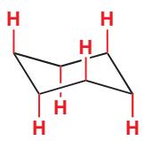

画平伏键时需要多一点点注意。需要注意的是每个平伏键都需要与两根 C-C 键平行。

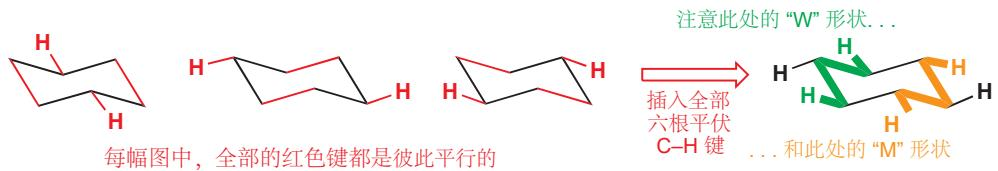

下图是包含全部氢原子的成品图。大多数时候您并不想画出全部 Hs，但为了不时之需，您需要知道它们的位置在哪里。

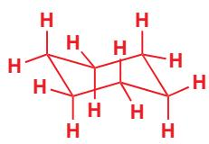

## 常见错误

如果您按照上述规则绘制，您很快就会得到很好的构象图。然而，有一些常见的错误是您需要注意的！

如何错误地画环己烷...

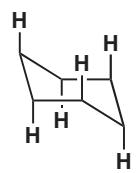

当椅子中间两根键被画成水平的后，两个顶端和两个底端都不再齐平。这意味着直立氢不能再被画成竖直的。

直立氢的上下与碳的走势有关，本图中全部画反了。这一结构是不存在的，因为任何一个碳都不是四面体构型。

红色的氢伸出的角度错误了——请找找平行的先线，以及“W”和“M”形状。

## 环己烷的环翻转

鉴于椅式构象是环己烷的理想构象，那么您希望它的 $^{13}\mathrm{C}$ NMR光谱是什么样的呢？全部的六个碳原子都是相同的，因此应当只有一个信号（确实是，在25.2 ppm).但对于 ${}^{1}\mathrm{H}$ NMR光谱呢？两种不同的质子（直立键和平伏键的）应该会在不同频率处共振，因此会出现两个信号（一个碳上的两个氢分别在两组中).但事实上，氢谱仅有一组共振信号，在 $1.40~\mathrm{ppm}$ .在单取代的环己烷中会出现两个可检测到的异构体，一个是取代基处于直立键的，一个是取代基处于平伏键的。但在室温下仍然同样仅有一组信号。

  
单取代环己烷的环翻转  
注意氢原子在直立到平伏的转换过程中变化

在低温下的 NMR 光谱中这一现象会有所影响。这时两种异构体是可区分的，这给了我们对于刚刚的事实解释的线索：两种异构体是会相互转化的异象体，在室温下转化迅速，在低温下放缓。回想一下，NMR 不能区分丁烷的三种异象体（两种邻位交叉式和一种对位交叉式），因为它们的转化速率太快了，只能观测到平均值。环己烷与之相同——也是通过键的旋转（即不需要断键！），即可发生环翻转。在环翻转发生时，所有原先直立的键现在都平伏了，反之亦然。

■ 建立环己烷的模型，并自行体验环翻转。

整个环翻转的过程可以拆分成如下几种构象。绿色箭头表示为了到达下一个构象，某些碳原子需要移动的方向。

环翻转过程中能量变化大致如下示意图所示，半椅式构象是能量最高点，是由椅式向扭船式转换的过渡状态。船式构象也是能量最高点，是两种扭船式之间转换的过渡状态。

Interactive conformations of cyclohexane

环己烷环翻转过程中的构象变化  
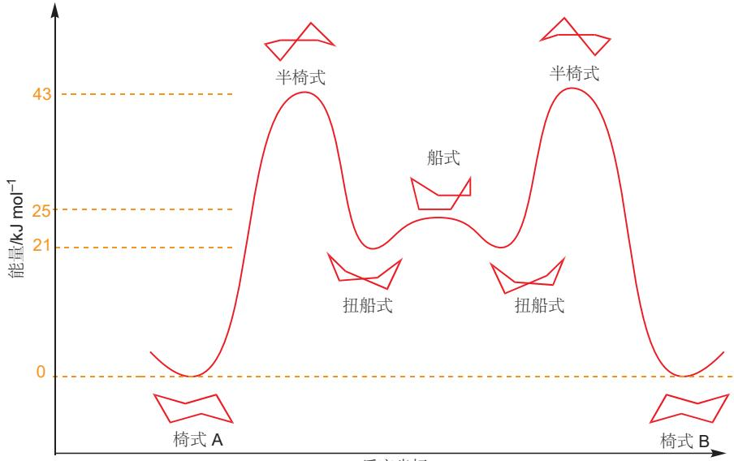  
反应坐标

正好领您回顾 Chapter 12. 这张能量示意图展示了两种椅式构象，经历一个扭船式过渡状态 (局部能量最小值) 实现转化的过程。在两个能量最小值之间，是能量最大值，也就是过程的过渡态。环翻转反应的过程由较随意的“反应坐标”展示。

## 画出其他的环己烷构象

在环己烷的半椅式构象（half-chair conformation）中，四个相邻的碳原子在同一平面上，而第五个在平面上方，第六个在平面下方。您会在将来再次遇到它——例如对于环己烯，这种构象是其能量最小值。

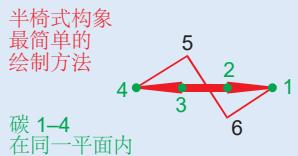

绘制扭船式异象体也有许多种方法，下面是最简单的一种:

从图中可以清楚地看到，环己烷环翻转的势垒为 $43 \, kJ mol^{-1}$ ，因此在 $25^{\circ}C$ 下速率为 $2 \times 10^{5} \, s^{-1}$ 。环翻转同样可以交换直立键和平伏键上的质子，因此它们在 $25^{\circ}C$ 下也会以 $2 \times 10^{5} \, s^{-1}$ 的速率交换——超过了 NMR 可区分的速率，这就是为什么它们以平均信号的形式出现的原因。

## 转换速率和光谱法

NMR 光谱仪就像照相机一样，它的快门速度是 1/1000 s. 任何比这个间隔快的变化在照片中都难以区分；事情发生的越慢，在照片上就越清晰。事实上，NMR 光谱仪的 “快门速度” 有一个精确的数值 (不是真正的快门速度——是比喻的说法)，由下列等式给出：

$$
k = \pi \Delta \mathbf {v} / \sqrt {2} = 2. 2 2 \times \Delta \mathbf {v}
$$

其中 k 是能使两种信号独立的转换速率的最大值， $\Delta v$ 是 NMR 光谱上可以分开显示的两个信号的间隔，以赫兹为单位。例如在一个 400 MHz 的光谱仪上，可以分开显示两个间隔为 0.25 ppm 也就是 100 Hz 的信号，那么任何慢于 $222 \, s^{-1}$ 的转换过程会分被成两个信号，任何快于 $222 \, s^{-1}$ 的转换过程会显示一个平均信号。

单取代环己烷只有一种平伏键异象体，和一种直立键异象体。说服自己，下列图片均是同一种构象，仅观察角度不同：

我们在 Chapter 12 中讨论过能量差与平衡常数的关系。

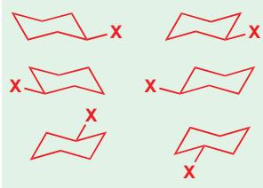

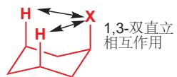

上述等式适用于任何光谱方法，只需要我们具体考虑两个信号或峰的间隔即可。例如，两个 $100\mathrm{cm}^{-1}$ 的IR吸收可以显示 $0.01\mathrm{cm}(1\times 10^{-4}\mathrm{m})$ 的波长或 $3\times 10^{12}\mathrm{s}^{-1}$ 的频率。因此IR可以侦查的转换速率要可以比NMR的快很多——它的“快门速度”在十万分之一秒数量级。

1,3-双直立相互作用

## 取代的环己烷

单取代的环己烷可以以两种椅式异象体存在：一种是取代基处于直立键的，一种是处于平伏键的。这二者处于转换迅速的平衡中(我们刚刚描述的过程)，它们的能量也不相同。在大多数时候，取代基处于直立键的构象能量更高，这意味着平衡中的直立键构象较少。

例如，对于甲基环己烷 $\left(\mathrm{X}=\mathrm{CH}_{3}\right)$ ，甲基处于直立键的构象比处于平伏键的构象高能 $7.3\ kJ\ mol^{-1}$ 。这种能量差导致在 $25^{\circ}C$ 下前者和后者的比例为 20:1。

关于直立构象比平伏构象能量高，有两种原因。其一是，直立构象中，直立的 X 基团与环上处于同侧的另两个直立的氢存在排斥，使得体系不稳定，这种相互作用被称为 1,3-双直立相互作用（或 1,3-二直键相互作用）。X 基团越大，这种相互作用就越严重，直立键构象占比也就越小。第二个原因是在平伏键构象中，

C-X 键与两个 C-C 键处于对位交叉式；而在直立键构象中，C-X 键与两个 C-C 键处于邻位交叉式。

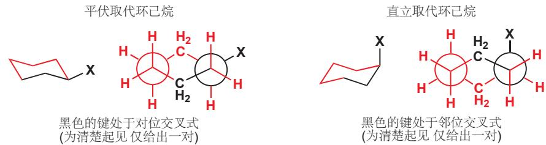

下表展示了多种单取代环己烷在 $25^{\circ}$ C 下平伏异象体比直异象体键的优势。

<table><tr><td>X</td><td>平衡常数K</td><td>直立取代与平伏取代的能量差, kJ mol-1</td><td>平伏取代的百分数</td></tr><tr><td>H</td><td>1</td><td>0</td><td>50</td></tr><tr><td>OMe</td><td>2.7</td><td>2.5</td><td>73</td></tr><tr><td>Me</td><td>19</td><td>7.3</td><td>95</td></tr><tr><td>Et</td><td>20</td><td>7.5</td><td>95</td></tr><tr><td>i-Pr</td><td>42</td><td>9.3</td><td>98</td></tr><tr><td>t-Bu</td><td>&gt;3000</td><td>&gt;20</td><td>&gt;99.9</td></tr><tr><td>Ph</td><td>110</td><td>11.7</td><td>99</td></tr></table>

注意以下几点 (在 Chapter 12 中提到过的思路).

\- 表格中三列是相同信息的不同表达侧面。然而，只看百分数这一列，并不能马上准确地看出平伏构象有多少优势——甲基、乙基、异丙基、叔丁基和苯基环己烷的平伏构象都占 $95\%$ 或更多。平衡常数的观察相对更清晰。

\- 平伏异象体的数量确实按序列 $\mathrm{Me} < \mathrm{Et} < i\text{-Pr} < t\text{-Bu}$ 增加，但并不完全在意料之中。乙基的体积比甲基大很多，但在平衡常数上却上升不明显。从 Et 到 $i\text{-Pr}$ 取代的平衡常数仅上升了两倍；但对于叔丁基取代，平伏异象体的浓度却是直立异象体的大约 3000 倍。

\- 在甲氧基的位置也出现了反常——甲氧基取代的直立异象体比甲基取代的直立异象体多。这违反了甲氧基比甲基体积大的事实。

\- 平衡常数并不取决于取代基的具体体积，而是取决于它与另两个直立氢相互作用的大小。在甲基环己烷的直立异象体中，甲基与另两个氢间有直接的相互作用。

\- 而在甲氧基环己烷的直立异象体中，氧原子将甲基拽离了环，因此减弱了相互作用。

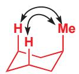

环翻转时所有的平伏键和直立键互换，但不会改变它们相对于环的朝向。如果一个平伏取代基翻转前朝上(与附着在同一个C上的氢相比)；那么翻转后，它仍然朝上，只是由平伏键变成了直立键。平伏键和直立键是构象的规定，而朝向则取决于化合物的构型。

■ 顺式和反式的化合物互为非对映异构体。因此，它们有不同的化学和物理性质，并不能仅通过键的旋转而转化。

  
熔点 113–114 ℃ 熔点 143–144 ℃

这与反-1,4-环己二醇(的双直立或双平伏的两种异象体)形成了对比它们可以在室温下迅速地转化，并不需要破坏任何键。

\- Me, Et, i-Pr, 和 t-Bu 都需要将一些原子推向另两个直立的氢。在 Me, Et, 和 i-Pr 中，这个原子是 H.

\- 而只有在 $t$ -Bu取代的直立异象体中，一个甲基被推向了环中央，因此 $t$ -Bu比其他基团更倾向于处在平伏键上。事实上，直立的 t-Bu 基团与直立氢原子间的相互作用十分严重，以至于这种基团总是处在平伏键位置上。在后面的学习中，这一点十分有用。

## 环上有一个以上取代基时

当环上有两个或更多取代基时，就会出现立体异构体。例如，1,4-环己二醇有两种异构体——一种（顺式异构体）中两个取代基都朝上或朝下(处于环的上方或下方)；另一种（反式异构体）中一个羟基朝上，一个羟基朝下。对于任何同一取代基取代的顺式1,4-二取代环己烷，环翻转过程的两侧是完全相同的构象；而对于反式构型，则会有一个全直立构象，和一个全平伏构象。

椅式结构图包含了比简单的六边形结构图更多的信息。前者同时表达了构型和构象——它既能表达我们讨论的是哪种立体异构体（顺式的还是反式的），还能表达这种立体异构体所采用的构象（例如在反式异构体中，是双直立还是双平伏）。相比之下，简单的六边形结构图不能表达任何关于构象的信息——只能说明我们讨论的是哪种异构体。在讨论化合物的构型，而不需要具体说明构象时，这种图示更加实用；而当您需要通过原料所采用的构象，预测反应产物的构型时，则通常由椅式结构图出发，在结束时重新整理成六边形结构图。

在 顺-1,4-二取代 环己烷的椅式异象体中，有一个取代基平伏，一个取代基直立。这一点并不适用于其他位置的二取代环己烷，例如 顺-1,3-二取代 环己烷的两个取代基或全直立，或全平伏。记住，“顺式”和“反式”的前缀仅表示取代基处在环己烷的同侧或异侧；而取代基是一直立一平伏，还是全直立/平伏，是取决于取代方式的。每当您遇到一个分子的时候，先绘制构象图或者做一个模型，来找出处于直立的、和处于平伏的键。

  
反-1,3-二取代环己烷  
两种异象体中均有，一个取代基朝上，另一个取代基朝下

■ 决定平伏键取代基是朝上还是朝下总是不容易的。判断的关键在于将其与相同 C 原子上的氢原子相比较——一直立键的氢原子的朝向是非常好判断的。如果它的直立键同伴朝上，那么这个平伏键取代基就必定朝下；反之亦然。

那么，当环上的两个取代基不相同的时候呢？例如在顺-1,3-二取代环己烷中，优势构象无疑是两个取代基均为平伏键的构象。但在两个取代基必定一直立一平伏的时候（例如反式构型中），优势构象取决于这两个取代基本身。一般来说，平伏键取代基多的构象更有利；而两个有同样多数平伏取代基的构象中，大取代基处于平伏键的构象更有利，这种情况下小取代基可以屈居直立键。下面展示了很多个可能的例子。

这只是一个参考，而在很多情况下，优势构象都不是那么容易确定的。相比于将自己困扰在这些不确定的问题中，我们不如了解一些能够确定优势构象的、特殊取代的环己烷。

## 锁定基——叔丁基

我们知道，一个环中的叔丁基总是倾向于处在平伏键位置上。这使得判断下一页的两个化合物所采用的构象十分容易。

顺-4-叔丁基环己醇

反-4-叔丁基环己醇

## 顺-1,4-二叔丁基环己烷

一个直立的叔丁基真的很不舒服。在 顺-1,4-二叔丁基环己烷 的椅式构象中，一个叔丁基会被强制处于直立键。为了避免这种情况，这一化合物更倾向于折叠成一个扭船式构象，这样两个大基团就均可处在平伏键位置 (平伏键是椅式构象中的称呼，此处应称之 “假平伏键 (pseudoequatorial)”。

## 十氢化萘

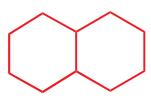

环己烷的构象还可以通过与另一个环稠和得以锁定，两个环己烷在一根普通的 C-C 键处稠和得到的化合物称为十氢化萘。基于桥头的两个氢原子的顺式或反式构型，十氢化萘有两种非对映异构体。在顺-十氢化萘中，两个环连接的键必有一根直立键和一根平伏键；而在反-十氢化萘中，这两根键则同时处于平伏键。

Interactive conformations of decalins

当环己烷发生环翻转时，原来处于平伏键的取代基转变为了直立键，反之亦然。这对于顺-十氢化萘是可以的，因为它的两个桥头（junction）是一组可交换的直立一平伏式；但这对于反-十氢化萘就行不通了。如果让反-十氢化萘发生环翻转，那么两个桥头会变成直立一直立式，六元环相邻的两个直立键是无法连接在一起的。另一方面，顺-十氢化萘的环翻转十分容易。

## 顺-十氢化萘的旋转：并不困难的原因

如果您发现自己很难想象顺-十氢化萘的环翻转过程，您并不孤单！最好的办法是在思考过程中始终忽略红色的环，仅关注黑色环上发生的事情，即桥头上的氢原子、橘色的键。翻转黑色的环，橘色键和氢原子都会从直立键翻转到平伏键，或从平伏键翻转到直立键。画出结构，但不要补全红色的环，因为在这个时候补全它，常常会得到一个平面六边形(如图A).相反，绕纵轴将黑色的、已经画好的环旋转 $60^{\circ}$ ，这时再补全红色的环就会顺利地得到椅式(如图B).想要画出椅式而不是正六边形，您需要先让橘色的两根键朝内摆放，即B中而不是A中的摆法。

Interactive ring inversion of cis-decalin

反-十氢化萘 无法发生环翻转  

## 甾族

甾族/类固醇 (Steroids) 是存在于动植物体中的一类重要化合物，对于从调节生长 (促蛋白合成甾族)，性冲动 (所有的性激素都是甾族)，到植物、青蛙、海参的自我防卫机制都有重要的作用。甾族的性质由其结构决定：甾族化合物的骨架包含四个稠和的环——三个环己烷环和一个环戊烷环——如右图所示连接。

  
甾族骨架

正如十氢化萘的体系一样，每对桥头都可以是顺式，或是反式；但事实证明，除了环 A 和环 B 连接的地方有时会是顺式，其他地方全部都是反式的。下面分别是胆甾烷醇 cholestanol（均为反式）和粪甾醇 coprostanol (A 和 B 顺式稠和).  
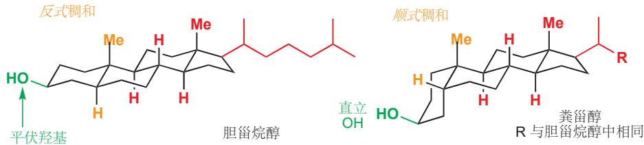

因为甾族（包括 A–B 顺式稠和的）本质上是取代的反-十氢化萘，因此它们不能翻转。因此，胆甾烷醇中的羟基在环 A 上永远处于平伏键，而粪甾醇中的羟基在环 A 上处于直立键。甾族化合物的骨架相当稳定——有 $1.5 \times 10^{9}$ 年历史的底泥样本中的甾族化合物，稠和处仍然保持相同的立体化学。

## 直立键和平伏键取代基反应性的不同

我们将在本书的其余部分使用环结构，您需要学习它们的构象如何广泛地影响它们的化学性质。很多包含六元环的反应的结果，往往取决于官能团在直立键或是平伏键。我们将用两个例子结束这一章的讨论，例子中的官能团会被叔丁基，或者通过稠环体系（如反-十氢化萘）锁定在直立键或平伏键位置。

在上一章中我们谈了两个亲核取代反应的机理： $S_{N}1$ 和 $S_{N}2$ . 其中 $S_{N}2$ 反应涉及中心碳的构型翻转。回想一下，亲核试剂进攻 C-X 的 $\sigma^{*}$ 轨道，意味着它必须从离去基团的反方向接近，导致了构型翻转。

巴顿爵士 (Sir Derek Barton, 1918–98) 正是出于对自己发现的甾族化合物的反应性进行解释的渴望，于 1940s 和 1950s 描述了本章所讲的构想分析原则。他于 1969 年因此工作获得诺贝尔化学奖。

■ 叔丁基不能处于直立键 (p. 375)，反-十氢化萘不能发生环翻转 (p. 378)，这是它们锁定构象的方法。

饱和碳上的亲核取代中的构型翻转

对于环己烷衍生物的 $S_{N}2$ 反应，如果分子的构象被锁定基所固定，那么 $S_{N}2$ 反应的构型翻转机理就意味着：如果离去基团原来处于直立键，那么亲核试剂进攻后就会停在平伏键，反之亦然。

环己烷上的取代反应并不常见。环己烷上的亲电碳是一个仲碳——在上一章中我们看到仲中心并不能通过 $S_{N}1$ 或 $S_{N}2$ 机理很好地反应 (p. 347). 为了促进 $S_{N}2$ 机理的发生，我们需要一个好的亲核试剂和一个好的离去基团。下面是一个可行的例子——PhS $^{-}$ 进攻，离去对甲苯磺酸负离子。

直立键取代基比平伏键取代基反应进行的快。造成这一速率差异的贡献因素有一些，其中最重要的是亲核试剂靠近的方向。亲核试剂必须进攻离去基团的 $\sigma^{*}$ ，因此必须恰好从 C-X 键的背后进攻。对于平伏键取代的化合物，进攻路线被（下图中绿色的）直立氢原子所阻碍——它需径直穿过这些氢原子占据的空间区域；而对于直立键取代的化合物，进攻方向是与（橘色的）直立氢原子平行的一一直立氢原子与离去基团对位交叉式，因此亲核试剂靠近的过程阻碍少了很多。

我们必须假设即使在简单的未取代环己烷中也是如此，例如环己基溴的取代反应，大多数发生在其镜像，即直立异象体上。这一现象减慢了反应速率，因为它们必须先从更为普遍的平伏异象体翻转到直立才可以发生反应。

如果离去基团无法翻转到直立键，可能这个反应干脆不能发生。这正是常在反-十氢化萘中发生事情，下面有两种反-十氢化萘的取代物(互为非对映异构体)：其一的离去基团处于平伏键，另一个则处于直立键(X可以是Br, OTs, 等).

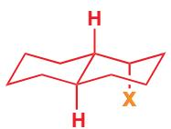  
直立键离去基团

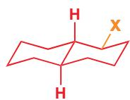  
平伏键离去基团

对于后者的进攻是直接的，亲核试剂直接沿着 C-X 键的轴靠近，并发生伴随着翻转的普通 $S_{N}2$ 反应即可——得到的产物是平伏化合物。而另一边，对于前者的取代，则要求亲核试剂从分子的中间靠近，这是无法做到的，相反，这个分子会发生一个完全不同的反应——一个您会在 Chapter 36 中遇到的重排反应。

## 小结

您可能会不解：为什么我们在六元环上花了这么多时间，而几乎完全忽略了其他尺寸的环。除去六元环是有机化学中分布最广的环尺寸的理由外，六元环的反应也是最好解释和理解的。我们之前略述的六元环的构象规则（环张力的缓解，交叉式优于重叠式，平伏键优于直立键，进攻方向等）在稍加修改后也同样适用于其他环尺寸。这些环表现的不如六元环好，因为它们缺少六元环幸运地享有的，无环张力的构象。我们现在会暂时离开立体化学；在 Chapters 31 和 32，关时于环状化合物立体化学的两章，我们会重新讨论一些更难的内容。

## 延伸阅读

关于构象，请主要参考：E. L. Eliel and S. H. Wilen, Stereochemistry of Organic Compounds. Wiley, New York, 1994.

更加详细的分析烷烃构象偏好的原因：V. Pophristic and L. Goodman, J. Phys. Chem. A, 2002, 106, 1642–1646.

## 检查您的理解

## 17

## 消除反应

联系

基础

\- 立体化学 ch14

\- 饱和碳原子上亲核取代反应的机理 ch15

\- 构象 ch16

目标

\- 消除反应

\- 什么因素使消除反应有利于取代反应

\- 三个重要的消除反应机理

\- 构象在消除反应中的重要性

\- 如何用消除反应制备烯烃 (和炔烃)

## → 展望

\- 对烯烃的亲电加成 (本章反应的逆反应) ch19

\- 如何控制双键几何结构 ch27

## 取代与消除

→ 想想火车站闸机的例子(见 p. 332).

您应当还记得在 Chapter 15 中我们提到，叔丁基卤的取代反应一贯遵循 $S_{N}1$ 机理，这类反应的决速步是单分子的一一决速步仅涉及卤代烃这一个反应。这意味着，无论使用什么亲核试剂，发生取代反应的速率都是相同的。例如，若使用氢氧根离子代替水，或者增加氢氧根的浓度，都不能加速 $S_{N}1$ 反应的发生。我们说，这只是浪费时间。(见 p. 332).

t-BuBr 的亲核取代反应  

当您使用氢氧化钠的浓溶液，试图完成取代反应时。不仅会浪费您的时间，事实上，还会浪费您的卤代烃。

t-BuBr 与 NaOH 的浓溶液发生的反应

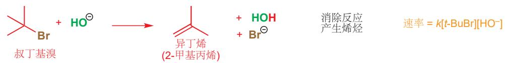

反应已不再是取代反应，而是生成了一个烯烃。大体上，可以说是从卤代烃上脱去了 HBr, 这种反应称作消除反应 (elimination, 也称消去反应).

本章中我们会讨论消除反应的机理——就像取代反应一样，消除反应也不只有一种机理。我们会对比消除与取代反应——这两种反应在几乎完全相同的反应物体系下进行，您会学习如何预测更倾向于发生哪一种。大多数机理的讨论与 Chapter 15 关系密切，我们建议您在处理本章之前先确保自己理解了那一章的所有重点。本章还会讲述消除反应的应用，除去在 Chapter 11 中略略谈到的 Wittig 反应，本章将是您遇到的第一种构筑简单烯烃的反应。

## 当亲核试剂进攻氢而不是碳时，发生消除反应

叔丁基溴发生消除反应，是由于亲核试剂的碱性。请回顾 Chapter 10 中的内容，碱性和亲核性间有一些联系：强碱通常是好的亲核试剂。氢氧根，作为好的亲核试剂，并不对取代反应的速率产生影响，因为它并未出现在决速步的速率等式中。而作为好的碱，它却对消除反应的速率产生了贡献，因为它参与了消除反应的决速步，也出现在了速率表达式中。这就是机理。

在对 C=0 的亲核进攻上，碱性和亲核性之间的相关性得以体现。在 Chapter 15 中您见过的对于饱和碳原子亲核取代好的亲核试剂 (例如 I-, Br-, PhS-) 都不是强碱。

氢氧根在消除反应中充当碱的角色，因为它进攻的是氢原子，而不是取代反应中进攻的碳原子。氢原子并不是酸性的，但由于溴是一个好的离去基团，在溴离子离去的同时，氢原子便可以以质子形式离开。当氢氧根进攻时，溴携带着负电荷，被迫离开。这两个分子——叔丁基溴和氢氧根——都涉及在反应的决速步中。这意味着这二者的浓度都会出现在速率等式中A，因此这是个二级反应，这种消去机理被称作E2,代表双分子消除(Elimination, Bimolecular)。

注意: 没有上标或者下标, 只有非常朴素的 E2.

$$
\mathrm{速率} = k _ {2} [ t \mathrm{-BuBr} ] [ \mathrm{HO} ^ {-} ]
$$

现在让我们看另一种类型的消除。我们可以通过思考另一种 $S_{N}1$ 取代反应来认识它，即与本章开头的反应相反的：醇转变为卤代烃的反应。

HBr 对 t-BuOH 的亲核取代

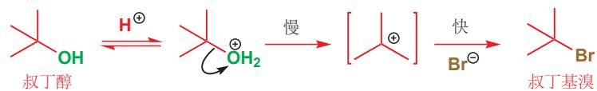

决速步中不涉及亲核试剂溴离子，因此我们知道这一反应的速率也不受 $Br^{-}$ 浓度的影响。第一步生成阳离子的反应，也确实与根本没有溴时发生的一样快。但在这种情形下，消除反应的发生是不同的。为了找到答案，我们需要用一种酸，要求其共轭碱的亲核性很弱，无法进攻碳阳离子中的正电碳的。例如，叔丁醇在硫酸中不会发生取代反应，仅能发生消除反应。

Interactive E1 elimination mechanism

E1 消除: $\mathrm{H}_{2} \mathrm{SO}_{4}$ 中的 $t$ -BuOH

碳阳离子生成的决速步中并不涉及 $\mathrm{HSO}_4^-$ 离子。而且它也是一个很差的亲核试剂，并不能进攻碳阳离子中的C原子；它的碱性也十分弱；但在机理中您看到，由于它实在不能做亲核试剂，因此它勉强充当了碱(拔去质子).速率方程中也不涉及 $\mathrm{HSO}_4$ 的浓度，决速步与 $S_{\mathrm{N}}1$ 反应类似——质子化的 $t$ -BuOH单分子脱水。这种消除机理因此称为E1 (Elimination, unimolecular).

我们不久会回到这两种消除机理，还有第三种；但在此阶段值得注意的是，选择发生 E1 和 E2 机理与从前选择发生 $S_{N}1$ 和 $S_{N}2$ 需要考虑的理由是不同的：您刚刚见到，分别发生 E1 和 E2 的两个底物都仅发生 $S_{N}1$ 。这两个反应的区别在于碱的强度，因此我们需要首先回答一个问题：什么时候亲核试剂会充当碱？

## 羰基化学中的消除反应

本章中我们会详细讨论烯烃的生成，但此前我们已经在 Chapters 10 和 11 中使用过 “消去” 一词来描述四面体中间体上的离去基团的离开。例如，在酸催化的酯水解的最后一步就涉及 ROH 的 E1 消除，所生成的双键是 C=O 而不是 C=C.

E1 消除：酯水解中消去 ROH

在 Chapter 11 中您也见过 E1 消除得到烯烃的过程。得到的烯烃是烯胺。

E1 消除：得到烯胺的同时消去 $H_{2}O$

## 亲核试剂对取代、消除竞争的影响

## 碱性

进攻此处导致消除

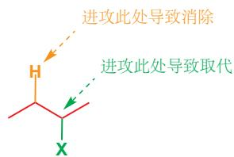

进攻此处导致取代

带有离去基团的分子会在两个不同类的亲电位点被进攻：连接离去基团的碳原子，或与该碳相邻的碳上的氢原子。进攻碳原子导致取代反应，进攻氢原子导致消除反应。一般来说，“亲核试剂”的碱性越强，越容易进攻质子，即消除反应相比于取代反应占据主要。

下面是应用这一思路的一个例子：弱碱 (EtOH) 导致取代反应，而强碱 (乙氧基阴离子) 导致消除反应。

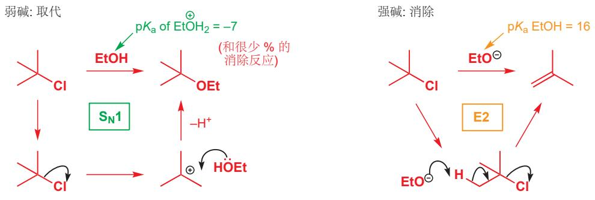

## 消除、取代和软硬度

我们还可以通过亲电试剂的软硬 (p. 357)，来解释发生消除还是取代的选择性，即进攻 H 还是 C 的选择性。在一个 $S_{N}2$ 取代反应中，中心碳是软的亲电试剂——它基本上不带电，并且其与离去基团，例如与卤素的 $C-X\sigma^{*}$ 是相对低能的 LUMO；因此当亲核试剂的 HOMOs 与其 LUMO 最容易相互作用——即亲核试剂较软时，就会倾向于取代。相比之下， $C-H\sigma^{*}$ 的能量更高，因为两个原子的电负性都很小，再加上氢体积小，使得 C-H 键是一个硬亲电位点；因此硬的亲核试剂更倾向于消除。

## 大小

对于一个亲核试剂，进攻碳原子就意味着挤掉它原有的取代基——甚至对于伯卤代烃，仍然有一个烷基予以阻碍。这是在有阻碍的卤代烃上发生 $S_{N}2$ 反应十分缓慢的原因之一——亲核试剂很难到达反应中心。但在消除反应中得到更加暴露的氢原子就很容易了，这意味着，如果我们使用个头很大的碱性亲核试剂，消除反应就会更倾向于发生，即使在伯卤代烃中也是一样。叔丁醇钾是一个常用的，避免取代反应，而促进消除反应的碱；大的烷基取代基使带负电的氧难以进攻碳，导致取代反应，但对于进攻氢原子并无大碍。

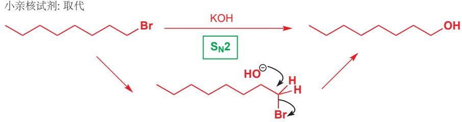

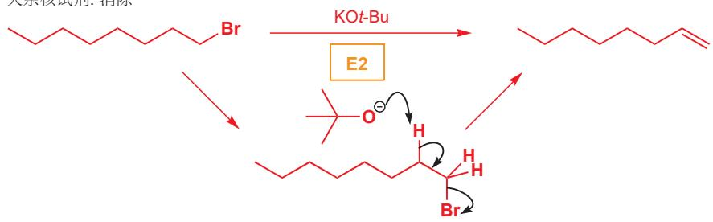

## 温度

在决定发生消除反应还是取代反应时，温度起很重要的作用。两个分子通过消除反应产生了三个分子（数一数）；而在取代反应中，则是两个分子产生了两个新分子。因此两个反应过程的熵变不同：消除反应的 $\Delta S$ 高于取代反应。在 Chapter 12 中，我们讨论了如下方程：

这个解释被简化了，因为重要的是反应速率而不是产物的稳定性。更详细的解释超出了本书的讨论范围，但总体观点仍然成立。

$$
\Delta G = \Delta H - T \Delta S
$$

→ 相关的例子见 Chapter 12, p. 247

这个方程显示，在高温下， $\Delta S$ 越正，反应越利于正向进行 ( $\Delta G$ 会越负). 因此高温有利于发生消除反应，而事实也确实如此：您将会见到的大多数消除反应，都在室温甚至更高的温度下发生。

## - 消除还是取代

\- 强碱性的亲核试剂倾向于消除。

\- 大体积的亲核试剂 (碱) 倾向于消除。

\- 高温倾向于消除。

## E1 和 E2 机理

现在您已经见识了一些消除反应的例子了，是时候回到我们对于消除反应的两种机理的讨论了。总结我们之前所说的：

\- E1 描述的是决速步是不包含碱参与的单分子反应 (1) 的消除反应 (E). 离去基团在这一步离去，而质子的去除则在与之分开的第二步中。

E1 消除的一般机理

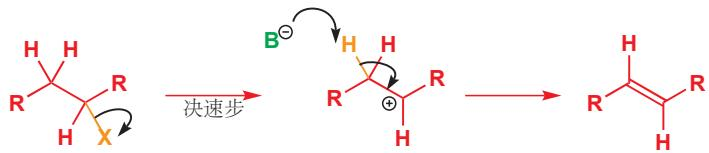

速率 = k[烯丙基卤]

在 E2 消除中，离去基团的离去与质子的去除是协同的 (concerted).

\- E2 描述的是决速步是包含碱参与的双分子反应 (2) 的消除反应 (E). 离去基团的离去与碱的作用下质子的去除同步发生。

E2 消除的一般机理

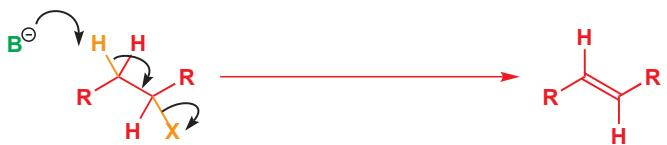

速率 $= k[B^{-}]$ [烯丙基卤]

有很多因素会影响消除反应按 E1 还是 E2 机理进行。其中一个是从速率方程中一看就明白的：只有 E2 机理受碱的浓度的影响，因此高浓度的碱有利于 E2. 而 E1 反应的速率不受碱的影响——因此 E1 无论面对强碱还是弱碱都不会求全责备，而 E2 在强碱中要比弱碱中进行得快：任何浓度的强碱都相较 E1 更有利于 E2. 如果您看到一个消除反应依赖强碱，那么它无疑是一个 E2 反应。下面是本章介绍的第一个例子。

叔丁基溴与高浓度氢氧根的反应

阻碍较小的烷基卤代物不是与氢氧根发生消除反应的好选择，因为氢氧根的体积相当小，在此情境下很乐意进行 $S_{N}2$ 取代反应（甚至是叔烷基卤代物，在碱的浓度低时，取代反应也会超过消除反应）.

我们之前提到过，大块头的叔丁氧基阴离子——是理想的 E2 反应试剂，因为它既庞大又是强碱 $\left(\mathrm{pK}_{\mathrm{a}}\ \mathrm{of}\ t-\mathrm{BuOH}=18\right)$ . 在下面的过程中，连续两次的 E2 消除使二溴代物 (dibromide) 转化为了双烯/二烯 (diene)。由于二溴代物可以通过烯烃制得 (下下章中)，下面的过程也是一个通过两步将烯烃转化为双烯的实用反应。

通过两步E2反应的双烯合成

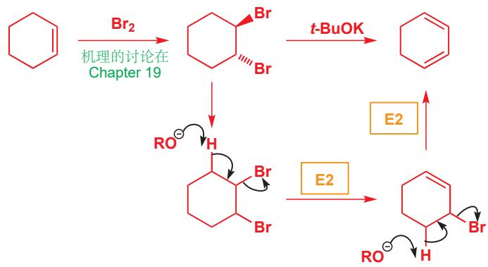

Interactive mechanism for double E2 to form diene

下一个反应的产物被称为“烯酮缩醛 (ketene acetal)”。与其他缩酮不同的是，它不能直接由烯酮 (ketene, $CH_{2}=C=O$ , 十分不稳定) 制备，因此这种缩醛的制备通常按下列方法，即使用 t-BuOK 从溴乙醛上消除 HBr.

→ 下一章简要地介绍了烯酮。

卤代烷转化为烯烃所最常用的碱是您在 Chapter 8 见过的: DBU. 这种碱是一种脒 (amidine)——其中一个氮上的孤对电子在其与另一个氮之间离域，质子化后的铼阳离子/脒鎓离子 (amidinium ion) 的稳定性使脒的碱性增强，铼阳离子的 $pK_{a}$ 大约为 12.5. 而且，它庞大的稠环结构使其不易进入那些狭小的角落——因此相比于抵达碳原子发生取代反应，它们先抵达质子。

离域在脒体系中

DBU
1,8-二氮杂双环-[5.4.0]-7-十一碳烯

脒的质子化

离域稳定铼阳离子

在 p. 175 了解 DBU.

DBU 通常会从卤代物中消去 HX 从而生成烯烃。在下面的两个例子的生成物，都是某两个天然产物合成的中间体。

■ 注意，高温驱动消除反应。

91% yield

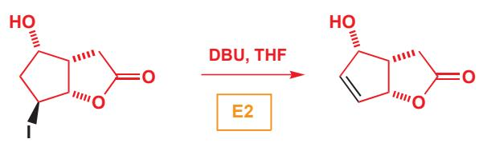

E2 消除的机理

## 允许 E1 的底物结构

本章提到的第一个消除反应 (t-BuBr 加氢氧根) 说明了一件非常重要的事情：叔烷基卤代烃的起始物仅会通过 $S_N1$ 取代，但却能既能通过 E2 (与强碱) 又能通过 E1 (与弱碱) 消除。不利于 $S_N2$ 的立体化学因素，即反应中心的空阻并不影响消除反应。尽管如此，E1 仍只能在底物可以电离生成稳定的碳阳离子的情况下才能发生——例如叔烷基、烯丙基或者苄基卤。仲卤代烃可能通过 E1 消除，而伯卤代烃无论如何只能通过 E2 消除，因为发生 E1 所要求的伯碳阳离子太不稳定了。下图总结了可以采用 E1 消除的底物——但要记住，下列底物中的任何一种，在合适的情况下（例如强碱的存在下）都仍然可能采取 E2. 最后一行列举了三种卤代烃，由于它们的离去基团所在碳原子的邻位根本没有氢原子，进而不能发生任意一种机理下的消除反应。

易于通过 E1 消除的底物

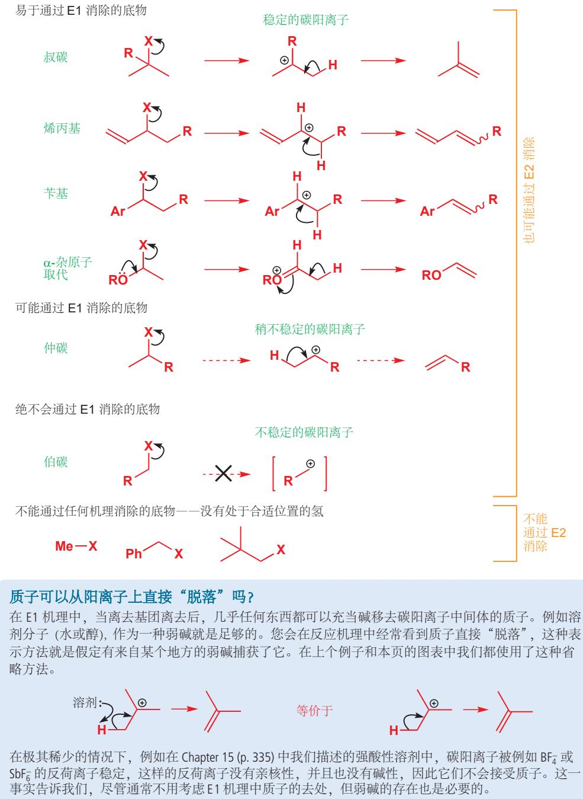

质子可以从阳离子上直接“脱落”吗？

在 E1 机理中，当离去基团离去后，几乎任何东西都可以充当碱移去碳阳离子中间体的质子。例如溶剂分子 (水或醇)，作为一种弱碱就是足够的。您会在反应机理中经常看到质子直接 “脱落”，这种表示方法就是假定有来自某个地方的弱碱捕获了它。在上个例子和本页的图表中我们都使用了这种省略方法。

在极其稀少的情况下，例如在 Chapter 15 (p. 335) 中我们描述的强酸性溶剂中，碳阳离子被例如 $BF_{4}^{-}$ 或 $SbF_{6}^{-}$ 的反荷离子稳定，这样的反荷离子没有亲核性，并且也没有碱性，因此它们不会接受质子。这一事实告诉我们，尽管通常不用考虑 E1 机理中质子的去处，但弱碱的存在也是必要的。

极性溶剂也有利于 E1 反应，因为它们能够稳定中间体碳阳离子。水溶液或者醇溶液中进行的醇的 E1 消除尤其常见，而且十分实用。这个反应需要用酸性催化剂以促进水（质子化后的羟基）的离去，例如在稀的 $H_{2}SO_{4}, H_{3}PO_{4}$ ，和 HCl 中，都没有好的亲核试剂会导致取代反应的发生。在磷酸的存在下，二级的环己醇可以得到环己烯。

但最好的 E1 消除是叔醇发生的。这种醇可以使用 Chapter 9 中的方法制备：有机金属化合物亲核进攻羰基化合物得到。亲核加成，随后 E1 消除，是制备例如这种取代的环己烯极好的方法。注意羟基离去所需的质子在消除后得以回收——整个反应仅需催化量的酸。

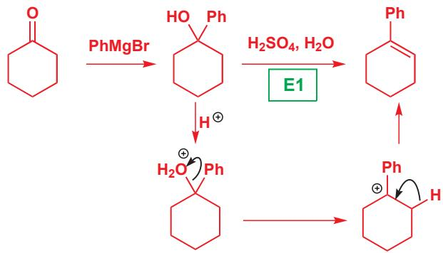

雪松醇 (cedrol) 在香水工业中十分重要——它有雪松的香味。雪松醇的合成就包含下列步骤——酸催化下 (对甲苯磺酸，见 p. 227) E1 消除与缩酮的水解一同发生。

在上一章的末尾，您见到了一些双环 (bicyclic, 或二环) 结构。它们在发生消除反应时，有时会引起问题。例如下面的化合物就既不能通过 E1，也不能通过 E2 机理发生消除。

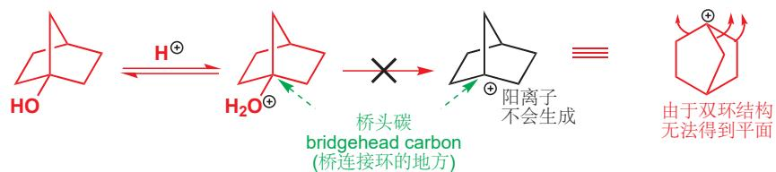

我们马上将会看到 E2 反应在这个结构中遇到的问题，但 E1 的问题很清楚，就是在生成平面型碳阳离子时遇到了问题。双环的结构会阻止桥头碳转变为平面型，因此即使这个阳离子将会是稳定的叔碳，它也是非常高能，而且无法得到的。您可以说，非平面的结构迫使碳原子有一个空的 $sp^{3}$ 轨道，而不是一个空的 p 轨道，而我们在 Chapter 4 曾说过，空置最高能的轨道往往是最好的。

在 p. 335 (Chapter 15) 中，您看到过一个与之类似的例子，即非平面的碳阳离子使 $S_{N}1$ 反应无法进行。

## Bredt规则

平面桥头碳阳离子的不现实，也意味着桥头碳上双键的生成几乎不可能。这一规则被称为 Bredt 规则 (Bredt's rule). 就像其他所有的规则一样，知道其名称远没有知道其背后的原因重要，而 Bredt 规则仅仅是对平面桥头碳引起的张力的总结。

## 离去基团的角色

我还没有对消除反应离去基团的选择做出探讨：目前为止您看到的 E2 反应都来自卤代烃，E1 反应都来自质子化的醇。这两种选择都是经过了思考的：这两类消除反应中的绝大多数都采用这两种起始原料中的一个。因为 E1 和 E2 的决速步速率方程都包含离去基团，一般来说，好的离去基团导致快的消除反应。您可能会看到例如季铵盐的消除中，胺作为离去基团的情况。

E1 和 E2 都是可能的，从您目前读到的内容分析，下列两种情况分别为其中一种机理：第一个例子中，无法生成稳定的碳阳离子 (因此 E1 是不可能的)，而所添加的强碱也促使 E2；在第二个例子中，可以生成稳定的叔碳阳离子 (因此 E1 或 E2 都可能发生)，而由于没有强碱的参与，因此为 E1.

在之前的例子中，羟基有过在酸性下作为好的离去基团的情况，这种情况仅会发生在允许 E1 消除的底物中。而羟基永远不会在 E2 消除，即碱性下作为离去基团。强碱反而会移去 OH 基的质子。

## - OH $^{-}$ 绝不会作为 E2 反应的离去基团。

对于伯醇和仲醇，羟基可以先与对甲苯磺酰氯（TsCl）或甲磺酰氯（ $\mathrm{MeSO}_2\mathrm{Cl} / \mathrm{MsCl}$ ）发生磺酰化(sulfonylation)转化为一个好的离去基团后，再进行消除。

您在 Chapter 15 (p. 344) 学习了这些磺酸酯——甲基磺酸酯和对甲苯磺酸酯。

对甲苯磺酸酯可以由醇 (吡啶中与 TsCl 反应) 制备。我们在 Chapter 15 中介绍了磺酸酯，因为它们在非碱性的亲核取代反应中，是一类相当好的亲电试剂。在 t-BuOK, NaOEt, 或 DBU 的参与下，它们会非常效率地发生消除反应。下面是两个例子。

对甲苯磺酸酯的E2消除

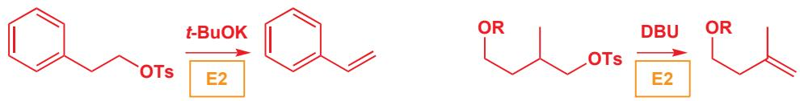

甲磺酸酯 (Chapter 15) 可以使用 DBU 发生消除，而使用醇制备烯烃的一种好方法，是直接在体系中混入 MsCl 和同一种碱 $\left(\mathrm{Et}_{3} \mathrm{~N}\right)$ ，这样甲磺酰化和消除反应都可以进行。下面是制备生物学上重要分子的两个例子。在第一个例子中，甲磺酸酯被分离出来，然后再通过 DBU 下的消除得到尿嘧啶 (RNA 中核苷酸碱基的一种) 的合成类似物 (synthetic analogue). 在第二个例子中，则使用 $\mathrm{Et}_{3} \mathrm{~N}$ 同时进行甲磺酸酯的生成和消除，得到一种糖类似物的前体。

在 Chapter 42 中有更多关于 RNA 中的碱基、糖类的内容。

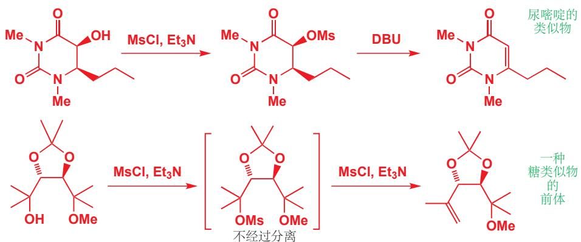

第二个例子中我们要消除的是叔醇——那么为什么不能用酸催化的 E1 反应呢？问题在于该分子含有一个对酸敏感的缩醛官能团，而这个问题被甲磺酸酯的使用所解决了。酸催化的反应也可能从右侧的叔碳中心消去甲醇。

## E1 反应可以是立体选择性的

有些化合物的消除反应结果仅有一种可能，但还有一些，则有烯烃位置不同，或双键的立体化学不同的两种(或以上)选择。接下来我们将要对控制E1反应产物烯烃的立体化学(几何构型——顺式或反式)，和区域化学(regiochemistry,双键的位置)的因素展开讨论。

只有一种可能的烯烃(产物)

有两种可能的区域异构 (regioisomeric) 烯烃

有两种可能的立体异构 (stereoisomeric) 烯烃

## E 和 Z 烯烃

Chapters 3 和 7 中，我们向您介绍了烯烃在几何上的顺反 (cis, trans) 异构体，但当您阅读到现在，Chapter 14，我们需要使定义变得更加明确。虽然顺和反在很多时候十分管用，但它们是十分不严谨的定义（就像 syn 和 anti 一样）。对几何结构更正式的表示，是立体化学描述符号 E 和 Z。对于双取代的烯烃，E 对应反式，而 Z 对应顺式。对于三或四取代的烯烃，则需首先按 Chapter 15 中判断 R 和 S 使所用的次序规则给双键每一边的两个基团排序。如果两个高次序的基团相对是顺式的，那么烯烃的构型为 Z；如果它们是反式的，则为 E。当然，分子并不懂得这些规则，有时（第二个例子中）E 型烯烃可能比 Z 型更不稳定。

译者注：Z为“在一起”的拼音首字母。p.1145还提供了另一种记忆方法。

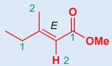

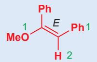

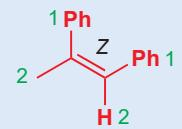

E 烯烃 (和通向 E 烯烃的过渡态) 通常比 Z 烯烃 (和通向它们的过渡态) 能量低，这是由于立体原因：取代基可以彼此离得更远。因此，可以选择生成这两种产物的反应，通常倾向于生成 E 型。例如 E1 消除生成的烯烃就正是如此：小空阻的 E 型烯烃是有利的。下面是一个例子。

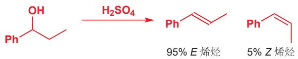

在 Chapter 39 中，我们会讨论为什么碳阳离子这种高能的中间产物，分解时的过渡态与其本身在结构上非常相似。

产物的几何构型在碳阳离子中间体离去质子的一步被决定。新的 $\pi$ 键只能在碳阳离子的空 $p$ 轨道与将要断的 C-H 键平行时，才可能形成。在下面的例子中，碳阳离子中间体有两种可以消除的（有与空轨道平行的碳氢键的）可能构象，由于空阻原因，其中一个比另一个稳定。这两种构象生成烯烃时的过渡态的稳定性关系也与上述一致——通往 $E$ 型烯烃的过渡态能量较低，因此这一反应生成的 $E$ 型烯烃要比 $Z$ 型多。这一反应是立体选择性的 (stereoselective), 因为反应主要选择生成两种可能的立体异构产物中的一种。

一种 E 型烯烃的有立体选择性的形成过程

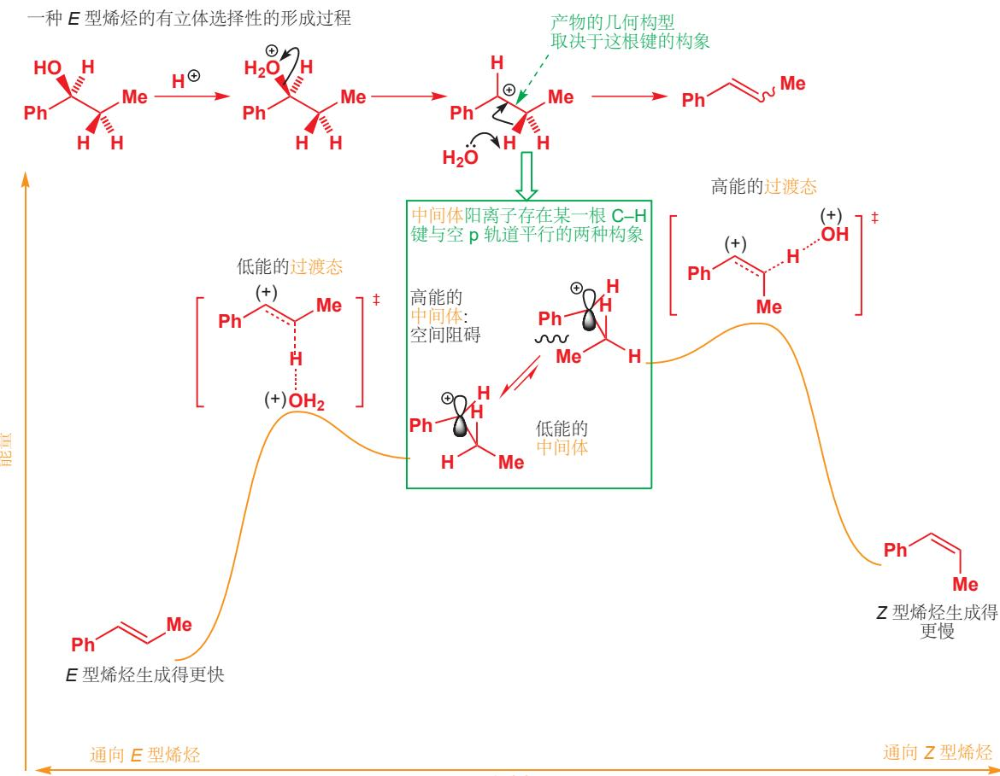  
反应坐标

## 他莫昔芬

他莫昔芬（Tamoxifen）是一种对抗最常见的癌症之一，乳腺癌的重要药物。它通过阻断女性激素雌激素(oestrogen)的活动而发挥作用。该分子中的四取代双键可以通过E1消除引入：这一过程会得到双键的位置没有区别的两种立体异构体，它们以大约相同的数目生成。他莫昔芬是Z异构体。

## E1 反应可以是区域选择性的

我们可以以相同的思路思考 E1 消除会得到的多个位置异构烯烃。下面是一个例子；其主要产物是有较多取代基的烯烃，因为它在两种可能的产物中较稳定。

\- 越多取代基的烯烃越稳定。

我们会在 Chapter 27 中介绍如何控制双键生成的几何构型的方法。

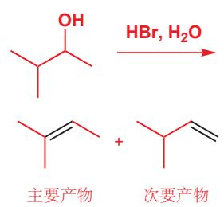

对于 E1 反应的立体和区域选择性——哪一种烯烃生成得更快的解释都是基于动力学 (kinetic) 论证的。但事实上也有一些 E1 消除是可逆的：烯烃会被酸重新质子化，并生成回碳阳离子 (您将在下下章看到的内容). 这种重质子化 (reprotonation) 过程允许在热力学 (thermodynamic) 控制下，更有倾向地/更多地生成更稳定的产物。在任何个案中，可能都不清楚到底是哪一方在运作。然而，对于接下来的 E2 反应，仅有动力学控制——E2 反应永远不会是可逆的。

这是一个相当普遍的原则。但为什么它是正确的？其原因与多取代的碳阳离子稳定密切相连。在 Chapter 15 中我们说过，当碳阳离子的空 p 轨道可以与与之平行的充满的 C–H 和 C–C 键相互作用时，碳阳离子会更加稳定。双键的 $\pi$ 体系与之类似——当空的 $\pi^{*}$ 反键轨道可以与与之平行的充满的 C–H 和 C–C 键轨道相互作用时，烯烃会更加稳定。因此有越多的相邻碳可以提供 C–C 或 C–H 键（与之相互作用），烯烃就会越稳定。

  
取代基的增加使更多的C-H和C-Cσ轨道与 $\pi^{*}$ 相互作用

我们知道了，更多取代的烯烃更稳定，但这不见得能解释为什么它生成得更快。相反，我们应该看向导致这两种烯烃生成的过渡态。它们都是由同一个碳阳离子形成的，而生成哪种过渡态取决于失去哪一个质子。失去右侧的质子（棕色箭头）会导致单取代双键部分地形成；而失去左侧的质子（橘色箭头）则会导致三取代半双键 (partial double bond) 的形成。含三取代半双键的过渡态比含部分单取代半双键的过渡态稳定，这解释了为什么多取代的烯烃生成得更快。

更多取代的烯烃有区域选择性的形成过程  
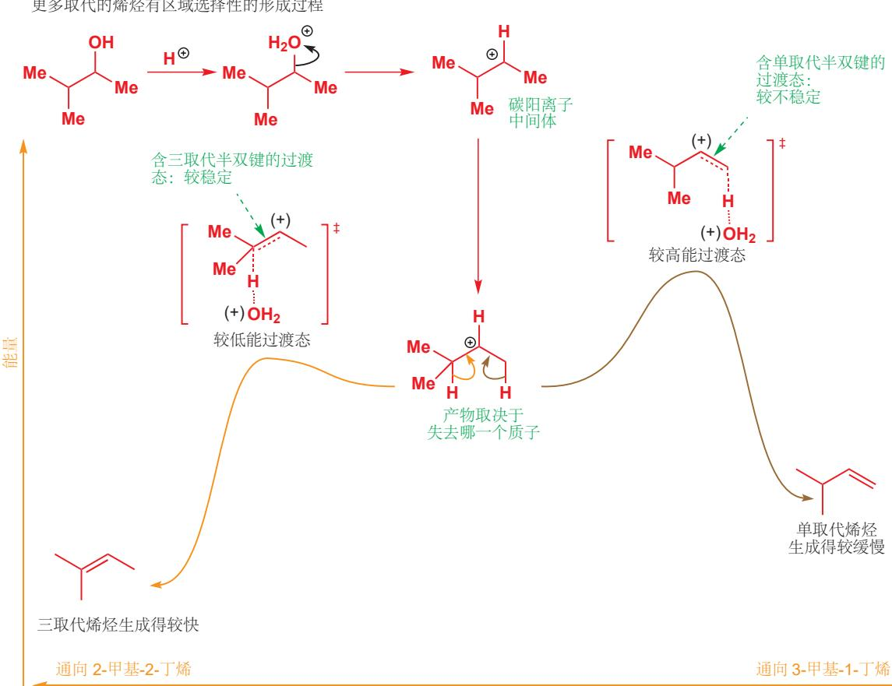  
反应坐标

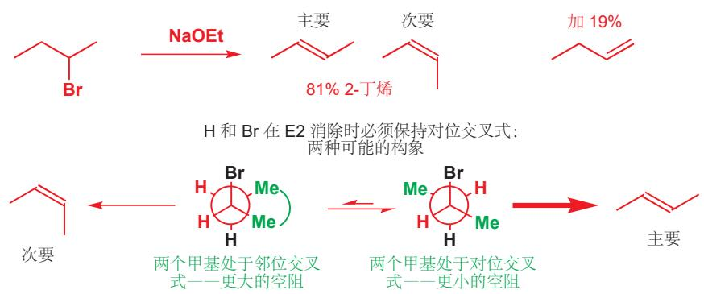

## E2 消除有反叠式过渡态

虽然 E1 反应表现出了一些立体和区域选择性，但 E2 反应选择性的程度要比它高很多，这是由于 E2 消除对过渡态的要求更加严苛所导致的。在 E2 消除中，新的 $\pi$ 键在 C-H $\sigma$ 键和 C-X $\sigma^{*}$ 反键轨道重叠时形成。最好的重叠，要求这两个轨道处于同一个平面上，现在则有两种构象符合这一要求。其中一种是 H 和 X 处于反叠式 (反式共平面) 的构象，另一种则是它们处于顺叠式 (顺式共平面) 的构象。其中反叠式比顺叠式稳定，因为两个基团处于交叉而不是重叠；但最重要的是，只有反叠式构象中的两根键 (和它们所在的轨道) 是彼此平行的。

如果您需要回顾 C-C 单键各种构型的形状和名称，请回到 p. 365.

Newman 投影式是分子的某一种构象，由一根键的侧端观察得到的投影图。如果您需要回顾如何绘制和领悟它们，请回到 p. 364.

因此 E2 消除倾向于发生在反叠式构象中，等会儿也会有很多例子证明情况属实。现在我们要讨论的是一个会生成两种立体异构体的 E2 消除反应。2-溴丁烷有两种 H 和 Br 处于反叠式的构象，其中一个又因比另一个空阻小，而作为通向主要产物 (E 型烯烃) 的构象。

哪一个质子与离去基团处于反叠式，哪一个质子就会参与消除。但这存在一个选择，而且这种选择直接决定产物的立体化学。因此这一反应是立体选择性的。

Interactive mechanism for stereoselective E2

## E2 消除可以是立体专一性的

在下一个例子中，仅有一种质子可以参与消除反应。反叠式过渡态的要求是没有可选择的余地的，不论产物会是 E 还是 Z，E2 反应都必须遵守这个原则。其结果的立体化学取决于起始原料使用的是哪种非对映异构体。我们首先需要将非对映异构体结构重绘 (旋转)，使质子和溴处在所需的反

## Interactive mechanism for stereospecific E2

叠式构象上。这时，左侧的非对映异构体中，两个苯基一个在纸平面上方，一个在纸平面下方。当氢氧根进攻 C–H 键并消去 Br $^{-}$ 时，这种排列被保留了下来，并且得到两个苯基处于反式(烯烃构型为 E)的产物。这一点在 Newman 投影式中更为直观。

而右侧的非对映异构体则会以相同的原因，最终生成 Z 型烯烃：在可参与反应的构象中，两个苯基现在在 H-C-C-Br 平面的同一侧，因此产物烯烃为顺式构型。上述两种非对映异构体各自得到了不同几何结构的烯烃，而它们的反应速率也不同。第一个反应的速率大约是第二个反应的速率的十倍。这是因为虽然反叠式始终是唯一可反应的构象，但它不见得是最稳定的。第二个反应中，可参与反应的构象的 Newman 投影式很清楚地显示了，两个苯基需要以反叠式排列：这两个大基团的空间相互作用很大，这意味着消除反应所能采取的构象在任何时间占比都很少，故减缓了反应速率。

产物立体化学取决于起始物立体化学的反应被称为有立体专一性 (stereospecific) 的。

■ 立体专一性反应并不是指立体选择性强的反应！这两个术语有在机理层面上不同的涵义，而不是相同含义的不同程度。

## - 立体选择性和立体专一性

\- 立体选择性反应可以由于在反应进程中存在的选择，有倾向地得到某一产物。要么选择活化能较低的路径(动力学控制)，要么选择会得到较稳定产物的路径(热力学控制).

\- 立体专一性反应直接地由反应机理和起始物的立体化学，单一地得到某一异构体。没有选择的余地。起始物的每一种异构体定向地得到生成物的每一种非对映异构体。

## 环己烷的E2消除

刚才这些反应的立体专一性，都是 E2 反应经历反叠式过渡态的证据。我知道反应由哪种非对映异构体起始，也知道了我们会得到哪一种烯烃，因此在反应过程上已经没有疑问了。

在下一章中 (p. 415), 您会看到, 轨道重叠的一对直立键也会鲜明地产生大的 $^{1}$ H NMR耦合常数。

取代环己烷的反应会给我们更多证据。在 Chapter 16 中您看到，环己烷的两个取代基如果想要彼此平行，那么它们必须都处于直立键。一个平伏的 C-X 键只可能与 C-C 键处于反叠式，并因此不能参与消除反应。用碱处理一卤代环己烷时，这不构成一个问题，因为虽然直立键构象较不稳定，但仍会以显著的数目存在 (见 p.375 表格)，而消除反应可以在这种构象上发生。

\- 对于环己烷上的E2消除，C-H和C-X都必须处于直立键。

在乙醇钠做碱的相同条件下，下面的两种非对映异构环己基氯却已完全不同的方式反应。它们都消去了 HCl，但非对映异构体 A 迅速地反应，并给出两种产物的混合物；而非对映异构体 B（只有氯原子所连的碳的构型有所区别）却非常缓慢地得到单一产物烯烃。我们可以放心地将 E1 机理排除，因为这两种起始物所得的碳阳离子是相同的，这意味着产物和产物的比例都应该是相同的（速率不见得相同）。

解释这类反应的关键在于画出分子的构象。两种都采用椅式构象，并且通常最大的取代基处于平伏键（或更多数目的取代基处于平伏键）是最稳定的。在这两个例子中，异丙基都是最有影响力的基团——它是带有支链的，因此如果占据直立键，则会产生十分严重的1,3-二直立相互作用。在这两种非对映异构体中，平伏的i-Pr都意味着平伏的Me：唯一的区别在于氯原子的朝向。对于非对映异构体A，氯原子被迫在主要构象中处于直立键：构象被异丙基锁定，无法被改变。直立键对Cl原子本身，与平伏键相比较不稳定，但这对于E2消除十分理想。另外，有两个氢原子与其处于反叠式，在碱的作用下可以被夺去。夺去这两种质子所形成的两种烯烃，由于多取代烯烃稳定的缘故以3:1的比例形成。

对于非对映异构体 B, 氯原子在最低能构象中处于平伏键。同样由于锁定而无法被改变。但平伏的离去基团无法通过 E2消除：在这个构象中，没有与之处于反叠式的质子。这说明了这两种非对映异构体速率上的差异。A 在几乎任何时间里，都有准备参与 E2 的直立氯；而 B 只能在极小比例的，不但不是最低能，而且全部三个取代基都处于直立键的构象里，才能使离去基团处于直立。全直立 (all-axial) 的异象体在能量上高不可攀，但只有这一种才能使 Cl 被消去。可反应的分子浓度越低，速率就越低。另外，只有一个质子与之处于反叠式，因此消除反应得到单一烯烃。

这是检验您是否能以椅式构象画出环己烷的好时机。如果您忘记了，我们在 pp. 371-2 的准则会指导您。

Interactive mechanism for diastereoisomer A

Interactive mechanism for diastereoisomer B

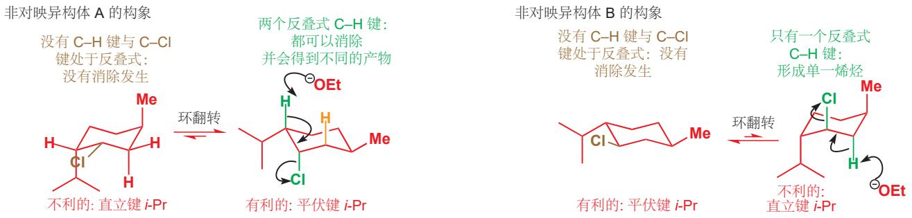

## 乙烯基卤的 E2 消除：如何制备炔烃

乙烯基溴也有 C–Br 和 C–H 反叠式排列的情况，即在 Br 和 H 彼此反式时。由乙烯基溴的 Z 型异构体发生 E2 消除得到炔烃的反应，要比由 E 型异构体快很多，因为 E 型异构体中的 C–H 和 C–Br 键处于顺叠式。

此处使用的碱是 LDA (二异丙基氨基锂, lithium diisopropylamide), 它由 i-Pr₂NH 在 BuLi 下去质子制得 (见 p.174). LDA 是一种强碱, i-Pr₂NH 的 pKₐ 大约 35; 且由于空阻较大, 不易做亲核试剂——理想的 E2 消除试剂。

  
C-H 和 C-Br 平行 (反叠式): 快速的 E2 消除

乙烯基溴本身可以通过 1,2-二溴烷烃的消除反应制备。下面是 1,2-二溴丙烷在三当量的 $R_{2}NLi$ 处理下所发生的变化：首先，消除得到乙烯基卤，然后乙烯基卤消除得到炔烃。终点炔烃充足的酸性足够使其被 $R_{2}NLi$ 质子化，这是第三当量的角色。总地来说，这个反应有一个饱和起始物，得到了一个炔锂 lithiated alkyne (并为后续反应做准备). 这可能是您遇到的第一个从不含三键的起始物合成炔烃的反应。

由 1,2-二溴丙烷 制备炔烃  

## E2 消除的区域选择性

下面是两个看起来很相似的消除反应。离去基团和反应条件都不相同，而整体上看都是消除 HX，并生成两种烯烃中的一个的过程。

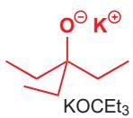

第一个是酸催化下叔醇上水的消除，得到三取代烯烃。第二个反应则是相应的叔碳上 HCl 的消除，使用了空阻非常大的烷氧基碱（比 t-BuOK 的空阻更大，因为三个乙基内部需要保持距离），反应专一地得到较不稳定的二取代烯烃。

这两个反应区域选择性的区别，其原因在于机理上的区别。我们已经讨论过了，酸催化下叔醇上水的消除通常是 E1, 而您也知道了为什么在 E1 反应中，形成多取代烯烃的过程速率快 (p. 394). 而您也应该不会感到奇怪，第二种在大空阻强碱下的消除是一个 E2 反应。但为什么 E2 会给出少取代的产物呢？毫无疑问，如果消除反应在环上发生，则环需要处于 C-H 键与离去基团反叠式的构象中：Cl 处于直立键时，环上有两个等价的氢可用于消除，对任意一个氢的消除都会得到三取代的烯烃。但此外要考虑到，无论 Cl 在环上处于平伏键还是直立键，甲基上的三个等价氢都可用于 E2 消除，并得到双取代烯烃——大位阻碱夺去并且只夺去这三个氢中的一个。下面的图表总结了这两种可能性。

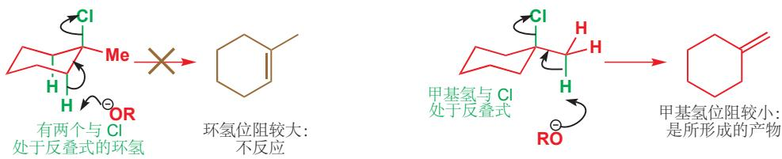

由于甲基氢所处的伯碳空阻较小，碱进攻甲基氢，并不会靠近环上的直立氢。通常，大位阻碱进行的 E2 消除得到较少取代的双键，因为最快的 E2 反应需要在最少取代的一侧去质子。并且，在少取代碳上的氢原子酸性也更强。考虑它们的共轭碱：叔丁基阴离子的碱性比甲基阴离子更强（三个给电子的烷基使叔丁基阴离子不稳定），因此对应的烷烃，叔丁烷就比甲烷酸性更弱。下面几个 E2 反应也有显而易见的空间因素，当将乙醇钠换成叔丁醇钾后，主要产物也从多取代烯烃转变为少取代烯烃。

## - 消除反应的区域选择性

\- E1 反应给出多取代烯烃。

\- E2反应可能给出多取代烯烃，但在更大位阻的碱下对少取代烯烃有更强的区域选择性。

## Hofmann 和扎伊采夫

传统上，这两个相反的倾向性——生成少取代烯烃还是多取代烯烃——分别被称作扎伊采夫规则 (Saytsev's rule) 和 Hofmann 规则 (Hofmann's rule). 您会看到这些名称的出现 (Saytsev 是俄文的音译，因此还会出现不同的拼写；请勿拼错 Hofmann，这个 Hofmann 有一个 f 和两个 n)，但记住它们的名字 (或者它们的拼写) 意义并不大——更重要的是理解烯烃生成的倾向性的原因。

## 阴离子稳定基的存在准许另一机理—E1cB

在本章结束之际，我们要来考虑一个乍一看似乎与我们之前所说相矛盾的反应。它是强碱 (KOH) 催化下的消除反应，因此看起来像是 E2. 但离去基团是氢氧根，我们断然地 (也是诚实地) 告诉您，氢氧根无法成为 E2 消除的离去基团。

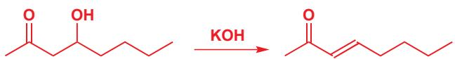

关键在于羰基的变化。在 Chapter 8 中我们提到，羰基可以稳定负电荷，p. 176 也有事实证明了羰基邻位质子的酸性。上述消除反应中，羰基邻位的质子也有相当强的酸性 ( $pK_{a}$ 大约 20)，因此首先会被夺去。这意味着质子的去除与羟基的离去不在同一时间——所生成的阴离子由于能在羰基上

■ 去质子后的阴离子被称为烯醇 (enolate) 阴离子，我们会在 Chapter 20 和后面的章中介绍。

离域，因此足以稳定存在。

虽然阴离子被羰基所稳定，它仍然愿意失去离去基团，并得到一个烯烃。这是下一步的反应。

E1cB 机理的消除步骤

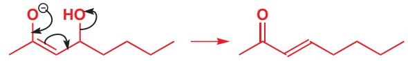

此消去过程是整个消除过程的决速步，它是单分子的，因此这类消除反应也是 E1 反应的一种。但离去基团并不是起始物分子失去的，而是其共轭碱失去的，因此我们称这一类由去质子化开始的消除反应为 E1cB (cB 指共轭碱 conjugate base). 下面是完整的机理，是其他羰基化合物普遍适用的机理。

E1cB 机理

Interactive mechanism for E1cB elimination

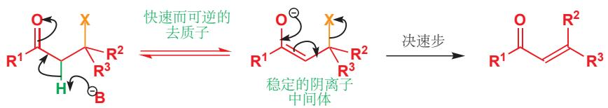

■ “E1cB”没有上下标，其c为小写，B为大写。

一定要记得， $\mathrm{HO}^{-}$ 绝不会成为E2反应的离去基团，但它可以是E1cB反应的离去基团。失去氢氧根的阴离子本身已经是一个烷氧基阴离子(醇阴离子)——并不会因为 $\mathrm{HO}^{-}$ 的离去，伴随氧阴离子的生成而不易进行。并且 $\mathrm{HO}^{-}$ 的离去还会在产物中形成共轭。上述图表也暗示了，其他的离去基团也是可行的。下面是两个甲磺酸离去基团的例子。

前一个看起来像 E1 (稳定的碳阳离子)，而后一个看起来像 E2——但事实上这两者都是 E1cB 反应。判断一个消除反应是否为 E1cB 机理最可靠的办法，是观察产物烯烃是否与一个羰基共轭，如果是这样，那么机理有可能就是 E1cB.

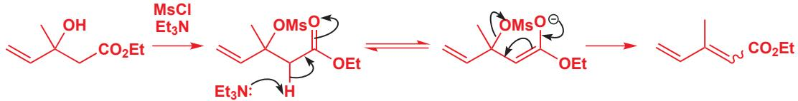

β-卤代羰基化合物 可以是相当不稳定的：一个好的离去基团，与一个酸性的质子的结合，将使E1cB机理极其容易进行。非对映异构体混合物的起始物，会首先在酸性下内酯化(Chapter 10)，然后再在三乙胺的作用下发生E1cB消除，得到一种被称作丁烯酸内酯(butenolide)的产物。

丁烯酸内酯在天然产物的结构中很常见。

您会注意到，我们将上面几个机理中去质子的步骤，都画成了一个平衡。它们都更偏向平衡左侧，因为无论三乙胺 $(\mathrm{Et}_3\mathrm{NH}^+$ 的 $\mathbf{pK}_{\mathrm{a}}$ 大约10)还是氢氧根 $(\mathrm{H}_2\mathrm{O}$ 的 $\mathbf{pK}_{\mathrm{a}}$ 为15.7)的碱性都不足以完全夺去羰基邻位的质子 $(\mathrm{pK}_{\mathrm{a}} > 20)$ . 然而，由于离去基团离去的步骤是基本不可逆的，于是少量去质子后的羰基化合物就足以使反应一直进行下去了。底物能够进行E1cB最重要的一点，是在要夺去的质子的邻位，有某种形式的阴离子稳定基(anion-stabilizing group)—不需要特别好地稳定阴离子，只要它能使质子酸性增强，那么E1cB机理就有可能发生。下面是一个两个苯环稳定阴离子，氨基甲酸阴离子 $(\mathrm{R}_2\mathrm{N}-\mathrm{CO}_2^-)$ 作为离去基团的例子。

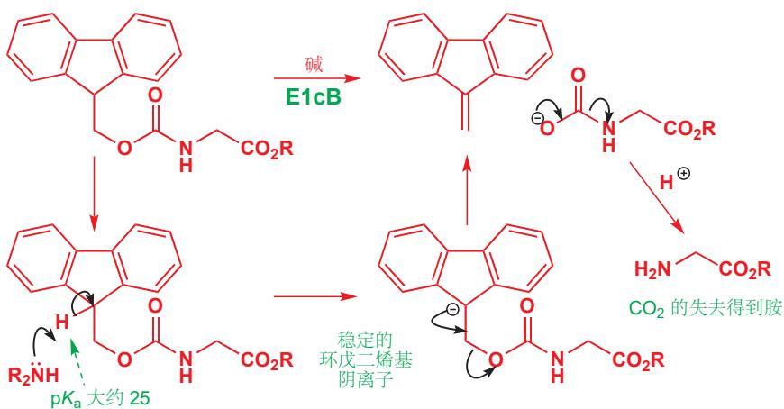

要夺去的质子有大约 25 的 $pK_{a}$ ，这是因为它的共轭碱是一个有芳香性的环戊二烯基阴离子（我们在 Chapter 8 中讨论过）。在仲胺或者叔胺做碱的情况下，发生 E1cB 消除。随后消除产物还会自发地失去 $CO_{2}$ ，并得到胺，这是 Fmoc 保护基脱除的过程，我们会在 Chapter 23 讨论它的具体应用。

  
six $\pi$ 电子芳香的环戊二烯基(茂)阴离子

## E1cB 的速率方程

E1cB 反应的决速步，是单分子的消去过程，因此您可以想象，它会有一个一次的速率方程。事实上，速率也依赖碱的浓度，因为单分子消去过程包含的阴离子物种，其浓度在刚才我们所说的平衡中，是由碱的浓度决定的。在下面的常规 E1cB 反应中，阴离子的浓度可以被表示：

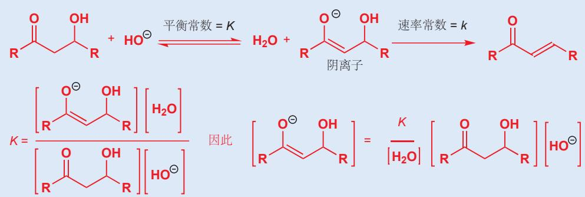

速率正比于阴离子的浓度，而我们知道了其浓度的表达式。其中水分子的浓度效果上是恒定的，那么我们就可以将此类消除反应的速率方程简化为如下形式：

→ 您在 Chapter 12 中三级速率方程的内容那里，曾遇到过这种思路。

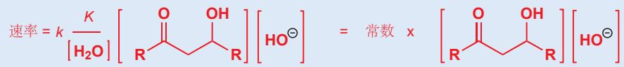

碱 (氢氧根) 仅仅是出现在了速率方程中，但这并不意味着它参与了决速步。碱浓度的增加，通过随之增加可用于消除的阴离子浓度，从而使反应加快。

## E1cB 消除的横向比较

我们可以将 E1cB 机理和其他消除机理，从离去基团和质子相对的离去时间的方面展开考虑。如果用三个刻度递变地表达这三种情况，那么 E1 就会在刻度的其中一侧：离去基团在第一步离去，而质子在第二步被夺去。在 E2 反应中，这两件事同时发生：质子的被夺去和离去基团的离去。而在 E1cB 反应中，质子在离去基团离去前被夺去。

我们之前探讨过有关 E1 和 E2 反应的区域和立体选择性。对于 E1cB 反应，它的区域选择性非常直截了当：双键在 (a) 具有酸性的质子和 (b) 离去基团之间。

E1cB 反应也可能是立体选择性的——例如刚才的反应，主要得到的是 E 型烯烃 (2:1 与 Z). 中间体阴离子是平面型的，因此起始物的立体化学是无关紧要的，我们仅需要关心产物的位阻，较小的位阻是较好的 (通常是 E 型). 例如下面的双 E1cB 消除，仅得到 E, E 产物。

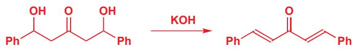

我们将向您介绍两个在意想不到的场合出现的 E1cB 消除，来完成这一章的内容。这两个不寻常的反应中，离去基团也是阴离子稳定基的一部分。首先，请尝试从青霉素 V (即盘尼西林 V, penicillin V) 首次全合成的路线中找到 E1cB 消除。

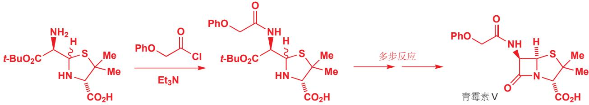

这个反应看似很简单——酰胺在碱性条件下形成——您或许期望机理如我们在 Chapter 10 中所说的一样进行。但事实上，酰氯的亲核取代是由 E1cB 消除所引起的一一无论什么时候，当您看到羰基邻位有质子的酰氯，并且有如三乙胺的碱存在时时，就应当先想到这种机理。

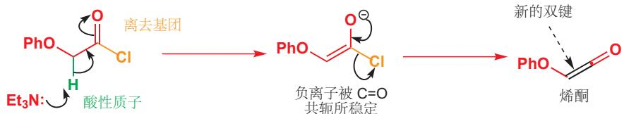

消除的产物是一个取代的烯酮——一个高反应性的物种，其父结构为您将在下下章遇到的 $CH_{2}=C=O$ 分子。正是烯酮与胺反应，产生酰胺。

第二个 “协同的” E1cB 消除在甲磺酰酯的形成反应中隐蔽地出现。我们在 Chapter 15 中就引入了磺酸酯，而在本章的 p. 391 又用到了它们，但我们一直避开（您可能会说，是一反常态的）对由磺酰氯制备它们的机理的解释。这是有意而为之的，因为 TsCl 与醇的反应按您之前可能预测过的机理进行，但 MsCl 与醇的反应则有消除的参与。

下面是由醇得到对甲苯磺酸酯的过程。醇作亲核试剂，进攻亲电的磺酰氯，而吡啶则负责移去质子以得到产物。

对甲苯磺酸酯的形成：试剂 ROH + TsCl + 吡啶

相比之下，甲磺酰氯与青霉素合成中的酰氯有一个共同的特征：都有一个相对酸性的质子，可以在碱的作用下被移去。去质子化过程后，发生氯离子的离去，这是甲磺酰酯生成的第一步，也是一个E1cB消除反应，其产物被称作硫酰烯(sulfene).

甲磺酸酯的形成：试剂 ROH + MsCl + 三乙胺

硫酰烯的亲电性质和上面提到的烯酮稍稍有所区别：醇做亲核试剂，进攻硫并得到一个碳阴离子，然后在经历质子转移得到甲磺酰酯。在硫的邻位形成阴离子并不罕见，您会在 Chapter 27 再次看到。注意，整个机理和上面我们提到的用酰氯进行酰化的机理是多么相似。

## 小结

我们将对本章讨论的三个重点进行梳理。

## 消除与取代的竞争

下面的表格总结了各种结构类型的卤代烃 (或对甲苯磺酸酯，甲磺酸酯) 在具有代表性的几种亲核试剂 (也可能做碱) 下反应的一般模式。

<table><tr><td></td><td></td><td>弱亲核试剂(e.g.  $H_2O$ , ROH)</td><td>弱碱性亲核试剂(e.g.  $I^-$ ,  $RS^-$ )</td><td>强碱性无空阻亲核试剂(e.g.  $RO^-$ )</td><td>强碱性大空阻亲核试剂(e.g. DBU, t-BuO-)</td></tr><tr><td>甲基</td><td> $H_3C-X$ </td><td>不反应</td><td> $S_N2$ </td><td> $S_N2$ </td><td> $S_N2$ </td></tr><tr><td>伯碳(无阻碍的)</td><td></td><td>不反应</td><td> $S_N2$ </td><td> $S_N2$ </td><td>E2</td></tr><tr><td>伯碳(有阻碍的)</td><td></td><td>不反应</td><td> $S_N2$ </td><td>E2</td><td>E2</td></tr><tr><td>仲碳</td><td></td><td> $S_N1$ , E1 (慢)</td><td> $S_N2$ </td><td>E2</td><td>E2</td></tr><tr><td>叔碳</td><td></td><td>E1 或  $S_N1$ </td><td> $S_N1$ , E1</td><td>E2</td><td>E2</td></tr><tr><td>阴离子稳定基的β位</td><td></td><td>E1cB</td><td>E1cB</td><td>E1cB</td><td>E1cB</td></tr></table>

表格中的一些要点:

\- 甲基卤不能消除，因为相应位置上没有质子。

\- 分支的增加有利于消除胜过有利于取代；强碱性的大空阻亲核试剂通常参与消除，除非像甲基卤那样除了取代别无选择。

\- 除非底物是叔碳，好的亲核试剂经历 $S_{\mathrm{N}}2$ ；叔碳生成阳离子中间体既可以通过E1消除，又可以作为通过 $S_{\mathrm{N}}1$ 取代。

\- 高温通过增加反应自由能中的熵 $(\Delta G = \Delta H - T\Delta S)$ 以有利于消除反应。这在两种消除方式模棱两可的情况下确保进行E1的好方法。

## 烯烃的稳定性

稳定化烯烃的因素：

\- 共轭——任何可以与烯烃共轭的事物都可以稳定它，包括羰基、腈、苯环、RO、RNH或其他双键。这是最强的一类稳定因素，通常占主导地位。

\- 取代基——烷基通过弱的 $\sigma$ -共轭稳定系统，因此更多烷基取代的烯烃更好——但要小心下一条。

\- 空阻效应——由于烯烃是平面型的、较大的，并且尤其是有带支链的取代基，和取代基 syn 排列时，烯烃变得不稳定，因此四取代烯烃通常比三取代烯烃不稳定。如果烯烃是一个稳定的环，这就不适用了，因为环本身的其他部分与碳中心相连的两根键必须为 syn 型。

## 烯烃立体化学：术语的总结

对烯烃几何结构的正式描述方法是 E 和 Z. Z 来源于德语 “zusammen (在一起)”，意味着两个次序（与 Chapter 14 中 R 和 S 命名时相同的次序规则）最高的基团在烯烃的同侧。给反式烯烃标 Z 则是十分不幸的选择！E 来源于德语 “entgegen (相反)”，意味着两个次序最高的基团在异侧（同样对于顺式烯烃是不幸的）。下面的结构上，双键每端的两个取代基都用绿色标注了相对次序，结构底端也有最终得到的几何结构的标记。

■ 这个术语只可以被用在烯烃上，也不能用于三维立体化学。

但谈论烯烃的几何结构时，顺式和反式仍可能是最常用的表达方法。通常说话者可以选择烯烃两侧最有意义，或参与正在讨论的反应的两个取代基，不考虑次序规则地说它们处于同侧（顺式）或异侧（反式）。这种表达方法更加灵活和用途广泛，可以配合画图，您只需要避免不出现歧义即可。

我们在 p.317 介绍的，用于表达相对立体化学的术语 syn 和 anti 也差不太多。没有正式的定义，为了清晰也需要画图。

## 延伸阅读

取代和消除反应的对比，请见：J. Keeler and P. Wothers, Why Chemical Reactions Happen, OUP, Oxford, 2003, chapter 11 和 F. A. Carey and R. J. Sundberg, Advanced Organic Chemistry A, Structure and Mechanisms, 5th edn, Springer 2007, chapter 5.

涉及对 DBU 和其他强碱的描述：T. Ishikawa, ed. Superbases for organic synthesis: guanidines, amidines and phospha-zenes and related organocatalysts, Wiley, Chichester, 2009. 关于保护基的描述：P. J. Kocienski, Protecting Groups, 3rd edn, Thieme, 2003.

## 检查您的理解

为确保您真正掌握了这一章的内容，请尝试解决本书 Online Resource Centre (在线资源中心) 中的习题：http://www.oxfordtextbooks.co.uk/orc/clayden2e/

## 光谱法综述

## 联系

## 基础

\- 质谱法 ch3

\- 红外光谱法 ch3

• $^{13}$ C NMR ch3

• $^{1}$ H NMR ch13

\- 立体化学 ch14

\- 构象 ch16

\- 消除反应 ch17

\- 羰基化学 ch10 和 ch12

## 目标

\- 如何用光谱法解释 $C = 0$ 基的反应

\- 光谱法告诉我们共轭 $C = C$ 和 $C = 0$ 键的反应性和所得产物。

\- 光谱法告诉我们环的大小

\- 光谱法可测定未知化合物的结构

\- 处理位置结构的一些准则

## → 展望

\- 光谱法的最终回顾，以及光谱法告诉我们的分子的立体化学信息 ch31

\- 光谱法是一种基本工具，本书余下的部分会不断地使用它

这是将光谱分析法视为一个整体进行回顾的两章中的一章。在 Chapter 31 中，我们将会处理有机化合物的完整鉴定，包括关于我们在 Chapters 14 和 17 介绍立体化学的关键部分。在本章中，我们会将前面介绍光谱分析方法和机理的章节所介绍的思想汇聚起来，并展示出它们关联的方式。随着进行，我们还将阐释本章的结构。

## 设置本章的三个原因

1. 回顾我们在 Chapters 3 和 13 中学习的确定结构的方法，来稍作进一步的延伸，并考虑它们之间的关系。

2. 展示如何将它们结合起来，并确定未知分子的结构。

3. 提供实用的数据表格，为您在确定未知结构时使用。

本章主要的数据表格在结尾出现 (pp. 423-425)。在阅读本章时，您可能愿意连同正文中的表格，也查阅它们。

我们将一并处理第 1 点和第 2 点，首先着眼于羰基化学 (Chapters 10 和 11 中讨论的) 和光谱法之间的相互关系，解决一些结构问题，然后再移向对例如用同一分子中多种元素的 NMR 解决数个问题及其他的讨论。我们希望每一节都能帮助您加深对解决结构这一问题的总体性理解。第一节将处理羰基化合物各种类别的分配。

## 光谱法与羰基化学

Chapters 10 和 11 完成了我们对于羰基化学的系统性调查，现在，我们可以将这种最重要的官能团的化学性质与光谱放在一起。

我们将羰基化合物分成了两大类:

## 1. 醛 (RCHO) 和酮 ( $R^{1}COR^{2}$ )

2. 羧酸 $\left(\mathrm{RCO}_{2} \mathrm{H}\right)$ 及其衍生物 (按照活性的顺序):

酰氯 (RCOCl)

酸酐 (RCO $_{2}$ COR)

酯 $(\mathrm{R}^{1}\mathrm{CO}_{2}\mathrm{R}^{2})$

酰胺 (RCONH $_{2}$ 、R $^{1}$ CONMe $_{2}$ 等)。

哪种光谱方法能最可靠地区分这两大类？哪种又能帮我们将醛和酮分开？哪种能让我们区分各种羧酸衍生物？什么为羰基化学提供了最可靠的证据？这些都是我每种本节要处理的问题。

## 区分醛酮和羧酸衍生物

一贯最可靠的方法是 ${}^{13}$ C NMR。化合物是环状的、不饱和的，还是具有芳基取代基都没有关系，它们都会在大约同一区域给出羰基 ${}^{13}$ C 位移。下一页挑选了一些可供我们现在讨论的例子。首先，请关注每个结构上箭头所指的羰基得以。无论其他结构如何，所有醛和酮都落在 191 到 208 ppm 之间，而所有的羧酸衍生物（种类非常丰富）都落在 164 到 180 ppm 之间。这两组区域不相互重叠，因而很容易区分。举个例子，分配页边的酮酸的光谱是很简单的。

## - $^{13}\mathrm{C}$ NMR 区分醛酮和羧酸衍生物

所有醛酮的羰基碳都在大约 200 ppm 处共振，而羧酸衍生物通常在大约 175 ppm 处共振。

羰基的 $^{13}$ C NMR 位移

<table><tr><td>羰基</td><td> $\delta_{C}$ , ppm</td></tr><tr><td>醛</td><td>195–205</td></tr><tr><td>酮</td><td>195–215</td></tr><tr><td>酸</td><td>170–185</td></tr><tr><td>酰氯</td><td>165–170</td></tr><tr><td>酸酐</td><td>165–170</td></tr><tr><td>酯</td><td>165–175</td></tr><tr><td>酰胺</td><td>165–175</td></tr></table>

## 关于它们结构的更多信息

## 醛酮

第一种醛是香草醛，它来源于香草荚，是比如冰激凌中特征性的香草风味的来源。香草是一种北美兰花植物的种荚。“香草精 (Vanilla essence)”由人工合成的香草醛制得，由于从植物中提取的香草醛还具有少量的其他香味化合物，它们的味道略有不同。第二种醛是视黄醛。当您用眼睛看这些结构时，照进您眼睛中的光线会使视网膜上的它们在顺式和反式间转换，来产生神经冲动 (同样可见 Chapter 27)。

示出的两种酮均为香味化合物。第一种，(-)-香芹酮，是留兰香油 (spearmint oil) 的主要成分 (70%)。香芹酮是一种有趣的化合物：在 Chapter 14 中，您了解了对映体的概念，指一对互为镜像的异构体，(-)-香芹酮的镜像 (+)-香芹酮是莳萝油 (dill oil) 的主要成分 (35%)。我们的味觉可以尝出不同，但 NMR 机器不能区分，两种香芹酮都具有完全相同的 NMR 谱图。更多细节请见 Chapter 14！第二种酮是“覆盆子酮”，它是覆盆子香味大部分的来源，而很多“覆盆子”食品的香味则完全归结于它。与 OH 相连的芳香碳位于 154.3 ppm (它是与氧相连的不饱和碳原子，处于 100–150 ppm 区域)，它也不会干扰我么您对在 208.8 ppm 的酮信号的判断。酮的 C=O 位移都在大约 200 ppm 处，这两者都缺乏质子 NMR 中 δ > 8 的信号。

## 羧酸衍生物

硫辛酸会在氧化还原反应中 (Chapter 42) 中使用它们的 S-S 键，而莽草酸则是生命体中很多具有苯环的化合物，如苯丙氨酸的形成中间体 (Chapter 42)。水杨酸的醋酸酯为阿司匹林，和最后一个例子，布洛芬一样是止痛药。

第一种酰氯是醋酸酯合成的流行试剂，您在 Chapter 10 中见过它的反应。我们选取了三种环状酸酐作为例子，它们都与一个重要的反应 (Diels–Alder 反应) 相关，您将在 Chapter 34 中学习。

第一种酯，甲基丙烯酸甲酯是一种散装化学品 (生产量大)。正是它作为单体生产了聚合物亚克力/有机玻璃 (Perspex)，是被用于窗户和屋顶的透明刚性塑料。第二种酯是小手术使用的重要局部麻醉剂。

其中一种酰胺是我们现在熟悉的 DMF，另一种则是一种四肽，因而它具有一个在末端的羧基和三个酰氨基。虽然此肽中的四种氨基酸完全相同 (丙氨酸，简写作 Ala)，但碳 NMR 忠实地接收到了四种因与链末端的距离不同而不同的 C=0 信号。

在此阶段，您不需要了解反应发生的方式。意识到光谱法可以让我们在了解反应发生的方式前(正推)，先知道反应的结果(逆推)是更为重要的。尽管如此，第二种结构的碳骨架与起始原料相同，在化学上更像是正确的。

这种区别在结构问题的解决上至关重要。下面对称的炔二醇在酸中可与 $\mathrm{Hg(II)}$ 催化剂发生环化，所得产物从NMR获知有如下的结构碎片。产物是不对称的，两个 $\mathrm{CMe}_2$ 基仍然存在，但却有所区别。此外， $\mathrm{CH}_2$ 基的化学位移显示它与 $C = O$ 相连，但不与氧相连。这为我们留下了两种可能的结构。一种是酯，一种是酮。但由于 $C = O$ 位移位于 $218.8~\mathrm{ppm}$ ，因而第二种结构毫无疑问是正确的。

有未知产物的反应

## 提供质子 NMR 区分醛和酮很简单

现在，请关注前面两组，醛和酮。两种醛的化学位移都比两种酮小，但它们太相近，这种区分不太可靠。能非常明白地区分出醛的方法，是CHO会在9-10 ppm出现特征性的质子信号。因此，您应当先通过碳NMR从C=O位移中区分中醛和酮，然后再通过质子NMR区分它们二者。

## - 醛质子具有特征性

位于 9–10 ppm 的质子表明醛。

## 通过碳 NMR 区分羧酸衍生物很困难

现在，请考察 p.409 的其他区块。四种羧酸都在生物或医药下十分重要。它们的 C=O 位移，不但与醛和酮的不同，它们与彼此也非常不同。

羧酸衍生物的相对活性已于 Chapter 10 中讨论。

接着的五种化合物 (两种酰氯和三种酸酐) 都是活泼的羧酸衍生物，再下面的五种酯和酰胺都是不会破的羧酸衍生物，但这十种化合物的 C=O 位移全都落在了同一范围之中。C=O 化学位移显然与不是检查化学活性的好方法。

碳 NMR 不能做到的是区分这几类羧酸衍生物。所展出的四种羧酸之间的差异要比不同类别的羧酸衍生物之间的还要大。如果我们向您展示一些包含其中两种基团的化合物，那么您能够分配它们的信号吗？

\*不\*，我们做不到。每种情形中，羰基信号间的差异都仅有几 ppm。虽然酰氯与酯和酰胺对比活性极强，但 NMR 光谱法通过去屏蔽所测量的羰基碳原子的缺电子性，很明显没有反映这样的特点。碳 NMR 可靠地将羧酸衍生物作为一个整体与同样作为一个整体的醛酮区分，但在羧酸衍生物组内，它甚至无法区分最活泼的和最不活泼的。那么我们该如何区分羧酸衍生物呢？

## 红外光谱极好地区分羧酸衍生物

更好的测定方式利用 C=O 基在 IR 伸缩频率上的差异。我们在 Chapter 10 中讨论过这个问题 (p.206)，我们注意到，OCOR、OR 或 $NH_{2}$ 上的孤对电子有将电子放入羰基的给电子作用，而它们的负电性也导致了从 C=O 基中拿出电子的诱导吸电子作用，这两种效应存在竞争。共轭将电子给进 $\pi$ 键的 $\pi^{*}$ 轨道，于是键长会变长，强度会减弱，C=O 双键会变得更像一根单键，它的伸缩频率也会向单键区域移动，即变小。诱导吸电子则使 $\pi$ 键更短，更强，频率亦变大。

回顾共轭和诱导效应之间的区别请见 Chapter 8, p. 176.

这些效应根据取代基的不同，以不同方式达到了平衡。氯是弱的孤电子给体（孤电子位于较大的3p轨道中，并与碳的2p轨道交叉地重叠）和强的吸电子体，于是酰氯在高频率吸收，几乎位于三键区域。酸酐则在两个羰基间有一个氧原子，诱导吸电子仍然很强，但由于孤对电子要给向两个方向，因而共轭很弱。在酯中，这两种效应得到了很好的平衡，诱导效应稍强（虽然氧与2p轨道匹配，但它的负电性非常强，同样会很强地吸电子）。最后，酰胺主要受共轭影响，因为氮电负性比氧小，是强得多的电子给体。

■ 酸酐的两个峰来自 C=O 基的对称伸缩和反对称伸缩，见 Chapter 3, p. 70。

## 与 $\pi$ 电子或孤电子共轭可影响 IR C=O 伸缩

我们还需要关注当共轭来自 $\pi$ 键而非孤电子时所起到的作用。这会使此概念更一般化，除羧基外也适用于醛酮。我们如何检测不饱和羰基化合物是共轭的还是非共轭的呢？请对比下面两种不饱和醛。

IR 中关键的区别在于 C=O 伸缩的频率 (受共轭降低了 $40 \, cm^{-1}$ ) 和 C=C 伸缩的强度。在 ${}^{13}C$ NMR 中，共轭烯醛的 C3 从烯烃区域移到了羰基区域，这表明碳原子必然变得缺电子。在质子 NMR 中，有很多的影响存在，很可能最有用的是，共轭烯烃中质子向低场区移动，尤其是 C3 上的质子 (和碳谱一样！)。

## ● 取代基对 C=0 伸缩频率的效应总结

由于羰基的红外频率遵从这样一种可预测的模式，建立关于它的简单对应表格是可行的，我们仅需要三种因素。其中的两种我们已经讨论过——共轭（使频率降低）和诱导效应（使频率升高）。第三种是小环造成的效应，这需要我们有更广阔的背景来审视。

## 小环向环内引入张力并在环外具有更高的 s 成分

■ 三元环当然是平面状的。但其他的环实则不是，四元环有轻微的弯曲，五元环和六元环则更甚。Chapter 16已有关于环的构象，张力更细致的讨论。

只有至少六元环状的酮可以在羰基处达到完美的 $120^{\circ}$ 角。在较小的环中，由于轨道必须在小于理想角度的情况下重叠，因而会是 “有张力的 (strained)”。

对于四元环，角度实为 $90^{\circ}$ ，在羰基上存在 $120^{\circ} - 90^{\circ} = 30^{\circ}$ 的张力。五、四、三元环张力的效应如下所示。

无张力酰胺 $1680 \mathrm{~cm}^{-1}$

盘尼西林中的 $\beta$ -内酰胺 $1715 \mathrm{~cm}^{-1}$  

## 内酰胺 C=0 伸缩频率

一个很好的延伸例子是环状酰胺，即内酰胺(lactams)间 C=0 伸缩频率的差异。盘尼西林类抗生素都包含被称为 β-内酰胺的四元环。这些化合物中的羰基伸缩频率都超过六元环内酰胺，也是您应当认为无张力酰胺所具有的 $1680 \, cm^{-1}$ 。

但为什么张力会导致羰基频率的上升呢？伸缩频率的上升，显然意味着 C=O 键的缩短和加强，即向着三键区域移动。在六元环中，由于轨道的角度和键角相同，形成羰基周围的 $\sigma$ 骨架的 $sp^{2}$ 轨道可以完美地与它们要连接的碳原子的 $sp^{3}$ 轨道重叠。但在四元环中，轨道并不指向邻位碳原子，轨道指向环外，这有效地迫使键弯曲并降低了重叠的程度。

在理想上，我们希望轨道角也是 $90^{\circ}$ ，以于键角相同。但在理论上，只有我们使用纯 $\mathbf{p}$ 轨道而非 $\mathrm{sp}^2$ 杂化轨道时，得到 $90^{\circ}$ 的键角才是可能的。侧边的图中显示了这一的假设情况。如果这样做，那么与氧成 $\sigma$ 键的就是纯s轨道。极端情况不可能，但真实情况会是它们之间的妥协（即键角越小，杂化轨道的p成分越多）。环上的键会具有更多的p成分——也许变为 $\mathrm{s}^{0.8}\mathrm{p}^{3.2}$ ——以使它们更接近所需的 $90^{\circ}$ 角，于是与氧成的 $\sigma$ 键就具有了少量额外的s成分。由于s轨道比p轨道小得多，因而有更多的s成分便意味着所成的键更短。

## IR 光谱法中 C=0 伸缩频率的简单计算

最好的方法是将所有的羰基频率与饱和酮 $(1715\ \text{cm}^{-1})$ 关联。我们可以将所了解到的信息总结在一个表格中。

p 轨道间的
角度是 $90^{\circ}$ 不正确但却是
理想化的
排列方式
键间的
角度是 $90^{\circ}$

注意观察，在这个简单的表格中（对于完整信息，您同样应该查阅专业书籍），“30 cm $^{-1}$ ”的调整算是较多的（如烯烃和芳烃导致的-30 cm $^{-1}$ ），但环的每一次减小所造成的增加达到35 cm $^{-1}$ （30调到65 cm $^{-1}$ ，然后65调到100 cm $^{-1}$ ），Cl和NH $_{2}$ 则分别有+85和-85 cm $^{-1}$ 这样极大的影响。如果您想要估算您所提出的结构中的C=O频率，那么请在1715 cm $^{-1}$ 的基础上加或减相应的调整，您会得到合理的结果。

取代基对 IR 羰基频率的效应

<table><tr><td>效应</td><td>基</td><td>C=0 伸缩频率, cm-1</td><td>频率改变量a, cm-1</td></tr><tr><td rowspan="4">诱导效应</td><td>Cl</td><td>1800</td><td>+85</td></tr><tr><td>OCOR</td><td>1765, 1815</td><td>+50, +100</td></tr><tr><td>OR</td><td>1745</td><td>+30</td></tr><tr><td>H</td><td>1730</td><td>+15</td></tr><tr><td rowspan="3">共轭</td><td>C=C</td><td>1685</td><td>-30</td></tr><tr><td>芳基</td><td>1685</td><td>-30</td></tr><tr><td>NH2</td><td>1630</td><td>-85</td></tr><tr><td rowspan="3">环张力</td><td>五元环</td><td>1745</td><td>+30</td></tr><tr><td>四元环</td><td>1780</td><td>+65</td></tr><tr><td>三元环</td><td>1815</td><td>+100</td></tr></table>

$^{a}$ C=0 伸缩频率与典型饱和酮频率 (1715 cm $^{-1}$ ) 的差值。

请以页边的五元共轭不饱和内酯为例试一试。需要加酯基的 $30 \, cm^{-1}$ ，减双键的 $30 \, cm^{-1}$ ，再加五元环的 $30 \, cm^{-1}$ 。前两个抵消了，剩下 $1715 + 30 = 1745 \, cm^{-1}$ 。此化合物实际上在 $1740 - 1760 \, cm^{-1}$ 吸收，估算是准确的！

## 炔烃和小环的 NMR 光谱

小环在环内具有更多 p 成分，在环外具有更多 s 成分的思想同样也可以解释小环的质子 NMR 位移。小环上的氢会不寻常地在更高场共振，我们一般认为 $CH_{2}$ 基位于 1.3 ppm，但环丙烷上的氢介于 0 和 1 ppm 之间，甚至可能表现出负的 $\delta$ 值。小环在骨架上更多的 p 成分同样意味着环外 C–H 键有更高的 s 成分，这意味着键更短，屏蔽更大， $\delta$ 值更小。

## 三元环和炔烃

三键 (如炔烃和 HCN) 的 s 成分较多，我们在 Chapter 8 中用此解释了它们上 C-H 质子不寻常的酸性，在 Chapter 3 中，我们也曾解释过这些 C-H 键的伸缩频率。和炔烃一样，三元环也具有第一种特点，即在碱中不寻常地容易被去质子。下面的两个分子，除了右侧分子中了 C-C 键关成了一个三元环，其他完全相同，但它们发生去质子的位置却有所不同。第一种是一个邻位锂化反应，我们在 Chapter 24 中讨论过。

那么，炔烃的 NMR 光谱如何呢？凭借相同的论证思路，由于 C 原子为 sp 杂化，并用 sp 轨道（即 50% 的 s 成分）成它的 $\sigma$ 键，因而炔烃上的质子应该会出现在 NMR 的很高场区。烯烃上质子的 $\delta_{H}$ 通常约为 5.5 ppm，而炔烃上的质子则落在它与饱和碳原子之间， $\delta_{H}$ 2–2.5 ppm。位移有所降低，屏蔽有所增强，这来源于感应电流的产生，不含节面的两根 $\pi$ 键所产生的感应电流构成一个圆筒，环绕着直线型的炔烃，而质子正好在圆筒的内部，即感应电流与外磁场同向的屏蔽区域（与处在去屏蔽区域内的烯烃质子正好相反）。圆筒所起到的屏蔽作用固然应当很好，由此再与烯烃比较，也可说明 s 成分的增多在升高位移上起到的举足轻重的作用了。

在 Chapter 13, p. 296 中，您见到排列成 “W” 形的键可以产生一个小 $^{4}J_{HH}$ 偶合。

这意味着，炔烃上的碳原子也同样会在比预期更高的场出现，此场达不到烯烃区域，但也在大约 $\delta_{\mathrm{C}}$ 60-80 ppms成分的论证思路是重要的，与此同时，在屏蔽不能起到影响的IR伸缩频率上， $\mathrm{C} \equiv \mathrm{C}-\mathrm{H}$ 伸缩非常强，在大约 $3300 \mathrm{~cm}^{-1}$ ，对应于非常强的C-H键。

一个简单的例子是一种醚，3-甲氧基-1-丙炔。只看积分，我们便可以分配谱图，在 2.42 ppm 处的 1H 信号，最高场的信号，很明显是炔烃质子。注意观察，它同时也是一个三重峰， $OCH_{2}$ 基上的质子则是双重峰（说明炔烃质子与绿色氢偶合）。此处出现的 ${}^{4}J_{HH}$ 较小（大于为 2 Hz），虽然在键的排列上并不能找到 “W” 的形状，但这样的偶合在炔烃中是常常能够找到的。

一个更有趣的例子来自甲醇对 1,3-丁二炔（也叫二乙炔，diacetylene）的碱催化加成反应。形成的产物具有一根双键和一根三键，其 $^{13}\mathrm{C}$ NMR很清楚地表现出了双键更大的屏蔽能力。

您可能已经注意到，我们将双键画成了顺式 (Z) 构型。我们通过质子 NMR 获知了这一结果，前者显示出烯烃两端质子存在一个 6.5 Hz 偶合 (相比于反式偶合小得多，见 p. 295)。同样还有刚刚描述过的一个长程偶合 ( $^{4}J = 2.5 \, Hz$ ) 和一个炔烃质子与烯烃末端质子之间小的非常长程的偶合 ( $^{5}J = 1 \, Hz$ )。

## 质子 NMR 可区分环己烷上的直立和平伏质子

偶合是一种沿键 (through-bond) 现象，我们知道顺式和反式烯烃中的偶合是有所差异的，反式烯烃中的轨道完美地平行，于是偶合常数会大得多。环己烷中反式的双直立质子也存在这样完美平行的轨道。因而双直立质子的偶合常数通常在 10–12 Hz 之间，直立/平伏质子和平伏/平伏质子间的偶合远小于此 (2–5 Hz)。

→ 烯烃中的偶合已于 p. 295 阐述。

这使得对构象的分配十分容易。下面简单的酯中的黑色 H 表现为一个三重三重峰，包含两个较大的偶合常数 (8.8 Hz)，这必然是与直立质子 (绿色) 形成的，还有两个较小的偶合常数 (3.8 Hz)，与平伏 Hs (棕色) 形成的。出现这样的情况所必须具备的前提条件，是黑色 H 本身直立，因而酯基必然平伏。右侧的乙酸酯则非常不同：其谱图仅存在一个简单的三重峰和两个较小的偶合常数 (3.2 Hz)，不是直立/直立偶合。因而唯一的可能性是黑色质子平伏，两个 3.2 Hz 偶合分别是它与它平伏的邻居以及它直立的邻居造成的，酯基在此化合物中直立。

烯烃中的质子-质子偶合已于Chapter 13中讨论，环己烷的构象于Chapter 16中讨论。能精确地阐释影响环己烷中偶合的因素的Karplus关系将于Chapter 31中讨论。

在 Chapter 31 中，您会了解为什么在此化合物中，酯基倾向于直立。

## 不同核之间的相互作用会给出巨大的偶合常数

我们之前都在考虑氢原子间的偶合，您可能疑惑，为什么我们要忽略其他 NMR 活性核间的偶合呢？为什么 ${}^{13}$ C 不会引起相似的偶合现象呢？在本节中，我们将不但考虑同种原子核，如两个质子

注意，只有当我们在质子NMR谱图中只看到一个双重峰时，才意味着这样的异核偶合的出现。一般来说，只要有一个双重峰存在，那么就至少还会有一个相似的信号存在，因为所有的偶合都是两次两次地出现的(A与B偶合的同时B也与A偶合！)。但如果与另一个元素偶合(比如磷)，那么在这两种元素的谱图中该偶合都只会出现一次。Wittig试剂具有一个 $\mathrm{A}_3\mathrm{P}$ $(\mathrm{CH}_3 - \mathrm{P})$ 体系:质子A以一个双重峰出现，磷原子在磷谱上也以一个四重峰出现，虽然原子在各自谱图上的频率不同，但以Hz测量的偶合常数是相同的。

间的偶合，称为同核偶合 (homonuclear coupling)，还将考虑不同种原子核间的偶合，比如质子核氟原子间，或 ${}^{13}C$ 和 ${}^{31}P$ 间的偶合，称为异核偶合 (heteronuclear coupling)。

有两个原子核尤为重要，那就是 ${}^{19}F$ 和 ${}^{31}P$ ，由于很多有机化合物都包含这两种元素，它们的天然丰度基本上都是 100%，并且自旋 I = 1/2。我们将开始于包含它们中一个的有机化合物，并考察 ${}^{1}H$ 和 ${}^{13}C$ 谱图所发生的变化。事实上，在分子中找到 ${}^{19}F$ 或 ${}^{31}P$ 原子是很容易的，因为它们会与几乎所有邻近碳、氢原子发生偶合。它们可以成很多种键，因此存在 ${}^{1}J$ 偶合，例如 ${}^{1}J_{CF}$ 或 ${}^{1}J_{PH}$ 都是可能的，不过更“一般”的偶合是 ${}^{2}J_{CF}$ 或 ${}^{3}J_{PH}$ ，相比之下， ${}^{1}J$ 偶合常数太大了。

我们会由一个简单的磷化合物，亚磷酸 $\left(\mathrm{H}_{3}\mathrm{PO}_{3}\right)$ 二甲酯，开始。这种酸，以及它的酯的结构是不确定的。它们可以以在磷上有一对孤电子的 P(III) 化合物存在，也可以以具有 P=O 双键的 P(V) 化合物存在。

事实上，亚磷酸二甲酯具有一个 1H 双重峰，偶合常数是惊人的 693 Hz: 在 250 MHz 机器上，两条线分开超过 2 ppm，很容易忽视它们属于同一个双重峰。这只会是非常巨大的 ${}^{1}J_{PH}$ 造成的。此化合物具有一根 P-H 键，因而 P(V) 结构是正确的。甲基中质子的偶合小得多，但对于沿三根键的偶合来说仍然是较大的 (18 Hz 的 ${}^{3}J_{PC}$ )。

接下来，请考虑您在 Chapter 11 的结尾遇到的用于将醛和酮转化为烯烃的 Wittig 反应的磷盐。它的结构并不存在质疑，举这个例子仅仅为了说明，碳谱中也存在与磷的偶合：甲基在 $\delta_{C}$ 10.6 ppm 出现，包含 57 Hz 的 ${}^{1}J_{PC}$ ，这比典型的 ${}^{1}J_{PH}$ 小。我们从没有讨论过与 ${}^{13}C$ 的偶合：这是我们将要做的。

## 碳NMR谱图中的偶合

我们会用与氟的偶合引入这一节。氟苯是很好的例子，它具有各种都与氟原子偶合的碳原子。

本位 (Ips0) 也可以加入到取代苯上位点的俗称序列 (邻位 ortho，间位 meta，对位 para) 中。本位碳是直接与取代基相连的碳。

直接与氟相连的碳 (本位碳) 具有一个非常大的 ${}^{1}J_{CF}$ 值，大约为 250 Hz。更远距离的偶合仍然显著：PhF 中环上所有的碳都会与氟偶合，随着碳越来越远，J 值逐渐衰减。

三氟乙酸是一种重要的有机酸 (Chapter 8)，也是 ${}^{1}$ H NMR 的良好溶剂。CF $_{3}$ 基团中的碳原子同等地与全部三个氟原子偶合，于是表现为一个四重峰，有较大的 ${}^{1}J_{CF}$ 283 Hz，与 PhF 中的大致相同。甚至是羰基碳，也表现为一个四重峰，不过偶合常数小得多 $(^{2}J_{\mathrm{CF}}$ 是 $43\mathrm{Hz})$ 。也注意观察， $\mathrm{CF}_3$ 碳原子有多么低场！

## 质子和 $^{13}\mathbf{C}$ 之间的偶合常数

这样说来，您可能会问，为什么无论在碳谱还是在氢谱中，我们都不能很明显地看到 $^{13}\mathrm{C}$ 和 ${}^{1}\mathrm{H}$ 之间的偶合呢。在氢谱中，问题的答案很简单：由于 $^{13}\mathrm{C}$ 丰度很低 $(1.1\%)$ ，大多数质子都与 $^{12}\mathrm{C}$ 成键：只有 $1.1\%$ 的质子会与 $^{13}\mathrm{C}$ 成键。但如果您仔细观察氢谱中的基线 (baselines，即通常看到的氢原子峰)，您会在强峰的两边看到大约为 $0.5\%$ 峰高的小峰。它们便是属于这些与 $^{13}\mathrm{C}$ 原子成键的质子的 $^{13}\mathrm{C}$ 伴线 (satellites)。

作为例子，请再次观察我们在 p. 294 见过的 2-己酮的 500 MHz $^{1}$ H NMR 谱图。当将谱图中的基线垂直放大时，我们便能看到 $^{13}$ C 伴线了。属于甲基质子的单重峰事实上在属于 1% 的与 $^{13}$ C 偶合的质子的小双重峰之间。相似地，谱图中的每个三重峰也都有两个小三重峰伴随左右。这两个小三重峰组成了一个双重三重峰，包含一个较大的与 $^{13}$ C 的 $^{1}J$ 偶合常数 (在 130 Hz 左右) 和一个较小的与两个等价质子的 $^{3}J$ 偶合。

  
$^{13}$ C 伴线常常会被遗失在谱图的背景噪音 (background noise) 中，因而我们不需要关心。然而，在故意用 $^{13}$ C 标记的化合物的 ${}^{1}$ H NMR 谱图中， $^{13}$ C 丰度达到了 100%，于是您可以看到偶合的存在。对于方才我们见到的 Wittig 试剂，当将甲基用纯 ${}^{13}$ C 标记时，便能表现出一个 3H 双重双重峰，有典型的大 ${}^{1}J_{CH}$ 值 135 Hz。

这便提出了另一个问题——我们能在 13C NMR 谱图中看到 135 Hz 偶合吗？我们肯定也应该在 ${}^{13}$ C NMR 谱图中看到与质子的偶合。

## 为什么在一般的 $^{13}\mathrm{C}$ NMR谱图中看不到与质子的偶合呢？

在碳谱中，我们始终都只能看到单重峰。而这是由于我们记录谱图的方式所致的。 $^{1}J_{CH}$ 的值太大了，如果我们记录包含所有偶合的 ${}^{13}C$ 谱图，那么相互重叠的峰就会给我们造成麻烦。在相同的光谱仪上运行时， ${}^{13}C$ 核共振的频率大约是质子的四分之一。因此 “400 MHz 机器”（记得，磁场强度是以质子共振的频率描述的）会在 100 MHz 给出 ${}^{13}C$ 谱。100–250 Hz 的偶合常数 ( $^{1}J_{CH}$ ) 会覆盖 2–5 ppm 的区域，具有 $^{1}J_{CH}$ 的大约在 125 Hz 的 $CH_{3}$ 会给出几乎覆盖了 8 ppm 的四重峰。

因此，质子偶合 ${}^{13}$ C 谱图可以帮我们非常容易地区分 $CH_{3}$ 、 $CH_{2}$ 、CH 和季碳，那为什么它们得不到广泛地使用呢？上方的例子是我们精挑细选出来的，是说明质子偶合光谱的最佳形式。但不幸的是，这并不是典型的例子。更常见的情况是，交叠的峰的混淆让它的使用显得并无价值。因此 ${}^{13}$ C NMR 谱图通常是在用次级无线电波频率源 (secondary radio frequency source) 照射整个 10 ppm 质子光谱时被记录的（注：质子去偶）。在此过程中，质子的能级会被平均化，偶合也会全部消失，便得到了我们通常见到的单重峰。

对于本章的剩余部分，我们将不再引入新的理论或新的概念。我们会将之前的知识应用在一系列例子上，说明化学家用光谱法识别化合物的过程。

## 通过光谱法识别产物

## 含糊的反应产物

→ 指 diazonamide A 的例子 (p. 45)。

在 Chapter 3 中，我们给出了一个被错误识别的化合物，人们用 X-射线晶体学分析，但把化合物中的一个 O 原子和一个 N 原子被搞反了。另一个在包含 O 或 N 的结构之间产生的模糊，是由羟胺 $\left(\mathrm{NH}_{2}\mathrm{OH}\right)$ 对简单烯基酮的加成反应引起的。此缩合反应会给出一个分子式为 $C_{6}H_{11}NO$ 的化合物。但它的结构是什么呢？首先，我们可以想想我们认为它会是什么：在识别结构的过程中这并不是必须的，但它会提供帮助。氮比氧更加亲核，因此我们可能认为是它先发生了加成。但是，它究竟会直接加成到羰基上，还是按我们将在 Chapter 22 中描述的共轭方式加成呢？这两种方式都会形成一个可以发生环化的中间体。

羟胺氮原子的共轭加成

两种可能的异构体产物是一次长久辩论的主题，但若有了产物的 IR 和质子 NMR 谱图，质疑就会消失了。IR 表明不存在 NH 伸缩。NMR 则表没有烯烃质子，但有一个在 2.63 ppm 的 $CH_{2}$ 基。只有第二种结构是可能的。

现在，我们需要着眼于一些不同类的问题，并体会各种光谱法在结构确定中合作的方式。

## 光谱法可以检测活泼中间体

不要关心机理的细节：我们使用了在 Chapter 11 中介绍的“±H+”的缩写，并将水被消除，或肟形成的机理进行的简化——亚胺(和肟)形成的完整机理可以在 Chapter 11，p.229 上找到。但在本章中，我们更关心的是产物的结构。

有些在反应机理中提出的中间体看上去并不现实，如果它们可以得到分离，或者它们的结构可被确定，便会令人舒服。当我们要提出一种中间体时，如果我们确认它真的被制出来了，那么我们会更有信心。当然，确认中间体的形成并不是必要的证据，即便我们不能分离出中间体，也并不代表它不参与反应的发生。我们将以烯酮作为例子。

烯酮（ketene）看上去便十分不现实。它是具有连在同一个碳原子上的两根 $\pi$ 键的 $\mathrm{CH}_2 = \mathrm{C} = \mathrm{O}$ ( $\mathrm{C} = \mathrm{C}$ 和 $\mathrm{C} = \mathrm{O}$ )。由于中心碳原子是 sp 杂化的，具有两根直线型 $\sigma$ 键和两条互相成直角，并都与 $\sigma$ 键成直角的 p 轨道，因而上述两条 $\pi$ 键的轨道必须正交。这样的分子能够存在吗？当将丙酮蒸汽加热到非常高的温度 (700–750 °C) 下时，便可以蒸出甲烷，人们认为另一个产物便是烯酮。所分离出的是烯酮的二聚体 $(\mathrm{C}_4\mathrm{H}_4\mathrm{O}_2)$ ，并且即使是二聚体，其结构也存在争议。

谱图很好地符合了酯结构，而不是更对称的二酮结构。谱图显示，存在三种质子（1,3-环丁二酮只存在一种），双键上的一个质子和环中 $CH_{2}$ 基中的质子存在烯丙型偶合。羰基具有羧酸衍生物的位移 (185 ppm) (酮会在大约 200 ppm 处)，并且全部四个碳原子都不同。

在 Chapter 15 中，我们就用过这一逻辑：在碳阳离子被从光谱上观察到之前很久，它便被假设是 $S_{N}$ 1 反应的中间体，但是，当设计出合适的条件，并在 NMR 上看到它后，才令人放心 (见 p. 335)。

  
烯酮

  
烯酮正交的 $\pi$ 键

■ 烯酮的结构是 Chapter 7, p. 146 讨论的丙二烯 (allene) 结构的类似物。烯酮也是 $CO_{2}$ 和叠氮根 $N_{3}^{-}$ 的等电子体 (p. 354)

臭氧解/臭氧化 (ozonolysis/ozonation) 是烯酮被臭氧 $(\mathrm{O}_3)$ 分解的反应。反应和机理将在 Chapters 19 和 34 中讨论：目前，您唯一需要注意的是臭氧是一种强力的氧化剂，会将烯烃分解为两个羰基化合物。同样，在本章中我们只关心产物的结构以及它们被确定的方式。

■ 缩苹果酸酐不能由缩苹果酸直接制取，试图将其脱水会制得奇异的分子二氧化三碳 (carbon suboxide) $C_{3}O_{2}$ 。

烯酮二聚体的臭氧解反应会给出一种非常不稳定的化合物，只能在低温下观察到 $(-78^{\circ}\mathrm{C}$ 或更低)。它的IR中具有两条羰基带，并会与氨反应给出酰胺，因此它很像是一种酸酐(Chapter 10)。它会是以前未知的缩苹果酸的环状酸酐吗？

两条羰基带都在较高频率处，我们认为这是四元环造成的一一运用 p. 413 的表格，我们估算 $1715 + 50 \mathrm{~cm}^{-1}$ (酸酐) $+65 \mathrm{~cm}^{-1}$ (四元环) $= 1830 \mathrm{~cm}^{-1}$ 。质子和碳 NMR 都十分简单：仅在 4.12 ppm 有一个 2H 单重峰，因两个羰基而位移到低场；还有一个在 160 ppm 的 C=O 基，这适合于羧酸衍生物，还有一个位移到低场，但不足 $\mathrm{CH}_2\mathrm{O}$ 基那么多的饱和碳。

立方烷  

四面体烷

这都是合理的证据，将酸酐加热到 $-30^{\circ}\mathrm{C}$ 也可以证实此结论，在此温度下，它会失去 $\mathrm{CO}_{2}$ (用在 $124.5\mathrm{ppm}$ 的 $^{13}\mathrm{C}$ 峰检测到)并给出另一种具有奇怪的IR频率 $2140~\mathrm{cm}^{-1}$ 的不稳定化合物。这会是烯酮的单体吗？我们还知道它的NMR：只有一个在 $2.24\mathrm{ppm}$ 的2H单重峰，有在194.0的和，引人注目地在 $2.5\mathrm{ppm}$ 的 $^{13}\mathrm{C}$ 峰。它确实是烯酮单体。

## 方形与立方体：具有不寻常结构的分子

有些结构很有趣，我们相信它们会告诉我们关于成键的一些根本特点；有些结构又很有挑战性，很多人争论它们不能被制得。对于制取环丁二烯(cyclobutadiene)，一种共轭四元环，或四面体烷(tetrahedrane)、立方烷(cubane)这些具有完美对称的欧几里得体的前景，您会怎么想呢？

环丁二烯具有四个电子，它是反芳香性的——4n 而非 $4n + 2$ 。在 Chapter 7 中您了解到，具有4n 个电子的环状共轭体系（如环庚四烯）会通过折叠避免参与共轭。环戊二烯无法这样做：它或多或少必须是平面型的，因此我们认为它会非常不稳定。四面体烷是四个稠合的三元环。虽然整个分子的形状是四面体，但每个碳原子无论如何也不接近四面体，它们都有三个 $60^{\circ}$ 的键角。具有六个稠合四元环的立方烷同样高度具张力。

事实上，立方烷已经被制得了，环丁二烯短暂存在，但可以以铁络合物的形式得以分离，带有一些取代的四面体烷也已经被制得。您真正制得了这些化合物最令人信服的证据是它们极其简单的谱图。它们都只具有一种氢和一种碳。它们都属于 $(\mathrm{CH})_n$ 家族。

立方烷在质谱中具有位于104的分子离子，对应于 $\mathrm{C_8H_8}$ ，在IR中也只有位于 $3000~\mathrm{cm}^{-1}$ 的CH伸缩，在质子NMR中有位于 $4.0~\mathrm{ppm}$ 的单重峰，在碳NMR谱中有位于 $47.3~\mathrm{ppm}$ 的单线。

它是一个非常对称的分子，尽管有全部这些四元环存在，也比较稳定。

当将环丁二烯、四面体烷上的每个氢原子都用叔丁基取代，就可以制得带有这些核心的稳定化合物。环绕分子边缘的非常大的基团会彼此排斥，使内部核心紧紧结合。由此便产生了另一个困难之处——这两种化合物很难区分，它们都包含具有四个完全相同的碳原子的核心，和环绕边缘的四个完全相同的叔丁基。这两种化合物成功的合成方法的起始原料都是下面的三环酮，可以通过有张力的 C=O 伸缩和部分对称的 NMR 光谱识别。当用 UV 光激发（在图示中用 “hv” 表示）此化合物时，会脱出一氧化碳并形成高度对称的化合物 $(t-\mathrm{BuC})_{4}$ 。它究竟是哪一种化合物呢？

IR 1762 (C=O) cm $^{-1}$ $\delta_{H}$ 1.37 (18H, s),
1.27 (18H, s) $\delta_{C}$ 188.7 (C=O), 60.6,
33.2, 33.1, 31.0,
30.2, 29.3  

在 Chapter 36 中讨论重排反应时，您会读到更多关于立方烷合成方法的内容。

人们发现，这个化合物在加热时还会转化成另一种非常相似的化合物，这使得故事更加复杂(但最后是简单的！)。(t-BuC) $_{4}$ 只有两种可能的结构，因此很明显，其中一种化合物是四面体烷，另一种是环丁二烯。问题被简化成了这两种可能性间的区分，您可以在两组谱图中制造对比。在此，两种化合物在质谱中都给出了同一个分子离子，在 IR 上也没有有趣的吸收，质子 NMRs 同时符合这两种化合物，它们都表现出四个完全相同的叔丁基。碳 NMR 当然也是如此，但它也表达出了核心信息。第一种产物只具有饱和碳原子，而第二种则在不饱和碳的 152.7 ppm 处具有一个信号。三环酮在激发时形成了四面体烷，但它会在加热时异构化为环丁二烯。

## 识别自然界的化合物

我们需要知道如何识别的下一种化合物是从自然界中发现的——它是一种天然产物 (natural product)。这些天然产物通常具有生物活性，有很多有用的药物都是由天然产物开始发现的。我们将关注来源于不同领域的一些例子。第一种是特立尼达蝴蝶，中美长袖斑蝶 (Lycorea ceres) 的性信息素。雄性蝴蝶会通过释放少量的这种挥发性化合物来求偶。用一般的识别方法识别这类化合物十分困难，因为我们只能获得到微量，但此化合物可以结晶，并且足以完成质谱和 IR。质谱中的最高峰出现于 135。这是一个奇数，可能具有一个氮原子，可能的组成是 C $_{8}$ H $_{9}$ ON。IR 在 1680 cm $^{-1}$ 表现出一个羰基峰。仅根据这些微薄的信息，第一种吡啶醛的结构变得以提出。

  
袖斑蝶性信息素的可能结构

最后，人们获得了更多的化合物（6 mg！）并运行了质子 NMR 光谱。这一下子就表明，该结构是错误的。其中没有醛质子，并且只有一个甲基。更有用的信息是有一对三重峰，表明在两个吸电子基团（N 和 C=O？）之间有 $-CH_{2}CH_{2}-$ 单元，这对双重峰对应的邻近质子在一个芳环上，但化学位移和偶合常数都比苯环小。

整理所得到的信息，我们已经说明了其中的四个碳原子，甲基上的一个，羰基上的一个，还有 $-\mathrm{CH}_2\mathrm{CH}_2-$ 单元上的一个。现在只剩下四个芳环上的质子，我们还必须用到氮，因此唯一的可能性是一个吡咯环。下一页显示了我们得到的碎片（黑色虚线表示与另一个碎片相连）。于是我们说明了分子中全部的原子，并提出了如下的两个结构。

→ 吡咯已于 Chapter 7, p. 162 介绍。

现在，我们需要使用已知的化学位移和偶合常数。N-Me 基团一般会具有超过 2.2 ppm 的化学位移，因此我们倾向于甲基连在吡咯环的碳上。绕吡咯的典型位移和偶合常数如下所示。化学家当然不会去记忆这些数字，我们会在表格中查阅。我们的数据是 6.09 和 6.69 ppm，还有一个 2.5 Hz 的偶合常数，氢原子在 2 和 3 号位更符合这样的特点，由此便提出了此性信息素的结构，它已被合成证实并被接受为正确结论。

## 表格

本章的最后一节包含一些 NMR 数据表格，我们希望它们对您解决问题有所帮助。在 Chapter 13 中就有一些关于化学位移的指南——对您可能需要记忆的模式的总结。但我们将您不需要记忆的一些具体数值留了下来。表格中包含一些用于解释的备注，但您知道，本节是用于参考的，而不是用作睡前阅读的。四张表格中的第一张提供了各种各样化合物细致的数值，最后一张则提供了简单的总结。我们希望您发现，最后一张表格尤为实用。

## 电负性的影响

下表展示了直接与甲基相连的原子的电负性，对 $CH_{3}$ 质子化学位移 ( $\delta_{H}$ ) 和 $CH_{3}$ 碳原子化学位移 ( $\delta_{C}$ ) 在各自 NMR 谱图中的影响。

与不同原子相连的甲基的化学位移

<table><tr><td>元素</td><td>电负性</td><td>化合物</td><td> $\delta_{H}$ , ppm</td><td> $\delta_{C}$ , ppm</td></tr><tr><td>Li</td><td>1.0</td><td> $CH_3-Li$ </td><td>-1.94</td><td>-14.0</td></tr><tr><td>Si</td><td>1.9</td><td> $CH_3-SiMe_3$ </td><td>0.0</td><td>0.0</td></tr><tr><td>I</td><td>2.7</td><td> $CH_3-I$ </td><td>2.15</td><td>-23.2</td></tr><tr><td>S</td><td>2.6</td><td> $CH_3-SMe$ </td><td>2.13</td><td>18.1</td></tr><tr><td>N</td><td>3.1</td><td> $CH_3-NH_2$ </td><td>2.41</td><td>26.9</td></tr><tr><td>Cl</td><td>3.2</td><td> $CH_3-Cl$ </td><td>3.06</td><td>24.9</td></tr><tr><td>O</td><td>3.4</td><td> $CH_3-OH$ </td><td>3.50</td><td>50.3</td></tr><tr><td>F</td><td>4.0</td><td> $CH_3-F$ </td><td>4.27</td><td>75.2</td></tr></table>

## 官能团的影响

很多取代基的复杂程度都不止是一个原子的电负性所能概括的。接下来，我们需要观察所有常见取代基，并了解它们对分子 CH 骨架的位移产生的影响。在讨论时，我们应该抛弃原先武断地设定的 $Me_{4}Si$ 为零点，而使用乙烷 (CH3-CH3) 共振的位置作为新的零点，对于质子是 0.9 ppm，对于碳是 8.4 ppm，这是因为如此统计的规律具有可加和性。

有官能团成键的甲基的化学位移

<table><tr><td></td><td>官能团</td><td>化合物</td><td> $\delta_{H}$ , ppm</td><td> $\delta_{H}-0.9$ , ppm</td><td> $\delta_{C}$ , ppm</td><td> $\delta_{C}-8.4$ , ppm</td></tr><tr><td>1</td><td>胜基</td><td> $Me_{4}Si$ </td><td>0.0</td><td>-0.9</td><td>0.0</td><td>-8.4</td></tr><tr><td>2</td><td>烷基</td><td>Me-Me</td><td>0.86</td><td>0.0</td><td>8.4</td><td>0.0</td></tr><tr><td>3</td><td>烯基</td><td> $Me_{2}C=CMe_{2}$ </td><td>1.74</td><td>0.84</td><td>20.4</td><td>12.0</td></tr><tr><td>4</td><td>苯基</td><td>Me-Ph</td><td>2.32</td><td>1.32</td><td>21.4</td><td>13.0</td></tr><tr><td>5</td><td>炔基</td><td> $Me-C\equiv C-CH_{2}OH$ </td><td>1.86</td><td>0.96</td><td></td><td></td></tr><tr><td>6</td><td>氰基</td><td>Me-CN</td><td>2.04</td><td>1.14</td><td>1.8</td><td>-6.6</td></tr><tr><td>7</td><td>羧基</td><td> $Me-CO_{2}H$ </td><td>2.10</td><td>1.20</td><td>20.9</td><td>11.5</td></tr><tr><td>8</td><td>酯基</td><td> $Me-CO_{2}Me$ </td><td>2.08</td><td>1.18</td><td>20.6</td><td>11.2</td></tr><tr><td>9</td><td>酰胺基</td><td>Me-CONHMe</td><td>2.00</td><td>1.10</td><td>22.3</td><td>13.9</td></tr><tr><td>10</td><td>酮羰基</td><td> $Me_{2}C=O$ </td><td>2.20</td><td>1.30</td><td>30.8</td><td>21.4</td></tr><tr><td>11</td><td>醛基</td><td>Me-CHO</td><td>2.22</td><td>1.32</td><td>30.9</td><td>21.5</td></tr><tr><td>12</td><td>硫醚</td><td> $Me_{2}S$ </td><td>2.13</td><td>1.23</td><td>18.1</td><td>9.7</td></tr><tr><td>13</td><td>亚硫酰基</td><td> $Me_{2}S=O$ </td><td>2.71</td><td>1.81</td><td>41.0</td><td>32.6</td></tr><tr><td>14</td><td>硫酰基</td><td> $Me_{2}SO_{2}$ </td><td>3.14</td><td>2.24</td><td>44.4</td><td>36.0</td></tr><tr><td>15</td><td>氨基</td><td> $Me-NH_{2}$ </td><td>2.41</td><td>1.51</td><td>26.9</td><td>18.5</td></tr><tr><td>16</td><td>酰胺(从氮)</td><td>MeCONH-Me</td><td>2.79</td><td>1.89</td><td>26.3</td><td>17.9</td></tr><tr><td>17</td><td>硝基</td><td> $Me-NO_{2}$ </td><td>4.33</td><td>3.43</td><td>62.5</td><td>53.1</td></tr><tr><td>18</td><td>铵基</td><td> $Me_{4}N+Cl^{-}$ </td><td>3.20</td><td>2.10</td><td>58.0</td><td>49.6</td></tr><tr><td>19</td><td>羟基</td><td>Me-OH</td><td>3.50</td><td>2.60</td><td>50.3</td><td>44.3</td></tr><tr><td>20</td><td>醚</td><td>Me-OBu</td><td>3.32</td><td>2.42</td><td>58.5</td><td>50.1</td></tr><tr><td>21</td><td>烯醇醚</td><td>Me-OPh</td><td>3.78</td><td>2.88</td><td>55.1</td><td>46.7</td></tr><tr><td>22</td><td>酯(从氧)</td><td> $Me-CO_{2}Me$ </td><td>3.78</td><td>2.88</td><td>51.5</td><td>47.1</td></tr><tr><td>23</td><td>磷</td><td> $Ph_{3}P^{+}-Me$ </td><td>3.22</td><td>2.32</td><td>11.0</td><td>2.2</td></tr></table>

基于碳的基团 (甲基与另一个碳原子直接相连) 的效应出现在第 2 到第 11 项。所有基于羰基和氰基的吸电子基团都与几乎相同的效应 (由 0.9 ppm 向低场位移到 1.1–1.3 ppm)。基于氮的基团 (Me-N 键) 表现出由胺、铵、酰胺，到硝基的逐渐变化情况 (第 15–18 项)。最后，所有基于氧的基团 (Me-O bond) 都表现出较大的位移 (第 19–22 项)。

## 取代基对 $\mathsf{CH}_2$ 基的影响

为 $CH_{2}$ 基给出完整可靠的列表较为困难，因为它们具有两个取代基。在下表中，我们仅仅从容易获得的角度将一个取代基定为了苯基 (Ph)，并给出质子的真实位移与 $PhCH_{2}CH_{3}$ (2.64 ppm)，碳与 $PhCH_{2}CH_{3}$ (28.9 ppm) 的相对值，同样与烃骨架取代基进行对比。

如果您将下表中每个官能团对 $CH_{2}$ 基位移造成的影响与 p. 423 表格中同样的官能团对 $CH_{3}$ 基的影响，您会发现，它们大体上是相同的。

与苯基和官能团成键的 $CH_{2}$ 基的化学位移

<table><tr><td></td><td>官能团</td><td>化合物</td><td> $\delta_{H}$ , ppm</td><td> $\delta_{H}-2.64$ , ppm</td><td> $\delta_{C}$ , ppm</td><td> $\delta_{C}-28.9$ , ppm</td></tr><tr><td>1</td><td>胜基</td><td> $PhCH_{2}-SiMe_{3}$ </td><td>?</td><td>?</td><td>27.5</td><td>-1.4</td></tr><tr><td>2</td><td>氢</td><td> $PhCH_{2}-H$ </td><td>2.32</td><td>-0.32</td><td>21.4</td><td>-7.5</td></tr><tr><td>3</td><td>烷基</td><td> $PhCH_{2}-CH_{3}$ </td><td>2.64</td><td>0.00</td><td>28.9</td><td>0.0</td></tr><tr><td>4</td><td>苯基</td><td> $PhCH_{2}-Ph$ </td><td>3.95</td><td>1.31</td><td>41.9</td><td>13.0</td></tr><tr><td>5</td><td>烯基</td><td> $PhCH_{2}-CH=CH_{2}$ </td><td>3.38</td><td>0.74</td><td>41.2</td><td>12.3</td></tr><tr><td>6</td><td>氰基</td><td> $PhCH_{2}-CN$ </td><td>3.70</td><td>1.06</td><td>23.5</td><td>-5.4</td></tr><tr><td>7</td><td>羧基</td><td> $PhCH_{2}-CO_{2}H$ </td><td>3.71</td><td>1.07</td><td>41.1</td><td>12.2</td></tr><tr><td>8</td><td>酯基</td><td> $PhCH_{2}-CO_{2}Me$ </td><td>3.73</td><td>1.09</td><td>41.1</td><td>12.2</td></tr><tr><td>9</td><td>酰胺基</td><td> $PhCH_{2}-CONEt_{2}$ </td><td>3.70</td><td>1.06</td><td>?</td><td>?</td></tr><tr><td>10</td><td>酮羰基</td><td> $(PhCH_{2})_{2}C=O$ </td><td>3.70</td><td>1.06</td><td>49.1</td><td>20.2</td></tr><tr><td>11</td><td>巯基</td><td> $PhCH_{2}-SH$ </td><td>3.69</td><td>1.05</td><td>28.9</td><td>0.0</td></tr><tr><td>12</td><td>硫醚</td><td> $(PhCH_{2})_{2}S$ </td><td>3.58</td><td>0.94</td><td>35.5</td><td>6.6</td></tr><tr><td>13</td><td>亚硫酰基</td><td> $(PhCH_{2})_{2}S=O$ </td><td>3.88</td><td>1.24</td><td>57.2</td><td>28.3</td></tr><tr><td>14</td><td>硫酰基</td><td> $(PhCH_{2})_{2}SO_{2}$ </td><td>4.11</td><td>1.47</td><td>57.9</td><td>29.0</td></tr><tr><td>15</td><td>氨基</td><td> $PhCH_{2}-NH_{2}$ </td><td>3.82</td><td>1.18</td><td>46.5</td><td>17.6</td></tr><tr><td>16</td><td>酰胺(从氮)</td><td> $PhCH_{2}-NHCOH$ </td><td>4.40</td><td>1.76</td><td>42.0</td><td>13.1</td></tr><tr><td>17</td><td>硝基</td><td> $PhCH_{2}-NO_{2}$ </td><td>5.20</td><td>2.56</td><td>81.0</td><td>52.1</td></tr><tr><td>18</td><td>铵基</td><td> $PhCH_{2}-NMe_{3}^{+}$ </td><td>4.5/4.9</td><td></td><td>55.1</td><td>26.2</td></tr><tr><td>19</td><td>羟基</td><td> $PhCH_{2}-OH$ </td><td>4.54</td><td>1.80</td><td>65.3</td><td>36.4</td></tr><tr><td>20</td><td>醚</td><td> $(PhCH_{2})_{2}O$ </td><td>4.52</td><td>1.78</td><td>72.1</td><td>43.2</td></tr><tr><td>21</td><td>烯醇醚</td><td> $PhCH_{2}-O(p-C_{6}H_{4}CH_{2}Cl)$ </td><td>5.02</td><td>2.38</td><td>69.9</td><td>41.0</td></tr><tr><td>22</td><td>酯(从氧)</td><td> $MeCO_{2}-CH_{2}Ph$ </td><td>5.10</td><td>2.46</td><td>68.2</td><td>39.3</td></tr><tr><td>23</td><td>磷</td><td> $Ph_{3}P^{+}-CH_{2}Ph$ </td><td>5.39</td><td>2.75</td><td>30.6</td><td>1.7</td></tr><tr><td>24</td><td>氯</td><td> $PhCH_{2}-Cl$ </td><td>4.53</td><td>1.79</td><td>46.2</td><td>17.3</td></tr><tr><td>25</td><td>溴</td><td> $PhCH_{2}-Br$ </td><td>4.45</td><td>1.81</td><td>33.5</td><td>4.6</td></tr></table>

## CH 基的位移

我们可以用 CH 基完成同样的操作，下表的左侧由一系列异丙基化合物组成，数据由中心质子 $\left(\mathrm{CHMe}_{2}\right)$ 或中心碳 $\left(\mathrm{CHMe}_{2}\right)$ 与 2-甲基丙烷对比得到。我们将两个取代基设为甲基，并变换第三个取代基。同样，相同取代基的位移大体相同。

α 和 β 取代基对 $Me_{2}CHX$ 中 ${}^{1}H$ 和 ${}^{13}C$ NMR 位移的影响 $^{a}$

<table><tr><td rowspan="2">X</td><td colspan="4">对 $C_{\alpha}$ 的影响( $Me_2CH-X$ ), ppm</td><td colspan="4">对 $C_{\beta}$ 的影响( $Me_2CH-X$ ), ppm</td></tr><tr><td> $δ_H$ </td><td> $δ_H-1.68$ </td><td> $δ_C$ </td><td> $δ_C-25.0$ </td><td> $δ_H$ </td><td> $δ_H-0.9$ </td><td> $δ_C$ </td><td> $δ_C-8.4$ </td></tr><tr><td>Li</td><td></td><td></td><td>10.2</td><td>-14.8</td><td></td><td></td><td>23.7</td><td>17.3</td></tr><tr><td>H</td><td>1.33</td><td>-0.35</td><td>15.9</td><td>-9.1</td><td>0.91</td><td>0.0</td><td>16.3</td><td>7.9</td></tr><tr><td>Me</td><td>1.68</td><td>0.00</td><td>25.0</td><td>0.0</td><td>0.89</td><td>0.0</td><td>24.6</td><td>16.2</td></tr><tr><td> $CH=CH_2$ </td><td>2.28</td><td>0.60</td><td>32.0</td><td>7.0</td><td>0.99</td><td>0.09</td><td>22.0</td><td>13.6</td></tr><tr><td>Ph</td><td>2.90</td><td>1.22</td><td>34.1</td><td>9.1</td><td>1.24</td><td>0.34</td><td>24.0</td><td>15.6</td></tr><tr><td>CHO</td><td>2.42</td><td>0.74</td><td>41.0</td><td>16.0</td><td>1.12</td><td>0.22</td><td>15.5</td><td>7.1</td></tr><tr><td>COMe</td><td>2.58</td><td>0.90</td><td>41.7</td><td>16.7</td><td>1.11</td><td>0.21</td><td>27.4</td><td>19.0</td></tr><tr><td> $CO_2H$ </td><td>2.58</td><td>0.90</td><td>34.0</td><td>4.0</td><td>1.20</td><td>0.30</td><td>18.8</td><td>10.4</td></tr><tr><td> $CO_2Me$ </td><td>2.55</td><td>0.87</td><td>33.9</td><td>8.9</td><td>1.18</td><td>0.28</td><td>19.1</td><td>10.7</td></tr><tr><td> $CONH_2$ </td><td>2.40</td><td>0.72</td><td>34.0</td><td>9.0</td><td>1.08</td><td>0.18</td><td>19.5</td><td>11.1</td></tr><tr><td>CN</td><td>2.71</td><td>1.03</td><td>20.0</td><td>-5.0</td><td>1.33</td><td>0.43</td><td>19.8</td><td>11.4</td></tr><tr><td> $NH_2$ </td><td>3.11</td><td>1.43</td><td>42.8</td><td>17.8</td><td>1.08</td><td>0.18</td><td>26.2</td><td>17.8</td></tr><tr><td> $NO_2$ </td><td>4.68</td><td>3.00</td><td>78.7</td><td>53.7</td><td>1.56</td><td>0.66</td><td>20.8</td><td>12.4</td></tr><tr><td>SH</td><td>3.13</td><td>1.45</td><td>30.6</td><td>5.6</td><td>1.33</td><td>0.43</td><td>27.6</td><td>19.2</td></tr><tr><td>Si-Pr</td><td>3.00</td><td>1.32</td><td>33.5</td><td>8.5</td><td>1.27</td><td>0.37</td><td>23.7</td><td>15.3</td></tr><tr><td>OH</td><td>4.01</td><td>2.33</td><td>64.2</td><td>39.2</td><td>1.20</td><td>0.30</td><td>25.3</td><td>16.9</td></tr><tr><td>Oi-Pr</td><td>3.65</td><td>1.97</td><td>68.4</td><td>43.4</td><td>0.22</td><td>0.22</td><td>22.9</td><td>14.5</td></tr><tr><td> $O_2CMe$ </td><td>5.00</td><td>3.32</td><td>67.6</td><td>42.6</td><td>1.22</td><td>0.32</td><td>21.4(8)</td><td>17.(0/4)</td></tr><tr><td>Cl</td><td>4.19</td><td>2.51</td><td>53.9</td><td>28.9</td><td>1.52</td><td>0.62</td><td>27.3</td><td>18.9</td></tr><tr><td>Br</td><td>4.29</td><td>2.61</td><td>45.4</td><td>20.4</td><td>1.71</td><td>0.81</td><td>28.5</td><td>20.1</td></tr><tr><td>I</td><td>4.32</td><td>2.36</td><td>31.2</td><td>6.2</td><td>1.90</td><td>1.00</td><td>21.4</td><td>13.0</td></tr></table>

$^{a}$ CH 基和 $Me_{2}$ 基在质子 NMR 中存在偶合。

## 质子NMR中的位移比碳NMR中的容易计算并具有更多信息

最后的表格，位于 p.426，帮我们解释了我们刚才避免谈及的某些东西。在质子 NMR 中，取代基与取代基对位移造成的影响之间的对应关系，真的工作得非常好。而 ${}^{13}$ C NMR 中的对应关系则远远差于它，并需要更复杂的等式。更引人注目的是，质子位移通常能很好地符合我们对化合物化学性质的理解。对此，有两点主要原因。

首先，碳原子与氢原子相比，离取代基近得多。在 p. 423 表格中的化合物中，甲基碳直接与取代基相连，而质子与取代基之间则被甲基碳原子所隔开。如果官能团基于一个强吸电子原子，如硫，那么质子会感受到更小的诱导吸电子，并具有相称的低场位移。但是，碳原子与硫原子足够近，还会被硫较大的 $3sp^{3}$ 轨道中的孤电子所屏蔽。 $Me_{2}S$ 中的 S 所引起的质子位移 (1.23 ppm)，大约或多或少地与同样强的吸电子取代基，如 CN 基 (1.14 ppm) 或酯基 (1.18 ppm) 相同。对于碳的位移，硫 (9.7 ppm) 所造成的比酯基 (11.2 ppm) 的少，并且远大于 CN，事实上，氰基相较于甲基，让碳向高场 (-6.6 ppm) 位移了。

官能团 (X) 对 ${}^{1}$ H NMR 光谱位移的近似可加和值

<table><tr><td>项</td><td>官能团 X</td><td> $^1$ H NMR 位移改变量a, ppm</td></tr><tr><td>1</td><td>烯基  $(-C=C)$ </td><td>1.0</td></tr><tr><td>2</td><td>炔基  $(-C≡C)$ </td><td>1.0</td></tr><tr><td>3</td><td>苯基  $(-Ph)$ </td><td>1.3</td></tr><tr><td>4</td><td>氰基  $(-C≡N)$ </td><td>1.0</td></tr><tr><td>5</td><td>醛基  $(-CHO)$ </td><td>1.0</td></tr><tr><td>6</td><td>酮羰基  $(-COR)$ </td><td>1.0</td></tr><tr><td>7</td><td>羧基  $(-CO_2H)$ </td><td>1.0</td></tr><tr><td>8</td><td>酯基  $(-CO_2R)$ </td><td>1.0</td></tr><tr><td>9</td><td>酰胺基  $(-CONH_2)$ </td><td>1.0</td></tr><tr><td>10</td><td>铵基  $(-NH_2)$ </td><td>1.5</td></tr><tr><td>11</td><td>酰胺 (由氮)  $(-NHCOR)$ </td><td>2.0</td></tr><tr><td>12</td><td>硝基  $(-NO_2)$ </td><td>3.0</td></tr><tr><td>13</td><td>巯基  $(-SH)$ </td><td>1.0</td></tr><tr><td>14</td><td>硫醚  $(-SR)$ </td><td>1.0</td></tr><tr><td>15</td><td>亚硫酰基  $(-SOR)$ </td><td>1.5</td></tr><tr><td>16</td><td>硫酰基  $(-SO_2R)$ </td><td>2.0</td></tr><tr><td>17</td><td>羟基  $(-OH)$ </td><td>2.0</td></tr><tr><td>18</td><td>醚  $(-OR)$ </td><td>2.0</td></tr><tr><td>19</td><td>芳基醚  $(-OAr)$ </td><td>2.5</td></tr><tr><td>20</td><td>酯 (由氧)  $(-O_2CR)$ </td><td>3.0</td></tr><tr><td>21</td><td>氟  $(-F)$ </td><td>3.0</td></tr><tr><td>22</td><td>氯  $(-Cl)$ </td><td>2.0</td></tr><tr><td>23</td><td>溴  $(-Br)$ </td><td>2.0</td></tr><tr><td>24</td><td>碘  $(-I)$ </td><td>2.0</td></tr></table>

$^{a}$ 对于MeX，由 0.9 ppm 开始加，对于 $CH_{2}X$ 由 1.3 ppm，对于 CHX 由 1.7 ppm。

其次，对碳位移的强烈影响，不仅会被与它们直接相连的原子( $\alpha$ 位)引起，还会被下一个原子 $\beta$ 位)引起。p.424表格的右半部分显示了当将取代基放到与甲基相连的碳原子上时，甲基位移发生的变化。此举对于氢谱的影响很小：所有值都远小于p.423的表格中，当将同样的基团直接连在甲基上时所造成的位移。当直接连在甲基上时，羰基会给出大约1.2 ppm的低场位移，但连在一个原子远的位置上时位移只有大约0.2 ppm。与之相比，碳谱上这两种方式造成的位移处在同一数量级，有时 $\beta$ 位移还会比 $\alpha$ 位移更大！CN基使与之直接相连的甲基向高场位移(-6.6 ppm)但却会使一个原子远的碳向低场位移(14.4 ppm)。这是一个夸张的例子，但要点在于，这样的碳位移必然不能用于说明，CN基在 $\alpha$ 位是给电子的，而在 $\beta$ 位是吸电子的。碳位移是不规则的，但质子位移会提供实用的信息，它值得我们将它当作在确定结构和研究化合物化学性质时的指南来学习。

提醒：如果您手边有一本关于光谱分析的短书，这会是有好处的，因为它可以给您全面的数据表，问题和解释。我们推荐 Spectroscopic Methods in Organic Chemistry by D. H. Williams and Ian Fleming, McGraw-Hill, London, 6th edn, 2007.

当您使用这张表格，并试图解释，比如说在 4.0 ppm 的甲基时，您不会有任何的问题。只有一个连接在甲基上的基团，因此做差可知，可能属于一个甲酯。但当您有一个在 4.5 ppm 的 $CH_{2}$ 基时，您需要试图找到 3.2 ppm 的低场位移，这时，您必须当心。 $CH_{2}$ 基的两侧都可连接基团，因此可能是一个大约 3 ppm（比如说还是酯基）的位移，也可能是两个 1.5 ppm 的位移，等等。位移是具有加和性的。

其他书籍还包括 R. M. Silverstein, F. X. Webster, and D.J. Kiemle, Spectrometric Identification of Organic Compounds Wiley

## 延伸阅读

2005 和一本由问题组成的书：L. D. Field, S. Sternhell, and J. R. Kalman, Organic Structures from Spectra, 3rd edn, Wiley, 2003.

烯酮 ${}^{13}$ C NMR 的报道：J. Firl and W. Runger, Angew. Chem. Int. Ed., 1973, 12, 668，四面体烷/环戊二烯故事的阐述：G. Maier, Angew. Chem. Int. Ed., 1988, 27, 309，袖斑蝶性信息素的故事：G. Meinwald and team, Science, 1968, 164, 1174.

## 检查您的理解

# 烯烃的亲电加成

## 联系

## 基础

## 目标

\- 简单、未共轭烯烃与亲电试剂的反应

\- 将 $C = C$ 双键用亲电加成转化为其他官能团

\- 如何预测不对称烯烃在哪一端与亲电试剂反应

\- 烯烃的立体选择性、立体专一性、区域选择性反应

## → 展望

\- 如何通过亲电加成反应制备卤代烷、环氧、醇和醚

## 烯烃与溴反应

溴 $(\mathrm{Br}_2)$ 是棕色的，也是烯烃的经典检验方法之一，烯烃会使棕色的溴的水溶液转变为无色。烯烃使溴水褪色：烯烃与溴发生反应。这个反应的产物是二溴烷烃，右侧的反应展示了最简单的烯烃，乙烯的情况。

为了理解这个反应，以及本章中您会遇到的其他类似反应，您需要像我们在 Chapter 5 中那样思考，从亲核试剂、亲电试剂的角度考察反应性。每当您遇到一个新的反应，您应该立刻忖度，“哪个试剂是亲核试剂，那个试剂是亲电试剂？”很明显，烯烃和溴都不带电，但 Br₂ 有一个低能的空轨道 (Br–Br σ\*), 并因此是亲电试剂。Br–Br 键格外脆弱，溴与很多亲核试剂按如下方式反应。

在与乙烯的反应中，烯烃一定是亲核试剂，它的 HOMO 是 C=C π 键。其他简单烯烃也类似地富电子，通常作为亲核试剂来进攻亲电试剂。

\- 简单的非共轭烯烃是亲核试剂，并与亲电试剂反应。

当它与 $\mathrm{Br}_2$ 反应时，烯烃充满的 $\pi$ 轨道 (HOMO) 会与溴空的 $\sigma^{\star}$ 轨道反应，给出产物。那么产物会是什么样的？首先请考察涉及到的轨道。

## 我们怎么知道溴镓离子的存在？

空阻大的烯烃形成的溴镝离子对亲核进攻有抗性。在下面这个大空阻的离子中，溴镝离子足够稳定，可以被X-射线晶体学表征。

## 氯胺

您有没有对普遍观点(和厂商的商标上)关于不能将两种不同类型的清洁剂混合的警告存疑？这种危险源于亲核试剂对氯单质(亲电试剂)的进攻。一些清洁溶液包含氯单质(漂白剂，用于杀死霉和细菌，通常用于浴室)，还有的清洁剂含有氨(溶解脂类沉淀，通常用于厨房). 氨是亲核的，氯单质是亲电的，它们的产物是高毒且易爆的氯胺(chloramine-s), $NH_{2}Cl$ , $NHCl_{2}$ , 和 $NCl_{3}$ .

Interactive mechanism for reaction of ethylene with bromine

将第二步与亲核试剂进攻环氧的方式对比，Chapter 15, p. 354.

$\pi$ 轨道最高的电子密度就分布在两个碳原子之间，因此这是我们预料的溴会进攻的位置。 $\pi$ HOMO能与 $\sigma^{*}$ LUMO唯一的成键相互作用方式是 $\mathrm{Br}_2$ 以其一端接近——这是产物形成的方式。对称的三元环产物被称作溴鎓离子(镍离子，bromonium ion).

我们如何绘制溴鎓离子形成的机理？我们有两种选择。最简单的方式是表现 $\pi$ 键的中间进攻Br-Br,以反映我们在轨道上观察到的变化。

但这种表示方式有一个问题：由于只有一对电子发生转移，我们又是如何形成两根新的 C–Br 键的呢？因此我们需要将 C–Br 键都表示成半键。但溴鎓离子是一个带有两根真正 C–Br 键的中间体（页边的文字框提供了证据）。因此一种可替代的表述方式包含溴的孤对电子所发起的箭头。

我们认为，第一种表示方法更准确地涉及了关键的轨道相互作用，因此我们会使用第一种，而第二种也是可接受的。

当然，这个反应的最终产物并不是溴鎓离子。这个反应的第一步会马上发生：溴鎓离子本身作为亲电试剂，与溴单质加成步骤中失去的溴离子反应。我们现在可以画出整个反应正确的机理，它被称作对双键的亲电加成 (electrophilic addition)，因为溴单质 $\left(\mathrm{Br}_{2}\right)$ 是一个亲电试剂。总体上，溴分子添加到了烯烃的双键上。

Br 对溴鎓离子的进攻是一个常规的 $S_{N}2$ 取代反应——关键的轨道包括溴离子的 HOMO 和有张力的三元环中其中一根碳-溴键的 $\sigma^{*}$ . 和所有 $S_{N}2$ 反应一样，亲核试剂通过从离去基团的正后方接近，以保持与 $\sigma^{*}$ 的最大重叠，并使受进攻的碳上发生构型翻转。更复杂的反应（后文讨论）的立体化学结果是这种机理的一个重要证据。

您可能不解，为什么溴进攻溴鎓离子中一个碳原子，而不是带有正电荷的溴原子。事实上，它可以这样做，但这样只会重新生成溴单质和烯烃：即反应的第一步是可逆的。

## 另一种思考溴镓离子的方式

您可以将溴鎓离子想象为被与临近的溴原子的相互作用所稳定的碳阳离子。您已经看到过，氧对碳阳离子有相似的作用——例如氯化 MOM 的 $S_{N}1$ 取代中的锌离子中间体，p. 338, Chapter 15.

溴原子的距离较远，且三元环存在环张力，但由于溴在周期表中周期数较高，并含有较分散的孤对电子，它于是也可有相似的稳定化效应。

这两种类型的稳定化不是等价的：碳阳离子与溴鎓离子是两种不同的分子，形状也不同；而锌离子与其碳阳离子只是同一分子的两种表示方式。杂原子对其邻位阳离子中心，通过用至少一对孤电子形成三元环中间体的稳定化作用，不局限于溴或其他卤素，在氧、硫、硒化合物的化学中也是一个重要的方面，您会在 Chapter 27 中看到它们。

## 烯烃氧化生成环氧

溴对烯烃的亲电加成是一个氧化反应。开始的烯烃的氧化程度 (oxidation level) 与醇相同，而产物则有两个与醇的氧化程度相同的碳原子——况且二溴代物的消除给出的是炔烃 (Chapter 17, p. 398). 有大量的其他氧化剂，包含亲电的氧原子，可以与亲核的烯烃反应，产出环氧 epoxides (氧丙环, oxiranes). 您可以将环氧视作溴鎓离子的氧类似物，但和溴鎓离子不同的是，它们还算稳定。

最简单的环氧，环氧乙烷 (ethylene oxide, 或 oxirane 本身)，可以由乙烯与氧在高温，银催化下的直接氧化，以吨量级生产。这些条件很难适合一般实验室采用，而实验室最常用的环氧化试剂是过羧酸 peroxy-acids (或称过酸 peracids)，过酸中羧基与酸性氢间有一个额外的氧原子——它们是个过氧化氢 $\left(\mathrm{H}_{2}\mathrm{O}_{2}\right)$ 的酯。它们的酸性比羧酸弱，因为它们的共轭碱不再能因到羧基上的离域而稳定。但它的氧原子 (绿色所示的) 是亲电的，因为亲核试剂的进攻会取代羧基，一个好的离去基团。过酸的 LUMO 是弱的 O–O 键的 $\sigma^{*}$ 轨道。

您已经见过，环氧可通过分子内取代反应形成，但烯烃的环氧化是更加重要的方式。环氧的另一种名称(氧丙环, oxirane)，来源于环的系统命名方法：“ox (氧/噁)”表示O原子，“ir”表示三元环，而“ane”表示饱和。您可能会遇到氧丁环oxetane(记得Wittig反应中的氧磷丁环, Chapter 11, p. 238),而THF从不被称作氧戊环/噁戊环(oxolane)，二氧戊环(dioxolane)是五元环状缩醛的另一个名称。

## 制备过酸

过酸是由其相应的酸或酸酐和高浓度的过氧化氢制备的。通常，过酸的母体酸酸性越强（酸根离子离去性越好），过酸的氧化性就越强：最强氧化性的过酸之一是过三氟乙酸(peroxy-trifluoroacetic acid). 过氧化氢，在很高浓度下(>80%时)，潜在易爆。过三氟乙酸难以运输。

最常用的过酸被称作 m-CPBA, 或间氯过氧苯甲酸 (meta-chloroperoxybenzoic acid). m-CPBA 是一种安全的结晶固体。下面是它与环己烯反应以 95% 产率给出环氧的过程。

如您所料，亲核性的烯烃从其 HOMO, 即 $\pi$ 轨道的中心进攻过酸。首先，所涉及的轨道如是。

下面是弯曲箭头的机理。机理的本质是烯烃的 $\pi$ 轨道对弱的、极化的、亲电的O-O键的进攻，我们可以像页边栏中所示的那样画得更简单。但在真实的反应中，有一个质子(棕色所示)从环氧转移到羧酸副产物中。小心地绘制弯曲箭头，您可以将它们在一步中表示。由亲核的 $\pi$ 键出发：将电子送至氧，断裂O-O键，在原来的羰基中的电子去夺质子时形成新的羰基键，并用旧的O-H键的电子形成环氧中的第二根C-O键。不要对意大利面式的外观(spaghetti effect)感到为难——当您思考过程的机理时，每个箭头都很合乎逻辑。这个反应的过渡态将成键和断键过程显示得更清晰。

Interactive mechanism for epoxidation of ethylene

环氧化是立体专一性的

由于环氧中两根新的 C-O 都在烯烃 $\pi$ 键的同一面形成，烯烃的几何结构会在环氧的立体化学中得以反映。这个反应因此是立体选择性的。下面是两个展现这一特点的例子：其中顺式烯烃给出顺式环氧，而反式烯烃给出反式环氧。

## 多取代的烯烃环氧化进行得快

过酸可以与带有任何取代模式的烯烃 (除去与吸电子基团共轭的，它们需要另一种试剂：Chapter 22) 给出环氧，而下方的数据显示，根据双键上取代基数目的不同，环氧化的速率多种多样。

现在，不仅多取代的烯烃更加稳定 (Chapter 17)，而且多取代的烯烃也更加亲核。我们在 Chapter 15 中向您介绍，烷基是给电子的，因为它们能稳定碳阳离子。相同的给电子效应提升了双键 HOMO 的能量，使之更加亲核。您可以用这种方式思考：每根允许其 $\sigma$ 轨道和烯烃的 $\pi$ 轨道相互作用的 C-C 或 C-H 键都会稍稍提高烯烃的 HOMO，如下能级图所示。烯烃取代得越多，能量上升得也就越多。

烯烃不同取代模式反应性的差异，可以通过用限量的氧化剂，仅在一对烯烃中更高活性的一个上环氧化以得到利用。在下面的第一个例子中，一个四取代的烯烃优先于另一个顺式二取代烯烃反应。当两个烯烃取代数相同时，其中一个发生的环氧化会减弱另一个的亲核性（新的氧原子是吸电子的，并且双烯烃通常也比烯烃更加亲核：后文）。环戊烯的单环氧是一个有用的中间体，可以在有保障的条件下由双烯直接环氧化制备。

此处的碳酸钠/乙酸钠用作缓冲，以阻止反应混合物太过酸性——记得，环氧化反应有羧酸作为副产物。一些环氧在酸中是不稳定的，我们稍后会见到。

■ 螺环化合物是有两个环以一个原子连接的化合物。与稠环(两个相邻原子连接的)和桥环(两个不相连原子连接的)对比(见 p.653).

对硝基过苯甲酸是危险而易爆的，它的活性足以生产这种引人注目的高张力螺环环氧（氧杂螺戊环oxaspiropentane），生产它是为了研究它与亲核试剂的反应。

黄曲霉素 B1 中的致癌环氧  

## 二甲基双环氧乙烷和致癌的过氧

某些真菌，尤其是曲霉菌种 Aspergillus sp. (在潮湿谷物上生长的一种), 会生产一类人类已知的最致癌的物质，黄曲霉素 (aflatoxins). 其中一种 (当然，完全天然的) 在人体中会代谢为如下所示的环氧。一些美国化学家决定合成这种环氧，以调查它与 DNA 的反应，并希望能确切地了解它们导致癌症的原理。这种环氧太过活泼，不能通过过酸制备 (由于酸性副产物), 它们使用了一种称为二甲基双环氧乙烷 (二甲基过氧化酮, dimethyldioxirane) 的试剂制备。

二甲基双环氧乙烷由丙酮被 $\mathrm{KHSO}_5$ 氧化得到，但它太过活泼，因此不能在溶液中储存超过很短的一个周期。在环氧化步骤中转移了一个氧原子后，剩下的只是无害的丙酮，如下机理所示。

肝是各种进行氧化反应的酶的场所——其目的是通过添加羟基，使不想要的非水溶性分子变得更加极性，以使之溶于水。不幸的是，氧化过程的一些中间体是高活性的环氧，会损伤 DNA. 这也是芳香碳氢化物可能导致癌症的原因。注意，用化学 (而不是生物) 方法氧化芳烃是十分困难的。

## 不对称烯烃的亲电加成是区域选择性的

在环氧化反应、溴单质的亲电加成反应中，烯烃的两端都添加了同类的原子 (Br 或 O). 但在对其他亲电试剂，例如 H–Br 的亲电加成反应中，就会出现选择：哪个碳得到 H, 哪个又得到 Br? 您将需要预测和解释不对称烯烃和 HBr 的反应的能力，但我们的考察应该从一种对称烯烃开始——环己烯。下面是发生的变化。当 H–Br 作为亲电试剂时，被进攻的是 H, 并失去 Br $^{-}$ . 与溴原子不同的是，氢原子不能形成三元环阳离子——它没有可用的孤对电子。因此一个质子（加成的实质是质子）加成到烯烃上所给出的产物，最好表示为一个碳阳离子。这个碳阳离子迅速地与刚形成的溴离子反应。总体上，H–Br 加入到了烯烃上。这是制备简单溴代烃的一个使用方法。

下面是另两个溴代烃的合成，而这时，由于烯烃是不对称的（两端有不同的取代基），我们就需要问了，烯烃的哪段被进攻呢。首先，结果如下。

每种情况中，溴原子都结束于较多取代的碳原子，如下的机理解释了原因。苯乙烯（styrene）有两种被 HBr 质子化的结构，即使您不知道反应的结果，您也应该能立刻找到，哪个结构是有利的。在一端得质子化给出一个稳定的苄基阳离子，其正电荷离域在苯环中。

在另一端的质子化会给出一个高度不稳定的伯阳离子，因此这个过程不会发生。

在异丁烯那里，您也能得到相同的结果：较稳定的叔碳阳离子导向产物；另一种伯碳阳离子则不会形成。

## 马氏规则 (马尔科夫尼科夫规则, Markovnikov's rule)

对于 H-X 对烯烃的亲电加成，有一个传统的准则被称作马氏规则，它这样规定：“质子最终连接在原来双键有较多氢的一侧的碳原子上（氢加氢多）。”虽然这个规则会被人谈起，但我们不建议您去背它。因为就像所有的“规则”一样，理解其背后的原因远比背诵重要得多。例如，您可以预测下面反应的产物；但恕我直言，马尔科夫尼科夫却不能。

烯烃的质子化得到碳阳离子是无庸赘述的。碳阳离子可能如您所见，捕获一个亲核试剂；它们也可以失去一个质子并重新得到烯烃。与之相同的说法是，质子化是可逆的。但失去的不必是相同的质子，可能通过与所得不同的质子的失去得到一个更稳定的烯烃。这意味着，酸，可以催化烯烃的异构化——包括 Z 和 E 之间的几何异构体，以及区域异构体。

## E1 和异构化

烯烃在酸中的异构化可能是酸性下的 E1 消除通常给出 E 型烯烃的很大一部分原因。在 Chapter 17 中，我们阐释了动力学控制条件是如何导向 E 型烯烃的：在反应条件下，E 和 Z 型烯烃会互相转化，使热力学产物占据上风。同样在 Chapter 12 中也有讨论。

其他亲核试剂也可拦截碳阳离子，例如用HCl处理烯烃给出氯代烃，用HI则给出碘代烃，用 $\mathrm{H}_2\mathrm{S}$ 则给出硫醇。

## 双烯的亲电加成

本章的前文内容中，您见到双烯/二烯 (diene) 的环氧化给出单环氧：只有其中一根双键反应。这是一个很常见的观察结果：双烯要比孤立烯烃更加亲核。这很容易通过对烯烃、双烯 HOMO 相对能量的考察给出解释——在 p. 148, Chapter 7 的讨论。双烯烃因此对在酸中质子化给出阳离子很敏感。下面是用酸处理 2-甲基-1,3-丁二烯 (异戊二烯 isoprene) 时其发生的变化。质子化给出一个稳定的离域烯丙基阳离子。

正电荷不能离域到这个碳上
于是 Me 不能对碳阳离子稳定性
做出贡献

为什么在左侧双键质子化而非右侧的？两侧的双键质子化的产物都是烯丙基阳离子，但在右侧质子化得到的阳离子不能从甲基附加的稳定化作用中受益，因为正电荷不能离域到带有甲基的碳上。

如果酸是 HBr, 那么 Br 对阳离子的亲核进攻紧随其后。阳离子在空阻最小的一端被进攻，得到一种重要的化合物异戊烯基 (prenyl) 溴。这很像您在 Chapter 15 中遇到的反应——在烯丙基化合物上的 $S_{N}1$ 取代反应的后半部分。

整体上看，H 和 Br 加入到了双烯体系的两端。用 $Br_{2}$ 溴化双烯，也会发生相同的变化。

稍稍改变反应条件则会给出不同的结果。如果反应在低温下完成，溴仅仅会加入其中一根双键，并给出一种 1,2-二溴代物。

这个化合物是溴化反应的动力学产物。1,4-二溴代物 只在反应被加热时才生成，是热力学产物。对于反应机理，先是在双烯上的亲电加成，给出一个溴镓离子，然后溴离子使之开环，并得到二溴代物。下图所展示的，溴离子进攻的是溴镓离子较多取代的一端——这是下一节的内容，我们目前还不能确定(因为在哪一端的进攻都给出相同的产物)。

如果您需要回顾动力学和热力学控制，请回到 p. 264, Chapter 12.

这个 1,2-二溴代物仍可以通过亲核取代，继续反应。溴离子是一个好的亲核试剂，也是一个好的离去基团，有如此的烯丙基体系，可以发生亲核试剂和离去基团都是溴离子的 $S_{N}1$ 反应。中间体是一个阳离子，由于溴的孤对电子可以帮助稳定正电荷，该碳阳离子伪装成了溴鎓离子。一个伪装成溴鎓离子的碳阳离子。溴离去后，溴又可以进攻，在原位进攻返回产物，而在烯丙基体系的较远端进攻则给出 1,4-二溴代物。这些步骤在高温下都是可逆的，因此 1,4-二溴代物 在这些条件下得以生成的事实，就意味着它比 1,2-二溴代物 更稳定。其原因不难看出：双键的取代基更多，且两个较大的溴原子相距较远。

Interactive mechanism for bromination of butadiene

## 不对称溴鎓区域选择性地开环

我们在讨论烯烃的溴化反应时，忽略了烯烃在对称性上的问题，因为即使是不对称的烯烃，溴离子以任何方式进攻溴鎓，都会给出相同的 1,2-二溴代物。

但当溴化反应在亲核性的溶剂——例如水或甲醇——中完成时，溶剂分子会与溴离子竞争对溴鎓的开环。如您所知醇是比溴差很多的亲核试剂，但由于溶剂的浓度很高（记得——水体系中，水本身的浓度是 55 M），大多数时候溶剂都会抢在前面。当用乙醇中的溴处理异丁烯时，甲醇仅会进攻溴鎓离子多取代的一端以得到一种醚。当一个官能团可以在不止一处反应，对反应位点的选择被称作反应的区域选择性(regioselectivity). 我们会在 Chapter 24 中回到这一概念。

我们在 Chapter 8 中推出了这个数字。

甲醇进攻的是溴镓离子空阻最大的位点，因此必然有一些比空阻更强有力的效应影响着它。看问题的一个角度是重新考虑我们对于溴镓离子开环为 $S_{N}2$ 过程的假设。这个情况中，它看起来并不像 $S_{N}2$ ；我们有一个叔中心，您自然料到是 $S_{N}1$ ，并因此经历如下的阳离子。但我们已经说过，这个阳离子通过三元环溴镓离子的形成而稳定，但如果形成了三元环，则我们必须进攻溴镓离子，这使我们回到开始的地方：一个 $S_{N}2$ 机理！

两种在溴鎓离子上取代的极限机理

这个难题的答案是，这个取代反应往往并不是纯 $S_{N}1$ 或纯 $S_{N}2$ 机理：有时，机理是二者之中的某个位置。也许在离去基团开始离开时，在碳上形成了一个部分正电荷，并被亲核试剂拦截。这对所发生的变化提供了一个很好的解释。溴开始离开，而与此同时一个部分电荷在碳上积累。溴在叔端上的离开比在伯端上的离开发展得更好，因为前者能够稳定逐渐积累的正电荷。对溴鎓离子更好的表达方式位于边栏，一根 C–Br 键比另一根长，也比另一根更加极化。

亲核试剂现在有了选择：进攻更容易接近的溴鎓离子的伯端，还是电荷更多，C—Br 键更脆弱的叔端呢？后者显然是更快的反应。过渡态中，碳上有相当大的正电荷，也被称为一个松散的 (loose) $S_{N}2$ 过渡态。

Interactive mechanism for regioselective addition to unsymmetrical alkenes

在水中溴化（注：即次溴酸化）的产物为溴代醇 (bromohydrins). 用碱处理它们，可以在醇上去质子，并立竿见影地发生分子内 $S_{\mathrm{N}}2$ 反应：溴作为离去基团被逐出，并生成一个环氧。这是避免使用过酸的环氧合成有用的一种替代方法。

## 烯烃溴化的速率

烯烃与过酸发生环氧化时，取代基越多反应越快，这种模式同样适用于溴化。溴镝离子是一个活泼的中间体，因此溴化反应的决速步是溴单质的进攻。下图显示了当取代基由无（乙烯）增加至四个的过程中，对其在与甲醇中的溴反应的速率的影响。每增加一个取代基，速率上都会产生极大的影响。取代基内部带支链的程度(Me与n-Bu与t-Bu的对照)产生较小的负影响；几何结构(E与Z对照)和取代模式(1,1-二取代与1,2-二取代对照)也有较小的影响；这两点也许来源于空阻因素。

## 环氧开环的区域选择性可以取决于反应条件

■ 烷氧基阴离子绝不是 $S_{N}2$ 反应中的离去基团：环氧的活性（与溴鎓相比）仅因环张力而产生。

虽然环氧同溴鎓离子一样，带有含张力的三元环，但它们的反应若想进行得好，则要么需要酸催化，要么需要强大的亲核试剂。对比如下的两个与 1,1,2-三取代环氧 的反应。它们是与我们在 Chapter 15 (p. 352) 中引入的反应有关的亲核取代反应，但在那一章，我们小心避开了对不对称类环氧的讨论。在这个例子中，区域化学随着反应性的变化而彻底改变。这是为什么？

我们将由酸催化反应开始，因为这与我们刚刚讨论的例子更加相似——在多取代的一端开环。酸的质子化产生了一个带正电的中间体，与对应的溴镓离子具有相似性。两个烷基使质子化的环氧在叔端碳上积累正电荷，于是甲醇进攻这里，就像是进攻溴镓离子一样。甲醇原本活性很低，但您可以这样想，质子化的离去基团将其“拉”来参与反应。

记得， $S_{N}1$ 只在离去基团较好时发生得快 (Chapter 15).

在碱中，环氧化物不能质子化，也不能积累正电荷。而没有质子化的情况下，环氧氧原子是一个差的离去基团，只在当强的亲核试剂“推”着其反应时才可反应：这个反应变成了纯 $S_{N}2$ 。空阻也成为了控制因素，甲氧基阴离子只进攻环氧的伯端。

上述例子让问题看似很明确。但环氧开环的区域选择性并不像所属的那样简单，因为即使是用酸催化剂，在伯中心上的 $S_{N}2$ 取代仍是快的。例如，Br-在酸性下进攻如下的环氧较少取代的一端，只有24%的产物来源于“被稳定的阳离子”的路径。推翻有一端未取代的环氧化物在该端的反应偏好，而使之在另一端反应是很困难的。

对于大多数环氧的取代反应，如果您屈服于它在较少一端的反应偏好，给予其碱性条件与强的亲核试剂，那么区域选择性会大大提高。

## 烯烃的亲电加成可以是立体专一性的

(烯烃亲电加成的立体专一性建立在溴镓离子中间体的立体专一性上。)下面有几个环氧开环的例子，它们本应属于 Chapter 15 的范畴，但它们与溴镓离子的反应性十分相似。而本节我们则需要类比，以考察溴镓离子反应的立体化学的另一方面。首先是下面的几个例子，帮您回忆 Chapter 15 有关环氧的内容。

环氧的开环是立体专一性的： $S_{N}2$ 反应，并且经历翻转。环氧若在环的顶面，那么氨基就需要从底面进攻，两个基团最终在环上处于 anti 构型。用环戊烯和 m-CPBA 可制备环氧，而如下的两步反应则可以让您在双键上加入一个 OH 基和一个 $Me_{2}N$ 基，并且它们处于 anti 构型。

现在我们可以着眼于烯烃亲电加成的立体化学了。

## 对烯烃的亲电加成可产生立体异构体

当用溴的四氯化碳溶液处理环己烯时，得到的产物完全是外消旋的 anti-1,2-二溴环己烷

结果处于意想之中，首先形成溴鎓离子，然后是经历构型翻转的 $S_{N}2$ 反应。

烯烃的溴化是立体专一性的，因为起始烯烃的几何结构决定了产物的立体化学。我们不能通过环己烯论证这一结论，因为六元环中仅能存在 Z 双键。而 Z 和 E-2-丁烯在乙酸中的溴化和氯化，产生的都是单一产物，每种情形都发生 Anti 加成——溴镓离子做中间体的又一证据。

■ 立体专一性，指的是这个反应的结果的立体化学取决于环氧本身的立体化学。 $S_{N}2$ 反应别无选择，必须经历构型翻转。我们在 p.396 讨论了“立体专一性”和“立体选择性”的术语。

注意产物下方的(±)符号。如我们在 Chapter 14 所讨论，它们仅是单一的非对映体，而不可避免地以对映体的外消旋混合物形成。您可以用下面的方式看这个问题： $Me_{2}NH$ 会以相同的可能性进攻环氧等价的两端。每种都给出相同的非对映体，但会给出相反的对映体。两种对映体会恰恰以相同的数量形成。

右边这种“不生成”的结构不需要标(±), 因为它是非手性结构——它包含一个对称面, 因此是内消旋化合物(见 p. 317).

Interactive mechanism for reaction of cyclohexene with bromine

如果我们重新画这两种产物，它们的立体化学就会呈现得更加清晰，如下图中，两个反应的产物都以两种不同方式画出。第一种画法(构象)中的产物通过旋转，使碳链位于纸平面上：您可以从中很清晰地看出对 $E$ 双键的anti型加成。第二种，则是将中心键扭转 $180^{\circ}$ 并给出一个(不现实的)重叠式构象；展示这种构象有两个原因：首先您可以清晰地看出对 $Z$ 双键的anti型加成，其次，从中观察到 $E$ -丁烯溴化产物的非手性也相当容易，这就是为什么我们没有在 $E$ 烯烃的产物标注 $(\pm)$ .

Interactive mechanism for stereospecific anti addition to alkenes

注意，每个产物的三种不同视角都表达的是相同的立体异构体；在构型上没有改变，仅仅是通过构想上的改变，帮您理解所发生的变化。如果您没跟上“重绘”的步骤，就请制作模型。通过实践，您将很快能在头脑中构建模型，并能思考出键旋转时取代基发生的变化。不要让它们掩盖了更重要、更简单的结论：

## - 溴对烯烃经历 anti 加成。

## 立体选择性合成中的溴镓离子中间体

意想之中，其他您在本章中见过的可拦截溴镝离子的亲核试剂 (水和醇) 也会立体专一性地反应。下面的反应可大规模地应用，水分子带有构型翻转地给溴镝离子开环，以生产一种简单的非对映体产物 (当然是外消旋的)。

## N-溴代琥珀酰亚胺, NBS

这里用于形成溴鎓离子的试剂称为 N-溴代琥珀酰亚胺（N-溴代丁二酰亚胺，N-bromosuccinimide），简写作 NBS. 与有毒的液溴不同的是，NBS 是一个很容易处理的晶体，并且在您不打算让 Br- 来开环时可以得到很完美的使用。它通过在溶液中产生很少浓度的 Br₂ 起作用：小量的 HBr 就足够使反应进行，而此后每次加成反应都产生另一分子的 HBr, 于是便从 NBS 中释放更多的 Br₂. 在某种意义上，NBS 是一种 “Br+” 源。用作 Br₂ 源是其家喻户晓的用途，这是因为低浓度下 NBS 和 Br₂ 的反应是等同的。

试剂 NBS 只生成低浓度的 $Br_{2}$ ，因此 $Br^{-}$ 的浓度往往很低；于是，即使醇不作溶剂，也有能力与 $Br^{-}$ 竞争给溴鎓开环。在下个例子中，所用醇是 “炔丙基 (propargyl) 醇”，2-炔-1-丙醇。它与环己烯和 NBS 反应给出预料中的 anti-二取代产物。

当1-甲基环己烯作为起始原料时，还另有区域选择性的问题。醇进攻溴鎓离子较多取代的一侧——在“松散的 $S_{N}2$ ”过渡态中部分正电荷稳定性最佳的一种(见p.437).这个反应的确说明了机理介于 $S_{N}1$ 和 $S_{N}2$ 之间的结论。构型翻转，暗示 $S_{N}2$ 反应了；而在叔碳上反应，则会让您想到 $S_{N}1$ .

注意(本例中)溴单质只与最富电子的三取代烯烃反应，而不在乎二取代烯烃和炔烃。

Interactive mechanism for dihydroxylation of alkenes

这个反应的机理中，箭头呈环状，并结束于它们的出发点；这样的机理叫做周环(pericyclic)机理: 我们会在 Chapter 34 详细讨论。

这种思路在 p. 440 关于烯烃溴化的内容中有更多的讨论。想象这两种产物的手性也是值得的：第一种是手性的，没有对称面 (符号 (±) 提醒您我们没有必要画出第二种对映体，因为必然是外消旋的)；第二种是非手性的，在所示的第一种构象中有一个对称面，第二种中则有一个对称中心。如果您感到不清楚，请回到 Chapter 15.

## 添加两个羟基: 双羟基化反应

很多重要的化合物——例如碳氢化合物——都含有在相邻碳原子上的两个羟基。它们被称作 1,2-二醇 (邻二醇)。制备 1,2-二醇 的方法是在双键的两侧加入两个羟基。这件事可以用两种方式完成，并且这两种方法给出的产物是不同的非对映体。

第一种方法用到的都是您已学过的内容。当亲核试剂进攻环氧时，就会生成醇。而如果亲核试剂是水，则产物为二醇。环氧的开环是一个 $S_{N}2$ 反应，伴随立体化学翻转；因此在这个例子中，两个羟基在六元环的不同侧：产物是一个 anti 二醇。环氧开环可以在酸或碱中完成。

为了得到 syn 二醇，选用的是一种完全不同的方法，包含试剂四氧化锇， $OsO_{4}$ . $OsO_{4}$ 与烯烃反应时传递两个羟基——位于双键的两端——并在一步内完成。两个羟基的传递都在同一时间完成，它们往往是相对 syn 的： $OsO_{4}$ 对双键实施 syn 双羟基化 (dihydroxylation).

这个反应的机理与您从前见到的不同：Os 以四氧化锇(VIII) 开始，并结束于锇(VI). 这个反应的中间体是一个锇酸酯，在水的存在下完成反应时，很快地水解给出二醇。

因为反应中生成了 Os(VI)，而添加一个简单的氧化过程则可以将其复原为 Os(VIII)，这个反应最有效的版本是利用仅催化量的 Os(VIII) 以及化学计量的再氧化剂 (氧化助剂, reoxidant)，通常是化合物 NMO，即 N-甲基吗啉-N-氧化物。在下面的例子中，只有一个新的手性中心，因此不存在非对映体。

因为 $OsO_{4}$ syn 型地给烯烃添加两个羟基，全过程的产物取决于起始原料烯烃的几何结构：它是立体专一性的。这方面与溴化反应类似 (p. 439)，溴化反应是一个 anti 加成。下面的两个例子，是不同的烯烃产生两种不同的非对映体的过程：机理上讲，双羟基化都是 syn 型的，但将 Z 烯烃画作它更伸展的形式，则呈现出 anti 立体化学。

## 彻底断裂双键: 高碘酸解和臭氧解

有时，我们有必要彻底地断裂烯烃双键，换句话说就是不仅氧化其 $\pi$ 键（如您所见，用 $Br_{2}$ 或 $OsO_{4}$ ），而且也氧化其 $\sigma$ 键，如页边栏所示。这可以通过 $OsO_{4}$ 连同高碘酸钠， $NaIO_{4}$ 引发的两步反应完成。邻二醇产物生成一个高碘酸酯，随后以与 $OsO_{4}$ 步骤相似的环状机理分解，形成两个醛。 $NaIO_{4}$ 也可以将 Os(VI) 重新氧化为 Os(VIII)，因此仅需要催化量的 Os.

Interactive mechanism for periodate cleavage of alkenes

这个过程由两个连续发生的氧化反应完成——第一个是 $\pi$ 键的，第二个是 $\sigma$ 键——试剂不同（既可以在一步中，也可以在两步中加入——您可以使用 $NaIO_{4}$ 断裂任何邻二醇，无论是不是用 $OsO_{4}$ 制备的）。但还有另一个试剂，可以在一步中完成这两个氧化反应：那就是臭氧 (ozone).

臭氧是一个对称的弯曲分子，居中是一个带正电的氧原子，两端则是两个分享负电荷的氧原子。臭氧是不稳定的，可在反应前由氧制备（用一种称为“臭氧发生器 ozonizer”的设备），并立即通入反应混合物。像 $OsO_{4}$ 一样，它通过一个环状机理加入烯烃：产物是一个含有三个氧原子的五元环。它非常不稳定，通过一根弱的 O–O 键和一根 C–C σ 键的断裂迅速坍塌 (collapse)，过程中获得两根强的 C=O 键。

Interactive mechanism of ozonolysis

中间体产物是一个简单的醛(左侧)和一个新的，看起来相当不稳定的分子，被称作羰基氧化物carbonyl oxide(右侧)。用非常温和的还原剂，如二甲硫醚， $\mathrm{Me}_2\mathrm{S}$ ，或三苯基膦， $\mathrm{Ph}_3\mathrm{P}$ ，都可以移去“空余的”氧，以得到两分子醛。

羧基氧化物被还原的机理比此处所展示的更复杂，我们会在 Chapter 34 中考察。

烯烃在臭氧下的分解反应是一个重要的反应，被称作臭氧解（ozonolysis）。臭氧解不仅可用于生成去醛，还可用于其他官能团。用氧化剂，如 $H_{2}O_{2}$ 来竞争反应，则给出羧酸；更强的还原剂，如 $NaBH_{4}$ 则会给出醇。下面给出了总反应变化：

烯烃臭氧解...

环己烯的臭氧解是尤其有用的，它给出 1,6-二羰基化合物，其他方法很难制备。最简单的情形中，我们得到的是 1,6-己二酸 (肥酸 adipic acid)，批量生产尼龙的一种单体。

## 添加一个羟基: 如何在双键上加水

在 Chapter 17 中您已见到，烯烃可以通过醇的 E1 消除——酸催化下脱水——制备。而本节，我们要问的问题是：如何使消除逆向进行呢——换句话说，如何使双键水化呢？

偶尔，简单地用酸的水溶液就可以完成。这个反应仅在烯烃的质子化可给出一个稳定的叔阳离子时可工作。这个阳离子然后被溶剂水捕获。

不过，通常很难预测酸的水溶液会水化烯烃，还是给醇脱水。我们即将要展现给您的是一种更可靠的方法。关键在于用过渡金属帮您解决困境。烯烃是软的亲核试剂 (p. 357) 并可以很好地与软的亲电试剂，例如过渡金属阳离子相互作用。例如页边栏所示的是烯烃与汞(II) 阳离子形成的配合物。这个配合物应当让您回忆起溴鎓离子，因为它们的反应也是相似的。即使是相对无力的亲核试剂，例如水、醇，用作溶剂时，也可以给“汞鎓 (mercurinium)”离子开环，以生成醇、醚。下面的方案中，汞(II) 由醋酸汞(II)， $\mathrm{Hg(OAc)_2}$ 提供，我们可以用两根共价的 $\mathrm{Hg-O}$ 键表示它。不出所料的，水进攻带正电的汞鎓离子多取代的一侧。

■ 脱汞的步骤包含自由基化学，会在 Chapter 37 中讨论。您会在 Chapter 40 中学习更多有机金属和它们的反应。

我们在烯烃上加入了 OH 和 Hg(II)，此反应也被称作“羟汞化 (oxymercuration)”。但仍遗留一个问题：如何赶走金属。C–Hg 键很弱，最简单的办法是将 Hg 用 H 代替，剂使用还原剂： $NaBH_{4}$ 能不错地工作。

下面是一个羟汞化-脱汞 (oxymercuration-demercuration) 反应工作的例子。汞化合物中间体不经分离。

## 炔烃的水化

羟汞化对于炔烃工作得尤其好。与烯烃的羟汞化类比，可以得到如下条件、产物，产物为最右侧的分子。

但从炔烃羟汞化体系中分离出的产物事实上是一个酮。如果您允许初期产物上的一个质子，从氧转移至碳上——先在 C 上质子化，然后在 O 上去质子——那么您就能看到其原因。C=O 键比 C=C 键强，这个简单的反应也进行得快。

我们现在有了一个酮，但我们仍旧含有汞。相邻的羰基并不构成麻烦，因为此时任何弱的亲核试剂都可以在酸的存在下去除汞，如下所示。最后，另一个质子转移 (再次由 O 到 C) 给出反应的实际产物：一个酮。

这是一个制备甲基酮非常有用的方法，而末端炔烃可用 Chapter 9 中的方法制备 (炔基金属对亲核试剂的加成).

## 抗癌化合物

蒽环类 (anthracyclinone class) 抗癌药物 (包括道诺霉素 daunomycin 和阿霉素 adriamycin) 可以用汞(II)促的炔烃水化生产。所用的炔烃通过您在 Chapter 9 中所学的方法，即炔基金属对酮的加成合成。下面是抗癌化合物去氧道诺霉素 (deoxydaunomycinone) 合成的最后一步：炔通过 Hg $^{2+}$ 在稀硫酸中水化，给出最终产物。

## 烯醇

这种带有羟基的烯烃被称为烯醇 enols (烯+醇, ene + ol), 它们是化学上最重要的中间体之一。这个反应凑巧包含了它们，因此我们向您简短地介绍了，但在下一章及今后，您会遇到更多烯醇 (和它们的去质子姊妹，烯醇盐) 在化学上发挥的深远意义。

  
烯醇

  
9-硼双环壬烷
(9-borabicyclononane)
或 9-BBN

为什么 B 结束于较少取代的碳上？部分地因为电子效应——这个反应由烯烃 $\pi$ 电子对硼原子上空 p 轨道的给电子过程驱动，因此硼加在烯烃堆积正电荷（叫多取代）的另一端；还部分地因为空阻效应—— $BR_{2}$ 比 H 大，因此它加在较小空阻的一端，上方的 9-BBN 会被选用的原因，就是因为其中的 B 原子被双环体系变得更庞大。

Interactive mechanism of hydroboration

这个机理，C-B 键转化为 C-X 键的过程，是硼的典型反应性。它也与 Chapter 36 中的 Baeyer-Villiger 氧化反应有一些相似性。

## 硼氢化

上述对双键或三键的加水方法，都涉及阳离子中间体，新的羟基往往结束于更能稳定正电荷的一边 (见 p. 433, 即马氏规则加水). 但如果我们恰恰想反过来加水呢 (反马氏规则加水)? 例如，您该如何合成页边栏中的分子呢?

答案是利用另一种元素：硼。硼烷（Boranes），包括 $BH_{3}$ 本身和带有一个或两个烃基的类似物， $HBR_{2}$ （页边栏展示了一个重要的例子），可通过可写作如下形式的机理，加入烯烃形成一根新的 C-H 键和一根新的 C-B 键。烯烃将电子推向硼的空 p 轨道，与此同时硼上的氢转移到烯烃上。

重要的是，如果烯烃是不对称的，硼倾向于加在少取代的碳原子上。这个反应可以多次发生，因此如果您用烯烃和 $BH_{3}$ 开始反应，最后得到的会使三烃基硼烷。

如果您想制备的是硼烷的话，那么目前为止都很好；但本节我们向自己提出的问题是，如何在双键上加水。这时需要的是硼化学中一个古怪的知识。我们刚刚构建的 C-B 键可以被 NaOH 和 $H_{2}O_{2}$ 的混合物氧化为 C-O. 混合物会生成过氧氢根阴离子 $HO-O^{-}$ ，会加入硼上重要的空 p 轨道。产物是一个带负电的结构，如下所示。

过氧氢根阴离子  

这个产物不稳定，会通过一个您应当仔细观察的机理分解。您对这个反应并不熟悉，但如果您用心想想，就会觉得它有道理。O-O 键很弱，断开时失去 $HO^{-}$ ；与此同时，硼上其中一个烷基可以由 B 迁移 (migrate) 到 O 上，以解除硼原子上的负电荷，给出如下所示的结构。

我们现在有了我们想要的 C-O 键，唯一需要的就是氢氧根卷土重来，从醇产物中移去 B. 产物经质子化即为我们的醇。我们如何确保迁移的 R 基是正确的呢？嗯，如果我们用 $BH_{3}$ ，那么我们会得到三个取代基相同的三烃基硼烷，三根 C-B 键可以依次被氧化；如果我们用 $HBR_{2}$ 试剂 9-BBN，那么也只有硼氢化反应中新生成的非环状取代基可迁移，选择性地得到我们想要的产物。

## 小结...亲电加成反应概述

$\mathrm{Br}_2, \mathrm{Hg}^{2+}$ , 以及过酸对烯烃的亲电加给出三元环中间体 (与过酸给出的稳定的三元环, 环氧). 这三类三元环都可与亲核试剂反应给出 1,2-双官能团产物; 开环过程受 (1) 区域选择性、(2) 立体专一性的控制。双键的质子化得到一个阳离子, 可捕获亲核试剂, 这个反应用于制备卤代烷。一些您可以通过本章的方法制备的化合物种类如下所示。

## 延伸阅读

本章对轨道的论述，也在 Molecular Orbitals and Organic Chemical Reactions: Student Edition by Ian Fleming, Wiley, Chichester, 2009 中有所涉及。F. A. Carey and R. J. Sundberg, Advanced Organic Chemistry A, Structure and Mechanisms, 5th

edn, Springer, 2007, chapter 5, 中处理了消除和加成反应的内容。p. 428 页所展示的稳定溴鎓离子的表征：R. S. Brown et al., J. Am. Chem. Soc., 1994, 116, 2448.

## 检查您的理解

为确保您真正掌握了这一章的内容，请尝试解决本书 Online Resource Centre (在线资源中心) 中的习题：http://www.oxfordtextbooks.co.uk/orc/clayden2e/

# 烯醇和烯醇盐的形成和反应

20

## 联系

## 基础

\- 羰基化学 ch6, ch9, ch10, & ch11

\- 对烯烃的亲电加成 ch19

## 目标

\- 羰基如何与另一种被称为烯醇的异构体处于平衡存在

\- 酸和碱如何促进烯醇及其共轭碱，烯醇盐的形成

\- 烯醇和烯醇盐有固有的亲核反应性

\- 利用这种反应性可以在羰基旁边引入官能团

\- 烯醇硅醚和烯醇锂可用作稳定烯醇盐等价物

## → 展望

\- 芳香化合物作为亲核试剂 ch21

\- 烯醇盐在 C-C 键构筑上的用途 ch25 & ch26

\- 烯醇盐化学在化学家用以制备分子的方法中处于的中心位置 ch28

我们在羰基化学上花费了悬河泻水之篇幅，但我们认为这是值得的。您在 Chapter 6 中遇到了本书中的第一类反应，即羰基上的亲核加成。然后在 Chapters 9, 10, 和 11 中我们考虑了对羰基亲核进攻的各个方面。这两类反应中，羰基化合物都体现亲电性，但事实上，它们还有与之对立的另一性质，亲核性：对醛、酮和羧酸衍生物的亲电进攻也是使用的反应。但相同的一类化合物，是怎么接受亲核、亲电两类进攻的呢？本章要所要解决的矛盾就要于此，我们将会看到大多数羰基化合物，可以以两种形态存在——一种亲电的和一种亲核的。羰基化合物的亲电形态就是它们本身，而亲核形态被称作烯醇 (enol).

## 化合物的混合也能算做是纯净物吗？

您可以从化学品供应商那里买到双甲酮(5,5-二甲基-1,3-环己二酮). 当您买到任何一种化合物的时候，明智的做法都是通过 NMR 光谱来检验这个化合物的纯度。我们对新买的双甲酮也做了在 $CDCl_{3}$ 溶液中的 1H 和 13C NMR 光谱，下一页图中红色的峰为二酮。光谱很清晰地告诉我们，我们买到的是两种化合物的混合物，如果是您，可能很倾向于退货。

“双甲酮 (dimedone)”5,5-二甲基-1,3-环己二酮如果您需要回忆有关化学位移，和 $^{1}$ H NMR 中不同种类的质子的内容，可以翻回 Chapter 13, p. 272.

  
记得要忽略 $\mathrm{CDCl}_3$ 溶剂的峰： $\delta_{\mathrm{H}} 7.25$ 和 $\delta_{\mathrm{C}} 77$ .

样品的绝大部分确实都是 5,5-二甲基-1,3-戊二酮。但剩下的是什么呢？剩下的一种化合物与双甲酮的光谱很像，结构上也很像：它有 $\mathrm{CMe}_2$ 的 6H 单峰，也有环两侧的两个 $\mathrm{CH}_2$ ；在 $^{13}\mathrm{C}$ NMR 光谱中有五个信号。其不同之处在于：在 $\delta_{\mathrm{H}}$ 8.15 处有一个宽信号，看上去像 OH 基，更重要的是在 $\delta_{\mathrm{H}}$ 5.5 处，双键区域内，出现尖锐的峰。它有两个不同的 $\mathbf{sp}^2$ 碳原子。这都与下方所示的烯醇 (enol) 结构匹配。

## 互变异构现象：烯醇通过质子转移生成

烯醇正如其名所指：烯-醇 (ene-ol)；即有一个 C=C 双键，双键上又有一个 OH 基取代。刚刚的情形中，烯醇式的双甲酮由酮式位于中间的 $CH_{2}$ 向其羰基氧的质子转移得到，这一反应被称作烯醇化 (enolization).

注意，烯醇化的反应在 pH 上没有变化——质子被碳失去，又被氧获得。这是个仅发生微小变化的奇怪反应：唯一的变化是质子的转移，和双键的转移。这样的互相转变被称为互变异构现象 (ta-

utomerism).

## 互变异构现象 (Tautomerism)

任何仅包含分子内质子转移的反应，都被称作互变异构现象。下面有两个例子。

具代表性的键能 (kJ mol $^{-1}$ )  

我们在 Chapter 8 曾讨论过这类反应，其中原子的酸性和碱性是主要考虑因素。在第一个例子中，两个互变体（互变异构体, tautomers）是完全相同的，平衡常数是确切的 1 (而混合比例也是 50:50). 而第二个例子中 (含咪唑化合物在 p. 178 出现)，平衡则会偏向一侧，这取决于 R 的性质。

## 为什么简单的醛和酮不以烯醇式存在呢？

Chapters 13 和 18 中，我们也观察了一些羰基化合物，但并没有在 IR 或 NMR 光谱中发现烯醇的信号，双甲酮的现象十分罕见 (我们稍后会讨论). 虽然任何邻位有质子的羰基化合物都能发生烯醇化，但像环己酮、丙酮这类简单的羰基化合物，在通常条件下都只有痕量的烯醇式存在。这平衡完全趋向于酮式的形成 (丙酮烯醇化的平衡常数 K 大约为 $10^{-6}$ ).

这是因为一根 C=C 双键加一根 O-H 单键 (稍稍) 不如一根 C=O 双键加一根 C-H 单键稳定。一方面，烯醇式中的 O-H 键比酮式中的 C-H 键稳定，另一方面，酮式中的 C=O 键又比烯醇式中的 C=C 键稳定。右侧显示了它们的键能，这样悬殊并不大的键能使它们之间建立了很好的平衡。

酮式和烯醇式中

一般情况下的一般酮，溶液中烯醇式的含量都为酮式的 $10^{5}$ 分之一。那我们为什么还认为它们那么重要呢？这是因为烯醇化只是电子转移的过程，即使我们不能检测烯醇式微小的占比，它仍然在每时每刻发生着。接下来我们将讨论这一说法的证据。

<table><tr><td></td><td>与H的键</td><td>π键</td><td>和</td></tr><tr><td>酮式</td><td>440(C-H)</td><td>720(C=O)</td><td>1160</td></tr><tr><td>烯醇式</td><td>500(O-H)</td><td>620(C=C)</td><td>1120</td></tr></table>

## 羰基化合物与烯醇平衡的证据

如果您将简单的羰基化合物（如1-苯基-1-丙酮，“苯丙酮propiophenone”）溶于 $\mathrm{D}_2\mathrm{O}$ ，并使 $^1\mathrm{H}$ NMR光谱运行一段时间，您会发现与羰基毗邻的质子的信号会非常缓慢地消失。如果随后又将这个化合物分离出来，质谱则会显示，那些氢原子比氘原子取代了：在 $(M + 1)^+$ 或 $(M + 2)^+$ 处，而不是 $M^{+}$ 处有峰值。

烯醇化通常意味着在 C 处失去一个质子，并且在 O 处得到一个。但在 $D_{2}O$ 中，所有的“质子”事实上都是“氘离子” $(D^{+}, \text{或 }^{2}H^{+})$ ，因此开始时生成的是带有“OD”基团的烯醇。这并不是问题，因为烯醇式返回酮式时 O 上的 D 就会失去。真正发挥作用的是，在返回酮式的过程中，C 拔取了氘离子而不是质子。

注意，烯醇中的双键既可以是 E，也可以是 Z。在这里我们画作 Z，但事实上它可能是两者的混合物。但这与烯醇的反应无关，在本章中我们不要求考虑烯醇的几何结构；但在后面的章节中，有几个反应是需要您用考虑到这一问题的。

还有一些会在质子 NMR 光谱中发生的事情。 $CH_{3}$ 基的信号在原本的酮中表现为三峰，但它的两个 H 会被 D 取代，进而变成单峰。在碳谱中，还会发生对氘的耦合：您还记得 $CDCl_{3}$ 峰的形状吗 (Chapter 18).

在 Chapter 17 (p. 388) 中我们讨论了，机理中所画的质子直接 “脱落”，其实代表着它被碱性的溶剂分子夺去。在本章和本书的其余部分，您会持续看到这种写法及其变种，它们代表的都是同一件事。

Interactive mechanism for base-catalysed enolization

这一过程现在还可以重复：烯醇化时 D 和 H 都可以离去，但可以肯定的是，由于溶剂中远多于 H 的、大量而过剩的 D，会使得化合物中与羰基毗邻的两个 H 原子最终都被 D 取代。

我们可以从羰基邻位碳原子上 2H 信号的缓慢消失察觉这种交换现象。当然，分子中剩余的八个氢原子并不受烯醇化的影响。

## 平衡由酸或碱催化

事实上，在中性溶液中烯醇化是一个相当缓慢的过程。上文描述的在 $D_{2}O$ 中的同位素交换过程，在室温下，每个周期可能需要持续数小时至数天。如果我想使其更加迅速地发生，可以使用酸或碱催化。在酸催化反应中，分子首先会在羰基氧上被质子化，第二步则是在 C 上失去质子。下面以一个醛为例展示了酸性下烯醇的生成，酸、碱催化的烯醇化反应在任何羰基化合物中都分别以相同的方式进行。

一种醛的酸催化烯醇化

这是比我们从前画过的更为详细的烯醇化机理，因为它显示了从碳上移去质子的物质（本例中为水分子）。虽然这个反应比在酸催化下更快，但平衡并不会因此而改变，我们也不能在其光谱上察觉到烯醇。

碱催化反应中，C-H 质子首先被碱 (例如氢氧根离子) 去除，然后在第二步中又有质子添加到氧原子上。

一种醛的碱催化烯醇化

这也是一个很好的机理，因为显示了必须有某物从碳上夺去质子，也显示了氧质子化时质子的来源（本例中为水分子——碱性溶液当然不能直接提供质子）.

注意到，这两个反应中的酸和碱都是只起催化作用的。在酸催化机理的结尾，又重新生成了质子（以 $H_{3}O^{+}$ 的形式）；而在碱催化机理的结尾，也重新得到了氢氧根阴离子。

## 碱催化反应的中间体为烯醇阴离子

您还能从碱催化反应中洞悉到更多的见解。其中间体离子被称为烯醇阴离子(enolate ion). 它是烯醇的共轭碱，即可以通过羰基化合物直接失去 C–H 质子形成，也可以通过烯醇失去 O–H 质子形成。

烯醇阴离子是与您在 Chapter 7 中所遇到的烯丙基阴离子有联系的三原子四电子体系。负电荷主要分布在氧，最具电负性的原子上。以最简单的 (MeCHO 生成的) 烯醇阴离子为例，我们可以用弯曲箭头说明这一点。

烯醇阴离子是一个离域体系，负电荷在 C 和 O 上均有分布——我们使用共轭双箭头连接两种极限式，碳阴离子和氧阴离子，同一事物的两种表达。我们通常倾向于使用氧阴离子的形式，因为它更接近实际。

我们可以用轨道说明同样的事情。

左侧表示的是烯丙基阴离子的充满轨道，右侧表示的是与之对应的烯醇阴离子。烯丙基阴离子固然是对称的，然而当我们用氧原子取代其中一个碳原子后，会有两种改变发生。其一是氧更加负电性，因此两个轨道的能量都被降低了，轨道也发生了变形。其二是低能的原子轨道，即氧的原子轨道对低能分子轨道 $(\psi_{1})$ 的贡献更大，与之相应，也对 $\psi_{2}$ 的贡献更小。电荷来自两个充满轨道，因此分布于所有三个原子上，但却绝大程度地分布在两端。最重要的是，烯醇阴离子可参与反应的HOMO $(\psi_{2})$ 轨道，在末端的碳原子上具有更大的占比。

认识到共轭和互变异构(羰基化合物酮式与烯醇式的相互转化)的区别是很重要的。互变异构是两个不同的结构之间存在的真实平衡，必须以平衡箭头表述。

在烯醇阴离子中，氧原子最多的负电荷，而碳原子则分布有最多的 HOMO. 因此我们可以期待，以电荷和静电吸引为主导因素的反应发生在氧上，而以轨道相互作用为主导因素的反应发生在邻位碳上。对羰基化合物 (酰氯) 的亲核进攻是以静电吸引为主导因素的，于是烯醇盐对酰氯的进攻发生在氧上，得到烯醇酯。

如果您不知道这些轨道是从哪里来的，请参看 Chapter 7.

注：酸性烯醇化得到的物种是中性的烯醇(enol)，碱性得到的是烯醇阴离子(enolate anion)，英文常见用“enolate”直接表示烯醇阴离子的情况，于是我会译为“烯醇盐”。

换句话说，氧是一个硬的亲核位点，而碳是一个软的亲核位点。见 Chapter 15, p. 357.

烯醇

译者注：此处作者为了帮助读者理解软硬，引入了烯醇与酰氯得到烯醇酯的反应，但此反应产率较低，制取烯醇酯的标准方法是在弱碱的存在下与酰氯反应(利用羰基氧的硬亲核性，不经过烯醇盐中间体)。

注意，在绘制由碳反应的机理时，并不需要先将负电荷定位在碳上。我们更建议您以更具代表性的氧阴离子结构为起始物，来绘制烯醇盐反应的机理。

而对卤代烃的亲核取代反应则发生在碳原子上。

我们会在 Chapter 25 更细致地讨论这一反应。而本章的剩余部分，我们会转向烯醇化导致的一些更简单的结果，和一些烯醇盐与简单的杂原子亲电试剂的反应。

## 烯醇和烯醇盐的种类

是时候总结和概括由羰基化合物生成的烯醇、烯醇盐的种类了。您已经看到过酮和醛的烯醇化。对于一个不对称的酮，可能生成两种不同的烯醇或烯醇盐。

## 可烯醇化的 (enolizable) 酮

  
环己酮

  
烯醇阴离子

2-丁酮

两个位置异构的烯醇

两个位置异构的烯醇阴离子

醛也可以烯醇化。但，当然，邻位没有氢原子的羰基化合物是不可能发生烯醇化的。

可烯醇化的醛

无法烯醇化的羰基化合物

二苯甲酮

2,2-二甲基丙醛
(新戊醛/pivaldehyde)

注意，醛基上的质子(棕色所示)是不会发生烯醇化的。它的机理不能被画出。

所有羧酸衍生物都具有生成烯醇的这一性质。对于酯则尤为重要，酯的烯醇和烯醇阴离子都可以很轻易制得。显然，酸碱催化时有必要避免水的出现，否则酯在这些条件下水解。一种解决办法是使用酯所对应的醇的烷氧基阴离子做碱（例如甲酯中用 $MeO^{-}$ ，乙酯中用 $EtO^{-}$ ），来生成烯醇阴离子。

然后，即使烷氧基阴离子做亲核试剂了，也会生成与起始物相同的酯，而对体系没有任何影响。

羰基化合物的烯醇化和被亲核进攻这两个过程中，都有羰基接受电子的一步。因此最亲电的化合物同样是最容易烯醇化的，这使得酰氯非常容易烯醇化。我们不能因为要避免被亲核进攻，而使用氯离子作为碱，因为氯离子并不是碱性的，我们必须找到一个非亲核性碱，例如叔胺。所得烯醇并不稳定，它会消去氯离子，并形成烯酮。这在使用二氯乙酰氯制备二氯烯酮的反应中效果尤为突出，因为要移去的质子酸性很强。

→ 烯酮 (ketene, p. 403) 是有一个同时与一个 O 和一个 C 成两根双键的碳的化合物。这是一个 E1cB 消除，您在 Chapter 17 以及看到了这类内容。

羧酸不能轻易地形成烯醇阴离子，因为碱首先会移去酸性的 OH 质子。这种性质也保护了羰基，使其不受绝大部分亲核试剂的进攻。

在酸性溶液中没有这一问题，并能够形成“烯二醇 (ene-diols)”。

酰胺 (除了叔胺) 氨基上的质子，虽然比不上羧基质子，但仍有相当强的酸性。试图形成烯醇阴离子时，碱依然会先移去 N-H 质子而不是 C-H 质子。酰胺也是所有的羧酸衍生物中最不活泼 (受亲核进攻时)、最不易烯醇化的，它们对应的烯醇和烯醇盐很少被用于反应。

很多相似的反应甚至不必要有羰基。亚胺 (Imines) 和烯胺 (enamines) 之间也是类似的互变异构平衡。

您要确保您能写出醛转变为亚胺的机理：我们在Chapter 12中讨论过它们。

对于伯胺 (此处的 $PhNH_{2}$ )，可以形成较稳定的亚胺；但对于仲胺 (此处简单的环胺)，却不能形成亚胺本身，只能形成比没有亚胺稳定的亚铵盐。

烯胺是烯醇的氮类似物，与之类似，烯醇盐也有氮类似物，烯胺盐 (aza-enolates, 氮杂烯醇盐). 烯胺盐可由烯胺在强碱下去质子得到。另一种类似物，硝基烷烃也有类似的套路，但硝基烷烃酸性较强，在相当弱的碱性下，它也可以互变为阴离子。

您会在 Chapters 25 和 26 中看到烯胺和烯胺盐所起的作用。硝基烷烃的去质子化在 Chapter 8 (p. 177) 已经讨论过。

烯胺盐的形成

腈也可以生成阴离子，但由于负电荷仅能离域到氮原子上，因此需要强碱生成。这个离子是类似烯酮、累计双烯和二氧化碳的直线型物种。

## - 烯醇化的需求

任何有吸电子官能团的有机化合物，在一个至少含有一个氢的饱和碳原子上连有一个以上的 $\pi$ 键，就可以在中性或酸性溶液中生成烯醇。其中的很多还可以在碱性溶液中生成烯醇盐(除去羧酸，伯胺，仲胺).

绝大部分化合物的烯醇式在溶液中都不大可能被检测到 $(10^{4}-10^{6}$ 份的酮式中有一份的烯醇式). 而有些化合物则有相比之下很稳定的烯醇，这就是下一节的主题，过后我们会回到烯醇和烯醇盐的反应性上来。

## 稳定的烯醇

我们已经确认过，同一分子的烯醇式一般都不如酮式稳定。探索稳定的烯醇有两种方法，其一是在分子上增添一些能使烯醇式稳定的特征，即在热力学上稳定烯醇。其二则是寻找向酮式转化的速率较慢的烯醇——换句话说，就是在动力学上稳定。本节首先考察后者。

## 动力学稳定的烯醇

烯醇式的生成由酸或碱催化。因此这个反应的逆反应——由烯醇式转化到酮式的过程——也一定会被相同的酸或碱催化。如果您在严格的不含酸碱的条件下制备简单的烯醇，当然要使用除去互变异构的其他方法制备，那么它们就会有很长的寿命了。一个很有名的例子是最简单的烯醇，乙烯醇的合成：通过在低压下高温(900℃)加热1,2-乙二醇(甘醇,glycol——一种防冻剂)即可获得。乙二醇失去水，得到乙醛的烯醇式。它的寿命足以让质子NMR光谱观测到，但也会缓慢地转变为乙醛。

光谱说明了双键上氧原子的电子效应。就像您期待的，OH 基会不断地向双键放入电子，因此烯烃中紧挨着 OH 的质子（绿色）被去屏蔽，而另一个碳原子上的两个质子则被屏蔽。双键的耦合常数也如同预期：较大的反式耦合 (14.0 Hz) 和较小的顺式耦合 (6.5 Hz). 极小的偕偶则是末端双键 $CH_{2}$ 基的典型特征。

碳原子很难被质子化是这类烯醇稳定的原因。右侧的例子中，两个苯环取代基包围了烯醇，并阻止了电子化试剂的靠近。环扭曲出双键的平面两侧，并在两个方向阻碍质子的进攻。

→ 烯烃中的耦合常数在 p.
293 已经解释。

## 热力学稳定的烯醇：1,3-二羰基化合物

本章是由一个热力学上较稳定的烯醇开始的，即双甲酮的烯醇式，在溶液中占比 $33\%$ (如右侧所示). 然而，这只是1,3-二羰基化合物(1,3-dicarbonyl compounds)中的一个例子而已(也称为 $\beta$ -二羰基 $\beta$ -dicarbonyls化合物)；这类化合物很多都可以形成大量的烯醇，有些甚至可以在极性溶剂中完全烯醇化。

我们现在需要考察为什么这些烯醇是如此的稳定。主要原因是两个羰基独特的（1,3）排列，使烯醇式中存在共轭——很像羧酸中的共轭。

双甲酮烯醇式中的离域

回头看看双甲酮的 NMR 光谱 (p. 450)，在烯醇式中，环内的两个 $CH_{2}$ 基 (a 和 b) 显然是不相同的，但在光谱中它们却表现为等价的——我们刚才提出的离域观点并不能解释这一现象。这只能意味着烯醇与另一与之完全相同的烯醇处在快速的平衡中。并非离域——由于有质子在移动——因此它也是一种互变异构现象。

双甲酮烯醇式中的互变异构

羧酸中的互变异构我们在 Chapter 16, p. 374.
中谈论到了 NMR 光谱 “平均信号” 的问题。

请再次仔细互变异构和离域(共轭)的区别。此处几个例子中两种烯醇的转化，由于是质子在分子中的移动，因而是互变异构，用平衡箭头连接；而离域则是电子的移动(当然，不是真实发生的移动)，两种结构是同一事物的不同描述方法，之间应用双向箭头链接。

这种氢键在双甲酮中是不存在的。

这与羧酸中的情况也是类似的。两种烯醇在 $CDCl_{3}$ 溶液中迅速达到了平衡(互变异构平衡)，以至于 NMR 光谱仪记录的是平均信号。相比之下，本例中烯醇式和酮式之间的平衡则会慢到可以被 NMR 光谱仪记录为分开的信号。

其他的 1,3-二羰基化合物 也大量以烯醇式存在。一些例子中会有额外的稳定化因素，例如分子内氢键。乙酰丙酮（Acetylacetone, 2,4-丙二酮）对称烯醇式的稳定化因素，不仅有共轭，还有十分有利的六元环分子内氢键。

乙酰丙酮的烯醇式被分子内氢键所稳定

有氢键的烯醇结构看上去不对称，但事实上，就像在双甲酮中的一样，质子转移会导致两种等价的烯醇式结构迅速地转化，即通过互变异构现象。

1,3-二羰基化合物 不需要是对称的，如果它们不对称，那么两种不同的烯醇式会通过质子转移相互转化。下面的环酮醛，几乎完全以一对迅速平衡的烯醇存在。这三个物种的比例可以通过 NMR 测量得到：酮醛占 <1%，第一种烯醇占 76%，第二种占 24%.

## 更多稳定的烯醇的例子

辉瑞公司开发的消炎药“费啶”(用于治疗关节炎, 商品名为吡罗昔康) 是一种基于 1,3-二羰基化合物的稳定烯醇。它也含有酰胺基和磺酰胺基，但您应该能找出烯醇的部分。

  
Leptospermone (Callisto®)  
瓶刷状植物美花红千层生产的除草剂

自然界中也存在稳定的烯醇。美花红千层 (Callistemon citrinus)，一种瓶刷状植物 (bottle-brush plant) 可产生用于抑制竞争的除草剂成分纤精酮 (Leptospermone)，目前在玉米保护领域有商品名 “Callisto”。它是一种四酮，但几乎完全以互变着的烯醇式存在。注意橘色的羰基并不能形成烯醇：它没有 $\alpha$ -氢。维生素 C 有一个包含两个羰基的五元环，但它一般以一个共轭得十分好的烯二醇 (ene-diol) 存在。

我们可以画出离域，并同时解释为什么维生素C被称为抗坏血酸(ascorbic acid). 去掉绿色质子后，得到能在1,3-二羰基体系中离域的离子，因此绿色的质子是有酸性的。

稳定烯醇的极限是“苯-烯醇（Ph-enol）”。芳香醇，亦称酚，它们更倾向于选择芳香性的实质性优势，而不是 C=O 比 C=C 双键略占的一点优势。它们完全以酚的形态存在。就像抗坏血酸，苯酚也颇具酸性 $(pK_{a}10)$ ——它过去常被称为石炭酸 (carbolic acid).

您会在 Chapter 21 看到，这种 “酮式” 结构会作为苯酚在苯环上的一些反应的中间体。

## 烯醇化导致的结果

## 不稳定的羰基化合物喜好共轭

保持 $\beta,\gamma-$ 不饱和羰基化合物的存在是很困难的，因为在有痕量酸或碱的存在下，这种化合物就会通过转变为有共轭的中间体。即在酸性下的烯醇，或者在碱性下的烯醇盐。

然后，如果在 $\alpha$ 位质子化，分子会转换回不共轭的酮，而在 $\gamma$ 位的质子化则会得到其更稳定的、共轭的异构体。这些反应都处在平衡中，因此这一共轭的异构体则会最终占主导地位。

## 外消旋

任何在羰基邻位的立体中心(包含氢)都是不稳固的，因为羰基的烯醇化会摧毁它。尝试制备有光活性的β-酮酯是十分愚蠢的事情，因为唯一的立体中心在两个羰基之间。虽然酮酯是手性的，但烯醇却是平面型的，因而不能有手性，这样在烯醇化和逆烯醇化的平衡中就会最终导致有光活性的酮酯的外消旋。

希腊字母 $\alpha, \beta, \gamma$ 等被用作标记与羰基 (或其他官能团) 相连的碳链上的位置，以邻位开始计算。

## 标记羰基化合物中的碳原子

烯醇化位点通常是 $\alpha$ ，在不对称的烷基酮中有两个。 $\alpha, \beta, \gamma$ 系统独立于 IUP-AC 系统命名规则，系统命名按照如图绿色的序号标记碳链中的原子。

相同的术语规则也可被用于例如氨基酸和酮酯中。

在立体中心旁边有一个羰基的化合物是可以合成的，但需要非常小心。 $\alpha$ 氨基酸，蛋白质的组成化合物，就是这样的化合物；但它们非常稳定，在酸或碱的水溶液中不会外消旋化。在碱中，它们以羧酸阴离子的形态存在，如上文所说，不发生烯醇化。酸性下的烯醇化则又会被 $-NH_{3}^{+}$ 基的形成而阻止，它会抑制烯醇化中十分必要的质子化。

氨基酸可以与乙酸酐反应，得到它们的 N-乙酰基衍生物。这些 N-乙酰基酰胺在热乙酸下重结晶，则会发生外消旋化，这无疑是烯醇化导致的。乙酰化后，氨基不再具碱性，不会在酸中质子化，因此对羰基的质子化与由此进行的烯醇化，现在就是可行的了。

我们在 Chapter 14 中讨论了用旋光性拆分剂将对映体转化为非对映体的拆分方法。

将有光活性的氨基酸外消旋化，这是个疯狂的主意，看似没有什么用处。然而，假设您正在从外消旋的氨基酸中拆分您想要的纯净 (S)-氨基酸，那么这一过程结束后一半的原料则会是您不想要，因此只能丢掉的 (R)-对映体。但如果此时您将它们外消旋化，并加入下一次的拆分中，那么您还可以得到占其中一半的 (S)-酸。如果您的产物很多，您可以这样一步步外消旋化直到满意。

## 发生在体内的外消旋化

一些化合物会在人体内发生外消旋化。细菌细胞壁的一部分是由人类无法消化的“非自然”(R)-氨基酸组成的。但我们可以用酶使其外消旋化。

下面是一种重要的止痛药物，布洛芬，包含基于芳香丙酸的结构。它可以以 Nurofen 为名在药店的柜台上买到。布洛芬仅有 (S)-对映体是有效的止痛药，但该化合物则是以外消旋体的形式提供的。这是由于即使提供了光学纯的对映体，人体本身也会做余下的工作，通过烯醇化使其外消旋化。

## 烯醇或烯醇盐做中间体的反应

关于烯醇，我们已经看到了同位素交换，双键的移动和共轭，以及烯醇作为中间体的外消旋化过程。而现在，我们要来考察一些经历烯醇的中间体，并且有显著变化的羰基化合物的反应。

## 卤代 (酸促)

羰基化合物可以在酸或碱性溶液中与卤素单质(例如溴， $Br_{2}$ )反应，在 $\alpha$ 位发生卤代。酸催化的反应更加简单，我们将首先进行讨论。乙酸溶剂下，酮通常可以干净利落地发生溴代。

反应的第一步是酸催化的烯醇化，然后亲电的溴分子进攻烯醇上亲核的碳。箭头可以表示出进攻位点特别地在其中一个碳原子上的原因。

Interactive mechanism for acid-catalysed ketone bromination

注意，酸催化剂在反应的最后一步重新生成。这个反应并不需要在酸性溶液，甚至是质子酸中进行。Lewis 酸既可作为酮溴代的良好催化剂。下面是一个不对称酮在乙醚作溶剂， $AlCl_{3}$ 催化的条件下100%地转化为溴代酮的例子。

Lewis 酸——带有可反应的空轨道的物种——我们在 Chapter 8 p. 180 中介绍过。

溴代不会发生在分子中的其他位置——不会发生在苯环上（您会在下一章学习的反应，也许会在上述条件下发生），因为烯醇比芳香环更加活泼；也不会发生在脂肪侧链的其他原子上，因为只有一个位点可以生成烯醇。

本反应的机理与烯烃加溴的机理（p. 427）异曲同工，只是对溴的进攻被氧原子上的电子对协助了。烯醇的亲核性比普通的烯烃更强——HOMO 能量的升高是其与氧原子上孤对电子的相互作用所引起的，这看起来与我们在 p. 453 讨论过的烯醇离子 HOMO 的情况没有上面不同。其产物不是溴鎓离子 (并参与后续反应)，而是失去质子 (或 Lewis 酸) 转化回酮。

这是这个反应机理的一种不重要的变种写法。从前，我们用氧的孤对电子协助烯醇对 $Br_{2}$ 的进攻，然后在另一个单独的步骤中失去酸催化剂。但左侧的机理意思是 $AlCl_{3}$ 的离去和来自 $Br_{2}$ 的进攻同步发生，这当然是省略步骤的简写。但区分这一点是不必要的，这两种机理在未来您都会遇到。

羧酸衍生物的溴代反应通常不使用羧酸本身发生，而是先将其转化为酰氯或酰溴，不经分离，直接用其烯醇式制备 $\alpha$ -溴代酰卤。这一过程过去常常直接用红磷和溴单质一步完成，但现在则通常

在溴代酰氯与甲醇的反应中，进攻发生在羰基上。因为氧亲核试剂甲醇，是“硬的”亲核试剂(受电荷吸引控制). 如果我们想取代 $\sigma$ -溴，那么我们需要使用软的(轨道主导的)亲核试剂。三苯基膦 $(\mathrm{Ph}_3\mathrm{P})$ 可以做这种情况的亲核试剂——产物为可用于Wittig反应的鳞盐(在Chapters11和27讨论). 软硬亲核试剂在亲核取代反应中的区别在Chapter15中已被讨论。

注意，这个反应中的氢氧根离子不会再生——溴离子并不具有碱性，无法和水反应以再生氢氧根离子(Chapter 8). 我们因此需要加入完全等量的氢氧根。

Interactive mechanism for base-catalysed ketone bromination

倾向于使用两步；并且溴代酯的制备也不需要任何中间体的分离。我们可以整个过程总结如下。

与 $SOCl_{2}$ 反应转化为酰氯的过程，和与 MeOH 反应，将 $\alpha$ -溴代酰氯转化为溴代酯的过程，都是我们在 Chapter 10 中讨论过的很简单的羰基上的亲核取代反应。居中的过程，很容易烯醇化的酰氯的溴代反应，是一个很典型的烯醇溴代。

## 碱促卤代(卤仿反应)

碱性下的溴代反应与酸性下的不同，而且较复杂，因为反应通常不会随着仅一个溴原子的引入而终止。我们将以丙酮的溴代为例：第一步是碱催化下的烯醇化，得到烯醇阴离子；烯醇阴离子对溴的进攻与烯醇对溴的进攻相似，烯醇阴离子当然会比烯醇更加活泼(烯醇阴离子带有负电荷).

问题在于，反应不会就此而终止。刚刚反应的第一步为去质子，而此时在羰基与溴原子之间的质子比原始的酮中的质子更加具有酸性，因为溴原子有吸电子作用。溴代酮比酮更容易形成烯醇盐。

于是形成了二溴丙酮。现在我们还剩一个质子（在羰基与两个溴原子间）。这个质子的酸性又得到了增强，因此会更加快速地生成新的烯醇离子。因此无论溴单质的添加量如何，第一个观察到的产物都会是三溴丙酮。

但这也还不是故事的结局。我们需要稍微回溯一点，来探寻它的原因。对于碱性下的烯醇化，您都可以问这样一个问题：“为什么氢氧根作为亲核试剂，不去进攻羰基呢？”答案是，它确实会进攻，左页边栏是反应的过程。生成四面体中间体。

但接下来会发生什么？四面体中间体会通过逐出一个最容易离去的基团，而转换回羰基化合物。 $Me^{-}$ 不可能做这个离去基团，唯一可能的离去基团还是氢氧根离子（水的 $pK_{a}=15.7$ ），因此氢氧根离去，和没进攻时一样。

这种情况持续到三溴代酮的生成。此时 $CBr_{3}^{-}$ 的碳阴离子被三个溴原子所稳定，可以作为离去基团离去。真正意义上的反应发生了：

然后所得的两个产物交换质子，进而得到反应的最终产物——羧酸根离子和三溴甲烷 $\left(\mathrm{CHBr}_{3}\right)$ .

与碘也会发生类似的反应，我们可以用一般结构，含甲基的羰基化合物，总结整个过程。羰基化合物必须含甲基，这是因为碳阴离子离去基团的生成，需要有三个卤原子的参与。

这一反应通常被称作“碘仿”反应（iodoform reaction）。碘仿是三碘甲烷的旧称，如同氯仿(chloroform）直至现在还一直被用于指代三氯甲烷。这是羰基上的亲核取代中，最后导致C-C单键断裂的罕见情形之一。

\- 卤代反应的最佳条件是酸性

羰基化合物的卤代反应应当在酸性溶液中进行。试图在碱性溶液中进行，则会导致多取代和 C-C 键的断裂。

为什么酸促卤代反应能很好地进行？

碱促卤代反应会导致所有的氢原子被卤代，其原因已经很清楚了：每一次卤代都会使剩余的质子更具酸性，进而更容易烯醇化。但为什么酸促卤代反应在引入一个卤原子后就停止了呢？更准确的说法是，如果仅加入一当量的卤单质，是可以在单卤代后停止的；如果体系中有更多的卤单质，则卤代反应还会继续。

然而，第二个卤原子在羰基的另一侧取代。很明显，第二次卤代比第一次卤代慢。酸促卤代的大多数中间体都是带正电的，因此卤素的存在会使它们不稳定。溴丙酮的碱性比丙酮弱，因此会更少地生成可反应的质子化形态，这从第一步上就减缓了后续的亲电进攻。

酸性溶液中相同位置上第二个溴的加入 (通常不发生的过程)

α 位溴原子的存在还减缓了第二步，即烯醇化的决速步的速率：如果可以从另一个没有 Br 存在的 α 位去质子，那么反应更倾向于走那一条路。过渡态表明了溴原子减缓这一步骤的原因，因为结构中邻近溴原子的部分被富集了正电荷。

译者注：

此处涉及了烯醇(酸性下)和烯醇盐(或烯醇阴离子，强碱性下)形成时重要的区域选择性问题，即烯醇倾向于多取代，烯醇盐倾向于少取代。

文中的观点是，二者都是动力学的。由于烯醇形成时先在羰基上得质子，因而在过渡态中，羰基部分带部分正电，电荷匹配可以导致成键效果好，它会选择在带更多负电的一侧成烯醇，由于烷基给电子，成烯醇的一侧便是多取代侧。而在烯醇盐形成的过渡态中，羰基部分带部分负电，电荷匹配会导致它在不那么负电的少取代一侧成键。

根据扎伊采夫规则，多取代的烯烃更稳定，热力学烯醇应是多取代的。有些书中也用酸性下发生热力学反应，来解释此现象。这一事实有意义的应用是，如果酮过量，能建立有效的平衡，烯醇阴离子也会倾向于多取代（比如弱碱三乙胺下烯醇硅醚的形成是多取代选择性，而过量的强碱 LDA 下烯醇锂的形成是少取代选择性的），见 p.599.

  
去质子步骤的过渡态

我们可以用一个证据证明这个听起来比较弱的解释：不对称二烷基酮的卤代反应在酸性和碱性下得到不一样的结果，碱促卤代倾向于发生在甲基，取代较少的一侧上；而与之对比，酸促的反应首先（或只）发生在多取代的一侧。这是由于烷基与溴原子取代的效果正好相反——烷基能稳定正电荷。因此烯醇的，有带正电的过渡态的反应，在多取代的位点发生得更快；而烯醇阴离子的，有带负电过渡态的反应，则在少取代的碳原子上发生得快。

## 烯醇的亚硝化

下面是一个氮做亲电试剂的反应，这既是一个有关烯醇反应性的例子，又能提醒我们，除去羰基外的其他官能团（如亚胺）也能发生互变异构。现在，假设您有一个羰基化合物，并想在原先的羰基的邻位引入一个另一个羰基。那么下面是您可能会选择的一种方法：

第一步包含弱酸亚硝酸 nitrous acid (HNO $_2$ , 或 HONO) 在其钠盐与强酸 HCl 的存在下形成的过程。亚硝酸随后会质子化，并失去水，生成可反应的亲电试剂 NO $^+$ .

Interactive mechanism for formation of nitrosonium ion

这个双原子阳离子，与一氧化碳等电子。它以氮做亲电位点，进攻酮的烯醇式，得到一个不稳定的亚硝基化合物 (nitroso compound).

亚硝基化合物不稳定，可以通过质子由碳向氧的转移互变异构化。这一过程很与烯醇化很相似，仅是将 C=O 换做了 N=O，产物“烯醇”则换做稳定的肟 (oxime). 肚上的 O-H 可以与邻位的酮羰基形成分子内氢键。肟的水解得到第二个酮。

→ 亚硝基官能团，-N=0，可能对您来说是陌生的；氮您在 Chapter 11 曾遇到过肟。亚胺（或肟）的水解在 Chapter 11 中也已讨论过。

这个反应在酸性下进行，因此如果酮是不对称的，它就会以与酸促卤代反应相同的原因在多取代的一侧进行(见 p. 463 文字框).

学习更多反应之前，我们希望您从烯醇、烯醇盐与 $Br_{2}$ 和 $NO^{+}$ 的反应中总结一些信息：

## - 烯醇和烯醇盐通常在碳上与亲电试剂反应。

## 亚硝基

硝基 (nitro) 和亚硝基 (nitroso) 的区别在于氧化态和共轭。更稳定的硝基有一个没有孤对电子，三角型的氮原子；N=0 键是离域的。而亚硝基官能团则有一个有孤对电子在平面上的三角型氮原子；N=0 键不是离域的。它们都可以形成“烯醇”，但平衡偏向不同方向。

## 稳定烯醇等价物

## 烯醇锂

即使是像氢氧根，或者烷氧基阴离子这样比较强的碱，都只能使大部分羰基化合物烯醇化很少的程度。有代表性的羰基化合物中，羰基邻位 $(\alpha)$ 质子的 $\mathrm{pK_a}$ 大约在20-25，而甲醇的 $\mathrm{pK_a}$ 为16，因此理论上每 $10^{4}$ 份羰基化合物会烯醇化1份。用更强的碱会改变这种情况，烯醇会定量地由羰基化合物生成，我们会在Chapters25和26中利用这一重要的结果。这种碱通常是LDA(二异丙基氨基锂)，它按如下方式作用：

您已经在 Chapter 17 中遇到过 LDA 催化的消除反应 (p. 398), 但这种碱的其他各各用途都比不上我们现在要告诉您的这个重要。目前为止，LDA 最大的用途就是制备烯醇锂。

Interactive mechanism for lithium enolate formation with LDA

■ 不要用 BuLi 作为羰基化合物的去质子试剂。因为 BuLi 一贯会作为亲核试剂进攻羰基。

LDA 是叔胺，因此它不会作为亲核试剂进攻羰基，只会用作碱——二异丙基胺的 $pK_{a}$ 大约为 35，其阴离子用作羰基邻位的去质子化绰绰有余。烯醇锂 (lithium enolate) 在低温 $(-78^{\circ}\mathrm{C})$ 下稳定，但用作反应也是足够的。烯醇锂是化学上最常用的稳定烯醇等价物。

## 烯醇硅醚

仅次于烯醇锂的稳定烯醇等价物是烯醇硅醚 (silyl enol ethers). 硅和锂相比亲电性较弱，而烯醇硅醚也更加稳定，反应性较差。它们通过烯醇盐与硅亲电试剂的反应制备。硅亲电试剂与烯醇盐的反应一贯首先发生在氧上，第一个原因是因为硅亲电试剂较硬 (见 pp. 357 和 467)，第二个原因是因为非常强的 Si–O 单键。最常见的硅亲电试剂是三甲基氯硅烷 (Me₃SiCl)，一种在工业上批量生产的中间体，常被用于制造 NMR 标准，四甲基硅烷 (Me₄Si).

硅-氧键很强，因此即使在没有强碱催化烯醇的形成时，也可以与羰基化合物在氧上反应：反应很可能是通过中性溶液中存在的较少量的烯醇分子进行的，然后需要弱碱（ $\mathrm{Et}_3\mathrm{N}$ ）从产物中移去质子。另一种看法是烯醇直接与羰基氧反应，然后碱用于将锌离子转化为烯醇硅醚。下方展示了这两种机理——它们都可能是正确的。这是由几乎任何可烯醇化的羰基化合物，制备稳定烯醇等价物的两种最佳方法之一。

烯醇硅醚也可以由烯醇锂与三甲基氯硅烷的反应制备。

在 Chapter 25 中，您会了解执行这一看起来毫无意义的反应的原因 (为了制备多取代区域选择性的烯醇锂).

偶尔，我们也需要进行这一反应的逆过程，由烯醇硅醚生成烯醇锂。我们可以用甲基锂完成这一过程，甲基锂会亲核进攻硅原子，并得到烯醇锂和四甲基硅烷。

我们还会在本书中继续讨论烯醇硅醚和烯醇锂，但此时您只需要将其简单地看作足够稳定的，可以定量地由羰基化合物形成的，能进行烯醇的后续反应的烯醇盐生物即可。

## 烯醇和烯醇盐氧参与的反应：烯醇醚的制备

您刚刚已经看到了烯醇硅醚可以很容易地制得。如果烯醇离子的氧原子上带了其大部分的负电荷，它就应当也能够用于制备普通的，基于碳的醚。但通常烯醇和烯醇盐倾向于与烷基化试剂（例如烷基卤）在碳原子上反应(Chapter 25)；在氧原子上反应则需要异常的条件。如果烯醇离子处于有钾盐碱的非质子偶极溶剂(例如二甲亚砜, DMSO)，即不能溶剂化氧阴离子的溶剂中，就可以与硫酸二甲酯或三甲基锌离子——最好是有带正电原子的，很强的甲基化试剂反应，得到烯醇醚。 $\mathrm{Me}_3\mathrm{O}^+$ 出现于较稳定(但也很活泼)的化合物三甲基锌四氟合硼酸盐(trimethyloxonium tetrafluoroborate)，或 Meerwein 盐(Meerwein's salt), $\mathrm{Me}_3\mathrm{O}^+\mathrm{BF}_4^-$ 中。这一化合物和硫酸二甲酯， $\mathrm{Me}_2\mathrm{SO}_4$ ，都是有高度极化的 C-O 键的硬亲电试剂，因此可以与烯醇盐在较硬的 O 上，而不是较软的 C 上反应。

烯醇的典型反应
发生在碳上:
见 Chapter 25

烯醇与硬亲电试剂 $(Me_{3}SiCl, Me_{3}O^{+}, AcCl)$ 的反应
发生在氧上

软硬试剂的概念在 Chapter 15, p. 357 讨论过。

这一反应的产率大约为 60–70% 的烯醇酯，剩余的大体上是 C-烷基化产物。制备烯醇酯更可靠的方法是在严格除水、酸催化的条件下分解缩醛。

■ 缩醛的生成已在 Chapter 11 中讨论过。第二步中如果有水存在，则体系会水解回最初的醛。

反应的开始 (阳离子的生成) 也出现于缩醛的水解中，但此情况下由于没有水的存在，替代水的进攻的是质子的离去。换句话说，如果没有合适的亲核试剂用作 $S_{N}1$ 取代，那么 E1 消除就会发生。

烯醇醚相当不稳定，在酸性催化下尤其如此(下一节将介绍的)，因此并不如烯醇硅醚一样有用。我们接下来将考察这两类烯醇醚的类烯醇反应。

## 烯醇醚的反应

## 烯醇醚的水解

→见 p. 351 中关于 “一般” 醚的不反应性的讨论。

烯醇有 OH 基，也属于一类醇。一般的醇在生成稳定醚后都很难再转化回醇，我们在 Chapter 15 中讨论过这一过程，它需要很强的试剂例如 HI 或 BBr₃. 与 HI 的反应是对质子化的醚上甲基的 Sₙ2 进攻，因此需要对饱和碳原子反应性好的亲核试剂，例如碘或溴离子的参与。与之对比，烯醇醚相对不稳定，在酸性水溶液中——例如稀 HCl 或 H₂SO₄ 中就轻易地转化回羰基化合物。

一般醚与 HI 反应转化回醇

烯醇醚与酸的水溶液反应水解

这种差异来源于何处？原因在于，烯醇醚可以通过氧原子上孤对电子的离域，使碳原子质子化，进而得到一个易反应的锌离子。

随后锌离子可以以与一般的醚相同的方式，在甲基上被进攻。

我们看不出这一过程比普通醚上的同一过程要快多少，因此必定有另一个更好的、更快的机理存在。这种机理是对 $\pi$ 键的进攻，而不是对 $\sigma$ 键的进攻。

对 $\pi$ 键的进攻有比对 $\sigma$ 进攻天生的速率优势，这是因为较弱的 $\pi$ 电子更容易因 C 和 O 电负性的差异而极化。

在酸的水溶液中，亲核试剂 $X^{-}$ 就是水，这与缩醛的水解 (Chapter 11, p. 226) 是十分一致的，这两个反应机理都有作为中间体的锌离子。

在酸性的醇溶液，没有水的存在下，也会发生另一个类似的反应。这也是缩醛水解的机理，只不过正好反过来，是生成缩醛的机理。下面是 THP (四氢吡喃，tetrahydropyranyl) 的醇衍生物生成的实用例子；您会在 Chapter 23 中看到 THP 的醇盐生物用作保护基。

烯醇硅醚的水解是通过一个略有不同的机理完成的，虽然第一步——氧上孤对电子协助的碳的质子化是相同的。我们之前已经看过，亲核试剂对硅的进攻是十分容易的，尤其是以氧或卤素作为亲核原子的亲核试剂。因此下一步中最快的过程是水直接进攻硅的反应。

醛立即生成。而另一个产物则会与另一个同样的分子结合，给出二硅基醚 (disilyl ether, 也称二硅氧烷 disiloxane)，这一后续过程也说明了硅容易被亲核进攻的本质。

## 烯醇硅醚与卤素和硫的亲电试剂的反应

作为醚，任何种类的烯醇醚都比其他醚活泼。而作为烯烃，由于有带孤对电子的氧原子，它们的反应性也比普通烯烃强。它们也与亲电试剂例如溴、氯单质在 $\alpha$ 碳原子上反应，这是烯醇衍生物的行为方式，而并不类似于普通烯烃。

亲电进攻发生在 $\alpha$ 碳上，在同一步中卤素离子被释放，然后卤素离子会进攻硅原子，并得到产物分子和会在后处理中被水解的 $Me_{3}SiX$ .

这一反应的机理可以参考 p. 550 中 THP 保护基的内容，然而您应当是可以独立写出的。

这一程序避免了我们我们先前描述的醛酮卤代的一大困难。即它可以用于制备在羰基化合物较少的一侧卤代的卤代酮。

## 吡喃

吡喃 (Pyran) 是含氧的六元杂环，包含两个双键。它并不是芳香性的。类似的有一个双键的化合物称为二氢吡喃 (dihydropyran)，饱和的环体系则成为四氢吡喃 (tetra-hydropyran).

LDA 移去羰基较小空阻的质子，这一性质 p. 600 还有更多讨论。

用类似的方法，换成另一个较好的软亲电试剂 PhSCl，则还可以在羰基邻位巯基化 (sulfenylation).

机理十分相似：亲电的硫原子进攻烯醇硅醚的 $\alpha$ 碳原子，失去的氯离子移去中间体中的 $\mathrm{Me}_3\mathrm{Si}$ 基。

## 小结

现在您已经看到了烯醇和烯醇盐如何与基于氢(氘)、碳、卤素、硅、硫和氮的亲电试剂反应。以通常的亲电模式，与烷基卤或另一羰基化合物反应，形成新的碳-碳键的过程还有待考察，这是Chapters 25-26中要讨论的主题。接下来我们将着眼于芳香化合物与亲电试剂的反应，您会感受到它与烯醇行为方式的相似性。

## 延伸阅读

S. Warren, Chemistry of the Carbonyl Group, Wiley, Chichester, 1974: section 4 为 “Carbanions and Enolisation”. B. S. Furniss, A. J. Hannaford, P. W. G. Smith, and A. T. Tatchell, Vogel's Textbook

of Practical Organic Chemistry, Longman, 5th edn, 1989, 在 pp. 722–725 有关于羧酸卤代的描述，在 pp. 782–783 有亚胺和烯胺生成的描述，在 pp. 627–631 有烯醇亚硝化的描述。

## 检查您的理解

## 芳香亲电取代

21

## 联系

## → 基础

\- 分子结构 ch4

\- 共轭 ch7

\- 机理和催化剂 ch12

\- 对烯烃的亲电加成 ch19

\- 烯醇和烯醇盐 ch20

## 目标

\- 苯酚，芳香烯醇

\- 苯和烯烃的对比: 芳香化合物的特点是什么?

\- 苯上的亲电进攻

\- 对苯环的活化和钝化

\- 取代的位置

\- 详细描述芳香结构：竞争与合作

\- 一些芳香取代反应的问题与解决的方法

## → 展望

\- 芳香亲核取代反应 ch22

\- 氧化和还原 ch23

\- 区域选择性和邻位锂化 ch24

\- 逆合成分析 ch28

\- 芳杂环 ch29 & ch30

\- 重排 ch36

\- 过渡金属催化的芳香化合物的偶联ch40

## 引入：烯醇和苯酚

在上一章中，您看到很多酮都有一个有亲核性的“他我(alter ego)”，称为一个烯醇互变体。烯醇互变体的生成由酸或碱催化。并且，由于酮和烯醇处于平衡，在 $\mathrm{D}_2\mathrm{O}$ 存在下的酮的烯醇化会导致其 $\alpha$ 位的质子被氘原子所取代。以下是3-戊酮在酸性 $\mathrm{D}_2\mathrm{O}$ 中的变化：

如果您还没有阅读 Chapter 20, 请至少先翻到 p.451 了解烯醇互变的原理。

由于烯醇化和氘代的过程可以重复，最后全部的 $\alpha$ -质子都会被氘原子取代。

酮氘代的过程证实了烯醇式的存在，而酮/烯醇平衡往往会偏向酮式的一侧。在本章中我们将要讨论与上一章类似的一类反应，但其中的化合物却是完全以其烯醇式存在的。这种稳定的烯醇就是苯酚(phenol)，它稳定存在的原因是苯环的芳香性所导致的。

苯酚的质子 NMR 光谱如下所示。在阅读本页阐释的其他内容前，请确保您能分配光谱。

下一幅谱图为用酸性 $D_{2}O$ 振荡苯酚后所得的 NMR. 大多数峰几乎都消失了，因为 H 原子被 D 原子所取代。只有一个信号仍保持相同的尺寸，由于它失去了原有的与相邻质子的偶合，因此也被简化了。

剩下的信号是芳环 3 和 5 号位质子的信号，因此产物应如边栏所示。我们可以用前一页酮的反应的相同机理解释这一现象。苯酚与其他烯醇以相同方式被氘代，唯一的区别是得到的酮式产物会回到非常稳定的、芳香的烯醇式。第一步 (不算 OH 初期被 OD 取代) 是 $D_{3}O^{+}$ 对烯醇的加成。

这个平衡已在 p.456 讨论。  

现在，这个阳离子可以从氧上失去 D 以留下一个酮 (棕色箭头)，也可以从碳上失去一个质子得到苯酚 (橘色箭头). 或者，它也可以从碳上失去 D, 但这会回到起始原料，这也是为什么上方图表中用的是平衡箭头。

光谱告诉我们，三个质子被 D 取代——在 2, 4, 和 6 号位的三个。OH 另一侧的邻位，C-6 上的质子如何被取代是不难被看出的。但 4 号位的 D 是如何得到的呢？苯酚的烯醇是共轭的，我们可以像下图这样，将弯曲箭头再往前推一步。

在 $D_{3}O^{+}$ 中处理苯酚得到的最终产物，是在 2, 4, 和 6 位 (即邻位 ortho 和对位 para) 的质子被氘原子取代的产物。 $D_{3}O^{+}$ 做亲电试剂，整个过程被称为亲电取代 (electrophilic substitution). 这不仅是苯酚的特征反应，而且也适用于其他芳香化合物，这就是本章的主题。

● 芳香化合物与亲电试剂，往往通过芳香亲电取代反应。

## 苯及其与亲电试剂的反应

我们将从最一般的芳香化合物——苯开始。苯是一个对称的平面六边形，有六个三角型 $(sp^{2})$ 碳原子，每一个碳都带有一个位于环平面上的氢原子。所有的键长均为 1.39 Å (对比 C-C 1.47 Å 和 C=C 1.33 Å). 每个 ${}^{13}C$ 位移都相同 $(\delta_{\mathrm{C}} 128.5)$ .

  
绘制苯环的两种方式

  
$\pi$ 体系

  
NMR 数据

苯特殊的稳定性 (芳香性) 来源于由六个碳的 p 原子轨道重叠构成的，带有六个 $\pi$ 电子的三个分子轨道。这些轨道的简并为分子提供了额外的稳定性 (理论上比有三根共轭的双键的分子稳定 140 kJ mol $^{-1}$ )，六个等价氢在 NMR 光谱中的位移 ( $\delta_{H}$ 7.2) 也是有位于离域 $\pi$ 体系中的环的证据。

## 芳环上的取代基

提醒，苯环上相对于某一取代基的其他位点有自己的名称(见 pp. 36 和 416):

苯是对称的，在结构中画一个圆圈，最能说明这一特点。然而，这种表示方法不允许我们绘制弯曲箭头的机理，因此我们通常会使用三根双键交替的 Kekulé 式 (Kekulé form). 但这并不代表我们认为双键是定域的！您可以随意选择两种 Kekulé 结构——任何机理在两种结构上都同样可以画的很好。

Ortho, meta, 和 para 有时缩写作 o, m, 和 p.

芳香性的概念是本章的核心内容：我们将在 Chapter 7 对芳香化合物的介绍的基础上精致这一理论。

→ Chapter 7 中讨论了苯的分子轨道。

## 如何绘制苯环

在有取代基的芳香分子，例如苯酚中，环上的 C-C 键长不再完全相等。然而，基于绘制的目的，使用哪种表达也都是正确的。而对于另一些芳香化合物，例如萘，由于键长的交替分布，就需要合理地选择 Kekulé 结构式了。只有第一种 Kekulé 式表达了中心键是整个分子中最强、最短的，而 C1-C2 键又比 C2-C3 键短。如果在环中画圆圈表示六个 $\pi$ 电子，那两个圆圈就应表示 12 个，不过萘只有 10 个，这使圆圈表达式不再令人满意。

## 对苯和环己烯的亲电进攻

简单的烯烃，包括环己烷，都可以与溴、过氧酸 peroxy-acids/peracid (Chapter 19) 等亲电试剂反应。溴给出反式加成的产物，环己烷给出顺式加成的环氧。但在相同条件下，苯却不能与这些试剂反应。

p. 180 介绍了 Lewis 酸。

如果加入 Lewis 酸催化剂，例如 $AlCl_{3}$ ，苯则勉强可以与溴反应。产物包含溴原子，但其过程既不是顺式加成，也不是反式加成。

溴原子取代了其中一个氢原子，因此这是一个取代反应。溴 $\left(\mathrm{Br}_{2}\right)$ 是亲电试剂，苯是芳香化合物，因此这个反应是本章在讨论的，芳香亲电取代 (electrophilic aromatic substitution).

我们可以将环己烯与苯的溴化反应进行对比。

两个反应的中间体都是阳离子，但环己烯的反应随后是阴离子的加入，而苯的反应随后则是质子的离去，以恢复芳香体系 (regenerate/restore aromaticity). 另外要注意到，烯烃直接与中性的溴反应，而苯的反应，则需要阳离子 $\mathrm{AlCl}_3$ 配合物。溴本身就是很活泼的亲电试剂，它是一种需要特殊预防措施的危险化合物。就算如此，它仍然不能直接和苯反应。这说明了苯与任何试剂反应的困难性。

## - 苯十分不活泼

\- 它只与非常活泼 (通常是阳离子的) 亲电试剂反应。

\- 它给出取代产物，而非加成产物。

## 芳香亲电取代的中间体是一个离域的阳离子

我们将在本章中反反复复地提到芳香亲电取代的机理。其机理最一般的形式包含两个阶段：亲电试剂进攻得到中间体阳离子，和阳离子中质子的离去以恢复芳香性。

画出棕色的 H 是为了强调，

这个离域的阳离子是非芳香性的。

芳香亲电取代的一般机理

阳离子中间体，当然与起始原料、产物相比，都是不稳定的。但它归根结底被离域所稳定。下方共振式展示了正电荷在两个邻位和一个对位离域的情况，也可以用带有半键的离域结构式表示，这三个碳原子，每个带三分之一单位的正电荷 (+).

很重要的一点是，虽然这个阳离子是离域的，但它并不具有芳香性：环包含一个四面体型 $(\mathrm{sp}^3$ 杂化的）碳原子，因此并没有环状排列的p轨道。这个碳原子就是取代位点的碳原子，在上图中，我们通过画出其上的氢原子来强调它是四面体型原子——这个氢原子会伴随芳香性的恢复而离去；我们建议您在绘制芳香亲电取代的机理时，也这样做。由于这一步（阳离子的生成）包含芳香性的丧失，因此它理所当然是芳香亲电取代的决速步。

## 我们怎么知道阳离子中间体的存在？

在强酸中，亲电试剂是质子，并且这种阳离子事实上可以被观察到。我们需要选用一个既没有亲核性，也没有碱性的反荷离子 $X-$ ，例如 $\mathrm{SbF_6^-}$ 。在这个八面体型阴离子中，中心锑原子被氟原子环绕，负电荷分布于七个原子上。质子化的过程在 $-120^{\circ}C$ 的 $\mathrm{FSO}_3\mathrm{H}$ 和 $\mathrm{SbF_5}$ 混酸中进行。在 Chapter 15 中，我们用相似的方法证明了 $S_N1$ 机理中阳离子中间体的存在。

这些条件允许我们记录阳离子的 ${}^{1}H$ 和 ${}^{13}C$ NMR 光谱。位移表明，正电荷分布在环上，并在邻位和对位分布最密（即电子密度最低）。用 ${}^{1}H$ 和 ${}^{13}C$ NMR 位移的数值（分别是 $\delta_{H}$ 和苯的 $\delta_{C}$ ），可以计算出电荷分布的多少，这与我们用共振式预测的高度吻合。

## 苯的硝化

刚才介绍的是芳香亲电取代的一般规则，现在我们需要着眼于细节，探究一些苯的真实反应。每个情形中，为了使苯做亲核试剂参与反应，都需要很强的阳离子亲电试剂。

■ Chapter 2 讨论过硝基的离域结构。

## Interactive mechanism for nitration of benzene

■ 提醒您：画出取代位点的 H，这能帮助您完成芳香亲电取代的机理。

阳离子中间体也可以通过三氧化硫， $SO_{3}$ ，的质子化获得，因此另一个磺化的方法是使用加有 $SO_{3}$ 的浓硫酸。这种溶液在工业上被称为发烟硫酸(oleum).另外，在所有的这些反应中，磺化试剂很可能并不是质子化的 $SO_{3}$ ，而是 $SO_{3}$ 本身。

Interactive mechanism for sulfonation of benzene

我们将以硝化反应，硝基 $(\text{nitro}, \text{NO}_{2})$ 的引入开始。硝化反应需要很强的试剂，最典型的是浓硝酸和浓硫酸的混酸。

硫酸做强酸，用于质子化硝酸，离去水后产生强亲电试剂 $NO_{2}^{+}$ .

硝酰离子 $\mathrm{(NO_2^+)}$ 是直线型的——与 $\mathrm{CO}_{2}$ 等电子，中心氮原子为sp杂化。苯进攻这个氮原子，然后为避免五价氮(five-valent nitrogen)的产生，断裂其中一根 $\mathrm{N = O}$ 键。

\- 硝化反应指芳香化合物 (ArH) 向硝基芳香化合物 $\left(\mathrm{ArNO}_{2}\right)$ 的转化，试剂为由 $\mathrm{HNO}_{3} + \mathrm{H}_{2} \mathrm{SO}_{4}$ 产生的 $\mathrm{NO}_{2}^{+}$ .

## 苯的磺化

苯与硫酸给出苯磺酸 (benzenesulfonic acid) 的反应进行得很慢。一分子的硫酸被另一分子的硫酸质子化，然后离去水。这一步与上文硝化反应的第一步是相似的。

生成的阳离子非常活泼，与溴化、硝化反应以相同的机理进攻苯环——对 $\pi$ 体系缓慢的加成，和随后发生的，伴随芳香性恢复的快速的质子离去。

产物包含磺酸基(sulfonic acid group)— $SO_{2}OH$ . 磺酸是强酸，大约与硫酸本身相同。它们比HCl酸性强，可以通过加入过量的NaCl以其钠盐的形式从混合溶液中结晶分离出来。能与NaCl

反应的化合物并没有多少!

  
在 Chapter 15 中，您遇到过以极好的离去基团出现过的对甲苯磺酰基，也是与之相关的磺酸根离子。

\- 磺化反应是 $\mathrm{H}_2\mathrm{SO}_4$ 或 $\mathrm{SO}_3$ 在 $\mathrm{H}_2\mathrm{SO}_4$ 中将芳香化合物 (ArH) 转化为芳香磺酸 ( $\mathrm{ArSO}_2\mathrm{OH}$ ). 其中亲电试剂为 $\mathrm{SO}_3$ 或 $\mathrm{SO}_3\mathrm{H}^+$ .

## 苯环可以通过 Friedel-Crafts 反应添加烷基或酰基取代基

到目前为止，我们所添加的都是杂原子——溴、氮，或硫。但如果想在如此不情愿的芳香亲核试剂上，添加碳取代基，那么就需要高活性的碳亲核试剂，即碳阳离子。在 Chapter 15 中曾提到，任何亲核试剂，无论有多弱，都会与碳阳离子发生 $S_{N}1$ 反应：苯环也毫不例外。由叔丁醇在酸性下生成的叔丁基阳离子，就是经典的 $S_{N}1$ 亲电试剂。

这种反应的一种更为普遍的变体被称作 Friedel-Crafts 烷基化反应（傅-克烷基化反应，Friedel-Crafts alkylation），方法是用叔烷基氯与 Lewis 酸 $AlCl_{3}$ 处理苯。与苯溴代的反应不同， $AlCl_{3}$ 先从 t-BuCl 上移去氯，并释放 t-Bu 阳离子，以进行烷基化反应。

法国化学家 Charles Friedel (1832–1899) 和美国的采矿工程师 James Crafts (1839–1917), 都曾在 Wurtz 的实验室学习，后来它们一起在巴黎工作，并在那里，于 1877 年发现了这两个反应。

Interactive mechanism for Friedel–Crafts alkylation

我们通常不会去追究移去中间体质子的，是哪一种碱。上个例子中，这种碱是氯离子，生成副产物 HCl，您也能发现，多么弱的碱都可以胜任这份工作。水、氯离子，或者其他强酸的共轭碱，都是可以的，您不需要考虑确切的试剂。

比起烷基化更加重要的，是 Friedel-Crafts 酰基化反应 (傅-克酰基化反应, Friedel-Crafts acylation)，试剂为酰氯和 $\mathrm{AlCl}_3$ 。三氯化铝于酰氯的反应类似于其与氯代烷的反应——移去酰氯的质子，并留下一个阳离子。此时，阳离子是直线型的酰基镓离子 (acylium ion)，并且相邻氧上的孤对电子还对碳阳离子起稳定化作用。当酰基镓离子被苯环进攻时，得到的是芳香酮：苯环于是被酰基化了。

Interactive mechanism for Friedel–Crafts acylation

我们稍后 (在 p. 492) 将会回到此处，讨论为什么这样，以及我们能做什么。

酰基化比烷基化更加好用，这是因为它对酰氯的结构特征没有特殊要求——R 可以是任何基团。而在烷基化中，最基本的要求是烷基阳离子可以形成，否则后续的反应都不能很好地进行。另外，酰基化反应会在一次取代后便停止，而烷基化反应通常给出混合的产物，这是我们接下来要探索的内容。

## - Friedel-Crafts 反应

Friedel-Crafts 烷基化：叔丁基氯与 Lewis 酸 (通常是 $AlCl_{3}$ ) 参与反应，给出叔丁基苯。更可靠的 Friedel-Crafts 酰基化反应：酰氯与 Lewis 酸 (通常是 $AlCl_{3}$ ) 参与反应，给出芳基酮。

## 总结苯上的亲电取代

现在我们已经对芳香亲电取代的几个重要反应有了初步认识。而接下来，我们将着眼于苯环本身，并考察其上不同类别的取代基对这些反应的影响。我们也将回归到每个主要反应当中，并讨论更加详细的内容。首先，我们希望结合反应能量变化图分析取代的过程。

由于第一步的过程，暂时地破坏了芳香 $\pi$ 体系，因此它是决速的，进而也有高能的过渡态。中间体是不稳定的，相比于起始物和产物都有更高的能量，因此两个过程的过渡态都与这一中间体能量接近，进而两个过渡态的结构也应与这一中间体相近，因此我们接下来讨论的重点将放在这一中间体上，用它来作为代替决速步过程过渡态的模型。

这一结论是建立在 Hammond 假说 (哈蒙德假说, Hammond postulate) 的基础上的，该假说认为，能量上相近 (能够直接在彼此间转化) 的两个结构，在结构上也是相近的。更多讨论见 Chapter 39.

## - 苯环亲电取代的主要反应

<table><tr><td>反应</td><td>试剂</td><td>亲电试剂</td><td>产物</td></tr><tr><td>溴代</td><td>Br2和Lewis酸e.g. AlCl3, FeBr3, Fe粉</td><td></td><td></td></tr><tr><td>硝化</td><td>HNO3+ H2SO4</td><td></td><td></td></tr><tr><td>磺化</td><td>浓H2SO4或H2SO4+ SO3(发烟硫酸)</td><td>或[IMAGE]</td><td></td></tr><tr><td>Friedel-Crafts烷基化</td><td>RX + Lewis酸通常是AlCl3</td><td>R+</td><td></td></tr><tr><td>Friedel-Crafts酰基化</td><td>RCOCl + Lewis酸通常是AlCl3</td><td></td><td></td></tr></table>

## 苯酚上的亲电取代

本章是以酚和烯醇的对比开篇的，而现在我们将重回对酚亲电取代的讨论，并且会更加具体。您会发现它的反应比苯本身的反应更容易理解，因为酚就像是烯醇，而酚进行的同样的反应（溴代，硝化，磺化，以及 Friedel-Crafts 反应）也都更容易发生。并且，有一个新的问题油然而生了：酚环上的各个位点不再等价——那么取代该发生在哪里呢？

## 苯酚与溴迅速反应

苯只会在 Lewis 酸催化作用下才能和溴反应，但酚与之截然不同：不需要 Lewis 酸的催化，反应也能很迅速地发生，产物为在三个特定的位点溴代的三溴苯酚。将溴滴入苯酚的乙醇溶液中就可以开始这个反应。起初，溴的黄色消失，当颜色稳定时加入水，白色沉淀 2,4,6-三溴苯酚 就随时生成了。

产物表明，溴代发生于对位和两个邻位。这与苯形成了多么鲜明的对比呀！苯酚在室温下，不需要催化剂，反应三次；而苯在则需要 Lewis 酸的催化，才能勉强时使反应进行一次。这种区别的原因在于苯酚的烯醇性质。氧非键轨道上孤电子对的参与，使苯上原本低能的成键轨道成为更高能的 HOMO. 我们将用机理展示这一理论，由对位的溴代开始：

注意，箭头发端于 OH 基上的孤对电子，这对电子穿过环，在对位出现，并进攻溴分子。这个过程中，苯环起了导体 (conductor) 的作用，使得 OH 上的电子可以流向溴分子。

反应再次进行，这时电子对出现的位点变为了两个等价的邻位中的一个：

OH 基的孤对电子再次穿过苯环，并出现于邻位。第三次的溴代发生于剩下的邻位——您可以画出机理用作练习——得到最终产物 2,4,6-三溴苯酚。

为什么在一些描述中，我们既然用了数字表示位点，例如2,4-二溴苯酚，但还是要用邻位和对位这样的用语呢。命名化合物时，用数字是最好的选择；但在叙述取代基间的相对位置时，对位、邻位这些用语就很有用了。如果我们想说两个邻位溴代的苯酚，在这个分子中它们可能是位置2和6,但如果OH基不在C1，它们就又会有其他编号，这时用邻位就能叙述更加普遍的规律。您应在叙述时选择适合自己观点的描述方式。

■ 这一机理会让您想起 Chapter 20 中烯醇的溴代。

与氯发生的类似反应用做生产一种广为人知的防腐剂 TCP (2,4,6-三氯苯酚). TCP 独有的味道也是很多其他酚类的特征气味。

2,4,6-三氯苯酚 (TCP)

如果您仅想在苯酚上加入一个溴原子，那么您必须在低温（<5 °C）下进行反应，并只加入一当量的溴。最好的溶剂是相当危险的挥发性二硫化碳 $\left(\mathrm{CS}_{2}\right)$ ， $CO_{2}$ 的硫代物。在这些条件下，可以以很好的产率生成主产物对溴苯酚（这也是为什么我们刚刚画三溴代机理时由对位出发）。次要产物为邻溴苯酚。

我们称 OH 基对亲电试剂有邻对位定位 (ortho, para-directing) 作用，此之谓定位效应 (directing effect, 或 orientation). 取代不发生与任何一个间位。我们可以通过观察弯曲箭头，或者观察分子轨道来理解这一现象。在 Chapter 20 (p. 453) 中我们考察了一个烯醇阴离子的 $\pi$ 体系，它的电子密度主要集中于末端原子 (氧和碳). 在酚中，富电子的原子是邻位和对位的原子 (当然还要氧本身). 我们可以用弯曲箭头表示这一特征。

弯曲箭头的表述可以反映 HOMO 的电子分布。这是因为，HOMO 轨道系数的分布是交替的 (alternate)，就像是烯丙基阴离子在两端，而不是中间有较大的系数 (Chapter 7).

## NMR 对电子分布的验证

苯酚的 ${}^{1}$ H NMR位移反映了 $\pi$ 体系的电子分布。某一核周围的电子密度越大，它受屏蔽就越多，进而位移也就越小（见 Chapter 13）。酚中所有环质子的化学位移都比在苯中的 (7.26 ppm) 小，这意味着总体上酚环的电子密度大于苯。邻位和对位间的区别很小：它们都是电子密度最大的地方，因此也是亲电进攻的位点。间位的化学位移与原本的苯环相比，区别都不显著——这是电子密度最低的地方。

## - 苯酚上的亲电进攻

苯环上的 OH 基是邻对位定位基、活化基。

如果您将箭头始于 OH 基上的孤对电子，您会得到正确的产物。

## 氧取代基活化苯环

  
茴香醚

想使苯酚溴代，我们只需要将溴与苯酚混合就可以了一一但如果我们将苯酚换做苯，那么什么也不会发生。因此我们说，相比于苯，苯酚中的 OH 基活化 (activate) 了面对亲电进攻的环。OH 基既是活化 (activating) 基，又是邻对位定位基，其他可以给出电子的基团同样有这两点性质。茴香醚 (苯甲醚) 是苯酚的 “烯醇醚”。它与亲电试剂的反应比苯快。

## 2,4-D

另一种氧取代化合物，苯氧乙酸的多氯代可以得到一种有用的产物。用两当量的氯来氯代可得到2,4-二氯苯氧乙酸，也就是除草剂2,4-D.氧取代基再一次活化了环，并将氯代位点定位在邻、对位。

苯酚的硝化也进行的非常快，但在通常的硝化条件 $(\mathrm{conc. HNO}_3, \mathrm{conc. H}_2\mathrm{SO}_4)$ 下会出现问题，因为浓硝酸会氧化苯酚。解决方案是使用稀硝酸。虽然此时 $\mathrm{NO}_2^+$ 的浓度小，但对于活化的苯环仍然是足够的。

产物是邻-、对-硝基苯酚的混合物，其中，邻位化合物可以通过水蒸气蒸馏 (steam distillation) 蒸出以分离。强的分子内氢键降低了 OH 形成分子间氢键的可行性，因此邻位化合物有较低的沸点。

  
强的分子内 H 键

## 由酚生成扑热息痛

剩下的对-硝基苯酚可用于批量生产止痛药扑热息痛paracetamol(也被称作对乙酰氨基酚acetaminophen).

苯氧基离子 (phenoxide ion) 面对亲电进攻甚至有比酚更强的反应性。它甚至于二氧化碳这样弱的亲电试剂发生反应。这一反应被称作 Kolbe–Schmitt 过程 (Kolbe–Schmitt process)，工业上被用于制备水杨酸 salicylic acid (2-羟基苯甲酸)，合成阿司匹林的前体。

■ 水杨酸 (Salicylic acid) 即 2-羟基苯甲酸，首次分离于柳树 (柳属, genus Salix)，进而得名。

$O^{-}$ 取代基是邻对位定位基，但与 $CO_{2}$ 的亲电取代则主要是邻位产物。这是因为钠离子同时与酚氧原子、 $CO_{2}$ 存在配位作用，进而将亲电试剂送至邻位。

## 氮上的孤对电子有更强的活化作用

苯胺 (Aniline) 对于亲电试剂的反应性比苯酚、苯酚醚甚至苯氧基离子都要强。这是因为氮的电负性比氧小，进而，相比于氧，其孤对电子的能量更高，因此也更容易与 $\pi$ 体系相互作用。苯胺与溴的反应非常剧烈，迅速地给出 2,4,6-三溴苯胺。这个反应的机理于苯酚溴代的机理类似，因此我们仅展示邻位取代的机理用于提醒，您应当熟悉这种套路。

苯胺的 ${}^{1}\mathrm{H}$ NMR光谱可以支持 $\pi$ 体系电子密度增加的结论——结果是，苯胺芳环上质子的去屏蔽比苯酚上的弱。

通过比较苯、苯甲醚 (茴香醚) 以及 N,N-二甲苯胺 的溴代速率，我们就能看出氮对 $\pi$ 体系贡献电子的能力之强了。

<table><tr><td>化合物</td><td>R</td><td>溴代的相对速率</td></tr><tr><td>苯</td><td>H</td><td>1</td></tr><tr><td>苯甲醚(茴香醚)</td><td>OMe</td><td> $10^{9}$ </td></tr><tr><td>N,N-二甲苯胺</td><td>NMe2</td><td> $10^{14}$ </td></tr></table>

## 使芳香胺反应性降低

芳香胺的高反应性也会成为一个问题。假设我们只希望在环上加入一个溴原子。对于苯酚是可行的 (p. 480)，只要我们缓慢地将溴加入苯酚的二硫化碳溶液中，并将温度保持在 $5^{\circ}\mathrm{C}$ 以下，即可使对溴苯酚作为主要产物。但如此操作苯胺是行不通的，其主要产物仍然是三取代的。

那么我们如何防止过度取代的发生呢？我们的思路必然是减弱氮上的孤电子与 $\pi$ 体系的相互作用。幸运的是，这一点很容易办到。在 Chapter 8 (p. 175) 中，我们曾看到酰胺上的氮原子由于能于羰基共轭，因此比普通氮原子碱性弱得多。此处也应用相同的战略——乙酰化氨基，得到一个酰胺。氮原子上的孤电子照例与羰基共轭，但在苯环上的离域就比苯胺中的弱了。酰胺氮仍然有孤电子，可以起到氮应有的作用，只是相对来说，向环贡献的电子较少，亲电芳香取代被控制住了。反应在邻位和对位进行（主要在对位），只进行一次。

  
反应结束后，酰胺可以通过水解(此处使用酸的水溶液)回到胺.

由苯胺酰化生成的酰胺有时也被称作酰苯胺(anilides). 如果它们是乙酰衍生物，则被称为乙酰苯胺(acetanilides).

\- 苯胺迅速地与亲电试剂反应，得到多取代产物。它们的酰胺衍生物以更加可控的方式，得到对位取代产物。

## 邻位和对位的选择性

酚和苯胺由于电子因素 (electronic reasons) 都在邻位和/或对位反应。这是决定苯环上亲电取代位点最重要的因素。当我们面对邻位和对位内部的抉择时，就应当也将空阻因素纳入考虑。您会注意到，我们只见过一个邻位选择性的反应——由苯酚生成水杨酸的反应（事实上似乎还有苯酚的硝化）——但却见过诸多对位选择性的反应，例如我们才讨论的酰苯胺的溴代。

如果反应仅仅按统计学规律发生，那么我们应当期待邻位的产物是对位的两倍，因为邻位本身有两个。然而，在邻位取代意味着新的取代基与旧的一个待得很近，即空阻很大。对于大的取代基，例如酰胺基，空阻会变得很显著，因此我们更高得到占比很大的对位产物，也不值得奇怪。

另有一种降低邻位取代的因素，即负电性取代基的吸电子诱导 (inductive) 效应。如您所见，氧、氮，虽然它们是负电性的，但却通过它们的孤电子贡献 $\pi$ 电子密度，以活化苯环。但在同时，C-O 或 C-N $\sigma$ 键也会极化偏向 O 或 N 原子——换句话说，它们向 $\pi$ 体系贡献电子密度的同时，也在从 $\sigma$ 骨架吸取电子密度。这是吸电子诱导效应——对与 O 或 N 原子离得最近的原子影响最大，影响随距离增长而减弱；受影响深的地方，即邻位，比对位进攻的可能性小。

诱导效应的介绍在p.135.

邻位取代的有利中间体

对于：取代越多的碳阳离子稳定 (Chapter 15, p. 335) 取代越多的烯烃稳定 (Chapter 17, p. 394). 这些观点您已经很熟悉了。我们在这里讨论也是这个。

对位取代的有利中间体

## 烷基苯也在邻位和对位反应

这是甲苯 (toluene) 遇上溴时发生的变化:

甲苯的反应比苯快 4000 倍 (听起来似乎很多，但 N,N-二甲苯胺 的速率常数是其 $10^{14}$ 倍)，并且亲电试剂大多在邻位和对位进攻。这两点观察使我们得出结论，甲基的作用可能是增加苯环的 $\pi$ 体系电子密度，着重于邻对位，相当于 OR 基的小弟 (weaker version). 甲苯的 ${}^{1}$ H NMR 化学位移 (见页边) 可以证实一一邻对位的电子密度明显增加；而且所有位移都比苯中的减小了 (但不是很多)，屏蔽比在苯酚和苯胺中小得多。

甲基通过共轭，微弱地贡献电子。在苯酚中，氧上的孤对电子于 $\pi$ 体系共轭。而在甲苯中，没有孤对电子，但 C-H $\sigma$ 键中的一根，可以以相似地方式与 $\pi$ 体系相互作用。这一相互作用被称作 $\sigma$ 共轭 ( $\sigma$ conjugation, 即超共轭 hyperconjugation). 氧上的孤对电子着重增加邻对位的电子密度，这一点也适用于 $\sigma$ 共轭，只是相比来说较弱。

$\sigma$ 共轭也意味着甲苯的 $\pi$ 电子——和它的HOMO轨道——能量明显比在苯中的高。您最好在分析时将烷基苯看作相当活泼的苯，而在书写机理时仍然只用苯的 $\pi$ 电子作为亲核试剂，如下：

亲电试剂进攻烷基苯后，正电荷落在带有烷基的碳上。这个碳是叔碳，因此所生成的碳阳离子更稳定。甲苯在邻位被进攻满足上述描述，上面已经给出演示，而甲苯在对位被进攻也是满足上述描述的；因为这两种情况下，正电荷都会离域在同样的三个碳原子上。

如果，换一种情况，亲电试剂在间位进攻，那么正电荷则会结束于在另三个原子间的离域上，而其中没有一个是叔碳，因此并不能获得附加的烷基的稳定化效果，这种情况并不比苯本身好到哪里去。反之，在邻对位进攻的反应却比苯的反应快 $10^{3}$ 倍。尽管如此，和苯酚不同的是，甲苯仍然会给出痕量的间位取代产物。

间位取代的不利中间图

## 用超强酸 (superacid) 使甲苯质子化

在 p.475 我们描述了如何用超强酸在 NMR 管中观察苯被质子化的亲电取代反应的阳离子中间体。用甲苯做类似的实验，则会发现取代发生在对位。

邻位碳 (与 Me 基处于邻位) 的位移 (δ 139.5) 仅比苯 (δ 129.7) 高 10 ppm, 而本位和/间位碳都有很大的位移，这使我们联想到阳离子。电荷主要离域在这些原子上，并集中于本位。

## 甲苯的磺化

用浓硫酸直接磺化甲苯，会得到邻位和/间位取代的混合磺酸，其中大约占 40% 的对甲苯磺酸可以以其钠盐的形式分离。

在此情况下，我们将用 $SO_{3}$ 作为亲电试剂，来画出本位碳带正电荷的中间体，并展示甲基提供的稳定化效果。

对甲苯磺酰基 (tosylate, OTs) 是欲在醇上进行 $S_{N}2$ 反应 (Chapter 15, p. 349) 所需的重要的离去基团，用于生成对甲苯磺酰基的对甲苯磺酰氯 (tosyl chloride, TsCl) 可以通过对甲苯磺酸与 $PCl_{5}$ 反应的常规方法 (p. 215) 制备，也可以直接通过氯磺酸 (chlorosulfonic acid) $ClSO_{2}OH$ 直接磺化甲苯制备。这个反应更倾向于邻位磺化，主产物可通过蒸馏分离。

## 对甲苯磺酸

产物对甲苯磺酸作为方便使用的固体酸，常用于做酸催化反应中的强酸。它十分重要。比起粘稠的、有腐蚀性的硫酸，和浆状的磷酸来说非常容易处理。(下一页：同时由于是糖精生产的副产品因此容易获得。)它在缩醛的形成(Chapter 11)以及醇通过E1机理的消除(Chapter 17)上很有价值。简称为tosic acid, TsOH,或PTSA,其硫酰氯衍生物是我们曾见过的对甲苯磺酰氯(tosyl chloride), TsCl (Chapter 15).

■ 磺酰化偏好对位产物，而氯磺酰化却偏好邻位产物，这表明磺酰化是可逆的。这一点将在 Chapter 24 中讨论和利用 (p. 565).

在下一节中您会看到，苯甲酸的取代选择性与甲苯本身的取代选择性是不同的。

这一过程不需要其他酸的加入，因为氯磺酸本身就是很强的酸，可以质子化它本身并给出亲核试剂。这也解释了为什么 OH 是离去基团，而 Cl 并不是；即为什么结果是氯磺酰化 (chlorosulfonation) 而不是磺酰化 (sulfonation).

在绘制机理时，我们又可以将正电荷生成在本位叔原子上。这个反应不需要加入 NaCl 处理，因为主要产物 (邻甲苯磺酰氯) 是通过蒸馏分离的。

氯磺酰化过程的主要产物是邻位取代的酰氯，这也是一件幸运的事，因为它可以用于糖精（saccharin），首个无热量甜味剂的合成。磺酰胺的形成于普通酰胺是一样的，但高锰酸钾氧化甲基的过程可能对于您是新鲜的。这是一个相当剧烈的反应，但它却是一个将甲苯衍生物转变为苯甲酸衍生物非常实用的方法。

\- 烷基苯于亲电试剂的反应比苯快，并给出邻对位取代产物的混合。

## 吸电子取代基给出间位取代产物

到目前为止，所有我们考虑过的苯环取代基都具有贡献环电子密度的能力：尽管是氧、氮这样负电性原子都有可以与环 $\pi$ 体系共轭的孤对电子；甲基的 $\sigma$ 共轭也有类似，但更微弱的作用。这类取代基的出现会导致两个结果：环比苯环更加活泼，取代发生于邻位和对位。

那么当我们将环电子拉向环外时，会发生什么呢？例如三甲铵基取代基：氮是负电性原子，但于苯胺不同的是，这个负电性并不会与孤对电子的给电子作用抵消——因为氮是四面体型的，不再有任何可以给出的孤电子。苯基三甲基铵离子的硝化产率集中于间位。并且它进行的也很慢——硝化

的速率比苯慢 $10^{7}$ 倍。

同样的事情发生于 $CF_{3}$ 基取代时。三个非常负电性的氟原子使 C–F 键强烈极化，进而使 Ar–C 键也发生极化。三氟甲基苯的硝化几乎定量地给出间硝基化合物。

画出这一反应的机理，您就会知道这个反应切换为间位选择性的原因。

中间体阳离子再一次离域于三个原子之间，但更重要的是，其中没有一个原子与 $CF_{3}$ 基相连。

而在另一方面，亲电试剂如果进攻邻位或者对位(假定的对 $\mathrm{CF}_3$ 对位的进攻机理如下所示)。那么在中间体中，与 $\mathrm{CF}_3$ 相连的碳原子就得带有正电荷，这对于吸电子基是不稳定的，因此会使这一中间体高能。

换种方式思考：缺电子环会相当不愿意和亲电试剂反应（因此这里的速率缓慢），但如果它必须这样做（亲电试剂非常活泼时），那么它会选择糟糕的结果中最不糟糕的一个，即将正电荷原理吸电子基——这意味着间位取代。

## 通过共轭吸电子的取代基

芳香硝化反应是一个十分方便地在环上加入硝基取代基的反应，它能干净地停留在单取代物，这也是这个反应重要的原因。双取代的硝基苯是可能的，但需要非常强硬的条件——用发烟硝酸(fuming nitric acid)替代普通的浓硝酸——并且将混合物置于 $100^{\circ}\mathrm{C}$ 左右回流。

电荷可以避免出现于这个原子上

间位取代的有利中间体

对位取代的不利中间体

第二个硝基的引入发生在第一个的间位：显然，硝基是钝化 (deactivating) 基和 间位定位 (meta-directing) 基。

硝基与苯环的 $\pi$ 体系共轭，并且它强烈地吸电子——尤其在邻位和对位吸电子。我们可以用弯曲箭头表示：

硝基吸取环 $\pi$ 体系的电子密度，因此使环面对亲电试剂的活性降低。由于邻位和对位被吸电子的效果最显著，因此间位成为最不缺电子的位点。于是硝基是间位定位基。在苯环的硝化中，第二次添加硝基困难许多，如果我们坚持这样做，那么第二个硝基在第一个的间位加入。

另一个反应与之类似：硝基苯的溴代反应高产率地得到/间溴硝基苯。这个不利的反应需要铁粉和溴结合提供的必要的 Lewis 酸催化剂 $\left(\mathrm{FeBr}_{3}\right)$ ，还需要在高温下进行，由于硝基苯的沸点超过 $200^{\circ}C$ ，这个反应的高温也容易提供。

在绘制机理时，最好将中间体画出来，并强调正电荷无法离域到承载硝基的碳原子上。

硝基只是由于共轭吸电子作用，面对亲电试剂，起钝化作用、间位定位作用的取代基中的一个。另外还有羰基(醛、酮、酯，等)，腈和磺酸酯。带有这类取代基的苯的 $^{1}$ H NMR 位移验证了：它们原则上从邻位和对位移去(吸)电子。

硝基苯

苯甲醛

苯甲酸甲酯

苯磺酸甲酯

苯甲腈

$^{1}$ H NMR 化学位移

nitrobenzene

benzaldehyde

需要注意的点：

\- 每个化合物都包含 $\mathrm{Ph - X = Y}$ 的单元，其中Y是一个负电性元素，通常是氧。

\- 每个化合物中，所有的质子都有比苯大的化学位移，因为碳上电子密度小。

\- 间位质子有最小的化学位移，因此它们是相对来说电子密度最大的位点。

硝基是这些基团中最吸电子的，而其他的一些化合物几乎与苯本身势均力敌 (指在间位的). 例如，硝化苯甲酸甲酯是很容易的，然后间硝基的酯可以非常容易地水解得到/间硝基苯甲酸。

\- 吸电子基团使芳环更加不情愿进行亲电取代，但如果它们这样做了，则会在间位反应。

我们还剩一类有点古怪，进而没有讨论的取代基。它们是邻对位定位基，但也是钝化基。它们就是卤素。

## 卤素既有吸电子又有给电子的特征

到目前为止，我们都在避开谈论苯的卤素衍生物的反应。在我们解释这些反应前，请先观察右侧关于各个卤素取代的苯环，与苯环相比硝化速率的表格，并对产物情况给出预言。

<table><tr><td rowspan="2">化合物</td><td colspan="3">生成的产物(%)</td><td rowspan="2">硝化速率(与苯的相对值)</td></tr><tr><td>邻位</td><td>间位</td><td>对位</td></tr><tr><td>PhF</td><td>13</td><td>0.6</td><td>86</td><td>0.18</td></tr><tr><td>PhCl</td><td>35</td><td>0.9</td><td>64</td><td>0.064</td></tr><tr><td>PhBr</td><td>43</td><td>0.9</td><td>56</td><td>0.060</td></tr><tr><td>PhI</td><td>45</td><td>1.3</td><td>54</td><td>0.12</td></tr></table>

我们将会在下一页及以后探讨这个表格，而现在我们该做的第一件事就是记住，所有的卤苯 (halobenzenes) 都比苯本身反应得慢。显然，这些负电性的卤原子对环的吸电子作用可以作为原因。而第二件事需要记住的事可能会让您有点惊讶，不像我们从前讨论的那些钝化基，卤素是邻对位定位的一一只会生成很少的间硝基产物。

对于这一现象，唯一说得通的解释是，卤素存在两种相反的效应：通过共轭的给电子效应和通过诱导的吸电子效应。卤素有三对孤电子，其中的一个可能会像苯酚、苯胺中的一样与环共轭。然而这种共轭远比不上苯酚和苯胺中的好。当 Cl, Br, 或 I 作为取代基使时，问题出在其大小上：碳的 2p 轨道与这些卤素更大的 p 轨道 (氯为 3p, 溴为 4p, 碘为 5p) 重叠得差。大小的不匹配很明白地解释了苯胺与氯苯活性的对比：氯和氮的电负性相差无几，氮苯胺比氯苯活性强，这是因为碳与氮

我们在 p.483 介绍了诱导效应影响在邻位和对位之间选择。

的 2p 轨道重叠得更好。氟的 2p 轨道有匹配的尺寸，并能与碳的 2p 轨道很好地重叠，但现在又有另一个问题：由于氟电负性之高，氟的轨道远比碳的低能。

因此，四个卤素在向环贡献电子时不及 OH 或 $NH_{2}$ 基；但卤苯不光是比苯酚、苯胺活性低，它甚至比苯本身也活性低。现在，当我们看苯胺和苯酚时，我们不会考虑诱导的吸电子效应，这是因为虽然氧和氮是负电性原子，但 N 和 O 孤对电子的共轭给电子作用显然重要得多。但在卤苯中，共轭给电子作用很弱，因此诱导吸电子会接替决定反应性的职务。

知道了这些，您会期望氟苯如何反应？通过诱导，大多数电子密度首先从邻位被移去，然后是间位，最后是对位。氟上的孤对电子的任何共轭都会在邻位和对位增加 $\pi$ 体系的电子密度。这两种效应都有利于对位(邻位仅有第二种有利)，而这正是取代发生的位置。但这个环比苯环更活泼还是更不活泼？这个问题很难下定论，有时会氟苯在对位会比苯活泼(例如在质子化、酰基化时一一后面见到)，有时氟苯也显著地比其他卤苯活泼。对位定位的结论有证据作为支撑，例如氟苯在有铁做催化剂时与溴反应(确实需要催化剂，因为它的活性仍比不上苯酚)，在 $-20^{\circ}\mathrm{C}$ 只给出对溴衍生物。

我们现在可以解释上一页表格中结论中的两项：

\- 邻位产物的百分率虽氟苯到碘苯增加。由于卤素大小的增加，我们可能期望邻位因为空阻效应的增加而比重降低，但事实正好相反。这是由于吸电子诱导效应主要作用于邻位，进而减弱它们的反应性，这一点随着氟到氯电负性的降低而缓解。

\- 反应速率 “U-形” 排列：氟苯硝化最快，碘苯紧随其后，氯苯和溴苯的硝化速率在它们的一半左右。氯苯和溴苯都有相当大的电负性，然而却没有很好的孤对电子重叠：氟中，至少在重叠上是好的；在碘中，至少有较小的电负性。

在实际应用中，通常有可能通过卤苯的亲电取代反应得到高产率的对位产物。溴苯的硝化和磺化都会得到足够的产物，使合成值得采用。虽然混合的产物难以用于合成，但亲电芳香取代的产物通常能找到可大规模进行的主产物分离方法，理想情况下是结晶。68% 产率的对溴苯磺酸钠可以通过在水中重结晶，70% 产率的对溴硝基苯可以通过在 EtOH 中重结晶，使它们与它们的邻位异构体分离。

## ● 定位和活化效应的总结

现在我们可以总结，在这两种效应上，我们目前完成的阶段。

<table><tr><td>电子效应</td><td>离子</td><td>活化</td><td>定位</td></tr><tr><td>共轭给电子</td><td> $-NR_{2}, -OR$ </td><td>很活化</td><td>仅邻对位</td></tr><tr><td>诱导给电子</td><td>烷基</td><td>活化</td><td>大部分邻对位,有一些间位</td></tr><tr><td>共轭给电子并诱导吸电子</td><td> $F, Cl, Br, I$ </td><td>钝化</td><td>绝大部分的对位和少量邻位</td></tr><tr><td>诱导吸电子</td><td> $-CF_{3}, -NR_{2}^{+}$ </td><td>钝化</td><td>仅间位</td></tr><tr><td>共轭吸电子</td><td> $-NO_{2}, -CN, -COR, -SO_{3}R$ </td><td>很钝化</td><td>仅间位</td></tr></table>

## 两个或多个取代基可能合作或竞争

两个或多个取代基的定位效应可能一同工作，或彼此对抗。溴苯腈（为俗称, Bromoxynil）和碘苯腈都是接触性除草剂 （contact herbicides），尤其用于春季谷物中，控制杂草对其他除草剂的抵抗力，这两种化合物都是通过对羟基苯甲醛两次卤代获得的。醛基定位在间位，而 OH 基定位在邻位：两种效应合作，控制卤代发生于两个相同的位置上。

与 $NH_{2}OH$ 的反应是醛和羟胺生成肟的反应，在 Chapter 11 中处理过。 $P_{2}O_{5}$ 是一个脱水剂——使肟脱水成腈。

其他情况下，如果取代基定位的位点不同，它们则会发生竞争。抗氧化剂 BHT (p. 58) 是由 4-甲基苯酚 (通常称为对甲酚, p-cresol) 通过 Friedel–Crafts 烷基化生产的。通常，甲基和 OH 基都是邻对位定位基，很明显，两个取代基的对位显然都被阻挡了，然而它们的邻位又都是不同的。由于 -OH 基比甲基的定位能力更强，因此它在竞争中胜出了，亲电试剂（叔丁基阳离子）进攻羟基的邻位。

这个情形中，叔丁基阳离子是通过烯烃和质子酸生成的；也可以用叔丁醇和质子酸，叔丁基氯和 $AlCl_{3}$ 这两种试剂替代。

即使是酰胺 -NHCOMe 这样 “打了折扣” 的活化基团，也能提供额外的一对电子，这就胜过了钝化基，或者弱活化的烷基。下面的酰胺的溴代发生在 -NHCOMe 基的邻位，尽管那也是甲基的间位。

当我们考察任何有竞争问题的化合物时，明智的做法是先考虑电子效应，再考虑空阻效应。对于电子效应，通常来说，任何活化效应都比钝化效应更为重要。例如，下面的醛有三个取代基——两个邻对位定位的甲氧基，和一个间位定位的醛基。

如果您在一个酒吧里，有人要与您打架，也许这时候角落里一个温文的小子并不想看到争端，但这是无济于事的。好斗的 $-NR_{2}$ 和-OR基都不会太多地受到在分子的角落中的温文的-Br或羰基的影响。

尽管事实上，这个醛基从 2 和 6 位吸电子, 但 C6 仍是硝化发生的位点。活化基甲氧基支配这一化合物的选择性，因此选择产生于 C2, C5, 和 C6. 然后再考虑空阻因素：反应发生在 C2 或 C5 都会导致三个取代基相连，因此取代发生于位置 6.

## 问题与机会

在本章中您已经看到了大量的、形形色色的芳香亲电取代反应，它们都是可靠并被广泛应用着的——例如溴代和硝化。但仍有下列问题：

\- Friedel-Crafts 酰基化反应仅在中间体阳离子稳定时才工作，那么我们如何在芳环上加入正烷基链呢？

\- 目前还没有在芳环上引入氧原子的好方法，那么我们如何构建 Ar–O 键？

\- 给电子基通常定位在邻对位，那么我们如何在氨基的间位引入一个基团呢？

我们将在本章的最后一节对这些问题予以考虑。

## 细看 Friedel-Crafts 化学

像硝化、磺化这样的反应都在引入强有力的钝化基团。这些反应通常干净地在单取代后就停止了，除非还有一个非常强的活化基存在，但即使那样控制在单取代也是可能的。弱的吸电子基团，例如卤素可以只添加一个，如果起始芳环上有强的活化基，例如OH和 $\mathrm{NH}_2$ 则多取代更为常见。

## 回避使用 Friedel-Crafts 烷基化的两个原因

当芳环上加入了给电子取代基，多取代往往就会构成威胁。多取代成为真正的问题的主要反应，是 Friedel-Crafts 烷基化反应。下面是一个例子：由苯和苄氯制备二苯甲烷的反应是一个很实用的反应，但其产物有两个比苯本身更活泼的苯环，这将与苯竞争与苄氯的反应。我们能做到的最好产率是 50%，这需要苯大大过量，以确保它能竞争过更为活泼，更为富电子的产物。

多取代只是 Friedel-Crafts 烷基化反应的潜在隐患之一。另一个重要的注意点是：Friedel-Crafts 烷基化反应仅适用于稳定阳离子。下面是当我们试图用正丙基氯完成 Friedel-Crafts 反应时，真正发生的变化。

记得 Chapter 15 提过，伯卤代烃不能容易地生成碳阳离子，因此正丙基氯的 Friedel-Crafts 反应需要通过 $S_{N}2$ 机理进行。

那么这个反应的主要产物是怎么形成的呢？三个碳并不以正丙基的方式排列，而是以异丙基的方式排列：这是因为发生了重排。下面是机理：

我们将在 Chapter 36 更加深入地讨论重排反应。

导致异丙基苯生成的重排 (绿色 H 的迁移) 负氢重排

绿色的氢通过迁移使仲阳离子 (而非伯阳离子) 得以生成，异丙基苯便是其结果。这为我们留下了问题：我们如何在苯环上添加伯烷基呢？

## 解决方案: 使用 Friedel-Crafts 酰基化替代

对于前面的两个问题，我们可以用 Friedel-Crafts 酰基化替代烷基化，并一石二鸟地解决。首先，酰基化的产物是一个酮：向芳环引入的是一个钝化基、吸电子基，而且羰基能与环共轭。因此产物比起始原料更加不活泼。反应会干净地停留在一次酰化。下面是苯与丙酰氯的反应。

我们在 p. 477 介绍了 Friedel-Crafts 酰基化。

如果我们本就想要酮，那到此便十分圆满地完成了。而如果我们想要烷基化产物，那么简单的还原则也能完成任务——这个化合物 (俗称苯丙酮, propiophenone) 可以用不计其数的还原反应中的

Interactive mechanism for Friedel–Crafts acylation

您可能也会遇到苯乙酮 (acetophenone)，二苯甲酮 (benzophenone) 这样的俗称。

  
R = Me: 苯乙酮
R = Ph: 二苯甲酮

更多能很好地找羰基麻烦的还原反应在 Chapter 23 中会讨论。

注意 $\mathrm{AlCl}_3$ 需要多少量：Friedel-Crafts烷基化使用烷基氯，Lewis酸需要催化量。然而在酰基化中，Lewis酸可以与任何氧原子配位，包括产物中的羰基。因此，酰基化反应需要更多的Lewis酸添加——比每个羰基配一个略多一些。

■ 确保您了解这些反应如何工作。

任意一种并还原为丙基苯，例如使用盐酸中的锌汞齐 (zinc amalgam).

类似这样的 Friedel-Crafts 酰基化产物的还原通常给出正烷基苯，这正是让 Friedel-Crafts 烷基化反应遇到麻烦的那一类化合物。当用酸酐替代酰氯时，Friedel-Crafts 酰基化也能很好地进行。酰基镓离子以相同的方式生成：

如果用环状的酸酐，产物会是一个酮酸 (keto-acid).

这个酮的还原可以得到一种简单的羧酸，然后我们可以更进一步，再进行一次酰基化——分子内的反应，甚至在仅有强酸(磷酸)加入时也能发生：强酸用于将OH转换为好的离去基团(水)，水离去后再次生成酰基镓离子中间体。

\- 酰基化相比烷基化的优点

Friedel-Crafts 烷基化中出现的两个问题在酰基化中并不存在。

\- 产物中的酰基吸取 $\pi$ 系统电子，使多取代难以发生。确实，如果起始物环非常钝化，那么Friedel-Crafts酰基化可能根本无法发生——硝基苯对Friedel-Crafts酰基化是惰性的，它通常被用作这些反应的溶剂。

\- 重排也不再是个问题，因为亲电试剂，酰基镝阳离子，已经相对稳定了。

\- 产物中的酰基可以通过还原得到伯烷基，通过Friedel-Crafts烷基化干净地得到伯烷基是不可能的。

## 对硝基化学的利用

硝基出乎意料的实用性体现在如下几个方面：

\- 通过硝化反应 (p. 476)，硝基的引入非常容易。

\- 与其它基于 N 或 O 的官能团不同，它是间位定位基 (p. 488).

\- 可以通过还原转化为氨基。

\- 通过重氮 (diazonium) 化学，可以转化为其他取代基。

您已经见过了前两个方面，但后两个对您来说是新鲜的。一个芳香硝基可以通过不计其数的试剂还原为氨基，其中最常见的是锡+稀 HCl，或者搭载在碳上的钯催化剂 (写作 Pd/C) 的催化氢化。

这些选择性还原剂在 Chapter 23 会被具体讨论。

这个简单的反应非常重要，因为它将间位定位的硝基转化为了一个邻对位定位的氨基（在 p. 483 我们还提到了苯胺的反应性可以被控制，这使得苯胺的生成更为重要）。硝化-还原的过程，是向芳香分子引入一个有用的 $NH_{2}^{+}$ 的等价方式，除此之外，在还原前进行其他取代，则可以让我们值得难以直接生成的/间取代氨基化合物。

氨基的进一步还原，还开放了用其他原子完全取代氨基的可能性，这一过程通过重氮基的中间体完成。用亚硝酸处理胺可以将其转化为不稳定的重氮盐（diazonium salt），重氮苯生成和反应的机理我们将在下一章讨论（反应的机理包含对芳环的亲核取代）。但并不意外的是，重氮盐很容易失去氮气，即用其他亲核试剂取代 $\mathrm{N}_2$ ，这一过程为由硝基苯衍生物生成其他苯衍生物化合物提供了更多可能。

重氮盐的讨论在 p. 520.
Chapter 40 介绍了与芳环成键的方法中过渡金属的应用，而 Chapter 24 则重拾了当需要控制立体化学 (即邻位, 间位, 或对位选择性) 时所需要用的可行方法。

## 小结

## - 芳香亲电取代产物

<table><tr><td>产物</td><td>反应</td><td>试剂</td><td>页码</td></tr><tr><td></td><td>溴代</td><td> $Br_{2}$ 和Lewis酸,e.g.  $AlCl_{3}$ ,  $FeBr_{3}$ , Fe粉</td><td>474</td></tr><tr><td></td><td>硝化</td><td> $HNO_{3} + H_{2}SO_{4}$ </td><td>476</td></tr><tr><td></td><td>硝基化合物的还原</td><td>由 $ArNO_{2}$ :Sn, HCI或 $H_{2}$ , Pd/C</td><td>495</td></tr></table>

(接上页)芳香亲电取代产物

<table><tr><td>产物</td><td>反应</td><td>试剂</td><td>页码</td></tr><tr><td></td><td>重氮盐的取代</td><td>由 $ArNH_{2}$ : 1.  $NaNO_{2}$ ,HCl; 2.  $X^{-}$ </td><td>见 Chapter 22,p. 520</td></tr><tr><td>X = OH, CN, Br, I...</td><td></td><td></td><td></td></tr><tr><td></td><td>磺化</td><td>浓  $H_{2}SO_{4}$  或  $H_{2}SO_{4} + SO_{3}$  (发烟硫酸)</td><td>476</td></tr><tr><td></td><td>氯磺化</td><td> $ClSO_{3}H$ </td><td>486</td></tr><tr><td></td><td>Friedel–Crafts 烷基化</td><td>RX + Lewis 酸,通常是  $AlCl_{3}$ </td><td>477</td></tr><tr><td></td><td>Friedel–Crafts 酰基化</td><td>RCOCl + Lewis 酸,通常是  $AlCl_{3}$ </td><td>477</td></tr><tr><td></td><td>Friedel–Crafts 酰基化后还原</td><td>由 ArCOR: Zn/Hg, HCl</td><td>493</td></tr></table>

- 芳香化合物底物

<table><tr><td>底物</td><td>样例</td><td>活化/钝化</td><td>定位效应</td><td>页码</td></tr><tr><td>苯, PhH</td><td></td><td>-</td><td>-</td><td>474</td></tr><tr><td>苯酚, PhOH</td><td></td><td>活化</td><td>邻位, 对位</td><td>479</td></tr><tr><td>苯甲醚, PhOMe</td><td></td><td>活化</td><td>邻位, 对位</td><td>480</td></tr><tr><td>苯胺, PhNH2</td><td></td><td>活化</td><td>邻位, 对位</td><td>482</td></tr><tr><td>ArNHCOR (酰苯胺)</td><td></td><td>活化</td><td>邻位, 对位</td><td>483</td></tr><tr><td>烷基苯, PhR</td><td></td><td>活化</td><td>邻位, 对位</td><td>484</td></tr></table>

(接上页) 芳香化合物底物

<table><tr><td>底物</td><td>样例</td><td>活化/钝化</td><td>定位效应</td><td>页码</td></tr><tr><td>硝基苯, PhNO2</td><td></td><td>钝化</td><td>间位</td><td>488*</td></tr><tr><td>酰基苯, PhCOR(苯甲酮, 二苯甲酮)</td><td></td><td>钝化</td><td>间位</td><td>489</td></tr><tr><td>苯腈, PhCN</td><td></td><td>钝化</td><td>间位</td><td>488</td></tr><tr><td>卤苯, PhX</td><td></td><td>钝化</td><td>邻位, 对位</td><td>489</td></tr></table>

\* 对于将硝基取代基还原为其他基团的方法，重氮化 (diazotization) 和取代，请见 pp. 520 和 567, Chapters 22 和 24.

## 延伸阅读

任何大部头的有机化学教科书都有这一主体的内容，其中最好的一个是：F. A. Carey and R. J. Sundberg, Advanced Organic Chemistry A, Structure and Mechanisms, 5th edn, Springer, 2007, chapter 9 and B, Reactions and Synthesis, chapter 11. B. S. Furniss,

A. J. Hannaford, P. W. G. Smith, and A. T. Tatchell, Vogel's Textbook of Practical Organic Chemistry, Longman, 5th edn, 1989, sections 6.1–6.4 and 6.10–6.13 给出了很多本章涉及过的反应的实例。

## 检查您的理解

为确保您真正掌握了这一章的内容，请尝试解决本书 Online Resource Centre (在线资源中心) 中的习题：http://www.oxfordtextbooks.co.uk/orc/clayden2e/

## 22

## 共轭加成和芳香亲核取代

## 联系

## 基础

\- C=0 和 ch10 饱和 C 上的亲核取代 ch15

\- 对烯烃的亲电加成 ch19

\- 芳环上的亲电取代 ch21

## 目标

\- 共轭加成: 与吸电子基团共轭使烯烃亲电，并可接受亲核进攻

\- 共轭取代: 亲电烯烃带有的离去基团可促进在 C=C 上相比于在 C=O 上的取代反应

\- 芳香亲核取代: 一些缺电子芳环, 可允许亲核试剂而不是通常的亲电试剂取代

\- 特殊的离去基团和亲核试剂，允许芳香亲核取代在富电子环上发生

## → 展望

\- 区域选择性 ch24

\- 烯醇盐的共轭加成 ch26

\- 芳杂环化合物的反应 ch29 & ch30

\- 这也是本书第二个章节系列的最后一章，我们完成了对于重要而基本的有机反应类型的概述。下两章将由选择性方面着手对前文进行回顾。后续将会更细致地考察烯醇盐化学，以及制取分子的方法。

## 与羰基共轭的烯烃

在本章的开始，让我们先来回顾一下我们向您介绍的第一个反应：对羰基的亲核加成。有两个例子，都给出如您所料的产物。这里同样有产物的 IR 光谱的细节，以此来验证：第一，羰基在反应中失去；第二，烯烃仍然在原处。

如果您需要回顾 IR 光谱法，请返回 Chapter 3. 任何 C=O 的峰都会在 $1700 \, cm^{-1}$ 左右。产物中没有这样的峰，替代的是 O-H 在 $3600 \, cm^{-1}$ 处的峰。而 $2250 \, cm^{-1}$ 处的为 C≡N; C=C 在 $1650 \, cm^{-1}$ 处。

现在，让我们对条件进行调整：重复一个反应时，改在高温下；而在第二个反应中，则加入少许铜盐。此时产物就有所不同了：

产物 A 和 B 都保留了羰基 (IR 峰出现于 1710–1715 cm $^{-1}$ )，但它们却失去了 C=C。但对于 A，毫无疑问的是，它至少是一个加成产物，因为它保留了 C≡N，在 2250 cm $^{-1}$ 处有峰。

那么，A 和 B 的共性已经在此揭示出来了：它们都是加成的产物，但加成不是对于羰基，而是对于 C=C 键。如下是两种氰离子反应的机理：第一种是对 C=O 的直接加成，而第二种则对 C=C 键加成。

Interactive mechanism for conjugate addition of cyanide

亲核试剂加入 C=C 双键的这种反应，被称作共轭加成 (conjugate addition)，而本章将要讨论的就是可以完成这种反应的烯烃（或芳烃）。我们也会解释，反应条件上如此小的改变（温度，或 CuCl 的存在）是如何神奇地改变反应结果的。

而首先，我们需要讨论共轭加成的情况。如您在 Chapter 19 中已经得出的结论，烯烃是亲核性的。几乎无论取代基如何，与它们反应的都是亲电试剂，例如溴，以生成烯烃的 $\pi$ 键被两个 $\sigma$ 键替代的加合物。

这类反应的讨论位于Chapter 19.

即使是烯烃与一个吸电子基团共轭，像我们上一页所示的烯烃，虽然不那么容易，但它与溴的加成都仍然会发生。永远不要忘记：烯烃是亲核的。

但如您所见，这种烯烃也可以与亲核试剂反应(例如氰离子，格氏试剂，后文中还有更多)，现在我们需要考虑原因。

## 共轭烯烃可做亲电试剂

共轭加成仅在 C=C 双键与 C=O 基紧邻时才可发生。它们不会发生在不共轭的 C=C 键上 (p.501 的文字框会说明这一点).

双键与一个 C=O 基相邻的化合物被称作 $\alpha,\beta-$ 不饱和羰基化合物 ( $\alpha,\beta-$ unsaturated carbonyl compounds). 很多 $\alpha,\beta-$ 不饱和羰基化合物 有它们的俗称，下一页列出了一些。有一些由 $\alpha,\beta-$ 不饱和羰基化合物 细分的小类别也有自己的名称，例如 “烯基酮 (enone)”，由 “ene”（烯，指双键）+ “one”（酮）. (注：烯基酮的命名中会出现 “烯酮” 二字，但切勿将烯基酮与双键、羰基共用一个碳原子的烯酮 ketene 混淆。)

α 和 β 指示双键到 C=0 基的距离：α 碳上挨着 C=0 的碳原子 (不是羰基碳本身)，β 碳为沿着链的下一个，以此类推。

α,β-不饱和醛
(烯基醛 enal)

$\alpha, \beta$ -不饱和酮 (烯基酮 enone)

$\alpha, \beta$ -不饱和酸

$\alpha, \beta$ -不饱和酯

丙烯醛
(俗称 = acrolein)

3-丁烯-2-酮
(俗称 = methyl vinyl ketone 甲基烯丙基酮)

丙烯酸
(俗称 = acrylic acid)

丙烯酸乙酯
(俗称 = ethyl acrylate)

大多数种类的亲核试剂都可以通过共轭加成与 $\alpha,\beta-$ 不饱和羰基化合物 反应，下面举出了三个例子。注意，这其中有很多并不与简单的羰基反应：我们不就会做解释。共轭加成也被称作 Michael 加成 (迈克尔加成, Michael addition)，如下所示的可反应的 $\alpha,\beta-$ 不饱和羰基化合物 通常被称作 Michael 受体 (Michael acceptors).

$\alpha ,\beta$ -不饱和酮

亲核试剂:

$\beta ,\gamma -$ 不饱和酮

氰离子

KCN +

胺

$Et_{2}NH +$

醇

MeOH +

硫醇

MeSH +

溴离子

氯离子

苯

$\alpha, \beta$ -不饱和羰基化合物 反应性差异的原因是共轭，这是我们在 Chapter 7 中讨论过的一个现象。那时我们向您介绍的观点，是两个 $\pi$ 体系若放在一起（例如两根 C=C 键，或一根 C=C 键和一根 C=O 键）会得到一个使稳定的相互作用。它同时也修饰了反应性，因为共轭 $\pi$ 键不再作为独立的官能团，而是作为单一的共轭体系作用。

\- 共轭使烯烃更加亲电

\- $C = C$ 双键是亲核的

\- 带有羰基的 $\mathbf{C} = \mathbf{C}$ 双键可以是亲电的

## 白蚁的自卫和烯烃的反应性

长鼻白蚁属 油梨长鼻白蚁种 (Schedorhinotermes lamanianus) 的白蚁兵蚁，通过带有下面所示的烯基酮 (化合物 1) 的分泌物保卫它们的巢穴，这种化合物能非常有效地参与与硫醇 (RSH) 的共轭加成。很多重要的生物化学物质都带有 SH 基 (在 p. 508 中举了一个例子)，因此这种烯基酮有很高的毒性。相同物种的工蚁——筑巢者——需要避免在交叉火力中被抓住，因此它们装备了一种酶，可以将化合物 1 还原为化合物 2. 这个化合物仍具一个双键，但因为它不与羰基共轭，因此并不能与亲核试剂反应。因此工蚁安然无恙。

## 与羰基共轭的烯烃存在极化

为了显示与羰基共轭的烯烃与非共轭烯烃的不同，我们用弯曲箭头表示了 $\pi$ 电子在四个原子间的离域情况。这两个表达都是极限式，真实结构位于它们之间，但极化结构表明了为什么共轭的 C=C 键具有亲电性，也表明了 $\beta$ 碳会被亲核试剂进攻的原因。

您可能会问您自己，为什么我们不能像下面这样移动电子，以表示共轭结构呢。

## 极化可以被光谱法观察到

  
请从电负性上思考：0 的电负性远远大过 C，因此它很接受电子，而在上图中我们则夺走了它的电子，使之剩下六个电子。这个结构因此不能表示共轭体系中的电子分布。

IR 光谱法为我们提供了与C=O 共轭的 C=C 键发生极化的证据。一个不共轭的酮的 C=O 在 $1715 \, cm^{-1}$ 处吸收，一个不共轭烯烃的 C=C 大约在 $1650 \, cm^{-1}$ 处吸收 (通常很弱). 而将这两个基团组成共轭的 $\alpha,\beta-$ 不饱和羰基化合物则分别观察到了在 1675 和 $1615 \, cm^{-1}$ 处的两个峰，并且都相当强。两个峰频率的降低和两个 $\pi$ 键的同时减弱是一致的 (注意有一定贡献的极化结构中 C=O 和 C=C 双键原来的位置只有一根单键). 而 C=C 吸收强度的增加与和 C=O 共轭带来的极化是一致的：共轭的 C=C 键的偶极矩显著地比不共轭的大。

C=C 键的共轭同样可以被 ${}^{13}$ C NMR 光谱验证，其中离羰基最远的 $sp^{2}$ 碳的信号相对未共轭烯烃要显著地下降到大约 140 ppm, 而另一个双键碳原子则仍保持在大约 120 ppm.

## 分子轨道控制共轭加成

我们已经从光谱上证明了共轭的 C=C 键发生极化，并且我们也可以用弯曲箭头表示这一点，但真正的成键步骤需要包含亲核试剂 HOMO 中的电子向不饱和羰基化合物 LUMO 流入的过程。下面是一个很有效的（即使在 $0^{\circ}C$ 下也能发生）共轭加成的例子，为甲氧基阴离子作亲核试剂对丙烯醛的加成。

$^{13}$ C NMR 化学位移:

共轭烯烃 非共轭烯烃

Interactive molecular orbitals in acrolein

在丙烯醛中，HOMO事实上并不是您在此看到的最高占据的 $\pi$ 轨道，而是氧上的孤电子。然而，这不重要，因为我们在考虑丙烯醛作亲电试剂的情况，我们感兴趣的只是它的LUMO.

但 LUMO 是什么样子的？它无疑会比简单羰基的 $\pi^{*}$ LUMO 更复杂。目前为止（指在 Chapter 7 中）您分析过的最接近的物质是丁二烯 (C=C 与 C=C 共轭)，我们可以将其与 $\alpha,\beta-$ 不饱和醛丙烯醛 (C=C 与 C=O 共轭) 做对比。丁二烯和丙烯醛 $\pi$ 体系中的轨道如下所示。它们是不同的，因为丙烯醛的轨道被氧原子扰乱了（键变形，Chapter 4）。您目前不需要关系轨道的大小是如何确切地得出的，只需要关心当亲核试剂进攻时，接受电子的 LUMO 的形状。

丁二烯

在 LUMO 中，最大轨道系数处于 $\alpha,\beta-$ 不饱和体系的 $\beta$ 碳上，图中标了星号。因此，亲核试剂的进攻发生于那里。刚刚的反应中，(亲核试剂的) HOMO 是甲氧基阴离子的孤对电子，因此关键的轨道相互作用会产生新的共价键。

第二个最大的轨道系数位于 C=O 碳原子上，因此有些亲核试剂同样进攻羰基碳，也不会令您感到奇怪——记住本章开始的例子，氰离子进攻双键还说羰基取决于反应条件。在考察亲核进攻发生未知的问题前，我们将先看一些醇或胺做亲核试剂发生共轭加成的例子。

## 共轭加成有烯醇盐或烯醇的中间体

加成步骤的产物当然不是反应的最终产物——它事实上是一个烯醇盐。我们希望您能认出 Chapter 20 中所讲的这种物种，它当时由碱处理羰基化合物生成。共轭加成是另一种生成烯醇盐的方式，并且和其他的烯醇盐一样，质子化即可使之转化回羰基化合物。质子必须来自某个地方，因此共轭加成通常在质子溶剂 (例如醇或水) 中进行。下面是一个醇做亲核试剂的例子：

烯醇和烯醇盐的介绍位于 Chapter 20.

在碱性溶液中，少量的烷氧基阴离子会产生 (醇的 $pK_{a}$ 稍比水高)，并会通过共轭加成进攻 C=C 双键。产物是一个烯醇盐，会被水质子化以给出最终产物醛，同时也重新生成了氢氧根离子：此类反应仅需催化量的碱。

胺是对于共轭加成良好的亲核试剂。下面的反应在封闭系统中使用二甲胺的水溶液，以阻止二甲胺的挥发（二甲胺即使在室温下也是气体）.

胺是中性亲核试剂，而胺本身可以提供质子给烯醇盐。

如果您调查了 p. 500 中给出的共轭加成的初步概括，您会发现其中一部分在酸性条件下进行。例如用 HCl 处理下面的 $\alpha, \beta-$ 不饱和酮，会给出氯代酮。第一步一定是羰基上的质子化，烯基酮带上正电荷后会更加亲电。氯离子进攻它的 $\beta$ 碳并给出烯醇。

互变异构的定义在 p. 451.

现在所剩下的，就是质子由 O 转移到 C 上，烯醇互变回其酮式。

## 对羰基共轭加成还是直接加成？

我们已经向您展示了不少共轭加成的例子，有各种各样的亲核试剂和 $\alpha,\beta-$ 不饱和羰基化合物，但我们还没有处理一个重要的问题。那就是，亲核试剂与羰基，什么时候发生共轭加成（也被称作 1,4-加成），什么时候又发生直接加成 (1,2-加成)？答案包含如下三个因素，我们会在下文中逐一对它们进行讨论。

亲核试剂进攻的方式受决定于：

\- 反应的条件

\- $\alpha, \beta$ -不饱和羰基化合物的性质

\- 亲核试剂的种类

## 反应条件

本章最初的一个共轭加成反应就基于反应条件。用氰离子和酸性催化剂处理烯基酮时，低温下进行发生对 C=O 的直接加成，并给出氰醇，而如果加热反应混合物，则导致共轭加成。这是怎么回事？

我们会先考虑低温反应。如您在 Chapter 6 中了解的，氰离子在这样的条件下与酮反应形成氰醇是相当普通的。即使氰醇形成的平衡再偏向于产物的一侧，仍然会有少量的起始烯基酮剩余。大多数时候，会同时发生烯基酮反应形成更多的氰醇，以及氰醇分解回烯基酮和氰离子的两个过程——这是动态平衡的特征。不过起始烯基酮也会时不时地——以远远更慢的速度——与氰离子发生共轭加成。

而共轭加成的情况就不同了：它是一个基本上不可逆的反应，因此一旦有烯基酮转化为了共轭加成产物，那么它的命运就已经注定了：它不能重新变回烯基酮了。那么混合物中共轭加成产物会非常缓慢地积累。为了保持烯基酮-氰醇的平衡，任何因参与共轭加成而消耗掉的烯基酮，都会通过直接加成的逆反应予以补充。因此，即使在室温下，如我们所料，氰醇也会一点一点地转化为共轭加成产物，但这需要很长时间。而在高温下，速率得以提升，在80℃下这个过程并不会持续太久，仅几个小时，氰醇就全部转化为共轭加成产物了。

这两个产物的对比是这样的：氰醇比共轭加成产物生成得快，被称作动力学控制（或动力学产物），而共轭加成产物则更加稳定，被称作热力学控制（或热力学产物）。一般来说，动力学控制的过程在较低温、较短的反应时间下进行，以确保只发生速率最快的反应；而热力学控制的过程在较高温、较长的反应时间下进行，以确保即使是慢的反应也有机会发生，而产物最终会都转变为最稳定的那个化合物。

→ 动力学和热力学控制的介绍位于 Chapter 12.

## ● 动力学和热力学控制

\- 生成得更快的产物被称作动力学产物。

\- 更稳定的产物被称作热力学产物。

相似地,

\- 产生动力学产物的条件被称作动力学控制。

\- 产生热力学产物的条件被称作热力学控制。

为什么直接加成快于共轭加成？虽然在 C=O β 位的碳原子带有一些正电荷，但羰基碳原子带得则更多，因此对带电荷的亲核试剂的静电吸引会促使其直接进攻羰基，而不是经历共轭加成。

那么为什么共轭加成产物更加稳定呢？在共轭加成产物中，我们得到了一根 C-C σ 键，失去了一根 C=C π 键，但保留了 C=O π 键。而在直接加成中，我们也得到了一根 C-C 键，但我们失去了 C=O π 键，而保留了 C=C π 键。C=O π 键比 C=C π 键更强，因此共轭加成产物更稳定。

在实际中，如果想要使共轭加成发生，您需要给反应大量的能量，或许也要大量的时间令其能找到最稳定的产物。下面是一个例子：注意温度！

到目前为止，我们主要向您展示的是 $\alpha, \beta$ -不饱和醛和 $\alpha, \beta$ -不饱和酮的共轭加成。而您不会感到意外的是，不饱和酸、酯、腈——事实上所有的羧酸衍生物——都可以参与共轭加成反应。下图中的右侧展示了了一个酰胺和一个酯的例子。这里反应的选择性取决于不饱和化合物的结构：对比丁基锂加入 $\alpha, \beta$ -不饱和醛和 $\alpha, \beta$ -不饱和烯胺的方式可知。两种加成都是不可逆的，但 BuLi 倾向于进攻醛上更活泼的羰基，而与较不活泼的酰胺发生共轭加成。相似地，氨与酰氯反应给出直接进攻衍生

进攻在两个位点都有可能发生

失去 $\mathbf{C} = \mathbf{O}$ $\pi$ 键但 $C = O$ 上的静电吸引更大

## 结构因素

得到 C-C σ 键

得到 C-C σ 键

## Luche 还原

使 $NaBH_{4}$ 仅进攻 C=O 是可能的，需要向反应混合物中加入 $CeCl_{3}$ . 这种改进被称作 Luche 还原 (Luche reduction)，以纪念它的发现者。

的酰胺产物，却与酯经历共轭加成给出一个胺。

在这两个例子中，亲核进攻的位点仅仅取决于活性：羰基越活泼，越容易得到对 C=O 的直接加成。最活泼的羰基，如您在 Chapter 10 遇到的，是那些不与 O 或 N 共轭的 (就像酯和酰胺)，尤其活泼的是酰氯和酸酐。通常来说，对羰基直接加成的比例遵循页边栏的反应性顺序。

硼氢化钠是一个您在将简单醛酮还原为醇时见过的亲核试剂，但它也会参与共轭加成。选择哪种方式取决于 C=O 基的反应性。 $NaBH_{4}$ 通常与 $\alpha,\beta-$ 不饱和醛通过对羰基的直接加成，给出醇。

与酮的反应也很常见，结果如下。

四氢合硼酸根不仅会还原羰基，也会还原双键。事实上，是双键先通过共轭加成被还原，然后才是羰基的还原。

对于酯和其他较不活泼的羰基化合物，共轭加成是唯一发生的反应，因为 $NaBH_{4}$ 不能还原酯或酰胺。

## 亲核试剂的性质：硬或软

用作共轭加成最好的亲核试剂是硫醇，醇的硫类似物。在下面的例子中，亲核试剂是苯硫酚(将苯酚中的O用S替换). 非凡地，不需要酸或碱的催化(就像醇的反应条件那样)，在相当温和的反应条

件下产物以 94% 产率获得。

那么为什么硫醇如此特别呢？之前我们考察过，亲核试剂与亲电试剂之间的相互作用是由两种相关的相互作用控制的——静电吸引（正负电荷之间）和轨道重叠(亲核试剂的HOMO与亲电试剂的LUMO)。成功的反应通常是二者结合的结果，但有时反应性也可被其中一个支配。这个支配因素是静电还是轨道控制，取决于参与反应的亲核试剂和亲电试剂。亲核试剂包含小、负电性的原子（例如O或Cl）时，我们称其为“硬的”，倾向于主要在静电控制下反应，而包含较大的原子的“软的”亲核试剂(包括硫醇中的硫，以及P, I, 和Se等)的反应则主要受轨道重叠的控制。

我们在Chapter 15, p. 357, 中介绍了描述亲核试剂的术语软和硬。

下面的表格将一些亲核试剂划归到了这两个分类中（有一些居中）——不要试图背诵它！宁可那样，不如考察表中每项的性质，让自己相信它们处于正确的位置上。其中有很多亲核试剂，您并没有见过它们参与反应，而在此阶段最重要的几个，已被粗体标出。

## 软硬亲核试剂

<table><tr><td>硬的亲核试剂</td><td>分界</td><td>软的亲核试剂</td></tr><tr><td> $F^{-}$ ,  $OH^{-}$ ,  $RO^{-}$ ,  $SO_{4}^{2-}$ ,  $Cl^{-}$ </td><td> $N_{3}^{-}$ ,  $CN^{-}$ </td><td> $I^{-}$ ,  $RS^{-}$ ,  $RSe^{-}$ ,  $S^{2-}$ </td></tr><tr><td> $H_{2}O$ ,  $ROH$ ,  $ROR'$ ,  $RCOR'$ </td><td> $RNH_{2}$ ,  $R^{1}R^{2}NH$ </td><td> $RSH$ ,  $RSR'$ ,  $R_{3}P$ </td></tr><tr><td> $NH_{3}$ ,  $RMgBr$ ,  $RLi$ </td><td> $Br^{-}$ </td><td>烯烃,芳环</td></tr></table>

不光亲核试剂可用软硬来分类，亲电试剂也可以。例如， $\mathrm{H^{+}}$ 是一个非常硬的亲电试剂，因为它体积小且带电荷；而 $\mathrm{Br}_2$ 是一个软的亲电试剂，因为它的轨道分散，而且不带电。您在本章的早期又见到了烯烃与 $\mathrm{Br}_2$ 的反应，我们在 Chapter 5 中阐释了，这个反应仅仅由于轨道相互作用而发生：因为并没有电荷参与。

## - 软/硬反应性

\- 硬的物种的反应由电荷和静电效应支配。

\- 软的物种的反应由轨道效应支配。

\- 硬亲核试剂倾向于与硬亲电试剂反应。

\- 软亲核试剂倾向于与软亲核试剂反应。

这和硫醇共轭加成又有什么关系呢？嗯，一个 $\alpha,\beta-$ 不饱和羰基化合物 会不寻常地有两个亲电位点，一个更硬，一个更软。羰基在羰基碳上有更高的部分电荷，并倾向于与硬的亲核试剂，例如有机锂和格氏试剂，这种在亲和碳原子上也有很高的部分电荷的试剂反应。相反地， $\alpha,\beta-$ 不饱和羰基体系的 $\beta$ 碳并不具有很高的部分电荷，但这里却是 LUMO 最大的轨道系数所在的位点；这使得 $\beta$ 碳是一个软的亲电试剂，因此很可能与硫醇这样的软的亲核试剂很好地反应。

## - 软/硬——共轭/直接加成

\- 硬的亲核试剂倾向于在烯基酮的羰基碳(硬)上反应。

\- 软的亲核试剂倾向于在烯基酮的 $\beta$ 碳 (软) 上反应，导致共轭加成。

## 利用硫醇的共轭加成的抗癌药物

抗癌药物作用于一系列的生物化学途径，其中最常见的是作用于癌细胞迅速增殖所需的过程。其中一类进攻的是 DNA 聚合酶，这种酶用于产生新细胞所需的 DNA 的复制。心菊内酯 (Helenalin) 和斑鸠菊内酯 (vernolepin) 就属于这类化合物，如果您仔细观察它们的结构，您应该能发现，它们中的每一个都含有两个 $\alpha,\beta-$ 不饱和羰基。生物化学就是在很小的容器，即细胞中进行的化学；DNA 聚合酶与这些药物的反应即是硫醇（该酶半胱氨酸残基上的 SH 基）和不饱和羰基的反应。反应是不可逆的，并完全停止该酶的功能。

也正是因为这个原因，任何共轭加成的受体化合物都对生命体有潜在的危险。即使是像丙烯酸乙酯这样的简单化合物都被标记为“可疑致癌试剂”。它们通过对巯基、氨基的共轭加成进攻酶，尤其是参与细胞分裂的 DNA 聚合酶。幸运的是，人体中大多数组织都包含一种可以起到一定程度的保护作用的重要化合物。这个化合物是谷胱甘肽（glutathione），一种三肽——由三个氨基酸形成的化合物。本书中我们还会更加细致地讨论这类化合物(Chapter 42)，但在此时，请注意这个化合物可以在酰胺键处拆分为三个氨基酸。

谷胱甘肽发挥作用的一端是巯基 (SH)，通过共轭加成清扫了致癌化合物。如果我们以一种“外亚甲基内酯 (exomethylene lactone)”——一种高活性的 Michael 受体——作为例子，并用 $RCH_{2}SH$ 代表谷胱甘肽，您会理解所发生的事情。如果通常很充裕的谷氨酸被氧化 (Chapter 42) 去除了，那么毒素就不再能被清除，有机体也继而变得危险。这是像维生素 C 这样的“抗氧化剂”有益的原因之一——它们可以清除离群的氧化剂，并保护谷胱甘肽的供应。因此请继续吃水果和蔬菜！

## 用铜(I)盐促进共轭加成

格氏试剂对 $\alpha, \beta$ -不饱和醛酮的加成通常直接发生在羰基上，并给出烯丙基醇：您已经看到了不少此事的例子，而现在您可以解释说，格氏试剂是硬的亲核试剂，倾向于进攻较硬的 $C = O$ 而不是较软的 $C = C$ 亲电中心。下面是一个延伸例子——MeMgBr对一个环状酮的加成，给出烯丙基醇，和一些通过这种醇脱水得到的双烯。而在这个例子下面的例子，仅加入了非常少量（仅0.01当量，即 $1\%$ ）的氯化铜(I).亚铜盐产生的效果是激动人心的：它使格氏试剂参与共轭加成，而仅生成痕量的双烯。

## 有机铜试剂参与共轭加成

亚铜盐通过格氏试剂的转金属过程(transmetallation), 生成有机铜试剂——仅是将镁换成了酮，来发挥作用。有机铜比格氏试剂更软，并以对较软的 C=C 双键的共轭方式加成。一旦有机铜加成完成，重新生成的亚铜盐就又可以用于更多格氏试剂的转金属，因此仅需催化量。

■ 有机铜比格氏试剂更软，是因为铜的电负性比镁小，因此 C-Cu 键相比 C-Mg 键极化得也少，于是碳原子的部分负电荷也少。
电负性：Mg, 1.3; Cu, 1.9.

这里的有机铜被表示为 “Me–Cu”，这是因为它的精确结构还尚未得知。但也有其他的有机铜试剂同样进行共轭加成，并且更好理解。最简单的一种是在低温下，由两当量的有机锂与一当量的铜(I)盐，例如 CuBr 在乙醚或 THF 溶剂中产生。所生成的铜酸锂 lithium cuprates (R₂CuLi) 并不稳定，必须立即使用。

和其他很多有机金属化合物一样，有机铜的确切结构比我们这里说明的要复杂得多：它们可能是四聚体(四个 $R_{2}CuLi$ 紧密连接)，但简单起见我们将其画作单体。我们有一章单独讨论有机金属(含有金属-碳键的化合物, Chapter 40).

$$
\mathrm{CuBr} \xrightarrow [ - 7 8 ^ {\circ} \mathrm{C} ]{2 \times \mathrm{R} - \mathrm{Li}} \begin{array}{c} \mathrm{R} \\ \mathrm{Cu} ^ {\ominus} \mathrm{Li} ^ {\oplus} \\ \mathrm{R} \\ \text {铜酸锂试剂} \end{array} + \mathrm{LiBr}
$$

如果在反应中加入三甲基氯硅烷，则铜酸锂对 $\alpha, \beta$ -不饱和酮的加成会进行得更好——我们马上会解释其原因。下面是两个铜酸锂加成的例子。

硅通过与共轭加成产生的带负电的中间体反应，给出烯醇硅醚——我们在 Chapter 20 遇到的一类分子，以发挥作用。下面是一个在 $\mathrm{Me}_3\mathrm{SiCl}$ 的存在下， $\mathrm{Bu}_2\mathrm{CuLi}$ 和一种 $\alpha, \beta$ -不饱和醛的反应。烯醇硅醚在反应结束时水解回酮。

## 总结: 控制共轭加成的因素

在这里，我们有必要评估一下控制对 $\alpha,\beta-$ 不饱和羰基化合物加成的两种方式的因素。

● 共轭 (1,4 或 Michael) 与直接 (1,2) 加成

<table><tr><td></td><td>有利于共轭加成的</td><td>有利于对 C=0 直接加成的</td></tr><tr><td>反应条件 (用于可逆加成): $\alpha, \beta$ -不饱和化合物的结构:</td><td>热力学控制: 高温、长时间不活泼的 C=0 基 (酰胺、酯)无空阻的  $\beta$  碳</td><td>动力学控制: 低温、短时间活泼的 C=0 基 (醛、酰氯)有空阻的  $\beta$  碳</td></tr><tr><td>亲核试剂的种类:有机金属:</td><td>软亲核试剂有机铜或催化量的铜(I)</td><td>硬亲核试剂有机锂、格氏试剂</td></tr></table>

## 将反应扩展到其他缺电子烯烃

不仅是羰基可以使烯烃反常地与亲核试剂反应，其他吸电子基团也可以起相同的作用。下面是两个例子：一个带有氰基，一个带有硝基。这些种类的化合物在 Chapter 21 关于芳香取代反应的内容中也有涉及，它们会从环上吸取电子密度。同样的事情也发生于此。

## 不饱和腈和硝基化合物

最简单的共轭腈是丙烯腈 (acrylonitrile). 这个化合物可以很轻易地添加胺。想要促进在 C=C 上，而不是在 C≡N 的进攻并不需要特别的条件，这是因为氰基碳是相当不活泼的亲电位点。

一些强亲核的试剂，也会部分地因为没有其他可以进攻的事物而进攻 C≡N—见 pp.220 和 231.

胺基腈 86% yield

胺首先以一个经典的共轭加成进攻烯烃，并生成被邻位氰基所稳定的阴离子。这个阴离子的电荷可以画在 C 或 N 上：就像烯醇盐一样，是离域的。不要因为这种 “烯醇盐” 的古怪外观而感到反感。两根双键之间的点是为了提醒，这个位置有一个直线型 sp 碳原子。

Conjugate addition of amines to acrylonitrile

本章中，我们会几次使用分子内的机理表达质子转移的过程。本情形中，就节省了两个步骤的书写——烯醇盐的质子化，和在氮上的去质子——但很有可能这不是真实的质子转移机理。任何质子都在不停地到处跳跃，因此任何质子转移都不会严格按照字面上箭头指示的过程发生。我们在 Chapter 12, p. 267 讨论了质子转移机理可替换而又等价的几种表述。

在碳上的质子化复原了氰基，并给出产物——一个胺基腈 (aminonitrile). 整个过程将一个 2-氰基乙基添加到了胺上，在工业上被称为氰乙基化 (cyanoethylation).

如果用伯胺，反应不会再这一阶段停止，因为产物仍具亲核性，进而还能发生第二个加成，并将氮上的第二个氢原子替换。

其他元素，例如 O, S, 或 P 也可以加成。苯基膦可以像上个例子那样，加成两次；而醇可以加成一次。如果有第一周期 (例如 N 或 O) 和第二周期 (例如 S 或 P) 元素之间的竞争，第二周期元素一般会获胜，原因在上文已讨论 (p. 507, 周期数越大越软).

硝基 $\left(\mathrm{NO}_{2}\right)$ 是非常吸电子的一一大约相当于两倍的羰基的吸电子性。它同样是一个不活泼的亲电位点，并使得对硝基烷烃的共轭加成是一个非常可靠的反应。在这个例子中，硼氢化钠通过共轭方式进攻 C=C 键，给出一个看起来很像烯醇阴离子的中间体，包含带负电的氧原子，与一个 $(N=C)$ 双键共轭。它也像烯醇盐那样反应，从碳上拔取质子，重新生成硝基并给出一个稳定的产物。

## 共轭取代反应

就像对 C=O 的直接加成 (Chapter 6) 在有离去基团存在时转变为了在 C=O 上的取代 (Chapter 10) 一样，如果有离去基团的存在，例如在 β 碳上有 Cl, 共轭加成也会变为共轭取代 (conjugate substitution). 下面是一个例子：Cl 被 OMe 取代，这与我们考察过的，酰氯被取代的反应异曲同工。

就像在 C=O 上的取代一样，这个看起来很简单的反应并不包含在单一的一步中对离去基团的直接取代。机理的开始与共轭加成的方式完全一样，给出烯醇中间体。

现在离去基团可以被烯醇排出：双键在一个消除反应中，回到原始的位置上——这个流程通常被称作加成-消除反应(addition-elimination reaction). “新”的双键有较稳定的 $E$ 构型。在下一个

## 插烯 (Vinylogous) 行为

像这样的化合物被称作插烯酰胺——共轭的双键充当连接羰基与杂原子的电子桥，使其化学与光谱法性质都和相应的含简单官能团的分子相同。您可以将本节开始时讨论的β-氯代烯基酮想成插烯的酰氯，并会与甲醇反应得到插烯的酯。

的插烯版本，与之反应方式相似

例子中，两个连续的共轭取代反应给出一个 1,1-二胺。

乍一看，这个产物看起来相当不稳定——对水，或痕量的酸敏感。但事实上，它对二者的反应都有明显的抗性。原因在于共轭：它事实上并不是一个胺（或二胺），因为氮原子上的孤对电子与羰基离域，非常类似于酰胺中的。这使得胺的碱性更弱，羰基的亲电性也更弱。

氮原子孤对电子的离域

酰胺中的离域

## 抗溃疡药物合成中的共轭加成

就像氰基 (CN) 和硝基 $\left(\mathrm{NO}_{2}\right)$ 可以引起共轭加成一样，它们也可以发起共轭取代。下面例子中的反应在两种药物的合成中起到重要作用，它们都是现代医药化学的发展中具有重大意义的药物：它们是抗溃疡化合物西咪替丁 cimetidine (商品名胃泰美 Tagamet) 和雷尼替丁 ranitidine (善胃得 Zantac). 我们在 Chapter 8 (p. 178) 中考察过了这些药物结构的一些方面，而现在我们将着眼于共轭加成在它们的合成中的应用。

最简单的氰化亚胺（cyanoimine）位于左侧，有两个SMe基作为内置的离去基团，并能很轻易地在两个阶段与胺反应给出胍（guanidines).每个反应都是一个共轭加成。如果我们先用概括性的伯胺 $\mathrm{RNH}_2$ 绘制反应，那么它就会清晰很多：共轭加成，正如丙烯腈的一样，紧跟着最好的离去基团的排出。硫醇是酸性化合物， $\mathrm{MeS^{-}}$ 是比 $\mathrm{RNH^{-}}$ 更好的离去基团。

反应在此处干净地停止，而取代第二个 MeS $^{-}$ 基则需要更有力的条件。这是因为第一个产物相比于起始原料活性更低：新加入的氨基是给电子的，共轭也在它与氰基间建立，这钝化了面对第二次共轭取代的分子（图示位于左侧）。换用更加有利的条件，可以将一个不同的胺引入，并取代第二个 MeS $^{-}$ 基。在西咪替丁的合成中，第二个胺是 MeNH $_{2}$ ，由此合成完毕。

雷尼替丁右手边的部分也是由不饱和硝基化合物通过一个相似的步骤得到的。此时先进行甲胺的取代，然后是分子剩余部分的加成。

## 亲核环氧化

我们刚才所讨论的共轭取代反应依赖于带离去基团的起始原料。在本节中，我们将考察当离去基团不带在不饱和羰基化合物上，而是带在亲核试剂上时会发生的事。对于带离去基团的亲核试剂，我们会在 Chapter 38 中深入讨论，而在此刻，您需要了解的是其中最重要的一种，氢过氧根 (hydroperoxide)，过氧化氢的阴离子。

注：“氢过氧根”的翻译采取类推翻译法。“bi-”译为“某氢根”，“hydro-”译为“氢某根”。

由于 $\alpha$ 效应 (alpha effect), 过氧化氢是一个很好的亲核试剂: 两个相邻氧原子上孤对电子的相互作用提高了阴离子 HOMO 的能量, 使其成为一个比氢氧根更好, 同样也更软的亲核试剂 (译者注: 问题的关键是, 决定反应速率的是 HOMO 的能量而非整个体系电子的能量)。由于第二个氧原子的诱导吸电子效应, 氢过氧根的碱性还比氢氧根弱。碱性和亲核性通常携手变化——但此处并不如此。这意味着氢过氧根阴离子可以通过用氢氧化钠的水溶液处理过氧化氢得以生成。

  
下面是将其加入一种烯基酮时发生的变化。首先，发生共轭加成。

■ 这一效应也可解释为什么羟胺和肼的亲核性比氨强(见 p. 232).

但产物并不稳定，因为常做亲核试剂的氢氧根可以从氧原子上掉下来。氢氧根在当下可以很好地作为离去基团——总之，氢氧根会通过 E1cB 消除从烯醇盐上失去，并且此时断裂的是一个弱的 O-O 键。产物是一个环氧。

Interactive mechanism for nucleophilic epoxidation

亲电的环氧化试剂，例如 m-CPBA, 您已在 Chapter 19 中遇到，在亲核性的烯烃上可靠地工作；而对于 $\alpha,\beta$ -不饱和羰基化合物和其他缺电子的烯烃，过氧化氢——一个亲核的环氧化试剂——通常代替使用。

还有一个过氧化氢和 m-CPBA 的显著区别，以下面的一对反应呈现。

如果需要回顾术语立体专一性的含义，请见 p. 396.

m-CPBA 环氧化的立体专一性，是由于其一步完成的特点实现的。而氢过氧根完成的亲核环氧化，则是一个两步的反应：阴离子中间体中存在一根能自由旋转的键，在图中已经标出；因而不管起始烯烃的几何结构如何，最终得到的都是更稳定的反式环氧。

## 芳香亲核取代

在下一节中，我们将考虑一种与共轭取代相关的反应，而其中的双键是一个芳环的一部分。我们在 Chapter 21 中花费了相当多的时间来解释芳环的亲核性：亲电试剂进攻它们，而经典的芳香反应性也是经历亲电取代。

通常来说，芳香卤的亲核取代反应——例如氢氧根试图取代溴的反应——不会发生。您可能会问“为什么？”这个反应看似很正确，如果环是饱和的，将不会有任何问题。

这是个 $S_{N}2$ 反应，如我们所知 (Chapter 15)，进攻必须发生在 C–Br 键的正后方，也就是 $\sigma^{*}$ 轨道最大的波瓣所处的位置。这对脂肪环来说十分完美，因为碳原子是四面体型的，C–Br 键与环也并不共面。平伏溴的取代反应如下所示：

但对于芳香化合物，碳是三角型的，C-Br键是在环平面当中的。为了从后方进攻，亲核试剂必须在苯环内部出现，并且以一种荒唐的方式进攻碳原子。这个反应当然是不可能的。

这是此条一般规则的又一例子:

\- $\mathsf{sp}^2\mathsf{C}$ 上的 $S_{N}2$ 反应不发生。

如果 $S_{N}2$ 是不可能的，那 $S_{N}1$ 怎么样呢？这是个可能的反应，但除非离去基团格外地好（见下面的例子），它会是非常不利的。它会包含离去基团的独自离去，和芳基阳离子的生成。任何我们在 $S_{N}1$ 反应中见到的碳阳离子中间体 (Chapter 15) 都是平面型，带有空的 p 轨道的。而这个阳离子虽是平面型，但 p 轨道是充满的——它是芳环的一部分——于是空轨道是在环外部的 $sp^{2}$ 轨道。

但是一些芳香化合物确实发生亲核取代反应。就像通常亲核的烯烃，在带有吸电子取代基的情况下同样可以发生共轭取代一样；通常亲核的芳环也可以在有适当的取代基是表现亲电性。它们经历亲核取代反应的机理与您刚刚看到的共轭取代机理十分相似。

## 加成-消除机理

想象一个环状的 $\beta$ -氟代烯基酮 与一个仲胺发生共轭取代反应的过程。通过一般的加成形成烯醇盐，紧跟着负电荷的返回以排出负离子，并给出产物。

现在请想象仅将两根额外的双键添加到环上的同一反应。它们在我们的机理中不起任何作用；仅仅是使一个脂肪环变成了芳香环。共轭取代也转变为了芳香亲核取代 (nucleophilic aromatic substitution).

这个机理包含亲核试剂的加成，以及离去基团的消除——故被称作加成-消除机理(addition-elimination mechanism).羰基不是必要的——任何吸电子基团都可以完成工作——唯一的要求是，电子必须能脱离环，进入这个阴离子稳定基中。下面是一个对位硝基参与的例子。

■ 机理也被缩写作 $S_{N}Ar$ (即取代、亲核、芳香 Substitution, Nucleophilic, Aromatic).

## Interactive mechanism for aromatic addition–elimination

如果您将阴离子稳定基置于间位，那么这个反应将不能工作。您不能画出将电子推到氧原子上的箭头。试试看。

有用，但也十分有毒！这个化合物——2,4-二硝基苯肼——是致癌的。它会和羰基化合物形成带颜色的亚胺晶体(腙)——在光谱法出现前，它被用于检验醛和酮(并不能区分醛酮，见 p. 232).

在这个例子中，所有情景都发生了变化——包括亲核试剂 $\left(\mathrm{HO}^{-}\right)$ 、离去基团 $\left(\mathrm{Cl}^{-}\right)$ 、阴离子稳定基 $\left(\mathrm{NO}_{2}\right)$ ，以及阴离子稳定基所处的位置 (对位)——但反应仍然进行。亲核试剂的亲核性很好，负电荷可以一直推到硝基的氧原子上，氯离子是一个比 OH 更好的离去基团。

## - 典型的芳香亲核取代包含：

\- 一个基于氧原子、氮原子的，或氰根亲核试剂；

\- 一个卤素作为离去基团；

\- 离去基团的邻和/或对位有一个羰基、硝基或氰基。

由于硝基通常可以通过芳香亲电取代 (硝化反应, Chapter 21) 引入到卤素的邻对位。如下是一个常见的流程，先硝化，随后亲核取代。

这个流程的实用之处还在于，硝基的引入只能在卤代后、亲核取代前，因为其他情况会导致硝基的位置错误。氰基是间位定位的，而烷基(R)则是邻对位定位的。

有两个吸电子的活化基 (硝基) 的苯比只有一个的更好，因此氯苯的二硝化可以得到一个非常亲电的芳基卤。它可以与肼反应给出一个非常有用的试剂。

## 加成-消除机理的中间体

有什么证据证明本节中我们讨论的中间体存在？当上一个反应的例子发生时，通常会在反应混合物中出现紫色，随后紫色消失。在一些情况下，紫色是持久的，这被认为是中间体导致的。下面的 $\mathrm{RO}^{-}$ 进攻硝基苯胺的例子就是这样的情况，因为可能的离去基团 $(\mathrm{NR}_2$ 或OR)都不是很好。

中间体的特点是什么？本质上讲，它是一个离域在六元环中的五个 $sp^{2}$ 杂化碳原子上的阴离子(第六个碳原子，即亲核试剂进攻的碳原子是 $sp^{3}$ 杂化的)。通过环己二烯的去质子也能得到它的一个简单的同系物。离域的阴离子生成如下三个结构。

我们从前使用过的， $^{13}$ C NMR 光谱可用于揭示电荷分布，这个阴离子的 ${}^{13}$ C NMR 光谱细节如下所示，也一并有苯本身的，和苯的质子化得到的阳离子的 (回忆 Chapter 21, 芳香亲电取代生成得中间体).

回顾：较大的位移意味着较少的电子屏蔽，较小的位移意味着较多的电子屏蔽。

结果非常显著。两个离子间位的位移与苯本身的差距都很细微 (均为大约 130 ppm). 而阴离子中邻位和对位的碳进入高场区，位移大大减小，暗示更高的电子密度；与之对照的，阳离子的邻对位碳进入低场区，位移大大增大。

差距十分大——阳离子与阴离子几乎相差 100 ppm! 从这些光谱上能十分明显地得知，两种情形中的离子电荷几乎都完全离域于邻位和对位。边栏的可替代结构展示了这一离域。

这意味着，在阴离子的情形中，如硝基或氰基的稳定基，只有处于被亲核试剂进攻的位点的邻对位碳上才能发作用。下面的选择性取代的例子很好地说明了这一点，亲核试剂仅取代两个氯原子中的一个，即硝基邻位的氯原子失去了，而间位的一个得以保留。

记住，括号中的部分电荷显示了一个电荷所分成的主要组成部分(此处约1/3). 对照 $\delta$ ，这意味着更小的极化。

如果亲核试剂 (硫醇衍生的阴离子) 进攻带有硝基邻位氯原子的碳时，机理可以很好地工作，因为负电荷可以推到硝基上。如果进攻另一个氯原子，则不能做到这一点。这个例子是一个真实反应，它被用作一种镇定剂的批量生产。

## 离去基团和机理

我们向您展示的首个芳香亲核取代中，离去基团就是氟离子。氟离子在这些反应中能很好地运作，包含氟离子的简单的化合物，如2-氟代硝基苯可以很有效地与大量的亲核试剂作用，如下例子。

2-卤代-1-硝基苯在芳香亲核取代中的活性

其他 2-卤代硝基苯也可以完成相同的反应，但并没有氟化合物有效。氟代化合物的反应比氯或溴代化合物的速度快 $10^{2}-10^{3}$ 倍，而碘化物甚至更慢。

这应该令您感到惊讶。当我们提到其他亲核取代反应，例如羰基化合物上的，或饱和碳原子上的时，我们从不使用氟作为离去基团！C-F 键非常强——所有与碳成的单键中最强的——它很难断裂。因此，下面这些反应的前途并不好：

→ 您在 Chapter 15, p. 354 遇到了叠氮阴离子。

那么为什么氟在芳香亲核取代反应中运作得如此好，而在其他反应中却恰恰相反呢？您会注意到，我们并没有说氟在芳香亲核取代反应中是一个较好的离去基团。它不是！而解释建立在对这个反应机理更好的理解上。我们将以叠氮根阴离子作为亲核试剂，因为它已经被很好地研究过，也是最好的亲核试剂之一。

机理与我们一直讨论的完全相同——一个两阶段的加成-消除流程。在两步机理中，第一步很慢，也是决速的；而第二步对速率不重要。您可能已经猜到，芳香亲核取代第一步较慢的原因是它干扰了芳香性；而第二步反应则因为芳香性的恢复而较快。氟和其他离去基团(对芳香亲核取代)的效果仅来源于它对第一步反应的影响。离去基团的离去性并不重要：离去性仅影响第二步反应的速率——氟离子离去的困难性，对总反应速率没有影响。

仔细地记住，这里是诱导效应：氟离子吸电子的方式不能用箭头表示——仅仅是通过 C-F 键向氟本身极化体现。请于 (主要) 通过共轭吸电子的硝基对比。

氟离子通过诱导效应加速第一步的发生。它是电负性最大的元素，并可以稳定阴离子中间体，帮助苯环接受电子。

## 阴离子稳定活化基

目前为止我们已经多次使用硝基，因为它们在稳定阴离子中间体的职务上是最好的。其他可以工作的包括羰基、氰基，基于硫的砜和亚砜。不同的 Z 基团可以通过比较它们对溴代 (这个例子中通过仲胺哌啶) 的帮助 (相对速率常数) 以直接比较好坏。

其他所有化合物都比硝基化合物反应得慢。我们从前就提及过硝基强大的吸电子能力 (Chapters 8 和 21)——此处又出现了它能力的又一量度。砜比其慢 18 倍，氰基慢 32 倍，酮慢 80 倍。

硝基是最好的活化基团，而其他的也都很好，尤其是与作为离去基团的氟，而不是溴结合使时。下面是两个选用其他阴离子稳定基的，在制备意义上很好地工作的反应。注意，三氟甲基运作时所用的仅有其强大的吸电子诱导效应。

## - 总结

在潜在的离去基团邻对位添加阴离子稳定基(吸电子基)可促进芳香亲核取代反应。

共轭取代和芳香亲核取代的使用：一种抗生素的合成

我们想让您相信，化学是有用的，包括在一些复杂分子中，因此我们将描述一种抗生素，氧氟沙星 (oxacin) 制备中的一部分。流程始于一个带有四个氟原子的芳香化合物。其中三个被亲核试剂循序地取代，而最后一个在抗生素本身中。

第一个反应是一个对用橘色标出的甲氧基的共轭取代。用一种氨基醇作为亲核试剂，此时是亲核性更强的氨基(而不是羟基)加成到烯烃(烯基酮)上。

现在轮到第一次芳香亲核取代了。氨基进攻羰基的邻位，并形成烯醇盐中间体(被羰基稳定的阴离子).消除后第一个氟被排出。

现在用碱处理 (可用 NaH) 可以将 OH 基转化为烷氧基阴离子，并参与下一次芳香亲核取代。这个反应中，进攻位点为酮的间位，因此我们不能将负电荷推至氧原子上。起稳定阴离子作用的是剩下三个氟原子的诱导效应。

  
芳环上的亲核取代反应也能通过其他可替代的机理实现，这是我们下面要讨论的内容。

## 芳香亲核取代的 $S_{N}1$ 机理：重氮化合物

如果我们果真想用亲核取代反应制备芳香化合物，而且想要一种通用方法，那么当然这种方法所要用到的是最好的离去基团——氮气。事实上，下面的重氮化合物 (diazonium compound) 是芳香亲核取代中十分好的亲核试剂，即便没有吸电子活化基也可以有很好的效果。加热时，氮气分子离开，剩下一个阳离子以被亲核试剂捕获，此情形中为水分子。它让您回忆起 $S_{N}1$ 反应了吗？我们希望如此。

在我们更详细讨论这类芳香 $S_{N}1$ 反应前，让我们先来看看如何制备重氮盐。我们需要的试剂是活泼的氮亲电试剂 $NO^{+}$ . 您在 Chapter 20 中已经遇到过 $NO^{+}$ ，再次提醒您，它是通过用酸在 $0^{\circ}C$ 左右处理亚硝酸根阴离子（通常是亚硝酸钠）获得的。亚硝酸根的质子化给出亚硝酸，HONO；继续质子化则给出阳离子，随后阳离子离去水形成 $NO^{+}$ . 亚硝酸丁酯（或其他亚硝酸烃基酯）也可被用作 $NO^{+}$ 源。

当 $\mathrm{NO}^{+}$ 与一个胺反应时，重氮盐就会生成。胺上的孤对电子进攻 $\mathrm{NO}^{+}$ 阳离子，并失去水。这个机理事实上相当简单，但它包含了很多电子转移过程。当然，有一个阴离子与重氮阳离子关联，这通常是形成 $\mathrm{NO}^{+}$ 时所用的酸的共轭碱 (通常是 $\mathrm{Cl}^{-}$ ). 这个反应被称作重氮化 (diazotization).

如果胺是仲胺，水不能消去，形成的是亚硝胺 (nitrosamine).

如果胺是一个烷基胺，重氮盐会非常不稳定，立即失去氮气并给出平面型碳阳离子，继而通过 $S_{N}1$ 过程与一个亲核试剂反应 (Chapter 15)，通过 E1 过程脱去质子 (Chapter 17)，或者发生重排 (Chapter 36). 例如，它也许会与水反应给出醇：

如果胺是一个芳香胺，本节开头的反应就会发生，并形成苯酚。这事实上是一个相当有用的反应，因为我们很难通过一般的亲电取代向苯环添加氧原子：没有好的提供 $OH^{+}$ 的试剂。而氮原子则可以轻易地通过硝化加入，随后的还原和重氮化提供了用羟基取代硝基的方法。

我们在 Chapter 21 的结尾略微提及了这个反应。

一种药物的合成中的取代反应

药物百里胺 thymoxamine (莫西塞利 Moxysylyte) 的合成提供了一个本反应的实际应用。

放眼看去，也许很明显这个反应可以用二羟基苯的烷基化和酰化制备，但我们如何保证酰化和烷基化都在正确的 OH 基上呢？法国的制药化学家设计了一个精巧的方案：由只有一个 OH 基的化合物开始，先烷基化，然后再用重氮盐的方法引入第二个羟基。它们引入氮原子时，用的是亚硝基 (NO) 而非硝基 $\left(\mathrm{NO}_{2}\right)$ ，试剂是与我们重氮化相同的试剂。下面是前两步。

NO 的还原比 $NO_{2}$ 简单， $H_{2}S$ 就足以完成这份工作。现在可将胺转化为酰胺来减弱其亲核性，以便苯酚的烷基化能干净地进行——保护 (见 Chapter 23).

最后，胺通过水解释放，然后通过重氮化和水解转化为 OH 基来参与酰化。

然而，一个芳基碳阳离子要比烷基碳阳离子更不稳定，因为它的空轨道是一个 $sp^{2}$ 轨道，而不是一个 p 轨道。这使氮气的离去减慢。如果重氮化在 $0^{\circ}C$ 左右 (经典条件为 $5^{\circ}C$ ) 完成，重氮盐就是稳定的，不会立即与水反应，而可以根据需要选择多种多样的亲核试剂。

## 其他亲核试剂

芳基碘不容易通过像芳基氯、芳基溴那样的亲电取代反应制备，因为碘单质的活性不足以进攻苯环。但通过向重氮盐中加入碘化钾，则可以通过芳香亲核取代得到芳基碘。

■ 芳基碘在用 Pd 和其他过渡金属催化偶联化学中有非常广泛的用途，的见 Chapter 40.

其他亲核试剂，例如氯、溴、氰根，都可以以其铜(I)盐的形式很好地添加。由于芳基胺通常通过硝基化合物的还原制取，因此可以总结出如下的一般流程：

在芳香化学中，硝基经常出现，这大概归功于如上流程使其具有的多功能性——流程即为，容易通过亲电取代引入，容易还原，其重氮盐衍生物容易亲核取代。

## 苯炔机理

现在我们将向您介绍最后一个芳香亲核取代的机理，而这一个也会是您在目前见过的所有反应中，感到最离奇的一个机理，其中包含从来难以想象的中间体！而我们的工作，是希望让您相信，这个机理不但可能发生，而且是有用的。

在本章的早期，我们曾说过溴代苯上的溴被亲核试剂取代的反应不能发生。事实上，溴代苯的取代反应可以发生，但所需的条件十分猛烈，例如使溴代苯和 $\mathrm{NaOH}$ 在很高温下共熔 (fused) 用非常强的试剂 $\mathrm{NaNH}_2$ (提供 $\mathrm{NH}_2^-$ 例子)，以相当低的温度，也可发生一个类似的反应。

在反应历程被发现前，这个反应就已经长时间为人所知了。如我们之前解释过的，它们并不以 $S_{N}2$ 机理反应，它们也不能以加成-消除机理反应，因为中间体中没有用于稳定负电荷的结构。找出真实机理的第一个线索是，所有以这种方式反应的亲核试剂碱性都很强。它们从移去离去基团邻位的质子开始反应。

碳阴离子位于环平面上的 $sp^{2}$ 轨道中。委实，这个中间体很像重氮盐在 $S_{N}1$ 机理中生成的芳基阳离子中间体，它的 $sp^{2}$ 轨道中没有电子；而这里的芳基阴离子则有两个。为什么是这个质子被移去，而不是其他的？由于溴原子具有负电性，而 C–Br 键位于 $sp^{2}$ 轨道平面上，可以从其中吸取电子。尽管如此，稳定化因素都是微弱的，只有格外强的碱可以完成这一反应。

下一步是在消除反应中溴离子的失去。这一步很难想象，因为我们假定其所生成的中间体是看起来不可能存在的。轨道对于消除反应也是不利的一一处于顺叠(顺式共平面)而非反叠(反式共平面).但它还是发生了。

这个中间体被称作苯炔 (benzyne)，它是一个有位于苯环中的三键的炔烃。但这根三键意味着什么？它不是直线型的，当然不是一个常规的炔烃。事实上其中一根 $\pi$ 键是常规的一一它正好是芳环的一部分。另一根 $\pi$ 键——新形成的一一是反常的，它是通过两个在环外的 $sp^2$ 轨道的重叠形成的。这根外部 $\pi$ 键是很脆弱的，苯炔也是一个很不稳定的中间体。委实，当这个结构被提出时，但却还没有确凿的证据时，很少有化学家相信它。我们不久将了解这个证据，但先让我们完成机理的书写。不同于一般的炔烃，由于苯炔中脆弱的第三根键，苯炔具有亲电性。

整个由溴苯到苯胺的机理，包含了苯炔通过消除形成，和苯炔三键上的亲核加成。在许多方面，这个机理都如同加成-消除机理的逆序，并且有时也被称作消除-加成机理 (elimination-addition mechanism).

■ DMSO (see p. 255) 可溶剂化 K+ 而不能溶剂化 RO-.

任何碱性足以移去邻位质子的亲核试剂都可以完成这个反应。已知的例子包括氧阴离子、胺阴离子 $(\mathrm{R}_2\mathrm{N}^-)$ ，和碳阴离子。相当碱性的烷氧基阴离子，叔丁氧基以论证，可以在使用其钾盐，并于非质子偶极溶剂DMSO中使活性最大化的情况下与溴苯反应。

Interactive mechanism for benzyne formation and reaction

这个反应有一个相当特殊的特征，这让我们确定了苯炔机理的正确性的。即在事实上，三键的两侧原则上都可以被亲核试剂进攻。这在溴苯上没有体现，因为产物都是一样的，而我们可以将三键的两侧设计的不同，进而看到一些有趣的事物。邻氯芳基醚很容易通过芳基醚的氯代制备 (Chapter 21). 而当我们在液氨中用 $NaNH_{2}$ 处理它们时，仅以好产率得到一个单一的胺。

纵使起始物中的氯处在邻位，而产物中的氨基则处在间位。不用苯炔机理很难解释这一点。按照消除-加成流程，机理应当如下：

■ 空阻在亲电取代反应，和加成-消除机理的亲核取代反应中远不及如此重要。在这两个反应中，试剂都以合适的角度进攻环上的 p 轨道，这和邻位取代基之间是有一段距离的。

这展示了间位产物生成的历程，但为什么它应当生成呢？进攻也会发生在邻位，那为什么没得到邻位产物呢？有两个原因：电子因素与立体因素。对于电子因素，由于负电性的氧原子的吸电子诱导效应，阴离子倾向于更贴近它生成。同样的因素，氯的吸电子效应也促进了苯炔生成时，其邻位的去质子过程。对于立体因素，于其和氧原子相邻，氨基阴离子更愿意进攻远离 OMe 基的位置。苯炔上的亲核进攻发生在苯环的平面中，因为这是轨道所处的位置；因此亲核试剂进攻时必须与取代基共面，这使得这个反应对于空阻非常敏感。

氧在这里是一个吸电子基团，因为阴离子是在环平面上形成的，与苯的 $\pi$ 轨道没有任何关系。

由于两个基团均为邻对位定位基，间位取代的化合物不能通过亲电取代获得(译者觉得有点问题)，因此这是一个很好的制备间位相对关系的氨基醚的方法。

对位取代的芳基卤也可以得到单一的一种苯炔，它们中的大多数都给出产物的混合。一个简单的烷基取代基距离三键太远，很难发挥空间效应。

译者注：由苯炔得到苯基阴离子中间体的过程是放能的，因此根据 Hammond 假说，此过程的动力学选择性应由原料而非中间体决定。目前对于苯炔电子因素的选择性更妥当的解释是，不同电子因素的取代基影响轨道的 s、p 成分，此影响表现在键角上，s 成分更大的、键角更大的地方可以更好地提供空 p 轨道给亲核试剂进攻，如下图所示。当苯炔与小环稠合时，也同样会因为这种因素产生选择性。

如果取代基是一个给电子基团，那么生成的就完全是间位产物，因为这样得到的产物的阴离子距离原本存在的阴离子尽可能地远。这也是有用的，可以制备两个邻对位定位基以间位相对关系出现的分子。

其他苯炔做中间体的证据

如您所料，苯炔的形成是反应中的慢步骤，因此从反应混合物中分离苯炔，甚至在光谱法上观察它都是没有希望的。然而，可以通过在其中没有亲核试剂捕获它的其他反应制备，例如由下面的重氮化反应。

这个重氮化反应非常有效，您可以看到当用碘离子捕获重氮盐时，以定量的产率给出2-碘代苯甲酸。然而，如果相同的重氮盐改用NaOH中和，则可以给出一个内盐(zwitterion)，在羧基上带负电荷以平衡重氮基上的正电荷。这个重氮化反应可以通过在有机溶剂中用亚硝酸酯完成，以避免常规条件中氯离子或水做亲核试剂捕获产物。当加热内盐，它将熵驱动地分解为二氧化碳、氮气和苯炔。

您仍不能分离出苯炔，因为它会与自己反应得到苯炔二聚体，在两个苯环之间有一个四元环。如果在质谱仪中观察内盐，则会观察到二聚体在152处的峰，而更加强的峰是苯炔本身在76处的。质谱仪中微粒的寿命大约 $2 \times 10^{-8}$ 秒，这说明苯炔在气相中至少可以存在这么长时间。

## 小结

烯烃和芳烃通常是亲核的。而本章则讨论了它们不亲核，反倒亲电的场景。记住，虽然这一章的反应很重要，但见到这些化合物，您想到的反应性原则仍应当时亲核性。

下表总结了所涉及的反应，也包含您会在本书的其余部分遇到的类似反应。

<table><tr><td>页码</td><td>烯烃类型</td><td>例子</td><td>反应</td></tr><tr><td>500</td><td>不饱和羰基化合物</td><td></td><td>共轭加成</td></tr><tr><td>510</td><td>不饱和腈和硝基烷烃</td><td></td><td>共轭加成</td></tr><tr><td>511</td><td>带有β离去基团的烯基酮等</td><td></td><td>共轭取代</td></tr><tr><td>513</td><td>不饱和羰基化合物</td><td></td><td>亲核环氧化</td></tr><tr><td>515</td><td>邻对位有吸电子基团的芳基氯/氟</td><td></td><td>芳香亲核取代:加成-消除机理</td></tr><tr><td></td><td></td><td></td><td></td></tr><tr><td>520</td><td>芳基阳离子(来源于重氮盐)</td><td></td><td>芳香亲核取代: $S_{N}$ 1机理</td></tr><tr><td>525</td><td>苯炔</td><td></td><td>芳香亲核取代:消除-加成机理</td></tr><tr><td>ch. 26</td><td>烯醇盐和烯醇盐等价物作为亲核试剂</td><td></td><td>共轭加成</td></tr></table>

## 延伸阅读

F. A. Carey and R. J. Sundberg, Advanced Organic Chemistry A, Structure and Mechanisms, 5th edn, Springer, 2007, chapter 9 和 B, Reactions and Synthesis, chapter 11 也有关于芳香亲核取代的讨论。B. S. Furniss, A. J. Hannaford, P. W. G. Smith, and A. T. Tatchell, Vogel's Textbook of Practical Organic Chemistry, Longm-an, 5th edn, 1989, 6.6–6.7 提供了很多芳香亲核取代的实际例子。P. Wyatt and S. Warren, Organic Synthesis: Strategy and Control, Wiley, Chichester, 2007, chapter 9 (译本：有机合成:切断法，科学出版社，2010).

## 检查您的理解

为确保您真正掌握了这一章的内容，请尝试解决本书 Online Resource Centre (在线资源中心) 中的习题：http://www.oxfordtextbooks.co.uk/orc/clayden2e/

23

## 化学选择性和保护基

## 联系

## 基础

\- 羰基加成和取代 ch6, ch10, & ch12

\- 醇的氧化反应 ch9

\- 机理和催化剂 ch12

\- 对烯烃的亲电加成 ch19

## 目标

\- 区域、立体和化学选择性

\- 用于还原烯烃和羰基化合物的试剂

\- 移去官能团

\- 苯环的还原

## → 展望

\- 区域选择性 ch24

\- 用于氧化醇的试剂

\- 烯醇盐的反应 ch25 & ch26

\- 硫化学 ch27

\- 逆合成分析 ch28

\- 环加成 ch34

\- 用于氧化烯烃的试剂

\- 醛、酮、醇，和胺的保护

\- 肽合成

## 选择性

大多数有机分子包含的官能团不止一个，大多数官能团的反应方式也同样如此，因此有机化学家通常需要预测，哪些官能团会参与反应，它们在哪里反应，以及如何反应。这些问题被我们称为选择性(selectivity).

选择性可分为三种：化学选择性 (chemoselectivity)，区域选择性 (regioselectivity)，和立体选择性 (stereoselectivity). 化学选择性描述哪些基团会反应，区域选择性描述它们在哪里反应，而立体选择性则描述为了得到产物的立体化学，官能团如何反应。

## - 选择性

选择性主要包含三类:

\- 化学选择性: 哪些官能团会反应 (本章)

\- 区域选择性: 它们在哪里反应 (Chapter 24)

\- 立体选择性: 它们如何反应 (产物的立体化学) (Chapters 32, 33, 和 41)

在前两章中，我们已经谈论了很多关于区域选择性的内容。在 Chapter 21 中您学习了如何预测和解释从芳香亲电取代反应中得到的产物。此处的官能团是芳环：区域选择性描述它在哪里反应。在 Chapter 22 中，您见到了对不饱和酮的亲核加成，有 1,2- 和 1,4-方式 两种——哪一种真正发生（不饱和酮在哪里反应）就是区域选择性的问题。我们将在下一章中更加详细地处理区域选择性的问题。

但本章的内容是化学选择性——一个化合物会包含不止一个官能团，它们中的哪个会参与反应？让我们由一个简单易懂的例子开始——止痛药扑热息痛的合成。4-氨基苯酚可以在氧和氮上同时与乙酸酐反应，得到一个包含酰胺和酯官能团的化合物。将其与过量的乙酸酐 $\left(\mathrm{Ac}_{2}\mathrm{O}\right)$ 在甲苯中加热即可得到如是结果。

但如果在碱的存在下 (吡啶) 仅加入一当量的乙酸酐，那么仅有 $NH_{2}$ 基会被酰化，产物即是扑热息痛。这就是化学选择性，意料之中， $NH_{2}$ 基比 OH 基的亲核性强。用氢氧化钠水解双酰化的产物，甚至也可以得到扑热息痛；酯比酰胺更加活泼，更容易水解。这是另一个化学选择性的反应。

胺的亲核性比醇强，以及酯比酰胺更活泼的原因都在Chapter 10中有所阐述。

我们知道，面对格氏试剂和有机锂，酮的活性比酯更高，因为您不能在让酯与格氏试剂、有机锂反应时把酮排除在外。制药公司 Pfizer 中的化学家，在开发与镇静剂 oblivon 相关的抗惊厥药物时利用了这一点。将乙炔锂加入酮中，它们可以在另一个酯基的存在下，化学选择性地与酮反应给出叔醇。

在 Chapter 10 中，我们用一些时间考察了可以用什么与有机金属化合物反应得到酮 (p. 218).

酮比酯更加亲电

前两个反应都能发生，因为虽然每个起始原料都包含两个羰基，但面对亲核试剂（前一个中为 $\mathrm{OH}^{-}$ ；后一个中为乙炔锂)，其中一个比另一个活泼。我们可以将羰基化合物排出如下序列，通常可以在右侧的某一项存在的情况下在左侧的某一项上反应。

\- 对亲核试剂的反应性

## 为什么不从始至终使用 $\mathrm{LiAlH}_{4}$ ?

通常来说，用可行的条件中最温和的完成反应是最好的——减少潜在的不需要的副反应发生。另外， $\mathrm{NaBH}_4$ 比 $\mathrm{LiAlH}_4$ 容易处理很多——例如，它可以溶解在水中，而 $\mathrm{LiAlH}_4$ 潮湿时就会着火。即使 $\mathrm{LiAlH}_4$ 也可还原醛和酮，但通常这些工作由 $\mathrm{NaBH}_4$ 完成。

值得注意的是，本节描述的所有对羰基的还原剂，都是硼或铝的氢化物(负氢)。

我们已经在 Chapter 10 中讨论了这一序列，即羧酸衍生物的反应性——请确保您理解酯 > 酰胺 > 羧酸根这一顺序的原因。此处我们向表中添加了醛（最活泼，由于空间因素——空阻最小）和酮（比酯更活泼，因为羰基不因与孤对电子共轭而稳定；注：但与烷基有超共轭，不如醛活泼）。

## 还原剂

葛兰素 (Glaxo) 的化学家在平喘药物甲氧苯舒喘宁 salmefamol (畅销药沙丁胺醇 salbutamol 的姊妹药物) 的合成中利用了这一选择性序列。流程中加入了三种还原剂：硼氢化钠 $\left(\mathrm{NaBH}_{4}\right)$ ，钯催化剂上的氢气，和氢化铝锂 $\left(\mathrm{LiAlH}_{4}\right)$ .

我们将就此讨论还原反应中的化学选择性。在第一步中，硼氢化钠在还原酮 (橘色所示) 时原封不动地保留酯羰基；在最后一步中，氢化铝锂还原了酯 (黑色所示)。这些化学选择性是这两种最常用的还原剂的经典属性：可以依靠硼氢化钠，在酯的存在下还原醛、酮，而氢化铝锂则会还原几乎所有羰基。

## 羰基的还原

现在，我们应当更详细地考察羰基化合物的还原反应，其中我们会介绍几种专门的还原剂。然后我们会回到甲氧苯舒喘宁所用的另一种还原方法——催化氢化。

## 如何将醛和酮还原为醇

我们不需要在此耗费太多时间——您在 Chapter 6 中遇到的硼氢化钠，就能很好地做到这一点。硼氢化钠的还原反应，只会在质子溶剂中（通常是乙醇或甲醇），或亲电的金属阳离子，例如 $Li^{+}$ 或 $Mg^{2+}$ 的存在下发生（例如 $LiBH_{4}$ 可以在 THF 中使用）。所遵循的机理可以如下表示。

反应的本质是带着两个电子的氢原子，由硼到碳的转移 (称为负氢转移 hydride transfer, 但反应中并不涉及真正的负氢离子)，在氧上出现的负电荷被醇质子化，所得的烷氧基阴离子在反应时，或紧跟在反应后添加到硼上。副产物，烷氧基氢合硼阴离子，本身是一个还原剂，可以继续还原三个羰基化合物分子，渐进地转移它的氢原子。

## 如何将酯还原为醇

$\mathrm{LiAlH_4}$ 通常是最好的试剂，按我们在 Chapter 10 (p. 217) 中讨论的机理得到醇。更温和的替代品 (由于对 $\mathrm{LiAlH_4}$ 的不慎处理，已经引发了无数次失火)，醇溶液中的硼氢化锂可以还原酯——事实上，它对酯的选择性高于酸或酰胺，而 $\mathrm{LiAlH_4}$ 并无此选择性。硼氢化钠对大多数酯的还原非常缓慢。

■ 为什么不写出这个机理以确保您理解了呢，然后您可与 p.217 页对照。稍后，我们将向您展示一个稍稍复杂的版本，其中我们将说明 Li 和 Al 物种的命运。

## 如何将酰胺还原为胺

再一次， $\mathrm{LiAlH_4}$ 是完成这种转换的一个好的试剂。其机理与酯还原机理遵从相似的过程：下方都已详细地给出，关键的区别在橘色和绿色框出的步骤。橘色框中，四面体中间体失去烷氧基，形成醛，并继续参与还原。酰胺中则并非如此，它会失去与铝配位的阴离子氧——形成一个亚铵离子。酰胺到胺的还原反应还有一个很好的替代方法，即硼烷 $(\mathrm{BH}_3)$ ，下节中会有所描述。

此处酯还原的机理，比我们在 Chapter 10 中展示给您的简化版本含有更多的细节。

$\mathrm{LiAlH_4}$ 还原酯

$\mathrm{LiAlH_4}$ 还原酰胺

## 如何将羧酸还原为醇

这个用途最好的还原剂是硼烷， $\mathrm{BH}_{3}$ 。硼烷，事实上是一种结构为 $\mathrm{B}_{2} \mathrm{H}_{6}$ 的气体，通过与乙醚 $(\mathrm{Et}_{2} \mathrm{O})$ ，THF, 或二甲硫醚 (DMS, $\mathrm{Me}_{2} \mathrm{~S}$ ) 络合，可以将其“驯服”为液体。

虽然硼烷表面上与四氢合硼酸根相似，但它不带电，这使得它的反应性与后者完全不同。四氢合硼根与最亲电的羰基反应，而硼烷的反应性则受控于硼的空 p 轨道想接受一对电子的渴望。受控于。在羰基还原的领域，这就意味着富电子羰基最快地被硼烷还原。酰氯和酯都相对缺电子 (Cl 和

当 $BH_{3}$ ，一个 Lewis 酸从醚或硫醚——一个 Lewis 碱处接受一对电子时，这些配合物得以形成。Lewis 酸、碱的描述在 p. 180.

■ 酸酐比酯活泼，也是由于其孤对电子需要“分享”给两个共轭基团(见p.206).

OR 都非常负电性); 于是硼烷不会与酰氯反应, 并只会很缓慢地还原酯。但它对羧酸和酰胺的还原却非常有效。

硼烷与羧酸的反应，首先形成三酰基硼烷，同时放出氢气。酯的亲电性通常弱于酮，这是由于酯中的羰基与 $sp^{3}$ 杂化的氧原子上的孤对电子共轭所导致——但在这些硼酯中，硼旁边的氧原子上的孤对电子，既需要分享给羰基，又需要分享给硼的 p 轨道，因此它们相比于普通的酯来说，相当地活泼。

硼烷是在其他可还原的官能团，例如酯，甚至酮的存在下，高化学选择性的羧酸还原试剂。

硼烷和硼氢化锂是最实用的一对还原剂，其选择性正相反。日本化学家用酶制取了如下单一对映体的酸，并既能够用硼氢化锂，选择性还原酯，也可以用硼烷选择性还原羧酸，如此得到的两种内酯(黑色框中的)是一对对映体。

因为硼烷会与富电子羰基很好地反应，它也被用作选择性还原酰胺的试剂 $\mathrm{(LiAlH_4}$ 的方法没有这种选择性)，这种选择性可在酯的存在下体现：

由于来自离域的 N 孤对电子的电子密度，酰胺的羰基是富电子的。因此它可与 Lewis 酸硼烷上的空 p 轨道很好地络合。然后就可以发生由阴离子硼到亲电的碳原子上的负氢转移。所得的四面体中间体坍塌为亚铵离子，继而再被硼烷还原为胺。

## 如何将酯或酰胺还原为醛

p. 531 中的图表显示，酯的还原 (橘色四面体中间体的坍塌) 给出醛。但由于醛比酯更容易被还原，因此还原反应不会终止，而是继续发生到醇氧化程度。那么如何将酯还原成醛呢？这是合成化学上的实际问题——如下的酯，可以通过您会在 Chapter 25 中遇到的办法容易地制备，但抗生素莫能菌素 (monensin) 一个重要的合成则需求其衍生的醛。

在这个例子中，化学家决定简单地忍受事实，用 $LiAlH_{4}$ 将其还原为醇，再用铬(VI)，您在 Chapter 9 (p. 194) 中遇到的氧化剂将其氧化回醛。然而，有一种试剂有时可以将这份工作在一步内完成，但这种您必须牢记，这并不是一个通用反应。这个试剂是 DIBAL，亦称 DIBALH——二异丙基氢化铝 (diisobutyl aluminium hydride), $i-Bu_{2}AlH$ .

DIBAL 是一种铝烷 (alane): 它的结构如边栏所示。它的化学性质在很多方面与硼烷相像——它以桥连二聚体存在，它仅在形成 Lewis 酸-碱 配合物时才可参与还原，并且它对富电子的羰基还原得最快。DIBAL 可以在甚至 $-70^{\circ}\mathrm{C}$ 下还原酯，在这个温度下，通过由铝到碳的负氢转移形成（如下所示）形成的四面体中间体也许是稳定的。只有当用水溶液后处理时，它才会坍塌为醛；后处理时过量的 DIBAL 也被破坏，因此不进行后续的还原反应。

## 由内酯制备内半缩醛

内酯被还原时更有可能生成稳定的四面体中间体，因为环状的半缩醛比开链的更稳定。DIBAL 是将内酯还原为环状半缩醛（也被称为内半缩醛 lactols）最可靠的办法，如下这个反应来源于 E. J. Corey 对前列腺素的合成。

■ 亚铵的坍塌需要高温促进。

羧酸也可被还原为醛，这是通过其酰氯进行的 Rosenmund 反应——见下文。

也包含了您在 Chapter 11 见过的氰基硼氢化钠 (当时还提到了避免 HCN 危险使用的 NaBH(OAc)3)，它能够还原亚铵，而不能还原电中性羰基化合物。

在 p. 533 所示的酰胺还原中，绿色框出的步骤给出亚铵例子。在亚铵离子形成前使反应停下，如果没有铝的存在，四面体中间体会坍塌为醛，这也就会成为由酰胺制备醛的方法。由于酰胺还原中的四面体中间体相比于酯还原中的来说，相当地稳定，因此，仅仅在 $0^{\circ}$ C 下进行反应，并用水淬灭即可实现。

DIBAL 也可很好地用于将腈还原为醛。委实，将腈还原为醛和将内酯还原为内半缩醛的反应 (见上文的文本框) 是 DIBAL 完成得最好的工作。

如下总结了全部这些试剂的化学选择性。

## - 对羰基的还原剂的总结

## 氢气作为还原试剂: 催化氢化

→ 您会在 Chapter 41 遇到一些例外。

最简单的还原试剂是氢气本身， $\mathrm{H}_{2}$ 。氢气通常不能用作羰基化合物的还原试剂——它没有足够的亲核性。然而，它可作为其他的、更弱的双键和三键，例如 C=C, C=N, C≡C 和 C≡N 的还原试剂。这些反应的进行需要一种金属催化剂，这个过程也被称作催化氢化 (catalytic hydrogenation). 氢气或由钢瓶提供，或通过气球，或通过电解制备并和底物一起泵送到催化剂上。在下面的离子中，烯烃被还原，而醛则原封不动。

用于使氢气和双键反应的催化剂是过渡金属：通常用钯（如这个例子中）或铂，有时也用镍、铑，或钌。本节中我们将讨论几种不同的还原反应，但它们的机理彼此之间都很相似，然而却与羰基还原所涉及的那些机理大相径庭。

催化氢化在金属的表面发生。因此金属必须分散得很细小，通常是将其分散于一种惰性载体上。这就是“Pd/C”所表示的含义——钯细小地分散于碳载体上。第一步是一个氢气在金属表面的化学吸附 (chemical absorption)，这一过程导致 H–H 键的断裂，并将氢原子分散于可与有机底物反应的位置上。此时烯烃也可与金属成键，氢于是从金属转移到烯烃上。

## 如何将烯烃还原为烷烃

钯或铂催化的氢化反应是还原烯烃最常用的方法。您可能认为我们示出的机理不尽人意，但用弯曲箭头表示此处涉及的反应是很困难的。然而，大量的证据都表明氢化反应按此方式发生，例如下面烯烃的氢化产物主要为两个氢原子在分子同一侧的一种——这正是我们从反应在表面发生可以料到的结果。

## 钯碳

钯碳 (Palladium on charcoal, Pd/C) 以质量计的成分通常是 5–10% 的 Pd 和 90–95% 的 C. 它通过将碳粉悬浮于 $PdCl_{2}$ 溶液中，再将 $PdCl_{2}$ 还原为金属 Pd 制取，还原过程通常用 $H_{2}$ 气，有时也用甲醛，HCHO (被氧化为甲酸, $HCO_{2}H$ ). 金属钯沉淀在碳上，然后可过滤和烘干。细小的 Pd 颗粒可提供催化反应发生的最大表面积；Pd 是一种昂贵的金属，由于 Pd/C 不溶性，可以通过过滤回收。

我们将在 Chapter 40 更详细地考察烯烃与金属成键的方式。

\- $\mathrm{PtO}_2$ ，二氧化铂，被称作 Adam 催化剂 (Adams' catalyst). 实际发挥催化作用的是氢化过程中 $\mathrm{PtO}_2$ 被还原产生的金属 Pt，而不是氧化物本身。

## 氢化植物油

大豆、油菜籽、棉籽和向日葵等植物是食用植物油有用的来源，但这些油不适合作为黄油的替代品，因为它们的熔点太低。它们比动物脂肪低的熔点，很大程度上是由于顺式双键干扰了固态中烷基链的排列。将粗植物油用金属催化剂上的氢气处理，可以移去一些这种双键，增加油中饱和脂肪的比例，提高其熔点，使其适于制造人造黄油。

当然，反应通常会在所有双键都被氢化前停止：人造黄油厂商极力地告诉我们，他们的产品仍“富含不饱和脂肪酸”。很多还宣称 “反式不饱和脂肪酸含量低”，这是因为人们认为冠心病的发生率和反式不饱和脂肪酸的摄入量有联系。

  
那么这些反式双键是从哪里来的呢？嗯，部分氢化过程会导致显著的双键异构化，既包括区域异构体，也包括几何异构体。

## 如何还原 $\alpha, \beta$ -不饱和羰基化合物

不出您意料地，催化氢化可以很好地完成 $\alpha, \beta$ -不饱和羰基化合物 C=C 双键的还原，因为 C=C 键相比 C=O 键更易受氢化反应的影响。调味剂覆盆子酮 (raspberry ketone) 就通过这种方法制取。

→ 见 Chapter 22 关于 $\alpha,\beta$ -不饱和羰基化合物 反应性的讨论。

但如果您想选择性地还原 C=O 基该怎么办？您可能立刻会想到 $NaBH_{4}$ . 但在 Chapter 22 中我们指出，氢化物还原剂通常不是用于不饱和羰基化合物 C=O 键的选择性还原的好的选择，因为它们同样倾向于加成双键，先给出饱和羰基化合物，然后再将其还原为醇。选择性还原羰基的方法是在硬的、Lewis 酸性的金属盐，例如 $CeCl_{3}$ 的存在下使用 $NaBH_{4}$ . 这种试剂的结合被称作 Luche 还原 (Luche reduction).

## 如何将苯环还原为环己烷

甚至是芳环，都可以在 $C = O$ 基的存在下被氢化：这些例子中，苯基被还原为环己基，而酯和酸仍存活。

每个还原反应所用的催化剂都需要反复试错，很难预测哪种金属是最成功的一一通常用于芳烃的是 Pt, Rh, 或 Ni.

## 如何将炔烃还原为烯烃

有一种被称作 Lindlar 催化剂 (林德拉催化剂，Lindlar's catalyst) 的催化剂可被用于将炔烃还原为烯烃，但却不容易将烯烃还原为烷烃 (您会在 Chapter 27 再一次遇到)。这需要相当微妙的化学选择性：烯烃氢化通常发生得至少和炔烃一样快，因此我们需要确保反应在烯烃一经生成时就停止。Lindlar 催化剂是故意用铅使之中毒钯催化剂 $\left(\mathrm{Pd}/\mathrm{CaCO}_{3}\right)$ 。铅减弱催化剂的活性，并减缓烯烃产物发生的后续还原反应：大多数钯催化剂会将烯烃一直还原至烷烃。如果同时向反应中加入喹啉，选择性则会最好，并且炔烃到烯烃的还原反应也可用 $Pd/BaSO_{4} + \text{喹啉}$ 催化进行。即便如此，Lindlar 反应通常也需要仔细地监控，以确保不发生过度还原。

## 如何将酰氯还原为醛

催化氢化通常作为对 C=C 基超过对 C=O 基化学选择性的还原方法被选用，一个重要的氢化反应包含羰基化合物，事实上并不是对于 C=O 双键的还原，而是由酰氯得到醛的反应，它被称作 Rosenmund 反应 (Rosenmund reaction)——是一个 C–Cl 键的氢解 (hydrogenolysis) 过程。

氢化反应有时需要高压氢气——左侧的反应需要100大气压。这些反应于一个被称作Parr氢化器(Parr hydrogenator)的密闭容器中进行，或使用电解生成的氢气在高压下在流动系统中泵送。

这是一个将羧酸氧化程度的化合物还原为醛氧化程度的好方法，这就是为什么我们将其纳入了 p.534 羰基还原的总结表中。同样需要喹啉中和反应产生的 HCl，并使催化剂活性适度，阻止过度还

## Raney 镍

镍通常以被称作 Raney 镍（兰尼镍，雷尼镍，Raney nickel）的细小分散形式用于催化氢化。Raney 镍由镍-铝合金制取，用浓氢氧化钠水溶液处理，可将铝溶解，留下以细小的粉末存在的镍。铝溶解的过程会释放 $H_{2}$ ，一些氢原子仍会吸附在镍催化剂上。这意味着一些氢化反应，尤其是对于本章后面要遇到的 C-S 键的氢化反应，可以用新制的 Raney 镍直接进行，不需要外加 $H_{2}$ 。Raney 镍缩写作 RaNi——注意，与镭无关。

  
喹啉

您会注意到，催化剂的载体发生了变化： $\mathrm{Pd} / \mathrm{BaSO}_4$ 而非 $\mathrm{Pd} / \mathrm{C.BaSO}_4$ (和 $\mathrm{CaCO_3}$ ) 对于较容易被还原的底物是常用的载体，因为它们会让产品迅速从催化剂处逃离，以阻止过度反应(使催化剂中毒)。

→ 您在 Chapter 11, p. 234 认识过用氰基硼氢化钠进行的还原胺化。

原。

对于硝基芳烃在芳香化合物合成上的用途，请见 pp. 521 和 576.

## 苄基和烯丙基

这是一个好的机会，以提醒您这几个基团的区别，苄基和烯丙基都是通过一个 $sp^{3}C$ 原子相连的，而苯基和乙烯基则直接与 $sp^{2}C$ 原子成键。您在 Chapter 2, p. 42 第一次遇到它们。

## 通过催化氢化进行的还原胺化反应

羰基对于催化氢化的不反应性允许我们像用氰基硼氢化钠那样，用催化氢化进行胺和羰基化合物的还原胺化 (reductive aminations) 反应。例如我们在 p. 530 展示的甲氧苯舒喘宁的合成中，其中一步就涉及胺和酮在酸、氢气，和钯催化剂的存在下形成亚胺的过程。亚胺 (以质子化的亚铵形式) 会被氢化，产出胺，而酮 (和芳香体系) 都毫发无损。

在 Chapters 21 和 22 中，我们见到了对芳环紧跟着硝化的还原是得到芳香胺的有效途径。硝基的还原可以通过 Sn/HCl 进行，但催化氢化要简单得多。这个反应通常在乙醇中，有 Pd 或 Pt 催化剂下进行，可能需要加入弱酸，以防止产生的胺使催化剂中毒。超过 Sn/HCl 方法的优势在于后处理上：无需分离和处置大量有毒的锡残留物，简单地过滤除去催化剂，然后蒸发、结晶，或蒸馏即可得到胺。

## 如何将硝基还原为氨基

## 氢解: 断裂 C-O 和 C-N 键

在如上所示的还原胺化例子中，我们略去了甲氧苯舒喘宁合成中起始胺带有两个苄基的事实 (回看 p. 530)，它们实际上会在氢化过程中消失。

它们发生的变化是一次氢解 (hydrogenolysis)——当一个杂原子 (尤其是 O 或 N) 与与苯环相连的碳原子相连时，换句话说就是苄胺、苄醇及苄醚，容易在催化氢化的条件下发生这种反应。

氢解与烯烃氢化反应在相似的条件下发生，但所包含的是 C-O 或 C-N σ 键的断裂，而不是 C=C π 键的断裂。它对于苄基保护基的脱除尤为重要，我们稍后就会着眼于该问题。

\- 我们可以绘制出对于氢化反应的反应性的序列。用不同催化剂得到的确切排序是不同的，一些催化剂对于某种特定类别的化合物尤其有选择性——例如，Pt, Rh, 和 Ru 会在在苄基 C-O 键的存在下选择性地氢化芳环，而 Pd 催化剂下苄基 C-O 键则还原得更快。

  
最难以氢化

## 赶走官能团

官能团在用于组合分子时十分重要，但它们往往在最终产物中并不被需要。我们需要赶走它们的方法。烯烃的氢化是您已经看到的其中一种。由炔烃到烷烃的氢化十分有用，因为我们可以用炔烃的烷基化构建碳原子长链，然后再通过氢化隐藏证据：

■ 氢化反应当然使用 Pd/C，而非 Lindlar 催化剂，因为我们想要它一直还原到烷烃。

醇的去除，既可以通过先消除为烯烃，再氢化；也可以通过磺酰化，再用提供亲核氢原子的硼氢化物取代实现。

此处使用了三乙基硼氢化锂——它能很好地用于 $S_{N}2$ 取代反应——但那些强的氢化还原剂也同样可以工作。

■ 这个反应有时被称作Mozingo 反应 (Mozingo reaction).

注：这个反应最初需要用碱金属在高温高压密闭容器中完成，后来我国科学家黄鸣龙用二甘醇 (DEG) 做溶剂大大改善了反应条件，只需氢氧化钠或氢氧化钾就可以催化反应发生，而且不需高温高压密闭容器。后来使用此反应的科学家几乎都使用了黄鸣龙的方法，如本书中所示，因此这个反应被广泛地称为 Wolff-Kishner-黄鸣龙 还原反应。黄鸣龙发现改进方法的过程类似于 Friedel-Crafts 反应的发现过程，也是出于偶然，但黄鸣龙凭借严谨的治学精神从废弃混合物中发现了 Wolff-Kishner 产物，从而继续研究探索出了国际闻名的改进方案。

Interactive mechanism for Wolff–Kishner reduction

您在 Chapter 21 中见过此反应，我们将其作为可将容易通过 Friedel-Crafts 酰基化制备的酰基芳烃转换为难以用 Friedel-Crafts 烷基化制备的烷基芳烃的实用方法。

羰基的去除是相对困难的，但仍有几种可行的方案。C–O 键很强，而 C–S 键却弱得多，通常可被 Raney 镍容易地还原。我们可以通过将醛酮羰基制成硫缩醛 (thioacetals) 然后再去除，硫缩醛是缩醛的硫代类似物，可通过类似于缩醛形成的反应 (见 Chapter 11) 消除，使用二硫醇和 Lewis 酸催化剂。新制的 Raney 镍带有足够的 $H_{2}$ (p. 537) 可在无外加氢气的条件下还原硫缩醛。

还有另一种更强力一点的方法，被称作 Wolff–Kishner 还原 (Wolff–Kishner reduction)，由腙消去氮气驱动。热的浓氢氧化钠溶液可为腙去质子，继而失去氮气以形成烷基阴离子，烷基阴离子立即被水质子化。

第三种方法是最简单的方法，但它的机理是最复杂的。Clemmensen 还原（克莱门森还原，Clemmensen reduction）是相当暴力的方法，当化合物只有一个官能团（羰基）时才可合理地选用。它使用溶解在浓盐酸中的金属锌。当金属溶解时，会释放出两个电子——没有其他事可以做时，这两个电子会将酸中的 $H^{+}$ 还原为 $H_{2}$ ，即得到 $ZnCl_{2}$ 和 $H_{2}$ 。但在羰基化合物的存在下，这两个电子可以前去还原 C=O 键。

这个反应的机理与一大类还原反应有许多共同之处，Clemmensen 还原是溶解金属还原 (dissolving metal reductions) 的成员之一。我们现在会将其作为还原剂的第三种重要类别（前两个是氢化物和催化氢化）展开讨论。

## Muscalure—家蝇信息素的两条合成路线

许多昆虫通过分泌一种被称为信息素 (pheromone) 的挥发性有机物来吸引配偶。信息素对物种有高度的特异性/专一性，因此对于害虫防治也有巧妙的意义：将一块浸过雄性信息素的棉花放入陷阱中，所有的雌性害虫都会落网——由此防止下一代。如果昆虫控制依赖于信息素，那么信息素需要被合成——从昆虫中大量提取是不现实的。

一种非常常见的昆虫——一家蝇——非常简单的信息素的两种合成路线，分别为我们刚刚描述的还原方法中的两种提供了说明。这种被称为 muscalure 的信息素，是一种 Z-烯烃。

muscalure, 家蝇的信息素

美国化学家在 1970s 初使用了一种非常简单的方法。这些化学家注意到了 muscalure 和一种名为芥酸 (erucic acid) 的，富含于菜籽油中的脂肪酸在结构上的相似性，并决定由芥酸制取 muscalure. 它们首先将芥酸与两当量的甲基锂反应——第一当量用于酸去质子形成羧酸锂，第二当量用于与羧酸锂反应给出酮(见 p. 219).

下一步是移去酮官能团。选用的方法是 Wolff-Kishner 反应，我们得产物即为 muscalure. 在 p. 540 中叙述了这个反应：制取腙，并在碱的存在下加热。所

后来，一些俄罗斯化学家用另一种不同的路线制取了相同的化合物。它们引入 Z 双键的方法是炔烃在 Lindlar 催化剂上的催化氢化反应 (p. 537). 为了制备所需的炔烃，它们用 LiNH2 处理 1-癸炔，移去酸性质子，使阴离子与一个正烷基溴反应。将炔烃与 Lindlar 催化剂在氢气氛围中搅拌，成功制备了 muscalure.

## 溶解金属还原

很多金属会与酸反应，放出氢气并同时得到盐，这一观点对您来说非常熟悉。页边栏就是其中一个例子。金属阳离子(这个例子中为 $Mg^{2+}$ )由金属失去电子得到，这些电子将 $2\times H^{+}$ 还原为 $H_{2}$ .

$$
\mathrm{Mg} + 2 \mathrm{HCl} (\mathrm{aq}) \longrightarrow \mathrm{MgCl} _ {2} + \mathrm{H} _ {2}
$$

如果金属非常活泼（比如钠、钾），这个反应即使在很弱的酸中也能进行（水、醇，甚至液氨）。您可以将其过程想象为如下两步：第一步中钠释放电子，电子被 $NH_{3}$ 中质子捕获，质子变为 H，继而形成 $H_{2}$ 。乙醇钠 (NaOEt) 和氨基钠 ( $NaNH_{2}$ ，p. 171) 都是通过将金属分别溶于乙醇、液氨而制取的。

但如果，我们不仅仅用电子还原溶剂放出氢气，而是通过给予一个更容易被还原的底物来利用它们。结果便是一次溶解金属还原 (dissolving metal reduction): 注意 dissolving (进行时). 金属溶解时释放的电子必须被捕获，否则它们会仅仅还原溶剂，得到 $H_{2}$ .

事实上您已经见到了很多溶解金属还原，例如用于硝基还原的 Sn, HCl (p.495) 和上文提及的 Clemmensen 还原。

■ 氨基钠， $NaNH_{2}$ ，您在本书中之前遇到过的一种碱，就是通过将 Na 溶于液 $NH_{3}$ 并等到溶液不再显蓝色而制得的。

最终产物的立体化学(无取代基时)取决于最后的质子化步骤——阴离子本身，当然可以离域在两个位置上，即可以给出一个更稳定的共轭双烯产物。但为什么它在中间拔取质子，而给出一个较不稳定的异构体呢？戊二烯基阴离子与亲电试剂动力学控制的反应通常在中心碳原子上发生，这是轨道相互作用所致。更多的信息，请见本章结尾的延伸阅读。

术语本位、邻位，间位和对位的定义位于 Chapter 18, p. 416.

溶解金属还原的工作原理，是活泼金属形成可溶性阳离子时，释放的电子可以被利用于其他用途的还原反应。电子是最简单的还原剂，它们会还原羰基化合物、炔烃或芳环——事实上任何有低能 $\pi$ 轨道的官能团都是电子的目标。

## 芳烃的 Birch 还原

我们会以芳烃的溶解金属还原，即 Birch 还原 (伯奇还原, Birch reduction) 还原开始论述。边栏显示了苯与液氨中的锂的反应。您第一眼可能认为它是荒谬的，因为一个苯环最终变为了不共轭的双烯。这种区域化学，以及反应就此停止的原因——换句话说就是芳环比烯烃更易被溶解锂还原的原因，都可以通过机理得以解释。

需要注意的第一件事是当锂或钠溶解在液氨中时，会得到一种深蓝色 (intense blue) 溶液。蓝色是溶剂化电子 (solvated electrons) 的颜色：这些第 1 族金属离子化会给出 $\mathrm{Li^{+}}$ 或 $\mathrm{Na^{+}}$ 和 $\mathrm{e}^{-}(\mathrm{NH}_{3})_{n}$ . 随着时间的推移，蓝色会褪去，这是由于电子将氨还原为 $\mathrm{NH}_{2}^{-}$ 和 $\mathrm{H}_{2}$ .

Birch 还原所用的是那种蓝色溶液，带有作为还原剂的溶剂化电子。由 $NH_{3}$ 到 $NH_{2}^{-}$ 和 $H_{2}$ 的还原反应很慢，更好的电子接受体则会在蓝色溶液中被率先还原。对于苯，电子进入最低能的反键轨道 (苯的 LUMO)。由此得到的物种可以以很多种方式表示，它们都是自由基阴离子 radical anions (含有一个附加的未成对电子的分子)。自由基阴离子碱性非常强，可从反应混合物中的乙醇上拔取一个质子。

分子已不再是阴离子，但仍是自由基。它可以取走另一个电子，与自由基成对，以得到一个阴离子，继而又被质子源(乙醇)淬灭。整体上，我们通过循序地添加两个电子和两个质子，达到了添加两个H原子的目的。

当芳香环上有取代基时，会引发更多的区域选择性烷烃。如下是两个例子。

这些例子服务于说明一个普遍的原则：

\- 吸电子基促进本位、对位的 Birch 还原。

\- 给电子基促进邻位、间位的 Birch 还原。

这一原则的解释建立在自由基阴离子中间体的电子密度分布上。吸电子基稳定本位和对位的电子密度，并在对位发生质子化。

而给电子基则稳定邻位和间位的电子密度:

如果您想要共轭双烯作为产物，那么简单地用酸催化剂使之异构化即可。事实上，如上的苯甲醚在反应中也会产生少量的共轭产物 (大约 20%)。对于苯胺，则难以阻止异构化在反应进行时发生，它的 Birch 还原往往给出共轭双烯胺。

## 炔烃的 Birch 还原

■ 确保您可以写出异构化为共轭结构的机理。提示。将其想作烯醇醚，机理由烯醇醚在碳上的质子化开始。此为您在 Chapter 20 所学。

Birch 还原也可用于炔烃，并可将其还原为反式烯烃。

机理遵从与芳环还原相同的过程，但烯基阴离子的碱性足以让氨去质子，因此不需要额外的质子源。烯基阴离子在几何上也不稳定，并且选择 E 型。再次，两个绿色的 H 原子来源于两个电子和两个质子。

注意这个反应的区域选择性，正好与在 Lindlar 催化剂上氢化 (p. 537) 的选择性互补。

## 氧化反应中的选择性

如果您需要回顾醇的氧化，请回到 p. 194 (Chapter 9 章末)。

在 Chapter 9 中，您遇到了一些基于铬的氧化剂，可将伯醇或仲醇转化为醛或酮。我们在那一章中曾提到，伯醇氧化为醛后，可能发生后续的氧化得到羧酸；仲醇氧化为酮，不会有这个问题。

[0] 代表不特指的氧化剂。

那以后，您又遇到了许多其他氧化剂，尤其在 Chapter 19 中有：

\- p. 429: 过酸氧化 C=C 双键，给出环氧。

• p. 442: 四氧化锇 (OsO $_{4}$ ) 氧化烯烃，给出邻二醇。

\- p. 443: 臭氧 $(\mathrm{O}_3)$ 通过臭氧化，裂解烯烃，给出羰基化合物。

与 Cr(VI) 不同的是，这些试剂中没有一个是氧化羟基的：它们是对于 C=C 双键化学选择性的，并不会与羟基反应。与之对比，Cr(VI) 则氧化醇，而不氧化烯烃。

<table><tr><td colspan="2">氧化剂</td></tr><tr><td>对于C=C双键化学选择性</td><td>对于醇或羰基化合物化学选择性</td></tr><tr><td>过酸, $RCO_{3}H$ (Chapter 19)</td><td>Cr(VI)化合物</td></tr><tr><td>四氧化锇, $OsO_{4}$ (Chapters 19和34)</td><td>Mn(VII)化合物</td></tr><tr><td>臭氧, $O_{3}$ (Chapters 19和34)</td><td>一些高氧化态卤素、N,或S化合物</td></tr></table>

本节中，我们将会着重考察醇和羰基的氧化剂；并且尤其会着眼于伯醇的氧化中，选择性地停在醛的阶段，或继续氧化为羧酸的方法。

醇的氧化中最常用的方法，都以高氧化态金属为基础，通常是铬(VI) (您在 Chapter 9 中遇到的)或锰(VII)，您还会发现在机理上它们是很相似的一一它们都依赖于羟基和金属键键的形成。另一类氧化反应，基使用高氧化态的卤素、硫，或氮的反应，则将会相对简短地处理。

## 如何将仲醇氧化为酮

Interactive mechanism for chromium(VI) oxidation of alcohols

您在 Chapter 9 遇到过这个反应，当时所用的方法中 Cr(VI) 以 $CrO_{3}$ 的形式提供。这个反应的一个常见版本是 Jones 氧化 (琼斯氧化, Jonesoxidation), 如页边栏所示。这个机理由 $HCrO_{4}^{-}$ 离子的形成开始，即，由溶液中 Cr(VI) 的存在形式，重铬酸根离子形成。在酸中，这些 Cr(VI) 物种会与醇形成铬酸酯。铬酸酯分解，消去一个 Cr(IV) 物种，该物种接着与 Cr(VI) 反应，产出 $2 \times Cr(V)$ . 这些 Cr(V) 物种可以以相同的方式氧化醇，并随之被还原为 Cr(III) (最终的含金属副产物). Cr(VI) 是橘色的，而 Cr(III) 是绿色的，这个反应的进行也跟随着颜色的变化。

我们在 p. 195 讨论了这个机理。

对于敏感酸性的醇，铬酸是最好的选择。另一种替代试剂是 PCC (氯铬酸吡啶鎓/吡啶氯铬酸盐)，可以在二氯甲烷中使用。

## 如何将伯醇氧化为醛

水溶液方法，例如 Jones 氧化不适于此，因为形成的醛会通过其水合物被进一步氧化。氧化剂将其水合物视作醇处理，将其氧化为酸。

关键在于避免水，因此二氯甲烷中的 PCC 可以很好地工作。相关的试剂 PDC (重铬酸吡啶鎓) 也尤其适用于醇到醛的氧化。

一些非常温和的氧化剂，在非常敏感的醛的合成中，也被越来越广泛地使用。其中一个被称作TPAP(高钌酸四正丙基铵/四正丙基高钌酸铵，tetra-n-propylammonium perruthenate，读作“tee-pap”)。TPAP可以作为催化剂使用，避免大多数铬氧化剂生成的大量的有毒重金属副产物。这个反应中按化学计量的氧化剂是NMO(N-甲基吗啉-N-氧化物)，可以被还原为胺，将钌重新氧化为Ru(VII).

重铬酸吡啶鎓，PDC

另一种重要的温和氧化剂是一种高价的碘化合物，被称为 Dess-Martin 高碘烷 (Dess-Martin periodinane). 它可以由 2-碘苯甲酸制备。→ 缩写 THP 和 TBDMS 将会在本章中阐述 (p. 550).

它可用于将非常敏感的醇氧化为羰基化合物——例如，页边栏中展示了其将一个顺-烯丙基醇氧化为顺- $\alpha,\beta$ -不饱和醛的例子，中途不会使之异构化为反式，或产生其他的副产物，这一点很少有氧化剂能做到。

我们将把另一种方法的详细讨论移至后面的 Chapter 27，因为它的机理包含您会在那里系统学习的硫化学；而现在我们则将介绍它在合成上的重要性。这个反应是 Swern 氧化（斯文氧化，Swern oxidation），它使用一种亚砜 [硫(IV)] 作为氧化剂，亚砜被还原为硫醚时，醇被氧化为醛。

更多关于 Swern 氧化的细节，及其机理，见 p. 667.

## 如何将伯醇或醛氧化为羧酸

高锰酸钾是一个很强的氧化剂，也会将苄型甲基(即甲苯衍生物)氧化为羧酸。您在 p. 486 糖精的合成中见过了此反应的应用。

有时，我们在将伯醇氧化为醛时努力要避免的所谓“过度氧化”，也有可能是您事实上需要的反应。它很容易通过 Cr(VI) 或 Mn(VII) 的水溶液完成。酸性或碱性的高锰酸钾水溶液即使一个好选择。在酸性溶液中，由醇反应的机理与与铬酸反应的基本一致，由醛反应的机理也很相似。

## 竞争反应性: 选择反应的基团

我们希望如上关于氧化、还原中的重要方法的概述，能让您明白，您可以通过选择合适的试剂，来达到仅让自己想让的某个基团发生反应。这些化学选择性，都是动力学化学选择性——由于在一处反应比其他处快而引起的。

而现在我们将着眼于一种在酸性下，用苯甲酰氯完成的一种氨基醇的酰基化反应（事实上，是一种止痛药 isobucaine 的合成）。羟基被酰基化形成酯。但如果在碱性下反应，选择性则很不相同，得到的是酰胺。

关于选择性逆转的原因的一条线索如下所示——事实上，仅仅在酸性下处理酰胺，或在碱性下处理酯，都可以实现相互转化。

我们在 Chapter 12 (p. 264) 中讨论了热力学和动力学控制，而在 pp. 435 和 505 又涉及了它们。

这个反应的选择性是热力学化学选择性。在酯和酰胺存在平衡的条件下，获得的产物是其中更稳定的一个，并不一定是生成得快的一个。在碱性下更稳定的酰胺会占主要；而在酸性下由于酯中有可被质子化的胺，胺质子化后可将酯移出平衡，于是使之占主要。

## 如何在较不活泼的基团上反应 (I): 先都反应，再“不反应”一个

刚才给出的例子中，通过在热力学控制下进行反应，醇和胺的相对活性可以被颠覆。在动力学控制下，在一对官能团——例如基于羰基的几种官能团——中较活泼的一个上，发生化学选择性的反应是很简单的。那么如果您想在这一对官能团中较不活泼的一个上反应呢？有两种常用的解决方案。第一种可以通过剑桥大学的化学家学习环氧化反应时需要的一个化合物说明。它们可以制得下面的二醇，但只想在空阻较大的仲羟基上反应。

用一当量的酰基化试剂处理，结果并不会理想，因为伯羟基较为活泼；相反，化学家会先将两个羟基都酰基化，然后再用温和的碱性乙醇 $\left(\mathrm{K}_{2}\mathrm{CO}_{3},\mathrm{MeOH},20^{\circ}\mathrm{C}\right)$ 处理所得的双醋酸酯，只有较小空阻的醋酸氧基(acetoxy)发生反应，并以65%的产率给出我们所需的化合物。

换句话说，先让两个基团都反应，然后再倒退，让反应逆向进行，但仅限于两个基团中的一个。由于两个基团的区别是空阻，那么就意味着在较不活泼的基团上，发生的较不有利的反应，其逆反应也同样是较不容易的。

## 双阴离子反应的化学选择性

与之相似的观点也是双阴离子引起的，一种实用的化学选择性的中心。1-炔丙醇可在强碱下被两次去质子——第一次在羟基上去质子，得到烷氧基阴离子(OH的 $\mathrm{pK_a}$ 大约16)；而第二次，则在炔烃上去质子，得到双阴离子 $(\mathrm{pK_a}$ 大约25).（当然，后引入的负电荷是更活泼的)，因此当这个双阴离子与亲电试剂反应时，往往在炔基阴离子，而不是烷氧基阴离子上反应。

\- 双阴离子的反应性
最后生成的阴离子最先反应。

这个反应在香水化合物顺茉莉酮(cis-jasmone)的合成中是重要的。炔烃是顺茉莉酮的烯烃侧链的前体。

Vollhardt 将这种化学选择性用在了他在 1977 年关于雌性激素雌酮 (oestrone) 的合成上。合成中需要一种烃基碘，可通过一种二炔烃的一种阴离子与环氧乙烷制取。

虽然炔烃旁边可以直接地形成阴离子，但分子中另有两个酸性质子（黑色）会先于绿色质子被碱拔去。然而，用三当量的叔丁基锂则可以移去全部三个质子，所得的三阴离子可以与环氧乙烷在其最后形成的阴离子中心反应，给出所需的化合物。

## 如何在较不活泼的基团上反应 (II): 保护基

为达到在较活泼的基团存在下，使较不活泼的基团反应的目的，更惯常的方法是使用保护基 (protecting group). 例如，如果我们使溴化苯基镁在如下酮酯 (乙酰乙酸乙酯) 的酯上，而不是酮上反应，则会得到一种叔醇。

如您所料，仅仅将溴化苯基镁加入乙酰乙酸乙酯中，则主要会加成在较亲电的酮上。

制取我们想要的醇的一种方式，通过亲核试剂将其掩蔽，以保护酮不受进攻。所用的是一种缩醛保护基(黑色所示)。

像这种的五元环缩醛也被称作二氧戊环 (dioxolane-s). 在 Chapter 11 关于缩醛形成和水解的讨论中，您首次遇到他们。

第一步是将保护基放在 (较亲电的) 酮羰基上，使其不再具有对亲核加成的反应性。然后格氏试剂加成到酯上，经过一个 “脱/去保护 (deprotection)” 步骤，即缩醛的酸催化水解，可将酮恢复。缩醛在这里是一个理想的选择——缩醛在碱性下 (我们想做的反应中) 稳定，但在酸性下却容易断开。

## 保护基纵览

二氧戊环可以在非常强的碱性亲核试剂下，保护醛和酮。这也是我们将在下面的几页中讨论的内容，保护基，中的首个例子。

<table><tr><td>保护基</td><td>结构</td><td>保护对象</td><td>面对</td><td>保护方法</td><td>脱保护方法</td></tr><tr><td>缩醛(二氧戊环)</td><td></td><td>酮、醛</td><td>亲核试剂、碱</td><td></td><td> $H^{+}, H_{2}O$ </td></tr></table>

通过对像酮这样的敏感基团的保护，使我们能够制备除此之外会不稳定的试剂。在天然产物 por-antherine 的合成中，需要基于如页边栏所示的一种结构的化合物。由于它是一个对称的仲醇，我们会想到用甲酸乙酯被格氏试剂加成两次的方法制备(见 p. 216).

但，当然，一个带有酮的格氏试剂是不可能的，因为它会发生自缩合，因此选用的是缩醛保护的化合物。加成后。再酸催化水解两个绿色的二氧戊环，会重新得到二酮。

像格氏试剂、有机锂这样的强亲核试剂，同样也是强碱，因此不但亲电的羰基需要保护，酸性质子也应当被保护。其中最麻烦的莫过于羟基上的质子。当一些美国化学家想制备一种抗病毒剂 Brefeldin A 时，他们需要页边栏中的一种简单炔醇。

一种合成路线可以由与上文相同的溴代酮开始：还原给出醇后，它与炔基阴离子的烷基化就不可能发生了，因为炔基阴离子会先使羟基去质子。

答案是，先用一个对碱有抗性的基团保护羟基，这里选择的基团是硅醚 (silyl ether). 这种醚可通过将醇与三烷基氯硅烷/三烷基硅基氯（这里所用的是叔丁基二甲基氯硅烷 tert-butyldimethylsilyl chloride，简写作 TBDMSCI）在弱碱下反应制得，弱碱常用咪唑，一种也作为亲核催化剂的物质 (Chapter 12).

→ 您在 p. 178 见过了咪唑。

虽然不重要，但我们还是应提及，这里的取代反应不是简单的，它们看起来也许像是的 $S_{N}2$ 反应(Chapter 15).亲核试剂先加到硅上，形成五价阴离子，继而分解失去醇。

→ 在 Chapter 20 有更多关于烯醇醚的化学。

硅对负电性元素，尤其是 O, F, and Cl, 有很强的亲和性 (affinity)，所以三烷基硅基醚会被氢氧根离子、水，或氟离子进攻 (脱保护)，但对碳碱、氮碱，或其他亲核试剂则较稳定（起到的保护作用）。它们的去除，通常使用酸的水溶液或氟盐，尤其是可溶解在有机溶剂中的 $Bu_{4}N^{+}F^{-}$ （氟化四正丁基铵/四正丁基氟化铵，tetra-n-butylammonium fluoride, 缩写作 TBAF 读作 “tea-baff”）。事实上，TBDMS 是三烷基硅基保护基家族中的一员，而这类保护基面对各种各样亲核试剂的相对稳定性由硅带有的三个烷基决定。最不稳定的，三甲基硅基 tri-methylsilyl (TMS)，仅仅用甲醇处理即可去除；而最稳定的则需要用氢氟酸脱除。

<table><tr><td>保护基</td><td>结构</td><td>保护对象</td><td>面对</td><td>保护方法</td><td>脱保护方法</td></tr><tr><td>三烷基硅基  $R_{3}Si$ ,e.g. TBDMS</td><td>RO— $SiMe_{3}$ RO— $SiMe_{2}t-Bu$ </td><td>醇 (OH 一般而言)</td><td>亲核试剂, C或 N 碱</td><td> $R_{3}SiCl$ , 碱</td><td> $H^{+}$ ,  $H_{2}O$ , 或  $F^{-}$ </td></tr></table>

为什么我们不能直接用简单的烷基（比如甲基）来保护羟基呢？得到醚并没有任何问题，并且它能在大多数反应中存活——但有一个问题就是，如何脱去醚。这是保护基化学常常要思考的一个问题——您想得到的是一个能在您要做的任何反应的条件下（上述离子中的强碱和亲核试剂）都保持稳定的基团，但与此同时，也得是一个能在温和的条件，即不会导致敏感分子分解的条件下轻易脱去的基团。因此我们所需的醚要有阿喀琉斯之踵（唯一的致命伤）——易受某些特定试剂进攻，或在特定反应条件下易被进攻。这样的基团中，其中一种是四氢吡喃（tetra hydropyranyl, THP）基。作为醚，它在碱性下稳定；但它还是个缩醛，第二个氧原子的存在就是它的阿喀琉斯之踵，使THP保护基易在酸性下水解。您可以看到，第二个氧原子上的孤对电子作为了仅在酸存在下会松开的保险栓。

THP 缩醛的制取需要用一种陌生的方法完成，因为通常的“羰基加两个醇”的方法不适于此（思考为什么！）。用一种烯醇醚，即二氢吡喃在酸催化剂下处理，即可使醇得以保护。注意氧盐中间体(通过 Chapter 12 涉及的一个熟悉的机理形成)——与一般的缩醛形成反应中的一致。这个例子中，THP 基的作用是防止羟基干扰酯的还原。

上方 THP 所保护的化合物，被用作一种杀虫剂米尔倍霉素（也称倍脉心，milbemycin）合成中的中间体。它需要被转化为页边栏所示的炔烃——三键通过碱性下炔基锂的反应得到，因此另一个羟基也需要被保护。

然而，这一次，不能使用 TBDMS 保护基，因为随后 THP 保护基的脱去需要酸性环境 (会脱去硅基)! 另外，这种保护基也需要能在这种杀虫剂合成的剩下几步中所需的酸性条件下存货。因此答案是选用第三种羟基保护基，苄醚。苄基（Benzyl, Bn）保护基用强碱（通常是氢化钠）加溴苄上保护，并在酸性和碱性下都稳定。

苄醚的阿喀琉斯之踵是芳环，并且阅读本章的上半部分后，您应当能想到脱去它的条件：钯催化剂上的氢化(氢解)，可断裂苄基C-O键。

苄醚有时也可通过带有亲核的共轭碱的酸去除。例如 HBr 可以去除苄醚，因为 Br⁻ 是一个对于 (也仅仅对于) 苄基中心的 ROH 的取代足够好的亲核试剂。

进一步的审视会展现给您，这里的THP基团不但阻止了OH对 $\mathrm{LiAlH_4}$ 还原的干扰，同时对化合物手性的保留也是至关重要的。粗楔形键告诉您，起始原料是一个单一对映体：如果不对其中一个羟基进行保护，那么手性中心将会出现两个完全相同的基团，并不再具有手性。THP基也通过引入一个额外的手性中心使情况更加复杂，由此会出现两个潜在的非对映体，我们会忽略。

→ 您在 Chapter 15 中见到了这种用 $S_{N}2$ 反应制取醚的方法。

## 苄基和苯甲酰基

注意苄基醚，ROCH₂Ph 的缩写是 ROBn. 请与苯甲酸酯，ROCOPh, 也许会被缩写作 ROBz 对比。

■ 必须用钯催化剂——铂则会先催化氢化芳环。

<table><tr><td>保护基</td><td>结构</td><td>保护对象</td><td>面对</td><td>保护方法</td><td>脱保护方法</td></tr><tr><td>苄醚(OBn)</td><td></td><td>醇(OH一般而言)</td><td>几乎任何事</td><td>NaH, BnBr</td><td> $H_{2}$ , Pd/C,或 HBr</td></tr><tr><td>甲醚(ArOMe)</td><td></td><td>酚(ArOH)</td><td>碱</td><td>NaH, MeI, 或  $(MeO)_{2}SO_{2}$ </td><td> $BBr_{3}$ , HBr, HI,  $Me_{3}Sil$ </td></tr></table>

我们之前说过，简单的烷基醚不容易脱去，因而不适合做 OH 的保护基。这通常是正确的，但不包括 OH 为酚羟基的情况——ArOH 是一个比 ROH 好的离去基团，因此 HBr 也会从芳基甲基醚上脱去甲基。

■ HBr 可用 $BBr_{3}$ 替代，而通常最称心的试剂是 HI 和 $Me_{3}Sil$ .

保护基也许是有用的，但它们也是一种浪费——对时间和原料的浪费，使用它们需要两个额外的步骤(上保护和脱保护过程)，并且这些步骤可能都不是100%产率。下面是一种避免使用它们的方法。在定喘药物沙丁胺醇（salbutamol）的后续开发中，需要如下的三醇。由于大量的沙丁胺醇已经可以获得，最直接的制备方法看似就是直接在由叔丁胺醇得到的酯上添加溴化苯基镁。不幸的是，这种酯也包含三个酸性质子，看起来所有的羟基和氨基都需要被保护。但事实上，仅仅通过加入大量的格氏试剂——足够移去所有酸性质子，并加成到酯上的量——则可以进行这个反应。

尝试这种策略很容易，因为格氏试剂并不值钱（您可以买到瓶装的 PhMgBr），远比先放上保护基，再脱去它们实惠得多。但这并不总能工作——除非在实验室亲自尝试，否则没有任何方式能说明它是否能工作。如下这个十分相近的反应，同一拨化学家尝试时发现，他们需要先以苄基醚保护苯酚羟基（另一个醇 OH 则无需保护），并用苄基胺保护胺 NH．这二者都在随后的氢化步骤中脱去。

苄基是在也许可将仲胺去质子的强碱下保护仲胺的一种方式。但造成化学选择性问题的通常是胺的亲核性而不是 NH 基的酸性。在合成生物分子中最重要的类别之一，肽时，这个潜在的隐患会

更加尖锐。

## 肽合成

肽合成已经成为了实用有机化学 (practical organic chemistry) 中可靠并且可预测的领域之一，原则上是因为保护基在其中运用的效果所致。由于这个原因，肽也是为数不多的可被机器例行制造的复杂有机分子种类之一，右图所示是一种多肽合成仪，我们将要讨论的内容中大多是在没有人为干预下发生的。

生理上，肽和蛋白质是通过 20 或更多种氨基酸选择性地偶联得到的。在实验室中完成相同的工作，则需要面对很多困难。我们将从如何让两个氨基酸反应在一起，以得到二肽（dipeptide）开始——如亮氨酸和甘氨酸的组合。如果我们想让甘氨酸的 $NH_{2}$ 基与亮氨酸的 $CO_{2}H$ 基反应，那么我们首先就得活化亮氨酸中的羧酸面对亲核取代的能力——如将其做成酰氯，或某种异乎寻常的酯，以 RCOX 表示。

在 p. 554 有关于用于组成大多数肽的全部氨基酸的名称、结构和缩写的列表。

事实上，肽合成并不使用酰氯，因为酰氯的使用会导致很多潜在的副反应，包括外消旋化和二聚(生成名二酮哌嗪的产物).

将甘氨酸加入其中后，主要的问题出现了，也就是，甘氨酸游离的 $CO_{2}H$ 能与 COX 基反应形成酸酐，并且两种分子都有游离的氨基，会同时给出 LeuLeu (我们所不需要的) 和 LeuGly (我们所需要的).

面对这个问题，我们需要保护亮氨酸的 $NH_{2}$ 基和甘氨酸的 $CO_{2}H$ 基。它们需要变为哪类保护基呢？它们完成自己的工作后，我们还需要能轻易地将它们脱除，因此毫无疑问的是：如果用酰胺来保护胺，我们就会在之后面临在两个酰胺存在下选择性脱除其中一个的难题。并且我们不仅希望保护基可以在温和条件下被脱除，而且还希望两个保护基 ( $NH_{2}$ 的和 $CO_{2}H$ 的) 的脱除发生在不同条件下。这样我们就有机会随心所欲修饰二肽的任意一端了。

未加保护的偶联—三种亲核试剂竞争

  
对于这对脱保护条件，一个好的选择或许是酸性和碱性——我们或许会用一个只能在碱性下去除的保护基来保护 $NH_{2}$ 基，并用一个只能在酸性下去除的保护基保护 $CO_{2}H$ 基。

## 氨基酸

供参考，如下给出了大多数肽结构中出现的全部氨基酸，附带有可描述它们的缩写符号。侧链都以黑色展示，侧链官能团以绿色展示。更多氨基酸的化学会在 Chapter 42 中给出。

<table><tr><td>名称</td><td>三字母缩写</td><td>单字母缩写</td><td>结构</td></tr><tr><td>甘氨酸(glycine)</td><td>Gly</td><td>G</td><td></td></tr><tr><td>丙氨酸(alanine)</td><td>Ala</td><td>A</td><td></td></tr><tr><td>缬氨酸(valine)</td><td>Val</td><td>V</td><td></td></tr><tr><td>亮氨酸(leucine)</td><td>Leu</td><td>L</td><td></td></tr><tr><td>异亮氨酸(isoleucine)</td><td>Ile</td><td>I</td><td></td></tr><tr><td>苯丙氨酸(phenylalanine)</td><td>Phe</td><td>F</td><td></td></tr><tr><td>色氨酸(tryptophan)</td><td>Trp</td><td>W</td><td></td></tr><tr><td>脯氨酸(proline)</td><td>Pro</td><td>P</td><td></td></tr><tr><td>丝氨酸(serine)</td><td>Ser</td><td>S</td><td></td></tr><tr><td>苏氨酸(threonine)</td><td>Thr</td><td>T</td><td></td></tr><tr><td>酪氨酸(tyrosine)</td><td>Tyr</td><td>Y</td><td></td></tr><tr><td>半胱氨酸(cysteine)</td><td>Cys</td><td>C</td><td></td></tr><tr><td>甲硫氨酸(methionine)</td><td>Met</td><td>M</td><td></td></tr><tr><td>组氨酸(histidine)</td><td>His</td><td>H</td><td></td></tr><tr><td>赖氨酸(lysine)</td><td>Lys</td><td>K</td><td></td></tr><tr><td>精氨酸(arginine)</td><td>Arg</td><td>R</td><td></td></tr><tr><td>天冬氨酸(aspartic acid)</td><td>Asp</td><td>D</td><td></td></tr><tr><td>天冬酰胺(asparagine)</td><td>Asn</td><td>N</td><td></td></tr><tr><td>谷氨酸(glutamic acid)</td><td>Glu</td><td>E</td><td></td></tr><tr><td>谷氨酰胺(glutamine)</td><td>Gln</td><td>Q</td><td></td></tr></table>

## Cbz 保护基—催产素

$$
\begin{array}{c} \mathrm{H} _ {2} \mathrm{N} - \text { C   y   s   -   T   y   r   -   I   l   e   -   G   l   n   -   A   s   n   -   C   y   s   -   P   r   o   -   L   e   u   -   G   l   y   -   C   O   N   H } _ {2} \\ \text { 催产素 } \end{array}
$$

前文我们举出了二肽 LeuGly 的例子，这是由于它出现在多肽激素催产素 (oxytocin) 的一端。催产素合成的第一步确实就是甘氨酸（由其氨基）与亮氨酸的偶联。下面是 du Vigneaud 和 Bodanszky 完成这一步的方法。首先，甘氨酸的羧基被用乙酯保护。成酯是防止 $CO_{2}H$ 作为酸或亲核试剂干扰反应很明显的方法。然而，简单的甲酯、乙酯可能也会引发问题——它们仍能和像胺这样的亲核试剂反应。因此氨基酸的乙酯仅在 $NH_{2}$ 基被保护时稳定。甘氨酸乙酯可用以其盐酸盐的形式储存： $-NH_{2}$ 基被 “保护” 为 $-NH_{3}^{+}$ .

催产素是在对女性分娩开始，和随后乳汁分泌的控制中所涉及的一种激素。它是第一种被合成的多肽类激素，与1953被duVigneaud合成，他也因多肽合成上的工作而获得1955年的诺贝尔奖。这种激素的“合成”版本(和自然界中分离得到的当然完全相同，但不具有生物污染的危险)在现代产科学中经常被用作为过期分娩的女性引产。

这是比通常的方法，即酰氯加醇(见 Chapter 10)更受欢迎的方法，因为受空阻影响，与叔丁醇的反应会非常缓慢。

→ 您在 Chapter 15, p. 558 和 Chapter 17, p. 384 中看到过这个反应。

一个更常用的羧基保护基是面对亲核进攻相当稳定的叔丁酯。叔丁酯可用通过羧酸与异丁烯在硫酸中生成的阳离子反应制取。

制取一个叔丁酯

叔丁酯的大空阻意味着，在羰基上的亲核进攻受到阻碍，这也包含在碱性下的水解 $(\mathrm{HO}^{-}$ 的亲核进攻）。但它在酸性下水解则相对容易，因为叔丁酯在酸性下水解的机理很不同。它并不经历对羰基的亲核进攻，而是通过一个稳定碳阳离子的失去进行的，这个碳阳离子会被溶剂捕获，发生 $S_{\mathrm{N}}1$ 反应，或失去一个质子发生E1反应。

叔丁酯在酸性下水解:

不过到头来，在催产素的合成中，甘氨酸的羧基最后还要被做成伯酰胺，即需要能与氨反应。因此化学家需要一个在温和的酸性下稳定的基团——因此他们最终选择的是乙酯。

■ 您偶尔会看到 Cbz 被缩写作 Z.

■ 氨基甲酸酯是酯和酰胺的结合，它们的化学性质大多与酰胺相近。

而对于亮氨酸一侧，则需要使其 $NH_{2}$ 基被在碱性下稳定的保护基保护，这是因为甘氨酸盐酸盐释放 $NH_{2}$ 基的过程在碱性下进行。所选用的基团是最重要的氮保护基之一，被称作 Cbz 基 (Cbz 代表苄氧羰基 carboxybenzyl). Cbz 基通过氯甲酸苄酯 benzyl chloroformate (BnOCOCl) 和碱的处理上保护。

Cbz 保护的胺事实上是氨基甲酸酯 (carbamates): 与酰胺相似, 不再具有亲核性, 因为氮原子的孤对电子被束缚在了和羰基的共轭中。它们对于酸的水溶液和碱的水溶液都具有抗性, 但类比于我们从前发展的一种阿喀琉斯之踵——苄基, 释放保险栓并脱去 Cbz 的方法, 正是苄醚脱保护的两种方法 (p. 551):

<table><tr><td>保护基</td><td>结构</td><td>保护对象</td><td>面对</td><td>保护方法</td><td>脱保护方法</td></tr><tr><td>Cbz (Z) (OCOBn)</td><td>RHN $\ce{ \chemfig{*6(-=-(-O-(-Ph)=-=))-=)} }$ </td><td>胺</td><td>亲电试剂</td><td>BnOCOCl, 碱</td><td>HBr, AcOH; 或 H2, Pd</td></tr></table>

Cbz 保护的亮氨酸上的羧基接下来需要被活化，以与甘氨酸反应。酰氯太不稳定，不适合做这份工作，肽化学中的一个替代方法是制成对硝基苯酚酯或2,4,6-三氯苯酚酯。酚氧基阴离子，尤其是当它们带有吸电子取代基时，可用作为一个很好的离去基团。Cbz-亮氨酸对硝基苯酚酯与甘氨酸乙酯盐酸盐在弱碱的存在下反应（三乙胺，用于释放甘氨酸的 $NH_{2}$ 基）。

现在二肽的偶联就已完成了一一但仍然被保护着。氨基的脱保护 (HBr/AcOH) 可给出 LeuGly 乙酯的 HCl 盐，以进行在亮氨酸一侧继续连接的后续反应。多肽的余下部分可通过大致相同的方式游刃有余地构筑——每个氨基酸都通过 Cbz-保护的对硝基苯酚酯 引入，产物经酸性脱保护继续用于下一次偶联，直到催产素的全部九个氨基酸都被引入。

## Boc 保护基—胃泌素和阿斯巴甜

胃泌素 (Gastrin) 是一种由胃分泌的激素，用于控制消化过程。对于这种激素的早期工作表明，只有多肽中 C-端/羧基端的四个氨基酸 (C-端四肽) 对它的生理学或许是必要的。

合成开始于两种新的氨基酸的偶联：天冬氨酸（由羧基）和苯丙氨酸（由氨基）。如您所料，苯丙氨酸的羧基被保护，这次所用为甲酯；而天冬氨酸的 $NH_{2}$ 基则被保护为 Cbz 衍生物。由于天冬氨酸含有两个羧基，而其中末端羧基恰恰需要反应，而侧链羧基恰恰不需要反应。保护的方法如是——首先用 Cbz 基保护氨基，然后将两个羧基都被保护为苄醚，然后再水解其中一个苄醚。此处的化学选择性水解是出人意料的，不在实验室亲自尝试是无法预测这种结果的。

酚较低的 $pK_{a}$ 使酚氧基阴离子成为比烷氧基好的离去基团；而一个缺电子的酚氧基阴离子则更好 (see p. 173).

注意这一步中的化学选择性——甘氨酸的 $NH_{2}$ 基带有三个可选择反应的羰基，但仅与最亲电的一个——离去基团离去性最好的一个反应。

$H_{2}N-Tyr-Met-Asp-Phe-CONH_{2}$ 胃泌素 C-端 四肽

C-端 (terminus) 意为多肽带有末端 $CO_{2}H$ 基的一端。另一带有 $NH_{2}$ 基的端，为 N-端。习惯上，端往往写在左侧而 C-端写在右侧。

## 意外的阿斯巴甜

在 Searle, 现已倒闭的美国制药公司的实验室中，一次对该四肽的合成，做到此时此刻，有了惊人的发现。实验员意外发现 AspPhe 单甲酯尝起来是甜的一一大约是蔗糖甜度的 200 倍。AspPhe 单甲酯现在被称为阿斯巴甜 (aspartame)，并以商品名 NutraSweet 出售。尽管这个非凡的发现正出于此，但在实验室中品鉴任何事物，无论有意无意都是不明智、欠考虑、绝对危险的。唐纳德·拉姆斯菲尔德 (Donald Rumsfeld, 政治家) 曾是 Searle 的首席执行官。

Cbz 基的引入所用的是氯代甲酸酯 (BnOCOCl)。而对在此处，相应的氯代甲酸酯，t-BuOCOCl 是不稳定的，因此选用的是 $Boc_{2}O$ 。请自行书写反应机理，这是个很好的练习。

您可将这个水解机理与Cbz基的酸催化断裂机理对比，但在此要注意，t-Bu基以 $S_{N}1$ 步骤离去（因此任何强酸工作）。而Cbz基则需要好的亲核试剂，Br-，的辅助，因为它所涉及的是 $S_{N}2$ 步骤。

被保护的酸随后被活化为 2,4,6-三氯苯酚酯，并已准备好与苯丙氨酸甲酯在碱中反应。现在您可看出，为什么要选用苄醚来保护 Asp 的侧链羧基——通过氢解，可用使 Cbz 基和苄醚同时断裂。

多肽中的下一个氨基酸是甲硫氨酸，理所当然，它需要 N-上保护 和 C-活化。这回使用的 N-保护基有所不同——仍是一个氨基甲酸酯，但不是 Cbz——是 Boc，代表叔丁氧羰基 (t-butyloxycarbonyl) 读作 “bock”。Boc 基团，t-BuOCO，通过 (t-BuOCO) $_{2}$ O 即 Boc 的酸酐引入。

与 Cbz 一致，Boc 基是一个氨基甲酸酯保护基。但与 Cbz 不同的是，仅仅用稀酸水溶液不能去除它。只有 3M HCl 可用水解它，再一次，通过质子化，叔丁基阳离子的失去，和脱羧完成。另一方面，碱无法触及 Boc 基——羰基空阻太大，不能被甚至 $OH^{-}$ 进攻，Boc 对碱性水解具有很强的抗性。

酸性下 Boc 基的去除

<table><tr><td>保护基</td><td>结构</td><td>保护对象</td><td>面对</td><td>保护方法</td><td>脱保护方法</td></tr><tr><td>Boc (t-BuOCO)</td><td></td><td>胺</td><td>亲电试剂</td><td> $(t\text{-BuOCO})_2\text{O}$ , 碱</td><td> $H^+, H_2O$ </td></tr></table>

回到四肽的合成上，甲硫氨酸 (Met) 已被 Boc 保护，并准备好活化——这次是 2,4,6-三氯苯酚酯 (上文缩写作 Ar)—继而与脱保护的 AspPhe–OMe 反应。酸性水溶液可在不水解肽键、酯键的情况下脱去 Boc 基。然后再用 Boc-色氨酸 三氯苯酚酯 (BocHN–Trp–OAr) 重复这一循环，最后与氨反应制得酰胺以完成四肽的合成。

## Fmoc 保护基

我们最后要考察的一个保护基，与 Boc 的敏感性 (susceptibility) 正颠倒。Fmoc (读作 “eff-mo-ck”)，或芴甲氧羰基 (fluorenylmethyloxycarbonyl)，是一个不能通过 Cbz 或 t-Boc 的取代反应的方式脱去的保护基，因为无论是 $S_{N}1$ 还是 $S_{N}2$ 反应都不能在与环相连的碳原子上进行：因为它既是伯碳，还具有很大的空阻。

在 Chapter 15 我们仔细地分析了有利和不利于两种取代反应的结构特征。

因此，保险栓在哪里呢？Fmoc 的阿喀琉斯之踵是它相当具有酸性的质子 $(pK_{a}$ 大约 25)，如绿色所示。它具有酸性的原因是，它的去质子产物具有芳香性。虽然任何时候生成的芳香阴离子浓度都非常小，但仍会经历消除反应，因此 Fmoc 保护的胺可轻易地在碱性下脱保护。

对这种类型的芳香性，有代表性的是 Chapter 17, p. 401 讨论过的茂离子。

本章不紧不慢地建立起来的保护基表，现在已经完成了。此时此刻，您应当能写出如下所列出的任意一个成员的结构，也应当熟悉它们的保护和脱保护所必要的条件。

<table><tr><td>保护基</td><td>结构</td><td>保护对象</td><td>面对</td><td>保护方法</td><td>脱保护方法</td></tr><tr><td>缩醛(二氧戊环)</td><td></td><td>酮,醛</td><td>亲核试剂,碱</td><td> $HO$  $\overset{\text{OH}}{\underset{\text{H}^{\oplus}\text{cat.}}{\text{}}}$ </td><td> $H^{+}, H_{2}O$ </td></tr><tr><td>三烷基硅基 $R_3Si$ (e.g.TBDMS)</td><td></td><td>醇(OH一般而言)</td><td>亲核试剂,C或N碱</td><td> $R_3SiCl, 碱$ </td><td> $H^{+}, H_{2}O, 或 F^{-}$ </td></tr><tr><td>四氢吡喃(THP)</td><td></td><td>醇(OH一般而言)</td><td>强碱</td><td></td><td> $H^{+}, H_{2}O$ </td></tr><tr><td>苄醚(OBn)</td><td></td><td>醇(OH一般而言)</td><td>几乎任何事物</td><td>NaH, BnBr</td><td> $H_2, Pd/C, 或 HBr$ </td></tr><tr><td>甲醚(ArOMe)</td><td></td><td>酚(ArOH)</td><td>碱</td><td>NaH, Mel, 或 $(MeO)_2SO_2$ </td><td> $BBr_3, HBr, HI, Me_3Sil$ </td></tr><tr><td>叔丁酯( $CO_2t-Bu$ )</td><td></td><td>羧酸</td><td>亲核试剂</td><td>异丁烯, $H^{+}$ </td><td>强酸</td></tr><tr><td>Cbz(Z)(OCOBn)</td><td></td><td>胺</td><td>亲电试剂</td><td>BnOCOCl, 碱</td><td>HBr, AcOH; 或  $H_2, Pd$ </td></tr><tr><td>t-Boc(OCOt-Bu)</td><td></td><td>胺</td><td>亲电试剂</td><td> $(t-BuOCO)_2O, 碱$ </td><td> $H^{+}, H_{2}O$ </td></tr><tr><td>Fmoc</td><td></td><td>胺</td><td>亲电试剂</td><td>Fmoc-Cl</td><td>碱,e.g.胺</td></tr></table>

化学选择性的氧化和还原方法，和帮助控制化学选择性而使用的保护基，会在本书中不断地出现，而对于肽和它们在生物上的功能，我们将会在 Chapter 42 中更详细地讨论。那以前，我们还会详细考察立体选择性 (在 Chapters 32, 33, 和 41)，而离我们最近的一章则在讨论选择性的另一方面——区域选择性。

## 24 区域选择性

## 联系

## 基础

\- 化学选择性 ch23

\- 芳香亲电取代 ch21

\- 对烯烃的(亲电)加成 ch19

\- 在饱和 C 上的取代反应 ch15

\- 亲电的烯烃和芳香亲核取代 ch22

## 目标

\- 由机理决定的新的一类选择性

\- 试剂和底物都很重要

\- 控制芳香取代基的重排

\- 如何得到邻位选择性：邻位锂化和磺酰化占位

\- 自由基与离子型反应

\- 烯丙基化合物的反应

\- 回顾共轭加成

## → 展望

\- 立体选择性 ch32-ch33

\- 烯醇和烯醇盐的反应 ch25 & ch26

\- 杂环的反应与合成 ch29 & ch30

\- 自由基反应 ch37

## 引入

我们在上一章研究了化学选择性——哪个基团参与反应。化学选择性意味着，分子中存在两个独立的官能团，试剂必须从它们中做选择。与之相比，区域选择性（regioselectivity）则表明，分子中存在一个可在不同位点反应的官能团，试剂必须选择在哪里反应。简单的例子包括 HX 对烯烃的加成 (Chapter 19) 和对环氧的亲核进攻 (Chapter 15).

区域选择性也讨论：两个官能团被结合为一个单一的共轭体系时，引发的两种（或多种）反应位点的问题。例如溴对双烯/二烯（两个烯烃共轭）的加成，和亲核试剂对不饱和羰基化合物（羰基与烯烃共轭）的加成。

对苯环亲电进攻时，邻对位还是间位取代的选择（Chapter 21）也是区域选择性研究的问题。我们将在本章中详细地讨论全部这些内容，并将研究思路拓展到更多新的反应上。

## 芳香亲电取代中的区域选择性

我们将由芳香亲电取代开始。在 Chapter 21 中我们提出了这个观点：给电子取代基有利于邻对位，而吸电子取代基有利于间位。并且，虽然间位取代的速率通常要慢于邻对位取代（因为吸电子基团同时也钝化苯环），它仍通常单一地给出间位产物。

大多数带有给电子取代基的苯环会给出邻对位产物的混合物；如果取代基非常给电子，那么还可能导致同一分子既在邻位，又在对位取代。使对位产物有利的控制，通常是通过减弱定位基的活性，并增大它的大小来完成的。

当然，如果对位被阻挡，那么邻位就是唯一的选项，这是我们稍后会回来考察的占位基(blocking substituents)的内容。但首先我们将考虑通过金属化对邻位的活化，这是将亲电试剂定位在邻位的一种一般方法。

这些例子都取自 Chapter 21.

## 芳环去质子得到有机金属：邻位锂化

看向下面的反应：丁基锂给一个 $sp^{2}$ 杂化碳原子去质子，给出一个芳基锂。这个反应能够发生，是由于 $sp^{2}$ 碳上的质子比 $sp^{3}$ 碳上的质子酸性更强 (它们都比炔烃质子的酸性弱).

但仍需要另一个因素来解释这种专有的邻位取代，因为邻位是所有位点中空阻最大的一个。包含氧（有时还会是氮）的官能团与被移去的质子相邻；正是这个官能团“指引了”丁基锂，使其进攻邻位的质子。这一过程是通过与Lewis酸性锂原子形成配合物完成的，这种配合物与乙醚通过与格氏试剂中的 Lewis 酸性金属离子配合，使之溶解的道理相似。这种机理意味着，仅有与官能团处于邻位的质子可以被移去，这个反应被称作是邻位锂化 (ortholithiation).

下面是一个通过叔胺上的氮原子活化而完成的邻位锂化反应，用于形成新的 C-C 键。此处是氮原子定位了丁基锂的进攻，同样是通过与 Li 原子形成配合物。

与您在 Chapter 9 学过的制备有机锂、格氏试剂的方法对比——那些方法中有机金属的形成大多依赖于烷基卤或芳基卤的还原。

邻位锂化反应是一种制备活泼的有机锂试剂的实用方法，因为起始物并不需要包含一个卤原子。但它们远不及我们之前告诉过您的制备有机锂的方法通用，因为它们对于芳环上携有哪类基团有十分严格的限制。最好的邻位锂化定位基包含用于向 Li 给电子的孤对电子，并且也应是负电性的，这样才可从苯环吸电子，并帮助稳定在邻位形成的阴离子。

## Fredericamycin

Fredericamycin 是于 1981 年从土壤细菌灰色链霉菌 (Streptomyces griseus) 中提取的一种古怪的芳香化合物。它是一种强大的抗生素和抗肿瘤剂。它的首次实验室合成，于 1988 年由波士顿化学家完成，合成开始于三次相继进行的锂化反应：两次是邻位锂化，第三次稍有不同。您不需要考虑与有机锂反应的试剂，仅仅考察锂化反应本身就可以了。每一次锂化反应中，都以一个或多个氧原子（绿色）定位强碱性试剂来移去邻近的质子（黑色）。它们都没有用 n-BuLi 本身，而是用了它更活泼的兄弟，仲丁基锂/sec-BuLi 和 叔丁基锂/tert-BuLi（见 p. 186 的表格）。第三次锂化选用了另一种不同的，与 LDA 类似的碱，通过一种胺 (pK $_{a}$ 大约 35) 的去质子得到。黑色质子与芳环相连，酸性较强，在第三次锂化中失去。

## 磺化可用于邻位取代

我们在 Chapter 21 中介绍了磺化 (sulfonation) 反应，但并非徒有其表，磺化反应有一些我们没有讨论过的特征使其变得很有趣。它与其他亲电取代反应例子的一个重要的区别在于，磺化反应是可逆的。加热芳香磺酸可以使之分解，释放气态的 $SO_{3}$ .

下面是一个例子，我们可以利用这一特点，在不诉诸于锂化的情况下得到对区域选择性的控制。第1阶段，苯酚被磺化两次——第一个磺酸基(在OH的对位)是吸电子的，会钝化苯环，使第二个磺酸基(OH的邻位，同时是磺酸基的间位)的引入更难，第三个磺酸基还要更难，这就是为什么我们能分离出二磺化的苯酚。

第二阶段为溴代，OH-基使之定位于邻位和对位，但溴仅能进攻唯一一个未被占据的邻位。需要用氢氧化钠使磺酸基去质子，减弱其钝化作用。磺化反应是可逆的，而第三阶段可以通过在高温下蒸馏出相对挥发性的2-溴苯酚以驱动反应进行。 $SO_{3}$ 的失去包含 $H^{+}$ 对芳环的进攻。

纵观全过程，我们成功地制取了 2-溴苯酚，而苯酚本身直接溴化 (在低温下) 则主要会给出对溴苯酚，在较高温下溴化则会给出 2,4,6-三溴苯酚。磺酸基是一个很实用的可逆的占位基。

由于芳香胺也可进行对位磺化，相同的方法也可以用于苯胺。这或许是您没料到的，因为基本所有的胺都会在硫酸中被质子化，因而变为间位定位的铵基 $(\mathrm{NH}_3^+$ 不再是富电子的)；不过事实上，仍然生成了对磺酸（对氨基苯磺酸 sulfanilic acid). 在高温下完成这个反应时，可能，任何间位取代的产物都重新转化回了起始原料，而对磺酸则因此积累，因为它通过离域而稳定，并且空阻也更小。

## 萘的区域选择性反应

我们在 Chapter 7 中向您介绍了萘的 10-电子芳环。如您所料，它们也可以与您在 Chapter 21 中遇到的试剂经历芳香亲电取代反应，但它的反应的选择性却与苯的“邻、间、对位”不同。萘含

## 磺化试剂

磺化反应中，亲电试剂的确切属性似乎随水的量变化而变化。无疑，对于发烟硫酸(oleum, 浓硫酸中加入三氧化硫)，和三氧化硫的有机溶剂溶液，亲电试剂是三氧化硫， $SO_{3}$ 本身。而有水环绕时，则有表明或许是 $H_{3}SO_{4}^{+}$ 和 $H_{2}S_{2}O_{7}$ .

根据我们在 p. 248 对于熵和温度的讨论，您或许能理解磺化在高温下可逆的原因。

■ 磺化反应的可逆性也许同样是甲苯与 $H_{2}SO_{4}$ 的磺化反应，与其与 $ClSO_{2}OH$ 的氯磺化反应相比，对位选择性更高的原因 (p. 485).

## 磺胺类药物

所得的产物是重要的，它衍生的酰胺(对氨基苯磺酰胺)是首个抗生素，也是磺胺类(sulfa)药物之一。

在 Chapter 7 中，我们指出，中间的键比其余的几根端，也正是因此，我们建议您将蔡中间的键画作双键。这使机理更为真实。

这使机理更为真实。

  
萘含有两类环位点

未活化的环，例如苯，溴代时需要 Lewis 酸催化：见 p. 474.

考察这两种离域阴离子的区别的另一种方式是：使第一种阳离子挨着双键，并不需要破坏剩下的芳环；而在第二种中，若想得到阳离子进入共轭体系的离域极限式，那么芳环都会失去。

有 10 个碳原子：其中两个形成环的公共边，并不能发生取代反应；而另八个则分为两类，一类为 $\alpha$ (1-位，与公共边相邻) 和 $\beta$ (2-位置).

萘上的亲电取代一般发生在与公共边相邻的位点 $(\alpha)$ 上. 这是因为，HOMO 在此处有最大的轨道系数，您可以通过一串相连的箭头将其表示为一个长的、线性的离域结构。长共轭体系对阳离子的稳定化作用也使萘比苯更亲核。因此，即使没有 Lewis 酸的催化，溴代也能在 $\alpha$ -位上以很好的产率发生。

在另一类位点的反应 ( $\beta$ ) 较不利，因为中间体阳离子是交叉共轭的 (cross-conjugated，区别于线性共轭 linear-conjugated)。交叉共轭指阳离子虽然能离域到两个环中，但是不能画出长串连续的箭头。

如果反应是不可逆的，则通常形成 $\alpha$ -产物。但如果反应是可逆的，比如磺化反应中，取代为点则或许会由温度决定。低温下的磺化反应通过动力学控制给出 $\alpha$ -产物，而高温下的磺化反应则通过热力学控制给出 $\beta$ -产物。 $\beta$ -产物形成得更慢，但却是更稳定的，因为其中大的磺酸基与另一个环上橘色的氢之间空阻更小。在磺化反应可逆的条件下，最终全部产物都会终止于 $\beta$ .

## 通过路线选择完成的区域控制

如果您想得到芳环的一种特定的异构体，那么选择合适的路径是最基本的。我们可以用溴代硝基苯的一种异构体的合成为例说明这个问题。由于溴取代基是邻对位定位基，而硝基是间位定位基，因而如果我们利用好亲电取代的区域选择性，制备全部的三种异构体都是可能的。溴代苯的硝化会给出邻对位异构体，而硝基苯的溴代则会给出间位异构体。第一个反应的选择性不是太好：溴很小，负电性并不显著，因此空阻的影响是很小的，邻位并不会被钝化。再者，邻位有两个，而对位只有一个：因此一贯会给出大约37%邻位,1%间位,和62%对位产物。这些化合物都是工业产品，通过硝化后的分离得到。

考虑到硝基苯在芳香亲电取代反应中的不活泼性，它的溴代会发生得很好。一种配方是使用铁粉和溴在 $140^{\circ}$ C 下反应，会给出 74% 的间位产物。我们将在下一节中需要这种反应。

在我们继续前进之前，请思考这种选择性得以工作的原因：由于分子中既有邻对位定位基，又有间位定位基，因此我们可以得到全部的三种异构体。但如果两种取代基都是邻对位定位基——比如氨基和溴——并且我们想得到间位异构体，该怎么办？

上述情境的解决方案，是使用通过还原，由硝基(间位定位基)到氨基(对位定位基)的转化。

由于氨基可以再通过重氮化被取代 (p. 520), 很多其他区域选择性的问题也可以通过用硝基化合物做中间体而解决。例如, 您可以用上文的产物, 制备如果用其他方法就会很有挑战性的 3-溴代碘苯:

重氮盐和它们在芳香化合物合成上的应用，我们在 pp. 495 和 520 讨论过。

## 芳香亲核取代中的区域选择性

如您在 Chapters 21 和 22 中所学，重氮盐不需要活化即可发生芳香亲核取代反应，但对于其他基团，一般则需要用硝基作为活化基。三种氟代硝基苯都是商业化产品，但只有邻位和对位异构体可以发生亲核取代反应。这使因为，硝基必须能够通过接受负电荷，来稳定加成中间体。

pp. 514–526 描述了发生芳香亲核取代反应的多种方式。

通过亲电取代与亲核取代的仔细结合，能够让我们以精确而可预测的方式，制取芳香化合物。因此，如果我们硝化邻二氯苯，所有的位置都是可能的，但硝基进入的是其中一个 Cl 原子的对位，这是由邻位的空阻导致的。虽然氯很小，但两个相邻的氯之间存在：能将它们与彼此推开的 buttressing effect. 在苯环上得到三个相邻的取代基是很难得。现在，再进行芳香亲核取代反应，则只有硝基对位的 Cl 被取代。我们还可以将硝基还原为对应的胺。

最后一种芳香亲核取代反应的成功方法使用苯炔作为中间体——在 p. 524 中您学习了用苯炔化学制备间氨基苯甲醚的反应，如下所示：

这个反应的区域选择性已在 Chapter 22 中阐述过。

于是我们装上了一个氨基；我们可以通过重氮盐将其转化为任何亲核试剂——以氰化亚铜为例：

## 分子内反应的区域选择性

一个狡猾的，得到反常区域选择性的方法是使反应在分子内进行。由苯合成一种被称为四氢萘酮(tetralone)的方法也许看起来很困难，因为我们我们必须在苯环上得到邻位关系。但如果我们用F-riedel-Crafts 酰基化反应完成环最后一根键的形成，则没有任何问题。烷基是邻对位定位的，而(在分子内反应中)羧基无法到达对位。

通常需要更强的催化剂 $\left(\mathrm{AlCl}_{3}\right)$ , 但分子内的酰基化不需要它也可以足够快速地进行。

注意第一种 Friedel-Crafts 酰基化反应中环状酸酐的用途。酰化在何处发生并不重要，而由于酮的钝化作用，以及反应中释放的羧基远远没有酸酐亲电，这个反应在酰化后就会停止。随后酮可通过 Clemmensen 方法被还原为 $\mathrm{CH}_2$ 基 (见 Chapter 23)，分子内酰基化步骤用多聚磷酸引发。

一个更微妙的方法是用一个“拴绳”——先将两种试剂结合在一起，然后再断裂的方法。其中一个例子是卤代内酯化(halolactonization)。这种思路很简单。卤素，比如溴可以进攻烯烃，所得的溴鎓离子可以被羧酸根阴离子在分子内捕获。这个反应因此选用溴单质和 $\mathrm{NaHCO_3}$ ——一种足够给羧酸去质子的弱碱。如 Chapter 19 中阐释的一致，阴离子进攻溴鎓离子较多取代的一侧，并形成五元环。

溴代内酯化

虽然任何卤素也许都可用于这个反应，但其中碘是最万能的，它的反应通常被称作碘代内酯化。所谓的拴绳，是内酯的 C-O 键，可以与烷氧基阴离子反应而断裂。

烷氧基阴离子的反应需要一些解释。进攻羰基，断裂内酯，释放一个烷氧基阴离子来形成环氧。第二分子的甲氧基阴离子现在，从较少空阻的一端进攻，使环氧开环（阴离子使环氧开环的选择性，Chapter 19).

下一个例子中，羧酸根阴离子进攻的位点是碘鎓离子的另一端。进攻叔碳的空阻较大，并且无论如何会给出一个不稳定的四元环。形成的内酯包含在羰基β位的碘原子，因此可以在碱中(吡啶就很好)通过E1cB机理(Chapter 17)容易地消除，并给出不饱和内酯。虽然碘代内酯的相对立体化学(非对映构型)由碘鎓离子开环时的翻转控制，但由于立体化学在消除步骤中消失，它便是无关紧要的了。

我们将在 Chapter 32 中利用碘代内酯化来控制立体化学。

## 消除反应中的区域选择性

这个问题已在 Chapter 17 中讨论过，但在这里我们可以讨论一些更复杂的例子。上一个反应的区域选择性决定了产物中烯烃的位置。所有与碘相连的质子中，只有黑色的一个会被移去：

橘色的氢不能通过 E2 移去，因为它与碘处于顺式,而 E2 反应较喜欢的是反式 (反叠式/反式共平面排列)。绿色的氢不被移去，是由于它们比黑色的氢酸性弱。事实上这并不是一个 E2 消除，因为黑色氢可以通过烯醇盐的消除而消除，即 E1cB 机理。

但现在却引发了另一个区域选择性的问题：如果消除反应更喜欢在羰基旁边发生，那么碘代内酯化流程的起始原料，即一个不与羧酸共轭的烯烃是如何得到的呢？首先，不符合如上区域选择性的酯可以很容易地用膦酸酯通过 Horner-Wadsworth-Emmons 反应制得。这种 Wittig-方式的反应已在 Chapter 27 中阐释过。

现在来到了引人注目的区域选择性这里。酯照例在 NaOH 中被水解。酸化至 pH 3, 游离羧基被释放，双键移入环中。

烯烃喜欢羰基共轭；但同样，相较于在环外，它们也喜欢处于六元环内——这个例子中，很有可能是因为除此之外的其他情况，酯基必会与环上的一个碳处于重叠式。与酯基的共轭，会将烯烃从环中拉出(如上一页中的内酯)；但如果是羧基阴离子，则共轭很弱，双键会移入环中。

## 烯烃上的亲电进攻

您在 Chapter 19 中遇到了烯烃上的亲电进攻，我们会简要地回顾它的区域选择性。不对称烯烃与 HBr 的反应，给出两种可能的阳离子中更稳定的一个。如果 R 是烷基或芳基，则指较多取代的阳离子。

如果您想得到另一种区域异构体，杂原子处在端位，那么您可以使用硼氢化（Chapter 19）或下一节将描述的自由基反应。下面是一个对硼氢化反应的简短回顾。带有至少一根 B–H 键的硼烷与烯烃反应，给出全部氢原子被烷基取代的烷基硼烷。后续进行的氧化反应将其转化为目标醇。

区域选择性来源于第一步。硼的空 p 轨道与烯烃较亲核的一端成键，负氢转移以得到硼烷。与含碱的 $H_{2}O_{2}$ 反应，导致硼上一个烷基迁移到氧上，以最终转化为醇。

■ 结构中的 X 可以是 R 或 H.

Interactive mechanism for hydroboration

