硼烷通常不稳定，但可以很容易地通过 $NaBH_{4}$ 和 $BF_{3}$ 制备。在由 1-己烯合成 1-己醇的过程中，一个水分子被加成到了烯烃上，但与其与酸中的 $H_{2}O$ 或 HBr 反应的区域选择性恰恰相反。

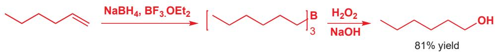

## 自由基反应中的区域选择性

到目前为止，我们讨论过的反应大概都是离子型的，但在本短节中，我们需要对我们将在 Chapter 37 中考察的另一类反应给出预告——即自由基 (radicals) 的反应。当 HBr 加成到烯烃上时，我们可用箭头表示两个电子的移动，随之形成的两个带电荷的中间体，会在第二步中结合为中性产物。强 H–Br 键断裂给出一个溴离子和一个稳定的烷基阳离子。这个键发生的是异裂 (heterolytically adv., heterolysis n., heterolytic adj., heterolyze v.)——即(电子对)不对称地断裂——烯键同样为异裂。我们可以通过找出最稳定的阴离子、阳离子来预测这些反应的区域选择性，在这个例子中它们是叔烷基阳离子和溴阴离子。

您会在 Chapter 37 中更详细地了解自由基。

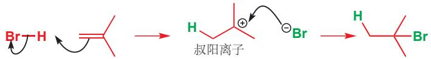

## 自由基加成

如下反应的区域选择性是与之相反的：通过一种自由基参与的不同种机理，形成了一个烷基溴。

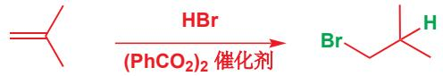

在自由基反应中，键发生均裂 (homolytically adv., homolysis n.), 一个电子朝一个方向走，另一个电子则朝向另一个方向。所生成的自由基包含奇数个电子，其中一个必然是未成对的。这使它们很活泼，通常不经分离。即使是强键，它们如果是极化的也可以断裂为离子；但自由基的制取则需要弱而对称的键，例如 O–O, Br–Br 或 I–I. 过氧(二)苯甲酰 (dibenzoyl peroxide)，这个反应中的 Ph(CO₂)₂ 催化剂，可以轻而易举地像下面这样均裂——单电子移动用“鱼钩”箭头表示，奇数电子用点表示。

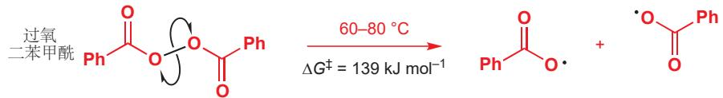

现在，我们可用我们刚刚获得的自由基来均裂 HBr 键，这个过程会形成非常亲的 OH 键，因此能够进行。如图开始反应所用的含有一个未成对电子的自由基中间体一样，我们应当以另一个带一个未成对电子的自由基的形成结束反应。此情境中，则为一个溴自由基。

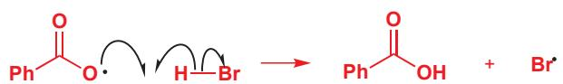

如果我们在刚刚与 HBr 反应所用的的烯烃的存在下做这个反应，溴自由基则会以两种可能的方式加成到烯烃上。虽然自由基是中性的，但它们是缺电子的 (C 原子缺少一个电子)，并且与阳离子非常像，连有的取代基越多越稳定。因此形成叔自由基而非伯自由基，溴于是就处在伯位置上了。

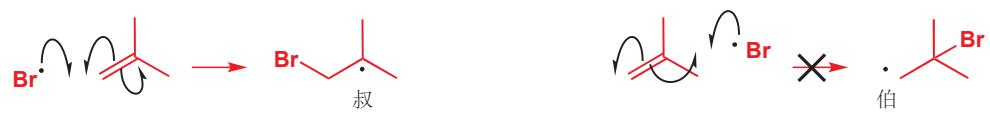

现在的产物仍是一个自由基，我们的反应也仍然没有结束。它如何变为只有成对电子的分子呢？答案很简单。它会与另一分子的 HBr 反应，并产出更多的溴自由基。现在您已了解到了自由基反应中的某个重要内容：所需的仅是很少量的自由基，更多的自由基又反应在每时每刻，伴随着产物的形成而产出。整个过程是一个自由基链(式)反应(radical chain reaction).

Interactive mechanism for radical addition of HBr to alkenes

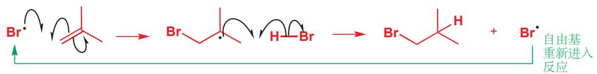

由于这一点，我们也只需要非常少量的过氧化二苯甲酰，自由基引发剂 (radical initiator)，像很多自由基生成剂一样，它也有潜在的爆炸性。下面是用于制备溴代酸的反应：

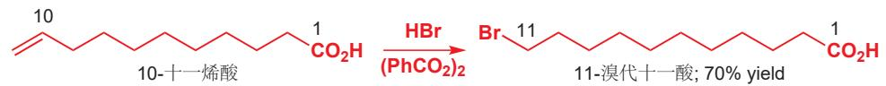

## 自由基攫取反应

我们在那个序列中偷偷加入了一个新的反应。氢原子 (注意：不是质子) 被过氧自由基从 HBr 上移去的反应是一个攫取反应 (abstraction reaction)。如页边栏所示，溴自由基从我们刚刚用过的同一种烯烃上攫取质子，但得到不同的结构。

当光照射到溴单质时，弱 Br-Br 键会断裂以给出两个溴自由基。加热也可以完成这份工作，但光照则更加干净/彻底。溴是棕色的，这说明它吸收绝大多数波长的可见光。

■ 注意，Br-Br 键相比过氧化物中的 O-O 键要更稳定些。

$$
\mathrm{Br} \xrightarrow {\text {光照} (h v)} 2 \times \mathrm{Br} ^ {\bullet} \quad \Delta G ^ {\ddagger} = 1 9 2 \mathrm{kJ} \mathrm{mol} ^ {- 1}
$$

译者注：目前有人将离子型的，用碱去质子的过程也称作“攫氢”，这是不严谨的。

自由基都非常活泼、不稳定，这些溴自由基也许会仅仅重新结合，也许会与其他化合物反应。您已经知道，溴阴离子是 $S_{N}2$ 反应中好的亲核试剂，但溴自由基则发生两种很不同的反应：攫取和加成。Br 自由基可能从烯烃上攫取一个氢原子（简称攫氢），也可能加成到 $\pi$ 键上。注意每个反应都生成一个新的碳自由基，第一种情况下还得到 HBr 分子。与离子反应不同的是，自由基反应受键能主导，上述情境中 Br–Br 键弱，而 H–Br 键则强得多 (366 kJ mol $^{-1}$ ).

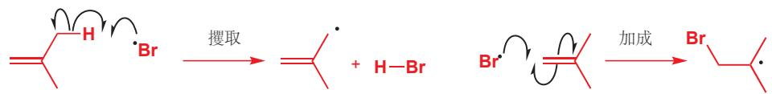

第一个反应引出了另一个重要的区域选择性方面：为什么自由基攫取这个 H 原子，而不是烯烃上的一个？

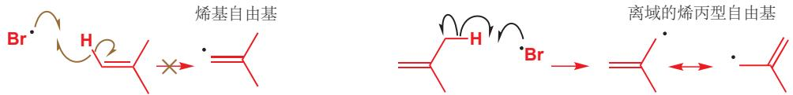

若移去烯烃 H，则会给出一个定域在 $sp^{2}$ 原子上的碳自由基；而移去甲基 H，则会给出稳定得多的离域烯丙型自由基。另外，这样的 H 原子有六个，而烯烃 H 原子仅有两个。

虽然生成了较稳定的自由基，但反应很明显不会结束于此，烯丙型自由基会从溴分子上采集一个溴原子。注意，烯丙型自由基并不与溴自由基在这一步中反应：自由基非常不稳定，每一时刻自由基的浓度都很小，很少有两个自由基能遇到彼此。

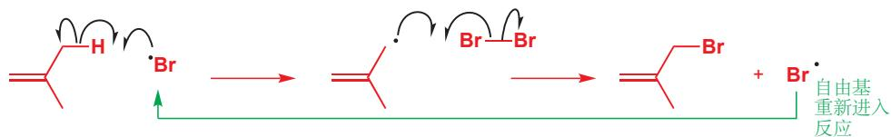

Interactive mechanism for allylic bromination

这一步同样产生了新的溴自由基，可用重新开始一系列反应。如同上文 HBr 的加成一样，这个反应是一个自由基链式反应，仅有很少量的 $Br_{2}$ 需要断裂为 $Br^{\bullet}$ 来使反应进行。这一点很重要，因为您知道：如果加入过多的 $Br_{2}$ ，则会以离子型机理发生加成反应，并没有对 H 原子攫取的过程。

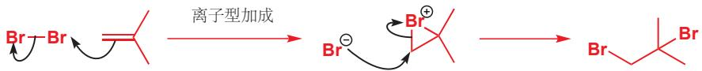

如果我们想要制取二溴代物，我们需要用大量的溴单质；但如果我们想要用自由基过程制备烯丙型溴化物，我们必须充分利用自由基的高活性，使溴单质浓度低。其中一种方法是使用您在 Chapter 19 见到的化合物 NBS (N-溴代琥珀酰胺)。NBS 起到了一种闸机的作用，仅当反应生成一分子 HBr 时，释放一分子 Br₂ (当然，HBr 是自由基溴代反应的副产物)。

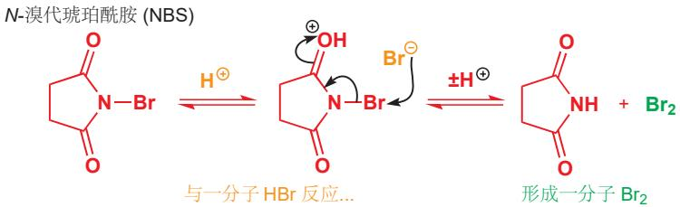

Br₂ 会随着反应进行，被缓慢地释放，它的浓度永远不会累计到足以形成二溴代物。在下面的例子中，过氧化二苯甲酰是引发剂，反应为烯丙型溴代反应 (allylic bromination) 给出有用的环己烯基溴。

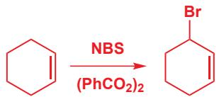

这些自由基反应将在 Chapter 37 中详细得多地描述。对于当下，您仅需要注意，用相同的试剂，它们与离子型反应可以有很不同的区域选择性。

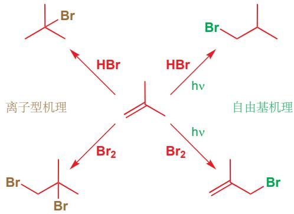

## 烯丙型化合物上的亲核进攻

可通过自由基反应制取的烯丙型化合物表现出很有趣的区域选择性。我们会从您在 Chapter 15 中熟悉的一些取代反应例子开始。那时，我们曾说过，烯丙基溴比丙基溴，或其他饱和烷基卤面对普通 $S_{N}2$ 反应的活性要高上 100 倍。

双键通过与被进攻的碳原子的 p 轨道共轭稳定了 $S_{N}2$ 过渡态。这个填满的 p 轨道 (下图中橘色) 在过渡态中与亲核试剂、离去基团同时成半键。任何对过渡态的稳定化作用，都当然会通过降低能垒，加速反应发生。

对于这个反应，有一个可替代的机理，包含对烯烃，而不是饱和碳原子的亲核进攻。这个机理会导向相同的产物，这个机理通常被叫做 $S_{N}2'$ (读作 “S-N-two-prime S-N-二-撇儿”) 机理。

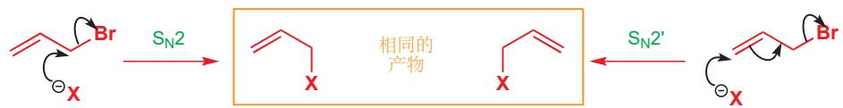

“简单” $S_{N}2$ 反应中轨道被视作...

烯丙基溴的
“LUMO”
= σ\* (C-Br)
HOMO
= X 上的
孤对电子轨道

我们可以用一种统一的方式，即通过观察所涉及的前线轨道，来解释这两个反应。亲核试剂必然进攻一个空轨道 (LUMO)，我们可能觉得仅仅是 $\sigma^{*}$ (C–Br) 参与了一个简单的 $S_{N}2$ 反应。但这却忽略了烯烃。 $\pi^{*}$ (C=C) 和相邻 $\sigma^{*}$ (C–Br) 的相互作用会照例产生两个新的轨道，一个更高能，一个更低能。低能轨道， $\pi^{*} + \sigma^{*}$ ，会成为 LUMO。为了构造这个轨道，我们必须使所有原子轨道平行排列，并使 $\pi^{*} + \sigma^{*}$ 之间的联系成为成键相互作用。

LUMO 由 $\pi^{*} + \sigma^{*}$ 构造

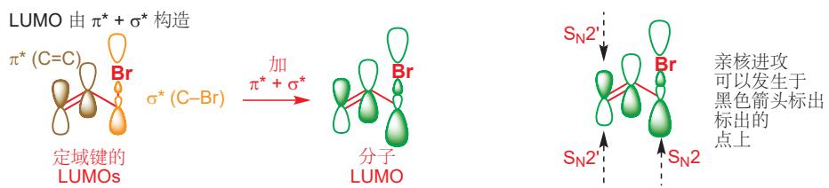

如果烯丙型卤被不对称地取代，那么就会产生一个区域选择性的问题。 $S_{N}2$ 和 $S_{N}2'$ 的产物是不同的，而一般的结果会是对烯丙型体系较小空阻一端的亲核进攻，无论这意味着 $S_{N}2$ 还是 $S_{N}2'$ . 这种重要的烯丙型溴，被称作异戊烯基 (prenyl) 溴，通常完全通过 $S_{N}2$ 反应。

异戊烯基溴像这样反应目前为止，我们用“烯丙基(allyl)”描述了这些化合物。严格意义上这个词特指除氢外没有任何取代基的化合物 $CH_{2}=CH-CH_{2}X$ 。但它也经常被宽松地用于描述在烯烃旁边的碳原子上连有官能团(基本基团)的化合物。我们将用“烯丙型(allylic)”替代如上所述的这种功用，而“烯丙基(allyl)”则仅指未取代版本。

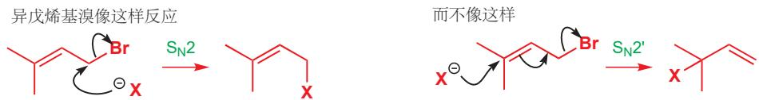

烯丙型体系的两端从空间对比：直接 $(S_{\mathrm{N}}2)$ 进攻发生于一个伯碳上，而烯丙型 $(S_{\mathrm{N}}2^{\prime})$ 进攻发生在一个叔碳上，因此空阻有利于 $S_{\mathrm{N}}2$ 反应。另外，烯烃产物上取代基的数量也意味着 $S_{\mathrm{N}}2$ 产物几乎往往是所偏好的—— $S_{\mathrm{N}}2$ 给出一个三取代的烯烃，而 $S_{\mathrm{N}}2^{\prime}$ 产物则含有较不稳定的单取代烯烃。

一个重要的例子是异戊烯基溴与苯酚的反应。这个反应可以简单地在丙酮中的 $K_{2}CO_{3}$ 下发生，因为苯酚的酸性足够 $(pK_{a} \sim 10)$ 被碳酸根大体上地去质子。产物几乎完全由 $S_{N}2$ 路径形成，产物被用于 Claisen 重排 (Chapter 35).

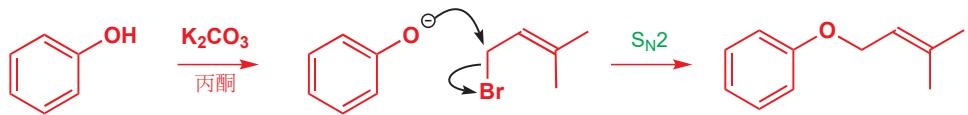

如果我们让烯丙基体系的两端更相似，比如一端是伯，一端是仲，那么情况会近乎相等。我们可以考虑丁烯基氯的两种异构体的反应。

Interactive mechanisms for various nucleophilic substitutions

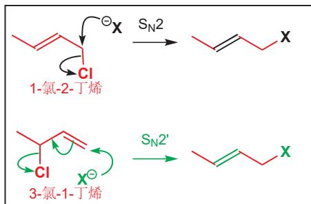

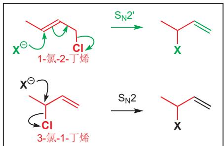

所有路径看起来都是合理的，并且我们会认为在伯碳上进攻得快。左侧框中的反应比右侧框中的更有利。而对于 $S_{N}2$ 还是 $S_{N}2'$ 机理，并没有特别的偏好——取决于具体情况（空阻）。如果我们使仲丁烯基氯与胺反应，则会完全地得到 $S_{N}2'$ 机理。

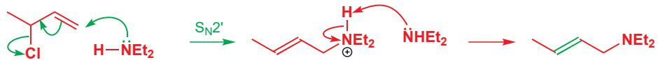

Interactive mechanism for $S_{N}2'$ nucleophilic substitutions

如果选用的是伯氯，那么同样，亲核试剂进攻在伯中心上。这次则通过 $S_{N}2$ 反应，形成带有更多取代的烯烃的更稳定的产物。下面是一个稍微更高级的例子：

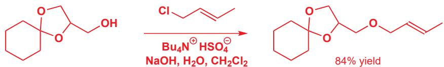

我们在 p. 341 中解释了相邻双键协助 $S_{N}2$ 反应的原因。

注意，这些反应都发生于烯丙型氯代物上。通常，我们不应当期待一个烷基氯能发生尤其好的 $S_{N}2$ 反应，因为氯离子仅仅是一个适中的离去基团；相反，我们应当倾向于选用烷基溴或烷基碘。但烯丙型氯化物却因为烯烃的存在而较活泼。即使是通过简单的 $S_{N}2$ 机理，不含重排地发生反应，烯烃也能使分子更加亲电。

您可能会问出一个很好的问题。我们如何知道这些反应，真的以 $S_{N}2$ 或 $S_{N}2'$ 机理发生，而不是通过稳定的烯丙基阳离子发生 $S_{N}1$ 机理的呢？事实上，对于异戊烯基溴的反应，我们不知道！我们怀疑阳离子可能确实作为了反应中间体，因为异戊烯基溴在室温下的溶液中，和其叔烯丙型异构体处在快速的平衡中。

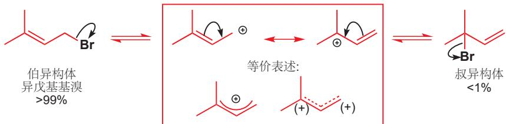

平衡完全偏向于异戊基溴，这是因为其更多取代的双键所致的。在叔烯丙型异构体上的反应，十分倾向于以 $S_{N}1$ 机理发生：中间体阳离子既是叔的，又是烯丙型的，平衡告诉我们它已经存在了。即使说，反应是双分子的，那叔溴也不必要通过 $S_{N}2'$ 机理发生，因为它通过平衡转化为伯异构体的速率要比 $S_{N}2$ 或 $S_{N}2'$ 反应发生的速率快。

当离去基团是溴时，甚至是仲体系，我们也考虑它处在快速平衡中。这个时候，两种烯丙型异构体都存在，伯烯丙型异构体（被称作巴豆基溴 crotyl bromide）是一个 E/Z 混合物。通过这两种酸中的任何一种，与 HBr 反应，得到的产物中的两种溴代物比例都是相同的，这暗示两个反应的机理都包含一种一般的中间体。您在 Chapter 15 的开头曾学到，这个反应仅限于能通过 $S_{N}1$ 反应的醇。

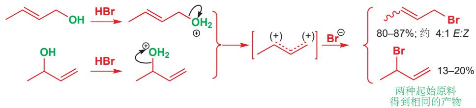

将溴换作氰离子，即用铜(I)盐作试剂，会得到腈的混合物，其中较稳定的伯腈占主导，且主导得更明显。产物可以用一种巧妙的方式分离。占主导的伯腈可以成功地在浓HCl中水解，但空阻更大的仲腈则并不发生水解。分离两种带有不同官能团的化合物就很简单了：这个情境中，酸可以被碱的水溶液萃取，剩下中性的腈留在有机层中。

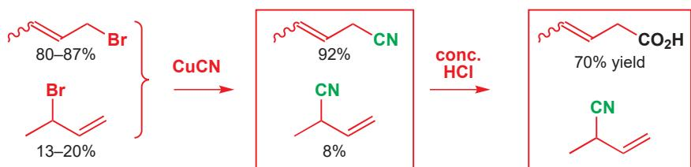

再一次，我们并不确信，氰离子的取代反应以 $S_{N}1$ 还是 $S_{N}2'$ 机理发生，因为试剂会在反应条件下处于平衡。然而，底物是氯代物时，并没有平衡存在，如果我们想用明确的起始原料得到明确的结果，那么应当选用的是氯代物。但无论如何，您已看到烯丙型化合物的区域选择性，会取决于空阻、反应速率，和产物的稳定性(烯烃取代数)。

## 烯丙型氯代物的区域专一性制备

烯丙型氯代物是制备烯丙型化合物的好的起始原料，它可以支配双键和离去基团将处于的位置。烯丙型醇，很容易通过格氏试剂或有机锂化合物对烯基醛或烯基酮的直接加成 (Chapter 9) 或烯基醛、烯基酮的还原 (Chapter 23) 制备。更重要的是，除非在强酸溶液中，它们并不处于平衡，因此我们预知自己将得到的烯丙型异构体。

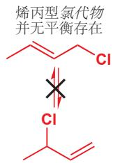

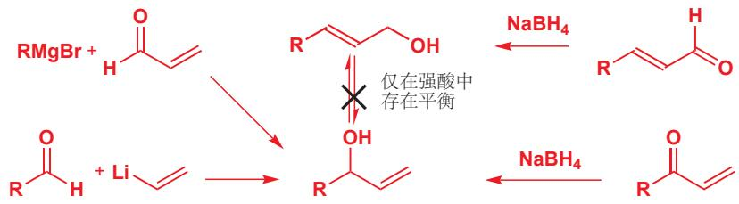

■ 类比立体专一性，我们可以定义区域专一性 (regiospecific)，用于表示产物的区域化学 (即官能团的位置) 完全取决于起始原料的区域化学。

将伯醇转化为氯代物比将仲醇转化为氯代物更容易。我们需要将 OH 转化为一个离去基团，并提供一个充当亲核试剂的氯离子源。一种完成方式是使用甲磺酰氯 $\left(\mathrm{MeSO}_{2}\mathrm{Cl}\right)$ 和 LiCl.

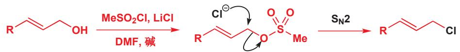

结果看上去并不值得汇报，不过，我们是怎么知道平衡，或者 $S_{N}1$ 反应不发生的呢？嗯，这个反应必然是 $S_{N}2$ ，因为 Z-烯丙型醇反应得到的产物维持了烯烃的构型。如果存在任何形式的平衡，那么 Z-烯烃会变为 E-烯烃，因为烯丙基阳离子并不能稳定 E-、Z-几何构型。

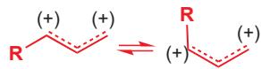

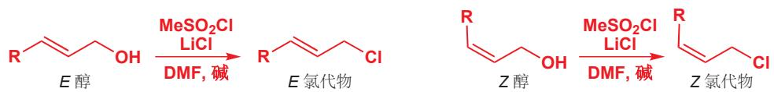

不能包含任何阳离子因为 $E$ 和 $Z$ 阳离子将处在快速的平衡中

不幸的是，这种方法并不能使仲烯丙型醇维持完好，而是会给出烯丙型氯的混合物。

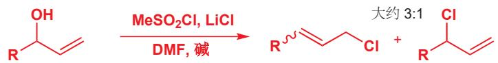

仲烯丙型醇可靠而干净的 $S_{N}2$ 反应仅能通过光延化学达到。下面是一个 Z-烯烃 表现良好的例子。其试剂与您上一次遇到的 类光延反应 有些许差别：没有用到 DEAD 和羧酸，而是用了六氯丙酮；当然还有三苯基膦。

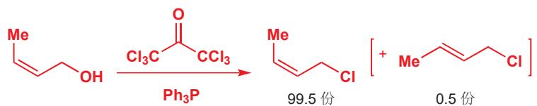

对光延反应的讨论在 Chapter 15, p. 349. 光延化学包含一个用于移去 OH 基的磷原子， $PBr_{3}$ 样式的试剂用于由醇制备烷基溴。

■ 磷在 C—Cl 键上发生了错误方向的取代反应吗？但 P 是软的，因此它不太在意键的极化，只是在意 C—Cl σ\* 的能力。不管键的哪段被进攻，能力都是一样的。您可能见到 PPh₃ 与 CBr₄ 或 CCl₄ 发生的相似反应：生成稳定碳阴离子。

在溴鎓离子和质子化的环氧的反应中有正好相反的情况——“松散的” $S_{N}2$ 过渡态，和显著的 $S_{N}1$ 特点(Chapter 17).

第一件发生的事，是磷上的孤对电子进攻氯代酮中的一个氯原子。这个在氯上的 $S_{N}2$ 反应的离去基团是一个烯醇盐，是一个可从烯丙基醇的 OH 基上移去质子的碱性物种。

$S_{N}2$ 比 $S_{N}2'$ 有利

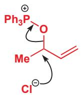

金属-烯烃 配合物的性质将在 Chapter 40 中讨论。

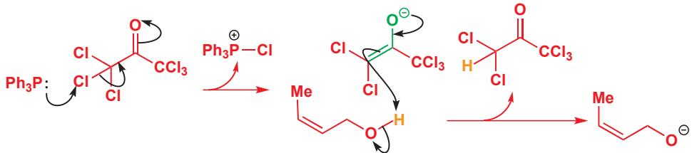

现在，烷氧基阴离子可以进攻带正电的磷原子。这个反应由于两点原因是一个好的反应。第一，这是很明显的对电荷的中和；第二，形成非常强的 P-O 键。

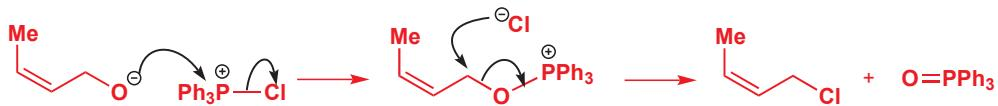

下一步是一个在碳上的真正的 $S_{N}2$ 反应，因为取代了非常好的离去基团。已经很强的 P-O 单键变成了一个更强的 P=O 双键，这可以弥补强 C-O 单键断裂的损失。这步取代反应，毫无疑问没有 $S_{N}1$ 成分（否则 Z-烯烃会部分地异构化为 E-烯烃）， $S_{N}2'$ 也非常少，大约仅生成 0.5% 的重排产物。 $Ph_{3}P=O$ 的取代反应通常是“最严格的” $S_{N}2$ 反应。

现在，对于最令人瞩目的结果。即使醇是仲醇，重排产物在热力学上更稳定情况下，也仅很少地形成，而大多数反应则是干净的 $S_{N}2$ .

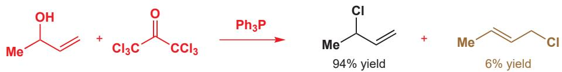

重排产物稍有点多，但这都在意料之中。直接发生 $S_{N}2$ 的产物占高比例，这表明这个取代反应对于 $S_{N}2$ 比 $S_{N}2'$ 真的更有利。

现在，我们知道如何制备有可预知结构的烯丙基氯了——不管是伯还是仲——现在我们需要探索的是，如何在可预知区域选择性的情况下，用亲核试剂取代氯。到目前为止，对于碳亲核试剂（除去氰离子）我们谈论的很少，因此我们将着重考察烯丙型氯代物的 $S_{N}2'$ 反应中，简单的碳亲核试剂。

## 碳亲核试剂在烯丙型氯代物上的 $S_{N}2'$ 反应

普通的碳亲核试剂，如氰离子、格氏试剂、有机锂化合物，符合我们已经描述过的反应模式。它们的反应模式是给出更稳定的产物，而究竟是 $S_{N}2$ 还是 $S_{N}2'$ 反应则取决于起始原料。如果我们用铜化合物，那么就会有一些倾向性产生了——只是一一倾向于 $S_{N}2'$ 反应。您可能会回忆起，我们过去常常用铜(I)来确保对烯基酮的共轭加成(Chapter 22)，而它在 $S_{N}2'$ 反应中的应用很明显与之相关。简单的烷基铜试剂(RCu,被称作Gilman试剂)一般倾向于 $S_{N}2'$ 反应，而用与 $BF_{3}$ 络合的RCu则可做得更好。

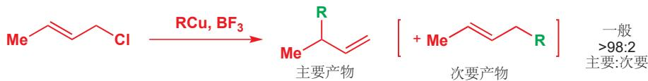

铜必然会与烯烃络合，将烷基转移至 $S_{N}2'$ 位置，并随之与氯聚集。如下可能是其机理；通常，绘制有机金属反应的确切机理是困难的。

金属-烯烃 配合物的性质将在 Chapter 40 中讨论。

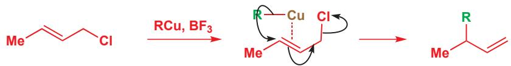

仲烯丙基异构体也几乎完全地给出经重排的产物。这也许不太令人惊讶，因为主要产物恰恰也是较稳定的异构体。这意味着，仅仅通过选择正确的异构体（或者我们应当说是错误的异构体，因为反应过程中包含一个烯丙型重排），我们就可以以高产率得到任何产物。

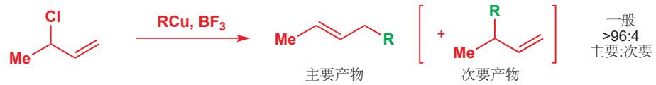

所有结果中最引人注目的一个，当属异戊烯基氯的反应，它也以好产率给出重排产物。这大约是当这个化合物能伯中心上完成 $S_{\mathrm{N}}2$ 反应的情况下，却在叔中心上通过 $S_{\mathrm{N}}2'$ 反应被进攻的唯一方法。

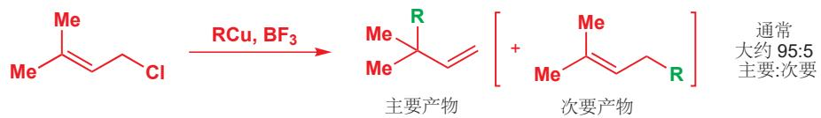

## 共轭烯烃上的亲电进攻

另一种制备烯丙型氯代物的方式，是用 HCl 处理双烯。亲电试剂对共轭双烯的进攻比对孤立烯烃的容易。Chapter 19 中有关于这个问题的讨论，所提出的主要观点是：进攻最亲核的碳原子，最初反应产生一个烯丙型阳离子。下面是 HCl 对环戊二烯加成的一个简单例子。

虽然在最初的质子化步骤中，有区域选择性的问题，但烯丙型阳离子是对称的，因此在任何一端被氯离子进攻都得到相同的产物。然而，如果亲电试剂是卤素而不是氢卤酸，那么中间体阳离子就不再是对称的，反应也因此是区域选择性的了。发生的变化如下：

另一种方式是直接进攻溴鎓离子中间体(图在下一页)，我们认为这个过程会发生在烯丙型位点(黑色箭头)，而不是普通仲位点(黑色)。这种1,2-二溴代物产物并没有被观察到，这是由于虽然它可以进行，但1,2-产物可以通过溴交换(bromide shift)重排为所观察到的1,4-二溴代物。

→ “溴交换”指的是您在 p.576 遇到的烯丙型溴代物可逆的异构化过程。

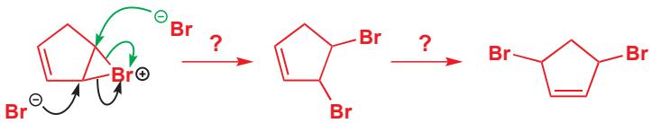

这个反应的最终产物事实上可能是下面两种产物中的任意一种，因为两个溴原子既可以是顺式也可以是反式。在 $-20^{\circ}C$ 下的氯仿中溴代，给出的主要是液态的顺式二溴代物，转化为反式异构体的过程持续而缓慢地发生；而在烃类溶剂中的反应，则直接给出结晶的反式异构体。

这说明，顺式二溴代物是动力学产物，而反式化合物则是更稳定的热力学产物；它是通过可逆的溴离子的失去，和溴镓离子的重新形成的过程得到的。

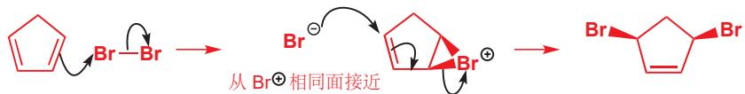

二溴代物若发生亲核取代，则也会引发类似问题。二甲胺与顺式或反式的二溴代物反应，都给出反式的二胺异构体。着眼于区域化学——这不是您所料到的。唯一的解释，是一个 $S_{N}2$ 取代和一个 $S_{N}2'$ 取代。

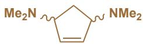

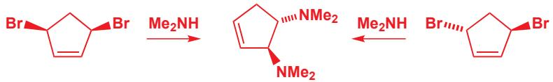

但对于立体化学呢？由顺式异构体出发，会发生伴随构型翻转的 $S_{N}2$ 取代，然后也许会有分子内的 $S_{N}2'$ 取代紧跟其后，最后则是另一个在烯丙型中心上伴随反转的 $S_{N}2$ 取代。

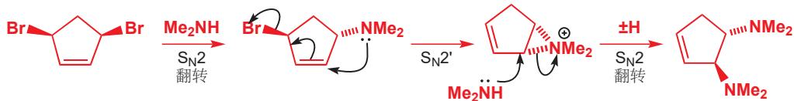

反式异构体的反应几乎是完全相同的：两种流程中都有相同的三元环中间体，因此产物终归是相同的。

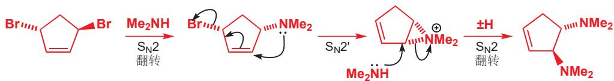

如果亲核试剂与亲电试不同，我们就可以得到更多的一点关于反应过程的信息。当用溴在甲醇溶剂中处理丁二烯时，以 15:1 比例生成两种加合物，还随同一些二溴代物。甲醇是一个弱的亲核试剂，主要在烯丙型位点进攻溴镓离子（如下黑色）；仅有很少量的产物，又甲醇进攻烯丙型体系的远端得到。注意，没有对溴镓离子另一端的进攻（绿色虚线箭头）。

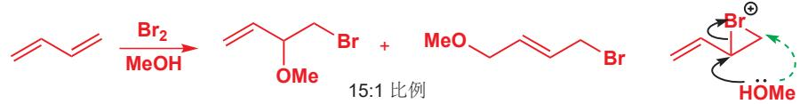

## 共轭加成

在 Chapter 22 中，我们将相当多的篇幅献予了对共轭加成，以及对为什么有些反应通过对羰基的直接甲醇发生，而有些反应则共轭加成 $\alpha,\beta-$ 不饱和羰基化合物 的原因的讨论。我们将简要地回顾这些反应的区域选择性方面。

一个共轭的 $\alpha, \beta$ -不饱和羰基化合物

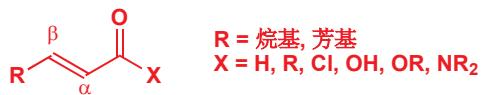

直接 (或 1,2) 加成，意味着亲核试直接进攻羰基。形成一个加成化合物；如果 $X^{-}$ 是一个离去基团，或者质子化后可以给出醇，则可能随后失去。

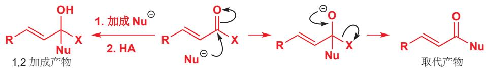

共轭（或 1,4）加成则意味着，亲核试剂进攻离羰基最远的烯烃端。电子穿越共轭体系，进入羰基，形成烯醇阴离子，通常会被质子化以给出酮。

两种路径的第一点区别是，直接加成得到的产物保持了烯烃，但失去了羰基；而共轭加成的产物保持了羰基，失去了烯烃。因为 $C = O\pi$ 键比 $C = C\pi$ 键强，共轭加成给出的是热力学产物。但因为羰基比烯烃远端更加亲电，尤其是对于带电的、硬的亲核试剂，动力学产物由直接加成给出。因此由于1,2加成是可逆的，低温和短反应时间有利于直接加成，高温和长反应时间有利于共轭加成。

第二点区别取决于 $\alpha,\beta-$ 不饱和羰基化合物亲电性的强弱。越亲电的，例如酸酐和酰氯倾向于使直接加成有利；而较不亲电的，例如酮或酯倾向于使共轭加成有利。

亲核试剂的选择也与之类似：越亲核的物种，例如 MeLi 或格氏试剂，尤其当它们的反应不可逆时，倾向于直接加成；而较不亲电的物种，例如胺、硫醇倾向于共轭加成，这些亲核试剂可逆地加成到 C=O 基上，为直接加成产物转化回起始原料，再进行共轭加成提供机会。

## 实践中的区域选择性

我们将用一个例子说明区域选择性的几个方面，并介绍接下来两章的主题。糖精 (saccharin) 是第一种合成甜味剂，新的甜味剂，例如 BASF 化合物噻吩糖精 (thiophenesaccharin) 比它的需求量大得多。其钠盐是活性物质，而中性化合物可以经由较简单的噻吩中间体制备。

■ 噻吩 (Thiophene) 是如下含硫芳香化合物的名称。在 Chapter 29 中有更多关于它的内容。

  
噻吩

合成开始于一种硫醇对不饱和酯的共轭加成。硫醇很明显是亲核试剂，区域选择性选择共轭加成，而不是在两种酯基中任何一个上的直接加成。

■ 噻吩可以进攻它自己的酯基(一种直接加成)，并导致聚合，但这并未发生。

下一步中，二酯被用碱处理，然后发生一个您将在 Chapter 26 中学习的羰基缩合反应。此时有一个真正的区域选择性问题：烯醇盐可以在任何一个酯基旁生成（如橘色所示），随后会作为亲核试剂进攻另一个酯基。这两种酯基间的区分很小，我们所需的仅是第一种，这是通过小心的实验条件控制的，不过到头来产率只有 50%；由于产物可经过重结晶，所有方法中最实用的一个，分离，此过程的产率在大规模生产上是可以接受的。

像这样的反应——烯醇盐对羰基亲电试剂的进攻——是下两章的主体，我们将在那里详实地研究这类反应的细节。

25

## 烯醇盐的烷基化

## 联系

## 基础

\- 烯醇和烯醇盐 ch20

\- 对烯烃的亲电加成 ch19

\- 亲核取代反应 ch15

\- 共轭加成 ch22

## 目标

\- 如何用作为亲核试剂的羰基化合物构筑新的 C-C 键

\- 如何防止羰基化合物与自身反应

## → 展望

\- 通过与亲核的烯醇盐与亲电的羰基化合物反应构筑 C-C 键 ch26

\- 逆合成分析 ch28

## 羰基表现出不同的反应性

在较早的几章中，我们讨论了羰基会展现出的两种不同类型的反应性。我们首先讨论了包含在羰基上亲核进攻的反应，并在 Chapter 9 中告诉过您，这是构筑新 C-C 键的最好方法。本章中我们还将构建新的 C-C 键，但使用的确实羰基化合物上的亲电进攻：换句话说，羰基化合物在反应中做亲核试剂。我们在 Chapter 20 中已经介绍了羰基的亲核形态——烯醇和烯醇盐，那时所遇到的都是碳与基于其他元素的亲电试剂的反应，经过精心谋划，也可以得到基于碳的亲电试剂。本章的大部分内容都在关注这个短语，“精心谋划 (thoughtfully devised)”.

羰基化合物做亲电试剂

■ 下一章中，我们将讨论如何促进或控制羰基化合物与其本身发生反应(缩合)，即羟醛反应。

我们需要谋划，以确保羰基化合物表现出正确的反应性种类。特别的，如果我们打算让其称为亲核试剂，那我们就必须控制羰基化合物不作为亲电试剂。如果它这样做了，那么它可能与自身反应，生成二聚体——甚至是聚合物——而不是进攻我们需要的亲电试剂。本章会考虑避免在羰基C=O键上发生我们不期望发生的亲核进攻的方式。

幸运的是，在过去的四十年中，烯醇盐与碳亲核试剂反应这一领域已经涌入了很多的想法。这意味着这些问题都有很多绝妙的解决方案：本章的任务就是帮助您理解可以用哪些解决方案，以及什么时候去用它们，以设计出有用的反应。

## 一件会影响所有烷基化反应的因素

本章中的烷基化反应分为两步。第一步是一个稳定阴离子的生成——通常（但不是往往）是烯醇阴离子——通过碱性下的去质子化形成。第二部是一个取代反应：亲核的阴离子进攻亲电的卤代烷。所有我们在 Chapter 15 讨论过的，控制 $S_{N}1$ 和 $S_{N}2$ 反应的方法，在这里都是适用的。

在每种情况下，我们都要从以下两种中选择一种碱。

\- 强碱 (其共轭酸的 $\mathrm{pK}_{\mathrm{a}}$ 比羰基化合物小) 可以用做彻底地为起始原料去质子。亲电试剂在下一步加入，而在亲电试剂加入之前，起始物就完全转化为了阴离子。

\- 或者，在亲电试剂的存在下加入弱碱。弱碱不能彻底地为起始原料去质子，因为它的共轭酸比羰基化合物的 $\mathrm{pK}_{\mathrm{a}}$ 大：只生成少量的阴离子，但这少量的阴离子会与亲电试剂反应，烷基化将其消耗掉后再继续形成更多的阴离子。

第二种实行起来更简单（将起始原料、碱、亲电试剂混合就可以了），但只有当碱和亲电试剂可兼容，并不会发生反应时才可行。对于第一种操作要求更高的方法，亲电试剂和碱并不会遇到彼此，因此不需要考虑兼容性的戊酮。我们将从一些不那么亲电的化合物说起，这是为了避免它们自己与自己的亲核形态反应，即不发生羟醛反应。

## 腈和硝基烷可以烷基化

由羰基的亲电性引发的问题可以通过用其他不那么亲电，但又能稳定邻位的阴离子的官能团替代 $\mathrm{C = O}$ 得以避免。我们将考虑两个例子，它们都是您在 Chapter 20 遇到过的。

## 腈 (nitriles) 的烷基化

氰基 (nitrile group) 在一些反应性中表现出羰基的性质，并且远不如羰基容易被亲核试剂进攻 (N 的电负性低于 O). 腈在强碱下去质子形成的阴离子不会与其他分子的腈反应，但却会很有效地与卤代烷反应。这种阴离子纤细的、直线型的结构使其成为 $S_{N}2$ 反应很好的亲核试剂。

腈不必为了烷基化彻底地去质子：用氢氧化钠，使之形成少量的阴离子就足够了。在下面的例子中，一种腈与溴丙烷反应得到2-苯基戊腈。

→ 腈也有亲电性，您在 Chapter 10 遇到过腈的水解和加成反应。

■ 乙腈 (MeCN) 的 $pK_{a}$ 为 25.

## 相转移催化剂 (Phase transfer catalysis)

这个反应在两相的混合体系(水 + 不互溶的有机溶剂)中进行，这是为了避免溴丙烷与氢氧根反应得到丙醇。氢氧根处在水溶液层，而其他的试剂处在有机层。我们需要用到氯化季铵（氯化三乙基丁基铵 $BnEt_{3}N^{+}Cl^{-}$ ）做相转移催化剂，它使足够腈去质子的氢氧根进入有机层。

■ 第二个和第四个结构中的“●”代表直线型碳原子，如果不额外点出来，就可能会被忽略。

还记得在 Chapter 6 中关于负氢离子 (H-) 缺乏亲核性的论述吗？这就是一个例子，即使在有亲电试剂的存在下，氢负离子也仅做碱：这是一个并不需要分两步进行的反应，因为亲电试剂不会与任何其他的化合物反应。

## 多烷基化

多烷基化并不总是我们需要的，而且双烷基化产物也会成为我们打算单烷基化的副产物之一。这种问题会在第一次烷基化的产物仍然有可去的质子时产生。很明显，这在存在的碱过量时才会真正成为问题，而我们通常可以只加入一当量的碱来避免。

被腈稳定的阴离子非常亲核，以至于拥挤的季中心位点 (形成阴离子后没有其他 H 原子) 都可以与卤代烷相当好地反应。在这个例子中，用强碱氢氧化钠使带支链的腈彻底地去质子，并用氯化苄做亲电试剂。苄基亲电试剂极好的反应性弥补了离去基团较差的离去性。在 DMF 中，阴离子的反应性尤其强，因为它不会被溶剂化 (您在 Chapter 12, p. 255 看到的，DMF 只溶剂化 Na+阳离子).

氢化钠与亲电试剂的兼容的，这意味着如果我们加入两当量的碱，那么烷基化也可以再一次发生。这个二甲酸用于一种潜在的药物的合成，可以通过腈的两次甲基化得到。

在过量的碘甲烷存在下，两当量 NaH 促进的双烷基化反应可以给出二甲基腈，并可以通过水解转化为酸。单烷基化产物并不经过分离——它直接进一步去质子并与第二分子的 MeI 反应。

如果反应中心连有两个氰基，那么离域阴离子就会非常稳定，这样即使是一个弱碱性的、中性的胺(三乙胺)都足以为起始原料去质子。下面的例子也发生了双烷基化，而且以 $100\%$ 产率：注意亲电试剂擅长 $\mathrm{S_N2}$ ，而且非质子极性溶剂DMSO(和DMF一样)不能溶剂化“烯醇”阴离子，这使其更加活泼。

如果亲电试剂和腈在同一个分子中，而且它们之间的间距得当，那么它们就会发生分子内的烷基化，随之环化 (cyclization) 以成环。下面展示了环丙烷的一种制备方法，使用氢氧化钠做碱，氯离子做离去基团。对于分子内烷基化，碱和亲电试剂必然要共存，但相比分子间 $S_{\mathrm{N}}2$ 取代，环化是非常快的，因此并不构成 $\mathrm{Cl^-}$ 被 $\mathrm{HO^-}$ 取代的问题。

## 硝基烷 (nitroalkanes) 的烷基化

硝基强吸电子的性质，使其邻位的去质子可以在甚至碱性很弱的条件下发生。 $MeNO_{2}$ 的 $pK_{a}$ 为 10, 大约于酚相同。硝基邻位质子的酸性事实上相当于与两个羰基相连的碳上质子的酸性；您可以把硝基的吸电子能力想象为羰基的两倍。被硝基稳定的阴离子（“nitronate 阴离子”）与碳亲电试剂反应，可以产出很宽范围的含氮产物。右侧的对比图展示了这种阴离子与烯醇阴离子的密切相关性，它的烷基化反应也与后文将描述的烯醇的烷基化高度相似。

令人惊讶的是，市面上能买到的硝基烷是很少的，不过，有了硝基甲烷、硝基乙烷和2-硝基丙烷做原料，剩下的硝基烷都很可以很容易地制得。例如，硝基丙烷在丁基锂作用下去质子，并随后于叔丁基碘反应，以好的产率给出3-硝基庚烷。这个反应是要分两步进行的：BuLi与卤代烷并不兼容！

氢氧根做碱时，硝基烷的烷基化可以一步完成：相转移条件 (见 p. 585) 使 HO $^{-}$ 和亲电试剂分隔开，避免醇的生成。下面左边的反应尽管在产物包含季碳的情况下也能反应，而右侧的反应得到环状硝基烷：现在别无选择：碱和亲电试剂必须在反应混合体系中共存，因此必须使用一个较弱的碱，例如碳酸钾——氢氧根和胺都不是好的选择，因为它们会与卤代烷发生取代反应。

## 烷基化亲电试剂的选择

烯醇盐的烷基化是 $S_{N}2$ 反应(极性溶剂，带电的亲核试剂)，因此烷基化若想成功，亲电试剂需要是有 $S_{N}2$ -反应性的：伯卤代烷和苄卤都是其中最好的烯醇化试剂；多支链的卤代烃倾向于发生我们不想看到的 E2 消除反应，因为它们的阴离子是具有碱性的。结果是，叔卤代烷对于烯醇盐的卤代是无用的；本章中还会讨论这个问题的解决办法。

控制取代反应的因素已在 Chapter 15 详细介绍过，消除反应的内容在 Chapter 17 中。

## 羰基化合物的烯醇锂

羰基化合物存在自缩合的问题 (即烯醇盐与未烯醇化的羰基反应)，但如果根本没有未烯醇化的羰基化合物，就理所当然避免了这一问题。一种方法是使用很强的碱 $\left(\mathrm{pK}_{\mathrm{a}}\right.$ 至少比羰基化合物的 $pK_{a}$

## LDA 的描述位于 p. 465.

提醒：如何制备 LDA

■ 烯醇是烯烃的一种，而且也许会包含两种可能的几何异构体。烯醇几何结构的重要性会在 Chapter 33 中讨论，它们并不是当前我们需要关心的。更重要的是不对称酮去质子时区域选择性的问题。我们将在本章中讨论这一方面。

Interactive mechanism for lithium enolate formation

LDA 的变种

LDA 在 1970s 成为常用试剂，并且您会遇到其他它的变体，例如由丁基锂和 2,2,6,6-四甲基哌啶获得的四甲基哌啶锂 (lithium tetramethylpiperidide, LTMP)，和六甲基二硅基胺获得的六甲基二硅基胺基锂 (lithium hexamethyldisilazide, LHMDS)，都具有更大的空阻，因此有更小的亲核性。

高 3 或 4 个数量级) 确保全部的起始羰基都被转化为了对应的烯醇。并且这也需要所得的烯醇足够稳定，可以存活到烷基化完成。如同您在 Chapter 20 中看到的一样，烯醇锂是很稳定的，它是对于烷基化反应最好的烯醇等价物试剂。

制备烯醇锂最好的碱通常是 LDA，由二异丙基胺 $(i-\mathrm{Pr}_{2}\mathrm{NH})$ 和 BuLi 制备。LDA 几乎会为所有的酮和酯去质子，并迅速地、彻底地得到相应的烯醇锂，甚至在低温（大约 $-78^{\circ}C$ ，某些活性物种存活的必要条件）下也是不可逆的。去质子通过一个环状的机理发生，下面以酮和酯为例做出了说明。碱性的氮原子用做去质子，与此同时锂转移，形成氧阴离子。

一种酯的去质子烯醇锂：包含两个可能的几何异构体

一种酮的去质子烯醇锂：包含两个可能的几何异构体

## 烯醇锂的烷基化

这些烯醇锂与卤代烷的反应是化学上最重要的形成 C-C 键的反应之一。非环状、环状的酮，非环状、环状的酯 (内酯) 都可以通过烯醇锂反应。一般的机理如下所示。

酯烯醇的烷基化

酮烯醇的烷基化

酮烯醇的反应 (涉及烯醇盐生成的) 的典型实验条件是低温 $(-78^{\circ}\mathrm{C})$ ，在 THF 中进行。强碱 LDA 用于避免羰基化合物的自缩合，但在烯醇生成时，仍常常有机会发生自缩合。越低的温度，自缩合的缩率越慢，因此也有越少的副产物。当烯醇的生成完成后，再加入亲电试剂 （仍在 $-78^{\circ}\mathrm{C}$ 下：烯醇锂在高温下可能不稳定），然后，通常允许反应混合物升至室温，以加速 $S_{\mathrm{N}}2$ 烷基化的速率。

## 酮的烷基化

以上顺序原封不动地也用于甲基化下面的酮，LDA 做碱，然后碘甲烷做亲电试剂。

低温下的稳定性使烯醇锂通常作为我们的首选，但烯醇钠和烯醇钾也同样可以用强碱拔取质子获得。碱金属越大，金属阳离子与烯醇阴离子间的分离就越明显，这使其更易反应，也更不稳定。典型的 Na 和 K 的强碱包括氢化物 (NaH, KH)，由胺衍生的氨基化物 $\left(\mathrm{NaNH}_{2}, \mathrm{KNH}_{2}\right)$ 或六甲基二硅基氨基化物 (NaHMDS, KHMDS). 烯醇盐的不稳定性意味着它们的制备和反应通常在同一步，因此碱和亲电试剂需要兼容。下面是两个环己酮烷基化的例子：烯醇钾的高反应性，在过量氢化钾与碘甲烷作用下有效的四甲基化上得以体现。

## 酯的烷基化

在 Chapter 26 中您会遇到一个酯和其自己的烯醇盐的反应：Claisen 缩合反应。这个反应会成为在渴望 酯烯醇锂 烷基化时，一个非常恼人的副反应，只有当酯被完全地转化为其烯醇盐时，Claisen 缩合便会慢下来，这一问题才可得到避免。阻止它发生的一个好方法是在 LDA 的溶液中加入酯（而不是在酯中加入 LDA），这样就永远不会有过量的酯会与烯醇盐反应了。另一个成功的策略是使 R 基团尽可能地大，以阻止羰基的进攻。叔丁基酯的价值被淋漓尽致地体现了，也同样因为它们容易制得，但要注意，它们在酸的水溶液中，即使是温和的条件也会水解 (p. 556). 在这个例子中，叔丁基醋酸酯产生烯醇锂，并在反应混合物温度上升至室温时与丁基碘反应。

要避免的酯的 Claisen 自缩合

## 羧酸的烷基化

羧酸的烯醇锂可以通过加入两当量的碱制得：一份用于生成羧酸根阴离子，另一份用于生成烯醇盐。去掉第一个质子所用的碱不必要是强碱，但因为第二次的去质子需要如 LDA 的强碱，通常来说，生成双阴离子 (dianion) 方便的做法是加入两当量的 LDA. 对于羧酸，即使是 BuLi 都可以偶尔使用，因为中间体羧酸锂要比醛或酮的亲电性小得多。

下一个酸烯醇的烷基化反应有关一个被氨基甲酸酯保护的甘氨酸。如您在 Chapter 23 所见，氨基甲酸酯保护在碱性条件下稳定。三个酸性质子都被 LDA 夺去，但烷基化仅发生在其中一个碳原子上——最后一个质子被去除的位点。发生烷基化反应，会使最后一个负电荷消失，仅剩下更稳定的两个电荷，因此如果分子有机会发生烷基化，它们就会如此做，来得到更稳定的阴离子。双阴离

为什么 BuLi 不会像您在 Chapter 10 中看到的那样进攻羰基以形成酮？据推测，并不是由于羧酸不活泼导致的，而是由于芳环酸化了苄基质子，并使平衡偏向去质子过程。其他例子中，即使是羧酸，LDA 也应成为您用碱的首选。

在 Chapter 23 中我们考察过双阴离子的反应性：最后引入的负电荷是最活泼的。

子很好的应用是酯和腈的烷基化，随后可水解为酸。

\- 酮、酯和羧酸的烷基化最好使用其烯醇锂完成。

## 为什么烯醇盐在碳上烷基化？

烯醇有两个亲核位点：碳原子和氧原子，在p.453我们提到：

\- 碳有更大的HOMO系数，是更软的亲核位点。

\- 氧带有最多的负电荷，是更硬的亲核位点在 Chapter 20 中您看到硬亲核试剂倾向于在氧上反应——例如，这就是烯醇硅醚可以被制备的原因。一些带有非常好的离去基团的亲电试剂同样倾向于在氧上反应，但像卤代烷这样较软的亲电试剂在碳上反应，您会在本章中看到这类亲电试剂。

通常来说:

\- 硬亲电试剂，尤其是烷基硫酸酯或磺酸酯(甲磺酸酯,对甲苯磺酸酯)倾向于在氧上反应。

\- 软亲电试剂，尤其是卤代烷 $(\mathrm{I} > \mathrm{Br} > \mathrm{Cl})$ ，在碳上反应。

\- 非质子极性溶剂 (DMSO, DMF) 通过将烯醇阴离子与其反荷离子分开 (增强键的极性，并增加在 O 上的电荷) 以促进 O-烷基化；而醚类溶剂 (THF, DME) 促进 C-烷基化。

\- 碱金属越大 $(Cs > K > Na > Li)$ , 离子对就越分离 (极性更强的键), 这使在氧上反应更加困难。

硬亲电试剂在 O 上反应

软亲电试剂在 C 上反应

## 醛的烷基化：避免 LDA

醛十分亲电，这使得即使是用 LDA 在 $-78^{\circ}C$ 下处理，去质子的速率仍然很慢，不足以超过生成的烯醇锂与混合物中剩余的还未去质子的醛反应。而且强亲电性也会造成碱直接加成，这也是个问题。

与醛烯醇盐的生成竞争的反应

\- 请避免使用醛的烯醇锂。

## 特别的烯醇等价物用于烷基化醛和酮

这些副反应意味着醛烯醇通常不是很好的反应中间体。相反，有很多醛烯醇等价物可以保证醛在烯醇化和烷基化步骤中全部以武装模式（masked form, 指烯醇式）出现。

\- 烯胺 (enamines)

\- 烯醇硅醚 (silyl enol ethers)

\- 烯胺盐 (aza-enolates, 氮杂烯醇盐)

您在 Chapter 20 中简短地见到过这些烯醇等价物，而在此我们会将它们用于醛的烷基化上。这三种特别的烯醇等价物都不仅在醛上有价值，也可以很好地应用于酮；对于每种烯醇等价物的介绍，我们都将给出这两种类型的羰基化合物的例子。

## 烯胺通过活泼的亲电试剂烷基化

醛或酮与仲胺反应可以形成烯胺。这一步骤的机理在 Chapter 11 已经提及。下方所展示的机理是它（环己烷与四氢吡咯衍生的）与烷基化试剂，形成新的碳-碳键的步骤。第一步的产物不是一个羰基化合物：是一个亚铵离子（iminium ion）或去除质子后得到的烯胺。然后酸性下温和地水解，可使其转化为对应的烷基化的羰基化合物。

整个过程仍是由羰基化合物到羰基化合物，等同于烯醇盐的烷基化，但不需要强碱或烯醇盐的参与，也因此没有我们担心的自缩合发生。下面是两个用烯胺完成的环己酮的烷基化。注意这种方法需要相对高的温度，和较长的反应时间：烯胺是中性亲核试剂中反应性最强的，但和烯醇阴离子相比，仍然不能望其项背。

■ 烯醇倾向于多取代，烯醇阴离子倾向于少取代，回忆一下我们在 p. 464 讨论的内容。

用于烯胺生成的二级胺，虽然不会在产物中体现，但对它的选择并不是完全是任意的。可以使用简单的二烷基胺，但环状胺，例如四氢吡咯、哌啶、吗啉是更为流行的，环状结构使起始胺与得到的烯胺都更加亲核(环状胺中的两个烷基被“扎在后面 tied back”，不再能阻碍胺)。这些胺的高沸点也允许我们在烯胺生成时加热。

由于羰基的活化作用， $\alpha$ -溴代羰基化合物是 $S_{N}2$ 反应极好的亲电试剂 (Chapter 15). 然而卤素和羰基之间的质子相比于那些仅连着羰基的质子，显著地具有酸性，这导致烯醇阴离子可能不做亲核试剂，只做碱。而烯胺的碱性很弱，亲核性却很好，对于与 $\alpha$ -溴代羰基化合物的反应是一个很好的选择。

这里的起始酮是不对称的，因此有两种可能的烯胺。通常的情况是只生成少取代的烯胺。这一结果可以被解释为热力学控制：烯胺的生成是可逆的，因此较少空阻的烯胺占主导地位。对于多取代的烯胺，空阻会使烯胺失去平面性，并因此使之不稳定；另一方面，少取代的烯胺就相当稳定了。(译者注：这也是为什么如果让伯亚胺形成烯胺的话，生成的是多取代的，见 Fischer 吲哚合成法中，p. 779.)

然而，烯胺面临的一个主要问题是：在氮上发生反应。反应性较弱的烷基化试剂——简单的卤代烷，例如碘甲烷——在 N 上反应的比例显著地比在 C 上大。产物是一个季铵盐，会水解会起始产物并导致低产率。

## ● 与烯胺配合最好的活泼烷基化试剂：

\- 烯丙基卤

\- 芋卤

\- $\alpha$ -卤代羰基化合物

也就是说，烯胺是醛烯醇化问题的一个很好的解决方案。醛很容易形成烯胺（醛高亲电性的一个好处），并且烯胺也不受亲核试剂进攻（包括最重要的，受烯胺本身进攻）的影响。下面两个醛烷基化的例子都使用了烯胺的方法。它们所用的都得是高 $S_{N}2$ -反应性的亲电试剂，这是烯胺存在的最主要的局限性。

## 烯胺盐与更广范围的 $S_{N}2$ -反应性亲电试剂反应

烯胺是烯醇的氮杂类似物，亚胺是醛和酮对应的氮杂类似物，用烯胺的方法解决了醛和酮高度亲电的问题，但由于烯胺的亲核性不够，又产生了其他问题。横向的思考会让您想到，用烯醇盐（烯醇阴离子）的氮杂类似物，烯胺盐来作为亲核试剂。用 LDA 或其他强碱处理亚胺可以使之形成烯胺盐。

在碱性和中性溶液中，亚胺仍比醛有更弱的亲电性：它们可以与有机锂反应，但对于其他较弱的亲核试剂却无动于衷(可以使其质子化的酸性溶液会令其更加亲电).因此，不需要担心自缩合。

注意，烯胺盐由伯胺与醛酮生成的亚胺去质子得到，而烯胺由仲胺与醛酮生成的亚铵去质子得到。

整个顺序包括由醛生成待烷基化的亚胺——通常用大空阻的伯胺，例如叔丁基胺或环己基胺，这也能抑制对亚胺碳的亲核进攻。亚胺通常不经分离，直接用 LDA 或格氏试剂去质子（它们不会加成到亚胺上，而是会去质子生成烯胺盐）。

所得的烯胺盐像酮的烯醇盐一样与 $S_{N}2-$ 反应性 烷基化试剂——此处是苄氯反应——生成新的碳—碳键并重新得到亚胺。烷基化的亚胺通常经温和的、酸性的后处理 (work-up) 水解得到烷基化的醛。

烯胺盐的的烷基化

下一个例子使用锂碱（二乙基氨基锂）制备烯胺盐，所添加的烷基带有一个缩醛。亚胺在酸性下水解时，对缩醛没有产生任何影响，这也印证了亚胺水解的容易性。所得的产物是一个单保护的二醛，用其他方法是难以制得的。

烯胺盐的烷基化非常成功，不仅是醛烷基化的基本方案，而且也是酮烷基化时一个实用的选项。环己酮是简单的酮中亲电性最强的，也会面临我们不希望见到的副反应。由环己酮和环己胺得到的亚胺可以用 LDA 去质子，得到烯胺盐。在这个例子中，用碘甲基锡烷 (iodomethylstannane) 做烷基化试剂，经过水解最后得到含锡的酮。

## - 醛的烷基化

烯胺盐是醛与大多数亲电试剂发生烷基化时最好的通用解决方案。对于高 $S_{N}2-$ 反应性的烷基化试剂，可以选用烯胺；对于高 $S_{N}1-$ 反应性的烷基化试剂，可以选用烯醇硅醚。

## 烯醇硅醚可以在 Lewis 酸存在下用 $S_{N}1$ -反应性亲电试剂烷基化

烯胺盐的强亲核性意味着它们能与很广范围的亲电试剂反应，它们的碱性也较强，与烯醇锂类似，这意味着它们不能与叔烷基卤等 $S_{N}1-$ 反应性亲电试剂反应。这一问题的解决方案是使用烯醇硅醚，它们的反应性较弱，因此需要一个强有力的亲电试剂来引发反应。碳阳离子就符合上述要求，并且它们可随饱和碳原子上卤素或其他离去基团的离去，而在原位 (in situ，指在反应混合物中现场生成) 生成。

→ 您在 Chapter 20, p. 466 遇到过烯醇硅醚。

$TiCl_{4}$ 在此处做 Lewis 酸 (见 p. 180 关于 Lewis 酸的更多讨论), 接受来自 Cl 原子的一对电子。在 Chapter 15 有用相关的方法定量地得到碳阳离子的例子。

对于烯醇硅醚最好的烷基化试剂是叔烷基卤：它们在 Lewis 酸，例如 $TiCl_{4}$ 或 $SnCl_{4}$ 的存在下生成稳定的碳阳离子。更幸运的是，叔烷基卤对于烯醇锂或烯胺锂是不适合的，因为得到的会是消除产物，而不会发生烷基化：烯醇硅醚正好是与之互补 (complementary) 的选择。下面是一个例子：环戊酮与 2-氯-2-甲基丁烷发生的烷基化反应。酮在三乙胺和三甲基硅基氯的作用下转化为烯醇三甲基硅醚：我们在 p. 466 (Chapter 20) 讨论过这一步。干燥二氯甲烷中的四氯化钛用于促进碳阳离子的生成 (也是在促进烷基化).

\- 总结：用于醛和酮的特别的烯醇等价物：

\- 烯醇锂可用于 $S_{N}2$ -反应性亲电试剂，但不能用于醛。

\- 醛或酮的烯胺盐可用于相同的 $S_{\mathrm{N}}2$ -反应性亲电试剂，相比烯醇锂可用于醛。

\- 醛或酮的烯胺可用于烯丙基、苄基或 $\alpha$ -卤代羰基化合物亲电试剂。

\- 醛和酮的烯醇硅醚可以用于 $S_{N}1$ -反应性亲电试剂，例如烯丙基、苄基或叔丁基卤。

## β-二羰基化合物的烷基化

如果一个碳上同时存在两个，甚至三个吸电子基团，就会使余下的质子具有十足的酸性 $(\mathrm{pK}_{\mathrm{a}}10-15)$ ，进而温和的碱都可以将其完全转化为烯醇盐形态。烷氧基阴离子的碱性 (ROH 的 $\mathrm{pK}_{\mathrm{a}} =$ 约 16) 不足以彻底地夺去简单羰基化合物的质子 $(\mathrm{pK}_{\mathrm{a}}20-25)$ ，但却很容易生成有多于一个吸电子基稳定的阴离子。具有上述性质的最重要的一类化合物是 1,3-二羰基 1,3-dicarbonyl（或 $\beta$ -二羰基 $\beta$ -dicarbonyl) 化合物。

所生成的阴离子能很有效地烷基化。甚至用碳酸钾都能烷基化这种二酮，继而与碘甲烷高产率地反应。碳酸根是很差的亲核试剂，因此碱和亲电试剂可以在同一步中添加。

被两个以下的吸电子基团稳定的烯醇盐可以通过烷氧基阴离子生成: COR, $CO_{2}R$ , CN, $CONR_{2}$ , $SO_{2}R$ , $(RO)_{2}P=0$ .

一种 1,3-二羰基化合物 (或 $\beta$ -二羰基化合物) 的烷基化

有两种 $\beta$ -二羰基化合物在重要性上最引人注目一一缩苹果酸二乙酯(或二甲酯)和乙酰乙酸乙酯(化工上简称“三乙”).您应当确保记住它们的结构和俗称。

→ 您在 Chapter 20 见到过相关的稳定烯醇。

这两种碱的反应中，碱的选择是很重要的：亲核加成可以在酯羰基上发生，这会导致酯交换 transesterification (烷氧基阴离子加成)，水解 (氢氧根加成) 的发生，或是酰胺的形成 (氨基阴离子进攻). 最好的选择是用与酯相同的烷氧基阴离子 (缩苹果酸二乙酯中用乙氧基，缩苹果酸二甲酯中用甲氧基). 烷氧基阴离子的碱性足够去除两个羰基间的质子，但也会在 C=O 上取代，不过这并不会构成完整的反应).

在下面的第一个例子中，亲电试剂是烯丙基的环戊烯基氯，碱是乙醇中乙醇钠——可以通过将一当量的钠加入干燥的乙醇中方便地制得。相同的碱用于第二个烷基化，乙酰乙酸乙酯与正丁基溴的反应。

各种各样的吸电子基团可以任意组合，大多数都能得到很好的结果。下面是一个酯基与氰基合作稳定阴离子的例子。氰基稳定阴离子的能力比不上羰基，因此这个烯醇盐的生成还需要在非质子溶剂 (DMF) 中完成，所用的碱是强碱氢氧化钠。伯烷基对甲苯磺酸酸酯用作亲电试剂。

如果您需要回忆对甲苯磺酸离去基的内容，请返回至p.349.

这些双重稳定的阴离子能很好地发生烷基化，因此也常用二羰基化合物发生烷基化，后面的阶段中再移去其一。这是由于加热时带有 $\beta$ -羰基的羧酸会脱羧 decarboxylate (失去二氧化碳). 机理如下所示。这个例子中的二羰基化合物先发生烷基化，然后在碱性下水解掉不想要的酯，最后酸化并加热，经过一个六元环过渡态脱羧：连接羧基的键断裂，同时质子转移到羰基上，释放一分子二氧化碳。最初得到的产物是一个羰基化合物的烯醇式，它会迅速互变为更稳定的酮式——现在只有一个羰基了。使用这种方法，可以由 $\beta$ -酮酯得到酮，由缩苹果酸酯得到简单的羧酸（两个酯基都水解为羧基，其中一个羧基通过脱羧失去）。因为脱羧产物为烯醇，脱羧只可在第二个羰基处于羧基的 $\beta$ 位时发生。

乙酰乙酸酯通过脱羧得到酮

缩苹果酸酯通过脱羧得到羧酸

在 p. 596 有乙酰乙酸乙酯与正丁基溴烷基化的例子，此过程的目的是经过进一步的脱羧得到 2-庚酮。脱羧需要的条件是加热，这是为了增加熵项 ( $\Delta S^{\ddagger}$ ) 在活化能中侧重的比例 (脱羧过程由一个分子生成两个分子)，以从体系中赶走 $CO_{2}$ .

我们在 Chapter 12 中已经讨论了温度在驱动反应上扮演的角色。

酯远比羧酸容易脱羧，下面是一个能在不水解另一个酯基的条件下去除其中一个酯基的实用程序。缩苹果酸酯在非质子极性溶剂——通常是 DMSO——中加热，在氯化钠和少量水的存在下。不需要酸或碱，除了需要的高温，其他条件都还算温和。下面的图示展示了缩苹果酸二甲酯的烷基化(注意缩苹果酸二甲酯需要用 NaOMe 做碱)和其中一个甲酯基的去除。

■ 叔丁基酯的水解也是通过 O-烷基键断裂而分解的经典机理之一，我们在 p.556 曾向您介绍过。叔丁基导致机理必然为 $S_{N}1$ .

酯脱羧的机理在所有酯分解反应中是相当不寻常的。所断裂的键并不是 MeO–CO 键，而是 O–烷基键：反应是 Cl–对羧基酯的 $S_{N}2$ 取代。

酯裂解的几种机理

对酯 $\mathsf{C} = \mathsf{O}$ 的亲核进攻

氯离子是很弱的亲核试剂，在 DMSO 中它不能溶剂化，进而反应性可被增加。并且，一旦羧酸酯被取代，高温就会驱动（熵驱动）不可逆的脱羧发生。另一个副产物，MeCl，也作为气体离去。这类“脱羧”过程（事实上是 $CO_{2}Me$ 基的失去，而不是 $CO_{2}$ 的失去），被称作 Krapcho 脱羧 (Krapcho decarboxylation). 由于经历 $S_{N}2$ 步骤，这一过程在甲酯中最容易进行。

我们仅考察了二羰基化合物的单烷基化，但两个羰基之间应有两个酸性质子，因此双烷基化通常也是可能的。过量的碱和卤代烷的存在下，会发生第二次烷基化。更加实用的是，每一步中加入一当量的碱，并分别加入两种卤代烷，可以给出两次引入的烷基不同的双烷基化产物。

对于二卤代烷，还可以通过双烷基化成环：这是制备环烷基甲酸 (cycloalkanecarboxylic acids) 的一种重要方法。甚至，通常难以形成的 (见 Chapter 31) 四元环也可以通过这种方法制备。

## 酮的烷基化引发区域选择性问题

酮在羰基的两侧都有可烯醇化的质子，因此它们是独一无二的。除非酮是对称的，或者酮在一侧的邻位没有质子，那么它都将有两种可能的烯醇盐，和两种可能发生得烷基化位置，这会导致区域异构的产物。我们需要能够控制烯醇盐生成的区域。如果我们想让酮的烷基化变得有用，那么必须做到的是控制其中一种烯醇盐的生成。

## 热力学控制的烯醇盐形成

如果酮一侧的质子比另一侧的质子显著地更具酸性，那么很明显，烯醇盐的生成是选择性的。这是您在乙酰乙酸乙酯的例子中已经见到过的：它是一个酮，但在较弱的碱(共轭酸的 $pK_{a}<18$ )下，仅在一侧烯醇化，因为该侧的质子被第二个吸电子基酸化了。如果引入两个新的取代基，那么正如您看到的，它们都会加入到相同的碳原子上。这是热力学控制的一个例子：只有两种烯醇盐中更稳定的一个才能形成。

这一原则也可以拓展到两种烯醇盐稳定性差异不大的酮上。因为烯醇和烯醇盐都是烯烃，那么它们携带的取代基越多，也就越稳定。因此，原则上，如果是热力学控制，那么即使是烷基的存在都会导致烯醇形成的选择性。形成更稳定烯醇盐的条件是热力学控制，即两种烯醇盐间需要存在平衡，也就是质子转移的机理。如果有可用的质子源——可以是过量的酮——那么两种烯醇盐间的平衡就会建立。并且，平衡混合物的组成，很大程度地取决于酮本身，对于2-苯基环己酮，平衡会保证只有一种烯醇盐生成。所用的碱是氢化钾：强碱，而且较小(对于移去较大空阻的质子没有困难)，可在允许烯醇盐建立平衡的条件下使用。

通过烯醇硅醚在硅上的取代 (Chapter 20), 多取代的烯醇锂 (烯醇锂盐) 也可以得以生成。这个反应的价值现在已经变得清晰了, 因为不对称酮制备烯醇硅醚的条件 $\left(\mathrm{Me}_{3} \mathrm{SiCl}, \mathrm{Et}_{3} \mathrm{~N}\right)$ 通常得到两种烯醇醚中多取代的一个。因为烯醇硅醚 (不像烯醇盐) 无法提纯, 平衡会建立, 得到的便是区域选择纯的产物。

取代基对烯烃稳定性的影响见 p. 394. 多取代的烯醇更加稳定的事实，在 Chapter 20, p. 464 中曾经给出。

平衡的机理很简单，就是一分子的酮(所谓的质子源)被一分子的烯醇盐去质子:

混合物中酮的量一定要比碱少，否则就会有酮和烯醇盐的质子交换平衡，选择性就不再是动力学控制了。对于 LDA 控制的动力学过程，必须确保是将酮加入 LDA 完成，而不是反过来，以便在整个反应中都有过量的 LDA 存在。

对于烯醇硅醚的生成中热力学区域选择性的一个合理解释，与我们在 p. 464 讨论过的酮的酸促溴代的区域选择性解释有关。三乙胺的碱性很弱 ( $Et_{3}NH^{+}$ 的 $pK_{a}$ 大约为 10)，不足以为起始的羰基化合物 ( $pK_{a}$ 约 20) 去质子，因此反应的第一阶段应是氧-硅相互作用。然后去质子才能通过一个阳离子过渡态发生，而在甲基一侧去质子通过的是相比另一侧稳定得多的过渡态：如同甲基稳定阳离子一样，甲基同样稳定部分阳离子 (partial cations).

另一种理解是，这个反应经历烯醇：Si-O 键很强，中性的烯醇也可以在氧上与 $Me_{3}SiCl$ 反应。烯醇的形成有多取代选择性，而烯醇作为中间体也主导整个过程的区域选择性，继而得到多取代的烯醇硅醚。

在 Chapters 12, 23, 和 24, pp. 264, 546, 和 581 中，讨论了所谓的动力学和热力学控制。

想要理解为什么越少取代的 C 原子上的 C-H 键酸性越强，那就想想共轭碱的碱性：MeLi 的碱性比 t-BuLi 弱，它们共轭酸的酸性应是相反的。

## 动力学控制的烯醇盐形成

LDA 由于空阻之大，不进攻 C=O 键，而进攻 C-H 键；如果在 C-H 键之间又有选择，那么它会进攻空阻较小的。同样，它还倾向于进攻酸性较强的 C-H 键（夺去酸性较强的质子），而酸性较强的 C-H 键正是取代较少的一个。此外，少取代的 C 原子上也有更多的质子可以夺去(例如下面的例子中，多取代碳上有两个质子，少取代碳上有三个)，因此即使速率是相同的，少取代的烯醇盐都会占据主导。

这些因素统统都在确保烯醇盐在少取代的一侧生成——尽管如此，由于少取代的烯醇盐并不是热力学稳定的，我们都需要确保没有之前所说过的平衡建立。这意味着反应需要在低温下进行，经典的条件是 $-78^{\circ}\mathrm{C}$ ，来确保反应在短时间内完成；还需要过量的强碱的加入，不可逆地去质子，来确保没有剩下任何酮可以作为质子源。我们由此得到的烯醇盐是在动力学控制下，形成得最快的一个——被称作“动力学烯醇盐”——它不一定是最稳定的一个。

通常来说，上述影响足以选择性地、动力学地为甲基酮去质子，即选择 Me 而舍弃烷基：

相同的方法在 2-取代环己酮 上也应用良好：形成较少取代的烯醇盐。甚至是对于我们刚才提到的，在多取代的一侧有强烈热力学偏好的 2-苯基环己酮，都可以形成少取代烯醇盐。

2-甲基环己酮可以通过此方法，用 LDA 和溴苄选择性地烷基化。

\- 由酮生成烯醇盐的区域选择性

热力学的烯醇盐:

\- 较少取代

\- 较稳定

\- 较不稳定

\- 过量酮, 高温, 较长时间反应所得
- 强的、大位阻碱 (e.g. LDA), 低温, 较短时间反应所得

## 乙酰乙酸甲酯烷基化中双阴离子引起的不寻常的区域选择性

在 Chapter 23 中, 我们引入了一个观点, 双阴离子或三阴离子中最后引入的一个负电荷都是最活泼的。乙酰乙酸甲酯通常在中心碳原子上烷基化, 因为那是最稳定的烯醇盐生成的位置。但乙酰乙酸甲酯双阴离子——用非常强的碱 (通常是丁基锂) 处理通常的烯醇盐, 以移去第二个质子——会首先在最不稳定的一个负电荷上反应: 也就是甲基上。反应后再质子化较稳定的烯醇盐, 得到产物。由于烯醇盐阴离子中间体不具亲电性, 因此丁基锂可以用作此反应的碱。

→ 在 p. 547 讨论了双阴离子。

## 烯基酮为区域选择性问题提供了解决方案

烯醇盐，可以通过用烷基锂处理醋酸烯醇酯或烯醇硅醚，选择性地得到。它们都是 RLi 取代烯醇盐的反应：一个是 $S_{\mathrm{N}}2(\mathrm{Si})$ ，另一个是对 $\mathrm{C = O}$ 的进攻。在没有质子源的条件下，所得的烯醇盐产物的区域化学与其稳定前体的相同，形成单一的烯醇盐区域异构体。

但有一个问题：烯醇醚和烯醇酯的生成本身也往往要求一个区域选择性的烯醇化过程！尽管如此，仍有会使之有用的两个情况：一个情况是我们需要多取代的烯醇锂（其他方法很难区域选择性地制得），另一个情况是我们可以通过不涉及去质子的方法形成烯醇硅醚——这就是我们现在要讨论的内容。

## 烯基酮通过溶解金属还原区域选择性地给出烯醇盐

在 Chapter 23 中您曾遇到 Birch 还原：用溶解金属 (例如液氨中的 K, Na, 或 Li) 还原芳环和炔。与这些反应相类似，烯基酮与液氨中的锂可发生溶解金属还原 (dissolving metal reduction)——还原烯基酮中的 C=C, 而 C=O 键原封不动。需要醇做质子源，总体上，逐步添加了两个电子和两个质子，在双键上获得了一分子氢的加成。

下面的机理已在 p. 543 中描述过：单个电子的转移得到自由基阴离子，自由基阴离子再被醇质子化生成自由基。第二个质子的转移形成阴离子，并可以通过互变异构转化为烯醇盐。

这个烯醇盐不会继续被还原，并可以通过后处理的质子化转化为酮。更有成效的操作是加入卤代烷：烯醇盐的双键仅在原先烯基酮的一侧形成，因此烷基化是区域选择性的。

■ 甲基环己酮的两种烯醇，在热力学控制下选择性比例仅为4:1.

  
平衡中4:1比例

下面的例子所得到的产物是甲基环己酮的区域选择性甲基化产物。仅形成了 2% 的次要区域异构体。

电子的转移不受空阻的影响，因此烯烃的取代会不构成问题。在下一个例子在，烯醇盐与烯丙基溴反应，得到产物的单一非对映体(烷基溴会从甲基的对侧进攻).自然，仅有一种区域异构体很好地生成。

我们会在 Chapters 32 和 33 更加详细地讨论单一非对映体立体选择性地生成的问题。

## 烯基酮的共轭加成区域选择性地给出烯醇盐

我们在 Chapter 22 中讨论了烯基酮的共轭加成 (conjugate addition), 这一反应首先给出的产物是烯醇盐, 当时我们没有过多地涉及细节, 因为烯醇盐通常会在后处理中直接质子化。但我们还可以利用所生成的烯醇盐, 在妥当的条件下做一件更有成效的事情。

对于共轭加成的步骤，如果我们仅想形成像普通的酮的烷基化那样最简单的产物，则 $\mathrm{Nu} = \mathrm{H}$ ，由此我们还面临一个加成的区域选择性的问题：我们需要亲核的负氢等价物走共轭加成的路线。通常选用的是非常大的氢化物试剂，例如三仲丁基硼氢化锂或钾 lithium 或 potassium tri(sec-butyl)-borohydride (通常分别以其商品名 L- 或 K-Selectride 称呼). 在下面的例子中，K-Selectride 将烯基酮还原为烯醇盐，然后再被碘甲烷烷基化，得到单一的区域异构体。

用有机铜试剂替代，可以共轭加成一个新的烷基，如果所得的烯醇盐再被烷基化的话，那么整个过程就在一步操作中形成了两个新的 C-C 键 (这是一个串联反应 tandem reaction: 一个 C-C 键紧随着另一个形成). 在 Chapter 22 中我们解释了，最好的有机铜锂的加成在 Me₃SiCl 的存在下进行：反应产物为烯醇硅醚，并且是区域选择性的 (“烯醇” 双键往往都在烯基酮原先的位置上).

M = Li: 三仲丁基氢化锂 (L-Selectride)
M = K: 三仲丁基氢化钾 (K-Selectride)

这个反应也说明了共轭双键和孤立双键的区别。

烯醇硅醚直接用于和卤代烃反应烷基化的反应性不高，可以将其转化为烯醇锂。这类反应是天然产物，α-花柏烯（α-chamigrene）的合成中关键的一步。 $Me_{2}CuLi$ 发生共轭加成，得到烯醇盐，烯醇盐会被三甲基硅基氯捕获。甲基锂在 Si 上发生取代，将所得的烯醇硅醚转化为烯醇锂。这种天然产物含有一个螺（spiro）六元环，附着在烯醇盐的一侧，这是通过二溴代物参与的烷基化（在 p.598 有这类例子）形成的。第一次取代发生在更活泼的烯丙基溴上。而第二次取代的发生还需要第二次烯醇化，两侧烯醇化没有区别，但两种情况所形成的产物分别是六元环和八元环，在热力学条件下六元环形成得更快。

不同大小环形成的难易将在 Chapter 31 中讨论。

在这些串联的加成-烷基化反应当中，最重要的是环戊烯酮(cyclopentenone)的反应。对于环戊烯酮本身，通常所得的是反式对映体，因为烷基化试剂会进攻烯醇盐空阻较小的一侧。

这种选择性在下一个例子中显而易见，虽然看起来很复杂，但实际上就是烷基铜试剂的加成，和紧跟着的与碘代酯发生的烷基化 (与大体积的 Ar 基反式).

## 前列腺素 $\mathsf{E}_2$ (prostaglandin $\mathsf{E}_2$ ) 的合成

将共轭加成+烷基化的实力体现得最好的例子，是由日本的Ryoji Noyoridin完成的，重要的生物分子前列腺素 $E_{2}$ 的简短合成。有机铜试剂和烷基化试剂分别包含了带有经保护的全部官能团的两个链。在它们相组装的关键的一步中，也得到了所需的反式立体化学，并在去除硅醚和酯保护基前，达到了78%的产率。有机金属亲核试剂通过卤素-金属交换反应(Chapter 9)由乙烯基碘制备。随后在碘化铜的存在下，将乙烯基锂加入环戊烯酮，并共轭加成给出中间体烯醇盐。因为起始的烯基酮已经含有一个立体中心，这一步是立体选择性的：进攻空阻最小的区域(烯醇醚的对侧)并给出反式产物。所得的烯醇盐再用带有端酯基的烯丙基碘烷基化：再次得到反式产物。尤其重要的是，要避免烯醇盐平衡的存在，以防止两分子的烯醇盐交换质子，通过不可逆的E1cB消除，消去硅氧基。用TBAF(Chapter 23)脱去硅醚保护基即可得到产物。

## 使用 Michael 受体做亲电试剂

如您已经看到的， $\alpha, \beta$ -不饱和羰基化合物是区域定位的（regio-defined）烯醇盐等价物极好的来源。它们也同样是与烯醇盐反应很有效的亲电试剂。在本节中，我们将考虑烯醇盐对这些化合物的共轭加成，这也是形成 C-C 键很好的方法。

和其他共轭加成一样，防止亲核试剂 (此处是烯醇盐) 直接进攻 C=O 基也是很重要的。支配最终产物的因素与我们在 Chapter 22 中论述的一致。热力学控制导向共轭加成，动力学控制导向直接加乘，因此共轭加成成功的关键是确保对羰基的直接加成是可逆的。这样共轭加成才能被允许加入到竞争当中，于是，最终单一地形成更加稳定的产物 (共轭加成失去的是较弱的 C=C π 键而不是较强的 C=O π 键).

使直接加成可逆的其中一种重要方法，是令起始烯醇盐更稳定，这样直接加成产物就更倾向于转换回稳定的阴离子。我可们可以通过添加吸电子基团，例如 $CO_{2}Et$ 解决这一问题。另外，添加新基团后直接加成的产物还比共轭加成的产物有更大的空阻(并因此更不稳定).

回忆 Chapter 22: Michael 受体 (Michael acceptor) 指的是一类可以进行共轭加成的化合物——例如 $\alpha,\beta$ 不饱和羰基化合物、腈。很多 Michael 受体都是有毒、致癌的化合物，处理时需要小心。

一些 Michael 受体...

→ 烯醇盐对一个 C=0 基的直接进攻——称作羟醛反应 (aldol reaction)——也是我们在下一章的一个主题。

$\alpha, \beta$ -不饱和亲电试剂中的羰基还有一个特点，那就是较亲电的羰基给出更多的直接加成产物，较不亲电的羰基 (酯, 酰胺) 给出更多的共轭加成产物。想要在醛和酮上共轭加成，需要仔细选择烯醇

Interactive mechanism for conjugate addition of enolates

等价物，而酯和胺中羰基的亲电性远远小于醛、酮，因此是共轭加成很好的底物。

共轭加成的倾向增加

● 共轭加成是热力学控制的；直接加成是动力学控制的。

稳定的烯醇盐促进共轭加成，通过:

\- 使直接加成 (羟醛反应) 更加可逆;

\- 使直接加成的产物 (羟醛) 空阻更大。

反应性较弱的 Michael 受体促进共轭加成，通过：

\- 使直接加成 (羟醛反应) 更加可逆;

\- 羰基亲电性较弱。

## 1,3-二羰基化合物发生共轭加成

β-二酯 β-Diesters (缩苹果酸酯及其取代衍生物，见 p. 595) 的共轭加成包含三种有价值的特征：

\- 它们形成能干净地进行共轭加成的稳定烯醇阴离子；

\- 如果需要，其中一个酯基可以通过水解和脱羧去除；

\- 剩下的酸或酯在转化为其他官能团上是理想的。

→ 水解、脱羧及碱的选择详见 p. 597 上的讨论。

缩苹果酸二乙酯在共轭加成反应中加入到富马酸二乙酯上，这一反应通过干燥乙醇中的乙醇钠促进，并给出一个四酯 (tetraester). 富马酸二乙酯是一个极好的 Michael 受体，因为两个酯基都从烯烃上吸电子。机理包含缩苹果酸的去质子，共轭加成，以及烯醇阴离子被溶剂乙醇重新质子化。在这个反应中，两个酯基用于稳定烯醇（缩苹果酸酯中的），而另两个酯基用于促进共轭加成（富马酸酯中的）.

缩苹果酸酯的价值在用巴豆酸乙酯 (ethyl crotonate) 合成环状酸酐的过程中得以体现，过程包含共轭加成、水解、脱羧，以及乙酸酐作用下的脱水。这套路径可适用的范围很广，仅仅通过选择合适的不饱和酯就可以制备一系列酸酐。

如果亲核试剂在反应条件下能够被充分地烯醇化，那么烯醇本身(酸性)都可以去进攻不饱和羰基化合物。烯醇是中性的、软的亲核试剂，因此倾向于共轭进攻。1,3-二酮可以很大程度地烯醇化(Chapter 20),并且在酸性条件下会很充分地进行共轭加成。在下面的例子中，甲基烯丙基酮 methyl vinyl ketone (也称丁烯酮 butenone) 和环状的 β-二酮乙酸的促进下生成季中心。

→ 产物中的烯酮是甾族合成的重要中间体，您会在 Chapter 26, p. 652 中见到。

机理包含酸催化下，环状的 $\beta$ -二酮由酮式转化为烯醇式，继而能够进攻质子化的烯基酮.详细的机理和烯醇盐进攻的非常类似；唯一的差异是所有的反应物都被质子化了。产物是三酮的烯醇式，迅速互变异构化为更稳定的酮式。

热力学控制下，即使是羰基碳非常亲电的化合物，例如 enals 都能成功地进行共轭加成。正如您在下一章会看到的，羟醛反应（直接对 C=O 键加成）在这里必然是可行的，但是它是可逆的，于是 1,4-加成最终胜出了。丙烯醛在非常温和的条件下，和五元环二酮结合，给出定量产率的产物。

## 烯醇碱金属盐 (尤其是 Na, K) 可以发生共轭加成

用两个阴离子稳定基来推动共轭加成，当然是可行的，但这并不是必须的。对比直接加成产物(羟醛)和共轭加成产物，羟醛的稳定性更差，而共轭加成产物与碱金属阳离子更容易解离。这种现象在用烯醇锂时不能观察到，因为锂与氧成的键较强，可以用来稳定羟醛产物；而如果用钠碱或钾碱，则可以倾向于共轭加成。理想的碱是叔丁醇钾，因为它的空阻较大，不会进攻酯，但却有足够在一定程度上为酮去质子的碱性。

有两种可能的烯醇盐，但在热力学条件下，只有最稳定的烯醇盐导向产物，产物含有一个季碳原

如果烯醇盐带有离去基团，共轭加成所生成的烯醇盐就可以发生烷基化，于是我们获得了一个制备环丙烷很好的方法。

## 烯胺是用于共轭加成的方便的稳定烯醇等价物

如果您不想添加第二个阴离子保护基，更可靠的共轭加成方法是使用相对较不活泼的烯醇等价物。在 p. 591 中我们应用了烯胺，尤其是那些来源于环状仲胺的烯胺，对于烷基化反应都是实用的。这些中性的物种是软的亲核试剂，对于共轭加成是完美的，另外它们又比烯醇反应性强，且可以提前被定量地制备。烯胺较强的反应性使得，只需要将试剂混合并加热，有时需要无溶剂 (neat) 条件，即可反应。酸性催化剂也可以用于催化低温下的反应。

其机理相当地像烯醇的加成。区别在于，以氮替代氧后的烯胺的亲核性更强。反应的产物仍是个烯胺，可以通过温和酸性下的水解转化为羰基。这一过程通常在后处理中完成，并不需要实质上的额外步骤。胺以其盐酸盐的形式被洗去，分离过程是很直接的。共轭加成后所得的是烯醇盐-亚铵例子(enolate-iminium ion)，随即发生快速的质子交换转化为更稳定的羰基-烯胺(carbonyl-enamine)互变体；既可以画作分子内过程，又可以画作外部碱和质子源参与的过程。所得的烯胺直到后处理前都是稳定的，酸的水溶液的加入完成了反应。水解通过亚铵离子的中间体发生，呈现第二个羰基，并释放仲胺。

在 Chapter 41 中我们将讨论手性胺在推动不对称的相关反应时催化作用的体现。

如下两个例子中，烯胺由环己酮与四氢吡咯（吡咯烷）或吗啉产生，它很好产率地加入到一个带有额外吸电子基团的 $\alpha,\beta-$ 不饱和羰基化合物 中，吸电子基团分别为甲硫基（methylthio）和苯磺酰基（phenylsulfonyl）。

## 烯醇硅醚的共轭加成给出产物的烯醇硅醚形式

→ 烯醇硅醚的介绍参见 Chapter 20, Lewis 酸的描述参见 p. 466. 您在 p. 604 看到过一个卤代烷做亲电试剂的类似反应。

在醛、酮和羧酸衍生物的共轭加成中，烯醇硅醚是替代烯胺的最好选择。无论是使其自发反应，还是用 Lewis 酸 $\left(\mathrm{TiCl}_{4}\right)$ 催化低温反应，稳定的中性亲核试剂都可与 Michael 受体可以很好地作用。如果需要 1,5-二羰基化合物，那么可以用酸或碱的水溶液后处理，以断裂产物中的硅-氧键。

由苯乙酮 (PhCOMe) 衍生得到的烯醇硅醚，在四氯化钛的推动下与双取代的烯基酮反应，纵使共轭加成会形成一个季碳原子，这个反应仍然十分迅速，并以好产率给出二酮产物。这是这类非常强大的共轭加成反应 (烯醇硅醚参与的) 的一个典型例子。

甚至，用烯醇硅醚形成一个连接两个季中心的新 C-C 键也是可能的。硅烯酮缩醛 Silyl ketene acetals (酯的烯醇硅醚) 比普通的烯醇硅醚更加亲核，在这个例子中，硅烯酮缩醛在 Lewis 酸acid $\left(\mathrm{TiCl}_{4}\right)$ 催化下，共轭加成到一个不饱和酮上。

## 烯酮缩醛

由于酯的烯醇醚有两个等价的 OR 基处在同一根双键的同一段，因此它们被称作“烯酮缩醛（ketene acetals）”，或是在这里特指的“硅烯酮缩醛”。这个描述是合理的，您可以想象烯酮（ketene）的羰基像醛中的羰基一样形成缩醛(acetal)；虽然事实上烯酮缩醛并不是那样得到的。

在这些反应在，亲电试剂先与 $TiCl_{4}$ Lewis 酸配位，生成一个活化的烯基酮等待硅基亲核试剂的进攻。三甲基硅醚何时经历分子内转移，从其原来的地方移动到产物中它位于的地方是我们不得而知的。很多时候，从 Lewis 酸中释放出来的阴离子 $(\mathrm{Cl}^{-}, \mathrm{RO}^{-}, \mathrm{Br}^{-})$ 都是对于硅很好的亲核试剂，因此我们可以合理地假设先形成了游离的三甲基硅基物种 $(\mathrm{Me}_{3}\mathrm{SiX})$ ，用于随后捕获烯醇钛盐。

## 种种可接受烯醇(盐)亲核进攻的烯烃

最简单的，也是最好的 Michael 受体是带有暴露的不饱和 $\beta$ 碳原子的 $\alpha, \beta$ -不饱和羰基化合物，例如外-亚甲基酮、内酯 (exo-methylene ketones, lactones) 以及乙烯基酮。然而，它们极高的反应性也使它们难以处理（它们很容易聚合），而在下一章中 (p. 621) 您会遇到通过让它们原位生成而避免这些问题的方法。

本章的开始就阐述了氰基对烯醇盐烷基化的选择性活化作用。

说服一个顽固的烯醇盐去共轭加成，而不是直接加成的技巧之一是在其 $\alpha$ 位加上一个吸电子基团。页边栏展示了几种用于这一用途的试剂。每种中额外添加的基团 $(\mathrm{CO}_{2}\mathrm{Et}, \mathrm{SPh}, \mathrm{SOPh}, \mathrm{SO}_{2}\mathrm{Ph}, \mathrm{SiMe}_{3}, \text{和 Br})$ 都可以在共轭加成完成后被去除。

不饱和酯是很好的 Michael 受体，因为它们并不非常亲电。不饱和酰胺相比之下就更遑论亲电性了(叔胺，没有酸性的 NH 质子的条件下)，与烯醇锂反应会更多地给出共轭加成产物。

氰基相比于它羰基的兄弟，面对亲核试剂的直接进攻反应性并不高，但它却是可以稳定邻位负电荷的。因此，与腈共轭的烯烃面对亲核进攻是被活化了的，而且它还无需面临与直接进攻相竞争的麻烦。

碱性下，甲基苄基酮生成它烯醇盐中更稳定的一个，随后顺利且快速地共轭加成到丙烯腈。丙烯腈是对于烯醇盐，最好的 Michael 受体之一。

氰基同样可以作为亲核试剂中的阴离子稳定基。与酯基共同作用，使得烯醇化的质子酸性很强，仅用氢氧化钾做碱即可去除。

最简单的氨基酸，甘氨酸，会使合成其他更复杂的氨基酸的理想起始原料，但它生成烯醇或烯醇盐的过程并不容易。将其转化为其苯甲醛亚胺的甲酯，于是就引入了两个帮助稳定烯醇盐的吸电子基，继而对丙烯腈的加成就是可能的了。所用的碱是固态的碳酸钾。烷基化产物经简单的水解，即可转化为扩展后的氨基酸。

您在 p. 606 中看到了富马酸二酯中的两个酯基是如何促进共轭加成的，但如果 Michael 受体的两端是两个不同的基团呢？那么您需要比较它们吸电子能力的强若。有一个情形是很清楚的。硝基的吸电子能力价值两个羰基 (p. 586) 因此下面的例子中共轭加成发生在硝基的 $\beta$ 位。

## 硝基烷烃是共轭加成极好的亲核试剂

本章到目前为止，您已经看到了很多高度稳定的阴离子，例如 $\beta$ -二羰基化合物衍生的烯醇阴离子，是尤其好的亲核加成试剂，因为它们的稳定性有利于将不理想的直接 $C = O$ 加成产物(羟醛)转化回反应物，也促进了这个反应催化版本中的质子转移。硝基是很强大的吸电子基团，仅一个就与两个羰基在 $\mathbf{p}K_{\mathrm{a}}$ 方面等价(p.586).因此如果 $\beta$ -二羰基混合物是共轭加成很好的亲核试剂，那么您会希望硝基烷烃也能以相同的方式参与共轭加成。好消息是它们确实如此，而且作用得很好。第一阶段是碱催化的共轭加成。

在机理中，如果需要用到硝基，往往将其充分地画出来。

产物烯醇盐比硝基化合物阴离子的碱性更强，因此它会从另一分子的硝基化合物中夺去质子，自己变为产物，也为下一轮的反应提供另一分子的阴离子。

硝基的酸化效果 (对质子) 十分显著，因此它们的反应选用了很温和的碱来催化。这样做可以选择性地去除硝基旁边的质子，并避免羰基化合物的副反应发生。温和的碱常见的例子包括胺、季铵碱和氟化物。甚至是碱性氧化铝 basic alumina（一种通常惰性的粉末）都足以在室温下，催化这个几乎定量的，苄基硝基烷与环己烯酮的加成反应！

硝基化合物的阴离子很容易通过与 $\alpha,\beta-$ 不饱和单、双酯的加成形成季中心。选用了很温和的碱性条件，为了确保通过酸性，将硝基的质子与产物中挨着酯基的质子区分开来。

如您会在 Chapter 26 中见到的，可烯醇化的酯、酮和醛在强碱的存在下，都很容易遭受与自己发生的缩合反应。

硝基化合物共轭加成的有效性，使其成为能与其他反应结合着，在一锅中形成多根键的理想方法。下一个例子将共轭加成与分子内共轭加成结合，制得了一个六元环。两步使用的碱都是

■ 铯是易用的金属中最具电正性的：
电负性 = 0.79.

有关臭氧解（Ozonolysis）反应的描述在 Chapter 19.

$Cs_{2}CO_{3}$ . 较大的铯阳离子形成完全离子化的化合物，碳酸根离子不能与之结合，因此它的碱性得到了最大程度的运用。共轭加成产物又在其硝基旁形成第二个阴离子，继而发生对碘的，分子内的 $S_{N}2$ 取代形成六元环。

在共轭加成后，硝基可以转化为其他有用的基团。将其还原可以给出伯胺，将其水解可以呈现出酮。这种水解反应被称为Nef反应(Nef reaction)，先通过例如氢氧化钠的碱，使之形成硝基稳定的阴离子，然后在加入硫酸水解来实现。这些条件对很多底物(和产物)都是相当苛刻的，因此以及开发出了更为温和的方法。其一是用硝基“烯醇盐”与臭氧在低温下发生的臭氧解反应替代酸处理。硝基丙烷在碱催化下顺利地共轭加成到甲基乙烯基酮上，给出硝基酮。然后用乙醇钠将其转化为盐，并通过臭氧化将 $\mathrm{C = N}$ 键断裂，并连接到臭氧上。产物为1,4-二酮，在此阶段分离，整个流程中没有羟醛副反应发生。

这是一种很好的合成 1,4-二酮 的通用方法，而其他方法却很难制备，烯基酮很容易被安置上额外的取代基——这是共轭加成的一个特定。

一种作用于脑化学的药物的合成

我们将以一个药物分子简单的商业化合成作为本章的结尾——该分子为 vivalan——是一种 “多巴胺拮抗剂 (dopaminergic antagonist)”。它用到了四种您见过的反应：烯醇盐对丙烯腈的共轭加成，CN 还原为伯胺，烷基化，和酰胺的还原。也有另一个反应的参与——酰胺的环化生成——这个反应自发发生。

此处的共轭加成用了三甲基苄基氢氧化铵 (benzyltrimethylammonium hydroxide) 做碱，此物种以 Triton B 为商品名出售，用于将氢氧根溶解在有机溶剂中。

## 小结

我们以及考虑了烯醇盐及其等价物与卤代烷和亲电的烯烃的反应。在下一章中，我们将转向考虑从前总是故意要采取措施避免的反应。我们将考虑同样的几类烯醇盐等价物与羰基化合物本身的反

应。

<table><tr><td colspan="2">● 烯醇盐烷基化的方法总结</td></tr><tr><td>特别的烯醇盐等价物</td><td>注意</td></tr><tr><td>用于酯的烷基化</td><td></td></tr><tr><td>·LDA→烯醇锂</td><td></td></tr><tr><td>·用缩苹果酸二乙酯、二甲酯并脱羧</td><td>得到酸 (NaOH; HCl) 或酯 (NaCl, DMSO)</td></tr><tr><td>用于醛的烷基化</td><td></td></tr><tr><td>·用烯胺</td><td>与活泼烷基化试剂</td></tr><tr><td>·用烯醇硅醚</td><td>与  $S_N$ 1-反应性 烷基化试剂</td></tr><tr><td>·用烯胺盐阴离子</td><td>与  $S_N$ 2-反应性 烷基化试剂</td></tr><tr><td>用于对称酮的烷基化</td><td></td></tr><tr><td>·LDA→烯醇锂</td><td></td></tr><tr><td>·用乙酰乙酸酯并脱羧</td><td>与丙酮发生烷基化等价</td></tr><tr><td>·用烯胺</td><td>与活泼亲电试剂</td></tr><tr><td>·用烯醇硅醚</td><td>与  $S_N$ 1-反应性 烷基化试剂</td></tr><tr><td>·用烯胺盐阴离子</td><td>与  $S_N$ 2-反应性 烷基化试剂</td></tr><tr><td>用于不对称酮在多取代侧的烷基化</td><td></td></tr><tr><td>·Me3SiCl, Et3N→烯醇硅醚</td><td>与  $S_N$ 1-反应性 烷基化试剂</td></tr><tr><td>·Me3SiCl, Et3N→烯醇硅醚→烯醇锂和 MeLi</td><td>与  $S_N$ 2-反应性 烷基化试剂</td></tr><tr><td>·烷基化乙酰乙酸酯两次并脱羧</td><td>乙酰乙酸乙酯连续两次烷基化</td></tr><tr><td>·用烯基酮的加成或还原 给出特定的烯醇锂或烯醇硅醚</td><td></td></tr><tr><td>用于不对称酮在少取代侧的烷基化</td><td></td></tr><tr><td>·LDA→热力学的烯醇锂</td><td>与  $S_N$ 2-反应性 亲电试剂</td></tr><tr><td>·LDA 然后 Me3SiCl→烯醇硅醚</td><td>与  $S_N$ 1-反应性 亲电试剂</td></tr><tr><td>·用烷基化的乙酰乙酸酯的双阴离子并脱羧</td><td>乙酰乙酸乙酯连续两次烷基化</td></tr><tr><td>·用烯胺</td><td>与活泼亲电试剂</td></tr></table>

## 延伸阅读

P. Wyatt and S. Warren, Organic Synthesis: Strategy and Control, Wiley, Chichester, 2007, chapter 10 (译本：有机合成:切断法，科学出版社，2010). 此领域的先驱者所写的一篇早期文章：H.O. House, M. Gall, and H. D. Olmstead, J. Org. Chem., 1971, 36, 2361. 特定的烯醇盐的形成与烷基化的一个很好的例子：

D. Caine, S. T. Chao, and H. A. Smith, Org. Synth., 1977, 56, 52. F. A. Carey and R. J. Sundberg, Advanced Organic Chemistry B, Reactions and Synthesis, 5th edn, Springer 2007, chapter 1.

## 检查您的理解

# 烯醇盐和羰基化合物的反应:羟醛反应和 Claisen 反应

## 联系

## 基础

\- 羰基化合物与氰离子、硼氢化物和亚硫酸氢盐反应 ch6

\- 羰基化合物与有机金属亲核试剂反应 ch9

\- 羰基化合物参与亲核取代反应 ch10 & ch11

\- 烯醇和烯醇盐如何与杂原子亲电试剂，例如 $\mathrm{Br}_2$ 和 $\mathrm{NO}^+$ 反应 ch20

\- 烯醇盐和它的等价物如何与烷基化试剂反应 ch25

## 目标

\- 羰基化合物既作为亲核试剂，又作为亲电试剂的反应

\- 如何通过羟醛反应，制取羟基-羰基化合物 (羟醛) 或烯基酮

\- 如何确保您在羟醛反应中得到了想要的产物

\- 用醛、酮和酯的烯醇盐完成羟醛反应的可用的不同方法

\- 如何用甲醛做亲电试剂

\- 如何预测分子内羟醛反应的结果

\- 酯如何与烯醇盐反应: Claisen 缩合

\- 如何酰基化酯和酮的烯醇盐

\- 如何得到获得 $C$ -酰基化而避免 $O$ -酰基化

\- 如何用分子内酰基化制备环状酮

\- 酰基化反应中的烯胺

\- 模拟自然界中的酰基化

## → 展望

\- 逆合成 ch28

\- 芳杂环的合成 ch29 & ch30

\- 不对称合成 ch41

\- 生物有机化学 ch42

## 引入

上一章我们谈论了烯醇和烯醇盐与卤代烃、 $\alpha,\beta-$ 不饱和羰基化合物等烷基化试剂的反应。我们强调了，避免在羰基上发生亲核进攻是有多么重要。

烯醇盐的烷基化

本章的设置也特意选择了烯醇和烯醇盐亲核进攻的反应，前半部分的羟醛反应(aldol reaction)是对醛或酮的进攻，而后半部分的内容是对酰基化试剂的进攻。

## 羟醛反应

最简单的可烯醇化的醛是乙醛 (ethanal, acetaldehyde, $CH_{3}CHO$ ). 如果我们在其中加入少量的碱，比如说 NaOH, 会发生什么呢？一部分的乙醛会形成烯醇离子。

仅生成了很少量的具亲核性的烯醇离子：如我们在 Chapter 25 指出的，氢氧根的碱性不足以将醛全部烯醇化。每个形成了的烯醇离子都被其他没有烯醇化的醛分子所包围着，这些醛分子都还含有具亲电性的羰基。烯醇离子会进攻这些醛中的一个的羰基，并生成烷氧基离子，继而再被第一步所生成的水质子化。

■ $pK_{a}$ $H_{2}O = 15.7;$ $pK_{a}$ MeCHO \~ 20

产物是一个带有羟基 (ol) 的醛 (aldehyde)，因此我们将其俗称作羟醛 (aldol). 羟醛这一名称之所指包含烯醇 (或烯醇盐) 与羰基化合物反应 (羟醛反应 aldol reaction) 得到的一整类化合物。注意碱催化剂 (氢氧根离子) 在最后一步重新生成，因此它确实是催化剂。

这个反应十分重要，因为在亲核的烯醇盐进攻亲电的醛时，形成了碳-碳键，如图是羟醛反应最关键的一步，描黑的键即为新形成的碳-碳键。

这个反应在酮上也能很好地发生。有一个很适合在开篇提的很好的例子，就是丙酮，它会给出一个重要的产物，而且它本身是对称的酮，这使得我们不需要被在哪边烯醇化所困惑。每一步都与醛的羟醛反应完全相同，其产物也是一个羟基-羰基化合物，是一个羟基-酮。

乙醛的反应在滴入一滴稀氢氧化钠后就可以很好地进行，而丙酮反应的最佳条件是使用不溶的氢氧化钡， $\mathrm{Ba(OH)}_2$ 。它们都要求保持碱的低浓度。如果没有这种预防措施，从反应体系中分离出来的就不再是羟醛产物了。有了更多的碱，羟醛产物就会相当容易地脱水 (dehydrate)，发生后续反应，并得到共轭的不饱和羰基化合物。

■ 见 p. 399 关于 E1cB 机理的讨论。

羟醛产物的脱水过程是您在 Chapter 17 已经遇到过的消除反应，当时讨论过其可能的机理。通常的机理不允许您在碱溶液中消去水，因为氢氧根是差的离去基团。此处的消除受羰基的帮助：它们是 E1cB 反应，烯醇化允许随后 OH $^{-}$ 的离去。

您当然不需要分别记住所有的条件所对应的结果：如果您需要做一个简单的羟醛反应，您可以查阅 1968 年 Organic Reactions 中的大量综述。

在下面的例子中，您会发现碱催化的羟醛反应有时给出烯醇，而有时却给出消除产物。这种选择部分地取决于条件——条件越强硬（强碱，高温，长时间反应），则更容易发生消除——也部分地取决于试剂的结构。

消除在酸催化的羟醛反应中甚至更容易，这一过程通常给出不饱和产物，而不是羟醛。在下面的对称的环状酮参与的简单例子中，不论碱性还是酸性都能高产率地得到烯基酮、烯基醛。我们会使用酸催化反应来说明机理。首先是我们在 Chapter 20 中讨论过的，酸催化烯醇化。

## 酸催化烯醇化的步骤

然后羟醛反应发生了。烯醇比烯醇盐的亲核性较弱，反应的发生是因为另一个亲电的羰基化合物已经被质子化了：此反应在酸催化下进行。酸催化的羟醛反应如下进行。

所生成的羟醛是一个叔醛，因而在酸性下会很乐意通过 E1 机理消除，即使没有羰基的参与消除也很容易，而羰基的作用只是确保最终生成的是唯一的、稳定的、共轭的烯基酮。同样要注意，脱水过程的酸也是真正的催化剂，因为它在最后一步重新出现。

酸催化脱水的步骤 (E1 消除)

Interactive mechanism for acid-catalysed aldol reaction

在实践中，这些中间体都不需要被检测或者分离出来——只要简单地用酸处理酮，即可以很好的产率得到烯基酮。碱催化的反应也通过羟醛-E1cB消除机理得到相同的产物。

碱催化脱水的步骤 (E1cB 机理)

\- 碱催化的羟醛反应可能得到羟醛产物，也可能通过E1cB机理脱水，得到烯基酮或烯基醛。

\- 酸催化的羟醛反应可能得到羟醛产物，但通常得到的是通过 E1 机理脱水后的烯基酮或烯基醛。

## 不对称酮上的羟醛反应

如果酮在一侧被阻塞，不能烯醇化——换句话说就是没有质子——那么仅会有一种可能的羟醛反应。这种情况发生于带叔烷基或芳香取代基的酮。例如叔丁基甲基酮（3,3-二甲基丁-2-酮），在各种各样的碱中都能60–70%产率地发生羟醛反应。叔丁基的一侧不能烯醇化，因此烯醇化必定发生于甲基的一侧。

只能以一种方式烯醇化的酮

另一个由其有趣的，被阻塞的羰基化合物是内酯 (lactone, 环酯 cyclic ester). 开链酯 (Open-chain esters) 并不发生羟醛反应：它们倾向于发生本章的后半部分所要讨论的反应。但内酯有些方面很像酮 (IR 中它们 C=O 基的伸缩频率相似，而且不同于酯，它们不能与 $NaBH_{4}$ 反应)，并会在碱催化剂下给出不饱和羰基化合物。由于酯基氧原子的阻塞，烯醇化的位置是非常清晰的。

内酯生成的烯醇

## 羟醛缩合 (Aldol condensations)

术语 “缩合 (condensation)” 所描述的就是这类反应。缩合指的是两个分子结合的反应，还要伴随着一个小分子的离去——通常是水。在这个情形中，两个酮伴随着水的失去而结合。这个反应被称作羟醛缩合，化学家可能这样描述：“两分子的环戊酮缩合 (condense) 并给出一个共轭的烯基酮。”并且您还会发现不论最后是否脱水，人们都会用 “缩合” 来形容羟醛反应。这种差别已经不再重要。

环戊酮的缩合

■ 本图中的 B 代表碱 (base).

烯醇盐随后进攻另一未烯醇化的内酯分子的羰基，与醛和酮的反应一样。

内酯的羟醛反应

最后一步是我们熟悉的脱水。由于这个反应在碱中进行，于是我们最好用经历羟醛产物的烯醇化的 E1cB 机理表示。

脱水的步骤

您可能会对一件事感到意外，那就是为什么羟醛中间体不发生分解呢。羟醛中间体还可以被描述为羰基上的亲核取代 (Chapter 10) 的四面体中间体。那么为什么它不以四面体中间体的常规方式分解呢？

平衡并不影响最终产物；它只是从有成效的反应中抽取了一些原料而已。我们称这类平衡为寄生平衡 (parasitic equilibrium)，以表示它们自己没有真正的生命——只是吸允反应的血。

内酯的羟醛反应中的四面体中间体可能的断裂方式

最好的离去基团是烷氧基阴离子，而产物也很有道理。但接下来会怎么样？唯能接下去的步骤就是重新进攻回来。因为内酯是一个环状的酯，离去基团无法逃离——它仍然附着在分子上。这个反应是可逆的，但脱水却是不可逆的，进而也是有效的，因为脱水得到的是一个稳定的共轭产物。通常，无环酯与之不同：它们的烷氧基离去基团可以离去，其结果正是本章后面会遇到的另一类反应。

## 交叉缩合

到目前为止，我们只考虑过“自缩合 (self-condensations)”——简单羰基化合物的二聚反应。这只是已知的羟醛反应，很小的一部分。而发生于两种不同的羰基化合物之间的反应，一种以其烯醇式做亲核试剂，而另一种做亲电试剂，被称为交叉缩合（cross-condensations）。它们比其自缩合更加有趣，但是想弄清楚它们也需要更多的思考。我们会以一个运行良好的例子开始。酮PhCOMe与4-硝基苯甲醛在乙醇水溶液中，NaOH催化下给出定量产率的烯基酮。

第一步一定是 NaOH 做碱下烯醇阴离子的形成。两个羰基化合物都是不对称的，但即使这样仍然只有一个位点有 $\alpha$ 质子，继而可以烯醇化，这个位点就是酮上的甲基，而醛上根本没有 $\alpha$ 质子。

从产物的角度推断，烯醇盐进攻醛，并得到羟醛，然后再经 E1cB 机理脱水。

但在进攻时，烯醇盐却会面对选择，它还可以进攻另一分子未烯醇化的酮。但它没有，这是因为酮没有醛活泼 (Chapter 6). 在上述情形中，醛上还有吸电子的硝基取代基，这使其活性进一步增强。烯醇盐选择更加亲电的试剂——即醛。

在其他情形中，平衡有可能倾向于自缩合。您也许认为乙醛和二苯甲酮 $(\mathrm{Ph}_2\mathrm{C} = \mathrm{O})$ 的交叉缩合能很好地发生。

无论如何，仅有醛可以烯醇化，得到的烯醇盐去以进攻酮。

但事实并非如此。酮的空阻很大，而且非常共轭。它相比于普通的酮亲电性较差，而普通的酮又比醛亲电性差。因此在做选择时，烯醇盐舍弃了酮，而进攻另一分子(未烯醇化的)乙醛；并且在每一次选择时都是如此。本章开头论述的反应发生了，而酮仅作为一个旁观者。

## - 成功的交叉羟醛反应

这类交叉羟醛反应若想成功，必须具备以下两个条件：

\- 仅有一个组分可以烯醇化。

\- 另一个组分必须不能烯醇化，而且要比能烯醇化的组分的亲电性强。

所有人都会记得第一个条件，但却很容易忘掉第二个。

## 甲醛

纯净的甲醛不可获得，因为在纯净状态中它会形成三聚体或四聚体。可以获得的是其水溶液，即常用于保存生物标本的“福尔马林(formalin)”——含37%的甲醛，大部分以水合物 $CH_{2}(OH)_{2}$ 的形式存在；见Chapter 6.纯净而干燥的聚合物“多聚甲醛(paraform aldehyde)”也可获得，我们在Chapter 9中介绍过。这两种试剂在羟醛反应中都不很实用。其水溶液可用在我们将简短描述的Mannich反应中。短暂存在的甲醛单体可以制得，也可用烯醇锂将其捕获，但这是很复杂的实验。

## Mannich 反应

乍一看，甲醛 $\left(\mathrm{CH}_{2}=\mathrm{O}\right)$ 像是混合的羟醛反应中理想的亲电组分。它不能烯醇化。(通常我们关心醛中的 $\alpha$ 氢原子，而甲醛中根本没有 $\alpha$ 碳原子。) 并且甲醛还是醛中独占鳌头的一个。醛比酮亲电性好的原因是因为一个氢原子替代了一个烷基，而甲醛中有两个这样的氢原子。

麻烦在于，它太活泼了。它倾向于反应多次，还会额外发生我们不想要的反应。您也许认为乙醛和甲醛在碱性下的缩合相当容易。只有乙醛形成烯醇盐，并进攻更加亲电的羰基，也就是甲醛中的羰基。在每次的反应中，唯一可能的烯醇盐进攻另一个甲醛分子。想必您懂得这个思路，因此我们简单地画出了下一个烯醇盐和第三个羟醛的结构。

乙醛与甲醛的交叉羟醛反应  

这个羟醛可以顺利地生成，但它并不是反应的最终产物。在像甲醛这样强的亲电性的试剂的作用下，第二个、第三个羟醛迅速地接踵而至。

这还没有完。第四分子的甲醛会与氢氧根离子结合，然后还原第三个羟醛。这个还原过程被称作Cannizzaro反应(康尼查罗反应,Cannizzaro reaction)，在下方的文字框中有关于它的描述。最终产物是一个高度对称的“季戊四醇（pentaerythritol）”， $\mathrm{C(CH_2OH)_4}$ ，同一个碳原子上四面体型排列着四个 $\mathrm{CH}_2\mathrm{OH}$ 基。整个反应消耗了四分子的甲醛，可以以高产率（典型的是NaOH参与的反应，产率为 $80\%$ ；而用MgO可以达到 $90\%$ ）得到产物。

通过 Cannizzaro 反应还原

## Cannizzaro 反应

如您所知，醛在水中通常至少部分地水合。水合受碱催化，我们可以将碱中水和的步骤如下表是。水合产物是一个单阴离子，但如果碱性足够强（或浓度足够高），只要醛不会被质子化，至少会有一部分以双阴离子存在。

双阴离子十分不稳定，能使其稳定性大大提高的一种方法是像四面体中间体一样表现。那么谁是最好的离去基团？从 $O^{2-}$ ， $R^{-}$ ，和 $H^{-}$ 中选择，正是 $H^{-}$ （虽然勉强）需要离开。负氢离子不稳定，当然不能释放进溶液中，但如果手边就有一个合适的亲电试剂（例如另一分子醛），它就可以以如下类似于硼氢化还原的机理，转移到亲电中心上。

→ 在 Chapter 39 中有更多关于 Cannizzaro 反应机理的内容。

在羟醛反应中使用甲醛的一种通用解决方案是使用 Mannich 反应（曼尼希反应，Mannich reaction）。页边栏展示了一个典型的例子：反应包含一个可烯醇化的醛或酮（此处为环己酮），一个仲胺（此处是二乙胺），水溶液形式的 Mannich 反应甲醛，和催化剂 HCl。产物是由甲醛和胺各加一分子到酮上所得的氨基酮。

机理的开始是由胺和甲醛形成亚胺盐。胺是亲核试剂，进攻两个可用的羰基化合物中更亲电的一个，当然就是甲醛。在这步加成中，不需要酸的催化，但酸催化剂给加成产物去质子，并给出亚胺盐。在一般的Mannich反应中，这只是一个中间体，但由于它十分稳定，相应的碘化物也以Eschenmoser盐(Eschenmoser's salt)出售，并直接在Mannich反应中使用。

亲电的盐现在可以加成到酮的烯醇(现在处于酸性)上了，并给出反应的产物，一种有时被称作Mannich碱(Mannich base)的胺。

Mannich 反应

Interactive mechanism for the Mannich reaction

通过这个反应，您可以将一分子的甲醛——也仅有一分子——加到羰基化合物上。您也许，当然有理由反对这并不是羟醛产物——事实上，如果您想要羟醛产物，Mannich 反应对您的帮助并不会很大。尽管如此，这仍是一种很重要的反应。首先，它是制备氨基酮最简单的方法，很多药物分子都属于氨基酮。

其次，Mannich 产物可以转化为烯基酮。制备烯基酮最可靠的方式，是用 MeI 烷基化 Mannich 反应的胺产物得到铵盐，然后用碱处理。烯醇阴离子的生成导向 E1cB 反应，这与羟醛的脱水相当相似，但这里的离去基团更好。

1. 胺的烷基化得到铵盐

2. 用碱处理: E1cB 消除得到烯基酮

像这样的烯基酮，双键的末端有两个氢原子的，被称作外-亚甲基化合物(exo-methylene compounds);它们非常活泼，不容易简单地制备或储存。它们当然不能像我们之前见的烯基酮一样由羟醛反应制备。解决办法是制备 Mannich 产物，将其储存，在需要时烯基酮时再将其烷基化并消除。我们在 Chapter 25 中已经见到了，它在 Michael 反应中发挥了很大价值。

如果我们需要的是烯基酮，那么仲胺可以任意选择，因为它不会存在于最终的分子中，更方便(挥发性更低，气味更小）的是用环状胺，通常使用的是四氢吡咯和哌啶。带有单取代双键的，亲电性很强的烯基酮可以用此方法制备。

用四氢吡咯完成的 Mannich 反应

## 有亲电性但不能烯醇化的羰基化合物

好的交叉羟醛缩合，需要一种化合物可烯醇化，作为亲核试剂，另一种物质不可烯醇化，作为亲电试剂。下表显示了能阻止烯醇化的羰基取代基，它们迫使羰基化合物扮演亲电试剂的角色。大致按照活性的顺序排列，对于烯醇盐的亲核进攻最活泼的位于表格的最顶端。当然，您需要两个取代基阻止烯醇化，因此典型的羰基化合物也被列入表中。注意最后两个例子——酯和酰胺——它们通常不会与烯醇盐发生羟醛反应，而是会扮演酰基化试剂，您稍后会遇到这类内容。

阻止烯醇化的羰基取代基

<table><tr><td></td><td>取代基</td><td>典型化合物</td><td>注释</td></tr><tr><td rowspan="6">最亲电的</td><td>H</td><td></td><td>需要特殊方法:见Mannich反应</td></tr><tr><td> $CF_3$ ,  $CCl_3$ </td><td></td><td>烯醇卤代制得(Chapter 20)</td></tr><tr><td>叔烷基</td><td></td><td>很多其他的叔烷基亦可</td></tr><tr><td>烯基</td><td></td><td>亲核进攻可能进攻烯烃:见Chapter 25</td></tr><tr><td>芳基</td><td></td><td>很多其他的芳香环也可以,例如杂环</td></tr><tr><td>OR</td><td></td><td>甲酯或甲酸酯</td></tr><tr><td>最不亲电的</td><td> $NR_2$ </td><td></td><td>这是DMF:其他的酰胺很不活泼</td></tr></table>

## 可以烯醇化但不亲电的化合物

‘我们可以用相反的类型来补充这类选择性。有没有什么可以烯醇化，但不能作为亲电试剂的化合物呢？没有任何的羰基化合物可以填补这个角色，但在 Chapter 25 (p. 585) 中我们见到了一些完全没有羰基，但却可以“烯醇化”的化合物。这类化合物中最出名的是硝基烷烃。硝基烷烃的去质子过程不是烯醇化，所得产物也不是烯醇离子，但整个过程与烯醇化过程十分相似，并值得我们将它们放在一起考虑。所得的阴离子有时被称作 nitronates, 您在 Chapter 25 中见过它们与 Michael 受体反应，另外，它们也可以和醛、酮很好地反应。

这个特别的例子，使用环己酮作为亲电试剂，硝基甲烷作为生成“烯醇盐”的原料，反应在NaOH做碱的甲醇溶液中很好地进行，并以可接受的产率得到“羟醛”产物。这个反应也包含一个选择。两个化合物确实都可以烯醇化，在基本相同的条件下，环己酮也可以很好地与自己反应。

虽然环己酮在没有硝基甲烷存在下会形成烯醇盐，但当酮和硝基烷烃同时存在时，碱会更愿意夺去硝基甲烷上的质子。这是一个可用 $pK_{a}$ 值解决的简单问题。典型的酮的 $pK_{a}$ 是 20，而硝基甲烷的则为 10。甚至用像 NaOH ( $H_{2}O$ 的 $pK_{a} = 15.7$ ) 这样的强碱来为硝基甲烷去质子都是多此一举的：胺就可以完成这份工作 ( $R_{2}NH_{2}^{+}$ 的 $pK_{a}$ 大约为 10)，通常使用的是仲胺。

硝基化合物消除的步骤也很容易发生，并且在芳香醛的反应中是很难避免的。现在您便知道了Chapter 22中我们用的硝基烯烃Michael受体是如何制造的了。

## 硝基烯烃作为白蚁防卫化合物 (termite defence compounds)

白蚁是群居昆虫，每个种都有自己的“士兵”白蚁来保卫巢穴。原鼻白蚁属(Prorhinotermes simplex)的兵蚁有巨大的头部，用于向它们的敌人喷射有毒的硝基烯烃。

虽然这个化合物可以杀死其他昆虫，甚至其他种的白蚁，但它对于相同种的工蚁是没有效果的。为了了解原因，Prestwich用羟醛反应制得了一些放射性的化合物。首先，通过放射性的 $(^{14}\mathrm{C})$ 氰离子与对甲苯磺酸酯的 $S_{\mathsf{N}}2$ 反应制备腈，紧跟着DIBAL还原(Chapter23)制得十二醛。每个化合物中 $^{14}\mathrm{C}$ 原子的位置都以黑色显示。然后用硝基甲烷和乙醇钠引发羟醛反应，给出硝基羟醛。最后用吡啶中的醋酸酐发生消除反应，得到需要的防御化合物(E-1-硝基-1-十五烯)。四步产率为37%.

当白蚁工蚁被喷上带有标记的化合物后，它们用一种酶将其还原为硝基烷烃以使之无害。仅从同种的工蚁体内能重新分离得到仍具放射性的、带有标记的硝基烷烃：其他昆虫没有这种酶。

如果一个羟醛反应满足以下三个标准:

\- 仅一个可烯醇化的化合物

\- 仅一组可烯醇化的质子

\- 一个比可烯醇化的化合物更活泼的羰基亲电试剂

■ 这是一种泛论，我们在 Chapter 41 中讨论不对称合成时，会有它的反例。

那么您十分幸运，交叉羟醛缩合的方法可以工作。但大多数羟醛反应并非如此：它们是有多种不同的可烯醇化质子，有各种各样的反应性的醛和酮发生的交叉缩合。大多数羰基化合物对的交叉羟醛反应会给出令人绝望的产物混合物。在所有不满足以上三个标准的情况中，都需要特别的烯醇等价物的帮助：一个化合物必须定量地转化为一种烯醇等价物，再在另一个单独的步骤中与亲电试剂反应。这就是下一节要叙述的内容——您会发现其中的一些方法与我们在 Chapter 25 中用于烷基化的方法有许多共同之处。

## 特别的烯醇等价物用于控制羟醛反应

在 Chapter 25 中，我们看到，最简单的控制烯醇盐烷基化的方法是由羰基化合物制备特别的烯醇等价物。这同样是控制羟醛反应的最佳方法。下表将帮您回忆一部分最有用的特别烯醇等价物。

重要的特别烯醇等价物

氧衍生物：

氮衍生物：

1,3-二羰基：

(我们需要的) 特别烯醇等价物应当是具有烯醇或烯醇盐反应性的中间体，但又足够稳定，进而可以由羰基化合物以高产率制备。这是我们在 Chapter 25 中需要知道的。而当下，进一步的威胁是形成了一半的烯醇盐等价物，与其未烯醇化的母体之间的反应，我们应当补充给“在特别烯醇盐等价物的制备中，不应发生羟醛反应。”

\- 特别烯醇等价物应当是有烯醇或烯醇盐反应性的中间体，并且有足够以高产率由羰基化合物生成的稳定性，而且在生成过程中没有任何羟醛反应发生。

对于合适的特别烯醇等价物，明智的选择将允许几乎任何羟醛反应成功地进行。刚才列表中的前两个化合物，烯醇硅醚和烯醇锂，有着尤其广泛的应用，我们会先着眼于它们的工作方式。如表所示，烯醇硅醚更像烯醇：它们都无碱性，且并不是非常活泼。烯醇锂更像是烯醇阴离子：它们是碱性的，而且活泼。它们适用于不同的情形。

## 羟醛反应中的烯醇锂

烯醇锂通常在低温下的 THF 中，用大空阻氨基锂碱 (通常是 LDA) 制备，由于强的 O–Li 键，它在这些环境下稳定。烯醇盐的生成由 Li–O 键的形成开始，然后是碱性氮原子夺去邻位质子的过程。

这个反应很快地发生——这种快速致使生成一半的烯醇盐并没有机会在质子的去除未完成时，与未烯醇化的羰基化合物反应。

现在，如果加入一个仲羰基化合物，它也会与相同的锂原子络合。这使得羟醛反应在锂原子的配位层（coordination sphere）中以环状机理发生。现在的羟醛反应是一个很有利的，六元环过渡态的分子内反应。产物起初是羟醛的烷氧基锂盐，它在后处理中得到羟醛。

烯醇锂参与的羟醛反应

即使在亲电组分是一个可烯醇化的醛时，这个反应也能很好地工作。下一页的例子中，一个不对称醛（一侧被芳香环阻挡）做烯醇组分，以很好的产率与另一个非常容易烯醇化的醛反应。这是我们向您展示的，第一个只能用特别烯醇等价物完成的羟醛反应：注意，最重要的一点是它以两步完成：

\- 首先，形成特别烯醇等价物(此处是低温下形成烯醇锂)

\- 然后，加入亲电试剂

烯醇锂的生成在

Chapter 25 中已经讨论。

Interactive mechanism for lithium enolate formation

■ 醛是一个例外。您可以从例如 i-PrCHO 的醛中制备烯醇锂，但通常自缩合很快地发生，因此不想要的羟醛自缩合产物仍会在烯醇锂制备时析出。制备醛的特别烯醇盐，我们需要用另一类衍生物：稍后会见到。

一个锂阳离子含四个配位点——我们没显示出来的其他位点都被溶剂分子占据。羟醛反应发生前，其中一个溶剂分子被亲电的羰基组分替代。

这与本章早期论述的那些，可烯醇化的化合物、碱、亲电试剂在一步中混合的交叉羟醛反应不同。

■ 烯醇锂的加成过程为六元环机理，因此它通常并不进行共轭加成。对于可以共轭加成的烯醇等价物，见 Chapter 25.

符号 [0] 表示用常规但又含糊的氧化试剂氧化，这个符号来自著名威尔士化学家 Owen Bracketts 的实验室。这里用 Swern 氧化是最佳的 (见 Chapter 23).

下一个例子尤其令人印象深刻。烯醇组分是一个对称的酮，有非常大的空阻——每侧仅有一个氢原子。亲电组分是一个共轭的烯基醛，不能烯醇化，但可以通过共轭加成接受一个亲核试剂。尽管有这些潜在问题，这个反应以极好的产率进行。

您可能想知道为什么在本页的第一个例子中我们没有提到立体化学。有两个新的立体中心形成了，产物是非对映体的混合。事实上，这两个反应的产物都用做氧化为 1,3-二酮，这样原本的立体化学也就无关紧要了。如下图所示，羟醛反应也(还有 Claisen 反应)可以用于制备二酮。

## 羟醛反应中的烯醇硅醚

烯醇硅醚可以由其母体羰基化合物，在弱碱，例如叔胺下形成少的平衡浓度的烯醇阴离子，并非常有效地被亲氧的亲电试剂 $Me_{3}SiCl$ 捕获。烯醇硅醚的稳定性足以使其能够被分离，但通常它还是作为中间体使用，不会被储存。

之前的内容中，烯醇硅醚是对于质子、溴相当活泼的烯烃 (Chapter 20)，但它们与醛和酮的反应则不能在没有催化剂的条件下进行：它们远没有烯醇锂活泼。与烷基化一样 (pp. 595 和 609)，需要 Lewis 酸催化剂推动羟醛反应进行，受欢迎的一种是 Ti(IV) 化合物 TiCl₄.

中间体产物事实上是羟醛产物的烯醇硅醚，但它会在后处理中水解，并以好产率形成羟醛。过程中，Lewis酸想必会与亲电试剂的羰基氧成键。

现在羟醛反应可以发生了：钛络合的羰基氧上的正电荷使醛足够活泼，足以被不那么亲核的烯醇硅醚进攻。氯离子移去硅基后，硅基又被烷氧基钛盐捕获。您不应当对最后一步惊讶，任何烷氧基阴离子(例如MeOLi)都会与 $Me_{3}SiCl$ 反应以形成烯醇硅醚。

这个机理看似复杂，它也确实复杂。事实上，我们写下的这些细节也不一定正确：钛也许会在反应中与两个氧都很好地络合，我们分开表示的一些步骤可能会协同发生。然而，任何合理的机理都会同意以下两点，也是您必须理解的：

\- 烯醇硅醚的反应需要 Lewis 酸的存在。

\- 关键的步骤是烯醇硅醚与 Lewis 酸络合的亲电试剂发生的羟醛反应。

烯醇硅醚的使用可以在 manicone 的合成中得到说明，这是一种共轭的烯基酮，蚂蚁用它留下通向食物资源的轨迹。它可以通过 3-戊酮 (作为烯醇组分) 和 2-甲基丁醛 (作为亲电组分) 的羟醛反应获得。两个组分都可以烯醇化，因此我们需要由酮形成特别烯醇等价物。烯醇硅醚能很好地工作。羟醛产物会是非对映体的混合物，但可以通过消除得到单一化合物。

烯醇硅醚不经分离，而是立刻用醛处理，以极好的产率得到羟醛。酸性的对甲苯磺酸（TsOH）溶液下脱水给出烯基酮。您可以从羟醛反应的高产率中发现，其中任何一个组分都没有显著的自缩合发生。

## 共轭的 Wittig 试剂做特别烯醇等价物

我们介绍 Wittig 反应的时候 (Chapter 11) 只是把它简单地看作了烯烃合成反应。如下的一组由 $\alpha$ -卤代羰基化合物 衍生的 Wittig 试剂，还可以被我们看作是合成不饱和羰基化合物时可选用的烯醇等价物。

您注意到，我们将中间体叶立德画作烯醇盐的形式，这是为了强调它是一个烯醇盐衍生物：它同样可以表示为叶立德的形式，或与叶立德等价的 C=P “正膦” 结构。如果我们仔细观察这类 Wittig 反应的细节，我们会发现叶立德的形成就像是烯醇阴离子的形成（事实上它就是烯醇阴离子的形成过程）。这种烯醇盐的生成仅需要弱碱，因为烯醇盐被 $Ph_{3}P^{+}$ 稳定。

我们将在 Chapter 27 再次讨论叶立德，和 Wittig 反应的详细机理。

Wittig 反应的第一步类似于羟醛反应，包含烯醇盐对亲电的羰基化合物的进攻。但于形成“羟醛”产物不同的是，进攻所得的加合物直接形成了不饱和羰基化合物。

最后的一步，遵循您在 Chapter 11 已遇到过的 Wittig 机理：现在，您还可以把它们看作 “羟醛” 脱水的特殊情形，由氧化膦和不饱和羰基化合物的形成推动。

由醛、酮和酯衍生的共轭的叶立德，都足够稳定，可以在市面上买到——仅有的，您真正可以购买的特殊烯醇盐等价物中的一个例子。乙醛的烯醇盐对应的叶立德是一种固体，熔点185-188℃，可以很好地与其他醛，包括可烯醇化的醛反应。

用 $(\mathrm{RO})_{2}\mathrm{P} = 0$ 取代 $\mathbb{R}_3\mathbb{P}^+$ 的烯烃生成反应被称为 Horner-Wadsworth-Emmons 反应 (reaction). Horner-Wadsworth-Emmons 反应只能用于生成共轭烯烃。

被磷稳定的烯醇盐，虽然能与醛反应，但与酮的反应却通常较差，在这种情况下最好使用膦酸酯(phosphonate)稳定的烯醇盐参与。由于是阴离子而不是中性的，这些烯醇盐亲核性更强。如果烯醇盐等价物为酯，最好的碱是酯对应的烷氧基阴离子；如果为酮，则可以使用氢氧化钠或烷氧基阴离子。

这里所用的大括号 (brace) 通常像 “R” 一样使用——它表示分子的剩余部分对所讨论的反应不重要，可以是任何事物。

这几个试剂中的阴离子同时被邻位羰基(以烯醇盐的形式)稳定，也被邻位的 P=O 基稳定，它们是两个吸电子基稳定的烯醇阴离子的众多例子中的一个。这类化合物中最重要的成员是 1,3-二羰基化合物的烯醇盐，它是下一节的主体。

## 1,3-二羰基化合物的特殊烯醇等价物

这类化合物是在特殊烯醇等价物的选用中最古老的，但如今它们仍然被广泛应用着，因为它们不需要特别的条件——不需要低温，也不需要严格的无水条件。最重要的两个是缩苹果酸衍生物和乙酰乙酸乙酯。

乙酰乙酸乙酯在一般条件下部分烯醇化。因此您会问，为什么它不会通过羟醛反应立刻与自己缩合呢？这个问题的答案包含两个方面。第一，生成的烯醇非常稳定（见 Chapter 20 中完整的讨论）；第二，未烯醇化的少部分样品中的羰基是亲电性很差的酯或酮羰基。当一个一般的羰基化合物用催化量的酸或碱处理时，会在大量的未烯醇化的亲电试剂中出现少量的可反应的烯醇或烯醇盐，这时羟醛反应（自缩合）就会发生了。而在 1,3-二羰基化合物中，占大部分的是稳定的（也因此不活泼）烯醇，仅有少量活泼的未烯醇化的化合物，因此没有羟醛反应发生。

电子被送入这个羰基，这使其亲电性弱

如果我们想用 1,3-二羰基化合物 完成交叉羟醛反应，我们只需要随同弱酸或弱碱，加入第二种亲电的羰基化合物，例如乙醛。催化剂通常用的是羧酸和仲胺的混合物。

这些条件下，1,3-二羰基化合物的羟醛缩合有时以其十九世纪的发现者命名为Knoevenagel反应(Knoevenagel reaction).

毫无疑问，反应是通过胺产生的烯醇离子进行的，而羧酸用于缓冲溶液，中和产物并阻止醛的烯醇化发生。胺 $\left(\mathrm{R}_{2}\mathrm{NH}_{2}^{+}\right.$ 的 $pK_{a}$ 大约为 10) 的碱性足够由 1,3-二羰基化合物 $\left(\mathrm{pK}_{\mathrm{a}}\right.$ 大约 13) 形成显著浓度的烯醇盐，但并不足以由醛 $\left(\mathrm{pK}_{\mathrm{a}}\right.$ 大约 20) 生成烯醇。烯醇盐的生成可以在缩苹果酸酯的两种互变体中的任意一种上画出。

→ 异构体指通过互变异构现象连接的两种异构体：见 Chapter 20, p. 451.

现在烯醇阴离子可以以通常的方式进攻醛，酸的缓冲作用在反应混合物中产出羟醛产物。

两个羰基间仍有一个质子很容易烯醇化，烯醇阴离子生成后脱水得到不饱和产物。

Interactive mechanism for the Knoevenagel reaction

您也许不想要有两个酯基的产物，我们在 Chapter 25 中讨论了，两个 1,3-相关的酯基可以通过水解和脱羧的过程，去除其中一个。羟醛反应有一个更好的途径。如果，所用的不是缩苹果酸酯，而是缩苹果酸，那么在反应过程中脱羧就会自发进行。这时使用的催化剂通常要用碱性更强的哌啶、吡啶混合物。

我们推测这个反应是由缩苹果酸单羧酸根阴离子的烯醇阴离子完成的。虽然这个烯醇阴离子是一个双阴离子，它广泛的离域作用和分子内氢键使其事实上相当稳定。

下一步是羟醛步骤。二阴离子进攻醛，质子转移后羟醛得以形成(在这个碱性溶液在，仍以单羧酸阴离子的形式存在).

最后是脱羧的步骤，可以通过环状机理发生 (与 Chapter 25 中的脱羧机理对比). 脱羧产物中的双键可以是 E 型也可以是 Z 型，这取决于以 $CO_{2}$ 形式失去的羧基是哪一个。更稳定的 E 产物的过渡态是低能的，于是生成的产物具有 E 几何结构。

在本章的第一部分，我们考察了控制交叉羟醛反应的问题的一些通用解决方案。现在，我们将转向这些解决方案应用于不同类别的可烯醇化化合物时的细节。

## 如何控制酯的羟醛反应

在羧酸衍生物的烯醇盐中，酯的应用最为广泛。酯的烯醇盐不能用于发生于醛的交叉羟醛反应，因为和无论是烯醇化的能力还是亲电性，醛都超过酯。醛会自己发生缩合，并忽略酯。酮亦是如此。因此酯烯醇盐羟醛反应的成功，需要用到酯的特别烯醇等价物。

■ 上文中，我们已经介绍了苹果酸酯、膦乙酸酯这两种特例。现在我们要考虑的是更为普遍的酯烯醇盐。

幸运的是，由于这是一个经典的问题。现在以及有了很多解决方案。您可以使用烯醇锂或者烯醇硅醚，通常通过烯醇锂的反应是最好的。

请原谅我提醒您，在烯醇硅醚的反应中，Lewis 酸是必要的。

一个好例子是由 Oppolzer 和 Snowden 完成的，天然产物 himalchene 的合成的第一步。虽然酯和醛都因为取代基而拥挤，但通过酯的烯醇锂，羟醛反应仍能很好地工作。(烯醇锂的) 环状机理确保了醛直接进攻，而非共轭 (Michael) 进攻羰基。

由溴代酯可以制备烯醇锌 (zinc enolates)，一种很好的酯烯醇锂的替代物。烯醇锌生成的机理应当能让您想起格氏试剂的形成过程。

使用烯醇锌时，不需要有任何关于自缩合的担心，因为烯醇锌不会于酯发生反应。它们会干净地与醛、酮反应，经过后处理得到羟醛。您会意识到，烯醇锌特别地只对酯适用：您不能从2-溴代醛或 $\alpha$ -溴代酮制备烯醇锌，因为那样您会得到自缩合产物。

如是的烯醇锌生成，与烯醇锌的羟醛反应被称作Reformatsky反应(瑞福马斯基反应,Reformatsky reactions).

如果想制备这种羟醛的脱水产物，则最好直接由我们之前讨论的Wittig变体(p.628)制备。叶立德合成的起始原料是相同的溴代酯。

## - 酯的烯醇盐等价物

对于酯烯醇盐参与的羟醛反应，可选用：

\- 烯醇锂或

\- 烯醇硅醚或

\- 烯醇锌。

## 如何控制醛的羟醛反应

醛能很轻易地烯醇化，而自缩合同样相当容易。醛的烯醇锂不能干净地被制备，因为甚至在 $-78^{\circ}$ C下，自缩合反应也能像LDA下的烯醇化一样快速地发生。烯醇硅醚是一个远远胜过它的选择。它们显然不能通过烯醇锂制备，通过选用胺做碱。每分子的烯醇盐都在平衡中产生，继而会被硅基化试剂有效地捕获。

烯醇硅醚可能是发生醛做亲核组分 (烯醇或烯醇盐) 的羟醛反应最好的方法。一个例子是不太容易烯醇化的异丁醛和非常容易烯醇化的 3-苯基丙醛间的反应。直接混合，然后加入碱，毫无疑问会导致放荡的自缩合和交叉偶联的混合。

烯醇硅醚可以由两个醛中的任一个，在另一个不存在的情况下提前制备，因为 $Me_{3}SiCl$ 捕捉烯醇盐的速率要快于自缩合发生。这里我们需要由异丁醛制备烯醇硅醚。随后，另一个醛同必要的 Lewis 酸，这里是 $TiCl_{4}$ 一起加入。机理在 p. 627 中已经给出，后处理后以极好的 95% 产率得到羟醛。其他反应的发生不超过 5%.

对于醛和酮，其他有用的烯醇等价物是烯胺和烯胺盐 (aza-enolates)，您在 Chapter 25 中的烷基化反应中已经用过的两个。烯胺盐——由醛衍生的亚胺的烯醇锂——在羟醛反应中也是很有用的。甚至是乙醛，也能与环己胺得到一个有理由稳定的亚胺，并可以得到分离，在 LDA 作用下锂化得到烯胺盐。机理与烯醇锂的形成相同，锂原子与烯胺盐中的氮原子成键，就像在烯醇盐中与氧成键一样。

亚胺对于水解非常敏感，最好不要经过储存，而应现制现用。想要完整地理解这些反应，您需要确保您对 Chapter 11 中亚胺的形成和水解熟悉。

烯醇盐干净地与另一个醛或酮反应，得到羟醛产物。甚至是最具挑战性的一种交叉偶联——进攻另一个相似的可烯醇化醛——都可以以很好的产率进行。

起初的产物是一个新的亚胺，在酸性水溶液的后处理中很容易水解。烷氧基被质子化，亚胺水解，所得的羟醛经脱水给出烯基醛——这个例子的全过程产率为65%.

用烯胺盐时，成功的关键是在相对较弱的碱性下，先让醛和伯胺形成亚胺，在弱碱条件下亚胺的生成快于自缩合。等亚胺生成之后，再加入 LDA，这时自缩合仍然不能发生，因为已经没有剩余的醛了。

除了某些情况 (您会在 Chapter 41 遇到其中的一些)，烯胺并不是羟醛缩合中的通用方法，部分地因为它们活性不够，主要是因为它们与羰基化合物本身处在平衡中，这会导致自缩合，以及错误的交叉偶联。您不久会见到，当我们用更活泼的酰氯来酰基化烯醇时，烯胺就会发挥它们的用途。

## - 醛的烯醇盐等价物

对于醛做烯醇组分的交叉羟醛反应，可选用：

\- 烯醇硅醚或

\- 烯胺盐。

对于醛烯醇盐的酰基化 (稍后见到), 可选用烯醇硅醚或烯胺。

## 如果控制酮的羟醛反应

对于酮的烯醇化，除非它们是对称的，否则都会抛出一个特别的问题。除了要阻止它们自缩合(虽然这个问题比醛的稍微轻些)，酮的烯醇化在羰基的哪一侧发生也是我们需要考虑的。本节中，我们会介绍不对称酮的羟醛反应，必须控制生成两种可能的烯醇或烯醇盐中的一种。

## 制取少取代烯醇盐等价物：动力学烯醇盐

用LDA 处理甲基酮，通常给出的烯醇锂处在甲基一侧。这一侧的烯醇盐形成得最快，因此被称作动力学烯醇盐。它生成得快是因为：

\- 甲基一侧的质子酸性更强；

动力学烯醇盐和热力学烯醇盐的介绍在 Chapter 25, p. 601.

Gilbert Stork 出生于布鲁塞尔，在 1948 成为哈佛大学化学助理教授。从 1953 起，Stork 开始在纽约的哥伦比亚大学工作。他开创了一些新的合成方法，其中很多都包含烯醇盐和烯胺。

\- 甲基一侧有三个质子，比另一侧多；

\- 羰基另一侧受LDA进攻时存在空阻。

这一反应的首次报道，是 Gilbert Stork 和他的小组在 1974 年完成的，这是一个 2-戊酮和丁醛缩合给出羟醛，然后通过酸催化脱水得到烯基酮 4-壬烯-3-酮的简单例子。产率可能有点失望，但只是首个不饱和酮与可烯醇化的醛的交叉缩合，并以还算合理的产率，只给出一个羟醛产物的例子。

## 不受控制的酮的羟醛反应

在丁酮与丁醛通过烯醇盐等价物发生特定的羟醛缩合的方法被发明前，一个更典型的，用碱催化，试图交叉缩合的结果如下所示。两个产物都以低产率被分离。

产物 A 来源于酮在多取代侧的烯醇盐和醛的反应，产物 B 是醛自缩合的产物。

这些动力学的烯醇锂在 THF, $-78^{\circ}C$ 下短时间稳定，但可以以其烯醇硅醚形式在室温下保存。

无论烯醇锂还是烯醇硅醚，都可以发生羟醛反应。我们将用姜的味道的化合物的合成作为例子。姜的辣味来源于“姜酚（gingerol）”——姜“辛辣的来源”。姜酚是一种3-羟基酮，因此我们会考虑用羟醛反应制备它。我们会需要在不对称酮甲基一侧生成烯醇（或烯醇盐），以与一个作为亲电组分的简单的醛（戊醛）发生羟醛反应。戊醛是一个可烯醇化的醛，因此我们必须阻止它烯醇化。下图总结了可能的羟醛反应。

我们会在烯醇锂和烯醇硅醚中考虑。由于我们需要的是动力学烯醇盐（烯醇盐在酮少取代的一侧形成），我们会使用烯醇锂来制备烯醇硅醚，率先尝试这种方法是明智的。另有一个问题。酮在环的远端有一个自由的OH基会妨碍反应。我们需要先将其保护为普通的硅醚(不是烯醇硅醚).

现在我们可以用大空阻的氨基锂做碱，来制备动力学烯醇。事实上，这里选用的是比 LDA 空阻更大的碱，在氮原子上有两个 $Me_{3}Si$ 基。

## 六甲基二硅基氨基锂

六甲基二硅基氨基锂 (Lithium hexamethyldisilazide, 简写作LiHMDS) 比 LDA 的空阻稍大，碱性稍弱。它通过 BuLi 为六甲基硅基氨 (hexamethyldisilazane) 去质子制得。

上述烯醇锂与戊醛的羟醛反应成功进行，保护基（硅醚）在后处理的水解过程中被请以去除，并得到姜酚本身。然而产率只有 $57\%$ . 然而如果配合 $\mathrm{TiCl}_4$ 做Lewis酸，并用烯醇硅醚参与反应，则

东京理科大学 (从前在东京工业大学和东京大学) 的 Teruaki Mukaiyama (向山光昭) 是他所生活的年代最重要的日本化学家之一，它的工作显著地影响了羟醛反应，和其他有机合成领域的发展。

产率会跳至 92%. 这是 Mukaiyama 所发明的羟醛反应方式的很多成功案例中的一个。

## 制取少取代烯醇盐等价物：热力学烯醇盐

作为一个烯烃，烯醇和烯醇盐在取代基较多时也较稳定。因此在两种烯醇盐能相互转化的条件下，所得的是多取代的烯醇盐等价物：平衡会给出更稳定的形式。您在 Chapter 25 (p. 599) 中以及看到过，如何通过用 $\mathrm{Me}_3\mathrm{SiCl}$ 和一个弱碱处理酮，得到其少取代的烯醇硅醚，但这些热力学的烯醇硅醚在羟醛反应中应用较少。一个成功的案例是 1-苯基-2-丙酮 的热力学烯醇硅醚：在共轭的一侧烯醇化在热力学上压倒性地有利。与一个 2-酮醛 的羟醛反应也专一地在更活泼的醛基上进行。

这就总结了我们对于羟醛反应中特别烯醇盐的普查。接下来您将看到，很多相同的试剂也应用于碳上的酰基化。我们还剩下一些尤其容易解决的反应。

  
1,6-环十二酮:
四个等价的
烯醇化位点(---→)

关于环的大小与稳定性的讨论位于 Chapter 16.

## 分子内羟醛反应

现在来看一些简单的内容。当一个羟醛反应可以以五元环或六元环发生时，您将无需再担心用特别烯醇等价物或其他的什。由于分子内反应比分子间反应快，用弱酸或弱碱建立平衡的方法，对于通过分子内羟醛反应给出环状产物就是足够的了。我们将考察一系列越来越复杂的二酮的环化来说明分子内反应，我们将以一个能形成四种等价的烯醇的二酮开始：1,6-环十二酮。

对于烯醇化无需过多考虑，因为生成的都是同一种烯醇。烯醇生成的一刻，也只有一种合理的将要做的事：进攻另一个酮并形成稳定的五元环。它还会给出一个合理的稳定七元环，但那是顺便进行的事。在弱酸或弱碱下，仅有少比例的羰基会烯醇化，因此两次烯醇化发生于同一分子的机会很少。没有发现分子间缩合，而由分子内反应生成双环烯基酮的产率几乎是 $100\%$ （用 $\mathrm{Na}_{2} \quad \mathrm{CO}_{3}$ 为 $96\%$ ）。

看起来，烯醇穿过十元环抵达另一个酮的距离很远，但页边栏画出的构象显示了它们可以多近。您应当将这个构象与十氢化萘的构象 (Chapter 16) 对比。

对于分子内羟醛反应，需要牢记的关键点是：

● 产生五元或六元环的分子内反应，比产生有张力的三元或四元环，或中环(八到十三元)的反应更加有利。

我们将在 Chapter 31 重新回到对环大小的重要性的讨论。

对称酮 2,8-壬二酮 在酸催化下的环化反应会给出两种烯醇。

其中一个烯醇可以经八元环过度态环化，而另一个则经历六元环过渡态。两种情形都先生成羟醛，然后再水解为与刚才过渡态的环的大小相同的环状烯基酮。实践中，只生成较小张力的六元环，烯基酮以85%产率被分离。

Interactive mechanism for intramolecular aldol reactions

大多数二酮缺乏对称性，并会有四个潜在的烯醇化位点。请考虑当下面的二酮用 KOH 处理时发生的变化。同样，有两个不同的亲电羰基，因此会有很多种分子间或分子内的缩合方式。但其中只有一种产物得以形成，并以 90% 产率。

  
四个不同的可烯醇化位点

我们可以简单地从产物的结构逆推反应机理。双键由我们可以预言出的羟醛中的一种烯醇，由此我们又知道了形成哪种阴离子，和哪个酮做亲电组分。

我们必须要论证是这个烯醇盐，比其他的三个都更容易形成吗？当然不是。四种烯醇盐的差异都较小，而其中三种由 $CH_{2}$ 基生成的更是差异小。但我们可以论证只有这个羟醛反应，所得的产物是在六元环中的稳定的共轭烯基酮。下面是机理；其他的都因过于缓慢而难以完成。质子化和脱水照例发生。

其他的三种情况，给出的要么是不稳定的四元环，要么是不稳定的桥环体系，它们都会转化回烯醇盐的反应物。当反应在平衡条件下完成时，整个过程会退回初始的二酮，最终我们所观察到的环化（六元环的）会占主导。页边栏上的桥环化合物最终不生成的关键点，是因为它的脱水是不可能的。由于桥头碳不能处于平面型(Chapter 17, p. 389)，烯基酮产物将不能存在：棕色结构中标记的（•）碳原子需要在同一平面内。羟醛完美地有一个可以接受的构象，但消除却不能发生。羟醛产物与其他产物保持平衡，但只有一种羟醛可以消除——并且那是不可逆的，因此最终原料结束与单一的烯基酮。

## Robinson 增环反应 (罗宾森增环反应, Robinson annellation)

Robert Robinson (1886–1975), 英国化学家，于 1947 年因其在生物碱合成上所做的工作而获得诺贝尔奖。

分子内羟醛反应最重要的应用之一是分两步进行的环合成 (增环反应, annellation 或 annulation). 第一个例子中由 Robinson 合成的化合物，是一个包含甾类基本结构中环 A 和 B 的双环二酮。两步所形成的键在图中已被标记。

由 1,3-二酮 形成稳定的烯醇盐仅需要弱碱，烯醇盐随后对烯基酮进行共轭加成 (Chapter 25). 中间体三酮可以被分离，但通常不这样做。

  
在 Chapter 42 中有更多关于甾类的内容。

第二阶段开始于分子内羟醛反应。不同的进攻位置得到的六元环的替代品，要么是四元环，要么是桥环产物。所生成的顺式立体化学的羟基酮，也可以被分离，但通常经 E1cB 机理的消除完成羟醛流程。

Interactive mechanism for Robinson annellation

完成同一反应的其他方法是使用仲胺作为弱碱。它以极好的产率给出羟基酮，继而可以与酸作用转化为烯基酮。

您会在 Chapter 41 中发现，使用天然氨基酸脯氨酸做碱，有利于产物形成一种单一对映体。

按照上述流程，新环一定要成在旧环的一侧，但这是不必要的。任何容易烯醇化的化合物(不需要有环)和一个烯基酮的组合都可能给出Robinson增环产物。一个简单的例子，将一个不能烯醇化的烯基酮与乙酰乙酸乙酯结合起来，以极好的产率给出环己烯酮(cyclohexenone).这些化合物都很结实，可以选用强碱。

## Darzens 反应

从前我们接触过，用串联反应可以制取环丙烷，即第一个反应生成的烯醇盐发生紧接着发生 C-烷基烷 (见 Chapter 25, p. 586)；而如果 O-烷基化紧跟着羟醛反应，则可以制取环氧 (epoxide). 这种环氧应用于药物达卢生坦 (darusentan) 的合成中。

这种环氧生成方法是烯烃和 m-CPBA 反应的方法的补充，因为它包含 C-C 键的构建。由 $\alpha$ -卤代羰基化合物形成环氧的反应被称作 Darzens 反应 (达森反应，达琴反应，Darzens reaction).

## 碳上的酰基化

## 引入: Claisen 酯缩合和羟醛反应的对比

我们曾以碱处理下乙醛的变化开始这一章。此变化的首步为烯醇阴离子的形成，然后发生羟醛反应。而本节则将开始于，当您用碱处理乙酸乙酯时，发生的变化。第一步上，这两者差异并不大。我们会用烷氧基阴离子而不是氢氧根做碱，因为氢氧根会使酯水解，但尽管如此第一步仍然是相似的。它们在就并排位于下面。

两种情形的第二步都是烯醇阴离子对未烯醇化的羰基化合物的亲核进攻。烯醇阴离子的浓度低，每一个烯醇阴离子都被未烯醇化的醛或酯分子包围着，因此这个反应如您所料发生。醛和酯发生此步的过程，均如下所示。

只有现在，才会产生一些区别。醛的二聚物仅仅从溶剂中捕获质子，并给出羟醛产物。而酯的“羟醛”(事实上根本不是羟醛)有一个离去基团， $\mathrm{EtO}^{-}$ ，替代氢原子，它实质上是羰基亲核加成形成的四面体中间体。对比如下两个步骤。

虽然最后一步是不同的，但两个产物相当相似。它们都是原始的二碳链的二聚体，也都在链的一端带有羰基，在三号位带有氧取代基。它们显然是同一类的反应，但却通常用不同的名称描述。酯的反应有时被称为 Claisen 酯缩合反应(克莱森酯缩合反应, Claisen ester condensation)，有时还被称作 Claisen–Schmidt 反应(克莱森-施密特反应 Claisen–Schmidt reaction). 相比于记忆反应名称，更重要的是熟悉它的机理。

这是碱的强度不足以将酯全部转化为烯醇盐的另一个反应。仅产生少量平衡浓度的烯醇盐与酯亲电试剂反应。这个反应的副产物是乙氧基例子，因此乍一看我们重新得到了催化剂——如果您记得，羟醛反应的碱是催化剂。但在 Claisen 反应中不是这样。反应的第二步事实上也在一个平衡中，而正向进行的原因恰恰就是产物可以不可逆地被副产物乙氧基阴离子去质子，这个过程中小号乙氧基阴离子。回顾，羟醛反应在有一种附加的驱动力推动时，通常很好地工作——例如脱水成烯基酮。相似地，当产物与烯醇阴离子反应，得到稳定的烯醇阴离子时，酯的二聚反应进行得最好。

Interactive mechanism for Claisen ester condensation

关键在于碱的选用，乙氧基阴离子 $EtO^{-}$ ，的碱性很弱 (EtOH 的 $pK_{a}$ 大约 16) 不足以彻底地移去乙酸乙酯的质子 ( $pK_{a}$ 大约 25)，但却足以移去乙酰乙酸酯产物的质子 ( $pK_{a}$ 大约 10)。在反应条件下，产生少量的乙酸乙酯烯醇盐——就足够让反应发生——但产物则会彻底地转化为其烯醇盐。中性的产物，乙酰乙酸乙酯本身，会在酸性后处理中生成。

完整的 Claisen 酯缩合过程

最终产物通过酯的烯醇盐在碳上的酰基化形成。更普遍的过程——碳上的酰基化 (acylation at carbon)——是本章的第二个主题。在这个例子中，酰基化试剂碰巧是另一分子的相同酯，而对于普遍的过程，我们会用各种各样的烯醇、烯醇盐、特别烯醇等价物，以及各种各样的酰基化试剂完成，但最基础的思想仍是一种羰基化合物的烯醇盐在碳原子上加入一个酰基（这里是橘色的 R²CO 基）。

烯醇盐在 C 上酰基化

## 在碳上烷基化的问题

烯醇盐酰基化最主要的问题是，反应相比于在碳上进行，更倾向于在氧上进行。

烯醇盐在 O 上酰基化您之前已经见过了氧上发生的反应。烯醇盐与硅亲电试剂的反应发生在氧上，产物在很多延伸反应中有用的烯醇硅醚。烯醇酯也有它们的用处——例如作为烯醇锂的前体。您在 p. 454 见过烯醇酯生成的反应。

在氧上酰基化的产物为烯醇酯 (enol ester). 通过氧进攻的趋势，在活泼的烯醇与活泼的酰基化试剂间的反应上体现得最明显。例如，烯醇锂与一个酰氯的结合，毫无疑问给出烯醇酯。

如果我们想在碳上酰基化，则需要满足这两个条件中的一个：

\- 活性较差的特别烯醇等价物，例如烯胺或烯醇硅醚，与活泼的酰基化试剂，例如酰氯反应；或

\- 活泼的烯醇，例如烯醇阴离子本身，与活性较差的酰基化试剂，例如酯反应。

我们用第二类反应的一个例子开了头，而我们也将继续深入 Claisen 酯缩合和相关反应的细节。

## 在氧上反应—在羟醛反应中不成问题

本章前期，我们提到羟醛反应中，并没有在氧上反应的麻烦。这听起来很令人震惊，但考虑到我们已经讨论过的酯亲电试剂，醛、酮做亲电试剂事实上并无两样。我们可以通过观察酮被烯醇盐中的氧原子进攻时的变化来解决这个问题。

  
中间体中，唯一有道理的离去基图氨是烯醇氧：返回反应物。

## Claisen 酯缩合和其他自缩合

■ 我们曾考察过乙酰乙酸乙酯的反应：现在您知道它是如何合成的了。

乙酸乙酯的自缩合是 Claisen 酯缩合最为著名的例子，它在方便的条件下以好产率工作。产物 (乙酰乙酸乙酯) 也正是因为这个原因可在市面上买到——因此您不太可能需要自行完成这个特定的例子。

一个更普遍的实用反应是简单的取代乙酸酯 $RCH_{2}CO_{2}Et$ 的自缩合。它在相同的条件下 (EtOH 中的 $EtO^{-}$ ) 很好地工作。首先在平衡中生成了低浓度的烯醇阴离子，它然后发动对充裕的未烯醇化酯分子的亲核进攻。

这些步骤本身都不利于平衡，得到很少量的产物。然而，我们刚才提到的，这个反应能够工作，是因为由产物生成稳定、离域烯醇盐的基本不可逆的过程拉动了平衡。

最终，反应在酸中后处理，并形成 $\beta$ 酮酯产物。注意，Claisen 酯缩合的所有产物都以 1,3-二羰基关系。这些化合物在特定烯醇等价物的制备中十分有用，您在 Chapters 20、25，以及本章中都看到了它们的作用。

我们将在 Chapter 28 中论述 1,3-关系的重要性。

## 我们是如何知道去质子推动反应的？

如果最初的酯在 $\alpha$ 碳原子 (酯的 C2) 上有两个取代基，没有氢原子可以移去，产物稳定的烯醇盐形式就不再能够得以生成。

您也许料到了，所有的平衡现在都是不利的了，反应并不能在一般的平衡条件 (EtOH 中的 EtO $^{-}$ ) 下很好地进行。如果加入强碱，可以以合理的产率反应。传统上，选择的是三苯甲基钠 (triphenyl-methyl sodium). 它通过金属钠与 Ph $_{3}$ CCl 制备，是一个非常共轭的碳阴离子。

三苯甲基碳阴离子是一个强碱，可以将酯完全转化为其烯醇盐。烯醇盐与第二分子的酯以好产率给出酮酯。

  
三苯甲基钠

## 交叉酯缩合

这里的大部分论证，都同样适用于羟醛反应。我们必须相当地确定自己知道哪个化合物将要做烯醇组分，哪个化合物将要做酰基化试剂组分。

## 不能烯醇化的活泼酯

有很多实用的这类酯，其中页边栏的四个最为重要。它们不能作为烯醇组分，而前三个还比大多数酯更加亲电，会比将被烯醇化的酯本身更快地酰基化酯烯醇盐。

这四个化合物以其对于亲核试剂的活泼型排序，最亲电的处在顶端，最不亲电的处在底端。草酸酯 (Oxalates) 非常活泼，因为每个羰基都使得另一个羰基更加亲电。LUMO 分子轨道是两个 $\pi^{*}$ 轨道的总和，并会比先前任意一个都更低能。

  
1,2-二羰基的 LUMO 在能量上更低

甲酸酯看起来有点像醛，但它作为酯的身份占主导。氢原子只是让它更为亲电，因为它们缺乏一般酯的 $\sigma$ 共轭(也缺乏一般酯的空阻).

碳酸酯 (Carbonates) 尤其实用，因为它们在烯醇盐上引入了一个 $CO_{2}R$ 基。它比普通酯更加亲电的原因可能不那么清晰。普通酯比酮的亲电性（稍）弱，其原因是氧原子贡献的孤对电子的钝化作用，在这里共轭作用要比氧原子的吸电子诱导作用更为重要。

结果来源于这两种效应发挥过程中的一点小差异。在碳酸酯中，两个氧原子位于同一个羰基上。此时它们仍都可以发挥全部的诱导效应；但由于 $\pi^{*}$ 轨道仅能由一对孤对电子占据，两个氧原子不能同时发挥它们的共轭作用。平衡因此改变——结果是，诱导效应胜出了一一碳酸酯相比普通的酯更加亲电。

最后，芳香酸酯不能烯醇化，但由于芳环的共轭作用，它们比普通酯的亲电性弱。但我们还会见到，它们仍然有用。

芳香酯的共轭作用
减弱亲电反应性

## 两种不同酯间的交叉 Claisen 酯缩合

为了说明几个容易进行的 Claisen 反应，我们现在将给出几个普通酯与我们刚刚讨论过的化合物间的交叉 Claisen 酯缩合。首先，是一个简单线性酯和草酸二乙酯，在烷氧基做碱的平衡条件下发生的反应。弱碱意味着烯醇盐的浓度较少。

只有简单酯可以给出烯醇盐，低浓度的这种烯醇盐优先与更亲电的草酸二乙酯，通过经典的碳

上酰基化的过程反应。由于草酸酯更加亲电，不会有普通酯的自缩合发生。

这个化合物在一种青霉菌的代谢物，multicolanic acid 的合成中被使用。很容易看出这个天然产物中的哪些原子(黑色所示)是通过我们刚刚得到的化合物经很简单的一步得到的。

产物含有一个酸性氢原子，因此它立即转化为稳定的烯醇盐，后续在酸的水溶液的后处理中质子化，重新给出三羰基化合物。

另一个重要的例子成为了苯基缩苹果酸二乙酯的制备方法。这个化合物不能通过缩苹果酸二乙酯的“烷基化反应”制备，因为芳香卤不能发生亲核取代反应 (Chapter 22).

在平衡条件下，非常容易烯醇化的苯乙酸乙酯与不能烯醇化，但亲电性强的碳酸二乙酯，委实非常好地发生了交叉 Claisen 酯缩合。

## 酮与酯间的 Claisen 缩合

这里酯的所指也包括碳酸酯：它们是碳酸的酯。

Claisen 缩合通常是包含酯做亲电组分的酰基化反应，而另一个烯醇组分，则其他羰基化合物的烯醇盐——如酮的——也同样能胜任。在与碳酸酯的反应中，只有酮可以烯醇化，活泼的碳酸酯又比另一分子的酮更亲电。下面环辛酮的例子就很好。无需考虑在羰基的哪一侧烯醇化——它们都是一样的。

即使没有特别烯醇等价物的使用，不对称酮也通常给出单一产物，因为反应通常在较少取代的一侧发生。这是最终不可逆的烯醇化步骤带来的另一结果。在下面的例子中，两种产物都可能生成，但只有一个可以继续形成稳定烯醇盐。在反应的平衡条件下，只有最终的烯醇盐是稳定的，所有产物都会结束于所示的异构体。

不对称酮甚至在一侧是甲基，一侧是伯烷基链时也能很好地工作。这个反应给出令人赞叹的产率，并且如您所料，远端烯烃不会影响反应。

两种烯醇盐都能够形成，但更倾向于形成的是少取代的二羰基烯醇盐，这是因为在烯醇盐双键构成的有空阻的平面上，两种烯醇盐分别为三取代和四取代，少取代烯醇盐挤入其中的取代基更少。

较少取代的二羰基化合物

草酸二乙酯也可以与酮给出可控的缩合，我们将以一个新药的合成作为例子。预防心脏病的一种方式就是减少血液中“坏的”脂蛋白的含量。药物 Acifran 就是这样起到作用的。其合成的关键一步是草酸二乙酯与甲基酮的碱催化缩合。

注意酮中的羟基不会干扰反应。毫无疑问，第一分子的碱移去 OH 质子，而第二分子则用于形成烯醇盐 (两个分子中唯一可能的烯醇盐). 紧接着是与高亲电性的草酸二乙酯快速的缩合。所得产物简单地用酸处理即可得到药物本身。

另一个我们在 p. 643 提到的不可烯醇化的酯，也可以与酮进行交叉缩合。与甲醛不同的是，甲酸酯表现得很好——不需要像羟醛化学中对应的 Mannich 反应那样特殊处理。下面是它与环己酮反应发生的变化。

产物醛不会受到亲核进攻的威胁，因为它在碱中生成后就立即烯醇化。在后处理中，产物同样以稳定的烯醇生成，带有分子内氢键。

## 通过 Claisen 反应制备酮酯的总结

在这里，我们有必要停下来总结一下我们讨论过的两种简单的制备酮酯的方法，分别被称作：

\- Claisen 酯缩合

\- 酮与碳酸酯的酰基化

乙酰乙酸乙酯 (3-氧代丁酸乙酯) 当然可以由乙酸乙酯的自缩合制备。这个酯很便宜，通常直接购买，而其同系物，可由其他酯自缩合的得到，则通常在实验室中制取。不管酯中酯化基团如何 (OEt, OMe, etc.), 需要保证的都是使用与之相同的烷氧基阴离子做碱。

## β-酮酯

我们在 p. 643 中已指出，Claisen 反应生成 1,3-二羰基化合物。下面的例子归属这类化合物的一个子集：它们是 β-酮酯。

一种 $\beta$ -酮酯

仅含有一个 R 取代基在这个结构中的化合物也很容易制备。如果 R 取代基在 C2 上，最好的引入方法是用未取代的酯烷基化 (见 Chapter 25, p. 595).

试图通过 Claisen 酯缩合制备这个化合物，则需要选择下图中的一种方式。虚线弯曲箭头显示了缩合需要进行的大致方向，染色的键代表如果反应进行，会形成的键。

但这两个反应都不会发生！黑色的路线需要控制的是两种可烯醇化的酯的缩合——给出产物的混合。而上文所示的简单烷基化则不需要控制。绿色的路线是不对称酮与碳酸二乙酯的缩合，这个反应不需要控制，但给出的产物恰恰是我们不想要的。如您在 p. 645 所见，Claisen 缩合倾向于给出少取代的二羰基化合物，因此缩合会发生在酮甲基的一侧，并给出另一种不对称酮酯。因此这种异构体也很容易值得。

## - 制取 $\beta$ 酮酯：清单

自缩合，与碳酸二乙酯的缩合，以及由这些方法制备的酮酯再发生烷基化，它们将允许我们制取大多数我们想要β酮酯。下面是您需要留意的，烯醇盐化学中的常见问题，如果有其中的一个问题存在，请试试烷基化路线。

\- 烯醇化的是正确的羰基化合物吗？

\- 如果是一个酮，烯醇化发生在正确的一侧吗？

\- 烯醇盐会与正确的烷基化组分反应吗？

## 通过特别的烯醇等价物控制酰基化

最亲电的
也最容易烯醇化

在本章的第一部分，我们已经考察过特别烯醇等价物用于控制羟醛反应的情况了。现在我们要着眼于相同类型的等价物在控制烯醇盐酰基化上的情况，并将我们的讨论拓展到羰基衍生物的特别烯醇盐上。

我们在 Chapter 10 中建立起了羧酸衍生物亲电性的等级制度，您现在应当很熟悉这个内容——酰氯位于顶端，而酰胺位于底端。但它们中位于 R 和羰基间的 $CH_{2}$ 基烯醇化的等级制度又如何呢？您现在可能能够解决这个问题。其原则基于这两个过程的机理。

您会发现这两个机理的相似性。尤其是，在羰基本身的变化上是完全相同的。电子流入 C=O $\pi^{*}$ 轨道：C=O 键转变为 C-O 单键，同时负电荷出现于氧原子上。因此并不会让您感到惊讶的是，烯醇化的反应性次序与受亲核进攻的反应性次序相同。醛比酮更加亲电，也更容易烯醇化；酮比酯更加亲电，也更容易烯醇化，尽管确切地一方面对比醛和酮，一方面对比醛和酸衍生物是不明智的。

在 Chapter 20 我们曾说过，烯醇盐可以由酰氯生成，但它会分解为烯酮。由酰胺生成烯醇盐是很困难的，因为伯酰胺或仲酰胺中的 NH 质子很有可能替代它被移去。本节的剩余部分，我们将会看到酸、酯、醛和酮的特定烯醇等价物的制取。

## 酯的定位C-酰基化

我们需要面对的危险是，酰基化有发生在氧上的趋势，而不是发生在碳上。在极端条件下，裸露的烯醇盐 [完全非配位性 (non-coordinating, 指与反号离子作用弱的) 阴离子] 与酸酐或酰氯，干净地在氧上烯醇化。

幸运的是，我们之前讨论过的用于羟醛反应的试剂（烯醇锂和烯醇锌），也在碳上酰基化而不是在氧上酰基化。即使与酰氯反应，烯醇镁，尤其是1,3-二羰基化合物的烯醇酶，会给出可靠的C-酰基化。镁原子与氧原子紧密成键，降低了它们的有效负电荷。

然后通过水解和脱羧的通常方法，可得到酮酯或酮酸。在较常见的用于烯醇烯醇盐的金属中，锂是最有可能给出好的 C-酰基化过程的，就像镁一样，它能形成紧密的 O金属键。用简单的烯醇锂与可烯醇化的酰氯进行酰基化是可行的。

→ 见 p. 597 对于脱羧的讨论。

我们将描述两个将此反应应用于天然产物的合成中的例子。第一个是 pallescensin A, 海绵的一种代谢物。这是一种相当简单的化合物，米兰的一些科学家设想它可由如下所示的氯代二酮合成的，而氯代二酮则可以通过一种对称酮的酰基化制得。

所选的路线是 4-叔丁基环己烷的烯醇锂与正确的酰氯的反应。这个反应很好地工作，并一并完成了 pallescensin A 合成的剩余部分。关键的一步，烯醇锂的酰基化是很有趣的，因为烷基化反应可能替代它发生(酰氯做卤代烃). 而在这个反应，酰氯比氯代烷更加亲电，而烷基化则发生于下一步中发生。注意观察在反应中，锂原子是如何将两个分子团结在一起的。

即使是羧酸，用两分子的 LDA 处理所得的二锂衍生物 (dilithio derivatives)，也可以与酰氯发生很好的反应。在这些反应中，不需要考虑最终产物里两个羰基间是否还留有质子，因为反应是强亲核试剂和强亲电试剂间发生的，它是动力学控制的。

更常见的是用烯胺或烯醇硅醚与酰氯发生烯醇化。这是更通用的方法——醛和酮都能很好地用烯胺反应，而烯醇硅醚则适用于全部羰基化合物。将两个可烯醇化的分子用这些方法，专一地结合是可能的，我们接下来将考虑它们。

## 酮通过烯胺或烯胺盐的酰基化

烯胺由醛或酮与仲胺通过亚铵盐制取：您在 Chapter 11 遇到了它们，并在 Chapters 20 和 25 考察了它们的功能。在 Chapter 25 中我们见到，烯胺可与活泼的卤代烃和 $\alpha$ 卤代羰基化合物发生可靠的 C-烷基化，而对于简单的卤代烃 (不活泼的)，则会出现不想要的 N-烷基化与它的竞争。本章早期我们也提到，由于它们不够活泼，因而很少用于羟醛反应。

与大大活泼的酰氯发生的酰基化，也遵从上面两条，但有一个很大的不同。那就是 N-酰基化的产物是一个不稳定的盐，N-酰基化是可逆的。而在碳上酰基化，是不可逆的。由于这个原因，烯胺会可靠地结束于在碳上的酰基化。

瑞士化学家 Oppolzer 将这个反应应用在了天然产物长叶烯 (longifolene) 的合成中。他首先由环戊二烯制备了一个酰氯，并从环戊酮和仲胺吗啉制备了烯胺。

吗啉在烯胺的制备

中经常被选用。见 p. 592.

烯胺与酰氯的结合，以 82% 的产率给出干净的碳上的酰基化，最终成功合成了长叶烯。

烯胺盐也同样能与酰氯，干净地在碳上反应。一个好的例子来源于酮的二甲基腙 (dimethylhydrazones). 当酮不对称时，即使只是伯碳、仲碳的差异，烯胺盐也在较少取代的一侧形成。而我们从前最好的区域选择性酰基化反应，仅能区分甲基与较多取代的碳原子。

由起始酮, 总 83% yield

不会令您惊讶的，直接的产物会在后续互变为被分子内氢键所稳定的酰基烯胺。温和的酸性后处理可释放二酮产物。整个步骤可能听起来有些复杂—— $\mathrm{Me}_2\mathrm{NNH}_2$ ，然后碱，然后酰氯，然后酸性甲醇——但它们都在单个烧瓶中进行，而起产物，1,3-二酮，又以几好的产率生成了一一上述情形总产率为 $83\%$ .

■ 脐的亲电性，我们在 p.232, Chapter 11 曾阐述，远小于酮。甚至碱的使用可以是 BuLi: 它不会进攻 C=N 键。

Interactive mechanism for hydrazone enolate alkylation

## 酸性条件下酮的酰基化

酮烯醇与酸酐的烯醇化被 Lewis 酸，例如 $BF_{3}$ 催化。这个过程会让您想起 Friedel–Crafts 酰基化反应 (p. 477)，但更好的类比不如有金属 (如锂) 参与，将试剂团结在一起，并通过六元环进行的羟醛反应。

机理显然包含酮的烯醇 (或 “烯醇硼 boron enolate”) 对酸酐发动的进攻，由 Lewis 酸催化。可能的过程是硼原子将试剂团结在一起，非常像烯醇锂的羟醛反应中锂原子的作用 (p. 625).

在反应条件下，产物以烯醇硼形式生成，并需要用回流的乙酸钠水溶液处理，以分解得到二酮。

## 游离羧酸的酰基化

您可能会认为，羧酸中酸性质子的存在，建立了一个任何烯醇衍生物的生成都不可逾越的屏障。事实上，这在烯醇锂和烯醇硅醚的生成上都不构成问题。向羧酸中加入 BuLi 或 LDA，立即发生酸性质子的脱去，所得是羧酸的锂盐。如果用的是 BuLi，下一步会是 BuLi 对羰基的进攻，最终形成酮 (见 Chapter 10, p. 218). 但如果用的是 LDA，就可能形成羧酸锂 (衍生物) 的烯醇锂。

■ 酸或酯的烯醇硅醚被称作烯酮缩醛 (silyl ketene acetals). 详见 p. 609.

烯醇盐衍生物有两个 OLi 基在同一个双键上，这相当奇异，但它可以干净地转化为对应的烯醇硅醚。由酸得到的烯醇锂和烯醇硅醚都可以用于羟醛反应。

● 用于羟醛反应和在碳上的酰基化的实用的烯醇盐

<table><tr><td>烯醇盐类别</td><td>醛</td><td>酮</td><td>酯</td><td>酸</td></tr><tr><td>烯醇锂</td><td>×</td><td>√</td><td>√</td><td>√</td></tr><tr><td>烯醇硅醚</td><td>√</td><td>√</td><td>√</td><td>√</td></tr><tr><td>烯胺</td><td>√</td><td>√</td><td>×</td><td>×</td></tr><tr><td>烯胺盐</td><td>√</td><td>√</td><td>×</td><td>×</td></tr><tr><td>烯醇锌</td><td>×</td><td>×</td><td>√</td><td>×</td></tr></table>

这就结束了我们对于碳上酰基化的特别烯醇盐的普查了。现在还剩下一些尤其容易处理的反应(历史总是惊人的相似)。

## 分子内交叉 Claisen 酯缩合

由于它与分子内交叉羟醛反应的反应方式相同，我们也不需要过多地考虑如何控制烯醇化位点，因为总有一种产物是比其他的产物都更稳定的——例如，我们能得到五元或六元环的产物（而不是得到四元环，或得到八元环的一个）——并且我们在平衡条件下完成这个反应。下面的几个例子将说明我们的观点。虽然烯醇盐阴离子的形成有两个位点，但其中一个给出四元环，并因此可被我们忽略，而另一个则给出一个稳定的六元环。

在下一个例子中，两个烯醇盐阴离子形成的可能位点，都会导向稳定的五元环的生成。而正确的产物会在反应条件下形成稳定的烯醇盐阴离子，另一个则由于两个羰基间没有氢原子而不能如此。

在下一个例子中，有三个可用于烯醇阴离子形成的位点，但最终产物仍只有一个，且产率良好。如果我们考虑这三种可能的阴离子，那么就会很容易做出选择。首先，反应委实发生了。烯醇阴离子在酮的绿色位点形成，并紧跟着在碳上的酰基化。产物是一个稠环，而不是桥双环结构(橘色位点反应)，因此很容易形成稳定烯醇阴离子。

我们可由在酮中橘色的位点生成烯醇阴离子，继而以相同的方式进攻酯。而产物会是一个桥双环二酮它并不会生成(见上文).第三个可能的烯醇化位点(棕色)可能给出羟醛反应，但产物也会是桥双环化合物，并也不会生成。

## 分子内交叉 Claisen 缩合中的对称性

如果环化之后又有脱羧跟着，那么一个诡计就诞生了。通过 $S_{\mathrm{N}}2$ 反应向一个 $\alpha$ 卤代酯添加胺，紧跟着对不饱和酯的共轭加成，可由给出 Claisen 酯环化的底物。

## 桥环化合物

这个二酯是不对称的，因此很可能导致两种不同的酮酯的形成。每一种都可以形成稳定的烯醇盐，因此它们都委实形成了。产物是混合物，这听起来像是个坏消息。

在 Chapter 32 中我们会讨论稠环化合物 (共用一根键)、螺环化合物 (共用一个院子)，以及桥环化合物 (两个环通过两个非相邻原子相连) 间的区别。下面每种化合物的例子都傲寒两个五元环。

而我们的诡计在于，两个产物中，酮与氮原子在五元环中的相对位置的一样的。唯一有区别的是

$CO_{2}Et$ 基的位置。当这两种产物都水解、脱羧后，所得的是相同的氨基酮！

在平衡条件下，两种不同的自缩合都发生，并均给出可烯醇化的产物的情况偶尔发生。一个值得注意的例子是甲基酮和内酯的碱催化反应。用氢化钠——一个可以将这两种原料都完全转化为其烯醇阴离子的强碱——以良好的产率，获得了酮的烯醇盐对亲电的内酯进攻的产物。

在酮的甲基上形成动力学烯醇盐，并紧跟着与内酯的酰基反应。相比于非环状酯，内酯相当地亲电，但上述过程的控制仍然引人注目。注意稳定的烯醇盐是如何从首个形成的产物中通过质子转移形成的。

## 羰基化学——下一站？

本章总结了从 Chapter 6 开始，羰基化合物的反应，最初我们考察的是在 C=O 基上的加成反应，然后接连完成下面几个阶段：

Chapter 9: 通过向 C=O 添加有机金属来构筑 C-C 键

Chapter 10: C=O (羧酸衍生物) 上的取代反应

Chapter 11: 伴随羰基 O 离去的 C=O 上的取代反应 (缩醛、亚胺，等等)

Chapter 20: 烯醇和烯醇盐

Chapter 25: 烯醇盐的烷基化

Chapter 26: 向 C=O 基添加烯醇和烯醇盐：羟醛反应和 Claisen 反应

羰基是允许化学家将分子组合在一起的“挂钩 (hooks)”，在下下章中 (Chapter 28 逆合成分析)，我们会讨论如何用羰基化学思考合成的科学。我们会重新考察很多您见过的反应，也包含后面将要学的反应——尤其是杂环的合成 (Chapter 30)，以及非对映选择性、对映选择性的反应 (Chapters 33 和 41).

## 延伸阅读

S. Warren, Chemistry of the Carbonyl Group, Wiley, Chichester, 1974: section 5 is 'Building Organic Molecules from Carbonyl Compounds.' 更后期的手段见: P. Wyatt and S. Warren, Organic Synthesis: Strategy and Control, Wiley, Chichester, 2007, chapters 3–6 (译本：有机合成:切断法，科学出版社，2010). 所有类型的羟醛反应的最终来源为 A. T. Nielsen and W. J. Houlihan, Organic Reactions,

1968, 16, whole volume. 对于 Claisen 方式的缩合, J. P. Schaefer and J. J. Bloomfield, The Dieckmann Condensation: G. Jones, The Knoevenagel Condensation: Organic Reactions, 1967, 15, whole volume.

F. A. Carey and R. J. Sundberg, Advanced Organic Chemistry B, Reactions and Synthesis, 5th edn, Springer 2007, chapter 2.

## 检查您的理解

为确保您真正掌握了这一章的内容，请尝试解决本书 Online Resource Centre (在线资源中心) 中的习题：http://www.oxfordtextbooks.co.uk/orc/clayden2e/

27

## 有机化学中的硫、硅和磷

## 联系

## 基础

\- 羰基化学 ch6, ch10, & ch11

\- Wittig 反应 ch11

\- 动力学和热力学控制 ch12

\- 立体化学 ch14

\- 消除反应 ch17

\- 共轭加成 ch22

\- 还原反应 ch23

\- 烯醇(盐)化学 ch25 & ch26

## 电负性

## 硫的英文拼写

如果您查阅牛津英语词典，您会看到 "sulphur" 一词 (以及 "sulphuric", "sulphate"...). 它们是英式独有的拼写方式，几年前全世界的化学家已将其统一为：“sulfur”.

## 目标

\- 烯烃合成中的 S, Si, 和 P

\- 有机S和Si化学

\- EIZ 控制的重要性

C (2.5) N (3.0) O (3.5) F (4.0)
Si (1.8) P (2.1) S (2.5) Cl (3.0)

\- 控制 E/Z 几何结构的方法

\- 实践中的 Julia 成烯反应和 Wittig 反应

\- 烯烃的平衡给出反式构型

\- 可靠的炔烃还原反应

\- 光的作用和我们的视力

\- 碎片化 ch36

\- 周环反应 ch34 & ch35

## → 展望

\- 非对映选择性 ch33

\- 自由基和卡宾 ch37 & ch38

\- 不对称合成 ch41

## 有用的主族元素

有机化学家使用周期表中的大部分元素：您已经见到了包含 Li, B, F, Na, Mg, Al, Si, P, S, Cl, K, Cu, Br，和 I 的有机化合物——但这仅仅是开始。其中三种最重要的，是硫、磷和硅。它们都可以形成稳定的有机化合物，并且在有机化学中起到像氧、氮和卤素一样重要的作用。它们是第三周期元素，紧挨在碳、氮、氧的下方，因而它们也有些相似之处。电负性（页边栏所示）从右上到左下递减。

与 C, N, 和 O 主要的区别在于，Si, P, 和 S 可以形成更多根键。这是因为它们有更多的轨道：在一个 3s 和三个 3p 的基础上还另有五个 3d 轨道。硅可形成与烷相当像的硅烷 (silanes), 但还可以形成稳定的五价阴离子。磷可形成类似于胺的膦 (phosphines), 但还可以形成四面体型的氧化膦。硫的配位数/价数可由零直到七，形成类似于醚的硫醚 (sulfides, thioether) 和四面体型，硫连接六根键的砜 (sulfones). 我们将从硫谈起。

  
硅烷

  
五价 Si
阴离子

  
膦

  
膦氧化物

  
硫醚

## 硫: 充满不一致的元素

本书中最先涉及的有机硫化合物，是臭鼬的的可怕味道和松露的绝妙味道。对于松露的味道，猪可用透过一米深的土壤侦察到这种气味，它的味道令人很愉悦，以至于它的价格超过等重的黄金。

  
硫晶体

硫化合物可以用作还原剂、氧化剂，阴离子、阳离子，亲核试剂、亲电试剂，以及，它的味道可以是臭的，也是可以是甜的。

臭鼬糟糕的味道

有用的硫化合物，包括麻风药物达普颂 dapsone (Chapter 6), 关节炎药物费定 feldene (Chapter 20), 能保护大多数生命体面对氧化剂的，包含天然氨基酸半胱氨酸的谷胱甘肽 glutathione (Chapter 22), 当然，还有几章前提到的，著名的抗生素盘尼西林 penicillins,

  
松露令人愉快的味道  
二硫缩醛
(dithioacetal)

硫的重要的反应，包括在 $S_{N}2$ 反应中作为亲核试剂、离去基团，包括芳环的磺化反应 (Chapter 21)，二硫缩醛的形成和还原反应 (Chapter 23). 如下的 $S_{N}2$ 反应使用了一个硫亲核试剂和一个含硫离去基团 (磺酸根)。

## 一些有关硫的事实

硫是位于 VI 族 (16 族) 的 p-区元素，紧挨在氧的下方，在磷和氯之间。我们自然会将其于氧比较，但我们还会，奇怪地，将其与碳比较。

硫的电负性远低于氧；事实上，它与碳的电负性相同，因此试图用 C-S 键的极性解释任何问题都是捕风捉影！它能与碳成颇 (reasonably) 强的键——足够使化合物稳定，但又在比它强得多的 C-O 键的存在下足够不稳定以被选择性断裂。它也能与自己成还算 (fairly) 强的键。黄色结晶硫单质以 $S_{8}$ 分子形式存在——硫原子构成的八元环。

典型键能, kJ mol $^{-1}$

因为硫在周期表中处于第三周期，因此它能形成许多氧不能形成的化合物种类。与很稳定，可以被分离的 S-S 和 S-卤键对比，O-卤和 O-O 化合物是不稳定，通常易爆的。硫的 d 轨道使其氧化态涵盖 0,2,4,和 6，配位数/价数由 0 到 7. 这里选择了一些化合物展示。

<table><tr><td>X =</td><td>C</td><td>H</td><td>F</td><td>S</td></tr><tr><td>C-X</td><td>376</td><td>418</td><td>452</td><td>362</td></tr><tr><td>S-X</td><td>362</td><td>349</td><td>384</td><td>301</td></tr></table>

硫的化合物

<table><tr><td>氧化态</td><td colspan="3">S(II)</td><td colspan="2">S(IV)</td><td colspan="3">S(VI)</td></tr><tr><td>配位数</td><td>0</td><td>1</td><td>2</td><td>3</td><td>4</td><td>4</td><td>6</td><td>7</td></tr><tr><td>例子</td><td> $S^{2-}$ </td><td> $RS^-$ </td><td> $R_2S$ </td><td> $R_2S=O$ </td><td> $SF_4$ </td><td> $R_2SO_2$ </td><td> $SF_6$ </td><td> $SF_7^-$ </td></tr></table>

## 硫是一个多才多艺的元素

与氧化数的多样性一样，硫在功能上也不时地展现出令人惊喜的多功能性。如您所预料的，硫含

亲核试剂的“软或硬”性质质随 $S_{N}2$ 反应在 Chapter 15 中大致讨论。

■ 亚硫酰氯 $SOCl_{2}$ 在硫上亲电，而硫酰氯 $SO_{2}Cl_{2}$ 则在氯上亲电。又一个不一致！

注：根据一般情况下“酸”与“酰氯”的关系，此化合物被命名为“次磺酰氯”（与英文中一致）。其硫上带有零个双键氧；有些人也称之为“硫基氯”“氯化硫”。

注：硫酰/砜，亚硫酰/亚砜分别是大同小异的。例如：砜/硫酰化合物 (sulfone)，亚砜/亚硫酰化合物 (sulfoxide)，简单化合物俗称亦可见硫酰基 (sulfuryl)、亚硫酰基 (thionyl).

高能的非键孤对电子 $(3\mathrm{sp}^3$ 而非氧上的 $2\mathrm{sp}^3)$ ，因而简单 S(II) 化合物是好的亲电试剂。用硫醇 thiol (RSH, 醇的硫等价物) 和 NaOH 的混合物与卤代烷反应，可以单一地给出通过 $\mathrm{RS}^{-}$ 的亲核进攻得到的硫醚。

硫醇 thiol/mercaptan (RSH) 的酸性比醇强，因此第一步是由硫醇与氢氧根离子间快速的质子转移。随后烷硫基阴离子 (thiolate anion, 硫醇的共轭碱) 在烷基溴上发生一个非常有效的 $S_{N}2$ 取代反应，以给出硫醚。注意，烷硫基阴离子不会进攻羰基。小的、碱性强的氧阴离子电荷密度高，而轨道低能——它们是硬亲核试剂，倾向于进攻质子和羰基。而大的、碱性弱的烷硫基阴离子的轨道高能，是软的亲核试剂，它们倾向于进攻饱和碳原子。硫醇和烷硫基阴离子都是好的软亲核试剂。

\- 硫醇 (RSH) 比醇 (ROH) 酸性强，但硫化合物对于饱和碳原子 $(S_{\mathrm{N}}2)$ 是比氧化合物好的亲核试剂.

它们同样是好的软亲电试剂。次磺酰氯 sulfenyl chlorides (RSCl) 很容易通过二硫化物 disulfides (RS–SR) 和硫酰氯 sulfuryl chloride ( $SO_{2}Cl_{2}$ ) 的反应制备。后者，S(VI) 的酰氯具有亲电的氯原子，可被亲核试剂二硫化物进攻，给出两分子的 RSCl 和一分子气态 $SO_{2}$ . 这其中包含了许多硫化学内容！我们将从二硫化物中的一个硫原子发起的亲核进攻开始。中间体包含一个三配位的硫阳离子或称硫盐 (sulfonium salt). 然后氯离子进攻中间体的另一个硫原子，得到两分子 RSCl. 起始二硫化物中的每个硫原子都形成了一根 S–Cl 键。一个硫原子是对氯的亲核试剂，另一个则是亲电试剂。

这个反应的产物，次磺酰氯，也是一个好的，对碳原子的软亲电试剂，尤其是对于烯烃。这个反应非常像 Chapter 19 中的溴化反应，只是将溴镓离子中间体换成了三元环锍 (硫镓) 离子。这个反应是立体专一性的，产物为 anti 构型。

氧化态越高，硫上带有的正电荷就会越高，化合物就会变成越硬的亲电试剂。在本章和前面的章中，我们提到过对甲苯磺酰氯 (tosyl chloride), TsCl, 它可作为对烷氧基阴离子的亲电试剂。

在较高氧化态下，硫看起来并不像好的亲核试剂，但请思考 TsCl 与金属锌反应的结果。锌提供两个电子，将化合物转化为一个阴离子。这个阴离子可以以两种方式绘制。

意外的是，这个阴离子也是一个好的、软的亲核试剂，并可从硫原子进攻饱和碳原子。在下面的情形中，进攻发生在烯丙型溴代物较少取代的一端，并给出烯丙基砜，我们稍后会用到。

\- 硫化合物可以做好的亲核试剂和好的亲电试剂。

## 以硫为基础的官能团

您已经遇到了不少含硫的官能团：下表将它们总结以用于参考。

<table><tr><td>名称</td><td>结构</td><td>价值</td><td>例子</td><td>注释</td></tr><tr><td>硫醇</td><td>RSH</td><td>味道浓郁,通常不好闻,但在低浓度下可能令人愉悦</td><td></td><td>咖啡和西柚的气味和味道</td></tr><tr><td>烷硫基阴离子</td><td>RS-</td><td>好的软亲核试剂</td><td></td><td></td></tr><tr><td>二硫化物</td><td>RS-SR</td><td>蛋白质交联</td><td></td><td>胱氨酸</td></tr><tr><td>次磺酰氯</td><td>RS-Cl</td><td>好的软亲核试剂</td><td></td><td></td></tr><tr><td>硫醚</td><td>R-S-R</td><td>连接分子</td><td></td><td>菠萝的气味和味道</td></tr><tr><td>硫盐</td><td> $R_3S^+$ </td><td>重要的试剂</td><td></td><td>环氧化中使用的叶立德</td></tr><tr><td>亚砜</td><td> $R_2S=O$ 或 $R_2S^{+-}O^{-}$ </td><td>很多反应;可具有手性</td><td></td><td>DMSO(二甲亚砜)</td></tr><tr><td>砜</td><td> $R_2SO_2$ </td><td>阴离子稳定基</td><td></td><td></td></tr><tr><td>磺酸</td><td> $RSO_2OH$ </td><td>强酸</td><td></td><td>对甲苯磺酸,TsOH</td></tr><tr><td>磺酰氯</td><td> $RSO_2Cl$ </td><td>将醇转化为离去基团</td><td></td><td>对甲苯磺酰氯,TsCl</td></tr></table>

随着本章的发展，您将看到硫多功能性的其他例子。您将看到，它可以通过氧化或还原从有机化合物中移除，您也会看到，它可以稳定邻位碳原子上的阴离子或阳离子。对阴离子的稳定化作用是本章的第一个主要节。

## 被硫稳定的阴离子

硫醚、亚砜和砜对阴离子的稳定化作用，是贯穿本章的主题。硫在其外壳层有六个电子。对于硫醚，则因此带有两对孤电子。在亚砜中，其中一对孤对电子用于与氧原子成键——亚砜可以表示为至少两种极限式，它们是等价的。砜中的硫原子用其全部孤对电子与氧成键，通常表示成含有两根S=O双键的结构。

亚砜的手性

亚砜具有形成手性的潜力——四面体硫原子被四个基团包围 (此例中为 Ph, Me, O, 和孤对电子); 并且不像胺中的四面体氮原子，亚砜的四面体构型较稳定。我们会在本章中回到有关亚砜手性的内容。

用强键处理上面任意一种化合物，则都会在原先的甲基上产生阴离子。硫如何稳定阴离子？这个问题曾被多次作为辩论的主题，但我们并没有足够时间详细地一一讨论。包含至少两个因素，第一个是从对砜、亚砜、硫醚官能团旁边质子的 $pK_{a}$ 数值的跟踪上得到的证据。

在砜旁的碳阴离子是平面型的，而在亚砜、硫醚旁的则是金字塔型的 $(\mathfrak{sp}^3$ 杂化).

  
被砜稳定的阴离子的可能构象

洞若观火，氧原子是重要的一一最好的阴离子稳定体是砜，其次是亚砜，然后是硫醚。您可以对比砜的去质子和酮的去质子（给出烯醇阴离子，Chapter 20）。烯醇阴离子包含一个平面型的碳原子，其负电荷主要在氧原子上。被砜稳定的碳阴离子有两个氧原子，其阴离子型碳原子很有可能也是平面型的，带有负电荷的 p 轨道正对两根 S=O 键之间。

但附着于其上的氧原子，并不是导致与之相邻的阴离子稳定的唯一原因，因为即使是硫醚官能团，也能很显著地酸化邻位质子。对于这一现象的确切原因，有一些争议，但通常的解释是硫的 3s 和 3p 电子的极化作用 (它们更加松散，因此比氧的 2s 和 2p 电子更易极化) 对稳定化有所贡献。

## 邻位硫稳定阴离子

长期以来，人们认为进入硫的空3d轨道的离域提供了所需的对阴离子的稳定化作用，但近20年左右的理论工作提出，可能并非如此。从头计算法（ab initio calculations）提出， $-\mathrm{CH}_2\mathrm{SH}$ 中的C-S键比 $\mathrm{CH}_3\mathrm{SH}$ 中的长。如果进入硫d轨道的离域是重要的，那么现象则应正好颠倒。离域起到半双键的作用，因而会使键缩短。更有可能作为附加因素的，是进入C-S键在硫原子另一端的 $\sigma^{*}$ 轨道的离域现象一一二噻烷(更多有关二噻烷请见p.662)中硫旁边的平伏质子比直立质子酸性更强，平伏阴离子也更加稳定，由于它可以离域入C-S键的 $\sigma^{*}$ 轨道。

总结：硫稳定邻位阴离子的原因并不在于 d-p $\pi$ 键的共轭作用 (经典说法)，而在于邻位阴离子对与硫相连的其他化学键的 $\sigma^{*}$ -p 超共轭作用；本质上是因为硫相比于氮、氧这样的杂原子，与碳形成共价键时在硫的一端有较大系数的 LUMO 分布供阴离子填充。

## 被亚砜稳定的阴离子应用于合成

亚砜烷基化组成了重要的维生素生物素 (biotin) 的合成中关键的一步。生物素包含一个稠合在另一个五元环上的五元杂环硫醚，这种双环结构容易由简单的对称酯制得。最重要的步骤是在两个伯碳原子上的两个 $S_{N}2$ 反应。

下一步是烷基链的引入——最好的做法是首先用高碘酸钠，将硫醚氧化为亚砜。亚砜随后被 n-BuLi 去质子，并与一个包含被叔丁酯保护的羧基的碘代烷发生烷基化。然后，经过亚砜的还原和叔丁酯的水解，给出生物素。

合成中还包含一些立体化学，我们会在 Chapter 32 中再访。

## 硫缩醛

尽管硫醚本身可以去质子，但与两个硫醚硫原子同时相邻的质子的酸性还要更强，硫缩醛(thioacetals)的烷基化相当容易发生。

一般而言，硫缩醛也可用与“一般”(氧基) 缩醛相似的方式制取——用硫醇和酸催化剂处理醛或酮——对于酸性催化剂，相比于质子酸，更常用 Lewis 酸，例如 $BF_{3}$ 。最容易制备的，面对水解最稳定的，面对烷基化最活泼的硫缩醛，是由 1,3-丙二硫醇衍生的，被称作二噻烷(dithianes)。

二噻烷在有机合成中是极其有用的化合物，因为由羰基化合物形成硫缩醛的过程会使携带官能团的碳原子极性翻转。您很清楚，醛在 C=O 碳原子上是亲电的，但二硫缩醛，通过去质子化为阴离子，则可在相同的碳原子上做亲核试剂。

## 二噻烷应用于合成

一个例子：一些化学家想制取如下左侧这个化合物（一个“间环蕃/间环芳烷 metacyclophane”）以研究在小环中受阻的苯环的独立旋转。理想的方法是将亲电的溴苄添加到亲核的羰基上，这建立在羰基碳可亲核的情况下。

关于这些敞开的“逆合成”箭头以及“合成子”一词的阐释，请见 Chapter 28.

二溴代物和二醛都是可得的——他们真正需要的，是二醛的亲核等价物，以使之能与二溴代物反应。因此他们制取了二噻烷。硫的碱性比氧弱，在相同的 pH 下质子化的物种浓度更低；并且硫的 3p 孤对电子相比于氧的 2p 孤对电子，较不容易与碳形成稳定的 π 键（注：即相比缩醛不易水解）。

二噻烷被烷基化后，它们可以水解变回羰基。或者，用 Raney 镍催化氢化，可以将硫缩醛变为 $CH_{2}$ 并给出未取代的环蕃。

二噻烷相比缩醛稳定很多，它水解为羰基的过程需要特殊的试剂协助。硫比氧的碱性弱，在相同pH下质子化物种的浓度更低；而硫的3p孤对电子相比于氧的2p孤对电子与碳成的 $\pi$ 键更不稳定。

反应得差...

\- 硫化合物的碱性弱于氧化合物，C=S 化合物的稳定性差于 C=O 化合物。

这个问题最显然的解决方法，是为硫提供一个相比于质子更好的亲电试剂。汞， $\mathrm{Hg(II)}$ ，就是其中一种方法。另一种方法，则是将硫氧化为亚砜；这样质子化就可以发生在亚砜碱性较强的氧原子上，质子化的中间体的浓度得以提高。

■ 由于硫醇 (Thiols) 捕获汞的倾向，它也被称作 mercaptans (mercury capture).

第三种解决办法是甲基化，这利用了硫比氧还好的对于饱和碳亲核性。所得的硫盐可以以缩醛分解的相同方式分解，以释放醛。二硫缩醛的水解还有更多其他方法，这种多样性会让您怀疑其中没有一个是非常好的。

Raney 镍的介绍：p. 537.

硫醚和硫缩醛中 C-S 键的氢化均使用 Raney 镍 (用碱 alkali 处理.镍-铝合金，以溶解其中的铝制得的细小分散状的镍) 完成。它既可以作为催化剂，和氢气一起完成氢化；由于它在新制时通常吸附有充足的氢 (由铝与碱的反应得到)，也可以单独完成还原。硫缩醛化反应加 Raney 镍还原是一种将 C=O 基替换为 $CH_{2}$ 的实用方法 (Mozingo 反应，p. 540)。

## - 二噻烷是“酰基阴离子等价物”

羰基化合物先装扮为硫衍生物，与亲电试剂发生烷基化，然后再转变回羰基的流程是一次亲核酰基化 (nucleophilic acylation). 这些羰基化合物的亲核性等价物被称为酰基阴离子等价物 (acyl anion equivalents). 用 Chapter 28 中的逆合成术语来说，即是酰基阴离子合成子对应的 d¹ 试剂。

## 砜的阴离子

如果硫的氧化态较高，则邻位阴离子的形成会容易得多，砜便是如此。之前我们所制取的烯丙型砜 (p. 659) 可以通过去质子并加成到一个不饱和酯上，以得到环丙烷。注意，由于阴离子会被砜和烯烃共同稳定，这里所需的碱是很弱的 $(\mathrm{MeO}^{-})$ 。

在硫盐的节中，您会看到更多这类，硫原子起到既扮演阴离子稳定基又扮演离去基团的双重角色的反应。

在 Chapter 22 我们提出，亲核试剂越稳定，反应越可逆，也会越倾向于发生共轭加成。

第一步是高度稳定的阴离子的共轭加成。中间体烯醇盐会通过十分有利的在烯丙型碳原子上的取代反应，使三元环关环。离去基团是一个亚磺酸根阴离子，立体化学来源于闭环过程的过渡态中最有利的构象。产物是在自然界中发现的重要的除虫菊杀虫剂，菊酸(chrysanthemic acid)的甲酯。

## 锍盐

硫醚在没有去质子时也是亲核试剂——硫原子可进攻卤代烷以形成锍盐。当然，这与您熟悉的胺的反应性模式相似，并且您也曾见过，磷以类似的方式形成。

这个反应是一个平衡，对于活性较弱的硫醚(例如空阻较大的)的硫盐的制取，可用较强的，带有非亲核性反荷离子的烷基化试剂，例如 $Me_{3}O^{+}$ $BF_{4}^{-}$ ，四氟合硼酸三甲基锌（也被称作 Meerwein 盐）完成。硫原子从 $O^{+}$ 上捕获一个甲基，其逆过程不会发生，并且 $BF_{4}^{-}$ 阴离子也不是一个亲核试剂。二甲醚不仅是一个弱的亲核试剂，并且也是会从反应混合物中离去的气体。相同的原则也被用于由一种硫醚制备另一种硫醚。

硫盐最重要的化学性质基于以下两种属性中的一条或两条：

1. 铣盐是亲电试剂：亲核取代掉一个中性的硫醚离去基。

2. 铣盐可被去质子以给出硫叶立德 (sulfonium ylids).

## 锍盐做亲电试剂

一战期间，芥子气 (mustard gas) 被发展为一种化学武器——它会导致皮肤出现水泡，并对呼吸道有强烈刺激作用。它对于人体组织的活性与如下观察有关，这也是对于硫离子强大的亲核性的恐怖证据。

这个反应的速度快600倍于...

…这个普通的 $S_{N}2$ 反应

芥子气与人体组织的反应与如上反应的活性，均为硫原子对氯离子离去基的分子内取代所致——或者我们可以称其为硫参与 (participation by sulfur)——给出一个三元环硫离子中间体（或环硫乙烷离子 episulfonium/thiiranium ion）。在这个亲电的硫离子上，水或皮肤中结构蛋白的亲核进攻，都非常快。当然，芥子气可以如是反应两次。下一节中，您会看到更多硫离子中间体在其中做亲电试剂的例子。

→ 参与（Participation）将在 Chapter 36 中更详细地讨论。

## 铳叶立德

硫盐中的硫原子带有正电荷，这意味与之相邻的质子酸性显著地比硫醚中的更强，因而硫盐可被去质子以给出硫叶立德/硫鎓内盐(sulfonium ylids).

在 Chapter 11 中我们讨论了鳞叶立德与羰基化合物发生的 Wittig 反应。统叶立德也能与羰基化合物反应，但反应方式却很不同——对比如下两个反应。

注：有时也被称作“硫叶立德(sulfurylides)”，包括本书原书中也是如此，译本中一律改作“硫叶立德”。

■ 提醒。叶立德指带有在相邻两个原子上的正电荷和负电荷的物种。

鳞叶立德给出烯烃，而统叶立德给出环氧。这是为什么？Wittig 反应的驱动力是强 P=O 键的形成——但对于硫类似物来说，驱动的能力就小得多了 $\left(\mathrm{Ph}_{3}\mathrm{PO}\right.$ 中 P=O 键的键能为 $529\ kJ\ mol^{-1}$ ; $Ph_{2}SO$ 中 S=O 键的键能为 $367\ kJ\ mol^{-1}$ . 反应的第一步是相同的：叶立德的阴离子进攻羰基，发生亲核加成反应。Wittig 反应的中间体会环化给出四元环，但在统叶立德中并不会如此。相反，中间体会通过氧阴离子对 $Me_{2}S$ 的亲核取代反应直接分解。(注：此反应被称为 Corey-Chaykovsky 反应。)

→ 镑叶立德的 Wittig 反应于 p.237 被介绍，丙会在本章的结尾，p.689 再次出现。

Interactive mechanism for epoxide formation using sulfonium ylids

统叶立德因此实用于由醛、酮制备环氧的过程；另一种您学过的，制备环氧的反应可用由可通过鳞叶立德制备的烯烃开始 (Chapter 19).

在研究一些潜在 $\beta$ -受体阻滞剂药物的化学家需要如下的环氧，由于4-环丙基苯甲醛比4-环丙基苯乙烯更易得，它们计划用醛作为起始原料，并用硫叶立德完成的一步反应制备环氧。

## “被稳定的” 铣叶立德

如果叶立德的阴离子碳与一个基团共轭，那么叶立德就比较稳定，它的反应性也可能改变。如您已经学过的，由这个 $\alpha,\beta-$ 不饱和酮 和简单统叶立德的反应，可给出环氧；但 “被稳定的 (stabilized)” 叶立德则会给出环丙烷。

在 Chapter 26 中您遇到了烯醇盐反应形成环氧 (Darzen-s 反应, p.639) 或环丙烷的相似反应。

若无与羰基共轭的烯烃存在，则两种类型的叶立德都给出环氧——例如被酯稳定的叶立德，会与被称作苯偶酰（benzil）的二酮反应给出环氧，但会与甲基乙烯基酮（3-丁烯-2-酮）反应给出环丙烷。

为什么被稳定的叶立德倾向于与双键反应呢？烯基酮有两个亲电位点，但在 Chapter 22 中我们已讨论了亲核试剂在 Michael 受体上区域选择性的进攻，直接的 1,2-加成是较快的反应。这个步骤是不可逆的，因为继而发生的烷氧基阴离子对硫醚离去基团的取代会产出环氧。环丙烷是否是更稳定的产物对于反应来说都是无关紧要的：环氧生成得更快，因而是动力学产物。

但叶立德被稳定时，对羰基的直接加成事实上可能还是较快的反应。但在这个情形中，起始原料足够稳定使反应变得可逆，统叶立德会在环氧得以形成前被重新赶走。与此同时，一些叶立德以1,4（Michael或共轭）方式加成。1,4-加成，虽然较慢，但在能量上是有利的，因为（相对）弱的 $C=C\pi$ 键，而不是（相对）强的 $C=O\pi$ 断裂时，获得了更有利的新C-C键，并因而它是不可逆的。最终，所有叶立德结束与1,4-加成，生成烯醇盐，并环化为热力学产物环丙烷。这是另一个动力学与热力学控制竞争的经典例子，请将其记在头脑中。

其他例子可以在 pp. 266 和 505 找到。

## 亚钢叶立德

还有另一类非常重要的被稳定的梳叶立德，它们的稳定性并非来源于附加的阴离子稳定基，而是来源于硫基团阴离子稳定能力的提升。它们就是亚砜叶立德/亚砜鎓叶立德 (sulfoxonium ylids)，由二甲亚砜与卤代烷通过 $S_{N}2$ 取代反应制取。注意，二甲亚砜中尽管有阴离子的贡献，氧原子仍不如硫原子亲核。硫高能的孤对电子（软）与饱和碳原子发生 $S_{N}2$ 取代——很少部分取决于电荷吸引的反应 (Chapter 15)——反应得更好。

亚钢叶立德与不饱和羰基化合物的反应方式，与您从前遇到过的被稳定的叶立德的反应方式相同

——它们形成环丙烷，而非环氧。下面的例子展示了这种反应性模式的一种结果——用锍叶立德或亚砜叶立德与一个不饱和羰基化合物(一种被称作香芹酮 carvone 的萜)反应，则可高产率地得到环氧或环丙烷。

Interactive mechanism for three-membered ring formation with sulfonium and sulfoxonium ylids

## Swern 氧化

我们在 Chapter 23 中曾简要地讨论了这个反应的特征，它是一种重要的由醇氧化为醛的方法。在当时，我们说过，这个有趣的反应的讨论将在稍后进行，而现在已经是时候了。

翻回 p. 545, 是关于 Swern 氧化和其他相似反应的对比。

第一步中，DMSO 与草酰氯 (oxalyl chloride) 反应给出亲电的硫化合物。对于进攻羰基的，是带电的氧原子而不是软的硫原子，您应当不会感到惊讶。这个酰基化反应中释放的氯离子随后进攻带正电的硫原子，并脱去一个相当值得讨论的碎片化三份—— $CO_{2}$ ，CO，和一个氯离子的离去基团。熵使反应有利。

以上过程中，醇始终作为旁观者，等到氯代硫离子 (chlorosulfonium ion) 形成时，就可以与之反应给出一个新的硫盐。硫盐被碱 ( $Et_{3}N$ ) 去质子，形成叶立德。最后一步以一个氧化还原反应完成：质子转移到阴离子碳上并给出一个醛。整个过程是二甲亚砜 (DMSO) 转变为二甲硫醚 (DMS) 的还原反应。

Interactive mechanism of the Swern oxidation of alcohols

→ 在 Chapter 35 中您会学到，最后一步是一个周环反应。

## 硅和碳的比较

元素周期表中，硅紧贴在碳的下方，它们最明显的相似之处是，两个元素一般都显四价以形成四面体型化合物。碳和硅的化学性质有重要的差异——硅没有那么重要，有很多专注于碳化学的书，但对于硅化学则相对较少。碳原子可形成很多稳定的包含 $\pi$ 键的三角型和直线型化合物，但硅则很少如此。最重要的差异是硅-氧 $\sigma$ 键的强度 $(368\mathrm{kJ mol}^{-1})$ 和硅-硅键的相对脆弱 $(230\mathrm{kJ mol}^{-1})$ 。这两个因素组合在一起，即可解释，在地球的富氧气氛中，碳骨架可形成的大量结构，硅却无法进入其中的原因。

平均键能, kJ mol $^{-1}$

<table><tr><td>X</td><td>H-X</td><td>C-X</td><td>O-X</td><td>F-X</td><td>Cl-X</td><td>Br-X</td><td>I-X</td><td>Si-X</td></tr><tr><td>C</td><td>416</td><td>356</td><td>336</td><td>485</td><td>327</td><td>285</td><td>213</td><td>290</td></tr><tr><td>Si</td><td>323</td><td>290</td><td>368</td><td>582</td><td>391</td><td>310</td><td>234</td><td>230</td></tr><tr><td>比例</td><td>1.29</td><td>1.23</td><td>0.91</td><td>0.83</td><td>0.84</td><td>0.92</td><td>0.91</td><td>1.26</td></tr></table>

表中的多个数值我们提供了深入了解碳和硅反应性差异的机会。硅与负电性元素成的键通常比碳的强，尤其，硅-氟键是已知的最强单键之一；而硅与正电性元素成的键就较弱了。硅-氢键远弱于碳所对应的，因而可被轻易地切断。下面是几种有机硅化合物。

本节中，我们主要会讨论含四根 Si-C 键的化合物。其中三根通常是相同的，因此化合物通常是以在有机分子上附着 $Me_{3}Si$ 基的形式。我们会讨论当其中一根 Si-C 键反应以变为新的 Si-F 或 Si-O 键时，有机分子上发生的有趣变化。我们也会讨论有机硅化合物作为试剂的情况，例如还原剂三乙基硅烷 triethylsilane ( $Et_{3}SiH$ )，而 $Et_{3}C-H$ 则并不是还原剂。

碳-硅键足够强，能使三烷基硅基在分子的其余部分合成转移时仍存活；但它也足够弱，可在我们需要时专一性地被切断。尤其，氟离子对于碳化合物是差的亲核试剂，但却非常容易进攻硅。另一个重要的因素是C-Si键长(1.89 Å)——显著地长于一般的C-C键(1.54 Å). 硅的电负性(1.8)比碳(2.5)小，因此C-Si键像碳极化。这使得硅易于接受亲核试剂的进攻。C-Si键的强度意味着烷基硅烷是稳定的，而大多数有用的化学性质则产生于并非烷基的碳取代基上。

## 硅对负电性元素有亲和性 (affinity)

对硅最有效的亲核试剂，应是与硅形成强键的负电性原子。基于氧的亲核试剂和卤素离子（氯离子、氟离子）是其中最杰出的。您在 Chapter 23 中学习硅醚的选择性切断时就已利用过这一特点。氟化四丁基铵通常作为可溶于有机相的氟离子，反应后形成副产物氟代硅烷。此机理并不是一个简单的 $S_{\mathrm{N}}2$ 过程，并且在碳化学中也找不到直接的相似例子。它看起来像是在大空阻的叔中心上的取代反应，这应该几乎是不可能的。但硅的两个特征促进了这个过程：长硅-碳键缓和了空间相互作用，硅的d轨道为亲核试剂提供了一个并无与 $\mathrm{C - O}\sigma^{*}$ 相同的几何阻碍的进攻目标。

氟离子对空 d 轨道上的进攻，形成了一个带负电的五配位中间体，它随后会断裂并失去烷氧基阴离子。您可将这个五配位三角双锥型中间体，与与之具有相似形状的基于碳的 $S_{N}2$ 反应的过渡态对比。在机理图中，它经常被忽略，这是因为它形成得很慢，而分解得很快，反应机理也仍被称为“硅上的 $S_{N}2$ 反应”。

## - 硅与氧形成强键，与氟形成非常强的键。

## 硅上的亲核取代反应

三甲基硅基氯，并不发生与您熟悉的碳化学类似物叔丁基氯一样的 $S_{N}1$ 机理，这一点可能让您不解。事实上，对于 $Me_{3}Si^{+}$ 阳离子的存在没有任何错误——例如，它可以被光谱法观察到。而原因仅仅在于，“硅上的 $S_{N}2$ 反应”太过有利， $S_{N}1$ 不足与之竞争。

Si 和 C 上的 $S_{N}2$ 取代反应，有一些重要的差异。卤代烷是软的亲电试剂，但硅基卤/卤代硅烷则是硬的亲电试剂。卤代烷与氟离子的反应非常缓慢，而硅基卤与氟离子的反应则快于与任何其他亲核试剂的反应。对于饱和碳原子最好的亲核试剂是中性的，或基于在周期表下方的元素 (S, Se, I)，亦或二者都满足；而对于硅最好的亲核试剂则是带电荷的，及基于高电负性原子 (主要为 F, Cl, 和 O) 的。您熟悉的一个例子，是烯醇阴离子与卤代烷在碳上反应，而与烯醇硅醚在氧上反应 (Chapter 20).

当 $Me_{3}Si$ 基被氢氧根从有机分子上移去时，产物并不是您也许以为的硅醇 (silanol)，而是硅基醚 “六甲基二硅基醚/六甲基二硅氧烷 (hexamethyldisiloxane)”.

$$
\mathrm{HO} ^ {\ominus} \xrightarrow {\text {   Me } _ {3} \mathrm{Si} - \mathrm{X}} \mathrm{Me} _ {3} \mathrm{Si} - \mathrm{OH} \rightleftharpoons \mathrm{Me} _ {3} \mathrm{Si} - \mathrm{O} ^ {\ominus} \xrightarrow {\text {   Me } _ {3} \mathrm{Si} - \mathrm{X}} \mathrm{Me} _ {3} \mathrm{Si} - \mathrm{O} - \mathrm{SiMe} _ {3}
$$

硬币的另一面，碳上的 $S_{N}2$ 反应并不会过多地受到碳上部分正电荷 ( $\delta+$ ) 的影响；硅的 “ $S_{N}2$ ” 反应则会被硅上的电荷影响。最亲电的硅化合物是三氟甲磺酸硅酯 (silyl triflates)，估计它与氧亲核试剂的反应比硅基氯的，要快差不多 $10^{8}-10^{9}$ 倍。三氟甲磺酸三甲基硅基酯，事实上是一个很好的 Lewis 酸，可用于由羰基化合物形成烯醇硅醚，或催化形成缩醛，并可使这二者发生羟醛式反应。这三个反应中，硅化合物均进攻氧。缩醛形成反应中，在羰基氧上发生了两次硅基化，得到最终的离去基团，六甲基二硅基醚。您应当将它与 Chapter 11 中叙述的一般的酸催化缩醛化对比，即在羰基氧上质子化两次，并得到作为离去基团的水。

## 烯醇硅醚是对于醇的万能保护基

基于硅的保护基对于醇，是最万能的，因而也是最好的。它们可用被氟离子或氧亲核试剂通过亲核取代反应去除，并且速率主要取决于硅基的空阻。最简单的三甲基硅基 trimethylsilyl (Me₃Si 或简写作 TMS)，空阻最小，因而最容易去除。事实上，带有痕量碱或酸的水就可容易地去除它，因而若想使它保持在正确的位置上，需要特殊处理。对于这些保护基的讨论在 Chapter 23.

用空阻大得多的叔丁基替换其中一个甲基，则可得到叔丁基三甲基硅基 t-butyldimethylsilyl (TBDMS)，它在一般的处理条件下是稳定的，并可在水溶液后处理，或硅胶柱色谱过程中存活。在分离、纯化条件下的稳定性使 TBDMS (有时过度简写作 TBS) 成为在有机合成中非常流行的选择。TBDMS 的引入，通过在有咪唑的 DMF 中，在对应的硅基氯上发生取代反应完成。产率通常几乎定量，条件也温和。伯醇可在仲醇的存在下被保护。它的去除依赖氟离子对硅的亲核性，通常非常有效且具选择性。

然而，对于一个保护基，仅当它可用高产率地，在不影响分子其余部分的情况下引入和去除，且可在范围很大的合成所用条件下存活时才是实用的。空阻极其大的叔丁基二苯基硅基 t-butyldiphenylsilyl (TBDPS) 在在仲醇的存在下选择性地保护空阻较小的伯醇上是实用的。

常用硅基保护基中最稳定的一个（三异丙基硅基 triisopropylsilyl 或 TIPS）带有三个含支链的烷基取代基，保护中心硅原子免受会导致其断裂的亲核试剂的进攻。这三种大空阻硅基 (TBDMS, TBDPS, 和 TIPS) 都具有极佳的稳定性，但仍可通过氟离子去除。

## Peterson 消除反应

有机化学中有很多， $\mathrm{Me}_3\mathrm{Si}$ 基在其中充当质子的反应。如同酸性的质子可被碱移去一样，硅很容易被硬亲核试剂，尤其是 $\mathrm{F}^-$ 或 $\mathrm{RO}^-$ 移去，这可用于促进消除反应。如下展示了一个例子。

Interactive mechanism for Peterson elimination

这个反应被称作 Peterson 消除反应 (Peterson elimination). 它与 Chapter 17 中我们讨论的一一酸性条件下醇消除给出烯烃的反应相当相似。但与那些反应不同的是，它完全的区域选择性使之在其他方法可能产生错误的区域异构体或区域异构体的混合物时，是非常有用的双键形成方法。在下面的例子中，仅高产率地形成一个产物，并包含环外双键。想想若无硅原子，则可能发生什么 (忽略在氧上的硅原子——它仅仅是保护基)。这个化合物，事实上是重要抗癌化合物紫杉醇 (Taxol) 的一条合成路线的中间体.

Peterson 反应在制取用于与其他分子连接的末端双键、环外双键时尤其有用；因为反应的起始原料 (如上所示的镁衍生物) 可容易地通过可获得的 $Me_{3}SiCH_{2}Br$ 制取。

## 炔基硅烷用于保护和活化

末端炔烃含有一个酸性质子 ( $pK_{a}$ 大约 25) 可被强碱，例如有机金属试剂 (格氏试剂，RLi，等) 移去。有时这是我们意欲完成的，但有时它也许是我们在用有机金属试剂时的一个不需要的副反应，会消耗有机金属试剂并干扰选择的反应。这些问题一个十分整洁的解决方案，是利用炔烃的末端质子相对的酸性，将其换作三甲基硅基。 $SiMe_{3}$ 基可在反应中保护炔烃末端，并随后可被氟离子或氢氧化钠脱除。一个经典的例子是在末端质子保护的情况下，移去炔烃邻位质子。

\- 炔烃邻位有时被称作“炔丙型(propargylic)”位。炔丙醇(Propargyl alcohol)指HC≡CCH₂OH.

此外，乙炔本身是一个有用的双碳积木，但由于它是易爆的气体，因而不方便处理。三甲基硅基乙炔是一个可蒸馏的液体，由于它只有一个酸性质子，因此涉及锂衍生物的反应中是对乙炔很方便的替代物。炔基酮的合成便是一个例子。丁基锂去质子，提供与氯代烷反应的炔基锂，碘离子在其中做亲核催化剂(见 Chapter 15).用乙醇中的碳酸钾脱去三甲基硅基，可使炔烃在另一端发生后续

→ 炔基锂和炔基格氏试剂在 Chapter 9 中曾以此方式制备。

反应。

## 硅稳定在 $\beta$ 碳上的正电荷

与普通炔烃一样，硅基炔烃也是亲核试剂，能与亲电试剂反应。硅的存在对这个反应的区域选择性有引人注目的影响。这必然是由于中间体的阳离子被稳定所导致的。

## 我们在 Chapter 15 中阐释了这一现象。

我们熟悉的碳阳离子稳定性的层级体系是——叔 $>$ 仲 $>$ 伯——正电荷被相邻的C-H或C-C键中与空轨道排列的恰当的几个(确切地说，是它们充满的 $\sigma$ 轨道）所贡献的电子密度稳定。硅的正电性属性，使C-Si键成为更加有效的给体：正电荷 $\beta$ 位的(附着在与正电荷相连的碳上的)硅基可很有效地稳定正电荷，并因而使涉及阳离子中间体的反应通常完全地得到控制。这是被 $\sigma$ 给体作用稳定的情形。

由于 C-Si 键的脆弱，亲核试剂并不需要非常强。很多带有孤对电子的中性分子都可以完成，甚至三氟甲磺酸根 $\left(\mathrm{CF}_{3}\mathrm{SO}_{2}\mathrm{O}^{-}\right)$ 都可以。

阳离子的稳定化也通过离域使 C–Si 键变得脆弱，进而易于断裂。亲核试剂 (尤其是卤素或氧亲核试剂) 在硅上的进攻可将其从有机碎片上移去，净结果是一个亲电取代反应，其中硅被亲电试剂取代。

这在炔基酮的合成上是有用的，炔基酮很难直接用方便的有机金属试剂，如炔基–Li 或 –MgBr 合成，因为它们会在酮产物上进行第二次加成。炔基硅烷以 Friedel–Crafts 方式，在 Lewis 酸，例如三氯化铝的存在下与酰氯反应，给出酮。

## 芳基硅烷与亲电试剂经历本位取代

芳基硅烷与亲电试剂在 Friedel-Crafts 条件下反应的机理解释与上文的反应完全相同。与通常取代基定位规则包含的邻位、间位，和对位取代不同的是，仅有一条规则：硅基会在亲电取代中被取代，取代发生于硅基所处的环的位点——即本位取代 (ipso substitution). 事实上，这个选择性来源于与普通芳香取代相同的原则 (Chapter 21): 亲电试剂反应以产生最稳定的阳离子——此情形中则为硅 $\beta$ 位的阳离子。任何亲核试剂都可切断被弱化的 C-Si 键，进而得到本位产物。

■ 拉丁语 ipso (本位) 表示 “自己”——指与 $SiR_{3}$ 基自己所占据的位置。提醒：

对硅间位的进攻也会得到处于 Si β 位的阳离子。但这个阳离子尤其不稳定，因为 C–Si 键仍处在环平面当中，进而空 p 轨道与 C–Si 键是正交的，并不能发生相互作用。这说明，理解基于分子轨道的效应的源头是比仅仅记住反应结果更重要的。

芳基硅烷的反应性，被用于通过如页边栏所示的反应，将稳定的苯基二甲基硅基转化为更活泼的化合物，例如醇。很多试剂可以做到这一点，而它们都是通过向苯基硅烷引入本位取代实现的。与溴单质的反应是典型的；溴苯与可继续被氧化的硅基溴一同产出。

亲电去硅基化 (electrophilic desilylation) 的机理与芳香亲电取代反应的机理仅一点不同，那就是被取代的是三甲基硅基而非质子。过渡态导向能被硅稳定的中间体阳离子，速率也提高几个数量级。如下是与溴单质反应的第一步。

一组相近的由 Si (带苯基的) 到 OH 的转化被称作 Fleming-Tamao 氧化反应 (Fleming-Tamao oxidations), 以其两位独立发现者命名。

反应流程的剩下部分包含 $Br^{-}$ 被 $HOO^{-}$ 取代，氢氧根的加成，重排，和水解。

这个机理应当让您回忆起硼烷的氧化机理，通常在硼氢化反应之后进行——见 Chapter 19, p. 446.

\- 三甲基硅基和其他硅基可稳定 $\beta$ 碳上的正电荷，可非常容易地离去。它们可以被想象成非常活泼的质子或“超级质子 (super protons)”.

## 乙烯基硅烷提供了烯烃合成的区域和立体选择性途径

乙烯基硅烷与亲电试剂的反应，区域选择性与炔基硅烷的类似，其中硅在本位碳原子被亲电试剂取代。乙烯基硅烷的立体化学是重要的，因为这个转换中立体化学也会得以保留。

这是一个很吸引人的有趣反应，并应该得到解释。亲电试剂进攻硅旁边，得到在硅 $\beta$ 位的较稳定的碳阳离子。在乙烯基硅烷中，C-Si 键与 $\pi$ 键的 p 轨道正交，但当亲电试剂进攻 $\pi$ 键，比如从底端进攻时（从上端进攻也是类似的）， $Me_{3}Si$ 基会开始向上运动。当它旋转时，G-Si 键与剩下的 p 轨道之间的角就会由 $90^{\circ}$ 减小。角度减小，就会使 C-Si 键与阳离子的空 p 轨道的相互作用增大。因此旋转会继续，直到平行，而不会逆向进行。下图显示，最后所得的阳离子中，亲电试剂处于原先 $Me_{3}Si$ 基的位置，即与 Ph 处于反式。现在可发生硅基的失去，并给出立体化学保留的产物。

中间体阳离子只有一根单键，因此我们推断，旋转可能会导致几何异构体产物的混合物，但它们并未观察到。C-Si 键和空 p 轨道之间的相互作用，意味着旋转是受阻的。稳定化作用弱化了 C-Si 键，硅基会在任何后续旋转都未发生时，便迅速被去除。稳定化作用仅在 C-Si 键与空轨道恰当地排列，即在一个平面内时才有效——相当像一根 $\pi$ 键。如下是乙烯基硅烷的 E 和 Z 异构体得到的产物。

Interactive mechanism for reaction of vinyl silanes with electrophiles

■ 立体构型纯的乙烯基卤是过渡金属催化的烯烃合成反应 (Chapter 40) 中重要的起始原料。

硅通常是不存在于合成流程的最终产物中的，而乙烯基硅烷上硅基的立体专一性移去使它们成为实用的试剂，并可被视作是相当稳定的乙烯基有机金属试剂，与很强的亲电试剂反应时会保留双键位置和几何结构。原去硅基化 (Protodesilylation) 是可将硅替换为质子的过程，是一个很重要的反应。同样好的亲电试剂还有卤素单质，有机卤代物，尤其是 Lewis 酸催化下的酰氯；它们参与这个反应可以形成有确定几何构型的乙烯基卤，或不饱和酮。

Z-乙烯基硅烷

E-乙烯基硅烷

## 烯丙基硅烷做亲核试剂

如果硅基沿着碳链移动一个原子，那么将得到一个烯丙基硅烷。烯丙基硅烷可由烯丙基有机金属试剂生产，但通常会出现区域异构体的问题，并得到混合物。较好的方法应包含对双键位置的控制。其中两个实用的例子分别利用了Wittig反应和Peterson消除反应。试剂由三甲基硅基卤制备，分别形成对应的格氏试剂；或与一个伯Wittig试剂发生烷基化，去质子到新的叶立德。格氏试剂，在添加三氯化铈时，对酯加成两次得到对应的叔醇，叔醇在Peterson消除反应中失去其中一个 $\mathrm{Me}_3\mathrm{Si}$ 基，剩下的 $\mathrm{Me}_3\mathrm{Si}$ 基随之变为烯丙基硅烷的一部分。

Wittig 试剂通过最简单的叶立德与相同的硅试剂的烷基化反应制取。注意离去基团 (碘) 处在与硅相连的碳上，而不在硅本身上。然后去质子，由于 $Ph_{3}P^{+}$ 是比 $Me_{3}Si$ 好得多的阴离子稳定基，因此在磷旁边形成阴离子。新的叶立德可与羰基化合物，例如环己酮以通常的方式反应，产生毫无疑问在烯丙基体系末端硅基化的烯丙基硅烷。

碳-硅键对于相邻的烯烃有两个重要的影响。高能的充满的 $\sigma$ 轨道与 $\pi$ 体系的几何排列合适，使它们可以相互作用，产生更高能的HOMO，进而使烯烃对于亲电试剂更加活泼。并且相同的 $\sigma$ 轨道也能稳定在烯烃远端发生进攻时，产生的碳阳离子。这降低了亲电加成反应的过渡态，使烯丙基硅烷相较于孤立烯烃活泼得多。

## 烯丙基硅烷比乙烯基硅烷更活泼但仍可通过 $\beta$ -硅基阳离子反应

乙烯基硅烷含有与烯烃 p 轨道正交的 C–Si 键——C–Si 键处在 $\pi$ 键的节面上——因此在 C–Si 键与 $\pi$ 键间无法形成相互作用。与之相比，烯丙基硅烷的 C–Si 键却可以，通常也确实与 $\pi$ 键的 p 轨道平行，进而能够产生相互作用。

烯丙基硅烷可以与亲电试剂发生比乙烯基硅烷的区域选择性还更好的反应。再次形成处于硅基β位的碳阳离子，此时有两个不同。最明显的，亲电试剂进攻了烯丙基体系的远端，并且因为C-Si键已然处在能与中间体阳离子有效重叠的位置上，旋转便不再需要了。过程由通常方式的硅的失去，以重新生成烯烃结束。

分子轨道证实了由含有一根 $\pi$ 键和一根 C-Si $\sigma$ 键的烯丙基硅烷，到含有一根新 $\pi$ 键以及一根与亲电试剂成的新 $\sigma$ 键的烯丙型产物的顺利过渡。中间碳阳离子主要被 C-Si 键对空 p 轨道的 $\sigma$ 给体作用所稳定，但也有其他的 $\sigma$ -给电子基 (C-H, C-C, 和 C-E) 的帮助。整个过程是包含烯丙型重排的亲电取代反应。亲电试剂进攻的位点，以及新双键形成的位点，都由硅决定。

烯丙基硅烷相当类似于烯醇硅醚：它们可在被活化，例如被 Lewis 酸活化时与亲电试剂反应。四氯化钛被广泛使用，而其他 Lewis 酸，包括三氟化硼、三氯化铝、三氟甲磺酸三甲硅酯也是成功的。亲电试剂包括由酰氯产生的酰基阳离子，由叔丁基卤或仲苄基卤产生的碳阳离子，被活化的烯基酮，以及环氧；它们都需 Lewis 酸的存在。每个情况中，新键都以黑色标出。

## - $\beta$ -硅基阳离子是重要的中间体

乙烯基和芳基硅烷与亲电试剂在硅所处的本位( $\alpha$ )反应。

烯丙基硅烷在烯烃离硅的远端( $\gamma$ )反应。

两种情况中都有 $\beta$ -硅基阳离子中间体。

## Lewis 酸催化经过锌离子的偶联

同烯丙型的意思是烯丙型加一个亚甲基(同系物)。

当羰基化合物通过 Lewis 酸与羰基氧的络合而被活化时，烯丙基硅烷也可与之反应。Lewis 酸，通常是金属卤化物，例如 $TiCl_{4}$ 或 $ZnCl_{2}$ ，它们通过形成含有金属—氧键的锌离子活化羰基化合物。烯丙基硅烷以通常方式进攻，形成 β-硅基阳离子，并被卤离子去硅基化。烷氧基金属的水解给出同烯丙型醇/高烯丙型醇 (homoallylic alcohol).

若用 Lewis 酸催化对应缩醛的分解，可得到与前文很接近的活性锌离子。尤其，当缩醛中至少有一部分是硅基时，可用通过添加更多以 TMSOTf 形式存在的硅，在 Lewis 酸催化的情况下，原位产生相同的锌离子。这些中间体锌离子都扮演对于烯丙基硅烷的强亲电试剂，以产生同烯丙型醇或醚。

  
注意观察 $Me_{3}Si$ 基是如何模仿质子的行为的，这种模仿直到最终产物 $(\mathrm{Me}_{3}\mathrm{Si})_{2}\mathrm{O}$ ——水的硅类似物中仍然存在。

最终消除反应的结果的区域控制，可由下面的四氯化锡催化的在缩醛上的分子内反应说明。相同的反应可在没有硅的情况下进行，但中间体阳离子便会有很多可失去的质子，进而产生五种不同的产物！

## 烯烃的选择性合成

S, Si, P, 和其他主族元素在有机化学中都有一些重要的功能，其中有一个 S, Si, 和 P 都各自起到明星角色的便是烯烃的合成。您在很多章中都学习了烯烃参与的反应，但目前为止，对于如何制取烯烃我们则谈论得很有限。Chapter 17 是关于消除反应的，您学习了 E1 和 E2 反应。在 Chapter 11 中，您学习了 Wittig 反应，并开始体会磷在烯烃合成中的重要性；而在本章中，您也学习到了 Peterson 消除中硅的参与。而我们现在则将更加细致地研究这些反应，尤其是对于如何控制烯烃形成的几何结构的研究。首先，我们需要说明，这是个很重要的任务，并且，我们还需要回忆一些可被选用的从前学过的反应。

## 取决于几何结构的烯烃性质

烯烃的几何异构体 (geometrical isomers) 是有不同物理、化学、生物性质的不同化合物。它们通常难以通过色谱法或蒸馏分离，因此有能直接以单一异构体的形式制取它们的方法对化学家尤为重要。

## 不同的物理性质：马来酸酯和富马酸酯

这两个化合物, Z- 和 E-2-丁烯二甲酯，通常被称作马来酸二甲酯和富马酸二甲酯。它们位几何异构体的物理性质的差异提供了生动的例子。马来酸二甲酯是液体，沸点为 $202^{\circ}$ C (熔点为 $-19^{\circ}$ C)，而富马酸二甲酯则是晶体，熔点在 $103-104^{\circ}$ C.

## 不同的生物性质：用于害虫防控的保幼激素

如果害虫可以在成熟前被组织，那么它们就不能再繁殖，因而也就得以控制。昆虫幼体依靠“保幼激素 (juvenile hormone)”控制它们自身的发遇，其中一种是一个三烯的单环氧化物：

  
天蚕 (cecropia) 保幼激素: 活性 = 1000

这个化合物的合成类似物，例如如下的三烯，只要双键的几何构型被控制，也是对昆虫发育有组织效果的。三烯的 Z,E,E 几何异构体的活性，超过 E,E,E 异构体的两倍，超过 Z,Z,E 或 Z,E,Z 异构体的 50 倍。

保幼激素类似物的活性 (天然激素 = 1000)

## 消除反应和立体选择性

■ 您应当识别出，第二个反应是 Robinson 增环反应的最后一步 (Chapter 26).

有些人将几何异构体称为非对映异构体，从某种意义上讲这是对的：它们是立体异构体，但不互为镜像。然而，我们会避免这种用法，因为对于大多数化学家而言，非对映异构体意味着三维立体化学。

不幸的是，大多数消除反应 (Chapter 17) 对产物的几何结构，仅提供很少的控制：在酸中处理仲丁醇，主要给出多取代的 2-丁烯，以几何异构体 3:1 的混合物。但也有一些例外。如果产物包含处于小于八元的环内的双键，那么它就需要是顺式的。例如简单的环戊醇的脱水反应和另一个分子内羟醛反应 (脱水前形成六元环)。

但我们如何用消除反应得到单一几何异构体的开链化合物呢？这些反应分为四个主要类别，我们将依次考察它们，并在章末总结最重要的方法。

## - 制取双键单一几何异构体的方法

1. 仅有一种可行的几何异构体 (例如，六元环中仅能有顺式双键)。

2. 几何异构体处在平衡中，形成较稳定的一个 (通常是 E, 热力学)。

3. 反应是立体选择性的，通过动力学控制形成 E 或 Z 烯烃的主要产物。

4. 反应是立体专一性的，烯烃的几何结构取决于起始原料的立体化学和反应机理。

## 利用环状化合物

您可能会认为，这个方法仅适用于环状烯烃的制备，因而太微不足道了，称不上是对双键立体化学的控制方法。然而，化学家要比这更为机敏！保留双键的顺式立体化学，并不需要全碳环。内酯和环状酸酐同样有用。任何在五元或六元环化合物中的双键都必定是顺式构型，像这样的化合物很容易制取。这个羟基内酯的脱水会给出单一的顺式双键，然后与亲核试剂(醇、氢氧根、胺)反应开环即可给出带有顺式双键的开链化合物。

E J Corey 使用相似的思路制备了我们在 p. 678 介绍的昆虫激素。它意识到，若从环状分子开始，则基本的 Z 双键会很容易制取 (环烯的双键仅可能为顺式)，进而通过开环则可得到需要的化合物。下面是它完成的过程。

简单芳香醚的 Birch 还原 (Chapter 23, p. 542) 生成了两个顺式双键。其中较活泼的一个 (富电子的一个) 会与仅一当量的臭氧反应，给出醛酯并保留 Z 立体结构。 $NaBH_{4}$ 将醛基还原为羟基，羟基还需进一步的去除：一种好的方法是先对甲苯磺酰化，然后用 $LiAlH_{4}$ 还原，其中 H 取代了 OTs. $LiAlH_{4}$ 也能很好地将酯基还原为醇，并给出 Corey 所需的 Z-构型化合物。

## 烯烃的平衡

非环状 E 烯烃通常比非环状 Z 烯烃更稳定，这是由于空阻所指。但 Z 烯烃并不能自发地转化为 E 烯烃，因为 $\pi$ 键的自由旋转是受阻的：断裂 $\pi$ 键所需的能量大约为 $260 \, kJ mol^{-1}$ (绕一根 $\sigma$ 键旋转仅需大约 $10 \, kJ mol^{-1}$ ). 因而您可能对下面的结果感到惊讶。马来酸二甲酯很容易通过有酸性催化剂存在的马来酸酐与甲醇的回流制取。如果产物被直接分离，获得的是一种在 $199-202^{\circ}C$ 下沸腾的液体。这便是马来酸二甲酯。然而，如果产物被搁置，那么会形成富马酸二甲酯 (马来酸二甲酯的 E 异构体) 的结晶。其中的几何构型是如何如此容易地转换的呢？

对于这个过程的一条线索是，它会在痕量胺的存在下被极大地加速。胺或加成或其他亲核试剂的 Michael 加成，为 $\pi$ 键的断裂提供了机理。中间体可以自由旋转，亲核试剂的再消去既可以给出 E 又可以给出 Z 烯烃。E 烯烃较好的稳定性和结晶能力使之在平衡中占主导。因此对于不饱和羰基化合物，存在 Michael 加成机理导致的 Z 烯烃到 E 烯烃的平衡。

## 环内双键

最小的，可以包含反式双键的稳定环是环辛烯 (cyclooctene)——反环庚烯 (trans-cycloheptene) 可以存在，但却非常不稳定。

非常不稳定  
  
反环辛烯: 稳定液体

您在 Chapter 19 见到了臭氧作为 C=C 双键氧化分解的试剂。产物在旧的烯烃的两端各有一个羰基。其机理将在 Chapter 34 更详细地讨论。

## 有关命名法的警告

当心! 顺式、反式并不往往能直接翻译为 Z 和 E. 考虑一个由环己基酮制备的烯胺，您大概会称烯烃中的双键为顺式 (处在环内). 但应用为 E/Z 命名法制定的严格规则 (p. 405), 它也是 E. 对于上方提到的 Birch 还原反应的产物中绿色的双键，也同样如此。对于顺式和反式的术语，与另一组有用的术语 syn 和 anti (Chapter 14) 一样，都没有死板的规则用于确定。因此当您要使用顺式和反式时，请一定附上图示。

  
顺式的 $E$ 型双键？

这个反应，当然，是我们刚刚讨论过的反应类型的又一简单例子：环状起始原料中形成Z烯烃。

■ 正是由于这个原因，制备与活泼亲电基团例如醛基共轭的 Z 烯烃是非常困难的。

## dba

丙酮和苯甲醛发生两次羟醛反应的产物被称作二亚苄基丙酮 dibenzylidene acetone (dba), 它是一些防晒材料的成分，并且在有机金属化学中用作配体 (双键为给体)。

■ 波浪键通常表示立体化学未知或混合。此处，也意味着，此处的立体化学无关紧要！

■ 碘单质的加成-消除既可遵循离子型路径，又可遵循自由基路径。如我们在Chapter 24 (p. 572)中阐释的，光照可促进自由基路径。在这个反应中，碘单质吸收光能变为I•自由基。烯烃本身也可吸收光以异构化，这是下一节的内容。

相似的机理可解释羟醛反应后紧跟着的脱水，所给出的 $\alpha, \beta$ -不饱和羰基化合物 所获得的几何结构。任何形成的 $Z$ 烯烃都通过反应中可逆的 Michael 加成平衡为 $E$ . 如下的两个例子说明了这个方法的效果。

## 不共轭烯烃的平衡

碘单质的加成是可逆的，不限于 Michael 受体，对于大多数其他烯烃都是如此。因而碘单质可作为用于使双键的立体异构体处于平衡的实用试剂。

一些日本化学家在它们从箭毒蛙（poison dart frogs）中分离的神经毒性化合物的合成中，需要如下的 E,E 双烯。但不幸的是，它们的合成方法（所用的是本章后文会详细描述的 Wittig 反应）在其中一根双键上仅给出 4:1 的 E 选择性。为了生产纯净的 E,E 双烯，它们用碘单质处理并用日光灯 (sunlamp) 照射 E,Z 双烯，使之平衡为 E,E.

## 用光照由 E 烯烃制取 Z 烯烃

光照可通过将一个 $\pi$ 电子激发进 $\pi^{*}$ 轨道，并短暂地断裂 $\pi$ 键，以允许烯烃的两个异构体相互转化。但光照倾向于形成 $Z$ 异构体的方式是微妙的。顺式和反式烯烃的一个差异是，反式烯烃通常比顺式烯烃对光的吸收更好——它们吸收的光波长更长，也更多，尤其是当烯烃与羰基共轭时更是如此。空阻迫使顺式烯烃中，用于连接烯烃和羰基的 $\sigma$ 键扭曲，进而导致共轭有效程度下降。在 $E$ 和 $Z$ 烯烃的混合物中， $E$ 烯烃较易被光异构化，因此混合物中会逐渐积累 $Z$ 异构体。

下面是一个例子。环己酮和苯甲醛的羟醛缩合可给出纯净的 E 烯烃（上一段所述的空阻因素）。用较长波长的 UV 光照射，可以很好的产率将其平衡为 Z 烯烃。

对于烯基酮体系末端带有苯环的 Z-烯烃 (右下)，苯环不可能与烯基酮体系处在同一平面中，因而会有扭曲存在，并使其共轭差于 E-烯基酮中的。用仅会被 E-烯基酮 吸收的较长波长的光照射，可将其不断地平衡回激发态。最终，所有 E-烯基酮 都转化为了不能被光有效地激发的 Z-烯基酮。最终得到的 E- 和 Z-烯基酮的混合物被称作“光稳态 (photostationary state)”。

☑ $\pi$ 轨道上的一个电子被激发到 $\pi^{*}$ 轨道所形成的激发态，可以表示为一个“双自由基 (diradical)”— $\pi$ 键有效地断裂，形成它的两个电子未成对地分局在两个 C 原子上。

## 视觉中的化学

人眼使用一种顺式烯烃，11-顺-视黄醛(11-cis-retinal)来侦察光，我们看东西的过程的化学机理的核心是一个顺-反异构化反应。视网膜（retina）的细胞中的感光色素是一个亚胺，由11-顺-视黄醛与视蛋白(opsin)中的赖氨酸残基反应形成。光被视蛋白-视黄醛化合物 (称作视紫红质 rhodopsin) 吸收时，共轭多烯体系中的一个电子被激发到反键轨道上。激发态允许顺式双键自由旋转，并异构化为反式，这一过程会导致的蛋白质分子的构象变化，进而引起一连串的反应发生，并最终导致神经信号被传输到大脑。

## E 和 Z 烯烃可以通过炔烃立体选择性的加成制取

烯烃可以通过炔烃的还原或加成制取，在合适的条件下，这一过程可以立体选择性地形成 Z 双键或 E 双键。

## 用 Lindlar 催化剂 Z-选择性 地还原炔烃

对于一个重排反应机理的学习中，需要纯净的如下的 Z 烯烃。在 Chapter 23 中您学习了由烯烃得

■ 催化氢化通常得到氢 syn 加成到烯烃上的产物的原因已于 Chapter 23 中讨论过。

到烷烃的催化氢化反应，也学习了化学选择性控制的可由炔烃得到烯烃的 Lindlar 催化剂（以碳酸钙为载体的钯和醋酸铅）。当时我们没有强调的是，两个氢原子以 syn 方式添加到炔烃上，并生成 Z 烯烃产物。这个立体选择性的起因，是由于与催化剂成键的两个氢原子，会在同时被送往炔烃上。

我们将在 p. 690 讨论 Wittig 反应的选择性。

下面的化合物是一种破坏性的甲虫的信息素。合成的信息素可用于捕获该甲虫，但它仅在是 Z 异构体时有活性。用 Lindlar 催化剂还原对应的炔烃，可给出纯净的 Z 异构体；而另一种制备 Z 烯烃的反应，Wittig 反应，仍给出可观量的 E 异构体。

用液氨中的钠 E-选择性 地还原炔烃

最好的，确保氢 anti 加成到三键上的方法，是用液氨中的钠处理炔烃。

钠将电子给予三键的 LUMO (两条正交的 $\pi^{\star}$ 轨道中的一条)。所得的自由基阴离子可以从氨溶液中取得一个质子，并给出一个乙烯基自由基。由钠提供的第二个电子，可与之反应给出一个采取更稳定的反式几何结构的阴离子。最终产物被第二分子的氨，或额外添加的质子源 (Birch 还原中常使用叔丁醇) 淬灭，形成 E 烯烃。

使用得更加广泛的替代方法，是用 $LiAlH_{4}$ 或用与之相关的，被称作 RedAl（注：俗称“红铝”，起源于对“Red”缩写的错误理解）的还原剂还原炔烃。这个反应仅在炔烃附近有一个羟基或一个醚官能团时才可工作，因为这个方法依赖于在还原前铝与氧原子的络合（配体交换）。

通过对炔烃的加成制取烯烃的方法，有两点很清楚的优势。第一，起始原料通常可以提供炔基阴离子的烷基化直接制取。第二，相同的炔烃可以用两种方法分别制取 E 或 Z 烯烃。在鞘氨醇 sphingosine (细胞膜的一种成分) 的早期研究中，一些瑞士化学家需要制取天然产物的 E 和 Z 两种异构体。当它们制得炔烃时，这便是一个简单的任务了。

在本章前文中，我们向您介绍了几何纯的乙烯基硅烷的意义，它可作为其他烯烃合成的前体。受控制的炔基硅烷的还原可分别给出这样的乙烯基硅烷，其立体化学由还原方法决定。Lindlar 氢化以顺式方式在炔烃上添加一分子氢，产出 Z-乙烯基硅烷。而对于一个炔丙醇的 RedAl 还原，则相反地产出 E 异构体。

以 $\mathrm{LiAlH_4}$ 或 RedAl 进行的氢化铝还原反应的机理，包含一个反式的氢化铝化反应 (hydroalumination)，其中外部的亲核试剂进攻时，Al 与三键的络合。氢化铝化反应的区域选择性再次由硅决定：亲电的 Al 在带有硅基的一端进 (本位碳) 攻炔烃。

在 Chapter 40 中，您会学到更多重要的构建烯烃的方法，它们是乙烯基化合物，尤其是乙烯基卤和乙烯基锡烷的的 Pd-催化偶联反应。那些反应的底物中，有很多都可通过与您在此处遇到的相关的反应制取。

## 亲核试剂对炔烃的加成

这种较稀少，并且相当令人惊讶的得到 Z 烯烃的反应，尤其亲核试剂对丁二烯的加成上，可以得到极好的结果。甲醇的碱催化加成以极好的产率得到 Z-1-甲氧基-1-烯-3-丁炔。这个反应的容易使其产物可在市面上购买。注意，甲醇只加成一次：您不应期待亲核试剂能加成到简单炔烃上，正是因为共轭，这种加成才是可能的。

我们在 Chapter 19 (p.435) 中已用分子轨道向您阐释了，为什么双烯/二烯比普通烯烃更加亲核，也更加亲电。相同的论述也适用于双炔 (diynes).

甲氧基阴离子对其中一个炔烃的加成可给出共轭的阴离子。这个阴离子是直线型的，其负电荷可离域在第二个炔烃上。因而电荷位于处在分子平面上的 p 轨道中，另一个与之正交的共轭 $\pi$ 体系与分子平面成直角。

当阴离子与一分子甲醇反应时，质子化发生在远离 MeO 基的 p 轨道的波瓣上，并形成 Z 烯烃。

## 通过立体选择性的消除反应得到 E 占主导的烯烃

如果您对于立体选择性和立体专一性反应，动力学和热力学控制不清晰，请重新阅读 Chapters 12 和 17—这些概念对于本章是非常重要的。E2 反应反叠式过渡态的描述在 p. 395.

您在 Chapter 17 中学过，E1 消除反应通常主要给出 E 烯烃 (本章的前文也有这样的例子)，这是因为导向 E 型双键的过渡态能量低于导向 Z 型双键的过渡态。换句话说就是，E1 反应是立体选择性的，并且它们的立体选择性是动力学控制的。当有多个质子可选时，E2 反应也是如此：有利于形成 E 烯烃，但仍形成混合物。这也是动力学控制。

E1cB 反应，例如如下的不饱和内酯在键中的开环反应，通常有更好的区域和立体选择性。双位于环内的双键仍是 Z，而开环所形成的新的一根，则倾向于 E 几何结构。消除步骤的过渡态已经很像产物，并仅由于空间因素，倾向于 E 几何结构。

## 亚砜消除反应—氧化制取烯基酮

亚砜处在硫醚和砜之间的，实用而有趣的位置——它们像硫醚一样，是弱的亲核试剂(如 p. 667中，砜可以被碘甲烷烷基化以给出亚砜盐)；但与此同时，它们可几乎与砜相同地稳定阴离子。它们很容易通过硫醚受控制的氧化反应制取，如下的图表给出了由硫醚得到另两种高氧化态官能团的主要方法。

亚砜可被用于立体选择性地制取烯烃，因为紧挨着共轭基或吸电子基的亚砜在加热条件下很不稳定，会通过消除过程分解。这个过程消去了相当不稳定的苯基次磺酸 phenylsulfenic acid (PhSOH)，因此这个反应能发生，部分是由于 PhSOH 可分解为易挥发产物。起始原料可通过环己酮经历其烯醇盐的亚磺酰化，然后再用氧化反应制得。

此处的消除反应，遵循一种我们称之为周环反应 (pericyclic reaction) 的机理。当您读到 Chapter 34 时，您就能识别出，它是一个逆环加成反应 (cycloaddition)；但就当下来说，您可以只将其想象为一个质子被离去基团同步移去的反应。此情形中的产物烯烃处于一个七元环中——它需要是顺式的。

Interactive mechanism for sulfoxide elimination

这个反应为在羰基旁边引入双键提供了实用的方法。下面是它在蜂后物质 Queen Bee Substance (工蜂用于喂养那些会成为蜂后的幼虫的化合物) 合成上的使用。蜂后物质同时也是白蚁的一种信息素，可用于捕捉这些破坏性的害虫。硫由酯的烯醇盐与硫亲电试剂 MeSSMe 的反应引入。接着，在酸性下脱去保护基，并用高碘酸钠 $\mathrm{(NaIO_4)}$ 将硫醚氧化为亚砜以准备好进行消除反应。在 $110^{\circ}\mathrm{C}$ 下加热即可以 $86\%$ 产率给出蜂后物质。

当用硒替换硫时，消除反应还会更容易地发生——PhSe 基可用相同的方法引入，并用在低温下用 m-CPBA 将其氧化为亚硒砜 (selenoxides). 亚硒砜很少被分离，因为消除反应在室温下也可很迅速

■ 硫和硒有很多共同点，大多数硫化学都可反映在硒化学中。通常，有机硒化合物相比对应的硫化合物都倾向于更不稳定，和更活泼。这是由于 C-Se 键比 C-S 键更脆弱。并且它们的气味更难闻。

Marc Julia (1922–2010) 出生于巴黎，在伦敦帝国理工学院师从 Sir Derek Barton 获得 PhD 学位，后来在巴黎高等师范学院工作。

Olefin 是 alkene (烯烃) 的另一种称呼，olefination (成烯反应) 表示的是既包含 $\sigma$ 键，又包含 $\pi$ 键的烯烃合成反应。

地发生。

## 区域选择性的 Julia 成烯反应可用于连接

亚砜消除反应向已然完整的碳骨架中，引入双键的有价值的反应。而本节我们将向您展示的一种烯烃合成方法同样基于硫化学，但它是用于连接的 (connective)——烯烃伴随着两个分开的碎片的结合而形成。它被称作 Julia 成烯反应/烯基化反应 (Julia olefination)，并且，大概是本章前文向您介绍的，被砜稳定的阴离子最重要的应用。如下的过程中，仅形成所示出的烯烃，双键处在原先分别带有 $PhSO_{2}$ 和 $PhCO_{2}$ 基的两个碳原子间。消除反应被一个还原剂，传统上是钠汞齐 sodium amalgam（金属钠的汞溶液）推动，它并适用于各种前提是有苯基与一个离去基团相连的化合物。

通常，所用的离去基是羧酸根，例如乙酸根、苯甲酸根，起始原料很容易制取。被砜稳定的阴离子加成到醛上，然后通过一个简单的酯化过程引入乙酰基或苯甲酰基。而后便得到了上方的消除反应所用的起始原料。

## Julia 成烯反应是立体选择性的

下面是一些简单 Julia 烯基化反应的结果。注意观察，去质子步骤可通过 BuLi 或 EtMgBr 完成，酰基化步骤可通过乙酸酐或苯甲酰氯完成。如您所见，它们高度立体选择性地得到 E 异构体，Julia 成烯反应也是制取用于连接的 E 双键最重要的方法之一。

E 选择性的原因依赖于消除反应的机理。细节尚不完全清晰，但对于第一步，碱性条件下的还原反应，似乎是对乙酸根或苯甲酸根的消去过程，以给出乙烯基砜。

Interactive mechanism for Julia olefination

乙烯基砜的立体化学并不构成问题，因为它会立即被钠提供的电子还原，得到乙烯基自由基。与炔烃的 Birch 还原反应一样，乙烯基自由基会采集第二个电子并变为乙烯基阴离子，乙烯基阴离子便会在被质子化前采取更稳定的 E 构型，因此最终 E 烯烃占主导。

我们知道，由于这个消除反应不是立体专一性的，因此必然存在一个阴离子中间体——换句话说，无论您用哪种非对映体做起始原料（本节中所有的例子都使用的是非对映体的混合物），您都会得到 $E$ 烯烃产物。

## 一步的 Julia 成烯反应

Julia 反应十分全能，但它需要三步来完成：加成、酰基化，和还原。这个反应的一个更近的版本将其减少到了一步，其中将苯基砜换成了一个带有缺电子杂环，例如四唑（tetrazole）的砜。砜的阴离子通过与强碱（此处是六甲基二硅基氨基钾，KHMDS——见 p. 635）反应制取，并直接加成到醛上，给出烯烃。

四唑看起来不稳定得吓人，但事实上则常被应用于药物化学中。在学习杂环化学的章节中(29和30)，您还会再次遇到它们.

加成到醛上后，所形成的烷氧基阴离子通过从硫上拔取杂环，将自己转化为了一个离去基。

最终的消除由 $SO_{2}$ 的离去驱动，通常给出 E 烯烃。而仔细地选择碱和溶剂，可将选择性转变为 Z 占主导。

Julia 成烯反应能一步完成的“杂环”改进版本由 Marc Julia 的兄弟，同在巴黎高等师范学院工作的 Sylvestre Julia 发现。四唑砜的使用是 Philip Kocieński 的贡献，因此这个反应有时也被称作 Julia-Kocieński 反应 (Julia-Kocieński reaction).

Interactive mechanism for stereospecific E2

## 立体专一性的消除反应可以得到烯烃纯净的单一异构体

您在 Chapter 17 中学习过一种立体专一性的消除反应 (E2). E2 过渡态要求 H 和 Br 处于反叠式构象/反式共平面，这意味着两种如下两种溴代烷非对映体的消除，会得到带有不同双键几何结构的烯烃 (p. 396).

然而，这样的反应的使用是受限的一一它们的成功依赖于没有其他可被碱进攻的质子选择。逻辑推理表明，这种立体专一性方法仅限于三取代双键的制取：对于氢原子，不能有更多的选择，否则就会立体选择性地得到 E 烯烃 (如 p. 684 中的例子). 解决方法当然是避开涉及到 H 的消除反应，因而您在 p. 671 学习的 Peterson 消除反应是一个好的选择。

## Peterson 反应是立体专一性的

这个消除反应所包含的立体化学，来源于硅，因为它是一个通过反叠式过渡态进行的 E2 消除反应。原则上，它可用于制取烯烃的单一几何异构体，几何结构取决于起始原料的相对（非对映）结构。然而，非对应异构纯的起始原料却不容易获得，因而 Peterson 反应的使用是受限的。

Interactive mechanism for stereospecific Peterson elimination

  
Peterson 消除反应有另一个与上文的版本互补的版本，即碱促的反应。起始原料与酸促 Peterson 反应相同。当加入碱(例如氢化钠或氢化钾)时，羟基会被去质子，氧阴离子会分子内地进攻硅原

子。此时的消除经历顺叠式/顺式共平面过渡态发生——由于氧原子和硅原子成键，它必须如此，并且正是氧原子与硅原子成的强键驱动消除反应的发生。

Peterson 消除反应的两个版本，由相同的起始原料的对映异构体出发，分别得到相反的几何异构体。因此由任何羟基硅烷的单一非对映体出发，我们都可用通过选择酸或碱，得到自己想要的一种几何异构体的烯烃。而问题仍在于，如何制备单一非对映体的羟基硅烷上！

您已在 Chapter 17 中发现，反叠式过渡态通常有利于消除反应的发生，因为所涉及的轨道排列为直线，这为良好的重叠提供了机会。然而，顺叠式过渡态也可以发生消除反应——碱促的 Peterson 消除应当让您回忆起在 Chapter 11 中首次遇到的 Wittig 反应，包含四元环过中间体。我们将通过对于 Wittig 反应，及对于它的立体选择性的详细讨论完成这一章。

## 也许是烯烃最有用的制取方法—Wittig 反应

Wittig 反应也是我们所讨论的——不涉及 H 的失去的消除反应——这一类别中的一个。您在 Chapter 11 中学习了它，在那里我们简要描述了它的机理。

这个 Wittig 反应出现于 p.237. 我们还曾在 p.627, Chapter 26 中用 Wittig 反应控制烯醇盐。

Interactive mechanism for the Wittig reaction

概念上讲，Wittig 反应就像是碱促的 Peterson 反应：一个被氧-杂原子强键驱动的 syn 消除反应，杂原子换为了膦。但 Wittig 反应中，参与消除的只能是中间体，而不能作为可分离的起始原料。中间体在反应过程中原位生成，并自发分解：因而 Wittig 反应是另一个用于连接的烯烃形成反应。而它的易用性使之相比于 Julia 或 Peterson 反应，得到了更广泛的应用。

为了理解反应的细节，我们应当从头开始。磷原子，尤其是那些带正电的，或携带负电性取代基的，可以增加在碳骨架上与之相邻的质子的酸性。因而磷盐（以类似于胺形成铵盐的方式，即膦于卤代烃反应形成）可被适中强度的碱去质子，给出一个被称作叶立德(ylid,有时也拼为ylide)的物种，即在相邻的两个原子上分别携带(形式)正电荷和负电荷。叶立德也可表示为双键物种，称为正膦(phosphoranes).

在这一点上，磷和硫是类似的：将磷叶立德与您之前遇到过的被砜稳定的阴离子对比。

在 Chapter 11 中，为了帮您理解反应，我们将对羰基加成以形成四元环的过程分显示为两步。这个过程事实上很有可能是协同的 (同时发生)，右侧所示的一步形成四元环的表述是更好的。

叶立德可以被分离，但通常在它们形成时，便立即被用于反应。它们是对于醛或酮中的羰基的亲核物种，并生成四元环氧磷丁环 (oxaphosphetane) 中间体。氧磷丁环是不稳定的：它们经历消除反应给出烯烃（如下的例子中产率为 65%），与副产物氧化膦。极其强的 磷-氧 双键的形成驱动整个反应向前进行。

## Wittig 反应的区域选择性取决于叶立德

下面是几个应用于天然产物合成的 Wittig 反应。您会注意到，有些反应是 Z 选择性的，有些则是 E 选择性的。仔细观察，您会发现：区域选择性依赖于叶立德的碳原子上取代基的属性。

我们可以将叶立德分为两类：负电荷邻位有共轭基或阴离子稳定基（例如羰基）的，和没有这类基团的。第一类叶立德中的负电荷不但被磷原子稳定，而且还被邻位官能团稳定，我们称之为被稳定的叶立德(stabilized ylids)——我可以用等价的烯醇盐结构表达这种额外的稳定化作用。剩下的一类则被称为未被稳定的叶立德(unstabilized ylids). (注：有时可直接称为稳定型叶立德/不稳定型叶立德。)

## - Wittig 反应的立体化学

一般规则为:

未被稳定的叶立德

\- 被稳定的叶立德的Wittig反应是 $E$ 选择性的；

\- 未被稳定的叶立德的Wittig反应是Z选择性的。

## Z-选择性的 Wittig 反应

R 基为简单烷基时观测到的 Z 选择性与 Julia 成烯反应中观测到的 E 选择性很好地互补。这种互补性得到了一些想要制取辣椒素 capsaicin (使得辣椒 “辛辣” 的化合物) 的两种异构体，以深入研究辣椒素可能致癌的化学家的利用。E 和 Z 辣椒素异构体合成中的关键中间体是如下所示的 E 和 Z 不饱和酯。通过用未被稳定的叶立德的 Wittig 反应，可选择性地得到 Z 异构体；同时，用 Julia 成烯反应可得到 E 异构体。

如何解释未被稳定的叶立德的 Wittig 反应的 Z 选择性呢？这个反应的情况比我们从前考虑过的其他消除反应更复杂，因为我们需要考虑两个独立的过程：氧磷丁环的形成和氧磷丁环分解为烯烃的过程。消除步骤的解释较简单——它是立体专一性的，在顺叠式过渡态中消去氧和磷。叶立德对羰基的加成，原则上可以形成中间体氧磷丁环的两种非对映体。由于加成的这一步是不可逆的，并且消除反应也是立体专一性的，这就意味着最终烯烃几何异构体的比例，所反映的是加成这一步的立体选择性。

当 R 不是共轭基或阴离子稳定基时，syn 非对映体的氧磷丁环优先形成，结果中占主导的 Z 烯烃正反应了这个事实。因而 Z-选择性的 Wittig 反应分为：立体选择性的第一步，形成 syn 氧磷丁环；紧跟着中间体立体专一性的消除，得到 Z 烯烃。

为什么未被稳定的叶立德反应时，倾向于形成 syn 氧磷丁环，由于氧磷丁环形成的机理还未被完全理解，这个问题也是争论的焦点。一种可能的解释依赖于轨道对称性的规则，您将在 Chapters 34 和 35 中学到——在这里我们不需要详细地解释，但您有理由相信，叶立德和羰基化合物在一步反应中给出氧磷丁环，而这步反应，是由它们成直角地接近完成的。此处我们将加成到苯甲酸上的叶立德画成了它的正膦形式。更好的过渡态应是大取代基互相远离的，如下所示，如是过渡态的反应结果便是含有 syn 立体化学的氧磷丁环。

## E-选择性的Wittig反应

被稳定的叶立德，指的是阴离子被其他共轭所稳定的叶立德，其他共轭通常来源于与一个羰基，它们与醛的反应得到的是 E 烯烃。

这些叶立德同时也是烯醇盐，我们在 Chapter 26, p. 627 中讨论过。

这些被稳定的叶立德确实是稳定的一一例如下方的一个，可以从水中重结晶，并且叶立德比它可能的前体，磷盐更稳定。这种稳定性意味着，虽然它们不活泼，但通常使用膦酸酯（phosphonate ester)替代磷盐是更好的。

膦酸酯可以被氢化钠或烷氧基阴离子去质子，给出烯醇类型的阴离子，这种阴离子可以与醛或酮很好地反映以给出 E 烯烃。用膦酸酯的烯烃形成反应被称为 Horner-Wadsworth-Emmons 反应 Horner-Wadsworth-Emmons reactions (Horner-Emmons/Wadsworth-Emmons/Horner-Wittig 均指这个反应)。下面是一些日本化学家在 polyzonimine，由马陆产生的天然驱虫剂的合成中应用的反应例子。

如下的合成为两类 Wittig 试剂选择性的对比提供了一个很好的说明。雌性蚕蛾通过产生一种被称为蚕蛾醇 (bombykol) 的信息素吸引雄性。蚕蛾醇是一种 E,Z-双烯，在它的合成中，连续应用了两次 Wittig 反应，一个使用被稳定的叶立德，一个使用未被稳定的叶立德来控制产物的立体化学。

那么为什么当叶立德被稳定时，反应会变为 E 立体选择性的呢？再次说明，细节仍然不清晰，并且存在不少可能的解释。此处我们给出一种越来越被人们接受的解释，基于近期的实验和计算证据得出。看起来，与未被稳定的叶立德一样，烯烃产物的立体化学取决于中间体氧磷丁环的立体化学，因而对于被稳定的叶立德，中间体氧磷丁环是 anti 型的。

过去，人们认为 anti 氧磷丁环的形成是受热力学控制的，但现在看来，它可能还是受动力学控制的。与未被稳定的叶立德不同的是，我们原先所关注的，叶立德中与醛上的基团排斥的烷基被换做了负电性的基团，如酯基 $CO_{2}R$ ；于是，于其在乎与烷基的排斥，它更在乎与同样负电性的醛上的极化的 C=O 键间的排斥（注：偶极-偶极相互作用），因而便处在与原先相反的位置上了。当四元环变平时， $CO_{2}R$ 基和 Ph 基便会处在四元环相对的两侧。

Interactive mechanism for E-selective Wittig reaction

## 小结

本章中，我们首次处理如何制得以单一立体异构体存在的化合物的问题——我们关心的立体异构体，是烯烃的几何异构体。在后面的章节在，我们将更细致地研究立体异构体的制取，并且会由二维跳转到三维，考虑那些展示出非对映选择性和对映选择性的反应。在二维和在三维控制立体化学的方法是相当接近的：单一的非对映体常常通过对双键的单一几何异构体的加成反应制取；而如您在 Peterson 和 Wittig 反应中发现的，单一的非对映体也可立体专一性地变为单一几何异构体。

## - 立体选择性地制取烯烃的方法总结

<table><tr><td>制取 顺式 (Z) 烯烃</td><td>制取 反式 (E) 烯烃</td></tr><tr><td>与未被稳定的叶立德的 Wittig 反应将烯烃约束在一个环中</td><td>与被稳定的叶立德的 Wittig 反应通过平衡变为更稳定的异构体Julia 成烯反应简单消除反应</td></tr><tr><td>炔烃的 Syn 加氢Peterson 消除反应</td><td>炔烃的反式选择性还原Peterson 消除反应</td></tr></table>

## 延伸阅读

如果您想阅读更多已被用于探究(被)磺酰基(稳定的)阴离子结构的实验，请见E. Block, Reactions of organosulfur compounds, Academic Press, New York, 1978.

硼和硅化学：S. E. Thomas, Organic Synthesis: The Roles of Boron and Silicon, Oxford Primer, OUP, Oxford, 1991.

关于 Wittig 反应机理的一篇近期讨论，见 R. Robiette, J. Richardson, V. K. Aggarwal, and J. N. Harvey, J. Am. Chem. Soc., 2006, 128, 2394.

关于双键几何结构控制的综合描述，见 P. Wyatt and S. Warren, Organic Synthesis: Strategy and Control, Wiley, Chichester, 2007 chapters 7–13 (译本：有机合成:切断法，科学出版社，2010) 以及随附的 Workbook, 同样是 Wiley, 2008.

## 检查您的理解

## 28 逆合成分析

## 联系

## 基础

\- 羰基化学 ch6, ch10, & ch11

\- $S_{N}1$ 和 $S_{N}2$ 反应 ch15

\- 芳香亲电取代 ch21

\- 烯醇和烯醇盐化学 ch20, ch25, & ch26

\- 共轭加成 ch22

## 目标

\- 合成和逆合成

\- 逆向思考

\- 如何制取胺和醚

\- 合成子是什么？

\- 选择制取哪根 C-C 键

\- 双官能团切断是最好的

\- 烯醇盐化学中的逻辑性规划

## → 展望

\- 非对映选择性 ch32 & ch33

\- 周环反应 ch34 & ch35

\- 芳杂环的合成 ch30

\- 不对称合成 ch41

\- 天然产物 ch42

## 创造性的化学

化学首先是一门创造性的学科。目前为止，您在本书中学到的几乎所有知识都有一个隐含的目的：教您如何制造分子。不管出于什么原因，这是大多数化学家终究都会做的。由植物或海洋生物中分离得到的药物是少量的，而由化学家在实验室中制造的药物则可以多得多。从植物中提取的染料范围有限，更多鲜艳而持久的燃料是化学家在实验室中合成的。化学家创造的合成聚合物，已经取代了较贵、较不耐用的替代物，例如橡胶。尽管有负面报道，但PVC作为电线的绝缘材料的应用已经阻止了许多次火灾，并挽救了很多生命。精心设计的和控制的杀虫剂为商店货架、市场和超市提供了充裕的无疾病食物，它们更加健康，人们也能活得更长。过去50到100年间，生活质量的大部分改善都可以追溯到由化学家创造的分子。但，面对制造新化合物的挑战，化学家是如何应付的呢？

合成计划由产品开始，逆向分析直到产物，因为产品是固定、不可改变的。这个过程被称为逆合成 (retrosynthesis)，计划合成目标分子的艺术被称为逆合成分析 (retrosynthetic analysis). 本章的目标是向您介绍逆合成分析的原则：读完并理解它，是您设计自己的有机合成的道路的开始。

## 逆合成分析: 逆向合成

您学过的大多数化学都专注于反应 (像 “需要向 X 中添加什么可以得到 Y?” 这样的问题) 或专注于产物 (像 “X 和 Y 在一起反应时会发生什么?” )。而此时，我们将着眼于起始原料 (制取 Z 需要选用什么 X 和 Y?” )。我们逆向考察反应，这个过程有一个特别的符号，被称为逆合成箭头 (逻辑上的 “隐含 (implies)” 箭头)。左侧含有逆合成箭头的图表意味着 “Z 可以由 X 加 Y 得到”。

下面是一个非常简单的例子。该化合物是一种驱虫剂。它是一种酯，因而我们知道，它可以由醇加酰氯制取，我们可以用逆合成箭头表示这个过程。

芳香酰胺 amelfolide 是一种抗心律失常药。由于它是一种酰胺，因而我们知道它很容易由对硝基苯甲酰氯和 2,6-二甲基苯胺制取——我们又可以将其用逆合成箭头表示。像这样的，在思想上将一个分子分解为它的组成部分的过程被称为切断 (disconnection)，还可以像下图这样，用一根波浪线 (wiggly line) 表明切断的位点，这也是有帮助的。

## 箭头

您现在已经了解了四种箭头的类型：简单的反应箭头 $\longrightarrow$ 意思是“反应得到”，离域化箭头 $\longleftrightarrow$ 意思是“绘制同一离域结构的两种方式”，平衡箭头 $\Longleftrightarrow$ 意思是“两个结构会相互转化”，而现在的逆合成箭头 $\Longrightarrow$ 则表示“可以由某物制得”。

本章将很大程度地依赖于您在本书前文所学过的反应，这也为您提供了重温的机会。如果您遇到了一个您不熟悉的反应，请在继续阅读下一个反应前查阅它的相关章节。

## 切断必须符合于已知、可靠的反应

首个制取 amelfolide 的化学家选择由胺和酰氯制取，这是因为它们了解这个反应，这是制取酰胺的标准方法，有很大几率成功。它们选择切断 C–N 键，也是由于这种切断对应的是一个可靠的反应，而其他方式的切断是不可能的。

现在您已经看到了逆合成分析工作的原则，您应当能够为页边栏所示的，被称为丁酰肼（damin-ozide）的化合物给出合理的切断，您可能立即就会发现，这种化合物又是一种酰胺，因此最佳的切断方式仍是 C-N 键，即回到酰氯和二甲基肼上。这一次，我们在逆合成箭头上写下了“C-N 酰胺”，作为切断原因的提醒，我们建议您也遵循这种做法。

丁酰肼是一种用于抑制菊花生长和矮化果树的人造农药。

事实上有一个问题，那就是这个酰氯不稳定，会环化为酸酐。这不会对丁酰肼的合成造成任何问题——我们可以干脆就使用酸酐，这个反应也是合理的。更好的逆合成会得到酸酐，这的确也是丁酰肼的制造方法。

## 合成子是被理想化的试剂

丁酰肼的合成使用了酸酐，但酸酐并不是唯一的选择，往往有多种可替代的试剂都对应同一切断

您会发现，如果您尝试在阅读我们提出的方案前自行完成逆合成分析，就会更快速地阅读本章，也能学到更多知识。用一张纸盖住您阅读的页的其余部分，并在另一张纸写下一下思路。不要仅仅说“哦，我可以做到”然后就继续——您会错失自学很多化学的机会。不要浪费这个机会！下一次您阅读本章时，您就会有记忆作为辅助——而逆合成分析并不是关于记忆的，它是关于推断的。另一件有关逆合成分析的重要事情是，很少有单一“正确/合适”的答案，因此即便您的提议与我们给出的不匹配，也不要感到失落。请将学习目标置于您的提议与我们的建议不同的地方。

过程。例如同样是酰胺的扑热息痛(paracetamol)，也既可切断为胺+酰氯，也可切断为胺+酸酐。

对于哪一个试剂是最好的，通常只能由实验确定——商业上，扑热息痛是通过对氨基苯酚和乙酸酐大量制取的，因为其副产物乙酸，比 HCl 更容易处理。在逆合成分析中，我们真的不想被这种应在以后被决定的选择所困扰，因而最好有一种单一的方法来表示这些可替代的试剂的关键属性。我们可以在方案中，将酸酐和酰氯都描绘为一种“被理想化的试剂（idealized reagent）”——一个亲电的酰基 MeCO $^{+}$ .

我们称这种被理性化的试剂为合成子 (synthons). 合成子是具有有关联的极性 (通过 “+” 或 “-” 表示) 的片段，它们代表我们在正向合成中将要使用的试剂。虽然它们偶尔正是反应经历的中间体，但它们本身并不是试剂。将切断结果用合成子而非真正的试剂表示，这可以使我们在无需特别说明试剂的细节的情况下，表明成键反应的极性。

我们可以将这些思路应用于除草剂 2,4-D (2,4-二氯苯甲酸) 的合成上。对于醚来说，最合理的切断方式是 C-O 键，我们知道醚可以通过一个烷氧基阴离子对卤代烃的取代反应制取。在此阶段，我们无需确切地决定使用哪种卤代烷或烷氧基阴离子，因此我们仅仅写出合成子。

一旦逆合成分析完成了，我们便可以用我们的化学知识思考对应于这些合成子的试剂。例如，我们必定要选择苯酚的阴离子作为亲核试剂，并选用一些在 $\alpha$ 位带有离去基团的，官能化的醋酸分子。

然后，我们可以将我们提出的合成路线，从开始到结束地写出。试图预测确切的反应条件是不合理的：要做到这一点，您需要对化学文献开展彻底而深入的搜索，并且做一些实验。然而，本章中涉及的所有合成路线都是真实的例子，我们通常会提供给您反应条件的完整细节，以帮助您熟悉它们。

## - 合成中所用的一些术语的定义

<table><tr><td>目标分子(或TM)</td><td>待合成的分子</td></tr><tr><td>逆合成分析或逆合成</td><td>在思想上将分子分解为起始原料的过程</td></tr><tr><td>逆合成箭头</td><td>开尾式箭头,→,用于表明合成反应的逆过程</td></tr><tr><td>切断</td><td>想象的键的断裂过程,对应于一个真实反应的逆过程</td></tr><tr><td>合成子</td><td>切断得到的被理想化的碎片(逆合成分析完成后,需要将合成子替换为试剂以得到合成路线)</td></tr><tr><td>试剂</td><td>合成中所用的真是化合物,也许是合成子的等价物</td></tr></table>

## 选择切断方式

设计一个逆合成分析最难的任务是找出切断的位置。我们将为您提供一些准则，但最好的学习方法仍是通过实验和练习。逆合成分析的总目标是回到可从化学品供应商购得的起始原料，并且要尽可能高效。

\- 准则1

切断必须对应于已知、可靠的反应。

我们已经提到，切断必须对应于已知的、可靠的反应，这是在进行逆合成时，需要牢记的最重要的事情。当我们切断醚 2,4-D 时，由于我们知道醚的合成方式，我们选择在氧原子旁切断。我们没有选择在氧原子芳基的一侧切断，因为我们知道没有可靠的，对应于在未被活化的芳环上的亲核进攻。

我们在 Chapter 22 讨论了芳香亲核取代可以实现的情境。

\- 准则 2

对于由两个连接在杂原子上的片段构成的化合物，在杂原子旁切断。

在目前您见到的所有的逆合成分析中，都有将分子的其余部分连接在一起的杂原子 (N 或 O)，每种情况中，我们都在 N 或 O 旁做切断。这一准则适用于酯、酰胺、醚、胺、缩醛、硫醚等，这些化合物都可以通过取代反应制取。杀螨醚/氯杀螨 (Chlorbenside) 用于杀蜱和杀螨。运用准则 2，我们可以提出在硫原子旁的切断方法；运用准则 1，我们知道我们必须在烷氧基一侧切断，而不能在芳基一侧切断。(注：弟啊，这要如何自己思考啊，图里已经把切断方式给了啊。)

现在，我们可以提出对应于合成子的试剂，并给出合成方案了。

您不应当预测出乙醇钠会作为这个反应的碱，但您应当意识到这个反应是需要碱的，并且应当对用于使硫醇去质子的碱的强度有所想法。

您往往不必首先写出合成子——此处的试剂很简单，我们直接写出它们即可。

下一个例子是降血脂药物西他苯 (cetaben) 的乙酯，也是它的前体。它是一种胺，因此我们在氮原子旁切断。

溴代烷是可购买的，但我们还需制取芳香氨基酯，对于酯最好的切断方法是羰基和酯化基团 (esterifying group) 之间的 C-O 键。

现在，我们设计好了一个我们目标分子的两步合成路线，这是它进行的方式。

## 多步合成: 避免化学选择性问题

下一个化合物是潜在的抗肥胖药物 ICI-D7114 的合成中间体。您可以指出，其中有两个醚官能团和一个胺官能团，它需要数次切断以回到简单化合物。问题在于，我们先做哪个？解决这个问题的一种方式是写出所有可能性，并观察哪一个是最好的。下面有四种合理的切断方法：分别对应两个醚键 $(a \text{ 和 } b)$ 和胺的两侧 $(c \text{ 和 } d)$ .

(a) 和 (b) 都会引起化学选择性的问题，因为在碱性氮原子的存在下，使苯酚烷基化会很困难。在 (c) 和 (d) 之间，(c) 看似是更好的选择，因为 (d) 之后的下一次切断将会是在 $NH_{2}$ 基的存在下对 O 的烷基化。为了避免像这样的化学选择性问题，我们会试图将活泼基团的引入放在合成的后期。在逆合成分析方面，可以制定另一条准则。

我们在 Chapter 23 中讨论了这种事。

\- 准则 3

考虑可替代的切断方式，并选择避免化学选择性问题——通常意味着先切断活泼基团——的路线。

这条准则也帮我们思考 ICI-D7114 中间体的下一步逆合成。切断 (c) 使我们得到带有两个醚的化合物，可以继续在 (e) 或 (f) 处切断。

切断 (e) 需要烷基化一种本来就是烷基化试剂的化合物。切断 (f) 则令人满意的多，并得到一种很容易可以继续切分为 4-羟基苯酚 的化合物以及 1,2-二溴乙烷。运用准则 3，我们可以说，最好在先切断溴乙基 (f)，然后再切断苄基 (g)，由于溴乙基比苄基活泼，更容易引发化学选择性的问题。

ICI-D7114 中间体: 合成

■ TM 代表目标分子。

## 官能团相互转化

降压药奥福宁 (ofornine) 包含一个酰胺和一个胺官能团，我们需要决定先切断哪一个。如果我们先切断仲胺 (b)，就会出现在要在所得的 $NH_{2}$ 基的存在下构建酰胺的化学选择性问题。

乍一看，切断 $(a)$ 会引发更大的问题，要在酰氯的存在下构筑胺！然而，我们可以从羧酸制取酰氯，羧酸便可以被轻易地切断为2-氨基苯甲酸(氨茴酸，anthranilic acid)和4-氯吡啶。

我们在 Chapter 22 中讨论了缺电子芳环上的亲核取代反应，Chapter 29 中有更多关于氯代吡啶的细节。

由酰氯到羧酸的逆合成转化并不是真正的切断过程，因为没有任何东西被切断。相反，我们称其为官能团相互转化 (functional group interconversion)，或 FGI，如上方逆合成箭头上所写。官能团相互转化通常辅助着切断过程，因为下一步反应所需的活泼官能团（酰氯，卤原子）并不一定要在化合物被进一步切断时仍然存在，它会引发化学选择性问题。同样，在目标分子含有不容易切断的官能团时，它们也是有用的。

奥福宁: 合成

通过使用合适的试剂，或合适的一系列试剂，几乎所有的官能团都可被转化为其他东西。您应该已经对合理的官能团相互转化有了一定得了解。它们主要分为氧化、还原，和取代三类 (Chapters 10, 11, 15, 和 23).

## 使用官能团相互转化的胺合成

胺的合成中会引发一种特别的问题，对于明显的切断方式，只有某些特定情境下才是成功的。

我们在 Chapters 11 和 23 讨论了这一问题。

问题在于，产物通常比起始原料更加活泼，并有发生多次烷基化的危险。

本章的前文提及的几个成功样例，都或由于空间因素，或由于电子因素而成为例外，从现在起，我们建议您避免按这种方式切断胺。有时，增加的空间位阻会导致进一步烷基化不利：这个反应选用西他苯乙酯的原因，很有可能就是如此。

空间位阻阻止了后续反应

如果烷基化试剂包含诱导吸电子基团，产物则会没有起始原料活泼——在 p. 699 的 ICI-D7114 合成中，苄胺仅被溴代烃烷基化了一次，这是由于芳氧基的吸电子效应所致。

那么有什么替代方法吗？主要有两种，它们都包含官能团相互转化，胺在被切断前都转化为了较不活泼的衍生物。第一种解决办法是将胺转化为酰胺，然后再切断。由酰胺到胺的还原是很可靠的，因此这个 FGI 是合理的。

## 胺: 逆合成分析 1

注意，我们在 FGI 箭头上写下了“还原”，因为我们在讨论的是：我们在这一步中要完成的正向反应。

酰胺还原反应法被用于下面这种胺的合成，还原条件为催化氢化。

逆合成分析:

第二种可选的方法是将其转化为亚胺，亚胺可切断为胺加羰基化合物。这种方法被称为还原胺化(reductive amination)我们已经在Chapter 11中详细地讨论过了。

胺: 逆合成分析 2

胺: 合成 2 (还原胺化)

奥芬太尼 (Ocfentanil) 是一种缺少吗啡的成瘾性的阿片类止痛药。将酰胺切断，可给出一种仲胺，我们可以将仲胺转化为亚胺以切断为一个酮加上 2-氟苯胺。

合成过程很明确：还原胺化，然后在仅剩的 NH 基上酰基化。左侧的环中的叔胺不会干扰其中任何一个反应。

奥芬太尼:

神经活性药物芬氟拉明 (fenfluramine) 有不少种可想的合成路线——如下所示的一种分析，同时使用了酰胺和亚胺的 FGI 方法，也是这种药物制造时使用的路线。注意这种方法中用肟替代了亚胺。N-未取代的亚胺非常不稳定，比具有同样作用的肟不稳定得多，且不易分离。肟通常用 $LiAlH_{4}$ 还原。

芬氟拉明: 逆合成分析

现在，您应当能为仲胺特罗地林 (terodilin) 提出一个合理的分析。其结果位于页边栏中；请在阅读下文真实的合成过程前，写出逆合成分析，并提出合成路线。

您应当发现，自己可做的选择非常有限：酰胺路线很明显只能在氮旁边有一个 $\mathrm{CH}_2$ 基(由 $C = O$ 还原得到)时才可以工作，因此我们必须选择用亚胺。

特罗地林: 逆合成分析

更多的细节请见 Chapter 23.

在特罗地林的合成中，亚胺不必被分离——亚胺的还原快于酮的还原（注：碳氧双键键能大），因此在温和的还原剂（通常是 $NaCNBH_{3}$ 或催化氢化，注：强的负氢型还原剂会先还原极性更大的酮）的存在下形成亚胺，则可直接给出胺。

## 双官能团切断好于单官能团切断

下面是一个在对重排机理的研究中要用到的一个化合物。我们可以在氧原子的任何一边切断，(b)是更好的选择，因为(a)对应的反应不合理：很难在仲羟基的存在下控制烷基化选择性地在伯羟基上发生。

您可能认为，合成子 B 最好的等价物试剂会是溴代物 C. 请再机灵一些！一个更好的解决方案是使用环氧 D. 在环氧上空阻较小的端基碳原子上的亲核进攻可以为我们提供我们想要的化合物，这也是目标分子的制造中所用的方法。

在使用环氧时，我们已经超越了我们目前为止所讨论过的切断方法，因为我们用一个官能团帮助切断了另一个官能团——换句话说，我们注意到了醇与我们想要切断的醚相邻，并且还设法将它们涵盖在了一步切断中。这类切断过程被称作双官能团切断 (two-group disconnections)，您应当时刻瞭望着使用它们的机会，因为它们是回到简单起始原料的有效方法。我们称这种环氧切断方法为1,2-切断，因为这种双官能团切断过程中的两个官能团处于1,2-关系。

合成:

药物分子通常都含有 1,2-关系的官能团：2-氨基醇 就是其中重要的一类。例如非尼拉朵 (phenyramidol) 是一种肌肉松弛剂。简单的双官能团切断可使之回到 2-氨基吡啶 和氧化苯乙烯 (styrene oxide).

非尼拉朵: 合成

注意我们在箭头上写下的 “1,2-diX” 代表它是一个双官能团（“diX”）切断——我们同样为起始原料标了号，以表明 1,2-关系。在这样的简单的例子中，标号看起来可能微不足道，但它会是您书写逆合成分析的过程中有用的一部分，也能帮助您发现设计双官能团切断的机会。

## 1,2-切断

■ 您们当中擅长观察的人现在可能会对这个合成能成功的原因提出疑问——总地来说，我们通过伯胺与环氧的烷基化制取了一种仲胺——这正违反了我们在 p.700 页给出的建议。用环氧进行的烷基化通常在第一步后就停止，因为产物中诱导吸电子的羟基会使之比起始原料更不亲核。在 p.699 ICID7114 中间体的合成中，同样的效应阻止了胺多次烷基化。

药普萘洛尔物 (propranolol) 是一种用于降血压的 $\beta$ -受体阻滞药，它曾是世界范围内最畅销的药物之一。它的结构中含有两个 1,2-关系，但最好先切断更活泼的胺。第二步切断不再能利用环氧，但它可以被简单地切断为 1-萘酚和环氧氯丙烷 (epichlorohydrin)，环氧氯丙烷是这类化合物的一个常用的起始原料。

## 环氧氯丙烷

环氧氯丙烷是制造 1,2,3-取代化合物有用的起始原料。环氧比 C—Cl 键更加亲电，合成中第一步的机理是令人震惊的。

如何从实验上验证它呢？请思考如果环氧氯丙烷是对映异构纯的时，会发生什么呢。可以翻到 p.1064 查阅解决方案。

普萘洛尔: 逆合成分析

普萘洛尔: 合成

吗硝唑中间体: 逆合成分析

吗硝唑 (Moxnidazole) 是一种抗寄生虫药物，我们的下一个目标分子是这种药物的一个重要的合成中间体。很明显，第一步切断的应是氨基甲酸酯基，随之会得到两个 1,2-关系。其中一种 1,2-diX 切断会给出可以通过吗啉和环氧氯丙烷制取的环氧。

吗硝唑中间体: 合成

有羰基化合物的1,2-切断

就像环氧是合成子 A 有用的试剂一样， $\alpha$ -卤代羰基化合物也是该合成子的羰基等价物，合成子B也是有用的试剂。我们可以考虑用双官能团切断得到这个合成子，因为 $\alpha$ -卤代羰基化合物可以很容易地通过酮、酯，或羧酸的(酸促)卤代反应制取(见 Chapter 20)，并且，卤原子邻位的羰基也使之面对亲电试剂尤为活泼(Chapter 15).

萘咪酮 (Nafimidone) 是一种抗惊厥药物，明显可以运用这类双官能团切断过程。α-氯代酮可以简单地通过氯代反应制取，并且即使仅用弱碱 (Chapter 8) 也能快速而有效地与杂环咪唑发生取代反应。

萘咪酮: 逆合成分析

萘咪酮: 合成

ICI (英国帝国化工集团) 在开发一种血栓素拮抗剂 (thromboxane antagonist) 时需要用到下面的醛。双官能团切断会给出可由异丁醛制取的 2-卤代醛。

ICI 醛: 逆合成分析

上述合成需要一种羰基化合物在酸性溶液中正常的溴代反应，而下一步则需要一个在叔中心上发生的很不寻常的 $S_{N}2$ 反应。反应能发生是由于醛基的活化作用 (Chapter 15)，这也是在这类合成过程中两个官能团一同工作的进一步证据。

## 1,3-切断

在 Chapter 22 中，您了解了 $\alpha, \beta$ -不饱和羰基化合物 发生共轭加成的方式——如下的反应：

因此双官能团 1,3-切断 是可行的，它们对应于这种正向反应。这些 Michael 受体含有与羰基相聚两个原子的亲电位点，因而对应于这个合成子。

这类反应只有在烯烃与一个吸电子基团共轭时才是可用的——吸电子共轭基通常是羰基，但也可以是硝基、氰基等 (Chapter 22). 这类切断仅在这种氧化程度是可用的。例如我们可以在这种硫醚上使用 1,3-切断。

不要试图用 $\beta$ -卤代酯作为这种合成子的等价物！它们很难制取，并且不稳定，会经历迅速的 E1cB 消除 (见 Chapter 17, 注：得到不饱和酯).

记住，不是所有的亲核试剂都会成功地经历 Michael 加成——当您设计这种类型的 1,3-切断时，这一点必须牢记在脑海中。大多数可靠的亲核试剂基于氮、硫和氧 (Chapter 22, 注：软)。我们的第二个例子是一种与“致命的茄属植物 (deadly nightshade, 指颠茄)”药物，具有抑制不自主肌肉运动的效果的阿托品 (atropine) 在结构上相似的胺类。胺和酮羰基间存在 1,3-关系，1,3-切断可使之回到哌啶和一个不饱和酮。

本章中，我们还将讨论该合成的起始原料，及其他 $\alpha, \beta$ -不饱和羰基化合物的切断方式。

## 总结

在我们离开 C-X 切断，并前去着眼于 C-C 切断前，我们应复习一下前文提到的重要点。我们已经提出了选择切断方式的三条准则。在我们学习了双官能团切断后，我们可以增添第四条：

## - 好的切断的准则

1 切断必须对应于已知、可靠的反应。

2 对于由两个连接在杂原子上的片段构成的化合物，在杂原子旁切断。

3 考虑可替代的切断方式，并选择避免化学选择性问题——通常意味着先切断活

泼基团——的路线。

4 尽可能运用双官能团切断。

双官能团切断相比单官能团切断，更有效地减少了目标分子的复杂性，您应当时刻关注它们。您会在讨论 C-C 键切断方式的下一节中，了解更多双官能团切断。

## C-C 切断

到目前为止，我们设计的所有切断均是对于 C-O, C-N, 或 C-S 键的，但当然了，有机合成中最重要的反应是通过形成 C-C 键，构建起碳骨架的反应。我们可以用我们在分析 C-X 切断时几乎相同的方式分析 C-C 切断。例如，请考虑如何制得页边栏中展示的化合物，它是一种康乃馨香水的合成中间体。

唯一的官能团是三键，我们会运用炔烃的化学考察切断的位置。您知道，炔烃的烷基化是一个可靠的反应，因此明显的切断位置是在三键旁边。

→ 炔烃阴离子的烷基化已在 Chapter 9 中描述过。

炔烃作为合成中间体尤其有价值，因为它们既可以被还原为顺式双键，又可以被还原为反式双键。

→ 您在 Chapter 27, p.681 中了解了这些还原反应。

对于含有孤立双键的目标分子，将 FGI 为炔烃的考虑作为逆合成分析的开始通常是一个很好的主意，因为这样 C-C 切断就会变得很容易。下面的顺式烯烃是紫罗兰油 (violet oil) 中一种成分的合成中间体。FGI 为炔烃后，可显露出另两个后续的切断方法，利用炔烃的烷基化。其中第一个，是对于有 1,2-关系的 OH 基和炔烃间的切断，因此所用的试剂当然是环氧。

当然，双键的切断还要很多其他方式：待会您便要考察一种切断与羰基共轭的双键的方法。Chapter 27 阐明了制取双键，和控制它们的立体化学的可用方法。

下一个例子是豌豆蛀荚蛾 (pea-moth) 的信息素，可用于捕捉这些昆虫。首先切断酯基，然后将反式双键 FGI 为炔烃。

在炔烃的两边切断，则可得到一个溴代醇的烷基化试剂。在该信息素的合成中，最好将羟基保护为 THP 醚。您应当能想到其他的——进行得可靠，并可为切断提供良好的基础的烷基化类型的反应——例如酯或酮的烯醇盐的烷基化反应 (Chapter 25).

→ Chapter 23 中详细地讨论了保护基，THP 位于 p. 551.

豌豆蛀荚蛾信息素: 合成

## 1,2 C-C 切断

下一种酯，是镇静剂罗谷亚胺 rogletimide (待会您会见到完整的合成路线) 的合成中所需的中间体。将乙基切断，因为乙基可以很容易地被酯烯醇盐的烷基化引入。

罗谷亚胺中间体: 逆合成分析

我们将这个切断过程标记为 “1,2 C–C”，因为在羰基邻位的碳原子上形成了新的 C–C 键。想要发现这种切断方法，您需要寻找在羰基 2-位置的烷基。

阿立酮 (Arildone) 是一种防止小儿麻痹病毒和单纯疱疹病毒 “展开” 它们的 DNA 的药物，进而使他们变得无害。它的结构特征正是您应当在寻找的：一个与羰基相邻的支链。

阿立酮: 逆合成分析

如果您不理解为什么，请回顾 Chapter 25.

由于存在两个羰基，烷基化应当非常容易，仅需选用像甲氧基阴离子这样的碱即可。醚的切断很明显。在阿立酮的合成中，烷基化所选用的是碘代烷。

阿立酮: 合成

我们在 Chapters 20 和 25 中介绍了缩苹果酸酯 (即丙二酸酯, malonate esters), 它是控制羰基烯醇化有用的方法。先烷基化再脱羧的流程，意味着我们可以将乙酰乙酸酯和缩苹果酸酯视为下面这些合成子的等价物。

■ 读过 Chapter 26 后，您应当能够说出丙酮本身的烯醇盐不是这一反应好的选择的原因。

下面的不饱和酮是 $\beta$ -胡萝卜素 ( $\beta$ -carotene)、维生素 A，和其他相似分子重要的工业合成前体。利用羰基的切断方式，可得到可用乙酰乙酸酯作为其好的试剂的合成子。

胡萝卜素前体: 逆合成分析

胡萝卜素前体: 合成

下面的有机磷化合物，belfosil，是一种 $Ca^{2+}$ 通道阻滞剂。您还没见过太多有机磷化合物，但您应当通过类比本章前文提到的硫醚，推断出 C-P 键会是好的切断位点。我们可选溴离子作为离去基团，但溴代烃不方便进一步切断，因此我们回到更通用的二醇上——在正向合成中，我们会需要一个额外的步骤将 OH 基转化为离去基团。二醇仍然没有明显的切断方式，但将其 FGI 为酯氧化程度，则会显露出一个缩苹果酸酯衍生物。

belfosil: 逆合成分析

在合成中，二醇被转化为双对甲苯磺酸酯 bis-tosylate (如果您忘记了对甲苯磺酸酯和甲磺酸酯，请回顾 Chapter 15)，并与一个磷亲核试剂结合。

belfosil: 合成

注意，在逆合成分析中，我们将基于磷的官能团切断为了醇，而没有切断为比如说卤代烃。氧基官能团 (醇、醛、酮、酯和酸) 有一个普遍的性质——通用性。它们很容易在彼此间通过氧化还原，或取代反应相互转化。此外，您将要遇到的 C-C 切断中，很多都对应于氧基官能团的反应，尤其是羰基的反应。面对目标分子中一个不寻常的官能团，最好的选择便是将其转化为相同氧化程度的氧基官能团——这通常会使得随后的 C-C 切断更简单。因此我们增添一条新的准则。

\- 准则5

转化为氧基官能团以方便 C-C 切断。

到目前为止，您遇到的每个情况中，我们都利用了分子中存在的官能团，来帮助我们用 1,2 C-C 切断方式切断 C-C 键。您可以在炔烃、羰基化合物，和烷基化的芳环中寻找 1,2 C-C 切断方式。并且，如果目标分子不是一个羰基化合物，那么请思考，是否有官能团，例如羟基，可以转化为羰基 (如我们在 belfosdil 的合成中所做的)。

## 1,1 C-C 切断

所有的这些切断方式，都依赖于一种碳亲电试剂和一种亲核的官能团的反应。而另一种选择，用碳亲核试剂 (例如格氏试剂) 与亲电的官能团的反应，则会允许我们在醇上实施 C-C 切断。例如下一页的，具有令人回忆起丁香的香味的化合物，它 (不像许多其他的，是醛或酮的香水) 对碱 (alkal-i) 稳定，因而是肥皂中有用的香水。

让我们着眼于唯一的官能团，羟基，它可以在那里切断呢。在羟基旁边切断得到的合成子，所对应的明智的试剂分别是格氏试剂和丙酮。该香水便是由苄氯和丙酮依这种方式制造的。注意我们将这种切断方式标记为1,1 C–C,因为所切断的键与羟基官能团处在同一碳原子上。

丁香香水: 合成

而下面这种类似的醇含有“类似牡丹的水果气味”，可以通过三种方式切断。

果味牡丹香水: 逆合成分析

起始原料的合成涉及苯甲醛与丙酮之间的羟醛反应(我们在 Chapter 26 中讨过的一类反应)，和对双键的氢化反应。

切断 (c) 可使之回到一种酮，这种酮又可以很便宜地由丙酮和苯甲醛开始得到，这是它的合成所选用的路线。

果味牡丹香水: 合成

## 双键的切断可能是一条捷径

在连接羟基的碳上有两个完全相同的基团的叔醇，通常通过两当量的格氏试剂与酯制取。抗组胺剂化合物芬哌丙烷 (feniphrane) 的一个叔醇前体的合成就为此提供了一个例子：由于含有两个 Ph 基，该叔醇可被切断为 酯 + 格氏试剂。所需的酯包含 1,3 官能团关系，因而可以切断为胺加 Michael 受体。

芬哌丙烷前体: 逆合成分析

芬哌丙烷前体: 合成

我们在 Chapter 10 中介绍了几种完成这类反应的方法。

格氏试剂对酯加成两次的事实告诉我们，酮以这种方式切断通常是不可靠的，因为格氏试剂还会继续加成到酮上。

对于酮来说，可选的切断方法是先转化为醇氧化程度，然后再切断。这是氯苯胺丙醇 (chlorphedianol) 的合成的起始原料所选用的制取方法。

氯苯胺丙醇起始原料: 逆合成分析

\- 总结: 利用格氏试剂的 1,1-切断

## 可用的起始原料

对于 p.710 的 “果味牡丹香水”，三种路线中的任意一种都可得到可接受的合成，最终选择 (c) 的关键在于由可用化合物/可购买的化合物 (available compounds) 合成起始原料的容易性。但您该如何知道哪些化合物会是可用的呢？本章的前文中，我们一直在回避这个问题，我们所做的逆合成分析常常也是不完整的，因为所提出的起始原料本身仍需在实验室中合成。然而，从现在起，我们会将每个分子一直分析到可用的起始原料，来帮助您对什么是可用的，什么是不可用的有所感觉。

绝对确定你能买到某种化合物的唯一方法是在供应商目录中查找它，这也是化学家在评估评估几条可能的合成路线时会去做的事。一条很好的经验法则是：至多包含六个碳原子和一个官能团(醇、醛、酮、酸、胺、双键，或卤代烃）的化合物通常是可用的。对于有较重支链的化合物，这不一定正确，但对于大多数含有这些官能团的直链化合物，可以买到的则至多含有八个左右碳原子。当然，还要很多其他可用的化合物，包括一些双官能团化合物。下面是它们中的一些例子。

随着您对我们使用了哪些化合物做起始原料的观察，您很快就会开始明白哪些化合物是可用的。

供应商目录可以免费得到，并且也是非常有用的工具书。您应当考虑获取一本。另外。大多数化学部门都提供可通过结构搜索的在线和 CD 目录。

## 供体和受体合成子

现在，您已经遇到过形形色色的合成子，将它们分类为给体 (donor) 和受体 (acceptor) 合成子对我们是有帮助的。我们称被负电性极化的合成子为给体合成子，符号为 “d”；被正电性极化的合成子为受体合成子，符号为 “a”。

我们还可以根据官能团与反应位点的相对位置，对合成子进一步分类。下面图表所示的第一种合成子，对应于醛，由于它是一个受体，并且在与活性中心相同的碳上携带官能团，因而被称为一个 $a^{1}$ 合成子。第二种给体合成子的反应为点在羰基的2-位置，因而被称为 $d^{2}$ 合成子。前文中您还遇到了另两类合成子，对应于环氧与Michael受体，我们可以将其分类为 $a^{2}$ 和 $a^{3}$ 合成子。

这种术语是有用的，它将合成子还原为了裸露而基本的物件：仅表达它们的极性，和极性所处的位置。它们实际携带的官能团，如您所知，没有那么重要，因为 FGI 常常能使我们将一种官能团转化为另一种。

## - 合成子被划分为 a (受体) 或 d (给体)

数字表明给体或受体位点与官能团的相对位置。

$a^1$ 合成子的一个例子是羰基化合物， $d^2$ 合成子的一个例子是烯醇盐或烯醇盐等价物。

## 双官能团 C-C 切断

## 1,3-双官能团化化合物

不止格氏试剂能和醛或酮反应，制造醇：烯醇盐也可以做到——我们用 Chapter 26 讨论了这种反应，羟醛反应，和它的变种，以及控制它的方法。

羟醛反应在有机合成中极其重要，因为它可以制得带有处于1,3-关系的两个官能团的化合物。每当您在目标分子中发现了这种1,3-关系——请想想羟醛反应！切断过程可以如是表达。

我们将这种切断方法称为双官能团 C-C 切断，因为我们结合利用了 OH 基和 C=O 基指导我们切断。切断过程会得到一个我们会用烯醇盐等价物作为试剂的 $d^{2}$ 合成子，和一种我们会用醛或酮作为试剂的 $a^{1}$ 合成子。Chapter 26 中有很多例子，我们选用了姜酚 (gingerol). 一旦您观察到了 1,3-关系，切断方法就会很明显。

羟醛反应的 $\beta$ -羟基羰基化合物 产物通常容易脱水为 $\alpha, \beta$ -不饱和羰基化合物；因此如果您在分子中发现了 $\alpha, \beta$ -不饱和羰基化合物，也应当打算用羟醛反应制取。您首先需要实施一步 FGI，得到 $\beta$ -羟基羰基化合物，然后再切断。

奥沙那胺中间体: 逆合成分析

下面的醛是镇静剂奥沙那胺 (oxanamide) 合成的中间体。由于羟醛反应的两个化合物是相同的，并不需要采取特殊的预防措施以阻止副反应发生。在合成中，脱水是自发发生的。

■ 消除通过 E1cB 机理进行，因而很容易——见 Chapters 17 和 26.

奥沙那胺中间体: 合成

不饱和羰基化合物的切断十分常见，因而通常可用简写表达。

奥沙那胺中间体: 逆合成分析

下一个化合物是胡萝卜素的早期合成所需的。它又是一种 $\alpha, \beta$ -不饱和酮，因此我们可以用同样的“ $\alpha, \beta$ ”切断方式。第一部切断所生成的醛仍是 $\alpha, \beta$ -不饱和的，因此我们可以进行另一次 $\alpha, \beta$ 切断，得到我们已经讨论过合成路线的酮 (p. 708).

胡萝卜素中间体: 逆合成分析

要求乙醛的烯醇盐与酮发生羟醛反应注定会失败：乙醛本身是非常好的亲电试剂。因此，正向合成中选用酯来发生第一步反应，然后再通过我们在 Chapter 23 中讨论的多种还原方法中的一种，将酯转化回醛。

→ 酯通过烯醇锌完成的羟醛反应是 Reformasky 反应, p. 631 的一个例子。

胡萝卜素中间体: 合成如果您不能理解我们在说什么，那么您必须返回Chapter 26并阅读有关羟醛反应的选择性的内容。

第二个羟醛反应没有选择性的问题，因为醛不能被烯醇化。这个流程中的Reformatsky反应说明了一个事实，那就是如您在Chapter 26中了解的，酯氧化程度的化合物也可以很好地进行羟醛类型的反应，您同样可以指望以这种方式切断 $\beta$ -羟基或 $\alpha, \beta$ -不饱和的酯、酸、腈。只要记住去寻找1,3-关系，将官能团转化为氧基形态，然后将其切断为 $d^2$ 加 $a^1$ 合成子。

下面，是一个化学家在研究用于抑制血凝块形成的血栓素拮抗剂时，所需的化合物。您会立刻发现，酯和羟基间存在 1,3-关系，因此我们需要 1,3-diO 切断。

血栓素拮抗剂中间体: 逆合成分析

→ 缩苹果酸酯的烷基化已在 Chapter 25, p. 596 讨论。

“酯烯醇盐” $\mathrm{d}^2$ 合成子的一个很好的等价物是 $\beta$ -二羰基化合物，因为它们可以很容易地切断为缩苹果酸二乙酯和一种烷基化试剂。

血栓素拮抗剂中间体: 合成

3. NaOH, 然后 $\mathsf{H}^+$ , 加热

下面的不饱和烯胺被称为环桂氟胺（cinflumide），是一种肌肉松弛剂。对酰胺的切断，会得到可通过酸的 FGI 获得的酰氯。然后您会发现有 $\alpha,\beta-$ 不饱和羰基，它的切断不过是一种隐蔽的 1,3-diO 切断，继而得到间氟苯甲醛。

环桂氟胺: 逆合成分析

用缩苹果酸化学（缩苹果酸酯路径的变体，脱羧自发进行，p. 630）完成正向反应还是最好的选择。环丙胺单元 (此处是酰胺) 存在于很多生物活性化合物中，游离胺是可获得的。

环桂氟胺: 合成

留心隐蔽的官能团关系

镇静剂多匹可明(doxpicomine)是一个比先前的目标分子更加困难的问题。乍一看，并没有什么有用的切断方式，尤其是由于分子中不含羰基。然而，若将缩醛去除，就会显露出一个1,3-二醇，它可由很有前途的二酯通过还原获得。

多匹可明: 逆合成分析 I

二酯含有 1,3-diCO 关系，可以被切断，但我们要将缩苹果酸的使用先放在心里，并转而去通过 1,3-diX 切断法切断 3-氨基羰基化合物 (Me₂N 基于两个酯基都有 1,3-关系) 以得到不饱和酯。这种 α,β-不饱和酯便可以很好地切断为杂环醛和缩苹果酸二乙酯。

多匹可明: 逆合成分析 II

合成路线仅包含四步。使用了双官能团切断的，好的逆合成分析，往往会得到很短的合成路线。

多匹可明: 合成

## 1,3-关系的 N 和 O 的羟醛方式的切断过程: I

腈可形成另一类，与醛和酮经历羟醛类型的加成的重要的化合物。因为腈可以被还原为胺，这个反应也是另一类合成3-氨基醇的有用途径。

这个反应，与氰醇的还原反应 (Chapter 6) 相结合，意味着不管是 1,3- 还是 1,2- 关系的 N 和 O，都可以由腈获得。

文拉法辛 (Venlafaxine) 是一种抗抑郁药，像很多神经活性剂一样，也是一种氨基醇。其中，两个官能团处于 1,3-关系，因此我们打算用 1,3-diO 切断方法。通常，您会需要将胺转化为醇，但若能发现使用腈的机会，您就可以避免这种额外的步骤。首先要去除两个 N-Me 基。

■ 这种通过还原胺化在伯胺上添加两个甲基的有用方式有时被称作 Eschweiler–Clarke 反应 (Eschweiler–Clarke reaction). 更多甲酸做还原剂的内容，见 Chapter 41, p. 1116.

文拉法辛: 合成

文拉法辛: 逆合成分析

在正向合成中，腈的还原最好用氢气和一种金属（Rh）催化剂完成。最后伯胺的甲基化通过亚胺和亚铵离子完成（见 Chapter 23），这可以阻止其他不想要的烷基化反应。试剂为过量的甲醛 $\left(\mathrm{CH}_{2}=\mathrm{O}\right)$ 和做还原剂的甲酸 $\left(\mathrm{HCO}_{2}\mathrm{H}\right)$ .

## 1,3-关系的 N 和 O 的羟醛方式的切断过程: II——Mannich 反应

另一种用于制取与羰基有 1,3-关系的胺的重要方法是 Mannich 反应。您在 Chapter 26 中了解了这个反应，它为甲醛的羟醛反应提供了可靠的方式。由于胺是被直接引入，而非由腈还原得到的，因而两个烷基在开始时便可以存在。您可以将其与上文的方案进行对比。

我们的例子是氯丁替诺 (clobutinol)——一种止咳药。先用 1,1 C-C 切断方法切断叔醇，这一步提供了可用 Mannich 反应制取的 3-氨基酮。产物是非对映体的混合物。

氯丁替诺: 逆合成分析

氯丁替诺: 合成

您会立刻发现，下面的抗抑郁药尼索西汀 (nisoxetine) 的类似物含有 1,3 关系，但不幸的是，我们不能将它直接切断为氨基醇，这样做会需要在富电子芳环上发生亲核取代反应。我们需要在另一侧切断醚，得到氯代烷。

尼索西汀类似物: 逆合成分析

运用准则 5 (p. 709)，我们想将卤原子转化为氧基官能团，明智的方法是选择酮。这个化合物的1,3-切断对应于一个Mannich反应。由于Mannich反应直接生成胺，这也是另一个不需要将胺FGI为醇的例子。

尼索西汀类似物: 合成

## Claisen 酯切断: 1,3-diO 关系的两个羰基

1,3-二酮可用以相似的方式被切断：这时切断过程对应于一个 Claisen 缩合反应，结果仍是 1,3-diO，您需要寻找的也是 1,3 关系。合成子仍是 $d^{2}$ 加 $a^{1}$ ，但其中 $a^{1}$ 合成子上升到了酯氧化程度。二酮是抗抑郁药他扎朵林 (tazadolene) 合成中的起始原料。1,3-二酮结构的切断往往需要对位置的选择，您应当根据准则——(a) 对应最可靠的反应，(b) 得到最简单的起始原料——做出选择。本情况中，切断为环己酮是更好的选择。

他扎朵林起始原料: 逆合成分析

合成路线是有趣的，烯胺酰基化后，再由与苄胺 $\left(\mathrm{PhCH}_{2}\mathrm{NH}_{2}\right)$ 的还原胺化形成 C–N 键，灵巧地引入胺基，而后在氢解的作用下同时还原酮和亚胺，形成 N-苄基键 (Chapter 23). 脱水和两次烷基化即可给出他扎朵林 (tazadolene). 步骤 3, 苄胺对二酮的进攻有有趣的化学选择性。其中一个与苯基共轭，因此活性较弱，未受影响，只有在六元环上的酮被进攻了。

→ 烯胺的酰基化已在 Chapter 26 中讨论。

1,3-二羰基关系可能不会在目标分子中存在，1,3-diO C-C 切断前可能需要先进行 C-杂原子切断或 FGIs. 溴匹立明 (Bropirimine) 是一种含溴的抗病毒和抗癌药物。溴原子可以在最后，通过亲电溴代反应引入。

溴匹立明: 逆合成分析

→ 胍是离域的强有机碱，p. 175.

两根 C–N 键的切断可以移去一分子的胍 (guanidine) 并且显露出很容易切断的 1,3-二羰基关系。

溴匹立明: 逆合成分析

1,3-二羰基由带有一点不寻常的变化的的缩苹果酸酯化学得到: 锂衍生物使 C-酰基化 以很好的产率进行。产物和胍仅需简单的回流，即可消除杂环，然后溴代则可得到溴匹立明。

这个例子是使用羰基化制造芳杂环的一个提前示范。芳杂环是下两章，29和30的主题。

溴匹立明: 合成

## - 总结: 1,3-di0 切断

3-羟基羰基和 $\alpha, \beta$ -不饱和羰基: 用羟醛反应

3-氨基酮和醇: 用 Mannich 或腈的羟醛反应

1,3-二酮: 用 Claisen 缩合

## 1,5-关系的官能团

下面的化合物含有处于 1,5 而非 1,3 关系的两个羰基。如果想让切断给出烯醇盐的话，所需的另一合成子便是 $a^{3}$ 而非 $a^{1}$ : 换句话说，一个 Michael 受体。

1,5-二羰基化合物: 逆合成分析

如在 Chapter 25 中所讨论的，合成仅在 (a) 正确的试剂烯醇化，(b) 亲核试剂对不饱和羰基化合物，经历共轭 (而不是直接的 1,2-) 加成。缩苹果酸酯衍生物很容易地烯醇化，并且发生 Michael 加成，因而是这类反应好的选择。

烯醇盐对 $\alpha, \beta$ -不饱和羰基化合物的 Michael 加成是获取 1,5-双官能化化合物很好的方法，您应当在目标分子中寻找 1,5-关系以便用这种方法来合成。我们的例子是镇静剂罗谷亚胺 (rogletimide)，它可以被切断为 1,5-二酯。后续通过 1,5-diCO 切断可给出我们之前通过酯烯醇盐的乙基化得到的化合物。

罗谷亚胺: 逆合成分析

这个合成中，用不饱和酰胺做 Michael 受体会更加有效。

罗谷亚胺: 合成

## “自然反应性”和“极性反转”

回想一下下面的这些，我们在双官能团C-C切断中用过的合成子。

$a^{1}$ (醛和酮)

$d^{2}$ (酯或酮的烯醇盐)

$a^{3}$ ( $\alpha,\beta$ -不饱和羰基化合物)

您会注意到，受体合成子数字都为奇数；给体合成子则为偶数：沿着碳链逐渐远离羰基，给体和受体的属性会在其中交替变化。这种羰基化合物的“自然反应性”解释了为什么我们容易讨论1,3-和1,5-双官能化化合物的制造方式——它们分别由 $a^{1}+d^{2}$ 和 $a^{3}+d^{2}$ 得到。对应于 $d^{1}$ 或 $a^{2}$ 合成子的试剂是稀少的，因而有1,2-或1,4-关系的官能团的化合物，需要特别的逆合成考虑。

对于有 $a^{2}$ 和 $d^{1}$ 反应性的 “非天然” 合成子，您都已经分别遇到过一个例子了。这样的合成子被用德文命名为极性反转的（umpolung，意为 “inverse polarity”），由于它们的天然反应性是颠倒的，极性反转的试剂便成为了 1,2- 和 1,4- 双官能化化合物合成的关键。

两种极性反转的合成子和等价试剂

我们将以对 1,2- 和 1,4- 双官能化化合物 的切断的考察结束这一章，它们需要我们使用 $d^{1}, d^{3}, a^{2}$ ，和 $a^{4}$ 合成子的极性反转的试剂。这些合成子有许多对应的试剂——如果您对了解更多内容感兴趣，请查阅专业书籍。

## 1,2-双官能化化合物

所有对烯烃的亲电加成都已在 Chapter 19 中讨论过。双羟基化，p. 442.

我们谈论双官能团切断法的第一个内容便是制取 1,2-双官能化化合物 的方法，我们使用环氧作为 $a^{2}$ 合成子。环氧，当然也是 1,2-双官能化的，并且事实上这常常是制取 1,2-双官能化化合物的关键：用已经包含 1,2 关系的事物。在本章的前文中，您已经了解过了许多这种类型的策略。也许最简单的方法是对烯烃的亲电加成。如果烯烃由 Wittig 反应制取，那么目标分子中（最后的）切断便应是处在两个官能化的碳原子之间。下面的例子用双羟基化反应完成了亲电加成步骤，不过，环氧化、溴化和水中的溴化（加成的官能团为 Br 和 OH）同样是可行的。

正常的 C-C 切断也是可行的，需要切断为 “自然的” $a^{1}$ 合成子以及极性反转的 $d^{1}$ 合成子。一种很有用的极性反转的试剂是氰根，从下面的镇静剂非那二醇（phenaglycodol）的合成中便可见一斑。带有两个 R 基的叔丁基，应当促使您想到对酯的两次格氏加成。需要 FGI 为腈官能团，便可进行 1,2-diX 切断得到氰根和酮。

非那二醇: 逆合成分析

起始原料很明显可通过氯苯的 Friedel-Crafts 酰基化反应获得，合成的其余部分如下所示。注意，腈在酸性乙醇的作用下，可以直接转化为酯，由于还有游离的 OH 存在，格氏试剂需要过量。

## 1,4-双官能化化合物

这个情境的可行性更多，我们会以对它们的简要分析结束这一章，也将向您展示，这一主题在本书的讨论范围外还要多么多。

如果我们以 1,4-二羰基化合物开始，我们会首先考虑从中心键切断。

我们可以用烯醇盐作为其中一个试剂，但我们还需要另一个极性反转的试剂。这并不是非常困难的一类极性反转试剂，如果我们小心地选择烯醇(盐)等价物， $\alpha$ -溴代羰基化合物就可以很好地完成任务。在 Chapter 25 中，我们建议您用烯胺完成这个反应。合成路线如下：

如果我们试图切断另一根键，那么就会有两种可能性，因为两个片段是不同的。我们可以既可以用 $d^{1} + a^{3}$ 策略，也可以用 $a^{1} + d^{3}$ 策略。每种情况都包含一个自然的合成子和一个极性反转的合成子。

用您到目前为止见过的试剂，这些策略会很难实现，但氰离子对不饱和羰基化合物的共轭加成会是 $d^{1} + a^{3}$ 策略的一个例子 (注：上一章还讨论过用二噻烷实现的方法)。我们包含这些例子，是为了向您证实，在 1,4-二羰基化合物 的合成中，极性反转是难以逃脱的宿命。如果您要合成这种酮酯，那么您必须认真考虑上面的两种策略。

还有一种避免极性反转的制取方法，那就是要在 1,4 关系的外部切断。凑巧，我们已经遇到过这种策略的实际应用 (p. 568). 它包含苯环与一个环状酸酐的 Friedel–Crafts 酰基化反应 (Chapter 21), 通过很短的路线，便直接得到了这个产物。这种策略仅在一些特殊情境下可用。

## 小结

一个分子最好的合成路线不能被精确地预测。逆合成分析使您可以提出多种得到目标分子的策略，通过彻底的文献搜索和实验，您便能逐个削减这些可能的方法，并得到最容易成功的一个。这样的思考支撑着分子合成的设计，从相对简单的分子，到新一代药物、农药，以及已知的最复杂的分子都是如此。逆合成思考同样强化了理解有机反应的关键——亲电试剂和亲核试剂的结合。合成和反应是同一硬币的两面。从现在起，我们将开始使用本章中介绍的方法和术语，我们认为它们能开发您的理解。

## 延伸阅读

S. Warren and P. Wyatt, Organic Synthesis: the Disconnection Approach, Wiley, Chichester, 2008 (译本：有机合成:切断法，科学出版社，2010); S. Warren and P. Wyatt, Workbook for Organic Synthesis: the Disconnection Approach, Wiley, Chichester, 2009.

大多数药物化合物的例子和数据都来源于专利文献。我们建议您不要尝试使用它们，但如果您对原始工作感兴趣，可用查阅这些论文：

非尼拉朵：A. P. Gray, D. E. Heitmeyer, and E. E. Spinner, J. Am. Chem. Soc., 1959, 81, 4351.

普萘洛尔：R. Howe and R. G. Shanks, Nature, 1966, 210, 1336; A. F. Crowther and L. H. Smith, J. Med. Chem., 1968, 11, 1009.

吗硝唑：C. Rufer, H.-J. Kessler, and E. Schröder, J. Med. Chem., 1971, 14, 94.

Chem., 1971, 14, 94.
阿立酮：G. D. Diana, et al., J. Med. Chem., 1977, 20, 757.
罗谷亚胺：A. M. Boss, D. W. Clissold, J. Mann, A. J. Markson,

罗谷亚胺：A. M. Boss, D. W. Clissold, J. Mann, A. J. Markson, and C. P. Thickitt, Tetrahedron, 1989, 45, 6011.
多匹可明：R. N. Booher, S. E. Smits, W. W. Turner, and A.

多匹可明：R. N. Booher, S. E. Smits, W. W. Turner, and A. Pohland, J. Med. Chem., 1977, 20, 885.

Pohland, J. Med. Chem., 1977, 20, 885.
文拉法辛：J. P. Yardley et al., J. Med. Chem., 1990, 33, 2899.
奥沙那胺：K. W. Wheeler, M. G. van Campen, and R. S.

奥沙那胺：K. W. Wheeler, M. G. van Campen, and R. S. Shelton, J. Org. Chem., 1960, 25, 1021.

溴匹立明: H. I. Skulnik, S. D. Weed, E. E. Eidson, H. E. Renis, W. Wierenga, and D. A. Stringfellow, J. Med. Chem., 1985, 28, 1864.

## 检查您的理解

## 芳杂环 1: 反应

## 联系

## 基础

\- 芳香性 ch7

\- 烯醇和烯醇盐 ch20

\- 芳香亲电取代 ch21

\- 芳环上的亲核进攻 ch22

\- 烯醇和烯醇盐的反应 ch25 & ch26

## 目标

\- 在概念上由苯衍生的芳香体系：将一个 CH 替换为 N 会得到吡啶

\- 将 $CH = CH$ w替换为N会得到吡咯

\- 吡啶如何反应

\- 吡啶衍生物如何拓宽吡啶的反应性

\- 吡咯如何反应

\- 呋喃和噻吩与吡咯的对比

\- 将更多氮原子放入五元或六元环中

\- 稠环：吲哚、喹啉、异喹啉和中氮茚/吲嗪

\- 既包含氮还包含其他杂原子——氧或硫——的环

## → 展望

\- 芳杂环的合成 ch30

\- 饱和杂环 ch31

\- 生物化学 ch42

## 引入

苯在其环状共轭体系中含有六个电子，因而是芳香的。我们由它例外的稳定性得知它的芳香性，它与亲电试剂作用的性质特殊，是取代而不是加成，并且环电流使它在质子 NMR 光谱中拥有较大的化学位移。本章和下一章的内容，是将苯中的一个或多个原子换位例如 N, O, 和 S 的杂原子后，所得的其他芳香体系。包含五、六元环的这些体系有成千上万种，我们只会考察其中一小部分。

对于“芳香”相对准确的定义，我们在Chapter7中已经阐释过。苯和它的芳香衍生物的反应已在Chapters21和22中描述：这两章是您处理本章之前必须阅读的。

  
奎宁

我们的主题是芳杂环 (芳香杂环, aromatic heterocycles), 我们必须认真地对待这一主题, 因为大多数——很有可能是三分之二的——有机化合物都属于这一类别, 这包括对于人类最重要的化合物中的一些。如果我们只考虑药物, 我们可以用杂环定义医学史。即使在十六世纪, 奎宁 (quinine) 的结构还未知, 它就被用于预防和治疗疟疾。第一种合成药物是用于退烧的安替比林 (antipyrine, 1887). 第一种有效的抗生素是磺胺吡啶 (sulfapyridine, 1938). 第一种价值数百万英镑的药物 (1970s) 是抗溃疡药物泰胃美 (Tagamet), 而目前最受关注的药物是治疗男性阳痿的常用的万艾可 (俗称伟哥, Viagra, 1997).

这些化合物都含有芳杂环结构，以黑色标出。其中三种含有的是五、六元单环，剩下的两种则含有稠合 (fuse) 在一起的两个五、六元环。环中氮原子的数目由一个至四个不等。我们将首先着眼于简单的，带有一个氮原子的六元环：吡啶 (pyridine).

## 当苯环的一部分被氮原子替代时芳香性仍会存在

苯是芳香的，是毋庸置疑的。但现在我们必须提问——如何将一个杂原子嵌入环中并保留芳香性？需要什么种类的原子？如果我们想用杂原子替换苯中的一个碳原子，我们需要可以形成三角形构型的杂原子，以保留环的平面六边形形状；并且还要求这个杂原子具有 p 轨道，以保留六个离域电子。氮符合这些要求。当我们将苯中的一个 CH 基换成氮原子时，会发生如下的变化。

## Interactive structure of pyridine

  
吡啶的 $^{1}$ H NMR 光谱

## 命名法

杂环化学最烦人的事情之一便是处理一堆看似不合乎逻辑的名称。当然，您没必要尝试记住所有名称，但它们基本的制定思路会帮助您。我们很快就会提供一个指南，说明哪些名称应当记住。请暂时接受，“amine (胺)”以“-ine”结尾，因而任何名称以“-ine (啶、嗪)”结尾的杂环化合物都是氮杂环。音节“azo-(氮杂)”也指氮，“pyr-(吡)”(通常)指六元环(除了吡咯 pyrrole!).

环中的轨道，在位置、形状上都没有改变，我们仍有来源于三根双键的六个电子。一个明显的区别是，氮是三价的，因而没有NH键。相反，一堆孤对电子占据了苯中C-H键的空间。

在理论上，吡啶是芳香的。那么在现实中呢？最重要的证据来源于质子 NMR 光谱。苯的六个电子在 7.27 ppm 处共振，比烯烃区域低场 2 ppm，这清楚地证明了环电流 (ring current, Chapter 13). 吡啶并不像苯一样是对称的，它有三种落在同一区域内的质子。如我们将要了解的，吡啶同样很稳定，并且，根据合理的评估，吡啶是芳香的。

我们会继续在纸上进行，将更多 CH 基换为氮原子的过程，并将发现三种新的芳杂环：哒嗪 (pyridazine), 嘧啶 (pyrimidine), 和吡嗪 (pyrazine):

有另一种将苯转化为杂环的方式。除了仅仅用来自 N 的一个电子替换 $\pi$ 体系中原有的一个电子，我们还可以用氮的孤对电子直接替换 $\pi$ 体系中的两个电子。也就是说，我们可以用一个氮原子取代苯中的一个 CH=CH 单元。这样做的条件是将孤对电子放入离域体系，这将意味着将其放入一个 p 轨道。我们仍有来自余下的双键的四个电子，再加上氮的两个孤对电子，总体上便有了六个电子。氮原子必须仍是三角型的，包含一对处在 p 轨道上的孤对电子，因而 N-H 键在五元环平面内。

吡咯 (Pyrrole) 的 ${}^{1}$ H NMR 光谱稍稍不令人信服，因而环上有两种类型的质子，在比苯、吡啶的质子更高场区 (6.5 和 6.2 ppm) 共振，但它仍在芳香区域，而非烯烃区域内。吡咯同样比苯和吡啶面对亲电试剂更加活泼，但它仍然通常发生芳香取代反应 (Friedel–Crafts、硝化、卤代) 而不是加成反应：吡咯是芳香的。

将吡咯中更多的 CH 基换为氮原子，可以得到另两种杂环化合物，吡唑 (pyrazole) 和咪唑 (imidazole)；再经历一次替换，得到两种三唑 (triazoles)；经历两次替换 (共经历三次)，则可得到单一的一种四唑 (tetrazole).

$\delta_{\mathrm{H}} \sim 10$  

所有这些化合物都被普遍接受为芳香化合物，因为它们广泛地具有芳香化合物所应具有的的NMR 光谱特征和反应性。如您所料，在芳环中引入杂原子，除了会改变环的大小，事实上更会对化学性质产生很大影响。影响化学性质。现在，我们需要回到吡啶，并慢慢地研究这些重要杂环的化学性质，并建立起支配它们行为的一套原则。

## 更多的命名法

结尾“-ole (唑)”是系统的，并指代五元杂环。含氮的五元杂环，有时还被统称为“azoles (唑类/吖唑)”。噁唑(Oxazole)和噻唑(thiazole)用于指咪唑的氧和硫类似物。

## 吡啶是一种非常不活泼的芳香亚胺

吡啶环中的氮原子是平面三角型的，有一对孤电子在环平面中。这使其成为一个亚胺。您曾遇到过的大多数亚胺（例如，在 Chapter 11 中）都是羰基反应的不稳定中间体，而吡啶则是一个稳定的亚胺——稳定性来源于芳香性。所有的亚胺的碱性都比饱和胺弱，吡啶而是一种弱碱，(共轭酸的) $pK_{a}$ 为 5.5. 这意味着吡啶镓离子 (pyridinium ion) 和羧酸的酸性相像。

■ 吡啶同样有毒，并含有恶臭——这是用吡啶作溶剂的缺点。但它便宜，并仍然是受欢迎的溶剂。

吡啶是对于羰基合理的亲核试剂，因而常被用作酰基化反应的亲核催化剂 (nucleophilic catalyst). 酯的制取，通常是用酰氯和醇在吡啶溶液中完成的 (完整机理在 Chapter 10, p. 199).

Interactive mechanism for pyridine nucleophilic catalysis

DMAP

有一种氨基吡啶，是比吡啶本身更有效的酰基化催化剂，因而在此领域有独特的角色。它是 DMAP (N,N-二甲基氨基吡啶)，其中的胺基被用于增强吡啶氮原子的亲核特性。鉴于吡啶“催化”的酰基化反应需要在吡啶溶液中进行，DMAP 的催化仅需要在其他溶剂中少量地加入便可达到同样的效果。

吡啶氮原子的亲核性，是由于氮上的孤对电子不能离域到环中。它们处在与环 p 轨道正交的 $sp^{2}$ 轨道中，正交的轨道间不会有相互作用。用画箭头的方式试一试。任何使电子离域的企图都会导致不可能的结果！

\- 吡啶氮原子的孤对电子不是离域的。

对于吡啶的反应性，我们的主要问题应该是：氮原子对环的余下部分产生了什么影响？重要的轨道——芳香体系的 p 轨道——从表面上看与苯中的一样，但更加负电性的氮原子会降低所有轨道的能量。充满轨道较低能，就意味着亲核性较弱；LUMO 较低能，则意味着亲电性较强。这是对吡啶的化学性质很好的指导。它在芳香亲电取代中不如苯活泼；但对于苯很困难的亲核取代，对于吡啶则较容易。

## 苯上的亲电取代反应

在 Chapter 21 中讨论过。

## 吡啶在芳香亲电取代中表现得差

吡啶 $\pi$ 体系轨道较低的能量，意味着发生在环上的亲电进攻是困难的。对此的另一种看法是，氮原子会使这个反应将要形成的阳离子不稳定（由于是缺电子阳离子），尤其是当阳离子中的正电荷可以离域在氮原子上时。

一个同样严重的问题是，氮的孤对电子是碱性的，并且也合理地是好的亲核试剂——这是它在酰基化反应中扮演亲核催化剂的角色的基础。一般的亲电取代反应，例如硝化反应的试剂，都是酸性的。用通常的 $HNO_{3}$ 和 $H_{2}SO_{4}$ 混酸处理吡啶，则只会使氮原子质子化。吡啶本身面对亲电试剂是非常不活泼的，吡啶镓离子则完全不反应。

■ 将不稳定的缺电子阳离子中间体与稳定的吡啶鎓离子对比。吡啶鎓离子的形成使用氮的孤对电子，但不稳定中间体中却不涉及。注意观察，这个反应最佳的选择是在3号位，但即便如此仍然不发生。在2号位和4号位的反应更糟糕。

其他反应，例如 Friedel–Crafts 酰基化反应，需要 Lewis 酸催化，它们也会在氮上反应。吡啶是对于 Al(III) 或 Sn(IV) 等金属很好的配体，同样，配合物中的氮带正电，它也完全不会与亲电试剂反应。

## ● 吡啶不发生亲电取代反应

在吡啶上的芳香亲电取代反应不是一个有用的反应。环本身就是不活泼的，并且亲电试剂还会进攻氮，使环更加不活泼。请避免使用简单吡啶上的硝化、磺化、卤代，及 Friedel—Crafts 反应。

## 吡啶的亲核取代反应容易进行

与之相比，氮原子通过降低 $\pi$ 体系 LUMO 的能量，使吡啶面对亲核取代反应更加活泼，尤其是在其 2 号和 4 号位。在这两个位置上的卤素很容易被亲核试剂取代。

→ 苯上的亲核取代反应在 Chapter 22 讨论过。

Interactive mechanism for nucleophilic substitution on pyridines

注意观察它与羰基上的亲核取代反应 (Chapter 10) 的相似性。

阴离子中间体被负电性的氮原子，及在环上的离域所稳定。这些反应与芳香亲核取代反应（Chapter 22）有一些相似之处，但更像是羰基的反应。阴离子中间体是一个四面体中间体，会失去最好的离去基团以重新生成稳定芳香体系。胺、烷硫基阴离子等亲核试剂在这些反应上工作良好。

这些反应中不必包含像氯一样好的离去基团。继续与羰基反应进行类比，2-和4-氯代吡啶相当像酰氯，但在我们只需要使用活性较弱的吡啶基醚 (pyridyl ethers)，这类似于用酯制取酰胺的过程。2-甲氧基吡啶的取代反应可用于合成氟吡汀 (flupirtine).

→ 您会在本章的后文中继续了解这个合成。

第一步是一个芳香亲核取代反应。第二步中，硝基被还原为氨基，这对吡啶环没有造成任何影响——芳香性的另一证据。最后，孤对电子无法离域到吡啶 N 上的那个氨基，在其他两个氨基 (胺基)的存在下被酰基化。

## 吡啶酮是良好的亲核取代底物

这些亲核取代反应的起始原料 (2- 和 4-氯代- 或甲氧基吡啶) 本身，是由吡啶酮 (pyridones) 的亲核取代反应制取的。如果您被问到，2-甲氧基吡啶可能是如何制取的，您很有可能会类比对应的苯化合物，提出，是通过酚的烷基化制取的。让我们考察其细节。

这个反应的起始原料是一种 2-羟基吡啶，它可以通过将氧上的酸性质子转移到氮上，互变异构为类似酰胺的结构，被称为吡啶酮。在苯酚体系中，由于酮式不是芳香的，哪个结构稳定是毋庸置疑的；而对于吡啶来说，两个结构都是芳香的。

事实上，2-羟基吡啶 倾向于以“酰胺”的形式存在，因为在芳香性保留的情况下，它还利用了C=O 强键提供的稳定性。每根 C=C 双键中都有两个电子，酰胺的三角型氮上还有一对孤电子。典型酰胺结构中孤对电子的离域使这一点表现得更清楚。

Interactive tautomerism between 2-hydroxypyridine and pyridone

吡啶酮很容易制备 (见 Chapter 30) 并且从其结构上预测，它可在氧上烷基化。一个更重要的反应，是与 $\mathrm{POCl}_3$ 反应直接转化为氯代吡啶。这个反应开始于氧原子对磷的进攻，这一过程创造了一个离去基团，随后是芳香亲核取代反应。整体效果与由羧酸形成酰氯 (Chapter 10) 很相似。

同样的反应也可在 4-吡啶酮上发生，这种化合物以相同的方式离域，并且以“酰胺”式存在；但该反应不能发生在以“酚”式存在的 3-羟基吡啶。它唯一的互变体是其内盐，但吡啶氮的碱性太弱，不足以从羟基上移去质子。

\- 吡啶可发生亲核取代反应

吡啶，只有在被给电子取代基活化后，才可以发生亲电取代反应(见下一节)；但即便除了环上的氮原子，没有其他活化，它们也很容易发生亲核取代反应。

## 被活化的吡啶可发生芳香亲电取代反应

只有当吡啶中含有给电子取代基，例如 $NH_{2}$ 或 OMe 时，才能发生有用的亲电取代反应。对于苯环，它们起活化作用 (Chapter 21)，而对于吡啶，它们则是必不可少的。它们提供一对可以提高 HOMO 能量的非键电子，并使反应发生。简单的氨基或甲氧基吡啶，合理地在活化基的邻位和对位很好地反映。这些反应，能在尽管分子是吡啶的情况下发生，而不是因为分子是吡啶。

一个实践性的例子发生于镇痛剂氟吡汀的批量生产中，一个同时包含 MeO 和 $NH_{2}$ 基，被双重活化的吡啶，就像是苯环一样被硝化。硝基在氨基的邻位和甲氧基的对位出现。活化作用足够弥补在反应条件下几乎完全被质子化的分子。

这是 p.728 中氟吡汀合成的起始原料。

Interactive structure of pyridine N-oxide

  
磷贡献其孤对电子也同时将电子接受进其d轨道

## 吡啶 N-氧化物 面对亲电试剂和亲核试剂都活泼

当分子含有这样的活化基时，当然很好，但如果没有呢？我们如何硝化吡啶本身？答案涉及一个精妙的技巧。我们需要一个可以活化环，并且稍后可以去除的富电子取代基，并且还需要阻止氮原子与亲电试剂反应。所有这些，都可以用单一的一个原子做到！

因为氮原子具有亲核性，吡啶可以被例如 m-CPBA 或乙酸中的 $H_{2}O_{2}$ 氧化为吡啶 N-氧化物 (pyridine N-oxide). 这些 N-氧化物是稳定的偶极物种，氧上的电子离域在吡啶环中，并升高分子的 HOMO. 与亲电试剂的反应发生在 2 (邻位) 和 4 (对位) 号位，为了远离带正电的氮，主要在 4 号位。

现在，需要将氧移除，最好的方式是用三价磷化合物，例如 $(\mathrm{MeO})_{3}\mathrm{P}$ 或 $PCl_{3}$ . 磷原子会在一步中拆除氧原子，形成非常稳定的 P=O 双键。在这个反应中，磷原子既做亲核试剂，又做亲电试剂，但主要还是亲电试剂，因为在这里 $PCl_{3}$ 比 $(\mathrm{MeO})_{3}\mathrm{P}$ 更活泼。

与使简单亲电取代反应发生的相同的活化作用——氧化为 N-氧化物——也能使一种有用的亲核取代反应发生。氮原子上的正电荷促进亲核进攻，氧原子还可以与 $PCl_{3}$ 转化为离去基团。我们的例子是烟酸 (nicotinic acid)，我们将在 Chapter 42 讨论它在生物学上的重要性。

N-氧化物与 $PCl_{3}$ 在氧上反应，反应释放的氯离子加成到最亲电的位点，即两个吸电子基之间的位置。现在，简单的消除即可恢复芳香性，并得到一种看似是通过氯代，而非亲核进攻得到的产物。

Interactive mechanism for nucleophilic substitution on pyridine N-oxide

试剂 $PCl_{3}$ 同时会将羧酸转化为酰氯，而酰氯会在最后一步中被水解回去。这是一个实用的流程，因为氯原子被引入到 2 号位，这便使它可以继续被取代，例如被胺取代。

## - 吡啶 $N$ -氧化物

吡啶 $N$ -氧化物对于环中相同的几个碳原子(2-, 4-, 和 6-)的亲电和亲核取代都是有用的。

如果 2 号位有一个烷基，那么在更远距离处的亲核取代反应，将会在与酸酐反应时发生。如上一个反应一样，酰基化发生在氧上，但此后，会在侧链上失去一个质子，得到一个不带电的中间体。

这个化合物会发生重排，乙酰基迁移到侧链上，并恢复芳香性。这也许是一个离子型反应，也许属于您今后会学习的一种重排反应，被称为[3,3]- $\sigma$ 重排(Chapter 35).

## 吡啶作为催化剂和试剂

由于吡啶充裕且低廉，以及化学性质极其丰富，它便得到很多应用。使苯溴化最简单的方式，不是我们在 Chapter 21 中推荐的，用 Lewis 酸催化剂，而是仅仅将液溴滴入少量吡啶存在的芳香化合物中。只需要大约一摩尔百分数的吡啶，并且还需要被冷却，以防止反应失控。

如我们已经了解到的，吡啶通过其氮原子进攻亲电试剂。这会生产生活泼物种，N-溴代吡啶鎓离子，继而被苯进攻。吡啶是比苯好的亲核试剂，也是比溴离子好的离去基团。这是亲核催化剂的另一个例子。

→ 亲核催化剂在 p.200 讨论过。

另一种在溴化反应中使用吡啶的方式，是用稳定的晶体化合物替代危险的液溴。这个化合物，被称作三溴化吡啶鎓 (pyridinium tribromide)，是吡啶与 $Br_{3}^{-}$ 阴离子的盐。它可被用于溴化烯烃等活泼的化合物 (Chapter 19).

这些方法都基于吡啶 $\pi$ 体系面对溴等亲电试剂反应性的缺失。注意，第一种情形中，苯和吡啶同时存在。吡啶仅会通过氮原子 (可逆地) 进攻溴，绝不会通过碳原子。

醇的氧化反应一般用 Cr(VI) 试剂完成 (Chapter 23), 但这些试剂, 如 Jones 试剂 (硫酸中的

$Na_{2}Cr_{2}O_{7}$ ，通常是酸性的。一些 Cr(VI) 化合物的吡啶配合物可以解决这个问题，它们中，唯一的酸是吡啶镓离子 $(pK_{a} 5)$ 作为酸。两种最著名的是 PDC (重铬酸吡啶镓盐) 和 PCC (氯铬酸吡啶镓)。吡啶与 $CrO_{3}$ 反应，会形成配合物，但它很容易着火。用 HCl 处理可得到 PCC，它的危险性小得多。PCC 在由伯醇到醛的氧化反应中很有用，稍稍酸性的条件可以避免过度氧化 (Chapter 23).

## 联吡啶 (bipy)

吡啶与金属形成配合物的能力在其二聚体——著名的配体“bipy”或2,2'-联吡啶(2,2'-bipyridyl)——中得以增强。它是对于很多过渡金属很好的双齿配体，尤其偏爱Fe(II).

让两个吡啶环以这种形成 bipy 的方式结合，看起来相当困难。它确实非常困难，除非您通过使用一种有利于产物的试剂使反应容易进行。还有什么比 Fe(II) 更适合这一角色呢？Bipy 通过用 $FeCl_{2}\cdot4H_{2}O$ 在高温高压下处理吡啶来批量生产。只有一少部分的吡啶被转化为 Fe(II) 络合的 bipy (大约 5%)，而余下的吡啶还可进行下一次反应。这可能是一个在 Fe(II) 配位层内的自由基过程 (Chapter 37).

## 六元芳杂环可以包含氧

虽然吡啶压倒性地是六元芳杂环中最重要的一个，但仍有氧杂的六元芳环，吡喃酮（pyrones）存在，它看起来像吡啶酮。虽然 $\alpha$ -吡喃酮 相当不稳定，但吡喃酮是芳香的。

吡喃鎓（pyrylium）盐是稳定的芳香阳离子，以金属配合物的形式为很多花提供了颜色。基于其他元素（例如 P）的六元芳杂环确实存在，但它们超出本书的范围。

## 五元芳杂环在亲电取代上表现良好

对于吡咯，几乎一切上述情况都是相反的。它比苯环容易得多地发生亲电取代反应——几乎太容易了一一但亲核取代反应则更加困难。吡咯不是碱，也不能转化为 N-氧化物。我们需要搞清楚其中的原因。最大的区别在于，氮孤对电子离域在环中了。NMR 光谱提出，环中的所有位点，都几乎同样地富电子，化学位移比苯低大约 1 ppm. 环是平面型的，键长都非常相似，氮原子对面的键比其他的稍长一点。

Interactive structure of pyrrole

您很快就会了解到，由于五元环，孤对电子的离域可以同样好地画在每个原子上。所有的离域都将电子由氮原子推向环，因此我们料到，以氮原子为代价，环上是富电子的。HOMO 能量应当更高，而环也将更加亲核。

离域造成的一个明显的结果，是氮原子碱性的减弱，和 NH 基酸性的增强。事实上，吡咯充当碱的 $pK_{a}$ 大约为 -4，低于 pH -4 时会在碳上发生质子化。与之相比，NH 质子 ( $pK_{a}$ 16.5) 可以被相比于移去一般仲胺的质子弱得多的碱移去。环的亲核特征意味着吡咯很容易被亲电试剂进攻。与溴单质的反应不需要 Lewis 酸，并且全部四个空位都会被取代 (验证吡咯的芳香性)。与吡啶和溴的反应性 (p.731) 对比：仅在氮上发生一次反应。

从某种角度，这是一个良好的反应，但通常，我们并不需要同一分子中含有四个溴原子，因此对于吡咯的一个问题在于，如何控制反应仅给出单取代物。另一个问题在于，不能使用强酸。虽然质子化并不发生在氮上，但却会发生在碳上，质子化的吡咯会加成另一个分子。

## - 吡咯聚合物！

$\mathsf{p}K_{\mathrm{a}}$ 低于-4的强酸，例如 $\mathsf{H}_2\mathsf{SO}_4$ 若不想使吡啶聚合，则不能选用。

一些反应可以得到控制，以很好地产率给出单取代产物。其中一种是 Vilsmeier 反应，(Vilsmeier reaction)，反应中，N,N-二甲基酰胺与 $POCl_{3}$ 结合，在没有强酸或 Lewis 酸的存在下制得一个碳亲电试剂。这是 Friedel–Crafts 酰基化反应的替代方法，可与芳香化合物排序中较活泼的一端的化合物 (吡咯) 反应。

在第一步中，酰胺与将要带着羰基氧离开的 $POCl_{3}$ 反应，羰基氧被替换为氯。这会是个很不利的过程，但 P-O 强键的形成提供了帮助，这很像您之前了解过的氯代吡啶形成反应。

第一步的产物是一个亚铵阳离子，会与吡啶反应得到更稳定的亚铵盐。额外的稳定性来自吡啶氮和亚铵基的共轭作用。用 $Na_{2}CO_{3}$ 水溶液后处理，则可水解亚铵盐，并可除去形成的任何酸（注：亲电取代中消去的质子）。这个反应尤其有用，是因为用 $Me_{2}NCHO$ (DMF) 可以很好地添加一个甲酰基 (formyl, CHO). 传统的 Friedel–Crafts 反应很难做到这一点。

Interactive mechanism for Vilsmeier reaction of pyrrole

回想一下 Chapter 26, p. 621 的 Mannich 反应。

您可能已经注意到，这个反应仅在吡咯的 2 号位发生。虽然与像溴单质这样的试剂，会在所有位置反应，但大多数试剂还是会在 2 (或 5) 号位反应，仅仅在 2 和 5 号位被阻塞时，才会进攻 3 (或 4) 号位。一个很好的例子是 Mannich 反应。在下面的两个例子中，N-甲基吡咯 干净地在 2 号位上反应，另一种吡咯则由于 2 和 5 号位全部被甲基占用，才干净地在 3 号位反应。这些反应被用于非甾体抗炎化合物镇痛剂托美汀 (tolmetin) 和氯吡酸 (clopirac) 的批量生产上。

Interactive mechanism for the Mannich reaction on pyrrole

现在我们需要一个解释。2 和 3 号位取代反应的机理看起来都很好，我们会用概括性的 $E^{+}$ 作为亲电试剂，画出这两种机理。这两种机理都能很容易地发生。在 2 号位的反应比 3 号位的稍微好些，但差别是很小的。取代反应在所有位置都有利。计算表明，吡咯的 HOMO 确实在 2 号位有较大的系数，解释方法之一着眼于中间体的结构。两种中间体中，两根双键当然都彼此共轭，但只在第一种中间体中，它们才全都与 $N^{+}$ 共轭（注：似乎说反了？）。第二种中间体是“交叉共轭的 (cross-conjugated)”，而第一种则是更稳定的线形共轭体系。

与亲电试剂在 2 号位反应

与亲电试剂在 3 号位反应

由于吡咯上的亲电取代反应发生得太容易，用一个可移去的取代基阻塞取代位点会是有用的。这通常用酯基完成。酯的水解（对于叔丁酯尤其容易——见 Chapter 23）可释放羧酸，继而在加热下脱酸。毫无疑问，最后的亲电取代反应必定发生在 C2 上。

脱羧是吡咯的一个一般反应：它是一种逆向的 Friedel-Crafts 反应，亲电试剂是一个质子（由羧酸本身提供），离去基团是而氧化态。质子化可能发生在任何地方发生，但只有在连有 $\mathrm{CO}_{2} \mathrm{H}$ 基的位置质子化才会导致实质性的反应发生。

## 呋喃和噻吩是吡咯的氧和硫类似物

其他简单的五元杂环，还有用氧原子替代氮得到的呋喃 (furan)，和用硫替代得到的噻吩 (thiophene)。虽然不如吡咯，它们也非常容易发生芳香亲电取代反应。在这三者中，氮是最强的电子给体，氧其次，硫最差。噻吩的活性与苯相当。

吡咯 呋喃 噻吩

噻吩是这三者中活性最差的，因为硫上与环共轭的，填有孤对电子的 p 轨道是 3p 轨道而不是 2p 轨道 (N 或 O 上的)，因此与碳的 2p 轨道重叠得不是很好。呋喃和噻吩或多或少都会参与一般的 Friedel–Crafts 反应，选用活性较弱的酸酐（此处是醋酸酐， $Ac_{2}O$ ）代替酰氯，并优选比 $AlCl_{3}$ 弱些的 Lewis 酸。

注意观察，区域选择性与吡咯的相同——两种情形中 2 号位都比 3 号位更活泼。酮产物面对亲电试剂，没有起始杂环活泼。然后，被钝化的呋喃可以被苯衍生物所用的试剂硝化。尽管有酮存在，

这个反应也发生在 5 号位上。发生 2- 和 5-取代反应的倾向性突出得很明显。

## 相比取代呋喃可能更倾向于亲电加成

到目前为止，噻吩和呋喃看起来都很像吡咯，但在其他反应中，让它们的行为会大相径庭，我们将关注它们。呋喃比吡咯的芳香性弱，如果有形成像 C–O 单键这样的稳定键的希望，那么相比于取代反应，它就会倾向于这条路径。一个著名的例子便是呋喃在甲醇中与溴单质的反应。在非羟基溶剂 (non-hydroxylic solvents) 中，如您所料发生多溴代反应；而在 MeOH 中，则根本没有溴加入分子！

溴化反应以通常的方式开始，但一分子甲醇捕获了第一步反应形成的阳离子，并完成对呋喃的1,4-加成。

初期加入的溴原子现在会被呋喃氧原子推落，以得到一个相对稳定的共轭锌离子，继而添加第二分子的乙醇。

这个产物隐藏了一个有趣的分子。在环的各侧，都包含一个缩醛，如果我们将它们水解，则会得到“马来(二)醛 (maleic dialdehyde)”(顺丁烯二醛)——一个很不稳定，无法分离的分子。呋喃衍生物也许可以替代它被使用。

同样的 1,4-二醛 还可以通过用您在 p. 432 了解的温和的氧化剂二甲基二氧丙环 (dimethyldioxirane) 氧化呋喃得到。在下面的流程中，产物被 Wittig 反应捕获，得到一个 E,Z-双烯，然后很容易会异构化为 E,E.

如果我们将呋喃考虑为一个在环的两侧的烯醇醚，那么我们可以将这个思路，拓宽到呋喃本身，1,4-二羰基化合物的来源上。如果呋喃中的两个烯醇醚被水解，我们便可得到一种1,4-二酮。

这一次，箭头为实线，这是因为这个反应事实上真的能发生。您会在下一章探索到，呋喃同样可以由 1,4-二酮 制取，因而整个过程是可逆的。我们选择的例子有其他值得注意的特征。包含呋喃的最便宜的起始原料是 2-呋喃甲醛 (furan-2-aldehyde) 或 “糠醛 (furfural)”，早餐麦片工业生产的一种副产物。下面，它与一个被稳定的叶立德发生典型的 Wittig 过程。

现在来到了最有趣的一步：用酸性甲醛处理这个呋喃，可得到有两个 1,4-二羰基关系存在的白色晶体化合物。您可能想要尝试画出这个反应的机理。

我们在 Chapter 28 中阐释过 1,4-双官能团化化合物制取的挑战性。

噻吩环也可以被开环，但经历的是非常不同的方式。用 Raney 镍进行的硫原子的还原去除，不但会还原 C-S 键，还会还原环中的双键，环中的四个碳原子会形成饱和烷基链。如果还原前，在噻吩上进行两次 Friedel-Crafts 反应，那么产物将会是一个 1,6-二酮，而不是从呋喃得到的 1,4-二酮。噻吩在 Friedel-Crafts 酰基化反应中表现良好，反应在 2 和 5 号位发生 (除非被阻塞)。

→ Raney 镍已在 Chapter 23, p. 537 介绍过。

## 噻吩和呋喃的锂化反应

一个呋喃和噻吩都发生得尤其好，也很适合上两个反应的反应是金属化反应，尤其是锂化反应(lithiation)，与杂原子相邻的 C–H 基的锂化反应。苯环的金属化反应(Chapter24)通过锂卤(Br 或 I)交换——这种方法在杂环上也工作良好，我们稍后会见到吡啶的反应——或（邻位）锂化反应，直接锂化与 OMe 等活化基相邻的 C–H 基完成——对于噻吩和呋喃，环中杂原子便提供了必要的活化作用。

邻位锂化反应，通过 O 或 S 对 Li 的配位，和叔丁基对质子的移去完成——副产物是气态丁烷。这些锂化合物包含碳-锂 $\sigma$ 键，并且可溶于有机溶剂。我们对于它们的表达，非常简单，但事实上它们通常可能是二聚体或更复杂聚集体 (aggregates)，其中 Li 的配位层完全被 THF 分子占据。

这些锂化合物非常活泼，可与大多数亲电试剂结合——在下面的例子中，有机锂被一个苄基型(benzylic)卤代物烷基化。用水溶性处理产物，则可使两个烯醇醚水解，得到1,4-二酮。

将这个二酮用无水 (anhydrous) 酸处理，会重新得到呋喃 (见 Chapter 30)；而在碱中，则会通过一个分子内的羟醛反应 (Chapter 26) 发生环化，得到环戊烯酮。

这完成了我们对噻吩、呋喃特殊化学性质的探索，现在，我们则将回到全部的三种杂环 (尤其是吡咯) 并着眼于亲核取代反应。

## 更多五元芳杂环的反应

## 亲核取代反应需求活化基

对于吡咯、噻吩，或呋喃，亲核取代反应是一个相对稀少的反应，若想让它们发生这类反应，与苯环类似 (Chapter 22)，都需求硝基、羰基、硫酰基等活化基。下面的分子内例子被用于制取止痛药酮咯酸 (ketorolac).

亲核试剂是一个稳定的烯醇盐，离去基团是一个亚磺酸根阴离子。就像您在 Chapter 22 中了解的苯环的反应一样，在所形成的中间体中，负电荷离域到环上的羰基中。进攻发生在 2 号位，是因为离去基团在二号位，也是因为负电荷可以从那个位置离域到酮上。

五元杂环在 Diels-Alder 反应中充当双烯体

到目前为止，我们讨论的全部吡咯、呋喃和噻吩的反应都是苯的反应的变体。但杂环还可以发生完全与苯不同的反应，现在我们就将探索其中两个。

第一个反应是您将在 Chapter 34 中详细了解的反应。它被称作 Diels–Alder 反应，虽然这个反应包含很多微妙之处，而我们在此不会讨论，但我们要了解的是，它通过一个简单的环状机理，其中六个电子 (三个弯曲箭头) 绕环移动形成一个新的六元环。

下面是一个吡咯的 Boc 衍生物的例子。吸电子的 Boc 基减弱了吡咯的亲核性，并促进了与一个炔基砜的 Diels–Alder 反应。苯，甚至其他很多杂环，都无法进行这类反应。

→ Boc 保护基已于 Chapter 23, p. 558 讨论过。

这个反应的产物是镇痛剂地棘蛙素（epibatidine）合成的中间体。下一步反应，是选择性还原非共轭双键中的一根，再将吡啶亲核试剂(可由溴代吡啶制备的锂衍生物)加成乙烯基砜上。

地棘蛙素在 1992 年于厄瓜多尔蛙皮肤上被发现。它是一种格外强的镇静剂，它与吗啡的作用机理不同，因而人们希望它不会成瘾。这个化合物现在可由被合成，并不再需要通过杀死青蛙获得——事实上，它们是保护物种。

呋喃尤其适合进行 Diels–Alder 反应，由于双烯体是芳香性的，因而反应是可逆的，并且得到热力学产物，外型加合物 (exo adduct).

→ 内型和外形 Diels—Alder 加合物将在 Chapter 34 被阐述。

芳香性阻止了噻吩参与 Diels–Alder 反应，但可通过将噻吩氧化来破坏芳香性，因为环状共轭体系所需的孤电子对都与氧成键了。噻吩砜不稳定，会与自己反应，但同样会发生 Diels–Alder 反应。与炔烃反应，会失去 $SO_{2}$ 得到一个取代的苯衍生物。

相似的反应可以在 $\alpha$ -吡喃酮 上发生。它们也相当不稳定，几乎没有芳香性，与炔烃发生 Diels–Alder 反应后，会继续发生逆 Diels–Alder 反应，得到苯衍生物并失去 $CO_{2}$ .

## 吡咯的氮阴离子很容易制取

DMAP 的 $pK_{a}$ 为 9.7 介于吡啶 (5.5) 和叔烷基胺 (约 10) 之间，更接近后者。

吡咯比类似的饱和胺酸性强得多（注：s轨道成分大，共轭碱稳定）。四氢吡咯/吡咯烷(pyrrolidineole)的 $pK_{a}$ 大约为35,而吡咯的 $pK_{a}$ 为16.5,比前者酸 $10^{23}$ 倍！吡咯与典型醇的酸性相近，因此比烷氧基阴离子强的碱即可将其转化为阴离子。不必惊讶的是，对应的烃类，环戊二烯，也具有较强的酸性， $pK_{a}$ 为15;这是因为虽然环戊二烯不是芳香的，但环戊二烯基阴离子(茂离子)是芳香的，有六个离域 $\pi$ 电子，质子电离的过程获得了芳香性。

在目前我们见过的吡咯的所有反应中，新的基团都添加在环中的碳原子上。吡咯阴离子是有用的，因为它会在氮上反应。阴离子中的氮原子含有两对孤电子：一对离域在环中，另一对定域在氮原子的 $sp^{2}$ 轨道上。较高能的后者是新的 HOMO，也是分子发生反应的位置。N-酰基化衍生物通常可通过这种方式制取。常用的碱是氢化钠 (NaH)，但更弱的碱也能产生足够反应发生的阴离子。

\- 吡咯阴离子可以与亲电试剂在氮上反应。

P. 739 地棘蛙素的合成所用的 N-Boc 吡咯就是用这种方法制取的。所用的碱是吡啶衍生物 DMAP，您已在本章前文中见过 (p. 726, 注：酰基化/亲核催化剂). 它的共轭酸的 $pK_{a}$ 为 9.7，因而产生少量的、平衡量的阴离子，并同时做亲核催化剂。“Boc 酸酐”被用作酰基化试剂。

在本章的下一个——关于当我们向吡咯环中放入更多的氮原子时发生的变化——的主节中，阴离子形成反应将会很重要。

## 包含两个或更多氮的五元环

## 咪唑

在本章的开始，我们便想象过向吡咯环中加入更多的氮原子，并发现，含有两个氮原子的化合物有两种：吡唑 (pyrazole) 和咪唑 (imidazole).

在一个五元环中，只有一个氮原子能向芳香六隅体 (aromatic sextet) 提供两个电子。另一个氮原子则替换一个 CH 基，而不连有氢原子，如吡啶中的氮原子一样。黑色的氮原子是类吡咯 (pyrrole-like) 氮原子；绿色的则是类吡啶 (pyridine-like) 氮原子。黑色氮原子上的孤对电子在环中离域；绿色氮原子上的孤对电子则定域在自己的 $sp^{2}$ 轨道中。我们可以料到，这些化合物的具有介于吡咯和吡啶之间的性质。咪唑是一个比吡咯和吡啶都强的碱——咪唑鎓离子的 $pK_{a}$ 几乎正好为 7，也就意味着中性水中会有 50% 的咪唑被质子化。咪唑的酸性同样比吡咯强， $pK_{a}$ 为 14.5.

这些有趣的结果来源于两个氮原子的 1,3 关系。（质子化后的）阳离子和（去质子化后的）阴离子都在两个氮原子间平等地分享电荷——它们完美地对称，并不寻常地稳定。另一种考虑咪唑碱性的方法，是两个氮原子能同时作用于被进攻的质子。虽然捕获的质子的事实上是类吡啶氮原子，但吡咯氮也能用其离域电子，以下面的方式辅助这一过程：

DBU 的碱性也能用类似的效应解释，见 p. 175.

大自然利用了这一特征，将咪唑基以组氨酸的形式附着在蛋白质上，并在酶反应中让它们做亲核、碱、酸催化剂 (将在 Chapter 42 中讨论)。当我们向醇添加硅基时，也会用到这一特征。咪唑是这些反应受欢迎的催化剂。

由于我们需要区别二醇中的伯醇和仲醇，因而需要的是一种弱碱催化剂。咪唑的碱性不足以移去醇的质子 $(pK_{a}\sim16)$ ，但它可以在OH被硅原子进攻之后移去产物的质子。

事实上，咪唑在这个反应中也做亲核催化剂，反应的第一步是咪唑对 Cl 的取代——这也是为什么在上一附图示中，我们将离去基表示为 “X”. 反应如这样开始：

运用相同的思路，我们可以将两个亲核试剂用一个羰基联系起来，并得到一个双亲电试剂，碳酰/羰基二咪唑 (carbonyl diimidazole, CDI). 光气 $\left(\mathrm{COCl}_{2}\right)$ 也被用于这一用途，但它的毒性令人毛骨悚然（它的可怕效果在一战中被用作毒气）。CDI 安全、易控制得多。在这些反应中，咪唑被（两次）用于离去基团。

氨基很有可能率先进攻，并取代掉一个咪唑阴离子，咪唑阴离子会给铵盐去质子。然后，醇会在分子内进攻，取代掉第二个咪唑阴离子，继而给 OH 基去质子。该反应的副产物为两分子的咪唑。

  
咪唑的两种
等价的互变体

离域的咪唑阴离子与咪唑本身的关系，像是烯醇阴离子与烯醇的关系。因此像烯醇一样，室温下，咪唑在溶液中会快速地互变异构，这不足为奇。对于母体化合物本身，这两种互变体是相同的；但对于不对称的咪唑来说，互变异构就更有趣了。我们会将这个问题同咪唑的芳香亲电取代一起探究。包含在两个氮原子间（2号位）的取代基的咪唑可以被通常的硝化试剂硝化，并得到以两种互变体的混合形式存在的产物。

通过类吡咯氮原子上电子的推动，硝化可能发生在环剩余的两个位置中的任一个上。硝化后的互变异构也会导致混合。互变异构是快速的，互变体不能得到拆分。

互变异构可以通过在一个氮原子上烷基化得到阻止。如果在碱性溶液中完成，会有阴离子作为中间体，烷基会添加在硝基旁边的氮原子上。同样，阴离子由哪个互变体衍生并不重要——由它们得到的是同一种阴离子，同时在硝基和氮原子上离域。烷基化发生在硝基旁边的氮原子上的一个原因是，它包含一个处在类吡咯氮和硝基间的线性共轭体系(见 p. 734).

通过这种方式可制取重要的医药中间体。抗寄生虫药物甲硝唑 (metronidazole) 由 2-甲基咪唑通过硝化和碱性下与环氧的烷基化获得。

## 三唑

存在两种三唑，每种都含有一个类吡咯氮和两个类吡啶氮。它们都有互变异构的可能性 (在 1,2,3-三唑中，有两种互变体是等价的)，去质子形成的也都是同一阴离子。

1,2,4-三唑 更加重要，这是因为它是最好的现代农用杀真菌剂，及治疗人类真菌疾病的药物的基础。额外的氮原子，不可避免地是类吡啶的，这会使三唑的碱性比咪唑弱（类吡啶氮只能诱导吸电子），但酸性却强，阴离子更容易制取。

杀真菌剂通常通过三唑阴离子对环氧或其他碳亲电试剂的加成制取。阴离子通常在两个连起来的氮原子中的一个上反应 (无所谓在两个中的哪个上——产物是相同的)。

一个用于对抗人类真菌感染的现代离子是辉瑞公司的氟康唑 (fluconazole)，包含两个三唑。第一个以阴离子的形式添加到 $\alpha$ -氯代酮上，而第二个则也以阴离子的形式添加到通过您在 Chapter 27 中学过的统叶立德化学制得的环氧上。注意观察，用于催化这些反应的都是弱碱。三唑的酸性较强， $NaHCO_{3}$ 足以使其产生少量的阴离子。

辉瑞的氟康唑的批量生产路线

## 四唑

  
四唑的两个互变体  
由于环上仅剩下一个碳原子，四唑或 C-取代的四唑只有一种异构体，但它们可能有很多互变体。对于四唑，主要的兴趣在于，它们的酸性相当强：失去 NH 形成阴离子的 $pK_{a}$ 大约为 5，基本上与羧酸等同。阴离子在全部四个氮原子中离域（同样也在碳原子上），四个氮原子完成了两个氧原子的工作。

由于四唑的酸性与羧酸相似，人类药物中的羧酸若有不理想的性质，它们便可用于替代 $CO_{2}H$ 单元。一个简单的例子是抗关节炎药物吲哚美辛 (indomethacin)，可以将它的羧基替换为四唑而不丧失任何活性。

## 氮原子和爆炸

包含连在一起的两个或三个氮原子的化合物，如重氮甲烷 $\left(\mathrm{CH}_{2}\mathrm{N}_{2}\right)$ 或叠氮化物 $\left(\mathrm{RN}_{3}\right)$ ，都是潜在易爆的，因为它们可以瞬间释放出稳定的氮气。带有更多氮原子的化合物，例如四唑，则很有可能更危险，很少有人试图制备五唑。重氮四唑 (diazotetrazole) 达到了极限，它的分子式为令人震惊的 $CN_{6}!$ 通过5-氨基四唑的重氮化制取，首先得到的是重氮盐。

重氮盐极其危险：“应当强调的是，（重氮盐）尤其易爆，需要格外小心地处理。我们建议每次分离的量不超过 0.75 mmol. 它们的醚类溶液稍微稳定些，但在 -70 ℃ 下放置 1 小时后便会发生爆炸。”那么对于重氮化合物呢？它极其不稳定，会失去一分子氮气，分解为卡宾，然后又会失去两分子氮气，得到...

所剩的是一个碳原子，这也是少数用化学手段制得碳原子的方法之一。碳原子有很令人瞩目的反应，也已被简要地研究过，它们的起始原料危险的制备方法，打消了大多数研究者的念头。然而，您会在下一章看到，1-氨基四唑是抗过敏药物的制取上有用的起始原料。

## 苯并杂环

## 吲哚是苯并吡咯

吲哚美辛和它的四唑类似物，都包含吡咯环和稠合 (fuse) 在吡咯环旁的苯环。这样的双环杂环结构被称作吲哚 (indoles)，也是我们接下来的主题。吲哚本身包含一个苯环和一个吡咯环，它们分享一根双键，或者也可以看作，是一个带有 10 电子的芳香体系——来源于双键的八个电子，和来源于氮的一对孤电子。

吲哚是一种重要的杂环因为它会以色氨酸的形式，被构筑到蛋白质中 (Chapter 42)；因为它是很多重要药物的基础，如吲哚美辛；同时也因为它为吲哚生物碱 (indole alkaloids) 提供了骨架——吲哚生物碱是来源于植物的生物活性化合物，包括士的宁/马钱子碱 (strychnine) 和 LSD (生物碱将于 Chapter 42 中讨论)。

许多方面，吲哚的化学性质都是一个活泼的吡咯环，和一个相对不活泼的、靠在一边的苯环的性质——比如，亲电取代往往都会发生在吡咯环上。但吲哚和吡咯在一个重要方面有所不同。在吲哚中，几乎所有试剂的亲电取代都倾向于在3号位发生，而对于吡咯，则应是2号位。卤代、硝化、磺化、Friedel-Crafts酰基化、烷基化都干净地在该位置发生。

当然，这正好与吡咯的相反。那么为什么会这样呢？一个简单的解释是，在3号位的反应中，五元环仅仅包含相当孤立的烯胺体系，但苯环的芳香性没有被扰乱，中间体上的正电荷，当然会环绕整个苯环离域，但氮原子是最主要的稳定化因素。若不想严重地干扰苯环的芳香性，2号位的反应无法发生。

## - 吡咯和吲哚上的亲电取代

吡咯（及吲哚中的吡咯）可以与亲电试剂在所有位置上反应，吡咯倾向于在2号和5号位，吲哚更倾向于在3号位。

一个简单的亲电取代的例子，是与 DMF 和 $POCl_{3}$ 发生的 Vilsmeier 甲酰化反应，该反应中，吲哚和吡咯有相似的反应性，只是区域选择性不同。如果 3 号位受阻，反应便会发生在 2 号位上，这似乎表明，带着电子以“错误方式”环绕五元环是没问题的。右下分子内的 Friedel–Crafts 酰基化便是一个例子。

一个巧妙的实验显示，这个酰基化反应并不能作为上述结论的例子。如果起始原料在与环相连的位置被氚 (放射性的 ${}^{3}H$ ) 标记，产物则在预期的位置显示确切的 50% 标记，而在非预期的位置也显示了 50%.

为了得到这个结果，反应必须包含一个对称的中间体，中间体也必须包含明显的进攻3号位的候选物。产物由中间体螺环化合物形成，该化合物包含一个与吡咯环成直角的五元环——每个 $\mathrm{CH}_2$ 基都有同等的机会发生迁移。

迁移类似 Chapter 36 中的频哪醇重排。

现在认为，大多数发生在 2 号位的取代反应，都是通过这个迁移完成的，但还有一些是通过扰乱苯环的直接进攻完成的。偏好吲哚 3 号位的一个很好的例子是 Mannich 反应，它与吲哚的反应和与吡咯、呋喃的一样好。

吲哚和吡咯氮原子给电子能力最好的表露，莫过于这些Mannich碱的(反应的产物)的用途。您可能还记得，一般的Mannich碱可以通过烷基化或消除转化为其他的化合物(见p.621).由于在有NaCN在周围做碱和亲核试剂时，吲哚氮甚至可以直接脱去 $\mathrm{Me}_2\mathrm{N}$ 基，因而无需烷基化。反应是缓慢的，产率也不是很精彩，但这能发生已经很令人惊奇了。这个反应在吡咯衍生物上更容易发生。

我们见过的所有的五元环都有它们的苯并衍生物，但接下来，我们只会再关注其中一个，1-羟基苯并三唑(1-hydroxybenzotriazole)，既因为它是一种重要的化合物，又因为我们对于1,2,3-三唑本身谈论得还很少。

## HOBt 是肽合成中重要的试剂

1-羟基苯并三唑 (HOBt) 是生化学家工作时的朋友。当需要一个氨基酸被活化的酯，与另一个氨基酸游离的氨基结合时（见 Chapter 23 中的一些例子），它便会被加入反应中。它在十九世纪首次通过一个令人瞩目的简单反应制得。

除了不稳定的 N–O 单键，HOBt 的结构很容易理解，但我们还可以容易地画出一些其他的互变体，其中氧上的质子——杂环中唯一的质子——被移动到某个氮原子上。这些结构都是芳香的，第二个和第三个结构都是硝酮 (nitrones)，第三个结构看起来不如前两个。

您会在 Chapter 34 中了解一些硝酮化学。

当在实验室中偶联氨基酸时，HOBt 便会起到作用。这个反应是一个酰胺形成反应，但在 Chapter 23 中我们已经提到过，多肽的制取上，不能使用氨基酰氯——它们太过活泼，会引发副反应。相反，应该选用被活化的 (有很好的作为离去基团的 RO $^{-}$ 基) 氨基酯。在 Chapter 23 中我们使用的是苯酚酯，而在偶联反应中，最常用偶联试剂 (coupling reagent) 是 DCC，二环己基碳二亚胺 (dicyclohexylcarbodiimide). DCC 与羧酸这样反应：

产物酯被亲核试剂取代时，会脱去一个非常稳定的脲作为离去基团，因而是被活化的。

→ Chapter 26 中有这样的观点：最亲电的羧酸衍生物也是最容易烯醇化的。

酯会被第二个氨基酸的氨基直接进攻，但问题在于，通常会发现，被活化的酯有一些外消旋化发生（通过烯醇互变）。一个很好的方法是使周围含有大量的 HOBt。它会提前于外消旋化，首先拦截被活化的酯，这主要是由于，反应被 HOBt 的加成高度加速。第二个在羰基上被保护的氨基酸，会进攻 HOBt 酯，以非常快速的，没有外消旋化的反应给出二肽。

## 将更多氮原子放入六元环中

在本章的开始，我们提到了三种包含两个氮原子的六元芳杂环——哒嗪、嘧啶和吡嗪。这些化合物中，两个氮原子必定都是类吡啶氮，它们的孤对电子不离域在环中。

我们将在此简要地考察这些化合物。嘧啶的重要性超过其他两种，因为 DNA 和 RNA 中包含嘧啶——您会在 Chapter 42 中发现。全部三种化合物都是非常弱的碱——事实上几乎根本没有碱性。哒嗪比其他两种的碱性稍强，因为两对相邻的孤电子排斥彼此，使分子更加亲核 ( $\alpha$ 效应，见 p.513). 这些非常缺电子的环的化学性质，主要涉及亲核进攻和醇、胺等亲核试剂对 Cl 等离去基团的取代。为了介绍这一主题，我们需要引入一个杂环合成的例子，但这是下一章的主题。这个化合物，马来酰肼 (maleic hydrazide) 已经被了解了有一段时间了，因为用马来酸酐使肼发生两次酰基化便能很容易制得。

该化合物倾向于以第二种互变异构体存在 (绿色框出的). 回想我们已经了解过的吡啶与 $POCl_{3}$ 的反应，哒嗪的反应无疑会给出二氯哒嗪。二氯哒嗪中的两个氯原子，可以以此被氧或氮亲核试剂取代。在第一步反应中，只有一个氯原子被取代，因而，如果需要的话，可以选择另一种亲核试剂发生第二次取代。

这是如何做到的呢？这个反应的机理是对哒嗪环的加成，和离去基团的失去。吸电子基 (Cl) 被强的给电子基 $\left(\mathrm{NH}_{2}\right)$ 取代，因此反应后的化合物没有起始原料亲电，反应的决速步，亲核试剂加成的步骤便会更慢。

相同的原则也可应用于其他容易制得的，这些环和它们苯并类似物的对称二氯衍生物。如下面例子中所示的，氮原子的相对关系可以是 1,2, 1,3, 或 1,4. 前两个分子被用于连接 Sharpless 不对称双羟基化反应中所需的喹啉衍生物配体，我们将在 Chapter 41 中叙述。

## 与吡啶稠和的环: 喹啉和异喹啉

苯环可以以两种方式稠合在吡啶环上，氮原子与苯环相邻时得到重要的杂环喹啉 (quinoline)，氮原子在另一个位置上得到的是异喹啉 (isoquinoline). 奎宁 (本章开篇展示过的结构) 中有部分由喹啉形成，异喹啉则用于形成异喹啉生物碱 (将在 Chapter 42 讨论) 的中心骨架。在本章中，我们不需要对喹啉讲太多内容，因为它的行为如您所料——是苯和吡啶化学性质的混合。亲电取代反应倾向于在苯环上发生，而亲核取代反应则有利于在吡咯环上发生。因此喹啉的硝化会给出两种产物——5-硝基喹啉 和 8-硝基喹啉——比例近乎相同 （您会意识到，反应其实发生于质子化的喹啉上）。

这很明显是相当不令人满意的，但硝化反应实际上还算是表现得较好的反应。氯代反应会给出(至少)十种产物，其中不少于物种是不同结构的氯代喹啉。异喹啉的硝化表现得好得多，在 $0^{\circ}$ C 下以 72% 产率给出一种异构体(5-硝基喹啉).

为了得到在吡啶环上的反应，可以选用 N-氧化物——如我们促进吡咯本身的亲电取代的方法一样。一个很好的例子是吖啶 (acridine)，包含两个与吡啶稠合的苯环，它会得到四种硝化产物，都发生在苯环上。另一方面，它的 N-氧化物，以很好地产率只给出一种，发生在吡啶环上唯一所剩的位置的硝化产物。

中氮茚  

一般来说，这些反应的用处不大，大多数取代基已在喹啉合成之前，就被放入前体中，我们将在下一章阐述。但有一对喹啉的反应，不寻常并令人感兴趣。剧烈的氧化反应发生在更富电子的苯环上，并会破坏喹啉，离去在2和3号位有羰基的吡啶环。

当在亲核试剂的存在下，用酰基化试剂处理 喹啉 N-氧化物 时，将会发生一个尤其有趣的反应。下面的两个例子显示，会在 2 号位发生亲核取代反应，您也许会将这类反应与吡啶 N-氧化物的亲核取代反应比较。它们的机理是相似的。

我们在考虑喹啉和吲哚中的稠环时，苯和杂环一直保持分开。但有一种方式，可以让它们更加紧密地结合，那就是在环的连接处放置氮原子。

## 氮原子可以处在环的连接处

处在连接处的氮原子，由于需要成三根（三角型的） $\sigma$ 键，因而需要是类吡咯氮，孤对电子在 p 轨道中。这意味着其中一个环需要是五元的，这类有趣的化合物中最简单的成员被称作中氮茚/吲嗪(indolizine)——它包含沿着一根 C-N 键稠合在一起的一个吡啶和一个吡咯环。如果您审视这个结构，您便会发现，吡咯环肯定存在，但吡啶环却并不完全存在。当然，孤对电子和 $\pi$ 电子全都是离域的，但这个体系，与吲哚和喹啉的不同，将它，从外环的角度，视作十电子环，比将它视作两个连接在一起的六电子环好得多。正如所料，中氮茚与亲电试剂在五元环上发生取代反应。

## 多于一个氮原子的稠环

继续将氮原子嵌入稠环体系也是可行的，并且很多重要的化合物都属于它们。嘌呤 (purine-s) 是 DNA 和 RNA 的一部分，例子包括下面所示的腺嘌呤 (adenine) 和鸟嘌呤 (guanine, 在下一页文字框中)，简单的嘌呤在我们生命中也扮演着重要的角色。咖啡和茶的兴奋剂性质来源于咖啡因 (caffeine)，一个简单的三甲基嘌呤衍生物。它含有一个与嘧啶稠合的咪唑，尽管有两个羰基，它也仍是芳香的。

异噻唑

## 尿酸、痛风和别嘌醇

另一种嘌呤，尿酸 (uric acid) 在自然界中分布广泛——鸟类使用它，人类在某些程度上也使用它来排泄多余的氮——但当尿酸晶体在关节处沉积时，便会对人类造成很大的痛苦。我们称这种疼痛为“痛风”。解决方法是设计一种对产生尿酸的酶的特异性抑制剂，不出意料地，与尿酸类似的别嘌醇 (allopurinol) 是最佳的选择。

  
别嘌醇

没有了两个羰基，咪唑环也被替换为吡唑环。DNA中的鸟嘌呤在体内被降解为黄嘌呤(xanthine)，然后被氧化为尿酸。别嘌醇与黄嘌呤氧化酶(xanthine oxidase)结合，只使其失去活性，而不与之反应。事实上，它模拟的不是尿酸，而是以竞争模式模拟真正的底物，黄嘌呤。这种酶在人体的新陈代谢中起到的是次要作用，因而抑制它并不会导致严重的结果——只会防止尿酸的过量产生。

很多稠合杂环具有非常吸引人的风味和气味性质。通常来说，吡嗪在很多强烈食品风味中是重要的：右侧，包含一个处在环连接处的氮原子的稠合吡嗪，烤肉味道中最重要的化合物之一。在下一页的文字框中，您可以阅读到有关提供青椒风味的简单吡嗪的内容。

最后，右侧的第二个化合物，形成了一组重要的药用分子，包括对人类的抗肿瘤化合物，和对动物的驱虫药 anthelmintics (驱赶寄生虫的药物)。它们由一个 6/5 稠合芳环体系衍生，该体系是一个包含三个氮原子的中氮茚环体系。

上述所有的多杂原子插入，涉及的都只有氮原子；现在，让我们简要地着眼于将氮与氧在杂环中结合时会发生什么。

## 芳杂环可以包含很多氮原子却只能包含一个硫或氧原子

中性的氧和硫原子只能成两根键，因而它无法像吡啶中的氮原子一样加入环中——它只能以吡咯的方式加入。我们可以依我们所好，在环中加入很多类吡啶氮；但无法加入多于一个类吡咯氮。近似地，我们也只能在芳环中加入一个氧或硫原子。最简单的例子是噁唑 (oxazoles)、噻唑 (thiazoles)，及它们较不稳定的异构体异噁唑 (isoxazoles) 和异噻唑 (isothiazoles).

“异-”化合物的不稳定性来自于弱的 O-N 或 S-N 键。这些键可以被还原剂切断，而还原剂通常还会继续还原剩余的官能团。还原 N-O 键得到的第一个产物是一个不稳定的亚胺-烯醇；烯醇会互变异构为酮，亚胺会被继续还原为胺。

带有更多氮原子的这样的杂环也可存在，但相对不重要，我们只会提及其中一个，1,2,5-噻二唑，由于它是一种药物，噻吗洛尔 (timolol) 的一部分。

■ 噻吗洛尔是一种 $\beta$ -阻断剂，可以阻断肾上腺素的某种行为，并通过抵抗高血压阻止心脏病的侵袭。

## 青椒的风味

对青椒风味化合物的探索为我们提供了回顾一些光谱法的机会。这种强效的化合物是由青椒(辣椒属菜椒变种 Capsicum annuum var. grossum)的油中分离得到的。油约占该青椒质量的 0.0001%，青椒主要的风味风味来源化合物又占油中的 30%。它的分子离子的分子量为 166，看起来像是没有氮的化合物，也许是 $C_{11}H_{18}O$ 。但高分辨率质谱法揭示， $M^{+}$ 的分子量事实上是 166.1102，几乎精确地对应于 $C_{9}H_{14}N_{2}O$ (166.1106).

IR 中没有 OH, NH, 或 C=O 峰, 质子 NMR 如下所示。

<table><tr><td> $\delta_{H}$ , ppm</td><td>积分</td><td>形状</td><td>J, Hz</td><td>注释</td></tr><tr><td>0.91</td><td>6H</td><td>d</td><td>6.7</td><td> $Me_{2}CH^{-}$ </td></tr><tr><td>1.1–2.4</td><td>1H</td><td>m</td><td>?</td><td></td></tr><tr><td>2.61</td><td>2H</td><td>d</td><td>7.0</td><td> $CH_{2}CH^{-}$ </td></tr><tr><td>3.91</td><td>3H</td><td>s</td><td>—</td><td>-OMe?</td></tr><tr><td>7.80</td><td>1H</td><td>d</td><td>2.4</td><td>芳香</td></tr><tr><td>7.93</td><td>1H</td><td>d</td><td>2.4</td><td>芳香</td></tr></table>

$Me_{2}CH$ 和 $CH_{2}CH$ 信号中的 “CH” 特征必定是同一个 CH，它也必定是 1.1–2.4 ppm 处的信号，是唯一一个显示出足够的偶合的，因而应描述为一个 “多重峰”。它会是三重峰的七重峰，即 21 条。我们可以很容易地重建出分子的脂肪族部分，它包含连接在相同的 CH 基上的两个甲基和一个 $CH_{2}$ 基。

我们还有一个 OMe 基 (只有氧的电负性足以将甲基带至 4 ppm 附近). 目前加起来是 $C_{5}H_{12}O$ ，所剩的还有 $C_{4}H_{2}N_{2}$ ——没有关于氮官能团的线索。我们还要一个必定包含氮的芳环（由于仅剩下五个碳原子

——不构成苯环！）两个芳香氢之间的偶合常数为 2.4 Hz. 那么可能含有一个吡咯环吗？不可能，有两点理由。如果我们尝试构建这样的分子，我们便无法容纳最后的氮！如果我们将它放在虚线的末端，它便会成为可被检测到的 $NH_{2}$ 基，但事实并非如此。

更好的理由是，化学位移都是错误的。富电子的吡咯环上的质子应在 6–6.5 ppm 周围，比苯 (7.27 ppm) 更高场。但这些质子位于 7.8–8.0 ppm，比苯低场。此处是一个被去屏蔽的 (缺电子) 环，而不是一个被屏蔽 (富电子) 的环。根据您目前对杂环化学的了解，这个环必定是一个六元环，因而也必定还要放入两个氮原子。下面是三种满足要求的方式。

小的偶合常数真正适合的只有是吡嗪，化学位移，虽然没有那么低场，也大约是正确的。这是由于环上还有一个向芳香体系供电子的 MeO 基，会略微提高屏蔽，并将电子向高场移动。这给了我们一个独特的结构。

只有一种方法可以确定，那就是制取这种化合物，并看看它是否在各个方面都与天然产物一致，包括生物活性。调查人员这样做后，感到十分后悔。结构确实是正确的，但对于生物活性——青椒的味道——则太过强烈，以至于它们不得不将做这项研究的实验室封起来，没有人会再到那里研究。人类可以从水中侦察到 $10^{12}$ 分之2的这种化合物。

## 芳杂环另有成千上万种

另有成千上万种，本章没有涉及的芳杂环存在，但我们并不打算讨论它们，我们希望您会感激我们的这一举措。事实上，已经是时候停下来了，而我们则会留给您关于可能的复杂性的提示。如果将吡咯与苯甲醛结合，则会以很好的产率得到一种颜色鲜艳的结晶化合物：卟啉（porphyrin）。那么，这个环体系是芳香的吗？它当然是高度离域的，而您对这一问题的答案，也显然取决于是否包含氮的孤对电子。事实上，如果您忽略类吡咯氮原子，只包括类吡啶氮原子，并考虑外圈，那么它含有九根双键，18个电子——符合 $4n+2$ 。大多数人同意这个化合物是芳香的。

一些杂环比较简单，而一些则非常复杂，很多复杂的杂环还是我们生命的必需品。我们将以一个杂环化学发挥作用的精彩故事结束这一章。叶酸 (Folic acid) 如今在新闻中频繁以维生素出现，对于孕妇尤其重要，但涉及在所有生命体的新陈代谢中。叶酸在自然界中由三部分组成：杂环起始原料 (红色), 对氨基苯甲酸 (黑色), 和谷氨酸 (绿色). 如下，您便看到了它的前体，二氢叶酸 (dihydrofolic acid).

  
卟啉
包含绿色所示的
18 $\pi$ -电子体系

虽然叶酸对于人体健康至关重要，但我们没有用来制造它的酶：它是一种维生素，这意味着我们必须在饮食中不断摄入，否则我们会死亡。另一方面，细菌是可以制造叶酸的。这会非常有用，因为这意味着如果我们能抑制叶酸合成所需的酶，我们便可以杀死细菌，并且我们不可能伤害到自己，因为我们没有那些酶。磺胺药物 (sulfa drugs)，例如磺胺甲氧哒嗪 (sulfamethoxypyridazine) 或磺胺甲噁唑 (sulfamethoxazole)，都能模拟对氨基苯甲酸，并抑制二氢叶酸合成酶。它们的磺酰胺部分，都各自含有一种新的杂环体系。

叶酸合成的下一步是将二氢叶酸还原为四氢叶酸。人类和细菌都可以完成这一步，尽管它看起来很微不足道 (见分子中的黑色部分)，但它只能由非常重要的二氢叶酸还原酶 (dihydrofolate reductase). 完成

  
甲氧苄氨嘧啶

虽然细菌和人类都有这种酶，但二者有较大的不同，这使我们能用特定的药物去进攻细菌的那一种。一个例子是甲氧苄氨嘧啶 (trimethoprim)——另一个具有嘧啶核心（图中黑色）的杂环化合物。这两类破坏细菌叶酸代谢的药物通常一起使用。

我们会在下一章了解如何制取这些杂环体系，并在 Chapter 42 中了解其他体现杂环化合物在生命体中的重要性的例子。

## 您应当熟悉哪些芳杂环？

这当然，几乎是一个个人选择的问题。但任何有机化学家都必须知道最简单的杂环的名称，我们在下文列出了一个表格，并附有一些建议。首先，任何有机化学家都必须知道：

  
吡啶

  
吡咯

  
呋喃

下面是我们的建议，一个关于在生命和在人类医药的化学中，扮演重要角色的五个环系的表格——很多药物都基于这五种结构。

## 1 咪唑

最重要的含有两个氮原子的五元环

## 2 嘧啶

最重要的含有两个氮原子的六元环

  
嘧啶

## 蛋白质中组氨酸的化机理中是重要的

三种官能团化的嘧啶是 DNA 和 RNA 结构的组成部分，如尿嘧啶

  
尿嘧啶

取代的咪唑是抗溃疡药物西咪替丁的基本部分

很多抗病毒药物，尤其是抗-HIV 药物，都是修饰过的 DNA 片段并包含嘧啶

## 3 喹啉

两种苯并吡啶中的一种，有很多应用天然地出现于重要的抗疟疾药物奎宁中

  
喹啉

  
奎宁

## 4 异喹啉

另一种苯并吡啶，
也有很多应用

天然地出现于苄基异喹啉生物碱中，例如罂粟碱 (papaverine)

一种“花青色”染料  
  
罂粟碱—一种苄基异喹啉生物碱

苯并吡咯中更重要的一个

在彩色摄影中用作特定光波长的感光剂的“花青色”染料

5 吲哚

以色氨酸形式出现于蛋白质中，以神经递质血清素 (serotonin, 5-hydroxytryptamine) 的形式出现于大脑中

吲哚  

有很多基于色氨酸的重要现代药物，包括用于治疗偏头疼的舒马普坦 (sumatriptan)，和癌症化疗所用的止吐剂昂丹司琼 (ondansetron)

## 延伸阅读

基本介绍：Aromatic Heterocyclic Chemistry, D. T. Davies, Oxford Primer, OUP, 1992. 最好的关于杂环的总结性文本 (general text) 是 J. A. Joule and K. Mills, Heterocyclic Chemistry, 4th edn, Chapman and Hall, London, 2010. S. Warren and P. Wyatt, Workbook for Organic Synthesis: the Disconnection Approach, Wiley, Chichester, 2009, chapters 32, 34, and 35 (译本：有机合成:切断法，科学出版社，2010).

青椒化合物参考文章: R. G. Buttery, R.M. Seifert, R. E. Lundin, D. G. Guadagni, and L. C. Ling, Chemistry and Industry (London), 1969, 490.

重氮四唑：P. B. Shevlin, J. Am. Chem. Soc. 1972, 94, 1379. 并被用于与巴克敏斯特富勒烯反应：R. M. Strongin and group, J. Org. Chem., 1998, 63, 3522.

## 检查您的理解

为确保您真正掌握了这一章的内容，请尝试解决本书 Online Resource Centre (在线资源中心) 中的习题：http://www.oxfordtextbooks.co.uk/orc/clayden2e/

## 芳杂环 2: 合成

## 联系

## 基础

\- 芳香性 ch7

\- 烯醇和烯醇盐 ch20

\- 烯醇盐的 Michael 加成 ch25

\- 烯醇盐的羟醛反应和酰基化反应 ch26

\- 逆合成分析 ch28

\- 芳杂环的反应 ch29

## 目标

\- 热力学与我们同在

## → 展望

\- 首先切断碳-杂原子键

\- 环加成 ch34

\- 如何由1,4-二羰基化合物制取吡咯、噻吩和呋喃

\- 生物化学 ch42

\- 如何制取吡啶和吡啶酮

\- 如何制取哒嗪和吡唑

\- 如何由 1,3-二羰基化合物 和脒制取嘧啶

\- 如何制取噻唑

\- 如何通过 1,3-偶极环加成 制取异噁唑和四唑

\- Fischer 吲哚合成法

\- 制取药物: 万艾可、舒马曲坦、昂丹司琼、吲哚美辛

\- 如何制取喹啉和异喹啉

在本章中，您将重新考察刚刚学过的杂环体系，并找出制取它们的方法。您也会遇到一些新的杂环体系，并也会寻找它们的制取方法。对于这么多将要考虑的杂环，您可能会失去信心，但不要担心。杂环的制取是容易的一一这也正是杂环如此繁多的原因。这反映出...

\- 制取 C–O, C–N, 和 C–S 键是容易的。

\- 分子内的反应比分子间的反应更被喜欢。

\- 形成五元和六元环是容易的。

\- 我们在讨论的是芳香的，即，非常稳定的分子。

如果我们要将这些要点运用为我们的优势，那么开始前，我们必须思考策略。当我们制取苯化合物时，我们通常由一个预先得到的简单苯衍生物开始——加苯、苯酚、苯胺——并通过亲电取代反应添加侧链。而在本章中，我们的策略则常常是构建已经完成大多数取代的芳环，然后再添加一少部分，也许通过亲电取代反应，大多数通过亲核取代反应。

我们通常通过杂原子 (O, N, S) 作为亲核试剂，合适的官能化的碳原子作为亲电试剂的环化反应制取。亲电试剂几乎总是某种羰基化合物，本章也会帮您复习 Chapters 10, 11, 20, 25, 和 26 中的羰基化学，及 Chapter 28 中叙述的合成方法。

→ Chapter 29, p. 751 讨论了别嘌醇。

## 热力学与我们同在

我们将要遇到的一些合成将会令人惊奇地简单！有时候，我们似乎可以直接将正确数目的原子混合在一起，并让热力学做余下的工作。吡啶的一种商业合成方法，就是将乙醛与氨直接在一定的压力下结合。

产率仅约为 50%，但在这样一个简单的过程中，这有何妨呢？通过数原子，我们猜测，四分子的乙醛和一分子的氨反应，但真正的方式是热力学战胜了机理。复杂得多的分子有时候也很容易制取。例如您在上一章遇到的别嘌醇。原子到了什么地方并不难得出——肼很明显产生了吡唑环中相邻的一对氮，酯基也一定是羰基的来源（颜色和数字说明了这些问题）——但您会计划用这种合成吗？

我们会发现，这种 “女巫的酿造 (witch's brew)” 方法只对于少部分基础环系可用，一般来说，仔细的设计在这里也一样重要。芳杂环合成与其他合成的差异在于容忍性——它通常 “正确”，很少错误。现在，我们将认真地着眼于芳环合成的设计。

## 首先切断碳-杂原子键

最简单的思路，是移去杂原子，并观察我们需要什么亲电试剂。我们会用吡咯作为例子。吡咯中的，氮在环的两侧各形成一个烯胺，我们知道，烯胺可通过羰基化合物和胺制得。

这是您在 Chapter 28 中遇到的逆合成箭头。

如果我们对吡咯做同样的切断，并忽略中间状态，我们便可在两侧各重复一次 C-N 切断。

因而，我们所需的是一个胺——在此情况下是氨——和一个二酮。如果两个羰基处于 1,4 关系，那么我们会得到一个吡咯。因此 2,5-己二酮与氨反应会高产率地给出 2,5-二甲基吡咯。制取呋喃更加容易，因为杂原子(氧)已经在那里了。与酸一同加热就足够了。

## 避免羟醛产物

1,4-二酮 同样相当容易通过分子内羟醛反应（见 Chapter 26, p. 636）自缩合以得到含有全碳五元环的环戊烯。这也是一个有用的反应，但我们需要知道如何控制它。通常的规则是：

\- 碱催化得到环戊烯。

\- 酸催化得到呋喃。

对于噻吩，理论上我们可以使用 $H_{2}S$ 或其他一些硫亲核试剂；但在实践上，通常用亲电试剂将两个 C=O 键转化为 C=S 键。硫酮 /Thioketones 比酮不稳定得多，因而环化马上发生。常见的选择是 $P_{2}S_{5}$ 和 Lawesson 试剂 /Lawesson's reagent

## - 制取五元杂环

1,4-二羰基化合物与氮、硫，或氧发生环化反应，得到五元芳杂环吡咯、噻吩，和呋喃。

将此拓展到用 1,5-二酮 制取吡啶似乎是合乎逻辑的，但有一个小问题，两个烯胺生成时只引入了所需的三个双键中的两个。若要得到吡啶，则起初就要在量羰基间的碳链上存在一个双键。但另一个问题便产生了一一环化若想发生，这个双键必须是顺式的。

大体上说，用饱和 1,5-二酮，并将产物氧化为吡啶是更容易的。这一过程由非芳香性化合物生成了芳香性化合物，因而氧化是容易的，上图中的问号，可以是几乎任何一种简单氧化剂，我们稍后就会了解到。

## ● 制取六元芳杂环

1,5-二羰基化合物与氮亲核试剂的环化产物，可被氧化为六元芳杂环吡啶。

## 含两个氮原子的杂环也可用相同策略得到

将 1,4-二酮与肼 $\left(\mathrm{NH}_{2}\mathrm{NH}_{2}\right)$ 反应，可以再次制得烯胺，然后仅需一个氧化步骤即可得到哒嗪。这是一个很好的合成路线。

如果我们用 1,3-二酮，那么则会得到五元杂环，并且所形成的亚胺和烯胺已经足够得到芳香性，无需任何氧化。产物是吡唑。当然，这个策略不要求两个杂原子相连。用脒与相同的 1,3-二羰基化合物结合，所得的是六元杂环，由于亲核试剂也包含一根双键，得到的直接是芳香的嘧啶。

由于二酮和其他二羰基化合物可以通过烯醇盐化学 (Chapters 25, 26, 和 28) 很容易地制得，这个策略也十分受欢迎，在讨论针对不同类别的芳环的特殊制取反应前，我们会先着眼于一些详细的例子。

## 吡咯、噻吩和呋喃来源于1,4-二羰基化合物

我们需要说明的一点是，用伯胺完成吡咯合成，与用氨是一样好的；我们在 Chapter 29 中讨论过的氯吡酸所需的吡咯，便是这一过程的很好的例子。合成非常简单。

有关呋喃合成的例子，我们选取的是薄荷呋喃（menthofuran），它贡献了薄荷的香味。它包含第二个环，但如之前的其他情况一样，简单地切断烯醇醚，也不会有任何问题。

起始原料还是一个 1,4-二羰基化合物，呋喃的 C1 上没有任何取代基，与之一致地，该位点是一个醛而非酮。这可能会在合成中导致问题，因此在进一步切断前，需要对中间体做出一些更改 (您在 Chapter 28 见过的记号)。

■ 卤代醛很不稳定，应当避免。

尤其注意，我们将醛氧化为酯，以使之更稳定——在合成中，会需要还原。下面是合成中的烷基化步骤，在 $\alpha$ -碘代酯上确实发生得非常好。

酸性的环化一次性完成了许多个反应。首先，1,4-二羰基化合物会环化为一个内酯而不是一个呋喃，多余的酯基通过水解和脱羧失去。注意，形成的双键会与内酯羰基共轭。最后，通过还原得到呋喃；无需特殊的措施——一旦酯被部分地还原了，它便会脱水得到呋喃，而呋喃的芳香性又会阻止进一步的还原，即使是 $\mathrm{LiAlH_4}$ 也是没用的。

● 提醒

1,4-二羰基化合物与氮、硫，或氧发生环化反应，得到五元芳杂环吡咯、噻吩，和呋喃。

现在，我们需要进一步考察这些思路，并讨论一种遵循这一策略的，而又包含一个巧妙的转折的，重要的吡咯合成。这开始于血液中的卟啉。在 Chapter 29 中，我们给出了卟啉的结构，并且向您展示了，它含有通过一个大环（macrocycle）连接的四个吡咯环。我们将要着眼于其中一个吡咯。

卟啉可以通过将种种吡咯以正确的顺序连接起来得到，标出的部分（及其旁边的一个）所需的是一个在3号和4号位有正确的基团，5号位有甲基，2号位有氢原子的吡咯。2号位必须是空的。如下将其更方便地表示出来，然后用刚才使用过的方式切断。

毫无疑问，这样的合成是可行的，但出于一些原因，值得我们换一种方式进行。我们并不喜欢制取在 C2 位空缺的吡咯，因为这样的吡咯会非常活泼，据 Chapter 29, 我们可以用叔丁酯基可逆地阻碍这个位点。这给予我们了一个非常困难的，包含四个不同的羰基的起始原料。

关于如何控制吡咯反应性的讨论请见 p. 733.

两个彼此相邻的羰基，便是我们给自己制造的选择性麻烦。我们可以通过将其中一个替换为胺来避免这个问题吗？这种方式所得的是一个 $\alpha$ 氨基酸的酯，一个比之前好得多的起始原料，这也对应于只断裂一根 C–N 键。

这样观察似乎并不能看出什么进展，但假如我们将双键移动倒与酮共轭，那么事情就不一样了。总之，双键开始时在哪里并不重要——我们往往会得到芳香产物。

与 1,3-二羰基化合物 发生的共轭加成已在 Chapter 26 中讨论过。如果您已阅读过 Chapter 28, 那么您应当能意识到这样的反应是制取 1,5-双官能化化合物的极好方法。

所得的两种简单得多的原料仍需要制取。酮酯是一个 1,5-二羰基化合物，因此可以通过烯醇盐的共轭加成制取，若加入第二个酯基，这一过程便会得到很大程度的促进。

另一个化合物是一个氨基酮酯，如果我们试图制取纯化合物，那么它便一定会与自己反应。解决方案使之在最终的反应混合物中生成，这可以通过另一种稳定烯醇盐的亚硝化（得到肟）和还原（得到胺本身，Chapter 20)完成。

醋酸中的锌 (Chapter 23) 可以将肟还原回胺。我们的合成，开始于共轭加成，而后是在酮二酯的存在下肟的还原。

这个反应在一步中形成了所需的吡咯！首先，肟被还原为胺，然后氨基与酮二酯中最活泼的羰基

(酮羰基) 形成亚胺。最后，非常形成的烯胺环化到 (cyclizes onto) 另一个酮上。

这个吡咯合成方法足够重要，以至于它被以它的发明者命名为——Knorr 吡咯合成法 (Knorr pyrrole synthesis). Knorr 本人用一个格外有效的反应制得了一个较简单的吡咯。看看您是否能搞清楚发生了什么。

## 杂环合成方法的名称

标准的杂环合成方法往往有与它们关联的名称。很多名称都很少有化学家使用，只有其中著名的几个：我们会提到 Knorr 吡咯合成法，Hantzsch 吡啶合成法，和 Fischer、Reissert 吲哚合成法。我们不会将由 1,4-二羰基化合物生成呋喃的方法叫做 Feist—Benary 合成法，当然这类的名称还有很多。如果您真的对其他的这类名称感兴趣，那么我们建议您阅读杂环化学的专业书籍。

## 如何制取吡啶: Hantzsch 吡啶合成法

将两个酮酯以一个氮原子偶联的思路，除去需要额外碳原子的情况，对于吡啶也是适用的。我们还需要一个醛，并且另一个重要的差异是，氮原子以亲核试剂而非亲电试剂的形式添加。这是Hantzsch吡啶合成法(Hantzsch pyridine synthesis)的特征，它是一个由简单起始原料完成的四组分反应。

Arthur Hantzsch, 1857–1935, 莱比锡“狂热的立体化学家”, 因他与 Werner 在苏黎世的 ETH (苏黎世联邦理工学院) 的工作闻名, 1890 年, 他在那里提出肟可以以顺式和反式形式存在。

从图示中，很难理解反应背后所依据的原理，因此让我们来探索它的细节吧。反应的产物事实上是一个二氢吡啶，它可以被 $\mathrm{HNO}_3$ ，Ce(IV)，或喹啉等试剂氧化为吡啶。

仅仅将组分以正确的比例在乙醇中混合，反应便会非常简单地发生。水的存在不会破坏反应，加入的氨，有时是胺，也可保证所需的微碱性的 pH. 任何醛，甚至是甲醛都可以使用，结晶的二氢吡啶的产率通常非常高。

这个反应令人印象深刻的小分子的分子识别 (molecular recognition) 的例子，写出详尽的机理是一种大胆的挑战。我们可以可以看出，某些事情必定会发生，但它们发生的先后顺序都只是猜测。氨必定会进攻酮基，但它会倾向于进攻更亲电的醛，因此这很有可能不是第一步反应。酮酯的烯醇或烯醇盐必定会 (两次) 进攻醛，因此让我们从这个过程开始。

Interactive mechanism for Hantzsch pyridine synthesis

加合物与酮酯的稳定烯醇盐式处在平衡中，平衡现在会给出不饱和羰基化合物。这个过程关联的是我们在 Chapter 26 中讨论过的羟醛反应。所得的烯基酮在双键的一侧有两个羰基，因此是一个非常好的 Michael 受体 (Chapter 25). 第二分子的烯醇盐会通过共轭加成，来完成分子碳骨架的构建。现在，氨会进攻任意一个酮，继而将环化到另一个酮上。由于酮比酯更加亲电，可以料到，氨是倾向于如此反应的。

■ 我们将在 Chapter 42 中展示，自然界用相关的二氢吡啶作为生命体中的还原剂。

必要的氧化反应是简单的，既因为产物是芳香的，又因为氮原子可以帮助排出 4 号位上的氢原子，以及它的电子对。如果我们用醌 (quinone) 作为氧化剂，同一步中两个化合物都会变为芳香。

Interactive mechanism for quinone oxidation of dihydropyridines

概括这个机理，它的要点为：

\- 醛和酮酯间的羟醛反应

\- 另一酮酯对烯基酮的 Michael (共轭) 加成

\- 氨对其中一个酮的加成

\- 亚胺或烯胺环化到另一个酮上。

其中一些步骤可能会以不同的顺序发生。

Hantzsch 吡啶合成法是一个古老的发现 (1882), 在 1980s 年代, 随着对于——由芳香醛制备的二氢吡啶中间体是钙通道阻滞剂 (calcium channel-blocking agents), 进而可作为有价值的心脏病药物, 治疗心绞痛和高血压——的发现, 它突然变得显要。

到目前为止都不错。同样有一点变得越来越清晰，即最好的药物是不对称的——有些的对称性很细微，比如非洛地平 (felodipine)，有些则十分严重，比如辉瑞的氨氯地平 (amlodipine)。虽然乍一看它们非常简单，但方便的 Hantzsch 合成法却不能合成这些化合物。

这些药物抑制 $\mathrm{Ca^{2+}}$ 例子跨细胞膜的运输，并在不影响心脏工作的情况下，选择性地舒张肌肉组织。它们可以降低高血压。辉瑞的氨氯地平(IstinTM或脉优NorvascTM)是一种非常重要的药物。

显然，分子的一半在第一步组装中需要修饰。解决方案来自由 Robinson 完成的早期工作，它是第一个由酮酯和胺制出烯胺的人。分子的一半由烯胺制得，另一半则来源于与之分开的烯基酮的合成。我们可以用非洛地平作为一个简单的例子。

## 其他的吡啶合成法

Hantzsch 合成法产生的是被还原的吡啶，而还有很多合成法是直接通向吡啶的。其中最简单的一种是用羟胺 $\left(\mathrm{NH}_{2}\mathrm{OH}\right)$ 替代氨做亲核试剂。1,5-二酮与之反应会得到氮上带有羟基的二氢吡啶，然后它会失去水，无需氧化便形成了吡啶。

下一页的例子展示了这些 1,5-二酮 如何能快速地由 Mannich (Chapter 26) 和 Michael (Chapter 25) 反应制得。我们的吡啶含有一个苯取代基和一个稠合的饱和环。首先我们必须切断 1,5-二酮。

进一步的切断会显露出一个酮和一个烯基酮。这里出现了一个选择，两种路径都会很好地工作。

用Mannich反应的胺产物（“Mannich碱”）替代将会非常不稳定的不饱和酮是很方便的，我们将选择切断“a”继续进行。

合成已经异常简单了。稳定得 Mannich 碱只需于另一个酮简单地加热，即可以高产率给出 1,5-二酮。用 $NH_{2}OH$ 的 HCl 盐在 EtOH 中处理它，即可直接得到吡啶，产率同样很高。

  
烟酰胺

还有另一条路线，可直接得到吡啶酮。这些有用的化合物是在吡啶环上发生亲核取代反应的基础(Chapter 29). 我们选择了一个在3号位放有氰基的例子。烟酰胺 (nicotinamide) 在生命体中扮演的重要角色 (Chapter 42)，使人们对这种化合物的制取很感兴趣。在3-氰基吡咯酮上的羟醛切断为我们开启了正确的道路。现在，如果我们在环的另一侧切断形成烯胺的 C-N 键，那么我们就会得到真正的起始原料。这种方法是不寻常的，因为将变为吡咯氮的氮原子并不以氨的形式添加，而是已经存在于一分子的氰基乙酰胺中了。  

用甲基酮与做亲电试剂的甲酸甲酯 $\mathrm{(HCO_2Et)}$ ，发生简单的Claisen酯缩合反应(Chapter26)，即可得到酮醛。事实上，它像很多1,3-二羰基化合物一样，以稳定的烯醇盐的形式存在(Chapter20).

在合成中，Claisen 酯缩合的产物事实上是酮醛的烯醇阴离子，它不经分离便可在一锅中，直接与氰基乙酰胺结合。

■ 如果先发生脱水，所得的烯烃中只有 Z 型能够继续环化，而主要产物，E 烯烃则会浪费掉。

在羟醛反应发生前，这两个化合物应先交换质子（或者说，转换烯醇盐）。接下来的环化反应很有可能通过 C-N 键的形成发生，最后会被迫脱水得到 Z 烯烃。

在设计由二羰基化合物合成吡咯或吡啶的方法时，氧化态可能发生相当大的改变。我们应该根据后续碳骨架的切断如何更简单，而选择氧化态。下面我们便可以看到，相同的原则也适用于吡唑和哒嗪。

## 吡唑和哒嗪来源于肼和二羰基化合物

哒嗪的切断将显露出一分子的肼和一个 1,4-二酮，但它也有与吡啶相同的条件，即产物会是二氢哒嗪，需要将其氧化为芳香化合物。与吡啶相同，我们更喜欢避免顺式双键问题。

我们可以用氰胺公司 (Cyanamid) 制造的棉花除草剂作为一个例子。对肼的直接去除，会要求起始原料含有一个有问题的顺式双键。

■ 除草剂可杀死棉花作物中的杂草，而不伤害棉花本身。

如果我们先去除双键，那么浮现出的会是一个简单得多的化合物。注意这是一个酮酯而不是一个二酮。

当将肼添加到酮酯上时，肼会与酮反应形成一个亚胺，但在酯上发生的酰基化并不会得到我们设计的亚胺-醚，而是会得到一个酰胺。

用溴单质，可通过溴化和脱氢溴酸，完成芳构化 (aromatization)，现在，我们将调用在 Chapter 29 中介绍的亲核取代反应。首先我们用 $POCl_{3}$ 生成氯代物，然后用甲醇取代之。

五元吡唑环甚至更简单，因为起始原料是一个可由羟醛反应或 Claisen 酯缩合获得的 1,3-二羰基化合物。

## 化学上了头条——万艾可

万艾可: 辉瑞治疗男性勃起功能障碍的药物

1998 年，化学突然以一种特殊的方式出现在了媒体上。化学一般并不是电视或报纸的最爱，但这一次，它提供的故事囊括所有正确的要素——性、浪漫、人类智慧——这一切都来源于一种吡唑。在对于心脏药物的研究上，辉瑞发现了一种能使阳痿男性拥有活跃的性生活的化合物。他们称之为万艾可（俗称伟哥，Viagra）。这个分子包含一个磺酰胺基和一个苯环，以及最令我们感兴趣的部分——一个双环芳杂环体系，包含一个稠和在嘧啶上的吡唑；稍后我们将细致地讨论辉瑞如何制造这一部分，而其余部分则将一笔带过。磺酰胺可以通过磺酸得到，磺酸可以通过苯的芳香亲电取代得到 (Chapter 21).

检查余下的部分，可知杂环中与苯环相邻的碳原子 (橘色点出) 处于羧酸氧化程度。因而如果我们切断与这个原子相连的两根 C-N 键，那么我们便会得到两个简单得多的起始原料。

芳香酸是可获得的，我们需要考虑的只有图示中黑色吡唑。芳香氨基可由通过硝化和还原加入，酰胺可由通过对应的酯制得。由此留下的碳骨架，必须通过环合成法制取。

遵循我们在本章中建立的方法，我们可由将肼的部分移去，以显露出一个 1,3-二羰基化合物。事实上，这是一个三羰基化合物，一个二酮酯，算上以及存在的酯基，它包含 1,2-, 1,3-, 和 1,4-二羰基关系。最简单的合成通过 Claisen 酯缩合完成，切断后得到活泼，不能烯醇化的（草酸）二酯。而后唯一需要的控制是酮的烯醇化位置。

碱处理的 Claisen 酯缩合可得到正确的产物。其原因已于 Chapter 26 中讨论共。然后，我们计划用甲基肼处理这个二酮，对于这个反应的区域选择性也存在疑问——酮比酯亲电是对的，但酮会被哪个氮原子进攻呢？

我们已经在 Chapter 29 中见过这个问题的解决办法。如果我们用对称的肼，那么我们可以在之后通过酰基化解决区域选择性问题。硫酸二甲酯是最佳的试剂。

由酯水解得到的稳定的吡唑酸，是万艾可生产中关键的中间体。硝化仅会在唯一空缺的位置上发生，然后是酰胺的形成，以及还原反应，这便完成了将要组装为万艾可的，氨基吡唑酰胺的合成。

烷基化是区域选择性的，因为甲基取代的氮必定是类吡咯氮，分子喜欢是最长的共轭体系，最长的共轭体系便是包含在酯基邻位的类吡咯氮，和酯基的共轭体系。(p. 742)

孤电子离域进酯基

由于合成的剩余部分涉及的大多都是本章讨论范围之外的内容，我们将非常简短地总结。您可能会注意到，第二个杂环（嘧啶）的构筑是多么容易——若非产物是芳香的，酰胺中氮原子对另一个羰基的进攻，是肯定不会发生的。

  
嘧啶可由 1,3-二羰基化合物和脒制取

在 Chapter 29 中，我们遇到了一些干扰叶酸代谢，并被用作抗真菌剂的化合物。其中一个是甲氧苄啶，它包含一个嘧啶环（图中黑色）。它的合成与万艾可中嘧啶环的合成是相反的，我们将简短地考察。此处，我们将它切断为一分子胍和一个 1,3-二羰基化合物。

所得的 1,3-二羰基化合物 是一个醛和一个酰胺的结合，它与缩苹果酸酯非常相似，我们会将这个化合物思考为，稳定的烯醇盐，与方便的溴化苄烷基化的结果 (Chapter 25).

