## 第六讲 原子结构（一）

## 一、原子构成 质量数

## 1. 质量数

原子的质量主要集中在原核上，质子和中子的相对质量都近似为1，如果忽略电子的质量，将原子核内所有质子和中子的相对质量取近似整数值相加，所得的数值叫做质量数，用符号A表示。

质量数（A）=质子数（乙）+中子数（N）

## 2. 原子的构成

原子 $\left\{\begin{array}{l}\text { 原子核 } \left\{\begin{array}{l}\text { 原子：相对质量近似为1，带1个单位正电荷 } \\ \text { 电为：相对质量近似为1，不带电 }\end{array}\right. \\ \text { 核外电为：带1个单位负电荷，质量很小，可以忽略不计 }\end{array}\right.$

## 二、原子核外电子的排布规律

## 1. 电子层

(1)电子层的概念:在含有多个电子的原子里,电子分别在能量 $_{$ \_\_\_\_ $}$ 不同的区域内运动,我们把不同的区域简化为不连续的壳层,也称为电能 $_{$ \_\_\_\_ $}$ 。

(2) 电子层的表示方法

<table><tr><td>电子层数(n)</td><td>1</td><td>2</td><td>3</td><td>4</td><td>5</td><td>6</td><td>7</td></tr><tr><td>电子层符号</td><td>K</td><td>L</td><td>M</td><td>N</td><td>O</td><td>P</td><td>Q</td></tr><tr><td>离核远近</td><td colspan="7">远→远</td></tr><tr><td>能量高低</td><td colspan="7">低→高</td></tr></table>

2. 电子能量

(1) 在多电子原子中, 电子的能量不同

(2)在离核较近的区域内运动的电子能量较低,在离核较远的区域内运动的电子能量较高。

3.核外电子排布的一般规律：“分层、一低、三不超”

(1) 核外电子分排布

(2)核外电子按照\_\_\_\_能量最低原则排布。一般情况下,核外电子总是尽可能先从能量最 $_{低}$ 的电子层排起,即由内向外,最先排布在 $_{K}$ 层,当 $_{K}$ 层排满后再排 $_{L}$ 层,当 $_{L}$ 层排满后再排 $_{M}$ 层。

(3) 各电子层容纳电子数的规律

①各电子层最多容纳的额电子数为 $2n^{2}$ (n 代表电子层数)

②原子核外最外层电子不超过8个（K层为最外层时不超过2个）

③次外层电子不超过18个

④倒数第三层电子不超过 32 个

【注意】从 M 层开始, 核外电子并不是排满一层后再排下一电子层, 即 M 层还没有排满 (即达到最多容纳的电子数), 电子就开始在 N 层排布。如钾原子, M 层排 8 个电子, N 层排 1 个电子。

## 三、核外电子排布的表示方法

1. 原子结构示意图

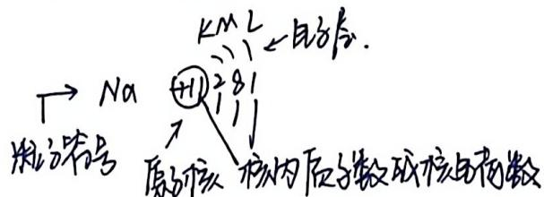

2. 离子结构示意图

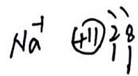

## 四、元素周期表的结构

1. 元素周期表的编排原则

(1) 原子序数: 按照元素在周期表中的顺序给元素编号, 得到原子序数。原子序数与元素的原子结构之间存在着下列关系:
原子序数= $\underline{\text{核电荷数}}=\underline{\text{原子数}}=\underline{\text{核外电子数}}$ .

(2) 横行: 原子核外 $\underline{\text{电位数}}$ 相同的元素, 按照原子序数递增的顺序从左到右排列

(3) 纵列: 原子核外取外与电子数相同的元素, 按电子层数递增的顺序由上而下排列 2. 周期

(1)周期的数目:现行的元素周期表中有7个横行,每个横行各为一个周期,共7个周期,自上而下称为第一、二、三、四、五、六、七周期

(2)周期的特点:同一周期中,元素原子的电子层数相同,且电子层数等于周期层数,从左到右原子序数递增

(3) 周期分类及所含元素的种类: 7个周期分为 $_{短}$ 周期（第一、二、三周期）和 $_{长}$ 周期（第四、五、六、七周期）

(4) 各周期元素归类

<table><tr><td>类别</td><td>周期序数</td><td colspan="2">起始元素</td><td colspan="2">终止元素</td><td>所含元素种数</td></tr><tr><td rowspan="3">短周期</td><td>1</td><td>H</td><td>I</td><td>He</td><td>2</td><td>2</td></tr><tr><td>2</td><td>L7</td><td>3</td><td>Ne</td><td>10</td><td>8</td></tr><tr><td>3</td><td>Na</td><td>11</td><td>Ar</td><td>18</td><td>8</td></tr><tr><td rowspan="4">长周期</td><td>4</td><td>K</td><td>19</td><td>K+</td><td>36</td><td>18</td></tr><tr><td>5</td><td>Rb</td><td>37</td><td>Xe</td><td>.54</td><td>18</td></tr><tr><td>6</td><td>Cs</td><td>55</td><td>Rn</td><td>86</td><td>32</td></tr><tr><td>7</td><td>Fr</td><td>87</td><td>Og</td><td>118</td><td>32</td></tr></table>

## 3.族

(1)族的数目: 元素周期表中共有 $\underline{18}$ 个纵列, 除第 $\underline{8}$ 、 $\underline{9}$ 、 $\underline{10}$ 三个纵列外, 其余每个纵列各为一个族, 共有 $\underline{16}$ 个族

(2) 族的分类:

①主族：在族序数后标A，包括第Ⅱ族、第Ⅲ族，共7个主族

②副族: 在族序数后标 B, 包括第ⅢB族、第ⅣB族、第ⅡB族、第ⅢB族 7 个副族

③第Ⅲ族：包括8、9、10三个纵列，位于第ⅣB族和第ⅡB族之间

④0族: 占据周期表的第18纵列, 最外层电子数是8(Hc是2)

⑥元素周期表中纵列与族序数的关系

<table><tr><td>列数</td><td>1</td><td>2</td><td>3</td><td>4</td><td>5</td><td>6</td><td>7</td><td>8</td><td>9</td><td>10</td><td>11</td><td>12</td><td>13</td><td>14</td><td>15</td><td>16</td><td>17</td><td>18</td></tr><tr><td>类别</td><td colspan="2">主族</td><td colspan="5">副族</td><td colspan="3">第四族</td><td colspan="2">第五族</td><td colspan="5">主族</td><td>0族</td></tr><tr><td>名称</td><td>LO</td><td>IIA</td><td>IIIB</td><td>IVB</td><td>VB</td><td>VIB</td><td>VIIIB</td><td colspan="3">VIII</td><td>VB</td><td>IIB</td><td>IIIA</td><td>IVA</td><td>VA</td><td>VIA</td><td>IIIA</td><td>O</td></tr></table>

(3)族的特点:同一主族中元素原子的最外电子数相同,且等于其频序数,
从上到下原子序数递增

(4) 常见族元素的特别名称

第ⅠA族（氢除外）：石成金的元素

第IIA族: 碳土金属元素

第ⅦA族: $\underline{\text{卤族}}$ 元素

0族: 磷有气体元素

五、元素 核素

## 1.元素

元素是具有相同核由荷数（即核内质子数的同一类原子的总称。由此可知，同种元素原子的原子核内质子数一定相同，但中子数不一定相同。

例如：氢元素原子的原子核内质子数与中子数的情况如下表：

<table><tr><td rowspan="2">元素名称</td><td colspan="2">原子核</td><td rowspan="2">原子名称</td><td rowspan="2">原子符号( $\overset{A}{\underset{Z}{2}}X$ )</td></tr><tr><td>质子数(Z)</td><td>中子数(N)</td></tr><tr><td rowspan="3">氢</td><td>1</td><td>0</td><td>气</td><td> $^{1H}$ </td></tr><tr><td>1</td><td>1</td><td>氚</td><td> $^{2H}$ 或D</td></tr><tr><td>1</td><td>2</td><td>氚</td><td> $^{3H}$ 或T</td></tr></table>

【注意】

①元素是宏观概念，只论种类不论个数，其存在形式有游离态和化合态，如 $\mathrm{H}_{2}$ 中的 $\mathrm{H}$ 与 $\mathrm{HCl}$ 中的 $\mathrm{H}$ 虽然存在形式不同，但都属于氢元素。

②元素的种类是由质子数决定

③只要质子数相同就属于同一种元素，但质子数相同的原子不一定是用一种原子

2. 核素

(1) 微粒的表示方法

质量数 $\leftarrow$ $A^{2x}$ $m\geq$ 离子所带的荷数
质子数 $\leftarrow$ $z$ $n$ → 原子个数

(2) 核素的含义: 具体一定数目 原物 和一定数目 中子 的一种原子叫做核素 【注意】

① “核素”属于微观概念，界定的是一种原子，核素既论种类又论个数，它由质子数和中子数共同决定，即原子核内质子数相同、中子数不同的原子不等同一种核素。

②绝大多数元素都包含多种核素 ${IH} - {2H} - {3H}$

③不能利用质量数确定核素的种类，如 $C$ 、 $N$ 的质量数相同，但他们属于两种不同的核素

④核素的质子数不能等于0，而中子数可以等于0，如H

3. 同位素

(1)同位素的含义:质子数相同而中子数不同的同一元素的不同原子互

称为同位素（即同一元素的不同核素互称为同位素）

(2) 同位素的特点

①位置：质子数相同，故元素符号相同，在周期表中占据同一位置

②构成：相同的质子数，不同的中子数

③性质：同位素的原子核外电子层结构相同，因此化学性质几乎相同；因质量数不同，物理性质略有差异

④存在：天然存在的同位素，相互之间保持一定的比率

(3) 同位素的应用

① $^{4}$ C 在考古工作中用于测定文物的年代

② $^{235}_{92}U$ 用于制造原子弹、核能发电

③放射性同位素释放的射线可用于育种、治疗恶性肿瘤等

## 第六讲 原子结构（一）习题

1. 我国科学家对嫦娥六号采回的月壤样品中的 108 颗玄武岩岩屑进行了精确定年。定年方法：通过测定 U-Pb 衰变体系 ${}^{235}_{92}$ U 衰变为 ${}^{206}_{82}$ Pb， ${}^{235}_{92}$ U 衰变为 ${}^{207}$ Pb 中 ${}^{207}$ Pb/ ${}^{206}$ Pb 来计算年龄，比值相同的年龄相近。下列说法不正确的是
A. Pb 位于元素周期表中第 5 周期第 IVA 族
B. ${}^{206}$ Pb 和 ${}^{207}$ Pb 是不同的核素 $238 - 92 = 146$ $235 - 92 = 147$ C. ${}^{238}$ U 和 ${}^{235}_{92}$ U 的中子数分别为 146 和 143，互为同位素
D. 来自同时期的玄武岩岩屑中 ${}^{207}$ Pb/ ${}^{206}$ Pb 值相近

2. 江津硒玉的发现, 填补了重庆一直没有玉石产地的空白。已知元素周期表中硒的信息及其原子结构示意图如图所示, 下列说法错误的是

# 第七讲 原子结构（二）

## 一、能层与能级

## 1. 能层

(1) 含义：核外电子按能量不同分成能层（即电子

(2)符号:用 $k$ 、 $L$ 、 $M$ 、 $N$ 、 $O$ 、 $P$ 、 $Q$ 表示相应的第一、二、三、四、五、六、七能层

(3) 能层能量的比较

能层越高,离原子核越远,电子的能量越高,能量高低顺序为\(E(L)<E(L)< E(M)<E(N)<E(O)<E(P)<E(Q)

2.能级

(1) 含义: 根据同一能层电子能量不同, 将他们分成不同的能级

(2)符号:在每一个能层中,能层符号的顺序为 $ns$ 、 $np$ 、 $nd$ 、 $nf$ 、 $ng$ 、 $nh$ 、 $ni$ (n表示能层序数)

(3) 能级能量的比较

①同一能层中,相同能级上的电子能量相同

②同一能层中,能级越高,电子的能量越大。如 ${\mathrm{E}}_{3\mathrm{r}} < \underline{\mathrm{E}}_{{3}\mathrm{p}} < \underline{\mathrm{E}}_{{3}\mathrm{d}}$

③不同能层的相同能级中,能层序数越大,电子能量越 $_{高}$ 。如 $E_{1s}<E_{2s}<E_{3s}$

3.能层与能级之间的关系

(1) 能级用相应的能层序数 (1、2、3、4…) 和字母 (s、p、d、f…) 组合起来表示

(2)任一能层的能级总是从 $5$ 能级开始,且能级数等于该能层序数.如第一能层只有1个能级( $15$ ),第二能层有2个能级( $25、20$ ),第三能层有3个能级( $35、30、30d$ ),以此类推。

4.能级、能层与可容纳电子数之间的关系

(1)每一层最多可容纳的电子数为 $2n^{2}$ （n代表能层序数）

(2)以 $s$ 、 $p$ 、 $d$ 、 $f\cdots$ 排序的各能级最多可容纳的电子数依次为1、3、5、7…的2倍

(3)不同能层的同种能级最多可容纳的电子数相等,如 $1\mathrm{s}$ 、 $2\mathrm{s}$ 、 $3\mathrm{s}$ 、 $4\mathrm{s}\cdots$ 能级最多只能容纳2个电子

<table><tr><td>能层(n)</td><td>一</td><td colspan="2">二</td><td colspan="3">三</td><td colspan="4">四</td><td colspan="2">五</td><td>六</td><td>七</td></tr><tr><td>符号</td><td>k</td><td colspan="2">L</td><td colspan="3">M</td><td colspan="4">N</td><td colspan="2">0</td><td>P</td><td>Q</td></tr><tr><td>能级</td><td>1s</td><td>2s</td><td>2p</td><td>3s</td><td>3p</td><td>3d</td><td>4s</td><td>4p</td><td>4d</td><td>4f</td><td>5s</td><td>...</td><td>...</td><td>...</td></tr><tr><td rowspan="2">最多电子数</td><td>2</td><td>2</td><td>6</td><td>2</td><td>6</td><td>10</td><td>2</td><td>6</td><td>10</td><td>14</td><td>2</td><td>...</td><td>...</td><td>...</td></tr><tr><td>2</td><td colspan="2">8</td><td colspan="3">18</td><td colspan="4">32</td><td colspan="2">50</td><td>72</td><td>98</td></tr></table>

## 二、基态与激发态 原子光谱

1. 基态原子与激发态原子

(1) 基态原子: 处于最低能量状态\_\_\_\_的原子叫做基态原子

(2) 激发态原子: 基态原子吸收能量后, 电子缺乏到较高能级, 变成激发态原子

（3）基态原子、激发态原子相互转化与能量的关系

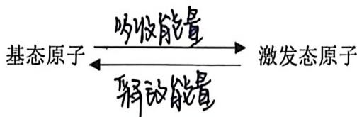

(4) 激发与激发态的认识

①电子由较低能级向较高能级跃迁，叫激发。电子可以在基态和激发态之间发生电子跃迁，不同的激发态之间也可以发生电子跃迁

②同一原子处于激发态时的能量一定，于处于基态时的能量

(3)如果电子仅在内层激发, 电子未获得足够的能量, 不会失去, 此时的物质也不会表现出还原性 (电子跃迁不能对化学变化)

④一般在能量相近的能级间发生电子跃迁

⑤离子也存在基态和激发态

2. 电子跃迁

(1) 光 (辐射) 是电子跃迁释放能量的重要形式之一。在日常生活中, 许多可见光, 如LED 灯光、霓虹灯光、激光、焰火、萤光等都与原子核外电子跃迁释放能量有关。

(2) 焰色试验发生的过程为基态原子吸收能量转化为激发态原子, 激发态原子再释放能量转化为基态原子或能量较原的激发态能\_\_\_\_, 释放的能量表现为不同的焰色。焰色试验是电子跃迁的结果, 故焰色实验是物理变化。

3.原子光谱

(1) 原子光谱的形成

锂、氦、汞的发射光谱

不同元素原子的电子发生跃迁时会吸收或释放不同的光，可以用光谱仪摄取各种元素原子的吸收光谱或发射光谱，总称原光谱。

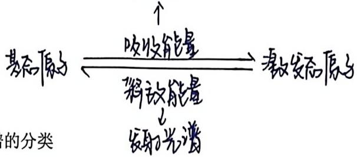

原子光谱可分为安力光谱和吸收，光谱。

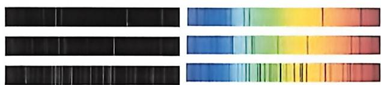

①发射光谱：暗 背景、亮 线、线 状 抗段

②吸收光谱：亮背景、暗线、线状不通

③同一原子发射光谱中的亮线与其吸收光谱中的暗线的位置对应相同。

(3) 光谱分析

在现代化学中，常利用原子光谱上的特征谱线来鉴定元素，称为光谱分析。光谱分析的依据是每一种元素都有自己的特征谱线。光谱图就像“指纹”一样，可以用于辨别形成光谱的元素。

## 三、构造原理

1.内容：以光谱事实为基础，从氢开始，随核电荷数递增，新增电子填入能级的顺序称为构造原理

2.构造原理示意图

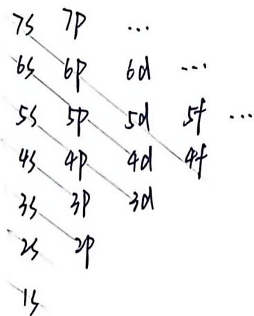

$1s \rightarrow 2s2p \rightarrow 3s3p \rightarrow 4s3d4p \rightarrow 5s4d5p \rightarrow 6s4f5d6p \rightarrow 7s5f6d7p \rightarrow \cdots$ $n s (n - 3) g (n - 2)f (n - 1)d n p$

【补充】原子核外最外层电子数不超过8（K层为最外层电子数不超过2），次外层不超过18的原因：依据构造原理，新增电子的填入顺序为： $15 \rightarrow 32p - 353p - 453d4p \rightarrow 55405p \rightarrow 654506p \rightarrow 755607p$ 当电子排满np能级后，接着进入的是 $(n+1)s$ 能级而不是nd能级，当nd能级上有电子时， $(n+1)s$ 能级上已填充有电子，n能层已不是最外层，所以原子核外最外层电子数不超过8。同样，当电子排满nd能级后，接着进入的是 $(n+1)p$ 能级而不是nf能级，当nf能级上有电子时， $(n+2)s$ 能级上已填充有电子，即n层已不是最外层，而是依数第三层，所以次外层电子数不超过18。

## (3)“能级交错”现象

由构造原理可知, 随核电荷数递增, 电子并不总是填满一个能层后再开始填入下一个能层的, 即电子是按 $3 \mathrm{p} \rightarrow 4 \mathrm{s} \rightarrow 3 \mathrm{d}$ 的顺序而不是按 $3 \mathrm{p} \rightarrow 3 \mathrm{~d} \rightarrow 4 \mathrm{~s}$ 的顺序填充的, 这种现象被称为能级交错。

## (4) 构造原理的局限

①构造原理呈现的能级交错源于光谱学事实，而不是任何理论推导的结果。构造原理是一个思维模型，是一个假想过程。

②构造原理是被理想化了的，由原子光谱得知有些过渡金属元素基态原子的电子排布不符合构造原理。

## 四、电子云与原子轨道

## 1. 宏观物体与微观物体（电子）的运动区别

(1)宏观物体的运动特征: 可以准确的测出它们在某一时刻所处的位置及运动的速度, 可以描绘它们的运动轨迹

（2）原子核外电子的运动特征：电子的质量很小，电子的运动空间很小，电子运动的速度很快，不能同时准确测试其位置与速度

## 2. 电子云

量子力学指出,一定空间运动状态的电子在核外空间各处都能出现,但出现的概率不同,可以算出他们的概率分布。用 $\mathrm{P}$ 表示电子出现在某处的根动平, $\mathrm{V}$ 表示该处的体积,则称为根动平密度. 用 $\rho$ 表示。由于核外电子的概率密度看起来像一片云雾,因而被形象的称作电子云。换句话说,电子云是处于一定空间运动状态的电子在原子核外空间的概率密度分布的形象化描述。

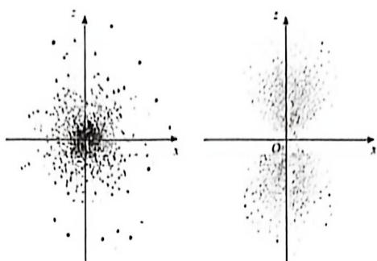

(1) 电子云区域中小点密度越大, 表示电子出现的概率密度。\_\_\_\_ 越大

（2）电子云图中的小点并不代表电子，小点的数目也不代表电子真实出现的次数

（3）在离原子核越近的空间电子出现的概率密度越大，电子云的外围形状具有不规则性

## 3.电子云轮廓图

为了表示电子云轮廓的形状，对核外电子的空间状态有一个形象化的简便描述，把电子在原子核外空间出现概率 $P = 90\%$ 的空间圈出来，即为电子云轮廓图。

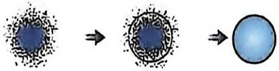  
电子云轮廓图的绘制过程

## 4. 原子轨道

(1) 定义: 量子力学把电子在院子核外的一个 $\underline{\text{空圆运动状态}}$ 称为一个原子轨道。因此, 常用电子云轮廓图的形状和取向来表示原子轨道的形状和取向。

(2) 形状

①s 电子的电子云轮廓图是\_球形\_, 只有\_1个伸展方向。同一原子的能层序数 (n)越大, 电子能量越高, 电子在离核越远的区域出现的概率越大, 电子云半径越大。

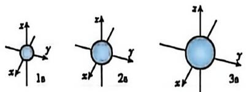

②p 电子的电子云轮廓图是哑铃形，其伸展方向是相互垂直的3个方向（Px、Py、Pz）。P 电子的电子云半径同样随着能层序数（n）的增大而增大。在同一能层中 $p_{x}$ 、 $p_{y}$ 、 $p_{z}$ 的能量相同。

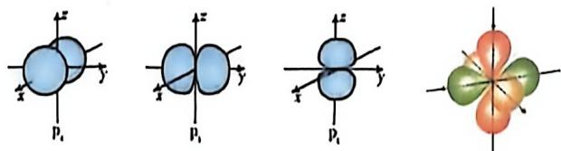

(3) 各能级所含有原子轨道数目

<table><tr><td>能级符号</td><td>ns</td><td>np</td><td>nd</td><td>nf</td></tr><tr><td>轨道数目</td><td>1</td><td>3</td><td>5</td><td>7</td></tr></table>

①同一能层中,不同能级原子轨道的能量及空间伸展方向不同,但同一能级的不同原子轨道能量相同.

②一般把同一能级的几个能量相同 的原子轨道称为简并轨道

## 五、核外电子排布原理

1. 泡利（Pauli）不相容原理

(1) 电子的自旋: 电子自旋在空间有顺时针和逆时针两种取向, 常用 “↑” 和 “↓” 表示自旋相反的电子

(2)在一个原子轨道里, 最多只能容纳 2 个电子, 它们的自旋相反, 这一原理被称为泡利原理。

【补充】因为每个原子轨道最多只能容纳2个电子，且它们的自旋相反，所以从能层、能级、原子轨道、自旋四个方面来说，在同一个原子中，不可能存在两个运动状态完全相同的电子。

(3) 能层、能级、原子轨道数目和最多可容纳电子数之间的关系

<table><tr><td>能层</td><td>能级</td><td>原子轨道数目</td><td>最多和容纳电子数</td></tr><tr><td>1</td><td>15</td><td>1</td><td>2</td></tr><tr><td>2</td><td>252p</td><td>4</td><td>8</td></tr><tr><td>3</td><td>353p3d</td><td>9</td><td>18</td></tr><tr><td>4</td><td>454p4d4f</td><td>16</td><td>32</td></tr><tr><td>...</td><td>...</td><td>...</td><td>...</td></tr><tr><td>n</td><td>—</td><td> $n^{2}$ </td><td> $2n^{2}$ </td></tr></table>

2. 洪特（Hund）规则

(1) 内容: 基态原子中, 填入简并轨道的电子总是先单独分占, 且自旋平行, 这个规则称为洪特规则

(2) 洪特规则的特例（相对稳定的状态）

当能量相同的轨道（同一能级）上的电子排布处于全充满、全空、特充满状态时，具有较低的能量和较高的稳定性。

①全充满： ${P}^{6}$ 、 ${d}^{10}$ 、 ${f}^{14}$

②全空： $P^{0}$ 、 $d^{0}$ 、 $f^{0}$

③半充满： $p^{3}$ 、 $d^{5}$ 、 $f^{7}$

(3) 注意:

①电子在简并轨道中先以自旋 $\underline{\underline{4分}}$ 分占不同轨道，剩余的电子再依次以自旋相反填入各轨道。

②洪特规则是针对电子填入简并轨道而言的，不适用于电子填入能量不同的轨道

3.能量最低原理

(1) 在构建基态原子时, 电子将尽可能地占据能量最 $_{低}$ 的原子轨道, 使整个原子的能量最 $_{低}$ , 这就是能量最低原理

(2) 整个原子的能量是由核电荷数、电分数和电子状态三个因素共同决定

（3）主族元素的基态原子，由于相邻能级能量相差很大，电子填入能量低的能级即可使整个原子能量最低；而副族元素的基态原子，相邻能级能量相差不太大时，有1\~2个电子占据能量稍高的能级反而降低了电子排斥能而使整个原子能量降低

六、原子核外电子排布的表示方法

1. 电子排布式

（1）含义：将能级所容纳的电子数标在该能级符号的右上角，并将能层低的能级写在左边，得到的式子为电子排布式

(2) 电子排布式的书写

①构造原理是书写基态原子核外电子排布式的依据

第一步：按照构造原理( $1s \rightarrow 2s$ , $2p \rightarrow 3s$ , $3p \rightarrow 4s$ , $3d$ , $4p \rightarrow 5s$ , $4d$ , $5p \rightarrow 6s$ , $4f$ , $5d$ , $6p \rightarrow 7s$ , $5f$ , $6d$ , $7p$ …
写出电子填入能级的顺序

第二步：根据各能级容纳的电子数填充电子

第三步：去掉空能级，并按照能层顺序排列即可得到电子排布式

2. 简化电子排布式

在多电子原子中, 原子核及内层电子中已达到稀有气体元素原子结构的部分组成。原子实可以用相应的稀有气体符号加中括号来表示。

3. 价层电子排布式

(1) 价电子层: 在化学反应中可能发生电子变动的能级, 简称价层。对于主族元素来说, 价层电子就是最外层电子\_\_\_\_; 而对于副族元素来说, 价层电子除了最外层

电子之外，还可能包括次外后电子。

（2）价层电子排布：直观地反映基态原子的电子层数、参与成键的电子数以及最外层电子数

4. 离子的核外电子排布式的书写

基态原子转化为相应离子时的一般规律: 原子失去电子时总是先失去最外层电子, 然后再失去次外层电子, 之后是倒数第三层电子…对于主族元素的原子来说, 一般只失去最外层电子, 而过渡元素的原子可能还会进一步失去内层电子。

5. 轨道表示式（又称电子排布图）

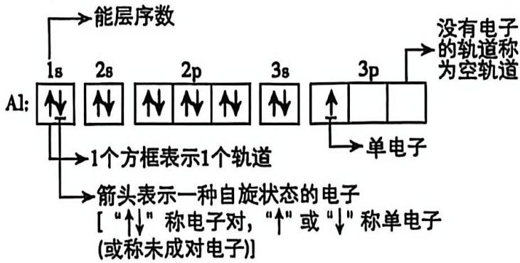

【例】1\~36号元素基态原子核外电子排布

<table><tr><td>原子序数</td><td>元素符号</td><td>电子排布式</td><td>简化电子排布式</td><td>价电子排布图(轨道表示式)</td></tr><tr><td>1</td><td>H</td><td> $1s^{1}$ </td><td> $1s^{1}$ </td><td>↑↓↓↓</td></tr><tr><td>2</td><td>He</td><td> $1s^{2}$ </td><td> $1s^{2}$ </td><td>↑↓↓↓</td></tr><tr><td>3</td><td>L</td><td> $1s^{2}2s^{1}$ </td><td> $[He]2s^{1}$ </td><td>↑↓↓↓</td></tr><tr><td>4</td><td>Be</td><td> $1s^{2}2s^{2}$ </td><td> $[He]2s^{2}$ </td><td>↑↓↓↓</td></tr><tr><td>5</td><td>B</td><td> $1s^{2}2s^{2}2p^{1}$ </td><td> $[He]2s^{2}2p^{1}$ </td><td>↑↓↑↓↓↓↓↓</td></tr><tr><td>6</td><td>C</td><td> $1s^{2}2s^{2}2p^{2}$ </td><td> $[He]2s^{2}2p^{2}$ </td><td>↑↓↑↓↓↓↓↓↓</td></tr><tr><td>7</td><td>N</td><td> $1s^{2}2s^{2}2p^{3}$ </td><td> $[He]2s^{2}2p^{3}$ </td><td>↑↓↑↑↓↓↓↓↓</td></tr><tr><td>8</td><td>O</td><td> $1s^{2}2s^{2}2p^{4}$ </td><td> $[He]2s^{2}2p^{4}$ </td><td>↑↓↑↑↓↓↓↓↓</td></tr><tr><td>9</td><td> $F$ </td><td> $15^{2}25^{2}2p^{5}$ </td><td> $[He]25^{2}2p^{5}$ </td><td></td></tr><tr><td>10</td><td> $Ne$ </td><td> $15^{2}25^{2}2p^{6}$ </td><td> $[He]25^{2}2p^{6}$ </td><td></td></tr><tr><td>11</td><td> $Na$ </td><td> $15^{2}25^{2}2p^{6}3s^{1}$ </td><td> $[Ne]3s^{1}$ </td><td></td></tr><tr><td>12</td><td> $Mg$ </td><td> $15^{2}25^{2}2p^{6}3s^{2}$ </td><td> $[Ne]3s^{2}$ </td><td></td></tr><tr><td>13</td><td> $Au$ </td><td> $15^{2}25^{2}2p^{6}3s^{2}3p^{1}$ </td><td> $[Ne]3s^{2}3p^{1}$ </td><td></td></tr><tr><td>14</td><td> $S_{7}$ </td><td> $15^{2}25^{2}2p^{6}3s^{2}3p^{2}$ </td><td> $[Ne]3s^{2}3p^{2}$ </td><td></td></tr><tr><td>15</td><td> $P$ </td><td> $15^{2}25^{2}2p^{6}3s^{2}3p^{3}$ </td><td> $[Ne]3s^{2}3p^{3}$ </td><td></td></tr><tr><td>16</td><td> $S$ </td><td> $15^{2}25^{2}2p^{6}3s^{2}3p^{4}$ </td><td> $[Ne]3s^{2}3p^{4}$ </td><td></td></tr><tr><td>17</td><td> $Cl$ </td><td> $15^{2}25^{2}2p^{6}3s^{2}3p^{5}$ </td><td> $[Ne]3s^{2}3p^{5}$ </td><td></td></tr><tr><td>18</td><td> $Ar$ </td><td> $15^{2}25^{2}2p^{6}3s^{2}3p^{6}$ </td><td> $[Ne]3s^{2}3p^{6}$ </td><td></td></tr><tr><td>19</td><td> $K$ </td><td> $15^{2}25^{2}2p^{6}3s^{2}3p^{6}4s^{1}$ </td><td> $[Ar]4s^{1}$ </td><td></td></tr><tr><td>20</td><td> $Ca$ </td><td> $15^{2}25^{2}2p^{6}3s^{2}3p^{6}4s^{2}$ </td><td> $[Ar]4s^{2}$ </td><td></td></tr><tr><td>21</td><td> $Sc$ </td><td> $15^{2}25^{2}2p^{6}3s^{2}3p^{6}3d^{1}4s^{2}$ </td><td> $[Ar]3d^{1}4s^{2}$ </td><td></td></tr><tr><td>22</td><td> $T_{7}$ </td><td> $15^{2}25^{2}2p^{6}3s^{2}3p^{6}3d^{1}4s^{2}$ </td><td> $[Ar]3d^{1}4s^{2}$ </td><td></td></tr><tr><td>23</td><td> $V$ </td><td> $15^{2}25^{2}2p^{6}3s^{2}3p^{6}3d^{1}4s^{2}$ </td><td> $[Ar]3d^{1}4s^{2}$ </td><td></td></tr><tr><td>24</td><td> $Cr$ </td><td> $15^{2}25^{2}2p^{6}3s^{2}3p^{6}3d^{1}54s^{1}$ </td><td> $[Ar]3d^{1}54s^{1}$ </td><td></td></tr><tr><td>25</td><td> $Mn$ </td><td> $15^{2}25^{2}2p^{6}3s^{2}3p^{6}3d^{1}54s^{2}$ </td><td> $[Ar]3d^{1}54s^{2}$ </td><td></td></tr><tr><td>26</td><td> $Fe$ </td><td> $15^{2}25^{2}2p^{6}3s^{2}3p^{6}3d^{1}64s^{2}$ </td><td> $[Ar]3d^{1}64s^{2}$ </td><td></td></tr><tr><td>27</td><td>Co</td><td> $15^{2}25^{2}2p^{6}35^{2}3p^{6}3d^{7}4s^{2}$ </td><td> $[Ar]3d^{7}4s^{2}$ </td><td> $\frac{↑↑↑↑}{3d}$   $\frac{↑↑}{4s}$ </td></tr><tr><td>28</td><td>Ni</td><td> $15^{2}25^{2}2p^{6}35^{2}3p^{6}3d^{8}4s^{2}$ </td><td> $[Ar]3d^{8}4s^{2}$ </td><td> $\frac{↑↑↑↑}{3d}$   $\frac{↑↑}{4s}$ </td></tr><tr><td rowspan="2">30</td><td>Cu</td><td> $15^{2}25^{2}2p^{6}35^{2}3p^{6}3d^{10}4s^{1}$ </td><td> $[Ar]3d^{10}4s^{1}$ </td><td> $\frac{↑↑↑↑}{3d}$   $\frac{↑↑}{4s}$ </td></tr><tr><td>Zn</td><td> $15^{2}25^{2}2p^{6}35^{2}3p^{6}3d^{10}4s^{2}$ </td><td> $[Ar]3d^{10}4s^{2}$ </td><td> $\frac{↑↑↑↑}{3d}$   $\frac{↑↑}{4s}$ </td></tr><tr><td>31</td><td>Ga</td><td> $15^{2}25^{2}2p^{6}35^{2}3p^{6}3d^{10}4s^{2}4p^{1}$ </td><td> $[Ar]3d^{10}4s^{2}4p^{1}$ </td><td> $\frac{↑↑↑}{4s}$ </td></tr><tr><td>32</td><td>Ge</td><td> $15^{2}25^{2}2p^{6}35^{2}3p^{6}3d^{10}4s^{2}4p^{2}$ </td><td> $[Ar]3d^{10}4s^{2}4p^{2}$ </td><td> $\frac{↑↑↑}{4s}$ </td></tr><tr><td>33</td><td>As</td><td> $15^{2}25^{2}2p^{6}35^{2}3p^{6}3d^{10}4s^{2}4p^{3}$ </td><td> $[Ar]3d^{10}4s^{2}4p^{3}$ </td><td> $\frac{↑↑↑}{4s}$ </td></tr><tr><td>34</td><td>Se</td><td> $15^{2}25^{2}2p^{6}35^{2}3p^{6}3d^{10}4s^{2}4p^{4}$ </td><td> $[Ar]3d^{10}4s^{2}4p^{4}$ </td><td> $\frac{↑↑↑}{4s}$ </td></tr><tr><td>35</td><td>Bv</td><td> $15^{2}25^{2}2p^{6}35^{2}3p^{6}3d^{10}4s^{2}4p^{5}$ </td><td> $[Ar]3d^{10}4s^{2}4p^{5}$ </td><td> $\frac{↑↑↑↑}{4s}$ </td></tr><tr><td>36</td><td>Kr</td><td> $15^{2}25^{2}2p^{6}35^{2}3p^{6}3d^{10}4s^{2}4p^{6}$ </td><td> $[Ar]3d^{10}4s^{2}4p^{6}$ </td><td> $\frac{↑↑↑↑}{4s}$ </td></tr></table>

【小结】

<table><tr><td rowspan="3">原子(离子)结构示意图</td><td>含义</td><td>表示原子(离子)核电荷数和电子层排布的图示形式</td></tr><tr><td>意义</td><td>能直观反映出核内质子数、核外电子数及各电子层上的电子数</td></tr><tr><td>实例</td><td></td></tr><tr><td rowspan="3">电子排布式</td><td>含义</td><td>用核外电子排布的能级及各能级上的电子数表示电子排布的式子</td></tr><tr><td>意义</td><td>能直观反映出核外电子层、能级及各能级上的电子数</td></tr><tr><td>实例</td><td></td></tr><tr><td rowspan="3">简化电子排布式</td><td>含义</td><td>把内层电子排布用相应的稀有气体元素符号外加方括号表示的形式</td></tr><tr><td>意义</td><td>避免电子式书写过于繁琐</td></tr><tr><td>实例</td><td> $\mathrm{{Mg}} : {\left\lbrack \mathrm{{Ne}}\right\rbrack }^{3}{\mathrm{\;s}}^{2}$ </td></tr><tr><td rowspan="3">价层电子排布式</td><td>含义</td><td>化学反应中可能发生电子变动的能级的电子排布式主族:最外层电子 副族:最外层电子一次外层电子</td></tr><tr><td>意义</td><td>能直观反应出基态原子的电子层数、参与成键的电子数及最外层电子数</td></tr><tr><td>实例</td><td>S:  $3s^{2}3p^{4}$ </td></tr><tr><td rowspan="3">轨道表示式(电子排布图)</td><td>含义</td><td>将每一个原子轨道用一个方框(或圆圈)表示,在方框(或圆圈)内用箭头表示自旋状态不同的电子的式子</td></tr><tr><td>意义</td><td>能直观反映出电子的排布情况及电子的自旋状态</td></tr><tr><td>实例</td><td>Na:  $\begin{array}{ccccc} \text{回} & \text{回} & \text{回} & \text{化} & \text{个} \\ \text{15} & 25 & 2 & 3 & 3 \end{array}$ </td></tr></table>

## 七、元素周期表的分区

1. 按照电子排布分区

按构造原理最后项a句子的能力符号\_\_\_\_可将元素周期表分为s、p、d、

## f、ds 5 个区

<table><tr><td></td><td>I A</td><td>II A</td><td rowspan="3" colspan="8"></td><td>III A</td><td>IV A</td><td>V A</td><td>VI A</td><td>VII A</td><td>O</td></tr><tr><td>1</td><td rowspan="7" colspan="2">s 区</td><td rowspan="7" colspan="6">p 区</td></tr><tr><td>2</td></tr><tr><td>3</td><td>III B</td><td>IV B</td><td>V B</td><td>VIB</td><td>VII B</td><td>VIII</td><td>I B</td><td>II B</td></tr><tr><td>4</td><td rowspan="4" colspan="6">d 区</td><td rowspan="4" colspan="2">ds 区</td></tr><tr><td>5</td></tr><tr><td>6</td></tr><tr><td>7</td></tr></table>

第24.2B族中原子的核外几先填满了 $(n-1)$ d能级而后仍填充以能级，因而得各d区。

<table><tr><td>镧系元素</td><td rowspan="2">f区</td></tr><tr><td>锕系元素</td></tr></table>

2. 按照金属与非金属元素分区

<table><tr><td colspan="2">1H</td><td colspan="18"></td><td></td><td></td><td></td><td></td><td></td><td></td><td></td><td></td><td></td><td></td><td></td><td></td><td></td><td></td><td></td><td></td></tr><tr><td colspan="2">3Li</td><td colspan="2">4Bo</td><td colspan="16"></td><td></td><td></td><td></td><td></td><td></td><td></td><td></td><td></td><td></td><td></td><td></td><td></td><td></td><td></td><td></td><td></td></tr><tr><td colspan="2">11Na</td><td colspan="2">13Mg</td><td colspan="16"></td><td></td><td></td><td></td><td></td><td></td><td></td><td></td><td></td><td></td><td></td><td></td><td></td><td></td><td></td><td></td><td></td></tr><tr><td colspan="2">13K</td><td colspan="2">25Ca</td><td colspan="2">81So</td><td colspan="2">82Ti</td><td colspan="2">23V</td><td colspan="2">24Cr</td><td colspan="2">85Mn</td><td colspan="2">26Fo</td><td colspan="2">27Co</td><td colspan="2">28Ni</td><td colspan="2">29Cu</td><td colspan="2">30Zn</td><td colspan="2">31Ga</td><td colspan="2">32Go</td><td colspan="2">33As</td><td colspan="2">34So</td><td colspan="2">35Br</td><td colspan="2">36Kr</td></tr><tr><td colspan="2">27Rb</td><td colspan="2">34Sr</td><td colspan="2">30Y</td><td colspan="2">40Zr</td><td colspan="2">41Nb</td><td colspan="2">42Mo</td><td colspan="2">43To</td><td colspan="2">44Ru</td><td colspan="2">45Rh</td><td colspan="2">46Pd</td><td colspan="2">47Ag</td><td colspan="2">48Cd</td><td colspan="2">49In</td><td colspan="2">50Sn</td><td colspan="2">51Sb</td><td colspan="2">52To</td><td colspan="2">53I</td><td colspan="2">54Xo</td></tr><tr><td colspan="2">65Cs</td><td colspan="2">64Ba</td><td colspan="2">67La</td><td colspan="2">72Hf</td><td colspan="2">73Ta</td><td colspan="2">74W</td><td colspan="2">75Ro</td><td colspan="2">76Os</td><td colspan="2">77Ir</td><td colspan="2">78Pt</td><td colspan="2">79Au</td><td colspan="2">80Hg</td><td colspan="2">81Tl</td><td colspan="2">82Pb</td><td colspan="2">83Bl</td><td colspan="2">84Po</td><td colspan="2">85At</td><td colspan="2">86Rn</td></tr><tr><td colspan="2">87Fr</td><td colspan="2">88Ra</td><td colspan="2">89Ao</td><td colspan="2">104Rf</td><td colspan="2">105Db</td><td colspan="2">106Sg</td><td colspan="2">107Bh</td><td colspan="2">108Hs</td><td colspan="2">109Mt</td><td colspan="2">110Ds</td><td colspan="2">111Rg</td><td colspan="2">112Cn</td><td colspan="2">113Nh</td><td colspan="2">114Fl</td><td colspan="2">115Mo</td><td colspan="2">116Lv</td><td colspan="2">117Ts</td><td colspan="2">118Og</td></tr></table>

<table><tr><td>Co</td><td>D9Pr</td><td>60Nd</td><td>61Pm</td><td>63Sm</td><td>64Eu</td><td>64Gd</td><td>65Tb</td><td>66Dy</td><td>67Ho</td><td>68Er</td><td>69Tm</td><td>70Yb</td><td>71Lu</td></tr><tr><td>Th</td><td>91Pa</td><td>92U</td><td>93Np</td><td>94Pu</td><td>95Am</td><td>96Cm</td><td>97Bk</td><td>98Cf</td><td>99Es</td><td>100Fm</td><td>101Md</td><td>102No</td><td>103Lr</td></tr></table>

(1) 位于金属与非金属分界线附近的元素, 既能表现金属元素的某些性质, 又能表现非金属的某些性质, 如金属元素 $\mathrm{{Be}}$ 、 $\mathrm{{Al}}$ 形成的单质能与 $\mathrm{{NaOH}}$ 溶液反应, 体现出非金属性; 非金属元素 Si 形成的硅单质具有金属光泽、能导电, 体现出金属性。

(2) 对角线规则

在元素周期表中，某些主族元素与右下方的主族元素的有些性质是相似的，这种相似性被称为对角线规则。

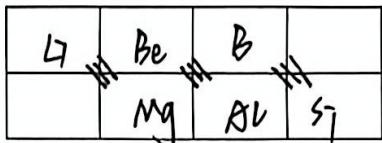

## 第七讲 原子结构 (二) 习题

B 1. 下列各电子层中包含 f 能级的是
A. L
B. N
C. M
D. K

B2. 下列关于能层与能级的说法中，正确的是
A. 同一原子中，符号相同的能级，其上电子能量一定相同
B. 多电子原子中，同一能级上电子的能量一定相同
C. 同是s能级，在不同的能层中所能容纳的最多电子数不同
D. 任一能层的能级总是从s能级开始，能级数与能层序数无关

C3. 下列关于原子结构或元素性质的说法正确的是
A. 电子云图中的每个点都表示一个电子
B. 激光、焰火都与核外电子跃迁吸收光能有关
C. 电子由 $3 \mathrm{~s}$ 能级跃迁至 $3 \mathrm{p}$ 能级时, 可以用光谱仪摄取其吸收光谱
D. 根据对角线规则, $\mathrm{Mg}$ 和 $\mathrm{B}$ 的化学性质相似

## 答案速查

> 以下为本讲全部填空答案，按章节组织。注：原文件中部分填空已用 $\underline{\text{...}}$ 或 $_{答案}$ 格式填入（如"原子序数=核电荷数=质子数=核外电子数"），此处仅列出未填或易混淆的答案。

### 第六讲 · 原子结构（一）

| 序号 | 位置 | 内容 | 答案 |
|:---:|:---|:---|---:|
| 1 | §1·电子层 | 电子分别在能量（ ）不同的区域内运动 | 高低 |
| 2 | §1·电子层 | 简化为不连续的壳层，也称为电子（ ） | 层 |
| 3 | §2·排布规律 | 核外电子按照（ ）能量最低原则排布 | （此处的____为 OCR 残留，非刻意填空） |
| 4 | §4·周期表 | 原子序数 = 核电荷数 = （ ） = 核外电子数 | 质子数 |
| 5 | §4·周期表 | 原子核外（ ）相同的元素，按照原子序数递增排列 | 电子数 |
| 6 | §4·周期表 | 周期分为（ ）周期和（ ）周期 | 短；长 |
| 7 | §4·族 | （ ）个纵列，（ ）个族 | 18；16 |
| 8 | §4·族 | 第ⅦA族：（ ）元素 | 卤族 |
| 9 | §5·核素 | 具有一定数目（ ）和一定数目（ ）的一种原子 | 质子；中子 |

**第六讲习题选答**

| 题号 | 答案 |
|:---:|---:|
| 1 | A（Pb 位于第六周期第ⅣA族，非第五周期） |
| 2 | 略（选择题，选项不清） |

### 第七讲 · 原子结构（二）

| 序号 | 位置 | 内容 | 答案 |
|:---:|:---|:---|---:|
| 1 | §2·基态 | 处于最低能量状态（ ）的原子叫做基态原子 | （此处的____为 OCR 残留） |
| 2 | §2·焰色 | 激发态原子释放能量转化为基态或能量较（ ）的激发态 | 低 |
| 3 | §2·光谱 | 原子光谱可分为（ ）光谱和（ ）光谱 | 发射；吸收 |
| 4 | §4·电子云 | 概率密度（ ）越大 | 越大 |
| 5 | §4·电子云轮廓图 | s 电子的电子云轮廓图是（ ）形 | 球形 |
| 6 | §4·原子轨道 | 量子力学把电子在核外的一个（ ）称为一个原子轨道 | 空间运动状态 |
| 7 | §5·洪特规则 | 电子在简并轨道中先以自旋（ ）分占不同轨道 | 平行 |
| 8 | §6·价层电子 | 价层电子就是最外层电子（ ） | （此处的____为 OCR 残留） |
| 9 | §7·分区 | 按构造原理最后填入电子的能级符号可将周期表分为（ ）区 | s、p、d、f、ds |

**表：各能级轨道数目**

| 能级符号 | ns | np | nd | nf |
|:-------:|:--:|:--:|:--:|:--:|
| 轨道数目 | 1 | 3 | 5 | 7 |

**表：原子轨道数目与最多容纳电子数**

| 能层(n) | 1 | 2 | 3 | 4 | ... | n |
|:-------:|:-:|:-:|:-:|:-:|:---:|:-:|
| 轨道数目 | 1 | 4 | 9 | 16 | ... | n² |
| 最多电子数 | 2 | 8 | 18 | 32 | ... | 2n² |

**表：能层·能级·能级组对照**

| 能层(n) | 一 | 二 | 三 | 四 | 五 | 六 | 七 |
|:-------:|:-:|:-:|:-:|:-:|:-:|:-:|:-:|
| 符号 | K | L | M | N | O | P | Q |
| 能级 | 1s | 2s2p | 3s3p3d | 4s4p4d4f | 5s... | 6s... | 7s... |
| 最多电子数 | 2 | 8 | 18 | 32 | 50 | 72 | 98 |

**表：1-36 号元素价电子排布图（轨道表示式）—— 补充空白单元格**

> 原表第 9-26 号（F→Fe）的"价电子排布图（轨道表示式）"列为空，补充如下：

| Z | 元素 | 价电子轨道表示式 |
|:-:|:---:|:---|
| 9 | F | $\frac{\uparrow\downarrow}{2s}\;\frac{\uparrow\downarrow\uparrow\downarrow\uparrow}{2p}$ |
| 10 | Ne | $\frac{\uparrow\downarrow}{2s}\;\frac{\uparrow\downarrow\uparrow\downarrow\uparrow\downarrow}{2p}$ |
| 11 | Na | $\frac{\uparrow\downarrow}{3s}$ |
| 12 | Mg | $\frac{\uparrow\downarrow}{3s}$ |
| 13 | Al | $\frac{\uparrow\downarrow}{3s}\;\frac{\uparrow}{3p}$ |
| 14 | Si | $\frac{\uparrow\downarrow}{3s}\;\frac{\uparrow\uparrow}{3p}$ |
| 15 | P | $\frac{\uparrow\downarrow}{3s}\;\frac{\uparrow\uparrow\uparrow}{3p}$ |
| 16 | S | $\frac{\uparrow\downarrow}{3s}\;\frac{\uparrow\downarrow\uparrow\uparrow}{3p}$ |
| 17 | Cl | $\frac{\uparrow\downarrow}{3s}\;\frac{\uparrow\downarrow\uparrow\downarrow\uparrow}{3p}$ |
| 18 | Ar | $\frac{\uparrow\downarrow}{3s}\;\frac{\uparrow\downarrow\uparrow\downarrow\uparrow\downarrow}{3p}$ |
| 19 | K | $\frac{\uparrow\downarrow}{4s}$ |
| 20 | Ca | $\frac{\uparrow\downarrow}{4s}$ |
| 21 | Sc | $\frac{\uparrow\downarrow}{4s}\;\frac{\uparrow}{3d}$ |
| 22 | Ti | $\frac{\uparrow\downarrow}{4s}\;\frac{\uparrow\uparrow}{3d}$ |
| 23 | V | $\frac{\uparrow\downarrow}{4s}\;\frac{\uparrow\uparrow\uparrow}{3d}$ |
| 24 | Cr | $\frac{\uparrow}{4s}\;\frac{\uparrow\uparrow\uparrow\uparrow\uparrow}{3d}$（洪特规则特例） |
| 25 | Mn | $\frac{\uparrow\downarrow}{4s}\;\frac{\uparrow\uparrow\uparrow\uparrow\uparrow}{3d}$ |
| 26 | Fe | $\frac{\uparrow\downarrow}{4s}\;\frac{\uparrow\downarrow\uparrow\uparrow\uparrow\uparrow}{3d}$ |

**第七讲习题选答**

| 题号 | 答案 |
|:---:|---:|
| 1 | B（N 能层 n=4，包含 f 能级） |
| 2 | B |
| 3 | C |

### 📌 OCR 错误校正

原文件由 OCR 识别自扫描版讲义，以下为已填答案中的明显 OCR 错误，建议修正：

| 位置 | 原文（错误） | 应修正为 |
|:---|:---|---:|
| §4·原子序数 | 原子序数 = 核电荷数 = 原子数 = 核外电子数 | **质子数**（非"原子数"） |
| §4·横行 | 原子核外（电位数）相同的元素 | **电子层数** |
| §4·周期表 | 第Ⅱ族 → 第Ⅲ族 → ...（多处编号错乱） | 按标准族编号修正 |
| §7·原子轨道 | 空圆运动状态 | **空间运动状态** |
| §7·洪特规则 | 自旋（4分）分占不同轨道 | **自旋平行** |