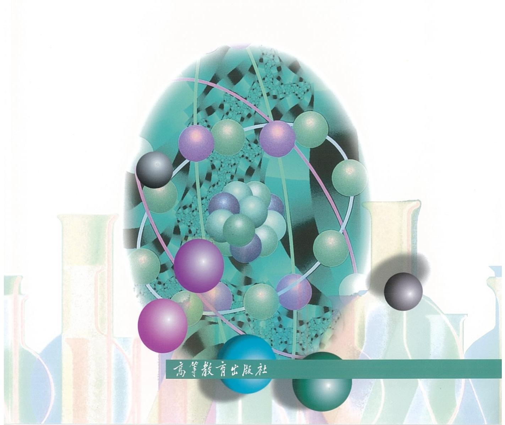

# 无机化学 例题与习题 (第4版)

吉林大学

徐家宁 王莉 张丽荣 于杰辉 宋天佑 编

高等教育出版社

# 无机化学 例题与习题 (第4版)

吉林大学

徐家宁 王莉 张丽荣 于杰辉 宋天佑 编

The Ground Truth image displays a single, solid horizontal line. According to Rule 2 (UNDERSCORE & LINE RULES), this is a stylistic or background line, not a placeholder underscore. Therefore, the OCR result must ignore it. The provided OCR content is "\_\_\_\_", which consists of four underscores. This is an incorrect interpretation of the line as a placeholder, violating the rule that stylistic lines must be ignored. The OCR has hallucinated text (underscores) where none should exist, violating the rule to ignore such lines. Hence, the OCR result is inconsistent with the Ground Truth.

## 目录

第1章 化学基础知识 …… 1
第2章 化学热力学基础 …… 11
第3章 化学反应速率 …… 22
第4章 化学平衡 …… 33
第5章 原子结构和元素周期律 …… 45
第6章 分子结构和共价键理论 …… 53
第7章 晶体结构 …… 61
第8章 酸碱解离平衡 …… 68
第9章 沉淀溶解平衡 …… 80
第10章 氧化还原反应 …… 91
第11章 配位化学基础 …… 106
第12章 碱金属和碱土金属 …… 119
第13章 硼族元素 …… 125
第14章 碳族元素 …… 131
第15章 氮族元素 …… 140
第16章 氧族元素 …… 150
第17章 卤素 …… 159
第18章 氢和稀有气体 …… 167
第19章 铜副族元素和锌副族元素 …… 172
第20章 钛副族元素和钒副族元素 …… 182
第21章 铬副族元素和锰副族元素 …… 188
第22章 铁系元素和铂系元素 …… 197
习题参考答案 …… 206
主要参考书目 …… 353

1. 2017年，公司与上海浦东发展银行股份有限公司签订了《关于使用部分闲置募集资金进行现金管理的协议》，同意公司使用不超过人民币5亿元的闲置募集资金进行现金管理。

## 化学基础知识

## 第一部分 例题

例 1.1 一定体积的氢气和氦气的混合气体, 在 $27^{\circ}$ C 时压强为 202 kPa, 现使该气体的体积膨胀至原体积的 4 倍, 压强变为 101 kPa。试求膨胀后混合气体的温度。

解：根据题设可知 $T_{1}=(27+273)\mathrm{K}=300\ \mathrm{K}, p_{1}=202\ \mathrm{kPa}, p_{2}=101\ \mathrm{kPa}$ 且 $V_{2}=4V_{1}$ ， $n_{2}=n_{1}$ 。

由理想气体状态方程 $pV = nRT$ 得

$$
n = \frac {p V}{R T}
$$

由 $n_2 = n_1$ 可知

$$
\frac {p _ {2} V _ {2}}{R T _ {2}} = \frac {p _ {1} V _ {1}}{R T _ {1}}
$$

所以

$$
\begin{array}{r l} T _ {2} & = \frac {p _ {2} V _ {2} T _ {1}}{p _ {1} V _ {1}} \\ & = \frac {p _ {2} \times 4 V _ {1} T _ {1}}{p _ {1} V _ {1}} \\ & = \frac {4 p _ {2} T _ {1}}{p _ {1}} \\ & = \frac {4 \times 1 0 1 \mathrm{kPa} \times 3 0 0 \mathrm{K}}{2 0 2 \mathrm{kPa}} \\ & = 6 0 0 \mathrm{K} \end{array}
$$

例 1.2 300 K 和 $3.00 \times 10^{6}$ Pa 时, 某气筒内封有 10 mol 氧气, 试求该气筒的容积。将此气筒加热到 373 K, 然后开启阀门放出氧气, 在保持温度不变的情况下压强降低到 $1.00 \times 10^{5}$ Pa, 试求放出氧气的质量。

解：理想气体状态方程为

$$
p V = n R T
$$

将题设的 $T_{1}=300\ K, p_{1}=3.00\times10^{6}\ Pa, n_{1}=10\ mol$ 及 R 值代入其中，即可求出气筒的容积 V:

$$
\begin{array}{r l} V & = \frac {n _ {1} R T _ {1}}{p _ {1}} \\ & = \frac {1 0 \mathrm{mol} \times 8 . 3 1 4 \mathrm{Pa} \cdot \mathrm{m} ^ {3} \cdot \mathrm{mol} ^ {- 1} \cdot \mathrm{K} ^ {- 1} \times 3 0 0 \mathrm{K}}{3 . 0 0 \times 1 0 ^ {6} \mathrm{Pa}} \\ & = 8. 3 1 \times 1 0 ^ {- 3} \mathrm{m} ^ {3} \end{array}
$$

将题设的 $T_{2}=373\ K, p_{2}=1.00\times10^{5}\ Pa$ ，求得的 $V=8.31\times10^{-3}\ m^{3}$ 及 R 值代入理想气体状态方程，即可求得气筒中剩余的氧气的物质的量 $n_{2}$ ：

$$
\begin{array}{r l} n _ {2} & = \frac {p _ {2} V}{R T _ {2}} \\ & = \frac {1 . 0 0 \times 1 0 ^ {5} \mathrm{Pa} \times 8 . 3 1 \times 1 0 ^ {- 3} \mathrm{m} ^ {3}}{8 . 3 1 4 \mathrm{Pa} \cdot \mathrm{m} ^ {3} \cdot \mathrm{mol} ^ {- 1} \cdot \mathrm{K} ^ {- 1} \times 3 7 3 \mathrm{K}} \\ & = 0. 2 6 8 \mathrm{mol} \end{array}
$$

放出氧气的物质的量为

$$
\begin{array}{r l} \Delta n & = n _ {1} - n _ {2} \\ & = 1 0 \mathrm{mol} - 0. 2 6 8 \mathrm{mol} \\ & = 9. 7 3 2 \mathrm{mol} \end{array}
$$

放出氧气的质量为

$$
\begin{array}{r l} m & = \Delta n M \\ & = 9. 7 3 2 \mathrm{mol} \times 3 2 \mathrm{g} \cdot \mathrm{mol} ^ {- 1} \\ & = 3 1 1 \mathrm{g} \end{array}
$$

例 1.3 将 $0.10 \, mol \, C_{2}H_{2}$ 气体放在充有 $1.00 \, mol \, O_{2}$ 的 $10.0 \, dm^{3}$ 密闭容器中，令其完全燃烧生成 $CO_{2}$ 和 $H_{2}O$ ，反应完毕时的温度是 $150^{\circ}C$ ，计算此时容器内的压强。

解：反应方程式为

$$
\mathrm{C} _ {2} \mathrm{H} _ {2} (\mathrm{g}) + \frac {5}{2} \mathrm{O} _ {2} (\mathrm{g}) \xlongequal {1 5 0 ^ {\circ} \mathrm{C}} 2 \mathrm{CO} _ {2} (\mathrm{g}) + \mathrm{H} _ {2} \mathrm{O} (\mathrm{g})
$$

0.10 mol $C_{2}H_{2}$ 完全反应掉，消耗 0.25 mol $O_{2}$ ，故反应后剩余 $O_{2}$ 为 $(1.00 - 0.25)$ mol = 0.75 mol，生成 0.20 mol $CO_{2}$ 和 0.10 mol $H_{2}O$ ，所以反应后物质的量为 $n = (0.75 + 0.20 + 0.10)$ mol = 1.05 mol。

依题意

$$
\begin{array}{r l} & V = 1 0. 0 \mathrm{dm} ^ {3} = 1 0. 0 \times 1 0 ^ {- 3} \mathrm{m} ^ {3} \\ & T = 1 5 0 ^ {\circ} \mathrm{C} = (1 5 0 + 2 7 3) \mathrm{K} = 4 2 3 \mathrm{K} \end{array}
$$

由理想气体状态方程 pV=nRT 得

$$
\begin{array}{r l} p & = \frac {n R T}{V} \\ & = \frac {1 . 0 5 \mathrm{mol} \times 8 . 3 1 4 \mathrm{Pa} \cdot \mathrm{m} ^ {3} \cdot \mathrm{mol} ^ {- 1} \cdot \mathrm{K} ^ {- 1} \times 4 2 3 \mathrm{K}}{1 0 . 0 \times 1 0 ^ {- 3} \mathrm{m} ^ {3}} \\ & = 3. 6 9 \times 1 0 ^ {2} \mathrm{kPa} \end{array}
$$

例 1.4 20 ℃ 和 101 kPa 时，10 dm³ 干燥空气缓慢地通过如图所示的溴苯 (C₆H₅Br, M = 157 g·mol⁻¹) 计泡器，溴苯质量减少 0.475 g。试求：

(1) 通过计泡器后被溴苯饱和的空气的体积;

(2) $20^{\circ} \mathrm{C}$ 时溴苯的饱和蒸气压。

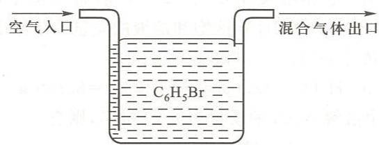

解：（1）由题意可知，当干燥的空气通过溴苯并被饱和后，混合气体的总压不变，仍为起始压强 $p_{总} = 101 \, kPa$ 。由于溴苯的加入，混合气体的体积 $V_{总}$ 将增大；混合气体总的物质的量 $n_{总}$ 增大。

设 n(溴苯)为蒸发的溴苯的物质的量, n(空气)为空气的物质的量, 则

$$
\begin{array}{r l} & n (\text {溴苯}) = \frac {m}{M (\text {溴苯})} = \frac {0 . 4 7 5 \mathrm{g}}{1 5 7 \mathrm{g} \cdot \mathrm{mol} ^ {- 1}} = 3. 0 2 5 \times 1 0 ^ {- 3} \mathrm{mol} \\ & n (\text {空气}) = \frac {p V}{R T} = \frac {1 0 1 \times 1 0 ^ {3} \mathrm{Pa} \times 1 0 \times 1 0 ^ {- 3} \mathrm{m} ^ {3}}{8 . 3 1 4 \mathrm{Pa} \cdot \mathrm{m} ^ {3} \cdot \mathrm{mol} ^ {- 1} \cdot \mathrm{K} ^ {- 1} \times 2 9 3 \mathrm{K}} = 0. 4 1 4 6 \mathrm{mol} \\ & n _ {\text {总}} = n (\text {溴苯}) + n (\text {空气}) = 0. 4 1 7 6 \mathrm{mol} \end{array}
$$

故

$$
\begin{array}{r l} V _ {\text {总}} & = \frac {n _ {\text {总}} R T}{p _ {\text {总}}} \\ & = \frac {0 . 4 1 7 6 \mathrm{mol} \times 8 . 3 1 4 \mathrm{Pa} \cdot \mathrm{m} ^ {3} \cdot \mathrm{mol} ^ {- 1} \cdot \mathrm{K} ^ {- 1} \times 2 9 3 \mathrm{K}}{1 0 1 \times 1 0 ^ {3} \mathrm{Pa}} = 1 0. 0 7 \times 1 0 ^ {- 3} \mathrm{m} ^ {3} = 1 0. 0 7 \mathrm{dm} ^ {3} \end{array}
$$

(2) 设 $p$ (溴苯) 为混合气体中溴苯的分压, 依题意 $T = (20 + 273)\mathrm{K}$ 即 $293\mathrm{K}$ , 根据分压定律有

$$
p (\mathrm{溴苯}) = \frac {n (\mathrm{溴苯}) R T}{V _ {\mathrm{总}}} = \frac {3 . 0 2 5 \times 1 0 ^ {- 3} \mathrm{mol} \times 8 . 3 1 4 \mathrm{Pa} \cdot \mathrm{m} ^ {3} \cdot \mathrm{mol} ^ {- 1} \cdot \mathrm{K} ^ {- 1} \times 2 9 3 \mathrm{K}}{1 0 . 0 7 \times 1 0 ^ {- 3} \mathrm{m} ^ {3}} = 7 3 1. 8 \mathrm{Pa}
$$

即 $20^{\circ}$ C 时溴苯的饱和蒸气压为 731.8 Pa。

例 1.5 将氨气和氯化氢同时从一根 120 cm 长的玻璃管的两端分别向管内自由扩散, 试计算两气体在管中距氨气一端多远处相遇而生成 $NH_{4}Cl$ 白烟。

解：设经过 t s 后，两气体在距氨气一端 x cm 处相遇，则相遇处距氯化氢一端为 $(120 - x)$ cm，如图所示：

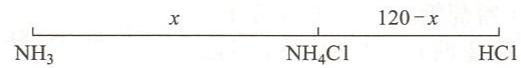

根据气体扩散定律 $\frac{u(\mathrm{HCl})}{u(\mathrm{NH}_{3})}=\sqrt{\frac{M_{\mathrm{r}}(\mathrm{NH}_{3})}{M_{\mathrm{r}}(\mathrm{HCl})}}$ ，即

$$
\frac {\frac {1 2 0 - x}{t}}{\frac {x}{t}} = \sqrt {\frac {1 7}{3 6 . 5}}
$$

$$
x = 7 1. 3
$$

故两种气体在距氨气一端 $71.3 \mathrm{~cm}$ 处相遇而生成 $\mathrm{NH}_{4} \mathrm{Cl}$ 白烟。

例 1.6 $10.00 \, cm^{3}$ NaCl 饱和溶液质量为 12.003 g，将其蒸干，得 NaCl 3.173 g。已知 NaCl 的摩尔质量为 $58.44 \, g \cdot mol^{-1}$ ，试计算该饱和溶液的质量摩尔浓度和 NaCl 的摩尔分数。

解：设溶剂 $\mathrm{H}_2\mathrm{O}$ 的质量为 $m(\mathrm{H}_2\mathrm{O})$ ，则有

$$
m (\mathrm{H} _ {2} \mathrm{O}) = 1 2. 0 0 3 \mathrm{g} - 3. 1 7 3 \mathrm{g} = 8. 8 3 0 \mathrm{g}
$$

设 1 000 g 溶剂 $H_{2}O$ 中溶解 NaCl 的质量为 m (NaCl)，则有

$$
\frac {m (\mathrm{NaCl})}{1 0 0 0 \mathrm{g}} = \frac {3 . 1 7 3 \mathrm{g}}{8 . 8 3 0 \mathrm{g}}
$$

$$
m (\mathrm{NaCl}) = \frac {3 . 1 7 3 \mathrm{g} \times 1 0 0 0 \mathrm{g}}{8 . 8 3 0 \mathrm{g}} = 3 5 9. 3 4 \mathrm{g}
$$

$$
n (\mathrm{NaCl}) = \frac {m (\mathrm{NaCl})}{M (\mathrm{NaCl})} = \frac {3 5 9 . 3 4 \mathrm{g}}{5 8 . 4 4 \mathrm{g} \cdot \mathrm{mol} ^ {- 1}} = 6. 1 4 9 \mathrm{mol}
$$

故溶液的质量摩尔浓度为 $6.149 \, mol \cdot kg^{-1}$ 。

溶剂 $\mathrm{H}_{2} \mathrm{O}$ 的物质的量为

$$
\begin{array}{r l} & n (\mathrm {H_ {2} O}) = \frac {1 0 0 0 \mathrm{g}}{1 8 \mathrm{g} \cdot \mathrm{mol} ^ {- 1}} = 5 5. 5 6 \mathrm{mol} \\ & n _ {\text {总}} = 6. 1 4 9 \mathrm{mol} + 5 5. 5 6 \mathrm{mol} = 6 1. 7 1 \mathrm{mol} \\ & x (\mathrm{NaCl}) = \frac {n (\mathrm{NaCl})}{n _ {\text {总}}} = \frac {6 . 1 4 9}{6 1 . 7 1} = 0. 0 9 9 6 \end{array}
$$

例 1.7 已知 10.0 g 葡萄糖溶于 400 g 乙醇，乙醇沸点升高了 0.171 ℃，而某有机物 2.00 g 溶于 100 g 乙醇时，其沸点升高了 0.149 ℃。求该有机物的摩尔质量。

解：由题设条件可先求出乙醇溶剂的沸点升高常数 $k_{\mathrm{b}}$ 。

葡萄糖乙醇溶液的质量摩尔浓度为

$$
\begin{array}{r l} b (\text { 葡萄糖 }) & = \frac {n (\text { 葡萄糖 })}{m (\text { 溶剂 })} = \frac {\frac {m (\text { 葡萄糖 })}{M (\text { 葡萄糖 })}}{m (\text { 溶剂 })} \\ & = \frac {\frac {1 0 . 0 \mathrm{g}}{1 8 0 \mathrm{g} \cdot \mathrm{mol} ^ {- 1}}}{4 0 0 \times 1 0 ^ {- 3} \mathrm{kg}} = 0. 1 3 9 \mathrm{mol} \cdot \mathrm{kg} ^ {- 1} \end{array}
$$

由沸点升高公式可知

$$
k _ {\mathrm{b}} = \frac {\Delta T (\mathrm{葡萄糖})}{b (\mathrm{葡萄糖})} = \frac {0 . 1 7 1 \mathrm{K}}{0 . 1 3 9 \mathrm{mol} \cdot \mathrm{kg} ^ {- 1}} = 1. 2 3 \mathrm{K} \cdot \mathrm{kg} \cdot \mathrm{mol} ^ {- 1}
$$

同样，由沸点升高公式可求出有机物乙醇溶液的质量摩尔浓度：

$$
b (\mathrm{有机物}) = \frac {\Delta T (\mathrm{有机物})}{k _ {\mathrm{b}}} = \frac {0 . 1 4 9 \mathrm{K}}{1 . 2 3 \mathrm{K} \bullet \mathrm{kg} \bullet \mathrm{mol} ^ {- 1}} = 0. 1 2 1 \mathrm{mol} \bullet \mathrm{kg} ^ {- 1}
$$

$$
M = \frac {m (\text { 有机物 })}{b (\text { 有机物 }) \cdot m (\text { 溶剂 })} = \frac {2 . 0 0 \mathrm{g}}{0 . 1 2 1 \mathrm{mol} \cdot \mathrm{kg} ^ {- 1} \times 1 0 0 \times 1 0 ^ {- 3} \mathrm{kg}} = 1 6 5 \mathrm{g} \cdot \mathrm{mol} ^ {- 1}
$$

例 1.8 0.542 g HgCl₂ 溶于 50 g 水中，溶液的凝固点为 -0.0744 ℃。已知水的 $k_{f}=1.86\ K\cdot kg\cdot mol^{-1}$ ，通过计算说明 HgCl₂ 在水中的存在形式。

解：根据凝固点降低公式，先求出该溶液中粒子的质量摩尔浓度 $b_{1}$ ：

$$
b _ {1} = \frac {\Delta T _ {\mathrm{f}}}{k _ {\mathrm{f}}} = \frac {0 . 0 7 4 4 \mathrm{K}}{1 . 8 6 \mathrm{K} \cdot \mathrm{kg} \cdot \mathrm{mol} ^ {- 1}} = 0. 0 4 \mathrm{mol} \cdot \mathrm{kg} ^ {- 1}
$$

$HgCl_{2}$ 的摩尔质量 M 为 $271\ g\cdot mol^{-1}$ ，根据题设条件可求出 $HgCl_{2}$ 溶液的质量摩尔浓度 $b_{2}$ ：

$$
\begin{array}{r l} b _ {2} & = \frac {n}{m (\text {溶剂})} = \frac {\frac {m}{M}}{m (\text {溶剂})} \\ & = \frac {\frac {0 . 5 4 2 \mathrm{g}}{2 7 1 \mathrm{g} \cdot \mathrm{mol} ^ {- 1}}}{5 0 \times 1 0 ^ {- 3} \mathrm{kg}} = 0. 0 4 \mathrm{mol} \cdot \mathrm{kg} ^ {- 1} \end{array}
$$

由 $b_{1} = b_{2}$ ，可知 $\mathrm{HgCl_2}$ 在水溶液中以分子形式存在，不发生解离。

例 1.9 测得人体血液的凝固点降低值为 0.56 K，求人体温度为 $37^{\circ}$ C 时血液的渗透压。已知水的 $k_{f}=1.86\ K\cdot kg\cdot mol^{-1}$ 。

解：先求出血液的质量摩尔浓度 b 。由公式 $\Delta T_{f}=k_{f}b$ 得

$$
b = \frac {\Delta T _ {\mathrm{f}}}{k _ {\mathrm{f}}} = \frac {0 . 5 6 \mathrm{K}}{1 . 8 6 \mathrm{K} \cdot \mathrm{kg} \cdot \mathrm{mol} ^ {- 1}} = 0. 3 0 1 1 \mathrm{mol} \cdot \mathrm{kg} ^ {- 1}
$$

对于稀溶液,质量摩尔浓度 b 在数值上等于物质的量浓度 c, 故知血液的物质的量浓度 $c = 0.3011 \, mol \cdot dm^{-3}$ , 相当于 $3.011 \times 10^{2} \, mol \cdot m^{-3}$ 。

题设温度为 $37^{\circ}C$ ，即温度 T=310 K。再由公式 $\Pi=cRT$ 求出渗透压 $\Pi$ ：

$$
\begin{array}{r l} \Pi & = 3. 0 1 1 \times 1 0 ^ {2} \mathrm{mol} \cdot \mathrm{m} ^ {- 3} \times 8. 3 1 4 \mathrm{Pa} \cdot \mathrm{m} ^ {3} \cdot \mathrm{mol} ^ {- 1} \cdot \mathrm{K} ^ {- 1} \times 3 1 0 \mathrm{K} \\ & = 7 7 6 \mathrm{kPa} \end{array}
$$

例 1.10 有一组点周期性地分布于空间, 其由如下图所示的每个面均为矩形的平行六面体无限并置而成。

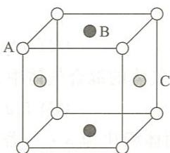

(1) 试说明这组点不构成一个点阵；

(2) 说明该组点的结构基元的构成情况；

(3) 画出这组点的空间点阵或晶格, 指出其点阵型式。

解：（1）晶体由结构基元无限并置而成，结构基元的组成和环境是完全相同的。因此，由结构基元抽象成的点阵点也必须具有完全相同的环境。图中C点的环境显然与B点不同；C点是在一个竖直的平面内与A点相邻；而B点则是在一个水平的平面内与A点相邻。所以这组点不构成一个点阵。

(2) 结构基元由 1A, 1B 和 1C 3 个点构成。

(3) 其晶格见下图, 属于简单正交点阵型式。

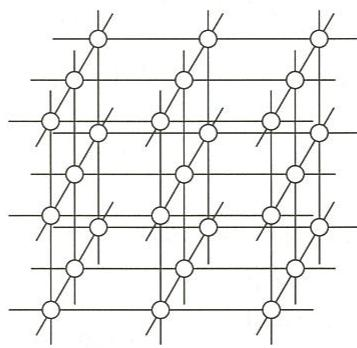

## 第二部分 习题

## 一、选择题

1.1 在一次渗流实验中,一定物质的量的未知气体通过小孔渗向真空,需要的时间为 5 s;在相同条件下相同物质的量的氧气渗流需要 20 s,则未知气体的相对分子质量应是
(A) 2; (B) 4; (C) 8; (D) 16。

1.2 实验测得 $\mathrm{H}_{2}$ 的扩散速率是一未知气体扩散速率的 2.9 倍, 则该未知气体的相对分子质量约为 (A) 51; (B) 34; (C) 17; (D) 28。

1.3 一敞口烧瓶在 $7^{\circ} \mathrm{C}$ 时盛满某种气体, 欲使 $1 / 3$ 的气体逸出烧瓶, 需要将烧瓶加热达到的温度为 (A) $840^{\circ} \mathrm{C}$ ; (B) $693^{\circ} \mathrm{C}$ ; (C) $420^{\circ} \mathrm{C}$ ; (D) $147^{\circ} \mathrm{C}$ 。

1.4 在 $25^{\circ} \mathrm{C}, 101.3 \mathrm{kPa}$ 时, 下面几种气体的混合气体中分压最大的是 (A) $0.1 \mathrm{~g} \mathrm{H}_{2}$ ; (B) $1.0 \mathrm{~g} \mathrm{He}$ ; (C) $5.0 \mathrm{~g} \mathrm{N}_{2}$ ; (D) $10 \mathrm{~g} \mathrm{CO}_{2}$ 。

1.5 合成氨的原料气中氢气和氮气的体积比为 3:1, 若原料气中含有其他杂质气体的体积分数为 4%, 原料气总压为 15198.75 kPa, 则氮气的分压是
(A) 3799.7 kPa; (B) 10943.1 kPa;
(C) 3647.7 kPa; (D) 11399.1 kPa。

1.6 将一定量 $KClO_{3}$ 加热后，其质量减少了 0.48 g。生成的氧气用排水集气法收集。若温度为 21℃，压强为 99591.8 Pa，水的饱和蒸气压为 2479.8 Pa，氧气的相对分子质量为 32.0，则收集到的气体体积为
(A) $188.5 \, cm^{3}$ ; (B) $754 \, cm^{3}$ ; (C) $565.5 \, cm^{3}$ ; (D) $377.6 \, cm^{3}$ 。

1.7 由 $NH_{4}NO_{2}$ 分解得氮气和水。在 $23^{\circ}C$ ，95549.5 Pa 条件下，用排水集气法收集到 $57.5\ cm^{3}$ 氮气。已知水的饱和蒸气压为 2813.1 Pa，则干燥后的氮气的体积为
(A) $55.8\ cm^{3}$ ; (B) $27.9\ cm^{3}$ ; (C) $46.5\ cm^{3}$ ; (D) $18.6\ cm^{3}$ 。

1.8 若溶液的浓度都为 $0.1 \, mol \cdot dm^{-3}$ ，则下列水溶液的沸点由高到低排列，顺序正确的是
(A) $Na_{2}SO_{4}$ , NaCl, HAc;
(B) $\mathrm{Al}_{2}\left(\mathrm{SO}_{4}\right)_{3}$ , NaCl, $Na_{2}SO_{4}$ ;
(C) NaAc, $K_{2}CrO_{4}$ , NaCl;
(D) NaCl, $K_{2}Cr_{2}O_{7}$ , $CaCl_{2}$ 。

1.9 如果某水合盐的蒸气压低于相同温度下水的蒸气压,则这种盐可能会发生的现象是
(A) 起泡; (B) 风化; (C) 潮解; (D) 不受大气组成影响。

1.10 在 100 g 水中含 4.5 g 某非电解质的溶液于 -0.465 ℃ 时结冰，则该非电解质的相对分子质量约为（已知水的 $K_{f}=1.86\ K\cdot kg\cdot mol^{-1}$ ）

(A) 90; (B) 135; (C) 172; (D) 180。

1.11 在相同温度下，和 $1\%$ 尿素 $\left[\mathrm{CO}\left(\mathrm{NH}_{2}\right)_{2}, M=60 \mathrm{~g} \cdot \mathrm{mol}^{-1}\right]$ 水溶液具有相同渗透压的葡萄糖 $\left(\mathrm{C}_{6} \mathrm{H}_{12} \mathrm{O}_{6}, M=180 \mathrm{~g} \cdot \mathrm{mol}^{-1}\right)$ 溶液的含量约为 (A) $2\%$ ; (B) $3\%$ ; (C) $4\%$ ; (D) $5\%$ 。

1.12 处于室温一密闭容器内有水及与水相平衡的水蒸气。现充入不溶于水也不与水反应的气体，则水蒸气的压力
(A) 增加；(B) 减少；(C) 不变；(D) 不能确定。

1.13 为防止水在仪器内结冰，可在水中加入甘油 $\left(\mathrm{C}_{3}\mathrm{H}_{8}\mathrm{O}_{3},M=92\mathrm{~g}\cdot\mathrm{mol}^{-1}\right)$ 。欲使其冰点下降至 $-2.0^{\circ}C$ ，则应在100 g水中加入甘油（已知水的 $K_{f}=1.86K\cdot kg\cdot mol^{-1}$ ）
(A) 9.89 g; (B) 3.30 g; (C) 1.10 g; (D) 19.78 g。

1.14 土壤中 NaCl 含量高时植物难以生存, 这与下列稀溶液的性质有关的是
(A) 蒸气压下降; (B) 沸点升高; (C) 冰点下降; (D) 渗透压。

## 二、填空题

1.15 当气体为 1 mol 时, 实际气体的状态方程为 \_\_\_\_。

1.16 一定体积的干燥气体从易挥发的三氯甲烷液体中通过后,气体体积变\_\_\_\_,气体分压变\_\_\_\_。

1.17 某气体在 293 K 和 $9.97 \times 10^{4}$ Pa 时占有体积 $0.19 \, dm^{3}$ ，质量为 0.132 g，则该气体的摩尔质量约等于 \_\_\_\_ g·mol $^{-1}$ ，该气体可能是 \_\_\_\_。

1.18 某理想气体在 273 K 和 101.3 kPa 时的体积为 $0.312 \, m^{3}$ ，则在 298 K 和 98.66 kPa 时其体积为 $m^{3}$ 。

1.19 将 $N_{2}$ 和 $H_{2}$ 按 1:3 的体积比装入一密闭容器中，在 $400^{\circ}C$ 和 $1.0 \times 10^{7} Pa$ 条件下反应达到平衡时， $NH_{3}$ 的体积分数为 0.39，则此时密闭容器中各组分气体的分压为： $NH_{3}$ \_\_\_\_ Pa; $N_{2}$ \_\_\_\_ Pa; $H_{2}$ \_\_\_\_ Pa。

1.20 在相同的温度和压强下,两个容积相同的烧瓶中分别充满 $O_{3}$ 气体和 $H_{2}S$ 气体。已知 $H_{2}S$ 的质量为 0.34 g, 则 $O_{3}$ 的质量为 \_\_\_\_ g。

1.21 410 K 时某容器内装有 $0.30 \, mol \, N_{2}$ , $0.10 \, mol \, O_{2}$ 和 $0.10 \, mol \, He$ ，混合气体的总压为 $100 \, kPa$ 时，He 的分压为 \_\_\_\_ kPa, $N_{2}$ 的分体积为 \_\_\_\_ dm³。

1.22 在 300 K, $1.013 \times 10^{5}$ Pa 时加热一敞口细颈瓶到 500 K, 然后封闭细颈瓶口并冷却到原来的温度, 则该瓶内的压强为 \_\_\_\_ Pa。

1.23 有一容积为 $30 \mathrm{dm}^{3}$ 的高压气瓶, 可以耐压 $2.5 \times 10^{4} \mathrm{kPa}$ , 则在 $298 \mathrm{~K}$ 时可装 $\underline{\underline{\text{kg}}}$

$\mathrm{O}_{2}$ 而不致发生危险。

1.24 在 $500 \, cm^{3}$ 水中加入 $100 \, cm^{3}$ 质量分数为 32%、密度为 $1.20 \, g \cdot cm^{-3}$ 的 $HNO_{3}$ 溶液，所得的新的 $HNO_{3}$ 溶液的密度为 $1.03 \, g \cdot cm^{-3}$ ，则新溶液的质量分数为 \_\_\_\_，物质的量浓度为 \_\_\_\_ $mol \cdot dm^{-3}$ 。

1.25 在 26.6 g 氯仿 $\left(\mathrm{CHCl}_{3}\right)$ 中溶解 0.402 g 萘 $\left(\mathrm{C}_{10}\mathrm{H}_{8}\right)$ ，其沸点比氯仿的沸点高 0.455 K，则氯仿的沸点升高常数为 \_\_\_\_ K·kg·mol $^{-1}$ 。

1.26 常压下将 2.0 g 尿素 $\left[\mathrm{CO}\left(\mathrm{NH}_{2}\right)_{2}\right]$ 溶入 75 g 水中，则该溶液的凝固点为 \_\_\_\_ K（已知水的 $K_{f}=1.86\ K\cdot kg\cdot mol^{-1}$ ）。

## 三、简答题和计算题

1.27 已知 $1 \, dm^{3}$ 某气体在标准状况下的质量为 2.86 g，试计算该气体的平均相对分子质量，并计算其在 $17^{\circ}C$ 和 207 kPa 时的密度。

1.28 在体积为 $0.50 \, dm^{3}$ 的烧瓶中充满 NO 和 $O_{2}$ 气体，温度为 $298 \, K$ ，压强为 $1.23 \times 10^{5} \, Pa$ 。反应一段时间后，瓶内总压变为 $8.3 \times 10^{4} \, Pa$ 。求生成 $NO_{2}$ 的质量。

1.29 将氮气和水蒸气的混合物通入盛有足量固体干燥剂的瓶中。刚通入时，瓶中压强为 101.3 kPa。放置数小时后，压强降到 99.3 kPa 的恒定值。

(1) 求原气体混合物各组分的摩尔分数；

(2) 若温度为 $293 \, K$ ，实验后干燥剂增重 $0.150 \, g$ ，求瓶的容积。假设干燥剂的体积可忽略且不吸附氮气。

1.30 302 K 时在 $3.0 \, dm^{3}$ 的真空容器中装入氮气和一定量的水，测得初压为 $1.01 \times 10^{5} \, Pa$ 。用电解法将容器中的水完全转变为氢气和氧气后，测得最终压强为 $1.88 \times 10^{5} \, Pa$ 。求容器中水的质量。已知 302 K 时水的饱和蒸气压为 $4.04 \times 10^{3} \, Pa$ 。

1.31 在 $303 \, K, 7.97 \times 10^{4} \, Pa$ 时由排水集气法收集到 $1.50 \, dm^{3}$ 氧气，问有多少克氯酸钾按下式发生了分解？

$$
2 \mathrm{KClO} _ {3} \xrightarrow [ \triangle ]{\mathrm{MnO} _ {2}} 2 \mathrm{KCl} + 3 \mathrm{O} _ {2} \uparrow
$$

已知 $303 \, K$ 时水的饱和蒸气压为 $4.23 \times 10^{3} \, Pa$ 。

1.32 由 $\mathrm{C}_2\mathrm{H}_4$ 和过量 $\mathrm{H}_{2}$ 组成的混合气体的总压为 $6930\mathrm{Pa}$ 。使混合气体通过铂催化剂进行下列反应：

$$
\mathrm{C} _ {2} \mathrm{H} _ {4} (\mathrm{g}) + \mathrm{H} _ {2} (\mathrm{g}) = \mathrm{C} _ {2} \mathrm{H} _ {6} (\mathrm{g})
$$

待完全反应后，在相同温度和体积下，压强降为 $4530 \, Pa$ 。求原混合气体中 $C_{2}H_{4}$ 的摩尔分数。

1.33 某项实验要求缓慢地加入乙醇 $\left(\mathrm{C}_{2}\mathrm{H}_{5}\mathrm{OH}\right)$ ，现采用将空气通过液体乙醇带入乙醇气体的方法进行。在293 K， $1.013\times10^{5}$ Pa时，为引入2.3 g乙醇，求需空气的体积。已知293 K时乙醇的饱和蒸气压为5866.2 Pa。

1.34 在 $273 \mathrm{~K}$ 和 $1.013 \times 10^{5} \mathrm{~Pa}$ 条件下，将 $1.0 \mathrm{dm}^{3}$ 干燥的空气缓慢通过二甲醚 $\left(\mathrm{CH}_{3} \mathrm{OCH}_{3}\right)$ 液体。在此过程中，液体损失了 $0.0335 \mathrm{~g}$ 。求二甲醚在 $273 \mathrm{~K}$ 时的饱和蒸气压。

1.35 313 K 时将 $1000 \, cm^{3}$ 饱和苯蒸气和空气的混合气体从压强为 $9.97 \times 10^{4} \, Pa$ 压缩到 $5.05 \times 10^{5} \, Pa$ ，问在此过程中有多少克苯凝结成了液体？已知 313 K 时苯的饱和蒸气压为 $2.41 \times 10^{4} \, Pa$ 。

1.36 313 K 时 $CHCl_{3}$ 的饱和蒸气压为 49.3 kPa，于此温度和 98.6 kPa 的压强下，将 $4.00 \, dm^{3}$ 空气缓慢通过 $CHCl_{3}$ ，致使每个气泡都为 $CHCl_{3}$ 所饱和。求：

(1) 通过 $CHCl_{3}$ 后, 空气和 $CHCl_{3}$ 混合气体的体积;

(2) 被空气带走的 $\mathrm{CHCl}_3$ 的质量。

1.37 25℃时,一个容器中充入等物质的量的 $\mathrm{H}_{2}$ 和 $\mathrm{O}_{2}$ ,总压为 $100 \mathrm{kPa}$ 。混合气体点燃充分反应后,容器中氧的分压是多少?若已知 $25^{\circ} \mathrm{C}$ 时水的饱和蒸气压为 $3.17 \mathrm{kPa}$ ,则容器中气体的总压是多少?

1.38 288 K 时将 $NH_{3}$ 通入一盛水的玻璃球内至 $NH_{3}$ 不再溶解为止，已知玻璃球内饱和溶液的质量为 3.018 g。再将玻璃球放在 $50.0 \, cm^{3}, 0.50 \, mol \cdot dm^{-3} \, H_{2}SO_{4}$ 溶液中，将球击破。剩余的酸需用 $10.4 \, cm^{3}, 1.0 \, mol \cdot dm^{-3} \, NaOH$ 溶液中和。试计算 288 K 时 $NH_{3}$ 在水中的溶解度。

1.39 某温度下一定量的 $\mathrm{PCl}_{5}(\mathrm{~g})$ 发生如下反应：

$$
\mathrm{PCl} _ {5} (\mathrm{g}) \rightleftharpoons \mathrm{PCl} _ {3} (\mathrm{g}) + \mathrm{Cl} _ {2} (\mathrm{g})
$$

当 $30\% \mathrm{PCl}_{5}(\mathrm{g})$ 解离时达到平衡，总压为 $1.6 \times 10^{5} \mathrm{~Pa}$ 。求各组分的平衡分压。

1.40 0.102 g 某金属与酸完全作用后,生成等物质的量的氢气。在 $18^{\circ}$ C 和 100.0 kPa 条件下,用排水集气法在水面上收集到 $38.5 \, cm^{3}$ 氢气。若 $18^{\circ}$ C 时水的饱和蒸气压为 2.1 kPa,试求此金属的相对原子质量。

1.41 实验室需要 $4.0\mathrm{mol}\cdot \mathrm{dm}^{-3}$ 的 $\mathrm{H}_2\mathrm{SO}_4$ 溶液 $1.0\mathrm{dm}^3$ ，若已有 $300~\mathrm{cm}^3$ 密度为 $1.07\mathrm{g}\cdot \mathrm{cm}^{-3}$ 质量分数为 $10\%$ 的 $\mathrm{H}_2\mathrm{SO}_4$ 溶液，应加入密度为 $1.82\mathrm{g}\cdot \mathrm{cm}^{-3}$ ，质量分数为 $90\%$ 的 $\mathrm{H}_2\mathrm{SO}_4$ 溶液多少体积，然后再稀释至 $1.0\mathrm{dm}^3?$

1.42 303 K 时丙酮 $\left(\mathrm{C}_{3}\mathrm{H}_{6}\mathrm{O}\right)$ 的蒸气压是 37 330 Pa，当 6 g 某非挥发性有机物溶于 120 g 丙酮时，其蒸气压下降至 35 570 Pa。试求此有机物的相对分子质量。

1.43 3.24 g 硫溶解于 40 g 苯中，该苯溶液的沸点升高了 0.81 K，问此溶液中硫分子是由几个硫原子组成的？已知苯的 $K_{b}=2.53\ K\cdot kg\cdot mol^{-1}$ 。

1.44 0.570 g Pb(NO $_3$ ) $_2$ 溶于 120 g 水中, 其凝固点比纯水凝固点降低了 0.08 K, 相同质量的 PbCl $_2$ 溶于 100 g 水中, 其凝固点比纯水凝固点降低了 0.0381 K, 试判断这两种盐在水中的解离情况。已知水的 $K_f = 1.86$ K·kg·mol $^{-1}$ , Pb(NO $_3$ ) $_2$ 的 $M = 331.2$ g·mol $^{-1}$ , PbCl $_2$ 的 $M = 278.2$ g·mol $^{-1}$ 。

1.45 某化合物的苯溶液，溶质和溶剂的质量比是 $15:100$ 。在 $293\mathrm{K}, 1.013 \times 10^{5}\mathrm{Pa}$ 条件下将 $4.0\mathrm{dm}^{3}$ 空气缓慢地通过该溶液时，测知损失 $1.185\mathrm{g}$ 苯。假设失去苯后溶液的浓度不变。已知苯的 $K_{\mathrm{b}}$ 为 $2.53\mathrm{K} \cdot \mathrm{kg} \cdot \mathrm{mol}^{-1}, K_{\mathrm{f}}$ 为 $5.1\mathrm{K} \cdot \mathrm{kg} \cdot \mathrm{mol}^{-1}$ 。求：

(1) 溶质的相对分子质量；

(2) 该溶液的凝固点和沸点(293 K时, 苯的蒸气压为 $1 \times 10^{4} \mathrm{~Pa}; 1.013 \times 10^{5} \mathrm{~Pa}$ 时, 苯的沸点为 $353.1 \mathrm{~K}$ , 凝固点为 $278.4 \mathrm{~K}$ )。

1.46 与人体血液具有相等渗透压的葡萄糖溶液, 其凝固点降低值为 0.543 K。求此葡萄糖溶液的质量分数和血液的渗透压。已知葡萄糖的相对分子质量为 180, 水的 $K_{f} = 1.86 \, K \cdot kg \cdot mol^{-1}$ 。

1.47 试写出下列几何图形的所有对称元素及其数目：

(1) 正三角形；(2) 正五边形；(3) 平行四边形；(4) 矩形；

(5) 菱形； (6) 正方形； (7) 正四棱柱； (8) 正八面体。

## 化学热力学基础

成股金玉平日 到复盘价折价，转股、派息、送

## 第一部分 例题

例 2.1 油酸甘油酯在人体中代谢时发生下列反应：

$$
\mathrm{C} _ {5 7} \mathrm{H} _ {1 0 4} \mathrm{O} _ {6} (\mathrm{s}) + 8 0 \mathrm{O} _ {2} (\mathrm{g}) = 5 7 \mathrm{CO} _ {2} (\mathrm{g}) + 5 2 \mathrm{H} _ {2} \mathrm{O} (\mathrm{l})
$$

$\Delta_{\mathrm{r}}H_{\mathrm{m}}^{\ominus} = -3.35\times 10^{4}\mathrm{kJ}\cdot \mathrm{mol}^{-1}$ ，消耗这种脂肪 $1\mathrm{kg}$ 时，反应进度是多少？将有多少热量释放出？

解：油酸甘油酯的摩尔质量为

$$
\begin{array}{r l} M & = (1 2 \times 5 7 + 1 \times 1 0 4 + 1 6 \times 6) \mathrm {g\cdot mol^ {- 1}} \\ & = 8 8 4 \mathrm {g\cdot mol^ {- 1}} \end{array}
$$

消耗这种脂肪 1 kg 时, 反应进度为

$$
\xi = \frac {1 0 0 0 \mathrm{g}}{8 8 4 \mathrm{g} \cdot \mathrm{mol} ^ {- 1}} = 1. 1 3 \mathrm{mol}
$$

根据摩尔反应热的定义式 $\Delta_{\mathrm{r}}H_{\mathrm{m}}^{\ominus} = \frac{\Delta_{\mathrm{r}}H^{\ominus}}{\xi}$ ，故

$$
\begin{array}{r l} \Delta_ {\mathrm{r}} H ^ {\ominus} & = \Delta_ {\mathrm{r}} H _ {\mathrm{m}} ^ {\ominus} \cdot \xi \\ & = - 3. 3 5 \times 1 0 ^ {4} \mathrm{kJ} \cdot \mathrm{mol} ^ {- 1} \times 1. 1 3 \mathrm{mol} \\ & = - 3. 7 9 \times 1 0 ^ {4} \mathrm{kJ} \end{array}
$$

即消耗这种脂肪 1 kg 时将有 $3.79 \times 10^{4}$ kJ 热量放出。

例 2.2 试根据已知反应的热力学数据：

① $2C(\text{石墨}) + O_{2}(g) = 2CO(g)$ $\Delta_{r}H_{m}^{\ominus}(1) = -221.0\ kJ \cdot mol^{-1}$

② C(石墨) $+O_{2}(g)=CO_{2}(g)$ $\Delta_{r}H_{m}^{\ominus}(2)=-393.5\ kJ\cdot mol^{-1}$

③ $2\mathrm{CH}_3\mathrm{OH(l)} + 3\mathrm{O}_2(\mathrm{g}) = 2\mathrm{CO}_2(\mathrm{g}) + 4\mathrm{H}_2\mathrm{O(l)}$

$$
\Delta_ {\mathrm{r}} H _ {\mathrm{m}} ^ {\ominus} (3) = - 1 4 5 2. 2 \mathrm {kJ\cdot mol^ {- 1}}
$$

④ $2\mathrm{H}_{2}(\mathrm{g}) + \mathrm{O}_{2}(\mathrm{g}) = 2\mathrm{H}_{2}\mathrm{O}(1)$ $\Delta_{\mathrm{r}}H_{\mathrm{m}}^{\ominus}(4) = -571.6\mathrm{kJ}\cdot \mathrm{mol}^{-1}$

计算反应 $\mathrm{CO(g)} + 2\mathrm{H}_2(\mathrm{g}) \xrightarrow{\text{催化剂}} \mathrm{CH}_3\mathrm{OH(l)}$ 的 $\Delta_{\mathrm{r}} H_{\mathrm{m}}^{\ominus}$ 。

解：由题设可得

$$
\mathrm{C(石墨)} + \mathrm {O_ {2} (g)} = \mathrm {CO_ {2} (g)} \times 1
$$

$$
2 \mathrm{H} _ {2} (\mathrm{g}) + \mathrm{O} _ {2} (\mathrm{g}) = 2 \mathrm{H} _ {2} \mathrm{O} (1) \times 1
$$

$$
\begin{array}{r l} {2 \mathrm{C(石墨)} + \mathrm {O_ {2} (g)} = 2 \mathrm{CO(g)}} & {\times \left(- \frac {1}{2}\right)} \\ {+) 2 \mathrm {CH_ {3} OH(l)} + 3 \mathrm {O_ {2} (g)} = 2 \mathrm {CO_ {2} (g)} + 4 \mathrm {H_ {2} O(l)}} & {\times \left(- \frac {1}{2}\right)} \end{array}
$$

$$
\mathrm{CO(g)} + 2 \mathrm {H_ {2} (g)} = \mathrm {CH_ {3} OH(l)}
$$

根据盖斯定律,所得化学反应的摩尔反应热为

$$
\begin{array}{r l} \Delta_ {\mathrm{r}} H _ {\mathrm{m}} ^ {\ominus} & = \Delta_ {\mathrm{r}} H _ {\mathrm{m}} ^ {\ominus} (2) + \Delta_ {\mathrm{r}} H _ {\mathrm{m}} ^ {\ominus} (4) - \frac {1}{2} \Delta_ {\mathrm{r}} H _ {\mathrm{m}} ^ {\ominus} (1) - \frac {1}{2} \Delta_ {\mathrm{r}} H ^ {\ominus} (3) \\ & = \left[ - 3 9 3. 5 + (- 5 7 1. 6) - \frac {1}{2} \times (- 2 2 1. 0) - \frac {1}{2} \times (- 1 4 5 2. 2) \right] \mathrm{kJ} \cdot \mathrm{mol} ^ {- 1} \\ & = - 1 2 8. 5 \mathrm{kJ} \cdot \mathrm{mol} ^ {- 1} \end{array}
$$

例 2.3 在一弹式热量计中完全燃烧 0.30 mol H₂(g) 生成 H₂O(l)，热量计中的水温升高 5.212 K；将 2.345 g 正癸烷 [C₁₀H₂₂(l)] 完全燃烧，使热量计中的水温升高 6.862 K。已知 H₂O(l) 的标准摩尔生成热为 -285.8 kJ·mol⁻¹，求正癸烷的燃烧热。

解：由题设 $\mathrm{H}_2\mathrm{O}(1)$ 的标准摩尔生成热为 $-285.8\mathrm{kJ}\cdot \mathrm{mol}^{-1}$ ，这相当于已知

$$
\mathrm{H} _ {2} (\mathrm{g}) + \frac {1}{2} \mathrm{O} _ {2} (\mathrm{g}) = \mathrm{H} _ {2} \mathrm{O} (\mathrm{l}) \quad \Delta_ {\mathrm{r}} H _ {\mathrm{m}} ^ {\ominus} = - 2 8 5. 8 \mathrm{kJ} \cdot \mathrm{mol} ^ {- 1}
$$

$\mathrm{H}_2(\mathrm{g})$ 在弹式热量计中燃烧反应是恒容反应，其热效应为 $\Delta_{\mathrm{r}}U_{\mathrm{m}}^{\ominus}$ ，由 $\Delta_{\mathrm{r}}H_{\mathrm{m}}^{\ominus} = \Delta_{\mathrm{r}}U_{\mathrm{m}}^{\ominus} + \Delta \nu RT$ 得

$$
\begin{array}{r l} \Delta_ {\mathrm{r}} U _ {\mathrm{m}} ^ {\ominus} & = \Delta_ {\mathrm{r}} H _ {\mathrm{m}} ^ {\ominus} - \Delta \nu R T \\ & = - 2 8 5. 8 \times 1 0 0 0 \mathrm {J\cdot mol^ {- 1}} - \left(- \frac {3}{2}\right) \times 8. 3 1 4 \mathrm {J\cdot mol^ {- 1} \cdot K^ {- 1}} \times 2 9 8 \mathrm{K} \\ & = - 2 8 2. 0 8 \mathrm {kJ\cdot mol^ {- 1}} \end{array}
$$

由 $0.30 \, mol \, H_{2}(g)$ 完全燃烧，知反应进度 $\xi = 0.30 \, mol$ ，则

$$
\begin{array}{r l} \Delta_ {\mathrm{r}} U ^ {\ominus} & = \Delta_ {\mathrm{r}} U _ {\mathrm{m}} ^ {\ominus} \cdot \xi \\ & = - 2 8 2. 0 8 \mathrm{kJ} \cdot \mathrm{mol} ^ {- 1} \times 0. 3 0 \mathrm{mol} \\ & = - 8 4. 6 2 4 \mathrm{kJ} \end{array}
$$

即 84.624 kJ 热量使热量计的水温升高 5.212 K，由题设 2.345 g 正癸烷 $\left(\mathrm{C}_{10}\mathrm{H}_{22}\right)$ 燃烧使热量计的水温升高 6.862 K，可知其燃烧放热为

$$
- 8 4. 6 2 4 \mathrm{kJ} \times \frac {6 . 8 6 2 \mathrm{K}}{5 . 2 1 2 \mathrm{K}} = - 1 1 1. 4 1 \mathrm{kJ}
$$

即热反应式

$$
\mathrm{C} _ {1 0} \mathrm{H} _ {2 2} (\mathrm{l}) + \frac {3 1}{2} \mathrm{O} _ {2} (\mathrm{g}) \xlongequal {\Delta V = 0} 1 0 \mathrm{CO} _ {2} (\mathrm{g}) + 1 1 \mathrm{H} _ {2} \mathrm{O} (\mathrm{l})
$$

完全燃烧 2.345 g 正癸烷时， $\Delta_{r}U^{\ominus}=-111.41\ kJ$ 。

正癸烷 $\left(\mathrm{C}_{10}\mathrm{H}_{22}\right)$ 的摩尔质量为142 g·mol $^{-1}$ ，故

$$
n = \frac {2 . 3 4 5 \mathrm{g}}{1 4 2 \mathrm{g} \cdot \mathrm{mol} ^ {- 1}} = 0. 0 1 6 5 1 \mathrm{mol}
$$

即完全燃烧 2.345 g 正癸烷, $\xi=0.01651\ mol$ ,则

$$
\begin{array}{r l} \Delta_ {\mathrm{r}} U _ {\mathrm{m}} ^ {\ominus} & = \frac {\Delta_ {\mathrm{r}} U ^ {\ominus}}{\xi} \\ & = \frac {- 1 1 1 . 4 1 \mathrm{kJ}}{0 . 0 1 6 5 1 \mathrm{mol}} \\ & = - 6 7 4 8. 0 \mathrm{kJ} \cdot \mathrm{mol} ^ {- 1} \end{array}
$$

燃烧热为恒压反应热效应,故

$$
\begin{array}{r l} \Delta_ {\mathrm{r}} H _ {\mathrm{m}} ^ {\ominus} & = \Delta_ {\mathrm{r}} U _ {\mathrm{m}} ^ {\ominus} + \Delta \nu R T \\ & = - 6 7 4 8. 0 \times 1 0 0 0 \mathrm{J} \cdot \mathrm{mol} ^ {- 1} + \left(- \frac {1 1}{2}\right) \times 8. 3 1 4 \mathrm{J} \cdot \mathrm{mol} ^ {- 1} \cdot \mathrm{K} ^ {- 1} \times 2 9 8 \mathrm{K} \\ & = - 6 7 6 2 \mathrm{kJ} \cdot \mathrm{mol} ^ {- 1} \end{array}
$$

这就是正癸烷 $\left(\mathrm{C}_{10}\mathrm{H}_{22}\right)$ 的燃烧热。

例 2.4 根据下列热力学数据：

$$
\begin{array}{l l l} & \Delta_ {\mathrm{f}} H _ {\mathrm{m}} ^ {\ominus} / (\mathrm{kJ} \cdot \mathrm{mol} ^ {- 1}) & S _ {\mathrm{m}} ^ {\ominus} / (\mathrm{J} \cdot \mathrm{mol} ^ {- 1} \cdot \mathrm{K} ^ {- 1}) \\ \mathrm {NH_ {4} Cl(s)} & - 3 1 4. 4 & 9 4. 6 \\ \mathrm {NH_ {4} ^ {+} (aq)} & - 1 3 3. 3 & 1 1 1. 2 \\ \mathrm {Cl^ {-} (aq)} & - 1 6 7. 1 & 5 6. 6 \end{array}
$$

(1) 计算氯化铵溶解过程 $\mathrm{NH_{4}Cl(s)=NH_{4}^{+}(aq)+Cl^{-}(aq)}$ 的热效应；

(2) 解释氯化铵易溶于水的原因。

$$
\begin{array}{r l} \text { 解: (1) } & \Delta_ {\mathrm{r}} H _ {\mathrm{m}} ^ {\ominus} = \Delta_ {\mathrm{f}} H _ {\mathrm{m}} ^ {\ominus} (\mathrm{NH} _ {4} ^ {+}, \mathrm{aq}) + \Delta_ {\mathrm{f}} H _ {\mathrm{m}} ^ {\ominus} (\mathrm{Cl} ^ {-}, \mathrm{aq}) - \Delta_ {\mathrm{f}} H _ {\mathrm{m}} ^ {\ominus} (\mathrm{NH} _ {4} \mathrm{Cl}, \mathrm{s}) \\ & = - 1 3 3. 3 \mathrm{kJ} \cdot \mathrm{mol} ^ {- 1} + (- 1 6 7. 1 \mathrm{kJ} \cdot \mathrm{mol} ^ {- 1}) - (- 3 1 4. 4 \mathrm{kJ} \cdot \mathrm{mol} ^ {- 1}) \\ & = 1 4. 0 \mathrm{kJ} \cdot \mathrm{mol} ^ {- 1} \end{array}
$$

(2) 溶解过程吸热, 不利于进行。但过程的熵变有利, 计算如下:

$$
\begin{array}{r l} \Delta_ {\mathrm{r}} S _ {\mathrm{m}} ^ {\ominus} & = S _ {\mathrm{m}} ^ {\ominus} (\mathrm{NH} _ {4} ^ {+}, \mathrm{aq}) + S _ {\mathrm{m}} ^ {\ominus} (\mathrm{Cl} ^ {-}, \mathrm{aq}) - S _ {\mathrm{m}} ^ {\ominus} (\mathrm{NH} _ {4} \mathrm{Cl}, \mathrm{s}) \\ & = 1 1 1. 2 \mathrm{J} \cdot \mathrm{mol} ^ {- 1} \cdot \mathrm{K} ^ {- 1} + 5 6. 6 \mathrm{J} \cdot \mathrm{mol} ^ {- 1} \cdot \mathrm{K} ^ {- 1} - 9 4. 6 \mathrm{J} \cdot \mathrm{mol} ^ {- 1} \cdot \mathrm{K} ^ {- 1} \\ & = 7 3. 2 \mathrm{J} \cdot \mathrm{mol} ^ {- 1} \cdot \mathrm{K} ^ {- 1} \end{array}
$$

$$
\begin{array}{r l} \Delta_ {\mathrm{r}} G _ {\mathrm{m}} ^ {\ominus} (2 9 8 \mathrm{K}) & = \Delta_ {\mathrm{r}} H _ {\mathrm{m}} ^ {\ominus} - T \Delta_ {\mathrm{r}} S _ {\mathrm{m}} ^ {\ominus} \\ & = 1 4. 0 \mathrm {kJ\cdot mol^ {- 1}} - 2 9 8 \mathrm{K} \times 7 3. 2 \times 1 0 ^ {- 3} \mathrm {kJ\cdot mol^ {- 1} \cdot K^ {- 1}} \\ & = - 7. 8 \mathrm {kJ\cdot mol^ {- 1}} \end{array}
$$

由于 $\Delta_{r}G_{m}^{\ominus}<0$ ，故氯化铵易溶于水。

例 2.5 1 g C₂H₂(g) 在 298 K 的恒容条件下完全燃烧放出的热量为 50.1 kJ，求该温度下 C₂H₂ 的标准摩尔燃烧热 ΔcHₘ°。已知 H₂(g) 和 C(石墨) 的标准摩尔燃烧热分别为 -285.83 kJ·mol⁻¹ 和 -393.51 kJ·mol⁻¹。求 C₂H₂(g) 的标准摩尔生成热。

解：由题设 $1\mathrm{gC_2H_2(g)}$ 恒容燃烧放热 $50.1\mathrm{kJ}$ ，而 $M(\mathrm{C}_2\mathrm{H}_2) = 26\mathrm{g}\cdot \mathrm{mol}^{-1}$ ，故 $1\mathrm{mol}$ $\mathrm{C_2H_2(g)}$ 恒容燃烧时放热为

$$
5 0. 1 \mathrm{kJ} \times 2 6 = 1 3 0 2. 6 \mathrm{kJ}
$$

即反应

$$
\mathrm{C} _ {2} \mathrm{H} _ {2} (\mathrm{g}) + \frac {5}{2} \mathrm{O} _ {2} (\mathrm{g}) \xlongequal {\Delta V = 0} 2 \mathrm{CO} _ {2} (\mathrm{g}) + \mathrm{H} _ {2} \mathrm{O} (\mathrm{l})
$$

的恒容反应热

$$
\Delta_ {\mathrm{r}} U _ {\mathrm{m}} ^ {\ominus} = - 1 3 0 2. 6 \mathrm{kJ} \cdot \mathrm{mol} ^ {- 1}
$$

而

$$
\mathrm{C} _ {2} \mathrm{H} _ {2} (\mathrm{g}) + \frac {5}{2} \mathrm{O} _ {2} (\mathrm{g}) = 2 \mathrm{CO} _ {2} (\mathrm{g}) + \mathrm{H} _ {2} \mathrm{O} (1)
$$

的恒压反应热 $\Delta_{r}H_{m}^{\ominus}$ 才是 $C_{2}H_{2}(g)$ 的燃烧热 $\Delta_{c}H_{m}^{\ominus}(C_{2}H_{2},g)$ ，即

由题设知

$$
\begin{array}{r l} \Delta_ {\mathrm{c}} H _ {\mathrm{m}} ^ {\ominus} (\mathrm{C} _ {2} \mathrm{H} _ {2}, \mathrm{g}) & = \Delta_ {\mathrm{r}} H _ {\mathrm{m}} ^ {\ominus} = \Delta_ {\mathrm{r}} U _ {\mathrm{m}} ^ {\ominus} + \Delta \nu R T \\ & = - 1   3 0 2.   6 \times 1   0 0 0   \mathrm{J} \cdot \mathrm{mol} ^ {- 1} + \left(- \frac {3}{2}\right) \times 8.   3 1 4   \mathrm{J} \cdot \mathrm{mol} ^ {- 1} \cdot \mathrm{K} ^ {- 1} \times 2 9 8   \mathrm{K} \\ & = - 1   3 0 6.   3   \mathrm{kJ} \cdot \mathrm{mol} ^ {- 1} \\ & \Delta_ {\mathrm{c}} H _ {\mathrm{m}} ^ {\ominus} (\mathrm{H} _ {2}, \mathrm{g}) = - 2 8 5.   8 3   \mathrm{kJ} \cdot \mathrm{mol} ^ {- 1} \\ & \Delta_ {\mathrm{c}} H _ {\mathrm{m}} ^ {\ominus} (\mathrm{C}, \text {石墨}) = - 3 9 3.   5 1   \mathrm{kJ} \cdot \mathrm{mol} ^ {- 1} \end{array}
$$

$\mathrm{C}_{2} \mathrm{H}_{2}(\mathrm{~g})$ 的生成反应为

$$
2 \mathrm{C} (\text {石墨}) + \mathrm{H} _ {2} (\mathrm{g}) = \mathrm{C} _ {2} \mathrm{H} _ {2} (\mathrm{g})
$$

根据由燃烧热求反应热的公式得

$$
\begin{array}{r l} \Delta_ {\mathrm{r}} H _ {\mathrm{m}} ^ {\ominus} & = \sum \nu_ {i} \Delta_ {\mathrm{c}} H _ {\mathrm{m}} ^ {\ominus} (\text {反应物}) - \sum \nu_ {i} \Delta_ {\mathrm{c}} H _ {\mathrm{m}} ^ {\ominus} (\text {生成物}) \\ & = 2 \Delta_ {\mathrm{c}} H _ {\mathrm{m}} ^ {\ominus} (\mathrm{C}, \text {石墨}) + \Delta_ {\mathrm{c}} H _ {\mathrm{m}} ^ {\ominus} (\mathrm{H} _ {2}, \mathrm{g}) - \Delta_ {\mathrm{c}} H _ {\mathrm{m}} ^ {\ominus} (\mathrm{C} _ {2} \mathrm{H} _ {2}, \mathrm{g}) \\ & = [ (- 3 9 3. 5 1) \times 2 + (- 2 8 5. 8 3) \times 1 - (- 1 3 0 6. 3) \times 1 ] \mathrm{kJ} \cdot \mathrm{mol} ^ {- 1} \\ & = 2 3 3. 5 \mathrm{kJ} \cdot \mathrm{mol} ^ {- 1} \end{array}
$$

例 2.6 已知 $\Delta_{\mathrm{f}}H_{\mathrm{m}}^{\ominus}(\mathrm{NH}_{3},\mathrm{g})=-46\ \mathrm{kJ}\cdot\mathrm{mol}^{-1},\Delta_{\mathrm{f}}H_{\mathrm{m}}^{\ominus}(\mathrm{H}_{2}\mathrm{N}-\mathrm{NH}_{2},\mathrm{g})=95\ \mathrm{kJ}\cdot\mathrm{mol}^{-1},E(\mathrm{H}-\mathrm{H})=436\ \mathrm{kJ}\cdot\mathrm{mol}^{-1},E(\mathrm{N}-\mathrm{H})=391\ \mathrm{kJ}\cdot\mathrm{mol}^{-1}$ ，求 $E(\mathrm{N}-\mathrm{N})$ 。

解：由题设条件可知

$$
\begin{array}{r l} & (1) \frac {1}{2} \mathrm{N} _ {2} (\mathrm{g}) + \frac {3}{2} \mathrm{H} _ {2} (\mathrm{g}) = \mathrm{NH} _ {3} (\mathrm{g}) \\ & (2) \mathrm{N} _ {2} (\mathrm{g}) + 2 \mathrm{H} _ {2} (\mathrm{g}) = \mathrm{H} _ {2} \mathrm{N} - \mathrm{NH} _ {2} (\mathrm{g}) \end{array} \quad \begin{array}{r l} & \Delta_ {\mathrm{r}} H _ {\mathrm{m}} ^ {\ominus} (1) = - 4 6 \mathrm{kJ} \cdot \mathrm{mol} ^ {- 1} \\ & \Delta_ {\mathrm{r}} H _ {\mathrm{m}} ^ {\ominus} (2) = 9 5 \mathrm{kJ} \cdot \mathrm{mol} ^ {- 1} \end{array}
$$

(1)×2-(2)×1得

$$
\begin{array}{r l} (3) \mathrm {H_ {2} (g)+ H_ {2} N - NH_ {2}} & = 2 \mathrm {NH_ {3} (g)} \\ \Delta_ {\mathrm{r}} H _ {\mathrm{m}} ^ {\ominus} (3) & = \Delta_ {\mathrm{r}} H _ {\mathrm{m}} ^ {\ominus} (1) \times 2 - \Delta_ {\mathrm{r}} H _ {\mathrm{m}} ^ {\ominus} (2) \\ & = (- 4 6 \times 2 - 9 5) \mathrm {kJ\cdot mol^ {- 1}} \\ & = - 1 8 7 \mathrm {kJ\cdot mol^ {- 1}} \end{array}
$$

根据键能与反应热的关系,有

所以

$$
\begin{array}{r l} \Delta_ {\mathrm{r}} H _ {\mathrm{m}} ^ {\ominus} (3) & = E (\mathrm{H-H}) + E (\mathrm{N-N}) + 4 E (\mathrm{N-H}) - 6 E (\mathrm{N-H}) \\ E (\mathrm{N-N}) & = \Delta_ {\mathrm{r}} H _ {\mathrm{m}} ^ {\ominus} (3) - E (\mathrm{H-H}) + 2 E (\mathrm{N-H}) \\ & = (- 1 8 7 - 4 3 6 + 3 9 1 \times 2) \mathrm {kJ\cdot mol^ {- 1}} \\ & = 1 5 9 \mathrm {kJ\cdot mol^ {- 1}} \end{array}
$$

例 2.7 已知晶体碘 $I_{2}(s)$ 和碘蒸气 $I_{2}(g)$ 的 $S_{m}^{\ominus}$ 分别为 $116.1\ J\cdot mol^{-1}\cdot K^{-1}$ 和 $260.7\ J\cdot mol^{-1}\cdot K^{-1}$ ，碘蒸气的 $\Delta_{f}H_{m}^{\ominus}$ 为 $62.4\ kJ\cdot mol^{-1}$ ，试计算晶体碘的正常升华温度。

解：题设升华过程为

$$
\mathrm{I} _ {2} (\mathrm{s}) = \mathrm{I} _ {2} (\mathrm{g})
$$

$$
\begin{array}{r l} \Delta_ {\mathrm{r}} S _ {\mathrm{m}} ^ {\ominus} & = S _ {\mathrm{m}} ^ {\ominus} (\mathrm{I} _ {2}, \mathrm{g}) - S _ {\mathrm{m}} ^ {\ominus} (\mathrm{I} _ {2}, \mathrm{s}) \\ & = (2 6 0. 7 - 1 1 6. 1) \mathrm{J} \cdot \mathrm{mol} ^ {- 1} \cdot \mathrm{K} ^ {- 1} \\ & = 1 4 4. 6 \mathrm{J} \cdot \mathrm{mol} ^ {- 1} \cdot \mathrm{K} ^ {- 1} \\ \Delta_ {\mathrm{r}} H _ {\mathrm{m}} ^ {\ominus} & = \Delta_ {\mathrm{f}} H _ {\mathrm{m}} ^ {\ominus} (\mathrm{I} _ {2}, \mathrm{g}) - \Delta_ {\mathrm{f}} H _ {\mathrm{m}} ^ {\ominus} (\mathrm{I} _ {2}, \mathrm{s}) \\ & = (6 2. 4 - 0) \mathrm{kJ} \cdot \mathrm{mol} ^ {- 1} \\ & = 6 2. 4 \mathrm{kJ} \cdot \mathrm{mol} ^ {- 1} \end{array}
$$

在升华温度升华可视为可逆途径，即 $\Delta_{\mathrm{r}}G_{\mathrm{m}}^{\ominus} = 0$ 。由公式 $\Delta_{\mathrm{r}}G_{\mathrm{m}}^{\ominus} = \Delta_{\mathrm{r}}H_{\mathrm{m}}^{\ominus} - T\Delta_{\mathrm{r}}S_{\mathrm{m}}^{\ominus}$ 得

$$
T = \frac {\Delta_ {\mathrm{r}} H _ {\mathrm{m}} ^ {\ominus}}{\Delta_ {\mathrm{r}} S _ {\mathrm{m}} ^ {\ominus}} = \frac {6 2 . 4 \times 1 0 0 0 \mathrm{J} \cdot \mathrm{mol} ^ {- 1}}{1 4 4 . 6 \mathrm{J} \cdot \mathrm{mol} ^ {- 1} \cdot \mathrm{K} ^ {- 1}} = 4 3 1. 5 \mathrm{K}
$$

即晶体碘的正常升华温度为 $431.5 \, K$ 。

例 2.8 用 CaO(s) 吸收高炉废气中的 $SO_{3}$ 气体, 其反应方程式为

$$
\mathrm{CaO(s)} + \mathrm {SO_ {3} (g)} = \mathrm {CaSO_ {4} (s)}
$$

根据下列数据计算该反应 373 K 时的 $\Delta_{r}G_{m}^{\ominus}$ ，说明反应进行的可能性；并计算反应逆转的温度，进一步说明应用此反应防止 $SO_{3}$ 污染环境的合理性。

$$
\begin{array}{l l l l} & \mathrm {CaS O _ {4} (s)} & \mathrm{CaO(s)} & \mathrm {SO_ {3} (g)} \\ \Delta_ {\mathrm{f}} H _ {\mathrm{m}} ^ {\ominus} / (\mathrm{kJ} \cdot \mathrm{mol} ^ {- 1}) & - 1 4 3 4. 5 & - 6 3 4. 9 & - 3 9 5. 7 \\ S _ {\mathrm{m}} ^ {\ominus} / (\mathrm{J} \cdot \mathrm{mol} ^ {- 1} \cdot \mathrm{K} ^ {- 1}) & 1 0 6. 5 & 3 8. 1 & 2 5 6. 8 \end{array}
$$

解：根据题设数据，可求出反应

$$
\mathrm{CaO(s)} + \mathrm {SO_ {3} (g)} = \mathrm {CaSO_ {4} (s)}
$$

的 $\Delta_{r}H_{m}^{\ominus}$ 和 $\Delta_{r}S_{m}^{\ominus}$ 。

$$
\begin{array}{r l} \Delta_ {\mathrm{r}} H _ {\mathrm{m}} ^ {\ominus} & = \Delta_ {\mathrm{f}} H _ {\mathrm{m}} ^ {\ominus} (\mathrm {CaSO_ {4}}, \mathrm{s}) - \Delta_ {\mathrm{f}} H _ {\mathrm{m}} ^ {\ominus} (\mathrm{CaO}, \mathrm{s}) - \Delta_ {\mathrm{f}} H _ {\mathrm{m}} ^ {\ominus} (\mathrm {SO_ {3}}, \mathrm{g}) \\ & = [ - 1 4 3 4. 5 - (- 6 3 4. 9) - (- 3 9 5. 7) ] \mathrm {kJ\cdot mol^ {- 1}} \\ & = - 4 0 3. 9 \mathrm {kJ\cdot mol^ {- 1}} \\ \Delta_ {\mathrm{r}} S _ {\mathrm{m}} ^ {\ominus} & = S _ {\mathrm{m}} ^ {\ominus} (\mathrm {CaSO_ {4}}, \mathrm{s}) - S _ {\mathrm{m}} ^ {\ominus} (\mathrm{CaO}, \mathrm{s}) - S _ {\mathrm{m}} ^ {\ominus} (\mathrm {SO_ {3}}, \mathrm{g}) \\ & = (1 0 6. 5 - 3 8. 1 - 2 5 6. 8) \mathrm {J\cdot mol^ {- 1} \cdot K^ {- 1}} \\ & = - 1 8 8. 4 \mathrm {J\cdot mol^ {- 1} \cdot K^ {- 1}} \end{array}
$$

373 K 时

$$
\begin{array}{r l} \Delta_ {\mathrm{r}} G _ {\mathrm{m}} ^ {\ominus} & = \Delta_ {\mathrm{r}} H _ {\mathrm{m}} ^ {\ominus} - T \Delta_ {\mathrm{r}} S _ {\mathrm{m}} ^ {\ominus} \\ & = - 4 0 3. 9 \times 1 0 0 0 \mathrm{J} \cdot \mathrm{mol} ^ {- 1} - 3 7 3 \mathrm{K} \times (- 1 8 8. 4 \mathrm{J} \cdot \mathrm{mol} ^ {- 1} \cdot \mathrm{K} ^ {- 1}) \\ & = - 3 3 3. 6 \mathrm{kJ} \cdot \mathrm{mol} ^ {- 1} \end{array}
$$

由于 $\Delta_{r}G_{m}^{\ominus}<0$ ，故反应可以自发进行。

这是个放热反应,升高温度时有利于向 $CaSO_{4}$ 分解方向进行。当 $\Delta_{r}G_{m}^{\ominus}=0$ 时,反应将以可逆方式进行,这时

$$
\Delta_ {\mathrm{r}} H _ {\mathrm{m}} ^ {\ominus} = T \Delta_ {\mathrm{r}} S _ {\mathrm{m}} ^ {\ominus}
$$

$$
\begin{array}{r l} T & = \frac {\Delta_ {\mathrm{r}} H _ {\mathrm{m}} ^ {\ominus}}{\Delta_ {\mathrm{r}} S _ {\mathrm{m}} ^ {\ominus}} \\ & = \frac {- 4 0 3 . 9 \times 1 0 0 0 \mathrm{J} \cdot \mathrm{mol} ^ {- 1}}{- 1 8 8 . 4 \mathrm{J} \cdot \mathrm{mol} ^ {- 1} \cdot \mathrm{K} ^ {- 1}} \\ & = 2 1 4 4 \mathrm{K} \end{array}
$$

只有当温度高于 $2144 \, K$ 时， $CaSO_{4}$ 才能分解，而高炉废气的温度远小于反应

$$
\mathrm{CaO(s)} + \mathrm {SO_ {3} (g)} = \mathrm {CaSO_ {4} (s)}
$$

的逆转温度,所以用此反应吸收高炉废气中的 $SO_{3}$ ,以防止其污染环境是合理的。

例2.9 已知 $\mathrm{A(g) + B(s) = C(g) + D(s)}$ $\Delta_{\mathrm{r}}H = -52.99\mathrm{kJ}$

298 K, 100 kPa 下发生反应, 体系做了最大功并放热 1.49 kJ。求反应过程的 Q, W, $\Delta_{r}U$ , $\Delta_{r}S$ 和 $\Delta_{r}G$ 。

解：由题设可直接得出 $Q = -1.49 \mathrm{~kJ}$ 。

根据题设可以看出,反应

$$
\mathrm{A(g)} + \mathrm{B(s)} = \mathrm{C(g)} + \mathrm{D(s)}
$$

体系做了最大功,所以反应是可逆的,故热效应为 $Q_{r}$ 。于是

$$
\begin{array}{r l} \Delta_ {\mathrm{r}} S & = \frac {Q _ {\mathrm{r}}}{T} \\ & = \frac {- 1 . 4 9 \times 1 0 0 0 \mathrm{J}}{2 9 8 \mathrm{K}} \\ & = - 5. 0 \mathrm{J} \cdot \mathrm{K} ^ {- 1} \\ \Delta_ {\mathrm{r}} H & = \Delta_ {\mathrm{r}} U + \Delta (p V) \\ & = \Delta_ {\mathrm{r}} U + p \Delta V \end{array}
$$

由反应式可以看出,反应前后无体积变化,故 $\Delta V=0$ , 所以

$$
\Delta_ {\mathrm{r}} U = \Delta_ {\mathrm{r}} H = - 5 2. 9 9 \mathrm{kJ}
$$

由热力学第一定律

所以

$$
\begin{array}{r l} & \Delta_ {\mathrm{r}} U = Q + W \\ & W = \Delta_ {\mathrm{r}} U - Q \\ & = - 5 2. 9 9 \mathrm{kJ} - (- 1. 4 9 \mathrm{kJ}) \\ & = - 5 1. 5 \mathrm{kJ} \end{array}
$$

因为 $\Delta V = 0$ ，无体积功，故过程只有非体积功。在可逆过程中， $\Delta G$ 与 $W_{\text{非}}$ 之间有如下关系：

故

$$
\begin{array}{r} {- \Delta_ {\mathrm{r}} G = - W _ {\mathrm{非}}} \\ {\Delta_ {\mathrm{r}} G = W _ {\mathrm{非}} = - 5 1. 5 \mathrm{kJ}} \end{array}
$$

$\Delta_{\mathrm{r}}G$ 也可以根据 $\Delta_{\mathrm{r}}H$ 和 $T\Delta_{\mathrm{r}}S$ 求出：

$$
\begin{array}{r l} \Delta_ {\mathrm{r}} G & = \Delta_ {\mathrm{r}} H - T \Delta_ {\mathrm{r}} S \\ & = - 5 2. 9 9 \times 1 0 0 0 \mathrm{J} - 2 9 8 \mathrm{K} \times (- 5. 0 \mathrm{J} \cdot \mathrm{K} ^ {- 1}) \\ & = - 5 1. 5 \mathrm{kJ} \end{array}
$$

## 第二部分 习题

## 一、选择题

2.1 对于恒温恒压有非体积功的反应,下列等式正确的是
(A) $Q = \Delta H$ ; (B) $Q = \Delta H + W_{\text{非}}$ ; (C) $\Delta H = Q + W_{\text{非}}$ ; (D) $Q = \Delta U$ 。

2.2 已知 $\Delta_{\mathrm{c}}H_{\mathrm{m}}^{\ominus}(\mathrm{C},$ 石墨） $= -393.5\mathrm{kJ}\cdot \mathrm{mol}^{-1},\Delta_{\mathrm{c}}H_{\mathrm{m}}^{\ominus}(\mathrm{C},$ 金刚石） $= -395.6\mathrm{kJ}\cdot \mathrm{mol}^{-1}$ ，则 $\Delta_{\mathrm{f}}H_{\mathrm{m}}^{\ominus}(\mathrm{C},$ 金刚石）为(A） $-789.3\mathrm{kJ}\cdot \mathrm{mol}^{-1};$ (B） $2.1\mathrm{kJ}\cdot \mathrm{mol}^{-1};$ (C） $-2.1\mathrm{kJ}\cdot \mathrm{mol}^{-1};$ (D） $789.3\mathrm{kJ}\cdot \mathrm{mol}^{-1}$ 。

2.3 已知反应 $2\mathrm{PbS}(s)+3\mathrm{O}_{2}(g)=2\mathrm{PbO}(s)+2\mathrm{SO}_{2}(g)$ 的 $\Delta_{r}H_{m}^{\ominus}=-843.4\ kJ\cdot mol^{-1}$ ，则 298 K 时，1 mol 该反应的恒容反应热 $Q_{v}$ 的值为
(A) 840.9 kJ; (B) 845.9 kJ; (C) -845.9 kJ; (D) -840.9 kJ。

2.4 已知键能数据
C=C C—C C—H H—H $E/(kJ \cdot mol^{-1})$ 610 346 413 435

则反应 $C_{2}H_{4}(g)+H_{2}(g)=C_{2}H_{6}(g)$ 的 $\Delta_{r}H_{m}^{\ominus}$ 为
(A) $127\ kJ\cdot mol^{-1}$ ; (B) $-127\ kJ\cdot mol^{-1}$ ;
(C) $54\ kJ\cdot mol^{-1}$ ; (D) $172\ kJ\cdot mol^{-1}$ 。

2.5 将固体 $NH_{4}NO_{3}$ 溶于水中，溶液变冷，则该过程的 $\Delta G, \Delta H, \Delta S$ 的符号依次是
(A)+,-,-; (B)+,+,-; (C)-,+,-; (D)-,+,+。

2.6 已知 $\mathrm{MnO_2(s)} = \mathrm{MnO(s)} + \frac{1}{2}\mathrm{O}_2(\mathrm{g})$ $\Delta_{\mathrm{r}}H_{\mathrm{m}}^{\ominus} = 134.8\mathrm{kJ}\cdot \mathrm{mol}^{-1}$ $\mathrm{MnO_2(s) + Mn(s) = 2MnO(s)}$ $\Delta_{\mathrm{r}}H_{\mathrm{m}}^{\ominus} = -250.1\mathrm{kJ}\cdot \mathrm{mol}^{-1}$

则 $\mathrm{MnO_2}$ 的标准摩尔生成热 $\Delta_{\mathrm{f}}H_{\mathrm{m}}^{\ominus}$ 为(A) $519.7\mathrm{kJ}\cdot \mathrm{mol}^{-1}$ (B）-317.5kJ·mol-1；(C）-519.7kJ·mol-1； (D) $317.5\mathrm{kJ}\cdot \mathrm{mol}^{-1}$ 。

2.7 冰的熔化热为 $330.5 \, J \cdot g^{-1}$ ， $0^{\circ}C$ 时将 $1.0 \, g$ 水凝结为冰时的 $\Delta S$ 为
(A) $-330.5\ J\cdot K^{-1}$ ; (B) $-1.21\ J\cdot K^{-1}$ ;
(C) 0; (D) $1.21\ J\cdot K^{-1}$ 。

2.8 下列反应中， $\Delta_{\mathrm{r}}H_{\mathrm{m}}^{\ominus}$ 与产物的 $\Delta_{\mathrm{f}}H_{\mathrm{m}}^{\ominus}$ 相同的是  
(A) $2\mathrm{H}_{2}(\mathrm{g}) + \mathrm{O}_{2}(\mathrm{g}) = 2\mathrm{H}_{2}\mathrm{O}(\mathrm{l})$ ；(B) $\mathrm{NO(g)} + \frac{1}{2}\mathrm{O}_{2}(\mathrm{g}) = \mathrm{NO}_{2}(\mathrm{g})$ ；  
(C) C(金刚石)=C(石墨)；(D) $\mathrm{H}_{2}(\mathrm{g}) + \frac{1}{2}\mathrm{O}_{2}(\mathrm{g}) = \mathrm{H}_{2}\mathrm{O}(\mathrm{g})$ 。

2.9 下列物质中,标准摩尔熵最大的是

(A) $\mathrm{MgF_2}$ ; (B) $\mathrm{MgO}$ ; (C) $\mathrm{MgSO_4}$ ; (D) $\mathrm{MgCO_3}$ .

2.10 下列反应中， $\Delta_{\mathrm{r}}S_{\mathrm{m}}^{\ominus}$ 最大的是  
(A) $\mathrm{C(s)} + \mathrm{O_2(g)} = \mathrm{CO_2(g)}$ ；  
(B) $2\mathrm{SO}_2(\mathrm{g}) + \mathrm{O}_2(\mathrm{g}) = 2\mathrm{SO}_3(\mathrm{g})$ ；  
(C) $3\mathrm{H}_2(\mathrm{g}) + \mathrm{N}_2(\mathrm{g}) = 2\mathrm{NH}_3(\mathrm{g})$ ；  
(D) $\mathrm{CuSO_4(s)} + 5\mathrm{H_2O(l)} = \mathrm{CuSO_4} \cdot 5\mathrm{H_2O(s)}$ 。

2.11 下列反应在常温下均为非自发反应，在高温下仍为非自发的是
(A) $2\mathrm{Ag}_{2}\mathrm{O}(s)=4\mathrm{Ag}(s)+\mathrm{O}_{2}(g)$ ;
(B) $2\mathrm{Fe}_{2}\mathrm{O}_{3}(s)+3\mathrm{C}(s)=4\mathrm{Fe}(s)+3\mathrm{CO}_{2}(g)$ ;
(C) $N_{2}O_{4}(g)=2NO_{2}(g)$ ;
(D) $6\mathrm{C}(s)+6\mathrm{H}_{2}\mathrm{O}(g)=\mathrm{C}_{6}\mathrm{H}_{12}\mathrm{O}_{6}(s)$ 。

2.12 液体沸腾过程中,下列几种物理量中数值增加的是
(A) 蒸气压; (B) 标准摩尔自由能; (C) 标准摩尔熵; (D) 液体质量。

2.13 下列过程中, $\Delta G=0$ 的是
(A) 氨在水中解离达平衡; (B) 理想气体向真空膨胀;
(C) 乙醇溶于水; (D) 炸药爆炸。

2.14 已知反应 $\mathrm{A}_{2}(\mathrm{~g})+2\mathrm{B}_{2}(\mathrm{~g})=3\mathrm{C}_{2}(\mathrm{~g})$ 在恒压和温度 $1000\ K$ 时的 $\Delta_{r}H_{m}$ 为 $40\ kJ\cdot mol^{-1},\Delta_{r}S_{m}$ 为 $40\ J\cdot mol^{-1}\cdot K^{-1}$ ，则下列关系中正确的是
(A) $\Delta_{r}U_{m}=\Delta_{r}H_{m};$ (B) $\Delta_{r}G_{m}=0;$ (C) $\Delta_{r}U_{m}=T\Delta_{r}S_{m};$ (D) 所有关系都正确。

## 二、填空题

2.15 2 mol Hg(1)在沸点温度(630 K)蒸发过程中所吸收的热量为109.12 kJ,则汞的标准摩尔蒸发热 $\Delta_{\mathrm{vap}}H_{\mathrm{m}}^{\ominus} =$ \_\_\_\_ kJ·mol-1;该过程对环境做功 $W =$ \_\_\_\_ kJ, $\Delta U =$ \_\_\_\_ kJ, $\Delta S =$ \_\_\_\_ J·K-1, $\Delta G =$ \_\_\_\_ kJ。

2.16 有 A, B, C, D 四个反应, 在 298 K 时反应的热力学函数分别为

<table><tr><td></td><td>A</td><td>B</td><td>C</td><td>D</td></tr><tr><td> $\Delta_{r}H_{m}^{\ominus}/(kJ·mol^{-1})$ </td><td>10.5</td><td>1.80</td><td>-126</td><td>-11.7</td></tr><tr><td> $\Delta_{r}S_{m}^{\ominus}/(J·mol^{-1}·K^{-1})$ </td><td>30.0</td><td>-113</td><td>84.0</td><td>-105</td></tr></table>

则在标准态下,任何温度都能自发进行的反应是\_\_\_\_,任何温度都不能自发进行的反应是\_\_\_\_;另两个反应中,在温度高于\_\_\_\_℃时可自发进行的反应是\_\_\_\_,在温度低于\_\_\_\_℃时可自发进行的反应是\_\_\_\_。

2.17 已知 $\Delta_{\mathrm{f}}H_{\mathrm{m}}^{\ominus}(\mathrm{ClF},\mathrm{g}) = -50.6\mathrm{kJ}\cdot \mathrm{mol}^{-1},D_{\mathrm{Cl - Cl}} = 239\mathrm{kJ}\cdot \mathrm{mol}^{-1},D_{\mathrm{F - F}} = 166\mathrm{kJ}\cdot \mathrm{mol}^{-1}$ ，则ClF的解离能 $D =$ \_\_\_\_ $\mathrm{kJ}\cdot \mathrm{mol}^{-1}$ 。

2.18 已知 $25^{\circ}C$ 时， $\Delta_{\mathrm{f}}H_{\mathrm{m}}^{\ominus}(\mathrm{Br}_{2},\mathrm{g})=30.71\ \mathrm{kJ}\cdot\mathrm{mol}^{-1},\Delta_{\mathrm{f}}G_{\mathrm{m}}^{\ominus}(\mathrm{Br}_{2},\mathrm{g})=3.14\ \mathrm{kJ}\cdot\mathrm{mol}^{-1}$ ，则 $\mathrm{Br}_{2}(l)$ 的标准摩尔蒸发熵为 \_\_\_\_ J·mol $^{-1}$ ·K $^{-1}$ ，正常沸点为 \_\_\_\_ ℃。

2.19 已知反应 $2\mathrm{HgO}(s)=2\mathrm{Hg}(l)+\mathrm{O}_{2}(g)$ 的 $\Delta_{r}H_{m}^{\ominus}=181.4\ kJ\cdot mol^{-1}$ ，则 $\Delta_{f}H_{m}^{\ominus}(\mathrm{HgO},s)=\mathrm{kJ}\cdot\mathrm{mol}^{-1}$ 。已知 $A_{r}(\mathrm{Hg})=201$ ，生成 $1\ g\ \mathrm{Hg}(l)$ 的焓变是 \_\_\_\_ kJ。

2.20 已知某弹式热量计与其内容物总的热容为 $4.633 \, kJ \cdot K^{-1}$ ，在其中完全燃烧 $0.103 \, g$ 甲苯 $C_{7}H_{8}(l)$ 使热量计升温 $0.944 \, K$ ，则甲苯燃烧反应的恒容反应热效应 $\Delta_{r} U_{m} =$ \_\_\_\_ $\, kJ \cdot mol^{-1}$ ; $298 \, K$ 时， $0.1 \, mol$ 甲苯完全燃烧，其 $Q_{p}$ 与 $Q_{V}$ 的差值为 \_\_\_\_ kJ。

2.21 将下列物质按摩尔熵值由小到大排列,其顺序为 \_\_\_\_。

$$
\mathrm{LiCl} (\mathrm{s}), \quad \mathrm{Li} (\mathrm{s}), \quad \mathrm{Cl} _ {2} (\mathrm{g}), \quad \mathrm{I} _ {2} (\mathrm{g}), \quad \mathrm{Ne} (\mathrm{g}) 。
$$

2.22 将少量 NaOH 固体溶于水, 溶液变热, 则 NaOH 溶于水过程的 $\Delta H$ \_\_\_\_ 0, $\Delta S$ \_\_\_\_ 0, $\Delta G$ \_\_\_\_ 0。

2.23 若 3 mol 理想气体向真空膨胀,该过程的 Q, W, $\Delta U$ , $\Delta H$ , $\Delta S$ , $\Delta G$ 中不为零的是 \_\_\_\_。

## 三、简答题和计算题

2.24 在 300 K 时, 1.0 mol 的理想气体反抗 100.0 kPa 恒外压, 从 1.0 dm $^{3}$ 膨胀到 10.0 dm $^{3}$ , 试计算此过程体系吸收的热量。

2.25 反应 $\mathrm{N}_{2}(\mathrm{~g})+3\mathrm{H}_{2}(\mathrm{~g})=2\mathrm{NH}_{3}(\mathrm{~g})$ 在恒容热量器内进行，生成 $2\ mol\ NH_{3}$ 时放热 82.7 kJ，求反应的 $\Delta_{r}H_{m}^{\ominus}$ 。

2.26 制水煤气是将水蒸气从红热的煤中通过,有下列反应发生:

$$
\begin{array}{r l} & \mathrm {C(s)+ H_ {2} O(g) = CO(g)+ H_ {2} (g)} \\ & \mathrm {CO(g)+ H_ {2} O(g) = CO_ {2} (g)+ H_ {2} (g)} \end{array}
$$

将此混合气体冷却至室温即得水煤气，其中含有 $\mathrm{CO},\mathrm{H}_2$ 及少量 $\mathrm{CO}_{2}$ （水蒸气可忽略不计）。若C有 $95\%$ 转化为 $\mathrm{CO},5\%$ 转化为 $\mathrm{CO}_{2}$ ，则 $1\mathrm{dm}^3$ 此种水煤气燃烧产生的热量是多少（燃烧产物都是气体）？已知

$$
\Delta_ {\mathrm{f}} H _ {\mathrm{m}} ^ {\ominus} / (\mathrm{kJ} \bullet \mathrm{mol} ^ {- 1}) \quad \begin{array}{l l l} \mathrm{CO(g)} & \mathrm {CO_ {2} (g)} & \mathrm {H_ {2} O(g)} \\ - 1 1 0. 5 & - 3 9 3. 5 & - 2 4 1. 8 \end{array}
$$

2.27 已知

$$
\begin{array}{r l} 2 \mathrm{MnO} _ {4} ^ {-} + 1 0 \mathrm{Cl} ^ {-} + 1 6 \mathrm{H} ^ {+} & = 2 \mathrm{Mn} ^ {2 +} + 5 \mathrm{Cl} _ {2} + 8 \mathrm{H} _ {2} \mathrm{O} \\ & \Delta_ {\mathrm{r}} G _ {\mathrm{m}} ^ {\ominus} (1) = - 1 4 2. 0 \mathrm{kJ} \cdot \mathrm{mol} ^ {- 1} \\ \mathrm{Cl} _ {2} + 2 \mathrm{Fe} ^ {2 +} & = 2 \mathrm{Cl} ^ {-} + 2 \mathrm{Fe} ^ {3 +} \\ & \Delta_ {\mathrm{r}} G _ {\mathrm{m}} ^ {\ominus} (2) = - 1 1 3. 6 \mathrm{kJ} \cdot \mathrm{mol} ^ {- 1} \end{array}
$$

求反应 $\mathrm{MnO_4^- + 5Fe^{2+} + 8H^+ = Mn^{2+} + 5Fe^{3+} + 4H_2O}$ 的 $\Delta_{\mathrm{r}}G_{\mathrm{m}}^{\ominus}$ 。

2.28 在一只弹式热量计中燃烧 $0.20 \mathrm{~mol} \mathrm{H}_{2}(\mathrm{~g})$ 生成 $\mathrm{H}_{2} \mathrm{O}(\mathrm{l})$ ，使热量计温度升高 $0.88 \mathrm{~K}$ ，当 $0.010 \mathrm{~mol}$ 甲苯在此热量计中燃烧时，热量计温度升高 $0.615 \mathrm{~K}$ ，甲苯的燃烧反应为

$$
\mathrm{C} _ {7} \mathrm{H} _ {8} (\mathrm{l}) + 9 \mathrm{O} _ {2} (\mathrm{g}) \longrightarrow 7 \mathrm{CO} _ {2} (\mathrm{g}) + 4 \mathrm{H} _ {2} \mathrm{O} (\mathrm{l})
$$

求该反应的 $\Delta_{\mathrm{r}}H_{\mathrm{m}}^{\ominus}$ 。已知 $\Delta_{\mathrm{f}}H_{\mathrm{m}}^{\ominus}(\mathrm{H}_{2}\mathrm{O},1) = -285.8\mathrm{kJ}\cdot \mathrm{mol}^{-1}$ 。

2.29 已知丙烯 $C_{3}H_{6}(g)$ 的标准摩尔燃烧热 $\Delta_{c}H_{m}^{\ominus}=-2058.0\ kJ\cdot mol^{-1}$ ，求恒容反应

$$
\mathrm{C} _ {3} \mathrm{H} _ {6} (\mathrm{g}) + \frac {9}{2} \mathrm{O} _ {2} (\mathrm{g}) = 3 \mathrm{CO} _ {2} (\mathrm{g}) + 3 \mathrm{H} _ {2} \mathrm{O} (\mathrm{l})
$$

的热效应。

2.30 阿波罗登月火箭用联氨 $(\mathrm{N}_2\mathrm{H}_4,1)$ 作燃料，用 $\mathrm{N}_2\mathrm{O}_4(\mathrm{g})$ 作氧化剂，燃烧产物为 $\mathrm{N}_2(\mathrm{g})$ 和

$H_{2}O(l)$ 。计算燃烧1.0 kg联氨所放出的热量。反应在300 K, 101.3 kPa条件下进行,需要多少升 $N_{2}O_{4}(g)$ ?已知 $\Delta_{f}H_{m}^{\ominus}/(kJ\cdot mol^{-1})$ 50.6 9.16 -285.8

2.31 已知斜方硫和单斜硫的 $S_{m}^{\ominus}$ 分别为 $31.9 \, J \cdot mol^{-1} \cdot K^{-1}$ 和 $32.6 \, J \cdot mol^{-1} \cdot K^{-1}$ ，它们的标准摩尔燃烧热分别为 $-296.81 \, kJ \cdot mol^{-1}$ 和 $-297.14 \, kJ \cdot mol^{-1}$ 。试计算 298 K 时反应 S（斜方）→S（单斜）的 $\Delta_{r} G_{m}^{\ominus}$ 。

2.32 已知下列反应的热效应：
(1) $\mathrm{Fe_{2}O_{3}(s)+3CO(g)=2Fe(s)+3CO_{2}(g)}$ $\Delta_{r}H_{m}^{\ominus}(1)=-27.61\ kJ\cdot mol^{-1}$ (2) $3\mathrm{Fe_{2}O_{3}(s)+CO(g)=2Fe_{3}O_{4}(s)+CO_{2}(g)}$ $\Delta_{r}H_{m}^{\ominus}(2)=-58.58\ kJ\cdot mol^{-1}$ (3) $\mathrm{Fe_{3}O_{4}(s)+CO(g)=3FeO(s)+CO_{2}(g)}$ $\Delta_{r}H_{m}^{\ominus}(3)=38.07\ kJ\cdot mol^{-1}$ 求下面反应的反应热 $\Delta_{r}H_{m}^{\ominus}(4)$ 。
(4) $\mathrm{FeO(s)+CO(g)=Fe(s)+CO_{2}(g)}$

2.33 试举例说明在什么情况下 $\Delta_{\mathrm{r}}H_{\mathrm{m}}^{\ominus},\Delta_{\mathrm{f}}H_{\mathrm{m}}^{\ominus}$ 和 $\Delta_{\mathrm{c}}H_{\mathrm{m}}^{\ominus}$ 的数值相等。

2.34 已知 $CS_{2}(l)$ 在 101.3 kPa 和沸点温度 (319.3 K) 汽化时吸热 $352 J \cdot g^{-1}$ ，求 $1 \, \text{mol} \, CS_{2}(l)$ 在沸点温度汽化过程的 $\Delta H, \Delta U$ 和 $\Delta S$ 。

2.35 已知液态甲醇氧化生成气态甲醛的反应焓变是 $-155.4 \mathrm{~kJ} \cdot \mathrm{mol}^{-1}$ , 气态甲醛恒容燃烧热为 $568.2 \mathrm{~kJ} \cdot \mathrm{mol}^{-1}, \Delta_{\mathrm{f}} H_{\mathrm{m}}^{\ominus}(\mathrm{CO}_{2}, \mathrm{g}) = -393.5 \mathrm{~kJ} \cdot \mathrm{mol}^{-1}, \Delta_{\mathrm{f}} H_{\mathrm{m}}^{\ominus}(\mathrm{H}_{2} \mathrm{O}, 1) = -285.8 \mathrm{~kJ} \cdot \mathrm{mol}^{-1}$ , 试求: (1) 甲醇的燃烧热; (2) 甲醇的生成热。

2.36 产生水煤气的反应为 $\mathrm{C(s) + H_2O(g) = CO(g) + H_2(g)}$ ，各气体分压均处在 $1.013\times$ $10^{5}\mathrm{Pa}$ 下，体系达到平衡，求体系的温度。已知 $\Delta_{\mathrm{f}}H_{\mathrm{m}}^{\ominus}(\mathrm{H}_{2}\mathrm{O},\mathrm{g}) = -241.82\mathrm{kJ}\cdot \mathrm{mol}^{-1}$ $\Delta_{\mathrm{f}}H_{\mathrm{m}}^{\ominus}(\mathrm{CO},\mathrm{g}) = -110.52\mathrm{kJ}\cdot \mathrm{mol}^{-1},\Delta_{\mathrm{f}}G_{\mathrm{m}}^{\ominus}(\mathrm{H}_{2}\mathrm{O},\mathrm{g}) = -228.59\mathrm{kJ}\cdot \mathrm{mol}^{-1},\Delta_{\mathrm{f}}G_{\mathrm{m}}^{\ominus}(\mathrm{CO},\mathrm{g})$ $= -137.15\mathrm{kJ}\cdot \mathrm{mol}^{-1}$ 。

2.37 在 $298\mathrm{K}$ 时， $\mathrm{CS}_2$ 的摩尔蒸发热 $\Delta_{\mathrm{vap}}H_{\mathrm{m}}^{\ominus}$ 为 $27.7\mathrm{kJ}\cdot \mathrm{mol}^{-1},\mathrm{CS}_2(1)$ 的标准熵 $S_{\mathrm{m}}^{\ominus}$ 为 $151.3\mathrm{J}\cdot \mathrm{mol}^{-1}\cdot \mathrm{K}^{-1}$ ，试求该温度条件下平衡时气态 $\mathrm{CS}_2$ 的标准熵 $S_{\mathrm{m}}^{\ominus}(\mathrm{CS}_2,\mathrm{g})$ 。

2.38 已知反应 $\mathrm{CaCO_3(s)} = \mathrm{CaO(s)} + \mathrm{CO_2(g)}$ 在 $298\mathrm{K}$ 时 $\Delta_{\mathrm{r}}G_{\mathrm{m}}^{\ominus} = 130\mathrm{kJ}\cdot \mathrm{mol}^{-1},1200\mathrm{K}$ 时 $\Delta_{\mathrm{r}}G_{\mathrm{m}}^{\ominus} = -15.3\mathrm{kJ}\cdot \mathrm{mol}^{-1}$ ，试求该反应的 $\Delta_{\mathrm{r}}H_{\mathrm{m}}^{\ominus}$ 和 $\Delta_{\mathrm{r}}S_{\mathrm{m}}^{\ominus}$ ，以及分解反应可以发生的最低温度。

2.39 已知 $C_{2}H_{4}(g)$ , $C(s)$ , $H_{2}(g)$ 的燃烧热分别为 -1411.2 kJ·mol $^{-1}$ , -393.5 kJ·mol $^{-1}$ 和 -285.8 kJ·mol $^{-1}$ ，试求：
(1) $C_{2}H_{4}(g)$ , $H_{2}(g)$ , $C(s)$ 的燃烧反应的热化学反应方程式；

(2) $C_{2}H_{4}(g)$ 标准摩尔生成热。

2.40 已知下列数据： $\Delta_{f}H_{m}^{\ominus}(Sn, 白)=0,\Delta_{f}H_{m}^{\ominus}(Sn, 灰)=-2.1\ kJ\cdot mol^{-1}$ $S_{m}^{\ominus}(Sn, 白)=51.5\ J\cdot mol^{-1}\cdot K^{-1}, S_{m}^{\ominus}(Sn, 灰)=44.3\ J\cdot mol^{-1}\cdot K^{-1}$ 求 Sn(白) $\Longrightarrow$ Sn(灰) 的相变温度。

2.41 已知下列键能数据：

$$
E / (\mathrm{kJ} \cdot \mathrm{mol} ^ {- 1}) \quad \begin{array}{l l l l l l} & \mathrm{N} \equiv \mathrm{N} & \mathrm{N} - \mathrm{Cl} & \mathrm{N} - \mathrm{H} & \mathrm{Cl} - \mathrm{Cl} & \mathrm{Cl} - \mathrm{H} & \mathrm{H} - \mathrm{H} \\ & 9 4 5 & 2 0 1 & 3 8 9 & 2 4 3 & 4 3 1 & 4 3 6 \end{array}
$$

(1) 求反应 $2\mathrm{NH}_{3}(\mathrm{~g}) + 3\mathrm{Cl}_{2}(\mathrm{~g}) = \mathrm{N}_{2}(\mathrm{~g}) + 6\mathrm{HCl}(\mathrm{~g})$ 的 $\Delta_{r}H_{m}^{\ominus}$ ;

(2) 由标准生成热判断 $\mathrm{NCl}_{3}(\mathrm{~g})$ 和 $\mathrm{NH}_{3}(\mathrm{~g})$ 相对稳定性。

2.42 已知 $S_{\mathrm{m}}^{\ominus}$ (石墨) $= 5.740 \mathrm{~J} \cdot \mathrm{mol}^{-1} \cdot \mathrm{K}^{-1}, \Delta_{\mathrm{f}} H_{\mathrm{m}}^{\ominus}$ (金刚石) $= 1.897 \mathrm{~kJ} \cdot \mathrm{mol}^{-1}, \Delta_{\mathrm{f}} G_{\mathrm{m}}^{\ominus}$ (金刚石) $= 2.900 \mathrm{~kJ} \cdot \mathrm{mol}^{-1}$ 。根据计算结果说明石墨和金刚石中碳原子排列的相对有序程度。

## 化学反应速率

## 第一部分 例题

例 3.1 某温度下 $N_{2}O_{5}$ 按下式分解：

$$
2 \mathrm{N} _ {2} \mathrm{O} _ {5} (\mathrm{g}) = 4 \mathrm{NO} _ {2} (\mathrm{g}) + \mathrm{O} _ {2} (\mathrm{g})
$$

由实验测得在 $67^{\circ} \mathrm{C}$ 时 $\mathrm{N}_{2} \mathrm{O}_{5}$ 的浓度随时间的变化如下:

<table><tr><td>t/min</td><td>0</td><td>1</td><td>2</td><td>3</td><td>4</td><td>5</td></tr><tr><td> $c(N_2O_5)/(mol·dm^{-3})$ </td><td>1.00</td><td>0.71</td><td>0.50</td><td>0.35</td><td>0.25</td><td>0.17</td></tr></table>

求：(1) 0\~2 min 内的平均反应速率；

(2) 在 $t=2 \min$ 时的瞬时速率。

解：(1) $\overline{v} = -\frac{\Delta c(\mathrm{N}_2\mathrm{O}_5)}{\Delta t}$ $= -\frac{0.50\mathrm{mol}\cdot\mathrm{dm}^{-3} - 1.00\mathrm{mol}\cdot\mathrm{dm}^{-3}}{2\mathrm{min} - 0\mathrm{min}}$ $= 0.25\mathrm{mol}\cdot \mathrm{dm}^{-3}\cdot \mathrm{min}^{-1}$

（2）从实验数据看出， $c(\mathrm{N}_{2}\mathrm{O}_{5})$ 每 2 min 减半，故 $t_{1/2}=2\ min$ ，且 $t_{1/2}$ 与反应物浓度无关，所以该反应属于一级反应。

所以

$$
\begin{array}{r l} & t _ {1 / 2} = \frac {0 . 6 9 3}{k} \\ & k = \frac {0 . 6 9 3}{t _ {1 / 2}} = \frac {0 . 6 9 3}{2 \mathrm{min}} = 0. 3 4 7 \mathrm{min} ^ {- 1} \end{array}
$$

反应的速率方程为

$$
v = k c \left(\mathrm{N} _ {2} \mathrm{O} _ {5}\right)
$$

将 $t = 2 \mathrm{~min}$ 时的浓度代入得

$$
\begin{array}{r l} v & = 0. 3 4 7 \mathrm{min} ^ {- 1} \times 0. 5 0 \mathrm{mol} \cdot \mathrm{dm} ^ {- 3} \\ & = 0. 1 7 \mathrm{mol} \cdot \mathrm{dm} ^ {- 3} \cdot \mathrm{min} ^ {- 1} \end{array}
$$

也可以作 $c(\mathrm{N}_{2}\mathrm{O}_{5})-t$ 图, 如下图, 再求 $t=2\ min$ 时的 $v_{t}$ 。

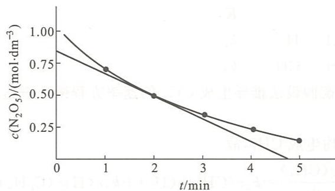

曲线在 $t = 2\mathrm{min}$ 处的斜率 $k$ 为瞬时速率：

$$
v = \frac {0 . 8 5 \mathrm{mol} \cdot \mathrm{dm} ^ {- 3}}{4 . 8 \mathrm{min}} \approx 0. 1 7 \mathrm{mol} \cdot \mathrm{dm} ^ {- 3} \cdot \mathrm{min} ^ {- 1}
$$

例3.2 说明可逆反应的速率常数 $k_{+}, k_{-}$ 与其平衡常数 $K$ 之间的关系。若已知某温度下氢氟酸的解离反应

$$
\mathrm{HF(aq)} = \mathrm {H^ {+} (aq) + F^ {-} (aq)}
$$

的平衡常数为 $7.08 \times 10^{-4} \mathrm{~mol} \cdot \mathrm{dm}^{-3}$ , 又已知基元反应

$$
\mathrm{H} ^ {+} (\mathrm{aq}) + \mathrm{F} ^ {-} (\mathrm{aq}) = \mathrm{HF} (\mathrm{aq})
$$

的速率常数为 $1.00 \times 10^{11} \mathrm{dm}^{3} \cdot \mathrm{mol}^{-1} \cdot \mathrm{s}^{-1}$ , 求氢氟酸解离反应的速率常数。

解：对于可逆基元反应

$$
\begin{array}{r l}&a \mathrm{A} \rightleftharpoons b \mathrm{B}\\&v _ {+} = k _ {+} [ c (\mathrm{A}) ] ^ {a}\\&v _ {-} = k _ {-} [ c (\mathrm{B}) ] ^ {b}\end{array}
$$

当反应达到平衡时， $v_{+}=v_{-}$ ，故

所以

即

$$
\begin{array}{r l} & k _ {+} \left[ c (\mathrm{A}) _ {\text {平}} \right] ^ {a} = k _ {-} \left[ c (\mathrm{B}) _ {\text {平}} \right] ^ {b} \\ & \frac {\left[ c (\mathrm{B}) _ {\text {平}} \right] ^ {b}}{\left[ c (\mathrm{A}) _ {\text {平}} \right] ^ {a}} = \frac {k _ {+}}{k _ {-}} \\ & K = \frac {k _ {+}}{k _ {-}} \end{array}
$$

题中涉及的两个反应,根据微观可逆性原理,皆为基元反应。设反应

$$
\mathrm{HF(aq)} = \mathrm {H^ {-} (aq) + F^ {-} (aq)}
$$

为正反应,速率常数为 $k_{+}$ ,平衡常数为 K,则其逆反应

$$
\mathrm{H} ^ {+} (\mathrm{aq}) + \mathrm{F} ^ {-} (\mathrm{aq}) = \mathrm{HF} (\mathrm{aq})
$$

的速率常数为 $k_{-}$ 。

由 $K = \frac{k_{+}}{k_{-}}$ 得

$$
\begin{array}{r l} k _ {+} & = K \bullet k _ {-} \\ & = 7. 0 8 \times 1 0 ^ {- 4} \mathrm{mol} \bullet \mathrm{dm} ^ {- 3} \times 1. 0 0 \times 1 0 ^ {1 1} \mathrm{dm} ^ {3} \bullet \mathrm{mol} ^ {- 1} \bullet \mathrm{s} ^ {- 1} \\ & = 7. 0 8 \times 1 0 ^ {7} \mathrm{s} ^ {- 1} \end{array}
$$

这就是氢氟酸解离反应的速率常数。

例 3.3 有人对反应 $C_{2}H_{6} + H_{2} = 2CH_{4}$ 提出如下机理：

$$
① \mathrm{C} _ {2} \mathrm{H} _ {6} \rightleftharpoons 2 \mathrm{CH} _ {3} \qquad K
$$

$$
② \mathrm{CH} _ {3} + \mathrm{H} _ {2} = \mathrm{CH} _ {4} + \mathrm{H} \qquad k _ {2}
$$

③ $\mathrm{H} + \mathrm{C}_2\mathrm{H}_6 = \mathrm{CH}_4 + \mathrm{CH}_3$ $k_{3}$

试用稳态近似法和平衡假设法推导生成 $CH_{4}$ 的速率方程微分表达式，并用已知数据表示速率常数 k。

解：反应②和反应③均生成 $\mathrm{CH}_4$ ，故

$$
\frac {\mathrm{d} c (\mathrm{CH} _ {4})}{\mathrm{d} t} = k _ {2} c (\mathrm{CH} _ {3}) c (\mathrm{H} _ {2}) + k _ {3} c (\mathrm{H}) c (\mathrm{C} _ {2} \mathrm{H} _ {6})\tag{1}
$$

同时反应②为中间产物 H 的形成反应,而反应③为中间产物 H 的消耗反应,根据稳态近似法,反应②和反应③的速率相等,即

$$
\begin{array}{r l} & {\frac {\mathrm{d} c (\mathrm{H})}{\mathrm{d} t} = k _ {2} c (\mathrm{CH} _ {3}) c (\mathrm{H} _ {2})} \\ & {- \frac {\mathrm{d} c (\mathrm{H})}{\mathrm{d} t} = k _ {3} c (\mathrm{H}) c (\mathrm{C} _ {2} \mathrm{H} _ {6})} \\ & {k _ {2} c (\mathrm{CH} _ {3}) c (\mathrm{H} _ {2}) = k _ {3} c (\mathrm{H}) c (\mathrm{C} _ {2} \mathrm{H} _ {6})} \end{array}
$$

式(1)变成

$$
\frac {\mathrm{d} c (\mathrm{CH} _ {4})}{\mathrm{d} t} = 2 k _ {2} c (\mathrm{CH} _ {3}) c (\mathrm{H} _ {2})\tag{2}
$$

由题设的平衡条件,有

$$
\begin{array}{r} K = \frac {\left[ c (\mathrm {CH_ {3}}) \right] ^ {2}}{c (\mathrm {C_ {2} H_ {6}})} \\ c (\mathrm {CH_ {3}}) = K ^ {\frac {1}{2}} \left[ c (\mathrm {C_ {2} H_ {6}}) \right] ^ {\frac {1}{2}} \end{array}
$$

将其代入式(2)，得

$$
\frac {\mathrm{d} c (\mathrm{CH} _ {4})}{\mathrm{d} t} = 2 k _ {2} K ^ {\frac {1}{2}} c (\mathrm{H} _ {2}) [ c (\mathrm{C} _ {2} \mathrm{H} _ {6}) ] ^ {\frac {1}{2}}
$$

令 $k = 2k_{2}K^{\frac{1}{2}}$ ，则生成 $\mathrm{CH}_4$ 的速率方程为

$$
\frac {\mathrm{d} c (\mathrm{CH} _ {4})}{\mathrm{d} t} = k c (\mathrm{H} _ {2}) [ c (\mathrm{C} _ {2} \mathrm{H} _ {6}) ] ^ {\frac {1}{2}}
$$

其中速率常数 $k = 2k_{2}K^{\frac{1}{2}}$ 。

例 3.4 环丁烯异构化反应是一级反应：

$$
\begin{array}{c} \mathrm{HC=CH} \\ | \\ \mathrm {H_ {2} C - CH_ {2}} \end{array} \longrightarrow \mathrm {CH_ {2} = CH - CH = CH_ {2}}
$$

在 $150^{\circ}\mathrm{C}$ 时 $k = 2.0\times 10^{-4}\mathrm{s}^{-1}$ ，气态环丁烯的初始浓度为 $1.89\times 10^{-3}\mathrm{mol}\cdot \mathrm{dm}^{-3}$ 。求：

(1) 20 min 时环丁烯的浓度；

(2) 环丁烯的浓度变成 $1.00 \times 10^{-3} \, mol \cdot dm^{-3}$ 所需时间。

解：由题设知环丁烯异构化反应是一级反应。根据一级反应反应物的浓度与时间的关系式

$$
\lg \frac {c}{c _ {0}} = - \frac {k}{2 . 3 0 3} t
$$

进行计算。

(1) 20 min 即 1200 s。

$$
\begin{array}{r l} \lg \frac {c}{c _ {0}} & = - \frac {2 . 0 \times 1 0 ^ {- 4} \mathrm{s} ^ {- 1}}{2 . 3 0 3} \times 1 2 0 0 \mathrm{s} \\ & = - 0. 1 0 4 \end{array}
$$

$$
\frac {c}{c _ {0}} = 0. 7 8 7
$$

故 $20 \mathrm{~min}$ 时环丁烯的浓度为

$$
\begin{array}{r l} c & = 0. 7 8 7 c _ {0} \\ & = 0. 7 8 7 \times 1. 8 9 \times 1 0 ^ {- 3} \mathrm{mol} \cdot \mathrm{dm} ^ {- 3} \\ & = 1. 4 9 \times 1 0 ^ {- 3} \mathrm{mol} \cdot \mathrm{dm} ^ {- 3} \end{array}
$$

(2)

$$
\begin{array}{r l} t & = - \frac {e _ {0}}{k} \\ & = - \frac {2 . 3 0 3 \lg \frac {1 . 0 0 \times 1 0 ^ {- 3} \mathrm{mol} \cdot \mathrm{dm} ^ {- 3}}{1 . 8 9 \times 1 0 ^ {- 3} \mathrm{mol} \cdot \mathrm{dm} ^ {- 3}}}{2 . 0 \times 1 0 ^ {- 4} \mathrm{s} ^ {- 1}} \\ & = 3. 1 8 \times 1 0 ^ {3} \mathrm{s} \end{array}
$$

例 3.5 $\mathrm{SO}_{2}\mathrm{Cl}_{2}(\mathrm{~g})=\mathrm{SO}_{2}(\mathrm{~g})+\mathrm{Cl}_{2}(\mathrm{~g})$ 为一级反应，某温度下速率常数 $k=3.8\times10^{-5}\ s^{-1}$ ，在该温度下反应 1.5 h 后， $SO_{2}Cl_{2}$ 的解离度是多少？

解：1.5h 即 5400 s。

依题意 $\mathrm{SO}_{2}\mathrm{Cl}_{2}(\mathrm{~g})=\mathrm{SO}_{2}(\mathrm{~g})+\mathrm{Cl}_{2}(\mathrm{~g})$ 为一级反应，故其速率方程的积分表达式为

$$
\lg \frac {c}{c _ {0}} = - \frac {k t}{2 . 3 0 3}
$$

将题设条件代入,得

$$
\begin{array}{r l} \lg \frac {c}{c _ {0}} & = - \frac {3 . 8 \times 1 0 ^ {- 5} \mathrm{s} ^ {- 1} \times 5 4 0 0 \mathrm{s}}{2 . 3 0 3} \\ & = - 0. 0 8 9 \end{array}
$$

所以

$$
\frac {c}{c _ {0}} = 0. 8 1
$$

故

$$
\frac {c _ {0} - c}{c _ {0}} = 1 - \frac {c}{c _ {0}} = 1 - 0. 8 1 = 0. 1 9
$$

即 $\mathrm{SO}_2\mathrm{Cl}_2$ 的解离度为 $19\%$ 。

例 3.6 在某处高山上测得纯水 $90^{\circ}$ C 沸腾。 $100^{\circ}$ C 下 3 min 可煮熟的鸡蛋，在这样的高山上需多少分钟方可煮熟？假定鸡蛋煮熟（即蛋白质变质）过程的活化能为 $5.18 \times 10^{2} \, kJ \cdot mol^{-1}$ 。

解：速率常数 $k$ 与反应速率 $\upsilon$ 成正比，反应速率 $\upsilon$ 与完成反应所需时间 $t$ 成反比，故有 $k$ 与 $t$ 成反比，即

$$
\frac {k _ {2}}{k _ {1}} = \frac {t _ {1}}{t _ {2}}
$$

将鸡蛋煮熟即蛋白质变质的过程看成一个复杂的化学反应。其速率常数、反应温度和反应活化能之间满足阿仑尼乌斯公式。经变换可得

$$
\lg \frac {k _ {2}}{k _ {1}} = \frac {E _ {\mathrm{a}}}{2 . 3 0 3 R} \cdot \frac {T _ {2} - T _ {1}}{T _ {1} T _ {2}}
$$

即

$$
\begin{array}{r l} \lg \frac {t _ {1}}{t _ {2}} & = \frac {E _ {\mathrm{a}}}{2 . 3 0 3 R} \cdot \frac {T _ {2} - T _ {1}}{T _ {1} T _ {2}} \\ & = \frac {5 . 1 8 \times 1 0 ^ {2} \times 1 0 0 0 \mathrm{J} \cdot \mathrm{mol} ^ {- 1} \times (3 7 3 \mathrm{K} - 3 6 3 \mathrm{K})}{2 . 3 0 3 \times 8 . 3 1 4 \mathrm{J} \cdot \mathrm{mol} ^ {- 1} \cdot \mathrm{K} ^ {- 1} \times 3 6 3 \mathrm{K} \times 3 7 3 \mathrm{K}} \\ & = 2. 0 0 \end{array}
$$

故

$$
\frac {t _ {1}}{t _ {2}} = 1. 0 0 \times 1 0 ^ {2}
$$

$$
t _ {1} = 1. 0 0 \times 1 0 ^ {2} t _ {2} = 1. 0 0 \times 1 0 ^ {2} \times 3 \min = 3. 0 0 \times 1 0 ^ {2} \min
$$

所以需要 300 min 方可煮熟鸡蛋。

例 3.7 19 世纪末, 荷兰科学家 van't Hoff 根据大量实验指出, 温度升高 10 K, 反应速率扩大 2\~4 倍。假定这些实验是在 27 ℃ 左右进行的, 求所涉及的化学反应的活化能 $E_{a}$ 的范围。

解：反应活化能 $E_{\mathrm{a}}$ ，反应温度 $T$ 和速率常数 $k$ 之间的关系符合公式：

$$
\lg \frac {k _ {2}}{k _ {1}} = \frac {E _ {\mathrm{a}}}{2 . 3 0 3 R} \left(\frac {1}{T _ {1}} - \frac {1}{T _ {2}}\right)
$$

将 $\frac{k_{2}}{k_{1}}=2,T_{1}=(27+273)K=300K,T_{2}=310K$ 代入公式，得

$$
\begin{array}{r l} E _ {\mathrm{a}} & = \frac {2 . 3 0 3 R \lg \frac {k _ {2}}{k _ {1}}}{\frac {1}{T _ {1}} - \frac {1}{T _ {2}}} \\ & = \frac {2 . 3 0 3 \times 8 . 3 1 4 \mathrm{J} \cdot \mathrm{mol} ^ {- 1} \cdot \mathrm{K} ^ {- 1} \lg 2}{\frac {1}{3 0 0 \mathrm{K}} - \frac {1}{3 1 0 \mathrm{K}}} \\ & = 5 3. 6 \mathrm{kJ} \cdot \mathrm{mol} ^ {- 1} \end{array}
$$

若将 $\frac{k_2}{k_1} = 4$ 代入公式中，可得

$$
E _ {\mathrm{a}} = 1 0 7. 2 \mathrm {kJ\cdot mol^ {- 1}}
$$

故化学反应的活化能范围是 $53.6 \sim 107.2 \, kJ \cdot mol^{-1}$ 。

例 3.8 蔗糖水解反应

$$
\mathrm{C} _ {1 2} \mathrm{H} _ {2 2} \mathrm{O} _ {1 1} + \mathrm{H} _ {2} \mathrm{O} = 2 \mathrm{C} _ {6} \mathrm{H} _ {1 2} \mathrm{O} _ {6}
$$

活化能 $E_{\mathrm{a}} = 110\mathrm{kJ}\cdot \mathrm{mol}^{-1};298\mathrm{K}$ 时其半衰期 $t_{1 / 2} = 1.22\times 10^{4}\mathrm{s}$ ，且 $t_{1 / 2}$ 与反应物浓度无关。

(1) 求此反应的反应级数；

(2) 写出其速率方程；

(3) 求 308 K 时的速率常数 k。

解：（1）由题设可知，反应的半衰期 $t_{1/2}$ 与反应物的浓度无关，故该反应的反应级数为1。

(2) 根据质量作用定律, 其速率方程为

$$
v = k c \left(\mathrm{C} _ {1 2} \mathrm{H} _ {2 2} \mathrm{O} _ {1 1}\right)
$$

(3) 由公式 $t_{1/2}=\frac{0.693}{k}$ ，得 298 K 时的速率常数为

$$
k = \frac {0 . 6 9 3}{t _ {1 / 2}} = \frac {0 . 6 9 3}{1 . 2 2 \times 1 0 ^ {4} \mathrm{s}} = 5. 6 8 \times 1 0 ^ {- 5} \mathrm{s} ^ {- 1}
$$

反应活化能 $E_{\mathrm{a}}$ ，反应温度 $T$ 和速率常数 $k$ 之间的关系式为

$$
\lg \frac {k _ {2}}{k _ {1}} = \frac {E _ {\mathrm{a}}}{2 . 3 0 3 R} \left(\frac {1}{T _ {1}} - \frac {1}{T _ {2}}\right)
$$

将 $E_{\mathrm{a}}, T_{1}$ 和 $T_{2}$ 的数据代入其中，得

$$
\begin{array}{r l} \lg \frac {k _ {2}}{k _ {1}} & = \frac {1 1 0 \times 1 0 0 0 \mathrm{J} \cdot \mathrm{mol} ^ {- 1}}{2 . 3 0 3 \times 8 . 3 1 4 \mathrm{J} \cdot \mathrm{mol} ^ {- 1} \cdot \mathrm{K} ^ {- 1}} \left(\frac {1}{2 9 8 \mathrm{K}} - \frac {1}{3 0 8 \mathrm{K}}\right) \\ & = 6. 2 5 9 \times 1 0 ^ {- 1} \end{array}
$$

所以

$$
\frac {k _ {2}}{k _ {1}} = 4. 2 2 6
$$

$$
k _ {2} = 4. 2 2 6 k _ {1} = 4. 2 2 6 \times 5. 6 8 \times 1 0 ^ {- 5} \mathrm{s} ^ {- 1} = 2. 4 0 \times 1 0 ^ {- 4} \mathrm{s} ^ {- 1}
$$

例3.9 实验测得反应

$$
\mathrm{CO(g)} + \mathrm {NO_ {2} (g)} = \mathrm {CO_ {2} (g)} + \mathrm{NO(g)}
$$

650 K 时的数据如下：

<table><tr><td>实验编号</td><td> $c(CO)/(mol·dm^{-3})$ </td><td> $c(NO_2)/(mol·dm^{-3})$ </td><td> $v(NO)/(mol·dm^{-3}·s^{-1})$ </td></tr><tr><td>1</td><td>0.025</td><td>0.040</td><td> $2.2×10^{-4}$ </td></tr><tr><td>2</td><td>0.050</td><td>0.040</td><td> $4.4×10^{-4}$ </td></tr><tr><td>3</td><td>0.025</td><td>0.120</td><td> $6.6×10^{-4}$ </td></tr></table>

(1) 通过推理写出反应的速率方程；

(2) 求 650 K 时的速率常数；

(3) 当 $c(\mathrm{CO})=0.10\ \mathrm{mol}\cdot\mathrm{dm}^{-3}, c(\mathrm{NO}_{2})=0.16\ \mathrm{mol}\cdot\mathrm{dm}^{-3}$ 时，求 650 K 时的反应速率；

(4) 若 $800 \, K$ 时的速率常数为 $23.0 \, dm^{3} \cdot mol^{-1} \cdot s^{-1}$ ，求反应的活化能。

解：（1）对比实验①和实验②， $c(\mathrm{NO}_{2})$ 不变， $c(\mathrm{CO})$ 扩大2倍时，v扩大2倍，说明v与c(CO)成正比，即v对CO是一级反应；对比实验①和实验③， $c(\mathrm{CO})$ 不变， $c(\mathrm{NO}_{2})$ 扩大3倍时，v扩大3倍，说明v与 $c(\mathrm{NO}_{2})$ 成正比，即v对 $NO_{2}$ 是一级反应。故有

$$
v = k c (\mathrm{CO}) c (\mathrm{NO} _ {2})
$$

(2) 将实验①的数据代入上述速率方程, 得

$$
\begin{array}{r l} k & = \frac {v}{c (\mathrm{CO}) c (\mathrm{NO} _ {2})} \\ & = \frac {2 . 2 \times 1 0 ^ {- 4} \mathrm{mol} \cdot \mathrm{dm} ^ {- 3} \cdot \mathrm{s} ^ {- 1}}{0 . 0 2 5 \mathrm{mol} \cdot \mathrm{dm} ^ {- 3} \times 0 . 0 4 0 \mathrm{mol} \cdot \mathrm{dm} ^ {- 3}} \\ & = 0. 2 2 \mathrm{dm} ^ {3} \cdot \mathrm{mol} ^ {- 1} \cdot \mathrm{s} ^ {- 1} \end{array}
$$

(3) 将题设数据代入速率方程, 得 $v = kc(CO)c(NO_{2})$ $=0.22\ dm^{3}\cdot mol^{-1}\cdot s^{-1}\times0.10\ mol\cdot dm^{-3}\times0.16\ mol\cdot dm^{-3}$ $=3.5\times10^{-3}\ mol\cdot dm^{-3}\cdot s^{-1}$

(4) 由公式

$$
\lg \frac {k _ {2}}{k _ {1}} = \frac {E _ {\mathrm{a}}}{2 . 3 0 3 R} \left(\frac {T _ {2} - T _ {1}}{T _ {1} T _ {2}}\right)
$$

得

$$
\begin{array}{r l} E _ {\mathrm{a}} & = \frac {2 . 3 0 3 R T _ {2} T _ {1}}{T _ {2} - T _ {1}} \lg \frac {k _ {2}}{k _ {1}} \\ & = \frac {2 . 3 0 3 \times 8 . 3 1 4 \mathrm{J} \cdot \mathrm{mol} ^ {- 1} \cdot \mathrm{K} ^ {- 1} \times 8 0 0 \mathrm{K} \times 6 5 0 \mathrm{K}}{8 0 0 \mathrm{K} - 6 5 0 \mathrm{K}} \lg \frac {2 3 . 0 \mathrm{dm} ^ {3} \cdot \mathrm{mol} ^ {- 1} \cdot \mathrm{K} ^ {- 1}}{0 . 2 2 \mathrm{dm} ^ {3} \cdot \mathrm{mol} ^ {- 1} \cdot \mathrm{K} ^ {- 1}} \\ & = 1. 3 \times 1 0 ^ {2} \mathrm{kJ} \cdot \mathrm{mol} ^ {- 1} \end{array}
$$

## 第二部分 习题

## 一、选择题

3.1 当反应 $A_{2} + B_{2} = 2AB$ 的速率方程为 $v = kc(A_{2})c(B_{2})$ 时，此反应
(A)一定是基元反应；(B)一定是非基元反应；
(C)不能肯定是否是基元反应；(D)反应为一级反应。

3.2 二级反应速率常数的单位是
(A) $s^{-1}$ ; (B) $mol \cdot dm^{-3}$ ; (C) $mol \cdot dm^{-3} \cdot s^{-1}$ ; (D) $mol^{-1} \cdot dm^{3} \cdot s^{-1}$ 。

3.3 反应的半衰期和反应物初始浓度的关系符合一级反应的是

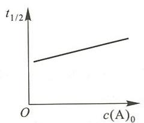  
(A)

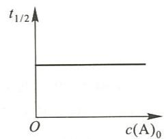  
(B)

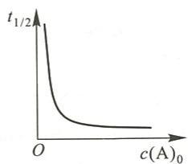  
(C)

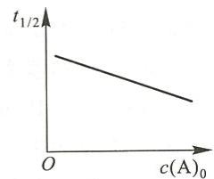  
(D)

3.4 已知反应 $2\mathrm{NO(g)} + \mathrm{Br}_2(\mathrm{g}) = 2\mathrm{NOBr(g)}$ 的反应历程是 $\mathrm{NO(g) + Br_2(g) = NOBr_2(g)}$ 快 $\mathrm{NOBr_2(g) + NO(g) = 2NOBr(g)}$ 慢

则该反应对NO的反应级数为(A)0； (B)1； (C)2；

(D) 3。

3.5 下列势能一反应历程图中,属放热反应的是

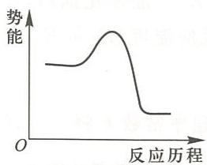  
(1)

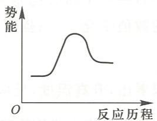  
(2)

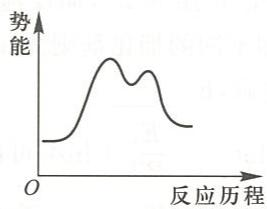  
(3)

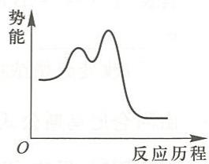  
(4)

(A) (1) 和 (3); (B) (2) 和 (3); (C) (1) 和 (4); (D) (2) 和 (4)。

3.6 某化学反应进行 30 min 反应完成 50%，进行 60 min 反应完成 100%，则此反应是（A）三级反应；（B）二级反应；（C）一级反应；（D）零级反应。

3.7 已知反应 $2\mathrm{NO}(g)+\mathrm{O}_{2}(g)=2\mathrm{NO}_{2}(g)$ 为三级反应。下列操作会使反应速率常数改变的是
(A) 减小体系的压强； (B) 在反应体系中加入大量的 NO；
(C) 降低反应温度； (D) 在反应体系中加入 $NO_{2}$ 。

3.8 有三个反应, 其反应活化能分别为: a 反应 $320 \, kJ \cdot mol^{-1}$ , b 反应 $40 \, kJ \cdot mol^{-1}$ , c 反应 $80 \, kJ \cdot mol^{-1}$ 。当温度升高时, 上述三个反应速率增加倍数的大小顺序是
(A) a > c > b; (B) a > b > c; (C) b > c > a; (D) c > b > a。

3.9 质量数为 210 的钋同位素进行 $\beta$ 衰变, 经过 14 天后, 同位素的活性降低了 $6.85\%$ , 则该同位素分解 $90\%$ 所需要的天数为
(A) 354; (B) 263; (C) 300; (D) 454。

3.10 关于催化剂的说法,正确的是
(A) 不能改变反应的 $\Delta G, \Delta H, \Delta S, \Delta U;$ (B) 不能改变反应的 $\Delta G$ ，但能改变 $\Delta H, \Delta S, \Delta U;$ (C) 不能改变反应的 $\Delta G, \Delta H$ ，但能改变 $\Delta S, \Delta U;$ (D) 不能改变反应的 $\Delta G, \Delta H, \Delta U$ ，但能改变 $\Delta S$ 。

## 二、填空题

3.11 某温度下反应 $2\mathrm{NO}(g)+\mathrm{O}_{2}(g)=2\mathrm{NO}_{2}(g)$ 的速率常数 $k=8.8\times10^{-2}\ dm^{6}\cdot mol^{-2}\cdot s^{-1}$ ，已知反应对 $O_{2}$ 来说是一级反应，则对 NO 为 \_\_\_\_ 级反应，速率方程为 \_\_\_\_；当反应物浓度都是 $0.05\ mol\cdot dm^{-3}$ 时，反应的速率是 \_\_\_\_。

3.12 反应 A+B=C 的速率方程为 $v=kc(A)[c(B)]^{\frac{1}{2}}$ ，其反应速率的单位是 \_\_\_\_，速率常数的单位是 \_\_\_\_。（注：浓度单位用 $mol \cdot dm^{-3}$ ，时间单位用 s）

3.13 物质 A 与 B 混合, 反应按下列反应机理进行
A+B=C （快）
B+C=D+E+A （慢）

则该反应的反应方程式为\_\_\_\_；物质A为\_\_\_\_；物质C为\_\_\_\_。

3.14 同位素 $^{90}_{38}Sr$ 放射性衰变的速率常数 $k=3.48\times10^{-2}a^{-1}$ ，则反应的半衰期为\_\_\_\_a；若有1.00g的 $^{90}_{38}Sr$ ，30年后的残留量为\_\_\_\_g。

3.15 若反应 A——2B 的活化能为 $E_{a}$ ，而反应 2B——A 的活化能为 $E_{a}^{\prime}$ 。加催化剂后， $E_{a}$ 和 $E_{a}^{\prime}$ \_\_\_\_；加不同的催化剂则 $E_{a}$ 的数值变化 \_\_\_\_；提高反应温度， $E_{a}$ 和 $E_{a}^{\prime}$ \_\_\_\_；改变起始浓度后， $E_{a}$ \_\_\_\_。

3.16 由阿仑尼乌斯公式 $\ln k = -\frac{E_{\mathrm{a}}}{RT} + \ln A$ 可以看出，升高温度，反应速率常数 $k$ 将 \_\_\_\_；使用催化剂时，反应速率常数 $k$ 将 \_\_\_\_；而改变反应物或生成物浓度时，反应速率常数 $k$ \_\_\_\_。

3.17 $\mathrm{CH}_2(\mathrm{CH}_2\mathrm{COOH})_2$ 在水溶液中分解成丙酮和二氧化碳。在 $283\mathrm{K}$ 时分解反应速率常数为 $1.08\times 10^{-4}\mathrm{mol}\cdot \mathrm{dm}^{-3}\cdot \mathrm{s}^{-1},333\mathrm{K}$ 时为 $5.48\times 10^{-2}\mathrm{mol}\cdot \mathrm{dm}^{-3}\cdot \mathrm{s}^{-1}$ ，则该反应的活化能为 \_\_\_\_ kJ·mol $^{-1}$ ， $303\mathrm{K}$ 时分解反应的速率常数为 \_\_\_\_。

3.18 在 650 K, 丙酮的分解反应为一级反应, 测得 200 min 时, 丙酮浓度是 $0.0300 \, mol \cdot dm^{-3}$ , 400 min 时是 $0.0200 \, mol \cdot dm^{-3}$ , 则丙酮分解反应的速率常数为 \_\_\_\_; 丙酮的初始浓度为 \_\_\_\_ $mol \cdot dm^{-3}$ 。

3.19 已知各基元反应的活化能如下表：

<table><tr><td></td><td>A</td><td>B</td><td>C</td><td>D</td><td>E</td></tr><tr><td>正反应的活化能/(kJ·mol-1)</td><td>70</td><td>16</td><td>40</td><td>20</td><td>20</td></tr><tr><td>逆反应的活化能/(kJ·mol-1)</td><td>20</td><td>35</td><td>45</td><td>80</td><td>30</td></tr></table>

在相同的温度和指前因子时：

(1) 正反应是吸热反应的是 \_\_\_\_；

(2) 放热最多的反应是 \_\_\_\_；

(3) 正反应速率常数最大的反应是\_\_\_\_；

(4) 反应可逆程度最大的反应是 \_\_\_\_；

(5) 正反应的速率常数 k 随温度变化最大的是 \_\_\_\_。

3.20 在常温常压下， $\mathrm{HCl(g)}$ 的生成热为 $-92.3 \mathrm{~kJ} \cdot \mathrm{mol}^{-1}$ ，生成反应的活化能为 $113 \mathrm{~kJ} \cdot \mathrm{mol}^{-1}$ ，则其逆反应的活化能为 \_\_\_\_ $\mathrm{kJ} \cdot \mathrm{mol}^{-1}$ 。

## 三、简答题和计算题

3.21 某温度下乙醛的分解反应为

$$
\mathrm{CH} _ {3} \mathrm{CHO(g)} = \mathrm{CH} _ {4} (\mathrm{g}) + \mathrm{CO(g)}
$$

根据下列实验数据：

<table><tr><td>t/s</td><td>42</td><td>105</td><td>242</td><td>384</td><td>665</td><td>1070</td></tr><tr><td>c(乙醛)/(10-3mol·dm-3)</td><td>6.68</td><td>5.85</td><td>4.64</td><td>3.83</td><td>2.81</td><td>2.01</td></tr></table>

(1) 分别求算 42～242 s 和 242～665 s 时间间隔的平均反应速率，并说明二者大小不等

的原因；

(2) 利用作图法求出 $t=100\ s$ 时的瞬时速率。

3.22 某化学反应 $2\mathrm{A} + \mathrm{B} = \mathrm{C}$ 是基元反应。A的起始浓度为 $2\mathrm{mol}\cdot \mathrm{dm}^{-3}$ ，B的起始浓度为 $4\mathrm{mol}\cdot \mathrm{dm}^{-3}$ ，反应的初始速率为 $1.80\times 10^{-2}\mathrm{mol}\cdot \mathrm{dm}^{-3}\cdot \mathrm{s}^{-1}$ 。 $t$ 时刻，A的浓度下降到 $1\mathrm{mol}\cdot \mathrm{dm}^{-3}$ ，试求此时的反应速率。

3.23 臭氧分解反应的机理为

① $O_{3} \stackrel{K_{1}}{\rightleftharpoons} O_{2} + O$ （快）

$$
\mathrm{O} + \mathrm{O} _ {3} \stackrel {k _ {2}} {=} 2 \mathrm{O} _ {2}
$$

根据上述反应机理,试用 $O_{3}$ 和 $O_{2}$ 的浓度表示它的速率方程。

3.24 反应 $2\mathrm{NO} + 2\mathrm{H}_2 = \mathrm{N}_2 + 2\mathrm{H}_2\mathrm{O}$ 的反应机理为 $① \mathrm{NO} + \mathrm{NO}\rightleftharpoons \mathrm{N}_2\mathrm{O}_2$ （快） $② \mathrm{N}_2\mathrm{O}_2 + \mathrm{H}_2 = \mathrm{N}_2\mathrm{O} + \mathrm{H}_2\mathrm{O}$ （慢） $③ \mathrm{N}_2\mathrm{O} + \mathrm{H}_2\rightleftharpoons \mathrm{N}_2 + \mathrm{H}_2\mathrm{O}$ （快）试确定总反应速率方程。

3.25 一氧化碳与氯气在高温下作用得到光气: $\mathrm{CO(g)+Cl_{2}(g)=COCl_{2}(g)}$ , 实验测得反应的速率方程为

$$
\frac {\mathrm{d} c (\mathrm{COCl} _ {2})}{\mathrm{d} t} = k c (\mathrm{CO}) [ c (\mathrm{Cl} _ {2}) ] ^ {\frac {3}{2}}
$$

有人提出其反应机理为

① $\mathrm{Cl}_2\xrightarrow[k_{-1}]k_1} 2\mathrm{Cl}\cdot$ （快平衡）

② $\mathrm{Cl}\cdot +\mathrm{CO}\xrightarrow[k_{-2}]k_{2}}\mathrm{COCl}\cdot (\text{快平衡})$

③ $\mathrm{COCl}\cdot+\mathrm{Cl}_{2}\stackrel{k_{3}}{=} \mathrm{COCl}_{2}+\mathrm{Cl}\cdot(\text{慢反应})$

(1) 试说明这一机理与速率方程相符合；

(2) 指出反应速率方程中的 $k$ 与反应机理中的速率常数 $(k_{1}, k_{-1}, k_{2}, k_{-2})$ 间的关系。3.26 在 $373 \mathrm{~K}$ 时, 反应 $\mathrm{H}_{2} \mathrm{PO}_{2}^{-} + \mathrm{OH}^{-} = \mathrm{HPO}_{3}^{2-} + \mathrm{H}_{2}$ 的实验数据如下:

<table><tr><td colspan="2">初始浓度</td><td rowspan="2"> $- \frac{\mathrm{d}c\left( {{\mathrm{H}}_{2}{\mathrm{{PO}}}_{2}^{ - }}\right) }{\mathrm{d}t}/\left( {\mathrm{{mol}} \cdot  {\mathrm{{dm}}}^{-3} \cdot  {\mathrm{{min}}}^{-1}}\right)$ </td></tr><tr><td> $c\left( {{\mathrm{H}}_{2}{\mathrm{{PO}}}_{2}^{ - }}\right) /\left( {\mathrm{{mol}} \cdot  {\mathrm{{dm}}}^{-3}}\right)$ </td><td> $c\left( {\mathrm{{OH}}}^{ - }\right) /\left( {\mathrm{{mol}} \cdot  {\mathrm{{dm}}}^{-3}}\right)$ </td></tr><tr><td>0.10</td><td>1.0</td><td> ${3.2} \times  {10}^{-5}$ </td></tr><tr><td>0.50</td><td>1.0</td><td> ${1.6} \times  {10}^{-4}$ </td></tr><tr><td>0.50</td><td>4.0</td><td> ${2.56} \times  {10}^{-3}$ </td></tr></table>

(1) 确定反应级数, 写出速率方程;

(2) 计算此温度下的速率常数。

3.27 反应 $C_{2}H_{6}=C_{2}H_{4}+H_{2}$ 开始阶段反应级数近似为 3/2 级，910 K 时速率常数为 $1.13\ dm^{\frac{3}{2}}\cdot mol^{-\frac{1}{2}}\cdot s^{-1}$ 。试计算 $C_{2}H_{6}(g)$ 的压强为 $1.33\times10^{4}Pa$ 时的起始分解速率 $v_{0}$ 。

3.28 考古学者从古墓中取出的纺织品,经取样分析其 $^{14}$ C含量为动植物活体的85%。若放射性核衰变符合一级反应速率方程,且已知 $^{14}$ C的半衰期为5720年,试估算该纺织品的年龄。

3.29 在 $28^{\circ}$ C 时, 鲜牛奶大约 4 h 变酸, 但在 $5^{\circ}$ C 的冰箱中可保持 48 h。假定反应速率与变酸时间成反比, 求牛奶变酸反应的活化能。

3.30 已知反应 $\mathrm{CH}_3\mathrm{CHO(g)} = \mathrm{CH}_4(\mathrm{g}) + \mathrm{CO(g)}$ 的活化能 $E_{\mathrm{a}} = 188.3\mathrm{kJ}\cdot \mathrm{mol}^{-1}$ ；如果以碘蒸气为催化剂，反应的活化能 $E_{\mathrm{a}}^{\prime} = 138.1\mathrm{kJ}\cdot \mathrm{mol}^{-1}$ 。计算温度为 $800\mathrm{K}$ 时，加碘催化剂，反应速率增大为原来的多少倍。

3.31 某化合物在 100 min 内被消耗掉 25%，若分别是零级、一级和二级反应，则 200 min 时，对于各级反应，该物质分别被消耗了多少？

3.32 某有机物的热分解是一级反应,活化能为 $200 \, kJ \cdot mol^{-1}$ , 600 K 时的半衰期为 360 min。问 700 K 时,多长时间可将该有机物分解 70%?

3.33 已知某气相反应的活化能 $E_{a}=163\ kJ\cdot mol^{-1}$ ，温度 390 K 时的速率常数 $k=2.37\times10^{-2}\ dm^{3}\cdot mol^{-1}\cdot s^{-1}$ 。求温度为 420 K 时的反应速率常数。

3.34 某一级反应 $400\mathrm{K}$ 时的半衰期是 $500\mathrm{K}$ 时的100倍，试估算该反应的活化能。

3.35 在 600 K 时, 某化合物分解反应的速率常数 $k = 3.3 \times 10^{-2} s^{-1}$ , 反应的活化能 $E_{a} = 18.88 \times 10^{4} J \cdot mol^{-1}$ , 若控制反应在 10 min 内转化率达 90%, 则反应的温度应控制为多少?

3.36 ${}^{203}Hg$ 可用于进行肾扫描。某医院购入 $0.200\ mg{}^{203}Hg(NO_{3})_{2}$ 试样，六个月 (182 d) 后，未发生衰变的试样还有多少？已知 ${}^{203}Hg$ 的半衰期为 46.1 d。

3.37 $\mathrm{N}_2\mathrm{O}_5$ 分解为 $\mathrm{NO}_2$ 和 $\mathrm{O}_2$ 的反应为一级反应， $45^{\circ}\mathrm{C}$ 时，其速率常数 $k = 4.8 \times 10^{-4} \mathrm{~s}^{-1}$ 。

(1) 假设 $N_{2}O_{5}$ 的起始浓度为 $1.65 \times 10^{-2} \, mol \cdot dm^{-3}$ ，825 s 以后其浓度为多少？

(2) 多长时间后 $N_{2}O_{5}$ 将由起始浓度减少到 $1.00 \times 10^{-2} \, mol \cdot dm^{-3}$ ?

3.38 合成氨反应一般在 773 K 下进行, 没有催化剂时反应的活化能约为 $326 \, kJ \cdot mol^{-1}$ , 使用还原铁粉作催化剂时, 活化能降低至 $175 \, kJ \cdot mol^{-1}$ 。问加入催化剂后, 反应速率扩大了多少倍?

## 化学平衡

## 第一部分 例题

例 4.1 1 000 K 时, 将 0.631 g 光气 $\left(\mathrm{COCl}_{2}\right)$ 置于 $0.472 \, dm^{3}$ 真空容器中, 达平衡后测得其总压为 220 kPa, 试求反应

$$
\mathrm{COCl} _ {2} (\mathrm{g}) \rightleftharpoons \mathrm{CO(g)} + \mathrm{Cl} _ {2} (\mathrm{g})
$$

在该温度下的平衡常数 $K_{c}$ 。

解： $n(\mathrm{COCl}_2) = \frac{m}{M} = \frac{0.631\mathrm{g}}{99\mathrm{g}\cdot\mathrm{mol}^{-1}} = 6.37\times 10^{-3}\mathrm{mol}$

$$
\mathrm{COCl} _ {2} (\mathrm{g}) = \mathrm{CO(g)} + \mathrm{Cl} _ {2} (\mathrm{g})
$$

平衡时

$$
n _ {\mathrm{总}} = (6. 3 7 \times 1 0 ^ {- 3} + x) \mathrm{mol}
$$

依题意

$$
\begin{array}{r l} n _ {\text {总}} & = \frac {p V}{R T} = \frac {2 2 0 \times 1 0 ^ {3} \mathrm{Pa} \times 0 . 4 7 2 \times 1 0 ^ {- 3} \mathrm{m} ^ {3}}{8 . 3 1 4 \mathrm{Pa} \cdot \mathrm{m} ^ {3} \cdot \mathrm{mol} ^ {- 1} \cdot \mathrm{K} ^ {- 1} \times 1 0 0 0 \mathrm{K}} \\ & = 1. 2 5 \times 1 0 ^ {- 2} \mathrm{mol} \end{array}
$$

$$
(6. 3 7 \times 1 0 ^ {- 3} + x) \mathrm{mol} = 1. 2 5 \times 1 0 ^ {- 2} \mathrm{mol}
$$

解得

$$
x = 6. 1 3 \times 1 0 ^ {- 3}
$$

故平衡时

$$
n (\mathrm{CO}) = n (\mathrm{Cl} _ {2}) = 6. 1 3 \times 1 0 ^ {- 3} \mathrm{mol}
$$

$$
n (\mathrm{COCl} _ {2}) = (6. 3 7 \times 1 0 ^ {- 3} - x) \mathrm{mol} = 2. 4 0 \times 1 0 ^ {- 4} \mathrm{mol}
$$

由题设,容器体积

$$
V = 0. 4 7 2 \mathrm{dm} ^ {3}
$$

所以平衡时 $c(\mathrm{CO}) = c(\mathrm{Cl}_2) = \frac{6.13\times 10^{-3}\mathrm{mol}}{0.472\mathrm{dm}^3} = 0.0130\mathrm{mol}\cdot \mathrm{dm}^{-3}$

$$
c (\mathrm{COCl} _ {2}) = \frac {2 . 4 0 \times 1 0 ^ {- 4} \mathrm{mol}}{0 . 4 7 2 \mathrm{dm} ^ {3}} = 5. 0 8 \times 1 0 ^ {- 4} \mathrm{mol} \cdot \mathrm{dm} ^ {- 3}
$$

故

$$
\begin{array}{r l} K _ {c} & = \frac {c (\mathrm{CO}) \cdot c (\mathrm{Cl} _ {2})}{c (\mathrm{COCl} _ {2})} \\ & = \frac {0 . 0 1 3 0 \mathrm{mol} \cdot \mathrm{dm} ^ {- 3} \times 0 . 0 1 3 0 \mathrm{mol} \cdot \mathrm{dm} ^ {- 3}}{5 . 0 8 \times 1 0 ^ {- 4} \mathrm{mol} \cdot \mathrm{dm} ^ {- 3}} = 0. 3 3 3 \mathrm{mol} \cdot \mathrm{dm} ^ {- 3} \end{array}
$$

例 4.2 某温度下, 100 kPa 时反应 $2NO_{2} \rightleftharpoons N_{2}O_{4}$ 的标准平衡常数 $K^{\ominus}=3.06$ , 求 $NO_{2}$ 的平衡转化率。

解：设反应前 $n(\mathrm{NO}_{2})=1\ \mathrm{mol}$ ，平衡时 $n(\mathrm{NO}_{2})_{\text{平}}=x\ \mathrm{mol}$ ，则有

$$
\begin{array}{r l}&2 \mathrm{NO} _ {2} \rightleftharpoons \mathrm{N} _ {2} \mathrm{O} _ {4}\\t _ {0}&1 \quad 0\\t _ {\text {平}}&x \quad \frac {1}{2} (1 - x) \quad \text {故} n _ {\text {总}} = \frac {1}{2} (1 + x) \mathrm{mol}\\x _ {i}&\frac {x}{\frac {1}{2} (1 + x)} \quad \frac {\frac {1}{2} (1 - x)}{\frac {1}{2} (1 + x)}\\p _ {i}&\frac {1 0 0 \mathrm{kPa} \cdot x}{\frac {1}{2} (1 + x)} \quad \frac {1 0 0 \mathrm{kPa} \cdot \frac {1}{2} (1 - x)}{\frac {1}{2} (1 + x)}\\&K ^ {\ominus} = \frac {\frac {p (\mathrm{N} _ {2} \mathrm{O} _ {4})}{p ^ {\ominus}}}{\left(\frac {p (\mathrm{NO} _ {2})}{p ^ {\ominus}}\right) ^ {2}}\\&= \frac {\frac {1}{2} (1 - x)}{\frac {1}{2} (1 + x)}\\&= \frac {\frac {1}{2} (1 - x)}{\left[ \frac {x}{\frac {1}{2} (1 + x)} \right] ^ {2}}\\&= \frac {\frac {1}{4} (1 - x) (1 + x)}{x ^ {2}}\\&= 3. 0 6\end{array}
$$

解得 $x = 0.275$ 。

$NO_{2}$ 的平衡转化率为

$$
\frac {(1 - 0.275) \mathrm{mol}}{1 \mathrm{mol}} \times 100 \% = 72.5\%
$$

例 4.3 273 K 时, 水的饱和蒸气压为 611 Pa, 该温度下反应

$$
\mathrm{SrCl} _ {2} \cdot 6 \mathrm{H} _ {2} \mathrm{O(s)} \rightleftharpoons \mathrm{SrCl} _ {2} \cdot 2 \mathrm{H} _ {2} \mathrm{O(s)} + 4 \mathrm{H} _ {2} \mathrm{O(g)}
$$

的 $K^{\ominus}=6.89\times10^{-12}$ ，利用计算结果说明实际发生的过程是 $SrCl_{2}\cdot6H_{2}O(s)$ 失水风化，还是 $SrCl_{2}\cdot2H_{2}O(s)$ 吸水潮解。

解：

$$
\begin{array}{r l}\mathrm{SrCl} _ {2} \cdot 6 \mathrm{H} _ {2} \mathrm{O} (\mathrm{s})&\rightleftharpoons \mathrm{SrCl} _ {2} \cdot 2 \mathrm{H} _ {2} \mathrm{O} (\mathrm{s}) + 4 \mathrm{H} _ {2} \mathrm{O} (\mathrm{g})\\K ^ {\ominus}&= \left(\frac {p (\mathrm{H} _ {2} \mathrm{O})}{p ^ {\ominus}}\right) ^ {4}\end{array}
$$

$$
= 6. 8 9 \times 1 0 ^ {- 1 2}
$$

所以

$$
\frac {p (\mathrm{H} _ {2} \mathrm{O})}{p ^ {\ominus}} = 1. 6 2 \times 1 0 ^ {- 3}
$$

故

$$
\begin{array}{r l} p (\mathrm {H_ {2} O}) & = p ^ {\ominus} \times 1. 6 2 \times 1 0 ^ {- 3} \\ & = 1 0 0 \mathrm{kPa} \times 1. 6 2 \times 1 0 ^ {- 3} \\ & = 1 6 2 \mathrm{Pa} \end{array}
$$

$$
\mathrm{空气相对湿度} = \frac {\mathrm{水的蒸气压}}{\mathrm{水的饱和蒸气压}} = \frac {1 6 2 \mathrm{Pa}}{6 1 1 \mathrm{Pa}} = 2 6.5\%
$$

若相对湿度大于 26.5%，则 $SrCl_{2} \cdot 2H_{2}O$ 吸水潮解；若相对湿度小于 26.5%，则 $SrCl_{2} \cdot 6H_{2}O$ 失水风化。

例 4.4 如图所示,无摩擦、无质量、无体积的活塞 1,2,3 将反应器隔成甲、乙、丙 3 部分,分别进行反应:

$$
\mathrm{A(g)} + \mathrm{B(g)} \rightleftharpoons \mathrm{C(g)}
$$

起始时物质的量已标在图中。某温度和 100 kPa 下实现平衡时，各部分的体积分别为 $V_{甲}$ ， $V_{乙}$ ， $V_{丙}$ 。

<table><tr><td>x mol B 3 mol C</td><td>1 mol A 3 mol B</td><td>1 mol A 8 mol B</td><td></td></tr></table>

(1) 这时若去掉活塞 1, 不会引起其他活塞移动, 求算 x 值;

（2）去掉活塞2后再次达到平衡时，活塞3向哪个方向发生了移动？试通过计算加以解释，可以假定反应的 $K^{\ominus}$ 等于1。

解：（1）若去掉活塞1，不会引起活塞2的移动，说明甲和乙两部分中物质组成的比例一致。这种情形只有在两部分中物质的起始配比或折算后的起始配比一致时才能实现。

$$
\begin{array}{r l}&\mathrm {A(g) + B(g)\rightleftharpoons C(g)}\\&0 \quad x \quad 3\\&0 + 3 \quad x + 3 \quad 0\\&\frac {0 + 3}{x + 3} = \frac {1}{3}\end{array}
$$

解得 $x = 6$ 。

(2) 去掉活塞 2 后再次达到平衡时, 活塞 3 向左方发生了移动。

去掉活塞2之前：

乙部分中：

$$
n / \mathrm{mol}
$$

$$
\mathrm{A(g)} + \mathrm{B(g)} \rightleftharpoons \mathrm{C(g)}
$$

$$
n / \mathrm{mol}
$$

$$
n _ {\mathrm{总}} / \mathrm{mol}
$$

摩尔分数 $x_{i}$

$$
\frac {1 - z}{4 - z} \qquad \frac {3 - z}{4 - z} \qquad \frac {z}{4 - z}
$$

分压 $p_i$

$$
\frac {1 - z}{4 - z} p _ {\mathrm{总}} \quad \frac {3 - z}{4 - z} p _ {\mathrm{总}} \quad \frac {z}{4 - z} p _ {\mathrm{总}}
$$

相对分压

$$
\frac {1 - z}{4 - z} \qquad \frac {3 - z}{4 - z} \qquad \frac {z}{4 - z}
$$

$$
K ^ {\ominus} = \frac {\frac {z}{4 - z}}{\frac {1 - z}{4 - z} \cdot \frac {3 - z}{4 - z}} = 1
$$

解得 z=0.419。

故平衡时乙部分中有 A 0.581 mol B 2.581 mol C 0.419 mol $n_{总}=3.581mol$

同理,可以求得平衡时丙部分中有
A 0.531 mol B 7.531 mol C 0.469 mol $n_{总}=8.531mol$

于是去掉活塞2之后的不平衡瞬间，在活塞1和活塞3之间有
A 1.112 mol B 10.112 mol C 0.888 mol $n_{总}=12.112mol$

$$
Q ^ {\ominus} = \frac {\frac {0 . 8 8 8}{1 2 . 1 1 2}}{\frac {1 . 1 1 2}{1 2 . 1 1 2} \times \frac {1 0 . 1 1 2}{1 2 . 1 1 2}} = 0. 9 5 7
$$

因为 $Q^{\ominus}<K^{\ominus}$ 时，反应向正方向进行，活塞 1 和活塞 3 之间体积减小，故活塞 3 向左方发生移动。

例 4.5 根据下列热力学数据, 计算 298 K 时 Hg 的饱和蒸气压和常压下 Hg 的沸点。

$$
\begin{array}{l l l} & \mathrm{Hg(l)} & \mathrm{Hg(g)} \\ \Delta_ {\mathrm{f}} H _ {\mathrm{m}} ^ {\ominus} / (\mathrm{kJ} \cdot \mathrm{mol} ^ {- 1}) & 0 & 6 1. 4 \\ S _ {\mathrm{m}} ^ {\ominus} / (\mathrm{J} \cdot \mathrm{mol} ^ {- 1} \cdot \mathrm{K} ^ {- 1}) & 7 5. 9 & 1 7 5 \\ \Delta_ {\mathrm{f}} G _ {\mathrm{m}} ^ {\ominus} / (\mathrm{kJ} \cdot \mathrm{mol} ^ {- 1}) & 0 & 3 1. 8 \end{array}
$$

解：汞的汽化过程可表示为

$$
\begin{array}{r l} \mathrm{Hg(l)} & = \mathrm{Hg(g)} \\ \Delta_ {\mathrm{r}} G _ {\mathrm{m}} ^ {\ominus} & = \Delta_ {\mathrm{f}} G _ {\mathrm{m}} ^ {\ominus} (\mathrm{Hg,g}) - \Delta_ {\mathrm{f}} G _ {\mathrm{m}} ^ {\ominus} (\mathrm{Hg,l}) \\ & = 3 1. 8 \mathrm {kJ\cdot mol^ {- 1}} - 0 \mathrm {kJ\cdot mol^ {- 1}} \\ & = 3 1. 8 \mathrm {kJ\cdot mol^ {- 1}} \end{array}
$$

由公式 $\Delta_{\mathrm{r}}G_{\mathrm{m}}^{\ominus} = -RT\ln K^{\ominus}$ ，得

$$
\begin{array}{r l} \ln K ^ {\ominus} & = - \frac {\Delta_ {\mathrm{r}} G _ {\mathrm{m}} ^ {\ominus}}{R T} \\ & = - \frac {3 1 . 8 \times 1 0 ^ {3} \mathrm{J} \cdot \mathrm{mol} ^ {- 1}}{8 . 3 1 4 \mathrm{J} \cdot \mathrm{mol} ^ {- 1} \cdot \mathrm{K} ^ {- 1} \times 2 9 8 \mathrm{K}} \\ & = - 1 2. 8 \end{array}
$$

故

$$
K ^ {\ominus} = 2. 7 6 \times 1 0 ^ {- 6}
$$

$$
\begin{array}{r l} K ^ {\ominus} & = \frac {p (\mathrm{Hg})}{p ^ {\ominus}} \\ & = 2. 7 6 \times 1 0 ^ {- 6} \end{array}
$$

所以

$$
\begin{array}{r l} p (\mathrm{Hg}) & = p ^ {\ominus} \times 2. 7 6 \times 1 0 ^ {- 6} \\ & = 1 0 0 \mathrm{kPa} \times 2. 7 6 \times 1 0 ^ {- 6} \\ & = 0. 2 7 6 \mathrm{Pa} \end{array}
$$

即 298 K 时 Hg 的饱和蒸气压为 0.276 Pa。

$$
\begin{array}{r l} \Delta_ {\mathrm{r}} H _ {\mathrm{m}} ^ {\ominus} & = \Delta_ {\mathrm{f}} H _ {\mathrm{m}} ^ {\ominus} (\mathrm{Hg}, \mathrm{g}) - \Delta_ {\mathrm{f}} H _ {\mathrm{m}} ^ {\ominus} (\mathrm{Hg}, \mathrm{l}) \\ & = 6 1. 4 \mathrm{kJ} \cdot \mathrm{mol} ^ {- 1} - 0 \mathrm{kJ} \cdot \mathrm{mol} ^ {- 1} \\ & = 6 1. 4 \mathrm{kJ} \cdot \mathrm{mol} ^ {- 1} \end{array}
$$

$$
\begin{array}{r l} \Delta_ {\mathrm{r}} S _ {\mathrm{m}} ^ {\ominus} & = S _ {\mathrm{m}} ^ {\ominus} (\mathrm{Hg}, \mathrm{g}) - S _ {\mathrm{m}} ^ {\ominus} (\mathrm{Hg}, \mathrm{l}) \\ & = 1 7 5 \mathrm{J} \cdot \mathrm{mol} ^ {- 1} \cdot \mathrm{K} ^ {- 1} - 7 5. 9 \mathrm{J} \cdot \mathrm{mol} ^ {- 1} \cdot \mathrm{K} ^ {- 1} \\ & = 9 9. 1 \mathrm{J} \cdot \mathrm{mol} ^ {- 1} \cdot \mathrm{K} ^ {- 1} \end{array}
$$

在正常沸点下的汽化过程可以认为是可逆的，过程的 $\Delta_{\mathrm{r}}G_{\mathrm{m}}^{\ominus} = 0$ ，由公式

$$
\Delta_ {\mathrm{r}} G _ {\mathrm{m}} ^ {\ominus} = \Delta_ {\mathrm{r}} H _ {\mathrm{m}} ^ {\ominus} - T \Delta_ {\mathrm{r}} S _ {\mathrm{m}} ^ {\ominus}
$$

得

$$
T \Delta_ {\mathrm{r}} S _ {\mathrm{m}} ^ {\ominus} = \Delta_ {\mathrm{r}} H _ {\mathrm{m}} ^ {\ominus}
$$

$$
\begin{array}{r l} T = & \frac {\Delta_ {\mathrm{r}} H _ {\mathrm{m}} ^ {\ominus}}{\Delta_ {\mathrm{r}} S _ {\mathrm{m}} ^ {\ominus}} \\ = & \frac {6 1 . 4 \times 1 0 ^ {3} \mathrm{J} \cdot \mathrm{mol} ^ {- 1}}{9 9 . 1 \mathrm{J} \cdot \mathrm{mol} ^ {- 1} \cdot \mathrm{K} ^ {- 1}} \\ = & 6 2 0 \mathrm{K} \end{array}
$$

故汞的沸点为 $620 \, K$ ，相当于 $347^{\circ}C$ 。

例 4.6 一定量的氯化铵受热分解: $\mathrm{NH_{4}Cl(s)} \rightleftharpoons \mathrm{NH_{3}(g)} + \mathrm{HCl(g)}$ 。已知反应的 $\Delta_{r}H_{m}^{\ominus} = 161 \, kJ \cdot mol^{-1}$ , $\Delta_{r}S_{m}^{\ominus} = 250 \, J \cdot mol^{-1} \cdot K^{-1}$ ，求在 700 K 达到平衡时体系的总压。

解：

$$
\mathrm{NH} _ {4} \mathrm{Cl(s)} \rightleftharpoons \mathrm{NH} _ {3} (\mathrm{g}) + \mathrm{HCl(g)}
$$

依题设条件有

由于

$$
\begin{array}{r l} \Delta_ {\mathrm{r}} G _ {\mathrm{m}} ^ {\ominus} & = \Delta_ {\mathrm{r}} H _ {\mathrm{m}} ^ {\ominus} - T \Delta_ {\mathrm{r}} S _ {\mathrm{m}} ^ {\ominus} \\ & = 1 6 1 \times 1 0 ^ {3} \mathrm{J} \cdot \mathrm{mol} ^ {- 1} - 7 0 0 \mathrm{K} \times 2 5 0 \mathrm{J} \cdot \mathrm{mol} ^ {- 1} \cdot \mathrm{K} ^ {- 1} \\ & = - 1 4 0 0 0 \mathrm{J} \cdot \mathrm{mol} ^ {- 1} \\ & \Delta_ {\mathrm{r}} G _ {\mathrm{m}} ^ {\ominus} = - R T \ln K ^ {\ominus} \end{array}
$$

所以

$$
\begin{array}{r l} \ln K ^ {\ominus} & = - \frac {\Delta_ {\mathrm{r}} G _ {\mathrm{m}} ^ {\ominus}}{R T} \\ & = - \frac {- 1 4   0 0 0 \mathrm{J} \cdot \mathrm{mol} ^ {- 1}}{8 . 3 1 4 \mathrm{J} \cdot \mathrm{mol} ^ {- 1} \cdot \mathrm{K} ^ {- 1} \times 7 0 0 \mathrm{K}} \\ & = 2. 4 1 \end{array}
$$

故

$$
\begin{array}{r} {K ^ {\ominus} = 1 1} \\ {K ^ {\ominus} = \frac {p (\mathrm{NH} _ {3})}{p ^ {\ominus}} \cdot \frac {p (\mathrm{HCl})}{p ^ {\ominus}} = 1 1} \end{array}
$$

因为

$$
p (\mathrm{NH} _ {3}) = p (\mathrm{HCl})
$$

故有

$$
K ^ {\ominus} = \left(\frac {p (\mathrm{NH} _ {3})}{p ^ {\ominus}}\right) ^ {2} = 1 1
$$

所以

$$
\frac {p (\mathrm{NH} _ {3})}{p ^ {\ominus}} = 3. 3
$$

$$
\begin{array}{r l} p (\mathrm {NH_ {3}}) & = 3. 3 p ^ {\ominus} \\ & = 3. 3 \times 1 0 ^ {2} \mathrm{kPa} \end{array}
$$

体系的总压为

$$
\begin{array}{r l} p (\mathrm{NH} _ {3}) + p (\mathrm{HCl}) & = 3. 3 \times 1 0 ^ {2} \mathrm{kPa} + 3. 3 \times 1 0 ^ {2} \mathrm{kPa} \\ & = 6. 6 \times 1 0 ^ {2} \mathrm{kPa} \end{array}
$$

例 4.7 $1.01325 \times 10^{5}$ Pa 时水的沸点为 373 K，若水的汽化热为 $44.0 \, kJ \cdot mol^{-1}$ ，试给出水的饱和蒸气压 p 与热力学温度 T 的函数关系式。

解：由 $\Delta_{\mathrm{r}}G_{\mathrm{m}}^{\ominus} = \Delta_{\mathrm{r}}H_{\mathrm{m}}^{\ominus} - T\Delta_{\mathrm{r}}S_{\mathrm{m}}^{\ominus}$ 和 $\Delta_{\mathrm{r}}G_{\mathrm{m}}^{\ominus} = -RT\ln K^{\ominus}$ 得

即

$$
\begin{array}{r l}&{\ln K ^ {\ominus} = - \frac {\Delta_ {\mathrm{r}} H _ {\mathrm{m}} ^ {\ominus}}{R T} + \frac {\Delta_ {\mathrm{r}} S _ {\mathrm{m}} ^ {\ominus}}{R}}\\&{\lg K ^ {\ominus} = - \frac {\Delta_ {\mathrm{r}} H _ {\mathrm{m}} ^ {\ominus}}{2 . 3 0 3 R T} + \frac {\Delta_ {\mathrm{r}} S _ {\mathrm{m}} ^ {\ominus}}{2 . 3 0 3 R}}\\&{\mathrm {H_ {2} O(l)\rightleftharpoons H_ {2} O(g)}}\end{array}
$$

对于反应

$K^{\ominus}=\frac{p(\mathrm{H}_{2}\mathrm{O})}{p^{\ominus}}$ ，即 $K^{\ominus}$ 为以 $10^{5}$ Pa为单位的 $p(\mathrm{H}_{2}\mathrm{O})$ 的数值。所以其函数关系式为

$$
\lg [ p (\mathrm{H} _ {2} \mathrm{O}) / 1 0 ^ {5} \mathrm{Pa} ] = - \frac {\Delta_ {\mathrm{r}} H _ {\mathrm{m}} ^ {\ominus}}{2 . 3 0 3 R T} + \frac {\Delta_ {\mathrm{r}} S _ {\mathrm{m}} ^ {\ominus}}{2 . 3 0 3 R}\tag{1}
$$

将题设条件 373 K 时， $p(\mathrm{H}_{2}\mathrm{O})$ 为 $1.01325 \times 10^{5}$ Pa 和 $\Delta_{r} H_{m}^{\ominus} = 44.0 \, kJ \cdot mol^{-1}$ 代入式(1)中，求出

$$
\Delta_ {\mathrm{r}} S _ {\mathrm{m}} ^ {\ominus} = 1 1 8 \mathrm{J} \cdot \mathrm{mol} ^ {- 1} \cdot \mathrm{K} ^ {- 1}
$$

所以式(1)又可表示为

$$
\lg [ p (\mathrm{H} _ {2} \mathrm{O}) / 1 0 ^ {5} \mathrm{Pa} ] = - \frac {2 2 9 8}{T / \mathrm{K}} + 6. 1 6
$$

式(1)说明, $\lg\left[p\left(\mathrm{H}_{2}\mathrm{O}\right)/10^{5}\mathrm{Pa}\right]$ 对 $\frac{1}{T}$ 作图,可得一直线,其斜率为 $-\frac{\Delta_{r}H_{m}^{\ominus}}{2.303R}$ ,在纵轴上截距为 $\frac{\Delta_{r}S_{m}^{\ominus}}{2.303R}$ 。

由

得

$$
\begin{array}{r l} \ln [ p (\mathrm {H_ {2} O}) / 1 0 ^ {5} \mathrm{Pa} ] & = - \frac {\Delta_ {\mathrm{r}} H _ {\mathrm{m}} ^ {\ominus}}{R T} + \frac {\Delta_ {\mathrm{r}} S _ {\mathrm{m}} ^ {\ominus}}{R} \\ p (\mathrm {H_ {2} O}) / 1 0 ^ {5} \mathrm{Pa} & = \mathrm{e} ^ {\frac {\Delta_ {\mathrm{r}} S _ {\mathrm{m}} ^ {\ominus}}{R}} \cdot \mathrm{e} ^ {- \frac {\Delta_ {\mathrm{r}} H _ {\mathrm{m}} ^ {\ominus}}{R T}} \end{array}\tag{2}
$$

将题设条件代入可得

$$
p (\mathrm{H} _ {2} \mathrm{O}) / 1 0 ^ {5} \mathrm{Pa} = 1. 4 6 \times 1 0 ^ {6} \mathrm{e} ^ {- \frac {5 2 9 2}{T / K}}
$$

式(2)说明 $p(\mathrm{H}_{2}\mathrm{O})/10^{5}\ \mathrm{Pa}$ 对 T 作图得到的是指数函数曲线。

例 4.8 反应 $3\mathrm{H}_{2}(\mathrm{g})+\mathrm{N}_{2}(\mathrm{g})\rightleftharpoons2\mathrm{NH}_{3}(\mathrm{g})$ 200 ℃时的平衡常数 $K_{1}^{\ominus}=0.64,400^{\circ}\mathrm{C}$ 时的平衡常数 $K_{2}^{\ominus}=6.0\times10^{-4}$ ，据此求该反应的标准摩尔反应热 $\Delta_{r}H_{m}^{\ominus}$ 和 $\mathrm{NH}_{3}(\mathrm{g})$ 的标准摩尔生成热 $\Delta_{f}H_{m}^{\ominus}$ 。

解：

$$
3 \mathrm{H} _ {2} (\mathrm{g}) + \mathrm{N} _ {2} (\mathrm{g}) \rightleftharpoons 2 \mathrm{NH} _ {3} (\mathrm{g})
$$

$$
\lg K _ {1} ^ {\ominus} = - \frac {\Delta_ {\mathrm{r}} H _ {\mathrm{m}} ^ {\ominus}}{2 . 3 0 3 R T _ {1}} + \frac {\Delta_ {\mathrm{r}} S _ {\mathrm{m}} ^ {\ominus}}{2 . 3 0 3 R}
$$

$$
\lg K _ {2} ^ {\ominus} = - \frac {\Delta_ {\mathrm{r}} H _ {\mathrm{m}} ^ {\ominus}}{2 . 3 0 3 R T _ {2}} + \frac {\Delta_ {\mathrm{r}} S _ {\mathrm{m}} ^ {\ominus}}{2 . 3 0 3 R}
$$

两式相减得

$$
\lg \frac {K _ {2} ^ {\ominus}}{K _ {1} ^ {\ominus}} = \frac {\Delta_ {\mathrm{r}} H _ {\mathrm{m}} ^ {\ominus}}{2 . 3 0 3 R} \left(\frac {1}{T _ {1}} - \frac {1}{T _ {2}}\right)
$$

所以反应的标准摩尔反应热

$$
\begin{array}{r l} \Delta_ {\mathrm{r}} H _ {\mathrm{m}} ^ {\ominus} & = \frac {2 . 3 0 3 R \lg \frac {K _ {2} ^ {\ominus}}{K _ {1} ^ {\ominus}}}{\frac {1}{T _ {1}} - \frac {1}{T _ {2}}} \\ & = \frac {2 . 3 0 3 \times 8 . 3 1 4 \mathrm{J} \cdot \mathrm{mol} ^ {- 1} \cdot \mathrm{K} ^ {- 1} \times \lg \frac {6 . 0 \times 1 0 ^ {- 4}}{0 . 6 4}}{\frac {1}{(2 0 0 + 2 7 3) \mathrm{K}} - \frac {1}{(4 0 0 + 2 7 3) \mathrm{K}}} \\ & = - 9 2 \mathrm{kJ} \cdot \mathrm{mol} ^ {- 1} \end{array}
$$

$NH_{3}(g)$ 的标准生成反应为

$$
\frac {3}{2} \mathrm{H} _ {2} (\mathrm{g}) + \frac {1}{2} \mathrm{N} _ {2} (\mathrm{g}) = \mathrm{NH} _ {3} (\mathrm{g})
$$

其化学计量数为题设的反应的一半,故其标准反应热为

$$
- 9 2 \mathrm{kJ} \cdot \mathrm{mol} ^ {- 1} \times \frac {1}{2} = - 4 6 \mathrm{kJ} \cdot \mathrm{mol} ^ {- 1}
$$

这就是 $\mathrm{NH}_{3}(\mathrm{~g})$ 的标准摩尔生成热 $\Delta_{f}H_{m}^{\ominus}$ 。

例 4.9 标准状态下的某化学反应, $\Delta_{r}H_{m}^{\ominus}>0,\Delta_{r}S_{m}^{\ominus}<0$ 。根据勒夏特列原理,升高温度时平衡右移;但根据公式

$$
\Delta_ {\mathrm{r}} G _ {\mathrm{m}} ^ {\ominus} = \Delta_ {\mathrm{r}} H _ {\mathrm{m}} ^ {\ominus} - T \Delta_ {\mathrm{r}} S _ {\mathrm{m}} ^ {\ominus}
$$

反应的 $\Delta_{r}G_{m}^{\ominus}$ 将增大, 不利于反应向右进行。哪一种判断是正确的?

解：用勒夏特列原理进行判断，平衡右移是正确的。

将

$$
\Delta_ {\mathrm{r}} G _ {\mathrm{m}} ^ {\ominus} = - R T \ln K ^ {\ominus}\tag{1}
$$

和

$$
\Delta_ {\mathrm{r}} G _ {\mathrm{m}} ^ {\ominus} = \Delta_ {\mathrm{r}} H _ {\mathrm{m}} ^ {\ominus} - T \Delta_ {\mathrm{r}} S _ {\mathrm{m}} ^ {\ominus}
$$

两式联立，得

上式可变为

$$
R T \ln K ^ {\ominus} = \Delta_ {r} H _ {m} ^ {\ominus} - T \Delta_ {r} S _ {m} ^ {\ominus}
$$

$$
\ln K ^ {\ominus} = - \frac {\Delta_ {\mathrm{r}} H _ {\mathrm{m}} ^ {\ominus}}{R T} + \frac {\Delta_ {\mathrm{r}} S _ {\mathrm{m}} ^ {\ominus}}{R}\tag{2}
$$

由式(2)可以看出,标准平衡常数 $K^{\ominus}$ 值只受温度 T 的影响: 当 $\Delta_{r}H_{m}^{\ominus}>0$ 时, 温度 T 升高, 标准平衡常数 $K^{\ominus}$ 值就变大, 平衡就右移。

由式(1)得

$$
\ln K ^ {\ominus} = - \frac {\Delta_ {\mathrm{r}} G _ {\mathrm{m}} ^ {\ominus}}{R T}\tag{3}
$$

式(3)说明,如果在 T 一定的情况下,用 $\Delta_{r}G_{m}^{\ominus}$ 与 $K^{\ominus}$ 讨论平衡移动,可以得到一致的结论。但是在 T 不同的情况下,用 $\Delta_{r}G_{m}^{\ominus}$ 讨论平衡移动问题与使用 $K^{\ominus}$ 进行讨论,结论就可能不一致,因为式中多了一个变量 T。

本题中温度 T 升高、标准平衡常数 $K^{\ominus}$ 值变大、平衡右移的同时， $\Delta_{r}G_{m}^{\ominus}$ 值也会增大，但是这种增大不会改变平衡右移的趋势。

由于 $\Delta_{r}G_{m}^{\ominus}$ 一直保持正值,所以尽管平衡右移,标准平衡常数 $K^{\ominus}$ 也只能具有很小的值,故反应进行的程度也是极小的。

## 第二部分 习题

## 一、选择题

4.1 298 K 时, $\mathrm{H}_{2}\mathrm{O}(\mathrm{l}) \rightleftharpoons \mathrm{H}_{2}\mathrm{O}(\mathrm{g})$ 达平衡时, 体系的水蒸气压为 3.13 kPa, 则标准平衡常数 $K^{\ominus}$ 为
(A) 100; (B) $3.13 \times 10^{-2}$ ; (C) 3.13; (D) 1。

4.2 下列反应中， $K^{\ominus}$ 值小于 $K_{p}$ 值的是
(A) $\mathrm{H}_{2}(\mathrm{g})+\mathrm{Cl}_{2}(\mathrm{g})=2\mathrm{HCl}(\mathrm{g})$ ; (B) $\mathrm{H}_{2}(\mathrm{g})+\mathrm{S}(\mathrm{g})=\mathrm{H}_{2}\mathrm{S}(\mathrm{g})$ ;
(C) $\mathrm{CaCO}_{3}(\mathrm{s})=\mathrm{CaO}(\mathrm{s})+\mathrm{CO}_{2}(\mathrm{g})$ ; (D) $\mathrm{C}(\mathrm{s})+\mathrm{O}_{2}(\mathrm{g})=\mathrm{CO}_{2}(\mathrm{g})$ 。

4.3 反应 $\mathrm{PCl}_{5}(\mathrm{~g})\rightleftharpoons\mathrm{PCl}_{3}(\mathrm{~g})+\mathrm{Cl}_{2}(\mathrm{~g})$ 在密闭容器中进行，其焓变小于零。当分解反应达平衡时，下列判断中正确的是
(A) 加入催化剂, 平衡将向右移动;
(B) 保持压强不变, 通入氯气使体积增加一倍, 平衡将向左移动;
(C) 保持体积不变, 加入氮气使压强增加一倍, 平衡将向右移动;
(D) 向容器中通入惰性气体或降低温度, 平衡将向左移动。

4.4 在容器中加入相同物质的量的 NO 和 $Cl_{2}$ ，在一定温度下发生反应 $\mathrm{NO(g)} + \frac{1}{2}\mathrm{Cl}_{2}(g) = \mathrm{NOCl(g)}$ ，达平衡时对有关各物质的分压判断正确的是
(A) $p(\mathrm{NO}) = p(\mathrm{Cl}_{2})$ ; (B) $p(\mathrm{NO}) = p(\mathrm{NOCl})$ ;
(C) $p(\mathrm{NO}) < p(\mathrm{Cl}_{2})$ ; (D) $p(\mathrm{NO}) > p(\mathrm{Cl}_{2})$ 。

4.5 基元反应 $\mathrm{A} + 2\mathrm{B} \rightleftharpoons 2\mathrm{C}$ , 已知某温度下正反应速率常数 $k_{\text{正}} = 1$ , 逆反应速率常数 $k_{\text{逆}} = 0.5$ , 则处于平衡状态的体系是  
(A) $c(\mathrm{A}) = 1 \, \mathrm{mol} \cdot \mathrm{dm}^{-3}$ , $c(\mathrm{B}) = c(\mathrm{C}) = 2 \, \mathrm{mol} \cdot \mathrm{dm}^{-3}$ ;  
(B) $c(\mathrm{A}) = 2 \, \mathrm{mol} \cdot \mathrm{dm}^{-3}$ , $c(\mathrm{B}) = c(\mathrm{C}) = 1 \, \mathrm{mol} \cdot \mathrm{dm}^{-3}$ ;  
(C) $c(\mathrm{A}) = c(\mathrm{C}) = 2 \, \mathrm{mol} \cdot \mathrm{dm}^{-3}$ , $c(\mathrm{B}) = 1 \, \mathrm{mol} \cdot \mathrm{dm}^{-3}$ ;  
(D) $c(\mathrm{A}) = c(\mathrm{C}) = 1 \, \mathrm{mol} \cdot \mathrm{dm}^{-3}$ , $c(\mathrm{B}) = 2 \, \mathrm{mol} \cdot \mathrm{dm}^{-3}$ .

4.6 反应 $2\mathrm{SO}_{2}(\mathrm{g})+\mathrm{O}_{2}(\mathrm{g}) \rightleftharpoons 2\mathrm{SO}_{3}(\mathrm{g})$ 达平衡时，保持体积不变，加入惰性气体 He，使总压增加一倍，则
(A) 平衡向右移动； (B) 平衡向左移动；
(C) 平衡不发生移动； (D) 无法判断。

4.7 $40^{\circ}C$ 时，反应 $\mathrm{N}_{2}\mathrm{O}_{4}(\mathrm{~g})\rightleftharpoons2\mathrm{NO}_{2}(\mathrm{~g})$ 的 $K^{\ominus}=0.90$ ，若平衡时总压为 $5.07\times10^{5}\ Pa$ ，则 $\mathrm{N}_{2}\mathrm{O}_{4}(\mathrm{~g})$ 的解离度为
(A) 4.3%; (B) 20.6%; (C) 34.2%; (D) 42.8%。

4.8 若反应商等于1,下列关系正确的是
(A) $\Delta_{r}G_{m}^{\ominus}=0;$ (B) $\Delta_{r}G_{m}=0;$ (C) $\Delta_{r}G_{m}=\Delta_{r}G_{m}^{\ominus};$ (D) $\Delta_{r}H_{m}^{\ominus}=T\Delta_{r}S_{m}^{\ominus}$

4.9 某化合物 A 的水合晶体 A·3H₂O 脱水反应过程为
A·3H₂O(s)——A·2H₂O(s)+H₂O(g) K₁°
A·2H₂O(s)——A·H₂O(s)+H₂O(g) K₂°
A·H₂O(s)——A(s)+H₂O(g) K₃°

为使 $\mathrm{A} \cdot 2\mathrm{H}_2\mathrm{O}$ 晶体保持稳定（不发生潮解或风化），则容器中水的蒸气压 $p(\mathrm{H}_2\mathrm{O})$ 与平衡常数的关系应满足  
(A) $K_2^\ominus > p(\mathrm{H}_2\mathrm{O}) / p^\ominus > K_3^\ominus$ ；(B) $p(\mathrm{H}_2\mathrm{O}) / p^\ominus > K_2^\ominus$ ；(C) $p(\mathrm{H}_2\mathrm{O}) / p^\ominus > K_1^\ominus$ ；(D) $K_1^\ominus > p(\mathrm{H}_2\mathrm{O}) / p^\ominus > K_2^\ominus$ 。

4.10 反应 $I_{2}(s)+Cl_{2}(g)=2ICl(g)$ 的 $\Delta_{r}G_{m}^{\ominus}=-10.9\ kJ\cdot mol^{-1}$ 。25℃时，将分压为 $p(Cl_{2})=0.217\ kPa, p(ICl)=81.04\ kPa$ 的 $Cl_{2}$ 和 ICl 与固体 $I_{2}$ 放入一容器中，则混合时反应的 $\Delta_{r}G_{m}$ 为
(A) $14.7\ kJ\cdot mol^{-1}$ ; (B) $1.18\ kJ\cdot mol^{-1}$ ;
(C) $3.25\ kJ\cdot mol^{-1}$ ; (D) $-4.7\ kJ\cdot mol^{-1}$ .

## 二、填空题

4.11 在 $25^{\circ}C$ 时，若两个反应的平衡常数之比为 10，则两个反应的 $\Delta_{r}G_{m}^{\ominus}$ 相差 $kJ \cdot mol^{-1}$ 。

4.12 某温度下，反应 $\mathrm{H}_2(\mathrm{g}) + \mathrm{Br}_2(\mathrm{g}) \rightleftharpoons 2\mathrm{HBr}(\mathrm{g})$ 的 $K_{c} = 8.10\times 10^{3}$ 。当 $\mathrm{H}_2(\mathrm{g})$ 和 $\mathrm{Br}_2(\mathrm{g})$ 的起始浓度都为 $1.00\mathrm{mol}\cdot \mathrm{dm}^{-3}$ 时， $\mathrm{Br}_2$ 的平衡转化率为 \_\_\_\_；当 $\mathrm{H}_2(\mathrm{g})$ 和 $\mathrm{Br}_2(\mathrm{g})$ 的起始浓度分别为 $10.00\mathrm{mol}\cdot \mathrm{dm}^{-3}$ 和 $1.00\mathrm{mol}\cdot \mathrm{dm}^{-3}$ 时， $\mathrm{Br}_2$ 的平衡转化率又为 \_\_\_\_。

4.13 在 $100^{\circ}C$ 时，反应 $\mathrm{AB(g)} \rightleftharpoons \mathrm{A(g)} + \mathrm{B(g)}$ 的平衡常数 $K_{c} = 0.21 \, mol \cdot dm^{-3}$ ，则标准平衡常数 $K^{\ominus}$ 的值为 \_\_\_\_。

4.14 已知环戊烷汽化过程的 $\Delta_{r}H_{m}^{\ominus}=28.7\ kJ\cdot mol^{-1},\Delta_{r}S_{m}^{\ominus}=88\ J\cdot mol^{-1}\cdot K^{-1}$ 。环戊烷的正常沸点为 \_\_\_\_ ℃，在 $25^{\circ}C$ 时的饱和蒸气压为 \_\_\_\_ kPa。

4.15 对于反应

$$
\mathrm{SO} _ {3} (\mathrm{g}) = \mathrm{SO} _ {2} (\mathrm{g}) + \frac {1}{2} \mathrm{O} _ {2} (\mathrm{g}) \qquad \Delta_ {\mathrm{r}} H _ {\mathrm{m}} ^ {\ominus} = 9 8. 7 \mathrm{kJ} \cdot \mathrm{mol} ^ {- 1}
$$

将反应速率常数、反应速率、标准平衡常数 $K^{\ominus}$ 及平衡移动方向等随条件的变化填入下表：

<table><tr><td></td><td> $k_{正}$ </td><td> $k_{逆}$ </td><td> $r_{正}$ </td><td> $r_{逆}$ </td><td> $K^{\ominus}$ </td><td>平衡移动方向</td></tr><tr><td>增加总压</td><td></td><td></td><td></td><td></td><td></td><td></td></tr><tr><td>升高温度</td><td></td><td></td><td></td><td></td><td></td><td></td></tr><tr><td>加催化剂</td><td></td><td></td><td></td><td></td><td></td><td></td></tr></table>

4.16 已知反应 $\mathrm{NiSO_{4}\cdot6H_{2}O(s)\rightleftharpoons NiSO_{4}(s)+6H_{2}O(g)}$ 的 $\Delta_{r}G_{m}^{\ominus}=77.7\ kJ\cdot mol^{-1}$ ，则平衡时 $NiSO_{4}\cdot6H_{2}O$ 固体表面上水的蒸气压 $p(\mathrm{H}_{2}\mathrm{O})$ 为 \_\_\_\_ Pa。

4.17 反应 $\mathrm{I}_2(\mathrm{g}) \rightleftharpoons 2\mathrm{I}(\mathrm{g})$ 达平衡时：

(1) 升高温度,平衡常数\_\_\_\_;原因是\_\_\_\_。

(2) 压缩气体时, $I_{2}(g)$ 的解离度\_\_\_\_;原因是\_\_\_\_。

(3) 恒容时充入 $N_{2}$ 气体, $I_{2}(g)$ 的解离度 \_\_\_\_ ; 原因是 \_\_\_\_

(4) 恒压时充入 $N_{2}$ 气体, $I_{2}(g)$ 的解离度 \_\_\_\_ ; 原因是 \_\_\_\_ 。

4.18 合成氨反应 $\mathrm{N}_{2}(\mathrm{~g}) + 3\mathrm{H}_{2}(\mathrm{~g}) = 2\mathrm{NH}_{3}(\mathrm{~g})$ 在 673 K 时 $K^{\ominus} = 5.7 \times 10^{-4}$ ; 在 473 K 时 $K^{\ominus} = 0.61$ , 则在 873 K 时 $K^{\ominus} =$ \_\_\_\_ 。

## 三、简答题和计算题

4.19 27℃时，反应 $2\mathrm{NO}_{2}(g)\rightleftharpoons\mathrm{N}_{2}\mathrm{O}_{4}(g)$ 实现平衡时，反应物和产物的分压分别为 $p_{1}$ 和 $p_{2}$ 。写出 $K_{c}, K_{p}$ 和 $K^{\ominus}$ 的表示式，并求出 $\frac{K_{c}}{K^{\ominus}}$ 的值。

4.20 某温度下将一定量固体 $NH_{4}HS$ 置于一真空容器中, 它将按下式分解:

$$
\mathrm{NH} _ {4} \mathrm{HS(s)} \rightleftharpoons \mathrm{H} _ {2} \mathrm{S(g)} + \mathrm{NH} _ {3} (\mathrm{g})
$$

平衡时总压为 68.0 kPa。

(1) 计算该分解反应的 $K^{\ominus}$ ;

(2) 保持温度不变, 缓缓加入 $NH_{3}$ 直至 $NH_{3}$ 的平衡分压为 93.0 kPa, 则此时 $H_{2}S$ 分压是多少? 体系的总压是多少?

4.21 已知在 2600 K 及 3000 K 时，W(s) 的饱和蒸气压分别为 $7.213 \times 10^{-5}$ Pa 和 $9.173 \times 10^{-3}$ Pa。试计算：

(1) W(s)的摩尔升华热 $\Delta H_{m}^{\ominus}$ ;

(2) $3200 \mathrm{~K}$ 时 $\mathrm{W}(\mathrm{s})$ 的饱和蒸气压。

4.22 光气分解反应 $\mathrm{COCl}_2(\mathrm{g}) = \mathrm{CO}(\mathrm{g}) + \mathrm{Cl}_2(\mathrm{g})$ 在 $373\mathrm{K}$ 时 $K^{\ominus} = 8.0\times 10^{-9},\Delta_{\mathrm{r}}H_{\mathrm{m}}^{\ominus} =$ $104.6\mathrm{kJ}\cdot \mathrm{mol}^{-1}$ 。试求：(1） $373\mathrm{K}$ 达平衡后总压为 $200\mathrm{kPa}$ 时 $\mathrm{COCl}_2$ 的解离度；(2）反应的 $\Delta_{\mathrm{r}}S_{\mathrm{m}}^{\ominus}$ 4.23 HI的分解反应为 $2\mathrm{HI(g)}\rightleftharpoons \mathrm{H}_2(\mathrm{g}) + \mathrm{I}_2(\mathrm{g})$ ，若开始时有 $1\mathrm{mol}$ HI，平衡时有 $24.4\%$ 的HI发生了分解。今欲将HI的分解分数降低到 $10\%$ ，应往此平衡体系中加入多少摩尔 $\mathbf{I}_2?$ 4.24 在 $308\mathrm{K}$ 和总压 $100\mathrm{kPa}$ 时， $\mathbf{N}_2\mathbf{O}_4$ 有 $27.2\%$ 分解。(1）计算反应 $\mathrm{N}_2\mathrm{O}_4(\mathrm{g})\rightleftharpoons 2\mathrm{NO}_2(\mathrm{g})$ 的 $K^{\ominus}$ (2）计算 $308\mathrm{K}$ 、总压为 $200\mathrm{kPa}$ 时 $\mathbf{N}_2\mathbf{O}_4$ 的分解分数；(3）从计算结果说明压强对平衡移动的影响。  
4.25 $\mathrm{PCl}_5(\mathrm{g})$ 在 $523\mathrm{K}$ 达分解平衡： $\mathrm{PCl}_5(\mathrm{g})\rightleftharpoons \mathrm{PCl}_3(\mathrm{g}) + \mathrm{Cl}_2(\mathrm{g})$ 平衡浓度： $c(\mathrm{PCl}_5) = 1.0\mathrm{mol}\cdot \mathrm{dm}^{-3},c(\mathrm{PCl}_3) = c(\mathrm{Cl}_2) = 0.204\mathrm{mol}\cdot \mathrm{dm}^{-3}$ 。若温度不变而压强减小一半，在新的平衡体系中各物质的浓度为多少？  
4.26 反应 $\mathrm{SO}_2\mathrm{Cl}_2(\mathrm{g})\rightleftharpoons \mathrm{SO}_2(\mathrm{g}) + \mathrm{Cl}_2(\mathrm{g})$ 在 $375\mathrm{K}$ 时平衡常数 $K^{\ominus} = 2.4$ 。以 $7.6\mathrm{gSO_2Cl_2}$ 和 $100\mathrm{kPa}$ 的 $\mathrm{Cl}_2$ 作用于 $1.0~\mathrm{dm}^3$ 的烧瓶中。试计算平衡时 $\mathrm{SO}_2\mathrm{Cl}_2,\mathrm{SO}_2$ 和 $\mathrm{Cl}_2$ 的分压。  
4.27 $1000\mathrm{K}$ 时，反应 $2\mathrm{SO}_2(\mathrm{g}) + \mathrm{O}_2(\mathrm{g})\rightleftharpoons 2\mathrm{SO}_3(\mathrm{g})$ 的 $K_{p} = 3.4\times 10^{-5}\mathrm{Pa}^{-1}$ 。求反应 $\mathrm{SO}_2(\mathrm{g}) + \frac{1}{2}\mathrm{O}_2(\mathrm{g})\rightleftharpoons \mathrm{SO}_3(\mathrm{g})$ 在该温度下的 $K_{p},K_{c}$ 。  
4.28 反应 $2\mathrm{NaHCO}_3(\mathrm{s})\rightleftharpoons \mathrm{Na}_2\mathrm{CO}_3(\mathrm{s}) + \mathrm{CO}_2(\mathrm{g}) + \mathrm{H}_2\mathrm{O}(\mathrm{g})$ 的标准摩尔反应热为 $1.29\times$ $10^{2}\mathrm{kJ}\cdot \mathrm{mol}^{-1}$ 。若 $303\mathrm{K}$ 时 $K^{\ominus} = 1.66\times 10^{-5}$ ，计算 $393\mathrm{K}$ 的 $K^{\ominus}$ 。  
4.29 某温度时将 $2.00\mathrm{mol}$ $\mathsf{PCl}_5$ 与 $1.00\mathrm{mol}\mathsf{PCl}_3$ 混合，发生反应： $\mathsf{PCl}_5(\mathsf{g})\rightleftharpoons \mathsf{PCl}_3(\mathsf{g}) + \mathsf{Cl}_2(\mathsf{g})$ 平衡时总压为 $202\mathrm{kPa},\mathsf{PCl}_5(\mathsf{g})$ 的转化率为 $91\%$ 。求该温度下反应的平衡常数 $K_{p}$ 和 $K^{\ominus}$ 。  
4.30 反应 $\operatorname {CaCO_3(s)} = \operatorname {CaO(s)} + \operatorname {CO_2(g)}$ 在 $1037\mathrm{K}$ 时平衡常数 $K^{\ominus} = 1.16$ ，若将 $0.20\mathrm{mol}$ $\operatorname {CaCO_3}$ 置于 $10.0~\mathrm{dm}^3$ 容器中并加热至 $1037\mathrm{K}$ 。问达平衡时 $\operatorname {CaCO_3}$ 的分解分数是多少？  
4.31 反应 $\operatorname {PCl}_5(\mathsf{g}) = \operatorname {PCl}_3(\mathsf{g}) + \operatorname {Cl}_2(\mathsf{g})$ ，在 $523\mathrm{K}$ 时将 $0.70\mathrm{mol}\mathsf{PCl}_5$ 注入 $2.0~\mathrm{dm}^3$ 密闭容器中，平衡时有 $0.50~\mathrm{mol}\mathsf{PCl}_5$ 分解。试计算：(1）该温度下的平衡常数 $K_{c},K^{\ominus}$ 及 $\mathsf{PCl}_5$ 的分解分数；(2）若在上述平衡体系中再加入 $0.10~\mathrm{mol}\mathsf{Cl}_2$ ，计算 $\mathsf{PCl}_5$ 的分解分数，并与未加 $\mathsf{Cl}_2$ 时相比较；(3）若开始就注入 $0.70~\mathrm{mol}\mathsf{PCl}_5$ 和 $0.10~\mathrm{mol}\mathsf{Cl}_2$ ，则平衡时 $\mathsf{PCl}_5$ 的分解分数是多少？与前面的结果比较，可以得出什么结论？  
4.32 反应 $\mathbf{C}_{6}\mathbf{H}_{5}\mathbf{C}_{2}\mathbf{H}_{5}(\mathbf{g}) = \mathbf{C}_{6}\mathbf{H}_{5}\mathbf{C}_{2}\mathbf{H}_{3}(\mathbf{g}) + \mathbf{H}_{2}(\mathbf{g})$ 在 $873\mathrm{K}$ 和 $100\mathrm{kPa}$ 压强下达到平衡。求下列两种情况下乙苯转化为苯乙烯的转化率。（873K时，平衡常数 $K^{\ominus} = 8.9\times 10^{-2})$ （1）以纯乙苯为原料；

(2) 原料气中加入不起反应的水蒸气, 使物质的量之比 $n$ (乙苯): $n$ (水蒸气) = 1:10。

4.33 在 325 K, 100 kPa 时 $\mathrm{N}_{2}\mathrm{O}_{4}(\mathrm{~g})$ 的分解分数为 50.2%, 则该温度下, $10 \times 100 \mathrm{kPa}$ 时 $\mathrm{N}_{2}\mathrm{O}_{4}(\mathrm{~g})$ 的分解分数是多少?

4.34 250 ℃ 和 100 kPa 时, $PCl_{5}$ 发生如下分解反应:

$$
\mathrm{PCl} _ {5} (\mathrm{g}) = \mathrm{PCl} _ {3} (\mathrm{g}) + \mathrm{Cl} _ {2} (\mathrm{g})
$$

达平衡时,测得混合气体的密度为 $2.695 \mathrm{~g} \cdot \mathrm{dm}^{-3}$ 。求反应的 $\Delta_{\mathrm{r}} G_{\mathrm{m}}^{\ominus}$ 和 $\mathrm{PCl}_{5}(\mathrm{~g})$ 的解离度。

4.35 在一定温度和压强下，某一定量的 $\mathrm{PCl}_5$ 气体的体积为 $1\mathrm{dm}^3$ ，此时 $\mathrm{PCl}_5$ 气体已有 $50\%$ 解离为 $\mathrm{PCl}_3$ 和 $\mathrm{Cl}_2$ 气体。试判断在下列条件下， $\mathrm{PCl}_5$ 的解离度是增大还是减小。

(1) 减压使 $PCl_{5}$ 的体积变为 $2 \, dm^{3}$ ;

(2) 保持压强不变, 加入氮气使体积增至 $2 \, dm^{3}$ ;

(3) 保持体积不变, 加入氮气使压强增大 1 倍;

(4) 保持压强不变, 加入氯气使体积增至 $2 \, dm^{3}$ ;

(5) 保持体积不变, 加入氯气使压强增大 1 倍。

4.36 已知在 $427^{\circ}$ C 时各物质的热力学函数：

$\mathrm{N_2(g)}$ $\mathrm{H_2(g)}$ $\mathrm{NH_3(g)}$ $\Delta_{\mathrm{f}}H_{\mathrm{m}}^{\ominus} / (\mathrm{kJ}\cdot \mathrm{mol}^{-1})$ 0 0 -45.22 $S_{\mathrm{m}}^{\ominus} / (\mathrm{J}\cdot \mathrm{mol}^{-1}\cdot \mathrm{K}^{-1})$ 217.0 155.9 243.5

在该温度下反应 $\mathrm{N}_{2}(\mathrm{~g})+3\mathrm{H}_{2}(\mathrm{~g})=2\mathrm{NH}_{3}(\mathrm{~g})$ 达平衡时， $c(\mathrm{N}_{2})=1.0\ \mathrm{mol}\cdot\mathrm{dm}^{-3}$ ， $c(\mathrm{H}_{2})=3.0\ \mathrm{mol}\cdot\mathrm{dm}^{-3}$ 。求 $NH_{3}$ 的平衡浓度。

4.37 光气合成反应 $\mathrm{CO(g)+Cl_{2}(g)\rightleftharpoons COCl_{2}(g)}$ 在 373 K 时 $K^{\ominus}=1.50\times10^{8}$ 。若反应起始时，在 $1.00\ dm^{3}$ 容器中， $\mathrm{CO(g)}$ 的物质的量为 0.0350 mol， $\mathrm{Cl_{2}(g)}$ 的物质的量为 0.0270 mol， $\mathrm{COCl_{2}(g)}$ 的物质的量为 0.0100 mol。试判断反应进行的方向，并计算达平衡时各物质的分压。

4.38 KOH 的溶解度很大, 常温下约为 $110 \mathrm{~g} / (100 \mathrm{~g} \mathrm{H}_{2} \mathrm{O})$ 。所以将几粒固体 KOH 放入 $100 \mathrm{~g}$ 水中, 可以溶解, 且过程明显放热。又有实验事实表明, KOH 的溶解度随温度升高而增大。从勒夏特列原理考虑, 以上两种实验现象似乎矛盾。试给出合理解释。

## 原子结构和元素周期律

## 第一部分 例题

例 5.1 用 4 个量子数 n, l, m 和 $m_{s}$ 对原子核外 n=3 的所有电子分别进行描述。
解：n=3，则 l=0,1,2。

轨道数目：

$$
\begin{array}{r l} {l = 0} & {m = 0} \\ {l = 1} & {m = - 1, 0, + 1} \\ {l = 2} & {m = - 2, - 1, 0, + 1, + 2} \\ & {1 + 3 + 5 = 9} \\ & {2 \times 9 = 1 8} \end{array}
$$

电子数：

这 18 个电子的运动状态可以用量子数分别描述如下：

<table><tr><td></td><td>n</td><td>l</td><td>m</td><td> $m_s$ </td><td></td><td>n</td><td>l</td><td>m</td><td> $m_s$ </td></tr><tr><td>1</td><td>3</td><td>0</td><td>0</td><td> $\frac{1}{2}$ </td><td>10</td><td>3</td><td>2</td><td>-2</td><td> $-\frac{1}{2}$ </td></tr><tr><td>2</td><td>3</td><td>0</td><td>0</td><td> $-\frac{1}{2}$ </td><td>11</td><td>3</td><td>2</td><td>-1</td><td> $\frac{1}{2}$ </td></tr><tr><td>3</td><td>3</td><td>1</td><td>-1</td><td> $\frac{1}{2}$ </td><td>12</td><td>3</td><td>2</td><td>-1</td><td> $-\frac{1}{2}$ </td></tr><tr><td>4</td><td>3</td><td>1</td><td>-1</td><td> $-\frac{1}{2}$ </td><td>13</td><td>3</td><td>2</td><td>0</td><td> $\frac{1}{2}$ </td></tr><tr><td>5</td><td>3</td><td>1</td><td>0</td><td> $\frac{1}{2}$ </td><td>14</td><td>3</td><td>2</td><td>0</td><td> $-\frac{1}{2}$ </td></tr><tr><td>6</td><td>3</td><td>1</td><td>0</td><td> $-\frac{1}{2}$ </td><td>15</td><td>3</td><td>2</td><td>1</td><td> $\frac{1}{2}$ </td></tr><tr><td>7</td><td>3</td><td>1</td><td>1</td><td> $\frac{1}{2}$ </td><td>16</td><td>3</td><td>2</td><td>1</td><td> $-\frac{1}{2}$ </td></tr><tr><td>8</td><td>3</td><td>1</td><td>1</td><td> $-\frac{1}{2}$ </td><td>17</td><td>3</td><td>2</td><td>2</td><td> $\frac{1}{2}$ </td></tr><tr><td>9</td><td>3</td><td>2</td><td>-2</td><td> $\frac{1}{2}$ </td><td>18</td><td>3</td><td>2</td><td>2</td><td> $-\frac{1}{2}$ </td></tr></table>

例5.2 将氢原子核外电子从基态激发到2s或2p轨道，所需能量是否相同？为什么？若是He原子情况又是怎样？若是 $\mathrm{He}^{+}$ 或 $\mathrm{Li}^{2+}$ 情况又是怎样？

解：将氢原子核外电子从基态激发到 2s 或 2p 轨道，所需能量相同，原因是氢原子核外只有

一个电子,这个电子仅受原子核的作用,电子的能量只与主量子数有关,如下式所示:

$$
E = - 1 3. 6 \times \frac {Z ^ {2}}{n ^ {2}} \mathrm{eV}
$$

将 $He^{+}$ 或 $Li^{2+}$ 核外电子从基态激发到 2s 或 2p 轨道，所需能量也相同，原因是这些类氢离子核外只有一个电子，这个电子也仅仅受原子核的作用，电子的能量只与主量子数有关，不涉及内层电子屏蔽作用不同的问题。

若 He 原子核外电子从基态激发到 2s 或 2p 轨道, 所需能量不同。原因是在多电子原子中, 一个电子不仅受到原子核的引力, 而且还要受到其他电子的斥力。He 第一层有 2 个电子, 其中一个电子除了受原子核对它的引力之外, 还受另一个电子对它的排斥作用。这一电子的排斥作用可以考虑为它对核电荷的屏蔽效应, 2s 和 2p 轨道受到的屏蔽不同, 故两者的能量也不相同, 所以电子从基态激发到 2s 和 2p 轨道, 所需能量不同。

例 5.3 Cu 原子形成 +1 价离子时失去的是 4s 电子还是 3d 电子？用斯莱特(Slater)规则的计算结果加以说明。

解: Cu 原子的电子排布式为

$$
1 \mathrm{s} ^ {2} 2 \mathrm{s} ^ {2} 2 \mathrm{p} ^ {6} 3 \mathrm{s} ^ {2} 3 \mathrm{p} ^ {6} 3 \mathrm{d} ^ {1 0} 4 \mathrm{s} ^ {1}
$$

4s 电子的 $\sigma_{4\mathrm{s}} = (0.85\times 18) + (1.00\times 10) = 25.3$

$$
E _ {4 \mathrm{s}} = - 1 3. 6 \times \frac {(2 9 - 2 5 . 3) ^ {2}}{4 ^ {2}} \mathrm{eV} = - 1 1. 6 \mathrm{eV}
$$

3d 电子的 $\sigma_{3\mathrm{d}} = (0.35\times 9) + (1.00\times 18) = 21.15$

$$
E _ {3 \mathrm{d}} = - 1 3. 6 \times \frac {(2 9 - 2 1 . 1 5) ^ {2}}{3 ^ {2}} \mathrm{eV} = - 9 3. 1 \mathrm{eV}
$$

计算结果是 $E_{4\mathrm{s}} > E_{3\mathrm{d}}$ ，说明 $\mathrm{Cu}$ 原子失去的是4s轨道中的电子。

例 5.4 写出原子序数为 24 的元素的名称、符号、电子排布式，并用 4 个量子数分别表示各价电子的运动状态。

解：铬 Cr $[Ar]3d^{5}4s^{1}$

<table><tr><td>各价电子</td><td>n</td><td>l</td><td>m</td><td>ms</td></tr><tr><td rowspan="5">3d5</td><td>3</td><td>2</td><td>+2</td><td>+1/2</td></tr><tr><td>3</td><td>2</td><td>+1</td><td>+1/2</td></tr><tr><td>3</td><td>2</td><td>0</td><td>+1/2</td></tr><tr><td>3</td><td>2</td><td>-1</td><td>+1/2</td></tr><tr><td>3</td><td>2</td><td>-2</td><td>+1/2</td></tr><tr><td>4s1</td><td>4</td><td>0</td><td>0</td><td>+1/2</td></tr></table>

例 5.5 已知离子 $M^{2+}$ 的 3d 轨道中有 5 个电子, 试推出:

(1) M 原子的核外电子排布；

(2) M 元素的名称和元素符号；

(3) M 元素在元素周期表中的位置。

解：先列出具有 $3\mathrm{d}^{5\sim 7}$ 的元素及其电子排布式：

25号锰 Mn [Ar]3d $^{5}$ 4s $^{2}$

26号 铁 Fe $[Ar]3d^{6}4s^{2}$

27号 钴 Co $[Ar]3d^{7}4s^{2}$

根据科顿原子轨道能级图,它们的 $E_{4s} > E_{3d}$ , 所以形成 $M^{2+}$ 时, 失去的是 2 个 4s 电子。由此可得出结论(1)M 原子的核外电子排布为 $[Ar]3d^{5}4s^{2}$ ; 结论(2)M 元素是锰, 其元素符号为 Mn。

$\left[\mathrm{Ar}\right]3\mathrm{d}^{5}4\mathrm{s}^{2}$ 中最高能级属于第四能级组，故M为第四周期元素。d电子未充满，属于d区副族元素，其族数等于最高能级组中的电子总数，即 $(5 + 2)$ 为7。因此可推出结论(3)M元素在元素周期表中位于d区，第四周期、VIB族。

例 5.6 写出下列元素基态原子的电子排布式, 并给出原子序数和元素名称:

(1) 第 4 个稀有气体元素；

(2) 第四周期的第 6 个过渡元素；

(3) $4 \mathrm{~p}$ 轨道半充满的元素;

(4) 电负性最大的元素；

(5) 4f 轨道填充 4 个电子的元素；

(6) 第一个 4d 轨道全充满的元素。

解：电子排布式 原子序数 元素名称

(1) $[\mathrm{Ar}]3\mathrm{d}^{10}4\mathrm{s}^2 4\mathrm{p}^6$ 36 氪Kr

(2) $[\mathrm{Ar}]3\mathrm{d}^6 4\mathrm{s}^2$ 26 铁Fe

(3) $[\mathrm{Ar}]3\mathrm{d}^{10}4\mathrm{s}^2 4\mathrm{p}^3$ 33 砷 As

(4) $[\mathrm{He}]2\mathrm{s}^2 2\mathrm{p}^5$ 9 氟F

(5) $[Xe]4f^{4}6s^{2}$ 60 钕 Nd

(6) $[Kr]4d^{10}$ 46 钯 Pd

例 5.7 A 和 B 是两种短周期非金属元素, 其价层电子数之和为 10。A 和 B 在一定条件下可生成 AB 和 $AB_{2}$ 两种常见的化合物。通过推理给出元素 A 和 B 的名称及 $AB_{2}$ 与氢氧化钠溶液反应的产物。

解: A 和 B 是两种非金属元素且其价层电子数之和为 10, 则

A 和 B 两种元素的族数之和为 10, 即满足 $3+7, 4+6, 5+5$ 。

由于 A 和 B 是两种短周期元素, 应满足 B+F, B+Cl

$$
\begin{array}{l} \mathrm {B + F,B + Cl} \\ \mathrm {C + O,C + S,Si + O,Si + S} \\ \mathrm {N+ P} \end{array}
$$

根据 A 和 B 生成的两种常见化合物 AB 和 $AB_{2}$ ，则 A 为碳，B 为氧。

$AB_{2}$ 与氢氧化钠溶液反应的主要产物为 $Na_{2}CO_{3}$ 和 $NaHCO_{3}$ 。

例 5.8 某元素在 Kr 之前, 当它的原子失去 3 个电子后, 其角量子数为 2 的轨道上的电子恰好是半充满。推断该元素的名称, 并给出其基态原子的电子排布式。

解：Kr 的电子排布式为 $[Ar]3d^{10}4s^{2}4p^{6}$ 。

角量子数为 2 的轨道是 d 轨道，d 轨道 5 重简并，半充满是指具有 $d^{5}$ 结构。

在 Kr 之前, 失去 3 个电子将涉及 3d 电子的原子中, 肯定不含有 4p 电子。只有比 $[Ar]3d^{10}4s^{2}$ 电子数少的原子, 其 $M^{3+}$ 才会改变其 3d 电子的结构。失去 2 个 4s 电子和 1 个 3d 电子后具有 $3d^{5}$ 构型的原子, 其电子结构中应有 6 个 3d 电子。

因此该元素原子的电子排布式为 $\left[Ar\right]3d^{6}4s^{2}$ ，这是26号元素铁。

例5.9 若4个量子数 $n, l, m$ 和 $m_{\mathrm{s}}$ 的取值及相互关系重新规定如下：

$n$ 为正整数。对于给定的 $n$ 值， $l$ 可以取下列 $n$ 个值：

$$
l = 0, 1, 2, \dots , (n - 1)
$$

对于给定的 $l$ 值， $m$ 可以取下列 $(l + 1)$ 个值：

$$
m = 0, + 1, + 2, \dots , + l
$$

$$
m _ {\mathrm{s}} = \pm \frac {1}{2}
$$

据此可以得到新的元素周期表。试根据新元素周期表回答下列问题：

(1) 第二、第四周期各有多少种元素？

(2) p 区元素共有多少列?

(3) 位于第三周期最右一列的元素的原子序数是多少?

(4) 原元素周期表中电负性最大的元素, 在新元素周期表中位于第几周期、第几列?

（5）新元素周期表中第一个具有 d 电子的元素，在原元素周期表中位于第几周期、第几列？

解：新规定的不同在于 $m$ 的取值。

当 l=0 时, m 只有 1 个取值 0;

$l = 1$ 时， $m$ 有2个取值0,1；

$l = 2$ 时， $m$ 有3个取值0,1,2。

这说明 l=0 的 s 轨道只有 1 个取向, 简并度为 1;

$l = 1$ 的 $\mathfrak{p}$ 轨道有2个不同的取向，简并度为2；

l=2 的 d 轨道有 3 个不同的取向, 简并度为 3。

于是可得新元素周期表：

根据新元素周期表回答问题如下：

(1) 第二周期有 6 种元素, 第四周期有 12 种元素。

(2) p 区元素共有 4 列。

(3) 第三周期最右一列的元素为 Si, 原子序数为 14。

(4) 原元素周期表中电负性最大的元素是 F, 在新元素周期表中位于第三周期、第 1 列。

（5）新元素周期表中第一个具有 d 电子的元素是 Cl，它在原元素周期表中位于第三周期、第 17 列。

## 第二部分 习题

## 一、选择题

5.1 原子轨道角度分布图中,从原点到曲面的距离表示
(A) $\psi$ 值的大小; (B) Y 值的大小;
(C) r 值的大小; (D) $4\pi r^{2} dr$ 值的大小。

5.2 下列轨道上的电子, 在 $xy$ 平面上的电子云密度为零的是
(A) 3s; (B) $3\mathrm{p}_x$ ; (C) $3\mathrm{p}_z$ ; (D) $3\mathrm{d}_z^2$ 。

5.3 第四周期元素原子中未成对电子数最多可达
(A) 4个; (B) 5个; (C) 6个; (D) 7个。

5.4 基态原子的第五电子层只有2个电子，则该原子的第四电子层中的电子数肯定为（A）8个；（B）18个；（C）8～18个；（D）8～32个。

5.5 下列元素中,原子半径最接近的一组是
(A) Ne, Ar, Kr, Xe; (B) Mg, Ca, Sr, Ba;
(C) B, C, N, O; (D) Cr, Mn, Fe, Co.

5.6 按原子半径由大到小排列,顺序正确的是
(A) Mg B Si; (B) Si Mg B; (C) Mg Si B; (D) B Si Mg。

5.7 下列元素中,电子排布不正确的是
(A) Nb $4d^{4}5s^{1}$ ; (B) Nd $4f^{4}5d^{0}6s^{2}$ ; (C) Ne $3s^{2}3p^{6}$ ; (D) Ni $3d^{8}4s^{2}$ 。

5.8 下列各组量子数中,可以描述核外电子运动状态的是
(A) n=3, l=0, m=+1, $m_{s}=-\frac{1}{2}$ ; (B) n=5, l=2, m=+2, $m_{s}=+\frac{1}{2}$ ;
(C) $n=4, l=3, m=-4, m_{s}=-\frac{1}{2};$ (D) $n=2, l=2, m=0, m_{s}=+\frac{1}{2}$ .

5.9 镧系收缩使下列各对元素中性质相似的是
(A) Mn 和 Tc; (B) Ru 和 Rh; (C) Nd 和 Ta; (D) Zr 和 Hf。

5.10 具有下列电子排布的元素中,第一电离能最小的是
(A) $ns^{2}np^{3}$ ; (B) $ns^{2}np^{4}$ ; (C) $ns^{2}np^{5}$ ; (D) $ns^{2}np^{6}$ 。

5.11 $\mathrm{Pb^{2+}}$ 的价层电子排布为(A) $5\mathrm{s}^2$ (B) $6\mathrm{s}^2 6\mathrm{p}^2$ (C) $5\mathrm{s}^2 5\mathrm{p}^2$ (D) $5\mathrm{s}^2 5\mathrm{p}^6 5\mathrm{d}^{10}6\mathrm{s}^2$ 。

5.12 下列各对元素中,第一电离能大小顺序不正确的是
(A) Mg<Al; (B) S<P; (C) Cu<Zn; (D) Cs<Au。

5.13 下列元素中基态原子的第三电离能最大的是

(A) C; (B) B; (C) Be; (D) Li。

5.14 某元素基态原子失去3个电子后，角量子数为2的轨道半充满，其原子序数为(A)24；(B)25；(C)26；(D)27。

5.15 下列元素中,属镧系元素的是
(A) Ta; (B) Ti; (C) Tl; (D) Tm。

5.16 下列元素中,不是放射性元素的是
(A) Pa; (B) Pd; (C) Pm; (D) Po。

5.17 下列元素中,是放射性元素的是
(A) Ta; (B) Tb; (C) Tc; (D) Tm。

5.18 下列各组元素按电负性大小排列正确的是
(A) F > N > O; (B) O > Cl > F; (C) As > P > H; (D) Cl > S > As。

5.19 如果氢原子的电离能是 13.6 eV, 则 $He^{+}$ 的电离能为
(A) 122.4 eV; (B) 54.4 eV; (C) 27.2 eV; (D) 13.6 eV。

5.20 下列各对元素中,第一电子亲和能大小排列正确的是
(A) O>S; (B) F<C; (C) Cl>Br; (D) Si<P。

## 二、填空题

5.21 4p 亚层中轨道的主量子数为\_\_\_\_，角量子数为\_\_\_\_，该亚层的轨道最多可以有\_\_\_\_种空间取向，最多可容纳\_\_\_\_个电子。

5.22 第四周期元素中,4p 轨道半充满的是\_\_\_\_,3d 轨道半充满的是\_\_\_\_,4s 轨道半充满的是\_\_\_\_,价层中 s 电子数与 d 电子数相同的是\_\_\_\_。

5.23 周期表中最活泼的金属为\_\_\_\_，最活泼的非金属为\_\_\_\_；原子序数最小的放射性元素为第\_\_\_\_周期元素，其元素符号为\_\_\_\_。

5.24 给出下列元素的价层电子排布式: W\_\_\_\_, Nb\_\_\_\_, Ru\_\_\_\_, Rh\_\_\_\_, Pd\_\_\_\_, Pt\_\_\_\_。

5.25 氢原子轨道的能量计算公式为\_\_\_\_； $\mathrm{He}^{+}$ 基态电子的能量与 $\mathrm{H}$ 基态电子的能量之比为\_\_\_\_； $\mathrm{Li}$ 的第三电离能为\_\_\_\_ $\mathrm{kJ} \cdot \mathrm{mol}^{-1}$ 。

5.26 镧系元素包括原子序数从\_\_\_\_至\_\_\_\_共\_\_\_\_种元素；从 La 到 Lu 金属半径共减少 \_\_\_\_ pm，这一事实称为 \_\_\_\_，其结果是 \_\_\_\_。

5.27 某元素原子序数在氮之前,该元素的原子失去 2 个电子后的离子在角量子数为 2 的轨道中有 1 个单电子,若只失去 1 个电子则离子的轨道中没有单电子。该元素的符号为 \_\_\_\_,其基态原子核外电子排布为 \_\_\_\_,该元素在 \_\_\_\_ 区,第 \_\_\_\_ 族。

5.28 A 原子的 M 层比 B 原子的 M 层少 4 个电子, B 原子的 N 层比 A 原子的 N 层多 5 个电子。则 A 的元素符号为 \_\_\_\_, B 的元素符号为 \_\_\_\_, A 与 B 的单质在酸性溶液中反应得到的两种化合物为 \_\_\_\_。

5.29 非放射性元素中,单电子数最多的元素单电子数为\_\_\_\_个,该元素在周期表中位于第\_\_\_\_周期、第\_\_\_\_族。

5.30 五种原子的基态电子排布如下：① $1\mathrm{s}^2 2\mathrm{s}^2$ ；② $1\mathrm{s}^2 2\mathrm{s}^2 2\mathrm{p}^5$ ；③ $1\mathrm{s}^2 2\mathrm{s}^2 2\mathrm{p}^1$ ；④ $1\mathrm{s}^2 2\mathrm{s}^2 2\mathrm{p}^6 3\mathrm{s}^1$ ；

⑤ $1 \mathrm{~s}^{2} 2 \mathrm{~s}^{2} 2 \mathrm{~p}^{6} 3 \mathrm{~s}^{2}$ , 其中原子半径最大的是 \_\_\_\_, 第二电离能最小的是 \_\_\_\_, 电负性最大的是 \_\_\_\_。(填写序号)

## 三、简答题和计算题

5.31 核外某电子的动能为 13.6 eV, 求该电子德布罗意波的波长。

5.32 试指出下列用4个量子数表示的电子运动状态哪些是错误的，并说明出现错误的原因。

(1) $n = 3, \quad l = 2, \quad m = -2, \quad m_{\mathrm{s}} = \frac{1}{2};$

(2) $n = 4, \quad l = 0, \quad m = 0, \quad m_{s} = 0;$

(3) $n = 3, \quad l = 1, \quad m = -1, \quad m_s = -\frac{1}{2};$

(4) $n = 4, \quad l = 1, \quad m = -2, \quad m_{s} = \frac{1}{2};$

(5) $n = 2, \quad l = -1, \quad m = 0, \quad m_{s} = -\frac{1}{2};$

(6) $n = -2, l = 1, m = -1, m_{\mathrm{s}} = \frac{1}{2};$

(7) $n = 3, \quad l = 3, \quad m = 1, \quad m_{s} = -\frac{1}{2}$ .

5.33 通过计算说明,原子序数为25的元素原子中,4s和3d轨道哪个能量高?

5.34 由下列元素在元素周期表中的位置，给出元素名称、元素符号及其价层电子排布式。

(1) 第四周期第ⅥB族； (2) 第五周期第ⅠB族；

（3）第五周期第ⅣA族； （4）第六周期第ⅡA族；

(5) 第四周期第ⅦA族。

5.35 写出下列离子的电子排布式，并给出化学式：

(1) 与 Ar 电子排布相同的 +2 价离子；

(2) 与 $\mathrm{F}^{-}$ 电子排布相同的 +3 价离子；

(3) 核中质子数最少的 3d 轨道全充满的 +1 价离子；

(4) 与 Kr 电子排布相同的 -1 价离子。

5.36 有 A, B, C, D, E, F 六种元素，试按下列条件推断各元素在元素周期表中的位置、元素符号，给出各元素的价层电子排布式。

(1) A, B, C 为同一周期活泼金属元素, 原子半径满足 A > B > C, 已知 C 有 3 个电子层。

(2) D, E 为非金属元素, 与氢结合生成 HD 和 HE。室温下 D 的单质为液体, E 的单质为固体。

(3) F 为金属元素, 它有 4 个电子层并且有 6 个单电子。

5.37 A, B, C 三种元素的原子最后一个电子填充在相同的能级组轨道上, B 的核电荷比 A 大 9 个单位, C 的质子数比 B 多 7 个; 1 mol 的 A 单质同酸反应置换出 $1 \, g \, H_{2}$ , 同时转化为具有氩原子电子排布的离子。判断 A, B, C 各为何元素, 给出 A, B 同 C 反应时生成的化合

物的分子式。

5.38 A, B 两元素, A 原子的 M 层和 N 层的电子数分别比 B 原子的 M 层和 N 层的电子数少 7 个和 4 个。写出 A, B 的元素名称和电子排布式, 给出推理过程。

5.39 关于 116 号元素,请给出:

(1) 钠盐的化学式;

(2) 简单氢化物的化学式;

(3) 最高氧化态的氧化物的化学式；

(4) 该元素是金属元素还是非金属元素？

5.40 给出 166 号元素的周期和族, 预测该元素氢化物的化学式及最高氧化态的氧化物的化学式。

5.41 判断下列各对元素中哪一种元素的第一电离能大，并说明原因。

(1) S 与 P; (2) Al 与 Mg; (3) Sr 与 Rb; (4) Cu 与 Zn; (5) Cs 与 Au。

5.42 比较下列各对元素或离子的半径大小，并说明原因。

(1) Sr 与 Ba; (2) Ca 与 Sc; (3) Ni 与 Cu; (4) Zr 与 Hf; (5) $S^{2-}$ 与 S;

(6) $Na^{+}$ 与 $Al^{3+}$ ; (7) $Sn^{2+}$ 与 $Pb^{2+}$ ; (8) $Fe^{2+}$ 与 $Fe^{3+}$ 。

5.43 试根据原子结构理论预测：

(1) 第八周期将包括多少种元素?

(2) 核外出现第一个 $5 \mathrm{~g}$ 电子的元素其原子序数是多少?

(3) 第 114 号元素位于第几周期？第几族？

5.44 比较大小并简要说明原因。

(1) 第一电离能: O 与 N, Cd 与 In, Cr 与 W;

(2) 第一电子亲和能: C 与 N, S 与 P。

## 分子结构和共价键理论

## 第一部分 例题

例 6.1 二氧化碳 $(O=C=O)$ 分子为直线形，C 原子与两个 O 原子之间均成双键。试用杂化轨道理论解释这一事实。

解：二氧化碳分子为直线形，碳氧之间有双键：O=C=O，可用杂化轨道理论解释如下。

激发后的 C 原子经 sp 杂化形成两条能量相等的 sp 杂化轨道, 如图(a)所示。

C 原子与 O 原子之间 $sp-2p_{x}$ 轨道重叠，成 $\sigma$ 键，决定了 $CO_{2}$ 分子为直线形。C 原子中未参与杂化的 $p_{y}$ 轨道与左边 O 原子的 $p_{y}$ 轨道沿纸面方向成 $\pi$ 键；C 原子中未参与杂化的 $p_{z}$ 轨道与右边 O 原子的 $p_{z}$ 轨道沿垂直于纸面的方向成 $\pi$ 键，如图(b)所示。故 $CO_{2}$ 分子中有两个碳氧双键。

(b)  
  
(a)

解：  
例 6.2 试用价层电子对互斥理论判断下列分子或离子的空间构型：
(1) $BeCl_{2}$ ; (2) $NO_{3}^{-}$ ; (3) $NH_{4}^{+}$ ; (4) $PCl_{5}$ ; (5) $SF_{6}$ 。

<table><tr><td></td><td>分子或离子</td><td>价层电子对数</td><td>电子对空间构型</td><td>孤电子对数目</td><td>配体数目</td><td>分子或离子的空间构型</td></tr><tr><td>(1)</td><td> $BeCl_{2}$ </td><td>2</td><td>直线形</td><td>0</td><td>2</td><td>直线形</td></tr><tr><td>(2)</td><td> $NO_{3}^{-}$ </td><td>3</td><td>正三角形</td><td>0</td><td>3</td><td>正三角形</td></tr><tr><td>(3)</td><td> $NH_{4}^{+}$ </td><td>4</td><td>正四面体形</td><td>0</td><td>4</td><td>正四面体形</td></tr><tr><td>(4)</td><td> $PCl_{5}$ </td><td>5</td><td>三角双锥形</td><td>0</td><td>5</td><td>三角双锥形</td></tr><tr><td>(5)</td><td> $SF_{6}$ </td><td>6</td><td>正八面体形</td><td>0</td><td>6</td><td>正八面体形</td></tr></table>

例 6.3 试用价层电子对互斥理论判断下列分子或离子的空间构型,再用杂化轨道理论说明它们的成键情况:

(1) $\mathrm{SF}_4$ ; (2) $\mathrm{BrF}_3$ ; (3) $\mathrm{I}_3^-$ ; (4) $\mathrm{ICl}_4^-$ 。

解：根据价层电子对互斥理论对题设4种分子或离子的空间构型判断结果见下表：

<table><tr><td></td><td>分子或离子</td><td>价层 电子总数</td><td>价层 电子对数</td><td>电子对 空间构型</td><td>分子或离子 的空间构型</td></tr><tr><td>(1)</td><td> ${\mathrm{{SF}}}_{4}$ </td><td>10</td><td>5</td><td>三角双锥形</td><td>变形四面体形</td></tr><tr><td>(2)</td><td> ${\mathrm{{BrF}}}_{3}$ </td><td>10</td><td>5</td><td>三角双锥形</td><td>T形</td></tr><tr><td>(3)</td><td> ${\mathrm{I}}_{3}^{ - }$ </td><td>10</td><td>5</td><td>三角双锥形</td><td>直线形</td></tr><tr><td>(4)</td><td> ${\mathrm{{ICl}}}_{4}^{ - }$ </td><td>12</td><td>6</td><td>正八面体形</td><td>正方形</td></tr></table>

(1) $SF_{4}$ 分子中, 中心原子 S 的价层电子排布为 $3s^{2}3p^{4}$ , 经激发和杂化, 形成 5 条 $sp^{3}d$ 杂化轨道。这 5 条 $sp^{3}d$ 杂化轨道指向三角双锥的 5 个顶点, 其中有孤电子对的杂化轨道指向三角双锥底面三角形的一个顶点, 其余 4 个有单电子的杂化轨道分别与 F 的 2p 轨道成 $\sigma$ 键。两个 F 在底面三角形的两个顶点上, 另两个 F 位于三角双锥的顶角上, 构成变形四面体形。

  
$\mathrm{SF}_{4}$ 分子中 S 原子的杂化

(2) $\mathrm{BrF}_3$ 分子中, 中心原子 Br 的价层电子排布为 $4\mathrm{s}^2 4\mathrm{p}^5$ , 经激发和杂化得 5 条能量不相等的 $\mathrm{sp}^3\mathrm{d}$ 杂化轨道。这 5 条 $\mathrm{sp}^3\mathrm{d}$ 杂化轨道呈三角双锥分布, 其中 3 条有单电子的杂化轨道分别与 3 个配体 F 的 2p 轨道成 $\sigma$ 键: 两个位于三角双锥顶角的 F 及一个位于三角双锥共用底面三角形顶点的 F。底面的另两个顶点为孤电子对所占据。在确定分子的构型时不考虑孤电子对, 故 $\mathrm{BrF}_3$ 分子的空间构型为 T 形。

(3) $\mathrm{I}_{3}^{-}$ 中心 $\mathrm{I}^{-}$ 的价层电子排布为 $5\mathrm{s}^{2}5\mathrm{p}^{6}$ , 经激发和杂化得 5 条能量不相等的 $\mathrm{sp}^{3}\mathrm{d}$ 杂化轨道。这 5 条 $\mathrm{sp}^{3}\mathrm{d}$ 杂化轨道呈三角双锥分布, 其中两条有单电子的杂化轨道分别与位于三角双锥顶角的两个配体 I 成 $\sigma$ 键, 构成 $\mathrm{I}_{3}^{-}$ 的直线形空间构型。另外 3 条有孤电子对的杂化轨道指向三角双锥底面三角形的 3 个顶点。

  
$\mathrm{I}_3^-$ 中 $\mathrm{I}^{-}$ 的杂化

（4） $\mathrm{ICl}_{4}^{-}$ 中心 $\mathrm{I}^{-}$ 的价层电子排布为 $5\mathrm{s}^{2}\mathrm{sp}^{6}$ ，经激发和杂化后形成 6 条能量不相等的 $\mathrm{sp}^{3}\mathrm{d}^{2}$ 杂化轨道。这 6 条 $\mathrm{sp}^{3}\mathrm{d}^{2}$ 杂化轨道呈正八面体分布，其中 4 条有单电子的杂化轨道与处于同一平面四边形顶点的 4 个 Cl 成 $\sigma$ 键，使得 $\mathrm{ICl}_{4}^{-}$ 空间构型为正方形。另外两条有孤电子对的杂化轨道指向另外两个顶点，位于正方形的两侧。

例 6.4 试用价层电子对互斥理论判断下列分子或离子的空间构型,并指出其中心原子的杂化方式:

(1) $\mathrm{SO}_2$ ; (2) $\mathrm{SO}_3^{2-}$ ; (3) $\mathrm{H}_2\mathrm{O}$ ; (4) $\mathrm{BrF}_5$ 。

解：

<table><tr><td></td><td>分子或离子</td><td>价层电子对数</td><td>电子对空间构型</td><td>孤电子对数目</td><td>配体数目</td><td>分子或离子的空间构型</td><td>中心原子杂化方式</td></tr><tr><td>(1)</td><td> $SO_{2}$ </td><td>3</td><td>正三角形</td><td>1</td><td>2</td><td>V形</td><td> $sp^{2}$ 不等性杂化</td></tr><tr><td>(2)</td><td> $SO_{3}^{2-}$ </td><td>4</td><td>正四面体形</td><td>1</td><td>3</td><td>三角锥形</td><td> $sp^{3}$ 不等性杂化</td></tr><tr><td>(3)</td><td> $H_{2}O$ </td><td>4</td><td>正四面体形</td><td>2</td><td>2</td><td>V形</td><td> $sp^{3}$ 不等性杂化</td></tr><tr><td>(4)</td><td> $BrF_{5}$ </td><td>6</td><td>正八面体形</td><td>1</td><td>5</td><td>四角锥形</td><td> $sp^{3}d^{2}$ 不等性杂化</td></tr></table>

例 6.5 试解释下列分子或离子中形成的共轭 $\pi$ 键：

(1) $CO_{3}^{2-}, \Pi_{4}^{6}$ ; (2) $NO_{3}^{-}, \Pi_{4}^{6}$ ; (3) $O_{3}, \Pi_{3}^{4}$ .

解：（1）在 $CO_{3}^{2-}$ 中，中心 C 原子采用 $sp^{2}$ 等性杂化。中心 C 原子用 3 个 $sp^{2}$ 等性杂化轨道与 3 个 O 原子的 $2p_{x}$ 轨道分别成 $\sigma$ 键，确定了平面三角形构型。

在垂直于离子所在平面的方向上，中心 C 原子有未参与杂化的 $2p_{z}$ 轨道，其中有 1 个电子，3 个 O 原子各有一个垂直于离子所在平面的 $2p_{z}$ 轨道，其中各有 1 个电子，另外 $CO_{3}^{2-}$ 的 2 个电子也在这 4 个 $2p_{z}$ 轨道中运动。所以离子中有大 $\pi$ 键 $\Pi_{4}^{6}$ 存在。

(2) 在 $\mathrm{NO}_3^-$ 中, 中心 N 原子采用 $\mathrm{sp}^2$ 等性杂化。中心 N 原子用 3 个 $\mathrm{sp}^2$ 等性杂化轨道与 3个 O 原子的 $2p_{x}$ 轨道分别成 $\sigma$ 键，确定了平面三角形构型。在垂直于离子所在平面的方向上，中心 N 原子有未参与杂化的 $2p_{z}$ 轨道，其中有 2 个电子；3 个氧原子各有一个垂直于离子所在平面的 $2p_{z}$ 轨道，其中各有 1 个电子。另外 $NO_{3}^{-}$ 的 1 个电子也在这 4 个 $2p_{z}$ 轨道中运动。所以离子中有大 $\pi$ 键 $\Pi_{4}^{6}$ 存在。

（3）在臭氧 $\mathrm{O}_3$ 分子中，中心O原子采用 $\mathfrak{sp}^2$ 不等性杂化。中心O原子用2个有单电子的 $\mathfrak{sp}^2$ 不等性杂化轨道与2个配体O原子的 $2\mathfrak{p}_x$ 轨道分别成 $\sigma$ 键，确定了平面三角形构型。在3个O原子之间还存在着一个垂直于分子平面的大 $\pi$ 键 $\Pi_3^4$ ，这个离域的 $\pi$ 键是由中心O原子提供2个p电子、另外2个配位O原子各提供1个p电子形成的。

例 6.6 试画出下列同核双原子分子的分子轨道图, 写出电子排布式并计算键级, 判断哪些具有顺磁性, 哪些具有反磁性。

(1) $\mathrm{H}_{2}$ ; (2) $\mathrm{Li}_{2}$ ; (3) $\mathrm{B}_{2}$ .

解：

(1) ${\mathrm{H}}_{2}$ 分子轨道图

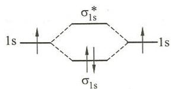

$H_{2}$ 电子排布式: $(\sigma_{1s})^{2}$

键级 $= \frac{1}{2}\times (2 - 0) = 1$

逆磁性

(2) $\mathrm{Li}_{2}$ 分子轨道图

$Li_{2}$ 电子排布式：

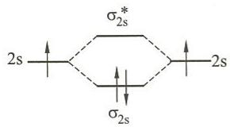

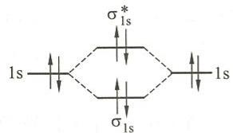

$$
\left(\sigma_ {1 s}\right) ^ {2} \left(\sigma_ {1 s} ^ {*}\right) ^ {2} \left(\sigma_ {2 s}\right) ^ {2}
$$

键级= $\frac{1}{2}\times(2-0)=1$

逆磁性

(3) $\mathrm{B}_{2}$ 分子轨道图

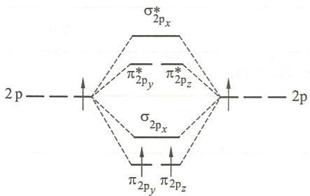

$B_{2}$ 电子排布式：

$$
\mathrm{K} \left(\sigma_ {2 \mathrm{s}}\right) ^ {2} \left(\sigma_ {2 \mathrm{s}} ^ {*}\right) ^ {2} \left(\pi_ {2 \mathrm{p} _ {\mathrm{y}}}\right) ^ {1} \left(\pi_ {2 \mathrm{p} _ {\mathrm{z}}}\right) ^ {1}
$$

键级 $= \frac{1}{2}\times (2 - 0) = 1$

顺磁性

例 6.7 根据分子轨道理论回答下列问题：

(1) N 原子的电离能与 $N_{2}$ 分子的电离能哪一个大些,为什么?

(2) O 原子的电离能与 $O_{2}$ 分子的电离能哪一个大些,为什么?

解：（1）从 $N_{2}$ 的分子轨道图可以看出，N 原子最高能级的电子能量比 $N_{2}$ 分子最高能级的电子能量高，失去时需要的能量少，所以 $N_{2}$ 分子的第一电离能大。

（2）从 $O_{2}$ 的分子轨道图可以看出，O 原子最高能级的电子能量比 $O_{2}$ 分子最高能级的电子能量低，失去时需要的能量多，所以 O 原子的第一电离能大。

例 6.8 试写出 $O_{2}^{2-}, O_{2}^{-}, O_{2}, O_{2}^{+}$ 分子或离子的电子排布式，指出它们的稳定性顺序。
解：电子排布式：

$$
\mathrm{O} _ {2} ^ {2 -} \quad \mathrm{KK} (\sigma_ {2 \mathrm{s}}) ^ {2} (\sigma_ {2 \mathrm{s}} ^ {*}) ^ {2} (\sigma_ {2 \mathrm{p} _ {x}}) ^ {2} (\pi_ {2 \mathrm{p} _ {y}}) ^ {2} (\pi_ {2 \mathrm{p} _ {z}}) ^ {2} (\pi_ {2 \mathrm{p} _ {y}} ^ {*}) ^ {2} (\pi_ {2 \mathrm{p} _ {z}} ^ {*}) ^ {2}
$$

$$
\mathrm{O} _ {2} ^ {-} \quad \mathrm{KK} (\sigma_ {2 \mathrm{s}}) ^ {2} (\sigma_ {2 \mathrm{s}} ^ {*}) ^ {2} (\sigma_ {2 \mathrm{p} _ {x}}) ^ {2} (\pi_ {2 \mathrm{p} _ {y}}) ^ {2} (\pi_ {2 \mathrm{p} _ {z}}) ^ {2} (\pi_ {2 \mathrm{p} _ {y}} ^ {*}) ^ {2} (\pi_ {2 \mathrm{p} _ {z}} ^ {*}) ^ {1}
$$

$$
\mathrm{O} _ {2} \quad \mathrm{KK} (\sigma_ {2 s}) ^ {2} (\sigma_ {2 s} ^ {*}) ^ {2} (\sigma_ {2 p _ {x}}) ^ {2} (\pi_ {2 p _ {y}}) ^ {2} (\pi_ {2 p _ {z}}) ^ {2} (\pi_ {2 p _ {y}} ^ {*}) ^ {1} (\pi_ {2 p _ {z}} ^ {*}) ^ {1}
$$

$$
\mathrm{O} _ {2} ^ {+} \quad \mathrm{KK} (\sigma_ {2 s}) ^ {2} (\sigma_ {2 s} ^ {*}) ^ {2} (\sigma_ {2 p _ {x}}) ^ {2} (\pi_ {2 p _ {y}}) ^ {2} (\pi_ {2 p _ {z}}) ^ {2} (\pi_ {2 p _ {y}} ^ {*}) ^ {1}
$$

通过键级可以比较出稳定性顺序,见下表。

<table><tr><td>分子或离子</td><td> $O_{2}^{2-}$ </td><td> $O_{2}^{-}$ </td><td> $O_{2}$ </td><td> $O_{2}^{+}$ </td></tr><tr><td>键级</td><td>1</td><td>1.5</td><td>2</td><td>2.5</td></tr><tr><td>稳定性</td><td colspan="4"> $O_{2}^{2-} < O_{2}^{-} < O_{2} < O_{2}^{+}$ </td></tr></table>

## 第二部分 习题

## 一、选择题

6.1 中心原子采取 $\mathrm{sp}^2$ 杂化的分子是 (A) $\mathrm{NH}_3$ ； (B) $\mathrm{BCl}_3$ ； (C) $\mathrm{PCl}_3$ ； (D) $\mathrm{H}_2\mathrm{O}$ 。

6.2 下列分子或离子中, 不含有孤电子对的是
(A) $H_{2}O$ ; (B) $H_{3}O^{+}$ ; (C) $NH_{3}$ ; (D) $NH_{4}^{+}$ 。

6.3 下列分子中,中心价层电子对数与配体数不同的是
(A) $CCl_{4}$ ; (B) $CH_{3}OCH_{3}$ ; (C) $BCl_{3}$ ; (D) $PCl_{5}$ 。

6.4 下列分子中,中心原子采取等性杂化的是
(A) $NCl_{3}$ ; (B) $SF_{4}$ ; (C) $CCl_{4}$ ; (D) $H_{2}O$ 。

6.5 下列离子中,中心原子采取不等性杂化的是
(A) $H_{3}O^{+}$ ; (B) $NH_{4}^{+}$ ; (C) $PCl_{6}^{-}$ ; (D) $BF_{4}^{-}$ 。

6.6 下列分子中,不存在离域 $\pi$ 键的是
(A) $O_{3}$ ; (B) $SO_{3}$ ; (C) $HNO_{3}$ ; (D) $HNO_{2}$ 。

6.7 下列分子或离子中,空间构型不为直线形的是
(A) $I_{3}^{+}$ ; (B) $I_{3}^{-}$ ; (C) $CS_{2}$ ; (D) $BeCl_{2}$ 。

6.8 下列分子或离子中, 键角 $\angle ONO$ 最大的是
(A) $NO_{2}^{-}$ ; (B) $NO_{2}$ ; (C) $NO_{2}^{+}$ ; (D) $NO_{3}^{-}$ 。

6.9 下列分子中,含有不同长度共价键的是
(A) $NH_{3}$ ; (B) $SO_{3}$ ; (C) $KI_{3}$ ; (D) $SF_{4}$ 。

6.10 按分子轨道理论， $O_{2}$ 分子中最高能量的电子所处的分子轨道是
(A) $\pi_{2p}$ ; (B) $\pi_{2p}^{*}$ ; (C) $\sigma_{2p}$ ; (D) $\sigma_{2p}^{*}$

6.11 下列分子中,属抗磁性的是
(A) $O_{2}$ ; (B) CO; (C) $B_{2}$ ; (D) NO。

6.12 按分子轨道理论,下列分子或离子中键长最短的是
(A) $NO^{+}$ ; (B) NO; (C) $O_{2}$ ; (D) $O_{2}^{-}$ 。

## 二、填空题

6.13 下列各物质中,是 CO 的等电子体的有 \_\_\_\_。

NO, $O_{2}$ , $N_{2}$ , HF, $CN^{-}$ 。

6.14 下列分子或离子中键角由大到小排列的顺序是 \_\_\_\_。

① $BCl_{3}$ ，② $NH_{3}$ ，③ $H_{2}O$ ，④ $PCl_{4}^{+}$ ，⑤ $HgCl_{2}$ 。

6.15 给出各分子或离子的空间构型和中心原子的杂化方式。 $ICl_{2}^{-}$ \_\_\_\_，\_\_\_\_； $BrF_{3}$ \_\_\_\_，\_\_\_\_； $ICl_{4}^{-}$ \_\_\_\_，\_\_\_\_； $NO_{2}^{+}$ \_\_\_\_，\_\_\_\_。

6.16 给出下列分子或离子的中心原子的杂化方式。

$NCl_{3}$ \_\_\_\_ , $TeCl_{4}$ \_\_\_\_ , $CHCl_{3}$ \_\_\_\_ , $PH_{4}^{+}$ \_\_\_\_ , $PCl_{6}^{-}$ \_\_\_\_ ,

$$
\mathrm{IF} _ {3}
$$

6.17 给出下列分子的 Lewis 结构式： $H_{2}S$ \_\_\_\_ , HClO \_\_\_\_ , HCN \_\_\_\_ , $H_{2}O_{2}$ \_\_\_\_ , $NO^{+}$ \_\_\_\_ , HCHO \_\_\_\_ 。

6.18 下列分子或离子中，键角最大的是\_\_\_\_，键角最小的是\_\_\_\_。 $H_{2}O$ ， $NH_{3}$ ， $BF_{3}$ ， $I_{3}^{-}$ ， $I_{3}^{+}$ 。

6.19 根据分子轨道理论预测,下列分子或离子中最稳定的是\_\_\_\_,最不稳定的是\_\_\_\_。 $O_{2}$ , $O_{2}^{-}$ , $O_{2}^{2-}$ , $O_{2}^{+}$ , $O_{2}^{2+}$ 。

6.20 已知 P—P 键, C—C 键, OH—O 键的键能分别为 $201 \, kJ \cdot mol^{-1}$ , $345.6 \, kJ \cdot mol^{-1}$ , $18.8 \, kJ \cdot mol^{-1}$ , 试粗略估算: $P_{4}(g)$ 的原子化热为 \_\_\_\_ $kJ \cdot mol^{-1}$ , 金刚石的原子化热为 \_\_\_\_ $kJ \cdot mol^{-1}$ , 冰的升华热为 \_\_\_\_ $kJ \cdot mol^{-1}$ 。

## 三、简答题和计算题

6.21 已知 NO(g) 的生成热为 $90.25 \, kJ \cdot mol^{-1}$ , $N_{2}$ 分子中三键的键能为 $941.69 \, kJ \cdot mol^{-1}$ , $O_{2}$ 分子中双键的键能为 $493.59 \, kJ \cdot mol^{-1}$ , 求 NO(g) 中 N—O 键的键能。

6.22 已知 $CO_{2}, NO_{2}^{-}, BF_{3}$ 分别为直线形、V 形和平面三角形构型。试用等电子原理说明下列分子或离子的成键情况和空间构型。 $O_{3}$ ， $NO_{2}^{+}$ ， $NO_{3}^{-}$ ， $N_{3}^{-}$ ， $CO_{3}^{2-}$ 。

6.23 由 $\mathrm{SF}_4$ 能合成许多重要的化合物，如 $\mathrm{SNF}_3$ 和 $\mathrm{CH}_2\mathrm{SF}_4$ 。请画出二者的结构并判断中心原子的杂化方式。

6.24 乙烯 $\left(\mathrm{H}_{2}\mathrm{C}=\mathrm{CH}_{2}\right)$ 分子中，两个C原子之间成双键。试以左C为中心，用价层电子对互斥理论判断其空间构型，并用杂化轨道理论解释其成键情况。

6.25 不同条件下 $BeCl_{2}$ 可以单体、二聚和多聚结构存在，试分别画出其结构，并指出 Be 的杂化方式。

6.26 在 $\mathrm{BCl}_3$ 和 $\mathrm{NCl}_3$ 分子中，中心原子的氧化数和配位数都相同，为什么二者的中心原子采取的杂化方式和分子的空间构型却不同？

6.27 举例说明主族元素形成的 $\mathrm{AB}_3$ 型分子有几种空间构型？指出分子的中心原子A的杂化方式、价层孤电子对数和分子是否有极性。

6.28 用价层电子对互斥理论判断下列稀有气体化合物的空间构型，再用杂化轨道理论说明它

们的成键情况。

$$
\mathrm{XeF} _ {2}, \quad \mathrm{XeF} _ {4}, \quad \mathrm{XeO} _ {3}, \quad \mathrm{XeO} _ {4}.
$$

6.29 实验测得 $BF_{3}$ 分子中，B—F 键的键长为 130 pm，比理论 B—F 单键键长 152 pm 短，试加以解释。

6.30 已知 $NO_{2}, CO_{2}, SO_{2}$ 分子中键角分别为 $132^{\circ}, 180^{\circ}, 120^{\circ}$ ，判断它们的中心原子的杂化方式，说明成键情况。

6.31 CO, $\mathrm{N}_{2}$ 和 $\mathrm{CN}^{-}$ 为等电子体。

(1) 用分子轨道理论说明 $\mathrm{CO}, \mathrm{~N}_{2}$ 和 $\mathrm{CN}^{-}$ 的键能都很大的原因。

(2) 已知 CO 键能 $(1070 \text{ kJ} \cdot \text{mol}^{-1})$ 比 $N_{2}$ 键能 $(942 \text{ kJ} \cdot \text{mol}^{-1})$ 大, 为什么 CO 易被氧化而 $N_{2}$ 却很稳定?

6.32 在下列各对化合物中,哪一种化合物的键角大?说明原因。

(1) $CH_{4}$ 和 $NH_{3}$ ; (2) $OF_{2}$ 和 $Cl_{2}O$ ; (3) $NH_{3}$ 和 $NF_{3}$ ; (4) $PH_{3}$ 和 $NH_{3}$ 。

6.33 用价层电子对互斥理论判断下列分子或离子的空间构型。

$$
\mathrm{BeCl} _ {2}, \mathrm{BCl} _ {3}, \mathrm{NH} _ {4} ^ {+}, \mathrm{H} _ {2} \mathrm{O}, \mathrm{ClF} _ {3}, \mathrm{PCl} _ {5}, \mathrm{I} _ {3} ^ {-}, \mathrm{ICl} _ {4} ^ {-}, \mathrm{ClO} _ {2} ^ {-}, \mathrm{PO} _ {4} ^ {3 -}, \mathrm{CO} _ {2}, \mathrm{SO} _ {2}, \mathrm{NOCl}, \mathrm{POCl} _ {3}
$$

6.34 分别画出下列分子的结构,指出中心原子的杂化方式。
(1) $\mathrm{N}(\mathrm{CH}_{3})_{3}$ ; (2) $\mathrm{F}_{3}\mathrm{B}-\mathrm{N}(\mathrm{CH}_{3})_{3}$ ; (3) $\mathrm{F}_{4}\mathrm{Si}-\mathrm{N}(\mathrm{CH}_{3})_{3}$ 。

第3页：中国出版物，中国的图书书、书、书、书、书、书、书、书、书、书、书、书、书、书、书、书、书、书、书、书、书、书、书、书、书、书、书、书、书、书、书、书、书、书、书、书、书、书、书、书、书、书、书、书、书、书、书、书、书、书、书

## 第一部分 例题

例7.1 判断下列各组分子之间存在什么形式的分子间作用力。

(1) 苯和 $CCl_{4}$ ; (2) 氦和水; (3) $CO_{2}$ 气体;

(4) HBr 气体； (5) 甲醇和水。

解：（1）色散力；

(2) 色散力、诱导力；

(3) 色散力；

(4) 色散力、诱导力、取向力；

(5) 色散力、诱导力、取向力、氢键。

例 7.2 下列化合物中哪些存在氢键？是分子内氢键还是分子间氢键？

(1) $C_{6}H_{6}$ ; (2) $NH_{3}$ ; (3) $C_{2}H_{6}$ ; (4) 邻羟基苯甲醛;

（5）间硝基苯甲醛； （6）对硝基苯甲醛； （7）固体硼酸。

解:(1) 不存在氢键;

(2) 存在分子间氢键；

(3) 不存在氢键；

(4) 存在分子内氢键和分子间氢键；

(5) 不存在氢键；

(6) 不存在氢键；

(7) 存在分子间氢键。

例 7.3 $NF_{3}$ 的偶极矩远小于 $NH_{3}$ 的偶极矩，但前者的元素间电负性差大于后者。如何解释这一矛盾现象？

解： $NF_{3}$ 和 $NH_{3}$ 均为三角锥形分子，分子的总偶极矩是分子内部各种因素产生的分偶极矩的矢量和。

$\mathrm{NF}_3$ 分子中成键电子对偏向电负性大的F原子，N的孤电子对对偶极矩的贡献与键矩对偶极矩的贡献方向相反，即孤电子对的存在削弱了由键矩可能引起的分子偶极矩，故偶极矩较小，如图(a)所示；而 $\mathrm{NH}_3$ 分子中成键电子对偏向电负性大的N原子，即孤电子对对偶极矩的贡献与键矩对偶极矩的贡献方向相同，故 $\mathrm{NH}_3$ 分子有较大的偶极矩，如图(b)所示。

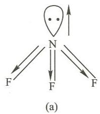

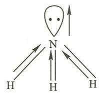  
$NF_{3}$ 和 $NH_{3}$ 键矩和孤电子对偶极矩的矢量

例 7.4 试解释下列各组化合物熔点的高低关系。
(1) NaCl > NaBr; (2) CaO > KCl;
(3) MgO > Al₂O₃; (4) ZnI₂ > CdI₂。

解：前两组化合物均为典型的离子型化合物。离子晶体熔点主要由离子键的键能决定，键能越大，熔点越高。

键能和离子电荷数及半径有关。电荷数多，离子键强。半径大，导致离子间距大，所以键能小；相反，半径小，则键能大。据此可以解释(1)和(2)。

（1）NaCl 和 NaBr 其阳离子均为 $Na^{+}$ ，阴离子电荷数相同而半径为 $r(\mathrm{Cl}^{-}) < r(\mathrm{Br}^{-})$ ，故键能 $E(\mathrm{NaCl}) > E(\mathrm{NaBr})$ ，所以熔点 NaCl > NaBr。

(2) CaO 和 KCl, 其键能的大小主要取决于离子电荷数。CaO 的阴、阳离子电荷数均为 2, 而 KCl 的均为 1, 故 CaO 的键能比 KCl 的大, 所以熔点 CaO > KCl 。

除阴、阳离子电荷数和半径影响键能，从而影响化合物的熔点外，离子极化作用较强时，也可使离子化合物具有较多的共价成分，而使键能有所减小，熔点有所降低。

(3) $\mathrm{MgO}$ 与 $\mathrm{Al}_{2} \mathrm{O}_{3}$ 相比, $\mathrm{Al}^{3+}$ 的电荷数相当高, 半径小, 极化作用很强, 因而使 $\mathrm{Al}_{2} \mathrm{O}_{3}$ 具有较多的共价成分, 离子键的键能有所减小, 所以熔点 $\mathrm{MgO} > \mathrm{Al}_{2} \mathrm{O}_{3}$ 。

（4）对于某些大半径离子，如 $(18+2)$ 电子构型的阳离子，只考虑其对阴离子的极化作用还不够，还要考虑阳离子自身的变形性。半径相当大时，例如 $Cd^{2+}$ 受到 $I^{-}$ 的极化时发生变形，加强了自身对 $I^{-}$ 的极化能力，产生了附加极化作用。相互极化的总结果，使 $CdI_{2}$ 的共价成分大于 $ZnI_{2}$ ，故有熔点 $ZnI_{2}>CdI_{2}$ 。

例 7.5 根据已知的下列数据,由玻恩-哈伯循环计算氯化钡的 $\Delta_{f}H_{m}^{\ominus}$ 。

氯分子的解离能 242.6 kJ·mol $^{-1}$ 钡的原子化热 177.8 kJ·mol $^{-1}$ 钡的第一电离能 520.9 kJ·mol $^{-1}$ 钡的第二电离能 962.3 kJ·mol $^{-1}$ 氯的电子亲和能 348.6 kJ·mol $^{-1}$ 氯化钡的晶格能 2026.7 kJ·mol $^{-1}$

解：玻恩-哈伯循环如图所示。

$$
\begin{array}{r l} \mathrm{Ba(s)} & + \mathrm {Cl_ {2} (g)} \xrightarrow {\Delta_ {\mathrm{f}} H _ {\mathrm{m}} ^ {\ominus}} \mathrm {BaCl_ {2} (s)} \\ \downarrow \Delta H _ {1} & \\ \mathrm{Ba(g)} & + \mathrm {2Cl(g)} \\ \downarrow \Delta H _ {2} & \\ \mathrm {Ba^ {+} (g)} & + \mathrm {2Cl^ {-} (g)} \\ \downarrow \Delta H _ {3} & \\ \mathrm {Ba^ {2 + } (g)} & + \end{array}
$$

根据盖斯定律得

$$
\begin{array}{r l} \Delta_ {\mathrm{f}} H _ {\mathrm{m}} ^ {\ominus} (\mathrm {BaCl_ {2}}, \mathrm{s}) & = \Delta H _ {1} + \Delta H _ {2} + \Delta H _ {3} + \Delta H _ {4} + \Delta H _ {5} + \Delta H _ {6} \\ & = 1 7 7. 8 \mathrm{kJ} \cdot \mathrm{mol} ^ {- 1} + 5 2 0. 9 \mathrm{kJ} \cdot \mathrm{mol} ^ {- 1} + 9 6 2. 3 \mathrm{kJ} \cdot \mathrm{mol} ^ {- 1} + \\ & \quad 2 4 2. 6 \mathrm{kJ} \cdot \mathrm{mol} ^ {- 1} - 3 4 8. 6 \mathrm{kJ} \cdot \mathrm{mol} ^ {- 1} \times 2 - 2 0 2 6. 7 \mathrm{kJ} \cdot \mathrm{mol} ^ {- 1} \\ & = - 8 2 0. 3 \mathrm{kJ} \cdot \mathrm{mol} ^ {- 1} \end{array}
$$

例 7.6 解释下列实验事实：

(1) 二甲醚 $\left(\mathrm{CH}_{3}-\mathrm{O}-\mathrm{CH}_{3}\right)$ 的沸点远低于其同分异构体乙醇 $\left(\mathrm{CH}_{3}\mathrm{CH}_{2}\mathrm{OH}\right)$ ;

(2) HF(s) 的熔点比 HI(s) 的熔点低, 但是 HF(l) 的沸点比 HI(l) 的沸点高;

(3) $AgNO_{3}$ 的热分解温度高于 $\mathrm{Cu(NO_{3})_{2}}$ 。

解：（1）乙醇分子间有氢键，如图所示：

$$
\begin{array}{c} \mathrm{C} _ {2} \mathrm{H} _ {5} - \mathrm{O} - \mathrm{H} - \mathrm{O} - \mathrm{C} _ {2} \mathrm{H} _ {5} \\ | \\ \mathrm{H} \end{array}
$$

因此其分子间作用力远强于无分子间氢键的二甲醚。从液体变成气体的沸腾过程要在较高的温度下进行以克服乙醇分子间的氢键，故乙醇的沸点要高于二甲醚。

（2）尽管固体 HF 之间有大量的氢键存在，但是熔化过程中多数氢键并不被破坏。熔化过程中要克服的主要是色散力、诱导力和取向力等分子间作用力，这些力在大半径分子 HI 之间强于小分子的 HF 之间，故熔点是 HF 低于 HI。

在沸腾过程中，HF 分子间的氢键要大量被破坏，所以其沸点远高于无分子间氢键的 HI。

(3) 半径小且电荷数高的 $Cu^{2+}$ 的反极化能力远高于半径大且电荷数低的 $Ag^{+}$ ，使 $\mathrm{Cu(NO_{3})_{2}}$ 中的 Cu—O 结合更强，导致 N—O 键断裂更加容易，故热分解温度低于 $AgNO_{3}$ 。

例 7.7 试用离子极化理论解释下列各组化合物热分解温度的高低关系。

(1) $\mathrm{CaSO_4 > CdSO_4}$ ; (2) $\mathrm{MnSO_4 > Mn_2(SO_4)_3}$ ; (3) $\mathrm{SrSO_4 > MgSO_4}$ ; (4) $\mathrm{Na_2SO_4 > MgSO_4}$ ; (5) $\mathrm{HNO_3 > HNO_2}$ ; (6) $\mathrm{Na_2CO_3 > NaHCO_3}$ .

解：（1）对于 $CaSO_{4}$ 和 $CdSO_{4}$ ，其阳离子电荷数相同而价电子构型不同， $Ca^{2+}$ 是8电子构型， $Cd^{2+}$ 是18电子构型，极化能力 $Cd^{2+}>Ca^{2+}$ ，所以稳定性 $CaSO_{4}>CdSO_{4}$ ，分解温度 $CaSO_{4}>CdSO_{4}$ 。

（2）对于 $MnSO_{4}$ 和 $\mathrm{Mn}_{2}\left(\mathrm{SO}_{4}\right)_{3}$ ，其阳离子是同种元素，离子电荷数前者为 +2，后者为 +3，极化能力 $Mn^{2+}<Mn^{3+}$ ，所以热稳定性 $\mathrm{MnSO}_{4}>\mathrm{Mn}_{2}\left(\mathrm{SO}_{4}\right)_{3}$ ，分解温度 $MnSO_{4}>$

$\mathrm{Mn_2(SO_4)_3}$

(3) 对于 $\mathrm{SrSO}_4$ 和 $\mathrm{MgSO}_4$ , 其阳离子是同一主族的 +2 价离子, 离子半径 $\mathrm{Sr}^{2+} > \mathrm{Mg}^{2+}$ , 极化能力 $\mathrm{Sr}^{2+} < \mathrm{Mg}^{2+}$ , 所以热稳定性 $\mathrm{SrSO}_4 > \mathrm{MgSO}_4$ , 分解温度 $\mathrm{SrSO}_4 > \mathrm{MgSO}_4$ 。

（4）对于 $Na_{2}SO_{4}$ 和 $MgSO_{4}$ ，其阳离子的电荷数不同。 $Mg^{2+}$ 的电荷数高，极化能力较强，所以 $MgSO_{4}$ 的热稳定性低于 $Na_{2}SO_{4}$ ，分解温度 $Na_{2}SO_{4} > MgSO_{4}$ 。

(5) 对于 $\mathrm{HNO}_{3}$ 和 $\mathrm{HNO}_{2}$ , 其阳离子相同, 对中心的反极化作用相同, 但中心 $\mathrm{N(V)}$ 对 $\mathrm{H}^{+}$ 的反极化作用的抵抗能力强于 $\mathrm{N(III)}$ , 故热稳定性 $\mathrm{HNO}_{3} > \mathrm{HNO}_{2}$ , 分解温度 $\mathrm{HNO}_{3} > \mathrm{HNO}_{2}$ 。

(6) 对于 $\mathrm{Na}_{2} \mathrm{CO}_{3}$ 和 $\mathrm{NaHCO}_{3}, \mathrm{H}^{+}$ 的反极化能力极强, 导致 $\mathrm{NaHCO}_{3}$ 的热稳定性远小于 $\mathrm{Na}_{2} \mathrm{CO}_{3}$ , 故分解温度有 $\mathrm{Na}_{2} \mathrm{CO}_{3} > \mathrm{NaHCO}_{3}$ 。

例 7.8 X 射线衍射法测得金属银的面心立方晶胞的边长为 408.6 pm，每立方厘米银的质量为 10.5 g，已知 Ag 的相对原子质量为 107.87。试据此计算阿伏加德罗常数。

解：正立方体晶胞的边长为 $408.6 \mathrm{pm}$ ，相当于 $408.6 \times 10^{-10} \mathrm{~cm}$ ，故晶胞体积为

$$
(4 0 8. 6 \times 1 0 ^ {- 1 0}) ^ {3} \mathrm{cm} ^ {3} = 6. 8 2 \times 1 0 ^ {- 2 3} \mathrm{cm} ^ {3}
$$

依题意,晶胞质量为

$$
1 0. 5 \mathrm{g} \cdot \mathrm{cm} ^ {- 3} \times 6. 8 2 \times 1 0 ^ {- 2 3} \mathrm{cm} ^ {3} = 7. 1 6 \times 1 0 ^ {- 2 2} \mathrm{g}
$$

立方面心晶胞中 Ag 原子的个数为

$$
\frac {1}{8} \times 8 + \frac {1}{2} \times 6 = 4
$$

故每个 $\mathrm{Ag}$ 原子的质量为

$$
7. 1 6 \times 1 0 ^ {- 2 2} \mathrm{g} \times \frac {1}{4} = 1. 7 9 \times 1 0 ^ {- 2 2} \mathrm{g}
$$

依题设，Ag 的摩尔质量为 $107.87 \, g \cdot mol^{-1}$ ，故阿伏加德罗常数为

$$
N _ {\mathrm{A}} = \frac {1 0 7 . 8 7 \mathrm{g} \cdot \mathrm{mol} ^ {- 1}}{1 . 7 9 \times 1 0 ^ {- 2 2} \mathrm{g}} = 6. 0 3 \times 1 0 ^ {2 3} \mathrm{mol} ^ {- 1}
$$

## 第二部分 习题

## 一、选择题

7.1 下列化合物中含有极性共价键的是
(A) $KClO_{3}$ ; (B) $Na_{2}O_{2}$ ; (C) $Na_{2}O$ ; (D) KI。

7.2 下列化合物中键的极性最弱的是
(A) $FeCl_{3}$ ; (B) $AlCl_{3}$ ; (C) $SiCl_{4}$ ; (D) $PCl_{5}$ 。

7.3 下列化合物中含有非极性共价键的离子化合物是
(A) $H_{2}O_{2}$ ; (B) $Na_{2}CO_{3}$ ; (C) $Na_{2}O_{2}$ ; (D) $KO_{3}$ 。

7.4 下列分子中属于极性分子的是
(A) $CCl_{4}$ ; (B) $CH_{3}OCH_{3}$ ; (C) $BCl_{3}$ ; (D) $PCl_{5}$ 。

7.5 下列物质熔点变化顺序中正确的一组是
(A) BaO>MgO>ZnI₂>CdI₂; (B) MgO>BaO>CdI₂>ZnI₂;
(C) MgO>BaO>ZnI₂>CdI₂; (D) BaO>MgO>ZnI₂>CdI₂。

7.6 熔融 $\mathrm{SiO}_2$ 晶体时，需要克服的作用力主要是（A）离子键； （B）氢键； （C）共价键； （D）范德华力。

7.7 对于下列化合物在水中的溶解度,判断中正确的是
(A) AgF>HF; (B) CaF₂>CaCl₂;
(C) HgCl₂>HgI₂; (D) LiF>NaCl。

7.8 下列离子中变形性最大的是
(A) $O^{2-}$ ; (B) $S^{2-}$ ; (C) $F^{-}$ ; (D) $Cl^{-}$ 。

7.9 下列化合物中在水中溶解度最大的是
(A) $NH_{3}$ ; (B) HCl; (C) HF; (D) $H_{2}S$ 。

7.10 下列化合物中颜色最深的是
(A) $HgCl_{2}$ ; (B) $Hg_{2}Cl_{2}$ ; (C) $HgBr_{2}$ ; (D) $HgI_{2}$ 。

## 二、填空题

7.11 比较大小。

(1) 晶格能: $AlF_{3}$ \_\_\_\_ $AlCl_{3}$ , NaCl \_\_\_\_ KCl;

(2) 溶解度: $CuF_{2}$ \_\_\_\_ $CuCl_{2}$ , $Ca(HCO_{3})_{2}$ \_\_\_\_ $NaHCO_{3}$ .

7.12 给出晶胞中离子总数:立方 ZnS\_\_\_\_;NaCl\_\_\_\_;CsCl\_\_\_\_。

7.13 已知 $Cd^{2+}$ 半径为 97 pm, $S^{2-}$ 半径为 184 pm, 按正、负离子半径比, CdS 应具有 \_\_\_\_ 型晶格, 正、负离子的配位数之比应是 \_\_\_\_; 但 CdS 却具有立方 ZnS 型晶格, 正、负离子的配位数之比是 \_\_\_\_ , 这主要是由 \_\_\_\_ 造成的。

7.14 比较各对化合物沸点高低(用>或<表示),并简要说明原因。
NaCl\_\_\_\_MgCl₂, AgCl\_\_\_\_KCl, NH₃\_\_\_\_PH₃,
CO₂\_\_\_\_SO₂, O₃\_\_\_\_SO₂, O₃\_\_\_\_O₂,
Ne\_\_\_\_Ar, HF\_\_\_\_H₂O, HF\_\_\_\_NH₃,
H₂S\_\_\_\_HCl, HF\_\_\_\_HI。

7.15 比较下列各对化合物中键的极性大小(用>或<表示)
PbO\_\_\_\_PbS, FeCl₃\_\_\_\_FeCl₂, SnS\_\_\_\_SnS₂,
AsH₃\_\_\_\_SeH₂, PH₃\_\_\_\_H₂S, HF\_\_\_\_H₂O。

7.16 下列分子或离子中,能形成分子内氢键的有\_\_\_\_;不能形成分子间氢键的有\_\_\_\_。

① $NH_{3}$ , ② $H_{2}O$ , ③ $HNO_{3}$ , ④ $HF_{2}^{-}$ , ⑤ $NH_{4}^{+}$ , ⑥

7.17 将 $Na_{2}CO_{3}$ , $MgCO_{3}$ , $K_{2}CO_{3}$ , $MnCO_{3}$ , $PbCO_{3}$ . 按热稳定性由高到低排列, 顺序为 \_\_\_\_。

7.18 将 $\mathrm{KCl}, \mathrm{CaCl}_2, \mathrm{MnCl}_2, \mathrm{ZnCl}_2$ 按阳离子极化能力由强至弱排列，顺序为

。

7.19 比较下列各对分子偶极矩的大小(用＞, = 或＜表示)。

$\mathrm{CO}_{2}$ \_\_\_\_ $\mathrm{SO}_{2},\mathrm{CCl}_{4}$ \_\_\_\_ $\mathrm{CH}_{4},\mathrm{PH}_{3}$ \_\_\_\_ $\mathrm{NH}_{3},\mathrm{BF}_{3}$ \_\_\_\_ $\mathrm{NF}_{3}$ ,

$$
\mathrm{NH} _ {3}
$$

$$
\mathrm{NF} _ {3}, \mathrm{CH} _ {3} \mathrm{OCH} _ {3}
$$

$$
\mathrm{C} _ {6} \mathrm{H} _ {6}
$$

7.20 在金属晶体中最常见的三种堆积方式有:(1)配位数为8的\_\_\_\_堆积,(2)配位数为\_\_\_\_的面心立方堆积,(3)配位数为\_\_\_\_的\_\_\_\_堆积。其中\_\_\_\_和\_\_\_\_空间利用率相等,\_\_\_\_以ABAB方式堆积,\_\_\_\_以ABCABC方式堆积,就金属原子的堆积层来看,二者的区别是在第\_\_\_\_层。

7.21 金属 Cu 为面心立方结构, 晶胞参数为 $a = 361.4 \mathrm{pm}$ , 金属原子配位数为 \_\_\_\_, 晶胞中原子数为 \_\_\_\_, 金属 Cu 原子半径为 \_\_\_\_ pm, 晶胞密度 \_\_\_\_ $\mathrm{g} \cdot \mathrm{cm}^{-3}$ , Cu 的空间占有率是 \_\_\_\_ 。已知 $A_{\mathrm{r}}(\mathrm{Cu}) = 63.54$ 。

7.22 金属钾晶体为体心立方结构,则在单位晶胞中钾原子的个数是\_\_\_\_,已知金属钾的密度为 $0.862 \mathrm{~g} \cdot \mathrm{cm}^{-3}$ ,则钾原子半径为 \_\_\_\_ pm。

## 三、简答题和计算题

7.23 根据下列已知数据,由玻恩-哈伯循环计算 $Al_{2}O_{3}$ 的晶格能。

$$
\begin{array}{r l r} \Delta_ {\mathrm{f}} H _ {\mathrm{m}} ^ {\ominus} (\mathrm{Al} _ {2} \mathrm{O} _ {3}, \mathrm{s}) & = - 1 6 7 6 \mathrm{kJ} \cdot \mathrm{mol} ^ {- 1} \\ \mathrm{Al(s)} & = \mathrm{Al(g)} & \Delta H = 3 2 6. 4 \mathrm{kJ} \cdot \mathrm{mol} ^ {- 1} \\ \mathrm{Al(g)} & = \mathrm{Al} ^ {+} (\mathrm{g}) + \mathrm{e} ^ {-} & I _ {1} = 5 7 8 \mathrm{kJ} \cdot \mathrm{mol} ^ {- 1} \\ \mathrm{Al} ^ {+} (\mathrm{g}) & = \mathrm{Al} ^ {2 +} (\mathrm{g}) + \mathrm{e} ^ {-} & I _ {2} = 1 8 1 7 \mathrm{kJ} \cdot \mathrm{mol} ^ {- 1} \\ \mathrm{Al} ^ {2 +} (\mathrm{g}) & = \mathrm{Al} ^ {3 +} (\mathrm{g}) + \mathrm{e} ^ {-} & I _ {3} = 2 7 4 5 \mathrm{kJ} \cdot \mathrm{mol} ^ {- 1} \\ \mathrm{O} _ {2} (\mathrm{g}) & = 2 \mathrm{O(g)} & E = 4 9 8 \mathrm{kJ} \cdot \mathrm{mol} ^ {- 1} \\ \mathrm{O(g)} + \mathrm{e} ^ {-} & = \mathrm{O} ^ {-} (\mathrm{g}) & E _ {1} = 1 4 1 \mathrm{kJ} \cdot \mathrm{mol} ^ {- 1} \\ \mathrm{O} ^ {-} (\mathrm{g}) + \mathrm{e} ^ {-} & = \mathrm{O} ^ {2 -} (\mathrm{g}) & E _ {2} = - 7 8 0 \mathrm{kJ} \cdot \mathrm{mol} ^ {- 1} \end{array}
$$

7.24 已知 NaF 中键的离子性比 CsF 小, 但 NaF 的晶格能却比 CsF 大。请解释原因。

7.25 指出下列物质在晶体中质点间的作用力、晶体类型及熔点高低。
(1) KCl; (2) SiC; (3) $CH_{3}Cl$ ; (4) $NH_{3}$ ; (5) Cu; (6) Xe。

7.26 计算金属面心立方最紧密堆积和体心立方紧密堆积的空间利用率。

7.27 已知 KF 晶体具有 NaCl 型结构，在 $20^{\circ}C$ 时测出 KF 晶体密度为 $2.481 \, g \cdot cm^{-3}$ ，试计算 KF 晶胞的边长及在晶胞中相邻的 $K^{+}$ 和 $F^{-}$ 间的距离。已知 $A_{\mathrm{r}}(\mathrm{K}) = 39.10, A_{\mathrm{r}}(\mathrm{F}) = 19.00$ 。

7.28 HF 分子间氢键比 $H_{2}O$ 分子间氢键更强些,为什么 HF 的沸点及汽化热均比 $H_{2}O$ 的低?

7.29 C 和 O 的电负性差较大, CO 分子极性却较弱, 请说明原因。

7.30 为什么由不同种元素的原子形成的 $\mathrm{PCl}_5$ 分子为非极性分子，而由同种元素的原子形成的 $\mathrm{O}_3$ 分子却是极性分子？

7.31 请指出下列分子中哪些是极性分子,哪些是非极性分子? $NO_{2}$ , $CHCl_{3}$ , $NCl_{3}$ , $SO_{3}$ , $SCl_{2}$ , $COCl_{2}$ , $BCl_{3}$ .

7.32 解释下列现象：

(1) 金属铜可以压片或抽丝, 而大理石却不能;

(2) 根据离子半径比, AgI 晶体中正、负离子的配位数应为 6, 但实测却为 4;

(3) I A 族元素单质与ⅦA族元素单质的熔点变化规律恰好相反。

7.33 判断下列各组分子之间存在何种形式的分子间作用力。
(1) $CS_{2}$ 与 $CCl_{4}$ ; (2) $H_{2}O$ 与 $H_{2}$ ; (3) $CH_{3}Cl$ ; (4) $H_{2}O$ 与 $NH_{3}$ 。

7.34 解释下列实验事实。
(1) 沸点 HF > HI > HCl, $BiH_{3} > NH_{3} > PH_{3}$ ; (2) 熔点 BeO > LiF;
(3) $SiCl_{4}$ 比 $CCl_{4}$ 易水解； (4) 金刚石比石墨硬度大。

7.35 C 和 Si 在同一族, 为什么 $\mathrm{CO}_{2}$ 形成分子晶体而 $\mathrm{SiO}_{2}$ 却形成原子晶体?

7.36 元素 Si 和 Sn 的电负性相差不大,为什么常温下 $SiF_{4}$ 为气态而 $SnF_{4}$ 却为固态?

7.37 试比较如下同组化合物中阳离子的极化能力大小。
(1) $ZnCl_{2}$ , $FeCl_{2}$ , $CaCl_{2}$ , KCl;
(2) $SiCl_{4}$ , $AlCl_{3}$ , $PCl_{5}$ , $MgCl_{2}$ , NaCl。

7.38 试用离子极化理论排出下列各组化合物的熔点及溶解度由大到小的顺序。
(1) $BeCl_{2}$ , $CaCl_{2}$ , $HgCl_{2}$ ; (2) CaS, FeS, HgS; (3) LiCl, KCl, CuCl。

7.39 常温下 $\mathrm{PF}_5$ 和 $\mathrm{N}_2\mathrm{O}_4$ 为气态，而 $\mathrm{PCl}_5, \mathrm{PBr}_5$ 和 $\mathrm{N}_2\mathrm{O}_5$ 为固态（熔体均能导电）。测得 $\mathrm{PCl}_5$ 和 $\mathrm{N}_2\mathrm{O}_5$ 中心与配体间均有两种键长， $\mathrm{PBr}_5$ 只存在一种 $\mathrm{P}-\mathrm{Br}$ 键长。试予以解释。

7.40 试用离子极化理论解释 AgF 易溶于水，而 AgCl, AgBr, AgI 难溶于水，且由 AgF 到 AgBr 再到 AgI 溶解度依次减小的原因。

7.41 证明在立方晶系 AB 型离子晶体配位数为 4 和配位数为 8 的介稳状态中， $\frac{r_{+}}{r_{-}}$ 分别为 0.225 和 0.732。

## 酸碱解离平衡

## 第一部分 例题

例 8.1 已知氨水的 $K_{b}^{\ominus}=1.8\times10^{-5}$ ，现有 $1.0\ dm^{3}\ 0.10\ mol\cdot dm^{-3}$ 氨水，求：

(1) 氨水的 $c(\mathrm{H}^{+})$ ;

(2) 加入 $10.7 \, g \, NH_{4}Cl$ 后溶液的 $c(\mathrm{H}^{+})$ ，假设加入 $NH_{4}Cl$ 后溶液体积的变化可以忽略不计；

(3) 加入 $NH_{4}Cl$ 后氨水的解离度缩小的倍数。

解：(1) $\mathrm{NH_3\cdot H_2O}\rightleftharpoons \mathrm{NH_4^+ + OH^-}$ $c_{0} / (\mathrm{mol}\cdot \mathrm{dm}^{-3})$ 0.10 0 0 $c_{\text{平}} / (\mathrm{mol}\cdot \mathrm{dm}^{-3})$ $0.10 - x\approx 0.10$ $x$ $x$

x 为解离完全的 $NH_{3} \cdot H_{2}O$ 的浓度。

解得

$$
\begin{array}{r l} K _ {\mathrm{b}} ^ {\ominus} = & \frac {c (\mathrm{NH} _ {4} ^ {+}) c (\mathrm{OH} ^ {-})}{c (\mathrm{NH} _ {3} \cdot \mathrm{H} _ {2} \mathrm{O})} = \frac {x ^ {2}}{0 . 1 0} = 1. 8 \times 1 0 ^ {- 5} \\ & x = 1. 3 4 \times 1 0 ^ {- 3} \end{array}
$$

即

$$
c (\mathrm{OH} ^ {-}) = 1. 3 4 \times 1 0 ^ {- 3} \mathrm{mol} \cdot \mathrm{dm} ^ {- 3}
$$

$$
\begin{array}{r l} c (\mathrm{H} ^ {+}) & = \frac {K _ {\mathrm{w}} ^ {\ominus}}{c (\mathrm{OH} ^ {-})} \\ & = \frac {1 . 0 \times 1 0 ^ {- 1 4}}{1 . 3 4 \times 1 0 ^ {- 3}} \mathrm{mol} \cdot \mathrm{dm} ^ {- 3} \\ & = 7. 4 6 \times 1 0 ^ {- 1 2} \mathrm{mol} \cdot \mathrm{dm} ^ {- 3} \end{array}
$$

解离度

(2)

$$
\alpha_{1} = \frac{1.34\times 10^{-3}\mathrm{mol}\bullet\mathrm{dm}^{-3}}{0.10\mathrm{mol}\bullet\mathrm{dm}^{-3}}\times 100\% = 1.34\%
$$

$$
n (\mathrm{NH} _ {4} \mathrm{Cl}) = \frac {1 0 . 7 \mathrm{g}}{5 3 . 5 \mathrm{g} \cdot \mathrm{mol} ^ {- 1}} = 0. 2 0 \mathrm{mol}
$$

$NH_{4}Cl$ 完全解离后， $c(NH_{4}^{+})=0.20\ mol\cdot dm^{-3}$ 。

$$
\mathrm{NH} _ {3} \cdot \mathrm{H} _ {2} \mathrm{O} \rightleftharpoons \mathrm{NH} _ {4} ^ {+} + \mathrm{OH} ^ {-}
$$

$c_{平}/(mol\cdot dm^{-3})$

解得

即

解离度

$$
\begin{aligned} K_{\mathrm{b}}^{\ominus} & = \frac {c(\mathrm{NH}_{4}^{+})c(\mathrm{OH}^{-})}{c(\mathrm{NH}_{3}\bullet\mathrm{H}_{2}\mathrm{O})} = \frac {0.20y}{0.10} = 1.8\times 10^{-5}\\ & y = 9.00\times 10^{-6}\\ & c(\mathrm{OH}^{-}) = 9.00\times 10^{-6}\mathrm{mol}\bullet \mathrm{dm}^{-3}\\ & c(\mathrm{H}^{+}) = 1.11\times 10^{-9}\mathrm{mol}\bullet \mathrm{dm}^{-3}\\ & \alpha_{2} = \frac {9.00\times 10^{-6}\mathrm{mol}\bullet \mathrm{dm}^{-3}}{0.10\mathrm{mol}\bullet \mathrm{dm}^{-3}}\times 100\% \\ & = (9.00\times 10^{-3})\%\\ & \frac {\alpha_{1}}{\alpha_{2}} -1 = \frac {1.34\%}{(9.00\times 10^{-3})\%} -1 = 148 \end{aligned}
$$

(3)

例 8.2 向 $0.10 \, mol \cdot dm^{-3}$ 草酸溶液中滴加 NaOH 溶液至 pH = 6.00，求溶液中 $H_{2}C_{2}O_{4}$ ， $HC_{2}O_{4}^{-}$ 和 $C_{2}O_{4}^{2-}$ 的浓度。已知 $H_{2}C_{2}O_{4}$ 的 $K_{a_{1}}^{\ominus} = 5.4 \times 10^{-2}$ ， $K_{a_{2}}^{\ominus} = 5.4 \times 10^{-5}$ 。

解：第一步解离

$$
\mathrm{H} _ {2} \mathrm{C} _ {2} \mathrm{O} _ {4} \rightleftharpoons \mathrm{HC} _ {2} \mathrm{O} _ {4} ^ {-} + \mathrm{H} ^ {+}
$$

$$
K _ {\mathrm{a} _ {1}} ^ {\ominus} = \frac {c (\mathrm{HC} _ {2} \mathrm{O} _ {4} ^ {-}) c (\mathrm{H} ^ {+})}{c (\mathrm{H} _ {2} \mathrm{C} _ {2} \mathrm{O} _ {4})}
$$

得

$$
\frac {c (\mathrm{HC} _ {2} \mathrm{O} _ {4} ^ {-})}{c (\mathrm{H} _ {2} \mathrm{C} _ {2} \mathrm{O} _ {4})} = \frac {K _ {\mathrm{a} _ {1}} ^ {\ominus}}{c (\mathrm{H} ^ {+})} = \frac {5 . 4 \times 1 0 ^ {- 2}}{1 . 0 \times 1 0 ^ {- 6}} = 5. 4 \times 1 0 ^ {4}
$$

第二步解离

$$
\mathrm{HC} _ {2} \mathrm{O} _ {4} ^ {-} \rightleftharpoons \mathrm{H} ^ {+} + \mathrm{C} _ {2} \mathrm{O} _ {4} ^ {2 -}
$$

$$
K _ {\mathrm{a} _ {2}} ^ {\ominus} = \frac {c (\mathrm{C} _ {2} \mathrm{O} _ {4} ^ {2 -}) c (\mathrm{H} ^ {+})}{c (\mathrm{HC} _ {2} \mathrm{O} _ {4} ^ {-})}
$$

得

$$
\frac {c (\mathrm{C} _ {2} \mathrm{O} _ {4} ^ {2 -})}{c (\mathrm{HC} _ {2} \mathrm{O} _ {4} ^ {-})} = \frac {K _ {\mathrm{a} _ {2}} ^ {\ominus}}{c (\mathrm{H} ^ {+})} = \frac {5 . 4 \times 1 0 ^ {- 5}}{1 . 0 \times 1 0 ^ {- 6}} = 5 4
$$

所以

$$
c (\mathrm{C} _ {2} \mathrm{O} _ {4} ^ {2 -}) = 5 4 c (\mathrm{HC} _ {2} \mathrm{O} _ {4} ^ {-})
$$

$$
c (\mathrm{HC} _ {2} \mathrm{O} _ {4} ^ {-}) = 5. 4 \times 1 0 ^ {4} c (\mathrm{H} _ {2} \mathrm{C} _ {2} \mathrm{O} _ {4})
$$

由以上二式得

$$
c (\mathrm{C} _ {2} \mathrm{O} _ {4} ^ {2 -}) = 2. 9 \times 1 0 ^ {6} c (\mathrm{H} _ {2} \mathrm{C} _ {2} \mathrm{O} _ {4})
$$

体系中草酸的起始总浓度为 $0.10 \, mol \cdot dm^{-3}$ ，以三种形式分配在平衡体系中，故

即

解得

$$
\begin{array}{r l} & c (\mathrm{H} _ {2} \mathrm{C} _ {2} \mathrm{O} _ {4}) + c (\mathrm{HC} _ {2} \mathrm{O} _ {4} ^ {-}) + c (\mathrm{C} _ {2} \mathrm{O} _ {4} ^ {2 -}) = 0. 1 0 \mathrm{mol} \cdot \mathrm{dm} ^ {- 3} \\ & c (\mathrm{H} _ {2} \mathrm{C} _ {2} \mathrm{O} _ {4}) + 5. 4 \times 1 0 ^ {4} c (\mathrm{H} _ {2} \mathrm{C} _ {2} \mathrm{O} _ {4}) + 2. 9 \times 1 0 ^ {6} c (\mathrm{H} _ {2} \mathrm{C} _ {2} \mathrm{O} _ {4}) = 0. 1 0 \mathrm{mol} \cdot \mathrm{dm} ^ {- 3} \\ & c (\mathrm{H} _ {2} \mathrm{C} _ {2} \mathrm{O} _ {4}) = 3. 4 \times 1 0 ^ {- 8} \mathrm{mol} \cdot \mathrm{dm} ^ {- 3} \\ & c (\mathrm{HC} _ {2} \mathrm{O} _ {4} ^ {-}) = 3. 4 \times 1 0 ^ {- 8} \mathrm{mol} \cdot \mathrm{dm} ^ {- 3} \times 5. 4 \times 1 0 ^ {4} = 1. 8 \times 1 0 ^ {- 3} \mathrm{mol} \cdot \mathrm{dm} ^ {- 3} \\ & c (\mathrm{C} _ {2} \mathrm{O} _ {4} ^ {2 -}) = 3. 4 \times 1 0 ^ {- 8} \mathrm{mol} \cdot \mathrm{dm} ^ {- 3} \times 2. 9 \times 1 0 ^ {6} = 0. 0 9 9 \mathrm{mol} \cdot \mathrm{dm} ^ {- 3} \end{array}
$$

例8.3 三元酸砷酸 $\mathrm{H}_3\mathrm{AsO}_4$ 的解离平衡常数 $K_{\mathrm{a}_1}^{\ominus} = 5.5\times 10^{-3}, K_{\mathrm{a}_2}^{\ominus} = 1.7\times 10^{-7}, K_{\mathrm{a}_3}^{\ominus} = 5.1\times 10^{-12}$ ，试求多大起始浓度的 $\mathrm{H}_3\mathrm{AsO}_4$ 可使 $c(\mathrm{AsO}_4^{3-}) = 4.0\times 10^{-17}\mathrm{mol}\cdot \mathrm{dm}^{-3}$ ?

解：由 $\mathrm{H}_3\mathrm{AsO}_4\rightleftharpoons 3\mathrm{H}^+ +\mathrm{AsO}_4^{3 - }$ 得

$$
K _ {\mathrm{a} _ {1}} ^ {\ominus} K _ {\mathrm{a} _ {2}} ^ {\ominus} K _ {\mathrm{a} _ {3}} ^ {\ominus} = \frac {[ c (\mathrm{H} ^ {+}) ] ^ {3} c (\mathrm{AsO} _ {4} ^ {3 -})}{c (\mathrm{H} _ {3} \mathrm{AsO} _ {4})}\tag{1}
$$

因为 $K_{\mathrm{a}_2}^{\ominus} \ll K_{\mathrm{a}_1}^{\ominus}$ , 故体系的 $c(\mathrm{H}^{+})$ 由第一步解离决定:

$$
\mathrm{H} _ {3} \mathrm{AsO} _ {4} \rightleftharpoons \mathrm{H} ^ {+} + \mathrm{H} _ {2} \mathrm{AsO} _ {4} ^ {-}
$$

$$
K _ {\mathrm{a} _ {1}} ^ {\ominus} = \frac {c (\mathrm{H} ^ {+}) c (\mathrm{H} _ {2} \mathrm{AsO} _ {4} ^ {-})}{c (\mathrm{H} _ {3} \mathrm{AsO} _ {4})}
$$

即

$$
K _ {\mathrm{a} _ {1}} ^ {\ominus} = \frac {[ c (\mathrm{H} ^ {+}) ] ^ {2}}{c (\mathrm{H} _ {3} \mathrm{AsO} _ {4})}\tag{2}
$$

将式(2)代入式(1)中,得

$$
K _ {\mathrm{a} _ {2}} ^ {\ominus} K _ {\mathrm{a} _ {3}} ^ {\ominus} = c (\mathrm{H} ^ {+}) c (\mathrm{AsO} _ {4} ^ {3 -})
$$

故

$$
\begin{array}{r l} c (\mathrm{H} ^ {+}) & = \frac {K _ {\mathrm{a} _ {2}} ^ {\ominus} K _ {\mathrm{a} _ {3}} ^ {\ominus}}{c (\mathrm{AsO} _ {4} ^ {3 -})} \\ & = \frac {1 . 7 \times 1 0 ^ {- 7} \times 5 . 1 \times 1 0 ^ {- 1 2}}{4 . 0 \times 1 0 ^ {- 1 7}} \mathrm{mol} \cdot \mathrm{dm} ^ {- 3} \\ & = 2. 1 7 \times 1 0 ^ {- 2} \mathrm{mol} \cdot \mathrm{dm} ^ {- 3} \end{array}
$$

将其代入式(2)中,得

$$
K _ {\mathrm{a} _ {1}} ^ {\ominus} = \frac {(2 . 1 7 \times 1 0 ^ {- 2}) ^ {2}}{c (\mathrm{H} _ {3} \mathrm{AsO} _ {4})}
$$

所以

$$
\begin{array}{r l} c (\mathrm {H_ {3} AsO_ {4}}) & = \frac {(2 . 1 7 \times 1 0 ^ {- 2}) ^ {2}}{K _ {\mathrm{a} _ {1}} ^ {\ominus}} \\ & = \frac {(2 . 1 7 \times 1 0 ^ {- 2}) ^ {2}}{5 . 5 \times 1 0 ^ {- 3}} \mathrm{mol} \cdot \mathrm{dm} ^ {- 3} \\ & = 0. 0 8 6 \mathrm{mol} \cdot \mathrm{dm} ^ {- 3} \end{array}
$$

$H_{3}AsO_{4}$ 的起始浓度为平衡浓度 $c(\mathrm{H}_{3}\mathrm{AsO}_{4})$ 与 $c(\mathrm{H}^{+})$ 之和，即为

$$
0. 0 8 6 \mathrm{mol} \cdot \mathrm{dm} ^ {- 3} + 2. 1 7 \times 1 0 ^ {- 2} \mathrm{mol} \cdot \mathrm{dm} ^ {- 3} = 0. 1 1 \mathrm{mol} \cdot \mathrm{dm} ^ {- 3}
$$

例 8.4 将 $0.10 \, mol \cdot dm^{-3} HAc$ 溶液和 $0.10 \, mol \cdot dm^{-3} HCN$ 溶液等体积混合，试计算此溶液的 $c(\mathrm{H}^{+})$ ， $c(\mathrm{Ac}^{-})$ 和 $c(\mathrm{CN}^{-})$ 。已知 HAc 的 $K_{a}^{\ominus} = 1.8 \times 10^{-5}$ ，HCN 的 $K_{a}^{\ominus} = 6.2 \times 10^{-10}$ 。

解：两种酸溶液混合，其中 $K_{\mathrm{a}}^{\ominus}(\mathrm{HAc}) \gg K_{\mathrm{a}}^{\ominus}(\mathrm{HCN})$ ，所以体系中 $c(\mathrm{H}^{+})$ 完全由 HAc 的解离来决定。等体积混合后，两种酸溶液的浓度均为 $0.050 \, mol \cdot dm^{-3}$ 。

$$
\begin{array}{r l r}&&{\mathrm{HAc} \rightleftharpoons \mathrm{H} ^ {+} + \mathrm{Ac} ^ {-}}\\&&{c _ {0} / (\mathrm{mol} \bullet \mathrm{dm} ^ {- 3}) \qquad 0. 0 5 0 \qquad 0 \qquad 0}\\&&{c _ {\text {平}} / (\mathrm{mol} \bullet \mathrm{dm} ^ {- 3}) \qquad 0. 0 5 0 - x \qquad x \qquad x}\end{array}
$$

$x \mathrm{~mol} \cdot \mathrm{dm}^{-3}$ 为已解离的 HAc 的浓度。

$\frac{c_{0}}{K_{a}^{\ominus}}>400$ , 近似有 $0.050-x\approx0.050$ , 则

$$
K _ {\mathrm{a}} ^ {\ominus} (\mathrm{HAc}) = \frac {c (\mathrm{H} ^ {+}) c (\mathrm{Ac} ^ {-})}{c (\mathrm{HAc})}
$$

$$
= \frac {x ^ {2}}{0 . 0 5 0} = 1. 8 \times 1 0 ^ {- 5}
$$

解得

即溶液中

$$
x = 9. 5 \times 1 0 ^ {- 4}
$$

$$
c (\mathrm{H} ^ {+}) = 9. 5 \times 1 0 ^ {- 4} \mathrm{mol} \cdot \mathrm{dm} ^ {- 3}
$$

$$
c (\mathrm{Ac} ^ {-}) = 9. 5 \times 1 0 ^ {- 4} \mathrm{mol} \cdot \mathrm{dm} ^ {- 3}
$$

$$
\mathrm{HCN} \rightleftharpoons \mathrm{H} ^ {+} + \mathrm{CN} ^ {-}
$$

$$
0. 0 5 0 \quad 9. 5 \times 1 0 ^ {- 4}
$$

$$
K _ {\mathrm{a}} ^ {\ominus} (\mathrm{HCN}) = \frac {c (\mathrm{H} ^ {+}) c (\mathrm{CN} ^ {-})}{c (\mathrm{HCN})}
$$

$$
\begin{array}{r l} c (\mathrm {CN^ {-}}) & = \frac {K _ {\mathrm{a}} ^ {\ominus} (\mathrm{HCN}) c (\mathrm{HCN})}{c (\mathrm {H^ {+}})} \\ & = \frac {6 . 2 \times 1 0 ^ {- 1 0} \times 0 . 0 5 0}{9 . 5 \times 1 0 ^ {- 4}} \mathrm{mol} \cdot \mathrm{dm} ^ {- 3} \\ & = 3. 3 \times 1 0 ^ {- 8} \mathrm{mol} \cdot \mathrm{dm} ^ {- 3} \end{array}
$$

即溶液中 $c(\mathrm{CN}^{-})=3.3\times10^{-8}\ \mathrm{mol}\cdot\mathrm{dm}^{-3}$

例 8.5 拟配制 $1 \, dm^{3} \, pH$ 为 5 的 HAc—NaAc 缓冲溶液，为保证缓冲容量，要求 HAc 及其共轭碱的浓度之和为 $2 \, mol \cdot dm^{-3}$ 。计算需要 $17 \, mol \cdot dm^{-3}$ 冰醋酸和 $6 \, mol \cdot dm^{-3}$ NaOH 溶液各多少，需加水多少。已知 HAc 的 $K_{a}^{\ominus} = 1.8 \times 10^{-5}$ 。

解：缓冲溶液中 HAc 的解离平衡为

$$
\mathrm{HAc} \rightleftharpoons \mathrm{H} ^ {+} + \mathrm{Ac} ^ {-}
$$

$$
K _ {\mathrm{a}} ^ {\ominus} = \frac {c (\mathrm{H} ^ {+}) c (\mathrm{Ac} ^ {-})}{c (\mathrm{HAc})}
$$

故

$$
\frac {c (\mathrm{Ac} ^ {-})}{c (\mathrm{HAc})} = \frac {K _ {\mathrm{a}} ^ {\ominus}}{c (\mathrm{H} ^ {+})}
$$

因为 pH=5，所以 $c(H^{+})=1.0\times10^{-5}\ \mathrm{mol}\cdot\mathrm{dm}^{-3}$ ，故有

$$
\frac {c (\mathrm{Ac} ^ {-})}{c (\mathrm{HAc})} = \frac {1 . 8 \times 1 0 ^ {- 5}}{1 . 0 \times 1 0 ^ {- 5}} = 1. 8\tag{1}
$$

缓冲体系中的 $Ac^{-}$ ，是由下面反应得来：

$$
\mathrm{HAc} + \mathrm{NaOH} = \mathrm{NaAc} + \mathrm{H} _ {2} \mathrm{O}
$$

加入的 NaOH 的量, 在溶液中体现为 $Ac^{-}$ 的量。依题意有

$$
c (\mathrm{Ac} ^ {-}) + c (\mathrm{HAc}) = 2 \mathrm{mol} \cdot \mathrm{dm} ^ {- 3}\tag{2}
$$

式(1)和式(2)联立,解得 $c(\mathrm{HAc})=0.7\ \mathrm{mol}\cdot\mathrm{dm}^{-3},c(\mathrm{Ac}^{-})=1.3\ \mathrm{mol}\cdot\mathrm{dm}^{-3}$ 。因此在缓冲溶液中,有

$$
n (\mathrm{Ac} ^ {-}) = 1. 3 \mathrm{mol} \cdot \mathrm{dm} ^ {- 3} \times 1 \mathrm{dm} ^ {3} = 1. 3 \mathrm{mol}
$$

需加入 $\mathrm{NaOH}$ 溶液的体积为

$$
\frac {1 . 3 \mathrm{mol}}{6 \mathrm{mol} \cdot \mathrm{dm} ^ {- 3}} = 0. 2 2 \mathrm{dm} ^ {3}
$$

平衡的 HAc 和生成 $Ac^{-}$ 时与 $OH^{-}$ 作用掉的 HAc 共 2 mol, 因此需冰醋酸的体积为

$$
\frac {2 \mathrm{mol}}{1 7 \mathrm{mol} \cdot \mathrm{dm} ^ {- 3}} = 0. 1 2 \mathrm{dm} ^ {3}
$$

缓冲溶液的总体积,按题设为 $1 \, dm^{3}$ , 故尚需加水的体积为

$$
1 \mathrm{dm} ^ {3} - 0. 1 2 \mathrm{dm} ^ {3} - 0. 2 2 \mathrm{dm} ^ {3} = 0. 6 6 \mathrm{dm} ^ {3}
$$

例 8.6 已知 $H_{2}S$ 的 $K_{a_{1}}^{\ominus}=1.1\times10^{-7}, K_{a_{2}}^{\ominus}=1.3\times10^{-13}$ ，求 $0.20\ mol\cdot dm^{-3}Na_{2}S$ 溶液中的 $c(\mathrm{Na}^{+}), c(\mathrm{S}^{2-}), c(\mathrm{HS}^{-}), c(\mathrm{OH}^{-}), c(\mathrm{H}_{2}\mathrm{S})$ 和 $c(\mathrm{H}^{+})$ 。

解：

$$
\mathrm{Na} _ {2} \mathrm{S} = 2 \mathrm{Na} ^ {+} + \mathrm{S} ^ {2 -}
$$

0.20 mol·dm $^{-3}$ 的 Na $_{2}$ S 完全解离，故溶液中的 Na $^{+}$ 浓度为 0.40 mol·dm $^{-3}$ ，S $^{2-}$ 的起始浓度为 0.20 mol·dm $^{-3}$ ，S $^{2-}$ 的水解分两步进行。

$$
\begin{array}{r l} & K _ {\mathrm{h} _ {1}} ^ {\ominus} = \frac {K _ {\mathrm{w}} ^ {\ominus}}{K _ {\mathrm{a} _ {2}} ^ {\ominus}} = \frac {1 . 0 \times 1 0 ^ {- 1 4}}{1 . 3 \times 1 0 ^ {- 1 3}} = 7. 7 \times 1 0 ^ {- 2} \\ & K _ {\mathrm{h} _ {2}} ^ {\ominus} = \frac {K _ {\mathrm{w}} ^ {\ominus}}{K _ {\mathrm{a} _ {1}} ^ {\ominus}} = \frac {1 . 0 \times 1 0 ^ {- 1 4}}{1 . 1 \times 1 0 ^ {- 7}} = 9. 1 \times 1 0 ^ {- 8} \end{array}
$$

由于 $K_{h_{1}}^{\ominus} \gg K_{h_{2}}^{\ominus}$ ，故水解产生的 $c(\mathrm{OH}^{-})$ 由第一步水解决定。

$$
c _ {0} / (\mathrm{mol} \cdot \mathrm{dm} ^ {- 3})
$$

$$
c _ {\mathrm{平}} / (\mathrm{mol} \bullet \mathrm{dm} ^ {- 3})
$$

$$
\begin{array}{r l}\mathrm{S} ^ {2 -} + \mathrm{H} _ {2} \mathrm{O}&\rightleftharpoons \mathrm{HS} ^ {-} + \mathrm{OH} ^ {-}\\0. 2 0&0 \quad 0\\0. 2 0 - x&x \quad x\end{array}
$$

x 为已水解的 $S^{2-}$ 的浓度。

解得

即

$$
\begin{array}{r l} K _ {\mathrm{h} _ {1}} ^ {\ominus} = & \frac {c (\mathrm{HS} ^ {-}) c (\mathrm{OH} ^ {-})}{c (\mathrm{S} ^ {2 -})} = \frac {x ^ {2}}{0 . 2 0 - x} = 7. 7 \times 1 0 ^ {- 2} \\ & x = 0. 0 9 1 \\ & c (\mathrm{OH} ^ {-}) = 0. 0 9 1 \mathrm{mol} \cdot \mathrm{dm} ^ {- 3} \\ & c (\mathrm{HS} ^ {-}) = 0. 0 9 1 \mathrm{mol} \cdot \mathrm{dm} ^ {- 3} \end{array}
$$

$$
\begin{array}{r l}c (\mathrm{H} ^ {+})&= \frac {K _ {\mathrm{w}} ^ {\ominus}}{c (\mathrm{OH} ^ {-})} = \frac {1 . 0 \times 1 0 ^ {- 1 4}}{0 . 0 9 1} \mathrm{mol} \cdot \mathrm{dm} ^ {- 3} = 1. 1 \times 1 0 ^ {- 1 3} \mathrm{mol} \cdot \mathrm{dm} ^ {- 3}\\&c (\mathrm{S} ^ {2 -}) = (0. 2 0 - x) \mathrm{mol} \cdot \mathrm{dm} ^ {- 3}\\&= (0. 2 0 - 0. 0 9 1) \mathrm{mol} \cdot \mathrm{dm} ^ {- 3}\\&= 0. 1 0 9 \mathrm{mol} \cdot \mathrm{dm} ^ {- 3}\\&\mathrm{HS} ^ {-} + \mathrm{H} _ {2} \mathrm{O} \rightleftharpoons \mathrm{H} _ {2} \mathrm{S} + \mathrm{OH} ^ {-}\\&^ {- 3}) \quad 0. 0 9 1 \quad y \quad 0. 0 9 1\end{array}
$$

$$
c _ {\mathrm{平}} / (\mathrm{mol} \bullet \mathrm{dm} ^ {- 3})
$$

$$
K _ {\mathrm{h} _ {2}} ^ {\ominus} = \frac {c (\mathrm{H} _ {2} \mathrm{S}) c (\mathrm{OH} ^ {-})}{c (\mathrm{HS} ^ {-})} = y
$$

解得

$$
y = 9. 1 \times 1 0 ^ {- 8}
$$

即 $c(\mathrm{H}_{2}\mathrm{S})=9.1\times10^{-8}\ \mathrm{mol}\cdot\mathrm{dm}^{-3}$

例 8.7 指出下列各反应式中的所有共轭酸碱关系，从相关参考书中查出酸（或碱）的 $K_{a}^{\ominus}$ （或 $K_{b}^{\ominus}$ ），再计算出其共轭碱（或酸）的 $K_{b}^{\ominus}$ （或 $K_{a}^{\ominus}$ ）：

(1) $\mathrm{HSO}_4^-$ +OH $^- = \mathrm{SO}_4^{2-} + \mathrm{H}_2\mathrm{O}$

(2) $\mathrm{PO}_{4}^{3-} + \mathrm{H}_{2}\mathrm{O} = \mathrm{HPO}_{4}^{2-} + \mathrm{OH}^{-}$

(3) $\mathrm{CO}_{3}^{2-} + \mathrm{H}_{2}\mathrm{O} = \mathrm{HCO}_{3}^{-} + \mathrm{OH}^{-}$

(4) $\mathrm{NH_3 + H_2S = NH_4^+ + HS^-}$

解：

<table><tr><td rowspan="2"></td><td colspan="2">具有共轭关系的酸和碱</td><td colspan="2">酸或碱的解离平衡常数</td></tr><tr><td>酸</td><td>碱</td><td>从表中查出的 $K_{\mathrm {a}}^{\ominus}(K_{\mathrm {b}}^{\ominus})$ </td><td>计算出的 $K_{\mathrm {b}}^{\ominus}(K_{\mathrm {a}}^{\ominus})$ </td></tr><tr><td>(1)</td><td> $\mathrm {HSO}_{4}^{-}$  $\mathrm {H}_{2}\mathrm {O}$ </td><td> $\mathrm {SO}_{4}^{2-}$  $\mathrm {OH}^{-}$ </td><td> $K_{\mathrm {a}}^{\ominus}(\mathrm {HSO}_{4}^{-})=1.0\times 10^{-2}$ </td><td> $K_{\mathrm {b}}^{\ominus}(\mathrm {SO}_{4}^{2-})=1.0\times 10^{-12}$ </td></tr><tr><td>(2)</td><td> $\mathrm {HPO}_{4}^{2-}$  $\mathrm {H}_{2}\mathrm {O}$ </td><td> $\mathrm {PO}_{4}^{3-}$  $\mathrm {OH}^{-}$ </td><td> $K_{\mathrm {a}}^{\ominus}(\mathrm {HPO}_{4}^{2-})=4.8\times 10^{-13}$ </td><td> $K_{\mathrm {b}}^{\ominus}(\mathrm {PO}_{4}^{3-})=2.1\times 10^{-2}$ </td></tr><tr><td>(3)</td><td> $\mathrm {HCO}_{3}^{-}$  $\mathrm {H}_{2}\mathrm {O}$ </td><td> $\mathrm {CO}_{3}^{2-}$  $\mathrm {OH}^{-}$ </td><td> $K_{\mathrm {a}}^{\ominus}(\mathrm {HCO}_{3}^{-})=4.7\times 10^{-11}$ </td><td> $K_{\mathrm {b}}^{\ominus}(\mathrm {CO}_{3}^{2-})=2.1\times 10^{-4}$ </td></tr><tr><td>(4)</td><td> $\mathrm {H}_{2}\mathrm {S}$  $\mathrm {NH}_{4}^{+}$ </td><td> $\mathrm {HS}^{-}$  $\mathrm {NH}_{3}$ </td><td> $K_{\mathrm {a}}^{\ominus}(\mathrm {H}_{2}\mathrm {S})=1.1\times 10^{-7}$  $K_{\mathrm {b}}^{\ominus}(\mathrm {NH}_{3})=1.8\times 10^{-5}$ </td><td> $K_{\mathrm {b}}^{\ominus}(\mathrm {HS}^{-})=9.1\times 10^{-8}$  $K_{\mathrm {a}}^{\ominus}(\mathrm {NH}_{4}^{+})=5.6\times 10^{-10}$ </td></tr></table>

从 $K_{\mathrm{a}}^{\ominus}(K_{\mathrm{b}}^{\ominus})$ 计算其共轭碱的 $K_{\mathrm{b}}^{\ominus}$ （共轭酸的 $K_{\mathrm{a}}$ )的公式是 $K_{\mathrm{a}}^{\ominus} \cdot K_{\mathrm{b}}^{\ominus} = K_{\mathrm{w}}^{\ominus}$ 。

例 8.8 用强碱滴定某一元弱酸, 在加入 $3.50 \, cm^{3}$ 碱液时, 体系的 pH=4.15; 在加入 $5.70 \, cm^{3}$ 碱液时, 体系的 pH=4.44。求该弱酸的解离平衡常数。

解: 一元弱酸 HA 与强碱 $\mathrm{OH}^{-}$ 的反应为

$$
\mathrm{HA} + \mathrm{OH} ^ {-} \rightleftharpoons \mathrm{A} ^ {-} + \mathrm{H} _ {2} \mathrm{O}
$$

弱酸被强碱部分中和后得到弱酸盐与弱酸组成的缓冲溶液。其 $\mathrm{pH}$ 计算公式为

$$
\mathrm{pH} = \mathrm{pK} _ {\mathrm{a}} ^ {\ominus} - \lg \frac {c _ {\mathrm{酸}}}{c _ {\mathrm{盐}}}\tag{1}
$$

设酸的体积为 $V_{a}$ ，浓度为 $c_{a}$ ，加入的碱的体积为 $V_{b}$ ，浓度为 $c_{b}$ ，则反应后生成的盐的物质的量 $n_{盐}=V_{b}c_{b}$ ，浓度 $c_{盐}=\frac{V_{b}c_{b}}{V_{a}+V_{b}}$ ，剩余的酸的物质的量 $n_{酸}=V_{a}c_{a}-V_{b}c_{b}$ ，浓度 $c_{酸}=\frac{V_{a}c_{a}-V_{b}c_{b}}{V_{a}+V_{b}}$ 。将 $c_{酸}, c_{盐}$ 代入式(1)得

$$
\mathrm{pH} = \mathrm{p} K _ {\mathrm{a}} ^ {\ominus} - \lg \frac {\frac {V _ {\mathrm{a}} c _ {\mathrm{a}} - V _ {\mathrm{b}} c _ {\mathrm{b}}}{V _ {\mathrm{a}} + V _ {\mathrm{b}}}}{\frac {V _ {\mathrm{b}} c _ {\mathrm{b}}}{V _ {\mathrm{a}} + V _ {\mathrm{b}}}}
$$

整理得

$$
\mathrm{pH} = \mathrm{p} K _ {\mathrm{a}} ^ {\ominus} - \lg \left(\frac {\frac {V _ {\mathrm{a}} c _ {\mathrm{a}}}{c _ {\mathrm{b}}}}{V _ {\mathrm{b}}} - 1\right)
$$

令 $\frac{V_{\mathrm{a}}c_{\mathrm{a}}}{c_{\mathrm{b}}} = A$ ，则

$$
\mathrm{pH} = \mathrm{p} K _ {\mathrm{a}} ^ {\ominus} - \lg \left(\frac {A}{V _ {\mathrm{b}}} - 1\right)
$$

依题意有

$$
4. 1 5 = \mathrm{p} K _ {\mathrm{a}} ^ {\ominus} - \lg \left(\frac {A}{3 . 5 0 \mathrm{cm} ^ {3}} - 1\right)\tag{2}
$$

$$
4. 4 4 = \mathrm{p} K _ {\mathrm{a}} ^ {\ominus} - \lg \left(\frac {A}{5 . 7 0 \mathrm{cm} ^ {3}} - 1\right)\tag{3}
$$

式(2)和式(3)联立,解得 $A=16.85\ cm^{3}$ , $pK_{a}^{\ominus}=4.73$ 。

故该弱酸的解离平衡常数 $K_{a}^{\ominus}=1.86\times10^{-5}$ 。

例 8.9 $80 \, cm^{3}$ $1.0 \, mol \cdot dm^{-3}$ 某一元弱酸与 $50 \, cm^{3}$ $0.40 \, mol \cdot dm^{-3}$ NaOH 溶液混合后，再稀释至 $250 \, cm^{3}$ ，测得溶液的 pH=2.72，求该弱酸的解离平衡常数。

解：依题设条件， $V_{酸}=0.080\ dm^{3}$ ， $V_{碱}=0.050\ dm^{3}$

根据反应式

中和反应后体系中有

$$
\begin{array}{r l}{n _ {\mathrm{酸}} = c _ {\mathrm{酸}} V _ {\mathrm{酸}} = 1. 0 \mathrm{mol} \cdot \mathrm{dm} ^ {- 3} \times 0. 0 8 0 \mathrm{dm} ^ {3} = 0. 0 8 0 \mathrm{mol}}\\{n _ {\mathrm{碱}} = c _ {\mathrm{碱}} V _ {\mathrm{碱}} = 0. 4 0 \mathrm{mol} \cdot \mathrm{dm} ^ {- 3} \times 0. 0 5 0 \mathrm{dm} ^ {3} = 0. 0 2 0 \mathrm{mol}}\\{\mathrm{HA+NaOH} \rightleftharpoons \mathrm{NaA+H} _ {2} \mathrm{O}}\\{\text {有}}&{n _ {\mathrm{酸}} = 0. 0 6 0 \mathrm{mol}}\\&{n _ {\mathrm{盐}} = 0. 0 2 0 \mathrm{mol}}\end{array}
$$

稀释至 $250 \, cm^{3}$ 即 $0.250 \, dm^{3}$ 后，体系中

$$
\begin{array}{r l} & c _ {\text {酸}} = \frac {n _ {\text {酸}}}{V} = \frac {0 . 0 6 0 \mathrm{mol}}{0 . 2 5 0 \mathrm{dm} ^ {3}} = 0. 2 4 0 \mathrm{mol} \cdot \mathrm{dm} ^ {- 3} \\ & c _ {\text {盐}} = \frac {n _ {\text {盐}}}{V} = \frac {0 . 0 2 0 \mathrm{mol}}{0 . 2 5 0 \mathrm{dm} ^ {3}} = 0. 0 8 0 \mathrm{mol} \cdot \mathrm{dm} ^ {- 3} \end{array}
$$

由弱酸和弱酸盐组成的缓冲体系的 $\mathrm{pH}$ 公式得

所以

$$
\begin{array}{r l} \mathrm {pH = pK_ {a} ^ {\ominus} -lg \frac {c_ {酸}}{c_ {盐}}} \\ \mathrm {pK_ {a} ^ {\ominus} = pH + lg \frac {c_ {酸}}{c_ {盐}}} \\ & = 2. 7 2 + \lg \frac {0 . 2 4 0}{0 . 0 8 0} \\ & = 2. 7 2 + 0. 4 7 7 1 \\ & = 3. 2 0 \end{array}
$$

故 $K_{a}^{\ominus}=6.3\times10^{-4}$ 。

例 8.10 甲溶液为一元弱酸, 其 $c(\mathrm{H}^{+}) = a \, \mathrm{mol} \cdot \mathrm{dm}^{-3}$ , 乙溶液为该一元弱酸的钠盐溶液, 其 $c(\mathrm{H}^{+}) = b \, \mathrm{mol} \cdot \mathrm{dm}^{-3}$ , 当上述甲溶液与乙溶液等体积混合后, 测得其 $c(\mathrm{H}^{+}) = c \, \mathrm{mol} \cdot \mathrm{dm}^{-3}$ , 试求该一元弱酸的解离平衡常数 $K_{a}^{\ominus}$ 的表达式。

解：甲溶液中

$$
\mathrm{HA} \rightleftharpoons \mathrm{H} ^ {+} + \mathrm{A} ^ {-}
$$

解离度很小时,近似有 $c(\mathrm{HA})=c_{0}(\mathrm{HA})$ , 所以

$$
\begin{array}{r l} c (\mathrm{H} ^ {+}) & = \sqrt {K _ {\mathrm{a}} ^ {\ominus} c _ {0}} \\ & = \sqrt {K _ {\mathrm{a}} ^ {\ominus} c (\mathrm{HA})} = a \end{array}
$$

整理得

$$
c (\mathrm{HA}) = \frac {a ^ {2}}{K _ {\mathrm{a}} ^ {\ominus}}\tag{1}
$$

乙溶液中

$$
\mathrm{A} ^ {-} + \mathrm{H} _ {2} \mathrm{O} \rightleftharpoons \mathrm{HA} + \mathrm{OH} ^ {-}
$$

水解度很小时,近似有 $c(\mathrm{A}^{-})=c_{0}(\mathrm{A}^{-})$ ,所以

$$
c (\mathrm{OH} ^ {-}) = \sqrt {\frac {K _ {\mathrm{w}} ^ {\ominus}}{K _ {\mathrm{a}} ^ {\ominus}} c _ {0}} = \sqrt {\frac {K _ {\mathrm{w}} ^ {\ominus}}{K _ {\mathrm{a}} ^ {\ominus}} c (\mathrm{A} ^ {-})}
$$

$$
c (\mathrm{H} ^ {+}) = \frac {K _ {\mathrm{w}} ^ {\ominus}}{c (\mathrm{OH} ^ {-})} = \frac {K _ {\mathrm{w}} ^ {\ominus}}{\sqrt {\frac {K _ {\mathrm{w}} ^ {\ominus}}{K _ {\mathrm{a}} ^ {\ominus}} c (\mathrm{A} ^ {-})}} = b
$$

整理得

$$
c (\mathrm{A} ^ {-}) = \frac {K _ {\mathrm{a}} ^ {\ominus} K _ {\mathrm{w}} ^ {\ominus}}{b ^ {2}}\tag{2}
$$

甲溶液和乙溶液等体积混合后，形成弱酸一弱酸盐 $(\mathrm{HA} - \mathrm{A}^{-})$ 缓冲体系，近似有 $c(\mathrm{HA})_{\text{混}} = \frac{1}{2} c(\mathrm{HA})$ 和 $c(\mathrm{A}^{-})_{\text{混}} = \frac{1}{2} c(\mathrm{A}^{-})$ ，即

$$
\begin{array}{r l} {K _ {\mathrm{a}} ^ {\ominus}} & {= \frac {c (\mathrm{H} ^ {+}) c (\mathrm{A} ^ {-}) _ {\mathrm{混}}}{c (\mathrm{HA}) _ {\mathrm{混}}}} \\ & {= \frac {c \times \frac {1}{2} c (\mathrm{A} ^ {-})}{\frac {1}{2} c (\mathrm{HA})}} \end{array}
$$

将式(1)和式(2)代入其中,得

$$
K _ {\mathrm{a}} ^ {\ominus} = \frac {c \times \frac {K _ {\mathrm{a}} ^ {\ominus} K _ {\mathrm{w}} ^ {\ominus}}{b ^ {2}}}{\frac {a ^ {2}}{K _ {\mathrm{a}} ^ {\ominus}}}
$$

整理得

$$
K _ {\mathrm{a}} ^ {\ominus} = \frac {a ^ {2} b ^ {2}}{c K _ {\mathrm{w}} ^ {\ominus}}
$$

## 第二部分 习题

## 一、选择题

8.1 已知 $\mathrm{H}_2\mathrm{CO}_3$ $K_{\mathrm{a}_1}^{\ominus} = 4.5\times 10^{-7}, K_{\mathrm{a}_2}^{\ominus} = 4.7\times 10^{-11}$ $\mathrm{H}_2\mathrm{S}$ $K_{\mathrm{a}_1}^{\ominus} = 1.1\times 10^{-7}, K_{\mathrm{a}_2}^{\ominus} = 1.3\times 10^{-13}$ 将相同浓度的 $\mathrm{H}_2\mathrm{S}$ 和 $\mathrm{H}_2\mathrm{CO}_3$ 溶液等体积混合后，下列对离子浓度相对大小表达正确的是(A) $c(\mathrm{CO}_3^{2-}) < c(\mathrm{S}^{2-})$ ; (B) $c(\mathrm{CO}_3^{2-}) > c(\mathrm{S}^{2-})$ ; (C) $c(\mathrm{HCO}_3^-) < c(\mathrm{S}^{2-})$ ; (D) $c(\mathrm{HS}^-) < c(\mathrm{CO}_3^{2-})$ 。

8.2 已知 $H_{3}PO_{4}$ 的 $K_{a_{1}}^{\ominus}=6.9\times10^{-3}, K_{a_{2}}^{\ominus}=6.1\times10^{-8}, K_{a_{3}}^{\ominus}=4.8\times10^{-13}$ ，则在 $0.1\ mol\cdot dm^{-3}$ $NaH_{2}PO_{4}$ 溶液中离子浓度由大到小的顺序正确的是
(A) $Na^{+}, H_{2}PO_{4}^{-}, HPO_{4}^{2-}, H_{3}PO_{4}, PO_{4}^{3-};$ (B) $Na^{+}, H_{2}PO_{4}^{-}, HPO_{4}^{2-}, PO_{4}^{3-}, H_{3}PO_{4};$ (C) $Na^{+}, HPO_{4}^{2-}, H_{2}PO_{4}^{-}, H_{3}PO_{4}, PO_{4}^{3-};$ (D) $Na^{+}, HPO_{4}^{2-}, H_{2}PO_{4}^{-}, PO_{4}^{3-}, H_{3}PO_{4}.$

8.3 将 $0.1 \mathrm{~mol} \cdot \mathrm{dm}^{-3}$ 下列溶液加水稀释 1 倍后, $\mathrm{pH}$ 变化最小的是 (A) HCl; (B) $\mathrm{H}_{2} \mathrm{SO}_{4}$ ; (C) $\mathrm{HNO}_{3}$ ; (D) $\mathrm{HAc}$ 。

8.4 在下列溶液中 HCN 解离度最大的是
(A) $0.10 \, mol \cdot dm^{-3} \, KCN$ ;
(B) $0.20 \, mol \cdot dm^{-3} \, NaCl$ ;
(C) $0.10 \, mol \cdot dm^{-3} \, KCN$ 和 $0.10 \, mol \cdot dm^{-3} \, KCl$ 混合溶液；
(D) $0.10 \, mol \cdot dm^{-3} \, KCl$ 和 $0.20 \, mol \cdot dm^{-3} \, NaCl$ 混合溶液。

8.5 将 $0.1 \, mol \cdot dm^{-3}$ NaAc 溶液加水稀释时，下列各项数值中增大的是
(A) $c(\mathrm{Ac}^{-})/c(\mathrm{OH}^{-})$ ; (B) $c(\mathrm{OH}^{-})/c(\mathrm{Ac}^{-})$ ;
(C) $c(\mathrm{Ac}^{-})$ ; (D) $c(\mathrm{OH}^{-})$ 。

8.6 在 $0.10 \mathrm{~mol} \cdot \mathrm{dm}^{-3}$ 氨水中加入等体积的 $0.10 \mathrm{~mol} \cdot \mathrm{dm}^{-3}$ 下列溶液后，使混合溶液的 $\mathrm{pH}$ 最大的是  
(A) HCl; (B) $\mathrm{H}_{2} \mathrm{SO}_{4}$ ; (C) $\mathrm{HNO}_{3}$ ; (D) HAc。

8.7 在 $H_{3}PO_{4}$ 溶液中加入一定量 NaOH 后，溶液的 pH=10.00，在该溶液中下列物种中浓度最大的是
(A) $H_{3}PO_{4}$ ; (B) $H_{2}PO_{4}^{-}$ ; (C) $HPO_{4}^{2-}$ ; (D) $PO_{4}^{3-}$ 。

8.8 下列溶液中, 具有明显缓冲作用的是
(A) $Na_{2}CO_{3}$ ; (B) $NaHCO_{3}$ ; (C) $NaHSO_{4}$ ; (D) $Na_{3}PO_{4}$ 。

8.9 已知 $H_{2}CO_{3}$ 的 $K_{a_{1}}^{\ominus}=4.5\times10^{-7}, K_{a_{2}}^{\ominus}=4.7\times10^{-11}$ ，则 $0.10\ mol\cdot dm^{-3}\ NaHCO_{3}$ 溶液的 pH 约为
(A) 5.6; (B) 7.0; (C) 8.3; (D) 13.0。

8.10 已知 $H_{3}PO_{4}$ 的 $pK_{a_{1}}^{\ominus}=2.16, pK_{a_{2}}^{\ominus}=7.21, pK_{a_{3}}^{\ominus}=12.32$ ，则 $0.10\ mol\cdot dm^{-3}\ Na_{2}HPO_{4}$ 溶液的 pH 约为
(A) 4.7; (B) 7.3; (C) 10.1; (D) 9.8。

8.11 不是共轭酸碱对的一组物质是
(A) $NH_{3}, NH_{2}^{-}$ ; (B) NaOH, $Na^{+}$ ;
(C) $HS^{-}, S^{2-}$ ; (D) $H_{2}O, OH^{-}$ 。

8.12 将 $0.050 \, dm^{3}$ $0.10 \, mol \cdot dm^{-3}$ 某一元弱酸溶液与 $0.020 \, dm^{3}$ $0.10 \, mol \cdot dm^{-3}$ KOH 溶液混合，之后将混合溶液稀释至 $0.10 \, dm^{3}$ ，测得该溶液的 pH 为 5.25，该弱酸的 $K_{a}^{\ominus}$ 为 (A) $3.8 \times 10^{-6}$ ; (B) $5.6 \times 10^{-6}$ ; (C) $8.4 \times 10^{-6}$ ; (D) $9.4 \times 10^{-6}$ 。

## 二、填空题

8.13 已知 $H_{2}SO_{4}$ 的二级解离平衡常数为 $1.0 \times 10^{-2}$ ，则 $0.010 \, mol \cdot dm^{-3} \, H_{2}SO_{4}$ 溶液的 $c(\mathrm{H}^{+})$ 为 \_\_\_\_ $mol \cdot dm^{-3}$ ，pH 为 \_\_\_\_。

8.14 某一元弱酸的钠盐(NaX)溶液浓度为 $0.2 \, mol \cdot dm^{-3}$ ，测得其 pH=9，则钠盐 NaX 的水解度为 \_\_\_\_，弱酸 HX 的解离平衡常数为 \_\_\_\_。

8.15 已知 $18^{\circ}$ C 时水的 $K_{w}^{\ominus}=6.4\times10^{-15}$ ，此时中性溶液中氢离子的浓度为 \_\_\_\_ mol·dm $^{-3}$ ，pH 为 \_\_\_\_。

8.16 已知某二元弱酸 $\mathrm{H}_2\mathrm{A}$ 的 $K_{\mathrm{a}_1}^{\ominus} = 1\times 10^{-7}, K_{\mathrm{a}_2}^{\ominus} = 1\times 10^{-14}$ ，则 $0.10\mathrm{mol}\cdot \mathrm{dm}^{-3}\mathrm{H}_2\mathrm{A}$ 溶液中 $c(\mathrm{A}^{2-})$ 为 \_\_\_\_ mol·dm $^{-3}$ ；在 $0.10\mathrm{mol}\cdot \mathrm{dm}^{-3}\mathrm{H}_2\mathrm{A}$ 和 $0.10\mathrm{mol}\cdot \mathrm{dm}^{-3}$ 盐酸混合溶液中 $c(\mathrm{A}^{2-})$ 为 \_\_\_\_ mol·dm $^{-3}$ 。

.17 下列溶液中各物质的浓度均为 $0.10 \, mol \cdot dm^{-3}$ ，则按 pH 由大到小排列的顺序为 \_\_\_\_。
(1) $NH_{4}Cl$ 和 $NH_{3} \cdot H_{2}O$ 混合溶液； (2) NaAc 和 HAc 混合溶液；
(3) HAc; (4) $NH_{3} \cdot H_{2}O$ ;
(5) HCl; (6) NaOH。

8.18 在 $0.10 \, mol \cdot dm^{-3}$ HAc 溶液中加入少许 NaCl 晶体，溶液的 pH 将会 \_\_\_\_；若以 $Na_{2}CO_{3}$ 代替 NaCl，则溶液的 pH 将会 \_\_\_\_。

8.19 实验室有 HCl, HAc( $K_{a}^{\ominus}=1.8\times10^{-5}$ ), NaOH, NaAc 四种浓度相同的溶液, 现要配制 pH=4.44 的缓冲溶液, 共有三种配法, 每种配法所用的两种溶液及其体积比分别为 \_\_\_\_; \_\_\_\_; \_\_\_\_。

8.20 在 $0.10 \, mol \cdot dm^{-3} \, NH_{3} \cdot H_{2}O$ 中加入 $NH_{4}Cl$ 固体，则 $NH_{3} \cdot H_{2}O$ 的浓度 \_\_\_\_，解离度 \_\_\_\_，pH \_\_\_\_，解离平衡常数 \_\_\_\_。

8.21 $2\ mol\cdot dm^{-3}\ NH_{3}\cdot H_{2}O\ (K_{b}^{\ominus}=1.8\times10^{-5})$ 的 pH 为 \_\_\_\_；将它与 $2\ mol\cdot dm^{-3}$ 盐酸等体积混合后，溶液的 pH 为 \_\_\_\_；若将氨水与 $4\ mol\cdot dm^{-3}$ 盐酸等体积混合，则混合溶液的 pH 为 \_\_\_\_。

8.22 已知 $H_{3}PO_{4}$ 的 $K_{a_{1}}^{\ominus}=6.9\times10^{-3}, K_{a_{2}}^{\ominus}=6.1\times10^{-8}, K_{a_{3}}^{\ominus}=4.8\times10^{-13}$ 。 $H_{3}PO_{4}$ 的共轭碱为 \_\_\_\_，其 $K_{b}^{\ominus}$ 值为 \_\_\_\_。

8.23 在醋酸溶剂中,高氯酸的酸性比盐酸\_\_\_\_,因为醋酸是\_\_\_\_溶剂;在水中,高氯酸的酸

性与盐酸的酸性\_\_\_\_，这是因为水是\_\_\_\_溶剂。

8.24 已知 HAc 的 $K_{a}^{\ominus}=1.8\times10^{-5}$ ，HCN 的 $K_{a}^{\ominus}=6.2\times10^{-10}$ ，HF 的 $K_{a}^{\ominus}=6.3\times10^{-4}$ ，则相同浓度的稀溶液 NaAc, NaCN 和 NaF，水解度由大到小的顺序是 \_\_\_\_。OH $^{-}$ , Ac $^{-}$ , CN $^{-}$ , F $^{-}$ 碱性由强至弱的顺序是 \_\_\_\_。

8.25 根据酸碱质子理论, $\left[\mathrm{Fe}\left(\mathrm{H}_{2}\mathrm{O}\right)_{5}(\mathrm{OH})\right]^{2+}$ 的共轭酸是\_\_\_\_,共轭碱是\_\_\_\_; $HNO_{3}$ 的共轭酸是\_\_\_\_; $NH_{2}^{-}$ 的共轭碱是\_\_\_\_。

## 三、简答题和计算题

8.26 计算下列溶液的 $\mathrm{pH}$ 。

(1) $0.01 \, mol \cdot dm^{-3} \cdot HCN$ 溶液 ( $K_{a}^{\ominus} = 6.2 \times 10^{-10}$ );

(2) $0.01 \, mol \cdot dm^{-3} \, HNO_{2}$ 溶液 ( $K_{a}^{\ominus} = 5.1 \times 10^{-4}$ );

(3) $0.20\mathrm{mol}\cdot \mathrm{dm}^{-3}\mathrm{KHC}_2\mathrm{O}_4$ 溶液 $(\mathrm{H}_2\mathrm{C}_2\mathrm{O}_4:K_{a_1}^{\ominus} = 5.4\times 10^{-2},K_{a_2}^{\ominus} = 5.4\times 10^{-5})$

(4) $0.10\mathrm{mol}\cdot \mathrm{dm}^{-3}\mathrm{Na}_2\mathrm{CO}_3$ 溶液 $(\mathrm{H}_2\mathrm{CO}_3:K_{\mathrm{a}_1}^{\ominus} = 4.5\times 10^{-7},K_{\mathrm{a}_2}^{\ominus} = 4.7\times 10^{-11})$

(5) $0.10\mathrm{mol}\cdot \mathrm{dm}^{-3}\mathrm{Na}_2\mathrm{S}$ 溶液 $(\mathrm{H}_2\mathrm{S}:K_{\mathrm{a}_1}^{\ominus} = 1.1\times 10^{-7},K_{\mathrm{a}_2}^{\ominus} = 1.3\times 10^{-13})$

(6) $0.10 \, mol \cdot dm^{-3} \, NH_{4}Cl$ 溶液 ( $NH_{3} \cdot H_{2}O : K_{b}^{\ominus} = 1.8 \times 10^{-5}$ )。

8.27 通过计算说明: 中和 $50.0 \, cm^{3}$ , pH=3.80 的盐酸与中和 $50.0 \, cm^{3}$ , pH=3.80 的醋酸溶液所需 NaOH 的物质的量是否相同。已知 $K_{\mathrm{a}}^{\ominus}(\mathrm{HAc})=1.8\times10^{-5}$ 。

8.28 298 K时，测得0.100 mol·dm $^{-3}$ HF溶液中c(H $^{+}$ )为7.63×10 $^{-3}$ mol·dm $^{-3}$ 。求反应

$$
\mathrm{HF} (\mathrm{aq}) \rightleftharpoons \mathrm{H} ^ {+} (\mathrm{aq}) + \mathrm{F} ^ {-} (\mathrm{aq})
$$

的 $\Delta_{\mathrm{r}}G_{\mathrm{m}}^{\ominus}$ 。

8.29 $150~\mathrm{cm}^3 0.10\mathrm{mol}\cdot \mathrm{dm}^{-3}$ HAc溶液和 $50~\mathrm{cm}^3 0.10\mathrm{mol}\cdot \mathrm{dm}^{-3}$ NaOH溶液混合，若已知HAc的 $K_{\mathrm{a}}^{\ominus} = 1.8\times 10^{-5}$ ，求混合溶液的 $c(\mathrm{H}^{+})$ 。

8.30 将 $0.20 \mathrm{~mol} \cdot \mathrm{dm}^{-3}$ 盐酸和 $0.20 \mathrm{~mol} \cdot \mathrm{dm}^{-3} \mathrm{H}_{2} \mathrm{C}_{2} \mathrm{O}_{4}$ 溶液等体积混合后，求溶液中 $\mathrm{C}_{2} \mathrm{O}_{4}^{2-}$ 和 $\mathrm{HC}_{2} \mathrm{O}_{4}^{-}$ 的浓度。已知 $\mathrm{H}_{2} \mathrm{C}_{2} \mathrm{O}_{4}$ 的 $K_{\mathrm{a}_{1}}^{\ominus} = 5.4 \times 10^{-2}, K_{\mathrm{a}_{2}}^{\ominus} = 5.4 \times 10^{-5}$ 。

8.31 欲配制 $0.50 \, dm^{3} \, pH = 9, c(\mathrm{NH}_{4}^{+}) = 1.0 \, \mathrm{mol} \cdot \mathrm{dm}^{-3}$ 的缓冲溶液，求需密度为 $0.904 \, g \cdot cm^{-3}$ ，含氨质量分数为 26.0% 的氨水的体积及所需固体氯化铵的质量。

8.32 在血液中 $\mathrm{H}_2\mathrm{CO}_3 - \mathrm{NaHCO}_3$ 缓冲对的作用之一是从细胞组织中迅速除去由运动产生的乳酸（简记为HL， $K_{\mathrm{a}}^{\ominus} = 1.4\times 10^{-4}$ ）。已知 $\mathrm{H}_2\mathrm{CO}_3$ 的 $K_{\mathrm{a_1}}^{\ominus} = 4.5\times 10^{-7}$ 。

(1) 求 $HL + HCO_{3}^{-} \rightleftharpoons H_{2}CO_{3} + L^{-}$ 的平衡常数 $K^{\ominus}$ ;

(2) 若血液中 $c(\mathrm{H}_{2}\mathrm{CO}_{3})=1.4\times10^{-3}\ \mathrm{mol}\cdot\mathrm{dm}^{-3}, c(\mathrm{HCO}_{3}^{-})=2.7\times10^{-2}\ \mathrm{mol}\cdot\mathrm{dm}^{-3}$ ，求血液的 pH；

(3) 向 $1.0 \, dm^{3}$ 血液中加入 $5.0 \times 10^{-3} \, mol$ HL 后，pH 为多大？

8.33 将 $1.00 \, mol \cdot dm^{-3}$ HAc 溶液和 $1.00 \, mol \cdot dm^{-3}$ 氢氟酸等体积混合，若已知 HAc 的 $K_{a}^{\ominus} = 1.8 \times 10^{-5}$ ，HF 的 $K_{a}^{\ominus} = 6.3 \times 10^{-4}$ ，试计算此溶液的 $c(\mathrm{H}^{+})$ ， $c(\mathrm{Ac}^{-})$ 和 $c(\mathrm{F}^{-})$ 。

8.34 通过计算判断在水溶液中， $\mathrm{NH}_{3}$ 与 $\mathrm{HPO}_{4}^{2-}$ 哪一个碱性较强？已知 $\mathrm{NH}_{3} \cdot \mathrm{H}_{2} \mathrm{O}$ 的 $K_{\mathrm{b}}^{\ominus} = 1.8 \times 10^{-5}; \mathrm{H}_{3} \mathrm{PO}_{4}$ 的 $K_{\mathrm{a}_{1}}^{\ominus} = 6.9 \times 10^{-3}, K_{\mathrm{a}_{2}}^{\ominus} = 6.1 \times 10^{-3}, K_{\mathrm{a}_{3}}^{\ominus} = 4.8 \times 10^{-13}$ 。

8.35 根据酸碱质子理论,下列分子或离子中哪些是酸?哪些是碱?哪些既是酸又是碱? $HS^{-},CO_{3}^{2-},H_{2}PO_{4}^{-},NH_{3},H_{2}S,HAc,OH^{-},H_{2}O,NO_{2}^{-}$

8.36 根据酸碱质子理论,写出下列分子或离子的共轭酸(或碱)的化学式。
(1) $SO_{4}^{2-}$ ; (2) $H_{2}SO_{4}$ ; (3) $HSO_{4}^{-}$ ; (4) $S^{2-}$ ;
(5) $NH_{3}$ ; (6) $H_{2}S$ ; (7) $H_{2}PO_{4}^{-}$ .

图 10 分類一

1、到多家的企业上市限价中，同机小熊大市之八及委員會就由新野網工作，卖到一天，因短期新股，同机保于家网两个方面开。同机小熊大市卖购方式

<table><tr><td> $\mathrm{Chl} - \mathrm{Fou} + \mathrm{Ca}$ </td><td>大容量</td><td>最大</td><td>最大</td><td>最大值</td><td>最小值</td></tr><tr><td> $\mathrm{Cl} < 2\mathrm{O} + 1$ </td><td> $30 \mathrm{g}^{-1}$ </td><td> $\frac{1}{2}$ </td><td> $30 \mathrm{g} + 1 \times 10^{-5}$ </td><td> $30 \mathrm{g} + 1 \times 10^{-5}$ </td><td></td></tr><tr><td> $\mathrm{M} < 6\mathrm{O} + 2$ </td><td> $2 \mathrm{g}^{-1}$ </td><td> $\frac{1}{2}$ </td><td> $2 \mathrm{g} + 1 \times 10^{-5}$ </td><td> $2 \mathrm{g} + 1 \times 10^{-5}$ </td><td></td></tr><tr><td> $\mathrm{Cl} > 10^{-4}$ </td><td> $15 \mathrm{g}^{-1}$ </td><td> $\frac{1}{2}$ </td><td> $15 \mathrm{g} + 1 \times 10^{-5}$ </td><td> $15 \mathrm{g} + 1 \times 10^{-5}$ </td><td></td></tr><tr><td> $\mathrm{M} > 10^{-4}$ </td><td> $10 \mathrm{g}^{-1}$ </td><td> $\frac{1}{2}$ </td><td> $10 \mathrm{g} + 1 \times 10^{-5}$ </td><td> $10 \mathrm{g} + 1 \times 10^{-5}$ </td><td></td></tr><tr><td> $\mathrm{Cl} > 10^{-4}$ </td><td> $10 \mathrm{g}^{-1}$ </td><td> $\frac{1}{2}$ </td><td> $10 \mathrm{g} + 1 \times 10^{-5}$ </td><td> $10 \mathrm{g} + 1 \times 10^{-5}$ </td><td></td></tr><tr><td> $\mathrm{M} > 10^{-4}$ </td><td> $10 \mathrm{g}^{-1}$ </td><td> $\frac{1}{2}$ </td><td> $10 \mathrm{g} + 1 \times 10^{-5}$ </td><td> $10 \mathrm{g} + 1\mathrm{N}$ </td><td></td></tr><tr><td> $\mathrm{Cl} > 10^{-4}$ </td><td> $10 \mathrm{g}^{-1}$ </td><td> $\frac{1}{2}$ </td><td> $10 \mathrm{g} + 1 \times 10^{-5}$ </td><td> $10 \mathrm{g} + 1 \times 10^{-5}$ </td><td></td></tr><tr><td> $10^{-4} \mathrm{O} + 2$ </td><td> $10 \mathrm{O}^{-1}$ </td><td> $\frac{1}{2}$ </td><td> $10 \mathrm{O} + 1 \times 10^{-5}$ </td><td> $10 \mathrm{O} + 1 \times 10^{-5}$ </td><td></td></tr><tr><td> $\mathrm{Cl} > 2 \mathrm{O} + 2$ </td><td> $10 \mathrm{O}^{-1}$ </td><td> $\frac{1}{2}$ </td><td> $10 \mathrm{O} + 1 \times 10^{-5}$ </td><td> $10 \mathrm{O} + 1 \times 10^{-5}$ </td><td></td></tr><tr><td> $\mathrm{Cl} > 2 \mathrm{O}_{2} + 2$ </td><td> $10 \mathrm{O}^{-1}$ </td><td> $\frac{1}{2}$ </td><td> $10 \mathrm{O} + 1 \times 10^{-5}$ </td><td> $10 \mathrm{O} + 1 \times 10^{-5}$ </td><td></td></tr><tr><td> $\mathrm{Cl} > 2 \mathrm{O}_{3} + 2$ </td><td> $10 \mathrm{O}^{-1}$ </td><td> $\frac{1}{2}$ </td><td> $10 \mathrm{O} + 1 \times 10^{-5}$ </td><td> $10 \mathrm{O} + 1 \times 10^{-5}$ </td><td></td></tr><tr><td> $\mathrm{Cl} > 2 \mathrm{O}_{4} + 2$ </td><td> $10 \mathrm{O}^{-1}$ </td><td> $\frac{1}{2}$ </td><td> $10 \mathrm{O} + 1 \times 10^{-5}$ </td><td> $10 \mathrm{O} + 1 \times 10^{-5}$ </td><td></td></tr><tr><td> $\mathrm{Cl} > 2 \mathrm{O}_{5} + 2$ </td><td> $10 \mathrm{O}^{-1}$ </td><td> $\frac{1}{2}$ </td><td> $10 \mathrm{O} + 1 \times 10^{-5}$ </td><td> $10 \mathrm{O} + 1 \times 10^{-5}$ </td><td></td></tr><tr><td> $\mathrm{Cl} > 2 \mathrm{O}_{6} + 2$ </td><td> $10 \mathrm{O}^{-1}$ </td><td> $\frac{1}{2}$ </td><td> $10 \mathrm{O} + 1 \times 10^{-5}$ </td><td> $10 \mathrm{O} + 1 \times 10^{-5}$ </td><td></td></tr></table>

## 沉淀溶解平衡

## 第一部分 例题

例 9.1 查表, 将下列难溶性强电解质按其 $K_{sp}^{\ominus}$ 由大到小排列; 再分别求出它们的溶解度, 并按溶解度由大到小排列。比较两个排列次序的异同, 试说明原因。

$$
\mathrm{AgCl}, \mathrm{Zn} (\mathrm{OH}) _ {2}, \mathrm{FeS}, \mathrm{CuS}, \mathrm{Pb} (\mathrm{OH}) _ {2}, \mathrm{CuI}, \mathrm{CaCO} _ {3}, \mathrm{CaF} _ {2}, \mathrm{PbSO} _ {4}, \mathrm{Mg} (\mathrm{OH}) _ {2} 。
$$

解：查表和计算结果如表所示。

<table><tr><td>序号</td><td>化学式</td><td> $K_{\text{sp}}^{\ominus}$ </td><td>序号</td><td>化学式</td><td> $s/(mol·dm^{-3})$ </td></tr><tr><td>1</td><td> $PbSO_4$ </td><td> $2.53\times 10^{-8}$ </td><td>1</td><td> $CaF_2$ </td><td> $1.10\times 10^{-3}$ </td></tr><tr><td>2</td><td> $CaF_2$ </td><td> $5.30\times 10^{-9}$ </td><td>2</td><td> $PbSO_4$ </td><td> $1.59\times 10^{-4}$ </td></tr><tr><td>3</td><td> $CaCO_3$ </td><td> $2.8\times 10^{-9}$ </td><td>3</td><td> $Mg(OH)_2$ </td><td> $1.1\times 10^{-4}$ </td></tr><tr><td>4</td><td>AgCl</td><td> $1.8\times 10^{-10}$ </td><td>4</td><td> $CaCO_3$ </td><td> $5.3\times 10^{-5}$ </td></tr><tr><td>5</td><td> $Mg(OH)_2$ </td><td> $5.6\times 10^{-12}$ </td><td>5</td><td>AgCl</td><td> $1.3\times 10^{-5}$ </td></tr><tr><td>6</td><td>CuI</td><td> $1.27\times 10^{-12}$ </td><td>6</td><td> $Pb(OH)_2$ </td><td> $7.10\times 10^{-6}$ </td></tr><tr><td>7</td><td> $Pb(OH)_2$ </td><td> $1.43\times 10^{-15}$ </td><td>7</td><td> $Zn(OH)_2$ </td><td> $2.0\times 10^{-6}$ </td></tr><tr><td>8</td><td> $Zn(OH)_2$ </td><td> $3.0\times 10^{-17}$ </td><td>8</td><td>CuI</td><td> $1.13\times 10^{-6}$ </td></tr><tr><td>9</td><td>FeS</td><td> $6.3\times 10^{-18}$ </td><td>9</td><td>FeS</td><td> $2.5\times 10^{-9}$ </td></tr><tr><td>10</td><td>CuS</td><td> $6.3\times 10^{-36}$ </td><td>10</td><td>CuS</td><td> $2.5\times 10^{-18}$ </td></tr></table>

化合物 $K_{sp}^{\ominus}$ 和溶解度 s 的排序不一致，其原因是这些化合物的阴、阳离子个数比不一致，在由 $K_{sp}^{\ominus}$ 求算 s 的过程中数学运算方法不同所导致的。下面求算 s 的两个例子中可以看出这一点。

若阴、阳离子个数比相同，则 $K_{sp}^{\ominus}$ 和 s 的大小排序是一致的。

根据 $K_{sp}^{\ominus}$ 计算溶解度 s 的方法示例如下：

(1) $K_{\mathrm{sp}}^{\ominus}(\mathrm{PbSO}_{4}) = 2.53\times 10^{-8}$

即

由反应方程式可知

故

$$
\begin{array}{r l}&{\mathrm {PbSO_ {4}} \rightleftharpoons \mathrm {Pb^ {2 + }} + \mathrm {SO_ {4} ^ {2 - }}}\\&{K _ {\mathrm{sp}} ^ {\ominus} = c (\mathrm {Pb^ {2 + }}) \bullet c (\mathrm {SO_ {4} ^ {2 - }}) = 2. 5 3 \times 1 0 ^ {- 8}}\\&{\qquad c (\mathrm {Pb^ {2 + }}) = c (\mathrm {SO_ {4} ^ {2 - }}) = s}\\&{\qquad s ^ {2} = 2. 5 3 \times 1 0 ^ {- 8}}\end{array}
$$

$$
s = 1. 5 9 \times 1 0 ^ {- 4}
$$

即 $PbSO_{4}$ 的溶解度为 $1.59 \times 10^{-4} \, mol \cdot dm^{-3}$ 。

(2) $K_{\mathrm{sp}}^{\ominus}(\mathrm{CaF}_{2}) = 5.30\times 10^{-9}$

即

$$
\mathrm{CaF} _ {2} \rightleftharpoons \mathrm{Ca} ^ {2 +} + 2 \mathrm{F} ^ {-}
$$

$$
K _ {\mathrm{sp}} ^ {\ominus} = c \left(\mathrm{Ca} ^ {2 +}\right) \bullet \left[ c \left(\mathrm{F} ^ {-}\right) \right] ^ {2}
$$

由反应方程式可知

$$
s = c \left(\mathrm{Ca} ^ {2 +}\right), 2 s = c \left(\mathrm{F} ^ {-}\right)
$$

故

$$
K _ {\mathrm{sp}} ^ {\ominus} = s \times (2 s) ^ {2} = 4 s ^ {3} = 5. 3 0 \times 1 0 ^ {- 9}
$$

$$
s = 1. 1 0 \times 1 0 ^ {- 3}
$$

即 $\mathrm{CaF}_2$ 的溶解度为 $1.10\times 10^{-3}\mathrm{mol}\cdot \mathrm{dm}^{-3}$

例 9.2 已知 $SrF_{2}$ 的 $K_{sp}^{\ominus}=4.3\times10^{-9}$ ，氢氟酸的 $K_{a}^{\ominus}=6.3\times10^{-4}$ 。当保持体系的 pH=3.0 时， $SrF_{2}$ 的溶解度为多少？

解：

$$
\mathrm{SrF} _ {2} \rightleftharpoons \mathrm{Sr} ^ {2 +} + 2 \mathrm{F} ^ {-}
$$

$$
K _ {\mathrm{sp}} ^ {\ominus} = c \left(\mathrm{Sr} ^ {2 +}\right) \left[ c \left(\mathrm{F} ^ {-}\right) \right] ^ {2} = 4. 3 \times 1 0 ^ {- 9}\tag{1}
$$

$$
\mathrm{HF} \rightleftharpoons \mathrm{H} ^ {+} + \mathrm{F} ^ {-}
$$

据

$$
K _ {\mathrm{a}} ^ {\ominus} = \frac {c (\mathrm{H} ^ {+}) c (\mathrm{F} ^ {-})}{c (\mathrm{HF})} = 6. 3 \times 1 0 ^ {- 4}
$$

得

$$
\frac {c (\mathrm{F} ^ {-})}{c (\mathrm{HF})} = \frac {6 . 3 \times 1 0 ^ {- 4}}{c (\mathrm{H} ^ {+})}\tag{2}
$$

依题意， $\mathrm{pH} = 3.0$ ，即 $c(\mathrm{H}^{+}) = 1.0 \times 10^{-3}$ ，将其代入式(2)，得

$$
\frac {c (\mathrm{F} ^ {-})}{c (\mathrm{HF})} = \frac {6 . 3 \times 1 0 ^ {- 4}}{1 . 0 \times 1 0 ^ {- 3}} = \frac {0 . 6 3}{1 . 0}
$$

所以

$$
\frac {c (\mathrm{F} ^ {-})}{c (\mathrm{HF}) + c (\mathrm{F} ^ {-})} = \frac {0 . 6 3}{1 . 6 3}\tag{3}
$$

由反应 $SrF_{2} \rightleftharpoons Sr^{2+} + 2F^{-}$ 溶解得到的 $F^{-}$ 将部分地转化成 HF，若以 $c(\mathrm{Sr}^{2+})$ 等于溶解度 s，则 $c(\mathrm{F}^{-}) + c(\mathrm{HF}) = 2s$ 。

于是式(3)可以表示为 $c(\mathrm{F}^{-}) = \frac{0.63}{1.63}[c(\mathrm{HF}) + c(\mathrm{F}^{-})]$ $= \frac{0.63\times 2s}{1.63} = 0.773s$

代入式(1)得

$$
\begin{array}{r l} & c (\mathrm{Sr} ^ {2 +}) [ c (\mathrm{F} ^ {-}) ] ^ {2} = 4. 3 \times 1 0 ^ {- 9} \\ & s \times (0. 7 7 3 s) ^ {2} = 4. 3 \times 1 0 ^ {- 9} \end{array}
$$

解得

$$
s = 1. 9 \times 1 0 ^ {- 3}
$$

即 $\mathrm{SrF}_2$ 的溶解度为 $1.9\times 10^{-3}\mathrm{mol}\cdot \mathrm{dm}^{-3}$

例 9.3 将 $0.20 \, mol \cdot dm^{-3} NaOH$ 溶液 $75 \, cm^{3}$ 与 $0.40 \, mol \cdot dm^{-3} H_{2}C_{2}O_{4}$ 溶液 $25 \, cm^{3}$ 混合，问：

(1) 该溶液的 $c(\mathrm{H}^{+})$ 是多少?

(2) 将 $1 \, cm^{3}$ 0.040 mol·dm $^{-3}$ $Pb^{2+}$ 溶液稀释成 $100 \, cm^{3}$ 后，加入该混合溶液中，是否有沉淀产生？已知 $H_{2}C_{2}O_{4}$ 的 $K_{a_{1}}^{\ominus}=5.4\times10^{-2}, K_{a_{2}}^{\ominus}=5.4\times10^{-5}, PbC_{2}O_{4}$ 的 $K_{sp}^{\ominus}=4.8\times10^{-10}$ 。
解：（1）混合后：

$$
c (\mathrm{OH} ^ {-}) = 0. 2 0 \mathrm{mol} \cdot \mathrm{dm} ^ {- 3} \times \frac {7 5 \mathrm{cm} ^ {3}}{1 0 0 \mathrm{cm} ^ {3}} = 0. 1 5 \mathrm{mol} \cdot \mathrm{dm} ^ {- 3}
$$

$$
c (\mathrm{H} _ {2} \mathrm{C} _ {2} \mathrm{O} _ {4}) = 0. 4 0 \mathrm{mol} \cdot \mathrm{dm} ^ {- 3} \times \frac {2 5 \mathrm{cm} ^ {3}}{1 0 0 \mathrm{cm} ^ {3}} = 0. 1 0 \mathrm{mol} \cdot \mathrm{dm} ^ {- 3}
$$

NaOH 与 $H_{2}C_{2}O_{4}$ 反应后, 溶液中

$$
\begin{array}{r l} & c (\mathrm{C} _ {2} \mathrm{O} _ {4} ^ {2 -}) = 0. 0 5 0 \mathrm{mol} \cdot \mathrm{dm} ^ {- 3} \\ & c (\mathrm{HC} _ {2} \mathrm{O} _ {4} ^ {-}) = 0. 0 5 0 \mathrm{mol} \cdot \mathrm{dm} ^ {- 3} \end{array}
$$

所以混合溶液为缓冲溶液,其平衡为

$$
\mathrm{HC} _ {2} \mathrm{O} _ {4} ^ {-} \rightleftharpoons \mathrm{C} _ {2} \mathrm{O} _ {4} ^ {2 -} + \mathrm{H} ^ {+}
$$

$$
K _ {\mathrm{a} _ {2}} ^ {\ominus} = \frac {c (\mathrm{C} _ {2} \mathrm{O} _ {4} ^ {2 -}) \bullet c (\mathrm{H} ^ {+})}{c (\mathrm{HC} _ {2} \mathrm{O} _ {4} ^ {-})}
$$

故有

$$
\begin{array}{r l} c (\mathrm{H} ^ {+}) & = \frac {K _ {\mathrm{a} _ {2}} ^ {\ominus} c (\mathrm{HC} _ {2} \mathrm{O} _ {4} ^ {-})}{c (\mathrm{C} _ {2} \mathrm{O} _ {4} ^ {2 -})} \\ & = \frac {5 . 4 \times 1 0 ^ {- 5} \times 0 . 0 5 0}{0 . 0 5 0} \mathrm{mol} \cdot \mathrm{dm} ^ {- 3} \\ & = 5. 4 \times 1 0 ^ {- 5} \mathrm{mol} \cdot \mathrm{dm} ^ {- 3} \end{array}
$$

即混合溶液中 $c(\mathrm{H}^{+})$ 为 $5.4 \times 10^{-5} \, mol \cdot dm^{-3}$ 。

(2) $1 \mathrm{~cm}^{3} 0.040 \mathrm{~mol} \cdot \mathrm{dm}^{-3}$ 的 $\mathrm{Pb}^{2+}$ 溶液稀释成 $100 \mathrm{~cm}^{3}$ 后, 浓度变成 $0.040 \times 10^{-2} \mathrm{~mol} \cdot \mathrm{dm}^{-3}$ 。与(1)中缓冲溶液混合后:

$$
\begin{array}{r l} c (\mathrm{Pb} ^ {2 +}) & = 0. 0 4 0 \times 1 0 ^ {- 2} \mathrm{mol} \cdot \mathrm{dm} ^ {- 3} \times \frac {1 0 0 \mathrm{cm} ^ {3}}{2 0 0 \mathrm{cm} ^ {3}} \\ & = 0. 0 2 0 \times 1 0 ^ {- 2} \mathrm{mol} \cdot \mathrm{dm} ^ {- 3} \\ c (\mathrm{C} _ {2} \mathrm{O} _ {4} ^ {2 -}) & = 0. 0 5 0 \mathrm{mol} \cdot \mathrm{dm} ^ {- 3} \times \frac {1 0 0 \mathrm{cm} ^ {3}}{2 0 0 \mathrm{cm} ^ {3}} \\ & = 0. 0 2 5 \mathrm{mol} \cdot \mathrm{dm} ^ {- 3} \\ Q _ {i} & = c (\mathrm{Pb} ^ {2 +}) \cdot c (\mathrm{C} _ {2} \mathrm{O} _ {4} ^ {2 -}) \\ & = 0. 0 2 0 \times 1 0 ^ {- 2} \times 0. 0 2 5 \\ & = 5. 0 \times 1 0 ^ {- 6} \end{array}
$$

$Q_{i} > K_{sp}^{\ominus}$ ，故有 $PbC_{2}O_{4}$ 沉淀生成。

例 9.4 已知氢氟酸的解离平衡常数 $K_{a}^{\ominus}=6.3\times10^{-4}$ ，LiF 的溶度积常数 $K_{sp}^{\ominus}=1.8\times10^{-3}$ 。求 LiF 在 $0.5\ mol\cdot dm^{-3}$ 氢氟酸中实现沉淀溶解平衡时溶液的 pH。

解：体系中有两个平衡：

$$
\mathrm{HF} \rightleftharpoons \mathrm{H} ^ {+} + \mathrm{F} ^ {-}\tag{1}
$$

$$
\mathrm{LiF} \rightleftharpoons \mathrm{Li} ^ {+} + \mathrm{F} ^ {-}\tag{2}
$$

溶液为酸性, $c(\mathrm{OH}^{-})$ 可忽略,所以

$$
c (\mathrm{F} ^ {-}) = c (\mathrm{H} ^ {+}) + c (\mathrm{Li} ^ {+})\tag{3}
$$

由反应式(1)的平衡常数表示式 $K_{\mathrm{a}}^{\ominus} = \frac{c(\mathrm{H}^{+})c(\mathrm{F}^{-})}{c(\mathrm{HF})}$ 得

$$
c (\mathrm{F} ^ {-}) = \frac {K _ {\mathrm{a}} ^ {\ominus} c (\mathrm{HF})}{c (\mathrm{H} ^ {+})}\tag{4}
$$

由反应式(2)的平衡常数表示式 $K_{\mathrm{sp}}^{\ominus}=c(\mathrm{Li}^{+})c(\mathrm{F}^{-})$ 得

$$
c (\mathrm{Li} ^ {+}) = \frac {K _ {\mathrm{sp}} ^ {\ominus}}{c (\mathrm{F} ^ {-})}
$$

将式(4)代入其中,得

$$
c (\mathrm{Li} ^ {+}) = \frac {K _ {\mathrm{sp}} ^ {\ominus}}{\frac {K _ {\mathrm{a}} ^ {\ominus} c (\mathrm{HF})}{c (\mathrm{H} ^ {+})}} = \frac {K _ {\mathrm{sp}} ^ {\ominus} c (\mathrm{H} ^ {+})}{K _ {\mathrm{a}} ^ {\ominus} c (\mathrm{HF})}\tag{5}
$$

将式(5)和式(4)代入式(3)中,得

$$
\frac {K _ {\mathrm{a}} ^ {\ominus} c (\mathrm{HF})}{c (\mathrm{H} ^ {+})} = c (\mathrm{H} ^ {+}) + \frac {K _ {\mathrm{sp}} ^ {\ominus} c (\mathrm{H} ^ {+})}{K _ {\mathrm{a}} ^ {\ominus} c (\mathrm{HF})}
$$

整理得

$$
\begin{array}{r l} c (\mathrm{H} ^ {+}) & = \frac {K _ {\mathrm{a}} ^ {\ominus} c (\mathrm{HF})}{\sqrt {K _ {\mathrm{sp}} ^ {\ominus} + K _ {\mathrm{a}} ^ {\ominus} c (\mathrm{HF})}} \\ & = \frac {6 . 3 \times 1 0 ^ {- 4} \times 0 . 5}{\sqrt {1 . 8 \times 1 0 ^ {- 3} + 6 . 3 \times 1 0 ^ {- 4} \times 0 . 5}} \mathrm{mol} \cdot \mathrm{dm} ^ {- 3} \\ & = 6. 8 \times 1 0 ^ {- 3} \mathrm{mol} \cdot \mathrm{dm} ^ {- 3} \\ & \mathrm{pH} = 2. 2 \end{array}
$$

例 9.5 某一元弱酸 HA 溶液的 $c(\mathrm{H}^{+})=a\ \mathrm{mol}\cdot\mathrm{dm}^{-3}$ ，在此溶液中加入过量难溶盐 MA，实现沉淀溶解平衡时，溶液的 $c(\mathrm{H}^{+})=b\ \mathrm{mol}\cdot\mathrm{dm}^{-3}$ 。设酸的浓度满足解离平衡的近似计算条件，求 MA 的溶度积常数 $K_{sp}^{\ominus}$ 。

解：当体系中只有酸碱平衡时，即

$$
\begin{array}{r l}&\mathrm{HA} \rightleftharpoons \mathrm{H} ^ {+} + \mathrm{A} ^ {-}\\&K _ {\mathrm{a}} ^ {\ominus} = \frac {c (\mathrm{H} ^ {+}) c (\mathrm{A} ^ {-})}{c (\mathrm{HA})}\end{array}\tag{1}
$$

其中 $c(\mathrm{H}^{+})=c(\mathrm{A}^{-})=a$ 。

由于符合近似计算条件,所以 $c(\mathrm{HA})$ 近似为起始浓度,故

$$
K _ {\mathrm{a}} ^ {\ominus} = \frac {a ^ {2}}{c (\mathrm{HA})}\tag{2}
$$

当实现沉淀溶解平衡后,即

$$
\mathrm{MA} \rightleftharpoons \mathrm{M} ^ {+} + \mathrm{A} ^ {-}\tag{3}
$$

溶液中 $c(\mathrm{H}^{+})$ 依题意等于 b，显然这时的 $c(\mathrm{HA})$ 仍等于起始浓度，所以式(1)的平衡常数

$$
K _ {\mathrm{a}} ^ {\ominus} = \frac {c (\mathrm{H} ^ {+}) c (\mathrm{A} ^ {-})}{c (\mathrm{HA})} = \frac {b c (\mathrm{A} ^ {-})}{c (\mathrm{HA})}\tag{4}
$$

结合式(2)，得

$$
\frac {a ^ {2}}{c (\mathrm{HA})} = \frac {b c (\mathrm{A} ^ {-})}{c (\mathrm{HA})}
$$

所以有

$$
c (\mathrm{A} ^ {-}) = \frac {a ^ {2}}{b}\tag{5}
$$

从反应式(1)和(3)得出

即

$$
\begin{array}{l} c (\mathrm{A} ^ {-}) = c (\mathrm{H} ^ {+}) + c (\mathrm{M} ^ {+}) \\ c (\mathrm{M} ^ {+}) = c (\mathrm{A} ^ {-}) - c (\mathrm{H} ^ {+}) \end{array}
$$

所以两个平衡同时实现之时,有

$$
c (\mathrm{M} ^ {+}) = \frac {a ^ {2}}{b} - b\tag{6}
$$

对于沉淀溶解平衡式(3)，有

$$
K _ {\mathrm{sp}} ^ {\ominus} = c (\mathrm{M} ^ {+}) c (\mathrm{A} ^ {-})
$$

将式(5)和式(6)代入其中,得

$$
K _ {\mathrm{sp}} ^ {\ominus} = \frac {a ^ {2}}{b} \left(\frac {a ^ {2}}{b} - b\right)
$$

即

$$
K _ {\mathrm{sp}} ^ {\ominus} = \frac {a ^ {4} - a ^ {2} b ^ {2}}{b ^ {2}}
$$

例 9.6 向 $0.50 \, mol \cdot dm^{-3} FeCl_{2}$ 溶液中通入 $H_{2}S$ 气体至饱和，若控制不析出 FeS 沉淀，求溶液 pH 的范围。已知 FeS 的 $K_{sp}^{\ominus} = 6.3 \times 10^{-18}$ ， $H_{2}S$ 的 $K_{a}^{\ominus} = 1.4 \times 10^{-20}$ 。

解：

$$
\mathrm{FeS} \rightleftharpoons \mathrm{Fe} ^ {2 +} + \mathrm{S} ^ {2 -}
$$

$$
K _ {\mathrm{sp}} ^ {\ominus} = c (\mathrm{Fe} ^ {2 +}) c (\mathrm{S} ^ {2 -})
$$

所以与 $0.50 \, mol \cdot dm^{-3} Fe^{2+}$ 平衡的 $S^{2-}$ ，其浓度为

$$
\begin{array}{r l}c (\mathrm{S} ^ {2 -})&= \frac {K _ {\mathrm{sp}} ^ {\ominus}}{c (\mathrm{Fe} ^ {2 +})} = \frac {6 . 3 \times 1 0 ^ {- 1 8}}{0 . 5 0} \mathrm{mol} \cdot \mathrm{dm} ^ {- 3} = 1. 2 6 \times 1 0 ^ {- 1 7} \mathrm{mol} \cdot \mathrm{dm} ^ {- 3}\\&\quad \mathrm{H} _ {2} \mathrm{S} \rightleftharpoons 2 \mathrm{H} ^ {+} + \mathrm{S} ^ {2 -}\\/ (\mathrm{mol} \cdot \mathrm{dm} ^ {- 3})&0. 1 0 c (\mathrm{H} ^ {+}) 1. 2 6 \times 1 0 ^ {- 1 7}\end{array}
$$

所以与饱和 $\mathrm{H}_{2}\mathrm{S}(0.10\ \mathrm{mol}\cdot\mathrm{dm}^{-3})$ 及 $1.26\times10^{-17}\ mol\cdot dm^{-3}\ S^{2-}$ 平衡的 $H^{+}$ ，其浓度可以由下面公式求出。因为

$$
K _ {\mathrm{a}} ^ {\ominus} = \frac {[ c (\mathrm{H} ^ {+}) ] ^ {2} c (\mathrm{S} ^ {2 -})}{c (\mathrm{H} _ {2} \mathrm{S})}
$$

所以

$$
\begin{array}{r l} c (\mathrm{H} ^ {+}) & = \sqrt {\frac {K _ {\mathrm{a}} ^ {\ominus} c (\mathrm{H} _ {2} \mathrm{S})}{c (\mathrm{S} ^ {2 -})}} \\ & = \sqrt {\frac {1 . 4 \times 1 0 ^ {- 2 0} \times 0 . 1 0}{1 . 2 6 \times 1 0 ^ {- 1 7}}} \mathrm{mol} \cdot \mathrm{dm} ^ {- 3} \\ & = 0. 0 1 0 5 \mathrm{mol} \cdot \mathrm{dm} ^ {- 3} \\ & \mathrm{pH} = 1. 9 8 \end{array}
$$

故 pH 应小于 1.98。

本题还可以采用如下方法进行计算。

$$
c _ {\mathrm{平}} / (\mathrm{mol} \bullet \mathrm{dm} ^ {- 3})
$$

$$
\begin{array}{r l}&\mathrm{Fe} ^ {2 +} + \mathrm{H} _ {2} \mathrm{S} \rightleftharpoons \mathrm{FeS} + 2 \mathrm{H} ^ {+}\\&0. 5 0 \quad 0. 1 0 \quad c (\mathrm{H} ^ {+})\end{array}
$$

$$
\begin{array}{r l} K ^ {\ominus} & = \frac {[ c (\mathrm{H} ^ {+}) ] ^ {2}}{c (\mathrm{Fe} ^ {2 +}) c (\mathrm{H} _ {2} \mathrm{S})} \\ & = \frac {[ c (\mathrm{H} ^ {+}) ] ^ {2}}{c (\mathrm{Fe} ^ {2 +}) c (\mathrm{H} _ {2} \mathrm{S})} \cdot \frac {c (\mathrm{S} ^ {2 -})}{c (\mathrm{S} ^ {2 -})} \\ & = \frac {[ c (\mathrm{H} ^ {+}) ] ^ {2} c (\mathrm{S} ^ {2 -})}{c (\mathrm{H} _ {2} \mathrm{S})} \\ & = \frac {K _ {\mathrm{a}} ^ {\ominus}}{K _ {\mathrm{sp}} ^ {\ominus}} = \frac {1 . 4 \times 1 0 ^ {- 2 0}}{6 . 3 \times 1 0 ^ {- 1 8}} = 2. 2 \times 1 0 ^ {- 3} \end{array}
$$

$$
K ^ {\ominus} = \frac {[ c (\mathrm{H} ^ {+}) ] ^ {2}}{c (\mathrm{Fe} ^ {2 +}) c (\mathrm{H} _ {2} \mathrm{S})} = \frac {[ c (\mathrm{H} ^ {+}) ] ^ {2}}{0 . 5 0 \times 0 . 1 0} = 2. 2 \times 1 0 ^ {- 3}
$$

所以

$$
\begin{array}{r l} c (\mathrm{H} ^ {+}) & = \sqrt {2 . 2 \times 1 0 ^ {- 3} \times 0 . 5 0 \times 0 . 1 0} \mathrm{mol} \cdot \mathrm{dm} ^ {- 3} \\ & = 0. 0 1 0 5 \mathrm{mol} \cdot \mathrm{dm} ^ {- 3} \\ & \mathrm{pH} = 1. 9 8 \end{array}
$$

这种计算思路与题设的情景更符合。

例9.7 在 $1.0\mathrm{mol}\cdot \mathrm{dm}^{-3}\mathrm{CuCl}_2$ 溶液中含有 $10.0\mathrm{mol}\cdot \mathrm{dm}^{-3}\mathrm{HCl}$ ，通入 $\mathrm{H}_2\mathrm{S}$ 气体至饱和。求达到平衡时，溶液中的 $c(\mathrm{H}^{+})$ 和 $c(\mathrm{Cu}^{2 + })$ 。已知 $\mathrm{CuS}$ 的 $K_{\mathrm{sp}}^{\ominus} = 6.3\times 10^{-36},\mathrm{H}_2\mathrm{S}$ 的 $K_{\mathrm{a}}^{\ominus} = 1.4\times 10^{-20}$ 。

解：反应过程中涉及两个平衡：

$$
\begin{array}{l l}\mathrm {H_ {2} S\rightleftharpoons 2 H^ {+} + S^ {2 -}}&K _ {\mathrm{a}} ^ {\ominus} = 1. 4 \times 1 0 ^ {- 2 0}\\\mathrm{CuS} \rightleftharpoons \mathrm {Cu^ {2 + } + S^ {2 -}}&K _ {\mathrm{sp}} ^ {\ominus} = 6. 3 \times 1 0 ^ {- 3 6}\end{array}
$$

两式相减，得

$$
\mathrm{Cu} ^ {2 +} + \mathrm{H} _ {2} \mathrm{S} \rightleftharpoons \mathrm{CuS} + 2 \mathrm{H} ^ {+}
$$

$$
K ^ {\ominus} = \frac {1 . 4 \times 1 0 ^ {- 2 0}}{6 . 3 \times 1 0 ^ {- 3 6}} = 2. 2 2 \times 1 0 ^ {1 5}
$$

$1.0\mathrm{mol}\cdot \mathrm{dm}^{-3}\mathrm{Cu}^{2 + }$ 完全与 $\mathrm{H}_2\mathrm{S}$ 反应，将生成 $2.0\mathrm{mol}\cdot \mathrm{dm}^{-3}\mathrm{H}^{+}$ ，故体系中 $c(\mathrm{H}^{+}) =$

12.0 mol·dm $^{-3}$ 。

依题设 $H_{2}S$ 饱和，故 $c(H_{2}S)=0.1\ mol\cdot dm^{-3}$ 。

$$
K ^ {\ominus} = \frac {[ c (\mathrm{H} ^ {+}) ] ^ {2}}{c (\mathrm{Cu} ^ {2 +}) c (\mathrm{H} _ {2} \mathrm{S})}
$$

$$
\begin{array}{r l} c (\mathrm {Cu^ {2 + }}) & = \frac {[ c (\mathrm {H^ {+}}) ] ^ {2}}{K ^ {\ominus} c (\mathrm {H_ {2} S})} \\ & = \frac {1 2 . 0 ^ {2}}{2 . 2 2 \times 1 0 ^ {1 5} \times 0 . 1} \mathrm {mol\cdot dm^ {-3}} \\ & = 6. 5 \times 1 0 ^ {- 1 3} \mathrm {mol\cdot dm^ {-3}} \end{array}
$$

例 9.8 采用加入 KBr 溶液的方法, 将 AgCl 沉淀转化为 AgBr。求 Br⁻ 的浓度必须保持大于 Cl⁻ 的浓度的多少倍? 已知 AgCl 的 $K_{sp}^{\ominus}=1.8\times10^{-10}$ , AgBr 的 $K_{sp}^{\ominus}=5.4\times10^{-13}$ 。

解：转化过程涉及两个沉淀溶解平衡：

$$
\begin{array}{r l r}\mathrm {AgCl\rightleftharpoons Ag^ {+} + Cl^ {-}}&K _ {\mathrm{sp}} ^ {\ominus} (\mathrm{AgCl}) = 1. 8 \times 1 0 ^ {- 1 0}\\\mathrm {AgBr\rightleftharpoons Ag^ {+} + Br^ {-}}&K _ {\mathrm{sp}} ^ {\ominus} (\mathrm{AgBr}) = 5. 4 \times 1 0 ^ {- 1 3}\end{array}
$$

两式相减即得 $\mathrm{AgCl}$ 转化为 $\mathrm{AgBr}$ 的反应式：

$$
\mathrm{AgCl} + \mathrm{Br} ^ {-} \rightleftharpoons \mathrm{AgBr} + \mathrm{Cl} ^ {-}
$$

$$
K ^ {\ominus} = \frac {K _ {\mathrm{sp}} ^ {\ominus} (\mathrm{AgCl})}{K _ {\mathrm{sp}} ^ {\ominus} (\mathrm{AgBr})} = \frac {1 . 8 \times 1 0 ^ {- 1 0}}{5 . 4 \times 1 0 ^ {- 1 3}} = 3. 3 \times 1 0 ^ {2}
$$

$$
K ^ {\ominus} = \frac {c (\mathrm{Cl} ^ {-})}{c (\mathrm{Br} ^ {-})}
$$

$$
\begin{array}{r l} & c (\mathrm{Br} ^ {-}) = \frac {1}{K ^ {\ominus}} c (\mathrm{Cl} ^ {-}) = \frac {1}{3 . 3 \times 1 0 ^ {2}} c (\mathrm{Cl} ^ {-}) \\ & c (\mathrm{Br} ^ {-}) = 3. 0 \times 1 0 ^ {- 3} c (\mathrm{Cl} ^ {-}) \end{array}
$$

故必须保持 $c(\mathrm{Br}^{-}) > 3.0 \times 10^{-3} c(\mathrm{Cl}^{-})$ ，即 $c(\mathrm{Br}^{-})$ 大于 $c(\mathrm{Cl}^{-})$ 的 $3.0 \times 10^{-3}$ 倍。

例 9.9 将足量 ZnS 置于 $1 \, dm^{3}$ 盐酸中，收集到 $0.10 \, mol \, H_{2}S$ 气体。求溶液中 $c(\mathrm{H}^{+})$ 和 $c(\mathrm{Cl}^{-})$ 。已知 ZnS 的 $K_{sp}^{\ominus}=2.5\times10^{-22}$ ， $H_{2}S$ 的 $K_{a}^{\ominus}=1.4\times10^{-20}$ 。

解：

$$
\mathrm{ZnS} + 2 \mathrm{H} ^ {+} \rightleftharpoons \mathrm{Zn} ^ {2 +} + \mathrm{H} _ {2} \mathrm{S}
$$

依题设收集到 $0.10 \, mol \, H_{2}S$ 气体, 这说明 4 个问题:

① 溶液已饱和, 其中 $c(\mathrm{H}_{2}\mathrm{S})=0.10\ \mathrm{mol}\cdot\mathrm{dm}^{-3}$ ;

②逸出的和存在于饱和溶液中的 $H_{2}S$ 共 0.20 mol;

③ 生成 $0.20 \mathrm{~mol} \mathrm{H}_{2} \mathrm{~S}$ , 同时有 $0.20 \mathrm{~mol} \mathrm{Zn}^{2+}$ 存在于溶液中;

④ 生成 $0.20 \mathrm{~mol} \mathrm{H}_{2} \mathrm{~S}$ , 同时有 $0.40 \mathrm{~mol} \cdot \mathrm{dm}^{-3} \mathrm{Cl}^{-}$ 存在于溶液中。

$$
\begin{array}{r l} K ^ {\ominus} & = \frac {c (\mathrm{Zn} ^ {2 +}) c (\mathrm{H} _ {2} \mathrm{S})}{[ c (\mathrm{H} ^ {+}) ] ^ {2}} \\ & = \frac {c (\mathrm{Zn} ^ {2 +}) c (\mathrm{H} _ {2} \mathrm{S})}{[ c (\mathrm{H} ^ {+}) ] ^ {2}} \cdot \frac {c (\mathrm{S} ^ {2 -})}{c (\mathrm{S} ^ {2 -})} \end{array}
$$

$$
\begin{array}{r l} & = \frac {c (\mathrm{Zn} ^ {2 +}) c (\mathrm{S} ^ {2 -})}{\frac {[ c (\mathrm{H} ^ {+}) ] ^ {2} c (\mathrm{S} ^ {2 -})}{c (\mathrm{H} _ {2} \mathrm{S})}} \\ & = \frac {K _ {\mathrm{sp}} ^ {\ominus} (\mathrm{ZnS})}{K _ {\mathrm{a}} ^ {\ominus}} = \frac {2 . 5 \times 1 0 ^ {- 2 2}}{1 . 4 \times 1 0 ^ {- 2 0}} \\ & = 1. 7 9 \times 1 0 ^ {- 2} \end{array}
$$

$$
\begin{array}{r l} c (\mathrm{H} ^ {+}) & = \sqrt {\frac {c (\mathrm{Zn} ^ {2 +}) c (\mathrm{H} _ {2} \mathrm{S})}{K _ {\mathrm{a}} ^ {\ominus}}} \\ & = \sqrt {\frac {0 . 2 0 \times 0 . 1 0}{1 . 7 9 \times 1 0 ^ {- 2}}} \mathrm{mol} \cdot \mathrm{dm} ^ {- 3} \\ & = 1. 0 6 \mathrm{mol} \cdot \mathrm{dm} ^ {- 3} \end{array}
$$

这些 $\mathrm{H}^{+}$ 存在于溶液中，同时也将因此有 $1.06\mathrm{molCl}^{-}$ 进入溶液中，故

$$
c \left(\mathrm{Cl} ^ {-}\right) = 1. 0 6 \mathrm{mol} \cdot \mathrm{dm} ^ {- 3} + 0. 4 0 \mathrm{mol} \cdot \mathrm{dm} ^ {- 3} = 1. 4 6 \mathrm{mol} \cdot \mathrm{dm} ^ {- 3}
$$

## 第二部分 习题

## 一、选择题

9.1 已知 $\mathrm{Mg(OH)_2}$ 的 $K_{sp}^{\ominus}=5.6\times10^{-12}$ ， $NH_3$ 的 $K_b^{\ominus}=1.8\times10^{-5}$ 。欲使 $0.40\ mol\cdot dm^{-3}$ $MgCl_2$ 溶液与 $0.20\ mol\cdot dm^{-3}$ 氨水等体积混合后不产生沉淀，则混合溶液中需含 $NH_4Cl$ 的最小浓度为
(A) $3.4\ mol\cdot dm^{-3}$ ; (B) $0.17\ mol\cdot dm^{-3}$ ;
(C) $0.31\ mol\cdot dm^{-3}$ ; (D) $0.34\ mol\cdot dm^{-3}$ .

9.2 $\mathrm{CaCO_3}$ 在相同浓度的下列溶液中溶解度最大的是（A） $\mathrm{NH_4Ac}$ ；（B） $\mathrm{CaCl_2}$ ；（C） $\mathrm{NH_4Cl}$ ；（D） $\mathrm{Na_2CO_3}$ 。

9.3 难溶盐 $\mathrm{Ca}_{3}(\mathrm{PO}_{4})_{2}$ 在 $a\ mol\cdot dm^{-3}\ Na_{3}PO_{4}$ 溶液中的溶解度 s 与溶度积 $K_{sp}^{\ominus}$ 关系式中正确的是
(A) $K_{\mathrm{sp}}^{\ominus}=108\ s^{5};$ (B) $K_{\mathrm{sp}}^{\ominus}=(3s)^{3}\cdot(2s+a)^{2};$ (C) $K_{\mathrm{sp}}^{\ominus}=s^{5};$ (D) $K_{\mathrm{sp}}^{\ominus}=s^{3}\cdot(s+a)^{2}$

9.4 AgCl 和 $Ag_{2}CrO_{4}$ 的溶度积分别为 $1.8 \times 10^{-10}$ 和 $1.1 \times 10^{-12}$ ，则下面叙述中正确的是（A）AgCl 与 $Ag_{2}CrO_{4}$ 的溶解度相等；（B）AgCl 的溶解度大于 $Ag_{2}CrO_{4}$ ；（C）AgCl 的溶解度小于 $Ag_{2}CrO_{4}$ ；（D）都是难溶盐，溶解度无意义。

9.5 $\mathrm{BaSO_4}$ 的相对分子质量为 $233, K_{\mathrm{sp}}^{\ominus} = 1.1 \times 10^{-10}$ , 把 $1.0 \times 10^{-3} \mathrm{~mol} \mathrm{BaSO}_4$ 配成 $10 \mathrm{dm}^3$ 溶液, $\mathrm{BaSO_4}$ 未溶解的质量是 (A) $0.0021 \mathrm{~g}$ ; (B) $0.021 \mathrm{~g}$ ; (C) $0.21 \mathrm{~g}$ ; (D) $2.1 \mathrm{~g}$ 。

9.6 已知 $\mathrm{Mg(OH)_2}$ 的 $K_{\mathrm{sp}}^{\ominus} = 5.6\times 10^{-12}$ ，则向 $\mathrm{Mg(OH)_2}$ 饱和溶液中加 $\mathrm{MgCl_2}$ ，使 $\mathrm{Mg^{2 + }}$ 浓度为 $0.010 \, mol \cdot dm^{-3}$ ，则该溶液的 pH 为
(A) 9.1; (B) 9.4; (C) 8.4; (D) 4.6。

9.7 已知 FeS 的 $K_{sp}^{\ominus}=6.3\times10^{-18}$ ; $H_{2}S$ 的 $K_{a}^{\ominus}=1.4\times10^{-20}$ ，向 $0.10\ mol\cdot dm^{-3}\ Fe^{2+}$ 溶液中通入 $H_{2}S$ 气体至饱和 ( $0.10\ mol\cdot dm^{-3}$ )，欲使 $Fe^{2+}$ 不生成 FeS 沉淀，溶液的 pH 应满足 (A) pH≥2.33；(B) pH≥3.53；(C) pH≤3.53；(D) pH≤2.33。

9.8 已知 $K_{sp}^{\ominus}$ : AgCl $1.8 \times 10^{-10}$ , AgBr $5.4 \times 10^{-13}$ , AgSCN $1.0 \times 10^{-12}$ , $Ag_{2}CrO_{4}$ $1.1 \times 10^{-12}$ , 混合溶液中 KCl, KBr, KSCN 和 $K_{2}CrO_{4}$ 浓度均为 $0.010 \, mol \cdot dm^{-3}$ , 向溶液中滴加 $0.010 \, mol \cdot dm^{-3}$ $AgNO_{3}$ 溶液时, 最先和最后生成的沉淀是
(A) $Ag_{2}CrO_{4}$ , AgCl; (B) AgSCN, AgCl;
(C) AgBr, $Ag_{2}CrO_{4}$ ; (D) AgCl, $Ag_{2}CrO_{4}$ .

9.9 已知 $K_{sp}^{\ominus}$ : NiS $1.0 \times 10^{-24}$ , $Bi_{2}S_{3}$ $1.0 \times 10^{-97}$ , CuS $6.3 \times 10^{-36}$ , MnS $2.5 \times 10^{-13}$ , CdS $8.0 \times 10^{-27}$ , ZnS $2.5 \times 10^{-22}$ , 下列各对离子的混合溶液中均含有 $0.30 \, mol \cdot dm^{-3}$ 盐酸, 不能用 $H_{2}S$ 进行分离的是
(A) $Cu^{2+}, Ni^{2+}$ ; (B) $Bi^{3+}, Cu^{2+}$ ; (C) $Mn^{2+}, Cd^{2+}$ ; (D) $Zn^{2+}, Ni^{2+}$ .

9.10 溶液中 $\mathrm{FeCl}_2$ 和 $\mathrm{CuCl}_2$ 的浓度均为 $0.10\mathrm{mol}\cdot \mathrm{dm}^{-3}$ ，向其中通入 $\mathrm{H}_2\mathrm{S}$ 气体至饱和，沉淀生成情况为（已知FeS的 $K_{\mathrm{sp}}^{\ominus} = 6.3\times 10^{-18}$ ，CuS的 $K_{\mathrm{sp}}^{\ominus} = 6.3\times 10^{-36}$ ， $\mathrm{H}_2\mathrm{S}$ 的 $K_{\mathrm{a}}^{\ominus} = 1.4\times 10^{-20}$ ）（A）先生成CuS沉淀，后生成FeS沉淀；（B）先生成FeS沉淀，后生成CuS沉淀；（C）只生成CuS沉淀，不生成FeS沉淀；（D）只生成FeS沉淀，不生成CuS沉淀。

## 二、填空题

9.11 难溶电解质 $MgNH_{4}PO_{4}$ 和 $TiO(OH)_{2}$ 的溶度积表达式分别是 \_\_\_\_，\_\_\_\_。

9.12 已知 $PbF_{2}$ 的 $K_{sp}^{\ominus}=3.3\times10^{-8}$ ，则在 $PbF_{2}$ 饱和溶液中， $c(F^{-})=$ \_\_\_\_ mol·dm $^{-3}$ ，溶解度为 \_\_\_\_ mol·dm $^{-3}$ 。

9.13 已知 $K_{sp}^{\ominus}: FeS 6.3 \times 10^{-18}$ ，ZnS $2.5 \times 10^{-22}$ ，CdS $8.0 \times 10^{-27}$ 。在浓度相同的 $Fe^{2+}$ ， $Zn^{2+}$ 和 $Cd^{2+}$ 混合溶液中滴加 $Na_{2}S$ 溶液，最先生成沉淀的离子是 \_\_\_\_；最后生成沉淀的离子是 \_\_\_\_。

9.14 若 AgCl 在水中, $0.010 \, mol \cdot dm^{-3} \, CaCl_{2}$ 溶液中, $0.010 \, mol \cdot dm^{-3} \, NaCl$ 溶液中及 $0.050 \, mol \cdot dm^{-3} \, AgNO_{3}$ 溶液中的溶解度分别为 $s_{1}, s_{2}, s_{3}$ 和 $s_{4}$ , 将这些溶解度按由大到小排列的顺序为 \_\_\_\_。

9.15 在纯水中 $\mathrm{Mn(OH)_2}$ 的溶解度为 \_\_\_\_ mol·dm $^{-3}$ 。若使 0.050 mol $\mathrm{Mn(OH)_2}$ 刚好溶解在 0.50 dm $^{3}$ 的 $NH_4Cl$ 溶液中，则此 $NH_4Cl$ 溶液的浓度为 \_\_\_\_ mol·dm $^{-3}$ 。已知 $\mathrm{Mn(OH)_2}$ 的 $K_{sp}^{\ominus}=1.9\times10^{-13}$ ， $NH_3$ 的 $K_b^{\ominus}=1.8\times10^{-5}$ 。

9.16 $\mathrm{Ag_2CrO_4}$ 固体加到 $\mathrm{Na_2S}$ 溶液中，大部分 $\mathrm{Ag_2CrO_4}$ 转化为 $\mathrm{Ag_2S}$ ，这是由于

9.17 已知 $K_{\mathrm{sp}}^{\ominus}:\mathrm{BaSO}_{4}1.1\times 10^{-10},\mathrm{BaCO}_{3}2.6\times 10^{-9}$ 。溶液中 $\mathrm{BaSO_4}$ 转化为 $\mathrm{BaCO_3}$ 反应的标

准平衡常数值为。

9.18 向含有固体 AgI 的饱和溶液中:

(1) 加入固体 $AgNO_{3}$ ，则 $c(I^{-})$ 变 \_\_\_\_；

(2) 若改加更多的 AgI, 则 $c(\mathrm{Ag}^{+})$ 将 \_\_\_\_;

(3) 若改加 AgBr 固体, 则 $c(\mathrm{I}^{-})$ 变 \_\_\_\_ , 而 $c(\mathrm{Ag}^{+})$ \_\_\_\_ 。

9.19 AgCl 饱和溶液中 $Ag^{+}$ 和 $Cl^{-}$ 的浓度均为 $1.3 \times 10^{-5} \, mol \cdot dm^{-3}$ ，则 AgCl 溶解反应的 $\Delta_{r} G_{m}^{\ominus}$ 为 \_\_\_\_ kJ·mol $^{-1}$ 。

9.20 混合溶液中 $Ba^{2+}$ 和 $Sr^{2+}$ 的浓度均为 $0.10\ mol\cdot dm^{-3}$ ，将稀 $Na_{2}SO_{4}$ 溶液滴加到混合溶液中，当 $Ba^{2+}$ 已有 99% 沉淀为 $BaSO_{4}$ 时，溶液中 $Sr^{2+}$ 的浓度为 \_\_\_\_ $mol\cdot dm^{-3}$ 。已知 $BaSO_{4}$ 的 $K_{sp}^{\ominus}=1.1\times10^{-10}$ ， $SrSO_{4}$ 的 $K_{sp}^{\ominus}=3.4\times10^{-7}$ 。

## 三、简答题和计算题

9.21 根据下列给定条件求溶度积常数。

(1) $FeC_{2}O_{4} \cdot 2H_{2}O$ 在 $1\ dm^{3}$ 水中能溶解 0.10 g;

(2) $\mathrm{Ni(OH)}_2$ 在 $\mathrm{pH} = 9.00$ 的溶液中的溶解度为 $1.6\times 10^{-6}\mathrm{mol}\cdot \mathrm{dm}^{-3}$

9.22 已知 $Ag_{2}CO_{3}$ 的溶度积为 $8.46 \times 10^{-12}$ ，若 $Ag_{2}CO_{3}$ 在饱和溶液中完全解离，试计算

(1) $Ag_{2}CO_{3}$ 饱和溶液中 $Ag^{+}, CO_{3}^{2-}$ 的浓度（忽略 $CO_{3}^{2-}$ 的水解）；

(2) $\mathrm{Ag}_{2} \mathrm{CO}_{3}$ 在 $0.01 \mathrm{~mol} \cdot \mathrm{dm}^{-3} \mathrm{Na}_{2} \mathrm{CO}_{3}$ 溶液中的溶解度；

(3) $\mathrm{Ag}_{2} \mathrm{CO}_{3}$ 在 $0.01 \mathrm{~mol} \cdot \mathrm{dm}^{-3} \mathrm{AgNO}_{3}$ 溶液中的溶解度。

9.23 1 g FeS 固体能否溶于 $100 \, cm^{3} \, 1 \, mol \cdot dm^{-3}$ 的盐酸中？已知 FeS 的 $K_{sp}^{\ominus} = 6.3 \times 10^{-18}$ ， $H_{2}S$ 的 $K_{a}^{\ominus} = 1.4 \times 10^{-20}$ 。

9.24 向 $c(\mathrm{Zn}^{2+})$ 和 $c(\mathrm{Mn}^{2+})$ 均为 $0.010 \, \mathrm{mol} \cdot \mathrm{dm}^{-3}$ 的混合溶液中通入 $\mathrm{H}_{2} \mathrm{~S}$ 气体至饱和，拟使 $\mathrm{Zn}^{2+}$ 完全沉淀而 $\mathrm{Mn}^{2+}$ 不沉淀，溶液的 $\mathrm{pH}$ 应控制在什么范围？已知 $\mathrm{ZnS}$ 的 $K_{\mathrm{sp}}^{\ominus} = 2.5 \times 10^{-22}, \mathrm{MnS}$ 的 $K_{\mathrm{sp}}^{\ominus} = 2.5 \times 10^{-13}, \mathrm{H}_{2} \mathrm{~S}$ 的 $K_{\mathrm{a}}^{\ominus} = 1.4 \times 10^{-20}$ 。

9.25 向下列溶液中不断通入 $H_{2}S$ 气体，计算溶液中最后残留的 $Cu^{2+}$ 的浓度。

(1) $0.10 \, mol \cdot dm^{-3} \, CuSO_{4}$ 溶液；

(2) $0.10 \mathrm{~mol} \cdot \mathrm{dm}^{-3} \mathrm{CuSO}_{4}$ 与 $1.0 \mathrm{~mol} \cdot \mathrm{dm}^{-3} \mathrm{HCl}$ 的混合溶液。

9.26 $\mathrm{Mg(OH)_2}$ 在水中的溶解度为 $1.12\times 10^{-4}\mathrm{mol}\cdot \mathrm{dm}^{-3}$ ，求溶度积常数 $K_{\mathrm{sp}}^{\ominus}$ 。如果在 $0.10\mathrm{dm}^3$ $0.10\mathrm{mol}\cdot \mathrm{dm}^{-3}\mathrm{MgCl}_2$ 溶液中加入 $0.10\mathrm{dm}^3$ $0.10\mathrm{mol}\cdot \mathrm{dm}^{-3}\mathrm{NH}_3\cdot \mathrm{H}_2\mathrm{O}$ ，求需加入多少克 $\mathrm{NH_4Cl}$ 固体才能够抑制 $\mathrm{Mg(OH)_2}$ 沉淀的生成？已知 $\mathrm{NH_3\cdot H_2O}$ 的 $K_{\mathrm{b}}^{\ominus} = 1.8\times 10^{-5}$ 。

9.27 常温常压下， $\mathrm{CO}_{2}$ 在水中的溶解度为 $0.033 \, \mathrm{mol} \cdot \mathrm{dm}^{-3}$ ，求该条件下 $\mathrm{CaCO}_{3}$ 在 $\mathrm{CO}_{2}$ 饱和水溶液中的溶解度。已知 $\mathrm{CaCO}_{3}$ 的 $K_{\mathrm{sp}}^{\ominus} = 2.8 \times 10^{-9}, \mathrm{H}_{2} \mathrm{CO}_{3}$ 的 $K_{\mathrm{a}_{1}}^{\ominus} = 4.5 \times 10^{-7}, K_{\mathrm{a}_{2}}^{\ominus} = 4.7 \times 10^{-11}$ 。

9.28 某溶液中含有 $Fe^{2+}$ 和 $Fe^{3+}$ ，浓度均为 $0.10 \, mol \cdot dm^{-3}$ ，若要求 $Fe^{3+}$ 完全沉淀为 $\mathrm{Fe(OH)}_{3}$ 而不产生 $\mathrm{Fe(OH)}_{2}$ 沉淀，则溶液的 pH 应控制在什么范围？已知 $\mathrm{Fe(OH)}_{3}$ 的 $K_{sp}^{\ominus} = 2.8 \times 10^{-39}$ ， $\mathrm{Fe(OH)}_{2}$ 的 $K_{sp}^{\ominus} = 4.9 \times 10^{-17}$ 。

9.29 在 $1\mathrm{dm}^3 0.20\mathrm{mol}\cdot \mathrm{dm}^{-3}\mathrm{ZnSO}_4$ 溶液中含有 $\mathrm{Fe}^{2+}$ 杂质 $0.056\mathrm{g}$ 。加入氧化剂将 $\mathrm{Fe}^{2+}$ 氧化为 $\mathrm{Fe}^{3+}$ 后，调 $\mathrm{pH}$ 生成 $\mathrm{Fe(OH)}_3$ 而除去杂质，问如何控制溶液的 $\mathrm{pH}$ ？已知 $K_{\mathrm{sp}}^{\ominus}[\mathrm{Zn(OH)}_2] = 3.0\times 10^{-17}, K_{\mathrm{sp}}^{\ominus}[\mathrm{Fe(OH)}_3] = 2.8\times 10^{-39}, A_{\mathrm{r}}(\mathrm{Fe}) = 56$ 。

9.30 如果 $BaCO_{3}$ 沉淀中尚有 0.010 mol $BaSO_{4}$ ，在 $1.0 \, dm^{3}$ 此沉淀的饱和溶液中加入多少摩尔 $Na_{2}CO_{3}$ 才能使 0.010 mol $BaSO_{4}$ 完全转化为 $BaCO_{3}$ ？已知 $BaSO_{4}$ 的 $K_{sp}^{\ominus}=1.1\times10^{-10}$ ， $BaCO_{3}$ 的 $K_{sp}^{\ominus}=2.6\times10^{-9}$ 。

# 氧化还原反应

## 第一部分 例题

例10.1 有电对 $① \mathrm{H}^{+} / \mathrm{H}_{2}$ ； $② \mathrm{Fe}^{3 + } / \mathrm{Fe}^{2 + }$ ； $③ \mathrm{MnO}_4^-$ / $\mathrm{MnO}_4^{2 - }$ ； $④ \mathrm{Zn}^{2 + } / \mathrm{Zn}$ ； $⑤ \mathrm{CuBr} / \mathrm{Cu}$ ； $⑥ \mathrm{Ag_2O / Ag}$ 。

(1) 试分别写出上面电对作为正极和负极时在电池符号中的表示方法。

（2）选用上面的电对，任意组成两种合理的原电池，分别用电池符号表示出来。利用标准电极电势表的数据计算电池的电动势并写出其电动势的能斯特方程。

解：(1)
① $H^{+}/H_{2}$ $H^{+}(c)\left|H_{2}(p)\right|Pt(+)$ (一)Pt $\left|H_{2}(p)\right|H^{+}(c)$ ② $Fe^{3+}/Fe^{2+}$ $Fe^{3+}(c_{1}), Fe^{2+}(c_{2})\mid Pt(+)$ (一)Pt $\left|Fe^{2+}(c_{2}), Fe^{3+}(c_{1})\right.$ ③ $MnO_{4}^{-}/MnO_{4}^{2-}$ $MnO_{4}^{-}(c_{1}), MnO_{4}^{2-}(c_{2})\mid Pt(+)$ (一)Pt $\left|MnO_{4}^{2-}(c_{2}), MnO_{4}^{-}(c_{1})\right.$ ④ $Zn^{2+}/Zn$ $Zn^{2+}(c)\mid Zn(+)$ (一)Zn $\left|Zn^{2+}(c)\right.$ ⑤ CuBr/Cu $Br^{-}(c)\mid CuBr(s)\mid Cu(+)$ (一)Cu $\left|CuBr(s)\right|Br^{-}(c)$ ⑥ $Ag_{2}O/Ag$ $OH^{-}(c)\mid Ag_{2}O(s)\mid Ag(+)$ (一)Ag $\left|Ag_{2}O(s)\right|OH^{-}(c)$

(2) 第一种原电池

(一) $\mathrm{Zn}\left|\mathrm{Zn}^{2+}(c^{\ominus})\right|\left|\mathrm{Fe}^{2+}(c^{\ominus}),\mathrm{Fe}^{3+}(c^{\ominus})\right|\mathrm{Pt}(+)$ 查表得 $E_{+}^{\ominus}=0.771\ \mathrm{V},E_{-}^{\ominus}=-0.76\ \mathrm{V}$ 故 $E_{池}^{\ominus}=E_{+}^{\ominus}-E_{-}^{\ominus}$ $=0.771\ \mathrm{V}-(-0.76\ \mathrm{V})$ $=1.53\ \mathrm{V}$

电池反应为

$$
2 \mathrm{Fe} ^ {3 +} + \mathrm{Zn} = 2 \mathrm{Fe} ^ {2 +} + \mathrm{Zn} ^ {2 +}
$$

电动势的能斯特方程为

$$
E _ {\text {池}} = E _ {\text {池}} ^ {\ominus} - \frac {0 . 0 5 9 \mathrm{V}}{2} \lg \frac {c (\mathrm{Zn} ^ {2 +}) \bullet [ c (\mathrm{Fe} ^ {2 +}) ] ^ {2}}{[ c (\mathrm{Fe} ^ {3 +}) ] ^ {2}}
$$

第二种原电池

$$
(-) \mathrm{Pt} | \mathrm{H} _ {2} (p ^ {\ominus}) | \mathrm{H} ^ {+} (c ^ {\ominus}) | | \mathrm{MnO} _ {4} ^ {-} (c ^ {\ominus}), \mathrm{MnO} _ {4} ^ {2 -} (c ^ {\ominus}) | \mathrm{Pt} (+)
$$

查表得 $E_{+}^{\ominus} = 0.558\mathrm{V}, E_{-}^{\ominus} = 0.000\mathrm{V}$

故

$$
\begin{array}{r l} E _ {\mathrm{池}} ^ {\ominus} & = E _ {+} ^ {\ominus} - E _ {-} ^ {\ominus} \\ & = 0. 5 5 8 \: \mathrm{V} - 0. 0 0 0 \: \mathrm{V} \\ & = 0. 5 5 8 \: \mathrm{V} \end{array}
$$

理论上,电池反应为

$$
2 \mathrm{MnO} _ {4} ^ {-} + \mathrm{H} _ {2} = 2 \mathrm{MnO} _ {4} ^ {2 -} + 2 \mathrm{H} ^ {+}
$$

电动势的能斯特方程为

$$
E _ {\mathrm{池}} = E _ {\mathrm{池}} ^ {\ominus} - \frac {0 . 0 5 9 \: \mathrm{V}}{2} \lg \frac {\left[ c \left(\mathrm{MnO} _ {4} ^ {2 -}\right) \right] ^ {2} \bullet \left[ c \left(\mathrm{H} ^ {+}\right) \right] ^ {2}}{\left[ c \left(\mathrm{MnO} _ {4} ^ {-}\right) \right] ^ {2} \bullet p \left(\mathrm{H} _ {2}\right)}
$$

例 10.2 将下列非氧化还原反应设计成为两个半电池反应, 并利用标准电极电势表的数据, 求出 298 K 时反应的平衡常数 $K^{\ominus}$ 。

$$
\mathrm{PbI} _ {2} = \mathrm{Pb} ^ {2 +} + 2 \mathrm{I} ^ {-}
$$

解：正极 $\mathrm{PbI}_2 + 2\mathrm{e}^{-} = \mathrm{Pb} + 2\mathrm{I}^{-}$ $E_{+}^{\ominus} = -0.365\mathrm{V}$

负极

$$
\mathrm{Pb} ^ {2 +} + 2 \mathrm{e} ^ {-} = \mathrm{Pb}
$$

$$
E _ {-} ^ {\ominus} = - 0. 1 2 6 2 \mathrm{V}
$$

$$
E ^ {\ominus} = E _ {+} ^ {\ominus} - E _ {-} ^ {\ominus} = - 0. 3 6 5 \mathrm{V} - (- 0. 1 2 6 2 \mathrm{V}) = - 0. 2 3 9 \mathrm{V}
$$

$$
\lg K ^ {\ominus} = \frac {z E ^ {\ominus}}{0 . 0 5 9 \mathrm{V}} = \frac {2 \times (- 0 . 2 3 9 \mathrm{V})}{0 . 0 5 9 \mathrm{V}} = - 8. 1 0
$$

故反应

$$
\mathrm{PbI} _ {2} = \mathrm{Pb} ^ {2 +} + 2 \mathrm{I} ^ {-}
$$

的 $K^{\ominus} = 7.9 \times 10^{-9}$ 。

例 10.3 有如下两个电池：

① $\mathrm{Fe}|\mathrm{Fe}^{3+}(c_2)\parallel\mathrm{Fe}^{3+}(c_1)|\mathrm{Fe}$

$$
\mathrm{Pt} \left| \mathrm{Fe} ^ {3 +} \left(c _ {2}\right), \mathrm{Fe} ^ {2 +} \left(c _ {3}\right) \right. \| \mathrm{Fe} ^ {2 +} \left(c _ {3}\right), \mathrm{Fe} ^ {3 +} \left(c _ {1}\right) | \mathrm{Pt}
$$

测得其电动势分别为 $E_{1}$ 和 $E_{2}$ 。求 $E_{1}$ 与 $E_{2}$ 之比。

解: 电池① 正极反应

$$
\mathrm{Fe} ^ {3 +} (c _ {1}) + 3 \mathrm{e} ^ {-} \rightleftharpoons \mathrm{Fe}
$$

负极反应

$$
\begin{array}{r l}E _ {+} =&E ^ {\ominus} (\mathrm{Fe} ^ {3 +} / \mathrm{Fe}) + \frac {0 . 0 5 9 \mathrm{V}}{3} \lg c _ {1}\\&\mathrm{Fe} ^ {3 +} (c _ {2}) + 3 \mathrm{e} ^ {-} \rightleftharpoons \mathrm{Fe}\end{array}
$$

$$
E _ {-} = E ^ {\ominus} (\mathrm{Fe} ^ {3 +} / \mathrm{Fe}) + \frac {0 . 0 5 9 \mathrm{V}}{3} \lg c _ {2}
$$

$$
\begin{array}{r l} E _ {1} & = E _ {+} - E _ {-} \\ & = E ^ {\ominus} (\mathrm{Fe} ^ {3 +} / \mathrm{Fe}) + \frac {0 . 0 5 9 \mathrm{V}}{3} \lg c _ {1} - \left[ E ^ {\ominus} (\mathrm{Fe} ^ {3 +} / \mathrm{Fe}) + \frac {0 . 0 5 9 \mathrm{V}}{3} \lg c _ {2} \right] \\ & = \frac {0 . 0 5 9 \mathrm{V}}{3} (\lg c _ {1} - \lg c _ {2}) \\ & = \frac {0 . 0 5 9 \mathrm{V}}{3} \lg \frac {c _ {1}}{c _ {2}} \end{array}
$$

电池② 正极反应

$$
\mathrm{Fe} ^ {3 +} (c _ {1}) + \mathrm{e} ^ {-} \rightleftharpoons \mathrm{Fe} ^ {2 +} (c _ {3})
$$

$$
E _ {+} = E ^ {\ominus} (\mathrm{Fe} ^ {3 +} / \mathrm{Fe} ^ {2 +}) + 0. 0 5 9 \mathrm{V} \lg \frac {c _ {1}}{c _ {3}}
$$

负极反应

$$
\mathrm{Fe} ^ {3 +} (c _ {2}) + \mathrm{e} ^ {-} \rightleftharpoons \mathrm{Fe} ^ {2 +} (c _ {3})
$$

$$
E _ {-} = E ^ {\ominus} (\mathrm{Fe} ^ {3 +} / \mathrm{Fe} ^ {2 +}) + 0. 0 5 9 \mathrm{V} \lg \frac {c _ {2}}{c _ {3}}
$$

$$
\begin{array}{r l} E _ {2} & = E _ {+} - E _ {-} \\ & = E ^ {\ominus} (\mathrm{Fe} ^ {3 +} / \mathrm{Fe} ^ {2 +}) + 0. 0 5 9 \mathrm{V} \lg \frac {c _ {1}}{c _ {3}} - \left[ E ^ {\ominus} (\mathrm{Fe} ^ {3 +} / \mathrm{Fe} ^ {2 +}) + 0. 0 5 9 \mathrm{V} \lg \frac {c _ {2}}{c _ {3}} \right] \\ & = 0. 0 5 9 \mathrm{V} \left(\lg \frac {c _ {1}}{c _ {3}} - \lg \frac {c _ {2}}{c _ {3}}\right) \\ & = 0. 0 5 9 \mathrm{V} \lg \frac {c _ {1}}{c _ {2}} \end{array}
$$

$$
\frac {E _ {1}}{E _ {2}} = \frac {\frac {0 . 0 5 9 \mathrm{V}}{3} \lg \frac {c _ {1}}{c _ {2}}}{0 . 0 5 9 \mathrm{V} \lg \frac {c _ {1}}{c _ {2}}} = 1: 3
$$

$$
\begin{array}{r l r} {\text {例10.4}} & {\text {已知} \quad \mathrm {Co(OH) _ {3} + e^ {-} \xlongequal   Co(OH) _ {2} + OH^ {-}}} & {E ^ {\ominus} = 0. 1 7 \mathrm{V}} \\ & {\mathrm {Co^ {3 + } + e^ {-} \xlongequal   C o^ {2 + }}} & {E ^ {\ominus} = 1. 9 2 \mathrm{V}} \end{array}
$$

若用 $K_{\mathrm{sp}}^{\ominus}(1)$ 表示 $\mathrm{Co(OH)}_{3}$ 的溶度积常数， $K_{\mathrm{sp}}^{\ominus}(2)$ 表示 $\mathrm{Co(OH)}_{2}$ 的溶度积常数，试求 $K_{\mathrm{sp}}^{\ominus}(1)/K_{\mathrm{sp}}^{\ominus}(2)$ 的值。

解：将电极反应

$$
\mathrm{Co(OH)} _ {3} + \mathrm{e} ^ {-} = \mathrm{Co(OH)} _ {2} + \mathrm{OH} ^ {-}
$$

的 $E^{\ominus}$ 看成电极反应

$$
\mathrm{Co} ^ {3 +} + \mathrm{e} ^ {-} = \mathrm{Co} ^ {2 +}
$$

的非标准电极电势 $E$ 。这个非标准状态是由 $c(\mathrm{Co}^{3+})$ 和 $c(\mathrm{Co}^{2+})$ 决定的，而这两个浓度是由

$c(\mathrm{OH}^{-})=1\ \mathrm{mol}\cdot\mathrm{dm}^{-3}$ 决定的。

由 $\mathrm{Co(OH)}_3 = \mathrm{Co}^{3 + } + 3\mathrm{OH}^{-}$ $K_{\mathrm{sp}}^{\ominus}(1) = c(\mathrm{Co}^{3 + })[c(\mathrm{OH}^{-})]^3$ ，得

$$
c (\mathrm{Co} ^ {3 +}) = \frac {K _ {\mathrm{sp}} ^ {\ominus} (1)}{\left[ c (\mathrm{OH} ^ {-}) \right] ^ {3}} = K _ {\mathrm{sp}} ^ {\ominus} (1)
$$

由 $\mathrm{Co(OH)}_2 = \mathrm{Co}^{2+} + 2\mathrm{OH}^{-}$ $K_{\mathrm{sp}}^{\ominus}(2) = c(\mathrm{Co}^{2+})[c(\mathrm{OH}^{-})]^2$ ，得

$$
c (\mathrm{Co} ^ {2 +}) = \frac {K _ {\mathrm{sp}} ^ {\ominus} (2)}{\left[ c (\mathrm{OH} ^ {-}) \right] ^ {2}} = K _ {\mathrm{sp}} ^ {\ominus} (2)
$$

电极反应 $Co^{3+} + e^{-} = Co^{2+}$ 的能斯特方程为

$$
E = E ^ {\ominus} + 0. 0 5 9 \mathrm{V} \lg \frac {c (\mathrm{Co} ^ {3 +})}{c (\mathrm{Co} ^ {2 +})}
$$

将上面求得的 $c(\mathrm{Co}^{3+})$ 和 $c(\mathrm{Co}^{2+})$ 的表达式代入其中，得

$$
E = E ^ {\ominus} + 0. 0 5 9 \mathrm{V} \lg \frac {K _ {\mathrm{sp}} ^ {\ominus} (1)}{K _ {\mathrm{sp}} ^ {\ominus} (2)}
$$

故

$$
\lg \frac {K _ {\mathrm{sp}} ^ {\ominus} (1)}{K _ {\mathrm{sp}} ^ {\ominus} (2)} = \frac {E - E ^ {\ominus}}{0 . 0 5 9 \mathrm{V}}
$$

将题设数据代入其中,得

$$
\lg \frac {K _ {\mathrm{sp}} ^ {\ominus} (1)}{K _ {\mathrm{sp}} ^ {\ominus} (2)} = \frac {0 . 1 7 \mathrm{V} - 1 . 9 2 \mathrm{V}}{0 . 0 5 9 \mathrm{V}} = - 2 9. 6 6
$$

$$
\frac {K _ {\mathrm{sp}} ^ {\ominus} (1)}{K _ {\mathrm{sp}} ^ {\ominus} (2)} = 2. 2 \times 1 0 ^ {- 3 0}
$$

例 10.5 已知电对 $Cu^{2+}/Cu^{+}$ 的 $E^{\ominus}=0.15\ V$ ，电对 $I_{2}/I^{-}$ 的 $E^{\ominus}=0.54\ V$ ，CuI 的 $K_{sp}^{\ominus}=1.27\times10^{-12}$ 。

(1) 求氧化还原反应

$$
\mathrm{Cu} ^ {2 +} + 2 \mathrm{I} ^ {-} = \mathrm{CuI} + \frac {1}{2} \mathrm{I} _ {2}
$$

298 K 时的平衡常数；

（2）若溶液中 $Cu^{2+}$ 的起始浓度为 $0.10\ mol\cdot dm^{-3}$ ， $I^{-}$ 的起始浓度为 $1.0\ mol\cdot dm^{-3}$ ，计算达到平衡时留在溶液中的 $Cu^{2+}$ 的浓度。

解：（1）将氧化还原反应

$$
\mathrm{Cu} ^ {2 +} + 2 \mathrm{I} ^ {-} = \mathrm{CuI} + \frac {1}{2} \mathrm{I} _ {2}
$$

看成原电池反应,其负极为

$$
\frac {1}{2} \mathrm{I} _ {2} + \mathrm{e} ^ {-} \rightleftharpoons \mathrm{I} ^ {-}, E _ {-} ^ {\ominus} = 0. 5 4 \mathrm{V};
$$

其正极为

$$
\mathrm{Cu} ^ {2 +} + \mathrm{I} ^ {-} + \mathrm{e} ^ {-} \rightleftharpoons \mathrm{CuI}, E _ {+} ^ {\ominus} 。
$$

将 $E_{+}^{\ominus}$ 看成

$$
\mathrm{Cu} ^ {2 +} + \mathrm{e} ^ {-} \rightleftharpoons \mathrm{Cu} ^ {+}
$$

的非标准电极电势 E，这个非标准状态是由 $c(\mathrm{I}^{-})=1.0\ \mathrm{mol}\cdot\mathrm{dm}^{-3}$ 时的 $c(\mathrm{Cu}^{+})$ 决定的。

$$
\mathrm{CuI} \rightleftharpoons \mathrm{Cu} ^ {+} + \mathrm{I} ^ {-} \quad K _ {\mathrm{sp}} ^ {\ominus} = 1. 2 7 \times 1 0 ^ {- 1 2}
$$

$$
c (\mathrm{Cu} ^ {+}) = \frac {K _ {\mathrm{sp}} ^ {\ominus}}{c (\mathrm{I} ^ {-})} = \frac {1 . 2 7 \times 1 0 ^ {- 1 2}}{1 . 0} \mathrm{mol} \cdot \mathrm{dm} ^ {- 3} = 1. 2 7 \times 1 0 ^ {- 1 2} \mathrm{mol} \cdot \mathrm{dm} ^ {- 3}
$$

将其代入能斯特方程得

$$
\begin{array}{r l} E & = E ^ {\ominus} + 0. 0 5 9 \mathrm{V} \lg \frac {1}{c (\mathrm{Cu} ^ {+})} \\ & = 0. 1 5 \mathrm{V} + 0. 0 5 9 \mathrm{V} \lg \frac {1}{1 . 2 7 \times 1 0 ^ {- 1 2}} \\ & = 0. 8 5 \mathrm{V} \end{array}
$$

氧化还原反应

$$
E ^ {\ominus} = E _ {+} ^ {\ominus} - E _ {-} ^ {\ominus} = 0. 8 5 \mathrm{V} - 0. 5 4 \mathrm{V} = 0. 3 1 \mathrm{V}
$$

由

$$
E ^ {\ominus} = \frac {0 . 0 5 9 \mathrm{V}}{z} \lg K ^ {\ominus}
$$

得

$$
\lg K ^ {\ominus} = \frac {z E ^ {\ominus}}{0 . 0 5 9 \mathrm{V}} = \frac {0 . 3 1 \mathrm{V}}{0 . 0 5 9 \mathrm{V}} = 5. 2 5
$$

所以

(2)

$$
\begin{array}{r} {c _ {0} / (\mathrm{mol} \bullet \mathrm{dm} ^ {- 3})} \\ {c _ {\mathrm{平}} / (\mathrm{mol} \bullet \mathrm{dm} ^ {- 3})} \end{array}
$$

$$
\begin{array}{r l} & K ^ {\ominus} = 1. 8 \times 1 0 ^ {5} \\ & \mathrm {Cu^ {2 + } +2I^ {-} \xlongequal   CuI+ \frac {1}{2} I_ {2}} \\ & 0. 1 0 \quad 1. 0 \\ & x \quad 1. 0 - 0. 1 0 \times 2 \end{array}
$$

x 为平衡时溶液中的 $c(\mathrm{Cu}^{2+})$ ，由于 $K^{\ominus}$ 值大，反应彻底，可以认为 $0.10 \, mol \cdot dm^{-3}$ 的 $Cu^{2+}$ 几乎反应完全，故平衡时溶液中的 $c(\mathrm{I}^{-})$ 为 $(1.0 - 0.10 \times 2) \, \mathrm{mol} \cdot \mathrm{dm}^{-3}$ 。

$$
\begin{array}{r l} K ^ {\ominus} & = \frac {1}{c (\mathrm{Cu} ^ {2 +}) [ c (\mathrm{I} ^ {-}) ] ^ {2}} \\ & = \frac {1}{x (1 . 0 - 0 . 1 0 \times 2) ^ {2}} \\ & = 1. 8 \times 1 0 ^ {5} \\ & x = 8. 7 \times 1 0 ^ {- 6} \end{array}
$$

即溶液中 $Cu^{2+}$ 的浓度为 $8.7 \times 10^{-6} \, mol \cdot dm^{-3}$ 。

例 10.6 已知 $Cu^{2+} + 2e^{-} = Cu$ $E^{\ominus} = 0.34 V$

$$
\mathrm{Cu} ^ {+} + \mathrm{e} ^ {-} = \mathrm{Cu} \quad E ^ {\ominus} = 0. 5 2 \mathrm{V}
$$

$$
\mathrm{Cu} ^ {2 +} + \mathrm{Br} ^ {-} + \mathrm{e} ^ {-} = \mathrm{CuBr} \quad E ^ {\ominus} = 0. 6 5 \mathrm{V}
$$

试求 CuBr 的 $K_{sp}^{\ominus}$ 。

解：将部分题设条件画在下图所示的元素电势图上：

$$
E ^ {\ominus} (\mathrm{Cu} ^ {2 +} / \mathrm{Cu}) = \frac {E ^ {\ominus} (\mathrm{Cu} ^ {2 +} / \mathrm{Cu} ^ {+}) \times 1 + E ^ {\ominus} (\mathrm{Cu} ^ {+} / \mathrm{Cu}) \times 1}{1 + 1}
$$

所以

$$
\begin{array}{r l} E ^ {\ominus} (\mathrm {Cu^ {2 + } /Cu^ {+}}) & = 2 E ^ {\ominus} (\mathrm {Cu^ {2 + } /Cu}) - E ^ {\ominus} (\mathrm {Cu^ {+} /Cu}) \\ & = 2 \times 0. 3 4 \mathrm{V} - 0. 5 2 \mathrm{V} \\ & = 0. 1 6 \mathrm{V} \end{array}
$$

即 $\mathrm{Cu^{2 + } + e^{-} = Cu^{+}}$ 的 $E^{\ominus}(\mathrm{Cu^{2 + } / Cu^{+}}) = 0.16\mathrm{V}$

将

$$
\mathrm{Cu} ^ {2 +} + \mathrm{Br} ^ {-} + \mathrm{e} ^ {-} = \mathrm{CuBr}
$$

的 $E^{\ominus}=0.65\ V$ 看成

$$
\mathrm{Cu} ^ {2 +} + \mathrm{e} ^ {-} = \mathrm{Cu} ^ {+}
$$

的非标准电极电势 E，这个非标准状态是由 $c(\mathrm{Br}^{-})=1.0\ \mathrm{mol}\cdot\mathrm{dm}^{-3}$ 时的 $c(\mathrm{Cu}^{+})$ 决定的。

根据

$$
\mathrm{CuBr} = \mathrm{Cu} ^ {+} + \mathrm{Br} ^ {-} \quad K _ {\mathrm{sp}} ^ {\ominus} = c (\mathrm{Cu} ^ {+}) c (\mathrm{Br} ^ {-})
$$

得

$$
c (\mathrm{Cu} ^ {+}) = \frac {K _ {\mathrm{sp}} ^ {\ominus}}{c (\mathrm{Br} ^ {-})} = K _ {\mathrm{sp}} ^ {\ominus}
$$

将其代入电极反应 $Cu^{2+} + e^{-} = Cu^{+}$ 的能斯特方程中，则

$$
E = E ^ {\ominus} (\mathrm{Cu} ^ {2 +} / \mathrm{Cu} ^ {+}) + 0. 0 5 9 \mathrm{V} \lg \frac {1}{c (\mathrm{Cu} ^ {+})}
$$

$$
0. 6 5 \mathrm{V} = 0. 1 6 \mathrm{V} + 0. 0 5 9 \mathrm{V} \lg \frac {1}{K _ {\mathrm{sp}} ^ {\ominus}}
$$

$$
\lg K _ {\mathrm{sp}} ^ {\ominus} = \frac {0 . 1 6 \mathrm{V} - 0 . 6 5 \mathrm{V}}{0 . 0 5 9 \mathrm{V}} = - 8. 3 1
$$

得

$$
K _ {\mathrm{sp}} ^ {\ominus} = 4. 9 \times 1 0 ^ {- 9}
$$

例10.7 已知 $\mathrm{H}_2\mathrm{S}$ 的解离平衡常数 $K_{\mathrm{a1}}^{\ominus} = 1.1\times 10^{-7}, K_{\mathrm{a2}}^{\ominus} = 1.3\times 10^{-13},$ CuS的 $K_{\mathrm{sp}}^{\ominus} = 6.3\times 10^{-36}$ 。

$$
\begin{array}{r l r}&\mathrm {NO_ {3} ^ {-} +4H^ {+} +3e^ {-} \rightleftharpoons NO + 2H_ {2} O}&E ^ {\ominus} = 0. 9 5 7 \mathrm{V}\\&\mathrm {S + 2 H ^ {+} +2 e ^ {-} \rightleftharpoons H_ {2} S}&E ^ {\ominus} = 0. 1 4 2 \mathrm{V}\end{array}
$$

求反应 $3CuS + 2NO_{3}^{-} + 8H^{+} \rightleftharpoons 3Cu^{2+} + 2NO + 3S + 4H_{2}O$ 的平衡常数 $K^{\ominus}$ 。

解：将题设反应

$$
3 \mathrm{CuS} + 2 \mathrm{NO} _ {3} ^ {-} + 8 \mathrm{H} ^ {+} \rightleftharpoons 3 \mathrm{Cu} ^ {2 +} + 2 \mathrm{NO} + 3 \mathrm{S} + 4 \mathrm{H} _ {2} \mathrm{O}
$$

分成两步完成：

$$
3 \mathrm{CuS} + 6 \mathrm{H} ^ {+} \rightleftharpoons 3 \mathrm{Cu} ^ {2 +} + 3 \mathrm{H} _ {2} \mathrm{S}\tag{1}
$$

$$
3 \mathrm{H} _ {2} \mathrm{S} + 2 \mathrm{H} ^ {+} + 2 \mathrm{NO} _ {3} ^ {-} \rightleftharpoons 2 \mathrm{NO} + 3 \mathrm{S} + 4 \mathrm{H} _ {2} \mathrm{O}\tag{2}
$$

$$
\begin{array}{r l} K ^ {\ominus} (1) & = \left\{\frac {c (\mathrm{Cu} ^ {2 +}) \bullet c (\mathrm{H} _ {2} \mathrm{S})}{[ c (\mathrm{H} ^ {+}) ] ^ {2}} \right\} ^ {3} \\ & = \left\{\frac {c (\mathrm{Cu} ^ {2 +}) \bullet c (\mathrm{H} _ {2} \mathrm{S}) \bullet c (\mathrm{S} ^ {2 -})}{[ c (\mathrm{H} ^ {+}) ] ^ {2} \bullet c (\mathrm{S} ^ {2 -})} \right\} ^ {3} \\ & = \left\{\frac {c (\mathrm{Cu} ^ {2 +}) \bullet c (\mathrm{S} ^ {2 -})}{[ c (\mathrm{H} ^ {+}) ] ^ {2} \bullet c (\mathrm{S} ^ {2 -})} \right\} ^ {3} \\ & = \left[ \frac {K _ {\mathrm{sp}} ^ {\ominus} (\mathrm{CuS})}{K _ {1} ^ {\ominus} K _ {2} ^ {\ominus}} \right] ^ {3} \\ & = \left(\frac {6 . 3 \times 1 0 ^ {- 3 6}}{1 . 1 \times 1 0 ^ {- 7} \times 1 . 3 \times 1 0 ^ {- 1 3}}\right) ^ {3} = 8. 6 \times 1 0 ^ {- 4 7} \end{array}
$$

将反应(2)设计成原电池。正极电极反应为

$$
2 \mathrm{NO} _ {3} ^ {-} + 8 \mathrm{H} ^ {+} + 6 \mathrm{e} ^ {-} = 2 \mathrm{NO} + 4 \mathrm{H} _ {2} \mathrm{O}
$$

$$
E _ {+} ^ {\ominus} = 0. 9 5 7 \mathrm{V}
$$

负极电极反应为

$$
\begin{array}{r l} 3 \mathrm{S} + 6 \mathrm{H} ^ {+} + 6 \mathrm{e} ^ {-} & = 3 \mathrm{H} _ {2} \mathrm{S} \\ z = 6 \end{array}
$$

$$
E _ {-} ^ {\ominus} = 0. 1 4 2 \mathrm{V}
$$

$$
E _ {\mathrm{池}} ^ {\ominus} (2) = E _ {+} ^ {\ominus} - E _ {-} ^ {\ominus} = 0. 9 5 7 \: \mathrm{V} - 0. 1 4 2 \: \mathrm{V} = 0. 8 1 5 \: \mathrm{V}
$$

由

$$
\begin{array}{r l} \lg K ^ {\ominus} (2) & = \frac {z E _ {\text {池}} ^ {\ominus}}{0 . 0 5 9 \mathrm{V}} = \frac {6 \times 0 . 8 1 5 \mathrm{V}}{0 . 0 5 9 \mathrm{V}} = 8 2. 8 8 \\ K ^ {\ominus} (2) & = 7. 6 \times 1 0 ^ {8 2} \end{array}
$$

所以 $K^{\ominus}=K^{\ominus}(1)\cdot K^{\ominus}(2)=8.6\times10^{-47}\times7.6\times10^{82}=6.5\times10^{36}$

例10.8 $E_{\mathrm{A}}^{\ominus} / \mathrm{V}$

$$
\mathrm{Cr} ^ {3 +} \xrightarrow {- 0 . 4 1} \mathrm{Cr} ^ {2 +} \xrightarrow {- 0 . 9 1} \mathrm{Cr}
$$

根据上面给出的部分 Cr 的元素电势图, 计算下列各原电池的电动势 $E^{\ominus}$ 及其电池反应的 $\Delta_{r}G_{m}^{\ominus}$ 。

(1) $\mathrm{Cr}|\mathrm{Cr}^{2+}\parallel\mathrm{Cr}^{3+},\mathrm{Cr}^{2+}|\mathrm{Pt}$

(2) $\mathrm{Cr}|\mathrm{Cr}^{3+}\parallel \mathrm{Cr}^{3+},\mathrm{Cr}^{2+}|\mathrm{Pt}$

(3) $\mathrm{Cr}|\mathrm{Cr}^{2+}\parallel \mathrm{Cr}^{3+}|\mathrm{Cr}$

解：先求出 $E^{\ominus}(\mathrm{Cr}^{3+}/\mathrm{Cr})$ 的数值，将元素电势图补充完整。

$$
\begin{array}{r l} E ^ {\ominus} (\mathrm{Cr} ^ {3 +} / \mathrm{Cr}) & = \frac {E ^ {\ominus} (\mathrm{Cr} ^ {3 +} / \mathrm{Cr} ^ {2 +}) \times 1 + E ^ {\ominus} (\mathrm{Cr} ^ {2 +} / \mathrm{Cr}) \times 2}{1 + 2} \\ & = \frac {(- 0 . 4 1 \mathrm{V}) \times 1 + (- 0 . 9 1 \mathrm{V}) \times 2}{3} \\ & = - 0. 7 4 \mathrm{V} \end{array}
$$

(1)

$$
\begin{array}{r l} E _ {\text {池}} ^ {\ominus} & = E _ {+} ^ {\ominus} - E _ {-} ^ {\ominus} \\ & = E ^ {\ominus} (\mathrm{Cr} ^ {3 +} / \mathrm{Cr} ^ {2 +}) - E ^ {\ominus} (\mathrm{Cr} ^ {2 +} / \mathrm{Cr}) \\ & = (- 0. 4 1 \: \mathrm{V}) - (- 0. 9 1 \: \mathrm{V}) \\ & = 0. 5 0 \: \mathrm{V} \end{array}
$$

原电池的正极电极反应为

$$
\mathrm{Cr} ^ {3 +} + \mathrm{e} ^ {-} = \mathrm{Cr} ^ {2 +}
$$

原电池的负极电极反应为 $\mathrm{Cr}^{2+} + 2\mathrm{e}^{-} = \mathrm{Cr}$

电池反应为 2 倍正极反应减去负极反应： $2Cr^{3+} + Cr = 3Cr^{2+}$

故电子转移数 z=2。

$$
\begin{array}{r l} \Delta_ {\mathrm{r}} G _ {\mathrm{m}} ^ {\ominus} & = - z E ^ {\ominus} F \\ & = - 2 \times 0. 5 0 \mathrm{V} \times 9 6 5 0 0 \mathrm{C} \cdot \mathrm{mol} ^ {- 1} \\ & = - 9 6. 5 \mathrm{kJ} \cdot \mathrm{mol} ^ {- 1} \end{array}
$$

(2)

$$
\begin{array}{r l} E _ {\text {池}} ^ {\ominus} & = E _ {+} ^ {\ominus} - E _ {-} ^ {\ominus} \\ & = E ^ {\ominus} (\mathrm{Cr} ^ {3 +} / \mathrm{Cr} ^ {2 +}) - E ^ {\ominus} (\mathrm{Cr} ^ {3 +} / \mathrm{Cr}) \\ & = (- 0. 4 1 \: \mathrm{V}) - (- 0. 7 4 \: \mathrm{V}) \\ & = 0. 3 3 \: \mathrm{V} \end{array}
$$

原电池的正极反应为

$$
\mathrm{Cr} ^ {3 +} + \mathrm{e} ^ {-} = \mathrm{Cr} ^ {2 +}
$$

原电池的负极反应为 $\mathrm{Cr}^{3+} + 3\mathrm{e}^{-} = \mathrm{Cr}$

电池反应为 3 倍正极反应减去负极反应： $2Cr^{3+} + Cr = 3Cr^{2+}$

故电子转移数 z=3。

(3)

$$
\begin{array}{r l} E _ {\text {池}} ^ {\ominus} & = E _ {+} ^ {\ominus} - E _ {-} ^ {\ominus} \\ & = E ^ {\ominus} (\mathrm{Cr} ^ {3 +} / \mathrm{Cr}) - E ^ {\ominus} (\mathrm{Cr} ^ {2 +} / \mathrm{Cr}) \\ & = (- 0. 7 4 \mathrm{V}) - (- 0. 9 1 \mathrm{V}) \\ & = 0. 1 7 \mathrm{V} \end{array}
$$

原电池的正极电极反应为

$$
\mathrm{Cr} ^ {3 +} + 3 \mathrm{e} ^ {-} = \mathrm{Cr}
$$

原电池的负极电极反应为

$$
\mathrm{Cr} ^ {2 +} + 2 \mathrm{e} ^ {-} = \mathrm{Cr}
$$

电池反应为 2 倍正极反应减去 3 倍负极反应： $2Cr^{3+} + Cr = 3Cr^{2+}$

故电子转移数 z=6。

(2)(3)中电池反应与(1)中电池反应相同,故电池反应的 $\Delta_{r}G_{m}^{\ominus}$ 与(1)中电池反应相同,均为 $-96.5\ kJ\cdot mol^{-1}$ 。三个原电池的电动势不同,但由于电子转移数不同,所以 $\Delta_{r}G_{m}^{\ominus}$ 仍保持一致。

例 10.9 下面是氧元素的元素电势图。根据此图回答下列问题：

$E_{\mathrm{A}}^{\ominus} / \mathrm{V}$

$E_{\mathrm{B}}^{\ominus} / \mathrm{V}$

$$
\begin{array}{c} \mathrm{O} _ {2} \xrightarrow [ ]{0 . 6 9 5} \mathrm{H} _ {2} \mathrm{O} _ {2} \xrightarrow [ ]{1 . 2 2 9} \mathrm{H} _ {2} \mathrm{O} \\ \mathrm{O} _ {2} \xrightarrow [ ]{0 . 4 0 1} \mathrm{HO} _ {2} ^ {-} \xrightarrow [ ]{0 . 8 8} \mathrm{OH} ^ {-} \end{array}
$$

(1) 计算说明 $H_{2}O_{2}$ 在酸性介质中的氧化性的强弱, 在碱性介质中的还原性的强弱;

(2) 计算说明 $\mathrm{H}_{2} \mathrm{O}_{2}$ 在酸性介质中和碱性介质中的稳定性的高低;

(3) 计算 $H_{2}O$ 的离子积常数 $K_{w}^{\ominus}$ 。

解：（1）由酸性介质中的元素电势图得

所以

$$
\begin{array}{r l} E ^ {\ominus} (\mathrm {O_ {2} / H_ {2} O}) & = \frac {E ^ {\ominus} (\mathrm {O_ {2} / H_ {2} O_ {2}}) \times 1 + E ^ {\ominus} (\mathrm {H_ {2} O_ {2} / H_ {2} O}) \times 1}{1 + 1} \\ E ^ {\ominus} (\mathrm {H_ {2} O_ {2} / H_ {2} O}) & = 2 E ^ {\ominus} (\mathrm {O_ {2} / H_ {2} O}) - E ^ {\ominus} (\mathrm {O_ {2} / H_ {2} O_ {2}}) \\ & = 1. 2 2 9 \mathrm{V} \times 2 - 0. 6 9 5 \mathrm{V} \\ & = 1. 7 6 3 \mathrm{V} \end{array}
$$

数据说明在酸性介质中 $H_{2}O_{2}$ 是很强的氧化剂。

由碱性介质中的元素电势图得

所以

$$
\begin{array}{r l} E ^ {\ominus} (\mathrm {O_ {2} /OH^ {-}}) & = \frac {E ^ {\ominus} (\mathrm {O_ {2} /HO_ {2} ^ {-}}) \times 1 + E ^ {\ominus} (\mathrm {HO_ {2} ^ {-} /OH^ {-}}) \times 1}{1 + 1} \\ & E ^ {\ominus} (\mathrm {O_ {2} /HO_ {2} ^ {-}}) = 2 E ^ {\ominus} (\mathrm {O_ {2} /OH^ {-}}) - E ^ {\ominus} (\mathrm {HO_ {2} ^ {-} /OH^ {-}}) \\ & = 0. 4 0 1 \mathrm{V} \times 2 - 0. 8 8 \mathrm{V} = - 0. 0 8 \mathrm{V} \end{array}
$$

数据说明在碱性介质中 $H_{2}O_{2}$ 是一种中等强度的还原剂。

(2) 将(1)中计算结果填入氧的元素电势图中:

$$
\begin{array}{c} \mathrm{O} _ {2} \xrightarrow [ 1 . 2 2 9 ]{0 . 6 9 5} \mathrm{H} _ {2} \mathrm{O} _ {2} \xrightarrow [ 1 . 7 6 3 ]{1 . 2 2 9} \mathrm{H} _ {2} \mathrm{O} \\ \mathrm{O} _ {2} \xrightarrow [ 0 . 4 0 1 ]{- 0 . 0 8} \mathrm{HO} _ {2} ^ {-} \xrightarrow [ 0 . 8 8 ]{0 . 4 0 1} \mathrm{OH} ^ {-} \end{array}
$$

不论在酸性介质中，还是在碱性介质中，均有 $E_{\text{右}}^{\ominus} > E_{\text{左}}^{\ominus}$ 。这说明 $\mathrm{H}_2\mathrm{O}_2$ 都是不稳定的，将会发生歧化反应。尽管从元素电势图上看，在热力学上 $\mathrm{H}_2\mathrm{O}_2$ 在酸中歧化的可能性更大些，但实际上在碱中，由于动力学的原因， $\mathrm{H}_2\mathrm{O}_2$ 分解的速率更快。

(3) 由元素电势图得

$$
\begin{array}{r l r}&\mathrm {(a) O_ {2} +4H^ {+} +4e^ {-} \rightleftharpoons 2H_ {2} O}&E ^ {\ominus} = 1. 2 2 9 \mathrm{V}\\&\mathrm{(b) O_ {2} +2H_ {2} O+4e^ {-} \rightleftharpoons 4OH^ {-}}&E ^ {\ominus} = 0. 4 0 1 \mathrm{V}\end{array}
$$

将(b)的 $E^{\ominus}$ 看成(a)的非标准电极电势 E，这个非标准状态是由 $c(\mathrm{OH}^{-})=1.0\ \mathrm{mol}\cdot\mathrm{dm}^{-3}$ 时的 $c(\mathrm{H}^{+})$ 决定的。

$$
c (\mathrm{H} ^ {+}) = \frac {K _ {\mathrm{w}} ^ {\ominus}}{c (\mathrm{OH} ^ {-})} = K _ {\mathrm{w}} ^ {\ominus}
$$

将其代入(a)的能斯特方程中

即

$$
E = E ^ {\ominus} + \frac {0 . 0 5 9 \mathrm{V}}{4} \lg [ c (\mathrm{H} ^ {+}) ] ^ {4}
$$

$$
0. 4 0 1 \mathrm{V} = 1. 2 2 9 \mathrm{V} + 0. 0 5 9 \mathrm{V} \lg K _ {\mathrm{w}} ^ {\ominus}
$$

$$
\begin{array}{r l} \lg K _ {\mathrm{w}} ^ {\ominus} & = \frac {0 . 4 0 1 \mathrm{V} - 1 . 2 2 9 \mathrm{V}}{0 . 0 5 9 \mathrm{V}} = - 1 4. 0 3 \\ & K _ {\mathrm{w}} ^ {\ominus} = 9. 3 \times 1 0 ^ {- 1 5} \end{array}
$$

即水的离子积常数 $K_{w}^{\ominus}=0.93\times10^{-14}$ 。

例 10.10 将电对 $IO_{3}^{-}/I_{2}$ 和电对 $I_{2}/I^{-}$ 的电势 -pH 图画在同一直角坐标系中。指出体系中涉及的歧化反应和逆歧化反应发生的具体 pH 范围。若在 298 K, pH=11 时将所发生的反应以原电池方式完成，计算原电池的电动势 E 和电池反应的 $\Delta_{r}G_{m}$ 。

解：电对 $IO_{3}^{-}/I_{2}$ 的电极反应式为

$$
\begin{array}{r l}2 \mathrm{IO} _ {3} ^ {-} + 1 2 \mathrm{H} ^ {+} + 1 0 \mathrm{e} ^ {-}&\rightleftharpoons \mathrm{I} _ {2} + 6 \mathrm{H} _ {2} \mathrm{O} \quad E ^ {\ominus} (1) = 1. 2 \mathrm{V}\\E&= E ^ {\ominus} (1) + \frac {0 . 0 5 9 \mathrm{V}}{1 0} \lg [ c (\mathrm{H} ^ {+}) ] ^ {1 2}\\&= 1. 2 \mathrm{V} + \frac {0 . 0 5 9 \mathrm{V} \times 1 2}{1 0} \lg c (\mathrm{H} ^ {+})\\&E = 1. 2 \mathrm{V} - 0. 0 7 \mathrm{VpH}\end{array}
$$

故有

E 对 pH 作图为一直线, 取两点 $(\mathrm{pH}=0, E=1.2\ \mathrm{V})$ 和 $(\mathrm{pH}=14, E=0.22\ \mathrm{V})$ , 电势 - pH 图见图中的 $l_{1}$ 线。电对 $I_{2}/I^{-}$ 的电极反应式为

$$
\mathrm{I} _ {2} + 2 \mathrm{e} ^ {-} \rightleftharpoons 2 \mathrm{I} ^ {-} \qquad E ^ {\ominus} (2) = 0. 5 4 \mathrm{V}
$$

$E=E^{\ominus},E$ 与 pH 无关，为平行于横轴的直线，见图中的 $l_{2}$ 线。

从图中看出, 当 pH<9.4 时, $l_{1}$ 在 $l_{2}$ 上方, 即

$$
E (\mathrm{IO} _ {3} ^ {-} / \mathrm{I} _ {2}) > E (\mathrm{I} _ {2} / \mathrm{I} ^ {-})
$$

$IO_{3}^{-}$ 与 $I^{-}$ 发生逆歧化反应,生成 $I_{2}$ :

$$
\mathrm{IO} _ {3} ^ {-} + 5 \mathrm{I} ^ {-} + 6 \mathrm{H} ^ {+} = 3 \mathrm{I} _ {2} + 3 \mathrm{H} _ {2} \mathrm{O}
$$

当 $\mathrm{pH} > 9.4$ 时， $l_{1}$ 在 $l_{2}$ 下方，即

$$
E (\mathrm{IO} _ {3} ^ {-} / \mathrm{I} _ {2}) <   E (\mathrm{I} _ {2} / \mathrm{I} ^ {-})
$$

$\mathrm{I}_2$ 将发生歧化反应，生成 $\mathrm{IO}_3^-$ 和 $\mathrm{I}^-$ ：

$$
3 \mathrm{I} _ {2} + 6 \mathrm{OH} ^ {-} = \mathrm{IO} _ {3} ^ {-} + 5 \mathrm{I} ^ {-} + 3 \mathrm{H} _ {2} \mathrm{O}
$$

pH=11 时发生歧化反应,这时

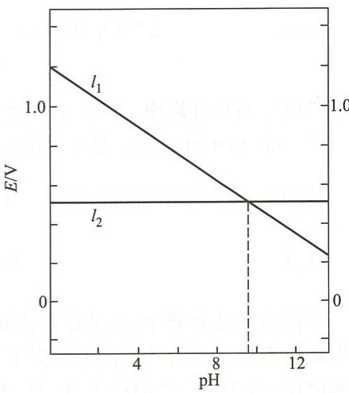

故原电池的电动势

$$
\begin{array}{r l} E _ {+} & = E (\mathrm{I} _ {2} / \mathrm{I} ^ {-}) = 0. 5 4 \mathrm{V} \\ E _ {-} & = E (\mathrm{IO} _ {3} ^ {-} / \mathrm{I} _ {2}) \\ & = 1. 2 \mathrm{V} - 0. 0 7 \mathrm{VpH} \\ & = 1. 2 \mathrm{V} - 0. 0 7 \mathrm{V} \times 1 1 \\ & = 0. 4 3 \mathrm{V} \\ E & = E _ {+} - E _ {-} \\ & = 0. 5 4 \mathrm{V} - 0. 4 3 \mathrm{V} \\ & = 0. 1 1 \mathrm{V} \end{array}
$$

$$
\begin{array}{r l} \Delta_ {\mathrm{r}} G _ {\mathrm{m}} & = - z E F \\ & = (- 5 \times 0. 1 1 \times 9 6 5 0 0) \mathrm {J\cdot mol^ {- 1}} \\ & = - 5 3 \mathrm {kJ\cdot mol^ {- 1}} \end{array}
$$

## 第二部分 习题

## 一、选择题

10.1 某氧化剂 $\mathrm{YO(OH)_2^+}$ 中 Y 元素的价态为 +5，如果还原 $7.16 \times 10^{-4} \, mol \, \mathrm{YO(OH)_2^+}$ 溶液使 Y 至较低价态，则需用 $0.066 \, mol \cdot dm^{-3} \, Na_2SO_3$ 溶液 26.98 mL。还原产物中 Y 元素的价态为
(A) -2; (B) -1; (C) 0; (D) +1.

10.2 使下列电极反应中有关离子浓度减小一半，而 E 值增加的是
(A) $Cu^{2+} + 2e^{-} = Cu$ ; (B) $I_{2} + 2e^{-} = 2I^{-}$ ;
(C) $2H^{+} + 2e^{-} = H_{2}$ ; (D) $Fe^{3+} + e^{-} = Fe^{2+}$ 。

10.3 将下列反应设计成原电池时,不用惰性电极的是
(A) $H_{2} + Cl_{2} = 2HCl$ ; (B) $2Fe^{3+} + Cu = 2Fe^{2+} + Cu^{2+}$ ;
(C) $Ag^{+} + Cl^{-} = AgCl$ ; (D) $2Hg^{2+} + Sn^{2+} = Hg_{2}^{2+} + Sn^{4+}$

10.4 已知 $E^{\ominus}(Zn^{2+}/Zn)=-0.76\ V$ ，下列原电池反应的电动势为 0.46V，则氢电极溶液中的 pH 为 $Zn+2H^{+}(a\ mol\cdot dm^{-3})=Zn^{2+}(1\ mol\cdot dm^{-3})+H_{2}(1.013\times10^{5}\ Pa)$ (A) 10.2; (B) 2.5; (C) 3.0; (D) 5.1。

10.5 若要使电池(一) $Pt|H_{2}(p_{1})|H^{+}(c_{0})\parallel H^{+}(c_{0})|H_{2}(p_{2})|Pt(+)$ 的电动势E为正值，则 $p_{1}$ 和 $p_{2}$ 应满足的关系为
(A) $p_{1}=p_{2}$ ; (B) $p_{1}<p_{2}$ ;
(C) $p_{1}>p_{2}$ ; (D) $p_{1}$ 和 $p_{2}$ 可取任意值。

10.6 以惰性电极电解一段时间后，pH 增大的溶液是
(A) HCl; (B) $H_{2}SO_{4}$ ; (C) $Na_{2}SO_{4}$ ; (D) $NaHSO_{4}$ 。

10.7 已知 $E^{\ominus}(\mathrm{Ag}^{+}/\mathrm{Ag})=0.799\ \mathrm{V}, E^{\ominus}(\mathrm{O}_{2}/\mathrm{H}_{2}\mathrm{O})=1.229\ \mathrm{V}, K_{\mathrm{sp}}^{\ominus}(\mathrm{AgCl})=1.8\times10^{-10}$ 。
298 K 时，电池反应： $4Ag+4HCl+O_{2}=4AgCl+2H_{2}O$ ，当 $c(HCl)=6.0\ mol\cdot dm^{-3}$ ， $p(O_{2})=101.3\ kPa$ 时，该原电池的电动势 E 和电池反应的 $\Delta_{r}G_{m}^{\ominus}$ 分别为
(A) $1.098\ V, -388.3\ kJ\cdot mol^{-1};$ (B) $1.053\ V, 388.6\ kJ\cdot mol^{-1};$ (C) $1.19\ V, -144.8\ kJ\cdot mol^{-1};$ (D) $1.053\ V, -388.6\ kJ\cdot mol^{-1}.$

10.8 某氧化还原反应的标准摩尔吉布斯自由能变为 $\Delta_{\mathrm{r}}G_{\mathrm{m}}^{\ominus}$ , 标准平衡常数为 $K^{\ominus}$ , 标准电动势为 $E^{\ominus}$ , 则下列对 $\Delta_{\mathrm{r}}G_{\mathrm{m}}^{\ominus}, K^{\ominus}, E^{\ominus}$ 的值判断合理的一组是  
(A) $\Delta_{\mathrm{r}}G_{\mathrm{m}}^{\ominus} > 0, E^{\ominus} < 0, K^{\ominus} < 1$ ; (B) $\Delta_{\mathrm{r}}G_{\mathrm{m}}^{\ominus} > 0, E^{\ominus} < 0, K^{\ominus} > 1$ ;  
(C) $\Delta_{\mathrm{r}}G_{\mathrm{m}}^{\ominus} < 0, E^{\ominus} < 0, K^{\ominus} > 1$ ; (D) $\Delta_{\mathrm{r}}G_{\mathrm{m}}^{\ominus} < 0, E^{\ominus} > 0, K^{\ominus} < 1$ 。

10.9 已知 $E^{\ominus}(\mathrm{M}^{3+}/\mathrm{M}^{2+}) > E^{\ominus}[\mathrm{M(OH)}_{3}/\mathrm{M(OH)}_{2}]$ ，则溶度积 $K_{\mathrm{sp}}^{\ominus}[\mathrm{M(OH)}_{3}]$ 与 $K_{\mathrm{sp}}^{\ominus}[\mathrm{M(OH)}_{2}]$ 的关系应是  
(A) $K_{\mathrm{sp}}^{\ominus}[\mathrm{M(OH)}_{3}] > K_{\mathrm{sp}}^{\ominus}[\mathrm{M(OH)}_{2}]$ ; (B) $K_{\mathrm{sp}}^{\ominus}[\mathrm{M(OH)}_{3}] < K_{\mathrm{sp}}^{\ominus}[\mathrm{M(OH)}_{2}]$ ; (C) $K_{\mathrm{sp}}^{\ominus}[\mathrm{M(OH)}_{3}] = K_{\mathrm{sp}}^{\ominus}[\mathrm{M(OH)}_{2}]$ ; (D) 无法判断。

10.10 某电池(一) $A|A^{2+}(0.1\ mol\cdot dm^{-3})\parallel B^{2+}(1.0\times10^{-2}\ mol\cdot dm^{-3})|B(+)$ 的电动势E为0.27V，则该电池的标准电动势 $E^{\ominus}$ 为
(A) 0.24V; (B) 0.27 V; (C) 0.30 V; (D) 0.33V。

10.11 若将反应 $2\mathrm{MnO}_4^- + 10\mathrm{Fe}^{2+} + 16\mathrm{H}^+ = 2\mathrm{Mn}^{2+} + 10\mathrm{Fe}^{3+} + 8\mathrm{H}_2\mathrm{O}$ 设计成原电池，则该电池的符号为  
(A) $\mathrm{Pt}|\mathrm{MnO}_4^-$ , $\mathrm{Mn}^{2+}, \mathrm{H}^+ \| \mathrm{Fe}^{2+}, \mathrm{Fe}^{3+}|\mathrm{Pt}$ ;  
(B) $\mathrm{Pt}|\mathrm{Fe}^{2+}, \mathrm{Fe}^{3+} \| \mathrm{MnO}_4^-, \mathrm{Mn}^{2+}, \mathrm{H}^+ |\mathrm{Pt}$ ;  
(C) $\mathrm{Fe}|\mathrm{Fe}^{2+}, \mathrm{Fe}^{3+} \| \mathrm{MnO}_4^-, \mathrm{Mn}^{2+}, \mathrm{H}^+ |\mathrm{Mn}$ ;  
(D) $\mathrm{Mn}|\mathrm{MnO}_4^-, \mathrm{Mn}^{2+}, \mathrm{H}^+ \| \mathrm{Fe}^{2+}, \mathrm{Fe}^{3+}|\mathrm{Fe}$ 。

10.12 电极电势与 $\mathrm{pH}$ 无关的电对是（A） $\mathrm{H}_2\mathrm{O}_2 / \mathrm{H}_2\mathrm{O}$ ；（B） $\mathrm{IO}_3^- / \mathrm{I}^-$ ；（C） $\mathrm{MnO}_2 / \mathrm{Mn}^{2+}$ ；(D） $\mathrm{MnO}_4^- / \mathrm{MnO}_4^{2-}$ 。

## 二、填空题

10.13 电池（一）Pt|H₂(1.013×10⁵ Pa)|H⁺(1×10⁻³ mol·dm⁻³) || H⁺(1 mol·dm⁻³)|H₂(1.013×10⁵ Pa)|Pt(+)属于\_\_\_\_电池，该电池的电动势为\_\_\_\_V，电池反应为\_\_\_\_。

10.14 标准状态下,下列反应均自发进行:

$$
\begin{array}{r l} & 2 \mathrm{MnO} _ {4} ^ {-} + 5 \mathrm{H} _ {2} \mathrm{O} _ {2} + 6 \mathrm{H} ^ {+} = 2 \mathrm{Mn} ^ {2 +} + 5 \mathrm{O} _ {2} + 8 \mathrm{H} _ {2} \mathrm{O} \\ & \quad \mathrm{H} _ {2} \mathrm{O} _ {2} + 2 \mathrm{I} ^ {-} + 2 \mathrm{H} ^ {+} = 2 \mathrm{H} _ {2} \mathrm{O} + \mathrm{I} _ {2} \\ & \quad \mathrm{I} _ {2} + 2 \mathrm{S} _ {2} \mathrm{O} _ {3} ^ {2 -} = 2 \mathrm{I} ^ {-} + \mathrm{S} _ {4} \mathrm{O} _ {6} ^ {2 -} \end{array}
$$

由此判断反应所涉及的物质中还原性最强的是 \_\_\_\_ ，氧化性最强的是 \_\_\_\_ 。

10.15 电池（一） $\mathrm{Cu|Cu^{+}\parallel Cu^{+},Cu^{2+}|Pt(+)}$ 和（一） $\mathrm{Cu|Cu^{2+}\parallel Cu^{+},Cu^{2+}|Pt(+)}$ 的反应均可写成 $\mathrm{Cu + Cu^{2 + } = 2Cu^{+}}$ ，则两电池的 $\Delta_{\mathrm{r}}G_{\mathrm{m}}^{\ominus}$ \_\_\_\_， $E^{\ominus}$ \_\_\_\_， $K^{\ominus}$ \_\_\_\_（填“相同”或“不同”）。

10.16 已知 $E^{\ominus}(\mathrm{Cu}^{2+}/\mathrm{Cu}) = 0.34 \mathrm{~V}, K_{\mathrm{sp}}^{\ominus}[\mathrm{Cu(OH)}_2] = 2.2 \times 10^{-20}$ , 则 $E^{\ominus}[\mathrm{Cu(OH)}_2/\mathrm{Cu}] =$ \_\_\_\_ V。

10.17 在 $Fe^{3+} + e^{-} = Fe^{2+}$ 电极反应中，加入 $Fe^{3+}$ 的配位剂 $F^{-}$ 可使电极电势的数值 \_\_\_\_；在 $Cu^{2+} + e^{-} = Cu^{+}$ 电极反应中，加入 $Cu^{+}$ 的沉淀剂 $I^{-}$ 可使其电极电势的数值 \_\_\_\_。

10.18 对某一自发的氧化还原反应, 若将反应方程式中各物质的化学计量数扩大到原来的 2 倍, 则此反应的 $|\Delta_{\mathrm{r}} G_{\mathrm{m}}|$ 将 \_\_\_\_ , 电池电动势 $E$ \_\_\_\_ 。

10.19 已知 $MnO_{4}^{-} + 8H^{+} + 5e^{-} = Mn^{2+} + 4H_{2}O$ $E^{\ominus} = 1.51 V$ ，当 $MnO_{4}^{-}$ 和 $Mn^{2+}$ 处于标准状态时，电极电势与 pH 的关系是：E/V = \_\_\_\_。

10.20 保持标准氢电极中 $\mathrm{H}_{2}$ 的压强不变，而将标准浓度的盐酸换成 $0.10\mathrm{mol}\cdot \mathrm{dm}^{-3}$ 的醋酸，则此时氢电极的电极电势为 \_\_\_\_ V（已知醋酸的 $K_{\mathrm{a}}^{\ominus} = 1.8\times 10^{-5}$ ）。

10.21 已知 $E^{\ominus}(\mathrm{MnO}_{4}^{-}/\mathrm{Mn}^{2+})=1.51\ \mathrm{V}, E^{\ominus}(\mathrm{Br}_{2}/\mathrm{Br}^{-})=1.08\ \mathrm{V}, E^{\ominus}(\mathrm{Cl}_{2}/\mathrm{Cl}^{-})=1.36\ \mathrm{V}$ 。拟使酸性混合溶液中的 $Br^{-}$ 被 $MnO_{4}^{-}$ 氧化而 $Cl^{-}$ 不被氧化，则溶液的 pH 控制范围是 \_\_\_\_。

10.22 对于原电池(一) $A|A^{2+}(c_{1})\|B^{2+}(c_{2})|B(+)$ ，当 $c_{1}=c_{2}$ 时，E=0.78 V，则放电一段时间至电动势减半时， $c_{1}/c_{2}=$ \_\_\_\_。

## 三、简答题和计算题

10.23 用离子电子法配平下列反应方程式(酸性介质)。

(1) $\mathrm{MnO_4^- + Cl^- \longrightarrow Mn^{2+} + Cl_2}$

(2) $\mathrm{Mn}^{2+} + \mathrm{NaBiO}_3 \longrightarrow \mathrm{MnO}_4^- + \mathrm{Bi}^{3+}$

(3) $\mathrm{Cr}^{3+} + \mathrm{PbO}_2 \longrightarrow \mathrm{Cr}_2\mathrm{O}_7^{2-} + \mathrm{Pb}^{2+}$

(4) $\mathrm{C_3H_8O + MnO_4^-}\longrightarrow \mathrm{C_3H_6O_2 + Mn^{2 + }}$

(5) $\mathrm{HClO_3 + P_4\longrightarrow Cl^- + H_3PO_4}$

10.24 用离子电子法配平下列反应方程式(碱性介质)。

(1) $\mathrm{CrO_4^{2 - } + HSnO_2^-}\longrightarrow \mathrm{CrO_2^- + HSnO_3^-}$

(2) $\mathrm{H}_2\mathrm{O}_2 + \mathrm{CrO}_2^-\longrightarrow \mathrm{CrO}_4^{2 - }$

(3) $\mathrm{CuS + CN^{-}\longrightarrow [Cu(CN)_4]^{3 - } + S^{2 - } + NCO^-}$

(4) $\mathrm{CN}^{-} + \mathrm{O}_{2} \longrightarrow \mathrm{CO}_{3}^{2-} + \mathrm{NH}_{3}$

(5) $\mathrm{Al} + \mathrm{NO}_2^- \longrightarrow [\mathrm{Al(OH)}_4]^- + \mathrm{NH}_3$

10.25 在实验室中通常用下列反应制取氯气：

$$
\mathrm{MnO} _ {2} + 4 \mathrm{HCl} = \mathrm{MnCl} _ {2} + \mathrm{Cl} _ {2} + 2 \mathrm{H} _ {2} \mathrm{O}
$$

试通过计算回答,为什么必须使用浓盐酸?

已知 $E^{\ominus}(\mathrm{MnO}_{2}/\mathrm{Mn}^{2+})=1.22\ \mathrm{V}, E^{\ominus}(\mathrm{Cl}_{2}/\mathrm{Cl}^{-})=1.36\ \mathrm{V}$

10.26 某学生为测定 CuS 的溶度积常数, 设计如下原电池: 正极为铜片, 在 $0.1 \, mol \cdot dm^{-3} \, Cu^{2+}$ 溶液中, 再通入 $H_{2}S$ 气体使之达到饱和; 负极为标准锌电极。测得电池电动势为 $0.67 \, V$ 。已知 $E^{\ominus}(\mathrm{Cu}^{2+}/\mathrm{Cu}) = 0.34 \, \mathrm{V}, E^{\ominus}(\mathrm{Zn}^{2+}/\mathrm{Zn}) = -0.76 \, \mathrm{V}, H_{2}S$ 的 $K_{a_{1}}^{\ominus} = 1.1 \times 10^{-7}, K_{a_{2}}^{\ominus} = 1.3 \times 10^{-13}$ 。试求 CuS 的溶度积常数。

10.27 已知 $H_{3}AsO_{4} + 2H^{+} + 2e^{-} = H_{3}AsO_{3} + H_{2}O$ $E^{\ominus} = 0.559 V; \quad I_{3}^{-} + 2e^{-} = 3I^{-}$ $E^{\ominus} = 0.54 V$ 。问：

(1) 若溶液的 $\mathrm{pH} = 7$ , 反应向哪个方向自发进行?

(2) 若溶液中 $c(\mathrm{H}^{+})=6\ \mathrm{mol}\cdot\mathrm{dm}^{-3}$ ，反应向哪个方向自发进行？

10.28 求下列电池电动势和电池反应的标准平衡常数：

$$
(-) \mathrm{Cu} \left[ \mathrm{Cu} \left(\mathrm{NH} _ {3}\right) _ {4} \right] ^ {2 +} (0. 1 0 \mathrm{mol} \cdot \mathrm{dm} ^ {- 3}), \mathrm{NH} _ {3} (1. 0 \mathrm{mol} \cdot \mathrm{dm} ^ {- 3}) \| \mathrm{AgNO} _ {3} (0. 0 1 0 \mathrm{mol} \cdot
$$

$$
\mathrm{dm} ^ {- 3}) \mid \mathrm{Ag} (+)
$$

已知 $E^{\ominus}(Ag^{+}/Ag)=0.80\ V, E^{\ominus}(Cu^{2+}/Cu)=0.34\ V, [Cu(NH_{3})_{4}]^{2+}$ 的 $K_{稳}^{\ominus}=2.1\times10^{13}$

10.29 298 K 时, 测得原电池

$$
(-) \mathrm{Cu} | \mathrm{Cu} ^ {2 +} (1. 0 \times 1 0 ^ {- 2} \mathrm{mol} \cdot \mathrm{dm} ^ {- 3}) \| \mathrm{Ag} ^ {+} (c ^ {\ominus}) | \mathrm{Ag} (+)
$$

的电动势 $E=0.52\ V$ 。

(1) 若已知 $E^{\ominus}(\mathrm{Ag}^{+}/\mathrm{Ag})=0.80\ \mathrm{V}$ ，求 $E^{\ominus}(\mathrm{Cu}^{2+}/\mathrm{Cu})$ ;

(2) 求该原电池的标准电动势 $E_{池}^{\ominus}$ ;

(3) 写出该原电池的电池反应, 并计算其标准平衡常数 $K^{\ominus}$ 。

10.30 已知 $E^{\ominus}(\mathrm{Cu}^{2+}/\mathrm{Cu}) = 0.34 \mathrm{~V}, E^{\ominus}(\mathrm{Cu}^{2+}/\mathrm{Cu}^{+}) = 0.15 \mathrm{~V}, K_{\mathrm{sp}}^{\ominus}(\mathrm{CuCl}) = 1.72 \times 10^{-7}$ 。通过计算求反应 $\mathrm{Cu}^{2+} + \mathrm{Cu} + 2\mathrm{Cl}^{-} = 2\mathrm{CuCl}$ 能否自发进行，并求反应的标准平衡常数 $K^{\ominus}$ 。

10.31 将下列非氧化还原反应设计成两个半电池反应，并利用标准电极电势表的数据，求出298 K时反应的标准平衡常数 $K^{\ominus}$ 。

(1) $\mathrm{H}_{2} \mathrm{O} = \mathrm{H}^{+} + \mathrm{OH}^{-}$ ;

(2) $\mathrm{Pt}^{2+} + 4\mathrm{Cl}^{-} = [\mathrm{PtCl}_{4}]^{2-}$ 。

10.32 已知 $E^{\ominus}(\mathrm{Tl}^{3+}/\mathrm{Tl}^{+}) = 1.25\mathrm{V}, E^{\ominus}(\mathrm{Tl}^{3+}/\mathrm{Tl}) = 0.74\mathrm{V}$ , 设计成下列三个标准电池:

(a) $(-) \mathrm{Tl}|\mathrm{Tl}^{+}\| \mathrm{Tl}^{3 + }|\mathrm{Tl}(+)$

(b)（一） $\mathrm{Tl}|\mathrm{Tl}^{+}\parallel \mathrm{Tl}^{3 + },\mathrm{Tl}^{+}|\mathrm{Pt}(+)$

(c) (一) $\mathrm{Tl}|\mathrm{Tl}^{3+}\parallel \mathrm{Tl}^{3+},\mathrm{Tl}^{+}|\mathrm{Pt}(+)$

(1) 请写出每一个电池的电池反应式;

(2) 计算每一个电池的电动势和 $\Delta_{r}G_{m}^{\ominus}$ 。

10.33 在酸性条件下，将 $\mathrm{KMnO_4}$ 滴加到过量KI溶液中，产物是什么？已知元素电势图如下： $E_{\mathrm{A}}^{\ominus} / \mathrm{V}\quad \mathrm{H}_{5}\mathrm{IO}_{6}\xrightarrow{1.70}\mathrm{IO}_{3}^{-}\xrightarrow{1.14}\mathrm{HOI}\xrightarrow{1.45}\mathrm{I}_{3}^{-}\xrightarrow{0.54}\mathrm{I}^{-}$ $\mathrm{MnO_4^-}\xrightarrow{0.56}\mathrm{MnO_4^{2 - }}\xrightarrow{2.26}\mathrm{MnO_2}\xrightarrow{0.95}\mathrm{Mn}^{3 + }\xrightarrow{1.51}\mathrm{Mn}^{2 + }\xrightarrow{-1.18}\mathrm{Mn}$

10.34 向酸性的 $1.0 \times 10^{-3} \mathrm{~mol} \cdot \mathrm{dm}^{-3} \mathrm{Fe}^{3+}$ 溶液中加入过量液态汞, 发生反应: $2 \mathrm{Fe}^{3+} + 2 \mathrm{Hg} = 2 \mathrm{Fe}^{2+} + \mathrm{Hg}_{2}^{2+}$ , 达平衡时溶液中还有 $4.6 \% \mathrm{Fe}^{3+}$ 。已知 $E^{\ominus}(\mathrm{Fe}^{3+} / \mathrm{Fe}^{2+}) = 0.771 \mathrm{~V}$ , 求 $E^{\ominus}(\mathrm{Hg}_{2}^{2+} / \mathrm{Hg})$ 。

10.35 已知 $E^{\ominus}(\mathrm{Ag}^{+}/\mathrm{Ag}) = 0.80 \mathrm{~V}, E^{\ominus}(\mathrm{O}_{2}/\mathrm{OH}^{-}) = 0.401 \mathrm{~V}, E^{\ominus}(\mathrm{H}^{+}/\mathrm{H}_{2}) = 0; [\mathrm{Ag}(\mathrm{CN})_{2}]^{-}$ 的 $K_{\text {稳}}^{\ominus} = 1 \times 10^{21}, K_{\mathrm{a}}^{\ominus}(\mathrm{HCN}) = 1.0 \times 10^{-10}$ 。通过计算回答：

(1) 在碱性条件下通入空气时, Ag 能否溶于 KCN 溶液?

(2) Ag 能否从 KCN 溶液中置换出 $H_{2}$ ?

10.36 下图是铬体系的电势-pH 图。写出图中 DH, EF, FJ, IK, CF, DE, IJ 各线所表示的反应。

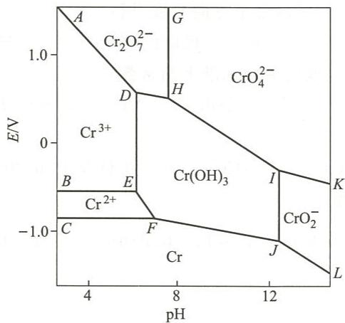

10.37 根据下面 $\mathrm{pH} = 1$ 介质中Bi的元素电势图：

$$
\mathrm{Bi} _ {2} \mathrm{O} _ {4} \xrightarrow {1 . 5 9 \mathrm{V}} \mathrm{BiO} ^ {+} \xrightarrow {0 . 3 2 \mathrm{V}} \mathrm{Bi} \xrightarrow {- 0 . 9 7 \mathrm{V}} \mathrm{BiH} _ {3}
$$

(1) 求电对 $Bi_{2}O_{4}/Bi, BiO^{+}/BiH_{3}, Bi_{2}O_{4}/BiH_{3}$ 的电极电势；

(2) 作出 Bi 元素的自由能-氧化数图。

制备及制品的含水溶液出调式，使时间和路长等分别与化合物或铜离子排出。1、2、3、4、5、6、7、8、9、10、11、12、13、14、15、16、17、18、19、20、21、22、23、24、25、26、27、28、29、30、31、32、33、34、35、36、37、38、39、40、41、42、43、44、45、46、47、48、49、50、51、52、53、54、55、56、57、58、59、60、61、62、63、64、65、66、67、68、69、70、71、72、73、74、75、76、77、78、79、80、81、82、83、84、85、86、87、88、89、90、91、92、93、94、95、96、97、98、99、100。

# 配位化学基础

## 第一部分 例题

例 11.1 指出下列配位化合物中配位单元的空间构型，并画出可能存在的几何异构体：
(1) $\left[\mathrm{Cr}\left(\mathrm{NH}_{3}\right)_{3}\left(\mathrm{H}_{2}\mathrm{O}\right)_{3}\right]\mathrm{Cl}_{3}$ ; (2) $\left[\mathrm{Co}\left(\mathrm{NH}_{3}\right)_{2}\left(\mathrm{en}\right)_{2}\right]\mathrm{Cl}_{3}$ ;
(3) $\left[\mathrm{Cr}\left(\mathrm{H}_{2}\mathrm{O}\right)_{4}\mathrm{Cl}_{2}\right]\mathrm{Cl}\cdot2\mathrm{H}_{2}\mathrm{O}$ ; (4) $\left[\mathrm{Pt}\left(\mathrm{NH}_{3}\right)_{2}\left(\mathrm{OH}\right)_{2}\mathrm{Cl}_{2}\right]$ ;
(5) $\left[\mathrm{Pt}\left(\mathrm{NH}_{3}\right)_{2}\mathrm{BrCl}\right]$ ; (6) $\left[\mathrm{Co}\left(\mathrm{NH}_{3}\right)(\mathrm{en})\mathrm{Cl}_{3}\right]$ 。

解：（1）八面体，两种几何异构体，如图(a)所示。

(2) 八面体, 两种几何异构体, 如图(b)所示。

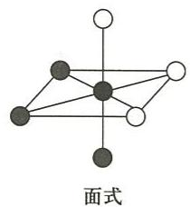

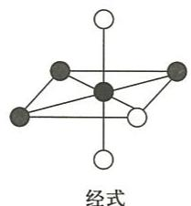

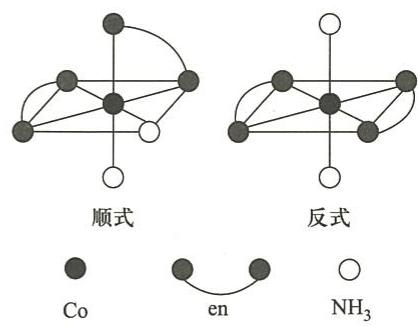  
(a)

(3) 八面体, 两种几何异构体, 如图(c)所示。

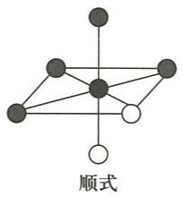  
(c)

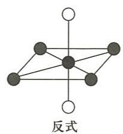  
(b)

(4) 八面体, 五种几何异构体, 如图(d)所示。

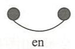

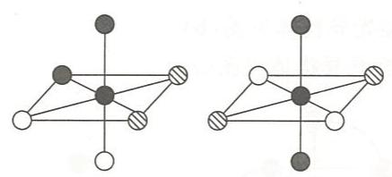

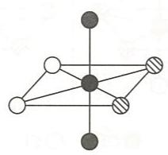

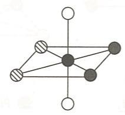  
(d)

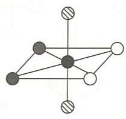

(5) 平面四边形,两种几何异构体,如图(e)所示。

(6) 八面体, 两种几何异构体, 如图(f)所示。

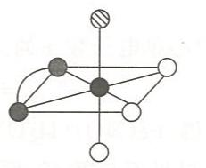

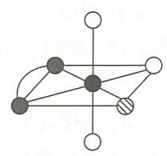

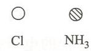  
(e)  
(f)

## 例 11.2 指出下列配位化合物可能有的旋光异构体,并将其画出。

(1) $\left[\mathrm{Co}(\mathrm{en})_{3}\right]\mathrm{Cl}_{3}$ ; (2) $\left[\mathrm{Cu}(\mathrm{NH}_{3})_{4}(\mathrm{H}_{2}\mathrm{O})_{2}\right]\mathrm{Cl}_{2}$ ;

(3) $\left[\mathrm{Co}(\mathrm{NH}_3)_2(\mathrm{en})_2\right]\mathrm{Cl}_3$ (4) $\left[\mathrm{Pt}(\mathrm{NH}_3)_2\mathrm{BrCl}\right]$ ;

(5) $\left[\mathrm{Pt}(\mathrm{NH}_3)_2(\mathrm{OH})_2\mathrm{Cl}_2\right]$ ; (6) $\left[\mathrm{Co}(\mathrm{NH}_3)(\mathrm{en})\mathrm{Cl}_3\right]$ .

解：(1)，(3)，(5)有旋光异构体。 $\left[\mathrm{Co}(\mathrm{en})_{3}\right]\mathrm{Cl}_{3}$ 的旋光异构体见图(a)。

  
Co  
(a)  
en

$\left[\mathrm{Co}\left(\mathrm{NH}_{3}\right)_{2}(\mathrm{en})_{2}\right]\mathrm{Cl}_{3}$ 的旋光异构体见图(b)。

$\left[\mathrm{Pt}\left(\mathrm{NH}_{3}\right)_{2}(\mathrm{OH})_{2}\mathrm{Cl}_{2}\right]$ 的旋光异构体见图(c)。

例 11.3 研究发现棕色配位化合物 $\left[\mathrm{Fe}(\mathrm{NO})(\mathrm{H}_{2}\mathrm{O})_{5}\right]\mathrm{SO}_{4}$ 显顺磁性，并测得其磁矩为 $3.8 \mu_{B}$ 。

(1) 试给出中心 d 电子的排布方式及杂化轨道类型;

(2) $\left[\mathrm{Fe}(\mathrm{NO})(\mathrm{H}_{2}\mathrm{O})_{5}\right]\mathrm{SO}_{4}$ 中 $\mathrm{N}-\mathrm{O}$ 键的键长与自由 NO 分子中的键长相比, 变长还是变短? 试简述理由。

解：(1) 磁矩 $\mu$ 和中心单电子数 $n$ 的关系式为

$$
\mu = \sqrt {n (n + 2)} \mu_ {\mathrm{B}}
$$

将 $\mu = 3.8\mu_{\mathrm{B}}$ 代入上式，得 $[\mathrm{Fe(NO)(H_2O)_5}]\mathrm{SO}_4$ 中心单电子数 $n = 3$

中心有 3 个单电子, 可见不是 $Fe^{2+}$ , 而是氧化 NO 过程中得到 1 个电子生成的 $Fe^{+}$ :

$$
\mathrm{Fe} ^ {2 +} + \mathrm{NO} = \mathrm{Fe} ^ {+} + \mathrm{NO} ^ {+}
$$

该过程的电子排布变化如图所示：

进一步形成配位化合物的反应为

$$
\mathrm{Fe} ^ {+} + \mathrm{NO} ^ {+} + 5 \mathrm{H} _ {2} \mathrm{O} + \mathrm{SO} _ {4} ^ {2 -} = [ \mathrm{Fe(NO)} (\mathrm{H} _ {2} \mathrm{O}) _ {5} ] \mathrm{SO} _ {4}
$$

$\mathrm{Fe}^{+}$ 没有空的内层d轨道，故在6配位的情况下为外轨型 $\mathrm{sp}^3\mathrm{d}^2$ 杂化。

(2) $\left[\mathrm{Fe}(\mathrm{NO})(\mathrm{H}_{2}\mathrm{O})_{5}\right]\mathrm{SO}_{4}$ 中 N—O 的键长比自由 NO 分子中的键长短。

自由 NO 分子中 N—O 键的键级为 2.5，而 $\left[\mathrm{Fe}(\mathrm{NO})(\mathrm{H}_{2}\mathrm{O})_{5}\right]\mathrm{SO}_{4}$ 中 N—O 键的键级为 3。键级增大使键长变短。

例 11.4 已知下列配位化合物的磁矩,根据配位化合物价键理论给出中心轨道的杂化类型、中心 d 电子的排布、配位单元的空间构型。

(1) $\left[\mathrm{Co}(\mathrm{NH}_3)_6\right]^{2+}$ $\mu = 3.9\mu_{\mathrm{B}}$

(2) $\left[\mathrm{Pt}(\mathrm{CN})_4\right]^{2-}\quad \mu = 0\mu_{\mathrm{B}};$

(3) $\left[\mathrm{Mn}(\mathrm{SCN})_{6}\right]^{4-}\quad \mu = 6.1\mu_{\mathrm{B}};$

$$
\left[ \mathrm{Co} (\mathrm{NO} _ {2}) _ {6} \right] ^ {4 -} \quad \mu = 1. 8 \mu_ {\mathrm{B}}.
$$

解：由配位化合物磁矩可以求出其中心d轨道的单电子数，以判断中心d电子的排布方式，进而得到中心轨道的杂化类型和配位单元的空间构型。以 $\left[\mathrm{Co}(\mathrm{NO}_2)_6\right]^{4-}$ 为例进行讨论。根据磁矩 $\mu$ 和单电子数 $n$ 的关系式：

$$
\mu = \sqrt {n (n + 2)} \mu_ {\mathrm{B}}
$$

由 $\left[\mathrm{Co}(\mathrm{NO}_2)_6\right]^{4-}$ 的 $\mu = 1.8\mu_{\mathrm{B}}$ 可以求得 $n = 1$ 。这说明强场 $\mathrm{NO}_2^-$ 使 $\mathrm{Co}^{2+}$ 的3d轨道的7个电子发生了重排，3d轨道只排布3对电子，同时有1个3d轨道电子跃迁到4d轨道，如下图所示。中心采取 $\mathrm{d}^2\mathrm{sp}^3$ 杂化，正八面体构型。

利用类似的方法对题设各配位化合物进行讨论,结果填入下表中。

<table><tr><td>配位单元</td><td>磁矩/ $\mu_B$ </td><td>单电子数</td><td>中心d电子的排布</td><td>中心轨道的杂化类型</td><td>空间构型</td></tr><tr><td> $[Co(NH_3)_6]^{2+}$ </td><td>3.9</td><td>3</td><td></td><td> $sp^3 d^2$ </td><td>八面体</td></tr><tr><td> $[Pt(CN)_4]^{2-}$ </td><td>0</td><td>0</td><td></td><td> $dsp^2$ </td><td>正方形</td></tr><tr><td> $[Mn(SCN)_6]^{4-}$ </td><td>6.1</td><td>5</td><td></td><td> $sp^3 d^2$ </td><td>八面体</td></tr><tr><td> $[Co(NO_2)_6]^{4-}$ </td><td>1.8</td><td>1</td><td></td><td> $d^2 sp^3$ </td><td>八面体</td></tr></table>

例 11.5 通过计算判断下列配位化合物是否符合 EAN 规则。

(1) $\mathrm{K}\left[\mathrm{Pt}\left(\mathrm{C}_{2}\mathrm{H}_{4}\right)\mathrm{Cl}_{3}\right]$ ; (2) $\left[\mathrm{Ru}\left(\mathrm{C}_{5}\mathrm{H}_{5}\right)_{2}\right]$ ;

$$
[ \mathrm{Mo(CO)} _ {6} ];
$$

$$
\mathrm{K} _ {4} \left[ \mathrm{Fe(CN)} _ {6} \right]
$$

$$
\left[ \mathrm{V} (\mathrm{CO}) _ {6} \right]
$$

$$
\left[ \mathrm{Mn} _ {2} (\mathrm{CO}) _ {1 0} \right] _ {\circ}
$$

解：EAN 规则就是 18 电子规则，即过渡金属在形成配位化合物时价层达到 18 个电子时配位化合物较稳定。

(1) $\mathrm{K}\left[\mathrm{Pt}\left(\mathrm{C}_{2}\mathrm{H}_{4}\right)\mathrm{Cl}_{3}\right]$ 中 $Pt^{2+}$ 价层电子总数为 $N=8+2+6=16$ ，不符合 EAN 规则。

其中 $Pt^{2+}$ 提供 8 个电子, 1 个 $C_{2}H_{4}$ 提供 2 个电子, 3 个 $Cl^{-}$ 共提供 6 个电子。

<table><tr><td></td><td> $[Co(NH_3)_6]^{3+}$ </td><td> $[Fe(H_2O)_6]^{2+}$ </td></tr><tr><td> $\Delta/cm^{-1}$ </td><td>23000</td><td>10400</td></tr><tr><td> $P/cm^{-1}$ </td><td>21000</td><td>15000</td></tr></table>

(2) $\left[\mathrm{Ru}\left(\mathrm{C}_{5}\mathrm{H}_{5}\right)_{2}\right]$ 中 $Ru^{2+}$ 价层电子总数为 $N=6+2\times6=18$ ，符合EAN规则。

其中 $Ru^{2+}$ 提供 6 个电子, 2 个 $C_{5}H_{5}^{-}$ 共提供 12 个电子。

(3) $\left[\mathrm{Mo}(\mathrm{CO})_{6}\right]$ 中 Mo 价层电子总数为 $N=6+2\times6=18$ ，符合 EAN 规则。

其中 Mo 提供 6 个电子, 6 个 CO 共提供 12 个电子。

(4) $\mathrm{K}_{4}\left[\mathrm{Fe}(\mathrm{CN})_{6}\right]$ 中 $Fe^{2+}$ 价层电子总数为 $N=6+2\times6=18$ ，符合 EAN 规则。

其中 $Fe^{2+}$ 提供 6 个电子, 6 个 $CN^{-}$ 共提供 12 个电子。

(5) $\left[\mathrm{V}(\mathrm{CO})_{6}\right]$ 中 V 价层电子总数为 $N=5+2\times6=17$ ，不符合 EAN 规则。

其中 V 提供 5 个电子, 6 个 CO 共提供 12 个电子。

(6) $\left[\mathrm{Mn}_{2}(\mathrm{CO})_{10}\right]$ 可以写成 $(\mathrm{CO})_{5}\mathrm{Mn}-\mathrm{Mn}(\mathrm{CO})_{5},\left[\mathrm{Mn}_{2}(\mathrm{CO})_{10}\right]$ 中每个 Mn 价层电子总数为 $N=7+2\times5+1=18$ ，符合 EAN 规则。

其中 Mn 提供 7 个电子, 5 个 CO 共提供 10 个电子, 另一个 Mn 提供 1 个共用电子。

例11.6 已知两个配离子的分裂能和成对能：

(1) 用价键理论及晶体场理论解释 $\left[\mathrm{Fe}\left(\mathrm{H}_{2} \mathrm{O}\right)_{6}\right]^{2+}$ 是高自旋的, $\left[\mathrm{Co}\left(\mathrm{NH}_{3}\right)_{6}\right]^{3+}$ 是低自旋的;

(2) 计算两种配离子的晶体场稳定化能。

解：（1）由价键理论， $H_{2}O$ 为弱配体，不能使 $Fe^{2+}$ 的 d 电子发生重排，因此 $\left[\mathrm{Fe}\left(\mathrm{H}_{2}\mathrm{O}\right)_{6}\right]^{2+}$ 是高自旋的；而 $NH_{3}$ 对 $Co^{3+}$ 为强配体，能使 $Co^{3+}$ 的 d 电子发生重排，因此 $\left[\mathrm{Co}\left(\mathrm{NH}_{3}\right)_{6}\right]^{3+}$ 是低自旋的。

由晶体场理论, $\left[\mathrm{Fe}\left(\mathrm{H}_{2}\mathrm{O}\right)_{6}\right]^{2+}$ 的 $\Delta<P$ , d 电子采取高自旋排布; 而 $\left[\mathrm{Co}\left(\mathrm{NH}_{3}\right)_{6}\right]^{3+}$ 的 $\Delta>P$ , d 轨道电子采取低自旋排布。

(2) $\left[Fe(H_{2}O)_{6}\right]^{2+}$ 的 d 电子排布如图(a)所示。

$$
\begin{array}{r l} \mathrm{CFSE} & = 0 - (- 0. 4 \Delta \times 4 + 0. 6 \Delta \times 2) \\ & = 0. 4 \Delta \\ & = 0. 4 \times 1 0   4 0 0 \mathrm{cm} ^ {- 1} \\ & = 4   1 6 0 \mathrm{cm} ^ {- 1} \end{array}
$$

$\left[\mathrm{Co}\left(\mathrm{NH}_{3}\right)_{6}\right]^{3+}$ 的d电子排布如图(b)所示。

$$
\begin{array}{r l} \mathrm{CFSE} & = 0 - (- 0. 4 \Delta \times 6 + 2 P) \\ & = 2. 4 \Delta - 2 P \\ & = 2. 4 \times 2 3   0 0 0 \mathrm{cm} ^ {- 1} - 2 \times 2 1   0 0 0 \mathrm{cm} ^ {- 1} \\ & = 1 3   2 0 0 \mathrm{cm} ^ {- 1} \end{array}
$$

  
(a)

  
(b)

例 11.7 下列配离子中哪些构型会发生畸变？哪些不会发生畸变？
(1) $\left[\mathrm{Cr}\left(\mathrm{H}_{2}\mathrm{O}\right)_{6}\right]^{3+}$ ; (2) $\left[\mathrm{Fe}\left(\mathrm{CN}\right)_{6}\right]^{3-}$ ;
(3) $\left[\mathrm{Cu}\left(\mathrm{en}\right)_{3}\right]^{2+}$ ; (4) $\left[\mathrm{Mn}\left(\mathrm{H}_{2}\mathrm{O}\right)_{6}\right]^{2+}$ ;
(5) $\left[\mathrm{Co}\left(\mathrm{CN}\right)_{6}\right]^{4-}$ ; (6) $\left[\mathrm{Cr}\left(\mathrm{H}_{2}\mathrm{O}\right)_{6}\right]^{2+}$ 。

解：配离子构型畸变是指在八面体场中中心的两个 $d_{\gamma}$ 轨道填充的电子数不同，引起八面体的变形，即姜一泰勒效应。讨论结果如下表。

<table><tr><td>配离子</td><td>中心电子组态</td><td>晶体场类型</td><td>中心d电子的排布</td><td> $d_{\gamma}$ 轨道电子数</td><td>两个 $d_{\gamma}$ 轨道电子数是否相同</td><td>畸变情况</td></tr><tr><td> $[Cr(H_2O)_6]^{3+}$ </td><td> $3d^3$ </td><td>八面体弱场</td><td></td><td>0</td><td>相同</td><td>不畸变</td></tr><tr><td> $[Fe(CN)_6]^{3-}$ </td><td> $3d^5$ </td><td>八面体强场</td><td></td><td>0</td><td>相同</td><td>不畸变</td></tr><tr><td> $[Cu(en)_3]^{2+}$ </td><td> $3d^9$ </td><td>八面体弱场</td><td></td><td>3</td><td>不相同</td><td>畸变</td></tr><tr><td> $[Mn(H_2O)_6]^{2+}$ </td><td> $3d^5$ </td><td>八面体弱场</td><td></td><td>2</td><td>相同</td><td>不畸变</td></tr><tr><td> $[Co(CN)_6]^{4-}$ </td><td> $3d^7$ </td><td>八面体强场</td><td></td><td>1</td><td>不相同</td><td>畸变</td></tr><tr><td> $[Cr(H_2O)_6]^{2+}$ </td><td> $3d^4$ </td><td>八面体弱场</td><td></td><td>1</td><td>不相同</td><td>畸变</td></tr></table>

例 11.8 比较下列各对配位单元的相对稳定性,说明原因。

(1) $\left[\mathrm{Fe}(\mathrm{SCN})_{4}\right]^{-},\left[\mathrm{Co}(\mathrm{SCN})_{4}\right]^{2-}$ ; (2) $\left[\mathrm{Cu}(\mathrm{NH}_{3})_{4}\right]^{2+},\left[\mathrm{Cu}(\mathrm{NH}_{3})_{4}\right]^{+}$ ;

(3) $\left[\mathrm{Cu}(\mathrm{NH}_3)_4\right]^{2+}, \left[\mathrm{Zn}(\mathrm{NH}_3)_4\right]^{2+}$ ; (4) $\left[\mathrm{Hg}(\mathrm{CN})_4\right]^{2-}, \left[\mathrm{Zn}(\mathrm{CN})_4\right]^{2-}$ ;

(5) $\left[\mathrm{Zn}(\mathrm{CN})_{4}\right]^{2-},\left[\mathrm{Ni}(\mathrm{CN})_{4}\right]^{2-}$ ; (6) $\left[\mathrm{Pt}(\mathrm{NH}_{3})_{4}\right]^{2+},\left[\mathrm{Cu}(\mathrm{NH}_{3})_{4}\right]^{2+}$ ;

(7) $\left[\mathrm{Cu}(\mathrm{CN})_{2}\right]^{-},\left[\mathrm{Cu}(\mathrm{NH}_{3})_{2}\right]^{+}$ ; (8) $\left[\mathrm{Ni}(\mathrm{NH}_{3})_{6}\right]^{2+},\left[\mathrm{Ni}(\mathrm{en})_{3}\right]^{2+}$ ;

(9) $\left[\mathrm{Cu}(\mathrm{en})_{2}\right]^{2+},\left[\mathrm{Cu}(\mathrm{H}_{2}\mathrm{NCH}_{2}\mathrm{CH}_{2}\mathrm{COO})_{2}\right]$ ;

(10) $\left[\mathrm{Ag}(\mathrm{CN})_{2}\right]^{-},\left[\mathrm{Ag}(\mathrm{S}_{2}\mathrm{O}_{3})_{2}\right]^{3-}$ 。

解：（1）稳定性 $\left[Fe(SCN)_{4}\right]^{-}>\left[Co(SCN)_{4}\right]^{2-}$ $Fe^{3+}$ 正电荷数比 $Co^{2+}$ 高， $Fe^{3+}$ 与阴离子配体 $SCN^{-}$ 间静电引力大，形成的配位单元更稳定。

（2）稳定性 $\left[\mathrm{Cu}\left(\mathrm{NH}_{3}\right)_{4}\right]^{2+}>\left[\mathrm{Cu}\left(\mathrm{NH}_{3}\right)_{4}\right]^{+}$ $Cu^{2+}$ 正电荷数比 $Cu^{+}$ 高，正电荷数高的中心与配体的静电引力大，形成的配位单元更稳定。

（3）稳定性 $\left[\mathrm{Cu}\left(\mathrm{NH}_{3}\right)_{4}\right]^{2+}>\left[\mathrm{Zn}\left(\mathrm{NH}_{3}\right)_{4}\right]^{2+}\quad\left[\mathrm{Cu}\left(\mathrm{NH}_{3}\right)_{4}\right]^{2+}$ 为正方形结构，晶体场稳定化能大； $\left[\mathrm{Zn}\left(\mathrm{NH}_{3}\right)_{4}\right]^{2+}$ 为四面体结构，晶体场稳定化能小。

（4）稳定性 $\left[Hg(CN)_{4}\right]^{2-}>\left[Zn(CN)_{4}\right]^{2-}$ $CN^{-}$ 为软碱，与半径大的软酸 $Hg^{2+}$ 形成的配位单元稳定性高。

（5）稳定性 $\left[\mathrm{Zn}(\mathrm{CN})_{4}\right]^{2-}<\left[\mathrm{Ni}(\mathrm{CN})_{4}\right]^{2-}$ $Ni^{2+}$ 的原子轨道为 $dsp^{2}$ 杂化， $\left[\mathrm{Ni}(\mathrm{CN})_{4}\right]^{2-}$ 为正方形结构，晶体场稳定化能大； $Zn^{2+}$ 的原子轨道为 $sp^{3}$ 杂化， $\left[\mathrm{Zn}(\mathrm{CN})_{4}\right]^{2-}$ 为四面体结构，晶体场稳定化能小。

(6) 稳定性 $\left[\mathrm{Pt}\left(\mathrm{NH}_{3}\right)_{4}\right]^{2+} > \left[\mathrm{Cu}\left(\mathrm{NH}_{3}\right)_{4}\right]^{2+}$ Pt 为高周期元素, d 轨道较为扩展, 与配体的轨道重叠多, 配位键强, 故配位单元稳定性高。

（7）稳定性 $\left[\mathrm{Cu}(\mathrm{CN})_{2}\right]^{-} > \left[\mathrm{Cu}(\mathrm{NH}_{3})_{2}\right]^{+}$ 对于 $\mathrm{Cu}^{+},\mathrm{CN}^{-}$ 为强配体而 $\mathrm{NH}_{3}$ 为弱配体；同时 $\mathrm{Cu}^{+}$ 与 $\mathrm{CN}^{-}$ 间有 $\sigma$ 配键和反馈 $\pi$ 配键，而 $\mathrm{Cu}^{+}$ 与 $\mathrm{NH}_{3}$ 间只有 $\sigma$ 配键。

（8）稳定性 $\left[\mathrm{Ni}\left(\mathrm{NH}_{3}\right)_{6}\right]^{2+}<\left[\mathrm{Ni}\left(\mathrm{en}\right)_{3}\right]^{2+}$ 两个配位单元的中心相同， $Ni^{2+}$ 与 en 生成螯合物而与 $NH_{3}$ 只能生成简单配位化合物，螯合物更稳定。

(9) 稳定性 $\left[\mathrm{Cu}(\mathrm{en})_{2}\right]^{2+} > \left[\mathrm{Cu}\left(\mathrm{H}_{2} \mathrm{NCH}_{2} \mathrm{CH}_{2} \mathrm{COO}\right)_{2}\right]$ 乙二胺 en 以 2 个氮原子配位, $\mathrm{H}_{2} \mathrm{NCH}_{2} \mathrm{CH}_{2} \mathrm{COO}^{-}$ 以 1 个氮原子和 1 个氧原子配位, 氮原子配位能力比氧原子配位能力强。

（10）稳定性 $\left[\mathrm{Ag}(\mathrm{CN})_{2}\right]^{-}>\left[\mathrm{Ag}(\mathrm{S}_{2}\mathrm{O}_{3})_{2}\right]^{3-}$ 半径大的阴离子 $S_{2}O_{3}^{2-}$ 与中心的静电引力小、成键弱。特别是 $CN^{-}$ 与过渡金属离子还能够形成反馈 $\pi$ 配键。所以总的结果是 $Ag^{+}$ 与 $CN^{-}$ 间的键更强。

例11.9 将 $0.20 \mathrm{~mol} \cdot \mathrm{dm}^{-3} \mathrm{AgNO}_{3}$ 溶液 $0.50 \mathrm{dm}^{3}$ 和 $6.0 \mathrm{~mol} \cdot \mathrm{dm}^{-3} \mathrm{NH}_{3}$ 溶液 $0.50 \mathrm{dm}^{3}$ 混合后，加入 $1.19 \mathrm{~g} \mathrm{KBr}$ 固体。通过计算说明是否有沉淀生成。已知 $\left[\mathrm{Ag}(\mathrm{NH}_{3})_{2}\right]^{+}$ 的 $K_{\text {稳}}^{\ominus} = 1.1 \times 10^{7}, \mathrm{AgBr}$ 的 $K_{\mathrm{sp}}^{\ominus} = 5.4 \times 10^{-13}$ 。

解：混合溶液的体积为 $1.0 \, dm^{3}$ 。

反应前混合溶液中 $c(\mathrm{Ag}^{+}) = 0.10\mathrm{mol}\cdot \mathrm{dm}^{-3},c(\mathrm{NH}_3) = 3.0\mathrm{mol}\cdot \mathrm{dm}^{-3}$

由于 $\left[\mathrm{Ag}(\mathrm{NH}_3)_2\right]^+$ 的 $K_{\text{稳}}^{\ominus}$ 较大且 $\mathrm{NH}_3$ 过量，则溶液中 $\mathrm{Ag}^+$ 与 $\mathrm{NH}_3$ 充分反应后几乎全部转化为 $\left[\mathrm{Ag}(\mathrm{NH}_3)_2\right]^+$ ，同时消耗掉 $c(\mathrm{NH}_3) = 0.20 \, \mathrm{mol} \cdot \mathrm{dm}^{-3}$ ，所以，反应后溶液中

$$
c \left(\left[ \mathrm{Ag} \left(\mathrm{NH} _ {3}\right) _ {2} \right] ^ {+}\right) = 0. 1 0 \mathrm{mol} \cdot \mathrm{dm} ^ {- 3}, c \left(\mathrm{NH} _ {3}\right) = 2. 8 \mathrm{mol} \cdot \mathrm{dm} ^ {- 3}
$$

由反应

$$
\mathrm{Ag} ^ {+} + 2 \mathrm{NH} _ {3} = [ \mathrm{Ag(NH} _ {3}) _ {2} ] ^ {+}
$$

$$
K _ {\mathrm{稳}} ^ {\ominus} = \frac {c ([ \mathrm{Ag(NH} _ {3}) _ {2} ] ^ {+})}{c (\mathrm{Ag} ^ {+}) \bullet [ c (\mathrm{NH} _ {3}) ] ^ {2}}
$$

即

$$
1. 1 \times 1 0 ^ {7} = \frac {0 . 1 0}{c (\mathrm{Ag} ^ {+}) \times 2 . 8 ^ {2}}
$$

所以

$$
c (\mathrm{Ag} ^ {+}) = 1. 2 \times 1 0 ^ {- 9} \mathrm{mol} \cdot \mathrm{dm} ^ {- 3}
$$

若 1.19g KBr 全部溶于溶液中，则 $c(\mathrm{Br}^{-})=0.010\ \mathrm{mol}\cdot\mathrm{dm}^{-3}$

$$
\begin{array}{r l} Q _ {i} & = c (\mathrm{Ag} ^ {+}) c (\mathrm{Br} ^ {-}) \\ & = 1. 2 \times 1 0 ^ {- 9} \times 0. 0 1 0 \\ & = 1. 2 \times 1 0 ^ {- 1 1} \end{array}
$$

因为 $Q_{i}>K_{sp}^{\ominus}$ ，故有 AgBr 沉淀生成。

例 11.10 某不活泼金属 M 在氯气中燃烧的产物溶于盐酸得黄色溶液，蒸发结晶后得到黄色晶体 Z，晶体 Z 中 M 的质量分数为 0.4783。取 0.100 mol 晶体 Z 溶于水后投入铜片，反应完全后称得固体质量增加了 10.17 g。试通过计算给出 Z 的化学式，并画出其核心部分的立体结构。

解：设 Z 的化学式为 $MCl_{n}$ ，金属的相对原子质量为 $M_{r}$ 。

铜片溶解反应为

$$
\mathrm{M} ^ {n +} + \frac {n}{2} \mathrm{Cu} = \mathrm{M} + \frac {n}{2} \mathrm{Cu} ^ {2 +}
$$

得关系式

$$
0. 1 0 0 \times \left(M _ {\mathrm{r}} - 6 3. 5 5 \times \frac {n}{2}\right) = 1 0. 1 7
$$

解得

$$
M _ {\mathrm{r}} = 3 1. 7 7 5 n + 1 0 1. 7
$$

若

n=1 $M_{r}=133.5$ M为Cs(非惰性金属,不符合题意)

n=2 $M_{r}=165.3$ M为Ho(非惰性金属,不符合题意)

n=3 $M_{r}=197.0$ M为Au(惰性金属,符合题意)

$n = 4$ $M_{\mathrm{r}} = 228.8$ 没有合适的金属，不符合题意

若 Z 为 $AuCl_{3}$ ，Au 在晶体 $AuCl_{3}$ 中的质量分数为

$$
\frac {1 9 7 . 0}{1 9 7 . 0 + 3 \times 3 5 . 4 5} = 0. 6 4 9 4
$$

该数值大于晶体中 M 的质量分数 0.4783，说明 $AuCl_{3}$ 有结晶水。

设 $AuCl_{3}$ 有 m 个结晶水, 则有

$$
\frac {1 9 7 . 0}{1 9 7 . 0 + 4 \times 3 5 . 4 5 + 1 8 m} = 0. 4 7 8 3
$$

解得 m=6，故 Z 的化学式为 $AuCl_{3}\cdot6H_{2}O$ 。

晶体 Z 也可能为配位酸 H[AuCl\_{4}], Au 在晶体 H[AuCl\_{4}] 中的质量分数为

$$
\frac {1 9 7 . 0}{1 9 7 . 0 + 4 \times 3 5 . 4 5 + 1} = 0. 5 7 9 8
$$

该数值也大于晶体中 M 的质量分数 0.4783，说明 $H[AuCl_{4}]$ 有结晶水。

设 $\mathrm{H}[\mathrm{AuCl}_4]$ 有 $l$ 个结晶水，则有

$$
\frac {1 9 7 . 0}{1 9 7 . 0 + 4 \times 3 5 . 4 5 + 1 + 1 8 l} = 0. 4 7 8 3
$$

解得 l=4，故 Z 的化学式为 $\mathrm{H}[\mathrm{AuCl}_{4}]\cdot4\mathrm{H}_{2}\mathrm{O}$

组成为 $AuCl_{3} \cdot 6H_{2}O$ 的化合物尚未见报道。

所以 Z 的化学式最可能为 $H[AuCl_{4}]\cdot4H_{2}O$ 。 $H[AuCl_{4}]\cdot4H_{2}O$ 的核心部分即配位单元 $[AuCl_{4}]^{-}$ ，为平面四边形结构，如图所示。

## 第二部分 习题

## 一、选择题

11.1 已知 $E^{\ominus}(Hg^{2+}/Hg)=0.854\ V, K_{\text{稳}}^{\ominus}([HgI_{4}]^{2-})=6.8\times10^{29}$ ，则 $E^{\ominus}([HgI_{4}]^{2-}/Hg)$ 值为
(A) -0.026 V; (B) 0.026 V; (C) -0.906 V; (D) -0.052 V。

11.2 已知 $\left[\mathrm{Ni}(\mathrm{en})_3\right]^{2+}$ 的 $K_{\text {稳}}^{\ominus} = 2.14\times 10^{18}$ ，将 $2.00\mathrm{mol}\cdot \mathrm{dm}^{-3}$ en溶液与 $0.200\mathrm{mol}\cdot \mathrm{dm}^{-3}$ $\mathrm{NiSO_4}$ 溶液等体积混合，则平衡时 $c(\mathrm{Ni}^{2 + })$ 为(A) $1.36\times 10^{-18}\mathrm{mol}\cdot \mathrm{dm}^{-3}$ (B) $2.91\times 10^{-18}\mathrm{mol}\cdot \mathrm{dm}^{-3}$ (C) $1.36\times 10^{-19}\mathrm{mol}\cdot \mathrm{dm}^{-3}$ (D) $4.36\times 10^{-20}\mathrm{mol}\cdot \mathrm{dm}^{-3}$ 。

11.3 中心的 3d 电子排布为 $t_{2g}^{3} e_{g}^{0}$ 的八面体配位化合物是
(A) $\left[\mathrm{Mn}\left(\mathrm{H}_{2}\mathrm{O}\right)_{6}\right]^{2+}$ ; (B) $\left[FeF_{6}\right]^{3-}$ ;
(C) $\left[Co(CN)_{6}\right]^{3-}$ ; (D) $\left[Cr(H_{2}O)_{6}\right]^{3+}$ 。

11.4 下列配位化合物按稳定性由高到低的顺序排列,正确的是
(A) $\left[HgI_{4}\right]^{2-}>\left[HgCl_{4}\right]^{2-}>\left[Hg(CN)_{4}\right]^{2-}$ ;
(B) $\left[Co(NH_{3})_{6}\right]^{3+}>\left[Co(SCN)_{4}\right]^{2-}>\left[Co(CN)_{6}\right]^{3-}$ ;
(C) $\left[Ni(en)_{3}\right]^{2+}>\left[Ni(NH_{3})_{6}\right]^{2+}>\left[Ni(H_{2}O)_{6}\right]^{2+}$ ;
(D) $\left[Fe(SCN)_{6}\right]^{3-}>\left[Fe(CN)_{6}\right]^{3-}>\left[Fe(CN)_{6}\right]^{4-}$

11.5 下列配离子中, 具有逆磁性的是
(A) $\left[\mathrm{Mn}(\mathrm{CN})_{6}\right]^{4-}$ ; (B) $\left[\mathrm{Cu}(\mathrm{CN})_{4}\right]^{2-}$ ;
(C) $\left[\mathrm{Co}(\mathrm{CN})_{6}\right]^{3-}$ ; (D) $\left[\mathrm{Fe}(\mathrm{CN})_{6}\right]^{3-}$ 。

11.6 下列配离子中,分裂能最大的是
(A) $\left[\mathrm{Ni}(\mathrm{CN})_{4}\right]^{2-}$ ; (B) $\left[\mathrm{Cu}(\mathrm{NH}_{3})_{4}\right]^{2+}$ ;
(C) $\left[\mathrm{Cu}(\mathrm{CN})_{4}\right]^{3-}$ ; (D) $\left[\mathrm{Zn}(\mathrm{CN})_{4}\right]^{2-}$ 。

11.7 下列配位化合物中,除存在几何异构体外,还存在旋光异构体的是
(A) $\left[\mathrm{Pt}\left(\mathrm{NH}_{3}\right)_{2}\mathrm{Cl}_{2}\right]$ ; (B) $\left[\mathrm{Co}\left(\mathrm{NH}_{3}\right)_{4}\mathrm{Cl}_{2}\right]\mathrm{Cl}$ ;
(C) $\left[\mathrm{Co}(\mathrm{en})_{2}\mathrm{Cl}_{2}\right]\mathrm{Cl}$ ; (D) $\left[\mathrm{Pt}\left(\mathrm{NH}_{3}\right)\mathrm{ClBrPy}\right]$ 。

11.8 在八面体配位化合物中, 可能发生畸变的电子结构为
(A) $(t_{2g})^{5}(eg)^{2}$ ; (B) $(t_{2g})^{4}(e_{g})^{2}$ ;
(C) $(t_{2g})^{6}(e_{g})^{3}$ ; (D) $(t_{2g})^{4}(e_{g})^{0}$ 。

11.9 下列配位化合物中,不具有平面四边形结构的是
(A) $\left[\mathrm{Ni}(\mathrm{CO})_{4}\right]$ ; (B) $\left[\mathrm{Cu}(\mathrm{NH}_{3})_{4}\right]^{2+}$ ;
(C) $\left[\mathrm{AuCl}_{4}\right]^{-}$ ; (D) $\left[\mathrm{PtCl}_{4}\right]^{2-}$ 。

11.10 下列配位化合物中,不存在几何异构体的是
(A) $\left[\mathrm{CrCl}_{2}(\mathrm{en})_{2}\right]\mathrm{Cl}$ ; (B) $\left[\mathrm{Pt}(\mathrm{en})\mathrm{Cl}_{4}\right]$ ;
(C) $\left[\mathrm{Cr}(\mathrm{NH}_{3})_{4}(\mathrm{H}_{2}\mathrm{O})_{2}\right]\mathrm{SO}_{4}$ ; (D) $\left[\mathrm{Ni}(\mathrm{CO})_{2}(\mathrm{CN})_{2}\right]$ .

11.11 根据 18 电子规则, 下列配位化合物中应以双聚体形式存在的是
(A) $\mathrm{Mn(CO)_4NO}$ ; (B) $\mathrm{Fe(CO)_5}$ ;
(C) $\mathrm{Cr(CO)_6}$ ; (D) $\mathrm{Co(CO)_4}$ 。

11.12 下列配离子具有正方形或八面体结构,其中 $CO_{3}^{2-}$ 作螯合配体的是
(A) $\left[\mathrm{Co}\left(\mathrm{NH}_{3}\right)_{5}\left(\mathrm{CO}_{3}\right)\right]^{+}$ ; (B) $K_{2}\left[\mathrm{Pt}\left(\mathrm{en}\right)\left(\mathrm{CO}_{3}\right)_{2}\right]$ ;
(C) $\left[\mathrm{Pt}\left(\mathrm{en}\right)\left(\mathrm{NH}_{3}\right)\left(\mathrm{CO}_{3}\right)\right]$ ; (D) $\left[\mathrm{Co}\left(\mathrm{NH}_{3}\right)_{4}\left(\mathrm{CO}_{3}\right)\right]$ 。

11.13 下列化合物中, 肯定为无色的是
(A) $ScF_{3}$ ; (B) $TiCl_{3}$ ; (C) $MnF_{3}$ ; (D) $CrF_{3}$ 。

11.14 某金属离子生成的两种配位化合物的磁矩分别为 $\mu=4.90\ \mu_{B}$ 和 $\mu=0$ ，则该金属可能是 (A) $Cr^{3+}$ ; (B) $Mn^{2+}$ ; (C) $Mn^{3+}$ ; (D) $Fe^{2+}$ 。

11.15 已知 $\left[\mathrm{PdCl}_{2}(\mathrm{OH})_{2}\right]^{2-}$ 有两种不同的结构，成键电子所占据的杂化轨道是(A) $\mathfrak{sp}^3$ ；(B) $\mathrm{d}^2\mathfrak{sp}^3$ ；(C) $\mathrm{dsp}^2$ ；(D) $\mathrm{d}^2\mathfrak{sp}^3$ 。

## 二、填空题

11.16 命名下列配位化合物。

(1) $\mathrm{K}_3[\mathrm{Co}(\mathrm{NO}_2)_6]$ \_\_\_\_；

(2) $\left[\mathrm{Pt}(\mathrm{NH}_{3})_{2}(\mathrm{OH})_{2}\mathrm{Cl}_{2}\right]$

(3) $\left[\mathrm{Cr}\left(\mathrm{H}_{2} \mathrm{O}\right)_{5} \mathrm{Cl}\right] \mathrm{Cl}_{2} \cdot \mathrm{H}_{2} \mathrm{O}$

(4) $\left[\mathrm{Ni}(\mathrm{en})_{3}\right]\mathrm{Cl}_{2}$

(5) $\left[\mathrm{Cu}\left(\mathrm{NH}_{3}\right)_{4}\right]\left[\mathrm{PtCl}_{4}\right]$

(6) $\mathrm{K}_{3}\left[\mathrm{Fe}\left(\mathrm{C}_{2}\mathrm{O}_{4}\right)_{3}\right]\cdot3\mathrm{H}_{2}\mathrm{O}$

(7) $\mathrm{K}_2[\mathrm{Cu}(\mathrm{C}_2\mathrm{O}_4)_2]$

(8) $\left[\mathrm{Pt}(\mathrm{py})_{4}\right]\left[\mathrm{PtCl}_{4}\right]$

(9) $\left[(\mathrm{CO})_{3}\mathrm{Co} - (\mathrm{CO})_{2} - \mathrm{Co}(\mathrm{CO})_{3}\right]$

11.17 根据下列配位化合物的名称写出其化学式。

(1) 五氰·羰合铁(Ⅱ)配离子 \_\_\_\_；

(2) 二氯·二羟·二氨合铂(Ⅳ) \_\_\_\_；

(3) 四硫氰根·二氨合铬(Ⅲ)酸铵 \_\_\_\_；

(4) 二水合一溴化二溴·四水合铬(Ⅲ) \_\_\_\_；

(5) 六氰合钴(Ⅲ)酸六氨合铬(Ⅲ)\_\_\_\_。

11.18 配位化合物 $K_{3}[Fe(CN)_{5}(CO)]$ 中配离子的电荷数为 \_\_\_\_，配离子的空间构型为 \_\_\_\_，配位原子为 \_\_\_\_，中心离子的配位数为 \_\_\_\_。d 电子在 $t_{2g}$ 和 $e_{g}$ 轨道上的排布方式为 \_\_\_\_，配离子中心的杂化轨道类型为 \_\_\_\_，该配位化合物属 \_\_\_\_ 磁性物质。

11.19 $\left[\mathrm{Ni}\left(\mathrm{NH}_{3}\right)_{4}\right]^{2+}$ 具有顺磁性，则它的空间构型为 \_\_\_\_； $\left[\mathrm{Ni}\left(\mathrm{CN}\right)_{4}\right]^{2-}$ 的空间构型为 \_\_\_\_，具有 \_\_\_\_ 磁性。

11.20 指出下列配离子中心的未成对电子数：

(1) $\left[CoCl_{4}\right]^{2-}$ \_\_\_\_个； (2) $\left[MnF_{6}\right]^{4-}$ \_\_\_\_个；

(3) $\left[\mathrm{Fe}\left(\mathrm{H}_{2}\mathrm{O}\right)_{6}\right]^{2+}$ \_\_\_\_个；
(4) $\left[\mathrm{Ni}\left(\mathrm{H}_{2}\mathrm{O}\right)_{6}\right]^{2+}$ \_\_\_\_个；
(5) $\left[\mathrm{Mn}(\mathrm{CN})_{6}\right]^{4-}$ \_\_\_\_个；
(6) $\left[\mathrm{Zn}(\mathrm{CN})_{4}\right]^{2-}$ \_\_\_\_个。

11.21 根据晶体场理论估计下列每一对配离子中，哪一个吸收光的波长较长？（用＞或＜表示）
(1) $\left[TiF_{6}\right]^{3-}$ \_\_\_\_ $\left[Ti(CN)_{6}\right]^{3-}$ ; (2) $\left[CrCl_{6}\right]^{3-}$ \_\_\_\_ $\left[Cr(NH_{3})_{6}\right]^{3+}$ ;
(3) $\left[Ir(en)_{3}\right]^{3+}$ \_\_\_\_ $\left[Co(en)_{3}\right]^{3+}$ ; (4) $\left[Fe(H_{2}O)_{6}\right]^{3+}$ \_\_\_\_ $\left[Fe(H_{2}O)_{6}\right]^{2+}$ 。

11.22 按 EAN 规则(18 电子规则)，化合物 $\mathrm{Mo(CO)_{x}(C_{6}H_{6})}$ ， $\mathrm{HCo(CO)_{y}}$ ， $\mathrm{Mn_{2}(CO)_{z}}$ 分子式中的 x, y, z 值分别为 \_\_\_\_，\_\_\_\_ 和 \_\_\_\_。

11.23 已知 $\left[\mathrm{Co}(\mathrm{NH}_3)_6\right]^{3+}$ 的磁矩 $\mu = 0, \left[\mathrm{Co}(\mathrm{NH}_3)_6\right]^{2+}$ 的磁矩 $\mu = 3.88 \mu_{\mathrm{B}}$ ，请指出：

(1) $\left[\mathrm{Co}\left(\mathrm{NH}_{3}\right)_{6}\right]^{2+}$ 中心的未成对电子数为 \_\_\_\_ 个；

(2) 按照价键理论,两个配离子中心的杂化轨道类型分别为\_\_\_\_和\_\_\_\_;形成的配位化合物分别属于\_\_\_\_型和\_\_\_\_型;

(3) 按照晶体场理论, 两种配离子中心的 d 电子排布式分别为 \_\_\_\_ 和 \_\_\_\_ ; 其 CFSE 分别为 \_\_\_\_ 和 \_\_\_\_ ;

(4) 分裂能( $\Delta$ )较大的配离子是\_\_\_\_。

11.24 下列各对配离子稳定性的对比关系是(用>或<表示):

(1) $\left[\mathrm{Cu}(\mathrm{NH}_3)_4\right]^{2+}$ \_\_\_\_ $\left[\mathrm{Cu}(\mathrm{en})_2\right]^{2+}$ ; (2) $\left[\mathrm{Ag}(\mathrm{S}_2\mathrm{O}_3)_2\right]^{3-}$ \_\_\_\_ $\left[\mathrm{Ag}(\mathrm{NH}_3)_2\right]^+$ ; (3) $\left[\mathrm{Co}(\mathrm{NH}_3)_6\right]^{3+}$ \_\_\_\_ $\left[\mathrm{Co}(\mathrm{NH}_3)_6\right]^{2+}$ ; (4) $\left[\mathrm{FeF}_6\right]^{3-}$ \_\_\_\_ $\left[\mathrm{Fe}(\mathrm{CN})_6\right]^{3-}$ 。

## 三、简答题和计算题

11.25 指出下列配位化合物的空间构型，并画出可能存在的几何异构体。
(1) $\left[\mathrm{Pt}\left(\mathrm{NH}_{3}\right)_{2}\left(\mathrm{NO}_{2}\right)\mathrm{Cl}\right]$ ; (2) $\left[\mathrm{Pt}\left(\mathrm{Py}\right)\left(\mathrm{NH}_{3}\right)\mathrm{ClBr}\right]$ ;
(3) $\left[\mathrm{Pt}\left(\mathrm{NH}_{3}\right)_{2}\left(\mathrm{OH}\right)_{2}\mathrm{Cl}_{2}\right]$ ; (4) $\mathrm{NH}_{4}\left[\mathrm{Co}\left(\mathrm{NH}_{3}\right)_{2}\left(\mathrm{NO}_{2}\right)_{4}\right]$ ;
(5) $\left[\mathrm{Co}\left(\mathrm{NH}_{3}\right)_{3}\left(\mathrm{OH}\right)_{3}\right]$ ; (6) $\left[\mathrm{Cr}(\mathrm{SCN})_{2}(\mathrm{en})_{2}\right]\mathrm{SCN}$ ;
(7) $\left[\mathrm{Co}(\mathrm{en})_{3}\right]\mathrm{Cl}_{3}$ ; (8) $\left[\mathrm{Co}\left(\mathrm{NH}_{3}\right)(\mathrm{en})\mathrm{Cl}_{3}\right]$ 。

11.26 画出下列配位化合物可能有的旋光异构体的结构。
(1) $\left[\mathrm{Ni}(\mathrm{en})_{3}\right]\mathrm{SO}_{4}$ ; (2) $\left[\mathrm{Co}(\mathrm{NH}_{3})_{2}(\mathrm{en})_{2}\right]\mathrm{Cl}_{3}$ ;
(3) $\left[\mathrm{Pt}(\mathrm{NH}_{3})_{2}(\mathrm{OH})_{2}\mathrm{Cl}_{2}\right]$ ; (4) $\left[\mathrm{CoCl}_{2}(\mathrm{NH}_{3})_{2}(\mathrm{en})\right]\mathrm{Cl}$ ;
(5) $K[CoCl_{2}(H_{2}NCH_{2}COO)_{2}]$ 。

11.27 下列配位化合物哪些属于内轨型？哪些是外轨型？
(1) $\left[\mathrm{Cr}\left(\mathrm{H}_{2}\mathrm{O}\right)_{6}\right]\mathrm{Cl}_{3}$ ; (2) $K_{3}\left[\mathrm{Cr}\left(\mathrm{CN}\right)_{6}\right]$ ;
(3) $K_{2}[PtCl_{4}]$ ; (4) $K_{2}[Ni(CN)_{4}]$ ;
(5) $K_{4}[Mn(CN)_{6}]$ ; (6) $K_{3}[Fe(C_{2}O_{4})_{3}]$ ;
(7) $\left[Fe(CO)_{5}\right]$ ; (8) $K_{3}[Fe(CN)_{6}]$ 。

11.28 计算配离子的磁矩和晶体场稳定化能。
(1) $\left[CoF_{6}\right]^{3-}$ ; (2) $\left[Fe(H_{2}O)_{6}\right]^{2+}$ ;
(3) $\left[Co(en)_{3}\right]^{2+}$ ; (4) $\left[Fe(SCN)_{6}\right]^{3-}$ ;
(5) $\left[Ni(CO)_{4}\right]$ ; (6) $\left[Mn(CN)_{6}\right]^{4-}$

11.29 有两种钴(Ⅲ)配位化合物组成均为 $\mathrm{Co(NH_3)_5Cl(SO_4)}$ ，但分别只与 $\mathrm{AgNO_3}$ 和 $\mathrm{BaCl_2}$ 发

生沉淀反应。写出两种配位化合物的化学结构式，并指出它们属于哪一类异构？

11.30 请解释原因： $\left[\mathrm{CoCl}_{4}\right]^{2-}$ 和 $\left[\mathrm{NiCl}_{4}\right]^{2-}$ 为四面体结构，而 $\left[\mathrm{CuCl}_{4}\right]^{2-}$ 和 $\left[\mathrm{PtCl}_{4}\right]^{2-}$ 为正方形结构。

11.31 请解释原因： $\left[\mathrm{Fe}(\mathrm{CN})_{6}\right]^{3-}$ 比 $\left[\mathrm{Fe}(\mathrm{CN})_{6}\right]^{4-}$ 稳定，但与邻二氮菲(phen)生成的配位化合物却是 $\left[\mathrm{Fe}(\mathrm{phen})_{3}\right]^{3+}$ 不如 $\left[\mathrm{Fe}(\mathrm{phen})_{3}\right]^{2+}$ 稳定。

11.32 二价铜的化合物中， $\mathrm{CuSO_4}$ 为白色，而 $\mathrm{CuCl}_2$ 为暗棕色， $\mathrm{CuSO_4} \cdot 5\mathrm{H}_2\mathrm{O}$ 为蓝色。请解释之。

11.33 向 $\mathrm{Hg}^{2+}$ 溶液中加入KI溶液时有红色 $\mathrm{HgI}_2$ 生成，继续加入过量的KI溶液时， $\mathrm{HgI}_2$ 溶解得无色的 $[\mathrm{HgI}_4]^{2-}$ 。请说明 $\mathrm{HgI}_2$ 有颜色而 $[\mathrm{HgI}_4]^{2-}$ 无色的原因。

11.34 预测下列各对配位单元的相对稳定性，并简要说明原因。
(1) $\left[\mathrm{Co}\left(\mathrm{NH}_{3}\right)_{6}\right]^{3+}$ 与 $\left[\mathrm{Co}\left(\mathrm{NH}_{3}\right)_{6}\right]^{2+}$ ;
(2) $\left[\mathrm{Zn}(\mathrm{EDTA})\right]^{2-}$ 与 $\left[\mathrm{Ca}(\mathrm{EDTA})\right]^{2-}$ ;
(3) $\left[\mathrm{Cu}(\mathrm{CN})_{4}\right]^{3-}$ 与 $\left[\mathrm{Zn}(\mathrm{CN})_{4}\right]^{2-}$ ;
(4) $\left[AlF_{6}\right]^{3-}$ 与 $\left[AlCl_{6}\right]^{3-}$ ;
(5) $\left[\mathrm{Cu}\left(\mathrm{NH}_{2}\mathrm{CH}_{2}\mathrm{COO}\right)_{2}\right]$ 与 $\left[\mathrm{Cu}\left(\mathrm{NH}_{2}\mathrm{CH}_{2}\mathrm{CH}_{2}\mathrm{NH}_{2}\right)_{2}\right]^{2+}$ 。

11.35 向 $\mathrm{Fe}_{2}(\mathrm{SO}_{4})_{3}$ 溶液依次加入饱和 $(\mathrm{NH}_{4})_{2}\mathrm{C}_{2}\mathrm{O}_{4}$ 溶液、少量 KSCN 溶液、少量盐酸、过量 $NH_{4}F$ 溶液，溶液的颜色如何变化？已知 $\left[\mathrm{Fe}(\mathrm{C}_{2}\mathrm{O}_{4})_{3}\right]^{3-}$ 为黄绿色，其 $K_{稳}^{\ominus}=1.6\times10^{20}$ ， $H_{2}C_{2}O_{4}$ 的 $K_{a1}^{\ominus}=5.4\times10^{-2}$ ; $\left[\mathrm{Fe}(\mathrm{SCN})_{5}\right]^{2-}$ 为红色，其 $K_{稳}^{\ominus}=2.5\times10^{6}$ ，HSCN 为强酸； $\left[FeF_{5}\right]^{2-}$ 为无色，其 $K_{稳}^{\ominus}=5.9\times10^{15}$ 。

11.36 解释下列过渡金属离子与弱配体形成的八面体配位单元的稳定性顺序。

$$
\mathrm{Mn} ^ {2 +} <   \mathrm{Fe} ^ {2 +} <   \mathrm{Co} ^ {2 +} <   \mathrm{Ni} ^ {2 +} <   \mathrm{Cu} ^ {2 +} > \mathrm{Zn} ^ {2 +}
$$

11.37 已知 $Cu^{2+} + 2e^{-} = Cu$ 的 $E^{\ominus} = 0.34\ V, [Cu(NH_{3})_{4}]^{2+}$ 的 $K_{稳}^{\ominus} = 2.1 \times 10^{13}$ 。求电对 $[Cu(NH_{3})_{4}]^{2+}/Cu$ 的 $E^{\ominus}$ 。

11.38 已知

$$
\begin{array}{r l r}&{\mathrm {Fe^ {3 + } + e^ {-} \xlongequal   Fe^ {2 + }}}&{E ^ {\ominus} = 0. 7 7 1 \mathrm{V}}\\&{[ \mathrm {Fe(CN) _ {6}} ] ^ {3 -} + \mathrm {e^ {-}} \xlongequal {} [ \mathrm {Fe(CN) _ {6}} ] ^ {4 -}}&{E ^ {\ominus} = 0. 3 5 8 \mathrm{V}}\\&{\mathrm {Fe^ {3 + } + 6CN^ {-} \rightleftharpoons[Fe(CN) _ {6} ] ^ {3 - }}}&{K _ {\text {稳}} ^ {\ominus} = 1. 0 0 \times 1 0 ^ {4 2}}\end{array}
$$

求反应 $Fe^{2+} + 6CN^{-} \rightleftharpoons [Fe(CN)_{6}]^{4-}$ 的 $K_{稳}^{\ominus}$ 。

11.39 已知向 $0.010 \, mol \cdot dm^{-3} \, ZnCl_{2}$ 溶液通入 $H_{2}S$ 气体至饱和，当溶液的 pH=1.0 时刚开始有 ZnS 沉淀产生。若在此浓度 $ZnCl_{2}$ 溶液中加入 $1.0 \, mol \cdot dm^{-3} \, KCN$ 后通入 $H_{2}S$ 气体至饱和，求在多大 pH 时会有 ZnS 沉淀产生？已知 $K_{\text{稳}}^{\ominus}([Zn(CN)_{4}]^{2-})=5.0 \times 10^{16}$ 。

11.40 已知 $E^{\ominus}(\mathrm{Au}^{+}/\mathrm{Au}) = 1.69 \mathrm{~V}, K_{\text {稳}}^{\ominus}([ \mathrm{Au}(\mathrm{CN})_2]^-) = 2 \times 10^{38}$ , 试求 $E^{\ominus}([ \mathrm{Au}(\mathrm{CN})_2]^- / \mathrm{Au})$ 。

11.41 已知 $E^{\ominus}(\mathrm{Fe}^{3+}/\mathrm{Fe}^{2+})=0.771\ \mathrm{V}, E^{\ominus}(\mathrm{Sn}^{4+}/\mathrm{Sn}^{2+})=0.15\ \mathrm{V}, K_{\text{稳}}^{\ominus}([\mathrm{FeF}_{6}]^{3-})=1.1\times10^{12}$ 。通过计算说明下列氧化还原反应能否发生，若能发生写出其化学反应方程式。设有关物质的浓度为 $1.0\ mol\cdot dm^{-3}$ 。

(1) 向 $FeCl_{3}$ 溶液中加入 NaF, 然后再加 $SnCl_{2}$ 。

(2) 向 $\left[\mathrm{Fe}(\mathrm{SCN})_{5}\right]^{2-}$ 溶液中加入 $\mathrm{SnCl}_{2}$ 。已知 $K_{\text {稳}}^{\ominus}\left(\left[\mathrm{Fe}(\mathrm{SCN})_{5}\right]^{2-}\right)=2.5\times10^{6}$ 。

(3) 向 $\left[\mathrm{Fe}(\mathrm{SCN})_{5}\right]^{2-}$ 溶液中加入 $\mathrm{KI}$ 。已知 $E^{\ominus}(\mathrm{I}_{2}/\mathrm{I}^{-}) = 0.54 \mathrm{~V}$ 。

11.42 求在体积为 $1.5 \, dm^{3}$ 的 $1.0 \, mol \cdot dm^{-3} \, Na_{2}S_{2}O_{3}$ 溶液中能溶解多少克 AgBr?
已知 $M_{\mathrm{r}}(\mathrm{AgBr})=188, K_{\text{稳}}^{\ominus}\left(\left[\mathrm{Ag}\left(\mathrm{S}_{2}\mathrm{O}_{3}\right)_{2}\right]^{3-}\right)=2.8\times10^{13}, K_{\mathrm{sp}}^{\ominus}(\mathrm{AgBr})=5.4\times10^{-13}$

11.43 为什么在水溶液中， $\mathrm{Co}^{3+}$ 能氧化水， $[\mathrm{Co(NH_3)_6}]^{3+}$ 却不能氧化水？已知 $K_{\text {稳}}^{\ominus}([\mathrm{Co(NH_3)_6}]^{3+}) = 1.58 \times 10^{35}, K_{\text {稳}}^{\ominus}([\mathrm{Co(NH_3)_6}]^{2+}) = 1.38 \times 10^{5}, K_{\text {b}}^{\ominus}(\mathrm{NH}_{3}) = 1.8 \times 10^{-5}, E^{\ominus}(\mathrm{Co}^{3+}/\mathrm{Co}^{2+}) = 1.92 \mathrm{~V}, E^{\ominus}(\mathrm{O}_2/\mathrm{OH}^-) = 0.401 \mathrm{~V}, E^{\ominus}(\mathrm{O}_2/\mathrm{H}_2\mathrm{O}) = 1.229 \mathrm{~V}$ 。

11.44 将铜电极浸在含有 $1.00 \, mol \cdot dm^{-3}$ 氨和 $1.00 \, mol \cdot dm^{-3} \left[ \mathrm{Cu}(\mathrm{NH}_{3})_{4} \right]^{2+}$ 的溶液里，以标准锌电极为负极，测得电池的电动势为 $0.71 \, V$ 。计算 $\left[ \mathrm{Cu}(\mathrm{NH}_{3})_{4} \right]^{2+}$ 的稳定常数。已知 $E^{\ominus}(\mathrm{Cu}^{2+}/\mathrm{Cu}) = 0.34 \, \mathrm{V}, E^{\ominus}(\mathrm{Zn}^{2+}/\mathrm{Zn}) = -0.76 \, \mathrm{V}$ 。

11.45 六配位单核配位化合物 $\left[\mathrm{MA}_{2}\left(\mathrm{NO}_{2}\right)_{2}\right]$ 的组成分析结果为M: $21.68\%$ ，N: $31.04\%$ ，C: $17.74\%$ ；未知配体A中不含氧；在配位化合物中已知的配体的氮氧键不等长。

(1) 通过计算推导出配位化合物的化学式, 并命名之;

(2) 画出该配位化合物的结构及其几何异构体的结构。

11.46 设计方案由 Pt 制备反式 $\left[\mathrm{Pt}\left(\mathrm{NH}_{3}\right)_{2}\mathrm{Cl}_{2}\right]$ ，并用化学反应方程式表示。

# 碱金属和碱土金属

## 第一部分 例题

例12.1 完成并配平下列化学反应方程式。

(1) $\mathrm{H}_{2} + \mathrm{Ca}\stackrel {\triangle}{=}$

(2) $\mathrm{Na} + \mathrm{NH}_3(1) =$

(3) $\mathrm{ZrO_2 + Ca\xrightarrow{\text{熔融}}}$

(4) $Fe_{2}O_{3} + Na_{2}O_{2} \xlongequal{熔融}$

(5) $\mathrm{BaO_2 + H_2SO_4 =}$

(6) $\mathrm{Li}_2\mathrm{CO}_3\xlongequal{\triangle}$

(7) $\mathrm{Na_2O_2 + MnO_4^- + H^+ =}$

(8) $\mathrm{Na} + \mathrm{Na}_{2}\mathrm{O}_{2}\xlongequal{\text{真空}}$

解：(1) $\mathrm{H}_{2} + \mathrm{Ca}\stackrel {\triangle}{=} \mathrm{CaH}_{2}$

(2) $2\mathrm{Na} + 2\mathrm{NH}_3(1) = 2\mathrm{NaNH}_2 + \mathrm{H}_2\uparrow$

(3) $\mathrm{ZrO_2 + 2Ca\xlongequal{\text{熔融}} Zr + 2CaO}$

(4) $\mathrm{Fe_2O_3 + 3Na_2O_2\xrightarrow{\text{熔融}} 2Na_2FeO_4 + Na_2O}$

(5) $\mathrm{BaO_2 + H_2SO_4 = BaSO_4 + H_2O_2}$

(6) $\mathrm{Li}_2\mathrm{CO}_3\xrightarrow{\triangle}\mathrm{Li}_2\mathrm{O} + \mathrm{CO}_2\uparrow$

(7) $5\mathrm{Na}_{2}\mathrm{O}_{2} + 2\mathrm{MnO}_{4}^{-} + 16\mathrm{H}^{+} = 5\mathrm{O}_{2}\uparrow +2\mathrm{Mn}^{2 + } + 10\mathrm{Na}^{+} + 8\mathrm{H}_{2}\mathrm{O}$

(8) $2\mathrm{Na}+\mathrm{Na}_{2}\mathrm{O}_{2}\xlongequal{\text{真空}}2\mathrm{Na}_{2}\mathrm{O}$

例 12.2 用化学反应方程式表示下列制备过程。

(1) 以重晶石为原料制备 $BaCl_{2}$ , $BaCO_{3}$ , BaO;

(2) 以食盐为原料制备过氧化钠；

(3) 以食盐、氨水和二氧化碳为原料制备纯碱；

(4) 以 $\mathrm{LiOH}$ 和 $\mathrm{KO}_{2}$ 为原料分别制备 $\mathrm{Li}_{2} \mathrm{O}_{2}$ 和 $\mathrm{K}_{2} \mathrm{O}_{2}$ 。

解：（1）工业上用炭在高温下还原重晶石粉，将其转化为可溶性的BaS，进一步可制备其他钡的化合物：

$$
\begin{array}{r l} & \mathrm {BaSO_ {4} + 4C\xlongequal {\text {高温}} BaS + 4CO\uparrow} \\ & \mathrm {BaS + 2HCl(aq) = BaCl_ {2} + H_ {2} S\uparrow} \\ & \mathrm {BaCl_ {2} + Na_ {2} CO_ {3} = BaCO_ {3} \downarrow + 2NaCl} \\ & \mathrm {BaCO_ {3} \xlongequal {\text {高温}} BaO+ CO_ {2} \uparrow} \end{array}
$$

(2) 以 $\mathrm{CaCl}_{2}$ 为助熔剂, 电解 $\mathrm{NaCl}$ 制备金属钠, 进一步可制备 $\mathrm{Na}_{2} \mathrm{O}_{2}$ :

$$
\begin{array}{r l} & 2 \mathrm{NaCl(l)} \xlongequal {\text {高温}} 2 \mathrm{Na(l)} + \mathrm{Cl} _ {2} (\mathrm{g}) \\ & 4 \mathrm{Na} + \mathrm{O} _ {2} \xlongequal {1 8 0 \sim 2 0 0 ^ {\circ} \mathrm{C}} 2 \mathrm{Na} _ {2} \mathrm{O} \\ & 2 \mathrm{Na} _ {2} \mathrm{O} + \mathrm{O} _ {2} \xlongequal {3 0 0 \sim 4 0 0 ^ {\circ} \mathrm{C}} 2 \mathrm{Na} _ {2} \mathrm{O} _ {2} \end{array}
$$

（3）向吸足氨气的饱和食盐水中通入二氧化碳，析出溶解度小的 $NaHCO_{3}$ ，加热分解 $NaHCO_{3}$ 得到 $Na_{2}CO_{3}$ ，这种方法称为氨碱法：

$$
\begin{array}{r l} & \mathrm {NH_ {3} + CO_ {2} + H_ {2} O\xlongequal {\quad} NH_ {4} HC O _ {3}} \\ & \mathrm {NH_ {4} HC O _ {3} + NaCl\xlongequal {\quad} NaHC O _ {3} + NH_ {4} Cl} \\ & 2 \mathrm {NaHC O _ {3}} \xlongequal {\triangle} \mathrm {Na_ {2} CO_ {3} + CO_ {2} \uparrow+ H_ {2} O} \end{array}
$$

(4) 将 LiOH 溶于乙醇形成饱和溶液, 使之与 $H_{2}O_{2}$ 反应, 可得到纯度很高的 $Li_{2}O_{2}$ :

$$
2 \mathrm{LiOH} + \mathrm{H} _ {2} \mathrm{O} _ {2} = \mathrm{Li} _ {2} \mathrm{O} _ {2} + 2 \mathrm{H} _ {2} \mathrm{O}
$$

在真空中长时间加热 $\mathrm{KO}_2$ 可以得到 $\mathrm{K}_2\mathrm{O}_2$ ：

$$
2 \mathrm{KO} _ {2} = \mathrm{K} _ {2} \mathrm{O} _ {2} + \mathrm{O} _ {2} \uparrow
$$

例 12.3 鉴别下列各组物质。

(1) $\mathrm{Be(OH)_2,Mg(OH)_2}$ (2) $\mathrm{Na_2CO_3,NaHCO_3,NaOH}$ (3) $\mathrm{Ca(OH)_2,CaO,CaSO_4}$ (4) $\mathrm{BeCO_3,MgCO_3,PbCO_3}$

解：（1）用 NaOH 溶液处理，溶于过量 NaOH 溶液的是 $\mathrm{Be(OH)_2}$ ，不溶于 NaOH 溶液的是 $\mathrm{Mg(OH)_2}$ ;

$$
\mathrm{Be(OH)} _ {2} + 2 \mathrm{NaOH} = \mathrm{Na} _ {2} [ \mathrm{Be(OH)} _ {4} ]
$$

(2) 与盐酸作用放出 $\mathrm{CO}_{2}$ 气体的是 $\mathrm{Na}_{2} \mathrm{CO}_{3}$ 或 $\mathrm{NaHCO}_{3}$ , 没有气体生成的是 $\mathrm{NaOH}$ 。

将少量 $Na_{2}CO_{3}$ 和 $NaHCO_{3}$ 分别溶于水，用 pH 试纸检验。溶液的 pH > 11 的是 $Na_{2}CO_{3}$ ，溶液的 pH < 9 的是 $NaHCO_{3}$ 。

(3) 将三种物质分别溶于水, 溶液显强碱性的是 $\mathrm{Ca(OH)}_{2}$ 或 $\mathrm{CaO}$ , 溶液显中性的是 $\mathrm{CaSO}_{4}$ 。溶于水放出大量热的是 $\mathrm{CaO}$ 。

(4) 用煤气灯加热, 产物为黄色的是 $\mathrm{PbCO}_{3}$ , 不变色的是 $\mathrm{MgCO}_{3}$ 和 $\mathrm{BeCO}_{3}$ :

$$
\begin{array}{r l} & {\mathrm {PbCO_ {3} = PbO(黄色) + CO_ {2} \uparrow}} \\ & {\mathrm {BeCO_ {3} = BeO + CO_ {2} \uparrow}} \\ & {\mathrm {MgCO_ {3} = MgO + CO_ {2} \uparrow}} \end{array}
$$

将加热分解后不变色的产品用 NaOH 溶液处理, 溶于过量 NaOH 溶液的是 $BeCO_{3}$ , 不溶于 NaOH 溶液的是 $MgCO_{3}$ :

$$
\mathrm{BeO} + 2 \mathrm{NaOH} + \mathrm{H} _ {2} \mathrm{O} = \mathrm{Na} _ {2} [ \mathrm{Be(OH)} _ {4} ]
$$

例 12.4 解释实验现象。

（1）少量的金属钠溶解于液氨中形成蓝色溶液，放置一段时间后，蒸干此溶液得到少量白色固体；

(2) 向酸性 $\mathrm{KMnO}_{4}$ 溶液中加入少量的过氧化钠, 溶液的紫色褪去;

(3) 向酸化的亚硝酸钾溶液中滴加 $CoCl_{2}$ 溶液, 有黄色的沉淀生成;

(4) 用煤气灯加热 $\mathrm{NaNO}_{3}$ 固体时无红棕色气体生成, 当 $\mathrm{NaNO}_{3}$ 固体中混有 $\mathrm{MgSO}_{4}$ 时则有红棕色的气体生成;

(5) 向 $MgCl_{2}$ 溶液中加入氨水, 有白色的沉淀生成; 再加入固体 $NH_{4}Cl$ 后沉淀消失。

解：（1）金属钠溶解在液氨中可得到蓝色具有还原性和电子导电性的溶液：

$$
\mathrm{Na} + 2 \mathrm{NH} _ {3} = \mathrm{Na} ^ {+} (\mathrm{NH} _ {3}) + \mathrm{e} ^ {-} (\mathrm{NH} _ {3})
$$

放置后,金属钠与氨溶液发生反应生成氨基钠,为白色固体:

$$
2 \mathrm{Na} + 2 \mathrm{NH} _ {3} = 2 \mathrm{NaNH} _ {2} + \mathrm{H} _ {2} \uparrow
$$

(2) ${\mathrm{{Na}}}_{2}{\mathrm{O}}_{2}$ 具有还原性,可将 ${\mathrm{{KMnO}}}_{4}$ 还原生成 ${\mathrm{{Mn}}}^{2 + }$ ：

$$
5 \mathrm{Na} _ {2} \mathrm{O} _ {2} + 2 \mathrm{MnO} _ {4} ^ {-} + 1 6 \mathrm{H} ^ {+} = 5 \mathrm{O} _ {2} \uparrow + 2 \mathrm{Mn} ^ {2 +} + 1 0 \mathrm{Na} ^ {+} + 8 \mathrm{H} _ {2} \mathrm{O}
$$

（3）在酸性体系下，亚硝酸可将 $\mathrm{Co(II)}$ 氧化为 $\mathrm{Co(III)}$ 并与 $\mathrm{NO}_2^-$ 形成配位化合物 $\mathrm{K}_3[\mathrm{Co}(\mathrm{NO}_2)_6]$ ，该配位化合物是难溶的钾盐，为黄色沉淀：

$$
\mathrm{Co} ^ {2 +} + 7 \mathrm{NO} _ {2} ^ {-} + 3 \mathrm{K} ^ {+} + 2 \mathrm{H} ^ {+} = \mathrm{NO} \uparrow + \mathrm{K} _ {3} [ \mathrm{Co} (\mathrm{NO} _ {2}) _ {6} ] \downarrow + \mathrm{H} _ {2} \mathrm{O}
$$

(4) $\mathrm{NaNO}_{3}$ 固体在煤气灯上加热生成 $\mathrm{NaNO}_{2}$ 和 $\mathrm{O}_{2}$ , 而 $\mathrm{NaNO}_{2}$ 进一步分解的速率很慢。 $\mathrm{NaNO}_{3}$ 与 $\mathrm{MgSO}_{4}$ 混合物加热熔化后 $\mathrm{Mg}^{2+}$ 与 $\mathrm{NO}_{3}^{-}$ 接触, $\mathrm{Mg}^{2+}$ 的极化能力强, 使 $\mathrm{NO}_{3}^{-}$ 分解, 有 $\mathrm{NO}_{2}$ 和 $\mathrm{O}_{2}$ 生成:

$$
2 \mathrm{Mg} (\mathrm{NO} _ {3}) _ {2} = 2 \mathrm{MgO} + 4 \mathrm{NO} _ {2} \uparrow + \mathrm{O} _ {2} \uparrow
$$

(5) ${\mathrm{{MgCl}}}_{2}$ 溶液中加入氨水后,生成难溶的 $\mathrm{{Mg}}{\left( \mathrm{{OH}}\right) }_{2}$ ,为白色沉淀：

$$
\mathrm{MgCl} _ {2} + 2 \mathrm{NH} _ {3} + 2 \mathrm{H} _ {2} \mathrm{O} = \mathrm{Mg(OH)} _ {2} \downarrow + 2 \mathrm{NH} _ {4} \mathrm{Cl}
$$

$\mathrm{Mg(OH)_2}$ 可溶于弱酸性溶液, 如 $NH_4Cl$ 溶液:

$$
\mathrm{Mg(OH)} _ {2} + 2 \mathrm{NH} _ {4} \mathrm{Cl} = \mathrm{MgCl} _ {2} + 2 \mathrm{NH} _ {3} \cdot \mathrm{H} _ {2} \mathrm{O}
$$

例 12.5 简要回答下列各题。

(1) LiF 的溶解度比 AgF 小, LiI 的溶解度却比 AgI 大;

(2) 在水中的溶解度 $LiClO_{4} > NaClO_{4} > KClO_{4}$ ;

(3) $\mathrm{Be(OH)}_{2}$ 为两性物质而 $\mathrm{Mg(OH)}_{2}$ 却显碱性；

(4) $BeCl_{2}$ 为共价化合物而 $MgCl_{2}, CaCl_{2}$ 等为离子化合物；

(5) CsF 虽有最高的离子性, 但 CsF 熔点却较低。

解：(1) LiF 和 AgF 都是离子化合物，但 $Li^{+}$ 的半径 (60 pm) 却比 $Ag^{+}$ 的半径 (126 pm) 小得多，因而 LiF 的晶格能比 AgF 大。所以，LiF 的溶解度比 AgF 小。

LiI 与 AgI 相比, 因 $Ag^{+}$ 有较大的变形性, $Ag^{+}$ 与 $I^{-}$ 间的附加极化作用强, 因而 AgI 分子的共价性比 LiI 强得多, 使 AgI 的溶解度远比 LiI 小。

（2）阳离子半径 $Li^{+}<Na^{+}<K^{+}$ ; 而复杂阴离子 $ClO_{4}^{-}$ 的半径较大。一般来说, 阴、阳离子的半径若严重不匹配, 则盐的稳定性较差, 晶格能较小, 盐的溶解度较大。因此, 在水中的溶解度

$\mathrm{LiClO_4 > NaClO_4 > KClO_4}$

(3) 氢氧化物中 $\mathrm{M} - \mathrm{O} - \mathrm{H}$ 键在水中有两种解离方式:

$$
\mathrm{M} - \mathrm{O} - \mathrm{H} \longrightarrow \mathrm{MO} ^ {-} + \mathrm{H} ^ {+} \quad \text {酸式解离}
$$

$$
\mathrm{M} - \mathrm{O} - \mathrm{H} \longrightarrow \mathrm{M} ^ {+} + \mathrm{OH} ^ {-} \quad \text {   碱式解离   }
$$

采取哪种解离方式或以哪种解离方式为主,主要取决于金属阳离子的极化能力。

$Mg^{2+}$ 半径较大, 极化能力较弱, Mg—O 键比 O—H 键更易断开, $\mathrm{Mg(OH)_2}$ 主要是碱式解离, 所以 $\mathrm{Mg(OH)_2}$ 显碱性。而 $Be^{2+}$ 半径较小, 极化能力较强, Be—O 键较强, 使得 $\mathrm{Be(OH)_2}$ 碱式解离与酸式解离相当, 所以 $\mathrm{Be(OH)_2}$ 为两性化合物。

(4) Be 的电负性较大(1.57), $\mathrm{Be}^{2+}$ 的半径较小(约 31 pm)使其极化能力很强, 所以 $\mathrm{BeCl}_{2}$ 中 $\mathrm{Be}-\mathrm{Cl}$ 键以共价性为主, $\mathrm{BeCl}_{2}$ 为共价化合物。而其他碱土金属的电负性较小但离子半径却比 $\mathrm{Be}^{2+}$ 大得多 $(\mathrm{Mg}^{2+} \text{为 } 65 \mathrm{~pm}, \mathrm{Ca}^{2+} \text{为 } 95 \mathrm{~pm})$ , $\mathrm{MgCl}_{2}$ 和 $\mathrm{CaCl}_{2}$ 中的键以离子性为主, 所以为离子化合物。

(5) $\mathrm{Cs}^{+}$ 半径较大(约 $170 \mathrm{pm}$ ), $\mathrm{Cs}^{+}$ 与 $\mathrm{F}^{-}$ 间的静电引力较小, 使 $\mathrm{CsF}$ 晶格能较小。因此, 虽然 $\mathrm{Cs}$ 与 $\mathrm{F}$ 的电负性差较大, $\mathrm{CsF}$ 有最高的离子性, 但 $\mathrm{CsF}$ 的熔点却较低。

例 12.6 某碱土金属(A)在空气中燃烧时火焰呈橙红色,反应产物为(B)和(C)的固体混合物。该混合物与水反应生成(D)溶液,并放出气体(E),(E)可使红色石蕊试纸变蓝。将 $CO_{2}$ 气体通入(D)溶液中有白色沉淀(F)生成。试给出(A)、(B)、(C)、(D)、(E)和(F)所代表的物质的化学式。

解：(A)—Ca； (B)—CaO (C)— $\mathrm{Ca}_{3}\mathrm{N}_{2}$ ； (D)— $\mathrm{Ca(OH)}_{2}$ ； (E)— $\mathrm{NH}_{3}$ ； (F)— $\mathrm{CaCO}_{3}$ 。

## 第二部分 习题

## 一、选择题

12.1 下列元素中,第一电离能最大的是
(A) Li; (B) Be; (C) Na; (D) Mg。

12.2 下列氮化物中,最稳定的是
(A) $Li_{3}N$ ; (B) $Na_{3}N$ ; (C) $K_{3}N$ ; (D) $Ba_{3}N_{2}$ 。

12.3 下列过氧化物中,最稳定的是
(A) $Li_{2}O_{2}$ ; (B) $Na_{2}O_{2}$ ; (C) $K_{2}O_{2}$ ; (D) $Rb_{2}O_{2}$ 。

12.4 下列碳酸盐中, 热稳定性最差的是
(A) $BaCO_{3}$ ; (B) $CaCO_{3}$ ; (C) $K_{2}CO_{3}$ ; (D) $Na_{2}CO_{3}$ 。

12.5 下列化合物中,溶解度最小的是
(A) $NaHCO_{3}$ ; (B) $Na_{2}CO_{3}$ ; (C) $Ca(HCO_{3})_{2}$ ; (D) $CaCl_{2}$ 。

12.6 下列化合物中,溶解度最大的是
(A) LiF; (B) NaClO₄; (C) KClO₄; (D) K₂PtCl₆。

12.7 下列离子水合时,放出热量最多的是
(A) $Mg^{2+}$ ; (B) $Be^{2+}$ ; (C) $K^{+}$ ; (D) $Na^{+}$ 。

12.8 下列化合物中, 具有顺磁性的是
(A) $Na_{2}O_{2}$ ; (B) SrO; (C) $KO_{2}$ ; (D) $BaO_{2}$ 。

## 二、填空题

12.9 给出下列物质的化学式。

(1) 萤石 \_\_\_\_；

(2) 岩盐 \_\_\_\_ ;

(3) 石膏\_\_\_\_；

(4) 泻盐\_\_\_\_；

(5) 芒硝 \_\_\_\_ ;

(6) 明矾 \_\_\_\_ ;

(7) 光卤石 \_\_\_\_；

(8) 重晶石 \_\_\_\_；

(9) 天青石 \_\_\_\_ ;

(10) 方解石\_\_\_\_；

(11) 白云石 \_\_\_\_ ;

(12) 元明粉 \_\_\_\_。

12.10 金属锂应保存在\_\_\_\_中,金属钠和钾应保存在\_\_\_\_中。

12.11 在 s 区金属中, 熔点最高的是\_\_\_\_, 熔点最低的是\_\_\_\_; 密度最小的是\_\_\_\_; 硬度最小的是\_\_\_\_。

12.12 元素周期表中,处于斜线位置的 B 与 Si,\_\_\_\_,\_\_\_\_ 性质十分相似,人们习惯上把这种现象称为“斜线规则”或“对角线规则”。

12.13 $\mathrm{Be(OH)}_2$ 与 $\mathrm{Mg(OH)}_2$ 性质的最大差异是 \_\_\_\_。

12.14 熔盐电解法制得的金属钠中一般含有少量的\_\_\_\_，其原因是\_\_\_\_。

12.15 电解熔盐 NaCl 制备金属钠时加入 CaCl₂ 的作用是 \_\_\_\_；电解熔盐 BeCl₂ 制备金属铍时加入 NaCl 的作用是 \_\_\_\_。

12.16 盛 $\mathrm{Ba(OH)}_{2}$ 的试剂瓶在空气中放置一段时间后, 瓶内壁出现的一层白膜是 \_\_\_\_。

12.17 比较各对化合物溶解度的大小：
(1) LiF\_\_\_\_AgF; (2) LiI\_\_\_\_AgI; (3) NaClO₄\_\_\_\_KClO₄;
(4) CaCO₃\_\_\_\_Ca(HCO₃)₂; (5) Li₂CO₃\_\_\_\_Na₂CO₃。

12.18 碱土金属的氧化物,从上至下晶格能依次\_\_\_\_,硬度依次\_\_\_\_,熔点依次\_\_\_\_。

## 三、完成并配平化学反应方程式

12.19 过氧化钠与冷水作用。

12.20 在熔融条件下三氧化二铬与过氧化钠反应。

12.21 二氧化碳与过氧化钠作用。

12.22 臭氧化钾溶于水。

12.23 金属锂在氧气中燃烧。

12.24 用镁还原四氯化钛。

12.25 超氧化钾与二氧化碳反应。

12.26 硝酸钠 $800^{\circ}$ C 下受热分解。

12.27 碳酸镁受热分解。

12.28 六水合氯化镁受热分解。

12.29 臭氧与氢氧化钾固体作用。

## 四、分离、鉴别与制备

12.30 试说明如何配制不含或含有极少碳酸钠的氢氧化钠溶液。

12.31 如何制得 $\mathrm{Na}_{2} \mathrm{O}$ 和 $\mathrm{K}_{2} \mathrm{O}$ ?

12.32 某白色粉末状固体, 它可能是 $Na_{2}CO_{3}$ , $NaNO_{3}$ , $Na_{2}SO_{4}$ , NaCl 或 NaBr 中的任一种, 试设计方案加以鉴别。

12.33 拟除去 $\mathrm{BaCl}_2$ 溶液中的少量 $\mathrm{FeCl}_3$ 杂质，试分析加入 $\mathrm{Ba(OH)}_2$ 和 $\mathrm{BaCO}_3$ 哪种试剂更好？

12.34 粗盐提纯时,如何除去粗盐溶液中的 $Mg^{2+}$ , $Ca^{2+}$ 和 $SO_{4}^{2-}$ ?

## 五、简答题

12.35 $\mathrm{BeCl}_2$ 的熔盐不导电，但熔入 $\mathrm{NaCl}$ ，则混合熔盐变成为优良的电导体，结合化学反应方程式说明其原因。

12.36 钾要比钠活泼,但可以通过下述反应制备金属钾,请解释原因并分析由此制备金属钾是否可行。

$$
\mathrm{Na} + \mathrm{KCl} \xlongequal {\text {高温熔融}} \mathrm{NaCl} + \mathrm{K}
$$

12.37 举例说明锂与同族的钠、钾元素及化合物的不同点。

12.38 举例说明锂与镁的相似性。

12.39 举例说明铍与铝的相似性。

12.40 为什么在配制黑火药时使用 $\mathrm{KNO}_3$ ，而不用 $\mathrm{NaNO}_3$ ?

12.41 试总结下列卤化物标准摩尔生成热数据的变化规律,解释其原因;并预测将 LiI 与 CsF 混合研磨后可能发生的反应。

<table><tr><td rowspan="2">卤化物</td><td colspan="4"> $\Delta_{\mathrm{f}}H_{\mathrm{m}}^{\ominus}/(\mathrm{kJ}\cdot\mathrm{mol}^{-1})$ </td></tr><tr><td>MF</td><td>MCl</td><td>MBr</td><td>MI</td></tr><tr><td>LiX</td><td>-616.0</td><td>-408.6</td><td>-351.2</td><td>-270.4</td></tr><tr><td>RbX</td><td>-557.7</td><td>-435.4</td><td>-394.6</td><td>-333.8</td></tr></table>

12.42 为什么金属镁不溶于水但溶于氯化铵溶液？

12.43 在温度高于 $1020\mathrm{K}$ 条件下， $\mathrm{BeCl}_2$ 气体以单分子形态存在，其中 Be 为 sp 杂化；当 $\mathrm{BeCl}_2$ 气体温度低于该温度时，以二聚体形式存在，其中 Be 为 $\mathrm{sp}^2$ 杂化；无水固态 $\mathrm{BeCl}_2$ 具有链状结构，其中 Be 为 $\mathrm{sp}^3$ 杂化。试分析上述各种 $\mathrm{BeCl}_2$ 的成键形式与空间构型。

12.44 在电炉法炼镁时,要用大量的冷氢气将炉口馏出的蒸气稀释、降温,以得到金属镁粉。请问能否用空气、氮气、二氧化碳代替氢气作冷却剂?为什么?

12.45 一固体混合物可能含有 $\mathrm{MgCO_3}$ , $\mathrm{Na_2SO_4}$ , $\mathrm{Ba(NO_3)_2}$ , $\mathrm{AgNO_3}$ 和 $\mathrm{CuSO_4}$ 。混合物投入水中得到无色溶液和白色沉淀；将溶液进行焰色试验，火焰呈黄色；沉淀可溶于稀盐酸并放出气体。试判断哪些物质肯定存在，哪些物质可能存在，哪些物质肯定不存在，并分析原因。

# 硼族元素

## 第一部分 例题

例 13.1 完成并配平下列化学反应方程式。

(1) $\mathrm{B}_2\mathrm{H}_6(\mathrm{g}) + \mathrm{Cl}_2(\mathrm{g}) =$

(2) $\mathrm{NaH} + \mathrm{B(OCH_3)_3}\frac{250^{\circ}\mathrm{C}}{\text{油液中}}$

(3) $\mathrm{B(OH)}_3 + \mathrm{H}_3\mathrm{PO}_4 =$

(4) $\mathrm{LiAlH_4 + BCl_3\xrightarrow{\text{乙醚}}}$

(5) $\mathrm{BF}_3(\mathrm{g}) + \mathrm{NH}_3 =$

(6) $\mathrm{LiH + AlCl_3\xrightarrow{\text{乙醚}}}$

(7) $\mathrm{Tl}_2(\mathrm{SO}_4)_3 + \mathrm{FeSO}_4(\mathrm{aq}) =$

(8) $\mathrm{In} + \mathrm{H}_2\mathrm{SO}_4$ (稀)

(9) $\mathrm{Tl} + \mathrm{HNO}_3$ (浓)

(10) $\mathrm{Tl(NO_3)_3 + SO_2 + H_2O =}$

解：(1) $\mathrm{B}_2\mathrm{H}_6(\mathrm{g}) + 6\mathrm{Cl}_2(\mathrm{g}) = 2\mathrm{BCl}_3(\mathrm{l}) + 6\mathrm{HCl}(\mathrm{g})$

(2) $4\mathrm{NaH} + \mathrm{B(OCH_3)_3}\xrightarrow[\text{油液中}]{250^{\circ}\mathrm{C}}\mathrm{NaBH}_4 + 3\mathrm{NaOCH}_3$

(3) $\mathrm{B(OH)}_3 + \mathrm{H}_3\mathrm{PO}_4 = \mathrm{BPO}_4 + 3\mathrm{H}_2\mathrm{O}$

(4) $3\mathrm{LiAlH_4 + 4BCl_3\xrightarrow{\text{乙醚}}2B_2H_6 + 3LiCl + 3AlCl_3}$

(5) $\mathrm{BF}_3(\mathrm{g}) + \mathrm{NH}_3 = \mathrm{H}_3\mathrm{N}\rightarrow \mathrm{BF}_3$

(6) $3n\mathrm{LiH} + n\mathrm{AlCl}_3\xrightarrow{\text{乙醚}} (\mathrm{AlH}_3)_n + 3n\mathrm{LiCl}$

(7) $\mathrm{Tl}_2(\mathrm{SO}_4)_3 + 4\mathrm{FeSO}_4(\mathrm{aq}) = \mathrm{Tl}_2\mathrm{SO}_4 + 2\mathrm{Fe}_2(\mathrm{SO}_4)_3$

(8) $2\mathrm{In} + 3\mathrm{H}_2\mathrm{SO}_4$ (稀) $\mathrm{In}_{2}(\mathrm{SO}_{4})_{3} + 3\mathrm{H}_{2}\uparrow$

(9) $\mathrm{Tl} + 2\mathrm{HNO}_3$ (浓) $= \mathrm{TlNO}_3 + \mathrm{NO}_2\uparrow +\mathrm{H}_2\mathrm{O}$

(10) $\mathrm{Tl(NO_3)_3 + SO_2 + 2H_2O = TlNO_3 + H_2SO_4 + 2HNO_3}$

例 13.2 以单质硼为原料制备下列各化合物。

(1) $\mathrm{B(OH)}_3$ (2) $\mathrm{B}_2\mathrm{O}_3$ (3) $\mathrm{BF}_3$ (4) $\mathrm{NaBH}_4$

解：(1) 将单质硼溶于热的浓 $HNO_{3}$ ，经蒸发、浓缩、冷却得到硼酸：

$$
\mathrm{B} + 3 \mathrm{HNO} _ {3} (\text {浓}) \stackrel {\triangle} {=} \mathrm{B(OH)} _ {3} + 3 \mathrm{NO} _ {2} \uparrow
$$

(2) 加热由单质硼经(1)过程制备的硼酸, 脱水得到 $\mathrm{B}_{2} \mathrm{O}_{3}$ :

$$
2 \mathrm{B(OH)} _ {3} \stackrel {\triangle} {=} \mathrm{B} _ {2} \mathrm{O} _ {3} + 3 \mathrm{H} _ {2} \mathrm{O}
$$

(3) 单质硼在常温下可与 $F_{2}$ 直接化合, 得到 $BF_{3}$ :

$$
2 \mathrm{B} + 3 \mathrm{F} _ {2} = 2 \mathrm{BF} _ {3}
$$

或由单质硼经(1)(2)过程制备 $\mathrm{B}_{2} \mathrm{O}_{3}$ , 再由以下反应制备 $\mathrm{BF}_{3}$ :

$$
\mathrm{B} _ {2} \mathrm{O} _ {3} + 3 \mathrm{CaF} _ {2} + 3 \mathrm{H} _ {2} \mathrm{SO} _ {4} = 2 \mathrm{BF} _ {3} \uparrow + 3 \mathrm{CaSO} _ {4} + 3 \mathrm{H} _ {2} \mathrm{O}
$$

(4) 由单质硼经(1)过程制备 B(OH) $_{3}$ ，再由以下反应制备 NaBH $_{4}$ ：

$$
3 \mathrm{CH} _ {3} \mathrm{OH} + \mathrm{B(OH)} _ {3} \xlongequal {\text {浓硫酸}} \mathrm{B(OCH} _ {3}) _ {3} + 3 \mathrm{H} _ {2} \mathrm{O}
$$

$$
\mathrm {B(OCH_ {3}) _ {3} + 4NaH\xlongequal[油液中]{250°C} NaBH_ {4} + 3NaOCH_ {3}}
$$

例 13.3 鉴别下列各组物质。

(1) $\mathrm{Al(OH)}_3$ 和 $\mathrm{B(OH)}_3$ ; (2) $\gamma - \mathrm{Al}_2\mathrm{O}_3$ 和 $\mathrm{B}_2\mathrm{O}_3$ ;

(3) $\mathrm{Al(OH)}_3$ 和 $\mathrm{Ga(OH)}_3$ ; (4) $\mathrm{Al(OH)}_3$ 和 $\mathrm{In(OH)}_3$ 。

解: (1) 取少量试样加水溶解, 不溶于水的是 $\mathrm{Al(OH)}_{3}$ , 溶于水的是 $\mathrm{B(OH)}_{3}$ 。

(2) 方法一: 不溶于水的是 $\gamma-A l_{2}O_{3}, B_{2}O_{3}$ 易溶于水。

方法二:与金属氧化物熔融产生不同颜色的熔珠的是 $\mathrm{B}_{2} \mathrm{O}_{3}, \gamma - \mathrm{Al}_{2} \mathrm{O}_{3}$ 不具有这一性质。

(3) 不溶于氨水的是 $\mathrm{Al(OH)}_{3}, \mathrm{Ga(OH)}_{3}$ 溶于氨水:

$$
\mathrm {Ga(OH) _ {3} +NH_ {3} \cdot H_ {2} O = [Ga(OH) _ {4} ] ^ {-} + NH_ {4} ^ {+}}
$$

(4) 能溶于过量的 $\mathrm{NaOH}$ 溶液的是 $\mathrm{Al(OH)}_{3}, \mathrm{In(OH)}_{3}$ 因显碱性而不溶于 $\mathrm{NaOH}$ 溶液:

$$
\mathrm{NaOH} + \mathrm{Al(OH)} _ {3} = \mathrm{NaAlO} _ {2} + 2 \mathrm{H} _ {2} \mathrm{O}
$$

例 13.4 解释实验现象。

(1) ${\mathrm{{AlCl}}}_{3}$ 溶液和 ${\mathrm{{Na}}}_{2}\mathrm{\;S}$ 溶液混合产生白色沉淀和有臭鸡蛋气味的气体；

(2)测得硼砂溶液的 $\mathrm{pH} = 9.24$ ，用水稀释硼砂溶液后溶液的 $\mathrm{pH}$ 变化不大；

(3) B单质不与 $500^{\circ} \mathrm{C}$ 的熔融 $\mathrm{NaOH}$ 反应, 但有 $\mathrm{KNO}_{3}$ 存在时却能和熔融的 $\mathrm{NaOH}$ 反应;

(4) 测得某硼酸溶液的 $\mathrm{pH}$ 为 6, 加入些甘油后, 测得溶液的 $\mathrm{pH} = 5$ 。

解：（1）溶液中的 $Al^{3+}$ 和 $S^{2-}$ 发生双水解， $Al^{3+}$ 和水中的 $OH^{-}$ 结合生成 $\mathrm{Al(OH)}_{3}$ 白色沉淀， $S^{2-}$ 和水中的 $H^{+}$ 结合生成 $H_{2}S, H_{2}S$ 的溶解度较小，可放出气体：

$$
2 \mathrm{Al} ^ {3 +} + 3 \mathrm{S} ^ {2 -} + 6 \mathrm{H} _ {2} \mathrm{O} = 2 \mathrm{Al(OH)} _ {3} \downarrow + 3 \mathrm{H} _ {2} \mathrm{S} \uparrow
$$

(2) 硼砂水解生成等物质的量的弱酸 $\mathrm{B(OH)}_3$ 和它的盐 $[\mathrm{B(OH)}_4]^{-}$ , 形成了 $\mathrm{pH} = 9.24$ 的缓冲体系。因此, 硼砂溶液可做缓冲溶液, 水的稀释使溶液的 $\mathrm{pH}$ 变化不大。硼砂水解的反应方程式如下:

$$
\left[ \mathrm{B} _ {4} \mathrm{O} _ {5} (\mathrm{OH}) _ {4} \right] ^ {2 -} + 5 \mathrm{H} _ {2} \mathrm{O} = 2 \mathrm{B} (\mathrm{OH}) _ {3} + 2 \left[ \mathrm{B} (\mathrm{OH}) _ {4} \right] ^ {-}
$$

(3) B 单质仅在有氧化剂存在时可以与强碱共熔并发生反应:

$$
2 \mathrm{B} + 3 \mathrm{KNO} _ {3} + 2 \mathrm{NaOH} \stackrel {\text {共熔}} {=} 2 \mathrm{NaBO} _ {2} + 3 \mathrm{KNO} _ {2} + \mathrm{H} _ {2} \mathrm{O}
$$

(4) 硼与氢的电负性基本相等, 故而难以发生 O—H 键异裂。硼酸是典型的路易斯酸, 其弱酸性来源于 $\mathrm{B(OH)_3}$ 与水中路易斯碱 $\mathrm{OH}^{-}$ 形成加合物 $[\mathrm{B(OH)}_4]^{-}$ ，水中的额外 $\mathrm{H^{+}}$ 成为其酸性来源：

$$
\mathrm{B} (\mathrm{OH}) _ {3} + \mathrm{H} _ {2} \mathrm{O} = [ \mathrm{B} (\mathrm{OH}) _ {4} ] ^ {-} + \mathrm{H} ^ {+} \quad K _ {\mathrm{a}} ^ {\ominus} = 5. 8 1 \times 1 0 ^ {- 1 0}
$$

在硼酸中加入多元醇(如甘油),可使硼酸的酸性增强。这主要是因为 $\left[\mathrm{B}(\mathrm{OH})_{4}\right]^{-}$ 与甘油结合成很稳定的硼酸酯:

$$
\mathrm{B} (\mathrm{OH}) _ {3} + 2 \mathrm{C} _ {3} \mathrm{H} _ {5} (\mathrm{OH}) _ {3} = \left[ \mathrm{HOCH} \begin{array}{c} \mathrm{CH} _ {2} - \mathrm{O} \\ \mathrm{CH} _ {2} - \mathrm{O} \end{array} \begin{array}{c} \mathrm{O} - \mathrm{CH} _ {2} \\ \mathrm{O} - \mathrm{CH} _ {2} \end{array} \begin{array}{c} \mathrm{CHOH} \end{array} \right] ^ {-} + \mathrm{H} ^ {+} + 3 \mathrm{H} _ {2} \mathrm{O}
$$

由于该反应具有更大的平衡常数,反应过程中有更多的 $H^{+}$ 生成,因而增加了硼酸的酸性。

例 13.5 简要回答下列各题。

(1) 为什么 $\mathrm{BI}_{3}$ 的稳定性是卤化硼中最差的？

(2) $\left(\mathrm{C}_{2}\mathrm{H}_{5}\right)_{3}\mathrm{N}$ 和 $\left(\mathrm{C}_{2}\mathrm{H}_{5}\right)_{3}\mathrm{P}$ 中哪一个能与 $BCl_{3}$ 形成更强的化学键,为什么?

(3) 为什么 $AlCl_{3}$ 易形成二聚体, 而 $BCl_{3}$ 却为单分子结构?

解：(1) $BI_{3}$ 中 B 与 I 的外层原子轨道尺寸相差最大，轨道间重叠效率最低，故而 B 与 I 之间形成的 $\sigma$ 键是最弱的。同时它们的 p 轨道间重叠形成的大 $\pi$ 键的效率也是最低的。

(2) $\left(\mathrm{C}_{2}\mathrm{H}_{5}\right)_{3}\mathrm{N}$ 可以。用软硬酸碱理论解释比较方便, $BCl_{3}$ 为路易斯硬酸,与路易斯硬碱 $\left(\mathrm{C}_{2}\mathrm{H}_{5}\right)_{3}\mathrm{N}$ 形成的加合物更稳定。

（3） $AlCl_{3}$ 以 Cl 作为桥基形成铝的四面体结构，而 $BCl_{3}$ 因为存在平面大 $\pi$ 键及 B 体积比较小，无法形成稳定的 Cl 桥键。

例 13.6 给出各方框中字母所代表的物质,并写出有关化学反应方程式。

解：(A)—TlI；(B)— $\mathrm{Tl}_{2}\mathrm{SO}_{4}$ ；(C)— $\mathrm{Tl}_{2}\mathrm{S}$ ；(D)— $\mathrm{TlCl}$ ；(E)— $\mathrm{TlCl}_{3}$ ；(F)— $\mathrm{Tl}_{2}\mathrm{O}_{3}$ ；(G)— $\mathrm{Tl}_{2}\mathrm{O}$ ；(H)— $\mathrm{TlOH}$ ；(I)— $\mathrm{Tl}_{2}\mathrm{CO}_{3}$ 。

$\mathrm{Tl}\longrightarrow (\mathrm{A})$ $2\mathrm{Tl} + \mathrm{I}_2 = 2\mathrm{TlI}$

$\mathrm{Tl}\longrightarrow (\mathrm{B})$ $2\mathrm{Tl} + \mathrm{H}_2\mathrm{SO}_4 = \mathrm{Tl}_2\mathrm{SO}_4 + \mathrm{H}_2\uparrow$

(B) $\longrightarrow$ (C) $\mathrm{Tl_2SO_4 + HS^- = Tl_2S\downarrow + HSO_4^-}$

(B) $\longrightarrow$ (D) $\mathrm{Tl_2SO_4 + 2Cl^- = 2TlCl\downarrow + SO_4^{2 - }}$

(D) $\longrightarrow$ (E) $\mathrm{TlCl + Cl_2 = TlCl_3}$

(E) $\longrightarrow$ (F) $2\mathrm{TlCl}_3 + 6\mathrm{OH}^- = \mathrm{Tl}_2\mathrm{O}_3\downarrow +6\mathrm{Cl}^- +3\mathrm{H}_2\mathrm{O}$

(B) $\longrightarrow$ (H) $\mathrm{Tl_2SO_4 + 2OH^- = 2TlOH + SO_4^{2 - }}$

(H) $\longrightarrow$ (G) $2\mathrm{TlOH}\stackrel {\triangle}{=} \mathrm{Tl}_2\mathrm{O} + \mathrm{H}_2\mathrm{O}$

<table><tr><td>(F)→(G)</td><td>Tl2O3△=Tl2O+O2↑</td></tr><tr><td>(H)→(I)</td><td>2TlOH+CO2= Tl2CO3↓+H2O</td></tr></table>

## 第二部分 习题

## 一、选择题

13.1 下列关于 $\mathrm{BF}_3$ 的叙述中，正确的是（A） $\mathrm{BF}_3$ 易形成二聚体； （B） $\mathrm{BF}_3$ 为离子化合物；（C） $\mathrm{BF}_3$ 为路易斯酸； （D） $\mathrm{BF}_3$ 常温下为液体。

13.2 下列金属单质中,熔点最低的是
(A) Cu; (B) Zn; (C) Na; (D) Ga。

13.3 下列化合物中,熔点最低的是
(A) $BCl_{3}$ ; (B) $CCl_{4}$ ; (C) $SiCl_{4}$ ; (D) $SnCl_{4}$ 。

13.4 下列物质中,水解并能放出 $H_{2}$ 的是
(A) $B_{2}H_{6}$ ; (B) $N_{2}H_{4}$ ; (C) $NH_{3}$ ; (D) $PH_{3}$ 。

13.5 下列含氧酸中,属于一元酸的是
(A) $H_{3}AsO_{3}$ ; (B) $H_{3}BO_{3}$ ; (C) $H_{3}PO_{3}$ ; (D) $H_{2}CO_{3}$ 。

13.6 下列物质中,酸性最弱的是
(A) $H_{3}PO_{3}$ ; (B) $H_{2}S$ ; (C) $H_{3}BO_{3}$ ; (D) $H_{5}IO_{6}$ 。

13.7 下列金属中,与硝酸反应得到产物的氧化数最低的是
(A) In; (B) Tl; (C) Fe; (D) Bi。

13.8 $\mathrm{BF}_3$ 通入过量的 $\mathrm{Na_2CO_3}$ 溶液，得到的产物是（A）HF和 $\mathrm{H}_3\mathrm{BO}_3$ （B） $\mathrm{HBF}_4$ 和 $\mathrm{H}_3\mathrm{BO}_3$ （C） $\mathrm{NaBF}_4$ 和 $\mathrm{NaB(OH)}_4$ （D）HF和 $\mathrm{B}_2\mathrm{O}_3$ 。

13.9 液态的三氯化铝经常以 $\left(\mathrm{AlCl}_{3}\right)_{2}$ 形式存在，分子中Al原子的杂化方式为(A) $sp^{2}$ ; (B) $sp^{3}$ ; (C) $sp^{3}d$ ; (D) $dsp^{2}$ 。

13.10 下列化合物中,氧化性与惰性电子对效应有关的是
(A) $I_{2}O_{5}$ ; (B) $Tl_{2}O_{3}$ ; (C) $Mn_{2}O_{7}$ ; (D) $CrO_{3}$ 。

## 二、填空题

13.11 给出下列物质的化学式。

硼镁矿\_\_\_\_，铝土矿\_\_\_\_，刚玉\_\_\_\_，冰晶石\_\_\_\_。

13.12 无机苯的化学式为，其结构为，与的结构相似。

13.13 硼酸为\_\_\_\_状晶体， $\mathrm{B(OH)}_{3}$ 分子间以\_\_\_\_键结合，层与层之间以\_\_\_\_结合，故硼酸晶体具有\_\_\_\_性，可作\_\_\_\_剂。

13.14 $GaCl_{2}$ 是 \_\_\_\_ 磁性物质, 结构式应写成 \_\_\_\_ 。

13.15 硼砂的化学式为\_\_\_\_，其为\_\_\_\_元碱。

13.16 判断(填>或<):(1)化合物的热稳定性 $GaCl_{3}$ \_\_\_\_ $TlCl_{3}$ ;

(2) 酸性 $\mathrm{Al(OH)}_{3}$ $\mathrm{Ga(OH)}_{3}$ ;

(3) 酸性溶液中, 氧化性 $Ga_{2}O_{3}$ $Tl_{2}O_{3}$ ;

13.17 TlCl 见光易分解,溶解度\_\_\_\_,与一价阳离子的氯化物\_\_\_\_相似;而 $\mathrm{Tl}^{+}$ 的氢氧化物溶解度\_\_\_\_, $\mathrm{Tl}^{+}$ 易形成矾,与\_\_\_\_的离子相似。

13.18 放在手中能够融化的金属有\_\_\_\_，以液相存在的温度范围最大的金属是\_\_\_\_。

13.19 硼酸与乙醇生成硼酸三乙酯的化学式为\_\_\_\_，其火焰为\_\_\_\_色，以此可以鉴定硼酸。

13.20 $\mathrm{B}_{2} \mathrm{O}_{3}$ 与金属氧化物共熔生成的硼珠有特征的颜色, 称为硼珠试验, 如 $\mathrm{CoO}$ 的硼珠 $\mathrm{Co}(\mathrm{BO}_{2})_{2}$ 为深蓝色, 则 $\mathrm{CuO}$ 的硼珠为 \_\_\_\_ 色, $\mathrm{MnO}$ 的硼珠为 \_\_\_\_ 色, $\mathrm{NiO}$ 的硼珠为 \_\_\_\_ 色, $\mathrm{Cr}_{2} \mathrm{O}_{3}$ 的硼珠为 \_\_\_\_ 色, $\mathrm{Fe}_{2} \mathrm{O}_{3}$ 的硼珠为 \_\_\_\_ 色。

## 三、完成并配平化学反应方程式

13.21 高温下单质硼与氮气反应。

13.22 无定形硼与热的浓硫酸反应。

13.23 三碘化硼在灼热的金属钽丝上分解。

13.24 乙硼烷在空气中自燃。

13.25 硼氢化锂与水作用。

13.26 三氧化二硼遇到热的水蒸气。

13.27 三氟化硼水解。

13.28 赤热下无定形硼与水蒸气作用。

13.29 三氧化二硼和氟化钙的混合物中加入浓硫酸。

13.30 向硼砂溶液中加稀硫酸。

13.31 将 $Na_{2}CO_{3}$ 和 $Al_{2}O_{3}$ 一起熔烧，然后将熔块打碎并投入水中。

13.32 铝溶于热的 NaOH 溶液中。

13.33 向 $\mathrm{NaAlO_2}$ 溶液中加 $\mathrm{NH_4Cl}$ 。

13.34 金属镓与稀硫酸反应。

13.35 金属镓与浓硝酸反应。

13.36 向 TlOH 溶液中加 NaCl 溶液。

13.37 向 KI 溶液中加入 $\mathrm{TlCl}_3$ 。

## 四、分离、鉴别与制备

13.38 以硼砂为原料生产单质硼。

13.39 以铝土矿 $\left(\mathrm{Al}_{2}\mathrm{O}_{3}\cdot n\mathrm{H}_{2}\mathrm{O}\right)$ 为原料提取单质铝。

13.40 无水 $\mathrm{AlCl}_3$ 如何制备？能否直接加热使 $\mathrm{AlCl}_3\cdot 6\mathrm{H}_2\mathrm{O}$ 脱水制备无水 $\mathrm{AlCl}_3$ ？

13.41 如何从明矾制备氢氧化铝？写出化学反应方程式。

## 13.42 如何鉴定硼酸?

13.43 有两种绿色物质,分别为 MnO 和 NiO,试用硼珠试验加以鉴别。

## 五、简答题和计算题

13.44 判断下列反应能否实现,写出有关化学反应方程式。

(1) 三氯化铊与硫化钠反应生成 $\mathrm{Tl}_{2} \mathrm{~S}_{3}$ ;

(2) $\mathrm{Al(NO_{3})_{3}}$ 与 $Na_{2}CO_{3}$ 作用生成 $\mathrm{Al_{2}(CO_{3})_{3}}$ 沉淀；

(3) 铝酸钠与 $\mathrm{NH}_{4} \mathrm{Cl}$ 发生反应生成铝酸铵。

13.45 解释：

(1) 铝的抗腐蚀性能比铁强得多；

(2) 铝比铜活泼得多,但冷的浓 $\mathrm{HNO}_{3}$ 能溶解铜而不能溶解铝。

13.46 根据铝在酸性介质和碱性介质中的标准电极电势说明：

(1) 铝在酸、碱、水中溶解的可能性, 从而说明铝在这些溶液中和空气中的稳定性;

(2) 铝不溶于水, 但能溶于 $\mathrm{Na}_{2} \mathrm{CO}_{3}$ 溶液。

13.47 溶于水再加热蒸发至干能否将 $\mathrm{BCl}_3$ 回收？结合化学反应方程式解释。

13.48 硼可以形成分子式为 $\mathrm{B}_2\mathrm{H}_2(\mathrm{CH}_3)_4$ 的化合物，试画出其可能结构。

13.49 化合物 $\mathrm{B}_{3} \mathrm{~F}_{5}$ 是 1967 年由 Timms 报道的。光谱研究表明该化合物中 F 按原子比 4:1 存在两种不同的环境，B 按原子比 2:1 也存在两种不同的环境。试给出该化合物的结构式。

13.50 $\mathrm{AlCl}_{3}$ 溶于苯，得到二聚体 $(\mathrm{AlCl}_{3})_{2}$ 的溶液。若溶于乙醚，则会导致 $\mathrm{AlCl}_{3}$ 与 $\mathrm{O}(\mathrm{C}_{2} \mathrm{H}_{5})_{2}$ 间的化学反应，已知其产物为含有一个铝原子的物质，试推测该产物的分子式。

13.51 二氯化镓 $\left(\mathrm{GaCl}_{2}\right)$ 为逆磁性化合物。已知 $\mathrm{GaCl}_{2}$ 在溶液中解离出一种简单阳离子和一种四氯阴离子，试推测该化合物的可能结构。

13.52 举例说明 $\mathrm{Tl(I)}$ 与 $\mathrm{Ag(I)}$ 化合物性质的异同点。

13.53 单质(A)为棕色粉末,在空气中燃烧生成物质(B),(B)溶于水生成(C)的溶液,该溶液显弱酸性。化合物(D)溶液为缓冲溶液,其冷的浓溶液用 $H_{2}SO_{4}$ 酸化,可析出(C)的晶体。(A)的氯化物(E)水解产生(C)和刺激性气体(F)。(D)受热到400℃左右将失去约47%的质量,转化成物质(G)。试给出(A)、(B)、(C)、(D)、(E)、(F)和(G)所代表的物质的化学式。

13.54 某金属(A)溶于盐酸生成物质(B)的溶液,若溶于氢氧化钠溶液则生成物质(C)的溶液,两个反应均有气体(D)生成。向(C)溶液中通入 $\mathrm{CO}_{2}$ ,有白色沉淀(E)析出,(E)不溶于氨水。在较低的温度下加热(E)有(F)生成,(F)易溶于盐酸,也溶于氢氧化钠溶液;但在高温下灼烧(E)后生成的(G)既不溶于盐酸,也不溶于氢氧化钠溶液。试给出(A)、(B)、(C)、(D)、(E)、(F)和(G)所代表的物质的化学式。

13.55 由 $\mathrm{BCl}_3$ 制得的淡黄色固体(A)中含 B 23.4%, 含 Cl 76.6%。取 $0.0516 \mathrm{~g}(\mathrm{A})$ 在 $69^{\circ} \mathrm{C}$ 蒸发, 在 $2.96 \mathrm{kPa}$ 时蒸气占有体积 $0.268 \mathrm{dm}^{3}$ 。求(A)的化学式(已知 B 的相对原子质量为 10.81, Cl 的相对原子质量为 35.45)。

# 碳族元素

## 第一部分 例题

例 14.1 完成并配平下列化学反应方程式。

(1) $\mathrm{CO} + \mathrm{Fe}\xrightarrow{\text{高温}}$

(2) $\mathrm{CO} + \mathrm{CuCl} + \mathrm{H}_2\mathrm{O}\stackrel {\mathrm{H}^+}{=}$

(3) $\mathrm{Si} + \mathrm{NaOH} + \mathrm{H}_2\mathrm{O} =$

(4) $\mathrm{Si} + \mathrm{HNO}_3 + \mathrm{HF(aq)} =$

(5) $\mathrm{Ge} + \mathrm{H}_{2}\xlongequal{\text{高温}}$

(6) $\mathrm{Sn} + \mathrm{Cl}_2\xrightarrow{\triangle}$

(7) $\mathrm{Sn} + \mathrm{HNO}_3$ (极稀)

(8) $\mathrm{Pb} + \mathrm{HCl}$ (浓)

(9) $\mathrm{Pb} + \mathrm{OH}^{-} + \mathrm{H}_{2}\mathrm{O} =$

解：(1) $5\mathrm{CO} + \mathrm{Fe}\xrightarrow{\text{高温}}[\mathrm{Fe(CO)}_5]$

(2) $\mathrm{CO} + \mathrm{CuCl} + 2\mathrm{H}_2\mathrm{O}\stackrel {\mathrm{H}^+}{=} \mathrm{Cu(CO)Cl}\cdot 2\mathrm{H}_2\mathrm{O}$

(3) $\mathrm{Si} + 2\mathrm{NaOH} + \mathrm{H}_2\mathrm{O} = \mathrm{Na}_2\mathrm{SiO}_3 + 2\mathrm{H}_2\uparrow$

(4) $3\mathrm{Si} + 4\mathrm{HNO}_3 + 18\mathrm{HF(aq)} = 3\mathrm{H}_2[\mathrm{SiF}_6] + 4\mathrm{NO}\uparrow +8\mathrm{H}_2\mathrm{O}$

(5) $\mathrm{Ge} + 2\mathrm{H}_{2}\xlongequal{\text{高温}}\mathrm{GeH}_{4}$

(6) $\mathrm{Sn} + 2\mathrm{Cl}_2\xrightarrow{\triangle}\mathrm{SnCl}_4$

(7) $3\mathrm{Sn} + 8\mathrm{HNO}_3$ (极稀) $\xlongequal{\quad}$ $3\mathrm{Sn(NO_3)_2 + 2NO\uparrow + 4H_2O}$

(8) $\mathrm{Pb} + 4\mathrm{HCl}$ (浓) $= \mathrm{H}_{2}[\mathrm{PbCl}_{4}] + \mathrm{H}_{2}\uparrow$

(9) $\mathrm{Pb} + \mathrm{OH}^{-} + 2\mathrm{H}_{2}\mathrm{O} = [\mathrm{Pb(OH)}_{3}]^{-} + \mathrm{H}_{2}\uparrow$

例14.2 以二氧化硅为原料制备下列物质。

(1) 硅； (2) 甲硅烷； (3) 变色硅胶。

解：（1）将原料 $SiO_{2}$ 在电炉中 $1800^{\circ}C$ 的高温下用碳还原：

$$
\mathrm{SiO} _ {2} + 2 \mathrm{C} = \mathrm{Si} + 2 \mathrm{CO} \uparrow
$$

得到粗硅。提纯粗硅，首先把粗硅转化成液态的 $\mathrm{SiCl}_4$ ：

$$
\mathrm{Si} + 2 \mathrm{Cl} _ {2} = \mathrm{SiCl} _ {4}
$$

然后通过精馏来提纯 $\mathrm{SiCl}_4$ 。再用活泼金属锌或镁还原 $\mathrm{SiCl}_4$ 得到纯度较高的硅：

$$
\mathrm{SiCl} _ {4} + 2 \mathrm{Zn} = \mathrm{Si} + 2 \mathrm{ZnCl} _ {2}
$$

现在一般使用超纯的 $\mathrm{H}_{2}$ 作还原剂：

$$
\mathrm{SiCl} _ {4} + 2 \mathrm{H} _ {2} = \mathrm{Si} + 4 \mathrm{HCl}
$$

最后用区域熔融法来进一步提纯,才能得到生产半导体用的高纯度的硅。

(2) 方法一 利用热力学耦合的方法, 将 $SiO_{2}$ 氯化制得 $SiCl_{4}$ :

$$
\mathrm{SiO} _ {2} + 2 \mathrm{Cl} _ {2} + 2 \mathrm{C} \stackrel {\triangle} {=} \mathrm{SiCl} _ {4} + 2 \mathrm{CO}
$$

再用 $\mathrm{LiAlH_4}$ 还原 $\mathrm{SiCl_4}$ 制得纯的甲硅烷：

$$
\mathrm{SiCl} _ {4} + \mathrm{LiAlH} _ {4} = \mathrm{SiH} _ {4} \uparrow + \mathrm{LiCl} + \mathrm{AlCl} _ {3}
$$

方法二 先用 $SiO_{2}$ 和金属 Mg 为原料在高温灼烧下制取硅化镁：

$$
\mathrm{SiO} _ {2} + 4 \mathrm{Mg} = \mathrm{Mg} _ {2} \mathrm{Si} + 2 \mathrm{MgO}
$$

之后使硅化镁与盐酸反应,得到甲硅烷:

$$
\mathrm{Mg} _ {2} \mathrm{Si} + 4 \mathrm{HCl(aq)} = \mathrm{SiH} _ {4} \uparrow + 2 \mathrm{MgCl} _ {2}
$$

这样制得的甲硅烷常含有乙硅烷、丙硅烷等杂质。

(3) 将 $SiO_{2}$ 和纯碱共熔, 制得可溶性 $Na_{2}SiO_{3}$ :

$$
\mathrm{SiO} _ {2} + \mathrm{Na} _ {2} \mathrm{CO} _ {3} \xlongequal {\text {共熔}} \mathrm{Na} _ {2} \mathrm{SiO} _ {3} + \mathrm{CO} _ {2} \uparrow
$$

将 $Na_{2}SiO_{3}$ 制成水溶液, 即得水玻璃。

向水玻璃 $\left(\mathrm{Na}_{2}\mathrm{SiO}_{3}\right.$ 溶液）中加盐酸：

$$
\mathrm{Na} _ {2} \mathrm{SiO} _ {3} + 2 \mathrm{HCl} = \mathrm{H} _ {2} \mathrm{SiO} _ {3} + 2 \mathrm{NaCl}
$$

有硅酸生成。当 pH 逐渐变小时，硅酸根发生聚合。当 pH 为 7～8 时，形成胶体溶液，当胶体的相对分子质量大到一定程度时，析出凝胶。用热水洗涤凝胶，除去体系中的 $Na^{+}$ 和 $Cl^{-}$ 。用 $CoCl_{2}$ 溶液浸泡，在低于 100 ℃ 条件下干燥，再于 300 ℃ 下活化，得到多孔性有吸水作用的变色硅胶。

例 14.3 鉴别下列各组物质。

(1) $\mathrm{Sn(OH)_2}$ 和 $\mathrm{Pb(OH)_2}$ ; (2) $PbCrO_4$ 和 $BaCrO_4$ 。

解：(1) 溶于 NaOH 溶液后加入次氯酸钠溶液，有棕黑色沉淀生成的是 $\mathrm{Pb(OH)}_{2}$ 。

(2) 方法一 取少量固体样品, 滴加稀盐酸, 若黄色沉淀消失且不生成白色沉淀, 则样品为 $BaCrO_{4}$ , 反应方程式为

$$
2 \mathrm{BaCrO} _ {4} + 2 \mathrm{H} ^ {+} = \mathrm{Cr} _ {2} \mathrm{O} _ {7} ^ {2 -} + 2 \mathrm{Ba} ^ {2 +} + \mathrm{H} _ {2} \mathrm{O}
$$

若黄色沉淀在加稀盐酸时逐渐转变成白色沉淀, 当盐酸过量时白色沉淀又消失, 则样品为 $PbCrO_{4}$ , 反应方程式为

$$
\begin{array}{r l} & 2 \mathrm{PbCrO} _ {4} + 2 \mathrm{H} ^ {+} = \mathrm{Cr} _ {2} \mathrm{O} _ {7} ^ {2 -} + 2 \mathrm{Pb} ^ {2 +} + \mathrm{H} _ {2} \mathrm{O} \\ & \mathrm{Pb} ^ {2 +} + 2 \mathrm{Cl} ^ {-} = \mathrm{PbCl} _ {2} \downarrow (\text {白色}) \\ & \mathrm{PbCl} _ {2} + 2 \mathrm{HCl} = \mathrm{H} _ {2} [ \mathrm{PbCl} _ {4} ] \end{array}
$$

若对 $Pb^{2+}$ 的判断实验现象不够明显, 可在体系中滴加 $Na_{2}S$ 溶液, 若有黑色沉淀生成, 则样

品肯定为 $PbCrO_{4}$ ，反应方程式为

$$
\mathrm{Pb} ^ {2 +} + \mathrm{S} ^ {2 -} = \mathrm{PbS} \downarrow (\text {黑色})
$$

方法二 取少量固体样品,滴加浓 NaOH 溶液,黄色沉淀逐渐消失的是 $PbCrO_{4}$ ,无明显现象的是 $BaCrO_{4}$ :

$$
\mathrm{PbCrO} _ {4} + 3 \mathrm{OH} ^ {-} = \mathrm{CrO} _ {4} ^ {2 -} + [ \mathrm{Pb(OH)} _ {3} ] ^ {-}
$$

例14.4 解释实验现象。

(1) 将 CO 气体通入二氯化钯溶液中, 溶液变黑。

(2) 将甲硅烷通入 $\mathrm{KMnO}_{4}$ 溶液中, 溶液褪色, 有棕黑色沉淀和气泡产生。

（3）向氯化汞溶液中滴加 $SnCl_{2}$ 溶液，先生成白色沉淀，随着 $SnCl_{2}$ 溶液滴入至过量，沉淀逐渐变灰、变黑。

（4）把研细的石英粉和大过量的镁粉在铁坩埚中混合均匀，插入镁条并点燃引发反应，冷却后将1:1的盐酸加到坩埚中时，有火光出现。

解：（1）CO属于还原性气体，可以将 $\mathrm{PdCl}_2$ 还原，生成Pd沉淀，溶液变黑：

$$
\mathrm{CO} + \mathrm{PdCl} _ {2} + \mathrm{H} _ {2} \mathrm{O} = \mathrm{CO} _ {2} + 2 \mathrm{HCl} + \mathrm{Pd} \downarrow
$$

（2）甲硅烷具有较强的还原性，可以将高锰酸钾还原为 $MnO_{2}$ 并有氢气生成，故溶液紫红色逐渐褪色，并有沉淀和气体生成：

$$
\mathrm{SiH} _ {4} + 2 \mathrm{KMnO} _ {4} = 2 \mathrm{MnO} _ {2} \downarrow + \mathrm{K} _ {2} \mathrm{SiO} _ {3} + \mathrm{H} _ {2} \mathrm{O} + \mathrm{H} _ {2} \uparrow
$$

(3) $\mathrm{SnCl}_{2}$ 先将 $\mathrm{HgCl}_{2}$ 还原生成白色的氯化亚汞沉淀:

$$
2 \mathrm{HgCl} _ {2} + \mathrm{SnCl} _ {2} + 2 \mathrm{HCl} = \mathrm{Hg} _ {2} \mathrm{Cl} _ {2} \downarrow + \mathrm{H} _ {2} [ \mathrm{SnCl} _ {6} ]
$$

当 $SnCl_{2}$ 过量时, 可进一步将氯化亚汞还原为单质汞, 沉淀逐渐变灰、变黑:

$$
\mathrm{Hg} _ {2} \mathrm{Cl} _ {2} + \mathrm{SnCl} _ {2} + 2 \mathrm{HCl} = 2 \mathrm{Hg} \downarrow + \mathrm{H} _ {2} [ \mathrm{SnCl} _ {6} ]
$$

(4) 在高温灼烧条件下, $\mathrm{SiO}_{2}$ 与镁粉发生如下反应:

$$
\mathrm{SiO} _ {2} + 4 \mathrm{Mg} = \mathrm{Mg} _ {2} \mathrm{Si} + 2 \mathrm{MgO}
$$

生成的 $Mg_{2}Si$ 与盐酸反应生成甲硅烷气体：

$$
\mathrm{Mg} _ {2} \mathrm{Si} + 4 \mathrm{HCl} = \mathrm{SiH} _ {4} \uparrow + 2 \mathrm{MgCl} _ {2}
$$

$SiH_{4}$ 还原性很强,在空气中自燃而有火光出现:

$$
\mathrm{SiH} _ {4} + 2 \mathrm{O} _ {2} = \mathrm{SiO} _ {2} + 2 \mathrm{H} _ {2} \mathrm{O}
$$

例 14.5 $Pb_{3}O_{4}$ 中 Pb 有两种不同的价态。试设计实验加以验证。

解： $Pb_{3}O_{4}$ 与 $HNO_{3}$ 反应，将产物中的棕黑色粉末滤出，使其在酸性介质中与 $Mn^{2+}$ 反应：

$$
5 \mathrm{PbO} _ {2} + 2 \mathrm{Mn} ^ {2 +} + 4 \mathrm{H} ^ {+} = 5 \mathrm{Pb} ^ {2 +} + 2 \mathrm{MnO} _ {4} ^ {-} + 2 \mathrm{H} _ {2} \mathrm{O}
$$

有紫色 $MnO_{4}^{-}$ 生成,说明 $PbO_{2}$ 的存在。

将滤液调至近中性后加入 $CrO_{4}^{2-}$ ，则

$$
\mathrm{Pb} ^ {2 +} + \mathrm{CrO} _ {4} ^ {2 -} = \mathrm{PbCrO} _ {4} \downarrow
$$

有黄色 $PbCrO_{4}$ 沉淀生成, 据此可以鉴定 Pb(Ⅱ)的存在。

例14.6 简要回答下列各题。

(1) 为什么 Si 很难与酸作用, 即使是与氧化性很强的酸也难作用, 但却与碱发生反应?

(2) 为什么 $\mathrm{CCl}_{4}$ 遇水不发生水解, 而 $\mathrm{BCl}_{3}$ 和 $\mathrm{SiCl}_{4}$ 却剧烈水解?

解：（1）单质硅具有较强的非金属性，所以硅不易与酸反应。

氧化性的酸,例如 $HNO_{3}$ ,从电极电势看可以将 Si 氧化成 $SiO_{2}$ ,反应方程式为

$$
3 \mathrm{Si} + 4 \mathrm{HNO} _ {3} (\text {浓}) = 3 \mathrm{SiO} _ {2} + 4 \mathrm{NO} \uparrow + 2 \mathrm{H} _ {2} \mathrm{O}
$$

但是生成物 $SiO_{2}$ 不溶于水，附在反应物 Si 的表面，使反应不能进行下去，所以氧化性很强的酸也难与 Si 作用。

在加热条件下 Si 可与氢氟酸反应：

$$
\mathrm{Si} + 4 \mathrm{HF} = \mathrm{SiF} _ {4} \uparrow + 2 \mathrm{H} _ {2} \uparrow
$$

其原因是产物 $SiF_{4}$ 挥发脱离体系, 可以使反应进行彻底。

硅易与碱反应：

$$
\mathrm{Si} + 2 \mathrm{NaOH} + \mathrm{H} _ {2} \mathrm{O} = \mathrm{Na} _ {2} \mathrm{SiO} _ {3} + 2 \mathrm{H} _ {2} \uparrow
$$

这体现了硅的非金属性,而且产物为可溶性的 $Na_{2}SiO_{3}$ , 所以反应较为容易进行。

(2) $CCl_{4}$ 分子中的 C 原子没有空的价层轨道, 加之 C—Cl 键较强而难以解离, 所以 $CCl_{4}$ 不水解。

$BCl_{3}$ 分子中的硼原子虽然没有 3d 价层轨道,但由于硼的缺电子特点,有空的 2p 轨道可接受 $H_{2}O$ 分子中 O 原子的电子对配位,每次水解都是 OH 取代一个 Cl 原子,最后得到 $\mathrm{B(OH)}_{3}$ 和 HCl:

$$
\mathrm{BCl} _ {3} + 3 \mathrm{H} _ {2} \mathrm{O} = \mathrm{B(OH)} _ {3} + 3 \mathrm{HCl}
$$

$\mathrm{SiCl}_4$ 分子中的 $\mathrm{Si(sp^3}$ 杂化)有空的 3d 价层轨道, 可形成 $\mathrm{sp}^3\mathrm{d}$ 杂化而接受 $\mathrm{H}_2\mathrm{O}$ 分子中 O 原子的电子对配位, Cl 原子解离掉而被 OH 取代, 最终生成 $\mathrm{H}_4\mathrm{SiO}_4$ 和 HCl:

$$
\mathrm{SiCl} _ {4} + 4 \mathrm{H} _ {2} \mathrm{O} = \mathrm{H} _ {4} \mathrm{SiO} _ {4} \downarrow + 4 \mathrm{HCl}
$$

水解过程可描述为

例 14.7 溶液中含有金属离子 $Pb^{2+}$ ， $Sn^{2+}$ 和 $Ba^{2+}$ ，试设计方案进行分离。

解：离子分离方案如图所示：

例 14.8 化合物(A)为红色固体粉末, 将(A)在高温下加热最终得黄色固体(B)。(B)溶于硝酸得无色溶液(C), 向(C)中滴加适量 NaOH 溶液得白色沉淀(D), 加入过量 NaOH 时,(D)溶解得无色溶液(E), 向(E)中加 NaClO 溶液并微热, 有棕黑色沉淀(F)生成。将(F)洗净后在一定温度下加热又得(A)。用硝酸处理(A)得沉淀(F)和溶液(C)。向(F)中加入盐酸有白色沉淀(G)和气体(H)生成,(H)可使淀粉一碘化钾试纸变蓝。将(G)和 KI 溶液共热, 冷却后有黄色沉淀(I)生成。

试给出(A)、(B)、(C)、(D)、(E)、(F)、(G)、(H)和(I)所代表的物质的化学式,并写出有关化学反应方程式。

解：(A) $-Pb_{3}O_{4}$ ;(B)-PbO;(C)-Pb $(NO_{3})_{2}$ ;(D)-Pb(OH) $_{2}$ ;(E)-Na $_{2}$ [Pb(OH) $_{4}$ ];

$$
(\mathrm{F}) - \mathrm{PbO} _ {2}; (\mathrm{G}) - \mathrm{PbCl} _ {2}; (\mathrm{H}) - \mathrm{Cl} _ {2}; (\mathrm{I}) - \mathrm{PbI} _ {2}
$$

各过程的化学反应方程式如下：

$$
2 \mathrm{Pb} _ {3} \mathrm{O} _ {4} \stackrel {\triangle} {=} 6 \mathrm{PbO} + \mathrm{O} _ {2} \uparrow
$$

$$
\mathrm{PbO} + 2 \mathrm{HNO} _ {3} = \mathrm{Pb(NO} _ {3}) _ {2} + \mathrm{H} _ {2} \mathrm{O}
$$

$$
\mathrm{Pb} ^ {2 +} + 2 \mathrm{OH} ^ {-} = \mathrm{Pb(OH)} _ {2} \downarrow
$$

$$
\mathrm{Pb(OH)} _ {2} + 2 \mathrm{OH} ^ {-} = [ \mathrm{Pb(OH)} _ {4} ] ^ {2 -}
$$

$$
\left[ \mathrm{Pb(OH)} _ {4} \right] ^ {2 -} + \mathrm{ClO} ^ {-} = \mathrm{PbO} _ {2} \downarrow + \mathrm{Cl} ^ {-} + 2 \mathrm{OH} ^ {-} + \mathrm{H} _ {2} \mathrm{O}
$$

$$
3 \mathrm{PbO} _ {2} \stackrel {\triangle} {=} \mathrm{Pb} _ {3} \mathrm{O} _ {4} + \mathrm{O} _ {2} \uparrow
$$

$$
\mathrm{Pb} _ {3} \mathrm{O} _ {4} + 4 \mathrm{HNO} _ {3} = 2 \mathrm{Pb} (\mathrm{NO} _ {3}) _ {2} + \mathrm{PbO} _ {2} \downarrow + 2 \mathrm{H} _ {2} \mathrm{O}
$$

$$
\mathrm{PbO} _ {2} + 4 \mathrm{HCl} = \mathrm{PbCl} _ {2} + \mathrm{Cl} _ {2} \uparrow + 2 \mathrm{H} _ {2} \mathrm{O}
$$

$$
\mathrm{Cl} _ {2} + 2 \mathrm{I} ^ {-} = \mathrm{I} _ {2} + 2 \mathrm{Cl} ^ {-}
$$

$$
\mathrm{PbCl} _ {2} + 2 \mathrm{KI} = \mathrm{PbI} _ {2} + 2 \mathrm{KCl}
$$

## 第二部分 习题

## 一、选择题

14.1 下面对化合物的溶解度的判断正确的是
(A) $NaHCO_{3} > Na_{2}CO_{3}$ ; (B) $NaHCO_{3} < Ca(HCO_{3})_{2}$ ;
(C) $NaHCO_{3} > Ca(HCO_{3})_{2}$ ; (D) $Ca(HCO_{3})_{2} > Na_{2}CO_{3}$ .

14.2 下列对化合物热稳定性顺序的判断,正确的是
(A) $NaHCO_{3}<Na_{2}CO_{3}<CaCO_{3}$ ; (B) $Na_{2}CO_{3}<NaHCO_{3}<CaCO_{3}$ ;
(C) $CaCO_{3}<NaHCO_{3}<Na_{2}CO_{3}$ ; (D) $NaHCO_{3}<CaCO_{3}<Na_{2}CO_{3}$

14.3 下列化合物中,不水解的是
(A) $SiCl_{4}$ ; (B) $CCl_{4}$ ; (C) $BCl_{3}$ ; (D) $PCl_{5}$ 。

14.4 常温下不能稳定存在的是
(A) $\left[GaCl_{4}\right]^{-}$ ; (B) $SnCl_{4}$ ; (C) $PbCl_{4}$ ; (D) $GeCl_{4}$ 。

14.5 下列氧化物中,氧化性最强的是
(A) $SiO_{2}$ ; (B) $GeO_{2}$ ; (C) $SnO_{2}$ ; (D) $Pb_{2}O_{3}$ 。

14.6 下列化学式中,代表金刚砂的是
(A) $Al_{2}O_{3}$ ; (B) $CaC_{2}$ ; (C) $SiO_{2}$ ; (D) SiC。

14.7 下列物质中,酸性最强的是
(A) $H_{2}SnO_{3}$ ; (B) $\mathrm{Ge(OH)}_{4}$ ; (C) $\mathrm{Sn(OH)}_{2}$ ; (D) $\mathrm{Ge(OH)}_{2}$ 。

14.8 下列物质中,酸性最弱的是
(A) $H_{2}CO_{3}$ ; (B) $H_{4}SiO_{4}$ ; (C) $H_{2}SiF_{6}$ ; (D) $HBF_{4}$ 。

14.9 下列物质中,与水作用放出氢气的是
(A) $BCl_{3}$ ; (B) $NH_{3}$ ; (C) $F_{2}$ ; (D) $SiH_{4}$ 。

14.10 下列单质中,与硝酸不反应的是
(A) Pb; (B) Sn; (C) Si; (D) C。

## 二、填空题

14.11 给出下列物质的化学式。

(1) 锗石矿\_\_\_\_；(2) 锡石矿\_\_\_\_；(3) 方铅矿\_\_\_\_；(4) 金刚石\_\_\_\_；

(5) 小苏打\_\_\_\_；(6) 石英\_\_\_\_；(7) 水玻璃\_\_\_\_；(8) 橄榄石\_\_\_\_；

(9) 钝硅石\_\_\_\_；(10) 密陀僧\_\_\_\_；(11) 铅黄\_\_\_\_；(12) 铅丹\_\_\_\_。

14.12 在硅酸盐中硅与氧的个数比决定硅氧四面体联结的方式,即决定硅酸盐的结构。单个硅氧四面体结构中硅氧比为\_\_\_\_,链状结构中硅氧比为\_\_\_\_,层状结构中硅氧比为\_\_\_\_,三维骨架结构中硅氧比为\_\_\_\_。

14.13 欲除去 CO 中少量的 $CO_{2}$ ，采取的方法是 \_\_\_\_，欲除去 $CO_{2}$ 中少量的 CO，采取的方法是 \_\_\_\_。

14.14 溶解度: $\mathrm{Na_{2}CO_{3}}$ \_\_\_\_ $\mathrm{NaHCO_{3}}$ , 原因是 \_\_\_\_。

14.15 将各氧化物写成盐的形式:三氧化二铅\_\_\_\_,四氧化三铅\_\_\_\_,四氧化三铁\_\_\_\_。

14.16 $\mathrm{Pb}_{3} \mathrm{O}_{4}$ 呈 \_\_\_\_ 色, 俗称 \_\_\_\_, 与 $\mathrm{HNO}_{3}$ 作用时, 铅有 \_\_\_\_ 生成 \_\_\_\_, 有 \_\_\_\_ 生成 \_\_\_\_ 。

14.17 将 $HClO_{4}$ , $H_{2}SiO_{3}$ , $H_{2}SO_{3}$ , $H_{3}PO_{4}$ 按酸性由强到弱排列, 顺序为 \_\_\_\_。

14.18 给出下列化合物的颜色。

$\mathrm{PbCl_2}$ 色； $\mathrm{PbI}_2$ 色；SnS 色； $\mathrm{SnS}_2$ 色；

PbS\_\_\_\_色;PbSO $_{4}$ \_\_\_\_色;PbO\_\_\_\_色;Pb $_{2}$ O $_{3}$ \_\_\_\_色。

## 三、完成并配平化学反应方程式

14.19 将甲酸滴加到热浓硫酸中。

14.20 向+3价铁离子的溶液中加入碳酸钠溶液。

14.21 向浓氨水中通入过量 $CO_{2}$ 。

14.22 向 $Na_{2}SiO_{3}$ 溶液中加入饱和 $NH_{4}Cl$ 溶液。

14.23 石英与熔融状态的纯碱作用。

14.24 二氧化硅溶于过量的氢氟酸中。

14.25 甲硅烷受热分解。

14.26 在乙醚中用氢化铝锂还原四氯化硅。

14.27 四氟化硅水解。

14.28 甲硅烷在空气中自燃。

14.29 用锌粉还原 $\mathrm{SiCl}_4$ 。

14.30 金属锗溶于浓硝酸中。

14.31 金属锡与浓硝酸反应。

14.32 金属锡与热的浓盐酸反应。

14.33 二硫化锡与氢氧化钠溶液作用。

14.34 碱性条件下,用亚锡酸还原硝酸铋。

14.35 锡与氢氧化钠溶液反应。

14.36 硅溶解在硝酸和氢氟酸的混合溶液中。

14.37 向 $\mathrm{Na}_{2}\left[\mathrm{Sn}(\mathrm{OH})_{6}\right]$ 溶液中通入 $CO_{2}$

14.38 $\mathrm{PbCrO_4}$ 溶于 $\mathrm{NaOH}$ 溶液。

14.39 金属铅溶于浓硝酸。

14.40 二氧化铅与盐酸反应。

14.41 将二氧化铅加入+2价锰离子的酸性溶液中并微热。

## 四、分离、鉴别与制备

14.42 用化学反应方程式表示制备过程:以方铅矿(PbS)为原料,制备氧化铅、二氧化铅和铅单质。

14.43 如何用锡直接氯化的方法制取 $\mathrm{SnCl}_4$ ？需要采取哪些防止产物水解的措施？

14.44 简述 CO 和 $CO_{2}$ 的实验室制法。

14.45 用四种方法鉴别 $\mathrm{SnCl}_4$ 和 $\mathrm{SnCl}_2$ 溶液。

14.46 设计实验鉴别下列各组物质。

(1) $Sb_{2}O_{5}$ 与 SnO;
(2) $As_{2}S_{3}$ 与 $SnS_{2}$ ;

(3) $\mathrm{Pb(NO_{3})_{2}}$ 与 $\mathrm{Bi(NO_{3})_{3}}$ ; (4) $PbCl_{2}$ 和 $SnCl_{2}$ 。

14.47 提纯除去气体中的少量杂质。

(1) 除去氢气中少量的一氧化碳；

(2) 工业上生产的 $CO_{2}$ 气体中常含有 $CO, O_{2}, N_{2}$ ，水蒸气和微量的 $H_{2}S, SO_{2}$ ，如何纯化二氧化碳？

14.48 分离离子: $Pb^{2+}$ , $Mg^{2+}$ 和 $Ag^{+}$ 。

14.49 有一白色粉末是 $\mathrm{Na_2SO_3}$ , $\mathrm{Na_2CO_3}$ , $\mathrm{NaClO_3}$ , $\mathrm{Na_2SO_4}$ 中的一种, 设计实验加以鉴别。

14.50 如何配制 $\mathrm{SnCl}_2$ 溶液？

## 五、简答题

14.51 $N_{2}$ 和 CO 具有相同的分子轨道式和相似的分子结构,但 CO 与过渡金属形成配位化合物的能力比 $N_{2}$ 强得多,请解释原因。

14.52 硅单质虽可有类似于金刚石的结构,但其熔点、硬度却比金刚石差得多,请解释原因。

14.53 常温下 $\mathrm{SiF_4}$ 为气态， $\mathrm{SiCl_4}$ 为液态；而 $\mathrm{SnF_4}$ 为固态， $\mathrm{SnCl_4}$ 为液态，请解释原因。

14.54 为什么常温下 $\mathrm{SiO}_2$ 是一种熔点极高的无限聚合物固体而 $\mathrm{CO}_2$ 却是气体分子？

14.55 为什么难溶的碳酸盐如 $\mathrm{CaCO_3}$ , 其酸式盐溶解度比正盐溶解度大; 而酸式盐 $\mathrm{NaHCO_3}$ , $\mathrm{KHCO_3}$ 的溶解度却小于相应的 $\mathrm{Na_2CO_3}$ , $\mathrm{K_2CO_3}$ ?

14.56 碳和硅都是ⅣA族元素,为什么碳链构成的化合物有上千万种,而由硅链构成的化合物

却远不及碳的化合物那样多？

14.57 Pb 的标准电极电势小于 H, 为什么 Pb 却不溶于稀盐酸和稀硫酸, 而溶于热浓硫酸、浓盐酸及稀硝酸?

14.58 下面图中(a)、(b)、(c)是碳或其氧化物与氧反应的自由能 $\left[\Delta_{\mathrm{r}}G_{\mathrm{m}}^{\ominus}/(\mathrm{kJ}\cdot\mathrm{mol}^{-1})\right]$ 随温度变化的曲线，(d)是反应 $2\mathrm{Mn}+\mathrm{O}_{2}=2\mathrm{MnO}$ 的自由能随温度变化的曲线。

(1) 给出(a)、(b)、(c)线表示的反应的方程式,并加以必要的说明。

(2) (d)线的拐点对应的温度是哪种物质的熔点?

(3) 给出温度为 $T_{y} \sim T_{z}$ 时由 MnO 得到 Mn 的化学反应方程式。

(4) 给出温度在高于 $T_{z}$ 后由 MnO 得到 Mn 的化学反应方程式。

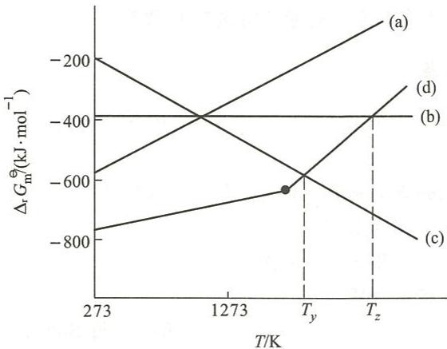

14.59 解释实验现象：

(1) 向 $SnCl_{4}$ 溶液中滴加 $Na_{2}S$ 溶液，有沉淀生成，继续滴加沉淀又溶解，再以稀盐酸处理此溶液，又析出沉淀。

(2) 向盛有 $\mathrm{Pb(NO_{3})_{2}}$ 溶液的试管中加入 KI 溶液，生成黄色沉淀；将试管加热则沉淀溶解；再将试管缓慢冷却到室温，有金黄色针状晶体析出。

14.60 灰黑色固体单质(A)在常温下不与酸反应,与浓 NaOH 溶液作用时生成无色溶液(B)和气体(C)。气体(C)在灼热的条件下可以将一黑色的氧化物还原成红色金属(D)。(A)在很高的温度下与氧气作用的产物为白色固体(E)。(E)与氢氟酸作用时能产生无色气体(F)。(F)通入水中时生成白色沉淀(G)及溶液(H)。(G)用适量的 NaOH 溶液处理得溶液(B)。试给出(A)、(B)、(C)、(D)、(E)、(F)、(G)和(H)所代表的物质的化学式。

14.61 金属(M)与过量的干燥氯气共热得无色液体(A)，(A)与金属(M)作用转化为固体(B)。将(A)溶于盐酸后通入 $\mathrm{H}_2\mathrm{S}$ 气体得黄色沉淀(C)，(C)溶于 $\mathrm{Na}_2\mathrm{S}$ 溶液得无色溶液(D)。将(B)溶于稀盐酸后加入适量 $\mathrm{HgCl}_2$ 有白色沉淀(E)生成。向(B)的盐酸溶液中加入适量 $\mathrm{NaOH}$ 溶液有白色沉淀(F)生成。(F)溶于过量 $\mathrm{NaOH}$ 溶液得无色溶液(G)。向(G)中加入 $\mathrm{BiCl}_3$ 溶液有黑色沉淀(H)生成。试给出(M)、(A)、(B)、(C)、(D)、(E)、(F)、(G)和(H)所代表的物质的化学式。

14.62 某白色固体(A),置于水中生成白色沉淀(B)和无色溶液(C)。将 $\mathrm{AgNO_3}$ 溶液加入溶液(C), 析出白色沉淀(D), (D)溶于氨水得溶液(E)。向(E)中加入 KI, 生成黄色沉淀(F), 再加入 NaCN 时沉淀(F)溶解。酸化溶液(E), 又产生白色沉淀(D)。将 $\mathrm{H}_{2} \mathrm{~S}$ 气体通入溶液(C), 产生灰色沉淀(G)。(G)溶于 $\mathrm{Na}_{2} \mathrm{~S}_{2}$ , 形成溶液。酸化该溶液时得黄色沉淀(H)。少量溶液(C)加入 $\mathrm{HgCl}_{2}$ 溶液得白色沉淀(I), 继续加入溶液(C), 沉淀(I)逐渐变灰, 最后变为黑色沉淀(J)。试给出(A)、(B)、(C)、(D)、(E)、(F)、(G)、(H)、(I)和(J)所代表的物质的化学式。

14.63 金属(A)难溶于稀盐酸。(A)溶于稀硝酸得(B)的无色溶液和无色气体(C)。(C)在空气中转变为红棕色气体(D)。在(B)的水溶液中加入盐酸,产生白色沉淀(E)。(E)不溶于氨水,但与 $\mathrm{H}_{2} \mathrm{~S}$ 反应生成黑色沉淀(F)。(F)溶于硝酸生成无色气体(C)、浅黄色沉淀(G)和(B)溶液。向(B)溶液中加入 NaOH 溶液生成白色沉淀(H),NaOH 溶液过量时(H)溶解,得到无色溶液(I)。向溶液(I)中加入氯水有棕黑色沉淀(J)生成。向(J)中加入热的酸性 $\mathrm{MnSO}_{4}$ 溶液,溶液变红。试给出(A)、(B)、(C)、(D)、(E)、(F)、(G)、(H)、(I)和(J)所代表的物质的化学式。

14.64 无色晶体(A)加热后有红棕色气体(B)生成。向(A)的水溶液中加入盐酸有白色沉淀(C)生成,盐酸过量时沉淀(C)溶解得到(D)。若向(A)的水溶液中加入KI溶液,则有黄色沉淀(E)生成。向(A)的水溶液中滴加NaOH溶液有白色沉淀(F)生成,NaOH过量则沉淀(F)溶解。将气体(B)通入水中生成(G),并放出无色气体(H)。沉淀(F)溶于适量(G)中形成的溶液,结晶后可以得到(A)。试给出(A)、(B)、(C)、(D)、(E)、(F)、(G)和(H)所代表的物质的化学式。

14.65 将白色粉末(A)加热得黄色固体(B)和无色气体(C)。(B)溶于硝酸得无色溶液(D),向(D)中加入 $\mathrm{K}_2\mathrm{CrO}_4$ 溶液得黄色沉淀(E)。向(D)中加入NaOH溶液至碱性,有白色沉淀(F)生成,NaOH过量时白色沉淀溶解得无色溶液。将气体(C)通入石灰水中产生白色沉淀(G),将(G)投入酸中,又有气体(C)放出。试给出(A)、(B)、(C)、(D)、(E)、(F)和(G)所代表的物质的化学式。

$\mathrm{O}_{2} \mathrm{H}_{2} + \mathrm{O} + \mathrm{H}_{2} \mathrm{Cl} \rightarrow \mathrm{CH}_{3} = \mathrm{CH}_{2} \mathrm{H}_{2} - \mathrm{CH}_{3}$

# 氮族元素

## 第一部分 例题

例 15.1 完成并配平下列化学反应方程式。

(1) $\mathrm{NH_3 + Mg\xlongequal{\triangle}}$

(2) $\mathrm{Mg_3N_2 + H_2O =}$

(3) $\mathrm{NH_3 + HgCl_2 =}$

(4) $\mathrm{MnO_4^- + HNO_2 + H^+ =}$

(5) $\mathrm{N}_2\mathrm{H}_4(\mathrm{aq}) + \mathrm{HNO}_2 =$

(6) $\mathrm{As_2O_3 + Zn + HCl(aq)} =$

(7) $\mathrm{Cu_2SO_4 + PH_3 =}$

(8) $\mathrm{NCl}_3 + \mathrm{H}_2\mathrm{O} =$

(9) $\mathrm{P_4 + NaOH}$ (热、浓) $+\mathrm{H}_2\mathrm{O} =$

解：(1) $2NH_{3}+3Mg\xlongequal{\triangle}Mg_{3}N_{2}+3H_{2}$

(2) $\mathrm{Mg}_3\mathrm{N}_2 + 6\mathrm{H}_2\mathrm{O} = 3\mathrm{Mg(OH)}_2 + 2\mathrm{NH}_3\uparrow$

(3) $2\mathrm{NH}_3 + \mathrm{HgCl}_2 = \mathrm{Hg(NH_2)Cl}\downarrow +\mathrm{NH}_4\mathrm{Cl}$

(4) $2\mathrm{MnO}_4^- + 5\mathrm{HNO}_2 + \mathrm{H}^+ = 5\mathrm{NO}_3^- + 2\mathrm{Mn}^{2+} + 3\mathrm{H}_2\mathrm{O}$

(5) $\mathrm{N}_2\mathrm{H}_4(\mathrm{aq}) + \mathrm{HNO}_2 = \mathrm{HN}_3 + 2\mathrm{H}_2\mathrm{O}$

$$
\mathrm{As} _ {2} \mathrm{O} _ {3} + 6 \mathrm{Zn} + 1 2 \mathrm{HCl(aq)} = 2 \mathrm{AsH} _ {3} \uparrow + 6 \mathrm{ZnCl} _ {2} + 3 \mathrm{H} _ {2} \mathrm{O}
$$

(7) $3\mathrm{Cu}_{2}\mathrm{SO}_{4} + 2\mathrm{PH}_{3} = 3\mathrm{H}_{2}\mathrm{SO}_{4} + 2\mathrm{Cu}_{3}\mathrm{P}\downarrow$

(8) $\mathrm{NCl}_3 + 3\mathrm{H}_2\mathrm{O} = \mathrm{NH}_3 + 3\mathrm{HClO}$

(9) $\mathrm{P}_{4} + 3\mathrm{NaOH}$ (热、浓) $+3\mathrm{H}_{2}\mathrm{O} = 3\mathrm{NaH}_{2}\mathrm{PO}_{2} + \mathrm{PH}_{3}\uparrow$

例 15.2 用化学反应方程式表示制备与生产过程。

(1) 以 $\mathrm{N}_{2}$ 和 $\mathrm{H}_{2}$ 为主要原料制备 $\mathrm{NH}_{4} \mathrm{NO}_{3}$ ;

(2) 由 $\mathrm{NH}_{3}$ 制备 $\mathrm{N}_{2} \mathrm{H}_{4}$ 和 $\mathrm{HN}_{3}$ ;

(3) 由 $NaNO_{3}$ 制备 $N_{2}O_{5}$ ;

(4) 以磷酸钙矿为主要原料生产 $\mathrm{P}_{2} \mathrm{O}_{5}$ 和单质 $\mathrm{P}$ ;

(5) 以 $\mathrm{As}_{2} \mathrm{~S}_{3}$ 为主要原料制备 $\mathrm{As}_{2} \mathrm{O}_{3}$ 和 $\mathrm{H}_{3} \mathrm{AsO}_{4}$ 。

解：(1)

$$
3 \mathrm{H} _ {2} + \mathrm{N} _ {2} \xrightarrow [ T , p ]{\text {催化剂}} 2 \mathrm{NH} _ {3}
$$

生成的 $\mathrm{NH}_{3}$ 通入硝酸中生成 $\mathrm{NH}_{4} \mathrm{NO}_{3}$ :

$$
\mathrm{NH} _ {3} + \mathrm{HNO} _ {3} = \mathrm{NH} _ {4} \mathrm{NO} _ {3}
$$

(2) 用 NaClO 氧化过量氨水可以得到 $N_{2}H_{4}$ :

$$
2 \mathrm{NH} _ {3} + \mathrm{NaClO} = \mathrm{N} _ {2} \mathrm{H} _ {4} + \mathrm{NaCl} + \mathrm{H} _ {2} \mathrm{O}
$$

联氨被亚硝酸氧化,生成叠氮酸:

$$
\mathrm{N} _ {2} \mathrm{H} _ {4} + \mathrm{HNO} _ {2} = \mathrm{HN} _ {3} + 2 \mathrm{H} _ {2} \mathrm{O}
$$

(3) 将 $NaNO_{3}$ 酸化，并用 $P_{2}O_{5}$ 使硝酸脱水：

$$
6 \mathrm{HNO} _ {3} + \mathrm{P} _ {2} \mathrm{O} _ {5} = 3 \mathrm{N} _ {2} \mathrm{O} _ {5} + 2 \mathrm{H} _ {3} \mathrm{PO} _ {4}
$$

(4) 在电炉中反应:

$$
\begin{array}{r l} & \mathrm {Ca_ {3} (PO_ {4}) _ {2} (s) + 3SiO_ {2} (s) = 3CaSiO_ {3} (l)+ P_ {2} O_ {5} (g)} \\ & \mathrm {P_ {2} O_ {5} (g) + 5C(s) = 2P(g) + 5CO(g)} \end{array}
$$

将 P 蒸气通入水中冷凝得单质 P。

(5) 高温下焙烧 $As_{2}S_{3}$ 得到 $As_{2}O_{3}$ :

$$
2 \mathrm{As} _ {2} \mathrm{S} _ {3} + 9 \mathrm{O} _ {2} \stackrel {\triangle} {=} 2 \mathrm{As} _ {2} \mathrm{O} _ {3} + 6 \mathrm{SO} _ {2}
$$

酸性条件下用 $\mathrm{H}_2\mathrm{O}_2$ 氧化 $\mathrm{As}_2\mathrm{O}_3$ 可得 $\mathrm{H}_3\mathrm{AsO}_4$ ：

$$
\mathrm{As} _ {2} \mathrm{O} _ {3} + 2 \mathrm{H} _ {2} \mathrm{O} _ {2} + \mathrm{H} _ {2} \mathrm{O} \stackrel {\triangle} {=} 2 \mathrm{H} _ {3} \mathrm{AsO} _ {4}
$$

例 15.3 分别用三种方法鉴别下列各组物质。

(1) $NH_{4}NO_{3}$ 和 $NH_{4}Cl$ ; (2) $SbCl_{3}$ 和 $BiCl_{3}$ ;

(3) $\mathrm{NaNO}_{3}$ 和 $\mathrm{NaPO}_{3}$ 。

解：（1）向两种盐的溶液中加入 $AgNO_{3}$ 溶液，有白色沉淀生成的是 $NH_{4}Cl$ ，另一种盐是 $NH_{4}NO_{3}$ ：

$$
\mathrm{Ag} ^ {+} + \mathrm{Cl} ^ {-} = \mathrm{AgCl} \downarrow
$$

向两种盐的溶液中分别加入酸性 $KMnO_{4}$ 溶液，能使其褪色的是 $NH_{4}Cl$ ，另一种是 $NH_{4}NO_{3}$ ：

$$
1 0 \mathrm{Cl} ^ {-} + 2 \mathrm{MnO} _ {4} ^ {-} + 1 6 \mathrm{H} ^ {+} = 2 \mathrm{Mn} ^ {2 +} + 5 \mathrm{Cl} _ {2} \uparrow + 8 \mathrm{H} _ {2} \mathrm{O}
$$

取少量两种盐的晶体分别装入两支试管中,加入 $FeSO_{4}$ , 加水溶解后沿着试管壁加浓硫酸, 在浓硫酸与上层溶液的界面处有棕色环生成的是 $NH_{4}NO_{3}$ , 另一种盐是 $NH_{4}Cl$ :

$$
\begin{array}{r l} & \mathrm{NO} _ {3} ^ {-} + 3 \mathrm{Fe} ^ {2 +} + 4 \mathrm{H} ^ {+} = \mathrm{NO} \uparrow + 3 \mathrm{Fe} ^ {3 +} + 2 \mathrm{H} _ {2} \mathrm{O} \\ & \mathrm{NO} + \mathrm{Fe} ^ {2 +} = \mathrm{Fe(NO)} ^ {2 +} (\text {棕色}) \end{array}
$$

(2) 将两种盐溶于水, 分别滴加 $\mathrm{NaOH}$ 溶液至过量, 先有白色沉淀生成而后沉淀又溶解的是 $\mathrm{SbCl}_{3}$ , 加 $\mathrm{NaOH}$ 溶液生成的白色沉淀不溶于过量 $\mathrm{NaOH}$ 溶液的是 $\mathrm{BiCl}_{3}$ :

$$
\begin{array}{r l} & \mathrm {Sb^ {3 + } + 3OH^ {-} = Sb(OH) _ {3} \downarrow} \\ & \mathrm {Sb(OH) _ {3} + 3OH^ {-} = SbO_ {3} ^ {3 - } + 3 H _ {2} O} \\ & \mathrm {Bi^ {3 + } + 3OH^ {-} = Bi(OH) _ {3} \downarrow} \end{array}
$$

将两种盐溶于稀盐酸,分别加入溴水,能使溴水褪色的是 $SbCl_{3}$ ,另一种盐是 $BiCl_{3}$ :

$$
\mathrm{Sb} ^ {3 +} + \mathrm{Br} _ {2} = \mathrm{Sb} ^ {5 +} + 2 \mathrm{Br} ^ {-}
$$

向两种盐的溶液中加入 NaOH 和 NaClO 溶液, 微热, 有土黄色沉淀生成的是 $BiCl_{3}$ , 另一种盐是 $SbCl_{3}$ :

$$
\mathrm{Bi} ^ {3 +} + \mathrm{ClO} ^ {-} + 4 \mathrm{OH} ^ {-} + \mathrm{Na} ^ {+} = \mathrm{NaBiO} _ {3} \downarrow + 2 \mathrm{H} _ {2} \mathrm{O} + \mathrm{Cl} ^ {-}
$$

（3）向两种盐的溶液中加入 $AgNO_{3}$ 溶液，有白色沉淀生成的是 $NaPO_{3}$ ，另一种盐是 $NaNO_{3}$ ：

$$
\mathrm{Ag} ^ {+} + \mathrm{PO} _ {3} ^ {-} = \mathrm{AgPO} _ {3} \downarrow
$$

分别将两种盐酸化后煮沸,这时偏磷酸盐 $PO_{3}^{-}$ 将转化为正磷酸盐 $PO_{4}^{3-}$ 。再分别加入过量的 $(\mathrm{NH}_{4})_{2}\mathrm{MoO}_{4}$ ，有特征的黄色沉淀磷钼酸铵生成的是 $NaPO_{3}$ ，无此特征现象的是 $NaNO_{3}$ ：

$$
\mathrm{PO} _ {4} ^ {3 -} + 1 2 \mathrm{MoO} _ {4} ^ {2 -} + 2 4 \mathrm{H} ^ {+} + 3 \mathrm{NH} _ {4} ^ {+} = (\mathrm{NH} _ {4}) _ {3} \mathrm{PMo} _ {1 2} \mathrm{O} _ {4 0} \cdot 6 \mathrm{H} _ {2} \mathrm{O} \downarrow + 6 \mathrm{H} _ {2} \mathrm{O}
$$

分别将两种盐的晶体加热,充分反应后加入浓硝酸,有棕色 $NO_{2}$ 气体生成的是 $NaNO_{3}$ ,另一种盐是 $NaPO_{3}$ :

$$
\mathrm{NO} _ {3} ^ {-} + \mathrm{NO} _ {2} ^ {-} + 2 \mathrm{H} ^ {+} = 2 \mathrm{NO} _ {2} \uparrow + \mathrm{H} _ {2} \mathrm{O}
$$

例 15.4 现有下列六种磷的含氧酸盐固体,试加以鉴别。

$$
\mathrm{Na} _ {4} \mathrm{P} _ {2} \mathrm{O} _ {7}, \mathrm{NaPO} _ {3}, \mathrm{Na} _ {2} \mathrm{HPO} _ {4}, \mathrm{NaH} _ {2} \mathrm{PO} _ {4}, \mathrm{NaH} _ {2} \mathrm{PO} _ {2}, \mathrm{NaH} _ {2} \mathrm{PO} _ {3} 。
$$

解：向六种盐的水溶液中分别加入 $\mathrm{AgNO_3}$ 溶液，生成白色沉淀的是 $\mathrm{Na_4P_2O_7}$ 和 $\mathrm{NaPO_3}$

$$
\begin{array}{r l} & {\mathrm{P} _ {2} \mathrm{O} _ {7} ^ {4 -} + 4 \mathrm{Ag} ^ {+} = \mathrm{Ag} _ {4} \mathrm{P} _ {2} \mathrm{O} _ {7} \downarrow (\text {白色})} \\ & {\mathrm{PO} _ {3} ^ {-} + \mathrm{Ag} ^ {+} = \mathrm{AgPO} _ {3} \downarrow (\text {白色})} \end{array}
$$

生成黄色沉淀的是 $Na_{2}HPO_{4}$ 和 $NaH_{2}PO_{4}$ :

$$
\begin{array}{r l} & {\mathrm {HP O _ {4} ^ {2 - } +3Ag^ {+} \xlongequal   Ag_ {3} PO_ {4} \downarrow(黄色) + H^ {+}}} \\ & {\mathrm {H_ {2} PO_ {4} ^ {-} +3Ag^ {+} \xlongequal   Ag_ {3} PO_ {4} \downarrow(黄色) + 2H^ {+}}} \end{array}
$$

生成黑色沉淀的是 $NaH_{2}PO_{2}$ 和 $NaH_{2}PO_{3}$ :

$$
\begin{array}{r l} & {\mathrm {H_ {2} PO_ {2} ^ {-} +4Ag^ {+} +2H_ {2} O\xlongequal   4Ag\downarrow(黑色)+ H_ {3} PO_ {4} +3H^ {+}}} \\ & {\mathrm {H_ {2} PO_ {3} ^ {-} +2Ag^ {+} + H_ {2} O\xlongequal   2Ag\downarrow(黑色)+ H_ {3} PO_ {4} + H^ {+}}} \end{array}
$$

$NaPO_{3}$ 能使蛋白质溶液凝聚而 $Na_{4}P_{2}O_{7}$ 不能，可将 $NaPO_{3}$ 和 $Na_{4}P_{2}O_{7}$ 区分开。

$Na_{2}HPO_{4}$ 溶液为弱碱性而 $NaH_{2}PO_{4}$ 溶液为弱酸性，可将 $Na_{2}HPO_{4}$ 和 $NaH_{2}PO_{4}$ 区分开。 $NaH_{2}PO_{3}$ 为酸式盐，其溶液有缓冲作用，加入少量强酸或强碱但溶液的 pH 基本不变； $NaH_{2}PO_{2}$ 不是酸式盐，其溶液没有缓冲作用。由此可将 $NaH_{2}PO_{3}$ 和 $NaH_{2}PO_{2}$ 区分开。

## 例15.5 解释实验现象。

(1) 在煤气灯上加热 $\mathrm{KNO}_{3}$ 晶体时没有棕色气体生成, 但若 $\mathrm{KNO}_{3}$ 晶体混有 $\mathrm{CuSO}_{4}$ 时则有棕色气体生成。

(2) 向 $\mathrm{Na}_{3} \mathrm{PO}_{4}$ 溶液中滴加 $\mathrm{AgNO}_{3}$ 溶液时生成黄色沉淀, 但向 $\mathrm{NaPO}_{3}$ 溶液中滴加 $\mathrm{AgNO}_{3}$ 溶液时却生成白色沉淀。

（3）向 $Na_{2}HPO_{4}$ 溶液中滴加 $CaCl_{2}$ 溶液有白色沉淀生成，但向 $NaH_{2}PO_{4}$ 溶液中滴加 $CaCl_{2}$ 溶液没有沉淀生成。

（4）分别向 $NaH_{2}PO_{4}$ ， $Na_{2}HPO_{4}$ 和 $Na_{3}PO_{4}$ 溶液中滴加 $AgNO_{3}$ 溶液时，均得到黄色的 $Ag_{3}PO_{4}$ 沉淀。

(5) 向 $\mathrm{KNO}_2$ 的酸性溶液中加入 $\mathrm{Co(II)}$ 盐, 生成的 $\mathrm{K}_3[\mathrm{Co}(\mathrm{NO}_2)_6]$ 中 $\mathrm{Co}$ 为 $+3$ 价。

解：(1) $\mathrm{K}^{+}$ 极化能力弱, 在煤气灯上加热 $\mathrm{KNO}_{3}$ 晶体时生成 $\mathrm{KNO}_{2}$ 和 $\mathrm{O}_{2}$ , 不生成棕色 $\mathrm{NO}_{2}$ 气体:

$$
2 \mathrm{KNO} _ {3} \stackrel {\triangle} {=} 2 \mathrm{KNO} _ {2} + \mathrm{O} _ {2} \uparrow
$$

在 $KNO_{3}$ 晶体混有 $CuSO_{4}$ 时，混合物受热熔化， $NO_{3}^{-}$ 接触极化能力较强的 $Cu^{2+}$ ，使 $NO_{3}^{-}$ 分解生成棕色 $NO_{2}$ 气体：

$$
4 \mathrm{KNO} _ {3} + 2 \mathrm{CuSO} _ {4} \stackrel {\triangle} {=} 4 \mathrm{NO} _ {2} \uparrow + \mathrm{O} _ {2} \uparrow + 2 \mathrm{CuO} + 2 \mathrm{K} _ {2} \mathrm{SO} _ {4}
$$

（2）向 $Na_{3}PO_{4}$ 溶液中滴加 $AgNO_{3}$ 溶液时生成 $Ag_{3}PO_{4}$ 沉淀，为黄色；向 $NaPO_{3}$ 溶液中滴加 $AgNO_{3}$ 溶液时生成 $AgPO_{3}$ 沉淀，为白色。

$\mathrm{Ag^{+}}$ 的极化能力较强, 半径也较大, 因而 $\mathrm{Ag_{3}PO_{4}}$ 中 $\mathrm{Ag^{+}}$ 与负电荷数多的 $\mathrm{PO_{4}^{3-}}$ 之间的附加极化作用较强, 很容易发生电荷迁移, 吸收可见光显颜色。而 $\mathrm{AgPO_{3}}$ 中 $\mathrm{Ag^{+}}$ 与负电荷数少的 $\mathrm{PO_{3}^{-}}$ 之间的附加极化作用较弱, 很难发生电荷迁移, 即可见光照射后不发生电荷迁移, 因而为白色。

(3) $\mathrm{CaHPO_4}$ 溶解度比 $\mathrm{Ca(H_2PO_4)_2}$ 小得多, 所以向 $\mathrm{Na_2HPO_4}$ 溶液中加入 $\mathrm{CaCl_2}$ 溶液有白色沉淀生成, 向 $\mathrm{NaH_2PO_4}$ 溶液中加入 $\mathrm{CaCl_2}$ 溶液没有沉淀生成。

(4) $\mathrm{AgH_2PO_4}$ 和 $\mathrm{Ag_2HPO_4}$ 比 $\mathrm{Ag_3PO_4}$ 溶解度大得多, 因此向 $\mathrm{NaH_2PO_4}$ , $\mathrm{Na_2HPO_4}$ 和 $\mathrm{Na_3PO_4}$ 溶液中加入 $\mathrm{AgNO_3}$ 溶液时, 都生成黄色的 $\mathrm{Ag_3PO_4}$ 沉淀。

(5) $NO_{2}^{-}$ 对于 Co(Ⅲ) 为强配体, 使电对 Co(Ⅲ)/Co(Ⅱ) 的 E 降低很多。在酸性条件下 Co(Ⅱ) 被亚硝酸氧化成 Co(Ⅲ), 生成稳定的配位化合物 $K_{3}[Co(NO_{2})_{6}]$ :

$$
\mathrm{Co} ^ {2 +} + 7 \mathrm{NO} _ {2} ^ {-} + 3 \mathrm{K} ^ {+} + 2 \mathrm{H} ^ {+} = \mathrm{K} _ {3} \left[ \mathrm{Co} (\mathrm{NO} _ {2}) _ {6} \right] \downarrow + \mathrm{NO} \uparrow + \mathrm{H} _ {2} \mathrm{O}
$$

例 15.6 给出下列铵盐受热分解的反应方程式,总结铵盐热分解反应规律。

$NH_{4}HCO_{3},NH_{4}Cl,NH_{4}NO_{3},(NH_{4})_{2}Cr_{2}O_{7}$

解：

$$
\begin{array}{r l} & \mathrm {NH_ {4} HC O _ {3}} \xlongequal {\triangle} \mathrm {NH_ {3}} \uparrow + \mathrm {CO_ {2}} \uparrow + \mathrm {H_ {2} O} \uparrow \\ & \mathrm {NH_ {4} Cl} \xlongequal {\triangle} \mathrm {NH_ {3}} \uparrow + \mathrm{HCl} \uparrow \\ & \mathrm {NH_ {4} NO_ {3}} \xlongequal {\triangle} \mathrm {N_ {2} O} \uparrow + 2 \mathrm {H_ {2} O} \uparrow \\ & 2 \mathrm {NH_ {4} NO_ {3}} \xlongequal {\triangle} 2 \mathrm {N_ {2}} \uparrow + \mathrm {O_ {2}} \uparrow + 4 \mathrm {H_ {2} O} \uparrow \\ & (\mathrm {NH_ {4}}) _ {2} \mathrm {Cr_ {2} O_ {7}} \xlongequal {\triangle} \mathrm {Cr_ {2} O_ {3}} + \mathrm {N_ {2}} \uparrow + 4 \mathrm {H_ {2} O} \uparrow \end{array}
$$

铵盐热分解一般生成 $NH_{3}$ 和相应的酸, 若生成的酸有较强的氧化性, 则 $NH_{3}$ 被氧化成 $N_{2}$ 或氮的氧化物。

例15.7 给出下列物质的水解反应方程式，并说明 $\mathrm{NCl}_3$ 水解产物与其他化合物的水解产物有何本质的区别，为什么？

$$
\mathrm{NCl} _ {3}, \mathrm{PCl} _ {3}, \mathrm{AsCl} _ {3}, \mathrm{SbCl} _ {3}, \mathrm{BiCl} _ {3}, \mathrm{POCl} _ {3} 。
$$

解：

$$
\begin{array}{r l} & \mathrm {NC l _ {3}} + 3 \mathrm {H_ {2} O} = \mathrm {NH_ {3}} + 3 \mathrm{HClO} \\ & \mathrm {PC l _ {3}} + 3 \mathrm {H_ {2} O} = \mathrm {H_ {3} P O _ {3}} + 3 \mathrm{HCl} \end{array}
$$

$$
\begin{array}{r l} & \mathrm {AsCl_ {3} + 3H_ {2} O = H_ {3} AsO_ {3} + 3HCl} \\ & \mathrm {SbCl_ {3} + H_ {2} O = SbOCl\downarrow + 2HCl} \\ & \mathrm {BiCl_ {3} + H_ {2} O = BiOCl\downarrow + 2HCl} \\ & \mathrm {POCl_ {3} + 3H_ {2} O = H_ {3} PO_ {4} + 3HCl} \end{array}
$$

$NCl_{3}$ 水解产物既有酸(HClO)，又有碱( $NH_{3}$ )， $PCl_{3}$ 和 $AsCl_{3}$ 彻底水解产物为两种酸， $SbCl_{3}$ 和 $BiCl_{3}$ 水解产物为酸和碱式盐(MOCl)。

$NCl_{3}$ 中 N 的孤电子对向 $H_{2}O$ 中的 H 配位后释放出 $Cl^{-}$ ，最终生成 $NH_{3}$ ，释放出的 $Cl^{-}$ 与 $H_{2}O$ 中解离出的 $OH^{-}$ 结合生成 HClO。

$AsCl_{3}$ 和 $PCl_{3}$ 解离出的 $Cl^{-}$ 与 $H_{2}O$ 解离出的 $H^{+}$ 结合生成 HCl, $AsCl_{3}$ 和 $PCl_{3}$ 的中心与 $H_{2}O$ 解离出的 $OH^{-}$ 结合生成 $M(OH)_{3}$ (或写成 $H_{3}MO_{3}$ )。

$\mathrm{SbCl}_{3}$ 和 $\mathrm{BiCl}_{3}$ 水解与 $\mathrm{AsCl}_{3}$ 和 $\mathrm{PCl}_{3}$ 相似，但前两者水解不完全而生成碱式盐和 $\mathrm{HCl}$ 。

例 15.8 在 $H_{3}PO_{2}$ ， $H_{3}PO_{3}$ 和 $H_{3}PO_{4}$ 分子中都含有 3 个 H，为什么 $H_{3}PO_{2}$ 为一元酸， $H_{3}PO_{3}$ 为二元酸，而 $H_{3}PO_{4}$ 为三元酸？

解：磷的含氧酸中，只有一OH基团的H能解离出 $\mathrm{H}^{+}$ ，而与P键连的H不能解离出 $\mathrm{H}^{+}$ 。因此，磷的含氧酸是几元酸，是由分子中有几个一OH基团决定的。

由磷的含氧酸的结构可知， $H_{3}PO_{2}$ 分子中有 1 个—OH 基团，为一元酸； $H_{3}PO_{3}$ 分子中有 2 个—OH 基团，为二元酸， $H_{3}PO_{4}$ 分子中有 3 个—OH 基团，为三元酸。

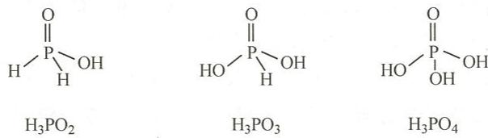

例 15.9 无色钠盐晶体(A)溶于水后加入 $AgNO_{3}$ 有浅黄色沉淀(B)生成。用 NaOH 溶液处理(B)，得到棕黑色沉淀(C)。(B)溶于硝酸并放出棕色气体(D)。(D)通入 NaOH 溶液后经蒸发、浓缩析出晶体(E)。(E)受热分解得无色气体(F)和(A)的粉末。

试给出(A)、(B)、(C)、(D)、(E)和(F)所代表的物质的化学式,并用化学反应方程式表示各过程。
解： $(A)-NaNO_{2}$ ; $(B)-AgNO_{2}$ ; $(C)-Ag_{2}O$ ; $(D)-NO_{2}$ ; $(E)-NaNO_{2}+NaNO_{3}$ ; $(F)-O_{2}$ 。

各过程的化学反应方程式如下：

$$
\begin{array}{r l} & \mathrm {NaNO_ {2} + AgNO_ {3} = AgNO_ {2} \downarrow + NaNO_ {3}} \\ & 2 \mathrm {AgNO_ {2} + 2NaOH = Ag_ {2} O\downarrow + 2NaNO_ {2} + H_ {2} O} \\ & 2 \mathrm {AgNO_ {2} + 2HNO_ {3} = 2AgNO_ {3} + NO_ {2} \uparrow + NO\uparrow+ H_ {2} O} \\ & 2 \mathrm {NO_ {2} + 2NaOH = NaNO_ {3} + NaNO_ {2} + H_ {2} O} \\ & 2 \mathrm {NaNO_ {3} \xlongequal{\triangle} 2NaNO_ {2} + O_ {2} \uparrow} \end{array}
$$

例 15.10 化合物(A)溶于稀盐酸得无色溶液,再加入 NaOH 溶液得到白色沉淀(B)。(B)溶于过量 NaOH 溶液得到无色溶液(C)。将(B)溶于盐酸后蒸发、浓缩后又析出(A)。向(A)的稀盐酸溶液加入 $H_{2}S$ 溶液生成橙色沉淀(D)。(D)与 $Na_{2}S_{2}$ 可以发生氧化还原反应,反应产物之间作用得到无色溶液(E)。将(A)投于水中生成白色沉淀(F)。

试给出(A)、(B)、(C)、(D)、(E)和(F)所代表的物质的化学式,并用化学反应方程式表示各过程。
解：(A)—SbCl₃；(B)—Sb(OH)₃；(C)—Na₃SbO₃；
(D)—Sb₂S₃；(E)—Na₃SbS₄；(F)—SbOCl。

各过程的化学反应方程式如下：

$$
\mathrm{SbCl} _ {3} + 3 \mathrm{NaOH} = \mathrm{Sb(OH)} _ {3} \downarrow + 3 \mathrm{NaCl}
$$

$$
\mathrm {Sb(OH) _ {3} + 3NaOH = Na_ {3} SbO_ {3} + 3H_ {2} O}
$$

$$
\mathrm {Sb(OH) _ {3} + 3HCl = SbCl_ {3} + 3H_ {2} O}
$$

$$
2 \mathrm{SbCl} _ {3} + 3 \mathrm{H} _ {2} \mathrm{S} = \mathrm{Sb} _ {2} \mathrm{S} _ {3} \downarrow + 6 \mathrm{HCl}
$$

$$
\mathrm{Sb} _ {2} \mathrm{S} _ {3} + 2 \mathrm{Na} _ {2} \mathrm{S} _ {2} = \mathrm{Sb} _ {2} \mathrm{S} _ {5} + 2 \mathrm{Na} _ {2} \mathrm{S}
$$

$$
\mathrm{Sb} _ {2} \mathrm{S} _ {5} + 3 \mathrm{Na} _ {2} \mathrm{S} = 2 \mathrm{Na} _ {3} \mathrm{SbS} _ {4}
$$

$$
\mathrm{SbCl} _ {3} + \mathrm{H} _ {2} \mathrm{O} = \mathrm{SbOCl} \downarrow + 2 \mathrm{HCl}
$$

## 第二部分 习题

## 一、选择题

15.1 干燥 $\mathrm{NH}_3$ 气体可选择的干燥剂是（A）浓硫酸； （B） $\mathrm{CaCl}_2$ ； （C） $\mathrm{P}_2\mathrm{O}_5$ ； （D） $\mathrm{CaO}$ 。

15.2 对下列化合物的性质判断正确的是
(A) 碱性: $NH_{3} > N_{2}H_{4} > NH_{2}OH$ ; (B) 熔点: $NH_{3} > N_{2}H_{4} > NH_{2}OH$ ;
(C) 还原性: $NH_{3} > N_{2}H_{4} > NH_{2}OH$ ; (D) 热稳定性: $NH_{2}OH > N_{2}H_{4} > NH_{3}$ 。

15.3 下列分子中,不存在 $\Pi_{3}^{4}$ 离域键的是
(A) $HNO_{3}$ ; (B) $HNO_{2}$ ; (C) $N_{2}O$ ; (D) $N_{3}^{-}$ 。

15.4 下列物质中, 受热可得到 $NO_{2}$ 的是
(A) $NaNO_{3}$ ; (B) $LiNO_{3}$ ; (C) $KNO_{3}$ ; (D) $NH_{4}NO_{3}$ 。

15.5 下列物质中,加热分解可以得到金属单质的是
(A) $\mathrm{Hg(NO_{3})_{2}}$ ; (B) $\mathrm{Cu(NO_{3})_{2}}$ ; (C) $KNO_{3}$ ; (D) $\mathrm{Mg(NO_{3})_{2}}$ 。

15.6 下列物质中,遇水后能放出气体并有沉淀生成的是
(A) $\mathrm{Bi(NO_{3})_{2}}$ ; (B) $Mg_{3}N_{2}$ ; (C) $(\mathrm{NH}_{4})_{2}\mathrm{SO}_{4}$ ; (D) $NCl_{3}$ 。

15.7 下列化合物中,沸点最低的是
(A) $PCl_{3}$ ; (B) $PF_{5}$ ; (C) $PCl_{5}$ ; (D) $PBr_{5}$ 。

15.8 下列化合物中,最易发生爆炸反应的是

(A) $\mathrm{Pb(NO_3)_2}$ ; (B) $\mathrm{Pb(N_3)_2}$ ; (C) $\mathrm{PbCO_3}$ ; (D) $\mathrm{K}_2\mathrm{CrO}_4$ 。

15.9 下列铵盐中, 受热分解时有 $NH_{3}$ 放出的是
(A) $(\mathrm{NH}_{4})_{2}\mathrm{SO}_{4}$ ; (B) $NH_{4}NO_{3}$ ; (C) $NH_{4}NO_{2}$ ; (D) $(\mathrm{NH}_{4})_{2}\mathrm{Cr}_{2}\mathrm{O}_{7}$

15.10 下列化合物中,不能将 $I_{2}$ 还原的是
(A) $H_{3}PO_{3}$ ; (B) $H_{3}PO_{2}$ ; (C) $HPO_{3}$ ; (D) $PH_{3}$ 。

15.11 下列溶液中,加入 $AgNO_{3}$ 溶液生成的沉淀颜色最浅的是
(A) $NaPO_{3}$ ; (B) $NaH_{2}PO_{3}$ ; (C) $Na_{3}PO_{4}$ ; (D) $Na_{2}HPO_{4}$ 。

15.12 下列酸中为一元酸的是
(A) $H_{4}P_{2}O_{7}$ ; (B) $H_{3}PO_{2}$ ; (C) $H_{3}PO_{3}$ ; (D) $H_{3}PO_{4}$ 。

15.13 下列物质的水解产物中既有酸又有碱的是
(A) $NCl_{3}$ ; (B) $PCl_{3}$ ; (C) $POCl_{3}$ ; (D) $Mg_{3}N_{2}$ 。

15.14 下列物质中,不溶于氢氧化钠溶液的是
(A) $\mathrm{Sb(OH)}_{3}$ ; (B) $\mathrm{Sb(OH)}_{5}$ ; (C) $H_{3}AsO_{4}$ ; (D) $\mathrm{Bi(OH)}_{3}$ 。

15.15 下列物质中，与盐酸反应能产生氯气的是
(A) $H_{3}AsO_{4}$ ; (B) $H_{3}SbO_{4}$ ; (C) $Bi_{2}O_{3}$ ; (D) $NaBiO_{3}$ 。

15.16 下列物质均有较强的氧化性,其中强氧化性与惰性电子对有关的是
(A) $K_{2}Cr_{2}O_{7}$ ; (B) $NaBiO_{3}$ ; (C) $(\mathrm{NH}_{4})_{2}\mathrm{S}_{2}\mathrm{O}_{8}$ ; (D) $H_{5}IO_{6}$ 。

## 二、填空题

15.17 给出下列物质的化学式。

(1) 雄黄\_\_\_\_；(2) 雌黄\_\_\_\_；(3) 辉锑矿\_\_\_\_；(4) 锑硫镍矿\_\_\_\_；

(5) 辉铋矿；(6) 砷华；(7) 锑华；(8) 铋华。

15.18 从 $\mathrm{NH}_3$ 的结构和N的价态考虑，应有 反应、 反应和 反应。

15.19 氮的氢化物中,碱性最强的是\_\_\_\_,酸性最强的是\_\_\_\_,配位能力最强的是\_\_\_\_,最不稳定的是\_\_\_\_,还原能力最差的是\_\_\_\_,与 AgCl 反应有水生成的是\_\_\_\_。

15.20 $\mathrm{PH}_{3}$ 的空间构型为\_\_\_\_形，其毒性比 $\mathrm{NH}_{3}$ ，溶解性比 $\mathrm{NH}_{3}$ ，碱性比 $\mathrm{NH}_{3}$ ，与过渡金属的配位能力比 $\mathrm{NH}_{3}$ ，热稳定性比 $\mathrm{NH}_{3}$ 。

15.21 稀酸的氧化性 $HNO_{3}$ \_\_\_\_ $HNO_{2}$ ; 盐的热稳定性 $AgNO_{3}$ \_\_\_\_ $AgNO_{2}$ ; 离子的配位能力 $NO_{3}^{-}$ $NO_{2}^{-}$ 。

15.22 依次给出次磷酸、亚磷酸、正磷酸、偏磷酸、焦磷酸的化学式：\_\_\_\_，\_\_\_\_，\_\_\_\_，\_\_\_\_，\_\_\_\_。

15.23 磷的硫化物的颜色均为\_\_\_\_色,其中组成与结构和对应的氧化物最相似的是\_\_\_\_,分子结构有二重旋转轴的是\_\_\_\_。

15.24 $\mathrm{Ca(H_2PO_4)_2}$ ， $\mathrm{CaHPO_4}$ ， $\mathrm{Ca_3(PO_4)_2}$ 在水中的溶解度大小次序为

15.25 $\mathrm{SbCl}_3$ 的水解产物为\_\_\_\_； $\mathrm{Cu(NO_3)_2\cdot 2H_2O}$ 在不太高温度时的分解产物为\_\_\_\_；温度较高时的分解产物为\_\_\_\_； $\mathrm{Mn(NO_3)_2}$ 受热分解的产物为\_\_\_\_。

15.26 在 $\mathrm{NaH_2PO_4}$ 溶液中加入 $\mathrm{AgNO_3}$ 溶液时，生成的沉淀为 \_\_\_\_ ，沉淀为 \_\_\_\_ 色。

15.27 马氏试砷法中,把砷的化合物与锌和盐酸作用,产生分子式为\_\_\_\_的气体,气体受热,

在玻璃管中出现\_\_\_\_。

15.28 $\mathrm{As}_{2} \mathrm{O}_{3}$ 与 $\mathrm{NaOH}$ 溶液作用生成，再加碘水生成和。

15.29 给出下列化合物或离子的颜色。

$As_{2}S_{3}$ 色； $As_{2}S_{5}$ 色； $Sb_{2}S_{3}$ 色； $Sb_{2}S_{5}$ 色； $AgNO_{2}$ 色；

$K_{3}[Co(NO_{2})_{6}]$ \_\_\_\_ 色； $Fe(NO)^{2+}$ \_\_\_\_ 色； $NO_{2}$ \_\_\_\_ 色； $N_{2}O_{3}$ \_\_\_\_ 色； $N_{2}O_{4}$ \_\_\_\_ 色。

## 三、完成并配平化学反应方程式

15.30 氯化铵与亚硝酸钠溶液混合后加热。

15.31 亚硝酸钠晶体与浓硝酸混合。

15.32 二氧化氮通入氢氧化钠溶液。

15.33 亚硝酸钠晶体受热分解。

15.34 氨气通过热的氧化铜。

15.35 用羟胺处理 AgBr。

15.36 叠氨酸铅受热分解。

15.37 金溶于王水。

15.38 铂溶于王水。

15.39 向红磷与水的混合物中滴加溴。

15.40 白磷溶于硝酸溶液。

15.41 向次磷酸溶液中滴加硝酸银溶液。

15.42 三氯化磷与氧气反应。

15.43 次磷酸溶液中加入过量氢氧化钠溶液。

15.44 亚磷酸溶液中加入过量氢氧化钠溶液。

15.45 用次氯酸钠溶液洗掉玻璃管壁上的“砷镜”。

15.46 砷化氢通入硝酸银溶液。

15.47 三硫化二砷溶于氢氧化钠溶液。

15.48 三硫化二砷溶于硫化钠溶液。

15.49 向硫代砷酸钠溶液中加盐酸。

15.50 五硫化二锑溶于氢氧化钠溶液。

15.51 三氧化二锑溶于浓硝酸。

15.52 三氯化铋水解。

15.53 氢氧化铋与氯气在氢氧化钠溶液中反应。

15.54 将铋酸钠与少许酸化的硫酸锰溶液混合。

## 四、分离、鉴别与制备

15.55 由辉锑矿生产单质 Sb。

15.56 由 $Bi_{2}S_{3}$ 制备 $NaBiO_{3}$ 。

15.57 完成下列物质转化的化学反应方程式并给出反应条件：

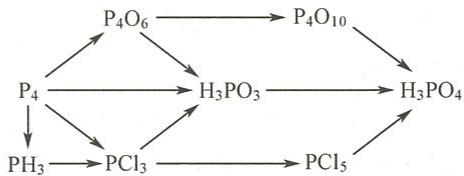

15.58 分离下列各组离子。

(1) $Sb^{3+}$ 和 $Bi^{3+}$ ; (2) $PO_{4}^{3-}$ 和 $NO_{3}^{-}$ ; (3) $PO_{4}^{3-}$ 和 $SO_{4}^{2-}$ ; (4) $PO_{4}^{3-}$ 和 $Cl^{-}$ 。

15.59 提纯下列物质。

(1) 除去 $\mathrm{N}_{2}$ 中的少量 $\mathrm{O}_{2}$ 和 $\mathrm{H}_{2} \mathrm{O}$ ;

(2) 除去 NO 中的少量 $NO_{2}$ ;

(3) 除去 $\mathrm{NaNO}_{3}$ 溶液中的少量 $\mathrm{NaNO}_{2}$ 。

15.60 分别用三种方法鉴别下列各组物质。

(1) $Na_{3}PO_{4}$ 和 $Na_{2}SO_{4}$ ; (2) $KNO_{3}$ 和 $KIO_{3}$ 。

15.61 试用 6 种方法鉴别 $\mathrm{KNO}_3$ 和 $\mathrm{KNO}_2$ 。

## 五、简答题

15.62 除去下列物质中的杂质,给出相关化学反应方程式。

(1) $KNO_{2}$ 晶体中的少量 $KNO_{3}$ 晶体；

(2) $\mathrm{N}_{2} \mathrm{O}$ 气体中混有的少量 $\mathrm{NO}$ ;

(3) $Na_{2}SO_{4}$ 溶液中的少量 $(NH_{4})_{2}SO_{4}$ 。

15.63 $\mathrm{H}_4\mathrm{P}_2\mathrm{O}_7$ 的解离平衡常数 $K_{\mathrm{a_1}}^{\ominus} = 1.2\times 10^{-1}, K_{\mathrm{a_2}}^{\ominus} = 7.9\times 10^{-3}, K_{\mathrm{a_3}}^{\ominus} = 2.0\times 10^{-7}, K_{\mathrm{a_4}}^{\ominus} = 4.5\times 10^{-10}$ ，为什么 $K_{\mathrm{a_1}}^{\ominus}$ 与 $K_{\mathrm{a_2}}^{\ominus}$ 相近， $K_{\mathrm{a_3}}^{\ominus}$ 与 $K_{\mathrm{a_4}}^{\ominus}$ 相近，但 $K_{\mathrm{a_2}}^{\ominus}$ 与 $K_{\mathrm{a_3}}^{\ominus}$ 相差较大？

15.64 在酸性溶液中，按氧化能力由大到小排列这些离子，并简要说明： $NO_{3}^{-}$ ， $PO_{4}^{3-}$ ， $AsO_{4}^{3-}$ ， $SbO_{4}^{3-}$ ， $BiO_{3}^{-}$ 。

15.65 解释实验现象。

(1) 向含有 $\mathrm{Bi}^{3+}$ 和 $\mathrm{Sn}^{2+}$ 的澄清溶液中加入 $\mathrm{NaOH}$ 溶液会有黑色沉淀生成。

(2) 向 $FeCl_{3}$ 溶液中滴加 $Na_{3}PO_{4}$ 溶液, 先有黄色沉淀生成; 继续滴加时沉淀减少, 最后消失得无色溶液。

(3) $\mathrm{AsH}_{3}$ 通入一玻璃管并在入口处加热, 管壁出现有金属光泽的黑色物质。

(4) 向 $\mathrm{NaNO}_{2}$ 溶液中加 $\mathrm{AgNO}_{3}$ 溶液有黄色沉淀生成。

(5) 将 NaOH 溶液与 $BiCl_{3}$ 溶液充分混合有白色沉淀生成, 再向其中通入 $Cl_{2}$ 时有黄棕色沉淀生成。

15.66 给出下列硝酸盐受热分解的反应方程式,总结硝酸盐热分解反应规律。

$$
\mathrm{KNO} _ {3}, \mathrm{LiNO} _ {3}, \mathrm{Pb} (\mathrm{NO} _ {3}) _ {2}, \mathrm{Bi} (\mathrm{NO} _ {3}) _ {3}, \mathrm{AgNO} _ {3}, \mathrm{Fe} (\mathrm{NO} _ {3}) _ {2} 。
$$

15.67 为什么 $\mathrm{NH}_3$ 溶液显碱性而 $\mathrm{HN}_3$ 溶液显酸性？

15.68 如何配制 $\mathrm{SbCl}_3$ 溶液和 $\mathrm{Bi(NO_3)_3}$ 溶液？

15.69 有人提出由 $\mathrm{NO}_2$ 的磁性测定数据可分析 $\mathrm{NO}_2$ 分子中的离域 $\pi$ 键是 $\Pi_3^4$ 还是 $\Pi_3^3$ 。你认为

是否可行？为什么？

15.70 比较磷的含氧酸的酸性强弱: $H_{3}PO_{2}$ , $H_{3}PO_{3}$ , $H_{3}PO_{4}$ , $H_{4}P_{2}O_{7}$ 。

15.71 为什么与过渡金属的配位能力 $\mathrm{NH}_3 < \mathrm{PH}_3, \mathrm{NF}_3 < \mathrm{PF}_3$ ；而与 $\mathrm{H}^+$ 的配位能力 $\mathrm{NH}_3 > \mathrm{PH}_3$ 。

15.72 无色晶体(A)受热得到无色气体(B)，将(B)在更高的温度下加热后再恢复到原来的温度，发现气体体积增加了 $50\%$ 。晶体(A)与等物质的量的 $\mathrm{NaOH}$ 固体共热得无色气体(C)和白色固体(D)。将(C)通入 $\mathrm{AgNO}_3$ 溶液先有棕黑色沉淀(E)生成，(C)过量时则(E)消失得到无色溶液。将(A)溶于浓盐酸后加入KI则溶液变黄。试给出(A)、(B)、(C)、(D)和(E)所代表的物质的化学式。

15.73 用水处理短周期元素形成的黄色化合物(A),得到白色沉淀(B)和无色气体(C)。(B)不溶于 NaOH 溶液,溶于硝酸后经浓缩析出(D)的水合晶体。(D)受热分解得到白色物质(E)和棕色气体(F),将(F)通过 NaOH 溶液后气体体积变为原来的 20%。将(C)通入 $CuSO_{4}$ 溶液先有浅蓝色沉淀生成,(C)过量后沉淀溶解得深蓝色溶液(G)。试给出(A)、(B)、(C)、(D)、(E)、(F)和(G)所代表的物质的化学式。

15.74 钾盐(A)为白色粉末,(A)溶于水后溶液显弱酸性。向(A)的水溶液中加入 $AgNO_{3}$ 溶液有黄色沉淀(B)生成。(B)溶于硝酸得无色溶液(C)。向(A)的水溶液中加入 $CaCl_{2}$ 无沉淀生成,再加入氨水则有白色沉淀(D)生成。试给出(A)、(B)、(C)、(D)所代表的物质的化学式。

15.75 化合物(A)为白色固体，(A)在水中溶解度较小，但易溶于氢氧化钠溶液和浓盐酸。(A)溶于浓盐酸得溶液(B)，向(B)中通入 $\mathrm{H}_2\mathrm{S}$ 气体得黄色沉淀(C)，(C)不溶于盐酸，易溶于氢氧化钠溶液。(C)溶于硫化钠溶液得无色溶液(D)，若将(C)溶于 $\mathrm{Na}_2\mathrm{S}_2$ 溶液则得无色溶液(E)。向(B)中滴加溴水，则溴被还原，而(B)转为无色溶液(F)，向所得(F)的酸性溶液中加入淀粉一碘化钾溶液，则溶液变蓝。试给出(A)、(B)、(C)、(D)、(E)和(F)所代表的物质的化学式。

15.76 化合物(A)为白色固体,不溶于水。(A)受热剧烈分解,生成固体(B)和气体(C)。固体(B)不溶于水或盐酸,但溶于热的稀硝酸得无色溶液(D)和无色气体(E)。(E)在空气中变棕色。向溶液(D)中加入盐酸得白色沉淀(F)。气体(C)与普通试剂不起反应,但与热的金属镁作用生成黄色固体(G)。(G)与水作用得白色沉淀(H)及气体(I)。(I)能使湿润的红色石蕊试纸变蓝。(H)可溶于稀硫酸得溶液(J)。化合物(A)以 $H_{2}S$ 溶液处理时得黑色沉淀(K)、无色溶液(L)和气体(C)。过滤后,固体(K)溶于浓硝酸得气体(E)、黄色沉淀(M)和溶液(D)。用NaOH溶液处理滤液(L)又得气体(I)。试给出(A)、(B)、(C)、(D)、(E)、(F)、(G)、(H)、(I)、(J)、(K)、(L)和(M)所代表的物质的化学式。

15.77 化合物(A)加入水中得白色沉淀(B)和无色溶液(C)。取溶液(C)与饱和 $\mathrm{H}_2\mathrm{S}$ 溶液作用生成棕黑色沉淀(D)，(D)不溶于NaOH溶液，能溶于盐酸。向溶液(C)中加入NaOH溶液有白色沉淀(E)生成，(E)不溶于NaOH溶液。向 $\mathrm{SnCl}_2$ 溶液中加入过量NaOH溶液后滴加溶液(C)，有黑色沉淀(F)生成。向溶液(C)中加入 $\mathrm{AgNO_3}$ 溶液有白色沉淀(G)生成，(G)不溶于硝酸但易溶于氨水。试给出(A)、(B)、(C)、(D)、(E)、(F)和(G)所代表的物质的化学式。

## 氧族元素

## 第一部分 例题

例 16.1 完成并配平下列化学反应方程式。

(1) $\mathrm{O_3 + KI(aq) + H_2O =}$

(2) $\mathrm{HO}_2^-$ + $[\mathrm{Cr(OH)}_4]^- =$

(3) $\mathrm{H}_2\mathrm{O}_2 + \mathrm{Ag}_2\mathrm{O} =$

(4) $\mathrm{PbS + O_3 =}$

(5) $\mathrm{MnO_4^- + H_2O_2 + H^+ =}$

(6) $\mathrm{HO}_2^-$ + Mn(OH) $_2$

(7) $\mathrm{S} + \mathrm{NaOH(aq)} \stackrel{\triangle}{=}$

(8) $\mathrm{S} + \mathrm{H}_{2}\mathrm{SO}_{4}$ (浓)

(9) $\mathrm{H}_2\mathrm{S(aq)} + \mathrm{I}_2 + \mathrm{H}_2\mathrm{O} =$

解：(1) $\mathrm{O_3 + 2KI(aq) + H_2O = I_2 + O_2 + 2KOH}$

(2) $3\mathrm{HO}_2^- + 2[\mathrm{Cr(OH)}_4]^- = 2\mathrm{CrO}_4^{2-} + \mathrm{OH}^- + 5\mathrm{H}_2\mathrm{O}$

(3) $\mathrm{H}_2\mathrm{O}_2 + \mathrm{Ag}_2\mathrm{O} = 2\mathrm{Ag} + \mathrm{O}_2\uparrow +\mathrm{H}_2\mathrm{O}$

(4) $\mathrm{PbS} + 4\mathrm{O}_3 = \mathrm{PbSO}_4 + 4\mathrm{O}_2$

(5) $2\mathrm{MnO}_4^- + 5\mathrm{H}_2\mathrm{O}_2 + 6\mathrm{H}^+ = 2\mathrm{Mn}^{2+} + 5\mathrm{O}_2 \uparrow + 8\mathrm{H}_2\mathrm{O}$

(6) $\mathrm{HO}_2^- + \mathrm{Mn(OH)}_2 = \mathrm{MnO}_2 + \mathrm{OH}^- + \mathrm{H}_2\mathrm{O}$

(7) $3\mathrm{S} + 6\mathrm{NaOH(aq)} \xrightarrow{\triangle} 2\mathrm{Na}_{2}\mathrm{S} + \mathrm{Na}_{2}\mathrm{SO}_{3} + 3\mathrm{H}_{2}\mathrm{O}$

(8) $\mathrm{S} + 2\mathrm{H}_{2}\mathrm{SO}_{4}$ (浓) $\xlongequal{\triangle} 3\mathrm{SO}_{2} \uparrow + 2\mathrm{H}_{2}\mathrm{O}$

(9) $\mathrm{H}_2\mathrm{S(aq)} + 4\mathrm{I}_2 + 4\mathrm{H}_2\mathrm{O} = \mathrm{H}_2\mathrm{SO}_4 + 8\mathrm{HI}$

例16.2 用化学反应方程式表示生产过程。

(1) 以硫酸氢铵为原料,利用电解一水解法生产双氧水。

(2) 以硫酸和硫酸铵为原料生产过二硫酸铵。

解：（1）首先以铂片作电极，电解 $NH_{4}HSO_{4}$ 饱和溶液，得到 $(\mathrm{NH}_{4})_{2}\mathrm{S}_{2}\mathrm{O}_{8}$ ：

$$
2 \mathrm{NH} _ {4} \mathrm{HSO} _ {4} \xlongequal {\text {通电}} (\mathrm{NH} _ {4}) _ {2} \mathrm{S} _ {2} \mathrm{O} _ {8} + \mathrm{H} _ {2} \uparrow
$$

然后,加入适量硫酸以水解过二硫酸铵,即得过氧化氢:

$$
\begin{array}{r l} (\mathrm{NH} _ {4}) _ {2} \mathrm{S} _ {2} \mathrm{O} _ {8} + 2 \mathrm{H} _ {2} \mathrm{SO} _ {4} & = \mathrm{H} _ {2} \mathrm{S} _ {2} \mathrm{O} _ {8} + 2 \mathrm{NH} _ {4} \mathrm{HSO} _ {4} \\ \mathrm{H} _ {2} \mathrm{S} _ {2} \mathrm{O} _ {8} + 2 \mathrm{H} _ {2} \mathrm{O} & = \mathrm{H} _ {2} \mathrm{O} _ {2} + 2 \mathrm{H} _ {2} \mathrm{SO} _ {4} \end{array}
$$

生成的硫酸氢铵可循环使用。

(2) 将硫酸和硫酸铵溶液混合, 制备硫酸氢铵:

$$
\mathrm{H} _ {2} \mathrm{SO} _ {4} + (\mathrm{NH} _ {4}) _ {2} \mathrm{SO} _ {4} = 2 \mathrm{NH} _ {4} \mathrm{HSO} _ {4}
$$

以 Pt 为电极,电解 $NH_{4}HSO_{4}$ 饱和溶液,制备过二硫酸铵:

$$
2 \mathrm{NH} _ {4} \mathrm{HSO} _ {4} \stackrel {\text {电解}} {=} (\mathrm{NH} _ {4}) _ {2} \mathrm{S} _ {2} \mathrm{O} _ {8} + \mathrm{H} _ {2} \uparrow
$$

例 16.3 现有 4 瓶失落标签的无色溶液, 分别为 $Na_{2}S$ , $Na_{2}SO_{3}$ , $Na_{2}S_{2}O_{3}$ 和 $Na_{2}SO_{4}$ , 试加以鉴别。

解：用试管分别取少许4种无色溶液，向其中加入少许盐酸。

有臭鸡蛋气味气体放出并能使醋酸铅试纸变黑的是 $Na_{2}S$ 溶液：

$$
\begin{array}{r l} & {\mathrm {S^ {2 - } + 2H^ {+} \xlongequal   H_ {2} S\uparrow}} \\ & {\mathrm {Pb(Ac) _ {2} + H_ {2} S\xlongequal   PbS\downarrow(黑色) + 2HAc}} \end{array}
$$

有刺激性气体放出并有乳白色(或浅黄色)沉淀析出的是 $Na_{2}S_{2}O_{3}$ 溶液；气体可使湿润的品红试纸褪色可进一步确证生成气体为 $SO_{2}$ ：

$$
\mathrm{S} _ {2} \mathrm{O} _ {3} ^ {2 -} + 2 \mathrm{H} ^ {+} = \mathrm{SO} _ {2} \uparrow + \mathrm{S} \downarrow + \mathrm{H} _ {2} \mathrm{O}
$$

放出刺激性且能使 $KMnO_{4}$ 溶液褪色(或使蓝色石蕊试纸变红)的气体,且无沉淀或浑浊现象的是 $Na_{2}SO_{3}$ 溶液:

$$
\begin{array}{r l} & \mathrm{SO} _ {3} ^ {2 -} + 2 \mathrm{H} ^ {+} = \mathrm{SO} _ {2} \uparrow + \mathrm{H} _ {2} \mathrm{O} \\ & 5 \mathrm{SO} _ {2} + 2 \mathrm{MnO} _ {4} ^ {-} + 2 \mathrm{H} _ {2} \mathrm{O} = 5 \mathrm{SO} _ {4} ^ {2 -} + 2 \mathrm{Mn} ^ {2 +} + 4 \mathrm{H} ^ {+} \end{array}
$$

无反应现象的是 $Na_{2}SO_{4}$ 溶液，再加入 $BaCl_{2}$ 溶液有不溶于硝酸的白色沉淀析出则可确证：

$$
\mathrm{Ba} ^ {2 +} + \mathrm{SO} _ {4} ^ {2 -} = \mathrm{BaSO} _ {4} \downarrow (\text {白色})
$$

例 16.4 有一黑色固体, 是 FeS, PbS 和 CuS 中的一种, 试加以鉴别。

解：取少许黑色固体，向其中加入稀盐酸，固体溶解则为 FeS，若不溶解则为 PbS 或 CuS。再向固体中加入浓盐酸，则固体溶解或变白色的为 PbS，无变化的为 CuS。

例16.5 解释实验现象。

（1）向 $\mathrm{Pb(NO_{3})_{2}}$ 溶液中通入 $H_{2}S$ 气体，有黑色沉淀生成，用 $H_{2}O_{2}$ 处理该黑色沉淀，沉淀逐渐转变为白色。

(2) 室温下稀 $H_{2}O_{2}$ 溶液分解较慢,但加入少量 KI 后分解速率加快。

（3）向硫代硫酸钠溶液中滴加少量硝酸银溶液，生成少许白色沉淀又马上消失，向此溶液中加入少许盐酸，则产生黑色沉淀。

解：(1) $\mathrm{Pb(NO_3)_2}$ 与 $\mathrm{H}_2\mathrm{S}$ 反应生成黑色的 $\mathrm{PbS}$ 沉淀：

$$
\mathrm{Pb} (\mathrm{NO} _ {3}) _ {2} + \mathrm{H} _ {2} \mathrm{S} = \mathrm{PbS} \downarrow + 2 \mathrm{HNO} _ {3}
$$

$H_{2}O_{2}$ 具有较强的氧化性, 可以将 PbS 氧化为白色的 $PbSO_{4}$ , 故沉淀变白:

$$
\mathrm{PbS} + 4 \mathrm{H} _ {2} \mathrm{O} _ {2} = \mathrm{PbSO} _ {4} + 4 \mathrm{H} _ {2} \mathrm{O}
$$

(2) $H_{2}O_{2}$ 分解速率与温度有关, 温度越高, 分解速率越快, 故常温下分解较慢。

加入 KI 后， $H_{2}O_{2}$ 首先将 $I^{-}$ 氧化为 $I_{2}$ ，后进一步氧化为 $IO_{3}^{-}, E^{\ominus}(IO_{3}^{-}/I_{2}) = 1.12\ V$ ，介于 $H_{2}O_{2}$ 作氧化型和还原型的 1.776～0.695 V 之间，可以催化 $H_{2}O_{2}$ 的分解，具体反应如下：

$$
\begin{array}{r l} & {\mathrm {H_ {2} O_ {2}} + 2 \mathrm {I^ {-}} + 2 \mathrm {H^ {+}} = \mathrm {I_ {2}} + 2 \mathrm {H_ {2} O}} \\ & {\quad 5 \mathrm {H_ {2} O_ {2}} + \mathrm {I_ {2}} = 2 \mathrm {IO_ {3} ^ {-}} + 2 \mathrm {H^ {+}} + 4 \mathrm {H_ {2} O}} \\ & {\quad 5 \mathrm {H_ {2} O_ {2}} + 2 \mathrm {IO_ {3} ^ {-}} + 2 \mathrm {H^ {+}} = \mathrm {I_ {2}} + 5 \mathrm {O_ {2}} \uparrow + 6 \mathrm {H_ {2} O}} \end{array}\tag{①}
$$

②

③

反应②和③循环进行, 总的结果是 $H_{2}O_{2}$ 分解:

$$
2 \mathrm{H} _ {2} \mathrm{O} _ {2} = \mathrm{O} _ {2} \uparrow + 2 \mathrm{H} _ {2} \mathrm{O}
$$

(3) 少量的硝酸银加入硫代硫酸钠溶液中先发生反应:

$$
2 \mathrm{Ag} ^ {+} + \mathrm{S} _ {2} \mathrm{O} _ {3} ^ {2 -} = \mathrm{Ag} _ {2} \mathrm{S} _ {2} \mathrm{O} _ {3} \downarrow
$$

生成白色沉淀 $Ag_{2}S_{2}O_{3}$ ，溶于过量的硫代硫酸钠生成稳定的配离子，白色沉淀迅速溶解为无色溶液：

$$
\mathrm{Ag} _ {2} \mathrm{S} _ {2} \mathrm{O} _ {3} + 3 \mathrm{S} _ {2} \mathrm{O} _ {3} ^ {2 -} = 2 [ \mathrm{Ag} (\mathrm{S} _ {2} \mathrm{O} _ {3}) _ {2} ] ^ {3 -}
$$

加入盐酸后， $\left[\mathrm{Ag}\left(\mathrm{S}_2\mathrm{O}_3\right)_2\right]^{3-}$ 遇酸分解，生成黑色的 $\mathrm{Ag}_{2} \mathrm{~S}$

$$
2 \left[ \mathrm{Ag} \left(\mathrm{S} _ {2} \mathrm{O} _ {3}\right) _ {2} \right] ^ {3 -} + 4 \mathrm{H} ^ {+} = \mathrm{Ag} _ {2} \mathrm{S} \downarrow + \mathrm{SO} _ {4} ^ {2 -} + 3 \mathrm{S} \downarrow + 3 \mathrm{SO} _ {2} + 2 \mathrm{H} _ {2} \mathrm{O}
$$

例 16.6 解释由同种元素构成的 $O_{3}$ 分子却是极性分子。

解：分子的极性大小可用分子的偶极矩来衡量。 $O_{3}$ 分子中成键原子间的电负性差为零，但中心原子的孤电子对数与端原子的孤电子对数不同，使中心原子与端原子周围的电子云密度不同，即 O—O 键为极性键；同时， $O_{3}$ 分子空间构型为 V 形，使两个 O—O 键的键矩不能互相抵消。

所以， $O_{3}$ 分子的中心原子与端原子的电子云密度不同、分子的非对称性使键矩不能互相抵消决定了 $O_{3}$ 分子为极性分子。

例 16.7 为什么硫酸盐的热稳定性比碳酸盐高,而硅酸盐的热稳定性更高?

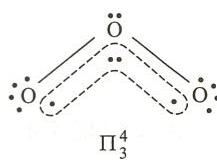

解：对于相同金属离子的硫酸盐和碳酸盐来说，金属离子的极化能力

相同, 含氧酸根 $\left(\mathrm{SO}_{4}^{2-}, \mathrm{CO}_{3}^{2-}\right)$ 电荷数相同, 且半径都较大。因此, 两者热稳定性差异主要是含氧酸根的中心原子氧化数的不同。一般情况, 中心原子氧化数越大, 抵抗金属离子的极化能力越强, 含氧酸盐越稳定。因此, 中心原子氧化数为 +6 的硫酸盐的稳定性比中心原子氧化数为 +4 的碳酸盐高。

硅酸盐热稳定性更高的原因与前两种盐不同，前两种盐分解均产生气体如 $SO_{3}$ ， $CO_{2}$ ，是熵驱动反应。而硅酸盐分解反应无气体产生，除金属氧化物外，就是 $SiO_{2}$ ，反应的熵增很少。这就是硅酸盐热稳定性高的原因。

例 16.8 有一种能溶于水的白色固体, 其水溶液进行下列实验而产生如下的实验现象:

(1) 用铂丝蘸少量液体在火焰上灼烧, 产生黄色火焰。

（2）它使酸化的 $KMnO_{4}$ 溶液褪色而产生无色溶液，该溶液与 $BaCl_{2}$ 溶液作用生成不溶于稀 $HNO_{3}$ 的白色沉淀。

（3）加入硫粉，并加热，硫溶解生成无色溶液，此溶液用盐酸酸化时产生乳白色或浅黄色沉淀；此溶液也能使 $KI_{3}$ 溶液褪色，也能溶解 AgCl 或 AgBr 沉淀。

写出这一白色固体的化学式,并完成各步化学反应方程式。

解：该白色固体的化学式为 $Na_{2}SO_{3}$ 。

各步化学反应方程式如下：

$$
5 \mathrm{SO} _ {3} ^ {2 -} + 2 \mathrm{MnO} _ {4} ^ {-} + 6 \mathrm{H} ^ {+} = 5 \mathrm{SO} _ {4} ^ {2 -} + 2 \mathrm{Mn} ^ {2 +} + 3 \mathrm{H} _ {2} \mathrm{O}
$$

$$
\mathrm{SO} _ {4} ^ {2 -} + \mathrm{Ba} ^ {2 +} = \mathrm{BaSO} _ {4} \downarrow
$$

$$
\mathrm{Na} _ {2} \mathrm{SO} _ {3} + \mathrm{S} = \mathrm{Na} _ {2} \mathrm{S} _ {2} \mathrm{O} _ {3}
$$

$$
\mathrm{Na} _ {2} \mathrm{S} _ {2} \mathrm{O} _ {3} + 2 \mathrm{HCl} = 2 \mathrm{NaCl} + \mathrm{S} \downarrow + \mathrm{SO} _ {2} \uparrow + \mathrm{H} _ {2} \mathrm{O}
$$

$$
2 \mathrm{Na} _ {2} \mathrm{S} _ {2} \mathrm{O} _ {3} + \mathrm{I} _ {2} = \mathrm{Na} _ {2} \mathrm{S} _ {4} \mathrm{O} _ {6} + 2 \mathrm{NaI}
$$

$$
\mathrm{AgBr} + 2 \mathrm{Na} _ {2} \mathrm{S} _ {2} \mathrm{O} _ {3} = \mathrm{Na} _ {3} \left[ \mathrm{Ag} (\mathrm{S} _ {2} \mathrm{O} _ {3}) _ {2} \right] + \mathrm{NaBr}
$$

例 16.9 无色晶体(A)易溶于水。(A)的溶液与酸性 KI 溶液作用溶液变黄,说明有(B)生成。(A)的溶液煮沸一段时间后加入 $BaCl_{2}$ 溶液有白色沉淀(C)生成,(C)不溶于强酸。(A)的溶液与 $MnSO_{4}$ 混合后加稀硝酸和几滴 $AgNO_{3}$ 溶液,加热,溶液变红,说明有(D)生成。(A)溶液与 KOH 混合后加热,有气体(E)放出。气体(E)通入 $AgNO_{3}$ 溶液则有棕黑色沉淀(F)生成,(E)通入过量则沉淀溶解为无色溶液。

试给出(A)、(B)、(C)、(D)、(E)和(F)所代表的物质的化学式,并用化学反应方程式表示各过程。

解：(A) $-\left(\mathrm{NH}_{4}\right)_{2}\mathrm{S}_{2}\mathrm{O}_{8}$ ; (B) $-I_{2}$ 或 $I_{3}^{-}$ ; (C) $-BaSO_{4}$ ; (D) $-MnO_{4}^{-}$ ; (E) $-NH_{3}$ ; (F) $-Ag_{2}O$ 。

各过程的化学反应方程式如下：

$$
\mathrm {(NH_ {4}) _ {2} S_ {2} O_ {8} + 2KI = (NH_ {4}) _ {2} SO_ {4} + K_ {2} SO_ {4} + I_ {2}}
$$

$$
2 (\mathrm{NH} _ {4}) _ {2} \mathrm{S} _ {2} \mathrm{O} _ {8} + 2 \mathrm{H} _ {2} \mathrm{O} \stackrel {\triangle} {=} 4 \mathrm{NH} _ {4} \mathrm{HSO} _ {4} + \mathrm{O} _ {2} \uparrow
$$

$$
\mathrm{NH} _ {4} \mathrm{HSO} _ {4} + \mathrm{BaCl} _ {2} = \mathrm{BaSO} _ {4} \downarrow + \mathrm{NH} _ {4} \mathrm{Cl} + \mathrm{HCl}
$$

$$
5 \mathrm{S} _ {2} \mathrm{O} _ {8} ^ {2 -} + 2 \mathrm{Mn} ^ {2 +} + 8 \mathrm{H} _ {2} \mathrm{O} \xlongequal [ \triangle ] {\mathrm{Ag} ^ {+}} 2 \mathrm{MnO} _ {4} ^ {-} + 1 0 \mathrm{HSO} _ {4} ^ {-} + 6 \mathrm{H} ^ {+}
$$

$$
\mathrm {(NH_ {4}) _ {2} S_ {2} O_ {8} + 2KOH = 2NH_ {3} \uparrow+ K_ {2} S_ {2} O_ {8} + 2H_ {2} O}
$$

$$
2 \mathrm{NH} _ {3} + 2 \mathrm{Ag} ^ {+} + \mathrm{H} _ {2} \mathrm{O} = \mathrm{Ag} _ {2} \mathrm{O} \downarrow + 2 \mathrm{NH} _ {4} ^ {+}
$$

$$
\mathrm{Ag} _ {2} \mathrm{O} + 2 \mathrm{NH} _ {3} + 2 \mathrm{NH} _ {4} ^ {+} = 2 [ \mathrm{Ag(NH} _ {3}) _ {2} ] ^ {+} + \mathrm{H} _ {2} \mathrm{O}
$$

## 第二部分 习题

## 一、选择题

16.1 常温下最稳定的晶体硫的分子式为
(A) $S_{2}$ ; (B) $S_{4}$ ; (C) $S_{6}$ ; (D) $S_{8}$ 。

16.2 下列物质中,酸性最强的是
(A) $H_{2}S$ ; (B) $H_{2}SO_{3}$ ; (C) $H_{2}SO_{4}$ ; (D) $H_{2}S_{2}O_{7}$ 。

16.3 干燥 $H_{2}S$ 气体, 可选用的干燥剂是
(A) 浓 $H_{2}SO_{4}$ ; (B) KOH; (C) $P_{2}O_{5}$ ; (D) $CuSO_{4}$ 。

16.4 下列物质中, 只有还原性的是
(A) $Na_{2}S_{2}O_{3}$ ; (B) $Na_{2}S$ ; (C) $Na_{2}SO_{3}$ ; (D) $Na_{2}S_{2}$ 。

16.5 下列四个电极反应中， $E^{\ominus}$ 值最大的是
(A) $H_{2}O_{2} + 2H^{+} + 2e^{-} = 2H_{2}O$ ; (B) $HO_{2}^{-} + H_{2}O + 2e^{-} = 3OH^{-}$ ;
(C) $O_{2} + 2H^{+} + 2e^{-} = H_{2}O_{2}$ ; (D) $O_{2} + H_{2}O + 2e^{-} = HO_{2}^{-} + OH^{-}$ 。

16.6 为使已变暗的古油画恢复原来的白色,使用的方法为
(A) 用 $SO_{2}$ 气体漂白; (B) 用稀 $H_{2}O_{2}$ 溶液擦洗;
(C) 用氯水擦洗; (D) 用 $O_{3}$ 漂白。

16.7 下列各组硫化物中,颜色基本相同的是
(A) ZnS, MnS, FeS; (B) CdS, SnS₂, As₂S₃;
(C) Ag₂S, Sb₂S₅, Bi₂S₃; (D) SnS, PbS, CoS。

16.8 下列分子中,结构和中心原子杂化类型都与 $O_{3}$ 相同的是
(A) $SO_{3}$ ; (B) $SO_{2}$ ; (C) $CO_{2}$ ; (D) $Cl_{2}O$ 。

16.9 下列化合物中,在标准状态下氧化能力最弱的是
(A) $H_{2}SO_{3}$ ; (B) $H_{2}SO_{4}$ ; (C) $H_{2}S_{2}O_{8}$ ; (D) $H_{2}O_{2}$ 。

16.10 下列各对物质中,能发生化学反应的是
(A) CuS 和 HCl; (B) Ag 和 HCl; (C) $AlCl_{3}$ 和 $H_{2}S$ ; (D) $Na_{2}SO_{3}$ 和 $I_{2}$ 。

16.11 下列化合物中，与 $\mathrm{H}_2\mathrm{S}$ 和 $\mathrm{HNO}_3$ 都能发生氧化还原反应的是（A） $\mathrm{FeCl}_3$ ；（B） $\mathrm{SO}_2$ ；（C） $\mathrm{KI}$ ；（D） $\mathrm{SO}_3$ 。

16.12 向下列各对溶液中分别通入 $H_{2}S$ 气体，均能得到预期硫化物沉淀的是
(A) $SbCl_{5}, SnCl_{4}$ ; (B) $SnCl_{4}, FeCl_{3}$ ;
(C) $FeCl_{3}, CdCl_{2}$ ; (D) $SnCl_{4}, CdCl_{2}$ 。

16.13 下列各组硫化物中,难溶于稀盐酸,但能溶于浓盐酸的是
(A) $Bi_{2}S_{3}$ 和 ZnS; (B) CuS 和 $Sb_{2}S_{3}$ ;
(C) CdS 和 SnS; (D) $As_{2}S_{3}$ 和 HgS。

16.14 下列硫化物中,既能溶于 $Na_{2}S$ 溶液又能溶于 $Na_{2}S_{2}$ 溶液的是
(A) ZnS; (B) SnS; (C) $Sb_{2}S_{3}$ ; (D) HgS。

16.15 下列硫化物中,不溶于 $Na_{2}S_{2}$ 溶液的是
(A) SnS; (B) $As_{2}S_{3}$ ; (C) $Sb_{2}S_{3}$ ; (D) ZnS。

16.16 按酸性由强至弱排列,顺序正确的是
(A) $H_{2}Te$ , $H_{2}S$ , $H_{2}Se$ ; (B) $H_{2}Se$ , $H_{2}Te$ , $H_{2}S$ ;
(C) $H_{2}Te$ , $H_{2}Se$ , $H_{2}S$ ; (D) $H_{2}S$ , $H_{2}Se$ , $H_{2}Te$ .

## 二、填空题

16.17 给出下列物质的化学式。

(1) 方铅矿 \_\_\_\_；(2) 朱砂 \_\_\_\_；(3) 闪锌矿 \_\_\_\_；(4) 黄铜矿 \_\_\_\_；

(5) 黄铁矿\_\_\_\_；(6) 芒硝\_\_\_\_；(7) 海波\_\_\_\_；(8) 保险粉\_\_\_\_。

16.18 比较大小：

(1) 氧化性 $O_{3}$ $O_{2}$ , $O_{3}$ $H_{2}O_{2}$ , $O_{2}$ $SO_{3}$ 。

(2) 稳定性 $O_{3}$ $O_{2}, SO_{2}$ $SO_{3}, Na_{2}SO_{3}$ $Na_{2}SO_{4}$ 。

16.19 现有化合物 $KO_{2}, K_{2}O_{2}, KO_{3}, O_{2}^{+}[PtF_{6}]^{-}$ ，按 O—O 键长增加顺序排列为 \_\_\_\_。

16.20 给出下列离子的结构式。

硫代硫酸根 \_\_\_\_；过二硫酸根 \_\_\_\_；

连二亚硫酸根；连四硫酸根。

16.21 向各离子浓度均为 $0.1 \, mol \cdot dm^{-3}$ 的 $Mn^{2+}, Zn^{2+}, Cu^{2+}, Ag^{+}, Hg^{2+}, Pb^{2+}$ 混合溶液中通入 $H_{2}S$ 气体，可被沉淀的离子有 \_\_\_\_。

16.22 若除去氢气中少量的 $SO_{2}$ ， $H_{2}S$ 和水蒸气，应将氢气先通过 \_\_\_\_ 溶液，再通过 \_\_\_\_ 。

16.23 硫化物 ZnS, CuS, MnS, SnS, HgS 中, 易溶于稀盐酸的是 \_\_\_\_ ; 不溶于稀盐酸, 但溶于浓盐酸的是 \_\_\_\_ ; 不溶于浓盐酸, 但可溶于硝酸的是 \_\_\_\_ ; 只溶于王水的是 \_\_\_\_ 。

16.24 $\mathrm{AgNO_3}$ 溶液与过量的 $\mathrm{Na_2S_2O_3}$ 溶液反应生成\_\_\_\_色的\_\_\_\_。过量的 $\mathrm{AgNO_3}$ 溶液与 $\mathrm{Na_2S_2O_3}$ 溶液反应生成\_\_\_\_色的\_\_\_\_，后变为\_\_\_\_色的\_\_\_\_。

16.25 $NaHSO_{3}$ 受热分解产物为 \_\_\_\_； $Na_{2}S_{2}O_{8}$ 受热分解产物为 \_\_\_\_； $Na_{2}SO_{3}$ 受热分解产物为 \_\_\_\_。

16.26 $H_{2}S$ 水溶液长期放置后变混浊,原因是\_\_\_\_。

16.27 酸化某溶液析出 S 并放出 $SO_{2}$ ，则原溶液中的含硫化合物可能为 \_\_\_\_，\_\_\_\_，\_\_\_\_ 或 \_\_\_\_。

16.28 比较组成为 $\mathrm{M}_2\mathrm{S}_2\mathrm{O}_x$ 的三种盐，它们各自符合下面所述的某些性质：

(1) 阴离子以 —O—O— 键为特征；

(2) 阴离子以 S—S 键为特征；

(3) 阴离子以 S—O—S 键为特征；

(4) 它由硫酸氢盐缩合而成；

(5) 它由硫酸氢盐阳极氧化形成；

(6) 它由亚硫酸盐水溶液与硫反应形成;

(7) 它的水溶液使溴化银溶解；

(8) 它的水溶液与氢氧化物(MOH)反应生成硫酸盐；

(9) 在水溶液中能把 $Mn^{2+}$ 氧化成 $MnO_{4}^{-}$ 。

试将 x 的正确数值填入下表中角标括号内，并将上述各性质以序号填入相应盐的横栏内：

<table><tr><td> ${\mathrm{M}}_{2}{\mathrm{\;S}}_{2}{\mathrm{O}}_{\left( \right) }$ </td><td></td><td></td><td></td></tr><tr><td> ${\mathrm{M}}_{2}{\mathrm{\;S}}_{2}{\mathrm{O}}_{\left( \right) }$ </td><td></td><td></td><td></td></tr><tr><td> ${\mathrm{M}}_{2}{\mathrm{\;S}}_{2}{\mathrm{O}}_{\left( \right) }$ </td><td></td><td></td><td></td></tr></table>

16.29 给出下列化合物的颜色：

ZnS 色;MnS 色;CdS 色;SnS 色;As $_{2}$ S $_{3}$ 色;

$As_{2}S_{5}$ \_\_\_\_ 色； $Sb_{2}S_{3}$ \_\_\_\_ 色； $Sb_{2}S_{5}$ \_\_\_\_ 色； $Ag_{2}S_{2}O_{3}$ \_\_\_\_ 色； $PbS_{2}O_{3}$ \_\_\_\_ 色。

## 三、完成并配平化学反应方程式

16.30 过氧化钠与冷的稀硫酸作用。

16.31 过氧化氢与氢碘酸反应。

16.32 电解硫酸氢铵溶液。

16.33 高温下三氧化硫与碘化钾反应。

16.34 亚硫酸与硫化氢作用。

16.35 三氧化二铝与焦硫酸钾共熔。

16.36 无氧条件下锌粉还原亚硫酸氢钠和亚硫酸的混合溶液。

16.37 硫化汞溶于硫化钠溶液。

16.38 硫酸亚铁受热分解。

16.39 氧化铁与焦硫酸钾共熔。

16.40 氯化亚铜溶解在硫代硫酸钠溶液中。

16.41 过二硫酸钾加热分解。

16.42 亚硫酰氯水解。

16.43 过量的干燥氯化氢气体与三氧化硫反应。

16.44 将二氧化硒溶于水,然后通入二氧化硫气体。

16.45 中等浓度的硒酸与盐酸作用。

16.46 向 $\mathrm{Na}_{2} \mathrm{~S}$ 和 $\mathrm{Na}_{2} \mathrm{SO}_{3}$ 混合溶液中加入稀酸。

16.47 向 $\mathrm{Na}_{2} \mathrm{~S}_{2} \mathrm{O}_{3}$ 溶液中加入碘水。

16.48 硫代硫酸钠溶液加入氯水中。

16.49 向 $Na_{2}S_{2}$ 溶液中滴加盐酸。

16.50 向 $\left[\mathrm{Ag}\left(\mathrm{S}_{2} \mathrm{O}_{3}\right)_{2}\right]^{3-}$ 的弱酸性溶液中通入硫化氢气体。

## 四、分离、鉴别与制备

16.51 按如下要求,制备 $H_{2}S$ , $SO_{2}$ 和 $SO_{3}$ , 写出相关反应方程式。

(1) 化合物中 S 的氧化数不变的反应;

(2) 化合物中 S 的氧化数变化的反应。

16.52 工业上以硫化钠、碳酸钠和二氧化硫为原料生产硫代硫酸钠，写出相关反应方程式。

16.53 将硫黄粉、石灰与水混合，经煮沸、摇匀制得石硫合剂。试解释石硫合剂呈橙色至樱桃红色的原因，并写出相应的反应方程式。

16.54 $\mathrm{CS}_2$ 在过量 $\mathrm{O}_2$ 中燃烧，得到混合气体，设计方案分离出其中的 $\mathrm{SO}_2$ 。

16.55 用化学反应方程式表示物质的转化：

$$
\mathrm{FeS} _ {2} \longrightarrow \mathrm{SO} _ {2} \xrightarrow {\mathrm{K} _ {2} \mathrm{SO} _ {4}} \mathrm{K} _ {2} \mathrm{S} _ {2} \mathrm{O} _ {8} \longrightarrow \mathrm{H} _ {2} \mathrm{O} _ {2} \xrightarrow {\mathrm{Na} _ {2} \mathrm{S} _ {2} \mathrm{O} _ {4}} \mathrm{NaHSO} _ {3} \xrightarrow {\mathrm{Na} _ {2} \mathrm{S} _ {2} \mathrm{O} _ {3}}
$$

16.56 某溶液中可能含 $\mathrm{Cl}^{-}, \mathrm{S}^{2-}, \mathrm{SO}_{3}^{2-}, \mathrm{S}_{2} \mathrm{O}_{3}^{2-}, \mathrm{SO}_{4}^{2-}$ , 进行下列实验并产生如下的实验现象:

(1) 向一份未知液中加入过量 $AgNO_{3}$ 溶液产生白色沉淀；

(2) 向另一份未知液中加入 $BaCl_{2}$ 溶液也产生白色沉淀；

(3) 取第三份未知液, 用 $\mathrm{H}_{2} \mathrm{SO}_{4}$ 酸化后加入溴水, 溴水不褪色。

判断哪几种离子存在？哪几种离子不存在？哪几种离子可能存在？

16.57 试设计方案分离下列各组离子(分离过程须用到硫的化合物)。

(1) $\mathrm{Ag}^{+}, \mathrm{Ba}^{2+}, \mathrm{Fe}^{2+}$ ; (2) $\mathrm{Al}^{3+}, \mathrm{Zn}^{2+}, \mathrm{Fe}^{3+}, \mathrm{Cu}^{2+}$ .

## 五、简答题

16.58 解释实验现象。

(1) 少量 $Na_{2}S_{2}O_{3}$ 溶液和 $AgNO_{3}$ 溶液反应生成白色沉淀, 沉淀逐渐变黄至棕色, 最后变成黑色。白色沉淀溶于过量 $Na_{2}S_{2}O_{3}$ 溶液, 而黑色沉淀不溶于过量 $Na_{2}S_{2}O_{3}$ 溶液。

(2) 将 $\mathrm{H}_{2} \mathrm{~S}$ 气体通入 $\mathrm{MnSO}_{4}$ 溶液中不产生 $\mathrm{MnS}$ 沉淀, 若 $\mathrm{MnSO}_{4}$ 溶液中含有一定量的氨水, 再通入 $\mathrm{H}_{2} \mathrm{~S}$ 气体时即有 $\mathrm{MnS}$ 沉淀产生。

(3) 向稀盐酸和 $Na_{2}SO_{3}$ 混合溶液中通入 $H_{2}S$ 气体, 溶液变浑浊; 向稀盐酸和 $Na_{2}SO_{4}$ 混合溶液中通入 $H_{2}S$ 气体, 溶液无变化。

(4) 将少量酸性 $MnSO_{4}$ 溶液与 $(\mathrm{NH}_{4})_{2}\mathrm{S}_{2}\mathrm{O}_{8}$ 溶液混合后水浴加热，很快生成棕黑色沉淀；但在加热前加入几滴 $AgNO_{3}$ 溶液，混合溶液逐渐变红。

16.59 已知 $O_{2}F_{2}$ 结构与 $H_{2}O_{2}$ 相似，但 $O_{2}F_{2}$ 中 O—O 键长 121 pm, $H_{2}O_{2}$ 中 O—O 键长 148 pm，请给出 $O_{2}F_{2}$ 的结构，并解释两个化合物中 O—O 键长不同的原因。

16.60 溶于水的 $O_{2}$ 以氢键形式与水形成一水合物和二水合物,为什么 $O_{2}$ 能与水形成氢键但溶解度却非常小?

16.61 为什么 $\mathrm{SOCl}_2$ 既可作路易斯酸又可作路易斯碱？

16.62 给出 $\mathrm{SOF}_2, \mathrm{SOCl}_2, \mathrm{SOBr}_2$ 分子中 S—O 键强度的变化规律，并解释原因。

16.63 为什么 $\mathrm{SF}_6$ 稳定、不易水解，而 $\mathrm{SF}_4$ 不稳定、又易水解？

16.64 试用价层电子对互斥理论判断 $\mathrm{SOF}_2$ 和 $\mathrm{SOCl}_2$ 的空间构型。说明在O原子和S原子之间的 $d - p\pi$ 配键是怎样形成的。试比较两者的 $d - p\pi$ 配键的强弱。

16.65 为什么不宜采用高温浓缩的办法制备 $\mathrm{NaHSO}_3$ 晶体？

16.66 某学生实验时发现 SnS 能溶于 $Na_{2}S$ 溶液。你认为出现这种反常现象的原因是什么？如何证明你的判断是正确的？

16.67 一种盐(A)溶于水后加入稀硫酸,有刺激性气体(B)和乳白色沉淀(C)生成。气体(B)溶于 $\mathrm{Na}_{2}\mathrm{CO}_{3}$ 溶液则转化为(D)并放出气体(E)。(A)溶液与碘水作用则转化为(F),同时碘水褪色。(A)溶液加入氯水则转化为溶液(G),(G)与钡盐作用,即产生不溶于强酸的白色沉淀(H)。(C)与(D)溶液混合后煮沸,则又缓慢转化为(A)。试给出(A)、(B)、(C)、(D)、(E)、(F)、(G)和(H)所代表的物质的化学式。

16.68 将 0.108 g 白色固体(A)置于干燥箱中于 $105^{\circ}$ C 干燥一段时间后, 得到 0.72 g 黄色固体(B)。将(B)在 $400^{\circ}$ C 加热, 失重 0.16 g, 得到白色固体(C)。将(A)与 KI 晶体混合后溶于稀盐酸得到黄色溶液(D)。向溶液(D)中加入过量固体(C), 则溶液变成无色溶液(E)

和白色沉淀(F)。少量(C)溶于水后加入 $Na_{2}CO_{3}$ 溶液有白色沉淀(G)生成。试确定(A)、(B)、(C)、(D)、(E)和(F)各为何物质。

16.69 将无色钠盐溶于水得无色溶液(A),用 $\mathrm{pH}$ 试纸检验知(A)显酸性。(A)能使 $\mathrm{KMnO}_4$ 溶液褪色,同时(A)被氧化为(B)。向(B)的溶液中加入 $\mathrm{BaCl}_2$ 溶液得不溶于强酸的白色沉淀(C)。向(A)中加入稀盐酸有无色气体(D)放出,将(D)通入氯水则又得到无色的(B)。向含有淀粉的 $\mathrm{KIO}_3$ 溶液中通入少许(D)则溶液立即变蓝,说明有(E)生成,(D)过量时蓝色消失得无色溶液。试给出(A)、(B)、(C)、(D)和(E)所代表的物质的化学式。

16.70 向无色溶液(A)中加入 HI 溶液有无色气体(B)和黑色沉淀(C)生成,(C)在 KCN 溶液中部分溶解得无色溶液(D),向(D)中通入 $H_{2}S$ 气体析出黑色沉淀(E),(E)不溶于浓盐酸。若向(A)中加入 KI 溶液有黄色沉淀(F)生成,将(F)投入 KCN 溶液则(F)全部溶解。试给出(A)、(B)、(C)、(D)、(E)和(F)所代表的物质的化学式。

16.71 将无水钠盐固体(A)溶于水,滴加稀硫酸有无色气体(B)生成,(B)通入碘水溶液,则碘水褪色,说明(B)转化为(C)。晶体(A)在 $600^{\circ}\mathrm{C}$ 以上加热至恒重后生成混合物(D)。用 $\mathrm{pH}$ 试纸检验发现(D)的水溶液的碱性大大高于(A)的水溶液。向(D)的水溶液中加 $\mathrm{CuCl}_2$ 溶液,有不溶于盐酸的黑色沉淀(E)生成。若用 $\mathrm{BaCl}_2$ 溶液代替 $\mathrm{CuCl}_2$ 进行实验,则有白色沉淀(F)生成,(F)不溶于硝酸、氢氧化钠溶液及氨水。试给出(A)、(B)、(C)、(D)、(E)和(F)所代表的物质的化学式。

## 第一部分 例题

例 17.1 完成并配平下列化学反应方程式。

(1) $\mathrm{Cl}_2 + \mathrm{HgO} + \mathrm{H}_2\mathrm{O} =$

(2) $\mathrm{Br}_2 + \mathrm{Na}_2\mathrm{CO}_3 =$

(3) $\mathrm{KBrO_3 + KBr + H_2SO_4 =}$

(4) $\mathrm{CaSiO_3 + HF =}$

(5) $\mathrm{KClO_3(s)}\stackrel {\triangle}{=}$

(6) $\mathrm{NaCl(s) + NaHSO_4(s)}\xrightarrow{\triangle}$

(7) $\mathrm{NaBr} + \mathrm{H}_2\mathrm{SO}_4$ (浓)

(8) $\mathrm{NaI} + \mathrm{H}_2\mathrm{SO}_4$ (浓)

(9) $\mathrm{MnO_4^- + Cl^- + H^+ =}$

(10) $\mathrm{FeBr_2 + Cl_2}$ (过量)

解：(1) $2Cl_{2}+2HgO+H_{2}O=HgO\cdot HgCl_{2}+2HClO$

(2) $3\mathrm{Br}_2 + 3\mathrm{Na}_2\mathrm{CO}_3 = \mathrm{NaBrO}_3 + 5\mathrm{NaBr} + 3\mathrm{CO}_2\uparrow$

(3) $\mathrm{KBrO_3 + 5KBr + 3H_2SO_4 = 3Br_2 + 3K_2SO_4 + 3H_2O}$

(4) $\mathrm{CaSiO_3 + 6HF = CaF_2 + SiF_4\uparrow + 3H_2O}$

(5) $4\mathrm{KClO}_3(\mathrm{s}) \xlongequal{\triangle} 3\mathrm{KClO}_4 + \mathrm{KCl}$

(6) $\mathrm{NaCl(s)} + \mathrm{NaHSO}_4(\mathrm{s}) \xlongequal{\triangle} \mathrm{Na}_2\mathrm{SO}_4(\mathrm{s}) + \mathrm{HCl}\uparrow$

(7) $2\mathrm{NaBr} + 3\mathrm{H}_2\mathrm{SO}_4$ (浓) $\mathrm{Br_2 + 2NaHSO_4 + SO_2\uparrow + 2H_2O}$

$$
8 \mathrm{NaI} + 9 \mathrm{H} _ {2} \mathrm{SO} _ {4} (\text {浓}) = 4 \mathrm{I} _ {2} + 8 \mathrm{NaHSO} _ {4} + \mathrm{H} _ {2} \mathrm{S} \uparrow + 4 \mathrm{H} _ {2} \mathrm{O}
$$

(9) $2\mathrm{MnO}_4^-$ +10Cl- + 16H+ = 2Mn2+ + 5Cl2↑ + 8H2O

(10) $2FeBr_{2}+3Cl_{2}$ （过量）= $2FeCl_{3}+2Br_{2}$

例 17.2 以 NaCl 为基本原料制备下列化合物, 写出各主要步骤的化学反应方程式。
(1) NaClO; (2) KClO₃; (3) HClO₄; (4) Ca(ClO)₂。

解：（1） $2NaCl+2H_{2}O\xlongequal{电解}2NaOH+Cl_{2}\uparrow+H_{2}\uparrow$

$$
\mathrm{Cl} _ {2} + 2 \mathrm{NaOH} = \mathrm{NaCl} + \mathrm{NaClO} + \mathrm{H} _ {2} \mathrm{O}
$$

$$
(2) 2 \mathrm{NaCl} + 2 \mathrm{H} _ {2} \mathrm{O} \xlongequal {\text {电解}} 2 \mathrm{NaOH} + \mathrm{Cl} _ {2} \uparrow + \mathrm{H} _ {2} \uparrow
$$

$$
3 \mathrm{Cl} _ {2} + 6 \mathrm{KOH} \stackrel {\triangle} {=} 5 \mathrm{KCl} + \mathrm{KClO} _ {3} + 3 \mathrm{H} _ {2} \mathrm{O}
$$

将溶液冷却, $KClO_{3}$ 即结晶析出。

$$
(3) 2 \mathrm{NaCl} + 2 \mathrm{H} _ {2} \mathrm{O} \xlongequal {\text {电解}} 2 \mathrm{NaOH} + \mathrm{Cl} _ {2} \uparrow + \mathrm{H} _ {2} \uparrow
$$

$$
3 \mathrm{Cl} _ {2} + 6 \mathrm{KOH} \stackrel {\triangle} {=} 5 \mathrm{KCl} + \mathrm{KClO} _ {3} + 3 \mathrm{H} _ {2} \mathrm{O}
$$

$$
4 \mathrm{KClO} _ {3} \stackrel {\triangle} {=} 3 \mathrm{KClO} _ {4} + \mathrm{KCl}
$$

$KClO_{4}$ 溶解度比 KCl 小, 可分离。

$$
\mathrm{KClO} _ {4} + \mathrm{H} _ {2} \mathrm{SO} _ {4} = \mathrm{KHSO} _ {4} + \mathrm{HClO} _ {4}
$$

减压蒸馏出 $\mathrm{HClO_4}$ 。

$$
(4) 2 \mathrm{NaCl} + 2 \mathrm{H} _ {2} \mathrm{O} \xlongequal {\text {电解}} 2 \mathrm{NaOH} + \mathrm{Cl} _ {2} \uparrow + \mathrm{H} _ {2} \uparrow
$$

$$
2 \mathrm{Cl} _ {2} + 2 \mathrm{Ca(OH)} _ {2} = \mathrm{Ca(ClO)} _ {2} + \mathrm{CaCl} _ {2} + 2 \mathrm{H} _ {2} \mathrm{O}
$$

例 17.3 解释实验现象。

(1) $I_{2}$ 难溶于水,却易溶于KI溶液;

(2) 溴能从含有碘离子的溶液中取代出碘, 碘又能从溴酸钾溶液中取代出溴;

(3) 分别向 $\mathrm{FeCl}_{2}$ 和 $\mathrm{NaHCO}_{3}$ 溶液中加入碘水, 碘水都不褪色。向二者的混合溶液中加入碘水, 则褪色。

解：（1） $I_{2}$ 的特征之一是能形成多碘化物 $KI_{3}$ ，所以可较好地溶解在 KI 溶液中。溶液中 $I_{2}$ 或多碘化物的浓度越大，溶液的颜色越深。

(2) 溴可从 KI 溶液中置换出 $I_{2}$ 。

查表得 $E^{\ominus}(\mathrm{Br}_{2}/\mathrm{Br}^{-})=1.07\ \mathrm{V}, E^{\ominus}(\mathrm{I}_{2}/\mathrm{I}^{-})=0.54\ \mathrm{V}$ 。因为 $E^{\ominus}(\mathrm{Br}_{2}/\mathrm{Br}^{-})>E^{\ominus}(\mathrm{I}_{2}/\mathrm{I}^{-})$ ; $Br_{2}$ 有氧化性, $I^{-}$ 有还原性, 故

$$
\mathrm{Br} _ {2} + 2 \mathrm{KI} = 2 \mathrm{KBr} + \mathrm{I} _ {2}
$$

碘又能够从 $KBrO_{3}$ 溶液中置换出 $Br_{2}$ 。

查表得 $E^{\ominus}\left(\mathrm{BrO}_{3}^{-}/\mathrm{Br}_{2}\right)=1.48\ \mathrm{V}, E^{\ominus}\left(\mathrm{IO}_{3}^{-}/\mathrm{I}_{2}\right)=1.20\ \mathrm{V}$ 。因为 $E^{\ominus}\left(\mathrm{BrO}_{3}^{-}/\mathrm{Br}_{2}\right)>E^{\ominus}\left(\mathrm{IO}_{3}^{-}/\mathrm{I}_{2}\right), \mathrm{BrO}_{3}^{-}$ 作氧化剂能氧化单质 $I_{2}$ ：

$$
\mathrm{I} _ {2} + 2 \mathrm{KBrO} _ {3} = 2 \mathrm{KIO} _ {3} + \mathrm{Br} _ {2}
$$

（3）因为 $E^{\ominus}(\mathrm{Fe}^{3+}/\mathrm{Fe}^{2+})>E^{\ominus}(\mathrm{I}_{2}/\mathrm{I}^{-})$ ，所以 $I_{2}$ 不能将 $Fe^{2+}$ 氧化而褪色。

因为 $NaHCO_{3}$ 溶液的碱性较弱, 所以碘在 $NaHCO_{3}$ 溶液中不发生歧化反应, 故碘水也不褪色。

当向 $FeCl_{2}$ 和 $NaHCO_{3}$ 的混合溶液中加入碘水时，由于 $Fe^{2+}$ 生成氢氧化物沉淀，导致铁电对的电极电势发生改变：

$$
\mathrm{Fe} ^ {2 +} + 2 \mathrm{HCO} _ {3} ^ {-} = \mathrm{Fe(OH)} _ {2} \downarrow + 2 \mathrm{CO} _ {2} \uparrow
$$

使 $E^{\ominus}[\mathrm{Fe(OH)}_3 / \mathrm{Fe(OH)}_2] < E^{\ominus}(\mathrm{I}_2 / \mathrm{I}^-),\mathrm{Fe(OH)}_2$ 能将 $\mathrm{I}_2$ 还原而褪色：

$$
2 \mathrm{Fe} (\mathrm{OH}) _ {2} + \mathrm{I} _ {2} + 2 \mathrm{HCO} _ {3} ^ {-} = 2 \mathrm{Fe} (\mathrm{OH}) _ {3} + 2 \mathrm{CO} _ {2} \uparrow + 2 \mathrm{I} ^ {-}
$$

例17.4 简要回答下列各题。

(1) 为什么单质氟不能用电解相应的氟化物水溶液来制备?

(2) $F_{2}$ 的化学性质极为活泼,为什么电解 $KHF_{2}$ 时可用Cu,Ni及其合金作电解槽?

(3) 向溴水中通入氯气, 能否有 $\mathrm{HBrO}_{3}$ 生成? 为什么?

(4) 为什么从氟到氯活泼性的变化有一个突变?

(5) 为什么不能用玻璃容器盛放 $NH_{4}F$ 溶液?

解：（1）由于 $OH^{-}$ 或 $H_{2}O$ 比 $F^{-}$ 更容易给出电子而被氧化，因此电解应在无水条件下进行。

（2）因为在 Cu, Ni 及其合金的电解槽表面可形成致密且难溶的氟化物保护膜，阻止 $F_{2}$ 与 Cu, Ni 进一步反应，故可以用 Cu, Ni 及其合金作电解槽。

(3) 查得 $E^{\ominus}\left(\mathrm{BrO}_{3}^{-}/\mathrm{Br}_{2}\right)=1.48\ \mathrm{V}, E^{\ominus}\left(\mathrm{Cl}_{2}/\mathrm{Cl}^{-}\right)=1.36\ \mathrm{V}$ 。因为 $E^{\ominus}\left(\mathrm{Cl}_{2}/\mathrm{Cl}^{-}\right)<E^{\ominus}\left(\mathrm{BrO}_{3}^{-}/\mathrm{Br}_{2}\right)$ ，所以向溴水中通入氯气，不能生成 $\mathrm{HBrO}_{3}$ 。

（4）由于 F 的半径特别小， $F_{2}$ 中孤电子对之间的斥力较大，使得 $F_{2}$ 的解离能远小于 $Cl_{2}$ ；同时，氟化物的晶格能比氯化物大，氟化物的能量更低；此外， $F^{-}$ 水合时放出的热量远多于 $Cl^{-}$ 。所以从氟到氯活泼性有一个突变。

(5) $NH_{4}F$ 水解生成 $NH_{3} \cdot H_{2}O$ 和 HF:

$$
\mathrm{NH} _ {4} \mathrm{F} + \mathrm{H} _ {2} \mathrm{O} = \mathrm{NH} _ {3} \cdot \mathrm{H} _ {2} \mathrm{O} + \mathrm{HF}
$$

HF 和 $SiO_{2}$ 反应, 使玻璃容器被腐蚀:

$$
\mathrm{SiO} _ {2} + 4 \mathrm{HF} = \mathrm{SiF} _ {4} \uparrow + 2 \mathrm{H} _ {2} \mathrm{O}
$$

因而 $\mathrm{NH_4F}$ 溶液只能储存在塑料瓶中。

例 17.5 在淀粉-碘化钾溶液中加入少量 NaClO 时, 得到蓝色溶液, 说明有 (A) 生成; 加入过量 NaClO 时, 蓝色褪去, 溶液变为无色, 说明有 (B) 生成; 然后酸化之并加入少量固体 $Na_{2}SO_{3}$ , 则溶液的蓝色复原; 当 $Na_{2}SO_{3}$ 过量时蓝色又褪去成为无色溶液, 说明有 (C) 生成; 再加入 $NaIO_{3}$ 溶液, 溶液的蓝色又出现。判断 (A)、(B) 和 (C) 各为何种物质, 并写出各步反应的方程式。

解：(A) $-I_{2}$ ; (B) $-KIO_{3}$ ; (C) $-KI$ 。

各步反应的方程式如下：

$$
\begin{array}{r l} & 2 \mathrm{I} ^ {-} + \mathrm{ClO} ^ {-} + \mathrm{H} _ {2} \mathrm{O} = \mathrm{I} _ {2} + \mathrm{Cl} ^ {-} + 2 \mathrm{OH} ^ {-} \\ & \mathrm{I} _ {2} + 5 \mathrm{ClO} ^ {-} + 2 \mathrm{OH} ^ {-} = 2 \mathrm{IO} _ {3} ^ {-} + 5 \mathrm{Cl} ^ {-} + \mathrm{H} _ {2} \mathrm{O} \\ & 2 \mathrm{IO} _ {3} ^ {-} + 5 \mathrm{SO} _ {3} ^ {2 -} + 2 \mathrm{H} ^ {+} = \mathrm{I} _ {2} + 5 \mathrm{SO} _ {4} ^ {2 -} + \mathrm{H} _ {2} \mathrm{O} \\ & \mathrm{I} _ {2} + \mathrm{SO} _ {3} ^ {2 -} + \mathrm{H} _ {2} \mathrm{O} = 2 \mathrm{I} ^ {-} + \mathrm{SO} _ {4} ^ {2 -} + 2 \mathrm{H} ^ {+} \\ & 5 \mathrm{I} ^ {-} + \mathrm{IO} _ {3} ^ {-} + 6 \mathrm{H} ^ {+} = 3 \mathrm{I} _ {2} + 3 \mathrm{H} _ {2} \mathrm{O} \end{array}
$$

例 17.6 有一易溶于水的钠盐(A)，加入浓 $H_{2}SO_{4}$ 并微热有气体(B)生成；将气体(B)通入酸化的 $KMnO_{4}$ 溶液有气体(C)生成；将气体(C)通入 $H_{2}O_{2}$ 溶液有气体(D)生成；将气体(D)与 PbS 在高温下作用有气体(E)生成；将气体(E)通入 $KClO_{3}$ 的酸性溶液中，可得到极不稳定的黄绿色气体(F)；气体(F)浓度高时发生爆炸分解成气体(C)和(D)。

试给出(A)、(B)、(C)、(D)、(E)和(F)所代表的物质的化学式,并用化学反应方程式表示各过程。

解：(A)—NaCl； (B)—HCl； (C)—Cl₂； (D)—O₂；

(E) $-SO_{2}$ ; (F) $-ClO_{2}$

各过程的化学反应方程式如下：

$$
\mathrm{NaCl} + \mathrm{H} _ {2} \mathrm{SO} _ {4} \xlongequal {\triangle} \mathrm{NaHSO} _ {4} + \mathrm{HCl} \uparrow
$$

$$
2 \mathrm{KMnO} _ {4} + 1 6 \mathrm{HCl} = 2 \mathrm{KCl} + 2 \mathrm{MnCl} _ {2} + 5 \mathrm{Cl} _ {2} \uparrow + 8 \mathrm{H} _ {2} \mathrm{O}
$$

$$
\mathrm{H} _ {2} \mathrm{O} _ {2} + \mathrm{Cl} _ {2} = 2 \mathrm{Cl} ^ {-} + \mathrm{O} _ {2} \uparrow + 2 \mathrm{H} ^ {+}
$$

$$
2 \mathrm{PbS} + 3 \mathrm{O} _ {2} \stackrel {\triangle} {=} 2 \mathrm{PbO} + 2 \mathrm{SO} _ {2}
$$

$$
2 \mathrm{KClO} _ {3} + \mathrm{SO} _ {2} = 2 \mathrm{ClO} _ {2} + \mathrm{K} _ {2} \mathrm{SO} _ {4}
$$

$$
2 \mathrm{ClO} _ {2} = \mathrm{Cl} _ {2} + 2 \mathrm{O} _ {2}
$$

## 第二部分 习题

## 一、选择题

17.1 制备 $\mathrm{F}_2$ 实际所采用的方法是（A）电解HF； （B）电解 $\mathrm{CaF_2}$ ； （C）电解 $\mathrm{KHF_2}$ ； （D）电解 $\mathrm{NH_4F}$ 。

17.2 下列各对试剂混合后能产生氯气的是
(A) NaCl 与浓硫酸; (B) NaCl 与 $MnO_{2}$ ;
(C) NaCl 与浓硝酸; (D) $KMnO_{4}$ 与浓盐酸。

17.3 卤素单质中，在 NaOH 溶液中不发生歧化反应的是
(A) $F_{2}$ ; (B) $Cl_{2}$ ; (C) $Br_{2}$ ; (D) $I_{2}$ 。

17.4 下列反应中, 不可能按反应方程式进行的是
(A) $2\mathrm{NaNO}_{3} + \mathrm{H}_{2}\mathrm{SO}_{4}$ (浓) $=\mathrm{Na}_{2}\mathrm{SO}_{4} + 2\mathrm{HNO}_{3}$ (B) $2\mathrm{NaI} + \mathrm{H}_{2}\mathrm{SO}_{4}$ (浓) $=\mathrm{Na}_{2}\mathrm{SO}_{4} + 2\mathrm{HI}$ (C) $CaF_{2} + H_{2}SO_{4}$ (浓) $=CaSO_{4} + 2HF$ (D) $2NH_{3} + H_{2}SO_{4} = (NH_{4})_{2}SO_{4}$

17.5 下列含氧酸中,酸性最弱的是
(A) HClO; (B) HIO; (C) $HIO_{3}$ ; (D) HBrO。

17.6 下列含氧酸中,酸性最强的是
(A) $HClO_{3}$ ; (B) HClO; (C) $HIO_{3}$ ; (D) HIO。

17.7 下列酸中,酸性由强至弱排列顺序正确的是
(A) HF>HCl>HBr>HI;
(C) HClO>HClO₂>HClO₃>HClO₄;

(B) $\mathrm{HI} > \mathrm{HBr} > \mathrm{HCl} > \mathrm{HF}$ ;

(D) $\mathrm{HIO}_4 > \mathrm{HClO}_4 > \mathrm{HBrO}_4$ 。

17.8 下列有关卤素的论述不正确的是
(A) 溴可由氯作氧化剂制得；
(C) $I_{2}$ 是最强的还原剂；

(B) 卤素单质都可由电解熔融卤化物得到；

17.9 下列含氧酸的氧化性递变顺序不正确的是

(D) $\mathrm{F}_{2}$ 是最强的氧化剂。

(A) $\mathrm{HClO_4 > H_2SO_4 > H_3PO_4}$

(B) $\mathrm{HBrO_4 > HClO_4 > H_5IO_6}$ ;

(C) $\mathrm{HClO} > \mathrm{HClO}_3 > \mathrm{HClO}_4$

(D) $\mathrm{HBrO_3 > HClO_3 > HIO_3}$

17.10 下列物质中,关于热稳定性判断正确的是

(A) HF<HCl<HBr<HI;

(B) HF>HCl>HBr>HI;

(C) $\mathrm{HClO} > \mathrm{HClO}_2 > \mathrm{HClO}_3 > \mathrm{HClO}_4$

(D) $\mathrm{HCl} > \mathrm{HClO}_4 > \mathrm{HBrO}_4 > \mathrm{HIO}_4$ 。

## 二、填空题

17.11 给出下列物质的化学式。

(1) 萤石 \_\_\_\_； (2) 冰晶石 \_\_\_\_； (3) 氟磷灰石 \_\_\_\_；

(4) 光卤石 \_\_\_\_；(5) 光气 \_\_\_\_。

17.12 下列物质或溶液的颜色为: $I_{2}$ \_\_\_\_ 色, $I_{2}$ 溶于 $CCl_{4}$ 中 \_\_\_\_ 色, $I_{2}$ 溶于乙醇中 \_\_\_\_ 色, 少量 $I_{2}$ 溶于 KI 溶液中 \_\_\_\_ 色。

17.13 将 $Cl_{2}$ 通入热的 $\mathrm{Ca(OH)}_{2}$ 溶液中，反应产物是 \_\_\_\_ ，低温下 $Br_{2}$ 与 $Na_{2}CO_{3}$ 溶液反应的产物是 \_\_\_\_ ，常温下 $I_{2}$ 与 NaOH 溶液反应的产物是 \_\_\_\_ 。

17.14 F, Cl, Br 三元素中电子亲和能最大的是\_\_\_\_，单质的解离能最小的是\_\_\_\_。

17.15 反应 $\mathrm{KX(s) + H_2SO_4}$ （浓） $= \mathrm{KHSO_4 + HX}$ 中，卤化物KX是指和。

17.16 导致氢氟酸的酸性与其他氢卤酸的酸性明显不同的因素主要是\_\_\_\_小，而\_\_\_\_特别大。

17.17 比较下列各组物质的热稳定性：
(1) $ClO_{2}$ \_\_\_\_ $I_{2}O_{5}$ ;
(2) $HClO_{2}$ \_\_\_\_ $HClO_{4}$ ;
(3) $IF_{7}$ \_\_\_\_ $BrF_{7}$ ;
(4) $NaICl_{4}$ \_\_\_\_ $CsICl_{4}$

17.18 氢卤酸中,酸性最强的是\_\_\_\_;能使 $\left[Fe(SCN)_{6}\right]^{3-}$ 溶液褪色的是\_\_\_\_;不能使酸性 $KMnO_{4}$ 溶液褪色的是\_\_\_\_。

17.19 氧化性 $HClO_{3}$ \_\_\_\_ HClO, 酸性 $HClO_{3}$ \_\_\_\_ HClO。

17.20 高碘酸是\_\_\_\_元\_\_\_\_酸,其酸根离子的空间构型为\_\_\_\_形,其中碘原子的杂化方式为\_\_\_\_,高碘酸具有强\_\_\_\_性。

17.21 $\mathrm{Cl}_2\mathrm{O}$ 和 $\mathrm{ClO}_2$ 分子结构均为\_\_\_\_，但 $\mathrm{ClO}_2$ 分子中的 $\mathrm{Cl}-\mathrm{O}$ 键长比 $\mathrm{Cl}_2\mathrm{O}$ 分子中的 $\mathrm{Cl}-\mathrm{O}$ 键长\_\_\_\_，原因是\_\_\_\_。

## 三、完成并配平化学反应方程式

17.22 次氯酸钠溶液与硫酸锰反应。

17.23 在酸性条件下由 $\mathrm{SCN}^{-}$ 还原 $\mathrm{MnO}_{2}$ 。

17.24 将 $I_{2}O_{5}$ 和 KI 混合后加入稀硫酸。

17.25 向碘化亚铁溶液中滴加过量氯水。

17.26 向碘化铬溶液中加入次氯酸钠溶液。

17.27 用氢碘酸溶液处理氧化铜。

17.28 将氯气通入碘酸钾的碱性溶液中。

17.29 向 KI 溶液中滴加 KClO 溶液。

17.30 将 KClO 溶液与浓盐酸混合。

17.31 向 KClO 溶液中加入 $\mathrm{Pb(NO_{3})_{2}}$ 溶液。

17.32 加热氯气和氨气混合气体。

17.33 氯气通入氢氧化钠溶液中。

17.34 次氯酸受热分解。

17.35 将二氧化氯气体通入氢氧化钠溶液中。

17.36 热的 $\mathrm{I}_2\mathrm{O}_5$ 与一氧化碳作用。

17.37 次氯酸溶液与单质硫反应。

17.38 向碱性溴化钾溶液中加入氯水。

## 四、分离、鉴别与制备

17.39 用化学反应方程式表示下列提纯和鉴别过程。

(1) 工业碘中常常含有 ICl 或 IBr 杂质, 试设计方案提纯碘, 并说明方案的理论根据;

(2) 某 NaCl 样品中混有少量 NaBr, 试设法提纯该样品;

(3) 一白色粉末, 可能是 KCl, KBr 或 KI, 试设计方案加以鉴别;

(4) 一固体样品, 可能是 $\mathrm{KClO}_{4}$ 或 $\mathrm{K}_{5} \mathrm{IO}_{6}$ , 试设计方案加以鉴别;

(5) 3个试剂瓶中分别装有 $\mathrm{KI}, \mathrm{KIO}_{3}$ 和 $\mathrm{K}_{5} \mathrm{IO}_{6}$ , 试设计方案加以鉴别;

(6) 4个试剂瓶中分别装有 $\mathrm{KCl}, \mathrm{KClO}, \mathrm{KClO}_{3}$ 和 $\mathrm{KClO}_{4}$ , 试设计方案加以鉴别。

17.40 用化学反应方程式表示下列制备过程，并注明反应条件。

(1) 以萤石 $\left(\mathrm{CaF}_{2}\right)$ 为原料制备单质氟； (2) 从氯酸钾制备高氯酸；

(3) 由海水制备溴； (4) 从液溴制备溴酸钾水溶液。

17.41 以盐酸为基本原料制备下列物质：
(1) 氯气； (2) 次氯酸；
(3) 氯酸钾； (4) 二氧化氯。

17.42 实验室常用浓盐酸与 $\mathrm{MnO_2}$ 或 $\mathrm{KMnO_4}$ 反应制备 $\mathrm{Cl}_2$ ，试分析两种方法的优缺点。

17.43 实验室中制备少量 HBr 所采用的方法是将红磷与 $H_{2}O$ 混合后滴加 $Br_{2}$ 。为什么不能将红磷与 $Br_{2}$ 混合后滴加 $H_{2}O$ 制备 HBr?

17.44 四支试管中分别装有 $\mathrm{HCl}$ , $\mathrm{HBr}$ , $\mathrm{HI}$ , $\mathrm{H}_{2} \mathrm{SO}_{4}$ 溶液。如何鉴别？

17.45 有三瓶白色固体失去了标签,它们分别是 KClO, $KClO_{3}$ 和 $KClO_{4}$ ,可用什么方法加以鉴别?

17.46 某一试液能使 $\mathrm{KMnO_4}$ 的酸性溶液褪色，但不能使碘-淀粉溶液褪色。试指出下列阴离子哪些可能存在于试液中。已知 $E^{\ominus}(\mathrm{MnO}_4^- /\mathrm{Mn}^{2 + }) = 1.51\mathrm{V},E^{\ominus}(\mathrm{I}_2 / \mathrm{I}^{-}) = 0.535\mathrm{V}$ (1） $\mathrm{S}_2\mathrm{O}_3^{2 - }$ ；(2） $\mathrm{S}^{2 - }$ ；(3） $\mathrm{Br}^{-}$ ；(4） $\mathrm{I}^{-}$ ；(5） $\mathrm{NO}_2^-$ ；(6） $\mathrm{SO}_3^{2 - }$ 。

## 五、简答题

17.47 用化学反应方程式表示下列反应过程，并给出实验现象。

(1) 用过量 $\mathrm{HClO}_{3}$ 溶液处理 $\mathrm{I}_{2}$ ;

(2) 氯水滴入 KBr 和 KI 混合溶液中;

(3) 向 $Na_{2}SO_{3}$ 溶液中加入 $HIO_{3}$ 溶液；

(4) 向酸性的 $KIO_{3}$ 和淀粉混合溶液中滴加少量 $Na_{2}SO_{3}$ 溶液；

(5) 将次氯酸钠溶液滴入硝酸铅溶液中。

## 17.48 解释实验现象。

(1) 向 KI 溶液中滴加少量 KClO 溶液, 溶液变黄。但向 KClO 溶液中滴加入少量 KI 溶液, 溶液不变黄。

(2) 向 $\mathrm{KClO}_{3}$ 溶液中加入少量浓盐酸, 溶液不变黄; 向浓盐酸中加入 $\mathrm{KClO}_{3}$ 晶体, 则溶液变黄。

(3) 向 $FeSO_{4}$ 溶液中加入碘水, 碘水不褪色; 再加入 $NH_{4}F$ 溶液, 则碘水褪色。

(4) NaClO 溶液能够氧化 I $^{-}$ ，而 NaClO $_{3}$ 溶液却不能。

(5) 浓 $HClO_{4}$ 溶液能够氧化 $I_{2}$ ，而稀 $HClO_{4}$ 溶液却不能氧化 $I_{2}$ 。

(6) 加热 $KClO_{3}$ 固体无气体生成, 但有 $MnO_{2}$ 存在时却产生了气体。

(7) $\mathrm{I}_{2}$ 溶于KI溶液后可能呈现不同的颜色。

17.49 比较 $KI_{3}$ , $KIBr_{2}$ 和 $KI_{2}Br$ 的稳定性并说明原因。

17.50 比较下列各组酸强度的强弱，并简要说明理由。

(1) HF, HCl, HBr 和 HI;

(2) HClO, $HClO_{2}$ 和 $HClO_{3}$ ;

(3) $HClO_{3}$ , $HBrO_{3}$ 和 $HIO_{3}$ ;

(4) $\mathrm{HClO}_{4}$ 和 $\mathrm{H}_{3} \mathrm{PO}_{4}$ 。

17.51 将下列各组物质的有关性质由大到小排序，并简要说明理由。

(1) 键解离能 $Cl_{2}$ , $Br_{2}$ 和 $I_{2}$ ;

(2) 溶解度 $\mathrm{HgF}_{2}, \mathrm{HgCl}_{2}, \mathrm{HgBr}_{2}$ 和 $\mathrm{HgI}_{2}$ ;

(3) 氧化性 $\mathrm{HClO}, \mathrm{HClO}_{3}$ 和 $\mathrm{HClO}_{4}$ ;

(4) 稳定性 $ClO_{2}$ 和 $I_{2}O_{5}$ 。

## 17.52 解释原因。

(1) 漂白粉长期暴露于空气中会失效;

(2) ${\mathrm{{AlF}}}_{3}$ 在温度高达 ${1000}^{ \circ  }\mathrm{C}$ 时不熔化,而 ${\mathrm{{AlCl}}}_{3}$ 的熔点却只有 ${192.6}^{ \circ  }\mathrm{C}$ ；

(3) 氟的电子亲和能比氯小, 但 $\mathrm{F}_{2}$ 却比 $\mathrm{Cl}_{2}$ 活泼。

17.53 给出实验现象和化学反应方程式，并加以说明。

(1) 向 KI 溶液中滴加 $H_{2}O_{2}$ 溶液；

(2) 向 $HIO_{3}$ 溶液中滴加 $Na_{2}SO_{3}$ 淀粉溶液；

(3) 向 $\mathrm{Na}_{2} \mathrm{SO}_{3}$ 淀粉溶液中滴加 $\mathrm{HIO}_{3}$ 溶液。

17.54 白色钾盐固体(A)与油状无色液体(B)反应生成(C)。纯净的(C)为紫黑色固体,微溶于水,易溶于(A)的溶液中,得到红棕色溶液(D)。将(D)分成两份,一份中加入无色溶液(E),另一份中通入黄绿色气体单质(F),两份均褪色成无色透明溶液。无色溶液(E)遇酸生成乳白色或浅黄色沉淀(G),同时放出无色气体(H)。将气体(F)通入溶液(E),在所得溶液中加入 $BaCl_{2}$ ,有白色沉淀(I)生成,(I)不溶于 $HNO_{3}$ 。试给出(A)、(B)、(C)、(D)、(E)、(F)、(G)、(H)和(I)所代表的物质的化学式。

## 无机化学例题与习题

17.55 白色的钠盐晶体(A)和(B)都溶于水,(A)的水溶液呈中性,(B)的水溶液呈碱性。(A)溶液与 $\mathrm{FeCl}_{3}$ 溶液作用,溶液呈黄至棕色。(A)溶液与 $\mathrm{AgNO}_{3}$ 溶液作用,有黄色沉淀析出。晶体(B)与浓盐酸反应,有黄绿色气体产生,此气体同冷 $\mathrm{NaOH}$ 溶液作用,可得到含(B)的溶液。向(A)溶液中开始滴加(B)溶液时,溶液呈黄色;若继续滴加过量的(B)溶液,则溶液的颜色消失。试判断白色晶体(A)和(B)各为何物质。

17.56 少量白色粉末(A)溶于水,溶液显酸性;向该溶液中加入少量淀粉溶液后滴加 $\mathrm{Na}_{2}\mathrm{SO}_{3}$ 溶液,则溶液变蓝; $\mathrm{Na}_{2}\mathrm{SO}_{3}$ 过量溶液变无色。一定量的(A)在干燥的氮气流中于200℃加热一段时间后,失重约5%,冷却得到白色粉末(B)。(B)溶于水后蒸发、浓缩又析出(A)。试给出(A)和(B)的化学式。

17.57 无色钾盐晶体(A)易溶于水。向盛(A)的水溶液试管中加入少量 $\mathrm{CCl_4}$ 和氯水，充分反应并摇动试管，试管下部变黄；然后加入少量 $\mathrm{FeSO_4}$ 溶液，试管下部变无色；若再加入少量KI溶液并摇动试管，则管下部变红。向(A)的水溶液中加入 $\mathrm{AgNO_3}$ 溶液，有淡黄色沉淀生成，该沉淀易溶于 $\mathrm{Na}_3\mathrm{S}_2\mathrm{O}_3$ 溶液。试给出(A)的化学式。

# 氢和稀有气体

## 第一部分 例题

例 18.1 完成并配平下列化学反应方程式：

(1) $\mathrm{H}_{2} + \mathrm{Na}\stackrel {\triangle}{=}$

(2) $\mathrm{WO}_3 + \mathrm{H}_2\xrightarrow{\triangle}$

(3) $\mathrm{LiH + B_2H_6\xlongequal{\text{乙醚}}}$

(4) $\mathrm{NaH + TiCl_4\xrightarrow{\triangle}}$

(5) $\mathrm{LiAlH_4 + H_2O =}$

(6) $\mathrm{KH} + \mathrm{H}_{2}\mathrm{O} =$

(7) $\mathrm{XeF_2(aq) + H_2 =}$

(8) $\mathrm{XeF_2(aq) + I^- =}$

(9) $\mathrm{XeF_4 + Pt\xrightarrow{\text{液态} HF}}$

(10) $\mathrm{XeF_2 + H_2O_2 =}$

解：(1) $\mathrm{H}_{2} + 2\mathrm{Na}\xlongequal{\triangle}2\mathrm{NaH}$

(2) $\mathrm{WO}_3 + 3\mathrm{H}_2\xrightarrow{\triangle}\mathrm{W} + 3\mathrm{H}_2\mathrm{O}$

(3) $2\mathrm{LiH} + \mathrm{B}_2\mathrm{H}_6\xrightarrow{\text{乙醚}} 2\mathrm{LiBH}_4$

(4) $4\mathrm{NaH} + \mathrm{TiCl}_4\xrightarrow{\triangle}\mathrm{Ti} + 4\mathrm{NaCl} + 2\mathrm{H}_2\uparrow$

(5) $\mathrm{LiAlH_4 + 4H_2O = Al(OH)_3\downarrow + LiOH + 4H_2\uparrow}$

(6) $\mathrm{KH} + \mathrm{H}_2\mathrm{O} = \mathrm{KOH} + \mathrm{H}_2\uparrow$

(7) $\mathrm{XeF_2(aq) + H_2 = Xe + 2HF}$

(8) $\mathrm{XeF_2(aq) + 2I^- = Xe\uparrow + I_2 + 2F^-}$

(9) $\mathrm{XeF_4 + Pt\xrightarrow{\text{液态HF}} Xe\uparrow + PtF_4}$

(10) $\mathrm{XeF_2 + H_2O_2 = Xe\uparrow + 2HF + O_2\uparrow}$

例 18.2 从分子轨道理论出发讨论下列分子和离子存在的可能性。

(1) HeH; (2) $\mathrm{HeH^{+}}$ ; (3) $\mathrm{He}_{2}^{+}$ ; (4) $\mathrm{He}_{2}$ 。

解：HeH, $HeH^{+}$ , $He_{2}^{+}$ 和 $He_{2}$ 的分子轨道能级图见下图，它们存在的可能性可以由它们键级的大小决定，现分别讨论如下。

(a)  
  
(c)

(b)  
  
(d)

(1) HeH 图(a), HeH 的键级为 $\frac{1}{2}$ , He 与 H 之间的键较弱, 但键级不为 0, 因此, HeH 有存在的可能性。

(2) $\mathrm{HeH^{+}}$ 图(b), $\mathrm{HeH^{+}}$ 的键级为1, He与H之间形成共价单键, 因此, $\mathrm{HeH^{+}}$ 有存在的可能性。

(3) $\mathrm{He}_{2}^{+}$ 图 (c), $\mathrm{He}_{2}^{+}$ 的键级为 $\frac{1}{2}$ , 共价键较弱, 但键级不为 0 , 因此, $\mathrm{He}_{2}^{+}$ 有存在的可能性。

(4) $He_{2}$ 图(d), $He_{2}$ 的键级为 0, He 与 He 之间不存在共价键, 因此, $He_{2}$ 没有存在的可能性。

例 18.3 给出方框中(A)、(B)、(C)、(D)、(E)、(F)和(G)所代表的物质的化学式,并写出过程①～⑩的化学反应方程式。

解：(A)—XeF₂；(B)—XeF₄；(C)—XeF₆；(D)—XeO₃；
(E)—Na₄XeO₆·8H₂O；(F)—Na₄XeO₆；(G)—XeO₄。

各过程的化学反应方程式如下：

① $\mathrm{Xe} + \mathrm{F}_2\xrightarrow{\text{光照}}\mathrm{XeF}_2$

② $\mathrm{XeF_2 + H_2\xrightarrow{400°C} Xe + 2HF}$

③ $\mathrm{XeF_2 + F_2}$ （过量） $= \mathrm{XeF_4}$

④ $\mathrm{XeF_2 + 2F_2}$ （大过量） $\xlongequal{\triangle} \mathrm{XeF_6}$

⑤ $6\mathrm{XeF_4 + 12H_2O = 2XeO_3 + 4Xe\uparrow + 24HF + 3O_2\uparrow}$

⑥ $\mathrm{XeF_6 + 3H_2O = XeO_3 + 6HF}$

⑦ $\mathrm{XeO_3 + 4NaOH + O_3 + 6H_2O = Na_4XeO_6\cdot 8H_2O + O_2}$

$$
\mathrm{Na} _ {4} \mathrm{XeO} _ {6} \cdot 8 \mathrm{H} _ {2} \mathrm{O} \xlongequal {\text {干燥剂}} \mathrm{Na} _ {4} \mathrm{XeO} _ {6} + 8 \mathrm{H} _ {2} \mathrm{O}
$$

⑨ $\mathrm{Na_4XeO_6 + 2H_2SO_4}$ （浓） $= \mathrm{XeO_4 + 2Na_2SO_4 + 2H_2O}$

⑩ $\mathrm{XeO_4} = \mathrm{Xe}\uparrow +2\mathrm{O}_2\uparrow$

## 第二部分 习题

## 一、选择题

18.1 下列氢化物中,最稳定的是
(A) LiH; (B) NaH; (C) KH; (D) RbH。

18.2 下列共价单键中, 键能最大的是
(A) F—F; (B) N—H; (C) H—H; (D) O—H。

18.3 下列物质中, 还原能力最强的是
(A) HI; (B) NaH; (C) Na; (D) LiH。

18.4 下列化合物与水混合后,水溶液碱性最强的是
(A) HCl; (B) KH; (C) $XeF_{4}$ ; (D) KF。

18.5 合成出来的第一个稀有气体化合物是
(A) $XeF_{2}$ ; (B) $XeF_{4}$ ; (C) $XeF_{6}$ ; (D) $Xe[PtF_{6}]$ 。

18.6 下列气体中,沸点最低的是
(A) 氢; (B) 氦; (C) 氮; (D) 氧。

18.7 下列分子或离子中，中心原子的轨道杂化方式相同的是
(A) $XeO_{3}$ 和 $XeOF_{4}$ ; (B) $XeF_{2}$ 和 $XeF_{4}$ ;
(C) $XeOF_{4}$ 和 $XeO_{6}^{4-}$ ; (D) $XeF_{4}$ 和 $XeO_{4}$ 。

18.8 下列氢化物中,与水不发生氧化还原反应的是
(A) $B_{2}H_{6}$ ; (B) $SiH_{4}$ ; (C) $PH_{3}$ ; (D) KH。

18.9 下列制备方法中,能够得到比较纯净 $H_{2}$ 的是

(A) 稀盐酸与锌金属作用； (B) 电解 $25\%$ 的 $\mathrm{NaOH}$ 溶液；

(C) 催化裂解天然气； (D) 水蒸气通过红热的炭层。

## 二、填空题

18.10 水溶液中没有独立存在的 $\mathrm{H}^{+}, \mathrm{H}^{+}$ 的存在形式为

18.11 氢的同位素有 3 种, 其名称分别是 \_\_\_\_、\_\_\_\_、\_\_\_\_, 符号分别为 \_\_\_\_、\_\_\_\_、\_\_\_\_。

18.12 工业上用\_\_\_\_通过红热的\_\_\_\_来获得 $H_{2}$ ，分离产物中 $H_{2}$ 的方法是将\_\_\_\_连同\_\_\_\_一起通过红热的\_\_\_\_，然后将混合物在 $2 \times 10^{6}$ Pa 下用\_\_\_\_洗涤，吸收掉\_\_\_\_后得到 $H_{2}$ 。

18.13 稀有气体中,温度最低的液体冷冻剂为\_\_\_\_;电离能最低、能安全地放电作为光源是\_\_\_\_;最常用作惰性气氛的是\_\_\_\_。

18.14 由三氧化氙制高氙酸钠的化学反应方程式是\_\_\_\_。

## 三、完成并配平化学反应方程式

18.15 高温下用氢气还原四氯化钛。

18.16 在乙醚溶液中,氢化锂与三氯化铝反应。

18.17 高温下二氧化碳与氢化钡作用。

18.18 二氟化氙在水中缓慢水解。

18.19 在一定的温度和压强下以 $ZnO-Cr_{2}O_{3}$ 催化一氧化碳和氢气反应。

18.20 六氟化氙与二氧化硅反应。

18.21 四氟化氙在水中歧化分解。

18.22 六氟化氙的完全水解。

18.23 六氟化氙的不完全水解。

18.24 浓硫酸使高氙酸盐脱水。

## 四、分离、鉴别与制备

18.25 叙述氢气的实验室制法。

18.26 叙述氢气的几种工业生产过程。

18.27 以单质为原料制备下列物质,并说明应采取哪些措施以保证目标产物的纯净。

(1) $\mathrm{XeF}_2$ ; (2) $\mathrm{XeF}_4$ ; (3) $\mathrm{XeF}_6$ 。

18.28 用 Xe 为主要原料, 设计高氙酸盐的制备步骤。

18.29 一无色气体,可能是 $H_{2}$ , He, CO 或 $CH_{4}$ , 试加以鉴别。

## 五、简答题

18.30 对于稀有气体化合物的研究,为什么多集中于元素氙?

18.31 根据价层电子对互斥理论,讨论下列分子的空间构型,并根据杂化轨道理论讨论其中 Xe

的轨道杂化方式。

(1) $\mathrm{XeF_2}$ ; (2) $\mathrm{XeF_4}$ ; (3) $\mathrm{XeF_6}$ ; (4) $\mathrm{XeO_3}$ ; (5) $\mathrm{XeO_4}$ ; (6) $\mathrm{XeOF_4}$ ;

(7) $\mathrm{XeOF_2}$ ; (8) $\mathrm{XeO_3F_2}$ 。

18.32 比较 $XeF_{2}$ , $XeF_{4}$ , $XeF_{6}$ 氧化性的强弱, 并写出它们与水反应的化学方程式。

## 18.33 根据氢化物的相关知识填写下表：

<table><tr><td>物质</td><td> $BaH_{2}$ </td><td> $SiH_{4}$ </td><td> $NH_{3}$ </td><td> $AsH_{3}$ </td><td> $PdH_{0.9}$ </td><td>HI</td></tr><tr><td>名称</td><td></td><td></td><td></td><td></td><td></td><td></td></tr><tr><td>氢化物类型</td><td></td><td></td><td></td><td></td><td></td><td></td></tr><tr><td>常温常压下状态</td><td></td><td></td><td></td><td></td><td></td><td></td></tr></table>

華國 會議一章

发明式内质的温度为 \(10^{\circ}\mathrm{C}\) 、 \(10^{\circ}\mathrm{C}\) 、 \(10^{\circ}\mathrm{C}\) 、 \(10^{\circ}\mathrm{C}\) 、 \(10^{\circ}\mathrm{C}\) 、 \(10^{\circ}\mathrm{C}\) 、 \(10^{\circ}\mathrm{C}\) 、 \(10^{\circ}\mathrm{C}\) 、 \(20^{\circ}\mathrm{C}\) 、 \(20^{\circ}\mathrm{C}\) 、 \(20^{\circ}\mathrm{C}\) 、 \(20^{\circ}\mathrm{C}\) 、 \(20^{\circ}\mathrm{C}\) 、 \(20^{\circ}\mathrm{C}\) 、 \(20^{\circ}\mathrm{C}\) 、 \(20\%\) 、 \(20\%\) 、 \(20\%\) 、 \(20\%\) 、 \(20\%\) 、 \(20\%\) 、 \(20\%\) 、 \(20\%\) 、 \(20\%\) 、 \(20\%\) 、 \(20\%\) 、 \(20\%\) 、 \(20\%\) 、 \(10^{\circ}\mathrm{C}\) 、 \(10^{\circ}\mathrm{C}\) 、 \(10^{\circ}\mathrm{C}\) 、 \(10^{\circ}\mathrm{C}\) 、 \(10^{\circ}\mathrm{C}\) 、 \(10^{\circ}\mathrm{C}\) 、 \(10^{\circ}\mathrm{C}\) ）、\(10^{\circ}\mathrm{C}\) 、 \(10^{\circ}\mathrm{C}\) 、 \(10^{\circ}\mathrm{C}\) 、 \(10^{\circ}\mathrm{C}\) 、 \(10^{\circ}\mathrm{C}\) 、 \(10^{\circ}\mathrm{C}\) 、 \(10^{\circ}\mathrm{C}\) 、 \(15^{\circ}\mathrm{C}\) 、 \(15^{\circ}\mathrm{C}\) 、 \(15^{\circ}\mathrm{C}\) 、 \(15^{\circ}\mathrm{C}\) 、 \(15^{\circ}\mathrm{C}\) 、 \(15^{\circ}\mathrm{C}\) 、 \(15^{\circ}\mathrm{C}\) 、 \(15^ {\circ} \text{，} \text{和} \text{，} \text{和} \text{，} \text{和} \text{，} \text{和} \text{，} \text{和} \text{，} \text{和} \text{，} \text{和} \text{，} \text{和} \text{，} \text{和} \text{，} \text{和} \text{，} \text{。} \text{和} \text{，} \text{和} \text{，} \text{和} \text{，} \text{和} \text{，} \text{和} \text{，} \text{和} \text{，} \text{和} \text{，} \text{和} \text{，} \text{和} \text{，} \text{和} \text{。} \text{和} \text{，} \text{和} \text{，} \text{和} \text{，} \text{和} \text{，} \text{和} \text{，} \text{和} \text{，} \text{和} \text{，} \text{和} \text{，} \text{和} \text{，} \text{。} \text{并} = 1, -1, -2, -3, -4, -5, -6, -7, -8, -9, -10, -11, -12, -13, -14, -15, -16, -17, -18, -19, -20, -21, -22, -23, -24, -25, -26, -27, -28, -29, -30, -31, -32, -33, -34, -35, -36, -37, -38, -39, -40, -41, -42, -43, -44, -45, -46, -47, -48, -49, -50, -51, -52, -53, -54, -55, -56, -57, -58, -59, -60, -61, -62, -63, -64, -65, -66, -67, -68, -69, -70, -71, -72, -73, -74, -75, -76, -77, -78, -79, -80, -81, -82, -83, -84, -85, -86, -87, -88, -89, -90, -91, -92, -93, -94, -95, -96, -97, -98, -99, -100

$\mathrm{H}_{2} \mathrm{O} + \mathrm{H}_{2} \mathrm{O} = \mathrm{H}_{2} \mathrm{O} + \mathrm{H}_{2} \mathrm{O} \rightarrow \mathrm{H}_{2} \mathrm{O}$ 与 $\mathrm{H}_{2} \mathrm{O} \rightarrow \mathrm{H}_{2} \mathrm{O}$ 的互换，又得 $\mathrm{H}_{2} \mathrm{O} + \mathrm{H}_{2} \mathrm{O} \rightarrow \mathrm{H}_{2} \mathrm{O}$ 的互换，又得 $\mathrm{H}_{2} \mathrm{O} + \mathrm{H}_{2} \mathrm{O} \rightarrow \mathrm{H}_{2} \mathrm{O}$ 的互换，又得 $\mathrm{H}_{2} \mathrm{O} + \mathrm{O} - \mathrm{H}_{2} \mathrm{O} \rightarrow \mathrm{H}_{2} \mathrm{O}$ 的互换，又得 $\mathrm{H}_{2} \mathrm{O} + \mathrm{O} - \mathrm{H}_{2} \mathrm{O} \rightarrow \mathrm{H}_{2} \mathrm{O}$ 的互换，又得 $\mathrm{H}_{2} \mathrm{OH} + \mathrm{H}_{2} \mathrm{OH} + \mathrm{H}_{2} \mathrm{O} + \mathrm{H}_{2} \mathrm{O} + \mathrm{H}_{2} \mathrm{O} + \mathrm{H}_{2} \mathrm{O} + \mathrm{H}_{2} \mathrm{O} + \mathrm{H}_{2} \mathrm{O} + \mathrm{H}_{2} \mathrm{O} + \mathrm{H}_{2} \mathrm{O} + \mathrm{H}_{2}\end{array}$

## 铜副族元素和锌副族元素

## 第一部分 例题

例 19.1 完成并配平下列化学反应方程式。

(1) $\mathrm{Cu} + \mathrm{HNO}_3$ (稀)

(2) $\mathrm{Ag_2S + NaCN(aq)} =$

(3) $\mathrm{CuCl_2\cdot 2H_2O\xlongequal{\triangle}}$

(4) $\mathrm{CuCl}_2\xrightarrow{\triangle}$

(5) $\mathrm{Ag_2S + HNO_3}$ (浓)

(6) $\left[\mathrm{Ag}(\mathrm{NH}_3)_2\right]^+$ +HCHO+OH-

(7) $\mathrm{Zn + NaOH + H_2O =}$

(8) $\mathrm{Ag_2O + NH_3 + H_2O =}$

(9) $\mathrm{HgO}\stackrel {\triangle}{=}$

解：(1) $3 \mathrm{Cu} + 8 \mathrm{HNO}_{3}$ (稀) $= 3 \mathrm{Cu}(\mathrm{NO}_{3})_{2} + 2 \mathrm{NO} \uparrow + 4 \mathrm{H}_{2} \mathrm{O}$

(2) $\mathrm{Ag_2S + 4NaCN(aq)} = 2\mathrm{Na[Ag(CN)_2] + Na_2S}$

(3) $2\mathrm{CuCl}_2\cdot 2\mathrm{H}_2\mathrm{O}\xrightarrow{\triangle}\mathrm{Cu(OH)}_2\cdot \mathrm{CuCl}_2 + 2\mathrm{HCl}\uparrow +2\mathrm{H}_2\mathrm{O}$

(4) $2\mathrm{CuCl}_2\xlongequal{\triangle} 2\mathrm{CuCl} + \mathrm{Cl}_2\uparrow$

(5) $\mathrm{Ag_2S + 4HNO_3}$ (浓) $= 2\mathrm{AgNO}_3 + \mathrm{S}\downarrow +2\mathrm{NO}_2\uparrow +2\mathrm{H}_2\mathrm{O}$

(6) $2[\mathrm{Ag(NH_3)_2}]^+ +\mathrm{HCHO} + 3\mathrm{OH}^- = 2\mathrm{Ag}\downarrow +\mathrm{HCOO}^- +4\mathrm{NH}_3\uparrow +2\mathrm{H}_2\mathrm{O}$

(7) $\mathrm{Zn} + 2\mathrm{NaOH} + 2\mathrm{H}_2\mathrm{O} = \mathrm{Na}_2[\mathrm{Zn(OH)}_4] + \mathrm{H}_2\uparrow$

(8) $\mathrm{Ag_2O + 4NH_3 + H_2O = 2[Ag(NH_3)_2]^+ + 2OH^-}$

(9) $2\mathrm{HgO}\xrightarrow{\triangle} 2\mathrm{Hg} + \mathrm{O}_2\uparrow$

例 19.2 以金属 Cu 为铜源合成下列各物质。

(1) $\mathrm{CuCl}$ ; (2) $\mathrm{CuO}$ ; (3) $\mathrm{CuI}$ 。

解：将铜溶于硝酸，经蒸发、浓缩、冷却得到水合 $\mathrm{Cu(NO_{3})_{2}}$ 。

(1) 在热的浓盐酸溶液中, 用铜屑还原 $\mathrm{Cu(NO_3)_2}$ , 并加 $\mathrm{NaCl}$ , 生成 $[\mathrm{CuCl}_2]^{-}$ :

$$
\mathrm{Cu} ^ {2 +} + \mathrm{Cu} + 4 \mathrm{Cl} ^ {-} \stackrel {\triangle} {=} 2 [ \mathrm{CuCl} _ {2} ] ^ {-}
$$

用水稀释,得到 CuCl 白色沉淀:

$$
[ \mathrm{CuCl} _ {2} ] ^ {-} \stackrel {\text {稀释}} {=} \mathrm{CuCl} \downarrow + \mathrm{Cl} ^ {-}
$$

(2) 在 $\mathrm{Cu(NO_{3})_{2}}$ 溶液中加入强碱, 得到浅蓝色的氢氧化铜:

$$
\mathrm{Cu} (\mathrm{NO} _ {3}) _ {2} + 2 \mathrm{NaOH} = \mathrm{Cu(OH)} _ {2} \downarrow + 2 \mathrm{NaNO} _ {3}
$$

水浴加热 $\mathrm{Cu(OH)}_{2}$ 即得到黑色的 CuO:

$$
\mathrm {Cu(OH) _ {2} \xlongequal{\triangle} CuO+ H_ {2} O}
$$

(3) 向 $\mathrm{Cu(NO_3)_2}$ 溶液中加入过量的 KI, 生成的沉淀 CuI 因表面附有 $\mathrm{I}_2$ 而呈黄色。用 $\mathrm{Na_2SO_3}$ 溶液洗去表面的 $\mathrm{I}_2$ , 得到白色的 CuI:

$$
2 \mathrm{Cu} ^ {2 +} + 4 \mathrm{I} ^ {-} = 2 \mathrm{CuI} \downarrow + \mathrm{I} _ {2}
$$

$$
\mathrm{I} _ {2} + \mathrm{SO} _ {3} ^ {2 -} + \mathrm{H} _ {2} \mathrm{O} = 2 \mathrm{I} ^ {-} + \mathrm{SO} _ {4} ^ {2 -} + 2 \mathrm{H} ^ {+}
$$

例 19.3 四个试剂瓶中分别盛装 HgO, CdS, PbO, SnS₂ 黄色固体试样, 试加以鉴别。

解: 能溶于 $\mathrm{NaOH}$ 溶液的是 $\mathrm{SnS}_{2}$ 和 $\mathrm{PbO}$ :

$$
3 \mathrm{SnS} _ {2} + 6 \mathrm{NaOH} = \mathrm{Na} _ {2} \mathrm{SnO} _ {3} + 2 \mathrm{Na} _ {2} \mathrm{SnS} _ {3} + 3 \mathrm{H} _ {2} \mathrm{O}
$$

$$
\mathrm{PbO} + 2 \mathrm{NaOH} + \mathrm{H} _ {2} \mathrm{O} = \mathrm{Na} _ {2} [ \mathrm{Pb(OH)} _ {4} ]
$$

再将溶液用 HAc 调至酸性,生成黄色沉淀的是 $SnS_{2}$ , 先生成白色沉淀后沉淀又溶解的是 PbO:

$$
\mathrm{Na} _ {2} \mathrm{SnO} _ {3} + 2 \mathrm{Na} _ {2} \mathrm{SnS} _ {3} + 6 \mathrm{HAc} = 3 \mathrm{SnS} _ {2} \downarrow + 6 \mathrm{NaAc} + 3 \mathrm{H} _ {2} \mathrm{O}
$$

$$
\mathrm{Na} _ {2} \left[ \mathrm{Pb(OH)} _ {4} \right] + 2 \mathrm{HAc} = \mathrm{Pb(OH)} _ {2} \downarrow + 2 \mathrm{NaAc} + 2 \mathrm{H} _ {2} \mathrm{O}
$$

$$
\mathrm{Pb(OH)} _ {2} + 2 \mathrm{HAc} = \mathrm{Pb(Ac)} _ {2} + 2 \mathrm{H} _ {2} \mathrm{O}
$$

剩下的试样用稀盐酸处理,无反应发生的是 CdS,溶解为无色溶液的是 HgO:

$$
\mathrm{HgO} + 2 \mathrm{HCl} = \mathrm{HgCl} _ {2} + \mathrm{H} _ {2} \mathrm{O}
$$

或将剩下的固体试样加热,变成红色的是 HgO,不变的是 CdS。

例 19.4 试设计方案, 分离离子: $Cu^{2+}$ , $Ag^{+}$ , $Zn^{2+}$ , $Hg_{2}^{2+}$ 。

解：离子分离方案见下图。

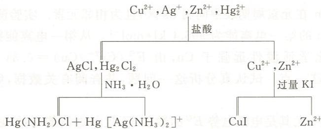

例 19.5 解释实验现象。

(1) $\left[\mathrm{Ag}\left(\mathrm{NH}_{3}\right)_{2}\right]\mathrm{Cl}$ 遇到硝酸时,析出沉淀。

(2) 稀释 $CuCl_{2}$ 的浓溶液时, 体系的颜色由黄色经绿色变为蓝色。

(3) 将 $SO_{2}$ 通入 $CuSO_{4}$ 和 NaCl 的浓的混合溶液, 有白色沉淀生成。

(4) 单质铁能使 $Cu^{2+}$ 还原, 单质铜却能使 $Fe^{3+}$ 还原。

(5) 在用 $\mathrm{H}_{2} \mathrm{SO}_{4}$ 酸化的 $\mathrm{CuSO}_{4}$ 溶液中通入 $\mathrm{H}_{2} \mathrm{~S}$ 气体, 可以得到黑色的 $\mathrm{CuS}$ 沉淀。当 $\mathrm{Cu}$ 与浓硫酸共热, 主要的含硫产物为 $\mathrm{SO}_{2}$ , 同时也得到少量的 $\mathrm{CuS}$ 沉淀。

解：(1) 在 $\left[\mathrm{Ag}\left(\mathrm{NH}_{3}\right)_{2}\right]^{+}$ 溶液中存在如下配位解离平衡：

$$
\left[ \mathrm{Ag} (\mathrm{NH} _ {3}) _ {2} \right] ^ {+} \rightleftharpoons \mathrm{Ag} ^ {+} + 2 \mathrm{NH} _ {3}
$$

当向该体系中加入硝酸时,有下列反应:

$$
\mathrm{NH} _ {3} + \mathrm{H} ^ {+} = \mathrm{NH} _ {4} ^ {+}
$$

由于生成 $NH_{4}^{+}$ ，使 $\left[\mathrm{Ag}\left(\mathrm{NH}_{3}\right)_{2}\right]^{+}$ 的解离程度更大。当 $Ag^{+}$ 浓度增加到足以形成 AgCl 沉淀时，则发生下式的反应：

$$
\left[ \mathrm{Ag} (\mathrm{NH} _ {3}) _ {2} \right] \mathrm{Cl} + \mathrm{HNO} _ {3} = \mathrm{AgCl} \downarrow + \mathrm{NH} _ {4} \mathrm{NO} _ {3}
$$

（2）在很浓的 $CuCl_{2}$ 水溶液中，可形成黄色的 $\left[\mathrm{CuCl}_{4}\right]^{2-}$ ，而 $CuCl_{2}$ 的稀溶液为蓝色，这是因为溶液中存在 $\left[\mathrm{Cu}\left(\mathrm{H}_{2}\mathrm{O}\right)_{4}\right]^{2+}$ 的缘故：

$$
\begin{array}{r l}&{\left[ \mathrm{CuCl} _ {4} \right] ^ {2 -} + 4 \mathrm{H} _ {2} \mathrm{O} \rightleftharpoons \left[ \mathrm{Cu(H} _ {2} \mathrm{O)} _ {4} \right] ^ {2 +} + 4 \mathrm{Cl} ^ {-}}\\&{\text {(黄色)}}\\&{\text {(蓝色)}}\end{array}
$$

稀释 $CuCl_{2}$ 的浓溶液时，依次观察到黄色、黄绿色、绿色、蓝绿色和蓝色。颜色变化的原因是溶液中黄色 $\left[\mathrm{CuCl}_{4}\right]^{2-}$ 和蓝色 $\left[\mathrm{Cu}\left(\mathrm{H}_{2}\mathrm{O}\right)_{4}\right]^{2+}$ 的相对量不同所致。

(3) 白色沉淀为氯化亚铜, 为使 $\mathrm{Cu}^{2+}$ 转变为 $\mathrm{Cu(I)}$ , 在有还原剂 $\mathrm{SO}_2$ 存在的同时, 还必须有 $\mathrm{Cu(I)}$ 的沉淀剂或配体 $\mathrm{Cl}^-$ 存在, 以降低溶液中 $\mathrm{Cu}^+$ 的浓度, 使之成为难溶物或难解离的化合物:

$$
2 \mathrm{Cu} ^ {2 +} + \mathrm{SO} _ {2} + 2 \mathrm{Cl} ^ {-} + 2 \mathrm{H} _ {2} \mathrm{O} = 2 \mathrm{CuCl} \downarrow + \mathrm{SO} _ {4} ^ {2 -} + 4 \mathrm{H} ^ {+}
$$

（4）查得 $\mathrm{Fe}^{2+}/\mathrm{Fe}$ 的 $E^{\ominus}(1) = -0.447\mathrm{V},\mathrm{Fe}^{3+}/\mathrm{Fe}^{2+}$ 的 $E^{\ominus}(2) = 0.771\mathrm{V},\mathrm{Cu}^{2+}/\mathrm{Cu}$ 的 $E^{\ominus}(3) = 0.342\mathrm{V}$ 。

因为 $E^{\ominus}(1)<E^{\ominus}(3)$ ，所以单质铁能使 $Cu^{2+}$ 还原：

$$
\mathrm{Fe} + \mathrm{Cu} ^ {2 +} = \mathrm{Fe} ^ {2 +} + \mathrm{Cu}
$$

而 $E^{\ominus}(3)<E^{\ominus}(2)$ ，所以单质铜能使 $Fe^{3+}$ 还原：

$$
2 \mathrm{Fe} ^ {3 +} + \mathrm{Cu} = 2 \mathrm{Fe} ^ {2 +} + \mathrm{Cu} ^ {2 +}
$$

(5) CuS 的溶解度很小, 不溶于 $H_{2}SO_{4}$ , 故题设的条件下可以生成 CuS 沉淀。

铜与浓硫酸之间发生的是氧化还原反应。 $H_{2}SO_{4}$ 的主要还原产物是 $SO_{2}$ ，但也有少量 $S^{2-}$ 。Cu 的氧化产物 $Cu^{2+}$ 可以与 $S^{2-}$ 生成难溶的 CuS。

例 19.6 Cu 和 Zn 在元素周期表中同属 ds 区, 且为相邻元素。实验测得 Cu 的第一电离能为 $745.5 \mathrm{~kJ} \cdot \mathrm{mol}^{-1}$ , Zn 的第一电离能为 $906.4 \mathrm{~kJ} \cdot \mathrm{mol}^{-1}$ 。从第一电离能数据看, Cu 应该比 Zn 活泼, 事实上 Zn 的化学活泼性远强于 Cu, 由 $E^{\ominus}(\mathrm{Cu}^{2+}/\mathrm{Cu}) = 0.34 \mathrm{~V}, E^{\ominus}(\mathrm{Zn}^{2+}/\mathrm{Zn}) = -0.76 \mathrm{~V}$ 可明显看出这一点。试认真分析这一问题, 并查阅有关数据, 解释这对似乎矛盾的事实。

解：金属的活泼性，尤其是电极电势 $E^{\ominus}$ 的数值，不仅与电离能有关，还与金属的原子化热、气态金属离子的水合热有关，见下图。

锌和铜的第一电离能 $I_{1}$ 与第二电离能 $I_{2}$ 之和相差不大，气态的 $Zn^{2+}$ 和 $Cu^{2+}$ 的水合热 $\Delta H_{2}$ 相差不大。但原子化热 $\Delta H_{1}$ ，锌的为 $131\ kJ\cdot mol^{-1}$ ，比铜的 $338\ kJ\cdot mol^{-1}$ 小得多。原子化热的差别造成过程 $M(s)\longrightarrow M^{2+}(aq)$ 的总的热效应是锌比铜有利，故锌远比铜活泼。

必须注意的是,铜和锌的上述过程类型相同,熵变相近,故焓变将对吉布斯自由能的改变量起决定性作用。因此通过焓变的对比讨论问题是有意义的。

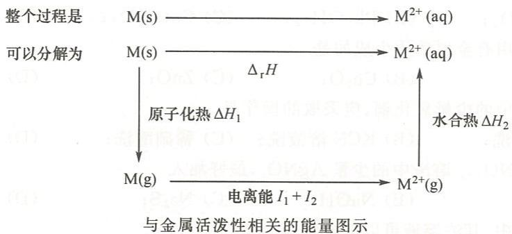

例 19.7 AgF 的溶解度大于 AgCl，而 $CuF_{2}$ 的溶解度却小于 $CuCl_{2}$ ，请解释原因。

解：AgF 中， $Ag^{+}$ 为软酸， $F^{-}$ 为硬碱，软酸和硬碱结合的产物结合力弱，溶解度大，AgF 易溶于水。AgCl 中， $Cl^{-}$ 的变形性大， $Ag^{+}$ 也有变形性，AgCl 中键的共价成分多，溶解度小，AgCl 不溶于水。 $CuF_{2}$ 中， $F^{-}$ 的半径很小， $CuF_{2}$ 的晶格能特别大，难溶。而 $Cl^{-}$ 半径大， $CuCl_{2}$ 的晶格能比 $CuF_{2}$ 的晶格能小，故 $CuCl_{2}$ 较 $CuF_{2}$ 易溶。

例 19.8 化合物(A)的溶液为绿色,将铜丝与其共煮渐渐生成近无色溶液(B)。用大量的水稀释(B)得到白色沉淀(C)。(C)溶于稀硫酸得到蓝色溶液(D)和红色单质(E)。向蓝色溶液(D)中不断滴入氨水,先有蓝色沉淀(F)生成,最后得到深蓝色溶液(G);红色单质(E)不溶于稀硫酸和稀氢氧化钠溶液,但可溶于浓硫酸生成蓝色溶液(D)和无色气体(H)。

试给出(A)、(B)、(C)、(D)、(E)、(F)、(G)和(H)所代表的物质的化学式,并用化学反应方程式表示各过程。

$$
\begin{array}{r l} & {\text {解}: (\mathrm{A}) - \mathrm{CuCl} _ {2}; (\mathrm{B}) - [ \mathrm{CuCl} _ {2} ] ^ {-}; (\mathrm{C}) - \mathrm{CuCl}; (\mathrm{D}) - \mathrm{CuSO} _ {4}; (\mathrm{E}) - \mathrm{Cu};} \\ & {\qquad (\mathrm{F}) - \mathrm{Cu(OH)} _ {2} \bullet \mathrm{CuSO} _ {4}; (\mathrm{G}) - [ \mathrm{Cu(NH} _ {3}) _ {4} ] ^ {2 +}; (\mathrm{H}) - \mathrm{SO} _ {2}.} \end{array}
$$

各过程的化学反应方程式如下：

$$
\begin{array}{r l} & {\mathrm {Cu^ {2 + } + Cu + 4Cl^ {-} \xlongequal   2[CuC l _ {2} ]^ {-}}} \\ & {[ \mathrm {CuCl_ {2}} ] ^ {-} \xlongequal   \mathrm {CuCl\downarrow + Cl^ {-}}} \\ & {2 \mathrm {CuCl+ H _ {2} SO_ {4} \xlongequal   CuSO_ {4} + Cu + 2HCl}} \\ & {2 \mathrm {CuSO_ {4} + 2NH_ {3} \cdot H_ {2} O\xlongequal   Cu(OH) _ {2} \cdot CuSO_ {4} \downarrow + (NH_ {4}) _ {2} SO_ {4}}} \\ & {\mathrm {Cu(OH) _ {2} \cdot CuSO_ {4} +(NH_ {4}) _ {2} SO_ {4} + 6NH_ {3} \cdot H_ {2} O\xlongequal   2[Cu(NH_ {3}) _ {4} ]SO_ {4} + 8H_ {2} O}} \\ & {\mathrm {Cu + 2H_ {2} SO_ {4} (\text {浓}) = CuSO_ {4} + SO_ {2} \uparrow + 2H_ {2} O}} \end{array}
$$

## 第二部分 习题

## 一、选择题

19.1 既易溶于稀氢氧化钠溶液,又易溶于氨水的是
(A) $\mathrm{Cu(OH)_2}$ ; (B) $Ag_2O$ ; (C) $\mathrm{Zn(OH)_2}$ ; (D) $\mathrm{Cd(OH)_2}$ 。

19.2 下列化合物中，在 NaOH 溶液中溶解度最小的是
(A) $\mathrm{Sn(OH)_2}$ ; (B) $\mathrm{Pb(OH)_2}$ ; (C) $\mathrm{Cu(OH)_2}$ ; (D) $\mathrm{Zn(OH)_2}$ 。

19.3 和稀硫酸作用有金属单质生成的是
(A) $Ag_{2}O$ ; (B) $Cu_{2}O$ ; (C) ZnO; (D) HgO。

19.4 为除去铜粉中的少量氧化铜,应采取的操作是
(A) 浓盐酸洗; (B) KCN 溶液洗; (C) 稀硝酸洗; (D) 稀硫酸洗。

19.5 欲除去 $\mathrm{Cu(NO_{3})_{2}}$ 溶液中的少量 $AgNO_{3}$ ，最好加入
(A) 铜粉；(B) NaOH；(C) $Na_{2}S$ ；(D) $NaHCO_{3}$ 。

19.6 下列化合物中,其浓溶液可以溶解铁锈的是
(A) $FeCl_{2}$ ; (B) $CoCl_{2}$ ; (C) $ZnCl_{2}$ ; (D) $CuCl_{2}$ 。

19.7 向 $\mathrm{Hg}_{2}(\mathrm{NO}_{3})_{2}$ 溶液中加入 NaOH 溶液，生成的沉淀是
(A) $Hg_{2}O$ ; (B) HgOH; (C) $HgO+Hg$ ; (D) $\mathrm{Hg(OH)}_{2}+\mathrm{Hg}$ .

19.8 下列化合物中,在硝酸和氨水中都能溶解的是
(A) AgCl; (B) $Ag_{2}CrO_{4}$ ; (C) $HgCl_{2}$ ; (D) CuS。

19.9 在分析气体时,可用于吸收 CO 的试剂为
(A) $PdCl_{2}$ ; (B) CuCl; (C) AgCl; (D) $Hg_{2}Cl_{2}$ 。

19.10 下列化合物中,颜色最深的是
(A) CuO; (B) ZnO; (C) HgO; (D) PbO。

19.11 下列化合物中,在氨水、盐酸、氢氧化钠溶液中均不溶解的是
(A) $ZnCl_{2}$ ; (B) $CuCl_{2}$ ; (C) $Hg_{2}Cl_{2}$ ; (D) AgCl。

19.12 下列试剂中, 可将 $Hg_{2}Cl_{2}$ , CuCl, AgCl 鉴别开的是
(A) $Na_{2}S$ ; (B) $NH_{3}\cdot H_{2}O$ ; (C) $Na_{2}SO_{4}$ ; (D) $KNO_{3}$

## 二、填空题

19.13 给出下列物质的化学式。

(1) 黄铜矿\_\_\_\_；(2) 辉铜矿\_\_\_\_；(3) 赤铜矿\_\_\_\_；(4) 黑铜矿\_\_\_\_；

(5) 孔雀石\_\_\_\_；(6) 胆矾\_\_\_\_；(7) 闪锌矿\_\_\_\_；(8) 菱锌矿\_\_\_\_；

(9) 朱砂\_\_\_\_； (10) 锌白\_\_\_\_； (11) 立德粉\_\_\_\_； (12) 镉黄\_\_\_\_；

(13) 甘汞\_\_\_\_；(14) 升汞\_\_\_\_。

19.14 给出组成合金的金属: 黄铜 \_\_\_\_ , 青铜 \_\_\_\_ , 康铜 \_\_\_\_ 。

19.15 $\mathrm{Hg_2Cl_2}$ 空间构型为\_\_\_\_，中心原子采取的轨道杂化类型为\_\_\_\_。用氨水处理 $\mathrm{Hg_2Cl_2}$ 得到的沉淀是\_\_\_\_。

19.16 黄色 HgO 在一定温度下加热一段时间转化为红色的 HgO, 这是因为 \_\_\_\_; ZnO 长时间加热后将由白色变成黄色, 这是由于在加热过程中 \_\_\_\_。

19.17 欲将 $Ag^{+}$ 从 $Pb^{2+}, Sn^{4+}, Al^{3+}, Hg^{2+}$ 混合溶液中分离出来, 可加入的试剂为 \_\_\_\_。

19.18 Cu(I)在水溶液中不稳定,容易发生\_\_\_\_反应,该反应的离子方程式为\_\_\_\_。因此,Cu(I)在水溶液中只能以\_\_\_\_和\_\_\_\_形式存在,如\_\_\_\_和\_\_\_\_。

19.19 $\mathrm{Hg_2Cl_2}$ 是利尿剂。有时服用含有 $\mathrm{Hg_2Cl_2}$ 的药剂会引起中毒，其原因是

19.20 五支试管分别盛有以下五种试液，请用一种试剂把它们区别开，并给出产物和现象。

<table><tr><td></td><td>NaCl</td><td> $Na_{2}S$ </td><td> $K_{2}Cr_{2}O_{7}$ </td><td> $Na_{2}S_{2}O_{3}$ </td><td> $K_{2}HPO_{4}$ </td></tr><tr><td></td><td></td><td></td><td></td><td></td><td></td></tr></table>

19.21 给出下列离子的颜色。

$\left[\mathrm{Cu}\left(\mathrm{H}_{2} \mathrm{O}\right)_{4}\right]^{2+}$ 色； $\left[\mathrm{CuCl}_{4}\right]^{2-}$ 色； $\left[\mathrm{Cu}\left(\mathrm{CN}\right)_{4}\right]^{3-}$ 色； $\left[\mathrm{CuCl}_{2}\right]^{-}$ 色； $\left[\mathrm{Cu}\left(\mathrm{NH}_{3}\right)_{4}\right]^{2+}$ 色； $\left[\mathrm{Cu}\left(\mathrm{OH}\right)_{4}\right]^{2-}$ 色； $\left[\mathrm{Cu}\left(\mathrm{NH}_{3}\right)_{2}\right]^{+}$ 色； $\left[\mathrm{Cu}\left(\mathrm{CN}\right)_{4}\right]^{2-}$ 色； $\left[\mathrm{HgI}_{4}\right]^{2-}$ 色； $\left[\mathrm{Hg}\left(\mathrm{SCN}\right)_{4}\right]^{2-}$ 色。

19.22 给出下列化合物的颜色。

$\mathrm{CuSO_{4}}$ \_\_\_\_色； $\mathrm{CuCl_{2}}$ \_\_\_\_色； $\mathrm{CuCl_{2} \cdot 2H_{2}O}$ \_\_\_\_色； $\mathrm{K_{2}[Cu(C_{2}O_{4})_{2}] \cdot 2H_{2}O}$ \_\_\_\_色； $\mathrm{Cu(OH)_{2}}$ \_\_\_\_色； $\mathrm{Cu(OH)_{2} \cdot CuCO_{3}}$ \_\_\_\_色； $\mathrm{CuBr}$ \_\_\_\_色； $\mathrm{CuI}$ \_\_\_\_色； $\mathrm{CuCN}$ \_\_\_\_色； $\mathrm{CuO}$ \_\_\_\_色； $\mathrm{Cu_{2}O}$ \_\_\_\_色； $\mathrm{Ag_{2}O}$ \_\_\_\_色； $\mathrm{AgPO_{3}}$ \_\_\_\_色； $\mathrm{Ag_{3}PO_{4}}$ \_\_\_\_色； $\mathrm{Ag_{4}P_{2}O_{7}}$ \_\_\_\_色； $\mathrm{AgCl}$ \_\_\_\_色； $\mathrm{AgBr}$ \_\_\_\_色； $\mathrm{AgI}$ \_\_\_\_色； $\mathrm{Ag_{2}S_{2}O_{3}}$ \_\_\_\_色； $\mathrm{Zn[Hg(SCN)_{4}]}$ \_\_\_\_色； $\mathrm{ZnO}$ \_\_\_\_色； $\mathrm{ZnS}$ \_\_\_\_色； $\mathrm{CdO}$ \_\_\_\_色； $\mathrm{HgO}$ \_\_\_\_色； $\mathrm{Hg_{2}Cl_{2}}$ \_\_\_\_色； $\mathrm{Hg_{2}I_{2}}$ \_\_\_\_色； $\mathrm{HgI_{2}}$ \_\_\_\_色。

19.23 比较大小。

(1) 在水中的溶解度 CuCl AgCl, AgClO $_{4}$ KClO $_{4}$ 。

(2) 在氨水中的溶解度 $\mathrm{Cr(OH)}_{3} \longrightarrow \mathrm{Zn(OH)}_{2}, \mathrm{ZnCl}_{2} \longrightarrow \mathrm{ZnO}$ 。

(3) 在 KI 溶液中的溶解度 $HgI_{2}$ $PbI_{2}$ , $PbI_{2}$ $AgI$ 。

(4) 在 NaOH 溶液中的溶解度 ZnO \_\_\_\_ CuO, CuO \_\_\_\_ CdO。

## 三、完成并配平化学反应方程式

19.24 向 $ZnCl_{2}$ 的稀溶液中连续滴加氢氧化钠溶液。

19.25 向 $CdCl_{2}$ 的稀溶液中连续滴加氢氧化钠溶液。

19.26 向 $ZnCl_{2}$ 的稀溶液中连续滴加氨水。

19.27 向 $\mathrm{Hg(NO_{3})_{2}}$ 溶液中滴加氢氧化钠溶液。

19.28 向 $\mathrm{HgCl}_2$ 溶液中滴加氨水。

19.29 向 $\mathrm{Hg(NO_{3})_{2}}$ 溶液中连续滴加碘化钾溶液。

19.30 奈斯勒试剂与 $\mathrm{NH}_4^+$ 作用。

19.31 氯化汞与亚锡离子反应。

19.32 氯化铜溶液与亚硫酸氢钠溶液混合后微热。

19.33 向 $CuSO_{4}$ 溶液中连续滴加 NaCN 溶液。

19.34 氯化亚铜暴露于空气中。

19.35 硝酸汞溶液与单质汞作用后,再加入盐酸。

19.36 用氨水处理甘汞。

19.37 氧化汞溶于氢碘酸。

19.38 向 $\mathrm{Hg}_2(\mathrm{NO}_3)_2$ 溶液中加入 $\mathrm{NaOH}$ 溶液。

19.39 二价铜与碱性联氨溶液作用。

19.40 硫化亚铜溶于氰离子溶液。

19.41 汞与过量的稀硝酸作用。

19.42 硫化汞溶于硫化钠溶液。

19.43 水合氯化锌受热分解。

19.44 氯化亚汞光照分解。

19.45 铜与含有二氧化碳的潮湿空气接触,表面生成铜绿。

19.46 在有氧气存在的条件下，银与氰化钠溶液反应。

19.47 金属铜在有空气存在的条件下与稀硫酸作用。

19.48 四羟合铜(Ⅱ)配阴离子与葡萄糖的反应。

19.49 氧化亚铜溶于氨水。

19.50 溴化银光照分解。

19.51 过量的单质汞与稀硝酸反应。

19.52 单质锌溶于氨水。

19.53 硫化汞溶于浓的碘化钾酸性溶液。

19.54 单质汞与二氯化汞固体一起研磨。

19.55 硫化汞溶于王水。

19.56 向二硫代硫酸根合银(Ⅰ)配阴离子的溶液中通入硫化氢气体。

## 四、分离、鉴别与制备

19.57 叙述下列生产或制备过程。

(1) 以黄铜矿 $\left(\mathrm{CuFeS}_{2}\right)$ 为原料提炼粗铜；

(2) 氰化法炼金；

(3) 以含有杂质 CdS 的闪锌矿(ZnS)提炼金属 Zn;

(4) 以辰砂(HgS)为原料制取高纯汞。

19.58 请将下列合成用化学反应方程式表示出来。

(1) 由 $\mathrm{CuSO}_4$ 合成 $\mathrm{CuBr}$ ;

(2) 由 ZnS 合成无水 $ZnCl_{2}$ ;

(3) 由 $\mathrm{Hg}$ 制备 $\mathrm{K}_{2}[\mathrm{HgI}_{4}]$ ;

(4) 由 $\mathrm{ZnCO}_{3}$ 提取 $\mathrm{Zn}$ ;

(5) 以金属 $\mathrm{Ag}$ 为主要原料制取硝酸银、氯化银、碘化银和硫化银；

(6) 以金属 $\mathrm{Zn}$ 为主要原料制取硝酸锌、氯化锌和硫化锌；

(7) 以金属 $\mathrm{Hg}$ 为主要原料制取硝酸汞、硝酸亚汞、碘化汞、碘化亚汞和硫化汞；

(8) 由 $\mathrm{Cu(II)}$ 化合物制备 $\mathrm{Cu(III)}$ 化合物。

19.59 分离下列各组混合物。

(1) ZnS, CdS, HgS; (2) AgCl, $Hg_{2}Cl_{2}$ , $HgCl_{2}$ .

19.60 设计方案分离离子: $Zn^{2+}$ , $Cd^{2+}$ , $Hg^{2+}$ , $Al^{3+}$ 。

19.61 设计方案将离子分离并复原: $Al^{3+}$ , $Cr^{3+}$ , $Ag^{+}$ , $Zn^{2+}$ , $Hg^{2+}$ 。

19.62 设计一个不用生成硫化物而能将离子分离的方案: $Ag^{+}$ , $Hg_{2}^{2+}$ , $Cu^{2+}$ , $Zn^{2+}$ , $Cd^{2+}$ , $Hg^{2+}$ , $Al^{3+}$ 。

19.63 CuCl, AgCl, $Hg_{2}Cl_{2}$ 都是难溶于水的白色粉末, 如何区别这三种物质?

## 五、简答题

19.64 解释实验现象。

(1) 向盛有 $CuSO_{4}$ 溶液的试管中加入 NaOH 溶液, 析出浅蓝色沉淀, 然后将试管水浴加热则沉淀变黑;

(2) 向 $HgCl_{2}$ 溶液中加入 NaOH 溶液析出黄色沉淀, 而向 $HgCl_{2}$ 溶液中加入氨水析出白色沉淀;

(3) $\mathrm{Hg(NO_3)_2}$ 溶于水时析出黄色沉淀, 而 $\mathrm{HgCl}_2$ 溶于水时没有明显的沉淀析出;

(4) 黄色的 AgI 受热时显红色, 低温时显白色, 而 AgCl 常温下显白色;

(5) 铜与 NaCN 溶液作用放出 $H_{2}$ ，而且在有氧气存在时铜能溶于浓氨水；

(6) 铜可溶于硝酸, 而金只能溶于王水;

(7) 向 $\left[\mathrm{Zn(OH)}_{4}\right]^{2-}$ 溶液中不断滴加盐酸, 先有白色沉淀生成, 继而沉淀溶解;

(8) 向 $\mathrm{Hg}_{2}(\mathrm{NO}_{3})_{2}$ 溶液中不断滴加 KI 溶液, 先有黄色沉淀生成, 继而沉淀颜色加深, 最后得到黑色沉淀和无色溶液;

(9) 向 $\mathrm{Hg(NO_3)_2}$ 溶液中不断滴加KI溶液, 先有红色沉淀生成, 继而沉淀消失得到无色溶液。

19.65 用化学反应方程式表示下列与 Cu 有关的转化过程。

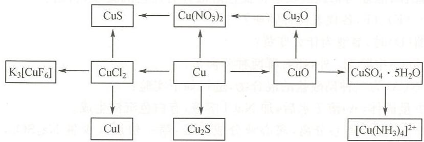

19.66 用化学反应方程式表示下列与 Zn 有关的转化过程。

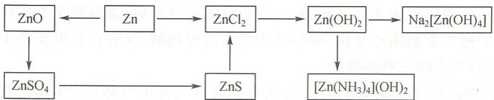

19.67 填写汞的硝酸盐与某些试剂反应的主要产物，并说明实验现象。

<table><tr><td></td><td> ${\mathrm{{Hg}}}_{2}{\left( {\mathrm{{NO}}}_{3}\right) }_{2}$ </td><td> $\mathrm{{Hg}}{\left( {\mathrm{{NO}}}_{3}\right) }_{2}$ </td></tr><tr><td>KOH</td><td></td><td></td></tr><tr><td> ${\mathrm{{NH}}}_{3} \cdot {\mathrm{H}}_{2}\mathrm{O}$ </td><td></td><td></td></tr><tr><td> ${\mathrm{H}}_{2}\mathrm{\;S}$ </td><td></td><td></td></tr><tr><td> ${\mathrm{{SnCl}}}_{2}$ </td><td></td><td></td></tr><tr><td>KI</td><td></td><td></td></tr></table>

19.68 解释下列实验事实。

(1) 加热 $CuCl_{2} \cdot 2H_{2}O$ 得不到无水 $CuCl_{2}$ ;

(2) $HgC_{2}O_{4}$ 难溶于水,但可溶于盐酸;

(3) $\mathrm{Hg(NO_3)_2}$ 溶液中有 $\mathrm{NH_4NO_3}$ 存在时, 加入氨水得不到 $\mathrm{Hg(NH_2)NO_3}$ 沉淀。

19.69 HCl 和 HI 溶液都是强酸, 但 Ag 不能从 HCl 溶液中置换出 $H_{2}$ , 却能从 HI 溶液中置换出 $H_{2}$ , 试说明原因。

19.70 固体混合物中可能含有 $CuSO_{4}$ , $ZnSO_{4}$ , $AgNO_{3}$ , $HgCl_{2}$ , $SnCl_{2}$ , NaCl。通过下列实验，判断哪些物质肯定存在，哪些物质肯定不存在，并分析原因。

(1) 取少量混合物投入水中并微热,有白色沉淀生成,溶液最后为无色。

(2) 将沉淀分离后与氨水作用, 沉淀全部消失, 溶液变为蓝色。向蓝色溶液中加过量盐酸, 无沉淀生成。

(3) 取(1)的溶液加适量氢氧化钠溶液,有白色沉淀生成。该白色沉淀溶于过量的氢氧化钠溶液,但在氨水中只有部分溶解。

19.71 向无色溶液(A)中加入过量硝酸时有白色沉淀(B)和无色溶液(C)生成。向(C)中加入过量铜粉得蓝色溶液(D)并放出红棕色气体(E)。浓缩溶液(D)，颜色逐渐变黄，最后析出浅棕色晶体；晶体与稀硫酸反应得蓝色溶液并有白色沉淀(F)析出。

(1) (B)、(E)、(F)各代表何种物质?

(2) 浓缩(D)时,溶液为什么变黄?

(3) 溶液(C)中除 $H^{+}$ 外, 还有哪两种阳离子?

19.72 白色固体(A)为三种硝酸盐的混合物,进行如下实验:

(1) 取少量固体(A)溶于水后, 加 NaCl 溶液, 有白色沉淀生成。

(2) 将(1)的沉淀离心分离, 离心液分成三份: 第一份加入少量 $Na_{2}SO_{4}$ , 有白色沉淀生成; 第二份加入 $K_{2}CrO_{4}$ 溶液, 有黄色沉淀生成; 第三份加入 NaClO, 有棕黑色沉淀生成。

(3) 在(1)所得沉淀中加入过量氨水, 白色沉淀部分溶解, 部分转化为灰白色沉淀。

(4) 将(3)所得溶液离心分离, 离心液中加入过量硝酸, 又有白色沉淀产生。

试确定(A)中含哪三种硝酸盐。

19.73 某络酸的钠盐(A)与稀盐酸作用,生成有刺激性气味的气体(B)和黑色沉淀(C),同时溶液中出现极浅的黄色浑浊,说明有(D)产生。气体(B)能使 $\mathrm{KMnO}_{4}$ 溶液褪色。若通氯气于(A)的溶液中,得到白色沉淀(E)和化合物(F)的溶液。(F)与 $\mathrm{BaCl}_{2}$ 作用,有不溶于酸的白色沉淀(G)产生。若在(A)的溶液中加入KI,则生成黄色沉淀(H),再加入NaCN溶液,(H)溶解,形成(I)的无色溶液,再向其中通入 $\mathrm{H}_{2} \mathrm{~S}$ 气体,又得到(C)。试给出(A)、(B)、(C)、(D)、(E)、(F)、(G)、(H)和(I)所代表的物质的化学式。

19.74 化合物(A)是一种红色固体,它不溶于水,与稀硫酸反应生成蓝色的溶液(B)和暗红色沉淀(C)。往(B)中加入氨水,生成(D)的深蓝色溶液,再加入适量 KCN,得无色溶液,说明有(E)生成。(C)与浓硫酸反应生成(B),同时放出有刺激性气味的气体(F)。试给出(A)、(B)、(C)、(D)、(E)和(F)所代表的物质的化学式。

19.75 白色固体(A)不溶于水和氢氧化钠溶液,溶于盐酸形成无色溶液(B)和气体(C)。向溶液(B)中滴加氨水先有白色沉淀(D)生成,而后(D)又溶于过量氨水中形成无色溶液(E);将(C)通入 $CdSO_{4}$ 溶液中得黄色沉淀,若将(C)通入溶液(E)中则析出固体(A)。试给出(A)、(B)、(C)、(D)和(E)所代表的物质的化学式。

19.76 无色晶体(A)溶于水后加入盐酸得白色沉淀(B)。分离后将(B)溶于 $\mathrm{Na_2S_2O_3}$ 溶液得无色溶液(C)。向(C)中加入盐酸得黑色沉淀混合物(D)和无色气体(E)。(E)与碘水作用后转化为无色溶液(F)。向(A)的水溶液中滴加少量 $\mathrm{Na_2S_2O_3}$ 溶液立即生成白色沉淀(G)，该沉淀由白变黄、变橙、变棕最后转化为黑色，说明有(H)生成。试给出(A)、(B)、(C)、(D)、(E)、(F)、(G)和(H)所代表的物质的化学式。

19.77 白色固体溶于水后得无色溶液(A)。向(A)中加入氢氧化钠溶液得黄色沉淀(B)，(B)不溶于过量的氢氧化钠溶液。(B)溶于盐酸又得到(A)。向(A)中滴加少量氯化亚锡溶液有白色沉淀(C)生成。用过量碘化钾溶液处理(C)得黑色沉淀(D)和无色溶液(E)。向无色溶液(E)中通入硫化氢气体得黑色沉淀(F)，(F)不溶于硝酸。将(F)溶于王水后得黄色沉淀(G)、无色溶液(H)和气体(I)，(I)可使酸性高锰酸钾溶液褪色。试给出(A)、(B)、(C)、(D)、(E)、(F)、(G)、(H)和(I)所代表的物质的化学式。

## 钛副族元素和钒副族元素

## 第一部分 例题

例 20.1 完成并配平下列化学反应方程式。

(1) $\mathrm{Ti} + \mathrm{H}_2\mathrm{SO}_4$ (浓)

(2) $\mathrm{Ti} + \mathrm{Cl}_2 \xrightarrow{\text{高温}}$

(3) $\mathrm{TiO_2 + MgO\xrightarrow{\text{熔融}}}$

(4) $\mathrm{TiO_2 + H_2SO_4}$ (浓)

(5) $\mathrm{TiCl_4 + Ti\xrightarrow{800°C}}$

(6) $\mathrm{V} + \mathrm{O}_2\xrightarrow{\text{高温}}$

(7) $\mathrm{V} + \mathrm{Cl}_2 \xrightarrow{\text{高温}}$

(8) $\mathrm{NH_4VO_3}\stackrel {\triangle}{=}$

(9) $\mathrm{V}_2\mathrm{O}_5 + \mathrm{NaOH(aq)} =$

(10) $\mathrm{VSO_4 + KMnO_4 + H_2O =}$

解：(1) $2\mathrm{Ti} + 3\mathrm{H}_2\mathrm{SO}_4$ （浓） $\xlongequal{\triangle}\mathrm{Ti}_{2}(\mathrm{SO}_{4})_{3} + 3\mathrm{H}_{2}\uparrow$

(2) $\mathrm{Ti} + 2\mathrm{Cl}_2 \stackrel{\text{高温}}{=} \mathrm{TiCl}_4$

(3) $\mathrm{TiO_2 + MgO\xrightarrow{\text{熔融}} MgTiO_3}$

(4) $\mathrm{TiO_2 + 2H_2SO_4}$ (浓) $\xlongequal{\triangle} \mathrm{Ti(SO_4)_2 + 2H_2O}$

(5) $3\mathrm{TiCl}_4 + \mathrm{Ti}\xrightarrow{800^{\circ}C}4\mathrm{TiCl}_3$

(6) $4\mathrm{V} + 5\mathrm{O}_2 \stackrel{\text{高温}}{=} 2\mathrm{V}_2\mathrm{O}_5$

(7) $\mathrm{V} + 2\mathrm{Cl}_2\xrightarrow{\text{高温}}\mathrm{VCl}_4$

(8) $2\mathrm{NH}_4\mathrm{VO}_3\xrightarrow{\triangle}\mathrm{V}_2\mathrm{O}_5 + 2\mathrm{NH}_3\uparrow +\mathrm{H}_2\mathrm{O}$

(9) $\mathrm{V}_2\mathrm{O}_5 + 6\mathrm{NaOH(aq)} = 2\mathrm{Na}_3\mathrm{VO}_4 + 3\mathrm{H}_2\mathrm{O}$

$$
(1 0) 6 \mathrm{VSO} _ {4} + 2 \mathrm{KMnO} _ {4} + \mathrm{H} _ {2} \mathrm{O} = 2 \mathrm{V} _ {2} (\mathrm{SO} _ {4}) _ {3} + \mathrm{V} _ {2} \mathrm{O} _ {3} \downarrow + 2 \mathrm{MnO} _ {2} \downarrow + 2 \mathrm{KOH}
$$

例 20.2 简述生产过程,并写出有关化学反应方程式。

(1) 以金红石为原料生产纯金属钛；

(2) 以炼钢的残渣为主要原料生产单质钒。

解：（1）将原料粉与碳、氯气共热生成 $\mathrm{TiCl}_4$ ：

$$
\mathrm{TiO} _ {2} + 2 \mathrm{C} + 2 \mathrm{Cl} _ {2} \stackrel {\triangle} {=} \mathrm{TiCl} _ {4} + 2 \mathrm{CO}
$$

在 Ar 气氛中用金属镁或钠还原 $TiCl_{4}$ 蒸气制取 Ti:

$$
\mathrm{TiCl} _ {4} (\mathrm{g}) + 2 \mathrm{Mg(l)} \xlongequal {8 0 0 ^ {\circ} \mathrm{C}} \mathrm{Ti} + 2 \mathrm{MgCl} _ {2} (\mathrm{l})
$$

用水浸取除去可溶盐后，即得到海绵状钛，再在惰性气氛下熔炼，得到较纯的 Ti 单质。

(2) 在炼钢的残渣中, $\mathrm{V}_{2} \mathrm{O}_{3}$ 与 FeO 结合为 $\mathrm{FeO} \cdot \mathrm{V}_{2} \mathrm{O}_{3}$ 。将助熔剂如 NaCl, $\mathrm{Na}_{2} \mathrm{CO}_{3}$ 等加入钒渣中, 进行氧化焙烧, 可使钒转化为可溶性的钒酸钠。发生的反应为

$$
\begin{array}{r l} & 4 \mathrm{FeO} \bullet \mathrm{V} _ {2} \mathrm{O} _ {3} + 5 \mathrm{O} _ {2} \xlongequal {\text {焙烧}} 4 \mathrm{V} _ {2} \mathrm{O} _ {5} + 2 \mathrm{Fe} _ {2} \mathrm{O} _ {3} \\ & 2 \mathrm{V} _ {2} \mathrm{O} _ {5} + 4 \mathrm{NaCl} + \mathrm{O} _ {2} \xlongequal {\text {焙烧}} 4 \mathrm{NaVO} _ {3} + 2 \mathrm{Cl} _ {2} \\ & \mathrm{V} _ {2} \mathrm{O} _ {3} + \mathrm{Na} _ {2} \mathrm{CO} _ {3} + \mathrm{O} _ {2} \xlongequal {\text {焙烧}} 2 \mathrm{NaVO} _ {3} + \mathrm{CO} _ {2} \end{array}
$$

然后,用水将可溶性的 $NaVO_{3}$ 浸出,加酸调 pH 至 2\~3,此时析出红色的多钒酸盐沉淀。将其在 700 ℃ 下熔化,可得黑色的工业级 $V_{2}O_{5}$ 。 $V_{2}O_{5}$ 可进一步被 Fe 在高温下还原为金属钒单质。

## 例20.3 解释实验现象。

（1）金属钛缓慢溶于热的浓盐酸，生成紫色溶液；将该溶液在室温下滴入酸化的高锰酸钾水溶液中，溶液迅速褪色。

(2) 打开盛有 $\mathrm{TiCl}_{4}$ 试剂的玻璃瓶时会冒白烟。

（3）在酸性介质中，足量金属锌加入钒(V)的溶液中，溶液由黄色逐渐变为蓝色、绿色，最后变成紫色。

解：(1)金属钛缓慢溶于热的浓盐酸,得到紫色的 $\mathrm{Ti}^{3+}$ 溶液:

$$
2 \mathrm{Ti} + 6 \mathrm{HCl(浓)} = 2 \mathrm{TiCl} _ {3} + 3 \mathrm{H} _ {2} \uparrow
$$

在酸性溶液中，Ti(Ⅲ)具有较强的还原性，可还原酸化的高锰酸钾，使溶液的紫红色褪去：

$$
5 \mathrm{Ti} ^ {3 +} + \mathrm{MnO} _ {4} ^ {-} + \mathrm{H} _ {2} \mathrm{O} = 5 \mathrm{TiO} ^ {2 +} + \mathrm{Mn} ^ {2 +} + 2 \mathrm{H} ^ {+}
$$

(2) $\mathrm{TiCl}_{4}$ 遇潮湿的空气发生水解:

$$
\mathrm{TiCl} _ {4} + 2 \mathrm{H} _ {2} \mathrm{O} = \mathrm{TiO} _ {2} \downarrow + 4 \mathrm{HCl}
$$

生成的 HCl 蒸气凝结成小液滴, 成雾状, 即所谓的“白烟”。

（3）金属锌可以还原钒(V)的酸性溶液( $VO_{2}^{+}$ 黄色)，经蓝色的+4氧化态、绿色的+3氧化态，最后得到紫色的氧化数为+2的钒离子。化学反应方程式为

$$
2 \mathrm{VO} _ {2} ^ {+} (\text { 黄色 }) + \mathrm{Zn} + 4 \mathrm{H} ^ {+} = 2 \mathrm{VO} ^ {2 +} (\text { 蓝色 }) + \mathrm{Zn} ^ {2 +} + 2 \mathrm{H} _ {2} \mathrm{O}
$$

$$
2 \mathrm{VO} ^ {2 +} + \mathrm{Zn} + 4 \mathrm{H} ^ {+} = 2 \mathrm{V} ^ {3 +} (\mathrm{绿色}) + \mathrm{Zn} ^ {2 +} + 2 \mathrm{H} _ {2} \mathrm{O}
$$

$$
2 \mathrm{V} ^ {3 +} + \mathrm{Zn} = 2 \mathrm{V} ^ {2 +} (\mathrm{紫色}) + \mathrm{Zn} ^ {2 +}
$$

例 20.4 指出下列离子中哪些在水溶液中不能存在,并说明理由。

(1) $\left[\mathrm{Ti}(\mathrm{H}_2\mathrm{O})_6\right]^{2+}$ ; (2) $\left[\mathrm{Ti}(\mathrm{H}_2\mathrm{O})_6\right]^{3+}$ ; (3) $\left[\mathrm{Ti}(\mathrm{H}_2\mathrm{O})_6\right]^{4+}$ ; (4) $\left[\mathrm{Zr}(\mathrm{H}_2\mathrm{O})_6\right]^{2+}$ .

解： $\left[\mathrm{Ti}\left(\mathrm{H}_{2}\mathrm{O}\right)_{6}\right]^{2+}$ 不能存在。见下面的元素电势图：

$$
\mathrm{TiO} ^ {2 +} \xrightarrow {0 . 1 \mathrm{V}} \mathrm{Ti} ^ {3 +} \xrightarrow {- 0 . 3 7 \mathrm{V}} \mathrm{Ti} ^ {2 +} \xrightarrow {- 1 . 6 3 \mathrm{V}} \mathrm{Ti}
$$

由于 $Ti^{2+}$ 的还原性极强，在水中将被氧化成 $Ti^{3+}$ 。

$\left[\mathrm{Ti}\left(\mathrm{H}_{2}\mathrm{O}\right)_{6}\right]^{4+}$ 不能存在。因为 $Ti^{4+}$ 的电荷数过高，且半径很小，约为 61 pm，在水中将发生水解，变成 $TiO^{2+}$ 形式。

$\left[\mathrm{Zr}\left(\mathrm{H}_{2}\mathrm{O}\right)_{6}\right]^{2+}$ 不能存在。Zr 的低氧化态不稳定，基本上以 $\mathrm{Zr(IV)}$ 形式存在。

只有 $\left[\mathrm{Ti}\left(\mathrm{H}_{2} \mathrm{O}\right)_{6}\right]^{3+}$ 可以在水中存在。但是由于其还原性较强，可以被空气中的 $\mathrm{O}_{2}$ 氧化，所以也要注意加以保护。

例 20.5 浅黄色晶体(A)受热分解生成棕黄色粉末(B)和无色气体(C)。(B)不溶于水,与浓盐酸作用放出强刺激性气体(D)。将气体(C)通入 $CuSO_{4}$ 溶液有淡蓝色沉淀(E)生成,(C)过量则沉淀溶解得到深蓝色溶液(F)。(B)溶于稀硫酸后,加入适量草酸,经充分反应得到蓝色溶液(G)。向溶液(G)中放入足量金属 Zn,最终生成紫色溶液(H)。

试给出(A)、(B)、(C)、(D)、(E)、(F)、(G)和(H)所代表的物质的化学式,并用化学反应方程式表示各过程。
解： $(A)-NH_{4}VO_{3}$ ; $(B)-V_{2}O_{5}$ ; $(C)-NH_{3}$ ; $(D)-Cl_{2}$ ; $(E)-Cu(OH)_{2}$ ; $(F)-\left[Cu(NH_{3})_{4}\right]^{2+}$ ; $(G)-VO^{2+}$ ; $(H)-V^{2+}$ 。

各过程的化学反应方程式如下： $2NH_{4}VO_{3}=V_{2}O_{5}+2NH_{3}\uparrow+H_{2}O$ $V_{2}O_{5}+6HCl(浓)=2VOCl_{2}+Cl_{2}\uparrow+3H_{2}O$ $2NH_{3}+CuSO_{4}+2H_{2}O=Cu(OH)_{2}\downarrow+(NH_{4})_{2}SO_{4}$ $Cu(OH)_{2}+4NH_{3}=\left[Cu(NH_{3})_{4}\right]^{2+}+2OH^{-}$ $V_{2}O_{5}+H_{2}SO_{4}=$ $(VO_{2})_{2}SO_{4}+H_{2}O$ $2VO_{2}^{+} + H_{2}C_{2}O_{4} + 2H^{+} = 2VO^{2+}(蓝色) + 2CO_{2}\uparrow + 2H_{2}O$ $VO^{2+} + Zn + 2H^{+} = V^{2+}(紫色) + Zn^{2+} + H_{2}O$

## 第二部分 习题

## 一、选择题

20.1 下列金属中,在地壳中丰度比另外几种金属高的是
(A) Cu; (B) Zn; (C) Ti; (D) V。

20.2 下列各组元素的性质最相似的是
(A) Cr 和 Mn; (B) Cu 和 Zn; (C) Ti 和 V; (D) Nd 和 Ta。

20.3 下列各组元素的性质差异最大的是
(A) Ti 和 V; (B) Mo 和 W; (C) Nb 和 Ta; (D) Zr 和 Hf。

20.4 下列单质中, 易溶于 HF 溶液的是
(A) Ti; (B) Cu; (C) Ni; (D) Si。

20.5 下列金属中,与硝酸作用的产物氧化数最低的是
(A) Sb; (B) V; (C) Mo; (D) W。

20.6 与其他溶液颜色明显不同的是
(A) $\mathrm{TiCl}_3$ ；(B) $[\mathrm{V}(\mathrm{H}_2\mathrm{O})_6]^{2+}$ ；(C) $[\mathrm{V}(\mathrm{H}_2\mathrm{O})_6]^{3+}$ ；(D) $\mathrm{KMnO}_4$ 。

20.7 常温下以液态形式存在的是
(A) $TiOSO_{4}$ ; (B) $BaTiO_{3}$ ; (C) $TiO_{2}$ ; (D) $TiCl_{4}$ 。

20.8 下列无机材料中,具有压电效应的是
(A) $BaCO_{3}$ ; (B) $BaSO_{4}$ ; (C) $BaTiO_{3}$ ; (D) $BaCrO_{4}$ 。

20.9 下列试剂中,能将 $TiO^{2+}$ 还原为 $Ti^{3+}$ 的是
(A) $H_{2}S$ ; (B) $SO_{2}$ ; (C) KI; (D) Al。

20.10 将钒的混合氧化物溶于硫酸, 溶液中不存在的离子是
(A) $VO^{2+}$ ; (B) $V^{4+}$ ; (C) $V^{3+}$ ; (D) $VO_{2}^{+}$ 。

## 二、填空题

20.11 给出下列物质的化学式。

(1) 金红石\_\_\_\_；(2) 钛铁矿\_\_\_\_；(3) 钙钛矿\_\_\_\_；(4) 梔石\_\_\_\_；

(5) 锆英石\_\_\_\_；(6) 斜锆石\_\_\_\_；(7) 绿硫钒石\_\_\_\_；(8) 钒铅矿\_\_\_\_。

20.12 钛溶于热的浓盐酸的氧化产物是\_\_\_\_，钛与干燥的氯在高温下的反应产物是\_\_\_\_；钒与稀硝酸反应的氧化产物是\_\_\_\_。

20.13 Ti(IV)在酸性溶液中的存在形式为\_\_\_\_, V(IV)在酸性溶液中的存在形式为\_\_\_\_。

20.14 用 $\mathrm{Ti(CO_3)_4}$ , $\mathrm{TiI_4}$ , $\mathrm{Ti(NO_3)_4}$ , $\mathrm{Ti(OH)_4}$ 表示的化合物中, 其中\_\_\_\_可以从溶液中析出, 实际上不可能存在的是\_\_\_\_。

20.15 用过量 Zn 还原 VO $^{2+}$ 溶液, 最终的还原产物为 \_\_\_\_; 用 Fe $^{3+}$ 溶液氧化 V $^{3+}$ , 最终的氧化产物为 \_\_\_\_。

20.16 五价钒的溶液与 $\mathrm{H}_2\mathrm{O}_2$ 发生\_\_\_\_反应，在酸性条件下的反应产物为\_\_\_\_，在碱性条件下的反应产物为\_\_\_\_。

20.17 给出下列离子在溶液中的颜色。

$\mathrm{Ti}^{3+}$ \_\_\_\_ 色； $\mathrm{V}^{2+}$ \_\_\_\_ 色； $\mathrm{V}^{3+}$ \_\_\_\_ 色； $\mathrm{VO}^{2+}$ \_\_\_\_ 色； $\mathrm{VO}_2^+$ \_\_\_\_ 色； $\mathrm{VO}_4^{3-}$ \_\_\_\_ 色； $\mathrm{V}_{10}\mathrm{O}_{28}^{6-}$ \_\_\_\_ 色； $\mathrm{Ti(O_2)^{2+}}$ \_\_\_\_ 色； $[\mathrm{V(O_2)}]^{3+}$ \_\_\_\_ 色； $[\mathrm{VO}_2(\mathrm{O}_2)_2]^{3-}$ \_\_\_\_ 色。

## 三、完成并配平化学反应方程式

20.18 向三氯化钛溶液中加入稀硝酸。

20.19 金属钒溶于浓硝酸。

20.20 向硫酸氧钛溶液中加入过氧化氢。

20.21 用 NaH 还原四氯化钛。

20.22 五氧化二钒溶于稀硫酸。

20.23 向 $\mathrm{VO}_2^+$ 溶液中加入硫酸亚铁。

20.24 酸性条件下用 $KMnO_{4}$ 溶液滴定四价钒。

20.25 金属钛溶于热的氢氟酸中。

20.26 高温下金属钛与氮气作用。

20.27 二氧化钛与碳酸钡共熔。

20.28 将四氯化钛加到氢氧化钠溶液中。

20.29 金属锌与四氯化钛的盐酸溶液作用。

20.30 金属钒与氢氟酸反应。

20.31 三氯氧钒水解。

20.32 五氧化二钒与浓盐酸作用。

20.33 向酸性的正钒酸盐中通入硫化氢气体。

20.34 铌与氧高温下反应。

## 四、分离、鉴别与制备

20.35 写出从钛铁矿( $FeTiO_{3}$ )提取钛白粉的化学反应方程式。

20.36 由 $\mathrm{TiO_2}$ 制备 $\mathrm{TiCl_4}$ 。

20.37 如何由金属钛制取三氯化钛和钛酸钡？

20.38 写出以金属钒为原料制取五氧化二钒和偏钒酸铵的化学反应方程式。

20.39 紫色溶液可能是 $\mathrm{TiCl}_3$ 溶液和 $\mathrm{KMnO}_4$ 溶液中的一种，试加以鉴别。

## 五、简答题和计算题

20.40 解释实验现象。

(1) 冷却浓的 $TiCl_{3}$ 溶液析出的 $TiCl_{3} \cdot 6H_{2}O$ 晶体为紫色，用乙醚萃取 $TiCl_{3}$ 溶液在一定条件下析出的 $TiCl_{3} \cdot 6H_{2}O$ 晶体为绿色。

(2) $\mathrm{TiCl}_{3}$ 溶液与 $\mathrm{CuCl}_{2}$ 溶液反应后加水稀释有白色沉淀析出。

(3) 向酸性的 $\mathrm{VOSO}_{4}$ 溶液中滴加 $\mathrm{KMnO}_{4}$ 溶液, 溶液颜色由蓝变黄。

(4) 向 $V^{2+}$ 溶液中缓慢滴加 $KMnO_{4}$ 溶液至大过量, 体系的颜色由紫色到绿色, 再到蓝色, 最后到黄色。

(5) ${\mathrm{V}}_{2}{\mathrm{O}}_{5}$ 溶于热的浓盐酸生成黄色溶液,后溶液颜色逐渐变蓝并有气体放出。

20.41 给出实验现象和化学反应方程式。

(1) 向 $\mathrm{TiCl}_{4}$ 溶液中加入浓盐酸和金属锌后充分反应。

(2) 向(1)反应后的溶液中缓慢加入 $\mathrm{NaOH}$ 溶液至溶液呈碱性。

(3) 将(2)的沉淀过滤出来,用硝酸将其溶解后再加入稀碱溶液。

20.42 测定 $\mathrm{TiO_2}$ 中的钛含量时，先将 $\mathrm{TiO_2}$ 溶于热的 $\mathrm{H}_2\mathrm{SO}_4 - (\mathrm{NH}_4)_2\mathrm{SO}_4$ 混合溶液中，冷却，稀释；用金属铝还原后，再用 KSCN 为指示剂， $Fe^{3+}$ 为氧化剂滴定溶液中的 $Ti^{3+}$ ，便可计算钛的含量。写出有关化学反应方程式，并说明测定方法的依据。

43 试写出钛白、锌白、锌钡白的化学组成，并指出钛白作为染料的优点。

20.44 酸性钒酸盐溶液中通入 $\mathrm{SO}_2$ 时生成深蓝色溶液，相同量的钒酸盐溶液被锌汞齐还原，得到紫色溶液，将此两溶液相混，得到绿色溶液，在这个过程中进行了哪些反应？写出化学反应方程式。

20.45 下面数据是 Ti(Ⅳ)的卤化物的熔点,请对其规律加以解释: $TiF_{4}$ 284℃; $TiCl_{4}$ -25℃; $TiBr_{4}$ 39℃; $TiI_{4}$ 150℃。

20.46 在酸性介质中,钒元素的元素电势图如下:

$$
\mathrm{VO} _ {2} ^ {+} \xrightarrow {1 . 0 0 \mathrm{V}} \mathrm{VO} ^ {2 +} \xrightarrow {0 . 3 4 \mathrm{V}} \mathrm{V} ^ {3 +} \xrightarrow {- 0 . 2 6 \mathrm{V}} \mathrm{V} ^ {2 +} \xrightarrow {- 1 . 1 7 5 \mathrm{V}} \mathrm{V}
$$

(1) 写出钒溶解在盐酸中的离子反应方程式;

(2) 计算 $V^{3+}/V$ 电对的 $E^{\ominus}$ ;

(3) 这些钒的氧化态能否发生歧化反应?

(4) 将 V 放入含有 $V^{3+}$ 的溶液中, 写出离子反应方程式。

20.47 将 $N_{2}O_{5}$ 与 $TiCl_{4}$ 作用可制备无水 $\mathrm{Ti(NO_{3})_{4}}$ 。已知 $\mathrm{Ti(NO_{3})_{4}}$ 熔点为 $58^{\circ}C$ ，试分析它比一般的硝酸盐熔点低的原因。

20.48 化合物(A)为无色液体。(A)在潮湿的空气中冒白烟。取(A)的水溶液加入 $\mathrm{AgNO_3}$ 溶液,有不溶于硝酸的白色沉淀(B)生成,(B)易溶于氨水。取锌粒投入(A)的盐酸溶液中,最终得到紫色溶液(C)。向(C)中加入NaOH溶液至碱性则有紫色沉淀(D)生成。将(D)洗净后置于稀硝酸中得无色溶液(E)。将溶液(E)加热得白色沉淀(F)。试给出(A)、(B)、(C)、(D)、(E)和(F)所代表的物质的化学式。

20.49 无色液体(A)与干燥氧气在高温下反应,生成不溶于水的白色粉末(B)。(B)和锌粉混合后与盐酸缓慢作用,最后得到紫红色溶液,说明有化合物(C)生成。向(C)的溶液中加入 $CuCl_{2}$ 溶液得白色沉淀(D)。紫色化合物(C)溶于过量硝酸得无色溶液(E)。将溶液(E)蒸干后,在较高温度下加热又得到(B)。(A)与铝粉混合,在高温下反应有化合物(C)生成。试给出(A)、(B)、(C)、(D)和(E)所代表的物质的化学式。

20.50 钒与吡啶-2-甲酸根 $\left(\mathrm{C}_{6} \mathrm{NO}_{2} \mathrm{H}_{4}^{-}\right)$ 形成电中性的单核配位化合物，测得其氮的质量分数为 $4.5\%$ 。给出配位化合物的组成和钒的氧化数。

## 铬副族元素和锰副族元素

## 第一部分 例题

例 21.1 完成并配平下列化学反应方程式。

(1) $\mathrm{Cr}^{3+} + \mathrm{CO}_{3}^{2-} + \mathrm{H}_{2}\mathrm{O} =$

(2) $\mathrm{Cr}^{3+} + \mathrm{PbO}_2 + \mathrm{H}_2\mathrm{O} =$

(3) $\mathrm{Cr(OH)}_3 + \mathrm{I}_2 + \mathrm{OH}^-$

(4) $\left[\mathrm{Cr(OH)}_4\right]^- +\mathrm{H}_2\mathrm{O}_2 + \mathrm{OH}^-$

(5) $\mathrm{Cr_2O_7^{2 - } + H_2S + H^+ =}$

(6) $\mathrm{MnO_2 + KOH + O_2\xrightarrow{\text{熔融}}}$

(7) $\mathrm{MnO_4^{2 - } + Cl_2 =}$

(8) $\mathrm{MnO_4^{2 - } + H_2O =}$

(9) $\mathrm{MnO_4^- + SO_3^{2 - } + H_2O =}$

(10) $\mathrm{MnO_4^- + Cr^{3+} + H_2O =}$

解：(1) $\mathrm{Cr}^{3+} + 3\mathrm{CO}_{3}^{2-} + 3\mathrm{H}_{2}\mathrm{O} = \mathrm{Cr(OH)}_{3}\downarrow +3\mathrm{HCO}_{3}^{-}$

(2) $2\mathrm{Cr}^{3+} + 3\mathrm{PbO}_2 + \mathrm{H}_2\mathrm{O} = 3\mathrm{Pb}^{2+} + \mathrm{Cr}_2\mathrm{O}_7^{2-} + 2\mathrm{H}^+$

(3) $2\mathrm{Cr(OH)}_3 + 3\mathrm{I}_2 + 10\mathrm{OH}^- = 2\mathrm{CrO}_4^{2-} + 6\mathrm{I}^- + 8\mathrm{H}_2\mathrm{O}$

(4) $2[\mathrm{Cr(OH)}_4]^- + 3\mathrm{H}_2\mathrm{O}_2 + 2\mathrm{OH}^- = 2\mathrm{CrO}_4^{2-} + 8\mathrm{H}_2\mathrm{O}$

(5) $\mathrm{Cr_2O_{7}^{2 - } + 3H_2S + 8H^+ = 2Cr^{3 + } + 3S\downarrow + 7H_2O}$

(6) $2\mathrm{MnO}_2 + 4\mathrm{KOH} + \mathrm{O}_2\xrightarrow{\text{熔融}} 2\mathrm{K}_2\mathrm{MnO}_4 + 2\mathrm{H}_2\mathrm{O}$

(7) $2\mathrm{MnO}_4^{2-} + \mathrm{Cl}_2 = 2\mathrm{MnO}_4^- + 2\mathrm{Cl}^-$

(8) $3\mathrm{MnO}_4^{2-} + 2\mathrm{H}_2\mathrm{O} = 2\mathrm{MnO}_4^- + \mathrm{MnO}_2 \downarrow + 4\mathrm{OH}^-$

$$
2 \mathrm{MnO} _ {4} ^ {-} + 3 \mathrm{SO} _ {3} ^ {2 -} + \mathrm{H} _ {2} \mathrm{O} = 2 \mathrm{MnO} _ {2} \downarrow + 3 \mathrm{SO} _ {4} ^ {2 -} + 2 \mathrm{OH} ^ {-}
$$

(10) $6\mathrm{MnO}_4^-$ +10Cr3+ +11H2O = 6Mn2+ +5Cr2O7- +22H+

例 21.2 描述以软锰矿为原料制备高锰酸钾的实验步骤,并写出各步反应的方程式。

解：软锰矿即二氧化锰。

将氧化剂 $\mathrm{KClO_3}$ 或 $\mathrm{KNO}_3$ （也可以用空气中的 $\mathrm{O}_2$ 作氧化剂）和 $\mathrm{MnO}_2$ ，KOH（或 $\mathrm{K}_2\mathrm{CO}_3$ )按一定比例混合，用固相熔融法制备 $\mathrm{K}_2\mathrm{MnO}_4$ ：

$$
3 \mathrm{MnO} _ {2} + \mathrm{KClO} _ {3} + 6 \mathrm{KOH} \stackrel {\text {熔融}} {=} 3 \mathrm{K} _ {2} \mathrm{MnO} _ {4} + \mathrm{KCl} + 3 \mathrm{H} _ {2} \mathrm{O}
$$

电解 $K_{2}MnO_{4}$ 溶液得到 $KMnO_{4}$ :

$$
2 \mathrm{K} _ {2} \mathrm{MnO} _ {4} + 2 \mathrm{H} _ {2} \mathrm{O} \xlongequal {\text {电解}} 2 \mathrm{KMnO} _ {4} + 2 \mathrm{KOH} + \mathrm{H} _ {2} \uparrow
$$

产物中的 KOH 可以循环使用。

例 21.3 各用三种方法鉴定下列各组物质。

(1) $MnO_{2}$ 和 CuO; (2) $MnO_{2}$ 和 $PbO_{2}$ ;

(3) $V_{2}O_{5}$ 和 $Ag_{2}CrO_{4}$ ; (4) $MnSO_{4}$ 和 $ZnSO_{4}$ 。

解：(1) ${\mathrm{{MnO}}}_{2}$ 和 $\mathrm{{CuO}}$

方法一 用热的稀硫酸分别与两种氧化物作用,溶液变蓝的是 CuO:

$$
\mathrm{CuO} + \mathrm{H} _ {2} \mathrm{SO} _ {4} = \mathrm{CuSO} _ {4} + \mathrm{H} _ {2} \mathrm{O}
$$

方法二 取少量两种氧化物分别与热氨水作用,缓慢溶解并生成蓝色溶液的是 CuO:

$$
\mathrm{CuO} + 4 \mathrm{NH} _ {3} \cdot \mathrm{H} _ {2} \mathrm{O} = [ \mathrm{Cu(NH} _ {3}) _ {4} ] ^ {2 +} + 2 \mathrm{OH} ^ {-} + 3 \mathrm{H} _ {2} \mathrm{O}
$$

方法三 将两种氧化物分别与浓盐酸混合,加热后有 $Cl_{2}$ 放出的是 $MnO_{2}$ :

$$
\mathrm{MnO} _ {2} + 4 \mathrm{HCl(浓)} = \mathrm{MnCl} _ {2} + \mathrm{Cl} _ {2} \uparrow + 2 \mathrm{H} _ {2} \mathrm{O}
$$

(2) $\mathrm{MnO}_{2}$ 和 $\mathrm{PbO}_{2}$

方法一 将两种氧化物分别与酸性的 $\mathrm{MnSO_4}$ 溶液混合并加热，有 $\mathrm{MnO_4^-}$ 生成的是 $\mathrm{PbO_2}$

$$
5 \mathrm{PbO} _ {2} + 2 \mathrm{MnSO} _ {4} + 3 \mathrm{H} _ {2} \mathrm{SO} _ {4} \stackrel {\triangle} {=} 2 \mathrm{MnO} _ {4} ^ {-} + 5 \mathrm{PbSO} _ {4} \downarrow + 2 \mathrm{H} _ {2} \mathrm{O} + 2 \mathrm{H} ^ {+}
$$

方法二 将少量两种氧化物分别与热的稀盐酸充分反应后冷却,有白色沉淀生成的是 $PbO_{2}$ :

$$
\mathrm{PbO} _ {2} + 4 \mathrm{HCl(热、稀)} = \mathrm{PbCl} _ {2} \downarrow + \mathrm{Cl} _ {2} \uparrow + 2 \mathrm{H} _ {2} \mathrm{O}
$$

方法三 将两种氧化物分别与 KOH 和 $KClO_{3}$ 的混合物共熔, 有绿色产物生成的是 $MnO_{2}$ :

$$
3 \mathrm{MnO} _ {2} + \mathrm{KClO} _ {3} + 6 \mathrm{KOH} \xlongequal {\text {熔融}} 3 \mathrm{K} _ {2} \mathrm{MnO} _ {4} (\text {绿色}) + \mathrm{KCl} + 3 \mathrm{H} _ {2} \mathrm{O}
$$

(3) $\mathrm{V}_{2} \mathrm{O}_{5}$ 和 $\mathrm{Ag}_{2} \mathrm{CrO}_{4}$

方法一 分别取少量两种化合物与稀硫酸作用,溶解的是 $V_{2}O_{5}$ :

$$
\mathrm{V} _ {2} \mathrm{O} _ {5} + \mathrm{H} _ {2} \mathrm{SO} _ {4} = (\mathrm{VO} _ {2}) _ {2} \mathrm{SO} _ {4} + \mathrm{H} _ {2} \mathrm{O}
$$

而由砖红色沉淀逐渐转化为白色沉淀的是 $Ag_{2}CrO_{4}$ :

$$
2 \mathrm{Ag} _ {2} \mathrm{CrO} _ {4} + 2 \mathrm{H} _ {2} \mathrm{SO} _ {4} = 2 \mathrm{Ag} _ {2} \mathrm{SO} _ {4} (\text {白色}) + \mathrm{Cr} _ {2} \mathrm{O} _ {7} ^ {2 -} + 2 \mathrm{H} ^ {+} + \mathrm{H} _ {2} \mathrm{O}
$$

方法二 分别取少量两种化合物与稀盐酸作用,变白的是 $Ag_{2}CrO_{4}$ :

$$
2 \mathrm{Ag} _ {2} \mathrm{CrO} _ {4} + 4 \mathrm{HCl(稀)} = 4 \mathrm{AgCl(白色)} + \mathrm{Cr} _ {2} \mathrm{O} _ {7} ^ {2 -} + 2 \mathrm{H} ^ {+} + \mathrm{H} _ {2} \mathrm{O}
$$

方法三 分别取少量两种化合物与 NaOH 溶液作用, 变黑的是 $Ag_{2}CrO_{4}$ , 溶解的是 $V_{2}O_{5}$ :

$$
\begin{array}{r l} \mathrm {Ag_ {2} CrO_ {4} + 2NaOH = Ag_ {2} O(黑色) + Na_ {2} CrO_ {4} + H_ {2} O} \\ \mathrm {V_ {2} O_ {5} +6NaOH = 2Na_ {3} VO_ {4} + 3H_ {2} O} \end{array}
$$

(4) $\mathrm{MnSO}_{4}$ 和 $\mathrm{ZnSO}_{4}$

方法一 分别取少量两种化合物与氨水作用,溶解的是 $ZnSO_{4}$ :

$$
\mathrm{ZnSO} _ {4} + 4 \mathrm{NH} _ {3} \cdot \mathrm{H} _ {2} \mathrm{O} = [ \mathrm{Zn(NH} _ {3}) _ {4} ] \mathrm{SO} _ {4} + 4 \mathrm{H} _ {2} \mathrm{O}
$$

$$
\mathrm{MnSO} _ {4} + 2 \mathrm{NH} _ {3} \cdot \mathrm{H} _ {2} \mathrm{O} = \mathrm{Mn(OH)} _ {2} \downarrow + (\mathrm{NH} _ {4}) _ {2} \mathrm{SO} _ {4}
$$

方法二 分别取少量两种化合物与过量 NaOH 溶液作用,溶解的是 $ZnSO_{4}$ :

$$
\begin{array}{r l} & \mathrm {ZnSO_ {4} + 4NaOH = Na_ {2} [Zn(OH) _ {4} ] + Na_ {2} SO_ {4}} \\ & \mathrm {MnSO_ {4} + 2NaOH = Mn(OH) _ {2} \downarrow + Na_ {2} SO_ {4}} \end{array}
$$

方法三 分别取少量两种化合物加热分解,有棕黑色产物生成的是 $MnSO_{4}$ :

$$
\begin{array}{r l} \mathrm {MnSO_ {4}} & = \mathrm {MnO_ {2}} + \mathrm {SO_ {2}} \uparrow \\ \mathrm {ZnSO_ {4}} & = \mathrm {ZnO + SO_ {3}} \uparrow \end{array}
$$

例 21.4 解释实验现象。

(1) $CrCl_{3} \cdot 6H_{2}O$ 溶于水, 其溶液为绿色, 将溶液煮沸一段时间后冷却至室温, 溶液变为蓝紫色。

(2) $\left[\mathrm{Cr}\left(\mathrm{H}_{2}\mathrm{O}\right)_{6}\right]^{3+}$ 内界中的配体 $H_{2}O$ 逐步被 $NH_{3}$ 取代后,溶液的颜色发生一系列变化:紫色→浅红色→橙红色→橙黄色→黄色。

(3) 向 $\mathrm{MnSO}_4$ 溶液中加入 $\mathrm{NaOH}$ 溶液, 生成白色沉淀; 该白色沉淀暴露在空气中逐渐变成棕黑色; 加入稀硫酸棕黑色沉淀不溶解, 再加入过氧化氢沉淀消失。

(4) 将 $\mathrm{MnO}_{2}, \mathrm{KClO}_{3}, \mathrm{KOH}$ 固体混合后用煤气灯加热, 得绿色固体; 用大量水处理绿色固体得到紫色溶液和棕黑色沉淀, 再通入过量 $\mathrm{NO}_{2}$ 气体则颜色和沉淀消失, 得到无色溶液。

解：（1） $CrCl_{3}\cdot6H_{2}O$ 溶于水主要以 $\left[\mathrm{Cr}\left(\mathrm{H}_{2}\mathrm{O}\right)_{4}\mathrm{Cl}_{2}\right]^{+}$ 形式存在，溶液为绿色；将溶液煮沸一段时间后冷却至室温，溶液中有紫色的 $\left[\mathrm{Cr}\left(\mathrm{H}_{2}\mathrm{O}\right)_{6}\right]^{3+}$ 及其水解产物 $\left[\mathrm{Cr}\left(\mathrm{OH}\right)\left(\mathrm{H}_{2}\mathrm{O}\right)_{5}\right]^{2+}$ 等，溶液为蓝紫色：

$$
\left[ \mathrm{Cr} (\mathrm{H} _ {2} \mathrm{O}) _ {6} \right] ^ {3 +} \rightleftharpoons \left[ \mathrm{Cr} (\mathrm{OH}) (\mathrm{H} _ {2} \mathrm{O}) _ {5} \right] ^ {2 +} + \mathrm{H} ^ {+}
$$

(2) $\left[\mathrm{Cr}\left(\mathrm{H}_{2}\mathrm{O}\right)_{6}\right]^{3+}$ 内界中的 $H_{2}O$ 逐步被 $NH_{3}$ 取代后，随着配离子内界配体的变化，颜色发生如下变化：

$$
\begin{array}{r l} & {\left[ \mathrm{Cr} (\mathrm{H} _ {2} \mathrm{O}) _ {6} \right] ^ {3 +} \longrightarrow \left[ \mathrm{Cr} (\mathrm{NH} _ {3}) _ {2} (\mathrm{H} _ {2} \mathrm{O}) _ {4} \right] ^ {3 +} \longrightarrow \left[ \mathrm{Cr} (\mathrm{NH} _ {3}) _ {3} (\mathrm{H} _ {2} \mathrm{O}) _ {3} \right] ^ {3 +}} \\ & {\text {紫色}} \\ & {\longrightarrow \left[ \mathrm{Cr} (\mathrm{NH} _ {3}) _ {4} (\mathrm{H} _ {2} \mathrm{O}) _ {2} \right] ^ {3 +} \longrightarrow \left[ \mathrm{Cr} (\mathrm{NH} _ {3}) _ {5} (\mathrm{H} _ {2} \mathrm{O}) \right] ^ {3 +} \longrightarrow \left[ \mathrm{Cr} (\mathrm{NH} _ {3}) _ {6} \right] ^ {3 +}} \\ & {\text {橙红色}} \\ & {\text {橙黄色}} \\ & {\text {黄色}} \end{array}
$$

由于 $NH_{3}$ 是比 $H_{2}O$ 更强的配体，当 $NH_{3}$ 逐级取代 $H_{2}O$ 后，分裂能 $\Delta_{0}$ 逐渐增大，d-d 跃迁所需能量相应增大，吸收的可见光的波长逐渐变短，散射出波长较长的光，所以配离子的颜色从紫色到红色再到黄色。

(3) 向 $MnSO_{4}$ 溶液中加入 NaOH 溶液, 生成白色的 $\mathrm{Mn(OH)}_{2}$ 沉淀:

$$
\mathrm{MnSO} _ {4} + 2 \mathrm{NaOH} = \mathrm{Mn(OH)} _ {2} \downarrow + \mathrm{Na} _ {2} \mathrm{SO} _ {4}
$$

$\mathrm{Mn(OH)}_{2}$ 还原能力强,在空气中被氧化为棕黑色的 $\mathrm{MnO}_{2}$ :

$$
2 \mathrm{Mn(OH)} _ {2} + \mathrm{O} _ {2} = 2 \mathrm{MnO} _ {2} + 2 \mathrm{H} _ {2} \mathrm{O}
$$

$MnO_{2}$ 不溶于稀硫酸,但在酸性条件下与过氧化氢反应生成 $Mn^{2+}$ ,沉淀消失:

$$
\mathrm{MnO} _ {2} + \mathrm{H} _ {2} \mathrm{O} _ {2} + 2 \mathrm{H} ^ {+} = \mathrm{Mn} ^ {2 +} + \mathrm{O} _ {2} \uparrow + 2 \mathrm{H} _ {2} \mathrm{O}
$$

(4) 将 $MnO_{2}$ , $KClO_{3}$ , KOH 固体混合后用煤气灯加热熔融, 得到绿色的 $K_{2}MnO_{4}$ :

$$
3 \mathrm{MnO} _ {2} + \mathrm{KClO} _ {3} + 6 \mathrm{KOH} \stackrel {\text {熔融}} {=} 3 \mathrm{K} _ {2} \mathrm{MnO} _ {4} + \mathrm{KCl} + 3 \mathrm{H} _ {2} \mathrm{O}
$$

加入大量水时,溶液中碱的浓度降低, $K_{2}MnO_{4}$ 歧化得到紫色 $KMnO_{4}$ 溶液和棕黑色 $MnO_{2}$ 沉淀:

$$
3 \mathrm{K} _ {2} \mathrm{MnO} _ {4} + 2 \mathrm{H} _ {2} \mathrm{O} = 2 \mathrm{KMnO} _ {4} + \mathrm{MnO} _ {2} \downarrow + 4 \mathrm{KOH}
$$

$NO_{2}$ 为具有还原性的酸性氧化物, 过量的 $NO_{2}$ 能将 $KMnO_{4}$ 和 $MnO_{2}$ 还原为近无色的 $Mn^{2+}$ :

$$
\begin{array}{r l} \mathrm {MnO_ {4} ^ {-}} + 5 \mathrm {NO_ {2}} + \mathrm {H_ {2} O} & = \mathrm {Mn^ {2 + }} + 5 \mathrm {NO_ {3} ^ {-}} + 2 \mathrm {H^ {+}} \\ \mathrm {MnO_ {2}} + 2 \mathrm {NO_ {2}} & = \mathrm {Mn^ {2 + }} + 2 \mathrm {NO_ {3} ^ {-}} \end{array}
$$

所以，溶液的紫色和沉淀都消失，得到无色溶液。

例 21.5 论证下列各组离子能否大量共存, 写出有关化学反应方程式。

(1) $\mathrm{Na}^{+}, \mathrm{K}^{+}, [\mathrm{Al(OH)}_{4}]^{-}, \mathrm{NO}_{3}^{-}, \mathrm{Cr}_{2} \mathrm{O}_{7}^{2-}, \mathrm{NO}_{2}^{-}$ ;

(2) $K^{+}, MnO_{4}^{-}, SO_{4}^{2-}, Mn^{2+}, I^{-}$

解：判断溶液中离子能否共存，应从两方面加以考虑：一是离子之间是否发生化学反应，能发生反应的离子不能共存；二是酸碱等介质条件能否保证所有离子的形态都稳定存在。

(1) 不能大量共存。

$Cr_{2}O_{7}^{2-}$ 只能存在于酸性介质中，而 $\left[Al(OH)_{4}\right]^{-}$ ， $NO_{2}^{-}$ 只能存在于碱性介质中。且 $Cr_{2}O_{7}^{2-}$ 与 $NO_{2}^{-}$ 之间可发生氧化还原反应：

$$
\mathrm{Cr} _ {2} \mathrm{O} _ {7} ^ {2 -} + 3 \mathrm{NO} _ {2} ^ {-} + 8 \mathrm{H} ^ {+} = 2 \mathrm{Cr} ^ {3 +} + 3 \mathrm{NO} _ {3} ^ {-} + 4 \mathrm{H} _ {2} \mathrm{O}
$$

(2) 不能大量共存。

$MnO_{4}^{-}$ 可以将 $Mn^{2+}$ ， $I^{-}$ 氧化，反应为

$$
\begin{array}{r l} & 2 \mathrm{MnO} _ {4} ^ {-} + 3 \mathrm{Mn} ^ {2 +} + 2 \mathrm{H} _ {2} \mathrm{O} = 5 \mathrm{MnO} _ {2} \downarrow + 4 \mathrm{H} ^ {+} \\ & 2 \mathrm{MnO} _ {4} ^ {-} + 1 0 \mathrm{I} ^ {-} + 1 6 \mathrm{H} ^ {+} = 2 \mathrm{Mn} ^ {2 +} + 5 \mathrm{I} _ {2} + 8 \mathrm{H} _ {2} \mathrm{O} \end{array}
$$

例 21.6 橙红色固体(A)受热后生成深绿色固体(B)和无色气体(C)，加热时(C)能与镁反应生成黄色固体(D)。固体(B)与 NaOH 共熔后溶于水生成绿色溶液(E)，在(E)中加适量 $H_{2}O_{2}$ 生成黄色溶液(F)。将(F)酸化变为橙色溶液(G)，在(G)中加 $BaCl_{2}$ 溶液，得黄色沉淀(H)。在(G)的浓溶液中加 KCl 固体，反应完全后蒸发、浓缩后冷却有橙红色晶体(I)析出。(I)受强热得到的固体产物中有(B)，同时得到能支持燃烧的气体(J)。

试给出(A)、(B)、(C)、(D)、(E)、(F)、(G)、(H)、(I)和(J)所代表的物质的化学式,并用化学反应方程式表示各过程。

$$
\begin{array}{r l r} {\text {解}: (A) - (N H _ {4}) _ {2} C r _ {2} O _ {7}; \quad (B) - C r _ {2} O _ {3}; \quad (C) - N _ {2}; \quad (D) - M g _ {3} N _ {2};} \\ {(E) - C r O _ {2} ^ {-} \text {或} [ C r (O H) _ {4} ] ^ {-}; (F) - C r O _ {4} ^ {2 -}; \quad (G) - C r _ {2} O _ {7} ^ {2 -};} \\ {(H) - B a C r O _ {4}; \quad (I) - K _ {2} C r _ {2} O _ {7}; \quad (J) - O _ {2}.} \end{array}
$$

各过程的化学反应方程式如下：

$$
\begin{array}{r l} & (\mathrm {NH_ {4}}) _ {2} \mathrm {Cr_ {2} O_ {7}} \stackrel {\triangle} {=} \mathrm {Cr_ {2} O_ {3}} + \mathrm {N_ {2}} \uparrow + 4 \mathrm {H_ {2} O} \\ & 3 \mathrm{Mg} + \mathrm {N_ {2}} \stackrel {\triangle} {=} \mathrm {Mg_ {3} N_ {2}} \\ & \mathrm {Cr_ {2} O_ {3}} + 2 \mathrm{NaOH} = 2 \mathrm{NaCrO} _ {2} + \mathrm {H_ {2} O} \\ & 2 \mathrm {CrO_ {2} ^ {-}} + 3 \mathrm {H_ {2} O_ {2}} + 2 \mathrm{OH} ^ {-} = 2 \mathrm {CrO_ {4} ^ {2 - }} + 4 \mathrm {H_ {2} O} \\ & 2 \mathrm {CrO_ {4} ^ {2 - }} + 2 \mathrm{H} ^ {+} = \mathrm {Cr_ {2} O_ {7} ^ {2 - }} + \mathrm {H_ {2} O} \end{array}
$$

$$
\mathrm{Cr} _ {2} \mathrm{O} _ {7} ^ {2 -} + 2 \mathrm{Ba} ^ {2 +} + \mathrm{H} _ {2} \mathrm{O} = 2 \mathrm{BaCrO} _ {4} \downarrow + 2 \mathrm{H} ^ {+}
$$

$$
\mathrm{Na} _ {2} \mathrm{Cr} _ {2} \mathrm{O} _ {7} + 2 \mathrm{KCl} = \mathrm{K} _ {2} \mathrm{Cr} _ {2} \mathrm{O} _ {7} + 2 \mathrm{NaCl}
$$

$$
2 \mathrm{K} _ {2} \mathrm{Cr} _ {2} \mathrm{O} _ {7} \stackrel {\triangle} {=} 2 \mathrm{Cr} _ {2} \mathrm{O} _ {3} + 2 \mathrm{K} _ {2} \mathrm{O} + 3 \mathrm{O} _ {2} \uparrow
$$

例 21.7 一种固体混合物可能含有 $AgNO_{3}$ ，CuS， $AlCl_{3}$ ， $KMnO_{4}$ ， $K_{2}SO_{4}$ 和 $ZnCl_{2}$ 中的一种或几种。将此混合物置于水中，并用少量盐酸酸化，得白色沉淀物（A）和无色溶液（B）。(A) 溶于氨水。将滤液（B）分成两份，一份中加入少量 NaOH 溶液有白色沉淀产生，再加入过量 NaOH 溶液则白色沉淀溶解；另一份中加入少量氨水也产生白色沉淀，当加入过量氨水时白色沉淀溶解。

试根据上述现象判断:在混合物中哪些化合物肯定存在,哪些肯定不存在,哪些可能存在。说明理由,并用化学反应方程式表示。

解：肯定存在的有 $AgNO_{3}$ ， $ZnCl_{2}$ ；肯定不存在的有 CuS， $AlCl_{3}$ ， $KMnO_{4}$ ；可能存在的有 $K_{2}SO_{4}$ 。

混合物加水、酸化、过滤后得到白色沉淀和无色溶液，证明混合物中没有 CuS 和 KMnO $_{4}$ 。

白色沉淀(A)溶于氨水,为 AgCl, 混合物中肯定有 $AgNO_{3}$ 存在。

滤液(B)加 NaOH 溶液生成白色沉淀, 加过量 NaOH 溶液沉淀又溶解, 说明溶液中有两性离子 $\left(\mathrm{Zn}^{2+}, \mathrm{Al}^{3+}\right)$ 。滤液(B)加氨水生成白色沉淀, 加过量氨水沉淀消失, 证明有 $ZnCl_{2}$ , 没有 $AlCl_{3}$ 。

无法确证 $K_{2}SO_{4}$ 存在与否, 只能说可能存在。

相关化学反应方程式如下：

$$
\mathrm{Ag} ^ {+} + \mathrm{Cl} ^ {-} = \mathrm{AgCl} \downarrow
$$

$$
\mathrm{AgCl} + 2 \mathrm{NH} _ {3} \cdot \mathrm{H} _ {2} \mathrm{O} = [ \mathrm{Ag(NH} _ {3}) _ {2} ] \mathrm{Cl} + 2 \mathrm{H} _ {2} \mathrm{O}
$$

$$
\mathrm{ZnCl} _ {2} + 2 \mathrm{NH} _ {3} \cdot \mathrm{H} _ {2} \mathrm{O} = \mathrm{Zn(OH)} _ {2} \downarrow + 2 \mathrm{NH} _ {4} \mathrm{Cl}
$$

$$
\mathrm {Zn(OH) _ {2} +4NH_ {3} \cdot H_ {2} O = [Zn(NH_ {3}) _ {4} ](OH) _ {2} +4H_ {2} O}
$$

$$
\mathrm{Zn} ^ {2 +} + 2 \mathrm{OH} ^ {-} = \mathrm{Zn(OH)} _ {2} \downarrow
$$

$$
\mathrm {Zn(OH) _ {2} + 2OH^ {-} = [Zn(OH) _ {4} ] ^ {2 - }}
$$

## 第二部分 习题

## 一、选择题

21.1 下列金属中,硬度最高的是
(A) Cr; (B) Mo; (C) W; (D) Mn。

21.2 下列金属中,熔点最高的是
(A) Cr; (B) Mo; (C) W; (D) Mn。

21.3 下列各对元素的性质最相似的是
(A) Cr 和 Mo; (B) Mo 和 W; (C) Mn 和 Re; (D) Cr 和 Mn。

21.4 与其他化合物颜色明显不同的是
(A) $\mathrm{Cu(OH)_2\cdot CuCO_3}$ ; (B) $NaCrO_2$ ; (C) $K_2MnO_4$ ; (D) $K_2CrO_4$ 。

21.5 下列微溶化合物中,既溶于 $HNO_{3}$ 溶液又溶于 NaOH 溶液的是
(A) $PbCrO_{4}$ ; (B) $BaCrO_{4}$ ; (C) $Ag_{2}CrO_{4}$ ; (D) $BaSO_{4}$ 。

21.6 下列物质中,强氧化性与惰性电子对效应无关的是
(A) $PbO_{2}$ ; (B) $NaBiO_{3}$ ; (C) $K_{2}Cr_{2}O_{7}$ ; (D) $TlCl_{3}$ 。

21.7 下列化合物中,不是黄颜色的是
(A) $BaCrO_{4}$ ; (B) $Ag_{2}CrO_{4}$ ; (C) $PbCrO_{4}$ ; (D) $PbI_{2}$ 。

21.8 欲分离溶液中 $Cr^{3+}$ 和 $Zn^{2+}$ ，应加入的试剂为
(A) NaOH; (B) $NH_{3}\cdot H_{2}O$ ; (C) $H_{2}S$ ; (D) $Na_{2}CO_{3}$

21.9 在酸性介质中, 不能将 $\mathrm{Mn}^{2+}$ 氧化为 $\mathrm{MnO}_{4}^{-}$ 的是 (A) $(\mathrm{NH}_{4})_{2} \mathrm{~S}_{2} \mathrm{O}_{8}$ ; (B) $\mathrm{NaBiO}_{3}$ ; (C) $\mathrm{K}_{2} \mathrm{Cr}_{2} \mathrm{O}_{7}$ ; (D) $\mathrm{PbO}_{2}$ 。

21.10 下列金属氧化物中,熔点最低的是
(A) $Na_{2}O$ ; (B) HgO; (C) $V_{2}O_{5}$ ; (D) $Mn_{2}O_{7}$ 。

21.11 在酸性介质中, 可使 $Cr^{3+}$ 转化为 $Cr_{2}O_{7}^{2-}$ 的试剂是
(A) $H_{2}O_{2}$ ; (B) $MnO_{2}$ ; (C) $KMnO_{4}$ ; (D) $HNO_{3}$ 。

21.12 在酸性介质中, 发生歧化反应的离子是
(A) $Mn^{2+}$ ; (B) $Mn^{3+}$ ; (C) $Cr^{3+}$ ; (D) $Ti^{3+}$ 。

## 二、填空题

21.13 给出下列物质的化学式。

(1) 铬铁矿 \_\_\_\_；(2) 铬铅矿 \_\_\_\_；(3) 铬赭石矿 \_\_\_\_；(4) 辉钼矿 \_\_\_\_；

(5) 钼铅矿 \_\_\_\_；(6) 白钨矿 \_\_\_\_；(7) 软锰矿 \_\_\_\_；(8) 黑锰矿 \_\_\_\_；

(9) 方锰矿 \_\_\_\_ ; (10) 菱锰矿 \_\_\_\_ 。

21.14 铬缓慢溶于盐酸生成的蓝色产物是\_\_\_\_；该产物不稳定，很容易被氧化为绿色的\_\_\_\_。

21.15 $\mathrm{KMnO_4}$ 溶液被 $\mathrm{Na_2SO_3}$ 还原的产物与溶液的酸碱性有关，在酸性溶液中的还原产物为\_\_\_\_；在碱性溶液中的还原产物为\_\_\_\_；在中性溶液中的还原产物为\_\_\_\_。

21.16 给出下列离子的颜色。

$\left[\mathrm{Cr}\left(\mathrm{H}_{2} \mathrm{O}\right)_{6}\right]^{3+}$ 色； $\left[\mathrm{Cr}\left(\mathrm{H}_{2} \mathrm{O}\right)_{5} \mathrm{Cl}\right]^{2+}$ 色； $\left[\mathrm{Cr}\left(\mathrm{NH}_{3}\right)_{6}\right]^{3+}$ 色； $\left[\mathrm{Cr}(\mathrm{OH})_{4}\right]^{-}$ 色； $\left[\mathrm{Cr}\left(\mathrm{NH}_{3}\right)_{3} \left(\mathrm{H}_{2} \mathrm{O}\right)_{3}\right]^{3+}$ 色； $\mathrm{CrO}_{4}^{2-}$ 色； $\mathrm{Cr}_{2} \mathrm{O}_{7}^{2-}$ 色； $\left[\mathrm{Mn}\left(\mathrm{H}_{2} \mathrm{O}\right)_{6}\right]^{2+}$ 色； $\mathrm{MnO}_{4}^{2-}$ 色； $\mathrm{MnO}_{4}^{-}$ 色。

21.17 给出下列化合物的颜色。

$\mathrm{Cr_2(SO_4)_3\cdot 18H_2O}$ 色； $\mathrm{Cr_2(SO_4)_3\cdot 6H_2O}$ 色； $\mathrm{Cr_2(SO_4)_3}$ 色；

$\mathrm{CrCl_3\cdot 6H_2O}$ 色； $\mathrm{Cr_2O_3}$ 色； $\mathrm{CrO_3}$ 色； $\mathrm{CrO_5}$ 色；

$\mathrm{Cr(OH)_3}$ 色； $\mathrm{CrO_2Cl_2}$ 色； $\mathrm{BaCrO_4}$ 色； $\mathrm{PbCrO_4}$ 色；

$\mathrm{Ag_2CrO_4}$ \_\_\_\_ 色； $\mathrm{MnSO_4\cdot 7H_2O}$ \_\_\_\_ 色； $\mathrm{K_2MnO_4}$ \_\_\_\_ 色； $\mathrm{KMnO_4}$ \_\_\_\_ 色；

$\mathrm{Mn(OH)_2}$ \_\_\_\_ 色; $\mathrm{MnO_2}$ \_\_\_\_ 色。