21.18 实验室常用于在酸性条件下将 $Mn^{2+}$ 氧化为 $MnO_{4}^{-}$ 的试剂有(填化学式)，\_\_\_\_和\_\_\_\_，用\_\_\_\_作氧化剂时需加入\_\_\_\_作催化剂。

21.19 向 $\mathrm{CrCl}_3$ 溶液中滴加 $\mathrm{Na_2CO_3}$ 溶液，产生的沉淀组成为 \_\_\_\_ ，沉淀的颜色为 \_\_\_\_ 色。

21.20 为检验 Cr(VI)，可向酸性溶液中加入 \_\_\_\_ 和 \_\_\_\_，生成 \_\_\_\_ 色的 \_\_\_\_，该物质的结构式为 \_\_\_\_，其中 Cr 的价态为 \_\_\_\_。

21.21 向 $\mathrm{K}_2\mathrm{MnO}_4$ 溶液中滴加稀硫酸时，发生\_\_\_\_反应，产物为\_\_\_\_。

21.22 十二钨磷杂多酸的化学式为\_\_\_\_。

## 三、完成并配平化学反应方程式

21.23 金属铬缓慢地溶于盐酸。

21.24 三氧化二铬与氯酸钾共熔。

21.25 三氧化二铬与硫酸氢钾共熔。

21.26 三氧化铬受热分解。

21.27 向+3价铬离子溶液中加入硫化钠溶液。

21.28 将重铬酸钾加到氢溴酸中。

21.29 重铬酸钾与氯化钾混合后，滴加浓硫酸并加热。

21.30 单质锰与热水反应。

21.31 硫化锰沉淀在空气中放置。

21.32 硫酸锰晶体受热分解。

21.33 硫酸锰溶液与高锰酸钾溶液混合并充分反应。

21.34 将二氧化锰、氢氧化钾、氯酸钾混合后高温共熔。

21.35 锰酸钾在酸性溶液中发生歧化反应。

21.36 高锰酸钾晶体在 $200^{\circ}\mathrm{C}$ 下分解。

21.37 高锰酸根在碱性溶液中与亚硫酸盐作用。

21.38 用高锰酸钾溶液标定草酸溶液。

21.39 在酸性介质中用 $\mathrm{KMnO_4}$ 氧化 $\mathrm{Cr_2(SO_4)_3}$ 。

21.40 将 $Cr_{2}O_{3}$ 与 Al 粉混合后加热。

21.41 $\mathrm{MnCO}_{3}$ 受热分解。

21.42 将 $\mathrm{MnO}_2$ 与浓硫酸混合后水浴加热。

21.43 在酸性介质中用 $\mathrm{NaBiO_3}$ 氧化 $\mathrm{Mn}^{2+}$ 。

21.44 向酸性 $\mathrm{K}_2\mathrm{Cr}_2\mathrm{O}_7$ 溶液中加入 $\mathrm{H}_2\mathrm{O}_2$ 溶液。

21.45 高锰酸钾晶体与浓硫酸作用。

21.46 室温下用浓盐酸处理二氧化锰。

21.47 在稀硫酸中二氧化锰与过氧化氢作用。

21.48 $(\mathrm{NH}_4)_2\mathrm{Cr}_2\mathrm{O}_7$ 受热分解。

21.49 三氧化钼溶于热的浓氨水。

## 四、分离、鉴别与制备

21.50 以铬铁矿为主要原料生产重铬酸钾。

21.51 用化学反应方程式表示下图中与 Cr 相关物质的相互转化：

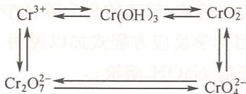

21.52 用化学反应方程式表示下图中与 Mn 相关物质的相互转化：

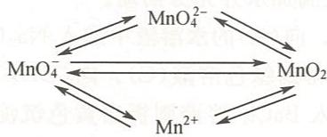

21.53 试分离下列各组离子。

(1) $Cr^{3+}$ 和 $Al^{3+}$ ; (2) $Cr^{3+}$ 和 $Mn^{2+}$ ; (3) $Mn^{2+}$ 和 $Cu^{2+}$ 。

21.54 试设计方案分离溶液中的下列离子。
(1) $Mn^{2+}, Zn^{2+}, Cr^{3+}, Al^{3+}$ ; (2) $Cu^{2+}, Zn^{2+}, Cr^{3+}, Cd^{2+}$ 。

21.55 实验室经常用 $(\mathrm{NH}_4)_2\mathrm{S}_2\mathrm{O}_8,\mathrm{PbO}_2,\mathrm{NaBiO}_3$ 为氧化剂鉴定 $\mathrm{Mn}^{2+}$ ，请给出鉴定反应的化学反应方程式和反应条件。

21.56 一黄色固体,可能是 $PbCrO_{4}$ , $BaCrO_{4}$ 或 $SrCrO_{4}$ , 请加以鉴别。

## 五、简答题和计算题

21.57 通过计算说明 $\mathrm{K}_2\mathrm{Cr}_2\mathrm{O}_7$ 能否氧化浓度分别为 $1\mathrm{mol}\cdot \mathrm{dm}^{-3}$ 和 $12\mathrm{mol}\cdot \mathrm{dm}^{-3}$ 盐酸中的 $\mathrm{Cl^-}$ 。已知 $E^{\ominus}(\mathrm{Cr}_2\mathrm{O}_7^{2 - } / \mathrm{Cr}^{3 + }) = 1.36\mathrm{V},E^{\ominus}(\mathrm{Cl}_{2} / \mathrm{Cl}^{-}) = 1.36\mathrm{V}$ 。

21.58 为什么用 $\mathrm{Cr(II)}$ 可以除去氮气中痕量的氧气？

21.59 在三份 $\mathrm{Cr}_{2}(\mathrm{SO}_{4})_{3}$ 溶液中分别加入下列溶液：
(1) $Na_{2}S$ ; (2) $Na_{2}CO_{3}$ ; (3) $NH_{3}\cdot H_{2}O$ 。

得到的沉淀各是什么？写出化学反应方程式。

21.60 测定水中溶氧量的方法是,在隔绝空气的条件下向一定量的水样中加入适量的 $MnCl_{2}$ 及过量的 NaOH 溶液。然后以过量的 $H_{2}SO_{4}$ 酸化该溶液,再加入过量的 KI 溶液。充分反应后用已知浓度的标准 $Na_{2}S_{2}O_{3}$ 溶液滴定生成的 $I_{2}$ 。
写出有关化学反应方程式，并给出 $O_{2}$ 和消耗 $Na_{2}S_{2}O_{3}$ 的物质的量之比。

21.61 根据下列实验现象,给出化学反应方程式。

(1) 在酸性介质中, 用 $\mathrm{Zn}$ 还原 $\mathrm{Cr}_{2} \mathrm{O}_{7}^{2-}$ 时, 溶液由橙色经绿色最后变为蓝色, 放置一段时间后又变为绿色。

(2) 向酸性 $K_{2}Cr_{2}O_{7}$ 溶液中通入 $SO_{2}$ 气体时, 溶液由橙色变为绿色。

(3) 向 $MnSO_{4}$ 溶液中滴加 NaOH 溶液有白色沉淀生成，在空气中放置沉淀逐渐变为棕褐色。

（4）向酸性 $KMnO_{4}$ 溶液中通入 $H_{2}S$ 气体，溶液由紫色变成近无色，并有乳白色沉淀析出。
21.62 解释实验现象。

(1) 向 $BaCrO_{4}$ 固体加浓盐酸时无明显变化, 经加热后溶液变绿。

(2) 向 $K_{2}Cr_{2}O_{7}$ 溶液中滴加 $AgNO_{3}$ 溶液，有砖红色沉淀析出，再加入 NaCl 溶液并煮

沸，沉淀变为白色。

(3) 金属铬溶于盐酸生成蓝色溶液, 后又转化为绿色溶液。

21.63 叙述下列反应实验现象并用化学反应方程式加以说明。

(1) 向 $CrCl_{3}$ 溶液中缓慢滴加 NaOH 溶液；

(2) 向 $K_{2}CrO_{4}$ 与 $H_{2}O_{2}$ 混合溶液中加入硫酸；

(3) 向 $K_{2}MnO_{4}$ 固体缓慢滴加水并充分摇动。

21.64 (A)的水合物为紫色晶体。向(A)的水溶液中加入 $\mathrm{Na}_{2} \mathrm{CO}_{3}$ 溶液有灰蓝色沉淀(B)生成。(B)溶于过量 NaOH 溶液得到绿色溶液(C)。向(C)中滴加 $\mathrm{H}_{2} \mathrm{O}_{2}$ 得黄色溶液(D)。取少量(D)经醋酸酸化后加入 $\mathrm{BaCl}_{2}$ 溶液则析出黄色沉淀(E)。将(D)用硫酸酸化后通入 $\mathrm{SO}_{2}$ 气体得到绿色溶液(F)。将(A)溶于浓盐酸后加入 KI 溶液经鉴定有 $\mathrm{I}_{2}$ 生成, 同时放出无色气体(G)。(G)在空气中逐渐变为棕色。试给出(A)、(B)、(C)、(D)、(E)、(F)和(G)所代表的物质的化学式。

21.65 将黄色晶体(A)溶于水后通入 $SO_{2}$ 气体得绿色溶液(B)。向(B)中加入过量的 NaOH 溶液得绿色溶液(C)。向(C)中滴加 $H_{2}O_{2}$ 得黄色溶液(D)。将(D)酸化至弱酸性后加入 $\mathrm{Pb(NO_{3})_{2}}$ 有黄色沉淀(E)生成。向(B)中加入氨水至过量有沉淀(F)生成。过滤后将(F)与 $KClO_{3}$ 和 KOH 共熔又得到(A)。试给出(A)、(B)、(C)、(D)、(E)和(F)所代表的物质的化学式。

21.66 红色固体(A)溶于热浓盐酸放出气体(B),溶液经冷却后析出绿色晶体(C)。少量(B)通入KI溶液中则溶液变黄。向(C)的水溶液中加入 $\mathrm{Na}_{2} \mathrm{CO}_{3}$ 溶液生成沉淀(D)。将(D)溶于KOH溶液后加入 $\mathrm{H}_{2} \mathrm{O}_{2}$ 溶液得到黄色溶液(E)。用稀硫酸酸化溶液(E)后,经蒸发、浓缩后冷却,析出橘红色晶体(F)。(F)与浓硫酸作用能够得到(A)。试给出(A)、(B)、(C)、(D)、(E)和(F)所代表的物质的化学式。

21.67 白色粉末(A)溶于水后与 NaOH 溶液作用生成白色沉淀(B)。(B)与 $H_{2}O_{2}$ 溶液作用转化为棕黑色沉淀(C)。(C)与 KOH 和 $KClO_{3}$ 共熔得到绿色化合物(D)。将(D)溶于 KOH 溶液后加入氯水生成紫色的(E)。向(E)的水溶液中通入过量的 $SO_{2}$ 气体得到无色溶液,再进行蒸发、浓缩后冷却,析出水合晶体(F)。将(F)小心加热又生成白色粉末(A)。试给出(A)、(B)、(C)、(D)、(E)和(F)所代表的物质的化学式。

21.68 绿色固体(A)易溶于水,其水溶液中通入 $\mathrm{CO}_{2}$ 即得棕黑色固体(B)和紫红色溶液(C)。(B)与浓盐酸共热时得黄绿色气体(D)和近乎无色溶液(E)。将溶液(E)和溶液(C)混合能生成沉淀(B)。将气体(D)通入(A)的溶液,可得(C)。试给出(A)、(B)、(C)、(D)和(E)所代表的物质的化学式。

21.69 棕黑色粉末(A)不溶于水。将(A)与稀硫酸混合后加入 $H_{2}O_{2}$ 并微热得无色溶液(B)。向酸性的(B)中加入 $NaBiO_{3}$ 粉末后得紫红色溶液(C)。向(C)中加入 NaOH 溶液至碱性后滴加 $Na_{2}SO_{3}$ 溶液有绿色溶液(D)生成。向(D)中滴加稀硫酸又生成(A)和(C)。少量(A)与浓盐酸作用在室温下生成暗黄色溶液(E)，加热(E)后有黄绿色气体(F)和近无色的溶液(G)生成。向(B)中滴加 NaOH 溶液有白色沉淀(H)生成，(H)不溶于过量的 NaOH 溶液。但在空气中(H)逐渐变为棕黑色。试给出(A)、(B)、(C)、(D)、(E)、(F)、(G)和(H)所代表的物质的化学式。

# 铁系元素和铂系元素

## 第一部分 例题

例 22.1 完成并配平下列化学反应方程式。

(1) $\mathrm{Fe}^{3+} + \mathrm{H}_{2}\mathrm{S} =$

(2) $\mathrm{FeSO_4 + Br_2 =}$

(3) $\mathrm{Fe}^{2+} + \mathrm{NO}_3^- + \mathrm{H}^+$

(4) $\mathrm{FeO}_4^{2-} + \mathrm{H}^+$

(5) $\mathrm{Co}^{3+} + \mathrm{Mn}^{2+} + \mathrm{H}_{2}\mathrm{O} =$

(6) $\mathrm{Co(OH)}_3 + \mathrm{HCl(aq)} =$

(7) $\mathrm{NiO(OH)} + \mathrm{HCl(aq)} =$

(8) $\mathrm{H}_{2}[\mathrm{PdCl}_{6}] + \mathrm{SO}_{2} + \mathrm{H}_{2}\mathrm{O} =$

(9) $\left[\mathrm{PtCl}_4\right]^{2-} + \mathrm{C}_2\mathrm{H}_4\xrightarrow{\text{乙醇}}$

(10) $\mathrm{RuO_4}\stackrel {\triangle}{=}$

解：(1) $2\mathrm{Fe}^{3+} + \mathrm{H}_{2}\mathrm{S} = 2\mathrm{Fe}^{2+} + \mathrm{S}\downarrow +2\mathrm{H}^{+}$

(2) $6\mathrm{FeSO}_4 + 3\mathrm{Br}_2 = 2\mathrm{Fe}_2(\mathrm{SO}_4)_3 + 2\mathrm{FeBr}_3$

(3) $3\mathrm{Fe}^{2+} + \mathrm{NO}_{3}^{-} + 4\mathrm{H}^{+} = \mathrm{NO}\uparrow +3\mathrm{Fe}^{3+} + 2\mathrm{H}_{2}\mathrm{O}$

$$
4 \mathrm{FeO} _ {4} ^ {2 -} + 2 0 \mathrm{H} ^ {+} = 4 \mathrm{Fe} ^ {3 +} + 3 \mathrm{O} _ {2} \uparrow + 1 0 \mathrm{H} _ {2} \mathrm{O}
$$

(5) $5\mathrm{Co}^{3+} + \mathrm{Mn}^{2+} + 4\mathrm{H}_{2}\mathrm{O} = 5\mathrm{Co}^{2+} + \mathrm{MnO}_{4}^{-} + 8\mathrm{H}^{+}$

$$
2 \mathrm{Co(OH)} _ {3} + 6 \mathrm{HCl(aq)} = 2 \mathrm{CoCl} _ {2} + \mathrm{Cl} _ {2} \uparrow + 6 \mathrm{H} _ {2} \mathrm{O}
$$

(7) $2\mathrm{NiO(OH)} + 6\mathrm{HCl(aq)} = 2\mathrm{NiCl}_2 + \mathrm{Cl}_2\uparrow +4\mathrm{H}_2\mathrm{O}$

(8) $\mathrm{H}_{2}[\mathrm{PdCl}_{6}] + \mathrm{SO}_{2} + 2\mathrm{H}_{2}\mathrm{O} = \mathrm{H}_{2}[\mathrm{PdCl}_{4}] + \mathrm{H}_{2}\mathrm{SO}_{4} + 2\mathrm{HCl}$

(9) $\left[\mathrm{PtCl}_{4}\right]^{2-} + \mathrm{C}_{2} \mathrm{H}_{4} \stackrel{\text{乙醇}}{=} \left[\mathrm{Pt}\left(\mathrm{C}_{2} \mathrm{H}_{4}\right) \mathrm{Cl}_{3}\right]^{-} + \mathrm{Cl}^{-}$

(10) $\mathrm{RuO_4}\stackrel {\triangle}{=}\mathrm{RuO_2 + O_2\uparrow}$

例 22.2 制备下列化合物。

(1) 由 $\mathrm{FeSO_4\cdot 7H_2O}$ 制备 $\mathrm{K}_3[\mathrm{Fe}(\mathrm{C}_2\mathrm{O}_4)_3]\cdot 3\mathrm{H}_2\mathrm{O}$ ;

(2) 以钴为原料经二氯化钴制备三氯化六氨合钴(Ⅲ)。

解：(1) 向热的 $FeSO_{4}$ 溶液中加入 NaOH 和 $H_{2}O_{2}$ ，生成 $\mathrm{Fe(OH)}_{3}$ 沉淀：

$$
2 \mathrm{FeSO} _ {4} + \mathrm{H} _ {2} \mathrm{O} _ {2} + 4 \mathrm{NaOH} = 2 \mathrm{Fe(OH)} _ {3} \downarrow + 2 \mathrm{Na} _ {2} \mathrm{SO} _ {4}
$$

将 $\mathrm{Fe(OH)}_{3}$ 沉淀过滤、洗涤后溶于盐酸，蒸发、浓缩后冷却结晶，析出 $FeCl_{3}\cdot6H_{2}O$ 晶体。

将饱和 $K_{2}C_{2}O_{4}$ 溶液与 $FeCl_{3}$ 溶液按物质的量的比 3.5:1 混合，蒸发、浓缩后冷却，析出绿色 $\mathrm{K}_{3}\left[\mathrm{Fe}\left(\mathrm{C}_{2}\mathrm{O}_{4}\right)_{3}\right]\cdot3\mathrm{H}_{2}\mathrm{O}$ 晶体。

(2) 将金属钴溶于稀盐酸, 过滤除去杂质, 得到 $CoCl_{2}$ 溶液:

$$
\mathrm{Co} + 2 \mathrm{HCl} = \mathrm{CoCl} _ {2} + \mathrm{H} _ {2} \uparrow
$$

向 $\mathrm{CoCl}_2$ 溶液中加入少量 $\mathrm{NH}_4\mathrm{Cl}$ 和过量氨水，加入活性炭作催化剂， $\mathrm{H}_2\mathrm{O}_2$ 为氧化剂，水浴加热，生成的 $[\mathrm{Co}(\mathrm{NH}_3)_6]\mathrm{Cl}_3$ 吸附在活性炭上：

$$
2 \mathrm{CoCl} _ {2} + \mathrm{H} _ {2} \mathrm{O} _ {2} + 1 0 \mathrm{NH} _ {3} \cdot \mathrm{H} _ {2} \mathrm{O} + 2 \mathrm{NH} _ {4} \mathrm{Cl} = 2 [ \mathrm{Co(NH} _ {3}) _ {6} ] \mathrm{Cl} _ {3} + 1 2 \mathrm{H} _ {2} \mathrm{O}
$$

过滤,用稀盐酸将吸附在活性炭上的 $\left[\mathrm{Co}\left(\mathrm{NH}_{3}\right)_{6}\right]\mathrm{Cl}_{3}$ 溶解,除去活性炭,加入少量浓盐酸,冷却,析出橙黄色 $\left[\mathrm{Co}\left(\mathrm{NH}_{3}\right)_{6}\right]\mathrm{Cl}_{3}$ 。

例 22.3 现有 3 瓶黑色固体试剂, 分别为 $MnO_{2}$ , $PbO_{2}$ 和 $Fe_{3}O_{4}$ 。设计方案将其鉴别出来, 并写出相关化学反应方程式。

解：取少许固体试剂，加入 $MnSO_{4}$ 溶液和 $H_{2}SO_{4}$ ，微热，若溶液变红（有 $MnO_{4}^{-}$ 生成），则试剂为 $PbO_{2}$ ：

$$
5 \mathrm{PbO} _ {2} + 2 \mathrm{Mn} ^ {2 +} + 5 \mathrm{SO} _ {4} ^ {2 -} + 4 \mathrm{H} ^ {+} = 2 \mathrm{MnO} _ {4} ^ {-} + 5 \mathrm{PbSO} _ {4} \downarrow + 2 \mathrm{H} _ {2} \mathrm{O}
$$

剩下的两种试剂分别加入浓盐酸,加热后放出黄绿色气体的是 $MnO_{2}$ :

$$
\mathrm {MnO_ {2} + 4HCl(浓) = MnCl_ {2} + Cl_ {2} \uparrow + 2H_ {2} O}
$$

剩下的一种为 $\mathrm{Fe}_{3} \mathrm{O}_{4}$ 。

例 22.4 不用硫化氢和硫化物,设计方案分离含有 $Ba^{2+}, Al^{3+}, Cr^{3+}, Fe^{3+}, Co^{2+}, Ni^{2+}$ 的混合溶液。

解：

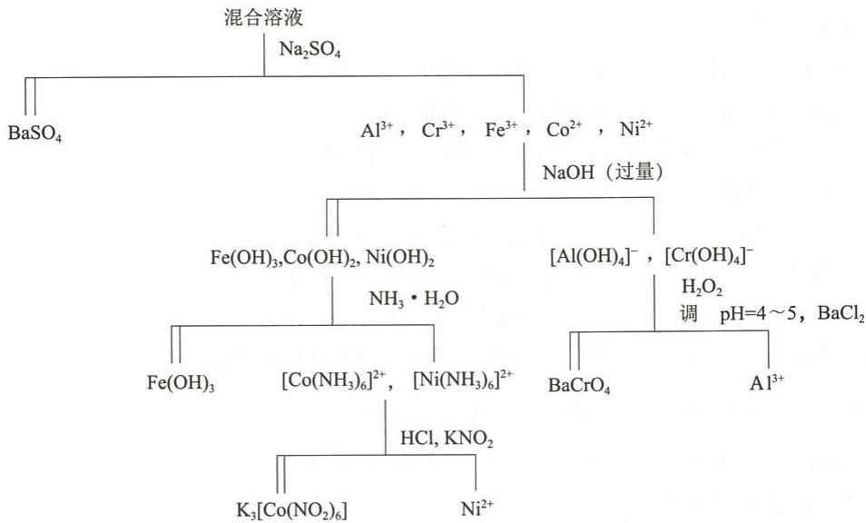  
例 22.5 解释实验现象。

(1) 向 $FeSO_{4}$ 溶液中加入碘水, 碘水不褪色, 再加入 $NaHCO_{3}$ 后, 碘水褪色。

(2) 向 $\mathrm{FeCl}_{3}$ 溶液中加入 KSCN 溶液, 溶液立即变红, 加入适量 $\mathrm{SnCl}_{2}$ 后溶液变成无色。

(3) $\mathrm{CoCl}_{2}$ 与 $\mathrm{NaOH}$ 作用所得的沉淀久置后用盐酸酸化时, 有刺激性气味气体产生。

解：（1）酸性条件下，电对 $Fe^{3+}/Fe^{2+}$ 的标准电极电势为 0.77 V，用碘水不能将 $\mathrm{Fe(II)}$ 氧化，因为电对 $I_{2}/I^{-}$ 的标准电极电势为 0.54 V，故向 $FeSO_{4}$ 溶液中加入碘水，碘水不褪色。体系中加入 $NaHCO_{3}$ 后，涉及的电对变成了 $\mathrm{Fe(OH)_{3}/Fe(OH)_{2}}$ ，由于 $\mathrm{Fe(OH)_{3}}$ 的溶度积远小于 $\mathrm{Fe(OH)_{2}}$ ，电极电势变得很低，为 -0.52 V。因此碘水很容易将 $\mathrm{Fe(II)}$ 氧化为 $\mathrm{Fe(III)}$ ，故碘水褪色。反应式为

$$
2 \mathrm{Fe(OH)} _ {2} + \mathrm{I} _ {2} + 2 \mathrm{OH} ^ {-} = 2 \mathrm{Fe(OH)} _ {3} + 2 \mathrm{I} ^ {-}
$$

(2) 向 $FeCl_{3}$ 溶液中加入 KSCN 溶液, 生成红色的 $\left[\mathrm{Fe}(\mathrm{SCN})_{n}\right]^{3-n}$ :

$$
\mathrm{Fe} ^ {3 +} + n \mathrm{SCN} ^ {-} = [ \mathrm{Fe(SCN)} _ {n} ] ^ {3 - n} (n = 1 \sim 6)
$$

加入 $SnCl_{2}$ 使 $\left[\mathrm{Fe}(\mathrm{SCN})_{n}\right]^{3-n}$ 中 $Fe^{3+}$ 还原为 $Fe^{2+}$ ，故红色消失，因为较稀的 $Fe^{2+}$ 溶液近于无色：

$$
2 \left[ \mathrm{Fe(SCN)} _ {n} \right] ^ {3 - n} + \mathrm{Sn} ^ {2 +} = 2 \mathrm{Fe} ^ {2 +} + \mathrm{Sn} ^ {4 +} + 2 n \mathrm{SCN} ^ {-}
$$

$$
\mathrm{CoCl} _ {2} + 2 \mathrm{NaOH} = \mathrm{Co(OH)} _ {2} \downarrow + 2 \mathrm{NaCl}
$$

$\mathrm{Co(OH)}_{2}$ 久置后有部分被空气氧化：

$$
4 \mathrm{Co(OH)} _ {2} + \mathrm{O} _ {2} + 2 \mathrm{H} _ {2} \mathrm{O} = 4 \mathrm{Co(OH)} _ {3}
$$

Co(Ⅲ)在酸性条件下有强氧化性,可以氧化 $Cl^{-}$ 而产生有刺激性气味的 $Cl_{2}$ :

$$
2 \mathrm{Co} (\mathrm{OH}) _ {3} + 2 \mathrm{Cl} ^ {-} + 6 \mathrm{H} ^ {+} = 2 \mathrm{Co} ^ {2 +} + \mathrm{Cl} _ {2} \uparrow + 6 \mathrm{H} _ {2} \mathrm{O}
$$

例 22.6 为什么 $\mathrm{K}_{4}\left[\mathrm{Fe}(\mathrm{CN})_{6}\right]\cdot3\mathrm{H}_{2}\mathrm{O}$ 可由 $FeSO_{4}$ 溶液与 KCN 混合直接制备，而 $\mathrm{K}_{3}\left[\mathrm{Fe}(\mathrm{CN})_{6}\right]$ 却不能由 $FeCl_{3}$ 溶液与 KCN 直接混合来制备？如何制备赤血盐？

解：由 $\mathrm{FeSO_4}$ 溶液与KCN混合后经过重结晶直接制备 $\mathrm{K_4[Fe(CN)_6]·3H_2O}$

$$
\begin{array}{r l} & {\mathrm {FeSO_ {4}} + 6 \mathrm{KCN} = \mathrm {K_ {4} [Fe(CN) _ {6} ]+ K_ {2} SO_ {4}}} \\ & {\mathrm {K_ {4} [Fe(CN) _ {6} ] + 3 H_ {2} O = K_ {4} [Fe(CN) _ {6} ]\cdot3 H_ {2} O}} \end{array}
$$

由于 $Fe^{3+}$ 有氧化性，能将 $CN^{-}$ 氧化为易挥发的有毒产物 $(\mathrm{CN})_{2}$ ，同时 $Fe^{3+}$ 被还原，制备产物中含有 $\mathrm{K}_{4}\left[\mathrm{Fe}(\mathrm{CN})_{6}\right]\cdot3\mathrm{H}_{2}\mathrm{O}$ ，得不到纯净的 $\mathrm{K}_{3}\left[\mathrm{Fe}(\mathrm{CN})_{6}\right]$ 晶体。所以，不能由 $FeCl_{3}$ 溶液与 KCN 直接混合来制备 $\mathrm{K}_{3}\left[\mathrm{Fe}(\mathrm{CN})_{6}\right]$ 。可采用在溶液中将 $\mathrm{K}_{4}\left[\mathrm{Fe}(\mathrm{CN})_{6}\right]$ 氧化的方法制备 $\mathrm{K}_{3}\left[\mathrm{Fe}(\mathrm{CN})_{6}\right]$ ：

或

$$
\begin{array}{r l} & 2 \mathrm{K} _ {4} [ \mathrm{Fe(CN)} _ {6} ] + \mathrm{H} _ {2} \mathrm{O} _ {2} = 2 \mathrm{K} _ {3} [ \mathrm{Fe(CN)} _ {6} ] + 2 \mathrm{KOH} \\ & 2 \mathrm{K} _ {4} [ \mathrm{Fe(CN)} _ {6} ] + \mathrm{Cl} _ {2} = 2 \mathrm{K} _ {3} [ \mathrm{Fe(CN)} _ {6} ] + 2 \mathrm{KCl} \end{array}
$$

例 22.7 某淡蓝绿色晶体(A)可溶于水,在无氧条件下,将 NaOH 溶液加入(A)溶液中,即有使红色石蕊试纸变蓝的气体(B)放出,同时溶液中有白色沉淀(C)析出。(C)在空气中迅速变为灰绿色、黑色,最后变为红棕色沉淀(D)。(D)溶于稀盐酸中生成棕黄色溶液(E)。在(E)溶液中滴加 KI 溶液,溶液由棕黄色逐渐变为红棕色,说明有(F)和(G)生成。若在滴加 KI 溶液之前先加入过量 KF 溶液,则无此现象。在(D)的浓 KOH 悬浮液中通入氯气,可得到紫红色溶液(H)。在(A)溶液和(H)溶液中分别滴加 $BaCl_{2}$ ,均可析出沉淀,但前者是白色沉淀(I),后者是紫红色沉淀(J)。(I)不溶于 $HNO_{3}$ ,但(J)遇 $HNO_{3}$ 即分解并放出气体(K)。

试给出(A)、(B)、(C)、(D)、(E)、(F)、(G)、(H)、(I)、(J)和(K)所代表的物质的化学式，并用化学反应方程式表示各过程。

解：(A) $-(\mathrm{NH}_{4})_{2}\mathrm{SO}_{4}\cdot\mathrm{FeSO}_{4}\cdot6\mathrm{H}_{2}\mathrm{O}$ ; (B) $-NH_{3}$ ; (C) $-\mathrm{Fe(OH)}_{2}$ ;
(D) $-\mathrm{Fe(OH)}_{3}$ ; (E) $-\mathrm{FeCl}_{3}$ ; (F) $-I_{2}$ ; (G) $-KI_{3}$ ;
(H) $-FeO_{4}^{2-}$ ; (I) $-BaSO_{4}$ ; (J) $-BaFeO_{4}$ ; (K) $O_{2}$ .

各过程的化学反应方程式如下：

$$
\begin{array}{r l} & {\mathrm {NH_ {4} ^ {+} + OH^ {-} \xlongequal   NH_ {3} \uparrow + H_ {2} O}} \\ & {\mathrm {Fe^ {2 + } + 2OH^ {-} \xlongequal   Fe(OH) _ {2} \downarrow}} \\ & {4 \mathrm {Fe(OH) _ {2} + O_ {2} + 2H_ {2} O\xlongequal   4Fe(OH) _ {3}}} \\ & {\mathrm {Fe(OH) _ {3} + 3HCl\xlongequal   FeCl_ {3} + 3H_ {2} O}} \\ & {2 \mathrm {Fe^ {3 + } + 2I^ {-} \xlongequal   2Fe^ {2 + } + I_ {2}}} \\ & {\mathrm {KI+ I_ {2} \xlongequal   K I_ {3}}} \\ & {2 \mathrm {Fe(OH) _ {3} + 3C l _ {2} + 10KOH\xlongequal   2K_ {2} FeO_ {4} + 6KCl + 8H_ {2} O}} \\ & {\mathrm {Ba^ {2 + } + SO_ {4} ^ {2 -} \xlongequal   BaSO_ {4} (\text {白色}) \downarrow}} \\ & {\mathrm {Ba^ {2 + } + FeO_ {4} ^ {2 -} \xlongequal   BaFeO_ {4} (\text {紫红色}) \downarrow}} \\ & {4 \mathrm {BaFeO_ {4} + 20H^ {+} \xlongequal   4Fe^ {3 + } + 3O_ {2} \uparrow + 10H_ {2} O + 4Ba^ {2 + }}} \end{array}
$$

例 22.8 某金属(A)缓慢地溶于稀盐酸生成绿色溶液,从中可以结晶出绿色物质(B)。向绿色溶液中加入 NaOH 得绿色沉淀(C),(C)不溶于过量 NaOH 溶液,但在大量 $NH_{4}^{+}$ 存在时可溶于氨水生成蓝色溶液(D)。用气体(E)处理刚生成的沉淀(C),沉淀颜色逐渐加深,最后转化为黑棕色的(F)。(F)与盐酸作用得绿色溶液并放出气体(E)。气体(E)与金属(A)共热生成黄色固体物质(G)。

试给出(A)、(B)、(C)、(D)、(E)、(F)和(G)所代表的物质的化学式,并用化学反应方程式表示各过程。

解：(A)—Ni；(B)—NiCl₂·6H₂O；(C)—Ni(OH)₂；(D)—[Ni(NH₃)₆]²⁺；
(E)—Cl₂；(F)—Ni(OH)₃；(G)—NiCl₂。

各过程的化学反应方程式如下：

$$
\mathrm{Ni} ^ {2 +} + 2 \mathrm{OH} ^ {-} = \mathrm{Ni(OH)} _ {2} \downarrow
$$

$$
\begin{array}{r l} \mathrm {Ni(OH) _ {2}} + 1 2 \mathrm {NH_ {3}} \cdot \mathrm {H_ {2} O} & = 2 [ \mathrm {Ni(NH_ {3}) _ {6}} ] ^ {2 +} + 2 \mathrm {OH^ {-}} + 1 2 \mathrm {H_ {2} O} \\ 2 \mathrm {Ni(OH) _ {2}} + \mathrm {Cl_ {2}} + 2 \mathrm {OH^ {-}} & = 2 \mathrm {Ni(OH) _ {3}} + 2 \mathrm {Cl^ {-}} \\ 2 \mathrm {Ni(OH) _ {3}} + 6 \mathrm{HCl} & = 2 \mathrm {NiCl_ {2}} + \mathrm {Cl_ {2}} \uparrow + 6 \mathrm {H_ {2} O} \\ \mathrm {Ni+ C l _ {2}} & = \mathrm {NiCl_ {2}} \end{array}
$$

## 第二部分 习题

## 一、选择题

22.1 下列过渡金属中, 密度最大的是
(A) W; (B) Os; (C) Ir; (D) Au。

22.2 下列金属中,最活泼的是
(A) Fe; (B) Co; (C) Ni; (D) Pd。

22.3 下列配离子中,能将 KI 氧化的是
(A) $\left[Fe(CN)_{6}\right]^{3-}$ ; (B) $\left[Fe(SCN)_{6}\right]^{3-}$ ;
(C) $\left[Co(NH_{3})_{6}\right]^{3+}$ ; (D) $\left[Ni(CN)_{6}\right]^{3-}$ 。

22.4 能用 NaOH 溶液分离的离子对是
(A) $Cr^{3+}$ 和 $Al^{3+}$ ; (B) $Cu^{2+}$ 和 $Zn^{2+}$ ;
(C) $Cr^{3+}$ 和 $Fe^{3+}$ ; (D) $Cu^{2+}$ 和 $Fe^{3+}$ 。

22.5 下列化合物中,与浓盐酸作用没有氯气放出的是
(A) $Pb_{2}O_{3}$ ; (B) $Fe_{2}O_{3}$ ; (C) $Co_{2}O_{3}$ ; (D) $Ni_{2}O_{3}$ 。

22.6 下列化合物中,受热脱水不生成 HCl 气体的是
(A) $MgCl_{2} \cdot 6H_{2}O$ ; (B) $NiCl_{2} \cdot 6H_{2}O$ ; (C) $CoCl_{2} \cdot 6H_{2}O$ ; (D) $CuCl_{2} \cdot 2H_{2}O$ .

$$
\mathrm{Mn(OH)} _ {2}
$$

$$
\mathrm{Fe(OH)} _ {2}
$$

$$
\mathrm{Co} (\mathrm{OH}) _ {2};
$$

$$
\mathrm{Ni(OH)} _ {2}
$$

22.8 与 $\mathrm{Na_2S}$ 溶液作用均生成黑色沉淀的一对离子是（A） $\mathrm{Fe}^{2+}, \mathrm{Co}^{2+}$ ；（B） $\mathrm{Fe}^{2+}, \mathrm{Mn}^{2+}$ ；（C） $\mathrm{Ni}^{2+}, \mathrm{Zn}^{2+}$ ；（D） $\mathrm{Cu}^{2+}, \mathrm{Zn}^{2+}$ 。

22.9 可以形成记忆合金的一对金属单质是
(A) Ni 与 Fe; (B) Ni 与 Ti; (C) Cu 与 Ni; (D) Ti 与 Co。

22.10 下列金属单质中,耐碱能力最强的是
(A) Cu; (B) Cr; (C) Ni; (D) Pt。

22.11 下列气体中,可由 $PdCl_{2}$ 溶液检出的是
(A) $CO_{2}$ ; (B) CO; (C) $O_{3}$ ; (D) $NO_{2}$ 。

22.12 下列配位化合物中,可以由简单盐溶液与 KCN 溶液直接得到的是
(A) $K_{3}[Fe(CN)_{6}]$ ; (B) $K_{4}[Co(CN)_{6}]$ ;
(C) $K_{2}[Ni(CN)_{4}]$ ; (D) $K_{2}[Cu(CN)_{4}]$ 。

## 二、填空题

22.13 给出下列物质的化学式。

(1) 赤铁矿 \_\_\_\_；(2) 磁铁矿 \_\_\_\_；(3) 褐铁矿 \_\_\_\_；

(4) 菱铁矿\_\_\_\_；(5) 砷钴矿\_\_\_\_；(6) 辉钴矿\_\_\_\_；

(7) 硫钴矿 \_\_\_\_；(8) 赤血盐 \_\_\_\_；(9) 黄血盐 \_\_\_\_；

(10) 绿矾\_\_\_\_；(11) 莫尔盐\_\_\_\_；(12) 铁铵矾\_\_\_\_；

(13) 二茂铁 \_\_\_\_；(14) 蔡斯盐 \_\_\_\_；(15) 顺铂 \_\_\_\_。

22.14 向 $\mathrm{FeCl}_3$ 溶液中加入KSCN溶液后，溶液变为\_\_\_\_色，再加入过量 $\mathrm{NH_4F}$ 溶液后，溶液又变为\_\_\_\_色。最后滴加NaOH溶液时，又有\_\_\_\_色沉淀\_\_\_\_生成。

22.15 比较下列各对配位化合物的稳定性(填 > 或 <)。
(1) $\left[NiCl_{4}\right]^{2-}$ \_\_\_\_ $\left[PtCl_{4}\right]^{2-}$ ; (2) $\left[Ni(en)_{3}\right]^{2+}$ \_\_\_\_ $\left[Ni(NH_{3})_{6}\right]^{2+}$ ;
(3) $\left[Fe(CN)_{6}\right]^{3-}$ \_\_\_\_ $\left[Fe(CN)_{6}\right]^{4-}$ ; (4) $\left[Co(NH_{3})_{6}\right]^{2+}$ \_\_\_\_ $\left[Co(NH_{3})_{6}\right]^{3+}$ 。

22.16 向热的氢氧化铁浓碱性悬浮液中通入氯气,溶液变为\_\_\_\_色;再加入 $BaCl_{2}$ 溶液,则有 \_\_\_\_ 色的 \_\_\_\_ 沉淀生成。

22.17 在配制 $FeSO_{4}$ 溶液时, 常向溶液中加入一些 \_\_\_\_ 和 \_\_\_\_ , 其目的是 \_\_\_\_ 。

22.18 蔡斯(Zeise)盐为铂的配位化合物,其化学式为\_\_\_\_,内界的空间构型为\_\_\_\_;顺铂的化学式为\_\_\_\_,空间构型为\_\_\_\_。

22.19 现有四瓶绿色溶液,分别含有 Ni(Ⅱ), Cu(Ⅱ), Cr(Ⅲ), $MnO_{4}^{2-}$

(1) 加水稀释后, 溶液变蓝的是 \_\_\_\_ ;

(2) 加入过量酸性 $Na_{2}SO_{3}$ 溶液后, 变为无色的是 \_\_\_\_ ;

(3) 加入适量 NaOH 溶液有沉淀生成, NaOH 过量时沉淀溶解, 又得到绿色溶液的是 \_\_\_\_ ;

(4) 加入适量氨水有绿色沉淀生成, 氨水过量时得到蓝色溶液的是 \_\_\_\_。

22.20 在 $Cr^{3+}, Mn^{2+}, Fe^{2+}, Fe^{3+}, Co^{2+}, Ni^{2+}$ 中，易溶于过量氨水的是 \_\_\_\_。

22.21 向 $CoSO_{4}$ 溶液中加入过量 KCN 溶液, 则有 \_\_\_\_ 生成, 放置后逐渐转化为 \_\_\_\_。
22.22 给出下列离子的颜色。

$\left[\mathrm{Fe}\left(\mathrm{H}_{2} \mathrm{O}\right)_{6}\right]^{2+}$ 色； $\left[\mathrm{Co}\left(\mathrm{H}_{2} \mathrm{O}\right)_{6}\right]^{2+}$ 色； $\left[\mathrm{Ni}\left(\mathrm{H}_{2} \mathrm{O}\right)_{6}\right]^{2+}$ 色； $\left[\mathrm{Fe}\left(\mathrm{H}_{2} \mathrm{O}\right)_{6}\right]^{3+}$ 色； $\left[\mathrm{FeCl}_{4}\right]^{-}$ 色； $\left[\mathrm{Fe}(\mathrm{SCN})_{6}\right]^{3-}$ 色； $\left[\mathrm{FeF}_{5}\right]^{2-}$ 色； $\left[\mathrm{Fe}\left(\mathrm{C}_{2} \mathrm{O}_{4}\right)_{3}\right]^{3-}$ 色； $\left[\mathrm{Fe}\left(\mathrm{H}_{2} \mathrm{O}\right)_{5} \mathrm{OH}\right]^{2+}$ 色； $\left[\mathrm{Co}\left(\mathrm{NH}_{3}\right)_{6}\right]^{2+}$ 色； $\left[\mathrm{CoCl}_{4}\right]^{2-}$ 色； $\left[\mathrm{Co}(\mathrm{SCN})_{4}\right]^{2-}$ 色； $\left[\mathrm{Ni}\left(\mathrm{NH}_{3}\right)_{6}\right]^{3+}$ 色； $\left[\mathrm{Ni}(\mathrm{CN})_{4}\right]^{2-}$ 色； $\left[\mathrm{PtCl}_{4}\right]^{2-}$ 色。

22.23 给出下列化合物的颜色。

$FeSO_{4}\cdot7H_{2}O$ \_\_\_\_色； $FeSO_{4}$ \_\_\_\_色； $FeSO_{4}\cdot(NH_{4})_{2}SO_{4}\cdot6H_{2}O$ \_\_\_\_色； $Fe(OH)_{2}$ \_\_\_\_色； $K_{4}[Fe(CN)_{6}]\cdot3H_{2}O$ \_\_\_\_色； $Fe(C_{5}H_{5})_{2}$ \_\_\_\_色； $FeCl_{3}$ \_\_\_\_色； $FeCl_{3}\cdot6H_{2}O$ \_\_\_\_色； $K_{3}[Fe(CN)_{6}]$ \_\_\_\_色； $K_{3}[Fe(C_{2}O_{4})_{3}]\cdot3H_{2}O$ \_\_\_\_色； $Fe_{2}O_{3}$ \_\_\_\_色； $Fe(OH)_{3}$ \_\_\_\_色； $CoSO_{4}\cdot7H_{2}O$ \_\_\_\_色； $CoCl_{2}\cdot6H_{2}O$ \_\_\_\_色； $CoCl_{2}$ \_\_\_\_色； $Co(OH)_{2}$ \_\_\_\_色； $K_{3}[Co(NO_{2})_{6}]$ \_\_\_\_色； $Co[Hg(SCN)_{4}]$ \_\_\_\_色； $NiSO_{4}\cdot7H_{2}O$ \_\_\_\_色； $NiCl_{2}\cdot6H_{2}O$ \_\_\_\_色； $Ni(OH)_{2}$ \_\_\_\_色； $Pt(NH_{3})_{2}Cl_{2}$ \_\_\_\_色； $K[Pt(C_{2}H_{4})Cl_{3}]$ \_\_\_\_色。

## 三、完成并配平化学反应方程式

22.24 将四氧化三铁溶于氢碘酸。

22.25 硫酸亚铁受热分解。

22.26 氢氧化亚铁沉淀置于空气中。

22.27 铁与水蒸气在赤热的条件下反应。

22.28 向三氯化铁溶液中加入过量的碳酸钠。

22.29 草酸亚铁受热分解。

22.30 向三氯化铁溶液中滴加碘化钾溶液。

22.31 氯气通入混有氢氧化铁的氢氧化钾浓溶液。

22.32 向黄血盐溶液中通入氯气。

22.33 三草酸根合铁(Ⅲ)酸钾光照分解。

22.34 将四氧化三钴溶于盐酸。

22.35 氢氧化亚钴分别与盐酸和浓氢氧化钠溶液作用。

22.36 向 $CoCl_{2}$ 和溴水的混合溶液中滴加 NaOH 溶液。

22.37 弱酸性条件下向 $\mathrm{CoSO_4}$ 溶液中滴加饱和 $\mathrm{KNO}_2$ 溶液。

22.38 二氧化镍溶于硫酸。

22.39 向二氯化镍溶液中加入氢氧化钠溶液和溴水。

22.40 向二氯化钯溶液中通入一氧化碳。

## 四、分离、鉴别与制备

22.41 以粗镍为原料制备高纯镍。

22.42 如何鉴别分别含有 $Fe^{3+}$ , $Co^{2+}$ 和 $Ni^{2+}$ 的溶液?

22.43 鉴别下列各组物质：

(1) $NiSO_{4}$ 和 $FeSO_{4}$ ; (2) $Fe_{2}O_{3}$ 和 CuO。

22.44 设计方案分离共存于溶液中的下列离子：

(1) $Al^{3+}, Cr^{3+}, Fe^{3+}, Ni^{2+}$ ; (2) $Fe^{2+}, Co^{2+}, Zn^{2+}, Cu^{2+}$ .

22.45 如何在不引入杂质的情况下, 将粗 $ZnSO_{4}$ 溶液中含有的 $Fe^{3+}, Fe^{2+}, Cu^{2+}$ 杂质除去?

22.46 完成下列过程的化学反应方程式：

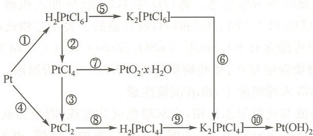

## 五、简答题和计算题

22.47 分别向 $FeSO_{4}$ , $CoSO_{4}$ , $NiSO_{4}$ 溶液中缓慢滴加氨水, 生成的产物和实验现象是什么?

22.48 为什么铝板氧化层用极稀的 $\mathrm{Co(NO_3)_2}$ 溶液处理后灼烧，即显蓝色？

22.49 利用 $NH_{4}SCN$ 试剂鉴定 $Co^{2+}$ 时, 为什么要用浓的 $NH_{4}SCN$ 溶液, 并加丙酮萃取? 溶液中存在什么常见离子时会发生干扰? 如何消除这些干扰?

22.50 在用稀硫酸清洗被 $\mathrm{Co(OH)_3}$ 和 $\mathrm{MnO(OH)_2}$ 污染的玻璃器皿时,为什么要加入一些过氧化氢溶液?

22.51 $\left[\mathrm{Ni}(\mathrm{CO})_{4}\right]$ 和 $\left[\mathrm{Ni}(\mathrm{CN})_{4}\right]^{2-}$ 都是逆磁性的，两者在结构上是否相同？试用配位化合物的价键理论给予说明。

22.52 写出与下述实验现象有关的化学反应方程式。

向含有 $Fe^{2+}$ 的溶液中加入 NaOH 溶液后生成灰绿色沉淀，空气中放置沉淀逐渐变为棕色。过滤后，用盐酸溶解棕色沉淀得黄色溶液。向黄色溶液中加几滴 KSCN 溶液则溶液立即变红，再通入 $SO_{2}$ 气体则红色消失。向溶液中再滴入 $KMnO_{4}$ 溶液，则 $KMnO_{4}$ 紫色褪去。最后加入黄血盐溶液时，生成蓝色沉淀。

22.53 给出下列实验的现象和化学反应方程式。

(1) 向含有 $CCl_{4}$ 的黄血盐溶液中滴加碘水；

(2) 将 $3 \, mol \cdot dm^{-3} \, CoCl_{2}$ 溶液加热，再滴加 $AgNO_{3}$ 溶液；

(3) 将 $\left[\mathrm{Ni}\left(\mathrm{NH}_{3}\right)_{6}\right] \mathrm{SO}_{4}$ 溶液水浴加热一段时间再加氨水；

(4) 用浓盐酸处理 $\mathrm{Fe(OH)}_{3}, \mathrm{Co(OH)}_{3}, \mathrm{Ni(OH)}_{3}$ 。

22.54 解释实验现象。

(1) 在 $\mathrm{FeCl}_3$ 溶液中加入KSCN溶液时出现血红色, 再加入少许铁粉后血红色逐渐消失。

(2) 向少量 $\mathrm{FeCl}_{3}$ 溶液中加入过量饱和 $(\mathrm{NH}_{4})_{2} \mathrm{C}_{2} \mathrm{O}_{4}$ 溶液后, 滴加少量 KSCN 溶液并不出现红色, 但再滴加盐酸则溶液立即变红。

(3) 蓝色的变色硅胶吸水后变成粉红色。

(4) 向 $\left[\mathrm{Co}\left(\mathrm{NH}_{3}\right)_{6}\right] \mathrm{SO}_{4}$ 溶液中滴加稀盐酸先生成蓝绿色沉淀, 后沉淀溶解, 生成粉红色溶液。

(5) 向 $FeCl_{3}$ 溶液中通入 $H_{2}S$ 气体，并没有硫化物沉淀生成。

22.55 混合溶液(A)为紫红色。向(A)中加入浓盐酸并微热得蓝色溶液(B)和气体(C)。(A)中加入NaOH溶液则得棕黑色沉淀(D)和绿色溶液(E)。向(A)中通入过量 $SO_{2}$ 气体则溶液最后变为粉红色溶液(F)。向(F)中加入过量氨水得白色沉淀(G)和棕黄色溶液(H)。(G)在空气中缓慢转变为棕黑色。将(D)与(G)混合后加入硫酸又得溶液(A)。试给出(A)、(B)、(C)、(D)、(E)、(F)、(G)和(H)所代表的主要化合物或离子的化学式。

22.56 某固体混合物中可能含有 $\mathrm{KI}, \mathrm{SnCl}_2, \mathrm{CuSO}_4, \mathrm{ZnSO}_4, \mathrm{FeCl}_3, \mathrm{CoCl}_2$ 和 $\mathrm{NiSO}_4$ 。通过下列实验判断哪些物质肯定存在，哪些物质肯定不存在，并分析原因。

(1) 取少许固体溶入稀硫酸中, 没有沉淀生成。

(2) 将盐的水溶液与过量氨水作用, 有灰绿色沉淀生成, 溶液为蓝色。

(3) 将盐的水溶液与 KSCN 作用, 无明显变化。再加入戊醇, 也无明显变化。

(4) 向盐的水溶液中加入过量 $\mathrm{NaOH}$ 溶液有沉淀生成, 溶液无明显颜色。过滤后, 向溶液缓慢滴加盐酸时, 有白色沉淀生成。

(5) 向盐的溶液中滴加 $\mathrm{AgNO}_{3}$ 溶液时, 得到不溶于硝酸的白色沉淀。沉淀溶于氨水。

22.57 某同学在确定所合成的 $\mathrm{K}_{3}\left[\mathrm{Fe}\left(\mathrm{C}_{2}\mathrm{O}_{4}\right)_{3}\right]\cdot3\mathrm{H}_{2}\mathrm{O}$ 晶体中 $FeC_{2}O_{4}$ 杂质的含量时，进行了以下实验：将一定量样品加入稀硫酸中，微热溶解后用 $0.0500\ mol\cdot dm^{-3}$ 高锰酸钾溶液滴定，用去 $108.00\ cm^{3}$ ；再加入适量还原剂将三价铁还原为二价铁后，用 $KMnO_{4}$ 溶液滴定，恰好用去 $20.00\ cm^{3}$ 。

(1) 给出滴定反应的离子反应方程式;

(2) 计算所合成产品的组成(不考虑结晶水)。

22.58 有一固体混合物可能含有 $\mathrm{FeCl}_3, \mathrm{NaNO}_2, \mathrm{Ca(OH)}_2, \mathrm{AgNO}_3, \mathrm{CuCl}_2, \mathrm{NaF}, \mathrm{NH}_4\mathrm{Cl}$ 七种物质中的若干种。若将此混合物加水后，可得白色沉淀和无色溶液，在此无色溶液中加入 KSCN 没有变化；无色溶液可使酸化的 $KMnO_{4}$ 溶液紫色褪去；将无色溶液加热有气体放出。另外，白色沉淀可溶于 $NH_{3} \cdot H_{2}O$ 中。试根据上述现象，判断在混合物中，哪些物质肯定存在，哪些肯定不存在，哪些可能存在，说明理由，并用化学反应方程式表示。

金属(A)溶于稀盐酸,生成溶液(B)。在无氧操作条件下,将 NaOH 加到(B)溶液中,生成白色沉淀(C)。(C)接触空气颜色逐渐变深,最后成为棕红色沉淀(D)。灼烧(D)可生成棕红色粉末(E),(E)经不彻底还原而生成铁磁性黑色物质(F)。(D)溶于稀盐酸生成溶液(G),该溶液能将 KI 氧化成 I₂,但在加入 KI 之前,先加入 NaF,则不能氧化 KI。若向(D)的浓 NaOH 悬浮液中通入氯气,可得到(H)的紫红色溶液,向该溶液中加入 BaCl₂ 后有红棕色固体(I)析出,(I)是一种强氧化剂。试给出(A)、(B)、(C)、(D)、(E)、(F)、(G)、(H)和(I)所代表的物质的化学式。

22.60 绿色晶体(A)隔绝空气加热失重近45.3%后达到恒重,得到白色固体(B)。(B)溶于水后加入 $H_{2}O_{2}$ 和 $Na_{2}CO_{3}$ 溶液有棕色沉淀(C)生成。(C)溶于稀 $H_{2}SO_{4}$ 后将溶液浓缩、结晶得到浅紫色晶体(D)。将(D)加热脱水失重约28.8%。(D)的饱和溶液与 $K_{2}C_{2}O_{4}$ 饱和溶液混合后冷却,析出绿色水合晶体(E)。(E)溶于水后加入盐酸酸化,加入KSCN溶液得红色溶液(F)。向溶液(F)中通入 $SO_{2}$ 气体则红色消失。请给出(A)、(B)、(C)、(D)、(E)和(F)所代表的物质的化学式。

22.61 蓝色化合物(A)溶于水得粉红色溶液(B)。向(B)中加入过量氢氧化钠溶液得粉红色沉淀(C)。用次氯酸钠溶液处理则(C)转化为黑色沉淀(D)。洗涤、过滤后将(D)与浓盐酸作用得蓝色溶液(E)。将(E)用水稀释后又得粉红色溶液(B)。试给出(A)、(B)、(C)、(D)和(E)所代表的物质的化学式。

22.62 化合物(A)为不溶于水的棕褐色固体,将(A)溶解在浓盐酸中,得到溶液(B)和黄绿色气体(C),(C)通过热氢氧化钾溶液,被吸收后生成溶液(D),(D)用酸中和并以 $\mathrm{AgNO_3}$ 溶液处理,生成白色沉淀(E),(E)不溶于硝酸,但可溶于氨水。若在(B)溶液中加入氢氧化钠溶液,得到粉红色沉淀(F),将(F)用 $\mathrm{H}_2\mathrm{O}_2$ 处理,则又得到(A)。若将(B)用 $\mathrm{KNO}_2$ 的醋酸溶液处理,则生成黄色沉淀(G)和气体(H),将(H)通过 $\mathrm{FeSO_4}$ 溶液,则溶液变为暗棕色,但没有沉淀生成。试给出(A)、(B)、(C)、(D)、(E)、(F)、(G)和(H)所代表的物质的化学式。

$\frac{T_{2}Q}{T_{2}A} = 0$ 《由京大华文》第1页，得“以限例-3”和“P”为标点，人意即定 $\text{lam}^{*}$ 是 $\text{lam}^{*}$ 的值， $\text{R}^{*} = \text{R}_{\text{L}} + \text{R}_{\text{M}}$ 为标点

由京大华文的组合为： $\text{lam}^{*} - 8$ 的值， $\text{R}^{*} = \text{R}_{\text{L}} + \text{R}_{\text{M}}$ 为标点

# 习题参考答案

## 第1章

## 一、选择题

1.1 A 1.2 C 1.3 D 1.4 B 1.5 C 1.6 D 1.7 A 1.8 A 1.9 C 1.10 D

1.11 B 1.12 C 1.13 A 1.14 D

## 二、填空题

1.15 $\left(p + \frac{a}{V^2}\right)(V - b) = RT$ 。

1.16 大，小。

1.17 17, $\mathrm{NH}_3$ 。

1.18 0.350。

1.19 $3.9 \times 10^{6}, 1.5 \times 10^{6}, 4.6 \times 10^{6}$ 。

1.20 0.48。

1.21 20,10.23。

1.22 $6.08 \times 10^{4}$ 。

1.23 9.69。

1.24 6.19%, 1.01。

1.25 3.86。

1.26 272.17。

## 三、简答题和计算题

1.27 先计算气体的物质的量 n。由理想气体状态方程知

$$
n = \frac {p V}{R T}
$$

依题意 $V = 1\mathrm{dm}^3 = 1\times 10^{-3}\mathrm{m}^3,p = 101.3\times 10^{3}\mathrm{Pa},T = 273\mathrm{K}$ ，代入求出 $n$ 。

$$
n = \frac {1 0 1 . 3 \times 1 0 ^ {3} \mathrm{Pa} \times 1 \times 1 0 ^ {- 3} \mathrm{m} ^ {3}}{8 . 3 1 4 \mathrm{Pa} \cdot \mathrm{m} ^ {3} \cdot \mathrm{mol} ^ {- 1} \cdot \mathrm{K} ^ {- 1} \times 2 7 3 \mathrm{K}} = 0. 0 4 4 6 3 \mathrm{mol}
$$

由题设知 0.04463 mol 气体的质量为 2.86 g, 故该气体的摩尔质量为

$$
M = \frac {2 . 8 6 \mathrm{g}}{0 . 0 4 4 6 3 \mathrm{mol}} = 6 4. 1 \mathrm{g} \cdot \mathrm{mol} ^ {- 1}
$$

即平均相对分子质量为 64.1。

设在 $17^{\circ}$ C 和 207 kPa 时气体的体积为 V，由理想气体状态方程知

$$
V = \frac {n R T}{p}
$$

代入题设条件

$$
\begin{array}{r l} V & = \frac {0 . 0 4 4 6 3 \mathrm{mol} \times 8 . 3 1 4 \mathrm{Pa} \cdot \mathrm{m} ^ {3} \cdot \mathrm{mol} ^ {- 1} \cdot \mathrm{K} ^ {- 1} \times (2 7 3 + 1 7) \mathrm{K}}{2 0 7 0 0 0 \mathrm{Pa}} \\ & = 5. 1 9 8 \times 1 0 ^ {- 4} \mathrm{m} ^ {3} \end{array}
$$

即气体的体积为 $0.5198 \mathrm{dm}^{3}$ 。

设气体的密度为 $\rho$ ，则

$$
\rho = \frac {m}{V} = \frac {2 . 8 6 \mathrm{g}}{0 . 5 1 9 8 \mathrm{dm} ^ {3}} = 5. 5 0 \mathrm{g} \cdot \mathrm{dm} ^ {- 3}
$$

## 1.28 反应前气体的物质的量为

$$
\begin{array}{r l} n _ {1} & = \frac {p _ {1} V}{R T} = \frac {1 . 2 3 \times 1 0 ^ {5} \mathrm{Pa} \times 0 . 5 \times 1 0 ^ {- 3} \mathrm{m} ^ {3}}{8 . 3 1 4 \mathrm{Pa} \cdot \mathrm{m} ^ {3} \cdot \mathrm{mol} ^ {- 1} \cdot \mathrm{K} ^ {- 1} \times 2 9 8 \mathrm{K}} \\ & = 0. 0 2 4 8 \mathrm{mol} \end{array}
$$

反应后气体的物质的量为

$$
\begin{array}{r l} n _ {2} & = \frac {p _ {2} V}{R T} = \frac {8 . 3 \times 1 0 ^ {4} \mathrm{Pa} \times 0 . 5 \times 1 0 ^ {- 3} \mathrm{m} ^ {3}}{8 . 3 1 4 \mathrm{Pa} \cdot \mathrm{m} ^ {3} \cdot \mathrm{mol} ^ {- 1} \cdot \mathrm{K} ^ {- 1} \times 2 9 8 \mathrm{K}} \\ & = 0. 0 1 6 8 \mathrm{mol} \end{array}
$$

设反应后生成 $x \, mol \, NO_{2}$ 气体，由

$$
2 \mathrm{NO} + \mathrm{O} _ {2} = 2 \mathrm{NO} _ {2}
$$

$$
\left(0. 0 2 4 8 - \frac {3}{2} x\right) \mathrm{mol} \quad x \mathrm{mol}
$$

$$
n _ {2} = \left(0. 0 2 4 8 - \frac {3}{2} x\right) \mathrm{mol} + x \mathrm{mol} = 0. 0 1 6 8 \mathrm{mol}
$$

得 x=0.016，生成 $NO_{2}$ 的质量为 $0.016\ mol\times46\ g\cdot mol^{-1}=0.74\ g$ 。

1.29 （1）混合气体中的水蒸气最后全部被干燥剂吸收，则混合气体中氮气的分压为

$$
p \left(\mathrm{N} _ {2}\right) = 9 9. 3 \mathrm{kPa}
$$

混合气体中水蒸气的分压为

$$
p (\mathrm{H} _ {2} \mathrm{O}) = 1 0 1. 3 \mathrm{kPa} - 9 9. 3 \mathrm{kPa} = 2. 0 \mathrm{kPa}
$$

由公式 $p_i = x_i p_\text{总}$ ，则混合气体中氮气的摩尔分数为

$$
x (\mathrm{N} _ {2}) = \frac {p (\mathrm{N} _ {2})}{p _ {\mathrm{总}}} = \frac {9 9 . 3 \mathrm{kPa}}{1 0 1 . 3 \mathrm{kPa}} = 0. 9 8
$$

混合气体中水蒸气的摩尔分数为

$$
x (\mathrm{H} _ {2} \mathrm{O}) = \frac {p (\mathrm{H} _ {2} \mathrm{O})}{p _ {\mathrm{总}}} = \frac {2 . 0 \mathrm{kPa}}{1 0 1 . 3 \mathrm{kPa}} = 0. 0 2
$$

(2)依题意,混合气体中水蒸气的质量等于干燥剂增加的质量,则水蒸气中水的物质的量为

$$
\frac {0 . 1 5 0 \mathrm{g}}{1 8 \mathrm{g} \cdot \mathrm{mol} ^ {- 1}} = 8. 3 3 \times 1 0 ^ {- 3} \mathrm{mol}
$$

由理想气体状态方程得瓶的容积为

$$
\begin{array}{r l} V (\text {瓶}) & = V (\mathrm{H} _ {2} \mathrm{O}) = \frac {n (\mathrm{H} _ {2} \mathrm{O}) R T}{p (\mathrm{H} _ {2} \mathrm{O})} \\ & = \frac {8 . 3 3 \times 1 0 ^ {- 3} \mathrm{mol} \times 8 . 3 1 4 \mathrm{Pa} \cdot \mathrm{m} ^ {3} \cdot \mathrm{mol} ^ {- 1} \cdot \mathrm{K} ^ {- 1} \times 2 9 3 \mathrm{K}}{2 . 0 \times 1 0 ^ {3} \mathrm{Pa}} \\ & = 1 0. 1 \times 1 0 ^ {- 3} \mathrm{m} ^ {3} = 1 0. 1 \mathrm{dm} ^ {3} \end{array}
$$

1.30 电解反应为 $\mathrm{H}_2\mathrm{O} = \mathrm{H}_2 + \frac{1}{2}\mathrm{O}_2$ ，则 $1\mathrm{mol}$ $\mathrm{H}_2\mathrm{O}$ 可生成 $1.5\mathrm{mol}$ 气体。氧气和氢气的分压之和为

$$
\begin{array}{r l} {p (\mathrm{H} _ {2}) + p (\mathrm{O} _ {2}) = p _ {\mathrm{总}} - p (\mathrm{N} _ {2})} \\ & {= 1. 8 8 \times 1 0 ^ {5} \mathrm{Pa} - (1. 0 1 \times 1 0 ^ {5} \mathrm{Pa} - 4. 0 4 \times 1 0 ^ {3} \mathrm{Pa})} \\ & {= 9. 1 0 4 \times 1 0 ^ {4} \mathrm{Pa}} \end{array}
$$

氧气和氢气的物质的量为

$$
\begin{array}{r l} n (\mathrm{H} _ {2}) + n (\mathrm{O} _ {2}) & = \frac {[ p (\mathrm{H} _ {2}) + p (\mathrm{O} _ {2}) ] V}{R T} \\ & = \frac {9 . 1 0 4 \times 1 0 ^ {4} \mathrm{Pa} \times 3 \times 1 0 ^ {- 3} \mathrm{m} ^ {3}}{8 . 3 1 4 \mathrm{Pa} \cdot \mathrm{m} ^ {3} \cdot \mathrm{mol} ^ {- 1} \cdot \mathrm{K} ^ {- 1} \times 3 0 2 \mathrm{K}} \\ & = 0. 1 0 8 8 \mathrm{mol} \end{array}
$$

容器中水的质量为

$$
0. 1 0 8 8 \mathrm{mol} \times \frac {2}{3} \times 1 8 \mathrm{g} \cdot \mathrm{mol} ^ {- 1} = 1. 3 0 6 \mathrm{g}
$$

## 1.31 氧气的分压为

$$
p (\mathrm{O} _ {2}) = 7. 9 7 \times 1 0 ^ {4} \mathrm{Pa} - 4. 2 3 \times 1 0 ^ {3} \mathrm{Pa} = 7. 5 4 7 \times 1 0 ^ {4} \mathrm{Pa}
$$

由理想气体状态方程得氧气的物质的量为

$$
\begin{array}{r l} n (\mathrm{O} _ {2}) & = \frac {p (\mathrm{O} _ {2}) \bullet V}{R T} \\ & = \frac {7 . 5 4 7 \times 1 0 ^ {4} \mathrm{Pa} \times 1 . 5 \times 1 0 ^ {- 3} \mathrm{m} ^ {3}}{8 . 3 1 4 \mathrm{Pa} \bullet \mathrm{m} ^ {3} \bullet \mathrm{mol} ^ {- 1} \bullet \mathrm{K} ^ {- 1} \times 3 0 3 \mathrm{K}} \\ & = 4. 4 9 \times 1 0 ^ {- 2} \mathrm{mol} \end{array}
$$

由反应式 $2KClO_{3}=2KCl+3O_{2}$ 可知分解的 $KClO_{3}$ 的质量为

$$
4. 4 9 \times 1 0 ^ {- 2} \mathrm{mol} \times \frac {2}{3} \times 1 2 2. 6 \mathrm{g} \cdot \mathrm{mol} ^ {- 1} = 3. 6 7 \mathrm{g}
$$

1.32 设原混合气体中 $C_{2}H_{4}$ 的物质的量为 $n_{1}, H_{2}$ 的物质的量为 $n_{2}$ 。

反应 $\mathrm{C_2H_4 + H_2 = C_2H_6}$

$$
\begin{array}{l l l l l} {\text {反应前}} & {n _ {1}} & {n _ {2}} & {0} & {n _ {\text {总}} = n _ {1} + n _ {2}} \\ {\text {反应后}} & {0} & {n _ {2} - n _ {1}} & {n _ {1}} & {n _ {\text {总}} = (n _ {2} - n _ {1}) + n _ {1} = n _ {2}} \end{array}
$$

原混合气体中 $C_{2}H_{4}$ 的摩尔分数为

$$
\begin{array}{r l} x (\mathrm{C} _ {2} \mathrm{H} _ {4}) & = \frac {n _ {1}}{n _ {1} + n _ {2}} \\ & = 1 - \frac {n _ {2}}{n _ {1} + n _ {2}} = 1 - \frac {p _ {\text {终}}}{p _ {\text {始}}} \end{array}
$$

$$
= 1 - \frac {4 5 3 0 \mathrm{Pa}}{6 9 3 0 \mathrm{Pa}} = 0. 3 4 6
$$

1.33 根据理想气体状态方程可知 $2.3 \mathrm{~g}$ 乙醇气体所占的体积为

$$
\begin{array}{r l} V & = \frac {n R T}{p} \\ & = \frac {(2 . 3 \mathrm{g/46g} \cdot \mathrm{mol} ^ {- 1}) \times 8 . 3 1 4 \mathrm{Pa} \cdot \mathrm{m} ^ {3} \cdot \mathrm{mol} ^ {- 1} \cdot \mathrm{K} ^ {- 1} \times 2 9 3 \mathrm{K}}{5 8 6 6 . 2 \mathrm{Pa}} \\ & = 2. 0 7 6 \times 1 0 ^ {- 2} \mathrm{m} ^ {3} = 2 0. 7 6 \mathrm{dm} ^ {3} \end{array}
$$

在 $20.76 \, dm^{3}$ 气体中, 空气的分压为

$$
p (\mathrm{空气}) = 1. 0 1 3 \times 1 0 ^ {5} \mathrm{Pa} - 5 8 6 6. 2 \mathrm{Pa} = 9. 5 4 \times 1 0 ^ {4} \mathrm{Pa}
$$

通入 $1.013 \times 10^{5} \mathrm{~Pa}$ 的空气的体积为

$$
V (\text { 空气 }) = \frac {9 . 5 4 \times 1 0 ^ {4} \mathrm{Pa} \times 2 0 . 7 6 \mathrm{dm} ^ {3}}{1 . 0 1 3 \times 1 0 ^ {5} \mathrm{Pa}} = 1 9. 5 5 \mathrm{dm} ^ {3}
$$

或 $V(\text{空气}) = 20.76 \mathrm{dm}^3 \times \left(1 - \frac{5866.2 \mathrm{~Pa}}{1.013 \times 10^5 \mathrm{~Pa}}\right) = 19.56 \mathrm{dm}^3$

## 1.34 通入空气的物质的量为

$$
n (\mathrm{空气}) = \frac {p V}{R T} = \frac {1 . 0 1 3 \times 1 0 ^ {5} \mathrm{Pa} \times 1 . 0 \times 1 0 ^ {- 3} \mathrm{m} ^ {3}}{8 . 3 1 4 \mathrm{Pa} \cdot \mathrm{m} ^ {3} \cdot \mathrm{mol} ^ {- 1} \cdot \mathrm{K} ^ {- 1} \times 2 7 3 \mathrm{K}} = 0. 0 4 4 6 \mathrm{mol}
$$

被空气带走的二甲醚蒸气的物质的量为

$$
n (\text {二甲醚}) = \frac {0 . 0 3 3 5 \mathrm{g}}{4 6 \mathrm{g} \cdot \mathrm{mol} ^ {- 1}} = 7. 2 8 \times 1 0 ^ {- 4} \mathrm{mol}
$$

依题意, 混合气体的总压等于外压 $(1.013 \times 10^{5} \text{ Pa})$ , 二甲醚蒸气的分压为

$$
\begin{array}{r l} {p (\text {二甲醚}) = \frac {n (\text {二甲醚})}{n (\text {二甲醚}) + n (\text {空气})} \cdot p _ {\mathrm{总}}} \\ & {= \frac {7 . 2 8 \times 1 0 ^ {- 4}}{7 . 2 8 \times 1 0 ^ {- 4} + 0 . 0 4 4 6} \times 1. 0 1 3 \times 1 0 ^ {5} \mathrm{Pa}} \\ & {= 1. 6 3 \times 1 0 ^ {3} \mathrm{Pa}} \end{array}
$$

1.35 在压缩前后混合气体中苯的分压均等于苯的饱和蒸气压,则压缩前空气的分压为

$$
p _ {1} = 9. 9 7 \times 1 0 ^ {4} \mathrm{Pa} - 2. 4 1 \times 1 0 ^ {4} \mathrm{Pa} = 7. 5 6 \times 1 0 ^ {4} \mathrm{Pa}
$$

压缩后空气的分压为

$$
p _ {2} = 5. 0 5 \times 1 0 ^ {5} \mathrm{Pa} - 2. 4 1 \times 1 0 ^ {4} \mathrm{Pa} = 4. 8 1 \times 1 0 ^ {5} \mathrm{Pa}
$$

压缩前后空气的物质的量、温度均未发生变化，由 $p_1V_1 = p_2V_2$ 得压缩后混合气体的体积为

$$
V _ {2} = \frac {p _ {1} V _ {1}}{p _ {2}} = \frac {7 . 5 6 \times 1 0 ^ {4} \mathrm{Pa} \times 1 0 0 0 \mathrm{cm} ^ {3}}{4 . 8 1 \times 1 0 ^ {5} \mathrm{Pa}} = 1 5 7. 2 \mathrm{cm} ^ {3}
$$

凝结成液体的苯的物质的量等于压缩前后苯蒸气的物质的量之差：

$$
\begin{array}{r l} n _ {\text {凝}} & = n _ {1} - n _ {2} = \frac {p V _ {1}}{R T} - \frac {p V _ {2}}{R T} = \frac {p}{R T} (V _ {1} - V _ {2}) \\ & = \frac {2 . 4 1 \times 1 0 ^ {4} \mathrm{Pa}}{8 . 3 1 4 \mathrm{Pa} \cdot \mathrm{m} ^ {3} \cdot \mathrm{mol} ^ {- 1} \cdot \mathrm{K} ^ {- 1} \times 3 1 3 \mathrm{K}} \times (1 0 0 0 - 1 5 7. 2) \times 1 0 ^ {- 6} \mathrm{m} ^ {3} \end{array}
$$

$$
= 7. 8 1 \times 1 0 ^ {- 3} \mathrm{mol}
$$

凝结成液体的苯的质量为

$$
7. 8 1 \times 1 0 ^ {- 3} \mathrm{mol} \times 7 8 \mathrm{g} \cdot \mathrm{mol} ^ {- 1} = 0. 6 0 9 \mathrm{g}
$$

1.36 （1）将题设的过程理解为一个 $p_{1}=98.6\ kPa, V_{1}=4.00\ dm^{3}$ 的空气气泡缓缓通过 $CHCl_{3}$ 液体，气泡在被 $CHCl_{3}$ 饱和的过程中体系的总压没变，气泡的体积增大。通过 $CHCl_{3}$ 后的气泡是个混合气体体系， $V_{总}$ 是其体积， $p_{总}=98.6\ kPa$ 。 $CHCl_{3}$ 的饱和蒸气压 49.3 kPa 是混合气体中该组分的分压 $p_{2}$ ，设另一组分空气的分压为 p（空气），则

$$
\begin{array}{r l} {p (\text { 空气 }) = p _ {\mathrm{总}} - p _ {2}} \\ & {= 9 8. 6 \mathrm{kPa} - 4 9. 3 \mathrm{kPa}} \\ & {= 4 9. 3 \mathrm{kPa}} \end{array}
$$

对组分气体空气,使用 Boyle 定律,因为 T,n 不变,p(空气) $V_{总}=p_{1}V_{1}$ ,故

$$
V _ {\mathrm{总}} = \frac {p _ {1} V _ {1}}{p (\mathrm{空气})}
$$

$$
V _ {\mathrm{总}} = \frac {9 8 . 6 \mathrm{kPa} \times 4 . 0 \mathrm{dm} ^ {3}}{4 9 . 3 \mathrm{kPa}} = 8. 0 \mathrm{dm} ^ {3}
$$

(2) 对组分气体 $\mathrm{CHCl}_3$ 使用理想气体状态方程 $p_2V_{\text {总}} = nRT$ , 故混合气体中 $\mathrm{CHCl}_3$ 的物质的量为

$$
n = \frac {p _ {2} V _ {\mathrm{总}}}{R T} = \frac {4 9 . 3 \times 1 0 ^ {3} \mathrm{Pa} \times 8 . 0 \times 1 0 ^ {- 3} \mathrm{m} ^ {3}}{8 . 3 1 4 \mathrm{Pa} \cdot \mathrm{m} ^ {3} \cdot \mathrm{mol} ^ {- 1} \cdot \mathrm{K} ^ {- 1} \times 3 1 3 \mathrm{K}} = 0. 1 5 2 \mathrm{mol}
$$

因为 $\mathrm{CHCl}_3$ 的摩尔质量 $M = 119.5\mathrm{g}\cdot \mathrm{mol}^{-1}$ ，故带走的 $\mathrm{CHCl}_3$ 的质量为

$$
m = M n = 1 1 9. 5 \mathrm{g} \cdot \mathrm{mol} ^ {- 1} \times 0. 1 5 2 \mathrm{mol} = 1 8. 2 \mathrm{g}
$$

1.37 反应式

$$
2 \mathrm{H} _ {2} (\mathrm{g}) + \mathrm{O} _ {2} (\mathrm{g}) = 2 \mathrm{H} _ {2} \mathrm{O} (1)
$$

$$
n _ {t} / \mathrm{mol}
$$

反应后的体积是 $a \, mol \, O_{2}$ 和饱和水蒸气形成的混合气体。其中水蒸气的分压为 $p(\mathrm{H}_{2}\mathrm{O})$ ，由题设可知 $p(\mathrm{H}_{2}\mathrm{O}) = 3.17 \, \mathrm{kPa}$ 。

根据分压的定义, 当 a mol 氧气单独占有容器总体积 V 时, 其压强即为 $p(\mathrm{O}_{2})$ 。

由 $pV = nRT$ 得出当 $V, R, T$ 不变时有 $p \propto n$ ，即压强与物质的量成正比。根据题设 $4a \mathrm{~mol}$ 气体形成的压强为 $100 \mathrm{kPa}$ ，可知 $a \mathrm{~mol}$ 氧气形成的 $p(\mathrm{O}_2)$ 为

$$
\frac {1 0 0 \mathrm{kPa}}{4} = 2 5 \mathrm{kPa}
$$

由分压定律 $p_{\text{总}} = \sum_{i} p_{i}$ , 故

即

$$
\begin{array}{r l} & p _ {\text {总}} = p (\mathrm{O} _ {2}) + p (\mathrm{H} _ {2} \mathrm{O}) \\ & p _ {\text {总}} = 2 5 \mathrm{kPa} + 3. 1 7 \mathrm{kPa} = 2 8. 1 7 \mathrm{kPa} \end{array}
$$

1.38 剩余的 $\mathrm{H}_{2} \mathrm{SO}_{4}$ 与 $\mathrm{NaOH}$ 发生反应:

$$
\mathrm{H} _ {2} \mathrm{SO} _ {4} + 2 \mathrm{NaOH} = \mathrm{Na} _ {2} \mathrm{SO} _ {4} + 2 \mathrm{H} _ {2} \mathrm{O}
$$

与 $\mathrm{NH}_{3}$ 反应所消耗 $\mathrm{H}_{2} \mathrm{SO}_{4}$ 的物质的量为

$$
5 0 \times 1 0 ^ {- 3} \mathrm{dm} ^ {3} \times 0. 5 0 \mathrm{mol} \cdot \mathrm{dm} ^ {- 3} - \frac {1}{2} \times 1 0. 4 \times 1 0 ^ {- 3} \mathrm{dm} ^ {3} \times 1. 0 \mathrm{mol} \cdot \mathrm{dm} ^ {- 3} = 0. 0 1 9 8 \mathrm{mol}
$$

$NH_{3}$ 与 $H_{2}SO_{4}$ 的反应为

$$
2 \mathrm{NH} _ {3} + \mathrm{H} _ {2} \mathrm{SO} _ {4} = (\mathrm{NH} _ {4}) _ {2} \mathrm{SO} _ {4}
$$

饱和溶液中 $\mathrm{NH}_{3}$ 的物质的量为

$$
0. 0 1 9 8 \mathrm{mol} \times 2 = 0. 0 3 9 6 \mathrm{mol}
$$

溶液中 $\mathrm{NH}_{3}$ 的质量为

$$
0. 0 3 9 6 \mathrm{mol} \times 1 7. 0 \mathrm{g} \cdot \mathrm{mol} ^ {- 1} = 0. 6 7 3 2 \mathrm{g}
$$

饱和溶液中水的质量为

$$
3. 0 1 8 \mathrm{g} - 0. 6 7 3 2 \mathrm{g} = 2. 3 4 4 8 \mathrm{g}
$$

$NH_{3}$ 在水中的溶解度为

$$
\frac {0 . 6 7 3 2 \mathrm{g}}{2 . 3 4 4 8 \mathrm{g}} \times 1 0 0 \mathrm{g} / [ 1 0 0 \mathrm{g} (\mathrm{H} _ {2} \mathrm{O}) ] = 2 8. 7 1 \mathrm{g} / [ 1 0 0 \mathrm{g} (\mathrm{H} _ {2} \mathrm{O}) ]
$$

1.39 设起始时有 $1.0 \mathrm{~mol} \mathrm{PCl}_{5}(\mathrm{~g})$ 。

根据反应式

$$
\mathrm{PCl} _ {5} (\mathrm{g}) \rightleftharpoons \mathrm{PCl} _ {3} (\mathrm{g}) + \mathrm{Cl} _ {2} (\mathrm{g})
$$

依题意达到平衡时

$$
n(\mathrm{PCl}_{5},\mathrm{g}) = 1.0 \mathrm{mol}\times (1 - 30\%) = 0.7 \mathrm{mol}
$$

$$
n (\mathrm{PCl} _ {3}, \mathrm{g}) = 0. 3 \mathrm{mol}
$$

$$
n (\mathrm{Cl} _ {2}, \mathrm{g}) = 0. 3 \mathrm{mol}
$$

故平衡时体系中

$$
n _ {\mathrm{总}} = \sum_ {i} n _ {i} = 0. 7 \mathrm{mol} + 0. 3 \mathrm{mol} + 0. 3 \mathrm{mol} = 1. 3 \mathrm{mol}
$$

$PCl_{5}$ 的摩尔分数为

$$
x (\mathrm{PCl} _ {5}, \mathrm{g}) = \frac {n (\mathrm{PCl} _ {5} , \mathrm{g})}{n _ {\text {总}}} = \frac {0 . 7 \mathrm{mol}}{1 . 3 \mathrm{mol}} = 0. 5 4
$$

同理 $x(\mathrm{PCl}_{3},\mathrm{g})=x(\mathrm{Cl}_{2},\mathrm{g})=0.23$ 。

由 $p_{i}=p_{总}x_{i}$ 得 $PCl_{5}$ 的平衡分压：

$$
p \left(\mathrm{PCl} _ {5}, \mathrm{g}\right) = 1. 6 \times 1 0 ^ {5} \mathrm{Pa} \times 0. 5 4 = 8. 6 \times 1 0 ^ {4} \mathrm{Pa}
$$

同理 $p(\mathrm{PCl}_{3},\mathrm{g})=p(\mathrm{Cl}_{2},\mathrm{g})=3.7\times10^{4}\mathrm{Pa}$

1.40 先求算 $\mathrm{H}_{2}$ 的物质的量 $n(\mathrm{H}_{2})$ 。

收集到的混合气体 $p_{总}=100.0\ kPa$ ，其中 $p(\mathrm{H}_{2}\mathrm{O})=2.1\ kPa$ ，由分压定律可知

$$
p (\mathrm{H} _ {2}) = p _ {\mathrm{总}} - p (\mathrm{H} _ {2} \mathrm{O}) = 1 0 0. 0 \mathrm{kPa} - 2. 1 \mathrm{kPa} = 9 7. 9 \mathrm{kPa}
$$

依题意 $V_{总}=38.5\times10^{-6}\ m^{3}, T=(18+273)\ K=291\ K$ 。

由 $p(\mathrm{H}_2)V_{\text{总}} = n(\mathrm{H}_2)RT$ ，得

$$
n (\mathrm{H} _ {2}) = \frac {p (\mathrm{H} _ {2}) V _ {\text {总}}}{R T} = \frac {9 7 . 9 \times 1 0 ^ {3} \mathrm{Pa} \times 3 8 . 5 \times 1 0 ^ {- 6} \mathrm{m} ^ {3}}{8 . 3 1 4 \mathrm{Pa} \cdot \mathrm{m} ^ {3} \cdot \mathrm{mol} ^ {- 1} \cdot \mathrm{K} ^ {- 1} \times 2 9 1 \mathrm{K}} = 1. 5 6 \times 1 0 ^ {- 3} \mathrm{mol}
$$

依题意金属的物质的量为

$$
n (\mathrm{金属}) = n (\mathrm{H} _ {2}) = 1. 5 6 \times 1 0 ^ {- 3} \mathrm{mol}
$$

金属的摩尔质量 $M=\frac{m}{n(\text{金属})}=\frac{0.102\ \mathrm{g}}{1.56\times10^{-3}\ \mathrm{mol}}=65.4\ \mathrm{g}\cdot\mathrm{mol}^{-1}$

故此金属的相对原子质量为 65.4。

1.41 由题意可知， $1.0\ dm^{3}$ 4.0 mol·dm $^{-3}$ 的 $H_{2}SO_{4}$ 溶液中， $H_{2}SO_{4}$ 的物质的量为 4.0 mol。300 cm $^{3}$ 密度为 1.07 g·cm $^{-3}$ 的 10% $H_{2}SO_{4}$ 溶液中， $H_{2}SO_{4}$ 的物质的量为

$$
n _ {1} = (3 0 0 \mathrm{cm} ^ {3} \times 1. 0 7 \mathrm{g} \cdot \mathrm{cm} ^ {- 3} \times 1 0 \%) / (9 8 \mathrm{g} \cdot \mathrm{mol} ^ {- 1}) = 0. 3 2 8 \mathrm{mol}
$$

还需 $\mathrm{H}_{2} \mathrm{SO}_{4}$ 的物质的量为

$$
n _ {2} = 4. 0 \mathrm{mol} - 0. 3 2 8 \mathrm{mol} = 3. 6 7 2 \mathrm{mol}
$$

需密度为 $1.82 \mathrm{~g} \cdot \mathrm{cm}^{-3}$ 的 $90 \% \mathrm{H}_{2} \mathrm{SO}_{4}$ 溶液的体积为

$$
V = \frac {3 . 6 7 2 \mathrm{mol} \times 9 8 \mathrm{g} \cdot \mathrm{mol} ^ {- 1}}{1 . 8 2 \mathrm{g} \cdot \mathrm{cm} ^ {- 3} \times 90\%} = 2 1 9. 7 \mathrm{cm} ^ {3}
$$

1.42 由 $p = p_{\mathrm{A}}^{*}x_{\mathrm{A}}$ 得丙酮的摩尔分数为

$$
x (\text { 丙酮 }) = \frac {p}{p ^ {*} (\text { 丙酮 })} = \frac {3 5 5 7 0 \mathrm{Pa}}{3 7 3 3 0 \mathrm{Pa}} = 0. 9 5 2 9
$$

设非挥发性有机物的摩尔质量为 M，则

$$
x (\text { 丙酮 }) = \frac {\frac {1 2 0 \mathrm{g}}{5 8 \mathrm{g} \cdot \mathrm{mol} ^ {- 1}}}{\frac {1 2 0 \mathrm{g}}{5 8 \mathrm{g} \cdot \mathrm{mol} ^ {- 1}} + \frac {6 \mathrm{g}}{M}} = 0. 9 5 2 9
$$

解得 $M=58.7\ g\cdot mol^{-1}$ 。

1.43 根据题意有

$$
\begin{array}{r l} \Delta T _ {\mathrm{b}} & = K _ {\mathrm{b}} \cdot b = K _ {\mathrm{b}} \cdot \frac {\overline {{M _ {\mathrm{B}}}}}{m _ {\mathrm{A}}} \\ M _ {\mathrm{B}} & = \frac {K _ {\mathrm{b}} m _ {\mathrm{B}}}{m _ {\mathrm{A}} \Delta T _ {\mathrm{b}}} = \frac {2 . 5 3 \mathrm{K} \cdot \mathrm{kg} \cdot \mathrm{mol} ^ {- 1} \times 3 . 2 4 \mathrm{g}}{4 0 \times 1 0 ^ {- 3} \mathrm{kg} \times 0 . 8 1 \mathrm{K}} = 2 5 3 \mathrm{g} \cdot \mathrm{mol} ^ {- 1} \end{array}
$$

设此硫分子的分子式为 $S_{n}$ ，则 $32n=253, n\approx8$ 。因此，此溶液中的硫分子是由 8 个硫原子组成的。

1.44 对于 $\mathrm{Pb(NO_{3})_{2}}$ ，其质量摩尔浓度为

$$
b _ {1} = \frac {\frac {0 . 5 7 0 \mathrm{g}}{3 3 1 . 2 \mathrm{g} \cdot \mathrm{mol} ^ {- 1}}}{1 2 0 \times 1 0 ^ {- 3} \mathrm{kg}} = 0. 0 1 4 3 \mathrm{mol} \cdot \mathrm{kg} ^ {- 1}
$$

通过测定凝固点降低值,溶液的质量摩尔浓度为

$$
b _ {2} = \frac {0 . 0 8 \mathrm{K}}{1 . 8 6 \mathrm{K} \cdot \mathrm{kg} \cdot \mathrm{mol} ^ {- 1}} = 0. 0 4 3 0 \mathrm{mol} \cdot \mathrm{kg} ^ {- 1}
$$

溶液中的粒子数目 $= \frac{0.0430\mathrm{mol}}{0.0143\mathrm{mol}} = 3$ ，可见 $\mathrm{Pb(NO_3)_2}$ 在水中是完全解离的。

对于 $PbCl_{2}$ ，其质量摩尔浓度为

$$
b _ {3} = \frac {\frac {0 . 5 7 0 \mathrm{g}}{2 7 8 . 2 \mathrm{g} \cdot \mathrm{mol} ^ {- 1}}}{1 0 0 \times 1 0 ^ {- 3} \mathrm{kg}} = 0. 0 2 0 5 \mathrm{mol} \cdot \mathrm{kg} ^ {- 1}
$$

通过测定凝固点降低值,溶液的质量摩尔浓度为

$$
b _ {4} = \frac {0 . 0 3 8 1 \mathrm{K}}{1 . 8 6 \mathrm{K} \cdot \mathrm{kg} \cdot \mathrm{mol} ^ {- 1}} = 0. 0 2 0 5 \mathrm{mol} \cdot \mathrm{kg} ^ {- 1}
$$

溶液中的粒子数目= $\frac{0.0205\ mol}{0.0205\ mol}=1$ ，可见 $PbCl_{2}$ 在水中溶解度很小，几乎不解离，以分子形式存在。

1.45 (1) 通入空气的物质的量为

$$
n (\mathrm{空气}) = \frac {p V}{R T} = \frac {1 . 0 1 3 \times 1 0 ^ {5} \mathrm{Pa} \times 4 . 0 \times 1 0 ^ {- 3} \mathrm{m} ^ {3}}{8 . 3 1 4 \mathrm{Pa} \cdot \mathrm{m} ^ {3} \cdot \mathrm{mol} ^ {- 1} \cdot \mathrm{K} ^ {- 1} \times 2 9 3 \mathrm{K}} = 0. 1 6 6 3 \mathrm{mol}
$$

被空气带走的苯蒸气物质的量为

$$
n (\mathrm{苯}) = \frac {1 . 1 8 5 \mathrm{g}}{7 8 . 0 \mathrm{g} \cdot \mathrm{mol} ^ {- 1}} = 0. 0 1 5 2 \mathrm{mol}
$$

混合气体的总压为 $1.013 \times 10^{5} \mathrm{~Pa}$ , 则苯蒸气分压为

$$
\begin{array}{r l} {p (\mathrm{苯}) = \frac {n (\mathrm{苯})}{n (\mathrm{空气}) + n (\mathrm{苯})} \times p _ {\mathrm{总}}} \\ & {= \frac {0 . 0 1 5 2}{0 . 1 6 6 3 + 0 . 0 1 5 2} \times 1. 0 1 3 \times 1 0 ^ {5} \mathrm{Pa}} \\ & {= 8. 4 8 \times 1 0 ^ {3} \mathrm{Pa}} \end{array}
$$

混合气体中苯的蒸气压就是苯溶液的蒸气压。由拉乌尔定律， $p=p_{A}^{*}\cdot x_{A}$ 得苯的摩尔分数为

$$
x (\mathrm{苯}) = \frac {p (\mathrm{苯})}{p ^ {*} (\mathrm{苯})} = \frac {8 . 4 8 \times 1 0 ^ {3} \mathrm{Pa}}{1 \times 1 0 ^ {4} \mathrm{Pa}} = 0. 8 4 8
$$

设溶质的摩尔质量为 M，由摩尔分数定义得

$$
x (\text {   苯   }) = \frac {\frac {1 0 0 \mathrm{g}}{7 8 \mathrm{g} \cdot \mathrm{mol} ^ {- 1}}}{\frac {1 0 0 \mathrm{g}}{7 8 \mathrm{g} \cdot \mathrm{mol} ^ {- 1}} + \frac {1 5 \mathrm{g}}{M}} = 0. 8 4 8
$$

解得 $M=65.3\ g\cdot mol^{-1}$ 。

(2) 苯溶液的质量摩尔浓度为

$$
b = \frac {\frac {1 5 \mathrm{g}}{6 5 . 3 \mathrm{g} \cdot \mathrm{mol} ^ {- 1}}}{1 0 0 \times 1 0 ^ {- 3} \mathrm{kg}} = 2. 2 9 7 \mathrm{mol} \cdot \mathrm{kg} ^ {- 1}
$$

$$
\Delta T _ {\mathrm{f}} = K _ {\mathrm{f}} \cdot b = 5. 1 \mathrm{K} \cdot \mathrm{kg} \cdot \mathrm{mol} ^ {- 1} \times 2. 2 9 7 \mathrm{mol} \cdot \mathrm{kg} ^ {- 1} = 1 1. 7 \mathrm{K}
$$

苯溶液的凝固点为

$$
T _ {\mathrm{f}} = T _ {\mathrm{f}} ^ {*} - \Delta T _ {\mathrm{f}} = 2 7 8. 4 \mathrm{K} - 1 1. 7 \mathrm{K} = 2 6 6. 7 \mathrm{K}
$$

$$
\Delta T _ {\mathrm{b}} = K _ {\mathrm{b}} \cdot b = 2. 5 3 \mathrm{K} \cdot \mathrm{kg} \cdot \mathrm{mol} ^ {- 1} \times 2. 2 9 7 \mathrm{mol} \cdot \mathrm{kg} ^ {- 1} = 5. 8 \mathrm{K}
$$

苯溶液的沸点为

$$
T _ {\mathrm{b}} = T _ {\mathrm{b}} ^ {*} + \Delta T _ {\mathrm{b}} = 3 5 3. 1 \mathrm{K} + 5. 8 \mathrm{K} = 3 5 8. 9 \mathrm{K}
$$

1.46 由 $\Delta T_{\mathrm{f}} = K_{\mathrm{f}}\cdot b$ 得溶液的质量摩尔浓度：

$$
b = \frac {\Delta T _ {\mathrm{f}}}{K _ {\mathrm{f}}} = \frac {0 . 5 4 3 \mathrm{K}}{1 . 8 6 \mathrm{K} \cdot \mathrm{kg} \cdot \mathrm{mol} ^ {- 1}} = 0. 2 9 2 \mathrm{mol} \cdot \mathrm{kg} ^ {- 1}
$$

该葡萄糖溶液的质量分数为

$$
w = \frac {0 . 2 9 2 \mathrm{mol} \times 1 8 0 \mathrm{g} \cdot \mathrm{mol} ^ {- 1}}{0 . 2 9 2 \mathrm{mol} \times 1 8 0 \mathrm{g} \cdot \mathrm{mol} ^ {- 1} + 1 0 0 0 \mathrm{g}} \times 1 0 0 \% = 5.0
$$

根据 $\Pi = cRT$ ，且稀溶液中 $c\approx b$ ，血液的温度约为 $37^{\circ}C$ ，即 $T = 310\mathrm{K}$ ，则血液的渗透压为

$$
\begin{array}{r l} \Pi & = c R T \\ & \approx 0. 2 9 2 \mathrm {mol\cdot dm^ {-3}} \times 8. 3 1 4 \times 1 0 ^ {3} \mathrm{Pa} \cdot \mathrm {dm^ {3}} \cdot \mathrm {mol^ {-1}} \cdot \mathrm {K^ {-1}} \times 3 1 0 \mathrm{K} \\ & = 7 5 2. 6 \times 1 0 ^ {3} \mathrm{Pa} = 7 5 2. 6 \mathrm{kPa} \end{array}
$$

## 1.47 答案见下表。

<table><tr><td></td><td>图形</td><td>对称元素,数目</td><td></td><td>图形</td><td>对称元素,数目</td></tr><tr><td>(1)</td><td>正三角形</td><td>3重轴,1条2重轴,3条镜面,3个</td><td>(5)</td><td>菱形</td><td>2重轴,3条镜面,2个对称中心,1个</td></tr><tr><td>(2)</td><td>正五边形</td><td>5重轴,1条2重轴,5条镜面,5个</td><td>(6)</td><td>正方形</td><td>4重轴,1条2重轴,4条镜面,4个对称中心,1个</td></tr><tr><td>(3)</td><td>平行四边形</td><td>2重轴,1条对称中心,1个</td><td>(7)</td><td>正四棱柱</td><td>4重轴,1条2重轴,4条镜面,5个对称中心,1个</td></tr><tr><td>(4)</td><td>矩形</td><td>2重轴,3条镜面,2个对称中心,1个</td><td>(8)</td><td>正八面体</td><td>4重轴,3条3重轴,4条2重轴,6条镜面,9个对称中心,1个</td></tr></table>

## 第2章

## 一、选择题

2.1 C 2.2 B 2.3 D 2.4 B 2.5 D 2.6 C 2.7 B 2.8 D 2.9 C 2.10 A  
2.11 D 2.12 C 2.13 A 2.14 D

## 二、填空题

2:15 54.56,10.48,98.64,173.2,0。

2.16 C, B, 77, A, -161.6, D。

1. 2. 3. 4. 5. 6. 7. 8. 9. 10. 11. 12. 13. 14. 15. 16. 17. 18. 19. 20. 21. 22. 23. 24. 25. 26. 27. 28. 29. 30. 31. 32. 33. 34. 35. 36. 37. 38. 39. 40. 41. 42. 43. 44. 45. 46. 47. 48. 49. 50. 51. 52. 53. 54. 55. 56. 57. 58. 59. 60. 61. 62. 63. 64. 65. 66. 67. 68. 69. 70. 71. 72. 73. 74. 75. 76. 77. 78. 79. 80. 81. 82. 83. 84. 85. 86. 87. 88. 89. 90. 91. 92. 93. 94. 95. 96. 97. 98. 99.

2.17 253.1。

2.18 92.52, 58.93。

2.19 -90.7,0.451。

2.20 -3905.4,0.496。

2.21 Li(s), LiCl(s), Ne(g), Cl₂(g), I₂(g).

2.22 <, >, <。

2.23 $\Delta S, \Delta G$ 。

## 三、简答题和计算题

2.24 $W = -p_{\text{外}} \Delta V$ $= -100.0 \mathrm{kPa} \times (10.0 - 1.0) \times 10^{-3} \mathrm{~m}^{3}$ $= -900 \mathrm{~J}$

题设过程为理想气体的恒温膨胀, 故 $\Delta U=0$ , 由热力学第一定律的表达式:

故

$$
\begin{array}{r l} & \Delta U = Q + W \\ & Q = \Delta U - W = 0 \mathrm{J} - (- 9 0 0 \mathrm{J}) = 9 0 0 \mathrm{J} \end{array}
$$

即此过程中体系吸热 900 J。

2.25 反应在恒容条件下进行,则有

$$
\Delta_ {\mathrm{r}} U _ {\mathrm{m}} ^ {\ominus} = \Delta_ {\mathrm{r}} U / \xi = Q _ {V} / \xi
$$

反应进度为

$$
\xi = \frac {\Delta n (\mathrm{NH} _ {3})}{\nu (\mathrm{NH} _ {3})} = \frac {2 \mathrm{mol} - 0}{2} = 1 \mathrm{mol}
$$

$$
Q _ {V} = - 8 2. 7 \mathrm{kJ}
$$

$$
\Delta_ {\mathrm{r}} U _ {\mathrm{m}} ^ {\ominus} = Q _ {V} / \xi = \frac {- 8 2 . 7 \mathrm{kJ}}{1 \mathrm{mol}} = - 8 2. 7 \mathrm{kJ} \cdot \mathrm{mol} ^ {- 1}
$$

$$
\begin{array}{r l} \Delta_ {\mathrm{r}} H _ {\mathrm{m}} ^ {\ominus} & = \Delta_ {\mathrm{r}} U _ {\mathrm{m}} ^ {\ominus} + \Delta \nu R T \\ & = - 8 2. 7 \mathrm {kJ\cdot mol^ {- 1}} + (- 2) \times 8. 3 1 4 \times 1 0 ^ {- 3} \mathrm {kJ\cdot mol^ {- 1} \cdot K^ {- 1}} \times 2 9 8 \mathrm{K} \\ & = - 8 7. 7 \mathrm {kJ\cdot mol^ {- 1}} \end{array}
$$

2.26 设产生 $1 \mathrm{dm}^{3}$ 水煤气时消耗的碳的物质的量为 $n(\mathrm{C})$ 。

根据题意, CO 和 $CO_{2}$ 总量为 $n(\mathrm{C})$ , 其中 CO 为 0.95 n(C), $CO_{2}$ 为 0.05 n(C), 而 $H_{2}$ 为 1.05 n(C)。由 pV=nRT 得

$$
\begin{array}{r l} n _ {\text {总}} = & \frac {p V}{R T} = \frac {1 . 0 \times 1 0 ^ {5} \mathrm{Pa} \times 1 \mathrm{dm} ^ {3}}{8 . 3 1 4 \times 1 0 ^ {3} \mathrm{Pa} \cdot \mathrm{dm} ^ {3} \cdot \mathrm{mol} ^ {- 1} \cdot \mathrm{K} ^ {- 1} \times 2 9 8 \mathrm{K}} = 0. 0 4 0 \mathrm{mol} \\ & n _ {\text {总}} = n (\mathrm{CO}) + n (\mathrm{CO} _ {2}) + n (\mathrm{H} _ {2}) \\ & = 0. 9 5 n (\mathrm{C}) + 0. 0 5 n (\mathrm{C}) + 1. 0 5 n (\mathrm{C}) \end{array}
$$

解得 $n(\mathrm{C})=0.0195\ \mathrm{mol}$ 。

$$
n (\mathrm{CO}) = 0. 0 1 9 5 \mathrm{mol} \times 0. 9 5 = 0. 0 1 9 \mathrm{mol}
$$

$$
n (\mathrm{H} _ {2}) = 0. 0 1 9 5 \mathrm{mol} \times 1. 0 5 = 0. 0 2 0 \mathrm{mol}
$$

水煤气的燃烧反应

$$
\mathrm{CO(g)} + \frac {1}{2} \mathrm {O_ {2} (g)} = \mathrm {CO_ {2} (g)}\tag{1}
$$

$$
\mathrm{H} _ {2} (\mathrm{g}) + \frac {1}{2} \mathrm{O} _ {2} (\mathrm{g}) = \mathrm{H} _ {2} \mathrm{O} (\mathrm{g})\tag{2}
$$

$$
H _ {\mathrm{m}} ^ {\ominus} (1) = - 3 9 3. 5 \mathrm{kJ} \cdot \mathrm{mol} ^ {- 1} - (- 1 1 0. 5 \mathrm{kJ} \cdot \mathrm{mol} ^ {- 1}) = - 2 8 3. 0 \mathrm{kJ} \cdot \mathrm{mol} ^ {- 1}
$$

$\Delta_{\mathrm{r}}H_{\mathrm{m}}^{\ominus}(2) = -241.8\mathrm{kJ}\cdot \mathrm{mol}^{-1}$

$1 \mathrm{dm}^{3}$ 水煤气燃烧产生的热量为

$$
\begin{array}{r l} \Delta_ {\mathrm{r}} H & = n (\mathrm{CO}) \cdot \Delta_ {\mathrm{r}} H _ {\mathrm{m}} ^ {\ominus} (1) + n (\mathrm{H} _ {2}) \cdot \Delta_ {\mathrm{r}} H _ {\mathrm{m}} ^ {\ominus} (2) \\ & = 0. 0 1 9 \mathrm{mol} \times (- 2 8 3. 0 \mathrm{kJ} \cdot \mathrm{mol} ^ {- 1}) + 0. 0 2 0 \mathrm{mol} \times (- 2 4 1. 8 \mathrm{kJ} \cdot \mathrm{mol} ^ {- 1}) \\ & = - 1 0. 2 1 \mathrm{kJ} \end{array}
$$

2.27 根据状态函数和状态函数的改变量的性质,由题设

$$
\begin{array}{r l} 2 \mathrm{MnO} _ {4} ^ {-} + 1 0 \mathrm{Cl} ^ {-} + 1 6 \mathrm{H} ^ {+} & = 2 \mathrm{Mn} ^ {2 +} + 5 \mathrm{Cl} _ {2} \uparrow + 8 \mathrm{H} _ {2} \mathrm{O} \\ \Delta_ {\mathrm{r}} G _ {\mathrm{m}} ^ {\ominus} (1) & = - 1 4 2. 0 \mathrm{kJ} \cdot \mathrm{mol} ^ {- 1} \end{array}
$$

所以

由题设

所以

$$
\begin{array}{r l} \mathrm {MnO_ {4} ^ {-}} + 5 \mathrm {Cl^ {-}} + 8 \mathrm {H^ {+}} & = \mathrm {Mn^ {2 + }} + \frac {5}{2} \mathrm {Cl_ {2}} \uparrow + 4 \mathrm {H_ {2} O} \\ \Delta_ {\mathrm{r}} G _ {\mathrm{m}} ^ {\ominus} (3) & = - 7 1. 0 \mathrm{kJ} \cdot \mathrm{mol} ^ {- 1} \\ \mathrm {Cl_ {2}} + 2 \mathrm {Fe^ {2 + }} & = 2 \mathrm {Cl^ {-}} + 2 \mathrm {Fe^ {3 + }} \\ \Delta_ {\mathrm{r}} G _ {\mathrm{m}} ^ {\ominus} (2) & = - 1 1 3. 6 \mathrm{kJ} \cdot \mathrm{mol} ^ {- 1} \\ \frac {5}{2} \mathrm {Cl_ {2}} + 5 \mathrm {Fe^ {2 + }} & = 5 \mathrm {Cl^ {-}} + 5 \mathrm {Fe^ {3 + }} \\ \Delta_ {\mathrm{r}} G _ {\mathrm{m}} ^ {\ominus} (4) & = - 2 8 4. 0 \mathrm{kJ} \cdot \mathrm{mol} ^ {- 1} \end{array}
$$

因为

$$
\begin{array}{r l} & \mathrm {MnO_ {4} ^ {-} + 5Cl^ {-} + 8H^ {+} = Mn^ {2 + } + \frac {5}{2} Cl_ {2} + 4H_ {2} O} \\ & +) \quad \frac {5}{2} \mathrm {Cl_ {2} + 5Fe^ {2 + }} = 5 \mathrm {Cl^ {-} + 5Fe^ {3 + }} \\ & \mathrm {MnO_ {4} ^ {-} + 5Fe^ {2 + } + 8H^ {+} = Mn^ {2 + } + 5Fe^ {3 + } + 4H_ {2} O} \end{array}
$$

所得化学反应的标准摩尔吉布斯自由能变为

$$
\begin{array}{r l} \Delta_ {\mathrm{r}} G _ {\mathrm{m}} ^ {\ominus} & = \Delta_ {\mathrm{r}} G _ {\mathrm{m}} ^ {\ominus} (3) + \Delta_ {\mathrm{r}} G _ {\mathrm{m}} ^ {\ominus} (4) \\ & = [ (- 7 1. 0) + (- 2 8 4. 0) ] \mathrm {kJ\cdot mol^ {- 1}} \\ & = - 3 5 5. 0 \mathrm {kJ\cdot mol^ {- 1}} \end{array}
$$

2.28 由 $\Delta_{\mathrm{f}}H_{\mathrm{m}}^{\ominus}(\mathrm{H}_{2}\mathrm{O},\mathrm{l}) = -285.8\mathrm{kJ}\cdot \mathrm{mol}^{-1}$ 得

$$
\mathrm{H} _ {2} (\mathrm{g}) + \frac {1}{2} \mathrm{O} _ {2} (\mathrm{g}) = \mathrm{H} _ {2} \mathrm{O} (\mathrm{l}) \quad \Delta_ {\mathrm{r}} H _ {\mathrm{m}} ^ {\ominus} = - 2 8 5. 8 \mathrm{kJ} \cdot \mathrm{mol} ^ {- 1}
$$

即

$$
\begin{array}{r l} \Delta_ {\mathrm{r}} U _ {\mathrm{m}} ^ {\ominus} & = \Delta_ {\mathrm{r}} H _ {\mathrm{m}} ^ {\ominus} - \Delta \nu R T \\ & = - 2 8 5. 8 \mathrm {kJ\cdot mol^ {- 1}} - (- 1. 5) \times 8. 3 1 4 \times 1 0 ^ {- 3} \mathrm {kJ\cdot mol^ {- 1} \cdot K^ {- 1}} \times 2 9 8 \mathrm{K} \\ & = - 2 8 2. 1 \mathrm {kJ\cdot mol^ {- 1}} \end{array}
$$

生成水的恒容反应热为

$$
Q _ {V} = n \Delta_ {\mathrm{r}} U _ {\mathrm{m}} ^ {\ominus} = 0. 2 \mathrm{mol} \times (- 2 8 2. 1 \mathrm{kJ} \cdot \mathrm{mol} ^ {- 1}) = - 5 6. 4 2 \mathrm{kJ}
$$

由题意, $0.2 \mathrm{~mol} \mathrm{H}_{2}(\mathrm{~g})$ 燃烧生成 $\mathrm{H}_{2} \mathrm{O}(\mathrm{l})$ 时所放出的热量等于热量计所吸收的热量, 则热量计的热容为

$$
C = \frac {- Q _ {v}}{T} = \frac {5 6 . 4 2 \mathrm{kJ}}{0 . 8 8 \mathrm{K}} = 6 4. 1 1 \mathrm{kJ} \cdot \mathrm{K} ^ {- 1}
$$

同理, $0.01 \mathrm{~mol}$ 甲苯燃烧放出的热量等于热量计吸收的热量:

$$
Q _ {V} = - 6 4. 1 1 \mathrm{kJ} \cdot \mathrm{K} ^ {- 1} \times 0. 6 1 5 \mathrm{K} = - 3 9. 4 3 \mathrm{kJ}
$$

甲苯燃烧反应的 $\Delta_{\mathrm{r}}U_{\mathrm{m}}^{\ominus}$ 为

$$
\Delta_ {\mathrm{r}} U _ {\mathrm{m}} ^ {\ominus} = \frac {Q _ {\mathrm{V}}}{\xi} = \frac {- 3 9 . 4 3 \mathrm{kJ}}{0 . 0 1 \mathrm{mol}} = - 3 9 4 3 \mathrm{kJ} \cdot \mathrm{mol} ^ {- 1}
$$

甲苯燃烧反应的 $\Delta_{\mathrm{r}}H_{\mathrm{m}}^{\ominus}$ 为

$$
\begin{array}{r l} \Delta_ {\mathrm{r}} H _ {\mathrm{m}} ^ {\ominus} & = \Delta_ {\mathrm{r}} U _ {\mathrm{m}} ^ {\ominus} + \Delta \nu R T \\ & = - 3 9 4 3 \mathrm {kJ\cdot mol^ {- 1}} + (- 2) \times 8. 3 1 4 \times 1 0 ^ {- 3} \mathrm {kJ\cdot mol^ {- 1} \cdot K^ {- 1}} \times 2 9 8 \mathrm{K} \\ & = - 3 9 4 8 \mathrm {kJ\cdot mol^ {- 1}} \end{array}
$$

2.29 $\mathrm{C}_3\mathrm{H}_6(\mathrm{g})$ 的标准摩尔燃烧热 $\Delta_{\mathrm{c}}H_{\mathrm{m}}^{\ominus}$ 即为反应

$$
\mathrm{C} _ {3} \mathrm{H} _ {6} (\mathrm{g}) + \frac {9}{2} \mathrm{O} _ {2} (\mathrm{g}) = 3 \mathrm{CO} _ {2} (\mathrm{g}) + 3 \mathrm{H} _ {2} \mathrm{O} (\mathrm{l})
$$

的恒压反应热 $\Delta_{\mathrm{r}}H_{\mathrm{m}}^{\ominus}$ 。其恒容反应热用 $\Delta_{\mathrm{r}}U_{\mathrm{m}}^{\ominus}$ 表示。

该反应气相物质的化学计量数改变量 $\Delta \nu$ 为

$$
\Delta \nu = 3 - \left(1 + \frac {9}{2}\right) = - \frac {5}{2}
$$

由公式 $\Delta_{\mathrm{r}}H_{\mathrm{m}}^{\ominus} = \Delta_{\mathrm{r}}U_{\mathrm{m}}^{\ominus} + \Delta \nu RT$ ，得

$$
\Delta_ {\mathrm{r}} U _ {\mathrm{m}} ^ {\ominus} = \Delta_ {\mathrm{r}} H _ {\mathrm{m}} ^ {\ominus} - \Delta \nu R T
$$

将 $\Delta \nu$ 代入，得

$$
\begin{array}{r l} \Delta_ {\mathrm{r}} U _ {\mathrm{m}} ^ {\ominus} & = - 2 0 5 8. 0 \mathrm{kJ} \cdot \mathrm{mol} ^ {- 1} - \left(- \frac {5}{2}\right) \times 8. 3 1 4 \times 1 0 ^ {- 3} \mathrm{kJ} \cdot \mathrm{mol} ^ {- 1} \cdot \mathrm{K} ^ {- 1} \times 2 9 8 \mathrm{K} \\ & = - 2 0 5 1. 8 \mathrm{kJ} \cdot \mathrm{mol} ^ {- 1} \end{array}
$$

2.30 $2\mathrm{N}_2\mathrm{H}_4(\mathrm{l}) + \mathrm{N}_2\mathrm{O}_4(\mathrm{g}) = 3\mathrm{N}_2(\mathrm{g}) + 4\mathrm{H}_2\mathrm{O}(\mathrm{l})$

$$
\begin{array}{r l} \Delta_ {\mathrm{r}} H _ {\mathrm{m}} ^ {\ominus} & = 4 \times (- 2 8 5. 8 \mathrm{kJ} \cdot \mathrm{mol} ^ {- 1}) - 2 \times 5 0. 6 \mathrm{kJ} \cdot \mathrm{mol} ^ {- 1} - 9. 1 6 \mathrm{kJ} \cdot \mathrm{mol} ^ {- 1} \\ & = - 1 2 5 3. 5 6 \mathrm{kJ} \cdot \mathrm{mol} ^ {- 1} \end{array}
$$

燃烧 $1 \mathrm{~kg} \mathrm{~N}_{2} \mathrm{H}_{4}(\mathrm{l})$ 所放出的热量为

$$
Q = \frac {1 0 0 0 \mathrm{g}}{3 2 \mathrm{g} \cdot \mathrm{mol} ^ {- 1}} \times \frac {- 1 2 5 3 . 5 6 \mathrm{kJ} \cdot \mathrm{mol} ^ {- 1}}{2} = - 1 9 5 8 7 \mathrm{kJ} \approx - 1. 9 6 \times 1 0 ^ {4} \mathrm{kJ}
$$

燃烧 $1 \mathrm{~kg} \mathrm{N}_{2} \mathrm{H}_{4}$ 需 $\mathrm{N}_{2} \mathrm{O}_{4} (\mathrm{~g})$ 的体积为

$$
\begin{array}{r l} V & = \frac {n R T}{p} \\ & = \frac {\frac {1 0 0 0 \mathrm{g}}{3 2 \mathrm{g} \cdot \mathrm{mol} ^ {- 1}} \times \frac {1}{2} \times 8 . 3 1 4 \times 1 0 ^ {3} \mathrm{Pa} \cdot \mathrm{dm} ^ {3} \cdot \mathrm{mol} ^ {- 1} \cdot \mathrm{K} ^ {- 1} \times 3 0 0 \mathrm{K}}{1 . 0 1 3 \times 1 0 ^ {5} \mathrm{Pa}} \end{array}
$$

$$
= 3 8 4. 7 \mathrm{dm} ^ {3}
$$

2.31 由题意可知，S（斜方） $\longrightarrow$ S（单斜）

该转化反应的 $\Delta_{r}S_{m}^{\ominus}=S_{m}^{\ominus}(S,单斜)-S_{m}^{\ominus}(S,斜方)$ $=(32.6-31.9)\mathrm{J}\cdot\mathrm{mol}^{-1}\cdot\mathrm{K}^{-1}$ $=0.7\mathrm{J}\cdot\mathrm{mol}^{-1}\cdot\mathrm{K}^{-1}$

单质硫的燃烧反应为

$$
\begin{array}{r l} & {\mathrm {S(斜方)+ O_ {2} (g) = SO_ {2} (g)}} \\ & {\Delta_ {\mathrm{r}} H _ {\mathrm{m}} ^ {\ominus} = \Delta_ {\mathrm{c}} H _ {\mathrm{m}} ^ {\ominus} = - 2 9 6. 8 1 \mathrm{kJ} \bullet \mathrm{mol} ^ {- 1}} \\ & {\mathrm {S(单斜)+ O_ {2} (g) = SO_ {2} (g)}} \\ & {\Delta_ {\mathrm{r}} H _ {\mathrm{m}} ^ {\ominus} (2) = \Delta_ {\mathrm{c}} H _ {\mathrm{m}} ^ {\ominus} = - 2 9 7. 1 4 \mathrm{kJ} \bullet \mathrm{mol} ^ {- 1}} \end{array}\tag{1}
$$

(2)

反应式(1)一反应式(2)得

$$
\mathrm{S} (\text {斜方}) = \mathrm{S} (\text {单斜})
$$

故转化反应的热效应为

$$
\begin{array}{r l} \Delta_ {\mathrm{r}} H _ {\mathrm{m}} ^ {\ominus} & = - 2 9 6. 8 1 \mathrm{kJ} \cdot \mathrm{mol} ^ {- 1} - (- 2 9 7. 1 4 \mathrm{kJ} \cdot \mathrm{mol} ^ {- 1}) \\ & = 0. 3 3 \mathrm{kJ} \cdot \mathrm{mol} ^ {- 1} \end{array}
$$

298 K 时,转化反应的吉布斯自由能变为

$$
\begin{array}{r l} \Delta_ {\mathrm{r}} G _ {\mathrm{m}} ^ {\ominus} & = \Delta_ {\mathrm{r}} H _ {\mathrm{m}} ^ {\ominus} - T \Delta_ {\mathrm{r}} S _ {\mathrm{m}} ^ {\ominus} \\ & = 0. 3 3 \times 1 0 ^ {3} \mathrm{J} \cdot \mathrm{mol} ^ {- 1} - 2 9 8 \mathrm{K} \times 0. 7 \mathrm{J} \cdot \mathrm{mol} ^ {- 1} \cdot \mathrm{K} ^ {- 1} \\ & = 0. 1 2 \mathrm{kJ} \cdot \mathrm{mol} ^ {- 1} \end{array}
$$

2.32 由盖斯定律得(4)= $\frac{1}{6}\left[(1)\times3-(2)-(3)\times2\right]$

$$
\begin{array}{r l} \Delta_ {\mathrm{r}} H _ {\mathrm{m}} ^ {\ominus} (4) & = \frac {1}{6} \big [ \Delta_ {\mathrm{r}} H _ {\mathrm{m}} ^ {\ominus} (1) \times 3 - \Delta_ {\mathrm{r}} H _ {\mathrm{m}} ^ {\ominus} (2) - \Delta_ {\mathrm{r}} H _ {\mathrm{m}} ^ {\ominus} (3) \times 2 \big ] \\ & = \frac {1}{6} \big [ (- 2 7. 6 1 \mathrm{kJ} \cdot \mathrm{mol} ^ {- 1}) \times 3 - (- 5 8. 5 8 \mathrm{kJ} \cdot \mathrm{mol} ^ {- 1}) - 3 8. 0 7 \mathrm{kJ} \cdot \mathrm{mol} ^ {- 1} \times 2 \big ] \\ & = - 1 6. 7 3 \mathrm{kJ} \cdot \mathrm{mol} ^ {- 1} \end{array}
$$

2.33 $\Delta_{\mathrm{r}}H_{\mathrm{m}}^{\ominus}$ 表示处于标准态的反应物生成标准态的产物的焓变，即反应热。

$\Delta_{f}H_{m}^{\ominus}$ 表示由处于标准态的各种元素的指定单质生成标准态的 1 mol 某纯物质时的热效应。 $\Delta_{c}H_{m}^{\ominus}$ 表示在标准大气压下 1 mol 物质完全燃烧时的热效应。完全燃烧在热力学上有严格的规定：碳、氮、硫燃烧产物分别为气体 $CO_{2}, N_{2}, SO_{2}$ ，氢、氯的燃烧产物分别为液态 $H_{2}O$ 和 HCl 水溶液。

一个反应同时满足以上三个热力学函数的条件时,则 $\Delta_{r}H_{m}^{\ominus}=\Delta_{f}H_{m}^{\ominus}=\Delta_{c}H_{m}^{\ominus}$ , 如 $1\ mol\ H_{2}$ 完全燃烧反应:

$$
\mathrm{H} _ {2} (\mathrm{g}) + \frac {1}{2} \mathrm{O} _ {2} (\mathrm{g}) = \mathrm{H} _ {2} \mathrm{O} (\mathrm{l})
$$

该反应的反应热等于 $\mathrm{H}_{2}(\mathrm{g})$ 的标准摩尔燃烧热，也等于 $\mathrm{H}_{2}\mathrm{O}(1)$ 的标准摩尔生成热，即

$$
\Delta_ {\mathrm{c}} H _ {\mathrm{m}} ^ {\ominus} (\mathrm{H} _ {2}, \mathrm{g}) = \Delta_ {\mathrm{f}} H _ {\mathrm{m}} ^ {\ominus} (\mathrm{H} _ {2} \mathrm{O}, \mathrm{l}) = \Delta_ {\mathrm{r}} H _ {\mathrm{m}} ^ {\ominus}
$$

注意:如果上述反应的产物是 $\mathrm{H}_{2}\mathrm{O}(\mathrm{g})$ ，则 $\Delta_{\mathrm{c}}H_{\mathrm{m}}^{\ominus}(\mathrm{H}_{2},\mathrm{g})\neq\Delta_{\mathrm{f}}H_{\mathrm{m}}^{\ominus}(\mathrm{H}_{2}\mathrm{O},\mathrm{g})$ ，因为 $\mathrm{H}_{2}(\mathrm{g})$ 完

全燃烧的产物应是液态 $H_{2}O$ ，而不是气态 $H_{2}O$ 。

再如，1 mol 石墨完全燃烧反应的 $\Delta_{r}H_{m}^{\ominus}$ 、 $\Delta_{f}H_{m}^{\ominus}$ 和 $\Delta_{c}H_{m}^{\ominus}$ 在数值上相等：

$$
\mathrm{C(石墨)} + \mathrm {O_ {2} (g)} = \mathrm {CO_ {2} (g)}
$$

即该反应的反应热 $\Delta_{r}H_{m}^{\ominus}$ 等于 C(石墨)的标准摩尔燃烧热 $\Delta_{c}H_{m}^{\ominus}$ ，也等于气态 $CO_{2}$ 的标准摩尔生成热，所以有

$$
\Delta_ {\mathrm{c}} H _ {\mathrm{m}} ^ {\ominus} (\mathrm{石墨}) = \Delta_ {\mathrm{f}} H _ {\mathrm{m}} ^ {\ominus} (\mathrm {CO_ {2}}, \mathrm{g}) = \Delta_ {\mathrm{r}} H _ {\mathrm{m}} ^ {\ominus}
$$

$$
\Delta H = 3 5 2 \mathrm{J} \cdot \mathrm{g} ^ {- 1} \times 7 6. 1 5 \mathrm{g} \cdot \mathrm{mol} ^ {- 1} \times 1 \mathrm{mol} = 2 6 8 0 5 \mathrm{J} \approx 2 6. 8
$$

$$
\begin{array}{r l} \Delta U & = \Delta H - \Delta n R T \\ & = 2 6. 8 \mathrm{kJ} - 1 \mathrm{mol} \times 8. 3 1 4 \times 1 0 ^ {- 3} \mathrm{kJ} \cdot \mathrm{mol} ^ {- 1} \cdot \mathrm{K} ^ {- 1} \times 3 1 9. 3 \mathrm{K} \\ & = 2 4. 1 \mathrm{kJ} \end{array}
$$

$$
\Delta S = \frac {\Delta H}{T} = \frac {2 6 8 0 5 \mathrm{J}}{3 1 9 . 3 \mathrm{K}} = 8 3. 9 5 \mathrm{J} \cdot \mathrm{K} ^ {- 1}
$$

$$
\begin{array}{r l} \mathrm {HCHO(g)+ O_ {2} (g) = CO_ {2} (g)+ H_ {2} O(l)} \\ \Delta_ {\mathrm{c}} H _ {\mathrm{m}} ^ {\ominus} (\mathrm {CH_ {2} O,g}) & = \Delta_ {\mathrm{r}} U _ {\mathrm{m}} ^ {\ominus} + \Delta \nu R T \\ & = - 5 6 8. 2 \mathrm {kJ\cdot mol^ {- 1}} + (1 - 2) \times 8. 3 1 4 \times 1 0 ^ {- 3} \mathrm {kJ\cdot mol^ {- 1} \cdot K^ {- 1}} \times 2 9 8 \mathrm{K} \\ & = - 5 7 0. 7 \mathrm {kJ\cdot mol^ {- 1}} \end{array}
$$

$$
\mathrm {CH_ {3} OH(l)+ \frac {1}{2} O_ {2} (g) = HCHO(g)+ H_ {2} O(l)}
$$

$$
\begin{array}{r l} (2) \mathrm {CH_ {3} OH(l)} + \frac {3}{2} \mathrm {O_ {2} (g)} & = \mathrm {CO_ {2} (g)} + 2 \mathrm {H_ {2} O(l)} \\ \Delta_ {\mathrm{r}} H _ {\mathrm{m}} ^ {\ominus} & = \sum_ {i} \nu_ {i} \Delta_ {\mathrm{f}} H _ {\mathrm{m}} ^ {\ominus} (\text {生成物}) - \sum_ {i} \nu_ {i} \Delta_ {\mathrm{f}} H _ {\mathrm{m}} ^ {\ominus} (\text {反应物}) \\ \Delta_ {\mathrm{r}} H _ {\mathrm{m}} ^ {\ominus} & = \Delta_ {\mathrm{c}} H _ {\mathrm{m}} ^ {\ominus} (\mathrm {CH_ {3} OH,l}) \\ & = - 3 9 3. 5 \mathrm {kJ\cdot mol^ {- 1}} + 2 \times (- 2 8 5. 8 \mathrm {kJ\cdot mol^ {- 1}}) - \Delta_ {\mathrm{f}} H _ {\mathrm{m}} ^ {\ominus} (\mathrm {CH_ {3} OH,l}) \\ & = - 7 2 6. 1 \mathrm {kJ\cdot mol^ {- 1}} \\ \Delta_ {\mathrm{f}} H _ {\mathrm{m}} ^ {\ominus} (\mathrm {CH_ {3} OH,l}) & = - 2 3 9. 0 \mathrm {kJ\cdot mol^ {- 1}} \end{array}
$$

2.36 $\Delta_{\mathrm{r}}H_{\mathrm{m}}^{\ominus} = \sum_{i}\nu_{i}\Delta_{\mathrm{f}}H_{\mathrm{m}}^{\ominus}(\text{生成物}) - \sum_{i}\nu_{i}\Delta_{\mathrm{f}}H_{\mathrm{m}}^{\ominus}(\text{反应物})$ $= -110.52\mathrm{kJ}\cdot \mathrm{mol}^{-1} - (-241.82\mathrm{kJ}\cdot \mathrm{mol}^{-1})$ $= 131.30\mathrm{kJ}\cdot \mathrm{mol}^{-1}$

同理， $\Delta_{\mathrm{r}}G_{\mathrm{m}}^{\ominus} = -137.15\mathrm{kJ}\cdot \mathrm{mol}^{-1} - (-228.59\mathrm{kJ}\cdot \mathrm{mol}^{-1}) = 91.44\mathrm{kJ}\cdot \mathrm{mol}^{-1}$ $\Delta_{\mathrm{r}}G_{\mathrm{m}}^{\ominus} = \Delta_{\mathrm{r}}H_{\mathrm{m}}^{\ominus} - T\Delta_{\mathrm{r}}S_{\mathrm{m}}^{\ominus}$ $\Delta_{\mathrm{r}}S_{\mathrm{m}}^{\ominus} = \frac{\Delta_{\mathrm{r}}H_{\mathrm{m}}^{\ominus} - \Delta_{\mathrm{r}}G_{\mathrm{m}}^{\ominus}}{T} = \frac{(131.30 - 91.44)\times 10^{3}\mathrm{J}\cdot \mathrm{mol}^{-1}}{298\mathrm{K}} = 133.76\mathrm{J}\cdot \mathrm{mol}^{-1}\cdot \mathrm{K}^{-1}$

$\Delta_{\mathrm{r}}H$ 和 $\Delta_{\mathrm{r}}S$ 随温度变化较小，可近似认为 $\Delta_{\mathrm{r}}H$ 和 $\Delta_{\mathrm{r}}S$ 不随温度变化而变化。反应达平衡时 $\Delta_{\mathrm{r}}G_{\mathrm{m}}^{\ominus} = 0 = \Delta_{\mathrm{r}}H_{\mathrm{m}}^{\ominus} - T\Delta_{\mathrm{r}}S_{\mathrm{m}}^{\ominus}$ ，故

$$
T = \frac {\Delta_ {\mathrm{r}} H _ {\mathrm{m}} ^ {\ominus}}{\Delta_ {\mathrm{r}} S _ {\mathrm{m}} ^ {\ominus}} = \frac {1 3 1 . 3 0 \mathrm{kJ} \cdot \mathrm{mol} ^ {- 1}}{1 3 3 . 7 6 \times 1 0 ^ {- 3} \mathrm{kJ} \cdot \mathrm{mol} ^ {- 1} \cdot \mathrm{K} ^ {- 1}} = 9 8 1. 6 \mathrm{K}
$$

2.37 $\mathrm{CS}_2(1) = \mathrm{CS}_2(\mathrm{g})$

在 298 K 达平衡时, 液态的 $CS_{2}$ 与气态的 $CS_{2}$ 的相变可以视为可逆过程。恒温可逆过程中的熵变为

$$
\Delta S = \frac {Q _ {\mathrm{r}}}{T}
$$

故 $\mathrm{CS}_2(1)$ 变为 $\mathrm{CS}_2(\mathrm{g})$ 的熵变为

$$
\Delta S = \frac {Q _ {\mathrm{r}}}{T} = \frac {\Delta_ {\mathrm{r}} H _ {\mathrm{m}} ^ {\ominus}}{T} = \frac {2 7 . 7 \times 1 0 ^ {3} \mathrm{J} \cdot \mathrm{mol} ^ {- 1}}{2 9 8 \mathrm{K}} = 9 3. 0 \mathrm{J} \cdot \mathrm{mol} ^ {- 1} \cdot \mathrm{K} ^ {- 1}
$$

由 $\Delta S^{\ominus}=S_{\mathrm{m}}^{\ominus}(\mathrm{CS}_{2},\mathrm{g})-S_{\mathrm{m}}^{\ominus}(\mathrm{CS}_{2},\mathrm{l})$

$$
\begin{array}{r l} S _ {\mathrm{m}} ^ {\ominus} (\mathrm{CS} _ {2}, \mathrm{g}) & = S _ {\mathrm{m}} ^ {\ominus} (\mathrm{CS} _ {2}, \mathrm{l}) + \Delta S _ {\mathrm{m}} ^ {\ominus} \\ & = 1 5 1. 3 \mathrm{J} \cdot \mathrm{mol} ^ {- 1} \cdot \mathrm{K} ^ {- 1} + 9 3. 0 \mathrm{J} \cdot \mathrm{mol} ^ {- 1} \cdot \mathrm{K} ^ {- 1} \\ & = 2 4 4. 3 \mathrm{J} \cdot \mathrm{mol} ^ {- 1} \cdot \mathrm{K} ^ {- 1} \end{array}
$$

2.38 由 $\Delta_{\mathrm{r}}G_{\mathrm{m}}^{\ominus} = \Delta_{\mathrm{r}}H_{\mathrm{m}}^{\ominus} - T\Delta_{\mathrm{r}}S_{\mathrm{m}}^{\ominus}$ ，得

298 K 时，

$$
1 3 0 \mathrm{kJ} \cdot \mathrm{mol} ^ {- 1} = \Delta_ {\mathrm{r}} H _ {\mathrm{m}} ^ {\ominus} - 2 9 8 \mathrm{K} \times \Delta_ {\mathrm{r}} S _ {\mathrm{m}} ^ {\ominus}
$$

1200 K 时， $-15.3\ \text{kJ}\cdot\text{mol}^{-1}=\Delta_{\text{r}}H_{\text{m}}^{\ominus}-1\ 200\ \text{K}\times\Delta_{\text{r}}S_{\text{m}}^{\ominus}$

联立两式可得 $\Delta_{r}H_{m}^{\ominus}=178.0\ kJ\cdot mol^{-1},\Delta_{r}S_{m}^{\ominus}=161.1\ J\cdot mol^{-1}\cdot K^{-1}$

同样，根据 $\Delta_{\mathrm{r}}G_{\mathrm{m}}^{\ominus} = \Delta_{\mathrm{r}}H_{\mathrm{m}}^{\ominus} - T\Delta_{\mathrm{r}}S_{\mathrm{m}}^{\ominus}$ ，当 $\Delta_{\mathrm{r}}G_{\mathrm{m}}^{\ominus} = 0$ 时，反应将以可逆方式进行，此时

$$
\Delta_ {\mathrm{r}} H _ {\mathrm{m}} ^ {\ominus} = T \Delta_ {\mathrm{r}} S _ {\mathrm{m}} ^ {\ominus}
$$

$$
T = \frac {\Delta_ {\mathrm{r}} H _ {\mathrm{m}} ^ {\ominus}}{\Delta_ {\mathrm{r}} S _ {\mathrm{m}} ^ {\ominus}} = \frac {1 7 8 . 0 \times 1 0 0 0 \mathrm{J} \cdot \mathrm{mol} ^ {- 1}}{1 6 1 . 1 \mathrm{J} \cdot \mathrm{mol} ^ {- 1} \cdot \mathrm{K} ^ {- 1}} = 1 1 0 5 \mathrm{K}
$$

所以, 当温度高于 $1105 \, K$ 时, $CaCO_{3}$ 能够分解。

2.39 (1) $\mathrm{C}_2\mathrm{H}_4(\mathrm{g}),\mathrm{H}_2(\mathrm{g}),\mathrm{C}(\mathrm{s})$ 的燃烧反应的热化学反应方程式：

$$
\begin{array}{r l r} & {\mathrm {C_ {2} H_ {4} (g) + 3O_ {2} (g) = 2CO_ {2} (g) + 2H_ {2} O(l)}} & {\Delta_ {\mathrm{c}} H _ {\mathrm{m}} ^ {\ominus} (1) = - 1 4 1 1. 2 \mathrm{kJ} \cdot \mathrm{mol} ^ {- 1}} \\ & {\mathrm {C(s) + O_ {2} (g) = CO_ {2} (g)}} & {\Delta_ {\mathrm{c}} H _ {\mathrm{m}} ^ {\ominus} (2) = - 3 9 3. 5 \mathrm{kJ} \cdot \mathrm{mol} ^ {- 1}} \\ & {\mathrm {H_ {2} (g) + \frac {1}{2} O_ {2} (g) = H_ {2} O(l)}} & {\Delta_ {\mathrm{c}} H _ {\mathrm{m}} ^ {\ominus} (3) = - 2 8 5. 8 \mathrm{kJ} \cdot \mathrm{mol} ^ {- 1}} \end{array}
$$

(2) 解法一: 由燃烧热求化学反应的反应热。

$C_{2}H_{4}(g)$ 生成反应方程式为

$$
\begin{array}{r l} & 2 \mathrm{C(s)} + 2 \mathrm {H_ {2} (g)} = \mathrm {C_ {2} H_ {4} (g)} \\ & \Delta_ {\mathrm{r}} H _ {\mathrm{m}} ^ {\ominus} = \sum_ {i} \nu_ {i} \Delta_ {\mathrm{c}} H _ {\mathrm{m}} ^ {\ominus} (\text {反应物}) - \sum_ {i} \nu_ {i} \Delta_ {\mathrm{c}} H _ {\mathrm{m}} ^ {\ominus} (\text {生成物}) \end{array}
$$

$C_{2}H_{4}(g)$ 的标准摩尔生成热为

$$
\begin{array}{r l} \Delta_ {\mathrm{f}} H _ {\mathrm{m}} ^ {\ominus} & = \Delta_ {\mathrm{r}} H _ {\mathrm{m}} ^ {\ominus} = [ 2 \times \Delta_ {\mathrm{c}} H _ {\mathrm{m}} ^ {\ominus} (2) + 2 \times \Delta_ {\mathrm{c}} H _ {\mathrm{m}} ^ {\ominus} (3) ] - \Delta_ {\mathrm{c}} H _ {\mathrm{m}} ^ {\ominus} (1) \\ & = [ 2 \times (- 3 9 3. 5 \mathrm {kJ\cdot mol^ {- 1}}) + 2 \times (- 2 8 5. 8 \mathrm {kJ\cdot mol^ {- 1}}) ] - (- 1 4 1 1. 2 \mathrm {kJ\cdot mol^ {- 1}}) \\ & = 5 2. 6 \mathrm {kJ\cdot mol^ {- 1}} \end{array}
$$

解法二:由生成热求化学反应的反应热。

由反应式可知， $\Delta_{\mathrm{c}}H_{\mathrm{m}}^{\ominus}(2)=\Delta_{\mathrm{f}}H_{\mathrm{m}}^{\ominus}(\mathrm{CO}_{2},\mathrm{g}),\Delta_{\mathrm{c}}H_{\mathrm{m}}^{\ominus}(3)=\Delta_{\mathrm{f}}H_{\mathrm{m}}^{\ominus}(\mathrm{H}_{2}\mathrm{O},1)$ 。

$C_{2}H_{4}(g)$ 标准摩尔生成热可通过反应

$$
\mathrm{C} _ {2} \mathrm{H} _ {4} (\mathrm{g}) + 3 \mathrm{O} _ {2} (\mathrm{g}) = 2 \mathrm{CO} _ {2} (\mathrm{g}) + 2 \mathrm{H} _ {2} \mathrm{O} (\mathrm{l})
$$

的反应热(燃烧热)求得:

$$
\Delta_ {\mathrm{r}} H _ {\mathrm{m}} ^ {\ominus} = \sum_ {i} \nu_ {i} \Delta_ {\mathrm{f}} H _ {\mathrm{m}} ^ {\ominus} (\mathrm{生成物}) - \sum_ {i} \nu_ {i} \Delta_ {\mathrm{f}} H _ {\mathrm{m}} ^ {\ominus} (\mathrm{反应物})
$$

$$
\Delta_ {\mathrm{c}} H _ {\mathrm{m}} ^ {\ominus} \left(\mathrm{C} _ {2} \mathrm{H} _ {4}, \mathrm{g}\right) = \left[ 2 \times \Delta_ {\mathrm{f}} H _ {\mathrm{m}} ^ {\ominus} \left(\mathrm{CO} _ {2}, \mathrm{g}\right) + 2 \times \Delta_ {\mathrm{f}} H _ {\mathrm{m}} ^ {\ominus} \left(\mathrm{H} _ {2} \mathrm{O}, \mathrm{l}\right) \right] - \Delta_ {\mathrm{f}} H _ {\mathrm{m}} ^ {\ominus} \left(\mathrm{C} _ {2} \mathrm{H} _ {4}, \mathrm{g}\right)
$$

$$
\begin{array}{r l} \Delta_ {\mathrm{c}} H _ {\mathrm{m}} ^ {\ominus} (\mathrm{C} _ {2} \mathrm{H} _ {4}, \mathrm{g}) & = [ 2 \times \Delta_ {\mathrm{f}} H _ {\mathrm{m}} ^ {\ominus} (\mathrm{CO} _ {2}, \mathrm{g}) + 2 \times \Delta_ {\mathrm{f}} H _ {\mathrm{m}} ^ {\ominus} (\mathrm{H} _ {2} \mathrm{O}, \mathrm{l}) ] - \Delta_ {\mathrm{f}} H _ {\mathrm{m}} ^ {\ominus} (\mathrm{C} _ {2} \mathrm{H} _ {4}, \mathrm{g}) \\ \Delta_ {\mathrm{f}} H _ {\mathrm{m}} ^ {\ominus} (\mathrm{C} _ {2} \mathrm{H} _ {4}, \mathrm{g}) & = [ 2 \times \Delta_ {\mathrm{f}} H _ {\mathrm{m}} ^ {\ominus} (\mathrm{CO} _ {2}, \mathrm{g}) + 2 \times \Delta_ {\mathrm{f}} H _ {\mathrm{m}} ^ {\oplus} (\mathrm{H} _ {2} \mathrm{O}, \mathrm{l}) ] - \Delta_ {\mathrm{c}} H _ {\mathrm{m}} ^ {\ominus} (\mathrm{C} _ {2} \mathrm{H} _ {4}, \mathrm{g}) \\ & = [ 2 \times (- 3 9 3. 5 \mathrm{kJ} \cdot \mathrm{mol} ^ {- 1}) + 2 \times (- 2 8 5. 8 \mathrm{kJ} \cdot \mathrm{mol} ^ {- 1}) ] - \\ & (- 1 4 1 1. 2 \mathrm{kJ} \cdot \mathrm{mol} ^ {- 1}) \\ & = 5 2. 6 \mathrm{kJ} \cdot \mathrm{mol} ^ {- 1} \end{array}
$$

2.40 $\Delta_{\mathrm{r}}H_{\mathrm{m}}^{\ominus} = \Delta_{\mathrm{f}}H_{\mathrm{m}}^{\ominus}(\mathrm{Sn},\text{灰}) - \Delta_{\mathrm{f}}H_{\mathrm{m}}^{\ominus}(\mathrm{Sn},\text{白}) = -2.1\mathrm{kJ}\cdot \mathrm{mol}^{-1}$

$$
\begin{array}{r l} \Delta_ {\mathrm{r}} S _ {\mathrm{m}} ^ {\ominus} & = S _ {\mathrm{m}} ^ {\ominus} (\mathrm{Sn}, \text {灰}) - S _ {\mathrm{m}} ^ {\ominus} (\mathrm{Sn}, \text {白}) = 4 4. 3 \mathrm{J} \cdot \mathrm{mol} ^ {- 1} \cdot \mathrm{K} ^ {- 1} - 5 1. 5 \mathrm{J} \cdot \mathrm{mol} ^ {- 1} \cdot \mathrm{K} ^ {- 1} \\ & = - 7. 2 \mathrm{J} \cdot \mathrm{mol} ^ {- 1} \cdot \mathrm{K} ^ {- 1} \end{array}
$$

相变过程

$$
\Delta_ {\mathrm{r}} G _ {\mathrm{m}} ^ {\ominus} = 0, \mathrm{即} \Delta_ {\mathrm{r}} H _ {\mathrm{m}} ^ {\ominus} - T \Delta_ {\mathrm{r}} S _ {\mathrm{m}} ^ {\ominus} = 0
$$

相变温度为

$$
T = \frac {\Delta_ {\mathrm{r}} H _ {\mathrm{m}} ^ {\ominus}}{\Delta_ {\mathrm{r}} S _ {\mathrm{m}} ^ {\ominus}} = \frac {- 2 . 1 \mathrm{kJ} \cdot \mathrm{mol} ^ {- 1}}{- 7 . 2 \times 1 0 ^ {- 3} \mathrm{kJ} \cdot \mathrm{mol} ^ {- 1} \cdot \mathrm{K} ^ {- 1}} = 2 9 1. 7 \mathrm{K}
$$

2.41 (1) $2\mathrm{NH}_3(\mathrm{g}) + 3\mathrm{Cl}_2(\mathrm{g}) = \mathrm{N}_2(\mathrm{g}) + 6\mathrm{HCl}(\mathrm{g})$

$$
\begin{array}{r l} \Delta_ {\mathrm{r}} H _ {\mathrm{m}} ^ {\ominus} & = 2 \times 3 E (\mathrm{N-H}) + 3 E (\mathrm{Cl-Cl}) - E (\mathrm{N} \equiv \mathrm{N}) - 6 E (\mathrm{Cl-H}) \\ & = 6 \times 3 8 9 \mathrm{kJ} \cdot \mathrm{mol} ^ {- 1} + 3 \times 2 4 3 \mathrm{kJ} \cdot \mathrm{mol} ^ {- 1} - 9 4 5 \mathrm{kJ} \cdot \mathrm{mol} ^ {- 1} - 6 \times 4 3 1 \mathrm{kJ} \cdot \mathrm{mol} ^ {- 1} \\ & = - 4 6 8 \mathrm{kJ} \cdot \mathrm{mol} ^ {- 1} \end{array}
$$

$$
\frac {1}{2} \mathrm{N} _ {2} (\mathrm{g}) + \frac {3}{2} \mathrm{Cl} _ {2} (\mathrm{g}) = \mathrm{NCl} _ {3} (\mathrm{g}) \tag {2}
$$

$$
\frac {1}{2} \mathrm{N} _ {2} (\mathrm{g}) + \frac {3}{2} \mathrm{H} _ {2} (\mathrm{g}) = \mathrm{NH} _ {3} (\mathrm{g})
$$

$$
\begin{array}{r l} \Delta_ {\mathrm{f}} H _ {\mathrm{m}} ^ {\ominus} (\mathrm{NCl} _ {3}, \mathrm{g}) & = \frac {1}{2} E (\mathrm{N} \equiv \mathrm{N}) + \frac {3}{2} E (\mathrm{Cl} - \mathrm{Cl}) - 3 E (\mathrm{N} - \mathrm{Cl}) \\ & = \frac {1}{2} \times 9 4 5 \mathrm{kJ} \cdot \mathrm{mol} ^ {- 1} + \frac {3}{2} \times 2 4 3 \mathrm{kJ} \cdot \mathrm{mol} ^ {- 1} - 3 \times 2 0 1 \mathrm{kJ} \cdot \mathrm{mol} ^ {- 1} \\ & = 2 3 4 \mathrm{kJ} \cdot \mathrm{mol} ^ {- 1} \end{array}
$$

$$
\begin{array}{r l} \Delta_ {\mathrm{f}} H _ {\mathrm{m}} ^ {\ominus} (\mathrm {NH_ {3}}, \mathrm{g}) & = \frac {1}{2} E (\mathrm{N} \equiv \mathrm{N}) + \frac {3}{2} E (\mathrm{H} - \mathrm{H}) - 3 E (\mathrm{N} - \mathrm{H}) \\ & = \frac {1}{2} \times 9 4 5 \mathrm{kJ} \cdot \mathrm{mol} ^ {- 1} + \frac {3}{2} \times 4 3 6 \mathrm{kJ} \cdot \mathrm{mol} ^ {- 1} - 3 \times 3 8 9 \mathrm{kJ} \cdot \mathrm{mol} ^ {- 1} \\ & = - 4 0. 5 \mathrm{kJ} \cdot \mathrm{mol} ^ {- 1} \end{array}
$$

计算结果表明, $NH_{3}$ 稳定而 $NCl_{3}$ 不稳定。

2.42 对于反应 C(石墨) $\longrightarrow$ C(金刚石)

$\Delta_{\mathrm{r}}H_{\mathrm{m}}^{\ominus} = \Delta_{\mathrm{f}}H_{\mathrm{m}}^{\ominus}$ （金刚石）， $\Delta_{\mathrm{r}}G_{\mathrm{m}}^{\ominus} = \Delta_{\mathrm{f}}G_{\mathrm{m}}^{\ominus}$ （金刚石）

$\Delta_{\mathrm{r}}G_{\mathrm{m}}^{\ominus} = \Delta_{\mathrm{r}}H_{\mathrm{m}}^{\ominus} - T\Delta_{\mathrm{r}}S_{\mathrm{m}}^{\ominus}$

$$
\begin{array}{r l} \Delta_ {\mathrm{r}} S _ {\mathrm{m}} ^ {\ominus} & = \frac {\Delta_ {\mathrm{r}} H _ {\mathrm{m}} ^ {\ominus} - \Delta_ {\mathrm{r}} G _ {\mathrm{m}} ^ {\ominus}}{T} \\ & = \frac {(1 . 8 9 7 - 2 . 9 0 0) \times 1 0 ^ {3} \mathrm{J} \cdot \mathrm{mol} ^ {- 1}}{2 9 8 \mathrm{K}} \\ & = - 3. 3 6 6 \mathrm{J} \cdot \mathrm{mol} ^ {- 1} \cdot \mathrm{K} ^ {- 1} \end{array}
$$

$\Delta_{\mathrm{r}}S_{\mathrm{m}}^{\ominus} = S_{\mathrm{m}}^{\ominus}$ (金刚石) $-S_{\mathrm{m}}^{\ominus}$ (石墨)

$S_{\mathrm{m}}^{\ominus}$ (金刚石) $= \Delta_{\mathrm{r}}S_{\mathrm{m}}^{\ominus} + S_{\mathrm{m}}^{\ominus}$ (石墨) $= -3.366\mathrm{J}\cdot \mathrm{mol}^{-1}\cdot \mathrm{K}^{-1} + 5.740\mathrm{J}\cdot \mathrm{mol}^{-1}\cdot \mathrm{K}^{-1}$ $= 2.374\mathrm{J}\cdot \mathrm{mol}^{-1}\cdot \mathrm{K}^{-1}$

由于 $S_{\mathrm{m}}^{\ominus}$ (石墨) > $S_{\mathrm{m}}^{\ominus}$ (金刚石)，说明金刚石中碳原子排列更有序。

## 第3章

## 一、选择题

3.1 C 3.2 D 3.3 B 3.4 C 3.5 C 3.6 D 3.7 C 3.8 A 3.9 D 3.10 A

## 二、填空题

3.11 二， $r=k[c(\mathrm{NO})]^{2}c(\mathrm{O}_{2}),1.1\times10^{-5}\ \mathrm{mol}\cdot\mathrm{dm}^{-3}\cdot\mathrm{s}^{-1}$

3.12 mol·dm $^{-3}$ ·s $^{-1}$ , mol $^{-1/2}$ ·dm $^{3/2}$ ·s $^{-1}$ 。

3.13 $2 \mathrm{~B} = \mathrm{D} + \mathrm{E}$ , 催化剂, 中间产物。

3.14 19.91,0.352。

3.15 同等程度降低,不同,基本不变,不变。

3.16 增大,增大,不变。

3.17 97.63, $1.67 \times 10^{-3} \mathrm{~mol} \cdot \mathrm{dm}^{-3} \cdot \mathrm{s}^{-1}$ 。

3.18 $2.03 \times 10^{-3} \mathrm{~min}^{-1}$ ; 0.045 0。

3.19 (1) A, (2) D, (3) B, (4) C, (5) A。

3.20 205.3。

## 三、简答题和计算题

3.21 (1) $\overline{v_1} = -\frac{\Delta_1c}{\Delta_1t}$ $= -\frac{(4.64 - 6.68)\times 10^{-3}\mathrm{mol}\cdot\mathrm{dm}^{-3}}{(242 - 42)\mathrm{s}}$ $= 1.0\times 10^{-5}\mathrm{mol}\cdot \mathrm{dm}^{-3}\cdot \mathrm{s}^{-1}$ $\overline{v_2} = -\frac{\Delta_2c}{\Delta_2t}$ $= -\frac{(2.81 - 4.64)\times 10^{-3}\mathrm{mol}\cdot\mathrm{dm}^{-3}}{(665 - 242)\mathrm{s}}$

$$
= 4. 3 \times 1 0 ^ {- 6} \mathrm{mol} \cdot \mathrm{dm} ^ {- 3} \cdot \mathrm{s} ^ {- 1}
$$

反应速率 $\overline{v}$ 正比于反应物浓度 c，在 242～665 s 时间间隔中反应物浓度远小于 42～242 s 的时间间隔中反应物的浓度，故平均反应速率 $\overline{v}_{2}<\overline{v}_{1}$ 。

(2) 根据题设中给出的数据, 作 c-t 图, 如下图所示。

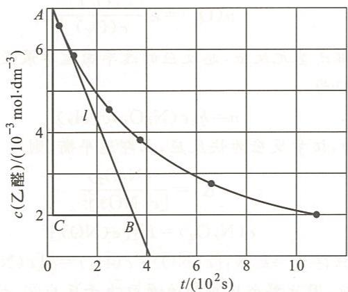

在曲线上 $t = 100 \mathrm{~s}$ 处作曲线的切线 $l$ , 利用直角三角形 $ABC$ 求出 $l$ 的斜率。

$$
\begin{array}{r l} {l \text {的斜率} =} & {\frac {A C}{C B}} \\ & {= \frac {(7 - 2) \times 1 0 ^ {- 3} \mathrm{mol} \cdot \mathrm{dm} ^ {- 3}}{(3 . 5 - 0 . 2) \times 1 0 ^ {2} \mathrm{s}}} \\ & {= 1. 5 \times 1 0 ^ {- 5} \mathrm{mol} \cdot \mathrm{dm} ^ {- 3} \cdot \mathrm{s} ^ {- 1}} \end{array}
$$

即 $t = 100\mathrm{s}$ 时，反应速率为 $1.5\times 10^{-5}\mathrm{mol}\cdot \mathrm{dm}^{-3}\cdot \mathrm{s}^{-1}$ 。 $2\mathrm{A} + \mathrm{B} = \mathrm{C}$

$t_{0}$ 时刻 $2\ mol\cdot dm^{-3}$ $4\ mol\cdot dm^{-3}$ t 时刻 $1\ mol\cdot dm^{-3}$ $3.5\ mol\cdot dm^{-3}$

反应为基元反应,其速率方程可以写作

$$
\begin{array}{r l} & v = k [ c (\mathrm{A}) ] ^ {2} c (\mathrm{B}) \\ & v _ {0} = k \times (2 \mathrm{mol} \cdot \mathrm{dm} ^ {- 3}) ^ {2} \times 4 \mathrm{mol} \cdot \mathrm{dm} ^ {- 3} \\ & v _ {t} = k \times (1 \mathrm{mol} \cdot \mathrm{dm} ^ {- 3}) ^ {2} \times 3. 5 \mathrm{mol} \cdot \mathrm{dm} ^ {- 3} \\ & \frac {v _ {t}}{v _ {0}} = \frac {k \times (1 \mathrm{mol} \cdot \mathrm{dm} ^ {- 3}) ^ {2} \times 3 . 5 \mathrm{mol} \cdot \mathrm{dm} ^ {- 3}}{k \times (2 \mathrm{mol} \cdot \mathrm{dm} ^ {- 3}) ^ {2} \times 4 \mathrm{mol} \cdot \mathrm{dm} ^ {- 3}} \end{array}
$$

所以 $v_{t}=v_{0}\times0.219$ ，将题设中的 $v_{0}$ 值代入其中，得

$$
v _ {t} = 1. 8 0 \times 1 0 ^ {- 2} \mathrm{mol} \cdot \mathrm{dm} ^ {- 3} \cdot \mathrm{s} ^ {- 1} \times 0. 2 1 9 = 3. 9 4 \times 1 0 ^ {- 3} \mathrm{mol} \cdot \mathrm{dm} ^ {- 3} \cdot \mathrm{s} ^ {- 1}
$$

## 3.23 慢反应②为定速步骤,故有

$$
v (\mathrm{O} _ {2}) = k _ {2} c (\mathrm{O}) c (\mathrm{O} _ {3})\tag{1}
$$

由反应①得

$$
K _ {1} = \frac {c (\mathrm{O} _ {2}) c (\mathrm{O})}{c (\mathrm{O} _ {3})}
$$

所以有

$$
c (\mathrm{O}) = \frac {K _ {1} c (\mathrm{O} _ {3})}{c (\mathrm{O} _ {2})}\tag{2}
$$

将式(2)代入式(1), 得

$$
v (\mathrm{O} _ {2}) = k _ {2} \frac {K _ {1} c (\mathrm{O} _ {3})}{c (\mathrm{O} _ {2})} \cdot c (\mathrm{O} _ {3})
$$

令 $k = k_{2}K_{1}$ ，则有

$$
v (\mathrm{O} _ {2}) = k \frac {[ c (\mathrm{O} _ {3}) ] ^ {2}}{c (\mathrm{O} _ {2})}
$$

3.24 反应机理中各步反应都是基元反应,总反应的速率由速率最慢的那一步基元反应决定,所以总反应的速率方程应为

$$
v = k _ {2} c (\mathrm{N} _ {2} \mathrm{O} _ {2}) c (\mathrm{H} _ {2})
$$

$N_{2}O_{2}$ 是反应①的产物,该步反应为快反应,立即达平衡,则

即

$$
\begin{array}{r} K _ {1} = \frac {c (\mathrm{N} _ {2} \mathrm{O} _ {2})}{[ c (\mathrm{NO}) ] ^ {2}} \\ c (\mathrm{N} _ {2} \mathrm{O} _ {2}) = K _ {1} [ c (\mathrm{NO}) ] ^ {2} \end{array}
$$

代入总反应的速率方程得 $v = k_{2}K_{1}[c(\mathrm{NO})]^{2}c(\mathrm{H}_{2}) = k[c(\mathrm{NO})]^{2}c(\mathrm{H}_{2})$ 。

3.25 （1）机理中③为慢反应，因此整个反应的速率取决于反应③，故有

$$
\frac {\mathrm{d} c (\mathrm{COCl} _ {2})}{\mathrm{d} t} = k _ {3} c (\mathrm{COCl} \bullet) c (\mathrm{Cl} _ {2})\tag{a}
$$

速率方程中出现活性很大的自由基 $\mathrm{COCl}$ 的浓度, 必须设法在速率方程中消去它, 使速率方程中只包含反应物的浓度。为此需找到自由基的浓度和反应物浓度的关系。因反应①和反应②速率很快, 几乎一直处于平衡态, 因此, 由①, ②得

即

$$
\begin{array}{r} {v _ {+} = v _ {-}} \\ {k _ {1} c (\mathrm{Cl} _ {2}) = k _ {- 1} \big [ c (\mathrm{Cl} \bullet) \big ] ^ {2}} \end{array}
$$

得

$$
c (\mathrm{Cl} \bullet) = \frac {k _ {1} ^ {\frac {1}{2}}}{k _ {- 1} ^ {\frac {1}{2}}} [ c (\mathrm{Cl} _ {2}) ] ^ {\frac {1}{2}}\tag{b}
$$

由

$$
k _ {2} c (\mathrm{CO}) c (\mathrm{Cl} \bullet) = k _ {- 2} c (\mathrm{COCl} \bullet)
$$

得

$$
c (\mathrm{COCl} \bullet) = \frac {k _ {2}}{k _ {- 2}} c (\mathrm{CO}) c (\mathrm{Cl} \bullet)\tag{c}
$$

将式(b)、式(c)代入式(a)得

令

$$
\begin{array}{r l} \frac {\mathrm{d} c (\mathrm{COCl} _ {2})}{\mathrm{d} t} & = k _ {3} \frac {k _ {2} k _ {1} ^ {\frac {1}{2}}}{k _ {- 2} k _ {- 1} ^ {\frac {1}{2}}} c (\mathrm{CO}) [ c (\mathrm{Cl} _ {2}) ] ^ {\frac {3}{2}} \\ & k = \frac {k _ {1} ^ {\frac {1}{2}} k _ {2} k _ {3}}{k _ {- 1} ^ {\frac {1}{2}} k _ {- 2}} \\ & \frac {\mathrm{d} c (\mathrm{COCl} _ {2})}{\mathrm{d} t} = k c (\mathrm{CO}) [ c (\mathrm{Cl} _ {2}) ] ^ {\frac {3}{2}} \end{array}
$$

可见建议的机理与速率方程相符合。

(2) $k = \frac{k_{1}^{\frac{1}{2}}k_{2}k_{3}}{k_{-1}^{\frac{1}{2}}k_{-2}}$

3.26 （1）设反应的速率方程为 $v=k\left[c\left(\mathrm{H}_{2}\mathrm{PO}_{2}^{-}\right)\right]^{m}\left[c\left(\mathrm{OH}^{-}\right)\right]^{n}$ 当 $c(\mathrm{OH}^{-})$ 不变时，有

$$
\frac {3 . 2 \times 1 0 ^ {- 5}}{1 . 6 \times 1 0 ^ {- 4}} = \frac {k (0 . 1 0) ^ {m} (1 . 0) ^ {n}}{k (0 . 5 0) ^ {m} (1 . 0) ^ {n}}
$$

得 $m = 1$ 。

当 $c(\mathrm{H}_{2}\mathrm{PO}_{2}^{-})$ 不变时，有

$$
\frac {1 . 6 \times 1 0 ^ {- 4}}{2 . 5 6 \times 1 0 ^ {- 3}} = \frac {k (0 . 5 0) ^ {m} (1 . 0) ^ {n}}{k (0 . 5 0) ^ {m} (4 . 0) ^ {n}}
$$

得 $n = 2$ 。

反应级数为 $m + n = 3$ ，反应速率方程为 $v = kc(\mathrm{H}_2\mathrm{PO}_2^-)[c(\mathrm{OH}^-)]^2$ 。

(2) 将任一组数据代入速率方程得

$$
\begin{array}{r l} k & = \frac {v}{c (\mathrm{H} _ {2} \mathrm{PO} _ {2} ^ {-}) [ c (\mathrm{OH} ^ {-}) ] ^ {2}} \\ & = \frac {3 . 2 \times 1 0 ^ {- 5} \mathrm{mol} \cdot \mathrm{dm} ^ {- 3} \cdot \mathrm{min} ^ {- 1}}{0 . 1 \mathrm{mol} \cdot \mathrm{dm} ^ {- 3} \times (1 . 0 \mathrm{mol} \cdot \mathrm{dm} ^ {- 3}) ^ {2}} \\ & = 3. 2 \times 1 0 ^ {- 4} \mathrm{mol} ^ {- 2} \cdot \mathrm{dm} ^ {6} \cdot \mathrm{min} ^ {- 1} \end{array}
$$

3.27 以 $c(\mathrm{C}_2\mathrm{H}_6)$ 的变化表示起始分解速率：

$$
v _ {0} = - \frac {\mathrm{d} c (\mathrm{C} _ {2} \mathrm{H} _ {6})}{\mathrm{d} t} = k [ c (\mathrm{C} _ {2} \mathrm{H} _ {6}) ] ^ {\frac {3}{2}}
$$

由理想气体状态方程 $pV = nRT$ 得

$$
\begin{array}{r l} & c (\mathrm{C} _ {2} \mathrm{H} _ {6}) = \frac {n}{V} = \frac {p}{R T} \\ & v _ {0} = k \left(\frac {p}{R T}\right) ^ {\frac {3}{2}} = 1. 1 3 \mathrm{dm} ^ {\frac {3}{2}} \cdot \mathrm{mol} ^ {- \frac {1}{2}} \cdot \mathrm{s} ^ {- 1} \times \left(\frac {1 . 3 3 \times 1 0 ^ {4} \mathrm{Pa}}{8 . 3 1 4 \times 1 0 ^ {3} \mathrm{Pa} \cdot \mathrm{dm} ^ {3} \cdot \mathrm{mol} ^ {- 1} \cdot \mathrm{K} ^ {- 1} \times 9 1 0 \mathrm{K}}\right) ^ {\frac {3}{2}} \\ & = 8. 3 \times 1 0 ^ {- 5} \mathrm{mol} \cdot \mathrm{dm} ^ {- 3} \cdot \mathrm{s} ^ {- 1} \end{array}
$$

3.28 由于放射性同位素 $^{14}$ C 的衰变相当于一级反应,因此可根据一级反应的反应物浓度与时间的关系进行计算。

所以

由

得

$$
\begin{array}{r l} & t _ {1 / 2} = \frac {0 . 6 9 3}{k} \\ & k = \frac {0 . 6 9 3}{t _ {1 / 2}} = \frac {0 . 6 9 3}{5 7 2 0 \mathrm{a}} = 1. 2 1 \times 1 0 ^ {- 4} \mathrm{a} ^ {- 1} \\ & \lg \frac {c}{c _ {0}} = - \frac {k}{2 . 3 0 3} t \\ & t = - \frac {2 . 3 0 3 \lg \frac {c}{c _ {0}}}{k} \\ & = - \frac {2 . 3 0 3 \times \lg \frac {8 5}{1 0 0}}{1 . 2 1 \times 1 0 ^ {- 4} \mathrm{a} ^ {- 1}} = 1. 3 \times 1 0 ^ {3} \mathrm{a} \end{array}
$$

故该纺织品的年龄约为 $1.3 \times 10^{3}$ 年。

3.29 反应速率与变酸时间成反比，即 $\frac{k_2}{k_1} = \frac{t_1}{t_2} = \frac{48}{4}$ 。

$$
\lg \frac {k _ {2}}{k _ {1}} = \frac {E _ {\mathrm{a}}}{2 . 3 0 3 R} \left(\frac {T _ {2} - T _ {1}}{T _ {1} T _ {2}}\right)
$$

$$
\lg \frac {4 8}{4} = \frac {E _ {\mathrm{a}}}{2 . 3 0 3 \times 8 . 3 1 4 \times 1 0 ^ {- 3} \mathrm{kJ} \cdot \mathrm{mol} ^ {- 1} \cdot \mathrm{K} ^ {- 1}} \times \left(\frac {3 0 1 \mathrm{K} - 2 7 8 \mathrm{K}}{3 0 1 \mathrm{K} \times 2 7 8 \mathrm{K}}\right)   E _ {\mathrm{a}} = 7 5 \mathrm{kJ} \cdot \mathrm{mol} ^ {- 1}
$$

3.30 反应速率之比等于反应速率常数之比。

加催化剂前

$$
\lg k = - \frac {E _ {\mathrm{a}}}{2 . 3 0 3 R T} + \lg A
$$

加催化剂后

$$
\lg k ^ {\prime} = - \frac {E _ {\mathrm{a}} ^ {\prime}}{2 . 3 0 3 R T} + \lg A ^ {\prime}
$$

对于同一反应, $A=A'$ 。两式相减得

$$
\begin{array}{r l} \lg \frac {k ^ {\prime}}{k} & = - \frac {E _ {\mathrm{a}} ^ {\prime} - E _ {\mathrm{a}}}{2 . 3 0 3 R T} \\ & = \frac {- (1 3 8 . 1 - 1 8 8 . 3) \times 1 0 ^ {3} \mathrm{J} \cdot \mathrm{mol} ^ {- 1}}{2 . 3 0 3 \times 8 . 3 1 4 \mathrm{J} \cdot \mathrm{mol} ^ {- 1} \cdot \mathrm{K} ^ {- 1} \times 8 0 0 \mathrm{K}} \\ & = 3. 2 7 7 \end{array}
$$

$$
\frac {k ^ {\prime}}{k} = 1. 8 9 \times 1 0 ^ {3}
$$

3.31 零级反应

$$
c = c _ {0} - k t
$$

即

$$
c _ {0} - c = k t
$$

$$
\frac {(c _ {0} - c) _ {1 0 0 \min}}{(c _ {0} - c) _ {2 0 0 \min}} = \frac {t _ {1 0 0 \min}}{t _ {2 0 0 \min}}
$$

$$
\frac {0 . 2 5}{(c _ {0} - c) _ {2 0 0 \mathrm{min}}} = \frac {1 0 0 \mathrm{min}}{2 0 0 \mathrm{min}}
$$

$$
c _ {0} - c = 0.5 = 50
$$

一级反应

$$
\lg c = \lg c _ {0} - \frac {k}{2 . 3 0 3} t
$$

$$
\lg \frac {c _ {0}}{c} = \frac {k}{2 . 3 0 3} t
$$

$$
\frac {\lg \left(\frac {c _ {0}}{c}\right) _ {1 0 0 \mathrm{min}}}{\lg \left(\frac {c _ {0}}{c}\right) _ {2 0 0 \mathrm{min}}} = \frac {t _ {1 0 0 \mathrm{min}}}{t _ {2 0 0 \mathrm{min}}}
$$

$$
\frac {\lg \left(\frac {1}{0 . 7 5}\right) _ {1 0 0 \mathrm{min}}}{\lg \left(\frac {1}{c}\right) _ {2 0 0 \mathrm{min}}} = \frac {1 0 0 \mathrm{min}}{2 0 0 \mathrm{min}}
$$

$c = 0.56$ ，即消耗了 $44\%$

二级反应

$$
\frac {1}{c} - \frac {1}{c _ {0}} = k t
$$

$$
\frac {\left(\frac {1}{c} - \frac {1}{c _ {0}}\right) _ {1 0 0 \mathrm{min}}}{\left(\frac {1}{c} - \frac {1}{c _ {0}}\right) _ {2 0 0 \mathrm{min}}} = \frac {t _ {1 0 0 \mathrm{min}}}{t _ {2 0 0 \mathrm{min}}}
$$

$$
\frac {\left(\frac {1}{0 . 7 5} - 1\right) _ {1 0 0 \mathrm{min}}}{\left(\frac {1}{c} - 1\right) _ {2 0 0 \mathrm{min}}} = \frac {1 0 0 \mathrm{min}}{2 0 0 \mathrm{min}}
$$

解得 $c = 0.60$ ，即消耗了 $40\%$

3.32 一级反应的半衰期为

$$
t _ {1 / 2} = \frac {0 . 6 9 3}{k}
$$

则速率常数为

$$
k = \frac {0 . 6 9 3}{3 6 0 \mathrm{min}} = 1. 9 3 \times 1 0 ^ {- 3} \mathrm{min} ^ {- 1}
$$

由阿仑尼乌斯公式得

$$
\begin{array}{r l} & \lg \frac {k _ {7 0 0 \mathrm{K}}}{k _ {6 0 0 \mathrm{K}}} = \frac {E _ {\mathrm{a}}}{2 . 3 0 3 R} \left(\frac {1}{T _ {6 0 0 \mathrm{K}}} - \frac {1}{T _ {7 0 0 \mathrm{K}}}\right) \\ & \lg \frac {k _ {7 0 0 \mathrm{K}}}{1 . 9 3 \times 1 0 ^ {- 3} \min ^ {- 1}} = \frac {2 0 0 \mathrm{kJ} \cdot \mathrm{mol} ^ {- 1}}{2 . 3 0 3 \times 8 . 3 1 4 \times 1 0 ^ {- 3} \mathrm{kJ} \cdot \mathrm{mol} ^ {- 1} \cdot \mathrm{K} ^ {- 1}} \left(\frac {1}{6 0 0 \mathrm{K}} - \frac {1}{7 0 0 \mathrm{K}}\right) \end{array}
$$

解得 700 K 时的速率常数 $k_{700\ K}=0.59\ min^{-1}$ 。

由

$$
\lg c = \lg c _ {0} - \frac {k}{2 . 3 0 3} t
$$

得

$$
\lg \frac {c _ {0}}{c} = \frac {k}{2 . 3 0 3} t
$$

$$
\begin{array}{r l} \lg \frac {1}{0 . 3} & = \frac {0 . 5 9 \min ^ {- 1}}{2 . 3 0 3} t \\ & t = 2. 0 4 \min \end{array}
$$

3.33 反应活化能 $E_{\mathrm{a}}$ ，反应温度 $T$ 和速率常数 $k$ 之间的关系为

$$
\lg \frac {k _ {2}}{k _ {1}} = \frac {E _ {\mathrm{a}}}{2 . 3 0 3 R} \left(\frac {1}{T _ {1}} - \frac {1}{T _ {2}}\right)
$$

将题设条件 $E_{\mathrm{a}} = 163\mathrm{kJ}\cdot \mathrm{mol}^{-1},T_{1} = 390\mathrm{K},T_{2} = 420\mathrm{K}$ 和 $R = 8.314\mathrm{J}\cdot \mathrm{mol}^{-1}\cdot \mathrm{K}^{-1}$ 代入公式得

$$
\lg \frac {k _ {2}}{k _ {1}} = \frac {1 6 3 \times 1 0 0 0 \mathrm{J} \cdot \mathrm{mol} ^ {- 1}}{2 . 3 0 3 \times 8 . 3 1 4 \mathrm{J} \cdot \mathrm{mol} ^ {- 1} \cdot \mathrm{K} ^ {- 1}} \left(\frac {1}{3 9 0 \mathrm{K}} - \frac {1}{4 2 0 \mathrm{K}}\right) = 1. 5 5 9
$$

$$
\frac {k _ {2}}{k _ {1}} = 3 6. 2 2
$$

$$
\begin{array}{r l} k _ {2} & = 3 6. 2 2 k _ {1} \\ & = 3 6. 2 2 \times 2. 3 7 \times 1 0 ^ {- 2} \mathrm{dm} ^ {3} \cdot \mathrm{mol} ^ {- 1} \cdot \mathrm{s} ^ {- 1} \\ & = 8. 5 8 \times 1 0 ^ {- 1} \mathrm{dm} ^ {3} \cdot \mathrm{mol} ^ {- 1} \cdot \mathrm{s} ^ {- 1} \end{array}
$$

3.34 由一级反应的半衰期公式

$$
t _ {1 / 2} = \frac {0 . 6 9 3}{k}
$$

得

$$
k = \frac {0 . 6 9 3}{t _ {1 / 2}}
$$

$$
\frac {k _ {2}}{k _ {1}} = \frac {\frac {0 . 6 9 3}{t _ {1 / 2} (2)}}{\frac {0 . 6 9 3}{t _ {1 / 2} (1)}} = \frac {t _ {1 / 2} (1)}{t _ {1 / 2} (2)}
$$

将其代入反应活化能 $E_{\mathrm{a}}$ ，反应温度 $T$ 和速率常数 $k$ 的关系式：

$$
\lg \frac {k _ {2}}{k _ {1}} = \frac {E _ {\mathrm{a}}}{2 . 3 0 3 R} \left(\frac {1}{T _ {1}} - \frac {1}{T _ {2}}\right)
$$

可得

$$
\lg \frac {t _ {1 / 2} (1)}{t _ {1 / 2} (2)} = \frac {E _ {\mathrm{a}}}{2 . 3 0 3 R} \left(\frac {1}{T _ {1}} - \frac {1}{T _ {2}}\right)
$$

将题设数据代入其中,得

$$
\begin{array}{r l} E _ {\mathrm{a}} & = \frac {2 . 3 0 3 R \lg \frac {t _ {1 / 2} (1)}{t _ {1 / 2} (2)}}{\frac {1}{T _ {1}} - \frac {1}{T _ {2}}} \\ & = \frac {2 . 3 0 3 \times 8 . 3 1 4 \mathrm{J} \cdot \mathrm{mol} ^ {- 1} \cdot \mathrm{K} ^ {- 1} \times \lg 1 0 0}{\frac {1}{4 0 0 \mathrm{K}} - \frac {1}{5 0 0 \mathrm{K}}} \\ & = 7 6. 6 \mathrm{kJ} \cdot \mathrm{mol} ^ {- 1} \end{array}
$$

3.35 根据速率常数单位知该反应为一级反应，则

$$
\lg c = \lg c _ {0} - \frac {k}{2 . 3 0 3} t
$$

即

$$
\lg \frac {c _ {0}}{c} = \frac {k}{2 . 3 0 3} t
$$

$$
\lg \frac {1}{0 . 1} = \frac {k}{2 . 3 0 3} \times 6 0 0 \mathrm{s}
$$

$$
k = 3. 8 \times 1 0 ^ {- 3} \mathrm{s} ^ {- 1}
$$

$$
\lg \frac {k _ {2}}{k _ {1}} = \frac {E _ {\mathrm{a}}}{2 . 3 0 3 R} \left(\frac {1}{T _ {1}} - \frac {1}{T _ {2}}\right)
$$

$$
\lg \frac {3 . 8 \times 1 0 ^ {- 3} \mathrm{s} ^ {- 1}}{3 . 3 \times 1 0 ^ {- 2} \mathrm{s} ^ {- 1}} = \frac {1 8 . 8 8 \times 1 0 ^ {4} \mathrm{J} \cdot \mathrm{mol} ^ {- 1}}{2 . 3 0 3 \times 8 . 3 1 4 \mathrm{J} \cdot \mathrm{mol} ^ {- 1} \cdot \mathrm{K} ^ {- 1}} \left(\frac {1}{6 0 0 \mathrm{K}} - \frac {1}{T _ {2}}\right)
$$

$$
T _ {2} = 5 6 7. 6 \mathrm{K}
$$

3.36 由题意 $t_{1/2}=46.1\ d$ ，反应为一级， $m_{0}=0.200\ mg$ 。

由 $t_{1 / 2} = \frac{0.693}{k}$ 得

$$
k = \frac {0 . 6 9 3}{t _ {1 / 2}}
$$

$$
\begin{array}{r l} \lg \frac {m}{m _ {0}} & = - \frac {k t}{2 . 3 0 3} = - \frac {0 . 6 9 3 t}{2 . 3 0 3 t _ {1 / 2}} \\ & = - \frac {0 . 6 9 3 \times 1 8 2}{2 . 3 0 3 \times 4 6 . 1} = - 1. 1 9 \\ & \frac {m}{m _ {0}} = 0. 0 6 4 6 \end{array}
$$

剩余试样质量 $m=0.0646\times0.200\ mg=0.0129\ mg$ 。

3.37 （1）对于一级反应 $\lg\frac{c}{c_{0}}=-\frac{k}{2.303}t$

因此 $\lg \frac{c(\mathrm{N}_2\mathrm{O}_5)}{1.65\times 10^{-2}\mathrm{mol}\cdot\mathrm{dm}^{-3}} = -\frac{4.80\times 10^{-4}\mathrm{s}^{-1}\times 825\mathrm{s}}{2.303}$

$$
c \left(\mathrm{N} _ {2} \mathrm{O} _ {5}\right) = 1. 1 1 \times 1 0 ^ {- 2} \mathrm{mol} \cdot \mathrm{dm} ^ {- 3}
$$

(2) 由

$$
\begin{array}{r l} & \lg \frac {c}{c _ {0}} = - \frac {k}{2 . 3 0 3} t \\ & \lg \frac {1 . 0 0 \times 1 0 ^ {- 2} \mathrm{mol} \cdot \mathrm{dm} ^ {- 3}}{1 . 6 5 \times 1 0 ^ {- 2} \mathrm{mol} \cdot \mathrm{dm} ^ {- 3}} = - \frac {4 . 8 0 \times 1 0 ^ {- 4} \mathrm{s} ^ {- 1} \cdot t}{2 . 3 0 3} \\ & t = 1. 0 4 3 \mathrm{s} \end{array}
$$

3.38 速率常数、反应温度和反应活化能的关系满足阿仑尼乌斯公式：

$$
\lg k = - \frac {E _ {\mathrm{a}}}{2 . 3 0 3 R T} + \lg A
$$

当温度一定、活化能 $E_{a}$ 不同时，速率常数 k 不同，于是

$$
\lg k _ {1} = - \frac {E _ {\mathrm{a}} (1)}{2 . 3 0 3 R T} + \lg A
$$

$$
\lg k _ {2} = - \frac {E _ {\mathrm{a}} (2)}{2 . 3 0 3 R T} + \lg A
$$

两式相减得

$$
\lg \frac {k _ {2}}{k _ {1}} = \frac {E _ {\mathrm{a}} (1) - E _ {\mathrm{a}} (2)}{2 . 3 0 3 R T}
$$

因为速率常数 $k$ 与反应速率 $\upsilon$ 成正比，故

$$
\frac {k _ {2}}{k _ {1}} = \frac {v _ {2}}{v _ {1}}
$$

公式变成 $\lg \frac{v_2}{v_1} = \frac{E_a(1) - E_a(2)}{2.303RT}$ $= \frac{(326 - 175)\times 10^{3}\mathrm{J}\cdot\mathrm{mol}^{-1}}{2.303\times 8.314\mathrm{J}\cdot\mathrm{mol}^{-1}\cdot\mathrm{K}^{-1}\times 773\mathrm{K}}$ $= 10.2$ 故 $\frac{v_2}{v_1} = 1.6\times 10^{10}$

即加入催化剂后,反应速率扩大了 $1.6\times10^{10}$ 倍。

## 第4章

## 一、选择题

<table><tr><td>4.1 B</td><td>4.2 C</td><td>4.3 B</td><td>4.4 C</td><td>4.5 C</td><td>4.6 C</td><td>4.7 D</td><td>4.8 C</td><td>4.9 D</td><td>4.10 C</td></tr></table>

## 二、填空题

4.11 5.7。

4.12 97.8%,99.99%。

4.13 6.43。

4.14 53.1,37.3。

4.15 不变, 不变, 增大, 增大, 不变, 逆向移动; 增大, 增大, 增大, 增大, 增大, 正向移动; 增大, 增大, 增大, 增大, 不变, 不移动。

4.16 537。

4.17 (1) 增大, $\mathrm{I}_2$ 解离是吸热反应 $(\Delta_{\mathrm{r}}H_{\mathrm{m}}^{\ominus} > 0)$ ;

(2) 减小, 总体积减小, 压强增大, 平衡向气体粒子数减少的方向移动;

(3) 不变, $\mathrm{I}_2(\mathrm{g})$ 和 $\mathrm{I}(\mathrm{g})$ 的分压都不变;

（4）增大，体积变大时则 $\mathrm{I}_2(\mathrm{g})$ 和 $\mathrm{I}(\mathrm{g})$ 的分压同时减小，平衡向粒子数增多的方向移动。4.18 $1.3\times 10^{-5}$

## 三、简答题和计算题

4.19

$$
2 \mathrm{NO} _ {2} (\mathrm{g}) \rightleftharpoons \mathrm{N} _ {2} \mathrm{O} _ {4} (\mathrm{g})
$$

平衡分压

$$
p _ {1} \quad p _ {2}
$$

故

$$
K _ {p} = \frac {p (\mathrm{N} _ {2} \mathrm{O} _ {4} , \mathrm{g})}{[ p (\mathrm{NO} _ {2} , \mathrm{g}) ] ^ {2}} = \frac {p _ {2}}{p _ {1} ^ {2}}
$$

$$
K _ {c} = K _ {p} (R T) ^ {- \Delta \nu} = \frac {p _ {2}}{p _ {1} ^ {2}} R T
$$

$$
K ^ {\ominus} = \frac {\frac {p (\mathrm{N} _ {2} \mathrm{O} _ {4} , \mathrm{g})}{p ^ {\ominus}}}{\left[ \frac {p (\mathrm{NO} _ {2} , \mathrm{g})}{p ^ {\ominus}} \right] ^ {2}} = \frac {\frac {p _ {2}}{p ^ {\ominus}}}{\left(\frac {p _ {1}}{p ^ {\ominus}}\right) ^ {2}} = \frac {p _ {2}}{p _ {1} ^ {2}} p ^ {\ominus}
$$

$$
\frac {K _ {c}}{K ^ {\ominus}} = \frac {\frac {p _ {2}}{p _ {1} ^ {2}} R T}{\frac {p _ {2}}{p _ {1} ^ {2}} p ^ {\ominus}}
$$

注意 $K_{c}$ 的单位是 $(\mathrm{mol} \cdot \mathrm{dm}^{-3})^{-1}$ , 而 $K^{\ominus}$ 是量纲 1 的量。所以

$$
\begin{array}{r l} \frac {K _ {c}}{K ^ {\ominus}} = & \frac {\frac {p _ {2}}{p _ {1} ^ {2}} \times 8 . 3 1 4 \times 1 0 ^ {3} \mathrm{Pa} \cdot \mathrm{dm} ^ {3} \cdot \mathrm{mol} ^ {- 1} \cdot \mathrm{K} ^ {- 1} \times (2 7 3 + 2 7) \mathrm{K}}{\frac {p _ {2}}{p _ {1} ^ {2}} \times 1 0 0 \times 1 0 0 0 \mathrm{Pa}} \\ = & 2 4. 9 4 \mathrm{dm} ^ {3} \cdot \mathrm{mol} ^ {- 1} \end{array}
$$

4.20 (1) $\mathrm{NH_4HS(s)}\rightleftharpoons \mathrm{H}_2\mathrm{S(g)}$ + $\mathrm{NH_3(g)}$

平衡分压 $p_i$ $\frac{68.0\mathrm{kPa}}{2} = 34.0\mathrm{kPa}$ $\frac{68.0\mathrm{kPa}}{2} = 34.0\mathrm{kPa}$

$$
\begin{array}{r l} K ^ {\ominus} & = \frac {p (\mathrm{H} _ {2} \mathrm{S})}{p ^ {\ominus}} \cdot \frac {p (\mathrm{NH} _ {3})}{p ^ {\ominus}} \\ & = \frac {3 4 . 0 \mathrm{kPa}}{1 0 0 \mathrm{kPa}} \cdot \frac {3 4 . 0 \mathrm{kPa}}{1 0 0 \mathrm{kPa}} \\ & = 0. 1 1 6 \end{array}
$$

(2)

$$
\frac {p (\mathrm{H} _ {2} \mathrm{S})}{p ^ {\ominus}} = \frac {K ^ {\ominus}}{\frac {p (\mathrm{NH} _ {3})}{p ^ {\ominus}}} = \frac {0 . 1 1 6}{\frac {9 3 . 0 \mathrm{kPa}}{1 0 0 \mathrm{kPa}}} = 0. 1 2 5
$$

$$
\begin{array}{r l} p (\mathrm {H_ {2} S}) & = 0. 1 2 5 \times p ^ {\ominus} \\ & = 0. 1 2 5 \times 1 0 0 \mathrm{kPa} \\ & = 1 2. 5 \mathrm{kPa} \end{array}
$$

$$
p _ {\mathrm{总}} = p (\mathrm{H} _ {2} \mathrm{S}) + p (\mathrm{NH} _ {3}) = 1 2. 5 \mathrm{kPa} + 9 3. 0 \mathrm{kPa} = 1 0 5. 5 \mathrm{kPa}
$$

4.21 (1) W 升华过程可以表示为

由公式

$$
\begin{array}{r l} \mathrm {W(s) = W(g)} & K ^ {\ominus} = \frac {p (\mathrm{W})}{p ^ {\ominus}}, K _ {p} = p (\mathrm{W}) \\ & \ln K ^ {\ominus} = - \frac {\Delta H _ {\mathrm{m}} ^ {\ominus}}{R T} + \frac {\Delta S _ {\mathrm{m}} ^ {\ominus}}{R} \end{array}
$$

可以推导出关系式

$$
\ln \frac {K _ {2} ^ {\ominus}}{K _ {1} ^ {\ominus}} = \frac {\Delta H _ {\mathrm{m}} ^ {\ominus}}{R} \left(\frac {T _ {2} - T _ {1}}{T _ {1} T _ {2}}\right)
$$

$$
\begin{array}{r l} \text {所以} \Delta H _ {\mathrm{m}} ^ {\ominus} & = \frac {T _ {1} T _ {2} R \ln \frac {K _ {2} ^ {\ominus}}{K _ {1} ^ {\ominus}}}{T _ {2} - T _ {1}} \\ & = \frac {2 6 0 0 \mathrm{K} \times 3 0 0 0 \mathrm{K} \times 8 . 3 1 4 \mathrm{J} \cdot \mathrm{mol} ^ {- 1} \cdot \mathrm{K} ^ {- 1} \times \ln \frac {\frac {9 . 1 7 3 \times 1 0 ^ {- 3} \mathrm{Pa}}{p ^ {\ominus}}}{\frac {7 . 2 1 3 \times 1 0 ^ {- 5} \mathrm{Pa}}{p ^ {\ominus}}}}{3 0 0 0 \mathrm{K} - 2 6 0 0 \mathrm{K}} \\ & = 7 8 5. 6 \mathrm{kJ} \cdot \mathrm{mol} ^ {- 1} \end{array}
$$

$$
\begin{array}{r l} \ln \frac {K _ {2} ^ {\ominus}}{K _ {1} ^ {\ominus}} & = \frac {\Delta H _ {\mathrm{m}} ^ {\ominus}}{R} \cdot \frac {T _ {2} - T _ {1}}{T _ {1} T _ {2}} \\ & = \frac {7 8 5 . 6 \times 1 0 ^ {3} \mathrm{J} \cdot \mathrm{mol} ^ {- 1} \times (3 2 0 0 \mathrm{K} - 2 6 0 0 \mathrm{K})}{8 . 3 1 4 \mathrm{J} \cdot \mathrm{mol} ^ {- 1} \cdot \mathrm{K} ^ {- 1} \times 3 2 0 0 \mathrm{K} \times 2 6 0 0 \mathrm{K}} \end{array} \tag {2}
$$

$$
= 6. 8 1 4 3
$$

$$
\begin{array}{r l r} & {\text {故} \frac {K _ {2} ^ {\ominus}}{K _ {1} ^ {\ominus}} = 9 1 0. 8, \text {而}} & {\frac {K _ {p _ {2}}}{K _ {p _ {1}}} = \frac {K _ {2} ^ {\ominus}}{K _ {1} ^ {\ominus}} = 9 1 0. 8} \\ & {\text {所以}} & {K _ {p _ {2}} = K _ {p _ {1}} \times 9 1 0. 8 = 7. 2 1 3 \times 1 0 ^ {- 5} \mathrm{Pa} \times 9 1 0. 8} \\ & & {= 6. 5 7 0 \times 1 0 ^ {- 2} \mathrm{Pa}} \end{array}
$$

即 3200 K 时的饱和蒸气压为 $6.570 \times 10^{-2}$ Pa。

4.22 (1) 设 $\mathrm{COCl}_2$ 起始浓度为 $1\mathrm{mol}\cdot \mathrm{dm}^{-3}$ , 解离度为 $\alpha$ 。

平衡时

$$
\begin{array}{l} \mathrm {COCl_ {2} (g)} = \mathrm {CO(g) + Cl_ {2} (g)} \\ (1 - \alpha) \mathrm{mol} \quad \alpha \mathrm{mol} \quad \alpha \mathrm{mol} \end{array}
$$

$$
n (\text { 总 }) = [ (1 - \alpha) + \alpha + \alpha ] \mathrm{mol} = (1 + \alpha) \mathrm{mol}
$$

$$
p (\mathrm{COCl} _ {2}) = \frac {1 - \alpha}{1 + \alpha} p = \frac {1 - \alpha}{1 + \alpha} \times 2. 0 \times 1 0 ^ {5} \mathrm{Pa}
$$

$$
\begin{array}{r l} p (\mathrm{CO}) & = p (\mathrm{Cl} _ {2}) = \frac {\alpha}{1 + \alpha} p = \frac {\alpha}{1 + \alpha} \times 2. 0 \times 1 0 ^ {5} \mathrm{Pa} \\ K ^ {\ominus} & = \frac {[ p (\mathrm{CO}) / p ^ {\ominus} ] [ p (\mathrm{Cl} _ {2}) / p ^ {\ominus} ]}{p (\mathrm{COCl} _ {2}) / p ^ {\ominus}} \\ & = \frac {\left(\frac {\alpha}{1 + \alpha} \times \frac {2 . 0 \times 1 0 ^ {5}}{1 . 0 \times 1 0 ^ {5}}\right) ^ {2}}{\frac {1 - \alpha}{1 + \alpha} \times \frac {2 . 0 \times 1 0 ^ {5}}{1 . 0 \times 1 0 ^ {5}}} \\ & = 8. 0 \times 1 0 ^ {- 9} \end{array}
$$

$$
\alpha = 6.32 \times 10^{-5} = (6.32 \times 10^{-3})\%
$$

$$
\begin{array}{r l} (2) \Delta_ {\mathrm{r}} G _ {\mathrm{m}} ^ {\ominus} & = - 2. 3 0 3 R T \lg K ^ {\ominus} \\ & = - 2. 3 0 3 \times 8. 3 1 4 \mathrm{J} \cdot \mathrm{mol} ^ {- 1} \cdot \mathrm{K} ^ {- 1} \times 3 7 3 \mathrm{K} \times \lg (8. 0 \times 1 0 ^ {- 9}) \\ & = 5 7. 8 \times 1 0 ^ {3} \mathrm{J} \cdot \mathrm{mol} ^ {- 1} \end{array}
$$

$$
\begin{array}{r l} \Delta_ {\mathrm{r}} S _ {\mathrm{m}} ^ {\ominus} & = \frac {\Delta_ {\mathrm{r}} H _ {\mathrm{m}} ^ {\ominus} - \Delta_ {\mathrm{r}} G _ {\mathrm{m}} ^ {\ominus}}{T} \\ & = \frac {(1 0 4 . 6 \times 1 0 ^ {3} - 5 7 . 8 \times 1 0 ^ {3}) \mathrm{J} \cdot \mathrm{mol} ^ {- 1}}{3 7 3 \mathrm{K}} \\ & = 1 2 5. 5 \mathrm{J} \cdot \mathrm{mol} ^ {- 1} \cdot \mathrm{K} ^ {- 1} \end{array}
$$

4.23 设容器的体积为 V，应向平衡体系中加入 $x \, mol \, I_{2}$ 。

$$
\begin{array}{r l r l r}&{2 \mathrm{HI}}&{\rightleftharpoons}&{\mathrm{H} _ {2}}&{+}&{\mathrm{I} _ {2}}\\{\text {起始浓度/(mol·dm} ^ {- 3})}&{\frac {1}{V}}&&{0}&&{0}\\{\text {平衡浓度/(mol·dm} ^ {- 3})}&{\frac {1 - 0 . 2 4 4}{V}}&&{\frac {0 . 1 2 2}{V}}&&{\frac {0 . 1 2 2}{V}}\\{\text {新平衡浓度/(mol·dm} ^ {- 3})}&{\frac {1 - 0 . 1 0}{V}}&&{\frac {0 . 0 5}{V}}&&{\frac {0 . 0 5 + x}{V}}\end{array}
$$

根据题意,温度不变则平衡常数不变:

$$
\frac {\left(\frac {0 . 1 2 2}{V}\right) \left(\frac {0 . 1 2 2}{V}\right)}{\left(\frac {1 - 0 . 2 4 4}{V}\right) ^ {2}} = \frac {\left(\frac {0 . 0 5}{V}\right) \left(\frac {0 . 0 5 + x}{V}\right)}{\left(\frac {1 - 0 . 1 0}{V}\right) ^ {2}}
$$

4.24 （1）设起始态 $N_{2}O_{4}$ 为 1 mol。 $N_{2}O_{4}$ 解离度为 $\alpha=0.272$ 。

平衡时

$$
\begin{array}{r l}&\mathrm {N_ {2} O_ {4} (g)} \rightleftharpoons 2 \mathrm {NO_ {2} (g)}\\&(1 - \alpha) \mathrm{mol} \quad 2 \alpha \mathrm{mol}\end{array}
$$

$$
n _ {\mathrm{总}} = [ (1 - \alpha) + 2 \alpha ] \mathrm{mol} = (1 + \alpha) \mathrm{mol} = 1. 2 7 2 \mathrm{mol}
$$

$$
p (\mathrm{NO} _ {2}) = \frac {2 \alpha}{1 . 2 7 2} \times p _ {\mathrm{总}} = \frac {0 . 5 4 4}{1 . 2 7 2} p ^ {\ominus}, p (\mathrm{N} _ {2} \mathrm{O} _ {4}) = \frac {(1 - \alpha)}{1 . 2 7 2} p _ {\mathrm{总}} = \frac {0 . 7 2 8}{1 . 2 7 2} p ^ {\ominus}
$$

$$
K ^ {\ominus} = \frac {[ p (\mathrm{NO} _ {2}) / p ^ {\ominus} ] ^ {2}}{p (\mathrm{N} _ {2} \mathrm{O} _ {4}) / p ^ {\ominus}} = \frac {\left(\frac {0 . 5 4 4}{1 . 2 7 2}\right) ^ {2}}{\frac {0 . 7 2 8}{1 . 2 7 2}} = 0. 3 2
$$

(2)

平衡时

$$
\begin{array}{r l}&{\mathrm {N_ {2} O_ {4} (g)\rightleftharpoons 2NO_ {2}}}\\&{(1 - \alpha) \mathrm{mol} \qquad 2 \alpha \mathrm{mol}}\\&{n _ {\text {总}} = (1 + \alpha) \mathrm{mol}}\end{array}
$$

$$
p (\mathrm{NO} _ {2}) = \frac {2 \alpha}{1 + \alpha} p _ {\mathrm{总}} = \frac {2 \alpha}{1 + \alpha} 2 p ^ {\ominus}
$$

$$
p (\mathrm{N} _ {2} \mathrm{O} _ {4}) = \frac {1 - \alpha}{1 + \alpha} p _ {\mathrm{总}} = \frac {1 - \alpha}{1 + \alpha} 2 p ^ {\ominus}
$$

$$
K^{\ominus} = \frac{[p(\mathrm{NO}_{2}) / p^{\ominus}]^{2}}{p(\mathrm{N}_{2}\mathrm{O}_{4}) / p^{\ominus}} = \frac{\left(\frac{2\alpha}{1 + \alpha}\times 2\right)^{2}}{\frac{1 - \alpha}{1 + \alpha}\times 2} = 0.32\\ \alpha = 0.196 = 19.6\%
$$

(3) 计算结果表明, 增大体系的压强, 平衡向气体分子数目减少的方向移动。

4.25 若压强减小一半,则新的平衡体系中各物质的起始浓度为原来的 $\frac{1}{2}$ :

$\mathrm{PCl}_{5}(\mathrm{g}) \rightleftharpoons \mathrm{PCl}_{3}(\mathrm{g}) + \mathrm{Cl}_{2}(\mathrm{g})$ 平衡浓度/ $(\mathrm{mol}\cdot \mathrm{dm}^{-3})$ 1.0 0.204 0.204 新平衡浓度/ $(\mathrm{mol}\cdot \mathrm{dm}^{-3})$ $0.5 - x$ $0.102 + x$ $0.102 + x$

若温度不变,则平衡常数不变:

$$
\frac {(0 . 1 0 2 + x) ^ {2}}{0 . 5 - x} = \frac {0 . 2 0 4 ^ {2}}{1 . 0}   x = 0. 0 3 6 8
$$

在新的平衡体系中,各物质的浓度为

$$
c \left(\mathrm{PCl} _ {5}\right) = 0. 5 \mathrm{mol} \cdot \mathrm{dm} ^ {- 3} - 0. 0 3 6 8 \mathrm{mol} \cdot \mathrm{dm} ^ {- 3} = 0. 4 6 3 \mathrm{mol} \cdot \mathrm{dm} ^ {- 3}
$$

$$
c \left(\mathrm{PCl} _ {3}\right) = c \left(\mathrm{Cl} _ {2}\right) = 0. 1 0 2 \mathrm{mol} \cdot \mathrm{dm} ^ {- 3} + 0. 0 3 6 8 \mathrm{mol} \cdot \mathrm{dm} ^ {- 3} = 0. 1 3 9 \mathrm{mol} \cdot \mathrm{dm} ^ {- 3}
$$

4.26 设平衡时 $SO_{2}$ 的分压为 xPa。

平衡分压/Pa

$$
\mathrm{SO} _ {2} \mathrm{Cl} _ {2} \rightleftharpoons \mathrm{SO} _ {2} + \mathrm{Cl} _ {2}
$$

$$
1. 7 5 5 \times 1 0 ^ {5} - x \quad x \quad 1. 0 \times 1 0 ^ {5} + x
$$

$$
\begin{array}{r l} K ^ {\ominus} = & \frac {(x / p ^ {\ominus}) [ (1 . 0 \times 1 0 ^ {5} + x) / p ^ {\ominus} ]}{(1 . 7 5 5 \times 1 0 ^ {5} - x) / p ^ {\ominus}} = 2. 4 \\ & x = 0. 9 7 \times 1 0 ^ {5} \end{array}
$$

所以 $p(\mathrm{SO}_2\mathrm{Cl}_2) = 1.755\times 10^5\mathrm{Pa} - 0.97\times 10^5\mathrm{Pa} = 0.79\times 10^5\mathrm{Pa} = 7.9\times 10^4\mathrm{Pa}$

$$
p (\mathrm{SO} _ {2}) = 0. 9 7 \times 1 0 ^ {5} \mathrm{Pa} = 9. 7 \times 1 0 ^ {4} \mathrm{Pa}
$$

$$
p \left(\mathrm{Cl} _ {2}\right) = 1. 0 \times 1 0 ^ {5} \mathrm{Pa} + 0. 9 7 \times 1 0 ^ {5} \mathrm{Pa} = 1. 9 7 \times 1 0 ^ {5} \mathrm{Pa}
$$

4.27 当化学反应方程式中计量数扩大 $n$ 倍时，反应的平衡常数 $K$ 将变成 $K^n$ 。故反应

$$
\begin{array}{r l}&{\mathrm {SO_ {2} (g)+ \frac {1}{2} O_ {2} (g)\rightleftharpoons SO_ {3} (g)}}\\&{\quad K _ {p} = (3. 4 0 \times 1 0 ^ {- 5} \mathrm{Pa} ^ {- 1}) ^ {0. 5}}\\&{\quad = 5. 8 3 \times 1 0 ^ {- 3} \mathrm{Pa} ^ {- 0. 5}}\end{array}
$$

联系 $K_{p}$ 和 $K_{c}$ 的关系式是理想气体的状态方程 $pV = nRT, p = \frac{n}{V} RT$ 和 $p = cRT$ 等。

必须注意的是， $K_{p}$ 表示式中的 p 的单位是 Pa，而 $K_{c}$ 表示式中的 c 的单位经常是 $mol \cdot dm^{-3}$ ，体积不是 $m^{3}$ ，而是 $dm^{3}$ 。于是 c 的数值比以 $mol \cdot dm^{-3}$ 为单位时扩大了 $10^{3}$ 倍。为了保证公式 p = cRT 两边数值相等，应有

$$
R = 8. 3 1 4 \times 1 0 ^ {3} \mathrm{Pa} \cdot \mathrm{dm} ^ {3} \cdot \mathrm{mol} ^ {- 1} \cdot \mathrm{K} ^ {- 1}
$$

由 $p$ 和 $c$ 的关系式得到 $K_{p}$ 和 $K_{c}$ 的关系式：

$$
K _ {p} = K _ {c} (R T) ^ {\Delta \nu}
$$

$\Delta\nu$ 为气体分子化学计量数的改变量。故

$$
\begin{array}{r l}K _ {c}&= K _ {p} (R T) ^ {- \Delta \nu}\\&= 5. 8 3 \times 1 0 ^ {- 3} \mathrm{Pa} ^ {- 0. 5} \times (8. 3 1 4 \times 1 0 ^ {3} \mathrm{Pa} \cdot \mathrm{dm} ^ {3} \cdot \mathrm{mol} ^ {- 1} \cdot \mathrm{K} ^ {- 1} \times 1 0 0 0 \mathrm{K}) ^ {0. 5}\\&= 1 6. 8 \mathrm{mol} ^ {- 0. 5} \cdot \mathrm{dm} ^ {1. 5}\\&\quad 2 \mathrm{NaHCO} _ {3} (\mathrm{s}) \rightleftharpoons \mathrm{Na} _ {2} \mathrm{CO} _ {3} (\mathrm{s}) + \mathrm{CO} _ {2} (\mathrm{g}) + \mathrm{H} _ {2} \mathrm{O} (\mathrm{g})\\&\quad \lg K _ {1} ^ {\ominus} = - \frac {\Delta_ {\mathrm{r}} H _ {\mathrm{m}} ^ {\ominus}}{2 . 3 0 3 R T _ {1}} + \frac {\Delta_ {\mathrm{r}} S _ {\mathrm{m}} ^ {\ominus}}{2 . 3 0 3 R}\\&\quad \lg K _ {2} ^ {\ominus} = - \frac {\Delta_ {\mathrm{r}} H _ {\mathrm{m}} ^ {\ominus}}{2 . 3 0 3 R T _ {2}} + \frac {\Delta_ {\mathrm{r}} S _ {\mathrm{m}} ^ {\ominus}}{2 . 3 0 3 R}\end{array}\tag{4.28}
$$

两式相减得

$$
\begin{array}{r l} \lg \frac {K _ {2} ^ {\ominus}}{K _ {1} ^ {\ominus}} & = \frac {\Delta_ {\mathrm{r}} H _ {\mathrm{m}} ^ {\ominus}}{2 . 3 0 3 R} \left(\frac {1}{T _ {1}} - \frac {1}{T _ {2}}\right) \\ & = \frac {1 . 2 9 \times 1 0 ^ {5} \mathrm{J} \cdot \mathrm{mol} ^ {- 1}}{2 . 3 0 3 \times 8 . 3 1 4 \mathrm{J} \cdot \mathrm{mol} ^ {- 1} \cdot \mathrm{K} ^ {- 1}} \left(\frac {1}{3 0 3 \mathrm{K}} - \frac {1}{3 9 3 \mathrm{K}}\right) \end{array}
$$

$$
= 5. 0 9 2
$$

$$
\frac {K _ {2} ^ {\ominus}}{K _ {1} ^ {\ominus}} = 1. 2 3 6 \times 1 0 ^ {5}
$$

故

$$
\begin{array}{r l} K _ {2} ^ {\ominus} & = K _ {1} ^ {\ominus} \times 1. 2 3 6 \times 1 0 ^ {5} \\ & = 1. 6 6 \times 1 0 ^ {- 5} \times 1. 2 3 6 \times 1 0 ^ {5} \\ & = 2. 0 5 \end{array}
$$

所以 393 K 时反应的平衡常数 $K^{\ominus}=2.05$ 。

4.29

$$
x _ {i}
$$

$$
p _ {i}
$$

$$
\frac {0 . 1 8}{4 . 8 2} \times 2 0 2 \mathrm{kPa} \quad \frac {2 . 8 2}{4 . 8 2} \times 2 0 2 \mathrm{kPa}
$$

$$
\frac {1 . 8 2}{4 . 8 2} \times 2 0 2 \mathrm{kPa}
$$

相对 $p_i$

$$
\frac {0 . 1 8 \times 2 0 2}{4 . 8 2 \times 1 0 0}
$$

$$
\frac {2 . 8 2 \times 2 0 2}{4 . 8 2 \times 1 0 0}
$$

$$
\frac {1 . 8 2 \times 2 0 2}{4 . 8 2 \times 1 0 0}
$$

$$
\begin{array}{r l} K _ {p} & = \frac {\frac {1 . 8 2}{4 . 8 2} \times 2 0 2 \mathrm{kPa} \times \frac {2 . 8 2}{4 . 8 2} \times 2 0 2 \mathrm{kPa}}{\frac {0 . 1 8}{4 . 8 2} \times 2 0 2 \mathrm{kPa}} = 1. 2 \times 1 0 ^ {3} \mathrm{kPa} \\ K ^ {\ominus} & = \frac {\frac {1 . 8 2 \times 2 0 2}{4 . 8 2 \times 1 0 0} \times \frac {2 . 8 2 \times 2 0 2}{4 . 8 2 \times 1 0 0}}{\frac {0 . 1 8 \times 2 0 2}{4 . 8 2 \times 1 0 0}} = 1 2 \end{array}
$$

4.30 $K^{\ominus} = p(\mathrm{CO}_{2}) / p^{\ominus}$

$$
p (\mathrm{CO} _ {2}) = 1. 1 6 \times 1. 0 \times 1 0 ^ {5} \mathrm{Pa} = 1. 1 6 \times 1 0 ^ {5} \mathrm{Pa}
$$

在 $1037 \mathrm{~K}$ 达平衡时, $\mathrm{CO}_{2}$ 的物质的量为

$$
\begin{array}{r l} n & = \frac {p V}{R T} \\ & = \frac {1 . 1 6 \times 1 0 ^ {5} \mathrm{Pa} \times 1 0 \mathrm{dm} ^ {3}}{8 . 3 1 4 \times 1 0 ^ {3} \mathrm{Pa} \cdot \mathrm{dm} ^ {3} \cdot \mathrm{mol} ^ {- 1} \cdot \mathrm{K} ^ {- 1} \times 1 0 3 7 \mathrm{K}} \\ & = 0. 1 3 5 \mathrm{mol} \end{array}
$$

$\mathrm{CaCO_3}$ 分解分数为 $\frac{0.135}{0.20} \times 100\% = 68\%$ 。

4.31 (1)

$$
\begin{array}{r l} & \mathrm {PCl_ {5} (g)} = \mathrm {PCl_ {3} (g)} + \mathrm {Cl_ {2} (g)} \\ & \text {平衡浓度 / (mol\cdot dm^ {-3})} \quad \frac {0 . 7 0 - 0 . 5 0}{2} \quad \frac {0 . 5 0}{2} \quad \frac {0 . 5 0}{2} \\ & K _ {\epsilon} = \frac {c (\mathrm {PCl_ {3}}) c (\mathrm {Cl_ {2}})}{c (\mathrm {PCl_ {5}})} = \frac {(0 . 2 5 \mathrm{mol} \cdot \mathrm{dm} ^ {- 3}) ^ {2}}{0 . 1 0 \mathrm{mol} \cdot \mathrm{dm} ^ {- 3}} \end{array} \tag {1}
$$

$$
\begin{array}{r l} & = 0. 6 3 \mathrm{mol} \cdot \mathrm{dm} ^ {- 3} \\ K ^ {\ominus} = & K _ {p} \left(\frac {1}{p ^ {\ominus}}\right) ^ {\Delta \nu} = K _ {c} (R T) ^ {\Delta \nu} \left(\frac {1}{p ^ {\ominus}}\right) ^ {\Delta \nu} \\ & = 0. 6 3 \mathrm{mol} \cdot \mathrm{dm} ^ {- 3} \times 8. 3 1 4 \times 1 0 ^ {3} \mathrm{Pa} \cdot \mathrm{dm} ^ {3} \cdot \mathrm{mol} ^ {- 1} \cdot \mathrm{K} ^ {- 1} \times 5 2 3 \mathrm{K} \times \frac {1}{1 . 0 \times 1 0 ^ {5} \mathrm{Pa}} \\ & = 2 7. 4 \end{array}
$$

$\mathrm{PCl}_{5}$ 的分解分数 $\frac{0.50}{0.70} = 71\%$ 。

(2) 再注入 $0.10 \, mol \, Cl_{2}$ 后平衡向生成 $PCl_{5}$ 方向移动，设 $PCl_{5}$ 浓度又增加 $x \, mol \cdot dm^{-3}$ 。

$$
\begin{array}{r l r l} & \mathrm {PCl_ {5} (g)} = & \mathrm {PCl_ {3} (g)} + & \mathrm {Cl_ {2} (g)} \\ & / (\mathrm {mol\cdot dm^ {- 3}}) & 0. 1 0 + x & 0. 2 5 - x & 0. 2 5 + \frac {0 . 1 0}{2} - x \end{array}
$$

$$
\begin{array}{r l} K _ {c} & = \frac {(0 . 2 5 - x) (0 . 3 0 - x)}{0 . 1 + x} = 0. 6 3 \\ & x = 0. 0 1 0 \end{array}
$$

$\mathrm{PCl}_{5}$ 分解分数为 $\frac{0.50 - 0.010\times 2}{0.70} = 69\%$

比较(1)、(2)的计算结果表明,增加生成物浓度,平衡向增大反应物浓度的方向移动,反应物的分解分数降低。

(3) 设平衡时 $PCl_{3}$ 的浓度为 $x \, mol \cdot dm^{-3}$ ，则

$\mathrm{PCl}_{5}(\mathrm{g})=\mathrm{PCl}_{3}(\mathrm{g})+\mathrm{Cl}_{2}(\mathrm{g})$ 平衡浓度/ $(\mathrm{mol}\cdot\mathrm{dm}^{-3})$ $\frac{0.70}{2}-x$ x $\frac{0.10}{2}+x$

$$
\begin{array}{r l} K _ {c} & = \frac {x (0 . 0 5 + x)}{0 . 3 5 - x} = 0. 6 3 \\ & x = 0. 2 4 \end{array}
$$

$\mathrm{PCl}_{5}$ 分解分数为 $\frac{0.24\times 2}{0.70} = 69\%$

$PCl_{5}$ 分解分数与(2)的结果相同,说明在相同条件下,体系平衡状态的组成与达到平衡的途径无关。

4.32 (1) 设起始态有 $1.0 \mathrm{~mol}$ 乙苯气体, 达平衡时乙苯的转化率为 $x$ , 则

平衡时总的物质的量为

$$
n = (1. 0 - x + x + x) \mathrm{mol} = (1. 0 + x) \mathrm{mol}
$$

平衡时各物质的分压为

$$
p (\mathrm{C} _ {6} \mathrm{H} _ {5} \mathrm{C} _ {2} \mathrm{H} _ {5}) = \frac {1 . 0 - x}{1 . 0 + x} p
$$

$$
p (\mathrm{C} _ {6} \mathrm{H} _ {5} \mathrm{C} _ {2} \mathrm{H} _ {3}) = p (\mathrm{H} _ {2}) = \frac {x}{1 . 0 + x} p
$$

$$
\begin{array}{r l} & p = p ^ {\ominus} = 1. 0 \times 1 0 ^ {5} \mathrm{Pa} \\ K ^ {\ominus} = & \frac {[ p (\mathrm{C} _ {6} \mathrm{H} _ {5} \mathrm{C} _ {2} \mathrm{H} _ {3}) / p ^ {\ominus} ] [ p (\mathrm{H} _ {2}) / p ^ {\ominus} ]}{p (\mathrm{C} _ {6} \mathrm{H} _ {5} \mathrm{C} _ {2} \mathrm{H} _ {5}) / p ^ {\ominus}} \\ = & \frac {\left(\frac {x}{1 . 0 + x}\right) ^ {2}}{\frac {1 . 0 - x}{1 . 0 + x}} = 8. 9 \times 1 0 ^ {- 2} \end{array}
$$

$$
x = 0. 2 8 6
$$

乙苯转化率为 $0.286 \times 100\% = 28.6\%$ .

(2) 设起始态有 $1.0 \mathrm{~mol}$ 乙苯, 则水蒸气为 $10 \mathrm{~mol}$ , 乙苯的转化率为 $x$ , 则

$$
\mathrm{C} _ {6} \mathrm{H} _ {5} \mathrm{C} _ {2} \mathrm{H} _ {5} (\mathrm{g}) = \mathrm{C} _ {6} \mathrm{H} _ {5} \mathrm{C} _ {2} \mathrm{H} _ {3} (\mathrm{g}) + \mathrm{H} _ {2} (\mathrm{g})
$$

平衡时物质的量/mol 1.0-x x x

平衡时总的物质的量为

$$
n = (1. 0 - x + x + x + 1 0) \mathrm{mol} = (1 1 + x) \mathrm{mol}
$$

平衡时各物质的分压为

$$
p (\mathrm{C} _ {6} \mathrm{H} _ {5} \mathrm{C} _ {2} \mathrm{H} _ {5}) = \frac {1 . 0 - x}{1 1 + x} p
$$

$$
p (\mathrm{C} _ {6} \mathrm{H} _ {5} \mathrm{C} _ {2} \mathrm{H} _ {3}) = p (\mathrm{H} _ {2}) = \frac {x}{1 1 + x} p
$$

$$
K ^ {\ominus} = \frac {\left(\frac {x}{1 1 + x}\right) ^ {2}}{\frac {1 . 0 - x}{1 1 + x}} = 8. 9 \times 1 0 ^ {- 2}
$$

$$
x = 0. 6 2 4
$$

乙苯的转化率为 $0.624 \times 100\% = 62.4\%$ .

4.33 设起始态有 $1 \, mol \, N_{2}O_{4}$ ，平衡时解离度为 $\alpha$ 。

$$
\mathrm{N} _ {2} \mathrm{O} _ {4} (\mathrm{g}) \rightleftharpoons 2 \mathrm{NO} _ {2} (\mathrm{g})
$$

平衡时物质的量/mol

$$
n _ {\text {总}} = \left[ (1 - \alpha) + 2 \alpha \right] \mathrm{mol} = (1 + \alpha) \mathrm{mol}
$$

$$
p (\mathrm{N} _ {2} \mathrm{O} _ {4}) = p \cdot \frac {1 - \alpha}{1 + \alpha} \quad p (\mathrm{NO} _ {2}) = p \cdot \frac {2 \alpha}{1 + \alpha}
$$

$$
K ^ {\ominus} = \frac {[ p (\mathrm{NO} _ {2}) / p ^ {\ominus} ] ^ {2}}{p (\mathrm{N} _ {2} \mathrm{O} _ {4}) / p ^ {\ominus}} = \frac {p}{p ^ {\ominus}} \cdot \frac {4 \alpha^ {2}}{1 - \alpha^ {2}}
$$

$p=p^{\ominus}$ 时， $\alpha=50.2\%=0.502$ ，则

$$
K ^ {\ominus} = \frac {4 \times 0 . 5 0 2 ^ {2}}{1 - 0 . 5 0 2 ^ {2}} = 1. 3 5
$$

温度相同， $K^{\ominus}$ 不变。若 $p=10p^{\ominus}$ ，则 $K^{\ominus}=10\times\frac{4\alpha^{2}}{1-\alpha^{2}}=1.35$ ，解得 $\alpha=0.181=18.1\%$ 。

4.34 设平衡时体积为 $1 \mathrm{dm}^{3}$ , 因分解前后质量不变, 因此分解前 $\mathrm{PCl}_{5}(\mathrm{~g})$ 的物质的量为

$$
\frac {2 . 6 9 5 \mathrm{g}}{2 0 8 . 5 \mathrm{g} \cdot \mathrm{mol} ^ {- 1}} = 0. 0 1 2 9 3 \mathrm{mol}
$$

若 $\mathrm{PCl}_5(\mathrm{g})$ 的解离度为 $\alpha$ ，则有

$$
\mathrm{PCl} _ {5} (\mathrm{g}) = \mathrm{PCl} _ {3} (\mathrm{g}) + \mathrm{Cl} _ {2} (\mathrm{g})
$$

平衡时物质的量/mol

$$
0. 0 1 2 9 3 (1 - \alpha) \quad 0. 0 1 2 9 3 \alpha \quad 0. 0 1 2 9 3 \alpha
$$

每升气体的物质的量为

$$
\begin{array}{r l} n = \frac {p V}{R T} = & \frac {1 . 0 \times 1 0 ^ {5} \mathrm{Pa} \times 1 \mathrm{dm} ^ {3}}{8 . 3 1 4 \times 1 0 ^ {3} \mathrm{Pa} \cdot \mathrm{dm} ^ {3} \cdot \mathrm{mol} ^ {- 1} \cdot \mathrm{K} ^ {- 1} \times (2 5 0 + 2 7 3) \mathrm{K}} = 0. 0 2 3 \mathrm{mol} \\ & 0. 0 1 2 9 3 (1 - \alpha) + 2 \times 0. 0 1 2 9 3 \alpha = 0. 0 2 3 \\ & \alpha = 0. 7 7 9 \end{array}
$$

$$
\begin{array}{r l} p (\mathrm {PCl_ {5}}) & = \frac {0 . 0 1 2 9 3 \times (1 - 0 . 7 7 9)}{0 . 0 2 3} p ^ {\ominus} \\ & = 0. 1 2 4 p ^ {\ominus} \end{array}
$$

$$
p (\mathrm{PCl} _ {3}) = p (\mathrm{Cl} _ {2}) = \frac {0 . 0 1 2 9 3 \times 0 . 7 7 9}{0 . 0 2 3} p ^ {\ominus} = 0. 4 3 8 p ^ {\ominus}
$$

$$
\begin{array}{r l} K ^ {\ominus} & = \frac {[ p (\mathrm{Cl} _ {2}) / p ^ {\ominus} ] [ p (\mathrm{PCl} _ {3}) / p ^ {\ominus} ]}{p (\mathrm{PCl} _ {5}) / p ^ {\ominus}} \\ & = \frac {0 . 4 3 8 ^ {2}}{0 . 1 2 4} = 1. 5 5 \end{array}
$$

$$
\begin{array}{r l} \Delta_ {\mathrm{r}} G _ {\mathrm{m}} ^ {\ominus} & = - R T \ln K ^ {\ominus} \\ & = - 8. 3 1 4 \mathrm {J\cdot mol^ {- 1} \cdot K^ {- 1} \times (250 + 273) K\times 2.303\times lg1.55} \\ & = - 1. 9 1 \mathrm {kJ\cdot mol^ {- 1}} \end{array}
$$

4.35 $\mathrm{PCl}_{5}$ 的分解反应为

$$
\mathrm{PCl} _ {5} (\mathrm{g}) \rightleftharpoons \mathrm{PCl} _ {3} (\mathrm{g}) + \mathrm{Cl} _ {2} (\mathrm{g})
$$

当 $PCl_{5}$ 已有 50% 分解时， $PCl_{5}$ ， $PCl_{3}$ ， $Cl_{2}$ 的平衡分压相等，设 $p = p(PCl_{5}) = p(PCl_{3}) = p(Cl_{2})$ ，则平衡常数 $K_{p} = p$ 。

(1) 体积增大 1 倍, 则压强减小 1 倍, 各物质的分压亦都减小 1 倍, 则

$$
\frac {p (\mathrm{PCl} _ {3}) p (\mathrm{Cl} _ {2})}{p (\mathrm{PCl} _ {5})} = \frac {\left(\frac {1}{2} p\right) ^ {2}}{\frac {1}{2} p} = \frac {1}{2} p = \frac {1}{2} K _ {p}
$$

即 $\frac{p(\mathrm{PCl}_{3})p(\mathrm{Cl}_{2})}{p(\mathrm{PCl}_{5})}<K_{p}$ ，平衡向正反应方向移动，故解离度增大。

(2) 加入的氮气不参与化学反应, 但体积增大 1 倍, 使 $\mathrm{PCl}_{5}, \mathrm{PCl}_{3}$ 和 $\mathrm{Cl}_{2}$ 的分压都减小 1 倍, 使平衡向正反应方向移动, $\mathrm{PCl}_{5}$ 的解离度增大。

(3) 加入的氮气不参与化学反应, 但使压强增大 1 倍而体积不变, 因此 $\mathrm{PCl}_{5}, \mathrm{PCl}_{3}$ 和 $\mathrm{Cl}_{2}$ 气体的分压不变, 不影响化学平衡, 故 $\mathrm{PCl}_{5}$ 的解离度不变。

(4) 加入氯气使体积增至 $2 \mathrm{dm}^{3}$ 而总压不变, 则 $\mathrm{PCl}_{5}$ 和 $\mathrm{PCl}_{3}$ 分压减小而 $\mathrm{Cl}_{2}$ 分压增大

$$
p (\mathrm{PCl} _ {5}) = p (\mathrm{PCl} _ {3}) = \frac {1}{2} p \qquad p (\mathrm{Cl} _ {2}) = 3 p - \frac {1}{2} p \times 2 = 2 p
$$

$$
\frac {p (\mathrm{PCl} _ {3}) p (\mathrm{Cl} _ {2})}{p (\mathrm{PCl} _ {5})} = \frac {\frac {1}{2} p \times 2 p}{\frac {1}{2} p} = 2 p = 2 K _ {p} > K _ {p}
$$

加入氯气后平衡向生成 $PCl_{5}$ 方向移动, $PCl_{5}$ 解离度减小。

(5) 加入氯气使压强增大 1 倍而体积不变, 则

$$
\begin{array}{r l} p (\mathrm{PCl} _ {5}) = p (\mathrm{PCl} _ {3}) = p & p (\mathrm{Cl} _ {2}) = 6 p - 2 p = 4 p \\ \frac {p (\mathrm{PCl} _ {3}) p (\mathrm{Cl} _ {2})}{p (\mathrm{PCl} _ {5})} = 4 p = 4 K _ {p} > K _ {p} \end{array}
$$

$PCl_{5}$ 解离度减小。

4.36 对于反应 $\mathrm{N}_2(\mathrm{g}) + 3\mathrm{H}_2(\mathrm{g}) = 2\mathrm{NH}_3(\mathrm{g})$

有 $\Delta_{\mathrm{r}}H_{\mathrm{m}}^{\ominus} = 2\Delta_{\mathrm{f}}H_{\mathrm{m}}^{\ominus}(\mathrm{NH}_{3}) = 2\times (-45.22\mathrm{kJ}\cdot \mathrm{mol}^{-1}) = -90.44\mathrm{kJ}\cdot \mathrm{mol}^{-1}$

$$
\begin{array}{r l} \Delta_ {\mathrm{r}} S _ {\mathrm{m}} ^ {\ominus} & = 2 S _ {\mathrm{m}} ^ {\ominus} (\mathrm {NH_ {3}}) - [ S _ {\mathrm{m}} ^ {\ominus} (\mathrm {N_ {2}}) + 3 S _ {\mathrm{m}} ^ {\ominus} (\mathrm {H_ {2}}) ] \\ & = 2 \times 2 4 3. 5 \mathrm{J} \cdot \mathrm{mol} ^ {- 1} \cdot \mathrm{K} ^ {- 1} - (2 1 7. 0 \mathrm{J} \cdot \mathrm{mol} ^ {- 1} \cdot \mathrm{K} ^ {- 1} + 3 \times 1 5 5. 9 \mathrm{J} \cdot \mathrm{mol} ^ {- 1} \cdot \mathrm{K} ^ {- 1}) \\ & = - 1 9 7. 7 \mathrm{J} \cdot \mathrm{mol} ^ {- 1} \cdot \mathrm{K} ^ {- 1} \end{array}
$$

$$
\begin{array}{r l} \Delta_ {\mathrm{r}} G _ {\mathrm{m}} ^ {\ominus} & = \Delta_ {\mathrm{r}} H _ {\mathrm{m}} ^ {\ominus} - T \Delta_ {\mathrm{r}} S _ {\mathrm{m}} ^ {\ominus} \\ & = - 9 0. 4 4 \mathrm {kJ\cdot mol^ {- 1}} - 7 0 0 \mathrm{K} \times (- 1 9 7. 7 \times 1 0 ^ {- 3} \mathrm {kJ\cdot mol^ {- 1} \cdot K^ {- 1}}) \\ & = 4 8. 0 \mathrm {kJ\cdot mol^ {- 1}} \end{array}
$$

因为

$$
\Delta_ {\mathrm{r}} G _ {\mathrm{m}} ^ {\ominus} = - R T \ln K ^ {\ominus}
$$

所以

$$
\begin{array}{r l} \ln K ^ {\ominus} = & - \frac {\Delta_ {\mathrm{r}} G _ {\mathrm{m}} ^ {\ominus}}{R T} = - \frac {4 8 . 0 \mathrm{kJ} \cdot \mathrm{mol} ^ {- 1}}{8 . 3 1 4 \times 1 0 ^ {- 3} \mathrm{kJ} \cdot \mathrm{mol} ^ {- 1} \cdot \mathrm{K} ^ {- 1} \times 7 0 0 \mathrm{K}} \\ = & - 8. 2 5 \end{array}
$$

$$
K ^ {\ominus} = 2. 6 \times 1 0 ^ {- 4}
$$

$$
\begin{array}{r l} K _ {c} & = K ^ {\ominus} \left(\frac {R T}{p ^ {\ominus}}\right) ^ {- \Delta \nu} \\ & = 2. 6 \times 1 0 ^ {- 4} \times \left(\frac {8 . 3 1 4 \times 1 0 ^ {3} \mathrm{Pa} \cdot \mathrm{dm} ^ {3} \cdot \mathrm{mol} ^ {- 1} \cdot \mathrm{K} ^ {- 1} \times 7 0 0 \mathrm{K}}{1 . 0 \times 1 0 ^ {5} \mathrm{Pa}}\right) ^ {2} \\ & = 0. 8 8 \mathrm{mol} ^ {- 2} \cdot \mathrm{dm} ^ {6} \\ & c (\mathrm{N} _ {2}) = 1. 0 \mathrm{mol} \cdot \mathrm{dm} ^ {- 3} \quad c (\mathrm{H} _ {2}) = 3. 0 \mathrm{mol} \cdot \mathrm{dm} ^ {- 3} \end{array}
$$

平衡时

根据平衡关系式：

$$
\frac {\left[ c \left(\mathrm{NH} _ {3}\right) \right] ^ {2}}{c \left(\mathrm{N} _ {2}\right) \left[ c \left(\mathrm{H} _ {2}\right) \right] ^ {3}} = \frac {\left[ c \left(\mathrm{NH} _ {3}\right) \right] ^ {2}}{1 . 0 \mathrm{mol} \cdot \mathrm{dm} ^ {- 3} \times (3 . 0 \mathrm{mol} \cdot \mathrm{dm} ^ {- 3}) ^ {3}} = 0. 8 8 \mathrm{mol} ^ {- 2} \cdot \mathrm{dm} ^ {6}   c (\mathrm{NH} _ {3}) = 4. 8 7 \mathrm{mol} \cdot \mathrm{dm} ^ {- 3}
$$

4.37 解:由理想气体状态方程 pV=nRT 求得反应起始时各物质的分压:

$$
\begin{array}{r l} p (\mathrm{CO}) & = \frac {0 . 0 3 5 0 \mathrm{mol} \times 8 . 3 1 4 \times 1 0 ^ {3} \mathrm{Pa} \cdot \mathrm{dm} ^ {3} \cdot \mathrm{mol} ^ {- 1} \cdot \mathrm{K} ^ {- 1} \times 3 7 3 \mathrm{K}}{1 . 0 0 \mathrm{dm} ^ {3}} = 1. 0 9 \times 1 0 ^ {5} \mathrm{Pa} \\ p (\mathrm{Cl} _ {2}) & = \frac {0 . 0 2 7 0 \mathrm{mol} \times 8 . 3 1 4 \times 1 0 ^ {3} \mathrm{Pa} \cdot \mathrm{dm} ^ {3} \cdot \mathrm{mol} ^ {- 1} \cdot \mathrm{K} ^ {- 1} \times 3 7 3 \mathrm{K}}{1 . 0 0 \mathrm{dm} ^ {3}} = 8. 3 7 \times 1 0 ^ {4} \mathrm{Pa} \\ p (\mathrm{COCl} _ {2}) & = \frac {0 . 0 1 0 0 \mathrm{mol} \times 8 . 3 1 4 \times 1 0 ^ {3} \mathrm{Pa} \cdot \mathrm{dm} ^ {3} \cdot \mathrm{mol} ^ {- 1} \cdot \mathrm{K} ^ {- 1} \times 3 7 3 \mathrm{K}}{1 . 0 0 \mathrm{dm} ^ {3}} = 3. 1 0 \times 1 0 ^ {4} \mathrm{Pa} \end{array}
$$

则此时的反应商为

$$
Q = \frac {p (\mathrm{COCl} _ {2}) / p ^ {\ominus}}{[ p (\mathrm{CO}) / p ^ {\ominus} ] [ p (\mathrm{Cl} _ {2}) / p ^ {\ominus} ]} = \frac {0 . 3 1 0}{1 . 0 9 \times 0 . 8 3 7} = 0. 3 4 0 <   K ^ {\ominus}
$$

所以反应将向正反应方向进行。

由于此反应的平衡常数很大,故可近似认为反应物中量少的物质完全转化为产物,设平衡时 $\mathrm{Cl}_{2}(\mathrm{~g})$ 的分压为 x kPa,则

$$
\mathrm{CO(g)} + \mathrm {Cl_ {2} (g)} \rightleftharpoons \mathrm {COCl_ {2} (g)}
$$

起始分压/kPa

$$
1. 0 9 \times 1 0 ^ {2} \quad 8 3. 7 \quad 3 1. 0
$$

$Cl_{2}(g)$ 完全转化后的分压/kPa

平衡分压/kPa

$$
2 5. 3 + x \quad x \quad 1 1 4. 7 - x
$$

代入平衡常数表达式：

$$
K ^ {\ominus} = \frac {(1 1 4 . 7 - x) / 1 0 0}{[ (2 5 . 3 + x) / 1 0 0 ] (x / 1 0 0)} = 1. 5 0 \times 1 0 ^ {8}
$$

因为 $x$ 很小，所以 $25.3 + x \approx 25.3, 114.7 - x \approx 114.7$ ，则

$$
x = p \left(\mathrm{Cl} _ {2}\right) = 3. 0 2 \times 1 0 ^ {- 6} \mathrm{kPa}, p (\mathrm{CO}) = 2 5. 3 \mathrm{kPa}, p (\mathrm{COCl} _ {2}) = 1 1 4. 7 \mathrm{kPa}
$$

4.38 勒夏特列原理的表述是,如果对平衡体系施加外部影响,平衡将向着减小该影响的方向移动,就是说原理适用的是平衡体系(至少是接近平衡的体系)。

在 KOH 饱和溶液中加入少许固体 KOH, 加热时这些 KOH 溶解, 说明溶解度随温度的升高而增大。由此可以判断 KOH 溶解是吸热反应。

KOH 溶解度很大, 将几粒固体 KOH 放入 100 g 水中, 这个溶解过程远远偏离平衡状态, 可以放热, 但不说明在接近平衡状态时整个溶解过程是放热的。

## 第5章

## 一、选择题

5.11 D 5.12 A 5.13 C 5.14 C 5.15 D 5.16 B 5.17 C 5.18 D 5.19 B 5.20 C

## 二、填空题

5.21 4,1,3,6。

5.22 As, Cr 和 Mn, K, Cr 和 Cu, Ti。

5.23 Fr, F, 五, Tc。

5.24 $5\mathrm{d}^4 6\mathrm{s}^2$ ， $4\mathrm{d}^4 5\mathrm{s}^1$ ， $4\mathrm{d}^7 5\mathrm{s}^1$ ， $4\mathrm{d}^8 5\mathrm{s}^1$ ， $4\mathrm{d}^{10}5\mathrm{s}^0$ ， $5\mathrm{d}^9 6\mathrm{s}^1$ 。

5.25 $E = -13.6\frac{1}{n^2}\mathrm{eV};4:1,11804$

5.26 57,71,15,9,镧系收缩，使第二过渡元素和第三过渡元素原子半径相近。

5.27 Cu, $[\mathrm{Ar}]3\mathrm{d}^{10}4\mathrm{s}^1$ ,ds,IB。

5.28 Fe, Br, $\mathrm{FeBr_2}$ 和 $\mathrm{FeBr_3}$ 。

5.29 8,六,ⅢB。

5.30 ④，⑤，②。

## 三、简答题和计算题

5.31 先将 $13.6 \mathrm{eV}$ 转换成以 J 为单位的能量：

$$
E = 1 3. 6 \mathrm{eV} \times 1. 6 0 2 \times 1 0 ^ {- 1 9} \mathrm{J} \cdot \mathrm{eV} ^ {- 1}
$$

$$
1 \mathrm{J} = 1 \mathrm{kg} \cdot \mathrm{m} ^ {2} \cdot \mathrm{s} ^ {- 2}
$$

由 $E = \frac{1}{2} mv^2$ 得 $v = \sqrt{\frac{2E}{m}}$

将电子质量 $m=9.11\times10^{-31}$ kg 和 E 值代入其中, 得

$$
v = \sqrt {\frac {2 \times 1 3 . 6 \times 1 . 6 0 2 \times 1 0 ^ {- 1 9} \mathrm{J}}{9 . 1 1 \times 1 0 ^ {- 3 1} \mathrm{kg}}} = 2. 1 9 \times 1 0 ^ {6} \mathrm{m} \cdot \mathrm{s} ^ {- 1}
$$

$$
\begin{array}{r l} \text { 动量 } p & = m v \\ & = 9. 1 1 \times 1 0 ^ {- 3 1} \mathrm{kg} \times 2. 1 9 \times 1 0 ^ {6} \mathrm{m} \cdot \mathrm{s} ^ {- 1} \\ & = 2. 0 0 \times 1 0 ^ {- 2 4} \mathrm{kg} \cdot \mathrm{m} \cdot \mathrm{s} ^ {- 1} \end{array}
$$

$$
\begin{array}{r l} \lambda & = \frac {h}{p} \\ & = \frac {6 . 6 2 6 \times 1 0 ^ {- 3 4} \mathrm{J} \cdot \mathrm{s}}{2 . 0 0 \times 1 0 ^ {- 2 4} \mathrm{kg} \cdot \mathrm{m} \cdot \mathrm{s} ^ {- 1}} \\ & = 3. 3 1 \times 1 0 ^ {- 1 0} \mathrm{m} = 3 3 1 \mathrm{pm} \end{array}
$$

5.32 错误的有(2)(4)(5)(6)(7)。

(2) 错在自旋量子数 $m_{s}$ 的取值没有 0 这个值。

(4) 错在角量子数 l=1 时, 磁量子数 m 不能取 -2 这个值。

(5) 错在角量子数 l 不能为 -1。

(6)错在主量子数 n 不能为 -2。

(7) 错在主量子数 n=3 时, 角量子数 l 不能取 3 这个值。

5.33 25号元素的基态原子电子排布式为 $1\mathrm{s}^2 2\mathrm{s}^2 2\mathrm{p}^6 3\mathrm{s}^2 3\mathrm{p}^6 3\mathrm{d}^5 4\mathrm{s}^2$ 。

$$
\sigma_ {4 \mathrm{s}} = 1 \times 0. 3 5 + 1 3 \times 0. 8 5 + 1 0 \times 1. 0 = 2 1. 4
$$

$$
E _ {4 \mathrm{s}} = - 1 3. 6 \times \frac {(2 5 - 2 1 . 4) ^ {2}}{4 ^ {2}} \mathrm{eV} = - 1 1. 0 \mathrm{eV}
$$

$$
\sigma_ {3 \mathrm{d}} = 4 \times 0. 3 5 + 1 8 \times 1. 0 = 1 9. 4
$$

$$
E _ {3 \mathrm{d}} = - 1 3. 6 \times \frac {(2 5 - 1 9 . 4) ^ {2}}{3 ^ {2}} \mathrm{eV} = - 4 7. 4 \mathrm{eV}
$$

可见对于25号元素， $E_{4\mathrm{s}} > E_{3\mathrm{d}}$ 。

5.34 （1）铬 Cr $3d^{5}4s^{1}$ ; （2）银 Ag $4d^{10}5s^{1}$ ;

(3) 锡 Sn $5s^{2}5p^{2}$ ; (4) 钡 Ba $6s^{2}$ ;

(5) 溴 Br $4s^{2}4p^{5}$ 。

5.35 (1) $1\mathrm{s}^2 2\mathrm{s}^2 2\mathrm{p}^6 3\mathrm{s}^2 3\mathrm{p}^6$ $\mathrm{Ca^{2 + }}$ (2) $1\mathrm{s}^2 2\mathrm{s}^2 2\mathrm{p}^6$ $\mathrm{Al^{3 + }}$ (3） $[\mathrm{Ar}]3\mathrm{d}^{10}$ $\mathrm{Cu^{+}}$ (4） $[\mathrm{Ar}]3\mathrm{d}^{10}4\mathrm{s}^2 4\mathrm{p}^6$ $\mathrm{Br^{-}}$

## 5.36 见下表：

<table><tr><td></td><td>周期</td><td>族</td><td>元素符号</td><td>价层电子排布式</td></tr><tr><td>A</td><td>三</td><td>IA</td><td>Na</td><td> $3s^{1}$ </td></tr><tr><td>B</td><td>三</td><td>IIA</td><td>Mg</td><td> $3s^{2}$ </td></tr><tr><td>C</td><td>三</td><td>IIIA</td><td>Al</td><td> $3s^{2}3p^{1}$ </td></tr><tr><td>D</td><td>四</td><td>VIA</td><td>Br</td><td> $4s^{2}4p^{5}$ </td></tr><tr><td>E</td><td>五</td><td>VIA</td><td>I</td><td> $5s^{2}5p^{5}$ </td></tr><tr><td>F</td><td>四</td><td>VIB</td><td>Cr</td><td> $3d^{5}4s^{1}$ </td></tr></table>

5.37 A:K,B:Ni,C:Br,KBr,NiBr $_{2}$

5.38 A为钒(V) $1\mathrm{s}^2 2\mathrm{s}^2 2\mathrm{p}^6 3\mathrm{s}^2 3\mathrm{p}^6 3\mathrm{d}^3 4\mathrm{s}^2$ B为硒(Se) $1\mathrm{s}^2 2\mathrm{s}^2 2\mathrm{p}^6 3\mathrm{s}^2 3\mathrm{p}^6 3\mathrm{d}^{10}4\mathrm{s}^2 4\mathrm{p}^4$

推理过程：

(1) 元素 B 的 N 层比 A 的 N 层多 4 个电子, 这 4 个电子一定要填入 4p 轨道, 于是 3d 轨道必定全充满 (即 $3\mathrm{d}^{10}$ ) 。由此可知 B 的 K, L, M 层均充满电子。

(2) A 原子的 M 层比 B 原子的 M 层少 7 个电子, 所以 A 的 M 层电子排布为 $3 \mathrm{~s}^{2} 3 \mathrm{p}^{6} 3 \mathrm{d}^{3}$ , 这样 A 的 K, L 层全充满电子, 4s 轨道也充满电子 ( $E_{4 \mathrm{s}} < E_{3 \mathrm{~d}}$ )。于是 A 原子的电子排布式为 $1 \mathrm{~s}^{2} 2 \mathrm{~s}^{2} 2 \mathrm{p}^{6} 3 \mathrm{~s}^{2} 3 \mathrm{p}^{6} 3 \mathrm{d}^{3} 4 \mathrm{s}^{2}$ 。

(3) 元素 B 的 N 层比元素 A 的 N 层多 4 个电子, A 的 N 层已有 $4 \mathrm{~s}^{2}$ , 所以元素 B 的 N 层必为 $4 \mathrm{~s}^{2} 4 \mathrm{p}^{4}$ , 即 B 原子的电子排布式为 $1 \mathrm{~s}^{2} 2 \mathrm{~s}^{2} 2 \mathrm{p}^{6} 3 \mathrm{~s}^{2} 3 \mathrm{p}^{6} 3 \mathrm{d}^{10} 4 \mathrm{~s}^{2} 4 \mathrm{p}^{4}$ 。

## 5.39 若以 A 代表 116 号元素, 则有

(1) $\mathrm{{Na}}$ 盐的化学式 ${\mathrm{{Na}}}_{2}\mathrm{\;A}$ ；(2)氢化物 ${\mathrm{H}}_{2}\mathrm{\;A}$ ；

(3) 最高价态氧化物 $\mathrm{AO}_{3}$ ; (4) 该元素为金属。

5.40 第八周期,ⅥA族;假如元素符号为 A,其氢化物的化学式为 $H_{2}A$ ;最高氧化态的氧化物的化学式 $AO_{3}$ 。

5.41 题中各对元素均为同周期元素。一般来说,在同一周期中,从左至右随有效核电荷数的增加,半径减小,第一电离能总的趋势是增大。但由于电子构型对电离能影响较大,可能会造成某些反常现象。

(1) P>S 因 P 的价层电子排布为 $3s^{2}3p^{3}$ ，3p 轨道半充满；而 S 的价层电子排布为 $3s^{2}3p^{4}$ ，失去一个电子后 3p 轨道半充满。

(2) $\mathrm{Mg} > \mathrm{Al}$ $\mathrm{Mg}$ 失去的是3s电子，而Al失去的是3p电子； $E_{3\mathrm{s}} < E_{3\mathrm{p}}, 3\mathrm{p}$ 电子能量高而更易失去。同时， $\mathrm{Mg}$ 的价层电子排布为 $3\mathrm{s}^2, 3\mathrm{s}$ 轨道全充满；Al的价层电子排布为 $3\mathrm{s}^2 3\mathrm{p}^1$ ，失去一个电子后变为 $3\mathrm{s}^2 3\mathrm{p}^0$ 稳定结构。

(3) $\mathrm{Sr} > \mathrm{Rb}$ Sr 的核电荷比 $\mathrm{Rb}$ 多, 半径也比 $\mathrm{Rb}$ 小。其次 $\mathrm{Sr}$ 的 $5 \mathrm{~s}^{2}$ 较稳定。

(4) $\mathrm{Zn} > \mathrm{Cu}$ Zn 的核电荷比 $\mathrm{Cu}$ 多, 同时 $\mathrm{Zn}$ 的 3d 轨道全充满, 4s 轨道也全充满; $\mathrm{Cu}$ 的 4s 轨道半充满, 失去一个电子后变为 $3\mathrm{d}^{10}4\mathrm{s}^0$ 稳定结构。

(5) Au>Cs Au 为 IB 族元素, 价层电子排布为 $5d^{10}6s^{1}$ , 由于 5d 电子对 6s 电子的屏蔽作用较小, 有效核电荷数大, 半径小; Cs 为 IA 族元素, 价层电子排布为 $5s^{2}5p^{6}6s^{1}$ , 失去一个电子后变为 $5s^{2}5p^{6}$ 稳定结构。

5.42 (1) $\mathrm{Ba} > \mathrm{Sr}$ 同族元素, $\mathrm{Ba}$ 比 $\mathrm{Sr}$ 多一电子层;

(2) $\mathrm{Ca} > \mathrm{Sc}$ 同周期元素, $\mathrm{Sc}$ 核电荷多;

(3) $\mathrm{Cu} > \mathrm{Ni}$ 同周期元素, $\mathrm{Cu}$ 次外层为 18 电子, 屏蔽作用大, 有效核电荷数小, 外层电子受引力小;

(4) $\mathrm{{Zr}} \approx  \mathrm{{Hf}}$ 镧系收缩的结果；

(5) $S^{2-}>S$ 同一元素, 电子数越多, 半径越大;

(6) $Na^{+}>Al^{3+}$ 同一周期元素, $Al^{3+}$ 正电荷高;

(7) $Pb^{2+}>Sn^{2+}$ 同一族元素的离子,正电荷数相同,但 $Pb^{2+}$ 比 $Sn^{2+}$ 多一电子层;

(8) ${\mathrm{{Fe}}}^{2 + } > {\mathrm{{Fe}}}^{3 + }$ 同一元素离子,电子越少,正电荷越高则半径越小。

5.43（1）第八周期包括第八能级组，最多可容纳50个电子 $(8\mathrm{s}^2 5\mathrm{g}^{18}6\mathrm{f}^{14}7\mathrm{d}^{10}8\mathrm{p}^6)$ ，即共有50种元素。

(2) 该元素原子价层电子排布为 $8 \mathrm{~s}^{2} 5 \mathrm{~g}^{1}$ 。该元素原子序数为 121。

(3) 第 114 号元素原子电子排布为 $\left[\mathrm{Rn}\right]5\mathrm{f}^{14}6\mathrm{d}^{10}7\mathrm{s}^{2}7\mathrm{p}^{2}$ 。该元素属于第七周期，ⅣA族。

## 5.44 (1) 第一电离能

N>O N 的电子排布为 $1s^{2}2s^{2}2p^{3}$ ，其 2p 轨道为半充满，比较稳定；而 O 的电子排布为 $1s^{2}2s^{2}2p^{4}$ ，其 2p 轨道失去一个电子后为半充满。

Cd>In Cd 的价层电子排布为 $5s^{2}$ ，5s 轨道全充满，较稳定；而 In 的价层电子排布为 $5s^{2}5p^{1}$ ，失去 5p 电子后为稳定结构。

W>Cr Cr 与 W 同族, W 比 Cr 的核电荷数增加很多, 但 W 半径比 Cr 增大不多, 核对外层引力 W>Cr。

## (2) 第一电子亲和能

C>N, 因 N 的 2p 轨道半充满, 为较稳定状态, 若再结合一个电子, 要克服较多的成对能, 体系能量升高, 第一电子亲和能较小; 而 C 的 2p 轨道未达半充满, 再结合一个电子才达到半充满稳定结构, 因而第一电子亲和能较大。

S>P,P与N同族,3p轨道已达半充满,再结合电子时要克服较大的电子成对能;而S原子3p轨道有4个电子,超过半充满,此外,S的有效核电荷数比P大,半径S比P小,因而S容易得电子,电子亲和能比P大。

## 第6章

## 一、选择题

6.1 B 6.2 D 6.3 B 6.4 C 6.5 A 6.6 D 6.7 A 6.8 C 6.9 D  
6.10 B 6.11 B 6.12 A

## 二、填空题

6.13 $\mathrm{N}_2,\mathrm{CN}^-$

6.14 ⑤①④②③。

6.15 $\mathrm{ICl}_2^-$ 直线形， $\mathrm{sp}^3\mathrm{d}$ ； $\mathrm{BrF}_3$ T形， $\mathrm{sp}^3\mathrm{d}$ ； $\mathrm{ICl}_4^-$ 正方形， $\mathrm{sp}^3\mathrm{d}^2$ ； $\mathrm{NO}_2^+$ 直线形， $\mathrm{sp}$ 。

6.16 $\mathrm{sp}^3, \mathrm{sp}^3\mathrm{d}, \mathrm{sp}^3, \mathrm{sp}^3, \mathrm{sp}^3\mathrm{d}^2, \mathrm{sp}^3\mathrm{d}$ 。

6.17 $\mathrm{H}_2\mathrm{S}$

$$
\mathrm{H} - \stackrel {\bullet \bullet} {\mathrm{S}} - \mathrm{H}
$$

HClO

$$
\mathrm{H} - \stackrel {\bullet \bullet} {\mathrm{O}} - \stackrel {\bullet \bullet} {\mathrm{Cl}}:
$$

$$
\mathrm{HCN}
$$

$$
\mathrm{H} - \mathrm{C} \equiv \mathrm{N}:
$$

$$
\mathrm{H} _ {2} \mathrm{O} _ {2}
$$

$$
\mathrm{H} - \stackrel {\bullet \bullet} {\mathrm{O}} - \stackrel {\bullet \bullet} {\mathrm{O}} - \mathrm{H}
$$

$$
\mathrm{NO} ^ {+}
$$

$$
[ \mathrm{:N} \equiv \mathrm{O}: ] ^ {+}
$$

$$
\mathrm{HCHO}
$$

$$
\mathrm{H} - \mathrm{C} = \ddot {\mathrm{O}}:
$$

6.18 $\mathrm{I}_3^-$ , $\mathrm{I}_3^+$ 。

6.19 $\mathrm{O}_2^{2+},\mathrm{O}_2^{2-}$

6.20 1206, 691.2, 37.6。

## 三、简答题和计算题

6.21 根据题中给出的热力学数据,设计热力学循环:

$$
\begin{array}{r l r} \mathrm {N_ {2} (g)} & + & \mathrm {O_ {2} (g)} \xrightarrow {\Delta H _ {4}} 2 \mathrm{NO(g)} \\ \downarrow \Delta H _ {1} & & \downarrow \Delta H _ {2} \\ 2 \mathrm{N(g)} & + & 2 \mathrm{O(g)} \xrightarrow {\Delta H _ {3}} \end{array}
$$

$$
\Delta H _ {1} = D (\mathrm{N} \equiv \mathrm{N}) = 9 4 1. 6 9 \mathrm{kJ} \cdot \mathrm{mol} ^ {- 1}
$$

$$
\Delta H _ {2} = D (\mathrm{O} = \mathrm{O}) = 4 9 3. 5 9 \mathrm{kJ} \cdot \mathrm{mol} ^ {- 1}
$$

$$
\Delta H _ {4} = 2 \Delta_ {\mathrm{f}} H _ {\mathrm{m}} ^ {\ominus} (\mathrm{NO}, \mathrm{g}) = 2 \times 9 0. 2 5 \mathrm{kJ} \cdot \mathrm{mol} ^ {- 1} = 1 8 0. 5 0 \mathrm{kJ} \cdot \mathrm{mol} ^ {- 1}
$$

$$
\Delta H _ {3} = - 2 E (\mathrm{N-O})
$$

由盖斯定律：

$$
\begin{array}{r l} & {\Delta H _ {4} = \Delta H _ {1} + \Delta H _ {2} + \Delta H _ {3}} \\ {\text {则} \Delta H _ {3} = \Delta H _ {4} - \Delta H _ {1} - \Delta H _ {2}} \\ & {\quad = 1 8 0. 5 0 \mathrm{kJ} \bullet \mathrm{mol} ^ {- 1} - 9 4 1. 6 9 \mathrm{kJ} \bullet \mathrm{mol} ^ {- 1} - 4 9 3. 5 9 \mathrm{kJ} \bullet \mathrm{mol} ^ {- 1}} \\ & {\quad = - 1 2 5 4. 7 8 \mathrm{kJ} \bullet \mathrm{mol} ^ {- 1}} \\ & {E (\mathrm{N-O}) = - \frac {1}{2} \Delta H _ {3} = 6 2 7. 3 9 \mathrm{kJ} \bullet \mathrm{mol} ^ {- 1}} \end{array}
$$

6.22 根据等电子原理,原子数相同的分子或离子中,若价层电子数也相同,则这些分子或离子具有相似的电子结构和相似的空间构型。将各分子或离子的价层电子总数算出来,分别与 $CO_{2}, NO_{2}^{-}, BF_{3}$ 对照,即可得出其电子结构和空间构型:

<table><tr><td>价层电子总数</td><td>分子或离子</td><td>σ键类型</td><td>π键类型</td><td>电子结构</td><td>空间构型</td></tr><tr><td rowspan="3">16</td><td> $CO_{2}$ </td><td>sp—p</td><td>2个 $\Pi_{3}^{4}$ </td><td></td><td>直线形</td></tr><tr><td> $NO_{2}^{+}$ </td><td>sp—p</td><td>2个 $\Pi_{3}^{4}$ </td><td></td><td>直线形</td></tr><tr><td> $N_{3}^{-}$ </td><td>sp—p</td><td>2个 $\Pi_{3}^{4}$ </td><td></td><td>直线形</td></tr><tr><td rowspan="2">18</td><td> $NO_{2}^{-}$ </td><td> $sp^{2}-p$ </td><td> $\Pi_{3}^{4}$ </td><td></td><td>V形</td></tr><tr><td> $O_{3}$ </td><td> $sp^{2}-p$ </td><td> $\Pi_{3}^{4}$ </td><td></td><td>V形</td></tr><tr><td rowspan="3">24</td><td> $BF_{3}$ </td><td> $sp^{2}-p$ </td><td> $\Pi_{4}^{6}$ </td><td></td><td>平面三角形</td></tr><tr><td> $NO_{3}^{-}$ </td><td> $sp^{2}-p$ </td><td> $\Pi_{4}^{6}$ </td><td></td><td>平面三角形</td></tr><tr><td> $CO_{3}^{2-}$ </td><td> $sp^{2}-p$ </td><td> $\Pi_{4}^{6}$ </td><td></td><td>平面三角形</td></tr></table>

6.23 $\mathrm{SNF}_3$ 中心原子为 $S, N$ 作配体（不能形成3个以上共价键，不能作中心），提供电子数为3。 $S$ 价层电子对数为 $\frac{6 + 3 + 3}{2} = 6, S$ 与 $N$ 间有三键，电子对数减2，故 $S$ 价层电子对数为4，电子对空间构型为四面体形， $S$ 采取 $\mathfrak{sp}^3$ 杂化， $\mathrm{SNF}_3$ 分子为四面体结构。

$\mathrm{CH}_2\mathrm{SF}_4$ 中心原子为S,5个配体。配体 $\mathrm{CH}_2$ 与S有双键。S价层电子对数为 $\frac{6 + 4 + 2}{2} =$

6, 双键减掉 1 电子对, 故 S 价层电子对数为 5, 电子对空间构型为三角双锥形, S 采取 $sp^{3}d$ 杂化, $CH_{2}SF_{4}$ 分子为三角双锥结构。

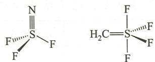

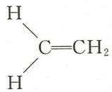

6.24 以乙烯 $\mathrm{H} \backslash \mathrm{C} = \mathrm{CH}_2$ 分子左 C 为中心, 将其归为 $\mathrm{AB}_n$ 型分子。中心 C 原子的 s 电子和 p

电子之和为4，两个H配体提供的电子数为2，配体 $\mathrm{CH}_2$ 与中心C原子成双键提供的电子数为2，故价层电子总数为8，则电子对数为4。因有非VIA族配体 $\mathrm{CH}_2$ 与中心C原子之间成双键而使价层电子对数减1，故为3对，共有3个配体，所以乙烯分子以左C为中心呈平面三角形。

价层电子对数为 3, 中心 C 原子的轨道应为 $sp^{2}$ 杂化。

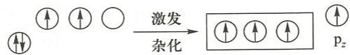  
乙烯分子中 C 原子的 $sp^{2}$ 杂化和双键的形成

3 条能量相等的 $sp^{2}$ 杂化轨道中, 各有一个单电子, 与 H 之间的 C—H 键是 $sp^{2}-1s$ 轨道重叠, 均为 $\sigma$ 键。故以左 C 为中心, 形成三角形构型。与右 C 之间的 C—C 键是 $sp^{2}-sp^{2}$ 轨道重叠, 并确定了乙烯的分子平面。

两个 C 原子中未参加杂化的 $p_{z}$ 轨道，垂直于乙烯的分子平面，互相平行，两个 $p_{z}$ 之间成 $\pi$ 键，故乙烯中有 C=C 双键存在。

6.25 单体 $\mathrm{BeCl}_2$ 价层电子对数为 $2, \mathrm{Be}$ 采取 sp 杂化, 分子为直线形。

二聚 $BeCl_{2}$ 2 个 Be 之间共用 2 个 Cl(桥连)，Be 采取 $sp^{2}$ 杂化，二聚分子为平面结构。

多聚 $BeCl_{2}$ 可以写成 $\left[BeCl_{2}\right]_{n}$ 的形式，Be 采取 $sp^{3}$ 杂化，多聚分子为长链结构。

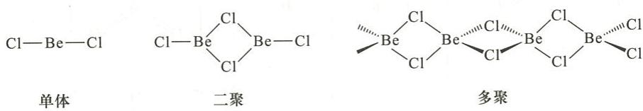

6.26 中心原子的杂化类型、分子的空间构型是由分子中的中心原子价层电子数、价层轨道数和配位数共同决定的。只从中心原子的氧化数和配位数不能决定中心原子采取的杂化类型和分子的空间构型。

在 $NCl_{3}$ 分子中，N 原子价层电子排布为 $2s^{2}2p^{3}$ ，4 个轨道有 5 个电子，因孤电子对占有杂化轨道，每个 N—Cl 键占一个杂化轨道，N 只能采取 $sp^{3}$ 杂化。因有一孤电子对，分子构型为三角锥形。

在 $\mathrm{BCl}_3$ 分子中，B原子价层电子排布为 $2\mathrm{s}^2 2\mathrm{p}^1$ ，3个价电子占有4个价轨道中的两个。因配位数为3，应形成3个 $\sigma$ 键，用去3个杂化轨道。为保证3个杂化轨道中都有一个可供配对的电子,2s 轨道的 2 个电子先激发一个到 p 轨道中。价电子数和配位数(成键轨道数)决定了 B 原子只能采取 $sp^{2}$ 杂化。

6.27 $\mathrm{AB}_3$ 型分子共有三种空间构型，有关结果见下表：

<table><tr><td>空间构型</td><td>实例</td><td>A的杂化方式</td><td>价层孤电子对数目</td><td>是否有极性</td></tr><tr><td>平面三角形</td><td> $BCl_{3}$ </td><td> $sp^{2}$ </td><td>0</td><td>无极性</td></tr><tr><td>三角锥形</td><td> $NH_{3}$ </td><td> $sp^{3}$ </td><td>1</td><td>有极性</td></tr><tr><td>T形</td><td> $BrF_{3}$ </td><td> $sp^{3}d$ </td><td>2</td><td>有极性</td></tr></table>

<table><tr><td>化合物分子式</td><td>价层电子对数</td><td>配体数目</td><td>电子对空间构型</td><td>分子空间构型</td><td>杂化方式</td><td>成键轨道</td><td>化学键类型</td></tr><tr><td> $XeF_{2}$ </td><td>5</td><td>2</td><td>三角双锥形</td><td>直线形</td><td> $sp^{3}d$ 不等性杂化</td><td> $sp^{3}d-2p$ </td><td>σ键</td></tr><tr><td> $XeF_{4}$ </td><td>6</td><td>4</td><td>正八面体形</td><td>正方形</td><td> $sp^{3}d^{2}$ 不等性杂化</td><td> $sp^{3}d^{2}-2p$ </td><td>σ键</td></tr><tr><td> $XeO_{3}$ </td><td>4</td><td>3</td><td>正四面体形</td><td>三角锥形</td><td> $sp^{3}$ 不等性杂化</td><td> $sp^{3}-2p$ </td><td>σ键</td></tr><tr><td> $XeO_{4}$ </td><td>4</td><td>4</td><td>正四面体形</td><td>正四面体形</td><td> $sp^{3}$ 等性杂化</td><td> $sp^{3}-2p$ </td><td>σ键</td></tr></table>

6.29 B 的价层电子排布为 $2s^{2}2p^{1}$ ，在 $BF_{3}$ 分子中，B 的原子轨道为 $sp^{2}$ 杂化，中心原子 B 与 3 个 F 结合形成等同的 3 个 $\sigma$ 键，故 $BF_{3}$ 分子呈正三角形。此外，B 还有一个空的未参与杂化的 $p_{z}$ 轨道，3 个 F 各有 1 个有对电子的 $p_{z}$ 轨道，这 4 个垂直于分子平面的 $p_{z}$ 轨道形成离域大 $\pi$ 键，即 $\Pi_{4}^{6}$ 键。这个离域大 $\pi$ 键使 B 与 F 的结合力增大，键能增强，因此其键长比理论单键键长短。

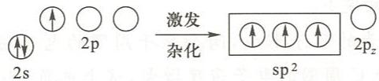  
B 原子的 $\mathrm{sp}^2$ 杂化

6.30 $\mathrm{NO}_2$ 中心原子N的价层电子排布为 $2\mathrm{s}^2 2\mathrm{p}^3$ ，与O成键时，N采取 $\mathfrak{sp}^2$ 杂化，孤电子对不占有杂化轨道，而是激发后留下一对电子占有p轨道，不参与杂化而形成离域π键：

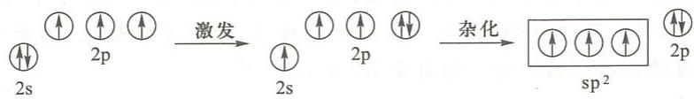

杂化后的三个单电子有两个与 O 成两个 $\sigma$ 键, 另一个为不成键的单电子。不成键的单电

子与成键电子间的斥力较小,因而键角远大于 $120^{\circ}$ (即 $132^{\circ}$ )。另外,分子中还有一个 $\Pi_{3}^{4}$ 键。但也有不同的观点,认为分子中有单电子是不稳定的, $NO_{2}$ 分子中N上不成键的应是孤电子对,除N与O间的两个 $\sigma$

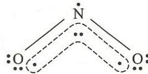

键外, 分子中还有一个离域的 $\Pi_{3}^{3}$ 键。在解释键角大于 $120^{\circ}$ 时, 可以从另一个角度来解释: 由于氮和氧的电负性较大且半径较小, N—O 间距离较小, 因而两个氧原子间有较大斥力 (氧上还有两个孤电子对), 因此造成键角远大于 $120^{\circ}$ 。但这不是 N 上的不成键电子决定的。

$NO_{2}$ 分子中究竟含有 $\Pi_{3}^{3}$ 键还是 $\Pi_{3}^{4}$ 键, 还有待进一步研究。

$CO_{2}$ 中心原子 C 的价层电子排布为 $2s^{2}2p^{2}$ ，在与 O 成键时，C 原子 2s 两个电子激发后，采取 sp 杂化。两个 sp 杂化轨道上的单电子与两个 O 原子形成两个 $\sigma$ 键。按价键理论，C 原子上两个未参与杂化的 2p 电子，与两个氧原子形成两个 $\pi$ 键。而按分子轨道理论，C 上的两个未杂化的 2p 单电子与两个 O 原子形成两个 $\Pi_{3}^{4}$ 键：

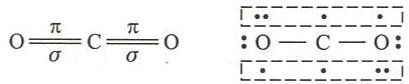  
价键理论结果 分子轨道理论结果

由于 C 采取 sp 杂化, 因此, $CO_{2}$ 分子为直线形。

$SO_{2}$ 中心原子 S 的价层电子排布为 $3s^{2}3p^{4}$ ，与 O 成键时 S 采取 $sp^{2}$ 杂化，余下的一对 3p 电子与两个 O 原子形成 $\Pi_{3}^{4}$ 键：

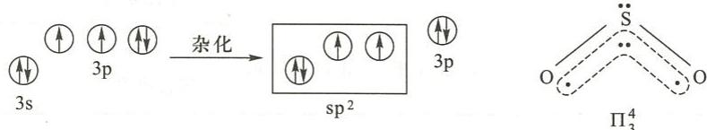

由于 S 上的孤电子对中有一对占有杂化轨道, 因而 $SO_{2}$ 分子为 V 形。由于 S 原子半径较大, 两个氧原子间斥力不大, 两个氧原子间的斥力与 S 上的孤电子对对成键电子的斥力相当, 因而 $SO_{2}$ 分子中键角恰好为 $120^{\circ}$ 。

6.31 (1) $\mathrm{CO}, \mathrm{~N}_{2}$ 和 $\mathrm{CN}^{-}$ 为等电子体, 分子结构相似, 其电子排布式为

$$
\left[ \mathrm{KK} \left(\sigma_ {2 \mathrm{s}}\right) ^ {2} \left(\sigma_ {2 \mathrm{s}} ^ {*}\right) ^ {2} \left(\pi_ {2 \mathrm{p} y}\right) ^ {2} \left(\pi_ {2 \mathrm{p} z}\right) ^ {2} \left(\sigma_ {2 \mathrm{p} x}\right) ^ {2} \right]
$$

键级均为 3, 所以键能都很大。

(2) CO 分子由两种元素的原子形成, 两个原子周围的电子密度不同, 对称性低; 同时, 由于有 O 向 C 的配键, 使 C 周围的电子密度增大, 这个电负性小而电子密度大的 C 易失去电子而被氧化。 $N_{2}$ 键能虽然比 CO 小, 但分子的对称性高, 加之 N 的电负性大使其束缚电子能力强, 不易失去电子。

6.32 (a) 键角 $\mathrm{CH}_4 > \mathrm{NH}_3$

$CH_{4}$ 分子的中心原子采取 $sp^{3}$ 等性杂化，键角为 $109^{\circ}28'$ ，而 $NH_{3}$ 分子的中心原子为 $sp^{3}$ 不等性杂化，有一孤电子对，孤电子对的能量较低，距原子核较近，因而孤电子对成键电子的斥力较大，使 $NH_{3}$ 分子键角变小，为 $106^{\circ}42'$ 。

(b) 键角 $Cl_{2}O > OF_{2}$

$OF_{2}$ 和 $Cl_{2}O$ 分子的中心原子氧均为 $sp^{3}$ 不等性杂化，有两个孤电子对，分子构型为 V 形。但配位原子 F 的电负性远大于 Cl 的电负性， $OF_{2}$ 分子中成键电子对偏向配位原子 F， $Cl_{2}O$ 分子中成键电子对偏向中心原子 O，在 $OF_{2}$ 分子中两成键电子对间的斥力小，而 $Cl_{2}O$ 分子中两成键电子对的斥力大，因而 $Cl_{2}O$ 分子的键角大于 $OF_{2}$ 分子的键角。一般都用配位原子与中心原子电负性来解释键角大小。

仅从成键电子对间的斥力来解释分子键角的大小不尽合理。在分子中，孤电子对的能量要比成键电子对能量低，孤电子对距中心原子的核更近，因而孤电子对与成键电子对间的斥力要大于成键电子对与成键电子对间的斥力。显然这与 $OF_{2}$ 分子的键角小于 $Cl_{2}O$ 分子的键角相矛盾。实际上， $Cl_{2}O$ 分子的键角为 $111^{\circ}$ ，比 $sp^{3}$ 等性杂化轨道间的键角还要大。那么，怎样解释 $OF_{2}$ 分子的键角小于 $Cl_{2}O$ 分子的键角更合理呢？

在 $OF_{2}$ 和 $Cl_{2}O$ 分子中，中心原子 O 的半径较小且电负性较大。在 $OF_{2}$ 分子中，成键电子对偏向 F 原子，结果使 O 原子上的孤电子对更靠近 O 原子，孤电子对的能量进一步降低，则使 O 的孤电子对对成键电子对的斥力增大。同时，O 上孤电子对的能量降低，则孤电子对在不等性的 $sp^{3}$ 杂化轨道中占有更多的 s 轨道成分，而成键电子中有较多的 p 轨道成分，使成键电子对间夹角变小。另外， $OF_{2}$ 分子中两个 F 原子半径较小，两个 F 原子间的斥力可忽略；但在 $Cl_{2}O$ 分子中，两个 Cl 原子间的斥力则较大，因 Cl 原子的半径远大于 F 原子的半径。

(c) 键角 $NH_{3}>NF_{3}$

$NH_{3}$ 和 $NF_{3}$ 分子中，H 和 F 的半径都较小，分子中 H 与 H 及 F 与 F 间的斥力可忽略。决定键角大小的主要因素是孤电子对对成键电子对的斥力大小。

$NF_{3}$ 分子中成键电子对偏向 F 原子, 则 N 上的孤电子对更靠近原子核, 能量更低, 因此孤电子对对成键电子对的斥力更大。在 $NH_{3}$ 分子中, 成键电子对偏向 N 原子, 成键电子对间的斥力增大, 同时 N 上的孤电子对受核的引力不如 $NF_{3}$ 分子中的大。孤电子对的能量与成键电子对能量相差不大。造成孤电子对与成键电子对的压力与成键电子对和成键电子对的斥力相差不大。所以, $NH_{3}$ 分子的键角与 $109^{\circ}28'$ 相差不大 ( $106^{\circ}42'$ )。

(d) 键角 $NH_{3}>PH_{3}$

$NH_{3}$ 分子和 $PH_{3}$ 分子的空间构型均为三角锥形。配体相同，但中心原子不同。N 的电负性大而半径小，P 的电负性小而半径大。半径小电负性大的 N 原子周围的孤电子对和成键电子对间尽量保持最大角度才能保持斥力均衡，因而 $NH_{3}$ 分子的键角接近 $109^{\circ}28'$ 。此外， $PH_{3}$ 分子的键角接近 $90^{\circ}$ （实际为 $93^{\circ}18'$ ）也可能与 P 有与 $sp^{3}$ 轨道能量相近的 3d 轨道有关，如 $AsH_{3}, PH_{3}, PF_{3}$ 及 $H_{2}S$ 等分子的键角都接近 $90^{\circ}$ 。

<table><tr><td>分子或离子</td><td>价层电子对数</td><td>电子对空间构型</td><td>孤电子对数目</td><td>配体数目</td><td>分子或离子的空间构型</td></tr><tr><td> $BeCl_{2}$ </td><td>2</td><td>直线形</td><td>0</td><td>2</td><td>直线形</td></tr><tr><td> $BCl_{3}$ </td><td>3</td><td>正三角形</td><td>0</td><td>3</td><td>正三角形</td></tr><tr><td>NH4+</td><td>4</td><td>正四面体形</td><td>0</td><td>4</td><td>正四面体形</td></tr><tr><td>H2O</td><td>4</td><td>正四面体形</td><td>2</td><td>2</td><td>V形</td></tr><tr><td>ClF3</td><td>5</td><td>三角双锥形</td><td>2</td><td>3</td><td>T形</td></tr><tr><td>PCl5</td><td>5</td><td>三角双锥形</td><td>0</td><td>5</td><td>三角双锥形</td></tr><tr><td>I3-</td><td>5</td><td>三角双锥形</td><td>3</td><td>2</td><td>直线形</td></tr><tr><td>ICl4-</td><td>6</td><td>正八面体形</td><td>2</td><td>4</td><td>正方形</td></tr><tr><td>CIO2-</td><td>4</td><td>正四面体形</td><td>2</td><td>2</td><td>V形</td></tr><tr><td>PO43-</td><td>4</td><td>正四面体形</td><td>0</td><td>4</td><td>正四面体形</td></tr><tr><td>CO2</td><td>2</td><td>直线形</td><td>0</td><td>2</td><td>直线形</td></tr><tr><td>SO2</td><td>3</td><td>正三角形</td><td>1</td><td>2</td><td>V形</td></tr><tr><td>NOCl</td><td>3</td><td>正三角形</td><td>1</td><td>2</td><td>V形</td></tr><tr><td>POCl3</td><td>4</td><td>正四面体形</td><td>0</td><td>4</td><td>四面体形</td></tr></table>

6.34 (1) $\mathrm{N(CH_3)_3}$ 分子的空间构型为三角锥形， $\mathbf{N}$ 采取 $\mathfrak{sp}^3$ 杂化。

(2) $F_{3}B-N(CH_{3})_{3}$ 分子中有 N 向 B 的配位键, N 和 B 均采取 $sp^{3}$ 杂化。

(3) $\mathrm{F}_{4} \mathrm{Si}-\mathrm{N}(\mathrm{CH}_{3})_{3}$ 分子中有 N 向 Si 的配位键, N 采取 $\mathrm{sp}^{3}$ 杂化, Si 采取 $\mathrm{sp}^{3} \mathrm{~d}$ 杂化。

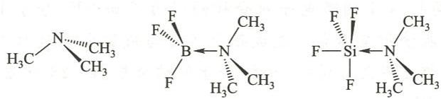  
第7章

## 一、选择题

7.1 A 7.2 D 7.3 C 7.4 B 7.5 C 7.6 C 7.7 C 7.8 B 7.9 C  
7.10 D

## 二、填空题

7.11 (1) >, >; (2) <, <。

7.12 8,8,2。

7.13 NaCl, 6:6, 4:4, 正、负离子之间的相互极化作用。

7.14 NaCl<MgCl₂ MgCl₂ 的离子键强于 NaCl。
AgCl<KCl Ag⁺极化能力强，使 AgCl 离子键百分数降低。
NH₃>PH₃ NH₃ 分子间形成氢键。
CO₂<SO₂ CO₂ 为非极性分子，SO₂ 为极性分子；半径 CO₂<SO₂，色散力 CO₂<SO₂。
O₃<SO₂ O₃ 分子极性小于 SO₂；色散力 O₃<SO₂。
O₃>O₂ O₃ 为极性分子而 O₂ 为非极性分子；半径 O₃>O₂，色散力 O₃>O₂。
Ne<Ar 半径 Ar>Ne，色散力 Ne<Ar。
HF<H₂O H₂O 分子间形成的氢键多；HF 汽化时只断开部分氢键。
HF>NH₃ HF 分子间氢键比 NH₃ 分子间氢键强。
H₂S>HCl 半径 H₂S>HCl，色散力 H₂S>HCl。
HF>HI HF 分子间氢键很强，HI 分子间不能形成氢键。
7.15 PbO>PbS,FeCl₃<FeCl₂,SnS>SnS₂，
AsH₃<SeH₂,PH₃<H₂S,HF>H₂O。
7.16 ③④⑥，④⑤。
HF₂⁻ 结构为 F—H---F，没有可形成分子间氢键的 H 原子。
NH₄⁺:N 上无孤电子对，不能形成分子间氢键。
7.17 K₂CO₃,Na₂CO₃,MgCO₃,MnCO₃,PbCO₃。
7.18 ZnCl₂,MnCl₂,CaCl₂,KCl。
7.19 <,=,<,<,>,>。
7.20 (1)体心立方，(2)12，(3)12，六方紧密，(2)，(3)，(3)，(2)，三。
7.21 12,4,127.8,8.94,74.05%。
7.22 2,230。
说明：由密度 ρ=m/V 得晶胞体积为
V=m/ρ=(2×39.10 g·mol⁻¹)/0.862 g·cm⁻³×6.023×10²³ mol⁻¹
=1.506×10⁻²² cm³
晶胞边长 a=√3V=5.32×10⁻⁸cm
立方体对角线长为√3a，则K原子半径为
r=√3a/4=√3×5.32×10⁻⁸cm/4
=2.30×10⁻⁸cm
=230 pm

## 三、简答题和计算题

7.23 玻恩-哈伯循环设计如下：

$$
\begin{array}{c} 2 \mathrm{Al} (\mathrm{s}) + \frac {3}{2} \mathrm{O} _ {2} (\mathrm{g}) \xlongequal {\Delta_ {\mathrm{f}} H _ {\mathrm{m}} ^ {\ominus} (\mathrm{Al} _ {2} \mathrm{O} _ {3}, \mathrm{s})} \mathrm{Al} _ {2} \mathrm{O} _ {3} (\mathrm{s}) \\ \Biggl \downarrow 2 \Delta H \\ 2 \mathrm{Al} (\mathrm{g}) \\ \Biggl \downarrow 2 I _ {1} \\ 2 \mathrm{Al} ^ {+} (\mathrm{g}) \\ \Biggl \downarrow 2 I _ {2} \\ 2 \mathrm{Al} ^ {2 +} (\mathrm{g}) \\ \Biggl \downarrow 2 I _ {3} \\ 2 \mathrm{Al} ^ {3 +} (\mathrm{g}) + 3 \mathrm{O} ^ {2 -} (\mathrm{g}) \\ \end{array}
$$

根据盖斯定律

$$
\Delta_ {\mathrm{f}} H _ {\mathrm{m}} ^ {\ominus} (\mathrm{Al} _ {2} \mathrm{O} _ {3}, \mathrm{s}) = 2 \Delta H + 2 I _ {1} + 2 I _ {2} + 2 I _ {3} + \frac {3}{2} E - 3 E _ {1} - 3 E _ {2} - U
$$

$$
\begin{array}{r l} \text {所以} U & = 2 \Delta H + 2 (I _ {1} + I _ {2} + I _ {3}) + \frac {3}{2} E - 3 (E _ {1} + E _ {2}) - \Delta_ {\mathrm{f}} H _ {\mathrm{m}} ^ {\ominus} (\mathrm{Al} _ {2} \mathrm{O} _ {3}, \mathrm{s}) \\ & = 3 2 6. 4 \mathrm{kJ} \cdot \mathrm{mol} ^ {- 1} \times 2 + (5 7 8 \mathrm{kJ} \cdot \mathrm{mol} ^ {- 1} + 1 8 1 7 \mathrm{kJ} \cdot \mathrm{mol} ^ {- 1} + 2 7 4 5 \mathrm{kJ} \cdot \mathrm{mol} ^ {- 1}) \\ & \times 2 + 4 9 8 \mathrm{kJ} \cdot \mathrm{mol} ^ {- 1} \times \frac {3}{2} - (1 4 1 \mathrm{kJ} \cdot \mathrm{mol} ^ {- 1} - 7 8 0 \mathrm{kJ} \cdot \mathrm{mol} ^ {- 1}) \times 3 \\ & + 1 6 7 6 \mathrm{kJ} \cdot \mathrm{mol} ^ {- 1} \\ & = 1. 5 3 \times 1 0 ^ {4} \mathrm{kJ} \cdot \mathrm{mol} ^ {- 1} \end{array}
$$

7.24 Na 与 F 的电负性差为 3.05, Cs 与 F 的电负性差为 3.19, 可见 NaF 中键的极性比 CsF 中键的极性小。晶格能体现的是正、负离子间的引力大小, 这种静电引力不仅和离子键的极性大小有关, 还与正、负离子的半径有关, 半径越小, 正、负离子间的引力越大, 晶格能越大。由于 $Cs^{+}$ 的半径 (169 pm) 比 $Na^{+}$ 的半径 (95 pm) 大得多, 因而 $Cs^{+}$ 与 $F^{-}$ 间的静电引力比 $Na^{+}$ 与 $F^{-}$ 的小, 使 CsF 的晶格能比 NaF 小。

7.25 结果见下表：

<table><tr><td>物质</td><td>晶体中质点间的作用力</td><td>晶体类型</td><td>熔点</td></tr><tr><td>KCl</td><td>离子键</td><td>离子晶体</td><td>较高</td></tr><tr><td>SiC</td><td>共价键</td><td>原子晶体</td><td>很高</td></tr><tr><td> $CH_3Cl$ </td><td>分子间力</td><td>分子晶体</td><td>较低</td></tr><tr><td> $NH_3$ </td><td>氢键,分子间力</td><td>分子晶体</td><td>较低</td></tr><tr><td>Cu</td><td>金属键</td><td>金属晶体</td><td>较高</td></tr><tr><td>Xe</td><td>色散力</td><td>分子晶体</td><td>很低</td></tr></table>

7.26 在面心立方晶胞的正六面体中，设边长为 $a$ ，金属原子的半径为 $r$ ，立方体六个面中每一面金属原子的分布如图(a)所示。

由图(a)的直角三角形 $\triangle ABC$ 知, $(AC)^{2}+(BC)^{2}=(AB)^{2}$ 。

因为 AC=BC=a, AB=4r，所以 $2a^{2}=(4r)^{2}$ ，故 $a=2\sqrt{2}r$ 。

$$
V = a ^ {3} = (2 \sqrt {2} r) ^ {3} = 1 6 \sqrt {2} r ^ {3}
$$

根据金属原子在晶胞中的不同位置,晶胞中金属原子的数目 N 为

$$
N = 8 \times \frac {1}{8} + 6 \times \frac {1}{2} = 4
$$

每个晶胞中含有4个金属原子,故金属的总体积为

$$
V _ {\mathrm{金属}} = 4 \times \frac {4}{3} \pi r ^ {3} = \frac {1 6}{3} \pi r ^ {3}
$$

所以,金属面心立方最紧密堆积的空间利用率为

$$
\frac {V _ {\mathrm{金属}}}{V} \times 100\% = \frac {\frac {16}{3} \pi r ^ {3}}{16 \sqrt {2} r ^ {3}} \times 100\% = \frac {\pi}{3 \sqrt {2}} \times 100\% = 74.05\%
$$

在体心立方晶胞的正六面体中,设边长为 a,金属原子的半径为 r,如图(b)所示。正六面体中有直角三角形 $\triangle ABC$ ,如图(c)所示。

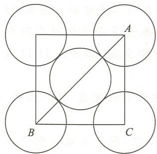  
(a)

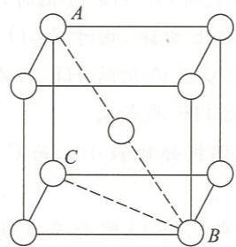  
(b)

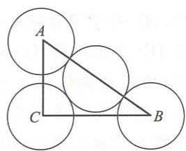  
(c)

因为 $AB=\sqrt{3}AC$ ，且 AB=4r, AC=a，所以有 $4r=\sqrt{3}a$ ，即 $a=\frac{4\sqrt{3}}{3}r$ 。晶胞体积为

$$
V = a ^ {3} = \left(\frac {4 \sqrt {3}}{3} r\right) ^ {3} = \frac {6 4 \sqrt {3}}{9} r ^ {3}
$$

晶胞中金属原子的数目 N 为

$$
N = 8 \times \frac {1}{8} + 1 = 2
$$

每个晶胞中含有2个金属原子,故金属的总体积为

$$
V _ {\mathrm{金属}} = 2 \times \frac {4}{3} \pi r ^ {3} = \frac {8}{3} \pi r ^ {3}
$$

所以,金属体心立方紧密堆积的空间利用率为

$$
\frac {V _ {\mathrm{金属}}}{V} \times 100\% = \frac {\frac {8}{3} \pi r ^ {3}}{\frac {64 \sqrt {3}}{9} r ^ {3}} \times 100\% = \frac {\sqrt {3}}{8} \pi \times 100\% = 68.02\%
$$

7.27 KF 晶体具有 NaCl 型结构, 即 KF 晶体为立方面心晶格。一个 KF 晶胞中含有 4 个 $K^{+}$ 和 4 个 $F^{-}$ 。

KF 的晶胞体积为

$$
V = \frac {4 \times (3 9 . 1 0 + 1 9 . 0 0) \mathrm{g} \cdot \mathrm{mol} ^ {- 1}}{2 . 4 8 1 \mathrm{g} \cdot \mathrm{cm} ^ {- 3} \times 6 . 0 2 3 \times 1 0 ^ {2 3} \mathrm{mol} ^ {- 1}} = 1. 5 5 5 \times 1 0 ^ {- 2 2} \mathrm{cm} ^ {3}
$$

KF 的晶胞边长为

$$
a = \sqrt [ 3 ]{V} = \sqrt [ 3 ]{1 . 5 5 5 \times 1 0 ^ {- 2 2} \mathrm{cm} ^ {3}} = 5. 3 8 \times 1 0 ^ {- 8} \mathrm{cm} = 5 3 8 \mathrm{pm}
$$

$K^{+}$ 和 $F^{-}$ 间距离为

$$
d = \frac {1}{2} a = 2 6 9 \mathrm{pm}
$$

7.28 F—H---F 氢键的键能为 $28.0 \, kJ \cdot mol^{-1}$ ，而 O—H---O 氢键的键能为 $18.8 \, kJ \cdot mol^{-1}$ 。可见 HF 分子间氢键比 $H_{2}O$ 分子间氢键强。

$H_{2}O$ 分子有两个孤电子对，两个H原子，因此，水分子最多可与周围分子形成4个氢键；而HF分子只有一个H原子，最多可与周围HF分子形成两个氢键，即 $H_{2}O$ 分子间氢键比HF分子间氢键多。另外， $H_{2}O$ 汽化时，气态的 $H_{2}O$ 均为单分子而没有二聚、三聚分子，说明水汽化时要断开全部氢键；而HF汽化时，气相中仍有二聚体和三聚体，即HF汽化时不必断开全部的氢键。综上所述，由于 $H_{2}O$ 分子间氢键多而汽化时需断开全部氢键，HF分子间氢键数较 $H_{2}O$ 少且汽化时HF不必断开全部氢键，结果是 $H_{2}O$ 汽化热要比HF汽化热大， $H_{2}O$ 沸点比HF沸点高。

7.29 CO 分子的偶极矩为 0.12 D, 偶极矩比较小。而 C 与 O 的电负性差为 0.89, 显然, 偶极矩大小与电负性差不符。

根据分子轨道理论, CO 分子中 C 与 O 间为三重键: 一个 $\sigma$ 键, 两个 $\pi$ 键。两个 $\pi$ 键中有一个为氧原子提供电子对形成的 $\pi$ 配键。CO 分子结构可表示为

$$
: \mathrm{C} \stackrel {\leftarrow} {=} \mathrm{O}:
$$

CO 分子的三重键中,两个共价键的电子对偏向 O 原子,产生的偶极方向指向 O 原子;另一个由 O 原子提供电子对的配键产生的偶极方向指向 C 原子。由于共价键产生的偶极方向与配键产生的偶极方向相反,大部分互相抵消,因而 CO 分子的偶极矩很小。

7.30 在 $\mathrm{PCl}_5$ 分子中, 虽然 $\mathrm{P}-\mathrm{Cl}$ 为极性键, 但由于 $\mathrm{PCl}_5$ 分子为三角双锥空间构型, 键的偶极矩互相抵消, 使分子的正电荷重心和负电荷重心重合, 分子的偶极矩为零。因此, $\mathrm{PCl}_5$ 为非极性分子。在 $\mathrm{O}_3$ 分子中, 虽然分子中的原子为同种元素原子, 由于 $\mathrm{O}_3$ 分子为 V 形空间构型, 分子中有 $\Pi_3^4$ 离域键, 使中心氧原子与端氧原子的孤电子对数不同、电子密度不同, 使 $\mathrm{O}-\mathrm{O}$ 键有极性, 从而 $\mathrm{O}_3$ 分子的偶极矩不为零, 分子有微弱的极性。

7.31 极性分子有 $NO_{2}, CHCl_{3}, NCl_{3}, SCl_{2}, COCl_{2}$

非极性分子有 $SO_{3}, BCl_{3}$ 。

7.32 （1）金属铜原子间的作用力为金属键，在晶体受外力发生形变时，具有紧密堆积结构的金属原子层滑动，而金属键不被破坏，故金属具有很好的延展性。大理石是离子晶体，当受到外力发生形变时，层间离子位置错动，造成同号电荷离子相接触，彼此排斥，离子键失去作用而使晶体破碎。

(2) 由于 $\mathrm{Ag}^{+}$ 是 18 电子构型, 极化能力强; 而 $\mathrm{I}^{-}$ 的半径大, 有较大的变形性。所以 AgI 晶体中正、负离子间有较强的相互极化作用, 化学键的共价性增强, 相邻离子间的距离变小, 配位数随之变小。

(3) I A 族单质为金属, 同族元素的金属键随原子半径增大而减弱, 所以从上至下熔点逐渐降低。ⅦA 族元素单质为非金属, 都形成双原子分子, 分子间只有色散力, 色散力随分子体积的增大而增大, 故从上至下熔点逐渐升高。

7.33 (1) $\mathrm{CS}_2$ 与 $\mathrm{CCl}_4$ 色散力。

(2) $H_{2}O$ 与 $H_{2}$ 诱导力, 色散力。

(3) $CH_{3}Cl$ 取向力,诱导力,色散力。

(4) $H_{2}O$ 与 $NH_{3}$ 取向力,诱导力,色散力,氢键。

7.34 （1）分子半径 HI>HCl>HF，色散力 HI>HCl>HF，但 HF 分子间形成最强的氢键，结果使 HF 沸点高于 HI。

但在氮族元素的氢化物中， $NH_{3}$ 分子间氢键较弱，沸点顺序不是 $NH_{3}>BiH_{3}>PH_{3}$ ，而是 $BiH_{3}>NH_{3}>PH_{3}$ 。

(2) BeO 和 LiF 都是离子晶体, $Be^{2+}$ 电荷数比 $Li^{+}$ 多但半径却较小, +2 价的 $Be^{2+}$ 与 -2 价的 $O^{2-}$ 之间的静电引力要比 +1 价的 $Li^{+}$ 与 -1 价的 $F^{-}$ 的静电引力大得多, BeO 晶格能比 LiF 晶格能大, 所以 BeO 熔点比 LiF 高。

(3) 在 $\mathrm{SiCl}_4$ 分子中, 中心原子 Si 有与 3s, 3p 轨道能量相近的 3d 空轨道, 该 3d 空轨道可接受水分子中 O 所提供的电子对, 因而 $\mathrm{SiCl}_4$ 易水解。在 $\mathrm{CCl}_4$ 分子中, 中心原子 C 的价层无空轨道, 2s 和 2p 轨道都已用来成键, 不能接受水分子中 O 所提供的电子对, 因此, $\mathrm{CCl}_4$ 不易水解。

(4) 金刚石是典型的原子晶体, 每个碳原子都以 $\mathrm{sp}^{3}$ 杂化轨道与四个碳原子形成共价单键, 四面体分布的碳原子的杂化轨道通过共顶点连接方式形成三维空间骨架, 因此, 金刚石硬度大。石墨属层状结构的晶体, 晶体中的碳原子以 $\mathrm{sp}^{2}$ 杂化轨道与相邻的三个碳原子形成共价单键, 每个碳原子还有一个与 $\mathrm{sp}^{2}$ 杂化轨道平面相垂直的 $2\mathrm{p}$ 轨道, 形成离域大 $\pi$ 键。因此, 石墨中的碳原子按层状排列, 层与层之间以分子间力相结合, 距离较大, 所以层与层之间容易发生滑动, 造成石墨晶体较软。

7.35 $\mathrm{CO}_{2}$ 为分子晶体而 $\mathrm{SiO}_{2}$ 为原子晶体, 无论从宏观上还是从微观上讨论, 结果都是一样的。从宏观上看, C 与 O 形成双键的键能 (798.9 kJ·mol $^{-1}$ ) 比形成单键的键能 (357.7 kJ·mol $^{-1}$ ) 的两倍要大, 因而 C 与 O 形成双键时, 以 $\mathrm{CO}_{2}$ 形式存在更稳定; 而 Si 与 O 形成双键的键能要比形成单键的键能的两倍要小, 因而 Si 与 O 以单键相结合形成巨型的原子晶体而不是 O=Si=O 分子晶体。从微观角度看, C 的半径小, C 与 O 的 p 轨道以肩并肩形式重叠能形成较强的 π 键, 因而 $\mathrm{CO}_{2}$ 分子中 C 与 O 之间以双键相结合, $\mathrm{CO}_{2}$ 为分子晶体; 而 Si 的半径较大, Si 与 O 的 p 轨道以肩并肩形式重叠较少而不能形成稳定的 π 键, Si 与 O 之间只能形成稳定的 σ 单键, 每个 Si 采取 sp $^{3}$ 杂化并与 4 个 O 形成 $\mathrm{SiO}_{4}$ 四面体, $\mathrm{SiO}_{4}$ 四面体共顶点氧形成骨架结构, —Si—O—Si—O 无限连接而构成原

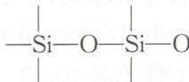

7.36 Si 的电负性为 1.90, Sn 的电负性为 1.96, 二者的电负性相差很小, 但 $\mathrm{SiF}_{4}$ 为气态, $\mathrm{SnF}_{4}$ 为固态。其主要原因是 $\mathrm{Si}^{4+}$ 的半径 (41 pm) 比 $\mathrm{Sn}^{4+}$ 的半径 (71 pm) 小得多, $\mathrm{Si}^{4+}$ 有强的极化能力, $\mathrm{SiF}_{4}$ 为共价化合物而 $\mathrm{SnF}_{4}$ 为离子化合物。所以 $\mathrm{SiF}_{4}$ 的熔点、沸点很低, 常温时为气态, 而 $\mathrm{SnF}_{4}$ 熔点、沸点较高, 常温下为固态。

7.37 (1) 极化能力 $\mathrm{Zn^{2+}>Fe^{2+}>Ca^{2+}>K^+}$ $K, Ca, Fe, Zn$ 四个元素在同一周期， $K^+$ 只有一个正电荷，极化能力最弱。 $\mathrm{Ca^{2+}, Fe^{2+}, Zn^{2+}}$ 带相同正电荷，离子半径 $\mathrm{Ca^{2+}>Fe^{2+}\approx Zn^{2+}; Ca^{2+}}$ 为 8 电子构型， $\mathrm{Fe^{2+}}$ 为 9～17 电子构型， $\mathrm{Zn^{2+}}$ 为 18 电子构型，阳离子的有效核电荷数 $\mathrm{Zn^{2+}>Fe^{2+}>Ca^{2+}}$ 。所以极化能力 $\mathrm{Zn^{2+}>Fe^{2+}>Ca^{2+}}$ 。

(2) 极化能力 $\mathrm{P^{5+}>Si^{4+}>Al^{3+}>Mg^{2+}>Na^+}$ 离子半径 $\mathrm{P^{5+}<Si^{4+}<Al^{3+}<Mg^{2+}<Na^+}$ 离子电荷 $\mathrm{P^{5+}>Si^{4+}>Al^{3+}>Mg^{2+}>Na^+}$ 电荷数越高，半径越小，离子的极化能力越强。实际上由于高电荷数的强极化能力及其元素的电负性较大， $\mathrm{PCl_5}$ 和 $\mathrm{SiCl_4}$ 为共价化合物， $\mathrm{AlCl_3}$ 常温下为离子化合物，熔点温度时转化为共价化合物，只有 $\mathrm{MgCl_2}$ 和 $\mathrm{NaCl}$ 为典型的离子化合物。

7.38 化合物的熔点高低与溶解度大小顺序基本是一致的。
(1) $CaCl_{2} > BeCl_{2} > HgCl_{2}$ 离子总的极化能力 $Ca^{2+} < Be^{2+} < Hg^{2+}$ 化合物的共价性 $CaCl_{2} < BeCl_{2} < HgCl_{2}$ (2) CaS > FeS > HgS
原因同(1)
(3) KCl > LiCl > CuCl
阳离子半径 $K^{+}$ Li $^{+}$ $Cu^{+}$ 133 pm 70 pm 96 pm

因 $Cu^{+}$ 为 $d^{10}$ 结构,有效核电荷数大且有一定的变形性,因而总的极化能力按 $K^{+}<Li^{+}<Cu^{+}$ 顺序变化,化合物的离子性按 KCl>LiCl>CuCl 顺序变化。

7.39 $\mathrm{PF}_{5}$ 和 $\mathrm{N}_{2} \mathrm{O}_{4}$ 为气态, $\mathrm{PCl}_{5}, \mathrm{PBr}_{5}$ 和 $\mathrm{N}_{2} \mathrm{O}_{5}$ 为固态, 说明晶体类型不同。 $\mathrm{PF}_{5}$ 和 $\mathrm{N}_{2} \mathrm{O}_{4}$ 为共价化合物, 形成分子晶体; $\mathrm{PCl}_{5}, \mathrm{PBr}_{5}$ 和 $\mathrm{N}_{2} \mathrm{O}_{5}$ 为离子化合物, 形成离子晶体。 $\mathrm{PCl}_{5}, \mathrm{PBr}_{5}$ 和 $\mathrm{N}_{2} \mathrm{O}_{5}$ 的熔体均能导电, 进一步说明它们都是离子晶体。 $\mathrm{PCl}_{5}$ 晶体中有两种 $\mathrm{P}-\mathrm{Cl}$ 键长, 含有正、负两种离子, 故其组成可以写成 $[\mathrm{PCl}_{4}]^{+}[\mathrm{PCl}_{6}]^{-}$ ; $\mathrm{PBr}_{5}$ 晶体中只有一种 $\mathrm{P}-\mathrm{Br}$ 键长, 含有正、负两种离子, 故其组成可以写成 $[\mathrm{PBr}_{4}]^{+} \mathrm{Br}^{-}$ ; $\mathrm{N}_{2} \mathrm{O}_{5}$ 晶体中有两种 $\mathrm{N}-\mathrm{O}$ 键长, 含有正、负两种离子, 故其组成可以写成 $[\mathrm{NO}_{2}]^{+}[\mathrm{NO}_{3}]^{-}$ 。

7.40 在 AgX 分子中, 由于 F 的半径特别小, 变形性小, 基本不发生离子极化, 使 AgF 分子中仍然以离子键为主, 因此 AgF 易溶于水。
而随着 Cl, Br, I 半径增大, 其变形性增大, 使 AgCl, AgBr, AgI 分子中, 离子的相互极化能力依次增强, 极化程度依次增大, 共价成分依次增强, 溶解度依次减小。

7.41 (1)配位数为4的ZnS型晶体

在立方晶系 AB 型离子晶体配位数为 4 的立方 ZnS 型晶体结构如图(a)所示。它的晶胞是正六面体，属于面心立方晶格，质点的分布较为复杂。取由 ABCD 四个硫原子组成的正四面体进行研究，锌原子在正四面体的中心 O 处，见图(b)。

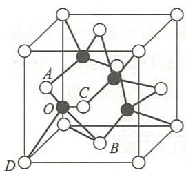  
(a)

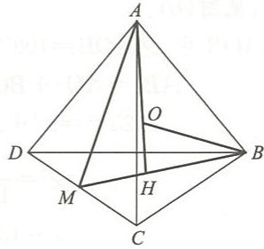  
(b)

设正四面体的边长 AB 为 2a, M 是 CD 的中点, 故 DM = CM = a。
从直角三角形 $\triangle AMC$ 可得

$$
A M = B M = \sqrt {A C ^ {2} - M C ^ {2}} = \sqrt {(2 a) ^ {2} - a ^ {2}} = \sqrt {3} a
$$

H 是等边三角形 $\triangle BCD$ 的重心, 故

$$
H M = \frac {1}{3} B M = \frac {1}{3} \sqrt {3} a, \quad B H = \frac {2}{3} B M = \frac {2}{3} \sqrt {3} a
$$

从直角三角形 $\triangle AHM$ 可得

$$
A H = \sqrt {A M ^ {2} - H M ^ {2}} = \sqrt {(\sqrt {3} a) ^ {2} - \left(\frac {1}{3} \sqrt {3} a\right) ^ {2}} = \sqrt {3 a ^ {2} - \frac {1}{3} a ^ {2}} = \sqrt {\frac {8}{3}} a
$$

又从直角三角形 $\triangle BHO$ 得

$$
B O ^ {2} = B H ^ {2} + H O ^ {2}
$$

因为 BO=AO，且 HO=AH-AO=AH-BO，故有

解得

$$
\begin{array}{r l} & B O ^ {2} = B H ^ {2} + (A H - B O) ^ {2} \\ & B O = \frac {B H ^ {2} + A H ^ {2}}{2 A H} \\ & = \frac {\left(\frac {2}{3} \sqrt {3} a\right) ^ {2} + \left(\sqrt {\frac {8}{3}} a\right) ^ {2}}{2 \sqrt {\frac {8}{3}} a} \\ & = \sqrt {\frac {3}{2}} a \end{array}
$$

故

$$
\frac {B O}{A B} = \frac {\sqrt {\frac {3}{2}} a}{2 a} = \frac {1}{2} \sqrt {\frac {3}{2}}
$$

因为 $BO = r_{+} + r_{-}, AB = 2r_{-}$ ，所以

$$
\frac {r _ {+} + r _ {-}}{2 r _ {-}} = \frac {1}{2} \sqrt {\frac {3}{2}}
$$

$$
r _ {+} + r _ {-} = 1. 2 2 5 r _ {-}
$$

$$
\frac {r _ {+}}{r _ {-}} = 0. 2 2 5
$$

另一种处理方法: 见图(b)。

在等腰三角形 $\triangle AOB$ 中， $\angle AOB=109^{\circ}28'$ ，设 $AO=BO=x$ ，根据余弦定理，有

即

$$
\begin{array}{r l} A B ^ {2} & = A O ^ {2} + B O ^ {2} - 2 A O \cdot B O \cdot \cos \angle A O B \\ (2 a) ^ {2} & = x ^ {2} + x ^ {2} - 2 x \cdot x \cdot \cos 1 0 9 ^ {\circ} 2 8 ^ {\prime} \\ x ^ {2} & = \frac {2}{1 - \cos 1 0 9 ^ {\circ} 2 8 ^ {\prime}} a ^ {2} \\ x & = 1. 2 2 5 a \end{array}\tag{1}
$$

$BO = x = r_{+} + r_{-}, AB = 2a = 2r_{-}$ ，所以 $r_{-} = a$ ，代入式(1)，得

$$
\begin{array}{r l} & r _ {+} + r _ {-} = 1. 2 2 5 \times r _ {-} \\ & \frac {r _ {+}}{r _ {-}} = 0. 2 2 5 \end{array}
$$

## (2) 配位数为 8 的 CsCl 型晶体

如图(c)所示,该类型晶体的平行六面体晶胞是正六面体,属于简单立方晶格。晶胞中只含有一个正离子和一个负离子。每个离子都被8个带相反电荷的离子所包围,所以该类型晶体中的离子配位数为8。

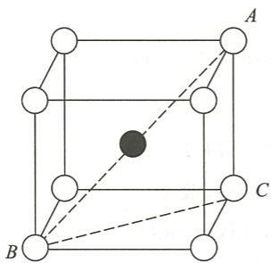  
(c)

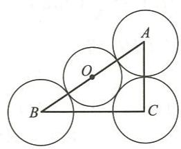  
(d)

在配位数为 8 的介稳状态图形中,有 $\triangle ABC$ ,见图(d),其中

因为

所以

$$
\begin{array}{r l} A B & = 2 (r _ {+} + r _ {-}), A C = 2 r _ {-} \\ A B & = \sqrt {3} A C \\ 2 (r _ {+} + r _ {-}) & = \sqrt {3} (2 r _ {-}) \\ r _ {+} & = (\sqrt {3} - 1) r _ {-} \\ \frac {r _ {+}}{r _ {-}} & = 0. 7 3 2 \end{array}
$$

## 第8章

## 一、选择题

8.1 B 8.2 A 8.3 D 8.4 D 8.5 B 8.6 D 8.7 C 8.8 B 8.9 C

8.10 D 8.11 B 8.12 A

## 二、填空题

8.13 0.014,1.85。

8.14 $(5\times 10^{-3})\%$ （或 $5\times 10^{-5}$ ， $2\times 10^{-5}$ 。

8.15 $8\times 10^{-8}$ ,7.10。

8.16 $1 \times 10^{-14}, 1 \times 10^{-20}$ 。

8.17 (6)(4)(1)(2)(3)(5)。

8.18 减小，增大。

8.19 HAc-NaAc,2:1;HCl-NaAc,2:3;HAc-NaOH,3:1。

8.20 增大,变小,变小,不变。

8.21 11.78, 4.63, 0.00。

8.22 $\mathrm{H}_2\mathrm{PO}_4^-$ $1.4\times 10^{-12}$

8.23 强, 示差; 相近, 拉平。

8.24 NaCN, NaAc, NaF; $OH^{-} > CN^{-} > Ac^{-} > F^{-}$

8.25 $\left[\mathrm{Fe}\left(\mathrm{H}_{2} \mathrm{O}\right)_{6}\right]^{3+}, \left[\mathrm{Fe}\left(\mathrm{H}_{2} \mathrm{O}\right)_{4}(\mathrm{OH})_{2}\right]^{+}; \mathrm{H}_{2} \mathrm{NO}_{3}^{+}; \mathrm{NH}^{2-}$ 。

## 三、简答题和计算题

8.26 (1) $c_{0} / K_{\mathrm{a}}^{\ominus} = 0.01 / 6.2\times 10^{-10} = 1.6\times 10^{7}\gg 400$ ，可用最简式进行计算。

$$
c \left(\mathrm{H} ^ {+}\right) = \sqrt {K _ {\mathrm{a}} ^ {\ominus} c _ {0}} = \sqrt {6 . 2 \times 1 0 ^ {- 1 0} \times 0 . 0 1} \mathrm{mol} \cdot \mathrm{dm} ^ {- 3} = 2. 4 9 \times 1 0 ^ {- 6} \mathrm{mol} \cdot \mathrm{dm} ^ {- 3}
$$

$$
\mathrm{pH} = - \lg c (\mathrm{H} ^ {+}) = - \lg (2. 4 9 \times 1 0 ^ {- 6}) = 5. 6 0
$$

(2) $c_{0}/K_{a}^{\ominus}=0.01/(5.1\times10^{-4})=19.61<400$ ，不能用最简式进行计算。

$$
\mathrm{HNO} _ {2} \rightleftharpoons \mathrm{H} ^ {+} + \mathrm{NO} _ {2} ^ {-}
$$

平衡浓度/ $(\mathrm{mol}\cdot\mathrm{dm}^{-3})$ 0.01-x x x

由 $K_{\mathrm{a}}^{\ominus} = \frac{c(\mathrm{H}^{+})c(\mathrm{NO}_{2}^{-})}{c(\mathrm{HNO}_{2})}$ 得 $\frac{x^2}{0.01 - x} = 5.1\times 10^{-4}\quad x = 2.0\times 10^{-3}$

$$
c (\mathrm{H} ^ {+}) = 2. 0 \times 1 0 ^ {- 3} \mathrm{mol} \cdot \mathrm{dm} ^ {- 3} \quad \mathrm{pH} = - \lg c (\mathrm{H} ^ {+}) = 2. 7 0
$$

(3) $\mathrm{KHC}_{2} \mathrm{O}_{4}$ 溶液既有酸式草酸盐的解离又有酸式草酸盐的水解, 故

$$
c \left(\mathrm{H} ^ {+}\right) = \sqrt {K _ {\mathrm{a} _ {1}} ^ {\ominus} K _ {\mathrm{a} _ {2}} ^ {\ominus}} = \sqrt {5 . 4 \times 1 0 ^ {- 2} \times 5 . 4 \times 1 0 ^ {- 5}} \mathrm{mol} \cdot \mathrm{dm} ^ {- 3} = 1. 7 1 \times 1 0 ^ {- 3} \mathrm{mol} \cdot \mathrm{dm} ^ {- 3}
$$

$$
\mathrm{pH} = 2. 7 7
$$

(4) $Na_{2}CO_{3}$ 完全解离, 故溶液中 $CO_{3}^{2-}$ 的起始浓度为 $0.20\ mol\cdot dm^{-3}$ , $CO_{3}^{2-}$ 的两步水解常数为

$$
K _ {\mathrm{h} _ {1}} ^ {\ominus} = \frac {K _ {\mathrm{w}} ^ {\ominus}}{K _ {\mathrm{a} _ {2}} ^ {\ominus}} = \frac {1 . 0 \times 1 0 ^ {- 1 4}}{4 . 7 \times 1 0 ^ {- 1 1}} = 2. 1 \times 1 0 ^ {- 4}
$$

$$
K _ {\mathrm{h} _ {2}} ^ {\ominus} = \frac {K _ {\mathrm{w}} ^ {\ominus}}{K _ {\mathrm{a} _ {1}} ^ {\ominus}} = \frac {1 . 0 \times 1 0 ^ {- 1 4}}{4 . 5 \times 1 0 ^ {- 7}} = 2. 2 \times 1 0 ^ {- 8}
$$

由于 $K_{h_{1}}^{\ominus} \gg K_{h_{2}}^{\ominus}$ ，故水解产生的 $c(\mathrm{OH}^{-})$ 由第一步水解决定。

$$
c _ {\mathrm{平}} / (\mathrm{mol} \bullet \mathrm{dm} ^ {- 3})
$$

$$
\begin{array}{r l} K _ {\mathrm{h1}} ^ {\ominus} = & \frac {c (\mathrm{HCO} _ {3} ^ {-}) c (\mathrm{OH} ^ {-})}{c (\mathrm{CO} _ {3} ^ {2 -})} = \frac {x ^ {2}}{0 . 1 0 - x} = 2. 1 \times 1 0 ^ {- 4} \\ & x = 4. 6 \times 1 0 ^ {- 3} \end{array}
$$

即

$$
c (\mathrm{OH} ^ {-}) = 4. 6 \times 1 0 ^ {- 3} \mathrm{mol} \cdot \mathrm{dm} ^ {- 3}
$$

所以 $\mathrm{pOH} = 2.34, \mathrm{pH} = 11.66$

(5) $S^{2-}$ 在水溶液中分两步水解, 但 $K_{h_1}^{\ominus} \gg K_{h_2}^{\ominus}$ , 计算时只需考虑第一步水解。

$$
\mathrm{S} ^ {2 -} + \mathrm{H} _ {2} \mathrm{O} \rightleftharpoons \mathrm{HS} ^ {-} + \mathrm{OH} ^ {-}
$$

$$
c _ {\mathrm{平}} / (\mathrm{mol} \bullet \mathrm{dm} ^ {- 3})
$$

$$
\frac {x ^ {2}}{0 . 1 - x} = K _ {\mathrm{h} _ {1}} ^ {\ominus} \qquad K _ {\mathrm{h} _ {1}} ^ {\ominus} = \frac {K _ {\mathrm{w}} ^ {\ominus}}{K _ {\mathrm{a} _ {2}} ^ {\ominus}} = \frac {1 . 0 \times 1 0 ^ {- 1 4}}{1 . 3 \times 1 0 ^ {- 1 3}} = 7. 7 \times 1 0 ^ {- 2}
$$

$$
x = 0. 0 5 7 \quad c (\mathrm{OH} ^ {-}) = 0. 0 5 7 \mathrm{mol} \cdot \mathrm{dm} ^ {- 3} \quad \mathrm{pOH} = 1. 2 4
$$

$$
\mathrm{pH} = 1 2. 7 6
$$

(6) $\mathrm{NH_4^+ + H_2O\rightleftharpoons NH_3\cdot H_2O + H^+}$

$$
K _ {\mathrm{h}} ^ {\ominus} = \frac {K _ {\mathrm{w}} ^ {\ominus}}{K _ {\mathrm{b}} ^ {\ominus}} = \frac {1 . 0 \times 1 0 ^ {- 1 4}}{1 . 8 \times 1 0 ^ {- 5}} = 5. 5 6 \times 1 0 ^ {- 1 0}
$$

$c_{0} / K_{\mathrm{h}}^{\ominus} = 0.10 / 5.6\times 10^{-10} > 400$ ，可用最简式计算。

$$
c \left(\mathrm{H} ^ {+}\right) = \sqrt {K _ {\mathrm{h}} ^ {\ominus} c _ {0}} = \sqrt {5 . 5 6 \times 1 0 ^ {- 1 0} \times 0 . 1 0} \mathrm{mol} \cdot \mathrm{dm} ^ {- 3} = 7. 4 6 \times 1 0 ^ {- 6} \mathrm{mol} \cdot \mathrm{dm} ^ {- 3}
$$

8.27 盐酸为强酸，在水中全部解离：

$$
c \left(\mathrm{H} ^ {+}\right) = c (\mathrm{HCl}) = 1 0 ^ {- 3. 8} \mathrm{mol} \cdot \mathrm{dm} ^ {- 3} = 1. 6 \times 1 0 ^ {- 4} \mathrm{mol} \cdot \mathrm{dm} ^ {- 3}
$$

中和 $50 \mathrm{~cm}^{3}$ 盐酸需 $\mathrm{NaOH}$ 的物质的量:

$$
5 0 \times 1 0 ^ {- 3} \mathrm{dm} ^ {3} \times 1. 6 \times 1 0 ^ {- 4} \mathrm{mol} \cdot \mathrm{dm} ^ {- 3} = 8. 0 \times 1 0 ^ {- 6} \mathrm{mol}
$$

醋酸为弱酸,在水中部分解离,则 $\mathrm{pH} = 3.80$ 的醋酸溶液的浓度为

$$
c (\mathrm{HAc}) = \frac {[ c (\mathrm{H} ^ {+}) ] ^ {2}}{K _ {\mathrm{a}} ^ {\ominus}} = \frac {(1 . 6 \times 1 0 ^ {- 4}) ^ {2}}{1 . 8 \times 1 0 ^ {- 5}} \mathrm{mol} \cdot \mathrm{dm} ^ {- 3} = 1. 4 \times 1 0 ^ {- 3} \mathrm{mol} \cdot \mathrm{dm} ^ {- 3}
$$

中和 $50 \mathrm{~cm}^{3}$ 醋酸时需 $\mathrm{NaOH}$ 的物质的量为

$$
5 0 \times 1 0 ^ {- 3} \mathrm{dm} ^ {3} \times 1. 4 \times 1 0 ^ {- 3} \mathrm{mol} \cdot \mathrm{dm} ^ {- 3} = 7. 0 \times 1 0 ^ {- 5} \mathrm{mol}
$$

计算结果表明,中和体积相同,pH 相同的盐酸和醋酸时,由于 $c(\mathrm{HAc})>c(\mathrm{HCl})$ ,所需 NaOH 的物质的量不同,中和弱酸所需的 NaOH 的物质的量要大于中和强酸所需的 NaOH 的物质的量。

8.28

$$
c _ {0} / (\mathrm{mol} \cdot \mathrm{dm} ^ {- 3})
$$

$$
\begin{array}{r l r}\mathrm{HF(aq)}&\quad \rightleftharpoons&\mathrm {H^ {+} (aq)} + \mathrm {F^ {-} (aq)}\\0. 1 0 0&&0\end{array}
$$

$$
c _ {\mathrm{平}} / (\mathrm{mol} \bullet \mathrm{dm} ^ {- 3})
$$

$$
0. 1 0 0 - 7. 6 3 \times 1 0 ^ {- 3} \quad 7. 6 3 \times 1 0 ^ {- 3} \quad 7. 6 3 \times 1 0 ^ {- 3}
$$

$$
\begin{array}{r l} K _ {\mathrm{a}} ^ {\ominus} & = \frac {c (\mathrm{H} ^ {+}) c (\mathrm{F} ^ {-})}{c (\mathrm{HF})} \\ & = \frac {(7 . 6 3 \times 1 0 ^ {- 3}) ^ {2}}{0 . 1 0 0 - 7 . 6 3 \times 1 0 ^ {- 3}} \end{array}
$$

$$
= 6. 3 0 \times 1 0 ^ {- 4}
$$

$$
\begin{array}{r l} \Delta_ {\mathrm{r}} G _ {\mathrm{m}} ^ {\ominus} & = - R T \ln K _ {\mathrm{a}} ^ {\ominus} \\ & = - 8. 3 1 4 \mathrm {J\cdot mol^ {- 1} \cdot K^ {- 1} \times 298 K\times\ln(6.30\times 10^ {-4})} \\ & = 1 8. 3 \mathrm {kJ\cdot mol^ {- 1}} \end{array}
$$

8.29 依题意 $V(\mathrm{HAc}) = 0.15 \, \mathrm{dm}^3, V(\mathrm{NaOH}) = 0.050 \, \mathrm{dm}^3$ ，则混合溶液

$$
V = 0. 1 5 \mathrm{dm} ^ {3} + 0. 0 5 0 \mathrm{dm} ^ {3} = 0. 2 0 \mathrm{dm} ^ {3}
$$

$$
n (\mathrm{HAc}) = 0. 1 0 \mathrm{mol} \cdot \mathrm{dm} ^ {- 3} \times 0. 1 5 \mathrm{dm} ^ {3} = 0. 0 1 5 \mathrm{mol}
$$

$$
n (\mathrm{NaOH}) = 0. 1 0 \mathrm{mol} \cdot \mathrm{dm} ^ {- 3} \times 0. 0 5 0 \mathrm{dm} ^ {3} = 0. 0 0 5 0 \mathrm{mol}
$$

$$
\mathrm{HAc} + \mathrm{OH} ^ {-} \rightleftharpoons \mathrm{Ac} ^ {-} + \mathrm{H} _ {2} \mathrm{O}
$$

反应后剩余

生成

$$
\begin{array}{r l} & n (\mathrm{HAc}) = 0. 0 1 5 \mathrm{mol} - 0. 0 0 5 0 \mathrm{mol} = 0. 0 1 0 \mathrm{mol} \\ & n (\mathrm{Ac} ^ {-}) = 0. 0 0 5 0 \mathrm{mol} \end{array}
$$

故在混合溶液中

$$
c (\mathrm{HAc}) = \frac {0 . 0 1 0 \mathrm{mol}}{0 . 2 0 \mathrm{dm} ^ {3}} = 0. 0 5 0 \mathrm{mol} \cdot \mathrm{dm} ^ {- 3}
$$

$$
c (\mathrm{Ac} ^ {-}) = \frac {0 . 0 0 5 0 \mathrm{mol}}{0 . 2 0 \mathrm{dm} ^ {3}} = 0. 0 2 5 \mathrm{mol} \cdot \mathrm{dm} ^ {- 3}
$$

因为

$$
\mathrm{HAc} \rightleftharpoons \mathrm{H} ^ {+} + \mathrm{Ac} ^ {-}
$$

$$
K _ {\mathrm{a}} ^ {\ominus} = \frac {c (\mathrm{H} ^ {+}) c (\mathrm{Ac} ^ {-})}{c (\mathrm{HAc})}
$$

所以

$$
\begin{array}{r l} c (\mathrm{H} ^ {+}) & = K _ {\mathrm{a}} ^ {\ominus} \frac {c (\mathrm{HAc})}{c (\mathrm{Ac} ^ {-})} \\ & = 1. 8 \times 1 0 ^ {- 5} \times \frac {0 . 0 5 0}{0 . 0 2 5} \mathrm{mol} \cdot \mathrm{dm} ^ {- 3} \\ & = 3. 6 \times 1 0 ^ {- 5} \mathrm{mol} \cdot \mathrm{dm} ^ {- 3} \end{array}
$$

或用公式直接求出该缓冲溶液的 $\mathrm{pH}$ 。

$$
\begin{array}{r l} \mathrm{pH} & = \mathrm{pK} _ {\mathrm{a}} ^ {\ominus} - \lg \frac {c _ {\mathrm{酸}}}{c _ {\mathrm{盐}}} \\ & = 4. 7 4 - \lg \frac {0 . 0 5 0}{0 . 0 2 5} = 4. 4 4 \end{array}
$$

故

$$
c (\mathrm{H} ^ {+}) = 3. 6 \times 1 0 ^ {- 5} \mathrm{mol} \cdot \mathrm{dm} ^ {- 3}
$$

8.30 由于 $K_{\mathrm{a}_2}^{\ominus}(\mathrm{H}_2\mathrm{C}_2\mathrm{O}_4)$ 较小，加之 $\mathrm{HCl}$ 中 $\mathrm{H^{+}}$ 的同离子效应，在求溶液中 $\mathrm{HC_2O_4^-}$ 浓度时，只考虑第一步解离即可：

$$
c _ {\mathrm{平}} / (\mathrm{mol} \bullet \mathrm{dm} ^ {- 3})
$$

$$
\begin{array}{r l}&\mathrm {H_ {2} C_ {2} O_ {4}} \rightleftharpoons \mathrm {H^ {+}} + \mathrm {HC_ {2} O_ {4} ^ {-}}\\&0. 1 - x \quad 0. 1 + x \quad x\end{array}
$$

$$
\frac {(0 . 1 + x) x}{0 . 1 - x} = K _ {\mathrm{a} _ {1}} ^ {\ominus} = 5. 4 \times 1 0 ^ {- 2}
$$

$$
x = 2. 9 \times 1 0 ^ {- 2}
$$

$C_{2}O_{4}^{2-}$ 由 $H_{2}C_{2}O_{4}$ 的第二步解离求得

$$
\begin{array}{r l}&\mathrm {HC_ {2} O_ {4} ^ {-}} \rightleftharpoons \mathrm {H^ {+}} + \mathrm {C_ {2} O_ {4} ^ {2 - }}\\c _ {\text {平}} / (\mathrm{mol} \cdot \mathrm{dm} ^ {- 3})&0. 0 2 9 - y \quad 0. 1 2 9 + y \quad y\\&\frac {(0 . 1 2 9 + y) y}{0 . 0 2 9 - y} = K _ {\mathrm{a} _ {2}} ^ {\ominus} = 5. 4 \times 1 0 ^ {- 5}\\&y = 1. 2 \times 1 0 ^ {- 5}\end{array}
$$

则混合溶液中 $c(\mathrm{C}_2\mathrm{O}_4^{2-}) = 1.2\times 10^{-5}\mathrm{mol}\cdot \mathrm{dm}^{-3}$

$$
c \left(\mathrm{HC} _ {2} \mathrm{O} _ {4} ^ {-}\right) = 2. 9 \times 1 0 ^ {- 2} \mathrm{mol} \cdot \mathrm{dm} ^ {- 3}
$$

8.31 $K_{\mathrm{b}}^{\ominus}(\mathrm{NH}_{3}\cdot \mathrm{H}_{2}\mathrm{O}) = 1.8\times 10^{-5}$

$$
\mathrm{pH} = 1 4 - \mathrm{pK} _ {\mathrm{b}} ^ {\ominus} + \lg \frac {c (\mathrm{NH} _ {3})}{c (\mathrm{NH} _ {4} ^ {+})}
$$

$$
\lg \frac {c (\mathrm{NH} _ {3})}{c (\mathrm{NH} _ {4} ^ {+})} = \mathrm{pH} + \mathrm{pK} _ {\mathrm{b}} ^ {\ominus} - 1 4 = 9 + 4. 7 4 - 1 4 = - 0. 2 6
$$

$$
\frac {c (\mathrm{NH} _ {3})}{c (\mathrm{NH} _ {4} ^ {+})} = 0. 5 5
$$

$$
c (\mathrm{NH} _ {3}) = 0. 5 5 \times c (\mathrm{NH} _ {4} ^ {+}) = 0. 5 5 \mathrm{mol} \cdot \mathrm{dm} ^ {- 3}
$$

浓氨水的浓度为

$$
\frac {0 . 9 0 4 \times 1 0 ^ {3} \mathrm{g} \cdot \mathrm{dm} ^ {- 3} \times 2 6 . 0 \%}{1 7 \mathrm{g} \cdot \mathrm{mol} ^ {- 1}} = 1 3. 8 3 \mathrm{mol} \cdot \mathrm{dm} ^ {- 3}
$$

需浓氨水的体积为

$$
\frac {0 . 5 0 \mathrm{dm} ^ {3} \times 0 . 5 5 \mathrm{mol} \cdot \mathrm{dm} ^ {- 3}}{1 3 . 8 3 \mathrm{mol} \cdot \mathrm{dm} ^ {- 3}} = 1. 9 9 \times 1 0 ^ {- 2} \mathrm{dm} ^ {3}
$$

需 $\mathrm{NH_4Cl}$ 的质量为

$$
1. 0 \mathrm{mol} \cdot \mathrm{dm} ^ {- 3} \times 0. 5 0 \mathrm{dm} ^ {3} \times 5 3. 5 \mathrm{g} \cdot \mathrm{mol} ^ {- 1} = 2 6. 8 \mathrm{g}
$$

8.32 (1) $\mathrm{HL} + \mathrm{HCO}_3^- \rightleftharpoons \mathrm{H}_2\mathrm{CO}_3 + \mathrm{L}^-$

$$
K ^ {\ominus} = \frac {c (\mathrm{H} _ {2} \mathrm{CO} _ {3}) c (\mathrm{L} ^ {-})}{c (\mathrm{HL}) c (\mathrm{HCO} _ {3} ^ {-})} \cdot \frac {c (\mathrm{H} ^ {+})}{c (\mathrm{H} ^ {+})} = \frac {K _ {\mathrm{a}} ^ {\ominus} (\mathrm{HL})}{K _ {\mathrm{a} _ {1}} ^ {\ominus} (\mathrm{H} _ {2} \mathrm{CO} _ {3})} = \frac {1 . 4 \times 1 0 ^ {- 4}}{4 . 5 \times 1 0 ^ {- 7}} = 3. 1 \times 1 0 ^ {2}
$$

$$
\mathrm{pH} = \mathrm{pK} _ {\mathrm{a} _ {1}} ^ {\ominus} - \lg \frac {c (\mathrm{H} _ {2} \mathrm{CO} _ {3})}{c (\mathrm{HCO} _ {3} ^ {-})} = 6. 3 5 - \lg \frac {1 . 4 \times 1 0 ^ {- 3}}{2 . 7 \times 1 0 ^ {- 2}} = 7. 6 4
$$

(3) 由于 HL 酸性比 $\mathrm{H}_{2} \mathrm{CO}_{3}$ 强得多, 可近似处理成 HL 与 $\mathrm{HCO}_{3}^{-}$ 全部反应生成 $\mathrm{H}_{2} \mathrm{CO}_{3}$ , 则

$$
\begin{array}{r l} c (\mathrm{H} _ {2} \mathrm{CO} _ {3}) & = 1. 4 \times 1 0 ^ {- 3} \mathrm{mol} \cdot \mathrm{dm} ^ {- 3} + 5. 0 \times 1 0 ^ {- 3} \mathrm{mol} \cdot \mathrm{dm} ^ {- 3} \\ & = 6. 4 \times 1 0 ^ {- 3} \mathrm{mol} \cdot \mathrm{dm} ^ {- 3} \end{array}
$$

$$
\begin{array}{r l} c (\mathrm{HCO} _ {3} ^ {-}) & = 2. 7 \times 1 0 ^ {- 2} \mathrm{mol} \cdot \mathrm{dm} ^ {- 3} - 5. 0 \times 1 0 ^ {- 3} \mathrm{mol} \cdot \mathrm{dm} ^ {- 3} \\ & = 2. 2 \times 1 0 ^ {- 2} \mathrm{mol} \cdot \mathrm{dm} ^ {- 3} \end{array}
$$

$$
\mathrm{pH} = \mathrm{pK} _ {\mathrm{a} _ {1}} ^ {\ominus} - \lg \frac {c (\mathrm{H} _ {2} \mathrm{CO} _ {3})}{c (\mathrm{HCO} _ {3} ^ {-})} = 6. 3 5 - \lg \frac {6 . 4 \times 1 0 ^ {- 3}}{2 . 2 \times 1 0 ^ {- 2}} = 6. 8 9
$$

8.33

$$
\begin{array}{r l}\mathrm{HAc}&\rightleftharpoons \mathrm{H} ^ {+} + \mathrm{Ac} ^ {-}\\\mathrm{HF}&\rightleftharpoons \mathrm{H} ^ {+} + \mathrm{F} ^ {-}\end{array}
$$

两种酸溶液等体积混合后，HAc 和 HF 的起始浓度均为 $0.50 \, mol \cdot dm^{-3}$ 。

$$
\begin{array}{l l l l l l l}&\mathrm{HAc} +&\mathrm{HF} \rightleftharpoons&2 \mathrm{H} ^ {+} +&\mathrm{Ac} ^ {-} +&\mathrm{F} ^ {-}\\c _ {0} / (\mathrm{mol} \cdot \mathrm{dm} ^ {- 3})&0. 5 0&0. 5 0&0&0&0\\c _ {\text {平}} / (\mathrm{mol} \cdot \mathrm{dm} ^ {- 3})&0. 5 0 - x&0. 5 0 - y&x + y&x&y\end{array}
$$

$x\ \mathrm{mol}\cdot\mathrm{dm}^{-3}$ 为已解离的 HAc 的浓度， $y\ \mathrm{mol}\cdot\mathrm{dm}^{-3}$ 为已解离的 HF 的浓度， $(x+y)\ \mathrm{mol}\cdot\mathrm{dm}^{-3}$ 为体系中 $\mathrm{H}^{+}$ 的浓度。采用近似计算， $0.50-x\approx0.50-y\approx0.50$ 。

$$
K _ {\mathrm{a}} ^ {\ominus} (\mathrm{HAc}) = \frac {c (\mathrm{H} ^ {+}) c (\mathrm{Ac} ^ {-})}{c (\mathrm{HAc})} = \frac {(x + y) x}{0 . 5 0} = 1. 8 \times 1 0 ^ {- 5}\tag{1}
$$

$$
K _ {\mathrm{a}} ^ {\ominus} (\mathrm{HF}) = \frac {c (\mathrm{H} ^ {+}) c (\mathrm{F} ^ {-})}{c (\mathrm{HF})} = \frac {(x + y) y}{0 . 5 0} = 6. 3 \times 1 0 ^ {- 4}\tag{2}
$$

式(1)/式(2)得

即

$$
\begin{array}{r l} \frac {x}{y} & = \frac {1 . 8 \times 1 0 ^ {- 5}}{6 . 3 \times 1 0 ^ {- 4}} = 0. 0 2 8 6 \\ & x = 0. 0 2 8 6 y \end{array}
$$

将其代入式(2)中,则

$$
\frac {(0 . 0 2 8 6 y + y) y}{0 . 5 0} = 6. 3 \times 1 0 ^ {- 4}
$$

$$
y = 1. 7 5 \times 1 0 ^ {- 2}
$$

故

$$
x = 0. 0 2 8 6 y = 0. 0 2 8 6 \times 1. 7 5 \times 1 0 ^ {- 2} = 5. 0 0 \times 1 0 ^ {- 4}
$$

$$
x + y = 5. 0 0 \times 1 0 ^ {- 4} + 1. 7 5 \times 1 0 ^ {- 2} = 1. 8 0 \times 1 0 ^ {- 2}
$$

所以溶液中 $c(\mathrm{H}^{+})=1.80\times10^{-2}\ \mathrm{mol}\cdot\mathrm{dm}^{-3},c(\mathrm{Ac}^{-})=5.00\times10^{-4}\ \mathrm{mol}\cdot\mathrm{dm}^{-3},c(\mathrm{F}^{-})=1.75\times10^{-2}\ \mathrm{mol}\cdot\mathrm{dm}^{-3}$ 。

8.34 根据酸碱质子理论：

$$
\mathrm{H} _ {2} \mathrm{PO} _ {4} ^ {-} \rightleftharpoons \mathrm{H} ^ {+} + \mathrm{HPO} _ {4} ^ {2 -}
$$

$H_{2}PO_{4}^{-}$ 与 $HPO_{4}^{2-}$ 是共轭酸碱对。

$$
\begin{array}{r l}&{\mathrm {HP O _ {4} ^ {2 - } + H_ {2} O\rightleftharpoons H_ {2} P O _ {4} ^ {-} + OH^ {-}}}\\&{K _ {\mathrm{b}} ^ {\ominus} (\mathrm {HP O _ {4} ^ {2 - }}) = \frac {c (\mathrm {H_ {2} P O_ {4} ^ {-}}) c (\mathrm {OH^ {-}})}{c (\mathrm {HP O _ {4} ^ {2 - }})} = \frac {c (\mathrm {H_ {2} P O_ {4} ^ {-}}) c (\mathrm {OH^ {-}}) c (\mathrm {H^ {+}})}{c (\mathrm {HP O _ {4} ^ {2 - }}) c (\mathrm {H^ {+}})} = \frac {K _ {\mathrm{w}} ^ {\ominus}}{K _ {\mathrm{a} _ {2}} ^ {\ominus}}}\\&{\quad = \frac {1 . 0 \times 1 0 ^ {- 1 4}}{6 . 1 \times 1 0 ^ {- 8}} = 1. 6 \times 1 0 ^ {- 7}}\end{array}
$$

$K_{b}^{\ominus}(HPO_{4}^{2-})<K_{b}^{\ominus}(NH_{3}\cdot H_{2}O)$ ，所以 $NH_{3}$ 的碱性比 $HPO_{4}^{2-}$ 强。

8.35 酸: $\mathrm{H}_{2} \mathrm{~S}, \mathrm{HAc}$ ;

碱： $CO_{3}^{2-}$ ， $NO_{2}^{-}$ ；

既是酸又是碱： $HS^{-}$ ， $H_{2}PO_{4}^{-}$ ， $H_{2}O$ ， $OH^{-}$ ， $NH_{3}$ 。

8.36 (1) $\mathrm{SO}_4^{2-}$ 的共轭酸为 $\mathrm{HSO}_4^-$ ;

(2) $\mathrm{H}_{2} \mathrm{SO}_{4}$ 的共轭碱为 $\mathrm{HSO}_{4}^{-}$ ;

(3) $HSO_{4}^{-}$ 的共轭酸为 $H_{2}SO_{4}$ ，共轭碱为 $SO_{4}^{2-}$ ;

(4) $S^{2-}$ 的共轭酸为 $HS^{-}$ ;

(5) $NH_{3}$ 的共轭酸为 $NH_{4}^{+}$ ，共轭碱为 $NH_{2}^{-}$ ；

(6) ${\mathrm{H}}_{2}\mathrm{\;S}$ 的共轭碱为 ${\mathrm{{HS}}}^{ - }$ ；

(7) $\mathrm{H}_{2} \mathrm{PO}_{4}^{-}$ 的共轭酸为 $\mathrm{H}_{3} \mathrm{PO}_{4}$ , 共轭碱为 $\mathrm{HPO}_{4}^{2-}$ 。

## 第9章

## 一、选择题

<table><tr><td>9.1 D</td><td>9.2 C</td><td>9.3 B</td><td>9.4 C</td><td>9.5 C</td><td>9.6 B</td><td>9.7 D</td><td>9.8 C</td><td>9.9 B</td></tr><tr><td>9.10 C</td><td></td><td></td><td></td><td></td><td></td><td></td><td></td><td></td></tr></table>

## 二、填空题

9.11 $K_{\mathrm{sp}}^{\ominus}(\mathrm{MgNH_4PO_4}) = c(\mathrm{Mg}^{2 + })c(\mathrm{NH}_4^+)c(\mathrm{PO}_4^{3 - }),$ $K_{\mathrm{sp}}^{\ominus}\big[\mathrm{TiO(OH)}_2\big] = c(\mathrm{TiO}^{2 + })\big[c(\mathrm{OH}^{-})\big]^2$

9.12 $4.0 \times 10^{-3}, 2.0 \times 10^{-3}$ 。

9.13 $\mathrm{Cd^{2+},Fe^{2+}}$

9.14 $s_1 > s_3 > s_2 > s_4$

9.15 $3.6\times 10^{-5},2.8$

9.16 $\mathrm{Ag_2CrO_4}$ 的溶解度比 $\mathrm{Ag_2S}$ 的大。

9.17 $4.2 \times 10^{-2}$ 。

9.18 (1) 小；(2) 不变；(3) 小，增大。

9.19 55.7。

9.20 0.10。

## 三、简答题和计算题

9.21 (1) $\mathrm{FeC_2O_4\cdot 2H_2O}$ 在水中的溶解度为

$$
\frac {0 . 1 0 \mathrm{g}}{1 8 0 \mathrm{g} \cdot \mathrm{mol} ^ {- 1} \times 1 \mathrm{dm} ^ {3}} = 5. 6 \times 1 0 ^ {- 4} \mathrm{mol} \cdot \mathrm{dm} ^ {- 3}
$$

$$
\mathrm{FeC} _ {2} \mathrm{O} _ {4} \rightleftharpoons \mathrm{Fe} ^ {2 +} + \mathrm{C} _ {2} \mathrm{O} _ {4} ^ {2 -}
$$

$$
K _ {\mathrm{sp}} ^ {\ominus} = c (\mathrm{Fe} ^ {2 +}) c (\mathrm{C} _ {2} \mathrm{O} _ {4} ^ {2 -}) = (5. 6 \times 1 0 ^ {- 4}) ^ {2} = 3. 1 \times 1 0 ^ {- 7}
$$

(2) $\mathrm{pH} = 9$ $c(\mathrm{OH}^{-}) = 1.0\times 10^{-5}\mathrm{mol}\cdot \mathrm{dm}^{-3}$

$$
\mathrm {Ni(OH) _ {2}} \rightleftharpoons \mathrm {Ni^ {2 + }} + 2 \mathrm {OH^ {-}}   s \quad 1. 0 \times 1 0 ^ {- 5} + 2 s
$$

$$
s = 1. 6 \times 1 0 ^ {- 6} \mathrm{mol} \cdot \mathrm{dm} ^ {- 3}
$$

$$
\begin{array}{r l} K _ {\mathrm{sp}} ^ {\ominus} & = s (1. 0 \times 1 0 ^ {- 5} + 2 s) ^ {2} = 1. 6 \times 1 0 ^ {- 6} \times (1. 0 \times 1 0 ^ {- 5} + 2 \times 1. 6 \times 1 0 ^ {- 6}) ^ {2} \\ & = 2. 8 \times 1 0 ^ {- 1 6} \end{array}
$$

9.22 (1) 设 $\mathrm{Ag_2CO_3}$ 在水中的溶解度为 s:

$$
\mathrm{Ag} _ {2} \mathrm{CO} _ {3} \rightleftharpoons 2 \mathrm{Ag} ^ {+} + \mathrm{CO} _ {3} ^ {2 -}
$$

平衡时相对浓度

$$
K _ {\mathrm{sp}} ^ {\ominus} = \left[ c (\mathrm{Ag} ^ {+}) \right] ^ {2} c (\mathrm{CO} _ {3} ^ {2 -})
$$

所以

$$
\begin{array}{r l} & = (2 s) ^ {2} s \\ & = 4 s ^ {3} \\ s = \sqrt [ 3 ]{\frac {K _ {\mathrm{sp}} ^ {\ominus}}{4}} = \sqrt [ 3 ]{\frac {8 . 4 6 \times 1 0 ^ {- 1 2}}{4}} \mathrm{mol} \cdot \mathrm{dm} ^ {- 3} \\ & = 1. 2 8 \times 1 0 ^ {- 4} \mathrm{mol} \cdot \mathrm{dm} ^ {- 3} \\ c (\mathrm{Ag} ^ {+}) = 2 s = 2. 5 6 \times 1 0 ^ {- 4} \mathrm{mol} \cdot \mathrm{dm} ^ {- 3} \\ c (\mathrm{CO} _ {3} ^ {2 -}) = s = 1. 2 8 \times 1 0 ^ {- 4} \mathrm{mol} \cdot \mathrm{dm} ^ {- 3} \end{array}
$$

(2) 设 $Ag_{2}CO_{3}$ 在 $0.01\ mol\cdot dm^{-3}Na_{2}CO_{3}$ 溶液中的溶解度为 s:

$$
c (\mathrm{CO} _ {3} ^ {2 -}) \approx 0. 0 1 \mathrm{mol} \cdot \mathrm{dm} ^ {- 3}
$$

平衡时相对浓度

$$
\begin{array}{r l}\mathrm {Ag_ {2} CO_ {3}}&\rightleftharpoons 2 \mathrm {Ag^ {+}} + \mathrm {CO_ {3} ^ {2 - }}\\&2 s \quad 0. 0 1 + s \approx 0. 0 1\end{array}
$$

$$
\begin{array}{r l} K _ {\mathrm{sp}} ^ {\ominus} & = [ c (\mathrm{Ag} ^ {+}) ] ^ {2} c (\mathrm{CO} _ {3} ^ {2 -}) \\ & = (2 s) ^ {2} \times 0. 0 1 \\ & = 0. 0 4 s ^ {2} \end{array}
$$

所以

$$
\begin{array}{r l} s & = \sqrt {\frac {K _ {\mathrm{sp}} ^ {\ominus}}{0 . 0 4}} = \sqrt {\frac {8 . 4 6 \times 1 0 ^ {- 1 2}}{0 . 0 4}} \mathrm{mol} \cdot \mathrm{dm} ^ {- 3} \\ & = 1. 4 5 \times 1 0 ^ {- 5} \mathrm{mol} \cdot \mathrm{dm} ^ {- 3} \end{array}
$$

(3) 设 $Ag_{2}CO_{3}$ 在 $0.01\ mol\cdot dm^{-3}AgNO_{3}$ 溶液中的溶解度为 s:

$$
c (\mathrm{Ag} ^ {+}) = 0. 0 1 \mathrm{mol} \cdot \mathrm{dm} ^ {- 3}
$$

平衡时相对浓度

$$
\mathrm{Ag} _ {2} \mathrm{CO} _ {3} \quad \rightleftharpoons \quad 2 \mathrm{Ag} ^ {+} + \mathrm{CO} _ {3} ^ {2 -}
$$

$$
\begin{array}{r l} K _ {\mathrm{sp}} ^ {\ominus} & = [ c (\mathrm{Ag} ^ {+}) ] ^ {2} c (\mathrm{CO} _ {3} ^ {2 -}) \\ & = 0. 0 1 ^ {2} \times s \end{array}
$$

所以

$$
\begin{array}{r l} s & = \frac {K _ {\mathrm{sp}} ^ {\ominus}}{0 . 0 1 ^ {2}} = \frac {8 . 4 6 \times 1 0 ^ {- 1 2}}{0 . 0 1 ^ {2}} \mathrm{mol} \cdot \mathrm{dm} ^ {- 3} \\ & = 8. 4 6 \times 1 0 ^ {- 8} \mathrm{mol} \cdot \mathrm{dm} ^ {- 3} \end{array}
$$

9.23 1 g FeS 为 0.0114 mol, 若溶于 $100 \, cm^{3}$ $1 \, mol \cdot dm^{-3}$ 盐酸, 则

$$
c _ {\mathrm{平}} / (\mathrm{mol} \bullet \mathrm{dm} ^ {- 3})
$$

$$
\begin{array}{r l r}\mathrm{FeS}&+ 2 \mathrm{H} ^ {+}&\rightleftharpoons \mathrm{Fe} ^ {2 +} + \mathrm{H} _ {2} \mathrm{S}\\&1 - 2 \times 0. 1 1 4&0. 1 1 4 \quad 0. 1 1 4\end{array}
$$

但 $H_{2}S$ 饱和浓度为 $0.1\ mol\cdot dm^{-3}$ ，即 $c(\mathrm{H}_{2}\mathrm{S})=0.1\ \mathrm{mol}\cdot\mathrm{dm}^{-3}$ ，过多的 $H_{2}S$ 以气体形式释放出来。

由 $K_{\mathrm{sp}}^{\ominus}=c(\mathrm{Fe}^{2+})c(\mathrm{S}^{2-})$ , FeS 全溶解时 $S^{2-}$ 浓度为

$$
\begin{array}{r l} c (\mathrm{S} ^ {2 -}) & \leqslant \frac {K _ {\mathrm{sp}} ^ {\ominus}}{c (\mathrm{Fe} ^ {2 +})} = \frac {6 . 3 \times 1 0 ^ {- 1 8}}{0 . 1 1 4} \mathrm{mol} \cdot \mathrm{dm} ^ {- 3} \\ & = 5. 5 \times 1 0 ^ {- 1 7} \mathrm{mol} \cdot \mathrm{dm} ^ {- 3} \end{array}
$$

由 $K_{\mathrm{a}}^{\ominus}(\mathrm{H}_{2}\mathrm{S}) = \frac{[c(\mathrm{H}^{+})]^{2}c(\mathrm{S}^{2 - })}{c(\mathrm{H}_{2}\mathrm{S})},\mathrm{FeS}$ 全溶解时 $\mathrm{H^{+}}$ 浓度应满足

$$
\begin{array}{r l} c (\mathrm{H} ^ {+}) & \geqslant \sqrt {\frac {K _ {\mathrm{a}} ^ {\ominus} (\mathrm{H} _ {2} \mathrm{S}) \bullet c (\mathrm{H} _ {2} \mathrm{S})}{c (\mathrm{S} ^ {2 -})}} \\ & = \sqrt {\frac {1 . 4 \times 1 0 ^ {- 2 0} \times 0 . 1 0}{5 . 5 \times 1 0 ^ {- 1 7}}} \mathrm{mol} \bullet \mathrm{dm} ^ {- 3} \\ & = 5. 0 \times 1 0 ^ {- 3} \mathrm{mol} \bullet \mathrm{dm} ^ {- 3} \end{array}
$$

而 FeS 全溶解时溶液中实际 $c(\mathrm{H}^{+})$ 为

$$
c \left(\mathrm{H} ^ {+}\right) = (1 - 2 \times 0. 1 1 4) \mathrm{mol} \cdot \mathrm{dm} ^ {- 3} = 0. 7 7 2 \mathrm{mol} \cdot \mathrm{dm} ^ {- 3}
$$

故 FeS 能完全溶解。

9.24 $Zn^{2+}$ 沉淀完全是指溶液中 $c(Zn^{2+})<1.0\times10^{-5}\ mol\cdot dm^{-3}$

$$
\mathrm{ZnS} \rightleftharpoons \mathrm{Zn} ^ {2 +} + \mathrm{S} ^ {2 -}
$$

$$
K _ {\mathrm{sp}} ^ {\ominus} (\mathrm{ZnS}) = c \left(\mathrm{Zn} ^ {2 +}\right) c \left(\mathrm{S} ^ {2 -}\right)
$$

$$
\begin{array}{r l}c (\mathrm{S} ^ {2 -})&= \frac {K _ {\mathrm{sp}} ^ {\ominus} (\mathrm{ZnS})}{c (\mathrm{Zn} ^ {2 +})} = \frac {2 . 5 \times 1 0 ^ {- 2 2}}{1 . 0 \times 1 0 ^ {- 5}} \mathrm{mol} \cdot \mathrm{dm} ^ {- 3} = 2. 5 \times 1 0 ^ {- 1 7} \mathrm{mol} \cdot \mathrm{dm} ^ {- 3}\\&\quad \mathrm{H} _ {2} \mathrm{S} \rightleftharpoons 2 \mathrm{H} ^ {+} + \mathrm{S} ^ {2 -}\end{array}
$$

$$
K _ {\mathrm{a}} ^ {\ominus} = \frac {[ c (\mathrm{H} ^ {+}) ] ^ {2} c (\mathrm{S} ^ {2 -})}{c (\mathrm{H} _ {2} \mathrm{S})}
$$

故

$$
\begin{array}{r l} c (\mathrm{H} ^ {+}) & = \sqrt {\frac {K _ {\mathrm{a}} ^ {\ominus} c (\mathrm{H} _ {2} \mathrm{S})}{c (\mathrm{S} ^ {2 -})}} \\ & = \sqrt {\frac {1 . 4 \times 1 0 ^ {- 2 0} \times 0 . 1}{2 . 5 \times 1 0 ^ {- 1 7}}} \mathrm{mol} \cdot \mathrm{dm} ^ {- 3} \\ & = 7. 5 \times 1 0 ^ {- 3} \mathrm{mol} \cdot \mathrm{dm} ^ {- 3} \end{array}
$$

即

$$
\mathrm{pH} = 2. 1
$$

不生成 MnS 沉淀，则 $c(\mathrm{Mn}^{2+})=0.010\ \mathrm{mol}\cdot\mathrm{dm}^{-3}$ 。

$$
\mathrm{MnS} \rightleftharpoons \mathrm{Mn} ^ {2 +} + \mathrm{S} ^ {2 -}
$$

$$
K _ {\mathrm{sp}} ^ {\ominus} (\mathrm{MnS}) = c \left(\mathrm{Mn} ^ {2 +}\right) c \left(\mathrm{S} ^ {2 -}\right)
$$

$$
c (\mathrm{S} ^ {2 -}) = \frac {K _ {\mathrm{sp}} ^ {\ominus} (\mathrm{MnS})}{c (\mathrm{Zn} ^ {2 +})} = \frac {2 . 5 \times 1 0 ^ {- 1 3}}{0 . 0 1 0} \mathrm{mol} \cdot \mathrm{dm} ^ {- 3} = 2. 5 \times 1 0 ^ {- 1 1} \mathrm{mol} \cdot \mathrm{dm} ^ {- 3}
$$

由 $\mathrm{H}_{2} \mathrm{~S}$ 的解离平衡

$$
\mathrm{H} _ {2} \mathrm{S} \rightleftharpoons 2 \mathrm{H} ^ {+} + \mathrm{S} ^ {2 -}
$$

得

$$
\begin{array}{r l} c (\mathrm{H} ^ {+}) & = \sqrt {\frac {K _ {\mathrm{a}} ^ {\ominus} c (\mathrm{H} _ {2} \mathrm{S})}{c (\mathrm{S} ^ {2 -})}} \\ & = \sqrt {\frac {1 . 4 \times 1 0 ^ {- 2 0} \times 0 . 1}{2 . 5 \times 1 0 ^ {- 1 1}}} \mathrm{mol} \cdot \mathrm{dm} ^ {- 3} \\ & = 7. 5 \times 1 0 ^ {- 6} \mathrm{mol} \cdot \mathrm{dm} ^ {- 3} \\ & \mathrm{pH} = 5. 1 \end{array}
$$

即

所以溶液的 pH 应控制在 2.1～5.1。

9.25 (1) CuS 的 $K_{\mathrm{sp}}^{\ominus} = 6.3 \times 10^{-36}$ , 可见 $0.10 \mathrm{~mol} \cdot \mathrm{dm}^{-3} \mathrm{Cu}^{2+}$ 完全沉淀, 生成 CuS 并产生 $\mathrm{H}^{+}$ ,

使 $c(\mathrm{H}^{+})=0.20\ \mathrm{mol}\cdot\mathrm{dm}^{-3}$ :

$$
\mathrm{Cu} ^ {2 +} + \mathrm{H} _ {2} \mathrm{S} = \mathrm{CuS} + 2 \mathrm{H} ^ {+}
$$

同时,溶液中存在平衡

$$
\begin{array}{r l r} {\mathrm{H} ^ {+}} & {+ \mathrm{SO} _ {4} ^ {2 -}} & {= \mathrm{HSO} _ {4} ^ {-}} \\ {0. 2 0 - x} & {0. 1 0 - x} & {x} \end{array}
$$

$$
\frac {x}{(0 . 2 0 - x) (0 . 1 0 - x)} = \frac {1}{K _ {\mathrm{a} _ {2}} ^ {\ominus}} = \frac {1}{1 . 0 \times 1 0 ^ {- 2}}
$$

$$
x = 0. 0 9
$$

$$
c \left(\mathrm{H} ^ {+}\right) = 0. 2 0 \mathrm{mol} \cdot \mathrm{dm} ^ {- 3} - 0. 0 9 \mathrm{mol} \cdot \mathrm{dm} ^ {- 3} = 0. 1 1 \mathrm{mol} \cdot \mathrm{dm} ^ {- 3}
$$

$\mathrm{H}_2\mathrm{S}:K_{\mathrm{a}}^{\ominus} = 1.4\times 10^{-20}$

由 $\mathrm{H}_2\mathrm{S}\rightleftharpoons 2\mathrm{H}^+ +\mathrm{S}^{2 - }$

$K_{\mathrm{a}}^{\ominus} = \frac{[c(\mathrm{H}^{+})]^{2}c(\mathrm{S}^{2 - })}{c(\mathrm{H}_{2}\mathrm{S})},\mathrm{H}_{2}\mathrm{S}$ 饱和浓度为 $0.10\mathrm{mol}\cdot \mathrm{dm}^{-3}$ ，得

$$
\begin{array}{r l} c (\mathrm{S} ^ {2 -}) & = \frac {K _ {\mathrm{a}} ^ {\ominus} c (\mathrm{H} _ {2} \mathrm{S})}{[ c (\mathrm{H} ^ {+}) ] ^ {2}} = \frac {1 . 4 \times 1 0 ^ {- 2 0} \times 0 . 1 0}{(0 . 1 1) ^ {2}} \mathrm{mol} \cdot \mathrm{dm} ^ {- 3} \\ & = 1. 2 \times 1 0 ^ {- 1 9} \mathrm{mol} \cdot \mathrm{dm} ^ {- 3} \end{array}
$$

溶液中残留的 $Cu^{2+}$ 浓度为

$$
c (\mathrm{Cu} ^ {2 +}) = \frac {K _ {\mathrm{sp}} ^ {\ominus}}{c (\mathrm{S} ^ {2 -})} = \frac {6 . 3 \times 1 0 ^ {- 3 6}}{1 . 2 \times 1 0 ^ {- 1 9}} \mathrm{mol} \cdot \mathrm{dm} ^ {- 3} = 5. 3 \times 1 0 ^ {- 1 7} \mathrm{mol} \cdot \mathrm{dm} ^ {- 3}
$$

(2) $Cu^{2+}$ 完全沉淀产生 $0.20\ mol\cdot dm^{-3}\ H^{+}$ ，则混合溶液中

$$
\begin{array}{r l}c (\mathrm{H} ^ {+})&= (1. 0 + 0. 2 0) \mathrm{mol} \cdot \mathrm{dm} ^ {- 3} = 1. 2 0 \mathrm{mol} \cdot \mathrm{dm} ^ {- 3}\\&\quad \mathrm{H} ^ {+} + \mathrm{SO} _ {4} ^ {2 -} \rightleftharpoons \mathrm{HSO} _ {4} ^ {-}\\&1. 2 0 - x \quad 0. 1 0 - x \quad x\\&\frac {x}{(1 . 2 0 - x) (0 . 1 0 - x)} = \frac {1}{1 . 0 \times 1 0 ^ {- 2}}\\&x = 0. 1 0\end{array}
$$

$$
c \left(\mathrm{H} ^ {+}\right) = (1. 2 0 - 0. 1 0) \mathrm{mol} \cdot \mathrm{dm} ^ {- 3} = 1. 1 0 \mathrm{mol} \cdot \mathrm{dm} ^ {- 3}
$$

$$
\begin{array}{r l} c (\mathrm{S} ^ {2 -}) & = \frac {K _ {\mathrm{a}} ^ {\ominus} c (\mathrm{H} _ {2} \mathrm{S})}{[ c (\mathrm{H} ^ {+}) ] ^ {2}} = \frac {1 . 4 \times 1 0 ^ {- 2 0} \times 0 . 1 0}{(1 . 1 0) ^ {2}} \mathrm{mol} \cdot \mathrm{dm} ^ {- 3} \\ & = 1. 2 \times 1 0 ^ {- 2 1} \mathrm{mol} \cdot \mathrm{dm} ^ {- 3} \end{array}
$$

溶液中残留 $Cu^{2+}$ 的浓度为

$$
c (\mathrm{Cu} ^ {2 +}) = \frac {K _ {\mathrm{sp}} ^ {\ominus}}{c (\mathrm{S} ^ {2 -})} = \frac {6 . 3 \times 1 0 ^ {- 3 6}}{1 . 2 \times 1 0 ^ {- 2 1}} \mathrm{mol} \cdot \mathrm{dm} ^ {- 3} = 5. 3 \times 1 0 ^ {- 1 5} \mathrm{mol} \cdot \mathrm{dm} ^ {- 3}
$$

9.26 $\mathrm{Mg(OH)_2\rightleftharpoons Mg^{2 + } + 2OH^-}$

$$
K _ {\mathrm{sp}} ^ {\ominus} = c \left(\mathrm{Mg} ^ {2 +}\right) \left[ c \left(\mathrm{OH} ^ {-}\right) \right] ^ {2}\tag{1}
$$

其中 $c(\mathrm{Mg}^{2+})$ 与溶解度 s 相等，而 $c(\mathrm{OH}^{-})=2s$ ，故有

$$
K _ {\mathrm{sp}} ^ {\ominus} = s \times (2 s) ^ {2} = 4 s ^ {3}
$$

将题设条件代入其中,得

$$
K _ {\mathrm{sp}} ^ {\ominus} = 4 \times (1. 1 2 \times 1 0 ^ {- 4}) ^ {3} = 5. 6 2 \times 1 0 ^ {- 1 2}
$$

依题意 $0.10 \mathrm{~mol} \cdot \mathrm{dm}^{-3} \mathrm{MgCl}_{2}$ 溶液和 $0.10 \mathrm{~mol} \cdot \mathrm{dm}^{-3} \mathrm{NH}_{3} \cdot \mathrm{H}_{2} \mathrm{O}$ 等体积混合后, 有

$$
c \left(\mathrm{Mg} ^ {2 +}\right) = c \left(\mathrm{NH} _ {3} \cdot \mathrm{H} _ {2} \mathrm{O}\right) = 0. 0 5 0 \mathrm{mol} \cdot \mathrm{dm} ^ {- 3}
$$

由式(1)得,使 $0.050 \, mol \cdot dm^{-3} Mg^{2+}$ 开始沉淀,需要的 $OH^{-}$ 浓度为

$$
c (\mathrm{OH} ^ {-}) = \sqrt {\frac {K _ {\mathrm{sp}} ^ {\ominus}}{c (\mathrm{Mg} ^ {2 +})}}
$$

将求得的 $K_{sp}^{\ominus}$ 代入其中, 得

$$
c (\mathrm{OH} ^ {-}) = \sqrt {\frac {5 . 6 2 \times 1 0 ^ {- 1 2}}{0 . 0 5 0}} \mathrm{mol} \cdot \mathrm{dm} ^ {- 3} = 1. 0 6 \times 1 0 ^ {- 5} \mathrm{mol} \cdot \mathrm{dm} ^ {- 3}
$$

这个 $c(\mathrm{OH}^{-})$ 由 $\mathrm{NH}_3\cdot \mathrm{H}_2\mathrm{O}$ 和加入的 $c(\mathrm{NH}_4^+)$ 共同维持，由缓冲体系的公式

$$
\mathrm{pOH} = \mathrm{pK} _ {\mathrm{b}} ^ {\ominus} - \lg \frac {c _ {\mathrm{碱}}}{c _ {\mathrm{盐}}}
$$

得

$$
c _ {\mathrm{盐}} = \frac {K _ {\mathrm{b}} ^ {\ominus} c _ {\mathrm{碱}}}{c (\mathrm{OH} ^ {-})}
$$

式中

$$
c _ {\mathrm{碱}} = c (\mathrm {NH_ {3} \cdot H_ {2} O}) = 0. 0 5 0 \mathrm{mol} \cdot \mathrm{dm} ^ {- 3}
$$

$$
c _ {\mathrm{盐}} = c (\mathrm{NH} _ {4} ^ {+})
$$

故

$$
\begin{array}{r l} c (\mathrm{NH} _ {4} ^ {+}) & = \frac {1 . 8 \times 1 0 ^ {- 5} \times 0 . 0 5 0}{1 . 0 6 \times 1 0 ^ {- 5}} \mathrm{mol} \cdot \mathrm{dm} ^ {- 3} \\ & = 8. 4 9 \times 1 0 ^ {- 2} \mathrm{mol} \cdot \mathrm{dm} ^ {- 3} \end{array}
$$

不考虑加入 $NH_{4}Cl$ 后体积的变化, 则溶液的体积

$$
V = 0. 1 0 \mathrm{dm} ^ {3} + 0. 1 0 \mathrm{dm} ^ {3} = 0. 2 0 \mathrm{dm} ^ {3}
$$

加入的 $NH_{4}Cl$ 的物质的量 n=cV

$$
\begin{array}{r l} n & = c V \\ & = 8. 4 9 \times 1 0 ^ {- 2} \mathrm{mol} \cdot \mathrm{dm} ^ {- 3} \times 0. 2 0 \mathrm{dm} ^ {3} \\ & = 0. 0 1 7 0 \mathrm{mol} \end{array}
$$

${\mathrm{{NH}}}_{4}\mathrm{{Cl}}$ 的质量

$$
\begin{array}{r l} m & = n M \\ & = 0. 0 1 7 0 \mathrm{mol} \times 5 3. 5 \mathrm{g} \cdot \mathrm{mol} ^ {- 1} \\ & = 0. 9 1 0 \mathrm{g} \end{array}
$$

即加入 $0.910 \mathrm{~g}$ 以上 $\mathrm{NH}_{4} \mathrm{Cl}$ 可以抑制 $\mathrm{Mg(OH)}_{2}$ 的生成。

9.27 该溶解过程用化学反应方程式表示为

其平衡常数

$$
\begin{array}{r l} & \mathrm {CaCO_ {3} + H_ {2} CO_ {3} = Ca^ {2 + } + 2HCO_ {3} ^ {-}} \\ & K ^ {\ominus} = \frac {c (\mathrm {Ca^ {2 + }}) [ c (\mathrm {HC O_ {3} ^ {-}}) ] ^ {2}}{c (\mathrm {H_ {2} CO_ {3}})} \end{array}
$$

在平衡常数表示式的分子和分母中同时乘以 $c(\mathrm{CO}_{3}^{2-})c(\mathrm{H}^{+})$ ，得

$$
K ^ {\ominus} = \frac {c (\mathrm{Ca} ^ {2 +}) c (\mathrm{CO} _ {3} ^ {2 -}) \cdot \frac {c (\mathrm{H} ^ {+}) c (\mathrm{HCO} _ {3} ^ {-})}{c (\mathrm{H} _ {2} \mathrm{CO} _ {3})}}{\frac {c (\mathrm{H} ^ {+}) c (\mathrm{CO} _ {3} ^ {2 -})}{c (\mathrm{HCO} _ {3} ^ {-})}} = \frac {K _ {\mathrm{sp}} ^ {\ominus} \cdot K _ {\mathrm{a} _ {1}} ^ {\ominus}}{K _ {\mathrm{a} _ {2}} ^ {\ominus}}
$$

所以

$$
K ^ {\ominus} = \frac {2 . 8 \times 1 0 ^ {- 9} \times 4 . 5 \times 1 0 ^ {- 7}}{4 . 7 \times 1 0 ^ {- 1 1}} = 2. 6 8 \times 1 0 ^ {- 5}
$$

反应过程中 $1 \, mol \, CaCO_{3}$ 溶解，则得到 $1 \, mol \, Ca^{2+}$ 和 $2 \, mol \, HCO_{3}^{-}$ ，故平衡时 $c(\mathrm{Ca}^{2+})$ 等于 $CaCO_{3}$ 的溶解度 s， $c(\mathrm{HCO}_{3}^{-}) = 2s$ 。

所以上式可以表示为

$$
\begin{array}{r l} K ^ {\ominus} & = \frac {s \times (2 s) ^ {2}}{0 . 0 3 3} = 2. 6 8 \times 1 0 ^ {- 5} \\ s & = 6. 0 \times 1 0 ^ {- 3} \mathrm{mol} \cdot \mathrm{dm} ^ {- 3} \end{array}
$$

9.28 由 $\mathrm{Fe(OH)}_3 \rightleftharpoons \mathrm{Fe}^{3+} + 3\mathrm{OH}^-$ 得

$$
K _ {\mathrm{sp}} ^ {\ominus} = c \left(\mathrm{Fe} ^ {3 +}\right) \left[ c \left(\mathrm{OH} ^ {-}\right) \right] ^ {3}
$$

$$
c (\mathrm{OH} ^ {-}) = \sqrt [ 3 ]{\frac {K _ {\mathrm{sp}} ^ {\ominus}}{c (\mathrm{Fe} ^ {3 +})}}
$$

$Fe^{3+}$ 沉淀完全, 即 $c(\mathrm{Fe}^{3+})=1.0\times10^{-5}\ \mathrm{mol}\cdot\mathrm{dm}^{-3}$ 时, 有

$$
\begin{array}{r l} c (\mathrm{OH} ^ {-}) & = \sqrt [ 3 ]{\frac {2 . 8 \times 1 0 ^ {- 3 9}}{1 . 0 \times 1 0 ^ {- 5}}} \mathrm{mol} \cdot \mathrm{dm} ^ {- 3} \\ & = 6. 5 \times 1 0 ^ {- 1 2} \mathrm{mol} \cdot \mathrm{dm} ^ {- 3} \end{array}
$$

这时体系的 $\mathrm{pOH} = 11.2, \mathrm{pH} = 2.8$ 。

由 $\mathrm{Fe(OH)}_2 \rightleftharpoons \mathrm{Fe}^{2+} + 2\mathrm{OH}^-$ 得

$$
K _ {\mathrm{sp}} ^ {\ominus} = c (\mathrm{Fe} ^ {2 +}) [ c (\mathrm{OH} ^ {-}) ] ^ {2}
$$

$$
\begin{array}{r l} c (\mathrm{OH} ^ {-}) & = \sqrt {\frac {K _ {\mathrm{sp}} ^ {\ominus}}{c (\mathrm{Fe} ^ {2 +})}} \\ & = \sqrt {\frac {4 . 9 \times 1 0 ^ {- 1 7}}{0 . 1 0}} \mathrm{mol} \cdot \mathrm{dm} ^ {- 3} \\ & = 2. 2 \times 1 0 ^ {- 8} \mathrm{mol} \cdot \mathrm{dm} ^ {- 3} \end{array}
$$

这时体系的 pOH=7.7, pH=6.3。

因此分离 $Fe^{3+}$ 和 $Fe^{2+}$ ，pH 应控制在 2.8～6.3。

## 9.29 溶液中 $\mathrm{Fe}^{3+}$ 浓度为

$$
c (\mathrm{Fe} ^ {3 +}) = \frac {0 . 0 5 6}{5 6} \mathrm{mol} \cdot \mathrm{dm} ^ {- 3} = 1. 0 \times 1 0 ^ {- 3} \mathrm{mol} \cdot \mathrm{dm} ^ {- 3}
$$

欲使 $Fe^{3+}$ 沉淀完全(浓度低于 $1.0 \times 10^{-5} \, mol \cdot dm^{-3}$ ), 溶液中 $OH^{-}$ 浓度至少为

$$
c (\mathrm{OH} ^ {-}) = \sqrt [ 3 ]{\frac {2 . 8 \times 1 0 ^ {- 3 9}}{1 . 0 \times 1 0 ^ {- 5}}} \mathrm{mol} \cdot \mathrm{dm} ^ {- 3} = 6. 5 \times 1 0 ^ {- 1 2} \mathrm{mol} \cdot \mathrm{dm} ^ {- 3}
$$

$$
\mathrm{pH} = 1 4 - \mathrm{pOH} = 2. 8
$$

欲使 $Zn^{2+}$ 不沉淀, $OH^{-}$ 浓度应低于

$$
c (\mathrm{OH} ^ {-}) = \sqrt {\frac {3 . 0 \times 1 0 ^ {- 1 7}}{0 . 2 0}} \mathrm{mol} \cdot \mathrm{dm} ^ {- 3} = 1. 2 \times 1 0 ^ {- 8} \mathrm{mol} \cdot \mathrm{dm} ^ {- 3}
$$

$$
\mathrm{pH} = 1 4 - \mathrm{pOH} = 6. 1
$$

故应控制溶液 pH 在 2.8\~6.1。

9.30

$$
\mathrm{BaSO} _ {4} + \mathrm{CO} _ {3} ^ {2 -} = \mathrm{BaCO} _ {3} + \mathrm{SO} _ {4} ^ {2 -}
$$

$$
c _ {\mathrm{平}} / (\mathrm{mol} \bullet \mathrm{dm} ^ {- 3})
$$

$$
x - 0. 0 1 0
$$

$$
K ^ {\ominus} = \frac {c (\mathrm{SO} _ {4} ^ {2 -})}{c (\mathrm{CO} _ {3} ^ {2 -})} = \frac {c (\mathrm{SO} _ {4} ^ {2 -})}{c (\mathrm{CO} _ {3} ^ {2 -})} \cdot \frac {c (\mathrm{Ba} ^ {2 +})}{c (\mathrm{Ba} ^ {2 +})} = \frac {K _ {\mathrm{sp}} ^ {\ominus} (\mathrm{BaSO} _ {4})}{K _ {\mathrm{sp}} ^ {\ominus} (\mathrm{BaCO} _ {3})} = \frac {1 . 1 \times 1 0 ^ {- 1 0}}{2 . 6 \times 1 0 ^ {- 9}} = 4. 2 \times 1 0 ^ {- 2}
$$

$$
\frac {0 . 0 1 0}{x - 0 . 0 1 0} = 4. 2 \times 1 0 ^ {- 2}
$$

$$
x = 0. 2 5
$$

所以,加入 $0.25 \mathrm{~mol} \mathrm{Na}_{2} \mathrm{CO}_{3}$ 于 $1.0 \mathrm{dm}^{3}$ 饱和溶液中便能实现沉淀的转化。

## 第10章

## 一、选择题

10.1 C 10.2 B 10.3 C 10.4 D 10.5 C 10.6 A 10.7 A 10.8 A 10.9 B

10.10 C 10.11 B 10.12 D

## 二、填空题

10.13 浓差;0.177; $H^{+}(1\ mol\cdot dm^{-3})\longrightarrow H^{+}(1\times10^{-3}\ mol\cdot dm^{-3})$ 。

10.14 $\mathrm{S}_2\mathrm{O}_3^{2-}$ ; $\mathrm{MnO}_4^-$ 。

10.15 相同;不同;相同。

10.16 -0.24 V。

10.17 减小,增大。

10.18 变大; 不变。

10.19 1.51-0.094 pH。

10.20 -0.17。

10.21 1.59\~4.56。

10.22 $1.7\times 10^{13}$

## 三、简答题和计算题

10.23 (1) $2\mathrm{MnO}_4^-$ +10Cl- + 16H+ = 2Mn $^{2+}$ +5Cl $_2$ +8H $_2$ O

(2) $2Mn^{2+} + 5NaBiO_{3} + 14H^{+} = 2MnO_{4}^{-} + 5Bi^{3+} + 5Na^{+} + 7H_{2}O$

(3) $2\mathrm{Cr}^{3+} + 3\mathrm{PbO}_2 + \mathrm{H}_2\mathrm{O} = \mathrm{Cr}_2\mathrm{O}_7^{2-} + 3\mathrm{Pb}^{2+} + 2\mathrm{H}^+$

(4) $5\mathrm{C}_3\mathrm{H}_8\mathrm{O} + 4\mathrm{MnO}_4^- +12\mathrm{H}^+ = 5\mathrm{C}_3\mathrm{H}_6\mathrm{O}_2 + 4\mathrm{Mn}^{2 + } + 11\mathrm{H}_2\mathrm{O}$

(5) $10\mathrm{HClO}_3 + 3\mathrm{P}_4 + 18\mathrm{H}_2\mathrm{O} = 10\mathrm{Cl}^- +12\mathrm{H}_3\mathrm{PO}_4 + 10\mathrm{H}^+$

10.24 (1) $2\mathrm{CrO}_4^{2-} + 3\mathrm{HSnO}_2^- + \mathrm{H}_2\mathrm{O} = 2\mathrm{CrO}_2^- + 3\mathrm{HSnO}_3^- + 2\mathrm{OH}^-$

(2) $3\mathrm{H}_{2}\mathrm{O}_{2} + 2\mathrm{CrO}_{2}^{-} + 2\mathrm{OH}^{-} = 2\mathrm{CrO}_{4}^{2 - } + 4\mathrm{H}_{2}\mathrm{O}$

(3) $2\mathrm{CuS} + 9\mathrm{CN}^{-} + 2\mathrm{OH}^{-} = 2[\mathrm{Cu(CN)}_4]^{3 - } + 2\mathrm{S}^{2 - } + \mathrm{NCO}^{-} + \mathrm{H}_{2}\mathrm{O}$

(4) $2\mathrm{CN}^{-} + \mathrm{O}_{2} + 2\mathrm{OH}^{-} + 2\mathrm{H}_{2}\mathrm{O} = 2\mathrm{CO}_{3}^{2 - } + 2\mathrm{NH}_{3}$

$$
2 \mathrm{Al} + \mathrm{NO} _ {2} ^ {-} + \mathrm{OH} ^ {-} + 5 \mathrm{H} _ {2} \mathrm{O} = 2 [ \mathrm{Al(OH)} _ {4} ] ^ {-} + \mathrm{NH} _ {3}
$$

10.25 反应 $\mathrm{MnO_2 + 4HCl = MnCl_2 + Cl_2 + 2H_2O}$ 是由 $\mathrm{MnO_2}$ 作氧化剂，氧化 $\mathrm{HCl(aq)}$ 完成的。

正极 $\mathrm{MnO_2 + 4H^+ + 2e^- = Mn^{2 + } + 2H_2O}$ $E_{+}^{\ominus} = 1.22\mathrm{V}$

负极 $\mathrm{Cl}_2 + 2\mathrm{e}^- = 2\mathrm{Cl}^-$ $E_{-}^{\ominus} = 1.36\mathrm{V}$

所以在标准状态下, $E^{\ominus}=1.22\ V-1.36\ V=-0.14\ V$ ,为负值,反应不能自发进行。

正极反应的能斯特方程为

$$
E _ {+} = E _ {+} ^ {\ominus} + \frac {0 . 0 5 9 \mathrm{V}}{2} \lg [ c (\mathrm{H} ^ {+}) ] ^ {4}
$$

负极反应的能斯特方程为

$$
E _ {-} = E _ {-} ^ {\ominus} + \frac {0 . 0 5 9 \mathrm{V}}{2} \lg \frac {1}{[ c (\mathrm{Cl} ^ {-}) ] ^ {2}}
$$

当 $E_{+} = E_{-}$ 时，有

$$
E _ {+} ^ {\ominus} + \frac {0 . 0 5 9 \mathrm{V}}{2} \lg [ c (\mathrm{H} ^ {+}) ] ^ {4} = E _ {-} ^ {\ominus} + \frac {0 . 0 5 9 \mathrm{V}}{2} \lg \frac {1}{[ c (\mathrm{Cl} ^ {-}) ] ^ {2}}
$$

在盐酸中

$$
c (\mathrm{H} ^ {+}) = c (\mathrm{Cl} ^ {-}) = c (\text {盐酸})
$$

故有

$$
\begin{array}{r l} 1. 2 2 \mathrm{V} + \frac {0 . 0 5 9 \mathrm{V}}{2} \lg [ c (\text {盐酸}) ] ^ {4} & = 1. 3 6 \mathrm{V} + \frac {0 . 0 5 9 \mathrm{V}}{2} \lg \frac {1}{[ c (\text {盐酸}) ] ^ {2}} \\ c (\text {盐酸}) & = 6. 1 8 \mathrm{mol} \cdot \mathrm{dm} ^ {- 3} \end{array}
$$

故只有用浓盐酸才能制 $Cl_{2}$ ，而且需要加热，以保证反应速率足够快。

设生成 CuS 沉淀后, 正极溶液中 $Cu^{2+}$ 的浓度为 $x\ mol\cdot dm^{-3}$ 。

所组成电池为

$$
(-) \mathrm{Zn} | \mathrm{Zn} ^ {2 +} (1 \mathrm{mol} \cdot \mathrm{dm} ^ {- 3}) \| \mathrm{Cu} ^ {2 +} (x \mathrm{mol} \cdot \mathrm{dm} ^ {- 3}) | \mathrm{Cu} (+)
$$

电池反应为

$$
\mathrm{Cu} ^ {2 +} + \mathrm{Zn} = \mathrm{Cu} + \mathrm{Zn} ^ {2 +}
$$

由

$$
E = E ^ {\ominus} - \frac {0 . 0 5 9 \mathrm{V}}{2} \lg \frac {c (\mathrm{Zn} ^ {2 +})}{c (\mathrm{Cu} ^ {2 +})}
$$

$$
0. 6 7 \mathrm{V} = [ 0. 3 4 \mathrm{V} - (- 0. 7 6 \mathrm{V}) ] - \frac {0 . 0 5 9 \mathrm{V}}{2} \lg \frac {1}{x}
$$

得 $x=2.7\times10^{-15}$ , $c(\mathrm{Cu}^{2+})=2.7\times10^{-15}\mathrm{mol}\cdot\mathrm{dm}^{-3}$ 。

平衡时, $Cu^{2+}$ 的浓度很小,0.1 mol·dm $^{-3}$ $Cu^{2+}$ 几乎全部转化为 CuS:

$$
\mathrm{Cu} ^ {2 +} + \mathrm{H} _ {2} \mathrm{S} = \mathrm{CuS} \downarrow + 2 \mathrm{H} ^ {+}
$$

则溶液中 $c(\mathrm{H}^{+})=2\times0.1\ \mathrm{mol}\cdot\mathrm{dm}^{-3}=0.2\ \mathrm{mol}\cdot\mathrm{dm}^{-3}$

$$
\mathrm{由} \quad \mathrm {H_ {2} S = 2 H ^ {+} + S^ {2 - }} \quad K _ {\mathrm {a_ {1}}} ^ {\ominus} \bullet K _ {\mathrm {a_ {2}}} ^ {\ominus} = \frac {[ c (\mathrm {H^ {+}}) ] ^ {2} c (\mathrm {S^ {2 - }})}{c (\mathrm {H_ {2} S})}
$$

得

$$
c (\mathrm{S} ^ {2 -}) = \frac {K _ {\mathrm{a} _ {1}} ^ {\ominus} \cdot K _ {\mathrm{a} _ {2}} ^ {\ominus} \cdot c (\mathrm{H} _ {2} \mathrm{S})}{[ c (\mathrm{H} ^ {+}) ] ^ {2}}
$$

饱和溶液时 $c(\mathrm{H}_{2}\mathrm{S})=0.1\ \mathrm{mol}\cdot\mathrm{dm}^{-3}$

$$
\begin{array}{r l} c \left(\mathrm{S} ^ {2 -}\right) & = \frac {1 . 1 \times 1 0 ^ {- 7} \times 1 . 3 \times 1 0 ^ {- 1 3} \times 0 . 1 \mathrm{mol} \cdot \mathrm{dm} ^ {- 3}}{\left(0 . 2 \mathrm{mol} \cdot \mathrm{dm} ^ {- 3}\right) ^ {2}} \\ & = 3. 6 \times 1 0 ^ {- 2 0} \mathrm{mol} \cdot \mathrm{dm} ^ {- 3} \end{array}
$$

$$
\begin{array}{r l} K _ {\mathrm{sp}} ^ {\ominus} (\mathrm{CuS}) & = c (\mathrm{Cu} ^ {2 +}) c (\mathrm{S} ^ {2 -}) \\ & = 2. 7 \times 1 0 ^ {- 1 5} \times 3. 6 \times 1 0 ^ {- 2 0} \\ & = 9. 7 \times 1 0 ^ {- 3 5} \end{array}
$$

10.27 $\mathrm{H_3AsO_3 + I_3^- + H_2O\rightleftharpoons H_3AsO_4 + 3I^- + 2H^+}$

(1) $\mathrm{pH} = 7$ 时, $c(\mathrm{H}^{+}) = 1\times 10^{-7}\mathrm{mol}\cdot \mathrm{dm}^{-3}$

$$
\begin{array}{r l} E (\mathrm {H_ {3} AsO_ {4}} / \mathrm {H_ {3} AsO_ {3}}) & = E ^ {\ominus} + \frac {0 . 0 5 9 \mathrm{V}}{2} \lg \frac {c (\mathrm {H_ {3} AsO_ {4}}) [ c (\mathrm {H^ {+}}) ] ^ {2}}{c (\mathrm {H_ {3} AsO_ {3}})} \\ & = 0. 5 5 9 \mathrm{V} + \frac {0 . 0 5 9 \mathrm{V}}{2} \lg (1 \times 1 0 ^ {- 7}) ^ {2} \\ & = 0. 1 4 6 \mathrm{V} \end{array}
$$

由于 $E^{\ominus}(I_{2}/I^{-})$ 不随 $c(H^{+})$ 变化而改变，即 $E^{\ominus}(I_{2}/I^{-}) > E(H_{3}AsO_{4}/H_{3}AsO_{3})$ ，反应朝正反应方向进行。

(2) 当 $c(\mathrm{H}^{+})=6\ \mathrm{mol}\cdot\mathrm{dm}^{-3}$ 时

$$
\begin{array}{r l} E (\mathrm{H} _ {3} \mathrm{AsO} _ {4} / \mathrm{H} _ {3} \mathrm{AsO} _ {3}) & = E ^ {\ominus} + \frac {0 . 0 5 9 \mathrm{V}}{2} \lg \frac {c (\mathrm{H} _ {3} \mathrm{AsO} _ {4}) [ c (\mathrm{H} ^ {+}) ] ^ {2}}{c (\mathrm{H} _ {3} \mathrm{AsO} _ {3})} \\ & = 0. 5 5 9 \mathrm{V} + \frac {0 . 0 5 9 \mathrm{V}}{2} \lg 6 ^ {2} = 0. 6 0 5 \mathrm{V} \end{array}
$$

由于 $E^{\ominus}(I_{2}/I^{-})<E(H_{3}AsO_{4}/H_{3}AsO_{3})$ ，所以反应逆向自发进行。

10.28

$$
\begin{array}{r l} E _ {+} & = E ^ {\ominus} + 0. 0 5 9 \mathrm{V} \lg c (\mathrm{Ag} ^ {+}) \\ & = 0. 8 0 \mathrm{V} + 0. 0 5 9 \mathrm{V} \lg 0. 0 1 0 \\ & = 0. 6 8 \mathrm{V} \end{array}
$$

由

$$
K _ {\mathrm{稳}} ^ {\ominus} = \frac {c (\mathrm{Cu(NH} _ {3}) _ {4} ^ {2 +})}{c (\mathrm{Cu} ^ {2 +}) [ c (\mathrm{NH} _ {3}) ] ^ {4}}
$$

$$
\begin{array}{r l} c (\mathrm {Cu^ {2 + }}) & = \frac {c (\mathrm {Cu(NH_ {3}) _ {4} ^ {2 + }})}{K _ {\text {稳}} ^ {\ominus} [ c (\mathrm {NH_ {3}}) ] ^ {4}} = \frac {0 . 1 0}{2 . 1 \times 1 0 ^ {1 3} \times 1 . 0 ^ {4}} \mathrm{mol} \cdot \mathrm{dm} ^ {- 3} \\ & = 4. 8 \times 1 0 ^ {- 1 5} \mathrm{mol} \cdot \mathrm{dm} ^ {- 3} \\ E _ {-} & = 0. 3 4 \mathrm{V} + \frac {0 . 0 5 9 \mathrm{V}}{2} \mathrm{lg} (4. 8 \times 1 0 ^ {- 1 5}) = - 0. 0 8 2 \mathrm{V} \end{array}
$$

电池电动势

$$
E = 0. 6 8 \mathrm{V} - (- 0. 0 8 2 \mathrm{V}) = 0. 7 6 \mathrm{V}
$$

标准电极电势：

$$
\begin{array}{r l} & E _ {+} ^ {\ominus} = E ^ {\ominus} (\mathrm{Ag} ^ {+} / \mathrm{Ag}) = 0. 8 0 \mathrm{V} \\ & E _ {-} ^ {\ominus} = E ^ {\ominus} [ \mathrm{Cu(NH} _ {3}) _ {4} ^ {2 +} / \mathrm{Cu} ] = 0. 3 4 \mathrm{V} + \frac {0 . 0 5 9 \mathrm{V}}{2} \lg \frac {1}{2 . 1 \times 1 0 ^ {1 3}} \\ & = - 0. 0 5 3 \mathrm{V} \end{array}
$$

电池标准电动势 $E^{\ominus} = E_{+}^{\ominus} - E_{-}^{\ominus} = 0.80\mathrm{V} - (-0.053\mathrm{V}) = 0.85\mathrm{V}$

$$
\begin{array}{r l} \lg K ^ {\ominus} = & \frac {z E ^ {\ominus}}{0 . 0 5 9 \mathrm{V}} = \frac {2 \times 0 . 8 5 \mathrm{V}}{0 . 0 5 9 \mathrm{V}} = 2 8. 8 1 \\ & K ^ {\ominus} = 6. 5 \times 1 0 ^ {2 8} \end{array}
$$

10.29 (1) 由电池电动势 $E = E_{+} - E_{-}$ 得

负极的电极反应为

$$
\begin{array}{r l} E _ {-} = & E _ {+} - E = 0. 8 0 \mathrm{V} - 0. 5 2 \mathrm{V} = 0. 2 8 \mathrm{V} \\ & \mathrm{Cu} ^ {2 +} + 2 \mathrm{e} ^ {-} = \mathrm{Cu} \end{array}
$$

其能斯特方程为

$$
E _ {-} = E _ {-} ^ {\ominus} + \frac {0 . 0 5 9 \mathrm{V}}{z} \lg c (\mathrm{Cu} ^ {2 +})
$$

所以

$$
\begin{array}{r l} E _ {-} ^ {\ominus} = & E _ {-} - \frac {0 . 0 5 9 \mathrm{V}}{z} \lg c (\mathrm{Cu} ^ {2 +}) \\ & = 0. 2 8 \mathrm{V} - \frac {0 . 0 5 9 \mathrm{V}}{2} \lg (1. 0 \times 1 0 ^ {- 2}) \\ & = 0. 3 4 \mathrm{V} \end{array}
$$

(2) 题中的已知条件为 $E_{+}^{\ominus}=0.80\ V$ ，(1) 中已求出 $E_{-}^{\ominus}=0.34\ V$ ，故

$$
E ^ {\ominus} = E _ {+} ^ {\ominus} - E _ {-} ^ {\ominus} = 0. 8 0 \mathrm{V} - 0. 3 4 \mathrm{V} = 0. 4 6 \mathrm{V}
$$

(3) 电池反应为

$$
2 \mathrm{Ag} ^ {+} + \mathrm{Cu} = 2 \mathrm{Ag} + \mathrm{Cu} ^ {2 +}
$$

由 $E^{\ominus} = \frac{0.059\mathrm{V}}{z}\lg K^{\ominus}$ ，得 $\lg K^{\ominus} = \frac{zE^{\ominus}}{0.059\mathrm{V}}$

将(2)中求得的 $E^{\ominus}$ 值代入其中, 得

$$
\begin{array}{r l} \lg K ^ {\ominus} & = \frac {2 \times 0 . 4 6 \mathrm{V}}{0 . 0 5 9 \mathrm{V}} = 1 5. 6 \\ K ^ {\ominus} & = 4. 0 \times 1 0 ^ {1 5} \end{array}
$$

10.30 由元素电势图

$$
E ^ {\ominus} / \mathrm{V} \quad \begin{array}{c} \mathrm{Cu} ^ {2 +} \xrightarrow [ 0 . 3 4 ]{0 . 1 5} \mathrm{Cu} ^ {+} - \mathrm{Cu} \\ \hline \end{array}
$$

得

$$
E ^ {\ominus} (\mathrm{Cu} ^ {+} / \mathrm{Cu}) = 2 \times 0. 3 4 \mathrm{V} - 0. 1 5 \mathrm{V} = 0. 5 3 \mathrm{V}
$$

解法一:对于反应 $Cu^{2+} + Cu + 2Cl^{-} = 2CuCl$

正极

$$
\mathrm{Cu} ^ {2 +} + \mathrm{Cl} ^ {-} + \mathrm{e} ^ {-} = \mathrm{CuCl}
$$

负极

$$
\mathrm{Cu} + \mathrm{Cl} ^ {-} = \mathrm{CuCl} + \mathrm{e} ^ {-}
$$

$$
\begin{array}{r l} E ^ {\ominus} (\mathrm {Cu^ {2 + } /CuCl}) & = E ^ {\ominus} (\mathrm {Cu^ {2 + } /Cu^ {+}}) + 0. 0 5 9 \mathrm{V} \lg \frac {c (\mathrm {Cu^ {2 + }})}{c (\mathrm {Cu^ {+}})} \\ & = E ^ {\ominus} (\mathrm {Cu^ {2 + } /Cu^ {+}}) + 0. 0 5 9 \mathrm{V} \lg \frac {1}{K _ {\mathrm{sp}} ^ {\ominus} (\mathrm{CuCl})} \\ & = 0. 1 5 \mathrm{V} + 0. 0 5 9 \mathrm{V} \lg \frac {1}{1 . 7 2 \times 1 0 ^ {- 7}} \\ & = 0. 5 5 \mathrm{V} \end{array}
$$

$$
\begin{array}{r l} E ^ {\ominus} (\mathrm{CuCl/Cu}) & = E ^ {\ominus} (\mathrm {Cu^ {+} /Cu}) + 0. 0 5 9 \mathrm{Vlg} c (\mathrm {Cu^ {+}}) \\ & = E ^ {\ominus} (\mathrm {Cu^ {+} /Cu}) + 0. 0 5 9 \mathrm{Vlg} K _ {\mathrm{sp}} ^ {\ominus} (\mathrm{CuCl}) \end{array}
$$

$$
\begin{array}{r l} & = 0. 5 3 \mathrm{V} + 0. 0 5 9 \mathrm{V} \lg (1. 7 2 \times 1 0 ^ {- 7}) \\ & = 0. 1 3 \mathrm{V} \end{array}
$$

$$
\begin{array}{r l} & = 0. 1 3 \mathrm{V} \\ E ^ {\ominus} = E _ {+} ^ {\ominus} - E _ {-} ^ {\ominus} = & E ^ {\ominus} (\mathrm{Cu} ^ {2 +} / \mathrm{CuCl}) - E ^ {\ominus} (\mathrm{CuCl/Cu}) \\ & = 0. 5 5 \mathrm{V} - 0. 1 3 \mathrm{V} \\ & = 0. 4 2 \mathrm{V} \end{array}
$$

$E^{\ominus}>0$ , 反应向正反应方向进行。

由

$$
\begin{array}{r l} \lg K ^ {\ominus} & = \frac {z E ^ {\ominus}}{0 . 0 5 9 \mathrm{V}} = \frac {1 \times 0 . 4 2 \mathrm{V}}{0 . 0 5 9 \mathrm{V}} = 7. 1 2 \\ K ^ {\ominus} & = 1. 3 \times 1 0 ^ {7} \\ \mathrm{Cu} ^ {2 +} + \mathrm{Cu} & = 2 \mathrm{Cu} ^ {+} \end{array}
$$

解法二：

(1)

$$
\begin{array}{r l} \lg K _ {1} ^ {\ominus} & = \frac {1 \times [ E ^ {\ominus} (\mathrm{Cu} ^ {2 +} / \mathrm{Cu}) - E ^ {\ominus} (\mathrm{Cu} ^ {+} / \mathrm{Cu}) ]}{0 . 0 5 9 \mathrm{V}} \\ & = \frac {1 \times (0 . 1 5 \mathrm{V} - 0 . 5 3 \mathrm{V})}{0 . 0 5 9 \mathrm{V}} = - 6. 4 4 \\ & K _ {1} ^ {\ominus} = 3. 6 3 \times 1 0 ^ {- 7} \\ & 2 \mathrm{Cu} ^ {+} + 2 \mathrm{Cl} ^ {-} = 2 \mathrm{CuCl} \end{array}\tag{2}
$$

$$
K _ {2} ^ {\ominus} = \frac {1}{\left[ K _ {\mathrm{sp}} ^ {\ominus} (\mathrm{CuCl}) \right] ^ {2}} = \frac {1}{(1 . 7 2 \times 1 0 ^ {- 7}) ^ {2}} = 3. 3 8 \times 1 0 ^ {1 3}
$$

上两式(1)+(2)得

$$
\mathrm{Cu} ^ {2 +} + \mathrm{Cu} + 2 \mathrm{Cl} ^ {-} = 2 \mathrm{CuCl}
$$

即

$$
K ^ {\ominus} = K _ {1} ^ {\ominus} \cdot K _ {2} ^ {\ominus} = 3. 6 3 \times 1 0 ^ {- 7} \times 3. 3 8 \times 1 0 ^ {1 3} = 1. 2 \times 1 0 ^ {7}
$$

由于 $K^{\ominus}>1$ ，故反应正向进行。

10.31 (1) 正极

$$
\frac {1}{4} \mathrm{O} _ {2} + \frac {1}{2} \mathrm{H} _ {2} \mathrm{O} + \mathrm{e} ^ {-} \rightleftharpoons \mathrm{OH} ^ {-} \qquad E _ {+} ^ {\ominus} = 0. 4 0 1 \mathrm{V}
$$

负极

$$
\frac {1}{4} \mathrm{O} _ {2} + \mathrm{H} ^ {+} + \mathrm{e} ^ {-} \rightleftharpoons \frac {1}{2} \mathrm{H} _ {2} \mathrm{O} \qquad E _ {-} ^ {\ominus} = 1. 2 2 9 \mathrm{V}
$$

$$
E ^ {\ominus} = E _ {+} ^ {\ominus} - E _ {-} ^ {\ominus} = 0. 4 0 1 \mathrm{V} - 1. 2 2 9 \mathrm{V} = - 0. 8 2 8 \mathrm{V}
$$

$$
\lg K ^ {\ominus} = \frac {z E ^ {\ominus}}{0 . 0 5 9 \mathrm{V}} = \frac {1 \times (- 0 . 8 2 8 \mathrm{V})}{0 . 0 5 9 \mathrm{V}} = - 1 4. 0
$$

故反应 $\mathrm{H}_2\mathrm{O} = \mathrm{H}^+ +\mathrm{OH}^-$ 的 $K^{\ominus} = 1.0\times 10^{-14}$

(2) 正极 $\mathrm{Pt}^{2+} + 2\mathrm{e}^{-} \rightleftharpoons \mathrm{Pt}$

负极

$$
[ \mathrm{PtCl} _ {4} ] ^ {2 -} + 2 \mathrm{e} ^ {-} \rightleftharpoons \mathrm{Pt} + 4 \mathrm{Cl} ^ {-} \qquad E _ {-} ^ {\ominus} = 0. 7 5 5 \mathrm{V}
$$

$$
E ^ {\ominus} = E _ {+} ^ {\ominus} - E _ {-} ^ {\ominus} = 1. 1 8 \mathrm{V} - 0. 7 5 5 \mathrm{V} = 0. 4 2 5 \mathrm{V}
$$

$$
\lg K ^ {\ominus} = \frac {z E ^ {\ominus}}{0 . 0 5 9 \mathrm{V}} = \frac {2 \times 0 . 4 2 5 \mathrm{V}}{0 . 0 5 9 \mathrm{V}} = 1 4. 4 1
$$

故反应 $\mathrm{Pt}^{2+} + 4\mathrm{Cl}^{-} = [\mathrm{PtCl}_{4}]^{2-}$ 的 $K^{\ominus} = 2.57\times 10^{14}$ 。

10.32 (1) 三个电池的电池反应式完全相同:

$$
\mathrm{Tl} ^ {3 +} + 2 \mathrm{Tl} = 3 \mathrm{Tl} ^ {+}
$$

(2) 三个电池的电极反应式不同, 则电池的电动势 $E^{\ominus}$ 不同。

$$
E ^ {\ominus} \left(\mathrm{Tl} ^ {+} / \mathrm{Tl}\right) = 3 \times E ^ {\ominus} \left(\mathrm{Tl} ^ {3 +} / \mathrm{Tl}\right) - 2 \times E ^ {\ominus} \left(\mathrm{Tl} ^ {3 +} / \mathrm{Tl} ^ {+}\right)
$$

$$
= 3 \times 0. 7 4 \mathrm{V} - 2 \times 1. 2 5 \mathrm{V} = - 0. 2 8 \mathrm{V}
$$

(a) 电子转移数为 3

正极 $\mathrm{Tl}^{3+} + 3\mathrm{e}^{-} = \mathrm{Tl}$

负极 $\mathrm{Tl} = \mathrm{Tl}^{+} + \mathrm{e}^{-}$

$$
\begin{array}{r l} E ^ {\ominus} (\mathrm{a}) & = E ^ {\ominus} (\mathrm{Tl} ^ {3 +} / \mathrm{Tl}) - E ^ {\ominus} (\mathrm{Tl} ^ {+} / \mathrm{Tl}) \\ & = 0. 7 4 \mathrm{V} - (- 0. 2 8 \mathrm{V}) = 1. 0 2 \mathrm{V} \end{array}
$$

$$
\Delta_ {\mathrm{r}} G _ {\mathrm{m}} ^ {\ominus} = - z E ^ {\ominus} F = (- 3 \times 1. 0 2 \times 9 6. 5) \mathrm{kJ} \cdot \mathrm{mol} ^ {- 1} = - 2 9 5. 3 \mathrm{kJ} \cdot \mathrm{mol} ^ {- 1}
$$

(b) 电子转移数为 2

$$
\mathrm{正极} \quad \mathrm{Tl} ^ {3 +} + 2 \mathrm{e} ^ {-} = \mathrm{Tl} ^ {+}
$$

$$
\text {负极} \quad \mathrm{Tl} = \mathrm{Tl} ^ {+} + \mathrm{e} ^ {-}
$$

$$
\begin{array}{r l} E ^ {\ominus} (\mathrm{b}) & = E ^ {\ominus} (\mathrm{Tl} ^ {3 +} / \mathrm{Tl} ^ {+}) - E ^ {\ominus} (\mathrm{Tl} ^ {+} / \mathrm{Tl}) \\ & = 1. 2 5 \mathrm{V} - (- 0. 2 8 \mathrm{V}) = 1. 5 3 \mathrm{V} \end{array}
$$

$$
\Delta_ {\mathrm{r}} G _ {\mathrm{m}} ^ {\ominus} = - z E ^ {\ominus} F = (- 2 \times 1. 5 3 \times 9 6. 5) \mathrm{kJ} \cdot \mathrm{mol} ^ {- 1} = - 2 9 5. 3 \mathrm{kJ} \cdot \mathrm{mol} ^ {- 1}
$$

(c) 电子转移数为 6

$$
\begin{array}{r l} & {\mathrm{正极} \quad \mathrm{Tl} ^ {3 +} + 2 \mathrm{e} ^ {-} = \mathrm{Tl} ^ {+}} \\ & {\mathrm{负极} \quad \mathrm{Tl} = \mathrm{Tl} ^ {3 +} + 3 \mathrm{e} ^ {-}} \\ & {E ^ {\ominus} (\mathrm{c}) = E ^ {\ominus} (\mathrm{Tl} ^ {3 +} / \mathrm{Tl} ^ {+}) - E ^ {\ominus} (\mathrm{Tl} ^ {3 +} / \mathrm{Tl})} \\ & {\qquad = 1. 2 5 \mathrm{V} - 0. 7 4 \mathrm{V} = 0. 5 1 \mathrm{V}} \\ & {\Delta_ {\mathrm{r}} G _ {\mathrm{m}} ^ {\ominus} = - z E ^ {\ominus} F = (- 6 \times 0. 5 1 \times 9 6. 5) \mathrm{kJ} \cdot \mathrm{mol} ^ {- 1} = - 2 9 5. 3 \mathrm{kJ} \cdot \mathrm{mol} ^ {- 1}} \end{array}
$$

计算结果表明,三个电池反应的 $\Delta_{r}G_{m}^{\ominus}$ 相同。这是因为三个电池的反应式完全相同,G 是状态函数,所以 $\Delta_{r}G_{m}^{\ominus}$ 相同。

10.33 从元素电势图可知， $\mathrm{HIO}, \mathrm{MnO}_4^{2-}, \mathrm{Mn}^{3+}$ 能发生歧化反应，在酸性介质中不能稳定存在，这些物质不可能是反应产物。

在酸性介质中,单质 Mn 能与 $H^{+}$ 反应,因而 Mn 不是反应产物。

题中给出的 KI 溶液过量, 因此, 凡能与 $I^{-}$ 发生反应的物质也不能是反应产物, 应予以排除, 则反应产物不能是 $IO_{3}^{-}$ , $H_{5}IO_{6}$ 和 $MnO_{2}$ :

$$
\begin{array}{r l} & 3 \mathrm{H} _ {5} \mathrm{IO} _ {6} + \mathrm{I} ^ {-} = 4 \mathrm{IO} _ {3} ^ {-} + 3 \mathrm{H} ^ {+} + 6 \mathrm{H} _ {2} \mathrm{O} \\ & 3 \mathrm{MnO} _ {2} + \mathrm{I} ^ {-} + 6 \mathrm{H} ^ {+} = \mathrm{IO} _ {3} ^ {-} + 3 \mathrm{Mn} ^ {2 +} + 3 \mathrm{H} _ {2} \mathrm{O} \\ & \mathrm{IO} _ {3} ^ {-} + 5 \mathrm{I} ^ {-} + 6 \mathrm{H} ^ {+} = 3 \mathrm{I} _ {2} + 3 \mathrm{H} _ {2} \mathrm{O} \end{array}
$$

从以上分析结果看,反应产物只能是 $I_{3}^{-}$ 和 $Mn^{2+}$ :

$$
2 \mathrm{MnO} _ {4} ^ {-} + 1 5 \mathrm{I} ^ {-} + 1 6 \mathrm{H} ^ {+} = 5 \mathrm{I} _ {3} ^ {-} + 2 \mathrm{Mn} ^ {2 +} + 8 \mathrm{H} _ {2} \mathrm{O}
$$

10.34 达平衡时,各离子的浓度为

$$
\begin{array}{l}c(\mathrm{Fe}^{3 + }) = 1.0\times 10^{-3}\mathrm{mol}\cdot \mathrm{dm}^{-3}\times 4.6\% = 4.60\times 10^{-5}\mathrm{mol}\cdot \mathrm{dm}^{-3}\\ c(\mathrm{Fe}^{2 + }) = 1.0\times 10^{-3}\mathrm{mol}\cdot \mathrm{dm}^{-3} - 4.6\times 10^{-5}\mathrm{mol}\cdot \mathrm{dm}^{-3} = 9.54\times 10^{-4}\mathrm{mol}\cdot \mathrm{dm}^{-3}\\ c(\mathrm{Hg}_{2}^{2 + }) = \frac{1}{2} c(\mathrm{Fe}^{2 + }) = 4.77\times 10^{-4}\mathrm{mol}\cdot \mathrm{dm}^{-3} \end{array}
$$

平衡常数为

$$
K ^ {\ominus} = \frac {c (\mathrm{Hg} _ {2} ^ {2 +}) [ c (\mathrm{Fe} ^ {2 +}) ] ^ {2}}{[ c (\mathrm{Fe} ^ {3 +}) ] ^ {2}} = \frac {4 . 7 7 \times 1 0 ^ {- 4} \times (9 . 5 4 \times 1 0 ^ {- 4}) ^ {2}}{(4 . 6 \times 1 0 ^ {- 5}) ^ {2}} = 0. 2 0 5
$$

电池的电动势为

$$
E ^ {\ominus} = \frac {0 . 0 5 9 \mathrm{V}}{2} \lg K ^ {\ominus} = \frac {0 . 0 5 9 \mathrm{V}}{2} \lg 0. 2 0 5 = - 0. 0 2 0 \mathrm{V}
$$

由 $E^{\ominus} = E^{\ominus}(\mathrm{Fe}^{3 + } / \mathrm{Fe}^{2 + }) - E^{\ominus}(\mathrm{Hg}_{2}^{2 + } / \mathrm{Hg})$ 得

$$
\begin{array}{r l} E ^ {\ominus} (\mathrm{Hg} _ {2} ^ {2 +} / \mathrm{Hg}) & = E ^ {\ominus} (\mathrm{Fe} ^ {3 +} / \mathrm{Fe} ^ {2 +}) - E ^ {\ominus} \\ & = 0. 7 7 1 \mathrm{V} - (- 0. 0 2 \mathrm{V}) \\ & = 0. 7 9 \mathrm{V} \end{array}
$$

10.35 (1) $E^{\ominus}(\left[\mathrm{Ag(CN)}_{2}\right]^{-}/\mathrm{Ag}) = E^{\ominus}(\mathrm{Ag}^{+}/\mathrm{Ag}) + 0.059 \lg c(\mathrm{Ag}^{+})$

$$
\mathrm{Ag} ^ {+} + 2 \mathrm{CN} ^ {-} = [ \mathrm{Ag(CN)} _ {2} ] ^ {-}
$$

$$
c \left(\mathrm{CN} ^ {-}\right) = c \left(\left[ \mathrm{Ag} (\mathrm{CN}) _ {2} \right] ^ {-}\right) = 1 \mathrm{mol} \cdot \mathrm{dm} ^ {- 3}
$$

$$
K _ {\mathrm{稳}} ^ {\ominus} = \frac {c (\left[ \mathrm{Ag(CN)} _ {2} \right] ^ {-})}{c (\mathrm{Ag} ^ {+}) [ c (\mathrm{CN} ^ {-}) ] ^ {2}} = \frac {1}{c (\mathrm{Ag} ^ {+})}
$$

即 $c(\mathrm{Ag}^{+}) = \frac{1}{K_{\text{稳}}^{\ominus}}$

$$
E ^ {\ominus} ([ \mathrm{Ag(CN)} _ {2} ] ^ {-} / \mathrm{Ag}) = 0. 8 0 \mathrm{V} + 0. 0 5 9 \mathrm{V} \lg \frac {1}{1 \times 1 0 ^ {2 1}} = - 0. 4 4 \mathrm{V}
$$

对反应 $4\mathrm{Ag} + \mathrm{O}_2 + 8\mathrm{KCN} + 2\mathrm{H}_2\mathrm{O} = 4\mathrm{K}[\mathrm{Ag}(\mathrm{CN})_2] + 4\mathrm{KOH}$

$$
\begin{array}{r l} E ^ {\ominus} & = E ^ {\ominus} (\mathrm{O} _ {2} / \mathrm{OH} ^ {-}) - E ^ {\ominus} ([ \mathrm{Ag(CN)} _ {2} ] ^ {-} / \mathrm{Ag}) \\ & = 0. 4 0 1 \mathrm{V} - (- 0. 4 4 \mathrm{V}) = 0. 8 4 \mathrm{V} \end{array}
$$

说明在碱性条件下通入空气时，Ag 能溶于 KCN 溶液。

(2) 在 KCN 溶液中, 由于 $\mathrm{CN}^{-}$ 的水解, 溶液呈弱碱性, $c(\mathrm{H}^{+}) \approx 10^{-12} \mathrm{~mol} \cdot \mathrm{dm}^{-3}$ 对反应 $2 \mathrm{H}_{2} \mathrm{O} + 2 \mathrm{e}^{-} = \mathrm{H}_{2} + 2 \mathrm{OH}^{-}$

$$
\begin{array}{r l} E (\mathrm {H_ {2} O/ H_ {2}}) & = E ^ {\ominus} (\mathrm {H^ {+} / H_ {2}}) + \frac {0 . 0 5 9 \mathrm{V}}{2} \lg [ c (\mathrm {H^ {+}}) ] ^ {2} \\ & = 0 \mathrm{V} + 0. 0 5 9 \mathrm{V} \lg 1 0 ^ {- 1 2} \\ & = - 0. 7 1 \mathrm{V} \end{array}
$$

$$
\begin{array}{r l} 2 \mathrm{Ag} + 2 \mathrm{H} _ {2} \mathrm{O} + 4 \mathrm{CN} ^ {-} & = 2 [ \mathrm{Ag(CN)} _ {2} ] ^ {-} + \mathrm{H} _ {2} + 2 \mathrm{OH} ^ {-} \\ E & = E (\mathrm{H} _ {2} \mathrm{O} / \mathrm{H} _ {2}) - E ^ {\ominus} ([ \mathrm{Ag(CN)} _ {2} ] ^ {-} / \mathrm{Ag}) \\ & = - 0. 7 1 \mathrm{V} - (- 0. 4 4 \mathrm{V}) \\ & = - 0. 2 7 \mathrm{V} \end{array}
$$

E<0, 故 Ag 不能从 KCN 溶液中置换出 $H_{2}$ 。

$$
\begin{array}{r l}{D H}&{\mathrm{Cr} _ {2} \mathrm{O} _ {7} ^ {2 -} + 8 \mathrm{H} ^ {+} + 6 \mathrm{e} ^ {-} \rightleftharpoons 2 \mathrm{Cr(OH)} _ {3} + \mathrm{H} _ {2} \mathrm{O}}\\{E F}&{\mathrm{Cr(OH)} _ {3} + \mathrm{e} ^ {-} \rightleftharpoons \mathrm{Cr} ^ {2 +} + 3 \mathrm{OH} ^ {-}}\\{F J}&{\mathrm{Cr(OH)} _ {3} + 3 \mathrm{e} ^ {-} \rightleftharpoons \mathrm{Cr} + 3 \mathrm{OH} ^ {-}}\\{I K}&{\mathrm{CrO} _ {4} ^ {2 -} + 2 \mathrm{H} _ {2} \mathrm{O} + 3 \mathrm{e} ^ {-} \rightleftharpoons \mathrm{CrO} _ {2} ^ {-} + 4 \mathrm{OH} ^ {-}}\\{C F}&{\mathrm{Cr} ^ {2 +} + 2 \mathrm{e} ^ {-} \rightleftharpoons \mathrm{Cr}}\end{array}\tag{10.36}
$$

$$
\begin{array}{r l}{D E}&{\mathrm{Cr} ^ {3 +} + 3 \mathrm{OH} ^ {-} \rightleftharpoons \mathrm{Cr(OH)} _ {3}}\\{I J}&{\mathrm{Cr(OH)} _ {3} + \mathrm{OH} ^ {-} \rightleftharpoons \mathrm{CrO} _ {2} ^ {-} + 2 \mathrm{H} _ {2} \mathrm{O}}\end{array}
$$

10.37 (1)

$$
\begin{array}{r l} E ^ {\ominus} (\mathrm {Bi_ {2} O_ {4} /Bi}) & = \frac {E ^ {\ominus} (\mathrm {Bi_ {2} O_ {4} /BiO^ {+}}) \times 1 + E ^ {\ominus} (\mathrm {BiO^ {+} /Bi}) \times 3}{1 + 3} \\ & = \frac {1 . 5 9 \mathrm{V} \times 1 + 0 . 3 2 \mathrm{V} \times 3}{4} \\ & = 0. 6 4 \mathrm{V} \end{array}
$$

$$
\begin{array}{r l} E ^ {\ominus} (\mathrm {BiO^ {+} /BiH_ {3}}) & = \frac {E ^ {\ominus} (\mathrm {BiO^ {+} /Bi}) \times 3 + E ^ {\ominus} (\mathrm {Bi / BiH_ {3}}) \times 3}{3 + 3} \\ & = \frac {0 . 3 2 \mathrm{V} \times 3 + (- 0 . 9 7 \mathrm{V}) \times 3}{6} \\ & = - 0. 3 3 \mathrm{V} \end{array}
$$

$$
\begin{array}{r l} E ^ {\ominus} (\mathrm {Bi_ {2} O_ {4} /BiH_ {3}}) & = \frac {E ^ {\ominus} (\mathrm {Bi_ {2} O_ {4} /BiO^ {+}}) \times 1 + E ^ {\ominus} (\mathrm {BiO^ {+} /Bi}) \times 3 + E ^ {\ominus} (\mathrm {Bi / BiH_ {3}}) \times 3}{1 + 3 + 3} \\ & = \frac {1 . 5 9 \mathrm{V} \times 1 + 0 . 3 2 \mathrm{V} \times 3 + (- 0 . 9 7 \mathrm{V}) \times 3}{7} \\ & = - 0. 0 5 1 \mathrm{V} \end{array}
$$

(2) $A$ 点 横坐标氧化数为 $-3 \mathrm{BiH}_{3}$

$$
\begin{array}{r l}\mathrm {Bi + 3H^ {+} + 3e^ {-} \rightleftharpoons BiH_ {3}}&E ^ {\ominus} (A) = - 0. 9 7 \mathrm{V}\\\Delta_ {\mathrm{r}} G _ {\mathrm{m}} ^ {\ominus} (A) = - z E ^ {\ominus} (A) F&\\&= [ - 3 \times (- 0. 9 7) \times 9 6. 5 ] \mathrm {kJ\cdot mol^ {- 1}}\\&= 2 8 1 \mathrm {kJ\cdot mol^ {- 1}}\end{array}
$$

A 点的纵坐标为 $281 \, kJ \cdot mol^{-1}$ 。

B 点 横坐标氧化数为 +3 $BiO^{+}$

$$
\begin{array}{r l}\mathrm {BiO^ {+} + 2H^ {+} + 3e^ {-} \rightleftharpoons Bi+ H_ {2} O}&E ^ {\ominus} (B) = 0. 3 2 \mathrm{V}\\\Delta_ {\mathrm{r}} G _ {\mathrm{m}} ^ {\ominus} (B) = - z E ^ {\ominus} (B) F&\\&= (- 3 \times 0. 3 2 \times 9 6. 5) \mathrm{kJ} \cdot \mathrm{mol} ^ {- 1}\\&= - 9 3 \mathrm{kJ} \cdot \mathrm{mol} ^ {- 1}\end{array}
$$

B 点的纵坐标为 $93 \, kJ \cdot mol^{-1}$ 。

C 点 横坐标氧化数为 +4 $Bi_{2}O_{4}$

$$
\begin{array}{r l}&{\frac {1}{2} \mathrm{Bi} _ {2} \mathrm{O} _ {4} + 4 \mathrm{H} ^ {+} + 4 \mathrm{e} ^ {-} \rightleftharpoons \mathrm{Bi} + 2 \mathrm{H} _ {2} \mathrm{O}}\\&{\qquad E ^ {\ominus} (C) = 0. 6 4 \mathrm{V}}\\&{\qquad \Delta_ {\mathrm{r}} G _ {\mathrm{m}} ^ {\ominus} (C) = - z E ^ {\ominus} (C) F}\\&{\qquad \qquad = (- 4 \times 0. 6 4 \times 9 6. 5) \mathrm{kJ} \cdot \mathrm{mol} ^ {- 1}}\\&{\qquad \qquad = - 2 4 7 \mathrm{kJ} \cdot \mathrm{mol} ^ {- 1}}\end{array}
$$

C 点的纵坐标为 $247 \, kJ \cdot mol^{-1}$ 。

A, B 和 C 三点, 加上原点 O(0,0), 作 Bi 元素的自由能 - 氧化数图, 如下图所示。

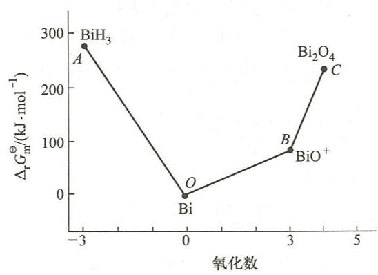  
第11章

## 一、选择题

11.1 A 11.2 C 11.3 D 11.4 C 11.5 C 11.6 A 11.7 C 11.8 C 11.9 A

11.10 B 11.11 D 11.12 D 11.13 A 11.14 D 11.15 C

## 二、填空题

11.16 (1) 六硝基合钴(Ⅲ)酸钾；

(2) 二氯·二羟·二氨合铂(IV);

(3) 一水合二氯化氯·五水合铬(Ⅲ);

(4)二氯化三(乙二胺)合镍(Ⅱ);

(5) 四氯合铂(Ⅱ)酸四氨合铜(Ⅱ);

(6) 三水合三草酸根合铁(Ⅲ)酸钾;

(7) 二草酸根合铜(Ⅱ)酸钾；

(8) 四氯合铂(Ⅱ)酸四吡啶合铂(Ⅱ);

(9) 二( $\mu$ -羰基)·二(三羰基合钴)。

11.17 (1) $\left[\mathrm{Fe}(\mathrm{CN})_5\mathrm{CO}\right]^{3-}$ ;

(2) $\left[\mathrm{PtCl}_{2}(\mathrm{OH})_{2}(\mathrm{NH}_{3})_{2}\right]$ ;

(3) $\mathrm{NH_4[Cr(SCN)_4(NH_3)_2]}$

(4) $\left[\mathrm{Cr}\left(\mathrm{H}_{2} \mathrm{O}\right)_{4} \mathrm{Br}_{2}\right] \mathrm{Br} \cdot 2 \mathrm{H}_{2} \mathrm{O}$ ;

(5) $\left[\mathrm{Cr}(\mathrm{NH}_3)_6\right]\left[\mathrm{Co}(\mathrm{CN})_6\right]$ 。

11.18 -3, 八面体, C(或碳), 6, $t_{2g}^{6}e_{g}^{0}, d^{2}sp^{3}$ , 逆

11.19 四面体;正方形,逆。

11.20 (1) 3; (2) 5; (3) 4; (4) 2; (5) 1; (6) 0。

11.21 (1) >; (2) >; (3) <; (4) <。

11.22 3,4,10。

11.23 (1) 3;

(2) $d^{2}sp^{3},sp^{3}d^{2}$ ; 内轨, 外轨;

(3) $d_{\varepsilon}^{6}d_{\gamma}^{0}$ （或 $t_{2g}^{6}e_{g}^{0}$ ）， $d_{\varepsilon}^{5}d_{\gamma}^{2}$ （或 $t_{2g}^{5}e_{g}^{2}$ ）； $24D_{q}-2P,8D_{q}$ ;

(4) $\left[\mathrm{Co}(\mathrm{NH}_3)_6\right]^{3+}$ 。

11.24 (1) $< ;(2) > ;(3) > ;(4) >$ 。

## 三、简答题和计算题

11.25 (1) $\left[\mathrm{Pt}\left(\mathrm{NH}_{3}\right)_{2} \left(\mathrm{NO}_{2}\right) \mathrm{Cl}\right]$ 平面四边形, 2 种几何异构体

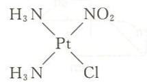

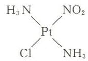

(2) $\left[\mathrm{Pt}(\mathrm{Py})(\mathrm{NH}_{3})\mathrm{ClBr}\right]$ 平面四边形, 3 种几何异构体

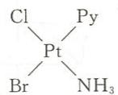

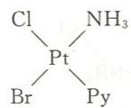

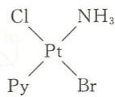

(3) $\left[\mathrm{Pt}\left(\mathrm{NH}_{3}\right)_{2}(\mathrm{OH})_{2}\mathrm{Cl}_{2}\right]$ 八面体,5种几何异构体(中心原子未画出)

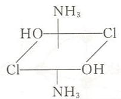

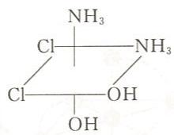

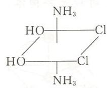

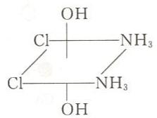

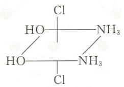

(4) $\left[\mathrm{Co}\left(\mathrm{NH}_{3}\right)_{2}\left(\mathrm{NO}_{2}\right)_{4}\right]^{-}$ 八面体,2种几何异构体

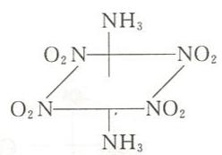

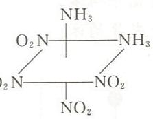

(5) $\left[\mathrm{Co}\left(\mathrm{NH}_{3}\right)_{3}(\mathrm{OH})_{3}\right]$ 八面体,2种几何异构体

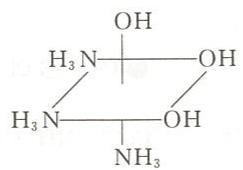

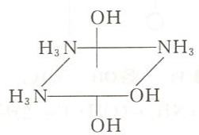

(6) $\left[\mathrm{Cr}(\mathrm{SCN})_{2}(\mathrm{en})_{2}\right]^{+}$ 八面体,2种几何异构体

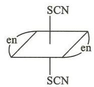

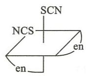

(7) $\left[\mathrm{Co}(\mathrm{en})_{3}\right]^{3+}$ 八面体, 1 种几何异构体

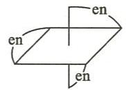

(8) $\left[\mathrm{Co}\left(\mathrm{NH}_{3}\right)(\mathrm{en})\mathrm{Cl}_{3}\right]$ 八面体,2种几何异构体

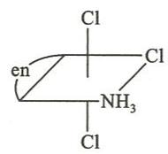

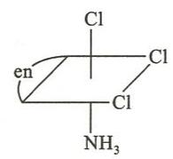

11.26 (1) 有 1 对旋光异构体。

(2) 有 1 对旋光异构体。

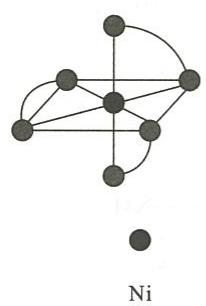

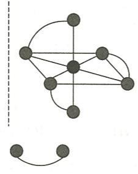  
$\left[\mathrm{Ni}(\mathrm{en})_{3}\right]^{2+}$ 的旋光异构体

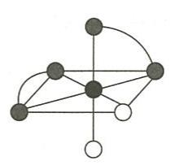

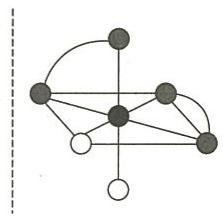  
$\left[\mathrm{Co}(\mathrm{NH}_{3})_{2}(\mathrm{en})_{2}\right]^{3+}$ 的旋光异构体

(3) 有 1 对旋光异构体。

(4) 有 1 对旋光异构体。

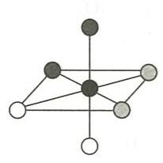

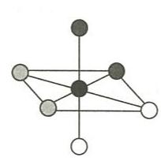  
$\left[\mathrm{Pt}\left(\mathrm{NH}_{3}\right)_{2}(\mathrm{OH})_{2} \mathrm{Cl}_{2}\right]$ 的旋光异构体

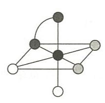

  
$\left[\mathrm{CoCl}_{2}\left(\mathrm{NH}_{3}\right)_{2}(\mathrm{en})\right]^{+}$ 的旋光异构体

(5) 有 4 对旋光异构体。

  
$\left[\mathrm{CoCl}_{2}\left(\mathrm{H}_{2}\mathrm{NCH}_{2}\mathrm{COO}\right)_{2}\right]^{-}$ 的旋光异构体

11.27 判断配位化合物是内轨型还是外轨型,实质是看中心内层 d 轨道是否与配体成键,即中心采取 $(n-1)$ d ns np 杂化还是 ns np nd 杂化。中心轨道杂化类型与中心价层电子构型及配体强弱有关。各题判断结果见下表。

<table><tr><td>题号</td><td>配位化合物</td><td>中心价层电子构型</td><td>配体类型</td><td>中心d电子的排布</td><td>中心轨道杂化类型</td><td>配位化合物类型</td></tr><tr><td>(1)</td><td>[Cr(H2O)6]Cl3</td><td>3d3</td><td>弱配体</td><td></td><td>d2sp3</td><td>内轨型</td></tr><tr><td>(2)</td><td>K3[Cr(CN)6]</td><td>3d3</td><td>强配体</td><td></td><td>d2sp3</td><td>内轨型</td></tr><tr><td>(3)</td><td>K2[PtCl4]</td><td>5d8</td><td>弱配体</td><td></td><td>dsp2</td><td>内轨型</td></tr><tr><td>(4)</td><td>K2[Ni(CN)4]</td><td>3d8</td><td>强配体</td><td></td><td>dsp2</td><td>内轨型</td></tr><tr><td>(5)</td><td>K4[Mn(CN)6]</td><td>3d5</td><td>强配体</td><td></td><td>d2sp3</td><td>内轨型</td></tr><tr><td>(6)</td><td>K3[Fe(C2O4)3]</td><td>3d5</td><td>弱配体</td><td></td><td>sp3d2</td><td>外轨型</td></tr><tr><td>(7)</td><td>[Fe(CO)5]</td><td>3d64s2</td><td>强配体</td><td></td><td>dsp3</td><td>内轨型</td></tr><tr><td>(8)</td><td>K3[Fe(CN)6]</td><td>3d5</td><td>强配体</td><td></td><td>d2sp3</td><td>内轨型</td></tr></table>

## 11.28 结果见下表。

<table><tr><td></td><td> $[CoF_6]^{3-}$ </td><td> $[Fe(H_2O)_6]^{2+}$ </td><td> $[Co(en)_3]^{2+}$ </td></tr><tr><td>中心价层电子构型</td><td> $3d^6$ </td><td> $3d^6$ </td><td> $3d^7$ </td></tr><tr><td>晶体场类型</td><td>八面体弱场</td><td>八面体弱场</td><td>八面体弱场</td></tr><tr><td>球形场中电子排布</td><td></td><td></td><td></td></tr><tr><td>晶体场中电子排布</td><td> $\uparrow\uparrow d_\gamma$ </td><td> $\uparrow\uparrow d_\gamma$ </td><td> $\uparrow\uparrow d_\gamma$  $\uparrow\uparrow\uparrow\uparrow\uparrow d_\epsilon$ </td></tr><tr><td>单电子数</td><td>4</td><td>4</td><td>3</td></tr><tr><td>磁矩/ $\mu_B$ </td><td>4.90</td><td>4.90</td><td>3.87</td></tr><tr><td>CFSE</td><td>4Dq</td><td>4Dq</td><td>8Dq</td></tr><tr><td></td><td> $[Fe(SCN)_6]^{3-}$ </td><td> $[Ni(CO)_4]$ </td><td> $[Mn(CN)_6]^{4-}$ </td></tr><tr><td>中心价层电子构型</td><td> $3d^5$ </td><td> $3d^84s^2$ </td><td> $3d^5$ </td></tr><tr><td>晶体场类型</td><td>八面体弱场</td><td>四面体强场</td><td>八面体强场</td></tr><tr><td>球形场中电子排布</td><td></td><td></td><td> $\uparrow\uparrow\uparrow\uparrow\uparrow\uparrow$ </td></tr><tr><td>晶体场中电子排布</td><td> $\uparrow\uparrow d_\gamma$  $\uparrow\uparrow\uparrow d_\epsilon$ </td><td> $\uparrow\uparrow\uparrow\uparrow\uparrow d_\epsilon$ </td><td> $- - d_\gamma$  $\uparrow\uparrow\uparrow\uparrow\uparrow d_\epsilon$ </td></tr><tr><td>单电子数</td><td>5</td><td>0</td><td>1</td></tr><tr><td>磁矩/ $\mu_B$ </td><td>5.92</td><td>0</td><td>1.73</td></tr><tr><td>CFSE</td><td>0Dq</td><td>0Dq</td><td>20Dq-2P</td></tr></table>

11.29 能与 $AgNO_{3}$ 反应生成 AgCl 沉淀者，外界为 $Cl^{-}$ ，化学结构式为 $\left[\mathrm{CoSO}_{4}\left(\mathrm{NH}_{3}\right)_{5}\right]\mathrm{Cl}$ 。能与 $BaCl_{2}$ 反应生成 $BaSO_{4}$ 沉淀者，外界为 $SO_{4}^{2-}$ ，化学结构式为 $\left[\mathrm{CoCl}\left(\mathrm{NH}_{3}\right)_{5}\right]\mathrm{SO}_{4}$ 。两种配合物之间属解离异构关系。

11.30 按照配位化合物价键理论, $Co^{2+}$ 价层电子构型为 $3d^{7}$ ,没有空的价层 d 轨道;而 $Cl^{-}$ 为弱配体,在形成 $[CoCl_{4}]^{2-}$ 时不能使中心 d 电子发生重排, $Co^{2+}$ 只能采取 $sp^{3}$ 杂化,如图(a)所示。

  
(a)

因此， $\left[CoCl_{4}\right]^{2-}$ 为四面体结构。

$Ni^{2+}$ 价层电子构型为 $3d^{8}$ ，没有空的价层 d 轨道；而 $Cl^{-}$ 为弱配体，在形成 $[NiCl_{4}]^{2-}$ 时不能使中心 d 电子发生重排， $Ni^{2+}$ 只能采取 $sp^{3}$ 杂化，如图(b)所示。

  
(b)

(c)

因此， $\left[NiCl_{4}\right]^{2-}$ 为四面体结构。

不能用价键理论讨论 $Cu^{2+}$ 的四配位化合物的空间构型，而应由姜一泰勒效应讨论其空间构型。按照晶体场理论， $Cu^{2+}$ 的 $3d^{9}$ 电子构型在八面体场中的排布如图(c)所示。

最后一个电子排布到 $d_{z2}$ 轨道，则 $d_{z2}$ 轴向上的两个配体受到的斥力大，距核较远，形成拉长的八面体。若轴向的两个配体拉得太远，则相当于失去轴向两个配体，变成正方形结构，这就是姜-泰勒效应。故 $\left[CuCl_{4}\right]^{2-}$ 为正方形结构。

$\mathrm{Pt}^{2+}$ 价层电子构型为 $5\mathrm{d}^8$ ，没有空的价层d轨道。但Pt为第六周期元素，5d轨道较为扩展，即5d轨道与配体的斥力较大，使中心的分裂能 $\Delta$ 较大。 $\Delta$ 较大可以看成 $\mathrm{Cl}^{-}$ 相当于强配体，能使 $\mathrm{Pt}^{2+}$ 的5d电子发生重排，空出1个5d轨道，采取 $\mathrm{dsp}^2$ 杂化，如图(d)所示。故 $[\mathrm{PtCl}_4]^{2-}$ 为正方形结构。

利用姜-泰勒效应也能合理解释为什么 $\left[\mathrm{PtCl}_4\right]^{2-}$ 为正方形结构而不是四面体结构。 $\mathrm{Pt}^{2+}$ 为 $\mathrm{d}^8$ 电子构型，在八面体场中的排布为 $(\mathrm{d}_{\varepsilon})^{6}(\mathrm{d}_{\gamma})^{2}$ ，由于铂为高周期元素，配位化合物的分裂能较大， $\mathrm{d}_{x^2-y^2}$ 和 $\mathrm{d}_{z^2}$ 轨道单电子的能量较高。八面体场经重排后转化成正方形场，在正方形场中最高能量轨道 $\mathrm{d}_{x^2-y^2}$ 不填充电子，使正方形配位化合物有较大的晶体场稳定化能，如图(e)所示。

11.31 配离子 $\left[\mathrm{Fe}(\mathrm{CN})_{6}\right]^{3-}$ 和 $\left[\mathrm{Fe}(\mathrm{CN})_{6}\right]^{4-}$ 中心分别为 $\mathrm{Fe}^{3+}$ 和 $\mathrm{Fe}^{2+}$ ，中心与配体 $\mathrm{CN}^{-}$ 间既有配体电子对向中心空的杂化轨道配位形成的 $\sigma$ 配键，又有中心 $d$ 电子向配体 $\mathrm{CN}^{-}$ 的空 $\pi^{*}$ 轨道配位形成 $d-p\pi$ 配键。带有正电荷的中心与带有负电荷的配体成键时以静电引力

为主，d-p $\pi$ 配键对配离子稳定性影响较小。 $Fe^{3+}$ 与 $CN^{-}$ 引力大于 $Fe^{2+}$ 与 $CN^{-}$ 引力，所以 $\left[\mathrm{Fe}(\mathrm{CN})_{6}\right]^{3-}$ 比 $\left[\mathrm{Fe}(\mathrm{CN})_{6}\right]^{4-}$ 稳定。

邻二氮菲的结构如图所示,分子中有离域大 $\pi$ 键。

中性分子邻二氮菲与中心成键时， $\mathrm{d} - \mathrm{p}\pi$ 配键对配离子稳定性影响较大，中心与中性分子配体间静电引力对配离子稳定性影响较小。 $\mathrm{Fe}^{2+}$ 的 $\mathrm{d}$ 电子比 $\mathrm{Fe}^{3+}$ 多，向邻二氮菲的空 $\pi^*$ 轨道反馈电子能力强，所以 $[\mathrm{Fe}(\mathrm{phen})_3]^{2+}$ 比 $[\mathrm{Fe}(\mathrm{phen})_3]^{3+}$ 稳定。

11.32 $\mathrm{CuSO_4:SO_4^{2-}}$ 场很弱, 分裂能 $\Delta$ 很小, d 电子在 d-d 跃迁时不吸收可见光而吸收红外光。因吸收的光不在可见光范围内, 因而 $\mathrm{CuSO_4}$ 显白色。 $\mathrm{CuCl_2:Cl^-}$ 晶体场使分裂能 $\Delta$ 大小恰好在可见光能量范围内, d-d 跃迁时电子吸收可见光, 因而 $\mathrm{CuCl_2}$ 显颜色。 $\mathrm{CuSO_4\cdot 5H_2O}$ : 配合物应写成 $[\mathrm{Cu(H_2O)_4}]\mathrm{SO}_4\cdot \mathrm{H}_2\mathrm{O}$ , 晶体场为 $\mathrm{H}_2\mathrm{O}$ 而不是 $\mathrm{SO}_4^{2-}$ 。 $\mathrm{Cu^{2+}}$ 在 $\mathrm{H}_2\mathrm{O}$ 场中分裂能 $\Delta$ 大小也恰好在可见光范围内, 发生 d-d 电子跃迁而使 $\mathrm{CuSO_4\cdot 5H_2O}$ 显色。

11.33 $\mathrm{Hg}^{2+}$ 价层电子构型为 $5\mathrm{d}^{10}, [\mathrm{HgI}_4]^{2-}$ 中电子没有 d-d 跃迁。由于 $\mathrm{Hg}^{2+}$ 与 $\mathrm{I}^{-}$ 靠配位键结合，键较弱，电荷跃迁较难，因而 $[\mathrm{HgI}_4]^{2-}$ 为无色。 $\mathrm{HgI}_2$ 中， $\mathrm{Hg}$ 与 I 靠共价键结合， $\mathrm{Hg}^{2+}$ 强的极化能力和 $\mathrm{I}^{-}$ 较大的变形性使电荷跃迁很容易进行，因而 $\mathrm{HgI}_2$ 有较深的颜色。  
11.34 (1) 稳定性 $[\mathrm{Co(NH_3)_6}]^{3+} > [\mathrm{Co(NH_3)_6}]^{2+}$ 因前者中心的正电荷数高、离子半径小，对配体的引力大；(2) 稳定性 $[\mathrm{Zn(EDTA)}]^{2-} > [\mathrm{Ca(EDTA)}]^{2-}$ 因 $\mathrm{Zn}^{2+}$ 的极化能力和变形性都比 $\mathrm{Ca}^{2+}$ 大；(3) 稳定性 $[\mathrm{Cu(CN)_4}]^{3-} > [\mathrm{Zn(CN)_4}]^{2-}$ $\mathrm{Cu}^+$ 是软酸， $\mathrm{Zn}^{2+}$ 为交界酸， $\mathrm{Cu}^+$ 与软碱 $\mathrm{CN}^{-}$ 结合更稳定；(4) 稳定性 $[\mathrm{AlF}_6]^{3-} > [\mathrm{AlCl}_6]^{3-}$ $\mathrm{Al}^{3+}$ 为硬酸，而碱的硬度为 $\mathrm{F}^{-} > \mathrm{Cl}^{-}$ ，因而 $\mathrm{Al}^{3+}$ 与 $\mathrm{F}^{-}$ 结合更稳定；(5) 稳定性 $[\mathrm{Cu(NH_2CH_2CH_2NH_2)_2}]^{2+} > [\mathrm{Cu(NH_2CH_2COO)_2}]$ 前者配体中配位原子都是 N，后者配体中配位原子为 N 和 O，N 的配位能力比 O 强。  
11.35 加入 $(\mathrm{NH}_4)_2\mathrm{C}_2\mathrm{O}_4$ 则溶液变为黄绿色，是因为生成了 $[\mathrm{Fe(C_2O_4)_3}]^{3-}$ ：

$$
\mathrm{Fe} ^ {3 +} + 3 \mathrm{C} _ {2} \mathrm{O} _ {4} ^ {2 -} = [ \mathrm{Fe(C} _ {2} \mathrm{O} _ {4}) _ {3} ] ^ {3 -}
$$

再加入少量KSCN溶液，溶液颜色不变，是因为 $\left[\mathrm{Fe}\left(\mathrm{C}_2\mathrm{O}_4\right)_3\right]^{3-}$ 比 $\left[\mathrm{Fe}(\mathrm{SCN})_5\right]^{2-}$ 稳定；再加入少量盐酸后溶液变红，是因为加入强酸后 $\left[\mathrm{Fe}\left(\mathrm{C}_2\mathrm{O}_4\right)_3\right]^{3-}$ 被破坏，生成弱酸 $\mathrm{H}_2\mathrm{C}_2\mathrm{O}_4$ ，于是得到红色的 $\left[\mathrm{Fe}(\mathrm{SCN})_5\right]^{2-}$ ：

$$
\left[ \mathrm{Fe} (\mathrm{C} _ {2} \mathrm{O} _ {4}) _ {3} \right] ^ {3 -} + 6 \mathrm{H} ^ {+} + 5 \mathrm{SCN} ^ {-} = \left[ \mathrm{Fe(SCN)} _ {5} \right] ^ {2 -} + 3 \mathrm{H} _ {2} \mathrm{C} _ {2} \mathrm{O} _ {4}
$$

最后加入 $NH_{4}F$ 溶液，生成更稳定的 $\left[FeF_{5}\right]^{2-}$ ，溶液变为无色：

$$
\left[ \mathrm{Fe(SCN)} _ {5} \right] ^ {2 -} + 5 \mathrm{F} ^ {-} = \left[ \mathrm{FeF} _ {5} \right] ^ {2 -} + 5 \mathrm{SCN}
$$

11.36 电荷数相同的同一周期过渡金属离子,随着金属元素原子序数的增大,核电荷数增加,有效核电荷数依次增加,金属离子与配体间的引力增大,配位化合物的稳定性趋于增大。在八面体弱场中, $Zn^{2+}$ 配位化合物的稳定性比 $Cu^{2+}$ 配位化合物差,因为 $Zn^{2+}$ 配位化合物的晶体场稳定化能小,其CFSE=0Dq。

相关过渡元素 $\mathrm{M}^{2+}$ 在弱场中生成八面体配位化合物的 CFSE 见下表:

<table><tr><td>离子</td><td> $Mn^{2+}$ </td><td> $Fe^{2+}$ </td><td> $Co^{2+}$ </td><td> $Ni^{2+}$ </td><td> $Cu^{2+}$ </td><td> $Zn^{2+}$ </td></tr><tr><td>d电子数</td><td>5</td><td>6</td><td>7</td><td>8</td><td>9</td><td>10</td></tr><tr><td>CFSE/Dq</td><td>0</td><td>4</td><td>8</td><td>12</td><td>6</td><td>0</td></tr></table>

晶体场稳定化能在数值上远远小于配位键的键能,但在配位键的键能相近时,晶体场稳定化能的修正作用显示出来。

11.37 电对 $\left[\mathrm{Cu}\left(\mathrm{NH}_{3}\right)_{4}\right]^{2+}/\mathrm{Cu}$ 的电极反应式为

$$
\left[ \mathrm{Cu} (\mathrm{NH} _ {3}) _ {4} \right] ^ {2 +} + 2 \mathrm{e} ^ {-} = \mathrm{Cu} + 4 \mathrm{NH} _ {3}
$$

将它的 $E^{\ominus}$ 值看成电对 $Cu^{2+}/Cu$ 的 E 值, 即

$$
c \left[ \mathrm{Cu} (\mathrm{NH} _ {3}) _ {4} ^ {2 +} \right] = c (\mathrm{NH} _ {3}) = 1 \mathrm{mol} \cdot \mathrm{dm} ^ {- 3}
$$

时的 $E$ 值。

由反应式

$$
\mathrm{Cu} ^ {2 +} + 4 \mathrm{NH} _ {3} = [ \mathrm{Cu(NH} _ {3}) _ {4} ] ^ {2 +}
$$

得其平衡常数表达式为

$$
K _ {\mathrm{稳}} ^ {\ominus} = \frac {c [ \mathrm{Cu(NH} _ {3}) _ {4} ^ {2 +} ]}{c (\mathrm{Cu} ^ {2 +}) [ c (\mathrm{NH} _ {3}) ] ^ {4}}
$$

所以有

$$
\begin{array}{r l} c (\mathrm{Cu} ^ {2 +}) & = \frac {c [ \mathrm{Cu(NH} _ {3}) _ {4} ^ {2 +} ]}{K _ {\text {稳}} ^ {\ominus} [ c (\mathrm{NH} _ {3}) ] ^ {4}} \\ & = \frac {1}{K _ {\text {稳}} ^ {\ominus}} \end{array}
$$

根据 $Cu^{2+} + 2e^{-} = Cu$ 的能斯特方程：

$$
\begin{array}{r l} E & = E ^ {\ominus} (\mathrm {Cu^ {2 + } /Cu}) + \frac {0 . 0 5 9 \: \mathrm{V}}{2} \lg c (\mathrm {Cu^ {2 + }}) \\ & = 0. 3 4 \: \mathrm{V} + \frac {0 . 0 5 9 \: \mathrm{V}}{2} \lg \frac {1}{K _ {\text {稳}}} \\ & = 0. 3 4 \: \mathrm{V} + \frac {0 . 0 5 9 \: \mathrm{V}}{2} \lg \frac {1}{2 . 1 \times 1 0 ^ {1 3}} \\ & = - 0. 0 5 3 \: \mathrm{V} \end{array}
$$

故电对 $\left[\mathrm{Cu}(\mathrm{NH}_3)_4\right]^{2+}/\mathrm{Cu}$ 的 $E^{\ominus} = -0.053\mathrm{V}$ 。

## 11.38 将电极反应

$$
\left[ \mathrm{Fe(CN)} _ {6} \right] ^ {3 -} + \mathrm{e} ^ {-} = \left[ \mathrm{Fe(CN)} _ {6} \right] ^ {4 -}
$$

的 $E^{\ominus}$ 值看成电对 $Fe^{3+}/Fe^{2+}$ 的 E 值, 即

$$
c \left[ \mathrm{Fe(CN)} _ {6} ^ {3 -} \right] = c \left[ \mathrm{Fe(CN)} _ {6} ^ {4 -} \right] = c (\mathrm{CN} ^ {-}) = 1 \mathrm{mol} \cdot \mathrm{dm} ^ {- 3}
$$

时的 E 值。

由反应式

$$
\mathrm{Fe} ^ {3 +} + 6 \mathrm{CN} ^ {-} = [ \mathrm{Fe(CN)} _ {6} ] ^ {3 -}
$$

得其平衡常数表达式为

$$
K _ {\mathrm{稳}} ^ {\ominus} (1) = \frac {c [ \mathrm{Fe(CN)} _ {6} ^ {3 -} ]}{c (\mathrm{Fe} ^ {3 +}) [ c (\mathrm{CN} ^ {-}) ] ^ {6}}
$$

所以有

$$
c (\mathrm{Fe} ^ {3 +}) = \frac {c [ \mathrm{Fe(CN)} _ {6} ^ {3 -} ]}{K _ {\mathrm{稳}} ^ {\ominus} (1) [ c (\mathrm{CN} ^ {-}) ] ^ {6}} = \frac {1}{K _ {\mathrm{稳}} ^ {\ominus} (1)}
$$

同理有

$$
c (\mathrm{Fe} ^ {2 +}) = \frac {1}{K _ {\mathrm{稳}} ^ {\ominus} (2)}
$$

根据 $\mathrm{Fe}^{3+} + \mathrm{e}^{-} = \mathrm{Fe}^{2+}$ 的能斯特方程：

$$
\begin{array}{r l} E & = E ^ {\ominus} (\mathrm{Fe} ^ {3 +} / \mathrm{Fe} ^ {2 +}) + 0. 0 5 9 \mathrm{V} \lg \frac {c (\mathrm{Fe} ^ {3 +})}{c (\mathrm{Fe} ^ {2 +})} \\ & = E ^ {\ominus} (\mathrm{Fe} ^ {3 +} / \mathrm{Fe} ^ {2 +}) + 0. 0 5 9 \mathrm{V} \lg \frac {\frac {1}{K _ {\mathrm{稳}} ^ {\ominus} (1)}}{\frac {1}{K _ {\mathrm{稳}} ^ {\ominus} (2)}} \end{array}
$$

将数值代入上式, 得

$$
\begin{array}{r l} 0. 3 5 8 \mathrm{V} & = 0. 7 7 1 \mathrm{V} + 0. 0 5 9 \mathrm{V} \lg \frac {K _ {\mathrm{稳}} ^ {\ominus} (2)}{1 . 0 0 \times 1 0 ^ {4 2}} \\ K _ {\mathrm{稳}} ^ {\ominus} (2) & = 1. 0 0 \times 1 0 ^ {3 5} \end{array}
$$

即反应 $\mathrm{Fe}^{2+} + 6\mathrm{CN}^{-} \rightleftharpoons [\mathrm{Fe(CN)}_6]^{4-}$ 的 $K_{\text{稳}}^{\ominus} = 1.00 \times 10^{35}$ 。

11.39 $\mathrm{pH} = 1.0, c(\mathrm{H}^{+}) = 0.10\mathrm{mol}\cdot \mathrm{dm}^{-3}$

$$
c \left(\mathrm{Zn} ^ {2 +}\right) = 0. 0 1 0 \mathrm{mol} \cdot \mathrm{dm} ^ {- 3}
$$

$$
\begin{array}{r l} K _ {\mathrm{sp}} ^ {\ominus} (\mathrm{ZnS}) & = c (\mathrm {Zn^ {2 + }}) c (\mathrm {S^ {2 - }}) \\ & = 0. 0 1 \times \frac {K _ {\mathrm{a}} ^ {\ominus} c (\mathrm {H_ {2} S})}{[ c (\mathrm {H^ {+}}) ] ^ {2}} (K _ {\mathrm{a}} ^ {\ominus} \text {为} \mathrm {H_ {2} S} \text {的解离平衡常数}) \\ & = K _ {\mathrm{a}} ^ {\ominus} c (\mathrm {H_ {2} S}) \end{array}
$$

加入 KCN 后, 设 $c(\mathrm{Zn}^{2+})=x\ \mathrm{mol}\cdot\mathrm{dm}^{-3}$ , 则

$$
c _ {\text {平}} / (\mathrm{mol} \cdot \mathrm{dm} ^ {- 3}) \quad \begin{array}{r l r l r} & Z n ^ {2 +} & + & 4 C N ^ {-} & = [ Z n (C N) _ {4} ] ^ {2 -} \\ & x & 1. 0 - 4 (0. 0 1 - x) & 0. 0 1 - x \end{array}
$$

$$
K _ {\mathrm{稳}} ^ {\ominus} = \frac {0 . 0 1 - x}{x [ 1 . 0 - 4 (0 . 0 1 - x) ] ^ {4}} = 5. 0 \times 1 0 ^ {1 6}
$$

解得 $x=2.35\times10^{-19}$ ，即 $c(Zn^{2+})=2.35\times10^{-19}\mathrm{mol}\cdot\mathrm{dm}^{-3}$

$$
K _ {\mathrm{sp}} ^ {\ominus} (\mathrm{ZnS}) = c (\mathrm{Zn} ^ {2 +}) c (\mathrm{S} ^ {2 -}) = 2. 3 5 \times 1 0 ^ {- 1 9} \times \frac {K _ {\mathrm{a}} ^ {\ominus} c (\mathrm{H} _ {2} \mathrm{S})}{[ c (\mathrm{H} ^ {+}) ] ^ {2}}
$$

$$
K _ {\mathrm{a}} ^ {\ominus} c (\mathrm{H} _ {2} \mathrm{S}) = 2. 3 5 \times 1 0 ^ {- 1 9} \times \frac {K _ {\mathrm{a}} ^ {\ominus} c (\mathrm{H} _ {2} \mathrm{S})}{\left[ c (\mathrm{H} ^ {+}) \right] ^ {2}}
$$

得 $c(\mathrm{H}^{+})=4.85\times10^{-10}\ \mathrm{mol}\cdot\mathrm{dm}^{-3}$ ，即 pH=9.31。

11.40 $\mathrm{Au(CN)}_2^- +\mathrm{e}^- = \mathrm{Au} + 2\mathrm{CN}^-$ ，标准状态时，

$$
c \left[ \mathrm{Au} (\mathrm{CN}) _ {2} ^ {-} \right] = c (\mathrm{CN} ^ {-}) = 1. 0 \mathrm{mol} \cdot \mathrm{dm} ^ {- 3}
$$

则有

$$
K _ {\mathrm{稳}} ^ {\ominus} [ \mathrm{Au(CN)} _ {2} ^ {-} ] = \frac {c [ \mathrm{Au(CN)} _ {2} ^ {-} ]}{c (\mathrm{Au} ^ {+}) [ c (\mathrm{CN} ^ {-}) ] ^ {2}} = \frac {1}{c (\mathrm{Au} ^ {+})}
$$

$$
\begin{array}{r l} E ^ {\ominus} [ \mathrm {Au(CN) _ {2} ^ {-} /Au} ] & = E ^ {\ominus} (\mathrm {Au^ {+} /Au}) + 0. 0 5 9 \mathrm{V} \lg c (\mathrm {Au^ {+}}) \\ & = 1. 6 9 \mathrm{V} + 0. 0 5 9 \mathrm{V} \lg \frac {1}{K _ {\text {稳}} ^ {\ominus}} \\ & = - 0. 5 7 \mathrm{V} \end{array}
$$

$$
\begin{array}{r l} 1) E ^ {\ominus} (\mathrm{FeF} _ {6} ^ {3 -} / \mathrm{Fe} ^ {2 +}) & = E ^ {\ominus} (\mathrm{Fe} ^ {3 +} / \mathrm{Fe} ^ {2 +}) + 0. 0 5 9 \mathrm{V} \lg [ c (\mathrm{Fe} ^ {3 +}) / c (\mathrm{Fe} ^ {2 +}) ] \\ & = 0. 7 7 1 \mathrm{V} + 0. 0 5 9 \mathrm{V} \lg [ 1 / K _ {\text {稳}} ^ {\ominus} (\mathrm{FeF} _ {6} ^ {3 -}) ] \\ & = 0. 7 7 1 \mathrm{V} + 0. 0 5 9 \mathrm{V} \lg \frac {1}{1 . 1 \times 1 0 ^ {1 2}} = 0. 0 6 \mathrm{V} \end{array}
$$

$E^{\ominus}(\mathrm{FeF}_{6}^{3-}/\mathrm{Fe}^{2+})<E^{\ominus}(\mathrm{Sn}^{4+}/\mathrm{Sn}^{2+})$ ，无氧化还原反应发生。

$$
\begin{array}{r l} (2) E ^ {\ominus} [ \mathrm{Fe(SCN)} _ {5} ^ {2 -} / \mathrm{Fe} ^ {2 +} ] & = E ^ {\ominus} (\mathrm{Fe} ^ {3 +} / \mathrm{Fe} ^ {2 +}) + 0. 0 5 9 \mathrm{V} \lg \frac {1}{K _ {\text {稳}} ^ {\ominus}} \\ & = 0. 7 7 1 \mathrm{V} + 0. 0 5 9 \mathrm{V} \lg \frac {1}{2 . 5 \times 1 0 ^ {6}} = 0. 3 9 \mathrm{V} \end{array}
$$

$E^{\ominus}\left[\mathrm{Fe}(\mathrm{SCN})_{5}^{2-}/\mathrm{Fe}^{2+}\right]>E^{\ominus}\left(\mathrm{Sn}^{4+}/\mathrm{Sn}^{2+}\right)$ ，能发生氧化还原反应：

$$
2 \left[ \mathrm{Fe(SCN)} _ {5} \right] ^ {2 -} + \mathrm{Sn} ^ {2 +} = 2 \mathrm{Fe} ^ {2 +} + 1 0 \mathrm{SCN} ^ {-} + \mathrm{Sn} ^ {4 +}
$$

(3) $E^{\ominus}[\mathrm{Fe(SCN)}_{5}^{2-}/\mathrm{Fe}^{2+}]<E^{\ominus}(\mathrm{I}_{2}/\mathrm{I}^{-})$ ，不发生氧化还原反应。

11.42 设 AgBr 在 $Na_{2}S_{2}O_{3}$ 溶液中的溶解度为 $x\ mol\cdot dm^{-3}$ 。

$$
\begin{array}{r l} \mathrm {AgBr + 2S_ {2} O_ {3} ^ {2 - }} & = [ \mathrm {Ag(S_ {2} O_ {3}) _ {2}} ] ^ {3 -} + \mathrm {Br^ {-}} \\ 1 - 2 x & x \end{array}
$$

$$
\begin{array}{r l} {1 - 2 x} & {\qquad \qquad \qquad \qquad \qquad \qquad \qquad \qquad \qquad \qquad \qquad \qquad \qquad \qquad \qquad \qquad \qquad \qquad \qquad \qquad \qquad \qquad \qquad \qquad \qquad \qquad \qquad \qquad \qquad \qquad \qquad \qquad \qquad \qquad \mathrm{K} ^ {\ominus} = \frac {c [ \mathrm{Ag(S} _ {2} \mathrm{O} _ {3}) _ {2} ^ {3 -} ] c (\mathrm{Br} ^ {-})}{[ c (\mathrm{S} _ {2} \mathrm{O} _ {3} ^ {2 -}) ] ^ {2}}} \\ & {\qquad \qquad \qquad = \frac {c [ \mathrm{Ag(S} _ {2} \mathrm{O} _ {3}) _ {2} ^ {3 -} ] c (\mathrm{Br} ^ {-}) c (\mathrm{Ag} ^ {+})}{[ c (\mathrm{S} _ {2} \mathrm{O} _ {3} ^ {2 -}) ] ^ {2} c (\mathrm{Ag} ^ {+})}} \\ & {\qquad \qquad = K _ {\mathrm{sp}} ^ {\ominus} (\mathrm{AgBr}) K _ {\text {稳}} ^ {\ominus}} \\ & {\qquad = 1 5} \\ & {\qquad \qquad \frac {x ^ {2}}{(1 - 2 x) ^ {2}} = 1 5} \\ & {\qquad \qquad x = 0. 4 4} \end{array}
$$

溶解 $\mathrm{AgBr}$ 的质量为

0.44 mol·dm $^{-3}$ ×188 g·mol $^{-1}$ ×1.5 dm $^{3}$ =124 g

11.43 在水溶液中， $E^{\ominus}\left(\mathrm{Co}^{3+}/\mathrm{Co}^{2+}\right)>E^{\ominus}\left(\mathrm{O}_{2}/\mathrm{H}_{2}\mathrm{O}\right)$ ，因此 $Co^{3+}$ 能氧化水：

$$
4 \mathrm{Co} ^ {3 +} + 2 \mathrm{H} _ {2} \mathrm{O} = 4 \mathrm{Co} ^ {2 +} + \mathrm{O} _ {2} \uparrow + 4 \mathrm{H} ^ {+}
$$

当 $Co^{3+}$ 生成 $\left[\mathrm{Co}\left(\mathrm{NH}_{3}\right)_{6}\right]^{3+}$ 后：

$$
\begin{array}{r l} E ^ {\ominus} [ \mathrm {Co(NH_ {3}) _ {6} ^ {3 + } /Co(NH_ {3}) _ {6} ^ {2 + }} ] & = E ^ {\ominus} (\mathrm {Co^ {3 + } /Co^ {2 + }}) + 0. 0 5 9 \mathrm{V} \lg \frac {c (\mathrm {Co^ {3 + }})}{c (\mathrm {Co^ {2 + }})} \\ & = E ^ {\ominus} (\mathrm {Co^ {3 + } /Co^ {2 + }}) + 0. 0 5 9 \mathrm{V} \lg \frac {K _ {\text {稳}} ^ {\ominus} [ \mathrm {Co(NH_ {3}) _ {6} ^ {2 + }} ]}{K _ {\text {稳}} ^ {\ominus} [ \mathrm {Co(NH_ {3}) _ {6} ^ {3 + }} ]} \\ & = 1. 9 2 \mathrm{V} + 0. 0 5 9 \mathrm{V} \lg \frac {1 . 3 8 \times 1 0 ^ {5}}{1 . 5 8 \times 1 0 ^ {3 5}} \\ & = 0. 1 5 \mathrm{V} \end{array}
$$

在氨溶液中，设 $c(\mathrm{NH}_3) = 1.0\mathrm{mol}\cdot \mathrm{dm}^{-3}$ ，则

$$
c (\mathrm{OH} ^ {-}) = \sqrt {1 . 0 \times 1 . 8 \times 1 0 ^ {- 5}} \mathrm{mol} \cdot \mathrm{dm} ^ {- 3} = 4. 2 4 \times 1 0 ^ {- 3} \mathrm{mol} \cdot \mathrm{dm} ^ {- 3}
$$

$$
\mathrm{O} _ {2} + 4 \mathrm{H} _ {2} \mathrm{O} + 4 \mathrm{e} ^ {-} = 4 \mathrm{OH} ^ {-}
$$

$$
E (\mathrm{O} _ {2} / \mathrm{OH} ^ {-}) = E ^ {\ominus} (\mathrm{O} _ {2} / \mathrm{OH} ^ {-}) + \frac {0 . 0 5 9 \mathrm{V}}{4} \lg \frac {p (\mathrm{O} _ {2}) / p ^ {\ominus}}{\left[ c (\mathrm{OH} ^ {-}) \right] ^ {4}}
$$

$$
\begin{array}{r l} & = 0. 4 0 1 \mathrm{V} + \frac {0 . 0 5 9 \mathrm{V}}{4} \lg \frac {1}{(4 . 2 4 \times 1 0 ^ {- 3}) ^ {4}} \\ & = 0. 5 4 \mathrm{V} \end{array}
$$

$E^{\ominus}\left[\mathrm{Co}(\mathrm{NH}_{3})_{6}^{3+}/\mathrm{Co}(\mathrm{NH}_{3})_{6}^{2+}\right]<E(\mathrm{O}_{2}/\mathrm{OH}^{-})$ ，故 $\left[\mathrm{Co}(\mathrm{NH}_{3})_{6}\right]^{3+}$ 不能氧化水。

11.44 电池的电动势

即

$$
\begin{array}{r l} E ^ {\ominus} = & E ^ {\ominus} \left[ \mathrm {Cu(NH_ {3}) _ {4} ^ {2 + } /Cu} \right] - E ^ {\ominus} (Z n ^ {2 +} / Z n) = 0. 7 1 \mathrm{V} \\ & E ^ {\ominus} \left[ \mathrm {Cu(NH_ {3}) _ {4} ^ {2 + } /Cu} \right] = E ^ {\ominus} + E ^ {\ominus} (Z n ^ {2 +} / Z n) \\ & = 0. 7 1 \mathrm{V} + (- 0. 7 6 \mathrm{V}) \\ & = - 0. 0 5 \mathrm{V} \end{array}
$$

能斯特方程 $E^{\ominus}\left[\mathrm{Cu(NH_{3})_{4}^{2 + } / Cu}\right] = E^{\ominus}\left(\mathrm{Cu^{2 + } / Cu}\right) + \frac{0.059\mathrm{V}}{2}\lg c(\mathrm{Cu^{2 + }})$

(1)

其中

$$
\mathrm{Cu} ^ {2 +} + 4 \mathrm{NH} _ {3} = [ \mathrm{Cu(NH} _ {3}) _ {4} ] ^ {2 +}
$$

$$
K _ {\mathrm{稳}} ^ {\ominus} = \frac {c [ \mathrm{Cu(NH} _ {3}) _ {4} ^ {2 +} ]}{c (\mathrm{Cu} ^ {2 +}) [ c (\mathrm{NH} _ {3}) ] ^ {4}} = \frac {1}{c (\mathrm{Cu} ^ {2 +})}
$$

即

$$
c (\mathrm{Cu} ^ {2 +}) = \frac {1}{K _ {\mathrm{稳}} ^ {\ominus}}
$$

代入式(1)得

$$
- 0. 0 5 \mathrm{V} = 0. 3 4 \mathrm{V} + \frac {0 . 0 5 9 \mathrm{V}}{2} \lg \frac {1}{K _ {\mathrm{稳}} ^ {\ominus}}
$$

$$
K _ {\mathrm{稳}} ^ {\ominus} = 1. 7 \times 1 0 ^ {1 3}
$$

11.45 （1）由配体 $\left(\mathrm{NO}_{2}\right)$ 的氮氧键不等长，说明 $\left(\mathrm{NO}_{2}\right)$ 不用N原子配位，两个O原子中只有1个配位，故 $\left(\mathrm{NO}_{2}\right)$ 为氧配位的单基配体亚硝酸根 $NO_{2}^{-}$ 。

由 $\left[\mathrm{MA}_{2}(\mathrm{NO}_{2})_{2}\right]$ 为六配位单核配位化合物，则配体A为双基配体。

由配体 A 不含氧, 且 $\left[\mathrm{MA}_{2} \left(\mathrm{NO}_{2}\right)_{2}\right]$ 的组成分析结果中 N 含量较高, 则 A 为含有 2 个 N 的双基配体, 最有可能的是乙二胺 $\mathrm{NH}_{2} \mathrm{CH}_{2} \mathrm{CH}_{2} \mathrm{NH}_{2}$ 。

设 M 的相对原子质量为 $A_{r}$ ，则有

得

$$
\begin{array}{r} {2 1. 6 8 \% = A _ {\mathrm{r}} / (A _ {\mathrm{r}} + 6 0 \times 2 + 4 6 \times 2)} \\ {A _ {\mathrm{r}} = 5 8. 7} \end{array}
$$

则 M 为 Ni。

在配位化合物中 Ni 以 +2 价存在, 所以题设配位化合物的化学式为 $\left[\mathrm{Ni}(\mathrm{en})_{2}\left(\mathrm{NO}_{2}\right)_{2}\right]$ 。

(2) $\left[\mathrm{Ni}(\mathrm{en})_{2}\left(\mathrm{NO}_{2}\right)_{2}\right]$ 为八面体结构,有两种几何异构体,如图所示。

11.46 反位效应顺序: $NH_{3} < Cl^{-}$ ，反式 $\left[\mathrm{Pt}\left(\mathrm{NH}_{3}\right)_{2}\mathrm{Cl}_{2}\right]$ 可由 $\left[\mathrm{Pt}\left(\mathrm{NH}_{3}\right)_{4}\right]^{2+}$ 制备，制备路线如下：

$$
\mathrm{Pt} \longrightarrow \mathrm{H} _ {2} [ \mathrm{PtCl} _ {6} ] \longrightarrow \mathrm{K} _ {2} [ \mathrm{PtCl} _ {4} ] \longrightarrow [ \mathrm{Pt(NH} _ {3}) _ {4} ] ^ {2 +} \longrightarrow \text {反式} [ \mathrm{Pt(NH} _ {3}) _ {2} \mathrm{Cl} _ {2} ]
$$

Pt溶于王水生成 $\mathrm{H}_2[\mathrm{PtCl}_6]$

$$
3 \mathrm{Pt} + 4 \mathrm{HNO} _ {3} + 1 8 \mathrm{HCl} = 3 \mathrm{H} _ {2} [ \mathrm{PtCl} _ {6} ] + 4 \mathrm{NO} \uparrow + 8 \mathrm{H} _ {2} \mathrm{O}
$$

将 $\mathrm{H}_2[\mathrm{PtCl}_6]$ 与KCl作用生成溶解度较小的 $\mathrm{K}_2[\mathrm{PtCl}_6]$ ，加入还原剂得到 $\mathrm{K}_2[\mathrm{PtCl}_4]$

$$
\mathrm{K} _ {2} \left[ \mathrm{PtCl} _ {6} \right] + \mathrm{K} _ {2} \mathrm{C} _ {2} \mathrm{O} _ {4} = \mathrm{K} _ {2} \left[ \mathrm{PtCl} _ {4} \right] + 2 \mathrm{KCl} + 2 \mathrm{CO} _ {2} \uparrow
$$

将 $K_{2}[PtCl_{4}]$ 与浓氨水作用，得到 $\left[\mathrm{Pt}\left(\mathrm{NH}_{3}\right)_{4}\right]^{2+}$ 后，利用 $Cl^{-}$ 比 $NH_{3}$ 反位效应强的因素，将 $\left[\mathrm{Pt}\left(\mathrm{NH}_{3}\right)_{4}\right]^{2+}$ 转化为反式 $\left[\mathrm{Pt}\left(\mathrm{NH}_{3}\right)_{2}\mathrm{Cl}_{2}\right]$ 。

$$
\left[ \begin{array}{c} \mathrm{H} _ {3} \mathrm{N} - \mathrm{NH} _ {3} \\ \mathrm{H} _ {3} \mathrm{N} - \mathrm{NH} _ {3} \end{array} \right] ^ {2 +} \xrightarrow {\mathrm{Cl} ^ {-}} \left[ \begin{array}{c} \mathrm{H} _ {3} \mathrm{N} - \mathrm{NH} _ {3} \\ \mathrm{Cl} - \mathrm{NH} _ {3} \end{array} \right] ^ {+} \xrightarrow {\mathrm{Cl} ^ {-}} \left[ \begin{array}{c} \mathrm{H} _ {3} \mathrm{N} - \mathrm{Cl} \\ \mathrm{Cl} - \mathrm{NH} _ {3} \end{array} \right]
$$

## 第12章

## 一、选择题

<table><tr><td>12.1 B</td><td>12.2 A</td><td>12.3 D</td><td>12.4 B</td><td>12.5 C</td><td>12.6 B</td><td>12.7 B</td><td>12.8 C</td></tr></table>

## 二、填空题

12.9 (1) $\mathrm{CaF_2}$ ; (2) NaCl; (3) $\mathrm{CaSO_4\cdot 2H_2O}$ ; (4) $\mathrm{MgSO_4\cdot 7H_2O}$ ; (5) $\mathrm{Na_2SO_4\cdot 10H_2O}$ ;

(6) $\mathrm{K_2SO_4\cdot Al_2(SO_4)_3\cdot 24H_2O}$ ; (7) $\mathrm{KCl\cdot MgCl_2\cdot 6H_2O}$ ; (8) $\mathrm{BaSO_4}$ ; (9) $\mathrm{SrSO_4}$ ;

(10) $\mathrm{CaCO_3}$ ; (11) $\mathrm{MgCO_3\cdot CaCO_3}$ ; (12) $\mathrm{Na_2SO_4}$ .

12.10 液态石蜡,煤油。

12.11 Be, Cs, Li, Cs。

12.12 Be 与 Al, Li 与 Mg。

12.13 $\mathrm{Be(OH)}_2$ 具有两性，既溶于酸又溶于强碱； $\mathrm{Mg(OH)}_2$ 为碱性，只溶于酸。

12.14 金属钙,电解时加入 $\mathrm{CaCl}_2$ 助熔剂而有少量的钙电解时析出。

12.15 降低盐的熔点,增加熔盐的导电性。

12.16 $\mathrm{BaCO_3}$ 。

12.17 (1) $<, (2) >, (3) >, (4) <, (5) <$ 。

12.18 减小,减小,降低。

## 三、完成并配平化学反应方程式

12.19 $\mathrm{Na_2O_2 + 2H_2O = 2NaOH + H_2O_2}$

12.20 $\mathrm{Cr_2O_3 + 3Na_2O_2\xrightarrow{\text{熔融}} 2Na_2CrO_4 + Na_2O}$

12.21 $2\mathrm{Na}_2\mathrm{O}_2 + 2\mathrm{CO}_2 = 2\mathrm{Na}_2\mathrm{CO}_3 + \mathrm{O}_2$

12.22 $4\mathrm{KO}_3 + 2\mathrm{H}_2\mathrm{O} = 4\mathrm{KOH} + 5\mathrm{O}_2\uparrow$

12.23 $4\mathrm{Li} + \mathrm{O}_2 = 2\mathrm{Li}_2\mathrm{O}$

12.24 $\mathrm{TiCl_4 + 2Mg = Ti + 2MgCl_2}$

12.25 $4\mathrm{KO}_2 + 2\mathrm{CO}_2 = 2\mathrm{K}_2\mathrm{CO}_3 + 3\mathrm{O}_2$

12.26 $4\mathrm{NaNO}_3\xrightarrow{800^{\circ}C} 2\mathrm{Na}_2\mathrm{O} + 2\mathrm{N}_2\uparrow +5\mathrm{O}_2\uparrow$

12.27 $\mathrm{MgCO_3\xrightarrow{\triangle} MgO + CO_2\uparrow}$

12.28 $\mathrm{MgCl_2\cdot 6H_2O\xlongequal{\triangle} Mg(OH)Cl + 5H_2O + HCl\uparrow}$

$$
\mathrm{Mg(OH)Cl} \stackrel {\triangle} {=} \mathrm{MgO} + \mathrm{HCl} \uparrow
$$

$$
1 2. 2 9 \quad 6 \mathrm{KOH} + 4 \mathrm{O} _ {3} = 4 \mathrm{KO} _ {3} + 2 \mathrm{KOH} \cdot \mathrm{H} _ {2} \mathrm{O} + \mathrm{O} _ {2}
$$

## 四、分离、鉴别与制备

12.30 可先配制饱和的 $\mathrm{NaOH}$ 溶液， $\mathrm{Na_2CO_3}$ 在饱和的 $\mathrm{NaOH}$ 溶液中溶解度极小而析出沉淀。取上层清液，用煮沸除去 $\mathrm{CO_2}$ 后冷却的水稀释即可。

12.31 除锂外,其他碱金属在空气中燃烧的主要产物都不是普通氧化物。锂以外的碱金属的普通氧化物可以用碱金属单质或叠氮化物在真空中还原其过氧化物、硝酸盐或亚硝酸盐制备,例如:

$$
\begin{array}{r l} & 2 \mathrm{Na} + \mathrm{Na} _ {2} \mathrm{O} _ {2} \xlongequal {\text {真空}} 2 \mathrm{Na} _ {2} \mathrm{O} \\ & 1 0 \mathrm{K} + 2 \mathrm{KNO} _ {3} \xlongequal {\text {真空}} 6 \mathrm{K} _ {2} \mathrm{O} + \mathrm{N} _ {2} \uparrow \\ & 3 \mathrm{NaN} _ {3} + \mathrm{NaNO} _ {2} \xlongequal {\text {真空}} 2 \mathrm{Na} _ {2} \mathrm{O} + 5 \mathrm{N} _ {2} \uparrow \end{array}
$$

12.32 取该样品少量溶于水,然后分成三份置于试管中备用。

第一份滴加 $BaCl_{2}$ 溶液, 若有白色沉淀生成则可能是 $Na_{2}CO_{3}$ 或 $Na_{2}SO_{4}$ :

$$
\begin{array}{r l} & \mathrm {Ba^ {2 + } +CO_ {3} ^ {2 - } = BaCO_ {3} \downarrow(白色)} \\ & \mathrm {Ba^ {2 + } +SO_ {4} ^ {2 - } = BaSO_ {4} \downarrow(白色)} \end{array}
$$

离心分离,在沉淀中加入稀硝酸,沉淀溶解并放出气体则原样品是 $Na_{2}CO_{3}$ , 若沉淀不溶解, 则原样品是 $Na_{2}SO_{4}$ :

$$
\mathrm{BaCO} _ {3} + 2 \mathrm{HNO} _ {3} = \mathrm{Ba(NO} _ {3}) _ {2} + \mathrm{H} _ {2} \mathrm{O} + \mathrm{CO} _ {2} \uparrow
$$

第二份先以硝酸酸化,然后滴加 $AgNO_{3}$ 溶液,有沉淀生成则可能是 NaCl 或 NaBr 中的一种(虽然 AgCl 沉淀为白色,AgBr 沉淀为淡黄色,但当 AgBr 沉淀颗粒很细小时也显示白色则难以区分):

$$
\begin{array}{r l} & \mathrm {Ag^ {+} +Cl^ {-} = AgCl\downarrow} \\ & \mathrm {Ag^ {+} +Br^ {-} = AgBr\downarrow} \end{array}
$$

离心分离,在沉淀中加入氨水,沉淀溶解则原样品是 NaCl,沉淀基本不溶则原样品是 NaBr:

$$
\mathrm{AgCl} + 2 \mathrm{NH} _ {3} = [ \mathrm{Ag(NH} _ {3}) _ {2} ] ^ {+} + \mathrm{Cl} ^ {-}
$$

第三份先加入少许 $FeSO_{4}$ 晶体, 然后沿试管壁缓慢加入浓硫酸, 在硫酸(下层)和溶液(上层)之间出现棕色环则原样品是 $NaNO_{3}$ :

$$
\begin{array}{r l} & 3 \mathrm{Fe} ^ {2 +} + \mathrm{NO} _ {3} ^ {-} + 2 \mathrm{H} _ {2} \mathrm{SO} _ {4} = 3 \mathrm{Fe} ^ {3 +} + \mathrm{NO} \uparrow + 2 \mathrm{SO} _ {4} ^ {2 -} + 2 \mathrm{H} _ {2} \mathrm{O} \\ & \mathrm{Fe} ^ {2 +} + \mathrm{NO} = [ \mathrm{Fe(NO)} ] ^ {2 +} (\text {棕色}) \end{array}
$$

12.33 加入 $\mathrm{Ba(OH)}_{2}$ 更好。

$BaCO_{3}$ 和 $\mathrm{Ba(OH)}_{2}$ 与 $FeCl_{3}$ 发生的反应为

$$
\begin{array}{r l} & 2 \mathrm{FeCl} _ {3} + 3 \mathrm{BaCO} _ {3} + 3 \mathrm{H} _ {2} \mathrm{O} = 2 \mathrm{Fe(OH)} _ {3} \downarrow + 3 \mathrm{BaCl} _ {2} + 3 \mathrm{CO} _ {2} \uparrow \\ & 2 \mathrm{FeCl} _ {3} + 3 \mathrm{Ba(OH)} _ {2} = 2 \mathrm{Fe(OH)} _ {3} \downarrow + 3 \mathrm{BaCl} _ {2} \end{array}
$$

由反应方程式可知， $\mathrm{BaCO_3}$ 与 $\mathrm{FeCl_3}$ 反应产物中有 $\mathrm{CO_2}$ ， $\mathrm{CO_2}$ 不能完全脱离体系，有杂质存在。而 $\mathrm{Ba(OH)_2}$ 与 $\mathrm{FeCl_3}$ 反应没有杂质生成，若 $\mathrm{Ba(OH)_2}$ 过量可以定量加入盐酸转化为 $\mathrm{BaCl_2}$ 。

12.34 将粗盐溶于水, 加 NaOH 溶液到不再生成 $\mathrm{Mg(OH)_2}$ 沉淀为止; 加 $BaCl_2$ 溶液到不再生成 $BaSO_4$ 沉淀为止; 加 $Na_2CO_3$ 溶液到不再生成 $BaCO_3$ 和 $CaCO_3$ 沉淀为止。然后过滤除去沉淀, 即可除去粗盐溶液中的 $Mg^{2+}, Ca^{2+}$ 和 $SO_4^{2-}$ , 最后用盐酸调节滤液的 pH 达到 7, 即可除去过量的 $Na_2CO_3$ 。

## 五、简答题

12.35 熔融的 $BeCl_{2}$ 液体中 $BeCl_{2}$ 以链式结构存在，由于其为共价化合物，该液体内没有发生解离现象，故而不能导电。由于 $BeCl_{2}$ 是路易斯酸，在加入 NaCl 后，会与路易斯碱 $Cl^{-}$ 结合生成配离子：

$$
\begin{array}{r l} & \mathrm {BeCl_ {2} + Cl^ {-} = [BeCl_ {3} ] ^ {-}} \\ & [ \mathrm {BeCl_ {3}} ] ^ {-} + \mathrm {Cl^ {-} = [BeCl_ {4} ] ^ {2 - }} \end{array}
$$

即形成了离子液体,故而导电。

12.36 钾的沸点为 $774^{\circ}C$ ，钠的沸点为 $883^{\circ}C$ ，钾的沸点比钠低 $109^{\circ}C$ 。控制温度在钠和钾沸点之间，则生成的钾从反应体系中挥发出来，有利于平衡向生成钾的方向移动。

由于反应是一个平衡过程,反应不够彻底。同时,钾易溶于熔融的氯化物中或易生成超氧化物等因素,使此方法并不可行。

12.37 由于 $\mathrm{Li^{+}}$ 半径较小，极化能力较强，使锂与同族的钠、钾等元素及化合物有许多不同之处。

(1) 锂与水反应不如钠、钾与水反应激烈。主要原因是锂的熔点较高。LiOH 的溶解度较小。

(2) $Li^{+}$ 极化能力强, $LiNO_{3}$ 热分解产物与 $NaNO_{3}$ 等不同。

$$
\begin{array}{r l} & 4 \mathrm{LiNO} _ {3} \xlongequal {\triangle} 2 \mathrm{Li} _ {2} \mathrm{O} + 4 \mathrm{NO} _ {2} \uparrow + \mathrm{O} _ {2} \uparrow \\ & 2 \mathrm{NaNO} _ {3} \xlongequal {\triangle} 2 \mathrm{NaNO} _ {2} + \mathrm{O} _ {2} \uparrow \end{array}
$$

(3) 某些锂盐为难溶盐, 而相应的钠盐、钾盐则为易溶盐。

难溶盐：LiF， $Li_{2}CO_{3}$ ， $Li_{3}PO_{4}$ ；

易溶盐：NaF， $Na_{2}CO_{3}$ ， $Na_{3}PO_{4}$ ，

$$
\mathrm{KF}, \mathrm{K} _ {2} \mathrm{CO} _ {3}, \mathrm{K} _ {3} \mathrm{PO} _ {4} 。
$$

(4) 锂在空气中燃烧产物与钠、钾不同。钠、钾在空气中燃烧的主要产物为过氧化物；而锂在空气中燃烧的产物为正常的氧化物。

(5) 锂与氮气在室温下即可缓慢化合, 而钠和钾与氮的反应则在高温下才能进行。主要原因是 $Li^{+}$ 半径小, $Li_{3}N$ 较稳定。

(6) 与 NaCl, KCl 不同, LiCl 的水合物受热时发生水解。

(7) 锂的氯化物有较明显的共价性, 而钠、钾则形成离子化合物。

12.38 (1) 在空气中燃烧均生成正常的氧化物:

$$
4 \mathrm{Li} + \mathrm{O} _ {2} = 2 \mathrm{Li} _ {2} \mathrm{O} \quad 2 \mathrm{Mg} + \mathrm{O} _ {2} = 2 \mathrm{MgO}
$$

(2) 与 $N_{2}$ 化合能力较强, 易生成 $Li_{3}N$ 和 $Mg_{3}N_{2}$ 。

(3) 难溶盐: LiF 与 $\mathrm{MgF}_{2}, \mathrm{Li}_{2} \mathrm{CO}_{3}$ 与 $\mathrm{MgCO}_{3}, \mathrm{Li}_{3} \mathrm{PO}_{4}$ 与 $\mathrm{Mg}_{3}(\mathrm{PO}_{4})_{2}$ 等均为难溶盐。

(4) 氢氧化物溶解度较小, 受热易脱水生成氧化物:

$$
2 \mathrm{LiOH} \stackrel {\triangle} {=} \mathrm{Li} _ {2} \mathrm{O} + \mathrm{H} _ {2} \mathrm{O} \quad \mathrm{Mg(OH)} _ {2} \stackrel {\triangle} {=} \mathrm{MgO} + \mathrm{H} _ {2} \mathrm{O}
$$

(5) 硝酸盐热分解产物相似:

$$
4 \mathrm{LiNO} _ {3} \xlongequal {\triangle} 2 \mathrm{Li} _ {2} \mathrm{O} + 4 \mathrm{NO} _ {2} \uparrow + \mathrm{O} _ {2} \uparrow
$$

$$
2 \mathrm{Mg} (\mathrm{NO} _ {3}) _ {2} \stackrel {\triangle} {=} 2 \mathrm{MgO} + 4 \mathrm{NO} _ {2} \uparrow + \mathrm{O} _ {2} \uparrow
$$

(6) 水合氯化物受热易水解:

$$
\mathrm{MgCl} _ {2} \cdot 6 \mathrm{H} _ {2} \mathrm{O} \stackrel {\triangle} {=} \mathrm{Mg(OH)Cl} + 5 \mathrm{H} _ {2} \mathrm{O} + \mathrm{HCl} \uparrow
$$

12.39 Be和Al单质及化合物性质有许多相似之处，可从以下几个方面来理解。

(1) Be 和 Al 都是两性金属, 不仅能溶于酸, 也都能溶于强碱放出氢气:

$$
\mathrm{Be} + 2 \mathrm{NaOH} + 2 \mathrm{H} _ {2} \mathrm{O} = \mathrm{Na} _ {2} [ \mathrm{Be(OH)} _ {4} ] + \mathrm{H} _ {2} \uparrow
$$

$$
2 \mathrm{Al} + 2 \mathrm{NaOH} + 6 \mathrm{H} _ {2} \mathrm{O} = 2 \mathrm{Na} [ \mathrm{Al(OH)} _ {4} ] + 3 \mathrm{H} _ {2} \uparrow
$$

(2) 铍和铝的氢氧化物都是两性化合物, 易溶于强碱:

$$
\mathrm{Be(OH)} _ {2} + 2 \mathrm{NaOH} = \mathrm{Na} _ {2} [ \mathrm{Be(OH)} _ {4} ]
$$

$$
\mathrm{Al(OH)} _ {3} + \mathrm{NaOH} = \mathrm{Na[Al(OH)} _ {4} ]
$$

(3) $\mathrm{BeCl}_{2}$ 和 $\mathrm{AlCl}_{3}$ 的共价性明显, 易升华、聚合, 易溶于有机溶剂。

(4) Be, Al 常温下不与水作用, 与冷的浓硝酸接触时都发生钝化现象。

(5) 铍和铝的盐都易水解。

12.40 $\mathrm{Na}^{+}$ 半径比 $\mathrm{K}^{+}$ 半径小, $\mathrm{Na}^{+}$ 极化能力强, 水合热大, 因而 $\mathrm{NaNO}_{3}$ 易吸水潮解, 配制的黑火药不易长期保存, 容易失效; 而 $\mathrm{KNO}_{3}$ 不易潮解, 配制的黑火药可长期保存, 不容易失效。

12.41 从表中可以看出同一碱金属元素,其卤化物的标准摩尔生成热的绝对值随着 $X^{-}$ 半径的增大而减小。其原因主要是随着 $X^{-}$ 半径的增大, $X^{-}$ 与碱金属形成晶体的晶格能逐渐变小,因此生成时释放的热量逐渐减少。

从 LiF 到 RbF, 标准摩尔生成热的绝对值减小, 其原因是阴、阳离子半径之间越来越不匹配, 导致晶格能降低, 故而生成时释放的热量减少。而从 LiI 到 RbI, 阴、阳离子半径之间则越来越匹配, 故而晶格能升高, 释放的热量增多, 标准摩尔生成热的绝对值增大。

将 LiI 与 CsF 混合研磨后, 将生成 CsI 和 LiF, 因为这样会使阴、阳离子半径之间更匹配, 晶格能更大, 即生成比反应物更稳定的物质。

12.42 活泼的金属镁与水反应生成的产物 $\mathrm{Mg(OH)_2(K_{sp}^{\ominus} = 5.6\times 10^{-12})}$ 不溶于水，覆盖在金属表面使反应不能继续进行下去。 $\mathrm{NH_4Cl}$ 溶液为弱酸性，能够溶解溶解度不是很小的 $\mathrm{Mg(OH)_2}$ ，故金属镁溶于氯化铵溶液。

$$
\mathrm{Mg} + 2 \mathrm{H} _ {2} \mathrm{O} = \mathrm{Mg(OH)} _ {2} + \mathrm{H} _ {2} \uparrow
$$

$$
\mathrm{Mg(OH)} _ {2} + 2 \mathrm{NH} _ {4} \mathrm{Cl} = \mathrm{MgCl} _ {2} + 2 \mathrm{NH} _ {3} \cdot \mathrm{H} _ {2} \mathrm{O}
$$

12.43 单分子中 Be 原子以 sp 方式杂化, 形成两个有单电子的杂化轨道, 在空间呈直线形分布。每个含有单电子的 sp 杂化轨道与 Cl 原子的单电子轨道重叠形成 $\sigma$ 键, 故 $BeCl_{2}$ 单分子呈直线形。

二聚体中，Be原子以 $\mathfrak{sp}^2$ 方式杂化，形成两个有单电子的杂化轨道和一个空的杂化轨道，杂化轨道为平面三角形。两个含有单电子的杂化轨道分别与两个Cl原子的单电子轨道形成 $\sigma$ 键；其中一个Cl原子为端基Cl，而另一个Cl原子除了以 $\sigma$ 方式与Be原子生成共价键外，还提供孤电子对与另一个Be原子中的空 $\mathrm{sp}^2$ 杂化轨道形成配位键，因此分子中每个Be原子外均为平面三角形构型，如图(a)所示。

  
(a)

  
(b)

对于链状结构的 $BeCl_{2}$ ，Be 原子以 $sp^{3}$ 方式杂化，形成两个有单电子的杂化轨道和两个空的杂化轨道，杂化轨道呈正四面体分布。每个 Cl 原子除了以 $\sigma$ 方式与 Be 原子生成共价键外，还提供孤电子对与 Be 原子的空 $sp^{3}$ 杂化轨道形成配位键，分子中每个 Be 原子均与 4 个 Cl 原子成键，且处于 4 个 Cl 原子构成的正四面体的中心，如图(b)所示。

不能用空气、氮气、二氧化碳代替氢气作冷却剂，因为电炉法炼镁时炉口馏出的镁蒸气温度很高，能和空气、氮气、二氧化碳发生反应：

$$
2 \mathrm{Mg} + \mathrm{O} _ {2} = 2 \mathrm{MgO}
$$

$$
3 \mathrm{Mg} + \mathrm{N} _ {2} = \mathrm{Mg} _ {3} \mathrm{N} _ {2}
$$

$$
2 \mathrm{Mg} + \mathrm{CO} _ {2} = 2 \mathrm{MgO} + \mathrm{C}
$$

12.45 肯定存在: $\mathrm{MgCO_3}$ , $\mathrm{Na_2SO_4}$ 。

肯定不存在: $\mathrm{Ba(NO_{3})_{2}$ , $\mathrm{AgNO_{3}$ , $\mathrm{CuSO_{4}}$ 。

混合物投入水中,得无色溶液和白色沉淀,则肯定不存在 $CuSO_{4}$ 。

溶液在焰色试验时，火焰呈黄色，则 $Na_{2}SO_{4}$ 肯定存在，而 $\mathrm{Ba(NO_{3})_{2}}$ 则肯定不存在，因为 $Ba^{2+}$ 与 $Na_{2}SO_{4}$ 生成 $BaSO_{4}$ 白色沉淀且不溶于盐酸。 $AgNO_{3}$ 也肯定不存在，因为 $AgNO_{3}$ 遇 $Na_{2}SO_{4}$ 将有 $Ag_{2}SO_{4}$ 白色沉淀生成， $Ag_{2}SO_{4}$ 在稀盐酸中不溶。
沉淀可溶于稀盐酸并放出气体，则肯定存在 $MgCO_{3}$ 。

## 第 13 章

## 一、选择题

13.1 C 13.2 D 13.3 A 13.4 A 13.5 B 13.6 C 13.7 B 13.8 C

13.9 B 13.10 B

## 二、填空题

13.11 $\mathrm{Mg_2B_2O_5\cdot H_2O,Al_2O_3\cdot nH_2O,\alpha - Al_2O_3,Na_3[AlF_6]}$

13.12 $\mathrm{B}_3\mathrm{N}_3\mathrm{H}_6$

13.13 片, 氢, 分子间力, 解理, 润滑。

13.14 逆， $\mathrm{Ga}[\mathrm{GaCl}_{4}]$ 。

13.15 $\mathrm{Na_2B_4O_7\cdot 10H_2O}$ ，二。

13.16 (1) >, (2) <, (3) <。

13.17 小, AgCl, 大, K(或 Rb)。

13.18 Cs 和 Ga, Ga。

13.19 $\mathrm{B(OC_2H_5)_3}$ ，绿。

13.20 蓝，紫，绿，绿，黄。

## 三、完成并配平化学反应方程式

13.21 $2\mathrm{B} + \mathrm{N}_{2}\stackrel {\text{高温}}{=}2\mathrm{BN}$

13.22 $2\mathrm{B} + 3\mathrm{H}_2\mathrm{SO}_4$ （浓） $\xrightarrow{\triangle} 2\mathrm{B(OH)}_3 + 3\mathrm{SO}_2 \uparrow$

13.23 $2\mathrm{BI}_3\xrightarrow[\mathrm{Ta}]{1000\mathrm{K}} 2\mathrm{B} + 3\mathrm{I}_2$

13.24 $\mathrm{B_2H_6 + 3O_2\xrightarrow{\text{自燃}} B_2O_3 + 3H_2O}$

13.25 $\mathrm{LiBH_4 + 2H_2O = LiBO_2 + 4H_2\uparrow}$

13.26 $3\mathrm{B}_2\mathrm{O}_3 + 3\mathrm{H}_2\mathrm{O}(\mathrm{g}) = 2\mathrm{B}_3\mathrm{O}_3(\mathrm{OH})_3(\mathrm{g})$

13.27 $\mathrm{BF}_3 + 3\mathrm{H}_2\mathrm{O} = \mathrm{B(OH)}_3 + 3\mathrm{HF}$

$$
\mathrm{BF} _ {3} + \mathrm{HF} = \mathrm{H} [ \mathrm{BF} _ {4} ]
$$

13.28 $2\mathrm{B} + 6\mathrm{H}_2\mathrm{O(g)} = 2\mathrm{B(OH)}_3 + 3\mathrm{H}_2(\mathrm{g})$

13.29 $3\mathrm{CaF}_2 + \mathrm{B}_2\mathrm{O}_3 + 3\mathrm{H}_2\mathrm{SO}_4$ （浓） $\triangleq 2\mathrm{BF}_3\uparrow +3\mathrm{CaSO}_4 + 3\mathrm{H}_2\mathrm{O}$

13.30 $\mathrm{Na_2B_4O_7 + H_2SO_4 + 5H_2O = 4B(OH)_3 + Na_2SO_4}$

13.31 $\mathrm{Na_2CO_3 + Al_2O_3\xrightarrow{\triangle} 2NaAlO_2 + CO_2\uparrow}$

$$
\mathrm{NaAlO} _ {2} + 2 \mathrm{H} _ {2} \mathrm{O} = \mathrm{Al(OH)} _ {3} \downarrow + \mathrm{NaOH}
$$

13.32 $2\mathrm{Al} + 2\mathrm{NaOH} + 2\mathrm{H}_2\mathrm{O}\stackrel {\triangle}{=} 2\mathrm{NaAlO}_2 + 3\mathrm{H}_2\uparrow$

13.33 $\mathrm{NaAlO_2 + NH_4Cl + 2H_2O = Al(OH)_3\downarrow + NH_3\cdot H_2O + NaCl}$

13.34 $2\mathrm{Ga} + 3\mathrm{H}_2\mathrm{SO}_4$ （稀） $\mathrm{Ga_2(SO_4)_3 + 3H_2\uparrow}$

13.35 $\mathrm{Ga} + 6\mathrm{HNO}_3$ （浓） $= \mathrm{Ga(NO_3)_3 + 3NO_2\uparrow + 3H_2O}$

13.36 $\mathrm{TlOH + NaCl = TlCl + NaOH}$

13.37 $\mathrm{TlCl}_3 + 3\mathrm{KI} = \mathrm{TlI} + \mathrm{I}_2 + 3\mathrm{KCl}$

## 四、分离、鉴别与制备

13.38 将硼砂溶于水,用 $H_{2}SO_{4}$ 调节酸度,析出硼酸晶体:

$$
\mathrm{Na} _ {2} \mathrm{B} _ {4} \mathrm{O} _ {7} + \mathrm{H} _ {2} \mathrm{SO} _ {4} + 5 \mathrm{H} _ {2} \mathrm{O} = 4 \mathrm{B(OH)} _ {3} + \mathrm{Na} _ {2} \mathrm{SO} _ {4}
$$

加热使硼酸脱水,得到 $B_{2}O_{3}$ :

$$
2 \mathrm{B(OH)} _ {3} \stackrel {\triangle} {=} \mathrm{B} _ {2} \mathrm{O} _ {3} + 3 \mathrm{H} _ {2} \mathrm{O}
$$

再用活泼金属 $\mathrm{Mg}$ 在高温下还原 $\mathrm{B}_2\mathrm{O}_3$ ，得到纯度 $95\% \sim 98\%$ 的粗硼：

$$
\mathrm{B} _ {2} \mathrm{O} _ {3} + 3 \mathrm{Mg} \xlongequal {\text {高温}} 2 \mathrm{B} + 3 \mathrm{MgO}
$$

13.39 将粉碎后的铝土矿用碱浸取,加压煮沸,使之转变成可溶性的铝酸钠:

$$
\mathrm{Al} _ {2} \mathrm{O} _ {3} + 2 \mathrm{NaOH} \xrightarrow [ \text {煮沸} ]{\text {加压}} 2 \mathrm{NaAlO} _ {2} + \mathrm{H} _ {2} \mathrm{O}
$$

过滤将铝酸钠溶液与不溶的杂质分开。之后通入 $CO_{2}$ 调节溶液 pH，使 $\mathrm{Al(OH)}_{3}$ 沉淀、析出：

$$
2 \mathrm{NaAlO} _ {2} + \mathrm{CO} _ {2} + 3 \mathrm{H} _ {2} \mathrm{O} = 2 \mathrm{Al(OH)} _ {3} \downarrow + \mathrm{Na} _ {2} \mathrm{CO} _ {3}
$$

经分离、焙烧得到符合电解需要的较纯净的 $\mathrm{Al}_{2} \mathrm{O}_{3}$ :

$$
2 \mathrm{Al(OH)} _ {3} \stackrel {\triangle} {=} \mathrm{Al} _ {2} \mathrm{O} _ {3} + 3 \mathrm{H} _ {2} \mathrm{O} \uparrow
$$

将 $\mathrm{Al}_{2} \mathrm{O}_{3}$ 溶解在熔融的冰晶石 $(\mathrm{Na}_{3}[\mathrm{AlF}_{6}])$ 中，在 $1223 \mathrm{~K}$ 下进行电解，在阴极上得到金属铝。电解反应可以表示为

$$
2 \mathrm{Al} _ {2} \mathrm{O} _ {3} \xlongequal {\text {通电}} 4 \mathrm{Al} + 3 \mathrm{O} _ {2} \uparrow
$$

13.40 无水氯化铝可用干燥的氯气在高温下与金属 Al 反应制备。反应方程式为

$$
2 \mathrm{Al} + 3 \mathrm{Cl} _ {2} (\mathrm{g}) \stackrel {\triangle} {=} 2 \mathrm{AlCl} _ {3}
$$

$AlCl_{3}$ 遇水剧烈水解, 因此直接加热使 $AlCl_{3} \cdot 6H_{2}O$ 脱水制备无水 $AlCl_{3}$ 是不可能的。 $AlCl_{3} \cdot 6H_{2}O$ 受热脱水时, 发生的反应为

$$
\mathrm{AlCl} _ {3} \cdot 6 \mathrm{H} _ {2} \mathrm{O} \stackrel {\triangle} {=} \mathrm{Al(OH)} _ {2} \mathrm{Cl} + 4 \mathrm{H} _ {2} \mathrm{O} + 2 \mathrm{HCl} \uparrow
$$

最终产物是 $Al_{2}O_{3}$ 。

13.41 将明矾 $K_{2}SO_{4} \cdot Al_{2}(SO_{4})_{3} \cdot 24H_{2}O$ 溶于水，制成溶液。向其中加入 $NH_{3} \cdot H_{2}O$ ，生成的沉淀经过滤、洗涤得氢氧化铝 $\mathrm{Al(OH)}_{3}$ 。反应方程式为

$$
\mathrm{Al} ^ {3 +} + 3 \mathrm{NH} _ {3} \cdot \mathrm{H} _ {2} \mathrm{O} = \mathrm{Al(OH)} _ {3} \downarrow + 3 \mathrm{NH} _ {4} ^ {+}
$$

13.42 硼酸与乙醇在浓硫酸的催化下发生酯化反应：

$$
3 \mathrm{C} _ {2} \mathrm{H} _ {5} \mathrm{OH} + \mathrm{B(OH)} _ {3} \xlongequal {\text {浓硫酸}} \mathrm{B(OC} _ {2} \mathrm{H} _ {5}) _ {3} + 3 \mathrm{H} _ {2} \mathrm{O}
$$

点燃产物硼酸三乙酯，燃烧时产生绿色火焰。以此可以鉴定硼酸。

13.43 在熔融条件下， $\mathrm{B}_2\mathrm{O}_3$ 与金属氧化物生成有特征颜色的偏硼酸盐熔珠，称为硼珠试验，该试验可用于鉴定金属氧化物。用处理好的镍铬丝蘸取少量 $\mathrm{B}_2\mathrm{O}_3$ ，微热，再蘸取绿色的固体在氧化焰上烧成熔珠，通过熔珠的颜色可鉴别两种物质。MnO和NiO的熔珠分别为紫色和绿色：

$$
\begin{array}{r l} \mathrm {MnO+ B_ {2} O_ {3}} & \xlongequal {\text {熔融}} \mathrm {Mn(BO_ {2}) _ {2}} (\text {紫色}) \\ \mathrm {NiO+ B_ {2} O_ {3}} & \xlongequal {\text {熔融}} \mathrm {Ni(BO_ {2}) _ {2}} (\text {绿色}) \end{array}
$$

## 五、简答题和计算题

13.44 （1）该反应不能实现。三氯化铊氧化性很强，硫化钠还原性很强，两者将发生氧化还原反应：

$$
2 \mathrm{TICl} _ {3} + 3 \mathrm{Na} _ {2} \mathrm{S} = \mathrm{Tl} _ {2} \mathrm{S} \downarrow + 2 \mathrm{S} \downarrow + 6 \mathrm{NaCl}
$$

(2) 该反应不能实现。 $\mathrm{Al(OH)_3}$ 的溶度积常数极小, 因此 $\mathrm{Al^{3+}}$ 会与 $\mathrm{Na_2CO_3}$ 水解得到的 $\mathrm{OH^-}$ 反应, 生成 $\mathrm{Al(OH)_3}$ :

$$
2 \mathrm{Al} (\mathrm{NO} _ {3}) _ {3} + 3 \mathrm{Na} _ {2} \mathrm{CO} _ {3} + 3 \mathrm{H} _ {2} \mathrm{O} = 2 \mathrm{Al} (\mathrm{OH}) _ {3} \downarrow + 6 \mathrm{NaNO} _ {3} + 3 \mathrm{CO} _ {2} \uparrow
$$

(3) 该反应不能实现。铝酸钠是 $\mathrm{Al}(\mathrm{III})$ 在强碱性条件下的存在形式。在铝酸钠溶液中加入酸性的 $\mathrm{NH}_{4} \mathrm{Cl}$ 时, 体系失去强碱性, $\mathrm{Al}(\mathrm{III})$ 将以 $\mathrm{Al}(\mathrm{OH})_{3}$ 形式存在。实际将发生的过程是

$$
\mathrm{NaAlO} _ {2} + \mathrm{NH} _ {4} \mathrm{Cl} + 2 \mathrm{H} _ {2} \mathrm{O} = \mathrm{Al(OH)} _ {3} \downarrow + \mathrm{NaCl} + \mathrm{NH} _ {3} \cdot \mathrm{H} _ {2} \mathrm{O}
$$

(1) Fe 在空气中被氧化, 产物是一种疏松的含水氧化物。它与 Fe 的表面结合不紧密, 甚至于不断剥落, 导致金属主体与空气接触进一步被氧化。Al 虽然比 Fe 活泼, 但其在空气中被氧化的产物是一种致密的氧化物薄膜。它紧密地覆盖在 Al 的表面, 使金属主体与空气隔绝, 氧化反应不能继续进行。所以铝的抗腐蚀性能比铁强得多。

(2) Al 虽然比 Cu 活泼, 但其与冷的浓 $\mathrm{HNO}_{3}$ 反应在 Al 的表面生成一种致密氧化物薄膜, 发生钝化现象, 而 Cu 与冷的浓 $\mathrm{HNO}_{3}$ 反应没有钝化现象发生, 所以 Cu 溶解于硝酸中。

13.46

$$
\begin{array}{r l r} \mathrm {Al^ {3 + } +3e^ {-} = Al} & E ^ {\ominus} = - 1. 6 6 2 \mathrm{V} \\ \mathrm {Al(OH) _ {3} +3e^ {-} = Al + 3OH^ {-}} & E ^ {\ominus} = - 2. 3 1 \mathrm{V} \end{array}
$$

(1) 从铝在酸性介质和碱性介质中的标准电极电势看, 铝在酸、碱、水中都是可溶的, 而且在空气中可以被氧化成 $\mathrm{Al}_{2} \mathrm{O}_{3}$ 。正是由于 $\mathrm{Al}_{2} \mathrm{O}_{3}$ 的生成, 在金属铝表面形成致密的氧化物薄膜, 既阻碍了金属主体进一步被空气氧化, 也隔绝了水与金属主体的接触, 致使金属铝在水中不能真正溶解。

(2) 尽管金属铝在水中不能溶解, 但 $\mathrm{Na}_{2} \mathrm{CO}_{3}$ 溶液中水解生成的 $\mathrm{OH}^{-}$ 却可将两性的 $\mathrm{Al}_{2} \mathrm{O}_{3}$ 膜溶解掉, 从而导致铝溶于 $\mathrm{Na}_{2} \mathrm{CO}_{3}$ 溶液。

13.47 不能。 $BCl_{3}$ 会与水发生如下反应：

$$
\mathrm{BCl} _ {3} + 3 \mathrm{H} _ {2} \mathrm{O} = \mathrm{B(OH)} _ {3} + 3 \mathrm{HCl}
$$

将溶液蒸干得到固体 $\mathrm{B(OH)}_{3}$ 。进一步加热 $\mathrm{B(OH)}_{3}$ 会分解。

13.48 $\mathrm{B}_2\mathrm{H}_2(\mathrm{CH}_3)_4$ 的结构如下图所示：

可以将 $\mathrm{B}_2\mathrm{H}_2(\mathrm{CH}_3)_4$ 看成是4个— $\mathrm{CH}_3$ 基团对乙硼烷 $\mathrm{B}_2\mathrm{H}_6$ 的4个端基H的取代。13.49 化合物 $\mathrm{B}_3\mathrm{F}_5$ 的结构式如下图所示：

13.50 该产物的分子式为 $\mathrm{Cl}_3\mathrm{Al}[\mathrm{O}(\mathrm{C}_2\mathrm{H}_5)_2]$ ，其中乙醚中氧原子的孤电子对与 $\mathrm{AlCl}_3$ 上的铝离子空轨道配位，形成如下的四面体结构：

13.51 Ga 的电子构型为 $[Ar]3d^{10}4s^{2}4p^{1}$ ，显然形成 Ga(I) 和 Ga(III) 是容易的。若 $GaCl_{2}$ 中均为二价镓，则其应为顺磁性物质。既然在溶液中解离出简单阳离子和四氯阴离子，就可以推知简单阳离子 Ga 为 +1 价，而配阴离子中的 Ga 为 +3 价。即化合物的可能结构为 $Ga[GaCl_{4}]$ 。这种推断完全符合逆磁性的实验事实。

13.52 Tl(I)与 Ag(I)的半径相近,电荷数相同,极化能力相近,因而二者的化合物有相似之处:

(1)化合物的难溶性。TlCl 和 AgCl 均为白色难溶化合物， $Tl_{2}S$ 和 $Ag_{2}S$ 均为难溶化合物。

(2) TlCl 和 AgCl 等卤化物光照均易分解。

Tl(I)和 Ag(I)的化合物有很多不同之处,现仅举几例加以说明:

(1) 氢氧化物稳定性不同。AgOH 室温下不稳定, 分解为 $Ag_{2}O$ , 而 TlOH 较稳定; TlOH 溶液为强碱性, 与 KOH 相似。

(2) $\mathrm{Ag(I)}$ 易生成稳定配位化合物, 而 $\mathrm{Tl(I)}$ 不易生成配位化合物。如 $\mathrm{AgCl}$ 易溶于氨水, 生成 $[\mathrm{Ag(NH_3)_2}]^+$ , 而 $\mathrm{TlCl}$ 则不溶。

(3) $\mathrm{Ag(I)}$ 有较强的氧化性, 而 $\mathrm{Tl(I)}$ 有一定的还原性。如:

$$
\begin{array}{r l} & \mathrm {Ag^ {+} +Fe^ {2 + } = Ag + Fe^ {3 + }} \\ & \mathrm {TlCl + Cl_ {2} = TlCl_ {3}} \end{array}
$$

(4) $\mathrm{Tl(I)}$ 可以替代 $\mathrm{K}^{+}$ 成矾, 而 $\mathrm{Ag(I)}$ 则不能, 如 $\mathrm{TlAl(SO_4)_2\cdot 12H_2O}$ 。

13.53 (A)—B; (B)— $\mathrm{B}_{2}\mathrm{O}_{3}$ ; (C)— $\mathrm{B(OH)}_{3}$ ; (D)— $\mathrm{Na}_{2}\mathrm{B}_{4}\mathrm{O}_{7} \cdot 10\mathrm{H}_{2}\mathrm{O}$ ;

(E) $-BCl_{3}$ ; (F)-HCl; (G) $-Na_{2}B_{4}O_{7}$ 。

13.54 (A)—Al; (B)— $\mathrm{AlCl}_3$ ；(C)— $\mathrm{Na[Al(OH)}_4$ ；(D)— $\mathrm{H}_2$ ；

(E) $-\mathrm{Al(OH)}_{3}$ ; (F) $-\gamma-\mathrm{Al}_{2}\mathrm{O}_{3}$ ; (G) $-\alpha-\mathrm{Al}_{2}\mathrm{O}_{3}$ 。

13.55 由理想气体状态方程得(A)的相对分子质量为

$$
\begin{array}{r l} M & = \frac {R T m}{p V} \\ & = \frac {8 . 3 1 4 \times 1 0 ^ {3} \mathrm{Pa} \cdot \mathrm{dm} ^ {3} \cdot \mathrm{mol} ^ {- 1} \cdot \mathrm{K} ^ {- 1} \times (6 9 + 2 7 3) \mathrm{K} \times 0 . 0 5 1 6 \mathrm{g}}{2 . 9 6 \times 1 0 ^ {3} \mathrm{Pa} \times 0 . 2 6 8 \mathrm{dm} ^ {3}} \\ & = 1 8 5. 0 \mathrm{g} \cdot \mathrm{mol} ^ {- 1} \end{array}
$$

(A)中 B 与 Cl 原子数之比为

$$
M = \frac {2 3 . 4 / 1 0 . 8 1}{7 6 . 6 / 3 5 . 4 5} = 1
$$

设(A)的化学式为 $(\mathrm{BCl})_{a}$ ，则a的值为

$$
a = \frac {1 8 5 . 0}{1 0 . 8 1 + 3 5 . 4 5} = 4
$$

所以，(A)的化学式为 $B_{4}Cl_{4}$ 。

## 第 14 章

## 一、选择题

14.1 C 14.2 D 14.3 B 14.4 C 14.5 D 14.6 D 14.7 B 14.8 B

14.9 D 14.10 C

## 二、填空题

14.11 (1) $\mathrm{Cu_2S\cdot FeS\cdot GeS_2}$ ; (2) $\mathrm{SnO_2}$ ; (3) $\mathrm{PbS}$ ; (4) C; (5) $\mathrm{NaHCO_3}$ ; (6) $\mathrm{SiO_2}$ ; (7) $\mathrm{Na_2SiO_3}$ ;

(8) $\mathrm{Mg_2SiO_4}$ ; (9) $\mathrm{Sc_2Si_2O_7}$ ; (10) $\mathrm{PbO}$ ; (11) $\mathrm{PbO}$ ; (12) $\mathrm{Pb_3O_4}$ .

14.12 1:4,1:3,2:5,1:2。

14.13 气体通过 $\mathrm{Ca(OH)}_{2}$ 溶液，气体通过酸性 $KMnO_{4}$ 溶液。

14.14 >, $NaHCO_{3}$ 在水中生成二聚的 $\left[\begin{array}{c} O-H\cdots O \\ O-C \\ \backslash \\ O\cdots H-O \end{array}\right]^{2-}$ 。

14.15 $\mathrm{Pb(PbO_3),Pb_2(PbO_4),Fe(FeO_2)_2}$

14.16 红，铅丹， $1/3$ , $PbO_{2}$ , 2/3, $\mathrm{Pb(NO_{3})_{2}}$ 。

14.17 $\mathrm{HClO_4 > H_2SO_3 > H_3PO_4 > H_2SiO_3}$

14.18 $\mathrm{PbCl}_2$ 白； $\mathrm{PbI}_2$ 黄； $\mathrm{SnS}$ 棕； $\mathrm{SnS}_2$ 黄； $\mathrm{PbS}$ 黑； $\mathrm{PbSO}_4$ 白； $\mathrm{PbO}$ 黄； $\mathrm{Pb}_2\mathrm{O}_3$ 橙黄。

## 三、完成并配平化学反应方程式

14.19 HCOOH $\xlongequal{\text{浓} \mathrm{H}_{2} \mathrm{SO}_{4}}$ CO↑+H₂O

14.20 $2\mathrm{Fe}^{3 + } + 3\mathrm{CO}_3^{2 - } + 3\mathrm{H}_2\mathrm{O} = 2\mathrm{Fe(OH)}_3\downarrow +3\mathrm{CO}_2\uparrow$

14.21 $\mathrm{NH_3\cdot H_2O + CO_2 = NH_4HCO_3}$

14.22 $\mathrm{SiO}_3^{2-} + 2\mathrm{NH}_4^+ = \mathrm{H}_2\mathrm{SiO}_3\downarrow +2\mathrm{NH}_3$

14.23 $\mathrm{SiO_2 + Na_2CO_3\xrightarrow{\text{共熔}}Na_2SiO_3 + CO_2\uparrow}$

14.24 $\mathrm{SiO_2 + 6HF = H_2[SiF_6] + 2H_2O}$

14.25 $\mathrm{SiH_4\xrightarrow{500°C}Si + 2H_2\uparrow}$

14.26 $\mathrm{SiCl_4 + LiAlH_4\xrightarrow{\text{乙醚}} SiH_4\uparrow + LiCl + AlCl_3}$

14.27 $\mathrm{SiF_4 + 4H_2O = H_4SiO_4\downarrow + 4HF}$

$$
\mathrm{SiF} _ {4} + 2 \mathrm{HF} = 2 \mathrm{H} ^ {+} + [ \mathrm{SiF} _ {6} ] ^ {2 -}
$$

14.28 $\mathrm{SiH_4 + 2O_2\xrightarrow{\text{自燃}} SiO_2 + 2H_2O}$

14.29 $\mathrm{SiCl_4 + 2Zn = Si + 2ZnCl_2}$

14.30 $\mathrm{Ge} + 4\mathrm{HNO}_3$ （浓） $= \mathrm{GeO_2\cdot H_2O\downarrow + 4NO_2\uparrow + H_2O}$

14.31 $\mathrm{Sn} + 4\mathrm{HNO}_3$ (浓) $= \mathrm{H}_2\mathrm{SnO}_3(\beta)\downarrow +4\mathrm{NO}_2\uparrow +\mathrm{H}_2\mathrm{O}$

14.32 $\mathrm{Sn} + 2\mathrm{HCl}$ （浓） $\xrightarrow{\triangle}\mathrm{SnCl}_2 + \mathrm{H}_2\uparrow$

14.33 $3\mathrm{SnS}_2 + 6\mathrm{NaOH(aq)} = \mathrm{Na}_2\mathrm{SnO}_3 + 2\mathrm{Na}_2\mathrm{SnS}_3 + 3\mathrm{H}_2\mathrm{O}$

14.34 $3[\mathrm{Sn(OH)}_3]^- + 2\mathrm{Bi}^{3+} + 9\mathrm{OH}^- = 3[\mathrm{Sn(OH)}_6]^{2-} + 2\mathrm{Bi}\downarrow$

14.35 $\mathrm{Sn} + 2\mathrm{OH}^{-} + 2\mathrm{H}_{2}\mathrm{O} = [\mathrm{Sn(OH)}_{4}]^{2 - } + \mathrm{H}_{2}\uparrow$

$$
3 \mathrm{Si} + 4 \mathrm{HNO} _ {3} + 1 8 \mathrm{HF(aq)} = 3 \mathrm{H} _ {2} \mathrm{SiF} _ {6} + 4 \mathrm{NO} \uparrow + 8 \mathrm{H} _ {2} \mathrm{O}
$$

14.37 $\left[\mathrm{Sn(OH)}_6\right]^{2 - } + 2\mathrm{CO}_2 = \mathrm{Sn(OH)}_4\downarrow +2\mathrm{HCO}_3^-$

14.38 $\mathrm{PbCrO_4 + 4NaOH(aq) = Na_2[Pb(OH)_4] + Na_2CrO_4}$

14.39 $\mathrm{Pb + 4HNO_3(浓)} = \mathrm{Pb(NO_3)_2 + 2NO_2\uparrow + 2H_2O}$

14.40 $\mathrm{PbO_2 + 4HCl = PbCl_2 + Cl_2\uparrow + 2H_2O}$

14.41 $5\mathrm{PbO_2 + 2Mn^{2 + } + 4H^+ \xlongequal{\text{微热}} 5Pb^{2 + } + 2MnO_4^- + 2H_2O}$

## 四、分离、鉴别与制备

14.42 先在空气中灼烧方铅矿粉：

$$
2 \mathrm{PbS} + 3 \mathrm{O} _ {2} = 2 \mathrm{PbO} + 2 \mathrm{SO} _ {2}
$$

用过量的 NaOH 处理 PbO, 则

$$
\mathrm{PbO} + 2 \mathrm{NaOH} = \mathrm{Na} _ {2} \mathrm{PbO} _ {2} + \mathrm{H} _ {2} \mathrm{O}
$$

用 NaClO 氧化 $Na_{2}PbO_{2}$ 得到 $PbO_{2}$ :

$$
\mathrm{Na} _ {2} \mathrm{PbO} _ {2} + \mathrm{NaClO} + \mathrm{H} _ {2} \mathrm{O} = \mathrm{PbO} _ {2} \downarrow + \mathrm{NaCl} + 2 \mathrm{NaOH}
$$

高温下用碳还原 PbO, 可得金属铅:

$$
\begin{array}{r l} & \mathrm{PbO+C=}\mathrm{Pb+CO} \uparrow \\ & \mathrm{CO+PbO=}\mathrm{Pb+CO} _ {2} \uparrow \end{array}
$$

14.43 如图所示的装置,可以用于锡直接氯化法制取 $SnCl_{4}$ :

$$
\mathrm{Sn} + 2 \mathrm{Cl} _ {2} (\mathrm{g}) = \mathrm{SnCl} _ {4} (\mathrm{l})
$$

反应之前,可以将干燥的 $CO_{2}$ 气体通过反应的气路,以赶尽反应装置中的潮湿空气;从烧瓶 a 出来的 $Cl_{2}$ 要经过盛有浓硫酸的洗气瓶严格除水;反应在烧瓶 b 中进行,生成的气态 $SnCl_{4}$ 经冷凝后收集在插有干燥管的广口瓶 c 中,以防止外界的水汽与产物作用。

实验室中制备 CO 气体的方法有两种, 都是利用 $H_{2}SO_{4}$ 的脱水作用。

一种方法是将甲酸滴加到热浓硫酸中，CO气体的溶解度很小，从溶液中逸出：

$$
\mathrm{HCOOH} = \mathrm{CO} \uparrow + \mathrm{H} _ {2} \mathrm{O}
$$

另一种方法是将草酸晶体与浓硫酸共热,使生成的混合气体通过固体 NaOH,吸收掉

$CO_{2}$ 和少量的水汽得到纯净的 CO:

$$
\mathrm{H} _ {2} \mathrm{C} _ {2} \mathrm{O} _ {4} = \mathrm{CO} _ {2} \uparrow + \mathrm{CO} \uparrow + \mathrm{H} _ {2} \mathrm{O}
$$

实验室中用碳酸盐如 $CaCO_{3}$ ，和盐酸作用来制备 $CO_{2}$ ：

$$
\mathrm{CaCO} _ {3} + 2 \mathrm{HCl} = \mathrm{CaCl} _ {2} + \mathrm{CO} _ {2} \uparrow + \mathrm{H} _ {2} \mathrm{O}
$$

经常使用一种称为启普发生器的装置来完成上述反应。

14.45 （1）酸性条件下分别加入少量 $FeCl_{3}$ 溶液，充分反应后加入 KSCN 溶液，变红的未知液为 $SnCl_{4}$ ，另一种为 $SnCl_{2}$ ：

$$
2 \mathrm{Fe} ^ {3 +} + \mathrm{Sn} ^ {2 +} = 2 \mathrm{Fe} ^ {2 +} + \mathrm{Sn} ^ {4 +}
$$

(2) 将少量溶液加入 $\mathrm{HgCl}_{2}$ 溶液中, 产生白色沉淀的未知液为 $\mathrm{SnCl}_{2}$ , 不产生沉淀的未知液为 $\mathrm{SnCl}_{4}$ :

$$
2 \mathrm{HgCl} _ {2} + \mathrm{SnCl} _ {2} = \mathrm{Hg} _ {2} \mathrm{Cl} _ {2} \downarrow + \mathrm{SnCl} _ {4}
$$

(3) 将未知液分别与 $Na_{2}S$ 溶液作用, 产生黄色沉淀的为 $SnCl_{4}$ , 产生棕色沉淀的为 $SnCl_{2}$ :

$$
\begin{array}{r l} \mathrm{SnCl} _ {4} + 2 \mathrm{Na} _ {2} \mathrm{S} & = \mathrm{SnS} _ {2} \downarrow + 4 \mathrm{NaCl} \\ \mathrm{SnCl} _ {2} + \mathrm{Na} _ {2} \mathrm{S} & = \mathrm{SnS} \downarrow + 2 \mathrm{NaCl} \end{array}
$$

(4) 向未知液中加入过量 $\mathrm{NaOH}$ 溶液至生成的白色沉淀全部溶解, 再加入 $\mathrm{BiCl}_{3}$ 溶液, 有黑色沉淀生成的为 $\mathrm{SnCl}_{2}$ , 另一种为 $\mathrm{SnCl}_{4}$ :

$$
\mathrm{SnCl} _ {2} + 4 \mathrm{NaOH} = \mathrm{Na} _ {2} [ \mathrm{Sn(OH)} _ {4} ] + 2 \mathrm{NaCl}
$$

$$
3 \left[ \mathrm{Sn} (\mathrm{OH}) _ {4} \right] ^ {2 -} + 2 \mathrm{Bi} ^ {3 +} + 6 \mathrm{OH} ^ {-} = 2 \mathrm{Bi} \downarrow + 3 \left[ \mathrm{Sn} (\mathrm{OH}) _ {6} \right] ^ {2 -}
$$

14.46 （1）将 $Sb_{2}O_{5}$ 和 SnO 分别溶于盐酸，滴加淀粉－碘化钾试液，有 $I_{2}$ 生成使体系变蓝的是 $Sb_{2}O_{5}$ 。

(2) 将等质量的 $As_{2}S_{3}$ 和 $SnS_{2}$ 分别置于 $6\ mol\cdot dm^{-3}$ 盐酸中, 溶解的是 $SnS_{2}$ , 基本不溶解的是 $As_{2}S_{3}$ 。

(3) 溶于过量 $\mathrm{NaOH}$ 溶液的是 $\mathrm{Pb(NO_3)_2}$ , 不溶于过量 $\mathrm{NaOH}$ 溶液的是 $\mathrm{Bi(NO_3)_3}$ 。

(4) 分别向其溶液中通入 $H_{2}S$ 气体, 生成棕褐色沉淀的是 $SnCl_{2}$ ; 生成黑色沉淀的是 $PbCl_{2}$ , 且 SnS 可以被 $Na_{2}S_{2}$ 氧化, 因此溶于硫化钠溶液:

$$
\mathrm{SnS} + \mathrm{Na} _ {2} \mathrm{S} _ {2} = \mathrm{SnS} _ {2} + \mathrm{Na} _ {2} \mathrm{S}
$$

而 PbS 不能溶于硫化钠溶液,亦可用 $HgCl_{2}$ 进行鉴定。

14.47 (1) 将含有少量一氧化碳的氢气, 通入 $\mathrm{CuCl}$ 的盐酸溶液。少量 CO 将被定量吸收:

$$
\mathrm{CO} + \mathrm{CuCl} + 2 \mathrm{H} _ {2} \mathrm{O} = \mathrm{Cu(CO)Cl} \cdot 2 \mathrm{H} _ {2} \mathrm{O}
$$

则氢气被提纯。

(2) 将气体通过冷的浓碳酸钾溶液吸收 $CO_{2}$ ， $CO, O_{2}, N_{2}$ 不被吸收而分离；然后加热放出 $CO_{2}$ 干燥后即可应用。微量的 $H_{2}S, SO_{2}$ 被吸收后再加热并不逸出。有关反应方程式如下：

$$
\mathrm{CO} _ {2} + \mathrm{K} _ {2} \mathrm{CO} _ {3} + \mathrm{H} _ {2} \mathrm{O} = 2 \mathrm{KHCO} _ {3}
$$

$$
2 \mathrm{KHCO} _ {3} \stackrel {\triangle} {=} \mathrm{K} _ {2} \mathrm{CO} _ {3} + \mathrm{H} _ {2} \mathrm{O} + \mathrm{CO} _ {2} \uparrow
$$

$$
\mathrm{SO} _ {2} + \mathrm{K} _ {2} \mathrm{CO} _ {3} = \mathrm{K} _ {2} \mathrm{SO} _ {3} + \mathrm{CO} _ {2}
$$

$$
\mathrm{H} _ {2} \mathrm{S} + \mathrm{K} _ {2} \mathrm{CO} _ {3} = \mathrm{K} _ {2} \mathrm{S} + \mathrm{H} _ {2} \mathrm{O} + \mathrm{CO} _ {2}\tag{14.48}
$$

14.49 向白色粉末中加入稀盐酸,有刺激性气体生成,且气体使品红溶液褪色的为 $Na_{2}SO_{3}$ :

$$
\mathrm{Na} _ {2} \mathrm{SO} _ {3} + 2 \mathrm{HCl} = 2 \mathrm{NaCl} + \mathrm{SO} _ {2} \uparrow + \mathrm{H} _ {2} \mathrm{O}
$$

加入稀盐酸,有气体生成,且气体使澄清石灰水出现浑浊,但不能使品红溶液褪色的为 $Na_{2}CO_{3}$ :

$$
\begin{array}{r l} & \mathrm {Na_ {2} CO_ {3} + 2HCl = 2NaCl + CO_ {2} \uparrow+ H_ {2} O} \\ & \mathrm {Ca(OH) _ {2} +CO_ {2} = CaCO_ {3} \downarrow+ H_ {2} O} \end{array}
$$

加入稀盐酸,无明显变化的为 $NaClO_{3}$ 和 $Na_{2}SO_{4}$ 。向此白色粉末中加入浓盐酸,溶液变黄的为 $NaClO_{3}$ ,无现象的为 $Na_{2}SO_{4}$ :

$$
8 \mathrm{NaClO} _ {3} + 2 4 \mathrm{HCl(浓)} = 9 \mathrm{Cl} _ {2} \uparrow + 8 \mathrm{NaCl} + 6 \mathrm{ClO} _ {2} \uparrow + 1 2 \mathrm{H} _ {2} \mathrm{O}
$$

14.50 将 $SnCl_{2}$ 加入一定量水中充分搅拌后，再边搅拌边滴加稀盐酸至沉淀消失后并稍过量。再加少许锡粒。

加入过量的盐酸是为抑制 $SnCl_{2}$ 的水解：

$$
\mathrm{Sn(OH)Cl+HCl} \rightleftharpoons \mathrm {SnCl_ {2} + H_ {2} O}
$$

向配好的溶液中加少量 Sn 粒, 以防止 $SnCl_{2}$ 被氧化:

$$
\begin{array}{r l} & 2 \mathrm{Sn} ^ {2 +} + \mathrm{O} _ {2} + 4 \mathrm{H} ^ {+} = 2 \mathrm{Sn} ^ {4 +} + 2 \mathrm{H} _ {2} \mathrm{O} \\ & \mathrm{Sn} ^ {4 +} + \mathrm{Sn} = 2 \mathrm{Sn} ^ {2 +} \end{array}
$$

## 五、简答题

14.51 $\mathrm{N}_2$ 与CO有相同的分子轨道式，原子间都为三重键，互为等电子体。但两者成键情况不完全相同。 $\mathrm{N}_2$ 分子结构为： $\mathrm{N} \equiv \mathrm{N}:, \mathrm{CO}$ 分子结构为： $\mathrm{C} \rightleftharpoons \mathrm{O}:,$ 由于CO分子中O向C有π配键，使C原子周围电子密度增大，另外，C的电负性比N小得多，束缚电子能力弱，给电子对能力强，因此，CO配位能力强。

14.52 Si 和 C 单质都可采取 $sp^{3}$ 杂化形成金刚石型结构, 但 Si 的半径比 C 大得多, 因此 Si—Si 键较弱, 键能低, 使单质硅的熔点、硬度比金刚石低得多。

14.53 硅与氟和氯形成的化合物 $SiF_{4}$ ， $SiCl_{4}$ 都是共价化合物，分子半径 $SiF_{4}<SiCl_{4}$ ，色散力 $SiF_{4}<SiCl_{4}$ ，因此熔点 $SiF_{4}<SiCl_{4}$ ，常温下 $SiF_{4}$ 为气态， $SiCl_{4}$ 为液态。
在锡的四卤化物中，氟的电负性较大，只有 $SnF_{4}$ 为离子化合物（电负性差大）。而氯的电负性较小，与锡形成的 $SnCl_{4}$ 为共价化合物（电负性差 $\Delta\chi<1.7$ ）。因而 $SnF_{4}$ 熔点比 $SnCl_{4}$ 高，常温下 $SnF_{4}$ 为固态， $SnCl_{4}$ 为液态。

14.54 $\mathrm{CO}_{2}$ 属于分子晶体, 晶体中质点之间的结合力属于分子间力。这种力远小于离子键和共

价键的结合作用,所以分子晶体一般来说熔点低,在室温下多以气体形式存在。

$\mathrm{SiO}_{2}$ 属于原子晶体, 原子晶体中原子间都是以共价键相互联结的。由于共价键十分强, 所以这类物质具有很高的熔点, 在室温下多以固体形式存在。

总之,由于晶体类型的不同,所以常温下 $\mathrm{CO}_{2}$ 是气体,而 $\mathrm{SiO}_{2}$ 是固体。

14.55 相对于 $\mathrm{CaCO_3}$ 等难溶的碳酸盐，碳酸氢盐 $\mathrm{Ca(HCO_3)_2}$ 等的溶解度较大，原因可以归结为： $\mathrm{CaCO_3}$ 的解离必须克服 $+2$ 价的离子与 $-2$ 价的离子之间的引力：

$$
\mathrm{CaCO} _ {3} = \mathrm{Ca} ^ {2 +} + \mathrm{CO} _ {3} ^ {2 -}
$$

而 $\mathrm{Ca(HCO_{3})_{2}}$ 的解离只需克服 +2 价的离子与 -1 价的离子之间的引力：

$$
\mathrm{Ca} (\mathrm{HCO} _ {3}) _ {2} = \mathrm{Ca} ^ {2 +} + 2 \mathrm{HCO} _ {3} ^ {-}
$$

所以通入 $\mathrm{CO}_{2}$ , 可以将 $\mathrm{CaCO}_{3}$ 转化成 $\mathrm{Ca(HCO}_{3})_{2}$ 而发生溶解:

$$
\mathrm{CaCO} _ {3} + \mathrm{CO} _ {2} + \mathrm{H} _ {2} \mathrm{O} = \mathrm{Ca(HCO} _ {3}) _ {2}
$$

相对于易溶的 $Na_{2}CO_{3}$ 和 $K_{2}CO_{3}$ 等，其碳酸氢盐 $NaHCO_{3}$ 和 $KHCO_{3}$ 的溶解度却相对较小，其原因可以解释为碳酸氢根之间由于存在氢键而缔合成相对分子质量较大的酸根造成的。

14.56 碳属于第二周期元素,原子半径很小,所以碳碳之间的 $\sigma$ 键,其原子轨道的“头碰头”重叠程度很大,键很强,而且 $\pi$ 键的轨道“肩并肩”重叠程度也很大。所以碳碳之间可以形成形形色色的链,以构成上千万种的有机化合物。

硅属于第三周期元素,原子半径比碳大,所以硅硅之间的σ键,其原子轨道的“头碰头”重叠程度远小于碳碳之间的σ键,键很弱。其π轨道“肩并肩”重叠的可能性十分小,以至于不能形成硅硅双键和三键。故硅链构成的化合物仅有数种。

14.57 因为 Pb 与稀硫酸和稀盐酸反应的产物 $PbSO_{4}$ 和 $PbCl_{2}$ 是难溶或微溶化合物，阻止了反应的进行。在热浓硫酸、浓盐酸及稀硝酸中，由于能生成可溶性的 $\mathrm{Pb(HSO_{4})_{2}}$ ， $\mathrm{H[PbCl_{3}]}$ 和 $\mathrm{Pb(NO_{3})_{2}}$ ，故反应可以进行：

$$
\begin{array}{r l} & \mathrm {Pb + 3H_ {2} SO_ {4} (浓) = Pb(HSO_ {4}) _ {2} +SO_ {2} \uparrow + 2H_ {2} O} \\ & \mathrm {Pb + 3HCl(浓) = H[PbCl_ {3} ]+ H_ {2} \uparrow} \\ & 3 \mathrm {Pb + 8HN O_ {3} = 3Pb(NO_ {3}) _ {2} +2NO\uparrow + 4H_ {2} O} \end{array}
$$

14.58 (1) C 和 CO 与 $\mathrm{O}_2$ 的反应有三个:

$$
\begin{array}{r l} & 2 \mathrm{C} + \mathrm{O} _ {2} = 2 \mathrm{CO} \\ & \mathrm{C} + \mathrm{O} _ {2} = \mathrm{CO} _ {2} \\ & 2 \mathrm{CO} + \mathrm{O} _ {2} = 2 \mathrm{CO} _ {2} \end{array}
$$

由线段的斜率可以判断线段所代表的是哪一个反应。由吉布斯公式

$$
\Delta_ {\mathrm{r}} G _ {\mathrm{m}} = \Delta_ {\mathrm{r}} H _ {\mathrm{m}} - T \Delta_ {\mathrm{r}} S _ {\mathrm{m}}
$$

线段的斜率 $(k)$ 等于反应的熵变 $\Delta_{\mathrm{r}}S_{\mathrm{m}}$ 的负值：

$$
k = - \Delta_ {\mathrm{r}} S _ {\mathrm{m}}
$$

即熵增加的反应,线段的斜率 k<0;熵减小的反应,线段的斜率 k>0,因此,各线段所表示的反应为

$$
\begin{array}{r l} & (a) \quad 2 C O + O _ {2} = 2 C O _ {2} \\ & (b) \quad C + O _ {2} = C O _ {2} \end{array}
$$

$$
(c) \quad 2 C + O _ {2} = 2 C O
$$

(2) (d)线在拐点之后斜率增大, 即熵变减小; 只有反应物的熵增大, 才能使反应的熵变减小, 由反应式 $2 \mathrm{Mn} + \mathrm{O}_{2} = 2 \mathrm{MnO}$ 可知, (d)线的拐点对应的温度是 Mn 的熔点。

(3) 由(1)的结果可知, (d)线先与(c)线相交, 所以温度在 $T_{y} \sim T_{z}$ 时由 MnO 得到 Mn 的反应为 (c)-(d), 即

$$
\mathrm{MnO} + \mathrm{C} = \mathrm{Mn} + \mathrm{CO} \uparrow
$$

(4) 在温度高于 $T_{z}$ 后, C 和 CO 都能够将 MnO 还原为 Mn, 即下面两个反应同时进行:

$$
\begin{array}{r l} & \mathrm {MnO + C = Mn + CO\uparrow} \\ & \mathrm {MnO + CO = Mn + CO_ {2}} \end{array}
$$

14.59 (1) $\mathrm{SnCl}_{4}$ 与 $\mathrm{Na}_{2} \mathrm{~S}$ 反应生成难溶的 $\mathrm{SnS}_{2}$ 沉淀:

$$
\mathrm{SnCl} _ {4} + 2 \mathrm{Na} _ {2} \mathrm{S} = \mathrm{SnS} _ {2} \downarrow + 4 \mathrm{NaCl}
$$

酸性硫化物 $SnS_{2}$ 可溶于碱性硫化物 $Na_{2}S$ 中, 故沉淀又溶解:

$$
\mathrm{SnS} _ {2} + \mathrm{Na} _ {2} \mathrm{S} = \mathrm{Na} _ {2} \mathrm{SnS} _ {3}
$$

硫代酸盐不稳定,遇到酸发生分解,重新生成硫化物沉淀:

$$
\mathrm{Na} _ {2} \mathrm{SnS} _ {3} + 2 \mathrm{HCl} = \mathrm{SnS} _ {2} \downarrow + \mathrm{H} _ {2} \mathrm{S} \uparrow + 2 \mathrm{NaCl}
$$

(2) $\mathrm{Pb(NO_3)_2}$ 溶液与KI溶液反应, 生成黄色沉淀 $\mathrm{PbI}_2$ :

$$
\mathrm{Pb} (\mathrm{NO} _ {3}) _ {2} + 2 \mathrm{KI} = \mathrm{PbI} _ {2} \downarrow + 2 \mathrm{KNO} _ {3}
$$

$\mathrm{PbI}_{2}$ 溶于热水则沉淀消失, 同时在过量 $\mathrm{KI}$ 溶液中有配离子生成:

$$
\mathrm{PbI} _ {2} + \mathrm{I} ^ {-} = [ \mathrm{PbI} _ {3} ] ^ {-}
$$

缓慢冷却至室温,析出金黄色晶体 $PbI_{2}$ 。

14.60 (A)—Si; (B)— $\mathrm{Na_2SiO_3}$ ; (C)— $\mathrm{H_2}$ ; (D)— $\mathrm{Cu}$ ; (E)— $\mathrm{SiO_2}$ ; (F)— $\mathrm{SiF_4}$ ;

(G) $-H_{4}SiO_{4}$ ; (H) $-HF+H_{2}SiF_{6}$ 。

14.61 (M)—Sn; (A)— $\mathrm{SnCl}_4$ ; (B)— $\mathrm{SnCl}_2$ ; (C)— $\mathrm{SnS}_2$ ; (D)— $\mathrm{Na}_2\mathrm{SnS}_3$ ; (E)— $\mathrm{Hg}_2\mathrm{Cl}_2$ ;

(F)—Sn(OH) $_{2}$ ; (G)—Na $_{2}$ [Sn(OH) $_{4}$ ]; (H)—Bi。

14.62 (A)— $\mathrm{SnCl}_2$ ；(B)— $\mathrm{Sn(OH)Cl}$ ；(C)— $\mathrm{Sn}^{2+}, \mathrm{Cl}^-$ ；(D)— $\mathrm{AgCl}$ ；(E)— $[\mathrm{Ag(NH_3)_2}]^+$ 、 $\mathrm{Cl}^-$ ；

(F)—AgI; (G)—SnS; (H)— $\mathrm{SnS}_2$ ；(I)— $\mathrm{Hg}_2\mathrm{Cl}_2$ ；(J)— $\mathrm{Hg}$ 。

14.63 (A)—Pb; (B)— $\mathrm{Pb(NO_3)_2}$ ; (C)—NO; (D)— $\mathrm{NO}_2$ ; (E)— $\mathrm{PbCl}_2$ ; (F)— $\mathrm{PbS}$ ;

(G)—S; (H)—Pb(OH) $_{2}$ ; (I)—Na $_{2}$ [Pb(OH) $_{4}$ ]或 Na[Pb(OH) $_{3}$ ]; (J)—PbO $_{2}$ 。

14.64 (A) $-\mathrm{Pb}(\mathrm{NO}_{3})_{2}$ ; (B) $-\mathrm{NO}_{2}$ ; (C) $-\mathrm{PbCl}_{2}$ ; (D) $-\left[\mathrm{PbCl}_{4}\right]^{2-}$ ; (E) $-\mathrm{PbI}_{2}$ ;

(F)—Pb(OH) $_{2}$ ; (G)—HNO $_{3}$ ; (H)—NO。

14.65 (A)—PbCO₃; (B)—PbO; (C)—CO₂; (D)—Pb(NO₃)₂; (E)—PbCrO₄;

(F)—Pb(OH) $_{2}$ ; (G)—CaCO $_{3}$ 。

## 第15章

## 一、选择题

15.1 D 15.2 A 15.3 B 15.4 B 15.5 A 15.6 B 15.7 B 15.8 B

15.9 A 15.10 C 15.11 A 15.12 B 15.13 A 15.14 D 15.15 D 15.16 B

## 二、填空题

15.17 (1) $\mathrm{As}_4\mathrm{S}_4$ ;(2) $\mathrm{As}_2\mathrm{S}_3$ ;(3) $\mathrm{Sb}_2\mathrm{S}_3$ ;(4) NiSbS; (5) $\mathrm{Bi}_2\mathrm{S}_3$ ;(6) $\mathrm{As}_2\mathrm{O}_3$ ;(7) $\mathrm{Sb}_2\mathrm{O}_3$ ; (8) $\mathrm{Bi}_2\mathrm{O}_3$ 。

15.18 取代,加合(配位),氧化。

15.19 $NH_{3}, HN_{3}, NH_{3}, HN_{3}, NH_{3}, NH_{2}OH$

15.20 三角锥, 大, 小, 弱, 强, 差。

15.21 <,>,<。

15.22 $\mathrm{H}_3\mathrm{PO}_2,\mathrm{H}_3\mathrm{PO}_3,\mathrm{H}_3\mathrm{PO}_4,\mathrm{HPO}_3,\mathrm{H}_4\mathrm{P}_2\mathrm{O}_7$

15.23 黄, $P_{4}S_{10},P_{4}S_{6}$ 。

15.24 $\mathrm{Ca(H_2PO_4)_2 > CaHPO_4 > Ca_3(PO_4)_2}$

15.25 $\mathrm{SbOCl,Cu(OH)NO_3 + HNO_3 + H_2O,CuO + HNO_3 + NO_2 + O_2 + H_2O,MnO_2 + NO_2}$

15.26 $Ag_{3}PO_{4}$ ，黄。

15.27 $\mathrm{AsH}_3$ ，亮黑色的砷镜。

15.28 $\mathrm{Na}_3\mathrm{AsO}_3,\mathrm{Na}_3\mathrm{AsO}_4,\mathrm{NaI}$

15.29 $\mathrm{As_2S_3}$ 黄； $\mathrm{As_2S_5}$ 黄； $\mathrm{Sb_2S_3}$ 橙； $\mathrm{Sb_2S_5}$ 橙； $\mathrm{AgNO_2}$ 黄； $\mathrm{K_3[Co(NO_2)_6]}$ 黄； $\mathrm{Fe(NO)^{2 + }}$ 棕； $\mathrm{NO}_2$ 棕； $\mathrm{N}_2\mathrm{O}_3$ 淡蓝； $\mathrm{N}_2\mathrm{O}_4$ 无。

## 三、完成并配平化学反应方程式

15.30 $\mathrm{NH_4^+ + NO_2^-\xrightarrow{\triangle}N_2\uparrow + 2H_2O}$ 15.31 $\mathrm{NaNO_2(s) + 2HNO_3(浓)} = 2\mathrm{NO}_2\uparrow +\mathrm{NaNO}_3 + \mathrm{H}_2\mathrm{O}$ 15.32 $2\mathrm{NO}_2 + 2\mathrm{NaOH} = \mathrm{NaNO}_2 + \mathrm{NaNO}_3 + \mathrm{H}_2\mathrm{O}$ 15.33 $2\mathrm{NaNO}_2\xrightarrow{\triangle}\mathrm{Na}_2\mathrm{O} + \mathrm{NO}_2\uparrow +\mathrm{NO}\uparrow$ 15.34 $2\mathrm{NH}_3 + 3\mathrm{CuO}\xrightarrow{\triangle}\mathrm{N}_2 + 3\mathrm{Cu} + 3\mathrm{H}_2\mathrm{O}$ 15.35 $2\mathrm{NH}_2\mathrm{OH} + 2\mathrm{AgBr} = \mathrm{N}_2\uparrow +2\mathrm{Ag}\downarrow +2\mathrm{HBr} + 2\mathrm{H}_2\mathrm{O}$ 15.36 $\mathrm{Pb(N_3)_2\xrightarrow{\triangle}\mathrm{Pb} + 3\mathrm{N}_2\uparrow}$ 15.37 $\mathrm{Au + HNO_3 + 4HCl = HAuCl_4 + NO\uparrow + 2H_2O}$ 15.38 $3\mathrm{Pt} + 4\mathrm{HNO}_3 + 18\mathrm{HCl} = 3\mathrm{H}_2\mathrm{PtCl}_6 + 4\mathrm{NO}\uparrow +8\mathrm{H}_2\mathrm{O}$ 15.39 $3\mathrm{Br}_2 + 2\mathrm{P} + 6\mathrm{H}_2\mathrm{O} = 6\mathrm{HBr} + 2\mathrm{H}_3\mathrm{PO}_3$ 15.40 $3\mathrm{P}_4 + 20\mathrm{HNO}_3 + 8\mathrm{H}_2\mathrm{O} = 12\mathrm{H}_3\mathrm{PO}_4 + 20\mathrm{NO}\uparrow$ 15.41 $\mathrm{H_3PO_2 + 4AgNO_3 + 2H_2O = 4Ag\downarrow + H_3PO_4 + 4HNO_3}$ 15.42 $2\mathrm{PCl}_3 + \mathrm{O}_2 = 2\mathrm{POCl}_3$ 15.43 $\mathrm{H_3PO_2 + NaOH = NaH_2PO_2 + H_2O}$ 15.44 $\mathrm{H_3PO_3 + 2NaOH = Na_2HPO_3 + 2H_2O}$ 15.45 $5\mathrm{NaClO} + 2\mathrm{As} + 3\mathrm{H}_2\mathrm{O} = 2\mathrm{H}_3\mathrm{AsO}_4 + 5\mathrm{NaCl}$ 15.46 $2\mathrm{AsH}_3 + 12\mathrm{AgNO}_3 + 3\mathrm{H}_2\mathrm{O} = \mathrm{As}_2\mathrm{O}_3 + 12\mathrm{Ag}\downarrow +12\mathrm{HNO}_3$

15.47 $\mathrm{As_2S_3 + 6NaOH = Na_3AsO_3 + Na_3AsS_3 + 3H_2O}$

15.48 $\mathrm{As}_2\mathrm{S}_3 + 3\mathrm{Na}_2\mathrm{S} = 2\mathrm{Na}_3\mathrm{AsS}_3$

15.49 $2\mathrm{Na}_3\mathrm{AsS}_4 + 6\mathrm{HCl} = \mathrm{As}_2\mathrm{S}_5\downarrow +3\mathrm{H}_2\mathrm{S}\uparrow +6\mathrm{NaCl}$

15.50 $4\mathrm{Sb}_2\mathrm{S}_5 + 24\mathrm{NaOH} = 3\mathrm{Na}_3\mathrm{SbO}_4 + 5\mathrm{Na}_3\mathrm{SbS}_4 + 12\mathrm{H}_2\mathrm{O}$

15.51 $\mathrm{Sb_2O_3 + 4HNO_3(浓) + H_2O = 2H_3SbO_4 + 4NO_2\uparrow}$

15.52 $\mathrm{BiCl}_3 + \mathrm{H}_2\mathrm{O} = \mathrm{BiOCl}\downarrow +2\mathrm{HCl}$

$$
1 5. 5 3 \quad \mathrm{Bi(OH)} _ {3} + \mathrm{Cl} _ {2} + 3 \mathrm{NaOH(aq)} = \mathrm{NaBiO} _ {3} \downarrow + 2 \mathrm{NaCl} + 3 \mathrm{H} _ {2} \mathrm{O}
$$

15.54 $5\mathrm{NaBiO}_3 + 2\mathrm{Mn}^{2+} + 14\mathrm{H}^+ = 5\mathrm{Bi}^{3+} + 2\mathrm{MnO}_4^- +5\mathrm{Na}^+ +7\mathrm{H}_2\mathrm{O}$

## 四、分离、鉴别与制备

15.55 高温下焙烧 $Sb_{2}S_{3}$ 生成 $Sb_{2}O_{3}$ :

$$
2 \mathrm{Sb} _ {2} \mathrm{S} _ {3} + 9 \mathrm{O} _ {2} \stackrel {\triangle} {=} 2 \mathrm{Sb} _ {2} \mathrm{O} _ {3} + 6 \mathrm{SO} _ {2}
$$

高温下用 C 还原 $Sb_{2}O_{3}$ ，即得金属锑单质：

$$
\mathrm{Sb} _ {2} \mathrm{O} _ {3} + 3 \mathrm{C} \stackrel {\triangle} {=} 2 \mathrm{Sb(g)} + 3 \mathrm{CO(g)}
$$

15.56 高温下焙烧 $\mathrm{Bi}_2\mathrm{S}_3$ 生成 $\mathrm{Bi}_2\mathrm{O}_3$

$$
2 \mathrm{Bi} _ {2} \mathrm{S} _ {3} + 9 \mathrm{O} _ {2} \stackrel {\triangle} {=} 2 \mathrm{Bi} _ {2} \mathrm{O} _ {3} + 6 \mathrm{SO} _ {2}
$$

盐酸与 $Bi_{2}O_{3}$ 反应得 $BiCl_{3}$ :

$$
\mathrm{Bi} _ {2} \mathrm{O} _ {3} + 6 \mathrm{HCl} = 2 \mathrm{BiCl} _ {3} + 3 \mathrm{H} _ {2} \mathrm{O}
$$

在碱性介质中,强氧化剂 $Cl_{2}$ 可氧化 Bi(Ⅲ) 到 Bi(V):

$$
\mathrm{BiCl} _ {3} + \mathrm{Cl} _ {2} + 6 \mathrm{NaOH(aq)} = \mathrm{NaBiO} _ {3} \downarrow + 5 \mathrm{NaCl} + 3 \mathrm{H} _ {2} \mathrm{O}
$$

15.57 白磷在不足量的空气中燃烧,生成 $P_{4}O_{6}$ :

$$
\mathrm{P} _ {4} + 3 \mathrm{O} _ {2} = \mathrm{P} _ {4} \mathrm{O} _ {6}
$$

白磷在有 HI 时,与水反应生成 $H_{3}PO_{3}$ 和 $PH_{3}$ :

$$
\mathrm{P} _ {4} + 6 \mathrm{H} _ {2} \mathrm{O} \stackrel {\mathrm{HI}} {=} 2 \mathrm{H} _ {3} \mathrm{PO} _ {3} + 2 \mathrm{PH} _ {3} \uparrow
$$

白磷与不足量的干燥氯气反应,生成 $PCl_{3}$ :

$$
\mathrm{P} _ {4} + 6 \mathrm{Cl} _ {2} = 4 \mathrm{PCl} _ {3}
$$

白磷在碱中歧化,生成 $PH_{3}$ :

$$
\mathrm{P} _ {4} + 3 \mathrm{NaOH} + 3 \mathrm{H} _ {2} \mathrm{O} = \mathrm{PH} _ {3} \uparrow + 3 \mathrm{NaH} _ {2} \mathrm{PO} _ {2}
$$

加热有利于歧化反应进行,但 $NaH_{2}PO_{2}$ 进一步歧化为 $Na_{3}PO_{4}$ 。

$PH_{3}$ 与不足量的干燥氯气反应,生成 $PCl_{3}$ :

$$
\mathrm{PH} _ {3} + 3 \mathrm{Cl} _ {2} = \mathrm{PCl} _ {3} + 3 \mathrm{HCl}
$$

$P_{4}O_{6}$ 与过量氧作用,生成 $P_{4}O_{10}$ :

$$
\mathrm{P} _ {4} \mathrm{O} _ {6} + 2 \mathrm{O} _ {2} = \mathrm{P} _ {4} \mathrm{O} _ {1 0}
$$

$P_{4}O_{6}$ 缓慢溶于冷水,生成 $H_{3}PO_{3}$ :

$$
\mathrm{P} _ {4} \mathrm{O} _ {6} + 6 \mathrm{H} _ {2} \mathrm{O(冷)} = 4 \mathrm{H} _ {3} \mathrm{PO} _ {3}
$$

$PCl_{3}$ 水解,生成 $H_{3}PO_{3}$ :

$$
\mathrm{PCl} _ {3} + 3 \mathrm{H} _ {2} \mathrm{O} = \mathrm{H} _ {3} \mathrm{PO} _ {3} + 3 \mathrm{HCl}
$$

$PCl_{3}$ 与过量干燥 $Cl_{2}$ 作用,生成 $PCl_{5}$ :

$$
\mathrm{PCl} _ {3} + \mathrm{Cl} _ {2} = \mathrm{PCl} _ {5}
$$

将 $\mathrm{H}_3\mathrm{PO}_3$ 氧化，生成 $\mathrm{H}_3\mathrm{PO}_4$ ：

$$
\mathrm{H} _ {3} \mathrm{PO} _ {3} + \mathrm{H} _ {2} \mathrm{O} _ {2} = \mathrm{H} _ {3} \mathrm{PO} _ {4} + \mathrm{H} _ {2} \mathrm{O}
$$

$P_{4}O_{10}$ 与过量水作用, 最终生成 $H_{3}PO_{4}$ :

$$
\mathrm{P} _ {4} \mathrm{O} _ {1 0} + 6 \mathrm{H} _ {2} \mathrm{O} = 4 \mathrm{H} _ {3} \mathrm{PO} _ {4}
$$

$PCl_{5}$ 彻底水解,生成 $H_{3}PO_{4}$ :

$$
\mathrm{PCl} _ {5} + 4 \mathrm{H} _ {2} \mathrm{O} = \mathrm{H} _ {3} \mathrm{PO} _ {4} + 5 \mathrm{HCl}
$$

15.58 (1) 向溶液中加入过量 $\mathrm{NaOH}$ 溶液, $\mathrm{Sb}^{3+}$ 生成可溶性的 $\mathrm{SbO}_3^{3-}$ 而 $\mathrm{Bi}^{3+}$ 生成 $\mathrm{Bi(OH)}_3$ 沉淀:

$$
\begin{array}{r l} & \mathrm {Sb^ {3 + } +6OH^ {-} = SbO_ {3} ^ {3 - } +3H_ {2} O} \\ & \mathrm {Bi^ {3 + } +3OH^ {-} = Bi(OH) _ {3} \downarrow} \end{array}
$$

(2) 向溶液中加入 $\mathrm{AgNO}_{3}$ 溶液, $\mathrm{PO}_{4}^{3-}$ 与 $\mathrm{Ag}^{+}$ 生成 $\mathrm{Ag}_{3} \mathrm{PO}_{4}$ 沉淀而 $\mathrm{NO}_{3}^{-}$ 留在溶液中。(3) 将溶液用硝酸酸化后加入 $\mathrm{BaCl}_{2}$ 溶液, $\mathrm{SO}_{4}^{2-}$ 转化为 $\mathrm{BaSO}_{4}$ 沉淀而 $\mathrm{PO}_{4}^{3-}$ 转化为 $\mathrm{H}_{2} \mathrm{PO}_{4}^{-}$ 留在溶液中。

(4) 将溶液用硝酸酸化后加入 $\mathrm{AgNO}_{3}$ 溶液, $\mathrm{Cl}^{-}$ 转化为 $\mathrm{AgCl}$ 沉淀而 $\mathrm{PO}_{4}^{3-}$ 转化为 $\mathrm{H}_{2} \mathrm{PO}_{4}^{-}$ 留在溶液中:

15.59 (1) 将 $N_{2}$ 气通过赤热的铜粉, 除去 $O_{2}$ :

$$
\mathrm{O} _ {2} + 2 \mathrm{Cu} = 2 \mathrm{CuO}
$$

再用 $P_{2}O_{5}$ 干燥 $N_{2}$ ，除去 $H_{2}O$ 。

(2) 将气体通过水或 $\mathrm{NaOH}$ 溶液除去 $\mathrm{NO}_{2}$ , 再用 $\mathrm{P}_{2} \mathrm{O}_{5}$ 干燥:

$$
\begin{array}{r l} & 3 \mathrm{NO} _ {2} + \mathrm{H} _ {2} \mathrm{O} = 2 \mathrm{HNO} _ {3} + \mathrm{NO} \\ & 2 \mathrm{NO} _ {2} + 2 \mathrm{NaOH} = \mathrm{NaNO} _ {3} + \mathrm{NaNO} _ {2} + \mathrm{H} _ {2} \mathrm{O} \end{array}
$$

(3) 向溶液中加入少量 $HNO_{3}$ 溶液后加热, 可除去溶液中的 $NO_{2}^{-}$ :

$$
2 \mathrm{NO} _ {2} ^ {-} + 2 \mathrm{H} ^ {+} = \mathrm{NO} _ {2} \uparrow + \mathrm{NO} \uparrow + \mathrm{H} _ {2} \mathrm{O}
$$

或向溶液中加入少量 $\mathrm{NH_4NO_3}$ 溶液后加热，可除去溶液中的 $\mathrm{NO}_2^-$ ：

$$
\mathrm{NH} _ {4} ^ {+} + \mathrm{NO} _ {2} ^ {-} = \mathrm{N} _ {2} \uparrow + 2 \mathrm{H} _ {2} \mathrm{O}
$$

15.60 （1）向两种盐的溶液中加入 $AgNO_{3}$ 溶液，有黄色沉淀生成的是 $Na_{3}PO_{4}$ ，有白色沉淀生成的是 $Na_{2}SO_{4}$ ：

$$
\begin{array}{r l} & 3 \mathrm{Ag} ^ {+} + \mathrm{PO} _ {4} ^ {3 -} = \mathrm{Ag} _ {3} \mathrm{PO} _ {4} \downarrow (\text { 黄色 }) \\ & 2 \mathrm{Ag} ^ {+} + \mathrm{SO} _ {4} ^ {2 -} = \mathrm{Ag} _ {2} \mathrm{SO} _ {4} \downarrow (\text { 白色 }) \end{array}
$$

向两种盐的溶液中加入 $BaCl_{2}$ 溶液，生成的白色沉淀不溶于硝酸的是 $Na_{2}SO_{4}$ ，生成的白色沉淀溶于硝酸的是 $Na_{3}PO_{4}$ ：

$$
\begin{array}{r l} & \mathrm {Ba^ {2 + } +SO_ {4} ^ {2 - } = BaSO_ {4} \downarrow} \\ & 3 \mathrm {Ba^ {2 + } +2PO_ {4} ^ {3 - } = Ba_ {3} (PO_ {4}) _ {2} \downarrow} \\ & \mathrm {Ba_ {3} (PO_ {4}) _ {2} +4H^ {+} = 3Ba^ {2 + } +2H_ {2} PO_ {4} ^ {-}} \end{array}
$$

向两种盐的溶液中加入碘水,能使碘水褪色的是 $Na_{3}PO_{4}$ ,不能使碘水褪色的是 $Na_{2}SO_{4}$ 。因为 $Na_{3}PO_{4}$ 溶液碱性较强,碘水发生歧化反应:

$$
3 \mathrm{I} _ {2} + 6 \mathrm{PO} _ {4} ^ {3 -} + 3 \mathrm{H} _ {2} \mathrm{O} = 5 \mathrm{I} ^ {-} + \mathrm{IO} _ {3} ^ {-} + 6 \mathrm{HPO} _ {4} ^ {2 -}
$$

(2) 将两种盐的溶液酸化后滴加 $Na_{2}SO_{3}$ 溶液, 颜色变黄、有 $I_{2}$ 生成的是 $KIO_{3}$ , 另一种盐是 $KNO_{3}$ :

$$
2 \mathrm{IO} _ {3} ^ {-} + 5 \mathrm{SO} _ {3} ^ {2 -} + 2 \mathrm{H} ^ {+} = \mathrm{I} _ {2} + 5 \mathrm{SO} _ {4} ^ {2 -} + \mathrm{H} _ {2} \mathrm{O}
$$

将两种盐分别与 $NaNO_{2}$ 晶体混合后滴加浓硫酸，有 $NO_{2}$ 气体放出的是 $KNO_{3}$ ，另一种盐是 $KIO_{3}$ ：

$$
\begin{array}{r l} & \mathrm{NO} _ {3} ^ {-} + \mathrm{NO} _ {2} ^ {-} + 2 \mathrm{H} ^ {+} = 2 \mathrm{NO} _ {2} \uparrow + \mathrm{H} _ {2} \mathrm{O} \\ & 2 \mathrm{IO} _ {3} ^ {-} + 5 \mathrm{NO} _ {2} ^ {-} + 2 \mathrm{H} ^ {+} = \mathrm{I} _ {2} + 5 \mathrm{NO} _ {3} ^ {-} + \mathrm{H} _ {2} \mathrm{O} \end{array}
$$

向两种盐的溶液中分别加入 $BaCl_{2}$ 溶液，生成白色沉淀的为 $KIO_{3}$ ，另一种盐为 $KNO_{3}$ ：

$$
2 \mathrm{KIO} _ {3} + \mathrm{BaCl} _ {2} = \mathrm{Ba(IO} _ {3}) _ {2} \downarrow + 2 \mathrm{KCl}
$$

15.61 （1）向两种盐的溶液中分别加入酸性 $KMnO_{4}$ 溶液，使 $KMnO_{4}$ 溶液褪色的是 $KNO_{2}$ ，另一种盐是 $KNO_{3}$ ：

$$
2 \mathrm{MnO} _ {4} ^ {-} + 5 \mathrm{NO} _ {2} ^ {-} + 6 \mathrm{H} ^ {+} = 2 \mathrm{Mn} ^ {2 +} + 5 \mathrm{NO} _ {3} ^ {-} + 3 \mathrm{H} _ {2} \mathrm{O}
$$

(2) 将两种盐的溶液分别用 HAc 酸化, 再加入 KI 溶液, 颜色变黄 (有 $I_{2}$ 生成) 的是 $KNO_{2}$ , 另一种盐是 $KNO_{3}$ :

$$
2 \mathrm{NO} _ {2} ^ {-} + 2 \mathrm{I} ^ {-} + 4 \mathrm{H} ^ {+} = 2 \mathrm{NO} \uparrow + \mathrm{I} _ {2} + 2 \mathrm{H} _ {2} \mathrm{O}
$$

(3) 向两种盐的溶液中分别加入 $\mathrm{AgNO}_{3}$ 溶液, 有黄色沉淀生成的是 $\mathrm{KNO}_{2}$ , 另一种盐是 $\mathrm{KNO}_{3}$ :

$$
\mathrm{AgNO} _ {3} + \mathrm{KNO} _ {2} = \mathrm{AgNO} _ {2} \downarrow + \mathrm{KNO} _ {3}
$$

(4) 向盛有两种盐的溶液的大试管中分别加入 $\mathrm{FeSO}_4$ 溶液, 斜持试管并沿试管壁缓慢倒入浓硫酸, 在硫酸与溶液的界面生成棕色环的是 $\mathrm{KNO}_3$ , 生成棕色溶液的是 $\mathrm{KNO}_2$ :

$$
\begin{array}{r l} & {\mathrm{Fe} ^ {2 +} + \mathrm{NO} _ {2} ^ {-} + 2 \mathrm{H} ^ {+} = \mathrm{Fe} ^ {3 +} + \mathrm{NO} \uparrow + \mathrm{H} _ {2} \mathrm{O}} \\ & {\mathrm{Fe} ^ {2 +} + \mathrm{NO} = \mathrm{Fe(NO)} ^ {2 +} (\text {棕色})} \end{array}
$$

(5) 向两种盐的溶液中加入 HAc 和 $CoCl_{2}$ 溶液, 水浴加热后冷却, 有黄色沉淀析出的是 $KNO_{2}$ , 另一种盐是 $KNO_{3}$ :

$$
\mathrm{Co} ^ {2 +} + 7 \mathrm{NO} _ {2} ^ {-} + 2 \mathrm{H} ^ {+} + 3 \mathrm{K} ^ {+} = \mathrm{K} _ {3} \left[ \mathrm{Co} (\mathrm{NO} _ {2}) _ {6} \right] \downarrow + \mathrm{NO} \uparrow + \mathrm{H} _ {2} \mathrm{O}
$$

(6) 向盛有两种盐晶体的试管中分别加入浓硝酸, 有棕色气体生成的是 $\mathrm{KNO}_{2}$ , 另一种盐是 $\mathrm{KNO}_{3}$ 。

$$
\mathrm{HNO} _ {2} + \mathrm{HNO} _ {3} = 2 \mathrm{NO} _ {2} \uparrow + \mathrm{H} _ {2} \mathrm{O}
$$

## 五、简答题

15.62 （1）晶体在煤气灯上加热， $KNO_{3}$ 转化为 $KNO_{2}$ ：

$$
2 \mathrm{KNO} _ {3} \stackrel {\triangle} {=} 2 \mathrm{KNO} _ {2} + \mathrm{O} _ {2} \uparrow
$$

(2) 使气体通过 $\mathrm{FeSO}_{4}$ 溶液除去 NO:

$$
\mathrm{NO} + \mathrm{FeSO} _ {4} = \mathrm{Fe(NO)SO} _ {4}
$$

(3) 向溶液中加少量 $NaNO_{2}$ 后加热可除去 $NH_{4}^{+}$ :

$$
\mathrm{NH} _ {4} ^ {+} + \mathrm{NO} _ {2} ^ {-} \stackrel {\triangle} {=} \mathrm{N} _ {2} \uparrow + 2 \mathrm{H} _ {2} \mathrm{O}
$$

15.63 $\mathrm{H_4P_2O_7}$ 的结构式为

解离出第一个 $\mathrm{H}^{+}$ 和第二个 $\mathrm{H}^{+}$ 是从两个不同的磷氧四面体失去 $\mathrm{H}^{+}$ ，二者解离时相互影响不大，因此， $K_{\mathrm{a}_1}^{\ominus}$ 与 $K_{\mathrm{a}_2}^{\ominus}$ 相差不大。但解离出第三个 $\mathrm{H}^{+}$ 时，是从失去一个 $\mathrm{H}^{+}$ 并带负电的四面体上再解离出第二个 $\mathrm{H}^{+}$ ，显然困难得多。因而 $K_{\mathrm{a}_2}^{\ominus}$ 与 $K_{\mathrm{a}_3}^{\ominus}$ 相差较大。同理， $K_{\mathrm{a}_3}^{\ominus}$ 与 $K_{\mathrm{a}_4}^{\ominus}$ 相近。

15.64 氧化能力：

$$
\mathrm{BiO} _ {3} ^ {-} > \mathrm{NO} _ {3} ^ {-} > \mathrm{SbO} _ {4} ^ {3 -} > \mathrm{AsO} _ {4} ^ {3 -} > \mathrm{PO} _ {4} ^ {3 -}
$$

在氮族的五价化合物中,随周期数增加,元素 R 的半径增大,R—O 键强度减弱,则氧化能力增强。由于 Bi(V) 的惰性电子对效应,其氧化性最强且有一个突跃。而 N(V) 由于无空的价层 d 轨道,N—O 间不存在 d-p π 配键使键强度变弱,N—O 键易断而有明显的氧化性。

15.65 (1) 在碱性条件下 $\mathrm{Sn}^{2+}$ 将 $\mathrm{Bi}^{3+}$ 还原为单质 Bi, 生成的粉末产物为黑色:

$$
3 \mathrm{Sn} ^ {2 +} + 2 \mathrm{Bi} ^ {3 +} + 1 8 \mathrm{OH} ^ {-} = 2 \mathrm{Bi} \downarrow + 3 [ \mathrm{Sn(OH)} _ {6} ] ^ {2 -}
$$

(2) 黄色沉淀为 $FePO_{4}$ 。因磷酸具有配位性，当磷酸过量时，生成可溶性配位化合物 $\left[\mathrm{Fe}\left(\mathrm{PO}_{4}\right)_{2}\right]^{3-}$ :

$$
\begin{array}{r l} & \mathrm{Fe} ^ {3 +} + \mathrm{PO} _ {4} ^ {3 -} = \mathrm{FePO} _ {4} \downarrow \\ & \mathrm{FePO} _ {4} + \mathrm{PO} _ {4} ^ {3 -} = [ \mathrm{Fe(PO} _ {4}) _ {2} ] ^ {3 -} \end{array}
$$

(3) $\mathrm{AsH}_{3}$ 受热分解, 在玻璃管壁生成了黑亮的单质 As:

$$
2 \mathrm{AsH} _ {3} \stackrel {\triangle} {=} 2 \mathrm{As} + 3 \mathrm{H} _ {2}
$$

(4) $\mathrm{AgNO}_{2}$ 为微溶盐:

$$
\mathrm{Ag} ^ {+} + \mathrm{NO} _ {2} ^ {-} = \mathrm{AgNO} _ {2} \downarrow
$$

(5) 白色沉淀为 $\mathrm{Bi(OH)}_{3}$ ，呈碱性，不溶于过量的 NaOH:

$$
\mathrm{Bi} ^ {3 +} + 3 \mathrm{OH} ^ {-} = \mathrm{Bi(OH)} _ {3} \downarrow
$$

在碱性介质中, 强氧化剂 $Cl_{2}$ 可氧化 $\mathrm{Bi(OH)}_{3}$ 得到土黄色沉淀物 $NaBiO_{3}$ :

$$
\begin{array}{r l} & {\mathrm {BiCl_ {3} + Cl_ {2} + 6NaOH(aq) = NaBiO_ {3} \downarrow + 5NaCl + 3H_ {2} O}} \\ & {\quad 2 \mathrm {KN O _ {3}} \stackrel {\triangle} {=} 2 \mathrm {KN O _ {2} + O_ {2} \uparrow}} \\ & {\quad 4 \mathrm {LiNO_ {3}} \stackrel {\triangle} {=} 2 \mathrm {Li_ {2} O + 4NO_ {2} \uparrow+ O_ {2} \uparrow}} \\ & {\quad 2 \mathrm {Pb(NO_ {3})_ {2}} \stackrel {\triangle} {=} 2 \mathrm{PbO+4NO_ {2} \uparrow+ O_ {2} \uparrow}} \\ & {\quad 4 \mathrm {Bi(NO_ {3})_ {3}} \stackrel {\triangle} {=} 2 \mathrm {Bi_ {2} O_ {3} + 12NO_ {2} \uparrow+ 3O_ {2} \uparrow}} \\ & {\quad 2 \mathrm {AgNO_ {3}} \stackrel {\triangle} {=} 2 \mathrm{Ag+2NO_ {2} \uparrow+ O_ {2} \uparrow}} \end{array}\tag{15.66}
$$

$$
4 \mathrm{Fe} (\mathrm{NO} _ {3}) _ {2} \stackrel {\triangle} {=} 2 \mathrm{Fe} _ {2} \mathrm{O} _ {3} + 8 \mathrm{NO} _ {2} \uparrow + \mathrm{O} _ {2} \uparrow
$$

硝酸盐受热分解的产物与阳离子的极化能力有关,按照阳离子的极化能力由弱至强,分别生成亚硝酸盐和氧气,金属氧化物、二氧化氮和氧气,金属单质、二氧化氮和氧气;若阳离子有还原性,则阳离子可被生成的氧气所氧化。

15.67 化合物在水溶液中的酸碱性,一般由其在水中的解离情况决定。

$NH_{3}$ 是一种稳定的分子,在水中解离出 $H^{+}$ 的能力很弱。而 $NH_{3}$ 中 N 的孤电子对有较强的配位能力,可以与 $H_{2}O$ 解离出的 $H^{+}$ 结合,使溶液中的 $OH^{-}$ 过剩,故 $NH_{3}$ 溶液显碱性:

$$
\mathrm{NH} _ {3} + \mathrm{H} _ {2} \mathrm{O} \rightleftharpoons \mathrm{NH} _ {4} ^ {+} + \mathrm{OH} ^ {-} \quad K _ {\mathrm{b}} ^ {\ominus} = 1. 8 \times 1 0 ^ {- 5}
$$

$HN_{3}$ 分子解离出 $H^{+}$ 后生成的 $N_{3}^{-}$ 由于离域 $\pi$ 键存在使其较稳定，同时 $HN_{3}$ 端原子 N 的电子对配位能力极弱。所以， $HN_{3}$ 给出质子能力远比配位能力强而显酸性：

$$
\mathrm{HN} _ {3} \rightleftharpoons \mathrm{N} _ {3} ^ {-} + \mathrm{H} ^ {+} \quad K _ {\mathrm{a}} ^ {\ominus} = 2. 5 \times 1 0 ^ {- 5}
$$

15.68 $\mathrm{SbCl}_3$ 和 $\mathrm{Bi(NO_3)_3}$ 都易水解生成沉淀：

$$
\begin{array}{r l}&\mathrm {SbCl_ {3} + H_ {2} O\rightleftharpoons SbOCl\downarrow + 2HCl}\\&\mathrm {Bi(NO_ {3}) _ {3} + H_ {2} O\rightleftharpoons BiONO_ {3} \downarrow + 2HN O_ {3}}\end{array}
$$

加酸可抑制盐的水解。为避免水解，在配制溶液时先将一定量的盐溶于相应的酸中，再稀释到所需体积即可。配制 $SbCl_{3}$ 溶液时，先将 $SbCl_{3}$ 溶于 1:1 盐酸中；配制 $\mathrm{Bi(NO_{3})_{3}}$ 溶液时，先将 $\mathrm{Bi(NO_{3})_{3}}$ 溶于 1:1 硝酸中。

15.69 这种方法是不可行的。

测定 $\mathrm{NO}_2$ 的磁性应是 $\mathrm{NO}_2$ 处在液态或固态下，而随着温度的降低， $\mathrm{NO}_2$ 发生聚合反应：

$$
2 \mathrm{NO} _ {2} \rightleftharpoons \mathrm{N} _ {2} \mathrm{O} _ {4}
$$

实验结果表明，在 $N_{2}O_{4}$ 沸点温度时，液体中含有 1% 的 $NO_{2}$ ，气体中含有 15.9% 的 $NO_{2}$ ；在 $N_{2}O_{4}$ 熔点温度的液体中只含有 0.01% 的 $NO_{2}$ ，在低于 $N_{2}O_{4}$ 的熔点温度时，固体中全部是 $N_{2}O_{4}$ 。

可见,液态或固态时 $NO_{2}$ 几乎全部转化为 $N_{2}O_{4}$ ,无法测定液态或固态时 $NO_{2}$ 的磁性。
15.70 由酸的解离平衡常数判断，酸性 $H_{4}P_{2}O_{7}>H_{3}PO_{2}>H_{3}PO_{3}>H_{3}PO_{4}$

$$
\begin{array}{r l} \mathrm {H_ {3} PO_ {2}} & K _ {\mathrm{a}} ^ {\ominus} = 5. 9 \times 1 0 ^ {- 2} \\ \mathrm {H_ {3} PO_ {3}} & K _ {\mathrm{a} _ {1}} ^ {\ominus} = 3. 7 \times 1 0 ^ {- 2} \\ \mathrm {H_ {3} PO_ {4}} & K _ {\mathrm{a} _ {1}} ^ {\ominus} = 7. 1 \times 1 0 ^ {- 3} \\ \mathrm {H_ {4} P_ {2} O_ {7}} & K _ {\mathrm{a} _ {1}} ^ {\ominus} = 1. 2 \times 1 0 ^ {- 1} \end{array}
$$

15.71 $\mathrm{NH}_{3}$ 和 $\mathrm{NF}_{3}$ 利用N的孤电子对向过渡金属配位形成配位键；而 $\mathrm{PH}_{3}$ 和 $\mathrm{PF}_{3}$ 的中心原子P除利用P的孤电子对向过渡金属配位形成配位键外，P原子空的d轨道接受过渡金属d轨道电子的配位，形成 $\mathrm{d - d}\pi$ 配键，使 $\mathrm{PH}_{3}$ 和 $\mathrm{PF}_{3}$ 与过渡金属生成的配位化合物更稳定，即与过渡金属的配位能力 $\mathrm{NH}_{3} < \mathrm{PH}_{3},\mathrm{NF}_{3} < \mathrm{PF}_{3}$ 。

由于 H 不存在价层 d 轨道，在与 $H^{+}$ 配位时， $NH_{3}$ 和 $PH_{3}$ 只能以孤电子对向 $H^{+}$ 的 1s 空轨道配位。 $H^{+}$ 的半径很小，与半径小的 N 形成的配位键较强，而与半径较大的 P 形成的配位键较弱。因此，与 $H^{+}$ 的配位能力 $NH_{3} > PH_{3}$ 。

15.72 (A) $-\mathrm{NH}_4\mathrm{NO}_3$ ；(B) $-\mathrm{N}_2\mathrm{O}$ ；(C) $-\mathrm{NH}_3$ ；(D) $-\mathrm{NaNO}_3$ ；(E) $-\mathrm{Ag}_2\mathrm{O}$ 。

## 无机化学例题与习题

15.73 (A) $-Mg_{3}N_{2}$ ; (B) $-Mg(OH)_{2}$ ; (C) $-NH_{3}$ ; (D) $-Mg(NO_{3})_{2}$ ; (E) $-MgO$ ; (F) $-NO_{2}+O_{2}$ ; (G) $-[Cu(NH_{3})_{4}]SO_{4}$ .

15.74 (A) $-\mathrm{KH}_2\mathrm{PO}_4$ ; (B) $-\mathrm{Ag}_3\mathrm{PO}_4$ ; (C) $-\mathrm{AgNO}_3 + \mathrm{H}_3\mathrm{PO}_4$ ; (D) $-\mathrm{CaHPO}_4$ 。

15.75 (A) $-As_{2}O_{3}$ ; (B) $-AsCl_{3}$ ; (C) $-As_{2}S_{3}$ ; (D) $-Na_{3}AsS_{3}$ ; (E) $-Na_{3}AsS_{4}$ ; (F) $-AsO_{4}^{3-}$ 。

15.76 (A) $-\mathrm{AgN}_{3}$ ; (B) $-\mathrm{Ag}$ ; (C) $-\mathrm{N}_{2}$ ; (D) $-\mathrm{AgNO}_{3}$ ; (E) $-\mathrm{NO}$ ; (F) $-\mathrm{AgCl}$ ; (G) $-\mathrm{Mg}_{3}\mathrm{N}_{2}$ ; (H) $-\mathrm{Mg(OH)}_{2}$ ; (I) $-\mathrm{NH}_{3}$ ; (J) $-\mathrm{MgSO}_{4}$ ; (K) $-\mathrm{Ag}_{2}\mathrm{S}$ ; (L) $-\mathrm{NH}_{4}\mathrm{HS}$ ; (M) $-\mathrm{S}$ .

15.77 (A)—BiCl₃；(B)—BiOCl；(C)—BiCl₃；(D)—Bi₂S₃；(E)—Bi(OH)₃；(F)—Bi；(G)—AgCl。

## 第 16 章

## 一、选择题

16.1 D 16.2 D 16.3 C 16.4 B 16.5 A 16.6 B 16.7 B 16.8 B  
16.9 B 16.10 D 16.11 B 16.12 D 16.13 C 16.14 C 16.15 D 16.16 C

## 二、填空题

16.17 (1) PbS; (2) HgS; (3) ZnS; (4) CuFeS₂; (5) FeS₂; (6) Na₂SO₄·10H₂O;

(7) $\mathrm{Na}_{2} \mathrm{~S}_{2} \mathrm{O}_{3} \cdot 5 \mathrm{H}_{2} \mathrm{O}$ ; (8) $\mathrm{Na}_{2} \mathrm{~S}_{2} \mathrm{O}_{4} \cdot 2 \mathrm{H}_{2} \mathrm{O}$ .

16.18 (1) $>, >, >$ 。  
(2) $<, >, <$ 。

16.19 $\mathrm{K}_2\mathrm{O}_2,\mathrm{KO}_3,\mathrm{KO}_2,\mathrm{O}_2^+ [\mathrm{PtF}_6]^-$ 。

16.20

$$
\left[ \begin{array}{c c} \mathrm{O} & \mathrm{O} \\ | & | \\ \mathrm{O} - \mathrm{S} - \mathrm{O} - \mathrm{O} - \mathrm{S} - \mathrm{O} \\ | & | \\ \mathrm{O} & \mathrm{O} \end{array} \right] ^ {2 -};
$$

$$
\left[ \begin{array}{c c} \mathrm{O} & \mathrm{O} \\ | & | \\ \mathrm{O} - \mathrm{S} - \mathrm{S} - \mathrm{O} \end{array} \right] ^ {2 -};
$$

$$
\left[ \begin{array}{c c} \mathrm{O} & \mathrm{O} \\ \mathrm{O} - \mathrm{S} - \mathrm{S} - \mathrm{S} - \mathrm{S} - \mathrm{O} \\ \mathrm{O} & \mathrm{O} \end{array} \right] ^ {2 -} 。
$$

16.21 $\mathrm{Cu}^{2+},\mathrm{Ag}^{+},\mathrm{Hg}^{2+},\mathrm{Pb}^{2+}$ 。

16.22 NaOH, 浓硫酸。

16.23 ZnS 和 MnS; SnS; CuS; HgS。

16.24 无， $\left[\mathrm{Ag}\left(\mathrm{S}_2\mathrm{O}_3\right)_2\right]^{3-}$ ，白； $\mathrm{Ag_2S_2O_3}$ ，黑， $\mathrm{Ag_2S}$ 。

16.25 $\mathrm{Na_2S_2O_5 + H_2O, Na_2SO_4 + SO_3 + O_2; Na_2SO_4 + Na_2S}$

16.26 $\mathrm{H}_{2} \mathrm{~S}$ 被空气中的氧氧化后有 $\mathrm{S}$ 生成。

16.27 $\mathrm{S}_2\mathrm{O}_3^{2-},\mathrm{S}^{2-} + \mathrm{SO}_3^{2-},\mathrm{S}_2\mathrm{O}_3^{2-} + \mathrm{S}^{2-},\mathrm{S}_2\mathrm{O}_3^{2-} + \mathrm{SO}_3^{2-}$ 。

<table><tr><td> $M_{2}S_{2}O_{(8)}$ </td><td>(1)</td><td>(5)</td><td>(9)</td></tr><tr><td> $M_{2}S_{2}O_{(3)}$ </td><td>(2)</td><td>(6)</td><td>(7)</td></tr><tr><td> $M_{2}S_{2}O_{(7)}$ </td><td>(3)</td><td>(4)</td><td>(8)</td></tr></table>

16.29 ZnS 白；MnS 粉红（或绿）；CdS 黄；SnS 棕褐； $As_{2}S_{3}$ 黄； $As_{2}S_{5}$ 黄； $Sb_{2}S_{3}$ 橙； $Sb_{2}S_{5}$ 橙； $Ag_{2}S_{2}O_{3}$ 白； $PbS_{2}O_{3}$ 白。

## 三、完成并配平化学反应方程式

16.30 $\mathrm{Na_2O_2 + H_2SO_4 + 10H_2O = Na_2SO_4\cdot 10H_2O + H_2O_2}$ 16.31 $\mathrm{H_2O_2 + 2I^- + 2H^+ = I_2 + 2H_2O}$ 16.32 $2\mathrm{NH}_4\mathrm{HSO}_4\xrightarrow{\text{电解}} (\mathrm{NH}_4)_2\mathrm{S}_2\mathrm{O}_8 + \mathrm{H}_2\uparrow$ 16.33 $\mathrm{SO}_3 + 2\mathrm{KI}\xrightarrow{\text{高温}}\mathrm{K}_2\mathrm{SO}_3 + \mathrm{I}_2$ 16.34 $\mathrm{H_2SO_3 + 2H_2S = 3S\downarrow + 3H_2O}$ 16.35 $\mathrm{Al_2O_3 + 3K_2S_2O_7\xrightarrow{\text{共熔}} Al_2(SO_4)_3 + 3K_2SO_4}$ 16.36 $2\mathrm{NaHSO}_3 + \mathrm{H}_2\mathrm{SO}_3 + \mathrm{Zn} = \mathrm{Na}_2\mathrm{S}_2\mathrm{O}_4 + \mathrm{ZnSO}_3 + 2\mathrm{H}_2\mathrm{O}$ 16.37 $\mathrm{HgS + Na_2S = Na_2[HgS_2]}$ 16.38 $2\mathrm{FeSO}_4\xrightarrow{\triangle}\mathrm{Fe}_2\mathrm{O}_3 + \mathrm{SO}_3\uparrow + \mathrm{SO}_2\uparrow$ 16.39 $\mathrm{Fe_2O_3 + 3K_2S_2O_7\xrightarrow{\text{共熔}} Fe_2(SO_4)_3 + 3K_2SO_4}$ 16.40 $\mathrm{CuCl + 2Na_2S_2O_3 = Na_3[Cu(S_2O_3)_2] + NaCl}$ 16.41 $2\mathrm{K}_2\mathrm{S}_2\mathrm{O}_8\xrightarrow{\triangle} 2\mathrm{K}_2\mathrm{SO}_4 + 2\mathrm{SO}_3\uparrow + \mathrm{O}_2\uparrow$ 16.42 $\mathrm{SOCl}_2 + \mathrm{H}_2\mathrm{O} = 2\mathrm{HCl} + \mathrm{SO}_2\uparrow$ 16.43 $\mathrm{SO}_3 + \mathrm{HCl} = \mathrm{HSO}_3\mathrm{Cl}$ 16.44 $\mathrm{SeO_2 + H_2O = H_2SeO_3}$ $\mathrm{H_2SeO_3 + 2SO_2 + H_2O = Se\downarrow + 2H_2SO_4}$ 16.45 $\mathrm{H_2SeO_4 + 2HCl = H_2SeO_3 + Cl_2\uparrow + H_2O}$ 16.46 $2\mathrm{S}^{2 - } + \mathrm{SO}_{3}^{2 - } + 6\mathrm{H}^{+} = 3\mathrm{S}\downarrow + 3\mathrm{H}_{2}\mathrm{O}$ 16.47 $2\mathrm{Na}_2\mathrm{S}_2\mathrm{O}_3 + \mathrm{I}_2 = \mathrm{Na}_2\mathrm{S}_4\mathrm{O}_6 + 2\mathrm{NaI}$ 16.48 $\mathrm{S}_2\mathrm{O}_3^{2 - } + 4\mathrm{Cl}_2 + 5\mathrm{H}_2\mathrm{O} = 2\mathrm{SO}_4^{2 - } + 8\mathrm{Cl}^- + 10\mathrm{H}^+$ 16.49 $\mathrm{Na_2S_2 + 2HCl = 2NaCl + S\downarrow + H_2S}$ 16.50 $2[\mathrm{Ag(S_2O_3)_2}]^{3 - } + \mathrm{H}_2\mathrm{S} + 6\mathrm{H}^+ = \mathrm{Ag}_2\mathrm{S}\downarrow + 4\mathrm{S}\downarrow + 4\mathrm{SO}_2 + 4\mathrm{H}_2\mathrm{O}$

## 四、分离、鉴别与制备

16.51 (1) S 氧化数不变的反应

$H_{2}S$ 用金属硫化物与非氧化性的稀酸反应,例如:

$$
\mathrm{FeS} + 2 \mathrm{HCl(稀)} = \mathrm {FeCl_ {2}} + \mathrm {H_ {2} S\uparrow}
$$

$SO_{2}$ 用 $Na_{2}SO_{3}$ 与稀盐酸反应：

$$
\mathrm{Na} _ {2} \mathrm{SO} _ {3} + 2 \mathrm{HCl} = 2 \mathrm{NaCl} + \mathrm{SO} _ {2} \uparrow + \mathrm{H} _ {2} \mathrm{O}
$$

$SO_{3}$ 用加热分解硫酸盐的方法：

$$
\mathrm{CaSO} _ {4} \xlongequal {\triangle} \mathrm{CaO} + \mathrm{SO} _ {3} \uparrow
$$

(2) S 氧化数变化的反应

$H_{2}S$ 用 NaI 与浓硫酸反应：

$$
8 \mathrm{NaI} + 9 \mathrm{H} _ {2} \mathrm{SO} _ {4} (\text {浓}) = 4 \mathrm{I} _ {2} + 8 \mathrm{NaHSO} _ {4} + \mathrm{H} _ {2} \mathrm{S} \uparrow + 4 \mathrm{H} _ {2} \mathrm{O}
$$

$SO_{2}$ ①金属单质与浓硫酸反应：

$$
\mathrm{Zn} + 2 \mathrm{H} _ {2} \mathrm{SO} _ {4} (\text {浓}) = \mathrm{ZnSO} _ {4} + \mathrm{SO} _ {2} \uparrow + 2 \mathrm{H} _ {2} \mathrm{O}
$$

② 单质 S 或硫化物矿在空气中燃烧：

$$
\begin{array}{r l} & {\mathrm {S+ O_ {2} \xlongequal{\text {燃烧}} SO_ {2}}} \\ & {4 \mathrm {FeS_ {2} + 11O_ {2} \xlongequal{\text {燃烧}} 2Fe_ {2} O_ {3} + 8SO_ {2}}} \end{array}
$$

$SO_{3}$ 以 $V_{2}O_{5}$ 为催化剂，用 $SO_{2}$ 与 $O_{2}$ 反应：

$$
2 \mathrm{SO} _ {2} + \mathrm{O} _ {2} \xlongequal [ \triangle ] {\mathrm{V} _ {2} \mathrm{O} _ {5}} 2 \mathrm{SO} _ {3}
$$

16.52 将 $Na_{2}S$ 和 $Na_{2}CO_{3}$ 以 2:1 的物质的量比配成溶液, 然后通入 $SO_{2}$ 气体, 反应过程如下:

$$
2 \mathrm{Na} _ {2} \mathrm{S} + \mathrm{Na} _ {2} \mathrm{CO} _ {3} + 4 \mathrm{SO} _ {2} = 3 \mathrm{Na} _ {2} \mathrm{S} _ {2} \mathrm{O} _ {3} + \mathrm{CO} _ {2}
$$

16.53 将硫黄粉、石灰及水混合，煮沸制石硫合剂过程中发生如下反应：

$$
\begin{array}{r l} & \mathrm {CaO+ H_ {2} O\xlongequal {\quad} Ca(OH) _ {2}} \\ & 3 \mathrm {S + 3Ca(OH) _ {2} \xlongequal {\quad} 2CaS + CaSO_ {3} + 3 H_ {2} O} \end{array}
$$

过量的 S 与 CaS 进一步反应,生成多硫化物:

$$
(x - 1) \mathrm{S} + \mathrm{CaS} = \mathrm{CaS} _ {x} (\text {橙色})
$$

$CaS_{x}$ 为橙色，并随 x 值升高显樱桃红色。

此外,过程中还发生以下反应:

$$
\mathrm{S} + \mathrm{CaSO} _ {3} = \mathrm{CaS} _ {2} \mathrm{O} _ {3}
$$

16.54 燃烧反应为

$$
\mathrm{CS} _ {2} + 3 \mathrm{O} _ {2} \xlongequal {\text {煅烧}} \mathrm{CO} _ {2} + 2 \mathrm{SO} _ {2}
$$

因为 $O_{2}$ 过量，故得到的混合气体为 $SO_{2}$ ， $CO_{2}$ 和 $O_{2}$ 。将混合气体用液氨冷却， $SO_{2}$ 的沸点较高，先液化为液态，故可与 $CO_{2}$ 和 $O_{2}$ 分离。

或将反应后的混合气体通过 $NaHCO_{3}$ 溶液，由于 $SO_{2}$ 酸性比 $CO_{2}$ 强， $SO_{2}$ 可与 $NaHCO_{3}$ 作用而除去：

$$
2 \mathrm{NaHCO} _ {3} + \mathrm{SO} _ {2} = \mathrm{Na} _ {2} \mathrm{SO} _ {3} + 2 \mathrm{CO} _ {2} + \mathrm{H} _ {2} \mathrm{O}
$$

$$
4 \mathrm{FeS} _ {2} + 1 1 \mathrm{O} _ {2} \xlongequal {\text {燃烧}} 2 \mathrm{Fe} _ {2} \mathrm{O} _ {3} + 8 \mathrm{SO} _ {2}
$$

$$
2 \mathrm{SO} _ {2} (\mathrm{g}) + \mathrm{O} _ {2} (\mathrm{g}) \xrightarrow [ \triangle ]{\mathrm{V} _ {2} \mathrm{O} _ {5}} 2 \mathrm{SO} _ {3}
$$

$$
\mathrm{SO} _ {3} + 2 \mathrm{KOH} = \mathrm{K} _ {2} \mathrm{SO} _ {4} + \mathrm{H} _ {2} \mathrm{O}
$$

$$
\begin{array}{r l} & {\mathrm {K_ {2} SO_ {4} + H_ {2} SO_ {4} \xlongequal   2KHSO_ {4}}} \\ & {2 \mathrm {KHSO_ {4} \xlongequal{\text {电解}} K_ {2} S_ {2} O_ {8} + H_ {2} \uparrow}} \\ & {\mathrm {K_ {2} S_ {2} O_ {8} + 2H_ {2} O\xlongequal{H_ {2} SO_ {4}} 2KHSO_ {4} + H_ {2} O_ {2}}} \\ & {2 \mathrm {SO_ {2} (\text {过量}) + Na_ {2} CO_ {3} + H_ {2} O\xlongequal   2NaHSO_ {3} +CO_ {2}}} \\ & {2 \mathrm {NaHSO_ {3} + Zn+ H_ {2} SO_ {3} \xlongequal   Na_ {2} S_ {2} O_ {4} + ZnSO_ {3} + 2H_ {2} O}} \\ & {\mathrm {NaHSO_ {3} + NaOH\xlongequal   Na_ {2} SO_ {3} + H_ {2} O}} \\ & {\mathrm {Na_ {2} SO_ {3} +S\xlongequal   Na_ {2} S_ {2} O_ {3}}} \end{array}
$$

16.56 由实验(1)可知:溶液中不含 $S^{2-}$ , $S_{2}O_{3}^{2-}$ ，因为 $Ag_{2}S$ 为黑色沉淀， $Ag_{2}S_{2}O_{3}$ 虽为白色沉淀，但其不稳定会分解，由白色转变为黑色的 $Ag_{2}S$ 。

由实验(2)可知:溶液中应含有 $SO_{4}^{2-}$ 。

由实验(3)酸化的溴水不褪色,说明溶液中不含 $S^{2-}$ , $S_{2}O_{3}^{2-}$ 及 $SO_{3}^{2-}$ 具有还原性的离子。

由此可得出结论: $\mathrm{SO}_{4}^{2-}$ 肯定存在, $\mathrm{S}^{2-},\mathrm{S}_{2}\mathrm{O}_{3}^{2-},\mathrm{SO}_{3}^{2-}$ 肯定不存在, $\mathrm{Cl}^{-}$ 可能存在。

16.57 (1)

(2)

## 五、简答题

16.58 (1) 少量 $\mathrm{Na}_{2} \mathrm{~S}_{2} \mathrm{O}_{3}$ 溶液和 $\mathrm{AgNO}_{3}$ 溶液反应生成白色的难溶盐 $\mathrm{Ag}_{2} \mathrm{~S}_{2} \mathrm{O}_{3}$ :

$$
2 \mathrm{Ag} ^ {+} + \mathrm{S} _ {2} \mathrm{O} _ {3} ^ {2 -} = \mathrm{Ag} _ {2} \mathrm{S} _ {2} \mathrm{O} _ {3} \downarrow
$$

$Ag_{2}S_{2}O_{3}$ 不稳定,逐渐分解,转化为黑色的 $Ag_{2}S$ 沉淀:

$$
\mathrm{Ag} _ {2} \mathrm{S} _ {2} \mathrm{O} _ {3} + \mathrm{H} _ {2} \mathrm{O} = \mathrm{Ag} _ {2} \mathrm{S} + \mathrm{H} _ {2} \mathrm{SO} _ {4}
$$

$Ag_{2}S_{2}O_{3}$ 溶于过量 $Na_{2}S_{2}O_{3}$ 溶液生成无色的配位化合物，但 $Ag_{2}S$ 溶度积常数很小，不溶于过量 $Na_{2}S_{2}O_{3}$ 溶液：

$$
\mathrm{Ag} _ {2} \mathrm{S} _ {2} \mathrm{O} _ {3} + 3 \mathrm{S} _ {2} \mathrm{O} _ {3} ^ {2 -} = 2 [ \mathrm{Ag} (\mathrm{S} _ {2} \mathrm{O} _ {3}) _ {2} ] ^ {3 -}
$$

(2) 由于 MnS 的溶度积常数较大, $\mathrm{H}_{2} \mathrm{~S}$ 是很弱的二元酸, 在水中解离出的 $\mathrm{S}^{2-}$ 浓度很小; 同时沉淀过程有 $\mathrm{H}^{+}$ 生成, $\mathrm{H}^{+}$ 的存在更降低了 $\mathrm{H}_{2} \mathrm{~S}$ 的解离度, 使得溶液中 $c(\mathrm{Mn}^{2+}) c(\mathrm{S}^{2-}) < K_{\mathrm{sp}}^{\ominus}(\mathrm{MnS})$ , 所以不会析出 MnS 沉淀。当溶液中含有一定量的氨水时, $\mathrm{NH}_{3}$ 与 $\mathrm{H}^{+}$ 结合, $c(\mathrm{H}^{+})$ 减小, $\mathrm{H}_{2} \mathrm{~S}$ 的解离度增大, 使 $c(\mathrm{Mn}^{2+}) c(\mathrm{S}^{2-}) > K_{\mathrm{sp}}^{\ominus}(\mathrm{MnS})$ , 故会有 MnS 沉淀析出。

(3) 稀盐酸和 $\mathrm{Na}_{2} \mathrm{SO}_{3}$ 混合溶液相当于 $\mathrm{H}_{2} \mathrm{SO}_{3}$ 稀溶液。 $\mathrm{H}_{2} \mathrm{SO}_{3}$ 有一定的氧化性, 通入 $\mathrm{H}_{2} \mathrm{~S}$ 气体时发生氧化还原反应生成单质 $\mathrm{S}$ 沉淀, 故溶液变浑浊:

$$
\mathrm{H} _ {2} \mathrm{SO} _ {3} + 2 \mathrm{H} _ {2} \mathrm{S} = 3 \mathrm{S} \downarrow + 3 \mathrm{H} _ {2} \mathrm{O}
$$

稀盐酸和 $Na_{2}SO_{4}$ 混合溶液相当于 $H_{2}SO_{4}$ 稀溶液。 $H_{2}SO_{4}$ 稀溶液氧化性不如 $H_{2}SO_{3}$ ，不能将 $H_{2}S$ 氧化，因此通入 $H_{2}S$ 气体溶液无变化。

(4) $\text{MnSO}_4$ 与 $(\text{NH}_4)_2\text{S}_2\text{O}_8$ 反应生成难溶的 $\text{MnO}_2$ ，由 $\text{MnO}_2$ 生成 $\text{MnO}_4^-$ 的速率较慢，因而只看到 $\text{MnO}_2$ 生成。向反应体系中加入几滴 $\text{AgNO}_3$ 溶液，由于 $\text{Ag}^+$ 对 $\text{MnSO}_4$ 与 $(\text{NH}_4)_2\text{S}_2\text{O}_8$ 反应生成 $\text{MnO}_4^-$ 有催化作用，则很快有 $\text{MnO}_4^-$ 生成，溶液变红。

16.59 $\mathrm{O}_2\mathrm{F}_2$ 分子结构为

由于 F 的电负性大于 O，则 O 周围的电子密度降低使 O 有一定的正电性，两个 O 原子对共用电子对的引力变大，因而 $O_{2}F_{2}$ 中 O—O 键变短。

16.60 溶于水的 $\mathrm{O}_2$ 以氢键形式与水形成一水合物和二水合物：

氧的电负性大， $O_{2}$ 分子中的两个氧原子互为强吸电子基团，因此氧的孤电子对给出电子能力很差， $O_{2}$ 分子中的原子没有明显的负电荷。所以， $O_{2}$ 分子的原子与水分子的氢静电引力很小， $O_{2}$ 与水形成的氢键弱，使其在水中溶解度很小。

16.61 $\mathrm{SOCl}_2$ 分子结构为

分子中的中心原子 S 有孤电子对, 能给出电子, 故可作路易斯碱。

分子的中心原子 S 有空的价层 d 轨道, 又可以接受电子对, 因此 $SOCl_{2}$ 又可作电子接受体, 为路易斯酸。

16.62 分子中 S—O 键强度: $SOF_{2} > SOCl_{2} > SOBr_{2}$ 三个化合物的结构均为三角锥形，S为中心原子，中心原子上有一弧电子对。分子的空间构型为

① X电负性越大,吸引电子能力越强,则S原子周围的电子密度越低,硫的正电性越高,S对O的极化作用越强,S—O键共价成分越大,键越短,故S—O键越强。

② S—O 间存在 d-p 反馈 $\pi$ 键，S 周围电子密度小，吸引氧的反馈电子能力越强，S—O 键越强。

$$
\mathrm{SOF} _ {2} <   \mathrm{SOCl} _ {2} <   \mathrm{SOBr} _ {2}
$$

$SF_{6}$ 分子为正八面体结构, 中心原子电子对全部用于成键, 不易受到水分子的进攻。故对称性高、无孤电子对的 $SF_{6}$ 分子非常稳定, 也难以水解。

$SF_{4}$ 分子为变形四面体结构，中心原子有一对孤电子对，易与水分子作用而水解；同时，对称性低的 $SF_{4}$ 分子稳定性差，易分解。 $SF_{4}$ 歧化为 $SF_{6}$ 和 S 是自发进行的（放热反应）。

16.64 按照价层电子对互斥理论， $\mathrm{SOF}_2$ 和 $\mathrm{SOCl}_2$ 的中心价层电子对数均为 4，电子对空间构型为四面体，配体数为 3，故分子的空间构型为三角锥形。 $\mathrm{SOF}_2$ 和 $\mathrm{SOCl}_2$ 分子中，中心 S 采取 $\mathfrak{sp}^3$ 不等性杂化：

其中含有单电子的杂化轨道分别与两个卤素原子形成 $\sigma$ 键。中心原子 S 有一个电子对向端基原子 O 空的 2p 轨道（经过重排形成的）配位，形成 $\sigma$ 配键；同时中心原子 S 有空的 3d 轨道，可以接受端基原子 O 的 2p 轨道中的对电子，形成反馈 $\pi$ 键。这个反馈键，就对称性而言属于 $\pi$ 键，且是 d 轨道与 p 轨道的重叠，就电子对的来源属于配位键，故称为 d-p $\pi$ 配键。

在 $\mathrm{SOX}_2$ 分子中，卤素X的电负性越大，吸引电子能力越强，使中心原子S更易接受端基原子O中对电子的配入，故 $\mathrm{SOF}_2$ 分子中的 $\mathrm{d - p}\pi$ 配键比 $\mathrm{SOCl}_2$ 分子中的强。

16.65 $\mathrm{NaHSO}_3$ 受热易缩水，不宜采用高温浓缩的办法制备 $\mathrm{NaHSO}_3$ ：

$$
2 \mathrm{NaHSO} _ {3} = \mathrm{Na} _ {2} \mathrm{S} _ {2} \mathrm{O} _ {5} + \mathrm{H} _ {2} \mathrm{O}
$$

可能是 $Na_{2}S$ 溶液暴露在空气中时间过长, 被氧化而有过硫化钠生成, 过硫化钠能够将 SnS 氧化而溶解:

$$
\begin{array}{r l} & 2 \mathrm{Na} _ {2} \mathrm{S} + \mathrm{O} _ {2} + 2 \mathrm{H} _ {2} \mathrm{O} = 2 \mathrm{S} \downarrow + 4 \mathrm{NaOH} \\ & \quad \mathrm{Na} _ {2} \mathrm{S} + \mathrm{S} = \mathrm{Na} _ {2} \mathrm{S} _ {2} \\ & \quad \mathrm{SnS} + \mathrm{Na} _ {2} \mathrm{S} _ {2} = \mathrm{Na} _ {2} \mathrm{SnS} _ {3} \end{array}
$$

将溶解 SnS 的溶液进行酸化, 若溶液变浑浊且放出臭鸡蛋气味的 $H_{2}S$ 气体, 则说明判断是正确的:

## 无机化学例题与习题

$$
\mathrm{Na} _ {2} \mathrm{SnS} _ {3} + 2 \mathrm{HCl} = \mathrm{SnS} _ {2} \downarrow + \mathrm{H} _ {2} \mathrm{S} \uparrow + 2 \mathrm{NaCl}
$$

16.67 (A) $-\mathrm{Na}_{2}\mathrm{S}_{2}\mathrm{O}_{3}$ ; (B) $-\mathrm{SO}_{2}$ ; (C) $-\mathrm{S}$ ; (D) $-\mathrm{Na}_{2}\mathrm{SO}_{3}$ ; (E) $-\mathrm{CO}_{2}$ ; (F) $-\mathrm{Na}_{2}\mathrm{S}_{4}\mathrm{O}_{6}$ ;

(G) $-Na_{2}SO_{4}+H_{2}SO_{4}$ ; (H) $-BaSO_{4}$ 。

16.68 (A) $-CaO_{2}\cdot2H_{2}O$ ; (B) $-CaO_{2}$ ; (C) $-CaO$ ; (D) $-KI_{3}$ 或 $I_{2}$ ; (E) $-I^{-}+IO_{3}^{-}$ ; (F) $-Ca(IO_{3})_{2}$ 。

16.69 (A)—NaHSO₃; (B)—SO₄²⁻; (C)—BaSO₄; (D)—SO₂; (E)—I₂。

16.70 (A) $-\left[\mathrm{Ag}\left(\mathrm{S}_{2} \mathrm{O}_{3}\right)_{2}\right]^{3-}$ ; (B) $-\mathrm{SO}_{2}$ ; (C) $-\mathrm{Ag}_{2} \mathrm{~S} + \mathrm{S}$ ; (D) $-\left[\mathrm{Ag}(\mathrm{CN})_{2}\right]^{-}$ ; (E) $-\mathrm{Ag}_{2} \mathrm{~S}$ ; (F) $-\mathrm{AgI}$ .

16.71 (A) $-\mathrm{Na}_{2}\mathrm{SO}_{3}$ ; (B) $-\mathrm{SO}_{2}$ ; (C) $-\mathrm{SO}_{4}^{2-}$ ; (D) $-\mathrm{Na}_{2}\mathrm{SO}_{4} + \mathrm{Na}_{2}\mathrm{S}$ ; (E) $-\mathrm{CuS}$ ; (F) $-\mathrm{BaSO}_{4}$ .

## 第 17 章

## 一、选择题

17.1 C 17.2 D 17.3 A 17.4 B 17.5 B 17.6 A 17.7 B 17.8 C

17.9 B 17.10 B

## 二、填空题

17.11 (1) $\mathrm{CaF_2}$ ; (2) $\mathrm{Na}_3\mathrm{AlF}_6$ ; (3) $\mathrm{Ca_5F(PO_4)_3}$ ; (4) $\mathrm{KCl} \cdot \mathrm{MgCl}_2 \cdot 6\mathrm{H}_2\mathrm{O}$ ; (5) $\mathrm{COCl}_2$ 。

17.12 紫黑,紫,红棕,黄。

17.13 $\mathrm{Ca(ClO_3)_2 + CaCl_2,NaBr + NaBrO_3 + CO_2,NaIO_3 + NaI}$

17.14 Cl, $\mathrm{F}_2$ 。

17.15 KCl, KF。

17.16 F 原子半径, H—F 键的解离能。

17.17 (1) $< ;(2) < ;(3) > ;(4) <$

17.18 HI; HF 和 HI; HF。

17.19 <,>。

17.20 五，中强，八面体， $\mathrm{sp}^3\mathrm{d}^2$ ，氧化。

17.21 V形，短， $\mathrm{ClO_2}$ 分子中的 $\mathrm{Cl}-\mathrm{O}$ 键键级大于 $1, \mathrm{Cl}_2\mathrm{O}$ 分子中 $\mathrm{Cl}-\mathrm{O}$ 键键级等于1。

## 三、完成并配平化学反应方程式

17.22 $\mathrm{ClO^{-} + Mn^{2 + } + 2OH^{-} = MnO_2\downarrow + Cl^- + H_2O}$

17.23 $\mathrm{MnO_2 + 2SCN^- + 4H^+ = Mn^{2 + } + (SCN)_2 + 2H_2O}$

17.24 $\mathrm{I}_2\mathrm{O}_5 + 10\mathrm{I}^- +10\mathrm{H}^+ = 6\mathrm{I}_2 + 5\mathrm{H}_2\mathrm{O}$

17.25 $2\mathrm{FeI}_2 + 3\mathrm{Cl}_2 = 2\mathrm{FeCl}_3 + 2\mathrm{I}_2$

$$
\mathrm{I} _ {2} + 5 \mathrm{Cl} _ {2} + 6 \mathrm{H} _ {2} \mathrm{O} = 2 \mathrm{HIO} _ {3} + 1 0 \mathrm{HCl}
$$

17.26 $2\mathrm{CrI}_3 + 6\mathrm{ClO}^- +4\mathrm{OH}^- = 2\mathrm{CrO}_4^{2 - } + 3\mathrm{I}_2 + 6\mathrm{Cl}^-$ $+2\mathrm{H}_2\mathrm{O}$

17.27 $2\mathrm{CuO} + 4\mathrm{HI} = 2\mathrm{CuI} + \mathrm{I}_2 + 2\mathrm{H}_2\mathrm{O}$

17.28 $\mathrm{Cl}_2 + \mathrm{KIO}_3 + 2\mathrm{KOH} = \mathrm{KIO}_4 + 2\mathrm{KCl} + \mathrm{H}_2\mathrm{O}$

17.29 KI过量：

$$
2 \mathrm{I} ^ {-} + \mathrm{ClO} ^ {-} + \mathrm{H} _ {2} \mathrm{O} = \mathrm{I} _ {2} + \mathrm{Cl} ^ {-} + 2 \mathrm{OH} ^ {-}
$$

KClO 过量:

$$
\mathrm{I} _ {2} + 5 \mathrm{ClO} ^ {-} + 2 \mathrm{OH} ^ {-} = 2 \mathrm{IO} _ {3} ^ {-} + 5 \mathrm{Cl} ^ {-} + \mathrm{H} _ {2} \mathrm{O}
$$

$$
\mathrm{I} _ {2} + 1 0 \mathrm{ClO} ^ {-} + 4 \mathrm{H} _ {2} \mathrm{O} = 2 \mathrm{IO} _ {3} ^ {-} + 5 \mathrm{Cl} _ {2} \uparrow + 8 \mathrm{OH} ^ {-}
$$

17.30 $\mathrm{ClO^{-} + Cl^{-} + 2H^{+} = Cl_{2}\uparrow + H_{2}O}$

17.31 $\mathrm{ClO}^{-} + \mathrm{Pb}^{2+} + 2\mathrm{OH}^{-} = \mathrm{Cl}^{-} + \mathrm{PbO}_{2}\downarrow +\mathrm{H}_{2}\mathrm{O}$

17.32 $3\mathrm{Cl}_2 + 8\mathrm{NH}_3 = 6\mathrm{NH}_4\mathrm{Cl} + \mathrm{N}_2$

17.33 $\mathrm{Cl}_2 + 2\mathrm{NaOH(aq)} = \mathrm{NaCl} + \mathrm{NaClO} + \mathrm{H}_2\mathrm{O}$

17.34 $3\mathrm{HClO}\xrightarrow{\triangle}2\mathrm{HCl}\uparrow +\mathrm{HClO}_3$

17.35 $2\mathrm{ClO}_2 + 2\mathrm{OH}^- = \mathrm{ClO}_2^- +\mathrm{ClO}_3^- +\mathrm{H}_2\mathrm{O}$

17.36 $\mathrm{I}_2\mathrm{O}_5 + 5\mathrm{CO}\stackrel {\triangle}{=} \mathrm{I}_2 + 5\mathrm{CO}_2$

17.37 $3\mathrm{HClO} + \mathrm{S} + \mathrm{H}_2\mathrm{O} = \mathrm{H}_2\mathrm{SO}_4 + 3\mathrm{HCl}$

17.38 $3\mathrm{Cl}_2 + \mathrm{Br}^- +6\mathrm{OH}^- = 6\mathrm{Cl}^- +\mathrm{BrO}_3^- +3\mathrm{H}_2\mathrm{O}$

## 四、分离、鉴别与制备

17.39 (1) 可将含有 ICl 或 IBr 的 $\mathrm{I}_2$ 与 KI 共热, 发生如下反应:

$$
\begin{array}{r l} & \mathrm {ICl + KI\xlongequal {\triangle} KCl+ I_ {2}} \\ & \mathrm {IBr + KI\xlongequal {\triangle} KBr+ I_ {2}} \end{array}
$$

这种反应进行的方向是生成晶格能大的物质,由于 KCl 和 KBr 的晶格能大于 KI,所以可以将 ICl 和 IBr 中的 I 元素游离出来。在加热的过程中 $I_{2}$ 升华,与 KCl,KBr 分离得以纯化。

(2) 将样品溶于水, 通少许氯气, NaBr 将被 $\mathrm{Cl}_{2}$ 氧化:

$$
2 \mathrm{NaBr} + \mathrm{Cl} _ {2} = 2 \mathrm{NaCl} + \mathrm{Br} _ {2}
$$

向溶液中加些许 $CCl_{4}$ ，振荡，过量的 $Cl_{2}$ 和生成的 $Br_{2}$ 溶解在 $CCl_{4}$ 层。用分液漏斗进行分离。浓缩水相，结晶得纯净的 NaCl。

(3) 取三种粉末分别置于试管中, 用 $\mathrm{H}_{2} \mathrm{O}$ 溶解后滴加 $\mathrm{AgNO}_{3}$ 溶液。根据生成的卤化银的颜色和溶解性可区别三种样品:

生成白色沉淀,且沉淀可溶于稀氨水,则样品为 NaCl。

生成浅黄色沉淀,且沉淀可溶于 $Na_{2}S_{2}O_{3}$ 溶液,则样品为 NaBr。

生成黄色沉淀,且沉淀不溶于 $Na_{2}S_{2}O_{3}$ 溶液,则样品为 NaI。

(4) 将固体样品溶于 $H_{2}SO_{4}$ 溶液，并加入少许 $MnSO_{4}$ 稀溶液，微热，溶液显紫色的是 $K_{5}IO_{6}$ ，剩下的是 $KClO_{4}$ 。 $K_{5}IO_{6}$ 氧化 $Mn^{2+}$ 的化学反应方程式为

$$
2 \mathrm{Mn} ^ {2 +} + 5 \mathrm{H} _ {5} \mathrm{IO} _ {6} \stackrel {\triangle} {=} 2 \mathrm{MnO} _ {4} ^ {-} + 5 \mathrm{IO} _ {3} ^ {-} + 1 1 \mathrm{H} ^ {+} + 7 \mathrm{H} _ {2} \mathrm{O}
$$

(5) 将固体样品溶于 $\mathrm{H}_{2} \mathrm{SO}_{4}$ 溶液, 并加入少许 $\mathrm{MnSO}_{4}$ 稀溶液, 微热, 溶液显紫色的

是 $\mathrm{K}_5\mathrm{IO}_6$ ：

$$
2 \mathrm{Mn} ^ {2 +} + 5 \mathrm{H} _ {5} \mathrm{IO} _ {6} \stackrel {\triangle} {=} 2 \mathrm{MnO} _ {4} ^ {-} + 5 \mathrm{IO} _ {3} ^ {-} + 1 1 \mathrm{H} ^ {+} + 7 \mathrm{H} _ {2} \mathrm{O}
$$

将固体样品溶于 $H_{2}SO_{4}$ 溶液，加少许淀粉溶液，并逐渐滴加 $Na_{2}SO_{3}$ 溶液，溶液变蓝色又消失，说明此样品为 $KIO_{3}$ ：

$$
2 \mathrm{IO} _ {3} ^ {-} + 5 \mathrm{SO} _ {3} ^ {2 -} + 2 \mathrm{H} ^ {+} = \mathrm{I} _ {2} + 5 \mathrm{SO} _ {4} ^ {2 -} + \mathrm{H} _ {2} \mathrm{O}
$$

$$
\mathrm{I} _ {2} + \mathrm{SO} _ {3} ^ {2 -} + \mathrm{H} _ {2} \mathrm{O} = 2 \mathrm{I} ^ {-} + \mathrm{SO} _ {4} ^ {2 -} + 2 \mathrm{H} ^ {+}
$$

剩下的是 $\mathrm{KI}$ 。 $\mathrm{K_5IO_6}$ 和 $\mathrm{KIO}_3$ 均具有氧化性，而KI具有还原性。

(6)分别取少量固体加水溶解。其中,不溶解的是 $\mathrm{KClO}_{4}$ , 因 $\mathrm{KClO}_{4}$ 的溶解度小。

试验其他几种溶液的 pH, 溶液呈碱性的是 KClO。因次氯酸为弱酸, KClO 溶液水解显碱性, 而其他几种盐均是强酸盐, 水溶液无明显的碱性。

进一步确认,向显碱性的溶液中滴入 $MnSO_{4}$ 溶液,能产生棕色沉淀则肯定为 KClO:

$$
\mathrm{Mn} ^ {2 +} + \mathrm{ClO} ^ {-} + 2 \mathrm{OH} ^ {-} = \mathrm{MnO} _ {2} \downarrow + \mathrm{Cl} ^ {-} + \mathrm{H} _ {2} \mathrm{O}
$$

剩下的两个样品分别加入浓盐酸,溶液为黄色的是 $KClO_{3}$ :

$$
8 \mathrm{KClO} _ {3} + 2 4 \mathrm{HCl(浓)} = 9 \mathrm{Cl} _ {2} \uparrow + 8 \mathrm{KCl} + 6 \mathrm{ClO} _ {2} \uparrow + 1 2 \mathrm{H} _ {2} \mathrm{O}
$$

溶液不变色的是 KCl。

17.40 (1) $\mathrm{CaF_2 + H_2SO_4}$ （浓） $\xrightarrow{\triangle} \mathrm{CaSO_4 + 2HF}\uparrow$

向液态 HF 中加入强电解质 KF, 形成导电性强且熔点较低的混合物。

电解 $\mathrm{KHF}_2$ 制取单质 $\mathrm{F}_2$ 。阳极反应为

$$
2 \mathrm{F} ^ {-} = \mathrm{F} _ {2} + 2 \mathrm{e} ^ {-}
$$

得到的 $F_{2}$ 压入镍制的特种钢瓶内储存。

(2) $4\mathrm{KClO}_3\xrightarrow{\triangle} 3\mathrm{KClO}_4 + \mathrm{KCl}$

$KClO_{4}$ 溶解度比 KCl 小, 可分离。

$$
\mathrm{KClO} _ {4} + \mathrm{H} _ {2} \mathrm{SO} _ {4} = \mathrm{KHSO} _ {4} + \mathrm{HClO} _ {4}
$$

减压蒸馏出 $HClO_{4}$ 。

(3) 先将海水日照浓缩, 调成酸性, 通入 $\mathrm{Cl}_{2}$ 将 $\mathrm{Br}^{-}$ 氧化成 $\mathrm{Br}_{2}$ :

$$
2 \mathrm{Br} ^ {-} + \mathrm{Cl} _ {2} = 2 \mathrm{Cl} ^ {-} + \mathrm{Br} _ {2}
$$

然后鼓入空气将 $Br_{2}$ 吹出，用 $Na_{2}CO_{3}$ 溶液吸收：

$$
3 \mathrm{Br} _ {2} + 3 \mathrm{Na} _ {2} \mathrm{CO} _ {3} = 5 \mathrm{NaBr} + \mathrm{NaBrO} _ {3} + 3 \mathrm{CO} _ {2} \uparrow
$$

最后加酸制得 $\mathrm{Br}_2$ ：

$$
5 \mathrm{HBr} + \mathrm{HBrO} _ {3} = 3 \mathrm{Br} _ {2} + 3 \mathrm{H} _ {2} \mathrm{O}
$$

(4) 使液溴在 KOH 溶液中发生歧化反应:

$$
3 \mathrm{Br} _ {2} + 6 \mathrm{KOH} = 5 \mathrm{KBr} + \mathrm{KBrO} _ {3} + 3 \mathrm{H} _ {2} \mathrm{O}
$$

反应温度应在 50～80 ℃。

17.41 (1) 加热浓盐酸和 $\mathrm{MnO}_2$ 的混合物制备 $\mathrm{Cl}_2$ :

$$
\mathrm {MnO_ {2} + 4 HCl(浓)\xlongequal{\triangle} MnCl_ {2} + Cl_ {2} \uparrow + 2H_ {2} O}
$$

(2) $\mathrm{Cl}_{2}$ 歧化生成 $\mathrm{HClO}$ 和 $\mathrm{HCl}$ 。向体系中加入 $\mathrm{HgO}$ 或 $\mathrm{Ag}_{2} \mathrm{O}$ 以除去 $\mathrm{H}^{+}$ ，使歧化反应

能够进行：

$$
\begin{array}{r l} & 2 \mathrm{HgO} + 2 \mathrm{Cl} _ {2} + \mathrm{H} _ {2} \mathrm{O} = \mathrm{HgO} \cdot \mathrm{HgCl} _ {2} + 2 \mathrm{HClO} \\ & \mathrm{Ag} _ {2} \mathrm{O} + 2 \mathrm{Cl} _ {2} + \mathrm{H} _ {2} \mathrm{O} = 2 \mathrm{AgCl} + 2 \mathrm{HClO} \end{array}
$$

也可在 $CaCO_{3}$ 悬浮液中通入 $Cl_{2}$ ，利用 $CO_{3}^{2-}$ 与形成的 $H^{+}$ 结合成 $CO_{2}$ 使歧化反应能够进行，形成较高浓度的 HClO：

$$
\mathrm{CaCO} _ {3} + 2 \mathrm{Cl} _ {2} + \mathrm{H} _ {2} \mathrm{O} = \mathrm{CaCl} _ {2} + \mathrm{CO} _ {2} + 2 \mathrm{HClO}
$$

(3) $\mathrm{Cl}_{2}$ 通入热的 KOH 溶液则歧化为 $\mathrm{KClO}_{3}$ :

$$
3 \mathrm{Cl} _ {2} + 6 \mathrm{KOH} \stackrel {\triangle} {=} \mathrm{KClO} _ {3} + 5 \mathrm{KCl} + 3 \mathrm{H} _ {2} \mathrm{O}
$$

(4) $\mathrm{KClO}_{3}$ 被草酸 $(\mathrm{H}_{2} \mathrm{C}_{2} \mathrm{O}_{4})$ 或 $\mathrm{SO}_{2}$ 还原得到二氧化氯：

$$
\begin{array}{r l} & 2 \mathrm{KClO} _ {3} + 3 \mathrm{H} _ {2} \mathrm{C} _ {2} \mathrm{O} _ {4} = 2 \mathrm{ClO} _ {2} \uparrow + 2 \mathrm{CO} _ {2} \uparrow + 2 \mathrm{KHC} _ {2} \mathrm{O} _ {4} + 2 \mathrm{H} _ {2} \mathrm{O} \\ & 2 \mathrm{KClO} _ {3} + \mathrm{SO} _ {2} = 2 \mathrm{ClO} _ {2} + \mathrm{K} _ {2} \mathrm{SO} _ {4} \end{array}
$$

17.42 室温下浓盐酸与 $MnO_{2}$ 反应速率慢，制备 $Cl_{2}$ 时需要加热，停止加热则反应速率很快降下来，因此该法的优点是便于随制随停；另外， $MnO_{2}$ 价格比 $KMnO_{4}$ 便宜，制备成本低。用浓盐酸与 $KMnO_{4}$ 反应制备 $Cl_{2}$ 的优点是不需要加热，但反应速率不易控制，不能随制随停；另外， $KMnO_{4}$ 价格比 $MnO_{2}$ 贵，制备成本高。

17.43 如果将红磷与 $Br_{2}$ 混合，立即有易挥发的 $PBr_{3}$ 生成，且反应放热而难以控制反应速率，不利于制备 HBr 气体。将红磷与 $H_{2}O$ 混合后滴加 $Br_{2}$ ，可以通过滴加 $Br_{2}$ 的速度控制反应；同时，生成的 $PBr_{3}$ 立即水解生成 HBr，有利于制备 HBr。

17.44 向四支试管中分别加入少许 $\mathrm{CCl_4}$ 和 $\mathrm{KMnO_4}$ , $\mathrm{CCl_4}$ 层变黄或橙色的是 $\mathrm{HBr}$ , $\mathrm{CCl_4}$ 层变紫的是 $\mathrm{HI}$ , $\mathrm{CCl_4}$ 层不变色、但 $\mathrm{KMnO_4}$ 褪色或颜色变浅的是 $\mathrm{HCl}$ , 无明显变化的是 $\mathrm{H_2SO_4}$ 。本题也可由生成沉淀的实验加以鉴别。

17.45 可用两种方法加以鉴别。

(1) 分别取少许固体加入干燥的试管中, 再分别进行如下实验。

加入稀盐酸即有 $Cl_{2}$ 气放出的是 KClO:

$$
\mathrm{KClO} + 2 \mathrm{HCl} = \mathrm{KCl} + \mathrm{Cl} _ {2} \uparrow + \mathrm{H} _ {2} \mathrm{O}
$$

加入浓盐酸有 $Cl_{2}$ 放出且溶液变黄的是 $KClO_{3}$ :

$$
8 \mathrm{KClO} _ {3} + 2 4 \mathrm{HCl(浓)} = 9 \mathrm{Cl} _ {2} \uparrow + 8 \mathrm{KCl} + 6 \mathrm{ClO} _ {2} \uparrow + 1 2 \mathrm{H} _ {2} \mathrm{O}
$$

剩下的则为 $\mathrm{KClO}_{4}$ 。

(2) 分别取少许固体加水溶解, 几乎不溶于水的是 $KClO_{4}$ 。再进行如下实验。加入 KI, 溶液有 $I_{2}$ 生成的是 KClO:

$$
\mathrm{ClO} ^ {-} + 2 \mathrm{I} ^ {-} + \mathrm{H} _ {2} \mathrm{O} = \mathrm{Cl} ^ {-} + \mathrm{I} _ {2} + 2 \mathrm{OH} ^ {-}
$$

加入 KI, 溶液无变化, 再加少许 $H_{2}SO_{4}$ 酸化后有 $I_{2}$ 生成的是 $KClO_{3}$ :

$$
\mathrm{ClO} _ {3} ^ {-} + 6 \mathrm{I} ^ {-} + 6 \mathrm{H} ^ {+} = 3 \mathrm{I} _ {2} + \mathrm{Cl} ^ {-} + 3 \mathrm{H} _ {2} \mathrm{O}
$$

17.46 查电极电势表得 $E^{\ominus}(S_{4}O_{6}^{2-}/S_{2}O_{3}^{2-})=0.08\ V, E^{\ominus}(S/H_{2}S)=0.142\ V, E^{\ominus}(Br_{2}/Br^{-})=1.07\ V, E^{\ominus}(NO_{3}^{-}/HNO_{2})=0.934\ V, E^{\ominus}(SO_{4}^{2-}/H_{2}SO_{3})=0.172\ V$ 。

因为 $E^{\ominus}(\mathrm{MnO}_{4}^{-}/\mathrm{Mn}^{2+})$ 大于 $E^{\ominus}(\mathrm{S}_{4}\mathrm{O}_{6}^{2-}/\mathrm{S}_{2}\mathrm{O}_{3}^{2-}), E^{\ominus}(\mathrm{S}/\mathrm{H}_{2}\mathrm{S}), E^{\ominus}(\mathrm{Br}_{2}/\mathrm{Br}^{-}), E^{\ominus}(\mathrm{I}_{2}/\mathrm{I}^{-}), E^{\ominus}(\mathrm{NO}_{3}^{-}/\mathrm{HNO}_{2})$ 和 $E^{\ominus}(\mathrm{SO}_{4}^{2-}/\mathrm{H}_{2}\mathrm{SO}_{3})$ ，所以，在酸性溶液中 $\mathrm{S}_2\mathrm{O}_3^{2-}, \mathrm{S}^{2-}, \mathrm{Br}^{-}, \mathrm{I}^{-}$

$NO_{2}^{-}, SO_{3}^{2-}$ 均能使 $KMnO_{4}$ 褪色。而 $E^{\ominus}(I_{2}/I^{-})$ 只比 $E^{\ominus}(S_{4}O_{6}^{2-}/S_{2}O_{3}^{2-}), E^{\ominus}(S/H_{2}S)$ 和 $E^{\ominus}(SO_{4}^{2-}/H_{2}SO_{3})$ 大，故 $S_{2}O_{3}^{2-}, S^{2-}, SO_{3}^{2-}$ 能使碘-淀粉溶液褪色，而 $Br^{-}, I^{-}, NO_{2}^{-}$ 则不能。

因此， $Br^{-}$ ， $I^{-}$ ， $NO_{2}^{-}$ 可能存在。

## 五、简答题

17.47 (1) $2\mathrm{HClO}_3 + \mathrm{I}_2 = 2\mathrm{HIO}_3 + \mathrm{Cl}_2 \uparrow$ 紫黑色的碘消失，并有气体放出。(2) $\mathrm{Cl}_2 + 3\mathrm{I}^- = \mathrm{I}_3^- + 2\mathrm{Cl}^-$ 溶液先变成黄色或橙色。 $5\mathrm{Cl}_2 + \mathrm{I}_2 + 6\mathrm{H}_2\mathrm{O} = 10\mathrm{Cl}^- + 2\mathrm{IO}_3^- + 12\mathrm{H}^+$ 然后变成无色。 $\mathrm{Cl}_2 + 2\mathrm{Br}^- = 2\mathrm{Cl}^- + \mathrm{Br}_2$ 最后溶液又变成黄色或橙色。(3) $\mathrm{IO}_3^- + 3\mathrm{SO}_3^{2-} = \mathrm{I}^- + 3\mathrm{SO}_4^{2-}$ $2\mathrm{IO}_3^- + 5\mathrm{SO}_3^{2-} + \mathrm{I}^- + 2\mathrm{H}^+ = \mathrm{I}_3^- + 5\mathrm{SO}_4^{2-} + \mathrm{H}_2\mathrm{O}$ 开始时 $\mathrm{SO}_3^{2-}$ 过量，生成 $\mathrm{I}^-$ ，溶液无色； $\mathrm{SO}_3^{2-}$ 耗尽后生成 $\mathrm{I}_3^-$ ，溶液变黄。 $\mathrm{IO}_3^- + 5\mathrm{I}_3^- + 6\mathrm{H}^+ = 8\mathrm{I}_2 \downarrow + 3\mathrm{H}_2\mathrm{O}$ $\mathrm{I}^-$ 耗尽后，析出灰黑色 $\mathrm{I}_2$ 沉淀。(4) $2\mathrm{IO}_3^- + 5\mathrm{SO}_3^{2-} + 2\mathrm{H}^+ = \mathrm{I}_2 + 5\mathrm{SO}_4^{2-} + \mathrm{H}_2\mathrm{O}$ 溶液变蓝。(5) $\mathrm{Pb}^{2+} + \mathrm{ClO}^- + 2\mathrm{OH}^- = \mathrm{PbO}_2 \downarrow + \mathrm{Cl}^- + \mathrm{H}_2\mathrm{O}$ 有黑色沉淀析出。

17.48 （1）前者 KI 过量，生成的 $I_{3}^{-}$ 不再反应，溶液显黄色；后者 KClO 过量，生成的 $I_{2}$ 进一步被氧化为 $IO_{3}^{-}$ ，溶液为无色。

(2) 前者 $H^{+}$ 浓度低, $KClO_{3}$ 与 HCl 不反应; 后者 $H^{+}$ 浓度高, $KClO_{3}$ 与 HCl 反应生成 $ClO_{2}$ (黄绿色, 部分溶于水后溶液呈黄色):

$$
8 \mathrm{KClO} _ {3} + 2 4 \mathrm{HCl} = 9 \mathrm{Cl} _ {2} \uparrow + 8 \mathrm{KCl} + 6 \mathrm{ClO} _ {2} \uparrow + 1 2 \mathrm{H} _ {2} \mathrm{O}
$$

(3) $E^{\ominus}(\mathrm{Fe}^{3+}/\mathrm{Fe}^{2+}) = 0.771 \mathrm{~V}, E^{\ominus}(\mathrm{I}_{2}/\mathrm{I}^{-}) = 0.535 \mathrm{~V}$ 。由于 $E^{\ominus}(\mathrm{I}_{2}/\mathrm{I}^{-}) < E^{\ominus}(\mathrm{Fe}^{3+}/\mathrm{Fe}^{2+})$ ，碘水不能氧化 $\mathrm{Fe}^{2+}$ 。因而向 $\mathrm{FeSO}_4$ 溶液中加入碘水时，碘水不褪色。加入 $\mathrm{NH}_4\mathrm{F}$ 溶液后， $\mathrm{F}^{-}$ 与 $\mathrm{Fe}^{3+}$ 生成稳定的配位化合物使 $\mathrm{Fe}^{2+}$ 的还原性增强，碘水褪色：

$$
\mathrm{I} _ {2} + 2 \mathrm{Fe} ^ {2 +} + 1 2 \mathrm{F} ^ {-} = 2 \mathrm{I} ^ {-} + 2 [ \mathrm{FeF} _ {6} ] ^ {3 -}
$$

(4) NaClO 的氧化性强于 $NaClO_{3}$ 。 $NaClO_{3}$ 的氧化性依赖于介质，有酸存在时， $NaClO_{3}$ 才具有氧化性。没有 $H^{+}, ClO_{3}^{-}$ 不能氧化 $I^{-}$ 。 $ClO^{-}$ 氧化 $I^{-}$ 的反应为

$$
\mathrm{ClO} ^ {-} + 2 \mathrm{I} ^ {-} + \mathrm{H} _ {2} \mathrm{O} = \mathrm{Cl} ^ {-} + \mathrm{I} _ {2} + 2 \mathrm{OH} ^ {-}
$$

(5) 在浓溶液中, $\mathrm{HClO}_{4}$ 以分子形式存在, 只有一个氧原子与质子结合, 形成对称性较低的分子, 同时 $\mathrm{H}^{+}$ 的反极化作用使高氯酸分子不稳定。所以浓 $\mathrm{HClO}_{4}$ 溶液有较强的氧化性, 能够氧化 $\mathrm{I}_{2}$ :

$$
2 \mathrm{HClO} _ {4} (\text {   浓   }) + \mathrm{I} _ {2} + 4 \mathrm{H} _ {2} \mathrm{O} = 2 \mathrm{H} _ {5} \mathrm{IO} _ {6} + \mathrm{Cl} _ {2} \uparrow
$$

稀溶液中， $\mathrm{HClO_4}$ 完全解离， $\mathrm{ClO_4^-}$ 为正四面体结构，对称性高，且不受 $\mathrm{H}^+$ 的反极化作用的影响，比较稳定，所以氧化能力弱。稀 $\mathrm{HClO_4}$ 溶液中的 $\mathrm{Cl(VII)}$ 甚至不能被活泼金属 $\mathrm{Zn}$ 还原，只能置换出 $\mathrm{H}_2$ ：

$$
\mathrm{Zn} + 2 \mathrm{HClO} _ {4} (\mathrm{稀}) = \mathrm{Zn(ClO} _ {4}) _ {2} + \mathrm{H} _ {2} \uparrow
$$

(6) 没有催化剂, $\mathrm{KClO}_{3}$ 歧化分解生成两种固体产物, 而有 $\mathrm{MnO}_{2}$ 时, 产生 $\mathrm{O}_{2}$ :

$$
4 \mathrm{KClO} _ {3} \stackrel {\triangle} {=} 3 \mathrm{KClO} _ {4} + \mathrm{KCl}
$$

$$
2 \mathrm{KClO} _ {3} \xrightarrow [ \triangle ]{\mathrm{MnO} _ {2}} 2 \mathrm{KCl} + 3 \mathrm{O} _ {2} \uparrow
$$

(7) 由于 $\mathrm{I}_{2}$ 在KI溶液中的浓度不同, 溶液的颜色不同。按照浓度由低到高, 溶液可以是黄色、橙色、红色、棕色。

17.49 稳定性 $KI_{3}>KIBr_{2}>KI_{2}Br$ 。阳离子相同，多卤阴离子的对称性越高，中心原子越大，则多卤阴离子越稳定。 $I_{3}^{-},IBr_{2}^{-}$ 和 $I_{2}Br^{-}$ 都是直线形结构，显然 $[I—I—Br]^{-}$ 对称性最低，稳定性最差；而 $[I—I—I]^{-}$ 对称性比 $[Br—I—Br]^{-}$ 高，因此 $I_{3}^{-}$ 最稳定。

17.50 （1）氢卤酸的酸性由强到弱顺序为 HI, HBr, HCl, HF。除 HF 是弱酸外，其余均为强酸。

$X^{-}$ 对 $H^{+}$ 的吸引力弱，则解离度大，溶液的酸性强；反之， $X^{-}$ 对 $H^{+}$ 的吸引力强，则解离度小，溶液的酸性弱。这种吸引力取决于 $X^{-}$ 本身所带电荷数和离子半径，即 $X^{-}$ 本身的电子密度。按 $I^{-}, Br^{-}, Cl^{-}, F^{-}$ 顺序，尽管离子所带电荷数相同，而离子的半径逐渐减小，则电荷密度逐渐升高，于是 $X^{-}$ 对 $H^{+}$ 的吸引力逐渐增大。结果导致 HI, HBr, HCl, HF 在水溶液中的解离度依次减小，酸性逐渐减弱。

(2) 酸性依顺序 $\mathrm{HClO}, \mathrm{HClO}_{2}, \mathrm{HClO}_{3}$ 逐渐增强。随着中心原子 Cl 的氧化数的增大, 抵抗 $\mathrm{H}^{+}$ 的反极化作用的能力变大, $\mathrm{H}-\mathrm{O}-\mathrm{X}$ 中的 $\mathrm{HO}-\mathrm{X}$ 键逐渐增强, $\mathrm{H}-\mathrm{O}$ 键逐渐减弱, $\mathrm{H}^{+}$ 更易解离出, 故酸性增强。

(3) 从 Cl 到 I, 随原子序数的增加, 半径增大, 电负性减小, 拉动 O 原子电子云能力变小, H—O—X 中的 HO—X 键逐渐减弱, H—O 键逐渐增强, 不易解离出 $\mathrm{H}^{+}$ , 所以 $\mathrm{HClO}_{3}$ , $\mathrm{HBrO}_{3}$ , $\mathrm{HIO}_{3}$ 酸性依次减弱。

(4) Cl(VII)对氧原子的吸引力大于氢与氧的结合力,且Cl(VII)抵抗 $\mathrm{H}^{+}$ 的反极化作用的能力强,保持Cl—OH之间的强结合力,从而使O—H键的结合力被削弱,另外 $\mathrm{ClO}_{4}^{-}$ 的对称性高,稳定性好,所以高氯酸在水溶液中几乎完全解离,形成 $\mathrm{H}^{+}$ 和 $\mathrm{ClO}_{4}^{-}$ 。高氯酸是无机酸中酸性最强的酸。

$H_{3}PO_{4}$ 分子内中心原子 P(V) 的吸电子能力弱于 Cl(VII)，O—H 键的结合力较强，不易解离出 $H^{+}$ ，故酸性弱于 $HClO_{4}$ ，为中强酸。

17.51 （1）从 $Cl_{2}$ 到 $Br_{2}$ 到 $I_{2}$ 键的解离能逐渐下降。这与卤素原子半径大小密切相关。从 $Cl_{2}$ 到 $Br_{2}$ 到 $I_{2}$ ，因为原子半径增大，在卤素双原子分子中，核对成键电子对的引力随原子半径增大而减小，所以导致解离能呈现逐渐下降的趋势。

(2) $Hg^{2+}$ 的卤化物的溶解度逐渐降低。由于 $F^{-}$ 的半径小，变形性小，所以 $HgF_{2}$ 为离子化合物，溶解度最大。由于离子的极化， $\mathrm{HgX}_{2}\left(\mathrm{X}=\mathrm{Cl}^{-},\mathrm{Br}^{-},\mathrm{I}^{-}\right)$ 中明显有共价成分。从$\mathrm{Cl}^{-}$ 到 $\mathrm{Br}^{-}$ 到 $\mathrm{I}^{-}$ 的半径逐渐增大， $\mathrm{X}^{-}$ 的变形性逐渐变大， $\mathrm{HgX}_{2}$ 中键的共价成分越来越多，并且 $\mathrm{Hg}^{2+}$ 也有很好的变形性，所以 $\mathrm{HgCl}_{2}, \mathrm{HgBr}_{2}, \mathrm{HgI}_{2}$ 的溶解度依次降低， $\mathrm{HgI}_{2}$ 难溶。

(3) 氯的含氧酸氧化性由大到小排序为 $\mathrm{HClO}, \mathrm{HClO}_{3}, \mathrm{HClO}_{4}$ 。因为高价态含氧酸的中心原子抵抗 $\mathrm{H}^{+}$ 极化作用的能力较强，而且酸根的对称性高，稳定性好。所以酸中的氧不易与中心脱离，酸不易被还原。

(4) $\mathrm{I}_{2} \mathrm{O}_{5}$ 的稳定性远大于 $\mathrm{ClO}_{2}$ 。 $\mathrm{I}_{2} \mathrm{O}_{5}$ 是碘酸的酸酐， $\mathrm{I(V)}$ 是常见的稳定价态，而 $\mathrm{ClO}_{2}$ 分子中 $\mathrm{Cl(IV)}$ 是不稳定价态。因此常温常压下 $\mathrm{I}_{2} \mathrm{O}_{5}$ 是较稳定的固体， $\mathrm{ClO}_{2}$ 是不稳定的气体。

17.52 (1) 漂白粉的有效成分是 $\mathrm{Ca(ClO)}_2$ , 在空气中吸收 $\mathrm{CO}_{2}$ 生成 $\mathrm{HClO}$ :

$$
\mathrm{Ca(ClO)} _ {2} + \mathrm{CO} _ {2} + \mathrm{H} _ {2} \mathrm{O} = \mathrm{CaCO} _ {3} + 2 \mathrm{HClO}
$$

HClO 不稳定, 易分解而失效:

$$
2 \mathrm{HClO} = 2 \mathrm{HCl} + \mathrm{O} _ {2} \uparrow
$$

HClO 氧化性强,与 HCl 或漂白粉中的杂质 $\mathrm{CaCl}_{2}$ 反应也会损失有效成分:

$$
\begin{array}{r l} & \mathrm{HCl} + \mathrm{HClO} = \mathrm{Cl} _ {2} \uparrow + \mathrm{H} _ {2} \mathrm{O} \\ & 2 \mathrm{HClO} + \mathrm{Cl} ^ {-} = \mathrm{Cl} _ {2} \uparrow + \mathrm{ClO} ^ {-} + \mathrm{H} _ {2} \mathrm{O} \end{array}
$$

(2) 一般认为,两元素的电负性差大于1.7生成离子化合物,小于1.7生成共价化合物。Al与F的电负性差为2.37, $\mathrm{AlF}_{3}$ 为典型的离子化合物;Al与Cl的电负性差为1.55, $\mathrm{AlCl}_{3}$ 应为共价化合物(事实上, $\mathrm{AlCl}_{3}$ 常温下为离子化合物,升高温度到熔点后转化为共价化合物)。所以, $\mathrm{AlF}_{3}$ 的熔点比 $\mathrm{AlCl}_{3}$ 高得多。

(3) 氟为第二周期元素, 半径特别小, 富电子的 F 电子密度较大, 生成 $\mathrm{F}^{-}$ 时放出的能量较少, 因此氟的电子亲和能比氯小。

$F_{2}$ 比 $Cl_{2}$ 活泼，原因是 F 的半径小， $F_{2}$ 中孤电子对之间的斥力较大，使 $F_{2}$ 的解离能远小于 $Cl_{2}$ ；同时，氟化物的晶格能比氯化物大，氟化物的能量更低；此外， $F^{-}$ 水合时放出的热量远多于 $Cl^{-}$ 。

17.53 (1) 向 KI 溶液中滴加 $\mathrm{H}_{2} \mathrm{O}_{2}$ 溶液, 溶液由无色变黄色:

$$
\mathrm{H} _ {2} \mathrm{O} _ {2} + 3 \mathrm{I} ^ {-} + 2 \mathrm{H} ^ {+} = \mathrm{I} _ {3} ^ {-} + 2 \mathrm{H} _ {2} \mathrm{O}
$$

随着 $H_{2}O_{2}$ 的加入, 溶液颜色加深。

当 $H_{2}O_{2}$ 过量时,有灰黑色沉淀生成,溶液变近无色:

$$
\mathrm{H} _ {2} \mathrm{O} _ {2} + 2 \mathrm{I} _ {3} ^ {-} + 2 \mathrm{H} ^ {+} = 3 \mathrm{I} _ {2} \downarrow + 2 \mathrm{H} _ {2} \mathrm{O}
$$

因 $I^{-}$ 全部被 $H_{2}O_{2}$ 氧化， $I_{2}$ 在水中溶解度很小，生成 $I_{2}$ 沉淀。

(2) 开始时 $HIO_{3}$ 过量, 生成的 $I_{2}$ 不再反应, $I_{2}$ 与淀粉作用显蓝色:

$$
2 \mathrm{IO} _ {3} ^ {-} + 5 \mathrm{SO} _ {3} ^ {2 -} + 2 \mathrm{H} ^ {+} = \mathrm{I} _ {2} + 5 \mathrm{SO} _ {4} ^ {2 -} + \mathrm{H} _ {2} \mathrm{O} \quad \text {蓝色溶液}
$$

直至加入 $Na_{2}SO_{3}$ 溶液过量时, 溶液蓝色消失变无色:

$$
\mathrm{I} _ {2} + \mathrm{SO} _ {3} ^ {2 -} + \mathrm{H} _ {2} \mathrm{O} = 2 \mathrm{I} ^ {-} + \mathrm{SO} _ {4} ^ {2 -} + 2 \mathrm{H} ^ {+}
$$

(3) 开始时 $\mathrm{Na}_{2} \mathrm{SO}_{3}$ 过量, $\mathrm{HIO}_{3}$ 还原产物为 $\mathrm{I}^{-}$ , 溶液为无色:

$$
\mathrm{IO} _ {3} ^ {-} + 3 \mathrm{SO} _ {3} ^ {2 -} = \mathrm{I} ^ {-} + 3 \mathrm{SO} _ {4} ^ {2 -}
$$

直至加入 $HIO_{3}$ 溶液过量时, 溶液变蓝色:

$$
\mathrm{IO} _ {3} ^ {-} + 5 \mathrm{I} ^ {-} + 6 \mathrm{H} ^ {+} = 3 \mathrm{I} _ {2} + 3 \mathrm{H} _ {2} \mathrm{O}
$$

17.54 (A)—KI; (B)—浓硫酸; (C)— $I_{2}$ ; (D)— $KI_{3}+I_{2}$ ; (E)— $Na_{2}S_{2}O_{3}$ ; (F)— $Cl_{2}$ ;

(G)—S; (H)— $SO_{2}$ ; (I)— $BaSO_{4}$ 。

17.55 (A)—NaI; (B)—NaClO。

17.56 (A) 为 $\mathrm{HIO}_3$ ，(B) 为 $\mathrm{I}_2\mathrm{O}_5$ 。

17.57 KBr。

## 第18章

## 一、选择题

18.1 A 18.2 C 18.3 C 18.4 B 18.5 D 18.6 B 18.7 C 18.8 C 18.9 B

## 二、填空题

18.10 $\mathrm{H}_3\mathrm{O}^+$ 。

18.11 气, 氖, 氚, H, D, T。

18.12 水蒸气,炭层,水煤气,水蒸气,氧化铁,水, $CO_{2}$ 。

18.13 He, Xe, Ar。

18.14 $\mathrm{O_3 + XeO_3 + 4NaOH + 6H_2O = Na_4XeO_6\cdot 8H_2O + O_2}$

## 三、完成并配平化学反应方程式

18.15 $2\mathrm{H}_{2} + \mathrm{TiCl}_{4}\xrightarrow{\text{高温}}\mathrm{Ti} + 4\mathrm{HCl}$

18.16 $4\mathrm{LiH} + \mathrm{AlCl}_3\xrightarrow{\text{乙醚}}\mathrm{LiAlH}_4 + 3\mathrm{LiCl}$

18.17 $2\mathrm{CO}_{2} + \mathrm{BaH}_{2}\xlongequal{\text{高温}} 2\mathrm{CO} + \mathrm{Ba(OH)}_{2}$

18.18 $2\mathrm{XeF}_2 + 2\mathrm{H}_2\mathrm{O} = 2\mathrm{Xe}\uparrow +\mathrm{O}_2\uparrow +4\mathrm{HF}$

18.19 $\mathrm{CO(g) + 2H_2(g)}\xrightarrow{\mathrm{ZnO - Cr_2O_3}}\mathrm{CH_3OH(g)}$

18.20 $2\mathrm{XeF}_6 + \mathrm{SiO}_2 = 2\mathrm{XeOF}_4 + \mathrm{SiF}_4\uparrow$

18.21 $6\mathrm{XeF_4 + 12H_2O = 2XeO_3 + 4Xe\uparrow + 24HF + 3O_2\uparrow}$

18.22 $\mathrm{XeF_6 + 3H_2O\xrightarrow{\text{完全水解}} 6HF + XeO_3}$

18.23 $\mathrm{XeF_6 + H_2O\xrightarrow{\text{不完全水解}} 2HF + XeOF_4}$

18.24 $\mathrm{Na_4XeO_6 + 2H_2SO_4}$ （浓） $= \mathrm{XeO_4 + 2Na_2SO_4 + 2H_2O}$

## 四、分离、鉴别与制备

18.25 实验室里, 常利用稀盐酸或稀硫酸与锌等活泼金属作用制取氢气。因为金属锌中常含有 $Zn_{3}P_{2}, Zn_{3}As_{2}, ZnS$ 等杂质, 它们与酸反应生成 $PH_{3}, AsH_{3}, H_{2}S$ 等气体混杂在氢气中, 需要经过纯化后才能得到纯净的氢气。

而用电解水的方法制备氢气,所得的氢气纯度高。常采用质量分数为 25% 的 NaOH 或 KOH 溶液为电解液。电极反应如下:

阴极

阳极

$$
\begin{array}{r l} & 2 \mathrm{H} _ {2} \mathrm{O} + 2 \mathrm{e} ^ {-} = \mathrm{H} _ {2} \uparrow + 2 \mathrm{OH} ^ {-} \\ & 4 \mathrm{OH} ^ {-} = \mathrm{O} _ {2} \uparrow + 2 \mathrm{H} _ {2} \mathrm{O} + 4 \mathrm{e} ^ {-} \end{array}
$$

18.26 氢气是氯碱工业中的副产物。电解食盐水的过程中，在阳极上生成 $Cl_{2}$ ，电解池中得到 NaOH 的同时，阴极上放出 $H_{2}$ 。

工业生产上需要的大量氢气是靠催化裂解天然气得到的：

$$
\begin{array}{r l} & \mathrm {CH_ {4} + H_ {2} O\xlongequal {\quad} CO + 3H_ {2}} \\ & \mathrm {C_ {3} H_ {8} + 3H_ {2} O\xlongequal {\quad} 3CO + 7H_ {2}} \end{array}
$$

工业生产上也利用水蒸气通过红热的炭层来获得氢气,反应如下:

$$
\mathrm{C} + \mathrm{H} _ {2} \mathrm{O(g)} \xlongequal {1 2 7 3 \mathrm{K}} \mathrm{CO(g)} + \mathrm{H} _ {2} (\mathrm{g})
$$

为了制备氢气,则必须分离出 CO。具体方法是将水煤气连同水蒸气一起通过红热的氧化铁,CO 转变成 $CO_{2}$ :

$$
\mathrm{CO} + \mathrm{H} _ {2} \mathrm{O(g)} \xrightarrow [ \mathrm{Fe} _ {2} \mathrm{O} _ {3} ]{7 2 3 \mathrm{K}} \mathrm{CO} _ {2} + \mathrm{H} _ {2}
$$

然后将高压下的 $CO_{2}$ 和 $H_{2}$ 的混合气体用水洗涤, 吸收掉 $CO_{2}$ 而分离出 $H_{2}$ 。

18.27 氙的氟化物可以由两种单质直接化合生成。

(1) 合成 $\mathrm{XeF}_{2}$ 的反应为

$$
\mathrm{Xe(g)} + \mathrm {F_ {2} (g)} = \mathrm {XeF_ {2} (g)}
$$

要保证 Xe 大过量, 避免 $XeF_{4}$ 的生成, 以确保 $XeF_{2}$ 占主要地位。

(2) 合成 $\mathrm{XeF}_{4}$ 的反应为

$$
\mathrm{Xe(g)} + 2 \mathrm {F_ {2} (g)} = \mathrm {XeF_ {4} (g)}
$$

$$
\mathrm{F} _ {2}
$$

$$
\mathrm{XeF} _ {6}
$$

$$
\mathrm{XeF} _ {4}
$$

(3) 合成 $\mathrm{XeF}_{6}$ 的反应为

$$
\mathrm{Xe(g)} + 3 \mathrm {F_ {2} (g)} = \mathrm {XeF_ {6} (g)}
$$

要保证 $F_{2}$ 大过量,且要保证反应时间足够长,这样可以保证 $XeF_{6}$ 的大量生成。

18.28 在 573 K 和 $6.18 \times 10^{6}$ Pa 条件下，使 Xe 与大过量的 $F_{2}$ 于镍制容器中进行反应制得 $XeF_{6}$ ：

$$
\mathrm{Xe(g)} + 3 \mathrm {F_ {2} (g)} = \mathrm {XeF_ {6} (g)}
$$

$\mathrm{XeF}_{6}$ 完全水解产生 $\mathrm{XeO}_{3}$ :

$$
\mathrm{XeF} _ {6} + 3 \mathrm{H} _ {2} \mathrm{O} = \mathrm{XeO} _ {3} + 6 \mathrm{HF}
$$

向 $\mathrm{XeO}_3$ 的碱性溶液中通入 $\mathrm{O}_3$ ，即可得到相应的高氨酸盐的结晶水合物盐：

$$
\mathrm{XeO} _ {3} + 4 \mathrm{NaOH} + \mathrm{O} _ {3} + 6 \mathrm{H} _ {2} \mathrm{O} = \mathrm{Na} _ {4} \mathrm{XeO} _ {6} \cdot 8 \mathrm{H} _ {2} \mathrm{O} + \mathrm{O} _ {2}
$$

18.29 将气体通过灼热的氧化铜层, 若使黑色氧化铜变红且尾气能使澄清的石灰水变浑浊, 则气体为 $\mathrm{CO}$ ; 若仅使黑色氧化铜变红, 则为 $\mathrm{H}_{2}$ 。若无明显变化, 则气体为 $\mathrm{He}$ 或 $\mathrm{CH}_{4}$ ; 将此气体通过细玻璃管口在空气中点燃, 若能够燃烧则为 $\mathrm{CH}_{4}$ ; 不能发生燃烧反应的为 $\mathrm{He}$ 。

## 五、简答题

18.30 稀有气体的第一电离能 $[I_1 / (\mathrm{kJ} \cdot \mathrm{mol}^{-1})]$ 分别为: He 2372.3, Ne 2080.7, Ar 1520.6, Kr 1350.7, Xe 1170.3, Rn 1037.1。由于 He, Ne, Ar 的电离能大, 其化合物极难制得; 而且所得化合物稳定性差, 必须在低温下保存。Rn 放射性强, 半衰期很短。所以, 对 Xe 以外的化合物研究得较少。

18.31 (1) $\mathrm{XeF_2}$ $\mathrm{XeF_2}$ 分子中共5对电子对， $\mathrm{Xe}$ 采取 $\mathrm{sp}^3\mathrm{d}$ 杂化，电子对构型为三角双锥形。三对孤电子对占据在两个三角锥共同的底面三角形的三个顶角上， $\mathrm{XeF_2}$ 分子构型为直线形。

(2) $\mathrm{XeF}_{4} \quad \mathrm{XeF}_{4}$ 分子中有 6 对电子对, $\mathrm{Xe}$ 采取 $\mathrm{sp}^{3} \mathrm{~d}^{2}$ 杂化, 电子对构型为正八面体形。两对孤电子对占据两个相对的顶点, $\mathrm{XeF}_{4}$ 分子构型为正方形。

(3) $\mathrm{XeF}_{6} \quad \mathrm{XeF}_{6}$ 的结构很难用价层电子对互斥理论预测。 $\mathrm{XeF}_{6}$ 中 $\mathrm{Xe}$ 采取 $\mathrm{sp}^{3} \mathrm{~d}^{3}$ 杂化, 6 个 F 原子位于八面体的 6 个顶点, 而一对孤电子对伸向一个棱的中点。如图所示。

  
$\mathrm{XeF_6}$ 分子的空间构型

(4) $XeO_{3}$ $XeO_{3}$ 分子中有 4 对电子对, Xe 采取 $sp^{3}$ 杂化, 电子对构型为正四面体形。一对孤电子对占据一个四面体的顶点, $XeO_{3}$ 分子构型为三角锥形。

(5) $\mathrm{XeO_4}$ $\mathrm{XeO_4}$ 分子中有4对电子对， $\mathrm{Xe}$ 采取 $\mathfrak{sp}^3$ 杂化，电子对构型为正四面体形。4对电子对，4个配体， $\mathrm{XeO_4}$ 分子构型为正四面体形。

(6) $XeOF_{4}$ $XeOF_{4}$ 分子中有 6 对电子对, Xe 采取 $sp^{3}d^{2}$ 杂化, 电子对构型为正八面体形。一对孤电子对占据一个八面体的顶点, $XeOF_{4}$ 分子构型为四角锥形。

(7) $\mathrm{XeOF_2}$ $\mathrm{XeOF_2}$ 分子中有5对电子对， $\mathrm{Xe}$ 采取 $\mathrm{sp}^3\mathrm{d}$ 杂化，电子对构型为三角双锥形。两对孤电子对占据三角双锥形的底面， $\mathrm{XeOF_2}$ 分子构型为T形。

(8) $XeO_{3}F_{2}$ $XeO_{3}F_{2}$ 分子中有 5 对电子对, Xe 采取 $sp^{3}d$ 杂化, 电子对构型为三角双锥形。5 对电子对, 5 个配体, $XeO_{3}F_{2}$ 分子构型为三角双锥形。

根据中心原子的氧化数高低可以判断同类型的化合物的氧化性强弱。中心原子氧化数越高,吸电子能力越强,其氧化性越强。由此可以得出氧化性: $XeF_{6}>XeF_{4}>XeF_{2}$ 。

$\mathrm{XeF_2}$ ， $\mathrm{XeF_4}$ ， $\mathrm{XeF_6}$ 与水反应的化学方程式为

$$
\begin{array}{r l} & 2 \mathrm{XeF} _ {2} + 2 \mathrm{H} _ {2} \mathrm{O} = 2 \mathrm{Xe} \uparrow + \mathrm{O} _ {2} \uparrow + 4 \mathrm{HF} \\ & 6 \mathrm{XeF} _ {4} + 1 2 \mathrm{H} _ {2} \mathrm{O} = 4 \mathrm{Xe} \uparrow + 2 \mathrm{XeO} _ {3} + 3 \mathrm{O} _ {2} \uparrow + 2 4 \mathrm{HF} \end{array}
$$

$$
\mathrm{XeF} _ {6} + \mathrm{H} _ {2} \mathrm{O} \xlongequal {\text {不完全水解}} \mathrm{XeOF} _ {4} + 2 \mathrm{HF}
$$

$$
\mathrm{XeF} _ {6} + 3 \mathrm{H} _ {2} \mathrm{O} \xlongequal {\text {完全水解}} \mathrm{XeO} _ {3} + 6 \mathrm{HF}
$$

18.33 氢化物可以分成离子型氢化物、分子型氢化物、金属型氢化物三大类。根据各类氢化物的特点可完成下表：

<table><tr><td>物质</td><td>BaH2</td><td>SiH4</td><td>NH3</td><td>AsH3</td><td>PdH0.9</td><td>HI</td></tr><tr><td>名称</td><td>氢化钡</td><td>甲硅烷</td><td>氨</td><td>砷化氢</td><td>氢化钯</td><td>碘化氢</td></tr><tr><td>氢化物类型</td><td>离子型</td><td>分子型</td><td>分子型</td><td>分子型</td><td>金属型</td><td>分子型</td></tr><tr><td>常温常压下状态</td><td>白色固体</td><td>无色液体</td><td>无色气体</td><td>无色气体</td><td>银白色固体</td><td>无色气体</td></tr></table>

## 第 19 章

## 一、选择题

19.1 C 19.2 C 19.3 B 19.4 D 19.5 A 19.6 C 19.7 C 19.8 B

19.9 B 19.10 A 19.11 C 19.12 B

## 二、填空题

19.13 (1) $\mathrm{CuFeS_2}$ ; (2) $\mathrm{Cu_2S}$ ; (3) $\mathrm{Cu_2O}$ ; (4) $\mathrm{CuO}$ ; (5) $\mathrm{CuCO_3\cdot Cu(OH)_2}$ ; (6) $\mathrm{CuSO_4\cdot 5H_2O}$ ; (7) $\mathrm{ZnS}$ ; (8) $\mathrm{ZnCO_3}$ ; (9) $\mathrm{HgS}$ ; (10) $\mathrm{ZnO}$ ; (11) $\mathrm{ZnS\cdot BaSO_4}$ ; (12) $\mathrm{CdS}$ ; (13) $\mathrm{Hg_2Cl_2}$ ; (14) $\mathrm{HgCl_2}$ .

19.14 Cu-Zn, Cu-Zn-Sn, Cu-Ni。

19.15 直线形, sp; $\mathrm{Hg(NH_{2})Cl+Hg}$ 。

19.16 晶粒大小发生了变化,晶体出现了缺陷。

19.17 氨水。

19.18 歧化， $2Cu^{+}=Cu^{2+}+Cu$ ，沉淀，配位化合物，CuI、 $Cu_{2}O$ ， $[Cu(CN)_{2}]^{-}$ 、 $[CuCl_{2}]^{-}$ 。

19.19 $\mathrm{Hg}_{2} \mathrm{Cl}_{2}$ 光照分解为有毒的 $\mathrm{HgCl}_{2}$ 和 $\mathrm{Hg}$ 。

<table><tr><td></td><td>NaCl</td><td> $Na_{2}S$ </td><td> $K_{2}Cr_{2}O_{7}$ </td><td> $Na_{2}S_{2}O_{3}$ </td><td> $K_{2}HPO_{4}$ </td></tr><tr><td> $AgNO_{3}$ </td><td>AgCl↓白色</td><td> $Ag_{2}S$ ↓黑色</td><td> $Ag_{2}CrO_{4}$ ↓砖红色</td><td> $Ag_{2}S_{2}O_{3}$ ↓→Ag2S白色→黑色</td><td> $Ag_{3}PO_{4}$ ↓黄色</td></tr></table>

19.21 $\left[\mathrm{Cu}\left(\mathrm{H}_{2} \mathrm{O}\right)_{4}\right]^{2+}$ 蓝； $\left[\mathrm{CuCl}_{4}\right]^{2-}$ 黄； $\left[\mathrm{Cu}(\mathrm{CN})_{4}\right]^{3-}$ 无； $\left[\mathrm{CuCl}_{2}\right]^{-}$ 无； $\left[\mathrm{Cu}(\mathrm{NH}_{3})_{4}\right]^{2+}$ 深蓝； $\left[\mathrm{Cu}(\mathrm{OH})_{4}\right]^{2-}$ 蓝； $\left[\mathrm{Cu}(\mathrm{NH}_{3})_{2}\right]^{+}$ 无； $\left[\mathrm{Cu}(\mathrm{CN})_{4}\right]^{2-}$ 黄， $\left[\mathrm{HgI}_{4}\right]^{2-}$ 无， $\left[\mathrm{Hg}(\mathrm{SCN})_{4}\right]^{2-}$ 无。

19.22 $\mathrm{CuSO_4}$ 白； $\mathrm{CuCl_2}$ 棕黄； $\mathrm{CuCl_2} \cdot 2\mathrm{H}_2\mathrm{O}$ 绿； $\mathrm{K_2[Cu(C_2O_4)]} \cdot 2\mathrm{H}_2\mathrm{O}$ 蓝； $\mathrm{Cu(OH)_2}$ 淡蓝； $\mathrm{Cu(OH)_2} \cdot \mathrm{CuCO_3}$ 绿； $\mathrm{CuBr}$ 白； $\mathrm{CuI}$ 白； $\mathrm{CuCN}$ 白； $\mathrm{CuO}$ 棕黑； $\mathrm{Cu_2O}$ 红； $\mathrm{Ag_2O}$ 褐； $\mathrm{AgPO_3}$ 白； $\mathrm{Ag_3PO_4}$ 黄； $\mathrm{Ag_4P_2O_7}$ 白； $\mathrm{AgCl}$ 白； $\mathrm{AgBr}$ 浅黄； $\mathrm{AgI}$ 黄； $\mathrm{Ag_2S_2O_3}$ 白； $\mathrm{Zn[Hg(SCN)_4]}$ 白； $\mathrm{ZnO}$ 白； $\mathrm{ZnS}$ 白； $\mathrm{CdO}$ 暗棕； $\mathrm{HgO}$ 黄（或红）； $\mathrm{Hg_2Cl_2}$ 白； $\mathrm{Hg_2I_2}$ 黄； $\mathrm{HgI_2}$ 红。

19.23 (1) >, >; (2) <, >; (3) >, >; (4) >, >。

## 三、完成并配平化学反应方程式

19.24 $\mathrm{ZnCl_2 + 2NaOH = Zn(OH)_2\downarrow + 2NaCl}$

$$
\mathrm {Zn(OH) _ {2} + 2NaOH = Na_ {2} [Zn(OH) _ {4} ]}
$$

19.25 $\mathrm{CdCl_2 + 2NaOH = Cd(OH)_2\downarrow + 2NaCl}$

19.26 $\mathrm{ZnCl_2 + 2NH_3\cdot H_2O = Zn(OH)_2\downarrow + 2NH_4Cl}$

$$
\mathrm {Zn(OH) _ {2} +4NH_ {3} \cdot H_ {2} O = [Zn(NH_ {3}) _ {4} ] ^ {2 + } +2OH^ {-} +4H_ {2} O}
$$

19.27 $\mathrm{Hg(NO_3)_2 + 2NaOH = HgO\downarrow + 2NaN O_3 + H_2O}$

$$
\mathrm{HgCl} _ {2} + 2 \mathrm{NH} _ {3} \cdot \mathrm{H} _ {2} \mathrm{O} = \mathrm{Hg} (\mathrm{NH} _ {2}) \mathrm{Cl} \downarrow + \mathrm{NH} _ {4} \mathrm{Cl} + 2 \mathrm{H} _ {2} \mathrm{O}
$$

19.29 $\mathrm{Hg}^{2+} + 2\mathrm{I}^{-} = \mathrm{HgI}_{2}\downarrow$

$$
\mathrm{HgI} _ {2} + 2 \mathrm{I} ^ {-} = [ \mathrm{HgI} _ {4} ] ^ {2 -}
$$

19.30 $2[\mathrm{HgI_4}]^{2 - } + \mathrm{NH_4^+} + 4\mathrm{OH^-} = \left[ \begin{array}{c}\mathrm{O}\stackrel {\mathrm{Hg}}{\underset {\mathrm{Hg}}{\mathrm{N}}} \mathrm{NH_2}\\ \end{array} \right]\mathrm{I}\downarrow +7\mathrm{I}^{-} + 3\mathrm{H}_{2}\mathrm{O}$

19.31 $2\mathrm{HgCl}_2 + \mathrm{Sn}^{2+} = \mathrm{Hg}_2\mathrm{Cl}_2\downarrow +\mathrm{Sn}^{4+} + 2\mathrm{Cl}^-$

$$
\mathrm{Hg} _ {2} \mathrm{Cl} _ {2} + \mathrm{Sn} ^ {2 +} = 2 \mathrm{Hg} + \mathrm{Sn} ^ {4 +} + 2 \mathrm{Cl} ^ {-}
$$

19.32 $2\mathrm{CuCl}_2 + \mathrm{NaHSO}_3 + \mathrm{H}_2\mathrm{O}\stackrel {\triangle}{=} 2\mathrm{CuCl}\downarrow +\mathrm{NaHSO}_4 + 2\mathrm{HCl}$

19.33 $2\mathrm{Cu}^{2+} + 4\mathrm{CN}^{-} = 2\mathrm{CuCN}\downarrow +(\mathrm{CN})_{2}\uparrow$

$$
\mathrm{CuCN} + \mathrm{CN} ^ {-} = [ \mathrm{Cu(CN)} _ {2} ] ^ {-}
$$

19.34 $4\mathrm{CuCl} + \mathrm{O}_2 = 2\mathrm{CuCl}_2\cdot \mathrm{CuO}$

19.35 $\mathrm{Hg(NO_3)_2 + Hg = Hg_2(NO_3)_2}$

$$
\mathrm{Hg} _ {2} (\mathrm{NO} _ {3}) _ {2} + 2 \mathrm{HCl} = \mathrm{Hg} _ {2} \mathrm{Cl} _ {2} \downarrow + 2 \mathrm{HNO} _ {3}
$$

19.36 $\mathrm{Hg_2Cl_2 + 2NH_3\cdot H_2O = Hg(NH_2)Cl + Hg + NH_4Cl + 2H_2O}$

19.37 $\mathrm{HgO + 2HI = HgI_2\downarrow + H_2O}$

$$
\mathrm{HgI} _ {2} + 2 \mathrm{HI} = \mathrm{H} _ {2} [ \mathrm{HgI} _ {4} ]
$$

19.38 $\mathrm{Hg_2^{2 + } + 2OH^- = HgO\downarrow + Hg\downarrow + H_2O}$

19.39 $4\mathrm{Cu}^{2 + } + \mathrm{N}_2\mathrm{H}_4 + 8\mathrm{OH}^- = 2\mathrm{Cu}_2\mathrm{O}\downarrow +\mathrm{N}_2\uparrow +6\mathrm{H}_2\mathrm{O}$

19.40 $\mathrm{Cu_2S + 4CN^- = 2[Cu(CN)_2]^-\cdot + S^{2 - }}$

19.41 $3\mathrm{Hg} + 8\mathrm{HNO}_3$ （稀，过量） $\mathrm{= 3Hg(NO_3)_2 + 2NO\uparrow + 4H_2O}$

19.42 $\mathrm{HgS + Na_2S(浓)} = \mathrm{Na}_2[\mathrm{HgS}_2]$

19.43 $\mathrm{ZnCl_2\cdot H_2O\xlongequal{\triangle}Zn(OH)Cl + HCl\uparrow}$

19.44 $\mathrm{Hg_2Cl_2\xrightarrow{h\nu}HgCl_2 + Hg}$

19.45 $2\mathrm{Cu} + \mathrm{O}_2 + \mathrm{H}_2\mathrm{O} + \mathrm{CO}_2 = \mathrm{Cu(OH)}_2\cdot \mathrm{CuCO}_3$

19.46 $4\mathrm{Ag} + 8\mathrm{CN}^{-} + 2\mathrm{H}_{2}\mathrm{O} + \mathrm{O}_{2} = 4[\mathrm{Ag}(\mathrm{CN})_{2}]^{-} + 4\mathrm{OH}^{-}$

19.47 $2\mathrm{Cu} + \mathrm{O}_2 + 2\mathrm{H}_2\mathrm{SO}_4$ （稀） $= 2\mathrm{CuSO}_4 + 2\mathrm{H}_2\mathrm{O}$

$$
2 \left[ \mathrm{Cu} (\mathrm{OH}) _ {4} \right] ^ {2 -} + \mathrm{CH} _ {2} \mathrm{OH} (\mathrm{CHOH}) _ {4} \mathrm{CHO} =
$$

$$
\mathrm{Cu} _ {2} \mathrm{O} \downarrow + 4 \mathrm{OH} ^ {-} + \mathrm{CH} _ {2} \mathrm{OH} (\mathrm{CHOH}) _ {4} \mathrm{COOH} + 2 \mathrm{H} _ {2} \mathrm{O}
$$

$$
\mathrm{Cu} _ {2} \mathrm{O} + 4 \mathrm{NH} _ {3} \cdot \mathrm{H} _ {2} \mathrm{O} = 2 \left[ \mathrm{Cu} (\mathrm{NH} _ {3}) _ {2} \right] ^ {+} + 2 \mathrm{OH} ^ {-} + 3 \mathrm{H} _ {2} \mathrm{O}
$$

19.50 $2\mathrm{AgBr}\stackrel {h\nu}{=}2\mathrm{Ag} + \mathrm{Br}_2$

$$
1 9. 5 1 \quad 6 \mathrm{Hg} + 8 \mathrm{HNO} _ {3} (\text {稀}) = 3 \mathrm{Hg} _ {2} (\mathrm{NO} _ {3}) _ {2} + 2 \mathrm{NO} \uparrow + 4 \mathrm{H} _ {2} \mathrm{O}
$$

$$
1 9. 5 2 \mathrm{Zn} + 4 \mathrm{NH} _ {3} \cdot \mathrm{H} _ {2} \mathrm{O} = [ \mathrm{Zn(NH} _ {3}) _ {4} ] ^ {2 +} + \mathrm{H} _ {2} \uparrow + 2 \mathrm{OH} ^ {-} + 2 \mathrm{H} _ {2} \mathrm{O}
$$

19.53 $\mathrm{HgS} + 2\mathrm{H}^{+} + 4\mathrm{I}^{-} = [\mathrm{HgI}_{4}]^{2 - } + \mathrm{H}_{2}\mathrm{S}\uparrow$

19.54 $\mathrm{HgCl_2 + Hg = Hg_2Cl_2}$

$$
1 9. 5 5 \quad 3 \mathrm{HgS} + 8 \mathrm{H} ^ {+} + 2 \mathrm{NO} _ {3} ^ {-} + 1 2 \mathrm{Cl} ^ {-} = 3 [ \mathrm{HgCl} _ {4} ] ^ {2 -} + 3 \mathrm{S} \downarrow + 2 \mathrm{NO} \uparrow + 4 \mathrm{H} _ {2} \mathrm{O}
$$

$$
1 9. 5 6 \quad 2 [ \mathrm{Ag} (\mathrm{S} _ {2} \mathrm{O} _ {3}) _ {2} ] ^ {3 -} + \mathrm{H} _ {2} \mathrm{S} + 6 \mathrm{H} ^ {+} = \mathrm{Ag} _ {2} \mathrm{S} \downarrow + 4 \mathrm{S} \downarrow + 4 \mathrm{SO} _ {2} + 4 \mathrm{H} _ {2} \mathrm{O}
$$

## 四、分离、鉴别与制备

19.57 (1) 将 $\mathrm{CuFeS}_2$ 进行焙烧:

$$
\begin{array}{r l} & 2 \mathrm {CuFeS_ {2}} + \mathrm {O_ {2}} \xlongequal {\text {焙烧}} \mathrm {Cu_ {2} S} + 2 \mathrm{FeS} + \mathrm {SO_ {2}} \\ & 2 \mathrm{FeS} + 3 \mathrm {O_ {2}} \xlongequal {\text {焙烧}} 2 \mathrm{FeO} + 2 \mathrm {SO_ {2}} \end{array}
$$

将焙烧过的矿石与沙子 $\left(\mathrm{SiO}_{2}\right)$ 混合，在反射炉中加热，使FeO与 $SiO_{2}$ 反应形成 $FeSiO_{3}$ 熔渣：

$$
\mathrm{FeO} + \mathrm{SiO} _ {2} \xlongequal {\text {高温}} \mathrm{FeSiO} _ {3}
$$

$FeSiO_{3}$ 密度小浮在上层, $Cu_{2}S$ 和剩余的 FeS 熔融在一起形成较重的“冰铜”, 沉于下层。将冰铜放入转炉熔炼, 鼓入大量的空气, 得到粗铜:

$$
\begin{array}{r l} & 2 \mathrm{Cu} _ {2} \mathrm{S} + 3 \mathrm{O} _ {2} \xlongequal {\text {高温}} 2 \mathrm{Cu} _ {2} \mathrm{O} + 2 \mathrm{SO} _ {2} \\ & 2 \mathrm{Cu} _ {2} \mathrm{O} + \mathrm{Cu} _ {2} \mathrm{S} \xlongequal {\text {高温}} 6 \mathrm{Cu} + \mathrm{SO} _ {2} \uparrow \end{array}
$$

(2) 首先用氰化钠溶液浸取矿粉, 将金溶出:

$$
4 \mathrm{Au} + 8 \mathrm{NaCN} + 2 \mathrm{H} _ {2} \mathrm{O} + \mathrm{O} _ {2} = 4 \mathrm{Na} [ \mathrm{Au(CN)} _ {2} ] + 4 \mathrm{NaOH}
$$

再用金属锌还原 $\left[\mathrm{Au}(\mathrm{CN})_{2}\right]^{-}$ 得到单质金:

$$
2 \left[ \mathrm{Au} (\mathrm{CN}) _ {2} \right] ^ {-} + \mathrm{Zn} = \left[ \mathrm{Zn} (\mathrm{CN}) _ {4} \right] ^ {2 -} + 2 \mathrm{Au}
$$

或者电解 $\mathrm{Na}[\mathrm{Au(CN)}_2]$ 溶液，在阴极上得到金：

阴极主要反应

$$
\left[ \mathrm{Au} (\mathrm{CN}) _ {2} \right] ^ {-} + \mathrm{e} ^ {-} = \mathrm{Au} + 2 \mathrm{CN} ^ {-}
$$

阳极主要反应

$$
\mathrm{CN} ^ {-} + 2 \mathrm{OH} ^ {-} - 2 \mathrm{e} ^ {-} = \mathrm{CNO} ^ {-} + \mathrm{H} _ {2} \mathrm{O}
$$

$$
2 \mathrm{CNO} ^ {-} + 4 \mathrm{OH} ^ {-} - 6 \mathrm{e} ^ {-} = 2 \mathrm{CO} _ {2} + \mathrm{N} _ {2} + 2 \mathrm{H} _ {2} \mathrm{O}
$$

(3) 焙烧经浮选的闪锌矿(含 CdS), 使它转化为氧化锌(含 CdO):

$$
2 \mathrm{ZnS} + 3 \mathrm{O} _ {2} \xlongequal {\text {焙烧}} 2 \mathrm{ZnO} + 2 \mathrm{SO} _ {2} \uparrow
$$

再把氧化锌和焦炭混合，在鼓风炉中加热：

$$
2 \mathrm{C} + \mathrm{O} _ {2} \xlongequal {\text {高温}} 2 \mathrm{CO}
$$

$$
\mathrm{ZnO} + \mathrm{CO} \stackrel {\text {高温}} {=} \mathrm{Zn(g)} + \mathrm{CO} _ {2}
$$

将生成的锌(含Cd)蒸馏出来,得到粗锌。通过精馏除掉Cd(g),得到高纯度的锌。

(4) 方法一 将 $\mathrm{HgS}$ 在空气中灼烧可得单质 $\mathrm{Hg}$ :

$$
\mathrm{HgS} + \mathrm {O_ {2}} \xlongequal {\text {灼烧}} \mathrm{Hg} + \mathrm {SO_ {2}}
$$

方法二 将 $\mathrm{HgS}$ 溶于碱性硫化物 $\mathrm{Na}_{2} \mathrm{~S}$ 中得 $\mathrm{Na}_{2}[\mathrm{HgS}_{2}]$ , 经电解得到金属汞。

(1) $\mathrm{CuSO_4 + Cu + 2KBr\xrightarrow{\triangle} 2CuBr\downarrow + K_2SO_4}$

(2) $\mathrm{ZnS} + 2\mathrm{HCl} + n\mathrm{H}_2\mathrm{O} = \mathrm{ZnCl}_2\cdot n\mathrm{H}_2\mathrm{O} + \mathrm{H}_2\mathrm{S}\uparrow$

$$
\mathrm {ZnCl_ {2} \cdot n H_ {2} O\xrightarrow [ \triangle ]{HCl(g)} ZnCl_ {2} + n H_ {2} O}
$$

$$
(3) 3 \mathrm{Hg} + 8 \mathrm{HNO} _ {3} = 3 \mathrm{Hg} (\mathrm{NO} _ {3}) _ {2} + 2 \mathrm{NO} \uparrow + 4 \mathrm{H} _ {2} \mathrm{O}
$$

$$
\mathrm{Hg} (\mathrm{NO} _ {3}) _ {2} + 4 \mathrm{KI} = \mathrm{K} _ {2} [ \mathrm{HgI} _ {4} ] + 2 \mathrm{KNO} _ {3}
$$

$$
(4) \mathrm {ZnCO_ {3} + H_ {2} SO_ {4} = ZnSO_ {4} + CO_ {2} \uparrow+ H_ {2} O}
$$

$$
2 \mathrm{ZnSO} _ {4} + 2 \mathrm{H} _ {2} \mathrm{O} \xlongequal {\text {电解}} 2 \mathrm{Zn} + \mathrm{O} _ {2} \uparrow + 2 \mathrm{H} _ {2} \mathrm{SO} _ {4}
$$

$$
3 \mathrm{Ag} + 4 \mathrm{HNO} _ {3} = 3 \mathrm{AgNO} _ {3} + \mathrm{NO} \uparrow + 2 \mathrm{H} _ {2} \mathrm{O}
$$

$$
\mathrm{Ag} ^ {+} + \mathrm{Cl} ^ {-} = \mathrm{AgCl} \downarrow
$$

$$
\mathrm{Ag} ^ {+} + \mathrm{I} ^ {-} = \mathrm{AgI} \downarrow
$$

$$
2 \mathrm{Ag} ^ {+} + \mathrm{S} ^ {2 -} = \mathrm{Ag} _ {2} \mathrm{S} \downarrow
$$

$$
(6) \mathrm{Zn} + 2 \mathrm{NaOH} + 2 \mathrm{H} _ {2} \mathrm{O} = \mathrm{Na} _ {2} [ \mathrm{Zn(OH)} _ {4} ] + \mathrm{H} _ {2} \uparrow
$$

$$
\mathrm{Na} _ {2} \left[ \mathrm{Zn(OH)} _ {4} \right] + 2 \mathrm{CO} _ {2} = \mathrm{Na} _ {2} \mathrm{CO} _ {3} + \mathrm{ZnCO} _ {3} \downarrow + 2 \mathrm{H} _ {2} \mathrm{O}
$$

$$
\mathrm{ZnCO} _ {3} + 2 \mathrm{HNO} _ {3} = \mathrm{Zn(NO} _ {3}) _ {2} + \mathrm{CO} _ {2} \uparrow + \mathrm{H} _ {2} \mathrm{O}
$$

$$
\mathrm {ZnCO_ {3} + 2HCl = ZnCl_ {2} + CO_ {2} \uparrow+ H_ {2} O}
$$

$$
\mathrm{Zn} ^ {2 +} + \mathrm{S} ^ {2 -} = \mathrm{ZnS} \downarrow
$$

$$
\begin{array}{r l} & (7) 3 \mathrm{Hg} + 8 \mathrm{HNO} _ {3} = 3 \mathrm{Hg} (\mathrm{NO} _ {3}) _ {2} + 2 \mathrm{NO} \uparrow + 4 \mathrm{H} _ {2} \mathrm{O} \\ & 6 \mathrm{Hg} + 8 \mathrm{HNO} _ {3} = 3 \mathrm{Hg} _ {2} (\mathrm{NO} _ {3}) _ {2} + 2 \mathrm{NO} \uparrow + 4 \mathrm{H} _ {2} \mathrm{O} \\ & \mathrm{Hg} ^ {2 +} + 2 \mathrm{I} ^ {-} = \mathrm{HgI} _ {2} \downarrow \\ & \mathrm{Hg} _ {2} ^ {2 +} + 2 \mathrm{I} ^ {-} = \mathrm{Hg} _ {2} \mathrm{I} _ {2} \downarrow \\ & \mathrm{Hg} ^ {2 +} + \mathrm{S} ^ {2 -} = \mathrm{HgS} \downarrow \end{array}
$$

(8) 将氯化铜和金属钾混合物与单质氟共热可得 $K_{3}[CuF_{6}]$ :

$$
5 \mathrm{K} + \mathrm{CuCl} _ {2} + 3 \mathrm{F} _ {2} = \mathrm{K} _ {3} [ \mathrm{CuF} _ {6} ] + 2 \mathrm{KCl}
$$

氧化铜与超氧化钾反应可以得到 $\mathrm{KCuO_2}$

$$
2 \mathrm{CuO} + 2 \mathrm{KO} _ {2} = 2 \mathrm{KCuO} _ {2} + \mathrm{O} _ {2} \uparrow
$$

19.59 （1）加入稀盐酸将 ZnS 溶解，过滤。将不溶于稀盐酸的 CdS 和 HgS 混合物用浓盐酸处理，CdS 溶解而 HgS 不溶，过滤将两者分离开。

(2) 加入过量的水将 $HgCl_{2}$ 溶解, 过滤。将不溶于水的 AgCl 和 $Hg_{2}Cl_{2}$ 混合物用氨水处理, AgCl 溶解:

$$
\mathrm{AgCl} + 2 \mathrm{NH} _ {3} \cdot \mathrm{H} _ {2} \mathrm{O} = [ \mathrm{Ag(NH} _ {3}) _ {2} ] ^ {+} + \mathrm{Cl} ^ {-} + 2 \mathrm{H} _ {2} \mathrm{O}
$$

而 $\mathrm{Hg_2Cl_2}$ 仍转化为不溶物：

$$
\mathrm{Hg} _ {2} \mathrm{Cl} _ {2} + 2 \mathrm{NH} _ {3} \cdot \mathrm{H} _ {2} \mathrm{O} = \mathrm{Hg(NH} _ {2}) \mathrm{Cl} + \mathrm{Hg} + \mathrm{NH} _ {4} \mathrm{Cl} + 2 \mathrm{H} _ {2} \mathrm{O}
$$

过滤将两者分离开。

19.60

19.61

19.62

注意,在分离过程中不能用 NaOH 溶液分离 $Zn^{2+}$ 和 $Cu^{2+}$ ，因 $\mathrm{Cu(OH)}_{2}$ 会有部分生成 $\left[\mathrm{Cu(OH)}_{4}\right]^{2-}$ 而使分离不完全。

19.63 将不溶于水的 CuCl, AgCl 和 $Hg_{2}Cl_{2}$ 分别用氨水处理。

有灰黑色沉淀生成的是 $\mathrm{Hg}_2\mathrm{Cl}_2$ ：

$$
\mathrm{Hg} _ {2} \mathrm{Cl} _ {2} + 2 \mathrm{NH} _ {3} \cdot \mathrm{H} _ {2} \mathrm{O} = \mathrm{Hg(NH} _ {2}) \mathrm{Cl(白色)} + \mathrm{Hg(黑色)} + \mathrm{NH} _ {4} \mathrm{Cl} + 2 \mathrm{H} _ {2} \mathrm{O}
$$

先变成无色溶液,后又变成蓝色的是 CuCl:

$$
\mathrm{CuCl} + 2 \mathrm{NH} _ {3} \cdot \mathrm{H} _ {2} \mathrm{O} = [ \mathrm{Cu(NH} _ {3}) _ {2} ] ^ {+} + \mathrm{Cl} ^ {-} + 2 \mathrm{H} _ {2} \mathrm{O}
$$

无色的 $\left[\mathrm{Cu}\left(\mathrm{NH}_{3}\right)_{2}\right]^{+}$ 不稳定，遇到空气则变成深蓝色的 $\left[\mathrm{Cu}\left(\mathrm{NH}_{3}\right)_{4}\right]^{2+}$

$$
4 \left[ \mathrm{Cu} (\mathrm{NH} _ {3}) _ {2} \right] ^ {+} + \mathrm{O} _ {2} + 8 \mathrm{NH} _ {3} \cdot \mathrm{H} _ {2} \mathrm{O} = 4 \left[ \mathrm{Cu} (\mathrm{NH} _ {3}) _ {4} \right] ^ {2 +} + 4 \mathrm{OH} ^ {-} + 6 \mathrm{H} _ {2} \mathrm{O}
$$

溶解得到无色溶液的是 AgCl:

$$
\mathrm{AgCl} + 2 \mathrm{NH} _ {3} \cdot \mathrm{H} _ {2} \mathrm{O} = [ \mathrm{Ag(NH} _ {3}) _ {2} ] ^ {+} + \mathrm{Cl} ^ {-} + 2 \mathrm{H} _ {2} \mathrm{O}
$$

## 五、简答题

19.64 (1) 生成的浅蓝色沉淀为 $\mathrm{Cu(OH)}_2$ :

$$
\mathrm{CuSO} _ {4} + 2 \mathrm{NaOH} = \mathrm{Cu(OH)} _ {2} \downarrow + \mathrm{Na} _ {2} \mathrm{SO} _ {4}
$$

微热 $\mathrm{Cu(OH)}_{2}$ 则转化为黑色的 CuO:

$$
\mathrm {Cu(OH) _ {2} \xlongequal{\triangle} CuO+ H_ {2} O}
$$

(2) $\mathrm{Hg}^{2+}$ 遇 $\mathrm{NaOH}$ 溶液生成黄色 $\mathrm{HgO}$ 沉淀:

$$
\mathrm{Hg} ^ {2 +} + 2 \mathrm{OH} ^ {-} = \mathrm{HgO} \downarrow + \mathrm{H} _ {2} \mathrm{O}
$$

$HgCl_{2}$ 与氨水反应生成白色 $\mathrm{Hg(NH_{2})Cl}$ 沉淀：

$$
\mathrm{HgCl} _ {2} + 2 \mathrm{NH} _ {3} \cdot \mathrm{H} _ {2} \mathrm{O} = \mathrm{Hg(NH} _ {2}) \mathrm{Cl} \downarrow + \mathrm{NH} _ {4} \mathrm{Cl} + 2 \mathrm{H} _ {2} \mathrm{O}
$$

(3) $\mathrm{Hg(NO_3)_2}$ 为离子化合物, $\mathrm{Hg(NO_3)_2}$ 在水中水解析出黄色 $\mathrm{HgO} \cdot \mathrm{Hg(NO_3)_2}$ 沉淀:

$$
2 \mathrm{Hg} (\mathrm{NO} _ {3}) _ {2} + \mathrm{H} _ {2} \mathrm{O} = \mathrm{HgO} \cdot \mathrm{Hg} (\mathrm{NO} _ {3}) _ {2} \downarrow + 2 \mathrm{HNO} _ {3}
$$

而 $HgCl_{2}$ 为共价化合物，在水中主要以分子形式存在，虽有部分水解，但没有明显的沉淀析出。

(4) 温度的改变对于极化和电荷迁移有影响, 所以影响到物质的颜色变化。

AgI 中 $Ag^{+}$ 与 $I^{-}$ 之间有强的相互极化作用, 电子吸收蓝色光即可发生跃迁, 因而 AgI 常温下显黄色。高温下极化作用更强, 电荷迁移更容易, 吸收比蓝色光能量更低的蓝绿色光即可, 故高温时 AgI 显红色。低温时电荷迁移困难, 需吸收紫外光, 因而 AgI 显白色。同理 AgCl 因 $Cl^{-}$ 的变形性小, 不易给出电子, 电荷跃迁所吸收的能量不在可见光区, 因而 AgCl 显白色。

(5) 与配位化合物的稳定性有关。 $K_{\text{稳}}^{\ominus} \left( \left[ \mathrm{Cu}(\mathrm{CN})_{4} \right]^{3-} \right)$ 的大小决定了 $E^{\ominus} \left( \left[ \mathrm{Cu}(\mathrm{CN})_{4} \right]^{3-} / \mathrm{Cu} \right) < E^{\ominus} \left( \mathrm{H}_{2} \mathrm{O} / \mathrm{H}_{2} \right)$ ，所以铜与 $\mathrm{CN}^{-}$ 作用放出 $\mathrm{H}_{2}$ ：

$$
2 \mathrm{Cu} + 8 \mathrm{CN} ^ {-} + 2 \mathrm{H} _ {2} \mathrm{O} = 2 [ \mathrm{Cu(CN)} _ {4} ] ^ {3 -} + 2 \mathrm{OH} ^ {-} + \mathrm{H} _ {2} \uparrow
$$

$K_{\text{稳}}^{\ominus} \left( \left[ \mathrm{Cu}(\mathrm{NH}_{3})_{4} \right]^{2+} \right)$ 的大小决定了 $E^{\ominus} \left( \left[ \mathrm{Cu}(\mathrm{NH}_{3})_{4} \right]^{2+} / \mathrm{Cu} \right) < E^{\ominus} \left( \mathrm{O}_{2} / \mathrm{OH}^{-} \right)$ ，导致在有氧气存在的条件下铜能溶于氨水：

$$
2 \mathrm{Cu} + 8 \mathrm{NH} _ {3} \cdot \mathrm{H} _ {2} \mathrm{O} + \mathrm{O} _ {2} = 2 [ \mathrm{Cu(NH} _ {3}) _ {4} ] ^ {2 +} + 4 \mathrm{OH} ^ {-} + 6 \mathrm{H} _ {2} \mathrm{O}
$$

(6) 与金属的活泼性有关。铜不能与稀盐酸或稀硫酸作用而放出 $\mathrm{H}_{2}$ , 但可溶于硝酸。金的金属活性最差, 只能溶于王水:

$$
\mathrm{Cu} + 4 \mathrm{HNO} _ {3} (\text {浓}) = \mathrm{Cu(NO} _ {3}) _ {2} + 2 \mathrm{NO} _ {2} \uparrow + 2 \mathrm{H} _ {2} \mathrm{O}
$$

$$
\mathrm{Au} + \mathrm{HNO} _ {3} + 4 \mathrm{HCl} = \mathrm{H} [ \mathrm{AuCl} _ {4} ] + \mathrm{NO} \uparrow + 2 \mathrm{H} _ {2} \mathrm{O}
$$

(7) $\mathrm{Zn(OH)_2}$ 具有两性, $\left[\mathrm{Zn(OH)_4}\right]^{2-}$ 遇酸后先生成 $\mathrm{Zn(OH)_2}$ 白色沉淀。继续加入酸, $\mathrm{Zn(OH)_2}$ 显碱性,与酸成盐而溶解:

$$
\begin{array}{r l} & {\left[ \mathrm {Zn(OH) _ {4}} \right] ^ {2 -} + 2 \mathrm {H^ {+}} = \mathrm {Zn(OH) _ {2}} \downarrow (\text {白色}) + 2 \mathrm {H_ {2} O}} \\ & {\qquad \mathrm {Zn(OH) _ {2}} + 2 \mathrm {H^ {+}} = \mathrm {Zn^ {2 + }} + 2 \mathrm {H_ {2} O}} \end{array}
$$

(8) $\mathrm{Hg}_{2}(\mathrm{NO}_{3})_{2}$ 与 $I^{-}$ 先生成亚汞盐的沉淀, $Hg_{2}I_{2}$ 不稳定, 歧化分解生成黑色的金属汞和 +2 价汞的配位化合物:

$$
\begin{array}{r l} & {\mathrm {Hg_ {2} ^ {2 + } + 2I^ {-} \xlongequal   Hg_ {2} I_ {2} \downarrow(黄色)}} \\ & {\mathrm {Hg_ {2} I_ {2} \xlongequal   Hg(黑色) + HgI_ {2} (红色)}} \end{array}
$$

继续滴加KI,沉淀溶于过量的KI溶液中,形成无色的 $\left[HgI_{4}\right]^{2-}$ 配离子:

$$
\mathrm{HgI} _ {2} + 2 \mathrm{I} ^ {-} = [ \mathrm{HgI} _ {4} ] ^ {2 -}
$$

(9) 向 $\mathrm{Hg}^{2+}$ 中滴加KI溶液, 首先生成红色的碘化汞沉淀:

$$
\mathrm{Hg} ^ {2 +} + 2 \mathrm{I} ^ {-} = \mathrm{HgI} _ {2} \downarrow (\text {   红色   })
$$

继续滴加KI,沉淀溶于过量的KI溶液中,形成无色的 $\left[HgI_{4}\right]^{2-}$ 配离子。

$$
\mathrm{HgI} _ {2} + 2 \mathrm{I} ^ {-} = [ \mathrm{HgI} _ {4} ] ^ {2 -} (\text {无色})
$$

$$
\begin{array}{r l} & 1 9. 6 5 \quad \mathrm {Cu + 4HN O _ {3} (浓) = Cu(NO_ {3}) _ {2} + 2NO_ {2} \uparrow + 2H_ {2} O} \\ & \mathrm {Cu(NO_ {3}) _ {2} + Na_ {2} S = CuS\downarrow + 2NaN O _ {3}} \\ & \mathrm {Cu+Cl_ {2} = CuCl_ {2}} \\ & 2 \mathrm {CuCl_ {2} + 4KI = 2CuI\downarrow + I_ {2} + 4KCl} \\ & \mathrm {CuCl_ {2} + 5K + 3F_ {2} \xlongequal{\triangle} K_ {3} [CuF_ {6} ] + 2KCl} \\ & \mathrm {CuCl_ {2} + Na_ {2} S = CuS\downarrow + 2NaCl} \\ & 2 \mathrm{Cu(过量)} + \mathrm{S} \xlongequal {\triangle} \mathrm {Cu_ {2} S} \\ & 2 \mathrm{Cu+O_ {2}} \xlongequal {\triangle} 2 \mathrm{CuO} \\ & 4 \mathrm{CuO} \xlongequal {\triangle} 2 \mathrm {Cu_ {2} O+ O_ {2}} \uparrow \\ & \mathrm {Cu_ {2} O + 2HN O _ {3} = Cu(NO_ {3}) _ {2} + Cu+ H_ {2} O} \\ & \mathrm {CuO+ H _ {2} SO_ {4} + 4H_ {2} O = CuSO_ {4} \cdot 5H_ {2} O} \\ & \mathrm {CuSO_ {4} \cdot 5H_ {2} O + 4NH_ {3} \cdot H_ {2} O = [Cu(NH_ {3}) _ {4}] ^ {2 + } + SO_ {4} ^ {2 - } + 9H_ {2} O} \\ & 1 9. 6 6 \quad 2 \mathrm{Zn+O_ {2}} \xlongequal {\triangle} 2 \mathrm{ZnO} \\ & \mathrm{ZnO+H_ {2} SO_ {4}} = \mathrm{ZnSO_ {4}} + \mathrm{H_ {2} O} \\ & \mathrm{ZnSO_ {4} + Na_ {2} S = ZnS\downarrow + Na_ {2} SO_ {4}} \\ & \mathrm{ZnS+2HCl=ZnCl_ {2} + H_ {2} S\uparrow} \\ & \mathrm{Zn+2HCl=ZnCl_ {2} + H_ {2}\uparrow} \\ & \mathrm{ZnCl_ {2} + 2NaOH=Zn(OH)_ {2}\downarrow + 2NaCl} \\ & \mathrm{Zn(OH)_ {2} + 2NaOH=Na_ {2}[Zn(OH)_ {4}]} \\ & \mathrm{Zn(OH)_ {2} + 4NH_ {3}= [Zn(NH_ {3}) _ {4}] (OH)_ {2}} \end{array}
$$

<table><tr><td></td><td> $\mathrm{Hg}_{2}(\mathrm{NO}_{3})_{2}$ </td><td> $\mathrm{Hg}(\mathrm{NO}_{3})_{2}$ </td></tr><tr><td>KOH</td><td> $\mathrm{HgO}\downarrow$ (黄色)+ $\mathrm{Hg}\downarrow$ (黑色)</td><td> $\mathrm{HgO}\downarrow$ (黄色)</td></tr><tr><td> $\mathrm{NH}_{3}\cdot\mathrm{H}_{2}\mathrm{O}$ </td><td> $\mathrm{Hg}(\mathrm{NH}_{2})\mathrm{NO}_{3}\downarrow$ (白色)+ $\mathrm{Hg}\downarrow$ (黑色)</td><td> $\mathrm{Hg}(\mathrm{NH}_{2})\mathrm{NO}_{3}\downarrow$ (白色)</td></tr><tr><td> $\mathrm{H}_{2}\mathrm{S}$ </td><td> $\mathrm{HgS}\downarrow$ (黑色)+ $\mathrm{Hg}\downarrow$ (黑色)</td><td> $\mathrm{HgS}\downarrow$ (黑色)</td></tr><tr><td> $SnCl_{2}$ </td><td> $\mathrm{Hg}\downarrow$ (黑色)</td><td> $\mathrm{Hg}_{2}\mathrm{Cl}_{2}\downarrow$ (白色) $SnCl_{2}$ 过量时, $\mathrm{Hg}\downarrow$ (黑色)</td></tr><tr><td>KI</td><td>开始, $\mathrm{Hg}_{2}\mathrm{I}_{2}\downarrow$ (黄色)随后, $\mathrm{HgI}_{2}\downarrow$ (红色)+ $\mathrm{Hg}\downarrow$ (黑色)KI过量, $[\mathrm{HgI}_{4}]^{2-}$ (无色)+ $\mathrm{Hg}\downarrow$ (黑色)</td><td> $\mathrm{HgI}_{2}\downarrow$ (红色)KI过量, $[\mathrm{HgI}_{4}]^{2-}$ (无色)</td></tr></table>

19.68 (1) $\mathrm{Cu}^{2+}$ 极化能力较强, 而 HCl 为挥发性酸, $\mathrm{CuCl}_{2} \cdot 2 \mathrm{H}_{2} \mathrm{O}$ 受热时发生水解, 因而得不到无水 $\mathrm{CuCl}_{2}$ :

$$
\begin{array}{r l} & \mathrm {CuCl_ {2} \cdot 2H_ {2} O\xlongequal {\triangle} Cu(OH)Cl+ H_ {2} O\uparrow + HCl\uparrow} \\ & \mathrm {Cu(OH)Cl\xlongequal {\triangle} CuO + HCl\uparrow} \end{array}
$$

(2) 因 $H_{2}C_{2}O_{4}$ 酸性比 HCl 弱得多, 而 $Cl^{-}$ 与 $Hg^{2+}$ 生成的配位化合物较稳定, 因而 $HgC_{2}O_{4}$ 溶于盐酸:

$$
\mathrm{HgC} _ {2} \mathrm{O} _ {4} + 4 \mathrm{HCl} = \mathrm{H} _ {2} [ \mathrm{HgCl} _ {4} ] + \mathrm{H} _ {2} \mathrm{C} _ {2} \mathrm{O} _ {4}
$$

(3) $NH_{4}NO_{3}$ 存在时, 抑制了 $NH_{2}^{-}$ 的生成, 同时, $\mathrm{Hg(NH_{2})NO_{3}}$ 溶解度较大, 因而不能生成 $\mathrm{Hg(NH_{2})NO_{3}}$ 沉淀, 而生成稳定的配位化合物 $\left[\mathrm{Hg}\left(\mathrm{NH}_{3}\right)_{4}\right]^{2+}$ :

$$
\mathrm{Hg} (\mathrm{NO} _ {3}) _ {2} + 4 \mathrm{NH} _ {3} \cdot \mathrm{H} _ {2} \mathrm{O} \xlongequal {\mathrm{NH} _ {4} \mathrm{NO} _ {3}} [ \mathrm{Hg} (\mathrm{NH} _ {3}) _ {4} ] ^ {2 +} + 2 \mathrm{NO} _ {3} ^ {-} + 4 \mathrm{H} _ {2} \mathrm{O}
$$

另外，向 $\mathrm{Hg(NO_{3})_{2}}$ 溶液中加入 $NH_{4}Cl-NH_{3}$ 混合溶液时，仍能生成 $\mathrm{Hg(NH_{2})Cl}$ 沉淀，这可能是因为 $\mathrm{Hg(NH_{2})Cl}$ 溶解度小。

19.69 若 Ag 与 HX 反应,生成 AgX 沉淀和 $H_{2}$ :

$$
\mathrm{Ag} + \mathrm{HX} = \mathrm{AgX} \downarrow + \mathrm{H} _ {2} \uparrow
$$

AgI 的溶度积很小 $(8.52 \times 10^{-17})$ ，使得 $E^{\ominus}(\mathrm{AgI}/\mathrm{Ag}) < E^{\ominus}(\mathrm{H}^{+}/\mathrm{H}_{2})$ ，故 Ag 能从 HI 溶液中置换出 $H_{2}$ 。但 AgCl 的溶度积不是很小 $(1.77 \times 10^{-10})$ ，使 $E^{\ominus}(\mathrm{AgI}/\mathrm{Ag}) > E^{\ominus}(\mathrm{H}^{+}/\mathrm{H}_{2})$ ，故 Ag 不能从 HCl 溶液中置换出 $H_{2}$ 。

19.70 肯定存在的是 $\mathrm{CuSO_4}$ , $\mathrm{SnCl_2}$ , $\mathrm{ZnSO_4}$ ;

肯定不存在的是 $AgNO_{3}$ ， $HgCl_{2}$ 。

由实验(1)，白色沉淀可能是 AgCl, $Hg_{2}Cl_{2}$ , CuCl, $Ag_{2}SO_{4}$ ，则混合物中可能有 $AgNO_{3}$ , $HgCl_{2}$ , $SnCl_{2}$ , $CuSO_{4}$ , $ZnSO_{4}$ 中的若干种。

由实验(2)，沉淀溶于氨水等现象表明，沉淀中不存在 $Hg_{2}Cl_{2}$ 和 AgCl, $Ag_{2}SO_{4}$ ，可以断定原混合物中肯定含有 $CuSO_{4}$ 和 $SnCl_{2}$ ，肯定没有 $AgNO_{3}$ 和 $HgCl_{2}$ 。

$$
2 \mathrm{CuSO} _ {4} + \mathrm{SnCl} _ {2} \stackrel {\triangle} {=} 2 \mathrm{CuCl} \downarrow (\text {白色}) + \mathrm{Sn(SO} _ {4}) _ {2}
$$

由实验(3), 原混合物中肯定还有 $\mathrm{ZnSO}_{4}$ 。

19.71 (1) (B)—AgCl; (E)—NO₂; (F)—BaSO₄。

(2) 有 $\left[CuCl_{4}\right]^{2-}$ 生成, 因 $\left[CuCl_{4}\right]^{2-}$ 为黄色。

(3) 还可能有 $NH_{4}^{+}$ 和 $Ba^{2+}$ 。

19.72 三种硝酸盐为 $\mathrm{AgNO_3}$ , $\mathrm{Pb(NO_3)_2}$ , $\mathrm{Hg_2(NO_3)_2}$ 。

19.73 (A) $-\left[\mathrm{Ag}\left(\mathrm{S}_{2}\mathrm{O}_{3}\right)_{2}\right]^{3-}$ ; (B) $-SO_{2}$ ; (C) $-Ag_{2}S$ ;
(D)-S; (E)-AgCl; (F)- $Na_{2}SO_{4}$ ;
(G)- $BaSO_{4}$ ; (H)-AgI; (I)- $Na[Ag(CN)_{2}]$ .

19.74 (A) $-\mathrm{Cu}_{2}\mathrm{O}$ ; (B) $-\mathrm{CuSO}_{4}$ ; (C) $-\mathrm{Cu}$ ; (D) $-[\mathrm{Cu}(\mathrm{NH}_{3})_{4}]\mathrm{SO}_{4}$ ;

$$
- \left[ \mathrm{Cu(CN)} _ {x} \right] ^ {1 - x} (x = 2 \sim 4); \quad (\mathrm{F}) - \mathrm{SO} _ {2}
$$

$$
- \mathrm{ZnCl} _ {2};
$$

$$
- \mathrm{H} _ {2} \mathrm{S};
$$

$$
- \mathrm{Zn} (\mathrm{OH}) _ {2};
$$

$$
- \left[ \mathrm{Zn} \left(\mathrm{NH} _ {3}\right) _ {4} \right] ^ {2 +}
$$

19.76 (A) $-AgNO_{3}$ ; (B) $-AgCl$ ; (C) $-[Ag(S_{2}O_{3})_{2}]^{3-}$ ; (D) $-Ag_{2}S+S$ ;
(E) $-SO_{2}$ ; (F) $-H_{2}SO_{4}$ ; (G) $-Ag_{2}S_{2}O_{3}$ ; (H) $-Ag_{2}S$ 。

19.77 (A) $-HgCl_{2}$ ; (B) $-HgO$ ; (C) $-Hg_{2}Cl_{2}$ ; (D) $-Hg$ ; (E) $-[HgI_{4}]^{2-}$ ;
(F)—HgS; (G)—S; (H) $-[HgCl_{4}]^{2-}$ ; (I)—NO。

## 第20章

## 一、选择题

20.1 C 20.2 D 20.3 A 20.4 A 20.5 B 20.6 C 20.7 D 20.8 C

20.9 D 20.10 B

## 二、填空题

20.11 (1) $\mathrm{TiO_2}$ ; (2) $\mathrm{FeTiO_3}$ ; (3) $\mathrm{CaTiO_3}$ ; (4) $\mathrm{CaTiSiO_5}$ ; (5) $\mathrm{ZrSiO_4}$ ; (6) $\mathrm{ZrO_2}$ ; (7) $\mathrm{VS_4}$ ; (8) $\mathrm{Pb_5(VO_4)_3Cl}$ .

20.12 $\mathrm{TiCl}_3, \mathrm{TiCl}_4, \mathrm{VO}(\mathrm{NO}_3)_2$ 。

20.13 $\mathrm{TiO}^{2+},\mathrm{VO}^{2+}$ 。

20.14 $\mathrm{Ti(OH)_4}$ ， $\mathrm{Ti(CO_3)_4}$ 。

20.15 $\mathrm{V}^{2+},\mathrm{VO}^{2+}$ 。

20.16 过氧链转移, $\left[\mathrm{V}\left(\mathrm{O}_{2}\right)\right]^{3+},\left[\mathrm{VO}_{2}\left(\mathrm{O}_{2}\right)_{2}\right]^{3-}$ 。

20.17 $\mathrm{Ti}^{3+}$ 紫红； $\mathrm{V}^{2+}$ 紫； $\mathrm{V}^{3+}$ 绿； $\mathrm{VO}^{2+}$ 蓝； $\mathrm{VO}_2^+$ 黄； $\mathrm{VO}_4^{3-}$ 无； $\mathrm{V}_{10}\mathrm{O}_{28}^{6-}$ 橙红； $\mathrm{Ti(O_2)^{2+}}$ 橘黄； $[\mathrm{V(O_2)}]^{3+}$ 红棕； $[\mathrm{VO}_2(\mathrm{O}_2)_2]^{3-}$ 黄。

## 三、完成并配平化学反应方程式

20.18 $3\mathrm{Ti}^{3+} + \mathrm{NO}_{3}^{-} + \mathrm{H}_{2}\mathrm{O} = 3\mathrm{TiO}^{2+} + \mathrm{NO}\uparrow +2\mathrm{H}^{+}$ 或 $3\mathrm{TiCl}_3 + \mathrm{HNO}_3 + \mathrm{H}_2\mathrm{O} = 3\mathrm{TiOCl}_2 + \mathrm{NO}\uparrow +3\mathrm{HCl}$

20.26

20.21

$$
\mathrm{V} + 8 \mathrm{HNO} _ {3} = \mathrm{V} (\mathrm{NO} _ {3}) _ {4} + 4 \mathrm{NO} _ {2} \uparrow + 4 \mathrm{H} _ {2} \mathrm{O}
$$

$$
\mathrm{TiO} ^ {2 +} + \mathrm{H} _ {2} \mathrm{O} _ {2} = \mathrm{Ti(O} _ {2}) ^ {2 +} + \mathrm{H} _ {2} \mathrm{O}
$$

$$
\mathrm{TiCl} _ {4} + 2 \mathrm{NaH} = \mathrm{Ti} + 2 \mathrm{NaCl} + 2 \mathrm{HCl}\tag{20.22}
$$

$$
\mathrm{V} _ {2} \mathrm{O} _ {5} + \mathrm{H} _ {2} \mathrm{SO} _ {4} = (\mathrm{VO} _ {2}) _ {2} \mathrm{SO} _ {4} + \mathrm{H} _ {2} \mathrm{O}
$$

$$
\mathrm{VO} _ {2} ^ {+} + \mathrm{Fe} ^ {2 +} + 2 \mathrm{H} ^ {+} = \mathrm{VO} ^ {2 +} + \mathrm{Fe} ^ {3 +} + \mathrm{H} _ {2} \mathrm{O}\tag{20.24}
$$

$$
5 \mathrm{VO} ^ {2 +} + \mathrm{MnO} _ {4} ^ {-} + \mathrm{H} _ {2} \mathrm{O} = 5 \mathrm{VO} _ {2} ^ {+} + \mathrm{Mn} ^ {2 +} + 2 \mathrm{H} ^ {+}\tag{20.25}
$$

$$
\mathrm{Ti} + 6 \mathrm{HF(aq)} \stackrel {\triangle} {=} \mathrm{H} _ {2} [ \mathrm{TiF} _ {6} ] + 2 \mathrm{H} _ {2} \uparrow
$$

$$
3 \mathrm{Ti} + 2 \mathrm{N} _ {2} \xlongequal {\text {高温}} \mathrm{Ti} _ {3} \mathrm{N} _ {4}
$$

$$
\mathrm{TiO} _ {2} + \mathrm{BaCO} _ {3} \stackrel {\text {熔融}} {=} \mathrm{BaTiO} _ {3} + \mathrm{CO} _ {2} \uparrow
$$

$$
\mathrm{TiCl} _ {4} + 4 \mathrm{NaOH(aq)} = \mathrm{Ti(OH)} _ {4} \downarrow + 4 \mathrm{NaCl}
$$

20.29 $2\mathrm{TiCl}_4 + \mathrm{Zn}\xrightarrow{\mathrm{HCl(aq)}} 2\mathrm{TiCl}_3 + \mathrm{ZnCl}_2$

20.30 $2\mathrm{V} + 12\mathrm{HF(aq)} = 2\mathrm{H}_{3}\left[\mathrm{VF}_{6}\right] + 3\mathrm{H}_{2}\uparrow$

20.31 $2\mathrm{VOCl}_3 + 3\mathrm{H}_2\mathrm{O} = \mathrm{V}_2\mathrm{O}_5\downarrow +6\mathrm{HCl}$

20.32 $\mathrm{V}_2\mathrm{O}_5 + 6\mathrm{HCl}$ （浓） $= 2\mathrm{VOCl}_2 + \mathrm{Cl}_2\uparrow +3\mathrm{H}_2\mathrm{O}$

20.33 $2\mathrm{H}_3\mathrm{VO}_4 + \mathrm{H}_2\mathrm{S} + 4\mathrm{H}^+ = 2\mathrm{VO}^{2 + } + 6\mathrm{H}_2\mathrm{O} + \mathrm{S}\downarrow$

20.34 $4\mathrm{Nb} + 5\mathrm{O}_2\xrightarrow{\text{高温}}2\mathrm{Nb}_2\mathrm{O}_5$

## 四、分离、鉴别与制备

20.35 先用浓硫酸处理钛铁矿粉：

$$
\mathrm {FeTiO_ {3} + 3H_ {2} SO_ {4} \xlongequal{\triangle} Ti(SO_ {4}) _ {2} + FeSO_ {4} + 3H_ {2} O}
$$

加入铁粉防止 $Fe^{2+}$ 被氧化。低温下结晶析出 $FeSO_{4} \cdot 7H_{2}O$ ，过滤后稀释、加热使 $\mathrm{Ti(SO_{4})_{2}}$ 水解转化为 $TiOSO_{4}$ ，进一步沉淀出偏钛酸 $H_{2}TiO_{3}$ ，然后煅烧 $H_{2}TiO_{3}$ ，脱水得 $TiO_{2}$ ：

$$
\mathrm{H} _ {2} \mathrm{TiO} _ {3} \stackrel {\text {   煅烧   }} {=} \mathrm{TiO} _ {2} + \mathrm{H} _ {2} \mathrm{O}
$$

20.36 高温下 $\mathrm{TiO_2}$ 和炭粉的混合物与 $\mathrm{Cl}_2$ 反应得到 $\mathrm{TiCl_4}$

$$
\mathrm{TiO} _ {2} + 2 \mathrm{C} + 2 \mathrm{Cl} _ {2} \stackrel {\triangle} {=} \mathrm{TiCl} _ {4} + 2 \mathrm{CO}
$$

$TiO_{2}$ 和 $CCl_{4}$ 共热也能生成 $TiCl_{4}$ :

$$
\mathrm{TiO} _ {2} + \mathrm{CCl} _ {4} \xlongequal {\triangle} \mathrm{TiCl} _ {4} + \mathrm{CO} _ {2} \uparrow
$$

20.37 三氯化钛一般由金属钛在高温下还原四氯化钛制得：

$$
\begin{array}{r l} & \mathrm{Ti} + 2 \mathrm{Cl} _ {2} \xlongequal {\text {高温}} \mathrm{TiCl} _ {4} \\ & 3 \mathrm{TiCl} _ {4} + \mathrm{Ti} \xlongequal {6 0 0 ^ {\circ} \mathrm{C}} 4 \mathrm{TiCl} _ {3} \end{array}
$$

金属钛在加热条件下与盐酸反应也可制得紫色的 $TiCl_{3}$ 溶液。
钛酸钡可通过以下反应制备：

$$
\mathrm{Ti} + \mathrm{O} _ {2} \xlongequal {\text {高温}} \mathrm{TiO} _ {2}
$$

$$
\mathrm{TiO} _ {2} + \mathrm{BaCO} _ {3} \xlongequal {\text {熔融}} \mathrm{BaTiO} _ {3} + \mathrm{CO} _ {2} \uparrow
$$

20.38 金属钒与氧气在 $660^{\circ} \mathrm{C}$ 共热可得到五氧化二钒:

$$
4 \mathrm{V} + 5 \mathrm{O} _ {2} \xlongequal {6 6 0 ^ {\circ} \mathrm{C}} 2 \mathrm{V} _ {2} \mathrm{O} _ {5}
$$

$V_{2}O_{5}$ 在热的 NaOH 溶液中生成浅黄色的偏钒酸根 $VO_{3}^{-}$ :

$$
\mathrm{V} _ {2} \mathrm{O} _ {5} + 2 \mathrm{OH} ^ {-} \stackrel {\triangle} {=} 2 \mathrm{VO} _ {3} ^ {-} + \mathrm{H} _ {2} \mathrm{O}
$$

用盐酸中和至 pH=7.5\~8，过滤，滤液加热到 70\~80 ℃，搅拌下加入氯化铵溶液，析出偏钒酸铵：

$$
\mathrm{VO} _ {3} ^ {-} + \mathrm{NH} _ {4} ^ {+} = \mathrm{NH} _ {4} \mathrm{VO} _ {3}
$$

20.39 向紫色溶液中滴加 $\mathrm{FeCl}_3$ 溶液，若紫色褪去，则原溶液为 $\mathrm{TiCl}_3$ 溶液，发生的反应为

$$
\mathrm{Ti} ^ {3 +} + \mathrm{Fe} ^ {3 +} + \mathrm{H} _ {2} \mathrm{O} = \mathrm{TiO} ^ {2 +} + \mathrm{Fe} ^ {2 +} + 2 \mathrm{H} ^ {+}
$$

## 五、简答题和计算题

20.40 (1) $\mathrm{TiCl}_3 \cdot 6\mathrm{H}_2\mathrm{O}$ 有三种异构体:

$\mathrm{[Ti(H_2O)_6]Cl_3}$ 紫色 $[\mathrm{Ti(H_2O)_5Cl}]\mathrm{Cl}_2\cdot \mathrm{H}_2\mathrm{O}$ 和 $[\mathrm{Ti(H_2O)_4Cl_2}]\mathrm{Cl}\cdot 2\mathrm{H}_2\mathrm{O}$ 绿色

(2) $\mathrm{Ti}^{3+}$ 还原能力比 $\mathrm{Sn}^{2+}$ 强, 可以将 $\mathrm{Cu}^{2+}$ 还原为 $\mathrm{Cu}^{+}$ 而生成白色 $\mathrm{CuCl}$ 沉淀:

$$
\mathrm{Ti} ^ {3 +} + \mathrm{Cu} ^ {2 +} + \mathrm{Cl} ^ {-} + \mathrm{H} _ {2} \mathrm{O} = \mathrm{TiO} ^ {2 +} + \mathrm{CuCl} \downarrow + 2 \mathrm{H} ^ {+}
$$

(3) $\mathrm{MnO_4^- + 5VO^{2+} + H_2O = Mn^{2+} + 5VO_2^+ + 2H^+}$

（4）用 $\mathrm{KMnO_4}$ 溶液滴定 $\mathrm{V}^{2+}$ ，体系由 $\mathrm{V}^{2+}$ 的紫色，到 $\mathrm{V}^{3+}$ 的绿色，到 $\mathrm{VO}^{2+}$ 的蓝色，最后到 $\mathrm{VO}_2^+$ 的黄色。各步的反应为

$$
5 \mathrm{V} ^ {2 +} + \mathrm{MnO} _ {4} ^ {-} + 8 \mathrm{H} ^ {+} = 5 \mathrm{V} ^ {3 +} + \mathrm{Mn} ^ {2 +} + 4 \mathrm{H} _ {2} \mathrm{O}
$$

$$
5 \mathrm{V} ^ {3 +} + \mathrm{MnO} _ {4} ^ {-} + \mathrm{H} _ {2} \mathrm{O} = 5 \mathrm{VO} ^ {2 +} + \mathrm{Mn} ^ {2 +} + 2 \mathrm{H} ^ {+}
$$

$$
5 \mathrm{VO} ^ {2 +} + \mathrm{MnO} _ {4} ^ {-} + \mathrm{H} _ {2} \mathrm{O} = 5 \mathrm{VO} _ {2} ^ {+} + \mathrm{Mn} ^ {2 +} + 2 \mathrm{H} ^ {+}
$$

(5) 首先是黄棕色的 $V_{2}O_{5}$ 溶解于盐酸, 生成 $VOCl_{3}$ 的黄色溶液:

$$
\mathrm{V} _ {2} \mathrm{O} _ {5} + 6 \mathrm{HCl} = 2 \mathrm{VOCl} _ {3} + 3 \mathrm{H} _ {2} \mathrm{O}
$$

之后 $VOCl_{3}$ 分解, 放出 $Cl_{2}$ , 得到 $VOCl_{2}$ 的蓝色溶液:

$$
2 \mathrm{VOCl} _ {3} = 2 \mathrm{VOCl} _ {2} + \mathrm{Cl} _ {2} \uparrow
$$

总的化学反应方程式可以写成：

$$
\mathrm{V} _ {2} \mathrm{O} _ {5} + 6 \mathrm{HCl} = 2 \mathrm{VOCl} _ {2} + \mathrm{Cl} _ {2} \uparrow + 3 \mathrm{H} _ {2} \mathrm{O}
$$

20.41 (1) 溶液变为紫色, 有 $\mathrm{TiCl}_{3}$ 生成:

$$
2 \mathrm{TiCl} _ {4} + \mathrm{Zn} = 2 \mathrm{TiCl} _ {3} + \mathrm{ZnCl} _ {2}
$$

(2) 有紫色沉淀生成:

$$
\mathrm{TiCl} _ {3} + 3 \mathrm{NaOH} = \mathrm{Ti(OH)} _ {3} \downarrow + 3 \mathrm{NaCl}
$$

(3) 沉淀被 $\mathrm{HNO}_{3}$ 氧化后得到无色溶液:

$$
3 \mathrm{Ti(OH)} _ {3} + 7 \mathrm{HNO} _ {3} = 3 \mathrm{TiO(NO} _ {3}) _ {2} + \mathrm{NO} \uparrow + 8 \mathrm{H} _ {2} \mathrm{O}
$$

再加 $\mathrm{NaOH}$ 溶液后得白色沉淀:

$$
\mathrm{TiO} ^ {2 +} + 2 \mathrm{OH} ^ {-} + \mathrm{H} _ {2} \mathrm{O} = \mathrm{Ti(OH)} _ {4} \downarrow
$$

20.42 (1) $\mathrm{TiO_2}$ 溶于热的硫酸，生成 $\mathrm{TiOSO_4}$

$$
\mathrm{TiO} _ {2} + \mathrm{H} _ {2} \mathrm{SO} _ {4} = \mathrm{TiOSO} _ {4} + \mathrm{H} _ {2} \mathrm{O}
$$

(2) 在隔绝空气的条件下, 金属铝将 $\mathrm{TiO}^{2+}$ 还原为 $\mathrm{Ti}^{3+}$ :

$$
3 \mathrm{TiO} ^ {2 +} + \mathrm{Al} + 6 \mathrm{H} ^ {+} = 3 \mathrm{Ti} ^ {3 +} + \mathrm{Al} ^ {3 +} + 3 \mathrm{H} _ {2} \mathrm{O}
$$

因为 $E^{\ominus}(\mathrm{TiO}^{2+}/\mathrm{Ti}^{3+})>E^{\ominus}(\mathrm{Al}^{3+}/\mathrm{Al})$ 。

(3) $Fe^{3+}$ 可以将溶液中的 $Ti^{3+}$ 氧化, 自身还原为 $Fe^{2+}$ :

$$
\mathrm{Ti} ^ {3 +} + \mathrm{Fe} ^ {3 +} + \mathrm{H} _ {2} \mathrm{O} = \mathrm{TiO} ^ {2 +} + \mathrm{Fe} ^ {2 +} + 2 \mathrm{H} ^ {+}
$$

因为 $E^{\ominus}(\mathrm{Fe}^{3+}/\mathrm{Fe}^{2+}) > E^{\ominus}(\mathrm{TiO}^{2+}/\mathrm{Ti}^{3+})$ 。

当 $\mathrm{Ti}^{3+}$ 反应完全后, 过量的 $\mathrm{Fe}^{3+}$ 会与 $\mathrm{SCN}^{-}$ 生成红色的配位化合物:

$$
\mathrm{Fe} ^ {3 +} + 6 \mathrm{SCN} ^ {-} = [ \mathrm{Fe(SCN)} _ {6} ] ^ {3 -}
$$

溶液由无色变为红色即为终点。

20.43 钛白(惰性颜料) $TiO_{2}$ ;锌白(锌氧粉)ZnO;锌钡白 $ZnS\cdot BaSO_{4}$ 。

钛白作为染料有如下优点：

(1) 折射率高, 着色能力强, 遮盖能力强。

(2) 化学性能稳定且无毒。

20.44 V 常见氧化态有 V(Ⅱ), V(Ⅲ), V(Ⅳ), V(V)。

酸性钒酸盐中 V(V) 以 $VO_{2}^{+}$ 形式存在，V(Ⅳ) 以 $VO^{2+}$ 存在。

因为 $E^{\ominus}(\mathrm{VO}_{2}^{+}/\mathrm{VO}^{2+}) > E^{\ominus}(\mathrm{SO}_{4}^{2-}/\mathrm{SO}_{2})$ ，所以

$$
2 \mathrm{VO} _ {2} ^ {+} (\text {黄色}) + \mathrm{SO} _ {2} = 2 \mathrm{VO} ^ {2 +} (\text {蓝色}) + \mathrm{SO} _ {4} ^ {2 -}
$$

因为 $E^{\ominus}(\mathrm{VO}_{2}^{+}/\mathrm{V}^{2+}) > E^{\ominus}(\mathrm{Zn}^{2+}/\mathrm{Zn})$ ，所以

$$
2 \mathrm{VO} _ {2} ^ {+} + 3 \mathrm{Zn(Hg)} + 8 \mathrm{H} ^ {+} = 2 \mathrm{V} ^ {2 +} (\text {紫色}) + 3 \mathrm{Zn} ^ {2 +} + 4 \mathrm{H} _ {2} \mathrm{O}
$$

因为 $E^{\ominus}(\mathrm{VO}^{2+}/\mathrm{V}^{3+}) > E^{\ominus}(\mathrm{V}^{3+}/\mathrm{V}^{2+})$ ，所以

$$
\mathrm{VO} ^ {2 +} (\text {   蓝色   }) + \mathrm{V} ^ {2 +} (\text {   紫色   }) + 2 \mathrm{H} ^ {+} = 2 \mathrm{V} ^ {3 +} (\text {   绿色   }) + \mathrm{H} _ {2} \mathrm{O}
$$

20.45 Ti(Ⅳ)的极化能力很强,但 $F^{-}$ 变形性很小, $TiF_{4}$ 为离子化合物,熔点高。而其他几个卤化物均为共价化合物,熔点低于 $TiF_{4}$ 。按 $Cl^{-},Br^{-},I^{-}$ 的顺序,半径依次增大,即按 $TiCl_{4},TiBr_{4},TiI_{4}$ 的顺序,分子半径依次增大,分子间范德华力增大,熔点依次升高。

20.46 (1) $2\mathrm{V} + 6\mathrm{H}^{+} = 2\mathrm{V}^{3 + } + 3\mathrm{H}_{2}\uparrow$

(2) $E^{\ominus}(\mathrm{V}^{3 + } / \mathrm{V}) = [(-0.26)\times 1 + (-1.175)\times 2]\mathrm{V} / (1 + 2) = -0.87\mathrm{V}_{\circ}$

(3) 都不能发生歧化反应。

(4) $\mathrm{V} + 2\mathrm{V}^{3+} = 3\mathrm{V}^{2+}$ 。

20.47 化合物 $\mathrm{Ti(NO_3)_4}$ 熔点明显偏低，说明该化合物分子之间的作用力小。 $\mathrm{NO}_3^-$ 有时可作为双基配体，在 $\mathrm{Ti(NO_3)_4}$ 中， $\mathrm{NO}_3^-$ 用两个O向 $\mathrm{Ti}^{4+}$ 配位， $\mathrm{Ti}^{4+}$ 周围有8个O配位，形成近球状的分子。 $\mathrm{Ti(NO_3)_4}$ 分子间靠范德华力结合，因而熔点偏低。

20.48 (A)—TiCl₄；(B)—AgCl；(C)—TiCl₃；(D)—Ti(OH)₃；(E)—TiO(NO₃)₂；(F)—TiO₂或H₂TiO₃。

20.49 (A) $-\mathrm{TiCl}_4$ ; (B) $-\mathrm{TiO}_2$ ; (C) $-\mathrm{TiCl}_3$ ; (D) $-\mathrm{CuCl}$ ; (E) $-\mathrm{TiO}(\mathrm{NO}_3)_2$ 。

20.50 吡啶-2-甲酸根 $(\mathrm{C_6NO_2H_4^-})$ 的相对分子质量为 $M_{\mathrm{r}} = 122$ 。设配位化合物中配体数为 $n$ ，则有

$$
4.5\% = \frac{14n}{50.9 + 122n}\tag{1}
$$

解得 n = 0.27，不合题意。

欲使 n 值增大,需增大式(1)分母的值。

事实上，四价钒和五价钒在酸性介质的存在形式是钒氧阳离子 $VO^{2+}$ ， $VO_{2}^{+}$ 。

设配位化合物中非配体的氧个数为 m，则

$$
4.5\% = \frac{14n}{50.9 + 16m + 122n}
$$

当 $m = 1$ 时， $n = 2$ ，所以

配位化合物的组成为

钒的氧化数为+4。

$$
\mathrm{VO} (\mathrm{C} _ {6} \mathrm{NO} _ {2} \mathrm{H} _ {4}) _ {2}
$$

## 第 21 章

## 一、选择题

21.1 A 21.2 C 21.3 B 21.4 D 21.5 A 21.6 C 21.7 B 21.8 B

21.9 C 21.10 D 21.11 C 21.12 B

## 二、填空题

21.13 (1) $\mathrm{FeCr_2O_4}$ ; (2) $\mathrm{PbCrO_4}$ ; (3) $\mathrm{Cr_2O_3}$ ; (4) $\mathrm{MoS_2}$ ; (5) $\mathrm{PbMoO_4}$ ; (6) $\mathrm{CaWO_4}$ ; (7) $\mathrm{MnO_2}$ ; (8) $\mathrm{Mn_3O_4}$ ; (9) $\mathrm{MnO}$ ; (10) $\mathrm{MnCO_3}$ .

21.14 $\mathrm{CrCl}_2, \mathrm{CrCl}_3$ 。

21.15 $Mn^{2+}, MnO_{4}^{2-}, MnO_{2}$

21.16 $\left[\mathrm{Cr}\left(\mathrm{H}_{2} \mathrm{O}\right)_{6}\right]^{3+}$ 紫； $\left[\mathrm{Cr}\left(\mathrm{H}_{2} \mathrm{O}\right)_{5} \mathrm{Cl}\right]^{2+}$ 浅绿； $\left[\mathrm{Cr}\left(\mathrm{NH}_{3}\right)_{6}\right]^{3+}$ 黄； $\left[\mathrm{Cr}\left(\mathrm{OH}\right)_{4}\right]^{-}$ 绿； $\left[\mathrm{Cr}\left(\mathrm{NH}_{3}\right)_{3}\left(\mathrm{H}_{2} \mathrm{O}\right)_{3}\right]^{3+}$ 红； $\mathrm{CrO}_{4}^{2-}$ 黄； $\mathrm{Cr}_{2} \mathrm{O}_{7}^{2-}$ 橙； $\left[\mathrm{Mn}\left(\mathrm{H}_{2} \mathrm{O}\right)_{6}\right]^{2+}$ 浅红； $\mathrm{MnO}_{4}^{2-}$ 绿； $\mathrm{MnO}_{4}^{-}$ 紫。

21.17 $\mathrm{Cr_2(SO_4)_3\cdot 18H_2O}$ 紫； $\mathrm{Cr_2(SO_4)_3\cdot 6H_2O}$ 绿； $\mathrm{Cr_2(SO_4)_3}$ 红； $\mathrm{CrCl}_3\cdot 6\mathrm{H}_2\mathrm{O}$ 绿； $\mathrm{Cr_2O_3}$ 暗绿； $\mathrm{CrO_3}$ 暗红； $\mathrm{CrO_5}$ 蓝； $\mathrm{Cr(OH)_3}$ 灰蓝； $\mathrm{CrO_2Cl_2}$ 深红； $\mathrm{BaCrO_4}$ 黄； $\mathrm{PbCrO_4}$ 黄； $\mathrm{Ag_2CrO_4}$ 砖红； $\mathrm{MnSO_4\cdot 7H_2O}$ 浅红； $\mathrm{K_2MnO_4}$ 绿； $\mathrm{KMnO_4}$ 紫黑； $\mathrm{Mn(OH)_2}$ 白； $\mathrm{MnO_2}$ 棕黑。

21.18 $\mathrm{PbO_2}$ ， $(\mathrm{NH}_4)_2\mathrm{S}_2\mathrm{O}_8$ ， $\mathrm{NaBiO_3}$ ， $(\mathrm{NH}_4)_2\mathrm{S}_2\mathrm{O}_8$ ， $\mathrm{AgNO_3}$ （或 $\mathrm{Ag^{+}}$ ）。

21.19 $\mathrm{Cr(OH)}_3$ ，灰蓝。

21.20 $H_{2}O_{2}$ ，乙醚（或戊醇），蓝， $CrO_{5}$ ， $\left|\begin{array}{c}O\\O\end{array}\right|$ $\left|\begin{array}{c}O\\O\end{array}\right|$ ，+6。

21.21 歧化, $\mathrm{KMnO}_{4}$ 和 $\mathrm{MnO}_{2}$ 。

21.22 $\mathrm{H}_3[\mathrm{PW}_{12}\mathrm{O}_{40}]$ 。

## 三、完成并配平化学反应方程式

21.23 $\mathrm{Cr} + 2\mathrm{HCl} = \mathrm{CrCl}_2 + \mathrm{H}_2\uparrow$

$$
4 \mathrm{Cr} _ {2} \mathrm{O} _ {3} + 1 6 \mathrm{KClO} _ {3} \stackrel {\text {熔融}} {=} 8 \mathrm{K} _ {2} \mathrm{CrO} _ {4} + 1 4 \mathrm{ClO} _ {2} \uparrow + \mathrm{Cl} _ {2} \uparrow
$$

$$
\mathrm{Cr} _ {2} \mathrm{O} _ {3} + 6 \mathrm{KHSO} _ {4} \stackrel {\text {熔融}} {=} \mathrm{Cr} _ {2} (\mathrm{SO} _ {4}) _ {3} + 3 \mathrm{K} _ {2} \mathrm{SO} _ {4} + 3 \mathrm{H} _ {2} \mathrm{O}
$$

21.26 $4\mathrm{CrO}_3\xrightarrow{\triangle} 2\mathrm{Cr}_2\mathrm{O}_3 + 3\mathrm{O}_2\uparrow$

21.27 $2\mathrm{Cr}^{3 + } + 3\mathrm{S}^{2 - } + 6\mathrm{H}_{2}\mathrm{O} = 2\mathrm{Cr(OH)}_{3}\downarrow +3\mathrm{H}_{2}\mathrm{S}\uparrow$

21.28 $\mathrm{K_2Cr_2O_7 + 14HBr(aq) = 2CrBr_3 + 2KBr + 3Br_2 + 7H_2O}$

21.29 $\mathrm{K_2Cr_2O_7 + 4KCl + 3H_2SO_4(浓)\xlongequal{\triangle} 2CrO_2Cl_2 + 3K_2SO_4 + 3H_2O}$

21.30 $\mathrm{Mn} + 2\mathrm{H}_2\mathrm{O}$ （热） $= \mathrm{Mn(OH)}_2 + \mathrm{H}_2\uparrow$

21.31 $\mathrm{MnS + O_2 + H_2O = MnO(OH)_2 + S}$

21.32 $\mathrm{MnSO_4\xlongequal{\triangle} MnO_2 + SO_2\uparrow}$

21.33 $2\mathrm{KMnO}_4 + 3\mathrm{MnSO}_4 + 2\mathrm{H}_2\mathrm{O} = 5\mathrm{MnO}_2\downarrow +\mathrm{K}_2\mathrm{SO}_4 + 2\mathrm{H}_2\mathrm{SO}_4$

21.34 $3\mathrm{MnO}_2 + 6\mathrm{KOH} + \mathrm{KClO}_3\xrightarrow{\text{熔融}} 3\mathrm{K}_2\mathrm{MnO}_4 + \mathrm{KCl} + 3\mathrm{H}_2\mathrm{O}$

21.35 $3\mathrm{K}_2\mathrm{MnO}_4 + 4\mathrm{H}^+ = 2\mathrm{KMnO}_4 + \mathrm{MnO}_2\downarrow +4\mathrm{K}^+ +2\mathrm{H}_2\mathrm{O}$

21.36 $2\mathrm{KMnO_4}\xrightarrow{200^{\circ}C}\mathrm{K}_2\mathrm{MnO}_4 + \mathrm{MnO}_2 + \mathrm{O}_2\uparrow$

21.37 $2\mathrm{MnO}_4^-$ $+\mathrm{SO}_3^{2 - } + 2\mathrm{OH}^{-} = 2\mathrm{MnO}_4^{2 - } + \mathrm{SO}_4^{2 - } + \mathrm{H}_2\mathrm{O}$

21.38 $2\mathrm{MnO_4^-} + 6\mathrm{H^+} + 5\mathrm{H_2C_2O_4} = 2\mathrm{Mn^{2 + }} + 10\mathrm{CO_2}\uparrow +8\mathrm{H_2O}$

21.39 $10\mathrm{Cr}^{3+} + 6\mathrm{MnO}_4^- +11\mathrm{H}_2\mathrm{O} = 5\mathrm{Cr}_2\mathrm{O}_7^{2-} + 6\mathrm{Mn}^{2+} + 22\mathrm{H}^+$

21.40 $\mathrm{Cr_2O_3 + 2Al\xlongequal{\triangle} 2Cr + Al_2O_3}$

21.41 $\mathrm{MnCO_3\xlongequal{\triangle} MnO + CO_2\uparrow}$

21.42 $4\mathrm{MnO}_2 + 6\mathrm{H}_2\mathrm{SO}_4 = 2\mathrm{Mn}_2(\mathrm{SO}_4)_3 + \mathrm{O}_2\uparrow +6\mathrm{H}_2\mathrm{O}$

$$
2 \mathrm{Mn} _ {2} (\mathrm{SO} _ {4}) _ {3} + 2 \mathrm{H} _ {2} \mathrm{O} = 4 \mathrm{MnSO} _ {4} + \mathrm{O} _ {2} \uparrow + 2 \mathrm{H} _ {2} \mathrm{SO} _ {4}
$$

21.43 $2\mathrm{Mn}^{2+} + 5\mathrm{NaBiO}_3 + 14\mathrm{H}^+ = 2\mathrm{MnO}_4^- +5\mathrm{Bi}^{3+} + 5\mathrm{Na}^+ +7\mathrm{H}_2\mathrm{O}$

21.44 $\mathrm{Cr_2O_7^{2 - } + 3H_2O_2 + 8H^+ = 2Cr^{3 + } + 3O_2\uparrow + 7H_2O}$

21.45 $2\mathrm{KMnO_4 + 2H_2SO_4}$ （浓） $\mathrm{Mn_2O_7 + 2KHSO_4 + H_2O}$

21.46 $\mathrm{MnO_2 + 4HCl = MnCl_4 + 2H_2O}$

21.47 $\mathrm{MnO_2 + H_2O_2 + H_2SO_4 = MnSO_4 + 2H_2O + O_2\uparrow}$

21.48 $(\mathrm{NH}_4)_2\mathrm{Cr}_2\mathrm{O}_7 = \mathrm{Cr}_2\mathrm{O}_3 + \mathrm{N}_2\uparrow +4\mathrm{H}_2\mathrm{O}$

1.49 $\mathrm{MoO_3 + 2NH_3\cdot H_2O = (NH_4)_2MoO_4 + H_2O}$

## 四、分离、鉴别与制备

21.50 （1）铬酸钠的生成 将铬铁矿和纯碱置于铁坩埚中，在空气中加热，发生如下反应：

$$
4 \mathrm{Fe} (\mathrm{CrO} _ {2}) _ {2} + 8 \mathrm{Na} _ {2} \mathrm{CO} _ {3} + 7 \mathrm{O} _ {2} \stackrel {\triangle} {=} 8 \mathrm{Na} _ {2} \mathrm{CrO} _ {4} + 2 \mathrm{Fe} _ {2} \mathrm{O} _ {3} + 8 \mathrm{CO} _ {2}
$$

产物中的 $Na_{2}CrO_{4}$ 和 $Fe_{2}O_{3}$ 结成块状物，可以将结块置于水中煮沸，浸取，滤掉 $Fe_{2}O_{3}$ ，得 $Na_{2}CrO_{4}$ 溶液。

(2)重铬酸钠的生成 向 ${\mathrm{{Na}}}_{2}{\mathrm{{CrO}}}_{4}$ 溶液中加酸,发生如下反应：

$$
2 \mathrm{Na} _ {2} \mathrm{CrO} _ {4} + 2 \mathrm{H} ^ {+} = \mathrm{Na} _ {2} \mathrm{Cr} _ {2} \mathrm{O} _ {7} + \mathrm{H} _ {2} \mathrm{O} + 2 \mathrm{Na} ^ {+}
$$

(3) 重铬酸钾的生成 向 $\mathrm{Na}_{2} \mathrm{Cr}_{2} \mathrm{O}_{7}$ 溶液中加入 $\mathrm{KCl}$ :

$$
\mathrm{Na} _ {2} \mathrm{Cr} _ {2} \mathrm{O} _ {7} + 2 \mathrm{KCl} = \mathrm{K} _ {2} \mathrm{Cr} _ {2} \mathrm{O} _ {7} + 2 \mathrm{NaCl}
$$

$K_{2}Cr_{2}O_{7}$ 溶解度随温度变化较大, 溶液蒸发浓缩后趁热过滤除去 NaCl 等, 将滤液冷却后析出 $K_{2}Cr_{2}O_{7}$ 晶体。

21.51 $\mathrm{Cr}^{3+}$ 与 $\mathrm{Cr(OH)}_3$ 之间的转化：

$$
\begin{array}{r l} & \mathrm {Cr^ {3 + } + 3OH^ {-} = Cr(OH) _ {3} \downarrow} \\ & \mathrm {Cr(OH) _ {3} + 3 H ^ {+} = Cr^ {3 + } + 3 H _ {2} O} \end{array}
$$

$\mathrm{Cr(OH)}_{3}$ 与 $\mathrm{CrO}_2^-$ 之间的转化：

$$
\begin{array}{r l} & {\mathrm {Cr(OH) _ {3} + OH^ {-} \xlongequal   CrO_ {2} ^ {-} + 2H_ {2} O}} \\ & {\mathrm {CrO_ {2} ^ {-} + H^ {+} (\text {适量}) + H_ {2} O\xlongequal   Cr(OH) _ {3} \downarrow}} \end{array}
$$

$\mathrm{CrO}_2^-$ 与 $\mathrm{CrO}_4^{2-}$ 之间的转化：

$$
\begin{array}{r l} & 2 \mathrm{CrO} _ {2} ^ {-} + 3 \mathrm{H} _ {2} \mathrm{O} _ {2} + 2 \mathrm{OH} ^ {-} = 2 \mathrm{CrO} _ {4} ^ {2 -} + 4 \mathrm{H} _ {2} \mathrm{O} \\ & 2 \mathrm{CrO} _ {4} ^ {2 -} + 3 \mathrm{Zn} + 4 \mathrm{OH} ^ {-} = 2 \mathrm{CrO} _ {2} ^ {-} + 3 \mathrm{ZnO} _ {2} ^ {2 -} + 2 \mathrm{H} _ {2} \mathrm{O} \end{array}
$$

$CrO_{4}^{2-}$ 与 $Cr_{2}O_{7}^{2-}$ 之间的转化：

$$
\begin{array}{r l} & 2 \mathrm{CrO} _ {4} ^ {2 -} + 2 \mathrm{H} ^ {+} = \mathrm{Cr} _ {2} \mathrm{O} _ {7} ^ {2 -} + \mathrm{H} _ {2} \mathrm{O} \\ & \mathrm{Cr} _ {2} \mathrm{O} _ {7} ^ {2 -} + 2 \mathrm{OH} ^ {-} = 2 \mathrm{CrO} _ {4} ^ {2 -} + \mathrm{H} _ {2} \mathrm{O} \end{array}
$$

$\mathrm{Cr}^{3+}$ 与 $\mathrm{Cr}_2\mathrm{O}_7^{2-}$ 之间的转化：

$$
\begin{array}{r l} & \mathrm {Cr_ {2} O_ {7} ^ {2 - } +3SO_ {3} ^ {2 - } +8H^ {+} = 2Cr^ {3 + } +3SO_ {4} ^ {2 - } +4H_ {2} O} \\ & 1 0 \mathrm {Cr^ {3 + } +6MnO_ {4} ^ {-} +11H_ {2} O = 6Mn^ {2 + } +5Cr_ {2} O_ {7} ^ {2 - } +22H^ {+}} \end{array}
$$

21.52 $\mathrm{MnO_4^-}$ 与 $\mathrm{Mn^{2 + }}$ 之间的转化：

$$
\begin{array}{r l} & 2 \mathrm{MnO} _ {4} ^ {-} + 5 \mathrm{SO} _ {3} ^ {2 -} + 6 \mathrm{H} ^ {+} = 2 \mathrm{Mn} ^ {2 +} + 5 \mathrm{SO} _ {4} ^ {2 -} + 3 \mathrm{H} _ {2} \mathrm{O} \\ & 2 \mathrm{Mn} ^ {2 +} + 5 \mathrm{NaBiO} _ {3} + 1 4 \mathrm{H} ^ {+} = 2 \mathrm{MnO} _ {4} ^ {-} + 5 \mathrm{Bi} ^ {3 +} + 5 \mathrm{Na} ^ {+} + 7 \mathrm{H} _ {2} \mathrm{O} \end{array}
$$

$MnO_{4}^{-}$ 与 $MnO_{4}^{2-}$ 之间的转化：

$$
\begin{array}{r l} & 2 \mathrm{MnO} _ {4} ^ {-} + \mathrm{SO} _ {3} ^ {2 -} + 2 \mathrm{OH} ^ {-} = 2 \mathrm{MnO} _ {4} ^ {2 -} + \mathrm{SO} _ {4} ^ {2 -} + \mathrm{H} _ {2} \mathrm{O} \\ & 2 \mathrm{MnO} _ {4} ^ {2 -} + \mathrm{Cl} _ {2} = 2 \mathrm{MnO} _ {4} ^ {-} + 2 \mathrm{Cl} ^ {-} \end{array}
$$

$MnO_{4}^{-}$ 与 $MnO_{2}$ 之间的转化：

$$
2 \mathrm{MnO} _ {4} ^ {-} + 3 \mathrm{SO} _ {3} ^ {2 -} + \mathrm{H} _ {2} \mathrm{O} = 2 \mathrm{MnO} _ {2} \downarrow + 3 \mathrm{SO} _ {4} ^ {2 -} + 2 \mathrm{OH} ^ {-}
$$

$$
\begin{array}{r l} & 3 \mathrm{MnO} _ {2} + 6 \mathrm{KOH} + \mathrm{KClO} _ {3} \xlongequal {\text {熔融}} 3 \mathrm{K} _ {2} \mathrm{MnO} _ {4} + \mathrm{KCl} + 3 \mathrm{H} _ {2} \mathrm{O} \\ & 2 \mathrm{MnO} _ {4} ^ {2 -} + \mathrm{Cl} _ {2} = 2 \mathrm{MnO} _ {4} ^ {-} + 2 \mathrm{Cl} ^ {-} \end{array}
$$

$MnO_{4}^{2-}$ 与 $MnO_{2}$ 之间的转化：

$$
\begin{array}{r l} & \mathrm {MnO_ {4} ^ {2 - } +SO_ {3} ^ {2 - } + H_ {2} O\xlongequal {\quad} MnO_ {2} \downarrow + SO_ {4} ^ {2 - } +2OH^ {-}} \\ & 2 \mathrm {MnO_ {2} +4KOH+ O_ {2} \xlongequal {\text {   熔融   }} 2 K_ {2} MnO_ {4} +2 H_ {2} O} \end{array}
$$

$MnO_{2}$ 与 $Mn^{2+}$ 之间的转化：

$$
\begin{array}{r l} & \mathrm {MnO_ {2} + H_ {2} O_ {2} + 2H^ {+} = Mn^ {2 + } + 2H_ {2} O+ O_ {2} \uparrow} \\ & \mathrm {Mn^ {2 + } + 2OH^ {-} + H_ {2} O_ {2} = MnO_ {2} \downarrow + 2H_ {2} O} \end{array}
$$

21.53 (1) 向含有 $\mathrm{Cr}^{3+}$ 和 $\mathrm{Al}^{3+}$ 的溶液中加入过量的 $\mathrm{NaOH}$ 和 $\mathrm{H}_{2} \mathrm{O}_{2}$ 溶液, $\mathrm{Cr}^{3+}$ 被氧化为 $\mathrm{CrO}_{4}^{2-}, \mathrm{Al}^{3+}$ 被转化为 $\mathrm{AlO}_{2}^{-}$ 。加热分解掉过量的 $\mathrm{H}_{2} \mathrm{O}_{2}$ 后再将溶液调至弱酸性, 加入 $\mathrm{BaCl}_{2}$ 溶液则 $\mathrm{CrO}_{4}^{2-}$ 转化为 $\mathrm{BaCrO}_{4}$ 沉淀, $\mathrm{Al}^{3+}$ 留在溶液中:

$$
\begin{array}{r l} & 2 \mathrm{CrO} _ {2} ^ {-} + 3 \mathrm{H} _ {2} \mathrm{O} _ {2} + 2 \mathrm{OH} ^ {-} = 2 \mathrm{CrO} _ {4} ^ {2 -} + 4 \mathrm{H} _ {2} \mathrm{O} \\ & \quad \mathrm{CrO} _ {4} ^ {2 -} + \mathrm{Ba} ^ {2 +} = \mathrm{BaCrO} _ {4} \downarrow \\ & \quad \mathrm{Al} ^ {3 +} + 4 \mathrm{OH} ^ {-} = \mathrm{AlO} _ {2} ^ {-} + 2 \mathrm{H} _ {2} \mathrm{O} \end{array}
$$

(2) 向含有 $Cr^{3+}$ 和 $Mn^{2+}$ 的溶液中加入过量的 NaOH 溶液, $Mn^{2+}$ 生成沉淀而 $Cr^{3+}$ 生成可溶性的物质留在溶液中:

$$
\begin{array}{r l} & \mathrm {Mn^ {2 + } +2OH^ {-} = Mn(OH) _ {2} \downarrow} \\ & \mathrm {Cr^ {3 + } +4OH^ {-} = [Cr(OH) _ {4} ] ^ {-}} \end{array}
$$

(3) 向含有 $Mn^{2+}$ 和 $Cu^{2+}$ 的溶液中加入一定量 $1\ mol\cdot dm^{-3}$ 的盐酸，并通入 $H_{2}S$ 气体， $Cu^{2+}$ 生成沉淀 CuS，而 $Mn^{2+}$ 在酸性条件下不生成 MnS 沉淀而留在溶液中：

$$
\mathrm{Cu} ^ {2 +} + \mathrm{H} _ {2} \mathrm{S} = \mathrm{CuS} \downarrow + 2 \mathrm{H} ^ {+}
$$

21.54 (1)

(2)

21.55 反应须在酸性条件下进行,但酸化时不能用还原性酸,如盐酸等。

$(NH_{4})_{2}S_{2}O_{8}$ 氧化能力虽强,但与 $Mn^{2+}$ 反应速率慢,需要加入 $Ag^{+}$ 催化并在加热条件下反应:

$$
2 \mathrm{Mn} ^ {2 +} + 5 \mathrm{S} _ {2} \mathrm{O} _ {8} ^ {2 -} + 8 \mathrm{H} _ {2} \mathrm{O} \xrightarrow [ \triangle ]{\mathrm{Ag} ^ {+}} 2 \mathrm{MnO} _ {4} ^ {-} + 1 0 \mathrm{SO} _ {4} ^ {2 -} + 1 6 \mathrm{H} ^ {+}
$$

由标准电极电势 $E^{\ominus}(\mathrm{PbO}_{2}/\mathrm{Pb}^{2+})=1.46\ \mathrm{V}$ 可知，在标准状态下 $PbO_{2}$ 氧化能力不如 $MnO_{4}^{-}$ 。为提高氧化能力，在 $PbO_{2}$ 与 $Mn^{2+}$ 反应时使用硫酸酸化， $Pb^{2+}$ 生成溶解度小的 $PbSO_{4}$ 而使 $E(\mathrm{PbO}_{2}/\mathrm{Pb}^{2+})$ 增大；为加快反应需要加热：

$$
2 \mathrm{Mn} ^ {2 +} + 5 \mathrm{PbO} _ {2} + 4 \mathrm{H} ^ {+} + 5 \mathrm{SO} _ {4} ^ {2 -} \stackrel {\triangle} {=} 2 \mathrm{MnO} _ {4} ^ {-} + 5 \mathrm{PbSO} _ {4} + 2 \mathrm{H} _ {2} \mathrm{O}
$$

$NaBiO_{3}$ 氧化能力强,与 $Mn^{2+}$ 反应速率较快,反应时用硫酸和硝酸酸化均可,也无须加热:

$$
2 \mathrm{Mn} ^ {2 +} + 5 \mathrm{NaBiO} _ {3} + 1 4 \mathrm{H} ^ {+} = 2 \mathrm{MnO} _ {4} ^ {-} + 5 \mathrm{Bi} ^ {3 +} + 5 \mathrm{Na} ^ {+} + 7 \mathrm{H} _ {2} \mathrm{O}
$$

21.56 若固体溶于 HAc, 则黄色固体为 $SrCrO_{4}$ :

$$
2 \mathrm{SrCrO} _ {4} + 2 \mathrm{H} ^ {+} = 2 \mathrm{Sr} ^ {2 +} + \mathrm{Cr} _ {2} \mathrm{O} _ {7} ^ {2 -} + \mathrm{H} _ {2} \mathrm{O}
$$

若分别加入 $HNO_{3}$ 和 NaOH 溶液, 固体均溶解, 说明黄色固体为 $PbCrO_{4}$ :

$$
2 \mathrm{PbCrO} _ {4} + 2 \mathrm{H} ^ {+} = 2 \mathrm{Pb} ^ {2 +} + \mathrm{Cr} _ {2} \mathrm{O} _ {7} ^ {2 -} + \mathrm{H} _ {2} \mathrm{O}
$$

$$
\mathrm{PbCrO} _ {4} + 4 \mathrm{OH} ^ {-} = [ \mathrm{Pb(OH)} _ {4} ] ^ {2 -} + \mathrm{CrO} _ {4} ^ {2 -}
$$

若固体溶于硝酸,但在硫酸中转化为白色沉淀,说明黄色固体为 $BaCrO_{4}$ :

$$
2 \mathrm{BaCrO} _ {4} + 2 \mathrm{H} _ {2} \mathrm{SO} _ {4} = 2 \mathrm{BaSO} _ {4} + \mathrm{Cr} _ {2} \mathrm{O} _ {7} ^ {2 -} + \mathrm{H} _ {2} \mathrm{O} + 2 \mathrm{H} ^ {+}
$$

## 五、简答题和计算题

21.57 盐酸浓度为 $1 \, mol \cdot dm^{-3}$ 时(标准状态下):

$$
E ^ {\ominus} (\mathrm{Cr} _ {2} \mathrm{O} _ {7} ^ {2 -} / \mathrm{Cr} ^ {3 +}) = E ^ {\ominus} (\mathrm{Cl} _ {2} / \mathrm{Cl} ^ {-})
$$

考虑由 $\mathrm{Cl}^{-}$ 生成 $\mathrm{Cl}_{2}$ 时存在超电势, 所以 $\mathrm{K}_{2} \mathrm{Cr}_{2} \mathrm{O}_{7}$ 不能氧化 $1 \mathrm{~mol} \cdot \mathrm{dm}^{-3}$ 盐酸中的 $\mathrm{Cl}^{-}$ 。盐酸浓度为 $12 \mathrm{~mol} \cdot \mathrm{dm}^{-3}$ 时, $c(\mathrm{H}^{+}) = c(\mathrm{Cl}^{-}) \approx 12 \mathrm{~mol} \cdot \mathrm{dm}^{-3}$ 。由电极反应

$$
\mathrm{Cr} _ {2} \mathrm{O} _ {7} ^ {2 -} + 1 4 \mathrm{H} ^ {+} + 6 \mathrm{e} ^ {-} = 2 \mathrm{Cr} ^ {3 +} + 7 \mathrm{H} _ {2} \mathrm{O}
$$

则 $Cr_{2}O_{7}^{2-}/Cr^{3+}$ 电对的电极电势(设 $Cr_{2}O_{7}^{2-}$ 和 $Cr^{3+}$ 的浓度符合标准状态):

$$
\begin{array}{r l} E & = E ^ {\ominus} + \frac {0 . 0 5 9 \mathrm{V}}{6} \lg \frac {c (\mathrm{Cr} _ {2} \mathrm{O} _ {7} ^ {2 -}) ^ {1 4} [ c (\mathrm{H} ^ {+}) ] ^ {1 4}}{c (\mathrm{Cr} ^ {3 +})} \\ & = E ^ {\ominus} + \frac {0 . 0 5 9 \mathrm{V}}{6} \lg [ c (\mathrm{H} ^ {+}) ] ^ {1 4} = 1. 3 6 \mathrm{V} + \frac {0 . 0 5 9 \mathrm{V}}{6} \lg (1 2) ^ {1 4} \\ & = 1. 5 1 \mathrm{V} \\ & \mathrm{Cl} _ {2} + 2 \mathrm{e} ^ {-} = 2 \mathrm{Cl} ^ {-} \end{array}
$$

由电极反应

则 $\mathrm{Cl}_2 / \mathrm{Cl}^-$ 电对的电极电势（设 $\mathrm{Cl}_2$ 的分压符合标准状态）：

$$
\begin{array}{r l} E & = E ^ {\ominus} + \frac {0 . 0 5 9 \mathrm{V}}{2} \lg \frac {p (\mathrm{Cl} _ {2}) / p ^ {\ominus}}{\left[ c (\mathrm{Cl} ^ {-}) / c ^ {\ominus} \right] ^ {2}} \\ & = E ^ {\ominus} + \frac {0 . 0 5 9 \mathrm{V}}{2} \lg \frac {1}{\left[ c (\mathrm{Cl} ^ {-}) \right] ^ {2}} = 1. 3 6 \mathrm{V} + \frac {0 . 0 5 9 \mathrm{V}}{2} \lg \frac {1}{1 2 ^ {2}} \\ & = 1. 3 0 \mathrm{V} \end{array}
$$

计算结果表明, $K_{2}Cr_{2}O_{7}$ 能氧化浓盐酸中的 $Cl^{-}$ :

$$
\mathrm{K} _ {2} \mathrm{Cr} _ {2} \mathrm{O} _ {7} + 1 4 \mathrm{HCl(浓)} = 2 \mathrm{CrCl} _ {3} + 3 \mathrm{Cl} _ {2} \uparrow + 2 \mathrm{KCl} + 7 \mathrm{H} _ {2} \mathrm{O}
$$

21.58 $\mathrm{Cr(II)}$ 具有强还原性，据此可以用来从氮气中除去痕量的氧：

$$
4 \mathrm{Cr} ^ {2 +} + \mathrm{O} _ {2} + 4 \mathrm{H} ^ {+} = 4 \mathrm{Cr} ^ {3 +} + 2 \mathrm{H} _ {2} \mathrm{O}
$$

将气体通过 Cr(Ⅱ) 溶液, Cr(Ⅱ) 迅速被氮气中痕量的氧气所氧化, 杂质氧气因而被除去。

一般来说,凡是有强还原性且与 $O_{2}$ 反应较快的还原剂都可用来除去氮气中痕量的氧气,如保险粉 $Na_{2}S_{2}O_{4}$ 等。

21.59 $Cr^{3+}$ 正电荷数高, 半径也比较小, 极化能力强, 在 $Na_{2}S, Na_{2}CO_{3}$ 和 $NH_{3} \cdot H_{2}O$ 溶液中均生成氢氧化物沉淀。

$$
\mathrm{Cr} ^ {3 +} + 3 \mathrm{S} ^ {2 -} + 3 \mathrm{H} _ {2} \mathrm{O} = \mathrm{Cr} (\mathrm{OH}) _ {3} \downarrow + 3 \mathrm{HS} ^ {-}
$$

$$
2 \mathrm{Cr} ^ {3 +} + 3 \mathrm{S} ^ {2 -} + 6 \mathrm{H} _ {2} \mathrm{O} = 2 \mathrm{Cr(OH)} _ {3} \downarrow + 3 \mathrm{H} _ {2} \mathrm{S} \uparrow
$$

$Na_{2}S$ 溶液过量时生成 $HS^{-}, Cr_{2}(SO_{4})_{3}$ 溶液过量时生成 $H_{2}S$ 。 $H_{2}S$ 溶解度为 0.1 mol·dm $^{-3}$ ，浓度较低时不能从溶液中逸出。

(2) $\mathrm{Cr}^{3+} + 3\mathrm{CO}_3^{2-} + 3\mathrm{H}_2\mathrm{O} = \mathrm{Cr(OH)}_3\downarrow + 3\mathrm{HCO}_3^-$

$$
2 \mathrm{Cr} ^ {3 +} + 3 \mathrm{CO} _ {3} ^ {2 -} + 3 \mathrm{H} _ {2} \mathrm{O} = 2 \mathrm{Cr(OH)} _ {3} \downarrow + 3 \mathrm{CO} _ {2} \uparrow
$$

$Na_{2}CO_{3}$ 溶液过量时生成 $HCO_{3}^{-}$ , $\mathrm{Cr}_{2}\left(\mathrm{SO}_{4}\right)_{3}$ 溶液过量时生成 $CO_{2}$ 。 $CO_{2}$ 溶解度为 $0.04\ mol\cdot dm^{-3}$ ，浓度较高时从溶液中逸出。

(3) $\mathrm{Cr}^{3+} + 3\mathrm{NH}_{3}\cdot \mathrm{H}_{2}\mathrm{O} = \mathrm{Cr(OH)}_{3}\downarrow +3\mathrm{NH}_{4}^{+}$

由于 $\mathrm{Cr(OH)_{3}}$ 溶度积常数很小而 $\left[\mathrm{Cr(NH_{3})_{6}}\right]^{3+}$ 稳定常数不是很大，在过量 $NH_{3}\cdot H_{2}O$ 中 $\mathrm{Cr(OH)_{3}}$ 溶解度不大。

21.60 在碱性溶液中, 水中溶解的氧气能将 $Mn^{2+}$ 氧化成 $\mathrm{MnO(OH)}_{2}$ 或 $MnO_{2}$ :

$$
\begin{array}{r l} & \mathrm {Mn^ {2 + } + 2OH^ {-} = Mn(OH) _ {2} \downarrow} \\ & 2 \mathrm {Mn(OH) _ {2} + O_ {2} = 2MnO(OH) _ {2}} \end{array}
$$

在酸性溶液中， $\mathrm{MnO(OH)}_{2}$ 能将 $I^{-}$ 氧化成 $I_{2}$ :

$$
\mathrm{MnO(OH)} _ {2} + 2 \mathrm{I} ^ {-} + 4 \mathrm{H} ^ {+} = \mathrm{Mn} ^ {2 +} + \mathrm{I} _ {2} + 3 \mathrm{H} _ {2} \mathrm{O}
$$

通过消耗 $S_{2}O_{3}^{2-}$ 的量可间接地测定水中溶氧量：

$$
\mathrm{I} _ {2} + 2 \mathrm{S} _ {2} \mathrm{O} _ {3} ^ {2 -} = \mathrm{S} _ {4} \mathrm{O} _ {6} ^ {2 -} + 2 \mathrm{I} ^ {-}
$$

根据上述反应式得各物质的计量关系：

$$
\mathrm{O} _ {2} \sim 2 \mathrm{MnO(OH)} _ {2} \sim 2 \mathrm{I} _ {2} \sim 4 \mathrm{S} _ {2} \mathrm{O} _ {3} ^ {2 -}
$$

从而有 $O_{2}$ 和 $Na_{2}S_{2}O_{3}$ 的定量关系为 $O_{2}:S_{2}O_{3}^{2-}=1:4$ 。

21.61 (1) $\mathrm{Cr_2O_7^{2 - } + 3Zn + 14H^+ = 2Cr^{3 + } + 3Zn^{2 + } + 7H_2O}$

$$
2 \mathrm{Cr} ^ {3 +} + \mathrm{Zn} = 2 \mathrm{Cr} ^ {2 +} + \mathrm{Zn} ^ {2 +}
$$

$$
4 \mathrm{Cr} ^ {2 +} + \mathrm{O} _ {2} + 4 \mathrm{H} ^ {+} = 4 \mathrm{Cr} ^ {3 +} + 2 \mathrm{H} _ {2} \mathrm{O}
$$

(2) $\mathrm{Cr_2O_7^{2 - } + 3SO_2 + 2H^+ = 2Cr^{3 + } + 3SO_4^{2 - } + H_2O}$

(3) $\mathrm{Mn}^{2+} + 2\mathrm{OH}^{-} = \mathrm{Mn(OH)}_{2}\downarrow$

$$
2 \mathrm{Mn(OH)} _ {2} + \mathrm{O} _ {2} = 2 \mathrm{MnO(OH)} _ {2}
$$

(4) $2\mathrm{MnO}_4^- + 5\mathrm{H}_2\mathrm{S} + 6\mathrm{H}^+ = 2\mathrm{Mn}^{2+} + 5\mathrm{S}\downarrow + 8\mathrm{H}_2\mathrm{O}$

21.62 (1) $\mathrm{BaCrO_4}$ 与浓盐酸反应较慢; 加热时反应速率较快, 同时 $\mathrm{Cr(VI)}$ 氧化能力增强。反应

产物 $\mathrm{CrCl}_3$ 为绿色：

$$
2 \mathrm{BaCrO} _ {4} + 2 \mathrm{H} ^ {+} = \mathrm{Cr} _ {2} \mathrm{O} _ {7} ^ {2 -} + 2 \mathrm{Ba} ^ {2 +} + \mathrm{H} _ {2} \mathrm{O}
$$

$$
\mathrm{Cr} _ {2} \mathrm{O} _ {7} ^ {2 -} + 6 \mathrm{Cl} ^ {-} + 1 4 \mathrm{H} ^ {+} = 2 \mathrm{Cr} ^ {3 +} + 3 \mathrm{Cl} _ {2} \uparrow + 7 \mathrm{H} _ {2} \mathrm{O}
$$

(2) $K_{2}Cr_{2}O_{7}$ 与 $AgNO_{3}$ 生成溶解度较小的 $Ag_{2}CrO_{4}$ (砖红色), 加入 NaCl 后沉淀转化为溶解度更小的 AgCl:

$$
\mathrm{Cr} _ {2} \mathrm{O} _ {7} ^ {2 -} + 4 \mathrm{Ag} ^ {+} + \mathrm{H} _ {2} \mathrm{O} = 2 \mathrm{Ag} _ {2} \mathrm{CrO} _ {4} \downarrow + 2 \mathrm{H} ^ {+}
$$

$$
\mathrm{Ag} _ {2} \mathrm{CrO} _ {4} + 2 \mathrm{Cl} ^ {-} = 2 \mathrm{AgCl} \downarrow + \mathrm{CrO} _ {4} ^ {2 -}
$$

(3) 铬可以缓慢溶于盐酸先生成蓝色的 $CrCl_{2}$ :

$$
\mathrm{Cr} + 2 \mathrm{HCl} = \mathrm{CrCl} _ {2} + \mathrm{H} _ {2} \uparrow
$$

Cr(Ⅱ)还原性很强,在空气中被氧化成绿色的 Cr(Ⅲ):

$$
4 \mathrm{CrCl} _ {2} + \mathrm{O} _ {2} + 4 \mathrm{HCl} = 4 \mathrm{CrCl} _ {3} + 2 \mathrm{H} _ {2} \mathrm{O}
$$

21.63 (1) 向 $\mathrm{CrCl}_3$ 溶液中缓慢滴加 $\mathrm{NaOH}$ 溶液, 先有灰蓝色沉淀生成:

$$
\mathrm{Cr} ^ {3 +} + 3 \mathrm{OH} ^ {-} = \mathrm{Cr(OH)} _ {3} \downarrow
$$

NaOH 溶液过量则沉淀逐渐溶解, 最后得到绿色溶液:

$$
\mathrm{Cr(OH)} _ {3} + \mathrm{OH} ^ {-} = [ \mathrm{Cr(OH)} _ {4} ] ^ {-}
$$

(2) 溶液先变为蓝色, 因生成了 $\mathrm{CrO}_{5}$ :

$$
\mathrm{K} _ {2} \mathrm{CrO} _ {4} + 2 \mathrm{H} _ {2} \mathrm{O} _ {2} + \mathrm{H} _ {2} \mathrm{SO} _ {4} = \mathrm{CrO} _ {5} \downarrow + 3 \mathrm{H} _ {2} \mathrm{O} + \mathrm{K} _ {2} \mathrm{SO} _ {4}
$$

$CrO_{5}$ 在酸性溶液中不稳定而分解放出 $O_{2}$ ，最后得到绿色溶液：

$$
4 \mathrm{CrO} _ {5} + 1 2 \mathrm{H} ^ {+} = 4 \mathrm{Cr} ^ {3 +} + 7 \mathrm{O} _ {2} \uparrow + 6 \mathrm{H} _ {2} \mathrm{O}
$$

(3) 水较少时 $\mathrm{K}_{2} \mathrm{MnO}_{4}$ 固体溶解, 溶液为绿色。水较多时, $\mathrm{K}_{2} \mathrm{MnO}_{4}$ 发生歧化反应, 溶液变为紫红色并有棕褐色沉淀生成:

$$
3 \mathrm{MnO} _ {4} ^ {2 -} + 2 \mathrm{H} _ {2} \mathrm{O} = 2 \mathrm{MnO} _ {4} ^ {-} + \mathrm{MnO} _ {2} \downarrow + 4 \mathrm{OH} ^ {-}
$$

21.64 (A) $-\mathrm{Cr(NO_3)_3}$ ; (B) $-\mathrm{Cr(OH)_3}$ ; (C) $-[\mathrm{Cr(OH)_4}]^{-}$ 或 $\mathrm{CrO_2^-}$ ; (D) $-\mathrm{CrO_4^{2-}}$

(E)—BaCrO $_{4}$ ; (F)—Cr $_{2}$ (SO $_{4}$ ) $_{3}$ ; (G)—NO。

21.65 (A) $-\mathrm{K}_2\mathrm{CrO}_4$ ; (B) $-\mathrm{Cr}_2(\mathrm{SO}_4)_3$ ; (C) $-[\mathrm{Cr(OH)}_4]^-$ 或 $\mathrm{CrO}_2^-$ ; (D) $-\mathrm{CrO}_4^{2-}$ ;

(E) $-PbCrO_{4}$ ; (F) $-Cr(OH)_{3}$ 。

21.66 (A) $-\mathrm{CrO}_{3}$ ; (B) $-\mathrm{Cl}_{2}$ ; (C) $-\mathrm{CrCl}_{3}\cdot6\mathrm{H}_{2}\mathrm{O}$ ;

(D) $-\mathrm{Cr(OH)}_{3}$ ; (E) $-\mathrm{K}_{2}\mathrm{CrO}_{4}$ ; (F) $-\mathrm{K}_{2}\mathrm{Cr}_{2}\mathrm{O}_{7}$ 。

21.67 (A) $-MnSO_{4}$ ; (B) $-Mn(OH)_{2}$ ; (C) $-MnO_{2}$ ;

(D) $-K_{2}MnO_{4}$ ; (E) $-KMnO_{4}$ ; (F) $-MnSO_{4}\cdot7H_{2}O$ 。

21.68 (A) $-K_{2}MnO_{4}$ ; (B) $-MnO_{2}$ ; (C) $-KMnO_{4}$ 或 $MnO_{4}^{-}$ ;

(D) $-Cl_{2}$ ; (E) $-MnCl_{2}$ 或 $Mn^{2+}$ 。

21.69 (A) $-\mathrm{MnO}_2$ ; (B) $-\mathrm{MnSO}_4$ ; (C) $-\mathrm{NaMnO}_4$ ; (D) $-\mathrm{Na}_2\mathrm{MnO}_4$

(E) $-MnCl_{4}$ ; (F) $-Cl_{2}$ ; (G) $-MnCl_{2}$ ; (H) $-Mn(OH)_{2}$ 。

## 第22章

## 一、选择题

22.1 B 22.2 A 22.3 B 22.4 C 22.5 B 22.6 C 22.7 D 22.8 A  
22.9 B 22.10 C 22.11 B 22.12 C

## 二、填空题

22.13 (1) $\mathrm{Fe_2O_3}$ ; (2) $\mathrm{Fe_3O_4}$ ; (3) $2\mathrm{Fe}_2\mathrm{O}_3\cdot 3\mathrm{H}_2\mathrm{O}$ ; (4) $\mathrm{FeCO_3}$ ; (5) $\mathrm{CoAs_2}$ (6) CoAsS (7) $\mathrm{Co_2S_4}$ ; (8) $\mathrm{K_3[Fe(CN)_6]}$ ; (9) $\mathrm{K_4[Fe(CN)_6]\cdot 3H_2O}$ ;

(10) $\mathrm{FeSO_4\cdot 7H_2O}$ ; (11) $(\mathrm{NH}_4)_2\mathrm{SO}_4\cdot \mathrm{FeSO}_4\cdot 6\mathrm{H}_2\mathrm{O}$ ;

$$
\mathrm{NH} _ {4} \mathrm{Fe} (\mathrm{SO} _ {4}) _ {2} \cdot 1 2 \mathrm{H} _ {2} \mathrm{O}
$$

(13) $\mathrm{Fe(C_5H_5)_2}$ ; (14) $\mathrm{K[Pt(C_2H_4)Cl_3]}$ ;

(15) $cis - \text{Pt(NH}_3\text{)}_2\text{Cl}_2$ .

22.14 血红, 无, 棕, $\mathrm{Fe(OH)}_{3}$ 。

22.15 (1) $< ;(2) > ;(3) > ;(4) <$

22.16 紫红,红棕, $\mathrm{BaFeO_{4}}$ 。

22.17 铁屑,硫酸,防止 $Fe^{2+}$ 水解和被氧化。

22.18 K $\left[\mathrm{Pt}\left(\mathrm{C}_{2}\mathrm{H}_{4}\right)\mathrm{Cl}_{3}\right]$ ，平面四边形， $\left[\mathrm{PtCl}_{2}\left(\mathrm{NH}_{3}\right)_{2}\right]$ ，平面四边形。

22.19 (1) $\mathrm{Cu(II)}$ ; (2) $\mathrm{MnO}_4^{2-}$ ; (3) $\mathrm{Cr(III)}$ ; (4) $\mathrm{Ni(II)}$ 。

22.20 $\mathrm{Co}^{2+},\mathrm{Ni}^{2+}$ 。

22.21 $\left[\mathrm{Co}(\mathrm{CN})_{6}\right]^{4-},\left[\mathrm{Co}(\mathrm{CN})_{6}\right]^{3-}$

22.22 $\left[\mathrm{Fe}\left(\mathrm{H}_{2} \mathrm{O}\right)_{6}\right]^{2+}$ 绿； $\left[\mathrm{Co}\left(\mathrm{H}_{2} \mathrm{O}\right)_{6}\right]^{2+}$ 粉红； $\left[\mathrm{Ni}\left(\mathrm{H}_{2} \mathrm{O}\right)_{6}\right]^{2+}$ 绿； $\left[\mathrm{Fe}\left(\mathrm{H}_{2} \mathrm{O}\right)_{6}\right]^{3+}$ 淡紫； $\left[\mathrm{FeCl}_{4}\right]^{-}$ 黄； $\left[\mathrm{Fe}(\mathrm{SCN})_{6}\right]^{3-}$ 红； $\left[\mathrm{FeF}_{5}\right]^{2-}$ 无； $\left[\mathrm{Fe}(\mathrm{C}_{2} \mathrm{O}_{4})_{3}\right]^{3-}$ 黄绿； $\left[\mathrm{Fe}(\mathrm{H}_{2} \mathrm{O})_{5} \mathrm{OH}\right]^{2+}$ 黄； $\left[\mathrm{Co}(\mathrm{NH}_{3})_{6}\right]^{2+}$ 棕黄； $\left[\mathrm{CoCl}_{4}\right]^{2-}$ 蓝； $\left[\mathrm{Co}(\mathrm{SCN})_{4}\right]^{2-}$ 蓝； $\left[\mathrm{Ni}(\mathrm{NH}_{3})_{6}\right]^{3+}$ 蓝； $\left[\mathrm{Ni}(\mathrm{CN})_{4}\right]^{2-}$ 黄； $\left[\mathrm{PtCl}_{4}\right]^{2-}$ 红。

22.23 $\mathrm{FeSO_4\cdot 7H_2O}$ 绿； $\mathrm{FeSO_4}$ 白； $\mathrm{FeSO_4\cdot (NH_4)_2SO_4\cdot 6H_2O}$ 浅蓝绿； $\mathrm{Fe(OH)_2}$ 白； $\mathrm{K_4[Fe(CN)_6]\cdot 3H_2O}$ 黄； $\mathrm{Fe(C_5H_5)_2}$ 橙黄； $\mathrm{FeCl}_3$ 棕黑； $\mathrm{FeCl}_3\cdot 6\mathrm{H}_2\mathrm{O}$ 黄； $\mathrm{K_3[Fe(CN)_6]}$ 红； $\mathrm{K_3[Fe(C_2O_4)_3]\cdot 3H_2O}$ 绿； $\mathrm{Fe_2O_3}$ 红； $\mathrm{Fe(OH)_3}$ 棕； $\mathrm{CoSO_4\cdot 7H_2O}$ 粉红； $\mathrm{CoCl}_2\cdot 6\mathrm{H}_2\mathrm{O}$ 粉红； $\mathrm{CoCl}_2$ 蓝； $\mathrm{Co(OH)_2}$ 粉红； $\mathrm{K_3[Co(NO_2)_6]}$ 黄； $\mathrm{Co[Hg(SCN)_4]}$ 蓝； $\mathrm{NiSO_4\cdot 7H_2O}$ 绿； $\mathrm{NiCl}_2\cdot 6\mathrm{H}_2\mathrm{O}$ 绿； $\mathrm{Ni(OH)_2}$ 浅绿； $\mathrm{Pt(NH_3)_2Cl_2}$ 黄； $\mathrm{K[Pt(C_2H_4)Cl_3]}$ 黄。

## 三、完成并配平化学反应方程式

22.24 $\mathrm{Fe_3O_4 + 8HI = 3FeI_2 + I_2 + 4H_2O}$ 22.25 $2\mathrm{FeSO}_4\xrightarrow{\triangle}\mathrm{Fe}_2\mathrm{O}_3 + \mathrm{SO}_2\uparrow +\mathrm{SO}_3\uparrow$ 22.26 $4\mathrm{Fe(OH)}_2 + \mathrm{O}_2 + 2\mathrm{H}_2\mathrm{O} = 4\mathrm{Fe(OH)}_3$

$$
2 \mathrm{Fe} + 3 \mathrm{H} _ {2} \mathrm{O} \xlongequal {\text {赤热}} \mathrm{Fe} _ {2} \mathrm{O} _ {3} + 3 \mathrm{H} _ {2} \uparrow
$$

$$
\mathrm{FeCl} _ {3} + 3 \mathrm{Na} _ {2} \mathrm{CO} _ {3} + 3 \mathrm{H} _ {2} \mathrm{O} = \mathrm{Fe(OH)} _ {3} \downarrow + 3 \mathrm{NaHCO} _ {3} + 3 \mathrm{NaCl}
$$

22.29 $\mathrm{FeC_2O_4\xrightarrow{\triangle}FeO + CO\uparrow + CO_2\uparrow}$

22.30 $2\mathrm{FeCl}_3 + 2\mathrm{KI} = 2\mathrm{FeCl}_2 + \mathrm{I}_2 + 2\mathrm{KCl}$

22.31 $2\mathrm{Fe(OH)}_3 + 3\mathrm{Cl}_2 + 10\mathrm{KOH} = 2\mathrm{K}_2\mathrm{FeO}_4 + 6\mathrm{KCl} + 8\mathrm{H}_2\mathrm{O}$

22.32 $2\mathrm{K}_4[\mathrm{Fe(CN)}_6] + \mathrm{Cl}_2 = 2\mathrm{K}_3[\mathrm{Fe(CN)}_6] + 2\mathrm{KCl}$

$$
2 \mathrm{K} _ {3} \left[ \mathrm{Fe} (\mathrm{C} _ {2} \mathrm{O} _ {4}) _ {3} \right] \stackrel {h \nu} {=} 2 \mathrm{FeC} _ {2} \mathrm{O} _ {4} + 2 \mathrm{CO} _ {2} \uparrow + 3 \mathrm{K} _ {2} \mathrm{C} _ {2} \mathrm{O} _ {4}
$$

22.34 $\mathrm{Co_3O_4 + 8HCl = 3CoCl_2 + Cl_2\uparrow + 4H_2O}$

22.35 $\mathrm{Co(OH)_2 + 2HCl = CoCl_2 + 2H_2O}$

$$
\mathrm{Co(OH)} _ {2} + 2 \mathrm{NaOH(浓)} = \mathrm{Na} _ {2} [ \mathrm{Co(OH)} _ {4} ]
$$

22.36 $2\mathrm{CoCl}_2 + \mathrm{Br}_2 + 6\mathrm{NaOH} = 2\mathrm{Co(OH)}_3\downarrow +4\mathrm{NaCl} + 2\mathrm{NaBr}$

22.37 $\mathrm{Co}^{2+} + 7\mathrm{NO}_2^- +3\mathrm{K}^+ +2\mathrm{H}^+ = \mathrm{K}_3[\mathrm{Co}(\mathrm{NO}_2)_6]\downarrow +\mathrm{NO}\uparrow +\mathrm{H}_2\mathrm{O}$

22.38 $2\mathrm{NiO}_2 + 2\mathrm{H}_2\mathrm{SO}_4 = 2\mathrm{NiSO}_4 + \mathrm{O}_2\uparrow +2\mathrm{H}_2\mathrm{O}$

22.39 $2\mathrm{Ni}^{2+} + \mathrm{Br}_2 + 6\mathrm{OH}^- = 2\mathrm{NiO(OH)}\downarrow + 2\mathrm{Br}^- + 2\mathrm{H}_2\mathrm{O}$

22.40 $\mathrm{PdCl_2 + CO + H_2O = Pd\downarrow + CO_2\uparrow + 2HCl}$

## 四、分离、鉴别与制备

22.41 在 50～100 ℃ 条件下，使粗 Ni 粉末与 CO 反应生成液态的 $\left[\mathrm{Ni}(\mathrm{CO})\right]_{4}$ ，分离后将 $\left[\mathrm{Ni}(\mathrm{CO})\right]_{4}$ 在 200 ℃ 加热分解，即得到高纯 Ni：

$$
\mathrm{Ni(s)} + 4 \mathrm{CO(g)} \xlongequal {5 0 \sim 1 0 0 ^ {\circ} \mathrm{C}} [ \mathrm{Ni(CO)} ] _ {4} (\mathrm{l})
$$

$$
\left[ \mathrm{Ni(CO)} \right] _ {4} (\mathrm{l}) \xlongequal {2 0 0 ^ {\circ} \mathrm{C}} \mathrm{Ni(s)} + 4 \mathrm{CO(g)}
$$

22.42 $\mathrm{Fe}^{3+}$ 的鉴别：

(1) 与 KSCN 作用产生血红色:

$$
\mathrm{Fe} ^ {3 +} + n \mathrm{SCN} ^ {-} = [ \mathrm{Fe(SCN)} _ {n} ] ^ {3 \sim n} (\text {血红色})
$$

(2) 与黄血盐 $\mathrm{K}_{4}[\mathrm{Fe}(\mathrm{CN})_{6}]$ 作用产生蓝色沉淀:

$$
\mathrm{K} ^ {+} + \mathrm{Fe} ^ {3 +} + [ \mathrm{Fe(CN)} _ {6} ] ^ {4 -} = \mathrm{K} [ \mathrm{FeFe(CN)} _ {6} ] \downarrow (\text {蓝色})
$$

$\mathrm{Co}^{2+}$ 的鉴别：

加入饱和 KSCN 溶液及丙酮(或乙醚),在丙酮(或乙醚)层中产生蓝色:

$Co^{2+} + 4SCN^{-} = [Co(SCN)_4]^{2-}$ （在丙酮或乙醚中形成稳定的蓝色）

若防止 $Fe^{3+}$ 干扰 $Co^{2+}$ 的鉴别，可加入 NaF 或 $NH_{4}F$ 掩蔽 $Fe^{3+}$ 。

$\mathrm{Ni}^{2+}$ 的鉴别：

向溶液中滴加丁二酮肟，生成鲜红色沉淀，表示有 $Ni^{2+}$ 存在。

若溶液中含有 $Fe^{3+}$ 及 $Co^{2+}$ ，则可用氨水调至碱性，有 $\mathrm{Fe(OH)}_{3}$ 析出， $Co^{2+}$ 和 $Ni^{2+}$ 在氨水过量时生成 $\left[\mathrm{Co}\left(\mathrm{NH}_{3}\right)_{6}\right]^{2+}$ 和 $\left[\mathrm{Ni}\left(\mathrm{NH}_{3}\right)_{6}\right]^{2+}$ ，离心分离除去沉淀； $Co^{2+}$ 不与丁二酮肟反应，对实验无影响。

22.43 (1) 将样品溶于水, 向两种溶液中滴加 $\mathrm{NaOH}$ 溶液, 生成灰绿色沉淀并逐渐变成红棕色

的是 $\mathrm{FeSO}_4$ ：

$$
\begin{array}{r l} & \mathrm{Fe} ^ {2 +} + 2 \mathrm{OH} ^ {-} = \mathrm{Fe(OH)} _ {2} \downarrow \\ & 4 \mathrm{Fe(OH)} _ {2} + \mathrm{O} _ {2} + 2 \mathrm{H} _ {2} \mathrm{O} = 4 \mathrm{Fe(OH)} _ {3} \end{array}
$$

生成绿色沉淀,且不变色的为 $\mathrm{NiSO}_{4}$ , 进一步确认可加入氨水, 该沉淀溶于氨水:

$$
\begin{array}{r l} & \mathrm {Ni^ {2 + } + 2OH^ {-} = Ni(OH) _ {2} \downarrow} \\ & \mathrm {Ni(OH) _ {2} + 6NH_ {3} \cdot H_ {2} O = [Ni(NH_ {3}) _ {6} ] ^ {2 + } + 2OH^ {-} + 6H_ {2} O} \end{array}
$$

(2) 将样品溶于稀盐酸, 后向其中滴加氨水, 先生成浅蓝色沉淀, 后沉淀溶解生成蓝色溶液的是 $\mathrm{CuO}$ :

$$
\begin{array}{r l} & {\mathrm {CuO + 2HCl = CuCl_ {2} + H_ {2} O}} \\ & {\mathrm {CuCl_ {2} + 2NH_ {3} \cdot H_ {2} O = Cu(OH) _ {2} \downarrow + 2NH_ {4} Cl}} \\ & {\mathrm {Cu(OH) _ {2} + 4NH_ {3} \cdot H_ {2} O = [Cu(NH_ {3}) _ {4} ] ^ {2 + } + 2OH^ {-} + 4H_ {2} O}} \end{array}
$$

加入氨水,生成红棕色沉淀的是 $Fe_{2}O_{3}$ ,且该沉淀不溶于过量氨水:

$$
\mathrm{Fe} ^ {3 +} + 3 \mathrm{OH} ^ {-} = \mathrm{Fe(OH)} _ {3} \downarrow
$$

22.44 (1)

(2)

22.45 首先, 向溶液中加入 Zn 粉, 将 $Cu^{2+}$ 还原为 Cu 过滤除去:

$$
\mathrm{Zn} + \mathrm{Cu} ^ {2 +} = \mathrm{Zn} ^ {2 +} + \mathrm{Cu}
$$

然后,向滤液中加入 $H_{2}O_{2}$ , 将溶液中的 $Fe^{2+}$ 氧化为 $Fe^{3+}$ 。

$$
2 \mathrm{Fe} ^ {2 +} + \mathrm{H} _ {2} \mathrm{O} _ {2} + 2 \mathrm{H} ^ {+} = 2 \mathrm{Fe} ^ {3 +} + 2 \mathrm{H} _ {2} \mathrm{O}
$$

加入 ZnO 调节溶液的 pH=4\~5，使 $\mathrm{Fe(OH)}_{3}$ 沉淀完全，过滤除去。

最后,将滤液加热,将多余的 $H_{2}O_{2}$ 分解除去。

22.46 ① 将单质 Pt 溶于王水中, 滤液经蒸发、浓缩后, 冷却得到红棕色的 $\mathrm{H}_{2}[\mathrm{PtCl}_{6}]$ 晶体:

$$
3 \mathrm{Pt} + 4 \mathrm{HNO} _ {3} + 1 8 \mathrm{HCl} = 3 \mathrm{H} _ {2} \left[ \mathrm{PtCl} _ {6} \right] + 4 \mathrm{NO} \uparrow + 8 \mathrm{H} _ {2} \mathrm{O}
$$

② 将 $H_{2}[PtCl_{6}]$ 晶体在 $300^{\circ}C$ 下加热分解, 得到 $PtCl_{4}$ :

$$
\mathrm{H} _ {2} \left[ \mathrm{PtCl} _ {6} \right] \stackrel {\triangle} {=} \mathrm{PtCl} _ {4} + 2 \mathrm{HCl} \uparrow
$$

③ 继续升高加热温度至 $528^{\circ}C$ , $PtCl_{4}$ 分解得到橄榄绿色的 $PtCl_{2}$ :

$$
\mathrm{PtCl} _ {4} = \mathrm{PtCl} _ {2} + \mathrm{Cl} _ {2} \uparrow
$$

④ 单质 Pt 加热至 $250^{\circ}$ C 与 $Cl_{2}$ 作用, 可以得到橄榄绿色的 $PtCl_{2}$ :

$$
\mathrm{Pt} + \mathrm{Cl} _ {2} \stackrel {\triangle} {=} \mathrm{PtCl} _ {2}
$$

⑤ 向 $H_{2}[PtCl_{6}]$ 溶液中加入 KCl 固体, 析出难溶的 $K_{2}[PtCl_{6}]$ 黄色晶体:

$$
\mathrm{H} _ {2} \left[ \mathrm{PtCl} _ {6} \right] + 2 \mathrm{KCl} = \mathrm{K} _ {2} \left[ \mathrm{PtCl} _ {6} \right] \downarrow + 2 \mathrm{HCl}
$$

⑥ 使用 $SO_{2}$ 还原 $K_{2}[PtCl_{6}]$ 的水溶液，可以得到暗红色的 $K_{2}[PtCl_{4}]$ ：

$$
\mathrm{K} _ {2} \left[ \mathrm{PtCl} _ {6} \right] + \mathrm{SO} _ {2} + 2 \mathrm{H} _ {2} \mathrm{O} = \mathrm{K} _ {2} \left[ \mathrm{PtCl} _ {4} \right] + \mathrm{H} _ {2} \mathrm{SO} _ {4} + 2 \mathrm{HCl}
$$

⑦ 使 $PtCl_{4}$ 在碱性条件下水解, 得到红棕色的 $PtO_{2} \cdot xH_{2}O$ :

$$
\mathrm{PtCl} _ {4} + (x + 2) \mathrm{H} _ {2} \mathrm{O} = \mathrm{PtO} _ {2} \cdot x \mathrm{H} _ {2} \mathrm{O} + 4 \mathrm{HCl}
$$

⑧ 向 $PtCl_{2}$ 中加入过量盐酸, 得到 $H_{2}[PtCl_{4}]$ 的深红色溶液:

$$
\mathrm{PtCl} _ {2} + 2 \mathrm{HCl} = \mathrm{H} _ {2} [ \mathrm{PtCl} _ {4} ]
$$

⑨ 向 $H_{2}[PtCl_{4}]$ 溶液中加入 KCl, 析出难溶的 $K_{2}[PtCl_{4}]$ :

$$
\mathrm{H} _ {2} \left[ \mathrm{PtCl} _ {4} \right] + 2 \mathrm{KCl} = \mathrm{K} _ {2} \left[ \mathrm{PtCl} _ {4} \right] \downarrow + 2 \mathrm{HCl}
$$

⑩ 使 $K_{2}[PtCl_{4}]$ 在碱性条件下水解, 析出难溶的黑色 $\mathrm{Pt(OH)}_{2}$ :

$$
\mathrm{K} _ {2} \left[ \mathrm{PtCl} _ {4} \right] + 2 \mathrm{OH} ^ {-} = \mathrm{Pt(OH)} _ {2} + 2 \mathrm{K} ^ {+} + 4 \mathrm{Cl} ^ {-}
$$

## 五、简答题和计算题

22.47 向 $FeSO_{4}$ 溶液中缓慢滴加氨水, 先有白色沉淀生成, 后迅速变成灰绿色, 最终变成红棕色的沉淀:

$$
\mathrm{Fe} ^ {2 +} + 2 \mathrm{NH} _ {3} \cdot \mathrm{H} _ {2} \mathrm{O} = \mathrm{Fe(OH)} _ {2} \downarrow (\text {白色}) + 2 \mathrm{NH} _ {4} ^ {+}
$$

$$
4 \mathrm{Fe(OH)} _ {2} + \mathrm{O} _ {2} + 2 \mathrm{H} _ {2} \mathrm{O} = 4 \mathrm{Fe(OH)} _ {3} (\text {   红棕色   })
$$

在 $CoSO_{4}$ 溶液中滴加氨水, 先析出蓝绿色沉淀, 氨水过量时沉淀溶解, 生成棕黄色溶液, 在空气中放置, 溶液逐渐变成棕褐色:

$$
\begin{array}{r l} & 2 \mathrm {CoSO_ {4}} + 2 \mathrm {NH_ {3}} \bullet \mathrm {H_ {2} O} = \mathrm {Co(OH) _ {2}} \bullet \mathrm {CoSO_ {4}} \downarrow + (\mathrm {NH_ {4}}) _ {2} \mathrm {SO_ {4}} \\ & \mathrm {Co(OH) _ {2}} \bullet \mathrm {CoSO_ {4}} + 1 2 \mathrm {NH_ {3}} \bullet \mathrm {H_ {2} O} = 2 [ \mathrm {Co(NH_ {3}) _ {6}} ] ^ {2 +} + 2 \mathrm {OH^ {-}} + \mathrm {SO_ {4} ^ {2 - }} + 1 2 \mathrm {H_ {2} O} \\ & 4 [ \mathrm {Co(NH_ {3}) _ {6}} ] ^ {2 +} + \mathrm {O_ {2}} + 2 \mathrm {H_ {2} O} = 4 [ \mathrm {Co(NH_ {3}) _ {6}} ] ^ {3 +} + 4 \mathrm {OH^ {-}} \end{array}
$$

向 $NiSO_{4}$ 溶液中缓慢滴加氨水, 先有绿色沉淀生成:

$$
\mathrm{Ni} ^ {2 +} + 2 \mathrm{NH} _ {3} \cdot \mathrm{H} _ {2} \mathrm{O} = \mathrm{Ni(OH)} _ {2} \downarrow + 2 \mathrm{NH} _ {4} ^ {+}
$$

氨水过量则绿色沉淀溶解,生成蓝色 $\left[\mathrm{Ni}\left(\mathrm{NH}_{3}\right)_{6}\right]^{2+}$ 溶液:

$$
\mathrm{Ni(OH)} _ {2} + 6 \mathrm{NH} _ {3} \cdot \mathrm{H} _ {2} \mathrm{O} = [ \mathrm{Ni(NH} _ {3}) _ {6} ] ^ {2 +} + 2 \mathrm{OH} ^ {-} + 6 \mathrm{H} _ {2} \mathrm{O}
$$

22.48 铝板氧化层用极稀的 $\mathrm{Co(NO_{3})_{2}}$ 溶液处理后灼烧, 加热条件下 $\mathrm{Co(NO_{3})_{2}}$ 分解生成 CoO:

$$
2 \mathrm{Co} (\mathrm{NO} _ {3}) _ {2} \stackrel {\triangle} {=} 2 \mathrm{CoO} + 4 \mathrm{NO} _ {2} \uparrow + \mathrm{O} _ {2} \uparrow
$$

CoO 与铝板氧化层的 $Al_{2}O_{3}$ 作用生成蓝色的偏铝酸钴：

$$
\mathrm{CoO} + \mathrm{Al} _ {2} \mathrm{O} _ {3} = \mathrm{Co(AlO} _ {2}) _ {2}
$$

因而显蓝色。

22.49 $\mathrm{Co}^{2+}$ 与 $\mathrm{SCN}^{-}$ 结合形成蓝色的 $[\mathrm{Co(SCN)}_4]^{2-}$ ，常用于 $\mathrm{Co}^{2+}$ 的鉴定。但该配离子稳定常数较小，在水溶液中有时不易观察到蓝色。用水稀释时也易变成粉红色的 $[\mathrm{Co(H_2O)}_6]^{2+}$ 。所以在实际操作时，使用浓的 $\mathrm{NH}_4\mathrm{SCN}$ 溶液，并加入丙酮（或戊醇）进行萃取，以抑制 $[\mathrm{Co(SCN)}_4]^{2-}$ 的解离，确保观察到该离子显示的蓝色。溶液中若有 $\mathrm{Fe}^{3+}$ 存在，它将与 $\mathrm{SCN}^{-}$ 结合形成血红色配离子，干扰 $\mathrm{Co}^{2+}$ 的鉴定。通常加入 $\mathrm{F}^{-}$ 与 $\mathrm{Fe}^{3+}$ 形成更稳定的 $[\mathrm{FeF}_6]^{3-}$ 无色配离子以消除干扰。

22.50 由于 $\mathrm{Co(OH)_3}$ 和 $\mathrm{MnO(OH)_2}$ 都是难溶物，它们附着在被污染的玻璃器皿壁上难以完全去除，在酸性条件下，加入一些过氧化氢溶液作为还原剂，把 $\mathrm{Co(III)}$ 和 $\mathrm{Mn(IV)}$ 还原为易溶物而除去：

$$
\begin{array}{r l} & 2 \mathrm {Co(OH) _ {3}} + \mathrm {H_ {2} O_ {2}} + 4 \mathrm {H^ {+}} = 2 \mathrm {Co^ {2 + }} + \mathrm {O_ {2}} \uparrow + 6 \mathrm {H_ {2} O} \\ & \mathrm {MnO(OH) _ {2}} + \mathrm {H_ {2} O_ {2}} + 2 \mathrm {H^ {+}} = \mathrm {Mn^ {2 + }} + \mathrm {O_ {2}} \uparrow + 3 \mathrm {H_ {2} O} \end{array}
$$

22.51 $\left[\mathrm{Ni}(\mathrm{CO})_{4}\right]$ 中 Ni 的电子构型为 $3\mathrm{d}^{10}$ , Ni 采取 $\mathrm{sp}^{3}$ 杂化, $\left[\mathrm{Ni}(\mathrm{CO})_{4}\right]$ 的空间构型为四面体形, Ni 原子中无成单电子, 所以配位化合物为逆磁性。

$\left[\mathrm{Ni}(\mathrm{CN})_{4}\right]^{2-}$ 中 $Ni^{2+}$ 的电子构型为 $3d^{8}$ , $Ni^{2+}$ 采取 $dsp^{2}$ 杂化, $\left[\mathrm{Ni}(\mathrm{CN})_{4}\right]^{2-}$ 的空间构型为平面四边形, $Ni^{2+}$ 中也无成单电子,所以配位化合物也为逆磁性。

22.52 $\mathrm{Fe}^{2+} + 2\mathrm{OH}^{-} = \mathrm{Fe(OH)}_{2}\downarrow$ 白色，遇 $\mathrm{O_2}$ 迅速变灰绿色 $4\mathrm{Fe(OH)}_2 + \mathrm{O}_2 + 2\mathrm{H}_2\mathrm{O} = 4\mathrm{Fe(OH)}_3$ 棕色 $\mathrm{Fe(OH)}_3 + 3\mathrm{HCl} = \mathrm{FeCl}_3 + 3\mathrm{H}_2\mathrm{O}$ 黄色 $\mathrm{FeCl}_3 + \mathrm{SCN}^- = [\mathrm{Fe(SCN)}]^2 +3\mathrm{Cl}^-$ 血红色 $2[\mathrm{Fe(SCN)}]^{2+} + \mathrm{SO}_2 + 2\mathrm{H}_2\mathrm{O} = 2\mathrm{Fe}^{2+} + \mathrm{SO}_4^{2-} + 4\mathrm{H}^+ + 2\mathrm{SCN}^-$ $\mathrm{MnO_4^- + 5Fe^{2+} + 8H^+ = Mn^{2+} + 5Fe^{3+} + 4H_2O}$ $\mathrm{Fe}^{3+} + [\mathrm{Fe(CN)}_6]^{4-} + \mathrm{K}^+ = \mathrm{K[FeFe(CN)}_6]\downarrow$ 蓝色

22.53 (1) 向含有 $\mathrm{CCl}_4$ 的黄血盐溶液中滴加碘水, $\mathrm{I}_2$ 的颜色消失:

$$
2 \left[ \mathrm{Fe} (\mathrm{CN}) _ {6} \right] ^ {4 -} + \mathrm{I} _ {2} = 2 \left[ \mathrm{Fe} (\mathrm{CN}) _ {6} \right] ^ {3 -} + 2 \mathrm{I} ^ {-}
$$

(2) 将 $3 \, mol \cdot dm^{-3} \, CoCl_{2}$ 溶液加热, 溶液由粉红色变蓝色:

$$
\left[ \mathrm{Co} \left(\mathrm{H} _ {2} \mathrm{O}\right) _ {6} \right] ^ {2 +} + 4 \mathrm{Cl} ^ {-} = \left[ \mathrm{CoCl} _ {4} \right] ^ {2 -} + 6 \mathrm{H} _ {2} \mathrm{O}
$$

再加入 $\mathrm{AgNO}_3$ 溶液, 溶液由蓝色变粉红色, 并有白色沉淀生成:

$$
\left[ \mathrm{CoCl} _ {4} \right] ^ {2 -} + 4 \mathrm{Ag} ^ {+} + 6 \mathrm{H} _ {2} \mathrm{O} = \left[ \mathrm{Co} \left(\mathrm{H} _ {2} \mathrm{O}\right) _ {6} \right] ^ {2 +} + 4 \mathrm{AgCl} \downarrow
$$

(3) 水浴加热一段时间后,有绿色沉淀生成:

$$
\left[ \mathrm{Ni} \left(\mathrm{NH} _ {3}\right) _ {6} \right] ^ {2 +} + 2 \mathrm{H} _ {2} \mathrm{O} \stackrel {\triangle} {=} \mathrm{Ni} (\mathrm{OH}) _ {2} \downarrow + 2 \mathrm{NH} _ {4} ^ {+} + 4 \mathrm{NH} _ {3} \uparrow
$$

再加入氨水,沉淀又溶解,得蓝色溶液:

$$
\mathrm{Ni(OH)} _ {2} + 6 \mathrm{NH} _ {3} \cdot \mathrm{H} _ {2} \mathrm{O} = [ \mathrm{Ni(NH} _ {3}) _ {6} ] ^ {2 +} + 2 \mathrm{OH} ^ {-} + 6 \mathrm{H} _ {2} \mathrm{O}
$$

(4) 用浓盐酸处理 $\mathrm{Fe(OH)}_{3}$ 时, 棕色 $\mathrm{Fe(OH)}_{3}$ 溶解, 得黄色溶液:

$$
\mathrm{Fe(OH)} _ {3} + 3 \mathrm{HCl} = \mathrm{FeCl} _ {3} + 3 \mathrm{H} _ {2} \mathrm{O}
$$

用浓盐酸处理 $\mathrm{Co(OH)}_3$ 时，棕褐色 $\mathrm{Co(OH)}_3$ 溶解，得粉红色溶液，并有氯气放出：

$$
2 \mathrm{Co(OH)} _ {3} + 2 \mathrm{Cl} ^ {-} + 6 \mathrm{H} ^ {+} + 6 \mathrm{H} _ {2} \mathrm{O} = 2 [ \mathrm{Co(H} _ {2} \mathrm{O)} _ {6} ] ^ {2 +} + \mathrm{Cl} _ {2} \uparrow
$$

浓盐酸过量时,溶液变蓝:

$$
\left[ \mathrm{Co} (\mathrm{H} _ {2} \mathrm{O}) _ {6} \right] ^ {2 +} + 4 \mathrm{Cl} ^ {-} = \left[ \mathrm{CoCl} _ {4} \right] ^ {2 -} + 6 \mathrm{H} _ {2} \mathrm{O}
$$

用浓盐酸处理 $\mathrm{Ni(OH)}_3$ 时，黑色 $\mathrm{Ni(OH)}_3$ 溶解，得绿色溶液并有氯气放出：

$$
2 \mathrm{Ni} (\mathrm{OH}) _ {3} + 2 \mathrm{Cl} ^ {-} + 6 \mathrm{H} ^ {+} + 6 \mathrm{H} _ {2} \mathrm{O} = 2 [ \mathrm{Ni} (\mathrm{H} _ {2} \mathrm{O}) _ {6} ] ^ {2 +} + \mathrm{Cl} _ {2} \uparrow
$$

22.54 (1) $\mathrm{Fe}^{3+} + n\mathrm{SCN}^{-} = [\mathrm{Fe(SCN)}_n]^{3-n}$ $n = 1\sim 6$ 血红色。

加入铁粉后,铁粉将 $\left[\mathrm{Fe}(\mathrm{SCN})_{n}\right]^{3-n}$ 还原,生成的 $Fe^{2+}$ 不与 $SCN^{-}$ 生成有色配位化合物,因而血红色消失:

$$
2 \left[ \mathrm{Fe(SCN)} _ {n} \right] ^ {3 - n} + \mathrm{Fe} = 3 \mathrm{Fe} ^ {2 +} + n \mathrm{SCN} ^ {-}
$$

(2) $\mathrm{FeCl}_3$ 遇 $(\mathrm{NH}_4)_2\mathrm{C}_2\mathrm{O}_4$ 生成稳定的 $[\mathrm{Fe}(\mathrm{C}_2\mathrm{O}_4)_3]^{3-}$ , 其稳定性比 $[\mathrm{Fe}(\mathrm{SCN})]^{2+}$ 高, 因而加入少量 KSCN 溶液时不变红:

$$
\begin{array}{r l} & {\mathrm{Fe} ^ {3 +} + 3 \mathrm{C} _ {2} \mathrm{O} _ {4} ^ {2 -} = [ \mathrm{Fe(C} _ {2} \mathrm{O} _ {4}) _ {3} ] ^ {3 -}} \\ & {[ \mathrm{Fe(C} _ {2} \mathrm{O} _ {4}) _ {3} ] ^ {3 -} + \mathrm{SCN} ^ {-} \quad \text {不反应}} \end{array}
$$

再加入盐酸时， $C_{2}O_{4}^{2-}$ 转化为 $HC_{2}O_{4}^{-}$ 弱酸或 $H_{2}C_{2}O_{4}$ 中强酸，而使 $\left[\mathrm{Fe}\left(\mathrm{C}_{2}\mathrm{O}_{4}\right)_{3}\right]^{3-}$ 破坏，再由 $Fe^{3+}$ 与 $SCN^{-}$ 结合使溶液变红：

$$
\left[ \mathrm{Fe} (\mathrm{C} _ {2} \mathrm{O} _ {4}) _ {3} \right] ^ {3 -} + 3 \mathrm{H} ^ {+} = \mathrm{Fe} ^ {3 +} + 3 \mathrm{HC} _ {2} \mathrm{O} _ {4} ^ {-}
$$

$$
\mathrm{Fe} ^ {3 +} + \mathrm{SCN} ^ {-} = [ \mathrm{Fe(SCN)} ] ^ {2 +}
$$

(3) 变色硅胶中含有吸湿指示剂 $\left(\mathrm{CoCl}_{2}\right)$ , 随所含结晶水的数目不同, 颜色不同:

$$
\mathrm{CoCl} _ {2} \cdot 6 \mathrm{H} _ {2} \mathrm{O} \rightleftharpoons \mathrm{CoCl} _ {2} \cdot 2 \mathrm{H} _ {2} \mathrm{O} \rightleftharpoons \mathrm{CoCl} _ {2} \cdot \mathrm{H} _ {2} \mathrm{O} \rightleftharpoons \mathrm{CoCl} _ {2}
$$

所以,无水 $CoCl_{2}$ 显蓝色, $CoCl_{2}$ 结晶水较多时显粉红色。

(4) 向 $\left[\mathrm{Co}\left(\mathrm{NH}_{3}\right)_{6}\right]^{2+}$ 溶液中缓慢滴加稀盐酸，先有蓝绿色沉淀生成：

$$
\left[ \mathrm{Co} (\mathrm{NH} _ {3}) _ {6} \right] ^ {2 +} + \mathrm{HCl} + \mathrm{H} _ {2} \mathrm{O} = \mathrm{Co(OH)Cl} \downarrow + 4 \mathrm{NH} _ {3} + 2 \mathrm{NH} _ {4} ^ {+}
$$

盐酸过量则蓝绿色沉淀溶解,生成粉红色 $\left[\mathrm{Co}\left(\mathrm{H}_{2}\mathrm{O}\right)_{6}\right]^{2+}$ 溶液:

$$
\mathrm{Co(OH)Cl+HCl+5H_2O= [Co(H_2O)_6]^{2 + } + 2Cl^-}
$$

(5) 酸性条件下, ${\mathrm{{FeCl}}}_{3}$ 可以将 ${\mathrm{H}}_{2}\mathrm{\;S}$ 氧化,生成单质硫：

$$
2 \mathrm{FeCl} _ {3} + \mathrm{H} _ {2} \mathrm{S} = 2 \mathrm{FeCl} _ {2} + \mathrm{S} \downarrow + 2 \mathrm{HCl}
$$

$FeCl_{3}$ 溶液的酸性较强, 上述反应过程中又生成 HCl, 而 FeS 在酸中的溶解度较大, 不能沉淀。所以向 $FeCl_{3}$ 溶液中通入 $H_{2}S$ 气体不会有硫化物沉淀生成。

$$
(\mathrm{A}) - \mathrm{MnO} _ {4} ^ {-} + \mathrm{Co} ^ {2 +}; (\mathrm{B}) - \left[ \mathrm{CoCl} _ {4} \right] ^ {2 -} + \mathrm{Mn} ^ {2 +}; (\mathrm{C}) - \mathrm{Cl} _ {2}; (\mathrm{D}) - \mathrm{Co(OH)} _ {3};
$$

$$
(\mathrm{E}) - \mathrm{MnO} _ {4} ^ {2 -}; (\mathrm{F}) - \mathrm{Mn} ^ {2 +} + \mathrm{Co} ^ {2 +}; (\mathrm{G}) - \mathrm{Mn(OH)} _ {2}; (\mathrm{H}) - [ \mathrm{Co(NH} _ {3}) _ {6} ] ^ {2 +}.
$$

22.56 由(1)可知, $CuSO_{4}$ 和KI不可能同时存在。

由(2)可知, 存在 $\mathrm{FeCl}_{3}, \mathrm{SnCl}_{2}$ 可能存在。蓝色溶液可能是 $\left[\mathrm{Cu}\left(\mathrm{NH}_{3}\right)_{4}\right]^{2+}$ ,

$\left[\mathrm{Ni}\left(\mathrm{NH}_{3}\right)_{6}\right]^{2+}$ ，即 $CuSO_{4}$ 和 $NiSO_{4}$ 存在一种或两种。

由(3)可知,加 KSCN 无颜色变化,说明 $FeCl_{3}$ 与 $SnCl_{2}$ 共存。加入戊醇也无颜色变化,说明 $CoCl_{2}$ 肯定不存在。

由(4)可知,加入过量 NaOH 时溶液几乎无色,则肯定不存在 $\mathrm{CuSO_{4}(Cu^{2+}+4OH^{-})=[Cu(OH)_{4}]^{2-}}$ 蓝色)。考虑到(2)的结果, $NiSO_{4}$ 肯定存在。加盐酸酸化时,有白色沉淀生成,说明存在 $ZnSO_{4}, SnCl_{2}$ 中的一种或两种 $[Fe(OH)_{3}$ 已滤出]:

$$
\begin{array}{r l} & {\left[ \mathrm {Zn(OH) _ {4}} \right] ^ {2 -} + 2 \mathrm{H} ^ {+} = \mathrm {Zn(OH) _ {2}} \downarrow + 2 \mathrm{H} _ {2} \mathrm{O}} \\ & {\left[ \mathrm {Sn(OH) _ {4}} \right] ^ {2 -} + 2 \mathrm{H} ^ {+} = \mathrm {Sn(OH) _ {2}} \downarrow + 2 \mathrm{H} _ {2} \mathrm{O}} \end{array}
$$

由(5)可知,混合物中肯定不存在 KI,因 AgI 为黄色沉淀。沉淀溶于氨水,说明沉淀为 AgCl 或 $Ag_{2}SO_{4}$ 。

综合以上分析结果, 混合物中肯定存在 $FeCl_{3}$ , $SnCl_{2}$ 和 $NiSO_{4}$ ; 肯定不存在 $CuSO_{4}$ , $CoCl_{2}$ 和 KI; 而 $ZnSO_{4}$ 是否存在还需经进一步实验才能肯定。

(1) $2\mathrm{MnO}_4^- + 5\mathrm{C}_2\mathrm{O}_4^{2-} + 16\mathrm{H}^+ = 2\mathrm{Mn}^{2+} + 10\mathrm{CO}_2 \uparrow + 8\mathrm{H}_2\mathrm{O}$

$$
\mathrm{MnO} _ {4} ^ {-} + 5 \mathrm{Fe} ^ {2 +} + 8 \mathrm{H} ^ {+} = \mathrm{Mn} ^ {2 +} + 5 \mathrm{Fe} ^ {3 +} + 4 \mathrm{H} _ {2} \mathrm{O}
$$

(2) 设混合物中有 $x \mathrm{~mol} \mathrm{K}_{3} \left[ \mathrm{Fe} \left( \mathrm{C}_{2} \mathrm{O}_{4} \right)_{3} \right] \cdot 3 \mathrm{H}_{2} \mathrm{O}, y \mathrm{~mol} \mathrm{FeC}_{2} \mathrm{O}_{4}$ , 则有

$$
\begin{array}{l} (3 x + y) \times 2 / 5 + y \times 1 / 5 = 0. 0 5 \times 1 0 8 / 1 0 0 0 \\ (x + y) \times 1 / 5 = 0. 0 5 \times 2 0 / 1 0 0 0 \end{array}
$$

解得 x=0.004, y=0.001。

产物组成为 $4\mathrm{K}_{3}\left[\mathrm{Fe}\left(\mathrm{C}_{2}\mathrm{O}_{4}\right)_{3}\right]\cdot 1\mathrm{FeC}_{2}\mathrm{O}_{4}$ 。

22.58 由题中给出的实验现象可作出如下判断。

肯定存在的是 $NaNO_{2}$ , $AgNO_{3}$ , $NH_{4}Cl$ 。

肯定不存在的是 $CuCl_{2}, Ca(OH)_{2}$ 。

可能存在的是 $\mathrm{NaF,FeCl_3}$ 。

理由如下：

(1) 混合物加水后, 可得白色沉淀和无色溶液, 说明混合物中不含带颜色的离子 $\mathrm{Cu}^{2+}$ , 即不存在 $\mathrm{CuCl}_{2}$ 。

(2) 无色溶液可使 $\mathrm{MnO}_{4}^{-}$ 褪色, 说明混合物中有还原剂存在, 即 $\mathrm{NaNO}_{2}$ 存在:

$$
5 \mathrm{NaNO} _ {2} + 2 \mathrm{MnO} _ {4} ^ {-} + 6 \mathrm{H} ^ {+} = 2 \mathrm{Mn} ^ {2 +} + 5 \mathrm{NaNO} _ {3} + 3 \mathrm{H} _ {2} \mathrm{O}
$$

(3) 加热溶液有气体放出, 则混合物中存在 $\mathrm{NH}_{4} \mathrm{Cl}, \mathrm{NaNO}_{2}$ 与 $\mathrm{NH}_{4} \mathrm{Cl}$ 在一起加热有 $\mathrm{N}_{2}$ 生成:

$$
\mathrm{NH} _ {4} \mathrm{Cl} + \mathrm{NaNO} _ {2} = \mathrm{NaCl} + 2 \mathrm{H} _ {2} \mathrm{O} + \mathrm{N} _ {2} \uparrow
$$

(4) 加水后有白色沉淀, 它又溶于 $NH_{3} \cdot H_{2}O$ , 说明混合物中有 $AgNO_{3}$ , 与体系中的 $NH_{4}Cl$ 作用生成 AgCl 沉淀, 后溶于 $NH_{3} \cdot H_{2}O$ :

$$
\mathrm{Ag} ^ {+} + \mathrm{Cl} ^ {-} = \mathrm{AgCl} \downarrow
$$

$$
\mathrm{AgCl} + 2 \mathrm{NH} _ {3} \cdot \mathrm{H} _ {2} \mathrm{O} = [ \mathrm{Ag(NH} _ {3}) _ {2} ] ^ {+} + \mathrm{Cl} ^ {-} + 2 \mathrm{H} _ {2} \mathrm{O}
$$

(5)从以上反应中可以看出,溶液中不存在 $\mathrm{Ca(OH)_2}$ 。因为溶液中含有 $NH_4^+$ 。若 $\mathrm{Ca(OH)_2}$ 存在,则应有 $NH_3$ 生成,实验中无 $NH_3$ 气体生成。

(6) 混合物中可能含有 $\mathrm{FeCl}_{3}, \mathrm{NaF}$ , 但二者必须同时存在。因为若无 $\mathrm{NaF}$ 存在, 则 $\mathrm{FeCl}_{3}$ 会显颜色，并与 KSCN 作用生成血红色物质。但有 NaF 时 $FeCl_{3}$ 可能同时存在，它可形成 $\left[FeF_{6}\right]^{3-}$ ，无色且不易与 $SCN^{-}$ 作用。

22.59 (A)—Fe; (B)— $\mathrm{FeCl}_2$ ； (C)— $\mathrm{Fe(OH)}_2$ ；

(D) $-\mathrm{Fe(OH)}_{3}$ ; (E) $-\mathrm{Fe}_{2}\mathrm{O}_{3}$ (F) $-\mathrm{Fe}_{3}\mathrm{O}_{4}$ ;

(G)—FeCl₃(aq); (H)—FeO₄²⁻; (I)—BaFeO₄。

22.60 (A)—FeSO $_{4}$ ·7H $_{2}$ O; (B)—FeSO $_{4}$ ; (C)—Fe(OH) $_{3}$ ;

(D) $-\mathrm{Fe}_{2}\left(\mathrm{SO}_{4}\right)_{3}\cdot9\mathrm{H}_{2}\mathrm{O}$ ; (E) $-\mathrm{K}_{3}\left[\mathrm{Fe}\left(\mathrm{C}_{2}\mathrm{O}_{4}\right)_{3}\right]\cdot3\mathrm{H}_{2}\mathrm{O}$ ;

(F)— $\left[\mathrm{Fe}(\mathrm{SCN})\right]^{2+}$ 。

22.61 (A)—CoCl₂; (B)—[Co(H₂O)₆]²⁺; (C)—Co(OH)₂; (D)—Co(OH)₃; (E)—[CoCl₄]²⁻。

22.62 (A) $-\mathrm{Co(OH)}_{3}$ ; (B) $-\mathrm{CoCl}_{2}$ ; (C) $-\mathrm{Cl}_{2}$ ;

(D) $-KCl+KClO_{3}$ ; (E) $-AgCl$ ; (F) $-Co(OH)_{2}$ ;

(G) $-\mathrm{K}_{3}\left[\mathrm{Co}(\mathrm{NO}_{2})_{6}\right]$ ; (H) $-\mathrm{NO}_{\circ}$

## ——主要参考书目

## 郑重声明

高等教育出版社依法对本书享有专有出版权。任何未经许可的复制、销售行为均违反《中华人民共和国著作权法》，其行为人将承担相应的民事责任和行政责任；构成犯罪的，将被依法追究刑事责任。为了维护市场秩序，保护读者的合法权益，避免读者误用盗版书造成不良后果，我社将配合行政执法部门和司法机关对违法犯罪的单位和个人进行严厉打击。社会各界人士如发现上述侵权行为，希望及时举报，本社将奖励举报有功人员。

反盗版举报电话 (010)58581999 58582371 58582488

反盗版举报传真 (010)82086060

反盗版举报邮箱 dd@hep.com.cn

通信地址 北京市西城区德外大街4号

高等教育出版社法律事务与版权管理部

邮政编码 100120

The OCR result should be empty, as the image contains only a stylistic horizontal line which must be ignored according to Rule 2. No text or placeholder characters should be output.

定价 42.60 元