## “十二五”普通高等教育本科国家级规划教材配套教材

21世纪化学规划教材

基础课系列

## 结构化学基础（第5版）习题解析

周公度 段连运 编著

## 结构化学基础（第5版）习题解析

◎ 本书是北京大学化学学院结构化学基础课教材的配套教材

◎ 教材第1版在1992年国家教育委员会举办的全国优秀教材评选中荣获国家级优秀教材奖

◎ 教材第3版为普通高等教育“十五”国家级规划教材及北京高等教育精品教材

◎ 教材第4版为“十二五”普通高等教育本科国家级规划教材、普通高等教育“十一五”国家级规划教材以及北京高等教育经典教材

◎ 教材第5版为“十二五”普通高等教育本科国家级规划教材、北京高等教育经典教材

结构化学基础(第 5 版)

周公度 段连运 编著

## 内容简介

本书是大学本科结构化学基础课教材《结构化学基础》(第5版)的配套教材,与上一版基本相同。本书分为三部分:第一部分为习题解析,基本上保持上一版的风格和特点,对教材中习题逐一进行解析;第二部分为综合习题解析,内容不受章节限制,精细分析典型实例;第三部分为结构化学实习,通过运算作图,搭制模型,使读者深入了解三维空间中电子的分布和原子排布的图像。

本书为读者学习结构化学起着导读作用、释疑作用和联系作用，能加深读者对结构化学原理和概念的理解，增强读者运用结构化学知识解决实际问题的能力，适合化学类本科的学生及相关专业的科技人员学习、参考。

## 图书在版编目(CIP)数据

结构化学基础(第5版)习题解析/周公度，段连运编著.—4版.—北京：北京大学出版社，2017.6

(21世纪化学规划教材·基础课系列)

ISBN 978-7-301-28328-8

I. ①结… Ⅱ. ①周… ②段… Ⅲ. ①结构化学—高等学校—解题 Ⅳ. ①O641-44

中国版本图书馆 CIP 数据核字(2017)第 094006 号

书名 结构化学基础（第5版）习题解析

著作责任者 周公度 段连运 编著

责任编辑 郑月娥

标准书号 ISBN 978-7-301-28328-8

出版发行．北京大学出版社

地址 北京市海淀区成府路 205 号 100871

网址 http://www.pup.cn 新浪微博：@北京大学出版社

电子信箱 zye@pup.pku.edu.cn

电话 邮购部 62752015 发行部 62750672 编辑部 62767347

印刷者 北京大学印刷厂

经销者 新华书店
787 毫米 × 1092 毫米 16 开本 16.5 印张 420 千字
1997 年 8 月第 1 版 2002 年 12 月第 2 版 2008 年 6 月第 3 版
2017 年 6 月第 4 版 2017 年 6 月第 1 次印刷

印 数 93101 \~ 98100 册

定 价 38.00元

未经许可，不得以任何方式复制或抄袭本书之部分或全部内容。

版权所有，侵权必究

举报电话：010-62752024 电子信箱：fd@pup.pku.edu.cn

图书如有印装质量问题，请与出版部联系，电话：010-62756370

## 第 4 版前言

本书是《结构化学基础》(第5版)的习题解析,是该书的配套教材。随着新版本教材内容的修改,本书也作了相应的更新。

在前一版本中提到本书在教学中不是被动地作为一个配角,而是有着独特作用,即导读作用、释疑作用和联系作用,帮助学习时抓住主线和要领、解析解题的思路,并对化学物质认识过程架起组成、结构、性能和应用的桥梁,力求起到加强基础、扩展思维、联系实际和培养创新的作用。

大多数学校结构化学课程安排在高年级,这有利于将已学的化学基础知识进行归纳整理,进一步从理论上得到提高,从应用上开阔思路;有利于通过解题得到更深入的体会。还希望通过交流、讨论对一些问题有着明确的理解,例如:电子和光子波粒二象性的比较、标准原子量的应用、相对论效应对元素性质的影响、定域键和离域键的比较、点阵和晶格的异同、三方晶系和六方晶系与六方晶族的关系、可燃冰开发利用的困难和解决办法,以及选择一些化合物(如草酸)了解它的结构、性质和应用。

衷心希望广大读者在教学和参阅时对书中发现的差错、不妥和不足之处给予指正。

周公度 段连运

2017年3月于北京大学化学学院

## 第3版前言

随着《结构化学基础》(第4版)的出版,书中内容更新、习题改变,要求与它配套的《习题解析》也进行修订,特出这个新版本。

通过长期的教学实践,我们深切地体会到本书不是被动地作为一个配角,而是有着它独特的作用。

第一,导读作用。本书是一本结构化学基础内容的提要,简明地介绍结构化学的内容要点,能指导读者学习时在诸多的现象描述和数学公式推导论证中,紧紧地抓住主线和要领。

第二，释疑作用。在结构化学中有不少抽象概念和数学推导，单纯从听讲和课本的阅读中常常难以深入理解、解释疑惑。解析习题是学习的一个重要环节，但由于学习时间的限制，不可能大量进行。本书即对《结构化学基础》（第4版）的每一道习题都进行解析，有的还作了评注。它既可使读者在独立解题时进行参照，又可以阅读到内容较丰富的各类习题的解析思路及其所得结论。

第三,联系作用。“结构决定性能,性能反映结构”的相互联系原则,是学习和应用结构化学原理的重要基础。通过习题对一些典型体系进行解析,在沟通“组成—结构—性能—应用”的认识过程中架起桥梁。

基于上面的认识,我们借本书新版出版机会,致力于精选习题、修改解析内容、重画插图。力求对读者能起到“加强基础、扩展思维、联系实际、培养创新”的作用。限于作者的水平和见识,疏漏和错误仍可能存在,真诚希望读者不吝指正。

周公度 段连运

2007年10月

## 第2版前言

本书第1版出版后,受到广大读者的欢迎,五年来已印刷了六次,累计达2万余册。读者来信反映本书帮助他们加深了对抽象的结构化学原理和概念的理解;增强了运用结构化学知识解决实际问题的能力;在提高结构化学教学效果上起了积极作用。一些读者来信介绍他们的解题方法和提出应特别予以关注的内容,指出书中的错误和疏漏,给我们很大的鼓励。我们衷心地感谢读者对本书的关爱和支持。

随着《结构化学基础》(第3版)的面世,书中的内容和习题有了变动,要求《结构化学习题解析》也应更新出版。借此机会我们对它全面地进行修改和增补,将内容扩展为三部分。

第一部分为习题解析。它基本上保持本书上一版的风格和特点，按《结构化学基础》(第3版)中所列的285道习题，逐一进行解析。

第二部分为综合习题解析。因第一部分内容是逐章地按内容拟定习题，而综合习题不受章节限制，而以命题所涉及的内容进行扩展，根据精而新的要求，精细地分析典型实例，希望它能起到深入讨论、举一反三的效果。

第三部分为结构化学实习。它是从附录于《结构化学基础》书中移至此处。按它的内容通过运算作图、搭制模型，深入了解三维空间中电子的分布和原子排布的图像。

一道习题或一种结构常涉及多方面的内容,有多种解题的途径和方法,可扩展联系到另外一些问题。盼望读者深入解题,联想思考、增长才智。也恳请读者不吝指正。

周公度 段连运

2002年7月于北京大学

## 第1版前言

本书是《结构化学基础》(第2版)(周公度,段连运编著,北京大学出版社,1995年出版)中全部习题的解答和分析,共265题。为了便于读者联系所学知识解答习题,在解题前给出相应各章的内容提要,书后附有物理常数、单位换算和一些数学公式。

解习题是教学的重要环节。通过对习题的解答和分析,可以更深入地理解有关的概念和原理,提高运用结构化学的数据和知识解决实际问题的能力。在教学过程中要重视这个环节。

我们编写这本习题解析,不单纯限于简单地解出书中的各道习题,更重要的是通过对习题的解析,启迪学生解题的思路、拓宽解题的途径。有些习题用多种方法进行解答,沟通各种方法之间的联系;对若干习题加以评注,指出需要思考和注意的问题;对一些相似的习题,予以归纳,指出它们之间的联系及其中的精髓。希望本书的出版将能帮助教师的施教和学生的学习,更为自学结构化学的读者提供方便。

作者

1997年5月

## 目录

第一部分 习题解析 …… (1)

第1章 量子力学基础知识 …… (1)
内容提要 …… (1)
习题解析 …… (4)

第2章 原子的结构和性质 …… (17)
内容提要 …… (17)
习题解析 …… (22)

第3章 共价键和双原子分子的结构化学 …… (44)
内容提要 …… (44)
习题解析 …… (49)

第4章 分子的对称性 …… (64)
内容提要 …… (64)
习题解析 …… (69)

第5章 多原子分子的结构和性质 …… (83)
内容提要 …… (83)
习题解析 …… (92)

第6章 配位化合物的结构和性质 …… (118)
内容提要 …… (118)
习题解析 …… (124)

第7章 晶体的点阵结构和晶体的性质 …… (135)
内容提要 …… (135)
习题解析 …… (141)

第8章 金属的结构和性质 …… (159)
内容提要 …… (159)
习题解析 …… (162)

第9章 离子化合物的结构化学 …… (177)
内容提要 …… (177)
习题解析 …… (180)

第10章 次级键及超分子结构化学 …… (197)
内容提要 …… (197)
习题解析 …… (205)

第二部分 综合习题解析 …… (213)

第三部分 结构化学实习 …… (243)

实习 1 原子轨道空间分布图的绘制 …… (243)

实习 2 $H_{2}^{+}$ 能量曲线的绘制 …… (244)

实习 3 分子的立体构型和分子的性质 …… (245)

实习 4 苯的 HMO 法处理 …… (246)

实习 5 点阵和晶胞 …… (247)

实习 6 等径圆球的堆积 …… (248)

实习 7 离子晶体的结构 …… (250)

实习 8 金刚石型化合物的结构 …… (250)

附录 A 元素周期表 …… (252)

附录 B 单位、物理常数和换算因子 …… (253)

附录 C 一些常用的数学公式 …… (255)

# 第一部分 习题解析

# 第 1 章 量子力学基础知识

内容提要

## 1.1 微观粒子的运动特征

光(各种波长的电磁辐射)和微观实物粒子(静止质量不为零的电子、原子和分子等)都有波动性(波性)和微粒性(粒性)两重性质,称为波粒二象性。联系波粒二象性的基本公式为

$$
E = h \nu
$$

$$
p = h / \lambda
$$

公式等号左边的 E 和 p 是光子和实物粒子所具有的能量和动量, 公式等号右边的 $\nu$ 和 $\lambda$ 是光波和实物微粒波的频率和波长。从这两个公式可见, 波性和粒性通过 Planck 常数 h 联系起来。

$$
h = 6. 6 2 6 \times 1 0 ^ {- 3 4} \mathrm{Js}
$$

光波的粒性体现在用光子学说圆满地解释光电效应上, 当以 W 代表脱出功, $E_{k}$ 代表光电子动能, 得

$$
h \nu = W + E _ {\mathrm{k}} = h \nu_ {0} + \frac {1}{2} m v ^ {2}
$$

可根据粒子的质量 m 和运动速度 v 计算实物微粒波的波长 $\lambda$ :

$$
\lambda = h / m v
$$

物质的波粒二象性也体现在微观体系的能量和角动量等物理量的量子化,以及由不确定度关系所反映的一些物理量之间的相互关系上。量子化是指物质运动时,它的某些物理量数值的变化是不连续的,只能为某些特定的数值。例如能量量子化是指能量的改变量只能是能量 $E=h\nu$ 的整数倍或由某一能级到另一能级的能量差值。不确定度关系的一种表述形式是指:物质的坐标的不确定度 $\Delta x$ 和动量的不确定度 $\Delta p_{x}$ 的乘积遵循下一关系式:

$$
\Delta x \cdot \Delta p _ {x} \geqslant h
$$

这一关系式可作为宏观物体和微观粒子的判别标准。因为 h 的数值很小, 对于可把 h 看作 0 的体系, 说明它可同时具有确定的坐标和动量, 是可用经典的牛顿力学描述的宏观物体; 而对于 h 不能看作 0 的微观粒子, 没有同时确定的坐标和动量, 波性明显, 需要用波动力学即量子力学来处理。

## 1.2 量子力学基本假设

量子力学是描述微观粒子运动规律的科学,它包含若干基本假设:

## 假设I：波函数 $\psi$

对于一个微观体系,它的状态和该状态所具有的各种物理性质可用波函数 $\Psi(x,y,z,t)$ 表示,不含时间的波函数 $\psi(x,y,z)$ 称为定态波函数。在原子和分子等体系中, $\psi$ 又称为原子轨道和分子轨道; $\psi^{*}\psi$ 或 $\psi^{2}$ 称为概率密度或电子云; $\psi^{*}\psi d\tau$ 为空间某点附近体积元 $d\tau$ 中电子出现的概率。 $\psi$ 在空间某点的数值,可能是正值,也可能是负值或零,微观体系的波性通过这种正负值反映出来。由 $\psi$ 描述的波是概率波,它必须满足单值性、连续性和平方可积,即有限性等条件,称为品优波函数。

## 假设Ⅱ：算符

对一个微观体系的每个可观测的物理量,都对应着一个线性自轭算符,其中最重要的是动量沿 x 轴分量 $p_{x}$ 所对应的算符 $\hat{p}_{x}$ 和体系总能量的算符 $\hat{H}$ , 它们的表达式:

$$
\hat {p} _ {x} = - \frac {\mathrm{i} h}{2 \pi} \frac {\partial}{\partial x}
$$

$$
\hat {H} = - \frac {h ^ {2}}{8 \pi^ {2} m} \nabla^ {2} + \hat {V}
$$

假设Ⅲ：本征态、本征值和 Schrödinger 方程

体系的物理量 A 的算符 $\hat{A}$ 与波函数 $\psi$ 若存在下一关系：

$$
\hat {A} \psi = a \psi
$$

式中 a 为常数，则称这方程为本征方程，a 为 $\hat{A}$ 的本征值， $\psi$ 为 $\hat{A}$ 的本征态。

对于一个保守体系,即其势能只和坐标有关的体系,能量算符 $\hat{H}$ 的本征值 E 和波函数 $\psi$ 构成的本征方程称为 Schrödinger 方程:

或

$$
\begin{array}{r l} & \hat {H} \psi = E \psi \\ & \left(- \frac {h ^ {2}}{8 \pi^ {2} m} \nabla^ {2} + \hat {V}\right) \psi = E \psi \end{array}
$$

Schrödinger 方程是量子力学中的一个基本方程。将某体系实际的势能算符 $\hat{V}$ 写进方程，通过数学方法解此微分方程，根据边界条件和品优波函数的要求，求得描述体系的各个状态的波函数 $\psi_{i}$ 及该状态的能量本征值 $E_{i}$ 。

解一个 Schrödinger 方程所得的 $\psi_{1}, \psi_{2}, \psi_{3}, \cdots$ 本征函数，形成一个正交、归一的函数组。

归一是指

正交是指

$$
\begin{array}{r l} & \int \psi_ {i} ^ {*} \psi_ {i} \mathrm{d} \tau = 1 \\ & \int \psi_ {i} ^ {*} \psi_ {j} \mathrm{d} \tau = 0 (i \neq j) \end{array}
$$

假设Ⅳ：态叠加原理

若 $\psi_{1},\psi_{2},\cdots,\psi_{n}$ 为某体系的可能状态，由它们线性组合所得的 $\psi$ 也是该体系可能存在的状态。

$$
\psi = c _ {1} \psi_ {1} + c _ {2} \psi_ {2} + \dots + c _ {n} \psi_ {n} = \sum_ {i} c _ {i} \psi_ {i}
$$

式中 $c_{i}$ 为任意常数，其数值的大小决定 $\psi$ 的性质中 $\psi_{i}$ 的贡献， $c_{i}$ 大，相应 $\psi_{i}$ 的贡献大。

根据 $\psi$ 的表达式, 可用下一公式求得体系在状态 $\psi$ 时物理量 A 的平均值 $\langle a \rangle$ :

$$
\langle a \rangle = \int \psi^ {*} \hat {A} \psi \mathrm{d} \tau
$$

假设 V：Pauli 原理

在同一原子轨道或分子轨道中,最多只能容纳两个电子,这两个电子的自旋状态必须相反。或者说,描述多电子体系轨道运动和自旋运动的全波函数,对任意两电子的全部坐标进行交换,一定得反对称波函数。

量子力学的这些基本假设,以及由这些基本假设引出的基本原理,已得到大量实验的检验,证明它是正确的。

## 1.3 箱中粒子的 Schrödinger 方程及其解

## 1. 箱中粒子

这一节以一维势箱粒子为例,用量子力学原理去求解其状态函数 $\psi$ 及其性质,以了解用量子力学解决问题的途径和方法。

一维箱中粒子是指：一个质量为 $m$ 的粒子，在一维 $x$ 方向上运动，势能函数将它限制在 $x = 0$ 到 $x = l$ 的区间内运动，此时，势能 $V = 0$ ，因而粒子的Schrödinger方程为

$$
- \frac {h ^ {2}}{8 \pi^ {2} m} \frac {\mathrm{d} ^ {2}}{\mathrm{d} x ^ {2}} \psi = E \psi
$$

解此方程及用势能所设定的边界条件得

$$
\begin{array}{r l} \psi_ {n} (x) & = \left(\frac {2}{l}\right) ^ {\frac {1}{2}} \sin \left(\frac {n \pi x}{l}\right) \\ E _ {n} & = \frac {n ^ {2} h ^ {2}}{8 m l ^ {2}} \end{array}
$$

式中 $n=1,2,3,\cdots$ 。根据此结果，可获得有关一维势箱粒子的分布情况和一系列性质，如：粒子分布的概率密度 $\psi^{*}\psi$ 、能级、零点能、动量沿 x 轴分量 $p_{x}$ 、粒子动量平方 $p_{x}^{2}$ 值等等；还可将实际体系用一维势箱粒子近似处理，如共轭分子中的 $\pi$ 电子等。

由一维势箱粒子实例及量子力学基本原理可得到受一定势场束缚的微观粒子的共同特性，即量子效应：（1）粒子可存在多种运动状态 $\psi_{i}$ ；（2）能量量子化；（3）存在零点能；（4）粒子按概率分布，不存在运动轨道；（5）波函数可为正值、负值或零，为零值的节点多，能量高。

对在长、宽、高分别为 a, b, c 的三维势箱中运动的粒子，其 Schrödinger 方程为

$$
- \frac {h ^ {2}}{8 \pi^ {2} m} \left(\frac {\partial^ {2}}{\partial x ^ {2}} + \frac {\partial^ {2}}{\partial y ^ {2}} + \frac {\partial^ {2}}{\partial z ^ {2}}\right) \psi = E \psi
$$

解此方程得

$$
\begin{array}{l} \psi = \left(\frac {8}{a b c}\right) ^ {\frac {1}{2}} \sin \left(\frac {n _ {x} \pi x}{a}\right) \sin \left(\frac {n _ {y} \pi y}{b}\right) \sin \left(\frac {n _ {z} \pi z}{c}\right) \\ E = \frac {h ^ {2}}{8 m} \left(\frac {n _ {x} ^ {2}}{a ^ {2}} + \frac {n _ {y} ^ {2}}{b ^ {2}} + \frac {n _ {z} ^ {2}}{c ^ {2}}\right) \end{array}
$$

式中量子数 $n_{x}, n_{y}, n_{z}$ 均可分别等于 1, 2, 3, … 整数。对于 a = b = c 的三维势箱，有时量子数 $n_{x}, n_{y}, n_{z}$ 不同的状态，具有相同的平方和，能量相同。这种能量相同的各个状态，称为体系的简并态。

由箱中粒子的实例可见,量子力学处理微观体系的一般步骤如下:

(1) 根据体系的物理条件, 写出它的势能函数, 进一步写出 $\hat{H}$ 算符及 Schrödinger 方程。

(2) 解 Schrödinger 方程, 根据边界条件求得 $\psi_{n}$ 和 $E_{n}$ 。

(3) 描绘 $\psi_{n}, |\psi_{n}|^{2}$ 等的图形, 讨论它的分布特点。

（4）由所得的 $\psi_{n}$ ，求各个对应状态的各种物理量的数值，了解体系的性质。

(5) 联系实际问题,对所得结果加以应用。

## 2. 隧道效应

由于粒子运动的波性以及受不确定度关系的制约,当箱中粒子所在势箱壁的势垒不为无限大时,箱外发现粒子的概率不为0,这种现象称为隧道效应,利用它可应用金属针尖中的电子波函数通过高真空势垒和样品表面电子的波函数互相叠加,依靠外加电压作用形成微小电流,该电流的大小和针尖与表面原子距离有关,可用以了解原子的大小形状和排列,这种方法称为扫描隧道显微镜(STM),它是研究样品表面结构的一种直观的方法。

## 习题解析

【1.1】将锂在火焰上燃烧,放出红光,波长 $\lambda=670.8\ nm$ , 这是 Li 原子由电子组态 $(1s)^{2}(2p)^{1}\rightarrow(1s)^{2}(2s)^{1}$ 跃迁时产生的,试计算该红光的频率、波数以及以 $kJ\ mol^{-1}$ 为单位的能量。

$$
\begin{array}{r l} \text { 解 } & \nu = \frac {c}{\lambda} = \frac {2 . 9 9 8 \times 1 0 ^ {8} \mathrm{ms} ^ {- 1}}{6 7 0 . 8 \mathrm{nm}} = 4. 4 6 9 \times 1 0 ^ {1 4} \mathrm{s} ^ {- 1} \\ & \tilde {\nu} = \frac {1}{\lambda} = \frac {1}{6 7 0 . 8 \times 1 0 ^ {- 7} \mathrm{cm}} = 1. 4 9 1 \times 1 0 ^ {4} \mathrm{cm} ^ {- 1} \\ & E = h \nu N _ {\mathrm{A}} = 6. 6 2 6 \times 1 0 ^ {- 3 4} \mathrm{Js} \times 4. 4 6 9 \times 1 0 ^ {1 4} \mathrm{s} ^ {- 1} \times 6. 0 2 3 \times 1 0 ^ {2 3} \mathrm{mol} ^ {- 1} \\ & = 1 7 8. 4 \mathrm{kJmol} ^ {- 1} \end{array}
$$

【1.2】实验测定金属钠的光电效应数据如下：

<table><tr><td>照射光波长λ/nm</td><td>312.5</td><td>365.0</td><td>404.7</td><td>546.1</td></tr><tr><td>光电子最大动能 $E_{k}/(10^{-19} \text{ J})$ </td><td>3.41</td><td>2.56</td><td>1.95</td><td>0.75</td></tr></table>

作“动能-频率”图,从图的斜率和截距计算出 Planck 常数(h)值、钠的脱出功(W)和临阈频率( $\nu_{0}$ )。

解 将各照射光波长换算成频率 $\nu$ ，并将各频率与对应的光电子的最大动能 $E_{k}$ 列于下表：

<table><tr><td> $\lambda/\text{nm}$ </td><td>312.5</td><td>365.0</td><td>404.7</td><td>546.1</td></tr><tr><td> $\nu/(10^{14}\text{s}^{-1})$ </td><td>9.59</td><td>8.21</td><td>7.41</td><td>5.49</td></tr><tr><td> $E_{\text{k}}/(10^{-19}\text{J})$ </td><td>3.41</td><td>2.56</td><td>1.95</td><td>0.75</td></tr></table>

由表中数据作 $E_{k}-\nu$ 图, 示于图 1.2 中。

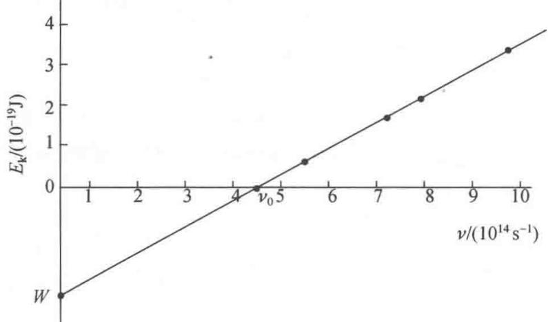  
图 1.2 金属钠的 $E_{k}-\nu$ 图

由式

$$
h \nu = h \nu_ {0} + E _ {\mathrm{k}}
$$

推知

$$
h = \frac {E _ {\mathrm{k}}}{\nu - \nu_ {0}} = \frac {\Delta E _ {\mathrm{k}}}{\Delta \nu}
$$

即 Planck 常数等于 $E_{k}-\nu$ 图的斜率。选取两合适点，将 $E_{k}$ 和 $\nu$ 值代入上式，即可求出 h。例如：

$$
h = \frac {(2 . 7 0 - 1 . 0 5) \times 1 0 ^ {- 1 9} \mathrm{J}}{(8 . 5 0 - 6 . 0 0) \times 1 0 ^ {1 4} \mathrm{s} ^ {- 1}} = 6. 6 0 \times 1 0 ^ {- 3 4} \mathrm{Js}
$$

图中直线与横坐标的交点所代表的 $\nu$ 即金属钠的临阈频率 $\nu_{0}$ ，由图可知， $\nu_{0}=4.36\times10^{14}\ s^{-1}$ 。因此，金属钠的脱出功为

$$
\begin{array}{r l} W & = h \nu_ {0} = 6. 6 0 \times 1 0 ^ {- 3 4} \mathrm{Js} \times 4. 3 6 \times 1 0 ^ {1 4} \mathrm{s} ^ {- 1} \\ & = 2. 8 8 \times 1 0 ^ {- 1 9} \mathrm{J} \end{array}
$$

【1.3】金属钾的临阈频率为 $5.464 \times 10^{14} \, s^{-1}$ ，如用它作为光电池的阴极，当用波长为 300 nm 的紫外光照射该电池时，发射的光电子的最大速度是多少？

解

$$
\begin{array}{r l} & h \nu = h \nu_ {0} + \frac {1}{2} m v ^ {2} \\ & v = \left[ \frac {2 h (\nu - \nu_ {0})}{m} \right] ^ {\frac {1}{2}} \\ & = \left[ \frac {2 \times 6 . 6 2 6 \times 1 0 ^ {- 3 4} \mathrm{Js} \left(\frac {2 . 9 9 8 \times 1 0 ^ {8} \mathrm{ms} ^ {- 1}}{3 0 0 \times 1 0 ^ {- 9} \mathrm{m}} - 5 . 4 6 4 \times 1 0 ^ {1 4} \mathrm{s} ^ {- 1}\right)}{9 . 1 0 9 \times 1 0 ^ {- 3 1} \mathrm{kg}} \right] ^ {\frac {1}{2}} \\ & = \left[ \frac {2 \times 6 . 6 2 6 \times 1 0 ^ {- 3 4} \mathrm{Js} \times 4 . 5 2 9 \times 1 0 ^ {1 4} \mathrm{s} ^ {- 1}}{9 . 1 0 9 \times 1 0 ^ {- 3 1} \mathrm{kg}} \right] ^ {\frac {1}{2}} \\ & = 8. 1 2 \times 1 0 ^ {5} \mathrm{ms} ^ {- 1} \end{array}
$$

【1.4】计算下述粒子的德布罗意波的波长：

(1) 质量为 $10^{-10}$ kg, 运动速度为 $0.01 \, m s^{-1}$ 的尘埃;

(2) 动能为 0.1 eV 的中子；

(3) 动能为 $300 \, eV$ 的自由电子。

解 根据 de Broglie 关系式：

$$
\begin{array}{r l} & \lambda = \frac {h}{m v} = \frac {6 . 6 2 6 \times 1 0 ^ {- 3 4} \mathrm{Js}}{1 0 ^ {- 1 0} \mathrm{kg} \times 0 . 0 1 \mathrm{ms} ^ {- 1}} \\ & \quad = 6. 6 2 6 \times 1 0 ^ {- 2 2} \mathrm{m} \\ & \lambda = \frac {h}{p} = \frac {h}{\sqrt {2 m T}} = \frac {6 . 6 2 6 \times 1 0 ^ {- 3 4} \mathrm{Js}}{\sqrt {2 \times 1 . 6 7 5 \times 1 0 ^ {- 2 7} \mathrm{kg} \times 0 . 1 \mathrm{eV} \times 1 . 6 0 2 \times 1 0 ^ {- 1 9} \mathrm{J(eV)} ^ {- 1}}} \\ & \quad = 9. 0 4 3 \times 1 0 ^ {- 1 1} \mathrm{m} \\ & \lambda = \frac {h}{p} = \frac {h}{\sqrt {2 m e V}} = \frac {6 . 6 2 6 \times 1 0 ^ {- 3 4} \mathrm{Js}}{\sqrt {2 \times 9 . 1 0 9 \times 1 0 ^ {- 3 1} \mathrm{kg} \times 1 . 6 0 2 \times 1 0 ^ {- 1 9} \mathrm{C} \times 3 0 0 \mathrm{V}}} \\ & \quad = 7. 0 8 \times 1 0 ^ {- 1 1} \mathrm{m} \end{array}
$$

【1.5】用透射电子显微镜摄取某化合物的选区电子衍射图,加速电压为 200 kV,计算电子加

速后运动时的波长。

解 根据 de Broglie 关系式:

$$
\begin{array}{r l} \lambda & = \frac {h}{p} = \frac {h}{m v} = \frac {h}{\sqrt {2 m e V}} \\ & = \frac {6 . 6 2 6 \times 1 0 ^ {- 3 4} \mathrm{Js}}{\sqrt {2 \times 9 . 1 0 9 \times 1 0 ^ {- 3 1} \mathrm{kg} \times 1 . 6 0 2 \times 1 0 ^ {- 1 9} \mathrm{C} \times 2 \times 1 0 ^ {5} \mathrm{V}}} \\ & = 2. 7 4 2 \times 1 0 ^ {- 1 2} \mathrm{m} \end{array}
$$

【评注】在进行1.3～1.5题的运算时，单位的换算十分重要。可查附录表B.2所列出的关系替换。例如由C(As)和V(WA $^{-1}$ )可将CV乘积换成J,J可换成kgm $^{2}$ s $^{-2}$ 等。

【1.6】子弹(质量0.01kg,速度 $1000\ m s^{-1}$ )、尘埃(质量 $10^{-9}\ kg$ ,速度 $10\ m s^{-1}$ )、作布朗运动的花粉(质量 $10^{-13}\ kg$ ,速度 $1\ m s^{-1}$ )、原子中电子(速度 $1000\ m s^{-1}$ )等,其速度的不确定度均为原速度的10%。判断在确定这些质点位置时,不确定度关系是否有实际意义?

解 按不确定度关系,诸粒子坐标的不确定度分别为

子弹： $\Delta x = \frac{h}{m\cdot\Delta v} = \frac{6.626\times 10^{-34}\mathrm{Js}}{0.01\mathrm{kg}\times 1000\times 10\% \mathrm{ms}^{-1}}$ $= 6.63\times 10^{-34}\mathrm{m}$

尘埃： $\Delta x = \frac{h}{m\cdot\Delta v} = \frac{6.626\times 10^{-34}\mathrm{Js}}{10^{-9}\mathrm{kg}\times 10\times 10\% \mathrm{ms}^{-1}}$ $= 6.63\times 10^{-25}\mathrm{m}$

花粉： $\Delta x=\frac{h}{m\cdot\Delta v}=\frac{6.626\times10^{-34}\mathrm{J s}}{10^{-13}\mathrm{kg}\times1\times10\%\mathrm{ms}^{-1}}=6.63\times10^{-20}\mathrm{~m}$

电子： $\Delta x = \frac{h}{m\cdot\Delta v} = \frac{6.626\times 10^{-34}\mathrm{Js}}{9.109\times 10^{-31}\mathrm{kg}\times 10^{3}\times 10\% \mathrm{ms}^{-1}}$ $= 7.27\times 10^{-6}\mathrm{m}$

由计算结果可见,前三者的坐标不确定度与它们各自的大小相比可以忽略。换言之,由不确定度关系所决定的坐标不确定度远远小于实际测量的精确度(宏观物体准确到 $10^{-8}$ m 就再好不过了)。即使质量最小、运动最慢的花粉,由不确定度关系所决定的 $\Delta x$ 也是微不足道的。此即意味着,子弹、尘埃和花粉运动中的波性可完全忽略,其坐标和动量能同时确定,不确定度关系对所讨论的问题实际上不起作用。

而原子中的电子的情况截然不同。由不确定度关系所决定的坐标不确定度远远大于原子本身的大小(原子大小数量级一般为几十到几百个pm)，显然是不能忽略的，即电子在运动中的波动效应不能忽略，其运动规律服从量子力学，不确定度关系对讨论的问题有实际意义。

由此可见,不确定度关系为检验和判断经典力学适用的场合和限度提供了客观标准。凡是可以把 Planck 常数看作零的场合都是经典场合,粒子的运动规律可以用经典力学处理;凡是不能把 Planck 常数看作零的场合都是量子场合,微粒的运动规律必须用量子力学处理。

【1.7】电视机显像管中运动的电子,假定加速电压为 $1000 \, V$ , 电子运动速度的不确定度 $\Delta v$ 为 v 的 10%, 判断电子的波性对荧光屏上成像有无影响?

解 在给定加速电压下,由不确定度关系所决定的电子坐标的不确定度为

$$
\begin{aligned} \Delta x = & \frac {h}{m \cdot \Delta v} = \frac {h}{m \cdot \sqrt {2 e V / m} \times 10\%} = \frac {h}{\sqrt {2 m e V} \times 10\%} \\ = & \frac {6.626\times 10^{-34}\mathrm{Js} \times 10}{\sqrt {2\times 9.109\times 10^{-31}\mathrm{kg} \times 1.602\times 10^{-19}\mathrm{C} \times 10^{3}\mathrm{V}}} \\ = & 3.88\times 10^{-10}\mathrm{m} \end{aligned}
$$

这坐标不确定度对于电视机(即使目前世界上尺寸最小的袖珍电视机)荧光屏的大小来说,完全可以忽略。人的眼睛分辨不出电子运动中的波性。因此,电子的波性对电视机荧光屏上成像无影响。

【1.8】试阐述相速度 $(u)$ 和群速度 $(v_{\mathrm{g}})$ 所表达的波的物理意义和图像，用波函数 $(\psi)$ 和概率密度函数 $(\psi^2)$ 的图像说明它们的差别。

解 相速度 $(u)$ 表达单位时间内物质波动状态的相位的传播速率，用最简单的一维箱中粒子的波函数 $(\psi)$ 的图像为例[参见《结构化学基础》(第5版)图1.3.2]表达其图形示于图1.8(a)。由图可得

$$
u = \lambda / T = \nu \lambda (T \text { 代表周期 })
$$

群速度 $(v_{\mathrm{g}})$ 表达单位时间内实物粒子波动的概率密度函数 $(\psi^{2})$ 的图像，示于图1.8(b)。由图可见，实物粒子运动周期缩短了一半，它的位相传播速度，即群速度 $v_{g}$ 是相速度u的二倍。

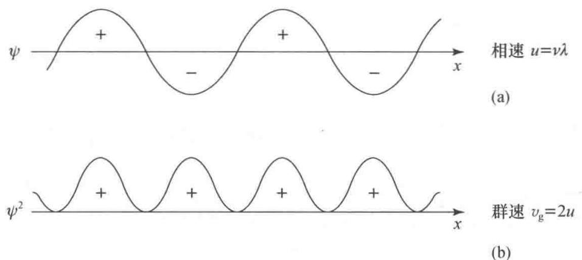  
图 1.8 相速度 $(u)$ 和群速度 $(v_{\mathrm{g}})$ 示意图

## 【1.9】根据不确定度关系

（1）将下列微粒按最小速度的不确定度 $\Delta v_{min}$ 增加的顺序排列起来：（a） $H_{2}$ 分子中的电子，（b） $H_{2}$ 中的 H 原子，（c）C 原子核中的质子，（d）纳米管中的 $H_{2}$ 分子，（e）5 m 宽箱中的 $O_{2}$ 分子。

(2) 计算(a)和(e)中粒子的 $\Delta v_{\min}$ 。

## 解

（1）不同粒子的质量 m 的数值约为：（a）电子 $9.1 \times 10^{-31}$ kg，（b）质子 $1.7 \times 10^{-27}$ kg，（c）H 原子 $1.7 \times 10^{-27}$ kg，（d） $H_{2}$ 分子 $3.4 \times 10^{-27}$ kg，（e） $O_{2}$ $5.3 \times 10^{-26}$ kg。

$\Delta x$ 的数值约为： $H_{2}$ 分子 $3 \times 10^{-10} \, m$ ，C 原子核 $1 \times 10^{-15} \, m$ ，纳米管 $1 \times 10^{-9} \, m$ ，5 米箱 $5 \, m$ 。

从 $\Delta x \cdot \Delta p_{x} = h$ 出发，考虑 $\Delta p_{x} = m \Delta v_{\min}$ 。 $\Delta v_{\min}$ 可按下式估算：

$$
\Delta v _ {\mathrm{min}} = h / m \cdot \Delta x
$$

$\Delta v_{\mathrm{min}}$ 由小到大的次序为

$$
(e) <   (d) <   (b) <   (a) <   (c)
$$

(2) (a) $H_{2}$ 分子中电子的 $\Delta v_{\min}$ 为

$$
\Delta v _ {\mathrm{min}} = h / m \cdot \Delta x = \frac {6 . 6 \times 1 0 ^ {- 3 4} \mathrm{Js}}{(9 . 1 \times 1 0 ^ {- 3 1} \mathrm{kg}) (3 \times 1 0 ^ {- 1 0} \mathrm{m})} = 2. 4 \times 1 0 ^ {6} \mathrm{ms} ^ {- 1}
$$

(e) 5 m 宽箱中的 $O_{2}$ 分子

$$
\Delta v _ {\mathrm{min}} = h / m \cdot \Delta x = \frac {6 . 6 \times 1 0 ^ {- 3 4} \mathrm{Js}}{(5 . 3 \times 1 0 ^ {- 2 6} \mathrm{kg}) (5 \mathrm{m})} = 2. 5 \times 1 0 ^ {- 9} \mathrm{ms} ^ {- 1}
$$

【1.10】 $\psi = x\mathrm{e}^{-ax^2}$ 是算符 $\left(\frac{\mathrm{d}^2}{\mathrm{d}x^2} -4a^2 x^2\right)$ 的本征函数，求其本征值。

解 应用量子力学基本假设Ⅱ(算符)和Ⅲ(本征函数、本征值和本征方程)，得

$$
\begin{array}{r l} \left(\frac {\mathrm{d} ^ {2}}{\mathrm{d} x ^ {2}} - 4 a ^ {2} x ^ {2}\right) \psi & = \left(\frac {\mathrm{d} ^ {2}}{\mathrm{d} x ^ {2}} - 4 a ^ {2} x ^ {2}\right) x \mathrm{e} ^ {- a x ^ {2}} \\ & = \frac {\mathrm{d} ^ {2}}{\mathrm{d} x ^ {2}} x \mathrm{e} ^ {- a x ^ {2}} - 4 a ^ {2} x ^ {2} (x \mathrm{e} ^ {- a x ^ {2}}) \\ & = \frac {\mathrm{d}}{\mathrm{d} x} (\mathrm{e} ^ {- a x ^ {2}} - 2 a x ^ {2} \mathrm{e} ^ {- a x ^ {2}}) - 4 a ^ {2} x ^ {3} \mathrm{e} ^ {- a x ^ {2}} \\ & = - 2 a x \mathrm{e} ^ {- a x ^ {2}} - 4 a x \mathrm{e} ^ {- a x ^ {2}} + 4 a ^ {2} x ^ {3} \mathrm{e} ^ {- a x ^ {2}} - 4 a ^ {2} x ^ {3} \mathrm{e} ^ {- a x ^ {2}} \\ & = - 6 a x \mathrm{e} ^ {- a x ^ {2}} \\ & = - 6 a \psi \end{array}
$$

因此，本征值为-6a。

【1.11】下列函数中，哪几个是算符 $\frac{\mathrm{d}^2}{\mathrm{d}x^2}$ 的本征函数？若是，求出其本征值。

$$
\mathrm{e} ^ {x}, \sin x, 2 \cos x, x ^ {3}, \sin x + \cos x
$$

解 $\frac{\mathrm{d}^2}{\mathrm{d}x^2}\mathrm{e}^x = 1\times \mathrm{e}^x,\mathrm{e}^x$ 是 $\frac{\mathrm{d}^2}{\mathrm{d}x^2}$ 的本征函数，本征值为1；

$\frac{d^{2}}{dx^{2}}\sin x=-1\times\sin x,\sin x$ 是 $\frac{d^{2}}{dx^{2}}$ 的本征函数，本征值为 -1；

$\frac{d^{2}}{dx^{2}}2\cos x=-2\cos x,2\cos x$ 是 $\frac{d^{2}}{dx^{2}}$ 的本征函数，本征值为-1；

$\frac{\mathrm{d}^2}{\mathrm{d}x^2} x^3 = 6x \neq cx^3, x^3$ 不是 $\frac{\mathrm{d}^2}{\mathrm{d}x^2}$ 的本征函数；

$\frac{\mathrm{d}^2}{\mathrm{d}x^2} (\sin x + \cos x) = -(\sin x + \cos x), \sin x + \cos x$ 是 $\frac{\mathrm{d}^2}{\mathrm{d}x^2}$ 的本征函数，本征值为-1。

【1.12】 $e^{im\phi}$ 和 $\cos m\phi$ 对算符 i $\frac{d}{d\phi}$ 是否为本征函数？若是，求出其本征值。

解 $\mathrm{i}\frac{\mathrm{d}}{\mathrm{d}\phi}\mathrm{e}^{\mathrm{i}m\phi} = \mathrm{i}\mathrm{e}^{\mathrm{i}m\phi}\cdot \mathrm{i}m = -m\mathrm{e}^{\mathrm{i}m\phi}$

所以 $e^{im\phi}$ 是算符 i $\frac{d}{d\phi}$ 的本征函数，本征值为 -m。

而 $\mathrm{i}\frac{\mathrm{d}}{\mathrm{d}\phi}\cos m\phi = \mathrm{i}(-\sin m\phi)\cdot m = -\mathrm{i}msinm\phi \neq c\cos m\phi$

所以 $\cos m\phi$ 不是算符 $\mathrm{i}\frac{\mathrm{d}}{\mathrm{d}\phi}$ 的本征函数。

【1.13】证明在一维势箱中运动的粒子的各个波函数互相正交。

证明 在长度为 $l$ 的一维势箱中运动的粒子的波函数为

$$
\psi_ {n} (x) = \sqrt {\frac {2}{l}} \sin \frac {n \pi x}{l} \quad 0 <   x <   l, \quad n = 1, 2, 3, \dots
$$

令 n 和 $n'$ 表示不同的量子数, 将上式积分:

$$
\begin{array}{r l} \int_ {0} ^ {l} \psi_ {n} (x) \psi_ {n ^ {\prime}} (x) \mathrm{d} \tau & = \int_ {0} ^ {l} \sqrt {\frac {2}{l}} \sin \frac {n \pi x}{l} \cdot \sqrt {\frac {2}{l}} \sin \frac {n ^ {\prime} \pi x}{l} \mathrm{d} x \\ & = \frac {2}{l} \int_ {0} ^ {l} \sin \frac {n \pi x}{l} \cdot \sin \frac {n ^ {\prime} \pi x}{l} \mathrm{d} x \\ & = \frac {2}{l} \left[ \frac {\sin \frac {(n - n ^ {\prime}) \pi}{l} x}{2 \times \frac {(n - n ^ {\prime}) \pi}{l}} - \frac {\sin \frac {(n + n ^ {\prime}) \pi}{l} x}{2 \times \frac {(n + n ^ {\prime}) \pi}{l}} \right] _ {0} ^ {l} \\ & = \left[ \frac {\sin \frac {(n - n ^ {\prime}) \pi}{l} x}{(n - n ^ {\prime}) \pi} - \frac {\sin \frac {(n + n ^ {\prime}) \pi}{l} x}{(n + n ^ {\prime}) \pi} \right] _ {0} ^ {l} \\ & = \frac {\sin (n - n ^ {\prime}) \pi}{(n - n ^ {\prime}) \pi} - \frac {\sin (n + n ^ {\prime}) \pi}{(n + n ^ {\prime}) \pi} \end{array}
$$

n 和 $n'$ 皆为正整数, 因而 $(n-n')$ 和 $(n+n')$ 皆为整数, 所以积分:

$$
\int_ {0} ^ {l} \psi_ {n} (x) \psi_ {n ^ {\prime}} (x) \mathrm{d} \tau = 0
$$

根据定义， $\psi_{n}(x)$ 和 $\psi_{n'}(x)$ 互相正交。

【1.14】已知一维势箱中粒子的归一化波函数为

$$
\psi_ {n} (x) = \sqrt {\frac {2}{l}} \sin \left(\frac {n \pi x}{l}\right) \quad n = 1, 2, 3, \dots
$$

式中 l 是势箱的长度，x 是粒子的坐标 $(0 < x < l)$ 。求：（1）粒子的能量，（2）粒子的坐标，（3）动量的平均值。

解 （1）由于已经有了箱中粒子的归一化波函数，将能量算符直接作用于波函数，所得常数即为粒子的能量：

$$
\begin{array}{r l} \hat {H} \psi_ {n} (x) & = - \frac {h ^ {2}}{8 \pi^ {2} m} \frac {\mathrm{d} ^ {2}}{\mathrm{d} x ^ {2}} \left(\sqrt {\frac {2}{l}} \sin \frac {n \pi x}{l}\right) \\ & = - \frac {h ^ {2}}{8 \pi^ {2} m} \frac {\mathrm{d}}{\mathrm{d} x} \left(\sqrt {\frac {2}{l}} \times \frac {n \pi}{l} \cos \frac {n \pi x}{l}\right) \\ & = - \frac {h ^ {2}}{8 \pi^ {2} m} \times \sqrt {\frac {2}{l}} \times \frac {n \pi}{l} \times \left(- \frac {n \pi}{l} \sin \frac {n \pi x}{l}\right) \\ & = \frac {h ^ {2}}{8 \pi^ {2} m} \times \frac {n ^ {2} \pi^ {2}}{l ^ {2}} \times \sqrt {\frac {2}{l}} \sin \frac {n \pi x}{l} \\ & = \frac {n ^ {2} h ^ {2}}{8 m l ^ {2}} \psi_ {n} (x) \end{array}
$$

即

$$
E _ {n} = \frac {n ^ {2} h ^ {2}}{8 m l ^ {2}}
$$

(2) 由于 $\hat{x}\psi_{n}(x)\neq c\psi_{n}(x)$ ， $\hat{x}$ 无本征值，只能求粒子坐标的平均值：

$$
\begin{array}{r l} \langle x \rangle & = \int_ {0} ^ {l} \psi_ {n} ^ {*} (x) \hat {x} \psi_ {n} (x) d x \\ & = \int_ {0} ^ {l} \left(\sqrt {\frac {2}{l}} \sin \frac {n \pi x}{l}\right) ^ {*} x \left(\sqrt {\frac {2}{l}} \sin \frac {n \pi x}{l}\right) d x \\ & = \frac {2}{l} \int_ {0} ^ {l} x \sin^ {2} \left(\frac {n \pi x}{l}\right) d x \\ & = \frac {2}{l} \int_ {0} ^ {l} x \left(\frac {1 - \cos (2 n \pi x / l)}{2}\right) d x \\ & = \frac {1}{l} \left[ \int_ {0} ^ {l} x d x - \int_ {0} ^ {l} x \cos \left(\frac {2 n \pi}{l}\right) x d x \right] \\ & = \frac {1}{l} \left[ \frac {x ^ {2}}{2} \Big | _ {0} ^ {l} - \left(\frac {l}{2 n \pi}\right) ^ {2} \left(\cos \frac {2 n \pi x}{l}\right) \Big | _ {0} ^ {l} - \frac {l}{2 n \pi} \left(x \sin \frac {2 n \pi x}{l}\right) \Big | _ {0} ^ {l} \right] \\ & = \frac {l}{2} \end{array}
$$

粒子的平均位置在势箱的中央，说明它在势箱左、右两个半边出现的概率各为0.5，即 $\left|\psi_{n}\right|^{2}$ 图形对势箱中心点是对称的。在解本题时用到了积分公式：

$$
\int x \cos n x \mathrm{d} x = \frac {1}{n ^ {2}} \cos n x + \frac {1}{n} x \sin n x
$$

(3) $\hat{p}_x\psi_n(x)\neq c\psi_n(x),\hat{p}_x$ 无本征值。可按下式计算 $p_x$ 的平均值：

$$
\begin{array}{r l} \langle p _ {x} \rangle & = \int_ {0} ^ {l} \psi_ {n} ^ {*} (x) \hat {p} _ {x} \psi_ {n} (x) \mathrm{d} x \\ & = \int_ {0} ^ {l} \sqrt {\frac {2}{l}} \sin \frac {n \pi x}{l} \left(- \frac {\mathrm{i} h}{2 \pi} \frac {\mathrm{d}}{\mathrm{d} x}\right) \sqrt {\frac {2}{l}} \sin \frac {n \pi x}{l} \mathrm{d} x \\ & = - \frac {\mathrm{i} h}{\pi l} \int_ {0} ^ {l} \sin \frac {n \pi x}{l} \cos \frac {n \pi x}{l} \cdot \frac {n \pi}{l} \mathrm{d} x \\ & = - \frac {n \mathrm{i} h}{l ^ {2}} \int_ {0} ^ {l} \sin \frac {n \pi x}{l} \cos \frac {n \pi x}{l} \mathrm{d} x \\ & = 0 \end{array}
$$

【评注】上述 1.11～1.14 题都涉及算符。通过解答这些习题加深对线性自轭算符的了解：

(1) 了解算符的定义和性质。

(2) 体会用函数 $\psi$ 描述的体系, 其任何一个可观测的物理量 $A$ 都和一个线性自轭算符 $\hat{A}$ 相对应。通过算符 $\hat{A}$ 对 $\psi$ 的运算可求得物理量的平均值。

(3) 了解线性自轭算符 $\hat{A}$ 的两个特性：

(a) 线性自轭算符 $\hat{A}$ 的本征函数的本征值是实数。

(b) 线性自轭算符 $\hat{A}$ 给出的本征函数组 $\psi_{1}, \psi_{2}, \psi_{3}, \cdots$ 形成一个正交归一的函数组。

(4) 了解用下一关系式来定义自轭算符的必要性:

$$
\int \psi_ {i} ^ {*} \hat {A} \psi_ {j} \mathrm{d} \tau = \int \psi_ {i} (\hat {A} \psi_ {j}) ^ {*} \mathrm{d} \tau
$$

它将抽象的数学公式的定义(作为工具)和实际问题(求物理量的平均值)联系起来。

【1.15】求一维势箱中粒子在 $\psi_{1}$ 和 $\psi_{2}$ 状态时，在箱中 0.49 l～0.51 l 范围内出现的概率，并与《结构化学基础》(第 5 版) 中图 1.3.2(b) 相比较，讨论所得结果是否合理。

解 下面分三步进行讨论：

$$
\begin{array}{r l} & (1) \psi_ {1} (x) = \sqrt {\frac {2}{l}} \sin \frac {\pi x}{l}, \quad \psi_ {1} ^ {2} (x) = \frac {2}{l} \sin^ {2} \frac {\pi x}{l} \\ & \psi_ {2} (x) = \sqrt {\frac {2}{l}} \sin \frac {2 \pi x}{l}, \quad \psi_ {2} ^ {2} (x) = \frac {2}{l} \sin^ {2} \frac {2 \pi x}{l} \end{array}
$$

由上述表达式计算 $\psi_1^2 (x)$ 和 $\psi_2^2 (x)$ ，并列表如下：

<table><tr><td> $x/l$ </td><td>0</td><td> $\frac{1}{8}$ </td><td> $\frac{1}{4}$ </td><td> $\frac{1}{3}$ </td><td> $\frac{3}{8}$ </td><td> $\frac{1}{2}$ </td></tr><tr><td> $\psi_{1}^{2}(x)/l^{-1}$ </td><td>0</td><td>0.293</td><td>1.000</td><td>1.500</td><td>1.726</td><td>2.000</td></tr><tr><td> $\psi_{2}^{2}(x)/l^{-1}$ </td><td>0</td><td>1.000</td><td>2.000</td><td>1.500</td><td>1.000</td><td>0</td></tr><tr><td> $x/l$ </td><td></td><td> $\frac{5}{8}$ </td><td> $\frac{2}{3}$ </td><td> $\frac{3}{4}$ </td><td> $\frac{7}{8}$ </td><td>1</td></tr><tr><td> $\psi_{1}^{2}(x)/l^{-1}$ </td><td></td><td>1.726</td><td>1.500</td><td>1.000</td><td>0.293</td><td>0</td></tr><tr><td> $\psi_{2}^{2}(x)/l^{-1}$ </td><td></td><td>1.000</td><td>1.500</td><td>2.000</td><td>1.000</td><td>0</td></tr></table>

根据表中所列数据作 $\psi_{n}^{2}(x)-x$ 图，示于图 1.15 中。

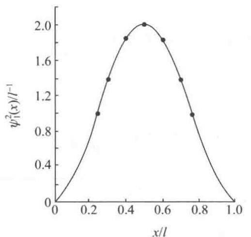

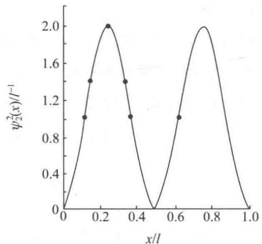  
图1.15 一维势箱中粒子 $\psi_n^2 (x) - x$ 图

(2) 粒子在 $\psi_{1}$ 状态时, 出现在 0.49l\~0.51l 间的概率为

$$
\begin{array}{r l} P _ {1} & = \int_ {0. 4 9 l} ^ {0. 5 1 l} \psi_ {1} ^ {2} (x) \mathrm{d} x = \int_ {0. 4 9 l} ^ {0. 5 1 l} \left(\sqrt {\frac {2}{l}} \sin \frac {\pi x}{l}\right) ^ {2} \mathrm{d} x \\ & = \int_ {0. 4 9 l} ^ {0. 5 1 l} \frac {2}{l} \sin^ {2} \frac {\pi x}{l} \mathrm{d} x \\ & = \frac {2}{l} \left[ \frac {x}{2} - \frac {l}{4 \pi} \sin \frac {2 \pi x}{l} \right] _ {0. 4 9 l} ^ {0. 5 1 l} \\ & = \left[ \frac {x}{l} - \frac {1}{2 \pi} \sin \frac {2 \pi x}{l} \right] _ {0. 4 9 l} ^ {0. 5 1 l} \end{array}
$$

$$
\begin{array}{l} = 0. 0 2 - \frac {1}{2 \pi} (\sin 1. 0 2 \pi - \sin 0. 9 8 \pi) \\ = 0. 0 3 9 9 \end{array}
$$

粒子在 $\psi_{2}$ 状态时，出现在 $0.49l \sim 0.51l$ 间的概率为

$$
\begin{array}{r l} P _ {2} & = \int_ {0. 4 9 l} ^ {0. 5 1 l} \psi_ {2} ^ {2} (x) \mathrm{d} x = \int_ {0. 4 9 l} ^ {0. 5 1 l} \left(\sqrt {\frac {2}{l}} \sin \frac {2 \pi x}{l}\right) ^ {2} \mathrm{d} x \\ & = \int_ {0. 4 9 l} ^ {0. 5 1 l} \frac {2}{l} \sin^ {2} \frac {2 \pi x}{l} \mathrm{d} x \\ & = \frac {2}{l} \left[ \frac {x}{2} - \frac {l}{8 \pi} \sin \frac {4 \pi x}{l} \right] _ {0. 4 9 l} ^ {0. 5 1 l} \\ & = \left[ \frac {x}{l} - \frac {1}{4 \pi} \sin \frac {4 \pi x}{l} \right] _ {0. 4 9 l} ^ {0. 5 1 l} \\ & = \left(\frac {0 . 5 1 l}{l} - \frac {1}{4 \pi} \sin \frac {4 \pi \times 0 . 5 1 l}{l}\right) - \left(\frac {0 . 4 9 l}{l} - \frac {1}{4 \pi} \sin \frac {4 \pi \times 0 . 4 9 l}{l}\right) \\ & \approx 0. 0 0 0 1 \end{array}
$$

(3) 计算结果与图形符合。

【1.16】设粒子处在0\~a范围内的一维无限深势阱中运动，其状态可用波函数

$$
\psi (x) = \frac {4}{\sqrt {a}} \sin \left(\frac {\pi x}{a}\right) \cos^ {2} \left(\frac {\pi x}{a}\right)
$$

表示,试估算:

(1) 该粒子能量的可能测量值及相应的概率；

(2) 能量平均值。

[提示：利用三角函数展开 $\psi(x)$ ，再用一维势箱中粒子的归一化波函数的线性组合 $\psi=\sum c_{n}\psi_{n}$ 形式表达，由组合系数进行计算。]

解（1）利用三角函数的性质，直接将 $\psi (x)$ 展开：

$$
\begin{array}{r l} \psi (x) & = \frac {4}{\sqrt {a}} \sin \frac {\pi x}{a} \cos^ {2} \frac {\pi x}{a} = \frac {2}{\sqrt {a}} \sin \frac {\pi x}{a} \left(1 + \cos \frac {2 \pi x}{a}\right) \\ & = \frac {2}{\sqrt {a}} \left(\sin \frac {\pi x}{a} + \frac {1}{2} \sin \frac {3 \pi x}{a} - \frac {1}{2} \sin \frac {\pi x}{a}\right) \\ & = \frac {1}{\sqrt {2}} \sqrt {\frac {2}{a}} \sin \frac {\pi x}{a} + \frac {1}{\sqrt {2}} \sqrt {\frac {2}{a}} \sin \frac {3 \pi x}{a} \\ & = \frac {1}{\sqrt {2}} \psi_ {1} + \frac {1}{\sqrt {2}} \psi_ {3} \end{array}
$$

只有两种可能的能量值： $E_{1}=h^{2}/(8ma^{2})$ ，概率 $P_{1}=c_{1}^{2}=1/2$

$$
E _ {3} = 9 h ^ {2} / (8 m a ^ {2}), \quad \text { 概率 } P _ {3} = c _ {3} ^ {2} = 1 / 2
$$

(2) 能量平均值为: $c_{1}^{2}E_{1} + c_{3}^{2}E_{3} = \frac{5h^{2}}{8ma^{2}}$

【1.17】链形共轭分子 $CH_{2}CHCHCHCHCHCHCH_{2}$ 在长波方向 460 nm 处出现第一个强吸收峰，试按一维势箱模型估算其长度。

解 该分子共有 4 对 $\pi$ 电子, 形成 $\pi_{8}^{8}$ 离域 $\pi$ 键。当分子处于基态时, 8 个 $\pi$ 电子占据能级最低的前 4 个分子轨道。当分子受到激发时， $\pi$ 电子由能级最高的被占轨道 $(n = 4)$ 跃迁到能级最低的空轨道 $(n = 5)$ ，激发所需要的最低能量为 $\Delta E = E_5 - E_4$ ，而与此能量对应的吸收峰即长波方向 $460 \mathrm{~nm}$ 处的第一个强吸收峰。按一维势箱粒子模型，可得

$$
\Delta E = \frac {h c}{\lambda} = (2 n + 1) \frac {h ^ {2}}{8 m l ^ {2}}
$$

因此

$$
\begin{array}{r l} & l = \left[ \frac {(2 n + 1) h \lambda}{8 m c} \right] ^ {\frac {1}{2}} \\ & = \left[ \frac {(2 \times 4 + 1) \times 6 . 6 2 6 \times 1 0 ^ {- 3 4} \mathrm{Js} \times 4 6 0 \times 1 0 ^ {- 9} \mathrm{m}}{8 \times 9 . 1 0 9 \times 1 0 ^ {- 3 1} \mathrm{kg} \times 2 . 9 9 8 \times 1 0 ^ {8} \mathrm{ms} ^ {- 1}} \right] ^ {\frac {1}{2}} \\ & = 1 1 2 0 \mathrm{pm} \end{array}
$$

计算结果与按分子构型参数估算所得结果吻合。

【1.18】一个粒子处在 a=b=c 的三维势箱中，试求能级最低的前 5 个能量值 [单位为 $h^{2}/(8 ma^{2})$ ]，计算每个能级的简并度。

解 质量为 m 的粒子在边长为 a 的三维势箱中运动, 其能级公式为

$$
E _ {n _ {x}, n _ {y}, n _ {z}} = \frac {h ^ {2}}{8 m a ^ {2}} (n _ {x} ^ {2} + n _ {y} ^ {2} + n _ {z} ^ {2})
$$

式中 $n_{x}, n_{y}, n_{z}$ 皆为能量量子数，均可分别取 1, 2, 3, … 等自然数。

根据上述公式,能级最低的前5个能量依次为[以 $h^{2}/(8ma^{2})$ 为单位]

$$
\begin{array}{l} {E _ {1 1 1} = 3} \\ {E _ {1 1 2} = E _ {1 2 1} = E _ {2 1 1} = 6} \\ {E _ {1 2 2} = E _ {2 1 2} = E _ {2 2 1} = 9} \\ {E _ {1 1 3} = E _ {1 3 1} = E _ {3 1 1} = 1 1} \\ {E _ {2 2 2} = 1 2} \end{array}
$$

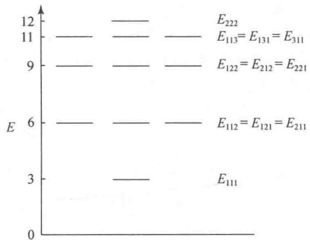  
图1.18 三维势箱能级最低的前5个能级简并情况

而相邻两个能级之能量差依次为 3,3,2,1。

简并度即属于同一能级的状态数。上述5个能级的简并度分别为1,3,3,3,1。能级简并情况示于图1.18。

【1.19】在边长为 a 和 b 的长方形二维势箱中存在质量为 m 的自由粒子, 写出它的两个方向的 Schrödinger 方程、存在能级的能量值, 以及总波函数和总能量。

解 设二维箱中粒子的坐标轴分别为 X, Y, 其总波函数 $\psi(x, y)$ 和总能量 E 分别为

$$
\begin{array}{r l} \psi (x, y) & = X (x) Y (y) \\ E & = E _ {x} + E _ {y} \end{array}
$$

其 Schrödinger 方程为

$$
- \frac {h ^ {2}}{2 \pi^ {2} m} \left(\frac {\partial^ {2}}{\partial x ^ {2}} + \frac {\partial^ {2}}{\partial y ^ {2}}\right) \psi = (E _ {x} + E _ {y}) \psi
$$

它可按两个方向分别地解得本征波函数和能量

$$
X (x) = \sqrt {\frac {2}{a}} \sin \frac {n _ {x} \pi x}{a}, E _ {x} (n _ {x}) = \frac {h ^ {2}}{8 m a ^ {2}}
$$

$$
Y (y) = \sqrt {\frac {2}{b}} \sin \frac {n _ {y} \pi y}{b}, E _ {y} (n _ {y}) = \frac {h ^ {2}}{8 m b ^ {2}}
$$

总波函数为

$$
\psi (x, y) = \frac {2}{\sqrt {a b}} \sin \frac {n _ {x} \pi x}{a} \cdot \sin \frac {n _ {y} \pi y}{b}
$$

总能量为

$$
E = E _ {x} + E _ {y} = \frac {h ^ {2}}{8 m} \left(\frac {n _ {x} {} ^ {2}}{a ^ {2}} + \frac {n _ {y} {} ^ {2}}{b ^ {2}}\right)
$$

【1.20】若在下一离子中运动的 $\pi$ 电子可用一维势箱近似表示其运动特征：

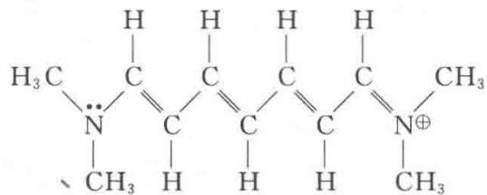

估计这一势箱的长度 $l=1.3\ nm$ ，根据能级公式 $E_{n}=n^{2}h^{2}/8\ ml^{2}$ 估算 $\pi$ 电子跃迁时所吸收的光的波长，并与实验值 510.0 nm 比较。

解 该离子共有 10 个 $\pi$ 电子, 当离子处于基态时, 这些电子填充在能级最低的前 5 个 $\pi$ 型分子轨道上。离子受到光的照射, $\pi$ 电子将从低能级跃迁到高能级, 跃迁所需要的最低能量即第 5 和第 6 两个分子轨道的能级差。此能级差对应于吸收光谱的最大波长。应用一维势箱粒子的能级表达式即可求出该波长:

$$
\begin{array}{r l} \Delta E & = \frac {h c}{\lambda} = E _ {6} - E _ {5} = \frac {6 ^ {2} h ^ {2}}{8 m l ^ {2}} - \frac {5 ^ {2} h ^ {2}}{8 m l ^ {2}} = \frac {1 1 h ^ {2}}{8 m l ^ {2}} \\ \lambda & = \frac {8 m c l ^ {2}}{1 1 h} \\ & = \frac {8 \times 9 . 1 0 9 5 \times 1 0 ^ {- 3 1} \mathrm{kg} \times 2 . 9 9 7 9 \times 1 0 ^ {8} \mathrm{ms} ^ {- 1} \times (1 . 3 \times 1 0 ^ {- 9} \mathrm{m}) ^ {2}}{1 1 \times 6 . 6 2 6 2 \times 1 0 ^ {- 3 4} \mathrm{Js}} \\ & = 5 0 6. 6 \mathrm{nm} \end{array}
$$

实验值为 510.0 nm，计算值与实验值的相对误差为 -0.67%。

【1.21】已知封闭的圆环中粒子的能级为

$$
E _ {n} = \frac {n ^ {2} h ^ {2}}{8 \pi^ {2} m R ^ {2}} \quad n = 0, \pm 1, \pm 2, \pm 3, \dots
$$

式中 n 为量子数，R 是圆环的半径。若将此能级公式近似地用于苯分子中的 $\pi_{6}^{6}$ 离域 $\pi$ 键，取 R=140 pm，试求其电子从基态跃迁到第一激发态所吸收的光的波长。

解 由量子数 $n$ 可知， $n = 0$ 为非简并态， $|n| \geqslant 1$ 都为二重简并态，6个 $\pi$ 电子处于 $n = 0, 1, -1$ 等3个轨道，如图1.21所示。

$$
\begin{array}{r l} \Delta E & = E _ {2} - E _ {1} = \frac {(4 - 1) h ^ {2}}{8 \pi^ {2} m R ^ {2}} = \frac {h c}{\lambda} \\ \lambda & = \frac {8 \pi^ {2} m R ^ {2} c}{3 h} \\ & = \frac {8 \pi^ {2} \times (9 . 1 1 \times 1 0 ^ {- 3 1} \mathrm{kg}) \times (1 . 4 0 \times 1 0 ^ {- 1 0} \mathrm{m}) ^ {2} \times (2 . 9 9 8 \times 1 0 ^ {8} \mathrm{ms} ^ {- 1})}{3 \times (6 . 6 2 6 \times 1 0 ^ {- 3 4} \mathrm{Js})} \\ & = 2 1 2 \times 1 0 ^ {- 9} \mathrm{m} \\ & = 2 1 2 \mathrm{nm} \end{array}
$$

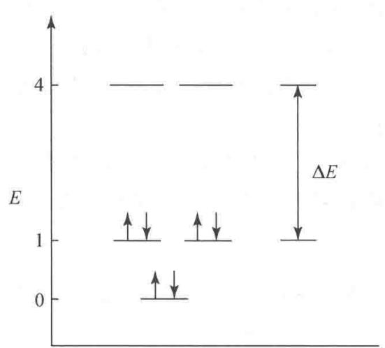  
图1.21 封闭圆环式苯分子 $\pi_6^6$ 离域 $\pi$ 键的能级和电子排布

实验表明,苯的紫外光谱中出现3个吸收带,它们的吸收位置分别为184.0 nm,208.0 nm和263.0 nm,前两者为强吸收,最后一个是弱吸收。由于最低反键轨道能级分裂为3种激发态,这3个吸收带皆源于 $\pi$ 电子在最高成键轨道和最低反键轨道之间的跃迁。计算结果和实验测定值符合较好。

## 【评注】

（1）习题 1.19～1.21 是用箱中粒子模型处理共轭体系的能量、光谱及箱子尺寸等问题的典型例子。由解题过程可知，解决此类问题的关键是确定 $\pi$ 电子在哪两种分子轨道间跃迁。为此，必须正确地分析体系中各原子的成键情况；准确地计算体系中 $\pi$ 电子的数目；将 $\pi$ 电子按能量最低原理、Pauli 原理和 Hund 规则排布在有关分子轨道上。确定了最高被占轨道和最低空轨道后，即可应用箱中粒子的能级公式求出两种轨道的能级差，进而求出吸收光的波长，或由已知的波长求出共轭体系的大小（箱长）。

学生在解答此类问题时常出现下列差错：

(a) 算错体系中参与共轭的 $\pi$ 电子数, 从而搞错了最高被占轨道和最低空轨道, 导致了错误的能量计算结果。例如, 在 1.20 题中, 有的学生错误地认为 $\pi$ 电子是从 $n = 4$ 的轨道跃迁到 $n = 5$ 的轨道, 因而把激发能算成 $\Delta E = E_{5} - E_{4}$ 。更有个别学生把 $\Delta E$ 算成 $E_{4} - E_{3}$ 。产生这些错误的原因是对体系中各原子的成键情况分析不够。只要仔细分析体系的结构, 了解与单键交替排列的双键数目 (即烯基数目), 再考虑体系两端的原子是否有孤对电子、或失去电子 (成正离子)、或得到电子 (成负离子), 就不难确定体系中 $\pi$ 电子的总数。例如, 通式为

$$
\mathrm{R} _ {2} \ddot {\mathrm{N}} - (\mathrm{CH} = \mathrm{CH} -) _ {r} \mathrm{CH} = \stackrel {+} {\mathrm{NR}} _ {2}
$$

的花菁染料中，r个烯基可贡献2r个π电子，再加上左端N原子上的孤对电子和右端次甲基双键的2个π电子，共有 $(2r+4)$ 个π电子。

(b) 由于对分子轨道理论,特别是最高被占轨道和最低空轨道的概念理解不深入,尽管懂得吸收光的波长与电子跃迁时吸收的能量有关,却仍在问题面前束手无策。也有个别学生把体系搞混了,错误地套用原子轨道概念和能级公式,得到的结果自然是错的。因此,用箱中粒子模型处理共轭体系的光谱等问题时,分子轨道、能级以及电子在有关分子轨道上的排布原则等基础知识都是必备的。

(2) 箱中粒子模型也常用来定性讨论共轭体系的稳定性,并且往往与不确定度关系、离域π键等知识配合使用。此时无需给出势箱的精确尺寸。学生应当具备根据结构化学知识估算这一参数的能力。例如，直链共轭体系中烯基生色团（—CH=CH—）的平均长度约为248 pm，再根据原子或基团的范德华半径来考虑势箱两端的延伸长度（定量处理时根据实验结果拟合），即可估算出势箱的总长度。

（3）箱中粒子模型是个近似模型。用它来处理共轭体系，在有些情况下计算结果与实验结果较吻合，但在许多情况下计算结果与实验结果相差较大。欲缩小计算值与实验值的差别，必须合理地设定模型参数。

【1.22】一个质量为 m 的粒子被束缚在一个长度为 l 的一维势箱中运动, 其本征函数和本征能量分别为

$$
\psi_ {n} (x) = \sqrt {\frac {2}{l}} \sin \left(\frac {n \pi x}{l}\right), \quad E _ {n} = \frac {n ^ {2} h ^ {2}}{8 m l ^ {2}} \quad n = 1, 2, 3, \dots
$$

若该粒子的某一运动状态用下列波函数表示：

$$
\phi (x) = 0. 6 \psi_ {1} (x) + 0. 8 \psi_ {2} (x)
$$

(1) 指出该粒子处于基态和第二激发态的概率;

(2) 计算该粒子出现在 $0 \leqslant x \leqslant l/3$ 范围内的概率；

（3）对此粒子的能量作一次测量，估算可能的实验结果。

（1）该粒子处于基态的概率为 0.36，处于第二激发态的概率为 0。

(2) 粒子出现在 $0 \leqslant x \leqslant l/3$ 的范围内的概率计算如下：

$$
\begin{array}{r l} P & = \int_ {0} ^ {l / 3} \phi^ {2} \mathrm{d} x = 0. 3 6 \int_ {0} ^ {l / 3} \psi_ {1} ^ {2} \mathrm{d} x + 0. 9 6 \int_ {0} ^ {l / 3} \psi_ {1} \psi_ {2} \mathrm{d} x + 0. 6 4 \int_ {0} ^ {l / 3} \psi_ {2} ^ {2} \mathrm{d} x \\ & = 0. 3 6 \left(\frac {1}{3} - \frac {\sqrt {3}}{4 \pi}\right) + 0. 4 8 \frac {\sqrt {3}}{\pi} + 0. 6 4 \left(\frac {1}{3} + \frac {\sqrt {3}}{8 \pi}\right) = \frac {1}{3} + 0. 4 7 \frac {\sqrt {3}}{\pi} = 0. 5 9 2 \end{array}
$$

（3）对能量作一次测量，得到的结果是不确定的，但是只有两种可能： $E_{1}$ 和 $E_{2}$ ，有 36% 的可能是 $E_{1}$ ，有 64% 的可能是 $E_{2}$ 。

# 第 2 章 原子的结构和性质

## 内容提要

化学是研究原子之间的化合和分解的科学,学习化学应从研究原子的结构和运动规律入手。原子是由一个原子核和若干个核外电子组成的体系。在量子力学建立以前,Bohr 提出氢原子结构模型,他假定电子绕核作圆周运动,处于一系列稳定状态,这些状态的角动量应为 $h/2\pi$ 的整数倍,电子由一个状态跃迁至另一个状态就会吸收或发射出光子。根据这些假定,Bohr 推出电子绕核运动的半径 r 和 Rydberg 常数 R 等数值:

$$
r = n ^ {2} h ^ {2} \varepsilon_ {0} / \pi m e ^ {2}
$$

当 $n = 1$ 时，半径 $r$ 为

$$
r = 5 2. 9 2 \mathrm{pm} \equiv a _ {0}
$$

$a_{0}$ 称为 Bohr 半径,以后人们以它作原子单位制中的长度单位。Rydberg 常数为

$$
R = m e ^ {4} / 8 c h ^ {3} \varepsilon_ {0} ^ {2}
$$

当 m 以氢原子的折合质量代入, 计算所得的 Rydberg 常数为 $R_{H}$ :

$$
R _ {\mathrm{H}} = 1 0 9 6 7 8 \mathrm{cm} ^ {- 1}
$$

这数值和实验值符合得很好,是 Bohr 氢原子模型的一大成就。但 Bohr 模型没有涉及微观粒子的波性,不能推广用于其他原子,也不能正确表达原子的球体结构。

本章根据量子力学的原理和方法,分六节处理有关原子的结构和性质:前三节处理单电子原子(氢原子和类氢离子),后三节涉及多电子原子的结构以及元素周期表和原子光谱等。

## 2.1 单电子原子的 Schrödinger 方程及其解

单电子原子的 Schrödinger 方程为

$$
\left(- \frac {h ^ {2}}{8 \pi^ {2} \mu} \nabla^ {2} - \frac {Z e ^ {2}}{4 \pi \varepsilon_ {0} r}\right) \psi = E \psi
$$

通过坐标变换, 将 Laplace 算符 $\nabla^{2}$ 从直角坐标系 $(x, y, z)$ 换成球极坐标系 $(r, \theta, \phi)$ :

$$
\begin{array}{r l} \nabla^ {2} & = \frac {\partial^ {2}}{\partial x ^ {2}} + \frac {\partial^ {2}}{\partial y ^ {2}} + \frac {\partial^ {2}}{\partial z ^ {2}} \\ & = \frac {1}{r ^ {2}} \frac {\partial}{\partial r} \left(r ^ {2} \frac {\partial}{\partial r}\right) + \frac {1}{r ^ {2} \sin \theta} \frac {\partial}{\partial \theta} \left(\sin \theta \frac {\partial}{\partial \theta}\right) + \frac {1}{r ^ {2} \sin^ {2} \theta} \frac {\partial^ {2}}{\partial \phi^ {2}} \end{array}
$$

利用变数分离法使 $\psi(r,\theta,\phi)$ 变成只含一个变数的函数 $R(r)$ , $\Theta(\theta)$ 和 $\Phi(\phi)$ 的乘积：

$$
\psi (r, \theta , \phi) = R (r) \cdot \Theta (\theta) \cdot \Phi (\phi)
$$

在 $R(r),\Theta (\theta)$ 和 $\Phi (\phi)$ 各方程中，最简单的是 $\Phi (\phi)$ 方程：

$$
\frac {\mathrm{d} ^ {2} \Phi}{\mathrm{d} \phi^ {2}} + m ^ {2} \Phi = 0
$$

利用边界条件、波函数的品优条件和正交、归一的要求，可得复函数解：

$$
\Phi_ {m} = (1 / 2 \pi) ^ {\frac {1}{2}} \exp [ \mathrm{i} m \phi ] \quad m = 0, \pm 1, \pm 2, \dots
$$

m 称为磁量子数, 其取值是解方程时所得的必要条件。也可得实函数解:

$$
\left\{ \begin{array}{l} \Phi_ {\pm m} ^ {\cos} = (1 / \pi) ^ {\frac {1}{2}} \cos m \phi \\ \Phi_ {\pm m} ^ {\sin} = (1 / \pi) ^ {\frac {1}{2}} \sin m \phi \end{array} \right.
$$

再将 $R(r)$ 和 $\Theta (\theta)$ 方程解出，就得单电子原子的波函数 $\psi (r,\theta ,\phi)$ ，例如

$$
\psi_ {1 \mathrm{s}} = \frac {1}{\sqrt {\pi}} \left(\frac {Z}{a _ {0}}\right) ^ {3 / 2} \exp \left[ - \frac {Z r}{a _ {0}} \right]
$$

$$
\psi_ {2 \mathrm{s}} = \frac {1}{4 \sqrt {2 \pi}} \left(\frac {Z}{a _ {0}}\right) ^ {3 / 2} \left(2 - \frac {Z r}{a _ {0}}\right) \exp \left[ - \frac {Z r}{2 a _ {0}} \right]
$$

$$
\psi_ {2 \mathrm{p} _ {z}} = \frac {1}{4 \sqrt {2 \pi}} \left(\frac {Z}{a _ {0}}\right) ^ {5 / 2} r \exp \left[ - \frac {Z r}{2 a _ {0}} \right] \cos \theta
$$

## 2.2 量子数的物理意义

解 Schrödinger 方程及用量子力学处理微观体系, 可得量子数的取值要求以及有关它们的物理意义。

主量子数 n 决定体系能量的高低, 对单电子原子:

$$
\begin{array}{r l} E _ {n} & = - \frac {\mu e ^ {4}}{8 \varepsilon_ {0} ^ {2} h ^ {2}} \frac {Z ^ {2}}{n ^ {2}} \\ & = - 1 3. 5 9 5 \frac {Z ^ {2}}{n ^ {2}} (\mathrm{eV}) \end{array}
$$

n 取值为 1,2,3,…。

角量子数 l 决定电子的轨道角动量绝对值 $\left|M\right|$ 的大小：

$$
\mid M \mid = \sqrt {l (l + 1)} \frac {h}{2 \pi}
$$

l 取值为 $0,1,2,\cdots,n-1$ 。

磁量子数 m 决定电子的轨道角动量在磁场方向上的分量 $M_{z}$ :

$$
M _ {z} = m \frac {h}{2 \pi}
$$

m 取值为 $0, \pm1, \pm2, \cdots, \pm l$ 。

自旋量子数 s 和自旋磁量子数 $m_{s}$ 分别决定电子的自旋角动量绝对值的大小 $\left|M_{s}\right|$ 和自旋角动量在磁场方向的分量 $M_{sz}$ :

$$
\mid M _ {s} \mid = \sqrt {s (s + 1)} \frac {h}{2 \pi}
$$

$$
M _ {s z} = m _ {s} \frac {h}{2 \pi}
$$

s 的数值只能为 1/2，而 $m_{s}$ 的数值可取： $+\frac{1}{2}$ 或 $-\frac{1}{2}$ 。

总量子数 j 和总磁量子数 $m_{j}$ 分别决定电子的轨道角动量和自旋角动量的矢量和，即总角动量的绝对值的大小 $\left|M_{j}\right|$ 和总角动量在磁场方向的分量 $M_{jz}$ ：

$$
\left| M _ {j} \right| = \sqrt {j (j + 1)} \frac {h}{2 \pi}
$$

$$
M _ {j z} = m _ {j} \frac {h}{2 \pi}
$$

原子的角动量 M 和原子的磁矩 $\mu$ 有下面关系：

$$
\mu = - \frac {e}{2 m _ {\mathrm{e}}} M
$$

式中 $-\frac{e}{2m_{\mathrm{e}}}$ 为轨道磁矩和轨道角动量的比值，称为轨道运动的磁旋比。具有角量子数 $l$ 的电子，磁矩的大小为

$$
\begin{array}{r l} | \mu | & = \frac {| e |}{2 m _ {\mathrm{e}}} \sqrt {l (l + 1)} \frac {h}{2 \pi} \\ & = \sqrt {l (l + 1)} \frac {| e | h}{4 \pi m _ {\mathrm{e}}} \\ & = \sqrt {l (l + 1)} \beta_ {\mathrm{e}} \end{array}
$$

$\beta_{e}$ 称为 Bohr 磁子, 是磁矩的一个自然单位:

$$
\beta_ {\mathrm{e}} = \frac {| e | h}{4 \pi m _ {\mathrm{e}}} = 9. 2 7 4 \times 1 0 ^ {- 2 4} \mathrm{JT} ^ {- 1}
$$

电子的自旋磁矩的大小 $|\mu_s|$ 为

$$
\mid \mu_ {s} \mid = g _ {\mathrm{e}} \sqrt {s (s + 1)} \beta_ {\mathrm{e}}
$$

$g_{e}=2.00232$ 称为电子自旋因子。

## 2.3 波函数和电子云的图形

将波函数 $\psi$ 和电子云 $\psi^{2}$ 在三维空间分布的图形表示出来, 对了解原子的结构和性质有很大帮助, 主要图形有:

(1) $\psi - r$ 和 $\psi^2 - r$ 图。它适用于 $n\mathrm{s}$ 态，因它的波函数只是 $r$ 的函数，和 $\theta, \phi$ 无关。这种图表示在离核为 $r$ 的圆球面上波函数和电子云的数值。在 $n\mathrm{s}$ 态中，有 $n - 1$ 个节面（ $\psi$ 为零）。 $1\mathrm{s}$ 态没有节面， $\psi$ 随 $r$ 增加逐渐减小而趋于零。

（2）径向分布图，即 $r^2 R^2 - r$ 图或 $D - r$ 图。径向分布函数 $r^2 R^2$ （或 $D$ ）的物理意义是： $D \mathrm{~d} r$ 代表在半径 $r \to r + \mathrm{d} r$ 两个球壳夹层内找到电子的概率，它反映电子云的分布随半径 $r$ 的变化情况。氢原子1s轨道的径向分布图近核处为0，因为这时 $r \to 0$ ； $D$ 值极大值在 $1a_0$ 处，与Bohr半径相同；当 $r$ 值增大， $D$ 值下降，逐渐趋于零。

对主量子数为 n 和角量子数为 l 的状态, 径向分布图中有 n-1 个极大值峰和 n-l-1 个为 0 值的节点; n 值不同而 l 值相同的轨道, n 值越大, 主峰离核越远, 即主量子数大的轨道, 主峰在外层, 能量高, 但有一小部分钻到离核较近的内层。

（3）原子轨道等值线图。它是根据空间各点 $\psi$ 值的正负和大小画出等值线或等值面的图形。它反映原子轨道的全貌，可以派生出电子云分布图、界面图和原子轨道轮廓图等图形。

（4）原子轨道轮廓图。它是在直角坐标系中选择一个合适的等值面，使它反映 $\psi$ 在空间的分布图形。由于它具有正、负和大、小，适用于了解原子轨道重叠形成化学键的情况，是一种简明而又实用的图形。

## 2.4 多电子原子的结构

原子核外有 2 个或 2 个以上电子的原子称为多电子原子。多电子原子的 Schrödinger 方程为

$$
\left[ - \frac {1}{2} \sum_ {i = 1} ^ {n} \nabla_ {i} ^ {2} - \sum_ {i = 1} ^ {n} \frac {Z}{r _ {i}} + \sum_ {i = 1} ^ {n} \sum_ {i > j} \frac {1}{r _ {i j}} \right] \psi = E \psi
$$

式中 Z 为原子序数，n 为核外电子数，这公式已用原子单位（au）化简，即角动量 $\frac{h}{2\pi}=1$ au，电子质量 m=1 au，电子电量 e=1 au， $4\pi\varepsilon_{0}=1$ au。由于此式的势能函数中 $r_{ij}$ 涉及两个电子的坐标，无法分离变量，只能采用近似求解法。常用的近似求解法有自洽场法和中心力场法。

自洽场法假定电子 i 处在原子核及其他 $(n-1)$ 个电子的平均势场中运动，先采用只和 $r_{i}$ 有关的近似波函数 $\psi_{i}$ 代替和 $r_{ij}$ 有关的波函数进行计算、求解，逐渐逼近，直至自洽。 $\psi_{i}$ 犹如单电子体系的运动状态，称为 i 电子的单电子原子轨道， $E_{i}$ 叫单电子原子轨道能。

中心力场法是将原子中其他电子对第 i 个电子的排斥作用看成是球对称的、只与径向有关的力场。引进屏蔽常数 $\sigma_{i}$ ，它代表除 i 电子外其他电子对 i 电子的屏蔽，使核的正电荷减少 $\sigma_{i}$ ，第 i 个电子的单电子 Schrödinger 方程为

$$
\left[ - \frac {1}{2} \nabla_ {i} ^ {2} - \frac {Z - \sigma_ {i}}{r _ {i}} \right] \psi_ {i} = E _ {i} \psi_ {i}
$$

这样可从屏蔽常数的估算规则算出 $\sigma_{i}$ 和单电子原子轨道能 $E_{i}$ :

$$
E _ {i} = - 1 3. 6 \frac {(Z - \sigma_ {i}) ^ {2}}{n ^ {2}} (\mathrm{eV})
$$

另外,通过测定原子电离能的实验可求得中性原子中原子轨道的电子结合能,它等于电离该电子所需能量的负值。

电子结合能和单电子原子轨道能互有联系，对单电子原子两者数值相同，对多电子原子两者不同。例如 He 原子 1s 轨道上有两个电子，它的第一和第二电离能分别为 24.6 eV 和 54.4 eV。He 原子 1s 轨道的电子结合能为 -24.6 eV，单电子轨道能为 -39.5 eV。说明在多电子原子中，电子间存在相互作用，这种作用可从屏蔽效应和钻穿效应两方面来理解。

屏蔽效应把电子 i 看作客体, 看它受其他电子屏蔽影响, 它感受到核电荷的减少, 而使能级升高的效应。钻穿效应把电子 i 看作主体, 是它自身的电子云有一部分钻到近核区, 避开其余电子的屏蔽, 它感受到较大核电荷作用, 使能级降低的效应。这两种作用使原子能级高低不仅和主量子数 n 有关, 而且和角量子数 l 有关。

原子处在基态时，核外电子排布遵循 Pauli 原理、能量最低原理和 Hund 规则，电子在原子轨道中填充的顺序为：1s, 2s, 2p, 3s, 3p, 4s, 3d, 4p, 5s, 4d, 5p, 6s, 4f, 5d, 6p, 7s, … 大部分原子基态时的电子组态即可按此排出，得到多电子原子的结构。也有一些原子在最外层电子的排布上出现不规则现象。

## 2.5 元素周期表与元素周期性质

元素周期表是按照原子序数、原子的电子结构和元素性质的周期性将元素排列而成的一种表。在其中，性质相似的元素按一定的规律周期地出现。

现在使用最多的是长周期表,共分5个区、7个周期和18个族。本书采用竖排长周期表,便于读者阅读。表中周期数与基态原子的电子组态中电子开始充填最高的主量子数相对应。

同一族元素则具有相似的价电子组态，因而有着相似的化学性质。表中列出近年由 IUPAC 颁布的标准原子量的数值、意义和应用。利用周期表，可以系统而全面地了解全部 118 种元素，了解它们的原子结构、元素周期律和元素之间的相互联系，为探讨原子的结构和性质提供重要途径。

表示原子性质的原子结构参数可分两类：一类是和气态自由原子的性质相关联，如原子的电离能、电子亲和能、原子光谱谱线的波长等，它们和别的原子无关，数值单一。另一类是指化合物中表征原子性质的参数，如原子半径、电负性等，同一种原子在不同条件下有不同的数值。例如原子中电子的分布是连续函数，没有明显的边界出现，因而原子的大小没有单一的、绝对的含义。表示原子大小的原子半径值由化合物中相邻两个原子的接触距离推出，化学键类型不同，作用力不同，同一种原子表现的大小就不相同。

原子的电离能中，第一电离能 $I_{1}$ 最重要，它是指气态原子失去一个电子成为一价气态正离子所需的最低能量。稀有气体原子已形成完满的电子层，它的 $I_{1}$ 处于极大值，而碱金属只有一个电子在完满电子层之外，它的 $I_{1}$ 处于极小值。同一周期主族元素的 $I_{1}$ 大体上随着原子序数的增加而增大；同一族元素的 $I_{1}$ 随原子序数增加而减小。所以在周期表中p区元素 $I_{1}$ 大，s区元素 $I_{1}$ 小。

电负性是重要的原子结构参数,它可量度原子吸引成键电子能力的相对大小。由于衡量这种能力的方法不同,有多种电负性标度,虽然彼此数值上有一定差异,但总的趋势是一致的。电负性和 $I_{1}$ 相似,电负性大的元素处在周期表右上角,小的处在左下角;非金属元素电负性大,金属元素电负性小,可近似地用电负性值为 2.0 作为区别金属和非金属的判据。周期表中同一族元素随原子序数增加电负性变小;同一周期元素随族数的增加电负性增大,其中第二周期元素从 Li 的 1.0 起,原子序数增加 1,电负性约增加 0.5,直至 F 电负性达 4.0。

电负性在化学中应用很广,主要是由于它涉及化学键类型,是影响物质性质的重要内部根据。电负性差别大的元素形成的化合物以离子键为主。电负性相近的非金属元素相互以共价键结合,金属元素相互以金属键结合。当氢原子和电负性大的原子成键,可和另一电负性大的原子间形成氢键。

近年来利用相对论效应探讨第六周期元素的许多性质获得很大成功,例如第六周期 d 区元素基态电子组态、 $6s^{2}$ 惰性电子对效应、金和汞性质的差异、第六周期元素从 Cs 到 Hg 金属熔点高低的规律等等,增进了对原子的结构和性质的认识。

## 2.6 原子光谱

原子光谱是由一系列波长确定的线光谱组成,每一谱线的波数可表达为两个能级项之差,这些和能级对应的项又称为光谱项:

$$
\widetilde {\nu} = \frac {E _ {2}}{h c} - \frac {E _ {1}}{h c}
$$

原子的能级和原子的整体运动状态有关。原子的每一个光谱项与一确定的原子能态相对应，它由原子的量子数 L, S, J 表达。原子在磁场中表现的微观能态还与原子的磁量子数 $m_{L}$ ， $m_{S}$ 和 $m_{J}$ 有关。

原子的光谱项用 $^{2S+1}L$ 表示，光谱支项用 $^{2S+1}L_{J}$ 表示，其中L值为0,1,2,3,4,…的能态用大写英文字母S,P,D,F,G,…表示， $2S+1$ 和J则以具体数值写在相应位置，如 $^{1}S_{0},^{3}P_{2}$ 等。

原子的量子数 $L, S, J, m_{L}, m_{S}, m_{J}$ 可由原子中每个电子的量子数 $l, s, j, m_{l}, m_{s}, m_{j}$ 推求，其中的关键是注意角动量的矢量和。加和的方法有 $L - S$ 耦合法与 $j - j$ 耦合法两种，对于原子序数小于40的轻原子常用 $L - S$ 耦合法。

对单电子原子如氢原子以及只有一个价电子的碱金属原子，在普通的原子光谱实验条件下原子实没有变化，类似于单电子原子。对于它们角动量的加和，只涉及一个电子的轨道角动量和自旋角动量的加和。

$ns^{1}$ 组态光谱项为 $^{2}S$ ，光谱支项为 $^{2}S_{\frac{1}{2}}$ 。

$np^{1}$ 组态光谱项为 $^{2}P$ ，光谱支项为 $^{2}P_{\frac{3}{2}}$ 和 $^{2}P_{\frac{1}{2}}$ 。电子由 $np^{2}$ 组态跃迁到 $ns^{1}$ 组态，不论H原子 $(2p\rightarrow1s)$ 或Na原子 $(3p\rightarrow3s)$ ，都有双线光谱线出现，它们对应的光谱支项跃迁为

$$
^ 2 \mathrm{P} _ {\frac {3}{2}} \rightarrow^ {2} \mathrm{S} _ {\frac {1}{2}} \quad \text {和} \quad^ {2} \mathrm{P} _ {\frac {1}{2}} \rightarrow^ {2} \mathrm{S} _ {\frac {1}{2}}
$$

在外加磁场中， ${}^{2}\mathrm{P}$ 谱项可裂分为6种微观能态，这时原子光谱可按选律理解跃迁所产生的谱线。对多电子原子，先由各个电子的量子数 $m$ 和 $m_{s}$ 求得原子的 $m_{L}$ 和 $m_{S}$ ，进一步推出 $L, S$ 和 $J$ 。例如由 $np^2$ 组态的两个电子可得：

光谱项： $^{1}$ S, $^{1}$ D, $^{3}$ P

光谱支项： $^{1}S_{0},^{1}D_{2},^{3}P_{2},^{3}P_{1},^{3}P_{0}$

在外加磁场中,进一步分裂成15种微观能态。

多电子原子的能量最低的光谱支项，在一般条件下是基态原子存在的最主要的能态，即在这种能态下存在的原子数量最多。最低能态的光谱支项，可按Hund规则用原子的量子数 $S$ ， $L, J$ 等的表述方式推出，例如下列原子最稳定的光谱支项为

$$
\begin{array}{l l l l l} \mathrm{H} & ^ 2 \mathrm{S} _ {\frac {1}{2}} & \mathrm{C} ^ {3} \mathrm{P} _ {0} & \mathrm{N} ^ {4} \mathrm{S} _ {\frac {3}{2}} & \mathrm{O} ^ {3} \mathrm{P} _ {2} \\ \mathrm{F} & ^ 2 \mathrm{P} _ {\frac {3}{2}} & \mathrm{Ne} ^ {1} \mathrm{S} _ {0} & \mathrm{Ti} ^ {3} \mathrm{F} _ {2} & \mathrm{Br} ^ {2} \mathrm{P} _ {\frac {3}{2}} \end{array}
$$

在多电子原子中,由于微观能态数目很多,光谱线一般都很复杂,但各种原子都有其特征分布规律,可利用它作为分析鉴定的重要手段,如原子发射光谱、原子吸收光谱、原子的 X 射线谱、X 射线荧光光谱等等。

## 习题解析

【2.1】氢原子光谱可见波段相邻4条谱线的波长分别为656.47,486.27,434.17和 $410.29\mathrm{nm}$ 试通过数学处理将谱线的波数归纳成下式表示，并求出常数 $R$ 及整数 $n_1,n_2$ 的数值。

$$
\widetilde {\nu} = R \left(\frac {1}{n _ {1} ^ {2}} - \frac {1}{n _ {2} ^ {2}}\right)
$$

解 将各波长换算成波数：

$$
\begin{array}{l l} \lambda_ {1} = 6 5 6. 4 7 \mathrm{nm} & \widetilde {\nu} _ {1} = 1 5 2 3 3 \mathrm{cm} ^ {- 1} \\ \lambda_ {2} = 4 8 6. 2 7 \mathrm{nm} & \widetilde {\nu} _ {2} = 2 0 5 6 5 \mathrm{cm} ^ {- 1} \\ \lambda_ {3} = 4 3 4. 1 7 \mathrm{nm} & \widetilde {\nu} _ {3} = 2 3 0 3 2 \mathrm{cm} ^ {- 1} \\ \lambda_ {4} = 4 1 0. 2 9 \mathrm{nm} & \widetilde {\nu} _ {4} = 2 4 3 7 3 \mathrm{cm} ^ {- 1} \end{array}
$$

由于这些谱线相邻，可令 $n_{1}=m, n_{2}=m+1, m+2, \cdots$ 。列出下列 4 式：

$$
1 5 2 3 3 = \frac {R}{m ^ {2}} - \frac {R}{(m + 1) ^ {2}}\tag{1}
$$

$$
2 0 5 6 5 = \frac {R}{m ^ {2}} - \frac {R}{(m + 2) ^ {2}}\tag{2}
$$

$$
2 3 0 3 2 = \frac {R}{m ^ {2}} - \frac {R}{(m + 3) ^ {2}}\tag{3}
$$

$$
2 4 3 7 3 = \frac {R}{m ^ {2}} - \frac {R}{(m + 4) ^ {2}}\tag{4}
$$

(1)÷(2)得

$$
\frac {1 5 2 3 3}{2 0 5 6 5} = \frac {(2 m + 1) (m + 2) ^ {2}}{4 (m + 1) ^ {3}} = 0. 7 4 0 7 2 5
$$

用尝试法得 m=2（任意两式计算，结果皆同）。将 m=2 代入上列 4 式中任一式，得

$$
R = 1 0 9 6 7 8 \mathrm{cm} ^ {- 1}
$$

因而,氢原子可见光谱(Balmer 线系)各谱线的波数可归纳为下式表示:

$$
\widetilde {\nu} = R \left(\frac {1}{n _ {1} ^ {2}} - \frac {1}{n _ {2} ^ {2}}\right)
$$

式中， $R=109678\ cm^{-1}, n_{1}=2, n_{2}=3, 4, 5, 6$ 。

【评注】本题是将一系列数据找出它们之间的相互联系，并从中推导出 Rydberg 常数。虽然解题过程较繁，但却学习了一种归纳数据和利用数据求出物理常数和结构参数的方法。在习题 1.2 中我们曾推导出 Planck 常数，后面还将从实验数据推出 Avogadro 常数、原子和离子的半径等。

【2.2】按Bohr模型计算氢原子处于基态时电子绕核运动的半径(分别用原子的折合质量和电子的质量计算,并准确到5位有效数字)和线速度。

解 根据 Bohr 提出的氢原子结构模型, 当电子稳定地绕核作圆周运动时, 其向心力与核和电子间的库仑引力大小相等, 即

$$
\frac {m v _ {n} ^ {2}}{r _ {n}} = \frac {e ^ {2}}{4 \pi \varepsilon_ {0} r _ {n} ^ {2}} \qquad n = 1, 2, 3, \dots
$$

式中， $m, r_{n}, v_{n}, e$ 和 $\varepsilon_{0}$ 分别是电子的质量、绕核运动的半径、半径为 $r_{n}$ 时的线速度、电子的电荷和真空电容率。

同时,根据量子化条件,电子轨道运动的角动量为

$$
m v _ {n} r _ {n} = \frac {n h}{2 \pi}
$$

将两式联立，推得

$$
r _ {n} = \frac {h ^ {2} \varepsilon_ {0} n ^ {2}}{\pi m e ^ {2}}
$$

$$
v _ {n} = \frac {e ^ {2}}{2 h \varepsilon_ {0} n}
$$

当原子处于基态即 n=1 时, 电子绕核运动的半径为

$$
\begin{array}{r l} r _ {1} & = \frac {h ^ {2} \varepsilon_ {0}}{\pi m e ^ {2}} \\ & = \frac {(6 . 6 2 6 1 8 \times 1 0 ^ {- 3 4} \mathrm{Js}) ^ {2} \times 8 . 8 5 4 1 9 \times 1 0 ^ {- 1 2} \mathrm{C} ^ {2} \mathrm{J} ^ {- 1} \mathrm{m} ^ {- 1}}{\pi \times 9 . 1 0 9 5 3 \times 1 0 ^ {- 3 1} \mathrm{kg} \times (1 . 6 0 2 1 9 \times 1 0 ^ {- 1 9} \mathrm{C}) ^ {2}} = 5 2. 9 1 8 \mathrm{pm} \end{array}
$$

若用原子的折合质量 $\mu$ 代替电子的质量 m，则

$$
\begin{array}{r l} r _ {1} & = \frac {h ^ {2} \varepsilon_ {0}}{\pi \mu e ^ {2}} = 5 2. 9 1 8 \mathrm{pm} \times \frac {m}{\mu} = \frac {5 2 . 9 1 8 \mathrm{pm}}{0 . 9 9 9 4 6} \\ & = 5 2. 9 4 7 \mathrm{pm} \end{array}
$$

基态时电子绕核运动的线速度为

$$
\begin{array}{r l} v _ {1} & = \frac {e ^ {2}}{2 h \varepsilon_ {0}} \\ & = \frac {(1 . 6 0 2 1 9 \times 1 0 ^ {- 1 9} \mathrm{C}) ^ {2}}{2 \times 6 . 6 2 6 1 8 \times 1 0 ^ {- 3 4} \mathrm{Js} \times 8 . 8 5 4 1 9 \times 1 0 ^ {- 1 2} \mathrm{C} ^ {2} \mathrm{J} ^ {- 1} \mathrm{m} ^ {- 1}} \\ & = 2. 1 8 7 7 \times 1 0 ^ {6} \mathrm{ms} ^ {- 1} \end{array}
$$

## 【2.3】 对于氢原子：

（1）分别计算从第一激发态和第六激发态跃迁到基态所产生的光谱线的波长，说明这些谱线所属的线系及所处的光谱范围。

（2）上述两谱线产生的光子能否使：（a）处于基态的另一氢原子电离？（b）金属铜中的铜原子电离（铜的功函数为 $7.44 \times 10^{-19} \mathrm{~J}$ ）？

（3）若上述两谱线所产生的光子能使金属铜晶体的电子电离，请计算从金属铜晶体表面发射出的光电子的德布罗意波的波长。

解

(1) 氢原子的稳态能量由下式给出:

$$
E _ {n} = - 2. 1 8 \times 1 0 ^ {- 1 8} \cdot \frac {1}{n ^ {2}} (\mathrm{J})
$$

式中 n 是主量子数。

第一激发态 $(n=2)$ 和基态 $(n=1)$ 之间的能量差为

$$
\begin{array}{r l} \Delta E _ {1} & = E _ {2} - E _ {1} \\ & = \left(- 2. 1 8 \times 1 0 ^ {- 1 8} \times \frac {1}{2 ^ {2}} \mathrm{J}\right) - \left(- 2. 1 8 \times 1 0 ^ {- 1 8} \times \frac {1}{1 ^ {2}} \mathrm{J}\right) \\ & = 1. 6 4 \times 1 0 ^ {- 1 8} \mathrm{J} \end{array}
$$

原子从第一激发态跃迁到基态所发射出的谱线的波长为

$$
\begin{array}{r l} \lambda_ {1} & = \frac {c h}{\Delta E _ {1}} \\ & = \frac {2 . 9 9 7 9 \times 1 0 ^ {8} \mathrm{ms} ^ {- 1} \times 6 . 6 2 6 2 \times 1 0 ^ {- 3 4} \mathrm{Js}}{1 . 6 4 \times 1 0 ^ {- 1 8} \mathrm{J}} \\ & = 1 2 1 \mathrm{nm} \end{array}
$$

第六激发态 $(n=7)$ 和基态之间的能量差为

$$
\begin{array}{r l} \Delta E _ {6} & = E _ {7} - E _ {1} \\ & = \left(- 2. 1 8 \times 1 0 ^ {- 1 8} \times \frac {1}{7 ^ {2}} \mathrm{J}\right) - \left(- 2. 1 8 \times 1 0 ^ {- 1 8} \times \frac {1}{1 ^ {2}} \mathrm{J}\right) \\ & = 2. 1 4 \times 1 0 ^ {- 1 8} \mathrm{J} \end{array}
$$

所以,原子从第六激发态跃迁到基态所发射出的谱线的波长为

$$
\begin{array}{r l} \lambda_ {6} & = \frac {c h}{\Delta E _ {6}} \\ & = \frac {2 . 9 9 7 9 \times 1 0 ^ {8} \mathrm{ms} ^ {- 1} \times 6 . 6 2 6 2 \times 1 0 ^ {- 3 4} \mathrm{Js}}{2 . 1 4 \times 1 0 ^ {- 1 8} \mathrm{J}} \\ & = 9 2. 9 \mathrm{nm} \end{array}
$$

这两条谱线皆属 Lyman 系, 处于紫外光区。

在 2.1 题中, 已将氢原子光谱可见波段谱线的波数归纳在下式中:

$$
\widetilde {\nu} = R \left(\frac {1}{n _ {1} ^ {2}} - \frac {1}{n _ {2} ^ {2}}\right) \qquad n _ {1} \text {和} n _ {2} \text {皆为正整数,且} n _ {2} > n _ {1}
$$

事实上，氢原子光谱所有谱线的波数都可用上式表示。当 $n_1 = 1$ 时，谱线系称为Lyman系，处于紫外区。当 $n_1 = 2$ 时，谱线系称为Balmer系，处于可见光区。当 $n_1 = 3,4,5$ 时，谱线分别属于Paschen系、Brackett系和Pfund系，它们皆处于红外光谱区。

(2) 使处于基态的氢原子电离所需要的最小能量为

$$
\begin{array}{r l} \Delta E _ {\infty} & = E _ {\infty} - E _ {1} = - E _ {1} \\ & = 2. 1 8 \times 1 0 ^ {- 1 8} \mathrm{J} \end{array}
$$

而

$$
\begin{array}{l} \Delta E _ {1} = 1. 6 4 \times 1 0 ^ {- 1 8} \mathrm{J} <   \Delta E _ {\infty} \\ \Delta E _ {6} = 2. 1 4 \times 1 0 ^ {- 1 8} \mathrm{J} <   \Delta E _ {\infty} \end{array}
$$

所以,两条谱线产生的光子均不能使处于基态的氢原子电离。但是

$$
\begin{array}{l} \Delta E _ {1} > W _ {\mathrm{Cu}} = 7. 4 4 \times 1 0 ^ {- 1 9} \mathrm{J} \\ \Delta E _ {6} > W _ {\mathrm{Cu}} = 7. 4 4 \times 1 0 ^ {- 1 9} \mathrm{J} \end{array}
$$

所以，两条谱线产生的光子均有可能使铜晶体电离。

（3）根据德布罗意关系式和爱因斯坦光子学说，铜晶体发射出的光电子的波长为

$$
\lambda = \frac {h}{p} = \frac {h}{m v} = \frac {h}{\sqrt {2 m \Delta E}}
$$

式中 $\Delta E$ 为照射到铜晶体上的光子的能量和 $W_{Cu}$ 之差。应用上式，分别计算出两条原子光谱线照射到铜晶体上后铜晶体所发射出的光电子的波长：

$$
\begin{array}{r l} \lambda_ {1} ^ {\prime} & = \frac {6 . 6 2 6 2 \times 1 0 ^ {- 3 4} \mathrm{Js}}{\left[ 2 \times 9 . 1 0 9 5 \times 1 0 ^ {- 3 1} \mathrm{kg} \times (1 . 6 4 \times 1 0 ^ {- 1 8} \mathrm{J} - 7 . 4 4 \times 1 0 ^ {- 1 9} \mathrm{J}) \right] ^ {1 / 2}} \\ & = 5 1 9 \mathrm{pm} \\ \lambda_ {6} ^ {\prime} & = \frac {6 . 6 2 6 2 \times 1 0 ^ {- 3 4} \mathrm{Js}}{\left[ 2 \times 9 . 1 0 9 5 \times 1 0 ^ {- 3 1} \mathrm{kg} \times (2 . 1 4 \times 1 0 ^ {- 1 8} \mathrm{J} - 7 . 4 4 \times 1 0 ^ {- 1 9} \mathrm{J}) \right] ^ {1 / 2}} \\ & = 4 1 5 \mathrm{pm} \end{array}
$$

【2.4】请通过计算说明,用氢原子从第六激发态跃迁到基态所产生的光子照射长度为1120 pm的线形分子 $CH_{2}CHCHCHCHCHCHCH_{2}$ ,该分子能否产生吸收光谱?若能,计算谱线的最大波长;若不能,请提出将不能变为可能的思路。

解 氢原子从第六激发态 $(n=7)$ 跃迁到基态 $(n=1)$ 所产生的光子的能量为

$$
\begin{array}{r l} \Delta E _ {\mathrm{H}} & = - 1 3. 5 9 5 \times \frac {1}{7 ^ {2}} \mathrm{eV} - \left(- 1 3. 5 9 5 \times \frac {1}{1 ^ {2}} \mathrm{eV}\right) = 1 3. 5 9 5 \times \frac {4 8}{4 9} \mathrm{eV} \\ & \approx 1 3. 3 2 \mathrm{eV} \approx 1. 2 8 5 \times 1 0 ^ {6} \mathrm{Jmol} ^ {- 1} \end{array}
$$

而 $CH_{2}CHCHCHCHCHCHCH_{2}$ 分子产生吸收光谱所需要的最低能量为

$$
\begin{array}{r l} \Delta E _ {C _ {8}} & = E _ {5} - E _ {4} = \frac {5 ^ {2} h ^ {2}}{8 m l ^ {2}} - \frac {4 ^ {2} h ^ {2}}{8 m l ^ {2}} = 9 \times \frac {h ^ {2}}{8 m l ^ {2}} \\ & = \frac {9 \times (6 . 6 2 6 \times 1 0 ^ {- 3 4} \mathrm{Js}) ^ {2}}{8 \times 9 . 1 0 9 5 \times 1 0 ^ {- 3 1} \mathrm{kg} \times (1 1 2 0 \times 1 0 ^ {- 1 2} \mathrm{m}) ^ {2}} \end{array}
$$

$$
\begin{array}{r l} & = 4. 2 8 2 \times 1 0 ^ {- 1 9} \mathrm{J} \\ & = 2. 5 7 9 \times 1 0 ^ {5} \mathrm{Jmol} ^ {- 1} \end{array}
$$

显然 $\Delta E_{H} > \Delta E_{C_{8}}$ ，但此两种能量不相等，根据量子化规则， $CH_{2}CHCHCHCHCHCHCH_{2}$ 不能产生吸收光效应。若使它产生吸收光谱，可改换光源，例如用连续光谱代替 H 原子光谱。此时可满足量子化条件，该共轭分子可产生吸收光谱，其吸收波长为

$$
\begin{array}{r l} \lambda = \frac {h c}{\Delta E} = & \frac {6 . 6 2 6 \times 1 0 ^ {- 3 4} \mathrm{Js} \times 2 . 9 9 8 \times 1 0 ^ {8} \mathrm{ms} ^ {- 1}}{9 \times (6 . 6 2 6 \times 1 0 ^ {- 3 4} \mathrm{Js}) ^ {2}} \\ & \frac {8 \times 9 . 1 0 9 5 \times 1 0 ^ {- 3 1} \mathrm{kg} \times (1 1 2 0 \times 1 0 ^ {- 1 2} \mathrm{m}) ^ {2}}{4 6 0 \mathrm{nm}} \end{array}
$$

【2.5】计算氢原子 $\psi_{1s}$ 在 $r=a_{0}$ 和 $r=2a_{0}$ 处的比值。

解 氢原子基态波函数为

$$
\psi_ {1 \mathrm{s}} = \frac {1}{\sqrt {\pi}} \left(\frac {1}{a _ {0}}\right) ^ {3 / 2} \mathrm{e} ^ {- \frac {r}{a _ {0}}}
$$

该函数在 $r=a_{0}$ 和 $r=2a_{0}$ 两处的比值为

$$
\frac {\frac {1}{\sqrt {\pi}} \left(\frac {1}{a _ {0}}\right) ^ {3 / 2} \mathrm{e} ^ {- \frac {a _ {0}}{a _ {0}}}}{\frac {1}{\sqrt {\pi}} \left(\frac {1}{a _ {0}}\right) ^ {3 / 2} \mathrm{e} ^ {- \frac {2 a _ {0}}{a _ {0}}}} = \frac {\mathrm{e} ^ {- 1}}{\mathrm{e} ^ {- 2}} = \mathrm{e} \approx 2. 7 1 8 2 8
$$

而 $\psi_{1s}^{2}$ 在 $r = a_0$ 和 $r = 2a_0$ 两处的比值为

$$
\mathrm{e} ^ {2} \approx 7. 3 8 9 0 6
$$

本题计算结果中的 e 是自然对数的底数, 见本书附录 C。由此表明, 离核越远, 电子的概率密度越小, 即 $\psi_{1s}$ 在 r 的全部区间内随着 r 的增大而单调下降, 计算结果的合理性是显而易见的。

【2.6】计算氢原子的1s电子出现在 $r=100\ pm$ 的球形界面内的概率。

解 根据波函数、概率密度和电子的概率分布等概念的物理意义, 氢原子的 1s 电子出现在 $r=100\ pm$ 的球形界面内的概率为

$$
\begin{array}{l} P = \int_ {0} ^ {1 0 0 \mathrm{pm}} \int_ {0} ^ {\pi} \int_ {0} ^ {2 \pi} \psi_ {1 \mathrm{s}} ^ {2} \mathrm{d} \tau \\ = \int_ {0} ^ {1 0 0 \mathrm{pm}} \int_ {0} ^ {\pi} \int_ {0} ^ {2 \pi} \frac {1}{\pi a _ {0} ^ {3}} \mathrm{e} ^ {- \frac {2 r}{a _ {0}}} r ^ {2} \sin \theta \mathrm{d} r \mathrm{d} \theta \mathrm{d} \phi = \frac {1}{\pi a _ {0} ^ {3}} \int_ {0} ^ {1 0 0 \mathrm{pm}} r ^ {2} \mathrm{e} ^ {- \frac {2 r}{a _ {0}}} \mathrm{d} r \int_ {0} ^ {\pi} \sin \theta \mathrm{d} \theta \int_ {0} ^ {2 \pi} \mathrm{d} \phi \\ = \frac {4}{a _ {0} ^ {3}} \int_ {0} ^ {1 0 0 \mathrm{pm}} r ^ {2} \mathrm{e} ^ {- \frac {2 r}{a _ {0}}} \mathrm{d} r = \frac {4}{a _ {0} ^ {3}} \left[ \mathrm{e} ^ {- \frac {2 r}{a _ {0}}} \left(- \frac {a _ {0} r ^ {2}}{2} - \frac {a _ {0} ^ {2} r}{2} - \frac {a _ {0} ^ {3}}{4}\right) \right] | _ {0} ^ {1 0 0 \mathrm{pm}} \\ = \mathrm{e} ^ {- \frac {2 r}{a _ {0}}} \left(- \frac {2 r ^ {2}}{a _ {0} ^ {2}} - \frac {2 r}{a _ {0}} - 1\right) | _ {0} ^ {1 0 0 \mathrm{pm}} \\ \approx 0. 7 2 8 \end{array}
$$

那么，氢原子的 1s 电子出现在 r=100 pm 的球形界面之外的概率为 1-0.728=0.272。

若选定数个适当的 $r$ 值进行计算，则可获得氢原子1s电子在不同半径的球形界面内、外及两个界面之间出现的概率。由上述计算可见，氢原子1s电子出现在半径为 $r$ 的球形界面内的概率 $(P(r))$ 为

$$
P (r) = 1 - \mathrm{e} ^ {- \frac {2 r}{a _ {0}}} \left(\frac {2 r ^ {2}}{a _ {0} ^ {2}} + \frac {2 r}{a _ {0}} + 1\right)
$$

当然，r 的取值要考虑在物理上是否有意义。

本题亦可根据径向分布函数概念,直接应用下式:

$$
P (r) = \int_ {0} ^ {1 0 0 \mathrm{pm}} R ^ {2} r ^ {2} \mathrm{d} r
$$

或

$$
P (r) = \int_ {0} ^ {1 0 0 \mathrm{pm}} 4 \pi r ^ {2} \psi_ {\mathrm{ls}} ^ {2} \mathrm{d} r
$$

进行计算。计算时用原子单位稍方便些。

【2.7】计算氢原子的积分： $P(r)=\int_{0}^{2\pi}\int_{0}^{\pi}\int_{r}^{\infty}\psi_{1s}^{2}r^{2}\sin\theta drd\theta d\phi$ ，作 $P(r)-r$ 图，求 $P(r)=0.1$ 时的r值，说明在该r值以内电子出现的概率是90%。

解

$$
\begin{array}{r l} P (r) & = \int_ {0} ^ {2 \pi} \int_ {0} ^ {\pi} \int_ {r} ^ {\infty} \psi_ {1 s} ^ {2} r ^ {2} \sin \theta d r d \theta d \phi \\ & = \int_ {0} ^ {2 \pi} \int_ {0} ^ {\pi} \int_ {r} ^ {\infty} \left(\frac {1}{\sqrt {\pi}} e ^ {- r}\right) ^ {2} r ^ {2} \sin \theta d r d \theta d \phi = \int_ {0} ^ {2 \pi} d \phi \int_ {0} ^ {\pi} \sin \theta d \theta \int_ {r} ^ {\infty} \frac {1}{\pi} e ^ {- 2 r} r ^ {2} d r \\ & = 4 \int_ {r} ^ {\infty} r ^ {2} e ^ {- 2 r} d r = 4 \left(- \frac {1}{2} r ^ {2} e ^ {- 2 r} + \int_ {r} ^ {\infty} r e ^ {- 2 r} d r\right) \\ & = 4 \left(- \frac {1}{2} r ^ {2} e ^ {- 2 r} - \frac {1}{2} r e ^ {- 2 r} + \frac {1}{2} \int_ {r} ^ {\infty} e ^ {- 2 r} d r\right) \\ & = 4 \left(- \frac {1}{2} r ^ {2} e ^ {- 2 r} - \frac {1}{2} r e ^ {- 2 r} - \frac {1}{4} e ^ {- 2 r}\right) \Big | _ {r} ^ {\infty} \\ & = e ^ {- 2 r} (2 r ^ {2} + 2 r + 1) \end{array}
$$

根据此式列出 $P(r) - r$ 数据表：

<table><tr><td> $r/a_0$ </td><td>0</td><td>0.5</td><td>1.0</td><td>1.5</td><td>2.0</td><td>2.5</td><td>3.0</td><td>3.5</td><td>4.0</td></tr><tr><td> $P(r)$ </td><td>1.000</td><td>0.920</td><td>0.677</td><td>0.423</td><td>0.238</td><td>0.125</td><td>0.062</td><td>0.030</td><td>0.014</td></tr></table>

根据表中数据作出 $P(r)-r$ 图, 示于图 2.7 中。

由图可见：

$r = 2.7a_{0}$ 时， $P(r) = 0.1$

$r > 2.7a_{0}$ 时， $P(r) <   0.1$

$r<2.7a_{0}$ 时， $P(r)>0.1$ 。

即在 $r=2.7a_{0}$ 的球面之外，电子出现的概率是 10%；而在 $r=2.7a_{0}$ 的球面以内，电子出现的概率是 90%，即

$$
\int_ {0} ^ {2 \pi} \int_ {0} ^ {\pi} \int_ {0} ^ {2. 7 a _ {0}} \psi_ {1 s} ^ {2} r ^ {2} \sin \theta d r d \theta d \phi = 0. 9 0
$$

【评注】在解2.6和2.7题列积分公式时，对极坐

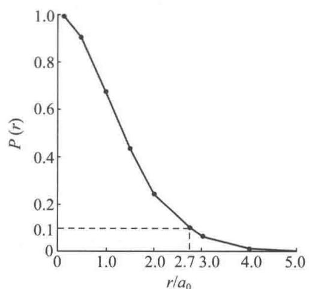  
图2.7 $P(r) - r$ 图

标 $\mathrm{d}\theta$ 积分时要用 $\sin \theta \mathrm{d}\theta$ ，对 $\mathrm{dr}$ 积分时要用 $r^2\mathrm{dr}$ ，对 $\psi$ 进行空间积分时微体积元 $\mathrm{d}\tau = r^2\sin \theta \mathrm{dr}\mathrm{d}\theta \mathrm{d}\phi$ 。另外，虽然在数学上 $r$ 可为0，但实际上 $r = 0$ 意味着电子落到原子核上。

【2.8】已知氢原子的归一化基态波函数为

$$
\psi_ {1 \mathrm{s}} = (\pi a _ {0} ^ {3}) ^ {- \frac {1}{2}} \exp \left[ - \frac {r}{a _ {0}} \right]
$$

(1) 利用量子力学基本假设求该基态的能量和角动量；

(2) 利用位力定理(即维里定理)求该基态的平均势能和零点能。

(1) 根据量子力学关于“本征函数、本征值和本征方程”的假设, 当用 Hamilton 算符作用于 $\psi_{1s}$ 时, 若所得结果等于一常数乘以 $\psi_{1s}$ , 则该常数即氢原子的基态能量 $E_{1s}$ 。氢原子的 Hamilton 算符为

$$
\hat {H} = - \frac {h ^ {2}}{8 \pi^ {2} m} \nabla^ {2} - \frac {e ^ {2}}{4 \pi \varepsilon_ {0} r}
$$

由于 $\psi_{1s}$ 的角度部分是常数，因而 $\hat{H}$ 与 $\theta, \phi$ 无关：

$$
\hat {H} = - \frac {h ^ {2}}{8 \pi^ {2} m} \frac {1}{r ^ {2}} \frac {\partial}{\partial r} \left(r ^ {2} \frac {\partial}{\partial r}\right) - \frac {e ^ {2}}{4 \pi \varepsilon_ {0} r}
$$

将 $\hat{H}$ 作用于 $\psi_{1\mathrm{s}}$ ，有

$$
\begin{array}{r l} \hat {H} \psi_ {1 s} & = \left[ - \frac {h ^ {2}}{8 \pi^ {2} m} \frac {1}{r ^ {2}} \frac {\partial}{\partial r} \left(r ^ {2} \frac {\partial}{\partial r}\right) - \frac {e ^ {2}}{4 \pi \varepsilon_ {0} r} \right] \psi_ {1 s} \\ & = - \frac {h ^ {2}}{8 \pi^ {2} m} \frac {1}{r ^ {2}} \frac {\partial}{\partial r} \left(r ^ {2} \frac {\partial}{\partial r}\right) \psi_ {1 s} - \frac {e ^ {2}}{4 \pi \varepsilon_ {0} r} \psi_ {1 s} \\ & = - \frac {h ^ {2}}{8 \pi^ {2} m} \frac {1}{r ^ {2}} \left(2 r \frac {\partial}{\partial r} \psi_ {1 s} + r ^ {2} \frac {\partial^ {2}}{\partial r ^ {2}} \psi_ {1 s}\right) - \frac {e ^ {2}}{4 \pi \varepsilon_ {0} r} \psi_ {1 s} \\ & = - \frac {h ^ {2}}{8 \pi^ {2} m} \frac {1}{r ^ {2}} (- 2 r \pi^ {- \frac {1}{2}} a _ {0} ^ {- \frac {5}{2}} e ^ {- \frac {r}{a _ {0}}} + r ^ {2} \pi^ {- \frac {1}{2}} a _ {0} ^ {- \frac {7}{2}} e ^ {- \frac {r}{a _ {0}}}) - \frac {e ^ {2}}{4 \pi \varepsilon_ {0} r} \psi_ {1 s} \\ & = \left[ - \frac {h ^ {2} (r - 2 a _ {0})}{8 \pi^ {2} m r a _ {0} ^ {2}} - \frac {e ^ {2}}{4 \pi \varepsilon_ {0} r} \right] \psi_ {1 s} \\ & = \left[ \frac {h ^ {2}}{8 \pi^ {2} m a _ {0} ^ {2}} - \frac {e ^ {2}}{4 \pi \varepsilon_ {0} a _ {0}} \right] \psi_ {1 s} (r = a _ {0}) \end{array}
$$

所以

$$
\begin{array}{r l} E _ {1} & = \frac {h ^ {2}}{8 \pi^ {2} m a _ {0} ^ {2}} - \frac {e ^ {2}}{4 \pi \varepsilon_ {0} a _ {0}} \\ & = \frac {(6 . 6 2 6 2 \times 1 0 ^ {- 3 4} \mathrm{Js}) ^ {2}}{8 \times \pi^ {2} \times 9 . 1 0 9 5 \times 1 0 ^ {- 3 1} \mathrm{kg} \times (5 . 2 9 1 7 \times 1 0 ^ {- 1 1} \mathrm{m}) ^ {2}} \\ & - \frac {(1 . 6 0 2 2 \times 1 0 ^ {- 1 9} \mathrm{C}) ^ {2}}{4 \pi \times 8 . 8 5 4 2 \times 1 0 ^ {- 1 2} \mathrm{C} ^ {2} \mathrm{J} ^ {- 1} \mathrm{m} ^ {- 1} \times 5 . 2 9 1 7 \times 1 0 ^ {- 1 1} \mathrm{m}} \\ & = 2. 1 8 4 \times 1 0 ^ {- 1 8} \mathrm{J} - 4. 3 6 3 \times 1 0 ^ {- 1 8} \mathrm{J} \\ & = - 2. 1 7 9 \times 1 0 ^ {- 1 8} \mathrm{J} \end{array}
$$

也可用式 $E = \int \psi_{1s}^{*}\hat{H}\psi_{1s}\mathrm{d}\tau$ 进行计算，所得结果与用上法计算结果相同。注意，此式中 $\mathrm{d}\tau = 4\pi r^2\mathrm{d}r$ 。

将角动量平方算符作用于氢原子的 $\psi_{1s}$ ，有

$$
\begin{array}{r l} \hat {M} ^ {2} \psi_ {\mathrm{1s}} & = - \left(\frac {h}{2 \pi}\right) ^ {2} \left[ \frac {1}{\sin \theta} \frac {\partial}{\partial \theta} \left(\sin \theta \frac {\partial}{\partial \theta}\right) + \frac {1}{\sin^ {2} \theta} \frac {\partial^ {2}}{\partial \phi^ {2}} \right] (\pi a _ {0} ^ {3}) ^ {- \frac {1}{2}} \mathrm{e} ^ {- \frac {r}{a _ {0}}} \\ & = 0 \psi_ {\mathrm{1s}} \end{array}
$$

所以

$$
M ^ {2} = 0
$$

$$
| M | = 0
$$

此结果是显而易见的： $\hat{M}^{2}$ 不含 r 项，而 $\psi_{1s}$ 不含 $\theta$ 和 $\phi$ ，角动量平方当然为 0，角动量也就为 0。

通常,在计算原子轨道能等物理量时,不必一定按上述做法,只需将量子数等参数代入简单计算公式即可,如

$$
E _ {n} = - 2. 1 7 9 \times 1 0 ^ {- 1 8} \cdot \frac {Z ^ {*}}{n ^ {2}} (\mathrm{J})
$$

$$
\mid M \mid = \sqrt {l (l + 1)} \frac {h}{2 \pi}
$$

(2) 对氢原子, $V\propto r^{-1}$ ,故

$$
\langle T \rangle = - \frac {1}{2} \langle V \rangle
$$

$$
E _ {1 \mathrm{s}} = \langle T \rangle + \langle V \rangle = - \frac {1}{2} \langle V \rangle + \langle V \rangle = \frac {1}{2} \langle V \rangle
$$

$$
\langle V \rangle = 2 E _ {1 s} = 2 \times (- 1 3. 6 e V) = - 2 7. 2 e V
$$

$$
\langle T \rangle = - \frac {1}{2} \langle V \rangle = - \frac {1}{2} \times (- 2 7. 2 \mathrm{eV}) = 1 3. 6 \mathrm{eV}
$$

此即氢原子的零点能。

【2.9】已知氢原子的 $\psi_{2\mathrm{p}_z} = \frac{1}{4\sqrt{2\pi a_0^3}}\left(\frac{r}{a_0}\right)\exp \left[-\frac{r}{2a_0}\right]\cos \theta$ ，试计算回答下列问题：

(1) 原子轨道能 E=?

(2) 轨道角动量 $\left|M\right|=\text{?}$ 轨道磁矩 $\left|\mu\right|=\text{?}$

(3) 轨道角动量 M 和 z 轴的夹角是多少度?

(4) 列出计算电子离核平均距离的公式(不必算出具体的数值)。

(5) 节面的个数、位置和形状怎样？

(6) 概率密度极大值的位置在何处?

(7) 画出径向分布示意图。

解

(1) 原子轨道能为

$$
E = - 2. 1 7 9 \times 1 0 ^ {- 1 8} \mathrm{J} \times \frac {1}{2 ^ {2}} = - 5. 4 5 \times 1 0 ^ {- 1 9} \mathrm{J}
$$

(2) 轨道角动量为

$$
\mid M \mid = \sqrt {1 (1 + 1)} \frac {h}{2 \pi} = \sqrt {2} \frac {h}{2 \pi}
$$

轨道磁矩为

$$
| \mu | = \sqrt {1 (1 + 1)} \beta_ {\mathrm{e}} = \sqrt {2} \beta_ {\mathrm{e}}
$$

（3）设轨道角动量 M 和 z 轴的夹角为 $\theta$ ，则因 $\psi_{2p_{z}}$ 的 m=0，故可得

$$
\cos \theta = \frac {M _ {z}}{M} = \frac {0 \cdot \frac {h}{2 \pi}}{\sqrt {2} \cdot \frac {h}{2 \pi}} = 0
$$

$$
\theta = 9 0 ^ {\circ}
$$

(4) 电子离核的平均距离的表达式为

$$
\begin{array}{r l} \langle r \rangle & = \int \psi_ {2 p _ {z}} ^ {*} \hat {r} \psi_ {2 p _ {z}} d \tau \\ & = \int_ {0} ^ {\infty} \int_ {0} ^ {\pi} \int_ {0} ^ {2 \pi} \psi_ {2 p _ {z}} ^ {2} r \cdot r ^ {2} \sin \theta d r d \theta d \phi \end{array}
$$

(5) 令 $\psi_{2p_{z}}=0$ , 得

$$
r = 0, \quad r = \infty , \quad \theta = 9 0 ^ {\circ}
$$

节面或节点通常不包括 r=0 和 $r=\infty$ ，故 $\psi_{2p_{z}}$ 的节面只有一个，即 xy 平面（当然，坐标原点也包含在 xy 平面内）。

亦可直接令函数的角度部分 $Y=\sqrt{\frac{3}{4\pi}}\cos\theta=0$ ，求得 $\theta=90^{\circ}$ 。

(6) 概率密度为

$$
\rho = \psi_ {2 p _ {z}} ^ {2} = \frac {1}{3 2 \pi a _ {0} ^ {3}} \left(\frac {r}{a _ {0}}\right) ^ {2} \mathrm{e} ^ {- \frac {r}{a _ {0}}} \cos^ {2} \theta
$$

由式可见，当 $\theta = 0^{\circ}$ 或 $\theta = 180^{\circ}$ 时 $\rho$ 最大（亦可令 $\frac{\partial\psi}{\partial\theta} = -\sin \theta = 0, \theta = 0^{\circ}$ 或 $180^{\circ}$ ），以 $\rho_0$ 表示，即

$$
\rho_ {0} = \rho (r, \theta = 0 ^ {\circ}, 1 8 0 ^ {\circ}) = \frac {1}{3 2 \pi a _ {0} ^ {3}} \left(\frac {r}{a _ {0}}\right) ^ {2} \mathrm{e} ^ {- \frac {r}{a _ {0}}}
$$

将 $\rho_{0}$ 对 r 微分并使之为 0，有

$$
\frac {\mathrm{d} \rho_ {0}}{\mathrm{d} r} = \frac {\mathrm{d}}{\mathrm{d} r} \left[ \frac {1}{3 2 \pi a _ {0} ^ {3}} \left(\frac {r}{a _ {0}}\right) ^ {2} \mathrm{e} ^ {- \frac {r}{a _ {0}}} \right] = \frac {1}{3 2 \pi a _ {0} ^ {5}} r \mathrm{e} ^ {- \frac {r}{a _ {0}}} \left(2 - \frac {r}{a _ {0}}\right) = 0
$$

解之得

$$
r = 2 a _ {0} \quad (r = 0 \text {   和   } r = \infty \text {   舍去   })
$$

又因

$$
\left. \frac {\mathrm{d} ^ {2} \rho_ {0}}{\mathrm{d} r ^ {2}} \right| _ {r = 2 a _ {0}} <   0
$$

所以，当 $\theta=0^{\circ}$ 或 $180^{\circ}, r=2a_{0}$ 时 $\psi_{2p_{z}}^{2}$ 有极大值。此极大值为

$$
\rho_ {\max} = \frac {1}{3 2 \pi a _ {0} ^ {3}} \left(\frac {2 a _ {0}}{a _ {0}}\right) ^ {2} \mathrm{e} ^ {- \frac {2 a _ {0}}{a _ {0}}} = \frac {\mathrm{e} ^ {- 2}}{8 \pi a _ {0} ^ {3}} = 3 6. 4 \mathrm{nm} ^ {- 3}
$$

$$
D _ {2 p _ {z}} = r ^ {2} R ^ {2} = r ^ {2} \left[ \frac {1}{2 \sqrt {6}} \left(\frac {1}{a _ {0}}\right) ^ {\frac {5}{2}} r e ^ {- \frac {r}{2 a _ {0}}} \right] ^ {2} = \frac {1}{2 4 a _ {0} ^ {5}} r ^ {4} e ^ {- \frac {r}{a _ {0}}} \tag {7}
$$

根据此式列出 D-r 数据表：

<table><tr><td> $r/a_0$ </td><td>0</td><td>1.0</td><td>2.0</td><td>3.0</td><td>4.0</td><td>5.0</td><td>6.0</td></tr><tr><td> $D/a_0^{-1}$ </td><td>0</td><td>0.015</td><td>0.090</td><td>0.169</td><td>0.195</td><td>0.175</td><td>0.134</td></tr><tr><td> $r/a_0$ </td><td>7.0</td><td>8.0</td><td>9.0</td><td>10.0</td><td>11.0</td><td>12.0</td><td></td></tr><tr><td> $D/a_0^{-1}$ </td><td>0.091</td><td>0.057</td><td>0.034</td><td>0.019</td><td> $1.02\times 10^{-2}$ </td><td> $5.3\times 10^{-3}$ </td><td></td></tr></table>

按表中数据作出 D-r 图, 得图 2.9。

由图可见，氢原子 $\psi_{2\mathrm{p}_z}$ 的径向分布图有 $n - l = 1$ 个极大(峰)和 $n - l - 1 = 0$ 个极小（节面），这符合一般径向分布图峰数和节面数的规律。其极大值在 $r = 4a_0$ 处，这与最大概率密度对应的 $r$ 值不同，因为二者的物理意义不同。另外，由于径向分布函数只与 $n$ 和 $l$ 有关而与 $m$ 无关， $2\mathrm{p}_x, 2\mathrm{p}_y$ 和 $2\mathrm{p}_z$ 的径向分布图相同。

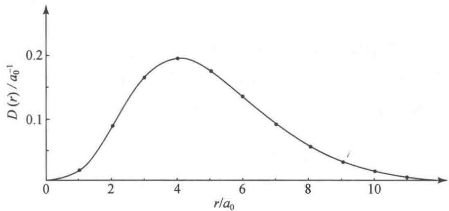  
图2.9 H原子 $\psi_{2\mathrm{p}_z}$ 的 $D - r$ 图

【评注】对一个微观体系是用波函数 $\psi$ 描述其状态,该体系的性质可从 $\psi$ 求得。所用的方法是按照量子力学规定表达这个性质的物理量的算符,把算符作用于该波函数上,通过运算就可以得到该状态的性质。2.8 题是求算 H 原子 $\psi_{1s}$ 态的能量、角动量、平均势能和零点能。2.9 题是 H 原子 $\psi_{2p_{z}}$ 态的原子轨道能、角动量、轨道磁矩、轨道角动量和 z 轴的夹角、电子离核的平均距离,以及涉及波函数分布的节面、概率密度极大值、径向分布图等。通过这些计算较全面地了解原子轨道的形貌和性质。读者可根据这两题的命题方法,求算自己感兴趣的体系的形貌和性质。

【2.10】根据《结构化学基础》(第5版)表2.1.2所列的波函数，以原子单位表示氢原子的 $\psi_{1s}$ 和 $\psi_{2s}$ ，证明它们各自是归一化函数并且相互正交。

解 按附录 B.5 的原子单位, 对氢原子得 $z=1, a_{0}=1$ , 简化得

$$
\begin{array}{l} \psi_ {1 s} = \frac {1}{\sqrt {\pi}} \mathrm{e} ^ {- r} \\ \psi_ {2 s} = \frac {1}{4 \sqrt {2 \pi}} (2 - r) \mathrm{e} ^ {- r / 2} \end{array}
$$

$$
\begin{array}{r l} \text {一化:} & \int | \psi_ {1 s} | ^ {2} \mathrm{d} \tau = \int \psi_ {1 s} ^ {2} r ^ {2} \sin \theta \mathrm{d} r \mathrm{d} \theta \mathrm{d} \phi \\ & = \frac {1}{\pi} \int_ {0} ^ {\infty} r ^ {2} \mathrm{e} ^ {- 2 r} \mathrm{d} r \int_ {0} ^ {\pi} \sin \theta \mathrm{d} \theta \int_ {0} ^ {2 \pi} \mathrm{d} \phi \\ & = \frac {1}{\pi} \Big (\frac {1}{4} \times 2 \times 2 \pi \Big) \\ & = 1 \\ & \int | \psi_ {2 s} | ^ {2} \mathrm{d} \tau = \frac {1}{3 2 \pi} \int_ {0} ^ {\infty} (2 - r) ^ {2} r ^ {2} \mathrm{e} ^ {- r} \mathrm{d} r \int_ {0} ^ {\pi} \sin \theta \mathrm{d} \theta \int_ {0} ^ {2 \pi} \mathrm{d} \phi \\ & = \frac {1}{3 2 \pi} (8 \times 2 \times 2 \pi) \\ & = 1 \end{array}
$$

正交性： $\int \psi_{1s}\psi_{2s}\mathrm{d}\tau = \frac{1}{\pi\sqrt{32}}\int_0^\infty (2 - r)r^2\mathrm{e}^{-3r / 2}\mathrm{d}r\int_0^\pi \sin \theta \mathrm{d}\theta \int_0^{2\pi}\mathrm{d}\phi$ $= \frac{1}{\pi\sqrt{32}} (0\times 2\times 2\pi) = 0$

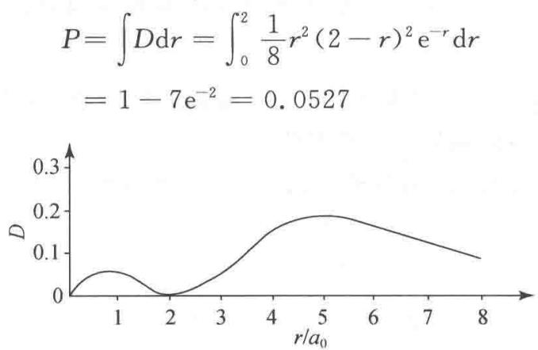  
图2.11

[注：积分公式用 $\int_0^\infty x^n\mathrm{e}^{-ax}\mathrm{d}x = n! / a^{n + 1},(a > 0)]$

【2.11】根据氢原子2s态的波函数,求算径向概率分布函数 $D=r^{2}R^{2}$ 中的节点、极大值位置和球形节面内电子存在的概率,作图表示,并和《结构化学基础》(第5版)图2.3.2比较。

解 $\psi_{2s}=\frac{1}{\sqrt{32\pi}}(2-r)e^{-r/2}$

由(2.3.6)式可知， $\psi_{2s}$ 的径向概率分布函数

$$
\begin{array}{r l} D & = r ^ {2} R ^ {2} = 4 \pi r ^ {2} | \psi_ {2 \mathrm{s}} | ^ {2} \\ & = \frac {1}{8} r ^ {2} (2 - r) ^ {2} \mathrm{e} ^ {- r} \end{array}
$$

从 $\frac{\mathrm{d}D}{\mathrm{d}r} = 0$ 可求算节点位置和极大值位置。根据此式可得： $\frac{\mathrm{d}D}{\mathrm{d}r} = -\frac{1}{8}\mathrm{e}^{-r}r(r^3 -8r^2 +16r - 8)$ $= 0$ ，解得

$$
r = 0, 2, 0. 7 6 4, 5. 2 6 3
$$

其中 r=0 是原点，r=2 是节点，而 r=0.764 和 5.263 是极大值点。按此数据作图，如图 2.11 所示。所得结果和图 2.3.2 一致。

球形节面内的概率

【2.12】对氢原子， $\psi=c_{1}\psi_{210}+c_{2}\psi_{211}+c_{3}\psi_{31\bar{1}}$ ，所有波函数都已归一化。请对 $\psi$ 所描述的状态计算：

(1) 能量平均值及能量 -3.4 eV 出现的概率；

(2) 角动量平均值及角动量 $\sqrt{2}h/2\pi$ 出现的概率；

（3）角动量在 z 轴上的分量的平均值及角动量 z 轴分量 $h/\pi$ 出现的概率。

解 根据量子力学基本假设Ⅳ——态叠加原理，对氢原子 $\psi$ 所描述的状态进行计算。

(1) 能量平均值

$$
\begin{array}{r l} \langle E \rangle & = \sum_ {i} c _ {i} ^ {2} E _ {i} = c _ {1} ^ {2} E _ {1} + c _ {2} ^ {2} E _ {2} + c _ {3} ^ {2} E _ {3} \\ & = c _ {1} ^ {2} \left(- 1 3. 6 \times \frac {1}{2 ^ {2}} \mathrm{eV}\right) + c _ {2} ^ {2} \left(- 1 3. 6 \times \frac {1}{2 ^ {2}} \mathrm{eV}\right) + c _ {3} ^ {2} \left(- 1 3. 6 \times \frac {1}{3 ^ {2}} \mathrm{eV}\right) \\ & = - \frac {1 3 . 6}{4} (c _ {1} ^ {2} + c _ {2} ^ {2}) \mathrm{eV} - \frac {1 3 . 6}{9} c _ {3} ^ {2} \mathrm{eV} \end{array}
$$

$$
= - (3. 4 c _ {1} ^ {2} + 3. 4 c _ {2} ^ {2} + 1. 5 c _ {3} ^ {2}) \mathrm{eV}
$$

能量-3.4eV出现的概率为

$$
\frac {c _ {1} ^ {2} + c _ {2} ^ {2}}{c _ {1} ^ {2} + c _ {2} ^ {2} + c _ {3} ^ {2}} = c _ {1} ^ {2} + c _ {2} ^ {2}
$$

(2) 角动量平均值为

$$
\begin{array}{r l} \langle M \rangle & = \sum_ {i} c _ {i} ^ {2} | M | = c _ {1} ^ {2} | M _ {1} | + c _ {2} ^ {2} | M _ {2} | + c _ {3} ^ {2} | M _ {3} | \\ & = c _ {1} ^ {2} \sqrt {l _ {1} (l _ {1} + 1)} \frac {h}{2 \pi} + c _ {2} ^ {2} \sqrt {l _ {2} (l _ {2} + 1)} \frac {h}{2 \pi} + c _ {3} ^ {2} \sqrt {l _ {3} (l _ {3} + 1)} \frac {h}{2 \pi} \\ & = c _ {1} ^ {2} \sqrt {1 (1 + 1)} \frac {h}{2 \pi} + c _ {2} ^ {2} \sqrt {1 (1 + 1)} \frac {h}{2 \pi} + c _ {3} ^ {2} \sqrt {1 (1 + 1)} \frac {h}{2 \pi} \\ & = \frac {\sqrt {2 h}}{2 \pi} (c _ {1} ^ {2} + c _ {2} ^ {2} + c _ {3} ^ {2}) \end{array}
$$

角动量 $\frac{\sqrt{2}h}{2\pi}$ 出现的概率为

$$
c _ {1} ^ {2} + c _ {2} ^ {2} + c _ {3} ^ {2} = 1
$$

(3) 角动量在 z 轴上的分量的平均值为

$$
\begin{array}{r l} \langle M _ {z} \rangle & = \sum_ {i} c _ {i} ^ {2} M _ {z i} = c _ {1} ^ {2} m _ {1} \frac {h}{2 \pi} + c _ {2} ^ {2} m _ {2} \frac {h}{2 \pi} + c _ {3} ^ {2} m _ {3} \frac {h}{2 \pi} \\ & = [ c _ {1} ^ {2} \times 0 + c _ {2} ^ {2} \times 1 + c _ {3} ^ {2} \times (- 1) ] \frac {h}{2 \pi} = (c _ {2} ^ {2} - c _ {3} ^ {2}) \frac {h}{2 \pi} \end{array}
$$

角动量 z 轴分量 $h/\pi$ 出现的概率为 0。

【2.13】作氢原子 $\psi_{1s}^{2}-r$ 图及 $D_{1s}-r$ 图，证明 $D_{1s}$ 极大值在 $r=a_{0}$ 处，说明两图形不同的原因。

解 H 原子的

$$
\begin{array}{l} \psi_ {1 s} = (\pi a _ {0} ^ {3}) ^ {- \frac {1}{2}} \mathrm{e} ^ {- \frac {r}{a _ {0}}} \\ \psi_ {1 s} ^ {2} = (\pi a _ {0} ^ {3}) ^ {- 1} \mathrm{e} ^ {- \frac {2 r}{a _ {0}}} \\ D _ {1 s} = 4 \pi r ^ {2} \psi_ {1 s} ^ {2} = 4 a _ {0} ^ {- 3} r ^ {2} \mathrm{e} ^ {- \frac {2 r}{a _ {0}}} \end{array}
$$

分析 $\psi_{1s}^{2}, D_{1s}$ 随 r 的变化规律, 估计 r 的变化范围及特殊值, 选取合适的 r 值, 计算出 $\psi_{1s}^{2}$ 和 $D_{1s}$ 列于下表:

<table><tr><td> $r/a_0$ </td><td>0*</td><td>0.10</td><td>0.20</td><td>0.35</td><td>0.50</td><td>0.70</td><td>0.90</td><td>1.10</td><td>1.30</td></tr><tr><td> $\psi_{1s}^2/(πa_0^3)^{-1}$ </td><td>1.00</td><td>0.82</td><td>0.67</td><td>0.49</td><td>0.37</td><td>0.25</td><td>0.17</td><td>0.11</td><td>0.07</td></tr><tr><td> $D_{1s}/a_0^{-1}$ </td><td>0</td><td>0.03</td><td>0.11</td><td>0.24</td><td>0.37</td><td>0.48</td><td>0.54</td><td>0.54</td><td>0.50</td></tr><tr><td> $r/a_0$ </td><td>1.60</td><td>2.00</td><td>2.30</td><td>2.50</td><td>3.00</td><td>3.50</td><td>4.00</td><td>4.50</td><td>5.00</td></tr><tr><td> $\psi_{1s}^2/(πa_0^3)^{-1}$ </td><td>0.04</td><td>0.02</td><td>0.01</td><td>0.007</td><td>0.003</td><td>0.001</td><td>&lt;0.001</td><td>—</td><td>—</td></tr><tr><td> $D_{1s}/a_0^{-1}$ </td><td>0.42</td><td>0.29</td><td>0.21</td><td>0.17</td><td>0.09</td><td>0.04</td><td>0.02</td><td>0.01</td><td>0.005</td></tr></table>

\* 从物理图像上来说，r 只能接近于 0。

根据表中数据作 $\psi_{1s}^{2}-r$ 图和 $D_{1s}-r$ 图，如图 2.12 所示。

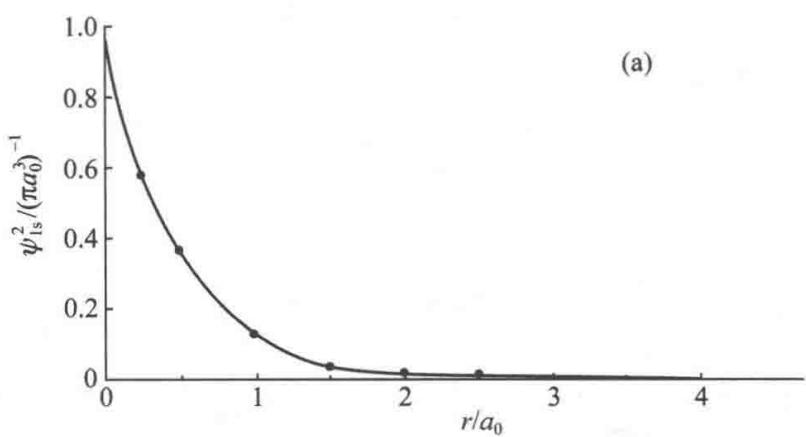

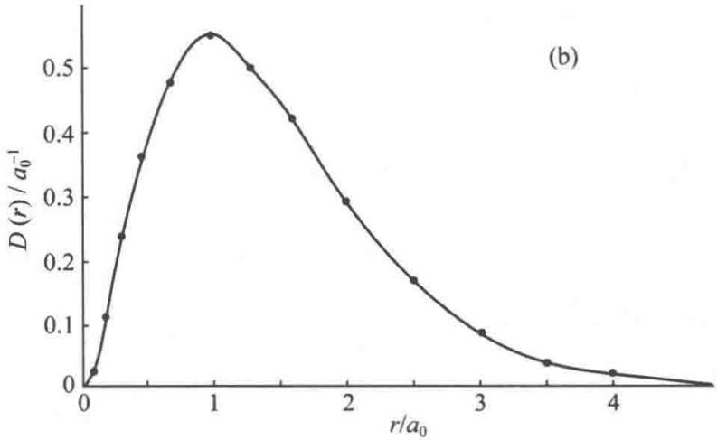  
图 2.12 H 原子的 (a) $\psi_{1s}^{2}-r$ 图和 (b) $D_{1s}-r$ 图

令 $\frac{d}{dr}D_{1s}=0$ , 即

$$
\begin{array}{r l} \frac {\mathrm{d}}{\mathrm{d} r} (4 a _ {0} ^ {- 3} r ^ {2} \mathrm{e} ^ {- \frac {2 r}{a _ {0}}}) & = 4 a _ {0} ^ {- 3} \left(2 r \mathrm{e} ^ {- \frac {2 r}{a _ {0}}} - \frac {2 r ^ {2}}{a _ {0}} \mathrm{e} ^ {- \frac {2 r}{a _ {0}}}\right) \\ & = 8 a _ {0} ^ {- 3} r \mathrm{e} ^ {- \frac {2 r}{a _ {0}}} \left(1 - \frac {r}{a _ {0}}\right) = 0 \\ r & = a _ {0} \quad (\text {舍去} r = 0) \end{array}
$$

得

即 $D_{1s}$ 在 $r=a_{0}$ 处有极大值，这与 $D_{1s}-r$ 图一致。 $a_{0}$ 称为 H 原子的最可几半径，亦常称为 Bohr 半径。推而广之，核电荷为 Z 的单电子“原子”，1s 态最可几半径为 $\frac{a_{0}}{Z}$ 。

$\psi_{1s}^{2}-r$ 图和 $D_{1s}-r$ 图不同的原因是 $\psi_{1s}^{2}$ 和 $D_{1s}$ 的物理意义不同。 $\psi_{1s}^{2}$ 表示电子在空间某点出现的概率密度，即电子云。而 $D_{1s}$ 的物理意义是：Ddr 代表在半径为 r 和半径为 $r+dr$ 的两个球壳内找到电子的概率。两个函数的差别在于 $\psi_{1s}^{2}$ 不包含体积因素，而 Ddr 包含了体积因素。由 $\psi_{1s}^{2}-r$ 图可见，在原子核附近，电子出现的概率密度最大，随后概率密度随 r 的增大单调下降。由 $D_{1s}-r$ 图可见，在原子核附近， $D_{1s}$ 接近于 0，随着 r 的增大， $D_{1s}$ 先是增大，到 $r=a_{0}$ 时达到极大，随后随 r 的增大而减小。由于概率密度 $\psi_{1s}^{2}$ 随 r 的增大而减小，而球壳的面积 $4\pi r^{2}$ 随 r 的增大而增大（因而球壳体积 $4\pi r^{2}dr$ 增大），两个随 r 变化趋势相反的因素的乘积必然使 $D_{1s}(4\pi r^{2}\psi_{1s}^{2})$ 出现极大值。

【2.14】试在直角坐标系中画出氢原子的5种3d轨道的轮廓图，比较这些轨道在空间的分

布，正、负号，节面及对称性。

解 氢原子 5 种 3d 轨道的轮廓图如图 2.13 所示。它们定性地反映了 H 原子 3d 轨道的下述性质：

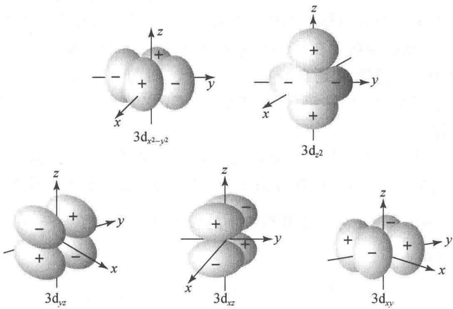  
图 2.13 氢原子 5 种 3d 轨道轮廓图

（1）轨道在空间的分布： $3d_{z^{2}}$ 的两个极大值分别在 z 轴的正、负方向上距核等距离处，另一类极大值则在 xy 平面、以核为心的圆周上。其余 4 个 3d 轨道彼此形状相同，但空间取向不同。其中 $3d_{x^{2}-y^{2}}$ 分别沿 x 轴和 y 轴的正、负方向伸展， $3d_{xy}$ ， $3d_{xz}$ 和 $3d_{yz}$ 的极大值（各有 4 个）夹在相应的两坐标轴之间。例如， $3d_{xz}$ 的 4 个极大值若以极坐标表示，分别在 $\theta=45^{\circ},\phi=0^{\circ};\theta=45^{\circ},\phi=180^{\circ};\theta=135^{\circ},\phi=0^{\circ}$ 和 $\theta=135^{\circ},\phi=180^{\circ}$ 方向上。

(2) 轨道的节面: $3 \mathrm{~d} _ { z } ^ { 2 }$ 有两个锥形节面 $(z ^ { 2 } = x ^ { 2 } + y ^ { 2 } )$ ，其顶点在原子核上，锥角约 $110^{\circ}$ 。另外4个3d轨道各有两个平面型节面，将4个瓣分开。但节面的空间取向不同： $3 \mathrm{~d} _ { x z }$ 的节面分别为 $x y$ 平面 $(z = 0)$ 和 $y z$ 平面 $(x = 0)$ ； $3 \mathrm{~d} _ { y z }$ 的节面分别为 $x y$ 平面 $(z = 0)$ 和 $x z$ 平面 $(y = 0)$ ； $3 \mathrm{~d} _ { x y }$ 的节面分别是 $x z$ 平面 $(y = 0)$ 和 $y z$ 平面 $(x = 0)$ ；而 $3 \mathrm{~d} _ { x ^ { 2 } - y ^ { 2 } }$ 的节面则分别为 $y = x$ 和 $y = -x (z$ 任意）两个平面。节面的数目服从 $n - l + 1$ 规则。根据节面的数目可以大致了解轨道能级的高低，根据节面的形状可以了解轨道在空间的分布情况。

（3）轨道的对称性：5个3d轨道都是中心对称的，且 $3d_{z^{2}}$ 轨道沿z轴旋转对称。

(4) 轨道的正、负号：已在图中标明。

原子轨道轮廓图虽然只有定性意义,但它图像明确,简单实用,在研究轨道叠加形成化学键时具有重要意义。

【2.15】写出 He 原子的 Schrödinger 方程, 说明用中心力场模型解此方程时要作哪些假设, 计算其激发态 $(2s)^{1}(2p)^{1}$ 的轨道角动量和轨道磁矩。

解 He 原子的 Schrödinger 方程为

$$
\left[ - \frac {h ^ {2}}{8 \pi^ {2} m} (\nabla_ {1} ^ {2} + \nabla_ {2} ^ {2}) - \frac {2 e ^ {2}}{4 \pi \varepsilon_ {0}} \left(\frac {1}{r _ {1}} + \frac {1}{r _ {2}}\right) + \frac {1}{4 \pi \varepsilon_ {0}} \cdot \frac {e ^ {2}}{r _ {1 2}} \right] \psi = E \psi
$$

式中 $r_{1}$ 和 $r_{2}$ 分别是电子 1 和电子 2 到核的距离， $r_{12}$ 是电子 1 和电子 2 之间的距离。若以原子单位表示，则 He 原子的 Schrödinger 方程为

$$
\left[ - \frac {1}{2} (\nabla_ {1} ^ {2} + \nabla_ {2} ^ {2}) - \frac {2}{r _ {1}} - \frac {2}{r _ {2}} + \frac {1}{r _ {1 2}} \right] \psi = E \psi
$$

用中心力场模型解此方程时作了如下假设：

(1) 将电子 2 对电子 1(1 和 2 互换亦然) 的排斥作用归结为电子 2 的平均电荷分布所产生的一个以原子核为中心的球对称平均势场的作用(不探究排斥作用的瞬时效果, 只着眼于排斥作用的平均效果)。该势场叠加在核的库仑场上, 形成了一个合成的平均势场。电子 1 在此平均势场中独立运动, 其势能只是自身坐标的函数, 而与两电子间距离无关。这样, 上述 Schrödinger 方程能量算符中的第三项就消失了, 它在形式上变得与单电子原子的 Schrödinger 方程相似。

（2）既然电子2所产生的平均势场是以原子核为中心的球形场，那么它对电子1的排斥作用的效果可视为对核电荷的屏蔽，即抵消了 $\sigma$ 个核电荷，使电子1感受到的有效核电荷降低为 $(2 - \sigma)e$ 。这样，Schrödinger方程能量算符中的吸引项就变成了一 $-\frac{2 - \sigma}{r_1}$ ，于是电子1的单电子Schrödinger方程变为

$$
\left[ - \frac {1}{2} \nabla_ {1} ^ {2} - \frac {2 - \sigma}{r _ {1}} \right] \psi_ {1} (1) = E _ {1} \psi_ {1} (1)
$$

按求解单电子原子 Schrödinger 方程的方法即可求出单电子波函数 $\psi_{1}(1)$ 及相应的原子轨道能 $E_{1}$ 。

(3) 上述分析同样适合于电子 2, 因此电子 2 的 Schrödinger 方程为

$$
\left[ - \frac {1}{2} \nabla_ {2} ^ {2} - \frac {2 - \sigma}{r _ {2}} \right] \psi_ {2} (2) = E _ {2} \psi_ {2} (2)
$$

电子2的单电子波函数和相应的能量分别为 $\psi_{2}(2)$ 和 $E_{2}$ 。He原子的波函数可写成两单电子波函数之积：

$$
\psi (1, 2) = \psi_ {1} (1) \cdot \psi_ {2} (2)
$$

He 原子的总能量为

$$
E = E _ {1} + E _ {2}
$$

He 原子激发态 $(2s)^{1}(2p)^{1}$ 角动量加和后 L=1，故轨道角动量和轨道磁矩分别为

$$
\mid M _ {L} \mid = \sqrt {L (L + 1)} \frac {h}{2 \pi} = \sqrt {2} \frac {h}{2 \pi}
$$

$$
| \mu | = \sqrt {L (L + 1)} \beta_ {\mathrm{e}} = \sqrt {2} \beta_ {\mathrm{e}}
$$

【2.16】写出 $Li^{2+}$ 离子的 Schrödinger 方程,说明该方程中各符号及各项的意义;写出 $Li^{2+}$ 离子 1s 态的波函数并计算:

(1) 1s 电子径向分布最大值离核的距离；

(2) 1s 电子离核的平均距离；

(3) 1s 电子概率密度最大处离核的距离；

(4) 比较 $Li^{2+}$ 离子的 2s 和 2p 态能量的高低；

(5) Li 原子的第一电离能(按 Slater 屏蔽常数算有效核电荷)。

解 $\mathrm{Li}^{2+}$ 离子的Schrödinger方程为

$$
\left[ - \frac {h ^ {2}}{8 \pi^ {2} \mu} \nabla^ {2} - \frac {3 e ^ {2}}{4 \pi \varepsilon_ {0} r} \right] \psi = E \psi
$$

方程中， $\mu$ 和 $r$ 分别代表 $\mathrm{Li}^{2+}$ 的约化质量和电子到核的距离； $\nabla^2, \psi$ 和 $E$ 分别是 Laplace 算符、状态函数及该状态的能量， $h$ 和 $\varepsilon_0$ 则分别是 Planck 常数和真空电容率。方括号内为总能量算符，其中第一项为动能算符，第二项为势能算符（即势能函数）。

$Li^{2+}$ 离子 1s 态的波函数为

$$
\psi_ {1 \mathrm{s}} = \left(\frac {2 7}{\pi a _ {0} ^ {3}}\right) ^ {\frac {1}{2}} \mathrm{e} ^ {- \frac {3}{a _ {0}} r}
$$

$$
(1) D _ {1 \mathrm{s}} = 4 \pi r ^ {2} \psi_ {1 \mathrm{s}} ^ {2} = 4 \pi r ^ {2} \times \frac {2 7}{\pi a _ {0} ^ {3}} \mathrm{e} ^ {- \frac {6}{a _ {0}} r} = \frac {1 0 8}{a _ {0} ^ {3}} r ^ {2} \mathrm{e} ^ {- \frac {6}{a _ {0}} r}
$$

$$
\frac {\mathrm{d}}{\mathrm{d} r} D _ {1 \mathrm{s}} = \frac {1 0 8}{a _ {0} ^ {3}} \left(2 r - \frac {6}{a _ {0}} r ^ {2}\right) \mathrm{e} ^ {- \frac {6}{a _ {0}} r} = 0
$$

$$
\because r \neq \infty \quad \therefore 2 r - \frac {6}{a _ {0}} r ^ {2} = 0
$$

$$
\text { 又 } \because r \neq 0 \quad \therefore r = \frac {a _ {0}}{3}
$$

1s 电子径向分布最大值在距核 $\frac{a_{0}}{3}$ 处。

$$
\begin{array}{r l} (2) \langle r \rangle & = \int \psi_ {1 s} ^ {*} \hat {r} \psi_ {1 s} d \tau = \int r \psi_ {1 s} ^ {2} d \tau \\ & = \int r \frac {2 7}{\pi a _ {0} ^ {3}} e ^ {- \frac {6}{a _ {0}} r} r ^ {2} \sin \theta d r d \theta d \phi = \frac {2 7}{\pi a _ {0} ^ {3}} \int_ {0} ^ {\infty} r ^ {3} e ^ {- \frac {6}{a _ {0}} r} d r \int_ {0} ^ {\pi} \sin \theta d \theta \int_ {0} ^ {2 \pi} d \phi \\ & = \frac {2 7}{\pi a _ {0} ^ {3}} \times \frac {a _ {0} ^ {4}}{2 1 6} \times 4 \pi = \frac {1}{2} a _ {0} \end{array}
$$

(3) $\psi_{1s}^{2} = \frac{27}{\pi a_{0}^{3}}\mathrm{e}^{-\frac{6}{a_{0}} r}$

因为 $\psi_{1s}^{2}$ 随着 r 的增大而单调下降，所以不能用令一阶导数为 0 的方法求其最大值离核的距离。分析 $\psi_{1s}^{2}$ 的表达式可见，r=0 时 $e^{-\frac{6}{a_{0}}r}$ 最大，因而 $\psi_{1s}^{2}$ 也最大。但实际上 r 不能为 0（电子不可能落到原子核上），因此更确切的说法是 r 趋近于 0 时 1s 电子的概率密度最大。

（4） $Li^{2+}$ 为单电子“原子”，组态的能量只与主量子数有关，所以 2s 和 2p 态简并，即 $E_{2s}=E_{2p}$ 。

(5) Li 原子的基组态为 $(1s)^{2}(2s)^{1}$ 。对 2s 电子来说，1s 电子为其相邻内一组电子， $\sigma=0.85$ 。因而

$$
E _ {2 \mathrm{s}} = - 1 3. 6 \mathrm{eV} \times \frac {(3 - 0 . 8 5 \times 2) ^ {2}}{2 ^ {2}} = - 5. 7 5 \mathrm{eV}
$$

根据 Koopmann 定理, Li 原子的第一电离能为

$$
I _ {1} = - E _ {2 \mathrm{s}} = 5. 7 5 \mathrm{eV}
$$

【2.17】Li 原子的 3 个电离能分别为 $I_{1}=5.392\ eV, I_{2}=75.638\ eV, I_{3}=122.451\ eV$ ，请计算 Li 原子的 1s 电子结合能。

解 根据电离能的定义,可写出下列关系式:

$$
\mathrm{Li} (1 \mathrm{s} ^ {2} 2 \mathrm{s} ^ {1}) \longrightarrow \mathrm{Li} ^ {+} (1 \mathrm{s} ^ {2} 2 \mathrm{s} ^ {0}) \quad E _ {\mathrm{Li} ^ {+} (1 \mathrm{s} ^ {2} 2 \mathrm{s} ^ {0})} - E _ {\mathrm{Li} (1 \mathrm{s} ^ {2} 2 \mathrm{s} ^ {1})} = I _ {1}\tag{1}
$$

$$
\mathrm{Li} ^ {+} (1 \mathrm{s} ^ {2} 2 \mathrm{s} ^ {0}) \longrightarrow \mathrm{Li} ^ {2 +} (1 \mathrm{s} ^ {1} 2 \mathrm{s} ^ {0}) \quad E _ {\mathrm{Li} ^ {2 +} (1 \mathrm{s} ^ {1} 2 \mathrm{s} ^ {0})} - E _ {\mathrm{Li} ^ {+} (1 \mathrm{s} ^ {2} 2 \mathrm{s} ^ {0})} = I _ {2}\tag{2}
$$

$$
\mathrm{Li} ^ {2 +} (1 \mathrm{s} ^ {1} 2 \mathrm{s} ^ {0}) \longrightarrow \mathrm{Li} ^ {3 +} (1 \mathrm{s} ^ {0} 2 \mathrm{s} ^ {0}) \quad E _ {\mathrm{Li} ^ {3 +} (1 \mathrm{s} ^ {0} 2 \mathrm{s} ^ {0})} - E _ {\mathrm{Li} ^ {2 +} (1 \mathrm{s} ^ {1} 2 \mathrm{s} ^ {0})} = I _ {3}\tag{3}
$$

根据电子结合能的定义, Li 原子 1s 电子结合能为

$$
E _ {1 \mathrm{s}} = - \left[ E _ {\mathrm{Li} ^ {+} (1 \mathrm{s} ^ {1} 2 \mathrm{s} ^ {1})} - E _ {\mathrm{Li} (1 \mathrm{s} ^ {2} 2 \mathrm{s} ^ {1})} \right]
$$

而

$$
\begin{array}{r l} E _ {\mathrm {Li^ {+} (1s^ {1} 2s^ {1})}} & = - 1 3. 6 \mathrm{eV} \times \frac {3 ^ {2}}{1 ^ {2}} - 1 3. 6 \mathrm{eV} \times \frac {(3 - 0 . 8 5) ^ {2}}{2 ^ {2}} \\ & = - 1 3 8. 1 7 \mathrm{eV} \end{array}\tag{4}
$$

$$
\begin{array}{r l} E _ {\mathrm {Li(1s^ {2} 2s^ {1})}} & = - (I _ {1} + I _ {2} + I _ {3}) = - (5. 3 9 2 + 7 5. 6 3 8 + 1 2 2. 4 5 1) \mathrm{eV} \\ & = - 2 0 3. 4 8 \mathrm{eV} \end{array}\tag{5}
$$

所以

$$
\begin{array}{r l} E _ {1 \mathrm{s}} & = - [ (4) - (5) ] = (5) - (4) \\ & = - 2 0 3. 4 8 \mathrm{eV} - (- 1 3 8. 1 7 \mathrm{eV}) \approx - 6 5. 3 \mathrm{eV} \end{array}
$$

或

$$
E _ {\mathrm{Li} (1 \mathrm{s} ^ {2} 2 \mathrm{s} ^ {1})} - E _ {\mathrm{Li} ^ {+} (1 \mathrm{s} ^ {2})} = - I _ {1}
$$

$$
E _ {\mathrm{Li} ^ {+} (1 \mathrm{s} ^ {2})} - E _ {\mathrm{Li} ^ {+} (1 \mathrm{s} ^ {1})} = - I _ {2}
$$

$$
E _ {\mathrm{Li} ^ {2 +} (1 \mathrm{s} ^ {1})} - E _ {\mathrm{Li} ^ {+} (1 \mathrm{s} ^ {1} 2 \mathrm{s} ^ {1})} = E
$$

$$
E = 1 3. 6 \mathrm{eV} \times \frac {(3 - \sigma) ^ {2}}{2 ^ {2}} = 1 3. 6 \times \frac {(3 - 0 . 8 5) ^ {2}}{4} \mathrm{eV} = 1 5. 7 \mathrm{eV}
$$

1s 电子结合能为

$$
\begin{array}{r l} E _ {1 \mathrm{s}} & = E _ {\mathrm{Li(1s} ^ {2} 2 \mathrm{s} ^ {1})} - E _ {\mathrm{Li} ^ {+} (1 \mathrm{s} ^ {1} 2 \mathrm{s} ^ {1})} \\ & = E - I _ {1} - I _ {2} \\ & = 1 5. 7 \mathrm{eV} - 5. 3 9 \mathrm{eV} - 7 5. 6 4 \mathrm{eV} = - 6 5. 3 \mathrm{eV} \end{array}
$$

【2.18】已知 He 原子的第一电离能 $I_{1}=24.59\ eV$ ，试计算：

(1) 第二电离能, 1s 的单电子原子轨道能和电子结合能;

(2) 基态能量；

(3) 在 1s 轨道中两个电子的互斥能；

(4) 屏蔽常数；

(5) 根据(4)所得结果求 $H^{-}$ 的基态能量。

## 解

(1) He 原子的第二电离能 $I_{2}$ 是下一电离过程所需要的最低能量, 即

$$
\begin{array}{r l} & {\mathrm {He^ {+} (g)\longrightarrow He^ {2 + } (g)+ e^ {-}}} \\ & {I _ {2} = \Delta E = E _ {\mathrm {He^ {2 + }}} - E _ {\mathrm {He^ {+}}}} \\ & {= 0 - E _ {\mathrm {He^ {+}}} = - E _ {\mathrm {He^ {+}}}} \end{array}
$$

$He^{+}$ 是单电子“原子”， $E_{He^{+}}$ 可按单电子原子能级公式计算，因而

$$
I _ {2} = - E _ {\mathrm{He} ^ {+}} = - \left(- 1 3. 5 9 5 \mathrm{eV} \times \frac {2 ^ {2}}{1 ^ {2}}\right) = 5 4. 3 8 \mathrm{eV}
$$

1s 的单电子原子轨道能为

$$
- \frac {(2 4 . 6 + 5 4 . 4) \mathrm{eV}}{2} = - 3 9. 5 \mathrm{eV}
$$

电子结合能为-24.59eV。

(2) 从原子的电离能的定义出发, 按下述步骤推求 He 原子基态的能量:

$$
\mathrm{He(g)} \longrightarrow \mathrm {He^ {+} (g)+ e^ {-}} \quad I _ {1} = E _ {\mathrm {He^ {+}}} - E _ {\mathrm{He}}\tag{1}
$$

$$
\mathrm{He} ^ {+} (\mathrm{g}) \longrightarrow \mathrm{He} ^ {2 +} (\mathrm{g}) + \mathrm{e} ^ {-} I _ {2} = E _ {\mathrm{He} ^ {2 +}} - E _ {\mathrm{He} ^ {+}}\tag{2}
$$

由(1)式得

$$
E _ {\mathrm{He}} = E _ {\mathrm{He} ^ {+}} - I _ {1}
$$

将(2)式代入,得

$$
\begin{array}{r l} & E _ {\mathrm{He}} = E _ {\mathrm{He} ^ {+}} - I _ {1} = E _ {\mathrm{He} ^ {2 +}} - I _ {2} - I _ {1} \\ & \quad = 0 - (I _ {1} + I _ {2}) = - (I _ {1} + I _ {2}) \\ & \quad = - (2 4. 5 9 \mathrm{eV} + 5 4. 3 8 \mathrm{eV}) = - 7 8. 9 7 \mathrm{eV} \end{array}
$$

推而广之, 含有 n 个电子的多电子原子 A, 其基态能量等于各级电离能之和的负值, 即

$$
E _ {\mathrm{A}} = - \sum_ {i = 1} ^ {n} I _ {i}
$$

(3) 用 $J(s, s)$ 表示 He 原子中两个 1s 电子的互斥能，则

$$
\begin{array}{r l} & E _ {\mathrm{He}} = 2 E _ {\mathrm{He} ^ {+}} + J (\mathrm{s}, \mathrm{s}) \\ & J (\mathrm{s}, \mathrm{s}) = E _ {\mathrm{He}} - 2 E _ {\mathrm{He} ^ {+}} \\ & \qquad = - 7 8. 9 7 \mathrm{eV} - 2 \times (- 5 4. 3 8 \mathrm{eV}) \\ & \qquad = 2 9. 7 9 \mathrm{eV} \end{array}
$$

也可直接由 $I_{2}$ 减 $I_{1}$ 求算 $J(s,s)$ ，两法本质相同。

$$
\begin{array}{r l} E _ {\mathrm{He}} & = \left[ - 1 3. 5 9 5 \mathrm{eV} \times \frac {(2 - \sigma) ^ {2}}{1 ^ {2}} \right] \times 2 \\ \sigma & = 2 - \left[ \frac {E _ {\mathrm{He}}}{- 1 3 . 5 9 5 \mathrm{eV} \times 2} \right] ^ {\frac {1}{2}} = 2 - \left[ \frac {- 7 8 . 9 7 \mathrm{eV}}{- 1 3 . 5 9 5 \mathrm{eV} \times 2} \right] ^ {\frac {1}{2}} \\ & = 2 - 1. 7 0 4 \approx 0. 3 \end{array} \tag {4}
$$

(5) $H^{-}$ 是核电荷为 1 的二电子“原子”，其基组态为 $(1s)^{2}$ ，因而基态能量为

$$
\begin{array}{r l} E _ {\mathrm{H} ^ {-}} & = [ - 1 3. 5 9 5 \mathrm{eV} \times (1 - \sigma) ^ {2} ] \times 2 \\ & = [ - 1 3. 5 9 5 \mathrm{eV} \times (1 - 0. 3) ^ {2} ] \times 2 \\ & = - 1 3. 3 2 \mathrm{eV} \end{array}
$$

【2.19】用 Slater 法计算 Be 原子的第一至第四电离能, 将计算结果与 Be 的常见氧化态联系起来。
解

$$
\begin{array}{l l} \text {原子或离子} & \mathrm{Be(g)} \longrightarrow \mathrm{Be} ^ {+} (\mathrm{g}) \longrightarrow \mathrm{Be} ^ {2 +} (\mathrm{g}) \longrightarrow \mathrm{Be} ^ {3 +} (\mathrm{g}) \longrightarrow \mathrm{Be} ^ {4 +} (\mathrm{g}) \\ \text {组态} & (1 \mathrm{s}) ^ {2} (2 \mathrm{s}) ^ {2} \longrightarrow (1 \mathrm{s}) ^ {2} (2 \mathrm{s}) ^ {1} \longrightarrow (1 \mathrm{s}) ^ {2} \longrightarrow (1 \mathrm{s}) ^ {1} \longrightarrow (1 \mathrm{s}) ^ {0} \\ \text {电离能} & I _ {1} \quad I _ {2} \quad I _ {3} \quad I _ {4} \end{array}
$$

根据原子电离能的定义式 $I_{n}=E_{A^{n+}}-E_{A^{(n-1)+}}$ ，用 Slater 法计算 Be 原子的各级电离能如下：

$$
\begin{array}{r l} I _ {1} & = - \left[ - 1 3. 5 9 5 \mathrm{eV} \times \frac {(4 - 0 . 8 5 \times 2 - 0 . 3 5) ^ {2}}{2 ^ {2}} \times 2 + 1 3. 5 9 5 \mathrm{eV} \times \frac {(4 - 0 . 8 5 \times 2) ^ {2}}{2 ^ {2}} \right] \\ & = 7. 8 7 1 \mathrm{eV} \end{array}
$$

$$
I _ {2} = - \left[ - 1 3. 5 9 5 \mathrm{eV} \times \frac {(4 - 0 . 8 5 \times 2) ^ {2}}{2 ^ {2}} \right] = 1 7. 9 8 \mathrm{eV}
$$

$$
I _ {3} = - \left[ - 1 3. 5 9 5 \mathrm{eV} \times (4 - 0. 3) ^ {2} \times 2 + 1 3. 5 9 5 \mathrm{eV} \times 1 6 \right] = 1 5 4. 8 \mathrm{eV}
$$

$$
I _ {4} = - (- 1 3. 5 9 5 \mathrm{eV} \times 4 ^ {2}) = 2 1 7. 5 \mathrm{eV}
$$

计算结果表明： $I_{4}>I_{3}>I_{2}>I_{1}$ ; $I_{2}$ 和 $I_{1}$ 相近（差为 10.1 eV）， $I_{4}$ 和 $I_{3}$ 相近（差为 62.7 eV），而 $I_{3}$ 和 $I_{2}$ 相差很大（差为 136.8 eV）。所以，Be 原子较易失去两个 2s 电子而在其化合物中显 +2 价。

【2.20】用《结构化学基础》(第5版)2.4节(2.4.10)式计算Na和F的3s和2p轨道的有效半径 $r^{*}$ 。

解 Na 原子基态为 $(1s)^{2}(2s)^{2}(2p)^{6}(3s)^{1}$

$$
Z ^ {*} (3 \mathrm{s}) = 1 1 - 1. 0 0 \times 2 - 0. 8 5 \times 8 = 2. 2
$$

$$
Z ^ {*} (2 p) = 1 1 - 0. 8 5 \times 2 - 0. 3 5 \times 7 = 6. 8 5
$$

代入计算公式, 得

$$
r ^ {*} (3 \mathrm{s}) = \frac {3 ^ {2}}{2 . 2} a _ {0} = 4. 1 a _ {0}
$$

$$
r ^ {*} (2 \mathrm{p}) = \frac {2 ^ {2}}{6 . 8 5} a _ {0} = 0. 5 8 a _ {0}
$$

F 原子基组态为 $(1s)^{2}(2s)^{2}(2p)^{5}$

$$
Z ^ {*} (3 \mathrm{s}) = 9 - 1. 0 0 \times 2 - 0. 8 5 \times 7 = 1. 0 5
$$

$$
Z ^ {*} (2 p) = 9 - 0. 8 5 \times 2 - 0. 3 5 \times 6 = 5. 2
$$

代入公式计算, 得

$$
r ^ {*} (3 \mathrm{s}) = \frac {3 ^ {2}}{1 . 0 5} a _ {0} = 8. 6 a _ {0}
$$

$$
r ^ {*} (2 \mathrm{p}) = \frac {2 ^ {2}}{5 . 2} a _ {0} = 0. 7 7 a _ {0}
$$

【2.21】写出下列原子的基态光谱支项的符号：

(1) Si, (2) Mn, (3) Br, (4) Nb, (5) Ni。

解 写出各原子的基组态和最外层电子排布(对全充满的电子层,电子的自旋互相抵消,各电子的轨道角动量矢量也相互抵消,不必考虑),根据 Hund 规则推出原子最低能态的自旋量子数 S、角量子数 L 和总量子数 J,进而写出最稳定的光谱支项。

(1) Si: [Ne]3s²3p² $\frac{\uparrow}{1}$ $\frac{\uparrow}{0}$ -1

$$
m _ {S} = 1, S = 1; m _ {L} = 1, L = 1; L - S = 0; ^ {3} \mathrm{P} _ {0}
$$

$$
(2) \mathrm{Mn}: [ \mathrm{Ar} ] 4 \mathrm{s} ^ {2} 3 \mathrm{d} ^ {5} \quad \frac {\uparrow}{2} \quad \frac {\uparrow}{1} \quad \frac {\uparrow}{0} \quad \frac {\uparrow}{- 1} \quad \frac {\uparrow}{- 2}
$$

$$
m _ {S} = \frac {5}{2}, S = \frac {5}{2}; m _ {L} = 0, L = 0; | L - S | = \frac {5}{2}; ^ {6} \mathrm{S} _ {\frac {5}{2}}
$$

$$
(3) \mathrm{Br}: [ \mathrm{Ar} ] 4 \mathrm{s} ^ {2} 3 \mathrm{d} ^ {1 0} 4 \mathrm{p} ^ {5} \quad \frac {\uparrow \downarrow}{1} \quad \frac {\uparrow \downarrow}{0} \quad \frac {\uparrow}{- 1}
$$

$$
m _ {S} = \frac {1}{2}, S = \frac {1}{2}; m _ {L} = 1, L = 1; L + S = \frac {3}{2}; ^ {2} \mathrm{P} _ {\frac {3}{2}}
$$

$$
\mathrm{Nb}: [ \mathrm{Kr} ] 5 \mathrm{s} ^ {1} 4 \mathrm{d} ^ {4} \quad \frac {\uparrow}{2} \quad \frac {\uparrow}{1} \quad \frac {\uparrow}{0} \quad \frac {\uparrow}{- 1} \quad \frac {}{- 2} \tag {4}
$$

$$
m _ {S} = \frac {5}{2}, S = \frac {5}{2}; m _ {L} = 2, L = 2; | L - S | = \frac {1}{2}; ^ {6} \mathrm{D} _ {\frac {1}{2}}
$$

$$
\text {   (5)   } \mathrm{Ni:} [ \mathrm{Ar} ] 4 \mathrm{s} ^ {2} 3 \mathrm{d} ^ {8} \quad \frac {\uparrow \downarrow}{2} \quad \frac {\uparrow \downarrow}{1} \quad \frac {\uparrow \downarrow}{0} \quad \frac {\uparrow}{- 1} \quad \frac {\uparrow}{- 2}
$$

$$
m _ {S} = 1, S = 1; m _ {L} = 3, L = 3; L + S = 4; ^ {3} \mathrm{F} _ {4}
$$

【2.22】写出 Na 和 F 原子基组态以及碳的激发态 C(1s²2s²2p¹3p¹)存在的光谱支项符号。

解 Na 原子的基组态为 $(1s)^{2}(2s)^{2}(2p)^{6}(3s)^{1}$ 。其中 1s, 2s 和 2p 三个电子层皆充满电子，它们对整个原子的轨道角动量和自旋角动量均无贡献。Na 原子的轨道角动量和自旋角动量仅由 3s 电子决定： $L=0, S=\frac{1}{2}$ ，故光谱项为 $^{2}S; J$ 只能为 $\frac{1}{2}$ ，故光谱支项为 $^{2}S_{\frac{1}{2}}$ 。

F 原子的基组态为 $(1s)^{2}(2s)^{2}(2p)^{5}$ 。与上述理由相同，该组态的光谱项和光谱支项只取决于 $(2p)^{5}$ 组态。根据等价电子组态的“电子-空位”关系， $(2p)^{5}$ 组态与 $(2p)^{1}$ 组态具有相同的谱项。因此，本问题转化为推求 $(2p)^{1}$ 组态的光谱项和光谱支项。这里只有一个电子， $S=\frac{1}{2}$ ，L=1，故光谱项为 ${}^{2}P$ 。又 $J=1+\frac{1}{2}=\frac{3}{2}$ 或 $J=1-\frac{1}{2}=\frac{1}{2}$ ，因此有两个光谱支项： ${}^{2}P_{\frac{3}{2}}$ 和 ${}^{2}P_{\frac{1}{2}}$ 。
对 C 原子激发态 $(1s)^{2}(2s)^{2}(2p)^{1}(3p)^{1}$ ，只考虑组态 $(2p)^{1}(3p)^{1}$ 即可。2p 和 3p 电子是不等价电子，因而 $(2p)^{1}(3p)^{1}$ 组态不受 Pauli 原理限制，可按下述步骤推求其谱项：由 $l_{1}=1$ ， $l_{2}=1$ ，得 L=2,1,0；由 $s_{1}=\frac{1}{2}, s_{2}=\frac{1}{2}$ ，得 S=1,0。因此可得 6 个光谱项： ${}^{3}D, {}^{3}P, {}^{3}S, {}^{1}D, {}^{1}P, {}^{1}S$ 。根据自旋-轨道相互作用，每一光谱项又分裂成数目不等的光谱支项，如 ${}^{3}D$ ，它分裂为 ${}^{3}D_{3}, {}^{3}D_{2}$ 和 ${}^{3}D_{1}$ 等 3 个支项。6 个光谱项共分裂为 10 个光谱支项： ${}^{3}D_{3}, {}^{3}D_{2}, {}^{3}D_{1}, {}^{3}P_{2}, {}^{3}P_{1}, {}^{3}P_{0}, {}^{3}S_{1}, {}^{1}D_{2}, {}^{1}P_{1}, {}^{1}S_{0}$ 。

【2.23】对 Sc 原子(Z=21)，写出：

(1) 能级最低的光谱支项；

(2) 在该光谱支项表征的状态中, 原子的总轨道角动量;

(3) 在该光谱支项表征的状态中, 原子的总自旋角动量;

(4) 在该光谱支项表征的状态中, 原子的总角动量;

(5) 在磁场中此光谱支项分裂为多少个微观能态？

解

<table><tr><td>(1) Sc 3d $^{1}$ </td><td>2</td><td>1</td><td>0</td><td>-1</td><td>-2</td></tr><tr><td></td><td>↑</td><td></td><td></td><td></td><td></td></tr></table>

$$
m _ {S} = 1 / 2, \quad S = 1 / 2; \quad m _ {L} = 2, \quad L = 2; \quad L - S = 3 / 2
$$

能级最低的光谱支项为 $^{2}D_{3/2}$ 。

(2) 总轨道角动量 $\left|M_{L}\right|$ 由 L=2 推求。

$$
\left| M _ {L} \right| = \sqrt {L (L + 1)} \frac {h}{2 \pi} = \frac {\sqrt {6} h}{2 \pi}
$$

(3) 总自旋角动量 $\left|M_{s}\right|$ 由 S=1/2 推求。

$$
\left| M _ {s} \right| = \sqrt {S (S + 1)} \frac {h}{2 \pi} = \frac {\sqrt {3} h}{4 \pi}
$$

(4) 总角动量 $\left|M_{J}\right|$ 由 J=3/2 推求。

$$
\mid M _ {J} \mid = \sqrt {J (J + 1)} \frac {h}{2 \pi} = \frac {\sqrt {1 5} h}{4 \pi}
$$

(5) 在磁场中此光谱支项可分裂为 $2J+1$ 个微观能态, 即 4 个微观能态。

【2.24】基态 Ni 原子可能的电子组态为：（1） $[Ar]3d^{8}4s^{2}$ ，（2） $[Ar]3d^{9}4s^{1}$ 。由光谱实验确定其能量最低的光谱支项为 ${}^{3}F_{4}$ ，试判断它是哪种组态。

解 分别求出(1)，(2)两种电子组态能量最低的光谱支项，与实验结果对照，即可确定正确的电子组态。

组态(1): $m_{S}=1,S=1;m_{L}=3,L=3;L+S=4$ 。因此,能量最低的光谱支项为 $^{3}F_{4}$ ,与光谱实验结果相同。

组态(2): $m_{S}=1,S=1;m_{L}=2,L=2;L+S=3$ 。因此,能量最低的光谱支项为 $^{3}D_{3}$ ,与光谱实验结果不同。

所以,基态 Ni 原子的电子组态为 $[Ar]3d^{8}4s^{2}$ 。

【2.25】列式表明电负性的 Pauling 标度和 Mulliken 标度是怎样定的。

解 Pauling 标度：

$$
\chi_ {\mathrm{A}} - \chi_ {\mathrm{B}} = 0. 1 0 2 \Delta^ {\frac {1}{2}}
$$

式中 $\chi_{A}$ 和 $\chi_{B}$ 分别是原子 A 和 B 的电负性， $\Delta$ 是 A—B 键的键能与 A—A 键和 B—B 键键能的几何平均值的差。定义 F 的电负性 $\chi_{F}=4$ 。

Mulliken 标度：

$$
\chi_ {\mathrm{M}} = 0. 1 8 (I _ {1} + Y)
$$

式中 $I_{1}$ 和 Y 分别为原子的第一电离能和电子亲和能（取以 eV 为单位的数值），0.18 为拟合常数。

【评注】电负性是个相对值，在Mulliken标度中拟合常数有的选0.21，有的选0.5，用Mulliken标度时应予以注意。

【2.26】原子吸收光谱较原子发射光谱有哪些优缺点,产生优缺点的原因是什么?

解 原子从某一激发态跃迁回基态, 发射出具有一定波长的一条光线, 而从其他可能的激发态跃迁回基态以及在某些激发态之间的跃迁都可发射出具有不同波长的光线, 这些光线形成了原子发射光谱。

原子吸收光谱是由已分散成蒸气状态的基态原子吸收光源所发出的特征辐射后在光源光谱中产生的暗线形成的。

基于上述机理,原子吸收光谱分析同原子发射光谱分析相比具有下列优点:

（1）灵敏度高。这是因为，在一般火焰温度(2000～3000 K)下，原子蒸气中激发态原子数目只占基态原子数目的 $10^{-15} \sim 10^{-3}$ 左右。因此，在通常条件下，原子蒸气中参与产生吸收光谱的基态原子数远远大于可能产生发射光谱的激发态原子数。

(2) 准确度较好。如上所述, 处于热平衡状态时, 原子蒸气中激发态原子的数目极小, 外界条件的变化所引起的原子数目的波动, 对于发射光谱会有较大的影响, 而对于吸收光谱影响较小。例如, 假设蒸气中激发态原子占 $0.1\%$ , 则基态原子为 $99.9\%$ 。若外界条件的变化引起 $0.1\%$ 原子的波动, 则相对发射光谱会有 $100\%$ 的波动影响, 而对吸收光谱, 波动影响只近于

0.1%。

（3）谱线简单，受试样组成影响小。空心阴极灯光源发射出的特征光，只与待测元素的原子从其基态跃迁到激发态所需要的能量相当，只有试样中的待测元素的原子吸收，其他元素的原子不吸收此光，因而不干扰待测元素的测定。这使谱线简单，也避免了测定前大量而繁杂的分离工作。

(4) 仪器、设备简单, 操作方便、快速。

# 第 3 章 共价键和双原子分子的结构化学

## 内容提要

## 3.1 化学键概述

化学键是将原子结合成物质世界的作用力。在物质世界里，原子互相吸引、互相推斥，以一定的次序和方式结合成独立而相对稳定存在的结构单元——分子和晶体。分子是保持化合物特性的最小微粒，是参与化学反应的基本单元。随着科学的发展，分子的概念发展为泛分子，它是泛指21世纪化学的研究对象，如原子、分子片、分子、高分子、超分子、分子聚集体和分子器件等等。分子概念的发展，也使化学键的含义发展。但物理学所探讨的万有引力相对于原子间的化学键力是微不足道的，不包含在化学键中。

通常,化学键定义为在分子或晶体中两个或多个原子间的强烈作用。共价键、离子键和金属键是化学键的3种极限键型。它们有各自的特征。

分子之间以及分子以上层次的超分子及有序高级结构的聚集体,则是依靠氢键、盐键、一些弱的共价键和相互作用以及范德华力等将分子结合在一起。这些作用能比一般强的化学键键能小1\~2个数量级,它们统称为次级键。将共价键、离子键、金属键和次级键等4种不同的键型排列在四面体的顶点上,构成化学键四面体关系图。

由于键型变异和结构的复杂性,在一种单质或化合物中,常常包含多种类型的化学键,例如石墨晶体中,通过 C—C 共价 $\sigma$ 键构成层形分子,层中原子间还形成离域 $\pi$ 键,它可看作一种二维的金属键,使石墨具有金属光泽和导电性;层形石墨分子依靠 $\pi\cdots\pi$ 相互作用和范德华力结合成晶体。

世界物质的多样性由物质内部原子的空间排布的多样性以及它们之间的多种类型的化学键所决定。已知世界上有118种元素，其中常见的只有30多种，这些元素的原子通过各种化学键，形成了五彩缤纷的世界。例如最简单的氢原子，可以形成多种类型的化学键：共价键、离子键、金属键、氢键、缺电子多中心氢桥键、 $\mathrm{H}^{-}$ 配键、分子氢配键及抓氢键等8种类型。在不同的成键环境中，一个结构最简单的氢原子能和其他原子形成多种类型的化学键。由此可以想象，对于其他具有多个价层轨道和多个价电子的原子，所能形成的化学键类型将会更多。原子结构的复杂性增加，成键环境对形成键型的影响也会增加。

根据化学键中电子的分布情况还有多种名词表达的不同的化学键,例如:定域键、离域键、多中心键、极性键、非极性键、配位键等等。

## 3.2 $\mathbf{H}_2^+$ 的结构和共价键的本质

$H_{2}^{+}$ 的 Schrödinger 方程以原子单位表示为

$$
\left[ - \frac {1}{2} \nabla^ {2} - \frac {1}{r _ {\mathrm{a}}} - \frac {1}{r _ {\mathrm{b}}} + \frac {1}{R} \right] \psi = E \psi
$$

式中第一项为电子的动能算符， $r_{a}$ 和 $r_{b}$ 分别为电子离 H 原子核 a 和核 b 的距离，R 为原子核间的距离， $\psi$ 和 E 为分子的波函数和能量。式中不含核动能算符，即假定电子处在固定的核势场中运动， $\psi$ 只反映电子的运动状态。改变 R 值解方程，可得一系列 $\psi$ 和 E，能量最低时的核间距为平衡核间距 $R_{e}$ 。

上述方程可用变分法求解。变分法的原理是：对任意一个品优波函数 $\psi$ ，用体系的 $\hat{H}$ 算符求得的能量平均值，将大于或接近于体系基态的能量 $E_{0}$ 。根据此原理，利用求极值方法调节参数，找出能量最低时对应的波函数，即为和体系基态相近似的波函数。

对 $H_{2}^{+}$ 选择下一品优的线性变分函数：

$$
\psi = c _ {\mathrm{a}} \psi_ {\mathrm{a}} + c _ {\mathrm{b}} \psi_ {\mathrm{b}}
$$

式中 $\psi_{a}$ 和 $\psi_{b}$ 均为 H 原子的 $\psi_{1s}, c_{a}$ 和 $c_{b}$ 为待定参数。用变分法解 $H_{2}^{+}$ 的 Schrödinger 方程，经过归一化，可得两个波函数 $\psi_{1}$ 和 $\psi_{2}$ 以及相应的能量 $E_{1}$ 和 $E_{2}$ ：

$$
\psi_ {1} = \frac {1}{\sqrt {2 + 2 S}} (\psi_ {\mathrm{a}} + \psi_ {\mathrm{b}}), E _ {1} = \frac {\alpha + \beta}{1 + S}
$$

$$
\psi_ {2} = \frac {1}{\sqrt {2 - 2 S}} (\psi_ {\mathrm{a}} - \psi_ {\mathrm{b}}), E _ {2} = \frac {\alpha - \beta}{1 - S}
$$

式中 $\alpha$ 积分又称为库仑积分，在平衡核间距 $R_{\mathrm{e}}$ 时，其值接近于H原子能量； $\beta$ 积分又称为交换积分，它与 $\psi_{\mathrm{a}}$ 和 $\psi_{\mathrm{b}}$ 的重叠程度有关，当两个原子接近成键， $\psi_{\mathrm{a}}$ 和 $\psi_{\mathrm{b}}$ 互相重叠， $\beta$ 积分为负值，使 $E_{1}$ 能量降低，是使分子稳定的主要原因；S积分又称重叠积分，是 $\psi_{\mathrm{a}}$ 和 $\psi_{\mathrm{b}}$ 乘积的积分，也和核间距离有关，其值介于0和1之间。这些积分均为核间距 $R$ 的函数，给定 $R$ 值可计算出一数值，作 $E - R$ 曲线，可得 $E_{1}$ 值低于H原子和 $\mathrm{H^{+}}$ 离子的能量之和，且随 $R$ 的变化 $E_{1}$ 值有一最低点，它从能量角度说明 $\mathrm{H}_{2}^{+}$ 能稳定存在。 $E_{2}$ 值高于H原子和 $\mathrm{H^{+}}$ 离子的能量之和，它随 $R$ 增加单调下降。

$\psi_{1}$ 的能量比 1s 轨道低, 当电子从氢原子的 1s 轨道进入 $\psi_{1}$ , 体系的能量降低, $\psi_{1}$ 为成键轨道, 这时原子间靠它形成的化学键即共价键。若电子进入 $\psi_{2}, H_{2}^{+}$ 能量就要升高, $\psi_{2}$ 为反键轨道。

电子在 $H_{2}^{+}$ 分子中的分布情况, 即电子云的分布可从 $\psi_{1}^{2}$ 来了解:

$$
\psi_ {1} ^ {2} = \frac {1}{2 + 2 S} (\psi_ {\mathrm{a}} ^ {2} + \psi_ {\mathrm{b}} ^ {2} + 2 \psi_ {\mathrm{a}} \psi_ {\mathrm{b}})
$$

由此可见， $\psi_1^2$ 不是 $\psi_{\mathrm{a}}^{2}$ 和 $\psi_{\mathrm{b}}^{2}$ 的简单加和，它多了 $2\psi_{\mathrm{a}}\psi_{\mathrm{b}}$ ，即核a和核b之间由于 $\psi_{\mathrm{a}}$ 和 $\psi_{\mathrm{b}}$ 的互相重叠成键，多出了电子云 $2\psi_{\mathrm{a}}\psi_{\mathrm{b}}$ ，这些电子云是从两个原子核连线外侧转移到两核之间，增加核间区域的电子云，它们同时受到两个核中正电荷的吸引而成键的，这就是共价键的本质。

## 3.3 分子轨道理论和双原子分子的结构

将 $H_{2}^{+}$ 成键的一般原理推广, 可得适用于一般分子的分子轨道理论。分子轨道理论将分子中每一个电子的运动看作是在核和其余的电子平均势场中的运动。它的运动状态可以用单电子波函数 $\psi$ 来描述, 这种单电子波函数称为分子轨道。分子轨道可由能级相近的原子轨道线性组合得到。要使各轨道有效组合, 必须满足能级高低相近、对称性匹配和轨道最大重叠 3 个条件。组合时, 轨道数目不变, 而轨道的能量改变。分子中的电子根据 Pauli 原理、能量最低原理和 Hund 规则排布在分子轨道上。

在讨论分子轨道问题时,对反键轨道应当予以重视,因为它是分子轨道系列中不可缺少的一部分,具有和成键轨道相似的性质:可和其他轨道叠加形成化学键,而且它是了解分子激发态性质的关键。

按分子轨道沿键轴分布的特点,可分为 $\sigma$ 轨道、 $\pi$ 轨道和 $\delta$ 轨道。沿键轴一端观看,呈圆柱对称、没有节面者为 $\sigma$ 轨道,有一个节面者为 $\pi$ 轨道,有两个节面者为 $\delta$ 轨道。由 $\sigma$ 轨道上的电子形成的共价键为 $\sigma$ 键,由 $\pi$ 轨道和 $\delta$ 轨道上的电子形成的共价键分别为 $\pi$ 键和 $\delta$ 键。

化学键的键级定义为成键电子数减去反键电子数后被2除所得的数值。两原子间的键级可看作共价键的数目。2个电子占据成键轨道，键级为1，相当于1个共价键。1个电子占据成键轨道形成的单电子键，键级为 $1 / 2$ ，相当于半个共价键。2个电子占据成键轨道，1个电子占据反键轨道，这3个电子形成的三电子键，键级为 $1 / 2$ ，相当于半个共价键。

第二周期元素的原子组成的双原子分子, 对 2s 和 $2p_{z}$ 原子轨道能级差别较大的 $O_{2}$ 和 $F_{2}$ , 价层分子轨道能级的顺序为

$$
\sigma_ {2 \mathrm{s}} <   \sigma_ {2 \mathrm{s}} ^ {*} <   \sigma_ {2 \mathrm{p} _ {z}} <   \pi_ {2 \mathrm{p} _ {x}} = \pi_ {2 \mathrm{p} _ {y}} <   \pi_ {2 \mathrm{p} _ {x}} ^ {*} = \pi_ {2 \mathrm{p} _ {y}} ^ {*} <   \sigma_ {2 \mathrm{p} _ {z}} ^ {*}
$$

而 $N_{2}, C_{2}, B_{2}$ 等因 2s 和 $2p_{z}$ 原子轨道能级相近，由它们组成的分子轨道 $\sigma_{2s}$ 和 $\sigma_{2p_{z}}, \sigma_{2s}^{*}$ 和 $\sigma_{2p_{z}}^{*}$ 对称性相同，互相产生 s-p 混杂，轨道组成改变，其能级顺序为

$$
1 \sigma_ {\mathrm{g}} <   1 \sigma_ {\mathrm{u}} <   1 \pi_ {\mathrm{u}} (2 \mathrm{个}) <   2 \sigma_ {\mathrm{g}} <   1 \pi_ {\mathrm{g}} (2 \mathrm{个}) <   2 \sigma_ {\mathrm{u}}
$$

因 s-p 混杂的结果, 下标不再标出 2s 和 $2p_{z}$ 等, 而标出中心对称的 g 和中心反对称的 u。由于 s-p 混杂结果, $1\sigma_{u}$ 为弱反键, $2\sigma_{g}$ 为弱成键。

对异核双原子分子,可利用最外层电子能级高低相似的特点,组合成分子轨道排布电子。由于两个原子核不同,g 和 u 已失去意义,所以只按顺序标记出 $\sigma$ 和 $\pi$ 轨道。

## 3.4 $\mathrm{H}_{2}$ 分子的结构和价键理论

根据 $H_{2}$ 分子中 2 个核和 2 个电子的坐标写出 $H_{2}$ 分子的 Schrödinger 方程,选择原子轨道作为近似基函数,利用线性变分法定变分参数,可得到 $H_{2}$ 分子的波函数和相应的能量。 $H_{2}$ 分子的波函数是包括轨道运动和自旋运动两个部分的全波函数,按 Pauli 原理,全波函数应是反对称的。对能量低的轨道运动部分是对称波函数,则自旋运动部分必须是反对称的。能量和核间距的关系曲线上有一最低点,很好地阐明 $H_{2}$ 分子稳定存在的原因。能量高的轨道运动部分是反对称波函数,相应的自旋运动波函数则要求是对称的,包含 2 个电子的对称自旋波函数有 3 个,所以对应的能量高的全波函数是三重态。

从 $H_{2}$ 分子的结构及杂化轨道概念等综合所得的价键理论, 是阐明共价键本质的基本理论之一。价键理论以原子轨道作为近似基函数处理分子中电子的运动规律, 它认为原子在化合前有未成对电子, 这些不同原子的未成对电子互相接近时, 按自旋相反配对, 使体系能量降低, 形成化学键。每一对电子互相配对, 应形成一个共价键。

根据价键理论, 若原子 A 在它的价层原子轨道 $\psi_{\mathrm{a}}$ 中有一未成对电子, 另一原子 B 在它的价层原子轨道 $\psi_{\mathrm{b}}$ 中也有一未成对电子, 当 A, B 两原子接近时, 这两个电子就以自旋相反配对成键。若它们各有 2 个和 3 个未成对电子, 则可两两配对构成共价双键或叁键。若原子 A 有 2 个未成对电子而原子 B 只有一个, 则 A 能和 2 个 B 结合成 AB₂ 分子。一个电子和另一个电子配对成键后, 就不能再和第三个电子配对, 因而共价键有饱和性; 原子轨道重叠愈多, 共价键愈强, 沿轨道最大重叠方向成键, 使共价键具有方向性。若 A 原子有孤对电子, B 原子有能量合适的空轨道,原子 A 孤对电子所占据的轨道与原子 B 的空轨道有效重叠,共享孤对电子,形成共价配键 A→B。

价键理论和分子轨道理论都是处理共价键的近似理论,各有其优缺点。价键理论用定域轨道概念描述分子的结构,配合杂化轨道法,适合于处理基态分子的结构,了解分子的几何构型和解离能等性质。分子轨道理论把每个分子轨道都看作遍及于分子整体,可了解各个状态波函数的分布和能级的高低,阐明分子光谱的性质以及有关激发态分子的性质。

## 3.5 分子光谱

分子有多种运动方式,包括分子整体的平动、分子的转动、分子中原子的振动、分子中电子的跃迁运动、电子自旋和核自旋等。分子的平动能级间隔太小,分子光谱反映不出来;核和电子的自旋运动在分子光谱中不予考虑。分子光谱只涉及分子的转动、振动和电子的跃迁等。

分子转动光谱在远红外或微波区。根据分子转动的角动量平方算符的意义和本征值，可推得转动能级 $E_{R}$ :

$$
E _ {\mathrm{R}} = J (J + 1) \frac {h ^ {2}}{8 \pi^ {2} I} \qquad J = 0, 1, 2, \dots
$$

式中 J 为转动量子数，I 为转动惯量，据此可得转动能级图。刚性转子的选律为 $\Delta J = \pm 1$ ，由此推得转动光谱的波数为

$$
\widetilde {\nu} = 2 \times \frac {h}{8 \pi^ {2} I c} (J + 1) = 2 B (J + 1)
$$

式中 $B=h/(8\pi^{2}Ic)$ ，称为转动常数。通过实验测定转动光谱的波数 $\tilde{\nu}$ 值，可求得 I 值，进一步推出分子中核间距离 r 值。

双原子分子振动能级间隔在红外区。按简谐振子模型可为双原子分子振动列出Schrödinger方程：

$$
\left[ - \frac {h ^ {2}}{8 \pi^ {2} \mu} \frac {\mathrm{d} ^ {2}}{\mathrm{d} q ^ {2}} + \frac {1}{2} k q ^ {2} \right] \psi = E \psi
$$

式中 $q=r-r_{e}$ ，代表分子核间距和平衡核间距之差，k 为力常数， $\mu$ 为分子的约化质量。解此方程，可得一系列振动波函数 $\psi_{v}$ 和相应的振动能级 $E_{v}$ ：

$$
E _ {v} = \Big (v + \frac {1}{2} \Big) h \nu \qquad v = 0, 1, 2, \dots
$$

v 为振动能量量子数。凡分子振动伴随有偶极矩变化者，为红外活性振动。谐振子的光谱选律为 $\Delta v = \pm 1$ ，因此，谐振子光谱理论上只有一条谱线，它的波数称为谐振子经典振动波数 $\widetilde{\nu}_{e}$ 。实验证明，它和极性双原子分子的红外光谱基本相符。 $E_{0} = \frac{1}{2} h\nu$ 称为零点能。

分子的实际振动势能可近似用 Morse 势能函数表达：

$$
V = D _ {\mathrm{e}} \left\{1 - \exp \left[ - \beta (r - r _ {\mathrm{e}}) \right] \right\} ^ {2}
$$

$D_{e}$ 为在平衡距离 $r_{e}$ 时能量曲线最低点的平衡解离能。在 $r_{e}$ 附近将 Morse 势能函数展开并简化，用它列出 Schrödinger 方程，解之得

$$
E _ {v} = \left(v + \frac {1}{2}\right) h \nu_ {\mathrm{e}} - \left(v + \frac {1}{2}\right) ^ {2} x h \nu_ {\mathrm{e}} \quad v = 0, 1, 2, \dots
$$

根据实验测定值可得经典振动波数 $\tilde{\nu}_{e}$ 及非谐性常数 x，还可以求得力常数 k 和光谱解

离能 $D_{0}$ ：

$$
k = 4 \pi^ {2} c ^ {2} \widetilde {\nu} _ {\mathrm{e}} ^ {2} \mu
$$

$$
D _ {0} = D _ {\mathrm{e}} - \frac {1}{2} h \nu_ {\mathrm{e}} + \frac {1}{4} h \nu_ {\mathrm{e}} x
$$

由于振动能级差较转动能级差大,振动能级的改变伴随有转动能级的改变,即振动光谱的每条谱线中因包含转动能的不同而呈现由许多谱线构成的带状光谱,叫谱带。用高分辨光谱仪,可以测出谱带中各条谱线的强度和波数等精细结构。

实验证明，在多原子分子的振动光谱中，强谱线的频率就是该分子经典振动的频率。分子的简正振动方式，即所有原子都同位相且有相同频率的振动方式，有其独立性。分子的各种振动不论怎样复杂，都可表示成这些简正振动方式的叠加。每个简正振动都可近似地应用谐振子的性质去描述。

在各种化合物中,同一种官能团或化学键,都有它们各自的特征振动频率,使红外光谱成为研究化合物组成和结构的重要方法。

Raman 光谱是利用可见光或紫外光照射化合物时, 光子和分子发生碰撞、交换能量, 使散射光的方向和频率发生改变。根据散射光频率的改变数据, 可得到分子能级的结构。Raman 光谱相当于把分子的振动-转动光谱从红外区移到紫外-可见光区来研究。

分子的电子光谱是分子中的电子从一种分子轨道跃迁至另一种分子轨道所产生的光谱。电子跃迁能级差大于分子振动能级差，电子跃迁谱线中因所含振动能级的差异而构成谱带。由于电子跃迁，基态分子转变为激发态分子，这种跃迁时间很短，分子中原子间的距离来不及改变，在谱带中振动能级间跃迁强度最高的谱线是和相同的核间距对应的，是在有最高概率密度的振动态间的跃迁，此即为 Franck-Condon 原理。

## 3.6 光电子能谱

光电子能谱是探测被入射辐射从物质中击出的光电子的能量分布、强度分布和空间分布的一种图谱,其基本物理过程为

$$
\mathrm{M} + h \nu \longrightarrow \mathrm{M} ^ {+ *} + \mathrm{e} ^ {-}
$$

M 和 M $^{+}$ \* 分别代表分子和激发态分子离子, e $^{-}$ 是光电子, hν 是入射辐射。分子电离时, 从一个轨道上移去一个电子, 若不改变其余电子的波函数时, 该电子的电离能等于它原来占据的轨道能量的负值。这个关系称为 Koopmann 定理。若 hν 用紫外光, 称为紫外光电子能谱 (UPS); 当 hν 用 X 射线时, 称为 X 射线光电子能谱 (XPS)。X 射线不仅可激发出价电子, 还可击出内层电子, 而内层电子不参与形成化学键, 保持其原子时的特性, 可用它进行化学成分分析, 所以 XPS 又称为化学分析能谱 (ESCA)。

电子能谱能够测定分子中从各个被占分子轨道上电离电子所需的能量,可直接证明分子轨道能级的高低。

在光电子能谱中，与谱带起点相应的能量为绝热电离能 $(I_{\mathrm{A}})$ ，它表示中性分子基态跃迁到分子离子基态的能量差。与最强谱线相应的能量为垂直电离能 $(I_{\mathrm{V}})$ ，它是跃迁概率最高的振动态间的能量差，即 Franck-Condon 原理阐明的跃迁能量。

电子能谱可研究分子轨道的性质：一个非键电子电离，核间距变化小，谱带振动序列短；一个成键或反键电子电离，核间平衡距离改变大，谱带序列长；谱带内谱线分布的疏密，反映分

子中振动能级的分布。

电子能谱是研究表面化学和表面物理的一种重要技术。

## 习题解析

【3.1】试计算当 $Na^{+}$ 和 $Cl^{-}$ 相距 280 pm 时，两离子间的静电引力和万有引力；并说明讨论化学键作用力时，万有引力可以忽略不计。

（已知：万有引力 $F = G\frac{m_1m_2}{r^2}$ ， $G = 6.7\times 10^{-11}\mathrm{Nm}^2\mathrm{kg}^{-2}$ ；静电引力 $F = K\frac{q_1q_2}{r^2}$ ， $K = 9.0\times$ $10^{9}\mathrm{Nm}^{2}\mathrm{C}^{-2}$ ）

解 万有引力

$$
\begin{array}{r l} & F = G \frac {m _ {1} m _ {2}}{r ^ {2}} \\ & = (6. 7 \times 1 0 ^ {- 1 1} \mathrm{Nm} ^ {2} \mathrm{kg} ^ {- 2}) \frac {(2 3 \times 3 5) \times (1 . 6 \times 1 0 ^ {- 2 7} \mathrm{kg}) ^ {2}}{(2 . 8 \times 1 0 ^ {- 1 0} \mathrm{m}) ^ {2}} \\ & = 1. 7 6 \times 1 0 ^ {- 4 3} \mathrm{N} \end{array}
$$

静电引力

$$
\begin{array}{r l} F = k \frac {q _ {1} q _ {2}}{r ^ {2}} & = (9. 0 \times 1 0 ^ {9} \mathrm{Nm} ^ {2} \mathrm{C} ^ {- 2}) \frac {(1 . 6 \times 1 0 ^ {- 1 9} \mathrm{C}) ^ {2}}{(2 . 8 \times 1 0 ^ {- 1 0} \mathrm{m}) ^ {2}} \\ & = 2. 9 4 \times 1 0 ^ {- 9} \mathrm{N} \end{array}
$$

由以上计算可见,在这种情况下静电引力比万有引力大 $10^{34}$ 倍,因而万有引力可以忽略不计。

【3.2】写出 $O_{2}, O_{2}^{+}, O_{2}^{-}, O_{2}^{2-}$ 的键级、键长长短次序及磁性。

解

微粒及
化学键 $O_{2}^{+}$ $:O—O^{\oplus}$ $\sigma, \pi_{x2}^{2}, \pi_{y2}^{3}$ $O_{2}$ $:O—O:$ $\sigma, \pi_{x2}^{3}, \pi_{y2}^{3}$ $O_{2}^{-}$ $:O—O^{\ominus}$ $\sigma, \pi_{y2}^{3}$ $O_{2}^{2-}$ $:O—O^{\ominus}$ $\sigma$

键级 2.5 2 1.5 1
键长次序 最短 → 次短 → 次长 → 最长
磁性 顺磁 顺磁 顺磁 抗磁

【评注】这里化学键的表示式中,实线代表两个原子共用一对电子的 $\sigma$ 键,两条虚线代表两个方向的 $\pi$ 键。 $\pi_{x2}^{3}$ 表示 x 方向的 $\pi$ 键由 2 个原子和 3 个电子(成键轨道上 2 个电子,反键轨道上 1 个电子)组成。 $O_{2}$ 中原子外侧各有一对孤对电子,它代表 $(\sigma_{2s})^{2}(\sigma_{2s}^{*})^{2}$ 两个轨道上的两对电子,因成键和反键互相抵消而不形成化学键。在 $O_{2}^{-}$ 中,每个 O 原子上各有两对孤对电子;在 $O_{2}^{2-}$ 中,每个 O 原子上各有 3 对孤对电子。

【3.3】 $H_{2}$ 分子基态的电子组态为 $(\sigma_{1s})^{2}$ ，其激发态有

(1) $\frac{\uparrow}{\sigma_{1s}}\frac{\downarrow}{\sigma_{1s}^*}$ ; (2) $\frac{\uparrow}{\sigma_{1s}}\frac{\uparrow}{\sigma_{1s}^*}$ ; (3) $\frac{\uparrow}{\sigma_{1s}}\frac{\uparrow}{\sigma_{1s}^*}$ .

试比较(1)，(2)，(3)三者能级的高低次序，并说明理由。能量最低的激发态是顺磁性还是反磁性？

解 能级高低次序为： $E_{3} \gg E_{1} > E_{2}$ 。因为(3)中2个电子都在反键轨道上，与H原子的基态能量相比， $E_{3}$ 约高出 $-2\beta$ 。而(1)和(2)中2个电子分别处在成键轨道和反键轨道上， $E_{1}$ 和 $E_{2}$ 都与H原子的基态能量相近，但(1)中2个电子的自旋相反，(2)中2个电子的自旋相同，因而 $E_{1}$ 稍高于 $E_{2}$ 。

能级最低的激发态(2)是顺磁性的。

【3.4】试比较下列同核双原子分子： $B_{2}$ ， $C_{2}$ ， $N_{2}$ ， $O_{2}$ ， $F_{2}$ 的键级、键能和键长的大小关系，在相邻两个分子间填入“<”或“>”符号表示。

解

$$
\mathrm{B} _ {2} <   \mathrm{C} _ {2} <   \mathrm{N} _ {2} > \mathrm{O} _ {2} > \mathrm{F} _ {2}
$$

$$
\mathrm{键能} \quad \mathrm {B_ {2} <   C_ {2} <   N_ {2} > O_ {2} > F_ {2}}
$$

$$
\mathrm{键长} \quad \mathrm{B} _ {2} > \mathrm{C} _ {2} > \mathrm{N} _ {2} <   \mathrm{O} _ {2} <   \mathrm{F} _ {2}
$$

【评注】通常所说的“键级愈大,则键能愈大,键长愈短”,对于同类双原子“分子”(如 $O_{2}^{n}$ , $n=0,\pm1,-2$ )无疑是正确的。因为此类“分子”中原子的共价半径、化学键的类型等都是相同的,差别只是成键电子数或反键电子数不同。但对非同类“分子”,上述说法只具有相对的正确性,笼统地说,键级大者键长短。由于化学键的种类不同、原子的共价半径不同等诸多因素,并非键级大者键长就短,键级小者键长就长。例如, $B_{2}$ 分子的键级(1\~2)大于 $F_{2}$ 分子的键级(1),但 $B_{2}$ 分子的键长(158.9 pm)却不小于 $F_{2}$ 分子的键长(141.7 pm)。主要原因是,B 原子的共价半径(82 pm)大于 F 原子的共价半径(72 pm)。而且,人们是在简单分子轨道理论的基础上定义分子中定域键键级的。分子轨道只是近似求解 Schrödinger 方程得到的单电子波函数。即使用最精确的椭圆坐标法求解 $H_{2}^{+}$ 的 Schrödinger 方程,也只能勉强算是一种严格的求解,更何况多电子双原子分子了。因此,在定量结果上,分子轨道法处理结果在许多方面与实验结果不吻合是不奇怪的。

【3.5】基态 $C_{2}$ 为反磁性分子，试写出其电子组态；实验测定 $C_{2}$ 分子键长为 124 pm，比 C 原子共价双键半径和 $(2 \times 67 \, \text{pm})$ 短，试说明其原因。

解 $\mathrm{C}_2$ 分子的基组态为

$$
\mathrm{KK} (1 \sigma_ {\mathrm{g}}) ^ {2} (1 \sigma_ {\mathrm{u}}) ^ {2} (1 \pi_ {\mathrm{u}}) ^ {4}
$$

由于 s-p 混杂, $1\sigma_{u}$ 为弱反键, $C_{2}$ 分子的键级在 2\~3 之间,从而使实测键长比按共价双键半径计算得到的值短。

【3.6】根据分子轨道理论,指出 $Cl_{2}$ 的键比 $Cl_{2}^{+}$ 的键是强还是弱?为什么?

解 $\mathrm{Cl}_2$ 的键比 $\mathrm{Cl}_2^+$ 的键弱。原因是： $\mathrm{Cl}_2$ 的基态价电子组态为 $(\sigma_{3s})^2 (\sigma_{3s}^*)^2 (\sigma_{3p_z})^2$ $(\pi_{3p})^4 (\pi_{3p}^*)^4$ ，键级为1。而 $\mathrm{Cl}_2^+$ 比 $\mathrm{Cl}_2$ 少1个反键电子，键级为1.5。

【3.7】画出 $CN^{-}$ 的分子轨道示意图, 写出基态电子组态, 计算键级及磁矩(忽略轨道运动对磁矩的贡献)。

解 $\mathrm{CN}^{-}$ 与 $\mathbf{N}_2$ 为等电子“分子”。其价层分子轨道与 $\mathbf{N}_2$ 分子大致相同，分子轨道轮廓图如图3.7。

基态的价电子组态为 $(1\sigma)^{2}(2\sigma)^{2}(1\pi)^{4}(3\sigma)^{2}$ 键级 $= \frac{1}{2}$ （成键电子数一反键电子数） $= \frac{1}{2}(8 - 2) = 3$ 未成对电子数为0，因而磁矩为0。

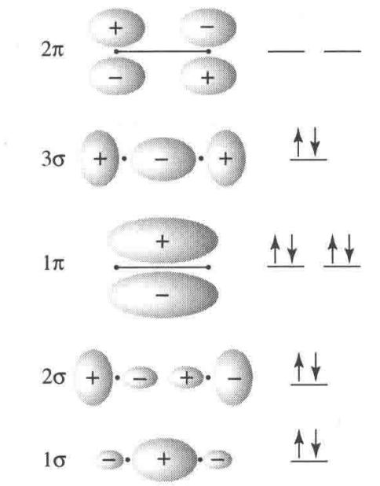  
图 3.7 CN $^{-}$ 分子轨道轮廓图

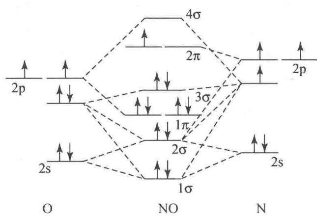  
图3.8 NO价层分子轨道能级图  
【3.8】画出 NO 的分子轨道能级示意图, 计算键级及自旋磁矩, 试比较 NO 和 $NO^{+}$ 何者的键更强? 哪一个键长长一些?  
解 NO 的价层分子轨道能级示意于图 3.8。它的分子轨道轮廓图和图 3.7 相似。

键级 $= \frac{1}{2} (8 - 3) = 2.5$  
不成对电子数为1；自旋磁矩 $\mu=\sqrt{1(1+2)}\beta_{e}=1.73\beta_{e}$  
由于 $NO^{+}$ 失去了 1 个反键的 $2\pi$ 电子，因而键级为 3，所以它的化学键比 NO 化学键强。相应地，其键长比 NO 的键长短。  
【3.9】按分子轨道理论写出 $NF, NF^{+}, NF^{-}$ 的基态电子组态，说明它们的不成对电子数和磁性（提示：按类似 $O_{2}$ 的能级排）。  
解 $\mathrm{NF}, \mathrm{NF}^{+}$ 和 $\mathrm{NF}^{-}$ 分别是 $\mathrm{O}_{2}, \mathrm{O}_{2}^{+}$ 和 $\mathrm{O}_{2}^{-}$ 的等电子体, 它们的基态电子组态、键级、不成对电子数及磁性等情况如下:

<table><tr><td>“分子”</td><td>基态电子组态</td><td>键级</td><td>不成对电子数</td><td>磁性</td></tr><tr><td>NF</td><td> $KK(1\sigma)^{2}(2\sigma)^{2}(3\sigma)^{2}(1\pi)^{4}(2\pi)^{2}$ </td><td>2</td><td>2</td><td>顺磁性</td></tr><tr><td> $NF^{+}$ </td><td> $KK(1\sigma)^{2}(2\sigma)^{2}(3\sigma)^{2}(1\pi)^{4}(2\pi)^{1}$ </td><td>2.5</td><td>1</td><td>顺磁性</td></tr><tr><td> $NF^{-}$ </td><td> $KK(1\sigma)^{2}(2\sigma)^{2}(3\sigma)^{2}(1\pi)^{4}(2\pi)^{3}$ </td><td>1.5</td><td>1</td><td>顺磁性</td></tr></table>

【3.10】试用分子轨道理论讨论 SO 分子的电子结构,说明基态时有几个不成对电子。

解 在 SO 分子的紫外光电子能谱中观察到 6 个峰, 它们所对应的分子轨道的归属和性质已借助于量子力学半经验计算(CNDO)得到指认。结果表明, SO 分子的价电子结构与 $O_{2}$ 分子和 $S_{2}$ 分子的价电子结构相似。但 SO 是异核双原子分子, 因而其价电子组态可表述为

$$
(1 \sigma) ^ {2} (2 \sigma) ^ {2} (3 \sigma) ^ {2} (1 \pi) ^ {4} (2 \pi) ^ {2}
$$

其中， $1\sigma,3\sigma$ 和 $1\pi$ 轨道是成键轨道， $2\sigma$ 和 $2\pi$ 轨道是反键轨道。这些价层分子轨道是由 O 原子的 2s,2p 轨道和 S 原子的 3s,3p 轨道叠加成的。

根据价层分子轨道的性质和电子数,可算出 SO 分子的键级为

$$
P = \frac {1}{2} (8 - 4) = 2
$$

在简并的 $2\pi$ 轨道上各有一个电子，因而 SO 分子的不成对电子数为 2，若忽略轨道运动对磁矩的影响，则 SO 分子的磁矩为 $\sqrt{2(2+2)}\beta_{e}=2\sqrt{2}\beta_{e}$ 。

【3.11】 CF 和 $CF^{+}$ 的键能分别为 548 和 753 kJ mol $^{-1}$ ，试用分子轨道理论探讨其键级（按 $F_{2}$ 能级次序）。

解 CF 的基态价电子组态为

$$
(1 \sigma) ^ {2} (2 \sigma) ^ {2} (3 \sigma) ^ {2} (1 \pi) ^ {4} (2 \pi) ^ {1}
$$

CF 和 $CF^{+}$ 的化学键可表示如下：

$$
\begin{array}{l l} \text {:C—F:} & \text {:C—F:} ^ {\oplus} \\ \sigma , \pi_ {x 2} ^ {3}, \pi_ {y 2} ^ {2} & \sigma , \pi_ {x 2} ^ {2}, \pi_ {y 2} ^ {2} \end{array}
$$

CF键级为 $\frac{1}{2} (8 - 3) = 2.5$ 。而 $\mathrm{CF^{+}}$ 比CF少1个反键电子，因而其键级为3。所以， $\mathrm{CF^{+}}$ 的键能比CF的键能大。

【3.12】下列 AB 型分子：NO, CN, CO, XeF 中，哪几个是得电子变为 $AB^{-}$ 后比原来中性分子键能大？哪几个是失电子变为 $AB^{+}$ 后比原来中性分子键能大？

解 就得电子而言,若得到的电子填充到成键分子轨道上,则 $AB^{-}$ 比 AB 键能大;若得到的电子填充到反键分子轨道上,则 $AB^{-}$ 比 AB 键能小。就失电子而言,若从反键分子轨道上失去电子,则 $AB^{+}$ 比 AB 键能大;若从成键分子轨道上失去电子,则 $AB^{+}$ 比 AB 键能小。根据这些原则和题中各分子的电子组态,就可得出如下结论:

得电子变为 $AB^{-}$ 后比原中性分子键能大者有 CN。失电子变为 $AB^{+}$ 后比原中性分子键能大者有 NO 和 XeF。CO 无论得电子变为负离子 $(\mathrm{CO}^{-})$ 还是失电子变为正离子 $(\mathrm{CO}^{+})$ ，键能都减小。

【评注】3.2～3.12题有关双原子分子结构是重要的基础知识。通过对这些习题的解答,要求准确而熟练地掌握下面几点内容:

(1) 分子轨道理论的要点。

(2) 两个原子接近时, 它们的原子轨道怎样相互叠加成分子轨道呢? 哪些是成键轨道, 哪些是反键轨道? 哪些是弱成键轨道, 哪些是弱反键轨道?

(3) 熟练地写出各种双原子分子基态时的价电子组态。

(4) 熟练地写出各种双原子分子所形成的化学键的键型及有关电子的排布。

(5) 在上述基础上了解键级、键的强度、键长及分子的磁性等性质。

【3.13】写出 $Cl_{2}$ ，CN 的价层电子组态和基态光谱项。

解

$$
\mathrm{Cl} _ {2}: \left(\sigma_ {3 \mathrm{s}}\right) ^ {2} \left(\sigma_ {3 \mathrm{s}} ^ {*}\right) ^ {2} \left(\sigma_ {3 \mathrm{p} _ {z}}\right) ^ {2} \left(\pi_ {3 \mathrm{p} _ {x}}\right) ^ {2} \left(\pi_ {3 \mathrm{p} _ {y}}\right) ^ {2} \left(\pi_ {3 \mathrm{p} _ {x}} ^ {*}\right) ^ {2} \left(\pi_ {3 \mathrm{p} _ {y}} ^ {*}\right) ^ {2},
$$

$S = 0, \Lambda = 0$ , 基态光谱项: $^{1}\Sigma$ 。

$$
\mathrm{CN}: (1 \sigma) ^ {2} (2 \sigma) ^ {2} (1 \pi) ^ {4} (3 \sigma) ^ {1},
$$

$S = 1/2, \Lambda = 0$ , 基态光谱项： $^{2}\Sigma$ 。

【3.14】OH 分子于 1964 年在星际空间被发现。

（1）试按分子轨道理论只用 O 原子的 2p 轨道和 H 原子的 1s 轨道叠加，写出其电子组态；

(2) 在哪个分子轨道中有不成对电子?

(3) 此轨道是由 O 和 H 的原子轨道叠加形成, 还是基本上定域于某个原子上?

(4) 已知 OH 的第一电离能为 13.2 eV, HF 的第一电离能为 16.05 eV, 它们的差值几乎和 O 原子与 F 原子的第一电离能 (15.8 eV 和 18.6 eV) 的差值相同, 为什么?

(5) 写出它的基态光谱项。

## 解

(1) H 原子的 1s 轨道和 O 原子的 $2p_{z}$ 轨道满足对称性匹配、能级相近等条件, 可叠加形成 $\sigma$ 轨道。OH 的基态价电子组态为 $(1\sigma)^{2}(2\sigma)^{2}(1\pi)^{3}$ 。 $(1\sigma)^{2}$ 实际上是 O 原子的 $(2s)^{2}$ , 而 $(1\pi)^{3}$ 实际上是 O 原子的 $(2p_{x})^{2}(2p_{y})^{1}$ 或 $(2p_{x})^{1}(2p_{y})^{2}$ 。因此, OH 的基态价电子组态亦可写为 $(\sigma_{2s})^{2}(\sigma)^{2}(\pi_{2p})^{3}$ 。 $\sigma_{2s}$ 和 $\pi_{2p}$ 是非键轨道, OH 有 2.5 对非键电子, 键级为 1。

(2) 在 $1\pi$ 轨道上有不成对电子。

(3) $1\pi$ 轨道基本上定域于 O 原子。

（4）OH 和 HF 的第一电离能分别是电离它们的 $1\pi$ 电子所需要的最小能量，而 $1\pi$ 轨道是非键轨道，即电离的电子是由 O 和 F 提供的非键电子，因此，OH 和 HF 的第一电离能差值与 O 原子和 F 原子的第一电离能差值相等。

(5) S=1/2, $\Lambda=1$ , 基态光谱项为: $^{2}\Pi$ 。

【3.15】 $H^{79}Br$ 在远红外区有一系列间隔为 $16.94 \, cm^{-1}$ 的谱线，计算 HBr 分子的转动惯量和平衡核间距。

解 双原子分子的转动可用刚性转子模型来模拟。据此模型，可建立起双原子分子的 Schrödinger 方程。解之，便得到转动波函数 $\psi_{R}$ 、转动能级 $E_{R}$ 和转动量子数 J 。由 $E_{R}$ 的表达式可推演出分子在相邻两能级间跃迁所产生的吸收光的波数为

$$
\widetilde {\nu} = 2 B (J + 1)
$$

而相邻两条谱线的波数之差(亦即第一条谱线的波数)为

$$
\Delta \widetilde {\nu} = 2 B
$$

$B$ 为转动常数：

$$
B = \frac {h}{8 \pi^ {2} I c}
$$

由题意知, $H^{79}Br$ 分子的转动常数为

$$
B = 1 6. 9 4 \mathrm{cm} ^ {- 1} / 2 = 8. 4 7 0 \mathrm{cm} ^ {- 1}
$$

其转动惯量为

$$
\begin{array}{r l} I = \frac {h}{8 \pi^ {2} B c} & = \frac {6 . 6 2 6 2 \times 1 0 ^ {- 3 4} \mathrm{Js}}{8 \pi^ {2} \times 8 . 4 7 0 \times 1 0 ^ {2} \mathrm{m} ^ {- 1} \times 2 . 9 9 7 9 \times 1 0 ^ {8} \mathrm{ms} ^ {- 1}} \\ & = 3. 3 0 8 \times 1 0 ^ {- 4 7} \mathrm{kgm} ^ {2} \end{array}
$$

$\mathrm{H}^{79}\mathrm{Br}$ 的约化质量为

$$
\mu = \frac {m _ {\mathrm{H}} m _ {\mathrm{Br}}}{m _ {\mathrm{H}} + m _ {\mathrm{Br}}} = 1. 6 4 3 \times 1 0 ^ {- 2 7} \mathrm{kg}
$$

其平衡核间距为

$$
\begin{array}{r l} r _ {\mathrm{e}} & = \left(\frac {I}{\mu}\right) ^ {\frac {1}{2}} = \left(\frac {3 . 3 0 8 \times 1 0 ^ {- 4 7} \mathrm{kgm} ^ {2}}{1 . 6 4 3 \times 1 0 ^ {- 2 7} \mathrm{kg}}\right) ^ {\frac {1}{2}} \\ & = 1 4 1. 9 \mathrm{pm} \end{array}
$$

【3.16】 $^{12}$ C $^{16}$ O 的核间距为 112.83 pm，计算其纯转动光谱前 4 条谱线所应具有的波数。

解 ${}^{12}C^{16}O$ 的折合质量为

$$
\mu = \frac {1 2 \times 1 6}{1 2 + 1 6} \times \frac {1 0 ^ {- 3}}{N _ {\mathrm{A}}} = 1. 1 3 8 5 \times 1 0 ^ {- 2 6} (\mathrm{kg})
$$

其转动常数为

$$
\begin{array}{r l} B & = h / 8 \pi^ {2} \mu r ^ {2} c \\ & = 6. 6 2 6 2 \times 1 0 ^ {- 3 4} \mathrm{Js} / [ 8 \pi^ {2} \times 1. 1 3 8 5 \times 1 0 ^ {- 2 6} \mathrm{kg} \times \\ & (1 1 2. 8 3 \times 1 0 ^ {- 1 2} \mathrm{m}) ^ {2} \times 2. 9 9 7 9 \times 1 0 ^ {8} \mathrm{ms} ^ {- 1} ] \\ & = 1. 9 3 2 \mathrm{cm} ^ {- 1} \end{array}
$$

第一条谱线的波数以及相邻两条谱线的波数差都是 2B, 所以前 4 条谱线的波数分别为

$$
\widetilde {\nu} _ {1} = 2 B = 2 \times 1. 9 3 2 \mathrm{cm} ^ {- 1} = 3. 8 6 4 \mathrm{cm} ^ {- 1}
$$

$$
\widetilde {\nu} _ {2} = 4 B = 4 \times 1. 9 3 2 \mathrm{cm} ^ {- 1} = 7. 7 2 8 \mathrm{cm} ^ {- 1}
$$

$$
\widetilde {\nu} _ {3} = 6 B = 6 \times 1. 9 3 2 \mathrm{cm} ^ {- 1} = 1 1. 5 9 2 \mathrm{cm} ^ {- 1}
$$

$$
\widetilde {\nu} _ {4} = 8 B = 8 \times 1. 9 3 2 \mathrm{cm} ^ {- 1} = 1 5. 4 5 6 \mathrm{cm} ^ {- 1}
$$

亦可用下式：

$$
\widetilde {\nu} = 2 B (J + 1)
$$

进行计算,式中的 J 分别为 0,1,2,和 3。

【3.17】 $CO_{2}(^{12}C,^{16}O)$ 的转动惯量为 $7.167\times10^{-46}\ kg\ m^{2}$ 。

(1) 计算 $CO_{2}$ 分子中 C=O 键的键长；

（2）假定同位素置换不影响 C=O 键的键长，试计算 ${}^{12}C, {}^{18}O$ 和 ${}^{13}C, {}^{16}O$ 组成的 $CO_{2}$ 分子的转动惯量。

提示：线形分子 A—B—C 的转动惯量 I 可按下式计算：

$$
I = \frac {m _ {\mathrm{A}} m _ {\mathrm{B}} r _ {\mathrm{AB}} ^ {2} + m _ {\mathrm{B}} m _ {\mathrm{C}} r _ {\mathrm{BC}} ^ {2} + m _ {\mathrm{A}} m _ {\mathrm{C}} (r _ {\mathrm{AB}} + r _ {\mathrm{BC}}) ^ {2}}{m _ {\mathrm{A}} + m _ {\mathrm{B}} + m _ {\mathrm{C}}}
$$

解

(1) 由于 $CO_{2}$ 分子的质心和对称中心重合, C 原子对分子转动惯量无贡献, 所以

$$
I _ {\mathrm{C} ^ {1 6} \mathrm{O} _ {2}} = 2 m _ {\mathrm{O}} ^ {1 6} \cdot r _ {\mathrm{C=O}} ^ {2}
$$

$$
\begin{array}{r l} r _ {\mathrm{C=O}} & = \left(\frac {I _ {1 2 \mathrm{C} ^ {1 6} \mathrm{O} _ {2}}}{2 m _ {\mathrm{O}} ^ {1 6}}\right) ^ {\frac {1}{2}} \\ & = \left(\frac {7 . 1 6 7 \times 1 0 ^ {- 4 6} \mathrm{kgm} ^ {2} \times 6 . 0 2 2 \times 1 0 ^ {2 3} \mathrm{mol} ^ {- 1}}{2 \times 1 6 \times 1 0 ^ {- 3} \mathrm{kgmol} ^ {- 1}}\right) ^ {\frac {1}{2}} \\ & = 1. 1 6 1 \times 1 0 ^ {- 1 0} \mathrm{m} \end{array}
$$

(2) 由于假定同位素置换不改变 C=O 键键长, 因而有

$$
\begin{array}{r l} I _ {\mathrm {C^ {18} O_ {2}}} & = 2 m _ {\mathrm{O}} ^ {1 8} \cdot r _ {\mathrm{C=O}} ^ {2} \\ & = \frac {2 \times (1 8 \times 1 0 ^ {- 3} \mathrm{kgmol} ^ {- 1}) \times (1 . 1 6 1 \times 1 0 ^ {- 1 0} \mathrm{m}) ^ {2}}{6 . 0 2 2 \times 1 0 ^ {2 3} \mathrm{mol} ^ {- 1}} \\ & = 8. 0 5 8 \times 1 0 ^ {- 4 6} \mathrm{kgm} ^ {2} \end{array}
$$

由于(1)中一开始就阐明的原因, $^{13}C^{16}O_{2}$ 的转动惯量和 $^{12}C^{16}O_{2}$ 的转动惯量相等,即

$$
I _ {^ 1 3 \mathrm{C} ^ {1 6} \mathrm{O} _ {2}} = I _ {^ 1 2 \mathrm{C} ^ {1 6} \mathrm{O} _ {2}} = 7. 1 6 7 \times 1 0 ^ {- 4 6} \mathrm{kgm} ^ {2}
$$

线形分子 A—B—C 的转动惯量为

$$
I = \frac {m _ {\mathrm{A}} m _ {\mathrm{B}} r _ {\mathrm{AB}} ^ {2} + m _ {\mathrm{B}} m _ {\mathrm{C}} r _ {\mathrm{BC}} ^ {2} + m _ {\mathrm{A}} m _ {\mathrm{C}} (r _ {\mathrm{AB}} + r _ {\mathrm{BC}}) ^ {2}}{m _ {\mathrm{A}} + m _ {\mathrm{B}} + m _ {\mathrm{C}}}
$$

本题亦可按此式进行计算。

【3.18】在 $N_{2}$ ，HCl 和 HBr 混合气体的远红外光谱中，前几条谱线的波数分别为：16.70，20.70，33.40，41.85，50.10，62.37 cm $^{-1}$ 。计算产生这些谱线的分子的键长（Cl:35.457；Br:79.916；N:14.007）。

解 $N_{2}$ 是非极性分子, 不产生红外光谱, 故谱线是由 HCl 和 HBr 分子产生的。分析谱线波数的规律, 可知这些谱线由下列两个系列组成:

第一系列： 16.70,33.40,50.10cm $^{-1}$ 第二系列： 20.70,41.85,62.37cm $^{-1}$

由于 $r_{HBr} > r_{HCl}, \mu_{HBr} > \mu_{HCl}$ ，因而 $I_{HBr} > I_{HCl} (I = \mu r^{2})$ 。根据 $B = \frac{h^{2}}{8\pi^{2} I c}$ 知， $B_{HBr} < B_{HCl}$ ，所以，第一系列谱线是由 HBr 产生的，第二系列谱线是由 HCl 产生的。

对 HBr:

$$
\begin{array}{r l} & B = \frac {1}{2} \Delta \tilde {\nu} = \frac {1}{2} \times 1 6. 7 0 \mathrm{cm} ^ {- 1} = 8. 3 5 \mathrm{cm} ^ {- 1} \\ & I = \frac {h}{8 \pi^ {2} B c} = \frac {6 . 6 2 6 \times 1 0 ^ {- 3 4} \mathrm{Js}}{8 \pi^ {2} \times (8 . 3 5 0 \times 1 0 ^ {2} \mathrm{m} ^ {- 1}) \times 2 . 9 9 8 \times 1 0 ^ {8} \mathrm{ms} ^ {- 1}} = 3. 3 4 9 \times 1 0 ^ {- 4 7} \mathrm{kgm} ^ {2} \\ & \mu = \frac {1 . 0 0 8 \mathrm{gmol} ^ {- 1} \times 7 9 . 9 1 6 \mathrm{gmol} ^ {- 1}}{1 . 0 0 8 \mathrm{gmol} ^ {- 1} + 7 9 . 9 1 6 \mathrm{gmol} ^ {- 1}} \times 1 0 ^ {- 3} \mathrm{kgg} ^ {- 1} / 6. 0 2 2 \times 1 0 ^ {2 3} \mathrm{mol} ^ {- 1} \\ & = 1. 6 4 1 \times 1 0 ^ {- 2 7} \mathrm{kg} \\ & r = \left(\frac {I}{\mu}\right) ^ {\frac {1}{2}} = (3. 3 4 9 \times 1 0 ^ {- 4 7} \mathrm{kgm} ^ {2} / 1. 6 4 1 \times 1 0 ^ {- 2 7} \mathrm{kg}) ^ {\frac {1}{2}} = 1 4 2. 9 \mathrm{pm} \end{array}
$$

对 HCl:

$$
\begin{array}{r l} & B = \frac {1}{2} \Delta \widetilde {\nu} = \frac {1}{2} \times 2 0. 8 2 \mathrm{cm} ^ {- 1} = 1 0. 4 2 \mathrm{cm} ^ {- 1} \\ & I = \frac {h}{8 \pi^ {2} B c} = \frac {6 . 6 2 6 \times 1 0 ^ {- 3 4} \mathrm{Js}}{8 \pi^ {2} \times (1 0 . 4 2 \times 1 0 ^ {2} \mathrm{m} ^ {- 1}) \times 2 . 9 9 8 \times 1 0 ^ {8} \mathrm{ms} ^ {- 1}} \\ & = 2. 6 8 4 \times 1 0 ^ {- 4 7} \mathrm{kgm} ^ {2} \\ & \mu = \frac {1 . 0 0 8 \mathrm{gmol} ^ {- 1} \times 3 5 . 4 5 \mathrm{gmol} ^ {- 1}}{1 . 0 0 8 \mathrm{gmol} ^ {- 1} + 3 5 . 4 5 \mathrm{gmol} ^ {- 1}} \times 1 0 ^ {- 3} \mathrm{kgg} ^ {- 1} / 6. 0 2 2 \times 1 0 ^ {2 3} \mathrm{mol} ^ {- 1} \\ & = 1. 6 2 7 \times 1 0 ^ {- 2 7} \mathrm{kg} \\ & r = \left(\frac {I}{\mu}\right) ^ {\frac {1}{2}} = (2. 6 8 4 \times 1 0 ^ {- 4 7} \mathrm{kgm} ^ {2} / 1. 6 2 7 \times 1 0 ^ {- 2 7} \mathrm{kg}) ^ {\frac {1}{2}} = 1 2 8. 4 \mathrm{pm} \end{array}
$$

【3.19】在 $H^{127}I$ 的振动光谱图中观察到 $2309.5 \, cm^{-1}$ 强吸收峰，若将 HI 的简正振动看作谐振子，请计算或说明：

(1) 这个简正振动是否为红外活性；

(2) HI 简正振动频率；

(3) 零点能；

(4) $H^{127}I$ 的力常数。

解 按简谐振子模型, $H^{127}I$ 的振动光谱中只出现一条谱线,其波数就是经典振动波数 $\widetilde{\nu}_{e}$ ,亦即 $2309.5\ cm^{-1}$ 。既然只出现一条谱线,因此下列关于 $H^{127}I$ 分子振动光谱的描述都是指与这条谱线对应的简正振动的。

(1) $H^{127}I$ 分子是极性分子, 根据选律, 它应具有红外活性。

(2) 振动频率为

$$
\begin{array}{r l} \nu & = c \widetilde {\nu} = 2. 9 9 7 9 \times 1 0 ^ {8} \mathrm{ms} ^ {- 1} \times 2 3 0 9. 5 \times 1 0 ^ {2} \mathrm{m} ^ {- 1} \\ & = 6. 9 2 4 \times 1 0 ^ {1 3} \mathrm{s} ^ {- 1} \end{array}
$$

(3) 振动零点能为

$$
\begin{array}{r l} E _ {0} & = \frac {1}{2} h c \tilde {\nu} \\ & = \frac {1}{2} \times 6. 6 2 6 2 \times 1 0 ^ {- 3 4} \mathrm{Js} \times 2. 9 9 7 9 \times 1 0 ^ {8} \mathrm{ms} ^ {- 1} \times 2 3 0 9. 5 \times 1 0 ^ {2} \mathrm{m} ^ {- 1} \\ & = 2. 2 9 4 \times 1 0 ^ {- 2 0} \mathrm{J} \end{array}
$$

(4) $\mathrm{H}^{127}\mathrm{I}$ 的约化质量为

$$
\begin{array}{r l} \mu = & \frac {1 . 0 0 8 \times 1 0 ^ {- 3} \mathrm{kgmol} ^ {- 1} \times 1 2 6 . 9 \times 1 0 ^ {- 3} \mathrm{kgmol} ^ {- 1}}{(1 . 0 0 8 + 1 2 6 . 9) \times 1 0 ^ {- 3} \mathrm{kgmol} ^ {- 1} \times 6 . 0 2 2 \times 1 0 ^ {2 3} \mathrm{mol} ^ {- 1}} \\ = & 1. 6 6 1 \times 1 0 ^ {- 2 7} \mathrm{kg} \end{array}
$$

$\mathrm{H}^{127}\mathrm{I}$ 的力常数为

$$
\begin{array}{r l} & k = 4 \pi^ {2} c ^ {2} \widetilde {\nu} ^ {2} \mu \\ & = 4 \pi^ {2} (2. 9 9 8 \times 1 0 ^ {8} \mathrm{ms} ^ {- 1}) ^ {2} \times (2 3 0 9. 5 \times 1 0 ^ {2} \mathrm{m} ^ {- 1}) ^ {2} \times 1. 6 6 1 \times 1 0 ^ {- 2 7} \mathrm{kg} \\ & = 3 1 4. 2 \mathrm{Nm} ^ {- 1} \end{array}
$$

【3.20】在 CO 的振动光谱中观察到 $2169.8 \, cm^{-1}$ 强吸收峰，若将 CO 的简正振动看作谐振子，计算 CO 的简正振动频率、力常数和零点能。当 CO 吸附在 CuCl/分子筛吸附剂表面上时，它的伸缩频率有何变化？

解

$$
\begin{array}{r l} & \nu = c \widetilde {\nu} = 2. 9 9 8 \times 1 0 ^ {8} \mathrm{ms} ^ {- 1} \times 2 1 6 9. 8 \times 1 0 ^ {2} \mathrm{m} ^ {- 1} \\ & = 6. 5 0 5 \times 1 0 ^ {1 3} \mathrm{s} ^ {- 1} \\ & \mu = \frac {1 2 . 0 1 \times 1 0 ^ {- 3} \mathrm{kgmol} ^ {- 1} \times 1 6 . 0 0 \times 1 0 ^ {- 3} \mathrm{kgmol} ^ {- 1}}{(1 2 . 0 1 + 1 6 . 0 0) \times 1 0 ^ {- 3} \mathrm{kgmol} ^ {- 1} \times 6 . 0 2 2 \times 1 0 ^ {2 3} \mathrm{mol} ^ {- 1}} \\ & = 1. 1 3 9 \times 1 0 ^ {- 2 6} \mathrm{kg} \\ & k = 4 \pi^ {2} c ^ {2} \widetilde {\nu} ^ {2} \mu \\ & = 4 \pi^ {2} (2. 9 9 8 \times 1 0 ^ {8} \mathrm{ms} ^ {- 1}) ^ {2} \times (2 1 6 9. 8 \times 1 0 ^ {2} \mathrm{m} ^ {- 1}) ^ {2} \times 1. 1 3 9 \times 1 0 ^ {- 2 6} \mathrm{kg} \\ & = 1 9 0 1 \mathrm{Nm} ^ {- 1} \end{array}
$$

$$
\begin{array}{r l} E _ {0} & = \frac {1}{2} h c \widetilde {\nu} = \frac {1}{2} \times 6. 6 2 6 \times 1 0 ^ {- 3 4} \mathrm{Js} \times 2. 9 9 8 \times 1 0 ^ {8} \mathrm{ms} ^ {- 1} \times 2 1 6 9. 8 \times 1 0 ^ {2} \mathrm{m} ^ {- 1} \\ & = 2. 1 5 5 \times 1 0 ^ {- 2 0} \mathrm{J} \end{array}
$$

当 CO 吸附在 CuCl/分子筛吸附剂表面上时,由于 CO 分子和 Cu(I)间形成 $\sigma-\pi$ 配键,使 CO 分子的键级减小,力常数减小,C—O 伸缩振动频率降低。

【3.21】写出 $O_{2}, O_{2}^{+}$ 和 $O_{2}^{-}$ 的基态光谱项。今有 3 个振动吸收峰，波数分别为 1097, 1580 和 $1865 \, cm^{-1}$ ，请将这些吸收峰与上述 3 种微粒关联起来。

解 写出 $O_{2}, O_{2}^{+}$ 和 $O_{2}^{-}$ 的价电子组态，推求它们的量子数 S 和 $\Lambda$ ，即可求出基态光谱项。根据价电子组态，比较力常数大小，即可根据表达式 $\tilde{\nu} = \frac{1}{2\pi c} \sqrt{k / \mu}$ 判定波数大小次序。结果如下：

<table><tr><td>分子或离子</td><td>基态光谱项</td><td>键级</td><td>波数/ $cm^{-1}$ </td></tr><tr><td> $O_{2}$ </td><td> $^{3}\Sigma$ </td><td>2.0</td><td>1580</td></tr><tr><td> $O_{2}^{+}$ </td><td> $^{2}\Pi$ </td><td>2.5</td><td>1865</td></tr><tr><td> $O_{2}^{-}$ </td><td> $^{2}\Pi$ </td><td>1.5</td><td>1097</td></tr></table>

【3.22】在 $\mathrm{H}^{35}\mathrm{Cl}$ 的基本振动吸收带的中心处，有波数分别为2925.78,2906.25,2865.09和 $2843.56\mathrm{cm}^{-1}$ 的转动谱线。其倍频为 $5668.0\mathrm{cm}^{-1}$ ，请计算：

(1) 非谐性常数；

(2) 力常数；

(3) 平衡解离能；

(4) 键长。

## 解

（1）在此振-转光谱中，波数为2925.78和 $2906.25\mathrm{cm}^{-1}$ 的谱线属R支，波数为2865.09和 $2843.56\mathrm{cm}^{-1}$ 的谱线属P支，在两支转动谱线的中心处即振动基频：

$$
\widetilde {\nu} = \frac {2 9 0 6 . 2 5 \mathrm{cm} ^ {- 1} + 2 8 6 5 . 0 9 \mathrm{cm} ^ {- 1}}{2} = 2 8 8 5. 6 7 \mathrm{cm} ^ {- 1}
$$

已知倍频为 $\tilde{\nu}_{2}=5668.0\ cm^{-1}$ ，根据非谐振子模型，得联立方程如下：

$$
\left\{ \begin{array}{l} (1 - 2 x) \widetilde {\nu_ {e}} = 2 8 8 5. 6 7 \mathrm{cm} ^ {- 1} \\ 2 (1 - 3 x) \widetilde {\nu_ {e}} = 5 6 6 8. 0 \mathrm{cm} ^ {- 1} \end{array} \right.
$$

解之，得

$$
\widetilde {\nu} _ {\mathrm{e}} = 2 9 8 9. 0 1 \mathrm{cm} ^ {- 1}, x = 1. 7 2 8 7 \times 1 0 ^ {- 2}
$$

(2) 由 $\widetilde{\nu}_{\mathrm{e}} = \frac{1}{2\pi c}\sqrt{\frac{k}{\mu}}$ ，得

$$
\begin{array}{r l} & k = 4 \pi^ {2} c ^ {2} \mu \widetilde {\nu_ {\mathrm{e}} ^ {2}} \\ & = 4 \pi^ {2} (2. 9 9 8 \times 1 0 ^ {1 0} \mathrm{cm} \mathrm{s} ^ {- 1}) ^ {2} \times \frac {1 \times 3 5}{1 + 3 5} \times (2 9 8 9. 0 1 \mathrm{cm} ^ {- 1}) ^ {2} \times \frac {1}{6 . 0 2 2 \times 1 0 ^ {2 3} \mathrm{mol} ^ {- 1}} \\ & = 5 1 2. 5 \mathrm{Nm} ^ {- 1} \end{array}
$$

(3) 由 $\widetilde{\nu}_{\mathrm{e}}$ 和 $x$ 得

$$
D _ {\mathrm{e}} = \frac {h \nu_ {\mathrm{e}}}{4 x} = \frac {6 . 6 2 6 \times 1 0 ^ {- 3 4} \mathrm{Js} \times 2 9 8 9 . 0 1 \times 1 0 ^ {2} \mathrm{m} ^ {- 1} \times 2 . 9 9 8 \times 1 0 ^ {8} \mathrm{ms} ^ {- 1}}{4 \times 1 . 7 2 8 7 \times 1 0 ^ {- 2}}
$$

$$
\begin{array}{r l} & = 8. 5 8 7 \times 1 0 ^ {- 1 9} \mathrm{J} \\ & = 5 1 7. 1 \mathrm{kJmol} ^ {- 1} \end{array}
$$

(4) 由 $H^{35}Cl$ 的振-转光谱 P 支 =2865.09 cm $^{-1}$ , 2843.56 cm $^{-1}$ 可得

$$
2 B = 2 1. 5 3 \mathrm{cm} ^ {- 1} = 2 \times \frac {h}{8 \pi^ {2} I c} = \frac {2 h}{8 \pi^ {2} \mu r ^ {2} c}
$$

$$
\begin{array}{r l} r = & \sqrt {\frac {h}{8 \pi^ {2} \mu B c}} = \sqrt {\frac {6 . 6 2 6 \times 1 0 ^ {- 3 4} \mathrm{Js}}{8 \pi^ {2} \times \frac {1 \times 3 5}{1 + 3 5} \times 1 0 . 7 6 5 \times 1 0 ^ {2} \mathrm{m} ^ {- 1} \times 2 . 9 9 8 \times 1 0 ^ {8} \mathrm{ms} ^ {- 1}}} \\ = & 1 2 6. 8 6 \mathrm{pm} \end{array}
$$

【3.23】已知 $N_{2}$ 的平衡解离能 $D_{e}=955.42\ kJ\ mol^{-1}$ ，其基本振动波数为 $2330.0\ cm^{-1}$ ，计算光谱解离能 $D_{0}$ 值。

解 按简谐振子模型, $N_{2}$ 的光谱解离能为

$$
\begin{array}{r l} D _ {0} & = D _ {\mathrm{e}} - \frac {1}{2} h \nu_ {\mathrm{e}} = D _ {\mathrm{e}} - \frac {1}{2} h c \tilde {\nu_ {\mathrm{e}}} \\ & = 9 5 5. 4 2 \mathrm{kJ} \mathrm{mol} ^ {- 1} - \frac {1}{2} \times 6. 6 2 6 1 8 \times 1 0 ^ {- 3 4} \mathrm{Js} \times 2. 9 9 7 9 \\ & \times 1 0 ^ {8} \mathrm{ms} ^ {- 1} \times 2 3 3 0. 0 \times 1 0 ^ {2} \mathrm{m} ^ {- 1} \times 6. 0 2 2 0 5 \times 1 0 ^ {2 3} \mathrm{mol} ^ {- 1} \\ & = 9 5 5. 4 2 \mathrm{kJ} \mathrm{mol} ^ {- 1} - 1 3. 9 3 6 \mathrm{kJ} \mathrm{mol} ^ {- 1} \\ & = 9 4 1. 4 8 \mathrm{kJ} \mathrm{mol} ^ {- 1} \end{array}
$$

按非谐振子模型, $N_{2}$ 的光谱解离能为

$$
\begin{array}{r l} D _ {0} & = D _ {\mathrm{e}} - \frac {1}{2} h \nu_ {\mathrm{e}} + \frac {1}{4} h \nu_ {\mathrm{e}} x = D _ {\mathrm{e}} - \frac {1}{2} h \nu_ {\mathrm{e}} + \frac {1}{4} h \nu_ {\mathrm{e}} \cdot \frac {h \nu_ {\mathrm{e}}}{4 D _ {\mathrm{e}}} \\ & = D _ {\mathrm{e}} - \frac {1}{2} h c \widetilde {\nu_ {\mathrm{e}}} + \frac {h ^ {2} c ^ {2} \widetilde {\nu_ {\mathrm{e}}} ^ {2}}{1 6 D _ {\mathrm{e}}} = 9 4 1. 4 8 \mathrm{kJmol} ^ {- 1} + 0. 0 5 1 0 \mathrm{kJmol} ^ {- 1} \\ & = 9 4 1. 5 3 \mathrm{kJmol} ^ {- 1} \end{array}
$$

【3.24】 $H_{2}(g)$ 的光谱解离能为 4.4763 eV，振动基频波数为 4395.24 cm $^{-1}$ 。若 $D_{2}(g)$ 与 $H_{2}(g)$ 的力常数、核间距和 $D_{e}$ 等都相同，计算 $D_{2}(g)$ 的光谱解离能。

解 按双原子分子的谐振子模型, $D_{2}$ 的光谱解离能为

$$
D _ {0} ^ {\mathrm{D} _ {2}} = D _ {\mathrm{e}} ^ {\mathrm{D} _ {2}} - \frac {1}{2} h \nu_ {\mathrm{e}} ^ {\mathrm{D} _ {2}}
$$

因此，只要求出 $D_{\mathrm{e}}^{\mathrm{D}_2}$ 和 $\nu_{\mathrm{e}}^{\mathrm{D}_2}$ ，即可算得 $D_{0}^{\mathrm{D}_2}$ 。

依题意, $D_{2}$ 的平衡解离能为

$$
D _ {\mathrm{e}} ^ {\mathrm{D} _ {2}} = D _ {\mathrm{e}} ^ {\mathrm{H} _ {2}} = D _ {0} ^ {\mathrm{H} _ {2}} + \frac {1}{2} h \nu_ {\mathrm{e}} ^ {\mathrm{H} _ {2}}
$$

仍依题意， $k_{D_{2}}=k_{H_{2}}$ ，由式 $\nu_{e}=\frac{1}{2\pi}\left(\frac{k}{\mu}\right)^{\frac{1}{2}}$ 可推得

$$
\nu_ {\mathrm{e}} ^ {\mathrm{D} _ {2}} = \nu_ {\mathrm{e}} ^ {\mathrm{H} _ {2}} \times \left(\frac {\mu_ {\mathrm{H} _ {2}}}{\mu_ {\mathrm{D} _ {2}}}\right) ^ {\frac {1}{2}}
$$

所以

$$
D _ {0} ^ {\mathrm{D} _ {2}} = D _ {\mathrm{e}} ^ {\mathrm{D} _ {2}} - \frac {1}{2} h \nu_ {\mathrm{e}} ^ {\mathrm{D} _ {2}} = D _ {0} ^ {\mathrm{H} _ {2}} + \frac {1}{2} h \nu_ {\mathrm{e}} ^ {\mathrm{H} _ {2}} - \frac {1}{2} h \nu_ {\mathrm{e}} ^ {\mathrm{H} _ {2}} \left(\frac {\mu_ {\mathrm{H} _ {2}}}{\mu_ {\mathrm{D} _ {2}}}\right) ^ {\frac {1}{2}}
$$

$$
\begin{array}{r l} & = D _ {0} ^ {\mathrm{H} _ {2}} + \frac {1}{2} h \nu_ {\mathrm{e}} ^ {\mathrm{H} _ {2}} \left[ 1 - \left(\frac {\mu_ {\mathrm{H} _ {2}}}{\mu_ {\mathrm{D} _ {2}}}\right) ^ {\frac {1}{2}} \right] \\ & = 4. 4 7 6 3 \mathrm{eV} + \frac {1}{2} \times 6. 6 2 6 2 \times 1 0 ^ {- 3 4} \mathrm{Js} \times 2. 9 9 7 9 \times 1 0 ^ {8} \mathrm{ms} ^ {- 1} \\ & \quad \times 4 3 9 5. 2 4 \times 1 0 ^ {2} \mathrm{m} ^ {- 1} \times \left[ 1 - \left(\frac {8 . 3 6 8 3 \times 1 0 ^ {- 2 8} \mathrm{kg}}{1 . 6 7 2 2 \times 1 0 ^ {- 2 7} \mathrm{kg}}\right) ^ {\frac {1}{2}} \right] \\ & = 4. 4 7 6 3 \mathrm{eV} + 0. 0 7 9 7 \mathrm{eV} \\ & = 4. 5 5 6 \mathrm{eV} \end{array}
$$

【3.25】H—O—O—H和H—C≡C—H分子的简正振动数目各有多少？画出H—C≡C—H简正振动方式，并分别指明其为红外活性或Raman活性。

解 由 n 个原子组成的非线形分子有 3n-6 个简正振动，而由 n 个原子组成的线形分子有 3n-5 个简正振动。因此， $H_{2}O_{2}$ 和 $C_{2}H_{2}$ 的简正振动数目分别为 $3 \times 4 - 6 = 6$ 和 $3 \times 4 - 5 = 7$ 。 $C_{2}H_{2}$ 的简正振动方式如下：

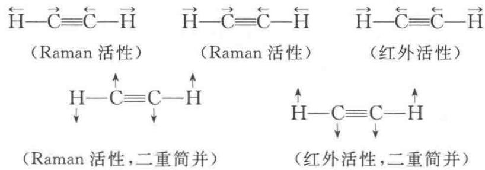

【3.26】画出 $SO_{2}$ 的简正振动方式, 已知与 3 个基频对应的谱带波数分别为 1361, 1151, $519 \, cm^{-1}$ , 指出每种频率所对应的振动, 说明是否为红外活性或 Raman 活性 [参看《结构化学基础》(第 5 版)4.6 节]。

解 $\mathrm{SO}_2$ 分子有3种 $(3n - 6 = 3\times 3 - 6)$ 简正振动，其中2种 $(n - 1)$ 为伸缩振动，1种 $(2n - 5)$ 为弯曲振动。这些简正振动方式示意如下：

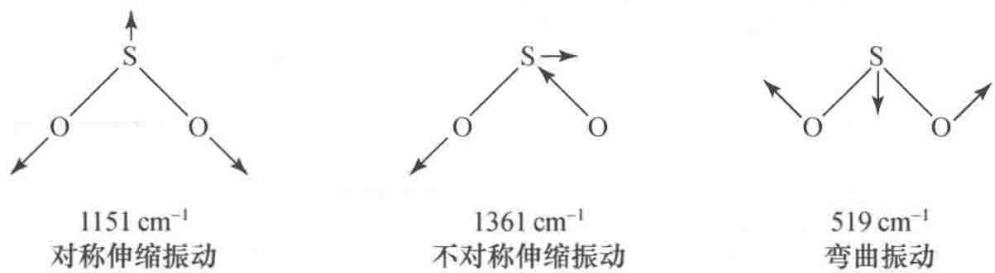

一般说来, 改变键长所需要的能量比改变键角所需要的能量大, 因此, 伸缩振动的频率比弯曲振动的频率大。而不对称伸缩振动的频率又比相应的对称伸缩振动的频率大。据此, 可将 3 个波数 ( $\tilde{\nu}=c^{-1}\nu$ ) 与 3 种简正振动方式一一关联起来。

简单说来, $SO_{2}$ 分子的 3 种振动方式均使其偶极矩发生变化, 因而皆是红外活性的。同时, 这 3 种振动方式又都使 $SO_{2}$ 的极化率发生变化, 所以, 又都是 Raman 活性的。

【3.27】用 HeI (21.22 eV) 作为激发源, $N_{2}$ 的 3 个分子轨道的电子电离所得光电子动能为多少? [按《结构化学基础》(第 5 版) 图 3.6.3 估计]

解 图 3.27 是 $N_{2}$ 的光电子能谱图，与各谱带相应的分子轨道也已在图中标出。

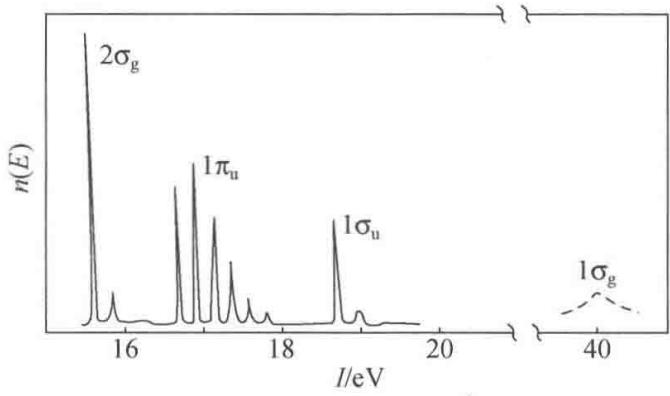  
图3.27 $\mathbf{N}_2$ 的光电子能谱图

根据该谱图估计,基态 $N_{2}$ 分子的各价层分子轨道的绝热电离能分别为, $1\sigma_{g}$ :约 40 eV; $1\sigma_{u}$ :约 18.80 eV; $1\pi_{u}$ :约 16.70 eV; $2\sigma_{g}$ :约 15.60 eV。He I 线的能量为 21.22 eV,它只能使 $1\sigma_{u},1\pi_{u}$ 和 $2\sigma_{g}$ 电子电离。

对气体样品,忽略能谱仪本身的功函数,光电子的动能 $E_{k}$ 可由下式计算:

$$
E _ {\mathrm{k}} = E _ {\mathrm{HeI}} - | E _ {\mathrm{b}} | = E _ {\mathrm{HeI}} - I _ {\mathrm{A}}
$$

式中 $E_{HeI}$ ， $E_{b}$ 和 $I_{A}$ 分别为激发源的能量、电离轨道的能级（电子结合能）和电离轨道的绝热电离能。将有关数据代入，可得从 $N_{2}$ 分子的 $1\sigma_{u}$ ， $1\pi_{u}$ 和 $2\sigma_{g}$ 三个分子轨道电离出的光电子动能，它们分别为

$$
\begin{array}{l} 2 1. 2 2 \mathrm{eV} - 1 8. 8 0 \mathrm{eV} = 2. 4 2 \mathrm{eV} \\ 2 1. 2 2 \mathrm{eV} - 1 6. 7 0 \mathrm{eV} = 4. 5 2 \mathrm{eV} \\ 2 1. 2 2 \mathrm{eV} - 1 5. 6 0 \mathrm{eV} = 5. 6 2 \mathrm{eV} \end{array}
$$

【3.28】什么是垂直电离能和绝热电离能？试以 $N_{2}$ 分子的电子能谱图为例[参看《结构化学基础》(第5版)图3.6.3]，说明3个轨道的数据。

解 分子价层电子的电离必然伴随着振动和转动能级的改变。因此，分子的紫外光电子能谱(UPS)并非呈现一个个单峰，而是有精细结构。但由于分子的转动能级间隔太小，通常所用的激发源(如 He I 线和 He II 线)产生的 UPS 只能分辨气体分子的振动精细结构。分子从其振动基态(v=0)跃迁到分子离子的振动基态 $v^{\prime}=0$ 的电离过程叫绝热电离，相应的电离能称为绝热电离能，用 $I_{A}$ 表示。它对应于 UPS 中各振动精细结构的第一个小峰。分子亦可从振动基态跃迁到分子离子跃迁概率最大的振动态，即 Franck-Condon 跃迁，这一电离过程称为垂直电离，相应的电离能称为垂直电离能，用 $I_{v}$ 表示。它对应于各振动精细结构中强度最大的小峰。

从图3.27中估计，相应于 $\mathrm{N}_2$ 分子 $2\sigma_{\mathrm{g}}$ 轨道的 $I_{\mathrm{A}} \approx I_{\mathrm{V}} \approx 15.6\mathrm{eV}$ ；相应于 $1\pi_{\mathrm{u}}$ 轨道的 $I_{\mathrm{A}} \approx 16.7\mathrm{eV}$ ，而 $I_{\mathrm{V}} \approx 16.9\mathrm{eV}$ ，两者之差（约 $0.2\mathrm{eV}$ ）即 $\mathrm{N}_2^+ (1\pi_{\mathrm{u}})$ 的振动能级间隔；相应于 $1\sigma_{\mathrm{u}}$ 轨道的 $I_{\mathrm{A}} \approx I_{\mathrm{V}} \approx 18.8\mathrm{eV}$ 。这与从分子轨道理论得到的下述结论是一致的：若电子从非键轨道电离， $I_{\mathrm{A}}$ 和 $I_{\mathrm{V}}$ 相等；若电子从弱成键轨道或弱反键轨道电离，则 $I_{\mathrm{A}}$ 和 $I_{\mathrm{V}}$ 近似相等；若电子从强成键或强反键轨道电离，则 $I_{\mathrm{A}}$ 和 $I_{\mathrm{V}}$ 不等，两者相差一个或数个振动能级间隔。

## 【3.29】怎样根据电子能谱区分分子轨道的性质？

解 紫外光电子能谱不仅能够直接测定分子轨道的能级,而且还可区分分子轨道的性质。这主要是通过分析分子离子的振动精细结构(即谱带的形状和小峰间的距离)来实现的。

（1）非键电子电离，平衡核间距不变，分子从其振动基态跃迁到分子离子振动基态的概率最大， $I_{A}=I_{V}$ 。当然，分子也可从其振动基态跃迁到分子离子的其他振动态，但跃迁概率很小。因此，若“电离轨道”是非键轨道，则跃迁概率集中，相应谱带的振动序列短而简单：只呈现一个尖锐的强峰和一两个弱峰，且强度依次减小（弱峰的产生主要源于非 Franck-Condon 跃迁）。

（2）成键电子电离，分子离子的平衡核间距比原分子的平衡核间距大；反键电子电离，分子离子的平衡核间距比原分子的平衡核间距小。核间距增大或减小的幅度与成键或反键的强弱有关。此时垂直跃迁的概率最大。但到分子离子其他振动能级的跃迁也有一定的概率，因此分子离子的振动精细结构比较复杂，谱带的序列较长，强度最大的峰不再是第一个峰。“电离轨道”的成键作用越强，垂直跃迁对应的振动量子数 $v'$ 越大，分子离子的振动能级间隔越小；“电离轨道”的反键作用越强，垂直跃迁对应的振动量子数 $v'$ 越大，分子离子的振动能级间隔也越大。

（3）若分子离子的平衡核间距与分子(基态)的平衡核间距相差很大,则分子离子的振动能级间隔很小,电子能谱仪已不能分辨,谱线表现为连续的谱带。

综上所述,根据紫外光电子能谱的振动精细结构(谱带形状和带中小峰间的距离),便可判断电离的电子所在的分子轨道的性质:若谱带中有一个强峰和一两个弱峰,则相关分子轨道为非键轨道或弱键轨道。至于是弱成键轨道还是弱反键轨道,须进一步看振动能级间隔的大小。振动能级间隔变小者为弱成键轨道,反之为弱反键轨道。若谱带的振动序列很长且振动能级间隔变小(与原分子相比),则相关分子轨道为强成键轨道;若谱带的振动序列很长且振动能级间隔变大,则相关分子轨道为强反键轨道。例如,在 $N_{2}$ 的紫外光电子能谱中(参见图3.27),与 $2\sigma_{g}$ 和 $1\sigma_{u}$ 轨道对应的谱带振动序列很短,跃迁概率集中,说明 $2\sigma_{g}$ 和 $1\sigma_{u}$ 皆为弱键轨道。但 $2\sigma_{g}$ 谱带的振动能级间隔小( $2100~cm^{-1}$ ), $1\sigma_{u}$ 谱带的振动能级间隔大( $2390~cm^{-1}$ ),所以 $2\sigma_{g}$ 为弱成键轨道, $1\sigma_{u}$ 为弱反键轨道。而相应于 $1\pi_{u}$ 轨道的谱带振动序列很长,包含的峰很多,峰间距较小( $1800~cm^{-1}$ ),而且第一个峰不是最大峰,所以 $1\pi_{u}$ 为强成键轨道。与 $1\sigma_{g}$ 对应的谱线已变成连续的谱带,说明 $1\sigma_{g}$ 是特强成键分子轨道。

【3.30】由紫外光电子能谱实验知，NO 分子的第一电离能为 9.26 eV，比 CO 分子的 $I_{1}$ （14.01 eV）小很多，试从分子的电子组态解释其原因。

解 基态 CO 分子的价层电子组态为

$$
(1 \sigma) ^ {2} (2 \sigma) ^ {2} (1 \pi) ^ {4} (3 \sigma) ^ {2}
$$

基态 NO 分子的价层电子组态为

$$
(1 \sigma) ^ {2} (2 \sigma) ^ {2} (1 \pi) ^ {4} (3 \sigma) ^ {2} (2 \pi) ^ {1}
$$

CO 分子的第一电离能是将其 $3\sigma$ 电子击出所需要的最低能量, NO 分子的第一电离能则是将其 $2\pi$ 电子击出所需要的最低能量。 $3\sigma$ 电子是成键电子, 能量较低。 $2\pi$ 电子是反键电子, 能量较高。所以, NO 分子的第一电离能比 CO 分子的第一电离能小很多。

【3.31】下图示出由等摩尔的 $CH_{4}$ ， $CO_{2}$ 和 $CF_{4}$ 气体混合物的 $C_{1s}XPS$ ，指出 $CH_{4}$ 的 XPS 峰。

解 和 C 原子结合的原子的电负性( $\chi$ ): $\chi_{F} > \chi_{O} > \chi_{H}$

C 原子 1s 电子的结合能: $\mathrm{CH}_{4}<\mathrm{CO}_{2}<\mathrm{CF}_{4}$

电离能的大小次序则应为： $CH_{4}<CO_{2}<CF_{4}$

(a) (b) (c)

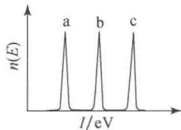

【3.32】三氟代乙酸乙酯的 XPS 中, 有 4 个不同化学位移的 C1s 峰, 其结合能大小次序如何? 为什么?

解 三氟代乙酸乙酯分子

$$
\mathrm{F} _ {3} \stackrel {1} {\mathrm{C}} - \stackrel {2} {\mathrm{C}} - \mathrm{O} - \stackrel {3} {\mathrm{CH} _ {2}} - \stackrel {4} {\mathrm{CH} _ {3}}
$$

中，碳原子的有效电负性的大小次序为 $C_{1} > C_{2} > C_{3} > C_{4}$ ，所以，1s 电子结合能大小次序为 $C_{1} > C_{2} > C_{3} > C_{4}$ 。

【评注】目前关于化学位移的理论模型较多,一般计算都比较复杂。下述经验规律可作为分析 X 射线光电子能谱的参考:

（1）原子失去价电子或因和电负性高的原子结合而使电子远离时，内层电子的结合能增大。

(2) 原子获得电子时内层电子的结合能减小。

(3) “原子”的氧化态愈高, 结合能愈大。

(4) 价层发生某种变化, 所有内层电子结合能的位移都相同。

【3.33】银的下列4个XPS峰中，强度最大的特征峰是什么？

Ag 4s 峰，Ag 3p 峰，Ag 3s 峰，Ag 3d 峰

解 X 射线光电子能谱特征峰的强度也有一些经验规律：就给出峰的轨道而言，主量子数小的峰比主量子数大的峰强；主量子数相同时，角量子数大者峰强；主量子数和角量子数都相同时，总量子数大者峰强。根据这些经验规律，Ag 的 3d 峰最强。

【3.34】由于自旋-轨道耦合，Ar 的紫外光电子能谱第一条谱线分裂成强度比为 2:1 的两个峰，它们所对应的电离能分别为 15.759 和 15.937 eV。

(1) 指出相应于此第一条谱线的光电子是从 Ar 原子的哪个轨道被击出的；

(2) 写出 Ar 原子和 $Ar^{+}$ 离子的基态光谱支项；

(3) 写出与两电离能对应的电离过程表达式；

(4) 计算自旋-轨道耦合常数。

## 解

（1）从 Ar 原子的某一轨道（设其轨道角量子数为 l）打出一个电子变成 $Ar^{+}$ 后，在该轨道上产生一个空穴和一个未成对电子。自旋-轨道耦合的结果产生了两种状态，可分别用量子数 $j_{1}$ 和 $j_{2}$ 表示： $j_{1}=l+\frac{1}{2}, j_{2}=l-\frac{1}{2}$ 。这两种状态具有不同的能量，其差值为自旋-轨道耦合常数。因自旋-轨道耦合产生的两个峰的相对强度比为

$$
(2 j _ {1} + 1): (2 j _ {2} + 1) = (l + 1): l
$$

依据题意， $(l+1): l=2:1$ ，因此 l=1，即电子是从 3p 轨道上被打出的。

(2)

Ar 原子：

$$
\text { 电子组态 } \quad (1 s) ^ {2} (2 s) ^ {2} (2 p) ^ {6} (3 s) ^ {2} (3 p) ^ {6}
$$

量子数

$$
m _ {L} = 0, L = 0; m _ {S} = 0, S = 0; J = 0
$$

光谱支项 $^{1}S_{0}$

$\mathrm{Ar}^{+}$ 离子：

电子组态

$$
(1 \mathrm{s}) ^ {2} (2 \mathrm{s}) ^ {2} (2 \mathrm{p}) ^ {6} (3 \mathrm{s}) ^ {2} (3 \mathrm{p}) ^ {5}
$$

量子数

$$
m _ {L} = 1, L = 1; m _ {S} = \frac {1}{2}, S = \frac {1}{2}; J = \frac {3}{2}, \frac {1}{2}
$$

光谱支项

$$
{ } ^ { 2 } \mathrm{P} _ { 3 / 2 } , { } ^ { 2 } \mathrm{P} _ { 1 / 2 }
$$

(3) 根据 Hund 规则, $E(^{2}\mathrm{P}_{1/2}) > E(^{2}\mathrm{P}_{3/2})$ , 所以两电离过程及相应的电离能分别为

$$
\mathrm{Ar} (^ {1} \mathrm{S} _ {0}) \longrightarrow \mathrm{Ar} ^ {+} (^ {2} \mathrm{P} _ {3 / 2}) + \mathrm{e} ^ {-} I = 1 5. 7 5 9 \mathrm{eV}
$$

$$
\mathrm{Ar} (^ {1} \mathrm{S} _ {0}) \longrightarrow \mathrm{Ar} ^ {+} (^ {2} \mathrm{P} _ {1 / 2}) + \mathrm{e} ^ {-} I = 1 5. 9 3 7 \mathrm{eV}
$$

微粒的状态及能量关系可简单示意如下：

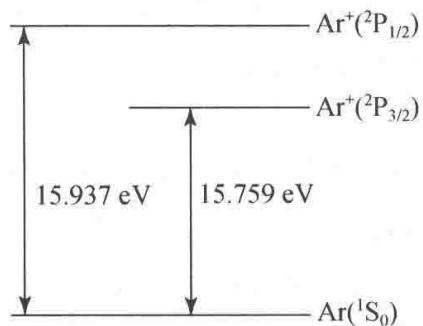

(4) 自旋-轨道耦合常数为

$$
1 5. 9 3 7 \mathrm{eV} - 1 5. 7 5 9 \mathrm{eV} = 0. 1 7 8 \mathrm{eV}
$$

此即图 3.34 所示的两个分裂峰之间的“距离”。

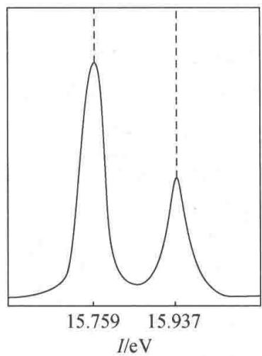  
图 3.34 Ar 的紫外光电子能谱(一部分)

# 第 4 章 分子的对称性

## 内容提要

## 4.1 对称操作和对称元素

对称操作是指不改变物体内部任何两点间的距离而使物体复原的操作。对称操作所依据的几何元素称为对称元素。对于分子等有限物体，在进行操作时，物体中至少有一点是不动的，这种对称操作叫点操作。点对称操作和相应的点对称元素有下列几类。

## 1. 旋转操作和旋转轴

旋转操作是将分子绕通过其中心的轴旋转一定的角度使分子复原的操作,旋转所依据的对称元素为旋转轴。n 次旋转轴的记号为 $C_{n}$ 。使物体复原的最小旋转角称为基转角 $\alpha$ ，对 $C_{n}$ 轴， $\alpha = 360^{\circ}/n$ 。和 $C_{n}$ 轴相应的基本旋转操作为 $C_{n}^{1}$ ，它为绕轴转 $360^{\circ}/n$ 的操作。分子中若有多个旋转轴，一般将轴次最高的轴称作主轴。

一次轴 $C_{1}$ 的操作 $C_{1}^{1}$ 是个恒等操作，又称为主操作 E，因为任何物体在任一方向上绕轴转 $360^{\circ}$ 均可复原，它和乘法中的 1 相似。

$C_{2}$ 轴的基转角是 $180^{\circ}$ ，基本操作是 $C_{2}^{1}$ ，连续进行两次 $C_{2}^{1}$ 相当于主操作，即 $C_{2}^{1} \cdot C_{2}^{1} = C_{2}^{2} = E$ 。

$C_{3}$ 轴的基转角是 $120^{\circ}$ ，它的特征操作为 $C_{3}^{1}$ 和 $C_{3}^{2}$ 。

$C_{4}$ 轴的基转角为 $90^{\circ}$ ，因 $C_{4}^{2}=C_{2}^{1}, C_{4}^{4}=E$ ，所以它的特征操作为 $C_{4}^{1}$ 和 $C_{4}^{3}$ 。

$C_{6}$ 轴的基转角为 $60^{\circ}$ ，因 $C_{6}^{2}=C_{3}^{1}, C_{6}^{3}=C_{2}^{1}, C_{6}^{4}=C_{3}^{2}, C_{6}^{6}=E$ ，所以它的特征操作为 $C_{6}^{1}$ 和 $C_{6}^{5}$ 。

各种对称操作相当于坐标变换, 可用坐标变换矩阵表示对称操作。 $C_{n}$ 轴(通过原点和 z 轴重合)的 k 次对称操作 $C_{n}^{k}$ 的表示矩阵为

$$
\mathbf {C} _ {n} ^ {k} = \left[ \begin{array}{c c c} \cos \frac {2 k \pi}{n} & - \sin \frac {2 k \pi}{n} & 0 \\ \sin \frac {2 k \pi}{n} & \cos \frac {2 k \pi}{n} & 0 \\ 0 & 0 & 1 \end{array} \right]
$$

按此,上述各旋转轴的特征对称操作的表示矩阵分别为

$$
\boldsymbol {C} _ {1} ^ {1} = \left[ \begin{array}{l l l} 1 & 0 & 0 \\ 0 & 1 & 0 \\ 0 & 0 & 1 \end{array} \right], \quad \boldsymbol {C} _ {2} ^ {1} = \left[ \begin{array}{c c c} - 1 & 0 & 0 \\ 0 & - 1 & 0 \\ 0 & 0 & 1 \end{array} \right], \quad \boldsymbol {C} _ {3} ^ {1} = \left[ \begin{array}{c c c} - \frac {1}{2} & - \frac {\sqrt {3}}{2} & 0 \\ \frac {\sqrt {3}}{2} & - \frac {1}{2} & 0 \\ 0 & 0 & 1 \end{array} \right]
$$

$$
\boldsymbol {C} _ {3} ^ {2} = \left( \begin{array}{c c c} - \frac {1}{2} & \frac {\sqrt {3}}{2} & 0 \\ - \frac {\sqrt {3}}{2} & - \frac {1}{2} & 0 \\ 0 & 0 & 1 \end{array} \right), \quad \boldsymbol {C} _ {4} ^ {1} = \left( \begin{array}{c c c} 0 & - 1 & 0 \\ 1 & 0 & 0 \\ 0 & 0 & 1 \end{array} \right), \quad \boldsymbol {C} _ {4} ^ {3} = \left( \begin{array}{c c c} 0 & 1 & 0 \\ - 1 & 0 & 0 \\ 0 & 0 & 1 \end{array} \right)
$$

$$
\boldsymbol {C} _ {6} ^ {1} = \left( \begin{array}{c c c} \frac {1}{2} & - \frac {\sqrt {3}}{2} & 0 \\ \frac {\sqrt {3}}{2} & \frac {1}{2} & 0 \\ 0 & 0 & 1 \end{array} \right), \quad \boldsymbol {C} _ {6} ^ {5} = \left( \begin{array}{c c c} \frac {1}{2} & \frac {\sqrt {3}}{2} & 0 \\ - \frac {\sqrt {3}}{2} & \frac {1}{2} & 0 \\ 0 & 0 & 1 \end{array} \right)
$$

## 2. 反演操作和对称中心

依据对称中心进行的对称操作为反演操作,处于坐标原点的对称中心 i 的反演操作 i 的表示矩阵为

$$
\boldsymbol {i} = \left( \begin{array}{c c c} - 1 & 0 & 0 \\ 0 & - 1 & 0 \\ 0 & 0 & - 1 \end{array} \right)
$$

由此可见，从分子中任一原子至对称中心连一直线，将此线延长，必可在和对称中心等距离的另一侧找到另一相同原子。连续进行反演操作，可得

$$
\pmb {i} ^ {n} = \left\{ \begin{array}{l l} {\pmb {E}} & {n \text {为偶数}} \\ {\pmb {i}} & {n \text {为奇数}} \end{array} \right.
$$

## 3. 反映操作和镜面

反映操作是使分子中的每一点都反映到该点到镜面垂线的延长线上、在镜面另一侧等距离处。通过原点和 $xy$ 面平行的镜面 $\sigma_{xy}$ 的反映操作 $\sigma_{xy}$ 的表示矩阵为

$$
\boldsymbol {\sigma} _ {x y} = \left( \begin{array}{c c c} 1 & 0 & 0 \\ 0 & 1 & 0 \\ 0 & 0 & - 1 \end{array} \right)
$$

连续进行反映操作,可得

$$
\pmb {\sigma} ^ {n} = \left\{ \begin{array}{l l} \pmb {E} & n \text {为偶数} \\ \pmb {\sigma} & n \text {为奇数} \end{array} \right.
$$

和主轴垂直的镜面以 $\sigma_{h}$ 表示；通过主轴的镜面以 $\sigma_{v}$ 表示；通过主轴、平分副轴夹角的镜面以 $\sigma_{d}$ 表示。

## 4. 旋转反演操作和反轴以及旋转反映操作和映轴

反轴 $I_{n}$ 的基本操作为绕轴转 $360^{\circ}/n$ ，接着按轴上的中心点进行反演，它是 $C_{n}^{1}$ 和 i 相继进行的联合操作：

$$
I _ {n} ^ {1} = i C _ {n} ^ {1}
$$

映轴 $S_{n}$ 的基本操作为绕轴转 $360^{\circ}/n$ ，接着按垂直于轴的平面进行反映，是 $C_{n}^{1}$ 和 $\sigma$ 相继进行的联合操作：

$$
\boldsymbol {S} _ {n} ^ {1} = \boldsymbol {\sigma} \boldsymbol {C} _ {n} ^ {1}
$$

反轴 $I_{n}$ 和映轴 $S_{n}$ 互有联系、互相包含，它们和其他对称元素的关系如下：

$$
I _ {1} = S _ {2} ^ {-} = i \qquad \qquad S _ {1} = I _ {2} ^ {-} = \sigma
$$

$$
I _ {2} = S _ {1} ^ {-} = \sigma \qquad \qquad S _ {2} = I _ {1} ^ {-} = i
$$

$$
I _ {3} = S _ {6} ^ {-} = C _ {3} + i \quad S _ {3} = I _ {6} ^ {-} = C _ {3} + \sigma
$$

$$
I _ {4} = S _ {4} ^ {-} \quad S _ {4} = I _ {4} ^ {-}
$$

$$
I _ {5} = S _ {1 0} ^ {-} = C _ {5} + i \quad S _ {5} = I _ {1 0} ^ {-} = C _ {5} + \sigma
$$

$$
I _ {6} = S _ {3} ^ {-} = C _ {3} + \sigma \quad S _ {6} = I _ {3} ^ {-} = C _ {3} + i
$$

上列式中右上角的负号表示逆操作, 式中连续的等号表示这个对称元素可以由两个或其他对称元素组合而成, 不是独立存在的对称元素。由上述关系可见: 对于反轴 $I_{n}$ , 当 $n$ 为奇数时, 它由 $C_{n}$ 和 $i$ 组成; 当 $n$ 为偶数而不为 4 的整数倍时, 由旋转轴 $C_{\frac{n}{2}}$ 和 $\sigma_{h}$ 组成; 当 $n$ 为 4 的整数倍时, $I_{n}$ 是一个独立的对称元素, 这时 $I_{n}$ 轴与 $C_{\frac{n}{2}}$ 轴同时存在。对于映轴 $S_{n}$ , 当 $n$ 为奇数时, 它由 $C_{n}$ 轴和 $\sigma_{h}$ 组成; 当 $n$ 为偶数而不为 4 的整数倍时, 由 $C_{\frac{n}{2}}$ 和 $i$ 组成; 当 $n$ 为 4 的整数倍时, $S_{n}$ 是一个独立的对称元素, 这时 $S_{n}$ 轴和 $C_{\frac{n}{2}}$ 轴同时存在。

在上述操作中,旋转操作为实操作,或称第一类对称操作;其他的对称操作为虚操作,或称第二类对称操作。

## 4.2 对称元素的组合与对称操作群

一个分子具有的全部对称元素构成一个完整的对称元素系,和该对称元素系对应的全部对称操作,形成一个对称操作群。它们同时满足下列群的4个条件:

(1) 封闭性: 群中任意两个元 A 和 B 的乘积, AB = C, 则 C 一定是群中的一个元。

(2) 主操作: 群中一定存在主操作, 即恒等元 E。

(3) 逆操作: 群中每一个元 $A$ 均有其逆操作元 $A^{-1}$ 存在。

(4) 结合律: 群中元的乘法满足结合律, 即 $A(BC) = (AB)C$ 。

一个群中的一部分元满足群的 4 个条件, 这部分元构成的群称为该群的子群。

一个对称群中元的数目称为群的阶,阶也代表组成物体的等同部分的数目。

一个 h 阶有限群的元及这些元所有可能的乘积共 $h^{2}$ 个，可以用乘法表表达。乘法表由 h 行（每行由左到右）和 h 列（每列由上到下）组成。在行坐标为 x、列坐标为 y 的交点上的元为 yx，即先操作 x，再操作 y 所得的元。

对称元素相互结合可产生新的对称元素,下面通过几个实例来说明:

（1）夹角为 $\frac{2\pi}{2n}$ 的两个 $C_2$ 轴相组合，在其交点上将出现垂直于该两个 $C_2$ 轴的一个 $C_n$ 轴，而且垂直 $C_n$ 轴有 $n$ 个 $C_2$ 轴。另外，一个 $C_n$ 轴和与它垂直的 $C_2$ 轴组合，则过这两个轴的交点有 $n$ 个 $C_2$ 轴，它们都垂直于 $C_n$ 轴，相邻的 $C_2$ 轴的夹角为 $\frac{2\pi}{2n}$ 。

(2) 夹角为 $\frac{2\pi}{2n}$ 的两个镜面相组合，则其交线为一个 $C_{n}$ 轴，且出现 n 个镜面。

（3）一个偶次轴与一个垂直于它的镜面组合，在交点上将出现对称中心。对称操作 $\sigma_{xy}$ ， $C_{2n}^{n}(z)$ 和 i 这 3 个操作中每一个操作必为其余两个操作的乘积。

## 4.3 分子的点群

判别分子所属的点群是本章学习的中心内容,因为根据分子的点群即可了解分子所具有

的一些性质。

分子所属的点群按 Schönflies 记号可分为下列几类：

(1) $C_{n}:C_{n}$ 群只有1个 $C_{n}$ 轴。

(2) $C_{nh}:C_{nh}$ 群中有1个 $C_{n}$ 轴，垂直于此轴有1个 $\sigma_{h}$ 。

(3) $C_{nv}:C_{nv}$ 群中有1个 $C_{n}$ 轴，通过此轴有n个 $\sigma_{v}$ 。

（4） $S_{n}$ 和 $C_{ni}$ ：分子中有 1 个 $I_{n}$ 轴，当 n 为奇数时，属 $C_{ni}$ 点群；当 n 为偶数但不为 4 的整数倍时，属 $C_{\frac{n}{2}h}$ 点群；当 n 为 4 的整数倍时，属 $S_{n}$ 点群。

(5) $D_{n}: D_{n}$ 群由 1 个 $C_{n}$ 轴和垂直于此轴的 $n$ 个 $C_{2}$ 轴组成。

（6） $D_{nh}:D_{nh}$ 群为 $D_{n}$ 群的对称元素系中加入垂直于 $C_{n}$ 轴的 $\sigma_{h}$ 组成。若 $C_{n}$ 为奇数轴，将产生出 $I_{2n}$ 和 n 个 $\sigma_{v}$ ，注意这时对称元素系中不含对称中心 i。若 $C_{n}$ 为偶数轴，对称元素系中含有 $I_{n}, n$ 个 $\sigma_{v}$ 和 i。

(7) $D_{nd}: D_{nd}$ 群由 $D_{n}$ 群的对称元素系和通过 $C_{n}$ 又平分 2 个 $C_{2}$ 轴的夹角的 $n$ 个 $\sigma_{d}$ 组成。若 $C_{n}$ 为奇数轴，对称元素系中含有 $C_{n}, n$ 个 $C_{2}, n$ 个 $\sigma_{d}, i$ 和 $I_{n}$ ；若 $C_{n}$ 为偶数轴，对称元素系中含有 $C_{n}, n$ 个 $C_{2}, n$ 个 $\sigma_{d}$ 和 $I_{2n}$ ，注意这时不包含对称中心 $i$ 。

(8) $T, T_{h}$ 和 $T_{d}$ : 这些是四面体群, 其特点是都含有 4 个 $C_{3}$ 轴, 按立方体体对角线排列。 $T$ 点群由 4 个 $C_{3}$ 和 3 个 $C_{2}$ 组成。

$T_{h}$ 点群由 4 个 $C_{3}$ ，3 个 $C_{2}$ ，3 个 $\sigma_{h}$ （它们分别和 3 个 $C_{2}$ 轴垂直）和 i 组成。

$T_{d}$ 点群由 4 个 $C_{3}$ ，3 个 $I_{4}$ （其中含有 $C_{2}$ ）和 6 个 $\sigma_{d}$ （分别平分 4 个 $C_{3}$ 轴的夹角）组成，注意其中不含对称中心 i。

(9) O 和 $O_{h}$ ：这些是八面体群，其特点是都含有 3 个 $C_{4}$ 轴。

O 点群由 3 个 $C_{4}$ ，4 个 $C_{3}$ 和 6 个 $C_{2}$ 组成。

$O_{h}$ 点群由 3 个 $C_{4}$ ，4 个 $C_{3}$ ，6 个 $C_{2}$ ，3 个 $\sigma_{h}$ （分别和 3 个 $C_{4}$ 轴垂直），6 个 $\sigma_{d}$ （分别平分 4 个 $C_{3}$ 轴的夹角）和 i 等组成。

(10) I 和 $I_{h}$ ：这些是二十面体群，其特点是都含有 6 个 $C_{5}$ 轴。

I 点群由 6 个 $C_{5}$ ，10 个 $C_{3}$ 和 15 个 $C_{2}$ 组成。

$I_{h}$ 点群由 6 个 $C_{5}$ ，10 个 $C_{3}$ ，15 个 $C_{2}$ ，15 个 $\sigma$ 和 i 组成。 $I_{h}$ 点群有时又称 $I_{d}$ 点群。

一个分子的对称性一定属上述10类点群中的一种，判别分子所属点群的方法可按下面的步骤进行。首先查看有无多个高次轴：注意有无6个 $C_5$ ，或3个 $C_4$ ，或4个 $C_3$ ，以区分二十面体群、八面体群和四面体群。再查看有无一个 $n \geqslant 2$ 的 $C_n$ 轴、 $n$ 个 $C_2$ 轴、垂直 $C_n$ 轴的 $\sigma_h$ 、平分 $C_2$ 轴的 $\sigma_d$ ，以区分 $D_n, D_{nh}$ 和 $D_{nd}$ ；进一步区分只有一个 $I_n$ 轴的点群 $S_n$ 和 $C_{ni}$ ；区分只有一个 $C_n$ 轴的 $C_n, C_{nv}$ 和 $C_{nh}$ 等。

## 4.4 分子的偶极矩和极化率

分子有无偶极矩和分子的对称性有密切关系, 只有属于 $C_{n}$ 和 $C_{nv}$ 这两类点群 (注意 $C_{1v} \equiv C_{1h} \equiv C_{s}$ ) 的分子才具有永久偶极矩, 其他点群的分子不可能有永久偶极矩。偶极矩 $\mu$ 的单位为库仑米 (C m)。

分子的偶极矩反映分子极性的大小,而分子的极性由分子中原子的相对位置和键的性质决定。异核双原子分子偶极矩的大小反映两个原子的电负性的差异,反映键的性质。多原子分子的偶极矩反映分子中整体电荷的分布,可通过实验测定。从分子结构出发,可近似地将分子的偶极矩由化学键的偶极矩(简称键矩)按矢量加和而得。

各种化学键的键矩是由实验测定值推出的平均值,表示它对整个分子的偶极矩的贡献,它具有一定的守恒性,因而可近似地用以计算各种构型的分子的偶极矩,和实验值比较,以了解分子的结构和性质。

在电场 E 中, 分子发生诱导极化, 产生诱导偶极矩 ( $\mu_{诱}$ ):

$$
\pmb {\mu} _ {\mathrm{诱}} = \alpha \pmb {E}
$$

$\alpha$ 称为分子的极化率, E 为电场强度。

极化率和摩尔折射度 R 有关, 而 R 可由物质的折射率 n、摩尔质量 M 及物质的密度 d 等数值求得:

$$
R = \frac {n ^ {2} - 1}{n ^ {2} + 2} \cdot \frac {M}{d}
$$

当由实验测定出折射率 n，利用物质的 M 和 d 等数值及 Avogadro 常数 $N_{A}$ 可由下式计算出该物质的极化率：

$$
\alpha = \frac {3 \varepsilon_ {0} R}{N _ {\mathrm{A}}} = \frac {3 \varepsilon_ {0} (n ^ {2} - 1)}{N _ {\mathrm{A}} (n ^ {2} + 2)} \cdot \frac {M}{d}
$$

摩尔折射度 R 具有加和性, 可从离子和键的折射度计算得到, 并可和实验值进行比较, 以了解物质的组成、结构和性质。

## 4.5 分子的对称性和旋光性

具有旋光性的分子又称为光活性分子,它的特点是分子本身和它在镜子中的像只有对映关系,而不完全相同,是一对等同而非全同的对映体。它们和人的左、右手一样,故称为手性分子。

从对称性看,若分子具有反轴 $I_{n}(n=1,2,3,4,\cdots)$ 的对称性,则该分子一定没有旋光性;若分子不具有反轴的对称性,则可能出现旋光性。

由于一重反轴 $I_{1}$ 等于对称中心 i，二重反轴等于镜面 $\sigma$ ，而独立的反轴只有 $I_{4n}$ ，所以判断分子有无旋光性可归结为分子是否具有镜面 $\sigma$ 、对称中心 i 或反轴 $I_{4n}$ 等对称性。

所有具有螺旋形结构的分子都没有反轴对称性,都可能出现旋光性。

大多数含有不对称碳原子或氮原子(指 C 或 N 原子按 $sp^{3}$ 杂化成键, 分别和 4 个不等同的基团相连接的结构)的分子是手性分子。用有无不对称碳原子来判断分子是否为手性分子, 是一种简单实用的方法, 但它并不是全面的判断标准。

用化学方法在一般实验条件下合成的产品若含有手性分子,该分子的两种对映体的数量总是相等的,没有旋光性,称为外消旋产品。由天然动植物所得的手性分子,因在酶催化或不对称环境中形成,大部分只有一种对映体出现。用作生物体的药物需要特定的手性对映体,要进行不对称合成制得。

## 4.6 群的表示

根据分子的对称性探讨分子的性质,群的表示起重要的作用。

将对称操作用矩阵表示,这样的矩阵群称为相应点群的表示。

群中元的作用对象称为基,基可以为原子坐标或其他函数或物理量。基不同,同一对称操作的表示矩阵不同。

任何一个矩阵 A, 都可以找到一个合适的变换矩阵 S, 经过相似变换, 即进行 $S^{-1}AS$ 操作, 将它变成对角方块矩阵, 这种相似变换的过程称为矩阵的约化。当对角方块矩阵通过相似变换无法约化了, 称为不可约化的矩阵。群的可约表示总是可用不可约表示描述。一个群可以有许多个可约表示, 但只有几个不可约表示。

当进行 $S^{-1}AS = C$ 相似变换时， $A$ 和 $C$ 称为相互共轭的元。若 $A$ 和 $C$ 共轭， $B$ 和 $C$ 共轭，则 $A$ 和 $B$ 也共轭。群中所有相互共轭元的集合称为共轭类，简称类。

在矩阵约化过程中,矩阵元的值在变,但正方矩阵的迹,即矩阵的对角元之和,在相似变换中是不改变的。这种对称操作的矩阵的迹称为特征标。群的不可约表示和特征标具有下列性质:

(1) 群的不可约表示的数目等于群中类的数目；

(2) 群的不可约表示的维数的平方和等于群的阶；

（3）群的各不可约表示的特征标之间满足正交性和归一性条件。

将点群的所有不可约表示的特征标及相应的基列成表称为特征标表。特征标表是讨论和处理有关对称性问题的重要工具。特征标表的应用可按下列步骤进行：

(1) 用一个合适的基得出点群的一个可约表示；

(2) 约化这个可约表示成为构成它自己的不可约表示；

(3) 解释各个不可约表示所对应的图像, 找出问题的答案。

例如有关水 $\left(\mathrm{H}_{2}\mathrm{O}\right)$ 分子的振动光谱问题,先用3个原子的9个运动自由度为基,结合水分子的对称性和坐标关系得出可约表示;然后用特征标表约化这个可约表示,成为不可约表示,除去平动和转动的不可约表示,水分子的振动有3种不可约表示 $\left(2A_{1}\text{ 和 }B_{1}\right)$ ;再利用特征标表中的基判断哪些振动为红外活性、哪些振动为Raman活性。判断的标准为:

（1）若振动隶属的对称类型和偶极矩的一个分量隶属的对称类型相同，即和 x 或 y 或 z 隶属的对称类型相同，它具有红外活性。

（2）若振动隶属的对称类型和极化率的一个分量隶属的对称类型相同，即和 $x^{2}$ 或 $y^{2}$ ，或 $z^{2}$ 或 $xy$ ，或 $x^{2} - y^{2}$ 等二次方中的一个或二次方的组合所隶属的对称类型相同，那么它就是Raman活性。

$H_{2}O$ 分子有 3 种振动方式, 3 种都是红外活性, 也都是 Raman 活性。

## 习题解析

【4.1】 HCN 和 $CS_{2}$ 都是直线形分子, 写出它们的对称元素。

解 HCN: $C_{\infty}, \sigma_{v}(\infty)$ ，括号中的 $\infty$ 表示它的数目有无穷多个。

$$
\mathrm{CS} _ {2}: C _ {\infty}, C _ {2} (\infty), \sigma_ {h}, \sigma_ {v} (\infty), i
$$

【4.2】写出 $H_{3}CCl$ 分子的对称元素。

解 $C_3, \sigma_v(3)$

【4.3】写出三重映轴 $S_{3}$ 和三重反轴 $I_{3}$ 的全部对称操作。

解 依据三重映轴 $S_{3}$ 所进行的全部对称操作为

$$
S _ {3} ^ {1} = \sigma_ {h} C _ {3} ^ {1}, \quad S _ {3} ^ {2} = C _ {3} ^ {2}, \quad S _ {3} ^ {3} = \sigma_ {h},
$$

$$
\boldsymbol {S} _ {3} ^ {4} = \boldsymbol {C} _ {3} ^ {1}, \quad \boldsymbol {S} _ {3} ^ {5} = \boldsymbol {\sigma} _ {h} \boldsymbol {C} _ {3} ^ {2}, \quad \boldsymbol {S} _ {3} ^ {6} = \boldsymbol {E}
$$

依据三重反轴 $I_{3}$ 进行的全部对称操作为

$$
\boldsymbol {I} _ {3} ^ {1} = i \boldsymbol {C} _ {3} ^ {1}, \quad \boldsymbol {I} _ {3} ^ {2} = \boldsymbol {C} _ {3} ^ {2}, \quad \boldsymbol {I} _ {3} ^ {3} = i,
$$

$$
\boldsymbol {I} _ {3} ^ {4} = \boldsymbol {C} _ {3} ^ {1}, \quad \boldsymbol {I} _ {3} ^ {5} = i \boldsymbol {C} _ {3} ^ {2}, \quad \boldsymbol {I} _ {3} ^ {6} = \boldsymbol {E}
$$

【4.4】写出四重映轴 $S_{4}$ 和四重反轴 $I_{4}$ 的全部对称操作。

解 依据 $S_{4}$ 进行的全部对称操作为

$$
\boldsymbol {S} _ {4} ^ {1} = \boldsymbol {\sigma} _ {h} \boldsymbol {C} _ {4} ^ {1}, \quad \boldsymbol {S} _ {4} ^ {2} = \boldsymbol {C} _ {2} ^ {1}, \quad \boldsymbol {S} _ {4} ^ {3} = \boldsymbol {\sigma} _ {h} \boldsymbol {C} _ {4} ^ {3}, \quad \boldsymbol {S} _ {4} ^ {4} = \boldsymbol {E}
$$

依据 $I_{4}$ 进行的全部对称操作为

$$
\boldsymbol {I} _ {4} ^ {1} = i \boldsymbol {C} _ {4} ^ {1}, \quad \boldsymbol {I} _ {4} ^ {2} = \boldsymbol {C} _ {2} ^ {1}, \quad \boldsymbol {I} _ {4} ^ {3} = i \boldsymbol {C} _ {4} ^ {3}, \quad \boldsymbol {I} _ {4} ^ {4} = \boldsymbol {E}
$$

【评注】上述两题是涉及分子的映轴和反轴的对称操作群的典型例子。其中4.3题涉及的是奇次映轴和反轴，4.4题涉及的是偶次映轴和反轴。读者再根据 $S_{6}$ 和 $I_{6}$ 的关系至少可归纳出下列几个结论：

(1) 依据映轴和反轴进行的对称操作都是实操作(旋转)和虚操作(反映或反演)的复合操作。图像(分子)仅经过简单的实操作或虚操作后都不能复原, 只有完成了两步操作后才能复原。至于实操作和虚操作孰先孰后则无关紧要(操作互换), 即

$$
\begin{array}{r l} & S _ {n} ^ {1} = \pmb {\sigma} _ {h} C _ {n} ^ {1} = C _ {n} ^ {1} \pmb {\sigma} _ {h} \\ & I _ {n} ^ {1} = i C _ {n} ^ {1} = C _ {n} ^ {1} i \end{array}
$$

(2) 映轴或反轴的对称操作群的阶次与轴次 n 有如下关系：

一个奇次映轴或反轴给出一个 $2n$ 阶的对称操作群：

$$
\begin{array}{l} \{\boldsymbol {S} _ {n} ^ {1}, \boldsymbol {S} _ {n} ^ {2}, \dots , \boldsymbol {S} _ {n} ^ {2 n - 1}, \boldsymbol {E} \} \\ \{\boldsymbol {I} _ {n} ^ {1}, \boldsymbol {I} _ {n} ^ {2}, \dots , \boldsymbol {I} _ {n} ^ {2 n - 1}, \boldsymbol {E} \} \end{array}
$$

而一个偶次映轴或反轴给出一个 $n$ 阶的对称操作群：

$$
\begin{array}{l} \left\{\boldsymbol {S} _ {n} ^ {1}, \boldsymbol {S} _ {n} ^ {2}, \dots , \boldsymbol {S} _ {n} ^ {n - 1}, \boldsymbol {E} \right\} \\ \left\{\boldsymbol {I} _ {n} ^ {1}, \boldsymbol {I} _ {n} ^ {2}, \dots , \boldsymbol {I} _ {n} ^ {n - 1}, \boldsymbol {E} \right\} \end{array}
$$

（3）某些映轴和反轴是独立的，而另一些映轴和反轴可看作是由两个相关对称元素组成的，具体情况取决于映轴和反轴的轴次 n。

若 n 为 4 的整数倍，则 $S_{n}$ 和 $I_{n}$ 都是独立的对称元素，此时 $S_{n}$ 和 $I_{n}$ 与 $C_{n/2}$ 轴共存且重合。例如，在甲烷分子中有 3 个 $I_{4}$ ，它们分别与 3 个 $C_{2}$ 轴重合；在丙二烯分子中有 1 个 $I_{4}$ ，它与其中 1 个 $C_{2}$ 轴（C—C—C 连线）重合。

若 n 不为 4 的整数倍，则 $S_{n}$ 和 $I_{n}$ 都可看作是由 2 个对称元素组成的。当 n 为奇数时，

$$
\begin{array}{l} S _ {n} = C _ {n} + \sigma_ {h} \\ I _ {n} = C _ {n} + i \end{array}
$$

即 $S_{n}$ 包括了 $C_n$ 和 $\sigma_h$ 的全部对称操作， $I_{n}$ 包括了 $C_{n}$ 和 $i$ 的全部对称操作。此种情形已在4.3题中予以说明。当 $n$ 为4的整数倍以外的偶数时，

$$
\begin{array}{l} S _ {n} = C _ {n / 2} + i \\ I _ {n} = C _ {n / 2} + \sigma_ {h} \end{array}
$$

即 $S_{n}$ 包含了 $C_{n / 2}$ 和 $i$ 的全部对称操作， $I_{n}$ 包含了 $C_{n / 2}$ 和 $\sigma_h$ 的全部对称操作。

(4) 映轴和反轴是相通的。它们互相联系,互相包含,也互有区别。在讨论分子的对称性时可采用映轴,也可采用反轴,在讨论晶体的对称性时须采用反轴。示于 p.66 的映轴和反轴

的关系可简写如下：

$$
S _ {1} = I _ {2} ^ {-}, \quad S _ {2} = I _ {1} ^ {-}, \quad S _ {3} = I _ {6} ^ {-}
$$

$$
S _ {4} = I _ {4} ^ {-}, \quad S _ {5} = I _ {1 0} ^ {-}, \quad S _ {6} = I _ {3} ^ {-}
$$

或

$$
I _ {1} = S _ {2} ^ {-}, \quad I _ {2} = S _ {1} ^ {-}, \quad I _ {3} = S _ {6} ^ {-}
$$

$$
I _ {4} = S _ {4} ^ {-}, \quad I _ {5} = S _ {1 0} ^ {-}, \quad I _ {6} = S _ {3} ^ {-}
$$

映轴和反轴右上角的负号表示依据该对称元素进行的基本操作的逆操作。除上述三例外，读者还可自举数例加以验证。

在研读了上述评注后,读者可自行解答下列两个问题。这两个问题密切相关,也是学生经常产生误解和误判的问题。

（1）具有 $n$ 次映轴的分子是否一定具有 $n$ 次旋转轴和镜面？具有 $n$ 次反轴的分子是否一定具有 $n$ 次旋转轴和对称中心？

(2) 在进行旋转-反映这个复合操作时, 反映这一步所依据的“垂直于映轴的平面”是否像单纯的反映操作一样都是分子的镜面? 而在进行旋转-反演这个复合操作时, 反演这一步所依据的“反轴上的一个点”是否像单纯的反演操作一样都是分子的对称中心?

在解答了上述两个问题后,读者可进一步通过实例归纳出下述3个结论:(a) $n=4m+1$ 或 $4m+3$ 的反轴必含对称中心;(b) $n=4m+2$ 的反轴必含镜面;(c) $n=4m$ 的反轴或映轴既不含对称中心,也不含镜面。

【4.5】写出 $\sigma_{xz}$ 和通过原点并与 x 轴重合的 $C_{2}$ 轴的对称操作 $C_{2}^{1}$ 的表示矩阵。

解

$$
\pmb {\sigma} _ {x z} = \left[ \begin{array}{c c c} 1 & 0 & 0 \\ 0 & - 1 & 0 \\ 0 & 0 & 1 \end{array} \right], \quad \pmb {C} _ {2 (x)} ^ {1} = \left[ \begin{array}{c c c} 1 & 0 & 0 \\ 0 & - 1 & 0 \\ 0 & 0 & - 1 \end{array} \right]
$$

【4.6】用对称操作的表示矩阵证明：

(1) $C_{2}^{1}(z)\sigma_{xy}=i;$

(2) $C_{2}^{1}(x)C_{2}^{1}(y)=C_{2}^{1}(z);$

(3) $\sigma_{yz}\sigma_{xz}=C_{2}^{1}(z)$

解

$$
\boldsymbol {C} _ {2 (z)} ^ {1} \boldsymbol {\sigma} _ {x y} \left[ \begin{array}{l} x \\ y \\ z \end{array} \right] = \boldsymbol {C} _ {2 (z)} ^ {1} \left[ \begin{array}{c} x \\ y \\ - z \end{array} \right] = \left[ \begin{array}{l} - x \\ - y \\ - z \end{array} \right], \quad \boldsymbol {i} \left[ \begin{array}{l} x \\ y \\ z \end{array} \right] = \left[ \begin{array}{l} - x \\ - y \\ - z \end{array} \right] \tag {1}
$$

$$
\therefore C _ {2 (z)} ^ {1} \sigma_ {x y} = i
$$

推广之，有

$$
\boldsymbol {C} _ {2 n (z)} ^ {n} \boldsymbol {\sigma} _ {x y} = \boldsymbol {\sigma} _ {x y} \boldsymbol {C} _ {2 n (z)} ^ {n} = \boldsymbol {i}
$$

即，一个偶次旋转轴与一个垂直于它的镜面组合，必定在垂足上出现对称中心。

$$
\mathbf {C} _ {2 (x)} ^ {1} \mathbf {C} _ {2 (y)} ^ {1} \left[ \begin{array}{l} x \\ y \\ z \end{array} \right] = \mathbf {C} _ {2 (x)} ^ {1} \left[ \begin{array}{c} - x \\ y \\ - z \end{array} \right] = \left[ \begin{array}{l} - x \\ - y \\ z \end{array} \right], \quad \mathbf {C} _ {2 (z)} ^ {1} \left[ \begin{array}{l} x \\ y \\ z \end{array} \right] = \left[ \begin{array}{l} - x \\ - y \\ z \end{array} \right] \tag {2}
$$

$$
\therefore C _ {2 (x)} ^ {1} C _ {2 (y)} ^ {1} = C _ {2 (z)} ^ {1}
$$

这说明, 若分子中存在两个互相垂直的 $C_{2}$ 轴, 则在其交点上必定出现垂直于这两个 $C_{2}$ 轴的第三个 $C_{2}$ 轴。推而广之, 夹角为 $\frac{2\pi}{2n}$ 的两个 $C_{2}$ 轴组合, 在其交点上必定出现一个垂直于这两个 $C_{2}$ 轴的 $C_{n}$ 轴, 在垂直于 $C_{n}$ 轴且过交点的平面内必有 $n$ 个 $C_{2}$ 轴。进而可推得, 一个 $C_{n}$ 轴与垂直于它的 $C_{2}$ 轴组合, 在垂直于 $C_{n}$ 轴的平面内有 $n$ 个 $C_{2}$ 轴, 相邻两轴的夹角为 $\frac{2\pi}{2n}$ 。

$$
\begin{array}{r l} & {\pmb {\sigma} _ {y z} \pmb {\sigma} _ {x z} \left[ \begin{array}{l} x \\ y \\ z \end{array} \right] = \pmb {\sigma} _ {y z} \left[ \begin{array}{l} x \\ - y \\ z \end{array} \right] = \left[ \begin{array}{l} - x \\ - y \\ z \end{array} \right], \quad C _ {2 (z)} ^ {1} \left[ \begin{array}{l} x \\ y \\ z \end{array} \right] = \left[ \begin{array}{l} - x \\ - y \\ z \end{array} \right]} \\ & {\therefore \pmb {\sigma} _ {y z} \pmb {\sigma} _ {x z} = C _ {2 (z)} ^ {1}} \end{array}
$$

这说明,两个互相垂直的镜面组合,可得一个 $C_{2}$ 轴,此 $C_{2}$ 轴正是两镜面的交线。推而广之,若两个镜面相交且夹角为 $\frac{2\pi}{2n}$ ,则其交线必为一个 n 次旋转轴。同理, $C_{n}$ 轴和通过该轴的镜面组合,可得 n 个镜面,相邻镜面之夹角为 $\frac{2\pi}{2n}$ 。

【4.7】写出 ClHC=CHCl（反式）分子的全部对称操作及其乘法表。

解 反式 $C_{2}H_{2}Cl_{2}$ 分子的全部对称操作为

$$
\boldsymbol {E}, \boldsymbol {C} _ {2} ^ {1}, \boldsymbol {\sigma} _ {h}, \boldsymbol {i}
$$

对称操作群的乘法表如下：

<table><tr><td> $C_{2h}$ </td><td> $E$ </td><td> $C_2^1$ </td><td> $σ_h$ </td><td> $i$ </td></tr><tr><td> $E$ </td><td> $E$ </td><td> $C_2^1$ </td><td> $σ_h$ </td><td> $i$ </td></tr><tr><td> $C_2^1$ </td><td> $C_2^1$ </td><td> $E$ </td><td> $i$ </td><td> $σ_h$ </td></tr><tr><td> $σ_h$ </td><td> $σ_h$ </td><td> $i$ </td><td> $E$ </td><td> $C_2^1$ </td></tr><tr><td> $i$ </td><td> $i$ </td><td> $σ_h$ </td><td> $C_2^1$ </td><td> $E$ </td></tr></table>

【4.8】写出下列分子所隶属的点群：HCN, $SO_{3}$ ，氯苯( $C_{6}H_{5}Cl$ )，苯( $C_{6}H_{6}$ )，萘( $C_{10}H_{8}$ )。
解

<table><tr><td>分子</td><td>HCN</td><td> $SO_{3}$ </td><td> $C_{6}H_{5}Cl$ </td><td> $C_{6}H_{6}$ </td><td> $C_{10}H_{8}$ </td></tr><tr><td>点群</td><td> $C_{\infty v}$ </td><td> $D_{3h}$ </td><td> $C_{2v}$ </td><td> $D_{6h}$ </td><td> $D_{2h}$ </td></tr></table>

【4.9】 判断下列结论是否正确,说明理由。

(1) 凡线形分子一定有 $C_{\infty}$ 轴；

(2) 甲烷分子有对称中心；

(3) 分子中最高轴次(n)与点群记号中的 n 相同(例如 $C_{3h}$ 中最高轴次为 $C_{3}$ 轴);

(4) 分子本身有镜面, 它的镜像和它本身全同。

（1）正确。线形分子可能具有对称中心 $(D_{\infty h}$ 点群 $)$ ，也可能不具有对称中心 $(C_{\infty v}$ 点群 $)$ 。但无论是否具有对称中心，当将它们绕着连接各原子的直线转动任意角度，都能复原。因此，所有线形分子都有 $C_{\infty}$ 轴，该轴与连接各原子的直线重合。

(2) 不正确。因为, 若分子有对称中心, 则必可在从任一原子至对称中心连线的延长线上等距离处找到另一相当原子。甲烷分子 $(T_{d}$ 点群 $)$ 呈正四面体构型，显然不符合此条件。因此，它无对称中心。按分子中的四重反轴进行旋转-反演操作时，反演所依据的“反轴上的一个点”是分子的中心，但不是对称中心。事实上，属于 $T_{d}$ 点群的分子皆无对称中心。

（3）就具体情况而言，应该说本小题不全错，但作为一个命题，它就错了。

这里的对称轴包括旋转轴和反轴(或映轴)。在某些情况下,分子最高对称轴的轴次(n)与点群记号中的n相同,而在另一些情况下,两者不同。这两种情况可以在属于 $C_{nh}$ , $D_{nh}$ 和 $D_{nd}$ 等点群的分子中找到。

在 $C_{nh}$ 点群的分子中，当 n 为偶数时，最高对称轴是 $C_{n}$ 轴或 $I_{n}$ 轴。其轴次与点群记号中的 n 相同。例如，反式 $C_{2}H_{2}Cl_{2}$ 分子属 $C_{2h}$ 点群，其最高对称轴为 $C_{2}$ 轴，轴次与点群记号中的 n 相同。当 n 为奇数时，最高对称轴为 $I_{2n}$ ，即最高对称轴的轴次是分子点群记号中的 n 的 2 倍。例如， $H_{3}BO_{3}$ 分子属 $C_{3h}$ 点群，而最高对称轴为 $I_{6}$ 。

在 $D_{nh}$ 点群的分子中，当 $n$ 为偶数时，最高对称轴为 $C_n$ 轴或 $I_n$ 轴，其轴次 $(n)$ 与点群记号中的 $n$ 相同。例如， $\mathrm{C_6H_6}$ 分子属 $D_{6h}$ 点群，其最高对称轴为 $C_6$ 或 $I_6$ ，轴次与点群记号中的 $n$ 相同。而当 $n$ 为奇数时，最高对称轴为 $I_{2n}$ ，轴次为点群记号中的 $n$ 的2倍。例如， $\mathrm{CO}_3^{2-}$ 属 $D_{3h}$ 点群，最高对称轴为 $I_6$ ，轴次是点群记号中的 $n$ 的2倍。

在 $D_{nd}$ 点群的分子中，当 $n$ 为奇数时，最高对称轴为 $C_n$ 轴或 $I_n$ 轴，其轴次与分子点群记号中的 $n$ 相同。例如，椅式环己烷分子属 $D_{3d}$ 点群，其最高对称轴为 $C_3$ 或 $I_3$ ，轴次与点群记号中的 $n$ 相同。当 $n$ 为偶数时，最高对称轴为 $I_{2n}$ ，其轴次是点群记号中的 $n$ 的2倍。例如，丙二烯分子属 $D_{2d}$ 点群，最高对称轴为 $I_4$ ，轴次是点群记号中的 $n$ 的2倍。

（4）正确。可以证明，若一个分子具有反轴对称性，即拥有对称中心、镜面或 $4m(m$ 为正整数)次反轴，则它就能被任何第二类对称操作(反演、反映)或第一、二类两类对称操作的联合操作(旋转-反演或旋转-反映)复原。若一个分子能被任何第二类对称操作复原，则它就一定能和它的镜像叠合，即全同。因此，分子本身有镜面时，其镜像与它本身全同。

【4.10】联苯 $C_{6}H_{5}-C_{6}H_{5}$ 有 3 种不同构象，两苯环的二面角 ( $\alpha$ ) 分别为：(1) $\alpha=0$ ，(2) $\alpha=90^{\circ}$ ，(3) $0<\alpha<90^{\circ}$ 。试判断这 3 种构象的点群。

解

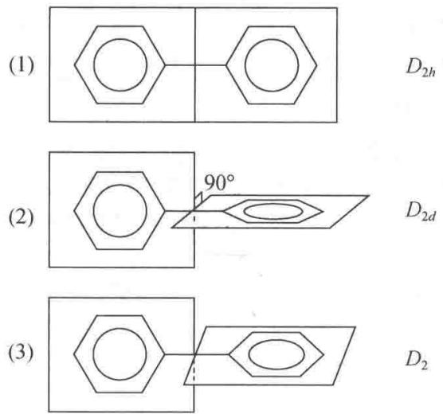

【4.11】 $SF_{5}Cl$ 分子的形状和 $SF_{6}$ 相似，试指出它的点群。

解 $SF_{6}$ 分子呈正八面体构型，属 $O_{h}$ 点群。当其中 1 个 F 原子被 Cl 原子取代后，所得分子 $SF_{5}Cl$ 的形状与 $SF_{6}$ 分子的形状相似（见图 4.11），但对称性降低了。 $SF_{5}Cl$ 分子的点群为 $C_{4v}$ 。

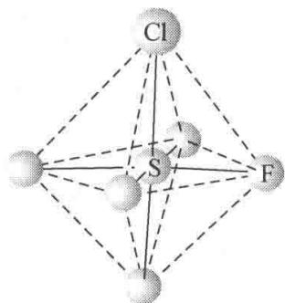  
图 4.11 $SF_{5}Cl$ 的结构

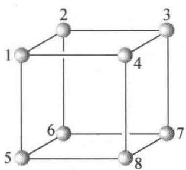

【4.12】画一立方体，在8个顶角上放8个相同的球，写明编号。若：（1）去掉2个球，（2）去掉3个球。分别列表指出所去掉的球的号数，指出剩余的球构成的图形属于什么点群？（不考虑球间的连线）

解 图 4.12 示出 8 个相同球的位置及其编号。

图4.12  
(1) 去掉 2 个球：

<table><tr><td>去掉的球的号数</td><td>所剩球构成的图形所属的点群</td><td>图形记号</td></tr><tr><td>1和2,或任意两个共棱的球</td><td> $C_{2v}$ </td><td>A</td></tr><tr><td>1和3,或任意两个面对角线上的球</td><td> $C_{2v}$ </td><td>B</td></tr><tr><td>1和7,或任意两个体对角线上的球</td><td> $D_{3d}$ </td><td>C</td></tr></table>

(2) 去掉 3 个球：

<table><tr><td>去掉的球的号数</td><td>所剩球构成的图形所属的点群</td><td>图形记号</td></tr><tr><td>1,2,4,或任意两条相交的棱上的三个球</td><td> $C_s$ </td><td>D</td></tr><tr><td>1,3,7,或任意两条平行的棱上的三个球</td><td> $C_s$ </td><td>E</td></tr><tr><td>1,3,8,或任意由  $C_3$  轴联系起来的三个球</td><td> $C_{3v}$ </td><td>F</td></tr></table>

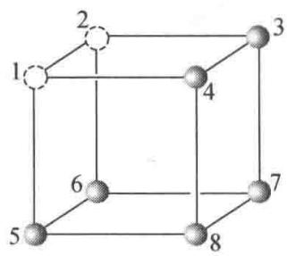  
A

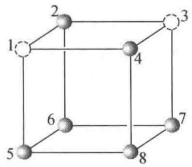  
B

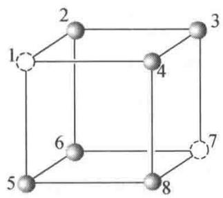  
C

(通过1-2,7-8线中点为 $C_{2}$ 轴,通过1,2,7,8为镜面)

(通过2-4,6-8线中点为 $C_{2}$ 轴,通过1,3,5,7为镜面)

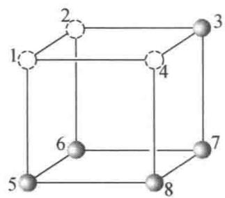  
D

(通过1,7为 $C_{3}$ 轴,通过2-6,4-8线中点为 $C_{2}$ 轴,通过1,3,5,7为镜面)

(通过1,3,5,7为镜面)

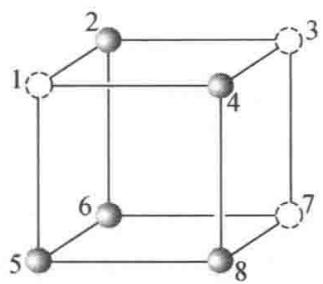  
E  
(通过1,3,5,7为镜面)

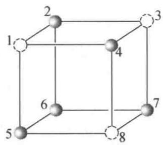  
F

(通过4,6为 $C_{3}$ 轴,通过2,4,6,8为镜面)

【4.13】 判断一个分子有无永久偶极矩和有无旋光性的标准分别是什么？

解凡是属于 $C_n$ 和 $C_{nv}$ 点群的分子都具有永久偶极矩，而其他点群的分子无永久偶极矩。由于 $C_{1v} \equiv C_{1h} \equiv C_s$ ，因而 $C_s$ 点群也包括在 $C_{nv}$ 点群之中。

凡是具有反轴对称性的分子一定无旋光性,而不具有反轴对称性的分子则可能出现旋光性。“可能”二字的含义是:在理论上,这种分子肯定具有旋光性,但有时由于某种原因(如消旋或仪器灵敏度太低等)在实验上测不出来。

反轴的对称操作是一联合的对称操作。一重反轴等于对称中心，二重反轴等于镜面，只有4m次反轴是独立的。因此，判断分子是否有旋光性，可归结为分子中是否有对称中心、镜面和4m次反轴的对称性。具有这3种对称性的分子（只要存在3种对称元素中的一种）皆无旋光性，而不具有这3种对称性的分子都可能有旋光性。

【4.14】画出 $\mathrm{Ni(en)(NH_{3})_{2}Cl_{2}}$ 可能的异构体，说明它们是否有旋光性。

解 见图 4.14。

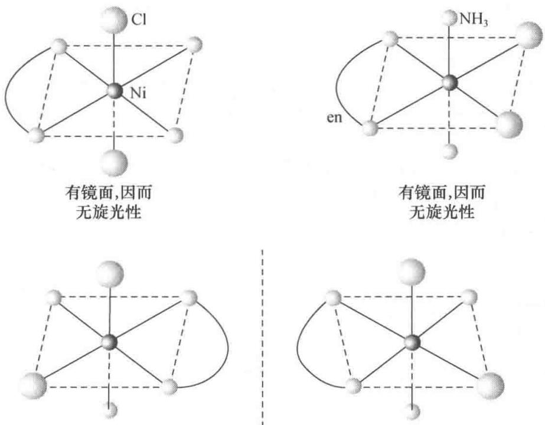  
无任何反轴对称性,因而具有旋光性  
图4.14

【4.15】由下列分子的偶极矩数据,推测分子立体构型及其点群。

<table><tr><td>分 子</td><td> $\mu /(10^{-30}Cm)$ </td><td>分 子</td><td> $\mu /(10^{-30}Cm)$ </td></tr><tr><td>(1) $C_3O_2$ </td><td>0</td><td>(5) $O_2N—NO_2$ </td><td>0</td></tr><tr><td>(2) $SO_2$ </td><td>5.4</td><td>(6) $H_2N—NH_2$ </td><td>6.14</td></tr><tr><td>(3) $N≡C—C≡N$ </td><td>0</td><td>(7) $H_2N—\bigcirc—NH_2$ </td><td>5.34</td></tr><tr><td>(4) $H—O—O—H$ </td><td>6.9</td><td></td><td></td></tr></table>

解

<table><tr><td>序号</td><td>分子</td><td>几何构型</td><td>点群</td></tr><tr><td>(1)</td><td> $C_3O_2$ </td><td>O=C=C=C=O</td><td> $D_{\infty h}$ </td></tr><tr><td>(2)</td><td> $SO_2$ </td><td></td><td> $C_{2v}$ </td></tr><tr><td>(3)</td><td>N≡C—C≡N</td><td>同左</td><td> $D_{\infty h}$ </td></tr><tr><td>(4)</td><td>H—O—O—H</td><td></td><td> $C_2$ </td></tr><tr><td>(5)</td><td> $O_2N—NO_2$ </td><td></td><td> $D_{2h}$ </td></tr><tr><td>(6)*</td><td> $H_2N—NH_2$ </td><td> $H \overset{N}{\underset{H}{\underset{|}{\backslash}}} \overset{N}{\underset{H}{\underset{|}{\backslash}}} \overset{N}{\underset{H}{\underset{|}{\backslash}}}$ </td><td> $C_{2v}$ 或 $C_2$ </td></tr><tr><td>(7)*</td><td> $H_2N—NH_2$ </td><td></td><td> $C_{2v}$ </td></tr></table>

\* 由于 N 原子中有孤对电子存在，使它和相邻 3 个原子形成的化学键呈三角锥形分布。

【4.16】指出下列分子的点群、旋光性和偶极矩情况：

(1) $H_{3}C-O-CH_{3}$ ;

(2) $H_{3}C-CH=CH_{2}$ ;

(3) $\mathrm{IF}_5$

(4) $S_{8}$ (环形);

(5) $ClH_{2}C—CH_{2}Cl$ (交叉式);

(6)

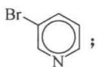

(7)

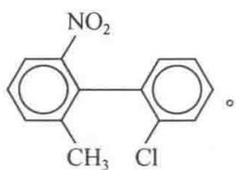

解 兹将各分子的序号、点群、旋光性和偶极矩等情况列表如下：

<table><tr><td>序号</td><td>点群</td><td>旋光性</td><td>偶极性</td></tr><tr><td>(1)*</td><td> $C_{2v}$ </td><td>无</td><td>有</td></tr><tr><td>(2)*</td><td> $C_s$ </td><td>无</td><td>有</td></tr><tr><td>(3)</td><td> $C_{4v}$ </td><td>无</td><td>有</td></tr><tr><td>(4)</td><td> $D_{4d}$ </td><td>无</td><td>无</td></tr><tr><td>(5)</td><td> $C_{2h}$ </td><td>无</td><td>无</td></tr><tr><td>(6)</td><td> $C_s$ </td><td>无</td><td>有</td></tr><tr><td>(7)</td><td> $C_1$ </td><td>有</td><td>有</td></tr></table>

\* 在判断分子的点群时,除特别注明外,总是将—CH₃看作圆球对称性的基团。

【4.17】《结构化学基础》(第5版)表4.4.3中给出4对化学式相似的化合物,每对化合物中两个化合物的偶极矩不同,请阐明分子构型主要差异是什么?

解 在 $C_{2}H_{2}$ 分子中，C 原子以 sp 杂化轨道分别与另一个 C 原子的 sp 杂化轨道和 H 原子的 1s 轨道重叠形成两个 $\sigma$ 键；两个 C 原子的 $p_{x}$ 轨道相互重叠形成 $\pi_{x}$ 键， $p_{y}$ 轨道相互重叠形成 $\pi_{y}$ 键，分子呈直线形，属 $D_{\infty h}$ 点群，因而偶极矩为 0。而在 $H_{2}O_{2}$ 分子中，O 原子以 $sp^{3}$ 杂化轨道（也有人认为以纯 p 轨道）分别与另一个 O 原子的 $sp^{3}$ 杂化轨道和 H 原子的 1s 轨道重叠形成两个夹角为 $96^{\circ}52'$ 的 $\sigma$ 键；两个 O—H 键分布在以过氧键—O—O—为交线、夹角为 $93^{\circ}51'$ 的两个平面内，分子呈弯曲形（见 4.15 题答案附图），属 $C_{2}$ 点群，因而有偶极矩。

在 $C_{2}H_{4}$ 分子中，C 原子以 $sp^{2}$ 杂化轨道分别与另一个 C 原子的 $sp^{2}$ 杂化轨道及两个 H 原子的 1s 轨道重叠形成共面的 3 个 $\sigma$ 键；两个 C 原子剩余的 p 轨道互相重叠形成 $\pi$ 键，分子呈平面构型，属 $D_{2h}$ 点群 ( $\angle C—C—H=121.3^{\circ}, \angle H—C—H=117.4^{\circ}$ )。对于 $N_{2}H_{4}$ 分子，既然偶极矩不为 0，则其几何构型既不可能是平面的： $\begin{array}{c}H\\H\end{array}$ ，也不可能是反式的：

它应是顺式构型： $H_{H}^{N—N—H}$ ，属 $C_{2v}$ 点群 [见 4.15 题(6)]；或介于顺式和

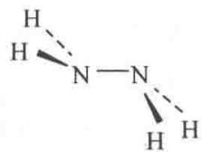

反式构型之间，属 $C_{2}$ 点群。

反式- $C_{2}H_{2}Cl_{2}$ 和顺式- $C_{2}H_{2}Cl_{2}$ 化学式相同，分子内成键情况相似，皆为平面构型。但两者对称性不同，前者属 $C_{2h}$ 点群，后者属 $C_{2v}$ 点群。因此，前者偶极矩为 0，后者偶极矩不为 0。

分子的偶极矩为0，表明它呈平面构型，N原子以 $\mathrm{sp}^2$ 杂化轨道与C原子成

键, 分子属 $D_{2h}$ 点群。分子的偶极矩不为 0, 表明 S 原子连接的两苯环不共面。可以推测, S 原子以 $sp^{3}$ 杂化轨道成键, 分子沿着 S···S 连线折叠成蝴蝶形, 具有 $C_{2v}$ 点群的对称性。

【4.18】已知连接苯环上 C—Cl 键矩为 $5.17 \times 10^{-30}$ C m，C—CH $_{3}$ 键矩为 $-1.34 \times 10^{-30}$ C m。试推算邻位、间位和对位的 C $_{6}$ H $_{4}$ ClCH $_{3}$ 的偶极矩，并与实验值 $4.15 \times 10^{-30}$ ， $5.94 \times 10^{-30}$ ， $6.34 \times 10^{-30}$ C m 相比较。

解 若忽略分子中键和键之间的各种相互作用(共轭效应、空间阻碍效应和诱导效应等)，则整个分子的偶极矩近似等于各键矩的矢量和。按矢量加和规则， $C_{6}H_{4}ClCH_{3}$ 三种异构体的偶极矩推算如下：

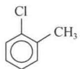

$$
\begin{array}{r l} \mu_ {(o ^ {-})} & = [ \mu_ {\mathrm{C-Cl}} ^ {2} + \mu_ {\mathrm{C-CH} _ {3}} ^ {2} + 2 \mu_ {\mathrm{C-Cl}} \mu_ {\mathrm{C-CH} _ {3}} \cdot \cos 6 0 ^ {\circ} ] ^ {\frac {1}{2}} \\ & = [ (5. 1 7 \times 1 0 ^ {- 3 0} \mathrm{Cm}) ^ {2} + (- 1. 3 4 \times 1 0 ^ {- 3 0} \mathrm{Cm}) ^ {2} \\ & + 2 \times 5. 1 7 \times 1 0 ^ {- 3 0} \mathrm{Cm} \times (- 1. 3 4 \times 1 0 ^ {- 3 0} \mathrm{Cm}) \times \frac {1}{2} ] ^ {\frac {1}{2}} \\ & = 4. 6 5 \times 1 0 ^ {- 3 0} \mathrm{Cm} \end{array}
$$

(6) CHFCIBr

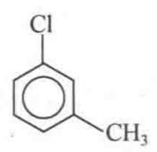

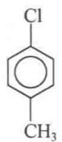

$$
\begin{array}{r l} \mu_ {(m ^ {-})} & = [ \mu_ {\mathrm{C-Cl}} ^ {2} + \mu_ {\mathrm{C-CH} _ {3}} ^ {2} - 2 \mu_ {\mathrm{C-Cl}} \mu_ {\mathrm{C-CH} _ {3}} \cdot \cos 6 0 ^ {\circ} ] ^ {\frac {1}{2}} \\ & = [ (5. 1 7 \times 1 0 ^ {- 3 0} \mathrm{Cm}) ^ {2} + (- 1. 3 4 \times 1 0 ^ {- 3 0} \mathrm{Cm}) ^ {2} \\ & - 2 \times 5. 1 7 \times 1 0 ^ {- 3 0} \mathrm{Cm} \times (- 1. 3 4 \times 1 0 ^ {- 3 0} \mathrm{Cm}) \times \frac {1}{2} ] ^ {\frac {1}{2}} \\ & = 5. 9 5 \times 1 0 ^ {- 3 0} \mathrm{Cm} \\ \mu_ {(p ^ {-})} & = \mu_ {\mathrm{C-Cl}} - \mu_ {\mathrm{C-CH} _ {3}} \\ & = 5. 1 7 \times 1 0 ^ {- 3 0} \mathrm{Cm} + 1. 3 4 \times 1 0 ^ {- 3 0} \mathrm{Cm} \\ & = 6. 5 1 \times 1 0 ^ {- 3 0} \mathrm{Cm} \end{array}
$$

由推算结果可见, $C_{6}H_{4}ClCH_{3}$ 间位异构体偶极矩的推算值和实验值很吻合,而对位异构体和邻位异构体,特别是邻位异构体两者差别较大。这既与共轭效应有关,更与紧邻的 Cl 原子和— $CH_{3}$ 之间的空间阻碍效应有关。事实上,两基团夹角大于 $60^{\circ}$ 。

【4.19】水分子的偶极矩为 $6.18\times10^{-30}$ Cm，而 $F_{2}O$ 的偶极矩只有 $0.90\times10^{-30}$ Cm，它们的键角值很相近，试说明为什么 $F_{2}O$ 的偶极矩比 $H_{2}O$ 小很多。

解 $\mathrm{H}_2\mathrm{O}$ 分子和 $\mathrm{F}_2\mathrm{O}$ 分子均属于 $C_{2v}$ 点群。前者的键角为 $104.5^{\circ}$ ，后者的键角为 $103.2^{\circ}$ 。由于 $\mathrm{O}$ 和 $\mathrm{H}$ 两元素的电负性差 $(\Delta \chi_{\mathrm{P}} = 1.24)$ 远大于 $\mathrm{O}$ 和 $\mathrm{F}$ 两元素的电负性差 $(\Delta \chi_{\mathrm{P}} = 0.54)$ ，因而键矩 $\mu_{\mathrm{O - H}}$ 大于键矩 $\mu_{\mathrm{O - F}}$ 。多原子分子的偶极矩近似等于各键矩的矢量和， $\mathrm{H}_2\mathrm{O}$ 分子和

$$
\mathrm{F} _ {2} \mathrm{O}
$$

$$
\begin{array}{r l} & \mu_ {\mathrm {H_ {2} O}} = 2 \mu_ {\mathrm{O-H}} \cdot \cos \frac {1 0 4 . 5 ^ {\circ}}{2} \\ & \mu_ {\mathrm {F_ {2} O}} = 2 \mu_ {\mathrm{O-F}} \cdot \cos \frac {1 0 3 . 2 ^ {\circ}}{2} \end{array}
$$

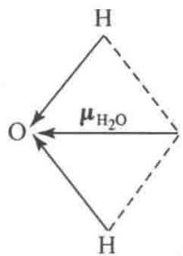

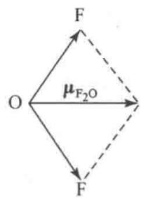

因为两分子键角很接近，而 $\mu_{O-H}$ 远大于 $\mu_{O-F}$ ，所以 $H_{2}O$ 分子的偶极矩比 $F_{2}O$ 的偶极矩大很多。不过，

两分子偶极矩的方向相反,如图 4.19 所示。

图4.19

【4.20】甲烷分子及其置换产物的结构如下所示，试标出各个分子所具有的镜面上原子的编号（若有多个镜面，要一一标出），说明分子所属的点群、极性和旋光性。

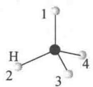

(1) $\mathrm{CH}_4$

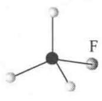

(2) $\mathrm{CH}_3\mathrm{F}$

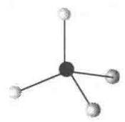

(3) $CH_{2}F_{2}$

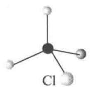

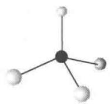

$$
\mathrm{CH} _ {2} \mathrm{FCI}
$$

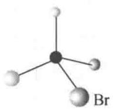

(5) CHFCl $_{2}$

解 因为 3 个原子定一个平面, 下表镜面栏中 1C2 表示由 1 号原子、C 原子和 2 号原子所定的平面为镜面。

<table><tr><td>分子</td><td>(1)  $CH_{4}$ </td><td>(2)  $CH_{3}F$ </td><td>(3)  $CH_{2}F_{2}$ </td><td>(4)  $CH_{2}FCl$ </td><td>(5)  $CHFCl_{2}$ </td><td>(6)  $CHFClBr$ </td></tr><tr><td rowspan="3">镜面</td><td>1C2,1C3</td><td>1C4,2C4</td><td>1C2,3C4</td><td>3C4</td><td>1C4</td><td>—</td></tr><tr><td>1C4,2C3</td><td>3C4</td><td></td><td></td><td></td><td></td></tr><tr><td>2C4,3C4</td><td></td><td></td><td></td><td></td><td></td></tr><tr><td>点群</td><td> $T_{d}$ </td><td> $C_{3v}$ </td><td> $C_{2v}$ </td><td> $C_{s}$ </td><td> $C_{s}$ </td><td> $C_{1}$ </td></tr><tr><td>极性</td><td>非极性</td><td>极性</td><td>极性</td><td>极性</td><td>极性</td><td>极性</td></tr><tr><td>旋光性</td><td>无</td><td>无</td><td>无</td><td>无</td><td>无</td><td>有</td></tr></table>

【4.21】八面体配位的 $\mathrm{Fe}(\mathrm{C}_{2}\mathrm{O}_{4})_{3}^{3-}$ 有哪些异构体？属什么点群？旋光性情况如何？

解 $\mathrm{Fe(C_2O_4)_3^{3 - }}$ 有两种异构体，它们互为对映体，具有旋光性，属 $D_{3}$ 点群，如图4.21所示。

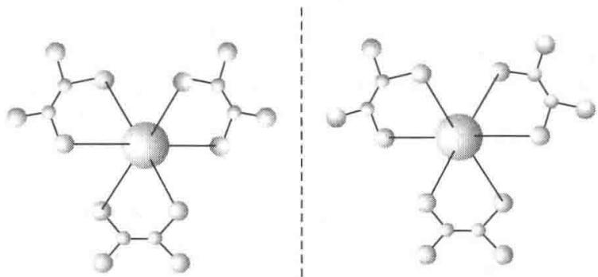  
图 4.21 $\mathrm{Fe}(\mathrm{C}_{2}\mathrm{O}_{4})_{3}^{3-}$ 配位结构示意图

【4.22】利用《结构化学基础》(第5版)表4.4.5所列有关键的折射度数据,求算 $CH_{3}COOH$ 分子的摩尔折射度R值,并和实验值进行比较。实验测定醋酸折射率n=1.3718,密度为 $1.046\ g\ cm^{-3}$ 。

解 摩尔折射度是反映分子极化率(主要是电子极化率)大小的物理量。它是在用折射法测定分子的偶极矩时定义的。在高频光的作用下,测定物质的折射率 n,代入 Lorenz-Lorentz 方程:

$$
R = \frac {(n ^ {2} - 1) M}{(n ^ {2} + 2) d}
$$

即可求得分子的摩尔折射度。常用高频光为可见光或紫外光，例如钠的 D 线。

摩尔折射度具有加和性。一个分子的摩尔折射度等于该分子中所有化学键摩尔折射度的和。据此，可由化学键的摩尔折射度数据计算分子的摩尔折射度。将用此法得到的计算值与通过测定 n, d 等参数代入 Lorenz-Lorentz 方程计算得到的实验值进行比较，互相验证。

利用表中数据,将醋酸分子中各化学键的摩尔折射度加和,得到醋酸分子的摩尔折射度:

$$
\begin{array}{r l} R _ {\text {计}} & = 3 R _ {\mathrm{C-H}} + R _ {\mathrm{C-C}} + R _ {\mathrm{C-O}} + R _ {\mathrm{C-O}} + R _ {\mathrm{O-H}} \\ & = 3 \times 1. 6 7 6 \mathrm{cm} ^ {3} \mathrm{mol} ^ {- 1} + 1. 2 9 6 \mathrm{cm} ^ {3} \mathrm{mol} ^ {- 1} + 3. 3 2 \mathrm{cm} ^ {3} \mathrm{mol} ^ {- 1} \\ & + 1. 5 4 \mathrm{cm} ^ {3} \mathrm{mol} ^ {- 1} + 1. 8 0 \mathrm{cm} ^ {3} \mathrm{mol} ^ {- 1} \\ & = 1 2. 9 8 \mathrm{cm} ^ {3} \mathrm{mol} ^ {- 1} \end{array}
$$

将 n, d 等实验数据代入 Lorenz-Lorentz 方程, 得到醋酸分子的摩尔折射度:

$$
R _ {\mathrm{实}} = \frac {(1 . 3 7 1 8 ^ {2} - 1) \times 6 0 . 0 5 \mathrm{gmol} ^ {- 1}}{(1 . 3 7 1 8 ^ {2} + 2) \times 1 . 0 4 6 \mathrm{gcm} ^ {- 3}} = 1 3. 0 4 \mathrm{cm} ^ {3} \mathrm{mol} ^ {- 1}
$$

结果表明,计算值和实验值非常接近。

【4.23】用 $C_{2v}$ 群的元进行相似变换，证明 4 个对称操作分 4 类。[提示：选群中任意一个操作为 S，逆操作为 $S^{-1}$ ，对群中某一个元（例如 $C_{2}^{1}$ ）进行相似变换，若 $S^{-1}C_{2}^{1}S=C_{2}^{1}$ ，则 $C_{2}^{1}$ 自成一类。]

证明 一个对称操作群中各对称操作间可以互相变换,这犹如对称操作的“搬家”。若将群中某一对称操作 X 借助于另一对称操作 S 变换成对称操作 Y,即

$$
\mathbf {Y} = \mathbf {S} ^ {- 1} \mathbf {X S}
$$

则称 Y 与 X 共轭。与 X 共轭的全部对称操作称为该群中以 X 为代表的一个级或一类。级的阶次是群的阶次的一个因子。

若对称操作 S 和 X 满足：

$$
\boldsymbol {S} \boldsymbol {X} = \boldsymbol {X} \boldsymbol {S}
$$

则称 S 和 X 这两个操作为互换操作。互换操作一定能分别使相互的对称元素复原。若一个群中每两个操作都是互换的，则这样的群称为互换群。可以证明，任何一个四阶的群必为互换群（读者可以用 $C_{2v}, C_{2h}$ 和 $D_{2}$ 等点群为例自行验证）。在任何一个互换群中，每个对称操作必自成一个级或一类。

$C_{2v}$ 点群为 4 阶互换群，它的 4 个对称操作是： $E, C_{2(z)}^{1}, \sigma_{xz}, \sigma_{yz}$ 。选 $C_{2(z)}^{1}$ 以外的任一对称操作（例如 $\sigma_{xz}$ ）对 $C_{2(z)}^{1}$ 进行相似变换：

$$
\sigma_ {x z} ^ {- 1} C _ {2 (z)} ^ {1} \sigma_ {x z} = \sigma_ {x z} ^ {- 1} \sigma_ {x z} C _ {2 (z)} ^ {1} = C _ {2 (z)} ^ {1}
$$

或

$$
\begin{array}{r l} \boldsymbol {\sigma} _ {x z} ^ {- 1} \boldsymbol {C} _ {2 (z)} ^ {1} \boldsymbol {\sigma} _ {x z} & = \left[ \begin{array}{c c c} 1 & 0 & 0 \\ 0 & - 1 & 0 \\ 0 & 0 & 1 \end{array} \right] ^ {- 1} \left[ \begin{array}{c c c} - 1 & 0 & 0 \\ 0 & - 1 & 0 \\ 0 & 0 & 1 \end{array} \right] \left[ \begin{array}{c c c} 1 & 0 & 0 \\ 0 & - 1 & 0 \\ 0 & 0 & 1 \end{array} \right] \\ & = \left[ \begin{array}{c c c} 1 & 0 & 0 \\ 0 & - 1 & 0 \\ 0 & 0 & 1 \end{array} \right] \left[ \begin{array}{c c c} - 1 & 0 & 0 \\ 0 & 1 & 0 \\ 0 & 0 & 1 \end{array} \right] = \left[ \begin{array}{c c c} - 1 & 0 & 0 \\ 0 & - 1 & 0 \\ 0 & 0 & 1 \end{array} \right] = \boldsymbol {C} _ {2 (z)} ^ {1} \end{array}
$$

(因为 $\sigma^{-1}=\sigma$ ，故可以将第一个表示矩阵右上角的-1去掉。)

根据上述说明， $C_{2(z)}^{1}$ 自成一类。同理，其他3个对称操作也各自成一类。这就证明了 $C_{2v}$ 点群的4个对称操作分四类。

【4.24】用 $C_{3v}$ 群的元进行相似变换，证明 6 个对称操作分 3 类。

证明 $C_{3v}$ 点群是6阶群，其乘法表如下：

<table><tr><td> $C_{3v}$ </td><td>E</td><td> $C_3^1$ </td><td> $C_3^2$ </td><td> $σ_a$ </td><td> $σ_b$ </td><td> $σ_c$ </td></tr><tr><td>E</td><td>E</td><td> $C_3^1$ </td><td> $C_3^2$ </td><td> $σ_a$ </td><td> $σ_b$ </td><td> $σ_c$ </td></tr><tr><td> $C_3^1$ </td><td> $C_3^1$ </td><td> $C_3^2$ </td><td>E</td><td> $σ_c$ </td><td> $σ_a$ </td><td> $σ_b$ </td></tr><tr><td> $C_3^2$ </td><td> $C_3^2$ </td><td>E</td><td> $C_3^1$ </td><td> $σ_b$ </td><td> $σ_c$ </td><td> $σ_a$ </td></tr><tr><td> $σ_a$ </td><td> $σ_a$ </td><td> $σ_b$ </td><td> $σ_c$ </td><td>E</td><td> $C_3^1$ </td><td> $C_3^2$ </td></tr><tr><td> $σ_b$ </td><td> $σ_b$ </td><td> $σ_c$ </td><td> $σ_a$ </td><td> $C_3^2$ </td><td>E</td><td> $C_3^1$ </td></tr><tr><td> $σ_c$ </td><td> $σ_c$ </td><td> $σ_a$ </td><td> $σ_b$ </td><td> $C_3^1$ </td><td> $C_3^2$ </td><td>E</td></tr></table>

相应的对称图像和对称元素系示于图 4.24。

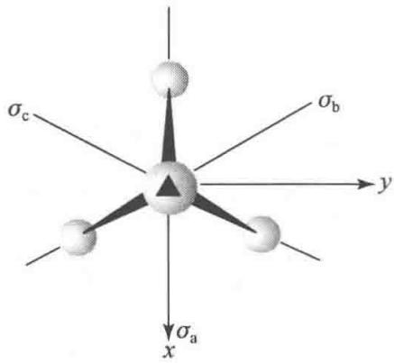  
图4.24

(1) 根据乘法表可得

$$
\begin{array}{r l} & E ^ {- 1} \pmb {\sigma} _ {a} E = E ^ {- 1} \pmb {\sigma} _ {a} = \pmb {\sigma} _ {a} \\ & \pmb {\sigma} _ {a} ^ {- 1} \pmb {\sigma} _ {a} \pmb {\sigma} _ {a} = \pmb {\sigma} _ {a} ^ {- 1} E = \pmb {\sigma} _ {a} (\text {凡}) \\ & \pmb {\sigma} _ {b} ^ {- 1} \pmb {\sigma} _ {a} \pmb {\sigma} _ {b} = \pmb {\sigma} _ {b} ^ {- 1} C _ {3} ^ {1} = \pmb {\sigma} _ {c} \\ & \pmb {\sigma} _ {c} ^ {- 1} \pmb {\sigma} _ {a} \pmb {\sigma} _ {c} = \pmb {\sigma} _ {c} ^ {- 1} C _ {3} ^ {2} = \pmb {\sigma} _ {b} \\ & C _ {3} ^ {- 1} \pmb {\sigma} _ {a} C _ {3} ^ {1} = C _ {3} ^ {- 1} \pmb {\sigma} _ {b} = \pmb {\sigma} _ {c c c c c c c c c c c c c c c c c c c c c c c c c c c c c c c c c c c c c c c c c c c c c c c c c c c c c c c c c c c c c c c c c c c c c c c c c c c c c c c c c c c c c c c c c c c c c c c c c c c c c} \end{array}
$$

$\sigma_{a}^{-1}\sigma_{a}\sigma_{a}=\sigma_{a}^{-1}E=\sigma_{a}$ （反映操作与其逆操作相等）

由上题的说明可知， $\sigma_{a},\sigma_{b}$ 和 $\sigma_{c}$ 是相互共轭的对称操作，它们形成以 $\sigma_{a}$ 为代表的一类。当然，亦可借助于 $\sigma_{b}$ 以外的任一对称操作对 $\sigma_{b}$ 进行相似变换，或借助于 $\sigma_{c}$ 以外的任一对称操作对 $\sigma_{c}$ 进行相似变换，结果相同。

## (2) 根据乘法表得

$$
\boldsymbol {E} ^ {- 1} \boldsymbol {C} _ {3} ^ {1} \boldsymbol {E} = \boldsymbol {E} ^ {- 1} \boldsymbol {C} _ {3} ^ {1} = \boldsymbol {C} _ {3} ^ {1}, \quad \boldsymbol {C} _ {3} ^ {- 1} \boldsymbol {C} _ {3} ^ {1} \boldsymbol {C} _ {3} ^ {1} = \boldsymbol {C} _ {3} ^ {- 1} \boldsymbol {C} _ {3} ^ {2} = \boldsymbol {C} _ {3} ^ {1}
$$

$$
\boldsymbol {C} _ {3} ^ {- 2} \boldsymbol {C} _ {3} ^ {1} \boldsymbol {C} _ {3} ^ {2} = \boldsymbol {C} _ {3} ^ {- 2} \boldsymbol {E} = \boldsymbol {C} _ {3} ^ {1}, \quad \boldsymbol {\sigma} _ {\mathrm{a}} ^ {- 1} \boldsymbol {C} _ {3} ^ {1} \boldsymbol {\sigma} _ {\mathrm{a}} = \boldsymbol {\sigma} _ {\mathrm{a}} ^ {- 1} \boldsymbol {\sigma} _ {\mathrm{c}} = \boldsymbol {C} _ {3} ^ {2}
$$

$$
\sigma_ {\mathrm{b}} ^ {- 1} C _ {3} ^ {1} \sigma_ {\mathrm{b}} = \sigma_ {\mathrm{b}} ^ {- 1} \sigma_ {\mathrm{a}} = C _ {3} ^ {2}, \quad \sigma_ {\mathrm{c}} ^ {- 1} C _ {3} ^ {1} \sigma_ {\mathrm{c}} = \sigma_ {\mathrm{c}} ^ {- 1} \sigma_ {\mathrm{b}} = C _ {3} ^ {2}
$$

根据和(1)相同的理由, $C_{3}^{1}$ 和 $C_{3}^{2}$ 共轭,形成一类。借助于 $C_{3}^{2}$ 以外的任一对称操作对 $C_{3}^{2}$ 进行相似变换,结果相同。

(3) 在任何群中, $X^{-1}EX=E$ , 即主操作 E 自成一类。

综上所述， $C_{3v}$ 群的 6 个对称操作分成三类，即 3 个反映操作形成一类，两个旋转操作也形成一类，主操作自成一类。

【评注】由4.23和4.24两题可见， $C_{2v}$ 群中的4个对称操作分为四类，而 $C_{3v}$ 群中的6个对称操作分为三类。其原因在于前者为互换群，而后者为非互换群。可以证明，任何一个互换群中的每一个对称操作都自成一类，而非互换群则否。

由于 $C_{2v}$ 群是互换群而 $C_{3v}$ 群不是互换群，因而在4.23题的证明中直接应用互换概念即可得出结论，而在4.24题的证明中须应用乘法表。当然，4.23题亦可应用乘法表。应用群的乘法表解决此类问题是更一般（对各种群都适用）的方法。

## 【4.25】试述分子具有红外活性的判据。

解 严格意义上的红外光谱包括处在近红外区和中红外区的振动光谱及处在远红外或微波区的转动光谱。但通常所说的红外光谱是指前者，而把后者称作远红外光谱。

分子在一定条件下产生红外光谱,则称该分子具有红外活性。判断分子是否具有红外活性的依据是选择定则,或称选律。具体地说:

非极性双原子分子， $\Delta v=0,\Delta J=0$ ，不产生振动-转动光谱，即无红外活性；极性双原子分子， $\Delta v=\pm1,\pm2,\pm3,\cdots,\Delta J=\pm1$ ，产生振动-转动光谱，即有红外活性。

在多原子分子中,每一种振动方式都有一特征频率,但并非所有的振动频率都能产生红外吸收从而得到红外光谱。这是因为分子的红外光谱起源于分子在振(转)动基态 $\psi_{a}$ 和振(转)动激发态 $\psi_{b}$ 之间的跃迁。可以证明,只有在跃迁过程中有偶极矩变化的振(转)动 $\left(\text{即}\int\psi_{a}\mu\psi_{b}\mathrm{d}\tau\neq0\right)$ 才会产生红外光谱。偶极矩改变大者,红外吸收带就强;偶极矩改变小者,吸收带弱;偶极矩不变者,不出现红外吸收,即为非红外活性。

## 【4.26】试述分子具有 Raman 活性的判据。

解 Raman 光谱的选律是：具有各向异性的极化率的分子会产生 Raman 光谱。例如 H—H 分子，当其电子在电场作用下沿键轴方向的变形大于垂直于键轴方向时，就会产生诱导偶极矩，出现 Raman 光谱活性。

利用群论可很方便地判断分子的哪些振动具有红外活性,哪些振动具有 Raman 活性。判断的标准是:

（1）若一个振动隶属的对称类型和偶极矩的一个分量隶属的对称类型相同，即和 $x$ （或 $y$ 或 $z$ )隶属的对称类型相同，则它具有红外活性。

（2）若一个振动隶属的对称类型和极化率的一个分量隶属的对称类型相同，即一个振动隶属于 $x^{2}, y^{2}, z^{2}, xy, xz, yz$ 这样的二元乘积中的某一个，或者隶属于 $x^{2} - y^{2}$ 这样的一个乘积的组合，则它就具有Raman活性。

【4.27】将分子或离子： $\mathrm{Co(en)}_{3}^{3+},\mathrm{NO}_{2}^{+},\mathrm{FHC=C=CHF},(\mathrm{NH}_{2})_{2}\mathrm{CO},\mathrm{C}_{60}$ ，丁三烯， $\mathrm{B(OH)}_{3},\mathrm{N}_{4}(\mathrm{CH}_{2})_{6}$ 等按下列条件进行归类：

(1) 既有极性又有旋光性；

(2) 既无极性又无旋光性；

(3) 无极性但有旋光性；

(4) 有极性但无旋光性。

## 解

(1) FHC=C=CHF ( $C_{2}$ )

(2) $\mathrm{NO}_{2}^{+}(D_{\infty h}), C_{60}(I_{h})$ ，丁三烯 $(D_{2h}), \mathrm{B(OH)}_{3}(C_{3h}), \mathrm{N}_{4}(\mathrm{CH}_{2})_{6}(T_{d})$

(3) $\mathrm{Co(en)}_3^{3+}(D_3)$

(4) $(\mathrm{NH}_{2})_{2}\mathrm{CO}(C_{2v})$

【评注】有偶极矩的分子属于 $C_n$ 或 $C_{nv}$ 点群，但属于 $C_{nv}$ 点群的分子因具有镜面对称性而无旋光性，所以既有旋光性又有偶极矩的分子只能是属于 $C_n$ 点群的分子。

分子既然有旋光性,它必无反轴对称性,即不具有对称中心、镜面和4m(m为自然数)次反轴等第二类对称元素。这样的分子所属的点群有: $C_{n},D_{n},T,O,I$ 。而在这些点群中,只有 $C_{n}$ 点群的分子具有偶极矩。因此,既有旋光性又有偶极矩的分子属于 $C_{n}$ 点群。

【4.28】写出 $CH_{3}^{+}, C_{5}H_{5}N, Li_{4}(CH_{3})_{4}, H_{2}C=C=C=CH_{2}$ ，椅式环己烷， $XeOF_{4}$ 等分子所属的点群。

解

<table><tr><td>分子</td><td>点群</td></tr><tr><td> $CH_{3}^{+}$ </td><td> $D_{3h}$ </td></tr><tr><td> $C_{5}H_{5}N$ </td><td> $C_{2v}$ </td></tr><tr><td> $Li_{4}(CH_{3})_{4}$ </td><td> $T_{d}$ </td></tr><tr><td> $H_{2}C=C=C=CH_{2}$ </td><td> $D_{2h}$ </td></tr><tr><td>椅式环己烷</td><td> $D_{3d}$ </td></tr><tr><td> $XeOF_{4}$ </td><td> $C_{4v}$ </td></tr></table>

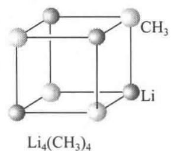

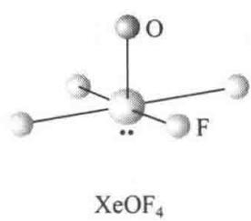

【4.29】正八面体6个顶点上的原子有3个被另一个原子取代，有几种可能的方式？取代产物各属于什么点群？取代后所得产物是否具有旋光性和偶极矩？

解 只有下列两种取代方式,产物(a)属于 $C_{3v}$ 点群,产物(b)属于 $C_{2v}$ 点群。两产物皆无旋光性,而皆有偶极矩。

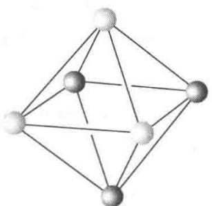  
(a)

  
(b)

# 第 5 章 多原子分子的结构和性质

## 内容提要

## 5.1 多原子分子结构的一些原理和概念

## 1. 非金属单质的成键特征

根据非金属单质的成键特征可归纳出：

(1) 8-N 规则：周期表中第 NA 族非金属元素，每个原子可以提供 8-N 个价电子与 8-N 个邻近原子，形成 8-N 个共价单键，或键价数为 8-N。

(2) 同一族元素随着原子序数的增加, 金属性也增加。

（3）对形成凸多面体的分子，凸多面体的面数 $(F)$ 、棱数 $(E)$ 和顶点数 $(V)$ 间的关系符合Euler公式：

$$
F + V = E + 2
$$

## 2. 价电子对互斥(VSEPR)理论

价电子对互斥理论认为：原子周围各个价电子对（包括成键电子对 bp 和孤对电子对 lp）之间由于相互排斥作用，在键长一定条件下，互相间距离愈远愈稳定。据此可以定性地判断分子的几何构型。价电子对间的斥力来源于：各电子对之间的静电排斥作用和自旋相同的电子互相回避的效应。

当中心原子 A 的周围存在着 m 个配位体 L 和 n 个孤对电子对 $\mathrm{E}(\mathrm{AL}_{m}\mathrm{E}_{n})$ 时，考虑价电子对间的斥力，考虑多重键中价电子多、斥力大，孤对电子对分布较大，以及电负性大小等因素，提出判断分子几何构型的规则：

（1）为使价电子对斥力最小，将 $m + n$ 个原子和孤对电子对等距离地排布在同一球面上，形成规则的多面体形式。

(2) 键对电子排斥力的大小次序为:

叁键－叁键＞叁键－双键＞双键－双键＞双键－单键＞单键－单键

（3）成键电子对受核吸引，比较集中在键轴位置；孤对电子没有这种限制，显得肥大。价电子对间排斥力大小次序为：

$$
\mathrm{lp} - \mathrm{lp} \gg \mathrm{lp} - \mathrm{bp} > \mathrm{bp} - \mathrm{bp}
$$

lp 和 lp 必然排列在相互夹角 $>90^{\circ}$ 的构型中。

（4）电负性高的配位体吸引价电子的能力强，价电子离中心原子较远，占据空间角度相对较小。

价电子对互斥理论简单实用,对分子结构能给以启发和预见,但它不能判断某些分子的几何构型。

## 3. 二面角和扭角

二面角 $(\phi)$ 和扭角 $(\omega)$ 是描述分子结构的几何参数。二面角指分子结构中两个相交平面的法线在第三个面上的夹角。扭角是指链形排列的4个原子A—B—C—D的结构中，当沿着B—C键投影，顺着B—C键观看时，将A—B键顺时针方向扭转，使它和C—D键重合所转角度 $< 180^{\circ}$ 的角度值 $(+\omega)$ ，逆时针方向扭转定为负值 $(- \omega)$ 。

## 5.2 杂化轨道理论

在周围原子作用下,根据原子的成键要求,将一个原子中原有的原子轨道线性组合成新的原子轨道,称为原子轨道的杂化,杂化后的原子轨道称为原子的杂化轨道。

杂化时,轨道的数目不变,轨道在空间的分布方向和分布情况发生改变。原子轨道在杂化过程中沿一个方向更集中地分布,成键能力增强。一般杂化轨道均和其他原子形成 $\sigma$ 键或安排孤对电子,而不会以空的杂化轨道形式存在。

杂化轨道具有和 s 轨道、p 轨道等原子轨道相同的性质，必须满足正交、归一性。两个等性杂化轨道的最大值之间的夹角 $\theta$ 可按下式计算：

$$
\alpha + \beta \cos \theta + \gamma \left(\frac {3}{2} \cos^ {2} \theta - \frac {1}{2}\right) = 0
$$

式中 $\alpha, \beta$ 和 $\gamma$ 分别为杂化轨道中 s, p 和 d 轨道所占的百分数。例如 $\mathrm{CH}_4$ 分子中，C 原子以 $\mathrm{sp}^3$ 杂化轨道成键，每个 $\mathrm{sp}^3$ 杂化轨道中 s 轨道占 $25\%$ ，p 轨道占 $75\%$ 。注意，参加杂化的原子轨道的组合系数为该原子轨道所占成分的平方根值（未归一化）：

$$
\psi_ {\mathrm{sp} ^ {3}} = \sqrt {0 . 2 5} \mathrm{s} + \sqrt {0 . 7 5} \mathrm{p}
$$

此式不适用于 $\mathrm{dsp}^2$ 杂化轨道。

对于两个不等性杂化轨道 $\psi_{i}$ 和 $\psi_{j}$ ，其最大值之间的夹角 $\theta_{ij}$ 可按下式计算：

$$
\sqrt {\alpha_ {i}} \sqrt {\alpha_ {j}} + \sqrt {\beta_ {i}} \sqrt {\beta_ {j}} \cos \theta_ {i j} + \sqrt {\gamma_ {i}} \sqrt {\gamma_ {j}} \left(\frac {3}{2} \cos^ {2} \theta_ {i j} - \frac {1}{2}\right) = 0
$$

杂化轨道理论是通俗易懂而又应用广泛的一种理论,这与它能简明地阐明分子的几何构型及一部分分子的性质有关。

一个原子的杂化轨道和其他原子的轨道形成较强的 $\sigma$ 键, 构成分子骨架。原子的部分价层轨道杂化后, 剩余的价轨道具有一定的方向性。常可和周围原子形成 $\pi$ 键, $\pi$ 键也有一定方向。例如, 丙二烯 ( $\mathrm{H}_{2} \mathrm{C} = \mathrm{C} = \mathrm{CH}_{2}$ ) 分子的中间 C 原子以 $\mathrm{sp}_{z}$ 杂化轨道和两端的 C 原子形成 2 个直线形的 $\sigma$ 键, 3 个 C 原子在一条直线上。中间 C 原子还剩余 $\mathrm{p}_{x}$ 和 $\mathrm{p}_{y}$ 两个互相垂直、还和 $z$ 轴垂直的价轨道。两端的 C 原子都采用 $\mathrm{sp}^{2}$ 杂化, 分别和两个 H 原子及中间的 C 原子成键。为了配合中间 C 原子剩余两个 $\mathrm{p}_{x}$ 和 $\mathrm{p}_{y}$ 轨道成键的条件, 左端的 C 原子是用 $\mathrm{s}, \mathrm{p}_{y}, \mathrm{p}_{z}$ 3 个轨道进行杂化, 形成平面三角形的 $\mathrm{sp}^{2}$ 杂化轨道, 剩余 $\mathrm{p}_{x}$ 轨道; 右端的 C 原子是用 $\mathrm{s}, \mathrm{p}_{x}, \mathrm{p}_{z}$ 3 个轨道进行杂化, 形成平面三角形的 $\mathrm{sp}^{2}$ 杂化轨道, 剩余 $\mathrm{p}_{y}$ 轨道。这样, 中间 C 原子和两端 C 原子形成的 $\pi$ 键是互相垂直的, 因而两端的 $\mathrm{CH}_{2}$ 基团也是互相垂直的, 如下图所示:

$\pi$ 键显露在键轴之外，易受干扰，较 $\sigma$ 键活泼； $\pi$ 键电子容易变形极化，因而含有 $\pi$ 键的化合物折射度较大； $\sigma \rightarrow \sigma^{*}$ 能级差范围常在紫外区，因此只含 $\sigma$ 键的化合物是无色的；而 $\pi \rightarrow \pi^{*}$ 能级差较小，接近可见光区，含有 $\pi$ 键的化合物容易产生颜色。

在化学反应中, 化学键数目不变, 键能改变。2 个 C—C 单键 (即 $\sigma$ 键) 键能大于 1 个 C=C 双键 (即 1 个 $\sigma$ 键和 1 个 $\pi$ 键) 键能。因此, 在有机反应中, 有 $\sigma$ 键变为 $\pi$ 键时, 通常是吸热反应; 有 $\pi$ 键变为 $\sigma$ 键时, 通常是放热反应; 无 $\sigma$ 和 $\pi$ 键键型转变的反应, 反应热很小。反应热的大小涉及反应焓变 ( $\Delta H$ ) 的大小, 再考虑反应时熵的改变 ( $\Delta S$ ), 就可以了解化学反应时自由焓的改变 ( $\Delta G$ ), 以判断反应进行的方向和外界条件的影响。物质的各种宏观性质均有其内部结构根源, 可以将物质微观的结构和宏观的热力学函数联系起来。

利用杂化轨道可以正确地理解弯键的结构,还可理解共价键的饱和性和分子的不饱和度。

## 5.3 离域分子轨道理论

用分子轨道理论处理多原子分子, 可用非杂化的原子轨道进行线性组合, 构成离域的分子轨道, 这些轨道中的电子不是定域在两个原子之间, 而是遍及整个分子、在多个原子间离域运动。例如, $CH_{4}$ 分子中的 8 个分子轨道是由 8 个原子轨道 (即 C 原子的 2s, $2p_{x}$ , $2p_{y}$ , $2p_{z}$ 和 4 个 H 原子的 1s 轨道) 线性组合而成。4 个 H 原子的 1s 轨道先线性组合, 使它的每一个都分别和中心 C 原子的 1 个原子轨道对称性匹配, 再组合成离域分子轨道。

离域分子轨道是单电子能量算符的本征态,它的轨道可通过解单电子运动的本征方程得到,是一个可观察量,这种具有确定能量的分子轨道称为正则分子轨道。由 $CH_{4}$ 分子的离域分子轨道出发计算得到的分子轨道能级与由光电子能谱所得的实验结果符合得很好,可看出离域分子轨道理论的成功。

杂化轨道理论将 $CH_{4}$ 分子中的 C 原子进行 $sp^{3}$ 杂化，每个杂化轨道和一个 H 原子的 1s 轨道形成一个定域分子轨道，在此成键轨道中的一对电子形成定域键 C—H。从衍射实验证明， $CH_{4}$ 具有 $T_{d}$ 点群对称性，4 个 C—H 键是等同的。而离域分子轨道理论处理 $CH_{4}$ 分子所得的能级图，说明 4 个轨道的能级高低不同： $\psi_{s}$ 能级低，而 $\psi_{x}, \psi_{y}$ 和 $\psi_{z}$ 这 3 个能级高，这从 $CH_{4}$ 分子的光电子能谱图得到了证明。由这两个理论所得结果的差别说明，不能把分子轨道理论中的成键轨道简单地和化学键直接联系起来。分子轨道是指分子中的单电子波函数，本质上是离域的，属于整个分子，成键轨道上的电子对分子中的每个化学键都有贡献，它们的成键作用是分摊到各个化学键上的。而定域键理论是指所有价电子在定域轨道区域内的平均行为，而不是某两个电子真正局限于某个定域区域内运动。

离域轨道和定域轨道两种模型是等价的,只是反映的物理图像有所差别。离域轨道能清楚地反映分子的谱学性质,定域轨道能直观地和分子的几何构型相联系。

## 5.4 休克尔分子轨道法(HMO 法)

Hückel 分子轨道法是一个经验性的处理共轭分子的结构和性质的近似方法。

有机平面构型的共轭分子中， $\sigma$ 键是定域键，构成分子骨架，而垂直于分子平面的 $p$ 轨道组合成离域 $\pi$ 键，所有 $\pi$ 电子在整个分子骨架内运动。HMO法的方案是：

(1) 将 $\sigma$ 键和 $\pi$ 键分开处理；

(2) $\sigma$ 键形成不变的分子骨架, 而分子的性质主要由 $\pi$ 电子的状态决定;

(3) 每个 $\pi$ 电子 k 的运动状态用 $\psi_{k}$ 描述, 其 Schrödinger 方程为

$$
\hat {H} _ {\pi} \psi_ {k} = E _ {k} \psi_ {k}
$$

（4）考虑各个 C 原子的 $\alpha$ 积分相同，各相邻 C 原子的 $\beta$ 积分也相同，而不相邻原子的 $\beta$ 积分和重叠积分 S 均为 0。

按上述方案,就不需要考虑势能函数 V 及 $\hat{H}_{\pi}$ 的具体形式,而可按下列步骤处理:

(1) 共轭分子 $\pi$ 电子的分子轨道 $\psi$ 由 p 轨道 $\phi_{i}$ 线性组合而成:

$$
\psi = c _ {1} \phi_ {1} + c _ {2} \phi_ {2} + \dots + c _ {n} \phi_ {n} = \sum c _ {i} \phi_ {i}
$$

(2) 根据线性变分法得久期方程式。

（3）按上述方案(4)简化行列式方程，求出 $n$ 个 $E_{k}$ ，将每个 $E_{k}$ 值代回久期方程求得 $c_{ki}$ 和 $\psi_{k}$ 。

（4）画出 $\psi_{k}$ 图形以及和 $\psi_{k}$ 相应的能级 $E_{k}$ 图，排布电子。

（5）计算：电荷密度 $\rho_{i}$ （即 $\pi$ 电子在第 i 个 C 原子附近出现的概率， $\rho_{i} = \sum_{k} n_{k} c_{ki}^{2}$ ）；键级 $P_{ij}(P_{ij} = \sum_{k} n_{k} c_{ki} c_{kj})$ ；自由价 $F_{i}(F_{i} = \sqrt{3} - \sum_{i} P_{ij})$ 。根据 $\rho_{i}, P_{ij}$ 和 $F_{i}$ 作分子图。

## (6) 讨论分子的性质。

本节以丁二烯分子为例,详细地介绍 HMO 法处理共轭分子的结构和性质。学习时,宜一步一步地联系实际、深入了解,做到能够举一反三。

本节还用 HMO 法处理环状共轭多烯分子 $C_{n}H_{n}$ ，得到 $4m+2$ 规则。这规则说明，当 $\pi$ 电子数 $n=4m+2$ 时，在全部成键轨道中都充满电子，反键轨道是空的，构成稳定的 $\pi$ 键体系；当 n=4m 时，除成键轨道充满电子外，它还有一对二重简并的非键轨道，在每一轨道中有一个 $\pi$ 电子，从能量上看是不稳定的构型，不具有芳香性。

## 5.5 离域 $\pi$ 键和共轭效应

在经典结构式中,由单键和双键交替连接的原子,通常能够形成多原子 $\pi$ 键,又称离域 $\pi$ 键。一般地说,满足下面两个条件,就可以形成离域 $\pi$ 键:

(1) 原子共面, 每个原子可提供一个方向相同的 p 轨道;

(2) $\pi$ 电子数少于参加成键的 p 轨道数的 2 倍。

这两个条件不是绝对的,常常还要由分子的性质来判断。

离域 $\pi$ 键可用 $\pi_{n}^{m}$ 表示，下标 n 为参加成键的原子数目，上标 m 为电子数。含有离域 $\pi$ 键的分子，常常又称共轭分子。

共轭分子的结构可在分子的结构式中将参加形成离域 $\pi$ 键的原子间用虚线连接, 再将各个原子提供的电子用黑点表示, 例如:

$$
\mathrm{H} _ {2} \mathrm{C} - \mathrm{CH} - \mathrm{Cl}
$$

共轭分子的结构也可用两个或多个价键共振结构式表达,把分子的真实结构看作由这些价键结构的共振式叠加的结果,例如:

由于离域 $\pi$ 键的形成, 共轭分子的性质不能简单地看作各个单键和双键性质的简单加和, 而表现出特有的性能, 称为共轭效应或离域效应。共轭效应是化学中的一种基本效应, 主要表现在:

（1）对分子构型的影响：当用单双键交替的经典结构式表达共轭分子结构时，单键缩短、双键增长，即键长均匀化；参加共轭的原子保持共面；用经典结构表达共轭体系时，式中的单键不能自由旋转。

(2) 增加物质的导电性能。

（3）离域 $\pi$ 键的形成，增大 $\pi$ 电子活动范围，使体系能量降低、能级间隔变小，相应光谱的波长变长。

(4) 影响物质的酸碱性。

(5) 影响化合物的化学反应性能。

在多肽和蛋白质分子中,酰胺基团( $-C-NH-$ )中C—N键和相邻的C=O键中的 $\pi$ 电子形成的离域 $\pi$ 键( $\pi_{3}^{4}$ ),称为肽键,其结构见右图:

肽键的形成使 C—N 具有双键成分, 表现在键长缩短(约 132 pm), C—N 和周围原子共平面, 即形成平面构象而不能自由旋转等。

超共轭效应是指 C—H 等 $\sigma$ 键轨道和相邻原子的 $\pi$ 键轨道及其他轨道相互叠加而形成离域轨道，扩大 $\sigma$ 键电子的活动范围所产生的离域效应。例如，与单键相邻的多重键将使单键的键长缩短：

  
超共轭效应会改变分子的电性和光谱谱线的波长。

## 5.6 分子轨道的对称性和反应机理

## 1. 有关化学反应的概念和原理

化学反应的实质有两个方面：一是分子轨道在化学反应过程中进行改组，在改组时涉及分子轨道的对称性；二是电荷分布发生改变，电子发生转移，电子转移时一般削弱原有化学键，加强新的化学键，使产物分子稳定。

化学反应的可能性和限度由化学势决定,反应沿化学势降低的方向进行,直至化学势相等,达到化学平衡。

化学反应的速率取决于活化能的高低：活化能高，反应不易进行，反应速率慢；活化能低，反应容易进行,反应速率快。在反应时,若正反应是基元反应,则逆反应也是基元反应,且经过同一活化体。

化学反应的条件指在加热(△)下进行,或在光照(hν)下进行,或在催化剂作用下进行。不同的条件影响电子所处的分子轨道,反应进行的方式、速率和产物的分子构型,要根据具体条件进行分析。

## 2. 前线轨道理论

分子轨道中最高占据轨道(HOMO)和最低空轨道(LUMO)合称为前线轨道。前线轨道理论认为：

(1) 分子在反应过程中, 分子轨道发生相互作用, 优先起作用的是前线轨道。当两个分子互相接近时, 一个分子中的 HOMO 和另一个分子中的 LUMO 必须对称性合适, 才能起反应。

(2) 互相起作用的 HOMO 和 LUMO 的能级高低接近。

(3) 电子的转移要和削弱旧的化学键一致。

按照上述理论可分析双分子化学反应进行难易的原因及反应所需的条件和反应的方式。

## 3. 分子轨道对称守恒原理

这个原理是将整个分子轨道一起考虑,即在一步完成的化学反应中,若反应物分子和产物分子的分子轨道对称性一致,即从反应物、中间态到产物,分子轨道始终保持某一对称性,反应容易进行。

分子轨道对称守恒原理是将反应过程中分子轨道的变化关系用能量相关图联系起来,使:

(1) 反应物的分子轨道和产物的分子轨道一一对应；

(2) 相关轨道的对称性相同；

(3) 相关轨道的能量相近；

(4) 对称性相同的相关线不相交。

在能量相关图中,若产物的成键轨道都只和反应物的成键轨道相关联,则反应活化能低,易于反应,称作对称允许,加热即可实现;若有成键轨道和反键轨道相关联,则反应活化能高,难于反应,称作对称禁阻,需要光照将电子激发到激发态。所以,分子轨道的对称性控制基元反应进行的条件和方式。对 $C_{2}$ 轴对称,采用顺旋方式;对镜面 $\sigma$ 对称,采用对旋方式。

含有 4m 个 $\pi$ 电子的体系, 如丁二烯电环合或环丁烯开环, 加热条件下进行的是顺旋反应, 光照条件下进行对旋反应; 含有 $4m+2$ 个 $\pi$ 电子的体系, 加热条件下进行的是对旋反应, 光照条件下进行的是顺旋反应。产物分子的构型可根据分子轨道对称性和反应条件选择。

## 5.7 缺电子多中心键和硼烷的结构

Li, Be, B, Al 等原子的价层原子轨道数多于价电子数，由它们组成的化合物中，常常由于没有足够的电子使原子间均能形成二电子键，而出现缺电子多中心键。例如在硼烷和碳硼烷中，常出现 BHB, BBB 和 BBC 等三中心二电子(3c-2e)键。

用价键理论和多中心键表达硼烷的结构时, 常用 $styx$ 数码表示。 $styx$ 数码是分别表示在一个硼烷分子中下列 4 种型式化学键的数目:

利用 $styx$ 数码结构式时，必须遵循下列规则：

(1) 每一对相邻的 B 原子由一个 B—B, 或 BBB, 或 BHB 键连接;

(2) 每一个 B 原子利用它的 4 个价轨道去成键, 以达到八电子组态;

（3）每个 B 原子不能同时通过二中心 B—B 键和三中心 BBB 键，或同时通过二中心 B—B 键和三中心 BHB 键结合；

(4) 每个 B 原子至少和一个端接 H 原子结合。

根据上述规则对一个硼烷分子所得的 $styx$ 结构式常和实际分子的几何构型不同, 其差别可通过共振结构来理解, 即把一种 $styx$ 结构式看作一种共振杂化体。

在学习过程中,读者可选择二三个硼烷分子,如 $B_{6}H_{6}^{2-}$ , $B_{5}H_{9}$ , 用 styx 数码及结构式表达它们的结构,加深印象。

本节还介绍了八隅律和分子骨干键数的计算。八隅律是指一个由主族元素(H 和 He 除外)组成的分子,其中每个原子都倾向于达到稳定的 8 个电子的电子组态。这 8 个电子由原子本身的价电子和与它成键的其他原子提供,使分子中成键分子轨道和非键轨道都填满电子,而 HOMO 和 LUMO 间的能级差较大。

对一个由 n 个主族元素原子组成的分子骨干 $M_{n}$ (M 是 B, C 等原子), g 为其已有的价电子总数。当骨干中有一个共价单键在两个 M 原子间形成时, 这两个 M 原子都互相得到一个价电子。为了使整个分子骨干满足八隅律, 原子间应有 $\frac{1}{2}(8n-g)$ 对电子形成共价单键, 这些成键的电子对数目, 定义为分子骨干的键数 b (文献中常称 b 值为键价):

$$
b = \frac {1}{2} (8 n - g)
$$

对于含有缺电子多中心键的化合物, 当形成一个三中心二电子(3c-2e)键时, 由于 3 个原子共享一对电子, 这时一个 3c-2e 键起着提供补偿 4 个电子的作用, 相当于键数为 2。

g 值可由下列电子数目加和而得：（1）组成分子骨干 $M_{n}$ 的 n 个 M 原子的价电子数，（2）围绕分子骨干 $M_{n}$ 的配位体提供的电子数，（3）化合物所带的正、负电荷数。例如 $B_{12}H_{12}^{2-}$ 中，12 个 B 原子看作分子骨干，12 个 H 原子看作配位体， $B_{12}H_{12}^{2-}$ 的 g 值为

$$
g = 1 2 \times 3 + 1 2 \times 1 + 2 = 5 0
$$

$\mathrm{B}_{12}$ 分子骨干的键数为

$$
b = \frac {1}{2} (8 \times 1 2 - 5 0) = 2 3
$$

从 $B_{12}H_{12}^{2-}$ 的三角二十面体的几何构型可知，分子中有 30 条 B—B 连线和 12 条 B—H 连线，而分子全部只有 50 个价电子，这些连线不可能都是共价单键，而要形成缺电子多中心键来补偿。

利用 $styx$ 数码及硼烷的结构规则, 可以推得:

（1）封闭式硼烷 $B_{n}H_{n}^{2-}$ 分子骨干中的化学键包括 3 个 B—B 共价单键和 $(n-2)$ 个 BBB 3c-2e 键，即 s=0, t=n-2, y=3, x=0。例如 $B_{12}H_{12}^{2-}$ 中含 BBB 3c-2e 键 10 个，B—B 单键 3 个。

（2）鸟巢式硼烷 $B_{n}H_{n+4}$ 分子骨干中，s=4, t=n-4, y=2, x=0。例如 $B_{5}H_{9}$ 中含 BHB 3c-2e 键 4 个，BBB 3c-2e 键 1 个，B—B 单键 2 个。

## 5.8 非金属元素的结构特征

1. 非金属单质的结构特征

非金属单质的结构,有的很简单,例如稀有气体通常是单原子分子;有的很复杂,例如硫的同素异构体可多达近 50 种。从非金属的单质结构可为非金属元素的结构化学归纳出下面三点结构特征：

（1）非金属元素虽然有的存在多种同素异构体，但每种原子的成键方式、配位情况、键长、键角等数据却很一致，或出现有限的几种情况。

(2) 非金属单质的成键规律一般符合 8-N 规则。

（3）同一族元素随着原子序数的递增，金属性也相应地递增。分子间的最短接触距离与分子内的键长的比值，随着原子序数的增加而缩小，分子间的界限越来越模糊。

## 2. 非金属化合物的结构特征

对于大量非金属化合物的结构特征,可从下列4个方面进行分析:

（1）分析各原子的成键规律。单质的成键规律，在一定程度上将由这些元素所形成的化合物加以继承。

例如,根据单质碳的3种异构体的结构特征和成键规律,可将有机化合物分成三族:

脂肪族化合物(RX)——典型代表是正烷烃 $C_{n}H_{2n+2}$ ，它的结构特征是由四面体取向成键的碳原子(如金刚石中的碳原子)连接成一维碳链。

芳香族化合物(ArX)——典型代表是苯 $C_{6}H_{6}$ ，它的结构特征是由平面三角形成键的碳原子(如石墨中的碳原子)组成二维平面结构。

球碳族化合物(FuX)——典型代表是含球碳 $C_{60}$ 基团的化合物, 球碳基团的结构特征是由球面形状的成键碳原子(如足球碳 $C_{60}$ 中的碳原子)组成三维封闭的球形多面体结构。

（2）分析各个原子 d 轨道是否参与成键。从第三周期元素起有空的 nd 轨道和 ns, np 的价层轨道能级接近，价层轨道数目扩充，配位数和配位型式增加。另外，还可形成 $d_{\pi}-p_{\pi}$ 键，增强原有化学键。

（3）通过分子的立体构型了解分子中原子的成键情况。分子中原子的配位情况不同、几何构型不同，反映该原子的成键型式不同。例如 N 原子的成键情况可分析如下：

sp杂化 $\leftarrow :\mathrm{N}\stackrel {\oplus}{\rightleftharpoons}\mathrm{O}$ 直线形 CO型结构(M←NO)

$O \equiv N^{\oplus} \equiv O$ 直线形 $CO_{2}$ 型结构 $(NO_{2}^{+})$

（4）从分子的成键情况了解分子的性质。例如，按价电子对互斥理论了解各原子的孤对电子和键对电子的排布，进一步了解分子的性质。

## 5.9 共价键的键长和键能

## 1. 共价键的键长和原子的共价半径

通过衍射和光谱方法,已测出大量共价化合物分子的键长,为人们了解分子的结构提供了大量数据。由于各种分子内部结构不同,相同种类的共价键键长彼此间略有差异,这种差异是了解各种化学效应,如共轭效应、超共轭效应、诱导效应、空间阻碍效应等对分子结构和性能的影响,了解各种分子的特性的重要依据。

将相同种类的共价键求出它们的平均值,即得各种共价键的典型键长值。这种键长值具有两重应用意义:一是作为相对的标准和实际分子中的键长值比较,讨论分子的性质;二是用以推引出原子的共价半径值。由原子的共价半径可以了解原子的大小等特征,用更少量的数据概括大量的典型的共价键键长值。

将两个相同原子的共价单键的键长除以 2, 即得到该原子的共价单键半径。将两个成键原子的共价半径加和在一起, 即得到共价键的键长。这时应考虑两点:

(1) 异核原子间键长的计算值常比实验测定值稍大。因为原子电负性的差异,额外增加原子间吸引力,使键缩短。这时可根据原子共价半径和电负性差值计算键长(取 pm 为单位):

$$
r _ {\mathrm{A-B}} = r _ {\mathrm{A}} + r _ {\mathrm{B}} - 9 \mid \chi_ {\mathrm{A}} - \chi_ {\mathrm{B}} \mid
$$

(2) 利用计算值和实测值的差异,探讨化学键的性质。

## 2. 共价键键能

双原子分子 A—B 的键能是指在 0.1013 MPa 和 298 K 时下式焓的增量：

$$
\mathrm{AB(g)} \longrightarrow \mathrm{A(g)} + \mathrm{B(g)}
$$

可由光谱解离能 $D_{0}$ ，考虑温度影响，计算 298 K 时的解离能 $D_{298}$ 。

对多原子分子,分子中的全部化学键键能的总和等于把这个分子分解为组成它的全部原子时所需要的能量。

键能数据的大小遵循两方面规律：（1） $2E_{A-B}>E_{A-A}+E_{B-B}$ ；（2） $2E_{C-C}>E_{C=C}$ 。

可以利用键能数据估算化学反应热。根据反应前后反应物分子和产物分子的化学键种类和数目,计算出各自键能,按下式即得反应焓变 $\Delta H$ :

$$
\Delta H = \text { 反应物分子中键能的总和 } - \text { 产物分子中键能的总和 }
$$

## 3. 碳和硅化学键的比较

碳和硅是元素周期表第14族的前两种元素。碳在地壳中的含量按质量计只占0.027%，而碳原子的99.7%在地壳中以煤、碳酸盐和甲烷水合物等矿物形式存在，0.2%在大气中以 $CO_{2}$ 和 $CH_{4}$ 形式存在，剩下不到0.1%的碳构成地球上全部生命物种赖以生存和发展的主要的物质基础。为什么这么少量的碳发挥着这么大的作用？这是碳的丰富多彩的化学键类型以及和H,O,N等元素的原子牢固地结合在一起的本领。硅在地壳中按质量计占28%，它和氧以及其他元素一起结合形成的硅酸盐占地壳质量的80%以上。从化学元素成分来看，碳统治着有机化学，硅统治着无机化学。从微观结构来分析，碳和硅的这种特性主要是由它们的化学键的强弱，即键能的大小决定的。下面列出一些碳和硅化学键的键能值（以 $kJ\ mol^{-1}$ 为单位）：

$$
\mathrm{C} - \mathrm{C} 3 5 6, \quad \mathrm{C} - \mathrm{H} 4 1 3, \quad \mathrm{C} - \mathrm{O} 3 4 3, \quad \mathrm{C} = \mathrm{C} 6 1 5
$$

## 习题解析

【5.1】利用价电子对互斥理论，说明 $XeF_{4}$ ， $XeO_{4}$ ， $XeO_{3}$ ， $XeF_{2}$ ， $XeOF_{4}$ 等分子的形状。

解 根据价电子对互斥理论, 按照“ $AL_{m}E_{n}$ 计算 $m+n$ 数→确定价电子空间分布→计算孤对电子对数 n 及其分布→找出分子可能的几何构型”这样的思路, 再考虑孤对电子对的特殊作用(特别是夹角小于或等于 $90^{\circ}$ 的电子对间的排斥作用)、元素的电负性、是否有多重键(粗略推断几何构型时按键区数计算, 比较键角大小时需加以区别)以及等电子原理等, 即可确定许多分子的几何构型。按此思路和方法处理上述分子, 所得结果列表如下:

<table><tr><td>分 子</td><td> $XeF_4$ </td><td> $XeO_4$ </td><td> $XeO_3$ </td><td> $XeF_2$ </td><td> $XeOF_4$ </td></tr><tr><td> $m+n$ (不计 $\pi$ 电子)</td><td>6</td><td>4</td><td>4</td><td>5</td><td>6</td></tr><tr><td>价电子空间分布</td><td>八面体</td><td>四面体</td><td>四面体</td><td>三角双锥</td><td>八面体</td></tr><tr><td>孤对电子对数</td><td>2</td><td>0</td><td>1</td><td>3</td><td>1</td></tr><tr><td>配位原子数( $\sigma$ 电子对)</td><td>4</td><td>4</td><td>3</td><td>2</td><td>5</td></tr><tr><td>几何构型</td><td>正方形</td><td>四面体</td><td>三角锥</td><td>直线形</td><td>四方锥</td></tr></table>

【5.2】利用价电子对互斥理论，说明 $AsH_{3}$ ， $ClF_{3}$ ， $SO_{3}$ ， $SO_{3}^{2-}$ ， $CH_{3}^{+}$ ， $CH_{3}^{-}$ 等分子和离子的几何形状，说明哪些分子有偶极矩？

解 按 5.1 题的思路和方法, 尤其要考虑“肥大”的孤对电子对对相邻电子对有较大排斥作用这一因素, 推测出各分子和离子的几何形状, 进而判断各个分子是否有偶极矩(离子不必推测)。结果列于下表:

<table><tr><td>分子或离子</td><td> $AsH_{3}$ </td><td> $ClF_{3}$ </td><td> $SO_{3}$ </td><td> $SO_{3}^{2-}$ </td><td> $CH_{3}^{+}$ </td><td> $CH_{3}^{-}$ </td></tr><tr><td> $m+n$ 数</td><td>4</td><td>5</td><td>3</td><td>4</td><td>3</td><td>4</td></tr><tr><td>价电子空间分布</td><td>四面体</td><td>三角双锥</td><td>平面三角形</td><td>四面体</td><td>平面三角形</td><td>四面体</td></tr><tr><td>孤对电子对数</td><td>1</td><td>2</td><td>0</td><td>1</td><td>0</td><td>1</td></tr><tr><td>配位原子数</td><td>3</td><td>3</td><td>3</td><td>3</td><td>3</td><td>3</td></tr><tr><td>几何构型</td><td>三角锥</td><td>T形</td><td>平面三角形</td><td>三角锥</td><td>平面三角形</td><td>三角锥</td></tr><tr><td>是否有偶极矩</td><td>有</td><td>有</td><td>无</td><td>—</td><td>—</td><td>—</td></tr></table>

表中 $ClF_{3}$ 分子中 Cl 原子周围的 5 对价电子按三方双锥分布, 可能的形状有下面 3 种:

<table><tr><td rowspan="2">孤对电子排布方式</td><td></td><td></td><td></td></tr><tr><td>A</td><td>B</td><td>C</td></tr><tr><td>lp-lp</td><td>0</td><td>1</td><td>0</td></tr><tr><td>lp-bp</td><td>4</td><td>3</td><td>6</td></tr><tr><td>bp-bp</td><td>2</td><td>2</td><td>0</td></tr></table>

A 和 B 相比, B 有 lp-lp(孤对-孤对)排斥作用代替 A 的 lp-bp(孤对-键对)相互作用, 故 A 比 B 稳定。A 和 C 相比, C 有 2 个 lp-bp 相互作用代替了 A 的 2 个 bp-bp 相互作用, 故 A 最稳定。

【5.3】画出下列分子中孤对电子和键对电子在空间的排布图:

(1) $ICl_{2}^{+}$ , $N_{2}O$ ;

(2) $\mathrm{H}_{3} \mathrm{O}^{+}$ , $\mathrm{BrF}_{3}$ , $\mathrm{NF}_{3}$ ;

(3) $\mathrm{ICl}_4^-$ , $\mathrm{IF}_4^+$ , $\mathrm{SbF}_4^-$ , $\mathrm{XeO}_2\mathrm{F}_2$ ;

(4) $\mathrm{IF}_5$ ， $\mathrm{XeF}_5^+$ 。

解 这是 VSEPR 方法的具体应用, 现将分子中孤对电子和键对电子在空间的排布图示于图 5.3。

  
图5.3

【5.4】 椅式环己烷 $\left(\mathrm{C}_{6}\mathrm{H}_{12}\right)$ 的结构示于《结构化学基础》(第5版)图4.3.7(b)，它具有 $D_{3d}-\overline{3}m$ 点群的对称性，若将C原子按正四面体方向和相邻的2个C原子以及2个H原子形成共价键，试作图并回答下列问题：

(1) 画出分子的结构图, 依次在图中将 C 原子编号标出;

(2) 画出 C 原子骨架沿三重反轴 ( $\overline{3}$ , ▲) 的投影图, 在图中标出三重反轴的位置以及 C—C—C 键的键角值;

（3）画出 $C_{6}$ 的六元环中 4 个 C—C—C—C 原子沿着中间两个 C 原子所连接的 4 个 H 原子和 2 个 C 原子的投影图；

(4) 写出这 4 个 C 原子排布形成的扭角和二面角。

解

(1)  

(2)  

(3)  
  
(4)

扭角： $\omega = 60^{\circ}$

二面角： $\phi = 180^{\circ} - 60^{\circ} = 120^{\circ}$

【5.5】正交硫中环形 $S_{8}$ 分子具有 $D_{4d}-\overline{82m}$ 点群的对称性，S—S 键长 206 pm，S—S—S 键角 $108^{\circ}$ ，S—S—S—S 扭角 $98^{\circ}$ 。

（1）画出 $S_{8}$ 分子沿 $\overline{8}$ 轴的投影图形[参看示于《结构化学基础》(第 5 版)图 5.1.1(b)的结构图], 在图中标出键长和键角；

(2) 画出 S—S—S—S 的扭角( $\omega$ )和二面角( $\phi$ )所表示的图形。

解

(1) 沿 $S_{8}$ 分子中 $\overline{8}$ 轴的投影图形和键长、键角数值示于图(a):

  
(a)

  
(b)扭角

  
(c) 二面角

(2) $\phi = 180^{\circ} - |\omega| = 180^{\circ} - 98^{\circ} = 82^{\circ}$ , 图形示于 (b) 和 (c)。

【5.6】写出下列分子或离子中，中心原子所采用的杂化轨道： $CS_{2}$ ， $NO_{2}^{+}$ ， $NO_{3}^{-}$ ， $BF_{3}$ ， $CBr_{4}$ ， $PF_{4}^{+}$ ， $SeF_{6}$ ， $SiF_{5}^{-}$ ， $AlF_{6}^{3-}$ ， $IF_{6}^{+}$ ， $MoCl_{5}$ ， $(CH_{3})_{2}SnF_{2}$ 。

解 在基础课学习阶段,判断分子中某一原子是否采用杂化轨道以及采用何种杂化轨道成键,主要依据是该分子的性质和几何构型。上述分子或离子的几何构型及中心原子所采用的杂化轨道见下表:

<table><tr><td>分子或离子</td><td>几何构型</td><td>中心原子的杂化轨道</td><td>分子或离子</td><td>几何构型</td><td>中心原子的杂化轨道</td></tr><tr><td> $CS_{2}$ </td><td>直线形</td><td>sp</td><td> $SeF_{6}$ </td><td>八面体</td><td> $sp^{3}d^{2}$ </td></tr><tr><td> $NO_{2}^{+}$ </td><td>直线形</td><td>sp</td><td> $SiF_{5}^{-}$ </td><td>四方锥</td><td> $sp^{3}d$ </td></tr><tr><td> $NO_{3}^{-}$ </td><td>三角形</td><td> $sp^{2}$ </td><td> $AlF_{6}^{3-}$ </td><td>八面体</td><td> $sp^{3}d^{2}$ </td></tr><tr><td> $BF_{3}$ </td><td>三角形</td><td> $sp^{2}$ </td><td> $IF_{6}^{+}$ </td><td>八面体</td><td> $sp^{3}d^{2}$ </td></tr><tr><td> $CBr_{4}$ </td><td>四面体</td><td> $sp^{3}$ </td><td> $MoCl_{5}$ </td><td>三角双锥</td><td> $dsp^{3}$ </td></tr><tr><td> $PF_{4}^{+}$ </td><td>四面体</td><td> $sp^{3}$ </td><td> $(CH_{3})_{2}SnF_{2}$ </td><td>准四面体</td><td> $sp^{3}$ </td></tr></table>

【5.7】臭氧 $\mathrm{O}_3$ 的键角为 $116.8^{\circ}$ 。若用杂化轨道 $\psi = c_{1}\psi_{2\mathrm{s}} + c_{2}\psi_{2\mathrm{p}}$ 描述中心氧原子的成键轨道，试按键角与轨道成分的关系式 $\cos \theta = -c_1^2 /c_2^2$ 计算：

(1) 成键杂化轨道 $\psi$ 中系数 $c_{1}$ 和 $c_{2}$ 值；

(2) 成键杂化轨道中每个原子轨道贡献的百分数。

（1）根据杂化轨道 $\psi$ 的正交、归一性可得下列联立方程[在本题中方程(2)作为已知条件给出]:

$$
\left\{ \begin{array}{l} {\int \psi^ {2} \mathrm{d} \tau = \int (c _ {1} \psi_ {2 \mathrm{s}} + c _ {2} \psi_ {2 \mathrm{p}}) ^ {2} \mathrm{d} \tau = c _ {1} ^ {2} + c _ {2} ^ {2} = 1} \\ {c _ {1} ^ {2} / c _ {2} ^ {2} = - \cos \theta = - \cos 1 1 6. 8 ^ {\circ} = 0. 4 5 0 9} \end{array} \right.\tag{1}
$$

解之，得

$$
\begin{array}{l l} c _ {1} ^ {2} = 0. 3 1 0 8, & c _ {1} = \pm 0. 5 6 \\ c _ {2} ^ {2} = 0. 6 8 9 2, & c _ {2} = \pm 0. 8 3 \end{array}\tag{2}
$$

所以， $O_{3}$ 的中心 O 原子的成键杂化轨道为

$$
\psi_ {\mathrm{成}} = 0. 5 6 \psi_ {2 \mathrm{s}} + 0. 8 3 \psi_ {2 \mathrm{p}}
$$

而被孤对电子占据的杂化轨道为

$$
\begin{array}{r l} \psi_ {\mathrm{孤}} & = \sqrt {1 - 2 \times 0 . 3 1 0 8} \psi_ {2 \mathrm{s}} + \sqrt {2 - 2 \times 0 . 6 8 9 2} \psi_ {2 \mathrm{p}} \\ & = 0. 6 2 \psi_ {2 \mathrm{s}} + 0. 7 9 \psi_ {2 \mathrm{p}} \end{array}
$$

可见， $\psi_{孤}$ 中的s成分比 $\psi_{成}$ 中的s成分多。

（2）按态叠加原理，杂化轨道中某一原子轨道所占的成分（即该原子轨道对杂化轨道的贡献）等于该原子轨道组合系数的平方。因此， $\psi_{2s}$ 和 $\psi_{2p}$ 对 $\psi_{\text{成}}$ 的贡献分别为 $c_1^2$ 和 $c_2^2$ ，即分别约为0.3108和0.6892。

【5.8】直线形对称构型的 $I_{3}^{-}$ 离子, 若成键电子只是 5p 轨道上的电子(即将 $5s^{2}$ 电子作为原子实的一部分)。

(1) 画出 $I_{3}^{-}$ 中每个 $\sigma$ 和 $\pi$ 轨道的原子轨道叠加图；

(2) 画出 $I_{3}^{-}$ 分子轨道能级图；

（3）试以 I 原子间的键长(d)和键级(n)关系方程： $d=267\mathrm{pm}-(85\mathrm{pm})\lg n$ ，计算 $I_{3}^{-}$ 中 I—I 键的键级。实验测定 $I_{2}$ 分子中 I—I 键长为 267 pm，而 $I_{3}^{-}$ 中 I—I 键长为 292 pm。

解

（1）以 $z$ 轴为键轴，按简单分子轨道理论，将 $\mathrm{I}_3^-$ 中 $\sigma$ 和 $\pi$ 轨道的原子轨道叠加图示于图5.8(a)。（ $\pi_y^b, \pi_y^n, \pi_y^*$ 和 $\pi_x^b, \pi_x^n, \pi_x^*$ 形状一样，只是方向不同。）

（2）按题意， $\mathrm{I}_3^-$ 离子的分子轨道只由 I 原子的 5p 轨道叠加而成。因此， $\mathrm{I}_3^-$ 离子中只有 9 个分子轨道，其中 3 个 $\sigma$ 轨道，6 个 $\pi$ 轨道（成键、非键和反键 $\pi$ 轨道各两个，分别沿 $x, y$ 方向分布）。16 个电子按能量最低原理、Pauli 原理和 Hund 规则排布在 8 个分子轨道上，能级图示于图 5.8(b) 中。

$I_{3}^{-}$ 离子中无不成对电子,因而它是反磁性的。

(3) 按 I 原子间的键长和键级的关系方程, 代入有关数据得

$$
\begin{array}{r l} 2 9 2 \mathrm{pm} & = 2 6 7 \mathrm{pm} - (8 5 \mathrm{pm}) \lg n \\ n & = 0. 5 \end{array}
$$

即， $I_{3}^{-}$ 中I—I间的键级为0.5。

图5.8(a) $\mathbf{I}_3^-$ 原子轨道叠加示意图  
  
图 5.8(b) $I_{3}^{-}$ 能级示意图

【评注】本题把 I 原子的 5s 电子看作原子实电子, 只用 5p 轨道叠加形成分子轨道来解释 $I_{3}^{-}$ 离子的化学键和几何构型。有人曾试图把 5s 电子看作被激发到高能级上去, 用中心 I 原子形成 sp 杂化轨道来解释 $I_{3}^{-}$ 离子的化学键和几何构型。显然, 这种处理远不如本题的处理合理。

$I_{3}^{-}$ 中 I—I 间的键级,也可从 $[I—I—I]^{-}$ 的总键级为 $(6-4)/2=1$ ,但其中有 2 个 I—I 键,所以每个 I—I 键的键级为 $1/2$ ,即 I 原子与 I 原子之间只形成了半个 $\sigma$ 键。有了键长和键级的关系方程,就可定量地计算其他条件下 I 原子间的成键情况。

【5.9】 $\mathrm{PF}_{5}$ 分子呈三方双锥构型，P原子采用 $\mathfrak{sp}^3\mathfrak{d}$ 杂化轨道与F原子成 $\sigma$ 键。若将 $\mathfrak{sp}^3\mathfrak{d}$ 杂化轨道视为 $\mathfrak{sp}^2$ 和pd两杂化轨道的组合，请先将 $\mathrm{PF}_{5}$ 安放在一直角坐标系中，根据坐标系和杂化轨道的正交、归一性写出P原子的5个杂化轨道。

解 $PF_{5}$ 分子的坐标关系如图 5.9 所示。

根据图中各原子轨道、杂化轨道的相对位置和空间方向以及杂化轨道的正交、归一性质，P 原子的 5 个杂化轨道为

$$
\psi_ {1} = \sqrt {\frac {1}{3}} (s + \sqrt {2} p _ {y})
$$

$$
\psi_ {2} = \sqrt {\frac {1}{3}} \left(\mathrm{s} - \sqrt {\frac {1}{2}} \mathrm{p} _ {y} - \sqrt {\frac {3}{2}} \mathrm{p} _ {x}\right)
$$

$$
\psi_ {3} = \sqrt {\frac {1}{3}} \left(\mathrm{s} - \sqrt {\frac {1}{2}} \mathrm{p} _ {y} + \sqrt {\frac {3}{2}} \mathrm{p} _ {x}\right)
$$

$$
\psi_ {4} = \sqrt {\frac {1}{2}} (\mathrm{p} _ {z} + \mathrm{d} _ {z ^ {2}})
$$

$$
\psi_ {5} = \sqrt {\frac {1}{2}} (p _ {z} - d _ {z ^ {2}})
$$

  
图5.9

【5.10】 $PCl_{5}$ 分子为三方双锥形结构,请说明或回答:

(1) 分子所属的点群和 P 原子所用的杂化轨道, 全部 P—Cl 键是否等长?

（2）若用 VSEPR 方法判断 P—Cl 键的键长，三次轴方向上的键长较水平面上的键长是长还是短？

(3) 晶态时五氯化磷由 $\left[PCl_{4}\right]^{+}\left[PCl_{6}\right]^{-}$ 组成,试解释什么因素起作用?

（1）分子点群属 $D_{3h}$ 。P 原子采用 $sp^{3}d$ 杂化轨道，它可看作 $sp^{2}$ 和 pd 两个杂化轨道的组合。两种杂化轨道形成的 P—Cl 键的键长不要求相等。

（2）按 VSEPR 方法判断 bp-bp 间的推斥力时，三次轴上 P—Cl 中的 bp 同时受到夹角为 $90^{\circ}$ 的水平面上的 3 个 bp 推斥，而水平面上只受到 2 个 bp 推斥，轴上的 P—Cl 键应长于水平面上的 P—Cl 键。此判断符合实验测定值，轴上 P—Cl 键长 214 pm，长于水平面上的 P—Cl 键长 202 pm。

（3）从晶体中离子的堆积考虑，由四面体形的 $PCl_{4}^{+}$ 与八面体形的 $PCl_{6}^{-}$ 堆积，可看作 $Cl^{-}$ 作密堆积而 $P^{5+}$ 填入四面体空隙和八面体空隙之中，有利于得到密堆积的结构。所以，由于堆积密度因素使 P 原子改变成键的方式： $PCl_{4}^{+}$ 中 P 原子按 $sp^{3}$ 杂化轨道成键， $PCl_{6}^{-}$ 中 P 原子按 $sp^{3}d^{2}$ 杂化轨道成键。

【5.11】 $N_{2}H_{2}$ 有两种同分异构体，是哪两种？为什么 $C_{2}H_{2}$ 只有一种同分异构体？

解 $\mathrm{N}_2\mathrm{H}_2$ 分子中 $\mathrm{N} = \mathrm{N}$ 为双键，不能自由旋转（因双键中 $\pi$ 轨道叠加有方向性），故有顺式和反式两种异构体，它们的结构式如下：

  
图5.11

两种异构体中 N 原子都用 $sp^{2}$ 杂化轨道成键，分子呈平面形。顺式 $-N_{2}H_{2}$ 分子属 $C_{2v}$ 点群，反式 $-N_{2}H_{2}$ 分子属 $C_{2h}$ 点群。两者皆无旋光性。

$C_{2}H_{2}$ 分子的 C 原子采用 sp 杂化轨道成键，分子呈直线形，属 $D_{\infty h}$ 点群，因而它无两种同分异构体。 $C_{2}H_{2}$ 分子的结构如图 5.11。

【5.12】试证明含 C, H, O, N 的有机分子, 若相对分子质量为奇数, 则分子中含 N 原子数必为奇数; 若相对分子质量为偶数, 则含 N 原子数亦为偶数。

证明 本题所涉及的是分子中各原子相互化合时的数量关系,其实质是共价键的饱和性。这些数量关系对于确定有机化合物的结构式很有用。

分子中各个原子周围化学键数目的总和为偶数(n 重键计作 n 个单键)。由此可推得, 具有奇数个单键的原子的数目之和必为偶数, 即奇数价元素的原子数之和必为偶数。在含 C, H, O, N 的有机物分子中, C 和 O 是偶数价原子, H 和 N 是奇数价原子。因此, H 和 N 原子数之和为偶数, 即 H 原子数为奇数时 N 原子数亦为奇数; H 原子数为偶数时 N 原子数亦为偶数。

含 C,H,O,N 的有机化合物,其相对分子质量为

$$
1 2 n _ {\mathrm{C}} + 1 6 n _ {\mathrm{O}} + 1 4 n _ {\mathrm{N}} + n _ {\mathrm{H}}
$$

式中 $n_{C}, n_{O}, n_{N}$ 和 $n_{H}$ 分别是 C, O, N 和 H 的原子数。由于前三项之和为偶数，因而相对分子质量的奇偶性与 H 原子数的奇偶性一致。而上面已证明，H 原子数的奇偶性与 N 原子数的奇偶性一致。所以，相对分子质量的奇偶性与 N 原子数的奇偶性一致，即相对分子质量为奇数时，N 原子数必为奇数；相对分子质量为偶数时，N 原子数必为偶数。

【5.13】用 HMO 法解环丙烯正离子 $\left(\mathrm{C}_{3}\mathrm{H}_{3}\right)^{+}$ 的离域 $\pi$ 键分子轨道波函数，并计算 $\pi$ 键键级和 C 原子的自由价。

解 (1) $(\mathrm{C}_3\mathrm{H}_3)^+$ 的骨架如图5.13(a)所示。

按 LCAO, 其离域 $\pi$ 键分子轨道为

$$
\psi = c _ {1} \phi_ {1} + c _ {2} \phi_ {2} + c _ {3} \phi_ {3} = \sum c _ {i} \phi_ {i}
$$

式中 $\phi_{i}$ 为参与共轭的 C 原子的 p 轨道； $c_{i}$ 为变分参数，即分子轨道中 C 原子的原子轨道组合系数，其平方表示相应原子轨道对分子轨道的贡献。

  
图 5.13(a)

按变分法并利用 HMO 法的基本假设进行简化, 可得组合系数 $c_{i}$ 应满足的久期方程:

$$
\left\{ \begin{array}{l} (\alpha - E) c _ {1} + \beta c _ {2} + \beta c _ {3} = 0 \\ \beta c _ {1} + (\alpha - E) c _ {2} + \beta c _ {3} = 0 \\ \beta c _ {1} + \beta c _ {2} + (\alpha - E) c _ {3} = 0 \end{array} \right.
$$

用 $\beta$ 除各式并令 $x = (\alpha - E) / \beta$ ，则得

$$
\left\{ \begin{array}{l} x c _ {1} + c _ {2} + c _ {3} = 0 \\ c _ {1} + x c _ {2} + c _ {3} = 0 \\ c _ {1} + c _ {2} + x c _ {3} = 0 \end{array} \right.
$$

欲使 $c_{i}$ 为非零解，则必须使其系数行列式为零，即

$$
\left| \begin{array}{c c c} x & 1 & 1 \\ 1 & x & 1 \\ 1 & 1 & x \end{array} \right| = 0
$$

解此行列式, 得

$$
x _ {1} = - 2, \quad x _ {2} = 1, \quad x _ {3} = 1
$$

将 $x$ 值代入 $x = (\alpha - E) / \beta$ ，得

$$
E _ {1} = \alpha + 2 \beta , E _ {2} = \alpha - \beta , E _ {3} = \alpha - \beta
$$

能级及电子分布如图 5.13(b)。

将 $E_{1} = \alpha +2\beta$ 代入久期方程，得

$$
\left\{ \begin{array}{l} 2 c _ {1} \beta - c _ {2} \beta - c _ {3} \beta = 0 \\ c _ {1} \beta - 2 c _ {2} \beta + c _ {3} \beta = 0 \\ c _ {1} \beta + c _ {2} \beta - 2 c _ {3} \beta = 0 \end{array} \right.
$$

解之，得： $c_{1} = c_{2} = c_{3}$ 。根据归一化条件，

$c_{1}^{2} + c_{2}^{2} + c_{3}^{2} = 1$ ，求得

图 5.13(b)

$$
c _ {1} = c _ {2} = c _ {3} = \frac {1}{\sqrt {3}}
$$

$$
\psi = \frac {1}{\sqrt {3}} (\phi_ {1} + \phi_ {2} + \phi_ {3})
$$

将 $E_{2} = E_{3} = \alpha -\beta$ 代入久期方程，得

即

$$
\left\{ \begin{array}{l} c _ {1} \beta + c _ {2} \beta + c _ {3} \beta = 0 \\ c _ {1} \beta + c _ {2} \beta + c _ {3} \beta = 0 \\ c _ {1} \beta + c _ {2} \beta + c _ {3} \beta = 0 \\ c _ {1} + c _ {2} + c _ {3} = 0 \end{array} \right.
$$

利用分子的镜面对称性,可简化计算工作。若考虑分子对过 $C_{2}$ 的镜面对称,则有

$$
c _ {1} = c _ {3}, \quad c _ {2} = - 2 c _ {1}
$$

根据归一化条件可得

$$
c _ {1} = c _ {3} = \frac {1}{\sqrt {6}}, \quad c _ {2} = - \frac {2}{\sqrt {6}}
$$

波函数为

$$
\psi = \frac {1}{\sqrt {6}} (\phi_ {1} - 2 \phi_ {2} + \phi_ {3})
$$

若考虑反对称，则 $c_{1} = -c_{3}, c_{2} = 0$ 。根据归一化条件可得

$$
c _ {1} = \frac {1}{\sqrt {2}}, \quad c _ {3} = - \frac {1}{\sqrt {2}}
$$

波函数为

$$
\psi = \frac {1}{\sqrt {2}} (\phi_ {1} - \phi_ {3})
$$

所以， $(\mathrm{C}_3\mathrm{H}_3)^+$ 的离域 $\pi$ 键分子轨道为

$$
\left\{ \begin{array}{l} \psi_ {1} = \frac {1}{\sqrt {3}} (\phi_ {1} + \phi_ {2} + \phi_ {3}) \\ \psi_ {2} = \frac {1}{\sqrt {6}} (\phi_ {1} - 2 \phi_ {2} + \phi_ {3}) \\ \psi_ {3} = \frac {1}{\sqrt {2}} (\phi_ {1} - \phi_ {3}) \end{array} \right.
$$

3个分子轨道的轮廓图示于图5.13(c)中(各轨道的相对大小只是近似的)。

  
图 5.13(c) $(\mathrm{C}_{3}\mathrm{H}_{3})^{+}$ 分子轨道轮廓图

在已经求出 $\psi_{1}$ 和关系式 $c_{1} + c_{2} + c_{3} = 0$ 的基础上，既可根据“每一碳原子对各 $\pi$ 分子轨道的贡献之和为1”列方程组，求出 $\psi_{2}$ 和 $\psi_{3}$ ，也可以利用正交性求出 $\psi_{2}$ 和 $\psi_{3}$ ，在此不赘述。

(2) 共轭体系中相邻原子 i, j 间 $\pi$ 键键级为

$$
P _ {i j} = \sum n _ {k} c _ {k i} c _ {k j}
$$

式中 $c_{ki}$ 和 $c_{kj}$ 分别是第 k 个分子轨道中 i 和 j 的原子轨道组合系数， $n_{k}$ 则是该分子轨道中的 $\pi$ 电子数。

$\left(\mathrm{C}_{3}\mathrm{H}_{3}\right)^{+}$ 中有2个 $\pi$ 电子，基态时都在 $\psi_{1}$ 上。所以 $\pi$ 键键级为

$$
P _ {1 2} = P _ {2 3} = P _ {3 1} = 2 \times \frac {1}{\sqrt {3}} \times \frac {1}{\sqrt {3}} + 0 + 0 = \frac {2}{3}
$$

（3）既然 $P_{12}=P_{23}=P_{31}$ ，各 C 原子的自由价必然相等，即

$$
F _ {1} = F _ {2} = F _ {3} = 4. 7 3 2 - 3 - \sum P _ {i j} = 4. 7 3 2 - 3 - 2 \times \frac {2}{3} = 0. 4 0
$$

  
图 5.14 $SF_{6}$ 分子轨道能级示意图  
(本图引自《结构化学基础》(第5版))

第 5 章参考文献 [18])

【5.14】有人根据分子轨道理论,认为 $SF_{6}$ 分子中因 S 原子的 d 轨道能级较高,不可能参加杂化形成 $sp^{3}d^{2}$ 杂化轨道, $SF_{6}$ 的八面体成键能级图应如图5.14所示,试按这种成键模型讨论下列问题:

（1）成键电子对、非键电子对和反键电子对的数目各多少？

(2) S—F 键的键级数目是多少?

（3）查原子共价半径值(《结构化学基础》(第5版)表5.9.1)计算S—F键长，将它和实验值156.1pm比较，哪种成键方式更接近？

（4）将它和 $sp^{3}d^{2}$ 杂化轨道理论比较，说明它的优缺点。

解

（1）成键电子对数目为4，非键电子对数目为2，反键电子对数目为0。

(2) 键级为 4, 即 $SF_{6}$ 中 S—F 键的平均键级为 2/3。

(3) S 和 F 原子的共价单键半径分别为 102 pm 和 72 pm, 即 S—F 键的理论平均键长值为 174 pm, 它比 $SF_{6}$ 的实验测定值 156.1 pm 要长得多。

（4）由上可见，正八面体构型的 $SF_{6}$ 分子仍然可以用能级较低的 s,p 轨道成键，开阔了对分子中原子间化学键形成的思维。但是，这种分子轨道模型用在 $SF_{6}$ 分子中，出现了键级低（只有 2/3），键长反而缩短的矛盾。而 $sp^{3}d^{2}$ 杂化轨道理论简单明确，S—F 键的键价为 1，键长较短是由 S 和 F 原子的电负性差异较大，出现极性的静电吸引力所致。

【5.15】说明 $N_{3}^{-}$ 的几何构型和成键情况；用 HMO 法求离域 $\pi$ 键的波函数及离域能。

解 叠氮离子 $N_{3}^{-}$ 是 $CO_{2}$ 分子的等电子体，呈直线构型，属 $D_{\infty h}$ 点群。中间的 N 原子以 sp 杂化轨道分别与两端 N 原子的 $p_{z}$ 轨道叠加形成 2 个 $\sigma$ 键。3 个 N 原子的 $p_{x}$ 轨道相互叠加形成离域 $\pi$ 键 $\pi_{x3}^{4}$ ， $p_{y}$ 轨道相互叠加形成离域 $\pi$ 键 $\pi_{y3}^{4}$ 。成键情况示于下图：

$$
: \mathrm{N} - \mathrm{N} ^ {\ominus} \mathrm{N}: \quad \pi_ {x 3} ^ {4}, \pi_ {y 3} ^ {4}
$$

对一个 $\pi_{3}^{4}$ ，可仿照上题丙二烯双自由基的久期方程及其解，得分子轨道及其能量：

$$
\psi_ {1} = \frac {1}{2} (\phi_ {1} + \sqrt {2} \phi_ {2} + \phi_ {3}), E _ {1} = \alpha + \sqrt {2} \beta
$$

$$
\psi_ {2} = \frac {1}{\sqrt {2}} (\phi_ {1} - \phi_ {3}), \qquad E _ {2} = \alpha
$$

$$
\psi_ {3} = \frac {1}{2} (\phi_ {1} - \sqrt {2} \phi_ {2} + \phi_ {3}), E _ {3} = \alpha - \sqrt {2} \beta
$$

$N_{3}^{-}$ 的 2 个 $\pi_{3}^{4}$ 中 $\pi$ 电子的能量为

$$
2 [ 2 (\alpha + \sqrt {2} \beta) + 2 \alpha ] = 8 \alpha + 4 \sqrt {2} \beta
$$

按生成定域 $\pi$ 键计算, $\pi$ 电子的总能量为

$$
2 [ 2 (\alpha + \beta) + 2 \alpha ] = 8 \alpha + 4 \beta
$$

所以 $\mathbf{N}_3^-$ 的离域能为

$$
(8 \alpha + 4 \sqrt {2} \beta) - (8 \alpha + 4 \beta) = 4 (\sqrt {2} - 1) \beta = 1. 6 5 6 \beta
$$

【5.16】已知三次甲基甲烷 $\left[\mathrm{C}\left(\mathrm{CH}_{2}\right)_{3}\right]$ 为平面形分子，形成 $\pi_{4}^{4}$ 键。试用HMO法处理，证明中心碳原子和周围3个碳原子间的 $\pi$ 键键级之和为 $\sqrt{3}$ 。

证明 画出分子骨架并给各 C 原子编号, 及 3 个镜面 $\sigma_{\mathrm{I}}, \sigma_{\mathrm{II}}$ 和 $\sigma_{\mathrm{III}}$ , 如图 5.16(a)。根据 Hückel 近似, 写出相应于此骨架的久期方程如下:

$$
\left[ \begin{array}{c c c c} x & 1 & 1 & 1 \\ 1 & x & 0 & 0 \\ 1 & 0 & x & 0 \\ 1 & 0 & 0 & x \end{array} \right] \left[ \begin{array}{l} c _ {1} \\ c _ {2} \\ c _ {3} \\ c _ {4} \end{array} \right] = 0 \quad x = \frac {\alpha - E}{\beta}
$$

  
图 5.16(a)

利用分子的对称性将久期方程化简,求出 x, 代回久期方程, 结合归一化条件求出组合系数 $c_{i}$ , 进而写出分子轨道。将 x 代入 $x=\frac{\alpha-E}{\beta}$ , 可求出与分子轨道相应的能级。

考虑对镜面 $\sigma_{I}$ 和 $\sigma_{II}$ 都对称，则有 $c_{2}=c_{3}=c_{4}$ ，于是久期方程可化简为

$$
\left\{ \begin{array}{l} x c _ {1} + 3 c _ {2} = 0 \\ c _ {1} + x c _ {2} = 0 \end{array} \right.
$$

令其系数行列式为

$$
\left| \begin{array}{c c} x & 3 \\ 1 & x \end{array} \right| = 0
$$

解之，得 $x = \pm \sqrt{3}$ 。将 $x = -\sqrt{3}$ 代入简化的久期方程并结合归一化条件 $c_{1}^{2} + c_{2}^{2} + c_{3}^{2} + c_{4}^{2} = 1$ ，得

$$
c _ {1} = \frac {1}{\sqrt {2}}, \quad c _ {2} = c _ {3} = c _ {4} = \frac {1}{\sqrt {6}}
$$

由此可得分子轨道：

$$
\psi_ {1} = \frac {1}{\sqrt {2}} \phi_ {1} + \frac {1}{\sqrt {6}} (\phi_ {2} + \phi_ {3} + \phi_ {4})
$$

相应的能量为

$$
E _ {1} = \alpha - x \beta = \alpha + \sqrt {3} \beta
$$

将 $x=\sqrt{3}$ 代入简化的久期方程并结合归一化条件 $c_{1}^{2}+c_{2}^{2}+c_{3}^{2}+c_{4}^{2}=1$ ，得

$$
c _ {1} = \frac {1}{\sqrt {2}}, \quad c _ {2} = c _ {3} = c _ {4} = - \frac {1}{\sqrt {6}}
$$

由此得分子轨道：

$$
\psi_ {4} = \frac {1}{\sqrt {2}} \phi_ {1} - \frac {1}{\sqrt {6}} (\phi_ {2} + \phi_ {3} + \phi_ {4})
$$

相应的能量为

$$
E _ {4} = \alpha - x \beta = \alpha - \sqrt {3} \beta
$$

考虑对镜面 $\sigma_{\mathrm{II}}$ 反对称，有 $c_{2} = -c_{3}$ ， $c_{1} = c_{4} = 0$ 。代入久期方程后可推得 $x = 0$ 。将 $x = 0$ 代入 $x = \frac{\alpha - E}{\beta}$ ，得 $E_{2} = \alpha$ 。根据归一化条件 $c_{1}^{2} + c_{2}^{2} + c_{3}^{2} + c_{4}^{2} = 1$ 推得 $c_{2} = -c_{3} = \frac{1}{\sqrt{2}}$ ，分子轨道为

$$
\psi_ {2} = \frac {1}{\sqrt {2}} (\phi_ {2} - \phi_ {3})
$$

考虑对镜面 $\sigma_{II}$ 是对称的，有 $c_{2}=c_{3}\neq c_{4}$ ，代入久期方程后得 $x=0, c_{1}=0, c_{2}=c_{3}=-\frac{1}{2}c_{4}$ 。根据归一化条件 $c_{1}^{2}+c_{2}^{2}+c_{3}^{2}+c_{4}^{2}=1$ ，得 $c_{2}=c_{3}=\frac{1}{\sqrt{6}}, c_{4}=-\frac{2}{\sqrt{6}}$ 。由此得分子轨道：

$$
\psi_ {3} = \frac {1}{\sqrt {6}} (\phi_ {2} + \phi_ {3} - 2 \phi_ {4})
$$

相应的能量为

$$
E _ {3} = \alpha - x \beta = \alpha
$$

总之，按能级从低到高的顺序排列， $C(CH_{2})_{3}$ 的 4 个分子轨道及其相应的能级为

$$
\psi_ {1} = \frac {1}{\sqrt {2}} \phi_ {1} + \frac {1}{\sqrt {6}} (\phi_ {2} + \phi_ {3} + \phi_ {4}), \quad E _ {1} = \alpha + \sqrt {3} \beta
$$

$$
\psi_ {2} = \frac {1}{\sqrt {2}} (\phi_ {2} - \phi_ {3}), \qquad E _ {2} = \alpha
$$

$$
\psi_ {3} = \frac {1}{\sqrt {6}} (\phi_ {2} + \phi_ {3} - 2 \phi_ {4}), \qquad E _ {3} = \alpha
$$

$$
\psi_ {4} = \frac {1}{\sqrt {2}} \phi_ {1} - \frac {1}{\sqrt {6}} (\phi_ {2} + \phi_ {3} + \phi_ {4}), \quad E _ {4} = \alpha - \sqrt {3} \beta
$$

能级及 $\pi$ 电子的分布如图 5.16(b) 所示。

  
图 5.16(b)

由分子轨道和电子排布情况可计算 C 原子之间 $\pi$ 键的键级：

$$
P _ {1 2} = P _ {1 3} = P _ {1 4} = 2 \times \frac {1}{\sqrt {2}} \times \frac {1}{\sqrt {6}} = \frac {1}{\sqrt {3}}
$$

因而，中间 C 原子和周围 3 个 C 原子间 $\pi$ 键键级之和为

$$
3 \times P _ {1 2} = \frac {3}{\sqrt {3}} = \sqrt {3}
$$

加上 3 个 $\sigma$ 键, 中心 C 原子的总成键度为

$$
N = 3 + \sqrt {3} = 4. 7 3 2
$$

这是 C 原子理论上的最高成键度(虽然有人主张用根据丙二烯双自由基计算得到的 C 原子的最大成键度——4.828 作为 C 原子的最大成键度,但由于该分子比不上三次甲基甲烷更具代表性,因而仍未被多数人采纳)。

【评注】本题若用通常的解法，将 $E_{2}=E_{3}=\alpha$ 代入久期方程组后得 $c_{1}=0,c_{2}+c_{3}+c_{4}=0$ 。即使加上归一化条件 $c_{1}^{2}+c_{2}^{2}+c_{3}^{2}+c_{4}^{2}=1$ ，仍缺一个条件而无法得到组合系数。此时应理解为有无穷多组解。可选取线性无关的两组解。

【5.17】烯丙基 $H_{2}C=CH-CH_{2}$ 和丙烯基 $H_{3}C-CH=CH$ 自由基中的各个 C 原子采用什么杂化轨道？形成什么 $\pi$ 键？写出结构式，说明 C 原子骨架的构型；说明哪个自由基较稳定，为什么？

解

这两个自由基均为弯曲形。烯丙基较稳定，因为它的自由基中标明的3个电子组成了 $\pi_{3}^{3}$ 键。丙烯基右端C原子形成 $sp^{2}$ 杂化轨道，这种结构能量较低，它分别构成C—C，C—H键和放未成键的单电子；剩余的 $p_{z}$ 空轨道和1个电子与中心C原子的 $p_{z}$ 轨道共同组成 $\pi$ 键 $(\pi_{2}^{2})$ ，如上式所示。丙烯基因有未成键单电子存在，不如烯丙基稳定。若丙烯基组成 $\pi_{2}^{3}$ ，则必有一个电子处在反键 $\pi^{*}$ 轨道上，能量高，更不稳定。

【5.18】用前线轨道理论分析 CO 加 $H_{2}$ 反应，说明只有使用催化剂该反应才能顺利进行。

解 基态 CO 分子的 HOMO 和 LUMO 分别为 $3\sigma$ 和 $2\pi$ ，基态 $H_{2}$ 分子的 HOMO 和 LUMO 分别为 $\sigma_{1s}$ 和 $\sigma_{1s}^{*}$ 。它们的轮廓图示于图 5.18(a)。

  
图 5.18(a) CO 和 $H_{2}$ 的前线轨道轮廓图

由图可见, 当 CO 分子的 HOMO 和 $H_{2}$ 分子的 LUMO 接近时, 彼此对称性不匹配; 当 CO 分子的 LUMO 和 $H_{2}$ 分子的 HOMO 接近时, 彼此对称性也不匹配。因此, 尽管在热力学上 CO 加 $H_{2}$ (生成烃或含氧化合物) 反应能够进行, 但实际上, 在非催化条件下, 该反应难以发生。

  
图 5.18(b) CO 和 $H_{2}$ 在 Ni 催化剂上轨道叠加和电子转移情况

若使用某种过渡金属催化剂,则该反应在不太高的温度下即可进行。以金属 Ni 为例,Ni 原子的 d 轨道与 $H_{2}$ 分子的 LUMO 对称性匹配,可互相叠加,Ni 原子的 d 电子转移到 $H_{2}$ 分子的 LUMO 上,使之成为有电子的分子轨道,该轨道可与 CO 分子的 LUMO 叠加,电子转移到 CO 分子的 LUMO 上。这样,CO 加 $H_{2}$ 反应就可顺利进行。轨道叠加及电子转移情况示于图 5.18(b) 中。Ni 原子的 d 电子向 $H_{2}$ 分子的 LUMO 转移的过程即 $H_{2}$ 分子的吸附、解离而被活化的过程,它是 CO 加 $H_{2}$ 反应的关键中间步骤。

【5.19】用前线轨道理论分析加热或光照条件下，环己烯和丁二烯一起进行加成反应的规律。

解 环己烯与丁二烯的加成反应和乙烯与丁二烯的加成反应类似。在基态时，环己烯的 $\pi$ 型 HOMO 与丁二烯的 $\pi$ 型 LUMO( $\psi_{3}$ ) 对称性匹配，而环己烯的 $\pi$ 型 LUMO 与丁二烯的 $\pi$ 型 HOMO( $\psi_{2}$ ) 对称性也匹配。因此，在加热条件下，两者即可发生加成反应：

前线轨道叠加图示于图 5.19 中。

  
图 5.19 环己烯和丁二烯前线轨道叠加图

在光照条件下， $\pi$ 电子被激发，两分子激发态的 HOMO 与 LUMO 对称性不再匹配，因而不能发生加成反应（但可发生其他反应）。

【5.20】用前线轨道理论分析乙烯环加成变为环丁烷的反应条件及轨道叠加情况。

解 在加热条件下,乙烯分子处在基态,其 HOMO 和 LUMO 分别为 $\pi_{2p}$ 和 $\pi_{2p}^{*}$ 。当一个分子的 HOMO 与另一个分子的 LUMO 接近时,对称性不匹配,不能发生环加成反应,如图 5.20(a)。

但在光照条件下，部分乙烯分子被激发，电子由 $\pi_{2p}$ 轨道跃迁到 $\pi_{2p}^{*}$ 轨道，此时 $\pi_{2p}^{*}$ 轨道变为 HOMO，与另一乙烯分子的 LUMO 对称性匹配，可发生环加成反应生成环丁烷，如图 5.20(b)。

  
图5.20

【5.21】试用分子轨道对称守恒原理讨论己三烯衍生物电环合反应在光照和加热条件下产物的立体构型。

解 分子轨道对称守恒原理的基本思想是,在一步完成的反应中,若反应物的分子轨道和产物的分子轨道对称性一致,则该反应容易进行。换言之,若整个反应体系从反应物、中间态到产物,分子轨道始终保持某一点群的对称性,则该反应容易进行。

己三烯衍生物电环合为环己二烯衍生物是一步完成的单分子反应。若顺旋闭环，则反应自始至终保持着 $C_2$ 点群对称性；若对旋闭环，则反应自始至终保持着 $C_s$ 点群的对称性。因此，对这两种闭环方式，应分别按 $C_2$ 轴和镜面 $\sigma$ 对反应物和产物的分子轨道进行分类。分类情况见轨道能级相关图（见图5.21，图中S和A分别表示对称和反对称）。

在讨论反应条件、关环方式及产物的立体构型时,只需考虑那些参与旧键断裂和新键形成的分子轨道,并且把它们作为一个整体一起考虑。对产物而言, $C_{1}$ 和 $C_{6}$ 间形成的 $\sigma$ 轨道以及

$C_{2}$ 和 $C_{3}, C_{4}$ 和 $C_{5}$ 间形成的 $\pi$ 轨道是反应中所涉及的分子轨道。

根据节面数目的多少,确定反应物和产物分子轨道的能级次序(这是一种简便的方法,其结果与由计算得到的能级次序一致)。根据反应物的分子轨道与产物的分子轨道一一对应、相关轨道的对称性相同并且能量相近以及对称性相同的关联线不相交等原则,作出己三烯电环合反应的分子轨道能级相关图,如图5.21所示。

  
图 5.21 己三烯电环合反应的分子轨道能级相关图

由图可见，在进行顺旋闭环时，反应物的成键轨道 $\psi_{3}$ 与产物的反键轨道 $\psi_{3}^{\prime}$ 相关联，而产物的成键轨道 $\psi_{2}^{\prime}$ 却与反应物的反键轨道 $\psi_{4}$ 相关联，这说明反应物必须处在激发态（即 $\pi$ 电子由 $\psi_{3}$ 被激发到 $\psi_{4}$ ），才能转化为产物的基态。因此，顺旋闭环需在光照条件下进行，得到反式产物。而在对旋闭环时，反应物的成键轨道与产物的成键轨道相关联，反应物处于基态就可直接转化为产物，反应活化能较低，在一般加热条件下即可进行，得到顺式产物。

总之，根据分子轨道对称守恒原理，己三烯衍生物电环合为环己二烯衍生物（有 $\pi_4^4$ ）的反应具有鲜明的立体选择性。在加热条件下，分子保持镜面对称性，进行对旋闭环，得顺式产物；在光照条件下，分子保持 $C_2$ 轴对称性，采取顺旋闭环，得反式产物。

【5.22】试分析下列分子中的成键情况,指出 C—Cl 键键长大小次序,并说明理由。

(1) $H_{3}CCl$ ;

(2) $H_{2}C=CHCl;$

(3) $\mathrm{HC} \equiv \mathrm{CCl}$ 。

解

（1） $H_{3}CCl$ ：该分子为 $CH_{4}$ 分子的衍生物。同 $CH_{4}$ 分子一样，C 原子也采用 $sp^{3}$ 杂化轨道成键。4 个 $sp^{3}$ 杂化轨道分别与 3 个 H 原子的 1s 轨道及 Cl 原子的 3p 轨道重叠，共形成 4 个 $\sigma$ 键。分子呈四面体构型，属 $C_{3v}$ 点群。

(2) $\mathrm{H}_{2} \mathrm{C}=\mathrm{CHCl}$ : 该分子为 $\mathrm{H}_{2} \mathrm{C}=\mathrm{CH}_{2}$ 分子的衍生物, 其成键情况与 $\mathrm{C}_{2} \mathrm{H}_{4}$ 分子的成键情况既有相同之处, 又有差别。在 $\mathrm{C}_{2} \mathrm{H}_{3} \mathrm{Cl}$ 分子中, $\mathrm{C}_{(1)}$ 原子的 3 个 $\mathrm{sp}^{2}$ 杂化轨道分别与两个 H 原子的 1s 轨道和 $\mathrm{C}_{(2)}$ 原子的 $\mathrm{sp}^{2}$ 杂化轨道重叠, 共形成 3 个 $\sigma$ 键; $\mathrm{C}_{(2)}$ 原子的 3 个 $\mathrm{sp}^{2}$ 杂化轨道则分别与 H 原子的 1s 轨道、Cl 原子的 3p 轨道及 $\mathrm{C}_{(1)}$ 原子的 $\mathrm{sp}^{2}$ 杂化轨道重叠, 共形成 3 个 $\sigma$ 键。此外, 两个 C 原子和 Cl 原子的相互平行的 p 轨道重叠形成离域 $\pi$ 键 $\pi_{3}^{4}$ 。成键情况示于下图:

$C_{2}H_{3}Cl$ 分子呈平面构型，属于 $C_{s}$ 点群。 $\pi_{3}^{4}$ 的形成使 C—Cl 键缩短，Cl 的活泼性下降。

(3) $\mathrm{HC} \equiv \mathrm{CCl}$ : 该分子为 $\mathrm{C}_{2} \mathrm{H}_{2}$ 分子的衍生物。其成键情况与 $\mathrm{C}_{2} \mathrm{H}_{2}$ 分子的成键情况也既有相同之处, 又有区别。在 $\mathrm{C}_{2} \mathrm{HCl}$ 分子中, $\mathrm{C}$ 原子采取 sp 杂化。 $\mathrm{C}$ 原子的 sp 杂化轨道分别与 H 原子的 1s 轨道 (或 Cl 原子的 3p 轨道) 及另一个 C 原子的 sp 杂化轨道共形成两个 $\sigma$ 键。此外, C 原子和 Cl 原子的 p 轨道 (3 个原子各剩 2 个 p 轨道) 相互重叠, 形成两个离域 $\pi$ 键: $\pi_{x3}^{4}$ 和 $\pi_{y3}^{4}$ 。分子呈直线构型, 属于 $C_{\infty v}$ 点群。两个 $\pi_{3}^{4}$ 的形成使 $\mathrm{C}_{2} \mathrm{HCl}$ 中 C—Cl 键更短, Cl 原子的活性更低。

根据以上对成键情况的分析，C—Cl 键键长大小次序为

$$
\mathrm{CH} _ {3} \mathrm{Cl} > \mathrm{C} _ {2} \mathrm{H} _ {3} \mathrm{Cl} > \mathrm{C} _ {2} \mathrm{HCl}
$$

【5.23】试分析下列分子的成键情况, 比较 Cl 的活泼性, 并说明理由。

(1) $C_{6}H_{5}Cl$ ; (2) $C_{6}H_{5}CH_{2}Cl$ ;

(3) $\left(\mathrm{C}_{6}\mathrm{H}_{5}\right)_{2}\mathrm{CHCl}$ ; (4) $\left(\mathrm{C}_{6}\mathrm{H}_{5}\right)_{3}\mathrm{CCl}$ 。

解 （1）在 $C_{6}H_{5}Cl$ 分子中，一方面，C 原子相互间通过 $sp^{2}-sp^{2}$ 杂化轨道重叠形成 C—Cσ 键，另一方面，一个 C 原子与 Cl 原子间通过 $sp^{2}-3p$ 轨道重叠形成 C—Clσ 键。此外，6 个 C 原子和 Cl 原子通过 p 轨道重叠，形成垂直于分子平面的离域 π 键 $\pi_{7}^{8}$ 。由于 Cl 原子参与形成离域 π 键，因而其活性较低。

(2) 在 $\mathrm{C}_{6} \mathrm{H}_{5} \mathrm{CH}_{2} \mathrm{Cl}$ 分子中, 苯环上的 C 原子仍采用 $\mathrm{sp}^{2}$ 杂化轨道与周边原子的相关轨道重叠形成 $\sigma$ 键, 而次甲基上的 C 原子则采用 $\mathrm{sp}^{3}$ 杂化轨道与周边原子的相关轨道重叠形成 $\sigma$ 键。此外, 苯环上的 6 个 C 原子相互间通过 p 轨道重叠形成离域 $\pi$ 键 $\pi_{6}^{6}$ 。在中性分子中, 次甲基上的 C 原子并不参与形成离域 $\pi$ 键, 但当 Cl 原子被解离后, 该 C 原子的轨道发生了改组, 由 $\mathrm{sp}^{3}$ 杂化轨道改组为 $\mathrm{sp}^{2}$ 杂化轨道, 此时它就有条件参加形成离域 $\pi$ 键。因此, 在 $[\mathrm{C}_{6} \mathrm{H}_{5} \mathrm{CH}_{2}]^{+}$ 中存在 $\pi_{7}^{6}$ 。由于 $\pi$ 电子的活动范围扩大了, $\pi_{7}^{6}$ 的能量比 $\pi_{6}^{6}$ 的能量低, 这是 $\mathrm{C}_{6} \mathrm{H}_{5} \mathrm{CH}_{2} \mathrm{Cl}$ 分子中的 Cl 原子比 $\mathrm{C}_{6} \mathrm{H}_{5} \mathrm{Cl}$ 分子中的 Cl 原子活性高的另一个原因。

（3）在 $\left(\mathrm{C}_{6}\mathrm{H}_{5}\right)_{2}\mathrm{CHCl}$ 分子中，苯环上的C原子采用 $sp^{2}$ 杂化轨道与周边原子的相关轨道重叠形成 $\sigma$ 键，而非苯环上的C原子则采用 $sp^{3}$ 杂化轨道与周边原子的相关轨道重叠形成 $\sigma$ 键。这些 $\sigma$ 键和各原子核构成了分子骨架。在中性分子中，非苯环上的C原子不参与形成离域 $\pi$ 键，分子中有2个 $\pi_{6}^{6}$ 。但当Cl原子解离后，该C原子形成 $\sigma$ 键所用的杂化轨道由 $sp^{3}$ 改组为 $sp^{2}$ ，于是它就有条件参与共轭，从而在 $\left[\left(\mathrm{C}_{6}\mathrm{H}_{5}\right)_{2}\mathrm{CH}\right]^{+}$ 中形成了更大的离域 $\pi$ 键 $\pi_{13}^{12}$ 。这使得 $\left(\mathrm{C}_{6}\mathrm{H}_{5}\right)_{2}\mathrm{CHCl}$ 分子中的Cl原子更活泼。

(4) 在 $(\mathrm{C}_6\mathrm{H}_5)_3\mathrm{CCl}$ 分子中, C 原子形成 $\sigma$ 键的情形与上述两分子相似。非苯环上的 C 原子也不参与共轭, 分子中有 3 个 $\pi_6^6$ 。当 Cl 原子解离后, 非苯环上的 C 原子改用 $\mathfrak{sp}^2$ 杂化轨道形成 $\sigma$ 键, 剩余的 p 轨道与 18 个 C 原子的 p 轨道重叠, 形成更大更稳定的离域 $\pi$ 键 $\pi_{19}^{18}$ , 这使得 $(\mathrm{C}_6\mathrm{H}_5)_3\mathrm{CCl}$ 分子中的 Cl 原子在这 4 个分子中最活泼。

综上所述，Cl原子的活泼性次序为

$$
\mathrm{C} _ {6} \mathrm{H} _ {5} \mathrm{Cl} <   \mathrm{C} _ {6} \mathrm{H} _ {5} \mathrm{CH} _ {2} \mathrm{Cl} <   (\mathrm{C} _ {6} \mathrm{H} _ {5}) _ {2} \mathrm{CHCl} <   (\mathrm{C} _ {6} \mathrm{H} _ {5}) _ {3} \mathrm{CCl}
$$

【5.24】试比较 $CO_{2}$ ，CO 和丙酮中 C—O 键键长大小次序，并说明理由。

解 3 个分子中碳-氧键键长大小次序为

$$
\mathrm{丙酮} > \mathrm{CO} _ {2} > \mathrm{CO}
$$

丙酮分子中的碳-氧键为一般双键，键长最长。 $CO_{2}$ 分子中除形成 $\sigma$ 键外，还形成两个离域 $\pi$ 键 $\pi_{3}^{4}$ 。虽然碳-氧键键级也为 2，但由于离域 $\pi$ 键的生成使键能较大，键长较短，但比一般叁键要长。在 CO 分子中，形成一个 $\sigma$ 键、一个 $\pi$ 键和一个 $\pi$ 配键，键级为 3，因而碳-氧键键最长短。

实验测定丙酮、 $CO_{2}$ 和 CO 分子中碳-氧键键长分别为 121 pm, 116 pm 和 113 pm。

【5.25】苯胺的紫外可见光谱和苯差别很大，但其盐酸盐的光谱却和苯相近，解释这现象。

解 通常,有机物分子的紫外-可见光谱是由 $\pi$ 电子在不同能级之间的跃迁产生的。苯及其简单的取代产物在紫外-可见光谱中出现 3 个吸收带,按简单 HMO 理论,这些吸收带是 $\pi$ 电子在最高被占分子轨道和最低空轨道之间跃迁产生的。

苯分子中有离域 $\pi$ 键 $\pi_6^6$ ，而苯胺分子中有离域 $\pi$ 键 $\pi_7^8$ 。两分子的分子轨道数目不同，能级间隔不同， $\pi$ 电子的状态不同，因而紫外-可见光谱不同。但在 $\mathrm{C}_6\mathrm{H}_5\mathrm{NH}_3\mathrm{Cl}$ 分子中，N原子采用 $\mathfrak{sp}^3$ 杂化轨道成键，所形成的离域 $\pi$ 键仍为 $\pi_6^6$ ，所以其紫外-可见光谱和苯相近。

【5.26】试分析下列分子中的成键情况，比较其碱性的强弱，并说明理由。

(1) $NH_{3}$ ; (2) $N(CH_{3})_{3}$ ;

(3) $\mathrm{C_6H_5NH_2}$ ; (4) $\mathrm{CH_3CONH_2}$ .

解 碱性的强弱和提供电子对能力大小有关, 当 N 原子提供孤对电子的能力大, 碱性强。分子的几何构型和有关性质主要取决于分子中骨干原子的成键情况。下表列出分析 4 个分子中的骨干原子, 特别是 N 原子的成键轨道以及所形成的化学键的类型, 并结合有关原子或基团的电学性质, 比较 N 原子上电荷密度的大小, 从而推断出 4 个分子碱性强弱的次序。

<table><tr><td>分 子</td><td></td><td></td><td></td><td></td></tr><tr><td>C原子成键所用轨道</td><td>—</td><td> $sp^3$ </td><td> $sp^2$ </td><td> $sp^3,sp^2$ </td></tr><tr><td>N原子成键所用轨道</td><td> $sp^3$ </td><td> $sp^3$ </td><td> $sp^2$ </td><td> $sp^2$ </td></tr><tr><td>N原子成键类型及数目</td><td>3σ</td><td>3σ</td><td> $3\sigma+\pi_7^8$ </td><td> $3\sigma+\pi_3^4$ </td></tr><tr><td>有关原子或基团电学性质</td><td>—</td><td>甲基的推电子作用使N原子上的电荷密度增大</td><td>N原子的孤对电子参加形成 $\pi_7^8$ 键比左边两个电荷密度低</td><td>除参加形成 $\pi_3^4$ 外,O原子电负性大,拉电子作用使N原子上的电荷密度下降</td></tr><tr><td>碱性强弱</td><td>较强</td><td>最强</td><td>较弱</td><td>最弱</td></tr><tr><td> $pK_b$ </td><td>4.75</td><td>4.2</td><td>9.38</td><td>12.60</td></tr></table>

【5.27】下列化合物的 $pK_{a}$ 列于相应结构式后的括号里，试从结构上解释它们的大小。

(1) $CF_{3}COOH(0.2)$ ;

(2) $p-C_{6}H_{4}(NO_{2})(COOH)(3.42)$ ;

(3) $CH_{3}COOH$ (4.74);

(4) $C_{6}H_{5}OH$ (10.00);

(5) $C_{2}H_{5}OH$ (15.9).

解 （1）F 是电负性最高的元素，F 原子的极强的吸电子能力以及羰基的诱导作用，使 $CF_{3}COOH$ 分子中羟基 O 原子的正电性增强，从而对 H 原子的吸引力减弱而使其易于解离。当 H 原子解离后，生成的阴离子 $CF_{3}COO^{-}$ 中形成离域 $\pi$ 键 $\pi_{3}^{4}$ ，大大增加了该阴离子的稳定性。因此， $CF_{3}COOH$ 具有很强的酸性。

(2) $p-\mathrm{C}_{6} \mathrm{H}_{4}(\mathrm{NO}_{2})(\mathrm{COOH})$ 分子中的 H 原子解离后, 生成的阴离子中存在着稳定的离域 $\pi$ 键 $\pi_{12}^{14}$ , 这是该分子具有强酸性的原因之一。— $\mathrm{NO}_{2}$ 是强吸电子基团 (其吸电子能力比— $\mathrm{CF}_{3}$ 基团稍强), 它的吸电子作用以及羟基的诱导作用使羟基 O 原子的负电性降低, 从而使 H 原子易于解离。这是 $p-\mathrm{C}_{6} \mathrm{H}_{4}(\mathrm{NO}_{2})(\mathrm{COOH})$ 具有强酸性的原因之二。但是, 由于 $p-\mathrm{C}_{6} \mathrm{H}_{4}(\mathrm{NO}_{2})(\mathrm{COOH})$ 分子较大, — $\mathrm{NO}_{2}$ 的吸电子作用传递到对位的羟基上时已减弱。所以, 尽管 $p-\mathrm{C}_{6} \mathrm{H}_{4}(\mathrm{NO}_{2})(\mathrm{COOH})$ 分子也具有强酸性, 但其酸性比 $\mathrm{CF}_{3} \mathrm{COOH}$ 弱。

（3）在 $CH_{3}COOH$ 分子中，羰基具有诱导作用，且 H 原子解离后生成具有离域 $\pi$ 键 $\pi_{3}^{4}$ 的稳定阴离子 $CH_{3}COO^{-}$ ，因而 $CH_{3}COOH$ 也具有较强的酸性。

（4）在 $C_{6}H_{5}OH$ 分子中，无吸电子基团，只是 H 原子解离后生成的阴离子具有离域 $\pi$ 键 $\pi_{7}^{8}$ ，因而该分子虽具有酸性，但酸性较弱。

(5) $C_{2}H_{5}OH$ 分子中不存在任何使羟基上的 H 原子易于解离的因素 ( $C_{2}H_{5}O^{-}$ 中无离域 $\pi$ 键)，因而它的酸性极弱，基本上为中性。

【5.28】 $C_{2}N_{2}$ 分子中碳-碳键键长比乙烷中碳-碳键键长短约10%，试述其结构根源。

解 在 $C_{2}N_{2}$ 分子中，C 原子采取 $sp_{z}$ 杂化。其中一个 $sp_{z}$ 杂化轨道与另一个 C 原子的 $sp_{z}$ 杂化轨道叠加形成 C—C σ 键，另一个 $sp_{z}$ 杂化轨道与 N 原子的 $p_{z}$ 轨道叠加形成 C—N σ 键，分子呈直线构型。分子骨架（含 3 个 σ 键）及两端孤对电子可简示为：N $\sigma C \sigma C \sigma N$ 。此外，分子中 4 个原子皆剩余 2 个 p 轨道 $(p_{x}, p_{y})$ ，每个 p 轨道上只含一个电子。这些 p 轨道沿着 z 轴（σ 键轴）“肩并肩”地重叠，形成两个离域 π 键： $\pi_{x4}^{4}$ 和 $\pi_{y4}^{4}$ 。分子的成键情况可表示为

$$
\begin{array}{c} \bullet - - - \bullet - - - \bullet - - - \bullet \\ : N - C - C - N: \\ \bullet - - - \bullet - - - \bullet - - - \bullet \end{array} \begin{array}{c} \pi_ {y 4} ^ {4} \\ \pi_ {x 4} ^ {4} \end{array}
$$

由于 C 原子间除形成 $\sigma$ 键外还有离域 $\pi$ 键，因而 $C_{2}N_{2}$ 分子中的碳-碳键键级比乙烷分子中的碳-碳键键级大，而键长则缩短。

$C_{2}N_{2}$ 分子的 $\pi_{x4}^{4}$ 分子轨道图示于图 5.28 中，4 个 $\pi$ 电子填充在两个成键分子轨道 ( $\pi_{u}$ 和 $\pi_{g}$ ，下标 g 为中心对称，u 为中心反对称) 上。 $\pi_{y4}^{4}$ 和 $\pi_{x4}^{4}$ 的情况相似。

  
图5.28 $\mathbf{C}_2\mathbf{N}_2$ 的分子轨道图  
【5.29】对下列分子和离子 $CO_{2}$ , $NO_{2}^{+}$ , $NO_{2}$ , $NO_{2}^{-}$ , $SO_{2}$ , $ClO_{2}$ , $O_{3}$ 等, 判断它们的形状, 指出中性分子的极性, 以及每个分子和离子的不成对电子数。

解 根据价键理论(特别是杂化轨道理论)和分子轨道理论(包括离域 $\pi$ 键理论)分析诸分子和离子的成键情况,即可推断出它们的形状、极性和不成对电子数。兹将推断结果列于下表:

<table><tr><td>分子或离子</td><td>成键情况</td><td>几何构型</td><td>点群</td><td>极性情况</td><td>不成对电子数</td></tr><tr><td> $CO_2$ </td><td>:O—C—O:</td><td>直线形</td><td> $D_{\infty h}$ </td><td>非极性</td><td>0</td></tr><tr><td> $NO_2^+$ </td><td></td><td>直线形</td><td> $D_{\infty h}$ </td><td>-</td><td>0</td></tr><tr><td> $NO_2$ </td><td></td><td>弯曲形</td><td> $C_{2v}$ </td><td>极性</td><td>1</td></tr><tr><td> $NO_2^-$ </td><td></td><td>弯曲形</td><td> $C_{2v}$ </td><td>-</td><td>0</td></tr><tr><td> $SO_2$ </td><td></td><td>弯曲形</td><td> $C_{2v}$ </td><td>极性</td><td>0</td></tr><tr><td> $ClO_2$ </td><td></td><td>弯曲形</td><td> $C_{2v}$ </td><td>极性</td><td>1</td></tr><tr><td> $O_3$ </td><td></td><td>弯曲形</td><td> $C_{2v}$ </td><td>极性</td><td>0</td></tr></table>

【评注】表中 $ClO_{2}$ 分子的成键情况也可写成

左右两边形成Cl→O配键的概率相等，分子呈 $C_{2v}$ 对称性。

【5.30】指出 $NO_{2}^{+}, NO_{2}, NO_{2}^{-}$ 中 N—O 键的相对长度，并说明理由。

解 在这 3 个分子或离子中, N—O 键的相对长度次序为

$$
\mathrm{NO} _ {2} ^ {+} <   \mathrm{NO} _ {2} <   \mathrm{NO} _ {2} ^ {-}
$$

理由简述如下: 在 $\mathrm{NO}_{2}^{+}$ 离子中, N 原子除采用 sp 杂化轨道成 $\sigma$ 键外, 还与 2 个 O 原子共同形成 2 个 $\pi_{3}^{4}$ 离域 $\pi$ 键, 键级较大, 从而使 N—O 键大大缩短。有人认为, 由于 N 原子采用的杂化轨道中 s 成分较高而导致了 N—O 键键长缩短, 这似乎不妥。而在 $\mathrm{NO}_{2}$ 分子和 $\mathrm{NO}_{2}^{-}$ 离子中, N 原子采用 $\mathrm{sp}^{2}$ 杂化轨道与 O 原子形成 $\sigma$ 键, 此外还形成 1 个 $\pi_{3}^{4}$ 离域 $\pi$ 键, 键级较小, 因而 N—O 键相对长些。在 $\mathrm{NO}_{2}$ 分子中, N 原子的一个 $\mathrm{sp}^{2}$ 杂化轨道上只有一个孤电子, 它对键对电子的排斥作用较小, 使得键角相对较大而键长相对较小。而在 $\mathrm{NO}_{2}^{-}$ 中, N 原子的一个 $\mathrm{sp}^{2}$ 杂化轨道上有一对孤对电子, 它们对键对电子的排斥作用较大, 使得键角相对较小而键长相对较大。有人从比较 $\mathrm{NO}_{2}$ 分子和 $\mathrm{NO}_{2}^{-}$ 离子 $\pi$ 键键级的相对大小出发来说明两者 N—O 键长的差别, 但论据不是很有力。

从分析成键情况出发,对这 3 个分子或离子的键参数相对大小的预测与列于下表的实验结果一致。

<table><tr><td>分子或离子</td><td>键角/(°)</td><td>键长/pm</td></tr><tr><td> $NO_{2}^{+}$ </td><td>180</td><td>115.4</td></tr><tr><td> $NO_{2}$ </td><td>134.25</td><td>119.7</td></tr><tr><td> $NO_{2}^{-}$ </td><td>115.4</td><td>123.6</td></tr></table>

【5.31】 $B_{5}H_{5}^{2-}$ 离子中 B 原子排成三方双锥形多面体，试计算它的 styx 数码，并画出它的结构式。

解 封闭式硼烷 $\mathrm{B}_n\mathrm{H}_n^{2-}$ 的 $s$ 和 $x$ 均为0，对 $\mathrm{B}_5\mathrm{H}_5^{2-}$

$$
\begin{array}{l} t = n - 2 = 5 - 2 = 3 \\ y = 3 \end{array}
$$

styx 数码为 0330, 即 $\mathrm{B}_{5} \mathrm{H}_{5}^{2-}$ 中有 3 个 B—B 共价单键和 3 个 $3 \mathrm{c}-2 \mathrm{e}$ 键。结构式可写为

  
正面

  
反面

【5.32】计算封闭式 $B_{4}H_{4}^{2-}$ 离子的 styx 数码，用硼烷结构所遵循的规则，说明它不可能稳定存在的理由。

解 封闭式硼烷 $B_{n}H_{n}^{2-}$ 的 s 和 x 均为 0，对 $B_{4}H_{4}^{2-}$

$$
\begin{array}{l} t = n - 2 = 4 - 2 = 2 \\ y = 3 \end{array}
$$

styx 数码为 0230，即 $B_{4}H_{4}^{2-}$ 中有 3 个 B—B 共价单键和 2 个

3c-2e键，它的结构式如右所示：

这种结构违背了“两个 B 原子不能同时通过二中心 B—B 键和三中心 BBB 键结合”的规则。所以， $B_{4}H_{4}^{2-}$ 不能稳定存在，迄今没有制得这种化合物。

【5.33】已知 $Cl_{2}$ 分子的键能为 $242\ kJ\ mol^{-1}$ ，而 Cl 原子和 $Cl_{2}$ 分子的第一电离能分别为 1250 和 $1085\ kJ\ mol^{-1}$ ，试计算 $Cl_{2}^{+}$ 的键能，并讨论 $Cl_{2}^{+}$ 和 $Cl_{2}$ 哪一个键能大，说明理由。

解 在 0.1013 MPa, 298 K 时, 双原子分子的解离能即它的键能, 可直接从热化学测量中得到。根据热力学第一定律, 利用本题所给数据, 设计下列循环, 即可求得 $Cl_{2}^{+}$ 的键能。

$$
\begin{array}{r l} E _ {\mathrm{Cl} _ {2} ^ {+}} & = E _ {\mathrm{Cl-Cl}} + I _ {\mathrm{Cl}} - I _ {\mathrm{Cl} _ {2}} \\ & = 2 4 2 \mathrm{kJmol} ^ {- 1} + 1 2 5 0 \mathrm{kJmol} ^ {- 1} - 1 0 8 5 \mathrm{kJmol} ^ {- 1} \\ & = 4 0 7 \mathrm{kJmol} ^ {- 1} \end{array}
$$

由计算结果可见, $Cl_{2}^{+}$ 的键能大于 $Cl_{2}$ 的键能。这是因为 $Cl_{2}^{+}$ 比 $Cl_{2}$ 少一个反键 $(\pi_{3p}^{*})$ 电子,键级增大(1.5)的缘故。当然, $Cl_{2}^{+}$ 的有效核电荷比 $Cl_{2}$ 大,原子轨道重叠程度大,使键强度增大,也是一个原因。

【5.34】苯 $\left(\mathrm{C}_{6}\mathrm{H}_{6}\right)$ 、环己烯 $\left(\mathrm{C}_{6}\mathrm{H}_{10}\right)$ 、环己烷 $\left(\mathrm{C}_{6}\mathrm{H}_{12}\right)$ 和 $H_{2}$ 的燃烧热分别为3301.6,3786.6,3953.0和285.8kJmol $^{-1}$ ，试求算苯的离域能。

解 离域能是由共轭效应引起的。按照 HMO 法, 苯分子中 6 个 C 原子的 p 轨道组合成 6 个离域 $\pi$ 键分子轨道, 其中成键轨道和反键轨道各占一半。分子轨道能级和电子排布如下图所示:

按此电子排布,体系中 $\pi$ 电子的总能量为

$$
2 \times (\alpha + 2 \beta) + 4 \times (\alpha + \beta) = 6 \alpha + 8 \beta
$$

而根据定域键的经典结构,苯分子中生成3个2c-2eπ键,π电子的总能量为

$$
3 \times 2 \times (\alpha + \beta) = 6 \alpha + 6 \beta
$$

因此，生成离域 $\pi$ 键比生成 3 个定域 $\pi$ 键体系中 $\pi$ 电子的总能量降低了 $2\beta$ （即键能增加了 $-2\beta$ ），此能量降低值即苯的离域能，或称共振能。

苯的离域能相当于环己烯氢化热的 3 倍与苯氢化热的差值, 即环己烯→苯这一过程的 $\Delta H$ 。据此, 利用题中所给的热化学参数, 即可按以下步骤计算出苯的离域能。

$$
\begin{array}{r l} & \mathrm {C_ {6} H_{10} + H_ {2} \longrightarrow C_ {6} H_{12}} \quad \Delta H _ {1} \\ & \mathrm {C_ {6} H_ {6} + 3H_ {2} \longrightarrow C_ {6} H_{12}} \quad \Delta H _ {2} \\ \Delta H _ {1} = \Delta H _ {\mathrm{C}} (\mathrm {C_ {6} H_{12}}) - \Delta H _ {\mathrm{C}} (\mathrm {C_ {6} H_{10}}) - \Delta H _ {\mathrm{C}} (\mathrm {H_ {2}}) \\ & = 3 9 5 3. 0 \mathrm{kJmol} ^ {- 1} - 3 7 8 6. 6 \mathrm{kJmol} ^ {- 1} - 2 8 5. 8 \mathrm{kJmol} ^ {- 1} \\ & = - 1 1 9. 4 \mathrm{kJmol} ^ {- 1} \\ \Delta H _ {2} = \Delta H _ {\mathrm{C}} (\mathrm {C_ {6} H_{12}}) - \Delta H _ {\mathrm{C}} (\mathrm {C_ {6} H_ {6}}) - 3 \times \Delta H _ {\mathrm{C}} (\mathrm {H_ {2}}) \\ & = 3 9 5 3. 0 \mathrm{kJmol} ^ {- 1} - 3 3 0 1. 6 \mathrm{kJmol} ^ {- 1} - 3 \times 2 8 5. 8 \mathrm{kJmol} ^ {- 1} \\ & = - 2 0 6 \mathrm{kJmol} ^ {- 1} \\ \Delta H = 3 \Delta H _ {1} - \Delta H _ {2} \\ & = 3 \times (- 1 1 9. 4 \mathrm{kJmol} ^ {- 1}) - (- 2 0 6 \mathrm{kJmol} ^ {- 1}) \\ & = - 1 5 2. 2 \mathrm{kJmol} ^ {- 1} \end{array}
$$

【5.35】 $H_{2}O_{2}(g)$ 的生成热 $\Delta H_{f}=-133\ kJ\ mol^{-1}$ ，O—H 键键能为 $463\ kJ\ mol^{-1}$ ，而 $H_{2}$ 和 $O_{2}$ 的解离能分别为 436 和 $495\ kJ\ mol^{-1}$ ，试求 O—O 键的键能。为什么不用 $O_{2}$ 分子的解离能作为 O—O 键键能？

解 下式表示 $\mathrm{H}_2\mathrm{O}_2$ 的生成：

$$
\begin{array}{r l} \mathrm {H_ {2} (g) + O_ {2} (g) = H_ {2} O_ {2} (g)} & \Delta H _ {\mathrm{f}} = - 1 3 3 \mathrm {kJ mol^ {- 1}} \\ \Delta H _ {\mathrm{f}} = (E _ {\mathrm{H-H}} + E _ {\mathrm{O-O}}) - (E _ {\mathrm{O-O}} + 2 E _ {\mathrm{O-H}}) \\ E _ {\mathrm{O-O}} = E _ {\mathrm{H-H}} + E _ {\mathrm{O=O}} - 2 E _ {\mathrm{O-H}} - \Delta H _ {\mathrm{f}} \\ & = 4 3 6 \mathrm {kJ mol^ {- 1}} + 4 9 5 \mathrm {kJ mol^ {- 1}} - \\ & 2 \times 4 6 3 \mathrm {kJ mol^ {- 1}} - (- 1 3 3 \mathrm {kJ mol^ {- 1}}) \\ & = 1 3 8 \mathrm {kJ mol^ {- 1}} \end{array}
$$

$\mathrm{O}_2$ 分子中包含1个 $\mathrm{O} - \mathrm{O}\sigma$ 键和2个三电子 $\pi$ 键，键级为2，相当于1个 $\mathrm{O} = \mathrm{O}$ 双键。 $\mathrm{O}_2$ 的解离能是打开此双键所需要的能量，当然不等于 $\mathrm{O} - \mathrm{O}$ 单键的键能。

【5.36】为什么存在 $OH_{3}^{+}$ 和 $NH_{4}^{+}$ ，而不存在 $CH_{5}^{+}$ ？为什么存在 $SF_{6}$ ，而不存在 $OF_{6}$ ？

解 根据价键理论和分子轨道理论, 原子的成键数目主要取决于该原子能够提供的符合成键条件的原子轨道数目。C,N,O都是第二周期的元素, 它们的原子都只有4个价层轨道, 最多可形成4个共价单键。不管这些原子以纯原子轨道还是以杂化轨道参与成键, 与之以单键相结合的配位原子数最大为4。这是由共价键的饱和性所决定的。因此, $OH_{3}^{+}$ 和 $NH_{4}^{+}$ 都可存在, 而 $CH_{5}^{+}$ 和 $OF_{6}$ 不存在。

在 $OH_{3}^{+}$ 中，O 原子的 $sp^{3}$ 杂化轨道与 H 原子的 1s 轨道重叠形成 $\sigma$ 键，离子呈三角锥形，属 $C_{3v}$ 点群。作为一种理解， $OH_{3}^{+}$ 的形成可用下式表示：

由于 O 原子的半径较小, 已带正电荷, 剩下的 $sp^{3}$ 杂化轨道上的孤对电子很难再接受质子而生成 $OH_{4}^{2+}$ 。 $NH_{4}^{+}$ 的成键情况与 $OH_{3}^{+}$ 相似, 只是几何构型不同、所属点群不同而已 ( $NH_{4}^{+}$ 属 $T_{d}$ 点群)。

对于第三周期的元素,其原子有9个价层轨道,理论上最多可形成9个共价单键,但d轨道能否有效地参加成键,还要看它的分布情况。若d轨道分布弥散,离核较远,则成键效率低,或根本不能参与成键;反之,则可有效地参与成键。 $SF_{6}$ 分子的成键情况属于后者,又由于S原子的半径较大,周围有足够的空间容纳6个配位原子,因而 $SF_{6}$ 分子能够稳定地存在。在该分子中,S原子以 $sp^{3}d^{2}$ 杂化轨道与F原子成键,分子呈正八面体构型,属于 $O_{h}$ 点群。这样的结构决定了 $SF_{6}$ 的某些性质,如它是绝缘性能良好的液体,可作变压器油。

【5.37】 $C_{70}$ 为一椭球形分子, 它有 12 个五元环的面, 25 个六元环的面, 试计算它的棱数 (E) 和键数 (b)。平均而言, 每个棱的键数是多少? 若按价键结构表达, C—C 单键和 C=C 双键的数目各多少? 碳原子间的键长处在什么范围?

解 按 Euler 公式,棱数(E)为

$$
\begin{array}{r l} E & = F + V - 2 \\ & = (1 2 + 2 5) + 7 0 - 2 = 1 0 5 \end{array}
$$

按键数(b)计算公式得

$$
\begin{array}{r l} b & = \frac {1}{2} (8 n - g) \\ & = \frac {1}{2} (8 \times 7 0 - 2 8 0) = 1 4 0 \end{array}
$$

平均而言，每条棱的键数为 $(140 / 105) = 1\frac{1}{3}$ 。按价键结构表达，相当于70条C—C单键和35条 $\mathrm{C} = \mathrm{C}$ 双键。 $\mathrm{C}_{70}$ 中每条棱的平均键数和 $\mathrm{C}_{60}$ 相同，都为 $1\frac{1}{3}$ ，键长值在 $139\sim 147~\mathrm{pm}$ 之间。

【5.38】图 5.38 示出氙的氟化物和氧化物的分子(或离子)结构。

(1) 根据图形及 VSEPR 理论, 指出分子的几何构型名称和所属点群;

(2) Xe 原子所用的杂化轨道；

(3) Xe 原子的表观氧化态；

（4）已知在 $XeF_{2} \cdot XeF_{4}$ 加合物晶体中，两种分子的构型与单独存在时的几何构型相同，不会相互化合成 $XeF_{3}$ ，从中说明什么问题？

解（1），（2），（3）题的答案列于下页表中。

（4）在 $\mathrm{XeF_2\cdot XeF_4}$ 加合物晶体中，两种分子的几何构型依然保持单独存在时的情况，说明它们都很稳定，不会化合成 $\mathrm{Xe}_2\mathrm{F}_6$ 或形成 $\mathrm{XeF_3^-}\cdot \mathrm{XeF_3^+}$ 的结构。

(m)  

(i)  
  
(j)

  
(k)

  
(1)

  
(n)

  
图 5.38 氙的氧化物和氟化物的分子结构  
(a) $XeO_{4}$ , (b) $XeO_{3}$ , (c) $XeO_{2}F_{2}$ , (d) $XeO_{3}F_{2}$ , (e) $XeOF_{3}^{+}$ , (f) $XeOF_{4}$ , (g) $XeF_{3}^{+}$ ,

(h) $XeO_{6}^{4-}$ , (i) $XeF_{4}$ , (j) $XeF_{6}$ , (k) $XeF_{5}^{+}$ , (l) $XeF_{5}^{-}$ , (m) $XeF_{2}$ , (n) $Xe_{2}F_{3}^{+}$ , (o) $XeF_{8}^{2-}$

<table><tr><td>化合物</td><td>分子几何构型</td><td>分子点群</td><td>Xe的杂化轨道</td><td>氧化态</td></tr><tr><td>(a) XeO4</td><td>四面体形</td><td> $T_d$ </td><td> $sp^3$ </td><td>8</td></tr><tr><td>(b) XeO3</td><td>三角锥形</td><td> $C_{3v}$ </td><td> $sp^3$ </td><td>6</td></tr><tr><td>(c) XeO2F2</td><td>马鞍形</td><td> $C_{2v}$ </td><td> $sp^3 d$ </td><td>6</td></tr><tr><td>(d) XeO3F2</td><td>三方双锥形</td><td> $D_{3h}$ </td><td> $sp^3 d$ </td><td>8</td></tr><tr><td>(e) XeOF3+</td><td>马鞍形</td><td> $C_s$ </td><td> $sp^3 d$ </td><td>6</td></tr><tr><td>(f) XeOF4</td><td>四方锥形</td><td> $C_{4v}$ </td><td> $sp^3 d^2$ </td><td>6</td></tr><tr><td>(g) XeF3+</td><td>T形</td><td> $C_{2v}$ </td><td> $sp^3 d$ </td><td>4</td></tr><tr><td>(h) XeO6-</td><td>八面体形</td><td> $O_h$ </td><td> $sp^3 d^2$ </td><td>8</td></tr><tr><td>(i) XeF4</td><td>平面四方形</td><td> $D_{4h}$ </td><td> $sp^3 d^2$ </td><td>4</td></tr><tr><td>(j) XeF6</td><td>变形八面体</td><td> $C_{3v}$ </td><td> $sp^3 d^3$ </td><td>6</td></tr><tr><td>(k) XeF5+</td><td>四方锥形</td><td> $C_{4v}$ </td><td> $sp^3 d^2$ </td><td>6</td></tr><tr><td>(l) XeF5-</td><td>平面五角形</td><td> $D_{5h}$ </td><td> $sp^3 d^3$ </td><td>4</td></tr><tr><td>(m) XeF2</td><td>直线形</td><td> $D_{\infty h}$ </td><td> $sp^3 d$ </td><td>2</td></tr><tr><td>(n) Xe2F3+</td><td>V形</td><td> $C_{2v}$ </td><td> $sp^3 d$ </td><td>2</td></tr><tr><td>(o) XeF8-</td><td>四方反棱柱形</td><td> $D_{4d}$ </td><td> $sp^3 d^4$ </td><td>6</td></tr></table>

## 【评注】

(1) Xe 原子的电子组态为 $[Kr]4d^{10}5s^{2}5p^{6}$ ，即价层轨道均充满电子。在和 F 或 O 化合过程中，一般不用 4d 轨道，而用 s, p 轨道或加一些 5d 轨道进行杂化改组，以适应周围原子的成键要求。若只考虑 $\sigma$ 键, 而不计及周围 O 原子的孤对电子和 Xe 原子间形成的 $\pi$ 键, 可用下面的点电子结构式表达, 例如:

若计及 O 原子和 Xe 原子间形成的 $\pi$ 键, 即 O 原子孤对电子所处的轨道和 Xe 原子的 d 轨道进行叠加, 由 O 原子提供孤对电子。对于中性分子和带正电的离子, 只要将 Xe—O 键改为 Xe=O 即可; 对于带负电的离子, 将负电荷记在 O 原子上, Xe—O 键不变。例如:

注意,和双键相连的 O 原子只有 2 对孤对电子, $= \mathrm{O}$ 。利用这种方法表达稀有气体化合物的结构较好:(a)它符合 VSEPR 理论,包括 O 原子所在位置也可预言;(b)O,F 原子都符合八隅律;(c)有的化合物中 Xe 原子周围电子数超过了 8 个,可以了解 Xe 原子有 d 轨道参加成键,并可解析 He,Ne,Ar 等原子不易形成化合物的原因;(d)符合实验测定的键长数据,Xe=O 键长处于 170\~171 pm 之间,而在 XeO $_6^{4-}$ 中,每个 Xe—O 键是由 4 个单键和 2 个双键平均而得,相当于键价为 1.33,实验测定这个离子中 Xe—O 键长为 186 pm。

(2) 按分子轨道理论模型处理 $\mathrm{XeF}_{2}$ 分子的成键情况, 可理解如下: 设键轴为 $z$ 轴, $\mathrm{Xe}$ 的 $5\mathrm{p}_{z}$ 轨道在 $+z$ 方向和 $-z$ 方向分别和 $\mathrm{F}$ 原子的 $2\mathrm{p}_{z}$ 轨道叠加组合, 产生一个成键轨道、一个非键轨道和一个反键轨道, 4个电子 (2个来自 $\mathrm{Xe}$ 的 $5\mathrm{p}_{z}$ , 每个 $\mathrm{F}$ 原子提供一个 $2\mathrm{p}_{z}$ 上的电子) 填在成键轨道和非键轨道中, 形成三中心四电子 $(3\mathrm{c}-4\mathrm{e})\sigma$ 键。这个分子中 $\mathrm{Xe}-\mathrm{F}$ 键的键级只有0.5。实验测定 $\mathrm{XeF}_{2}$ 中 $\mathrm{Xe}-\mathrm{F}$ 键键长为 $198.3\mathrm{pm}$ , 比 $\mathrm{XeF}_{4}$ 的 $195\mathrm{pm}$ 和 $\mathrm{XeF}_{6}$ 的 $189\mathrm{pm}$ 长。按VSEPR理论, $\mathrm{XeF}_{2}$ 周围bp和lp排列的结构和图5.38(m)所示一致, 处于轴上的 $\mathrm{F}$ 原子受到3个lp的推斥, 使 $\mathrm{Xe}-\mathrm{F}$ 键拉长。两种理论都可解析。

【5.39】在《结构化学基础》(第5版)5.9.3小节中,根据硅-氧键的特性,认为天然矿物质中不可能含有Si=O键的偏硅酸化合物。怎样理解书刊和产品说明中出现的“偏硅酸钙”“含偏硅酸矿泉水”等内容?

解 按照无机化学命名原则的规定,偏酸(meta acid)是指正酸分子脱去一分子水后得到的酸。偏硅酸和偏硅酸根的化学式分别为

迄今,人们从大量天然存在的硅酸盐和硅氧化合物的结构,证明硅和氧都是通过 $\left[SiO_{4}\right]$ 四面体基团共用顶点连接成链形、层形或三维骨架型的结构存在,或者再和其他金属离子结合成稳定的硅酸盐,不可能含有“Si=O”结构基元。根据这个特点应当注意以下几点:

(1) 组成为二氧化硅的石英、鳞石英和方石英等物质, 不能称它们为“二氧化硅分子”, 也不能仿照 $\mathrm{CO}_{2}$ 的结构式, 将二氧化硅用 “ $\mathrm{O}=\mathrm{Si}=\mathrm{O}$ ” 结构式表达。

(2) 在化学书刊中, 对天然矿物的名称不要用“偏硅酸”和“偏硅酸钙”等命名, 应根据它的实际结构用相应的寡聚硅酸盐表达。

(3) 对含硅的矿泉水等商品的名称, 建议不要用“含偏硅酸矿泉水”, 而改用“含寡聚硅酸盐矿泉水”。

# 第 6 章 配位化合物的结构和性质

## 内容提要

## 6.1 概述

配位化合物是一类含有中心金属原子(或离子)(M)和若干配位体(L)的化合物 $\left(\mathrm{ML}_{n}\right)$ 。中心原子M通常是过渡金属元素的原子,具有空的价轨道,而配位体L则有一对或一对以上孤对电子。M和L之间通过配位键结合而成配位化合物。

一个配位化合物分子中只含一个中心原子的叫单核配位化合物，含两个或两个以上中心原子的叫多核配位化合物。在含两个以上金属原子多核配位化合物分子中有M—M键结合在一起的叫金属原子簇化合物。配位化合物是金属原子最普遍的一种存在形式，有许多是工业上应用的催化剂和材料。

根据配位体所能提供的配位点数目和结构特征,可将配位体分成下面四类:

(1) 单齿配位体：只有一个配位点的配位体；

(2) 非螯合多齿配位体：配位体有多个配位点，但不能同时和一个金属原子配位；

（3）螯合配位体：同一个配位体中的几个配位点同时和同一个金属原子配位；

(4) $\pi$ 键配位体：利用成键的 $\pi$ 电子和反键的空轨道同时和金属原子配位的配位体。

配位体化学式前的 $\mu_{n}^{-}$ 表示该配位体同时和 n 个金属原子配位； $\eta^{n-}$ 表示该配位体有 n 个配位点和同一个金属原子配位。

不同配位体提供给中心骨干原子的电子数常常不同,有时,同一配位体由于配位结合的原子数目不同,提供的电子数也不同。例如,H, $CR_{3}$ , $\mu_{1}-X$ (卤素原子)都是提供1个电子;CO, $CR_{2}$ , $NR_{3}$ 及 $\mu_{2}-O$ 提供2个电子;CR,NO, $\mu_{2}-OR$ , $\mu_{2}-X$ 提供3个电子,等等。

在计算中心金属原子的配位数时，配位体中每个原子提供一对孤对电子形成 $\sigma$ 配键，配位数算1；对于 $\pi$ 键配位体不是按配位点数目计算，而是按 $\pi$ 配位体提供的电子对数目计算。例如， $\eta^2 - C_2R_4$ 有2个C原子同时和M成键，它提供1对 $\pi$ 电子，配位数算 $1; \eta^5 - C_5H_5^-, \eta^6 - C_6H_6$ 的配位数算3，所以 $(\eta^6 - C_6H_6)_2Cr$ 中Cr的配位数为6。

阐明配位化合物结构的理论,重要的有价键理论、晶体场理论、分子轨道理论和配位场理论等。

配位化合物的价键理论是根据配位化合物的性质,按杂化轨道理论用共价配键和电价配键解释配位化合物中金属离子和配位体间的结合力。价键理论能简明地解释配位化合物的几何构型和磁性等性质,但它是个定性的理论,没有涉及反键轨道和激发态,不能满意地解释光谱数据。

晶体场理论是静电作用模型,把中心离子(M)和配位体(L)的相互作用看作类似离子晶体中正、负离子的静电作用。当L接近M,M中的d轨道受到L负电荷的静电微扰作用,使原来能级简并的d轨道发生分裂,引起电子排布及其他一系列性质的变化,解释配位化合物的性质。例如八面体配位离子中，6个配位体沿 $x, y, z$ 三个坐标轴接近金属离子，L的负电荷对 $\mathrm{d}_{x^2 - y^2}$ 和 $\mathrm{d}_{z^2}$ 轨道的电子排斥作用大，使这两轨道能级上升较多，而处在坐标轴间的 $\mathrm{d}_{xy}, \mathrm{d}_{yz}, \mathrm{d}_{xz}$ 受到排斥较小，能级上升较少，使d轨道分裂成两组：低能级的3个 $\mathrm{t}_{2\mathrm{g}}$ 轨道和高能级的2个 $\mathrm{e_g}$ 轨道。能级间的差值称晶体场分裂能（Δ）。d电子根据分裂能Δ和成对能P的相对大小填在这两组轨道上，形成强场低自旋或弱场高自旋结构，成功地解释了配位化合物的结构和性质。晶体场理论只按静电作用模型处理，相当于只考虑离子键作用，对分裂能大小次序等问题难以满意地解释。

用分子轨道理论的观点和方法处理金属离子和配位体的成键作用,称为配位化合物的分子轨道理论。将分子轨道理论和晶体场理论相结合,根据配位体场的对称性进行简化,并吸收晶体场理论的成果,称为配位场理论。

## 6.2 配位场理论

本节主要是利用配位场理论处理最常见的八面体配位化合物的结构和性质,其他配位多面体的配位化合物只作简单介绍。

在处理八面体配位化合物 $ML_{6}$ 时, 先按 M 和 L 组成的分子轨道是 $\sigma$ 轨道还是 $\pi$ 轨道, 将 M 价轨道进行分组:

$$
\begin{array}{l} \sigma : s, p _ {x}, p _ {y}, p _ {z}, d _ {x ^ {2} - y ^ {2}}, d _ {z ^ {2}} \\ \pi : d _ {x y}, d _ {x z}, d _ {y z} \end{array}
$$

配位体的轨道则按照和 M 形成 $\sigma$ 键的对称性，组合成群轨道。M 的 6 个 $\sigma$ 轨道和 L 的 6 个群轨道组合成 $ML_{6}$ 的分子轨道，其中 6 个为能级较低的成键轨道，能级由低到高依次为 $a_{1g}, t_{1u}, e_{g}$ ; 6 个为能级较高的反键轨道，能级由低到高依次为 $e_{g}^{*}, a_{1g}^{*}$ 和 $t_{1u}^{*}$ 。M 的 $\pi$ 轨道则成为 $ML_{6}$ 的非键 $t_{2g}$ 分子轨道。因为 L 的电负性高而能级低，L 的电子进入 $ML_{6}$ 的成键轨道，相当于形成 $L \rightarrow M$ 的配键。M 的 d 电子则安排在 $t_{2g}$ 和 $e_{g}^{*}$ 轨道上。 $t_{2g}$ 和 $e_{g}^{*}$ 间的能级间隔称为分裂能 ( $\Delta_{0}$ )。

八面体场的分裂能( $\Delta_{0}$ )的大小,随L和M的性质而异,具有下面经验规则:

(1) 对同一种 M, 不同配位体的场强不同, 其大小次序为

$$
\mathrm{CO}, \mathrm{CN} ^ {-} > \mathrm{NO} _ {2} ^ {-} > \mathrm{en} > \mathrm{NH} _ {3} > \mathrm{Py} > \mathrm{H} _ {2} \mathrm{O} > \mathrm{F} ^ {-} > \mathrm{OH} ^ {-} > \mathrm{Cl} ^ {-} > \mathrm{Br} ^ {-} > \mathrm{I} ^ {-}
$$

若只看配位体中直接配位原子， $\Delta_{0}$ 的大小次序为

$$
\mathrm{C} > \mathrm{N} > \mathrm{O} > \mathrm{F} > \mathrm{S} > \mathrm{Cl} > \mathrm{Br} > \mathrm{I}
$$

(2) 对一定的配位体, $\Delta_{0}$ 随 M 不同而异, 大小次序为

$$
\begin{array}{r l} & \mathrm{Pt} ^ {4 +} > \mathrm{Ir} ^ {3 +} > \mathrm{Pd} ^ {4 +} > \mathrm{Rh} ^ {3 +} > \mathrm{Mo} ^ {3 +} > \mathrm{Ru} ^ {3 +} > \mathrm{Co} ^ {3 +} \\ & > \mathrm{Cr} ^ {3 +} > \mathrm{Fe} ^ {3 +} > \mathrm{V} ^ {2 +} > \mathrm{Co} ^ {2 +} > \mathrm{Ni} ^ {2 +} > \mathrm{Mn} ^ {2 +} \end{array}
$$

价态高， $\Delta_{0}$ 大；M 所处周期数高， $\Delta_{0}$ 大。

(3) $\Delta_{0}$ 可分为 L 的贡献 f 和 M 的贡献 g 两部分的乘积, 即

$$
\Delta_ {\mathrm{o}} = f \times g
$$

分裂能 $\Delta_{0}$ 和成对能 P 的相对大小，标志配位场的强弱。当 $P > \Delta_{0}$ ，电子倾向于多占轨道，形成弱场高自旋型(HS)配位化合物；当 $P < \Delta_{0}$ ，电子占据能级低的轨道，形成强场低自旋型(LS)配位化合物。

当选取 $t_{2g}$ 和 $e_{g}^{*}$ 能级的权重平均值作为能级的零点，即 M 在球形场中未分裂的 d 轨道的

能级：

$$
2 E (\mathrm{e} _ {\mathrm{g}} ^ {*}) + 3 E (\mathrm{t} _ {2 \mathrm{g}}) = 0
$$

而

$$
E (\mathrm{e} _ {\mathrm{g}} ^ {*}) - E (\mathrm{t} _ {2 \mathrm{g}}) = \Delta_ {\mathrm{o}}
$$

由此可得 $e_{g}^{*}$ 的能级为 $0.6\Delta_{o}, t_{2g}$ 的能级为 $-0.4\Delta_{o}$ 。M 的 d 电子进入 $ML_{6}$ 的 $t_{2g}$ 和 $e_{g}^{*}$ 轨道时，若不考虑成对能，能级降低的总值称为配位场稳定化能（LFSE）。

弱场的 LFSE 在 $d^{3}$ 和 $d^{8}$ 处有极大值，在“LFSE-n”图上出现双峰。强场的 LFSE 只在 $d^{6}$ 处出现单峰。 $H_{2}O$ 和卤素都是弱配位体， $M^{2+}$ 价态低，对第四周期过渡金属二价离子由 $Ca^{2+}$ 到 $Zn^{2+}$ 的水化热， $MX_{2}$ 的点阵能等随着 d 电子数 n 的变化将出现双峰。LFSE 也影响离子半径，HS 态的半径比 LS 态的半径大。

八面体配位的 $t_{2g}$ 和 $e_{g}^{*}$ 轨道为全满、半满或全空时，d 电子的分布都是对称的，最稳定的构型是正八面体。当 $t_{2g}$ 或 $e_{g}^{*}$ 中各个轨道上电子数不同时，就会出现简并态。例如 $Cu^{2+}$ 具有 $(t_{2g})^{6}(e_{g}^{*})^{3}$ 组态， $e_{g}^{*}$ 比全充满少一个电子，会出现 $(d_{x^{2}-y^{2}})^{2}(d_{z^{2}})^{1}$ 和 $(d_{x^{2}-y^{2}})^{1}(d_{z^{2}})^{2}$ 两种简并态。这时配位化合物的构型将会发生变形，使这两个轨道能级分裂，两个电子填入低能级轨道，获得额外的稳定化能。这现象称为 Jahn-Teller 效应。大多数 $Cu^{2+}$ 出现拉长的四方双锥构型。

配位化合物的热力学稳定性常用稳定常数表示,而影响稳定常数的因素有配位反应的焓变和熵变两部分。焓变取决于配位场稳定化能,熵变主要影响是螯合效应。

除八面体配位场外，另外两个重要的配位场是：四面体场和平面四方形场。在四面体场中， $d_{xy}$ ， $d_{xz}$ ， $d_{yz}$ 轨道要比 $d_{x^{2}-y^{2}}$ ， $d_{z^{2}}$ 轨道的能级高，和八面体场是相反的。3个 $\sigma$ 型的是 $t_{2g}^{*}$ 轨道，2个 $\pi$ 型是 $e_{g}$ 轨道。这两组轨道间的分裂能 $\Delta_{t}$ 较小，几乎所有四面体的过渡金属配位化合物都具有高自旋的基态电子组态。在平面四方形配位场中，除 $d_{x^{2}-y^{2}}$ 能级特别高外，其他都较低，因此 $d^{8}$ 的四配位化合物常采用平面四方形构型，获得更多的LFSE。

## 6.3 $\sigma-\pi$ 配键与有关配位化合物的结构和性质

$\pi$ 键配位体, 如 $\mathrm{C}_{2} \mathrm{H}_{4}, \mathrm{C}_{2} \mathrm{H}_{2}$ 以及具有 $\pi^{*}$ 空轨道的配位体, 如 $\mathrm{CO}, \mathrm{CN}^{-}$ 等, 它们和过渡金属原子同时形成 $\sigma$ 配键和 $\pi$ 配键, 合称为 $\sigma-\pi$ 配键。在 $\sigma-\pi$ 配键中, 配位体一方面利用孤对电子或成键 $\pi$ 电子给予中心原子的空轨道形成 $\sigma$ 配键, 另一方面又有空的 $\pi^{*}$ 轨道或 $\pi$ 轨道和中心原子的 d 轨道叠加, 由中心原子提供电子形成 $\pi$ 配键。这两方面的授受作用, 互相促进, 形成较强配键。过渡金属羰基配位化合物、不饱和烃配位化合物都是由这种类型的化学键形成的。环多烯和过渡金属的配位化合物也是利用环多烯的离域 $\pi$ 键和金属原子形成多中心 $\pi$ 键而形成配位化合物。

大多数通过 $\sigma-\pi$ 配键和过渡金属形成的配位化合物符合十八电子规则，即每个金属原子的价电子数和它周围配位体提供的价电子数加在一起，满足十八电子结构规则。例如 $\mathrm{Fe(CO)_5}$ ， $\mathrm{HMn(CO)_5}$ ， $\mathrm{Ni(CO)_4}$ 等。

CO 分子和金属原子 M 通过 $\sigma-\pi$ 配键端接形成 M—CO 配位化合物，以及含 C=C，C≡C 多重键分子和 M 原子通过 $\sigma-\pi$ 配键侧接形成的 M—∥ 配位化合物，是现代配位化学的重要基础内容。

平面构型的环多烯 $\left(\mathrm{C}_{3}\mathrm{Ph}_{3}\right)^{+},\left(\mathrm{C}_{4}\mathrm{H}_{4}\right)^{2-},\left(\mathrm{C}_{5}\mathrm{H}_{5}\right)^{-},\mathrm{C}_{6}\mathrm{H}_{6},\left(\mathrm{C}_{7}\mathrm{H}_{7}\right)^{+},\left(\mathrm{C}_{8}\mathrm{H}_{8}\right)^{2-}$ 等具有离域 $\pi$ 键的结构, 它可以作为一个整体和过渡金属原子 M 通过多中心键形成配位化合物, 如 $\mathrm{TiCl}_{2}(\mathrm{C}_{5} \mathrm{H}_{5})_{2}, \mathrm{Cr}(\mathrm{C}_{6} \mathrm{H}_{6})_{2}, \mathrm{Fe}(\mathrm{C}_{5} \mathrm{H}_{5})_{2}, \mathrm{Mn}(\mathrm{C}_{5} \mathrm{H}_{5})(\mathrm{CO})_{3}, \mathrm{Fe}(\mathrm{C}_{4} \mathrm{H}_{4})(\mathrm{CO})_{3}$ 等等。在结构中, 多烯环的平面与键轴垂直, 这里键轴不是指 M 原子和环上原子的连线, 而是 M 原子和环的中心的连线。

## 6.4 金属-金属四重键和五重键

四重键的形成必须有 d 轨道参加, 所以它只能在过渡金属原子间形成。在 $\mathrm{K}_{2}(\mathrm{Re}_{2}\mathrm{Cl}_{8}) \cdot 2\mathrm{H}_{2}\mathrm{O}$ 晶体的 $Re_{2}Cl_{8}^{2-}$ 离子中, 存在 $Re \equiv Re$ 四重键。

Re 原子的电子组态为 $[Xe]5d^{5}6s^{2}$ ，取 Re—Re 键轴为 z 轴，Re 原子以 $\mathrm{dsp}^{2}(\mathrm{d}_{x^{2}-y^{2}},\mathrm{s},\mathrm{p}_{x},\mathrm{p}_{y})$ 杂化轨道和 Cl 原子成键外，价层尚余 4 个 d 轨道 $(\mathrm{d}_{xy},\mathrm{d}_{yz},\mathrm{d}_{xz},\mathrm{d}_{z^{2}})$ 和 4 个价电子，两个 Re 的 d 轨道沿键轴互相叠加成键：

$$
\begin{array}{l l} {{\mathrm{d} _ {z ^ {2}} - \mathrm{d} _ {z ^ {2}}}} & {{\text {生成}   \sigma   \text {键}}} \\ {{\mathrm{d} _ {x z} - \mathrm{d} _ {x z}}} & {{\text {生成}   \pi   \text {键}}} \\ {{\mathrm{d} _ {y z} - \mathrm{d} _ {y z}}} & {{\text {生成}   \pi   \text {键}}} \\ {{\mathrm{d} _ {x y} - \mathrm{d} _ {x y}}} & {{\text {生成}   \delta   \text {键}}} \end{array}
$$

电子组态为 $\sigma^2\pi^4\delta^2$ ，键级为4。由于 $\mathrm{Re}\equiv \mathrm{Re}$ 四重键的形成，使 $\mathrm{Re} - - \mathrm{Re}$ 间的距离缩短为 $224~\mathrm{pm}$ ，比金属铼中原子的距离 $276~\mathrm{pm}$ 短得多。另外两个Re原子上的Cl原子上下对齐成四方柱形，Cl原子间的距离为 $332~\mathrm{pm}$ ，短于Cl原子的范德华半径和。这种不因Cl原子空间阻碍而互相错开，反而形成重叠构象，正是形成四重键的需要。

$\mathrm{Mo}_{2}(\mathrm{O}_{2}\mathrm{CR})_{4}, \mathrm{Cr}_{2}(\mathrm{O}_{2}\mathrm{CR})_{4}$ 和 $\mathrm{Re}_{2}(\mathrm{O}_{2}\mathrm{CR})_{4}$ 等分子中也存在 $\mathrm{Mo} \equiv \mathrm{Mo}, \mathrm{Cr} \equiv \mathrm{Cr}, \mathrm{Re} \equiv \mathrm{Re}$ 等四重键。含四重键的化合物可进行多种类型的反应，如置换、加成、环化、氧化还原等，大大丰富了配位化学的内容。

在 $\mathrm{Ar}^{\prime}\mathrm{Cr}\equiv \mathrm{CrAr}^{\prime}[\mathrm{Ar}^{\prime} = \mathrm{C}_{6}\mathrm{H}_{3} - 2,6 - (\mathrm{C}_{6}\mathrm{H}_{3} - 2,6^{-i}\mathrm{Pr}_{2})_{2}]$ 中发现含 $\mathrm{Cr}\equiv \mathrm{Cr}$ 五重键，它由 $\mathrm{Cr}$ 原子的5个d轨道组成。其中1个为 $\sigma$ 键，由2个 $\mathrm{Cr}$ 原子的 $(s + d_z^2)$ 杂化轨道形成；2个为 $\pi$ 键，由 $d_{xz} + d_{xz}$ 和 $d_{yz} + d_{yz}$ 形成；2个为 $\delta$ 键，由 $d_{xy} + d_{xy}$ 和 $d_{x^2 -y^2} + d_{x^2 -y^2}$ 形成。

## 6.5 过渡金属簇合物的结构

## 1. 十八电子规则和金属-金属键的键数

过渡金属原子簇化合物日益受到人们重视,因为它们中具有多种键型: $\sigma$ 键、 $\pi$ 键、 $\delta$ 键、多中心键和过渡键型,有的是优良的催化剂,在生产实践和化学键理论上都有重要意义。

在簇合物分子中,每个过渡金属原子(M)可容纳18个电子以形成稳定的结构。在含n个M的多核簇合物中,除M本身的价电子、配位体提供的电子和簇合物带有的电荷外,金属原子间直接成键,互相提供电子以满足十八电子规则。所以在 $M_{n}$ 中,n个M原子间成键的总数可用键数b按下式计算:

$$
b = \frac {1}{2} (1 8 n - g)
$$

式中 g 为 n 个 M 本身的价电子、配位体提供的电子和簇合物带有的电荷等三部分电子数的总和。键数不同，簇合物的几何构型不同。计算键数是了解簇合物中 $M_{n}$ 几何构型的重要方法。例如：

$\mathrm{Ir}_{4}(\mathrm{CO})_{12}:g=60,b=6,\mathrm{Ir}_{4}$ 呈6条边的四面体形；

$$
\mathrm{Re} _ {4} (\mathrm{CO}) _ {1 6} ^ {2 -}: g = 6 2, b = 5, \mathrm{Re} _ {4} \text {呈} 5 \text {条边的菱形};
$$

$$
\mathrm{Os} _ {4} (\mathrm{CO}) _ {1 6}: g = 6 4, b = 4, \mathrm{Os} _ {4} \text {呈} 4 \text {条边的四方形。}
$$

由这些实例可见，键数 $b$ 不同， $\mathbf{M}_n$ 的几何构型不同。有时由于在 $\mathbf{M}_n$ 中形成3c-2e多中心键，不同的键数也可以具有相同的几何构型以适应多中心键的形成，例如下列3个 $\mathbf{M}_n$ 的 $b$ 值不同，但均为八面体形的簇合物。

$$
[ \mathrm{Mo} _ {6} (\mu_ {3} - \mathrm{Cl}) _ {8} \mathrm{Cl} _ {6} ] ^ {2 -}: 1 2 \text {个} 2 \mathrm{c-2eMo-Mo键}, b = 1 2;
$$

$$
[ \mathrm{Nb} _ {6} (\mu_ {2} - \mathrm{Cl}) _ {1 2} \mathrm{Cl} _ {6} ] ^ {4 -}: 8 \text {个} 3 \mathrm{c-2eNbNbNb键}, b = 1 6;
$$

$Rh_{6}(\mu_{3}-CO)_{4}(CO)_{12}:4$ 个 3c-2e RhRhRh 键和 3 个 2c-2e Rh—Rh 键，b=11。

## 2. 等瓣相似、等同键数和等同结构

配位化合物分子中的成键情况和简单有机分子的成键情况是相似的, 可用等瓣相似规则进行分析。等瓣相似是指两个或两个以上的分子片, 它们的前线轨道的数目、能级分布、形状、对称性和所含电子数等均相似。当分子片等瓣相似时, 它们形成化合物的情况可用相似的分子轨道等瓣相似连接模型进行分析。例如, $\mathrm{Mn(CO)}_{5}$ 和 $\mathrm{CH}_{3}$ 两个分子片相似, 它们可以各自成单键连接, 也可互相连接, 形成 $\mathrm{H}_{3} \mathrm{C}-\mathrm{CH}_{3}, (\mathrm{CO})_{5} \mathrm{Mn}-\mathrm{Mn}(\mathrm{CO})_{5}, (\mathrm{CO})_{5} \mathrm{Mn}-\mathrm{CH}_{3}$ 等。由等瓣相似的分子片相结合, 可得形式多样的化合物, 在无机化学和有机化学间架起桥梁。

将八隅律和十八电子规则结合起来, 可用以计算一个由 $n_{1}$ 个过渡金属原子和 $n_{2}$ 个主族元素原子组成的簇合物骨干的键数 (b):

$$
b = \frac {1}{2} (1 8 n _ {1} + 8 n _ {2} - g)
$$

其中 g 是包括主族元素和过渡金属元素的簇合物骨干的价电子数。例如 $B_{6}H_{6}^{2-}$ 与 $\left[\mathrm{Ru}(\mathrm{CO})_{3}\right]_{6}^{2-}$ 都是八面体形分别由 $B_{6}$ 和 $Ru_{6}$ 组成的簇合物骨干，b 值都是 11。若将 (BH) 基团被 $(\mathrm{CH})^{+}$ 或 $\mathrm{Ru}(\mathrm{CO})_{3}$ 置换，b 值不变，由 B, C 或 Ru 组成的簇合物骨干的八面体形结构不变。它们形成等同键数和等同结构系列。利用这种关系，可为了解簇合物结构提供一种简单方法。

## 3. 簇合物的催化性能

许多原子簇化合物具有优良的催化性能,这与它们的空间构型和电子组态有关。例如 $Ni_{4}[CNCMe_{3}]_{7}$ 中 $Ni_{4}$ 簇具有四面体的几何构型,它能为乙炔环聚成苯提供合适的微观空间的结构和成键电子的需要,为苯分子的形成提供催化模板性能。

同理,根据 $\mathrm{HFe_{4}(CO)_{12}(\mu_{4}-CO)^{-}}$ 的结构,可为阐明 $N_{2}$ 和 $H_{2}$ 在铁催化剂作用下合成氨的催化过程提供重要的依据。

## 6.6 物质的磁性和磁共振

## 1. 物质的磁性及其在结构化学中的应用

磁性是普遍存在的一种物质属性,任何一种物质材料都有磁性。根据物质磁性的起源、磁化率的大小和温度的关系,可将物质的磁性分为五类:抗磁性、顺磁性、铁磁性、亚铁磁性和反铁磁性。其中抗磁性物质、顺磁性物质和反铁磁性物质的磁化率都很小,属弱磁性,当一块永久磁铁靠近这些物质时,它们既不被吸引,也不被排斥,但对它们磁性的研究,可了解它们内部电子的组态。铁磁性物质和亚铁磁性物质属强磁性,是用来制造各种磁性材料的物质。

化学中常用摩尔磁化率 $\chi_{m}$ 表达物质的磁性, 它可通过磁天平等实验测定。由 $\chi_{m}$ 减去摩尔抗磁磁化率 $\chi_{d}$ , 可得摩尔顺磁磁化率 $\chi_{p}$ :

$$
\chi_ {\mathrm{p}} = \chi_ {\mathrm{m}} - \chi_ {\mathrm{d}}
$$

化合物的摩尔抗磁磁化率近似地具有加和性，即由该化合物的原子和离子的摩尔抗磁磁化率加和，并对某些结构单元和化学键的影响予以修正而得。

物质的磁矩 $\mu$ 和化合物中具有的未成对电子有关, 它和顺磁磁化率 $\chi_{p}$ 的关系为

$$
\chi_ {\mathrm{p}} = \mu_ {0} N _ {\mathrm{A}} \mu^ {2} / 3 k T
$$

式中 $\mu_{0}$ 为真空磁导率, $N_{A}$ 为 Avogadro 常数, k 为 Boltzmann 常数。

对于轨道磁矩可以不计的化合物,磁矩由未成对电子贡献,这时

$$
\mu = 2 \sqrt {S (S + 1)} \beta_ {\mathrm{e}} = \sqrt {n (n + 2)} \beta_ {\mathrm{e}}
$$

式中系数 2 为电子自旋因子，n 为未成对电子数，自旋量子数 $S=n/2,\beta_{e}$ 为 Bohr 磁子。由此式可求得未成对电子数 n。

## 2. 顺磁共振

顺磁共振又称电子顺磁共振(EPR)或电子自旋共振(ESR)，它是研究具有未成对电子的物质，如配合物、自由基和含有奇数电子的分子等顺磁性物质结构的一种重要方法。

当物质处于外磁场(磁感应强度为 B)时,电子自旋磁矩和外磁场作用,不同取向的磁矩有不同的能量,产生能级分裂。B 值不同,能级分裂大小不同,能级差 $\Delta E = h\nu$ 。由于磁能级跃迁的选律为 $\Delta m_{s} = \pm 1$ ,所以顺磁共振吸收频率 $\nu$ 和磁感应强度 B 的关系为

$$
h \nu = g \beta_ {\mathrm{e}} B
$$

式中 g 为电子自旋因子。在垂直于 B 的方向加频率为 $\nu$ 的微波，电子得到能量 $h\nu$ ，则进行吸收跃迁。常用的顺磁共振仪是采用扫场式，即固定 $\nu$ ，改变 B，使之满足 $\Delta E = h\nu$ 的条件。以 B 为横坐标，吸收量为纵坐标，画出吸收曲线，即得顺磁共振谱。

利用顺磁共振谱可以测定自由基的浓度,测定未成对电子所处的状态和环境,还可测定 g 值,了解配合物的电子组态等。

## 3. 核磁共振谱

和电子一样,原子核也有自旋运动,由核自旋量子数 I 及核自旋磁量子数 $m_{I}$ 描述。核自旋角动量 $M_{N}$ 和核自旋磁矩 $\mu_{N}$ 分别为

$$
\begin{array}{r l} & M _ {\mathrm{N}} = \sqrt {I (I + 1)} \frac {h}{2 \pi} \\ & \mu_ {\mathrm{N}} = g _ {\mathrm{N}} \beta_ {\mathrm{N}} \sqrt {I (I + 1)} \end{array}
$$

式中 $g_{N}$ 是核的 g 因子， $\beta_{N}$ 为核磁子。

在强度为 B 的恒定磁场作用下,核磁矩有 $2I+1$ 种取向,相应地产生 $2I+1$ 个磁能级:

$$
E = - \mu_ {\mathrm{N}} B \cos \theta
$$

$\theta$ 是 $\mu$ 与B的夹角。若在与恒定磁场方向垂直的方向上再加一交变电磁场，当此电磁辐射频率与核磁能级间隔相当时，电磁波被吸收，发生核磁共振，共振频率一般位于电磁波射频部分。

$I = 0$ 的核无NMR谱； $I\geqslant 1$ 的核由于有电四极矩，使吸收线宽化而失去化学上有价值的细节信息，所以通常只研究 $I = \frac{1}{2}$ 的核，其中应用最多的是 ${}^{1}\mathrm{H}$ 和 ${}^{13}\mathrm{C}$ 。

对 $^{1}$ H, $I=\frac{1}{2}$ , $M_{I}$ 可为 $-\frac{1}{2}$ 和 $\frac{1}{2}$ 。随外磁场 B 增加，不同 $m_{I}$ 值的能级间隔增大。在外磁场为 1 T 时， $^{1}$ H 核的吸收频率为 42.576 MHz。

NMR 的主要参量是化学位移 $\delta$ ，它是指由于周围化学环境不同、核周围电子云的密度不同，对核的屏蔽作用不同；屏蔽作用强，核感受到的有效磁场强度小，使共振峰发生位移，这种改变叫化学位移。通常选屏蔽作用强的四甲基硅 $\left[\mathrm{Si}\left(\mathrm{CH}_{3}\right)_{4}\right.$ ，称为 TMS 作为参比物，所以化学位移 $\delta$ 是量纲为 1 的值。化学位移对各种基团具有一定特征性，是鉴定基团、确定分子结构的重要信息。

NMR 是化学中最重要的谱学技术。根据峰的位置可鉴定是什么基团，根据峰的数目了解该核所处不同化学环境数目、峰的面积确定各类基团中核数目的比值，根据自旋裂分可了解各种环境下核的相互作用。随着高强磁场超导 NMR 问世，使 NMR 的应用扩展到生物学的许多领域。 $^{13}$ C FT-NMR 的应用，以及二维和多维 NMR 的发展，提供了解决化学结构的丰富信息。

## 习题解析

【6.1】写出下列配合物中各配位体提供给中心金属原子的电子数目,计算中心原子周围的价电子总数:

(1) $(\eta^{5} - C_{5}H_{5})_{2}\mathrm{Fe}$ ; (2) $\mathrm{Ni(CN)}_{4}^{2-}$ ; (3) $\mathrm{K[PtCl_3\cdot C_2H_4]\cdot H_2O}$ ; (4) $[\mathrm{Co(en)}_2\mathrm{Cl}_2]^+$ .

解 （1）每个 $\eta^{5}-C_{5}H_{5}$ 配位体提供给 Fe 原子 5 个电子，Fe 原子周围 18 个电子。

(2) 每个 $CN^{-}$ 提供给 $Ni^{2+}$ 2 个电子, Ni 周围 16 个电子。

(3) 每个 Cl 提供 1 个电子, $C_{2}H_{4}$ 提供 2 个电子, Pt 原子周围 16 个电子。

(4) 每个 en 提供 4 个电子, 每个 $Cl^{-}$ 提供 2 个电子, $Co^{3+}$ 周围 18 个电子。

【6.2】 计算下列配合物中金属原子的配位数：

(1) $\mathrm{Ti(C_5H_5)_2Cl_2}$ ; (2) $\mathrm{Ag(NH_3)_4^+}$ ; (3) $\mathrm{Cr(C_6H_6)(CO)_3}$ ; (4) $[\mathrm{Co(en)}_2\mathrm{Cl}_2]^+$ 。

解（1）8，（2）4，（3）6，（4）6

【评注】

（1）配位数的定义为：配位化合物或有机金属化合物或分子片的中心原子所结合的配位体原子的数目以及 $\pi$ 配位体的 $\pi$ 电子对数目。

(2) 在计算 $\mathrm{M}(\mathrm{C}_5\mathrm{H}_5)_2$ 中 $\mathbf{M}$ 的配位数时, 可先看作中心金属原子 $\mathbf{M}$ 将一个电子转移到 $\mathrm{C}_5\mathrm{H}_5$ , 金属原子带正电荷, 环戊二烯基带负电荷 $\mathrm{C}_5\mathrm{H}_5^-$ , 有 6 个 $\pi$ 电子。当整个配位体的 5 个 $\mathrm{C}$ 原子同时和 $\mathbf{M}$ 配位时, 配位数为 3 。若 $\mathrm{C}_5\mathrm{H}_5^-$ 只有两个原子和一个金属原子配位, 配位数算 1 , 可从下式理解:

（3）不要将配位数和价键结构式中的价电子对数目相混，配位数是指配位原子的数目，例如 $TiCl_{4}$ 和 $MnO_{4}^{-}$ 中，Ti 和 Mn 的配位数都是 4。

【6.3】判断下列配位离子是高自旋型还是低自旋型，画出 d 电子排布方式，计算 LFSE（用 $\Delta_{0}$ 表示）：

(1) $\mathrm{Mn(H_{2}O)_{6}^{2+}}$ ; (2) $\mathrm{Fe(CN)_{6}^{4-}}$ ; (3) $FeF_{6}^{3-}$ .

解兹将各项结果列于下表：

<table><tr><td>配位离子</td><td> $Mn(H_2O)_6^{2+}$ </td><td> $Fe(CN)_6^{4-}$ </td><td> $FeF_6^{3-}$ </td></tr><tr><td>d电子排布</td><td></td><td></td><td rowspan="2"></td></tr><tr><td>自旋情况</td><td>HS</td><td>LS</td></tr><tr><td>LFSE( $\Delta_o$ )</td><td>0</td><td>2.4</td><td>0</td></tr></table>

【6.4】试给出 $\mathrm{Co(NH_{3})_{6}^{3+}}$ 配位离子的分子轨道能级图，指出配位离子生成前后电子的分布，并在能级图上标明分裂能位置。

解

【6.5】已知 $\mathrm{Co(NH_{3})_{6}^{3+}}$ 的 $\Delta_{0}$ 为 $23000\ cm^{-1}$ ，P 为 $22000\ cm^{-1}$ ; $\mathrm{Fe(H_{2}O)_{6}^{3+}}$ 的 $\Delta_{0}$ 为 $13700\ cm^{-1}$ ，P 为 $30000\ cm^{-1}$ 。试说明这两种离子的 d 电子排布。

<table><tr><td></td><td> $\text{Co(NH}_3\text{)}_6^{3+}$ </td><td> $\text{Fe(H}_2\text{O)}_6^{3+}$ </td></tr><tr><td> $\Delta_o/\text{cm}^{-1}$ </td><td>23000</td><td>13700</td></tr><tr><td> $P/\text{cm}^{-1}$ </td><td>22000</td><td>30000</td></tr><tr><td>HS或LS</td><td> $\text{LS(\( \Delta_o$ &gt;P)} \)</td><td> $\text{HS(\( \Delta_o$ &lt;P)} \)</td></tr><tr><td>d电子排布</td><td> $(t_{2g})^6(e_g^*)^0$ </td><td> $(t_{2g})^3(e_g^*)^2$ </td></tr></table>

【6.6】解释：为什么水溶液中八面体配位的 $Mn^{3+}$ 不稳定，而八面体配位的 $Cr^{3+}$ 却稳定？

解 水是弱场配位体, 故 $\mathrm{Mn}(\mathrm{H}_{2}\mathrm{O})_{6}^{3+}$ 为高自旋配位离子 $(P=28000\ \mathrm{cm}^{-1}, \Delta_{\circ}=21000\ \mathrm{cm}^{-1})$ , 其 d 电子排布为 $(\mathrm{t}_{2\mathrm{g}})^{3}(\mathrm{e}_{\mathrm{g}}^{*})^{1}$ , 配位场稳定化能为 $0.6\Delta_{\circ}$ 。处在 $e_{g}^{*}$ 轨道上的电子

(1)

易失去,失去后配位场稳定化能增大为 $1.2\Delta_{0}$ 。这就是 $\mathrm{Mn(H_{2}O)_{6}^{3+}}$ 不稳定的原因。另外,它还容易发生 Jahn-Teller 畸变。

$\mathrm{Cr(H_2O)_6^{3 + }}$ 中 $\mathrm{d}$ 电子的排布为 $(\mathrm{t}_{2\mathrm{g}})^3 (\mathrm{e_g^*})^0$ ，配位场稳定化能为 $1.2\Delta_{0}$ 。反键轨道上无电子是 $\mathrm{Cr(H_2O)_6^{3 + }}$ 较稳定的原因。该配位离子不发生Jahn-Teller畸变。

【6.7】解释：为什么大多数 $Zn^{2+}$ 的配位化合物都是无色的？

· 解 $Zn^{2+}$ 的 3d 轨道已充满电子, 它通常以 $sp^{3}$ 杂化轨道形成配键, 无 d-d 能级跃迁。电子跃迁只能发生在 $\sigma-\sigma^{*}$ 之间, 能级差大, 在可见光的短波之外。因此, 其配位化合物一般是无色的。

【6.8】作图给出下列每种配位离子可能出现的异构体：

(1) $\left[\mathrm{Co}(\mathrm{en})_{2}\mathrm{Cl}_{2}\right]^{+}$ ; (2) $\left[\mathrm{Co}(\mathrm{en})_{2}(\mathrm{NH}_{3})\mathrm{Cl}\right]^{2+}$ ; (3) $\left[\mathrm{Co}(\mathrm{en})(\mathrm{NH}_{3})_{2}\mathrm{Cl}_{2}\right]^{+}$ .

解 可能出现的异构体如图 6.8 所示。垂直线表示镜面，左右两侧代表互为旋光异构体。

(2)  
(3)  
  
图6.8

【6.9】已知在化学式为 $\mathrm{Co(NH_{3})_{4}Br(CO_{3})}$ 的配合物中，中心 $Co^{3+}$ 为六配位的八面体形结构， $CO_{3}^{2-}$ 作为配位体既可按单齿，也可按双齿进行配位。据此回答下列问题：

(1) 根据配位体场的强弱, 写出这个化合物的组成结构式;

(2) 画出全部可能的异构体的立体结构；

(3) 根据它们的什么性质可用实验方法来区分异构体?

(1) 按配位体的强弱次序为 $NH_{3} > CO_{3}^{2-} > Br^{-}$ ，4 个 $NH_{3}$ 全部和 $Co^{3+}$ 配位。当 $CO_{3}^{2-}$ 为单齿配体时，组成为 $\mathrm{Co(NH_{3})_{4}Br(\mu_{1}-CO_{3})}$ 。这时形式上 Co 剩余电价为 $(+)$ ， $(\mathrm{CO}_{3})$ 剩余电价为 $(-)$ 。即为

当 $CO_{3}^{2-}$ 为双齿配体时, 组成为

其中 $Br^{-}$ 作为游离的离子不和 Co 配位。

(2) $\mathrm{Co(NH_{3})_{4}Br(\mu_{1}-CO_{3})}$ 有两种立体异构体：

$\left[\mathrm{Co}\left(\mathrm{NH}_{3}\right)_{4}\left(\mu_{2}-\mathrm{CO}_{3}\right)\right]^{+}$ 只有一种立体异构体：

（3）当 $CO_{3}^{2-}$ 为双齿配体时， $Br^{-}$ 作为游离的离子存在。因此，加入 $Ag^{+}(aq)$ 会立即产生白色沉淀。

当 $CO_{3}^{2-}$ 为单齿配体时，(a) 和 (b) 两种异构体的极性大小不同，(a) 的极性小于 (b)，可利用极性大小区分。

【6.10】许多 $Cu^{2+}$ 的配位化合物为平面四方形结构，试写出 $Cu^{2+}$ 的 d 轨道能级排布及电子组态。

解 $\mathrm{Cu}^{2+}$ 为 $\mathrm{d}^9$ 构型，在平面四方形配合物中 $\mathrm{d}$ 轨道的能级分裂及电子排布情况如下：

【6.11】利用配位场理论推断下列配位离子的结构及不成对电子数。

(1) $\mathrm{MnO}_4^{3-}$ ; (2) $\mathrm{Pd(CN)}_4^{2-}$ ; (3) $\mathrm{NiI}_4^{2-}$ ; (4) $\mathrm{Ru(NH_3)}_6^{3+}$ ;

(5) $\mathrm{MoCl}_6^{3-}$ ; (6) $\mathrm{IrCl}_6^{2-}$ ; (7) $\mathrm{AuCl}_4^-$ 。

解

<table><tr><td>离子</td><td>d电子数</td><td>形状</td><td>d电子排布</td><td>不成对电子数</td></tr><tr><td> $MnO_{4}^{3-}$ </td><td> $d^{2}$ </td><td>四面体</td><td></td><td>2</td></tr><tr><td> $Pd(CN)_{4}^{2-}$ </td><td> $d^{8}$ </td><td>正方形</td><td></td><td>0</td></tr><tr><td> $NiI_{4}^{2-}$ </td><td> $d^{8}$ </td><td>四面体</td><td></td><td>2</td></tr><tr><td> $Ru(NH_{3})_{6}^{3+}$ </td><td> $d^{5}$ </td><td>八面体</td><td></td><td>1</td></tr><tr><td> $MoCl_{6}^{3-}$ </td><td> $d^{3}$ </td><td>八面体</td><td></td><td>3</td></tr><tr><td> $IrCl_{6}^{2-}$ </td><td> $d^{5}$ </td><td>八面体</td><td></td><td>1</td></tr><tr><td> $AuCl_{4}^{-}$ </td><td> $d^{8}$ </td><td>正方形</td><td></td><td>0</td></tr></table>

一个配位离子究竟采取何种几何构型,主要取决于它在能量上和几何上是否有利。对于六配位的离子,比较容易判断,只是有时需要考虑是否会发生Jahn-Teller效应。但对于四配位的离子,因素复杂些,判断起来费点脑筋。本题中的 $\mathrm{MnO}_{4}^{3-}$ 离子,从配位场稳定化能来看,采取正方形 $(\mathrm{LFSE}=1.028\Delta_{o})$ 比采取四面体构型 $(\mathrm{LFSE}=0.534\Delta_{o})$ 有利。但由于 $\mathrm{Mn(V)}$ 半径较小(47 pm),若采取正方形构型,则配体之间的排斥力较大,不稳定;若采取四面体构型,则配体之间的排斥力减少,离子较稳定[此时 $\mathrm{Mn(V)}$ 的半径也略有增大]。在 $\mathrm{NiI}_{4}^{2-}$ 配离子中,尽管 $\mathrm{Ni}^{2+}$ 属 $\mathrm{d}^{8}$ 构型,但由于它的半径仍较小,而 $\mathrm{I}^{-}$ 的半径较大(约216 pm)且电负性也较大,因而采取正方形构型时配体之间的斥力太大。而采取四面体构型可使斥力减少,因而稳定。同是 $\mathrm{d}^{8}$ 构型的 $\mathrm{Pd}^{2+}$ 和 $\mathrm{Au}^{3+}$ ,它们分属第二和第三长周期,半径较大,周围有较大的空间,此时配位场稳定化能是决定配位离子几何构型的主要因素。由于采取正方形构型比采取四面体构型可获得较大的配位场稳定化能,因而它们的四配位离子[如 $\mathrm{Pd(CN)}_{4}^{2-},\mathrm{AuCl}_{4}^{-}$ ]一般采取平面四方形,呈抗磁性。

## 【6.12】解释：为什么 $\mathrm{Co}(\mathrm{C}_{5}\mathrm{H}_{5})_{2}$ 极易被氧化为 $\mathrm{Co}(\mathrm{C}_{5}\mathrm{H}_{5})_{2}^{+}$ ?

解 在 $\mathrm{Co}(\mathrm{C}_{5}\mathrm{H}_{5})_{2}$ 中性分子中, Co 原子周围有 19 个价电子 (10 个来自 2 个 $C_{5}H_{5}$ , 9 个来自 Co 原子), 其中 18 个成对地填在成键轨道上, 而余下的 1 个价电子则填在反键轨道上, 它能级较高, 容易氧化电离而成为 $\mathrm{Co}(\mathrm{C}_{5}\mathrm{H}_{5})_{2}^{+}$ , 这时 Co 原子周围形成稳定的满足十八电子规则的结构。

【6.13】用 Jahn-Teller 效应说明下列配位离子中哪些会发生变形。

【6.13】用Jahn-Teller效应说明下列配位离子中哪些会发生变形。

(1) $\mathrm{Ni(H_2O)_6^{2 + }}$ (2) $\mathrm{CuCl}_4^{2 - }$ (3) $\mathrm{CuCl}_6^{4 - }$ (4) $\mathrm{Ti(H_2O)_6^{3 + }}$

(5) $\mathrm{Cr(H_{2}O)_{6}^{2+}}$ ; (6) $MnCl_{6}^{4-}$

解 Jahn-Teller 效应的大意是: 在对称的非线性配合物中, 若出现简并态, 则该配合物是不稳定的。此时它必然会发生变形, 使其中一个轨道能级降低, 消除简并, 获得额外的稳定化能。

对过渡金属配合物来说,产生 Jahn-Teller 效应的根源是中心原子 d 电子分布的不对称性。

对于六配位的配合物，d 电子的构型为 $d^{0}$ ， $d^{5}$ （HS）和 $d^{10}$ 时，其电子分布是球对称的，最稳定的几何构型是正八面体；d 电子的构型为 $d^{3}$ ， $d^{6}$ （LS）和 $d^{8}$ 时，其分布是八面体对称，配合物也呈正八面体构型。

若 d 电子分布不对称, 则配合物将发生畸变, 产生长键和短键之别。若 d 电子分布的不对称性涉及能级较高的 $e_{g}^{*}$ 轨道, 则畸变程度大; 若 d 电子分布的不对称性只涉及能级较低的 $t_{2g}$ 轨道, 则畸变程度小。具体情况是: d 电子构型为 $d^{1}, d^{2}, d^{4}(LS), d^{5}(LS), d^{6}(HS)$ 和 $d^{7}(HS)$ 时, 配合物发生小畸变; d 电子构型为 $d^{4}(HS), d^{7}(LS)$ 和 $d^{9}$ 时, 配合物发生较大畸变。

根据上述分析, $\mathrm{CuCl}_{6}^{4-}$ (3)和 $\mathrm{Cr(H_{2}O)_{6}^{2+}}$ (5)会发生较大的变形; $\mathrm{Ti(H_{2}O)_{6}^{3+}}$ (4)会发生较小的变形; $\mathrm{CuCl}_{4}^{2-}$ (2)若为四面体,则会发生变形。

【6.14】写出下列分子的结构式,使其符合十八电子规则:

(1) $V_{2}(CO)_{12}$ ; (2) $Ni_{2}(CO)_{2}(C_{5}H_{5})_{2}$ (羰基成桥);

(3) $\mathrm{Cr}_{2}(\mathrm{CO})_{4}(\mathrm{C}_{5}\mathrm{H}_{5})_{2}$ ; (4) $\left[\mathrm{Cp}_{3}\mathrm{Mo}_{3}(\mathrm{CO})_{6}(\mu_{3}-\mathrm{S})\right]^{+}$ ;

(5) $\left[H_{3}Re_{3}(CO)_{10}\right]^{2-}$ （有2个Re—Re单键，1个Re=Re双键）。

(1) 每个 V 原子周围的价电子数为: 5(V 原子本身的电子) + 1 (由金属键摊到的) + 2 × 6 (6 个配体提供的) = 18。

（2）每个 Ni 原子周围的价电子数为： $10+2+1+5=18$ 。

（3）每个 Cr 原子周围的价电子数为： $6+2\times2+3+5=18$ 。

（4）每个 Mo 原子周围的价电子数为：6(Mo 原子本身的价电子) + 5(由 Cp 提供) + 2 × 2(由 CO 提供) + 2(由金属键提供) + 1(由 S 原子提供) = 18。

(5) 与 4 个 CO 相连的 Re 原子周围的价电子数为: 7(Re 原子本身的) + 1(H 原子提供的) + 2 × 4(4 个 CO 提供的) + 1 × 2(两个 Re—Re 键各提供一个) = 18。

与 3 个 CO 相连的 Re 原子周围的价电子数为：7(Re 原子本身具有的) + 1(由 H 原子提供) + 1(由 Re—Re 单键提供) + 2(由 Re—Re 双键提供) + 2 × 3(由 3 个 CO 提供) + 1(外来电子) = 18。

【6.15】硅胶干燥剂中常加入 $CoCl_{2}$ (蓝色)，吸水后变为粉红色，试用配位场理论解释其原因。

解 $Co^{2+}$ 为 $d^{7}$ 组态。在无水 $CoCl_{2}$ 中， $Co^{2+}$ 受配体 $Cl^{-}$ 的作用，d 轨道能级发生分裂，7 个 d 电子按电子排布三原则填充在分裂后的轨道上。当电子发生 d-d 跃迁时，吸收波长为 650～750 nm 的红光，因而显示蓝色。但 $CoCl_{2}$ 吸水后变为 $\left[\mathrm{Co}\left(\mathrm{H}_{2}\mathrm{O}\right)_{6}\right]\mathrm{Cl}_{2}$ ，即由相对较强的配体 $H_{2}O$ 取代了相对较弱的配体 $Cl^{-}$ ，引起 d 轨道分裂能变大，使电子发生 d-d 跃迁时吸收的能量增大，即吸收光的波长缩短（蓝移）。 $\left[\mathrm{Co}\left(\mathrm{H}_{2}\mathrm{O}\right)_{6}\right]\mathrm{Cl}_{2}$ 吸收波长为 490～500 nm 的蓝光，因而呈粉红色。

【6.16】尖晶石的化学组成可表示为 $AB_{2}O_{4}$ ，氧离子紧密堆积构成四面体空隙和八面体空隙。当金属离子 A 占据四面体空隙时，称为正常尖晶石；而当 A 占据八面体空隙时，则称反式尖晶石。试从配位场稳定化能计算结果说明 $NiAl_{2}O_{4}$ 是何种尖晶石结构。

解 若 $Ni^{2+}$ 占据四面体空隙，则其 d 电子组态为 $(\mathrm{e}_{\mathrm{g}})^{4}(\mathrm{t}_{2\mathrm{g}}^{*})^{4}$ 。此时配位场稳定化能为

$$
\mathrm{LFSE} (T _ {d}) = - [ 4 \times 0. 1 7 8 + 4 \times (- 0. 2 6 7) ] \Delta_ {\circ} = 0. 3 5 6 \Delta_ {\circ}
$$

若 $\mathrm{Ni}^{2+}$ 占据八面体空隙，则其d电子的组态为 $(t_{2g})^6 (e_g^*)^2$ 。此时配位场稳定化能为

$$
\mathrm{LFSE} (O _ {h}) = - [ 6 \times (- 0. 4) + 2 \times 0. 6 ] \Delta_ {\circ} = 1. 2 \Delta_ {\circ}
$$

显然， $LFSE(O_{h})>LFSE(T_{d})$ ，所以 $Ni^{2+}$ 占据八面体空隙， $NiAl_{2}O_{4}$ 采取反式尖晶石结构。

【6.17】某学生测定了3种配合物的d-d跃迁光谱，但忘记了贴标签，请帮他将光谱波数与配合物对应起来。3种配合物是： $\mathrm{CoF}_6^{3-}$ ， $\mathrm{Co(NH_3)_6^{3+}}$ 和 $\mathrm{Co(CN)_6^{3-}}$ ；3种光谱波数是： $34000\mathrm{cm}^{-1}$ ， $13000\mathrm{cm}^{-1}$ 和 $23000\mathrm{cm}^{-1}$ 。

解 d-d 跃迁光谱的波数与配位场分裂能的大小成正比： $\widetilde{\nu}=\frac{\Delta E}{hc}=\frac{\Delta_{0}}{hc}$ 。而分裂能大小又与配体的强弱及中心离子的性质有关。因此，光谱波数与配体强弱及中心离子的性质有关。而在这 3 种配合物中，中心离子及其 d 电子组态都相同，因此光谱波数只取决于各自配体的强弱。配体强者，光谱波数大；反之，光谱波数小。据此，可将光谱波数与配合物对应起来：

<table><tr><td> $CoF_{6}^{3-}$ </td><td> $Co(NH_{3})_{6}^{3+}$ </td><td> $Co(CN)_{6}^{3-}$ </td></tr><tr><td>13000  $cm^{-1}$ </td><td>23000  $cm^{-1}$ </td><td>34000  $cm^{-1}$ </td></tr></table>

【6.18】试画出三方柱形的配合物 $MA_{4}B_{2}$ 的全部几何异构体。

解

【6.19】画出羰基配合物 $\mathrm{Fe}_{2}(\mathrm{CO})_{6}(\mu_{2}-\mathrm{CO})_{3}$ 的结构式，说明它是否符合十八电子规则。已

  
图6.19

知端接羰基的红外伸缩振动频率为 $1850 \sim 2125 \, cm^{-1}$ ，而桥羰基的振动频率为 $1700 \sim 1860 \, cm^{-1}$ ，解释原因。

解 该羰基配合物的结构式如图 6.19 所示。每个 Fe 原子周围的价电子数为： $8+2\times3$ （端接 CO 提供） $+1\times3$ （桥式 CO 提供） $+1(\mathrm{Fe}-\mathrm{Fe}$ 键提供）=18，即结构式符合十八电子规则。

相对于端接 CO, 桥连的 CO 同时与 2 个 Fe 原子配位, 其反键轨道同时接受来自 2 个 Fe 原子的 d 电子, 形成较强的反馈 $\pi$ 键, CO 键级下降更多, 故其红外伸缩振动频率更低。

【6.20】二氯二氨合铂有两种几何异构体，一种是顺式，一种是反式，简称顺铂和反铂。顺铂是一种常用的抗癌药，而反铂没有抗癌作用。

(1) 写出顺铂和反铂的结构式。

（2）若用1,2-二氨基环丁烯二酮代替2个 $\mathrm{NH}_3$ 与铂配位，则生成什么结构的化合物，有无顺反异构体？分析化合物中原子的成键情况。

(3) 若把 1,2-二氨基环丁烯二酮上的双键加氢然后再代替 2 个 $\mathrm{NH}_{3}$ 与铂配位, 则生成什么化合物? 写出其结构式。该化合物有无 $\sigma-\pi$ 配键形成?

解

(1)

  
顺铂

  
反铂

（2）用1,2-二氨基环丁烯二酮与铂原子配位，只生成顺式配合物，其结构式如右图所示：

Pt 原子用 $dsp^{2}$ 杂化轨道分别与 Cl 原子的 p 轨道和 N 原子的 $sp^{3}$ 杂化轨道叠加形成 4 个 $\sigma$ 键。Pt 原子、Cl 原子和 N 原子处在一个平面上。该平面与 C, O 原子所在的平面交成一定角度。

(3)

该化合物无 $\sigma-\pi$ 配键。

【6.21】将烷烃和烯烃混合物通过 $AgNO_{3}$ 或 $AgClO_{4}$ 等银盐溶液，可将烷烃和烯烃分离。这一方法既可用于色谱分离，也可用于工业分离，请说明所依据的原理。

解 烯烃可与 $Ag^{+}$ 生成稳定的配位化合物, 而烷烃却不能。因此, 当它们的混合物通入银盐溶液时, 两者即可被分离。现以乙烯与 $Ag^{+}$ 的结合为例予以说明:

乙烯分子中有成键的 $\pi$ 轨道和反键的 $\pi^{*}$ 轨道。 $\mathrm{Ag}^{+}$ 的外层电子组态为 $4\mathrm{d}^{10}5\mathrm{s}^0$ 。当乙烯分子和 $\mathrm{Ag}^{+}$ 结合时，乙烯分子的 $\pi$ 轨道和 $\mathrm{Ag}^{+}$ 的5s空轨道叠加，乙烯的 $\pi$ 电子进入 $\mathrm{Ag}^{+}$ 的5s轨道而形成 $\sigma$ 键。与此同时，乙烯分子的 $\pi^{*}$ 轨道和 $\mathrm{Ag}^{+}$ 的d轨道（如 $\mathrm{d}_{xz}$ )叠加， $\mathrm{Ag}^{+}$ 的d电子进入乙烯分子的 $\pi^{*}$ 轨道，形成 $\pi$ 键。这样，在乙烯分子和 $\mathrm{Ag}^{+}$ 间形成了 $\sigma -\pi$ 配键。其他烯烃和 $\mathrm{Ag}^{+}$ 的结合情形与乙烯相似。

$\sigma-\pi$ 配键的形成使烯烃和 $Ag^{+}$ 形成稳定的配合物，从而使烯烃和烷烃分离。

【6.22】把亚铜盐分散到分子筛表面上可制得固体吸附剂，它能够把 CO 从工业废气中吸附下来,从而避免了对环境的污染,解吸后又可获得高纯 CO。试从表面化学键的形成说明 CO 吸附剂的作用原理。

解 大量实验表明,某些亚铜盐(例如 CuCl)能够自发地分散到分子筛的内、外表面,形成单层或亚单层。乍一看来,这是不可思议的。因为按热力学观点,固体的分散必将引起表面积和自由能的增加,因而它不应该是自发过程。但是,注意到载体的作用,这一现象就容易理解了。上述固体吸附剂中除含亚铜盐外,还有具有相当大比表面积的稳定的分子筛。在此情况下,体系的总表面积和自由能将不增加。相反,总自由能由于亚铜盐离子和载体表面原子间形成的表面化学键或离子和表面偶极子的相互作用而降低。而且,由于三维结构变为二维结构,熵将增加(这与气-固吸附和液-固吸附不同)。因此,从热力学上看,亚铜盐在分子筛表面上的分散应该是自发过程。从动力学上看,原子沿载体表面扩散比向载体内部扩散容易得多,即原子表面扩散活化能比体相扩散活化能小得多。因此,在不太高的温度下,即可通过固-固吸附实现亚铜盐在分子筛表面的分散,从而制得固体吸附剂。

当 CO 分子接近该吸附剂时,由于与 Cu 原子生成表面化学键而被吸附在固体表面上。这种表面化学键是 $\sigma-\pi$ 配键。CO 分子一方面以孤对电子给予 Cu 原子的空轨道形成 $\sigma$ 键,另一方面又以空的反键 $\pi^{*}$ 轨道和 Cu 原子的 d 轨道形成 $\pi$ 键,由 Cu 原子提供电子。 $\sigma-\pi$ 配键的电子授受作用互相促进,使 CO 分子被吸附(化学吸附)在固体表面,从废气中分离出来。由于这种吸附剂具有很大的表面积和其他表面结构特性,它对 CO 的吸附容量大,选择性强。

在一定条件(例如减压和升温)下, $\sigma-\pi$ 配键可以被破坏,CO解吸下来,从而获得高纯度的气体产物。

【6.23】根据磁性测定结果知 $NiCl_{4}^{2-}$ 为顺磁性，而 $\mathrm{Ni(CN)}_{4}^{2-}$ 为抗磁性，试推测它们的几何构型。

解 $Ni^{2+}$ 为 $(3d)^{8}$ 组态，半径较小，其四配位化合物既可呈四面体构型，也可呈平面正方形构型，决定因素是配体间排斥作用的大小。若 $Ni^{2+}$ 的四配位化合物呈四面体构型，则 d 电子的排布方式如图 6.23(a) 所示。

配合物因有未成对的 d 电子而显顺磁性。若呈平面正方形，则 d 电子的排布方式如图 6.23(b) 所示。

配合物因无不成对电子而显抗磁性。反之，若 $Ni^{2+}$ 的四配位化合物显顺磁性，则它呈四面体构型；若显抗磁性，则它呈平面正方形。此推论可推广到其他具有 $d^{8}$ 组态过渡金属离子的四配位化合物。

$NiCl_{4}^{2-}$ 为顺磁性离子, 因而呈四面体构型。 $\mathrm{Ni(CN)}_{4}^{2-}$ 为抗磁性离子, 因而呈平面正方形。

  
图6.23

【6.24】用查表得到的数据计算 $C_{6}H_{5}COCl$ 的摩尔抗磁磁化率，并和实验测定值 $-979 \times 10^{-12} m^{3} mol^{-1}$ 比较。

解 将—COCl 中的 O 采用 O(羧基)，查表可得摩尔抗磁磁化率

$$
\begin{array}{r l} \chi (\mathrm {C_ {6} H_ {5} COCl}) & = 7 \chi_ {\mathrm{C}} + 5 \chi_ {\mathrm{H}} + \chi_ {\mathrm{O(羧基)}} + \chi_ {\mathrm{Cl}} + \chi_ {\mathrm{苯环}} + \chi_ {\mathrm{C-Cl}} \\ & = (- 7 \times 7 5. 4 - 5 \times 3 6. 8 - 4 2. 2 - 2 5 3 - 1 8 + 3 9) \times 1 0 ^ {- 1 2} \mathrm{m} ^ {3} \mathrm{mol} ^ {- 1} \\ & = - 9 8 6 \times 1 0 ^ {- 1 2} \mathrm{m} ^ {3} \mathrm{mol} ^ {- 1} \end{array}
$$

此数据和实验测定值 $-979\times10^{-12}\ m^{3}\ mol^{-1}$ 相近。

【6.25】用查表得到的数据计算 $C_{5}H_{11}OH$ 的摩尔抗磁磁化率。实验测得正戊醇的抗磁磁化率为 $-848 \times 10^{-12} \, m^{3} \, mol^{-1}$ ，异戊醇为 $-886 \times 10^{-12} \, m^{3} \, mol^{-1}$ ，试予以比较。

解 $\chi (\mathrm{C}_5\mathrm{H}_{11}\mathrm{OH}) = 5\chi_{\mathrm{C}} + 12\chi_{\mathrm{H}} + \chi_{\mathrm{O}}$ $= (-5\times 75.4 - 12\times 36.8 - 57.9)\times 10^{-12}\mathrm{m}^3\mathrm{mol}^{-1}$ $= -877\mathrm{m}^3\mathrm{mol}^{-1}$

此计算值介于正戊醇和异戊醇之间，由于查表并未获得有关碳架结构校正数据，故无法判断应为哪种异构体。

【6.26】试从下列化合物实验测定的磁矩数据，判断其自旋态、未成对电子数、磁矩的计算值及轨道角动量对磁矩的贡献。
(1) $K_{4}[Mn(NCS)_{6}]$ ; (2) $K_{4}[Mn(CN)_{6}]$ ; (3) $[Cr(NH_{3})_{6}]Cl_{3}$ .
6.06 $\beta_{e}$ (2) $K_{4}[Mn(CN)_{6}]$ ; (3) $[Cr(NH_{3})_{6}]Cl_{3}$ .
1.8 $\beta_{e}$ 3.9 $\beta_{e}$

解

(1) $K_{4}[Mn(NCS)_{6}]$ ：弱八面体场，高自旋态，未成对电子数 n=5， $\mu=\sqrt{5(5+2)}\beta_{e}=5.92\beta_{e}$ ，接近实验值，轨道角动量贡献很小。
(2) $K_{4}[Mn(CN)_{6}]$ ：强八面体场，低自旋态，未成对电子数 n=1， $\mu=\sqrt{1(1+2)}\beta_{e}=1.73\beta_{e}$ ，接近实验值，轨道角动量贡献很小。
(3) $\left[\mathrm{Cr}\left(\mathrm{NH}_{3}\right)_{6}\right]\mathrm{Cl}_{3}$ ：八面体场，未成对电子数 n=3， $\mu=\sqrt{3(3+2)}\beta_{e}=3.87\beta_{e}$ ，接近实验值，轨道角动量贡献很小。

【6.27】下列各个配位离子分别具有八面体(六配位)和四面体(四配位)构型,由它们组成的配合物,哪些能给出顺磁共振信号?

(1) $\left[\mathrm{Fe}\left(\mathrm{H}_{2}\mathrm{O}\right)_{6}\right]^{2+}$ ; (2) $\left[\mathrm{Fe}\left(\mathrm{CN}\right)_{6}\right]^{4-}$ ; (3) $\left[\mathrm{Fe}\left(\mathrm{CN}\right)_{6}\right]^{3-}$ ; (4) $\left[\mathrm{CoF}_{6}\right]^{3-}$ ;

(5) $\left[\mathrm{Co}\left(\mathrm{en}\right)_{3}\right]^{3+}$ ; (6) $\left[\mathrm{Co}\left(\mathrm{NO}_{2}\right)_{6}\right]^{4-}$ ; (7) $\left[\mathrm{FeCl}_{4}\right]^{-}$ ; (8) $\left[\mathrm{Ag}\left(\mathrm{NH}_{3}\right)_{4}\right]^{+}$ ;

(9) $\left[\mathrm{ZnCl}_{4}\right]^{2-}$ 。

<table><tr><td>配位离子</td><td>配位体场</td><td>自旋态</td><td>电子组态</td><td>顺磁信号</td></tr><tr><td>(1)  $[Fe(H_2O)_6]^{2+}$ </td><td>弱八面体场</td><td>高自旋</td><td> $t_{2g^4} e_g^2$ </td><td>有</td></tr><tr><td>(2)  $[Fe(CN)_6]^{4-}$ </td><td>强八面体场</td><td>低自旋</td><td> $t_{2g^6} e_g^0$ </td><td>无</td></tr><tr><td>(3)  $[Fe(CN)_6]^{3-}$ </td><td>强八面体场</td><td>低自旋</td><td> $t_{2g^5} e_g^0$ </td><td>有</td></tr><tr><td>(4)  $[CoF_6]^{3-}$ </td><td>弱八面体场</td><td>高自旋</td><td> $t_{2g^4} e_g^2$ </td><td>有</td></tr><tr><td>(5)  $[Co(en)_3]^{3+}$ </td><td>强八面体场</td><td>低自旋</td><td> $t_{2g^6} e_g^0$ </td><td>无</td></tr><tr><td>(6)  $[Co(NO_2)_6]^{4-}$ </td><td>强八面体场</td><td>低自旋</td><td> $t_{2g^6} e_g^1$ </td><td>有</td></tr><tr><td>(7)  $[FeCl_4]^-$ </td><td>弱四面体场</td><td>高自旋</td><td> $e_g^2 t_{2g^3}$ </td><td>有</td></tr><tr><td>(8)  $[Ag(NH_3)_4]^+$ </td><td>弱四面体场</td><td>—</td><td> $e_g^4 t_{2g^6}$ </td><td>无</td></tr><tr><td>(9)  $[ZnCl_4]^{2-}$ </td><td>弱四面体场</td><td>—</td><td> $e_g^4 t_{2g^6}$ </td><td>无</td></tr></table>

【6.28】用波长为1.00 cm的微波进行一个自由基样品的电子顺磁共振测定,吸收峰出现的磁感应强度是多少?

解 由于自由基中自由电子 g 值为 2.0023, 可得

$$
\begin{array}{r l} B = \frac {h \nu}{g \beta_ {\mathrm{e}}} & = \frac {h c}{g \beta_ {\mathrm{e}} \lambda} = \frac {(6 . 6 2 6 \times 1 0 ^ {- 3 4} \mathrm{Js}) (2 . 9 9 8 \times 1 0 ^ {1 0} \mathrm{cm} \mathrm{s} ^ {- 1})}{(2 . 0 0 2 3) (9 . 2 7 4 \times 1 0 ^ {- 2 4} \mathrm{JT} ^ {- 1}) (1 . 0 0 \mathrm{cm})} \\ & = 1. 0 7 \mathrm{T} \end{array}
$$

【6.29】用220 MHz进行质子( $^{1}$ H)核磁共振实验,磁感应强度(B)应为多少?解

$$
\begin{array}{r l} & \nu = \frac {| \Delta E |}{h} = \frac {g _ {\mathrm{N}} \beta_ {\mathrm{N}} B}{h} \\ & B = \frac {h \nu}{g _ {\mathrm{N}} \beta_ {\mathrm{N}}} = \frac {6 . 6 2 6 \times 1 0 ^ {- 3 4} \mathrm{Js} \times 2 2 0 \times 1 0 ^ {6} \mathrm{s} ^ {- 1}}{5 . 5 8 6 \times 5 . 0 5 1 \times 1 0 ^ {- 2 7} \mathrm{JT} ^ {- 1}} = 5. 1 7 \mathrm{T} \end{array}
$$

【6.30】解释在 NMR 法中,化学位移的产生原因和定义。

解 按照式 $\nu = \frac{g_{\mathrm{N}}\beta_{\mathrm{N}}B}{h}$ ，对于同一种原子核，若固定磁感应强度，则共振频率是一定的。但实际情况并非完全如此。同一种核，由于所处的化学环境不同，核磁共振频率（或吸收峰的位置）有所变化，此即化学位移。核 $i$ 的化学位移定义式为

$$
\delta_ {i} = \frac {B _ {\mathrm{参}} - B _ {i}}{B _ {\mathrm{参}}} \times 1 0 ^ {6}
$$

式中 $B_{参}$ 和 $B_{i}$ 分别是使参比核和核 i 产生磁共振跃迁吸收的外磁感应强度。定义式也可写作

$$
\delta_ {i} = \frac {\Delta \nu}{\nu} \times 1 0 ^ {6} = \frac {\nu_ {i} - \nu_ {\mathrm{参}}}{\nu_ {\mathrm{参}}} \times 1 0 ^ {6}
$$

式中 $\nu_{i}$ 和 $\nu_{参}$ 分别为核 i 和参比核的共振频率。化学位移的单位为 ppm（它来自 $\times10^{6}$ ）。

产生化学位移的原因是由于核周围的电子对外加磁场的屏蔽作用。核周围的电子在外磁场的作用下，产生了一个大小与外磁场成正比而方向与外磁场相反的微弱的感应磁场 $-\sigma B$ ，使核实际感受到的有效磁感应强度为 $B_{\text{有效}} = (1 - \sigma)B, \sigma$ 为屏蔽常数。同一种核在分子中所处的环境不同， $\sigma$ 就不同， $B_{\text{有效}}$ 不同，因而所产生的核磁共振频率不同，即吸收峰位置不同，亦即产生了化学位移。

影响化学位移的因素很多,也很复杂。了解这些因素是根据化学位移推测分子结构的基础。

【6.31】化学位移 $\delta$ 常用 ppm 表示,但因耦合常数常以 Hz 表示,因而 $\delta$ 也可用 Hz 表示。对于磁感应强度 B 为 1.41 T 的 ${}^{1}$ H NMR 谱仪,化学位移 $\delta=1.00\;ppm$ ,相当于产生多少赫[兹]的化学位移?

解

$$
\begin{array}{r l} & {\delta = \frac {B _ {\mathrm{参}} - B _ {i}}{B _ {\mathrm{参}}} \times 1 0 ^ {6} = \frac {\Delta \nu}{\nu} \times 1 0 ^ {6} = 1} \\ & {\nu = \frac {g _ {\mathrm{N}} \beta_ {\mathrm{N}} B}{h} = \frac {5 . 5 8 6 \times 5 . 0 5 1 \times 1 0 ^ {- 2 7} \mathrm{JT} ^ {- 1} \times 1 . 4 1 \mathrm{T}}{6 . 6 2 6 \times 1 0 ^ {- 3 4} \mathrm{Js}} = 6. 0 0 \times 1 0 ^ {7} \mathrm{s} ^ {- 1}} \\ & {\Delta \nu = \nu \times 1 0 ^ {- 6} = 6. 0 0 \times 1 0 ^ {7} \mathrm{s} ^ {- 1} \times 1 0 ^ {- 6} = 6 0 \mathrm{s} ^ {- 1}} \end{array}
$$

即相当于产生 $60 \, Hz$ 的化学位移。

# 第 7 章 晶体的点阵结构和晶体的性质

## 内容提要

## 7.1 晶体结构的周期性和点阵

晶体是由原子或分子在空间按一定规律、周期重复地排列所构成的固体物质。晶体内部原子或分子按周期性规律排列，是晶体结构最基本的特征。

在晶体内部原子或分子周期性地排列的每个重复单位的相同位置上定一个点,这些点按一定周期性规律排列在空间,这些点构成一个点阵。点阵是一组无限个全同点的集合,连接其中任意两点可得一矢量,将各个点按此矢量平移能使它复原。点阵中每个点都具有完全相同的周围环境。

在晶体的点阵结构中每个点阵点所代表的具体内容,包括原子或分子的种类和数量及其在空间按一定方式排列的结构,称为晶体的结构基元。结构基元是指重复周期中的具体内容;点阵点是代表结构基元在空间重复排列方式的抽象的点。如果在晶体点阵中各点阵点位置上,按同一种方式安置结构基元,就得整个晶体的结构。所以可简单地将晶体结构表示为:

$$
\mathrm{晶体结构} = \mathrm{点阵} + \mathrm{结构基元}
$$

或

$$
\text { 晶体结构 } = \text { 结构基元@点阵 }
$$

在晶体的三维周期结构中,周期性结构可划分成平行六面体重复单位。代表晶体结构周期重复内容的平行六面体单位称为晶胞。整块晶体就是按晶胞共用顶点并置排列堆砌而成的。能用一个点阵点代表晶胞中的全部内容者称为素晶胞,它和结构基元对应。含2个或2个以上结构基元的晶胞称为复晶胞。

空间点阵必可选择 3 个不相平行的连接相邻两个点阵点的单位矢量 a, b, c，它们将点阵划分成并置的平行六面体单位，称为点阵单位。相应地，按照晶体结构的周期性划分所得的平行六面体单位称为晶胞。矢量 a, b, c 的长度 a, b, c 及其相互间的夹角 $\alpha, \beta, \gamma$ 称为点阵参数或晶胞参数。通常根据矢量 a, b, c 选择晶体的坐标轴 x, y, z，使它们和矢量 a, b, c 平行，并按右手定则安排。

空间点阵按照确定的平行六面体单位连线划分,获得一套网格,称为空间格子或晶格。点阵和晶格是分别用几何的点和线反映晶体结构的周期性,它们具有同样的意义。

点阵单位和晶胞都是用来描述晶体的周期性结构的。点阵是抽象的，只反映晶体结构周期性重复的方式；晶胞是按晶体实际情况划分出来的，它包含原子在空间的排布等内容。晶体结构的内容包含在晶胞的两个基本要素中：（1）晶胞的大小和形状，即晶胞参数 $a, b, c, \alpha, \beta, \gamma$ ；（2）晶胞内部各个原子的坐标位置，即原子的坐标参数 $(x, y, z)$ 。有了这两方面的数据，整个晶体的空间结构也就知道了。

## 7.2 晶体结构的对称性

## 1. 晶体结构中可能存在的对称元素

晶体的点阵结构使晶体的对称性和分子的对称性有差别,一方面具有分子对称性的4种类型的对称操作和对称元素为:(1)旋转操作——旋转轴,(2)反映操作——镜面,(3)反演操作——对称中心,(4)旋转反演操作——反轴;还增加与平移的对称操作有关的3种类型的对称操作和对称元素:(5)平移操作——点阵,(6)螺旋旋转操作——螺旋轴,(7)反映滑移操作——滑移面。另一方面晶体的对称操作和对称元素又受到点阵制约:其中旋转轴、螺旋轴和反轴的轴次只能为1,2,3,4,6等几种;螺旋轴和滑移面中的滑移量也只能符合点阵结构中平移量的几种数值。

晶体结构中可能存在的对称元素有：对称中心(1)；镜面(m)；轴次为1,2,3,4,6的旋转轴(1,2,3,4,6)、螺旋轴( $2_{1},3_{1},3_{2},4_{1},4_{2},4_{3},6_{1},6_{2},6_{3},6_{4},6_{5}$ )、反轴( $\overline{2},\overline{3},\overline{4},\overline{6}$ )；滑移面(a,b,c,n,d,e)等。

## 2. 晶系

根据晶体的对称性,按有无某种特征对称元素为标准,将晶体分成7个晶系:

立方晶系：在立方晶胞4个体对角线方向上均有三次旋转轴。

六方晶系：有1个六次对称轴。

四方晶系：有1个四次对称轴。

三方晶系：有1个三次对称轴。

正交晶系：有 3 个互相垂直的二次对称轴或 2 个互相垂直的对称面。

单斜晶系：有1个二次对称轴或对称面。

三斜晶系：没有特征对称元素。

7 个晶系分为三级：高级晶系指立方晶系；中级晶系指六方、四方和三方晶系；低级晶系指正交、单斜和三斜晶系。

## 3. 晶族

根据晶体的对称性选择平行六面体晶胞,要遵循下列3条原则:(1)所选的平行六面体应能反映晶体的对称性;(2)晶胞参数中轴的夹角 $\alpha,\beta,\gamma$ 为 $90^{\circ}$ 的数目最多;(3)在满足上述2个条件下,所选的平行六面体的体积最小。按此原则可选6种几何特征的平行六面体晶胞,每种晶胞和一种晶族相对应,将晶体分成6类晶族:

立方晶族，记号为 c，用立方晶胞 $(a=b=c, \alpha=\beta=\gamma=90^{\circ})$ ，它包括立方晶系。

四方晶族，记号为 t，用四方晶胞 $(a=b,\alpha=\beta=\gamma=90^{\circ})$ ，它包括四方晶系。

六方晶族，记号为 h，用六方晶胞 $(a=b,\alpha=\beta=90^{\circ},\gamma=120^{\circ})$ ，它包括六方晶系和三方晶系。

正交晶族，记号为 o，用正交晶胞 $(\alpha=\beta=\gamma=90^{\circ})$ ，它包括正交晶系。

单斜晶族，记号为 m，用单斜晶胞 $(\alpha=\gamma=90^{\circ})$ ，它包括单斜晶系。

三斜晶族,记号为 a,用三斜晶胞(无晶胞参数限制),它包括三斜晶系。

所以，除了将六方晶系和三方晶系合为一个六方晶族外，其他各个晶族都和晶系相同。

## 4. 晶体的空间点阵型式

将点阵点在空间的分布按晶族规定的晶胞形状和带心型式进行分类,得到14种型式:

(1) 简单三斜, aP; (2) 简单单斜, mP; (3) C 心单斜, mC;

(4) 简单正交, oP; (5) C 心正交, oC; (6) 体心正交, oI;

(7) 面心正交, oF; (8) 简单六方, hP; (9) R 心六方, hR;

(10) 简单四方, tP; (11) 体心四方, tI; (12) 简单立方, cP;

(13) 体心立方, cI; (14) 面心立方, cF。

三方晶系晶体和六方晶系晶体都属六方晶族。六方晶系晶体只有一种简单六方 $(hP)$ 点阵型式；三方晶系晶体一部分属简单六方 $(hP)$ ，而另一部分属于 $R$ 心六方 $(hR)$ 。

## 5. 晶体学点群

晶体学点群是晶体结构中存在的点对称操作群,共有32种。

晶体具有空间点阵式的结构,晶体中存在的独立的宏观对称元素有:对称中心、镜面,以及轴次为1,2,3,4,6的旋转轴和4次反轴等。

晶体学点群是指：把晶体中可能存在的各种宏观对称元素，通过一个公共点，按一切可能性组合起来，得到32种形式，和这些形式对应的对称操作群就是32种晶体学点群。

由上可知,根据晶体的对称性,晶体可分为7个晶系、6个晶族、14个空间点阵型式、32个点群。

## 7.3 点阵的标记和点阵平面间距

在空间点阵中选择某一点作原点，并规定了单位矢量 a, b, c 后，点阵单位就已确定。点阵点指标 uvw 按下式定义：

$$
\boldsymbol {r} = u \boldsymbol {a} + v \boldsymbol {b} + w \boldsymbol {c}
$$

r 为原点至该点阵点的矢量。

直线点阵的记号 $[uvw]$ ，则由该直线点阵和矢量 $ua + vb + wc$ 平行所规定。

平面点阵指标或晶面指标 $(hkl)$ , 则由该平面和 3 个坐标轴相交的倒易截数互质的比值来规定。这里的截数是指该平面与坐标轴的交点和原点的距离, 用点阵单位的长度作计数的单位。

平面点阵族 $(khl)$ 中相邻两个平面间的垂直距离用 $d_{(hkl)}$ 表示， $d_{(hkl)}$ 又称晶面间距，在测定晶体结构、学习晶体的衍射时极为重要。

晶面间距 $d_{(hkl)}$ 和晶胞参数及晶面指标有关,例如对立方晶系为

$$
d _ {(h k l)} = a (h ^ {2} + k ^ {2} + l ^ {2}) ^ {- \frac {1}{2}}
$$

晶体外形中每个晶面都和一族平面点阵平行，所以 $(hkl)$ 也用作和该平面点阵平行的晶面的指标。对一颗晶粒，指标标记其外形晶面时，将坐标原点放在晶体的中心，外形中两个平行的晶面一个指标为 $(hkl)$ ，另一个则为 $(\overline{h}\overline{k}\overline{l})$ 。

## 7.4 空间群及晶体结构的表达

空间群是晶体结构中存在的空间对称操作群, 是晶体学空间对称操作的集合, 共计有230种。

将晶体中可能存在的点操作和平移操作组合在一起,可得到螺旋旋转、滑移反映和旋转倒反三类复合操作,和这些对称操作对应的对称元素进行组合,可导出230种对称元素系。每个空间群中对称元素的排布可按晶胞或点阵单位画出。每个空间群的对称元素的排布有其特定规律。若在晶胞的某个坐标点上有一个原子，通过对称元素的联系，在相关的一组点上都有相同原子，这一组点上的原子是由该空间群的对称元素联系的、等同的、等效的，故称为等效点系。等效点系是从原子排列的方式表达晶体的对称性，对学习晶体化学有重要意义。

晶体结构的基本重复单位是晶胞, 只要将一个晶胞的结构剖析透彻, 整个晶体结构也就掌握了。本节通过 $\alpha-$ 二水合草酸的晶体结构实例, 较详细地介绍了晶体结构的表达方法, 以及怎样把晶体学的语言(晶系、空间群、晶胞参数、原子坐标参数等)变成化学语言(键长、键角、分子的几何构型、分子的堆积、晶体的密度等), 利用晶体结构数据解决化学问题。

例如利用晶胞参数可计算晶胞体积 V，根据相对分子质量 M、晶胞中分子数 Z 和 Avogadro 常数 $N_{A}$ ，可计算晶体密度 D：

$$
D = Z M / N _ {\mathrm{A}} V
$$

根据这个公式,可以任意地测定4个数据,就可得第5个数据,这对了解晶体性质很重要。

利用晶胞参数和2个原子在晶胞中的坐标参数 $(x_{1},y_{1},z_{1})$ 和 $(x_{2},y_{2},z_{2})$ 可计算两原子间的距离 $r_{1 - 2}$ （即键长）。不同晶系计算 $r_{1 - 2}$ 的公式不同，但它们都可按三斜晶系的公式简化后使用。

## 7.5 晶体的结构和晶体的性质

## 1. 晶体的特征

晶体内部原子或分子按周期性规律排列,具有三维空间点阵的结构,使晶体有着下列共同性质:(1)均匀性,一块晶体内部各个部分的宏观性质是相同的;(2)各向异性,在晶体中不同的方向上具有不同的物理性质;(3)能自发地形成多面体的外形;(4)具有确定的熔点;(5)晶体具有特定的对称性;(6)晶体可对X射线、电子流和中子流产生衍射。除均匀性外,其他性质都是晶体特有的。

## 2. 晶体的点群和晶体的物理性质

晶体的点对称元素只有镜面、对称中心，以及轴次为 1,2,3,4,6 等的对称轴，这些点对称元素通过一个公共点组合，有 32 个点群。

晶体的宏观对称性和晶体物理性质之间存在着密切的联系：（1）晶体的任意一种物理性质所拥有的对称元素必须包含晶体所属点群的对称元素；（2）对称元素在晶体中的取向和晶体物理性质对称性的取向一致。

在光学性质上,高级晶系(即立方晶系)晶体的光学示性面是各向同性的圆球体;中级晶系(包括六方、四方和三方晶系)晶体的光学示性面是以 c 轴为旋转轴的旋转椭球面,有 2 个主折射率,不出现双折射的光轴只有一个;低级晶系(包括正交、单斜和三斜晶系)晶体有 3 个不相等的主折射率,它有两个光轴,是双光轴晶体。

晶体的许多物性可按晶体的 32 种点群加以分类来判别。32 种点群按有无对称中心和是否为极性点群, 可分成三类:

$$
3 2 \text {   种点群   } \left\{ \begin{array}{l l} 1 1 \text {   种中心对称点群   } \\ 2 1 \text {   种非中心对称点群   } \end{array} \right. \left\{ \begin{array}{l l} 1 0 \text {   种极性群   } \\ 1 1 \text {   种非极性群   } \end{array} \right.
$$

凡是中心对称点群的晶体,都不可能具有晶体的倍频效应、热释电效应、压电效应、铁电效应和非线性电光效应等物理性质。只有极性点群的晶体才具有自发极化的铁电性等性质。

一些具有重要应用价值的物理性质仅出现在21种非中心对称点群的晶体中。压电效应和倍频效应可能出现于除O-432点群外其他20种非中心点群的晶体中。热电效应和铁电效应只出现在10种极性点群的晶体中。旋光性和圆二色性等光学活性性质可能出现在15种非中心对称点群的晶体中，它比对映体现象出现的点群多4个。

## 3. 晶体的缺陷和性能

晶体中一切偏离理想的点阵结构都称为晶体的缺陷,实际的晶体中多少都存在一定的缺陷。按几何型式分,晶体中存在点缺陷、线缺陷、面缺陷和体缺陷;按缺陷的来源,可分为本征缺陷和杂质缺陷。点缺陷包括空位、杂质原子、间隙原子、错位原子和变价原子等。原子在晶体内移动造成的正离子空位和间隙原子称为 Frenkel 缺陷;正、负离子空位并存的缺陷称为 Schottky 缺陷。最重要的线缺陷是位错,位错是使晶体出现镶嵌结构的根源。面缺陷反映在晶面、堆积层错、晶粒和双晶的界面、晶畴的界面等。体缺陷反映在晶体中出现空洞、气泡、包裹物、沉积物等。晶体缺陷对晶体的生长,晶体的力学、光学、电学和磁学等性质均有极大的作用。研究晶体的缺陷,利用晶体缺陷改变晶体性质可改造晶体使它成为性能优异的材料,是人们进行生产和科研的用武之地。

## 7.6 晶体的衍射

晶体的点阵结构使晶体对 X 射线、中子流和电子流等产生衍射。其中 X 射线衍射法最重要，几乎已知的全部晶态物质的结构都已测定，是物质空间结构数据的主要来源。

本节学习 X 射线衍射的基本原理, 内容包括衍射方向和衍射强度等。

## 1. 衍射方向

晶体的衍射方向与晶胞的大小和形状有关,有两个基本的方程: Laue 方程和 Bragg 方程。

Laue 方程以直线点阵为出发点, 是联系点阵单位的 3 个基本矢量 a, b, c, 以及 X 射线的入射和衍射的单位矢量 $s_{0}$ 和 s 的方程, 其数学形式为

$$
\begin{array}{r l} & a \cdot (s - s _ {0}) = h \lambda \\ & b \cdot (s - s _ {0}) = k \lambda \\ & c \cdot (s - s _ {0}) = l \lambda \end{array}
$$

式中 $\lambda$ 为波长, h, k, l 均为整数, hkl 称为衍射指标。

Bragg 方程以平面点阵为出发点, 对一族晶面间距为 $d_{(hkl)}$ 的平面点阵, 其 Bragg 方程为

$$
2 d _ {(h k l)} \cdot \sin \theta_ {n} = n \lambda
$$

式中 n 为正整数， $\lambda$ 为波长， $\theta_{n}$ 为衍射角。上式可改写为

$$
2 d _ {h k l} \cdot \sin \theta = \lambda
$$

式中 $hkl$ 称为衍射指标，不加括号表示这3个整数不必互质。例如可以为333,222,111,224等， $d_{hkl}$ 为衍射面间距，它等于 $d_{(hkl)} / n$ 。

Laue 方程和 Bragg 方程是等效的。

## 2. 倒易点阵和反射球

倒易点阵是从晶体点阵中抽象出来的点阵，“倒”指倒数，“易”指它们可互易求算。晶体点阵的单位矢量 $a, b, c$ ，它的倒易点阵的单位矢量以 $a^{*}, b^{*}, c^{*}$ 表示，可按下面的定义式求算：

$a^{*}$ 垂直于 b 和 c，大小数值为 $a^{*}=1/d_{100}=1/a\cos(a\wedge a^{*})$

$b^{*}$ 垂直于 a 和 c，大小数值为 $b^{*}=1/d_{010}=1/b\cos(b\wedge b^{*})$

$c^*$ 垂直于 $\pmb{a}$ 和 $\pmb{b}$ ，大小数值为 $c^* = 1 / d_{001} = 1 / c\cos (c\wedge c^*)$

用倒易点阵了解晶体的衍射方向时,要引进半径为 $1/\lambda$ 的反射球。可以证明,当倒易点阵点 hkl 处在反射球面上时,则从反射球心指向处在球面上的 hkl 的方向,即为晶体的 hkl 衍射点的衍射方向。

## 3. 衍射强度

晶体对 X 射线在某衍射方向上的衍射强度,由衍射指标 hkl 及晶胞中原子的坐标参数 x, y, z 决定。定量地表达衍射 hkl 的衍射强度 $I_{hkl}$ 和上面两个因素的关系,要通过结构因子 $F_{hkl}$ :

$$
I _ {h k l} \propto | F _ {h k l} | ^ {2}
$$

$$
F _ {h k l} = \sum_ {j = 1} ^ {N} f _ {j} \exp [ \mathrm{i} 2 \pi (h x _ {j} + k y _ {j} + l z _ {j}) ]
$$

在结构因子 $F_{hkl}$ 的公式中，晶胞的大小、形状和衍射方向已隐含在衍射指标中；晶胞中原子的种类表达在原子散射因子 $f_{j}$ 中；晶胞中原子的分布由各个原子的坐标参数 $(x_{j}, y_{j}, z_{j})$ 表达。

在晶体结构中存在带心点阵型式、滑移面和螺旋轴等对称性时，就会有许多衍射有规律地、系统地出现衍射强度为零（即 $F_{hkl}=0$ ）的现象，称为系统消光。根据系统消光可以测定晶体的点阵型式和微观对称性。

## 7.7 晶体衍射方法简介

## 1. 单晶衍射法

利用单晶体的 X 射线衍射测定晶体结构是最常用的方法。这个方法的步骤是：收集各个衍射 hkl 的强度；经过修正并求出强度和 $\left|F_{hkl}\right|^{2}$ 的比例因子，从强度数据得到结构振幅 $\left|F_{hkl}\right|$ ；用直接法等方法求各衍射的相角 $\alpha_{hkl}$ ，得到结构因子 $F_{hkl}$ ：

$$
F _ {h k l} = \mid F _ {h k l} \mid \exp [ \mathrm{i} \alpha_ {h k l} ]
$$

利用结构因子计算晶胞中各坐标点 X, Y, Z 上的电子密度函数 $\rho(XYZ)$ :

$$
\rho (X Y Z) = V ^ {- 1} \sum_ {h} \sum_ {k} \sum_ {l} F _ {h k l} \exp [ - \mathrm{i} 2 \pi (h X + k Y + l Z) ]
$$

电子密度函数中的高峰位置即为原子的位置；由 $\rho(XYZ)$ 得到晶胞中原子的坐标参数，从而定出晶体结构。

## 2. 多晶衍射法

多晶衍射法常用来鉴定粉末晶体和金属多晶体的成分和结构,精确测定晶胞参数和晶粒大小分布等。精确测定晶胞参数常借助于高衍射角的数据。而超细晶粒会使衍射线宽化,高衍射角尤甚,使其强度减弱、边界不清晰,衍射线过宽而消失在背底之中,因此测定超细晶粒常借助低角度数据。

## 3. 晶体的电子衍射和中子衍射

电子衍射和 X 射线衍射相似, 都遵循 Bragg 方程, 但也有许多不同: (1) 在同样的加速电压下, 电子波的波长比 X 射线波长短很多, 衍射角小很多; (2) 晶体对电子的散射要比对 X 射线的散射强万倍, 因而衍射强度高得多, 收集衍射数据的时间一般只需几秒钟; (3) 晶体对电子波的吸收强, 穿透深度短, 电子衍射法适用于研究气体分子结构、薄膜和晶体表面的结构。低能电子衍射(LEED)已发展成为研究固体表面结构的有力手段。电子衍射和电子显微技术