结合，在物质结构研究中显示更大威力。

中子衍射除了和 X 射线衍射相似,用以测定晶体结构外,它还具有以下特殊的功能:(1) 中子的原子散射因子与原子序数无直接关系,常用以测定晶体结构中轻原子的位置,特别是研究晶体中氢原子的位置,弥补 X 射线衍射的弱点。例如在合金或硅铝酸盐中,可用中子衍射对原子序数相近的原子(如 Zn 和 Cu,Si 和 Al)加以区分识别。(2) 利用具有磁矩的原子对中子产生磁散射效应,研究磁性晶体的结构和性质。

## 7.8 准晶和液晶的结构化学

## 1. 准晶

准晶是20世纪80年代发现的一类具有长程取向序，而没有平移对称性的非周期性结构的固体。准晶的轴对称性中含有五次轴或六次以上对称轴，它的发现是对晶体学传统的对称理论的突破，是对晶体结构认识的提升。1992年国际晶体学会将晶体重新定义为“任何具有基本上分立的衍射图的固体”。

准晶体的准点阵结构和晶体的点阵结构有着密切的联系,它是在研究高强度而质轻的合金过程中发现的,现已为发展高强超轻的 Al,Ti,Li,Mg 合金材料提供了理论基础和制备方法。

## 2. 液晶

液晶是介于晶体和液体之间、在一定温度区间存在的一种物质状态。液晶中分子的排列没有周期性，不是晶体，但它具有一定的取向序，是一种非周期性的有序物质。

液晶中分子排列的各向异性,使它的宏观性质,如介电常数、磁化率、折射率和反射率等出现各向异性的特性。液晶的这种特性是许多电子器件、计算机、电视机等用作显示信息的主要部件的基础材料。

## 习题解析

【7.1】若平面周期性结构系按下列单位并置重复堆砌而成(见下面解中的平面四方形图)，请画出它们的点阵素单位，并写出每个素单位代表的白球和黑球的数目。

解 用实线画出素单位,示于图 7.1(a)。各素单位中黑球数和白球数列于下表:

<table><tr><td>序号</td><td>1</td><td>2</td><td>3</td><td>4</td><td>5</td><td>6</td><td>7</td></tr><tr><td>黑球数目</td><td>1</td><td>1</td><td>1</td><td>1</td><td>0</td><td>2</td><td>4</td></tr><tr><td>白球数目</td><td>1</td><td>1</td><td>1</td><td>2</td><td>3</td><td>1</td><td>3</td></tr></table>

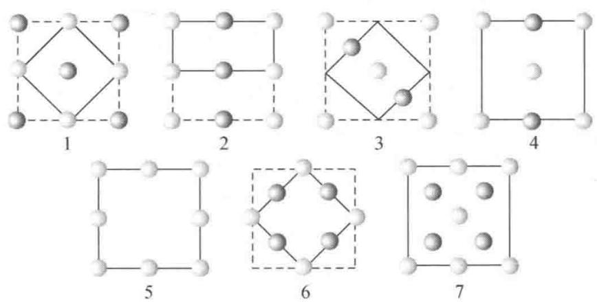  
图7.1(a)

【评注】点阵素单位是最小的点阵单位。单位中只含一个点阵点。含2个或2个以上点阵点的单位称为复单位。画出素单位的关键是能按该单位重复，与单位顶角上是否有球无关。例如第3号图像，实线所示单位是素单位，按此单位平移堆砌与虚线复单位平移堆砌所得的周期结构完全相同。同一种周期结构，画素单位可以有多种方式。有时不容易画出素单位时，还可按所给单位重复堆砌成更大的结构再来划分。下面再以第3号图像为例画出两种素单位，示于图7.1(b)。

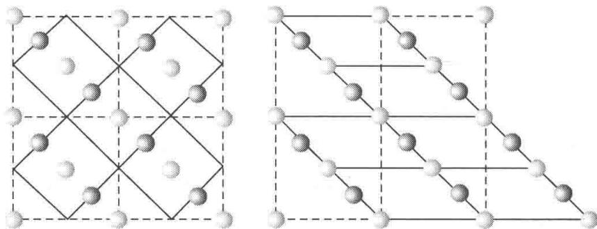  
图7.1(b)

【7.2】在一片广阔平坦的土地上植树,要求植株间的距离不小于2 m,试安排一种方案使植株数目最多。将每株树用一个点表示,画出这些点的分布图及点阵单位,计算素单位的面积以及10000 m²(1公顷)土地最多可植树的株数。

解 按密排的知识,相邻的 3 株树呈正三角形排列时,植株数目最多,如图 7.2 所示。每株所占的面积为

$$
2 \mathrm{m} \times 2 \mathrm{m} \times \sin 6 0 ^ {\circ} = 3. 4 6 4 \mathrm{m} ^ {2}
$$

1 公顷地最多的植树株数为： $10000 \, m^{2}/3.464 \, m^{2}=2887$ （株）

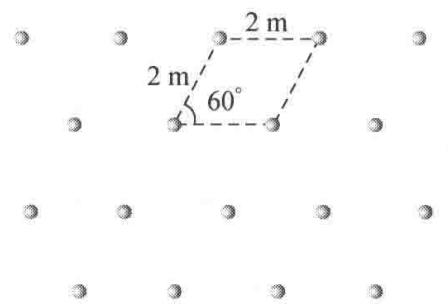  
图7.2

【评注】本题是通过日常生活知识,来了解二维平面上周期地排列的一种结构。将这结构抽象成二维点阵,从中可划出点阵单位,计算出点阵参数。

【7.3】层状石墨分子中 C—C 键长为 142 pm，试根据它的结构画出层形石墨分子的原子分布图，画出二维六方素晶胞，用对称元素的图示记号标明晶胞中存在的全部六次轴，并计算每一晶胞的面积、晶胞中包含的 C 原子数和 C—C 键数，画出点阵素单位。

解 石墨层形分子结构示于图 7.3(a)，晶胞示于图 7.3(b)，图中键长单位为 pm。在晶胞中六次轴位置示于图 7.3(c)，点阵素单位示于图 7.3(d)。

由图 7.3(a) 可见, 在层形石墨分子结构中, 通过六元环中心具有六次旋转轴( $\blacklozenge$ ) 对称性, 而通过每个 C 原子则具有六次反轴( $\blacktriangle$ )。

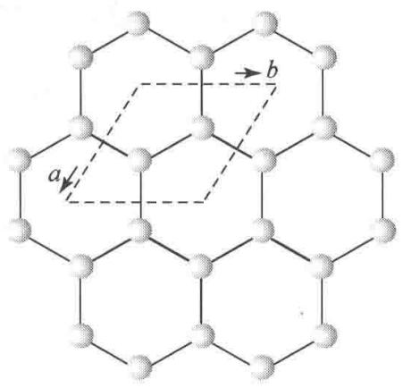  
(a)

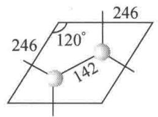

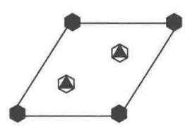

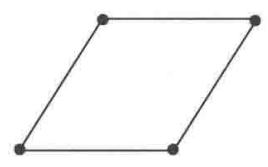  
(d)  
图 7.3 石墨层形分子的结构  
晶胞边长 $a$ 和 $b$ 可按下式计算：

$$
a = b = 2 \times 1 4 2 \mathrm{pm} \times \cos 3 0 ^ {\circ} = 2 4 6 \mathrm{pm}
$$

晶胞面积可按下式计算：

$$
a \times b \times \sin 6 0 ^ {\circ} = 2 4 6 \mathrm{pm} \times 2 4 6 \mathrm{pm} \times \sin 6 0 ^ {\circ} = 5. 2 4 \times 1 0 ^ {4} \mathrm{pm} ^ {2}
$$

晶胞中含 2 个 C 原子, 3 根 C—C 键。  
【7.4】下表给出由 X 射线衍射法测得的一些链形高分子的周期。试根据 C 原子的立体化学，画出这些聚合物的一维结构；找出它们的结构基元；比较这些聚合物链周期的大小，并解释原因。

<table><tr><td>高分子</td><td>化学式</td><td>链周期/pm</td></tr><tr><td>聚乙烯</td><td> $(CH_2-CH_2)_n$ </td><td>252</td></tr><tr><td>聚乙烯醇</td><td> $(CH_2-CH)_n$  $\begin{array}{c} | \\ OH \end{array}$ </td><td>252</td></tr><tr><td>聚氯乙烯</td><td> $(CH_2-CH)_n$  $\begin{array}{c} | \\ Cl \end{array}$ </td><td>510</td></tr><tr><td>聚偏二氯乙烯</td><td> $(CH_2-C)_n$  $\begin{array}{c} | \\ Cl \end{array}$ </td><td>470</td></tr><tr><td colspan="3">解 依次画出这些高分子的结构于下:</td></tr><tr><td>高分子</td><td>立体结构</td><td>结构基元</td></tr><tr><td>聚乙烯</td><td></td><td>2( $CH_2$ )</td></tr><tr><td>聚乙烯醇</td><td></td><td> $CH_2CHOH$ </td></tr><tr><td>高分子</td><td>立体结构</td><td>结构基元</td></tr><tr><td>聚氯乙烯</td><td></td><td> $2(CH_2CHCl)$ </td></tr><tr><td>聚偏二氯乙烯</td><td></td><td> $2(CH_2CCl_2)$ </td></tr></table>

在聚乙烯、聚乙烯醇和聚氯乙烯分子中，C原子以 $\mathrm{sp}^3$ 杂化轨道成键，呈四面体构型，C—C键长 $154\mathrm{pm}$ ， $\angle C - C - C$ 为 $109.5^{\circ}$ ，全部C原子都处在同一平面上，呈伸展的构象。重复周期长度前两个为 $252\mathrm{pm}$ ，这数值正好等于

$$
2 \times 1 5 4 \mathrm{pm} \times \sin \left(\frac {1 0 9 . 5 ^ {\circ}}{2}\right) = 2 5 2 \mathrm{pm}
$$

聚氯乙烯因 Cl 原子的范德华半径为 184 pm, 需要交错排列, 因而它的周期接近 252 pm 的 2 倍。

聚偏二氯乙烯因为同一个 C 原子上连接了 2 个 Cl 原子，必须改变—C—C—C—链的伸展构象，利用单键可旋转的性质，改变扭角，使碳链扭曲，分子中的 C 原子不在一个平面上，如上图所示。这时因碳链扭曲，而使周期长度缩短至 470 pm。

【7.5】有一组点，周期地分布于空间，其平行六面体周期重复单位如图7.5(a)所示。问这一组点是否构成一点阵？说明理由，判断它是否构成一点阵结构？请画出能够概括这一组点的周期性的点阵及其素单位。

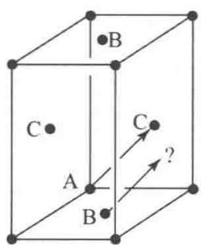  
(a)

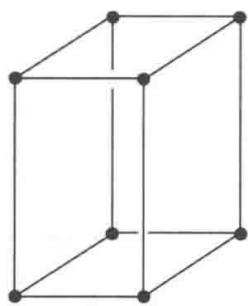  
(b)  
图7.5

解 不能将这一组点中的每一个点都作为点阵点, 因为画一矢量 AC, 将它移至 B, 矢量所指的端点处没有点, 它不符合点阵的要求, 所以这一组点不能构成一点阵。但这组点是按平行六面体单位周期地排布于空间, 它构成一点阵结构。能概括这组点的点阵素单位如图7.5(b)。

【评注】 判断一组点是否构成点阵,应从点阵的基本定义出发:连接任意两点的矢量进行平移,能够复原。又如在本题中,连接AB矢量平移至一端落于C处,另一端没有点,所以不能将A,B,C诸点都当作点阵点。

【7.6】列表比较晶体结构和分子结构的对称元素及其相应的对称操作。晶体结构比分子结构增加了哪几类对称元素和对称操作？晶体结构的对称元素和对称操作受到哪些限制？原因是什么？

解

<table><tr><td>分子对称性</td><td>晶体对称性</td></tr><tr><td colspan="2">(1)旋转操作——旋转轴</td></tr><tr><td colspan="2">(2)反映操作——镜面</td></tr><tr><td colspan="2">(3)反演操作——对称中心</td></tr><tr><td colspan="2">(4)旋转反演操作——反轴</td></tr><tr><td></td><td>(5)平移操作——点阵</td></tr><tr><td></td><td>(6)螺旋旋转操作——螺旋轴</td></tr><tr><td></td><td>(7)反映滑移操作——滑移面</td></tr></table>

由表可见,晶体结构比分子结构增加了(5)\~(7)三类对称元素和对称操作。

晶体结构因为是点阵结构,其对称元素和对称操作要受到点阵制约,对称轴轴次只能为1,2,3,4,6。螺旋轴和滑移面中的滑移量只能为点阵结构所允许的几种数值。

【7.7】根据点阵的性质,作图证明理想晶体中不可能存在五次对称轴。

解 若有五次轴,由该轴联系的 5 个点阵点的分布如图 7.7 所示。连接 AB 矢量,将它平移到 E,矢量一端为点阵点 E,另一端没有点阵点,不符合点阵的定义,所以晶体的点阵结构不可能存在五次对称轴。

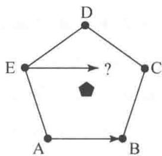  
图7.7

【7.8】分别写出晶体中可能存在的独立的宏观对称元素和微观对称元素，并说明它们之间的关系。

解

宏观对称元素有

$$
1, 2, 3, 4, 6, i, m, \overline {{4}}
$$

微观对称元素有

$$
1, 2, 2 _ {1}, 3, 3 _ {1}, 3 _ {2}, 4, 4 _ {1}, 4 _ {2}, 4 _ {3}, 6, 6 _ {1}, 6 _ {2}, 6 _ {3}, 6 _ {4}, 6 _ {5}, i, m, a, (b, c), n, d, e, \overline {{4}}, \text {点阵}
$$

微观对称元素比宏观对称元素多相应轴次的螺旋轴和相同方向的滑移面,而且通过平移操作其数目是无限的。

【7.9】有4种晶体分别属于 $C_{2h}, C_{2v}, D_{2h}$ 和 $D_{2d}$ 4种点群，试根据其特征对称元素定出它们所属的晶系。

解 按《结构化学基础》(第5版)表7.2.3将各点群的 Schönflies 记号和国际记号都写出来,了解其特征对称元素的分布,即可判断这些晶体所属的晶系:

$C_{2h}-2/m$ ，有一个镜面和一个二次轴垂直，单斜晶系。

$C_{2v}-mm2$ ，有两个互相垂直的镜面相交，交线为二次轴，正交晶系。

$D_{2h}-2/mmm$ ，有3个互相垂直的镜面相交，正交晶系。

$D_{2d}-\overline{4}2m$ ，有一个四次反轴，四方晶系。

【7.10】有5种晶体分别属于 $C_{3h},C_{3i},C_{3v},D_{3h}$ 和 $D_{3d}$ 5种点群，试根据其特征对称元素定出

它们所属的晶系。

解 按《结构化学基础》(第5版)表7.2.3将各点群的 Schönflies 记号和国际记号都写出来,了解其特征对称元素的分布,即可判断这些晶体所属的晶系:

$C_{3h}-\overline{6}$ ：因有六次反轴，属六方晶系。

$C_{3i}-\overline{3}$ ：因有三次反轴，属三方晶系。

$C_{3v}-3m$ : 3个相互夹角为 $120^{\circ}$ 的镜面相交, 交线为三次轴, 属三方晶系。

$D_{3h}-\overline{6}m2$ ：因有六次反轴，属六方晶系。

$D_{3d}-\overline{3}m$ ：3个相互夹角为 $120^{\circ}$ 的镜面相交，交线为三次轴，3个二次轴和三次轴垂直处在两个镜面平分线上。交点为对称中心，所以有三次反轴，属三方晶系。

【评注】在上两题中，标记点群的 Schönflies 记号 $D_{2d}$ 中有 $\overline{4}, C_{3h}$ 和 $D_{3h}$ 中有 $\overline{6}$ ，即下标的 2 和 3 与反轴的轴次 $\overline{4}$ 和 $\overline{6}$ 不同，容易在判别点群和晶系时产生混淆，读者应复习 4.1 节的内容，加深对 $\overline{4}$ 和 $\overline{6}$ 的理解。

在学习化学时,深入理解四次反轴(4)的对称操作十分重要,因为 $CH_{4}$ 和 $SO_{4}^{2-}$ 等四面体形的分子和离子的对称性中就包含有 $\overline{4}$ 。 $\overline{4}$ 的图形记号为 ■,表示这个四次反轴中包含有二次轴,要注意垂直此二次轴并没有镜面,其中心点也不是对称中心(i),但 $\overline{4}$ 却是 $C_{4}^{1}$ 和 i 的联合操作。这个联合操作产生了新的对称操作 $I_{4}^{1}$ 和新的对称元素 $\overline{4}$ (或 $I_{4}$ )。

$C_{3h}$ 和 $D_{3h}$ 点群中包含有六次反轴( $\overline{6}$ ), $\overline{6}$ 的图形记号为▲, 表示垂直三次对称轴有镜面( $\sigma_{h}$ ) 存在, $\overline{6}=C_{3}+\sigma_{h}$ 。即含有 $\overline{6}$ 对称性的分子或晶体中, 独立地存在着 $C_{3}$ 和 $\sigma_{h}$ 。

【7.11】六方晶体可按六方柱体(八面体)结合而成,但为什么六方晶胞不能划成六方柱体?

解 晶胞一定是平行六面体,它的不相平行的 3 条边分别和 3 个单位平移矢量平行。六方柱体不符合这个条件。

【评注】回忆7.3题层形石墨分子的结构，C原子组成一个个六角形的六元环，但不能用六元环作二维晶胞，只能选平行四边形为二维晶胞。

【7.12】按图 7.12(a) 堆砌的结构为什么不是晶体中晶胞并置排列的结构？

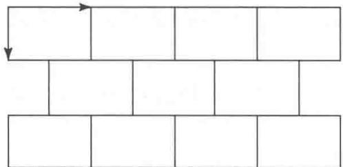  
图7.12(a)

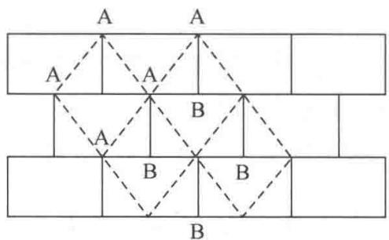  
图 7.12(b)

解 晶胞并置排列时,晶胞顶点为8个晶胞所共有。对于二维结构,晶胞顶点应为4个晶胞共有,才能保证晶胞顶点上的点有着相同的周围环境。今将图中不同位置标上A,B,如图7.12(b)所示,若每个矩形代表一个结构基元,由于A点和B点的周围环境不同(A点上方没有连接线,B点下方没有连接线),上图的矩形不是晶胞。晶胞可选连接A点的虚线所成的单位,形成由晶胞并置排列的结构,如图7.12(b)所示。

【评注】晶体的点阵结构要求每个点阵点所代表的实际内容具有相同的化学组成、相同的空间结构、相同的周围环境,这三者缺一不可。例如,石墨分子中每个C原子都是以平面三角形和周围3个C原子成键,化学组成和空间结构相同,但是相邻2个C原子却因键的方向不同,而没有相同的周围环境,需要将相邻的2个C原子合在一起形成一个结构基元。本题也是根据上述3个条件来划分晶胞的。

【7.13】根据金属镁的晶体结构[《结构化学基础》(第5版)图7.1.4(e)]：

（1）画出金属镁晶体的六方晶胞沿 c 轴的投影图，标明各个原子的分数坐标及其在晶胞中摊到的个数；

（2）标明在晶胞内两个三角形中心处[坐标分别为 $(2 / 3,1 / 3)$ 和 $(1 / 3,2 / 3)$ 处]对称轴沿 $c$ 轴的投影图；

（3）画出点阵单位沿 c 轴的投影，标明点阵单位内两个三角形中心处对称轴沿 c 轴的投影图，说明原子分数坐标、螺旋轴 $6_{3}$ 和六次反轴 $\overline{6}$ 的定义。

解

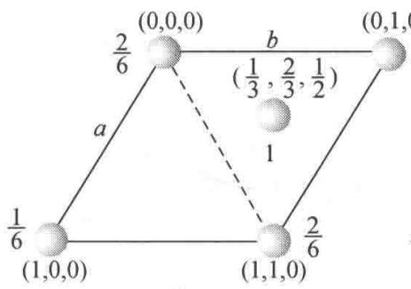  
(1)

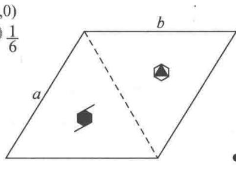  
(2)

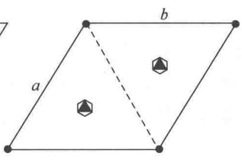  
(3)

原子分数坐标是描述原子在晶胞中的坐标位置的，以晶胞参数作为单位来表示。在六方晶胞中，3个轴是不等长的，某原子距原点的距离要分别用 $a, b, c$ 长度的分数表示，故称为该原子的分数坐标。

螺旋轴 $6_{3}$ 表示它的基本操作是绕轴旋转 $60^{\circ}$ 再沿轴的方向平移 3/6 个周期。在六方晶系中，六次轴的方向定为 c 轴，所以本题中是绕 c 轴旋转 $60^{\circ}$ ，再沿 c 轴平移 $\frac{3}{6}c$ 。它的图像的记号为 6。

六次反轴 $\overline{6}$ 表示它的基本操作是绕轴旋转 $60^{\circ}$ ，再按轴上的一个点进行倒反（或反演）操作，它的记号为 ▲。

【评注】本题涉及晶体学中的一些基本概念,对初学者是比较生疏而不易理解的。通过结构非常简单的金属镁的例子理解这些抽象概念,是学习晶体化学的重要环节,也是学习后续内容的基础。进行对称操作时,可将晶胞平移,扩充图像,对称轴所联系的图像就更为完整地显现出它的对称性。

【7.14】根据 $\alpha$ -硒的晶体结构[见《结构化学基础》(第5版)图7.2.6]及Se原子在晶胞中的坐标 $(0,u,0),(u,0,2/3),(\bar{u},\bar{u},1/3),u=0.217$ :

（1）画出 $\alpha-Se$ 晶体的六方晶胞沿 c 轴的投影图，标明各个原子的分数坐标及其在晶胞中摊到的个数；

(2) 标明晶胞内两个三角形中心处的对称轴沿 c 轴的投影图；

（3）画出点阵单位沿 c 轴的投影图，标出单位内两个三角形中心处的对称轴投影图，说明晶胞对称性和点阵单位对称性不同的原因。

解  
(a)  
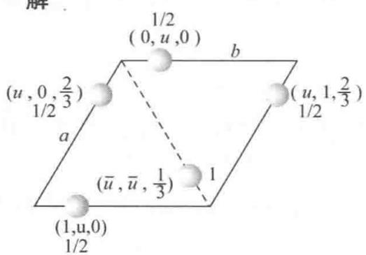  
(1)

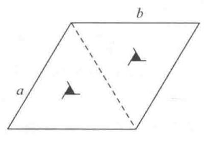  
(2)

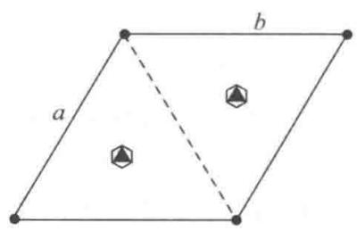  
(3)

图(2)显示的晶胞对称性和图(3)显示的点阵单位对称性不同,是因(2)中的结构基元(3个Se原子)是 $Se_{n}$ 螺旋链的一部分,它具有三重螺旋轴的对称性,而由结构基元抽象成点阵点,它呈圆球的全对称性,对称性高。

【7.15】在下面3个六方晶胞 $(a=b\neq c,\alpha=\beta=90^{\circ},\gamma=120^{\circ})$ 沿c轴的投影中，若A（浅灰色）和B（深灰色）两种原子是排列在晶胞顶点和晶胞内两个三角形的中心，它们的结构沿c轴投影示于图7.15，原子在c轴的坐标标在原子旁。试分别写出这3种晶体通过原点平行c轴的对称元素及晶体所属的晶系，并画出点阵单位及点阵点的位置、晶体所属的空间点阵型式。

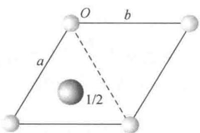

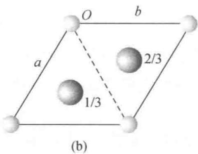  
图7.15

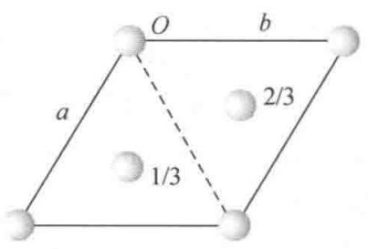  
(c)

对(a)，晶体通过原点平行 c 轴为六次反轴（因有镜面和它垂直），晶体属六方晶系，简单六方点阵型式(hP)。

对(b)，晶体通过原点平行 c 轴为三次反轴（因原点位置有对称中心），晶体属三方晶系，简单六方点阵型式 $(hP)$ 。

对(c)，晶体通过原点平行 c 轴为三次反轴（因原点位置有对称中心），晶体属三方晶系，R 心六方点阵型式(hR)。

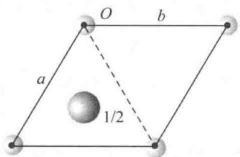  
(a)  
六方晶系，简单六方点阵

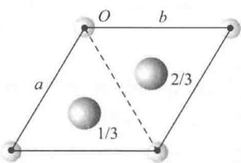  
(b)  
三方晶系，简单六方点阵

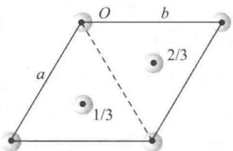  
(c)  
三方晶系， $R$ 心六方点阵

【评注】上面7.13～7.15三题都涉及有关三方晶系和六方晶系的问题：（1）如何判别晶体中有无六次反轴(6)？（2）如何判别晶体是属于三方晶系还是属于六方晶系？（3）六方晶胞（晶胞参数的限制条件为 $a = b, \alpha = \beta = 90^{\circ}, \gamma = 120^{\circ}$ ）可以适用于三方晶系，名称上的不协调应怎样理解，现在又是怎样解决的？（4）为什么有些三方晶系晶体的点阵具有六次对称轴的对称性？（5）为什么属于 $R$ 心六方点阵型式 $(hR)$ 的点阵，它的特征对称元素是三次对称轴？（6）为什么三方晶系晶体的点阵有一部分属于简单六方点阵型式 $(hP)$ ，它的特征对称元素是六次对称轴，而另一部分属于 $R$ 心六方点阵型式 $(hR)$ ，它的特征对称元素是三次对称轴？这些问题很容易引起混乱，而且不容易在国内外的教材和参考书中找到正确答案。这3个习题正可帮助读者解决这些问题，澄清有些表面上的混乱概念。

通过解答上述 3 个习题,应对下列诸点多加注意和理解:

第一,认真地观察晶体的结构,在六方晶胞的原点和晶胞内两个三角形中心处平行c轴的对称轴是否是六次反轴(6),而判别的关键是垂直c轴有无镜面。垂直c轴的三次对称轴有镜面就是 $\overline{6}$ 。有 $\overline{6}$ 对称性的晶体属于六方晶系,若垂直三次轴没有镜面,则只可能是三次轴(3)或三次反轴(3),晶体属于三方晶系。

第二,要理解三方晶系和六方晶系,都可以用六方晶胞。由于名称上容易产生混乱,具有权威性的《晶体学国际表》从1983年起引进晶族的概念,将三方晶系和六方晶系合并为六方晶族,采用六方晶胞。

第三, 实际晶体结构的对称性是晶体具有的真实对称性。将晶体的一个结构基元或一个素晶胞的内容抽象为一个点阵点, 而且又将这个点看作一个小圆球, 这个点阵单位的对称性要比晶体结构的真实对称性高, 这是完全可以理解的, 像 $\alpha$ -硒结构就是一个例子。注意, 晶体所属的晶系不会因为点阵的抽象提高了点阵对称性而改变。

第四， $R$ 心六方点阵型式中，点阵点的排布使它不具有六次对称轴的对称性，因为平行 $c$ 轴的三次轴没有垂直于它的镜面。它只具有三方晶系特征的对称元素。六方晶族晶体的点阵单位为六方晶胞。而三方晶系晶体分属于简单六方点阵型式 $(hP)$ 和 $R$ 心六方点阵型式 $(hR)$ 就很容易理解了。不论文献中怎样标记 $hR$ 这种点阵型式，都不会引起混乱了。

【7.16】四方晶系的金红石晶体结构中，晶胞参数 $a = 458\mathrm{pm}, c = 298\mathrm{pm}$ ；原子分数坐标为： $\mathrm{Ti}(0,0,0;1/2,1/2,1/2), \mathrm{O}(0.31,0.31,0;0.69,0.69,0;0.81,0.19,1/2;0.19,0.81,1/2)$ 。计算 $z$ 值相同的 Ti—O 键长。

解 $z$ 值相同的 $\mathrm{Ti - O}$ 键是 $\mathrm{Ti}(0,0,0)$ 和 $\mathrm{O}(0.31,0.31,0)$ 之间的键，其键长 $r_{\mathrm{Ti - O}}$ 为

$$
\begin{array}{r l} r _ {\mathrm{Ti-O}} & = \sqrt {(0 . 3 1 a) ^ {2} + (0 . 3 1 a) ^ {2}} \\ & = 0. 4 3 8 a \\ & = 0. 4 3 8 \times 4 5 8 \mathrm{pm} \\ & = 2 0 1 \mathrm{pm} \end{array}
$$

【7.17】许多由有机分子堆积成的晶体属于单斜晶系， $C_{2h}^{5}-P2_{1}/c$ 空间群。说明空间群记号中各符号的意义，画出 $P2_{1}/c$ 空间群对称元素的分布，推出晶胞中和原子(0.15,0.25,0.10)属同一等效点系的其他3个原子的坐标，并作图表示。

解 在空间群记号 $C_{2h}^{5}-P2_{1}/c$ 中， $C_{2h}$ 为点群的 Schönflies 记号， $C_{2h}^{5}$ 为该点群的第 5 号空间群，“-”记号后是空间群的国际记号，P 为简单点阵，对单斜晶系平行 b 轴有 $2_{1}$ 螺旋轴，垂直b 轴有 c 滑移面。该空间群对称元素分布如图 7.17 所示。

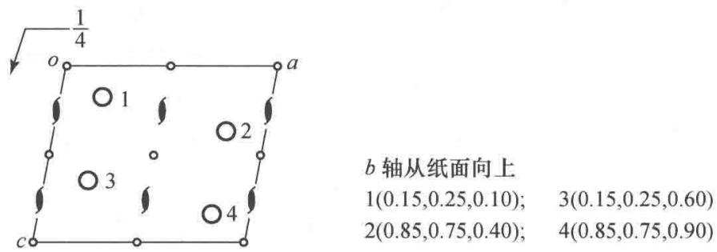  
图7.17

【7.18】写出在3个坐标轴上的截距分别为 $2a, -3b$ 和 $-3c$ 的点阵面的指标，写出指标为(321)的点阵面在3个坐标轴上的截距之比。

解 点阵面指标为 3 个轴上截数倒数的互质整数之比, 即 $\left(\frac{1}{2}:\frac{1}{-3}:\frac{1}{-3}\right)=(3:\overline{2}:\overline{2})$ , 点阵面指标为 $(3\overline{22})$ 或 $(\overline{3}22)$ 。

指标为(321)的点阵面在3个轴上的截距之比为 $2a:3b:6c$ 。

【7.19】标出下面点阵结构的晶面指标(100)，(210)，(120)，(210)，(230)，(010)。每组面画出3条相邻的直线表示。

解 题解如图 7.19 所示。

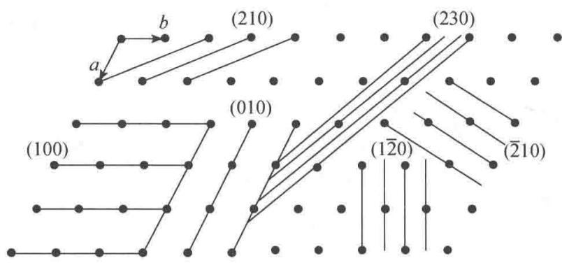  
图7.19

【7.20】金属镍的立方晶胞参数 a=352.4 pm，试求 $d_{200}, d_{111}, d_{220}$ 。

解 立方晶系的衍射指标 hkl 和衍射面间距 $d_{hkl}$ 的关系为

$$
d _ {h k l} = a (h ^ {2} + k ^ {2} + l ^ {2}) ^ {- \frac {1}{2}}
$$

故

$$
d _ {2 0 0} = a (2 ^ {2}) ^ {- \frac {1}{2}} = \frac {1}{2} a = 1 7 6. 2 \mathrm{pm}
$$

$$
d _ {1 1 1} = a (1 ^ {2} + 1 ^ {2} + 1 ^ {2}) ^ {- \frac {1}{2}} = a / \sqrt {3} = 2 0 3. 5 \mathrm{pm}
$$

$$
d _ {2 2 0} = a (2 ^ {2} + 2 ^ {2}) ^ {- \frac {1}{2}} = a / \sqrt {8} = 1 2 4. 6 \mathrm{pm}
$$

【7.21】什么是晶体衍射的两个要素？它们与晶体结构（例如晶胞的两要素）有何对应关系？写出能够阐明这些对应关系的表达式，并指出式中各符号的意义。晶体衍射的两要素在X射线粉末衍射图上有何反映？

解 晶体衍射的两个要素是：衍射方向和衍射强度，它们和晶胞的两要素相对应。衍射方向和晶胞参数相对应，衍射强度和晶胞中原子坐标参数相对应，前者可用 Laue 方程表达，

后者可用结构因子表达。

Laue 方程：

$$
\begin{array}{l} \boldsymbol {a} \cdot (\boldsymbol {s} - \boldsymbol {s} _ {0}) = h \lambda \\ \boldsymbol {b} \cdot (\boldsymbol {s} - \boldsymbol {s} _ {0}) = k \lambda \\ \boldsymbol {c} \cdot (\boldsymbol {s} - \boldsymbol {s} _ {0}) = l \lambda \end{array}
$$

式中 a, b, c 反映了晶胞大小形状和空间取向；s 和 $s_{0}$ 反映了衍射 X 射线和入射 X 射线的方向；h, k, l 为衍射指标； $\lambda$ 为 X 射线波长。

衍射强度 $I_{hkl}$ 和结构因子 $F_{hkl}$ 的平方成正比，而结构因子和晶胞中原子种类（用原子散射因子 f 表示）及其坐标参数 x, y, z 有关：

$$
F _ {h k l} = \sum_ {j} f _ {j} \exp [ \mathrm{i} 2 \pi (h x _ {j} + k y _ {j} + l z _ {j}) ]
$$

粉末衍射图上衍射角 $\theta$ (或 $2\theta$ ) 即衍射方向, 衍射强度由计数器或感光胶片记录下来。【7.22】写出 Bragg 方程的两种表达形式, 说明 $(hkl)$ 与 $hkl, d_{(hkl)}$ 与 $d_{hkl}$ 之间的关系以及衍射角 $\theta_n$ 随衍射级数 $n$ 的变化。

解 Bragg 方程的两种表达形式为

$$
\begin{array}{l} 2 d _ {(h k l)} \sin \theta_ {n} = n \lambda \\ 2 d _ {h k l} \sin \theta = \lambda \end{array}
$$

式中 $(hkl)$ 为点阵面指标，3个数互质；而hkl为衍射指标，3个数不要求互质，可以有公因子n，如123,246,369等。 $d_{(hkl)}$ 为点阵面间距； $d_{hkl}$ 为衍射面间距，它和衍射指标中的公因子n有关： $d_{hkl}=d_{(hkl)}/n$ 。按前一公式，对于同一族点阵面 $(hkl)$ 可以有n个不同级别的衍射，即相邻两个面之间的波程差可为 $1\lambda,2\lambda,3\lambda,\cdots,n\lambda$ ，而相应的衍射角为 $\theta_{1},\theta_{2},\theta_{3},\cdots,\theta_{n}$ 。

【7.23】已知二水合草酸晶体属单斜晶体， $P2_{1}/n$ 空间群，晶胞参数 a=609.68 pm, b=349.75 pm, c=1194.6 pm, $\beta=105.78^{\circ}$ ，试计算它的倒易点阵参数 $a^{*}, b^{*}, c^{*}, \alpha^{*}, \beta^{*}, \gamma^{*}$ ，作出垂直 b 轴、通过原点的点阵和倒易点阵图。

解 $a^{*}$ 垂直于 $b$ 和 $c, c^{*}$ 垂直于 $a$ 和 $b, b^{*}$ 和 $b$ 平行，它们的大小可按《结构化学基础》（第5版）(7.6.6)式计算如下：

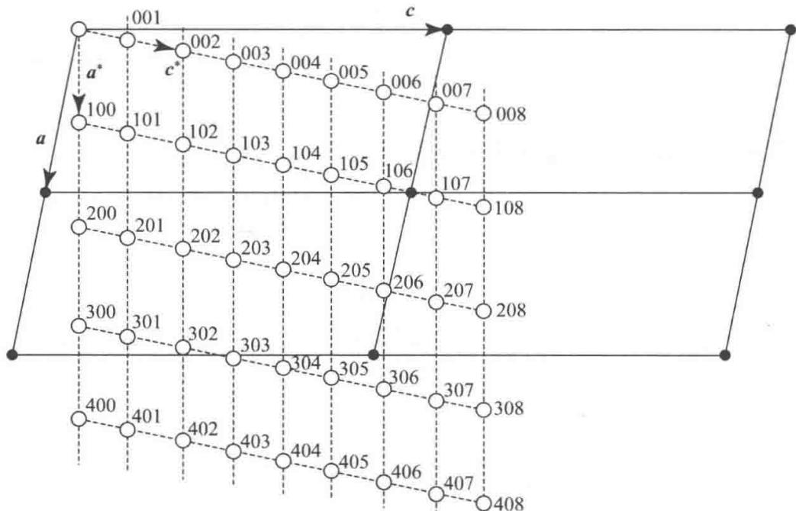  
图 7.23 二水合草酸晶体的点阵(实线)和倒易点阵(虚线)

$$
\begin{array}{r l} a ^ {*} & = 1 / d _ {1 0 0} = 1 / a \cos (1 0 5. 7 8 ^ {\circ} - 9 0 ^ {\circ}) \\ & = 1 / 0. 6 0 9 6 8 \mathrm{nm} \times \cos 1 5. 7 8 ^ {\circ} \\ & = 1. 7 0 4 \mathrm{nm} ^ {- 1} \\ b ^ {*} & = 1 / d _ {0 1 0} = 1 / 0. 3 4 9 7 5 \mathrm{nm} \times \cos 0 ^ {\circ} \\ & = 2. 8 6 \mathrm{nm} ^ {- 1} \\ c ^ {*} & = 1 / d _ {0 0 1} = 1 / 1. 1 9 4 6 \mathrm{nm} \times \cos (1 0 5. 7 8 ^ {\circ} - 9 0 ^ {\circ}) \\ & = 0. 8 7 0 \mathrm{nm} ^ {- 1} \\ \alpha^ {*} & = \gamma^ {*} = 9 0 ^ {\circ} \\ \beta^ {*} & = 1 8 0 ^ {\circ} - 1 0 5. 7 8 ^ {\circ} = 7 4. 2 2 ^ {\circ} \end{array}
$$

【7.24】用 $\mathrm{CuK}\alpha$ 射线收集二水合草酸晶体的衍射数据时，按7.23题所得数据计算：（1）由倒易点阵原点指向倒易点阵点的 $H_{200}$ 和 $H_{202}$ 的数值；（2）计算衍射200和202的衍射角 $2\theta$ 数值；（3）画出衍射202产生衍射时倒易点阵和反射球的几何关系。

解

(1) 已知 $Cu K_{\alpha}$ 的波长 ( $\lambda$ ) 为 0.1542 nm, 得反射球的半径和直径:

$$
\begin{array}{r l} & {\text {反射球半径:} 1 / \lambda = 6. 4 8 5 \mathrm{nm} ^ {- 1}} \\ & {\text {反射球直径:} 2 / \lambda = 1 2. 9 7 \mathrm{nm} ^ {- 1}} \\ & {H _ {2 0 0} = 2 a ^ {*} = 2 \times 1. 7 0 4 \mathrm{nm} ^ {- 1} = 3. 4 0 8 \mathrm{nm} ^ {- 1}} \\ & {H _ {2 0 2} = 2 \sqrt {a ^ {* 2} + c ^ {* 2} - 2 a ^ {*} c ^ {*} \cos (1 8 0 ^ {\circ} - \beta^ {*})}} \\ & {= 2 \sqrt {1 . 7 0 4 ^ {2} + 0 . 8 7 0 ^ {2} - 2 \times 1 . 7 0 4 \times 0 . 8 7 0 \times \cos 1 0 5 . 7 8 ^ {\circ}}} \\ & {= 4. 2 2 7 \mathrm{nm} ^ {- 1}} \end{array}
$$

(2) 利用反射球和 $H_{200}$ 、 $H_{202}$ 的几何关系, 可分别算得 $2\theta$ 值:

$$
\begin{array}{r l} & {\sin \theta_ {2 0 0} = 3. 4 0 8 \mathrm{nm} ^ {- 1} / 1 2. 9 7 \mathrm{nm} ^ {- 1} = 0. 2 6 2 7} \\ & {\qquad \theta_ {2 0 0} = 1 5. 2 3 ^ {\circ}} \\ & {\qquad 2 \theta_ {2 0 0} = 3 0. 4 6 ^ {\circ}} \\ & {\sin \theta_ {2 0 2} = 4. 2 2 7 \mathrm{nm} ^ {- 1} / 1 2. 9 7 \mathrm{nm} ^ {- 1} = 0. 3 2 5 9} \\ & {\qquad \theta_ {2 0 2} = 1 9. 0 2 ^ {\circ}} \\ & {\qquad 2 \theta_ {2 0 2} = 3 8. 0 4 ^ {\circ}} \end{array}
$$

(3) 反射球和衍射 $H_{202}$ 的衍射方向示于图 7.24。

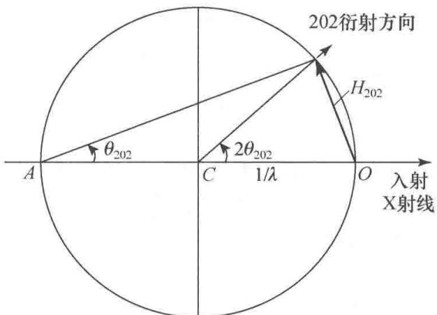  
图7.24

【评注】倒易点阵和反射球是研究晶体衍射规律的重要数学工具,在测定晶体结构、了解晶体性质和应用中起重要的作用。在使用时要注意将抽象概念和实际衍射性质结合在一起,根据情况灵活地使用:

（1）题中所给晶胞参数和波长的单位是 pm，据此倒易晶胞数值用 $pm^{-1}$ 表达就显得太小，改用 nm 和 $nm^{-1}$ 适合于运算，作图时可选合适的尺寸。

（2）在图7.24中 $H_{202}$ 是独立地从 $O$ 点出发画出它的矢量，使它的端点处在反射球面上，而不必通过图7.23中的关系求算。

（3）晶体的点阵和倒易点阵原点所在位置为 O 点，即晶体处在 O 点，而晶体衍射方向是从反射球心 C 指向处在球面上的倒易点阵点的方向。这是通过虚拟的反射球求得现实的衍射方向的问题。

(4) 测量单晶体衍射的衍射仪, 大多数 X 射线光源发射的方向是固定的, 要收集各个 $hkl$ 衍射数据, 需要定出晶体的倒易点阵 $a^{*}, b^{*}, c^{*}$ 矢量在空间的取向, 然后按 $hkl$ 的数值逐个地调到反射球面上, 根据各点的 $2\theta$ 值角度收集衍射强度。在收集生物大分子晶体等衍射数据时, 因为晶胞很大, 倒易晶胞就很小, 这时除了要用同步辐射的强光源外, 收集各个衍射也不能按上述逐个地进行, 而可用其他方法, 例如回摆法分区间进行, 将晶体在 $1^{\circ} \sim 2^{\circ}$ 摆动范围的全部衍射数据记录在一个影像板上, 再将全部数据归纳整理, 加以指标化, 逐点测量它的强度。

【7.25】为什么用X射线粉末法测定晶胞参数时常用高角度数据（有时还根据高角度数据外推至 $\theta = 90^{\circ}$ ），而测定超细晶粒的结构时要用低角度数据（小角散射）？

解 按晶面间距的相对误差公式 $\Delta d/d = -\cot\theta \cdot \Delta\theta$ ，随着 $\theta$ 值增大， $\cot\theta$ 值变小，测量衍射角的偏差 $\Delta\theta$ 对晶面间距或晶胞参数的影响减小，故用高角度数据。

小晶粒衍射线变宽,利用求粒径 $D_{p}$ 的公式:

$$
D _ {\mathrm{p}} = k \lambda / (B - B _ {0}) \cos \theta
$$

超细晶粒 $D_{p}$ 值很小，衍射角 $\theta$ 增大时， $\cos\theta$ 变小，宽化（即 $B-B_{0}$ ）增加，故要用低角度数据。另外，原子的散射因子 f 随 $\sin\theta/\lambda$ 的增大而减小，细晶粒衍射能力已很弱了。为了不使衍射能力降低，应在小角度（ $\theta$ 值小）下收集数据。

【7.26】用 X 射线衍射法测定 CsCl 的晶体结构, 衍射 100 和 200 哪个强度大? 为什么?

解 200 比 100 大, 其原因可从图 7.26 看出。图 7.26 示出 CsCl 立方晶胞投影图, $d_{100} = a$ , $d_{200} = a / 2$ 。在衍射 100 中, $\mathrm{Cl}^{-}$ 和 $\mathrm{Cs}^{+}$ 相差半个波长, 强度互相抵消减弱; 在衍射 200 中, $\mathrm{Cl}^{-}$ 和 $\mathrm{Cs}^{+}$ 相差 1 个波长, 互相加强。

【评注】CsCl 结构中因 $f_{Cs^{+}}$ 和 $f_{Cl^{-}}$ 不同，强度抵消减弱，衍射 100 强度不为 0，是简单立方结构。对于金属钠等体心立方结构，顶角上的原子和体心上的原

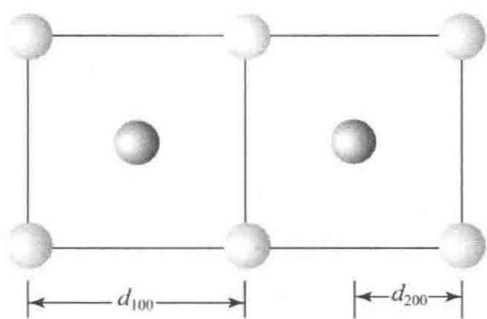  
图7.26

子是相同的，在衍射100中，这两个原子相差半个波，强度正好互相抵消为0，出现系统消光。

【7.27】金属铝属立方晶系，用 $Cu K\alpha$ 射线摄取 333 衍射， $\theta=81^{\circ}17'$ 。由此计算晶胞参数。

解 立方晶系 $d_{hkl}$ 和 $a$ 的关系为

$$
d _ {h k l} = a / \left(h ^ {2} + k ^ {2} + l ^ {2}\right) ^ {\frac {1}{2}}
$$

由 $\theta$ 求得 $d$ 为

$$
\begin{array}{r l} d _ {3 3 3} & = \lambda / 2 \sin (8 1 ^ {\circ} 1 7 ^ {\prime}) = 1 5 4. 2 \mathrm{pm} / 2 \times 0. 9 8 8 4 \\ & = 7 8. 0 0 \mathrm{pm} \\ a & = d _ {3 3 3} (3 ^ {2} + 3 ^ {2} + 3 ^ {2}) ^ {\frac {1}{2}} = 7 8. 0 0 \mathrm{pm} \times 5. 1 9 6 \\ & = 4 0 5. 3 \mathrm{pm} \end{array}
$$

【评注】对高角度应考虑用 $Cu K_{\alpha_{1}}=154.056\ pm$ 计算，则 a=404.9 pm。

【7.28】 $\mathrm{S}_8$ 分子既可结晶成单斜硫，也可结晶成正交硫。用X射线衍射法(CuKα射线)测得某正交硫晶体的晶胞参数 $a = 1048~\mathrm{pm},b = 1292~\mathrm{pm},c = 2455~\mathrm{pm}$ 。已知该硫磺的密度为 $2.07\mathrm{gcm}^{-3}$ ，S的相对原子质量为32.06。

(1) 计算每个晶胞中 $S_{8}$ 分子的数目；

(2) 计算 224 衍射线的 Bragg 角 $\theta$ ;

(3) 写出气相中 $S_{8}$ 分子的全部独立的对称元素。

解（1）按求晶胞中分子数 $Z$ 的公式，得

$$
\begin{array}{r l} Z & = N _ {\mathrm{A}} V D / M \\ & = 6. 0 2 \times 1 0 ^ {2 3} \mathrm{mol} ^ {- 1} (1 0 4 8 \times 1 2 9 2 \times 2 4 5 5) \mathrm{pm} ^ {3} \\ & \quad \times 1 0 ^ {- 3 0} \mathrm{cm} ^ {3} \mathrm{pm} ^ {- 3} \times 2. 0 7 (\mathrm{gcm} ^ {- 3}) / 8 \times 3 2. 0 6 \mathrm{gmol} ^ {- 1} \\ & \approx 1 6 \end{array}
$$

(2) 按正交晶系公式：

$$
d _ {h k l} = \left(\frac {h ^ {2}}{a ^ {2}} + \frac {k ^ {2}}{b ^ {2}} + \frac {l ^ {2}}{c ^ {2}}\right) ^ {- \frac {1}{2}}
$$

代入有关数据,得

$$
\begin{array}{r l} d _ {2 2 4} & = \left[ \left(\frac {2 ^ {2}}{1 . 0 4 8 ^ {2}} + \frac {2 ^ {2}}{1 . 2 9 2 ^ {2}} + \frac {4 ^ {2}}{2 . 4 5 5 ^ {2}}\right) \times \frac {1}{1 0 ^ {6} \mathrm{pm} ^ {2}} \right] ^ {- \frac {1}{2}} \\ & = \left[ (3. 6 4 2 + 2. 3 9 6 + 2. 6 5 5) \times \frac {1}{1 0 ^ {6} \mathrm{pm} ^ {2}} \right] ^ {- \frac {1}{2}} \\ & = 3 3 9. 2 \mathrm{pm} \\ \theta & = \arcsin \left(\frac {1 5 4 . 2 \mathrm{pm}}{2 \times 3 3 9 . 2 \mathrm{pm}}\right) = 1 3. 1 4 ^ {\circ} \end{array}
$$

(3) $S_{8}$ 分子属于点群 $D_{4d}$ ，独立的对称元素有： $I_{8}, 4C_{2}, 4\sigma_{d}$ 。

【7.29】硅的晶体结构与金刚石相似。 $20^{\circ}$ C下测得其立方晶胞参数a=543.089 pm，密度为2.3283 g cm $^{-3}$ ，Si的相对原子质量为28.0854，计算Avogadro常数。

解 按求 Avogadro 常数 $N_{A}$ 的公式, 得

$$
\begin{array}{r l} N _ {\mathrm{A}} & = Z M / V D \\ & = \frac {8 \times 2 8 . 0 8 5 \mathrm{gmol} ^ {- 1}}{(5 4 3 . 0 8 9 \mathrm{pm}) ^ {3} \times (1 0 ^ {- 3 0} \mathrm{cm} ^ {3} \mathrm{pm} ^ {- 3}) \times 2 . 3 2 8 3 \mathrm{gcm} ^ {- 3}} \\ & = 6. 0 2 4 5 \times 1 0 ^ {2 3} \mathrm{mol} ^ {- 1} \end{array}
$$

【7.30】已知某立方晶系晶体的密度为 $2.16 \, g cm^{-3}$ ，相对分子质量为 234。用 Cu Kα 射线在 154

直径57.3 mm的粉末相机中拍粉末图,从中量得衍射220的衍射线间距2L为22.3 mm,求晶胞参数及晶胞中的分子数。

解 用下面公式由 L 值可求得 $\theta$ 值：

$$
\begin{array}{r l} & \theta = 1 8 0 ^ {\circ} \times 2 L / 4 \pi R = 1 8 0 ^ {\circ} \times 2 2. 3 \mathrm{mm} / 2 \pi \times 5 7. 3 \mathrm{mm} \\ & = 1 1. 1 5 ^ {\circ} \\ d _ {2 2 0} = \lambda / 2 \sin \theta = 1 5 4. 2 \mathrm{pm} / 2 \times 0. 1 9 3 4 \\ & = 3 9 8. 7 \mathrm{pm} \\ a = d _ {2 2 0} (2 ^ {2} + 2 ^ {2}) ^ {\frac {1}{2}} \\ & = 1 1 2 7. 6 \mathrm{pm} \\ Z = N _ {\mathrm{A}} V D / M \\ & = 6. 0 2 \times 1 0 ^ {2 3} \mathrm{mol} ^ {- 1} \times (1 1 2 7. 6 \times 1 0 ^ {- 1 0} \mathrm{cm}) ^ {3} \times 2. 1 6 \mathrm{gcm} ^ {- 3} / 2 3 4 \mathrm{gmol} ^ {- 1} \\ & \approx 8 \end{array}
$$

【7.31】核糖核酸酶-S蛋白质晶体的晶体学数据如下：晶胞体积 $167 \, nm^{3}$ ，晶胞中分子数 6，晶体密度 $1.282 \, g cm^{-3}$ 。如蛋白质在晶体中占 68%（质量分数），计算该蛋白质的相对分子质量。

解

$$
\begin{array}{r l} M & = N _ {\mathrm{A}} V D / Z \\ & = 6. 0 2 2 \times 1 0 ^ {2 3} \mathrm{mol} ^ {- 1} \times 1 6 7 \times 1 0 ^ {- 2 1} \mathrm{cm} ^ {3} \times 1. 2 8 2 \mathrm{gcm} ^ {- 3} \times 0. 6 8 / 6 \\ & = 1 4 6 1 2 \end{array}
$$

【7.32】CaS 晶体具有 NaCl 型结构, 晶体密度为 $2.581 \, g cm^{-3}$ , Ca 和 S 的相对原子质量分别为 40.08 和 32.06。试回答下列问题:

(1) 指出 100,110,111,200,210,211,220,222 衍射中哪些是允许的?

(2) 计算晶胞参数 a;

(3) 计算 $Cu K_{\alpha}$ 辐射 ( $\lambda=154.2\ pm$ ) 的最小可观测 Bragg 角。

## 解

（1）NaCl型结构的点阵型式为面心立方，允许存在的衍射hkl中3个数应为全奇或全偶，即111,200,220,222出现。

(2) 为求晶胞参数, 先求晶胞体积 V:

$$
\begin{array}{r l} V & = \frac {M Z}{N _ {\mathrm{A}} D} = \frac {4 (4 0 . 0 8 + 3 2 . 0 6) \mathrm{g} \mathrm{mol} ^ {- 1}}{6 . 0 2 \times 1 0 ^ {2 3} \mathrm{mol} ^ {- 1} \times 2 . 5 8 1 \mathrm{g} \mathrm{cm} ^ {- 3}} \\ & = 1. 8 5 7 \times 1 0 ^ {- 2 2} \mathrm{cm} ^ {3} \\ a & = (V) ^ {\frac {1}{3}} = (1 8 5. 7 \times 1 0 ^ {- 2 4} \mathrm{cm} ^ {3}) ^ {\frac {1}{3}} \\ & = 5. 7 0 5 \times 1 0 ^ {- 8} \mathrm{cm} = 5 7 0. 5 \mathrm{pm} \end{array}
$$

(3) 最小可观测的衍射为 111。

$$
\begin{array}{r l} d _ {1 1 1} & = a / (1 + 1 + 1) ^ {\frac {1}{2}} = 5 7 0. 5 \mathrm{pm} / \sqrt {3} \\ & = 3 2 9. 4 \mathrm{pm} \\ \theta & = \arcsin (\lambda / 2 d) = \arcsin (1 5 4. 2 \mathrm{pm} / 2 \times 3 2 9. 4 \mathrm{pm}) \\ & = 1 3. 5 4 ^ {\circ} \end{array}
$$

【7.33】 $\delta$ -TiCl $_{3}$ 微晶是乙烯、丙烯聚合催化剂的活性组分。用 X 射线粉末法 (Cu K $_{\alpha}$ 线) 测定

其平均晶粒度时所得数据如下表所示。

<table><tr><td>hkl</td><td> $\theta$ </td><td> $B_0$ </td><td>B</td></tr><tr><td>001</td><td>7.55°</td><td>0.40°</td><td>1.3°</td></tr><tr><td>100</td><td>26°</td><td>0.55°</td><td>1.5°</td></tr></table>

按《结构化学基础》(第5版)公式(7.7.9)估算该 $\delta-TiCl_{3}$ 微晶的大小。

解 利用求粒径 $D_{\mathrm{p}}$ 的公式 $D_{\mathrm{p}} = K\lambda /(B - B_0)\cos \theta$ 得

001衍射：

$$
\begin{array}{r l} \Delta B & = 1. 3 ^ {\circ} - 0. 4 0 ^ {\circ} = 0. 9 ^ {\circ} = 0. 0 1 5 7 \text {弧度} \\ D _ {\mathrm{p,001}} & = (0. 9 \times 0. 1 5 4 \mathrm{nm}) / 0. 0 1 5 7 \times \cos 7. 5 5 ^ {\circ} \\ & = 8. 9 \mathrm{nm} \end{array}
$$

100 衍射：

$$
\begin{array}{r l} \Delta B & = 1. 5 ^ {\circ} - 0. 5 5 ^ {\circ} = 0. 9 5 ^ {\circ} = 0. 0 1 6 5 8 \text {弧度} \\ D _ {\mathrm{p,100}} & = (0. 9 \times 0. 1 5 4 \mathrm{nm}) / 0. 0 1 6 5 8 \times \cos 2 6 ^ {\circ} \\ & = 9. 3 \mathrm{nm} \end{array}
$$

【7.34】冰为六方晶系晶体，晶胞参数 $a = 452.27\mathrm{pm}, c = 736.71\mathrm{pm}$ ，晶胞中含 $4\mathrm{H}_2\mathrm{O}$ ，括弧内为 $\mathrm{O}$ 原子分数坐标 $(0,0,0;0,0,0.375;2/3,1/3,1/2;2/3,1/3,0.875)$ 。请据此计算或说明：

(1) 计算冰的密度；

(2) 计算氢键 O—H…O 键长；

(3) 冰的点阵型式是什么？结构基元包含哪些内容？

$$
\begin{array}{r l} & {(1) \text {密度} D = Z M / N _ {\mathrm{A}} V} \\ & {\quad V = (4 5 2. 2 7 \mathrm{pm}) ^ {2} \sin 6 0 ^ {\circ} \times 7 3 6. 7 1 \mathrm{pm} = 1. 3 0 5 \times 1 0 ^ {8} \mathrm{pm} ^ {3}} \\ & {\qquad = 1. 3 0 5 \times 1 0 ^ {- 2 2} \mathrm{cm} ^ {3}} \\ & {\quad D = 4 (2 \times 1. 0 0 8 + 1 6. 0 0) \mathrm{g} \mathrm{mol} ^ {- 1} / 6. 0 2 2 \times 1 0 ^ {2 3} \mathrm{mol} ^ {- 1} \times 1. 3 0 5 \times 1 0 ^ {- 2 2} \mathrm{cm} ^ {3}} \\ & {\qquad = 0. 9 1 7 \mathrm{g} \mathrm{cm} ^ {- 3}} \end{array}
$$

(2) 坐标为 $(0,0,0)$ 和 $(0,0,0.375)$ 的两个 O 原子间的距离即为氢键键长 r: $r=(0.375-0)\times736.71\mathrm{pm}$ =276.3pm

(3) 冰的点阵型式是简单六方点阵 $(hP)$ , 整个晶胞包含的内容即 $4\mathrm{H}_{2}\mathrm{O}$ 为结构基元。

【评注】晶胞中处在坐标位置为 $(x_{1},y_{1},z_{1})$ 和 $(x_{2},y_{2},z_{2})$ 两点上的原子间的距离 $r_{1-2}$ 即为键长值。可按下面三斜晶系计算公式简化算出：

$$
r _ {1 - 2} = \left[ (\Delta x) ^ {2} a ^ {2} + (\Delta y) ^ {2} b ^ {2} + (\Delta z) ^ {2} c ^ {2} + 2 \Delta x \Delta y a b \cos \gamma + 2 \Delta x \Delta z a c \cos \beta + 2 \Delta y \Delta z b c \cos \alpha \right] ^ {1 / 2}
$$

六方晶系 $a = b, \alpha = \beta = 90^{\circ}, \gamma = 120^{\circ}$ ，将这些数据代入三斜晶系计算 $r_{1-2}$ 公式化简，可得

$$
r _ {1 - 2} = \left[ (\Delta x) ^ {2} a ^ {2} + (\Delta y) ^ {2} a ^ {2} + (\Delta z) ^ {2} c ^ {2} - \Delta x \Delta y a ^ {2} \right] ^ {\frac {1}{2}}
$$

在本题中坐标为(1,0,0.375)和 $\left(\frac{2}{3},\frac{1}{3},\frac{1}{2}\right)$ 的2个O原子间的距离为另外一种长度的O—H…O氢键，其键长为

$$
\begin{array}{r l} r & = \left\{\left[ \left(\frac {1}{3}\right) ^ {2} + \left(\frac {1}{3}\right) ^ {2} + \left(\frac {1}{3} \times \frac {1}{3}\right) \right] a ^ {2} + \left(\frac {1}{2} - 0. 3 7 5\right) ^ {2} c ^ {2} \right\} ^ {\frac {1}{2}} \\ & = (0. 3 3 3 3 a ^ {2} + 0. 0 1 5 6 c ^ {2}) ^ {\frac {1}{2}} \\ & = 2 7 6. 8 \mathrm{pm} \end{array}
$$

上述两个键长值 276.3 pm 和 276.8 pm 应用时可取短值或平均值。

【7.35】某 MO 型金属氧化物属立方晶系, 晶体密度为 $3.581 \, g cm^{-3}$ 。用 X 射线粉末法 (Cu Kα 线) 测得各衍射线相应的衍射角分别为: $18.5^{\circ}, 21.5^{\circ}, 31.2^{\circ}, 37.4^{\circ}, 39.4^{\circ}, 47.1^{\circ}, 52.9^{\circ}, 54.9^{\circ}$ 。请据此计算或说明:

(1) 确定该金属氧化物晶体的点阵型式；

(2) 计算晶胞参数和一个晶胞中的结构基元数；

(3) 计算金属原子 M 的相对原子质量, 说明 M 是什么原子。

解 按下表从左到右次序计算：

<table><tr><td>序号</td><td> $\theta/(^{\circ})$ </td><td> $\sin\theta$ </td><td> $\sin^{2}\theta$ </td><td> $\sin^{2}\theta/0.1007$ </td><td> $h^{2}+k^{2}+l^{2}$ </td><td>hkl</td></tr><tr><td>1</td><td>18.5</td><td>0.3173</td><td>0.1007</td><td>1</td><td>3</td><td>111</td></tr><tr><td>2</td><td>21.5</td><td>0.3665</td><td>0.1343</td><td>1.334</td><td>4</td><td>200</td></tr><tr><td>3</td><td>31.2</td><td>0.5180</td><td>0.2684</td><td>2.665</td><td>8</td><td>220</td></tr><tr><td>4</td><td>37.4</td><td>0.6074</td><td>0.3689</td><td>3.663</td><td>11</td><td>311</td></tr><tr><td>5</td><td>39.4</td><td>0.6347</td><td>0.4029</td><td>4.001</td><td>12</td><td>222</td></tr><tr><td>6</td><td>47.1</td><td>0.7325</td><td>0.5366</td><td>5.329</td><td>16</td><td>400</td></tr><tr><td>7</td><td>52.9</td><td>0.7976</td><td>0.6361</td><td>0.6317</td><td>19</td><td>331</td></tr><tr><td>8</td><td>54.9</td><td>0.8181</td><td>0.6694</td><td>6.647</td><td>20</td><td>420</td></tr></table>

(1) 晶体衍射全奇或全偶, 面心立方点阵。

(2) $d_{400}=154.2\ \text{pm}/2\times0.7325=105.26\ \text{pm}$

$$
a = d _ {4 0 0} \left(4 ^ {2}\right) ^ {\frac {1}{2}} = 4 \times 1 0 5. 2 6 \mathrm{pm} = 4 2 1 \mathrm{pm}
$$

在此正当晶胞中,一个晶胞对应4个点阵点,即包含4个结构基元。

(3) 按公式，

$$
\begin{array}{r l} M & = N _ {\mathrm{A}} V D / Z \\ & = 6. 0 2 2 \times 1 0 ^ {2 3} \mathrm{mol} ^ {- 1} \times (4 2 1. 0 4 \times 1 0 ^ {- 1 0} \mathrm{cm}) ^ {3} \times 3. 5 8 1 \mathrm{gcm} ^ {- 3} / 4 \\ & = 4 0. 2 4 \mathrm{gmol} ^ {- 1} \end{array}
$$

MO 的相对化学式量为 40.24, M 的相对原子质量为: 40.24 - 16.00 = 24.24, 该原子应为 Mg。

【7.36】L-丙氨酸与氯铂酸钾反应,形成的晶体(见右式)属于正交晶系。已知: $a=746.0\mathrm{pm},b=854.4\mathrm{pm},c=975.4\mathrm{pm}$ ; 晶胞中包含 2 个分子, 空间群为 $P2_{1}22_{1}$ , 一般等效点系数目为 4 , 即每一不对称单位相当于半个分子。试由此说明该分子在晶体中的构型和点群, 并写出结构式。

$$
\begin{array}{c} \mathrm{PtCl} _ {2} (\mathrm{NH} _ {2} - \mathrm{CH} - \mathrm{COOH}) _ {2} \\ | \\ \mathrm{CH} _ {3} \end{array}
$$

解 因不对称单位相当于半个分子, 分子只能坐在二次轴上(该二次轴和 b 轴平行)。二次轴通过 Pt 原子(因晶胞中只含有 2 个 Pt), 分子呈反式构型(Pt 原子按平面四方形成键, 2 个 Cl 原子处于对位位置, 才能保证有二次轴)。分子的点群为 $C_{2}$ 。分子的结构式为

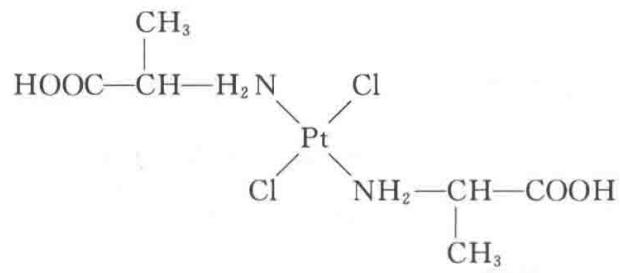

# 第 8 章 金属的结构和性质

## 内容提要

## 8.1 金属键和金属的一般性质

金属键理论主要有两种：一是自由电子模型，二是固体能带理论。

金属元素的电负性较小,电离能也较小,最外层价电子容易脱离原子核的束缚,而在金属晶粒中由各个正离子形成的势场中比较自由地运动,形成“自由电子”或“离域电子”。这些金属中的自由电子可看作彼此间没有相互作用、各自独立地在势能等于平均值的势场中运动,相当于在三维势箱中运动的电子。按照箱中粒子的 Schrödinger 方程并求解,可得波函数表达式和能级表达式。体系处于 0 K 基态时,电子从最低能级填起,直至 Fermi 能级 $E_{F}$ ,能量低于 $E_{F}$ 的能级,全都填满电子,而所有高于 $E_{F}$ 的能级都是空的。对导体, $E_{F}$ 就是 0 K 时电子占据的最高能级,其值可从理论上推导,也可用实验测定。例如对金属钠,理论上推得的 $E_{F}$ 为 3.15 eV,实验测定值为 3.2 eV。由 $E_{F}$ 值可见,即使在 0 K 时电子仍有相当大的动能,也可根据 $kT \ll E_{F}$ 推论金属的比热较小。

金属键的强度可用金属的原子化焓(气化焓)来衡量。原子化焓是指1 mol的金属变成气态原子所需要吸收的能量。金属的许多性质和原子化焓有关。例如原子化焓小,金属较软,熔点较低;原子化焓大,金属较硬,熔点较高等。

固体能带理论是将整块金属当作一个巨大的分子,晶体中 N 个原子的每一种能量相等的原子轨道,通过轨道叠加、线性组合得到 N 个分子轨道,它是一组扩展到整块金属的离域轨道。由于 N 数值很大(约 $10^{23}$ ),所得分子轨道各能级间的间隔极小,形成一个能带。每一个能带具有一定的能量范围,相邻原子间轨道重叠少的内层原子轨道形成的能带较窄;轨道重叠多的外层原子轨道形成的能带较宽。各个能带按能量高低排列起来,成为能带结构。

能带中充满电子的叫满带；没有电子的能带叫空带；能级最低未装满电子的能带叫导带；价带是能级最高的满带和导带的总称；各个能带间的间隙是不能存在电子的，这样的区域叫禁带。

金属能带结构的特点是存在导带,当电子进入导带中,受外电场作用改变其能量分布状况而导电,所以金属是导体。绝缘体的特征是只有满带和空带,而且能量最高的满带和能量最低的空带之间的禁带较宽, $E_{g}\geqslant5\ eV$ ,在一般电场条件下,难以将满带电子激发入导带而导电。半导体的特征也是只有满带和空带,但禁带较窄, $E_{g}<3\ eV$ 。

半导体晶体掺入不同杂质,可以改变其半导体的性质。硅的晶体掺入磷,因磷的价电子较硅多,可形成 n 型半导体;若掺入镓,因镓的价电子较硅少,可形成 p 型半导体。

## 8.2 等径圆球的密堆积

球的密堆积是固体化学的重要基础，而等径圆球的堆积又是其中最基础、最重要的内容。

等径圆球的最密堆积结构,可从密堆积层来了解。密堆积层的结构只有一种,在层中每个球和周围6个球接触,周围有6个空隙,每个空隙由3个球围成,所以由N个球堆积成的层中,有2N个空隙,平均每个球摊到2个空隙。这些三角形空隙的顶点的朝向有一半和另一半相反。若A表示堆积球球心的位置,则根据空隙的朝向,其位置可分别定为B和C。

由两层密堆积球紧密堆积形成的双层,称为密置双层,它只有一种类型。

常见的最密堆积的结构有下列几种：

(1) 立方最密堆积(ccp): 这种堆积是将密堆积层的相对位置按照ABCABC…方式作最密堆积, 重复的周期为3层。这种堆积可划出面心立方晶胞, 故称为立方最密堆积, 又称为A1型堆积。

(2) 六方最密堆积(hcp): 这种堆积是将密堆积层的相对位置按照ABABAB…方式作最密堆积, 重复的周期为2层。这种堆积可划出六方晶胞, 故称为六方最密堆积, 又称为A3型堆积。

（3）其他最密堆积：在金属单质中除上述两种外，还有(a)双六方最密堆积(dhcp)，这种堆积的周期为4层，即按ABACABAC…堆积而成，用记号 $A3^{*}$ 表示。(b)Sm型最密堆积，堆积的周期为9层，即按ABABCBCAC…堆积而成，用记号 $A3^{''}$ 表示。

在等径圆球的最密堆积的各种形式中,每个球的配位数均为12,均具有相同的堆积密度,即球体积和整个堆积体积之比均为0.7405。

在各种最密堆积中，球间的空隙数目和大小也相同。由 $N$ 个半径为 $R$ 的球组成的堆积中，平均有 $2N$ 个四面体空隙，由4个球围成，可容纳最大半径为0.225R的小球；还有 $N$ 个八面体空隙，由6个球围成，可容纳最大半径为0.414R的小球。

除最密堆积外,另一种重要的密堆积是体心立方密堆积(bcp),记为A2型。体心立方密堆积不是最密堆积,堆积密度为0.6802。体心立方密堆积中,每个球最近的配位数为8,处在立方体的8个顶点上,另外还有6个相距稍远,处在立方体面的外侧。体心立方堆积中的空隙是变形的多面体空隙,且同一空间可多次计算,每一堆积球可摊到3个变形八面体,该空隙可容纳半径为0.154R的小球;每一堆积球还可摊到6个变形四面体空隙,该空隙可容纳半径为0.291R的小球。上述这些多面体共面连接,如果将连接面看作平面三角形空隙,每个堆积球可摊到12个。这3种空隙的大小和分布特征将直接影响到这种堆积结构的性质。

## 8.3 金属单质的结构

金属单质的结构有许多是属于上述 A1 型、A2 型和 A3 型这 3 种结构型式。当金属原子价层 s 和 p 轨道上电子数目较少时，如碱金属，容易形成 A2 型结构；电子数较多时，如铝和贵金属，容易形成 A1 型结构；中间的容易形成 A3 型结构。不过这种规律不太明显，而且同一种金属的结构型式还会随外界条件而改变，所以需要通过实验来测定。

测定金属晶体的结构型式和晶胞参数后, 就可以由原子间的接触距离求出原子半径。同一种元素的原子半径和配位数有关, 配位数高, 半径大, 为了更好互相对比, 要统一换算到同一种配位数, 金属中常统一到配位数为 12 的情况。

金属原子半径在元素周期表中的变化有一定的规律性：同一族元素原子半径随原子序数的增加而变大；同一周期主族元素的原子半径随原子序数的增加而变小；同一周期过渡元素的原子半径随原子序数增加开始稳定变小，以后稍有增大，但变化幅度不大；镧系元素随原子序数增加，半径变小，称为镧系收缩效应。

## 8.4 合金的结构和性质

合金是两种或两种以上的金属经过熔合过程后所得的生成物。因金属间金属键性质相似，形成合金过程的热效应较小，混合熵增加，容易自发进行。

按合金的结构和相图的特点,合金可分为三类:金属固溶体、金属化合物和金属间隙化合物。

## 1. 金属固溶体

两种金属组成的固溶体,其结构型式一般和一种纯金属相同,只是一部分原子被另一部分原子统计地置换。金属间形成固溶体合金的倾向取决于下面3个因素:(1)两种金属元素在周期表中的位置及其化学性质和物理性质的接近程度;(2)原子半径的接近程度;(3)单质的结构型式。

有的金属, 如 Ag-Au, Ni-Pd, Mo-W 可按任意比例形成完整的固溶体。两种金属大多数是形成部分固溶体, 而且相互的溶解度是不等同的, 一般在低价金属中的溶解度大于在高价金属中的溶解度。

无序的固溶体在缓慢冷却过程中,结构会发生有序化,有序化的结构称为超结构。当合金产生有序向无序转变时,一些物理性质会有较大改变。

## 2. 金属化合物

金属化合物物相有两种主要型式,一种是组成确定的金属化合物物相,另一种是组成可变的化合物物相。在相图和结构-性能关系图上具有转折点,是各种金属化合物形成的标志和主要特点。金属化合物物相的结构特征有二:一是化合物的结构型式一般和母体纯金属时不同,二是两种原子分别占据不同等效点系的结构位置。

金属化合物是一类重要材料,有许多特异性能和应用,例如储氢材料 $LaNi_{5}$ , $LaCo_{5}$ 以及组成和结构都较复杂的电子化合物等。这里说的电子化合物是指这类合金的结构型式由每个金属原子平均摊到的价电子数所决定。例如,每个原子摊到 3/2 个电子时,常形成 CsCl 型或 $\beta-Mn$ 型结构;若摊到 21/13 个电子时,形成 $\gamma-$ 黄铜 $\left(\mathrm{Cu}_{5}\mathrm{Zn}_{8}\right)$ 型结构;若摊到 7/4 个电子时,形成 $\varepsilon$ 相(六方密堆积)结构等。另一类组成为 $AB_{2}$ (如 $MgCu_{2}$ ), 称为 Laves 相合金, 其中 B 原子组成四面体形的原子簇结构通过共用顶点形成骨架,A 原子处于骨架的空隙之中。

## 3. 钢铁

钢铁是以铁和碳为基本元素的合金体系的总称。通常从炼铁高炉中生产得到含碳量 $>2\%$ 的叫生铁，含碳量在 $0.02\% \sim 2.0\%$ 的叫钢，含碳量 $< 0.02\%$ 的称纯铁（又称熟铁）。钢铁是用量最大、对国计民生最重要的金属材料。

钢铁在不同的温度条件下,有不同的相结构和不同的性质。将生铁在高温下通入氧气(或空气)冶炼,可使其含碳量降低,还可减少S,P等杂质元素的含量,使铁变为钢。在炼钢过程中加入Si,Mn,Cr,V,Ti,W等其他元素,形成不同化学成分、不同相结构和不同性能的合金钢,对合金钢经过锻、轧和热处理过程,可得到上千种钢铁合金材料,如锰钢、钨钢、钛钢、不锈钢、工具钢、弹簧钢等等，在这些合金钢中，出现不同的相结构（例如奥氏体、渗碳体、马氏体、铁素体、珠光体等）和特异的性能。

## 4. 形状记忆合金

形状记忆合金指它受外力作用改变了自己的形状,当加热到一定的温度能自动恢复到改变前的形状的合金。20世纪末发现了通过磁场控制的磁性形状记忆合金,它对外界作用的响应多样化。形状记忆合金具有广阔的应用前景。

## 5. 金属间隙化合物

金属间隙化合物是指金属和硼、碳、氮等元素形成的化合物。这类化合物中金属原子作密堆积结构，而硼、碳、氮等较小的非金属原子填入间隙之中，形成间隙化合物或间隙固溶体。这类化合物有着下列共同特征：（1）不论纯金属本身的结构型式如何，大多数间隙化合物采取NaCl型结构；（2）具有比母体金属高得多的熔点和硬度；（3）填隙原子和金属原子间存在共价键，但仍有良好的导电性和金属光泽。

## 8.5 固体的表面结构和性质

固体表面结构是很复杂的,表面层的化学组成常和体相组成不同,结构也常起变化。不能把表面简单看作体相的中止,把表面结构看作体相结构的延续。洁净的表面暴露在大气中,很快就会吸附上一层分子。

研究固体表面的组成和结构有许多方法,如场离子显微镜(FIM)、低能电子衍射(LEED)、紫外光电子能谱(UPS)、X射线光电子能谱(XPS)、俄歇电子谱(AES)、离子散射谱(ISS)、电子能量损失谱(EELS)等等。利用这些方法研究表面结构,已经得到许多有关表面结构的知识:表面并不是光滑的,表面原子有着多种不同的周围环境,例如附加原子(adatom)、台阶附加原子(step adatom)、单原子台阶(monatomic step)、平台(terrace)、平台空位(terrace vacancy)、扭接原子(kink atom)。不同环境的原子配位数不同,它们的化学行为不同,如吸附热和催化活性差别很大。研究表面结构、研究表面层吸附分子的结构,对化学、物理学、材料科学等均有重大意义。

## 习题解析

【8.1】半径为 R 的圆球堆积成正四面体空隙, 试作图显示, 并计算该四面体的边长、高度、中心到顶点距离、中心距底面的高度、中心到两顶点连线的夹角以及中心到球面的最短距离。

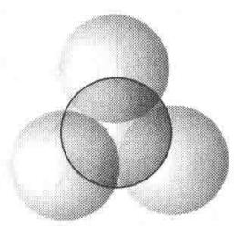  
(a)

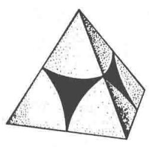  
(b)  
图8.1

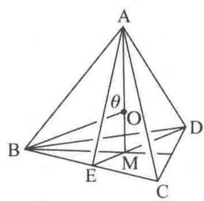  
(c)

解 4 个等径圆球作紧密堆积的情形示于图 8.1(a) 和 (b)，图 8.1(c) 示出堆积所形成的正四面体空隙，该正四面体的顶点即球心位置，边长为圆球半径的 2 倍。

由图和正四面体的立体几何知识可知：

边长 AB=2R

$$
\begin{array}{r l} \mathrm{AM} & = (\mathrm{AE} ^ {2} - \mathrm{EM} ^ {2}) ^ {\frac {1}{2}} = \left[ \mathrm{AB} ^ {2} - \mathrm{BE} ^ {2} - \left(\frac {1}{3} \mathrm{DE}\right) ^ {2} \right] ^ {\frac {1}{2}} \\ & = \left[ \mathrm{AB} ^ {2} - \left(\frac {1}{2} \mathrm{AB}\right) ^ {2} - \left(\frac {1}{3} \mathrm{AE}\right) ^ {2} \right] ^ {\frac {1}{2}} = \left[ (2 R) ^ {2} - R ^ {2} - \left(\frac {\sqrt {3}}{3} R\right) ^ {2} \right] ^ {\frac {1}{2}} \\ & = \frac {2}{3} \sqrt {6} R \approx 1. 6 3 3 R \end{array}
$$

中心到顶点的距离： $\mathrm{OA} = \frac{3}{4}\mathrm{AM} = \frac{\sqrt{6}}{2} R\approx 1.225R$

中心到底面的高度： $\mathrm{OM} = \frac{1}{4}\mathrm{AM} = \frac{\sqrt{6}}{6} R\approx 0.408R$

中心到两顶点连线的夹角为： $\theta = \angle AOB$

$$
\begin{array}{r l} \theta & = \arccos \left[ \frac {\mathrm{OA} ^ {2} + \mathrm{OB} ^ {2} - \mathrm{AB} ^ {2}}{2 (\mathrm{OA}) (\mathrm{OB})} \right] = \arccos \left[ \frac {2 (\sqrt {6} R / 2) ^ {2} - (2 R) ^ {2}}{2 (\sqrt {6} R / 2) ^ {2}} \right] \\ & = \arccos (- 1 / 3) = 1 0 9. 4 7 ^ {\circ} \end{array}
$$

中心到球面的最短距离 $= \mathrm{OA} - R\approx 0.225R$

本题的计算结果很重要。由此结果可知，半径为 R 的等径圆球最密堆积结构中四面体空隙所能容纳的小球的最大半径为 0.225R。而 0.225 正是典型的二元离子晶体中正离子的配位多面体为正四面体时正、负离子半径比的下限。此题的结果也是了解 hcp 结构中晶胞参数的基础（见习题 8.4）。

【8.2】半径为 R 的圆球堆积成正八面体空隙, 计算中心到顶点的距离。

解 正八面体空隙由 6 个等径圆球密堆积而成, 其顶点即圆球的球心, 其棱长即圆球的直径。空隙的实际体积小于八面体体积。图 8.2 中三图分别示出球的堆积情况及所形成的正八面体空隙。

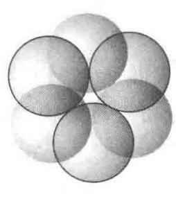  
(a)

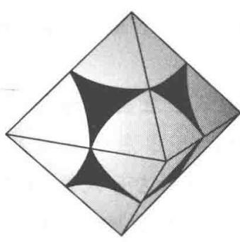  
(b)  
图8.2

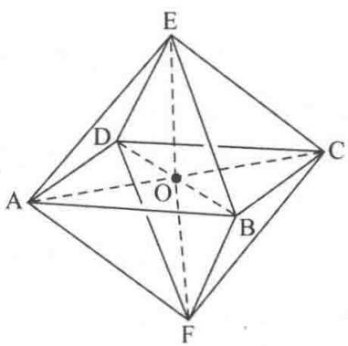  
(c)

$$
\mathrm{OC} = \frac {1}{2} \mathrm{AC} = \frac {1}{2} \sqrt {2} \mathrm{AB} = \frac {1}{2} \sqrt {2} \times 2 R = \sqrt {2} R
$$

而八面体空隙中心到球面的最短距离为

$$
\mathrm{OC} - R = \sqrt {2} R - R \approx 0. 4 1 4 R
$$

此即半径为 R 的等径圆球最密堆积形成的正八面体空隙所能容纳的小球的最大半径。0.414 是典型的二元离子晶体中正离子的配位多面体为正八面体时 $r_{+}/r_{-}$ 的下限值。

【8.3】半径为 R 的圆球围成正三角形空隙, 计算中心到顶点的距离。

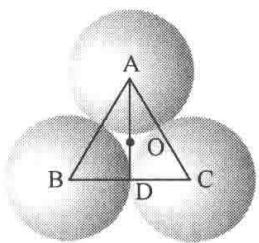  
图8.3

解 由图 8.3 可见,三角形空隙中心到顶点(球心)的距离为

$$
\mathrm{OA} = \frac {2}{3} \mathrm{AD} = \frac {2}{3} \sqrt {3} R \approx 1. 1 5 5 R
$$

三角形空隙中心到球面的距离为

$$
\mathrm{OA} - R \approx 1. 1 5 5 R - R = 0. 1 5 5 R
$$

此即半径为 R 的圆球作紧密堆积形成的三角形空隙所能容纳的小球的

最大半径，0.155是“三角形离子配位多面体”中 $r_{+}/r_{-}$ 的下限值。

【评注】上述 8.1～8.3 三题计算了有关四面体、八面体和三角形体等 3 种空隙的几何学, 这对于深入了解物质的结构和性质是极重要的基础内容, 读者通过解题熟练地掌握其中的几何关系, 并逐步建立起有关化学中三维立体的知识。

【8.4】半径为 R 的圆球堆积成 A3 型结构, 计算六方晶胞参数 a 和 c 的数值。

解 图 8.4 示出 A3 型结构的一个六方晶胞。该晶胞中有两个圆球、4 个正四面体空隙和

两个正八面体空隙。由图可见，两个正四面体空隙共用一个顶点，正四面体高的两倍即晶胞参数 $c$ ，而正四面体的棱长即为晶胞参数 $a$ 或 $b$ 。根据8.1题的结果，可得

$$
\begin{array}{r l} & a = b = 2 R \\ & c = \frac {2}{3} \sqrt {6} R \times 2 = \frac {4}{3} \sqrt {6} R \\ & c / a = \frac {2}{3} \sqrt {6} \approx 1. 6 3 3 \end{array}
$$

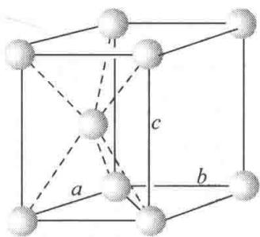  
图8.4

【评注】c/a 称为 A3 型结构的轴率或轴比。除 Zn 和 Cd 外，许多 A3 型结构的金属单质的轴率都与理论值(1.633)接近。

轴率在结构化学中很有用。例如， $\mathrm{C}_{60}$ 分子呈圆球形，这可直接从NMR等表征结果推断出来（ $\mathrm{C}_{60}$ 的 $^{13}\mathrm{CNMR}$ 只出现一个峰，说明所有C原子具有完全相同的周围环境，符合此条件的原子只能排布在一个圆球面上），并可用轴率这一概念加以旁证： $\mathrm{C}_{60}$ 分子在低温下可形成六方最密堆积结构，其六方晶胞的 $c / a = 1639\mathrm{pm} / 1002\mathrm{pm} = 1.635$ 。只有等径圆球形成的六方最密堆积结构，才有这样的轴比，说明 $\mathrm{C}_{60}$ 分子是圆球形的。

【8.5】证明半径为 R 的圆球所作的体心立方堆积中，八面体空隙只能容纳半径为 0.154R 的小球，四面体空隙可容纳半径为 0.291R 的小球。

证明 等径圆球体心立方堆积结构的晶胞示于图 8.5(a) 和 (b)。由图 8.5(a) 可见，八面体空隙中心分别分布在晶胞的面心和棱心上。因此，每个晶胞中有6个八面体空隙 $\left(6\times\frac{1}{2}+12\times\frac{1}{4}\right)$ 。而每个晶胞中含2个圆球，所以每个球平均摊到3个八面体空隙。这些八面体空隙是沿着一个轴被压扁了的变形八面体，长轴为 $\sqrt{2}a$ ，短轴为a(a是晶胞参数)。

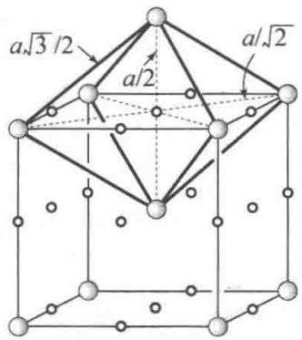  
(a)

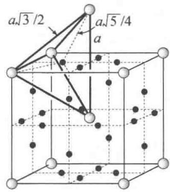  
(b)  
○ 圆球，○ 八面体空隙，● 四面体空隙  
图8.5

八面体空隙所能容纳的小球的最大半径 $r_{0}$ 即从空隙中心(沿短轴)到球面的距离，该距离为 $\frac{a}{2} - R$ 。体心立方堆积是一种非最密堆积，圆球只在 $C_3$ 轴方向上相互接触，因而 $a = \frac{4}{\sqrt{3}} R$ 。代入 $\frac{a}{2} - R$ ，得 $r_{0} = \left(\frac{2}{\sqrt{3}} - 1\right)R \approx 0.154R$ 。

由图 8.5(b) 可见, 四面体空隙中心分布在立方晶胞的面上, 每个面有 4 个四面体中心, 因此每个晶胞有 12 个四面体空隙 $\left(6 \times 4 \times \frac{1}{2}\right)$ 。而每个晶胞有 2 个球, 所以每个球平均摊到 6 个四面体空隙。这些四面体空隙也是变形的, 2 条长棱皆为 a, 4 条短棱皆为 $\frac{\sqrt{3}}{2}a$ 。

四面体空隙所能容纳的小球的最大半径 $r_{\mathrm{T}}$ 等于从四面体空隙中心到顶点的距离减去球的半径 $R$ 。而从空隙中心到顶点的距离为 $\left[\left(\frac{a}{2}\right)^2 +\left(\frac{a}{4}\right)^2\right]^{\frac{1}{2}} = \frac{\sqrt{5}}{4} a$ ，所以小球的最大半径为 $\frac{\sqrt{5}}{4} a - R = \frac{\sqrt{5}}{4}\times \frac{4}{\sqrt{3}} R - R = 0.291R$ 。

【8.6】计算等径圆球密置单层中平均每个球所摊到的三角形空隙数目及二维堆积密度。

解 图 8.6 示出等径圆球密置单层的一部分。

由图可见,每个球(如 A)周围有 6 个三角形空隙,而每个三角形空隙由 3 个球围成,所以每个球平均摊到 $6 \times \frac{1}{3} = 2$ 个三角形空隙。也可按图中画出的平行四边形单位计算。该单位只包含 1 个球和 2 个三角形空隙,即每个球摊到 2 个三角形空隙。

设等径圆球的半径为 R，则图中平行四边形单位的边长

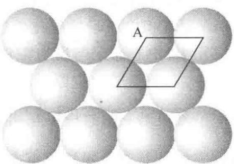  
图8.6

为 2R。所以二维堆积系数为

$$
\frac {\pi R ^ {2}}{(2 R) ^ {2} \sin 6 0 ^ {\circ}} = \frac {\pi R ^ {2}}{4 R ^ {2} (\sqrt {3} / 2)} = 0. 9 0 6
$$

【8.7】指出 A1 型和 A3 型等径圆球密堆积晶胞中密置层的方向各是什么。

解 A1 型等径圆球密堆积晶胞中, 密置层的方向与 $C_{3}$ 轴垂直, 即与 (111) 面平行。A3 型等径圆球密堆积中, 密置层的方向与六次轴垂直, 即与 (001) 面平行。下面将通过两种密堆积型式划分出来的晶胞进一步说明密置层的方向。

A1型密堆积可划分出如图8.7(a)所示的立方面心晶胞。在该晶胞中，由虚线连接的圆球所处的平面即密置层面，该层面垂直于立方晶胞的体对角线即 $C_3$ 轴。每一晶胞有4条体对角线，即在4个方向上都有 $C_3$ 轴的对称性。因此，与这4个方向垂直的层面都是密置层。

A3型密堆积可划分出如图8.7(b)所示的六方晶胞。球A和球B所在的堆积层都是密置层，这些层面平行于(001)晶面，即垂直于 $c$ 轴，而 $c$ 轴平行于六次轴 $C_6$ 。

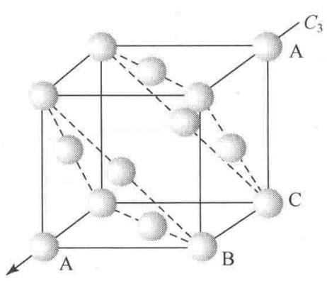  
(a)

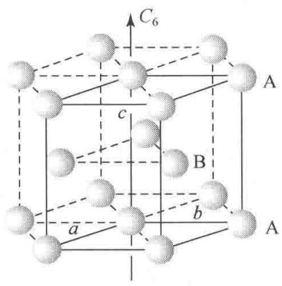  
(b)  
图8.7

【8.8】根据下面(1)～(3)中的要求,请总结A1,A2及A3型金属晶体的结构特征。

(1) 原子密置层的堆积方式、重复周期(A2型除外)、原子的配位数及配位情况；

(2) 空隙的种类和大小、空隙中心的位置及平均每个原子摊到的空隙数目；

（3）原子的堆积系数、所属晶系、晶胞中原子的坐标参数、晶胞参数与原子半径的关系以及空间点阵型式等。

## 解

(1) A1, A2 和 A3 型金属晶体中原子的堆积方式分别为立方最密堆积 (ccp)、体心立方密堆积 (bcp) 和六方最密堆积 (hcp)。A1 型堆积中密堆积层的重复方式为 ABCABCABC…，三层为一重复周期；A3 型堆积中密堆积层的重复方式为 ABABAB…，两层为一重复周期。A1 和 A3 型堆积中原子的配位数皆为 12，而 A2 型堆积中原子的配位数为 8～14，在 A1 型和 A3 型堆积中，中心原子与所有配位原子都接触，同层 6 个，上下两层各 3 个。所不同的是，A1 型堆积中，上下两层配位原子沿 C₃ 轴的投影相差 60°呈 C₆ 轴的对称性，而 A3 型堆积中，上下两层配位原子沿 c 轴的投影互相重合。在 A2 型堆积中，8 个近距离 (与中心原子相距为 $\frac{\sqrt{3}}{2} a$ ) 配位原子处在立方晶胞的顶点上，6 个远距离 (与中心原子相距为 a) 配位原子处在相邻晶胞的体心上。

(2) A1 型堆积和 A3 型堆积都有两种空隙, 即四面体空隙和八面体空隙。四面体空隙可容纳半径为 $0.225R$ 的小原子, 八面体空隙可容纳半径为 $0.414R$ 的小原子 ( $R$ 为堆积原子的半径)。在这两种堆积中, 每个原子平均摊到 2 个四面体空隙和 1 个八面体空隙。差别在于, 两种堆积中空隙的分布不同。在 A1 型堆积中, 四面体空隙的中心在立方晶胞的体对角线上, 到晶胞顶点的距离为 $\frac{\sqrt{6}}{2} R$ 。八面体空隙的中心分别处在晶胞的体心和棱心上。在 A3 型堆积中, 四面体空隙中心的坐标参数分别为 $0, 0, \frac{3}{8}; 0, 0, \frac{5}{8}; \frac{2}{3}, \frac{1}{3}, \frac{1}{8}; \frac{2}{3}, \frac{1}{3}, \frac{7}{8}$ 。而八面体空隙中心的坐标参数分别为 $\frac{2}{3}, \frac{1}{3}, \frac{1}{4}; \frac{2}{3}, \frac{1}{3}, \frac{3}{4}$ 。A2 型堆积中有变形八面体空隙、变形四面体空隙和三角形空隙 (亦可视为变形三方双锥空隙)。八面体空隙和四面体空隙在空间上是重复利用的。八面体空隙中心在体心立方晶胞的面心和棱心上。每个原子平均摊到 3 个八面体空隙, 该空隙可容纳的小原子的最大半径为 $0.154R$ 。四面体空隙中心处在晶胞的面上。每个原子平均摊到 6 个四面体空隙, 该空隙可容纳的小原子的最大半径为 $0.291R$ 。三角形空隙实际上是上述两种多面体空隙的连接面, 算起来, 每个原子摊到 12 个三角形空隙。

(3)

<table><tr><td>金属的结构型式</td><td>A1</td><td>A2</td><td>A3</td></tr><tr><td>原子的堆积系数</td><td>74.05%</td><td>68.02%</td><td>74.05%</td></tr><tr><td>所属晶系</td><td>立方</td><td>立方</td><td>六方</td></tr><tr><td>晶胞型式</td><td>(面心)立方</td><td>(体心)立方</td><td>六方</td></tr><tr><td>晶胞中原子的坐标参数</td><td> $0,0,0;\frac{1}{2},\frac{1}{2},0;$  $\frac{1}{2},0,\frac{1}{2};0,\frac{1}{2},\frac{1}{2}$ </td><td> $0,0,0;$  $\frac{1}{2},\frac{1}{2},\frac{1}{2}$ </td><td> $0,0,0;$  $\frac{2}{3},\frac{1}{3},\frac{1}{2}$ </td></tr><tr><td>晶胞参数与原子半径的关系</td><td> $a=2\sqrt{2}R$ </td><td> $a=\frac{4}{\sqrt{3}}R$ </td><td> $a=b=2R$  $c=\frac{4}{3}\sqrt{6}R$ </td></tr><tr><td>点阵型式</td><td>面心立方</td><td>体心立方</td><td>简单六方</td></tr></table>

综上所述，A1, A2 和 A3 型结构是金属单质的 3 种典型结构型式。它们具有共性，也有差异。尽管 A2 型结构与 A1 型结构同属立方晶系，但 A2 型结构是非最密堆积，堆积系数小，且空隙数目多，形状不规则，分布复杂。搞清这些空隙的情况对于实际工作很重要。A1 型结构和 A3 型结构都是最密堆积结构，它们的配位数、球与空隙的比例以及堆积系数都相同。差别是它们的对称性和周期性不同。A3 型结构属六方晶系，可划分出包含两个原子的六方晶胞。其密置层方向与 c 轴垂直。而 A1 型结构的对称性比 A3 型结构的对称性高，它属立方晶系，可划分出包含 4 个原子的面心立方晶胞，密置层与晶胞体对角线垂直。A1 型结构将原子密置层中 $C_{6}$ 轴所包含的 $C_{3}$ 轴对称性保留了下来。另外，A3 型结构可抽象出简单六方点阵，而 A1 型结构可抽象出面心立方点阵。

## 【8.9】画出等径圆球密置双层图及相应的点阵素单位，指明结构基元。

解 等径圆球的密置双层示于图 8.9。仔细观察和分析便发现,作周期性重复的最基本的结构单位包括 2 个圆球,即 2 个圆球构成一个结构基元。这两个球分布在两个密置层中,如球 A 和球 B。

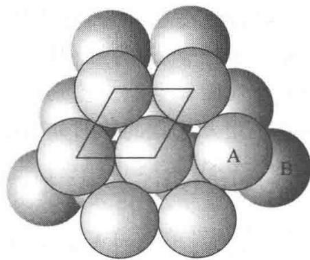  
图8.9

密置双层本身是个三维结构,但由它抽取出来的点阵却为平面点阵。即密置双层仍为二维点阵结构。图中画出平面点阵的素单位,该单位是平面六方单位,其形状与密置单层的点阵素单位一样,每个单位也只包含1个点阵点,但它代表2个球。

等径圆球密置双层是两个密置层作最密堆积所得到的唯一的一种堆积方式。在密置双层结构中，圆球之间形成两种空隙，即四面体空隙和八面体空隙。前者由3个相邻的A球和1个B球或3个相邻的B球和1个A球构成。后者则

由 3 个相邻的 A 球和 3 个相邻的 B 球构成。球数：四面体空隙数：八面体空隙数 = 2 : 2 : 1。

【8.10】金属铜属于 A1 型结构,试计算(111),(110)和(100)等面上铜原子的堆积系数。

解 参照金属铜的面心立方晶胞,画出 3 个晶面上原子的分布情况如下(图中未示出原子的接触情况):

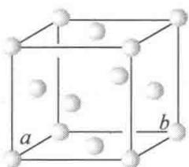

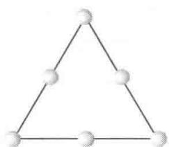  
(111)

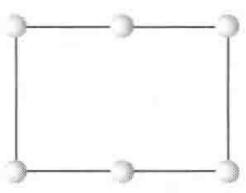  
(110)

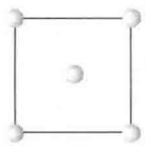  
(100)

(111)面是密置面,面上的所有原子作紧密排列。该面上的铜原子的堆积系数等于三角形单位中球的总最大截面积除以三角形的面积。三角形单位中包含两个半径为 R 的球 $\left(3\times\frac{1}{2}+3\times\frac{1}{6}\right)$ ，所以该面上原子的堆积系数为

$$
\frac {2 \times \pi R ^ {2}}{2 R \times 2 \sqrt {3} R} = \frac {\pi}{2 \sqrt {3}} = 0. 9 0 6
$$

(110)面上原子的堆积系数可根据图中的矩形单位计算。此矩形单位中含两个半径为 R 的球 $\left(4\times\frac{1}{4}+2\times\frac{1}{2}\right)$ 。按照上述方法并注意到在矩形的长边（即晶胞的面对角线）上球是相互接触的，可计算(110)面上原子的堆积系数如下：

$$
\frac {2 \times \pi R ^ {2}}{a \times 4 R} = \frac {2 \times \pi R ^ {2}}{2 \sqrt {2} R \times 4 R} = \frac {\pi}{4 \sqrt {2}} = 0. 5 5 5
$$

(100)面上原子的堆积系数可按同样的思路和方法根据图中的正方形单位计算如下：

$$
\frac {2 \pi R ^ {2}}{a ^ {2}} = \frac {2 \pi R ^ {2}}{(2 \sqrt {2} R) ^ {2}} = \frac {\pi}{4} = 0. 7 8 5
$$

由计算结果可见,3个面上原子的堆积系数的大小次序为:(111)>(100)>(110)。

【8.11】金属铂为 A1 型结构, 晶胞参数 a 为 392.3 pm, Pt 的相对原子质量为 195.1。试求金属铂的密度及原子半径。

解 因为金属铂属于 A1 型结构, 所以每个晶胞中有 4 个原子。因而其密度为

$$
D = \frac {4 M}{a ^ {3} N _ {\mathrm{A}}} = \frac {4 \times 1 9 5 . 1 \mathrm{gmol} ^ {- 1}}{(3 9 2 . 3 \times 1 0 ^ {- 1 0} \mathrm{cm}) ^ {3} \times 6 . 0 2 2 \times 1 0 ^ {2 3} \mathrm{mol} ^ {- 1}} = 2 1. 4 5 \mathrm{gcm} ^ {- 3}
$$

A1型结构中原子在晶胞的面对角线方向上互相接触，因此晶胞参数 $a$ 和原子半径 $R$ 的关系为 $a = 2\sqrt{2} R$ ，所以

$$
R = \frac {a}{2 \sqrt {2}} = \frac {3 9 2 . 3 \mathrm{pm}}{2 \sqrt {2}} = 1 3 8. 7 \mathrm{pm}
$$

【8.12】硅的结构和金刚石相似，Si 的共价半径为 117 pm。求硅的晶胞参数、晶胞体积和晶体密度。

解 硅的立方晶胞中含 8 个硅原子, 它们的坐标参数与金刚石立方晶胞中碳原子的坐标参数相同。硅的共价半径和晶胞参数的关系可通过晶胞对角线的长度推导出来。设硅的共价半径为 $r_{\text{Si}}$ , 晶胞参数为 $a$ , 则根据硅原子的坐标参数可知, 体对角线的长度为 $8r_{\text{Si}}$ 。而体对角线的长度又等于 $\sqrt{3}a$ , 因而有 $8r_{\text{Si}} = \sqrt{3}a$ , 所以

$$
a = \frac {8}{\sqrt {3}} r _ {\mathrm{Si}} = \frac {8}{\sqrt {3}} \times 1 1 7 \mathrm{pm} = 5 4 0 \mathrm{pm}
$$

晶胞体积为

$$
V = a ^ {3} = \left(\frac {8}{\sqrt {3}} \times 1 1 7 \mathrm{pm}\right) ^ {3} = 1. 5 8 \times 1 0 ^ {8} \mathrm{pm} ^ {3}
$$

晶体密度为

$$
\begin{array}{r l} D & = \frac {8 \times 2 8 . 0 9 \mathrm{g} \mathrm{mol} ^ {- 1}}{\left(\frac {8}{\sqrt {3}} \times 1 1 7 \times 1 0 ^ {- 1 0} \mathrm{cm}\right) ^ {3} \times 6 . 0 2 2 \times 1 0 ^ {2 3} \mathrm{mol} ^ {- 1}} \\ & = 2. 3 7 \mathrm{g} \mathrm{cm} ^ {- 3} \end{array}
$$

金刚石、硅和灰锡等单质的结构属立方金刚石型(A4型)，这是一种空旷的结构型式，原子的空间占有率只有34.01%。

【8.13】已知金属钛为六方最密堆积结构，钛原子半径为 144.8 pm。试计算六方晶胞参数及晶体密度。

解 晶胞参数为

$$
\begin{array}{l} a = b = 2 R = 2 \times 1 4 4. 8 \mathrm{pm} = 2 8 9. 6 \mathrm{pm} \\ c = \frac {4}{3} \sqrt {6} R = \frac {4}{3} \sqrt {6} \times 1 4 4. 8 \mathrm{pm} = 4 7 3 \mathrm{pm} \end{array}
$$

晶体密度为

$$
\begin{array}{r l} D & = \frac {2 M}{a b c \sin 1 2 0 ^ {\circ} \times N _ {\mathrm{A}}} \\ & = \frac {2 \times 4 7 . 8 7 \mathrm{gmol} ^ {- 1}}{(2 8 9 . 6 \times 1 0 ^ {- 1 0} \mathrm{cm}) ^ {2} \times (4 7 3 \times 1 0 ^ {- 1 0} \mathrm{cm}) \times \frac {\sqrt {3}}{2} \times 6 . 0 2 2 \times 1 0 ^ {2 3} \mathrm{mol} ^ {- 1}} \\ & = 4. 6 3 \mathrm{gcm} ^ {- 3} \end{array}
$$

【8.14】铝为面心立方结构,密度为 $2.70 \, g cm^{-3}$ 。试计算它的晶胞参数和原子半径;用 Cu Kα 射线摄取衍射图,333 衍射线的衍射角是多少?

解 铝为面心立方结构, 因而一个晶胞中有 4 个原子。由此可得铝的摩尔质量 M、晶胞参数 a、晶体密度 D 及 Avogadro 常数 $N_{A}$ 之间的关系为: $D=4M/a^{3}N_{A}$ , 所以, 晶胞参数:

$$
\begin{array}{r l} a & = \left(\frac {4 M}{D N _ {\mathrm{A}}}\right) ^ {\frac {1}{3}} = \left(\frac {4 \times 2 6 . 9 8 \mathrm{g} \mathrm{mol} ^ {- 1}}{2 . 7 0 \mathrm{g} \mathrm{cm} ^ {- 3} \times 6 . 0 2 2 \times 1 0 ^ {2 3} \mathrm{mol} ^ {- 1}}\right) ^ {\frac {1}{3}} \\ & = 4 0 4. 9 \mathrm{pm} \end{array}
$$

面心立方结构中晶胞参数 a 与原子半径 R 的关系为 $a=2\sqrt{2}R$ ，因此，铝的原子半径为

$$
R = \frac {a}{2 \sqrt {2}} = \frac {4 0 4 . 9 \mathrm{pm}}{2 \sqrt {2}} = 1 4 3. 2 \mathrm{pm}
$$

根据Bragg方程得

$$
\sin \theta = \frac {\lambda}{2 d _ {h k l}}
$$

将立方晶系面间距 $d_{hkl}$ 、晶胞参数 a 和衍射指标 hkl 间的关系式代入，得

$$
\sin \theta = \frac {\lambda \sqrt {h ^ {2} + k ^ {2} + l ^ {2}}}{2 a} = \frac {1 5 4 . 2 \mathrm{pm} \times (3 ^ {2} + 3 ^ {2} + 3 ^ {2}) ^ {\frac {1}{2}}}{2 \times 4 0 4 . 9 \mathrm{pm}} = 0. 9 8 9 4
$$

$$
\theta = 8 1. 7 ^ {\circ}
$$

【8.15】金属钠为体心立方结构， $a = 429\mathrm{pm}$ 。请计算：

(1) Na 的原子半径；

(2) 金属钠的理论密度和摩尔体积；

(3) (110) 面的间距。

## 解

（1）金属钠为体心立方结构，原子在晶胞体对角线方向上互相接触，由此推得原子半径 $r$ 和晶胞参数 $a$ 的关系为

$$
r = \frac {1}{4} \sqrt {3} a
$$

代入数据,得

$$
r = \frac {\sqrt {3}}{4} \times 4 2 9 \mathrm{pm} = 1 8 5. 8 \mathrm{pm}
$$

(2) 每个晶胞中含两个钠原子, 因此, 金属钠的理论密度为

$$
\begin{array}{r l} D = & \frac {2 M}{a ^ {3} N _ {\mathrm{A}}} = \frac {2 \times 2 2 . 9 9 \mathrm{g} \mathrm{mol} ^ {- 1}}{(4 2 9 \times 1 0 ^ {- 1 0} \mathrm{cm}) ^ {3} \times 6 . 0 2 2 \times 1 0 ^ {2 3} \mathrm{mol} ^ {- 1}} \\ = & 0. 9 6 7 \mathrm{g} \mathrm{cm} ^ {- 3} \end{array}
$$

其摩尔体积为

$$
V _ {\mathrm{m}} = \frac {M}{D} = \frac {2 2 . 9 9 \mathrm{g} \mathrm{mol} ^ {- 1}}{0 . 9 6 7 \mathrm{g} \mathrm{cm} ^ {- 3}} = 2 3. 8 \mathrm{cm} ^ {3} \mathrm{mol} ^ {- 1}
$$

$$
d _ {(1 1 0)} = \frac {a}{(1 ^ {2} + 1 ^ {2} + 0 ^ {2}) ^ {1 / 2}} = \frac {4 2 9 \mathrm{pm}}{\sqrt {2}} = 3 0 3. 4 \mathrm{pm}
$$

【8.16】金属钽为体心立方结构，a=330 pm。试求：

(1) 金属钽的理论密度(Ta 的相对原子质量为 181);

(2) (110) 面间距；

(3) 若用 $\lambda=154\ pm$ 的 X 射线, 衍射指标为 220 的衍射角 $\theta$ 是多少?

解 本题的解题思路和方法与8.15题相同。

(1) 金属钽的理论密度为

$$
\begin{array}{r l} D & = \frac {2 M}{a ^ {3} N _ {\mathrm{A}}} = \frac {2 \times 1 8 1 \mathrm{g} \mathrm{mol} ^ {- 1}}{(3 3 0 \times 1 0 ^ {- 1 0} \mathrm{cm}) ^ {3} \times 6 . 0 2 2 \times 1 0 ^ {2 3} \mathrm{mol} ^ {- 1}} \\ & = 1 6. 7 \mathrm{g} \mathrm{cm} ^ {- 3} \end{array}
$$

(2) (110) 点阵面的间距为

$$
d _ {(1 1 0)} = \frac {a}{\sqrt {1 ^ {2} + 1 ^ {2} + 0 ^ {2}}} = \frac {3 3 0 \mathrm{pm}}{\sqrt {2}} = 2 3 3 \mathrm{pm}
$$

(3) 根据 Bragg 方程得

$$
\begin{array}{r l} \sin \theta_ {2 2 0} & = \frac {\lambda}{2 d _ {2 2 0}} = \frac {\lambda}{2 \times \frac {1}{2} d _ {(1 1 0)}} = \frac {\lambda}{d _ {(1 1 0)}} = \frac {1 5 4 \mathrm{pm}}{3 3 0 \mathrm{pm} / \sqrt {2}} \\ & = 0. 6 5 9 8 \\ \theta_ {2 2 0} & = 4 1. 3 ^ {\circ} \end{array}
$$

【8.17】金属镁属 A3 型结构, 镁的原子半径为 160 pm。

(1) 指出镁晶体所属的空间点阵型式及微观特征对称元素；

(2) 写出晶胞中原子的分数坐标；

（3）若原子符合硬球堆积规律，计算金属镁的摩尔体积；

(4) 求 $d_{002}$ 值。

## 解

（1）镁晶体的空间点阵型式为简单六方。两个镁原子为一结构基元，或者说一个六方晶胞即为一结构基元。这与铜、钠、钽等金属晶体中一个原子即为一结构基元的情况不同。这要从结构基元和点阵的定义来理解。结构基元是晶体结构中作周期性重复的最小的单位，它必须满足3个条件，即每个结构基元的化学组成相同、空间结构相同，若忽略晶体的表面效应，它们的周围环境也相同。若以每个镁原子作为结构基元抽出一个点，这些点不满足点阵的定义，即不能按连接任意2个镁原子的矢量进行平移而使整个结构复原。

镁晶体的微观特征对称元素为 $6_{3}$ 和 $\overline{6}$ 。

(2) 晶胞中原子的分数坐标为

$$
0, 0, 0; \frac {2}{3}, \frac {1}{3}, \frac {1}{2}
$$

(3) 一个晶胞的体积为 $abc \sin 120^\circ$ ，而 $1\mathrm{mol}$ 晶体相当于 $N_{\mathrm{A}} / 2$ 个晶胞，故镁晶体的摩尔体积为

$$
\begin{array}{r l} \frac {N _ {\mathrm{A}}}{2} a b c \sin 1 2 0 ^ {\circ} & = \frac {N _ {\mathrm{A}}}{2} \times 2 R \times 2 R \times \frac {4}{3} \sqrt {6} R \times \frac {\sqrt {3}}{2} = 4 \sqrt {2} N _ {\mathrm{A}} R ^ {3} \\ & = 4 \sqrt {2} \times 6. 0 2 2 \times 1 0 ^ {2 3} \mathrm{mol} ^ {- 1} \times (1 6 0 \times 1 0 ^ {- 1 0} \mathrm{cm}) ^ {3} \\ & = 1 3. 9 5 \mathrm{cm} ^ {3} \mathrm{mol} ^ {- 1} \end{array}
$$

也可按下述思路进行计算： $1\mathrm{mol}$ 镁原子的真实体积为 $\frac{4}{3}\pi R^3 N_{\mathrm{A}}$ ，而在镁晶体中原子的堆积系数为0.7405，故镁晶体的摩尔体积为

$$
\begin{array}{r l} \frac {4}{3} \pi R ^ {3} N _ {\mathrm{A}} / 0. 7 4 0 5 & = \frac {4}{3} \pi (1 6 0 \mathrm{pm}) ^ {3} \times 6. 0 2 2 \times 1 0 ^ {2 3} \mathrm{mol} ^ {- 1} / 0. 7 4 0 5 \\ & = 1 3. 9 5 \mathrm{cm} ^ {3} \mathrm{mol} ^ {- 1} \end{array}
$$

(2)

(4) $d_{002}=\frac{1}{2}d_{001}$ ，对于A3型结构， $d_{001}=c$ ，故镁晶体002衍射面的面间距为

$$
\begin{array}{r l} d _ {0 0 2} & = \frac {1}{2} d _ {0 0 1} = \frac {1}{2} c = \frac {1}{2} \times \frac {4}{3} \sqrt {6} R = \frac {2}{3} \sqrt {6} \times 1 6 0 \mathrm{pm} \\ & = 2 6 1. 3 \mathrm{pm} \end{array}
$$

用六方晶系的面间距公式计算,所得结果相同。

【8.18】Ni 是面心立方金属，晶胞参数 $a=352.4\ pm$ 。用 Cr Kα 辐射 ( $\lambda=229.1\ pm$ ) 拍粉末图，列出可能出现的谱线的衍射指标及其衍射角 ( $\theta$ ) 的数值。

解 对于点阵型式属于面心立方的晶体,可能出现的衍射指标的平方和 $(h^{2}+k^{2}+l^{2})$ 为3,4,8,11,12,16,19,20,24等。但在本题给定的实验条件下:

$$
\begin{array}{r l} \sin \theta & = \frac {\lambda}{2 a} \sqrt {h ^ {2} + k ^ {2} + l ^ {2}} = \frac {2 2 9 . 1 \mathrm{pm}}{2 \times 3 5 2 . 4 \mathrm{pm}} \sqrt {h ^ {2} + k ^ {2} + l ^ {2}} \\ & = 0. 3 2 5 1 \sqrt {h ^ {2} + k ^ {2} + l ^ {2}} \end{array}
$$

当 $h^2 + k^2 + l^2 \geqslant 11$ 时， $\sin \theta > 1$ ，这是不允许的。因此， $h^2 + k^2 + l^2$ 只能为3,4和8，即只能出现111,200和220衍射。相应的衍射角为

$$
\begin{array}{r l} & \theta_ {1 1 1} = \arcsin \theta_ {1 1 1} = \arcsin (0. 3 2 5 1 \sqrt {3}) = 3 4. 2 6 ^ {\circ} \\ & \theta_ {2 0 0} = \arcsin \theta_ {2 0 0} = \arcsin (0. 3 2 5 1 \sqrt {4}) = 4 0. 5 5 ^ {\circ} \\ & \theta_ {2 2 0} = \arcsin \theta_ {2 2 0} = \arcsin (0. 3 2 5 1 \sqrt {8}) = 6 6. 8 2 ^ {\circ} \end{array}
$$

【8.19】已知金属 Ni 为 A1 型结构, 原子间接触距离为 249.2 pm。试计算:

(1) Ni 的密度及 Ni 的立方晶胞参数；

(2) 画出(100)，(110)，(111)面上原子的排布方式。

## 解

（1）由于金属 Ni 为 A1 型结构，因而原子在立方晶胞的面对角线方向上互相接触。由此可求得晶胞参数：

$$
a = \sqrt {2} \times 2 4 9. 2 \mathrm{pm} = 3 5 2. 4 \mathrm{pm}
$$

晶胞中有 4 个 Ni 原子, 因而晶体密度为

$$
\begin{array}{r l} D = & \frac {4 M}{a ^ {3} N _ {\mathrm{A}}} = \frac {4 \times 5 8 . 6 9 \mathrm{g} \mathrm{mol} ^ {- 1}}{(3 5 2 . 4 \times 1 0 ^ {- 1 0} \mathrm{cm}) ^ {3} \times 6 . 0 2 2 \times 1 0 ^ {2 3} \mathrm{mol} ^ {- 1}} \\ = & 8. 9 1 \mathrm{g} \mathrm{cm} ^ {- 3} \end{array}
$$

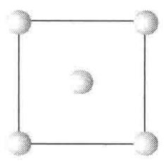  
(100)

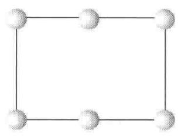  
(110)

  
(111)

【8.20】金属锂晶体属立方晶系，(100)点阵面的间距为350 pm，晶体密度为0.53 g cm $^{-3}$ ，从晶胞中包含的原子数目判断，该晶体属何种点阵型式？(Li的相对原子质量为6.941。)

解 金属锂的立方晶胞参数为

$$
a = d _ {(1 0 0)} = 3 5 0 \mathrm{pm}
$$

设每个晶胞中的锂原子数为 $Z$ ，则

$$
Z = \frac {0 . 5 3 \mathrm{gcm} ^ {- 3} \times (3 5 0 \times 1 0 ^ {- 1 0} \mathrm{cm}) ^ {3}}{6 . 9 4 1 \mathrm{gmol} ^ {- 1} \times (6 . 0 2 2 \times 1 0 ^ {2 3} \mathrm{mol} ^ {- 1}) ^ {- 1}} = 1. 9 7 \approx 2
$$

立方晶系晶体的点阵型式有简单立方、体心立方和面心立方3种，而对立方晶系的金属晶体（除Po外），可能的点阵型式只有面心立方和体心立方两种。若为前者，则一个晶胞中应至少有4个原子。由此可知，金属锂晶体属于体心立方点阵。

【8.21】灰锡为金刚石型结构，晶胞中包含8个Sn原子，晶胞参数a=648.9 pm。

(1) 写出晶胞中 8 个 Sn 原子的分数坐标；

(2) 计算 Sn 的原子半径；

(3) 灰锡的密度为 $5.75 \, g cm^{-3}$ ，求 Sn 的相对原子质量；

（4）白锡属四方晶系， $a = 583.2\mathrm{pm},c = 318.1\mathrm{pm}$ ，晶胞中含4个Sn原子，通过计算说明由白锡转变为灰锡，体积是膨胀了还是收缩了；

(5) 白锡中 Sn---Sn 间最短距离为 302.2 pm, 试对比灰锡数据, 估计哪一种锡的配位数高?

## 解

(1) 晶胞中 8 个锡原子的分数坐标分别为

$$
0, 0, 0; \frac {1}{2}, \frac {1}{2}, 0; \frac {1}{2}, 0, \frac {1}{2}; 0, \frac {1}{2}, \frac {1}{2}; \frac {3}{4}, \frac {1}{4}, \frac {1}{4}; \frac {1}{4}, \frac {3}{4}, \frac {1}{4}; \frac {1}{4}, \frac {1}{4}, \frac {3}{4}; \frac {3}{4}, \frac {3}{4}, \frac {3}{4}
$$

(2) 灰锡的原子半径为

$$
r _ {\mathrm{Sn(灰)}} = \frac {\sqrt {3}}{8} a = \frac {\sqrt {3}}{8} \times 6 4 8. 9 \mathrm{pm} = 1 4 0. 5 \mathrm{pm}
$$

（3）设锡的摩尔质量为 M，灰锡的密度为 $D_{\mathrm{Sn(灰)}}$ ，晶胞中的原子数为 Z，则

$$
\begin{array}{r l} M & = \frac {D _ {\mathrm{Sn(灰)}} a ^ {3} N _ {\mathrm{A}}}{Z} = \frac {5 . 7 5 \mathrm{gcm} ^ {- 3} \times (6 4 8 . 9 \times 1 0 ^ {- 1 0} \mathrm{cm}) ^ {3} \times 6 . 0 2 2 \times 1 0 ^ {2 3} \mathrm{mol} ^ {- 1}}{8} \\ & = 1 1 8. 3 \mathrm{gmol} ^ {- 1} \end{array}
$$

即锡的相对原子质量为 118.3，和元素周期表所列数值 118.7 相近。

(4) 由题意, 白锡的密度为

$$
\begin{array}{r l} D _ {\mathrm{Sn(白)}} & = \frac {4 M}{a ^ {2} c N _ {\mathrm{A}}} = \frac {4 \times 1 1 8 . 7 \mathrm{gmol} ^ {- 1}}{(5 8 3 . 2 \times 1 0 ^ {- 1 0} \mathrm{cm}) ^ {2} \times (3 1 8 . 1 \times 1 0 ^ {- 1 0} \mathrm{cm}) \times 6 . 0 2 2 \times 1 0 ^ {2 3} \mathrm{mol} ^ {- 1}} \\ & = 7. 2 8 \mathrm{gcm} ^ {- 3} \end{array}
$$

可见，由白锡转变为灰锡，密度减小，即体积膨胀了。

(5) 灰锡中 Sn---Sn 间最短距离为

$$
2 r _ {\mathrm{Sn(灰)}} = 2 \times 1 4 0. 5 \mathrm{pm} = 2 8 1. 0 \mathrm{pm}
$$

小于白锡中 Sn---Sn 间最短距离,由此可推断,白锡中原子的配位数高。

【8.22】有一黄铜合金含 Cu 75%, Zn 25%(质量分数), 晶体的密度为 $8.5 \, g cm^{-3}$ 。晶体属立方面心点阵结构, 晶胞中含 4 个原子。Cu 的相对原子质量为 63.5, Zn 为 65.4。

(1) 求算 Cu 和 Zn 所占的原子百分数；

(2) 计算每个晶胞中含合金的质量；

(3) 计算晶胞体积；

(4) 计算统计原子的原子半径。

## 解

（1）设合金中 Cu 的原子分数（即摩尔分数）为 x，则 Zn 的原子分数（即摩尔分数）为 1 - x，由题意知

$$
6 3. 5 x: 6 5. 4 (1 - x) = 0. 7 5: 0. 2 5
$$

解之，得

$$
x = 0. 7 5 5, \quad 1 - x = 0. 2 4 5
$$

所以,该黄铜合金中,Cu 和 Zn 的摩尔分数分别为 75.5% 和 24.5%。

(2) 每个晶胞中含合金的质量为

$$
\begin{array}{r l} & \frac {(0 . 7 5 \times 6 3 . 5 \mathrm{gmol} ^ {- 1} + 0 . 2 5 \times 6 5 . 4 \mathrm{gmol} ^ {- 1}) \times 4}{6 . 0 2 2 \times 1 0 ^ {2 3} \mathrm{mol} ^ {- 1}} \\ & = 4. 2 5 \times 1 0 ^ {- 2 2} \mathrm{g} \end{array}
$$

(3) 晶胞的体积等于晶胞中所含合金的质量除以合金的密度, 即

$$
V = \frac {4 . 2 5 \times 1 0 ^ {- 2 2} \mathrm{g}}{8 . 5 \mathrm{gcm} ^ {- 3}} = 5. 0 \times 1 0 ^ {- 2 3} \mathrm{cm} ^ {3}
$$

(4) 由晶胞的体积可求出晶胞参数:

$$
a = V ^ {\frac {1}{3}} = (5. 0 \times 1 0 ^ {- 2 3} \mathrm{cm} ^ {3}) ^ {\frac {1}{3}} = 3 6 8 \mathrm{pm}
$$

由于该合金属立方面心点阵结构,因而统计原子在晶胞面对角线方向上相互接触,由此可推得统计原子半径为

$$
r = \frac {a}{2 \sqrt {2}} = \frac {3 6 8 \mathrm{pm}}{2 \sqrt {2}} = 1 3 0 \mathrm{pm}
$$

【评注】8.10～8.22题都涉及金属或合金晶体的密度、晶胞参数、原子半径、每个晶胞中的原子数等物理量或结构参数的计算。由解题过程可见，这些计算都是围绕着晶胞进行的。而关键问题有两个：一个是晶胞中的原子数是多少，另一个是晶胞参数和原子半径的关系是什么。搞清楚这两个关键问题，加上正确使用Bragg方程和面间距公式及Avogadro常数，即可较容易地计算出上述各种物理参数。而搞清这两个关键问题必须从了解晶体的结构型式出发。8.8题就A1,A2和A3型晶体的许多结构问题进行了归纳和比较，其中包括两个关键问题。对于A4型结构中的这两个关键问题，读者可以8.21题为例加以了解并掌握。

【8.23】AuCu无序结构属立方晶系，晶胞参数 $a = 385\mathrm{pm}$ [如图8.23(a)]，其有序结构为四

  
(a) 无序的 $\mathrm{Cu}_{1 - x}\mathrm{Au}_x$

  
图8.23  
(b) 有序CuAu结构

方晶系[如图8.23(b)]。若合金结构由(a)转变为(b)时,晶胞大小看作不变,请回答:

(1) 无序结构的点阵型式和结构基元；

（2）有序结构的点阵型式、结构基元和原子分数坐标；

（3）用波长 154 pm 的 X 射线拍粉末图，计算上述两种结构可能在粉末图中出现的衍射线的最小衍射角( $\theta$ )。

解

(1) 无序结构的点阵型式为面心立方, 结构基元为 $Cu_{1-x}Au_{x}$ , 即一个统计原子。

(2) 有序结构的点阵型式为简单四方, 结构基元为 $\mathrm{CuAu}$ , 上述所示的四方晶胞 [图 8.23(b)] 可进一步划分成两个简单四方晶胞, 相当于两个结构基元。取图 8.23(b) 中面对角线的 $1/2$ 为新的简单四方晶胞的 $a$ 轴和 $b$ 轴, 而 $c$ 轴按图 8.23(b) 不变, 在新的简单四方晶胞图

$$
\mathrm{Au:0,0,0;Cu:} \frac {1}{2}, \frac {1}{2}, \frac {1}{2}
$$

（3）无序结构的点阵型式既为面心立方，它的最小衍射指标应为111，因此最小衍射角为

$$
\begin{array}{r l} \theta_ {1 1 1} & = \arcsin \theta_ {1 1 1} = \arcsin \left[ \frac {\lambda}{2 a} (1 ^ {2} + 1 ^ {2} + 1 ^ {2}) ^ {\frac {1}{2}} \right] \\ & = \arcsin \left(\frac {1 5 4 \mathrm{pm} \times \sqrt {3}}{2 \times 3 8 5 \mathrm{pm}}\right) = \arcsin 0. 3 4 6 4 \\ & = 2 0. 3 ^ {\circ} \end{array}
$$

  
图8.23(c)

有序结构属四方晶系,其面间距公式为

$$
d _ {h k l} = \left(\frac {h ^ {2} + k ^ {2}}{a ^ {2}} + \frac {l ^ {2}}{c ^ {2}}\right) ^ {- \frac {1}{2}}
$$

根据 Bragg 方程, 最小衍射角对应于最大衍射面间距, 即对应于最小衍射指标平方和。最小衍射指标平方和为 1。因此, 符合条件的衍射可能为 100,010 和 001。但有序结构的点阵型式为简单四方, c > a, 因此符合条件的衍射只有 001。最小衍射角 $\theta_{001}$ 可按下式计算:

$$
\begin{array}{r l} \sin \theta_ {0 0 1} & = \lambda / 2 d _ {0 0 1} = \lambda / 2 c = 1 5 4 \mathrm{pm} / 2 \times 3 8 5 \mathrm{pm} \\ & = 0. 2 0 0 \\ \theta_ {0 0 1} & = 1 1. 5 ^ {\circ} \end{array}
$$

【8.24】 $\alpha$ -Fe 和 $\gamma$ -Fe 分别属于体心立方堆积 (bcp) 和面心立方堆积 (ccp) 两种晶型。前者的原子半径为 $124.1 \mathrm{pm}$ ，后者的原子半径为 $127.94 \mathrm{pm}$ 。

(1) 对 $\alpha-Fe:$

(a) 下列“衍射指标”中哪些不出现？
110,200,210,211,220,221,310,222,321,…,521。

(b) 计算最小 Bragg 角对应的衍射面间距；

(c) 写出使晶胞中两种位置的 Fe 原子重合的对称元素的名称、记号和方位。

$$
\gamma - \mathrm{Fe}
$$

(a) 指出密置层的方向；

(b) 指出密置层的结构基元中形成的三角形空隙的数目和原子数目；

(c) 计算二维堆积密度；

(d) 计算两种铁的密度之比。

解（1）（a）体心的衍射指标要求指标之和为偶数，即 $h + k + l =$ 偶数。所以210,221两个衍射不可能出现。

(b) 最小角度的衍射指标为 110。

$$
d _ {1 1 0} = a / \sqrt {1 ^ {2} + 1 ^ {2}} = a / \sqrt {2}
$$

半径为 r 的原子进行体心密堆积, $a=4r/\sqrt{3}$ 。

$$
a = 4 \times 1 2 4. 1 \mathrm{pm} / \sqrt {3} = 2 8 6. 6 \mathrm{pm}
$$

$$
d _ {1 1 0} = 2 8 6. 6 \mathrm{pm} / \sqrt {2} = 2 0 2. 7 \mathrm{pm}
$$

(c) 晶胞中两种位置上 Fe 原子的坐标为 0,0,0; $\frac{1}{2}$ , $\frac{1}{2}$ , $\frac{1}{2}$ 。

(i) 和 c 轴平行， $(x,y)$ 坐标为 $(1/4,1/4)$ 的 $2_{1}$ 轴。

(ii) 和(001)面平行, z 坐标为 1/4 的 n 滑移面。

均可使晶胞中的两个 Fe 原子重合。

(2) (a) 密置层和(111)面平行。

（b）密置层的结构基元为1个Fe原子，即其素晶胞包含1个Fe原子。晶胞中含三角形空隙2个，即结构基元为1个Fe原子和2个三角形空隙。

(c) 密置层的二维堆积密度为

$$
\frac {\mathrm{原子所占面积}}{\mathrm{六方素晶胞的面积}} = \frac {\pi r ^ {2}}{(2 r) ^ {2} \sin 6 0 ^ {\circ}} = 0. 9 0 6
$$

(d) 若面心立方堆积以下标 F 表示, 体心立方堆积以下标 I 表示, 则

$$
\frac {D _ {\mathrm{F}}}{D _ {\mathrm{I}}} = \frac {4 M / N _ {\mathrm{A}} V _ {\mathrm{F}}}{2 M / N _ {\mathrm{A}} V _ {\mathrm{I}}} = \frac {2 V _ {\mathrm{I}}}{V _ {\mathrm{F}}} = \frac {2 a _ {\mathrm{I}} ^ {3}}{a _ {\mathrm{F}} ^ {3}} = \frac {2 (2 8 6 . 6 \mathrm{pm}) ^ {3}}{(4 r / \sqrt {2}) ^ {3}} = \frac {2 (2 8 6 . 6 \mathrm{pm}) ^ {3}}{(3 6 1 . 9 \mathrm{pm}) ^ {3}} = 0. 9 9 3
$$

【8.25】某新型超导晶体由镁、镍和碳3种元素组成，镁原子和镍原子一起作立方最密堆积，形成有序结构（即无统计原子）。结构中有两种八面体空隙，一种完全由镍原子构成，另一种由镍原子和镁原子共同构成，两种八面体的数量比为1:3，碳原子只填充在由镍原子构成的八面体空隙中。

(1) 推断该晶体的结构, 并画出该晶体的一个正当晶胞, 写出原子在晶胞中的坐标位置;

(2) 写出该新型超导晶体的化学式；

(3) 指出该晶体的空间点阵型式；

(4) 写出两种八面体空隙中心的坐标参数。

## 解

（1）面心立方最密堆积结构可划出立方面心晶胞，该晶胞含4个原子。按题意该晶胞是由 $\mathrm{Mg}$ 和Ni两种原子组成。Ni原子参加组成的八面体多于 $\mathrm{Mg}$ 原子，由它的比例可推断晶胞中 $\mathrm{Mg}$ 只有1个，Ni有3个。在这种结构中， $\mathrm{Mg}$ 应处于原点，Ni则处于面心。原子分数坐

  
图8.25

标分别为： $\mathrm{Mg}(0,0,0)$ ; Ni(1/2,1/2,0;1/2,0,1/2;0,1/2,1/2); C 原子(1/2,1/2,1/2)，如图 8.25 所示。

(2) 该新型超导晶体的化学式为 $MgNi_{3}C$ 。

(3) 该晶体的空间点阵型式为简单立方(cP)。

(4) 两种八面体空隙中心的坐标参数如下:

由 $\mathrm{Mg}$ 和Ni共同组成的八面体空隙中心的位置坐标为：(1/2,0,0); (0,1/2,0); (0,0,1/2)。

只由 Ni 单独组成的八面体空隙中心的位置坐标为： $(1/2,1/2,1/2)$ 。

# 第 9 章 离子化合物的结构化学

内容提要

## 9.1 离子晶体的若干简单结构型式

许多离子晶体的结构可按密堆积结构来理解。一般负离子半径较大，可把负离子看作等径圆球进行密堆积，而正离子有序地填在空隙之中。例如，NaCl 晶体的结构可看作 $Cl^{-}$ 离子按立方最密堆积， $Na^{+}$ 离子填在全部的八面体空隙之中；立方 ZnS 晶体的结构可看作 $S^{2-}$ 按立方最密堆积， $Zn^{2+}$ 填在一半四面体空隙中，填隙时互相间隔开，使填隙四面体不会出现共面连接或共边连接；六方 ZnS 晶体的结构可看作 $S^{2-}$ 按六方最密堆积， $Zn^{2+}$ 填在一半四面体空隙之中；CsCl 的晶体结构可看作 $Cl^{-}$ 按简单立方堆积， $Cs^{+}$ 填在立方体空隙之中形成；NiAs 晶体的结构可看作 $As^{3-}$ 按六方最密堆积， $Ni^{3+}$ 填在全部八面体空隙之中。有时也可将结构看作正离子进行密堆积，负离子作填隙原子，例如 $CaF_{2}$ 晶体结构可看作 $Ca^{2+}$ 进行立方最密堆积， $F^{-}$ 填在全部四面体空隙之中。

## 9.2 离子键和点阵能

离子键是正、负离子之间的静电作用力，其强弱可用点阵能的大小表示。点阵能是指在0 K时，1 mol离子化合物中的正、负离子，由相互远离的气态结合成离子晶体时所释放出的能量。

点阵能可根据离子晶体中离子的电荷、离子的排列等结构数据计算得到。由于离子间存在静电库仑力和短程排斥力，库仑力异号相互吸引、同号相互排斥，作用能和距离 r 成反比；短程排斥作用能和距离高次方成反比。在晶体中，带电荷为 $(Z_{+})e$ 的正离子和带电荷为 $(Z_{-})e$ 的负离子按照一定的规律排列，根据晶体中正、负离子排列的几何关系及离子间的静电作用能，推引出计算离子晶体点阵能 U 的公式，对碱金属卤化物还可用一经验参数 $\rho=0.31\times10^{-10}$ m 来简化点阵能的计算，即

$$
U = - \frac {e ^ {2} A N _ {\mathrm{A}}}{4 \pi \varepsilon_ {0} r} \left(1 - \frac {\rho}{r}\right)
$$

式中 $N_{A}$ 为 Avogadro 常数， $\varepsilon_{0}$ 为真空电容率，e 为电子电荷，A 为 Madelung 常数，它由晶体结构型式决定。例如，NaCl 型晶体 A=1.7476，NaCl 晶体的 $r=2.8197\times10^{-10}$ m，代入这些数，算得 $U=-766\ kJ\ mol^{-1}$ 。

精确计算点阵能,还要考虑色散能和零点能等各种其他能的相互作用。

点阵能不能由实验直接测定,但可通过实验,利用 Born-Haber 循环测定升华热、电离能、解离能、电子亲和能及生成热等数值,根据内能是状态函数性质计算出点阵能。

根据点阵能的计算值和由 Born-Haber 循环间接测定值相符合,说明离子晶体中作用力的本质是静电力。

点阵能的数据有多方面的应用,例如:(1)估算电子亲和能,(2)估算质子亲和能,(3)计算离子的溶剂化能,(4)理解化学反应的趋势,(5)估算非球形离子的半径等。

实际的晶体中,单纯的离子键很少。由于离子极化、轨道叠加、电子的离域等多种因素的影响,化学键的性质要偏离典型的离子键、共价键和金属键这3种极限的键型,称为键型变异。键型变异是一种普遍现象,应予以重视和注意。

离子的极化是指离子本身带有电荷,形成一个电场,离子在相互电场作用下,可使电荷分布的中心偏离原子核,而发生电子云变形,出现正负极,故称为极化,离子极化的出现,使离子键向共价键过渡。在 AgX 晶体中,当 $X^{-}$ 由小增大,极化作用增加,促使 AgX 的键型逐步由离子键向共价键过渡,到 $\gamma-AgI$ 就形成以共价键为主的结构。

## 9.3 离子半径

虽然电子在原子核外的分布是连续的,并无明确的界限,但由实验结果表明,可近似地将离子看作具有一定半径的弹性球,2个互相接触的球形离子的半径之和等于2个核间的平衡距离。

利用 X 射线衍射等方法可以很精确地测定正、负离子间的平衡距离,而怎样划分这个距离成为 2 个离子半径,则有不同的方法。

Goldschmidt 等利用大的负离子和小的正离子形成的离子晶体中, 负离子和负离子相互接触的条件, 推得 $O^{2-}$ 半径 132 pm, $F^{-}$ 半径 133 pm, 以此为基础推引出离子半径。

Pauling 根据最外层电子的分布的大小与有效核电荷成反比的条件,由若干晶体的正、负离子的接触距离,用计算屏蔽常数半经验方法推引离子半径,得 $O^{2-}$ 的半径为 140 pm, $F^{-}$ 的半径为 136 pm, 并以此为基础推引出其他离子的半径。

Shannon 等根据离子的配位数、配位多面体的几何构型、离子的自旋状况等条件，按不同条件下的接触距离推引有效离子半径。一套以 $O^{2-}$ 的半径为 140 pm 出发，另一套以 $O^{2-}$ 的半径为 132 pm 出发，得两套有效离子半径。

由于推引离子半径的出发点不同,使用离子半径时宜按同一出发点的数据,本书中用 $O^{2-}$ 半径为 140 pm 的数据。

离子半径的大小有下列变化趋势：

(1) 周期表中同族元素的离子半径随原子序数的增加而增大。

(2) 同一周期元素核外电子数相同的正离子随着正电荷数的增加, 离子半径显著下降。

(3) 同一元素各种价态的离子, 电子数越多, 离子半径越大。

（4）核外电子数相同的负离子对（如 $F^{-}$ 和 $O^{2-}$ ），随着负电价增加，半径略有增加，但增加值不大。

(5) 一种离子出现几种配位数时, 配位数高的离子半径大。

(6) 镧系元素三价正离子的半径, 从 $La^{3+}$ 到 $Lu^{3+}$ 依次下降, 此为镧系收缩效应所引起。

## 9.4 离子配位多面体及其连接规律

为了描述复杂离子化合物的结构,揭示它们的结构规律,通常将正离子周围邻接的负离子所形成的多面体,称为正离子配位多面体。将配位多面体作为结构单元,从它们的连接方式了解晶体的结构。

配位多面体的型式,主要由正、负离子半径比 $(r_{+}/r_{-})$ 的大小决定。如果只考虑离子间的静电作用力,及影响点阵能的几何因素,可推得半径比和配位多面体的结构为

<table><tr><td> $r_{+}/r_{-}$ </td><td>0.225~0.414</td><td>0.414~0.732</td><td>0.732~1.000</td></tr><tr><td>结构</td><td>四面体</td><td>八面体</td><td>立方体</td></tr></table>

在无机化合物中,最重要的配位多面体是四面体和八面体。

Pauling 提出关于离子晶体结构的配位多面体及其连接所遵循的规则, 称为 Pauling 规则, 其内容如下:

(1) 离子配位多面体规则: 这一规则指出, 在正离子周围的负离子形成配位多面体。正、负离子间的距离取决于正、负离子半径之和, 配位数即配位多面体取决于正、负离子半径之比。

（2）离子电价规则：这一规则说明，在一个稳定的离子化合物结构中，每一负离子的电价（绝对值）等于或近乎等于从邻近的正离子至该负离子的各静电键的强度的总和。

（3）离子配位多面体共用顶点、棱边和面的规则：这个规则指明，在一个配位多面体结构中，共边连接和共面连接会使结构的稳定性降低；而正离子的价数越高，配位数越小，这一效应就越显著。

Pauling 规则是定性规则。键价方法则把离子电价进行定量计算, 发展了 Pauling 的电价规则。键价方法指出, 每个原子和周围配位原子间的键价总和等于它的原子价, 称为键价和规则(参看 10.1 节)。

## 9.5 硅酸盐的结构化学

硅酸盐分布广泛,数量极大,约占地壳质量的80%,是非常重要的一类化合物。

硅酸盐结构的基本单位是 $\left[SiO_{4}\right]$ 四面体，四面体共用顶点按各种方式连接形成硅氧骨干，了解骨干的结构型式是了解硅酸盐结构化学的基础。

硅酸盐的结构有下列特点：

（1）除少数例外，硅酸盐中 Si 处在配位数为 4 的 $\left[SiO_{4}\right]$ 四面体中，Si—O 键以共价性为主，键长平均为 162 pm，但因历史原因，常按离子化合物进行讨论。

(2) 在天然硅酸盐中离子相互置换非常广泛而重要。Al 置换 Si 形成硅铝酸盐, 其中 $\left[AlO_{4}\right]$ 的 Al—O 键平均键长为 176 pm。Al 置换 Si, 伴随有正离子加入, 以平衡电荷。Al 也可处于八面体配位 (这时常称为硅氧骨干外的离子) 起平衡电荷作用。

(3) $\left[(\mathrm{Si}, \mathrm{Al})\mathrm{O}_4\right]$ 只能共顶点连接, 而不共边和共面, 而且 2 个 Si—O—Al 的能量要比 1 个 Al—O—Al 和 1 个 Si—O—Si 的能量之和低。

(4) $\left[SiO_{4}\right]$ 四面体的每个顶点上的 O 至多只能共用于 2 个这样的四面体之间， $\angle SiOSi$ 大多数处在 $140^{\circ}$ 附近。

（5）在硅铝酸盐中，硅铝氧骨干外的金属离子容易被其他金属离子置换，置换不同的离子，对骨干的结构影响较小，但对它的性能影响很大。

二氧化硅 $\left(\mathrm{SiO}_{2}\right)$ 可看作一种特殊的硅酸盐,它在不同条件下形成多种多晶型体,其中最常见而重要的是 $\alpha-$ 石英,它具有较强的压电性和旋光性,是重要的工业材料。

硅氧骨干的结构型式是硅酸盐分类的基础,硅酸盐可分为分立型、链形、层形和骨架型四类,各类的结构特点如下:

（1）分立型硅酸盐：结构中含有分立的硅氧骨干，如 $\left[\mathrm{SiO}_{4}\right],\left[\mathrm{Si}_{2} \mathrm{O}_{7}\right],\left[\mathrm{Si}_{3} \mathrm{O}_{9}\right],\left[\mathrm{Si}_{4} \mathrm{O}_{12}\right]$ ， $\left[\mathrm{Si}_{6} \mathrm{O}_{18}\right],\left[\mathrm{Si}_{12} \mathrm{O}_{30}\right]$ 等。含有 $\left[\mathrm{SiO}_{4}\right]$ 的硅酸盐，堆积较密，属于重硅酸盐。

(2) 链形硅酸盐: 有单链和双链两类。单链的特点是每个 $\left[\mathrm{SiO}_{4}\right]$ 四面体共用 2 个顶点, 连成一维无限长链。双链结构中有一部分 $\left[\mathrm{SiO}_{4}\right]$ 四面体共用 3 个顶点互相连接。

(3) 层形硅酸盐: $\left[\mathrm{SiO}_{4}\right]$ 四面体共用 3 个顶点, 由于连接方式的不同, 可形成多种型式的层。层内离子可以置换; 层间的金属离子有多有少, 层间水分子也有多有少; 层间堆积型式可以有序, 也可以无序。所以, 由层形硅酸盐组成的黏土和土壤, 其结构和性质是非常复杂多样的。

(4) 骨架型硅酸盐: 骨架型硅酸盐中 $\left[\mathrm{SiO}_{4}\right]$ 四面体的 4 个顶点都互相连接, 形成三维骨架。长石中硅氧骨干的成分为 $\left[\mathrm{AlSi}_{3} \mathrm{O}_{8}\right]_{n}^{n-}$ , 它是地壳岩石中的主要成分。沸石是含水的骨架型硅铝酸盐, 加热去水后, 形成空旷的硅氧骨架, 有很多孔径均匀的孔道和内表面很大的孔穴, 能起吸附剂作用, 直径比孔道小的分子能进入孔穴, 直径比孔道大的分子被拒之门外, 起筛选分子作用, 故称分子筛, 是重要的化工原料。

离子化合物可在分子筛等作为载体的表面上进行自发单层分散,利用这种效应可制备新型吸附剂。例如,CuCl/分子筛吸附剂对 CO 具有高吸附容量和选择性功能。

## 习题解析

【9.1】MgO 的晶体结构属 NaCl 型，Mg---O 最短距离为 210 pm。

(1) 利用下面公式计算点阵能 U:

$$
U = \frac {A N _ {\mathrm{A}} Z _ {+} Z _ {-} e ^ {2}}{r _ {\mathrm{e}} (4 \pi \varepsilon_ {0})} \Big (1 - \frac {\rho}{r _ {\mathrm{e}}} \Big) \qquad (\rho = 0. 3 1 \times 1 0 ^ {- 1 0} \mathrm{m})
$$

(2) O 原子的第二电子亲和能 $Y_{2}$ (即 $O^{-} + e^{-} \longrightarrow O^{2-}$ 的能量) 不能直接在气相中测定, 试利用下列数据及(1)中得到的点阵能数据, 按 Born-Haber 循环求算:

$$
\begin{array}{l l} \mathrm {O^ {-} (g)} \longrightarrow \mathrm {O(g)+ e^ {-}} & 1 4 1. 8 \mathrm {kJ mo l ^ {- 1}} \\ \mathrm {O_ {2} (g)} \longrightarrow 2 \mathrm {O(g)} & 4 9 8. 4 \mathrm {kJ mo l ^ {- 1}} \\ \mathrm {Mg(s)} \longrightarrow \mathrm {Mg(g)} & 1 4 6. 4 \mathrm {kJ mo l ^ {- 1}} \\ \mathrm {Mg(g)} \longrightarrow \mathrm {Mg^ {+} (g)+ e^ {-}} & 7 3 7. 7 \mathrm {kJ mo l ^ {- 1}} \\ \mathrm {Mg^ {+} (g)} \longrightarrow \mathrm {Mg^ {2 + } (g)+ e^ {-}} & 1 4 5 0. 6 \mathrm {kJ mo l ^ {- 1}} \\ \mathrm {Mg(s) + \frac {1}{2} O_ {2} \longrightarrow MgO(s)} & - 6 0 1. 2 \mathrm {kJ mo l ^ {- 1}} \end{array}
$$

解

$$
\begin{array}{r l} U & = \frac {A N _ {\mathrm{A}} Z _ {+} Z _ {-} e ^ {2}}{4 \pi \varepsilon_ {0} r _ {\mathrm{e}}} \left(1 - \frac {\rho}{r _ {\mathrm{e}}}\right) \\ & = \frac {1 . 7 4 7 6 \times 6 . 0 2 2 \times 1 0 ^ {2 3} \mathrm{mol} ^ {- 1} \times 2 \times (- 2) \times (- 1 . 6 0 2 \times 1 0 ^ {- 1 9} \mathrm{C}) ^ {2}}{4 \times 3 . 1 4 \times 8 . 8 5 4 \times 1 0 ^ {- 1 2} \mathrm{C} ^ {2} \mathrm{J} ^ {- 1} \mathrm{m} ^ {- 1} \times 2 1 0 \times 1 0 ^ {- 1 2} \mathrm{m}}. \\ & \left(1 - \frac {0 . 3 1 \times 1 0 ^ {- 1 0} \mathrm{m}}{2 1 0 \times 1 0 ^ {- 1 2} \mathrm{m}}\right) \\ & = - 3 9 4 3 \mathrm{kJ} \mathrm{mol} ^ {- 1} \end{array} \tag {1}
$$

(2) 为便于书写, 在下列 Born-Haber 循环中略去了各物理量的单位——kJ mol $^{-1}$ 。

$$
\begin{array}{r l} - 6 0 1. 2 \mathrm {kJ mol^ {- 1}} & = (1 4 6. 4 + 7 3 7. 7 + 1 4 5 0. 6 + 2 4 9. 2 \\ & - 1 4 1. 8 - 3 9 4 3) \mathrm {kJ mol^ {- 1}} + Y _ {2} \\ & Y _ {2} = 8 9 9. 7 \mathrm {kJ mol^ {- 1}} \end{array}
$$

$$
\begin{array}{c} \mathrm {Mg(s)+ \frac {1}{2} O_ {2} (g)} \xrightarrow {- 6 0 1 . 2} \mathrm{MgO(s)} \\ \downarrow \\ 1 4 6. 4 \quad \downarrow \\ \mathrm{Mg(g)} \quad \mathrm{O(g)} \\ \downarrow \\ 7 3 7. 7 \quad \downarrow \\ \mathrm {M g ^ {+} (g)} \quad \mathrm {O ^ {-} (g)} \\ \downarrow \\ 1 4 5 0. 6 \quad \downarrow \\ \mathrm {M g ^ {2 + } (g)+ O ^ {2 - } (g)} \end{array}
$$

【9.2】写出下列 NaCl 型晶体点阵能大小的次序及依据的原理：CaO，NaBr，SrO，ScN，KBr，BaO。

解 晶体点阵能的计算公式可写为

$$
U = \frac {A N _ {\mathrm{A}} e ^ {2}}{4 \pi \varepsilon_ {0}} \Big (1 - \frac {1}{m} \Big) \times \frac {Z _ {+} Z _ {-}}{r _ {\mathrm{e}}}
$$

由于题中所论晶体同属 NaCl 型, 因而它们的 Madelung 常数 A 相同, 而 Born 指数 m 差别也不大, 所以点阵能大小主要取决于 $\frac{Z_{+}Z_{-}}{r_{0}}$ 。

将所论晶体分为3组：

$$
\mathrm{ScN}; \mathrm{CaO}, \mathrm{SrO}, \mathrm{BaO}; \mathrm{NaBr}, \mathrm{KBr}
$$

第二组中3个氧化物正、负离子的电价都相同，但离子半径从 $Ca^{2+}$ 到 $Ba^{2+}$ 依次增大，因而键长从CaO到BaO依次增大，所以点阵能绝对值从CaO到BaO依次减小。根据同样的道理，第三组中两个溴化物点阵能的绝对值大小次序为NaBr>KBr。ScN和CaO相比，前者的键长大于后者，但差别不是很大，而前者的电价却比后者大很多，因而前者的点阵能绝对值比后者大。BaO和NaBr相比，前者电价大而键长小，因而其点阵能绝对值大于后者。

综上所述，6种晶体点阵能大小次序为

$$
\mathrm{ScN} > \mathrm{CaO} > \mathrm{SrO} > \mathrm{BaO} > \mathrm{NaBr} > \mathrm{KBr}
$$

【9.3】已知离子半径： $Ca^{2+}$ 99 pm, $Cs^{+}$ 182 pm, $S^{2-}$ 184 pm, $Br^{-}$ 195 pm, 若立方晶系 CaS 和 CsBr 晶体均服从离子晶体的结构规则，请判断这两种晶体的正、负离子的配位数，配位多面体型式，负离子的堆积方式及晶体的结构型式。

解 由已知数据计算出两种晶体的正、负离子的半径比 $r_{+} / r_{-}$ ，根据半径比即可判断正离子的配位数 $\mathrm{CN}_{+}$ 、配位多面体的型式和负离子的堆积方式。由正离子的配位数和晶体的组成即可判断负离子的配位数 $\mathrm{CN}_{-}\left(\mathrm{CN}_{-} = \mathrm{CN}_{+} \times \frac{\text{正离子数}}{\text{负离子数}}\right)$ 。根据上述结果和已知的若干简单离子晶体的结构特征，即可判断 CaS 和 CsBr 的结构型式。兹将结果列表如下：

<table><tr><td></td><td> $r_{+}/r_{-}$ </td><td> $CN_{+}$ </td><td> $CN_{-}$ </td><td>配位多面体型式</td><td>负离子堆积方式</td><td>结构型式</td></tr><tr><td>CaS</td><td>0.538</td><td>6</td><td>6</td><td>正八面体</td><td>立方最密堆积</td><td>NaCl型</td></tr><tr><td>CsBr</td><td>0.933</td><td>8</td><td>8</td><td>立方体</td><td>简单立方堆积</td><td>CsCl型</td></tr></table>

【9.4】已知 $Ag^{+}$ 和 $I^{-}$ 离子半径分别为 115 和 220 pm，若碘化银结构完全遵循离子晶体结构规律， $Ag^{+}$ 的配位数应为多少？实际上在常温下 AgI 的结构中， $Ag^{+}$ 的配位数是多少？为什么？

解 按题中给出的数据, $Ag^{+}$ 和 $I^{-}$ 的离子半径之比为 115 pm/220 pm=0.523。若 AgI 的结构完全遵循离子晶体的结构规律,则 $Ag^{+}$ 的配位数应该为 6,配位多面体应该为八面体。但实际上,在室温下 AgI 晶体中 $Ag^{+}$ 的配位数为 4,配位多面体为四面体。其原因在于离子的极化引起了键型的变异,从而导致了结构型式的改变。

$\mathrm{Ag^{+}}$ 的半径较小且价层轨道中含有d电子，因而极化能力较强，而 $\mathrm{I}^{-}$ 的半径较大，极化率较大即容易被极化。因此，AgI晶体中存在着较大程度的离子间极化，这使得AgI晶体产生了一系列有别于其他 $\mathrm{AgX}$ 晶体的结构效应。

离子的极化作用,导致电子云变形,使正、负离子间在静电作用的基础上增加了额外的相互作用,引起键型变异。就 AgX 晶体而言,从 AgF 到 AgI,键型由离子键逐渐向共价键过渡。事实上,AgI 已经以共价键为主。键能和点阵能增加,键长缩短。AgI 晶体中 Ag—I 键键长为 281 pm,已经接近 Ag 和 I 的共价半径之和 286 pm。

离子的极化不仅影响化学键的性质,而且也影响晶体的结构型式。它往往引起离子的配位数降低,配位多面体偏离对称性较高的正多面体,使晶体从对称性较高的结构型式向对称性较低的结构型式(有时甚至有层形、链形或岛形)过渡。AgF, AgCl 和 AgBr 晶体都属于 NaCl 型,而 AgI 属于立方 ZnS 型。在 AgI 晶体中, $Ag^{+}$ 的配位数不是 6 而是下降为 4,配位多面体不是八面体而是四面体。

实际上,本题中所给出的离子半径数据是配位数为6时的数据。

【9.5】 $NH_{4}Cl$ 晶体为简单立方点阵结构，晶胞中包含1个 $NH_{4}^{+}$ 和1个 $Cl^{-}$ ，晶胞参数a=387 pm。

(1) 若 $NH_{4}^{+}$ 因热运动而呈球形, 试画出晶胞结构示意图;

(2) 已知 $Cl^{-}$ 半径为 181 pm, 求球形 $NH_{4}^{+}$ 的半径;

(3) 计算晶体密度；

(4) 计算平面点阵族(110)相邻两点阵面的间距；

(5) 用 Cu Kα 射线进行衍射, 计算衍射指标 330 的衍射角 (θ);

(6) 若 $NH_{4}^{+}$ 不因热运动而转动, H 为有序分布, 请讨论晶体所属的点群。

  
图9.5(a)

解

(1) 晶胞结构示于图 9.5(a)。

（2）设球形 $NH_{4}^{+}$ 和 $Cl^{-}$ 的半径分别为 $r_{NH_{4}^{+}}$ 和 $r_{Cl^{-}}$ ，由于两离子在晶胞体对角线方向上接触，因而有

$$
2 (r _ {\mathrm{NH} _ {4} ^ {+}} + r _ {\mathrm{Cl} ^ {-}}) = \sqrt {3} a
$$

$$
\begin{array}{r l} r _ {\mathrm {NH_ {4} ^ {+}}} & = \frac {1}{2} \sqrt {3} a - r _ {\mathrm {C l^ {-}}} = \frac {1}{2} \sqrt {3} \times 3 8 7 \mathrm{pm} - 1 8 1 \mathrm{pm} \\ & = 1 5 4 \mathrm{pm} \end{array}
$$

(3) 晶体的密度为

$$
\begin{array}{r l} D = \frac {Z M}{a ^ {3} N _ {\mathrm{A}}} & = \frac {5 3 . 4 9 \mathrm{g} \mathrm{mol} ^ {- 1}}{(3 8 7 \times 1 0 ^ {- 1 0} \mathrm{cm}) ^ {3} \times 6 . 0 2 2 \times 1 0 ^ {2 3} \mathrm{mol} ^ {- 1}} \\ & = 1. 5 3 \mathrm{g} \mathrm{cm} ^ {- 3} \end{array}
$$

(4) (110) 点阵面的面间距为

(5)

$$
\begin{array}{r l} d _ {(1 1 0)} & = a (h ^ {2} + k ^ {2} + l ^ {2}) ^ {- \frac {1}{2}} = 3 8 7 \mathrm{pm} \times (1 ^ {2} + 1 ^ {2} + 0 ^ {2}) ^ {- \frac {1}{2}} \\ & = 2 7 4 \mathrm{pm} \\ \sin \theta & = \frac {\lambda}{2 d _ {h k l}} = \frac {\lambda}{2 a} \sqrt {h ^ {2} + k ^ {2} + l ^ {2}} \end{array}
$$

代入已知数据,得

$$
\begin{array}{r l} \sin \theta_ {3 3 0} & = \frac {1 5 4 . 2 \mathrm{pm}}{2 \times 3 8 7 \mathrm{pm}} \sqrt {3 ^ {2} + 3 ^ {2} + 0 ^ {2}} = 0. 8 4 5 \\ \theta_ {3 3 0} & = 5 7. 7 ^ {\circ} \end{array}
$$

也可根据 $d_{hkl} = \frac{1}{n} d_{(hkl)}$ 直接由(4)中已算出的 $d_{(110)}$ 求出 $d_{330}$ （这里 $n = 3$ ），代入 $\sin \theta = \frac{\lambda}{2d_{330}}$ ，进而求出 $\theta_{330}$ 。

(6) 若把 $NH_{4}^{+}$ 看作球形离子，则 $NH_{4}Cl$ 晶体属于 $O_{h}$ 点群，若 $NH_{4}^{+}$ 不因热运动而转动，则不能简单地把它看作球形离子。此时 4 个 H 原子按四面体方向有序地分布在立方晶胞的体对角线上 [见图 9.5(b)]， $NH_{4}Cl$ 晶体不再具有 $C_{4}$ 轴和对称中心等对称元素，只保留了 3 个 $I_{4}$ ，4 个 $C_{3}$ 和 6 个 $\sigma$ 。因此，其对称性降低，不再属于 $O_{h}$ 点群而属于 $T_{d}$ 点群。

图 9.5(b)

【9.6】NaH 具有 NaCl 型结构。已知晶胞参数 $a=488\ pm$ , $Na^{+}$ 半径为 102 pm, 推算负离子 $H^{-}$ 的半径。根据下述反应, 阐明 $H^{-}$ 的酸碱性。

$$
\mathrm{NaH} + \mathrm{H} _ {2} \mathrm{O} \longrightarrow \mathrm{H} _ {2} \uparrow + \mathrm{NaOH}
$$

解 由于 NaH 具有 NaCl 型结构, 因而 $Na^{+}$ 的半径 $r_{Na^{+}}$ , $H^{-}$ 的半径 $r_{H^{-}}$ 及晶胞参数 a 有如下关系:

$$
\begin{array}{r l} & 2 (r _ {\mathrm{Na} ^ {+}} + r _ {\mathrm{H} ^ {-}}) = a \\ & r _ {\mathrm{H} ^ {-}} = \frac {1}{2} a - r _ {\mathrm{Na} ^ {+}} = \frac {1}{2} \times 4 8 8 \mathrm{pm} - 1 0 2 \mathrm{pm} = 1 4 2 \mathrm{pm} \end{array}
$$

NaH 水解生成 $H_{2}$ 和 NaOH，说明 $H^{-}$ 接受质子的能力比 $OH^{-}$ 强，即 NaH 的碱性比 NaOH 的碱性还强。

【9.7】第三周期元素氟化物的熔点从 $SiF_{4}$ 开始突然下降(见下表)，试从结构观点予以分析、说明。

<table><tr><td>化合物</td><td>NaF</td><td> $MgF_{2}$ </td><td> $AlF_{3}$ </td><td> $SiF_{4}$ </td><td> $PF_{5}$ </td><td> $SF_{6}$ </td></tr><tr><td>熔点/°C</td><td>993</td><td>1261</td><td>1291</td><td>-90</td><td>-83</td><td>-50.5</td></tr></table>

解 NaF 和 $MgF_{2}$ 都是典型的离子晶体，分属于 NaCl 型和金红石型。 $AlF_{3}$ 晶体中虽然由于 $Al^{3+}$ 的价态较高、半径较小而存在着一定程度的离子极化，但它仍属于离子晶体。晶体中正、负离子间有较强的静电作用，故 3 种晶体的熔点都较高。

虽然 3 种离子晶体分属于不同的结构型式, Madelung 常数有差别, 但影响它们点阵能大小的主要因素是离子的电价和离子键的长度。从 NaF 到 $AlF_{3}$ , 正离子的电价逐渐增高而半径逐渐减小, 因而点阵能逐渐增大, 致使晶体的熔点逐渐升高。

随着正离子电价的进一步升高和半径的进一步减小,极化能力进一步增强,从而使化合物的键型和构型都发生了变化。从 $SiF_{4}$ 开始的 3 个氟化物已不是离子化合物了。原子间靠共价键结合形成分子,分子间靠范德华力结合形成晶体。由于范德华力比离子键弱得多,因而这后 3 个氟化物的熔点大大降低。

从 $\mathrm{SiF}_4$ 到 $\mathrm{SF}_6$ 熔点逐渐略有升高，是因为分子间作用力（主要是色散力）略有增大所致。【9.8】经X射线分析鉴定，某一离子晶体属于立方晶系，其晶胞参数 $a = 403.1\mathrm{pm}$ 。晶胞中顶点位置为 $\mathrm{Ti}^{4+}$ 所占，体心位置为 $\mathrm{Ba}^{2+}$ 所占，所有棱心位置为 $\mathrm{O}^{2-}$ 所占。请据此回答或计算：

(1) 用分数坐标表达诸离子在晶胞中的位置；

(2) 写出此晶体的化学式；

(3) 指出晶体的点阵型式、结构基元和点群；

(4) 指出 $Ti^{4+}$ 的氧配位数与 $Ba^{2+}$ 的氧配位数；

(5) 计算两种正离子半径值( $O^{2-}$ 半径为140 pm);

(6) 检验此晶体是否符合电价规则, 判断此晶体中是否存在分立的配离子基团;

(7) $Ba^{2+}$ 和 $O^{2-}$ 联合组成哪种型式的堆积？

(8) $O^{2-}$ 的配位情况怎样?

解

(1) $\mathrm{Ti}^{4+}: 0, 0, 0$ $\mathrm{Ba}^{2+}: \frac{1}{2}, \frac{1}{2}, \frac{1}{2}$ $\mathrm{O}^{2-}: \frac{1}{2}, 0, 0; 0, \frac{1}{2}, 0; 0, 0, \frac{1}{2}$

(2) 一个晶胞中的 $\mathrm{Ba}^{2+}$ 数为 1, $\mathrm{Ti}^{4+}$ 数为 $8 \times \frac{1}{8} = 1$ , $\mathrm{O}^{2-}$ 数为 $12 \times \frac{1}{4} = 3$ 。所以晶体的化学组成为 $\mathrm{BaTiO}_{3}$ [由 (1) 中各离子分数坐标的组数也可知道一个晶胞中各种离子的数目]。

（3）晶体的点阵型式为简单立方，一个晶胞即一个结构基元，晶体属于 $O_{h}$ 点群。

(4) $Ti^{4+}$ 的氧配位数为 6, $Ba^{2+}$ 的氧配位数为 12。

(5) 在晶胞的棱上, $Ti^{4+}$ 和 $O^{2-}$ 互相接触, 因而

$$
r _ {\mathrm{Ti} ^ {4 +}} = \frac {1}{2} a - r _ {\mathrm{O} ^ {2 -}} = \frac {1}{2} \times 4 0 3. 1 \mathrm{pm} - 1 4 0 \mathrm{pm} = 6 1. 6 \mathrm{pm}
$$

$\mathrm{Ba}^{2+}$ 和 $\mathrm{O}^{2-}$ 在高度为 $\frac{1}{2} a$ 且平行于立方晶胞的面对角线方向上互相接触，因而 $\mathrm{Ba}^{2+}$ 的半径为

$$
\begin{array}{r l} r _ {\mathrm{Ba} ^ {2 +}} & = \frac {1}{2} \sqrt {2} a - r _ {\mathrm{O} ^ {2 -}} = \frac {1}{2} \sqrt {2} \times 4 0 3. 1 \mathrm{pm} - 1 4 0 \mathrm{pm} \\ & = 1 4 5 \mathrm{pm} \end{array}
$$

(6) Ti—O 键的静电键强度为 $\frac{4}{6} = \frac{2}{3}$ ，Ba—O 键的静电键强度为 $\frac{2}{12} = \frac{1}{6}$ 。 $O^{2-}$ 周围全部静电键强度之和为 $\frac{2}{3} \times 2 + \frac{1}{6} \times 4 = 2$ ，等于 $O^{2-}$ 的电价（绝对值）。所以， $BaTiO_{3}$ 晶体符合电价规则。晶体不存在分离的配离子基团。

(7) $Ba^{2+}$ 和 $O^{2-}$ 联合组成立方最密堆积, 只是两种离子的半径不同而已。

(8) 实际上, 在(6)中已经表明: $\mathrm{O}^{2-}$ 的钛配位数为 2, $\mathrm{O}^{2-}$ 的钡配位数为 4。这 6 个配位

原子形成变形的(压扁的)八面体。

【9.9】具有六方 ZnS 型结构的 SiC 晶体，其晶胞参数为 $a=308\ pm, c=505\ pm$ ; 已知 C 原子的分数坐标 $(0,0,0;2/3,1/3,1/2)$ 和 Si 原子的分数坐标 $(0,0,5/8;2/3,1/3,1/8)$ 。请回答或计算下列问题：

(1) 按比例清楚地画出这个六方晶胞；

(2) 晶胞中含有几个 SiC?

(3) 画出点阵型式,说明每个点阵点代表什么?

(4) Si 作什么型式的堆积, C 填在什么空隙中?

(5) 计算 Si—C 键键长。

## 解

(1) SiC 六方晶胞的轴比 $c/a=505\ pm/308\ pm=1.64$ , Si 原子和 C 原子的共价半径分别为 117 pm 和 77 pm, 参照这些数据和原子的坐标参数, 画出 SiC 的六方晶胞如图 9.9(a) 所示。

  
(a)

  
(b)  
图9.9

(2) 一个晶胞含有的 C 原子数为 $4\left(\frac{1}{12} + \frac{2}{12}\right)$ (顶点原子) + 1 (晶胞内原子) = 2, Si 原子数为 $\left(2 \times \frac{1}{3} + 2 \times \frac{1}{6}\right)$ (棱上原子) + 1 (晶胞内原子) = 2。所以 1 个 SiC 六方晶胞中含 2 个 SiC。

（3）点阵型式为简单六方[图9.9(b)]，每个点阵点代表2个SiC，即2个SiC为1个结构基元。

（4）Si 原子作六方最密堆积，C 原子填在由 Si 原子围成的四面体空隙中。Si 原子数与四面体空隙数之比为 1:2（见习题 8.8），而 C 原子数与 Si 原子数之比为 1:1，所以 C 原子数与四面体空隙数之比为 1:2，即 C 原子只占据 50% 的空隙。

(5) 由(1)中的晶胞图可见, Si—C 键键长为

$$
\left(1 - \frac {5}{8}\right) c = \frac {3}{8} \times 5 0 5 \mathrm{pm} = 1 8 9 \mathrm{pm}
$$

【评注】本题在计算 Si—C 键长时利用了 Si 原子和 C 原子的特殊坐标参数, 计算起来简单方便。对于原子无特殊坐标参数的情况, 要按求晶胞中两原子间距离的公式计算。在计算时, 必须确认两原子是键连原子还是非键连原子。

【9.10】说明硅酸盐结构的共同特征。

解 硅酸盐结构的基本单位是 $\left[\mathrm{SiO}_{4}\right]$ 四面体。这些四面体互相共用顶点连接成各种各样的结构型式。 $\left[\mathrm{SiO}_{4}\right]$ 四面体每个顶点上的 $\mathrm{O}^{2-}$ 至多只能为两个四面体共用，符合 Pauling 电价规则。一般说来，Si 原子处在四面体的中心，键长、键角的平均值为： $d_{\mathrm{Si-O}} = 162 \mathrm{pm}, \angle \mathrm{OSiO} = 109.5^{\circ}, \angle \mathrm{SiOSi} \approx 140^{\circ}$ 。

由于 $Al^{3+}$ 的大小和 $Si^{4+}$ 相近， $Al^{3+}$ 可以或多或少、无序或有序地置换硅酸盐中的 $Si^{4+}$ ，形成硅铝酸盐。此时 Al 原子处在 $[AlO_{4}]$ 四面体中，和 Si 一起组成硅铝氧骨干。 $Al^{3+}$ 置换 $Si^{4+}$ 后，骨架中带有一定负电荷，需要骨架外引入若干正离子以补偿电荷，其中包括一部分处在配位八面体中的 $Al^{3+}$ 。

在硅铝酸盐中， $\left[\left(\mathrm{Si},\mathrm{Al}\right)\mathrm{O}_{4}\right]$ 只共顶点连接，而且2个Si—O—Al的能量低于Al—O—Al和Si—O—Si能量的和。四面体的连接方式决定了硅铝氧骨干的结构型式，而硅铝氧骨干的结构型式又决定了硅铝酸盐的类型。根据硅铝氧骨干的结构型式，可将硅铝酸盐分为分立型、链形、层形和骨架型。

在硅铝酸盐中,硅铝氧骨干外的金属离子容易被其他金属离子置换,置换后骨干的结构变化不大,但对硅铝酸盐的性质影响很大。这一点对于分子筛骨干外金属离子的交换反应尤其重要。

【9.11】 $Al^{3+}$ 为什么能部分置换硅酸盐中的硅？置换后对硅酸盐组成有何影响？

解 从离子半径分析, $Al^{3+}$ 的 Pauling 离子半径为 50 pm, $Si^{4+}$ 为 41 pm, $O^{2-}$ 为 140 pm。 $Al^{3+}$ 和 $O^{2-}$ 与 $Si^{4+}$ 和 $O^{2-}$ 的 $r_{+}/r_{-}$ 都处在 0.225\~0.414 的范围, 应形成四面体配位结构。两种正离子电价分别为 +3 和 +4 价, 都比较高, 用 $Al^{3+}$ 置换 $Si^{4+}$ , 不会引起结构上的大变化。实际上 Si—O 键以共价性为主, Si 用 $sp^{3}$ 杂化轨道和 O 原子成键; Al—O 键也以共价性为主, 成键情况也相似。所以在硅酸盐中, 铝能部分地置换硅。

铝置换硅后,为了保持硅酸盐的电中性,必须引进其他正离子,如 $Na^{+}, K^{+}, Ca^{2+}$ 和 $Mg^{2+}$ 等,共同组成硅铝酸盐。这在组成上可以有很大的可变性,形成多种多样的硅酸盐。

【9.12】说明离子晶体结构的 Pauling 规则的内容。

解 离子晶体结构的 Pauling 规则包括以下三方面内容：

（1）关于离子配位多面体性质的规则：在正离子周围形成了负离子配位多面体。正、负离子间的距离取决于正、负离子的半径之和，正离子的配位数和配位多面体型式则取决于正、负离子的半径比。几种主要的配位多面体、正离子的配位数，以及相应的正、负离子半径比的最小值列于下表。

<table><tr><td>配位多面体</td><td>配位数</td><td> $\frac{r_{+}}{r_{-}}$ 最小值</td></tr><tr><td>三角形</td><td>3</td><td>0.155</td></tr><tr><td>四面体</td><td>4</td><td>0.225</td></tr><tr><td>八面体</td><td>6</td><td>0.414</td></tr><tr><td>立方体</td><td>8</td><td>0.732</td></tr><tr><td>立方八面体</td><td>12</td><td>1.000</td></tr></table>

(2) 关于一个多面体顶点为几个多面体共用的规则, 又称作电价规则。该规则指出, 在一个稳定的离子化合物结构中,每一负离子的电价等于或近乎等于从邻近正离子至该负离子的各静电键强度的总和,即

$$
Z _ {-} = \sum_ {i} S _ {i} = \sum_ {i} \frac {(Z _ {+}) _ {i}}{(\mathrm{CN} _ {+}) _ {i}}
$$

式中 $Z_{-}$ 为负离子的电价， $(Z_{+})_{i}$ 为正离子的电价， $(\mathrm{CN}_{+})_{i}$ 为正离子的配位数， $S_{i}$ 为静电键强度。

电价规则规定了共用同一配位多面体顶点的多面体数目,或者说解决了一个负离子与几个正离子相连的问题。因此,根据电价规则可判断在晶体中是否存在分立的配离子基团(见9.8题)。这对于分析多元离子晶体的结构很有帮助,因为在多元离子晶体中一个负离子可与若干个种类不同的正离子相连。

根据电价规则,可为二元离子晶体建立正、负离子的配位数比与电价比间的关系。而根据电荷平衡原理,电价比与组成比成反比,因此,配位数比、电价比、组成比三者之间的关系就沟通了。这对于由正、负离子的半径比推求负离子的配位数,以及根据负离子的堆积方式和化合物的组成,推求正离子占据多面体空隙的分类大有帮助。三者的关系如下:

$$
\frac {\mathrm{CN} _ {-}}{\mathrm{CN} _ {+}} = \frac {Z _ {-}}{Z _ {+}} = \frac {n _ {+}}{n _ {-}}
$$

式中 $CN_{+}$ 和 $CN_{-}$ 分别是正、负离子的配位数， $Z_{+}$ 和 $Z_{-}$ 分别是正、负离子的电价， $n_{+}$ 和 $n_{-}$ 分别是正、负离子的数目。

(3) 关于离子配位多面体共用顶点、棱边和面的规则: 在离子晶体中, 配位多面体共边连接和共面连接会使结构的稳定性降低。正离子的价态越高、配位数越小, 这一效应就越显著。

离子晶体结构的稳定性降低主要是由正离子间的库仑斥力引起的。当正离子的配位多面体共边连接时，正离子之间的距离缩短，斥力增大，导致晶体结构稳定性降低。当配位多面体共面连接时，正离子间的距离更短，斥力更大，晶体结构更不稳定。对价态较高的正离子来说尤其如此。

将这一规则的含义引申,可得到如下推论:在含有几种正离子的晶体中,价态高而配位数小的正离子,趋向于彼此间不共用多面体的几何元素。

Pauling 规则在阐明离子晶体的结构和性能中起重要作用,特别是电价规则。但它是个定性规则。近年来提出的键价法,用原子间的距离和经验参数定量地计算晶体中每个原子的键价,用以解释和预测复杂晶体的结构和性能,发展了 Pauling 的电价规则。

【9.13】回答下列有关A型分子筛的问题：

(1) 写出 3A,4A,5A 型分子筛的化学组成表达式及其用途;

(2) 最大孔窗由几个 Si 原子和几个 O 原子围成?

(3) 最大孔穴(笼)是什么笼? 直径大约多大?

(4) 简述筛分分子的机理。

## 解

（1）分子筛是一种天然或人工合成的泡沸石型硅铝酸盐晶体。已发现的天然沸石有40余种，主要是丝光沸石、斜发沸石、方沸石和钙十字沸石等。人工合成的沸石计有100余种，其中A型、X型、Y型和ZSM型分子筛已在工业生产和科学研究中发挥着重要作用。

人工合成的 A 型、X 型和 Y 型等分子筛的化学组成可用通式 $\mathrm{M}_{r}\left[\mathrm{Al}_{p}\mathrm{Si}_{q}\mathrm{O}_{2(p+q)}\right]\cdot m\mathrm{H}_{2}\mathrm{O}$ 表示。由该通式可见， $\mathrm{Al}^{3+}$ 和 $\mathrm{Si}^{4+}$ 的数目之和为 $\mathrm{O}^{2-}$ 数的一半，这表明这几类分子筛都具有骨架型结构。在一般情况下， $\mathrm{Al}^{3+}$ 数比 $\mathrm{Si}^{4+}$ 数小。若 $\mathrm{Al}^{3+}$ 数超过 $\mathrm{Si}^{4+}$ 数，则会在结构中出现 $[\mathrm{AlO}_4]$ 四面体直接相连的情况，由于 $\mathrm{Al}-\mathrm{O}$ 静电键强度小于 $\mathrm{Si}-\mathrm{O}$ 静电键强度，这会削弱骨架强度。通常，为使分子筛热稳定性好、耐酸性强，总是希望硅铝比高些。化学通式中的M是骨架外的金属离子。为保持分子筛呈电中性，若M是一价离子，则 $r=p$ ，即在骨架中引入一个 $\mathrm{Al}^{3+}$ 代替 $\mathrm{Si}^{4+}$ ，则在骨架外就引入一个一价正离子。若M为二价离子，则 $r=p/2$ ，等等。

A型分子筛主要有3种，即3A,4A和5A型分子筛。4A型分子筛是A型分子筛钠盐，属于立方晶系，晶胞参数 $a = 2464\mathrm{pm}$ ，晶胞的组成为 $\mathrm{Na}_{96}[\mathrm{Al}_{96}\mathrm{Si}_{96}\mathrm{O}_{384}]\cdot 216\mathrm{H}_2\mathrm{O}$ 。若不考虑 $\mathrm{Al}^{3 + }$ 和 $\mathrm{Si}^{4 + }$ 位置的差别，则可划分出体积只有原晶胞体积1/8（即晶胞参数只有原晶胞参数的1/2）、组成为 $\mathrm{Na}_{12}[\mathrm{Al}_{12}\mathrm{Si}_{12}\mathrm{O}_{48}]\cdot 27\mathrm{H}_2\mathrm{O}$ 的“假”晶胞。这种A型分子筛的有效孔径[见(2)小题]约 $4\mathring{\mathrm{A}} (1\mathring{\mathrm{A}} = 10\mathrm{nm})$ ，故称为4A型分子筛或NaA型分子筛。若用 $\mathbf{K}^+$ 代替 $\mathbf{Na}^+$ ，由于 $\mathbf{K}^+$ 的半径比 $\mathrm{Na}^+$ 的半径大，分子筛的有效孔径减小至 $3\mathring{\mathrm{A}}$ 左右，称为3A型分子筛或KA型分子筛，其化学组成为 $\mathrm{K}_{12}[\mathrm{Al}_{12}\mathrm{Si}_{12}\mathrm{O}_{48}]\cdot 27\mathrm{H}_2\mathrm{O}$ 。当用 $\mathrm{Ca^{2 + }}$ 取代 $\mathrm{Na}^+$ 时，由于 $\mathrm{Ca^{2 + }}$ 的电价是 $\mathrm{Na}^+$ 的2倍，因而 $\mathrm{Ca^{2 + }}$ 的数目是被其取代的 $\mathrm{Na}^+$ 数目的一半。而 $\mathrm{Ca^{2 + }}$ 的半径和 $\mathrm{Na}^+$ 的半径相近，它优先占据六元环的位置。当晶胞中约有2/3的 $\mathrm{Na}^+$ 被取代时，八元环不再为骨架外的离子所占，这使分子筛八元环的有效孔径增大至约 $5\mathring{\mathrm{A}}$ ，称为5A型分子筛或CaA型分子筛，其典型组成为 $\mathrm{Ca_4Na_4[Al_{12}Si_{12}O_{48}]}\cdot 27\mathrm{H}_2\mathrm{O}$ 。

分子筛已在工业生产和科学研究中发挥着重要作用。5A 分子筛可用于石油脱蜡，使油品凝固点降低，分离出的正烷烃可作为洗涤剂原料。它还可用于气体或液体的深度干燥及气体的纯化。也可用来分离甲烷、乙烷和丙烷。4A 分子筛是制备 5A 分子筛和 3A 分子筛的原料，它可用于气体和液体的深度干燥和纯化。3A 分子筛用于深度干燥乙烯和丙烯等气体。分子筛对水的吸附能力很强，吸附容量很大，可将空气中水的含量从 $4 \times 10^{-3}$ 降至 $1 \times 10^{-5}$ 。此外，A 型分子筛不潮解、不膨胀、不腐蚀、不污染、可再生，是理想的吸附剂、干燥剂和分离剂，某些 A 型分子筛还可作为一些化学反应的催化剂。

（2）将一正八面体分别沿着垂直于 $C_4$ 轴的方向削去顶角，所得到的多面体称为立方八面体。削去6个顶点得到6个四边形，而原来的8个三角形都变成了六边形，所以立方八面体是一个十四面体，有24个顶点、36条棱，可看作由立方体和八面体围聚而成。

在分子筛结构中，硅(铝)氧四面体通过顶点上的 $\mathrm{O}^{2-}$ 互相连接形成环，环上的四面体再通过顶点上的 $\mathrm{O}^{2-}$ 互相连接形成三维骨架。在骨架中形成了许多多面体空穴，常称为“笼”。A型分子筛就是由立方八面体笼、 $\alpha$ 笼和立方体笼构成的。立方八面体笼又称为 $\beta$ 笼或方钠石笼，其几何结构特征可用上述的立方八面体模拟。笼的平均有效直径为 $660~\mathrm{pm}$ ，有效体积约 $4.1\times 10^{-18}~\mathrm{cm}^3$ 。

将 $\beta$ 笼放在立方体的8个顶点上，笼和笼通过立方体相连，则8个 $\beta$ 笼相连后形成一个 $\alpha$ 笼，此即A型分子筛的结构[见图9.13(a)]。 $\alpha$ 笼是一个二十六面体，由12个四元环、8个六元环和6个八元环组成，共有48个顶点、72条棱。

A 型分子筛的最大窗口是八元环,由 8 个硅(铝)氧四面体构成。八元环包含 8 个硅(铝)离子和 8 个氧离子。该八元环的有效孔径约为 420 pm。若把环看成正多边形,则八元环的直

径可按图 9.13(b) 估算。

  
(a)

  
(b)  
图9.13

$$
\begin{array}{r l} \mathrm {AB = 2(r_ {\mathrm{Si} ^ {4 + }} + r_ {\mathrm{O} ^ {2 - }})\sin \frac {109.5^{\circ}}{2} = 2(26pm + 138pm)sin54.75^{\circ}} \\ & = 2 6 7. 9 \mathrm{pm} \\ \mathrm {BC = AB\times\sin \frac {180^{\circ} - 109.5^{\circ}}{2} = 267.9pm\times\sin35.25^{\circ}} \\ & = 1 5 4. 6 \mathrm{pm} \\ \mathrm {CC^{\prime} = AA^{\prime} = 2AD = 2AB\sin(90^{\circ} - 35.25^{\circ})} \\ & = 2 \times 2 6 7. 9 \mathrm{pm} \times \sin 5 4. 7 5 ^ {\circ} \\ & = 4 3 7. 6 \mathrm{pm} \\ \mathrm {BB^{\prime} = 2BC + CC^{\prime} = 2\times154.6pm + 437.6pm} \\ & = 7 4 6. 8 \mathrm{pm} \end{array}
$$

所以八元环的直径为

$$
\mathrm{BB} ^ {\prime} - 2 r _ {\mathrm{O} ^ {2 -}} = 7 4 6. 8 \mathrm{pm} - 2 \times 1 4 0 \mathrm{pm} \approx 4 6 7 \mathrm{pm}
$$

（3）如前所述，8个β笼通过立方体互相连接形成α笼。它是A型分子筛最大的空穴，平均有效直径为1140 pm，有效体积为 $4.4 \times 10^{-16} \, cm^{3}$ 。

（4）脱水后的分子筛具有空旷的骨架型结构，在结构中有许多孔径均匀的通道和排列整齐、内表面很大的空穴。孔径大小数量级与一般分子相当，它只允许直径比孔径小的分子进入，直径比孔径大的分子被拒之门外，从而将大小、形状不同的分子分开，起筛分分子的作用，故而得名。

【9.14】已知氧化铁 $Fe_{x}O$ （富氏体）为氯化钠型结构，在实际晶体中，由于存在缺陷，x<1。今有一批氧化铁，测得其密度为 $5.71\,g\,cm^{-3}$ ，用 Mo Kα 射线 ( $\lambda=71.07\,pm$ ) 测得其衍射指标为 200 的衍射角 $\theta=9.56^{\circ}(\sin\theta=0.1661,\mathrm{Fe})$ 的相对原子质量为 55.85）。

(1) 计算 $Fe_{x}O$ 的正当晶胞参数；

(2) 求 x;

(3) 计算 $Fe^{2+}$ 和 $Fe^{3+}$ 各占总铁量的质量分数；

(4) 写出标明铁的价态的化学式。

解

$$
\begin{array}{r l} & (1) a = \frac {\lambda}{2 \sin \theta} \sqrt {h ^ {2} + k ^ {2} + l ^ {2}} = \frac {7 1 . 0 7 \mathrm{pm}}{2 \sin 9 . 5 6 ^ {\circ}} \sqrt {2 ^ {2} + 0 ^ {2} + 0 ^ {2}} \\ & \qquad = 4 2 7. 8 \mathrm{pm} \\ & (2) D = \frac {4 M}{a ^ {3} N _ {\mathrm{A}}} \\ & \qquad M = \frac {1}{4} a ^ {3} D N _ {\mathrm{A}} = \frac {1}{4} \times (4 2 7. 9 \times 1 0 ^ {- 1 0} \mathrm{cm}) ^ {3} \times 5. 7 1 \mathrm{gcm} ^ {- 3} \times 6. 0 2 2 \times 1 0 ^ {2 3} \mathrm{mol} ^ {- 1} \\ & \qquad = 6 7. 3 5 \mathrm{gmol} ^ {- 1} \\ & \qquad M = 5 5. 8 5 \mathrm{gmol} ^ {- 1} \times x + 1 6. 0 0 \mathrm{gmol} ^ {- 1} = 6 7. 3 5 \mathrm{gmol} ^ {- 1} \\ & \qquad x = 0. 9 2 \end{array}
$$

（3）设 0.92 mol 铁中 $Fe^{2+}$ 的摩尔数为 y，则 $Fe^{3+}$ 的摩尔数为 $(0.92-y)$ ，根据正负离子电荷平衡原则可得

$$
\begin{array}{r l} 2 y + 3 (0. 9 2 - y) & = 2 \\ y & = 0. 7 6 \\ 0. 9 2 - y & = 0. 1 6 \end{array}
$$

即 $Fe^{2+}$ 和 $Fe^{3+}$ 的摩尔数分别为 0.76 和 0.16，它们在总铁中的摩尔分数分别为

$$
\frac {0 . 7 6}{0 . 9 2} = 82.6 \% \quad \text{和} \quad \frac {0 . 1 6}{0 . 9 2} = 17.4
$$

(4) 富氏体氧化铁的化学式为

$$
\mathrm{Fe} _ {0. 7 6} ^ {\mathrm{II}} \mathrm{Fe} _ {0. 1 6} ^ {\mathrm{III}} \mathrm{O}
$$

【9.15】NiO 晶体为 NaCl 型结构, 将它在氧气中加热, 部分 $Ni^{2+}$ 被氧化为 $Ni^{3+}$ , 成为 $Ni_{x}O$ (x<1)。今有一批 $Ni_{x}O$ , 测得其密度为 $6.47\ g\ cm^{-3}$ , 用波长 $\lambda=154\ pm$ 的 X 射线通过粉末法测得立方晶胞 111 衍射指标的 $\theta=18.71^{\circ}(\sin\theta=0.3208, Ni$ 的相对原子质量为 58.70)。

(1) 计算 $Ni_{x}O$ 的立方晶胞参数；

(2) 算出 x, 写出标明 Ni 的价态的化学式;

（3）在 $Ni_{x}O$ 晶体中， $O^{2-}$ 的堆积方式怎样？Ni 在此堆积中占据哪种空隙？占有率（即占有分数）是多少？

(4) 在 $Ni_{x}O$ 晶体中, Ni---Ni 间最短距离是多少?

解

(1) $Ni_{x}O$ 的立方晶胞参数为

$$
\begin{array}{r l} a & = \frac {\lambda}{2 \sin \theta} \sqrt {h ^ {2} + k ^ {2} + l ^ {2}} = \frac {1 5 4 \mathrm{pm}}{2 \sin 1 8 . 7 1 ^ {\circ}} \sqrt {1 ^ {2} + 1 ^ {2} + 1 ^ {2}} \\ & = \frac {1 5 4 \mathrm{pm}}{2 \times 0 . 3 2 0 8} \sqrt {3} = 4 1 6 \mathrm{pm} \end{array}
$$

(2) 因为 $Ni_{x}O$ 晶体为 NaCl 型结构, 可得摩尔质量 M:

$$
\begin{array}{r l} M & = \frac {1}{4} D a ^ {3} N _ {\mathrm{A}} \\ & = \frac {1}{4} \times 6. 4 7 \mathrm{gcm} ^ {- 3} \times (4 1 6 \times 1 0 ^ {- 1 0} \mathrm{cm}) ^ {3} \times 6. 0 2 2 \times 1 0 ^ {2 3} \mathrm{mol} ^ {- 1} \\ & = 7 0. 1 \mathrm{gmol} ^ {- 1} \end{array}
$$

而 $\mathrm{Ni}_x\mathrm{O}$ 的摩尔质量又可表示为

$$
M = 5 8. 7 0 \mathrm{g} \mathrm{mol} ^ {- 1} \times x + 1 6. 0 0 \mathrm{g} \mathrm{mol} ^ {- 1} = 7 0. 1 \mathrm{g} \mathrm{mol} ^ {- 1}
$$

由此解得：x=0.92。

设 0.92 mol 镍中有 y mol Ni $^{2+}$ ，则有 $(0.92-y)$ mol Ni $^{3+}$ 。根据正负离子电荷平衡原则，有

$$
\begin{array}{r l} 2 y + 3 (0. 9 2 - y) & = 2 \\ y & = 0. 7 6 \\ 0. 9 2 - y & = 0. 1 6 \end{array}
$$

所以该氧化镍晶体的化学式为

$$
\mathrm{Ni} _ {0. 7 6} ^ {\mathrm{II}} \mathrm{Ni} _ {0. 1 6} ^ {\mathrm{III}} \mathrm{O}
$$

(3) $Ni_{0.76}^{II}Ni_{0.16}^{III}O$ 晶体既为 NaCl 型结构，则 $O^{2-}$ 的堆积方式与 NaCl 晶体中 $Cl^{-}$ 的堆积方式相同，即为立方最密堆积。镍离子占据由 $O^{2-}$ 围成的八面体空隙。而镍离子的占有率为 92%。

(4) 镍离子分布在立方晶胞的体心和棱心上, Ni---Ni 间最短距离即体心上和任一棱心上 2 个镍离子间的距离, 等于

$$
\frac {1}{2} \sqrt {a ^ {2} + a ^ {2}} = \frac {\sqrt {2}}{2} a = \frac {\sqrt {2}}{2} \times 4 1 6 \mathrm{pm} = 2 9 4 \mathrm{pm}
$$

Ni---Ni 间最短距离也等于处在交于同一顶点的 2 条棱中心上的 2 个镍离子间的距离, 即

$$
\sqrt {\left(\frac {a}{2}\right) ^ {2} + \left(\frac {a}{2}\right) ^ {2}} = \frac {a}{\sqrt {2}} = \frac {4 1 6 \mathrm{pm}}{\sqrt {2}} = 2 9 4 \mathrm{pm}
$$

【9.16】从 NaCl 晶体结构出发,考虑下列问题:

(1) 除去其中全部 $Cl^{-}$ ，剩余 $Na^{+}$ 是何种结构型式？

(2) 沿垂直三重轴方向抽去一层 $Na^{+}$ ，保留一层 $Na^{+}$ ，是何种结构型式？

解 离子晶体的结构可理解为在静电力作用下的非等径圆球的密堆积结构, 即半径较大的负离子作某种型式的密堆积, 半径较小的正离子按一定比例填充在由负离子围成的多面体空隙中。

（1）在 NaCl 晶体结构中， $Na^{+}$ 占据由 $Cl^{-}$ 围成的正八面体空隙，占据该类空隙的比率为 1。若把结构中的 $Na^{+}$ 全部除去，则剩余的 $Cl^{-}$ 按立方最密堆积；同样，若把结构中的 $Cl^{-}$ 全部除去，则剩余的 $Na^{+}$ 构成的结构型式也是立方最密堆积。可由图 9.16 得到说明。

图 9.16 是在 NaCl 晶体的正当晶胞的基础上画出来的，图中的大球代表 Cl⁻，小球代表 Na⁺。交汇于顶点 M 的 3 条棱中心上的 Na⁺ 所处的密置层为 A，交汇于顶点 N 的 3 条棱中心上的 Na⁺ 所处的密置层为 C，而在其他 6 条棱中心和体心上的 Na⁺ 所处的密置层为 B。这些密置层都垂直于图中所示的 C₃ 轴，它们沿着 C₃ 轴的重复方式为 ABCABC…，即除去 Cl⁻ 后 Na⁺ 按立方最密堆积。

  
图9.16

（2）若沿垂直于三重轴方向抽去一层 $Na^{+}$ ，保留一层 $Na^{+}$ ，则形成的结构为 $CdCl_{2}$ 型。这是一种层形结构，层形分子沿垂直于层的方向堆积。 $Cl^{-}$ 仍按立方最密堆积，正离子填入八面体空隙中。若用 A, B, C 代表 $Cl^{-}$ ，用 a, b, c 代表正离子，则重复周期可写为 $\left|A\square BaC\square AcB\square Cb\right|$ 。【9.17】 $Ag_{2}O$ 属立方晶系晶体，Z=2，原子分数坐标为

$$
\begin{array}{r l} \text { Ag: } & 1 / 4, 1 / 4, 1 / 4; 3 / 4, 3 / 4, 1 / 4; 3 / 4, 1 / 4, 3 / 4; 1 / 4, 3 / 4, 3 / 4; \\ \text { O: } & 0, 0, 0; 1 / 2, 1 / 2, 1 / 2. \end{array}
$$

(1) 若把 Ag 放在晶胞原点, 请重新标出原子分数坐标;

(2) 说明 Ag 和 O 的配位数和配位型式；

(3) 晶体属于哪个点群?

解

(1) Ag: 0, 0, 0; $\frac{1}{2}$ , $\frac{1}{2}$ , 0; $\frac{1}{2}$ , 0, $\frac{1}{2}$ ; 0, $\frac{1}{2}$ , $\frac{1}{2}$ 。即把原来各组分数坐标分别减去 $\frac{1}{4}$ 。
O: $\frac{1}{4}$ , $\frac{1}{4}$ , $\frac{1}{4}$ ; $\frac{3}{4}$ , $\frac{3}{4}$ , $\frac{3}{4}$ 。即把原来各组分数坐标分别加上 $\frac{1}{4}$ 。

(2) Ag 原子的配位数为 2, 配位型式为直线形。O 原子的配位数为 4, 配位型式为四面体。

(3) $Ag_{2}O$ 晶体属 $T_{d}$ 点群。

【9.18】一种高温超导体 $\left[\mathrm{YBa}_{2}\mathrm{Cu}_{3}\mathrm{O}_{7-x}(x\approx0.2)\right]$ 属正交晶系。空间群为Pmmm；晶胞参数为a=381.87pm,b=388.33pm,c=1166.87pm。晶胞中原子坐标参数如下表所示：

<table><tr><td>原子</td><td>x</td><td>y</td><td>z</td></tr><tr><td>Y</td><td>1/2</td><td>1/2</td><td>1/2</td></tr><tr><td>Ba</td><td>1/2</td><td>1/2</td><td>0.1844</td></tr><tr><td>Cu(1)</td><td>0</td><td>0</td><td>0</td></tr><tr><td>Cu(2)</td><td>0</td><td>0</td><td>0.3554</td></tr><tr><td>O(1)</td><td>0</td><td>1/2</td><td>0</td></tr><tr><td>O(2)</td><td>1/2</td><td>0</td><td>0.3788</td></tr><tr><td>O(3)</td><td>0</td><td>1/2</td><td>0.3771</td></tr><tr><td>O(4)</td><td>0</td><td>0</td><td>0.1579</td></tr></table>

试按比例画出晶胞的大小及晶胞中原子的分布,并和立方晶系的 $BaTiO_{3}$ 结构(9.8题)对比,指出它们之间有哪些异同。

  
图9.18

解 根据题中所给数据, 画出 $YBa_{2}Cu_{3}O_{7-x}(x \approx 0.2)$ 晶体的晶胞示意图如图 9.18。

虽然 $YBa_{2}Cu_{3}O_{7-x}(x\approx0.2)$ 晶体属于正交晶系，但是其结构可从立方晶系的 $BaTiO_{3}$ 晶体结构出发加以理解。立方 $BaTiO_{3}$ 晶体属于钙钛矿 $(CaTiO_{3})$ 型结构（见 9.8 题），这种结构型式可看作氧化物超导材料晶体结构的基本单元。这些单元通过不同的堆叠方式组合成多种型式的氧化物超导相的晶体结构。由于存在着原子的空隙、置换以及位移等因素，氧化物超导体的结构与钙钛矿型结构有许多差异，下面以 $YBa_{2}Cu_{3}O_{7-x}(x\approx0.2)$ 晶体和立方 $BaTiO_{3}$ 晶体为例作一简要说明。

立方 $BaTiO_{3}$ 晶体和 $YBa_{2}Cu_{3}O_{7-x}(x\approx0.2)$ 晶体的周期性和对称性都不同。前者属于立方晶系，空间群为 $O_{h}^{1}-Pm3m$ ；后者属于正交晶系，空间群为 $D_{2h}^{1}-Pmmm$ 。

两种晶体中离子的配位数及配位型式也不同。在立方 $BaTiO_{3}$ 晶体中， $Ti^{4+}$ 的氧配位数为 6，配位多面体为正八面体； $Ba^{2+}$ 的氧配位数为 12。在 $YBa_{2}Cu_{3}O_{7-x}(x\approx0.2)$ 晶体中， $Ba^{2+}$ 的氧配位数为 10； $Y^{3+}$ 的氧配位数为 8，配位多面体呈四方柱形； $Cu^{2+}$ 的氧配位数为 5，配位多面体为四方锥； $Cu^{3+}$ 的氧配位数为 4，配位多面体呈平面四方形。

此外,两种晶体中 $O^{2-}$ 的配位情况、晶胞大小以及晶体的密度等也不同。

氧化物高温超导体是结构比较复杂的一类化合物。其超导性主要取决于下面的结构特征：

（1）氧化物超导体均含有混合价态的正离子。例如，在 $YBa_{2}Cu_{3}O_{7-x}(x\approx0.2)$ 晶体中，既有 $Cu^{2+}$ ，也有 $Cu^{3+}$ 。根据正、负电荷平衡原理，假定 $Ba^{2+}$ 和 $Y^{3+}$ 不变价，则当 x=0 时， $Cu^{2+}$ 和 $Cu^{3+}$ 的数量比为 2:1；当 x=0.2 时， $Cu^{2+}$ 和 $Cu^{3+}$ 的数量比为 4:1。

（2）一般地，氧化物高温超导体中金属和氧之间的化学键中有较强的共价键成分，这种较强的共价键可提供具有金属性的能带。

（3）正如 $\mathrm{YBa}_2\mathrm{Cu}_3\mathrm{O}_{7 - x}(x\approx 0.2)$ 的晶体结构示意图所表明的，在含 $\mathrm{Cu}$ 氧化物超导体中，常形成组成为 $\mathrm{CuO_2}$ 的网格层，层中 $\mathrm{Cu - O - Cu}$ 近似直线连接。网格层的存在对超导性起重要作用。对组成为 $(\mathrm{B}^{\mathrm{III}})_2(\mathrm{A}^{\mathrm{II}})_2\mathrm{Ca}_{n - 1}\mathrm{Cu}_n\mathrm{O}_{2 + xn}$ （式中B为Bi或Tl，A为Ba或Sr)的一类超导体，连续堆叠的 $\mathrm{CuO_2}$ 网格层的数目 $n$ 愈大，则临界温度 $T_{\mathrm{c}}$ 愈高。

（4）在制备含 Cu 的氧化物超导材料时，常掺杂某些正离子，如 $Ba^{2+}, Y^{3+}, La^{3+}$ 等，其作用可能是促进 $CuO_{2}$ 网格层的形成，增加 Cu—O 键的共价性，并增加高氧化态 $Cu^{III}$ 的稳定性。

【9.19】在 $\beta-TiCl_{3}$ 晶体中， $Cl^{-}$ 作 A3 型密堆积。若按 $Ti^{3+}$ 和 $Cl^{-}$ 的离子半径分别为 78 pm 和 181 pm 计算，则 $Ti^{3+}$ 应占据什么空隙？占据空隙的分数是多少？占据空隙的方式有多少种？

解 离子半径是一个重要的结构参数：在二元离子晶体中，正、负离子的半径之和决定了离子键长度；而正、负离子的半径比决定了正离子的配位数和配位多面体型式。

在 $\beta-TiCl_{3}$ 晶体中， $Cl^{-}$ 堆积成正四面体和正八面体两种空隙。根据所给数据， $Ti^{3+}$ 和 $Cl^{-}$ 的半径比为 $\frac{78\ pm}{181\ pm}=0.431$ ，介于 $0.414\sim0.732$ 之间，所以 $Ti^{3+}$ 应占据正八面体空隙。由于 $Cl^{-}$ 作 A3 型堆积，因而 $Cl^{-}$ 的数目与正八面体空隙的数目之比为 1:1， $Ti^{3+}$ 只占据 1/3 的正八面体空隙。

三氯化钛是烯烃聚合反应中著名的 Ziegler-Natta 催化剂的主要组分。它有 $\alpha, \beta, \gamma, \delta$ 等几种变体，这几种变体的结构不同，在催化反应中的行为也有差异。 $\beta$ -TiCl $_3$ 晶体属于六方晶系，每个晶胞中含 2 个 Ti $^{3+}$ 和 6 个 Cl $^{-}$ 。由上可知，Ti $^{3+}$ 的配位数为 6，根据二元离子晶体中配位数比与组成比成反比的规律可知，Cl $^{-}$ 的配位数为 2。 $\beta$ -TiCl $_3$ 沿着 $c$ 轴方向形成链形分子 (TiCl $_3$ ) $_n$ ，即链分子的伸展方向与由 Cl $^{-}$ 形成的密置层垂直。但由于沿着 $c$ 轴重复方式简单，因而重复周期较小。

【9.20】由于生成条件不同,球形 $C_{60}$ 分子可堆积成不同的晶体结构,如立方最密堆积和六方最密堆积结构。前者的晶胞参数 a=1420 pm; 后者的晶胞参数 a=b=1002 pm, c=1639 pm。

(1) 画出 $C_{60}$ 的 ccp 结构沿四重轴方向的投影图; 并用分数坐标示出分子间多面体空隙中

心的位置(每类多面体空隙中心只写一组坐标即可)。

  
图9.20

(2) 在 $C_{60}$ 的 ccp 和 hcp 结构中, 各种多面体空隙理论上所能容纳的“小球”的最大半径是多少?

(3) $C_{60}$ 分子还可形成非最密堆积结构, 使某些碱金属离子填入多面体空隙, 从而制得超导材料。在 $K_{3}C_{60}$ 所形成的立方面心晶胞中, $K^{+}$ 占据什么多面体空隙? 占据空隙的百分数为多少?

解

(1) $C_{60}$ 分子堆积成的立方最密堆积结构沿四重轴方向的投影图见

图9.20。

四面体空隙中心的分数坐标为： $\frac{1}{4}$ ， $\frac{1}{4}$ ， $\frac{1}{4}$ ； $\frac{1}{4}$ ， $\frac{1}{4}$ ， $\frac{3}{4}$ ； $\frac{3}{4}$ ， $\frac{1}{4}$ ， $\frac{1}{4}$ ； $\frac{3}{4}$ ， $\frac{1}{4}$ ， $\frac{3}{4}$ ； $\frac{1}{4}$ ， $\frac{3}{4}$ ， $\frac{1}{4}$ ； $\frac{1}{4}$ ， $\frac{3}{4}$ ， $\frac{3}{4}$ ； $\frac{3}{4}$ ， $\frac{3}{4}$ ， $\frac{3}{4}$ ； $\frac{3}{4}$ ， $\frac{3}{4}$ ， $\frac{3}{4}$ 。

八面体空隙中心的分数坐标为： $\frac{1}{2}$ ， $\frac{1}{2}$ ， $\frac{1}{2}$ ； $\frac{1}{2}$ ，0，0；0， $\frac{1}{2}$ ，0；0，0， $\frac{1}{2}$ 。

(2) 首先, 由晶体结构参数求出 $C_{60}$ 分子的半径 R。由 hcp 结构的晶胞参数 a 求得

$$
R = \frac {1}{2} a = \frac {1}{2} \times 1 0 0 2 \mathrm{pm} = 5 0 1 \mathrm{pm}
$$

也可由 ccp 结构的晶胞参数求 R, 结果非常接近。

由 $C_{60}$ 分子堆积成的两种最密堆积结构中，四面体空隙和八面体空隙都是相同的。四面体空隙所能容纳的小球的最大半径为

$$
r _ {\mathrm{T}} = 0. 2 2 5 R = 0. 2 2 5 \times 5 0 1 \mathrm{pm} = 1 1 2. 7 \mathrm{pm}
$$

八面体空隙所能容纳的小球的最大半径为

$$
r _ {0} = 0. 4 1 4 R = 0. 4 1 4 \times 5 0 1 \mathrm{pm} = 2 0 7. 4 \mathrm{pm}
$$

（3） $K_{3}C_{60}$ 可视为二元离子晶体，但题中并未给出 $K^{+}$ 的半径值，因此无法根据半径比判断 $K^{+}$ 所占多面体空隙的类型。可从结构中的一些简单数量关系推引出结论。

一个 $\mathrm{K}_3\mathrm{C}_{60}$ 晶胞中共有12个多面体空隙，其中有4个八面体空隙（其中心分别在晶胞的体心和棱心上）、8个四面体空隙（其中心的分数坐标为 $\frac{1}{4},\frac{1}{4},\frac{1}{4}$ ，等等）。而一个晶胞中含4个 $\mathrm{C}_{60}$ 分子，因此，多面体空隙数与 $\mathrm{C}_{60}$ 分子数之比为 $3:1$ 。从晶体的化学式知， $\mathbf{K}^{+}$ 数与 $\mathrm{C}_{60}$ 分子数之比亦为 $3:1$ 。因此， $\mathbf{K}^{+}$ 数与多面体空隙数之比为 $1:1$ ，此即意味着 $\mathrm{K}_3\mathrm{C}_{60}$ 晶体中所有的四面体空隙和八面体空隙皆被 $\mathbf{K}^{+}$ 占据，即 $\mathbf{K}^{+}$ 占据空隙的百分数为 $100\%$ 。

【评注】通过求解9.19题的第二问和9.20题的(3)，可得到如下启示：有些简单离子晶体的结构问题，无需利用具体的参数便可得到解决。这就要求读者熟知并灵活地运用晶体结构的基本概念、原理和规律。在上面两题中，我们只是利用了等径圆球密堆积结构中球数和多面体空隙数的关系，以及晶体中正、负离子的数量关系，便推断出正离子占据多面体空隙的比率。许多读者面对此类问题时往往会发出这样的疑问：“未给出离子半径数据，如何求出结果？”其实，掌握了简单离子晶体中正、负离子间的数量关系和大小关系（例如，二元离子晶体中正、负离子的数量比与它们的电价比成反比，与它们的配位数比也成反比等），沿着诸如上两题的思路和方法处理问题，这样的疑问便不复存在了。

【9.21】Y型分子筛属于立方晶系，空间群为 $O_{h}^{7}-F\frac{4_{1}}{d}\overline{3}\frac{2}{m}$ ，其晶胞参数为a=2460pm，晶胞组成为 $28Na_{2}O\cdot28Al_{2}O_{3}\cdot136SiO_{2}\cdot xH_{2}O$ 。

(1) 说明该分子筛晶体所属的点群和空间点阵型式；

(2) 说明该分子筛晶体的宏观对称元素和特征对称元素；

(3) 计算硅铝比；

(4) 已知该分子筛的密度为 $1.95 \, g \, cm^{-3}$ ，求晶胞中结晶水的数目。

（1）由该分子筛所属的晶系和空间群的记号可知，它属于 $O_{h}$ 点群，空间点阵型式为面心立方。

（2）根据该分子筛晶体所属的点群，可知其宏观对称元素有：3个 $C_{4}$ 轴、4个 $C_{3}$ 轴、6个 $C_{2}$ 轴、6个 $\sigma_{d}$ 、3个 $\sigma_{h}$ 和对称中心i。根据该分子筛晶体所属的晶系，可知其特征对称元素为4个按立方晶胞体对角线取向的 $C_{3}$ 轴。

（3）硅铝比是指分子筛晶体中 $SiO_{2}/Al_{2}O_{3}$ 的比值。硅铝比高的分子筛热稳定性好。Y 型分子筛的硅铝比较高，一般在 3.0～5.0 之间。按题中所给的晶胞组成计算，该 Y 型分子筛的硅铝比为 $136/28 \approx 4.9$ 。

（4）依题意，可得该Y型分子筛晶体的密度 $D$ 、晶胞参数 $a$ 、“晶胞式量”（此处不妨视为晶体的摩尔质量) $M$ 以及Avogadro常数 $N_{\mathrm{A}}$ 之间的关系如下：

$$
\begin{array}{r l} M & = D a ^ {3} N _ {\mathrm{A}} \\ & = 1. 9 5 \mathrm{gcm} ^ {- 3} \times (2 4. 6 \times 1 0 ^ {- 8} \mathrm{cm}) ^ {3} \times 6. 0 2 2 \times 1 0 ^ {2 3} \mathrm{mol} ^ {- 1} \\ & = 1 7 4 8 1. 6 \mathrm{gmol} ^ {- 1} \end{array}
$$

去掉单位即“晶胞式量”，而“晶胞式量”又可表示为

所以

$$
\begin{array}{r l} M & = 2 8 (2 2. 9 9 \times 2 + 1 6. 0 0 + 2 6. 9 8 \times 2 + 1 6. 0 0 \times 3) \\ & \quad + 1 3 6 (2 8. 0 9 + 1 6. 0 0 \times 2) + 1 8. 0 2 x \\ & = 1 2 7 6 2. 6 + 1 8. 0 2 x \\ & \quad 1 7 4 8 1. 6 = 1 2 7 6 2. 6 + 1 8. 0 2 x \\ & \quad x = 2 6 2 \end{array}
$$

即该 Y 型分子筛的一个晶胞中含有 262 个结晶水。

【9.22】 $\alpha$ -MnS 晶体属于立方晶系。用 X 射线粉末法 ( $\lambda = 154.05 \mathrm{pm}$ ) 测得各衍射线 $2\theta$ 如下: $29.60^{\circ}, 34.30^{\circ}, 49.29^{\circ}, 58.56^{\circ}, 61.39^{\circ}, 72.28^{\circ}, 82.50^{\circ}, 92.51^{\circ}, 113.04^{\circ}$ 。

(1) 通过计算, 确定该晶体的空间点阵型式;

(2) 通过计算, 将各衍射线指标化;

(3) 计算该晶体正当晶胞参数；

(4) $26^{\circ}$ C 测得该晶体的密度为 $4.05 \, g \, cm^{-3}$ ，请计算一个晶胞中的离子数；

（5）发现该晶体在 $(a + b)$ 和 $a$ 方向上都有镜面，而在 $(a + b + c)$ 方向上有 $C_3$ 轴，请写出该晶体点群的 Schönflies 记号和空间群国际记号；

（6）若某 $\alpha$ -MnS 纳米颗粒形状为立方体，边长为 $\alpha$ -MnS 晶胞边长的 10 倍，请估算其表面原子占总原子数的百分率。

解（1）和(2)的计算如下表。由表所得 $hkl$ 为全奇或全偶，属立方面心点阵型式。

<table><tr><td>2θ/(°)</td><td>θ/(°)</td><td>sinθ</td><td> $\sin^2\theta$ </td><td> $(\sin^2\theta/0.0218)^*$ </td><td>hkl</td></tr><tr><td>29.60</td><td>14.80</td><td>0.2554</td><td>0.0653</td><td>3</td><td>111</td></tr><tr><td>34.30</td><td>17.15</td><td>0.2949</td><td>0.08695</td><td>4</td><td>200</td></tr><tr><td>49.29</td><td>24.65</td><td>0.4171</td><td>0.17395</td><td>8</td><td>220</td></tr><tr><td>58.56</td><td>29.28</td><td>0.4890</td><td>0.2392</td><td>11</td><td>311</td></tr><tr><td>61.39</td><td>30.69</td><td>0.5105</td><td>0.2606</td><td>12</td><td>222</td></tr><tr><td>72.28</td><td>36.14</td><td>0.5895</td><td>0.3478</td><td>16</td><td>400</td></tr><tr><td>82.50</td><td>41.25</td><td>0.6593</td><td>0.4347</td><td>20</td><td>420</td></tr><tr><td>92.51</td><td>46.255</td><td>0.7224</td><td>0.5219</td><td>24</td><td>422</td></tr><tr><td>113.04</td><td>56.52</td><td>0.8341</td><td>0.6957</td><td>32</td><td>440</td></tr></table>

\* 将第1条线的 $\sin^2\theta$ 值除以3，得0.0218。这栏目的数值即相当于衍射指标 $hkl$ 的平方和 $h^2 + k^2 + l^2$ 。

(3) 晶胞参数 a 可用高角度的 3 条线计算、平均而得。

$$
4 4 0: a = \left[ \frac {(1 5 4 . 0 5 \mathrm{pm}) ^ {2} \times 3 2}{4 \times 0 . 6 9 5 7} \right] ^ {1 / 2} = 5 2 2. 3 9 \mathrm{pm}
$$

$$
4 2 2: a = \left[ \frac {(1 5 4 . 0 5 \mathrm{pm}) ^ {2} \times 2 4}{4 \times 0 . 5 2 1 9} \right] ^ {1 / 2} = 5 2 2. 3 3 \mathrm{pm}
$$

$$
4 2 0: a = \left[ \frac {(1 5 4 . 0 5 \mathrm{pm}) ^ {2} \times 2 0}{4 \times 0 . 4 3 4 7} \right] ^ {1 / 2} = 5 2 2. 4 6 \mathrm{pm}
$$

即 a 的平均值为 522.4 pm。

$$
Z = \frac {N _ {\mathrm{A}} V D}{M} = \frac {6 . 0 2 2 \times 1 0 ^ {2 3} \mathrm{mol} ^ {- 1} \times (5 2 2 . 4 \times 1 0 ^ {- 1 0} \mathrm{cm}) ^ {3} \times 4 . 0 5 0 \mathrm{gcm} ^ {- 3}}{(5 4 . 9 4 + 3 2 . 0 7) \mathrm{gmol} ^ {- 1}} = 4
$$

即晶胞中含有 4 个 [MnS]。

(5) 该晶体点群为: $O_{h}$

空间群国际记号为： $Fm\overline{3}m$

(6) $a = 522.4 \mathrm{pm}$ , 该纳米颗粒 (立方体) 边长为 $10 \times 522.4 \mathrm{pm} = 5.224 \mathrm{~nm}$ 。设表面层厚度为 $\mathrm{S}^{2-}$ 的直径, 即 $2 \times 0.184 \mathrm{~nm} = 0.368 \mathrm{~nm}$ 。

表面原子占总原子数的百分比为

$$
1 - \frac {(5.224 - 0.368)^{3} \mathrm{nm}^{3}}{(5.224\mathrm{nm})^{3}}\times 100\% = 100\% -80\% = 20\%
$$

# 第 10 章 次级键及超分子结构化学

## 内容提要

次级键是除共价键、离子键和金属键以外，其他各种化学键的总称。次级键涉及分子间和分子内基团间的相互作用，涉及超分子、各种分子聚集体的结构和性质，涉及生命物质内部的作用等，内涵极为丰富。由于次级键内容的广泛性，本章首先通过键价理论，利用经验规律，依据由实验测定的原子间距离数据，定量地计算各种键的键价，以了解键的性质。然后讨论氢键、非氢键型次级键、范德华力、有关分子的形状和大小。最后三节讨论和次级键密切相关的超分子、纳米材料和软物质的结构化学以及物质结构研究方法的新进展等内容。

## 10.1 键价和键的强度

键价理论是根据化学键的键长是键的强弱的一种量度的观点,认为由特定原子组成的化学键:键长值小、键的强度高,键价数值大;键长值大、键的强度低,键价数值小。由实验测定所积累的键长数据,归纳出键长和键价的关系。键价理论的核心内容有两点:

(1) 通过 i, j 两原子间的键长 $r_{ij}$ 计算这两原子间的键价 $S_{ij}$ :

$$
S _ {i j} = \exp [ (R _ {0} - r _ {i j}) / B ]\tag{10.1}
$$

或

$$
S _ {i j} = (r _ {i j} / R _ {0}) ^ {- N}\tag{10.2}
$$

式中 $R_{0}$ 和 B（或 $R_{0}$ 和 N，由于表达式不同，两式的 $R_{0}$ 值不同）是和原子种类及价态有关的经验常数，其数值列于《结构化学基础》（第 5 版）表 10.1.1 中。

(2) 键价和规则, 即每个原子所连诸键的键价之和等于该原子的原子价。

例如,根据 $PO_{4}^{3-}$ 基团 P—O 键长值和计算键价的参数得 P—O 键键价为 1.25, 键价和为 5, 和 $PO_{4}^{3-}$ 中 P 的价态一致。又如, 冰中 O—H…O 氢键的键长值为 276 pm, 其中 O—H 96 pm, O…H 180 pm, 根据键价参数算得 O—H 键键价为 0.8, H…O 键价为 0.2。冰中 $H_{2}O$ 分子按四面体形形成 4 个氢键, 由此可得 O 的键价和为 2, H 的键价和为 1, 符合它们的原子价。

## 10.2 氢键

氢键以 X—H…Y 表示，并以 X---Y 间的距离定为氢键键长。其中 X—H σ 键的电子云趋向高电负性的 X 原子，导致出现屏蔽小的正电性的氢原子核，它被另一高电负性的 Y 原子所吸引。X 和 Y 通常是 F, O, N, Cl 等原子，以及按双键或三重键成键的 C 原子。

氢键键能介于共价键和范德华作用能之间，而形成的结构条件并不严格，具有很大灵活性。因此，在具备形成氢键条件的固体、液体甚至气体中都趋向于尽可能多地生成氢键，以降低体系的能量，即形成最多氢键原理。而且氢键的形成和破坏所需的活化能小，形成的空间条件比较灵活，在物质内部分子间和分子内不断运动变化的条件下，氢键仍能不断地断裂和形

成，而保持一定的氢键。

## 1. 氢键的几何形态

氢键 X—H…Y 的几何形态常用 $R(X \cdots Y$ 间距）， $r_{1}(X—H$ 键长）， $r_{2}(H \cdots Y$ 距离）和 $\theta(\angle XHY)$ 表示。由实验测定结果得氢键的几何形态如下：

(1) 大多数氢键是不对称的, 即 H 原子距离 X 较近, 和 Y 较远。

(2) $\theta$ 可为 $180^{\circ}$ ，但大多数 $\theta < 180^{\circ}$ 。

（3）X---Y间距离越短，氢键越强，这时X—H的键长增长。若X和Y为同一种原子，而 $r_{1}=r_{2}$ ，则称为对称氢键，是最强的氢键。

(4) R 值远小于 $r_{1}$ 与 H 和 Y 的范德华半径和。

(5) H…Y—R 之间的角度 $\alpha$ ，通常处于 $100^{\circ} \sim 140^{\circ}$ 之间。

(6) 氢键中, 通常 H 原子是二配位, 但也出现三配位和四配位。

（7）大多数氢键中，只有一个H原子直接指向Y上的孤对电子，但也有例外，如氨晶体中，N上的孤对电子同时接受3个H原子。

对有机化合物,形成氢键的条件为:

(1) 所有合适的质子给体和受体都能用于形成氢键。

（2）若分子的几何构型适合于形成六元环的分子内氢键，则分子内氢键的形成趋势大于分子间氢键。

(3) 在分子内氢键形成后, 剩余的合适的质子给体和受体相互间要形成分子间氢键。

## 2. 氢键的强度

氢键的键能是指下一解离反应的焓的改变量：

$$
\mathrm{X} - \mathrm{H} \dots \mathrm{Y} \longrightarrow \mathrm{X} - \mathrm{H} + \mathrm{Y}
$$

根据键能可将氢键分为：

(1) 强氢键。键能 $>50 \mathrm{~kJ} \mathrm{~mol}^{-1}$ 。非常强的对称氢键, 键能超过 $100 \mathrm{~kJ} \mathrm{~mol}^{-1}$ , 共价性占优势。常在酸和酸式盐中出现。

（2）中强氢键。键能介于 $15\sim 50\mathrm{kJ mol^{-1}}$ 。静电性占优势。常在酸、醇和酚的水合物、生物分子中出现。

(3) 弱氢键。键能 $< 15 \mathrm{~kJ} \mathrm{~mol}^{-1}$ 。一般是弱的静电作用。常在碱和碱式盐中出现。

在冰- $I_{h}$ 中，O—H…O氢键键能实验测定值为25kJ mol $^{-1}$ ，它是下列作用能贡献的结果（计算值）：静电能（约-33kJ mol $^{-1}$ ）、离域能（约-34kJ mol $^{-1}$ ）、推斥能（约41kJ mol $^{-1}$ ）和范德华作用能（约-1kJ mol $^{-1}$ ），总贡献值为-27kJ mol $^{-1}$ 。

最强的直线形的对称氢键 F—H—F，键长 226 pm，键能达 212 kJ mol $^{-1}$ ，它可以看作三中心四电子(3c-4e)键，用分子轨道法表达出轨道叠加的情况，并得到 F—H 间键级为 0.5 的结论。

近年来对氢的成键情况进行深入研究,又提出了芳香氢键(又称 $\pi$ 氢键)(X—H $\cdots$ $\pi$ )、金属氢键(X—H $\cdots$ M)和二氢键(X—H $\cdots$ H—Y)等类型,扩展了人们对氢键的了解。

## 3. 冰和水中的氢键

水分子有 2 个 O—H 质子给体和 2 对孤对电子作为质子受体, 形成四面体形分布的电荷体系, 使水和冰中分子间生成大量的 O—H…O 氢键, 并由此决定了水和冰的结构和性质。

人们日常生活中接触到的雪、霜、自然界的冰和各种商品的冰都是六方晶系的冰- $I_{h}$ 。在它的结构中, 每个 $H_{2}O$ 分子周围有 4 个 O—H…O 氢键, H 原子无序分布, 即 O—H…O 和 O…H—O 概率相等。冰中 $H_{2}O$ 分子按四面体形成氢键, 使结构空旷, 冰- $I_{h}$ 的密度比水小, 仅为 $0.9168 \, g \, cm^{-3}$ 。

由冰熔化为水时,大约有 $15\%$ 的氢键断裂,水中仍有大量的氢键,形成堆积密度较大的、不完整的、相互连接而不断改变的多面体(如五角十二面体)体系。这种转变过程,使分子间堆积较密,密度增大;但当温度升高、热运动加剧,使密度减小,两种影响密度的相反因素,导致 $4^{\circ}\mathrm{C}$ 时密度最大。由于冰和水中存在大量氢键,决定了冰、水和水蒸气三者间的热学性质如下:

冰和水中分子间氢键连接的空旷结构,使它能和许多种小分子形成多种类型的晶态水合物。其中最重要的是天然气水合物。天然气的主要成分为甲烷。 $1\ m^{3}$ 甲烷水合物, $8CH_{4}\cdot46H_{2}O$ ,在标准温度和压强下可释放出 $170\ m^{3}$ 的 $CH_{4}$ 气体和 $0.8\ m^{3}$ 的淡水。

## 4. 氢键和物质的性能

物质的许多性能可根据物质中分子间形成氢键的情况来理解。下面分析三个方面的性能来说明。

## (1) 物质的溶解性能

溶质分子在水中和油中的溶解性能,可用“相似相溶”原理表达。这个经验原理指出:结构相似的化合物容易互相混溶,结构不相似的化合物不易互溶。其中,结构的含义包括分子间的结合力与分子(或离子)的相对大小和电价。

水是极性分子, 水分子间的主要结合力是氢键。油分子一般不具极性, 分子间主要是范德华力。对溶质分子, 凡能为生成氢键提供 H 与接受 H 生成氢键者均和水相似, 在水中的溶解度较大, 如 ROH, RCOOH, R₂CO, RCONH₂ 等。对于不具极性的碳氢化合物, 不能和水生成氢键, 在水中溶解度很小, 而在油中, 分子间作用力相似, 混合过程, 焓值改变量很小, 而混合熵增大, 促进彼此互溶。

## (2) 物质的熔沸点和气化焓

这些物理性质主要取决于分子间作用力的强弱,一般氢键结合力远大于范德华力。所以,分子间通过氢键结合的水、氨等,熔沸点和气化焓都比同系物高。

## (3) 黏度和表面张力

分子中含有多个质子给体或受体的原子, 分子间能通过氢键形成网络, 这种物质的黏度和表面张力都较大, 例如甘油 $\left(\begin{array}{c}CH_{2}-CH_{2}-CH_{2}\\|\\OH\end{array}\right)$ 、浓硫酸 $\left[(HO)_{2}SO_{2}\right]$ 等。

## 5. 氢键在生命物质中的作用

生命物质由蛋白质、核酸、碳水化合物、脂类等有机物以及水和无机盐组成。这些物质结合在一起具有生命的特性，氢键在其中起关键作用。下面分三方面加以讨论：

## (1) 蛋白质

蛋白质是由多个氨基酸分子缩合形成的长链分子,它的结构常分四级描述:一级结构指长链分子中氨基酸分子的排列顺序;二级结构指长链分子通过氢键使链盘绕或折叠形成的立体结构,其中典型而含量丰富的结构型式有 $\alpha-$ 螺旋链和 $\beta-$ 折叠片;三级结构指在二级结构基础上,通过氢键结合成紧密的球状实体,是蛋白质的功能单位或亚基;四级结构指亚基通过氢键及其他次级键结合成晶体或聚集体。

## (2) 核酸

核酸是一种多聚核苷酸,包括由核苷和磷酸组成的脱氧核糖核酸(DNA)和核糖核酸(RNA),前者是遗传信息的携带者,后者对生物体内蛋白质的合成起重要作用。DNA由两条多核苷酸链组成,链中每个核苷酸含有一个戊糖、一个磷酸根和一个碱基,两条链的碱基相互通过氢键配对,A和T两个碱基间形成两个氢键,G和C两个碱基间形成3个氢键,这种氢键的配对是互补的、专一的和不可替代的结构,将两条链形成双螺旋结构。基因是具有遗传效应的DNA片段,存在于染色体中,可按上述碱基配对形成氢键方式传递遗传信息。

## (3) 非周期性有序物质

20 世纪 40 年代初, Schrödinger 提出生命的特异性是由基因决定的, 生命细胞的最基本部分——染色体结构是非周期性有序物质。到 DNA 结构测定后, 结构中的 A…T 和 G…C 氢键配对原理, 就是非周期性有序物质的结构和性能关系的阐述。

## 10.3 非氢键型次级键

由于次级键的多样性,本节分两个小节讨论除氢键和范德华力以外的次级键。判断次级键形成的标准,主要以原子间的距离与典型的共价半径和以及范德华半径和作比较。

## 1. 非金属原子间的次级键

许多物质中非金属原子间形成次级键,例如:

（1）碘 $\left(\mathrm{I}_{2}\right)$ 晶体：分子间最短的I---I距离为350 pm，比I原子的范德华半径和430 pm短得多，而比I原子的共价半径和267 pm长。

(2) $\mathrm{Ph}_{2}\mathrm{I}(\mu-\mathrm{X})_{2}\mathrm{I}\mathrm{Ph}_{2}(\mathrm{X}=\mathrm{Cl},\mathrm{Br},\mathrm{I})$ ：分子中间部分 I---X 距离长于共价半径和，而短于范德华半径和。

(3) $(\mathrm{NO})_{2}$ ：在这个 NO 的二聚分子中，依靠 N…N 次级键结合在一起，N---N 距离为 218 pm（晶体中）和 223.7 pm（气体中），远比 N—N 共价单键键长 150 pm 长，而比范德华半径和 300 pm 短。

（4） $S_{4}N_{4}$ ：分子中两个S---S间距离为258 pm。比S—S共价单键206 pm长，比范德华半径和368 pm短。

（5）1,6-二氮双杂环[4,4,4]十四烷：分子中不同条件下N---N原子间距离介于共价单键键长和范德华半径和之间，有力地说明它们之间形成次级键。

上述实例为读者提供探讨次级键本质的素材,学而思之,注意培养创新精神。

## 2. 金属原子与其他原子间的次级键

这里列举了 $VO(acac)_{2}Py, V_{2}O_{5}, Sn_{4}F_{8}$ 等晶体中分子内和分子间的距离。并用键价理论处理金属原子和非金属原子间的键价和金属原子的键价和。关注非共价键的 $Au^{I}$ —— $Au^{I}$ 和 $Ag^{I}$ —— $Ag^{I}$ 间的亲金作用和亲银作用。

## 10.4 范德华力和范德华半径

范德华力又称范德华键，它主要由下列三方面的作用力组成，其能量可按下列公式计算：

(1) 静电力, 指偶极子-偶极子相互作用:

$$
E _ {\mathrm{静}} = - \frac {2}{3} \frac {\mu_ {1} ^ {2} \mu_ {2} ^ {2}}{k T r ^ {6}} \frac {1}{(4 \pi \varepsilon_ {0}) ^ {2}}
$$

式中 $\mu_{1}$ 和 $\mu_{2}$ 分别是两个相互作用分子的偶极矩，r 是分子质心间的距离，k 为 Boltzmann 常数，T 为热力学温度，负号代表能量降低。

一些非极性分子如 $N_{2}$ , $CO_{2}$ 等具有电四极矩 Q, 它对静电能也有类似的贡献。

(2) 诱导力, 指偶极子-诱导偶极子相互作用:

$$
E _ {\mathrm{诱}} = - \frac {\alpha_ {2} \mu_ {1} ^ {2}}{(4 \pi \varepsilon_ {0}) ^ {2} r ^ {6}}
$$

$\mu_{1}$ 为分子 1 的偶极矩， $\alpha_{2}$ 为分子 2 的极化率。

(3) 色散力, 指非极性分子的诱导偶极矩-诱导偶极矩的相互作用:

$$
E _ {\mathrm{色}} = - \frac {3}{2} \frac {I _ {1} I _ {2}}{I _ {1} + I _ {2}} \Big (\frac {\alpha_ {1} \alpha_ {2}}{r ^ {6}} \Big) \Big (\frac {1}{4 \pi \varepsilon_ {0}} \Big) ^ {2}
$$

$I_{1}$ 和 $I_{2}$ 分别为分子 1 和 2 的电离能。

一些纯化合物的分子的范德华作用能数据列表示出，在其中水的范德华作用能达 $47.3\mathrm{kJ mol}^{-1}$ ，它包括了氢键键能。

分子间的排斥力是短程力,当分子靠近时,排斥力明显。分子间相距较远时,吸引力明显。分子间相互作用势能可用 Lennard-Jones(林纳德-琼斯)的 6-12 次方关系式表达:

$$
E = \frac {A}{r ^ {1 2}} - \frac {B}{r ^ {6}}
$$

根据这公式可看出,在 E-r 曲线中会出现能量的最低点,这时排斥和吸引达到平衡,相应这点的距离为平衡距离。相邻分子相互接触的原子间的距离为该两原子的范德华半径和。通过实验测定分子晶体的结构,可求得不同分子的原子间的接触距离,从而推引出原子的范德华半径。

## 10.5 分子的形状和大小

## 1. 构型和构象

分子的构型是指分子中的原子或基团在空间按特定的方式排布的结构形象。构型由分子中原子的排布次序、连接方式、键长和键角等决定。相同的化学成分而构型不同的分子称为构型异构体。构型异构体有顺反异构体和旋光异构体两类，后者是对手性分子而言。

旋光异构体的绝对构型(即分子中存在的真实构型),早期用 D,L 记号区分,现在常按 R,S 标记法:以手性碳原子连接的 4 个基团,按原子序数大小的顺序排列,将最小的(例如 H)排在观察者对面向外,其他 3 个形成的三角形向着观察者,当按大小顺时针方向排列时,称为 R 构型;逆时针排列时称 S 构型。注意 D 和 L,R 和 S 以及实验测定的旋光方向(右旋标“+”,左旋标“-”),虽然都含有右和左的意义,但三者没有确定的对应关系。

分子的构象是指当分子中有一个或多个共价单键和某些非球形的基团相连接，在围绕单键旋转时，分子中原子在空间的排布随旋转的不同而异，这种分子中原子的特定排列形式称为分子的构象。构象是描述分子在三维空间中的形状。由可旋转的单键连接的基团因旋转角度不同，分子得到不同的形状，称为分子的构象异构体。乙烷分子围绕 C—C 键旋转可得到许多种构象异构体，其中有两种极限构象：交叉式和重叠式。

分子构象是在分子构型的基础上,通过扭角表达出围绕单键旋转角度的数值。扭角是指依次排列的4个原子A—B—C—D,当顺着中间的B—C键观看时,上部的A原子顺时针扭动致使其和D重合而所需的角度。

## 2. 分子大小的估算

分子的大小、形状可由分子内部原子间的键长、键角、扭角和原子的范德华半径求得。例如，单原子分子是圆球形分子，它的体积为 $\frac{4}{3}\pi R^3, R$ 为该原子的范德华半径。双原子分子的长度为2个原子的共价半径与范德华半径之和，最大直径为大原子的范德华半径的2倍。烷烃分子 $\mathrm{n - C_nH_{2n + 2}}$ 伸展时的C原子骨架呈共面的曲折长链，C—C—C角度为 $109^{\circ}28'$ ，C—C键长为 $154\mathrm{pm}$ ，两端— $\mathrm{CH}_3$ 基团的范德华半径为 $200\mathrm{pm}$ ，由此可算得分子的长度为

$$
\left[ 1 5 4 \sin \left(\frac {1 0 9 . 5 ^ {\circ}}{2}\right) (n - 1) + 2 \times 2 0 0 \right] \mathrm{pm} = [ 1 2 6 (n - 1) + 4 0 0 ] \mathrm{pm}
$$

圆柱分子直径约为 490 pm。

液体和固体中分子的大小可从物质的密度或摩尔体积求得。例如，水的摩尔体积是 $18\ cm^{3}$ ，液态水中一个 $H_{2}O$ 分子占有的体积为 $18\ cm^{3}/(6.02\times10^{23})=30\times10^{-24}\ cm^{3}$ 。这就是一个 $H_{2}O$ 分子的大小，它包括了分子间的空隙。

分子间的空隙大小随分子形状的差异和堆积形式不同而异。等径圆球作最密堆积时，堆积系数为74.05%，即空隙占总体积的25.95%。石墨等层形分子只有层间有空隙，堆积系数可高达90%以上。一般晶体中分子的堆积系数为0.65～0.75，液体一般为0.5～0.6。

对有机分子, 分子的体积可看作原子基团体积的加和, 由实验数据拟合所得原子基团体积的增量, 可用以估算分子的大小。分子的形状和大小对于学习化学有重要意义, 能深入其形象, 具体实在地了解它的结构和性质。在实际工作中也可了解空间阻碍效应, 了解表面吸附性质等。

## 10.6 超分子结构化学

超分子通常是指由两种或两种以上分子依靠分子间相互作用结合在一起,组装成复杂的、有组织的聚集体,并保持一定的完整性,使其具有明确的微观结构和宏观特性。超分子化学是超越分子的化学。

超分子和超分子化学通常包括下面两个领域：（1）由确定的少数组分（受体和底物）在分子识别原则的基础上经过分子间缔合形成确定组成的、分立的低聚物种。（2）由大量不确定数目的组分自发缔合成超分子聚集体，它又可分为两类：（a）薄膜、囊泡、胶束、介晶相等，它们的组成和结合形式在不断变动，但具有或多或少的确定的微小组织；（b）组成确定、排列整齐的晶体，研究这种超分子的工作常称为晶体工程。

## 1. 超分子稳定形成的因素

超分子稳定形成的因素可从热力学自由焓的降低 $(\Delta G<0)$ 来理解：

$$
\Delta G = \Delta H - T \Delta S
$$

式中 $\Delta H$ 是焓变, 它代表降低体系能量的因素; $\Delta S$ 是熵变的因素。

（1）能量降低因素：分子聚集在一起，依靠分子间的相互作用使体系的能量降低的因素有静电作用、氢键、配位键、 $\pi\cdots\pi$ 堆叠作用、范德华作用及疏水效应等。

（2）熵增加因素：包括螯合效应、大环效应和疏水空腔效应等。其中疏水效应是指疏水基团聚集结合在一起，排挤出水分子，既可增加水分子间的氢键数量，降低体系的能量；又可以使无序的自由活动的水的数量增加，熵增大，两个因素都促进超分子体系的稳定性。

（3）锁和钥匙原理：它是指受体和底物之间在能量效应和熵效应上互相配合、互相促进、形成稳定的超分子体系的原理。锁(指受体)和钥匙(指客体)间的每一局部是弱的相互作用，而各个局部间相互的加和作用、协同作用形成强的分子间作用力，形成稳定的超分子。锁和钥匙原理是超分子体系识别记忆功能和专一选择功能的结构基础。

## 2. 分子识别和超分子自组装

分子识别是由于不同分子间的一种特殊的专一的相互作用,它既满足空间要求,也满足各种次级键力的匹配。使一种受体分子的特殊部位的基团正适合和另一种客体分子的基团相结合,体现出锁和钥匙原理,互相选择对方结合在一起,形成超分子体系。

超分子自组装是指一种或多种分子,依靠分子间相互作用,自发地结合起来,形成分立的或伸展的超分子。

分子识别和超分子自组装是超分子化学的核心内容,它体现在电子因素和几何因素两个方面,前者使分子间的各种作用力得到发挥,后者适应于分子的几何形状和大小互相匹配。下面按不同的接受体和不同的分子间作用力讨论分子识别和自组装:

（1）冠醚：不同孔穴直径的冠醚适合于组装大小不同的碱金属离子，如[12]C4适合于 $\mathrm{Li^{+}}$ ，[15]C5适合于 $\mathrm{Na^{+}}$ ，[18]C6适合于 $\mathrm{K}^+$ 和 $\mathrm{Rb}^+$ 等。

(2) 穴状配体: 既可以利用它的大小, 还可根据配位点的分布, 分离大小相同的 $\mathrm{K}^{+}$ 和 $\mathrm{NH}_{4}^{+}$ 等。

(3) 氢键的识别和自组装: 利用不同分子中所能形成氢键的条件, 组装成多种多样的超分子。氢键是分子识别和超分子自组装中最重要的一种分子间相互作用, 由于它的作用较强, 涉及面极广, 在生命科学和材料科学中都极为重要。例如 DNA 的碱基配对、互相识别, 将两条核苷酸长链自组装成双螺旋体。

（4）配位键的识别和组装：过渡金属离子和配位体间形成配位键的电子因素和几何因素提供合理地组装出各类超分子的条件。

（5）疏水作用的识别和组装：疏水基团间结合在一起，既可以使整个体系的能量降低，又能使体系的熵值增加，自发地进行组装。例如，环糊精内壁具有疏水性，当在环糊精的小口径端置换一个大小合适的疏水基团，它能进入环糊精内部组装成长链。

## 3. 晶体工程

许多晶体,特别是有机晶体,是完美的超分子。晶态超分子是由数以百万计的分子互相识别,通过分子间相互作用构建起来的。将超分子化学原理、方法以及控制分子间作用的谋略用于晶体,以设计、控制和制出奇特新颖、具有特定物理性质和化学性质的新晶体,称为晶体工程。晶体工程具有下列特点:

(1) 晶体工程是研究晶态超分子的科学。

(2) 分子间相互作用可直接用 X 射线晶体学进行研究, 结论明确可靠。

（3）设计方案既包括晶体中分子在空间的排列，也能将分子间强的和弱的相互作用独立地或结合起来考虑。

(4) 设计涉及的对象既包括单组分,也包括多组分物种。

(5) 在主宾配合物型的超分子中, 主体孔穴可由几个相同分子或几种不同分子组成。

本小节通过羧酸、尿素等超分子晶体为例加以介绍。

## 4. 应用

超分子结构化学原理的应用非常广泛,是生命科学、材料科学和信息科学等领域的重要基础内容。这里对相转移、尿素和烷烃包合物分离直链烷烃和侧链烷烃、用杯芳烃纯化 $C_{60}$ 和制 LB 膜等实例予以介绍。

## 10.7 纳米材料和软物质的结构化学

纳米材料是指构成该材料的基本单元在三维空间中至少有一维的大小处于纳米尺度的范围。由于纳米粒子小，处在表面上粒子的相对数目多，表面效应增大，例如2 nm粉金的熔点只有600 K。金属纳米微粒由于它的反射率极低和吸收率极强，致使它们几乎都呈黑色。

碳纳米材料近年发展极为迅速。纳米金刚石是指粒径大小处在纳米量级的金刚石晶体，除了它可作为胶体中的悬浮物改变胶体的性质外，还利用多种表面功能化方法获得多种性能的纳米材料。

石墨烯是层形石墨分子的通用名称,它强度大,导电能力很强,电子在层中运动受到阻力很小,是制作高性能电容器、电极材料、电子器件和芯片的好材料,在微电子领域存在美好前景,受到人们的重视和关注。碳纳米管和球碳化合物显现的特异性能,吸引人们去开发它们的应用。

软物质是大小处于纳米量级的分子的聚集体,当它受到外力作用,为适应新条件,能自发地转变为新的结构,而不改变分子中原子间连接次序和化学键性质,只改变分子的构象、扭角等分子形状,以适应分子间的氢键和其他次级键的形成,在这变化过程中键能等能量的变化不大,而熵值发生较大变化。软物质是熵增加起主要作用的物质。

## 10.8 结构化学研究方法的新进展

回顾前面各章的学习,了解结构化学是在原子-分子水平上,以量子力学理论、对称性理论、点阵理论和化学键理论为基础,通过计算推理的方法、实验测定的技术,学习结构化学的知识及其新的发展。

进入21世纪，化学发展的趋势有“五多”：多学科交叉、多层次发展、多尺度分布、多整合生产以及多方法协作。这“五多”反映化学是自然科学发展的中心环节，是为社会发展创造物质财富的基础学科。要使化学科学快速发展以适应社会发展的需求，必须关注物质结构研究的新发展，提高对物质结构的深入认识。为此，学习结构化学不仅要关注前人所提出的理论，以及已测定的化学物质的结构和性能，还要关注不断出现的新思想、新理论、新概念、新技术和测定结构方法的新进展，扩大我们的思想境界、提高认识水平，在万众创新中发挥出高度的创新思维和解决实际问题的能力。

## 习题解析

【10.1】在硫酸盐和硼酸盐中， $\mathrm{SO}_4^{2-}$ 和 $\mathrm{BO}_3^{3-}$ 的构型分别为正四面体和平面正三角形，S—O键和B—O键的键长平均值分别为 $148\mathrm{pm}$ 和 $136.6\mathrm{pm}$ ，试计算S—O键和B—O键的键价以及S原子和B原子的键价和。

解 将查得的 $R_{0}$ 和 B 值数据代入计算键价的公式(10.1)式, 即可求出两种化学键的键价及两原子的原子价。

$$
\mathrm{SO} _ {4} ^ {2 -}
$$

$$
S = \exp \left[ \frac {1 6 2 . 4 \mathrm{pm} - 1 4 8 \mathrm{pm}}{3 7 \mathrm{pm}} \right] = 1. 4 8
$$

S 原子的键价和为 $4 \times 1.48 = 5.92$ 。此值和 S 原子的氧化态 6 相近。

$BO_{3}^{3-}$ :

$$
S = \exp \left[ \frac {1 3 7 . 1 \mathrm{pm} - 1 3 6 . 6 \mathrm{pm}}{3 7 \mathrm{pm}} \right] = 1. 0 1
$$

B 原子的键价和为 $3 \times 1.01 = 3.03$ 。此值和 B 原子的原子价 3 相近。

【10.2】 $\mathrm{ClO}_{2}^{-}$ （弯曲形）， $\mathrm{ClO}_{3}^{-}$ （三角锥形）和 $\mathrm{ClO}_{4}^{-}$ （四面体形）离子中， $\mathrm{Cl}-\mathrm{O}$ 键的平均键长值分别为 $157 \mathrm{pm}, 148 \mathrm{pm}$ 和 $142.5 \mathrm{pm}$ ，试分别计算其键价及键价和。[利用(10.1)式计算 Cl 原子和 O 原子成键时， $R_{0}$ 值为： $\mathrm{Cl}^{3+} 171 \mathrm{pm}, \mathrm{Cl}^{5+} 167 \mathrm{pm}, \mathrm{Cl}^{7+} 163.2 \mathrm{pm}, B$ 值为 $37 \mathrm{pm}$ 。]

解 $\mathrm{ClO}_2^-$ ：

$$
S = \exp \left[ \frac {1 7 1 \mathrm{pm} - 1 5 7 \mathrm{pm}}{3 7 \mathrm{pm}} \right] = 1. 4 6
$$

$ClO_{2}^{-}$ 中 Cl 原子的键价和为 $2 \times 1.46 = 2.92$ ，和氧化态为 3 相近。

$ClO_{3}^{-}$ :

$$
S = \exp \left[ \frac {1 6 7 \mathrm{pm} - 1 4 8 \mathrm{pm}}{3 7 \mathrm{pm}} \right] = 1. 6 7
$$

$ClO_{3}^{-}$ 中 Cl 原子的键价和为 $3 \times 1.46 = 5.01$ ，和氧化态为 5 相近。

$\mathrm{ClO}_{4}^{-}$

$$
S = \exp \left[ \frac {1 6 3 . 2 \mathrm{pm} - 1 4 2 . 5 \mathrm{pm}}{3 7 \mathrm{pm}} \right] = 1. 7 5
$$

$ClO_{4}^{-}$ 中 Cl 原子的键价和为 $4 \times 1.75 = 7.0$ ，和氧化态为 7 相近。

【10.3】试计算下列化合物已标明键长值的 Xe—F 键键价。说明稀有气体 Xe 原子在不同条件下和其他原子形成化学键的情况。[按(10.1)式计算 Xe—F 键时， $R_{0}$ 值为： $Xe^{2+}$ 200 pm， $Xe^{4+}$ 193 pm， $Xe^{6+}$ 189 pm；B 为 37 pm]。

(1) $XeF_{2}$ (直线形): Xe—F 200 pm;

$$
\left[ \mathrm{Xe} _ {2} \mathrm{F} _ {3} \right] ^ {+} \left[ \mathrm{SbF} _ {6} \right] ^ {-}: \left(\underset {\mathrm{F}} {\underbrace {\mathrm{Xe}}} \underset {1 5 1 ^ {\circ}} {\underbrace {\mathrm{F} ^ {2 1 4 \mathrm{pm}}}} \underset {\mathrm{F}} {\underbrace {\mathrm{Xe} ^ {1 9 0 \mathrm{pm}}}}\right) ^ {+}; \tag {2}
$$

$$
\left[ \mathrm{NO} _ {2} \right] ^ {+} \left[ \mathrm{Xe} _ {2} \mathrm{F} _ {1 3} \right] ^ {-}: \left(\mathrm{F} _ {5} \mathrm{Xe} \left\langle\begin{array}{l l}\mathrm{F}&\\\mathrm{F}&2 5 5 \mathrm{pm}\end{array}\right.\right. \mathrm{XeF} _ {6}\left. \right) ^ {-}; \tag {3}
$$

(4) $\left[(2,6\text{-F}_2\text{C}_6\text{H}_3)\text{Xe}\right]^+\left[\text{BF}_4\right]^-$ : $\begin{array}{c}\text{H} \\|\\\text{C}-\text{C}\\|\\\text{C}-\text{C}\\|\\\text{H}-\text{C}\\\hline\text{C}-\text{C}\\|\\\text{H}\end{array}\text{C}-\text{Xe}^{\text{279 pm}}-\text{F}-\text{BF}_3;$

(5) $\left[Me_{4}N\right]^{+}\left[XeF_{5}\right]^{-}$ ：平面五角形的 $XeF_{5}^{-}$ 离子中Xe—F202pm。

解

$$
\mathrm{(1)} \mathrm{Xe-F:} \quad S = \exp \left[ \frac {2 0 0 \mathrm{pm} - 2 0 0 \mathrm{pm}}{3 7 \mathrm{pm}} \right] = 1. 0 0
$$

$$
\mathrm{Xe-F:} \quad S = \exp \left[ \frac {2 0 0 \mathrm{pm} - 1 9 0 \mathrm{pm}}{3 7 \mathrm{pm}} \right] = 1. 3 1 \tag {2}
$$

$$
\mathrm{Xe} - - \mathrm{F}: \quad S = \exp \left[ \frac {2 0 0 \mathrm{pm} - 2 1 4 \mathrm{pm}}{3 7 \mathrm{pm}} \right] = 0. 6 8
$$

$$
\mathrm{Xe} - - \mathrm{F}: \quad S = \exp \left[ \frac {1 8 9 \mathrm{pm} - 2 5 5 \mathrm{pm}}{3 7 \mathrm{pm}} \right] = 0. 1 7
$$

$$
\mathrm{Xe} - \mathrm{F}: \quad S = \exp \left[ \frac {2 0 0 \mathrm{pm} - 2 7 9 \mathrm{pm}}{3 7 \mathrm{pm}} \right] = 0. 1 2 \tag {4}
$$

$$
\mathrm{Xe-F:} \quad S = \exp \left[ \frac {1 9 3 \mathrm{pm} - 2 0 2 \mathrm{pm}}{3 7 \mathrm{pm}} \right] = 0. 7 8 \tag {5}
$$

Xe 和 F 的范德华半径和为 $216 \, pm + 147 \, pm = 363 \, pm$ 。上述化学键中成键两原子间的键距均短于范德华半径和。Xe 原子既可以和 F, O, C 等原子成共价键，也可形成次级键。

【评注】在已知的三千多万种化合物中,原子依靠化学键结合成化合物。随着原子间成键环境的差异,化学键的型式也多种多样。这一习题5个化合物中的部分Xe—F键的键价计算结果说明,原子间结合力的多样性和复杂性,有着极为丰富的内容。

【10.4】CaO 具有 NaCl 型的晶体结构, 试根据《结构化学基础》(第 5 版) 表 10.1.1 的数据估算 Ca—O 的键长及 $Ca^{2+}$ 的半径 (按 $O^{2-}$ 的离子半径为 140 pm, $Ca^{2+}$ 和 $O^{2-}$ 的离子半径和即为 Ca—O 的键长计算)。

解 CaO 中 $Ca^{2+}$ 是 +2 价离子， $Ca^{2+}$ 周围有 6 个距离相等的 $O^{2-}$ ，按键价和规则，每个键的键价 (S) 为 2/6 = 0.333。查表得 Ca—O 键的 $R_{0} = 196.7 \, pm$ ， $B = 37 \, pm$ ，代入得

$$
S = 0. 3 3 3 = \exp \left[ \frac {1 9 6 . 7 \mathrm{pm} - d}{3 7 \mathrm{pm}} \right]
$$

$$
\begin{array}{r l} \ln 0. 3 3 3 & = \frac {1 9 6 . 7 \mathrm{pm} - d}{3 7 \mathrm{pm}} = - 1. 1 0 \\ & d = 2 3 7. 4 \mathrm{pm} \end{array}
$$

$Ca^{2+}$ 的离子半径为 237.4 pm-140 pm=97.4 pm。

【10.5】NiO 具有 NaCl 型结构, 试根据《结构化学基础》(第 5 版) 表 10.1.1 数据估算 Ni $^{2+}$ 离子半径。

解 查表得 $Ni^{2+}$ 和 $O^{2-}$ 结合时， $R_{0}$ 值为 167.0 pm。B 值为 37 pm，代入得

$$
S = 0. 3 3 3 = \exp \left[ \frac {1 6 7 . 0 \mathrm{pm} - d}{3 7 \mathrm{pm}} \right]
$$

$$
\ln 0. 3 3 3 = \frac {1 6 7 . 0 \mathrm{pm} - d}{3 7 \mathrm{pm}} = - 1. 1 0
$$

Ni—O 间键距 d=207.7 pm。

$Ni^{2+}$ 的离子半径为 207.7 pm-140.0 pm=67.7 pm。

【10.6】已知甲烷水合物晶体属于立方晶系，晶胞参数 $a = 1.20\mathrm{nm}, Z = 1(8\mathrm{CH}_4 \cdot 46\mathrm{H}_2\mathrm{O})$ 。试求晶体的密度，标准状态下 $1\mathrm{m}^3$ 晶体可得多少甲烷和淡水？

解

(1) 晶胞体积 $V = a^{3} = 1.20^{3} \, nm^{3} = 1.728 \, nm^{3}$

晶胞中摩尔质量 $M=(128+828)\ \text{g mol}^{-1}=956\ \text{g mol}^{-1}$

晶体密度 $D = \frac{ZM}{N_{\mathrm{A}}V} = \frac{1\times 956\mathrm{g mol^{-1}}}{6.02\times 10^{23}\mathrm{mol}^{-1}\times 1.73\times 10^{-27}\mathrm{m}^3} = 0.918\mathrm{g cm}^{-3}$

(2) $1\ m^{3}$ 水合物重918kg,其中 $CH_{4}$ 重

$$
\frac {1 2 8}{9 5 6} \times 9 1 8 \mathrm{kg} = 1 2 3 \mathrm{kg}
$$

物质的量为

$$
1 2 3 \times 1 0 ^ {3} \mathrm{g/16gmol} ^ {- 1} = 7. 6 9 \times 1 0 ^ {3} \mathrm{mol}
$$

标准状态下体积为

$$
7. 6 9 \times 1 0 ^ {3} \mathrm{mol} \times 2 2. 4 \times 1 0 ^ {- 3} \mathrm{m} ^ {3} \mathrm{mol} ^ {- 1} = 1 7 2 \mathrm{m} ^ {3}
$$

(3) $1 \mathrm{~m}^{3}$ 水合物含淡水

$$
\frac {8 2 8}{9 5 6} \times 9 1 8 \mathrm{kg} = 7 9 5 \mathrm{kg}
$$

相当于 $0.8 \, m^{3}$ 。

【评注】天然气水合物是一种分布广、储量大、能量密度高的矿产资源。预计在本世纪中叶，它将是逐渐取代石油的能源之一。它深居海底，熔点约 $5^{\circ}\mathrm{C}$ （它随 $\mathrm{CH}_4$ 的压力而变），即超过这一温度它就会分解放出甲烷气体。在解本题对这些海底宝藏的结构和性能有所了解之后，不妨进一步思考和探索它的开采和应用所涉及的各个方面的问题，关心这方面科技的发展，提出合理化的建议；并分析文献报道 $1\mathrm{m}^3$ 可燃冰可得天然气 $164\mathrm{m}^3$ ，比本题计算的 $172\mathrm{m}^3$ 低的原因。

## 【10.7】怎样知道液态水中仍保留一定的氢键？怎样解释水在 $4^{\circ}\mathrm{C}$ 时密度最大？

解 从能量看,冰的升华热高达 $51.0 \, kJ mol^{-1}$ , 熔化热为 $6.0 \, kJ mol^{-1}$ 。冰中 $H_{2}O$ 分子间的结合力大部分是氢键力, 冰熔化为水后, 氢键结合力依然存在。从 Raman 光谱等数据也证明水中仍保持一定的氢键。

冰的结构中,每个 $H_{2}O$ 分子均和周围 4 个 $H_{2}O$ 分子按四面体方式形成氢键,因此它具有空旷的低密度的结构,冰的密度比水低,冰变为水密度增加,氢键破坏得多,密度增加得多,另一方面温度升高热膨胀又使密度降低,两种相反因素导致水有密度最大的温度,至于出现在 $4^{\circ}C$ 则由水的性质决定。

【10.8】下表给出 $15^{\circ}$ C 时几种物质的黏度(单位： $10^{-3}$ kg m $^{-1}$ s $^{-1}$ )，试说明为什么会有这样的大小次序。

<table><tr><td>物质</td><td>丙酮</td><td>苯</td><td>HAc</td><td> $C_{2}H_{5}OH$ </td><td> $H_{2}SO_{4}$ </td></tr><tr><td>黏度</td><td>0.34</td><td>0.91</td><td>1.31</td><td>1.33</td><td>32.8</td></tr></table>

解 物质黏度的大小取决于分子间的作用力： $H_{2}SO_{4}$ 中每个分子可形成 4 个氢键； $C_{2}H_{5}OH$ 和 $CH_{3}COOH$ 则平均可形成 2 个氢键。

苯和丙酮不能生成氢键。所以 $H_{2}SO_{4}$ 分子间作用力最强、黏度最大； $C_{2}H_{5}OH$ 和 HAc 次之，这两者相差不多。苯因有离域 $\pi$ 键，色散力大，黏度大于丙酮。

【10.9】水和乙醚的表面能分别为72.8和 $17.1(10^{-7}\mathrm{Jcm}^{-2})$ ，说明存在如此大差异的原因。

解 水中 $\mathrm{H}_2\mathrm{O}$ 分子间存在氢键，分子间作用力大。乙醚 $\left[\begin{array}{c} \mathrm{O} \\ \mathrm{H}_5\mathrm{C}_2 \end{array} \right]$ 分子间不能形成氢键，作用力仅是较弱的范德华力，故表现在表面能上有较大差异。

【10.10】举例说明什么是配位水、骨架水、结构水和结晶水。为什么硫化物和磷化物一般不存在结晶水？

解 以 $CuSO_{4} \cdot 5H_{2}O$ 晶体为例,该晶体中每个 $Cu^{2+}$ 离子周围有 4 个 $H_{2}O$ 提供孤对电子和 $Cu^{2+}$ 的 $dsp^{2}$ 杂化轨道形成 4 个 $H_{2}O \rightarrow Cu$ 配位键。晶体中的这种水称为配位水。 $CuSO_{4} \cdot 5H_{2}O$ 晶体中有 1 个 $H_{2}O$ 分子不和金属离子配位,只通过 O—H…O 氢键和其他基团结合,这种 $H_{2}O$ 分子称结构水。骨架水是指水作为构建晶体的主要组分组成骨架。例如气体水合物 $8CH_{4} \cdot 46H_{2}O$ 中,水分子通过氢键组成具有多面体孔穴的骨架,将客体小分子 $CH_{4}$ 包合在其中。

结晶水是指晶态水合物中存在的水，或是指除冰以外在晶体中和其他组分一起存在的水。结晶水除上述配位水、结构水和骨架水等组成确定的结晶水以外，还包括层间水、沸石水和蛋白质晶体中连续分布的水等组成不确定的结晶水。

硫化物和磷化物中因为 S 和 P 原子的电负性较低, 分别为 2.6 和 2.2, 和 H 相似 (2.3), 不能形成 S—H…S, P—H…P, O—H…S 和 O—H…P 等型式氢键, 一般不存在结晶水。

【10.11】根据 $SbF_{3}$ 晶体结构测定数据，Sb—F 间除 3 个较短的强键呈三角锥形分布外，还有 3 个弱键和 3 个非常弱的键。它们的键长（以 pm 为单位）如下：195,195,206;250,256,256;375,378,378。

试计算各键的键价及 Sb 原子的键价和。

解 按《结构化学基础》(第5版)(10.1.4)式和表10.1.1查得计算键价的 $R_{0}$ 和N值， $\mathrm{Sb}(3)\cdots\mathrm{F}(-1)$ 的 $R_{0}$ 值为177.2pm,N为3.7,计算所得各键键价及键价和如下：

<table><tr><td>键长/pm</td><td>195</td><td>195</td><td>206</td><td>250</td><td>256</td><td>256</td><td>375</td><td>378</td><td>378</td></tr><tr><td>键价</td><td>0.70</td><td>0.70</td><td>0.58</td><td>0.28</td><td>0.26</td><td>0.26</td><td>0.06</td><td>0.06</td><td>0.06</td></tr></table>

Sb 的键价和为 2.96, 它接近于 $SbF_{3}$ 中 Sb 的原子价。

  
图10.12

【10.12】什么是绝对构型？画出 R 型甘油酸 $\mathrm{H}_{2}\mathrm{C}(\mathrm{OH})-\mathrm{CH}(\mathrm{OH})-\mathrm{COOH}$ 的立体结构式。

解 绝对构型是指手性分子中各个基团在空间排列的真实结构。绝对构型是和相对构型相比较而提出的概念，当还未确定所指的手性分子是 R 型或 S 型时，这种构型称为相对构型，确定后的真实构型称为绝对构型。

R 型甘油酸的立体结构如图 10.12。

【10.13】已知乙酸、丙酸、丁酸、戊酸的密度分别为 1.049, 0.993, 0.959 和 0.939 g cm $^{-3}$ 。试根据《结构化学基础》(第 5 版) 表 10.5.1 所列原子基团的体积增量数据，计算分子的堆积系数。讨论它们的变化规律，解释其原因。

解 查表得原子基团体积增量为：

$$
\mathrm{CH} _ {3} \quad 2 3. 5 \times 1 0 ^ {- 2 4} \mathrm{cm} ^ {3}, \mathrm{CH} _ {2} \quad 1 7. 1 \times 1 0 ^ {- 2 4} \mathrm{cm} ^ {3}, \mathrm{COOH} \quad 2 3. 1 \times 1 0 ^ {- 2 4} \mathrm{cm} ^ {3}
$$

<table><tr><td></td><td>乙酸</td><td>丙酸</td><td>丁酸</td><td>戊酸</td></tr><tr><td>化学式</td><td> $CH_3COOH$ </td><td> $CH_3CH_2COOH$ </td><td> $CH_3(CH_2)_2COOH$ </td><td> $CH_3(CH_2)_3COOH$ </td></tr><tr><td>摩尔质量/ $(g\ mol^{-1})$ </td><td>60</td><td>74</td><td>88</td><td>102</td></tr><tr><td>密度/ $(g\ cm^{-3})$ </td><td>1.049</td><td>0.993</td><td>0.959</td><td>0.939</td></tr><tr><td>摩尔体积/ $(cm^3\ mol^{-1})$ </td><td>57.2</td><td>74.5</td><td>91.8</td><td>108.6</td></tr><tr><td>基团体积增量和/ $(cm^3\ mol^{-1})$ </td><td>28.1</td><td>38.4</td><td>48.6</td><td>58.8</td></tr><tr><td>堆积系数</td><td>0.49</td><td>0.52</td><td>0.53</td><td>0.54</td></tr></table>

由上述计算可见,随着碳氢链的增长,堆积系数加大,这和 COOH 间能形成氢键,缩短分子间距离有关。即在分子中 COOH 占的比例较大时,堆积系数较小。

【10.14】邻位和对位硝基苯酚 $20^{\circ}$ C 时在水中的溶解度之比为 0.39，在苯中为 1.93，请由氢键说明其差异的原因。

解 溶质在溶剂中的溶解性,可用“相似相溶”原理表达。这一经验原理指出:结构相似的物质易于互溶,结构相差较大的物质不能互溶。“结构”二字的含义有二:一是指物质结合在一起所依靠的化学键或分子间结合力的形式,二是指分子、离子和原子的相对大小及离子的电价。

溶解过程总是熵增加的。因此，溶质在溶剂中的溶解性在很大程度上取决于溶解过程的焓变 $\Delta H$ 。若 $\Delta H$ 较小，自由焓减少，则溶质易溶解于溶剂；若 $\Delta H$ 较大，超过了 $T \cdot \Delta S$ ，使 $\Delta G > 0$ ，则溶解不能进行。

邻硝基苯酚形成分子内氢键,极性减弱,与水(极性溶剂)分子间的作用力小。而且,它不能与水分子形成氢键。相反,它分散到水中会破坏水本身的氢键,使 $\Delta H$ 增大,能量上不利。因此,邻硝基苯酚在水中的溶解度很小,而在非极性的苯中溶解度较大。

对硝基苯酚不能形成分子内氢键,极性较大,并能与水形成氢键,使溶解过程的 $\Delta H$ 较小,自由焓减少,因而在水中的溶解度较大,而在苯中的溶解度较小。

【10.15】乙醚相对分子质量比丙酮大，但沸点(34.6℃)比丙酮沸点(56.5℃)低；乙醇相对分子质量更小，但沸点(78.5℃)更高。试分别解释其原因。

解 物质沸点的高低是其气化过程中焓变和熵变的综合结果,其中焓变起决定作用。而焓变又取决于分子间作用能的大小,归根结底取决于分子的结构。相对分子质量只是影响分子间作用能大小的因素之一。

丙酮与乙醚相比，虽然相对分子质量小，但由于分子内有易于变形的 $\pi$ 键，极化率大，分子间作用能大，因而沸点高。而乙醇由于形成分子间氢键，作用能更大，因而沸点更高（乙醚、丙酮和乙醇的摩尔气化热分别为26.0,30.2和 $39.4\mathrm{kJ mol^{-1}}$ ）。

【10.16】请根据分子中原子的共价半径和范德华半径，画出尿素分子的形状和大小。（尿素分子中∠N—C—N为 $118^{\circ}$ ，∠C—N—H为 $125^{\circ}$ 。）

解

<table><tr><td>原子</td><td>C</td><td>O</td><td>N</td><td>H</td></tr><tr><td>共价半径/pm</td><td>77,67*</td><td>60*</td><td>75</td><td>32</td></tr><tr><td>范德华半径/pm</td><td>172</td><td>140</td><td>150</td><td>120</td></tr><tr><td>电负性( $\chi_p$ )</td><td>2.55</td><td>3.44</td><td>3.04</td><td>2.20</td></tr></table>

\* 共价双键半径。

若不考虑尿素分子中的共轭效应,按正常的单、双键计算键长,则得各共价键的键长如下:

<table><tr><td></td><td>C—N</td><td> $\backslash C=O$ </td><td>N—H</td></tr><tr><td>第一套键长/pm</td><td>152</td><td>127</td><td>107</td></tr><tr><td>第二套键长/pm</td><td>147</td><td>119</td><td>99</td></tr><tr><td>实测键长/pm</td><td>133</td><td>126</td><td>105</td></tr></table>

其中第一套数据是用同核键键长的计算方法(键长等于两原子共价半径之和)得到的。第二套数据是按异核键键长的计算方法(键长等于两原子共价半径之和减去两元素电负性之差的9倍)得到的。可见,两套计算数据中有的与实测数据较吻合,有的则差别较大。

根据实测键参数和范德华半径画出尿素分子的形状如图 10.16。

  
图10.16 尿素分子的形状  
(图中键长单位为 pm)

【10.17】环氧乙烷中含少量水,试画出它们的分子模型,估计最小分子直径,并判断能否用3A型分子筛(孔径3.3 Å)作为环氧乙烷的干燥剂?4A和5A型(孔径分别为4 Å和5 Å)又如何?  
解

<table><tr><td>原子</td><td>C</td><td>H</td><td>O</td></tr><tr><td>共价半径/pm</td><td>77</td><td>32</td><td>73</td></tr><tr><td>范德华半径/pm</td><td>172</td><td>120</td><td>140</td></tr><tr><td>电负性( $\chi_p$ )</td><td>2.55</td><td>2.20</td><td>3.44</td></tr></table>

用上列数据,按同(异)核键键长的计算方法得有关键长数据如下:

图 10.17 水分子和环氧乙烷分子的大小  
(图中键长单位为 pm)

<table><tr><td></td><td>O—H</td><td>C—O</td><td>C—C</td><td>C—H</td></tr><tr><td>键长/pm</td><td>93.8</td><td>102</td><td>154</td><td>105.9</td></tr></table>

这些计算值与实验测定值有的接近,有的则差别较大。图 10.17 所示的分子形状是按实测键参数和范德华半径画出来的。

由图可见,水分子和环氧乙烷分子的最小直径分别约为 320 pm 和 440 pm。因此,水分子能够进入 3A 分子筛的孔道而环氧乙烷分子不能。所以,3A 分子筛对环氧乙烷有干燥作用。但由于水分子的最小直径与 3A 分子筛的孔径相差很小,因而脱水效果不会太好。

用 4A 分子筛干燥环氧乙烷效果很好, 因为 4A 分子筛的孔道只允许水分子进入, 而将环氧乙烷分子拒之门外。

5A 分子筛的孔径和环氧乙烷分子的最小直径非常接近,有可能也吸附环氧乙烷,因此不宜用作环氧乙烷的干燥剂。

【评注】环氧乙烷是最重要的一个环氧化合物,是以乙烯为原料的第三大产品,仅次于聚乙烯和苯乙烯。它是重要的石油化工原料及有机和精细化工的中间体,主要用来生产乙二醇、非离子表面活性剂等产品。工业上环氧乙烷是用乙烯和空气催化氧化(以银/多孔载体为催化

剂)制得的。实验室中则常用有机过酸(如 $CH_{3}CO_{3}H$ ， $\bigcirc-CO_{3}H$ 等)氧化乙烯来制备。水

是平衡混合产物的组分之一,需要除去,简便而又经济的除水方法是使用4A分子筛脱水。所以,本题所涉及的是一个实际问题,从沟通“结构—性能—应用”这一渠道来说也是很有意义的。

【10.18】试根据苯分子的构型和原子的范德华半径估算分子的直径及厚度。

苯环中心到 C 原子距离 140 pm。

C—H 100 pm, H 原子范德华半径 120 pm。

分子直径=2×(140+100+120)pm=2×360 pm=720 pm。

C 原子范德华半径 170 pm。

苯环厚度 340 pm。

【10.19】 计算水分子的体积以及液态水中和冰中分子的堆积系数。

解 根据 10.17 题所列数据, O 原子所占体积 $V_{O}$ 和 2 个 H 原子所占体积 $V_{H}$ 分别为

$$
\begin{array}{r l} V _ {0} & = \frac {4}{3} \pi (1 4 0 \mathrm{pm}) ^ {3} - 2 \pi (6 0 \mathrm{pm}) ^ {2} \left(1 4 0 \mathrm{pm} - \frac {6 0 \mathrm{pm}}{3}\right) \\ & = (1 1. 4 9 - 2. 7 1) \times 1 0 ^ {6} \mathrm{pm} ^ {3} \\ & = 8. 7 8 \times 1 0 ^ {- 2 4} \mathrm{cm} ^ {3} \end{array}
$$

$$
\begin{array}{r l} V _ {\mathrm{H}} & = 2 \left[ \frac {4}{3} \pi (1 2 0 \mathrm{pm}) ^ {3} - \pi (1 0 0 \mathrm{pm}) ^ {2} \left(1 2 0 \mathrm{pm} - \frac {1 0 0 \mathrm{pm}}{3}\right) \right] \\ & = 2 [ 7. 2 4 - 2. 7 3 ] \times 1 0 ^ {6} \mathrm{pm} ^ {3} \\ & = 9. 0 2 \times 1 0 ^ {- 2 4} \mathrm{cm} ^ {3} \end{array}
$$

一个 $\mathrm{H}_2\mathrm{O}$ 分子的体积为 $(8.78 + 9.02)\times 10^{-24}\mathrm{cm}^3 = 17.80\times 10^{-24}\mathrm{cm}^3$

液态水中一个 $H_{2}O$ 分子占据的体积为： $30.0 \times 10^{-24} \, cm^{3}$ （由摩尔体积/ $N_{A}$ 得到）。

冰中一个 $H_{2}O$ 分子占据的体积为： $32.5 \times 10^{-24} \, cm^{3}$ （由摩尔体积/ $N_{A}$ 得到）。

所以液态水中的堆积系数为 $\frac{17.8\times 10^{-24}\mathrm{cm}^3}{30.0\times 10^{-24}\mathrm{cm}^3} = 0.59$

冰中的堆积系数为 $\frac{17.8\times 10^{-24}\mathrm{cm}^3}{32.5\times 10^{-24}\mathrm{cm}^3} = 0.55$

【10.20】举例说明什么是分子识别。

解 分子识别是指一种接受体分子的特殊部位具有某些基团或空间结构, 正适合另一种底物分子的基团或空间结构相结合, 体现出“锁和钥匙”原理。当这两种分子相遇时, 好像彼此相识, 互相选择对方, 形成次级键结合在一起, 使体系趋于稳定。例如, 三环氮杂冠醚分子形成孔穴的大小和四面体配位点的分布, 正适合于和 $\mathrm{NH}_{4}^{+}$ 形成 4 个 $\mathrm{N}-\mathrm{H} \cdots \mathrm{N}$ 氢键以及供 $\mathrm{NH}_{4}^{+}$ 居留。

【10.21】疏水效应为什么能降低体系能量、增高熵值？

解 疏水效应是指水溶液中的疏水组分或基团倾向于和水疏远,疏水组分相互结合,或是被水充满而内壁带有疏水基团的空腔,当遇上疏水组分或基团时,疏水组分要进入空腔,排挤出水分子而和空腔内壁的疏水基团结合。疏水效应一方面要减少水和疏水基团间相互接触的机会,而增加水和水之间互相通过氢键结合,降低体系的能量;另一方面,滞留在空腔内相对有序的水被排挤出来,增加了自由活动的水,熵增加。

## 第二部分 综合习题解析

【C.1】 $\beta$ -胡萝卜素(β-carotene)的结构式如下：

(1) 若将它的 $\pi$ 电子近似地按一维箱中粒子处理, 试估算势箱的长度。

(2) 写出与其 HOMO 和 LUMO 对应的能级表达式。

(3) 计算将电子从 HOMO 激发到 LUMO 所需的能量及相应的光的波长。

（4） $\beta$ -胡萝卜素显红色，是否可用上述一维势箱模型说明？若不能用此模型解释，可能的因素是什么？

（1）按上述结构式，共有11个C=C双键，每个“ $\sim$ ”按 $248\mathrm{pm}$ 计，最后一个双键向外延伸一个单键长，按 $152\mathrm{pm}$ 计，得

$$
l = 2 4 8 \mathrm{pm} \times 1 1 + 1 5 2 \mathrm{pm} = 2 8 8 0 \mathrm{pm} = 2. 8 8 \times 1 0 ^ {- 9} \mathrm{m}
$$

(2) 能级表达式 $E_{n}=\frac{n^{2}h^{2}}{8ml^{2}}$

$$
\mathrm{LUMO:} E _ {1 2} = \frac {1 2 ^ {2} h ^ {2}}{8 m l ^ {2}}, \mathrm{HOMO:} E _ {1 1} = \frac {1 1 ^ {2} h ^ {2}}{8 m l ^ {2}}
$$

$$
\begin{array}{r l} \Delta E & = E _ {1 2} - E _ {1 1} \\ & = (1 2 ^ {2} - 1 1 ^ {2}) \frac {h ^ {2}}{8 m l ^ {2}} = (2 3) \frac {(6 . 6 2 6 \times 1 0 ^ {- 3 4} \mathrm{Js}) ^ {2}}{8 \times 9 . 1 1 0 \times 1 0 ^ {- 3 1} \mathrm{kg} (2 . 8 8 \times 1 0 ^ {- 9} \mathrm{m}) ^ {2}} \\ & = 1. 6 7 \times 1 0 ^ {- 1 9} \mathrm{J} \\ \lambda & = \frac {c}{\nu} = \frac {c h}{\Delta E} = \frac {3 . 0 0 0 \times 1 0 ^ {8} \mathrm{ms} ^ {- 1} \times 6 . 6 2 6 \times 1 0 ^ {- 3 4} \mathrm{Js}}{1 . 6 7 \times 1 0 ^ {- 1 9} \mathrm{J}} \\ & = 1. 1 9 \times 1 0 ^ {- 6} \mathrm{m} \\ & = 1 1 9 0 \mathrm{nm} \end{array} \tag {3}
$$

（4）由一维势箱模型计算所得的波长超出可见光范围，在近红外区，说明这个模型不能准确地解释 $\beta$ -胡萝卜素显红色的原因。由于这个模型是理想化的，计算得到的箱的长度是个近似数值，而且假设全部 C 原子都在同一平面上， $\pi$ 轨道相互平行。实际的构象中，共轭 $\pi$ 键处于同一平面的长度要缩短，导致波长也要变短，进入可见光区。

【C.2】本题利用箱中粒子模型处理两个实例：

(1) 将 KCl 晶体放置在金属钾蒸气中加热, K 原子受辐射而电离, $K \longrightarrow K^{+} + e^{-}$ 。 $K^{+}$ 扩散进入晶体, 使晶体的 $K^{+}$ 离子数目多于 $Cl^{-}$ 离子数目, 晶体的组成变为 $K_{1+\delta}Cl$ , 为了保持化合物的电中性, 电子 $e^{-}$ 进入负离子的空位代替 $Cl^{-}$ , 形成 $K_{1+\delta}^{+}Cl^{-}e_{\delta}^{-}$ , 晶体显紫红色, 这种晶体缺陷结构称色中心。已知 $Cl^{-}$ 离子半径为 181 pm。将电子 $e^{-}$ 看作处于立方体对角线（长为 $1.73 \times 362 \, pm$ ）作一维势箱运动。试分别求该电子由 HOMO→LUMO 激发所需的能量以及由 LUMO→HOMO 所放出光的波长。

(2) 金属钾的摩尔体积室温时为 $45.36 \mathrm{~cm}^{3} \mathrm{~mol}^{-1}$ , 试计算它的 Fermi 能级 $(E_{\mathrm{F}})$ , 分别以 J 和 eV 为单位, 并和实验测定值 $2.14 \mathrm{eV}$ 比较。

解

(1) 按一维势箱模型

$$
\begin{array}{r l} \Delta E & = (2 ^ {2} - 1 ^ {2}) \frac {h ^ {2}}{8 m a ^ {2}} = 3 \times \frac {(6 . 6 2 6 \times 1 0 ^ {- 3 4} \mathrm{Js}) ^ {2}}{8 \times 9 . 1 0 9 \times 1 0 ^ {- 3 1} \mathrm{kg} (1 . 7 3 \times 3 6 2 \mathrm{pm}) ^ {2}} \\ & = 4. 6 0 \times 1 0 ^ {- 1 9} \mathrm{J} \\ \lambda & = c h / \Delta E = 4. 3 2 \times 1 0 ^ {- 7} \mathrm{m} \end{array}
$$

晶体显现的颜色与用一维势箱模型求得的波长一致。

(2) 对钾的 4 s 导带, 每个 K 原子贡献 1 个电子。它的电子密度 N (即每 $1 \, cm^{3}$ 中自由电子的数目) 为

$$
6. 0 2 2 \times 1 0 ^ {2 3} \mathrm{mol} ^ {- 1} / 4 5. 3 6 \mathrm{cm} ^ {3} \mathrm{mol} ^ {- 1} = 1. 3 2 8 \times 1 0 ^ {2 2} \mathrm{cm} ^ {- 1} = 1. 3 2 8 \times 1 0 ^ {2 8} \mathrm{m} ^ {- 3}
$$

将 N 代入计算 $E_{F}$ 的公式 [见《结构化学基础》(第 5 版)(8.1.8) 式]

$$
\begin{array}{r l} E _ {\mathrm{F}} & = \frac {h ^ {2}}{8 \pi^ {2} m} (3 \pi^ {2} N) ^ {2 / 3} \\ & = \frac {(6 . 6 2 6 \times 1 0 ^ {- 3 4}) ^ {2} \mathrm{J} ^ {2} \mathrm{s} ^ {2}}{8 \pi^ {2} \times 9 . 1 0 9 \times 1 0 ^ {- 3 1} \mathrm{kg}} (3 \pi^ {2} \times 1. 3 2 8 \times 1 0 ^ {2 8} \mathrm{m} ^ {- 3}) ^ {2 / 3} \\ & = 3. 2 8 \times 1 0 ^ {- 1 9} \mathrm{J} \end{array}
$$

将J换算成eV，

$$
\begin{array}{r l} E _ {\mathrm{F}} & = (3. 2 8 \times 1 0 ^ {- 1 9} \mathrm{J}) \times (1. 0 3 6 \times 1 0 ^ {- 5} \mathrm {eV / J mol^ {- 1}}) \times (6. 0 2 2 \times 1 0 ^ {2 3} \mathrm {mol^ {- 1}}) \\ & = 2. 0 5 \mathrm{eV} \end{array}
$$

所得结果 $E_{F}=2.05\ eV$ 和实验测定值 2.14 eV 相近。

【评注】通过本题的解答,要加深对下面两个问题的理解:

(1) 金属的自由电子模型。它是将金属中的价电子近似地看作箱中粒子, 运用解箱中粒子 Schrödinger 方程所得的能级, 安排电子, 并推出计算 $E_{\mathrm{F}}$ 的公式。通过这些了解金属的性质。

(2) 单位换算。在做本题时宜将全部单位换成 $\mathrm{kg} - \mathrm{m} - \mathrm{s}$ 进行, 按附录 B 将 $1 \mathrm{~cm}^{3}$ 换成 $10^{-6} \mathrm{~m}^{3}$ , 将 $1 \mathrm{~J}$ 换成 $1 \mathrm{~kg} \mathrm{~m}^{2} \mathrm{~s}^{-2}$ 。运算时要理解能量换算公式 $1 \mathrm{~J} \mathrm{~mol}^{-1} = 1.036 \times 10^{-5} \mathrm{eV}$ , 正确地将 J 换成 $\mathrm{eV}$ 。

  
图C.3.1

【C.3】已知电子沿着圆环运动(如图 C.3.1)的势能函数 V 为

$$
V = \left\{ \begin{array}{l l} 0, & r = R \\ \infty , & r \neq R \end{array} \right.
$$

r 是电子到圆环中心的距离。其 Schrödinger 方程为

$$
- \frac {h ^ {2}}{8 \pi^ {2} m} \frac {\mathrm{d} ^ {2}}{\mathrm{d} x ^ {2}} \psi (x) = E \psi (x)
$$

将变数 $x$ 改成与角度 $\phi$ 有关的函数， $x = \phi R$ ，解此方程可得波函数 $\psi_n$ 和相应能量 $E_n$ 的表达式如下：

$$
\begin{array}{r l} & {\psi_ {n} = \frac {1}{\sqrt {2 \pi}} \mathrm{exp} [ \mathrm{i} n \phi ] \quad n \text {为量子数}, n = 0, \pm 1, \pm 2, \dots} \\ & {E _ {n} = \frac {n ^ {2} h ^ {2}}{8 \pi^ {2} m R ^ {2}}} \end{array}
$$

（1）以“ $\frac{h^{2}}{8\pi^{2}mR^{2}}$ ”作能量单位，作图示出能级的高低及能级简并情况。

(2) 画出吡啶 $\left(\mathrm{C}_{5}\mathrm{H}_{5}\mathrm{N}\right)$ 和吡咯 $\left(\mathrm{C}_{4}\mathrm{H}_{4}\mathrm{NH}\right)$ 的价键结构式。将环中的 $\pi$ 电子运动情况近似地看作如图 C.3.1 所示的状态，说明环中 $\pi$ 键电子的数目，以及它们的 LUMO 和 HOMO。将电子从 HOMO 跃迁到 LUMO，哪一种化合物所需的光的波长短些？

（3）在吡啶盐酸盐 $\left(\mathrm{C}_{5}\mathrm{H}_{5}\mathrm{NH}^{+}\cdot\mathrm{Cl}^{-}\right)$ 中，正离子中 $\pi$ 键电子数是多少？为什么中性的吡咯 $C_{4}H_{4}NH$ 能稳定存在，而中性的 $C_{5}H_{5}N$ 不稳定？

(4) 讨论单环共轭多烯体系 $4m+2$ 规则的本质。

解 (1)

  
图C.3.2

基态 $(n=0)$ 是非简并态，而其他 $(n\neq0)$ 的状态都是二重简并态。

吡啶中 N 原子有 1 个电子参加 $\pi$ 键，吡咯中 N 原子有 2 个电子参加 $\pi$ 键，所以环中 $\pi$ 键电子数目都是 6 个。它们的 HOMO 为 $\psi_{\pm1}$ ，LUMO 为 $\psi_{\pm2}$ 。

吡啶为六元环，吡咯为五元环，吡啶的 R 值大于吡咯，所以吡啶的能级差 $\left(\Delta E=E_{2}-E_{1}\right)$ 要小一些。电子从 HOMO 跃迁到 LUMO 所需激发光的波长 $\left(\lambda=ch/\Delta E\right)$ 吡咯要短一些。

（3）在 $C_{5}H_{5}NH^{+}$ 中， $\pi$ 键电子数依然为 6，和 $C_{4}H_{4}NH$ 一样。由图 C.3.2 可见，6 个 $\pi$ 电子正好填满 $\psi_{0}$ 和 $\psi_{\pm1}$ ，而 $\psi_{\pm2}$ 是空的。这样全部电子都处于能级低的状态，比较稳定。对于中性的 $C_{5}H_{5}N$ ，N 原子有 2 个 $\pi$ 电子参加到 $\pi$ 键中， $\pi$ 键电子数变为 7 个，这样就有 1 个电子进入高能态的 $\psi_{\pm2}$ 中，所以是不稳定的。

(4) 单环共轭多烯体系中 $\pi$ 键电子数目为 $4m+2$ (m 为正整数) 时, 体系稳定存在, 称为

$4m + 2$ 规则。这个规则可从图C.3.2来理解。 $4m + 2$ 中的2相当于 $\psi_0$ 所容纳的电子数，而 $4m$ 则为 $\psi_{\pm n}$ 所容纳的电子数。即低能级填满电子而高能级全空时，体系稳定存在，这就是 $4m + 2$ 规则的本质。

【评注】上面三题都是将化合物中电子的运动状态简化为箱中粒子的模型,按量子力学的方法进行近似处理。由于箱中粒子的 Schrödinger 方程可以简单精确地解出,并按所得的结果讨论体系的结构和性质。这样,一方面通过实例了解抽象的量子力学解决实际问题的途径和方法,另一方面又能启发深入思考化学现象的本质问题。有时计算所得的结果和实验观察的数据有较大的差距,这恰恰说明实际问题的复杂性,正有待深入去学习。

【C.4】 $\mathrm{He}^{+}$ 的某状态函数为 $\psi = \frac{1}{4\sqrt{2\pi}}\left(\frac{Z}{a_0}\right)^{\frac{3}{2}}\left(2 - \frac{Zr}{a_0}\right)\exp \left[-\frac{Zr}{2a_0}\right]$

(1) 写出该状态的量子数 n, l, m 值；

(2) 求算该状态节面处的 r 值；

(3) 计算该状态的能量；

(4) 计算该状态的角动量；

(5) 画出 $\psi, \psi^{2}$ 和 $r^{2}\psi^{2}$ 对 r 的简单示意图。

解

(1) $n = 2, l = 0, m = 0$ 。

(2) 节面处 $\psi = 0$ ，由于 $\psi$ 仅为 $r$ 的函数，由函数可知： $\exp \left[-\frac{Zr}{2a_0}\right] \neq 0$ ，节面位置应由 $\left(2 - \frac{Zr}{a_0}\right) = 0$ 来推出： $2 - \frac{Zr}{a_0} = 2 - \frac{2r}{a_0} = 0$ ，得 $r = a_0$ ，即节面为 $r = a_0$ 的球面。

(3) $He^{+}$ 为类氢离子, 其能量为

$$
E _ {2} = - 1 3. 6 \times \frac {Z ^ {2}}{2 ^ {2}} \mathrm{eV} = - 1 3. 6 \mathrm{eV}
$$

(4) 该状态角动量为

$$
M = \sqrt {l (l + 1)} \frac {h}{2 \pi} = 0
$$

（5）为了作图，先求 $\psi - r, \psi^2 - r$ 和 $r^2 \psi^2 - r$ 图中节点的位置和极值的位置。由于 $\psi$ 中含有 $\left(2 - \frac{Zr}{a_0}\right)$ 因子，这3个图的节点位置都在 $r = a_0$ 处。而极值位置则需要分别求算：

从 $\frac{d\psi}{dr}=0$ ，推得 $r=2a_{0}$ ;

从 $\frac{d\psi^{2}}{dr}=0$ ，推得 $r=2a_{0}$ ;

从 $\frac{\mathrm{d}r^2\psi^2}{\mathrm{d}r} = 0$ ，将 $\psi$ 代入，微分，简化得方程 $r^2 -3a_0 + a_0^2 = 0$ ，推得 $r = 0.38a_{0}$ 和 $2.62a_{0}$ 。根据这些数据以及计算几个不同 $r$ 值时的 $\psi ,\psi^2$ 和 $r^2\psi^2$ 的数值，作图示于图C.4。

  
图 C.4 He $^{+}$ 的 $\psi-r$ , $\psi^{2}-r$ 和 $r^{2}\psi^{2}-r$ 图

## 【评注】

（1）由类氢离子波函数 $\psi$ 的表达式判断其量子数，应先看该函数是否含有 $\theta$ 和 $\phi$ 的三角函数成分，如果不含，则 $\psi$ 的大小分布和角度 $\theta, \phi$ 无关，而只是 r 的函数，这时 $\psi$ 围绕核球形对称，l=0, m=0。主量子数 n 应由节面的数目判断，节面数为 n-1；节面的位置 $r=2a_{0}/Z$ ，即随 Z 的增加而减小。

（2）体系的能量 $E_{n} = \frac{Z^{2}}{n^{2}} E_{1}$ ，由于 $E_{1} = -13.6\mathrm{eV}$ ，故同一主量子数 $n$ 的状态，原子序数 $Z$ 增加，能量按 $Z^2$ 而降低（因系负值，负值大降低多）；对同一种原子（ $Z$ 值相同），能量随 $n^2$ 增加而上升。

（3）本题中 $\psi-r$ 和 $\psi^{2}-r$ 图大致与 H 原子类似。但节面和极大值点所处位置（即 r 值）不同， $r^{2}\psi^{2}-r$ 图和径向分布图 $r^{2}R^{2}-r$ 相似。

【C.5】图 C.5 列出 Sc 原子和离子的能量差，请回答或据此解答下列问题：

(1) Sc 原子的 3d 和 4s 电子结合能；

(2) Sc 原子的电子互斥能 $J(s, s)$ , $J(d, s)$ 和 $J(d, d)$ ;

(3) Sc 原子的 3d 和 4s 单电子轨道能；

(4) 讨论价电子的增填次序和电离次序。

  
图 C.5 Sc 原子和离子的能量差

## 解

（1）电子结合能是指中性原子从某个原子轨道上电离一个电子后，其余轨道上的电子排布并不改变而所需电离能的负值，由图得：

3d 电子结合能为 -7.98 eV

$$
4 \mathrm{s} \text { 电   子   结   合   能   为 } - 6. 6 2 \mathrm{eV}
$$

(2) 按图 C.5 所示的能量高低, 电子互斥能应为正值。由图可推出:

$E_{\mathrm{Sc}^{+}(3\mathrm{d}^{0}4\mathrm{s}^{2})}$ 和 $E_{\mathrm{Sc}^{3+}(3\mathrm{d}^{0}4\mathrm{s}^{0})}$ 间的能量差为 $-2I_{s} + J(s, s)$ ;

$E_{\mathrm{Sc(3d^{1}4s^{2})}}$ 和 $E_{\mathrm{Sc}^{3+}(3d^{0}4s^{0})}$ 间的能量差为 $-I_{\mathrm{d}}-2I_{\mathrm{s}}+2J(\mathrm{d},\mathrm{s})+J(\mathrm{s},\mathrm{s})$ 。

由此两式及图示数据可得

$$
\begin{array}{r l} E _ {\mathrm {Sc^ {+} (3d^ {0} 4s^ {2})}} - E _ {\mathrm {Sc(3d^ {1} 4s^ {2})}} & = [ - 2 I _ {\mathrm{s}} + J (\mathrm{s}, \mathrm{s}) ] - [ - I _ {\mathrm{d}} - 2 I _ {\mathrm{s}} + 2 J (\mathrm{d}, \mathrm{s}) + J (\mathrm{s}, \mathrm{s}) ] \\ & = I _ {\mathrm{d}} - 2 J (\mathrm{d}, \mathrm{s}) \\ & = 7. 9 8 \mathrm{eV} \end{array}
$$

由此可得

$$
\begin{array}{r l} J (\mathrm{d}, \mathrm{s}) & = (I _ {\mathrm{d}} - 7. 9 8 \mathrm{eV}) / 2 \\ & = (2 4. 7 5 - 7. 9 8) \mathrm{eV} / 2 \\ & = 8. 3 8 \mathrm{eV} \end{array}
$$

$$
\begin{array}{r l} E _ {\mathrm {Sc^ {+} (3d^ {1} 4s^ {1})}} - E _ {\mathrm {Sc(3d^ {1} 4s^ {2})}} & = [ - I _ {\mathrm{d}} - I _ {\mathrm{s}} + J (\mathrm{d}, \mathrm{s}) ] - [ - I _ {\mathrm{d}} - 2 I _ {\mathrm{s}} + 2 J (\mathrm{d}, \mathrm{s}) + J (\mathrm{s}, \mathrm{s}) ] \\ & = I _ {\mathrm{s}} - J (\mathrm{d}, \mathrm{s}) - J (\mathrm{s}, \mathrm{s}) \\ & = 6. 6 2 \mathrm{eV} \end{array}
$$

得

$$
\begin{array}{r l} J (\mathrm{s}, \mathrm{s}) & = I _ {\mathrm{s}} - J (\mathrm{d}, \mathrm{s}) - 6. 6 2 \mathrm{eV} \\ & = (2 1. 6 0 - 8. 3 8 - 6. 6 2) \mathrm{eV} \\ & = 6. 6 0 \mathrm{eV} \end{array}
$$

$$
\begin{array}{r l} \text {由} E _ {\mathrm{Sc} ^ {+} (3 \mathrm{d} ^ {2} 4 \mathrm{s} ^ {1})} - E _ {\mathrm{Sc} (3 \mathrm{d} ^ {1} 4 \mathrm{s} ^ {2})} & = [ - 2 I _ {\mathrm{d}} - I _ {\mathrm{s}} + J (\mathrm{d}, \mathrm{d}) + 2 J (\mathrm{d}, \mathrm{s}) ] - [ - I _ {\mathrm{d}} - 2 I _ {\mathrm{s}} + 2 J (\mathrm{d}, \mathrm{s}) + J (\mathrm{s}, \mathrm{s}) ] \\ & = I _ {\mathrm{s}} - I _ {\mathrm{d}} + J (\mathrm{d}, \mathrm{d}) - J (\mathrm{s}, \mathrm{s}) \\ & = 2. 0 3   \mathrm{eV} \end{array}
$$

得

$$
\begin{array}{r l} J (\mathrm{d}, \mathrm{d}) & = [ I _ {\mathrm{d}} - I _ {\mathrm{s}} + J (\mathrm{s}, \mathrm{s}) + 2. 0 3 ] \mathrm{eV} \\ & = (2 4. 7 5 - 2 1. 6 0 + 6. 6 0 + 2. 0 3) \mathrm{eV} \\ & = 1 1. 7 8 \mathrm{eV} \end{array}
$$

（3）单电子轨道能是指该原子轨道上电子电离能的平均值的负值，由图得：

3d 单电子轨道能为 -7.98 eV;

4s 单电子轨道能为 $E_{\mathrm{Sc}(3d^{1}4s^{2})}$ 和 $E_{\mathrm{Sc}^{2+}(3d^{1}4s^{0})}$ 间的能量差值的一半的负值。即为

$$
\begin{array}{r l} \frac {1}{2} [ E _ {\mathrm{Sc} (3 \mathrm{d} ^ {1} 4 \mathrm{s} ^ {2})} - E _ {\mathrm{Sc} ^ {2 +} (3 \mathrm{d} ^ {1} 4 \mathrm{s} ^ {0})} ] & = \frac {1}{2} [ - I _ {\mathrm{d}} - 2 I _ {\mathrm{s}} + 2 J (\mathrm{d}, \mathrm{s}) + J (\mathrm{s}, \mathrm{s}) - (- I _ {\mathrm{d}}) ] \\ & = \frac {1}{2} [ - 2 I _ {\mathrm{s}} + 2 J (\mathrm{d}, \mathrm{s}) + J (\mathrm{s}, \mathrm{s}) ] \\ & = \frac {1}{2} (- 2 \times 2 1. 6 0 + 2 \times 8. 3 8 + 6. 6 0) \mathrm{eV} \\ & = - 9. 9 2 \mathrm{eV} \end{array}
$$

(4) 价电子增填时, 电子进入 $\mathrm{Sc}^{3+}(3\mathrm{d}^0 4\mathrm{s}^0)$ 的次序为: 第一个电子先进入 $3\mathrm{d}$ 轨道, 因它的能级较 $4\mathrm{s}$ 低, 低的数值为 $3.15\mathrm{eV}$ ; 第二个电子则应进入 $4\mathrm{s}$ 轨道, 因 $J(\mathrm{d}, \mathrm{d})$ 和 $J(\mathrm{d}, \mathrm{s})$ 的差值为 $(11.78 - 8.38)\mathrm{eV} = 3.40\mathrm{eV}$ , 大于 $3.15\mathrm{eV}$ ; 第三个电子仍应进入 $4\mathrm{s}$ 轨道, 形成 $\mathrm{Sc}(3\mathrm{d}^1 4\mathrm{s}^2)$ 组态, 因它的能量低于 $\mathrm{Sc}(3\mathrm{d}^2 4\mathrm{s}^1)$ 组态。

Sc 原子电离时, 先电离 4s 电子, 它的电离能为 6.62 eV, 低于 d 电子电离所需的能量 (7.98 eV); 由 $Sc^{+}(3d^{1}4s^{1})$ 再电离时, 仍先电离 4s 上的电子, 形成 $Sc^{2+}(3d^{1}4s^{0})$ 组态。

所以,价电子填充次序应使体系总能量保持最低,而不单纯按轨道能级高低的次序。上述规律一般也适合于其他过渡金属原子。

【C.6】写出 $^{12}$ C $^{16}$ O分子的基态价电子组态,计算其键级,确定其基态光谱项和磁性。实验测定 $^{12}$ C $^{16}$ O远红外光谱中前4条谱线的波数分别为3.84506,7.68998,11.5346和15.3788cm $^{-1}$ ,试据此计算CO分子的键长。

解 CO 分子的基态价电子组态为: $(1\sigma)^{2}(2\sigma)^{2}(1\pi)^{4}(3\sigma)^{2}$ , 其中 $(2\sigma)^{2}$ 和 $(3\sigma)^{2}$ 分别为弱反键和弱成键, 它们的成键作用相互抵消, $2\sigma$ 电子和 $3\sigma$ 电子可视为孤对电子。 $(1\sigma)^{2}$ 和 $(1\pi)^{4}$ 皆具强成键性质, 因而 CO 分子的键级为 3。或者为

键级=(成键电子数-反键电子数)/2=(8-2)/2=3

CO 分子的基态谱项为 $^{1}\Sigma$ ，所有电子都已配对，分子呈抗磁性。

在双原子分子的转动光谱中,相邻两谱线的波数差即转动常数的2倍。根据实验数据,可得转动常数B:

$$
B = \frac {1}{2} \Delta \widetilde {\nu} = 1. 9 2 2 \mathrm{cm} ^ {- 1}
$$

$^{12}$ C $^{16}$ O 分子的折合质量 $\mu$ 为

$$
\begin{array}{r l} \mu & = \frac {m _ {\mathrm{C}} m _ {\mathrm{O}}}{m _ {\mathrm{C}} + m _ {\mathrm{O}}} = \frac {(1 2 \times 1 0 ^ {- 3} \mathrm{kgmol} ^ {- 1}) (1 6 \times 1 0 ^ {- 3} \mathrm{kgmol} ^ {- 1})}{(1 2 + 1 6) \times 1 0 ^ {- 3} \mathrm{kgmol} ^ {- 1} \times 6 . 0 2 2 \times 1 0 ^ {2 3} \mathrm{mol} ^ {- 1}} \\ & = 1. 1 3 9 \times 1 0 ^ {- 2 6} \mathrm{kg} \end{array}
$$

将 B 和 $\mu$ 代入公式：

$$
\begin{array}{r l} & B = \frac {h}{8 \pi^ {2} I c} = \frac {h}{8 \pi^ {2} \mu r ^ {2} c} \\ & r = \left(\frac {h}{8 \pi^ {2} \mu B c}\right) ^ {\frac {1}{2}} \\ & = \left[ \frac {6 . 6 2 6 \times 1 0 ^ {- 3 4} \mathrm{Js}}{8 \times (3 . 1 4 1 6) ^ {2} \times 1 . 1 3 9 \times 1 0 ^ {- 2 6} \mathrm{kg} \times 1 . 9 2 2 \times 1 0 ^ {2} \mathrm{m} ^ {- 1} \times 2 . 9 9 8 \times 1 0 ^ {8} \mathrm{ms} ^ {- 1}} \right] ^ {\frac {1}{2}} \\ & = 1. 1 3 1 \times 1 0 ^ {- 1 0} \mathrm{m} = 1 1 3. 1 \mathrm{pm} \end{array}
$$

【C.7】一氧化氮(NO)分子被美国《科学》杂志命名为1992年明星分子。在无机化学和生物无机化学中，它是已得到深入研究的分子之一。

(1) 写出 NO 基态的价电子组态, 并回答下列问题:

(a) N 原子和 O 原子间形成什么形式的化学键?

(b) 键级多少?

(c) 按原子共价半径估算 N—O 键长，并和实验测定值 115 pm 比较。

(d) 分子第一电离能比 $\mathrm{N}_{2}$ 是高还是低？说明原因。比 $\mathrm{O}_{2}$ 又如何？

(e) $NO^{+}$ 键级是多少？估计其键长。

(f) $NO^{+}$ 的伸缩振动波数比 NO 是大还是小？估计其数值。

(2) 若忽略电子的轨道运动对磁矩的贡献, 计算 NO 分子的磁矩。

（3）已知 NO 红外光谱前两个谱带的波数分别为 $1876.2 \, cm^{-1}$ 和 $3724.6 \, cm^{-1}$ ，计算第三泛音带的波数。

(4) NO 紫外光电子能谱(HeⅡ线, 40.8 eV)的一部分示于图 C.7.1 中, 图中的谱带对应于 $2\sigma$ 轨道。试解释此能谱分裂为两个谱带(分别对应于 ${}^{3}\Pi$ 和 ${}^{1}\Pi$ 态)的原因, 并估算从 $2\sigma$ 轨道击出的光电子的最大动能。

（5）在腌肉时加入 $NaNO_{2}$ ，产生 NO，NO 与从蛋白质中解离出来的硫和铁结合生成 $\left[\mathrm{Fe}_{4}\mathrm{S}_{3}(\mathrm{NO})_{7}\right]^{-}$ ，该离子有抑菌、防腐作用。X 射线结构分析表明，该离子的结构如图 C.7.2 所示，请指明该离子所属的点群。

  
图 C.7.1 NO 的紫外光电子能谱

  
图 C.7.2 $\left[\mathrm{Fe}_{4}\mathrm{S}_{3}(\mathrm{NO})_{7}\right]^{-}$ 的结构

解

(1) NO: $(1\sigma)^{2}(2\sigma)^{2}(1\pi)^{4}(3\sigma)^{2}(2\pi)^{1}$ 。

(a) N 原子和 O 原子间形成 1 个 $\sigma$ 键，1 个 2c-2e $\pi$ 键和 1 个 2c-3e $\pi$ 键。

(b) 键级为 2.5。

(c) N 的双键和叁键共价半径分别为 62 pm 和 55 pm, O 的分别为 60 pm 和 55 pm。NO 分子的键长介于 N=O 双键 $62 \, pm + 60 \, pm = 122 \, pm$ 和 N≡O 叁键 $55 \, pm + 55 \, pm = 110 \, pm$ 之间。因是异核双原子分子，应短于 $(122 + 110) \, \text{pm}/2 = 116 \, \text{pm}$ 。实验测定值为 115 pm，和上述的计算结果符合。

(d) NO 分子的 $I_{1}$ 应小于 $N_{2}$ 的 $I_{1}$ ，因 NO 是由反键轨道 $(2\pi)$ 上电离电子， $N_{2}$ 是从成键轨道电离电子。NO 分子的 $I_{1}$ 也应小于 $O_{2}$ 的 $I_{1}$ ，因 $O_{2}$ 的 $(2\pi)^{2}$ 是半充满，且 O 的电负性比 N 高。

$I_{1}$ 的实验测定值为：NO 9.26 eV, $N_{2}$ 15.6 eV, $O_{2}$ 12.1 eV。

(e) $NO^{+}$ 的键级为 3, 它和 CO 是等电子分子。 $NO^{+}$ 的键长应短于 $55 \, pm + 55 \, pm = 110 \, pm$ , 实验测定值为 $106 \, pm$ 。

(f) $\mathrm{NO}^{+}$ 的伸缩振动波数应比 NO 大。应大于 NO 的基态振动波数 $1904\mathrm{cm}^{-1}$ ( $\mathrm{NO}^{+}$ 的实验值为 $2300\mathrm{cm}^{-1}$ )。

(2) NO 分子只有一个未成对电子, 磁矩可按下面两种方法计算:

$$
\begin{array}{r l} | \mu | & = \frac {e}{2 m _ {\mathrm{e}}} M g _ {\mathrm{e}} = \frac {e}{2 m _ {\mathrm{e}}} \sqrt {s (s + 1)} \frac {h}{2 \pi} g _ {\mathrm{e}} \\ & = \sqrt {s (s + 1)} g _ {\mathrm{e}} \beta_ {\mathrm{e}} = 2 \sqrt {\frac {1}{2} \left(\frac {1}{2} + 1\right)} \beta_ {\mathrm{e}} \\ & = \sqrt {3} \beta_ {\mathrm{e}} \end{array}
$$

$$
\begin{array}{r l} \mu & = \sqrt {n (n + 2)} \beta_ {\mathrm{e}} = \sqrt {1 (1 + 2)} \beta_ {\mathrm{e}} \\ & = \sqrt {3} \beta_ {\mathrm{e}} \end{array} \tag {b}
$$

(3) 按非谐振子模型：

$$
\widetilde {\nu} = [ 1 - (v + 1) x ] v \widetilde {\nu} _ {\mathrm{e}}
$$

从光谱中测得的 $\widetilde{\nu}_{1} = \widetilde{\nu}_{\mathrm{e}}(1 - 2x) = 1876.2\mathrm{cm}^{-1}$

$$
\widetilde {\nu} _ {2} = 2 \widetilde {\nu} _ {\mathrm{e}} (1 - 3 x) = 3 7 2 4. 6 \mathrm{cm} ^ {- 1}
$$

解之，得 $x = 0.0073, \widetilde{\nu}_{\mathrm{e}} = 1904.3\mathrm{cm}^{-1}$ 。

第三泛音带： $\widetilde{\nu}_{4}=4\widetilde{\nu}_{e}(1-5x)$ $=4(1-5\times0.0073)\times1904.3\ cm^{-1}$ $=7339.2\ cm^{-1}$

（4）NO 分子受紫外光照射激发出 $2\sigma$ 轨道上的电子后， $2\sigma$ 轨道剩余一个电子，它可能的自旋状态有两种：即和 $2\pi$ 轨道上的电子自旋相同或相反，故而分裂成 ${}^{3}\Pi$ 和 ${}^{1}\Pi$ 两种状态。由图 C.7.1 可见， $2\sigma$ 电子结合能（绝对值）约为 21.5 eV。因此，光电子最大动能约为

$$
4 0. 8 \mathrm{eV} - 2 1. 5 \mathrm{eV} = 1 9. 3 \mathrm{eV}
$$

(5) 由图 C.7.2 可见, 离子 $\left[\mathrm{Fe}_{4}\mathrm{S}_{3}(\mathrm{NO})_{7}\right]^{-}$ 所属点群为 $C_{3v}$ 。

【C.8】下列分子和离子中原子的连接顺序如下：

(1) F—N—O, (2) N—S—F, (3) H—N—C—N—H, (4) H—N—C—O,

(5) H—C—N—O, (6) S—C—N—CH₃, (7) S—C—N—SiH₃,

(8) H—N—N—N, (9) $\ce{H-C-N-N}$ , (10) $\ce{H-N-C-N}$ ,

(11)

(12)

写出它们的结构式,说明分子的几何构型和分子所属的点群。

  
平面形， $C_s$

解

(2)

弯曲形， $C_s$

$$
C _ {s}
$$

(5) $\mathrm{H}-\mathrm{C} \equiv \mathrm{N}=\mathrm{O}$ 直线形, $C_{\infty v}$

$$
C _ {s}
$$

(7) $\mathrm{S} = \mathrm{C} = \mathrm{N} \rightarrow \mathrm{SiH}_3$ 直线形, $C_{\infty v}$

$$
C _ {2 v}
$$

$$
C _ {s}
$$

(8)

$$
C _ {s}
$$

(12)

【评注】判别分子的结构和形状时,应考虑下列几点:

(1) 中心原子在满足其正常价态时, 是否还存在孤对电子。存在孤对电子的原子 (如 N, O, S 等) 一般呈现弯曲形。

(2) 注意孤对电子是否和相邻原子形成配键。例如(7)中 Si 的 d 轨道参与成键, 形成 $p\pi \rightarrow d\pi$ 配键。(9) 和 (11) 中, 中心 N 原子与相邻的 N 和 C 原子形成 $p\pi \rightarrow p\pi$ 配键, 而使弯曲形结构变为直线形。

(3) 孤对电子参与成键常可用形成离域 $\pi$ 键来表达。例如(5)中直线形的 $\mathrm{H}-\mathrm{C} \equiv \mathrm{N}=\mathrm{O}$ 可表示成

(4) 考虑分子是否存在顺反异构体,例如(3)。使更全面地了解分子的结构。

(5) 有些分子可以写出共振杂化体, 深入地了解它的性质。例如(8):

由共振式可知, 左边 N—N 键键级约 1.5, 右边约 2.5。实验测得左边 N—N 键长 124 pm, 右边 113 pm, 前者介于 N—N 和 N=N 键长之间, 后者介于 N=N 和 N≡N 之间。

【C.9】 沙利度胺(thalidomide)商品药名为“反应停”，它的结构式为

20 世纪 60 年代曾用此药的消旋体作缓解妊娠反应药物,一些服用这种外消旋药物的孕妇产生畸形婴儿。后来研究表明,该药的两种对映体中只有 R 构型对映体具有镇静作用,而 S 构型对映体则是一种强烈致畸剂。这种 R 和 S 构型混合的消旋药物造成了不少悲剧。试作图画出这种药物的 R 构型和 S 构型的立体结构。

解 手性分子绝对构型的命名方法, 是根据分子中不对称碳原子连接的 4 个基团(或原子)依照原子序数的大小在空间的排布方式来定。将原子序数最小的基团(如—H)放在离视线最远处, 其余 3 个基团正对观察者, 当这 3 个基团按原子序数的大小次序顺时针排列, 则为 R 构型; 若按大小次序逆时针排列, 定为 S 构型。本药品中和不对称碳原子连接的 4 个基团的原子序数的大小次序为

$$
- \mathrm{N}, - \mathrm{C} (\mathrm{O}), - \mathrm{CH} _ {2}, - \mathrm{H}
$$

按此可画得两种对映体立体结构,如图 C.9 所示。

  
图 C.9 沙利度胺的两种对映体

【评注】

(1) 分子的立体结构不同, 在生物体内引起不同的分子识别效应, 导致不同的药效。对药物的手性应十分重视。

(2) 手性药物的应用, 宜区分不同对映体的各自药理作用, 采用单一对映体的形式。这种服用单一有效对映体药物可以减少剂量, 降低代谢负担, 减少由其对映体带来的毒副作用。同时对制药企业而言, 生产手性药物, 可以节约资源、降低污染。现在全世界都重视这个问题, 对于单一对映体药物的生产及销售, 始终保持稳步增长。据统计, 2000 年全世界单一手性药物的销售额已达 1233 亿美元, 占药物总销售额的 $1/3$ 。学习分子的对称性, 了解手性分子的结构和性质, 进一步指导获取单一对映体的途径和方法, 即手性拆分和不对称合成, 也是学习结构化学的一个重要内容。

【C.10】许多分子的几何构型可通过在立方体的中心、面心和顶点上放置原子来理解。图C.10示出一些分子的结构：（a） $P_{4}$ ， $As_{4}$ ；（b） $CH_{4}$ ， $CX_{4}$ （X=F，Cl，Br，I）， $SiF_{4}$ ；

(c) $\mathrm{Li}_{4}(\mathrm{CH}_{3})_{4}$ ; (d) $(\mathrm{CH}_{2})_{6}\mathrm{N}_{4}$ , $P_{4}O_{6}$ ; (e) $(\mathrm{CH}_{2})_{6}(\mathrm{CH})_{4}$ (金刚烷); (f) $SF_{6}$ .

(1) 写出这些分子所具有的全部对称元素和所属的点群; 哪些分子有对称中心?

(2) 讨论分子中化学键的性质。

  
(a)

  
(b)

  
(c)

  
(d)

  
(e)

  
(f)  
图C.10 一些多原子分子的结构

## 解

(1) 在图(c)，(d)和(e)中没有表示出H原子。当只考虑非氢原子的对称性时，(a)～(e)5种分子中都存在按四面体排列的同一种原子，而剩余的原子，如(b)中处在立方体中心的C原子，具有球体的高对称性；(d)和(e)中的6个次甲基， $\left(\mathrm{CH}_{2}\right)_{6}$ ，排在立方体面心外侧，具有 $O_{h}$ 的对称性，它高于四面体排列的4个原子的对称性。所以，(a)～(e)5种分子的对称性都取决于四面体排列的原子。这些分子具有的对称元素为：4个 $C_{3}$ ，3个 $I_{4}$ ，6个 $\sigma_{d}$ 。分子的点群为 $T_{d}$ 。它们都不具有对称中心。(f) $SF_{6}$ 具有的对称元素为：3个 $C_{4}$ ，4个 $C_{3}$ ，6个 $C_{2}$ ，6个 $\sigma_{d}$ ，3个 $\sigma_{h}$ 和i。分子点群为 $O_{h}$ 。

(2) 分子中化学键的性质讨论如下:

(a) $P_{4}$ 和 $As_{4}$ 分子中每个原子以 $sp^{3}$ 杂化轨道成键，其中 3 个轨道和另外的 3 个原子的轨道叠加，形成共价单键。由于正四面体中原子中心的连线的夹角为 $60^{\circ}$ ，而 $sp^{3}$ 杂化轨道间的夹角为 $109.5^{\circ}$ ，轨道叠加的区域，即成键电子分布的区域在四面体连线外侧，成键价电子的分布呈弯曲形，所以称为弯键。P 或 As 原子有 5 个价电子，3 个电子和另外原子的电子配对成共价键外，尚余 1 对孤对电子，它处于四面体的顶角外侧。

（b）中心原子为 C 原子时，按 $sp^{3}$ 杂化轨道成键。当为 Si 原子时，除按 $sp^{3}$ 杂化轨道成键外，Si 原子的 3d 轨道参与成键不可忽视。即 Si—F 之间形成 $p\pi \rightarrow d\pi$ 配键（F 原子提供 $p\pi$ 电子给 Si 原子的 $d_{x^{2}-y^{2}}$ 和 $d_{z^{2}}$ ），导致键长缩短。Si 和 F 原子的共价单键半径分别为 113 pm 和 72 pm，其加和值为 185 pm，远比实验测定值 156 pm 长，可证明形成 $p\pi \rightarrow d\pi$ 配键。

(c) 在 $\mathrm{Li}_{4}(\mathrm{CH}_{3})_{4}$ 分子中, 每个 Li 原子提供 1 个价电子, 每个 $CH_{3}$ 也提供 1 个价电子, 所以 $Li_{4}$ 四面体及 4 个面外侧的 C 原子共有 8 个价电子。 $Li_{4}C_{4}$ 原子间的成键情况可描述如下: 每个四面体顶角上的 Li 原子的 p 轨道(或 $sp^{3}$ 杂化轨道)都朝向三角形面的中心, 它们同时与 $CH_{3}$ 中未和 H 原子成键的 $sp^{3}$ 杂化轨道互相叠加, 形成四中心二电子键(4c-2e 键)。图中原子间的连线仅代表原子的空间排布,不是化学键。

(d) 在 $(\mathrm{CH}_2)_6\mathrm{N}_4$ 分子中, 原子间均形成 $\mathrm{C}-\mathrm{N}$ 单键, 每个 $\mathrm{N}$ 原子还有一对孤对电子, 使 $(\mathrm{CH}_2)_6\mathrm{N}_4$ 能在三维空间和其他分子通过氢键或配键形成加合物, 具有丰富的结构化学内容。在 $\mathrm{P}_4\mathrm{O}_6$ 分子中, $\mathrm{P}-\mathrm{O}$ 间除共价单键外还有 $\mathrm{p}\pi \rightarrow \mathrm{d}\pi$ 配键形成, 使 $\mathrm{P}-\mathrm{O}$ 间的键长 $163.8\mathrm{pm}$ 短于 $\mathrm{P}$ 和 $\mathrm{O}$ 的共价单键半径和: $106\mathrm{pm} + 77\mathrm{pm} = 183\mathrm{pm}$ 。

(e) $\left(\mathrm{CH}_{2}\right)_{6}\left(\mathrm{CH}\right)_{4}$ 分子中 C—C 共价 $\sigma$ 键间的键角均接近 109.5°。

(f) $SF_{6}$ 分子中 S 原子以 $sp^{3}d^{2}$ 杂化轨道和 F 原子成键。此外，S 原子的 d 轨道还参与 $p\pi \rightarrow d\pi$ 配键的形成，使 S—F 间的键长 156 pm 短于 S 和 F 的共价单键半径和： $102\ pm + 73\ pm = 175\ pm$ 。

【C.11】写出下列分子和离子的中心原子所用的杂化轨道、几何构型,若有不同的键长时估算中心原子和配位原子间的键长,判断它们的磁性。
(1) $\mathrm{Ni(CO)_4}$ (2) $\mathrm{Ni(CN)_4^{2-}}$ (3) $NiCl_4^{2-}$ (4) $PtCl_4^{2-}$ (5) $ICl_{4}^{-}$ (6) $BeF_{4}^{2-}$ (7) $SbF_{4}^{-}$ (8) $SF_{4}^{-}$

(1) $\mathrm{Ni(CO)_4}$ : Ni 用 $sp^{3}$ 杂化轨道和 CO 形成配键, 正四面体形, 抗磁性。

(2) $\mathrm{Ni(CN)}_{4}^{2-}$ : Ni 用 $dsp^{2}$ 杂化轨道和 $CN^{-}$ 形成配键, 平面四方形, 抗磁性。

(3) $NiCl_{4}^{2-}$ : Ni 用 $sp^{3}$ 杂化轨道和 $Cl^{-}$ 形成配键, 正四面体形, $d^{8}$ , 顺磁性。

(4) $PtCl_{4}^{2-}$ : Pt 用 $dsp^{2}$ 杂化轨道和 $Cl^{-}$ 形成配键, 平面四方形, 抗磁性。

(5) $ICl_{4}^{-}: I^{3+}$ 周围有 12 个价电子 (4 个来自 I 原子, 8 个来自 4 个配位 Cl 原子), I 用 $sp^{3}d^{2}$ 杂化轨道, 2 个放孤对电子, 4 个和 $Cl^{-}$ 形成配键, 平面四方形, 抗磁性。

(6) $BeF_{4}^{2-}$ : Be 用 $sp^{3}$ 杂化轨道, 四面体形, 抗磁性。

(7) $SbF_{4}^{-}:Sb^{3+}$ 周围有 10 个价电子 (2 个来自 Sb 原子, 8 个来自 4 个配位 F 原子), Sb 用 $sp^{3}d$ 杂化轨道。其中 1 个轨道放孤对电子, 分子形状如图 C.11 所示。轴上 2 个 F 的夹角 $\angle F_{ax}-Sb-F_{ax}$ 小于 $180^{\circ}, F_{ax}-Sb$ 键长大于水平面上 $F_{eq}-Sb$ 的键长。

(8) $SF_{4}: S$ 用 $sp^{3}d$ 杂化轨道, 其中 1 个轨道放弧对电子, 分子形状如图 C.11 所示。轴上 2 个 $F_{ax}$ 的夹角 $\angle F_{ax}-S-F_{ax}$ 小于 $180^{\circ}, F_{ax}-S$ 键长大于水平面上 $F_{eq}-S$ 键长。

图C.11 $\mathrm{SbF_4^-}$ 或 $\mathrm{SF}_4$ 的结构

【C.12】多面体几何学和化学的关系日益显得重要。在第4章和实习中，示出了5种正多面体的图形和性质，介绍了多面体通用的Euler公式[顶角数 $(V) +$ 面数 $(F) =$ 棱边数 $(E) + 2]$ ，讨论了等径圆球密堆积中的四面体和八面体空隙的几何学等，帮助读者在了解有关化合物的结构和性质上打下一定的基础。随着球碳（如 $\mathrm{C}_{60},\mathrm{C}_{70}$ 等）的出现、单质硼中 $\mathrm{B}_{12}$ 单元和 $\mathrm{B}_{60}$ 壳层结构的测定，以及包合物和原子簇化合物中呈现的种种多面体结构，又引起读者进一步学习多面体结构的兴趣。试回答下面有关多面体几何学的问题：

（1）试证明，当多面体只由五边形面 $(F_{5})$ 和六边形面 $(F_{6})$ 组成，每个顶点都连接3条棱时，不论由多少个顶点组成多面体，其中五边形面的数目总是12个。

（2）已知 $C_{60}$ 分子是具有足球外形的 32 面体，试计算其价键结构式中的 C—C 单键数目，C=C 双键数目和 C—C $\sigma$ 键数目。

（3）已知 $C_{80}$ ， $C_{82}$ 和 $C_{84}$ 都能包合金属原子，形成 $Ca@C_{80}$ ， $Ba@C_{80}$ ， $Ca@C_{82}$ ， $La@C_{82}$ ， $Ca@C_{84}$ ， $La@C_{84}$ 等分子。试分别计算 $C_{80}$ ， $C_{82}$ 和 $C_{84}$ 分子中含有六边形面的数目。

(4) 气体水合物晶体的结构, 可看作由五边形面和六边形面组成的多面体, 其中包合气体小分子 (如 $\mathrm{CH}_{4}$ ), 多面体共面连接而成晶体。试求 $5^{12}, 5^{12}6^{2}, 5^{12}6^{3}$ 等三种多面体 ( $5^{12}$ 指含 12 个五边形面的多面体, $5^{12}6^{2}$ 指含 12 个五边形面和 2 个六边形面的多面体) 各由几个 $\mathrm{H}_{2} \mathrm{O}$ 分子组成, 作图表示这些多面体的结构。

解

(1) 按 Euler 公式 $F + V = E + 2$ 和题意得

$$
F _ {5} + F _ {6} + V = E + 2\tag{1}
$$

由于每个顶点连接 3 条棱, 每条棱由 2 个顶点连成, 得

$$
3 V = 2 E\tag{2}
$$

五边形面和六边形面分别由 5 个和 6 个顶点形成, 得

$$
5 F _ {5} + 6 F _ {6} = 3 V\tag{3}
$$

将(2)代入(1)式,得

$$
F _ {5} + F _ {6} + V = 1. 5 V + 2\tag{4}
$$

将(3)代入(4)式,得

$$
5 F _ {5} + 6 F _ {6} = 6 F _ {5} + 6 F _ {6} - 1 2
$$

由此即得

$$
F _ {5} = 1 2
$$

(2) $C_{60}$ 分子有 32 个面, $F_{5}=12$ , $F_{6}=20$ , 按 Euler 公式, 棱数 E 为

$$
E = 6 0 + 3 2 - 2 = 9 0
$$

由于每个 C 原子参与形成 2 个 C—C 单键和 1 个 C=C 双键，双键数是单键数的一半。分子中有 60 个 C—C 单键，30 个 C=C 双键。不论 C—C 单键或 C=C 双键中都有 1 个 C—C σ 键，所以 σ 键数目为 90 个。

(3) 按 Euler 公式

$$
F + V = E + 2
$$

在球碳分子中,每个顶点连接3条棱,每条棱由2个顶点连成,得3V=2E。代入

$$
F + V = 1. 5 V + 2\tag{5}
$$

$$
F = 0. 5 V + 2 = F _ {5} + F _ {6}
$$

$$
\mathrm{C} _ {8 0}: F = 0. 5 \times 8 0 + 2 = 4 2, F _ {6} = 4 2 - 1 2 = 3 0
$$

$$
\mathrm{C} _ {8 2}: F = 0. 5 \times 8 2 + 2 = 4 3, F _ {6} = 4 3 - 1 2 = 3 1
$$

$$
\mathrm{C} _ {8 4}: F = 0. 5 \times 8 4 + 2 = 4 4, F _ {6} = 4 4 - 1 2 = 3 2
$$

（4）由 $H_{2}O$ 分子通过 O—H…O 氢键形成的多面体结构，每个 $H_{2}O$ 分子通过氢键连接成棱，每条棱由 2 个 $H_{2}O$ 分子组成。由上面(5)式推得

$$
V = 2 F - 4 = 2 (F _ {5} + F _ {6}) - 4
$$

$5^{12}: V=2F_{5}-4=2\times12-4=20$ ，由20个 $H_{2}O$ 分子组成，如图C.12(a)

$5^{12}6^{2}:V=2(12+2)-4=24$ ，由24个 $H_{2}O$ 分子组成，如图C.12(b)

$5^{12}6^{3}:V=2(12+3)-4=26$ ，由26个 $H_{2}O$ 分子组成，如图C.12(c)

  
图 C.12 (a) 由 20 个 $H_{2}O$ 分子通过 O—H…O 氢键组成的五角十二面体，(b) 和 (c) 是 $5^{12}6^{2}$ 十四面体和 $5^{12}6^{3}$ 十五面体的简单表示

【C.13】 $\mathrm{SrTiO_3}$ 晶体属立方晶系，晶胞参数 $a = 390.5\mathrm{pm}$ ，其结构示于图C.13中。

（1）按计算键价公式和查得的计算键价的参数，计算 Ti—O 键和 Sr—O 键的键价，计算结构中 $Ti^{4+}$ 和 $Sr^{2+}$ 的键价和。

(2) 若将 $O^{2-}$ 和 $Sr^{2+}$ 一起进行密堆积, 这种堆积属于什么型式? $Ti^{4+}$ 填入到什么样的空隙中? 这种空隙由什么原子组成?

（3）已知 $CaTiO_{3}$ 立方晶胞参数 a=394 pm，计算晶体中 $Ca^{2+}$ 和 $Ti^{4+}$ 的键价和，用此结果评述文献中报道“ $CaTiO_{3}$ 的结构实际上是正交晶系晶体， $Ca^{2+}$ 和 $Ti^{4+}$ 的配位情况不像图 C.13 那样规整，只有当温度升高到 $900^{\circ}C$ ，才真正变为立方晶系晶体”。

  
图 C.13 SrTiO $_{3}$ 的结构

（4）已知 $BaTiO_{3}$ 晶胞参数 a=401.2 pm，计算 $Ba^{2+}$ 和 $Ti^{4+}$ 的键价和。说明 $BaTiO_{3}$ 成为重要的铁电材料的内部结构根源。

（1）根据图C.13和晶胞参数值，可得：Ti—O键长为 $a / 2 = 195.3\mathrm{pm}$ ， $\mathrm{Sr - O}$ 间键长为 $\sqrt{2} a / 2 = 276.2\mathrm{pm}$ 。查表得 $\mathrm{Ti^{4 + }}$ 的 $R_0 = 181.5\mathrm{pm},\mathrm{Sr}^{2 + }$ 的 $R_{0} = 211.8\mathrm{pm}$ 。结构中

Ti—O间键价： $S=\exp\left[\frac{181.5\ \text{pm}-195.3\ \text{pm}}{37\ \text{pm}}\right]=0.689$

Sr—O间键价： $S=\exp\left[\frac{(211.8-276.2)pm}{37pm}\right]=0.175$

由结构知道 Ti 的配位数为 6, Sr 的配位数为 12, 可得键价和:

$Sr^{2+}$ 的键价和： $12 \times 0.175 = 2.10$

$\mathrm{Ti}^{4+}$ 的键价和： $6\times 0.689 = 4.13$

键价和与该离子的价态相近。

(2) 若将 $\mathrm{O}^{2-}$ 和 $\mathrm{Sr}^{2+}$ 一起进行密堆积, 形成立方最密堆积。 $\mathrm{Ti}^{4+}$ 填入到这种堆积的八面体空隙中。 $\mathrm{Ti}^{4+}$ 所在的空隙全部由 $\mathrm{O}^{2-}$ 组成, 而其他的八面体空隙则有 $\mathrm{Sr}^{2+}$ 参加。

（3）由 $\mathrm{CaTiO_3}$ 的立方晶胞参数值 $a = 384\mathrm{pm}$ ，可以推得 Ti—O 键长为 $a / 2 = 384\mathrm{pm} / 2 = 192\mathrm{pm}$ ， $\mathrm{Ca}-\mathrm{O}$ 键长为 $\sqrt{2} a / 2 = \sqrt{2} \times 192\mathrm{pm} = 271.5\mathrm{pm}$ 。由表查得 $\mathrm{Ti^{4+}}$ 的 $R_0 = 181.5\mathrm{pm}$ ， $\mathrm{Ca^{2+}}$ 的 $R_0 = 196.7\mathrm{pm}$ 。

Ti—O 的键价： $S=\exp\left[\frac{181.5\ \text{pm}-192\ \text{pm}}{37\ \text{pm}}\right]=\exp[-0.284]=0.753$

$Ti^{4+}$ 的键价和： $6 \times 0.753 = 4.52$

Ca—O 的键价： $S=\exp\left[\frac{196.7\ \text{pm}-271.5\ \text{pm}}{37\ \text{pm}}\right]=\exp[-2.022]=0.132$

$Ca^{2+}$ 的键价和： $12 \times 0.132 = 1.58$

由计算所得 $Ti^{4+}$ 和 $Ca^{2+}$ 的键价和均偏离其原子价较多，结构不稳定。而在这种立方晶体结构中，原子坐标位置固定 $\left(\mathrm{Ca}^{2+}:000;\mathrm{Ti}^{4+}:\frac{1}{2}\frac{1}{2}\frac{1}{2};\mathrm{O}^{2-}:\frac{1}{2}\frac{1}{2}0,\frac{1}{2}0\frac{1}{2},0\frac{1}{2}\frac{1}{2}\right)$ 。若要降低 $Ti^{4+}$ 键价和，需要增大晶胞，使 Ti—O 键变长，这又导致 $Ca^{2+}$ 的键价和进一步降低。所以要改变晶体对称性，变为正交晶系，需使 $Ca^{2+}$ 和 $Ti^{4+}$ 的配位满足其键价和。早期测定所得的 $CaTiO_{3}$ 的晶体结构比较粗糙，没有报道它室温下应为正交晶系的信息。

（4）由 $BaTiO_{3}$ 的立方晶胞参数值 a=401.2 pm，可以推得 Ti—O 键长为 a/2=401.2 pm/2=200.6 pm，Ba—O 键长为 $\sqrt{2}a/2=\sqrt{2}\times200.6\ pm=283.7\ pm$ ，由表查得 $Ti^{4+}$ 的 $R_{0}=181.5\ pm, Ba^{2+}$ 的 $R_{0}=228.5\ pm$ 。

Ti—O 的键价： $S=\exp\left[\frac{181.5\ \text{pm}-200.6\ \text{pm}}{37\ \text{pm}}\right]=0.597$

$\mathrm{Ti}^{4+}$ 的键价和： $6\times 0.597 = 3.58$

Ba—O 的键价： $S=\exp\left[\frac{228.5\ \text{pm}-283.7\ \text{pm}}{37\ \text{pm}}\right]=0.225$

$Ba^{2+}$ 的键价和： $12 \times 0.225 = 2.70$

$\mathrm{BaTiO_3}$ 的立方晶系 $O_h$ 点群的晶体只有在 $393\mathrm{K}$ 以上才稳定；低于 $393\mathrm{K}$ 变为四方晶系 $C_{4v}$ 点群的结构；低于 $278\mathrm{K}$ 又变为正交晶系 $C_{2v}$ 点群的晶体；再在低于 $193\mathrm{K}$ 时又变为六方晶系 $D_{6h}$ 点群的晶体。所以在低于 $393\mathrm{K}$ 时，因立方晶系结构 $\mathrm{Ti}^{4+}$ 和 $\mathrm{Ba}^{2+}$ 的键价和偏离理论值较多，不稳定，因而改变结构，破坏 $\mathrm{TiO_6}$ 的正八面体配位，使晶体对称性变为 $C_{4v}$ 和 $C_{2v}$ 点群，这两个点群的晶体在物理性质上允许出现自发极化现象。 $\mathrm{BaTiO_3}$ 晶体成为重要的铁电材料的内部结构根源就在于晶体结构对称性为 $C_{4v}$ 和 $C_{2v}$ ，无对称中心，使它具有自发极化效应。

【C.14】配位化合物的组成、结构和性质，常可用经验规律进行理解，试回答下列问题：

(1) 根据十八电子规则, 推算下列配合物化学式中的 x 值:

$$
\mathrm{Cr} (\mathrm{CO}) _ {x}, \mathrm{V} (\mathrm{NO}) _ {x} (\mathrm{CO}) _ {2}, \left[ \mathrm{Mn} \left(\mathrm{C} _ {6} \mathrm{H} _ {6}\right) (\mathrm{CO}) _ {x} \right] ^ {+}
$$

（2）试计算下列金属簇合物中，金属簇已有的价电子数(g)、金属-金属键的键数(b)及金属簇的几何构型。

$$
\mathrm{Os} _ {4} (\mathrm{CO}) _ {1 4}, \left[ \mathrm{Ru} _ {4} \mathrm{N} (\mathrm{CO}) _ {1 2} \right] ^ {-}, \mathrm{Pt} _ {4} \left(\mathrm{CH} _ {3} \mathrm{CO} _ {2}\right) _ {8}
$$

（3）某 $ML_{6}$ 配合物在低自旋时变成拉长的八面体，试写出配合物中 M 原子的 d 电子组态。

(4) 对下列配合物：

$$
\mathrm{Co} (\mathrm{H} _ {2} \mathrm{O}) _ {6} ^ {3 +}, \mathrm{Cr} (\mathrm{H} _ {2} \mathrm{O}) _ {6} ^ {2 +}, \mathrm{Fe(CN)} _ {4} ^ {4 -} \text {和} \mathrm{FeF} _ {6} ^ {3 -}
$$

(a) 写出它们的 d 电子组态, 哪一种容易出现几何形态的变形效应(即出现了 Jahn-Teller 效应)?

(b) 求出变形的这种配合物的配位场稳定化能(以 $\Delta_{0}$ 为单位)。

(c) 计算其磁矩(忽略电子的轨道运动对磁矩的贡献)。

解

(1) $\mathrm{Cr(CO)}_x:6 + 2x = 18,x = 6$

$$
\mathrm{V} (\mathrm{NO}) _ {x} (\mathrm{CO}) _ {2}: 5 + 3 x + 2 \times 2 = 1 8, x = 3
$$

$$
\left[ \mathrm{Mn} (\mathrm{C} _ {6} \mathrm{H} _ {6}) (\mathrm{CO}) _ {x} \right] ^ {+}: 7 + 6 + 2 x - 1 = 1 8, x = 3
$$

(2) $\mathrm{Os}_4(\mathrm{CO})_{14}: g = 4 \times 8 + 14 \times 2 = 60$

$$
b = \frac {1}{2} (4 \times 1 8 - 6 0) = 6
$$

四面体形

$$
[ \mathrm{Ru} _ {4} \mathrm{N(CO)} _ {1 2} ] ^ {-}: g = 4 \times 8 + 5 + 1 2 \times 2 + 1 = 6 2
$$

$$
b = \frac {1}{2} (4 \times 1 8 - 6 2) = 5
$$

蝴蝶形

$$
\mathrm{Pt} _ {4} (\mathrm{CH} _ {3} \mathrm{CO} _ {2}) _ {8}: g = 4 \times 8 + 8 \times 4 = 6 4
$$

$$
b = \frac {1}{2} (4 \times 1 8 - 6 4) = 4
$$

平面四方形

（3）低自旋态出现在 d 电子数为 $d^{4} \sim d^{7}$ 的范围，而形成拉长的八面体构型，出现在 $d_{z^{2}}$ 的电子数多于 $d_{x^{2}-y^{2}}$ 的条件。按此可以推断该配合物中 M 的电子组态应为 $(t_{2g})^{6}(d_{z^{2}})^{1}$ 。而 $(t_{2g})^{6}(d_{x^{2}-y^{2}})^{1}, (t_{2g})^{6}(d_{z^{2}})^{2}(d_{x^{2}-y^{2}})^{1}$ 及 $(t_{2g})^{6}(d_{z^{2}})^{1}(d_{x^{2}-y^{2}})^{2}$ 都不符合题意。

(4) (a) 4个配合物中心原子的 d 电子组态分别为

$$
\begin{array}{l l} \mathrm {Co(H_ {2} O) _ {6} ^ {3 + } : (t_ {2g}) ^ {4} (e_ {g} ^ {*}) ^ {2}}; & \mathrm {Cr(H_ {2} O) _ {6} ^ {2 + } : (t_ {2g}) ^ {3} (e_ {g} ^ {*}) ^ {1}} \\ \mathrm {Fe(CN) _ {6} ^ {4 - } : (t_ {2g}) ^ {6} (e_ {g} ^ {*}) ^ {0}}; & \mathrm {FeF_ {6} ^ {3 - } : (t_ {2g}) ^ {3} (e_ {g} ^ {*}) ^ {2}} \end{array}
$$

$\mathrm{Cr(H_{2}O)_{6}^{2+}}$ 的 $e_{g}^{*}$ 轨道 d 电子排布不对称，因而出现变形效应。

(b) $\mathrm{Cr(H_{2}O)_{6}^{2+}}$ 的配位场稳定化能为

$$
\mathrm{LFSE} = 0 - \left[ - (3 \times 0. 4 \Delta_ {\mathrm{o}}) + 0. 6 \Delta_ {\mathrm{o}} \right] = 0. 6 \Delta_ {\mathrm{o}}
$$

(c) $\mathrm{Cr(H_{2}O)_{6}^{2+}}$ 的磁矩为

$$
\mu = \sqrt {n (n + 2)} \beta_ {\mathrm{e}} = \sqrt {4 (4 + 2)} \beta_ {\mathrm{e}} = 4. 9 \beta_ {\mathrm{e}}
$$

【C.15】在晶体的衍射中,系统消光指的是什么现象?举三例说明系统消光和结构中对称元素及点阵型式的联系。证明体心立方点阵晶体的系统消光为:“在hkl型衍射数据中, $h+k+l=$ 奇数”。

解 系统消光是指晶体的衍射数据中,有许多衍射的强度系统地、有规律地为零,即不出现衍射。例如:

（1）晶体结构属体心立方点阵型式，在它的 $hkl$ 型衍射中， $h+k+l=$ 奇数的衍射点（如 $111, 120, 131, \cdots$ ）一律不出现。

(2) 垂直于 b 轴有 n 滑移面时，在 h0l 型衍射中， $h+l=$ 奇数的衍射点（如 100, 102, 203,

…)一律不出现。

（3）平行于 c 轴有 $2_{1}$ 螺旋轴时，在 00l 型衍射中，l 为奇数的衍射点（如 001,003,…)一律不出现。

对体心立方点阵晶体, 当晶体中有一个原子 A 处在坐标为 $(x, y, z)$ 处时, 必定在 $\left(x + \frac{1}{2}, y + \frac{1}{2}, z + \frac{1}{2}\right)$ 处也有一个原子 A。例如金属钠为体心立方结构, 晶胞中 2 个 Na 原子的坐标位置为 $(0, 0, 0)$ 和 $\left(\frac{1}{2}, \frac{1}{2}, \frac{1}{2}\right)$ , 根据结构因子公式

$$
F _ {h k l} = \sum_ {j = 1} ^ {N} f _ {j} \exp [ \mathrm{i} 2 \pi (h x _ {j} + k y _ {j} + l z _ {j}) ]
$$

金属钠晶体的 hkl 衍射的结构因子为

$$
\begin{array}{r l} F _ {h k l} & = f _ {\mathrm{Na}} \exp [ \mathrm{i} 2 \pi (h \cdot 0 + k \cdot 0 + l \cdot 0) ] + f _ {\mathrm{Na}} \exp [ \mathrm{i} 2 \pi (h / 2 + k / 2 + l / 2) ] \\ & = f _ {\mathrm{Na}} \left\{1 + \exp [ \mathrm{i} \pi (h + k + l) ] \right\} \end{array}
$$

根据数学公式 $\mathrm{e}^{\mathrm{i}x} = \cos x + \mathrm{i}\sin x$ ，可得

$$
\exp [ \mathrm{i} \pi (h + k + l) ] = \left\{ \begin{array}{l l} 1, & \text {当} h + k + l = \text {偶数} \\ - 1, & \text {当} h + k + l = \text {奇数} \end{array} \right.
$$

代入上式，得：当 $h + k + l =$ 偶数， $F_{hkl} = 2f_{\mathrm{Na}}$ ；当 $h + k + l =$ 奇数， $F_{hkl} = 0$ 。

结构因子为 0, 衍射强度为 0, 即不出现衍射。

## 【C.16】碘的晶体结构参数列于表 C.16。

表 C.16

<table><tr><td>晶系</td><td colspan="4">正交晶系</td></tr><tr><td>空间群</td><td colspan="4"> $D_{2h}^{18}-Cmca$ (或 $C\ 2/m\ 2/c\ 2_1/a$ )</td></tr><tr><td rowspan="3">晶胞参数(110 K)</td><td colspan="4"> $a=713.6\ pm$ </td></tr><tr><td colspan="4"> $b=468.6\ pm$ </td></tr><tr><td colspan="4"> $c=978.4\ pm$ </td></tr><tr><td>晶胞中分子数</td><td colspan="4"> $Z=4[I_2]$ </td></tr><tr><td rowspan="2">碘原子坐标参数</td><td></td><td> $x$ </td><td> $y$ </td><td> $z$ </td></tr><tr><td>1</td><td>0</td><td>0.15434</td><td>0.11741</td></tr></table>

(1) 根据该晶体空间群的等效点系:

$$
(0, 0, 0) +; \left(\frac {1}{2}, \frac {1}{2}, 0\right) +; \left(x, y, z; \bar {x}, \bar {y}, \bar {z}; \bar {x}, \bar {y} + \frac {1}{2}, z + \frac {1}{2}; x, y + \frac {1}{2}, \bar {z} + \frac {1}{2}\right)
$$

写出晶胞中 8 个原子的坐标参数；

(2) 画出晶体结构沿 x 轴的投影图；

(3) 计算 $I_{2}$ 分子的键长 ( $r_{3-4}$ );

(4) 计算 $I_{2}$ 分子间的非键接触距离 $(r_{1-4}, r_{1-7})$ ;

(5) 描绘出 $I_{2}$ 分子的大小和形状；

(6) 计算碘晶体的密度。

解

(1) 晶胞中 I 原子的坐标参数如下:
1(0,0.15434,0.11741), 5(1/2,0.15434,0.38259),
2(0,0.84566,0.88259), 6(1/2,0.84566,0.61741),
3(0,0.34566,0.61741), 7(1/2,0.65434,0.11741),
4(0,0.65434,0.38259), 8(1/2,0.34566,0.88259).

(2) $I_{2}$ 晶体结构沿 x 轴的投影示于图 C.16.1 中。

  
图 C.16.1 $I_{2}$ 晶体结构沿 x 轴的投影

（3）设第一个原子坐标参数为 $x_{1}, y_{1}, z_{1}$ ，第二个原子坐标参数为 $x_{2}, y_{2}, z_{2}$ ，则根据正交晶系计算键长的公式，得

$$
r _ {1 - 2} = \left[ \left(x _ {1} - x _ {2}\right) ^ {2} a ^ {2} + \left(y _ {1} - y _ {2}\right) ^ {2} b ^ {2} + \left(z _ {1} - z _ {2}\right) ^ {2} c ^ {2} \right] ^ {\frac {1}{2}}
$$

由碘晶体中原子 3 和 4 的坐标参数, 可得 $I_{2}$ 分子内 I—I 键长

$$
\begin{array}{r l} r _ {3 - 4} & = [ 0 + (0. 3 0 8 6 8 \times 4 6 8. 6 \mathrm{pm}) ^ {2} + (0. 2 3 4 8 2 \times 9 7 8. 4 \mathrm{pm}) ^ {2} ] ^ {\frac {1}{2}} \\ & = 2 7 1. 5 \mathrm{pm} \end{array}
$$

I—I 原子间为共价单键,根据这键长可推得 I 原子的共价单键半径为 136 pm。由气态 $I_{2}$ 可得 I 原子共价单键半径为 133 pm。

（4）在晶体中， $I_{2}$ 分子在垂直于 x 轴的平面堆积成层形结构，层内分子间的最短接触距离 $r_{1-4}$ 为

$$
\begin{array}{r l} r _ {1 - 4} & = \left[ (0. 5 \times 4 6 8. 6 \mathrm{pm}) ^ {2} + (0. 3 8 2 5 9 - 0. 1 1 7 4 1) ^ {2} \times (9 7 8. 4 \mathrm{pm} ^ {2}) \right] ^ {\frac {1}{2}} \\ & = 3 4 9. 6 \mathrm{pm} \end{array}
$$

层间分子间的最短接触距离 $r_{1-7}$ 为

$$
r _ {1 - 7} = \left[ (0. 5 \times 7 1 3. 6 \mathrm{pm}) ^ {2} + (0. 5 \times 4 8 6. 6 \mathrm{pm}) ^ {2} \right] ^ {\frac {1}{2}} = 4 2 6. 9 \mathrm{pm}
$$

I 原子的范德华半径可由几个数值相近的分子间接触距离平均求得, 其值为 218 pm。

层内分子间的接触距离(350 pm)小于Ⅰ原子范德华半径之和,说明层内分子间有一定作用力,这种键长介于共价单键键长和范德华距离之间的分子间作用力,对碘晶体性质具有很大影响,例如碘晶体具有金属光泽,以及导电性能各向异性,平行于层的方向比垂直于层的方向高得多。

  
图 C.16.2 $I_{2}$ 分子的大小和形状

（5） $I_{2}$ 分子呈哑铃形，长为 $2 \times 218 \, pm + 272 \, pm = 708 \, pm$ 。最大处直径为 $2 \times 218 \, pm = 436 \, pm$ 。如图 C.16.2 所示。

（6）根据晶胞参数可以计算晶胞体积(V)，根据晶胞中所含原子的种类和数目，可以计算晶胞中所含原子的总质量。由这两个数据，可算得晶体的密度(D)。碘晶体的晶胞体积

$$
\begin{array}{r l} V & = a b c \\ & = 7 1 3. 6 \mathrm{pm} \times 4 6 8. 6 \mathrm{pm} \times 9 7 8. 4 \mathrm{pm} \\ & = 3. 2 7 \times 1 0 ^ {8} \mathrm{pm} ^ {3} \end{array}
$$

晶体的密度 D= 晶胞中原子的总质量/晶胞体积, 即

$$
\begin{array}{r l} D & = \frac {(8 \times 1 2 7 . 0 \mathrm{gmol} ^ {- 1} / 6 . 0 2 \times 1 0 ^ {2 3} \mathrm{mol} ^ {- 1})}{(3 2 7 . 0 \times 1 0 ^ {- 2 4} \mathrm{cm} ^ {3})} \\ & = 5. 1 6 \mathrm{gcm} ^ {- 3} (1 1 0 \mathrm{K}) \end{array}
$$

【C.17】已知 NaCl 的晶体结构如图 C.17.1 所示，它属于立方晶系， $O_{h}$ 点群。晶胞参数 a=564.0 pm。

(1) 写出通过晶胞中心的点对称元素。

  
图 C.17.1 NaCl 的晶体结构

（2）根据 $Na^{+}$ 和 $Cl^{-}$ 的离子半径值，了解在这结构中负离子是否接触？这种结构的稳定性如何？

(3) 试计算 NaCl 晶体的密度 D。

（4）将图 C.17.1 晶胞中顶角上的 $Na^{+}$ 和中心的 $Cl^{-}$ 除去，将 $Na^{+}$ 换成 $Nb^{2+}$ ， $Cl^{-}$ 换成 $O^{2-}$ ，即得 NbO 晶胞，试画出 NbO 的晶胞和其中 $Nb_{6}$ 原子簇的结构；已知晶胞参数 a = 421 pm，计算晶体的密度；写出通过晶胞中心点的点对称元素和点群（Nb 的相对原子质量为 92.91）；计算 $Nb^{2+}$ 的离子半径。

（5）将图 C.17.1 晶胞中面心和体心的原子除去，顶角上的 $Na^{+}$ 换成 $U^{6+}$ ，棱上的 $Cl^{-}$ 换成 $O^{2-}$ ，得 $UO_{3}$ 的晶体结构，立方晶胞参数 a=415.6 pm。试画出 $UO_{3}$ 晶胞的结构；写出通过晶胞中心点的点对称元素和点群；计算晶体的密度，计算 $U^{6+}$ 的离子半径（U 的相对原子质量为 238.0）；画出由处在 12 条棱上的 $O^{2-}$ 组成的立方八面体的图形；计算该多面体的自由孔径。

解

(1) 点对称元素为: 3 个 $C_4$ , 4 个 $C_3$ , 6 个 $C_2$ , 6 个 $\sigma_d$ , 3 个 $\sigma_h$ , $i$ 。

(2) $Cl^{-}$ 中心间的距离为 $(\sqrt{2} \times 564.0 \, \text{pm}) / 2 = 398.8 \, \text{pm}$ ，比 $Cl^{-}$ 半径 (181 pm) 的 2 倍大，不相互接触。

另一种判断方法可从组成八面体空隙的负离子半径以及空隙容纳的正离子半径的比值来定：

$$
r _ {\mathrm{Na} ^ {+}} / r _ {\mathrm{Cl} ^ {-}} = 1 0 2 \mathrm{pm/181pm=0.564>0.414}
$$

负离子不相互接触,较小的正离子也不会接触,而正、负离子相互接触,这种结构静电吸引力大、排斥力小,比较稳定。

(3) 晶胞中含 4NaCl, 相对原子质量 Na 22.99, Cl 35.45。

$$
D = \frac {Z M}{N _ {\mathrm{A}} V} = \frac {4 (2 2 . 9 9 + 3 5 . 4 5) \mathrm{g} \mathrm{mol} ^ {- 1}}{6 . 0 2 2 \times 1 0 ^ {2 3} \mathrm{mol} ^ {- 1} (5 6 4 . 0 \times 1 0 ^ {- 1 0}) ^ {3} \mathrm{cm} ^ {3}} = 2. 1 6 4 \mathrm{g} \mathrm{cm} ^ {- 3}
$$

(4) 将图 C.17.1 晶胞中顶角上的 $Na^{+}$ 和中心的 $Cl^{-}$ 除去，将 $Na^{+}$ 换成 $Nb^{2+}$ ， $Cl^{-}$ 换成 $O^{2-}$ ，即得 NbO 晶胞，示于图 C.17.2，图中也示出 $Nb_{6}$ 八面体形的原子簇。晶体密度

$$
D = \frac {Z M}{N _ {\mathrm{A}} V} = \frac {3 (9 2 . 9 1 + 1 6 . 0 0) \mathrm{g} \mathrm{mol} ^ {- 1}}{6 . 0 2 2 \times 1 0 ^ {2 3} \mathrm{mol} ^ {- 1} (4 2 1 \times 1 0 ^ {- 1 0}) ^ {3} \mathrm{cm} ^ {3}} = 7. 2 7 \mathrm{g} \mathrm{cm} ^ {- 3}
$$

通过晶胞中心点的点对称元素有：3个 $C_{4}$ ，4个 $C_{3}$ ，6个 $C_{2}$ ，6个 $\sigma_{d}$ ，3个 $\sigma_{h}$ ，i等；点群为 $O_{h}$ 。

$\mathrm{Nb}^{2+}$ 的离子半径为： $a / 2 - r_{\mathrm{O}}^{2-} = 421 \mathrm{pm} / 2 - 140 \mathrm{pm} = 70.5 \mathrm{pm}$

（5）将图 C.17.1 晶胞中面心上和体心上的原子除去，将 $Na^{+}$ 换成 $U^{6+}$ ，棱上的 $Cl^{-}$ 换成 $O^{2-}$ ，得 $UO_{3}$ 晶胞，示于图 C.17.3 中。

通过晶胞中心点的点对称元素有：3个 $C_{4}$ ，4个 $C_{3}$ ，6个 $C_{2}$ ，6个 $\sigma_{d}$ ，3个 $\sigma_{h}$ ，i等；点群为 $O_{h}$ 。

晶体的密度 $D=\frac{ZM}{N_{A}V}=\frac{1(238.0+3\times16.0)\mathrm{g}\mathrm{mol}^{-1}}{6.022\times10^{23}\mathrm{mol}^{-1}(415.6\times10^{-10})^{3}\mathrm{cm}^{3}}=6.616\mathrm{g}\mathrm{cm}^{-3}$

$\mathrm{U}^{6+}$ 的半径 $r_{\mathrm{U}}^{6+}=a/2-r_{\mathrm{O}}^{2-}=415.6\mathrm{pm}/2-140\mathrm{pm}=67.8\mathrm{pm}$

由 12 个 $O^{2-}$ 组成的立方八面体自由孔径为

$$
\sqrt {2} a - 2 r _ {\mathrm{O} ^ {2 -}} = \sqrt {2} \times 4 1 5. 6 \mathrm{pm} - 2 \times 1 4 0 \mathrm{pm} = 3 0 8 \mathrm{pm}
$$

  
图 C.17.2 NbO 晶体结构

  
图 C.17.3 $UO_{3}$ 晶体结构

【C.18】有一 $AB_{2}$ 型立方晶系晶体，晶胞中有 2 个 A, 4 个 B。2 个 A 的坐标参数分别为 $\left(\frac{1}{4}, \frac{1}{4}, \frac{1}{4}\right)$ 和 $\left(\frac{3}{4}, \frac{3}{4}, \frac{3}{4}\right)$ ，4 个 B 的坐标参数分别为 $(0, 0, 0)$ ， $\left(0, \frac{1}{2}, \frac{1}{2}\right)$ ， $\left(\frac{1}{2}, 0, \frac{1}{2}\right)$ 和 $\left(\frac{1}{2}, \frac{1}{2}, 0\right)$ 。

(1) 若将 B 视为作密堆积, 则其堆积型式为 ①;

(2) A 占据的多面体空隙为 ⑥, 占据该种空隙的分数为 ⑤;

(3) 该晶体的空间点阵型式为 ⓓ, 结构基元为 ⓔ;

(4) 联系坐标参数为 $\left(\frac{1}{2}, \frac{1}{2}, 0\right)$ 和 $\left(\frac{1}{2}, 0, \frac{1}{2}\right)$ 的两个 B 原子的基本对称操作为 ④。解

(1) ①：立方最密堆积；

(2) ⑥：四面体空隙，⑨： $\frac{1}{4}$ ;

(3) ⓓ: 简单立方, ⓔ: 2个A和4个B;

(4) ①: $C_3^1$ 。

【C.19】金属元素铒(Er)和镧(La)的晶体结构分别为六方最密堆积ABAB…(A3型)和双六方最密堆积ABACABAC…(A3'型)。这两种晶体结构的空间群都属于 $D_{6h}^{4}-P6_{3}/mmc$ ，它们的晶胞参数及晶胞中的原子数分别为

$$
\mathrm{Er:} a = 3 5 5. 9 \mathrm{pm}, \quad c = 5 5 8. 7 \mathrm{pm}, \quad Z = 2
$$

$$
\mathrm{La:} a = 3 7 7. 0 \mathrm{pm}, \quad c = 1 2 1 5. 9 \mathrm{pm}, \quad Z = 4
$$

(1) 画出晶胞沿 c 轴的结构投影图, 写出两种结构中原子的坐标参数。

(2) 画出投影图中 $6_{3}$ ( ) 轴的位置。

(3) 计算两种结构中原子半径。

(4) 计算两种金属的密度, 讨论这两种金属密度差值很大的原因。

(1)

(b) La  

  
图 C.19.1 Er 和 La 晶胞中的原子位置  
Er: $(0,0,0),(1/3,2/3,1/2)$ ；La： $(0,0,0),(0,0,1/2),(1/3,2/3,3/4),(2/3,1/3,1/4)$

（2）本题示出这两种元素晶体所属的空间群记号为 $D_{6h}^{4} - P6_{3} /mmc$ ，前面 $D_{6h}^{4}$ 表明晶体属于 $D_{6h}$ 点群，是该点群的第4号空间群，后面 $P6_{3} /mmc$ 是国际记号 $P6_{3} / m2 / m2 / c$ 的简写， $P$ 表示简单点阵。对六方晶胞，第一位 $6_{3} / m$ 表示平行于 $\pmb{c}$ 轴具有 $6_{3}$ 螺旋轴，垂直 $\pmb{c}$ 轴具有镜面 $(m)$ 对称性；第二位 $2 / m$ 表示平行 $\pmb{a}$ 轴有二重轴，垂直于 $\pmb{a}$ 轴有镜面（ $m$ )对称性；第三位 $2 / c$ 表示平行 $(2a + b)$ 方向有二重轴，而垂直于 $(2a + b)$ 方向有 $c$ 滑移面。晶体结构中的其他对称元素没有画出，晶胞中的原子要经历该对称群中的全部对称操作才能复原。

图 C.19.2 示出 Er 和 La 晶体结构中的 $6_{3}$ 轴。

  
(a) Er

  
图 C.19.2 Er(a) 和 La(b) 晶体结构中的 $6_{3}$ 轴

(3) 根据密堆积结构, 可从晶胞参数 a 的数值计算出原子半径:

La 的原子半径: $a / 2 = 377.0 \mathrm{pm} / 2 = 188.5 \mathrm{pm}$

Er 的原子半径： $a/2=355.9\ pm/2=177.5\ pm$

（4）密度 $D=\frac{ZM}{VN_{A}}$ ，Z 为晶胞中原子数，M 为原子的摩尔质量，V 为晶胞体积，本题中 $V=a^{2}c\sin120^{\circ}$ ， $N_{A}$ 为 Avogadro 常数。

$$
\begin{array}{r l} & \mathrm{Er}: D = \frac {2 \times 1 6 7 . 2 6 \mathrm{g} \mathrm{mol} ^ {- 1}}{(3 5 5 . 9 ^ {2} \times 5 5 8 . 7 \times 0 . 8 6 6 \times 1 0 ^ {- 3 0} \mathrm{cm} ^ {3}) \times 6 . 0 2 2 \times 1 0 ^ {2 3} \mathrm{mol} ^ {- 1}} = 9. 0 6 4 \mathrm{g} \mathrm{cm} ^ {- 3} \\ & \mathrm{La}: D = \frac {4 \times 1 3 8 . 9 1 \mathrm{g} \mathrm{mol} ^ {- 1}}{(3 7 7 . 0 ^ {2} \times 1 2 1 5 . 9 \times 0 . 8 6 6 \times 1 0 ^ {- 3 0} \mathrm{cm} ^ {3}) \times 6 . 0 2 2 \times 1 0 ^ {2 3} \mathrm{mol} ^ {- 1}} = 6. 6 1 5 \mathrm{g} \mathrm{cm} ^ {- 3} \end{array}
$$

Er 的密度比 La 高得多, 主要归因于镧系收缩效应和相对原子质量随着原子序数的增加而加大这两个因素的作用。

【C.20】（1）设碳原子的半径为 r，则立方金刚石晶体中碳原子的空间占有率表达式为 $\textcircled{a}$ ；

（2）在金刚石晶体中，坐标为 $\left(\frac{1}{4},\frac{1}{4},\frac{1}{4}\right)$ 的碳原子经某一对称操作后与坐标为 $\left(\frac{1}{2},\frac{1}{2},0\right)$ 的碳原子重合，则该对称操作所依据的对称元素为 $⑥$ ，其方位为 $①$ ，对称操作过程为 $④$ ；

（3）从某晶体中找到3个相互垂直的 $C_2$ 轴（定其中一个 $C_2$ 轴为主轴）、2个 $\sigma_d$ ，则该晶体属于 $\textcircled{e}$ 晶系，属于 $\textcircled{f}$ 点群。

（4）某有机晶体的空间群为 $C_{2h}^{5} - P\frac{2_1}{c}$ ，请解释该空间群记号的意义。

(1) ⓐ: $8 \times \frac{4}{3} \pi r^{3} / \left(\frac{8}{\sqrt{3}} r\right)^{3} = 34.05\%$ ;

(2) ⑥: $d$ 滑移面; ⑨: 垂直于 $z$ 轴, 在 $z = \frac{1}{8}$ 处; ⑪: 依据 $d$ 滑移面反映, 再沿 $a + b$ 方向平移 $\frac{1}{4} (a + b)$ 。或 $4_{1}$ 轴（平行于 $z$ 轴, $x = \frac{1}{2}, y = \frac{1}{4}$ ）。

(3) ①：四方晶系，④： $D_{2d}$ 点群；

(4) $C_{2h}$ ：晶体学点群；

$C_{2h}^{5}:C_{2h}$ 点群中第 5 个空间群；

P: 简单点阵型式；

$2_{1}$ ：在平行于 b 方向上有 $2_{1}$ 螺旋轴；

c: 在垂直于 b 方向上有 c 滑移面。

【C.21】金刚石结构是一种基本的、重要的结构型式，晶体结构所属的空间群为 $O_{h}^{7}-F\frac{4_{1}}{d}\overline{3}\frac{2}{m}$ 。图 C.21.1 示出金刚石正当晶胞。

(1) 写出两套分别由面心立方点阵联系的 C 原子

  
图 C.21.1 金刚石晶体结构

坐标参数。

(2) 指出平行于 $z$ 轴、处于 $(xy)$ 平面的坐标为 $(0,0), \left(0, \frac{1}{2}\right), \left(\frac{1}{2}, 0\right), \left(\frac{1}{4}, 0\right), \left(0, \frac{1}{4}\right), \left(\frac{1}{4}, \frac{1}{4}\right), \left(\frac{1}{2}, \frac{1}{2}\right), \left(\frac{1}{4}, \frac{1}{2}\right)$ 和 $\left(\frac{1}{2}, \frac{1}{4}\right)$ 处的四重对称轴的名称和记号。

（3）通过晶胞中心点有哪些点对称元素，它们组成什么点群？这个点群和 $O_{h}$ 点群相同否？

(4) 晶体结构属 $O_{h}$ 点群, 应有对称中心, 指出晶胞中对称中心的坐标位置。

(5) 画出由对称中心联系的两个 C 原子成键的构象。

(6) 指出平行于 yz 平面的金刚石滑移面 d 所在位置。

（7）作图示出将图 C.21.1 去掉一套由面心立方点阵联系的 C 原子后，余下的晶胞结构图。它属什么点群？有无金刚石滑移面？

（8）作图示出将一套由面心立方点阵联系的 C 原子换成 Si 原子，它属什么点群？什么样的结构型式？已知 $a=434.8\ pm$ ，求 Si—C 键长，讨论这种晶体的性质。

（9）作图示出将图 C.21.4 中的 Si 原子换成 Ca 原子，C 原子换成 F 原子，再在该晶胞中体心和棱心 4 个位置上加 F 原子，得成分为 $CaF_{2}$ 晶体，该晶体属什么点群？结构型式是什么？

(10) 作图示出将(9)中所得的 $\mathrm{CaF}_{2}$ 结构的晶胞原点移至 $\mathrm{Ca}$ 原子, 分别说明 $\mathrm{Ca}$ 和 $\mathrm{F}$ 原子的配位。

（11）作图示出将图 C.21.1 中的 C 换成 Si，再在两个 Si 原子的连线中心点放 O 原子，指出它的组成，和 $\beta$ -方石英结构比较。

(12) 已知 $\beta$ -方石英 a=730 pm，计算它的密度和 Si—O 键长。

(13) 金刚石结构很空旷, 如图 C.21.1, 其中包含许多大空隙, 它们的中心位置处在晶胞的棱心和体心。作图示出和 C.21.5(a) 相似的 $\mathrm{A}_{2} \mathrm{~B}$ 结构的晶胞 (A 作原点) 中, 在 $\left(\frac{3}{4}, \frac{3}{4}, \frac{3}{4}\right), \left(\frac{3}{4}, \frac{1}{4}, \frac{1}{4}\right), \left(\frac{1}{4}, \frac{3}{4}, \frac{1}{4}\right), \left(\frac{1}{4}, \frac{1}{4}, \frac{3}{4}\right)$ 处再加上 B 原子。分别将相邻的同一种原子画上连接线, 指出其结构特点。

（14）由(13)题所得结构为 NaTl 型，已知 NaTl 立方晶胞参数 a=748.8 pm，求 Tl 原子成键情况和 Tl—Tl 键长。

(15) 分析 NaTl 的结构讨论原子间的结构和该化合物的性质。

(1) 面心立方点阵联系的一套原子坐标为

$$
(0, 0, 0), \left(0, \frac {1}{2}, \frac {1}{2}\right), \left(\frac {1}{2}, 0, \frac {1}{2}\right), \left(\frac {1}{2}, \frac {1}{2}, 0\right)
$$

在上述基础上分别加两套坐标： $(0,0,0)$ 和 $\left(\frac{1}{4},\frac{1}{4},\frac{1}{4}\right)$ ，即得晶胞中8个原子的坐标参数：

$$
(0, 0, 0), \left(0, \frac {1}{2}, \frac {1}{2}\right), \left(\frac {1}{2}, 0, \frac {1}{2}\right), \left(\frac {1}{2}, \frac {1}{2}, 0\right),
$$

$$
\left(\frac {1}{4}, \frac {1}{4}, \frac {1}{4}\right), \left(\frac {1}{4}, \frac {3}{4}, \frac {3}{4}\right), \left(\frac {3}{4}, \frac {1}{4}, \frac {3}{4}\right), \left(\frac {3}{4}, \frac {3}{4}, \frac {1}{4}\right)
$$

(2) 作晶胞沿 $z$ 轴投影图, 示于图 C.21.2(a)。由图可见, 在 $(x, y)$ 平面坐标为 $(0, 0)$ , $\left(0, \frac{1}{2}\right), \left(\frac{1}{2}, 0\right), \left(\frac{1}{4}, \frac{1}{4}\right)$ 及 $\left(\frac{1}{2}, \frac{1}{2}\right)$ 等处有四重反轴 $\overline{4}$ ; 在 $\left(0, \frac{1}{4}\right)$ 及 $\left(\frac{1}{2}, \frac{1}{4}\right)$ 等处有 $4_{1}$ 螺旋轴; 在 $\left(\frac{1}{4}, 0\right)$ 及 $\left(\frac{1}{4}, \frac{1}{2}\right)$ 处有 $4_{3}$ 螺旋轴, 如图 C.21.2(b) 所示 (图中只示出晶胞的 $1/4$ )。

  
(a)

  
(b)  
图 C.21.2 (a) 金刚石晶胞沿 z 轴投影(对应于图 C.21.1)  
(b) 在晶胞中四重对称轴的位置和记号[对应于(a)图, 只画出 1/4 晶胞, 其他可按此推出]

（3）通过晶胞中心点的点对称元素有： $3I_{4},4C_{3},6\sigma_{d}$ ；它们组成 $T_{d}$ 点群，它不同于晶体的点群 $O_{h}$ 。

（4）金刚石晶体结构有对称中心，位置在 $\left(\frac{1}{8},\frac{1}{8},\frac{1}{8}\right)$ ，即C—C键的中心点。晶胞中共有16个，即 $\left(\frac{1}{8},\frac{1}{8},\frac{1}{8}\right),\left(\frac{7}{8},\frac{3}{8},\frac{5}{8}\right),\left(\frac{3}{8},\frac{5}{8},\frac{7}{8}\right),\left(\frac{5}{8},\frac{7}{8},\frac{3}{8}\right)$ 和面心立方点阵组合而得。

(5) 由对称中心联系的两个 C 原子的成键构象为交叉型, 如下图所示:

（6）平行于 $yz$ 平面的金刚石滑移面处在 $x$ 值为 $\frac{1}{8}, \frac{3}{8}, \frac{5}{8}, \frac{7}{8}$ 等处，可从图C.21.2(a)看出，它的滑移量为 $\frac{1}{4} (b \pm c)$ 。

(7) 将图 C.21.1 中去掉一套由面心立方点阵联系的 C 原子 $\left[\text{设去掉}\left(\frac{1}{4}, \frac{1}{4}, \frac{1}{4}\right)\right]$ 那一套。如图 C.21.3 所示，它属 $O_h$ 点群，不存在金刚石滑移面 (d)。

(8) 将图 C.21.1 中的一套 C 原子换成 Si 原子得 SiC 结构, 如图 C.21.4 所示。它属 $T_{d}$ 点群, 为立方硫化锌型结构。在 SiC 的这种结构中, Si 和 C 均按正四面体成键, 和金刚石中相同。由晶胞参数 a = 434.8 pm, 可算得 Si—C 键长为 $\frac{1}{4}\sqrt{3}a = 188.3$ pm, 略短于共价半径和 $(113 \text{ pm} + 77 \text{ pm}) = 190 \text{ pm}$ (因 Si 和 C 的电负性差异造成)。可以预见这种晶体的性质和金刚石相似，SiC 俗称金刚砂，硬度为 9，仅次于金刚石，广泛用作磨料。

  
图C.21.3

  
图C.21.4

（9）将图 C.21.4 中的 Si 原子换成 Ca 原子，C 换成 F 原子，再加上晶胞体心和棱心位置的一套 4 个 F 原子，得 $CaF_{2}$ 结构，如图 C.21.5(a) 所示。该结构的点群为 $O_{h}$ ，俗称反萤石型结构。

(10) 将图 C.21.5(a) 的原点移至 Ca 原子上, 得图 C.21.5(b)。由图可以清楚地看出 F 原子周围有 4 个 Ca 原子, 呈四面体形配位, Ca 原子周围有 8 个 F 原子, 呈立方体形配位。这种结构俗称萤石型 $\mathrm{CaF}_{2}$ 。

  
(b)  
图 C.21.5 $CaF_{2}$ 结构：(a) 原点放在 F 原子上，(b) 原点放在 Ca 原子上

（11）将图 C.21.1 中的 C 原子换成 Si 原子，再在 Si 原子的连线中心点放 O 原子，其结构如图 C.21.6 所示。晶体的组成为 $SiO_{2}$ ，它即为 $\beta-$ 方石英的结构。

(12) 已知 $\beta$ -方石英的晶胞参数 a=730 pm, 其密度(D)为

$$
D = \frac {Z M}{N _ {\mathrm{A}} V} = \frac {8 (2 8 . 0 9 + 2 \times 1 6 . 0 0) \mathrm{g} \mathrm{mol} ^ {- 1}}{6 . 0 2 2 \times 1 0 ^ {2 3} \mathrm{mol} ^ {- 1} \times (7 3 0 \times 1 0 ^ {- 1 0} \mathrm{cm}) ^ {3}} = 2. 0 8 \mathrm{g} \mathrm{cm} ^ {- 3}
$$

Si—O 键长 d 为

$$
d = \frac {1}{8} \times \sqrt {3} (7 3 0 \mathrm{pm}) = 1 5 8. 0 \mathrm{pm}
$$

（13）将图 C.21.5(a) 的 $A_{2}B$ 型结构中，在 $\left(\frac{3}{4},\frac{3}{4},\frac{3}{4}\right),\left(\frac{3}{4},\frac{1}{4},\frac{1}{4}\right),\left(\frac{1}{4},\frac{3}{4},\frac{1}{4}\right)$ ， $\left(\frac{1}{4},\frac{1}{4},\frac{3}{4}\right)$ 处加上 B 原子，得图 C.21.7 所示的 AB 型化合物的结构。将 A 原子用黑线相连，B 原子用双线相连，得到两套金刚石型结构。这两套原子相隔较远，没有连线，但是两套原子互相穿插，各自成独立的网络。

  
图 C.21.6 β-方石英的结构

  
图C.21.7 NaTl的结构

(14) NaTl 的结构如图 C.21.7 所示。已知立方晶胞参数 a=748.8 pm，由此可见 Na---Tl 间距离为 a/2=374.4 pm，相隔较远。Tl---Tl 间距离 (d) 为

$$
d = \frac {1}{4} \times \sqrt {3} (7 4 8. 8 \mathrm{pm}) = 3 2 4. 2 \mathrm{pm}
$$

比 Tl 的共价半径和 $2 \times 148 \, pm = 296 \, pm$ 长，比 Tl 的金属原子半径之和 $2 \times 170.4 \, pm = 340.8 \, pm$ 短。Tl 原子按正四面体形成键。

同样，Na---Na间的距离也为324.2pm，比Na的金属原子半径之和 $2\times185.8=371.6$ pm短。

（15）根据金属间化合物 NaTl 的晶体结构，通常认为 Tl 原子采用 $sp^{3}$ 杂化轨道形成共价单键，由于 Tl 原子只有 3 个价电子，在合金晶体形成时，要发生电荷转移，从 Na 原子处获得一个电子，形成 $Na^{+}Tl^{-}$ ，由 Tl 组成带负电的金刚石型骨架结构，每个 Tl—Tl 键为正常的共价单键。从 Na 原子间距离分析，由于电荷转移，半径变小， $Na\cdots Na$ 间除形成金属键外，还有 $Na^{+}\cdots Tl^{-}$ 的离子键。所以，这一结构同时含有共价键、金属键和离子键。

这类结构的化合物(如 LiZn, LiCd, LiAl, LiGa, LiIn, NaIn, NaTl)具有明显的金属性:有金属光泽,能导电,电阻随温度升高而加大,组成可变。它也具有共价键和离子键形成的化合物的性质:磁性测量结果显著偏离纯金属的顺磁性,NMR 谱中第 3 族元素显示的化学位移比纯金属低。已发现 LiAl 是一种优良的快离子导体。这些性质都与这类化合物的结构和键型有关。

【C.22】NiAs结构是一种简单而重要的二元化合物的结构型式。它的结构可简单地表述为：As原子作hcp，Ni原子填入全部八面体空隙中。许多过渡金属和Sn, As, Sb, Bi, S, Se, Te化合的二元化合物采用这种结构。NiAs的六方晶胞参数为 $a = 360.2\mathrm{pm}, c = 500.9\mathrm{pm}$ 。NiAs结构也可看作Ni作简单六方柱体排列，形成Ni的三方棱柱体空隙，As交替地填入其中的一半空隙。

(1) 试按所列的六方晶胞中原子坐标参数, 画出结构图。

$$
\mathrm{Ni}: 0 0 0, 0 0 \frac {1}{2}; \mathrm{As}: \frac {2}{3} \frac {1}{3} \frac {1}{4}, \frac {1}{3} \frac {2}{3} \frac {3}{4}.
$$

(2) 试计算 NiAs 中每个原子周围近邻的同一种原子以及另一种原子的数目和距离。

（3）已知 CoTe 属 NiAs 型结构，而具有金属原子空缺，组成改变的 $Co_{1-x}Te$ 直至 $CoTe_{2}$ （即 $Co_{1-0.5}Te$ ）的结构也可从 NiAs 结构来理解：一种是无序结构，即 $Co_{1-x}$ 原子（用半黑球表示）统计无序地代替原来的金属原子；另一种是有序的结构，空缺位置在 $\left(0,0,\frac{1}{2}\right)$ 。试画出这两种结构图。

(4) $\mathrm{Ni}_{2} \mathrm{In}$ 的结构可从 NiAs 结构出发来理解, 即以 In 代替 As, 再将增加的 Ni 填入由 Ni 组成的三方棱柱体空隙中。试画出 $\mathrm{Ni}_{2} \mathrm{In}$ 的结构。

(5) 已知 CoTe 和 $CoTe_{2}$ 的六方晶胞参数分别为

$$
\mathrm{CoTe:} a = 3 8 8. 2 \mathrm{pm}, c = 5 3 6. 7 \mathrm{pm}
$$

$$
\mathrm{CoTe} _ {2}: a = 3 7 8. 4 \mathrm{pm}, c = 5 4 0. 3 \mathrm{pm}
$$

试计算 NiAs, CoTe 和 $CoTe_{2}$ 的轴长比（又称轴率，即 c/a），将结果和等径圆球 hcp 的 c/a 值比较。

(6) 计算 NiAs 和 CoTe 晶体中 M---M 的距离, 并和它们的金属原子半径值 (Ni 124.6 pm, Co 125.3 pm) 比较, 讨论晶体的性质。

(7) 说明许多 $\mathrm{AB}_{n}$ 型金属间化合物采用 NiAs 型结构的原因。

（8）根据图 C.22 所示的 4 种结构，分别找出 NiAs, $Co_{1-x}Te$ (无序), $CoTe_{2}$ 和 $Ni_{2}In$ 晶体中平行 c 轴在 $(x, y)$ 坐标分别为 $(0, 0)$ , $\left(\frac{2}{3}, \frac{1}{3}\right)$ 和 $\left(\frac{1}{3}, \frac{2}{3}\right)$ 处的对称轴，晶体所属的晶系和点群。

解

(1) 按题所给数据,作图示于图 C.22(a) 中。

  
(a)

(b)  

  
(c)  
(d)  
图 C.22 (a) NiAs, (b) $Co_{1-x}Te$ (无序), (c) $CoTe_{2}$ , (d) $Ni_{2}In$ 的晶体结构

(2) Ni: 6As(八面体), 距离为 $\left[\left(\frac{c}{4}\right)^2 + \left(\frac{2}{3}a \cdot \sin 60^\circ\right)^2\right]^{\frac{1}{2}}$ $= \left[\left(\frac{500.9}{4}\right)^2 + \left(\frac{2}{3} \times 360.2 \times \sin 60^\circ\right)^2\right]^{\frac{1}{2}} \mathrm{pm}$ $= 242.8 \mathrm{pm}$

2Ni(直线形), 距离为 c/2=250.5 pm

6Ni(六角形,在 ab 平面),距离为 a=360.2 pm

As: 6Ni（三方棱柱体形），距离为 242.8 pm

12As (hcp 配位), 6 个距离为 a=360.2 pm

$$
\mathrm{另} 6 \mathrm{个距离为} \left[ \left(\frac {c}{2}\right) ^ {2} + \left(\frac {2}{3} a \sin 6 0 ^ {\circ}\right) ^ {2} \right] ^ {\frac {1}{2}} = 3 2 5. 6 \mathrm{pm}
$$

(3) 作图分别示于图 C.22(b) 和 (c)。

(4) 作图示于图 C.22(d)。

(5) 计算如下表：

<table><tr><td>晶体</td><td>a/pm</td><td>c/pm</td><td>c/a</td></tr><tr><td>NiAs</td><td>360.2</td><td>500.9</td><td>1.391</td></tr><tr><td>CoTe</td><td>388.2</td><td>536.7</td><td>1.383</td></tr><tr><td> $CoTe_2$ </td><td>378.4</td><td>540.3</td><td>1.428</td></tr><tr><td>hcp</td><td>—</td><td>—</td><td>1.633</td></tr></table>

由上述数据可见,为了加强金属原子间的相互作用,即提高金属键的强度,金属原子互相靠近,c/a值变小,金属性增加。

(6) M---M 间的距离为 c/2。即

$$
\begin{array}{l} \mathrm{NiAs:Ni---Ni为c/2=250.5pm} \\ \mathrm{CoTe:Co---Co为c/2=268.4pm} \end{array}
$$

它们分别与金属镍中镍原子间的距离 249.2 pm 和金属钴中钴原子间的距离 250.6 pm 相近。这也与这类晶体性质相符。NiAs 和 CoTe 具有金属光泽、不透明，是电的良导体。

（7）从空间因素考虑，在图 C.22 所示的结构中均存在两类空隙，为增减原子、改变组成创造了有利的几何条件。从电子因素考虑，原子间结合力金属键占优势，不会受制于离子的价态和电中性原理。所以当组成改变时，不必改变结构型式，而只要调整轴率和原子间距离即可。

(8) 平行于 c 轴在不同的 $(x, y)$ 坐标上的对称轴、晶系和点群如下表：

<table><tr><td>晶体</td><td>(0,0)</td><td> $\left(\frac{2}{3},\frac{1}{3}\right)$ </td><td> $\left(\frac{1}{3},\frac{2}{3}\right)$ </td><td>晶系</td><td>点群</td></tr><tr><td>NiAs</td><td> $6_3$ </td><td> $\overline{6}$ </td><td> $\overline{6}$ </td><td>六方</td><td> $D_{6h}$ </td></tr><tr><td> $Co_{1-x}Te$ </td><td> $6_3$ </td><td> $\overline{6}$ </td><td> $\overline{6}$ </td><td>六方</td><td> $D_{6h}$ </td></tr><tr><td> $CoTe_2$ </td><td> $\overline{3}$ </td><td>3</td><td>3</td><td>三方</td><td> $D_{3d}$ </td></tr><tr><td> $Ni_2In$ </td><td> $6_3$ </td><td> $\overline{6}$ </td><td> $\overline{6}$ </td><td>六方</td><td> $D_{6h}$ </td></tr></table>

【C.23】什么是广义的钙钛矿？当前钙钛矿在能源和材料科学研究中十分重要，它也是地球中含量最多的矿物。试参阅资料，写一些读书笔记和心得体会，提出一些进一步钻研的问题。

## 解和评注

狭义的钙钛矿是指 $CaTiO_{3}$ 矿物，广义的钙钛矿则指具有钙钛矿结构的 $ABX_{3}$ 型化合物，其中 A 为 $Na^{+}, K^{+}, Ca^{2+}, Sr^{2+}, Ba^{2+}, Pb^{2+}$ 等半径较大的正离子，B 为 $Ti^{4+}, Nb^{5+}, Mn^{4+}, Fe^{3+}, Ta^{5+}, Zr^{4+}$ 等半径较小的正离子，X 为 $O^{2-}, F^{-}, Cl^{-}, Br^{-}, I^{-}$ 等负离子。A 离子间和 B 离子间都可以部分相互置换，也可全部置换，形成如 $BaTiO_{3}, Pb(Ti, Zr)O_{3}, (Ba, K)BiO_{3}, (Rb, K)NiF_{3}$ 等化合物，即半径大小相差悬殊的离子稳定地共存于同一结构中。从化学组成看，根据 A, B, X 的种类、数量、有序或无序置换等因素，形成数量众多的钙钛矿型化合物。不同组成的钙钛矿在不同的温度、压力等外界条件下，出现不同的结构和对称性，显示不同的性质，在能源和材料等科学领域有着广泛的应用。了解它的组成、结构、性质和应用的规律，为促进开发研究顺利进行作出贡献。

在钙钛矿太阳能电池中,通过材料组成元素的调控,增强电池吸收入射光并将光能转化为电能的作用。近年来以 $ABX_{3}$ 钙钛矿为原型,将 A 换成 $\left(\mathrm{CH}_{3}\mathrm{NH}_{3}\right)^{+}$ 有机离子,B 为二价的 $Pb^{2+}$ 或 $Sn^{2+}$ , X 为卤素离子,由这种材料作为光活性层组装到钙钛矿太阳能电池,光电转换效率可超过 20%。怎样能将无机和有机化学成分结合在一起? 怎样能廉价、高效、稳定地保持光电转换效率?

BaTiO $_3$ 钙钛矿晶体在不同温度下结构不同, 性质也不同。在 393～1733 K 之间为立方钙钛矿型结构, 空间群属 $Pm3m$ , 晶体没有偶极矩、铁电性和压电性。在 278～393 K 之间, 晶体属四方晶系, $C_{4v}^{1}-P4mm$ 空间群, 四方晶胞沿 $c$ 轴拉长, 轴率 $c/a=1.01$ , 晶体出现自发极化现象, 具有铁电性。在 193～278 K, 晶体属正交晶系, $C_{2v}^{14}-Amm2$ 空间群, 具有铁电性。在 193 K 以下, 晶体转变为六方晶系, $D_{6h}^{4}-P6_3/mmc$ 空间群, 无铁电性。是什么因素使晶体结构发生变化? 怎样调控它的化学组成, 改变它的相转变的温度和性质, 为开发超导材料等研究提供理论依据?

地球中含量最多的矿物是 $(\mathrm{Mg},\mathrm{Fe})\mathrm{SiO}_{3}$ 钙钛矿，英文名称为Bridgmanite（布里奇曼石），它是只在地幔层，即在地下660～2900km深处高温高压环境下，稳定存在的最主要矿物，它约占地球体积的38%。在此矿物中 $Si^{4+}$ 呈八面体6配位结构，和其他地表中的 $SiO_{2}$ 及各种硅酸盐按 $SiO_{4}$ 四面体成键结构不同。怎样了解地幔深处的硅酸盐矿物中硅为6配位结构？在这种结构中Si和O间的化学键怎样理解？

# 第三部分 结构化学实习

## 实习 1 原子轨道空间分布图的绘制

解氢原子的 Schrödinger 方程, 可得原子轨道的数学表达式。例如

$$
\psi_ {2 p _ {z}} = \left(4 \sqrt {2 \pi a _ {0} ^ {3}}\right) ^ {- 1} (r / a _ {0}) \mathrm{e} ^ {- r / 2 a _ {0}} \cos \theta\tag{E. 1}
$$

按照 $\psi$ 的数学表达式, 即可绘制出 $\psi$ 的空间分布图。

本实习通过计算和绘制 $\psi_{2p_{z}}$ 的空间分布图并讨论它的各种性质, 加深对原子结构的理解, 为进一步学习化学键理论打下基础。

## E1.1 作 $\psi - r$ 图

取 $a_0$ 作为 $r$ 的单位， $1/4\sqrt{2\pi}$ 作为 $\psi$ 的单位，则 $\psi_{2p_z}$ 可以简化为

$$
\psi_ {2 \mathrm{p} _ {z}} = r \mathrm{e} ^ {- r / 2} \cos \theta\tag{E. 2}
$$

(1) 按(E.2)式计算下表所规定的 $r, \theta$ 值时的 $\psi_{2p_{z}}$ (表中简记为 $\psi$ ) 值。

<table><tr><td> $\theta$ \r $\psi$ </td><td>0</td><td>0.5</td><td>1.0</td><td>1.5</td><td>2</td><td>3</td><td>4</td><td>5</td><td>6</td><td>7</td><td>8</td><td>9</td></tr><tr><td> $0^{\circ}$ </td><td></td><td></td><td></td><td></td><td></td><td></td><td></td><td></td><td></td><td></td><td></td><td></td></tr><tr><td> $15^{\circ}$ </td><td></td><td></td><td></td><td></td><td></td><td></td><td></td><td></td><td></td><td></td><td></td><td></td></tr><tr><td> $30^{\circ}$ </td><td></td><td></td><td></td><td></td><td></td><td></td><td></td><td></td><td></td><td></td><td></td><td></td></tr><tr><td> $45^{\circ}$ </td><td></td><td></td><td></td><td></td><td></td><td></td><td></td><td></td><td></td><td></td><td></td><td></td></tr><tr><td> $60^{\circ}$ </td><td></td><td></td><td></td><td></td><td></td><td></td><td></td><td></td><td></td><td></td><td></td><td></td></tr><tr><td> $75^{\circ}$ </td><td></td><td></td><td></td><td></td><td></td><td></td><td></td><td></td><td></td><td></td><td></td><td></td></tr><tr><td> $90^{\circ}$ </td><td></td><td></td><td></td><td></td><td></td><td></td><td></td><td></td><td></td><td></td><td></td><td></td></tr></table>

（2）根据上表所列数据，对每个 $\theta$ 值作一条 $\psi_{2\mathrm{p}_z} - r$ 的关系曲线（以 $\psi_{2\mathrm{p}_z}$ 为纵坐标， $r$ 为横坐标）。6条曲线画在同一张坐标纸上，得 $\psi_{2\mathrm{p}_z} - r$ 图。

## E1.2 作 $\psi$ 空间分布图

（1）根据所画的 $\psi_{2p_{z}}-r$ 图，读出下表所需的数据，对应于每个 $\theta,\psi_{2p_{z}}$ 值应读出两个 r 值。

（2）在直角坐标纸上选取横轴为 x 轴，纵轴为 z 轴，原点为原子核位置；从原点出发，按上表中 $\theta$ 值作辐射线。根据表中所列的 r, $\theta$ 和 $\psi$ 的数据，标出各个 $\psi$ 值相同的坐标位置，画出各条 $\psi$ 的等值线并标明 $\psi$ 值。

(3) 将 $\theta$ 值从 $90^{\circ}$ 扩充至 $180^{\circ}$ ，标明 $\psi$ 的正、负号。

(4) 求出 $\left|\psi\right|$ 最大的坐标位置及该点的数值，并在图上标明。

<table><tr><td>θ\r ψ</td><td>0.1</td><td>0.2</td><td>0.3</td><td>0.4</td><td>0.5</td><td>0.6</td><td>0.7</td></tr><tr><td> $0^{\circ}$ </td><td></td><td></td><td></td><td></td><td></td><td></td><td></td></tr><tr><td> $15^{\circ}$ </td><td></td><td></td><td></td><td></td><td></td><td></td><td></td></tr><tr><td> $30^{\circ}$ </td><td></td><td></td><td></td><td></td><td></td><td></td><td></td></tr><tr><td> $45^{\circ}$ </td><td></td><td></td><td></td><td></td><td></td><td></td><td></td></tr><tr><td> $60^{\circ}$ </td><td></td><td></td><td></td><td></td><td></td><td></td><td></td></tr><tr><td> $75^{\circ}$ </td><td></td><td></td><td></td><td></td><td></td><td></td><td></td></tr><tr><td> $90^{\circ}$ </td><td></td><td></td><td></td><td></td><td></td><td></td><td></td></tr></table>

## E1.3 讨论

（1）从上述平面图形出发，讨论 $\psi_{2p_{z}}$ 的空间分布图形。[从图形对 x 轴、y 轴、z 轴、xy 平面的对称性、节面以及图形的大小（以 $|\psi|=0.1$ 为界面）等方面进行讨论。]

(2) 与 $\psi_{2p_{z}}$ 等值线图形对比, 讨论 $\psi_{2p_{z}}^{2}$ 的等值线图形。

(3) 与 $\psi_{2p_{z}}$ 图形对比, 讨论 $\psi_{2p_{x}}$ 和 $\psi_{2p_{y}}$ 的空间分布图。

## 实习 2 $H_{2}^{+}$ 能量曲线的绘制

本实习根据线性变分法等方法解 $H_{2}^{+}$ 所得的结果, 了解 $H_{2}^{+}$ 的能量随核间距离的变化规律, 加深对化学键和分子光谱的理解。

## E2.1 作 $\mathrm{H}_{2}^{+}$ 的 $E - R$ 曲线

(1) 利用《结构化学基础》(第 5 版)3.2 节(3.2.22)～(3.2.26)式

$$
J = \left(1 + \frac {1}{R}\right) \mathrm{e} ^ {- 2 R}, \quad K = \left(\frac {1}{R} - \frac {2 R}{3}\right) \mathrm{e} ^ {- R}, \quad S = \left(1 + R + \frac {R ^ {2}}{3}\right) \mathrm{e} ^ {- R}
$$

$$
E _ {1} = E _ {\mathrm{H}} + \frac {J + K}{1 + S}, \quad E _ {2} = E _ {\mathrm{H}} + \frac {J - K}{1 - S}
$$

取下列 12 个不同的 R 值, 计算表中各栏数值。

<table><tr><td>R</td><td>1.6</td><td>1.8</td><td>2.0</td><td>2.2</td><td>2.4</td><td>2.6</td><td>2.8</td><td>3.2</td><td>3.6</td><td>4.0</td><td>5.0</td><td>6.0</td></tr><tr><td>J</td><td></td><td></td><td></td><td></td><td></td><td></td><td></td><td></td><td></td><td></td><td></td><td></td></tr><tr><td>K</td><td></td><td></td><td></td><td></td><td></td><td></td><td></td><td></td><td></td><td></td><td></td><td></td></tr><tr><td>S</td><td></td><td></td><td></td><td></td><td></td><td></td><td></td><td></td><td></td><td></td><td></td><td></td></tr><tr><td> $E_1$ </td><td></td><td></td><td></td><td></td><td></td><td></td><td></td><td></td><td></td><td></td><td></td><td></td></tr><tr><td> $E_2$ </td><td></td><td></td><td></td><td></td><td></td><td></td><td></td><td></td><td></td><td></td><td></td><td></td></tr></table>

(2) 用上表数值画出 $H_{2}^{+}$ 的 $E_{1}-R$ 和 $E_{2}-R$ 曲线，并讨论所得结果。

## E2.2 $\mathbf{H}_2^+$ 和 $\mathbf{H}_2$ 的 $E - R$ 曲线比较

（1）已知 $\mathrm{H}_{2}^{+}$ 的 $D_0 = 2.651\mathrm{eV},\frac{1}{2} h\nu = 0.142\mathrm{eV},R_{\mathrm{e}} = 106\mathrm{pm};\mathrm{H}_{2}$ 的 $D_0 = 4.478\mathrm{eV}$ $\frac{1}{2} h\nu = 0.270\mathrm{eV},R_{\mathrm{e}} = 74\mathrm{pm};I(\mathrm{H}_{2}) = 15.43\mathrm{eV},I(\mathrm{H}) = 13.598\mathrm{eV}$ 。请在一张坐标纸上画出 $\mathrm{H}_2^+$ 和 $\mathrm{H}_2$ 的 $E - R$ 曲线。

（2）由上图讨论 $\mathrm{H}_{2}$ 的光电子能谱。已知 $\mathrm{H}_{2}$ 的光电子能谱如图E2.1所示，从中可得到244

哪些有关 $H_{2}$ 和 $H_{2}^{+}$ 的结构数据？

  
图 E2.1 $H_{2}$ 的光电子能谱

## 实习 3 分子的立体构型和分子的性质

分子的立体构型是从分子中原子排布的几何关系描述分子的结构,对于了解分子的性质具有重要意义。

本实习通过自己动手制作和仔细观察分子模型,掌握分子的空间结构,加深对分子构型和分子性质的了解。

## E3.1 制作多面体模型

用厚纸片按图 E3.1 的图形制作四面体、立方体、八面体、正三角二十面体和正五角十二面体。在制作时，边长不应小于 5 cm（可分别制作，每人选作一个，互相交换使用）。

  
(a)

  
(b)

  
(c)

  
图 E3.1 多面体模型的制作

(a) 四面体，(b) 立方体，(c) 八面体，(d) 正三角二十面体，(e) 正五角十二面体

## E3.2 用球和棍搭制分子模型了解其对称性

(1) 搭出下列分子模型, 了解它们的对称性, 填写表中各栏内容。 $\mathrm{CH}_{4}, \mathrm{H}_{2} \mathrm{O}_{2}, \mathrm{SF}_{6}, \mathrm{N}_{4}(\mathrm{CH}_{2})_{6}, \mathrm{C}_{6} \mathrm{H}_{12}$ （环己烷：船式和椅式）， $C_{2}H_{6}$ （重叠式、交叉式以及介于这两者之间的型式）。

<table><tr><td rowspan="2" colspan="2">分子</td><td colspan="3">对称元素及数目</td><td rowspan="2">点群</td><td rowspan="2">偶极矩</td><td rowspan="2">旋光性</td></tr><tr><td>对称轴</td><td>镜面</td><td> $i$ </td></tr><tr><td colspan="2"> ${\mathrm{{CH}}}_{4}$ (四面体)</td><td></td><td></td><td></td><td></td><td></td><td></td></tr><tr><td colspan="2"> ${\mathrm{{SF}}}_{6}$ (八面体)</td><td></td><td></td><td></td><td></td><td></td><td></td></tr><tr><td colspan="2"> ${\mathrm{B}}_{12}$ (正三角二十面体)</td><td></td><td></td><td></td><td></td><td></td><td></td></tr><tr><td rowspan="2">环己烷</td><td>船式</td><td></td><td></td><td></td><td></td><td></td><td></td></tr><tr><td>椅式</td><td></td><td></td><td></td><td></td><td></td><td></td></tr><tr><td colspan="2"> ${\mathrm{H}}_{2}{\mathrm{O}}_{2}$ </td><td></td><td></td><td></td><td></td><td></td><td></td></tr><tr><td rowspan="3"> ${\mathrm{C}}_{2}{\mathrm{H}}_{6}$ </td><td>重叠式</td><td></td><td></td><td></td><td></td><td></td><td></td></tr><tr><td>交叉式</td><td></td><td></td><td></td><td></td><td></td><td></td></tr><tr><td>中间式</td><td></td><td></td><td></td><td></td><td></td><td></td></tr><tr><td colspan="2"> ${\mathrm{N}}_{4}{\left( {\mathrm{{CH}}}_{2}\right) }_{6}$ </td><td></td><td></td><td></td><td></td><td></td><td></td></tr></table>

注意：在搭制分子的球棍模型时，通常按下列惯例用不同的颜色表示不同的原子：C黑色，H浅灰色，O红色，N蓝色，Cl绿色，Br红棕色，I红紫色，S黄色，P紫色；金属原子则以该金属单质显示的颜色表示。

(2) 搭出下列丙二烯型化合物的模型, 了解它们的对称性。

$$
\begin{array}{l l} \mathrm{H} _ {2} \mathrm{C} = \mathrm{C} = \mathrm{CH} _ {2}, & \mathrm{ClHC} = \mathrm{C} = \mathrm{CH} _ {2}, \\ \mathrm{Cl} _ {2} \mathrm{C} = \mathrm{C} = \mathrm{CH} _ {2}, & \mathrm{ClHC} = \mathrm{C} = \mathrm{CHCl} \end{array}
$$

(3) 搭出 L 型氨基酸、D 型甘油醛、 $\mathrm{Cr(en)}_{3}^{3+}$ 及它们的对映体的模型。

(4) 搭出 $N^{+}\left(\begin{array}{c}-CH_{2}-CH-CH_{3}\\ -CH_{2}-CH-CH_{3}\end{array}\right)_{2}$ 的分子模型，使它具有 $I_{4}$ 和 $S_{4}$ ，但没有 $i,\sigma,C_{4}$ 。

## 实习 4 苯的 HMO 法处理

(1) 画出苯分子结构, 对各碳原子及其 $p_{z}$ 轨道编号(如图 E4.1), 由 AO 线性组合得出 MO:

$$
\psi = \sum_ {i = 1} ^ {6} c _ {i} \phi_ {i}\tag{E. 3}
$$

(2) 用 Hückel 近似写出化简的久期方程如下:

  
图E4.1

$$
\left( \begin{array}{c c c c c c} x & 1 & 0 & 0 & 0 & 1 \\ 1 & x & 1 & 0 & 0 & 0 \\ 0 & 1 & x & 1 & 0 & 0 \\ 0 & 0 & 1 & x & 1 & 0 \\ 0 & 0 & 0 & 1 & x & 1 \\ 1 & 0 & 0 & 0 & 1 & x \end{array} \right) \left( \begin{array}{l} c _ {1} \\ c _ {2} \\ c _ {3} \\ c _ {4} \\ c _ {5} \\ c _ {6} \end{array} \right) = 0\tag{E. 4}
$$

（3）以图 E4.1 中标明的虚线和实线作镜面，利用这两个镜面对称性化简(E.4)式，求出x值。

（4）利用 x 值求出分子轨道能级；将 x 值代入化简的(E.4)式，结合归一化条件求出分子轨道组合系数 $c_{i}$ 。

(5) 按能级从低到高的次序, 列出 6 个解 $E_{i}$ 及 $\psi_{i}$ 。

(6) 画出各个 $\psi_{i}$ 的示意图。

（7）计算苯分子中每个碳原子的电荷密度、原子间 $\pi$ 键键级及各碳原子的自由价，写出苯的分子图。

(8) 计算苯的离域能, 讨论苯分子的性质。

提示：简化(E.4)式时可充分利用镜面对称性,了解各个 $c_{i}$ 间的关系。例如对镜面 $\sigma_{x}$

$$
\text { 对 } \quad \text { 称 } (S _ {x}): c _ {1} = c _ {4}, c _ {2} = c _ {3}, c _ {5} = c _ {6}
$$

$$
\mathrm{反对称} (A _ {x}): c _ {1} = - c _ {4}, c _ {2} = - c _ {3}, c _ {5} = - c _ {6}
$$

对镜面 $\sigma_{y}$

$$
\text { 对 } \quad \text { 称 } (S _ {y}): c _ {2} = c _ {6}, c _ {3} = c _ {5}
$$

$$
\mathrm{反对称} (A _ {y}): c _ {1} = c _ {4} = 0, c _ {2} = - c _ {6}, c _ {3} = - c _ {5}
$$

例如利用 $S_{x}$ 和 $S_{y}$ 条件, 可将(E.4)式化简为

$$
x c _ {1} + 2 c _ {2} = 0\tag{E. 5-1}
$$

$$
c _ {1} + (x + 1) c _ {2} = 0\tag{E. 5-2}
$$

从(E.5)式,使 $c_{1},c_{2}$ 不全为0的解,需满足下一行列式

$$
\left| \begin{array}{c c} x & 2 \\ 1 & (x + 1) \end{array} \right| = 0\tag{E. 6}
$$

解(E.6)式得 x = -2 或 1。当 $x = -2, E_{1} = \alpha + 2\beta$ 。将 x 代回(E.5)式，并结合归一化条件（即 $c_{1}^{2} + c_{2}^{2} + c_{3}^{2} + c_{4}^{2} + c_{5}^{2} + c_{6}^{2} = 1$ ），得

$$
\psi_ {1} = \frac {1}{\sqrt {6}} (\phi_ {1} + \phi_ {2} + \phi_ {3} + \phi_ {4} + \phi_ {5} + \phi_ {6})
$$

## 实习5 点阵和晶胞

## E5.1 根据晶体结构模型写出下表各栏内容

<table><tr><td></td><td>金属铜</td><td>金属钠</td><td>氯化铯</td><td> $\alpha$ -硒</td><td>六方石墨</td><td>金属镁</td></tr><tr><td>结构基元</td><td></td><td></td><td></td><td></td><td></td><td></td></tr><tr><td>正当晶胞形状</td><td></td><td></td><td></td><td></td><td></td><td></td></tr><tr><td>特征对称元素</td><td></td><td></td><td></td><td></td><td></td><td></td></tr><tr><td>晶系</td><td></td><td></td><td></td><td></td><td></td><td></td></tr><tr><td>正当晶胞结构基元数</td><td></td><td></td><td></td><td></td><td></td><td></td></tr><tr><td>点阵型式</td><td></td><td></td><td></td><td></td><td></td><td></td></tr><tr><td>原子分数坐标</td><td></td><td></td><td></td><td></td><td></td><td></td></tr></table>

## E5.2 作图表明微观对称元素

（1）根据7.14题所列的 $\alpha$ -硒的晶体结构数据，画图示出晶胞内原子的分布以及晶胞内全部的 $3_{1}$ 螺旋轴，及晶胞原点处由 $3_{1}$ 轴相关的3个二次轴，标明在 $c$ 轴上的高度。

（2）画出金属镁晶胞沿六次轴方向的结构投影图，在图上标出六次轴（两种： $6_{3}$ 和 $\overline{6}$ ）的位置和记号。

（3）画出石墨晶体结构的投影图，在图上标出六次轴的位置和记号（和金属镁一样，也有 $6_{3}$ 和 $\overline{6}$ 两种六次轴）。

## E5.3 标出晶面指标

图 E5.1 示出三种多面体, 试以其中心为原点, 选合适晶轴, 标出各个面的晶面指标。

  
图E5.1

## E5.4 讨论

（1）在14种点阵型式中，为什么有四方 $I$ ，而无四方 $F$ ？为什么有正交 $C$ ，而无四方 $C$ ？为什么有立方 $F$ ，而无立方 $C$ ？根据什么原则确定点阵型式？

(2) 总结你是怎样从一个模型或图像抽象出点阵的？如何判断一组点是否为点阵？

(3) 结构基元、点阵点、晶胞和点阵型式等概念的正确含义和相互关系怎样？

(4) 下列说法对否？为什么？

(a) 晶面间距 $d_{hkl}$ 是一颗晶体两个相对的晶面之间的距离；

(b) CsCl 晶体可取出体心立方晶胞；

(c) 立方体属 $O_{h}$ 点群, 凡立方晶系的晶体都可划出立方体晶胞, 所以都是 $O_{h}$ 点群。

## 实习 6 等径圆球的堆积

在晶体中,原子(或离子)的排列堆积方式是晶体结构的重要内容。本实习通过等径圆球的堆积来模拟金属单质中原子的堆积,了解金属单质的若干典型结构型式,加深对金属晶体结构的了解,并为学习离子化合物的结构打下基础。

## E6.1 密堆积层

取若干等径圆球,分别排列成密堆积层和平面四方层,比较它们的异同,填写下表。(设圆球半径为 R, 球的配位数是指与一个圆球直接接触的圆球数目。计算空隙中心到球面的最短距离,用球半径 R 表示。)

<table><tr><td></td><td>密堆积层</td><td>平面四方层</td></tr><tr><td>每个球的配位数</td><td></td><td></td></tr><tr><td>通过球心和空隙中心的对称元素</td><td></td><td></td></tr><tr><td>空隙中心到球面的最短距离</td><td></td><td></td></tr><tr><td>面积利用率</td><td></td><td></td></tr></table>

## E6.2 等径圆球的最密堆积

将密堆积层按ABAB…和ABCABC…两种重叠方式分别组成六方和立方最密堆积。各取一个正当晶胞，观察并填写下表。

<table><tr><td>堆积方式</td><td>六方(A3)</td><td>立方(A1)</td></tr><tr><td>球的配位数</td><td></td><td></td></tr><tr><td>一个球平均占有的四面体空隙数</td><td></td><td></td></tr><tr><td>一个球平均占有的八面体空隙数</td><td></td><td></td></tr><tr><td>点阵型式</td><td></td><td></td></tr><tr><td>密堆积层方向(用晶胞单位矢量表示)</td><td></td><td></td></tr><tr><td>晶胞内球的分数坐标</td><td></td><td></td></tr></table>

## E6.3 最密堆积中的空隙

## (1) 四面体空隙

一个四面体空隙由 4 个球构成, 所以一个球在一个四面体中占有 \_\_\_\_ 分之一的空隙。一个球参与 \_\_\_\_ 个四面体空隙的构成, 因此平均一个球占有 \_\_\_\_ 个四面体空隙。

计算四面体空隙中心到球面的最短距离(用球半径 R 表示)。

## (2) 八面体空隙

一个八面体空隙由6个球构成,所以一个球在一个八面体中占有\_\_\_\_分之一的空隙。一个球参与\_\_\_\_个八面体空隙的构成,因此平均一个球占有\_\_\_\_个八面体空隙。

计算八面体空隙中心到球面的最短距离(用球半径 R 表示)。

## E6.4 体心立方堆积和简单立方堆积

将球作体心立方堆积和简单立方堆积,取其晶胞,观察并填写下表。表中密置列是指球沿一维直线紧密排列,其方向以晶胞单位矢量表示。

<table><tr><td>堆积方式</td><td>体心立方</td><td>简单立方</td></tr><tr><td>密置列方向</td><td></td><td></td></tr><tr><td>球的配位数</td><td></td><td></td></tr><tr><td>晶胞内球的坐标</td><td></td><td></td></tr><tr><td>空隙型式</td><td></td><td></td></tr><tr><td>晶胞内空隙数</td><td></td><td></td></tr><tr><td>空隙中心到球面的最短距离</td><td></td><td></td></tr><tr><td>一个球平均占有的空隙数</td><td></td><td></td></tr></table>

## E6.5 计算堆积系数

列式计算立方最密堆积、六方最密堆积、体心立方堆积和简单立方堆积等的堆积系数(空间利用率)。

## 实习 7 离子晶体的结构

通过观察和分析下表所列 6 个二元离子晶体的结构模型,了解离子晶体的结构,将结果填入下表,总结归纳二元离子晶体的结晶化学规律。

<table><tr><td colspan="2">晶体</td><td>NaCl</td><td>CsCl</td><td>ZnS(立方)</td><td>ZnS(六方)</td><td> $CaF_2$ </td><td> $TiO_2$ (金红石)</td></tr><tr><td colspan="2">负离子堆积方式</td><td></td><td></td><td></td><td></td><td></td><td></td></tr><tr><td colspan="2">正负离子半径比</td><td></td><td></td><td></td><td></td><td></td><td></td></tr><tr><td colspan="2">正负离子数量比</td><td></td><td></td><td></td><td></td><td></td><td></td></tr><tr><td rowspan="4">正离子</td><td>占什么空隙</td><td></td><td></td><td></td><td></td><td></td><td></td></tr><tr><td>占空隙比率</td><td></td><td></td><td></td><td></td><td></td><td></td></tr><tr><td>配位数</td><td></td><td></td><td></td><td></td><td></td><td></td></tr><tr><td>配位多面体连接方式</td><td></td><td></td><td></td><td></td><td></td><td></td></tr><tr><td colspan="2">负离子的配位数</td><td></td><td></td><td></td><td></td><td></td><td></td></tr><tr><td colspan="2">结构基元</td><td></td><td></td><td></td><td></td><td></td><td></td></tr><tr><td colspan="2">点阵型式</td><td></td><td></td><td></td><td></td><td></td><td></td></tr><tr><td colspan="2">晶胞内正负离子数</td><td></td><td></td><td></td><td></td><td></td><td></td></tr><tr><td colspan="2">离子分数坐标</td><td></td><td></td><td></td><td></td><td></td><td></td></tr></table>

## 实习8 金刚石型化合物的结构

金刚石的晶体结构是结构化学的一个基础内容。金刚石以及和它的结构相关的一些化合物涉及许多功能材料。本实习结合综合习题 C.21 的内容，利用晶体结构模型，深入地学习并理解它们的结构和性质。在进行实习课教学时，除金刚石模型外，立方硫化锌、方石英、萤石、面心立方点阵等模型也可用作本实习的教学。

（1）根据金刚石的晶体结构模型，分别画出四次对称轴 $4, \overline{4}, 4_{1}, 4_{3}$ 等沿轴的投影记号及其所联系的一组原子在空间的排布，注明不同高度位置的原子用晶胞参数的分数值。

(2) 金刚石的立方晶胞中有 8 个 C 原子, 其中 4 个排列成面心立方结构, 它们形成 8 个四面体空隙和 4 个八面体空隙, 其余 4 个 C 原子间隔地填在四面体空隙中心。仔细地观察这些空隙在晶胞中的分布, 指出它们的分布位置, 指明四面体和八面体间以及八面体和八面体间的连接方式。

（3）单晶硅是重要的半导体材料，它的结构和金刚石相同。试从结构判断沿什么方向最容易切割磨光成硅片。

（4）近百种二元化合物，如 SiC, BN, ZnS, γ-AgI, CuCl 等晶体属立方 ZnS 型结构（图 C.21.4）。试以 ZnS(a=540.9 pm) 和 γ-AgI(a=649.3 pm) 为例，计算 Zn-S 和 Ag-I 键长，结合它们的共价单键半径和离子半径数据（Zn 131 pm, Ag 153 pm），判断它们的键型。

（5） $\beta$ -方石英的结构可以看作以 $[\mathrm{SiO}_4]$ 正四面体代替金刚石中的 C 原子，共顶点连接而成，如图 C.21.6 所示。在此结构中， $[\mathrm{SiO}_4]$ 四面体在晶胞中应当怎样取向排列？已知 $a = 730 \mathrm{pm}$ ， $\beta$ -方石英的密度较石英和鳞石英都低。试计算键长，说明是否因为在这结构中 Si—O 键特别长及是什么其他因素所引起的。

(6) 萤石 $\left(\mathrm{CaF}_{2}\right)$ 的结构可将 SiC 结构(图 C.21.4)中的 Si 换成 $Ca^{2+}$ , C 换成 $F^{-}$ , 再在晶胞体心和棱心处加上 4 个 $F^{-}$ 形成, 如图 C.21.5 所示。对比金刚石结构, 在萤石结构中哪些大的空隙位置仍未被占据? $F^{-}$ 离子在结构中形成什么型式的堆积? $Ca^{2+}$ 占据该堆积空隙的情况怎样?

(7) NaTl 的结构可看作晶胞中 8 个 Tl 原子和 8 个 Na 原子分别按金刚石的结构排列, 只是相对位置沿晶胞的一条晶轴移 $\frac{1}{2} a$ 而得。若从萤石结构出发, 应怎样理解和描述?

## 附录A 元素周期表(IUPAC 2016)

<table><tr><td rowspan="2">族周期</td><td>1</td><td>2</td><td>3</td><td>4</td><td>5</td><td>6</td><td>7</td><td>8</td><td>9</td><td>10</td><td>11</td><td>12</td><td>13</td><td>14</td><td>15</td><td>16</td><td>17</td><td>18</td></tr><tr><td>1A</td><td>2A</td><td>3B</td><td>4B</td><td>5B</td><td>6B</td><td>7B</td><td colspan="3">8B</td><td>1B</td><td>2B</td><td>3A</td><td>4A</td><td>5A</td><td>6A</td><td>7A</td><td>8A</td></tr><tr><td>1</td><td>1H1.008</td><td colspan="16">表中列出常规的相对原子质量(括号内数字为最长寿命同位素质量)。</td><td>2He4.0026</td></tr><tr><td>2</td><td>3Li6.94</td><td>4Be9.0122</td><td colspan="10"></td><td>5B10.81</td><td>6C12.011</td><td>7N14.007</td><td>8O15.999</td><td>9F18.998</td><td>10Ne20.180</td></tr><tr><td>3</td><td>11Na22.990</td><td>12Mg24.305</td><td colspan="10">d区</td><td>13Al26.982</td><td>14Si28.085</td><td>15P30.974</td><td>16S32.06</td><td>17Cl35.45</td><td>18Ar39.948</td></tr><tr><td>4</td><td>19K39.098</td><td>20Ca40.078</td><td>21Sc44.966</td><td>22Ti47.867</td><td>23V50.942</td><td>24Cr51.996</td><td>25Mn54.938</td><td>26Fe55.845</td><td>27Co58.933</td><td>28Ni58.693</td><td>29Cu63.546</td><td>30Zn65.38</td><td>31Ga69.723</td><td>32Ge72.630</td><td>33As74.922</td><td>34Se78.971</td><td>35Br79.904</td><td>36Kr83.798</td></tr><tr><td>5</td><td>37Rb85.468</td><td>38Sr87.62</td><td>39Y88.906</td><td>40Zr91.224</td><td>41Nb92.906</td><td>42Mo95.95</td><td>43Tc(98)</td><td>44Ru101.07</td><td>45Rh102.91</td><td>46Pd106.42</td><td>47Ag107.87</td><td>48Cd112.41</td><td>49In114.82</td><td>50Sn118.71</td><td>51Sb121.76</td><td>52Te127.60</td><td>53I126.90</td><td>54Xe131.29</td></tr><tr><td>6</td><td>55Cs132.91</td><td>56Ba137.33</td><td>[57~71]镧系</td><td>72Hf178.49</td><td>73Ta180.95</td><td>74W183.84</td><td>75Re186.21</td><td>76Os190.23</td><td>77Ir192.22</td><td>78Pt195.08</td><td>79Au196.97</td><td>80Hg200.59</td><td>81Tl204.38</td><td>82Pb207.2</td><td>83Bi208.98</td><td>84Po(209)</td><td>85At(210)</td><td>86Rn(222)</td></tr><tr><td>7</td><td>87Fr(223)</td><td>88Ra(226)</td><td>[89~103]锕系</td><td>104Rf(267)</td><td>105Db(268)</td><td>106Sg(271)</td><td>107Bh(270)</td><td>108Hs(277)</td><td>109Mt(276)</td><td>110Ds(281)</td><td>111Rg(282)</td><td>112Cn(285)</td><td>113Nh(285)</td><td>114Fl(289)</td><td>115Mc(289)</td><td>116Lv(293)</td><td>117Ts(294)</td><td>118Og(294)</td></tr><tr><td rowspan="2"></td><td rowspan="2">s区→</td><td>镧系f区</td><td>57La138.91</td><td>58Ce140.12</td><td>59Pr140.91</td><td>60Nd144.24</td><td>61Pm(145)</td><td>62Sm150.36</td><td>63Eu151.96</td><td>64Gd157.25</td><td>65Tb158.93</td><td>66Dy162.50</td><td>67Ho164.93</td><td>68Er167.26</td><td>69Tm168.93</td><td>70Yb173.05</td><td>71Lu174.97</td><td></td></tr><tr><td>锕系</td><td>89Ac(227)</td><td>90Th232.04</td><td>91Pa231.04</td><td>92U238.03</td><td>93Np(237)</td><td>94Pu(244)</td><td>95Am(243)</td><td>96Cm(247)</td><td>97Bk(247)</td><td>98Cf(251)</td><td>99Es(252)</td><td>100Fm(257)</td><td>101Md(258)</td><td>102No(259)</td><td>103Lr(262)</td><td></td></tr></table>

## 附录 B 单位、物理常数和换算因子

表 B.1 国际单位制的基本单位

<table><tr><td>物理量名称</td><td>单位名称</td><td>单位符号</td></tr><tr><td>长度</td><td>米</td><td>m</td></tr><tr><td>质量</td><td>千克</td><td>kg</td></tr><tr><td>时间</td><td>秒</td><td>s</td></tr><tr><td>电流强度</td><td>安</td><td>A</td></tr><tr><td>热力学温度</td><td>开</td><td>K</td></tr><tr><td>物质的量</td><td>摩尔</td><td>mol</td></tr><tr><td>发光强度</td><td>坎</td><td>cd</td></tr></table>

表 B.2 若干重要的导出单位

<table><tr><td>物理量名称</td><td>单位名称</td><td>单位符号</td></tr><tr><td>力</td><td>牛</td><td> $N(kg\ m\ s^{-2})$ </td></tr><tr><td>能</td><td>焦</td><td> $J(Nm)$ </td></tr><tr><td>功率</td><td>瓦</td><td> $W(J\ s^{-1})$ </td></tr><tr><td>电荷量</td><td>库</td><td> $C(A\ s)$ </td></tr><tr><td>电位</td><td>伏</td><td> $V(W\ A^{-1})$ </td></tr><tr><td>电容</td><td>法</td><td> $F(CV^{-1})$ </td></tr><tr><td>电阻</td><td>欧</td><td> $\Omega(VA^{-1})$ </td></tr><tr><td>频率</td><td>赫</td><td> $Hz(s^{-1})$ </td></tr><tr><td>磁通量</td><td>韦</td><td> $Wb(Vs)$ </td></tr><tr><td>磁感应强度</td><td>特</td><td> $T(Wb\ m^{-2})$ </td></tr><tr><td>电感</td><td>亨</td><td> $H(Wb\ A^{-1})$ </td></tr></table>

表 B.3 常用物理常数

<table><tr><td>名称</td><td>符号</td><td>数值</td></tr><tr><td>电子质量</td><td> $m_e$ </td><td> $9.109382 \times 10^{-31} \text{kg}$ </td></tr><tr><td>质子质量</td><td> $m_p$ </td><td> $1.67262 \times 10^{-27} \text{kg}$ </td></tr><tr><td>真空电容率</td><td> $\varepsilon_0$ </td><td> $8.854188 \times 10^{-12} \text{C}^2 \text{J}^{-1} \text{m}^{-1}$ </td></tr><tr><td>真空磁导率</td><td> $\mu_0$ </td><td> $4\pi \times 10^{-7} \text{J s}^2 \text{C}^{-2} \text{m}^{-1}$ </td></tr><tr><td>真空光速</td><td>c</td><td> $2.997925 \times 10^8 \text{ms}^{-1}$ </td></tr><tr><td>电子电荷</td><td>e</td><td> $-1.60218 \times 10^{-19} \text{C}$ </td></tr><tr><td>Boltzmann 常数</td><td>k</td><td> $1.38065 \times 10^{-23} \text{JK}^{-1}$ </td></tr><tr><td>摩尔气体常数</td><td>R</td><td> $8.31447 \text{JK}^{-1} \text{mol}^{-1}$ </td></tr></table>

$1\mathrm{G}(\mathrm{Gauss}) = 10^{-4}\mathrm{T}$

<table><tr><td>名称</td><td>符号</td><td>数值</td></tr><tr><td>Planck 常数</td><td> $h$ </td><td> $6.626069 \times 10^{-34} \text{ J s}$ </td></tr><tr><td>Avogadro 常数</td><td> $N_{\text{A}}$ </td><td> $6.022142 \times 10^{23} \text{ mol}^{-1}$ </td></tr><tr><td>Bohr 磁子</td><td> $\beta_{\text{e}} (=eh/4\pi m_{\text{e}})$ </td><td> $9.2740 \times 10^{-24} \text{ J T}^{-1}$ </td></tr><tr><td>核磁子</td><td> $\beta_{\text{N}} (=eh/4\pi m_{\text{p}})$ </td><td> $5.05082 \times 10^{-27} \text{ J T}^{-1}$ </td></tr><tr><td>Bohr 半径</td><td> $a_{0} (= \varepsilon_{0} h^{2}/\pi m_{\text{e}} e^{2})$ </td><td> $5.29177 \times 10^{-11} \text{ m}$ </td></tr><tr><td>Rydberg 常数</td><td> $R_{\infty} (=m_{\text{e}} e^{4}/8ch^{3} \varepsilon_{0}^{2})$ </td><td> $1.097373 \times 10^{5} \text{ cm}^{-1}$ </td></tr><tr><td>原子质量单位</td><td>u</td><td> $1.660539 \times 10^{-27} \text{ kg}$ </td></tr><tr><td>万有引力常数</td><td>G</td><td> $6.673 \times 10^{-11} \text{ m}^{3} \text{ kg}^{-1} \text{ s}^{-2}$ </td></tr></table>

表 B. 4 能量和其他一些物理量单位间的换算

<table><tr><td></td><td> $J mol^{-1}$ </td><td> $kcal mol^{-1}$ </td><td>eV</td><td> $cm^{-1}$ </td></tr><tr><td> $1 J mol^{-1}$ </td><td>1</td><td> $2.390 \times 10^{-4}$ </td><td> $1.036 \times 10^{-5}$ </td><td> $8.359 \times 10^{-2}$ </td></tr><tr><td> $1 kcal mol^{-1}$ </td><td> $4.184 \times 10^{3}$ </td><td>1</td><td> $4.336 \times 10^{-2}$ </td><td> $3.497 \times 10^{2}$ </td></tr><tr><td> $1 eV$ </td><td> $9.649 \times 10^{4}$ </td><td>23.060</td><td>1</td><td> $8.065 \times 10^{3}$ </td></tr><tr><td> $1 cm^{-1}$ </td><td> $1.196 \times 10$ </td><td> $2.859 \times 10^{-3}$ </td><td> $1.240 \times 10^{-4}$ </td><td>1</td></tr></table>

$1\AA = 100\mathrm{pm} = 10^{-8}\mathrm{cm} = 10^{-10}\mathrm{m}$  
1 atm=760 mmHg=1.01325×10 $^{5}$ N m $^{-2}$ (Pa)  
1 D(Debye)≈3.33564×10 $^{-30}$ Cm

表 B.5 原子单位 (au)

长度  $1\ au=a_{0}=5.29177\times10^{-11}\ m(\text{Bohr 半径})$ 

质量  $1\ au=m_{e}=9.109382\times10^{-31}\ kg(\text{电子静质量})$ 

电荷  $1\ au=e=-1.60218\times10^{-19}\ C(\text{电子电荷})$ 

能量  $1\ au=\frac{e^{2}}{4\pi\varepsilon_{0}a_{0}}(\text{两个电子相距 }a_{0}\ \text{的势能})=27.2116\ eV$ 

时间 在原子单位中， $4\pi\varepsilon_{0}=1,\frac{h}{2\pi}=1$ ，因而时间的原子单位不是秒，而是  $2.418885\times10^{-17}\ s$ ，即电子在氢原子基态轨道转  $1a_{0}$  所需的时间

角动量  $1\ au=\frac{h}{2\pi}(\equiv h)=1.0545887\times10^{-34}\ J\ s$

表 B.6 用于构成十进倍数和分数单位的词头

<table><tr><td>a</td><td>atto</td><td> $10^{-18}$ </td><td>d</td><td>deci</td><td> $10^{-1}$ </td></tr><tr><td>f</td><td>femto</td><td> $10^{-15}$ </td><td>k</td><td>kilo</td><td> $10^{3}$ </td></tr><tr><td>p</td><td>pico</td><td> $10^{-12}$ </td><td>M</td><td>mega</td><td> $10^{6}$ </td></tr><tr><td>n</td><td>nano</td><td> $10^{-9}$ </td><td>G</td><td>giga</td><td> $10^{9}$ </td></tr><tr><td> $\mu$ </td><td>micro</td><td> $10^{-6}$ </td><td>T</td><td>tera</td><td> $10^{12}$ </td></tr><tr><td>m</td><td>milli</td><td> $10^{-3}$ </td><td>P</td><td>peta</td><td> $10^{15}$ </td></tr><tr><td>c</td><td>centi</td><td> $10^{-2}$ </td><td>E</td><td>exa</td><td> $10^{18}$ </td></tr></table>

# 附录 C 一些常用的数学公式

高阶行列式化简

$$
\begin{array}{r l} & \left| \begin{array}{c c c c} a _ {1 1} & a _ {1 2} & \dots & a _ {1 n} \\ a _ {2 1} & a _ {2 2} & \dots & a _ {2 n} \\ \dots & \dots & \dots & \dots \\ a _ {n 1} & a _ {n 2} & \dots & a _ {n n} \end{array} \right| = (- 1) ^ {1 + 1} a _ {1 1} \left| \begin{array}{c c c c} a _ {2 2} & a _ {2 3} & \dots & a _ {2 n} \\ a _ {3 2} & a _ {3 3} & \dots & a _ {3 n} \\ \dots & \dots & \dots & \dots \\ a _ {n 2} & a _ {n 3} & \dots & a _ {n n} \end{array} \right| + \\ & (- 1) ^ {1 + 2} a _ {1 2} \left| \begin{array}{c c c c} a _ {2 1} & a _ {2 3} & \dots & a _ {2 n} \\ a _ {3 1} & a _ {3 3} & \dots & a _ {3 n} \\ \dots & \dots & \dots & \dots \\ a _ {n 1} & a _ {n 3} & \dots & a _ {n n} \end{array} \right| + \dots + (- 1) ^ {1 + n} a _ {1 n} \left| \begin{array}{c c c c} a _ {2 1} & a _ {2 2} & \dots & a _ {2 (n - 1)} \\ a _ {3 1} & a _ {3 2} & \dots & a _ {3 (n - 1)} \\ \dots & \dots & \dots & \dots \\ a _ {n 1} & a _ {n 2} & \dots & a _ {n (n - 1)} \end{array} \right| \end{array}
$$

对数

$$
\mathrm{e} = 2. 7 1 8 2 8
$$

$$
\mathrm{ln} a = 2. 3 0 3 \mathrm{lg} a
$$

指数和数列

$$
\mathrm{e} ^ {x} = 1 + x + \frac {1}{2 !} x ^ {2} + \frac {1}{3 !} x ^ {3} + \dots
$$

$$
\mathrm{e} ^ {\mathrm{i} x} = \cos x + \mathrm{i} \sin x
$$

任意三角形

面积 $S=\frac{1}{2}ah_{a}$ $=\frac{1}{2}ab\sin C$

边长 $a^2 = b^2 + c^2 - 2bc \cos A$

圆(半径 r)

圆周长 $c = 2\pi r$

圆弧长 $l=\pi r\theta/180$ （圆心角 $\theta$ 以度计）

圆面积 $S = \pi r^2$

圆球(半径 r)

球面积 $4\pi r^{2}$

体积 $\frac{4}{3}\pi r^3$

三角函数

$$
\begin{array}{l} \sin (\alpha \pm \beta) = \sin \alpha \cos \beta \pm \cos \alpha \sin \beta \\ \cos (\alpha \pm \beta) = \cos \alpha \cos \beta \mp \sin \alpha \sin \beta \\ \tan (\alpha \pm \beta) = (\tan \alpha \pm \tan \beta) / (1 \mp \tan \alpha \tan \beta) \\ 2 \sin \alpha \sin \beta = \cos (\alpha - \beta) - \cos (\alpha + \beta) \\ 2 \sin \alpha \cos \beta = \sin (\alpha + \beta) + \sin (\alpha - \beta) \\ 2 \cos \alpha \cos \beta = \cos (\alpha + \beta) + \cos (\alpha - \beta) \end{array}
$$

积分公式

$$
\begin{array}{r l} & {\int \mathrm{e} ^ {x} \mathrm{d} x = \mathrm{e} ^ {x}} \\ & {\int \frac {\mathrm{d} x}{x} = \lg x (x > 0);} \\ & {\qquad = \lg (- x) (x <   0)} \\ & {\int \sin x \mathrm{d} x = - \cos x} \\ & {\int \cos x \mathrm{d} x = \sin x} \\ & {\int \sin^ {2} x \mathrm{d} x = \frac {1}{2} x - \frac {1}{4} \sin 2 x} \\ & {\int x ^ {n} \mathrm{e} ^ {a x} \mathrm{d} x = \frac {x ^ {n} \mathrm{e} ^ {a x}}{a} - \frac {n}{a} \int x ^ {n - 1} \mathrm{e} ^ {a x} \mathrm{d} x} \\ & {\int_ {0} ^ {\infty} x ^ {n} \mathrm{e} ^ {- a x} \mathrm{d} x = n! / a ^ {n + 1}} \\ & {\int_ {0} ^ {\infty} \mathrm{e} ^ {- a ^ {2} x ^ {2}} \mathrm{d} x = \sqrt {\pi} / 2 a} \end{array}
$$

"total\_pages": 265,

"header\_md5": "5c05080e3fdd8567942df81d8bac3f51",

"pdg\_main\_pages\_found": 255,

"sha1": "8a295e6e6148c86cbead184fd25a1c42d519606a",

Document generated by Anna's Archive around 2023-2024 as part of the DuXiu collection (https://annas-blog.org/duxiu-exclusive.html).

Images have been losslessly embedded. Information about the original file can be found in PDF attachments. Some stats (more in the PDF attachments):

"pdg\_main\_pages\_max": 255,

"pdf\_generation\_missing\_pages": false

"total\_pixels": 1579499960,