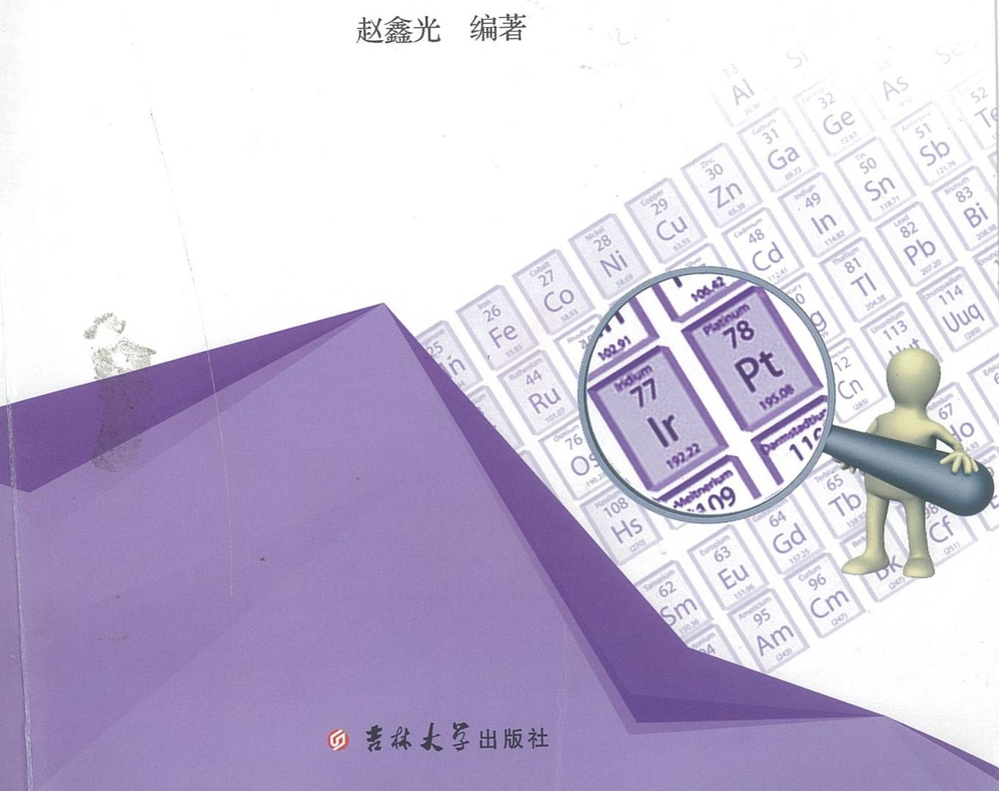

GAOZHONG
HUAXUE JINGSAI
JIBEN LILUN XUEXI BIJI

# 高中化学竞赛 基本理论学习笔记

赵鑫光 编著


GAOZHONG
HUAXUE JINGSAI
•JIBEN LILUN XUEXI BIJI

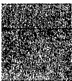

# 基本理论学习笔记

赵鑫光 编著

胡坤

图书在版编目（CIP）数据

高中化学竞赛基本理论学习笔记 / 赵鑫光编著. — 长春: 吉林大学出版社, 2017.11
ISBN 978-7-5692-1273-0

I. ①高… II. ①赵… III. ①中学化学课—高中—教学参考资料 IV. ①G634.83

中国版本图书馆CIP数据核字（2017）第283139号

书名：高中化学竞赛基本理论学习笔记
GAOZHONG HUAXUE JINGSAI JIBEN LILUN XUEXI BIJI

作者：赵鑫光 编著

策划编辑：王洋

责任编辑：孟亚黎

责任校对：王洋

装帧设计：刘瑜

出版发行：吉林大学出版社

社址：长春市人民大街4059号

邮政编码：130021

发行电话：0431-89580028/29/21

网址：http://www.jlup.com.cn

电子邮箱：jdcbs@jlu.edu.cn

印刷：长春市泽成印刷厂

开 本：787mm×1092mm 1/16

印 张：30.25

字 数：600千字

版次：2017年11月 第1版

印 次：2017年11月 第1次

书号：ISBN 978-7-5692-1273-0

定 价：86.00元

版权所有 翻印必究

## 前言

在当前基础教育体系中，中学化学教育是其中一个重要组成部分，自1984年起由中国化学会主办的中国化学奥林匹克竞赛(原称“全国高中学生化学竞赛”)在激发中学生对化学学科的热爱和学习兴趣，培养创造性思维和创造精神，增强学科思维能力和学科科学素养等方面起到了重要作用并产生积极影响，因此越来越受到热爱化学的中学生和中学化学教师的重视。

新一轮基础教育课程改革明确要求，在激发学生学习兴趣的同时更要注重发展学生的创新意识、创新思维，在传授学科知识的同时更要注重提高学生的科学素养，在发展学生智力的同时更要注重培养学生的创新能力。新课改最重要的变化是给予学生选课的自主权，在全面实施素质教育的背景下，应该让资优学生在共同水平的基础上获得选择性的、个性化的发展，而高考选拔方式的变革也使得具有学科特长的学生更易获得知名高校的青睐。

本书根据最新的《全国高中学生化学(奥林匹克)竞赛基本要求》中有关化学基本理论的相关内容进行编写，在编者从教几年来逐渐积累的化学竞赛教学授课讲义的基础上进一步提炼、补充、修改、完善而成，从高中生的认知能力出发帮助学生认识并了解竞赛。本书共分为九章：第一章为化学基础知识，主要介绍化学数据处理，溶液和气体的相关性质；第二章至第五章为结构化学部分，分别从原子结构、分子结构、晶体结构、配位化合物结构等方面对结构化学方面的知识进行系统详细的讲解；第六章至第八章为化学基本原理部分，分别介绍氧化还原与电化学、化学热力学初步、化学反应速率和化学平衡等方面的内容；第九章为容量分析，主要介绍化学中的四大滴定原理和应用及分光光度法的相关内容。

在【知识点精讲】版块中，对每一章所涉及的相关知识点进行了较为全面的介绍，读者通过自学可以对相关知识有一个系统、详细的了解；在【例题精析】版块中，选取与本章知识密切相关的例题进行详细解析，其中一部分是近年来在全国初赛或决赛中出现的真题，读者可以通过演练来达到学以致用的目的；在【习题精练】版块中，精选与各章知识相关的各类习题，兼顾基础性和前瞻性，侧重巩固提高和应用创新；在【习题参考答案】版块中，对所选习题给出详细答案和关键解题步骤，方便读者自我检查练习效果并进行补偿和矫正。在某些章节的末尾还以专题的形式介绍了一些在化学竞赛考试中出现过的较难的知识点，便于读者深入了解和学习某一方面的内容。

本书可作为对化学有浓厚兴趣、具有化学学科特长的学生自主学习的辅助教材，也可作为中学化学教师教学的参考资料，对参加高校相关专业自主招生选拔的考生也具有一定的参考价值和辅导作用。相信通过阅读本书，学生可以丰富自身在无机化学原理、结构化学和分析化学等方面的知识，加深对相关内容的理解，提高分析问题、解决问题的能力，同时学会灵活运用化学知识，对提高化学竞赛或自主招生选拔成绩有很大帮助。

本书的编写是一次尝试，将化学竞赛中的基本原理、结构化学和分析化学的知识相对完整、有序、系统化地传递给学生，力求达到深入浅出、抛砖引玉的效果，充分激发学生的兴趣，调动其主观能动性去积极探索化学中的未知领域、迅速准确地获取全新知识来解决问题。由于编者水平有限，书中难免有疏漏之处，敬请读者批评指正，提出宝贵意见，以便不断完善。

赵鑫光

2017年10月于长春

## 目录

第一章 化学基础知识 …… 1
1.1 误差与数据处理 …… 1
1.2 有效数字 …… 4
1.3 气体 …… 7
1.4 理想气体定律 …… 8
1.5 气体相对分子质量测定原理 …… 10
1.6 气体的溶解定律——亨利定律 …… 11
1.7 溶液的性质 …… 12
第二章 原子结构 …… 28
2.1 原子结构的 Bohr 理论 …… 28
2.2 微观粒子运动的基本特征 …… 31
2.3 氢原子结构的量子力学描述 …… 32
2.4 多电子原子结构 …… 37
2.5 元素周期表 …… 41
2.6 元素性质的周期性 …… 42
2.7 核化学简介 …… 48
第三章 分子结构 …… 66
3.1 Lewis 理论 …… 66
3.2 近代价键理论 …… 70
3.3 杂化轨道理论 …… 72
3.4 价层电子对互斥理论(VSEPR) …… 78
3.5 分子轨道理论 …… 85
3.6 键参数 …… 92
3.7 分子之间的作用力 …… 94
3.8 离子的极化学说简介 …… 99
第四章 晶体结构 …… 128
4.1 晶体的点阵理论 …… 128
4.2 晶体的对称性 …… 138
4.3 金属晶体结构 …… 146
4.4 离子晶体和离子键 …… 155
4.5 共价型原子晶体和混合型晶体 …… 165
4.6 分子型晶体和分子间作用力 …… 169
4.7 不同键型的晶体结构递变规律 …… 171

第五章 配位化合物 …… 202
5.1 配合物基本知识 …… 202
5.2 配位化合物的价键理论 …… 207
5.3 配位化合物的晶体场理论 …… 218
5.4 配位化合物的异构现象 …… 229
5.5 配合物的稳定性 …… 239
5.6 配位化合物的配位平衡 …… 241
第六章 氧化还原反应和电化学基础 …… 270
6.1 氧化还原反应的基本概念 …… 270
6.2 氧化还原反应方程式的配平 …… 271
6.3 电极电势 …… 272
6.4 化学电源与电解 …… 289
第七章 化学热力学初步 …… 311
7.1 基本概念 …… 311
7.2 热力学第一定律 …… 314
7.3 热化学 …… 315
7.4 化学反应进行的方向 …… 321
第八章 化学反应速率和化学平衡 …… 347
8.1 反应速率及其表示方法 …… 347
8.2 反应速率理论简介 …… 349
8.3 影响化学反应速率的因素 …… 351
8.4 化学平衡的条件 …… 359
8.5 平衡常数的测定和平衡转化率的计算 …… 364
8.6 外界因素对化学平衡的影响 …… 364
8.7 酸碱质子理论(Bronsted 理论) …… 366
8.8 酸碱的电子理论(Lewis 理论) …… 368
8.9 强电解质的电离 …… 369
8.10 弱电解质的电离平衡 …… 370
8.11 盐类的水解平衡 …… 376
8.12 沉淀溶解平衡 …… 379
第九章 容量分析 …… 410
9.1 容量分析的基本概念和原理 …… 410
9.2 酸碱滴定法 …… 412
9.3 络合滴定法(配位滴定法) …… 423
9.4 氧化还原滴定法 …… 430
9.5 沉淀滴定法 …… 442

## 第一章 化学基础知识

## 【初赛要求】

有效数字: 在化学计算和化学实验中正确使用有效数字。定量仪器(天平、量筒、移液管、滴定管、容量瓶等等)测量数据的有效数字。数字运算的约化规则和运算结果的有效数字。实验方法对有效数字的制约。

气体:理想气体标准状况(态)。理想气体状态方程。气体常量R。体系标准压力。分压定律。气体相对分子质量测定原理。气体溶解度(亨利定律)。

溶液: 溶液浓度。溶解度。浓度和溶解度的单位与换算。溶液配制(仪器的选择)。重结晶方法以及溶质/溶剂相对量的估算。过滤与洗涤(洗涤液选择、洗涤方式选择)。重结晶和洗涤溶剂(包括混合溶剂)的选择。

胶体: 分散相和连续相。胶体的形成和破坏。胶体的分类。胶粒的基本结构。

## 【决赛要求】

稀溶液的依数性:饱和蒸气压下降、沸点升高、凝固点降低、渗透压。

【知识点精讲】

## 1.1 误差与数据处理

## 1.1.1 准确度与精密度

准确度是表示测定值与真实值接近的程度,用误差来衡量。准确度越高则表明测定值与真实值之间的差值越小。

精密度是表示几次平行测定结果相互接近的程度,它与真实值无关,用极差或偏差来衡量。如果在相同条件下,对同一样品几次平行实验的测定值彼此较接近,则说明测定结果精密度较高;如果实验测定值彼此相差很多,则测定结果的精密度就低。

如何从准确度与精密度两方面来衡量分析结果的好坏呢？例如，甲、乙、丙、丁四人同时分析一瓶KOH溶液的浓度(真实值为0.1244mol/L)，每人分别平行测定3次，结果如下：

<table><tr><td></td><td>甲</td><td>乙</td><td>丙</td><td>丁</td></tr><tr><td rowspan="3">测定结果</td><td>0.1241</td><td>0.1220</td><td>0.1230</td><td>0.1214</td></tr><tr><td>0.1242</td><td>0.1221</td><td>0.1284</td><td>0.1248</td></tr><tr><td>0.1243</td><td>0.1222</td><td>0.1257</td><td>0.1273</td></tr><tr><td>平均值</td><td>0.1242</td><td>0.1221</td><td>0.1257</td><td>0.1245</td></tr><tr><td>真实值</td><td>0.1244</td><td>0.1244</td><td>0.1244</td><td>0.1244</td></tr><tr><td>差值</td><td>0.0002</td><td>0.0023</td><td>0.0013</td><td>0.0001</td></tr></table>

甲的分析结果准确度与精密度均好，结果可靠；乙的精密度虽很高，但准确度太低；丙的精密度与准确度均很差；丁的平均值虽也接近于真实值，但是他的精密度很差，3次测量数值彼此相差很远，仅仅是由于正负误差相互抵消才使结果凑巧等于(或接近)真实值，而每次测量结果都与真实值相差很大，因而丁的测量结果是不可靠的。由此可见：

(1) 精密度是保证准确度的先决条件, 精密度低说明所测结果不可靠, 就失去了衡量准确度的前提。

(2)精密度高,不一定能保证准确度高。

## 1.1.2 误差与极差、偏差

## 1. 误差

误差(E)表示测定值(x)与真实值(T)之间的差值。误差越小,表示测定值与真实值越接近,准确度越高;反之,误差越大,准确度越低。当测定值大于真实值时,误差为正值,表示测定值偏高;反之误差为负值,表示测定值偏低。

误差可用绝对误差(AE)和相对误差(RE)表示。

$$
\mathrm{AE} = x - T; \mathrm{RE} = \frac {\mathrm{AE}}{T} \times 100\%
$$

因为绝对误差不能反映它对测定结果准确度的影响程度,所以常用相对误差表示。

例如:称得两个物体的质量分别为 2.1750g 和 0.2175g, 它们的真实质量分别为 2.1751g 和 0.2176g。这两个物体质量相差 10 倍, 但测定的绝对误差都为 -0.0001g, 它们的相对误差分别为:

$$
\begin{aligned} & \frac{-0.0001}{2.1751}\times 100\% = -0.0046\% (\text{或} -0.046\%)\\ & \frac{-0.0001}{0.2176}\times 100\% = -0.046\% (\text{或} -0.46\%) \end{aligned}
$$

可见当绝对误差相同时，称量物体的质量越大，相对误差越小，测定的准确度就比较高。相对误差常用千分率(%)表示，以免与百分含量相混淆。

## 2. 极差

极差(R)又称全距,是指一组平行测定结果中最大值和最小值之差。在平行测定次数较少的情况下,用极差表示精密度比较方便。例如,在滴定分析中,一般要求平行滴定3次,3次滴定管读数的极差要求不大于0.04mL。

## 3. 偏差

偏差(d)是指个别测定值 x 与 n 次测定值的算术平均值 $\bar{x}$ 的差值。是衡量精密度高低的尺度。偏差小，表示测定的精密度高。偏差有平均偏差( $\bar{d}$ )、标准偏差(S)和变异系

数(C. V)三种表示方法。

$$
\bar {d} = \frac {\sum_ {i = 1} ^ {n} | x _ {i} - \bar {x} |}{n}, S = \sqrt {\frac {\sum_ {i = 1} ^ {n} (x _ {i} - \bar {x}) ^ {2}}{n - 1}}
$$

变异系数是相对标准偏差,即:

$$
\mathrm{C.V\%} = \frac {\mathrm{S}}{\overline{x}} \times 100\%
$$

## 1.1.3 系统误差与偶然误差

## 1. 系统误差

系统误差是由某种固定的原因所造成的，在多次重复测定中会重复出现。它具有单向性，即正负、大小都有一定的规律性，是可以测定的，故又称可测误差。一般由以下几种原因引起。

(1) 方法误差是由采用的分析方法本身造成的。例如滴定分析中指示剂选用不够恰当而造成的误差；重量分析中由于沉淀溶解损失或是共沉淀、后沉淀现象引起的误差等。

(2)仪器误差是仪器本身缺陷造成的。例如天平、砝码不够准确等。

(3)试剂误差是试剂不纯带来的。例如,试剂中含有干扰物质或蒸馏水中含有被测物质等,使分析结果整体偏低或偏高。

(4) 主观误差是操作者主观原因造成的。例如对终点颜色的辨别不同，有人偏浅或偏深。

系统误差的特点：

①单向性:实验值要么都偏高,要么都偏低。

②重现性:在重复测量时误差的大小常常比较接近,会反复出现。

③可测性:对分析结果的影响有一定的规律性。

## 2.偶然误差

又称随机误差,它是由某些难以控制、无法避免的偶然原因引起的,其大小和正负都不固定。偶然误差的大小,决定分析结果的精密度。偶然误差虽然不能通过校正而减小或消除,但它的分布符合统计规律,即正态分布规律,可得出如下的结论:

(1) 大小相等符号相反的偏差出现的概率基本相等；

(2)偏差小的测定值出现的概率多,而偏差大的测定值出现概率小;

(3) 测定值的平均值比个别测定值可靠。

偶然误差的特点：

①对称性:绝对值大小相等的正负误差出现的概率相等。

②单峰性:随机误差为零的测定值出现的概率最大。

③有界性:随机误差的分布具有有限的范围,其值大小是有界的。

3. 如何检验和消除系统误差

(1)对照实验

①用待检验的分析方法测定某标准试样或纯物质，并将结果与标准值或纯物质的理论值相对照。

②用该方法与标准方法或公认的经典方法同时测定某一试样，并对结果进行显著性检验。

③“内检”及“外检”: 将一部分试样重复安排给不同的分析者进行测定, 称之为“内检”; 有时又将部分试样送交其他单位进行对照实验, 称之为“外检”。

## (2)空白实验

①定义:在不加试样的情况下,按照与试样测定完全相同的条件和操作方法进行实验,所得的结果称为空白值。

②从试样测定结果中扣除空白值就起到了校正误差的作用。

③作用:检验和消除由试剂、溶剂(大多数是水)和分析器皿(因被侵蚀)中某些杂质引起的系统误差。对微(痕)量组分的测定具有很重要的作用。

④空白值一般比较小，经扣除后就可得到比较可靠的测定结果。

注意:如果空白值较大,就应该通过提纯试剂、改用纯度较高的溶剂和采用其他更合适的分析器皿等来解决问题,才能提高测定的准确度。

## (3)校准仪器和量器

对准确度要求较高的测定,对所使用的仪器或量器,如天平砝码的质量,滴定管、移液管和容量瓶的体积等都必须进行校准。

## (4) 改进分析方法或采用辅助方法校正测定结果

①改进分析方法:在滴定分析中选择更合适的指示剂以减小终点误差;使用有效的掩蔽方法以消除干扰组分的影响等;在重量分析中,设法减小沉淀的溶解度,使待测组分沉淀更加完全;减少沉淀对杂质的吸附等等。

②辅助方法校正测定结果:例如采用重量法测定硅的含量时,分离硅沉淀后的滤液中含有微量硅,可以采用光度法测出其含量,并将它加进重量法的结果中去,这样就校正了因沉淀不完全而带来的负误差。

## 4. 如何消除随机误差

增加平行测定的次数,取其平均值,可以减少随机误差。

## 1.2 有效数字

有效数字是指在实验中实际能测量到的数字。在实验记录的数据中，只有最后一位是估计的，这一位数字叫不定数字。例如读滴定管中的液面位置时，甲可能读为21.32，乙可能读为21.33，丙可能读为21.31。由此可见21.3是滴定管上显示出来的。因实验者不同，可能得到不同的估计值，但这一位估计数字却是客观存在的，因此它是有效数字。也就是说有效数字是实际测到的数字加一位估读数字。

对于一个数字,我们怎样确定它是几位有效数字呢?通过下面几个有效数字的位数确定来说明。

0.003, $4\times10^{8}$ 1位有效数字

0.20, pH=6.70 ②位有效数字

4.44,15.3% 3位有效数字

## 准确数字或有效数字位数不定数字

数字前的“0”不作为有效数字, 数字后的“0”则为有效数字。对数值的有效数字, 只由小数点后的位数决定, 与小数点前的位数无关, 因小数点前的数是 10 的次方。有效数字位数不确定的数字可认为是准确数字。测量所得到的有效数字的位数是由测量对象和测量仪器所决定的, 运算所得到的有效数字的位数是由被运算数字决定的。单位转换时, 有效数字位数不能改变, 如 12.40L 用 mL 作单位时, 不能写成 12400mL 而应写成 $12.40 \times 10^{3}$ mL。

有效数字的位数反映着测量的准确度,体现了相对误差的大小。

用分析天平称取了 1.0010g 试样,一般情况下称量的绝对误差是±0.0002g,那么相对误差为:

$$
\frac {\pm 0.0002}{1.0010} \times 100 \% = \pm 0.02 \%
$$

若用台秤称取试样 1.0g，称量的绝对误差为 $\pm0.2g$ ，则相对误差为：

$$
\frac {\pm 0 . 2}{1 . 0} \times 100 \% = \pm 20 \%
$$

## 1.2.1 有效数字的运算

## 1. 有效数字的修约

由于实验测得的有效数字的位数可能不同,因此在计算时,就要将那些有效数字位数过多的有效数字进行修约,舍弃过多的位数,使得运算简单且计算结果仍然准确。

有效数字的修约规则是:一次到位,不能多次修约,原则是四舍六入五成双。例如:

3.4747 修约到三位有效数字是 3.47。

2.760 修约到二位有效数字是 2.8。

2.535 修约到三位有效数字是 2.54。

2.865 修约到三位有效数字是 2.86。

3.4747 修约到三位有效数字时,不能先修约到四位,再修约到三位,即 3.4747(五位)→3.475(四位)→3.48(三位)的修约是错误的。

## 2. 有效数字的加减运算

有效数字是只含一位可疑数字的数。有效数字相加减所得到的数字也只能是含一位可疑数字的数。故加减运算时的修约是以小数点后的位数最少的数字来决定，将小数点后多余的有效数字修约舍弃。

例如: 计算 0.5356+4.72-3.2。

3.2 是二位有效数字, 小数点后只有一位小数, 故应以此为根据, 将其他数也修约到小数点后只有一位有效数字。即:

$$
0. 5 3 5 6 + 4. 7 2 - 3. 2 = . 0. 5 + 4. 7 - 3. 2 = 2. 0
$$

## 3. 有效数字的乘除运算

以有效数字位数最少的数为根据,将其他有效数字化为与此位数相同的数再乘除运算。计算结果的有效数字的位数也和有效数字位数最少的那个数位数相同,在运算过程中可多保留一位有效数字。还应特别注意,在有效数字的乘除运算中,当遇到8以上的大数时,可多算一位有效数字。如9.00,9.24等,将它们看作四位有效数字。因为它们的相对误差和 10.××四位有效数字的相对误差相接近。

例如: 计算 $0.0121 \times 25.64 \times 5$ 。

5 是一个有效数字位数不确定数字,或是一个准确数字,则有效数字位数最少的数是 0.0121 三位有效数字,则把 25.64 也修约为三位有效数字,即 25.6。

$$
0. 0 1 2 1 \times 2 5. 6 4 \times 5 = 0. 0 1 2 1 \times 2 5. 6 \times 5 = 1. 5 5
$$

有效数字虽经修约,可是运算结果只能用等号,不得用约等号。

## 1.2.2 有效数字与化学实验测量读数

有效数字是实际测到的数字加上一位估读数字。估读数字会因实验者不同得到不同的估读值，但这一位估读数字是客观存在的，因此它是有效数字。

托盘天平能称准到 0.1g，如果用台秤称某一物质时，右盘加砝码 8g，游码所在位置如图所示。

<table><tr><td>0</td><td>1</td><td>2</td><td>3</td><td>4</td></tr></table>

则该被称物质的质量为: $8g+2g+2.2$ 格 $\times0.1g/格=10g+0.2g=10.2g$ ，若将此物质的质量读作10.22g，那就错了。有的台秤游码标尺每大格有5小格，则其感量为0.2g/格，用此台秤称量时也只能读到小数点后1位数。

跟台秤同理,用 10mL 量筒量液体时,由于 10mL 的量筒的精度为 0.2mL/格,液体的读数为:

$$
2 \mathrm{mL} + 2. 4 \text {   格   } \times 0. 2 \mathrm{mL/格} = 2 \mathrm{mL} + 0. 5 \mathrm{mL} = 2. 5 \mathrm{mL}
$$

量筒是和台秤相匹配的实验仪器, 因为, 它们测量体积、称量质量读数时, 小数点后都只能保留 1 位数。

滴定管是和分析天平相匹配的实验仪器,它的精度较高为 0.10mL/格,用滴定管读数可计到小数点后第二位,如 15.36mL。

用容量瓶配制溶液,所得溶液体积为一常数,例如用 50mL 的容量瓶配制一定浓度的 NaCl 溶液所得的体积为 50mL,它是一个常数,不能看作是两位有效数字,也不能改为 50.0mL,按三位有效数字计。

常用仪器的有效数字读数小结：

万分之一分析天平称量误差一般为 $\pm0.000xg$ ;

滴定管读数误差一般为 $\pm0.0x\ mL$ ;

测定溶液的 pH, 误差为 $\pm0.00x$ 单位;

测量样品的吸光度,误差为 $\pm0.00x$ 。

## 1.2.3 实验数据的处理

实验中得到的大量数据,常用表格法和图解法表示。

①表格法

表格法具有简明、便于比较等优点。实验完成后，从观察、实验和测定得到的实验数据尽可能整齐地、有规律地用表格的形式表示出来，使得全部数据能一目了然，能够看出一些个别物质间的变化关系，能够了解事物变化的本质，这样便于处理和运算。

②图解法

图解法能直接显示出变化规律与特点，并能利用图形作进一步的处理，求得斜率、截距、内插值、外推值等等。

作图时应注意以下几个问题：

（i）用直角毫米坐标纸作图时，常以自变量作横坐标，因变量作纵坐标。坐标的起点不一定是零。坐标轴上还应注明所代表的变量的名称及单位。

(ii)坐标比例的选择要能表示全部有效数字,使其与测量的准确度相一致。

（iii）标绘数据时，可用符号代表点。若必须在一张坐标纸画几条线，则对不同组的点应选用不同的符号代表。

(iv)配线描点后即可用直尺或曲线板连成圆滑的曲线。所配的线不应穿过代表测量值及其精密度的圆圈、三角等符号。一般讲，曲线上不应有突然弯曲和不连续的地方。

## 1.3 气体

气体、液体和固体是物质存在的三种状态。气体的研究对化学学科的发展起过重大作用。

## 1.3.1 气体的两大特点

气体与液体、固体相比较，具有两个明显特点。

(1) 扩散性: 当把一定量的气体充入真空容器时, 它会迅速充满整个容器空间, 而且均匀分布, 少量气体可以充满很大的容器, 不同种的气体可以以任意比例均匀混合。

(2) 可压缩性: 当对气体加压时, 气体体积缩小, 原来占有体积较大的气体, 可以压缩到体积较小的容器中。

## 1.3.2 理想气体

如果有这样一种气体:它的分子只有位置而无体积,且分子之间没有作用力,这种气体称之为理想气体,当然它在实际中是不存在的。实际气体分子本身占有一定的体积,分子之间也有吸引力。但在低压和高温条件下,气体分子本身所占的体积和分子间的吸引力均可以忽略,此时的实际气体即可看作理想气体。

## 1.3.3 气体压力的产生

气体的压力是指气体分子对器壁的作用力。它是分子对器壁碰撞的结果。

质量为 m，速度为 v 的分子碰撞器壁，无动能损失，则以速度 -v 弹回，动量的改变量为： $-mv - mv = -2mv$ ，动量的改变量等于壁对分子作用力 $F'$ 的冲量：

$$
F ^ {\prime} t = - 2 m v, F ^ {\prime} = - 2 m v / t; \text { 分子对器壁的作用力则为 }: F = 2 m v / t
$$

这个力量和分子的运动方向一致,即是碰撞造成的压力。由于分子极多,这种压力是连续的,好比雨中,雨点对雨伞的作用。

## 1.4 理想气体定律

## 1.4.1 理想气体状态方程

将在高温低压下得到的波义耳定律(在定量定温下,理想气体的体积与气体的压强成反比, $pV=C$ )、查理定理(对于热力学温标,一定质量一定体积理想气体的压强与热力学温度成正比 $p/T=C$ )和阿伏伽德罗定律(在相同的温度和压强下,相同体积的任何气体都含有相同数目的分子)合并,便可组成一个方程: $pV=nRT$ ,这就是理想气体状态方程。

式中 p 是气体压强, V 是气体体积, n 是气体物质的量, T 是气体的绝对温度(热力学温度, 即摄氏度数 +273), R 是摩尔气体常数。

在国际单位制中,它们的关系如下表:

在标准状态下， $p=101.325\text{kPa}, T=273.15\text{K}, n=1.0\text{mol}, V=22.414\text{L}=22.414\times 10^{-3}\text{m}^{3}$ 。

$$
R = \frac {p V}{n T} = \frac {1 0 1 3 2 5 \mathrm{Pa} \times 2 2 . 4 1 4 \times 1 0 ^ {- 3} \mathrm{m} ^ {3}}{1 . 0 \mathrm{mol} \times 2 7 3 . 1 5 \mathrm{K}} = 8. 3 1 4 \mathrm{J/(mol} \cdot \mathrm{K)}
$$

$\pmb{R}$ 的单位和值

<table><tr><td></td><td> $p$ </td><td> $V$ </td><td> $n$ </td><td> $T$ </td><td> $R$ </td></tr><tr><td rowspan="2">国际单位制</td><td>Pa</td><td> $m^{3}$ </td><td>mol</td><td>K</td><td> $8.314\frac{Pa\cdot m^{3}}{mol\cdot K}或\frac{J}{mol\cdot K}$ </td></tr><tr><td>kPa</td><td> $dm^{3}$ </td><td>mol</td><td>K</td><td> $8.314\frac{kPa\cdot dm^{3}}{mol\cdot K}$ </td></tr></table>

上式也可以变换成下列形式：

$$
p V = \frac {m}{M} R T, p = \frac {m}{V} \cdot \frac {R T}{M} = \frac {\rho R T}{M}, \text {则}: \rho = \frac {p M}{R T}
$$

式中 m 为气体的质量, M 为气体的摩尔质量, $\rho$ 为气体的密度。

对于一定量(n一定)的同一气体在不同条件下,则有:

$$
\frac {p _ {1} V _ {1}}{T _ {1}} = \frac {p _ {2} V _ {2}}{T _ {2}}
$$

如果在某些特定条件下,将上面各式同时应用于两种不同的气体时,又可以得出一些特殊的应用。

如 $n=\frac{pV}{RT}$ ，在等温、等压、等容时应用于各种气体，则可以说明阿伏伽德罗定律。因为物质的量相等的气体，含有相等的分子数。

如 $\frac{m}{M}=\frac{pV}{RT}$ ，在等温、等压和等容时应用于两种气体，则得出： $\frac{m_{1}}{M_{1}}=\frac{m_{2}}{M_{2}}$ ；

如 $\rho = \frac{pM}{RT}$ ，在等温等压下应用于两种气体，则有： $\frac{\rho_1}{\rho_2} = \frac{M_1}{M_2}$

若令 $\frac{\rho_1}{\rho_2} = D, D$ 为第一种气体对第二种气体的相对密度，则有： $D = \frac{M_1}{M_2}$ 或 $M_1 = DM_2$ 已知 $M(\mathrm{H}_2) = 2\mathrm{g / mol}, M(\text{空气}) = 29\mathrm{g / mol}$ ，则 $M_1 = 2D(\mathrm{H}_2)$ 或 $M_1 = 29D(\text{空气})$ 。 $D(\mathrm{H}_2)$ 为某气体相对 $\mathrm{H}_2$ 的密度， $D(\text{空气})$ 为某气体相对空气的密度。

## 1.4.2 气体分压定律和分体积定律

## 1. 气体分压定律

当研究对象不是纯气体,而是多组分的混合气体时,由于气体具有均匀扩散而占有容器全部空间的特点,无论是对混合气,还是混合气中的每一组分,均可按照理想气体状态方程进行计算。

当一个体积为 V 的容器，盛有 A、B、C 三种气体，其物质的量分别为 $n_{A}$ 、 $n_{B}$ 、 $n_{C}$ ，每种气体具有的分压分别是 $p_{A}$ 、 $p_{B}$ 、 $p_{C}$ ，则混合气的总物质的量为： $n_{总}=n_{A}+n_{B}+n_{C}$ ；混合气的总压为： $p_{总}=p_{A}+p_{B}+p_{C}$ 。

在一定温度下，混合气体的总压等于各组分气体的分压之和。这就是道尔顿分压定律。

## 计算混合气体各组分的分压有两种方法。

①根据理想气体状态方程计算:在一定体积的容器中的混合气体 $p_{总}V=n_{总}RT$ ，混合气中各组分的分压，就是该组分单独占据总体积时所产生的压力，其分压数值也可以根据理想气体状态方程求出：

$$
\begin{array}{r l} & {p _ {A} V = n _ {A} R T; p _ {B} V = n _ {B} R T; p _ {C} V = n _ {C} R T} \\ & {\sum p _ {i} = \sum n _ {i} \frac {R T}{V} = n \frac {R T}{V} = p _ {\text {总}}, \text {即} p _ {\text {总}} = \sum p _ {i}} \end{array}
$$

②根据摩尔分数计算:摩尔分数 $(X_{\mathrm{A}})$ 为混合气中某组分A的物质的量与混合气的总的物质的量之比: $X_{\mathrm{A}}=\frac{n_{\mathrm{A}}}{n_{\text{总}}}$ 混合气体中某组分的分压等于总压与摩尔分数的乘积: $p_{A}=p_{总}X_{A}$ 。

## 2. 气体分体积定律

由理想气体状态方程可知：

$$
\begin{array}{r l} V & = \frac {n R T}{p} = \frac {(n _ {1} + n _ {2} + \cdots + n _ {i} + \cdots) R T}{p} \\ & = \frac {n _ {1} R T}{p} + \frac {n _ {2} R T}{p} + \dots + \frac {n _ {i} R T}{p} + \dots \\ & = V _ {1} + V _ {2} + \dots + V _ {i} + \dots = \sum V _ {i} \end{array}
$$

在相同的温度和压强下, 混合气的总体积 $(V_{总})$ 等于组成混合气的各组分的分体积之和: $V_{总}=V_{A}+V_{B}+V_{C}$ , 这个定律叫气体分体积定律.

根据混合物中各组分的摩尔分数等于体积分数,可以计算出混合气中各组分的分体积。根据 $\frac{n_{1}}{n_{总}}=\frac{V_{A}}{V_{总}}$ ,得 $V_{A}=\frac{n_{1}}{n_{总}}V_{总}$ 。

## 3. 气体的扩散定律

恒压条件下,某一温度下气体的扩散速率与其密度(或摩尔质量)的平方根成反比。

表达式为：

$$
\bar {u} _ {1} / \bar {u} _ {2} = \sqrt {\rho_ {2} / \rho_ {1}} = \sqrt {M _ {2} / M _ {1}}
$$

## 1.4.3 实际气体状态方程

理想气体定律是从实验中总结出来的，并得到了理论上的解释。但应用实际气体时，它只有一定的适用范围(高温低压)，超出这个范围就有偏差，必须加以修正。

对于 nmol 实际气体来说， $(p+\frac{n^{2}a}{V^{2}})(V-nb)=nRT$

注意, 上式中 p、V、T 都是实测值; a 和 b 是与气体种类有关的特性常数, 称为范德华常数。常数 a 用于校正压力, b 用于修正体积, 均可由实验确定。上式称为范德华方程。它是从事化工设计必不可少的依据。

与理想气体状态方程相比：

$V_{理}=V_{实}-nb,n$ 为物质的量，b 为每摩尔分子本身占有的体积，所以 $V_{实}-nb$ 就成了气体分子本身占有体积已被扣除了的空间，即为 $V_{理}$ 。

$p_{\text{理}} = p_{\text{实}} + \frac{n^2 a}{V^2}$ , 为什么要在 $p_{\text{实}}$ 项上再加上一项 $\frac{n^2 a}{V^2}$ 呢? 即为什么 $p_{\text{实}} < p_{\text{理}}$ 呢?

降压的因素来自两个方面: ①由于分子内存在相互作用, 所以分子对器壁的碰撞次数减少, 而碰撞次数与分子的密度 $(n/V)$ 成正比; ②分子对器壁碰撞的能量减少, 它也正比于 n/V, 所以压力降低正比于 $n^{2}/V^{2}$ , 故 $p_{\text{理}} = p_{\text{实}} + \frac{n^{2}a}{V^{2}}$ 。

## 1.5 气体相对分子质量测定原理

## 1.5.1 气体相对分子质量测定

由 $\rho = \frac{pM}{RT}$ ，可以变换成以下形式： $M = \frac{\rho RT}{p}$ 。

可见,在一定温度和压强下,只要测出某气体的密度,就可以确定它的相对分子质量。

## 1.5.2 气体精确相对分子质量测定

根据 $M=\frac{\rho}{p}RT$ ，理想气体在恒温下的 $\rho/p$ 值应该是一个常数，但实际情况不是这样。如：在 273K 时测得 $CH_{3}F$ 蒸气在不同压力下的 $\rho$ 值及 $\rho/p$ 值如下表所示：

<table><tr><td> $p/Pa$ </td><td> $\rho/(g/m^{3})$ </td><td> $\rho/(p \cdot 10^{-2})$ </td></tr><tr><td> $1.013 \times 10^{5}$ </td><td> $1.5454 \times 10^{3}$ </td><td> $1.5256$ </td></tr><tr><td> $6.753 \times 10^{4}$ </td><td> $1.0241 \times 10^{3}$ </td><td> $1.5165$ </td></tr><tr><td> $3.375 \times 10^{4}$ </td><td> $0.5091 \times 10^{3}$ </td><td> $1.5084$ </td></tr></table>

从表中数据可以看到,压力越大, $\rho/p$ 越大,不是常数。因为压力越大,气体分子间的吸引力越大,分子本身的体积也不能忽略,因而就不能用理想气体状态方程来描述了,所以对于实际气体 $\rho/p$ 不是一个常数。

以 $\rho/p$ 对 $\rho$ 作图，如下图所示（以 $CH_{3}F$ 为例）。

如果将直线内推到 $p = 0$ 时，则 $\mathrm{CH}_3\mathrm{F}$ 这一实际气体已接近理想气体，所以从图上所得的 $(\rho^{\prime} / p^{\prime})_{p = 0} = 1.50\times 10^{-2}$ 是符合理想气体状态方程的。若将 $(\rho /p)_{p = 0}$ 之值代入理想气体状态方程 $M = \frac{\rho}{p} RT$ ，即可求得 $\mathrm{CH}_3\mathrm{F}$ 的精确相对分子质量。这种求气体相对分子质量的方法，叫极限密度法。

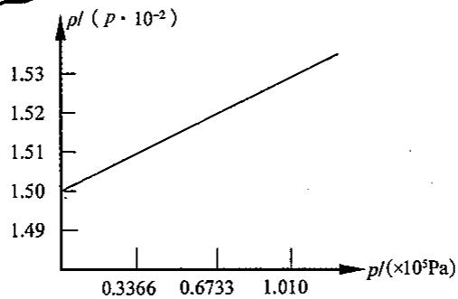

$$
\begin{array}{r l} M (\mathrm{CH} _ {3} \mathrm{F}) & = (\frac {\rho}{p}) _ {p = 0} R T \\ & = 1. 5 0 \times 1 0 ^ {- 2} \mathrm{g} \cdot \mathrm{dm} ^ {- 3} \cdot \mathrm{kPa} ^ {- 1} \times 8. 3 1 4 \mathrm{kPa} \cdot \mathrm{dm} ^ {3} \cdot \mathrm{mol} ^ {- 1} \cdot \mathrm{K} ^ {- 1} \times 2 7 3. 1 5 \mathrm{K} \\ & = 3 4. 0 6 \mathrm{g/mol} \end{array}
$$

故 $CH_{3}F$ 的相对分子质量为 34.06。

按相对原子质量计算: $M=12.011+3\times1.008+18.998=34.033$ ，两者结果非常接近。

## 1.6 气体的溶解定律——亨利定律

## 1.6.1 叙述

在一定温度和一定体积的液体中,所溶解的气体质量与该气体的分压成正比。例如:0℃、1atm(1atm=101325Pa)时 CO₂ 的溶解度:s₀=0.335g/100mL H₂O;0℃、2atm 时 CO₂ 的溶解度:s₀=0.670g/100mL H₂O。

## 1.6.2 解释

当气体的压强增加 n 倍, 那么气体进入液体的机会也增加 n 倍, 所以气体溶解的质量也增加 n 倍。故亨利定律与其他气体的分压无关。例如: 1atm 的纯氧在水中的溶解度是空气中氧气的 4.76 倍, 因为空气中氧的分压 $p(\mathrm{O}_{2})=0.21\mathrm{atm}$ 。所以若气相中有几种气体, 则各种气体的溶解度皆与其分压成正比。

## 1.6.3 数学表达式

$$
x = \frac {p}{k _ {H}} = \frac {n _ {\text { gas }}}{n _ {\text { 溶 }}}
$$

$$
k _ {\mathrm{H}} = p / x (k _ {\mathrm{H}}: \text { 亨利常数 })
$$

p 是被溶解气体的分压(以 mmHg 为单位)，x 是溶解的气体在溶液中所占的物质的量分数。

由于亨利定律有几种不同的叙述方式,浓度、压强都可以用不同的单位,所以在用公式时,特别要注意亨利定律常数 $k_{H}$ 的单位。

在我们这个表达式中, 摩尔分数(x)是无量纲的, 气体分压(p)的单位用 mmHg, 所以 $k_{H}$ 的单位也应是 mmHg。

例如: $20^{\circ} \mathrm{C}$ 时, 氧气溶解在水中的亨利定律常数为 $2.95 \times 10^{7} \mathrm{~mmHg}$ , 在通常大气中, 氧分压为 $0.21 \mathrm{atm}$ , 此时有多少摩尔氧气溶在 $1000 \mathrm{~g}$ 水中?

解： $p(\mathrm{O}_{2})=0.21\times760=160\mathrm{mmHg},k_{\mathrm{H}}=2.95\times10^{7}\mathrm{mmHg}$

由亨利定律 $k = \frac{p(\mathrm{O}_2)}{x(\mathrm{O}_2)}$ ，得 $x(\mathrm{O}_2) = \frac{p(\mathrm{O}_2)}{k} = \frac{160}{2.95\times 10^7} = 5.42\times 10^{-6}$

$$
x (\mathrm{O} _ {2}) = \frac {n (\mathrm{O} _ {2})}{n (\mathrm{O} _ {2}) + \frac {1 0 0 0}{1 8}} \approx \frac {n (\mathrm{O} _ {2})}{\frac {1 0 0 0}{1 8}} (n (\mathrm{O} _ {2}) <   <   1)
$$

故 $n(\mathrm{O}_2) = 5.42 \times 10^{-6} \times \frac{1000}{18} = 3.01 \times 10^{-4} \mathrm{~mol}$ .

亨利定律只适用于溶解度小且不与溶剂相互作用的气体。HCl、NH₃ 等气体与水有相互作用，所以它们都不服从亨利定律。

## 1.7 溶液的性质

稀溶液的某些性质主要取决于其中所含溶质粒子(溶液中实际存在的分子、离子等)的数目,而与溶质本身的性质无关,这些性质称为依数性。稀溶液的依数性包括溶液的蒸气压下降、沸点升高、凝固点降低和产生渗透压。

溶液组成的表示方法:(A 代表溶剂,B 代表溶质)

(1) 质量分数 $(w_{\mathrm{B}})$ : 溶液中溶质 B 的质量 $(m_{\mathrm{B}})$ 与溶液质量 $(m)$ 之比叫溶质 B 的质量分数。

$$
w _ {\mathrm{B}} = \frac {m _ {\mathrm{B}}}{m}
$$

(2) 体积分数 $(\varphi_{B})$ : 混合前溶质 B 的体积 $(V_{B})$ 与混合物的体积(V)之比叫溶质 B 的体积分数。

$$
\varphi_ {\mathrm{B}} = \frac {V _ {\mathrm{B}}}{V}
$$

(3)物质的量浓度 $(c_{B})$ :以单位体积溶液中含有溶质B的物质的量表示的溶液浓度称为溶质B的物质的量浓度。单位:mol/L或 $mol/m^{3}$ 。

$$
c _ {\mathrm{B}} = \frac {n _ {\mathrm{B}}}{V}
$$

(4) 质量摩尔浓度 $(b_{B})$ : 用单位质量(1kg)的溶剂中所含溶质 B 的物质的量来表示称为质量摩尔浓度。单位: mol/kg。

$$
b _ {\mathrm{B}} = \frac {n _ {\mathrm{B}}}{m _ {\mathrm{A}}}
$$

(5) 摩尔分数 $(x_{B})$ : 某一溶质 B 的物质的量与全部溶质和溶剂的物质的量总和之比, 称为该溶质的摩尔分数。

$$
x _ {\mathrm{B}} = \frac {n _ {\mathrm{B}}}{n} = \frac {n _ {\mathrm{B}}}{n _ {\mathrm{A}} + n _ {\mathrm{B}}}
$$

## 1.7.1 溶液的蒸气压下降

在密闭容器中，在纯溶剂的单位表面上，单位时间里，有 $N_{0}$ 个分子蒸发到上方空间中。随着上方空间里溶剂分子个数的增加，密度的增加，分子凝聚，回到液相的机会增加。当密度达到一定数值时，凝聚的分子的个数也达到 $N_{0}$ 个。这时起，上方空间的蒸气密度不再改变，保持恒定。此时，蒸气的压强也不再改变，称为该温度下的饱和蒸气压，用 $p_{0}$ 表示，达到平衡。当蒸气压小于 $p_{0}$ 时，液体继续汽化；若蒸气压大于 $p_{0}$ 时，气体液化。譬如，改变上方的空间体积，即可使上述平衡发生移动。

当溶液中溶有难挥发的溶质时(如下图所示,浅色球代表溶剂分子,深色球代表溶质分子),则有部分溶液表面被这种溶质分子所占据,于是,在溶液中,单位表面在单位时间内蒸发的溶剂分子的数目N要小于 $N_{0}$ 。凝聚分子的个数当然与蒸气密度有关。当凝聚的分子数目达到N,实现平衡时,蒸气压已不会改变。这时,平衡状态下的饱和蒸气压为: $p<p_{0}$ ,对溶液来讲,蒸气压大于p,液化;蒸气压小于p,汽化。所以溶液的浓度越大,溶剂的饱和蒸气压越小。 $\Delta p=p_{0}-p$ 的差值也越大。

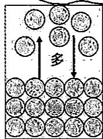  
纯溶剂

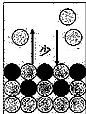  
溶液

19 世纪 80 年代拉乌尔(Raoult)研究了几十种溶液的蒸气压与温度的关系, 发现: 在一定温度下, 难挥发的非电解质溶液的蒸气压 p 等于纯溶剂蒸气压 $p_{A}^{0}$ 与溶剂的物质的量分数 $x_{A}$ 的乘积, 即: $p = p_{A}^{0} \cdot x_{A}$

这就是拉乌尔定律,用分子运动论可以对此做出解释:当气体和液体处于相平衡时,液态分子汽化的数目和气态分子凝聚的数目应相等。若溶质不挥发,则溶液的蒸气压全由溶剂分子挥发所产生,所以由液相逸出的溶剂分子数目自然与溶剂的物质的量分数成正比,而气相中溶剂分子的多少决定蒸气压大小,因此有:

$$
\frac {\text {溶液的蒸气压}}{\text {纯溶剂的蒸气压}} = \frac {\text {溶剂的物质的量分数} (x _ {\mathrm{A}})}{\text {纯溶剂物质的量分数为} (1)}
$$

即：

$$
p = p _ {\mathrm{A}} ^ {0} \cdot x _ {\mathrm{A}}
$$

由于溶质的物质的量分数 $x_{\mathrm{B}}$ 与 $x_{\mathrm{A}}$ 之和应等于1，因此 $p = p_{\mathrm{A}}^{0}\cdot x_{\mathrm{A}}$ 式可作如下变换：

基本理论学习笔记

$$
p = p _ {\mathrm{A}} ^ {0} \cdot (1 - x _ {\mathrm{B}})
$$

$p_{A}^{0}-p=p_{A}^{0}\cdot x_{B}$ ; 即 $\Delta p=p_{A}^{0}\cdot x_{B}$ 。

这是拉乌尔定律的另一表达式， $\Delta p$ 为溶液的蒸气压下降值。对于稀溶液而言，溶剂的量 $n_{A}$ 远大于溶质的量 $n_{B}, n_{A} + n_{B} \approx n_{A}$ ，因此上式可改写为：

$$
\Delta p = p _ {\mathrm{A}} ^ {0} \cdot \frac {n _ {\mathrm{B}}}{n _ {\mathrm{A}}}
$$

在定温下，一种溶剂的 $p_{\mathrm{A}}^{0}$ 为定值， $\frac{n_{\mathrm{B}}}{n_{\mathrm{A}}}$ 用质量摩尔浓度 $b$ 表示，

$$
b _ {\mathrm{B}} = \frac {n _ {\mathrm{B}}}{m _ {\mathrm{A}}} = \frac {n _ {\mathrm{B}}}{\frac {n _ {\mathrm{A}} \cdot M}{1 0 0 0}} = \frac {1 0 0 0 n _ {\mathrm{B}}}{n _ {\mathrm{A}} \cdot M} \mathrm{mol/kg} \quad \frac {n _ {\mathrm{B}}}{\frac {n _ {\mathrm{A}} \times M}{1 0 0 0}} \mathrm{mol/kg}
$$

上式变为：

$$
\Delta p \approx p _ {\mathrm{A}} ^ {0} \cdot \frac {M \cdot b}{1 0 0 0} = K \cdot b
$$

式中 $K = p_{\mathrm{A}}^{\circ}\cdot M / 1000,M$ 是溶剂的摩尔质量。上式也是拉乌尔定律的一种表达形式。

## 1.7.2 溶液的沸点升高

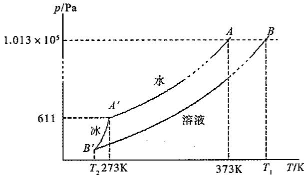

如上图所示：

(1)物质的饱和蒸气压 p，对温度工作图。上图是冰，水，水溶液的饱和蒸气压图。随着温度的升高，冰，水，溶液的饱和蒸气压都升高。在同一温度下，溶液的饱和蒸气压低于 $H_{2}O$ 的饱和蒸气压。冰的曲线斜率大，随温度变化大。

(2)373K 时, 水的饱和蒸气压等于外界大气压强 $(1.013 \times 10^{5} \text{Pa})$ , 故 373K 是 $\text{H}_{2}\text{O}$ 的沸点。如图中 A 点, 在该温度下, 溶液的饱和蒸气压小于 $1.013 \times 10^{5} \text{Pa}$ , 溶液未达到沸点。只有当温度达到 $T_{1}$ 时 $(T_{1} > 373\text{K}, \text{B} \text{点})$ , 溶液的饱和蒸气压才达到 $1.013 \times 10^{5} \text{Pa}$ , 才沸腾。可见, 由于溶液的饱和蒸气压的下降, 导致沸点升高。即溶液的沸点高于纯水。

液体的蒸气压随温度升高而增加, 当蒸气压等于外界压力时, 液体就沸腾, 这个温度就是液体的沸点 $(T_{\mathrm{b}}^{0})$ 。因溶液的蒸气压低于纯溶剂, 所以在 $T_{\mathrm{b}}^{0}$ 时, 溶液的蒸气压小于外压。当温度继续升高到 $T_{\mathrm{b}}$ 时, 溶液的蒸气压才等于外压, 此时溶液沸腾。 $T_{\mathrm{b}}$ 与 $T_{\mathrm{b}}^{0}$ 之差即为溶液的沸点升高值 $(\Delta T_{\mathrm{b}})$ 。

$$
\Delta T _ {b} \propto \Delta p
$$

$$
\Delta T _ {\mathrm{b}} = k \Delta p \approx k \cdot p _ {\mathrm{A}} ^ {0} \cdot \frac {b}{1 0 0 0 / M} = K _ {\mathrm{b}} \cdot b
$$

即： $\Delta T_{\mathrm{b}}\approx K_{\mathrm{b}}\cdot b$

式中 $K_{b}$ 是溶剂的摩尔沸点升高常数。不同溶剂的 $K_{b}$ 值不同(见下表)。利用沸点升高，可以测定溶质的相对分子质量。在实验工作中常常利用沸点升高现象用较浓的盐溶液来做高温热浴。

## 1.7.3 溶液的凝固点降低

在上图中冰线和水线的交点(A'点)处,冰和水的饱和蒸气压相等。此点的温度为 $T_{1}^{0}=273\mathrm{K}, p \approx 611\mathrm{Pa}$ , 是 $\mathrm{H}_{2}\mathrm{O}$ 的凝固点, 即为冰点。在此温度时, 溶液饱和蒸气压低于冰的饱和蒸气压, 即: $p_{\text {冰}} > p_{\text {溶}}$ , 当两种物质共存时, 冰要融化, 或者说, 溶液此时尚未达到凝固点。只有降温, 到 $T_{2}$ 时, 冰线和溶液线相交(B'点), 即: $p_{\text {冰}} = p_{\text {溶液}}$ , 溶液开始结冰, 达到凝固点。 $T_{2}<273\mathrm{K}$ , 即溶液的凝固点下降, 比纯水低。即溶液的蒸气压下降, 导致其凝固点下降。

在 101kPa 下，纯液体和它的固相平衡的温度就是该液体的正常凝固点，在此温度时液相的蒸气压与固相的蒸气压相等。纯水的凝固点为 273K，此温度时水和冰的蒸气压相等。但在 273K，水溶液的蒸气压低于纯水的，所以水溶液在 273K 不结冰。若温度继续下降，冰的蒸气压下降率比水溶液大，当冷却到 $T_{f}$ 时，冰和溶液的蒸气压相等，这个平衡温度 ( $T_{f}$ ) 就是溶液的凝固点。

$T_{f}^{0}-T_{f}=\Delta T_{f}$ 就是溶液的凝固点降低值。同样，它也是和溶液的质量摩尔浓度成正比，即：

$$
\Delta T _ {i} \approx K _ {i} \cdot b
$$

式中 $K_{f}$ 是溶剂的摩尔凝固点降低常数。不同溶剂的 $K_{f}$ 值不同（见下表）。利用凝固点降低，可以测定溶质的相对分子质量，并且准确度优于沸点升高法。这是由于同一溶剂的 $K_{f}$ 比 $K_{b}$ 大，实验误差相应较小，而且在凝固点时，溶液中有晶体析出，现象明显，容易观察，因此利用凝固点降低测定相对分子质量的方法应用很广。此外，溶液的凝固点降低在生产、科研方面也有广泛应用。例如在严寒的冬天，汽车散热水箱中加入甘油或乙二醇等物质，可以防止水结冰；食盐和冰的混合物作冷冻剂，可获得 $-22.4^{\circ}C$ 的低温，用 $CaCl_{2} \cdot 6H_{2}O$ 和冰最低可降到 $-55^{\circ}C$ 。

常用溶剂的 $K_{f}$ 和 $K_{b}$

<table><tr><td>溶剂</td><td> $T_{f}^{0}/K$ </td><td> $K_{f}/(K·kg·mol^{-1})$ </td><td> $T_{b}^{0}/K$ </td><td> $K_{b}/(K·kg·mol^{-1})$ </td></tr><tr><td>水</td><td>273.0</td><td>1.86</td><td>373</td><td>0.512</td></tr><tr><td>苯</td><td>278.5</td><td>5.10</td><td>353.15</td><td>2.53</td></tr><tr><td>环己烷</td><td>279.5</td><td>20.20</td><td>354.0</td><td>2.79</td></tr><tr><td>乙酸</td><td>290.0</td><td>3.90</td><td>391.0</td><td>2.93</td></tr><tr><td>四氯化碳</td><td>250.2</td><td>29.8</td><td>349.7</td><td>5.03</td></tr><tr><td>萘</td><td>353.0</td><td>6.90</td><td>491.0</td><td>5.80</td></tr><tr><td>樟脑</td><td>451.0</td><td>40.00</td><td>481.0</td><td>5.95</td></tr></table>

热力学观点看，溶液沸点升高和凝固点降低是熵效应的结果。如水在沸点时的相变过程： $\mathrm{H}_2\mathrm{O}(\mathrm{l}) \rightleftharpoons \mathrm{H}_2\mathrm{O}(\mathrm{g}), \Delta_r G_m^{\ominus} = 0$ 。根据吉布斯-亥姆霍兹方程，有 $T_b = \Delta_r H_m^{\ominus} / (S_m^{\ominus}[\mathrm{H}_2\mathrm{O}(\mathrm{g})] - S_m^{\ominus}[\mathrm{H}_2\mathrm{O}(\mathrm{l}))$ 加入难挥发的溶质后，使液体熵值增加，而 $S_m^{\ominus}[\mathrm{H}_2\mathrm{O}(\mathrm{g})]$ 和 $\Delta_r H_m^{\ominus}$ 却几乎不变，于是式中分母项变小，导致 $T_{b}$ 升高。对凝固点降低，可作同样的分析。

注意:沸点升高和凝固点降低公式的适用范围为不挥发的非电解质的稀溶液。经常用于测定相对分子质量。

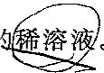

## 1.7.4 稀溶液的依数性的应用

解释水的步冷曲线: 在冷却过程中, 物质的温度随时间而变化的曲线, 叫作步冷曲线, 如下图所示。

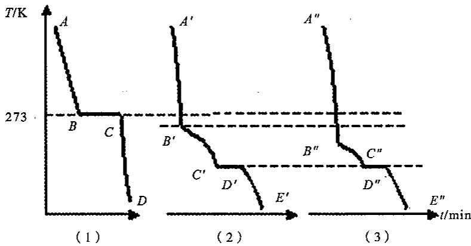  
在步冷曲线中，纵坐标为温度，横坐标为时间。

曲线(1)是 $H_{2}O$ 的步冷曲线:AB 段是液态水,温度不断下降;B 点开始结冰;BC 段温度不变;C 点全部结冰;CD 段冰的温度不断下降。

曲线(2)是水溶液的步冷曲线。 $A^{\prime}B^{\prime}$ 段是液相，温度不断下降； $B^{\prime}$ 点低于 273K，溶液的冰点下降。有冰析出，溶液的浓度增加，冰点更低，温度下降，故 $B^{\prime}C^{\prime}$ 段温度不恒定； $C^{\prime}$ 点时，冰和溶质一同析出；且二者具有固定的比例，即和此时溶液的比例相同。这样析出冰和溶质时，溶液的组成不再改变，故 $C^{\prime}D^{\prime}$ 段呈现平台。 $D^{\prime}$ 全部析出，成为固体。 $D^{\prime}E^{\prime}$ 段继续降温。从 $C^{\prime}$ 点析出的冰盐混合物，叫低共熔混合物， $C^{\prime}$ 点的温度称为低共熔点。溶质相同而浓度不同的溶液，析出的低共熔混合物的组成相同，低共熔点也相同。

曲线(3)也是该种溶液的步冷曲线,从 $B''$ 的温度比 $B'$ 温度低,看出溶液的浓度要比(2)的大。低共熔混合物的组成相同,低共熔点也相同。

## 1.7.5 溶液的渗透压

如下图所示,用一种能够让溶剂分子通过而不让溶质分子通过的半透膜(如胶棉、硝酸纤维素膜、动植物膜组织等)把纯水和蔗糖溶液隔开,这时由于膜两侧水的浓度不同,因此单位时间内纯水透过半透膜而进入蔗糖溶液的水分子数比从蔗糖水溶液透过半透膜而进入纯水的水分子数多(如下右图),从表观看来,只是水透过半透膜而进入蔗糖溶液。

在 U 形管中,用半透膜将等体积的纯水和蔗糖溶液分开,放置一段时间,会发生的现象是:蔗糖溶液的液面升高;而纯水的液面降低。这种溶剂分子通过半透膜单方向扩散进入溶液的现象,称为渗透现象。

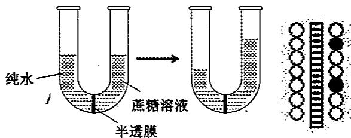

渗透现象发生以后：

(1)纯水一侧水柱的高度降低,静压减小,使右行的水分子数目减少;

(2)蔗糖溶液一侧水柱升高,使左行的水分子数目增加;

(3)蔗糖溶液变稀,膜右侧的水分子的分数增加,亦使左行的 $H_{2}O$ 分子数目增加。

当过程进行到一定程度时,右行和左行的水分子数目相等,这时,达到平衡,即两侧水柱高度不再变化。液面高度差造成的静压,称为溶液的渗透压,用 $\pi$ 表示,单位为 Pa。

19 世纪 80 年代, 范特霍夫对当时的实验数据进行归纳比较后发现, 稀溶液的渗透压与浓度、温度的关系, 与理想气体状态方程相似, 可表示为:

$$
\pi = \frac {n}{V} R T
$$

式中 $\pi$ 是溶液的渗透压, V 是溶液体积, n 是溶质的物质的量, R 是摩尔气体常数, T 是绝对温度。

渗透作用在动植物生活中有非常重要的作用。动植物体都要通过细胞膜产生的渗透作用，以吸收水分和养料。人体的体液、血液、组织等都有一定的渗透压。对人体进行静脉注射时，必须使用与人体体液渗透压相等的等渗溶液，如临床常用的0.9%的生理盐水和5%的葡萄糖溶液，否则将引起血球膨胀（水向细胞内渗透）或萎缩（水向细胞外渗透）而产生严重后果。同样道理，如果土壤溶液的渗透压高于植物细胞液的渗透压，将导致植物枯死，所以不能使用过浓的肥料。

化学上利用渗透作用来分离溶液中的杂质,测定高分子物质的相对分子质量。近年来,电渗析法和反渗透法(如果外加在液面上的压力超过渗透压,则会使溶液中的水向纯水的方向流动,使水的体积增加)。普遍应用于海水、咸水的淡化。

非电解质稀溶液的 $\Delta p, \Delta T_{\mathrm{b}}, \Delta T_{\mathrm{f}}$ 以及 $\pi$ 的实验值与计算值基本相符，但电解质溶液的实验值与计算值差别相当大。如 $0.01\mathrm{mol / kg}$ 的NaCl溶液， $\Delta T_{\mathrm{f}}$ 计算值为 $0.0186\mathrm{K}$ ，而实际测定 $\Delta T_{\mathrm{f}}$ 值却是 $0.0361\mathrm{K}$ 。阿累尼乌斯认为，这是由于电解质在溶液中发生了电离的结果。有些电解质（如醋酸、氨水、氯化汞等）电离度很小，称为弱电解质；有些电解质（如盐酸、氢氧化钠、氯化钾等）的电离度相当大，称为强电解质。现代的强电解质溶液理论认为，强电解质在水溶液中是完全电离的，但由于离子间存在着相互作用，离子的行动并不完全自由，所以实际测定的“表观”电离度小于 $100\%$ 。

## 1.7.6 分配定律

在一定温度下,如果在两种互不相溶的液体混合物( $\alpha$ 相及 $\beta$ 相)中,加入一种既溶于 $\alpha$ 相又溶于 $\beta$ 相的组分,在一定温度下达到平衡时,溶质A在两液层中浓度之比为一常数,这种规律称为分配定律。其数学表达式为:

$$
K = c _ {\mathrm{A}} ^ {\alpha} / c _ {\mathrm{A}} ^ {\beta}
$$

式中 K 为分配系数； $c_{A}^{\alpha}$ 为溶质 A 在溶剂 $\alpha$ （萃取剂）中的浓度； $c_{A}^{\beta}$ 为溶质 A 在溶剂 $\beta$ （原溶剂）中的浓度。经验表明，溶液越稀，分配定律越符合实际。

## 1.7.7 萃取分离

萃取分离法是利用一种与水不相溶的有机溶剂与试液一起振荡，使某组分转入有机相，另外的组分留在水相，从而达到分离的目的。溶剂萃取的实质是物质在互不相溶的两种溶剂中的分配差异。萃取过程是物质在两相中溶解过程的竞争，服从相似相溶原理。萃取分离的主要仪器是分液漏斗。具体操作如下：将试液（水溶液）置于60～125mL的梨形分液漏斗中，加入萃取溶剂后立即振荡，使溶质充分转移至萃取溶剂中（振荡过程中应适时放气）。静置分层，然后将两相分开。

在实际工作中,常用萃取百分率 E 来表示萃取的完全程度。萃取百分率是物质被萃取到有机相中的比率。

$$
E = \frac {\text {被萃取物质在有机相中的总量}}{\text {被萃取物质的总量}} \times 100
$$

萃取时,为提高萃取效率,通常采用“少量多次”的方法。

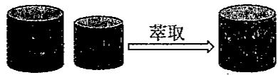

$$
K = \frac {\frac {m _ {0} - m _ {1}}{V _ {\mathrm{b}}}}{\frac {m _ {1}}{V _ {\mathrm{a}}}} = \frac {(m _ {0} - m _ {1}) V _ {\mathrm{a}}}{m _ {1} V _ {\mathrm{b}}}; m _ {1} = m _ {0} \frac {V _ {\mathrm{a}}}{V _ {\mathrm{a}} + K V _ {\mathrm{b}}}
$$

第二次萃取剩余量 $m_{2}$ 应为：

$$
K = \frac {\frac {m _ {1} - m _ {2}}{V _ {\mathrm{b}}}}{\frac {m _ {2}}{V _ {\mathrm{a}}}} = \frac {(m _ {1} - m _ {2}) V _ {\mathrm{a}}}{m _ {2} V _ {\mathrm{b}}}
$$

$$
m _ {2} = m _ {1} \left(\frac {V _ {\mathrm{a}}}{V _ {\mathrm{a}} + K V _ {\mathrm{b}}}\right) = m _ {0} \left(\frac {V _ {\mathrm{a}}}{V _ {\mathrm{a}} + K V _ {\mathrm{b}}}\right) ^ {2}
$$

依次类推 $n$ 次萃取后剩余量

$$
m _ {n} = m _ {0} \left(\frac {V _ {\mathrm{a}}}{V _ {\mathrm{a}} + K V _ {\mathrm{b}}}\right) ^ {n}
$$

式中 K 称为分配系数，即溶质在萃取剂中的浓度与在水溶液中浓度的比值。

## 1.7.8 溶解度原理(相似相溶原理)

限于理论发展水平,至今我们还无法预言气体、液体、固体在液体溶剂中的溶解度,但是我们可以按照“相似相溶”这个一般溶解度原理来估计不同溶质在液体溶剂中的相对溶解程度。“相似”是指溶质与溶剂在结构或极性上相似,因此分子间作用力的类型和大小也基本相同;“相溶”是指彼此互溶。也就是说,极性分子易溶于极性溶剂(如水),而弱极性或非极性分子易溶于弱极性或非极性溶剂(如有机溶剂氯仿、四氯化碳等)。

液体溶质,如乙醇( $\mathrm{C_{2}H_{5}OH}$ )在水中的溶解度比乙醚( $\mathrm{CH_{3}CH_{2}OCH_{2}CH_{3}}$ )大得多,这是因为乙醇是极性分子,分子中含有一OH基,与水相似,而且 $\mathrm{C_{2}H_{5}OH}$ 与 $\mathrm{C_{2}H_{5}OH}$ 、 $\mathrm{C_{2}H_{5}OH}$ 与 $\mathrm{H_{2}O}$ 、 $\mathrm{H_{2}O}$ 与 $\mathrm{H_{2}O}$ 分子间都含有氢键,作用力也大致相等;而乙醚属非极性分子。

在固体溶质中,大多数离子化合物在水中的溶解度较大,非极性分子如固态 $I_{2}$ 难溶于水而易溶于弱极性或非极性的有机溶剂(如四氯化碳)中。另外,固态物质的熔点对其在液体溶剂中的溶解度也有一定的影响,一般结构相似的固体化合物在同一溶剂中低熔点的固体将比高熔点固体易溶解。

对于气体而言,在液体溶剂中的溶解度规律是:在同一溶剂中,高沸点气体比低沸点气体的溶解度大;具有与气体溶质最为近似分子间力的溶剂是该气体的最佳溶剂。如卤化氢气体较稀有气体易溶于水,而且随着卤素原子序数的递增,卤化氢的沸点升高,在水中的溶解度增大。

## 【例题精析】

【例 1】在有效数字的运算规则中,几个数据相乘除时,它们的积或商的有效数字的保留应以
A. 小数点后位数最少的数据为准    B. 相对误差最大的数据为准
C. 有效数字位数最少的数据为准    D. 绝对误差最大的数据为准
E. 计算器上显示的数字为准

【例 2】当有效数字位数确定后,对其多余数字进行修约时,当拟舍去数字的最左一位数字等于5时,正确的修约方法是:
A. 5 后非零时舍弃
B. 5 后非零时进位
C. 5 后为零时舍弃
D. 5 后为零时进位

E.5后无数字或者为零时，则所保留的末位数字为奇数时应进位，为偶数时应舍弃

【例 3】 在 298K, 101000Pa 时, 用排水集气法收集氢气, 收集到 355mL。已知 298K 时水的饱和蒸气压为 3200Pa, 计算:

(1)氢气的分压是多少?

(2)收集的氢气的物质的量为多少?

(3)这些氢气干燥后的体积是多少(干燥后气体温度,压强视为不变)?

【例 4】 相对湿度的定义为: 在某一温度时, 空气中水蒸气的分压与同温度应有的饱和水蒸气压之比。试计算:

(1)303K, 相对湿度为 100% 时 1L 空气中含水汽之质量。

(2)323K, 相对湿度为 80% 时 1L 空气中含水汽之质量。

（已知：水的饱和蒸气压：303K时为4239.6Pa，323K时为12332.3Pa，结果保留两位有效数字）

【例 5】将 5.50g 某纯净试样溶于 250g 苯中，测得该溶液的凝固点为 4.51℃，求该试样的相对分子质量（纯苯的凝固点为 5.53℃，凝固点降低常数为 5.12K·kg/mol）。

【例 6】 将 12.0g 尿素 $\left[\mathrm{CO}\left(\mathrm{NH}_{2}\right)_{2}\right]$ 和 34.2g 蔗糖 $\left(\mathrm{C}_{12}\mathrm{H}_{22}\mathrm{O}_{11}\right)$ 分别溶于 2000g 水中，计算此两种溶液的沸点 $(K_{\mathrm{b}}=0.52\mathrm{K}\cdot\mathrm{kg}/\mathrm{mol})$ ；若将12.0g尿素 $\left[\mathrm{CO}(\mathrm{NH}_{2})_{2}\right]$ 和34.2g蔗糖 $\left(\mathrm{C}_{12}\mathrm{H}_{22}\mathrm{O}_{11}\right)$ 都加于2000g水中，计算此溶液的沸点。

【例 7】为了防止汽车水箱中的水在 266K 时凝固，以无水乙醇( $\rho=0.803g/mL$ )做防冻剂，问每升水须加多少毫升乙醇？（假设溶液服从拉乌尔定律，水的凝固点降低常数为 $1.86K \cdot kg/mol$ ）

【例 8】人体血的渗透压为 709.275kPa，人体温度为 $37^{\circ}C$ 。试计算给人体输液时所用葡萄糖溶液的质量分数是多少？（设葡萄糖溶液密度是 1.01g/mL；葡萄糖的摩尔质量 M 为 180g/mol）。

【例 9】海水在 298K 时的渗透压为 1479kPa，采用反渗透法制取纯水，试确定用 1000mL 的海水通过只能使水透过的半透膜，提取 100mL 的纯水，所需要的最小外加压力是多少？

【例 10】若某溶质在水和一有机溶剂中的分配常数为 K[一次萃取后,溶质在有机溶剂和水中的浓度(g/L)之比]。求证:

(1)用与水溶液等体积的该有机溶剂进行一次萃取后,溶质在水溶液中的残留量为原质量的 $\frac{1}{1+K}$ 。

(2)用相当于水溶液体积的 $\frac{1}{10}$ 的该有机溶质进行10次萃取后，溶质在水溶液中的残留量为原质量的 $\left(\frac{10}{10+K}\right)^{10}$ 。

## 【习题精练】

1. 下列数据中具有三位有效数字的是
A. 0.35 B. 0.102 C. 9.90 D. $1.4 \times 10^{3}$ E. $pK_{a} = 4.74$

2.下列数据均保留两位有效数字,修约结果错误的是 ( )
A.1.25→1.3 B.1.35→1.4 C.1.454→1.5 D.1.5456→1.6 E.1.7456→1.7

2.534 ×1000 3.算式 $\frac{2.034 \times 0.5106 \times 603.8}{0.3512 \times 4000}$ 中每个数据的最后一位都有±1的绝对误差。哪个数据在计算结果中引入的相对误差最大？ A.2.034 B.0.5106 C.603.8 D.0.3512 E.4000 （）

X-T 4. 算式(30.582-7.43)+(1.6-0.54)+2.4963中，绝对误差最大的数据是（）
A. 30.582 B. 7.43 C. 1.6 D. 0.54 E. 2.4963

5. 称量法测定黄铁矿中硫的含量，称取样品 0.3853g，下列分析结果合理的是（）
A. 36% B. 36.4% C. 36.41% D. 36.410% E. 36.4103%

6. 由计算器得 $\frac{4.178 \times 0.0037}{60.4}$ 的结果为 0.000255937，按有效数字运算规则应将结果修约为
A. 0.0002 B. 0.00026 C. 0.000256 D. 0.0002559 E. 0.00025594

7. 人在呼吸时，吸入的空气与呼出的气体组成不同。一健康人在 310K, $1.01 \times 10^{5}$ Pa时，吸入的空气体积分数约为： $N_{2}$ 79.0%； $O_{2}$ 21.0%。而呼出的气体体积分数约为： $N_{2}$ 75.1%； $O_{2}$ 15.2%； $CO_{2}$ 3.80%； $H_{2}O(g)$ 5.9%。

(1)试计算呼出气体的平均摩尔质量及 $CO_{2}$ 的分压。

(2)用计算结果说明呼出的空气比吸入的空气的密度是大还是小。

8. 在 300K、1.013×10 $^{5}$ Pa 时，加热一敞口细颈瓶到 500K，然后封闭其细颈口，并冷

却至原来的温度,求此时瓶内的压强。

9. 测定相对分子质量的一个实验步骤为(其装置如右图所示): 取一干燥的 250mL 圆底烧瓶、封口用铝箔和棉线一起称量(称准到 0.1g), 得 $m_{1}$ 。往烧瓶内加入大约 2mL CCl₄(沸点为 76.7℃), 用铝箔和棉线封口并在铝箔上穿一小孔。把烧瓶迅速浸入盛于大烧杯内的沸水中, 继续保持水的沸腾。待 CCl₄ 全部汽化后, 从水中取出烧瓶冷却。擦干烧瓶外的水后称量(准确到 0.1g), 得 $m_{2}$ 。倒出瓶内的液态 CCl₄, 充满水, 量体积(室温时水的密度大约 1g/cm³)。按理想气体公式 pV=mRT/M 求 CCl₄ 的相对分子质量(M)。式中 p 为压强(Pa), V 为体积(L), m 为 $CCl_{4}$ 的质量(g), R 为气体常数8.314J/(mol·K), T 为绝对温度。( $CCl_{4}$ 的密度为1.595g/cm³)

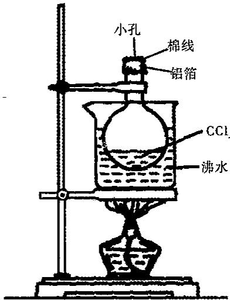

请考虑并回答以下几个问题：

(1)把烧杯放入沸水中,为什么要保持沸腾?

(2)如果在铝箔上开的孔较大,又在瓶内液态 $CCl_{4}$ 挥发完后过了一段时间才从热水中取出烧瓶,其他操作均正常。按以上不正确操作所得的实验数据求 $CCl_{4}$ 的相对分子质量将偏大还是偏小?

(3)用水充满烧瓶再量其体积,实验前忘了倒出原先在瓶内的液态 $CCl_{4}$ , 是否会对实验结果造成影响?

(4) 把烧瓶放入沸水中, 要尽可能没人。事实上用这个装置求相对分子质量时很难做到将烧瓶完全没入水中, 而总有部分露在水面上 (见图), 这是否会对实验结果造成影响?

10. 在 273K 和 $1.01 \times 10^{5}$ Pa 下，将 1.0L 洁净干燥的空气缓慢通过 $CH_{3}OCH_{3}$ 液体，在此过程中，液体损失 0.0335g，求此液体 273K 时的饱和蒸气压。

11. 无水氯化铝可用干燥的氯化氢气体与铝加热制得，今以 2.7g 铝与标态下 7.84L HCl 作用。然后在 $1.013 \times 10^{5}$ Pa、546K 下（此时氯化铝也为气体）测得气体总体积为 11.2L。试通过计算写出气态氯化铝的分子式。

12. 两个体积相等的玻璃球，中间用细管连通（其体积不计），开始时两球温度均为300K，共含0.7mol $H_{2}$ ，其压强为 $0.5 \times p^{0}$ （ $p^{0}$ 为标准压力，其值为101.325kPa，1kPa= $10^{3}$ Pa）。若将甲球放入400K油浴中，而乙球仍为300K。求两球内的压强和 $H_{2}$ 的物质的量。

13. 在科学院出版物《化学指南》里有下列一些物质饱和蒸气压的数据。

<table><tr><td>物质</td><td>温度(°C)</td><td>蒸气压(mmHg)</td><td>密度(g/L)</td></tr><tr><td>苯 $C_6H_6$ </td><td>80.1</td><td>760</td><td>2.710</td></tr><tr><td>甲醇 $CH_3OH$ </td><td>49.9</td><td>400</td><td>0.673</td></tr><tr><td>醋酸 $CH_3COOH①$ </td><td>29.9</td><td>20</td><td>0.126</td></tr><tr><td>醋酸 $CH_3COOH②$ </td><td>118.1</td><td>760</td><td>3.110</td></tr></table>

(1)根据所列数字计算蒸气的摩尔质量(假设蒸气中的分子类似理想气体分子)。

(2)如何解释相对质量的理论值与所得计算值之间的偏差？对此给出定性的并尽可能定量的解释。

14. 有每毫升含碘 $1\mathrm{mg}$ 的水溶液 $10\mathrm{mL}$ , 若用 $6\mathrm{mL} \mathrm{CCl}_{4}$ 一次萃取此水溶液中的碘, 问水溶液中剩余多少碘? 若将 $6\mathrm{mL} \mathrm{CCl}_{4}$ 分成三次萃取, 每次用 $2\mathrm{mL} \mathrm{CCl}_{4}$ , 最后水溶液中剩余多少碘? 哪个方法好? (已知分配比 $K = 85$ )

15. 在 $20^{\circ}$ C 和 101kPa 下，每升水最多能溶解氧气 0.0434g，氢气 0.0016g，氮气 0.0190g，试计算：

(1) 在 $20^{\circ}$ C 时 202kPa 下，氧、氢、氮气在水中的溶解度（以 mL/L 表示）。

(2)设有一混合气体,各组分气体的体积分数是氧气 25%、氢气 40%、氮气 35%。总压力为 505kPa。试问在 20℃时,该混合气体的饱和水溶液中含氧气、氢气、氮气的质量分数各为多少?

16. 已知某不挥发性物质的水溶液的沸点是 $100.39^{\circ}C$ ，在 $18^{\circ}C$ $101kPa$ 下，将 3.00L 空气缓慢地通过此溶液时，将带走水多少克？（已知水的摩尔沸点升高常数 $K_{b}=0.52$ ， $18^{\circ}C$ 时，水的饱和蒸气压为 $p^{0}=2.06kPa$ ）

17. 25℃时，水的饱和蒸气压为 3.166kPa，求在相同温度下 5.0% 的尿素 $\left[\mathrm{CO}(\mathrm{NH}_{2})_{2}\right]$ 水溶液的饱和蒸气压。

18. 烟草的有害成分尼古丁的实验式是 $C_{5}H_{7}N$ ，今将 496mg 尼古丁溶于 10.0g 水中，所得溶液的沸点是 $100.17^{\circ}C$ 。求尼古丁的相对分子质量。（水的 $K_{b}=0.512K\cdot kg/mol$ ）

19. 把 1.00g 硫溶于 20.0g 萘中，溶液的凝固点为 351.72K，求硫的相对分子质量。（已知萘的凝固点为 353K，萘的凝固点降低常数为 6.90K·kg/mol）

20. 在 1.00L 溶液中，含有 5.0g 马的血红素，在 298K 时测得溶液的渗透压为 1.82×10²Pa，求马的血红素相对分子质量。

21. 含 $I_{2}$ 的水溶液 100mL，其中含 $I_{2}$ 10.00mg，用 90mL CCl $_{4}$ 按下述两种方法进行萃取：

(1)90mL一次萃取。

(2)每次用 30mL, 分三次萃取。试比较其萃取效率 $(K=c_{\mathrm{I}_{2}}^{\mathrm{CCl}_{4}}/c_{\mathrm{I}_{2}}^{\mathrm{H}_{2}\mathrm{O}}=85)$ 。

22. 已知 $A + B \rightarrow C + H_{2}O$ 。 $t^{\circ}C$ 、A、B、C 三种物质的溶解度分别为 $S_{1}$ 、 $S_{2}$ 、 $S_{3}g$ 。现取 $t^{\circ}C$ 时 A 的饱和溶液 Mg，B 的饱和溶液 Ng，混合后恰好完全反应生成 C 物质 Pg。

(1)求反应中生成水多少 g?

(2)通过计算推断:在此反应中 C 物质沉淀的条件是什么?

## 【例题参考答案】

【例 1】根据有效数字的运算规则,此题应选择 B、C。

【例 2】根据有效数字的修约规则,此题应选择 B、E。

【例 3】（1）混合气中氢气的分压 $p(H_{2})$ 为：

$$
p (\mathrm{H} _ {2}) = p - p (\mathrm{H} _ {2} \mathrm{O}) = 1 0 1 0 0 0 \mathrm{Pa} - 3 2 0 0 \mathrm{Pa} = 9 7 8 0 0 \mathrm{Pa}.
$$

(2)所得氢气的物质的量 $n(\mathrm{H}_2) = \frac{p(\mathrm{H}_2)\cdot V}{RT} = \frac{97800\times 355\times 10^{-6}}{8.314\times 298} = 0.0140\mathrm{mol}$ 。

(3)所得干燥氢气得体积 $V(\mathrm{H}_2) = V_{\text{总}} \times \frac{p(\mathrm{H}_2)}{p_{\text{总}}} = 355 \times \frac{97800}{101000} = 344\mathrm{mL}$ 。

【例4】(1)303K空气中水汽的分压为： $\frac{p(\mathrm{H}_2\mathrm{O})}{4239.6}\times 100\% = 100\%$

$p(\mathrm{H}_{2}\mathrm{O}) = 4239.6\mathrm{Pa}$ 代入 $m = \frac{pVM}{RT}$ ，得 $m = 0.030\mathrm{g}$ 。

(2) 同理 1=0.066g。

【例 5】设该试样的摩尔质量为 M，

$$
\Delta T _ {\mathrm{f}} = K _ {\mathrm{f}} \cdot m _ {\mathrm{B}} = K _ {\mathrm{f}} \cdot \frac {\frac {5 . 5 0 \mathrm{g}}{M}}{0 . 2 5 \mathrm{kg}}, M = \frac {5 . 1 2 \times 5 . 5}{(5 . 5 3 - 4 . 5 1) \times 0 . 2 5 0} = 1 1 0 \mathrm{g/mol}.
$$

$$
M _ {\mathrm{尿素}} = 6 0 \mathrm{g/mol}, b _ {\mathrm{尿素}} = [ 1 2. 0 / (6 0 \times 2 0 0 0) ] \times 1 0 0 0 = 0. 1 \mathrm{mol/kg}
$$

$$
\Delta T _ {\mathrm{b尿素}} = 0. 5 2 \times 0. 1 = 0. 0 5 2 \mathrm{K}, T _ {\mathrm{b尿素}} = 3 7 3. 1 5 + 0. 0 5 2 \approx 3 7 3. 2 \mathrm{K} 。
$$

$$
M _ {\mathrm{蔗糖}} = 3 4 2 \mathrm{g/mol}, b _ {\mathrm{蔗糖}} = [ 3 4. 2 / (3 4 2 \times 2 0 0 0) ] \times 1 0 0 0 = 0. 0 5 \mathrm{mol/kg}
$$

$$
\Delta T _ {\mathrm{b蔗糖}} = 0. 5 2 \times 0. 0 5 = 0. 0 2 6 \mathrm{K}, T _ {\mathrm{b蔗糖}} = 3 7 3. 1 5 + 0. 0 2 6 \approx 3 7 3. 1 8 \mathrm{K} 。
$$

根据稀溶液依数性具有加和性： $\Delta T_{b}=0.52\times(0.1+0.05)=\Delta T_{b尿素}+\Delta T_{b蔗糖}=0.078K,T_{b}=373.15+0.078\approx373.23K$ 。

【例 7】已知水的凝固点为 $273K, K_{f}=1.86K \cdot kg/mol, \Delta T_{f}=273-266=7K$

$$
\Delta T _ {\mathrm{f}} = K _ {\mathrm{f}} \times b _ {\mathrm{B}}, \text {   得   } b _ {\mathrm{B}} = \Delta T _ {\mathrm{f}} / K _ {\mathrm{f}} = 7 / 1. 8 6 = 3. 7 6 \mathrm{mol/kg}
$$

即每升水加 3.76mol 乙醇，已知 $M_{乙醇}=46g/mol,\rho=0.803g/mL$ ，则应加入乙醇体积为 $V=3.76\times46/0.803=215.4mL$ 。

【例8】由 $\pi = cRT$ 得 $c = \pi /RT,c = 709.275 / [8.314\times (273.15 + 37)] = 0.28\mathrm{mol / L}$

$$
w \% = c \cdot M / 1000 \cdot \rho = 0.28 \times 180 / (1000 \times 1.01) \times 100 \% = 5.0\%
$$

【例 9】随着反渗透的进行, 海水中盐的浓度增大, 当得到 100mL 纯水时, 最终海水的渗透压 $\pi_{2}$ 和初始海水的渗透压 $\pi_{1}$ 的比值为 $\frac{\pi_{2}}{\pi_{1}} = \frac{c_{2}RT}{c_{1}RT} = \frac{c_{2}}{c_{1}}; \pi_{2} = \pi_{1} \frac{c_{2}}{c_{1}}$

因为渗透前后溶质的物质的量未减少, $c_{1}=nmol/1L$ ; $c_{2}=nmol/0.9L$

$$
\frac {c _ {2}}{c _ {1}} = \frac {1 0 0 0}{9 0 0} = \frac {1 0}{9}, \pi_ {2} = 1 4 7 9 \times \frac {1 0}{9} = 1 6 4 3 \mathrm{kPa}.
$$

【例 10】（1）假设：有机相的体积为 $V_{0}L$ ；水相的体积为 $V_{a}L$ ；萃取前溶质的质量为 mg；一次萃取后溶质在有机相中的质量为 $m_{0}g$ 浓度为 $c_{0}g/L$ ；一次萃取后溶质在水相中的质量为 $m_{a}g$ ；浓度为 $c_{a}g/L$ ；分配常数为 K，根据分配定律：

$$
K = \frac {c _ {0}}{c _ {\mathrm{a}}}
$$

$K=\frac{m_{0}/V_{0}}{m_{a}/V_{a}}=\frac{(m-m_{a})/V_{0}}{m_{a}/V_{a}}$ ，故 $m_{a}=m\cdot\frac{1}{1+K}\frac{V_{0}}{V_{a}}$ ，根据题意 $V_{0}=V_{a}$ ，所以 $m_{a}=m\cdot\frac{1}{1+K}$ ，即一次萃取后溶质在水相中的残留量 $m_{a}$ 为原质量m的 $\frac{1}{1+K}$ 。
(2)由上述可知，一次萃取后溶质在水相中的质量为： $m_{a(1)}=m\cdot\frac{1}{1+K}\frac{V_{0}}{V_{a}}$ 据题意： $V_{0}=\frac{1}{10}V_{a}$ 代入上式得： $m_{a(1)}=m\cdot\frac{1}{1+K\cdot\frac{V_{a}/10}{V_{a}}}=m\cdot\frac{10}{10+K}$ 。
同理，二级萃取时，溶质在水相中的质量为： $m_{a(2)}=m_{a(1)}\frac{10}{10+K}=m(\frac{10}{10+K})^{2}$ 。
三级萃取时，溶质在水相中的质量为： $m_{a(3)}=m_{a(2)}\frac{10}{10+K}=m(\frac{10}{10+K})^{3}$ 。
n 级萃取时，溶质在水相中的质量为： $m_{a(n)}=m_{a(n-1)}\frac{10}{10+K}=m(\frac{10}{10+K})^{n}$ 。
∴当 n=10 时，则溶质在水相中的残留质量为： $m_{a(10)}=m(\frac{10}{10+K})^{10}$ 。

## 【习题参考答案】

1. B 2. AD 3. A 4. C 5. C 6. B

$$
p \left(\mathrm{CO} _ {2}\right) = 1.01 \times 10 ^ {5} \times 3.8 \% = 3.84 \times 10 ^ {3} \mathrm{Pa},
$$

(2) $\overline{M_{\mathrm{r}}}$ (吸) $= 28.0\times 79.0\% +32.0\times 21.0\% = 28.8\mathrm{g / mol}$

因为 $\overline{M_{r}}(呼)<\overline{M_{r}}(吸)$ 所以呼出的空气比吸入的空气的密度小。

8. 根据题意, 当瓶内温度为 500K 时, 瓶内气体体积将变为原来的 5/3 倍, 故瓶内气体的物质的量为全部气体的 3/5, 对应的压力为 $1.013 \times 10^{5}$ Pa, 降温前瓶内气体的物质的量不变, 则根据 pV/RT 为常数知 $p_{2} = 6.078 \times 10^{4}$ Pa。

9.(1)沸水温度高于 $CCl_{4}$ 的沸点(76.5℃)，使 $CCl_{4}$ 迅速汽化并充满烧瓶， $CCl_{4}$ 蒸气是 100℃、常压下的体积。

(2)将有部分 $CCl_{4}$ 蒸气逸出，使瓶内含少量空气，冷凝得到的 $CCl_{4}$ 质量较小，pV/RT=m/M，等号左边为定值，等号右边质量小了， $CCl_{4}$ 的摩尔质量偏小。

(3)烧瓶体积是 250mL, CCl₄ 密度大约 1.595g/mL, 冷凝的液态 CCl₄ 的体积大约为 1mL, 若未倒掉 CCl₄, 则烧瓶 (瓶内质量换算成) 容积将增大 1mL。引入误差 0.4%, 低于约 2mL CCl₄ 的质量约 3g (准确到 0.1g), 相对误差 3%, 影响不大。

(4)未全部没人,表明瓶内部分空间低于 $100^{\circ}C$ (在相同压强下),这部分空间的 $CCl_{4}$ 蒸气的温度比 $100^{\circ}C$ 下降许多。若露在水面上空间小,不会影响到实验结果。

$$
1 0. n _ {\text { 醚}} = m _ {\text { 醚 }} / M _ {\text { 醚}} = 0. 0 3 3 5 / 4 6 = 7. 2 8 \times 1 0 ^ {- 4} \mathrm{mol}
$$

$$
V _ {\text {醚}} = n _ {\text {醚}} R T / p _ {\text {总}} = 7. 2 8 \times 1 0 ^ {- 4} \times 8 3 1 4. 3 \times 2 7 3 / 1. 0 1 \times 1 0 ^ {5} = 0. 0 1 6 4 \mathrm{L}
$$

$$
V _ {\text {总}} = 1. 0 + 0. 0 1 6 4 = 1. 0 1 6 4 \mathrm{L}
$$

$$
p _ {\text {醚}} = n _ {\text {醚}} R T / V _ {\text {总}} = 7. 2 8 \times 1 0 ^ {- 4} \times 8 3 1 4. 3 \times 2 7 3 / 1. 0 1 6 4 = 1. 6 3 \times 1 0 ^ {3} \mathrm{Pa} 。
$$

11. $1.013 \times 10^{5}$ Pa、546K 条件下 1mol 气体体积是 44.8L，即 11.2L 气体是 0.25mol。氯化铝中，氯和铝的价态肯定是 -1,+3，故而

$$
3 n \mathrm{HCl} + n \mathrm{Al} = \mathrm{Al} _ {n} \mathrm{Cl} _ {3 n} + 3 n / 2 \mathrm{H} _ {2}
$$

显然 HCl 过量 0.05mol, 也就是说有 0.3mol 的 HCl 参与反应, 则生成氢气 0.15mol

所以气态氯化铝是 0.25-0.15-0.05=0.05mol，而参与反应的铝是 0.1mol，则 n=2，所以分子式 $Al_{2}Cl_{6}$ 。

12.0.571 $p^{0}$ ，甲球 0.3mol，乙球 0.4mol。

由 $p_{0}V=n/2\times RT_{0}, pV=n_{1}RT_{1}=n_{2}RT_{0}$ ; 则 $n_{1}:n_{2}=T_{0}:T_{1}=3:4$ , 所以甲球 0.3mol, 乙球 0.4mol。

$$
V = n _ {2} R T _ {0} / p = n / 2 \times R T _ {0} / p _ {0}, \text {则} p = p _ {0} \times n _ {2} / (n / 2) = p ^ {0} / 2 \times 4 / 3. 5 = 0. 5 7 1 p ^ {0} 。
$$

13. (1) $M(\mathrm{C}_{6}\mathrm{H}_{6}) = 78.5 \, \text{g/mol}, M(\mathrm{CH}_{3}\mathrm{OH}) = 33 \, \text{g/mol}, M(\mathrm{HAc})$ ① = 118.9 g/mol, $M(\mathrm{HAc})$ ② = 99.8 g/mol;

(2)误差是由蒸气分子的性质偏离理想气体分子的性质引起的。此外在甲醇分子中有少量的分子缔合，而在醋酸分子中有二聚分子 $\left(\mathrm{CH}_{3}\mathrm{COOH}\right)_{2}$ 。

14. 溶液中碘的含量为: $m=1\times10=10mg$

用 $6 \, mL \, CCl_{4}$ 一次萃取后水相中碘的剩余量为：

$$
m _ {\mathrm{a}} = m \cdot \frac {1}{1 + K \frac {V _ {0}}{V _ {\mathrm{a}}}} = 1 0 \times \frac {1}{1 + 8 5 \times \frac {6}{1 0}} \approx 0. 1 9 \mathrm{mg}
$$

若每次萃取用 $2 \, mL \, CCl_{4}$ (相当于水相体积的 $\frac{1}{5}$ 进行三次萃取, 则水相中碘的剩余量应为:

$$
m _ {a (3)} = m (\frac {5}{5 + K}) ^ {3} = 1 0 (\frac {5}{5 + 8 5}) ^ {3} \approx 0. 0 0 1 7 \mathrm{mg}
$$

显然后一种方法比前一种方法的萃取效果要好，后者碘在水相中的剩余量为前者的 $\frac{1}{112}$ 。

15.(1)在 202kPa 下各组分气体的溶解度为：

$$
\mathrm{O} _ {2}: 2 \times 0. 0 4 3 4 = 0. 0 8 6 8 \mathrm{g} / \mathrm{L}; \mathrm{H} _ {2}: 2 \times 0. 0 0 1 6 = 0. 0 0 3 2 \mathrm{g} / \mathrm{L}; \mathrm{N} _ {2}: 2 \times 0. 0 1 9 0 = 0. 0 3 8 0 \mathrm{g} / \mathrm{L}
$$

应用 pV=nRT 公式, 将这些气体质量换算成体积:

$$
V (\mathrm{O} _ {2}) = \frac {0 . 0 8 6 8 \div 3 2}{2 0 2} \times 8. 3 1 4 \times 2 9 3 \times 1 0 ^ {3} = 3 2. 7 1 \mathrm{mL}
$$

$$
V (\mathrm{H} _ {2}) = \frac {0 . 0 0 3 2 \div 2}{2 0 2} \times 8. 3 1 4 \times 2 9 3 \times 1 0 ^ {3} = 1 9. 3 0 \mathrm{mL}
$$

$$
V (\mathrm{N} _ {2}) = \frac {0 . 0 3 8 \div 2 8}{2 0 2} \times 8. 3 1 4 \times 2 9 3 \times 1 0 ^ {3} = 1 6. 3 7 \mathrm{mL}
$$

所以，氧气、氢气、氮气在水中的溶解度分别为 32.71mL/L, 19.30mL/L, 16.37mL/L。

基本理论学习笔记.

(2)根据分压定律：

$$
p(\mathrm{O}_2) = 505\times 25\% = 126\mathrm{kPa}
$$

$$
p(\mathrm{H}_{2}) = 505\times 40\% = 202\mathrm{kPa}
$$

$$
p(\mathrm{N}_{2}) = 505\times 35\% = 177\mathrm{kPa}
$$

所以它们在每升水中的溶解度为：

$$
\mathrm{O} _ {2}: \frac {1 2 6}{1 0 1} \times 0. 0 4 3 4 = 0. 0 5 4 1 4 \mathrm{g/L}
$$

$$
\mathrm{H} _ {2}: \frac {2 0 2}{1 0 1} \times 0. 0 0 1 6 = 0. 0 0 3 2 \mathrm{g/L}
$$

$$
\mathrm{N} _ {2}: \frac {1 7 7}{1 0 1} \times 0. 0 1 9 = 0. 0 3 3 3 0 \mathrm{g/L}
$$

所以它们在饱和水溶液中所占的质量分数为：

$$
\mathrm{O} _ {2}: \frac {0 . 0 5 4 1 4}{0 . 0 9 0 6 4} \times 1 0 0 \% = 5 9. 7 3 \%;
$$

$$
\mathrm{H} _ {2}: \frac {0 . 0 0 3 2}{0 . 0 9 0 6 4} \times 1 0 0 \% = 3. 5 3 \%;
$$

$$
\mathrm{N} _ {2}: \frac {0 . 0 3 3 3 0}{0 . 0 9 0 6 4} \times 1 0 0 \% = 3 6. 7 4 \%
$$

16. 根据稀溶液定律 $\Delta T_{\mathrm{b}} = K_{\mathrm{b}} \cdot b, b = \frac{\Delta T_{\mathrm{b}}}{K_{\mathrm{b}}}$ , 由 $\Delta T_{\mathrm{b}} = 100.39 - 100.00 = 0.39$ , 可得 $b = \frac{0.39}{0.52} = 0.75 \mathrm{~mol/kg}$ 。

$18^{\circ} \mathrm{C}$ 时水的饱和蒸气压 $p^{0} = 2.06 \mathrm{kPa}$ , 则溶液的蒸气压为:

$$
p = p ^ {0} \frac {1 0 0 0 / 1 8 . 0 2}{(1 0 0 0 / 1 8 . 0 2) + b}
$$

$$
p = \frac {5 5 . 4 9}{5 5 . 4 9 + 0 . 7 5} \times 2. 0 6 = 0. 9 8 6 7 \times 2. 0 6 = 2. 0 3 \mathrm{kPa。}
$$

如将此水蒸气按理想气体处理,忽略水蒸气所增加的体积(精确计算时不可忽略),则根据气态方程式得:

$$
m = \frac {p V M}{R T} = \frac {2 . 0 3 \times 1 0 ^ {3} \times 3 . 0 0 \times 1 0 ^ {- 3} \times 1 8}{8 . 3 1 4 \times 2 9 1} = 0. 0 4 5 3 \mathrm{g。}
$$

17. 利用 $p = p_{\mathrm{A}}^{0} \cdot x_{\mathrm{A}} = p_{\mathrm{A}}^{0} \cdot \frac{n_{\mathrm{A}}}{n_{\mathrm{A}} + n_{\mathrm{B}}} = 3.166 \times \frac{95.0 / 18}{95.0 / 18 + 5.0 / 60} = 3.12 \mathrm{kPa}$ 。

18. 利用 $\Delta T \approx K_{\mathrm{b}} \cdot b$ 求解

$$
1 0 0. 1 7 - 1 0 0. 0 0 = 0. 5 1 2 \times \frac {0 . 4 9 6 / M}{1 0 . 0 / 1 0 0 0}
$$

$$
\frac {0 . 1 7}{0 . 5 1 2} = \frac {0 . 4 9 6}{0 . 0 1 0 0 M}; M = 1 4 9. 3 8 \mathrm{g/mol。}
$$

19. 利用 $\Delta T_{\mathrm{f}} \approx K_{\mathrm{f}} \cdot b$

$$
3 5 3. 0 0 - 3 5 1. 7 2 = 6. 9 0 \times \frac {1 . 0 0 / M}{2 0 . 0 / 1 0 0 0}; M = 2 6 9. 5 3 \mathrm{g/mol},
$$

故 $M_{r} = 269.53$ 。

20. 利用 $\pi = \frac{n}{V} RT$

$$
0. 1 8 2 = \frac {5 . 0 / M}{1 . 0 0} \times 8. 3 1 4 \times 2 9 8; M = 6. 8 \times 1 0 ^ {4} \mathrm{g/mol},
$$

故 $M_{r} = 6.8 \times 10^{4}$ 。

21.(1)用90mL一次萃取时, $m_{1}=10.00\times(\frac{100}{85\times90+100})=0.13mg$ $E=\frac{10.00-0.13}{10.00}\times100\%=98.7\%$ .

(2)每次用 $30\mathrm{mL}$ ，分三次萃取时， $m_{3} = 10.00 \times (\frac{100}{85 \times 30 + 100})^{3} = 0.00054\mathrm{mg}$ $E = \frac{10.00 - 0.00054}{10.00} \times 100\% = 99.99\%$ 。

由此可见，同样量的萃取溶剂，分几次萃取的效率比一次萃取的效率高。

$$
2 2. (1) \frac {M S _ {1}}{1 0 0 + S _ {1}} + \frac {N S _ {2}}{1 0 0 + S _ {2}} - P 。
$$

(2) $P > \frac{(M + N - P)S_3}{100}$

## 第二章 原子结构

## 【初赛基本要求】

原子结构:核外电子运动状态:用 s、p、d 等来表示基态构型(包括中性原子、阳离子和阴离子)核外电子排布。电离能、电子亲合能、电负性。

元素周期律与元素周期系:周期,1\~18族,主族与副族,过渡元素。主、副族同族元素从上到下性质变化一般规律,同周期元素从左到右性质变化一般规律。原子半径和离子半径。s、p、d、ds、f区元素的基本化学性质和原子的电子构型。元素在周期表中的位置与核外电子结构(电子层数、价电子层与价电子数)的关系。最高氧化态与族序数的关系。对角线规则。金属与非金属在周期表中的位置。半金属(类金属)。主、副族的重要而常见元素的名称、符号及在周期表中的位置、常见氧化态及其主要形体。铂系元素的概念。

## 【决赛要求】

原子结构: 四个量子数的物理意义及取值。氢原子和类氢原子单电子原子轨道能量的计算。s、p、d 原子轨道轮廓图及应用。

## 【知识点精讲】

## 2.1 原子结构的 Bohr 理论

## 2.1.1 原子结构学说的发展历史

公元前 5 世纪,希腊哲学家德谟克利特等人认为:万物是由大量的不可分割的微粒构成的,即原子。

19 世纪初(1803 年), 英国科学家道尔顿(Dalton)提出近代原子学说, 他认为原子是微小的不可分割的实心球体。

1897 年,英国科学家汤姆生(Thomson)发现了电子,并认为原子是一个平均分配着正电荷的粒子,其中镶嵌着许多电子,中和了正电荷,从而形成中性原子(枣糕/葡萄干布丁模型)。

1911 年,英国物理学家卢瑟福(Rutherford)利用 $\alpha$ 粒子散射实验证明原子存在原子核,建立电子绕核旋转的原子结构模型。

1913 年,丹麦科学家波尔(Bohr)通过详细的研究,认为原子核外的电子排布在以原子核为中心的不同圆周上运动,建立了核外电子分层排布的原子结构模型。

1926 年,奥地利物理学家薛定谔(Schrödinger)等人以量子力学为基础建立了原子结构的电子云模型。

## 2.1.2 氢原子光谱

## 1. 光和电磁辐射

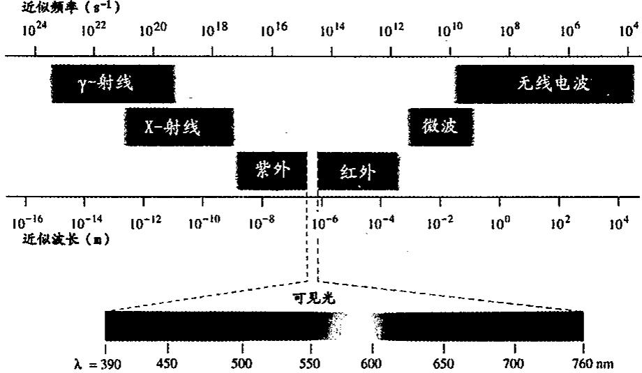

连续光谱:一束白光通过三棱镜折射后,可以分解成赤橙黄绿青蓝紫等不同波长的光谱,称之为连续光谱。例如:自然界中,雨后天空的彩虹是连续光谱。

线状光谱(原子光谱):以火焰、电弧、电火花等方法灼烧化合物时,化合物发出不同频率的光线,光线通过三棱镜折射,由于折射率不同,在屏幕上得到一系列不连续的谱线,称之为线状光谱。

2. 氢原子光谱: H 原子受激发射所得光谱是不连续的线状光谱, 可见光区有四条谱线。

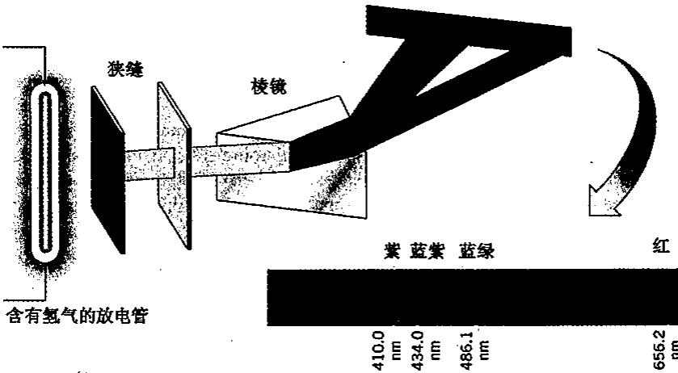  
氢原子光谱特征:①不连续光谱,即线状光谱;②其频率具有一定的规律氢原子光谱由五组线系组成:

$n = 1$ 时，即紫外区的赖曼(Lyman)系；

n=2 时,可见区的巴尔麦(Balmer)系;

n=3、4、5 时依次为红外区的帕邢(Paschen)系、布莱克特(Brackett)系和芬得(Pfund)系。

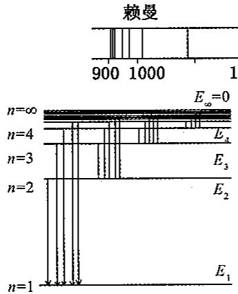

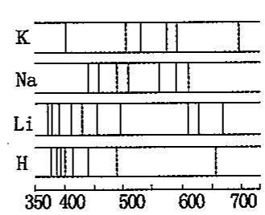

## 2.1.3 Bohr 原子结构理论

在 Plank 量子论(1900 年, $E=h\nu$ 光子能量与光的频率成正比, h 为 Planck 常数, 微观领域能量不连续), Einstein 光子论(1903 年, $E=mc^{2}$ 质能联系定律) 和 Rutherford 的电子绕核旋转模型基础上, 1903 年, 丹麦物理学家 Bohr 提出了原子结构理论, 其三点假设是:

①核外电子只能在有确定半径和能量的轨道上运动，且不辐射能量；

②通常,电子处在离核最近的轨道上,能量最低称为基态;原子获得能量后,电子被激发到高能量轨道上,称为激发态;

不同轨道上的电子具有不同能量: $E=\frac{-2.18\times10^{-18}}{n^{2}}$ J;式中 $n=1,2,\cdots$ 正整数

③从激发态回到基态释放光能，光的频率取决于轨道间的能量差。

$$
h \nu = E _ {2} - E _ {1}, \frac {h c}{\lambda} = E _ {2} - E _ {1}, \text {波数} \widetilde {\nu} = \frac {1}{\lambda}
$$

故

$$
\begin{array}{r l} \tilde {\nu} & = \frac {E _ {2} - E _ {1}}{h c} = \frac {- 2 . 1 8 \times 1 0 ^ {- 1 8}}{6 . 6 2 6 \times 1 0 ^ {- 3 4} \times 3 \times 1 0 ^ {1 0}} \left(\frac {1}{n _ {2} ^ {2}} - \frac {1}{n _ {1} ^ {2}}\right) = 1. 0 9 7 \times 1 0 ^ {5} \left(\frac {1}{n _ {1} ^ {2}} - \frac {1}{n _ {2} ^ {2}}\right) \mathrm{cm} ^ {- 1} \\ & \quad \tilde {\nu} = \frac {1}{\lambda} = R \left(\frac {1}{n _ {1} ^ {2}} - \frac {1}{n _ {2} ^ {2}}\right), 1 \mathrm{cm} ^ {- 1} = 1. 9 8 6 \times 1 0 ^ {- 2 3} \mathrm{J} \end{array}
$$

E: 轨道的能量; $\tilde{\nu}$ : 光的频率(以波数表示, 单位 $cm^{-1}$ ); h: Planck 常数为 $6.626 \times 10^{-34} J \cdot s$ , R: 里德堡常数为 $1.097 \times 10^{5}$ 。

波尔理论的成功之处：

①解释了 H 及 $He^{+}$ 、 $Li^{2+}$ 、 $B^{3+}$ 的原子光谱

电子跃迁时释放电子能量: 电子由 $n_{i} \rightarrow n_{1}$ 时, 释放能量得一系列 $\tilde{\nu}$ 值称赖曼线系。

$n_i \to n_2$ 时，释放能量得到一系列 $\tilde{\nu}$ 值称巴尔麦线系，例如：

$$
\tilde {\nu} = \frac {E _ {3} - E _ {2}}{h} = 1. 0 9 7 \times 1 0 ^ {5} \times \left(\frac {1}{2 ^ {2}} - \frac {1}{3 ^ {2}}\right) \mathrm{cm} ^ {- 1} = 1 5 2 3 6 \mathrm{cm} ^ {- 1}, \lambda = \frac {1}{\tilde {\nu}} = 6 5 6 \mathrm{nm}
$$

④计算氢原子的电离能

$n_1 \rightarrow n_\infty$ 时，氢原子电离能

$$
\Delta E = 6. 0 2 3 \times 1 0 ^ {2 3} \times 2. 1 8 \times 1 0 ^ {- 1 8} \times (\frac {1}{n _ {1} ^ {2}} - \frac {1}{n _ {\infty} ^ {2}}) = 1 3 1 3 \mathrm{kJ/mol}
$$

接近实验值 1312kJ/mol。

波尔理论的不足之处:①不能解释氢原子光谱的精细结构;②不能解释氢原子光谱在磁场中的分裂;③不能解释多电子原子的光谱。

## 2.2 微观粒子运动的基本特征

## 2.2.1 微观粒子的波粒二象性

人们当年研究光时，只考虑到光的波动性，到了麦克斯韦，波动性已经发展到顶峰。而 Planck 提出的光电效应，指出光具有粒子性，却为人们所忽略。通过光的干涉，衍射及其光电效应实验，证明光具有波粒二象性。

## 1.波动性

波长 $\lambda$ : 传播方向上相邻两个波峰(或波谷)间距离。

频率 $\nu$ : 频率就是物质(光子)在单位时间内振动的次数。单位是 $\mathrm{Hz}(1\mathrm{Hz}=1\mathrm{s}^{-1})$ 。

光速 $c=\lambda\cdot\nu$ ，真空中为 $2.998\times10^{8}m/s\approx3\times10^{8}m/s$ ，大气中降低（但变化很小，可忽略）。

波数 $\tilde{\nu}=1/\lambda$ ，单位为 $cm^{-1}$ 。

## 2. 微粒性

1900 年根据实验情况, 提出了原子只能不连续地吸收和发射能量的论点。这种不连续能量的基本单位称为光量子, 光量子的能量 $(E)$ 与频率 $(\nu)$ 成正比, 即: E = hν, 式中 h 为普朗克常数, 等于 $6.626 \times 10^{-34} J \cdot s$ 。

## 3. 白光是复色光

可见光的颜色与波长

<table><tr><td>颜色</td><td>紫</td><td>蓝</td><td>青</td><td>绿</td><td>黄</td><td>橙</td><td>红</td></tr><tr><td>波长(nm)</td><td>400~430</td><td>430~470</td><td>470~500</td><td>500~560</td><td>560~590</td><td>590~630</td><td>630~760</td></tr></table>

## 4. 电子的波粒二重性——物质波

在光的波粒二象性的启发下，于1924年法国博士德布罗意(Louis de Broglie)提出一种假想。大胆假定光的波粒二象性不仅表示光的特性，而且表示所有像电子，质子，中子，原子等实物微粒的特性。

德布罗意认为:质量为 m, 运动速度为 v 的粒子, 动量为 p, 相应的波长为: $\lambda = \frac{h}{p}$

$$
= \frac {h}{m v} 。
$$

这就是著名的德布罗意关系式，反映粒子性的 p、m、v 和反映波动性的 $\lambda$ 通过 Planck 常数 h 定量的联系在一起。

## 2.2.2 海森堡测不准原理与微观粒子运动的统计规律

牛顿力学中的经典描述:已知有一质点,质量为 m,则有: $F=ma(a$ 为加速度)根据速度方程:可以准确测定质点的速度(动量)和位置。对于宏观物体而言,这一结论无疑是绝对正确的。而对于微观粒子是怎样的呢?对于微观粒子,由于其具有特殊的运动性质(波粒二象性),不能同时准确测定其位置和动量。1927年,海森堡(Heisenberg)提出测不准原理。其数学表达式为: $\Delta x\cdot\Delta p\geqslant\frac{h}{4\pi}$ 。

$\Delta x$ ——微观粒子位置的测量偏差； $\Delta p$ ——微观粒子的动量偏差

例如:电子在原子核附近运动的速度约 $6 \times 10^{6}$ m/s, 原子半径约 $10^{-10}$ m。若速度误差为 $\pm 1\%$ , 电子的位置误差 $\Delta x$ 有多大?

解： $\Delta v=6\times10^{6}\times0.01=6\times10^{4}$ m/s, h=6.626× $10^{-34}$ J·s; 根据测不准原理：

$$
\Delta x \geqslant \frac {h}{4 \pi m \Delta v} = \frac {6 . 6 2 6 \times 1 0 ^ {- 3 4}}{4 \pi \times 9 . 1 \times 1 0 ^ {- 3 1} \times 6 \times 1 0 ^ {- 4}} = 1 \times 1 0 ^ {- 9} \mathrm{m}
$$

即原子中电子的位置误差比原子半径大10倍，即电子在原子中无精确的位置可言。即不可能同时测得电子的精确位置和精确动量，微观粒子的运动不遵循经典力学的规律。

重要暗示: 不可能存在 Rutherford 和 Bohr 模型中行星绕太阳那样的电子轨道。

某电子的位置虽然测不准,但可以知道它在某空间附近出现的机会的多少,即概率的大小可以确定。因而可以用统计的方法和观点,考察其运动行为。时间短时如下左图所示,时间长时如下右图所示。

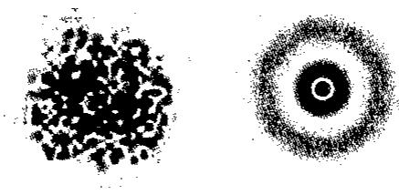  
2.3 氢原子结构的量子力学描述

## 2.3.1 薛定谔方程与波函数

根据微观粒子波粒二象性的概念,联系驻波的波动方程并应用德布罗意关系式,提出了描述微观粒子运动规律的波动方程——薛定谔方程,从而建立了近代量子力学理论。

$$
\frac {\partial^ {2} \Psi}{\partial x ^ {2}} + \frac {\partial^ {2} \Psi}{\partial y ^ {2}} + \frac {\partial^ {2} \Psi}{\partial z ^ {2}} = - \frac {8 \pi^ {2} m}{h ^ {2}} (E - V) \Psi
$$

$\Psi$ : 波函数; $E$ : 能量; $V$ : 势能; $m$ : 质量; $h$ : 普朗克常数; $x, y, z$ : 空间直角坐标, 其中势能 $V = -\frac{ze^2}{r}$

波函数的物理意义: 对一个质量为 m, 在势能为 V 的势场中运动的电子来说, 有一个与这个电子稳定态相联系的波函数 $\Psi$ , 方程合理的解 $\Psi$ 表示电子运动的某一稳定状态, 与 $\Psi$ 相对应的 E 表示电子这一稳定状态下具有的能量。

## 1. 坐标变换

球坐标 $(r, \theta, \varphi)$ 与直角坐标系的关系：

r: 径向坐标, 决定了球面的大小; $\theta$ : 角坐标, 由 z 轴沿球面延伸至 r 的弧线所表示的角度; $\varphi$ : 角坐标, 由 r 沿球面平行 xy 面延伸至 xz 面的弧线所表示的角度。

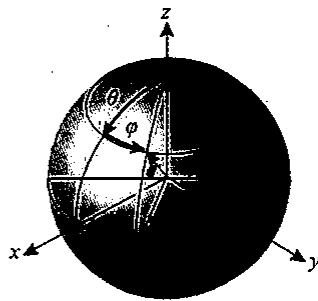

$$
\begin{array}{r l} z & = r \cdot \cos \theta ; y = r \cdot \sin \theta \cdot \sin \varphi ; x = r \cdot \sin \theta \cdot \cos \varphi ; \\ & r = \sqrt {x ^ {2} + y ^ {2} + z ^ {2}} \end{array}
$$

$$
[ \frac {1}{r ^ {2}} \cdot \frac {\partial}{\partial r} (r ^ {2} \cdot \frac {\partial}{\partial r}) + \frac {1}{r ^ {2} \sin \theta} \cdot \frac {\partial}{\partial \theta} (\sin \theta \cdot \frac {\partial}{\partial \theta}) + \frac {1}{r ^ {2} \sin^ {2} \theta} \cdot \frac {\partial^ {2}}{\partial^ {2} \varphi} ] \Psi + \frac {8 \pi^ {2} m}{h ^ {2}} (E - \frac {Z e ^ {2}}{r}) \Psi = 0
$$

## 2. 解常微分方程: 引入三个量子数

求解球极坐标下的薛定谔方程，可得 $\Psi(r,\theta,\varphi)$ 与相应的 E，但这些解不一定都是合理的解，应加以一定的条件限制，在量子力学中引入三个量子数 n,l,m 来限制它们，则 $\Psi$ 表示为 $\Psi_{n,l,m}(r,\theta,\varphi)$ 。

经过坐标变换后将薛定谔方程变量分离： $\Psi_{n,l,m}(r,\theta,\varphi)=R_{n,l}(r)\cdot Y_{l,m}(\theta,\varphi)$ ，其中 $\theta=0\sim2\pi;\varphi=0\sim\pi;R$ 称为径向波函数，Y称为角度波函数。

对应一组合理的 n、l、m 取值只有一个确定的波函数，每一个波函数表示核外电子的一种运动状态，在量子力学中借用经典力学 $\Psi_{n,l,m}(r,\theta,\varphi)$ 的轨道概念，把波函数 $\Psi_{n,l,m}(r,\theta,\varphi)$ 称为原子轨道。

例如： $n = 1, l = 0, m = 0$ 即 $\Psi_{1,0,0} = \Psi_{1s}$ ，即1s轨道； $n = 2, l = 0, m = 0$ 即 $\Psi_{2,0,0} = \Psi_{2s}$ ，即2s轨道； $n = 2, l = 1, m = 0$ 即 $\Psi_{2,1,0} = \Psi_{2p_z}$ ，即 $2p_z$ 轨道； $n = 3, l = 2, m = 0$ 即 $\Psi_{3,2,0} = \Psi_{3d_z^2}$ ，即 $3d_z^2$ 轨道。

## 2.3.2 量子数

## 1. 主量子数 $n$

意义:表示原子的大小,核外电子出现的最大概率区域离核的远近,有“层”的含义,和角量子数 l 一起决定电子能量的高低。

不同的 n 值, 对应于不同的电子壳层。

n 的取值: 1,2,3,4,5,6,7……(能层)

能层符号: K, L, M, N, O, P, Q……

对于单电子体系，n 决定了电子的能量。n 的数值越大，电子距离原子核越远，具有的能量越高。

$\mathbf{p}_x$ 轨道

$E = -13.6 \times \frac{Z^2}{n^2} \mathrm{eV}, 1 \mathrm{eV} = 1.603 \times 10^{-19} \mathrm{~J}$ , 可得 $E = -\frac{2.179 \times 10^{-18}}{n^2} \mathrm{~J}$ 。

同时，n 较大，决定原子半径比较大，即原子比较大。

## 2. 角量子数 $l$

意义:决定了原子轨道的形状。表示同一电子层中有不同状态的电子亚层。

取值:受主量子数 n 的限制, l 的取值: 0,1,2,3,…,n-1(亚层或能级)。

能级符号:s,p,d,f,g,……

原子轨道的形状取决于 $l$ ，例如当主量子数为4时：

l=0: 表示轨道为第四层的 4s 轨道, 形状为球形: s。

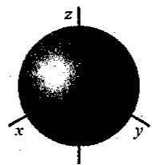

$l = 1$ : 表示轨道为第四层的 $4\mathrm{p}$ 轨道, 形状为哑铃形: $\mathbf{p}_x, \mathbf{p}_y, \mathbf{p}_z$ 。

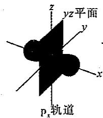

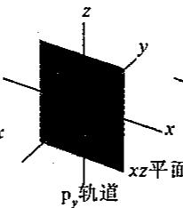

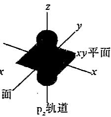

l=2: 表示轨道为第四层的 4d 轨道, 形状为花瓣形: $d_{xy}$ , $d_{xz}$ , $d_{yz}$ , $d_{x^{2}-y^{2}}$ , $d_{z^{2}}$ 。

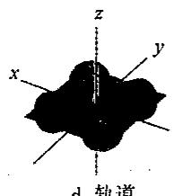  
$\mathrm{d}_{xy}$ 轨道

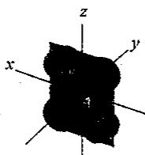  
$d_{xz}$ 轨道

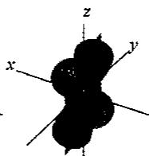  
$d_{yz}$ 轨道

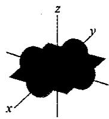  
$\mathrm{d}_{x^2 -y^2}$ 轨道

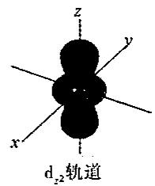

$l = 3$ ：表示轨道为第四层的4f轨道，形状复杂： $\mathrm{f_z^3}$ ， $\mathrm{f_{xx^2}}$ ， $\mathrm{f_{yz^2}}$ ， $\mathrm{f_{xyz}}$ ， $\mathrm{f_z(x^2 - y^2)}$ ， $\mathrm{f_x(x^2 - 3y^2)}$ ， $\mathrm{f_y(3x^2 - y^2)}$ 。

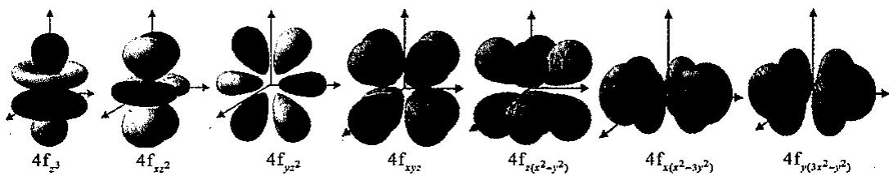

单电子原子, 电子能量只与主量子数 n 有关: $E_{ns}=E_{np}=E_{nd}=E_{nf}$

在多电子原子中, 电子的能量由主量子数 n 和角量子数 l 共同决定, 当 n 相同时, l 越大, 轨道能量越高: $E_{ns} < E_{np} < E_{nd} < E_{nf}$ 。

## 3. 磁量子数 $m$

决定原子轨道的空间取向,每一个空间取向就相当于一个原子轨道。其取值受角量

子数 $l$ 的限制。

m 可取 0, ±1, ±2……±l 共(2l+1)个取值, 表示有(2l+1)个原子轨道。

磁量子数决定电子运动轨道角动量在外磁场方向上的分量的大小： $M_{z}=mh/2\pi$ 。原子轨道的能量与m无关，n和l值相同的轨道，能量相等互为等价轨道。

<table><tr><td>n</td><td>主层</td><td>l</td><td>亚层</td><td>m</td><td>原子轨道</td></tr><tr><td>1</td><td>K</td><td>0</td><td>1s</td><td>0</td><td>1s</td></tr><tr><td rowspan="2">2</td><td rowspan="2">L</td><td>0</td><td>2s</td><td>0</td><td>2s</td></tr><tr><td>1</td><td>2p</td><td>0,±1</td><td> $2p_z,2p_x,2p_y$ </td></tr><tr><td rowspan="3">3</td><td rowspan="3">M</td><td>0</td><td>3s</td><td>0</td><td>3s</td></tr><tr><td>1</td><td>3p</td><td>0,±1</td><td> $3p_z,3p_x,3p_y$ </td></tr><tr><td>2</td><td>3d</td><td>0,±1,±2</td><td> $3d_{z^2},3d_{xz},3d_{yz},3d_{xy},3d_{x^2-y^2}$ </td></tr><tr><td rowspan="4">4</td><td rowspan="4">N</td><td>0</td><td>4s</td><td>0</td><td>4s</td></tr><tr><td>1</td><td>4p</td><td>0,±1</td><td> $4p_z,4p_x,4p_y$ </td></tr><tr><td>2</td><td>4d</td><td>0,±1,±2</td><td> $4d_{z^2},4d_{xz},4d_{yz},4d_{xy},4d_{x^2-y^2}$ </td></tr><tr><td>3</td><td>4f</td><td>0,±1,±2,±3</td><td>......</td></tr></table>

4. 自旋量子数 $m_{s}$

描述电子绕轴旋转的状态,自旋运动使电子具有类似于微磁体的行为, $m_{s}$ 取值+1/2和-1/2,分别用 $\uparrow$ 和 $\downarrow$ 表示。

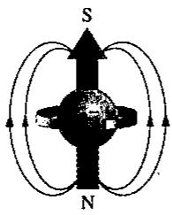

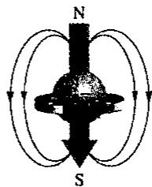

小结：

<table><tr><td>名称</td><td>符号</td><td>取值范围</td><td>意义</td></tr><tr><td>主量子数</td><td> $n$ </td><td>正整数(1、2、3等)</td><td>离核远近,轨道能量</td></tr><tr><td>角量子数</td><td> $l$ </td><td>0到 $n-1$ 的整数</td><td>轨道形状</td></tr><tr><td>磁量子数</td><td> $m$ </td><td>0到 $\pm l$ 的整数</td><td>轨道空间伸展方向</td></tr><tr><td>自旋量子数</td><td> $m_{\mathrm{a}}$ </td><td>+1/2或-1/2</td><td>电子自旋方向</td></tr></table>

## 2.3.3 概率密度与电子云(径向分布)

概率密度是空间某单位体积内电子出现的概率。

$\Psi^{2}$ 的物理意义是表达微粒在空间某点单位体积内出现的概率, 即概率密度。因为根据统计解释, 微粒波的强度与波函数( $\Psi^{2}$ )成正比。

电子云是电子在原子核外空间概率密度 $(\Psi^{2})$ 分布的形象描述。电子云图象中的每一个小黑点表示电子出现在核外空间一次(不表示一个电子)，概率密度越大，电子云图象中的小黑点越密。

概率 $=$ 概率密度 $\times$ 体积 $= \Psi^{2}\mathrm{d}\tau$ ，其中 $\mathrm{d}\tau$ 为空间微体积， $\mathrm{d}\tau = 4\pi r^2\mathrm{d}r$ 。

概率 $=\Psi^{2}\cdot4\pi r^{2}dr$ ，令 $D(r)=4\pi r^{2}\Psi^{2}$ ，称为径向分布函数。

氢原子的各种状态的径向分布图如下:峰的个数=主量子数-角量子数。

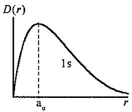

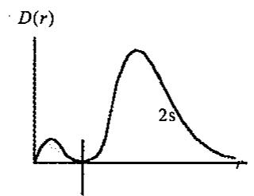

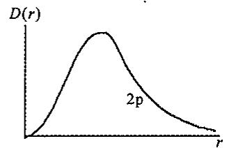  
$D(r)$

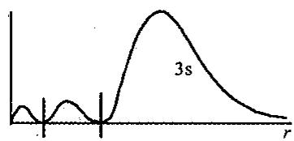  
$D(r)$

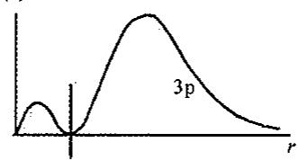

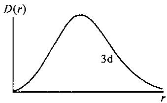

## 2.3.4 原子轨道与电子云的空间图象(角度分布)

原子轨道的角度分布分正负,而电子云的角度分布不分正负s原子轨道和电子云的角度分布图:

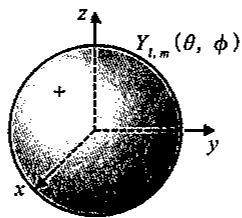

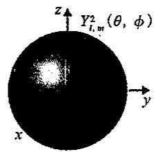

p 原子轨道和电子云的角度分布图：

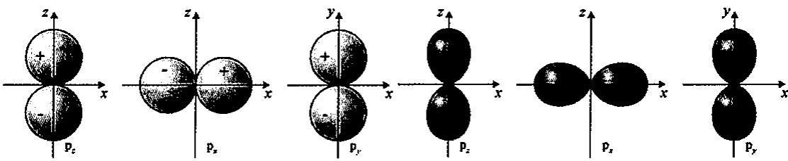  
d 原子轨道和电子云的角度分布图：

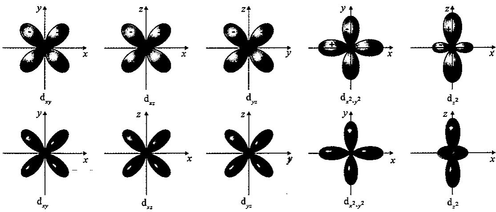

波函数与电子云对比：

<table><tr><td></td><td>波函数( $\Psi$ )</td><td>电子云( $\Psi^{2}$ )</td></tr><tr><td>定义</td><td>描写原子中核外电子运动状态的数学表达式</td><td>代表原子核外空间某处电子分布的概率</td></tr><tr><td>形态</td><td>其角度分布图比电子云图形略胖一些</td><td>比波函数图形略瘦一些</td></tr><tr><td>符号</td><td>(+)表示该区域中 $\Psi$ 为正值(-)表示该区域中 $\Psi$ 为负值</td><td>没有符号</td></tr><tr><td>应用</td><td>分析化学键的形成</td><td>讨论键的空间构型</td></tr></table>

## 2.4 多电子原子结构

## 2.4.1 多电子原子轨道能级

n 值相同时，轨道能级则由 l 值决定，例： $E(4s) < E(4p) < E(4d) < E(4f)$ 。这种现象叫能级分裂。

l 值相同时，轨道能级只由 n 值决定，例： $E(1\mathrm{s})<E(2\mathrm{s})<E(3\mathrm{s})<E(4\mathrm{s})$

n 和 l 都不同时出现更为复杂的情况，主量子数小的能级可能高于主量子数大的能级，即所谓的能级交错。能级交错现象出现于第四能级组开始的各能级组中，例如第六能级组的 $E(6s) < E(4f) < E(5d)$ 。

1. 泡利(Pauling)近似能级图如下左图所示。

2. 科顿(Cotton)原子轨道能级图如下右图所示。

从图中可以看出:n 和 l 相同的原子轨道的简并性,原子轨道的能量随原子序数的增大而降低,随着原子序数的增大,原子轨道产生能级交错现象。

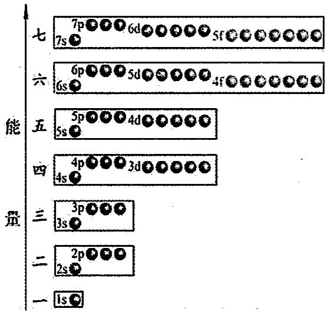

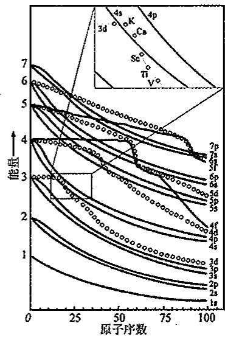

## 3. 屏蔽效应

原子中电子 i 受其他电子排斥，抵消了部分核电荷的吸引，称为对电子 i 的屏蔽。用屏蔽常数 $\sigma(\text{screening constant})$ 表示抵消掉的部分核电荷。

能吸引电子 i 的核电荷是有效核电荷(effective nuclear charge) $Z^{*}$ ，它是核电荷 Z 和屏蔽常数 $\sigma$ 的差： $Z^{*}=Z-\sigma$

$$
E = - 1 3. 6 \times \frac {(z - \sigma) ^ {2}}{n ^ {2}} \mathrm{eV} = - 2. 1 7 9 \times 1 0 ^ {- 1 8} \times \frac {(z - \sigma) ^ {2}}{n ^ {2}} \mathrm{J}
$$

屏蔽常数 $\sigma$ ，可用史雷特(Slater)经验规则算得。

说明:①不同电子所受的屏蔽作用不同。其大小与角量子数 l 有关,②l 大的电子,受屏蔽大,能量高;l 小的电子,受屏蔽小,能量升高的幅度小,③对于运动状态不同的电子,或 n 相同,l 不同的原子轨道,有: $E(ns)<E(np)<E(nd)<E(nf)$ 。

## Slater 规则的主要内容如下：

①原子中的电子分若干个轨道组：(1s)，(2s,2p)，(3s,3p)，(3d)，(4s,4p)，(4d)，(4f)，(5s,5p)，每个圆括号形成一个轨道组；

②一个轨道组外面的轨道组上的电子对内轨道组上的电子的屏蔽常数 $\sigma=0$ ，即屏蔽作用仅发生在内层电子对外层电子或同层电子之间，外层电子对内层电子没有屏蔽作用；

③同一轨道组内电子间屏蔽常数 $\sigma=0.35,1s$ 轨道上的 2 个电子之间的 $\sigma=0.30$ ;

④被屏蔽电子为 ns 或 np 轨道组上的电子时，主量子数为 $(n-1)$ 的各轨道组上的电子对 ns 或 np 轨道组上的电子的屏蔽常数 $\sigma=0.85$ ，而小于 $(n-1)$ 的各轨道组上的电子，对其屏蔽常数 $\sigma=1.00$ ；

⑤被屏蔽电子为 nd 或 nf 轨道组上的电子时，则位于它左边各轨道组上的电子对 nd 或 nf 轨道组上电子的屏蔽常数 $\sigma=1.00$ 。

## 4. 钻穿效应

电子进入原子内部空间,受到核的较强的吸引作用(使自身能量下降)可以从径向分

布函数图加以解释。

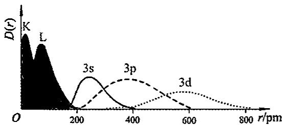  
钠原子的电子云径向分布图

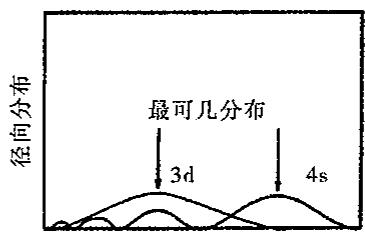  
距原子核的距离  
n 相同时, l 愈小的电子, 钻穿效应愈明显:

$$
n \mathrm{s} > n \mathrm{p} > n \mathrm{d} > n \mathrm{f}, E (n \mathrm{s}) <   E (n \mathrm{p}) <   E (n \mathrm{d}) <   E (n \mathrm{f}) 。
$$

从上右图中看出 4s 电子离原子核最近处有小峰, 4s 电子具有比 3d 电子较大的穿透内层电子而被核吸引的能力, 钻到原子核附近的机会比较多, 因而出现能级交错现象, 电子钻得越深, 受核吸引力越强, 其他电子对它的屏蔽作用就越小。

## 2.4.2 核外电子的排布

1. 基态原子的核外电子排布原则

(1)能量最低原理:电子在原子轨道中的排布,要尽可能使整个原子系统能量最低。

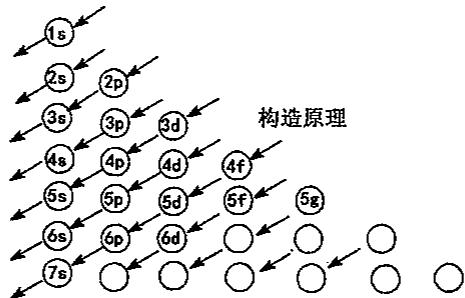

徐光宪规则:按照 $n+0.7l$ 的大小顺序排列

对于一个能级组，其 $(n + 0.7l)$ 值越大，则能量越高。而且该能级所在能级组的组数，就是 $(n + 0.7l)$ 的整数部分。以第七能级组为例进行讨论：

$7p:7+0.7\times1=7.7,6d:6+0.7\times2=7.4,5f:5+0.7\times3=7.1,7s:7+0.7\times0=7.0$ ，因此，各能级均属于第七能级组，能级顺序为： $E(7s)<E(5f)<E(6d)<E(7p)$ 。

(2) 泡利(Pauli)不相容原理: 每个原子轨道中最多容纳两个自旋方式相反的电子。

同一原子中不可能有 2 个电子具有四个完全相同的量子数。如果两个电子的 $n, l, m$ 相同， $m_{s}$ 必然相反。即一个原子轨道中不存在自旋相同的两个电子。

如 Ca 原子的两个 4s 电子，一个是 $(4,0,0,\frac{1}{2})$ ，另一个则是 $(4,0,0,-\frac{1}{2})$ 。

(3) 洪特(Hund)规则: 电子在能量相同的轨道(称为简并轨道, 即 n 和 l 相同的轨道)上排布时, 总是尽可能以自旋相同(平行)的方向, 单独分占磁量子数 m 不同的轨道, 因为这样的排布方式总能量最低。

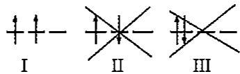

洪特规则的特例：

在简并轨道的全充满 $(p^{6},d^{10},f^{14})$ 、半充满 $(p^{3},d^{5},f^{7})$ 、全空 $(p^{0},d^{0},f^{0})$ 状态，具有较低的能量和较大的稳定性。

$$
\text { 例 }: _ {2 4} \mathrm{Cr}: 1 \mathrm{s} ^ {2} 2 \mathrm{s} ^ {2} 2 \mathrm{p} ^ {6} 3 \mathrm{s} ^ {2} 3 \mathrm{p} ^ {6} 3 \mathrm{d} ^ {5} 4 \mathrm{s} ^ {1}; _ {2 9} \mathrm{Cu}: 1 \mathrm{s} ^ {2} 2 \mathrm{s} ^ {2} 2 \mathrm{p} ^ {6} 3 \mathrm{s} ^ {2} 3 \mathrm{p} ^ {6} 3 \mathrm{d} ^ {1 0} 4 \mathrm{s} ^ {1}
$$

不能写做： $_{24}$ Cr:1s $^{2}$ 2s $^{2}$ 2p $^{6}$ 3s $^{2}$ 3p $^{6}$ 3d $^{4}$ 4s $^{2}$ ; $_{29}$ Cu:1s $^{2}$ 2s $^{2}$ 2p $^{6}$ 3s $^{2}$ 3p $^{6}$ 3d $^{9}$ 4s $^{2}$ 。

## 2. 电子组态的写法

(1)书写20号元素以后基态原子的电子组态时要注意,虽然电子填充按近似能级顺序进行,但书写电子组态时必须按电子层排列。

例： $_{21}$ Sc 的电子组态 $1s^{2}2s^{2}2p^{6}3s^{2}3p^{6}\underline{3d^{1}}4s^{2}$ 填充电子时看作 4s 比 3d 能量低，但形成离子时，先失去 4s 电子，3d 仍然是内层轨道。电离时 Sc 首先失去 1 个 4s 电子而不是 3d 电子。

(2) 把内层达稀有气体电子层结构的部分用稀有气体的元素符号加方括号表示称为原子实。

例： $_{20}$ Ca:1s $^{2}$ 2s $^{2}$ 2p $^{6}$ 3s $^{2}$ 3p $^{6}$ 4s $^{2}$ 写作[Ar]4s $^{2}$ ， $_{26}$ Fe:[Ar]3d $^{6}$ 4s $^{2}$ ; $_{47}$ Ag:[Kr]4d $^{10}$ 5s $^{1}$ 。

原子实写法的另一优点是指明了元素的价层电子结构,离子的电子组态仿照原子电子组态方式书写。

## 3. 基态原子的核外电子排布

基态原子的核外电子在各原子轨道上排布顺序:1s,2s,2p,3s,3p,4s,3d,4p,5s,4d,5p,6s,4f,5d,6p,7s,5f,6d,7p,……

出现 d 轨道时，依照 ns, (n-1)d, np 顺序排布；d, f 轨道均出现时，依照 ns, (n-2)f, (n-1)d, np 顺序排布。

总结核外电子排布特殊的元素,如下表所示。

<table><tr><td>原子序数</td><td>中文名称</td><td>元素符号</td><td>核外电子排布</td></tr><tr><td>24</td><td>铬</td><td>Cr</td><td> $[Ar]3d^{5} 4s^{1}$ </td></tr><tr><td>29</td><td>铜</td><td>Cu</td><td> $[Ar]3d^{10} 4s^{1}$ </td></tr><tr><td>41</td><td>铌</td><td>Nb</td><td> $[Kr]4d^{4} 5s^{1}$ </td></tr><tr><td>42</td><td>钼</td><td>Mo</td><td> $[Kr]4d^{5} 5s^{1}$ </td></tr><tr><td>44</td><td>钌</td><td>Ru</td><td> $[Kr]4d^{7} 5s^{1}$ </td></tr><tr><td>45</td><td>铑</td><td>Rh</td><td> $[Kr]4d^{8} 5s^{1}$ </td></tr><tr><td>46</td><td>钯</td><td>Pd</td><td> $[Kr]4d^{10}$ </td></tr><tr><td>47</td><td>银</td><td>Ag</td><td> $[Kr]4d^{10} 5s^{1}$ </td></tr><tr><td>57</td><td>镧</td><td>La</td><td> $[Xe]5d^{1} 6s^{2}$ </td></tr><tr><td>58</td><td>铈</td><td>Ce</td><td> $[Xe]4f^{1} 5d^{1} 6s^{2}$ </td></tr><tr><td>64</td><td>钆</td><td>Gd</td><td> $[Xe]4f^{7} 5d^{1} 6s^{2}$ </td></tr><tr><td>78</td><td>铂</td><td>Pt</td><td> $[Xe]4f^{14} 5d^{9} 6s^{1}$ </td></tr><tr><td>79</td><td>金</td><td>Au</td><td> $[Xe]4f^{14} 5d^{10} 6s^{1}$ </td></tr></table>

对原子核外电子特殊排布的部分解释：

铬、铜、钼、钯、银是因为半满壳层和满壳层分布引起能量降低，导致4s或5s壳层能够失掉一个或两个电子。

铌除由于自旋平行电子数增加引起能量的降低这一原因外，还因为5s电子和4d电子之间的相互作用会使能量比满5s壳层时要小，故产生了4d壳层有靠5s电子来填充的倾向。

第六周期中，镧、铈、钆是由于在6s、4f、5d这几个能量相近的壳层中，4f壳层被内部电子屏蔽得相当完全，以致产生电子由4f壳层向5d壳层迁移的趋势。对于Gd还由于达到半满电子数的壳层能量较低的缘故。

铂、金除了电子满壳层分布引起能量降低以外，还和第五周期钌、铑一样 d 壳层电子数大于半满，有效核电荷的增加，使主量子数对能量的影响趋于矛盾的主要方面，s 电子的钻穿效应相对削弱，使 s 壳层的电子向 d 壳层迁移。

## 2.5 元素周期表

## 2.5.1 元素的周期

元素周期表中的七个周期分别对应7个能级组。

<table><tr><td>周期</td><td>特点</td><td>能级组</td><td>对应的能级</td><td>原子轨道数</td><td>元素数</td></tr><tr><td>一</td><td>短周期</td><td>1</td><td>1s</td><td>1</td><td>2</td></tr><tr><td>二</td><td>短周期</td><td>2</td><td>2s2p</td><td>4</td><td>8</td></tr><tr><td>三</td><td>短周期</td><td>3</td><td>3s3p</td><td>4</td><td>8</td></tr><tr><td>四</td><td>长周期</td><td>4</td><td>4s3d4p</td><td>9</td><td>18</td></tr><tr><td>五</td><td>长周期</td><td>5</td><td>5s4d5p</td><td>9</td><td>18</td></tr><tr><td>六</td><td>长周期</td><td>6</td><td>6s4f5d6p</td><td>16</td><td>32</td></tr><tr><td>七</td><td>长周期</td><td>7</td><td>7s5f6d7p</td><td>16</td><td>32</td></tr></table>

## 2.5.2 元素的族

第 1,2,13\~17 列为主族，即：ⅠA，ⅡA，ⅢA，ⅣA，ⅤA，ⅥA，ⅦA。

主族:族序数=价电子总数。

第 18 列为稀有气体, He 除外, 最外层有 8 个电子, 通常称为 0 族;

第 3～7,11 和 12 列为副族。即：ⅢB，ⅣB，VB，VIB，VIIB，IB和ⅡB。

前 5 个副族的价电子数 = 族序数。ⅠB，ⅡB 是根据 ns 轨道上电子数划分的。

第 8、9、10 列元素称为Ⅷ族，价电子排布 $(n-1)d^{6-8}ns^{2}$ （有例外）。

## 2.5.3 元素的分区

元素周期表中价电子排布类似的元素集中在一起,分为5个区,并以最后填入的电

子的能级代号作为区号。

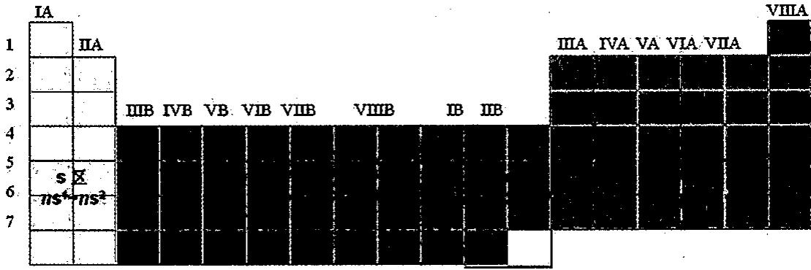

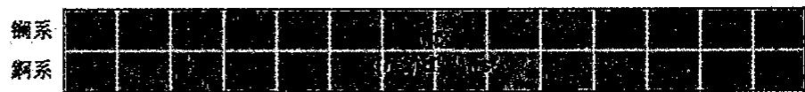  
据价电子组态,周期表分为5个区。

①s区:价层电子组态为 $ns^{1}$ 和 $ns^{2}$ ，ⅠA和ⅡA族，活泼金属，易形成+1或+2价离子。没有可变的氧化值。但H不是金属元素，在一般化合物中的氧化值是+1，在金属氢化物中是-1。

②p区:价层电子组态为 $ns^{2}np^{1\sim6}$ ，ⅢA～ⅦA族，大部分是非金属，0族是稀有气体。元素多有可变的氧化值。但 He 的电子组态是 $1s^{2}$ ，属稀有气体。

③d区：价层电子组态为 $(n-1)d^{1\sim8}ns^{2}$ ，有例外。ⅢB～ⅦB、Ⅷ族元素，金属，有多种氧化值。

④ds 区:价层电子组态为 $(n-1)\mathrm{d}^{10}ns^{1\sim2}$ ，I B 和 II B 族，它们都是金属，一般有可变氧化值。

⑤f区：价层电子组态为 $(n-2)f^{0\sim14}(n-1)d^{0\sim1}ns^{2}$ ，镧系和锕系。最外层电子数、次外层电子数大都相同， $(n-2)$ 层电子数目不同，每个系内元素化学性质极相似。都是金属，有可变氧化值。

过渡元素(transition element): 全部副族元素和第Ⅷ族元素并称为过渡元素, 包括 d 区、ds 区和 f 区的元素。其中镧系和锕系元素称为内过渡元素 (inner transition element)。

过渡元素原子的最外层电子数较少,除钯外都只有1\~2个电子,所以它们都是金属元素。

它们的 $(n-1)d$ 轨道未充满或刚充满，或f轨道也未充满，所以在化合物中常有多种氧化值，性质与主族元素有较大的差别。

## 2.6 元素性质的周期性

## 2.6.1 原子半径

下表为常见元素的原子半径数据表, 表中的单位为 pm。

<table><tr><td>H37</td><td></td><td></td><td></td><td></td><td></td><td></td><td></td><td></td><td></td><td></td><td></td><td></td><td></td><td></td><td></td><td></td><td>He150</td></tr><tr><td>Li152</td><td>Be111</td><td></td><td></td><td></td><td></td><td></td><td></td><td></td><td></td><td></td><td></td><td>B88</td><td>C77</td><td>N74</td><td>O74</td><td>F71</td><td>Ne158</td></tr><tr><td>Na186</td><td>Mg160</td><td></td><td></td><td></td><td></td><td></td><td></td><td></td><td></td><td></td><td></td><td>Al143</td><td>Si117</td><td>P111</td><td>S104</td><td>Cl99</td><td>Ar188</td></tr><tr><td>K227</td><td>Ca197</td><td>Sc164</td><td>Ti145</td><td>V132</td><td>Cr125</td><td>Mn137</td><td>Fe124</td><td>Co125</td><td>Ni125</td><td>Cu128</td><td>Zn133</td><td>Ga122</td><td>Ge123</td><td>As125</td><td>Se117</td><td>Br114</td><td>Kr205</td></tr><tr><td>Rb248</td><td>Sr215</td><td>Y180</td><td>Zr160</td><td>Nb143</td><td>Mo136</td><td>Tc136</td><td>Ru133</td><td>Rh135</td><td>Pd138</td><td>Ag144</td><td>Cd149</td><td>In163</td><td>Sn141</td><td>Sb144</td><td>Te137</td><td>I133</td><td>Xe225</td></tr><tr><td>Cs265</td><td>Ba217</td><td>La系</td><td>Hf156</td><td>Ta143</td><td>W137</td><td>Re137</td><td>Os134</td><td>Ir136</td><td>Pt139</td><td>Au144</td><td>Hg160</td><td>Tl170</td><td>Pb175</td><td>Bi182</td><td>Po168</td><td>At—</td><td>Rn—</td></tr></table>

原子半径变化规律：

主族元素:从左到右原子半径逐渐减小;从上到下原子半径逐渐增大。

过渡元素:从左到右原子半径缓慢减小;从上到下原子半径略有增大。

同一周期:原子半径变化受两个因素的制约:①核电荷数增加,引力增强,原子半径变小;②核外电子数增加,斥力增强,原子半径变大;

随原子序数的增加原子半径逐渐减小，即增加的电子不足以完全屏蔽。

核电荷；从左到右，有效核电荷 $Z^{*}$ 增加，原子半径变小。

长周期中部(d区)各元素的原子半径随核电荷增加减小缓慢,原因是电子填入 $(n-1)$ d层,屏蔽作用大, $Z^{*}$ 增加不多,原子半径减小缓慢。

I B, II B(ds 区)原子半径略有增大,此后又逐渐减小,其原因是 $d^{10}$ 构型,屏蔽显著,原子半径略有增大。

镧系、锕系元素，从左至右原子半径逐渐减小，15种元素，共减小11pm。减小幅度更小，这是因为电子填入 $(n-2)$ f亚层，屏蔽作用更大， $Z^{*}$ 增加更小，原子半径减小更不显著。

镧系收缩:镧系元素从镧(La)到镱(Yb)原子半径依次更缓慢减小的事实。对于镧系元素自身的影响,使15种镧系元素的半径相似,性质相近,分离困难。对于镧后元素的影响,使得第二、第三过渡系的同族元素半径相近,性质相近,分离困难(例如Zr和Hf,Nb和Ta,Mo和W)。

同一族：

主族:从上到下,外层电子构型相同,电子层增加的因素占主导,原子半径增加。

副族:第四周期到第五周期,原子半径增大,第五周期到第六周期,原子半径接近。

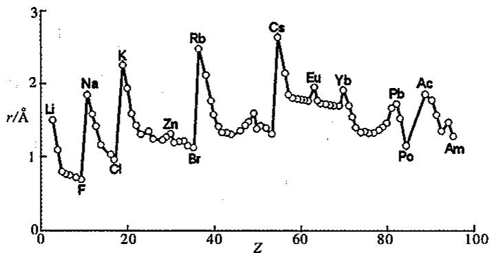

金属半径:适用金属元素,固体中测定两个最邻近原子的核间距一半。

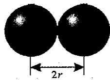  
金属半径

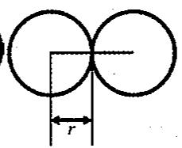

共价半径:适用非金属元素,测定单质分子中两个相邻原子的核间距一半。

  
共价半径


范德华半径:适用于单原子气体分子,两个原子间距离的一半。


## 2.6.2 电离能

用来衡量原子失去电子的难易程度。

电离能:基态气态原子失去电子成为带一个正电荷的基态气态阳离子所需要的最小能量称为第一电离能,用 $I_{1}$ 表示。再从正离子相继逐个失去电子所需的最小能量则叫第二、第三……电离能。各级电离能符号分别用 $I_{1}, I_{2}, I_{3}$ 等表示。

$$
\mathrm{E} (\mathrm{g}) = \mathrm{E} ^ {+} (\mathrm{g}) + \mathrm{e} ^ {-}, I _ {1}; \mathrm{E} ^ {+} (\mathrm{g}) = \mathrm{E} ^ {2 +} (\mathrm{g}) + \mathrm{e} ^ {-}, I _ {2}
$$

$I_{1}<<I_{2}$ ; 因为从阳离子离解出电子比从电中性原子离解出电子难得多, 而且离子电荷越高越困难。

电离能越小，表示原子越容易失去电子，其金属性也越强。

下表为常见元素的第一电离能数据表,表中的单位为 kJ/mol。

<table><tr><td>H1312</td><td></td><td></td><td></td><td></td><td></td><td></td><td></td><td></td><td></td><td></td><td></td><td></td><td></td><td></td><td></td><td></td><td>He2372</td></tr><tr><td>Li520</td><td>Be899</td><td></td><td></td><td></td><td></td><td></td><td></td><td></td><td></td><td></td><td></td><td>B801</td><td>C1086</td><td>N1402</td><td>O1314</td><td>F1681</td><td>Ne2081</td></tr><tr><td>Na496</td><td>Mg738</td><td></td><td></td><td></td><td></td><td></td><td></td><td></td><td></td><td></td><td></td><td>Al578</td><td>Si786</td><td>P1012</td><td>S1000</td><td>Cl1251</td><td>Ar1521</td></tr><tr><td>K419</td><td>Ca590</td><td>Sc631</td><td>Ti658</td><td>V650</td><td>Cr653</td><td>Mn717</td><td>Fe759</td><td>Co758</td><td>Ni737</td><td>Cu745</td><td>Zn906</td><td>Ga579</td><td>Ge762</td><td>As947</td><td>Se914</td><td>Br1140</td><td>Kr1351</td></tr><tr><td>Rb403</td><td>Sr549</td><td>Y616</td><td>Zr660</td><td>Nb664</td><td>Mo685</td><td>Tc702</td><td>Ru711</td><td>Rh720</td><td>Pd805</td><td>Ag731</td><td>Cd868</td><td>In558</td><td>Sn709</td><td>Sb834</td><td>Te869</td><td>I1003</td><td>Xe1170</td></tr><tr><td>Cs376</td><td>Ba503</td><td>La538</td><td>Hf675</td><td>Ta764</td><td>W770</td><td>Re760</td><td>Os839</td><td>Ir878</td><td>Pt868</td><td>Au890</td><td>Hg1007</td><td>Tl589</td><td>Pb716</td><td>Bi703</td><td>Po812</td><td>At—</td><td>Rn1037</td></tr></table>

电离能的周期性变化：

同一周期中，电离能自左至右增大，元素金属性逐渐减弱；同一族中，电离能自上至下减小，元素金属性逐渐增强；各周期中稀有气体原子的第一电离能最高；第一电离能最小的是Cs，最大的是He。

具有全充满(第ⅡA族)或半充满(第V A族)的电子层结构的元素原子电离能比同周期相邻元素高,较稳定。(例如:Be>B,N>0)

B 硼: 电子结构为 $[He]2s^{2}2p^{1}$ ，失去 2p 的一个电子，达到类似于 Be 的 $2s^{2}$ 全充满的稳定结构。所以其 $I_{1}$ 小于 Be。

N 氮: 电子结构为 $[He]2s^{2}2p^{3},2p^{3}$ 为半充满结构, 比较稳定, 不易失去电子。 $I_{1}$ 增大明显。

O 氧: 电子结构为 $[He]2s^{2}2p^{4}$ ，失去 $2p^{4}$ 的一个电子，即可达到 $2p^{3}$ 半充满稳定结构。所以 $I_{1}$ 有所降低，以至于小于氮的第一电离能。

Ne 氖: 电子结构为 $[He]2s^{2}2p^{6}$ ，为全充满结构，不易失去电子，所以其第一电离能在同周期中最大。

长周期副族元素的电离能总趋势上随 Z 的增加而增加,但增加的幅度较主族元素小些。原因是副族元素的原子半径减小的幅度较主族元素小。

Zn 锌: 电子结构为 $[Ar]3d^{10}4s^{2}$ ，属于稳定结构，不易失去电子，所以 Zn 的 $I_{1}$ 比较大。

内过渡元素第一电离能增加的幅度更小，且规律性更差。

同族中自上而下，有互相矛盾的两种因素影响电离能变化：①核电荷数 Z 增大，核对电子吸引力增大，导致 I 增大；②电子层增加，原子半径增大，电子离核远，核对电子吸引力减小，导致 I 减小；这对矛盾中，以②为主导，所以，同族中自上而下，元素的电离能减小。

副族元素的电离能:第二过渡系列明显小于第三过渡系列。原因是第二、三过渡系的半径相近,但第三过渡系列的核电荷数要比第二过渡系列大得多。


由同一种元素不同电离能差别可以判断元素的最高价态：

<table><tr><td>电离能</td><td> $I_1$ </td><td> $I_2$ </td><td> $I_3$ </td><td> $I_4$ </td><td> $I_5$ </td><td> $I_6$ </td></tr><tr><td>Li</td><td>520</td><td>7289</td><td>11815</td><td></td><td></td><td></td></tr><tr><td>Be</td><td>900</td><td>1757</td><td>14849</td><td>21007</td><td></td><td></td></tr><tr><td>B</td><td>801</td><td>2427</td><td>3660</td><td>25026</td><td></td><td></td></tr><tr><td>C</td><td>1086</td><td>2353</td><td>4621</td><td>6223</td><td>37830</td><td>47277</td></tr><tr><td>N</td><td>1402</td><td>2856</td><td>4578</td><td>7475</td><td>9445</td><td>53266</td></tr></table>

$\mathrm{Li}: I_2 / I_1 = 14.02$ 倍，增大14倍，不易生成 $+2$ 价离子，所以 $\mathrm{Li}^+$ 容易形成；

Be: $I_{2}/I_{1}=1.95$ 倍, $I_{3}/I_{2}=8.45$ 倍,所以 $Be^{2+}$ 容易形成;

B: $I_{3}/I_{2}=1.51$ 倍, $I_{4}/I_{3}=6.84$ 倍,所以 $B^{(Ⅲ)}$ 容易形成;

$C: I_{4}/I_{3}=1.35$ 倍， $I_{5}/I_{4}=6.08$ 倍，所以 $C^{(N)}$ 容易形成；

$N: I_{5}/I_{4}=1.26$ 倍， $I_{6}/I_{5}=5.64$ 倍，所以 $N^{(V)}$ 容易形成。

## 2.6.3 电子亲和能

用来衡量原子得到电子的难易程度： $X(g)+e^{-}=X^{-}(g),A_{1};X^{-}(g)+e^{-}=X^{2-}(g),A_{2}$

基态的中性气态原子得到一个电子形成气态—1价阴离子所放出的能量，称原子的第一电子亲和能 $(A_{1})$ ，像电离能一样，电子亲和能也有第一、第二……之分。当负一价离子再获得电子时要克服负电荷之间的排斥力，因此要吸收能量。所有 $A_{2}$ 都均为正值，

电子亲和能负值越大,表示原子越容易得到电子,其非金属性也越强。

电子亲和能周期性变化规律：

同一周期:从左到右,电子亲和能的负值减小,卤素的电子亲和能呈现最小负值,其原因是从左到右,原子有效核电荷增大,原子半径减小,最外层电子数增多,趋向于结合电子形成8电子稳定结构。

第ⅡA族电子亲和能为正值,其原因是碱土金属半径大,且有 $ns^{2}$ 电子层结构难以结合电子。

稀有气体的电子亲和能为最大正值,是因为其具有8电子稳定电子层结构,更难以结合电子。

同一族:从上到下,大多电子亲和能为负值,数值逐渐变小。

N 元素的电子亲和能为正值, 比较特殊, 是因为其具有半充满 p 亚层稳定电子层结构, 加之原子半径小, 电子间排斥力大, 得电子困难。

电子亲和能的最大负值不出现在 F 原子而在 Cl 原子, 这是因为 F 原子的半径小, 进入的电子受到原有电子较强的排斥, 用于克服电子排斥所消耗的能量相对较多。


那么如何解释 $F_{2}$ 比 $Cl_{2}$ 活泼呢(容易得电子,氧化能力强)?

注意:这是分子活泼性的比较,而不是原子活泼性的比较。首先看键能:

$$
1 / 2 \mathrm{F} _ {2} (\mathrm{g}) \rightarrow \mathrm{F} (\mathrm{g}), \Delta H _ {1} = 1 5 4. 8 \mathrm{kJ/mol} (\text { 吸收能量 })
$$

$$
1 / 2 \mathrm{Cl} _ {2} (\mathrm{g}) \rightarrow \mathrm{Cl} (\mathrm{g}), \Delta H _ {2} = 2 3 9. 7 \mathrm{kJ/mol} (\text {吸收能量})
$$

再看电子亲合能：

$$
\mathrm{F(g)} + \mathrm{e} ^ {-} \rightarrow \mathrm {F^ {-} (g)}, \Delta H _ {3} = - 3 2 2 \mathrm{kJ/mol(释放能量)}
$$

$$
\mathrm{Cl(g)} + \mathrm {e^ {-}} \rightarrow \mathrm {Cl^ {-} (g)}, \Delta H _ {4} = - 3 4 8. 7 \mathrm{kJ/mol(释放能量)}
$$

所以： $1 / 2\mathrm{F}_2(\mathrm{g})\rightarrow \mathrm{F}(\mathrm{g}) + \mathrm{e}^{-}\rightarrow \mathrm{F}^{-}(\mathrm{g}),\Delta H_5 = \Delta H_1 + \Delta H_3 = 154.8 + (-322) =$ $-167.2\mathrm{kJ / mol}$ （释放能量）； $1 / 2\mathrm{Cl}_2(\mathrm{g})\rightarrow \mathrm{Cl}(\mathrm{g}) + \mathrm{e}^{-}\rightarrow \mathrm{Cl}^{-}(\mathrm{g}),\Delta H_{6} = \Delta H_{2} + \Delta H_{4} =$ $239.7 + (-348.7) = -109\mathrm{kJ / mol}$ （释放能量）

综合考虑: $\Delta H_{5}<\Delta H_{6}$ ，即氟的反应比氯的相应反应释放的能量大，所以， $F_{2}$ 比 $Cl_{2}$ 更容易得到电子。

## 2.6.4 电负性

某原子难失电子,不一定易得电子,为了能比较全面地描述不同元素原子在分子中对成键电子吸引的能力,鲍林提出了电负性的概念。电负性反映了分子中元素原子在分子中吸引电子的能力,用 $\chi$ 表示。电负性是一个相对的数值,鲍林指定氟(F)的电负性为4.0,锂(Li)的电负性为1.0,从而求出其他元素的电负性。

电负性的标度有多种, 常见的有: Pauling 标度 $(\chi_{\mathrm{P}})$ , Mulliken 标度 $(\chi_{\mathrm{M}})$ , Allred-Rochow 标度 $(\chi_{\mathrm{AR}})$ , Allen 标度 $(\chi_{\mathrm{A}})$ 。

下表是部分元素的鲍林电负性数据。

<table><tr><td>H2.1</td><td></td><td></td><td></td><td></td><td></td><td></td><td></td><td></td><td></td><td></td><td></td><td></td><td></td><td></td><td></td><td></td></tr><tr><td>Li1.0</td><td>Be1.5</td><td></td><td></td><td></td><td></td><td></td><td></td><td></td><td></td><td></td><td></td><td>B2.0</td><td>C2.5</td><td>N3.0</td><td>O3.5</td><td>F4.0</td></tr><tr><td>Na0.9</td><td>Mg1.2</td><td></td><td></td><td></td><td></td><td></td><td></td><td></td><td></td><td></td><td></td><td>Al1.5</td><td>Si1.8</td><td>P2.1</td><td>S2.5</td><td>Cl3.0</td></tr><tr><td>K0.8</td><td>Ca1.0</td><td>Sc1.3</td><td>Ti1.5</td><td>V1.6</td><td>Cr1.6</td><td>Mn1.5</td><td>Fe1.8</td><td>Co1.9</td><td>Ni1.9</td><td>Cu1.9</td><td>Zn1.6</td><td>Ga1.6</td><td>Ge1.8</td><td>As2.0</td><td>Se2.4</td><td>Br2.8</td></tr><tr><td>Rb0.8</td><td>Sr1.0</td><td>Y1.2</td><td>Zr1.4</td><td>Nb1.6</td><td>Mo1.8</td><td>Tc1.9</td><td>Ru2.2</td><td>Rh2.2</td><td>Pd2.2</td><td>Ag1.9</td><td>Cd1.7</td><td>In1.7</td><td>Sn1.8</td><td>Sb1.9</td><td>Te2.1</td><td>I2.5</td></tr><tr><td>Cs0.7</td><td>Ba0.9</td><td>La系</td><td>Hf1.3</td><td>Ta1.5</td><td>W1.7</td><td>Re1.9</td><td>Os2.2</td><td>Ir2.2</td><td>Pt2.2</td><td>Au2.4</td><td>Hg1.9</td><td>Tl1.8</td><td>Pb1.9</td><td>Bi1.9</td><td>Po—</td><td>At—</td></tr></table>

电负性大小规律：

同一周期:从左到右,电负性增大。

同族: 主族: 从上到下, 电负性渐减小; 副族: 从上到下, ⅢB-VB, 电负性渐减小; I B-II B, 电负性变大。

化学键的类型大致可以由电负性的相对大小来判断,电负性差别大的元素之间形成的化合物以离子键为主;电负性相近的非金属元素间形成的化合物以共价键为主;电负性相近的金属元素间形成的化合物以金属键为主。

从上表可以看出：

①周期表中从左到右电负性逐渐增大，从上到下电负性逐渐减小。电负性可用于区分金属和非金属。通常金属的电负性一般小于1.8，而非金属元素的电负性一般大于2.1，处于1.8与2.1之间的元素人们把它们称为“类金属”，它们既有金属性又有非金属性。

②周期表中左上角与右下角的相邻元素，如锂和镁、铍和铝、硼和硅等，有许多相似的性质。例如，锂和镁都能在空气中燃烧，除生成氧化物外同时生成氮化物；铍和铝的氢氧化物都具有两性；硼和硅都是“类金属”等等。人们把这种现象称为对角线规则。

电负性的概念不能与电离能和电子亲和能概念混用：

电负性大的元素通常是那些电子亲和能大的元素(非金属性强的元素)，电负性小的元素通常是那些电离能小的元素(金属性强的元素)。电负性与电离能和电子亲和能之间的确存在某种联系，但并不意味着可以混用，电离能和电子亲和能用来讨论离子化合物形成过程中的能量关系，例如热化学循环；电负性概念则用于讨论共价化合物的性质，例如对共价键极性的讨论。

## 2.7 核化学简介

## 2.7.1 放射性衰变和放射系

放射性衰变(radioactive decay)是一种过程,在这种过程中,原来的核素(母体)或者变为另一种核素(子体),或者进入另一种能量状态。

## 1. $\alpha$ 衰变

α射线是带两个正电荷的氦核流，粒子的质量大约为氢原子的四倍，速度约为光速的1/15，电离作用强，穿透本领小，0.1mm厚的铝箔即可阻止或吸收α射线。

核电荷数减少 2 意味着子核在元素周期表中的位置左移 2 格, 这叫作 $\alpha$ 衰变的位移定则。

$$
{ } _ { 8 8 } ^ { 2 2 6 } \mathrm{Ra} \rightarrow { } _ { 8 6 } ^ { 2 2 2 } \mathrm{Rn} + { } _ { 2 } ^ { 4 } \mathrm{He} ( \alpha )
$$

一般认为, 只有质量数大于 209 的核素才能发生 $\alpha$ 衰变, 因此, 209 是构成一个稳定核的最大核子数。

## 2. $\beta$ 衰变

β射线是带负电的电子流,速度与光速接近,电离作用弱,穿透能力约为α射线的100倍。核中中子衰变产生 $^{0}_{-1}e$ :

$$
{ } _ { 0 } ^ { 1 } \mathrm{n} \rightarrow { } _ { 1 } ^ { 1 } \mathrm{P} + { } _ { - 1 } ^ { 0 } \mathrm{e} + { } _ { 0 } ^ { 0 } \mathrm{v}
$$

$\beta$ 衰变的位移定则是，子核在元素周期表中的位置右移1格。

$$
{ } _ { 8 3 } ^ { 2 1 0 } \mathrm{Bi} \rightarrow { } _ { 8 4 } ^ { 2 1 0 } \mathrm{Po} + { } _ { - 1 } ^ { 0 } \mathrm{e} ( \beta )
$$

## 3. $\gamma$ 衰变

γ射线是原子核由激发态回到低能态时发射出的一种射线，它是一种波长极短的电磁波(高能光子)，不为电场、磁场所偏转，显示电中性，比X射线的穿透力还强，因而有硬射线之称，可透过200mm厚的铁或88mm厚的铅板，没有质量，其光谱类似于元素的原

子光谱。

发射出 $\gamma$ 射线后，原子核的质量数和电荷数保持不变，只是能量发生了变化。

$$
_ {2 7} ^ {6 0} \mathrm{Co} ^ {*} \rightarrow_ {2 7} ^ {6 0} \mathrm{Co} + \gamma (\text {高能电子波})
$$

## 4. $\beta^{+}$ 射线或 $_{+1}^{0}$ e

作为电子的反物质 $\beta^{+}$ ，它的质量和电子相同，电荷也相同，只是符号相反。 $\beta^{+}$ 衰变可看成是核中的质子转化为中子的过程： $\frac{1}{1}P\rightarrow\frac{1}{0}n+\frac{0}{+1}e+\frac{0}{0}v$ 。

式中 $_{0}^{0}v$ 是反中微子。当 $\beta^{+}$ 粒子中和一个电子时，放出两个能量为0.51MeV的 $\gamma$ 光子（这种现象叫“湮没”）： $\beta^{+}+\beta^{-}\rightarrow2\gamma$ 。

## 5. $K$ 电子俘获

人工富质子核可以从核外 K 层俘获一个轨道电子, 将核中的一个质子转化为一个中子和一个中微子:

$$
{ } _ { 1 } ^ { 1 } \mathrm{P} + _ { - 1 } ^ { 0 } \mathrm{e} \rightarrow _ { 0 } ^ { 1 } \mathrm{n} + _ { 0 } ^ { 0 } \mathrm{v} ; \quad { } _ { 4 } ^ { 7 } \mathrm{Be} + _ { - 1 } ^ { 0 } \mathrm{e} ( \mathrm{K} ) \rightarrow _ { 3 } ^ { 7 } \mathrm{Li} + _ { 0 } ^ { 0 } \mathrm{v}
$$

在 K 电子俘获的同时还会伴随有 X 射线的放出,这是由于处于较高能级的电子跳回 K 层,补充空缺所造成的。

## 6. 中子 $(\frac{1}{0} n)$ 辐射

具有高中子数的核都可能发生中子衰变,不过,由于核中中子的结合能较高,所以中子衰变较为稀少。

$$
{ } _ { 3 6 } ^ { 8 7 } \mathrm{Kr} \rightarrow { } _ { 3 6 } ^ { 8 6 } \mathrm{Kr} + { } _ { 0 } ^ { 1 } \mathrm{n}
$$

## 2.7.2 核化学方程式、放射性衰变定律、半衰期和放射性活度

## 1. 核化学方程式

书写核化学方程式的规则：

(1)方程式两端的质量数之和相等；

(2)方程式两端的原子序数之和相等。

## 2. 放射性衰变定律

放射性衰变速率 R(或放射性物质的放射活性 A) 正比于放射核的数量 N。由于 R 或 A 都是放射性核随时间 t 的变化速率，所以 $A = R = -dN/dt \propto N$ ，或 $A = R = -dN/dt = \lambda \cdot N$ 。

式中 $\lambda$ 为衰变常数，与核的本性有关，负号表明 N 随时间的增加而减少，整理方程有

$$
\mathrm{d} N / N = - \lambda \cdot \mathrm{d} t, \ln N = - \lambda \cdot t + C
$$

其中 C 为积分常数，当 $t=0, C=\ln N_{0}$ ，式中 $N_{0}$ 为 N 的初始值。

经过变换，有 $\ln N - \ln N_0 = -\lambda \cdot t$ ，即 $N = N_0\mathrm{e}^{-\lambda t}$ 或 $t = -\frac{2.303}{\lambda}\lg N / N_0$ ，这就是放射性衰变定律。

## 3. 半衰期

放射性样品衰变掉一半所用的时间称为半衰期，放射性核素的衰变速率用半衰期(half-life)表示，记作 $t_{1/2}$ ，它是特定核素的一个特征性质，它不受外界条件(温度、压力等)的影响，也不受化合状态的影响。放射性核素的半衰期短至 $10^{-6}$ 秒，长至 $10^{15}$ 年。

由于 $N = N_0 / 2$ ，所以，根据放射性衰变定律， $t_{1/2} = -\frac{2.303}{\lambda}\lg 1 / 2 = \frac{2.303}{\lambda}\lg 2 = 0.693 / \lambda$ 。以 $\lg N$ 对时间 $t$ 作图可以间接测定半衰期： $\lg N = \lg N_0 - \lambda \cdot t / 2.303 = \lg N_0 - 0.693t / (2.303\times t_{1/2})$

直线的斜率为 $-0.693t/(2.303\times t_{1/2})$ ，由此可算出 $t_{1/2}$ 。


## 4. 放射性活度及其单位

放射性活度是通过实验观察得到的放射性物质的衰变速率。

国际单位：Bq(贝可)，1Bq相当于每秒发生1次衰变。

常用单位: Ci(居里), 1Ci 相当于每秒发生 $3.7 \times 10^{10}$ 次衰变 (1g 镭-226 的衰变速率)。 $1\mathrm{Ci} = 3.7 \times 10^{10}\mathrm{Bq}$ 。

rd(卢瑟福)，定义为每秒衰变 $1\times10^{6}$ 次，显然， $1\mathrm{Ci}=3.70\times10^{4}\mathrm{rd}$ 。

比活度: 指样品中某核素的放射性活度与样品总质量之比, 单位为 Bq/g 或 mCi/g 等。

## 2.7.3 质量亏损和核结合能

按照 Einstein 的质能联系定律, $E=mc^{2}$ , 一定的质量必定与确定的能量相当。如与 1g 的质量所相当的能量为: $E=mc^{2}=10^{-3}\mathrm{kg}\times(2.9979\times10^{8}\mathrm{m}\cdot\mathrm{s}^{-1})^{2}=8.982\times10^{13}\mathrm{m}^{2}\cdot\mathrm{kg}\cdot\mathrm{s}^{-2}=8.982\times10^{10}\mathrm{kJ}$ , 约为 2700t 标准煤燃烧所放出的热量。

与1amu(原子质量单位, $1.66054\times10^{-27}kg$ )的质量相当的能量为: $E=1.66054\times10^{-27}\times(2.9979\times10^{8})^{2}=1.49239\times10^{-13}kJ$ 。

由于 $1MeV=1.60218\times10^{-16}$ kJ，所以，与 lamu 的质量相当的能量为：

$$
E = 1. 4 9 2 3 9 \times 1 0 ^ {- 1 3} / 1. 6 0 2 1 8 \times 1 0 ^ {- 1 6} \approx 9 3 1. 5 \mathrm{MeV}
$$

质能联系定律说明,质量是能量的另一种形式。静止的粒子所具有的能量与它的静止质量成正比;运动着的粒子比静止时质量大,因为它具有静止质量和由于它的动能所增加的质量。一个稳定的核所具有的能量必定小于它的组成粒子的能量之和,否则它就不能生成。

对应地，一个稳定核的质量必定小于组成它的各组成粒子的质量，其间的差额叫作质量亏损。质量亏损是可以计算的。以 $^{9}_{4}$ Be核为例，铍核含4个质子和5个中子，已知一个质子的质量等于1.00728amu，一个中子的质量1.00867amu，一个电子的质量0.00054858amu，铍的相对原子质量为9.01219amu，所以，质量亏损：

$$
\Delta m = (4 \times 1. 0 0 7 2 8 + 5 \times 1. 0 0 6 7) - (9. 0 1 2 1 9 - 4 \times 0. 0 0 0 5 4 8 5 8) = 0. 0 6 2 7 6 \mathrm{amu}
$$

根据质能联系定律可以算出由自由核子结合成 $^{9}_{4}Be$ 核时放出的能量——称作核的结合能(B)。

$$
B = 0. 0 6 2 7 6 \times 9 3 1. 5 = 5 8. 5 \mathrm{MeV}
$$

核的结合能因核内核子数不同而不同。因此，特定的核素有特定的结合能，为了比较各种核素核的稳定性，我们可以计算核素的平均结合能 $(\overline{B})$ 。平均结合能 $\overline{B}=$ 总结合能B/核子数A

因此 $^{9}$ Be核的平均结合能为58.5/9=6.50 MeV；而 $^{2}$ H、 $^{4}$ He和 $^{56}$ Fe核的平均结合能分别为1.075、7和8.79 MeV。平均结合能的大小反映了原子核的稳定性。

## 2.7.4 核裂变与核聚变

## 1. 核裂变(nuclear fission)

原子核发生自发分裂或在受到其他粒子轰击时分裂为两个质量相近的核裂块（也有分裂为更多裂块的情形，但概率很小），同时还可能放出中子的过程叫核裂变。是大核分裂为小核的过程。原子核裂变时，释发出巨大的能量。这是因为，重核的平均结合能较小，不稳定，在分裂为平均结合能大的较轻的核素时，有部分结合能释放之故。普通的核武器和核电站都依赖于裂变过程产生的能量。

铀的核裂变过程：


$$
{ } _ { 9 2 } ^ { 2 3 5 } \mathrm{U} + _ { 0 } ^ { 1 } \mathrm{n} \rightarrow _ { 5 2 } ^ { 1 3 7 } \mathrm{Te} + _ { 4 0 } ^ { 9 7 } \mathrm{Zr} + 2 _ { 0 } ^ { 1 } \mathrm{n}; _ { 9 2 } ^ { 2 3 5 } \mathrm{U} + _ { 0 } ^ { 1 } \mathrm{n} \rightarrow _ { 5 6 } ^ { 1 4 2 } \mathrm{Ba} + _ { 3 6 } ^ { 9 1 } \mathrm{Kr} + 3 _ { 0 } ^ { 1 } \mathrm{n}
$$

以慢中子轰击 $^{235}$ U为例，裂变产物从 $_{30}$ Zn到 $_{64}$ Gd等30多种元素超过200种以上的放射性核素，但质量数均不小于72和大于162，其中概率最大(60%)的为A=95和139。假定这是 $^{95}$ Sr和 $^{139}$ Xe，则

$$
\begin{array}{c c c c c c c c}^ {2 3 5} \mathrm{U}&+&^ {1} \mathrm{n}&\rightarrow&^ {9 5} \mathrm{Sr}&+&^ {1 3 9} \mathrm{Xe}&+&^ {2 1} \mathrm{n}\\\text {质量}&2 3 5. 0 4 2 3&&1. 0 0 8 7&&9 4. 9 0 5 8&&1 3 8. 9 0 5 5&&1. 0 0 8 7\end{array}
$$

$$
\Delta m = 2 3 5. 0 4 2 3 + 1. 0 0 8 7 - 9 4. 9 0 5 8 - 1 3 8. 9 0 5 5 - 2 \times 1. 0 0 8 7 = 0. 2 2 2 3 \mathrm{amu}
$$

或 $\Delta E = 207\mathrm{MeV}$

$^{235}$ U 核在裂变时, 可能放出 2\~4 个次级中子, 假定其中有两个能繁殖进一步的裂变反应, 即一分为二, 二分为四……, 则在 n 次之后, 将获得 $2^{n}$ 个中子。

计算表明，在 $10^{-6}$ s 中有大约 85 个裂变，以致 $15 ~kg^{235} U$ 在差不多不需什么时间产生的裂变就能放出 $10^{12} ~kJ$ 能量，这样将引起猛烈的爆炸。

总之，只要倍增系数 $K(K=N/N_{0}, N_{0}$ 为前一代的中子数，N 为后一代的中子数）大于 1，哪怕 K=1.001，最后必然引起核爆炸。除 ${}^{235}U$ 之外， ${}^{233}U$ 和 ${}^{239}Pu$ 也具有相同的性质。

2. 核聚变(nuclear fusion)

轻原子核在相遇时聚合为较重的原子核并放出巨大能量的过程叫核聚变。如

$^{2}H+^{2}H\rightarrow^{3}He+^{1}n$ 放出 3.25 MeV 的能量；

$^{2}H+^{2}H\rightarrow^{3}H+^{1}H$ 放出 4.00 MeV 的能量；

$^{3}H+^{2}H\rightarrow^{4}He+^{1}n$ 放出 17.6 MeV 的能量；

$^{3}He+^{2}H\rightarrow^{4}He+^{1}H$ 放出 18.3 MeV 的能量。

四个反应的总和耗掉了六个 $^{2}$ H，放出了43.2MeV的能量，平均每个 $^{2}$ H放出7.2MeV，单位核子放出能量为3.6MeV。

通过比较发现,单位质量 $^{235}$ U 裂变放出的能量为 207/235=0.88MeV,只是单位质量 $^{2}$ H 聚变能量 3.6MeV 的四分之一左右。

聚变反应必须在高温条件下(加热使氘核获得足够的动能以克服氘核间的斥力)才能进行。所需温度在 $10^{8}$ ℃以上，故聚变反应也称为热核反应。

所谓氢弹实际上是用 $^{235}$ U裂变产生 $10^{8}$ ℃以上的高温引发氢的同位素聚变的热核反应。当然这样的热核爆炸目前是无法控制的。

  
n+14.1MeV

太阳是一个巨大的聚变能源。太阳上有几十亿立方千米体积的 $^{1}$ H，每天都在进行着聚变反应： $4_{1}^{1}H\rightarrow_{2}^{4}He+2_{+1}^{0}e$ ，并有能量 $6\times10^{18}$ kJ到达地球表面养育全人类和所有生物。

## 【例题精析】

【例 1】（1）核磁共振(NMR)技术已广泛应用于复杂分子结构的测定和医学诊断等高科技领域。已知只有质子数或中子数为奇数的原子核有 NMR 现象。试判断下列哪组原子均可产生 NMR 现象
A. $^{18}$ O $^{31}$ P $^{119}$ Sn
B. $^{27}$ Al $^{19}$ F $^{12}$ C
C. 元素周期表中ⅢA族所有元素的原子
D. 元素周期表中第三周期所有元素的原子

(2)假定在下列电子的各组量子数中 n 正确,请指出哪个能存在?
A. n=1, l=1, m=1, $m_{s}=-1$ B. $n=3, l=1, m=2, m_{s}=+1/2$ C. $n=3, l=2, m=1, m_{s}=-1/2$ D. n=2, l=0, m=0, $m_{s}=0$ E. $n=2, l=-1, m=1, m_{s}=+1/2$ F. $n=4, l=3, m=2, m_{s}=2$

【例 2】 计算铁原子中①1s, ②2s 或 2p, ③3s 或 3p, ④3d, ⑤4s 上一个电子的屏蔽常数 $\sigma$ 值、有效核电荷数 $Z^{*}$ 和能量 $E_{i}$ 。

【例 3】 计算钪原子中一个 3s 电子和一个 3d 电子的能量。

【例 4】 现有 $_{a}$ A、 $_{b}$ B、 $_{c}$ C、 $_{d}$ D、 $_{e}$ E 五种短周期元素，它们都是生命体不可缺少的重要元素。已知它们的原子序数有如下关系： $a+b=c,a+c=d,c+d=e$ ，B、D、E 都有多种同素异形体。B 的化合物种类与 A 的化合物种类何者更多, 目前学术界还有争议, 但有一点是肯定的, 那就是没有第三种元素的化合物种数会超出它们。根据以上信息回答下列有关问题:

(1)请比较 $B_{2}A_{4}$ 、 $C_{2}A_{4}$ 、 $E_{2}A_{4}$ 三种化合物的沸点由高到低的顺序 \_\_\_\_。

(2)从给定的元素中选出若干种组成化合物,写出相对分子质量最小的离子化合物的化学式\_\_\_\_。

(3)以题中元素为选择对象,写出不少于三种炸药的化学式或名称。\_\_\_\_、\_\_\_\_、\_\_\_\_。

(4)有人设想某种分子式为 $C_{4}N_{4}O_{8}$ 的物质(该物质中同种原子的化学环境完全相同)是一种威力极强的炸药,请推测它的结构简式。

【例 5】目前,科学家正在设法探寻“反物质”。所谓“反物质”是由“反粒子”构成的,“反粒子”与其对应的正粒子具有相同的质量和相同的电量,但电荷的符号相反。试回答:

(1)若有反 $\alpha$ 粒子,它的质量数为 \_\_\_\_ ,电荷数为 \_\_\_\_ 。

(2)如果有该反 $\alpha$ 粒子轰击反 ${}^{12}C$ 原子,得到反 H 原子,写出该核反应方程式:\_\_\_\_。

(3)一对正、负电子相遇发生湮灭,转化为一对频率相同的光子,已知电子质量为 $0.9 \times 10^{-30}$ kg,那么这两个光子的频率约为 \_\_\_\_ Hz(保留 3 位有效数字)。

(4)反物质酸碱中和反应的实质可表示为\_\_\_\_。

【例 6】写出 Eu(63 号)、Te(52 号) 元素原子的核外电子排布式。若原子核外出现 5g 和 6h 亚层，请预测第九、十周期最后一个元素原子序数和它们的核外电子排布。按照已有规则预测周期表中第二十一周期和第三十六周期应该分别有多少种元素。

【例 7】2004 年 2 月 2 日，俄国杜布纳实验室宣布用核反应得到了两种新元素 X 和 Y。X 是用高能 $^{48}$ Ca 撞击 $^{243}_{95}$ Am 靶得到的。经过 100 微秒，X 发生 $\alpha$ -衰变，得到 Y。然后 Y 连续发生 4 次 $\alpha$ -衰变，转变为质量数为 268 的第 105 号元素 Db 的同位素。以 X 和 Y 的原子序数为新元素的代号（左上角标注该核素的质量数），写出上述合成新元素 X 和 Y 的核反应方程式。

【例 8】超重元素“稳定岛”的假说预言自然界可能存在原子序数为 114 号稳定同位素 $^{298}_{114}$ X，请根据原子结构理论和元素周期律预测：

(1) $^{298}_{114}$ X 原子的核外电子排布式 \_\_\_\_。

(2)它在周期表哪一周期？哪一族？是金属还是非金属？

(3)写出它的最高价氧化物和含氧酸的化学式并估计后者的酸碱性质。

(4)它与氯能生成几种氯化物,哪种较为稳定?

(5)如果存在第八周期的超重元素,此周期可包括多少种元素?理由是什么?

(6)X单质的硬度\_\_\_\_（填“大”或“小”），熔点\_\_\_\_（填“高”或“低”）。

【例 9】指出下列元素的名称和原子序数。并写出它们基态原子的核外电子排布式：

(1)第八个稀有气体。

(2)第四周期中的第八个过渡元素。

(3)单质常温下为液态的非金属元素。

(4)单质熔点最低的金属元素。

(5)第六周期中的IVB族元素。

(6)4f 层填入 11 个电子的元素。

【例10】根据元素周期表的相关知识回答下列问题：

(1)2000年7月19日俄罗斯莫斯科郊区的杜布纳核联合研究所的科学家制成了第166号新元素，该新元素在门捷列夫元素周期表上的位置为\_\_\_\_。

(2)迄今已合成的最重元素是112号(用M表示)，它是用 $^{70}_{30}$ Zn高能原子轰击 $^{208}_{82}$ Pb的靶子，使锌核与铅核熔合而得。科学家通过该放射性元素的一系列衰变的产物确定了它的存在，总共只检出一个原子。该原子每次衰变都放出一个高能粒子，最后得到比较稳定的第100号元素镄的含153个中子的同位素。则该新元素在门捷列夫元素周期表上的位置为\_\_\_\_，写出合成反应方程式\_\_\_\_。

(3)放射性元素的发现是19世纪末20世纪初物理学发生巨大变革的基础。最早发现的具有放射性的元素是铀，铀也是核电厂的燃料。 $^{235}_{92}$ U是自然界存在的易于发生裂变的唯一核素。 $^{235}_{92}$ U吸收一个中子发生核裂变可得到 $^{142}$ Ba和 $^{91}$ Kr，或 $^{135}$ I和 $^{97}$ Y等。请写出上述核反应方程式。

(4)1982年联邦德国达姆塔特重离子研究中心的科学家用冷态聚变法经 $^{58}_{26}$ Fe轰击 $^{209}_{83}$ Bi得到第109号元素，1984年该研究中心合成了第108号元素，它是在重离子加速器中用 $^{58}_{26}$ Fe轰击 $^{209}_{82}$ Pb产生聚变合成的。写出含109、108号元素的核反应方程式。在元素的左上角、左下角分别标出其质量数和质子数。

(5)1984年，联邦德国达姆塔特重离子研究机构阿姆布鲁斯特和明岑贝格等人在重离子加速器上用 $^{58}$ Fe离子轰击 $^{208}$ Pb靶时，发生核合成反应，发现了 $^{265}$ X。最近有人用高能 $^{26}$ Mg核轰击 $^{248}_{96}$ Cm核，发生相似反应，得到X的另一种同位素 $^{269}$ X。

①X 的元素符号是\_\_\_\_，最高价氧化物的化学式是\_\_\_\_。

②用元素符号并在左上角和左下角分别标注其质量数和质子数,写出合成 X 的 2 个核反应方程式(方程式涉及的其他符号请按常规书写)。

【例 11】在周期表 1—88 号元素中：

(1)价层单电子数目是4个的元素是：\_\_\_\_。

(2)价层单电子数目是5个的元素是：\_\_\_\_。

(3)价层单电子数目是6个的元素是：\_\_\_\_。

(4)价层单电子数目是7个的元素是：\_\_\_\_。

【例 12】由下列反应计算 Cl 原子的电子亲合能: $\Delta_{r}H_{m}^{\ominus}=$ \_\_\_\_ kJ/mol (下列数据的单位均为 kJ/mol)

(1) $\mathrm{Rb(s)} + 1 / 2\mathrm{Cl}_2 = \mathrm{RbCl(s)}$ -433

(2) $\mathrm{Rb(s)} = \mathrm{Rb(g)}$ 86.0

(3) $Rb(g) = Rb^{+}(g) + e^{-}$ 409

(4) $\mathrm{Cl}_2(\mathrm{g}) = 2\mathrm{Cl}(\mathrm{g})$ 242

(5) $\mathrm{Cl}^{-}(\mathbf{g}) + \mathrm{Rb}^{+}(\mathbf{g}) = \mathrm{RbCl}(\mathbf{s})$ -686

【例 13】（1）在周期表第四、五周期中单电子数最多的过渡元素的电子构型分别为 \_\_\_\_ 和 \_\_\_\_。其元素名称为 \_\_\_\_ 和 \_\_\_\_。依据现代原子结构理论，请你推测，当出现 5g 电子后，成单电子最多的元素可能的价电子结构为 \_\_\_\_；可能是 \_\_\_\_ 号元素。

(2)在确定周期表是否收敛这个问题上,国内外皆有争议。系统论者认为,任何一个具有周期性的事物,必有它的起点和终点,并认为最终元素的最佳位置在“两性线”和“周期终点线”的交点。其元素序数为\_\_\_\_号。

(3)若原子结构中假定每个轨道只能容纳一个电子,则原子序数为42号的元素的核外电子排布为\_\_\_\_。按照假设设计出来的元素周期表,该元素是第\_\_\_\_周期,第\_\_\_\_族,该元素在物质中呈现出的可能的氧化数是\_\_\_\_。

【例 14】分析某岩石的氦和铀的含量, 发现含有 $1.00 \times 10^{-9}$ mol 的 ${}^{238}_{92}$ U 原子和 $2.00 \times 10^{-9}$ mol 的 He 原子。假设所有的氦都是由 ${}^{238}_{92}$ U 衰变到 Pb 所产生的, 并且所有的氦原子都保留在岩石中。试问当岩石形成时有多少 mol 的 ${}^{238}_{92}$ U 原子, 并计算此岩石的年龄。(已知 U-238 的半衰期为 $4.51 \times 10^{9}$ 年)

【例 15】 目前,我们研究的周期系是在三维空间世界里建立的,如果我们搬到一个想象的“平面世界”去,那是一个二维世界。不过,我们在普通三维世界中的基本原理和方法对二维“平面世界”是适用的,下面几个问题都与这个“平面世界”有关。

(1)“平面世界”中 s、p、d、f 亚层各有几个轨道？

(2) 写出 11、18 号元素的价电子构型。

(3)59号元素在第几周期？

(4) 写出电负性最强的元素的原子序数。


(5)画出第二周期中可能的杂化轨道。

(6)在“平面世界”中的有机化学是以哪一种元素为基础的(用原子序数作元素符号)? 在“平面世界”中是否存在芳香化合物,为什么?

(7)画图说明第二周期的几个“平面世界”元素的第一电离能变化趋势。

【例 16】最近出版的“重大发现纪实”中，Cute 教授发表了关于外星文明遗迹的研究结果。他认为外星人与人类非常相似，他们可能在亿万年前来过地球，留下了非常奇异的碑记。一些碑文已经破译被证明是某星球(X)外星人当地大学的大学生所用的普通化学教科书的几章。这些内容的最初几行就相当惊人，看上去像是那个奇妙的世界里的物质定律，与我们的星球所遵循的规律稍有不同。特别是原子结构也用四个量子数来描述，只有一个重大的区别：

$$
\begin{array}{l} n = 1, 2, 3 \dots \dots \\ l = 0, 1, 2, 3, \dots , (n - 1) \\ m = - 2 l, - (2 l - 1), \dots , - 1, 0, + 1, \dots , + (2 l - 1), + 2 l \\ m _ {s} = + 1 / 2, - 1 / 2 \end{array}
$$

从已揭示的碑文内容预见一些重要事实。

(1)试创造出 X 星球周期表的前两个周期,为简便起见,用我们的化学符号来表示与我们原子有相同电子的 X 星球的原子。

(2)猜测在那里可用作洗涤和饮用的 X 星球的水最可能是什么？依据你所构造的 X 周期表，写出它的化学式。

(3)写出在 X 星球发生的“甲烷(X 星球的氢化物)在氧气中燃烧”的反应,这是提供能量和热源的主要过程;解释你选择 X 星球的该元素的原因。

【习题精练】

1. 本题中用大写字母代表原子核。E 经 $\alpha$ 衰变成为 F，再经 $\beta$ 衰变成为 G，再经 $\alpha$ 衰变成为 H。上述系列衰变可记为下式： $E \xrightarrow{\alpha} F \xrightarrow{\beta} G \xrightarrow{\alpha} H$ ；另一系列衰变如下： $P \xrightarrow{\beta} Q \xrightarrow{\beta} R \xrightarrow{\alpha} S$ ，已知 P 是 F 的同位素，则
A. Q 是 G 的同位素，R 是 H 的同位素
B. R 是 E 的同位素，S 是 F 的同位素
C. R 是 G 的同位素，S 是 H 的同位素
D. Q 是 E 的同位素，R 是 F 的同位素

2. 钢系元素钍(Th)原子可蜕变为另一元素的原子, 并释放出 $\alpha$ 粒子, $^{232}_{90}\mathrm{Th} \rightarrow \mathrm{Z} + \alpha$ , 关于 Z 元素的下列推论正确的是 ( ) A. Z 的硫酸盐难溶于水 B. Z 是超铀元素, 具有放射性 C. Z 的最高价氧化物对应的水化物呈酸性 D. Z 单质不能与水反应

3. R 为短周期元素, 其原子所具有的电子层数为最外层电子数的 $1/2$ , 它可能形成的常见含氧酸根离子有: ① $\mathrm{R}_{2} \mathrm{O}_{4}^{2-}$ 、② $\mathrm{RO}_{4}^{2-}$ 、③ $\mathrm{R}_{2} \mathrm{O}_{3}^{2-}$ 、④ $\mathrm{RO}_{3}^{2-}$ 。下列判断不正确是 ( )

A. 若它能形成①时, 则不可能形成②, ③

B. 若它能形成②时, 则还可以形成③, ④

C. 若它能形成①时, 则不可能形成④

D. 若它能形成②时, 则可以形成①

4. 有人建议将氢元素排在元素周期表的ⅦA。下列事实能支持这一观点的是（）

①氢原子得到一个电子实现最外层稳定结构；②氢分子的结构式为 H—H；③与碱金属元素形成离子化合物 MH；④单质分子中原子间的化学键属于非极性键
A. 只有①②③ B. 只有①③④ C. 只有②③④ D. 全部

5. 周期表中有些元素有“对角线相似”现象（即周期表中处于对角线位置的两元素性质相似），如 Li、Mg；Be、Al；B、Si 等两两性质相似。现用熔融 LiCl 电解的方法可得锂和氯气。若用已潮解的 LiCl 加热蒸干并强热至熔融，再用惰性电极电解，结果得到金属锂和一种无色无味的气体。据此，下列说法正确的是
A. 无色气体为电解生成的锂与水反应放出的 $H_{2}$ B. 电解前 LiCl 在加热时已发生水解
C. 电解时产生的无色气体是 $O_{2}$ D. 无色气体是阳极放出的 $Cl_{2}$ 与水作用生成的 $O_{2}$

6. 若原子核外电子排布的基本规律为最外层电子数不超过 5 个, 次外层电子数不超过 10 个, 倒数第三层电子数不超过 15 个, 而各电子层电子的最大容量仍为 $2n^{2}$ , 则元素周期表中第三、四、五周期含有的元素分别有 ( )
A. 5、10、15 B. 8、18、18 C. 8、10、15 D. 9、10、15

根据下列五种元素的电离能数据(单位:kJ/mol),回答下面各题。

<table><tr><td>元素代号</td><td> $I_1$ </td><td> $I_2$ </td><td> $I_3$ </td><td> $I_4$ </td></tr><tr><td>Q</td><td>2080</td><td>4000</td><td>6100</td><td>9400</td></tr><tr><td>R</td><td>500</td><td>4600</td><td>6900</td><td>9500</td></tr><tr><td>S</td><td>740</td><td>1500</td><td>7700</td><td>10500</td></tr><tr><td>T</td><td>580</td><td>1800</td><td>2700</td><td>11600</td></tr><tr><td>U</td><td>420</td><td>3100</td><td>4400</td><td>5900</td></tr></table>

7. 在周期表中, 最可能处于同一族的是 ( )
A. Q 和 R    B. S 和 T    C. T 和 U    D. R 和 T    E. R 和 U

8.电解它们的熔融氯化物，阴极放电反应最可能正确的是 （）A. $\mathrm{Q}^{2 + } + 2\mathrm{e}^{-}\rightarrow \mathrm{Q}$ B. $\mathbb{R}^{2 + } + 2\mathrm{e}^{-}\rightarrow \mathbb{R}$ C. $\mathrm{S}^{3 + } + 3\mathrm{e}^{-}\rightarrow \mathrm{S}$ D. $\mathrm{T}^{3 + } + 3\mathrm{e}^{-}\rightarrow \mathrm{T}$ E. $\mathrm{U}^{2 + } + 2\mathrm{e}^{-}\rightarrow \mathrm{U}$

9. 它们的氯化物的化学式, 最可能正确的是 ( )
A. $QCl_{2}$ B. RCl C. $SCl_{3}$ D. TCl E. $UCl_{4}$

10. S元素最可能是 ( )
A. s区元素 B. 稀有气体元素 C. p区元素 D. 准金属 E. d区元素

11. 下列元素中, 化学性质和物理性质最像 Q 元素的是 ( )
A. 硼( $1s^{2}2s^{2}2p^{1}$ ) B. 铍( $1s^{2}2s^{2}$ ) C. 锂( $1s^{2}2s^{1}$ ) D. 氢( $1s^{1}$ ) E. 氦( $1s^{2}$ )

12. 下列实验不能达到预期目的的是

<table><tr><td>序号</td><td>实验操作</td><td>实验目的</td></tr><tr><td>A</td><td> $Cl_{2}$ 、 $Br_{2}$  分别与  $H_{2}$  反应</td><td>比较氯、溴的非金属性强弱</td></tr><tr><td>B</td><td> $MgCl_{2}$ 、 $AlCl_{3}$  溶液中分别通入  $NH_{3}$ </td><td>比较镁、铝的金属性强弱</td></tr><tr><td>C</td><td>测定  $Na_{2}CO_{3}$ 、 $Na_{2}SO_{4}$  两溶液的 pH</td><td>比较碳、硫的非金属性强弱</td></tr><tr><td>D</td><td>同一电路测定等浓度的盐酸、醋酸溶液的导电性</td><td>比较盐酸、醋酸的酸性强弱</td></tr></table>

13.右图中曲线粗略表示在前18号中的某些元素的原子序数(按递增顺序连续排列)和相应单质沸点的关系,其中A点表示的元素是 ( )
A.C B.Na
C.Ne D.N


14. A、B 是短周期元素, 最外层电子排布式分别为

$ms^{x}, ns^{x}np^{x+1}$ 。A 与 B 形成的离子化合物加蒸馏水溶解后可使酚酞试液变红，同时有气体逸出，该气体可使湿润的红色石蕊试纸变蓝，则该化合物的相对分子质量是（）
A. 38 B. 55 C. 100 D. 135

15. 法国里昂的科学家最近发现一种只由四个中子构成的粒子, 这种粒子称为“四中子”, 也有人称之为“零号元素”。下列有关“四中子”粒子的说法不正确的是 ( )

A. 该粒子不显电性

B. 该粒子质量数为 4

C. 在周期表中与氢元素占同一位置

D. 该粒子质量比氢原子大

16. 自英国科学家狄拉克提出反粒子存在的预言, 人类开始在茫茫宇宙中寻找反物质的例证。后又聚焦于反物质的合成研究。1997 年人类首次合成了 9 个反氢原子。2002 年是人类合成反物质的丰收年, 合成了 5 万个反氢原子, 也是对狄拉克诞辰 100 周年祭典的一份厚礼。你认为反氢原子的组成应该为 ( )

A. 由 1 个带负电荷的质子与一个带正电荷的电子构成

B. 由 1 个带正电荷的质子与一个带负电荷的电子构成

C. 由 1 个不带电荷的中子与一个带负电荷的电子构成

D. 由 1 个带负电荷的质子与一个带负电荷的电子构成

17. 元素 A 和 B 的原子序数都小于 18。已知 A 元素原子的最外层电子数为 a，次外层电子数为 b；B 元素原子的 M 层电子数为 $(a-b)$ ，L 层电子数为 $(a+b)$ ，则 A、B 两元素形成的化合物的晶体类型为
A. 分子晶体    B. 原子晶体    C. 离子晶体    D. 金属晶体

18. 在周期表主族元素中，甲元素与乙、丙、丁三元素紧密相邻。甲、乙的原子序数之和等于丙的原子序数；这四种元素原子的最外层电子数之和为 20。下列判断中正确的是（）
A. 原子半径：丙＞乙＞甲＞丁
B. 乙和甲或乙和丁所能形成的化合物都是大气污染物
C. 气态氢化物的稳定性：甲＞丙
D. 最高价氧化物对应水化物的酸性：丁＞甲
19. 一个 2p 电子可以被描述为下列 6 组量子数之一：

$$
① 2, 1, 0, + \frac {1}{2}; ② 2, 1, 0, - \frac {1}{2}; ③ 2, 1, 1, + \frac {1}{2};
$$

$$
, 1, 1, - \frac {1}{2}; ⑤ 2, 1, - 1, + \frac {1}{2}; ⑥ 2, 1, - 1, - \frac {1}{2}
$$

氧的电子层结构为 $1s^{2}2s^{2}2p^{4}$ ，下列表示4个 $\mathfrak{p}$ 电子的组合正确的是（）A. $①②③⑤$ B. $①②⑤⑥$ C. $②④⑤⑥$ D. $③④⑤⑥$

20. 下列各套量子数中, 可描述元素 Sc 的 $3d^{1}4s^{2}$ 次外层的一个电子的是 ( )
A. $3,1,1,+\frac{1}{2}$ B. $3,2,0,+\frac{1}{2}$ C. $3,0,1,-\frac{1}{2}$ D. $3,0,2,+\frac{1}{2}$

21. 已知某非金属元素 R 的气态氢化物的分子式为 $RH_{m}$ ，它的最高价氧化物对应的水化物的分子中有 b 个氧原子，则这种酸的分子式为
A. $H_{2b-8+m}RO_{b}$ B. $H_{2b-8-m}RO_{b}$ C. $H_{8-m-2b}RO_{b}$ D. $H_{m+8+2b}RO_{b}$

22. 在一个多电子原子中, 具有下列各套量子数 $(n, l, m, m_{s})$ 的电子, 能量最大的电子具有的量子数是 ( )
A. $3, 2, +1, +\frac{1}{2}$ B. $2, 1, +1, -\frac{1}{2}$ C. $3, 1, 0, -\frac{1}{2}$ D. $3, 1, -1, +\frac{1}{2}$

23. 下列轨道上的电子, 在 $xy$ 平面上的电子云密度为零的是 ( )
A. $3p_{z}$ B. $3d_{z}^{2}$ C. 3s D. $3p_{x}$

24. 量子力学的一个轨道
A. 与玻尔理论中的原子轨道等同
B. 指 n 具有一定数值时的一个波函数
C. 指 n, l 具有一定数值时的一个波函数
D. 指 n, l, m 三个量子数具有一定数值时的一个波函数

25.金属钠形成离子时一般为+1价,而不是+2价的原因是 ( )
A.钠的第一电离能很大    B.钠的第二电离能很大
C.钠的电负性很小    D.钠的原子半径很大

26.下列各种元素的原子序数中,其原子最外层电子数最多的是 ( )
A. 2    B. 15    C. 38    D. 42

27. 下列各组量子数中, 相应于氢原子薛定谔方程的合理解的一组是 ( )
A. 3 0 +1 - $\frac{1}{2}$ B. 2 2 0 + $\frac{1}{2}$ C. 4 1 -1 - $\frac{1}{2}$ D. 4 -2 0 + $\frac{1}{2}$

28. 估算一个电子所受屏蔽的总效应, 可以不必考虑的电子间排斥作用是 ( )
A. 内层电子对外层电子    B. 外层电子对内层电子
C. 同层电子对该电子    D. 同层和外层电子对该电子

29. 下列关于屏蔽效应的说法中, 正确的是 ( )
A. 4s 电子的屏蔽效应常数 $\sigma_{4s}$ 反映了 4s 电子屏蔽原子核作用的大小
B. 当主量子数 n 和核电荷数 z 相同的两个电子, $\sigma$ 值越大, 电子的能量就越低
C. 主量子数 n 相同, 角量子数 l 愈大, 电子的屏蔽作用也越大
D. 当屏蔽电子数目愈多或被屏蔽电子离核愈远时, $\sigma$ 值也愈大

30. 电子质量为 $9.11 \times 10^{-31} \mathrm{~kg}$ , 运动速度为 $1.5 \times 10^{8} \mathrm{~m/s}$ , 普朗克常数为 $6.626 \times 10^{-34}$ , 则其德布罗意波的波长为 ( )  
A. $2.80 \times 10^{-10} \mathrm{~m}$ B. $4.85 \times 10^{-12} \mathrm{~m}$ C. $2.80 \times 10^{-12} \mathrm{~m}$ D. $4.85 \times 10^{-10} \mathrm{~m}$

31. $\beta$ 衰变为核素的一种基本类型，主要是： $\frac{1}{0} n \to \frac{1}{1} P + \frac{0}{-1} e + \frac{0}{0} v (\frac{0}{0} v$ 代表中微子）

(1)元素 $^{141}_{56}$ A经三次 $\beta$ 衰变成元素B的一种核素,试写出衰变的反应式。

(2)在衰变过程中有一元素能以+4价离子存在于水溶液中,且具有强氧化性,还原产物为+3价离子。其+4价离子的硝酸盐和硝酸铵可按1:2形成一种复盐,它常作为分析中的一种基准物质,写出该复盐的化学式。

(3)该复盐常用来测定某样品中 $Fe^{2+}$ 的含量,请写出滴定反应的化学方程式。

32.(1)1941年 Anderson 用中子轰击 $^{196}$ Hg 和 $^{198}$ Hg, 实现了把廉价的金属转变为金的梦想, 前者形成了稳定的 $^{197}$ Au, 后者形成的核发生 $\beta$ 衰变后得到 $^{199}$ Hg, 写出以上 3 个反应式。

(2)某金属能形成几种氧化物,它在其中一种氧化物中的氧化态为“n”,在另一种氧化物中为“n+5”。后者转化为前者时失36.1%(质量分数)的氧。确定金属种类及其氧化物。

33. 放射性同位素 $^{14}_{6}$ C 被考古学家称为“碳钟”。它可以用来断定古生物体死亡至今的年代。此项研究成果获得 1960 年诺贝尔化学奖。

B

(1) 宇宙射线中高能量中子碰撞空气中的氮原子后, 就会形成 $^{14}_{6}$ C, 写出它的核反应方程式。

(2) $^{14}_{6}$ C很不稳定,容易发生β衰变,其半衰期5730年。写出它发生衰变的方程。

(3) $^{14}$ C 的生成和衰变通常是平衡的，即空气中、生物活体中 $^{14}$ C 的含量是不变的。当机体死亡后，机体内的 $^{14}$ C 含量将会不断减少，若测得一具古生物遗骸中 $^{14}$ C 含量只有活体中的 12.5%，则这具遗骸死亡至今应有多少年？（已知 $^{14}$ C 半衰期为 5730 年）

34. 现有 $_{a}$ A、 $_{b}$ B、 $_{c}$ C、 $_{d}$ D、 $_{e}$ E 五种短周期元素，它们都是生命不可缺少的重要元素。已知它们的原子序数有如下关系： $a + b = c, a + c = d, c + d = e$ ; B、D、E 都有多种同素异形体，B 的化合物种类与 A 的化合物种类何者最多尚有争议。据此，回答下列有关问题：

(1) $BA_{4}$ 的化学式是\_\_\_\_；写出 E 的两种同素异形体的名称\_\_\_\_； $CA_{3}$ 与 $EA_{3}$ 的沸点关系\_\_\_\_。

(2) X 是 C 的最高价氧化物的水化物, 它是重要的化学试剂, 其浓溶液保存时有特殊要求, 这是因为 (用化学方程式表示) \_\_\_\_。

(3) X 与 A、B 的某二元化合物在一定条件下反应得到一种常见的烈性炸药, 其反应的化学方程式为 \_\_\_\_。

(4)由上述元素组成的某炸药其化学式用代号表示为 $B_{8}C_{8}D_{16}$ 。其分子中 B 元素原子间非极性键之间的夹角为 $90^{\circ}$ ; 同种元素的原子在结构中是毫无区别的。该炸药的结构简式为 \_\_\_\_。

35. X、Y、Z、W 均为短周期元素组成的单质或化合物。在一定条件下有如下转化关系： $X + Y \rightarrow Z + W$ 。

(1)若构成 X 的阴、阳离子个数比为 1:2，且构成 X 的阴、阳离子中分别含有 18 个和 10 个电子，构成 Z 的阴、阳离子中均含有 10 个电子。则该反应的化学方程式为 \_\_\_\_。

(2) 若 X、Y、Z、W 四种物质均为分子，且 X 分子中含 18 个电子，Y、Z 分子中均含有 10 个电子，单质 W 分子中含有 16 个电子，该反应的化学方程式为 \_\_\_\_。

(3) 若 X、W 均为单质，Y、Z 均为氧化物且 Y、Z 中氧的质量分数分别为 50% 和 40%。则该反应的化学方程式为 \_\_\_\_。

(4) 若 X、Y、Z、W 均为非金属氧化物，X 的式量比 Z 的式量小 16，Y 的式量比 W 的式量大 16，Y 是光化学烟雾的主要“元凶”，则该反应的化学方程式为 \_\_\_\_。

36. 下列曲线分别表示元素的某种性质与核电荷数的关系(Z 为核电荷数, Y 为元素的有关性质);

F  


  
E


G  


把与下面的元素有关性质相符的曲线的标号填入相应括号中：

(1)ⅡA族元素的价电子数()

(2)ⅦA族元素氢化物的沸点()

(3)第三周期元素单质的熔点()

(4)第三周期元素的最高正化合价()

(5) I A 族元素单质熔点()

(6) $F^{-}$ 、 $Na^{+}$ 、 $Mg^{2+}$ 、 $Al^{3+}$ 四种离子的离子半径()

(7)短周期元素的原子半径()

(8)短周期元素的第一电离能()

37. A、B、C、D、E 都是短周期元素，原子序数依次增大，B、C 同周期，A、D 同主族。A、B 能形成两种液态化合物甲和乙，原子个数比分别为 2:1 和 1:1，E 的最外层电子数为 3。根据以上信息回答下列问题：

(1)甲、乙两分子中含有非极性共价键的物质的电子式是\_\_\_\_，C元素在周期表中的位置是\_\_\_\_。

(2)C 和 D 的离子中, 半径较小的是 \_\_\_\_ (填离子符号)。

(3) 将 D 的单质投入甲中, 待 D 消失后再向上述溶液中加入 E 的单质, 此时发生反应的化学方程式是 \_\_\_\_。

(4)C、D、E 可组成离子化合物 $D_{x}EC_{6}$ ，其晶胞（晶胞是在晶体中具有代表性的最小重复单元）结构如下图所示，阳离子 $D^{+}$ （用○表示）位于正方体的棱的中点和正方体内部；阴离子 $EC_{6}^{x-}$ （用●表示）位于该正方体的顶点和面心。该化合物的化学式是 \_\_\_\_。

  
晶胞

  
晶胞的 $\frac{1}{8}$

O: 阳离子 $D^{+}$ ●：阴离子 $EC_{6}^{x-}$

38. 钠原子的第一电离能为 495.9kJ/mol，计算能使钠原子电离的光辐射最低频率和相应的波长(nm)。

(阿伏伽德罗常数 $N_{A}=6.022\times10^{23}$ ，普朗克常数 $h=6.626\times10^{-34}J\cdot s$ ，光速 $c=2.998\times10^{8}m/s$ )

39. 激发态钠原子可发射波长为 589.0nm 的辐射。计算该辐射的光子具有多少能量（以 J 表示）？1mol 这种光子具有的能量是多少 kJ？（提示：光子波长以米表示时光子获得能量为焦耳）

## 【例题参考答案】

【例 1】 C;C。

【例 2】对于 1s 上一个电子: $\sigma=1\times0.30=0.30, Z^{*}=26-0.30=25.7$ 。

对于 2s 或 2p 上一个电子: $\sigma=7\times0.35+2\times0.85=4.15, Z^{*}=26-4.15=21.85$ 。

对于 3s 或 3p 上一个电子: $\sigma = 7 \times 0.35 + 8 \times 0.85 + 2 \times 1.00 = 11.25, Z^{*} = Z - \sigma = 26$

## 高中化学竞赛 基本理论学习笔记

-11.25=14.75。

对于 3d 上一个电子: $\sigma = 5 \times 0.35 + 18 \times 1.00 = 19.75, Z^{*} = 26 - 19.75 = 6.25$ 。

对于 4s 上一个电子: $\sigma=1\times0.35+14\times0.85+10\times1.00=22.25, Z^{*}=26-22.25=3.75$ 。

然后代入 $E_{i}=-13.6Z_{i}^{*2}/n^{2}$ eV，可以计算出多电子原子中各能级的近似能量。

【例 3】 $^{21}$ Sc 的核外电子排布: $1s^{2}2s^{2}2p^{6}3s^{2}3p^{6}3d^{1}4s^{2}$

对于 3s 上一个电子的 $\sigma=7\times0.35+8\times0.85+2\times1.00=11.25$ ;

对于 3d 上一个电子的 $\sigma=18\times1.00=18.00$ ;

$$
\therefore E _ {3 \mathrm{s}} = - 1 3. 6 \times \frac {(2 1 - 1 1 . 2 5) ^ {2}}{3 ^ {2}} = - 1 4 3. 7 \mathrm{eV}; E _ {3 \mathrm{d}} = - 1 3. 6 \times \frac {(2 1 - 1 8) ^ {2}}{3 ^ {2}} = - 1 3. 6 \mathrm{eV} 。
$$

【例 4】根据题意可知: A: H, B: C, C: N, D: O, E: P。

(1) $\mathrm{N}_2\mathrm{H}_4 > \mathrm{P}_2\mathrm{H}_4 > \mathrm{C}_2\mathrm{H}_4$ 。

(2) $NH_{4}H$ 。

(3)硝酸甘油酯,TNT(2,4,6-三硝基甲苯),苦味酸(2,4,6-三硝基苯酚),火棉(纤维素硝酸酯)。

(4)


【例 5】(1)4,-2。

(2) $^{4}_{-2}He+^{12}_{-6}C\rightarrow^{15}_{-7}N+^{1}_{-1}H$

(3)由 $2mc^2 = 2hv$ 可知 $v = 1.22 \times 10^{20}$ 。

(4) $\mathrm{H}^{-} + \mathrm{OH}^{+} = \mathrm{H}_{2}\mathrm{O}$

【例 6】 Eu:[Xe]4f76s2; Te:[Kr]4d105s25p4

第九周期最后一个元素应从9s开始排布，以168号稀有气体为原子核： $[168]9s^{2}6g^{18}7f^{14}8d^{10}9p^{6}$ ，原子序数为： $168+2+18+14+10+6=218$ 。

第十周期最后一个元素从 10s 开始排布，以 218 号稀有气体为原子核：[218] $10s^{2}6h^{22}7g^{18}8f^{14}9d^{10}10p^{6}$ ，原子序数为： $218+2+22+18+14+10+6=290$ 。

已知:一、二、三、四、五、六、七周期分别有2、8、8、18、18、32、32种元素,第n周期中能排的元素种类有如下关系:n为奇数时(代入21): $2\left(\frac{n+1}{2}\right)^{2}=242$ ;n为偶数时(代入36): $2\left(\frac{n}{2}+1\right)^{2}=722$ 。

【例 7】Y 连续发生 4 次 $\alpha$ -衰变后，转变为 ${}^{268}_{105}Db$ ，所以 Y 的质量数为 $268+4\times4=284$ ，核电荷数为 $105+2\times4=113$ ，即： ${}^{243}_{95}Am+{}^{48}_{20}Ca\longrightarrow{}^{288}115+3_{0}^{1}n;{}^{288}115\longrightarrow{}^{284}113+{}^{4}_{2}He$ 。

【例 8】(1)[Rn]5f $^{14}$ 6d $^{10}$ 7s $^{2}$ 7p $^{2}$ 。

(2)第七周期；ⅣA族；金属。

(3) $XO_{2}$ ; $X(OH)_{4}$ 或 $H_{4}XO_{4}$ ; 偏碱性。

(4) $XCl_{2}$ ; $XCl_{4}$ ; $XCl_{2}$ 较稳定。

```txt
Rb(s) + 1/2 Cl₂ = RbCl(s) ①
↓② ↓④
Rb(g) Cl(g)
↓③ ↓⑤ ⑥
Rb⁺(g) + Cl⁻(g) →
⑤=①-②-1/2×④-③-⑥=(-433)-86-(1/2×242)-409-(-686)=-363kJ/mol.
```

(5)50种，根据电子排布式： $5g^{18}6f^{14}7d^{10}8s^{2}8p^{6}$ 可推出。

(6) 小、低。

【例 9】（1）应该为第 168 号元素： $[118]5g^{18}6f^{14}7d^{10}8s^{2}8p^{6}$ 。

(2)该元素为镍(Ni):[Ar] $3d^{8}4s^{2}$ 。

(3)该元素为溴(Br): $\left[\mathrm{Ar}\right]3\mathrm{d}^{10}4\mathrm{s}^24\mathrm{p}^5$ 。

(4)该元素为汞(Hg):[Xe] $4f^{14}5d^{10}6s^{2}$ 。

(5)该元素为铪(Hf):[Xe]4f $^{14}$ 5d $^{2}$ 6s $^{2}$ 。

(6)该元素为钬(Ho):[Xe]4f $^{11}$ 6s $^{2}$ 。

【例 10】（1）由第八周期最后一个元素为第 168 号，知 166 号元素在第八周期，第ⅥA族。

(2)第七周期ⅡB族, $^{70}_{30}Zn+^{208}_{82}Pb\rightarrow^{277}_{112}M+^{1}_{0}n$ 。

(3) $^{235}_{92}U+_{0}^{1}n\longrightarrow\stackrel{142}{56}Ba+\stackrel{91}{36}Kr+3_{0}^{1}n,\stackrel{235}_{92}U+_{0}^{1}n\longrightarrow\stackrel{135}{53}I+\stackrel{97}{39}Y+4_{0}^{1}n.$

(4) $^{58}_{26}Fe+^{209}_{83}Bi\longrightarrow^{267}_{109}M$ 或 $^{58}_{26}Fe+^{209}_{83}Bi\longrightarrow^{266}_{109}M+^{1}_{0}n;$

$^{58}_{26}Fe+^{209}_{82}Pb\longrightarrow^{267}_{108}M$ 或 $^{58}_{26}Fe+^{209}_{82}Pb\longrightarrow^{266}_{108}M+^{1}_{0}n$ 。

(5) $\mathrm{Hs;HsO_4}$ ; ${}_{26}^{58}\mathrm{Fe} + {}_{82}^{208}\mathrm{Pb}\longrightarrow {}_{108}^{265}\mathrm{Hs} + {}_{0}^{1}\mathrm{n};{}_{12}^{26}\mathrm{Mg} + {}_{96}^{248}\mathrm{Cm}\longrightarrow {}_{108}^{269}\mathrm{Hs} + 5_{0}^{1}\mathrm{n}$ .

【例 11】（1）Fe、Ru、Nd、Dy、W、Os。

(2)Mn、Nb、Tc、Pm、Tb、Re。

(3)Cr、Mo、Sm。

(4)Eu。

【例12】 设计一个波恩哈伯循环：

【例 13】（1） $[Ar]3d^{5}4s^{1},[Kr]4d^{5}5s^{1}$ ，铬，钼， $5g^{9}8s^{1}$ ，128。

(2)168。

(3) $1s^{1}2s^{1}2p^{3}3s^{1}3p^{3}3d^{5}4s^{1}4p^{3}4d^{5}4f^{7}5s^{1}5p^{3}5d^{5}6s^{1}6p^{2}$ ，六，IIIA，+3、+2、-1、0。

(+3 体现最高价态, -1 体现最低价态, 0 为单质, +2 体现 6s 惰性电子对效应)

【例 14】因为 1 个 U-238 衰变到 Pb-206 有 8 次 $\alpha$ 衰变，产生 8 个 He 原子，所以 $1.00 \times 10^{-9} + 2.00 \times 10^{-9}/8 = 1.25 \times 10^{-9} \, mol$ ，岩石形成时有 $1.25 \times 10^{-9} \, mol$ 的 ${}^{238}_{92} U$ 原子。

$T=(\ln N_{o}/N)/\lambda=(T_{1/2})(\ln N_{o}/N)/0.693=4.51\times10^{9}\times\ln(1.25\times10^{-9}/1.0\times10^{-9})/0.693=1.45\times10^{9}$ 年

【例 15】(1)s、p、d、f 亚层各有 1、2、2、2 个轨道。

(2) $1s^{2}2s^{2}2p^{4}3s^{2}3p^{1};1s^{2}2s^{2}2p^{4}3s^{2}3p^{4}3d^{2}4s^{2}$

(3) 第七周期 $(1s^{2}2s^{2}2p^{4}3s^{2}3p^{4}4s^{2}3d^{4}4p^{4}5s^{2}4d^{4}5p^{4}6s^{2}4f^{4}5d^{4}6p^{4}7s^{2}5f^{4}6d^{4}7p^{1})$ 。

(4)7。

(5)sp sp² (注意一头大一头小的哑铃型, 小头那面要画出来)。

(6)元素5;不可能有芳香族化合物,因为没有 $p_{z}$ 轨道组成具有共轭 $\pi$ 键的苯环存在。


【例 16】(1) n=1, l=0, m=0; n=2, l=0, m=0; n=2, l=1, m=0, ±1, ±2;

第一周期：H、He；

第二周期：Li、Be、B、C、N、O、F、Ne、Na、Mg、Al、Si。

(2)氢在两种情况下都一样,但是哪一个X元素可以作氧的替代物?就是看哪种元素与“我们的氧”具有相似的结构和相似的性质:Mg(其最外层差2个电子达到全充满), $H_{2}Mg$ 。

(3) 必须寻找与生命相关的 X 星球上的“碳”元素。因为需要当外层所有电子均为未成对电子，而形成杂化态时具有最大成键可能的元素，在 X 星球只有 O 能满足这样的条件，它以 $sp^{5}$ 杂化形成 X 星球的甲烷；化学式为 $OH_{6}$ 。所以： $OH_{6} + 3Mg_{2} = OMg_{3} + 3H_{2}Mg$ 。

## 【习题参考答案】

<table><tr><td>题号</td><td>1</td><td>2</td><td>3</td><td>4</td><td>5</td><td>6</td><td>7</td><td>8</td><td>9</td><td>10</td><td>11</td><td>12</td><td>13</td><td>14</td><td>15</td><td>16</td><td>17</td><td>18</td><td>19</td><td>20</td></tr><tr><td>答案</td><td>B</td><td>A</td><td>AC</td><td>A</td><td>BC</td><td>C</td><td>E</td><td>D</td><td>B</td><td>A</td><td>E</td><td>B</td><td>C</td><td>C</td><td>C</td><td>A</td><td>B</td><td>C</td><td>AC</td><td>AB</td></tr><tr><td>题号</td><td>21</td><td>22</td><td>23</td><td>24</td><td>25</td><td>26</td><td>27</td><td>28</td><td>29</td><td>30</td><td></td><td></td><td></td><td></td><td></td><td></td><td></td><td></td><td></td><td></td></tr><tr><td>答案</td><td>A</td><td>A</td><td>A</td><td>D</td><td>B</td><td>B</td><td>C</td><td>B</td><td>D</td><td>B</td><td></td><td></td><td></td><td></td><td></td><td></td><td></td><td></td><td></td><td></td></tr></table>

31. (1) $^{141}_{56}A \rightarrow ^{141}_{59}B + 3_{-1}^{0}e + 3_{0}^{0}v$

(2) $(\mathrm{NH}_{4})_{2}\mathrm{Ce}(\mathrm{NO}_{3})_{6}$

(3) $Ce^{4+} + Fe^{2+} = Ce^{3+} + Fe^{3+}$

32. $^{196}_{80}$ Hg+ $_{0}^{1}$ n→ $^{197}_{79}$ Au+ $_{+1}^{0}$ e, $^{198}_{80}$ Hg+ $_{0}^{1}$ n→ $^{199}_{79}$ Au+ $_{+1}^{0}$ e, $^{199}_{79}$ Au→ $^{199}_{80}$ Hg+ $_{-1}^{0}$ e。

(2) $\mathrm{R}_2\mathrm{O}_{n + 5}\rightarrow \mathrm{R}_2\mathrm{O}_n + 5 / 2\mathrm{O}_2\uparrow$

设 $R_{2}O_{n+5}$ 摩尔质量为 X，则 $0.361 \times X = 32 \times 5/2, X = 221.8 \, g/mol, R_{2}O_{n}$ 摩尔质量 141.8 g/mol

若 $n = 1, X = 63.1\mathrm{g / mol(Cu?)}; n = 2, X = 55.1\mathrm{g / mol(Mn?)}; n = 3, X = 47.1\mathrm{g / mol(Ti?)}$

其中只有 Mn 符合题意: $2Mn_{2}O_{7}=4MnO+5O_{2}\uparrow$ 。

33. (1) $^{14}_{7}N+_{0}^{1}n\rightarrow_{6}^{14}C+_{1}^{1}H$

(2) $^{14}_{6}C\rightarrow^{14}_{7}N+^{0}_{-1}e_{0}$

(3)设活体中含 $^{14}_{6}C$ 的量为 $\rho_{0}$ ，遗骸中含量为 $\rho,^{14}_{6}C$ 的半衰期为T，半衰期的数为n，则 $\rho/\rho_{0}=1/2^{n}, n=3$ 。因为n=t/T，所以t=nT=17190年。

34.(1) $CH_{4}$ ，红磷、白磷、黑磷， $NH_{3}$ 的沸点高于 $PH_{3}$ 。

$$
(2) 4 \mathrm{HNO} _ {3} (\text {浓}) \stackrel {\text {光照}} {=} 4 \mathrm{NO} _ {2} \uparrow + \mathrm{O} _ {2} \uparrow + 2 \mathrm{H} _ {2} \mathrm{O} 。
$$


35. (1) $2\mathrm{Na}_{2}\mathrm{O}_{2} + 2\mathrm{H}_{2}\mathrm{O} = 4\mathrm{NaOH} + \mathrm{O}_{2} \uparrow$ （或 $\mathrm{Na}_{2}\mathrm{S} + \mathrm{H}_{2}\mathrm{O}_{2} = 2\mathrm{NaOH} + \mathrm{S}$ ）。

(2) $2F_{2}+2H_{2}O=4HF+O_{2}$

(3) $2Mg+SO_{2}\xlongequal{点燃}2MgO+S$ 。

(4) $SO_{2}+NO_{2}=SO_{3}+NO$ （或 $CO+NO_{2}=CO_{2}+NO$ ）。

36.(1)B,(2)D,(3)E,(4)C,(5)F,(6)A,(7)G,(8)H。

37.(1)H:O:O:H,第二周期第ⅦA族。

(2) $Na^{+}$ 。

(3) $2Al+2NaOH+2H_{2}O=2NaAlO_{2}+3H_{2}\uparrow$

(4) $Na_{3}AlF_{6}$ 。

38. 一个钠原子的第一电离能为: $I_{1} = \frac{495.9 \times 10^{3}}{6.022 \times 10^{23}} = 8.235 \times 10^{-19} \mathrm{~J}$ 。

由 $\Delta E = h\nu$ 得 $\nu = \frac{\Delta E}{h} = \frac{8.235\times 10^{-19}}{6.626\times 10^{-34}} = 1.243\times 10^{15}\mathrm{s}^{-1}$ 。

又由 $c = \lambda \nu$ ，得 $\lambda = \frac{c}{\nu} = \frac{2.998\times 10^8}{1.243\times 10^{15}} = 2.412\times 10^{-7}\mathrm{m} = 241.2\times 10^{-9}\mathrm{m} = 241.2\mathrm{nm}$

39. 光子的能量为 $E = h\nu = \frac{hc}{\lambda} = \frac{6.626 \times 10^{-34} \times 2.998 \times 10^8}{5.890 \times 10^{-7}} = 3.37 \times 10^{-19}\mathrm{J}$ 。

∴1mol 光子的能量为 $6.022 \times 10^{23} \times 3.37 \times 10^{-19} = 203.0 \, kJ/mol$ 。

## 第三章 分子结构

## 【初赛要求】

分子结构:路易斯结构式。价层电子对互斥模型。杂化轨道理论对简单分子(包括离子)几何构型的解释。共价键。键长、键角、键能。 $\sigma$ 键和 $\pi$ 键、离域 $\pi$ 键。共轭(离域)体系的一般性质。等电子体的一般概念。键的极性和分子的极性。相似相溶规律。对称性基础(限旋转和旋转轴、反映和镜面、反演和对称中心)。

分子间作用力: 范德华力、氢键以及其他分子间作用力的能量及与物质性质的关系。

【决赛要求】

分子结构: 分子轨道基本概念。定域键键级。分子轨道理论对氧分子、氮分子、一氧化碳分子、一氧化氮分子的结构和性质的理解及应用。一维箱中粒子模型对共轭体系电子吸收光谱的解释。超分子的基本概念。

【知识点精讲】

## 3.1 Lewis理论

## 3.1.1 Lewis理论简介

19 世纪的化学家们创造了用元素符号加划短棍“一”来表明原子之间按“化合价”相互结合的结构式。

分子中的原子间用“一”相连表示互相用了“1价”，如水的结构式为H-O-H；“=”为“2价”；“≡”为“3价”。

“化合价”的概念是由英国化学家弗兰克兰在1850年左右提出的。

H-H 结构式称为弗兰克兰结构式。路易斯把弗兰克兰结构式中的“短棍”解释为两个原子各取一个电子配成对，即：“一”是一对共用电子，“=”是2对共用电子，“≡”是3对共用电子。路易斯还认为，稀有气体最外层电子构型 $(8e^{-})$ 是一种稳定构型，其他原子倾向于共用电子而使它们的最外层转化为稀有气体的8电子稳定构型——8隅律。路易斯又把用“共用电子对”维系的化学作用力称为共价键。这种观念称为路易斯共价键理论。

孤电子对是指分子中除了用于形成共价键的键合电子外，存在没有用于形成共价键的非键合电子。在写结构式时常用小黑点表示孤电子对(又称孤对电子)。

把这类添加了孤电子对的结构式叫路易斯结构式(Lewis structure)，也叫电子结构式(electronic structure)。下面是 $H_{2}O$ 、 $CH_{3}COOH$ 、 $N_{2}$ 、 $NH_{3}$ 的路易斯结构式。


## 3.1.2 Lewis结构式的优缺点

优点:给出了分子的总价电子数,用“电子对”的概念解释了经典结构式中表达弗兰克兰化合价的短横,并标出了未键合的孤电子对。

缺点:路易斯结构式不能很好地表达分子的立体结构,也不能表达比传统的单键、双键、叁键更复杂的化学键。

## 3.1.3 Lewis结构式的书写

首先我们要确定共价分子中成键数和孤电子对数：

① $n_{o}$ 表示所有原子形成 8 电子构型 (H 为 2 电子构型) 所需要的电子总数；

② $n_{v}$ 表示所有原子的价电子数总和；

③ $n_{s}$ 表示所有原子之间共享电子总数， $n_{s}=n_{o}-n_{v}$ ，成键数 $=n_{s}/2=(n_{o}-n_{v})/2$ ;

④ $n_{l}$ 表示存在的孤电子数， $n_{l}=n_{v}-n_{s}$ ，孤对电子对数 $=n_{l}/2=(n_{v}-n_{s})/2$ 。

<table><tr><td></td><td> $P_4S_3$ </td><td> $HN_3$ </td><td> $N_5^+$ </td><td> $H_2CN_2$ </td></tr><tr><td> $n_o$ </td><td>7×8=56</td><td>2+3×8=26</td><td>5×8=40</td><td>2×2+8×3=28</td></tr><tr><td> $n_v$ </td><td>4×5+3×6=38</td><td>1+3×5=16</td><td>5×5-1=24</td><td>1×2+4+5×2=16</td></tr><tr><td> $n_s/2$ </td><td>(56-38)/2=9</td><td>(26-16)/2=5</td><td>(40-24)/2=8</td><td>(28-16)/2=6</td></tr><tr><td> $n_l/2$ </td><td>(38-18)/2=10</td><td>(16-10)/2=3</td><td>(24-16)/2=4</td><td>(16-12)/2=2</td></tr></table>

下面是几种常见分子或离子的路易斯结构式：

(1) $HN_{3}$ (叠氮酸):

$H—\ddot{N}—N≡N:$ , $H—\ddot{N}=N= \ddot{N}$ , $H—N≡N—\ddot{N}$ :

(2) $N_{5}^{+}$ :

$$
: N \equiv N - \ddot {N} - N \equiv N:,: N \equiv N - \dot {N} = N = \ddot {N},: N \equiv N - N \equiv N - \dot {N}:, \dot {N} = N = N = N = \dot {N}
$$

(3) $CH_{2}N_{2}$ (重氮甲烷):

$$
\begin{array}{l} \mathrm{H} \\ \mathrm{H} ^ {\prime} \end{array} \ddot {\mathrm{C}} - \mathrm{N} \equiv \mathrm{N}:, \begin{array}{l} \mathrm{H} \\ \mathrm{H} ^ {\prime} \end{array} \mathrm{C} = \mathrm{N} = \ddot {\mathrm{N}}
$$

(4) $\mathrm{HNO}_3$ (硝酸):


当 Lewis 结构式不只一种形式时, 如何来判断这些 Lewis 结构式的稳定性呢? 如 $HN_{3}$ 可以写出三种可能的 Lewis 结构式, $N_{5}^{+}$ 可以写出四种可能的 Lewis 结构式, 而重氮甲烷只能写出两种可能的 Lewis 结构式。

书写规则:电负性较小的原子,由于其价电子被原子束缚的力较小,而易与其他原子所共用,所以在它周围排列的原子数一般比电负性较大元素原子周围的原子数多,故电负性较小的原子常处于分子中心,电负性较大的原子一般排列在分子的终端。对于 $N_{2}O_{3}$ 分子来说,下左图氧原子写在中间是错误的,而下右图氮原子写在中间是正确的。


## 3.1.4 形式电荷的计算

## 1. 定义

形式电荷 $(Q_{F})$ 与元素性质没有任何直接联系，它是共价键形成的平等与否的标志；形式电荷不是分子中原子的真实电荷，也不是原子在分子中的氧化数或元素的化合价；氧化数主要用于氧化还原反应的配平，形式电荷主要用于路易斯结构式的写法。

形式电荷等于元素原子的价电子数减去成键电子数和本身含有的未参加成键的电子数，中性分子的 $Q_{F}$ 的代数和为零，共价离子团的 $Q_{F}$ 的代数和为离子的电荷数。

## 2. 计算

例如在硝酸的第一种共振式中：


各元素原子的形式电荷计算： $Q_{\mathrm{F(H)}}=1-1=0;Q_{\mathrm{F(N)}}=5-4=+1;Q_{\mathrm{F(O1)}}=6-2-4=0;Q_{\mathrm{F(O2)}}=6-2-4=0;Q_{\mathrm{F(O3)}}=6-1-6=-1$

三种共振式的形式电荷如下图所示(前两种较稳定,第三种不稳定):


对于 $HN_{3}$ 三种共振式的形式电荷如下图所示：


  
(Ⅲ)

共振式(Ⅰ)、(Ⅲ)中形式电荷小,相对稳定,而共振式(Ⅱ)中形式电荷高,而且相邻两原子之间的形式电荷为同号,相对不稳定,应舍去。

## 3. 稳定性的判据

(1) 在 Lewis 结构式中, $Q_{F}$ 应尽可能小, 若共价分子中所有原子的形式电荷均为零, 则是最稳定的 Lewis 结构式;

(2)两相邻原子之间的形式电荷尽可能避免同号。

$$
\begin{array}{c c c c} \text {I} & \text {II} & \text {III} \\ \mathrm{H} - \ddot {\mathrm{O}} - \mathrm{C} \equiv \mathrm{N}: & \mathrm{H} - \ddot {\mathrm{O}} = \mathrm{C} = \ddot {\mathrm{N}}: & \mathrm{H} - \mathrm{O} \equiv \mathrm{C} - \ddot {\mathrm{N}}: \\ | & | & | & | \\ 0 & 0 & 0 & 0 \end{array}
$$

所以，稳定性 I > II > III。

## 4. 一些分子的形式电荷举例

一氧化碳： $\bigoplus_{C\equiv O:}Q_{F(C)}=4-3-2=-1$ ， $Q_{F(O)}=6-3-2=+1$


一氧化二氮： $\begin{array}{c}\oplus \ominus \\ :N\equiv N - \ddot{Q}: \end{array}$ 或 $\begin{array}{c}\ominus \oplus \\ \dot{N} = N = \ddot{Q} \end{array}$ ，而不是 $\begin{array}{c}\ominus \oplus 2 \\ \ddot{N} = O = \ddot{N} \end{array}$ 或 $\begin{array}{c}\oplus 2 \\ :N\equiv O - \ddot{N}: \end{array}$ 或 $\begin{array}{c}\ominus 2 \\ :\dot{N} - O\equiv N: \end{array}$

## 5. 对路易斯结构式的应用

(1) 判断路易斯结构式的稳定性

(2)可以计算多原子共价分子的键级：

$NO_{3}^{-}$ 有三个共振结构式，且三个共振结构式的稳定性相同，N-O的键级为 $(2+1+1)/3=4/3$ ， $NO_{3}^{-}$ 中三个N-O键的键长是一样长的。

具有较好稳定性的 $HN_{3}$ 的共振结构式有两个，分别为 $H-\dot{N}=N=\ddot{N}$ 和 $H-\dot{N}-N\equiv N$ ；则， $N_{左}-N_{中}$ 的键级为 $(2+1)/2=3/2$ ，而 $N_{中}-N_{右}$ 的键级为 $(2+3)/2=5/2$ 。

6. 特殊情况的说明

(1) 奇电子化合物：

中心原子的最外层亚层轨道上是奇数个电子,例如半充满,如 $NO_{2}$ , 只能用特殊的方法表示:


奇电子化合物 Lewis 结构式不可能符合八隅体规则。

(2)缺电子化合物：

由价电子数少于价层轨道数的缺电子原子形成的化合物叫作缺电子化合物,如 $BF_{3}$ :


B-F 的键级: $BF_{3}$ 共有 4 种共振结构式, 前三种稳定性一致, $(1+1+2)/3=4/3$ , 最后一种 B-F 之间为单键, 所以 B-F 键级是一个范围, 为 $1\sim4/3$ 。

(3)对于富电子化合物,采取修正 $n_{o}$ 的办法来计算成键数,如 $SF_{6}$ :修正后的 $n_{o}^{\prime}=12+6\times8=60,n_{v}=6+6\times7=48$ ,可得 $n_{s}^{\prime}/2=(60-48)/2=6$ ,成六个化学键,各原子形式电荷为0。

如何确定中心原子的价电子“富”到什么程度？

$n =$ 中心原子的价电子数加上所有配位原子成为8电子所缺的电子数之和。

n<8,为缺电子化合物,如 $\mathrm{BeCl}_{2}(2+1\times2=4)$ , $\mathrm{BCl}_{3}(3+1\times3=6)$ ;

n=8,为正常化合物,如 $\mathrm{NH}_{3}(5+1\times3=8)$ ;

n>8，为富电子化合物，如 $\mathrm{XeF}_{4}(8+1\times4=12)$ 、 $\mathrm{XeO}_{4}(8+2\times4=16)$ 。

## 3.2 近代价键理论

## 3.2.1 共价键的形成和本质

Heitler 和 London 用量子力学处理 $H_{2}$ 分子的形成过程, 得到能量-原子间距离关系曲线, 如右图所示: 自旋方向相反时称为基态或吸引态表明了共价键的形成(成键时两原子间距离为 $r_{0}$ , 形成化学键的键能为 DkJ/mol), 自旋方向相同时称为激发态或排斥态, 原子间不成键, 能量升高。


价键理论继承了 Lewis 共用电子对的概念,以量子力学为基础,揭示了共价键的本质——原子轨道重叠,原子核间电子概率密度大吸引原子核而成键。

## 3.2.2 价键理论的基本要点与共价键的特点

## 1. 基本要点

未成对价电子自旋方向相反；形成共价键时，其成键轨道对称性一致；原子轨道能量要接近，并形成最大程度重叠。

## 2. 特点

饱和性:一个原子含有几个单电子,就能与几个自旋相反的单电子配对形成共价键。即每种元素的原子能提供用于形成共价键的轨道数是一定的。

n 个未成对电子(包括原有的和激发而生成的),最多形成 n 个共价键。例如:O 有两个单电子,H 有一个单电子,所以结合成水分子,只能形成 2 个共价键;C 最多能与 H 形成 4 个共价键。

方向性:根据原子轨道的最大重叠原理,共价键的形成将沿着原子轨道(或者说电子云)最大重叠的方向进行,这样两核间的电子云越密集,形成的共价键就越牢固,这就是共价键的方向性。但 s 轨道的角度分布图形是球形,所以 s-s 原子轨道的重叠无方向性。

例如：s-s 重叠（如 $\mathrm{H}_{2}$ 分子），


$s-p_{x}$ 重叠(如 HCl 分子)， $\xrightarrow{-}$ $\xrightarrow{+}$


$p_{x}-p_{x}$ 重叠(如 $Cl_{2}$ 分子)，


Cl 的 $3p_{x}$ 和 H 的 1s 轨道重叠，要沿着 x 轴重叠，从而保证最大重叠，而且不改变原有的对称性。再如： $Cl_{2}$ 分子中，两个 Cl 原子的 $p_{x}$ 和 $p_{x}$ 轨道也要保持对称性和最大重叠；在 $H_{2}S$ 分子中 H 原子的 s 轨道和 S 原子的 p 轨道也要保持对称性和最大重叠。

## 3.2.3 共价键的键型

## 1. $\pmb{\sigma}$ 键

原子轨道沿核间连线方向进行同号重叠(头碰头)。

$\sigma$ 键特点: 将成键轨道, 沿着键轴旋转任意角度, 图形及符号均保持不变。即 $\sigma$ 键轨道对键轴呈圆柱型对称, 或键轴是 $n$ 重轴。s-s、s-p、p-p、d-d 原子轨道重叠都可以形成 $\sigma$ 键。


## 2. $\pi$ 键

两原子轨道垂直核间连线并相互平行进行同号重叠(肩并肩)。

$\pi$ 键特点: 成键轨道围绕键轴旋转 $180^{\circ}$ 时, 图形重合, 但符号相反 (XOY 平面是成键轨道的节面)。即 $\pi$ 键轨道呈镜面对称 (通过键轴的节面呈现反对称), p-p、p-d、d-d 原子轨道可以形成 $\pi$ 键。


$\mathbf{N}_2$ 分子的成键：


$\pi$ 键的重叠程度小于 $\sigma$ 键，因此 $\pi$ 键的键能也小于 $\sigma$ 键， $\pi$ 键的稳定性也小于 $\sigma$ 键， $\pi$ 键电子的能量较高，易活动，是化学反应的积极参与者。

## 3.δ键

一个原子的 d 轨道与另一个原子相匹配的 d 轨道(例如 $d_{xy}$ 与 $d_{xy}$ ) 以“面对面”的方式重叠(通过键轴有两个互相垂直的节面)所成的键,例如: $Re_{2}Cl_{8}^{2-}$ 中 Re-Re 之间的四重键中有一个是 $\delta$ 键。


## 4. 配位键

配位键是一种特殊的共价键，其形成条件是成键原子一方有孤电子对，另一方有空轨道（在配位化合物中详细介绍）。配位键用箭头表示，从提供孤电子对的原子指向提供空轨道的原子，配位键既可以是 $\sigma$ 键（如 $\mathrm{NH}_4^+$ 和 $\mathrm{BF}_4^-$ 中）也可以是 $\pi$ 键（如CO中）。

$$
\left( \begin{array}{c} \mathrm{H} \\ \uparrow \\ \mathrm{H} - \mathrm{N} - \mathrm{H} \\ | \\ \mathrm{H} \end{array} \right) ^ {+} \quad \left( \begin{array}{c} \mathrm{F} \\ \downarrow \\ \mathrm{F} - \mathrm{B} - \mathrm{F} \\ | \\ \mathrm{F} \end{array} \right) ^ {-} \quad \mathrm{C} \stackrel {{\pi}} {{=}} _ {\pi} ^ {\infty} \mathrm{O}
$$

## 3.3 杂化轨道理论

前文介绍的价键理论成键方式并不能解释大多数多原子分子中的键长和键角。例如，如果 $H_{2}O$ 和 $NH_{3}$ 分子中的 O-H 键和 N-H 键是由 H 原子的 1s 轨道与 O 原子和 N 原子中单电子占据的 2p 轨道重叠形成的，H-O-H 和 H-N-H 键角应为 $90^{\circ}$ ; 事实上，上述两个键角各自都远大于 $90^{\circ}$ 。

为了解释这个问题 Pauling 借助“杂化概念”建立了新的化学键理论——杂化轨道理论。

## 3.3.1 杂化轨道的概念

在形成分子的过程中,若干不同类型能量相近的原子轨道重新组合成一组新轨道。这种轨道重新组合的过程称为杂化,所形成的新轨道叫作杂化轨道。

理论要点：

①成键原子中几个能量相近的轨道杂化成新的杂化轨道；

②参加杂化的原子轨道数等于杂化后的杂化轨道数，总能量不变；

③杂化时占有轨道上的成对电子被激发到空轨道上成为单电子,需要吸收的能量可以由成键时释放的能量补偿。

④为什么要杂化？

成键时原子轨道重叠越多,成键能力就越强,体系的能量就越低,形成的键就越牢固,所形成的分子就越稳定。原子轨道杂化以后,角度分布更为集中,方向性更强了,可使成键原子间的重叠部分增大,成键能力增强。

## 3.3.2 杂化轨道的类型

1. sp 型杂化

(1) $sp^{3}$ 杂化: $sp^{3}$ 杂化轨道由 1 个 s 轨道和 3 个 p 轨道杂化而成。

  
组成:s 成分占 1/4,p 成分占 3/4,形状:一头大一头小的哑铃形,空间伸展方向:四个

杂化轨道沿四面体四个顶点方向伸展，夹角为 $109.5^{\circ}$ 或 $109^{\circ}28'$ 。

甲烷 $\left(\mathrm{CH}_{4}\right)$ ：正四面体形构型，中心C原子的4个 $sp^{3}$ 杂化轨道呈正四面体分布，分别与H原子的1s轨道成 $\sigma$ 键。


(2) $\mathfrak{sp}^2$ 杂化: $\mathfrak{sp}^2$ 杂化轨道由 1 个 s 轨道和 2 个 p 轨道杂化而成。


组成:s 成分占 1/3,p 成分占 2/3,形状:一头大一头小的哑铃形,空间伸展方向:三个杂化轨道沿三角形三个顶点方向伸展,互成 $120^{\circ}$ 角。

三氟化硼 $\left(\mathrm{BF}_{3}\right)$ ：平面三角形构型，中心B原子的3个 $sp^{2}$ 杂化轨道呈三角形分布，分别与F原子的2p轨道成 $\sigma$ 键。


乙烯 $\left(\mathrm{CH}_{2}=\mathrm{CH}_{2}\right)$ : C原子发生 $sp^{2}$ 杂化, 其中1个 $sp^{2}$ 杂化轨道与另一个C原子的 $sp^{2}$ 杂化轨道形成1个C—C的 $\sigma$ 键, 另外两个 $sp^{2}$ 杂化轨道分别与H的1s轨道形成C—H的 $\sigma$ 键; 未杂化的p轨道之间形成 $\pi$ 键, 故分子中有碳碳双键存在。


(3) sp 杂化: sp 杂化轨道由 1 个 s 轨道和 1 个 p 轨道杂化而成。


组成:s 和 p 的成分各一半,形状:一头大一头小的哑铃形,空间伸展方向:两个杂化轨道沿直线形方向伸展,互成 $180^{\circ}$ 角。

氯化铍( $BeCl_{2}$ ): 直线形构型, 中心 Be 原子的两个 sp 杂化轨道是直线形分布, 分别与两个 Cl 的 3p 轨道成 $\sigma$ 键。


乙炔 $(\mathrm{H} - \mathrm{C} \equiv \mathrm{C} - \mathrm{H})$ : C 原子发生 sp 杂化, 其中 1 个 sp 杂化轨道与另一个 C 原子的 sp 杂化轨道形成 1 个 C-C 的 $\sigma$ 键, 另外一个 sp 杂化轨道与 H 的 1s 轨道形成 C-H 的 $\sigma$ 键; C 原子中未杂化的 $p_y$ 与另一 C 原子中未杂化的 $p_y$ 沿纸面方向形成 $\pi$ 键; 而 $p_z$ 与 $p_z$ 沿与纸面垂直的方向形成 $\pi$ 键, 故分子中有碳碳三键存在。

  
2. spd 型杂化

(1) $\mathfrak{sp}^3\mathrm{d}$ 杂化：由1个s轨道，3个p轨道和1个d轨道杂化成5个 $\mathfrak{sp}^3\mathrm{d}$ 杂化轨道。

组成:s 成分占 1/5,p 成分占 3/5,d 成分占 1/5,形状:一头大一头小的哑铃形,空间伸展方向:沿三角双锥的 5 个顶点方向伸展,轨道间成 $90^{\circ}$ 或 $120^{\circ}$ 夹角。

$\mathrm{PCl}_{5}$ :三角双锥构型，P原子由基态 $1s^{2}2s^{2}2p^{6}3s^{2}3p^{3}3d^{0}$ 激发为 $1s^{2}2s^{2}2p^{6}3s^{1}3p^{3}3d^{1}$ 。


5个 $\mathfrak{sp}^3\mathrm{d}$ 杂化轨道呈三角双锥形分布，分别与Cl原子的3p轨道成 $\sigma$ 键。

(2) $sp^{3}d^{2}$ 杂化:由1个s轨道,3个p轨道和2个d轨道杂化成6个 $sp^{3}d^{2}$ 杂化轨道。

组成:s 成分占 1/6,p 成分占 1/2,d 成分占 1/3,形状:一头大一头小的哑铃形,空间伸展方向:沿八面体 6 个顶点的方向伸展,轨道间成 90°夹角。

$\mathrm{SF}_{6}$ : 八面体构型, S 原子由基态 $1 \mathrm{~s}^{2} 2 \mathrm{~s}^{2} 2 \mathrm{p}^{6} 3 \mathrm{~s}^{2} 3 \mathrm{p}^{4} 3 \mathrm{d}^{0}$ 激发为 $1 \mathrm{~s}^{2} 2 \mathrm{~s}^{2} 2 \mathrm{p}^{6} 3 \mathrm{~s}^{1} 3 \mathrm{p}^{3} 3 \mathrm{d}^{2}$ 。


6 个 $sp^{3}d^{2}$ 杂化轨道呈八面体形分布, 分别与 F 原子的 2p 轨道成 $\sigma$ 键。

$\mathrm{SeF}_6$ 也呈正八面体形状。Se是 $\mathfrak{sp}^3\mathfrak{d}^2$ 杂化。

另外还有 $\mathfrak{sp}^3\mathfrak{d}^3$ 和 $\mathrm{dsp}^2$ 杂化：

$\mathrm{IF}_7$ ：中心I原子为 $\mathfrak{sp}^3\mathfrak{d}^3$ 杂化，分子构型为五角双锥，如下左图所示， $[\mathrm{Ni}(\mathrm{NH}_3)_4]^{2+}$ 中心Ni原子为 $\mathrm{dsp}^2$ 杂化，离子构型为平面正方形，如下右图所示。


还有一些较为特殊的杂化轨道类型我们将在配合物一章着重介绍，例如 $\mathrm{XeF_8}$ 中 $\mathrm{Xe}$ 原子为 $\mathrm{sp}^3\mathrm{d}^4$ 杂化， $\mathrm{ReH_9^{2 - }}$ 中Re原子为 $\mathrm{d}^5\mathrm{sp}^3$ 杂化等。

杂化轨道与分子空间构型小结如下表所示。

<table><tr><td>杂化轨道</td><td>杂化轨道数目</td><td>键角</td><td>分子几何构型</td><td>图示</td><td>实例</td></tr><tr><td>sp</td><td>2</td><td>180°</td><td>直线形</td><td></td><td> $BeCl_{2}$ 、 $CO_{2}$ </td></tr><tr><td> $sp^{2}$ </td><td>3</td><td>120°</td><td>平面三角形</td><td></td><td> $BF_{3}$ 、 $AlCl_{3}$ </td></tr><tr><td> $sp^{3}$ </td><td>4</td><td>109.5°</td><td>四面体</td><td></td><td> $CH_{4}$ 、 $CCl_{4}$ </td></tr><tr><td> $dsp^{2}$ </td><td>4</td><td>90°</td><td>平面四边形</td><td></td><td> $[Ni(NH_{3})_{4}]^{2+}$ </td></tr><tr><td> $sp^{3}d$ </td><td>5</td><td>90°、120°和180°</td><td>三角双锥</td><td></td><td> $PCl_{5}$ </td></tr><tr><td> $sp^{3}d^{2}$ </td><td>6</td><td>90°和180°</td><td>八面体</td><td></td><td> $SF_{6}$ 、 $SiF_{6}^{2-}$ </td></tr><tr><td> $sp^{3}d^{3}$ </td><td>7</td><td>90°、72°和180°</td><td>五角双锥</td><td></td><td> $IF_{7}$ </td></tr></table>

## 3. 不等性杂化

由不同类型的原子轨道混合起来,重新组合成一组完全等同(能量相等、成分相同)的杂化轨道叫作等性杂化。凡是由于杂化轨道中有不参加成键的孤电子对的存在,而造成不完全等同的杂化轨道,这种杂化叫不等性杂化。

$sp^{3}$ 不等性杂化: $NH_{3}, H_{2}O$ 。

$NH_{3}$ : 分子构型为三角锥形, 键角为 $107^{\circ}$ , N 原子的基态排布为 $1s^{2}2s^{2}2p^{3}$ 。


一个孤电子对占据的杂化轨道能量较低,含更多的 s 成分。

$H_{2}O$ : 分子构型为 V 字形, 键角为 $104.5^{\circ}$ , O 原子的基态排布为 $1s^{2}2s^{2}2p^{4}$ 。


$sp^{3}$ 不等性杂化两个杂化轨道能量较低，被两个孤电子对占据。

4. 运用杂化轨道理论需要注意的内容

(1) 只有在形成分子的过程中才会发生, 而孤立的原子是不可能发生杂化的。

(2) 只有能量相近的轨道才能杂化, 能量相差太大的轨道也不能发生杂化。

(3) 只有已知分子几何构型, 才能确定中心原子的杂化类型。

(4)在不同的分子或原子团中,同一种中心原子在不同共价分子中可以采取不同的杂化类型。

## 3.3.3 配合物的杂化轨道理论

1. 配位数为4的化合物

(1) $sp^{3}$ 杂化: $[BeX_{4}]^{2-}$ 的空间构型为四面体。


$\left[\mathrm{NiCl}_{4}\right]^{2-}$ 的空间构型为四面体，磁矩 $\mu = 2.83\mathrm{B.M.}$ ，说明存在两个单电子，


(2) $dsp^{2}$ 杂化: $\left[\mathrm{Ni}(\mathrm{CN})_{4}\right]^{2-}$ 的空间构型为平面正方形, 磁矩 $\mu=0\ B.\ M.$ , 说明不存在单电子,


2. 配位数为 6 的化合物

(1) $d^{2}sp^{3}$ 杂化:以内轨配键形成的配合物叫内轨型配合物。

内轨型: 中心原子采用 $(n-1)d$ 、ns、np 进行杂化。

配位原子(如: $\left[\mathrm{Ni}(\mathrm{CN})_{4}\right]^{2-}$ )的孤电子对挤入内层 $(n-1)\mathrm{d}$ 轨道,形成内轨型配合物,又称低(甚至为非)自旋配合物。

$\left[\mathrm{Fe}(\mathrm{CN})_{6}\right]^{3-}$ 的空间构型为八面体，理论磁矩 $\mu = 1.73$ B.M.,说明只有一个单电

子,原来的5个单电子要有其中4个成对,


(2) $sp^{3}d^{2}$ 杂化:以外轨配键形成的配合物叫外轨型配合物。

外轨型:中心原子采用最外层 ns、np、nd 进行杂化。配体一般是氟或氧为配位原子，因其电负性大，不易给出电子对，故常形成外轨型。称高自旋(未成对电子数多)配合物。

$\left[\mathrm{FeF}_{6}\right]^{3-}$ 的空间构型为八面体，磁矩 $\mu = 5.90\mathrm{B.M.}$ ，说明有五个单电子存在。


同一中心离子的内轨形配合物比外轨形配合物稳定。

## 3. d-pπ 配键

以 $H_{2}SO_{4}$ 为例，讨论 d-pπ 配键。中心硫原子 $sp^{3}$ 不等性杂化：


其中单电子的杂化轨道与-OH中的氧原子成 $\sigma$ 键；有孤电子对的 $\mathfrak{sp}^3$ 杂化轨道向氧原子配位，形成 $\sigma$ 配位键，氧原子的 $2\mathrm{s}^2 2\mathrm{p}_x^2 2\mathrm{p}_y^1 2\mathrm{p}_z^1$ 重排成 $2\mathrm{s}^2 2\mathrm{p}_x^2 2\mathrm{p}_y^2 2\mathrm{p}_z^0$ ，空出一条空轨道以接受 $\mathfrak{sp}^3$ 杂化轨道的孤电子对。氧原子中 $\mathfrak{p}$ 轨道的成对电子反馈到硫原子的3d空轨道，2p和3d的对称性一致。


就对称性来讲,这是 $\pi$ 键,且是 d-p 之间的重叠;就共用电子的来源讲,这是配位键。所以称为 d-p $\pi$ 配键。这是含氧酸中常见的键型。这个键的强度很弱,两个才相当于一个单键,故 S 和 O 之间相当于双键。


$H_{3}PO_{4}$ 中也有 $d-p\pi$ 配键。


## 3.3.4 杂化轨道间夹角的计算

根据杂化轨道中所含原子轨道的成分可以计算两个杂化轨道间的夹角 $\theta$ 。

$$
\cos \theta = \frac {s}{s - 1} = \frac {p - 1}{p}
$$

式中 s、p 分别代表杂化轨道中所含 s、p 原子轨道的成分。本公式适用于计算 s 和 p 成分相同的两个杂化轨道之间的夹角。

如果两个杂化轨道所含 s、p 成分不相同, 如在不等性杂化中, 孤电子轨道与成键电子轨道之间的夹角可根据公式计算:

$$
\cos \theta_ {i j} = - \sqrt {\frac {s _ {i} \times s _ {j}}{(1 - s _ {i}) (1 - s _ {j})}} = - \sqrt {\frac {(p _ {i} - 1) (p _ {j} - 1)}{p _ {i} \times p _ {j}}}
$$

式中的 $s_{i}$ 、 $s_{j}$ 、 $p_{i}$ 、 $p_{j}$ 分别是不同轨道中 s、p 的成分。

如在水分子中:两条成键轨道中 s 占 20%, p 占 80%, 则成键电子轨道间夹角为:

$$
\cos \theta = 0. 2 0 / (0. 2 0 - 1) = (0. 8 0 - 1) / 0. 8 0 = - 0. 2 5, \text {   得   } \theta = 1 0 4. 5 ^ {\circ}.
$$

两条孤电子轨道中，s 占 30%，p 占 70%，则孤电子轨道间夹角为：

$$
\cos \theta = 0. 3 0 / (0. 3 0 - 1) = (0. 7 0 - 1) / 0. 7 0 = - 0. 4 2 8 6, \text { 得 } \theta = 1 1 5. 4 ^ {\circ}.
$$

孤电子轨道与成键电子轨道之间的夹角为：

$$
\cos \theta_ {i j} = - \sqrt {\frac {0 . 2 \times 0 . 3}{(1 - 0 . 2) \times (1 - 0 . 3)}} = - \sqrt {\frac {(0 . 8 - 1) \times (0 . 7 - 1)}{0 . 8 \times 0 . 7}} = - 0. 3 2 7 3
$$

得 $\theta_{ij}=109.1^{\circ}$ 。

如果用 b 表示成键电子所占的杂化轨道，L 表示由孤电子对所占的杂化轨道，则夹角大小顺序为 $\angle L, L > \angle L, b > \angle b, b$ 。

## 3.4 价层电子对互斥理论(VSEPR)

1940 年 Sidgwick 提出价层电子对互斥理论，用以判断分子的几何构型。

## 3.4.1 价层电子对互斥理论的基本要点

(1) $AX_{m}L_{n}$ 分子(A为中心原子,X为配位原子,m为配位原子的个数,L为孤电子对,n为孤电子对数)的几何构型取决于中心原子A的价电子层电子对数VPN。

$$
\mathrm{VPN} = m + n
$$

(2)价层电子对尽可能远离,以使斥力最小。

(3) 就只含单键的 $AX_{m}L_{n}$ 分子而言, $AX_{m}L_{n}$ 分子的几何构型与价层电子对的排布方式如下表所示。

<table><tr><td></td><td>杂化类型</td><td>成键电子对数</td><td>孤对电子对数</td><td>分子类型</td><td>VSEPR模型</td><td>分子空间构型</td><td>实例</td></tr><tr><td>2</td><td>sp</td><td>2</td><td>0</td><td>AX2</td><td></td><td>直线形</td><td>BeCl2, CO2, HgCl2</td></tr><tr><td rowspan="2">3</td><td rowspan="2">sp2</td><td>3</td><td>0</td><td>AX3</td><td></td><td>平面三角形</td><td>BF3, BCl3, SO3, CO32-, NO3-</td></tr><tr><td>2</td><td>1</td><td>AX2L</td><td></td><td>V形</td><td>SO2, SnCl2, NO2-</td></tr><tr><td rowspan="3">4</td><td rowspan="3">sp3</td><td>4</td><td>0</td><td>AX4</td><td></td><td>四面体</td><td>CH4, CHCl3, CCl4, NH4+, SO42-, PO43-</td></tr><tr><td>3</td><td>1</td><td>AX3L</td><td></td><td>三角锥</td><td>NH3, NF3, SO32-</td></tr><tr><td>2</td><td>2</td><td>AX2L2</td><td></td><td>V形</td><td>H2O, SCl2, ClO2-</td></tr><tr><td rowspan="4">5</td><td rowspan="4">sp3d</td><td>5</td><td>0</td><td>AX5</td><td></td><td>三角双锥</td><td>PCl5, AsF5</td></tr><tr><td>4</td><td>1</td><td>AX4L</td><td></td><td>变形四面体</td><td>TeCl4, SF4</td></tr><tr><td>3</td><td>2</td><td>AX3L2</td><td></td><td>T形</td><td>ClF3</td></tr><tr><td>2</td><td>3</td><td>AX2L3</td><td></td><td>直线形</td><td>XeF2, I3-</td></tr><tr><td rowspan="3">6</td><td rowspan="3"> $sp^3 d^2$ </td><td>6</td><td>0</td><td>AX6</td><td></td><td>正八面体</td><td> $SF_6,[SiF_6]^{2-}$ </td></tr><tr><td>5</td><td>1</td><td>AX5L</td><td></td><td>四方锥</td><td> $IF_5,[SbF_5]^{2-}$ </td></tr><tr><td>4</td><td>2</td><td>AX4L2</td><td></td><td>平面四方形</td><td> $XeF_4$ </td></tr></table>

(4)A 与 X 间具有重键(双键或三键)时当成单键处理。

(5)价层电子对间的斥力大小规律：

电子对的斥力顺序：

孤电子对与孤电子对＞孤电子对与成键电子对＞成键电子对与成键电子对；成键电子对间斥力顺序：

叁键与叁键＞叁键与双键＞双键与双键＞双键与单键＞单键与单键。

几个例子：

① $\mathrm{IF}_2^-$ : 直线形。

  
(a)

  
(b)

  
(c)

<table><tr><td> $\mathrm{IF}_{2}^{-}$ 离子可能的结构</td><td>(a)</td><td>(b)</td><td>(c)</td></tr><tr><td>90°孤电子对——孤电子对</td><td>0</td><td>2</td><td>2</td></tr><tr><td>90°孤电子对——成键电子对</td><td>6</td><td>3</td><td>4</td></tr><tr><td>90°成键电子对——成键电子对</td><td>0</td><td>1</td><td>0</td></tr></table>

所以：(a)结构相对稳定。

② $ClF_{3}:T$ 字形。

  
(a)

  
(b)

  
(c)

<table><tr><td> $CIF_{3}$ 分子可能的结构</td><td>(a)</td><td>(b)</td><td>(c)</td></tr><tr><td>90°孤电子对——孤电子对</td><td>0</td><td>1</td><td>0</td></tr><tr><td>90°孤电子对——成键电子对</td><td>6</td><td>3</td><td>4</td></tr><tr><td>90°成键电子对——成键电子对</td><td>0</td><td>2</td><td>2</td></tr></table>

所以：(c)结构相对稳定。

③ $\left[XeOF_{3}\right]^{+}$ 具有四种可能的构型：

  
(a)

  
(b)

  
(c)

  
(d)

<table><tr><td> $[XeOF_3]^+$ 离子可能的结构</td><td>(a)</td><td>(b)</td><td>(c)</td><td>(d)</td></tr><tr><td>90°孤电子对——双键</td><td>0</td><td>1</td><td>1</td><td>0</td></tr><tr><td>90°孤电子对——成键电子对</td><td>3</td><td>2</td><td>1</td><td>2</td></tr><tr><td>90°双键——成键电子对</td><td>3</td><td>1</td><td>2</td><td>2</td></tr><tr><td>90°成键电子对——成键电子对</td><td>0</td><td>2</td><td>2</td><td>2</td></tr></table>

由孤电子对一双键的个数比较可以看出，斥力最大的孤电子对一双键个数最少者，只有(a)，(d)两种构型，而其中斥力次之的孤电子对一成键电子个数最少者，只有(d)。所以最稳定的离子构型为(d)，为扭曲的四面体。

## 3.4.2 分子几何构型的预测

分子或离子几何构型的推断步骤：

(1)确定中心原子的价层电子对数:VPN=1/2[A 的价电子数+X 提供的价电子数±离子电荷数(负/正)]

A 的价电子数 = A 所在的族数: 碱土(2), 硼族(3), 碳族(4), 氮族(5), 氧族(6), 卤素(7), 稀有气体(8)。

X 的价电子数: 氢和卤素记为 1, 氧和硫记为 0。

例： $CH_{4}$ ， $VPN=(4+1\times4)/2=4$ ； $H_{2}O$ ， $VPN=(6+1\times2)/2=4$ ； $SO_{3}$ ， $VPN=(6+0)/2=3$ 。

(2)确定价层电子对的排布方式:价层电子对尽可能远离,以使斥力最小。

(3) 确定中心原子的孤电子对数 $n$ , 推断分子的几何构型: $n = 1/2$ (A 的价电子数 - A

用于与 X 成键的电子数之和)

例： $SF_{4}$ 分子， $n=1/2(6-1\times4)=1$ ，为变形四面体。

n=0: 分子的几何构型与电子对的几何构型相同。

$n \neq 0$ : 分子的几何构型不同于电子对的几何构型。

## 3.4.3 VSEPR 适用范围

①适用于主族元素的共价分子或离子团，过渡元素可以用 $(n-1)d$ 轨道参与杂化。

②适用于 $AB_{n}E_{m}$ 共价分子，即只有一个中心原子，其他都是配位原子。

③若中心原子 A 上孤电子对参与成键，其分子几何构型不能用 VSEPR 理论来判断，因为该共价分子已不属于 $AB_{n}E_{m}$ 型。

## 3.4.4 离域 $\pi$ 键(大 $\pi$ 键)

## 1. 定义：

在多原子分子中如有相互平行的 p 轨道，它们连贯重叠在一起构成一个整体，p 电子在多个原子间运动形成 $\pi$ 型化学键，这种不局限在两个原子之间的 $\pi$ 键称为离域 $\pi$ 键，或大 $\pi$ 键。以 $\pi_{n}^{m}$ 表示。n 为参与大 $\pi$ 键的原子数，m 为大 $\pi$ 键的电子数。（而定域键是指成键电子活动范围局限在两个原子间）

$\pi_{n}^{m}$ 中 $m = n$ 时，称正常离域 $\pi$ 键，如苯分子中含 $\pi_{6}^{6}; m > n$ 时形成多电子离域 $\pi$ 键，如苯胺分子中含 $\pi_{7}^{8}; m < n$ 时，缺电子离域大 $\pi$ 键，如三苯甲基阳离子 $(\mathrm{C}_{6} \mathrm{H}_{5})_{3} \mathrm{C}^{+}$ 中含 $\pi_{19}^{18}$ 。

## 2. 形成大 $\pi$ 键的条件

①这些原子都在同一平面上；

②这些原子有相互平行的 p 轨道；

③p 轨道上的电子总数小于 p 轨道数的 2 倍。

3. 化合物分子中的离域 $\pi$ 键

(1)苯 $(\mathrm{C}_6\mathrm{H}_6)$ 分子中，每个C原子均采用 $\mathfrak{sp}^2$ 杂化，在生成的3个 $\mathfrak{sp}^2$ 杂化轨道中，2个与相邻的C原子形成 $\mathfrak{sp}^2 -\mathfrak{sp}^2$ 型C—C的 $\sigma$ 键，生成C的六元环，还有1个 $\mathfrak{sp}^2$ 杂化轨道与H原子的s轨道生成 $\mathfrak{sp}^2 -\mathfrak{s}$ 型C—H的 $\sigma$ 键，C、H原子都在同一平面上，每个C原子上未杂化的与分子平面垂直的p轨道相互重叠，形成一个大 $\pi$ 键，记作 $\pi_6^6$ 。


(2) 臭氧 $\left(\mathrm{O}_{3}\right)$ 分子中，氧原子采取 $sp^{2}$ 杂化，形成 $\pi_{3}^{4}$ 大 $\pi$ 键，在其等电子体 $SO_{2}$ 中也具有相似的大 $\pi$ 键。


(3) $CO_{2}$ 分子中，C 原子用 sp 杂化轨道与两个氧原子结合，剩下的 $p_{y}$ 和 $p_{z}$ 轨道分别与两个氧原子的 $p_{y}$ 和 $p_{z}$ 轨道形成两个包含三个原子、四个电子的大 $\pi$ 键，记作 $\pi_{x3}^{4}$ 和 $\pi_{y3}^{4}$ 。其等电子体 $N_{2}O$ 也具有相似的大 $\pi$ 键。

C 原子中未杂化的 $p_{y}$ 轨道与两侧 O 原子的两个 $p_{y}$ 轨道沿垂直于纸面方向（图中阴影方向）成大 $\pi$ 键，C 原子中未杂化的 $p_{z}$ 轨道与两侧 O 的 $p_{z}$ 轨道沿纸面的方向成大 $\pi$ 键，故 $CO_{2}$ 中，C、O 之间有离域 $\pi$ 键（两个 $\pi_{3}^{4}$ 大 $\pi$ 键）。


(4) 在 $CO_{3}^{2-}$ 离子中，中心 C 原子用 $sp^{2}$ 杂化轨道与 3 个 O 原子结合，四个原子在同一平面上，C 的另一个 p 轨道与分子平面垂直，其余三个 O 原子也各有一个与分子平面垂直的 p 轨道，这四个互相平行的 p 轨道上共有四个 p 电子，再加上 $CO_{3}^{2-}$ 离子中的两个负电荷共有 6 个电子，生成的大 $\pi$ 键记为 $\pi_{4}^{6}$ 。 $NO_{3}^{-}$ 和 $CO_{3}^{2-}$ 是等电子体具有类似的离域 $\pi$ 键 ( $\pi_{4}^{6}$ )。


(5) $\mathrm{SO}_3$ 中 S 原子采取 $\mathfrak{sp}^2$ 杂化, 未参与杂化的 3p 轨道上存在一对电子, 由于在 $\mathfrak{sp}^2$ 杂化轨道上有一对电子: $\downarrow \uparrow \uparrow \uparrow (\mathfrak{sp}^2$ 杂化), 所以 $\mathrm{SO}_3$ 中其中一个氧原子的 2p 轨道上的电子发生重排而空出了一个 2p 轨道来容纳 S 原子的 $\mathfrak{sp}^2$ 杂化轨道上的电子对, 则该氧原子提供的平行的 2p 轨道上也是一对电子, 所以 $\mathrm{SO}_3$ 中 S 原子的一个 3p 轨道和 3 个 O 原子的 2p 轨道 (共四个相互平行的 p 轨道) 提供的 $\pi$ 电子数为: $2 + 2 + 1 + 1 = 6$ , 生成的大 $\pi$ 键记为 $\pi_4^6$ 。其等电子体 $\mathrm{BF}_3$ 中也含有相似的大 $\pi$ 键, 6 个电子由 3 个 F 原子提供, 每个 F 原子提供两个电子, B 原子提供一个空轨道。


(6)1,3-丁二烯: $H_{2}C=CH-CH=CH_{2}$ 。


下列事实证明了1,3-丁二烯中离域 $\pi$ 键的存在：

事实 1:1,3-丁二烯中 C=C 的长度为 1.35Å 比乙烯中的 C=C 长度为 1.33Å 要长；

事实 2:1,3-丁二烯中 C-C 的长度为 1.46Å 比乙烷中的 C-C 长度为 1.54Å 要短；

其他化合物的分子中，有许多也含有大 $\pi$ 键， $ClO_{2}$ 分子中含 $\pi_{3}^{5}$ ， $NO_{2}$ 中含 $\pi_{3}^{3}$ 或 $\pi_{3}^{4}$ ，还有一些化合物分子中存在多个大 $\pi$ 键，如 $BeCl_{2}$ 和 $NO_{2}^{+}$ 中都含两个 $\pi_{3}^{4}$ 。

在有机化合物中离域键更是广泛存在,例如:

氯乙烯中存在 $\pi_{3}^{4}$ 大 $\pi$ 键 $H_{2}\dot{C}=\dot{C}H=\dot{C}i$ 。

乙烯醛中存在 $\pi_{4}^{4}$ 大 $\pi$ 键 $H_{2}\dot{C}=\dot{C}H=\dot{C}H=\dot{O}$ 。

四苯乙烯中存在 $\pi_{26}^{26}$ 大 $\pi$ 键，三苯甲烷中存在3个 $\pi_6^6$ 大 $\pi$ 键，三苯甲基自由基中存在 $\pi_{19}^{19}$ 大 $\pi$ 键。


## 4. 电子的离域效应会产生一些特殊的现象

形成离域 $\pi$ 键的分子, 其物理和化学性质会产生某些特殊的变化, 称为共轭效应或离域效应。

## (1)导电性

石墨具有金属光泽和很好的导电性能,是由于在石墨单层上有大的离域 $\pi$ 键,大 $\pi$ 键上的电子可自由移动导电。

## (2)颜色

酚酞在碱液中变成红色是因为发生如下第一个反应，扩大了离域范围，当碱性进一步增大时，发生第二个反应，使离域范围变小，酚酞又变成无色了。


## (3)酸碱性

苯酚和羧酸(比醇酸性大),电离出氢离子后,形成大 $\pi$ 键。


苯胺和酰胺(比氨碱性小), 接受氢离子之前, 可形成大 $\pi$ 键。


## (4)化学反应活性

氯乙烯 $(\mathrm{CH}_2 = \mathrm{CH} - \mathrm{Cl})$ 中的Cl没有氯乙烷中的Cl活泼。因为前者Cl参与形成大π键。


氯丙烯 $(\mathrm{CH}_2 = \mathrm{CH} - \mathrm{CH}_2 - \mathrm{Cl})$ 中的Cl更活泼。因为失去Cl以后会形成大π键。

## (5) 超共轭效应

由 $\pi$ 键轨道与相邻原子或基团的 $\sigma$ 轨道互相叠加而形成离域轨道， $\pi$ 键电子与 $\sigma$ 键电子间相互作用产生的离域效应。


## 3.4.5 等电子原理——经验总结

1919 年 Langmuir 提出“等电子体原理”: 具有相同通式 $AX_{m}$ (即原子总数相同), 价电子总数又相等的分子或离子往往具有相似结构。

几类常见的等电子体：

二原子 10 电子: $N_{2}$ 、CO、 $C_{2}^{2-}$ 、 $NO^{+}$ 、 $CN^{-}$ ——共价三键。

三原子 16 电子: $CO_{2}$ 、 $N_{2}O$ 、 $N_{3}^{-}$ 、 $NO_{2}^{+}$ 、 $OCN^{-}$ 、 $SCN^{-}$ 、气态 $BeCl_{2}$ 、气态 $HgCl_{2}$ ——直线形。

三原子 18 电子: $O_{3}$ 、 $NO_{2}^{-}$ 、 $SO_{2}$ ——V 字形。

四原子 24 电子: $NO_{3}^{-}$ 、 $CO_{3}^{2-}$ 、 $BO_{3}^{3-}$ 、 $BF_{3}$ 、气态 $SO_{3}$ ——平面三角形。

四原子 26 电子: $ClO_{3}^{-}$ 、 $SO_{3}^{2-}$ 、 $BrO_{3}^{-}$ 、 $IO_{3}^{-}$ 、 $XeO_{3}$ ——三角锥形。

五原子 8 电子: $BH_{4}^{-}$ 、 $CH_{4}$ 、 $NH_{4}^{+}$ 、 $SiH_{4}$ 、 $PH_{4}^{+}$ ——四面体形。

五原子 32 电子: $ClO_{4}^{-}$ 、 $SO_{4}^{2-}$ 、 $PO_{4}^{3-}$ 、 $SiO_{4}^{4-}$ 、 $SiF_{4}$ ——四面体形。

七原子 48 电子： $AlF_{6}^{3-}$ 、 $SiF_{6}^{2-}$ 、 $PF_{6}^{-}$ 、 $PCl_{6}^{-}$ 、 $SF_{6}$ ——八面体形。

按照Grimm的提法： $\mathrm{O}^{-}$ 和F、Cl、 $\mathrm{NH}_2$ 相当，O和NH、 $\mathrm{CH}_2$ 相当，NOCl（氯化亚硝酰）可看做 $\mathrm{NO}_2^-$ 中的一个 $\mathrm{O}^{-}$ 换成一个Cl，也为V字形； $\mathrm{NO}_2\mathrm{Cl}$ 相当于 $\mathrm{NO}_3^-$ ； $\mathrm{COCl}_2$ 相当于 $\mathrm{CO}_3^{2-}$ 为平面三角形。

## 3.5 分子轨道理论

## 3.5.1 分子轨道理论的要点

## 1. 分子轨道

分子中电子不属于某些特定的原子,而在整个分子内运动,分子中的电子在分子轨道中运动,其运动状态用 $\Psi$ 表示, $\Psi$ 称为分子轨道。

## 2. 分子轨道的形成

是由原子轨道线性组合而成。

$\Psi_{1} = c_{1}\Psi_{a} + c_{2}\Psi_{b},\Psi_{2} = c_{1}\Psi_{a} - c_{2}\Psi_{b},\Psi_{a},\Psi_{b}$ 为原子轨道， $c_{1},c_{2}$ 为系数， $\Psi_1,\Psi_2$ 为分子轨道。

$\Psi_{1}$ 成键分子轨道: 同号波函数叠加, 两核间概率密度增大, 成键分子轨道电子云在核间的分布密集,对两核的吸引能有效地抵消两核之间的斥力,对分子的稳定有利,所以能量低于原来原子轨道;

$\Psi_{2}$ 反键分子轨道: 异号波函数叠加, 两核间概率密度减小, 反键分子轨道电子云的分布偏于两核外侧, 在核间的分布稀疏, 不能抵消两核之间的斥力, 对分子的稳定不利, 所以能量高于原来原子轨道。


此外还有非键分子轨道:无对应的(能量相近,对称性匹配)原子轨道,直接形成的分子轨道,是能级等于原子轨道的分子轨道,成键与反键轨道成对出现,其余为非键轨道。

## 3. 原子轨道组合方式

根据组合方式的不同可将分子轨道分为 $\sigma$ 轨道与 $\pi$ 轨道。

s 轨道与 s 轨道线性组合成 $\sigma_{s}$ 和 $\sigma_{s}^{*}$


s 轨道与 p 轨道线性组合成 $\sigma_{sp}$ 和 $\sigma_{sp}^{*}$


p 轨道与 p 轨道的线性组合：

“头对头”: $\sigma_{px}$ 和 $\sigma_{px}^{*}$ ;


“肩并肩”: $\pi_{py}$ 和 $\pi_{py}^{*}$


$\pi$ 分子轨道有通过键轴的节面。

p 轨道与 d 轨道的线性组合成 $\pi_{p-d}, \pi_{p-d}^{*}$ :


d 轨道与 d 轨道的线性组合成 $\pi_{d-d}, \pi_{d-d}^{*}$ :


## 4. 原子轨道线性组合原则

## (1)能量相近

H 原子的 1s 轨道: -1312kJ/mol; Na 原子的 3s 轨道: -496kJ/mol。

Cl 原子的 3p 轨道: -1251kJ/mol。

O 原子的 2p 轨道: -1314kJ/mol (以上数据按 $I_{1}$ 值估算)。

左面 3 个轨道能量相近,彼此间均可组合,形成分子,Na 原子的 3s 轨道比左面三个轨道能量高许多,不能组合(不形成共价键,只形成离子键)。

## (2) 对称性匹配

对核间连线呈相同的对称性的轨道可组合，下图中(a)、(c)为成键轨道，(b)、(d)为反键轨道。

  
(a)

(b)  
  
(c)  
(d)

若 s 沿 x 轴和 $p_{y}$ 或 $p_{z}$ 接近，或 $p_{x}$ 沿 x 轴和 $p_{y}$ 或 $p_{z}$ 接近，对称不一致，不能组成分子轨道。

(a)  
  
(b)

## (3) 最大重叠

在能量相近、对称性一致的基础上，原子轨道重叠越大，越易形成分子轨道，或说共价键越强。

  
(正确)

  
(错误)

(4)电子在分子轨道中填充的原则

与电子在原子轨道中的填充原则一致,即①能量最低原理;②Pauli 不相容原理;③Hund 规则。

## 3.5.2 分子轨道能级图及其应用

1. 同核双原子分子轨道能级图

(a)图:适合 $O_{2}, F_{2}$ ; (b)图:适合 $N_{2}, C_{2}, B_{2}$ 。


  
(a)

  
(b)

造成上面同是第二周期的元素但形成的同核双原子分子轨道却不同的现象,可由它们的2p和2s轨道的能量差得到解释: $\Delta E=E(2p)-E(2s)$ 。

<table><tr><td>元素</td><td>Li</td><td>Be</td><td>B</td><td>C</td><td>N</td><td>O</td><td>F</td></tr><tr><td>ΔE(eV)</td><td>1.85</td><td>2.73</td><td>4.60</td><td>5.3</td><td>5.8</td><td>14.9</td><td>20.4</td></tr><tr><td>ΔE(kJ/mol)</td><td>178</td><td>263</td><td>444</td><td>511</td><td>560</td><td>1438</td><td>1968</td></tr></table>

对 N, C, B 等原子来说, 由于 2s 和 2p 原子轨道能级相差较小, 必须考虑 2s 和 2p 轨道之间的相互作用(也可称为杂化), 以致造成能级的颠倒现象。

2. 同核双原子分子轨道电子排布式  


(1) $\mathrm{H}_2[(\sigma_{1s})^2]$


电子填充在成键轨道中,能量比在原子轨道中低。这个能量差就是分子轨道理论中化学键的本质。

键级= $\frac{1}{2}(2-0)=1$ 。

该理论可以解释为什么 $H_{2}^{+}$ 可以稳定存在, 是因为其形成一个单电子 $\sigma$ 键, 键级为 0.5。

(2) $\mathrm{He}_2\left[(\sigma_{1s})^2 (\sigma_{1s}^*)^2\right]$


键级 $= \frac{1}{2} (2 - 2) = 0$ 。

由于填充满了一对成键轨道和反键轨道,故分子的能量与原子单独存在时能量相等。故 $He_{2}$ 不存在,键级为零,He 之间无化学键。

(3) $\mathrm{He}_2^+[(\sigma_{1s})^2(\sigma_{1s}^*)^1]$


键级 $= \frac{1}{2} (2 - 1) = 1 / 2$ 。

$He_{2}^{+}$ 的存在用价键理论不好解释,无两个单电子的成对问题。但用分子轨道理论则认为有半键。这是分子轨道理论较现代价键理论的成功之处。

(4) $N_{2}$ 分子轨道能级图和电子排布[下(a)图]

$\mathrm{N}_2$ 分子轨道式： $(\sigma_{1s})^2 (\sigma_{1s}^*)^2 (\sigma_{2s})^2 (\sigma_{2s}^*)^2 (\pi_{2p_y})^2 (\pi_{2p_z})^2 (\sigma_{2p_x})^2$ 或简写为： $\mathrm{KK}(\sigma_{2s})^2 (\sigma_{2s}^*)^2 (\pi_{2p_y})^2 (\pi_{2p_z})^2 (\sigma_{2p_x})^2$

键级 $= \frac{1}{2} (6 - 0) = 3$ 。


(5) $O_{2}$ 分子轨道能级图和电子排布[上(b)图]

$\mathrm{O}_2$ 分子轨道式： $(\sigma_{1s})^2 (\sigma_{1s}^*)^2 (\sigma_{2s})^2 (\sigma_{2s}^*)^2 (\sigma_{2p_x})^2 (\pi_{2p_y})^2 (\pi_{2p_z})^2 (\pi_{2p_y}^*)^1 (\pi_{2p_z}^*)^1$ ，键级 $= \frac{1}{2}(6 - 2) = 2$ 。

分子磁学性质：

电子自旋产生磁场,分子中有不成对电子时,各单电子平行自旋,磁场加强。这时物质呈顺磁性。若分子中无成单电子时,电子自旋磁场抵消,物质显抗磁性(或反磁性)。

实验表明，单质 $O_{2}$ 是顺磁性的。用分子轨道理论解释，在 $O_{2}$ 的分子轨道式中： $(\pi_{2px}^{*})^{1}(\pi_{2py}^{*})^{1}$ ，各有一个单电子，故显顺磁性。

用路易斯理论，不能解释氧气分子有单电子。用现代价键理论也解释不通， $p_{x}-p_{x}$ 成 $\sigma$ 键， $p_{y}-p_{y}$ 成 $\pi$ 键，单电子全部成对，形成共价键，无单电子；分子轨道理论在解释 $O_{2}$ 的磁性上非常成功。同理可推出 $N_{2}$ 是抗磁性的。

## 3. 异核双原子分子的分子轨道能级图及电子排布式

(1) CO 分子轨道能级图和电子排布

CO 为异核双原子, CO 与 $N_{2}$ 是等电子体, 其分子轨道能级图与 $N_{2}$ 相似。

值得注意的是 C 和 O 相应的原子轨道(AO)能量并不相等(同类轨道,Z 大的能量低)。分子轨道式: $(\sigma_{1s})^{2}(\sigma_{1s}^{*})^{2}(\sigma_{2s})^{2}(\sigma_{2s}^{*})^{2}(\pi_{2py})^{2}(\pi_{2pz})^{2}(\sigma_{2px})^{2}$ ; 键级= $\frac{1}{2}(6-2)=3$ , 分子中含三键(一个 $\sigma$ 键, 两个 $\pi$ 键)无单电子, 显抗磁性。


(2) HF 分子轨道能级图和电子排布(下左图)

在 HF 分子中，H 的 1s 与 F 的 1s, 2s 能量差大，不能形成有效分子轨道。所以 F 的 1s, 2s 仍保持原子轨道的能量，对 HF 的形成不起作用，称非键轨道，分别为 $1\sigma$ 和 $2\sigma$ 。当 H 和 F 沿 x 轴接近时，H 的 1s 和 F 的 $2p_{x}$ 对称性相同，能量相近（F 的 $I_{1}$ 比 H 的 $I_{1}$ 大，故能量高），组成一对分子轨道 $3\sigma$ （成键）和 $4\sigma$ （反键），而 $2p_{y}$ 和 $2p_{z}$ 由于对称性不符合，也形成非键轨道，即 $1\pi$ 和 $2\pi$ 。HF 分子的电子构型： $\left[1\sigma^{2}2\sigma^{2}3\sigma^{2}1\pi^{4}\right]$ 。


(3)NO 分子轨道能级图和电子排布(上右图)

NO 分子轨道为 $\left[(1\sigma)^{2}(2\sigma)^{2}(3\sigma)^{2}(4\sigma)^{2}(1\pi)^{4}(5\sigma)^{2}(2\pi)^{1}\right]$ ，键级为 2.5，分子为顺磁性。

NO、NO $^{+}$ 、NO $^{2+}$ 和 NO $^{-}$ 等物种的键级与键型如下表所示。

<table><tr><td>物种</td><td>NO</td><td> $NO^{+}$ </td><td> $NO^{2+}$ </td><td> $NO^{-}$ </td></tr><tr><td>键级</td><td>2.5</td><td>3</td><td>2.5</td><td>2</td></tr><tr><td>键型</td><td>一个 $\sigma$ 键,一个 $\pi$ 键,一个三电子 $\pi$ 键</td><td>一个 $\sigma$ 键,二个 $\pi$ 键</td><td>一个单电子 $\sigma$ 键,二个 $\pi$ 键</td><td>一个 $\sigma$ 键,二个三电子 $\pi$ 键</td></tr></table>

4. 多原子分子的分子轨道能级图及电子排布式

(1)苯 $\left(\mathrm{C}_{6}\mathrm{H}_{6}\right)$ ，每个碳原子提供一个含单电子的p轨道，用分子轨道理论解释形成大 $\pi$ 键的作用。


1,3-丁二烯 $\left(\mathrm{C}_{4}\mathrm{H}_{6}\right)$ ，每个碳原子提供一个含单电子的p轨道，也可用分子轨道理论解释形成大 $\pi$ 键的作用。

(2)二氧化碳 $(\mathrm{CO}_{2})$ 分子中为什么是两套 $\mathfrak{p} - \mathfrak{p}\pi_3^4$ 键，而不是一套 $\mathfrak{p} - \mathfrak{p}\pi_3^3$ 键和一套 $\mathfrak{p} - \mathfrak{p}\pi_3^5$ 键。


两套 $p-p\pi_{3}^{4}$ 键的键级均为 1，两套键级共为 2。

  
$p-p\pi_{3}^{3}$ 键的键级为 1, $p-p\pi_{3}^{5}$ 键的键级为 0.5, 两套键级共 1.5。

## 3.6 键参数

## 3.6.1 键级

键级(B.O.)=1/2(成键电子数-反键电子数)

$\mathrm{N}_2$ 分子轨道式： $(\sigma_{1s})^2 (\sigma_{1s}^*)^2 (\sigma_{2s})^2 (\sigma_{2s}^*)^2 (\pi_{2p})^4 (\sigma_{2p})^2$ B.O. $= \frac{1}{2} (10 - 4) = 3$

$\mathrm{O}_2$ 分子轨道式： $(\sigma_{1s})^2 (\sigma_{1s}^*)^2 (\sigma_{2s})^2 (\sigma_{2s}^*)^2 (\sigma_{2p})^2 (\pi_{2p})^4 (\pi_{2p}^*)^2;\mathrm{B.O.} = \frac{1}{2} (8 - 4) = 2.$

## 3.6.2 键能

(1) 键离解能 D: 在双原子分子中, 100kPa 下将气态分子断裂成气态基态原子所需要的能量。

$$
D (\mathrm{H} - \mathrm{Cl}) = 4 3 2 \mathrm{kJ/mol}, D (\mathrm{Cl} - \mathrm{Cl}) = 2 4 3 \mathrm{kJ/mol}
$$

在多原子分子中,断裂气态分子中的某一个键,形成两个“碎片”时所需要的能量叫作此键的离解能。

$$
\begin{array}{r l r}\mathrm {H_ {2} O(g)\rightarrow H(g) + OH(g)}&&D (\mathrm{H-OH}) = 4 9 9 \mathrm{kJ/mol}\\\mathrm {OH(g)\rightarrow H(g) + O(g)}&&D (\mathrm{O-H}) = 4 2 9 \mathrm{kJ/mol}\end{array}
$$

(2)原子化能 $E_{atm}$ : 气态的多原子分子的键全部断裂形成各组成元素的气态原子时所需要的能量。例如：

$$
\mathrm{H} _ {2} \mathrm{O} (\mathrm{g}) \rightarrow 2 \mathrm{H} (\mathrm{g}) + \mathrm{O} (\mathrm{g}) \quad E _ {\mathrm{atm}} (\mathrm{H} _ {2} \mathrm{O}) = D (\mathrm{H} - \mathrm{OH}) + D (\mathrm{O} - \mathrm{H}) = 9 2 8 \mathrm{kJ/mol}
$$

(3)键能 E: 标准状态下气体分子拆开成气态原子时, 每种键所需能量的平均值。例如:

$$
E (\mathrm{H} - \mathrm{H}) = 4 3 6 \mathrm{kJ/mol}; E (\mathrm{H} - \mathrm{Cl}) = 4 3 2 \mathrm{kJ/mol}
$$

(4) 键能、键离解能与原子化能的关系：

双原子分子: 键能 = 键离解能: $E(\mathrm{H}-\mathrm{H})=D(\mathrm{H}-\mathrm{H})$ 。

多原子分子:原子化能=全部键能之和: $E_{\mathrm{atm}}(\mathrm{H}_{2}\mathrm{O})=2E(\mathrm{O}-\mathrm{H})$ ，键能等于各键离解能的平均值。例如：

$$
\begin{array}{l l}\mathrm {NH_ {3} (g)\rightarrow NH_ {2} (g) + H(g)}&D _ {1} = 4 3 5 \mathrm{kJ/mol}\\\mathrm {NH_ {2} (g)\rightarrow NH(g) + H(g)}&D _ {2} = 3 9 7 \mathrm{kJ/mol}\\\mathrm {NH(g)\rightarrow N(g) + H(g)}&D _ {3} = 3 3 9 \mathrm{kJ/mol}\\E _ {\mathrm{N-H}} = (D _ {1} + D _ {2} + D _ {3}) / 3 = 3 9 0. 5 \mathrm{kJ/mol}\end{array}
$$

(5)键焓与键能:近似相等,实验测定中,常常得到的是键焓数据。

键焓是指断键时的热力学能变化。 $\Delta_{r}H_{m}^{\ominus}=\Delta_{r}U_{m}^{\ominus}+nRT,nRT$ 很小， $\Delta_{r}H_{m}^{\ominus}\approx\Delta_{r}U_{m}^{\ominus}$ 。

## 3.6.3 键长

分子中两原子核间的平衡核间距称为键长。例如， $H_{2}$ 分子，d=74pm。

单键、双键及叁键的键长依次缩短，键能依次增大，但与单键并非两倍、三倍的关系。

<table><tr><td>化学键</td><td>C-C</td><td>C=C</td><td>C≡C</td><td>N-N</td><td>N=N</td><td>N≡N</td><td>C-N</td><td>C=N</td><td>C≡N</td></tr><tr><td>L(pm)</td><td>154</td><td>134</td><td>120</td><td>146</td><td>125</td><td>109.8</td><td>147</td><td>132</td><td>116</td></tr><tr><td> $E^{\ominus}$ (kJ/mol)</td><td>356</td><td>598</td><td>813</td><td>192</td><td>418</td><td>946</td><td>285</td><td>616</td><td>866</td></tr></table>

理论上用量子力学近似方法可以算出键长,实际通过光谱或衍射等实验方法测定;在不同化合物中,相同的键,键长和键能并不相等。

两个确定的原子之间,形成的不同的化学键,其键长值越小,键能就越大,键就越牢固。

## 3.6.4 键角

键角和键长是反映分子空间构型的重要参数,它们均可通过实验测得。如:

  
键参数小结: 键的强度包括键级和键能; 分子的空间构型包括键角和键长。

## 3.7 分子之间的作用力

由共价键组成的分子,其分子之间存在着分子间的相互作用力。

## 3.7.1 共价分子的分类

(1)非极性分子:一般由非极性键组成的共价分子称为非极性分子(注意 $O_{3}$ 除外),例如同核双原子分子;或者由极性键构成但几何构型对称的共价分子也称为非极性分子,例如 $CO_{2}$ 、 $CH_{4}$ 等。

(2)极性分子:由极性键构成的,且键的极性不能抵消的共价分子称为极性分子。

## 3.7.2 分子极性大小的量度——偶极矩

(1)偶极矩(dipole moment, $\mu$ )是一个矢量,既有大小,又有方向。

大小: $\mu=q\cdot d$ ,单位为德拜(Debye)。

方向:从正指向负。1Debye=3.336×10 $^{-30}$ C·m(库仑·米)。

成键原子的电负性相差越大，偶极矩就越大，键的极性越大。

(2)对于双原子分子,分子的极性与键的极性一致,键的极性越大,分子的极性越大。

$$
\mathrm{H} _ {2}: \mu = 0; \mathrm{CO}: \mu = 0. 1 1 2; \mathrm{NO}: \mu = 0. 1 5 9;
$$

$$
\mathrm{HI}: \mu = 0. 4 4 8; \mathrm{HBr}: \mu = 0. 8 2 8; \mathrm{HCl}: \mu = 1. 0 9; \mathrm{HF}: \mu = 1. 8 2 7
$$

试分析: C 和 O 的电负性差大于 N 和 O 的电负性差, 但为何 CO 的偶极矩小于 NO。

(3)对于多原子分子,特别是中心原子上存在孤电子对的分子,其极性要通过分析讨论来确定。例如:


## 3.7.3 范德华力

分子间力又叫范德华力(范德瓦尔斯力)与化学键相比很弱,即使在固体中它也只有化学键强度的百分之一到十分之一,是决定物质的熔点、沸点和硬度等物理性质的一个重要因素,根据分子间的作用力产生的原因可以分为以下几种。

## (1)取向力(orientation force)

a. 永久偶极(permanent dipole): 极性分子的正、负电荷中心本来就不重合, 始终存在着一个正极和一个负极, 极性分子的这种固有的偶极, 称为永久偶极。

b. 当两个极性分子相互接近时，一个分子带负电荷的一端要与另一个分子带正电荷的一端接近，这样就使得极性分子有按一定方向排列的趋势，因而产生分子间引力，称为取向力。

c. 极性分子之间，离子与极性分子之间的相互作用力就是取向力，即取向力存在于永久偶极之间或离子与永久偶极之间。


  
永久偶极

  
定向排列

例如: 反式的 1,2-二氯乙烯偶极矩为 0, 沸点 320.7℃, 顺式的 1,2-二氯乙烯偶极矩为 1.89 Debye, 沸点 333.5℃, 可见, 相对分子质量相同时, 偶极矩越大, 范德华力越大, 沸点越高。

## (2)诱导力(induction force)

a. 诱导偶极(induced dipole):本来分子中正、负电荷的中心重合在一起,由于带正电荷的核被引向负电极而使电子云被引向正电极,结果电子云和核发生相对的位移,分子发生了变形,电荷重心分离,导致非极性分子在外电场(或在极性分子、离子)中产生偶极,这种偶极称为诱导偶极。

b. 应当注意, 当外电场消失时, 诱导偶极就消失, 分子又重新变成非极性分子。

c. 由诱导偶极产生的分子间作用力, 称为诱导力。

d. 诱导力不仅存在于非极性分子与极性分子之间，也存在于极性分子本身之间。

  
(3)色散力(dispersion force)

a. 瞬时偶极 (instantaneous dipole): 由于每个分子中的电子不断运动和原子核的不断振动,可以发生瞬时的电子与原子核的相对位移,造成正、负电荷中心的分离,这样产生的偶极称为瞬时偶极。

b. 这种瞬时偶极也会诱导邻近的分子产生瞬时偶极。

c. 由于瞬时偶极的产生, 引起的分子间的相互作用力, 称为色散力。

d. 分子的变形性越大，色散力越大。

e. 色散力存在于任何共价分子之间。


总结:取向力,诱导力和色散力统称为 van der Waals 力。在极性分子之间存在取向力、诱导力和色散力,在极性分子和非极性分子之间存在诱导力和色散力,在非极性分子与非极性分子之间存在色散力。

## 3.7.4 氢键(hydrogen bond)

## 1. 定义

所谓氢键是指分子中与高电负性原子 X 以共价键相连的 H 原子，和另一个分子中的高电负性原子 Y 之间所形成的一种弱的相互作用，称为氢键 (X—H…Y)，氢键既存在于分子之间（称为分子间氢键），也可以存在于分子内部（称为分子内氢键），它比化学键弱，但比 van der Waals 力强。

## 2. 氢键的键长

通常是指 X 和 Y 间的距离(X—H…Y)，而不是 H…Y 之间的距离。

## 3. 氢键的特点

具有饱和性和方向性,由于 H 原子体积小,为了减少 X 和 Y 之间的斥力,它们尽量远离,键角接近 $180^{\circ}$ ,这就是氢键的方向性;又由于氢原子的体积小,它与较大的 X、Y 接触后,另一个较大的原子就难于再向它靠近,所以氢键中氢的配位数一般为 2,这就是氢键的饱和性。


## 4. 氢键的强弱

$F-H\cdots F(28.0kJ/mol)>O-H\cdots F>O-H\cdots O(18.8kJ/mol)>N-H\cdots F>N-H$ $\cdots O>N-H\cdots N(5.4kJ/mol)$

即 X、Y 的电负性越大，氢键越强，X、Y 半径越小，氢键越强。

## 5. 氢键对物质性质的影响

(1)由于氢键的存在,水,冰具有不同寻常的性质。冰的密度小于水,其原因是冰的微观空间里存在很大的空隙。每个水分子周围最邻近的水分子只有4个。冰中水分子间的氢键 $(O-H\cdots O)$ 具有方向性和饱和性，每摩尔冰里只有 $2N_{A}$ 个氢键。

(2) 氢键对熔沸点的影响: 分子间氢键可以提高物质的熔沸点, 而分子内氢键可以降低物质的熔沸点, 例如: 硝基苯酚: 邻-硝基苯酚(熔点 $45^{\circ}C$ ), 间-硝基苯酚(熔点 $96^{\circ}C$ ), 对-硝基苯酚(熔点 $114^{\circ}C$ )。


$H_{9}O_{4}^{+}$ 离子中分子间氢键：

邻一硝基苯酚的分子内氢键：


(3)溶解度:在极性溶剂中,如果溶质分子与溶剂分子之间可以形成氢键,则溶质的溶解度增大。例如氨气可以1∶700溶于水,乙醇可以与水任意比例互溶。

## 6. 非常规型氢键

(1)芳香氢键和 $\pi$ 氢键(X—H $\cdots\pi$ 氢键):

在一个 X—H…π 氢键中，π 键或离域 π 键体系作为质子(H⁺)的接受体。由苯基等芳香环的离域 π 键形成的 X—H…π 氢键，又称为芳香氢键(aromatic hydrogen bonds)。


2-丁炔·HCl 和 2-丁炔·2HCl 中 Cl—H…π 氢键，见下左图和中图。甲苯·2HCl 中 Cl—H…π 氢键，见下右图。

  
(2) 过渡金属氢键(X—H…M 氢键):

在 $\left\{\left(\mathrm{PtCl}_{4}\right)\cdot\mathrm{cis}-\left[\mathrm{PtCl}_{2}\left(\mathrm{NH}_{2}\mathrm{Me}\right)_{2}\right]^{2-}\right\}$ 的结构中，由两个平面四方的Pt的4配位配离子通过N—H…Pt和N—H…Cl两个氢键结合在一起。其中N—H…Pt为三中心四电子氢键(N上一对电子，Pt上一对电子)。


(3)X—H…H—Y二氢键：

比较表中所示等电子系列的熔点。

<table><tr><td>物质</td><td> $H_{3}C—CH_{3}$ </td><td> $H_{3}C—F$ </td><td> $H_{3}N—BH_{3}$ </td></tr><tr><td>熔点</td><td> $-181^{\circ}C$ </td><td> $-141^{\circ}C$ </td><td> $104^{\circ}C$ </td></tr></table>

从表中可以看出，在 $H_{3}N-BH_{3}$ 晶体中，分子间存在不寻常的强烈相互作用。 $H_{3}N-BH_{3}$ 分子中不存在孤电子对，它不能形成常规氢键。 $H_{3}N-BH_{3}$ 分子的极性低于 $H_{3}C-F$ 分子，分子间的偶极一偶极相互作用能也低于 $H_{3}C-F$ ，但 $H_{3}N-BH_{3}$ 的熔点要比 $H_{3}C-F$ 高出 $245^{\circ}C$ 。是什么原因导致这种现象呢？

一系列含 N—H…H—B 体系的 H…H 距离介于 170—220pm（自由的 $H_{2}$ 分子的 H—H 距离为 74 pm，H 原子的范德华半径和为 240pm）。在二聚体 $\left[H_{3}NBH_{3}\right]_{2}$ 中，含有一个 N—H…H—B 二氢键，H…H 距离为 182pm，(NH)…H—B 键角为 $100^{\circ}$ （一般为 $95^{\circ} \sim 120^{\circ}$ ），而 (BH)…H—N 的键角则大得多（一般为 $160^{\circ} \sim 180^{\circ}$ ），这些信息使人们提出 X—H…H—Y 二氢键观点。下图给出 $H_{3}N—BH_{3}$ 的结构式。


二氢键通常应该是在普通的“正氢”和“负氢”之间的相互作用，在 $\mathrm{ReH}_{5}(\mathrm{PPh}_{3})_{3}\cdot\mathrm{C}_{8}\mathrm{H}_{7}\mathrm{N}$ 和 $\mathrm{ReH}_{5}(\mathrm{PPh}_{3})_{2}\cdot\mathrm{C}_{3}\mathrm{H}_{4}\mathrm{N}_{2}\cdot\mathrm{C}_{3}\mathrm{H}_{3}\mathrm{N}_{2}$ 中也存在二氢键，其结构如下图所示：


这种过渡则使得物质的熔点、沸点降低，在水中的溶解性降低。从离子键强度考虑， $\mathrm{Al}_{2}\mathrm{O}_{3}(+3$ 对 $-2)$ 应比 $\mathrm{MgO}(+2$ 对 $-2)$ 的熔点高，但事实并非如此。这说明了 $\mathrm{Al}_{2}\mathrm{O}_{3}$ 的共价成分更大，利用离子极化理论考虑，说明 $\mathrm{Al}^{3+}$ 的极化能力强，造成 $\mathrm{Al}_{2}\mathrm{O}_{3}$ 比 $\mathrm{MgO}$ 更倾向于分子晶体。

体会离子键和共价键之间的联系,两者不是绝对的。可以通过下例看出离子键与共价键的关系。

例如:测得 KBr 的偶极矩 $\mu=10.41D$ , 键长 282 pm, 通过计算说明键的离子百分数。

解: $282 \, pm = 2.82 \times 10^{-10} \, m$ ，由于 $\mu = qd$ ，故 $q = \mu / d = 10.41 / (4.8 \times 2.82) = 0.77$ （电子的电量）

当电量为 $1.6 \times 10^{-19} ~C$ ，距离为 $1 \times 10^{-10} ~m$ 时 $\mu = 4.8 ~D$ 。

所以，在 $K^{+}$ 、 $Br^{-}$ 上电荷不是 +1、-1，而是 0.77，其余电荷在共用，即为共价成分，故 KBr 的离子百分数为 77%。

## 2. 晶体类型的改变

<table><tr><td></td><td>AgCl</td><td>AgBr</td><td>AgI</td></tr><tr><td> $r_{+}/r_{-}$ </td><td>0.695</td><td>0.63</td><td>0.58</td></tr><tr><td>理论上晶型</td><td>NaCl</td><td>NaCl</td><td>NaCl</td></tr><tr><td>实际上晶型</td><td>NaCl</td><td>NaCl</td><td>ZnS</td></tr><tr><td>配位数</td><td>6</td><td>6</td><td>4</td></tr></table>

根据阴阳离子半径比 AgI 本应是 NaCl 型结构, 而实际上为 ZnS 型, 这是由于离子间相互极化的结果。

## 3. 性质改变

溶解度: AgF 易溶于水, AgCl、AgBr、AgI 难溶于水, 且溶解度逐渐减小; NaCl 易溶于水, CuCl 难溶于水。

物质颜色: ZnS 白色, CdS 黄色, HgS 红色。

熔沸点降低(表中数据为熔点,单位为 K)。

<table><tr><td></td><td> $F^{-}$ </td><td> $Cl^{-}$ </td><td> $Br^{-}$ </td><td> $I^{-}$ </td></tr><tr><td> $Cu^{2+}$ (57pm)</td><td>1673</td><td>1043</td><td>1033</td><td>----</td></tr><tr><td> $Cd^{2+}$ (58pm)</td><td>1373</td><td>841</td><td>840</td><td>661</td></tr></table>

二元化合物的热稳定性如下表所示。

<table><tr><td>化合物</td><td> $CuF_{2}$ </td><td> $CuCl_{2}$ </td><td> $CuBr_{2}$ </td><td> $CuI_{2}$ </td></tr><tr><td>分解温度/K</td><td>1223</td><td>773</td><td>763</td><td>不存在</td></tr></table>

## 3.8.5 相互极化(附加极化)

$Al_{2}O_{3}$ 中 $Al^{3+}$ 对 $O^{2-}$ 施加电场作用，使 $O^{2-}$ 变形，当然 $O^{2-}$ 对 $Al^{3+}$ 也有极化能力，但$\mathrm{Al}^{3+}$ 变形性极小，故这部分作用不必考虑；但若不是 $8\mathrm{e}^{-}$ 的 $\mathrm{Al}^{3+}$ ，而是 $18\mathrm{e}^{-}$ 或 $(18 + 2)\mathrm{e}^{-}$ 的阳离子，不考虑自身的变形性是不行的。现考虑阳离子对阴离子的极化，又考虑阴离子对阳离子的极化，总的结果称相互极化（有时也称为附加极化）。

例如： $ZnI_{2}$ 、 $CdI_{2}$ 、 $HgI_{2}$

只考虑 $Zn^{2+}$ 、 $Cd^{2+}$ 、 $Hg^{2+}$ 对 $I^{-}$ 的极化作用，应得 $ZnI_{2}$ 的极化程度最大的结果，因为 $Zn^{2+}$ 的离子半径最小，即 $ZnI_{2}$ 的熔点、沸点低，而 $HgI_{2}$ 的熔点、沸点高。但这与实验结果是不相符的。原因在于没有考虑 $Zn^{2+}$ 、 $Cd^{2+}$ 、 $Hg^{2+}$ 的变形性，没有考虑相互极化。 $Zn^{2+}$ 的变形性最小， $Hg^{2+}$ 的变形性最大。故相互极化的总结果是 $HgI_{2}$ 最严重。所以， $ZnI_{2}$ 、 $CdI_{2}$ 、 $HgI_{2}$ 的熔点和溶解度依次降低。因而，在遇到阳离子为 $Pb^{2+}$ 、 $Ag^{+}$ 、 $Hg^{2+}$ 等时，要注意用相互极化解释问题。

## 3.8.6 反极化作用

$NO_{3}^{-}$ 的结构： $\left[\begin{array}{c}O-N\bigcap\limits_{O}^{O}\end{array}\right]^{-}$ ，中心的 N(V)，极化作用很强，使氧的电子变形： $\left[\overline{O}-N\bigcap\limits_{O}^{+5}\overline{O}\right]^{-}$


$\mathrm{HNO}_3$ 分子中，由于 $\mathrm{H}^+$ 的极化能力极强，它使 $\mathrm{NO}_3^-$ 中邻近 $\mathrm{H}^+$ 的氧原子的极化与 $\mathrm{N(V)}$ 的作用相反： $\mathrm{H}^+\left[\vec{\mathrm{O}} -\mathrm{N}\right]^+ \xrightarrow{+5} \vec{\mathrm{O}} -\mathrm{N}$

我们称 $H^{+}$ 的极化作用为反极化作用, 意思是与 N(V) 的极化效果相反。这种反极化作用导致 O-N 键结合力减弱。所以, 硝酸在不太高的温度下就会分解。


$Li^{+}$ 的极化能力小于 $H^{+}$ ，但是强于 $Na^{+}$ ，故稳定性关系有：

$$
\mathrm{HNO} _ {3} <   \mathrm{LiNO} _ {3} <   \mathrm{NaNO} _ {3}
$$

一般含氧酸的盐比含氧酸稳定： $H_{2}SO_{3}$ ， $H_{2}S_{2}O_{3}$ 等得不到纯品，但其盐 $Na_{2}SO_{3}$ ， $Na_{2}S_{2}O_{3}$ 是比较稳定的。以上从阳离子的反极化能力考虑问题。若阳离子相同，则化合物的稳定取决于中心的极化能力或说抵抗反极化的能力。

例如： $AgNO_{3}$ 444℃分解； $AgNO_{2}$ 140℃分解

N(V)的极化能力比 N(III)的极化能力强,或者说抵抗 $H^{+}$ , $Na^{+}$ 等阳离子的反极化能力强。故同一中心原子的高价含氧酸及其盐比低价含氧酸及其盐稳定。

## 【例题精析】

【例 1】试比较 $CO_{2}$ 、CO 和丙酮中碳—氧键键长大小顺序，并说明理由。

【例 2】 $PCl_{5}$ 是一种白色固体, 加热到 $160^{\circ}C$ 不经过液态阶段就变成蒸气, 测得 $180^{\circ}C$ 下的蒸气密度(折合成标准状况)为 $9.3g/L$ , 极性为零, P—Cl 键长为 $204pm$ 和

211pm 两种。继续加热到 $250^{\circ}C$ 时测得压力为计算值的两倍。 $PCl_{5}$ 在加压下于 $148^{\circ}C$ 液化，形成一种能导电的熔体，测得 P—Cl 的键长为 198pm 和 206pm 两种。试回答下列问题：

(1) $180^{\circ}$ C时 $PCl_{5}$ 蒸气中存在什么分子？为什么？写出分子式，画出立体结构。

(2) 在 $250^{\circ}C$ 时 $PCl_{5}$ 蒸气中存在什么分子？为什么？写出分子式，画出立体结构。

(3) $PCl_{5}$ 熔体为什么能导电？用方程式解释原因，并画出生成物的结构。

(4) $PBr_{5}$ 气态分子结构与 $PCl_{5}$ 相似, 它的熔体也能导电, 但经测定其中只存在一种 P-Br 键长。 $PBr_{5}$ 熔体为什么导电? 用方程式解释原因, 并画出生成物的结构。

【例 3】 铴的名称源自拉丁文, 原意“气味”, 这是由于锇的粉末会被空气氧化为有恶臭的 $OsO_{4}$ (代号 A, 熔点 $40^{\circ}C$ , 沸点 $130^{\circ}C$ )。A 溶于强碱转化为深红色的 $\left[\mathrm{OsO}_{4}\left(\mathrm{OH}\right)_{2}\right]^{2-}$ 离子 (代号 B), 向含 B 的水溶液通入氨, 生成 C, 溶液的颜色转为淡黄色。C 十分稳定。C 是 A 的等电子体, 其中锇的氧化态仍为 +8。红外谱图显示 C 有一个四氧化锇所没有的吸收。C 的含钾化合物是黄色的晶体, 与高锰酸钾类质同晶。

(1)给出 C 的化学式。

(2)给出 A、B、C 最可能的立体结构。

【例 4】在星际云中发现一种高度对称的有机分子(Z)，在紫外辐射或加热下可转化为其他许多生命前物质，这些事实支持了生命来自星际的假说。有人认为，Z 的形成过程如下：

(1) 星际分子 $CH_{2}=NH$ 聚合生成 X。

(2) X 与甲醛加成得到 Y(分子式为 $C_{6}H_{15}O_{3}N_{3}$ )。

(3)Y与氨(物质的量比1:1)脱水缩合得到Z。试写出X、Y和Z的结构简式。

【例 5】1999 年合成了一种新化合物，本题用 X 为代号。用现代物理方法测得 X 的相对分子质量为 64；X 含碳 93.8%，含氢 6.2%；X 分子中有 3 种化学环境不同的氢原子和 4 种化学环境不同的碳原子；X 分子中同时存在 C-C、C=C 和 C≡C 三种键，并发现其 C=C 键比寻常的 C=C 短。

(1)X 的分子式是 \_\_\_\_。

(2)画出 X 可能的结构。

(3)最近报道在 $-100^{\circ}C$ 的低温下合成了化合物Y,元素分析得出其分子式与X相同,红外光谱和核磁共振表明其分子中的氢原子的化学环境没有区别,而碳的化学环境却有2种,而且,分子中既有C-C单键,又有C=C双键。温度升高将迅速分解。Y的结构式是\_\_\_\_。

【例 6】去年报道，在 $-55^{\circ}C$ 令 $XeF_{4}(A)$ 和 $C_{6}F_{5}BF_{2}(B)$ 化合，得一离子化合物(C)，测得 Xe 的质量分数为 31%，阴离子为四氟硼酸根离子，阳离子结构中有 B 的苯环。C 是首例有机氙(Ⅳ)化合物， $-20^{\circ}C$ 以下稳定。C 为强氟化剂和强氧化剂，如与碘反应得到五氟化碘，放出氙，同时得到 B。

(1) 写出 C 的化学式, 阴、阳离子应分开写。

(2)根据什么结构特征把 C 归为有机氙化合物?

(3) 写出 C 的合成反应方程式。

(4) 写出 C 和碘的反应。

(5)画出五氟化碘分子的立体结构。

【例 7】在铜的催化作用下氨和氟反应得到一种铵盐和一种三角锥体分子 A(键角 $102^{\circ}$ ，偶极矩 $0.78 \times 10^{-30} \, C \cdot m$ ; 对比: 氨的键角 $107.3^{\circ}$ ，偶极矩 $4.74 \times 10^{-30} \, C \cdot m$ )。

(1) 写出 A 的分子式和它的合成反应的化学方程式。

(2) A 分子质子化放出的热明显小于氨分子质子化放出的热。为什么？

(3) A 与汞共热, 得到一种汞盐和一对互为异构体的 B 和 C (相对分子质量 66)。写出化学方程式及 B 和 C 的立体结构。

(4) B 与四氟化锡反应首先得到平面构型的 D 和负二价单中心阴离子 E 构成的离子化合物；这种离子化合物受热放出 C，同时得到 D 和负一价单中心阴离子 F 构成的离子化合物。画出 D、E、F 的立体结构；写出得到它们的化学方程式。

(5) A 与 $F_{2}$ 、 $BF_{3}$ 反应得到一种四氟硼酸盐，它的阳离子水解能定量地生成 A 和 HF，而同时得到的 $O_{2}$ 和 $H_{2}O_{2}$ 的量却因反应条件不同而不同。写出这个阳离子的化学式和合成它的化学方程式，并用化学方程式和必要的推断对它的水解反应产物做出解释。

【例 8】潜在储氢材料——化合物 A 是第二周期两种氢化物形成的路易斯酸碱对，是乙烷的等电子体，相对分子质量为 30.87，常温下为白色晶体，稳定而无毒。刚刚融化的 A 缓慢释放氢气，转变为化合物 B（乙烯的等电子体）。B 不稳定，易聚合成聚合物 C（聚乙烯的等电子体）。C 在 155℃ 释放氢气转变为聚乙炔的等电子体，其中聚合度为 3 的化合物 D 是苯的等电子体。高于 500℃ 时 D 释放氢气，转变为二元化合物 E，E 有多种晶型。

(1) 写出 A、B、C、D、E 的化学式。

(2)化合物 A 转变为 E 各步释放的氢所占的质量分数以及总共释放的氢气所占的质量分数多大?

(3)为使 A 再生,有人设计了化合物 D 在水蒸气存在下与甲烷反应,写出化学方程式。

【例 9】羟胺和用同位素标记氮原子 $\left(\mathrm{N}^{*}\right)$ 的亚硝酸在不同介质中发生反应,方程式如下:

$$
\mathrm{NH} _ {2} \mathrm{OH} + \mathrm{HN} ^ {*} \mathrm{O} _ {2} \rightarrow \mathrm{A} + \mathrm{H} _ {2} \mathrm{O}; \mathrm{NH} _ {2} \mathrm{OH} + \mathrm{HN} ^ {*} \mathrm{O} _ {2} \rightarrow \mathrm{B} + \mathrm{H} _ {2} \mathrm{O}
$$

A、B脱水都能形成 $N_{2}O$ ，由A得到 $N^{*}NO$ 和 $NN^{*}O$ ，而由B只得到 $NN^{*}O$ 。

请分别写出 A 和 B 的路易斯结构式。

【例 10】 尿素受热生成的主要产物与 NaOH 反应, 得到化合物 A(三钠盐)。A 与氯气反应, 得到化合物 B, 分子式 $C_{3}N_{3}O_{3}Cl_{3}$ 。B 是一种大规模生产的化工产品, 全球年产达 40 万吨以上, 我国年生产能力达 5 万吨以上。B 在水中能持续不断地产生次氯酸和化合物 C, 因此广泛用于游泳池消毒等。

(1)画出化合物 A 的阴离子的结构式。

(2)画出化合物 B 的结构式并写出它与水反应的化学方程式。

(3)化合物 C 有一个互变异构体,给出 C 及其互变异构体的结构式。

(4) 写出上述尿素受热发生反应的配平方程式。

【例 11】铋的化合物丰富多彩。在液态 $SO_{2}$ 中， $AsF_{5}$ 或其他五氟化物能氧化铋，其中能生成化合物 A。经分析，A 为离子化合物，阳离子为多个铋原子组成的三角双锥形原子簇，阴离子为正八面体结构。已知 A 的阳离子中铋原子全部为 8 电子结构。

(1)试确定 A 的结构简式。

(2) 写出生成 A 的化学反应方程式。

【例 12】在液态 $SO_{2}$ 中用叠氮酸铯与氰气反应定量生成铯的离子化合物。其阴离子中含氮量为 74.47%。

(1)试画出该离子化合物中阴离子的结构式。

(2)说明每个原子的杂化类型和化学键型。

【例 13】由短周期两种元素组成的 A 气体(相对分子质量大于 70)通入到 AsF₅ 中，生成一种共价型离子化合物 B、化合物 C 和一种有色氧化性气体单质 D。已知 B 的阴离子为正八面体构型，阳离子与 O₃ 是等电子体，在某非水溶剂中做电导实验，其电导性与 NaCl 相同。化合物 C 呈四面体结构，可由 AsF₃ 与臭氧(等物质的量)反应制得，红外光谱显示，C 中有一个 AsF₃ 没有的吸收峰。

(1)试写出 A、B、C、D 的化学式。

(2) 写出制备 B 和 C 的化学反应方程式。

(3)写出气体 A 与 $NH_{3}$ 反应的化学方程式。

【例 14】1964 年 Eaton 合成了一种新奇的烷，叫立方烷，化学式 $C_{8}H_{8}(A)$ 。20 年后，在 Eaton 研究小组工作的博士后合成了这种烷的四硝基衍生物(B)，它是一种烈性炸药。最近，有人计划将 B 的硝基用 19 种氨基酸取代，得到立方烷的四酰胺基衍生物(C)，认为极有可能从中筛选出最好的抗癌、抗病毒，甚至抗艾滋病的药物来。回答如下问题：

(1)四硝基立方烷理论上可以有多种异构体,但只有一种是最稳定的,它就是(B),请画出它的结构式。

(2) 写出四硝基立方烷(B) 爆炸反应方程式。

【例 15】（1）填满下表，要使 $NO, N_{2}O, NO^{+}, NH_{3}OH^{+}$ 和 $NO_{3}^{-}$ 等粒子与表中最后一栏所对应的 N-O 键长相匹配。

<table><tr><td>物种</td><td>N—O 键级</td><td>N—O 键长( $\times 10^{-10}$ m)</td></tr><tr><td></td><td></td><td>1.062</td></tr><tr><td></td><td></td><td>1.154</td></tr><tr><td></td><td></td><td>1.188</td></tr><tr><td></td><td></td><td>1.256</td></tr><tr><td></td><td></td><td>1.42</td></tr></table>

(2) $N_{2}O_{4}$ 和 $N_{2}O_{3}^{2-}$ 都是平面型的，画出这两种物质的结构式，标出形式电荷，并根据第(1)问的内容，估算 N-O 的键长。

(3) 定性说明在 $N_{2}O_{4}$ 、 $N_{2}O_{3}^{2-}$ 和 $N_{2}H_{4}$ 中 N-N 键的键长大小顺序。

【例 16】在 $\left[\mathrm{N}\left(\mathrm{CH}_{3}\right)_{4}\right]$ Cl 水溶液中，缓慢加入 $NaIO_{4}$ 溶液，得到一种白色沉淀(A)，把(A)与 HF(l) 混合蒸馏，得到组成相同的两种混合物(B)和(C)。(B)和(C)混合物也可以用 $\left[\mathrm{N}\left(\mathrm{CH}_{3}\right)_{4}\right]$ F 与 $IO_{2}F_{3}$ 在 $CH_{3}CN(l)$ 中反应制得。(B)和(C)混合物在 $CH_{3}CN(l)$ 中再与 $\left[\mathrm{N}\left(\mathrm{CH}_{3}\right)_{4}\right]$ F 反应，其中一种化合物转化成 D，另一种化合物不再与 $\left[\mathrm{N}\left(\mathrm{CH}_{3}\right)_{4}\right]$ F 反应而保留下来。

(1)试写出上述所有涉及的化学反应方程式。

(2)画出(B)、(C)化合物中阴离子的结构式。

(3)(B)、(C)化合物互称为什么?

(4)除了上述方法分离(B)和(C)外,还有什么简单的方法可以分离(B)和(C)?说明你的理由。

(5)画出化合物(D)中阴离子的结构式。试说明(B)、(C)混合物中,哪一种物质能再与 $\left[\mathrm{N}\left(\mathrm{CH}_{3}\right)_{4}\right]\mathrm{F}$ 在 $\mathrm{CH}_{3}\mathrm{CN}(1)$ 中反应,为什么?

(6)化合物(D)中的阴离子,可能有多少种立体异构体?

## 【习题精练】

1. $\mathrm{NCl}_3$ 分子中，N原子与三个氯原子成键所采用的轨道是 （）A.两个sp轨道，一个p轨道 B.三个 $\mathfrak{sp}^3$ 轨道C. $p_x,p_y,p_z$ 轨道 D.三个 $\mathfrak{sp}^2$ 轨道

2. 极化能力最强的离子应具有的特性是 （ ）
A. 离子电荷高、离子半径大    B. 离子电荷高、离子半径小
C. 离子电荷低、离子半径小    D. 离子电荷低、离子半径大

3.下列各分子中，偶极矩不为零的分子为 （ ）A. $\mathrm{BeCl}_2$ B. $\mathrm{BF}_3$ C. $\mathrm{NF}_3$ D. $\mathrm{CH}_4$

4. 下列分子或离子中, 具有反磁性的是 ( )
A. $O_{2}$ B. $O_{2}^{-}$ C. $O_{2}^{+}$ D. $O_{2}^{2-}$

5. 按分子轨道理论, 下列稳定性排列正确的是
A. $O_{2}>O_{2}^{+}>O_{2}^{2-}$ B. $O_{2}^{+}>O_{2}>O_{2}^{2-}$ C. $O_{2}^{2-}>O_{2}>O_{2}^{+}$ D. $O_{2}^{+}>O_{2}^{2-}>O_{2}$

6. 根据 VSEPR 理论, $BrF_{3}$ 分子的几何构型为 ( )
A. 平面三角形 B. 三角锥形 C. 三角双锥形 D. T 字形

7. 下列晶体中, 熔化时只需克服色散力的是 ( )
A. K    B. $H_{2}O$ C. SiC    D. $SiF_{4}$

8. 下列分子中，离域 $\pi$ 键类型为 $\pi_{3}^{3}$ 的是
A. $O_{3}$ B. $SO_{3}$ C. $NO_{2}$ D. $HNO_{3}$

9. 下列氟化物分子中, 分子偶极矩不为零的是 ( )
A. PF₅ B. BF₃ C. IF₅ D. XeF₄

10. 下列原子轨道中各有一个自旋方向相反的不成对电子, 则沿 $x$ 轴方向可形成 $\sigma$ 键的是 ( )
A. $2s - 4d_{z^2}$ B. $2p_x - 2p_x$ C. $2p_y - 2p_y$ D. $3d_{xy} - 3d_{xy}$

11. 下列关于 $O_{2}^{2-}$ 和 $O_{2}^{-}$ 的性质的说法中，不正确的是（）
A. 两种离子都比 $O_{2}$ 分子稳定性小
B. $O_{2}^{2-}$ 的键长比 $O_{2}^{-}$ 键长短
C. $O_{2}^{2-}$ 是反磁性的，而 $O_{2}^{-}$ 是顺磁性的
D. $O_{2}^{2-}$ 的键能比 $O_{2}^{-}$ 的键能小

12. 假定 $\cdot CH_{3}$ 是平面结构，并且在外磁场中处于平衡，不成对电子处在什么原子轨道上?
A. 2s    B. $2p_{x}$ C. $2p_{y}$ D. $2p_{z}$

13. 为确定分子式为 $\mathrm{XY}_2$ 的共价化合物是直线型还是弯曲型的, 最好是测定它的 ( )
A. 离子性百分数 B. 偶极矩
C. 键能 D. 与另一个化合物的反应性能

14. 下列物质在液态时只需要克服色散力就能使之沸腾的是 （）
A. $O_{2}$ B. CO C. HF D. $H_{2}O$

15.用分子轨道理论来判断下列说法，不正确的是 （ ）A. $\mathbf{N}_2^+$ 的键能比 $\mathbf{N}_2$ 分子的小B. $\mathrm{CO}^{+}$ 的键级是2.5C. $\mathrm{N}_2^-$ 和 $\mathrm{O}_2^+$ 是等电子体系D.第二周期同核双原子分子中，只有 $\mathrm{Be}_2$ 分子不能稳定存在

16. $\mathrm{ClO}_3\mathrm{F}$ 分子的几何构型属于 （）A.直线形 B.平面正方形 C.四面体形 D.平面三角形

17. 石英和金刚石的相似之处在于 ( )
A. 都具有四面体结构 B. 都是以共价键结合的原子晶体 C. 都具有非极性共价键 D. 其硬度和熔点相近

18. 路易斯酸是对酸的电子定义: 凡容易接受电子的为酸, 凡容易给出电子的为碱。下列微粒中, 为路易斯酸的有:
A. $Al^{3+}$ B. $I^{-}$ C. $BF_{3}$ D. $NH_{3}$

19. 关于杂化轨道的下列说法, 正确的是 ( )

A. $\mathrm{CH}_4$ 分子中的 $\mathfrak{sp}^3$ 杂化轨道是由H原子的1个ns轨道和C原子的3个p轨道混合起来而形成

B. $\mathfrak{sp}^3$ 杂化轨道是由同一原子中的1个ns轨道和3个np轨道混合起来重新组合成的4个新的原子轨道C.凡是中心原子采取 $\mathfrak{sp}^3$ 杂化轨道成键的分子，其几何构型都是正四面体D.凡 $\mathrm{AB}_4$ 型共价化合物，其中心原子A均采用 $\mathfrak{sp}^3$ 杂化轨道成键

20.下列叙述中错误的是 （ ）A.单原子分子的偶极矩等于零 B.键矩愈大，分子的偶极矩也愈大C.有对称中心的分子，其偶极矩等于零 D.分子的偶极矩是键矩的矢量和

21. 下列 Lewis 结构式中, X 是以 sp 杂化轨道成键的是
A. A-X-A    B. A=X=A    C. A=X-X    D. A-X-A

22. 根据 VSEPR 理论, 可判断 $XeO_{3}$ 和 $ClF_{3}$ 的分子空间构型是 ( )
A. 平面三角形和三角锥形
B. 三角锥形和 T 字形
C. T 字形和平面三角形
D. 三角锥形和平面三角形

23. $\mathrm{HNO}_3$ 的沸点 $(86^{\circ}\mathrm{C})$ 比 $\mathrm{H}_2\mathrm{O}$ 的沸点 $(100^{\circ}\mathrm{C})$ 低得多的原因是 （）

A. $\mathrm{HNO}_3$ 的相对分子质量比 $\mathrm{H}_2\mathrm{O}$ 的相对分子质量大得多  
B. $\mathrm{HNO}_3$ 形成分子间氢键， $\mathrm{H}_2\mathrm{O}$ 形成分子内氢键  
C. $\mathrm{HNO}_3$ 形成分子内氢键， $\mathrm{H}_2\mathrm{O}$ 形成分子间氢键  
D. $\mathrm{HNO}_3$ 分子中有 $\pi_3^4$ 大 $\pi$ 键，而 $\mathrm{H}_2\mathrm{O}$ 分子中没有

24. 在 $N_{2}$ 、 $O_{2}$ 和 $F_{2}$ 分子中，键的强度次序为 $N_{2} > O_{2} > F_{2}$ 。根据分子轨道理论，下列哪种解释最为恰当

A. 在成键分子轨道上电子的数目以 $N_{2} > O_{2} > F_{2}$ 顺序而减小
B. 在反键分子轨道上电子的数目以 $N_{2} < O_{2} < F_{2}$ 顺序而增加
C. 电负性以 N < O < F 顺序而增大
D. 相对分子质量以 $N_{2} < O_{2} < F_{2}$ 顺序而增加

25.叠氮酸的结构式为 $\mathrm{N}^{1}-\mathrm{N}^{2}\equiv\mathrm{N}^{3}$ , 1,2,3号 N 原子的杂化类型分别为 ( )
A. $sp^{3}, sp, sp$ B. $sp^{2}, sp, sp$ C. $sp^{3}, sp, sp^{2}$ D. $sp^{2}, sp, sp^{2}$

26. 下列分子或离子中, 中心原子的杂化轨道与 $NH_{3}$ 分子的中心原子杂化轨道最相似的是
A. $H_{2}O$ B. $H_{3}O^{+}$ C. $NH_{4}^{+}$ D. $BCl_{3}$

27. 下列说法正确的是
A. 由极性键形成的分子是极性分子
B. 若分子中的键都是非极性键, 则分子一定是非极性分子
C. 离子型化合物在水中的溶解度都大于共价型化合物在水中的溶解度
D. 键级相同键能并不一定相同

28. 下列分子或离子中, 为平面四方形结构的是 ( )
A. $ICl_{4}^{-}$ B. $ClO_{4}^{-}$ C. $BrF_{4}^{+}$ D. $SF_{4}$

29. 下列分子或离子中, 为变形四面体结构的是 ( )
A. $ICl_{4}^{-}$ B. $ClO_{4}^{-}$ C. $BrF_{4}^{+}$ D. $PO_{4}^{3-}$

30. $\mathrm{N}_2\mathrm{O}_4$ 分子为平面结构，其中存在着 （）A.一个 $\pi_3^4$ 键 B.两个 $\pi_3^4$ 键 C.一个 $\pi_6^8$ 键 D.两个 $\pi_6^8$ 键

31. 下列化合物中, 存在氢键的是
① $H_{3}BO_{3}$ ; ② $O_{2}N-\ce{C6H5OH}$ ; ③ $\ce{C6H5NO2}$ ; ④ $NaHCO_{3}$ A. ①②③④ B. ② C. ②③ D. ①②③

32. 下列化合物中, 最强的氟化剂是 ( )
A. PF₅ B. AsF₅ C. SbF₅ D. BiF₅

33. 关于晶格能, 下列说法中正确的是
A. 晶格能是指气态阳离子与气态阴离子生成 1mol 离子晶体所释放的能量
B. 晶格能是由单质化合成 1mol 离子化合物时所释放的能量
C. 晶格能是指气态阳离子与气态阴离子生成离子晶体所释放的能量
D. 晶格能就是组成离子晶体时, 离子键的键能

34.硼酸晶体的形成所依赖的作用力是 （ ）A.氢键、范德华力 B.共价键C.离子键 D.离子键、共价键

35. N 和 O 并不存在类似 $PCl_{5}$ 、 $SF_{6}$ 的化合物, 其原因是 ( )
A. N 和 O 的原子半径太小 B. N 和 Cl, O 和 F 之间的电负性差太小
C. N 和 O 是第二周期元素, 无 2d 轨道 D. 目前尚无理论解释

36. 下列分子中至少有两个不同长度的键的是 ( )
A. CS₂ B. BF₃ C. SF₄ D. XeF₄

37. 根据分子轨道理论, 下列解释正确的是
A. $F_{2}$ 分子中 $E(\pi_{2p}) < E(\sigma_{2p})$ B. $O_{2}^{+}$ 离子中不存在双键, 键级为 2
C. $N_{2}$ 分子的稳定性略低于 $O_{2}^{+}$ 离子的稳定性
D. $CO^{+}$ 离子中有一个 $\sigma$ 单电子键

38.下列离子中,变形性最大的是 ( )
A. $CO_{3}^{2-}$ B. $SO_{4}^{2-}$ C. $ClO_{4}^{-}$ D. $MnO_{4}^{-}$

39. 已知次氯酸分子的结构式为 H—O—Cl，下列有关说法正确的是（）
A. O 原子发生 sp 杂化    B. O 原子与 H、Cl 都形成 $\sigma$ 键
C. 该分子为直线型分子    D. 该分子的电子式是 H : O : Cl

40.碘单质在水溶液中溶解度很小，但在 $\mathrm{CCl_4}$ 中溶解度很大，这是因为 （）A. $\mathrm{CCl_4}$ 与 $\mathrm{I}_2$ 相对分子质量相差较小，而 $\mathrm{H}_2\mathrm{O}$ 与 $\mathrm{I}_2$ 相对分子质量相差较大B. $\mathrm{CCl_4}$ 与 $\mathrm{I}_2$ 都是直线型分子，而 $\mathrm{H}_2\mathrm{O}$ 不是直线型分子C. $\mathrm{CCl_4}$ 和 $\mathrm{I}_2$ 都不含氢元素，而 $\mathrm{H}_2\mathrm{O}$ 中含有氢元素D. $\mathrm{CCl_4}$ 和 $\mathrm{I}_2$ 都是非极性分子，而 $\mathrm{H}_2\mathrm{O}$ 是极性分子

41. 下列有关 HOCN 分子的共振结构中, 最稳定的是
A. H—O=C=N    B. H—O—C≡N
C. H—O≡C—N    D. H=O—C=N

42. 下列各组物质中, 都含有两个 $\pi_{3}^{4}$ 的是 ( )
A. $N_{2}O, CO_{2}, N_{3}^{-}$ B. $N_{2}O, NO_{2}, N_{3}^{-}$ C. $N_{2}O, CO_{2}, NO_{2}$ D. $NO_{2}, CO_{2}, N_{3}^{-}$

43. 近年来, 科学家合成了一种具有“二重结构”的球形分子。它是把足球型分子 $C_{60}$ , 容纳在足球型分子 $Si_{60}$ 中, 外层的 Si 与里面的 C 以共价键结合。下列关于这种物质的叙述中正确的是 ( )
A. 是化合物    B. 是混合物    C. 不含极性键    D. 含有离子键

44. 最新研究表明生命起源于火山爆发, 是因为火山爆发产生的气体中含有 1% 的羰基硫 (COS), 已知羰基硫分子中所有原子均满足八电子结构, 结合周期表知识, 有关说法正确的是
( )
A. 羰基硫的属于非极性分子
B. 羰基硫沸点比 CO₂ 低

C.羰基硫的电子式为：S::C::O  
D.羰基硫分子中三个原子处于同一直线上  
45.下列说法中正确的是（）  
A.色散力仅存在于非极性分子之间  
B.极性分子之间的作用力称为取向力  
C.诱导力仅存在于极性分子与非极性分子之间  
D.相对分子质量小的物质，其熔点、沸点也会高于相对分子质量大的物质

46. 通常把原子数和电子数均相等的分子或离子称为等电子体。人们发现等电子体间的结构和性质相似, 下列有关说法中正确的是 ( )

A. $B_{3}N_{3}H_{6}$ 是由极性键组成的非极性分子

B. $B_{3}N_{3}H_{6}$ 能发生加成反应和取代反应

C. $B_{3}N_{3}H_{6}$ 具有碱性

D. $B_{3}N_{3}H_{6}$ 各原子不在同一平面上

47. 下列叙述中错误的是 ( )

A. 相同原子间双键的键能等于单键键能的两倍

B. 对双原子分子来说, 键能等于键离解能

C. 对多原子分子来说, 原子化能等于各键键能总和

D. 键级、键能和键离解能都可作为衡量化学键牢固程度的物理量, 其数值愈大, 表示

D. 键级、键能和键离解能都可作为衡量化学键牢固程度的物理量, 其数值愈大, 表示键愈强

48. 已知 H—H、Cl—Cl 和 H—Cl 的键能分别为 436、243 和 431kJ/mol，则下列反应 $\mathrm{H}_{2}(\mathrm{~g}) + \mathrm{Cl}_{2}(\mathrm{~g}) = 2\mathrm{HCl}(\mathrm{g})$ 的焓变 (kJ/mol) 为
A. -183 B. 183 C. -248 D. 248

49. 某共价化合物含碳、氢、氮三种元素，分子内有四个氮原子，且四个氮原子排列成内空的四面体（类似白磷结构），每两个氮原子间都有一个碳原子。已知分子内无碳碳单键，也没有碳碳双键，则该化合物的分子式为（）
A. $CH_{8}N_{4}$ B. $C_{6}H_{12}N_{4}$ C. $C_{6}H_{10}N_{4}$ D. $C_{4}H_{8}N_{4}$

50. 按照 AgF、AgCl、AgBr、AgI 的顺序, 下列性质变化的叙述正确的是 ( )
A. 颜色变深    B. 溶解度变小
C. 离子键递变到共价键    D. A、B、C 均正确

51. 回答下列问题：

(1) $H_{2}O$ 的沸点(100℃)比HF的沸点(20℃)高,为什么?

(2)气态氯原子与一个电子结合比气态氟原子与一个电子结合放出更多的能量,为什么?

(3) $Li_{3}V_{2}(PO_{4})_{3}$ 是一种新型的锂离子正极材料。其阴离子是由2种多面体组合而成的三维网状结构。请具体指出其阴离子中各原子的连接形式。

52.(1)为什么 $CsBrCl_{2}$ 热分解的反应是 $CsBrCl_{2}=CsCl+BrCl$ ，而不是 $CsBrCl_{2}=CsBr+Cl_{2}$ ?

(2) 液体 $BrF_{5}$ 和 $AsF_{5}$ 都不是良导体, 为什么两者混合后却成为导体?

(3)对下面测定的 N、P 的氢化物和氟化物的键角的各种相互差异做出解释。

$$
\mathrm{NH} _ {3}: 1 0 7 ^ {\circ} \quad \mathrm{PH} _ {3}: 9 3 ^ {\circ} \quad \mathrm{NF} _ {3}: 1 0 2 ^ {\circ} \quad \mathrm{PF} _ {3}: 1 0 4 ^ {\circ}
$$

53. 比较化合物熔沸点高低并说明理由。

① $CH_{3}CH_{2}OH$ 和 $CH_{3}OCH_{3}$ ; ② $O_{3}$ 和 $SO_{2}$ ; ③ $HgCl_{2}$ 和 $HgI_{2}$ ;


54. 利用价层电子对互斥理论判断下列分子和离子的几何构型（电子总数、电子对数、电子对构型和分子构型）

$$
\mathrm{AlCl} _ {3}; \mathrm{H} _ {2} \mathrm{S}; \mathrm{SO} _ {3} ^ {2 -}; \mathrm{NH} _ {4} ^ {+}; \mathrm{NO} _ {2}; \mathrm{IF} _ {3}
$$

55. 制备含 $O_{2}^{-}$ 、 $O_{2}^{2-}$ 甚至 $O_{2}^{+}$ 的化合物是可能的。通常它们是在氧分子进行下列各种反应时生成的：

$$
\begin{array}{c} \mathrm{O} _ {2} ^ {-} - \mathrm{O} _ {2} - \mathrm{O} _ {2} ^ {+} \\ \mid \\ \mathrm{O} _ {2} ^ {2 -} \end{array}
$$

(1) 明确指出上述反应中哪些相当于氧分子的氧化？哪些相当于还原？

(2)对上述每一种离子给出含该离子的一种化合物的化学式。

(3)已知上述四种型体 O—O 原子间距为 112、121、132 和大约 149 pm，有三种型体的键能约 200、490 和 625 kJ/mol，另一种因数值不定未给出，试把这些数值填在下表合适的位置。

(4)确定每一型体的键级(键型),把结果填入表中。

<table><tr><td>型体</td><td>原子间距离</td><td>键能</td><td>键级(键型)</td></tr><tr><td> $O_{2}$ </td><td></td><td></td><td></td></tr><tr><td> $O_{2}^{+}$ </td><td></td><td></td><td></td></tr><tr><td> $O_{2}^{-}$ </td><td></td><td></td><td></td></tr><tr><td> $O_{2}^{2-}$ </td><td></td><td></td><td></td></tr></table>

(5)指出按你设想有没有可能制备含 $\mathbf{F}_2^{2-}$ 离子的化合物。理由是什么？

56. 2001 年是伟大的化学家、诺贝尔化学奖得主、著名的化学结构大师鲍林 (Linus Pauling) 教授诞辰 100 周年 (1901—1994)。鲍林教授逝世后，人们发现他的办公室里面有一块黑板，画得满满的，其中一个结构式如右图所示。他为什么画这个结构式？它是生命前物质？它能合成吗？它有什么性质？不得而知。这是鲍林留给世人的一个谜。也许这是永远无法解开的谜；也许你有朝一日能解开它。不管结果如何，请先对这个结构做一番考察：


(1)它的分子式是什么？

(2)它的所有原子是否处于同一个平面上?

(3)它是否带有电荷?

(4)该分子中 sp 杂化的 N 原子有 \_\_\_\_ 个;sp² 杂化 \_\_\_\_ 个;sp³ 杂化 \_\_\_\_ 个。

(5)为什么人们猜它是炸药？

57. 硫有许多同素异形体，在低温下用浓盐酸分解硫代硫酸钠时，在甲苯中结晶，得环状分子 $S_{6}$ 。 $S_{6}$ 分子中 S 原子的杂化类型是什么？分子中是否存在 $\pi$ 键？ $S_{6}$ 是否有同分异构体？画出 $S_{6}$ 分子的结构式。

58. 先阅读以下一段叙述, 然后回答问题。四氮化四硫 $\left(\mathrm{S}_{4}\mathrm{N}_{4}\right)$ 是氮化硫类化合物中的一种。它可由二氯化二硫和氨合成, 为橙色晶体, 撞击或加热时易爆炸。 $\mathrm{S}_{4}\mathrm{N}_{4}$ 分子中的所有原子一起组成一个笼状结构, 四个氮原子组成平面四方形, 四个硫原子组成一个四面体, 而氮原子四方平面正好平分硫原子的四面体, 两个硫原子在平面上方, 另外两个硫原子在平面下方。分子中有 12 个 $\pi$ 电子, 这 12 个 $\pi$ 电子是完全离域的, 所有 S-N 键的键长均约为 16 pm。

(1) $S_{4}N_{4}$ 中 S 和 N 的氧化数各为多少?

(2) 写出由二氯化二硫与氨形成 $S_{4}N_{4}$ 的反应的化学方程式。

(3)为什么不能由 $\mathbf{N}_2$ 与S合成为 $\mathbf{S}_4\mathbf{N}_4?$

(4)请画出 $S_{4}N_{4}$ 的结构图。

(5)N 和 S 原子是如何提供 12 个 $\pi$ 电子的?

(6) $S_{4}N_{4}$ 固体为什么显橙色？

(7) 所有 N—S—N 和所有 S—N—S 的键角是否相等?

59. 合成 $C_{60}$ 以及其他球碳分子的方法没有发现最小的球碳分子—— $C_{20}$ 的存在。2000年，德国 Freiburg 大学的 H. Prinzbach 宣称，他们通过摘除法，已经在气相质谱仪的气体中看到了这种分子。他将 $C_{20}H_{20}$ 溶解在液溴里，在烧瓶里加压长时间回流，最终得到平均组成为 $C_{20}HBr_{13}$ 的产物。在电子冲击质谱仪中观察到了微量 $C_{20}^{+}$ 和 $C_{20}^{2+}$ 的存在。

(1) $C_{20}$ 的空间模型是\_\_\_\_，其中C—C $\sigma$ 键数是\_\_\_\_个，键角是\_\_\_\_。

(2) $C_{20}H_{20}$ 分子中 C 原子杂化类型是 \_\_\_\_，H-C-C 键角比 C-C-C 键角 \_\_\_\_（填“大”“小”或“相等”）， $C_{20}H_{20}$ 中 C—Cσ 键长比 $C_{20}$ 中 \_\_\_\_（填“长”“短”或“相等”）。

(3) $C_{20}^{2+}$ 中存在的 $\pi$ 键数是\_\_\_\_，异构体数是\_\_\_\_（假设两个失去电子的碳原子相对位置不一样而互为异构体）。

(4) 如果我们将 $C_{20}HBr_{13}$ 看成唯一产物, 请配平下列方程式:

\_\_\_\_ C $_{20}$ H $_{20}$ + \_\_\_\_ Br $_{2}$ $\xrightarrow{\text{催化剂}}$ \_\_\_\_ C $_{20}$ HBr $_{13}$ + \_\_\_\_。

60. 二异丙基合铍与二甲胺按 1:2 的比例反应, 得到 $\left[\mathrm{Be}\left(\mathrm{NMe}_{2}\right)_{2}\right]_{3}$ 。第一步在 $25^{\circ} \mathrm{C}$ 时, 每 $1 \mathrm{~mol} \left[\left(\mathrm{CH}_{3}\right)_{2} \mathrm{CH}\right]_{2} \mathrm{Be}$ 结合 $1 \mathrm{~mol}$ 胺, 第二步在 $40^{\circ} \mathrm{C}$ 时, 又结合第二摩尔胺。

(1) 写出描述这两步过程的化学方程式。

(2)最终产物的可能结构是环状的三聚物。画出该分子的结构式。

(3)在(2)画出的三聚物并不是真实的结构,实验观察到的结构包含一个四配位铍和两个三配位铍。根据三配位和四配位铍原子画出一个最可能的结构。

## 【例题参考答案】

【例 1】三个分子中碳—氧键长大小顺序为:丙酮 $>CO_{2}>CO$ 。

丙酮分子中的碳—氧键为一般双键，键长最长。 $CO_{2}$ 分子中除形成 $\sigma$ 键外还形成两个离域 $\pi$ 键。虽然碳—氧键键级也为 2，但由于离域 $\pi$ 键的生成使键能较大，键长较短，但比一般三键要长。在 CO 分子中，形成一个 $\sigma$ 键、一个 $\pi$ 键和一个 $\pi$ 配键，键级为 3，因而碳—氧键键长最短。


丙酮、 $CO_{2}$ 和 CO 分子中碳—氧键键长分别为 121pm, 116pm 和 113pm。

【例 2】(1) $9.3 \times 22.4 = 208.3 \, g/mol$ ; $PCl_{5}$ 相对分子质量 $31.0 + 35.5 \times 5 = 208.5$ 。

蒸气组成为 $PCl_{5}$ (结构式如右图所示) 呈三角双锥形。分子无极性，有两种键长(赤道方向和轴向方向)。

(2) $PCl_{5}=PCl_{3}+Cl_{2}$ 氯分子 Cl-Cl; 三氯化磷分子:


（压力为计算值的两倍表明 $1 \, mol \, PCl_{5}$ 完全分解成 $1 \, mol \, PCl_{3}$ 和 $1 \, mol \, Cl_{2}$ ，共 $2 \, mol$ 。气体由等摩尔的 $PCl_{3}$ 和 $Cl_{2}$ 组成。）


(4) $PBr_{5}=\left[PBr_{4}\right]^{+}+Br^{-},\left[PBr_{4}\right]^{+}$ 结构同 $\left[PCl_{4}\right]^{+}$ 。

【例 3】（1）C 的含钾化合物是黄色的晶体，与高锰酸钾类质同晶，说明阴离子为 -1 价离子，且与 $OsO_{4}$ 为等电子体，可推知 C 是 $[OsO_{3}N]^{-}$ 。

【例 4】由 Y 的分子式可知 X 应为三聚产物, 所以 X、Y、Z 的结构依次为:


【例 5】(1) $C_{5}H_{4}(64\times93.8\%\div12=5;64\times6.2\%\div1=4)$ 。

(2)由于不饱和度为4,因为分子内有C=C和C≡C,还可能有一个环,可推测其结

构为：


(3)  


【例 6】（1） $\left[C_{6}F_{5}XeF_{2}\right]^{+}\left[BF_{4}\right]^{-}$ 。(2)分子中有 C-Xe 键。

(3) $\mathrm{XeF_4 + C_6F_5BF_2 = [C_6F_5XeF_2]^+ [BF_4]^-$ 。

(4) $5\left[\mathrm{C}_{6}\mathrm{F}_{5}\mathrm{XeF}_{2}\right]^{+}\left[\mathrm{BF}_{4}\right]^{-}+2\mathrm{I}_{2}=4\mathrm{IF}_{5}+5\mathrm{Xe}+5\mathrm{C}_{6}\mathrm{F}_{5}\mathrm{BF}_{2}$


【例 7】（1） $NF_{3}$ ; $4NH_{3} + 3F_{2} = NF_{3} + 3NH_{4}F$ 。

(2) N-F 键的偶极方向与氮原子孤电子对的偶极方向相反, 导致分子偶极矩很小, 因此质子化能力远比氨质子化能力小。


(3) $2NF_{3}+2Hg=N_{2}F_{2}+2HgF_{2}$ 。 $F\backslash N=N\backslash F$ $F\backslash N=N\backslash F$

(4)D、E、F的立体结构分别为： $\left( \begin{array}{c}\mathrm{F}\\ \mathrm{N} = \mathrm{N} \end{array} \right)^+$ 、 $\left( \begin{array}{c}\mathrm{F}\\ \mathrm{Sn}\\ \mathrm{F} \end{array} \right)^{2 - }$ 、 $\left( \begin{array}{c}\mathrm{F}\\ \mathrm{F}\\ \mathrm{F} \end{array} \right)^{-}$ 。

$2\mathrm{N}_{2}\mathrm{F}_{2} + \mathrm{SnF}_{4} = [\mathrm{N}_{2}\mathrm{F}]_{2}^{+}[\mathrm{SnF}_{6}]^{2 - },[\mathrm{N}_{2}\mathrm{F}]_{2}^{+}[\mathrm{SnF}_{6}]^{2 - } = [\mathrm{N}_{2}\mathrm{F}]^{+}[\mathrm{SnF}_{5}]^{-} + \mathrm{N}_{2}\mathrm{F}_{2}$

(5)阳离子的化学式为 $\left[NF_{4}\right]^{+},NF_{3}+F_{2}+BF_{3}=\left[NF_{4}\right]^{+}\left[BF_{4}\right]^{-}$ ;

$\left[NF_{4}\right]^{+}$ 水解反应首先得到 HOF(否则写不出配平的 $NF_{4}^{+}$ 水解反应): $NF_{4}^{+} + H_{2}O = NF_{3} + HOF + H^{+}$ 定量生成 $NF_{3}$ 。而反应 $2HOF = 2HF + O_{2}$ 和反应 $HOF + H_{2}O = HF + H_{2}O_{2}$ 哪一反应为主与反应条件有关,但无论哪一反应为主却总是定量生成 HF。

【例 8】（1）根据等电子体的信息可以写出 A: $H_{3}B \leftarrow NH_{3}$ （或 $BNH_{6}$ ），B: $H_{2}B = NH_{2}$ （或 $BNH_{4}$ ），C: $\left[H_{2}B - NH_{2}\right]_{n}$ ，D: $B_{3}N_{3}H_{6}$ ，E: BN。

(2) A→B: 2.016/30.87 = 6.531%, B→D: 2.016/28.85 = 6.988%, D→E: 2.016/26.84 = 7.511%, A→E: 6.048/30.87 = 19.59%。

(3) $3CH_{4}+2(HBNH)_{3}+6H_{2}O=3CO_{2}+6H_{3}BNH_{3}$


【例 9】 A 为 $H-O: \stackrel{\ddot{N}=N^{*}}{\underset{H}{\longrightarrow}} O:$ ，脱水时左侧脱 H 右侧脱 OH 可得 $N^{*}NO$ ，左侧脱 OH 右侧脱 H 可得 $NN^{*}O$ ;


B为 $\mathrm{H}-\mathrm{O}-\mathrm{N}=\mathrm{N}^{\bullet}$ ，只能脱去左侧的H和OH，生成 $\mathrm{NN}^{*}\mathrm{O}$ 。

【例10】  
(1)  


(2)  


(3)  


，左图为异氰尿酸，固体时为主。右图为氰尿酸，

溶液中为主。


【例 11】（1）Bi 原子为三角双锥形，说明一共有 5 个 Bi 原子，赤道 Bi 原子与其他四个 Bi 原子相连，轴向 Bi 原子与 3 个 Bi 原子相连，又因为所有 Bi 原子均为 8 电子结构可知阳离子为 +3 价，可得出 A 的化学式为 $\mathrm{Bi}_{5}(\mathrm{AsF}_{6})_{3}$ 。

$$
1 0 \mathrm{Bi} + 9 \mathrm{AsF} _ {5} = 2 \mathrm{Bi} _ {5} (\mathrm{AsF} _ {6}) _ {3} + 3 \mathrm{AsF} _ {3} 。 \tag {2}
$$

【例 12】（1）由阴离子的含氮量可知 N:C=5:2，由此可推出阴离子为 $\left|\begin{array}{c}N-N\\N-N\end{array}\right|C-C\equiv N$ 。


(2)环中的 N 原子和 C 原子分别采取 $sp^{2}$ 杂化，端连的 C、N 原子分别采取 sp 杂化。键型有各原子之间的 $\sigma$ 键、C-N 间有一个 $\pi$ 键、还有一个 $\pi_{7}^{8}$ 大 $\pi$ 键。

【例 13】（1）D 为有色氧化性气体应为氯气，B 的阴离子为八面体结构可知为 $[AsF_{6}]^{-}$ ，阳离子为 $O_{3}$ 等电子体可知为 $[ClO_{2}]^{+}$ ，故 A: $Cl_{2}O$ ，B: $[ClO_{2}][AsF_{6}]$ ，C: $OAsF_{3}$ ，D: $Cl_{2}$ 。

$$
5 \mathrm{Cl} _ {2} \mathrm{O} + 3 \mathrm{AsF} _ {5} = 2 \left[ \mathrm{ClO} _ {2} \right] \left[ \mathrm{AsF} _ {6} \right] + \mathrm{OAsF} _ {3} + 4 \mathrm{Cl} _ {2}; \mathrm{AsF} _ {3} + \mathrm{O} _ {3} = \mathrm{OAsF} _ {3} + \mathrm{O} _ {2} 。
$$

$$
(3) 3 \mathrm{Cl} _ {2} \mathrm{O} + 1 0 \mathrm{NH} _ {3} = 6 \mathrm{NH} _ {4} \mathrm{Cl} + 2 \mathrm{N} _ {2} + 3 \mathrm{H} _ {2} \mathrm{O}.
$$

【例14】


(1)

(2) $C_{8}H_{4}(NO_{2})_{4}=2N_{2}+2H_{2}O+6CO+2C$ （爆炸反应要求没有氧气参与，且反应产生的气体体积最大）。

【例 15】(1) $NO^{+}$ , 3; NO, 2.5; $N_{2}O$ , 1.5; $NO_{3}^{-}$ , 1.33; $NH_{3}OH^{+}$ , 1。


$(\mathrm{NO}^{+}$ 与 $\mathbf{N}_2$ 是等电子体，故 $\mathrm{NO}^{+}$ 的键级为3；NO比 $\mathbf{N}_2$ 多一个电子，该电子填充在反键轨道上，故NO的键级为 $5 / 2;\mathrm{N}_2\mathrm{O}$ 有两种共振结构式： $\mathrm{N}\equiv \mathrm{N}\longrightarrow \mathrm{O}\longleftrightarrow \mathrm{N} = \mathrm{N} = \mathrm{O}$ ，故N-O键级为 $(1 + 2) / 2 = 3 / 2,\mathrm{NO}_3^-$ 有三种共振结构式： $\mathrm{N}\equiv \mathrm{N}\longrightarrow \mathrm{O}\longleftrightarrow \mathrm{N}\equiv \mathrm{O}\longrightarrow \mathrm{N}\equiv \mathrm{O}$ ，故N-O键级 $= (1 + 1 + 2) / 3 = 4 / 3,\mathrm{NH}_3\mathrm{OH}^+$ 的Lewis结构式为： $\mathrm{N}\equiv \mathrm{N}\longrightarrow \mathrm{O}\longrightarrow \mathrm{H}$


(2) $\ce{O-CH2N-CH2O}$ 中，N-O键级=(1+2)/2=3/2， $N_2O_4$ 中N-O键长=1.188Å;


中，由于 N、N 都采取 $sp^{2}$ 杂化，存在离域 $\pi$ 键 $\pi_{5}^{6+2} = \pi_{5}^{8}$ （每个 O 提供两个电子，每个 N 提供一个电子），所以 N-O 键级为 1～4/3 之间即 N-O 键长在 1.42～1.256 Å 之间。


( I )


(Ⅱ)

  
(Ⅲ)

(Ⅲ)中存在离域 $\pi$ 键, 所以 N—N 有双键性质, 键长最短, 而在 (I)、(II) 中, 虽然 N—N 都是单键, 但 (II) 中两个 N 原子形式电荷是同号, 发生相互排斥, 其键长长于 (I), 故 N—N 键长的顺序为: (Ⅲ) < (I) < (II)。

【例 16】(1) $\left[\mathrm{N}\left(\mathrm{CH}_{3}\right)_{4}\right]\mathrm{Cl}+\mathrm{NaIO}_{4}=\left[\mathrm{N}\left(\mathrm{CH}_{3}\right)_{4}\right]\mathrm{IO}_{4}\downarrow+\mathrm{NaCl}$ ;

$$
\left[ \mathrm{N} (\mathrm{CH} _ {3}) _ {4} \right] \mathrm{IO} _ {4} + 4 \mathrm{HF} = \left[ \mathrm{N} (\mathrm{CH} _ {3}) _ {4} \right] \left[ \mathrm{IO} _ {2} \mathrm{F} _ {4} \right] + 2 \mathrm{H} _ {2} \mathrm{O}.
$$

$$
\mathrm{CH} _ {3} \mathrm{CN(l)} \text {中}: [ \mathrm{N(CH} _ {3}) _ {4} ] \mathrm{F} + \mathrm{IO} _ {2} \mathrm{F} _ {3} = [ \mathrm{N(CH} _ {3}) _ {4} ] [ \mathrm{IO} _ {2} \mathrm{F} _ {4} ];
$$

$$
\operatorname{trans} - \left[ \mathrm{N} \left(\mathrm{CH} _ {3}\right) _ {4} \right] \left[ \mathrm{IO} _ {2} \mathrm{F} _ {4} \right] + \left[ \mathrm{N} \left(\mathrm{CH} _ {3}\right) _ {4} \right] \mathrm{F} = \left[ \mathrm{N} \left(\mathrm{CH} _ {3}\right) _ {4} \right] _ {2} \left[ \mathrm{IO} _ {2} \mathrm{F} _ {5} \right] 。
$$

(2)B和C的结构为： $\mathrm{F}\left(\mathrm{O}-\right)\mathrm{I}\left(\mathrm{F}-\right)\mathrm{O}$ （反式） $\mathrm{F}\left(\mathrm{O}-\right)\mathrm{I}\left(\mathrm{F}-\right)\mathrm{O}^{-}$ （顺式）。

(3)(B)、(C)互为几何(或顺、反)异构体。

(4)可以用它们溶解度的不同来分离:顺式是极性离子团,在水中溶解度大。也可以用离子交换法来分离:把顺、反异构体首先吸附在离子交换柱上,用淋洗液淋洗,先洗下来的是反式异构体,因为反式异构体在离子交换柱上的吸附能力弱于顺式异构体。


(5) 反式 $-IO_{2}F_{4}^{-}$ 可以再与 $F^{-}$ 反应，由于反式 $-IO_{2}F_{4}^{-}$ 的空间位阻作用小，可以在四方平面上再配一个 $F^{-}$ 离子而形成反式 $-IO_{2}F_{5}^{2-}$ 。

(6)共有4种立体异构体,均无光学异构:


## 【习题参考答案】

<table><tr><td>题号</td><td>1</td><td>2</td><td>3</td><td>4</td><td>5</td><td>6</td><td>7</td><td>8</td><td>9</td><td>10</td><td>11</td><td>12</td><td>13</td><td>14</td><td>15</td><td>16</td><td>17</td><td>18</td><td>19</td><td>20</td></tr><tr><td>答案</td><td>B</td><td>B</td><td>C</td><td>D</td><td>B</td><td>D</td><td>D</td><td>C</td><td>C</td><td>B</td><td>B</td><td>D</td><td>B</td><td>A</td><td>D</td><td>C</td><td>AB</td><td>AC</td><td>B</td><td>B</td></tr><tr><td>题号</td><td>21</td><td>22</td><td>23</td><td>24</td><td>25</td><td>26</td><td>27</td><td>28</td><td>29</td><td>30</td><td>31</td><td>32</td><td>33</td><td>34</td><td>35</td><td>36</td><td>37</td><td>38</td><td>39</td><td>40</td></tr><tr><td>答案</td><td>AB</td><td>B</td><td>C</td><td>B</td><td>B</td><td>B</td><td>D</td><td>A</td><td>C</td><td>C</td><td>A</td><td>D</td><td>A</td><td>A</td><td>C</td><td>C</td><td>D</td><td>A</td><td>B</td><td>D</td></tr><tr><td>题号</td><td>41</td><td>42</td><td>43</td><td>44</td><td>45</td><td>46</td><td>47</td><td>48</td><td>49</td><td>50</td><td></td><td></td><td></td><td></td><td></td><td></td><td></td><td></td><td></td><td></td></tr><tr><td>答案</td><td>B</td><td>A</td><td>A</td><td>D</td><td>D</td><td>AB</td><td>A</td><td>A</td><td>B</td><td>D</td><td></td><td></td><td></td><td></td><td></td><td></td><td></td><td></td><td></td><td></td></tr></table>

51.(1)每个水分子平均最多可形成2个氢键,每个HF分子平均最多形成1个氢键。前者氢键数目多,总键能较大,故沸点较高。

(2) 氟原子半径小, 外层孤电子对多, 电子云密度大, 电子间斥力大, 使得氟原子结合一个电子形成气态 $F^{-}$ 时放出能量较少。

(3) $PO_{4}$ 四面体、 $VO_{6}$ 八面体通过共用顶点氧原子而组成三维骨架结构，每个 $VO_{6}$ 八面体周围有 6 个 $PO_{4}$ 四面体，而每个 $PO_{4}$ 四面体周围有 4 个 $VO_{6}$ 八面体。

52.(1)因为前一个反应生成 CsCl 的晶格能比 CsBr 的大,而且另一个产物 BrCl 是极性分子,它的键能除了轨道重叠而形成的共价键外,还附加一定成分的离子键。

(2) $BrF_{5}$ 和 $AsF_{5}$ 混合后发生如下反应: $BrF_{5} + AsF_{5} \rightarrow [BrF_{4}]^{+}[AsF_{6}]^{-}$ 。因反应所得产物为离子型化合物, 故导电能力明显增加。

(3) $NH_{3}$ 107°、 $PH_{3}$ 93°两者键角不同的原因是 $NH_{3}$ 中 N-H 键的键长比 $PH_{3}$ 中 P-H 键的键长要短，所以在 $NH_{3}$ 中，成键电子对更靠近，排斥力更大，以致键角更大。而 $NF_{3}$ 102°、 $PF_{3}$ 104°两者键角不同的原因是 F 上有孤电子对，而 P 原子有空的 3d 轨道，可形成弱的反馈键，即 F 原子的孤对电子向 P 原子转移，以致键角变大。或者可理解为形成了反馈键后，键级增大了，相当于有了双键的成分。成键电子对之间的排斥力增大。

53. ① $CH_{3}CH_{2}OH>CH_{3}OCH_{3}:CH_{3}CH_{3}OH$ 可形成分子间氢键，而 $CH_{3}OCH_{3}$ 则不能，故 $CH_{3}CH_{2}OH$ 熔沸点高。

② $O_{3}<SO_{2}:O_{3}$ 为同种元素的原子形成的分子，极性较弱，而 $SO_{2}$ 分子的极性较强，其次 $O_{3}$ 分子的直径要小于 $SO_{2}$ 分子，因此 $O_{3}$ 分子间的色散力小于 $SO_{2}$ 分子间的色散力。

③ $HgCl_{2}>HgI_{2}:Hg^{2+}$ 半径大，变形性大，同时又有较强的极化能力。阴离子半径 $Cl^{-}<<I^{-}$ ，变形性 $Cl^{-}<<I^{-}$ 。因此， $Hg^{2+}$ 和 $I^{-}$ 间有较强的附加极化作用，而 $Hg^{2+}$ 和 $Cl^{-}$ 间的极化作用较弱。


④ $\ce{C6H5OH} < \ce{HO-C6H5COOH}$ :两个化合物都可以形成氢键,但前者因取代基在邻

位，有分子内氢键，熔沸点较低；后者只能形成分子间氢键，故溶沸点较高。

54. 根据价层电子对互斥理论, 计算单电子个数, 价层电子对数, 孤电子对数, 进而判断分子的构型(注意: 必须考虑离子的价态。)

<table><tr><td>分子</td><td> $AlCl_{3}$ </td><td> $H_{2}S$ </td><td> $SO_{3}^{2-}$ </td><td> $NH_{4}^{+}$ </td><td> $NO_{2}$ </td><td> $IF_{3}$ </td></tr><tr><td>电子总数</td><td>6</td><td>8</td><td>8</td><td>8</td><td>5</td><td>10</td></tr><tr><td>电子对数</td><td>3</td><td>4</td><td>4</td><td>4</td><td>3</td><td>5</td></tr><tr><td>电子对构型</td><td>三角形</td><td>正四面体</td><td>正四面体</td><td>正四面体</td><td>三角形</td><td>三角双锥</td></tr><tr><td>分子构型</td><td>三角形</td><td>V字形</td><td>三角锥</td><td>正四面体</td><td>V字形</td><td>T字形</td></tr></table>

55.(1) $O_{2}^{+}$ 相当于氧分子的氧化, $O_{2}^{-}$ 、 $O_{2}^{2-}$ 相当于氧分子的还原。

(2) $O_{2}^{+}\left[PtF_{6}\right]^{-};KO_{2};Na_{2}O_{2}$ （答案合理即可）。

<table><tr><td>型体</td><td>原子间距离</td><td>键能</td><td>键级</td></tr><tr><td> $O_{2}$ </td><td>121</td><td>490</td><td>一个 $\sigma$ 键,两个三电子 $\pi$ 键</td></tr><tr><td> $O_{2}^{+}$ </td><td>112</td><td>625</td><td>一个 $\sigma$ 键,一个 $\pi$ 键,一个三电子 $\pi$ 键</td></tr><tr><td> $O_{2}^{-}$ </td><td>132</td><td>——</td><td>一个 $\sigma$ 键,一个三电子 $\pi$ 键</td></tr><tr><td> $O_{2}^{2-}$ </td><td>149</td><td>200</td><td>一个 $\sigma$ 键</td></tr></table>

(5) 不可能制备得 $F_{2}^{2-}$ ，因为 $F_{2}^{2-}$ 的键级等于零，所以 $F_{2}^{2-}$ 不可能存在。

56.(1) $C_{6}H_{2}O_{2}N_{10}$ 。(2)是。(3)否。(4)1、9、0。

(5)分解能产生大量很稳定的气体 $N_{2}$ 。

57. S 原子采取 $sp^{3}$ 杂化, 不存在 $\pi$ 键, 有同分异构体, 船式 $\begin{array}{c} S \\ S - S \\ S - S \end{array}$ , 椅式 $\begin{array}{c} S \\ S - S \\ S - S \end{array}$ 。


58.(1) $S_{4}N_{4}$ 中S和N的氧化数分别为+2和-2。(每个N原子均连接两个S原子,每个S原子也均连接两个N原子)

$$
6 \mathrm{S} _ {2} \mathrm{Cl} _ {2} + 1 6 \mathrm{NH} _ {3} = \mathrm{S} _ {4} \mathrm{N} _ {4} + \mathrm{S} _ {8} + 1 2 \mathrm{NH} _ {4} \mathrm{Cl} 。
$$

(3) $S_{4}N_{4}$ 极不稳定, 受热爆炸。如用 $N_{2}$ 为原料, 需加热很高温度才能破坏 $N \equiv N$ 键的化学键, 故上述方法不可行。


(5)每个 N 原子提供 1 个电子, 每个 S 原子提供 2 个电子, 共 12 个离域电子。

(6) 因为 $S_{4}N_{4}$ 具有 12 个离域电子, 电子跃迁的能量较低, 在可见光区, 因而显色。

(7) 四个 N—S—N 的键角相等, 四个 S—N—S 的键角相等。N—S—N 的键角和 S—N—S 的键角不相等。

59.(1)正十二面体,30,108°。(2) $sp^{3}$ ,大,长。

(3)9,5( $C_{20}$ )中共有10个 $\pi$ 键，失去两个电子后剩余9个，选取一个顶点失去一个电子，另一个失去的电子可以来源于邻位，间位，二间位、三间位和对位，共五个异构体)。

(4) $1C_{20}H_{20}+16Br_{2}\xrightarrow{催化剂}1C_{20}HBr_{13}+19HBr$ （根据氢原子守恒书写）。

$$
6 0. (1) 3 \left[ \left(\mathrm{CH} _ {3}\right) _ {2} \mathrm{CH} \right] _ {2} \mathrm{Be} + 3 \mathrm{HN} \left(\mathrm{CH} _ {3}\right) _ {2} = \left[ \left(\mathrm{CH} _ {3}\right) _ {2} \mathrm{CH} - \mathrm{Be} - \mathrm{N} \left(\mathrm{CH} _ {2}\right) _ {2} \right] _ {3} + 3 \mathrm{CH} _ {3} \mathrm{CH} _ {2} \mathrm{CH} _ {3};
$$

$$
\left[ \left(\mathrm{CH} _ {3}\right) _ {2} \mathrm{CH} - \mathrm{Be} - \mathrm{N} \left(\mathrm{CH} _ {3}\right) _ {2} \right] _ {3} + 3 \mathrm{HN} \left(\mathrm{CH} _ {3}\right) _ {2} = \left. \left\{\mathrm{Be} \left[ \mathrm{N} \left(\mathrm{CH} _ {3}\right) _ {2} \right] _ {2} \right\} _ {3} + 3 \mathrm{CH} _ {3} \mathrm{CH} _ {2} \mathrm{CH} _ {3} \right..
$$

(3)  


## 【势箱中粒子运动相关专题】

研究背景与应用：

一维势箱(阱)中粒子是指一个质量为 m 的粒子, 在一维 x 方向上限制在 V=0, 长度为 0-1 的箱内运动, 而箱外势能为 $+\infty$ , 故粒子出现在箱外的概率为 0, 这是一个抽象并不存在的理想模型, 但有其实际意义。

如固体的许多属性(特别是电磁性质)和电子的运动状态有关,因此讨论金属中自由电子运动状态是固体理论的基本问题之一。然而要严格按照量子力学来处理实际金属的微观结构进而推算其中电子的运动状态是较为困难的。因此采取抽象的方法,把它简化为在箱中粒子运动的模型:金属中阳离子有规律的排列,电子在这种周期性的结构中自由运动,其势能也是周期性的,由于逸出功使处于金属表面的电子不能逸出到金属外面去,好像被边界上突然升高的“墙”所阻挡,在常温下金属体外电子出现的概率为0,略去势能的周期性变化,可以把金属体内自由电子的运动抽象为一个一维势箱中运动的粒子。共轭分子体系中 $\pi$ 电子的能级近似于一维势箱体系的能级,势箱长度可以根据分子结构进行近似计算。相关量子力学推导结论如下:

直角坐标系薛定谔方程的表示形式：

$$
\frac {\partial^ {2} \Psi}{\partial x ^ {2}} + \frac {\partial^ {2} \Psi}{\partial y ^ {2}} + \frac {\partial^ {2} \Psi}{\partial z ^ {2}} + \frac {8 \pi^ {2} m}{h ^ {2}} (E - V) \Psi = 0
$$

如果采用球面坐标来表示其形式可以写成：

$$
\left[ \frac {1}{r ^ {2}} \cdot \frac {\partial}{\partial r} \left(r ^ {2} \frac {\partial}{\partial r}\right) + \frac {1}{r ^ {2} \sin \theta} \left(\frac {\partial}{\partial \theta} \sin \theta \left(\frac {\partial}{\partial \theta}\right)\right) + \frac {1}{r ^ {2} \sin^ {2} \theta} \cdot \frac {\partial^ {2}}{\partial \varphi^ {2}} \right] \Psi + \frac {8 \pi^ {2} m}{h ^ {2}} \left(E - \frac {2 e ^ {2}}{r}\right) \Psi = 0
$$

一个微观粒子的一维薛定谔方程可简化为：

$$
\frac {\partial^ {2} \Psi (x)}{\partial x ^ {2}} + \frac {8 \pi^ {2} m}{h ^ {2}} (E - V) \Psi (x) = 0
$$

由周期性边界条件,即一维势箱内的势能 V=0,而箱壁及箱外势能为无穷大。经过高等数学计算(过程不需要掌握):

$$
- \frac {\hbar^ {2}}{2 m} \cdot \frac {\mathrm{d} ^ {2}}{\mathrm{d} x ^ {2}} \Psi (x) = E \Psi (x), (\text {其中} \hbar = \frac {h}{2 \pi})
$$

$\Psi (x) = \sqrt{\frac{2}{l}}\sin \frac{n\pi x}{l}$ （其中 $l$ 为势箱的长度， $0 <   x <   1)$

进而可以得到一个非常有用的能量公式：

$$
E = \frac {n ^ {2} h ^ {2}}{8 m l ^ {2}}
$$

(其中 n 为量子数, 取值范围是 1、2、3……正整数, $h = 6.626 \times 10^{-34} J \cdot s$ 为普朗克常数)

(1)零点能:由上式可知,n是从1开始取值,粒子的能量不等于0,其最低值为 $E_{1}=\frac{h^{2}}{8ml^{2}}$ ,即自由粒子的总能量不能为0,由于假定在一维势箱中的势能为0,所以 $E_{1}$ 全部为动能,叫作零点能,零点能的存在是测不准原理的必然结果。

(2)能量是量子化的,即能量总是零点能 $E_{1}$ 的 $n^{2}$ 倍,故相邻能级差为:

$$
\Delta E = E _ {n + 1} - E _ {n} = \frac {(n + 1) ^ {2} h ^ {2}}{8 m l ^ {2}} - \frac {n ^ {2} h ^ {2}}{8 m l ^ {2}} = (2 n + 1) \frac {h ^ {2}}{8 m l ^ {2}}
$$

由上式可见 m、l 值越小，能量差越大，只有当 $ml^{2}$ 足够小时， $\Delta E$ 很大，量子化的能级才显得重要；m 和 l 夫到宏观量级时， $\Delta E$ 极小，能量变化可以看作是连续的，量子效应将消失。

例如: 将一个电子 $m=9.105\times10^{-31}$ kg 束缚于 $l=10^{-10}$ m 的一维箱中, $\Delta E=(2n+1)\times33.7eV$ ; 若将一颗子弹 m=1g 束缚于 $l=10^{-2}$ m 的一维势阱中, $\Delta E=(2n+1)\times3.43\times10^{-42}$ eV; 能级差如此之小, 完全可以认为能量变化是连续的, 量子化是微观世界的特性之一。在一定的条件下, 如果粒子的运动范围扩大了 (即 l 增大), 相应的能量会降低, 如丁二烯四个 $\pi$ 电子能量要比乙烯两个 $\pi$ 电子的能量的二倍要低, 这使丁二烯具有更好的稳定性 (即所谓的离域效应)。(后面我们定量去核实)

(3)与常见的谱学测量相关联: $\Delta E=h\nu=h\frac{c}{\lambda}$ (注意单位的使用)。

(4)三维势箱中运动的粒子：

$$
E _ {n _ {x} n _ {y} n _ {z}} = \frac {h ^ {2}}{8 m} (\frac {n _ {x} ^ {2}}{a ^ {2}} + \frac {n _ {y} ^ {2}}{b ^ {2}} + \frac {n _ {z} ^ {2}}{c ^ {2}})
$$

a、b、c 为三维箱三个方向的长度。

若 $a = b = c$ 时，称之为立方箱或立方势阱，则方程可以变为：

$$
E _ {n _ {x} n _ {y} n _ {z}} = \frac {h ^ {2}}{8 m a ^ {2}} (n _ {x} ^ {2} + n _ {y} ^ {2} + n _ {z} ^ {2}), (n _ {x}, n _ {y}, n _ {z} = 1, 2, 3, \dots \dots)
$$

(5)对于一维势箱，n 表示分子中双键的数目，若多烯体系 C—C 键的平均长度为 l，两端 C 原子扩展半个键长，则一维势箱的长度 L=2nl。（相关证据可看结构化学）

(6)能量相同的能级,可能是多重简并的。(此种题目难度不大,多注意基本概念和答题细节)

【典型例题】

【例1】在一立方体势箱中的粒子，其 $\frac{8ma^2}{h^2} E$ 为下列各值时，能级的简并度是多少？

(1)12; (2)14; (3)27. $a = b = c$ $\frac{8ma^2}{h^2} t = n_x^2 + n_y^2 + n_z^2$

【例2】求下列体系基态的多重性：

(1)二维方势箱中的9个电子。

(2) $l_{x}=2l,l_{y}=l$ 的矩形二维势箱中的10个电子。

(3)三维立方势箱中的11个电子。

【例 3】作为近似, 将苯分子中 $\pi$ 电子看作边长为 350pm 的二维方势箱中运动, 试计算苯分子的 $\pi$ 电子从基态跃迁到第一激发态所吸收的光的波长。

【例 4】对于 1,3-丁二烯，四个碳原子以 $sp^{2}$ 杂化成三个 $\sigma$ 键后，尚余一个 $p_{z}$ 轨道和一个电子，假定下面两种情况：

(1) 四个 $\pi$ 电子形成两个定域 $\pi$ 键。

(2) 四个 $\pi$ 电子形成一个离域 $\pi_{4}^{4}$ 键。

设相邻碳原子间的距离均为 l，按一维势箱粒子模型，对两种情况进行计算讨论。

【例5】已知有机化合物结构如下：


共轭体系中，将 $\pi$ 电子的运动简化为一维势箱模型即 $E = \frac{n^2h^2}{8ml^2}$

已知箱长为 1.30nm，计算 $\pi$ 电子跃迁时所吸收的光的波长。已知其实验测量值为 510nm。 $m=9.105\times10^{-31}kg, h=6.626\times10^{-34}J\cdot s, c=3\times10^{8}m/s$ 。

【例 6】（2004 年化学竞赛决赛试题 第四题）

日本的白川英树等于 1977 年首先合成出带有金属光泽的聚乙炔薄膜，发现它具有导电性。这是世界上第一个导电高分子聚合物。研究者为此获得了 2000 年诺贝尔化学奖。

(1) 写出聚乙炔分子的顺式和反式两种构型。

(2)若把聚乙炔分子看成一维晶体,指出该晶体的结构基元。

(3) 假设有一种聚乙炔由 9 个乙炔分子聚合而成，聚乙炔分子中 C-C 平均键长为 140pm。若将上述线型聚乙炔分子头尾连接起来，形成一个大环轮烯分子——18 轮烯，请画出该分子的结构。其最大吸收的位置可用环中粒子模型来表示，该粒子沿环壁移动的能量为 $E_{n} = \frac{N^{2} h^{2}}{2 m_{e} L^{2}}$ ，式中 h 为普朗克常数 $(6.626 \times 10^{-34} \mathrm{~J} \cdot \mathrm{s})$ ， $m_{e}$ 是电子质量 $(9.109 \times 10^{-31} \mathrm{~kg})$ ，L 为电子移动的全程，N 为量子数 $n = 0, \pm 1, \pm 2, \cdots$ （除 n = 0 时简并度为 1 外，其余简并度均为 2），计算最低电子跃迁波长（电子从基态跃迁到第一激发态需要吸收的光的波长）。

【例 7】Buckminsterfullerene 是碳的一种同素异形体, 它的分子像一个足球且有球体的几何特性, 60 个碳原子按二十面体的对称性占据多面体的顶点每个碳原子用它的四个价电子中的三个与三个另外的碳原子形成 $\sigma$ 键, 余下的电子形成 $\pi$ 电子体系, 在整个骨架上处于离域状态, $C_{60}$ 的电子状态通常被描述成一个模型: 自由电子在一个半径为 $r$ 的球体内运动, 在这个模型中, 能量是 $E_L = \hbar^2 \times \frac{L \times (L + 1)}{2mr^2}$ , 这里 $\hbar = \frac{\hbar}{2\pi} = 1.05 \times 10^{-34} J \cdot s, m$ 表示电子的质量为 $9.11 \times 10^{-31} kg, L$ 表示角量子数 ( $L = 0, 1, 2, \cdots\cdots$ ) 量子数 $L$ 的能级是 $(2L + 1)$ 重简并, 电子跃迁只发生在 $\Delta L = \pm 1$ 之间。

(1) 确定 $C_{60}$ 分子中的 $\pi$ 电子个数。

(2) $C_{60}$ 分子中的电子处于基态时,其最高占有能级的量子数L的数值是多少?

(3)根据自由电子模型, $C_{60}$ 分子中应该有多少个未成对电子?

(4) $C_{60}$ 电子光谱中长波部分第一吸收峰位于404nm处，试计算 $C_{60}$ 分子的半径。

(5)已知 $C_{60}$ 在基态时无未成对电子, 根据此事实必须引入二十面体的几何对称形式到自由电子的模型中来, 在二十面体的环境中简并性低于球体环境, 所以 L=2 以上的能级可分为几组, 分别含 1、3、4、5 个简并能级, 描述 L=3、4、5 时的能级分裂情况 (无未简并的能级形成)。

(6)考虑到上述分裂情况,确定下列分子处于基态时的未成对电子的数目:

(a) $K_{3}C_{60}$ ; (b) $K_{6}C_{60}$ 。

## 【例 8】（第 44 届国际化学竞赛预备题 第 18 题）

共轭多烯 $\pi$ 电子的能量的计算根据模型的复杂性可以得到不同的精度。最为精确的方法涉及复杂的理论手段，就是求解多粒子薛定谔方程。一个简化但仍然有效的方法就是把 $\pi$ 电子处理为独立的“一维势箱”。这个模型对于如 1,3-丁二烯这样的含共轭双键的分子的 $\pi$ 电子能量以及电子光谱的求解而言是有效的。在这个问题中，我们使用一维势箱模型来描述乙烯以及线性和环状共轭分子的 $\pi$ 电子组态。

能够用一维势箱模型计算出 $\pi$ 电子能级的前提是将 $\pi$ 电子视作能够在共轭 $\pi$ 键长度的范围内移动的自由电子。一个含有共轭 $\pi$ 键的无支链烃的例子是如下图所示的反-1,3,5-己三烯：

  
trans-1,3,5-hexatriene

电子波函数中的允许的量子态的波长为 $\lambda=nL/2$ ，其中 $n=1,2,3\cdots,L$ 是分子的长度。对于乙烯而言 L=289pm，而对于反-1,3,5-己三烯而言 L=867pm。 $\pi$ 电子允许的能量由下式给出。

$$
E _ {n} = \frac {n ^ {2} h ^ {2}}{8 m _ {\mathrm{e}} L ^ {2}}
$$

上式中， $n$ 是相应能级的量子数，其取值为 1 和 $\infty$ 之间的整数， $h$ 是普朗克常数 (J·s)， $m_e$ 是电子的质量 (kg)， $L$ 是势箱长度 (m)。结果保留两位有效数字。

(1) 利用一维势箱模型求解：

①乙烯 $\pi$ 电子的前两个能级的能量。

②反-1,3,5-己三烯 $\pi$ 电子的前四个能级的能量。

(2)对于每一种物质, $\pi$ 电子的成对情况遵循泡利不相容原理。请分别求出两者的最高已占轨道的量子数n。

(3) 使用最高已占轨道 (HOMO) 和最低空轨道 (LUMO) 的能级来预测上述各物质的电子从 HOMO 跃迁到 LUMO 的吸收波长。

(4)存在于胡萝卜中的一种显橙色的分子被称为 $\beta-$ 胡萝卜素。使用一维势箱模型来计算其HOMO与LUMO之间的能量之差，利用这一能量值计算其最大吸收波长。 $\beta-$ 胡萝卜素分子的长度为 $L=1850\mathrm{pm}$ 。


一些分子具有环状的共轭 $\pi$ 体系，苯和蔻就是这些分子的典例。

对于具有环状 $\pi$ 电子体系的分子,量子化的能级由下式给出。

$$
E _ {n} = \frac {n ^ {2} h ^ {2}}{8 \pi^ {2} m _ {\mathrm{e}} R ^ {2}}
$$

$$
L = 2 \pi r
$$

在这种情况下，量子数 n 是介于 0 和 $\pm\infty$ 之间的整数，R 是环的半径。与线性的势箱模型不同，环状问题允许整数 n 分别取正值和负值，因为等效环电流可以有顺时针和逆时针两个方向。此外，对于环状势箱问题，n=0 是一个允许的量子态。假设苯的环半径为 139pm，蒽的环半径为 368pm。

(5)利用环状势箱模型描述苯的 $\pi$ 电子能级。画图描述所有被电子占据以及最低空轨道的能级。在解题过程中请注意遵守泡利不相容原理，并且留意有可能有若干能态能量相同的互为简并态的能级。此外请确保你使用了正确的 $\pi$ 电子数目。结果保留两位有效数字。

(6)仿照上一题,为蔻画出一个类似的能级图并计算所有被电子占据的轨道和最低空轨道的能量值。结果保留两位有效数字。

(7) 分别计算苯和蒽的 HUMO 和 LUMO 之间的能量差。

(8)通过计算判断苯和蔻是否有颜色。推荐使用求其最大吸收波长(以纳米为单位，保留两位有效数字)的方法，假定所有分子中电子总是从 HOMO 跃迁至 LUMO。

## 【例题参考答案】

【例1】（1）当 $\frac{8ma^2}{h^2} E = 12$ 时，即 $n_x^2 + n_y^2 + n_z^2 = 12$ ，且均为正整数，所以取值为2,2，2，即(2,2,2)一重简并。

(2) 当 $\frac{8ma^2}{h^2} E = 14$ 时, 即 $n_x^2 + n_y^2 + n_z^2 = 14$ , 且均为正整数, 所以取值为 $1, 2, 3$ , 即 $(1, 2, 3), (1, 3, 2), (2, 1, 3), (2, 3, 1), (3, 1, 2), (3, 2, 1)$ 六重简并。

(3) 当 $\frac{8ma^2}{h^2} E = 27$ 时，即 $n_x^2 + n_y^2 + n_z^2 = 27$ ，且均为正整数，所以取值为 3, 3, 3 或 1, 1, 5，即 (3, 3, 3)、(1, 1, 5)、(1, 5, 1)、(5, 1, 1) 四重简并。

【例2】（1）二维方势箱中 $E_{n_x n_y n_z} = \frac{h^2}{8ml^2}(n_x^2 + n_y^2)$ 。

$n_{x}$ 和 $n_{y}$ 取值为 $(1,1)$ 时为一重简并 $(1,1)$ ，能量为 $2E_{1}$ ;

$n_x$ 和 $n_y$ 取值为 $(1,2)$ 时为二重简并 $(1,2)$ 或 $(2,1)$ ，能量为 $5E_1$ ；

$n_x$ 和 $n_y$ 取值为 $(2,2)$ 时为一重简并 $(2,2)$ ，能量为 $8E_1$ ； $n_x$ 和 $n_y$ 取值为 $(1,3)$ 时为二重简并 $(1,3)$ 或 $(3,1)$ ，能量为 $10E_1$ ； $n_x$ 和 $n_y$ 取值为 $(2,3)$ 时为二重简并 $(2,3)$ 或 $(3,2)$ ，能量为 $13E_1$ ；画图表示为：

二重简并轨道中只有一个电子, 自旋量子数为 S=1/2, 多重性为 $2S+1=2\times1/2+1=2$ 。


(2) 矩形二维势箱中 $E_{n_x n_y} = E_{n_x} + E_{n_y} = \frac{h^2}{8ml^2}\left[\frac{n_x^2}{(2l)^2} + \frac{n_y^2}{l^2}\right] = \frac{h^2}{32ml^2}(n_x^2 + 4n_y^2)$ 。

$n_{x}$ 和 $n_{y}$ 取值为 $(1,1)$ 时为一重简并 $(1,1)$ ，能量为 $5E_{1}$ ;

$n_x$ 和 $n_y$ 取值为(2,1)时为一重简并(2,1)，能量为 $8E_{1}$ ；

$n_x$ 和 $n_y$ 取值为(3,1)时为一重简并(3,1)，能量为 $13E_{1}$

$n_x$ 和 $n_y$ 取值为 $(1,2)$ 时为一重简并 $(1,2)$ ，能量为 $17E_1$ ；

$n_{x}$ 和 $n_{y}$ 取值为 $(2,2)$ 和 $(4,1)$ 时为二重简并 $(2,2)$ 和 $(4,1)$ ，能量为 $20E_{1}$ ;

画图表示为：


二重简并轨道中有两个电子，自旋量子数为两个 S=1/2，多重性为 $2S+1=2\times(1/2+1/2)+1=3$ 。

(3)三维方势箱中 $E_{n_x^{n_y^n_z}} = \frac{h^2}{8ml^2} (n_x^2 + n_y^2 + n_z^2)$ 。

$n_{x}$ 、 $n_{y}$ 和 $n_{z}$ 取值为(1,1,1)时为一重简并(1,1,1)，能量为 $3E_{1}$ ;

$n_x, n_y$ 和 $n_z$ 取值为 $(1,1,2)$ 时为三重简并 $(1,1,2), (1,2,1), (2,1,1)$ ，能量为 $6E_1$ ；

$n_{x}$ 、 $n_{y}$ 和 $n_{z}$ 取值为(1,2,2)时为三重简并(1,2,2)、(2,2,1)、(2,1,2)，能量为 $9E_{1}$ ;


画图表示为：

三重简并轨道中有三个电子，自旋量子数为三个 $S = 1 / 2$ ，多重性为 $2S + 1 = 2 \times (1 / 2 + 1 / 2 + 1 / 2) + 1 = 4$ 。

【例3】二维方势箱中 $E_{n_x n_y n_z} = \frac{h^2}{8ml^2} (n_x^2 + n_y^2)$ 。 $n_x$ 和 $n_y$ 取值为(1,1)时为一重简并(1,1)，能量为 $2E_1$ ； $n_x$ 和 $n_y$ 取值为(1,2)时为二重简并(1,2)或(2,1)，能量为 $5E_1$ ； $n_x$ 和 $n_y$ 取值为(2,2)时为一重简并(2,2)，能量为 $8E_1$ ；画图表示为：

$$
\Delta E = E _ {2} - E _ {1} = 3 \frac {h ^ {2}}{8 m l ^ {2}}; \Delta E = h \nu = h \frac {c}{\lambda}
$$


$$
\lambda = \frac {8 m l ^ {2} c}{3 h} = \frac {8 \times 9 . 1 \times 1 0 ^ {- 3 1} \times (0 . 3 5 \times 1 0 ^ {- 9}) ^ {2} \times 3 \times 1 0 ^ {8}}{3 \times 6 . 6 2 6 \times 1 0 ^ {- 3 4}} = 1 3 4. 6 \mathrm{nm}.
$$

（实验测得的三个吸收峰分别为 185nm, 200nm, 250nm 计算结果与实验结果相差较大的原因可能是将正六边形简化为正方形，势箱的边长 a 偏短，计算不准确，可以采用圆势箱进行计算,公式为: $E=\frac{n^{2}h^{2}}{8\pi^{2}mR^{2}}$ ,其中R为圆势箱的半径,约等于140pm)

【例 4】(1) 定域时： $c=C-C=C$

$$
E = 2 \times \frac {2 \times 1 ^ {2} \times h ^ {2}}{8 m l ^ {2}} = 4 E _ {1}
$$

$$
\mathrm{C} - \mathrm{C} - \mathrm{C} - \mathrm{C}
$$

(2) 离域时：

$E=\frac{2\times1^{2}\times h^{2}+2\times2^{2}\times h^{2}}{8m(3l)^{2}}=\frac{10}{9}E_{1}$ （式中3l也可带入4l计算）

这说明 1,3-丁二烯中四个 $\pi$ 电子呈离域状态时能量更低更稳定。

【例5】由 $\Delta E = (2n + 1)\frac{h^2}{8ml^2} = (2\times 5 + 1)\times \frac{(6.626\times 10^{-34})^2}{8\times 9.105\times 10^{-31}\times(1.3\times 10^{-9})^2} =$

3. $923 \times 10^{-19} \mathrm{~J}$

$$
\lambda = \frac {h c}{\Delta E} = \frac {6 . 6 2 6 \times 1 0 ^ {- 3 4} \times 3 \times 1 0 ^ {8}}{3 . 9 2 3 \times 1 0 ^ {- 1 9}} = 5 0 6. 7 \mathrm{nm。}
$$

【例6】（1）顺式： $\mathrm{C = C}$ $\mathrm{C = C}$ $\mathrm{C = C}$ $\mathrm{C = C}$

反式： $\mathrm{C}-\mathrm{C}=\mathrm{C}-\mathrm{C}=\mathrm{C}-\mathrm{C}=\mathrm{C}-\mathrm{C}$ 。

(2) 结构基元为: $-CH=CH-CH=CH-$ 。

(3)[18]一轮烯结构：


由公式 $E_{n} = \frac{n^{2}h^{2}}{2m_{\mathrm{e}}l^{2}}$ ，其中量子数 $n = 0,\pm 1,\pm 2,\dots ;l = 2\times 9\times 140 = 2520\mathrm{pm}$

$$
E _ {\mathrm{基}} = \frac {4 ^ {2} h ^ {2}}{2 m _ {\mathrm{e}} l ^ {2}}, E _ {\mathrm{激}} = \frac {5 ^ {2} h ^ {2}}{2 m _ {\mathrm{e}} l ^ {2}}, \Delta E = E _ {\mathrm{激}} - E _ {\mathrm{基}} = \frac {(5 ^ {2} - 4 ^ {2}) h ^ {2}}{2 m _ {\mathrm{e}} l ^ {2}}
$$

$$
\lambda = \frac {h c}{\Delta E} = \frac {h c}{\frac {9 h ^ {2}}{2 m _ {\mathrm{e}} l ^ {2}}} = \frac {2 m _ {\mathrm{e}} c l ^ {2}}{9 h} = \frac {2 \times 9 . 1 0 9 \times 1 0 ^ {- 3 1} \times (2 . 5 2 \times 1 0 ^ {- 9}) ^ {2} \times 3 \times 1 0 ^ {8}}{9 \times 6 . 6 2 6 \times 1 0 ^ {- 3 4}} = 5 8 2. 0 \mathrm{nm} 。
$$

【例 7】(1)有 60 个 $\pi$ 电子。

(2)由图像可知,最高占有能级的量子数L=5。

(3)根据模型应该有10个未成对电子。

(4)第一吸收峰应对应能量最低的跃迁,从 L=4 跃迁到 L=5 的空轨道上,

$$
\Delta E = E _ {5} - E _ {4} = \hbar^ {2} \times \frac {5 \times 6 - 4 \times 5}{2 m r ^ {2}} = \frac {1 0 \hbar^ {2}}{2 m r ^ {2}} = \frac {h c}{\lambda}
$$

$$
r = \sqrt {\frac {5 \hbar^ {2} \lambda}{m h c}} = \sqrt {\frac {5 \times (1 . 0 5 \times 1 0 ^ {- 3 4}) ^ {2} \times 4 0 4 \times 1 0 ^ {- 9}}{9 . 1 1 \times 1 0 ^ {- 3 1} \times 6 . 6 2 6 \times 1 0 ^ {- 3 4} \times 3 \times 1 0 ^ {8}}} = 3 5 0. 6 9 \mathrm{pm} _ {\circ}
$$

(5)根据题意一重简并为未简并,所以二十面体中不含有一重简并,则 L=3 时有 7 条轨道,可分为 3 重简并和 4 重简并。L=4 时有 9 条轨道可分为三个 3 重简并或 4 重简并和 5 重简并。L=5 时有 11 条轨道,可分为两个 4 重简并加一个 3 重简并或两个 3 重简并加一个 5 重简并,根据题意没有单电子,只有一个 5 重简并在最低能量才合理,如图:

图：

(6)在 $\mathrm{K}_3\mathrm{C}_{60}$ 中， $\mathrm{C}_{60}^{3-}$ 电子排布为：有三个单电子。


在 $K_{6}C_{60}$ 中， $C_{60}^{6-}$ 电子排布为： $\updownarrow\updownarrow\updownarrow\updownarrow$ 没有单电子。

【例 8】(1)①对于乙烯来说：

$$
E _ {n} = \frac {n ^ {2} h ^ {2}}{8 m _ {\mathrm{e}} L ^ {2}} = \frac {n ^ {2} \times (6 . 6 2 6 \times 1 0 ^ {- 3 4}) ^ {2}}{8 \times 9 . 1 \times 1 0 ^ {- 3 1} \times (2 8 9 \times 1 0 ^ {- 1 2}) ^ {2}} = n ^ {2} \times 7. 2 \times 1 0 ^ {- 1 9} \mathrm{J}
$$

$$
E _ {1} = 7. 2 \times 1 0 ^ {- 1 9} \mathrm{J}; E _ {2} = 4 \times 7. 2 \times 1 0 ^ {- 1 9} \mathrm{J} = 2. 9 \times 1 0 ^ {- 1 8} \mathrm{J}
$$

②对于反-1,3,5-己三烯来说：

$$
E _ {n} = \frac {n ^ {2} h ^ {2}}{8 m _ {\mathrm{e}} L ^ {2}} = \frac {n ^ {2} \times (6 . 6 2 6 \times 1 0 ^ {- 3 4}) ^ {2}}{8 \times 9 . 1 \times 1 0 ^ {- 3 1} \times (8 6 7 \times 1 0 ^ {- 1 2}) ^ {2}} = n ^ {2} \times 8. 0 \times 1 0 ^ {- 2 0} \mathrm{J}
$$

$$
E _ {1} = 8. 0 \times 1 0 ^ {- 2 0} \mathrm{J}; E _ {2} = 4 \times 8. 0 \times 1 0 ^ {- 2 0} \mathrm{J} = 3. 2 \times 1 0 ^ {- 1 9} \mathrm{J};
$$

$$
E _ {3} = 9 \times 8. 0 \times 1 0 ^ {- 2 0} \mathrm{J} = 7. 2 \times 1 0 ^ {- 1 9} \mathrm{J}; E _ {4} = 1 6 \times 8. 0 \times 1 0 ^ {- 2 0} \mathrm{J} = 1. 3 \times 1 0 ^ {- 1 8} \mathrm{J};
$$

(2)乙烯有两个 $\pi$ 电子所以 n=1 是最高占有轨道，反-1,3,5-己三烯有六个 $\pi$ 电子所以 n=3 是最高占有轨道。

(3)对于乙烯：

$$
\Delta E = (2 n + 1) \frac {h ^ {2}}{8 m l ^ {2}} = \frac {3 \times (6 . 6 2 6 \times 1 0 ^ {- 3 4}) ^ {2}}{8 \times 9 . 1 \times 1 0 ^ {- 3 1} \times (2 8 9 \times 1 0 ^ {- 1 2}) ^ {2}} = 2. 2 \times 1 0 ^ {- 1 8} \mathrm{J}
$$

$$
\Delta E = h \nu = h \frac {c}{\lambda}; \lambda = \frac {h c}{\Delta E} = \frac {6 . 6 2 6 \times 1 0 ^ {- 3 4} \times 3 \times 1 0 ^ {8}}{2 . 2 \times 1 0 ^ {- 1 8}} = 9 0. 4 \mathrm{nm}
$$

对于反-1,3,5-己三烯：

$$
\Delta E = (2 n + 1) \frac {h ^ {2}}{8 m l ^ {2}} = \frac {7 \times (6 . 6 2 6 \times 1 0 ^ {- 3 4}) ^ {2}}{8 \times 9 . 1 \times 1 0 ^ {- 3 1} \times (8 6 7 \times 1 0 ^ {- 1 2}) ^ {2}} = 5. 6 \times 1 0 ^ {- 1 9} J
$$

$$
\Delta E = h \nu = h \frac {c}{\lambda}; \lambda = \frac {h c}{\Delta E} = \frac {6 . 6 2 6 \times 1 0 ^ {- 3 4} \times 3 \times 1 0 ^ {8}}{5 . 6 \times 1 0 ^ {- 1 9}} = 3 5 5 \mathrm{nm}
$$

(4) $\beta$ -胡萝卜素的 $\pi$ 电子能级为：

$$
E _ {n} = \frac {n ^ {2} h ^ {2}}{8 m _ {\mathrm{e}} L ^ {2}} = \frac {n ^ {2} \times (6 . 6 2 6 \times 1 0 ^ {- 3 4}) ^ {2}}{8 \times 9 . 1 \times 1 0 ^ {- 3 1} \times (1 8 5 0 \times 1 0 ^ {- 1 2}) ^ {2}} = n ^ {2} \times 1. 8 \times 1 0 ^ {- 2 0} \mathrm{J},
$$

共有 22 个电子, 所以能级差为

$$
\Delta E = (1 2 ^ {2} - 1 1 ^ {2}) \times 1. 8 \times 1 0 ^ {- 2 0} = 4. 1 4 \times 1 0 ^ {- 1 9} \mathrm{J}
$$

$$
\Delta E = h \nu = h \frac {c}{\lambda}; \lambda = \frac {h c}{\Delta E} = \frac {6 . 6 2 6 \times 1 0 ^ {- 3 4} \times 3 \times 1 0 ^ {8}}{4 . 1 4 \times 1 0 ^ {- 1 9}} = 4 8 0 \mathrm{nm}
$$

吸收光在可见光谱区为蓝色，所以其互补色为橙黄色。

(5)苯有六个电子所以占据三个轨道 $n=0,\pm1$ 。

$$
E _ {n} = \frac {n ^ {2} h ^ {2}}{8 \pi^ {2} m _ {\mathrm{e}} R ^ {2}} = \frac {n ^ {2} (6 . 6 2 6 \times 1 0 ^ {- 3 4}) ^ {2}}{8 \times 3 . 1 4 ^ {2} \times 9 . 1 \times 1 0 ^ {- 3 1} \times (1 3 9 \times 1 0 ^ {- 1 2}) ^ {2}} = n ^ {2} \times 3. 2 \times 1 0 ^ {- 1 9} \mathrm{J}
$$

$$
E _ {0} = n ^ {2} \times 3. 2 \times 1 0 ^ {- 1 9} \mathrm{J} = 0 \mathrm{J} (\text {单重简并})
$$

$$
E _ {1} = 1 \times 3. 2 \times 1 0 ^ {- 1 9} \mathrm{J} = 3. 2 \times 1 0 ^ {- 1 9} \mathrm{J} (\text {二重简并})
$$

$$
E _ {2} = 4 \times 3. 2 \times 1 0 ^ {- 1 9} \mathrm{J} = 1. 3 \times 1 0 ^ {- 1 8} \mathrm{J} (\text {二重简并})
$$

$E_{1}$ 为最高占有能级， $E_{2}$ 为最低空能级。

(6) 蔻有 24 个电子所以占据十二个轨道 $n = 0, \pm 1, \pm 2, \pm 3, \pm 4, \pm 5, \pm 6$ 。

$$
E _ {n} = \frac {n ^ {2} h ^ {2}}{8 \pi^ {2} m _ {e} R ^ {2}} = \frac {n ^ {2} (6 . 6 2 6 \times 1 0 ^ {- 3 4}) ^ {2}}{8 \times 3 . 1 4 ^ {2} \times 9 . 1 \times 1 0 ^ {- 3 1} \times (3 6 8 \times 1 0 ^ {- 1 2}) ^ {2}} = n ^ {2} \times 4. 5 \times 1 0 ^ {- 2 0} \mathrm{J}
$$

$$
E _ {0} = n ^ {2} \times 4. 5 \times 1 0 ^ {- 2 0} \mathrm{J} = 0 \mathrm{J} (\text {单重简并})
$$

$$
E _ {1} = 1 \times 4. 5 \times 1 0 ^ {- 2 0} \mathrm{J} = 4. 5 \times 1 0 ^ {- 2 0} \mathrm{J} (\text {二重简并})
$$

$$
E _ {2} = 4 \times 4. 5 \times 1 0 ^ {- 2 0} \mathrm{J} = 1. 8 \times 1 0 ^ {- 1 9} \mathrm{J} (\text {二重简并})
$$

$$
E _ {3} = 9 \times 4. 5 \times 1 0 ^ {- 2 0} \mathrm{J} = 4. 1 \times 1 0 ^ {- 1 9} \mathrm{J} (\text {二重简并})
$$

$$
E _ {4} = 1 6 \times 4. 5 \times 1 0 ^ {- 2 0} \mathrm{J} = 7. 2 \times 1 0 ^ {- 1 9} \mathrm{J} (\text {二重简并})
$$

$$
E _ {5} = 2 5 \times 4. 5 \times 1 0 ^ {- 2 0} \mathrm{J} = 1. 1 \times 1 0 ^ {- 1 8} \mathrm{J} (\text {二重简并})
$$

$$
E _ {6} = 3 6 \times 4. 5 \times 1 0 ^ {- 2 0} \mathrm{J} = 1. 6 \times 1 0 ^ {- 1 8} \mathrm{J} (\text {二重简并})
$$

$$
E _ {7} = 4 9 \times 4. 5 \times 1 0 ^ {- 2 0} \mathrm{J} = 2. 2 \times 1 0 ^ {- 1 8} \mathrm{J} (\text {二重简并})
$$

$E_{6}$ 为最高占有能级， $E_{7}$ 为最低空能级。

(7)苯: $1.3\times10^{-18}-3.2\times10^{-19}=9.8\times10^{-19}$ J

蔻: $2.2 \times 10^{-18} - 1.6 \times 10^{-18} = 6.0 \times 10^{-19} \mathrm{~J}$

(8) 利用公式: 对于苯: $\Delta E = h\nu = h \frac{c}{\lambda}$ ; $\lambda = \frac{hc}{\Delta E} = \frac{6.626 \times 10^{-34} \times 3 \times 10^{8}}{9.8 \times 10^{-19}} = 203nm$

对于蔻： $\Delta E = h\nu = h\frac{c}{\lambda};\lambda = \frac{hc}{\Delta E} = \frac{6.626\times 10^{-34}\times 3\times 10^{8}}{6.0\times 10^{-19}} = 331\mathrm{nm}$

苯的吸收在紫外区所以没有颜色，蔻的吸收接近可见光区，可以有颜色。

## 第四章 晶体结构

【初赛要求】

晶体结构: 分子晶体、原子晶体、离子晶体和金属晶体。晶胞(定义、晶胞参数和原子坐标)及以晶胞为基础的计算, 点阵(晶格)能, 配位数。晶体的堆积与填隙模型。常见的晶体结构类型: NaCl、CsCl、闪锌矿(立方 ZnS)、纤锌矿(六方 ZnS)、萤石(CaF₂)、金刚石、石墨、硒、冰、干冰、金红石、二氧化硅、钙钛矿、钾、镁、铜等。

【决赛要求】

晶体结构:点阵的基本概念。晶系。根据宏观对称元素确定晶系。晶系与晶胞形状的关系。十四种空间点阵类型。点阵的带心(体心、面心、底心)结构的判别。正当晶胞。布拉格方程。

【知识点精讲】

## 4.1 晶体的点阵理论

## 4.1.1 晶体的结构特征

人们对晶体的印象往往和晶莹剔透联系在一起。公元一世纪的古罗马作家普林尼在《博物志》中，将石英定义为“冰的化石”，并用希腊语中“冰”这个词来称呼晶体。我国大约在公元十世纪，就发现了天然的透明晶体经日光照射以后会出现五色光，因而把这种天然透明晶体叫作“五光石”。其实，并非所有的晶体都是晶莹剔透的，例如，石墨就是一种不透明的晶体。

日常生活中接触到的食盐、糖、洗涤用碱、金属、岩石、砂子、水泥等都主要由晶体组成，这些物质中的晶粒大小不一，如，食盐中的晶粒大小以毫米计，金属中的晶粒大小以微米计。晶体有着广泛的应用。从日常电器到科学仪器，很多部件都是由各种天然或人工晶体制成，如，石英钟、晶体管，电视机屏幕上的荧光粉，激光器中的宝石，计算机中的磁芯等等。

晶体具有按一定几何规律排列的内部结构，即，晶体由原子（离子、原子团或离子团）近似无限地、在三维空间周期性地重复排列而成。这种结构上的长程有序，是晶体与气体、液体以及非晶态固体的本质区别，晶体的内部结构称为晶体结构。

晶体的周期性结构,使得晶体具有一些共同的性质:

(1)均匀性:晶体中原子周期排布的周期很小,宏观观察分辨不出微观的不连续性,

因而，晶体内部各部分的宏观性质（如化学组成、密度）是相同的。

(2)各向异性:在晶体的周期性结构中,不同方向上原子的排列情况不同,使得不同方向上的物理性质呈现差异。如,电导率、热膨胀系数、折光率、机械强度等。

(3)自发形成多面体外形:无论是天然矿物晶体还是人工合成晶体,在一定的生长条件下,可以形成多面体外形,这是晶体结构的宏观表现之一。晶体也可以不具有多面体外形,大多数天然和合成固体是多晶体,它们是由许多取向混乱、尺寸不一、形状不规则的小晶体或晶粒的集合。

晶体在理想生长环境中能自发地形成规则的凸多面体外形，满足欧拉定理：

$$
F (\text { 晶   面   数 }) + V (\text { 顶   点   数 }) = E (\text { 晶   棱   数 }) + 2
$$

(4) 具有确定的熔点: 在各个周期内部, 原子的排列方式和结合力相同, 到达熔点时, 各个周期都处于吸热熔化过程, 从而使得温度不变。

(5)对称性:晶体的理想外形和内部结构具有对称性。

(6) X-射线衍射: 晶体结构的周期和 X-射线的波长差不多, 光在传播过程中若遇到尺寸与光的波长相差不大的障碍物时, 就会产生衍射现象, 不同的晶面可以作为三维光栅, 使 X-射线产生衍射现象。X-射线衍射是了解晶体结构的重要实验方法, 可以用于区分晶体和非晶体。

布拉格公式：

$$
2 d \sin \theta = n \lambda
$$

其中，d 为晶面间距， $\theta$ 为入射 X-射线与相应晶面的夹角， $\lambda$ 为 X-射线的波长，n 为衍射级数，其含义是：只有照射到相邻两晶面的光程差是 X-射线波长的 n 倍时才产生衍射。上式表明，当晶面与 X-射线之间满足上述几何关系时，X-射线的衍射强度将相互加强。


## 4.1.2 周期性


上面两个图形均表现出周期性:沿直线方向,每隔相同的距离,就会出现相同的图案。如果在图形中划出一个最小的重复单位(阴影部分所示),通过平移,将该单位沿直线向两端周期性重复排列,就构成了上面的图形。


最小重复单位的选择不是唯一的,例如,在图(a)中,下面任何一个图案都可以作为最小的重复单位。


确定了最小的重复单位后,为了描述图形的周期性,可以不考虑重复单位中的具体内容,抽象地用一个点表示重复单位。点的位置可以任意指定,可以在单位中或边缘的任何位置,但一旦指定后,每个单位中的点的位置必须相同。如:


不论点的位置如何选取,最后得到的一组点在空间的取向以及相邻点的间距不会发生变化。

对图(b)也用同样的方法处理,可以得到完全相同的一组周期性排列的点。这样的一组抽象的点集中反映了两个图形中重复周期的大小和规律。

以上是一维周期性排列的例子,如果图案在二维的平面上不断重复,也可以用相同的方式处理。还可以进一步推广到三维的情况。

## 4.1.3 结构基元

在晶体中,原子(离子、原子团或离子团)周期性地重复排列。上面我们在图形中找出了最小的重复单位,类似的,可以在晶体中划出结构基元。结构基元是指晶体中能够通过平移在空间重复排列的基本结构单位。

一维实例: 在直线上等间距排列的原子。一个原子组成一个结构基元, 它同时也是基本的化学组成单位。


结构基元必须满足如下四个条件:化学组成相同;空间结构相同;排列取向相同;周围环境相同。


一维实例:在伸展的聚乙烯链中, $-CH_{2}-CH_{2}-$ 组成一个结构基元,而不是 $-CH_{2}-$ 。


注意,上图所示的聚乙烯链结构中,相邻的“ $\text{鱼}$ ”虽然均表示- $\mathrm{CH}_2$ -,可它们各自的周围环境并不相同。上图右侧画出了两种- $\mathrm{CH}_2$ - $\mathrm{CH}_2$ - $\mathrm{CH}_2$ -片段,其组成和结构相同,但从空间位置关系来看,两者的取向不同,其中一个可由另一个通过旋转 $180^\circ$ 而得,这表明相邻- $\mathrm{CH}_2$ -的周围环境不同,因而, $-\mathrm{CH}_2$ -只是基本的化学组成,而不是结构基元。

硒的螺旋链: 每三个 Se 原子为一个周期, 沿直线方向螺旋排布。


二维实例: 层状石墨分子, 其结构基元由两个 C 原子组成(相邻的 2 个 C 原子的周围环境不同)。

结构基元可以有不同的选法,但其中的原子种类和数目应保持不变。上图用阴影部分标出了3种选法,但在每种选法中结构基元均含有2个C原子。如,在第三个图中,六边形的每个角上只有1/3个C原子位于六边形之内,所以平均有2个C原子属于一个六边形。

二维实例: NaCl 晶体内部的一个截面。一个 $\mathrm{Na}^{+}$ (小黑球) 和一个 $\mathrm{Cl}^{-}$ (大黑球) 组成一个结构基元 (四边形内部有 1 个 $Na^{+}$ ，顶角上的每个 $Cl^{-}$ 只有 1/4 属于结构基元)。


二维实例: Cu 晶体内部的一个截面。一个 Cu 原子组成一个结构基元。


三维实例: Po 晶体。结构基元含 1 个 Po 原子。


三维实例: CsCl 晶体。结构基元含 1 个 $Cs^{+}$ （大黑球）和 1 个 $Cl^{-}$ （小黑球）。


三维实例:金属 Na。每个 Na 原子的周围环境都相同,结构基元应只含有 1 个 Na 原子。左侧的立方体中含有 2 个 Na 原子(每个顶点提供 1/8 个 Na 原子,中心提供 1 个 Na 原子),它不是结构基元,右侧图中虚线部分包围的平行六面体给出了一种正确的结构基元选法。


三维实例:金属 Cu(左图所示立方体的每个顶点和每个面的中心有一个 Cu 原子)。每个 Cu 原子的周围环境都相同,都是十二配位的,结构基元只含有 1 个 Cu 原子。右侧图中虚线部分所示平行六面体为一个结构基元。

三维实例:金刚石。结构基元含2个C原子(浅色和深色分别表示周围环境不同的2种C原子)。这是因为如右图所示,每个C原子虽然都是以正四面体的形式和周围原子成键,但相邻C原子周围的4个键在空间取向不同,周围环境不同。


## 4.1.4 点阵

确定了结构基元后,可以不管它的具体内容和具体结构,用一个抽象的几何点来表示它,这个点可以是每个结构基元中某个原子的中心、或某个键的中心、或其他任何指定的点,但每个结构基元中点的位置应相同。这样就抽象出来一组点。从晶体中无数结构单元中抽象出来的一组几何点形成一个点阵。每个点称为点阵点(简称阵点)。点阵反映了晶体中结构基元的周期排列方式。

  
(二维) 层状石墨分子  
平面点阵

点阵: 点阵是按周期性规律在空间排布的一组无限多个点, 按照连接其中任意两点的向量(矢量)进行平移时, 能使点阵复原。或者说当向量的一端落在任意一个点阵点上时, 另一端也必定落在点阵点上。点阵中每个点具有相同的周围环境。

## 4.1.5 点阵和晶体结构

如前所述,结构基元表示晶体中周期性变化的具体内容,它可以是一个原子,也可以是若干相同或不同的原子,取决于具体的晶体结构;点阵代表重复周期的大小和规律,点阵点是由结构基元抽象出来的几何点。因此,晶体结构可表示为


## 4.1.6 点阵单位

1. 直线点阵: 分布在同一直线上的点阵。

在直线点阵中，连接相邻两个点阵点的向量，称为直线点阵的素向量，用 $\underline{a}$ 表示（晶体学中往往用字母加下划线代表向量）。2 $\underline{a}$ 、3 $\underline{a}$ 、3 $\underline{a}$ 等称为复向量。

素向量a的长度a称为直线点阵的点阵参数。

以任何一个阵点为原点,所有点阵点都落在下式所表示的向量的端点上。

$T_{m}=ma(m=0,\pm1,\pm2,\cdots)$ 上式称为平移群。按照任何一个向量移动阵点，点阵能与原来位置完全重合。平移群是点阵的代数形式。

2. 平面点阵: 分布在平面上的点阵。

选择任意一个阵点作为原点，连接两个最相邻的阵点作为素向量 $\underline{a}$ ，再在其他某个方向上找到最相邻的一个点，作为素向量 $\underline{b}$ 。

素向量 $\underline{b}$ 的选择有无数种方式，如下图中的 $b_{1}$ 和 $b_{2}$ 均可作为素向量。


素向量 $\underline{a}$ 和 $\underline{b}$ 的长度a、b，以及两者的夹角 $\gamma=\underline{a}\wedge\underline{b}$ ，称为平面点阵的点阵参数。

平面点阵的平移群可表示为 $T_{m,n}=ma+nb(m,n=0,\pm1,\pm2,\cdots)$

根据所选择的素向量,将各点阵点连上线,平面点阵划分为一个个并置堆砌的平行四边形,平面点阵形成由线连成的格子,称为平面格子。其中的每个平行四边形称为一个单位。

所谓并置堆砌,是指平行四边形之间没有空隙,每个顶点被相邻的4个平行四边形共用。下面两种图形(砌砖和蜂巢)都不满足并置堆砌的定义。


由于素向量的选择方式有无数种,因此,平面格子也有无数种,下图为对同一平面点阵画出的2种平面格子。


相应的单位分别为下图所示的平行四边形。


平行四边形单位顶点上的阵点，对每个单位的平均贡献为1/4；内部的阵点，对每个单位的贡献为1。因此，上图左侧所示的单位只含有一个阵点，这种单位称为素单位；右侧所示的单位含有2个阵点，这种含有2个或2个以上阵点的单位称为复单位。

注意:素向量不一定构成素单位,如上面例子中的复单位就是由素向量构成的。

为方便研究,常采用正当单位,即,在考虑对称性尽量高的前提下,选取含点阵点尽量少的单位。这要求:①素向量之间的夹角最好是 $90^{\circ}$ ,其次是 $60^{\circ}$ ,再次是其他角度;②选用的素向量尽量短。对于平面格子,正当单位只有4种形状(5种形式):正方形、矩形、带心矩形、六方和平行四边形。

  
a∧b=90°

  
$a \wedge b = 90^{\circ}$

  
$a \wedge b = 90^{\circ}$

  
$a \wedge b = 120^{\circ}$

  
$a \wedge b \neq 120^{\circ}$

只有矩形正当单位有带心的(复单位)，其他的都是素单位。如果正方形格子带心，一定可以取出更小的正方形素单位。

  
带心的正方形复单位(非正当单位)

  
更小的正方形素单位(正当单位)

## 3. 空间点阵: 分布在三维空间的点阵。

选择任一点阵点为原点，分别和邻近的3个点阵点相连，构成三个素向量 $a, b, c$ ，这3个素向量要求互相不平行。

3个素向量的长度 $a, b, c$ 以及彼此间的夹角 $\alpha = \underline{b} \wedge \underline{c}, \beta = \underline{a} \wedge \underline{c}, \gamma = \underline{a} \wedge \underline{b}$ 称为空间点阵的点阵参数。

空间点阵的平移群可表示为 $T_{m,n,p}=ma+nb+pc(m,n,p=0,\pm1,\pm2,\cdots)$

按照选择的素向量,将点阵点连上线,把空间点阵划分并置堆砌的平行六面体(这时,每个顶点被八个平行六面体共有),空间点阵形成的由线连成的格子称为晶格。

划分出的每个平行六面体为一个单位。平行六面体单位顶点上的点阵点，对每个单位的平均贡献为 1/8，棱上的点阵点，对


每个单位的贡献为 1/4，面上的点阵点，对每个单位的贡献为 1/2，内部的点阵点，对每个单位的贡献为 1。根据平行六面体单位中包含的点阵点的数目，分为素单位和复单位。

空间点阵的正当单位有七种形状(十四种型式)，具体讨论见“晶体的对称性”一节。

## 4.1.7 点阵点、直线点阵、平面点阵的指标(需要了解)

对空间点阵，选择素向量 $\underline{a}$ 、 $\underline{b}$ 、 $\underline{c}$ 。以任一点阵点为原点，定义坐标轴x、y、z的方向分别和a、b、c平行，可以在该坐标系中标记各个点阵点、直线点阵、平面点阵的指标。

## 1. 点阵点指标 uvw

从原点向某一点阵点作矢量 $r$ ，并将矢量用素向量表示为 $r = u\underline{a} + \underline{v}\underline{b} + \underline{w}\underline{x}, uvw$ 称为该点阵点的指标。点阵点指标可以为任意整数。下图中标出了指标为 221 的点阵点。


## 2. 直线点阵指标(或晶棱指标)[uvw]

空间点阵可以划分为一组相互平行、间距相等的直线点阵。

一组相互平行的直线点阵用直线点阵指标 $[uvw]$ 进行标记，其中 $u, v, w$ 是三个互质的整数，它们的取向与矢量 $ua + vb + wc$ 相同。


(f) (001)

(111)

晶体外形上晶棱的记号与和它平行的直线点阵相同。

立方晶系中的晶向指数如上图所示。

3. 平面点阵指标(或晶面指标、密勒指标) $(h^{*}k^{*}l^{*})$

空间点阵可以划分为一组相互平行、间距相等的平面点阵。

设一组平面点阵和三个坐标轴相交，其中一个平面在三个轴上的截距分别为 $ra, sb, tc, r, s, t$ 称为截数。有时平面会与某个轴平行，这时，在该轴上的截距为无穷大，为了避免这种情况，对截长取倒数 $1/r, 1/s, 1/t$ ，这些倒数称为倒易截数。将倒易截数进一步化作互质的整数 $h^{*}, k^{*}, l^{*}$ ，即 $1/r: 1/s: 1/t = h^{*}: k^{*}: l^{*}$


$(h^{*}k^{*}l^{*})$ 称为平面点阵指标。它表示一组相互平行的平面点阵。

晶体外形上的晶面用和它平行的一组平面点阵的指标进行标记。

  
(a)  
(100)  
(h)

  
(100)

  
(c)  
(010)  
(d)

  
(010)

  
(e)


  
(g) (110)


  
(h)

  
(i) (111)  
(a)

  
(b)

(110)


(110)

(c)

  
(d)

在立方晶系中等效的(111)面记作(111)


  
(111)


## 4.1.8 晶胞的划分

根据素向量,可以将空间点阵划分为晶格,用晶格切割实际晶体,得到一个个并置堆砌的平行六面体,这些平行六面体不再是抽象的几何体,而是包括了晶体的具体组成物质,称为晶胞。晶胞是晶体结构中的基本重复单位。

晶胞可以是素晶胞,也可以是复晶胞,只含一个结构基元的晶胞称为素晶胞(在点阵中,相应的平行六面体单位含一个点阵点,为素单位),否则称为复晶胞。

晶胞不等同于结构基元,它不一定是最小的重复单位,只有素晶胞才是最小的重复单位。

如果按照正当单位划分晶格,相应的,切割晶体得到的晶胞称为正当晶胞。正当晶胞可能是素晶胞,也可能是复晶胞。通常所说的晶胞是指正当晶胞。

下面两种为正当晶胞：


下面两种为非正当晶胞


晶胞一定是平行六面体，不能为六方柱或其他形状，否则不满足并置堆砌的要求。

## 4.1.9 晶胞的基本要素

晶胞有两个基本要素：

(1) 晶胞参数: 晶胞的大小和形状。晶胞参数和点阵参数一致, 由 $a, b, c, \alpha, \beta, \gamma$ 规定, 即平行六面体的边长和各边之间的夹角, 其中 $b$ 边与 $c$ 边夹角为 $\alpha, a$ 边与 $c$ 边夹角为 $\beta, a$ 边与 $b$ 边夹角为 $\gamma$ 。


(2)坐标参数:晶胞内部各个原子的坐标位置。若从原点指向原子的向量可表示为 $r=x\underline{a}+y\underline{b}+z\underline{c}$ ，则原子的坐标参数为 $(x,y,z)$ 。

例如 CsCl 晶胞。八个顶点上只贡献一个原子，内部一个原子，因此晶胞中含有两个原子。

顶点 $Cl^{-}$ 的坐标参数为: $(0,0,0)$ ，中心 $Cs^{+}$ 的坐标参数为: $(1/2,1/2,1/2)$ 。

如果坐标参数的差别是加1或减1，则这些参数指的是同一种原子，所以对顶点上的 $Cl^{-}$ 只需用 $(0,0,0)$ 表示，不必写出 $(0,1,0);(0,0,1);\cdots$ 。


两粒子之间的距离:当三个晶轴构成直角坐标系时 $(\alpha=\beta=\gamma=90^{\circ})$ ，根据两点间距离公式可方便地求得任意两粒子间的距离：

$$
r _ {i j} = \sqrt {\left(x _ {i} - x _ {j}\right) ^ {2} a ^ {2} + \left(y _ {i} - y _ {j}\right) ^ {2} b ^ {2} + \left(z _ {i} - z _ {j}\right) ^ {2} c ^ {2}}
$$

在非直角坐标系中,计算公式为:

$$
\begin{array}{r l} r _ {i j} & = \left[ (x _ {i} - x _ {j}) 2 a ^ {2} + (y _ {i} - y _ {j}) 2 b ^ {2} + (z _ {i} - z _ {j}) 2 c ^ {2} + 2 (x _ {i} - x _ {j}) (y _ {i} - y _ {j}) a b \cos \gamma \right. \\ & \left. + 2 (x _ {i} - x _ {j}) (z _ {i} - z _ {j}) a c \cos \beta + 2 (y _ {i} - y _ {j}) (z _ {i} - z _ {j}) b c \cos \alpha \right] ^ {1 / 2} \end{array}
$$

## 4.1.10 晶体结构和点阵结构的对应关系

晶体结构和点阵结构之间有如下对应关系

<table><tr><td>空间点阵</td><td>点阵点</td><td>直线点阵</td><td>平面点阵</td><td>素单位</td><td>复单位</td><td>正当单位</td></tr><tr><td>晶体</td><td>结构基元</td><td>晶棱</td><td>晶面</td><td>素晶胞</td><td>复晶胞</td><td>正当晶胞</td></tr></table>

第一行是数学上的抽象模型；而第二行则涉及具体的实际晶体。如，结构基元是晶体中最小的周期排列的重复单位，在点阵理论中，它被抽象成一个几何点——点阵点。

## 4.2 晶体的对称性

对称操作: 不改变物体中任何两点之间的距离, 在空间进行变换, 变换前后物体的位置在物理上无法区分。

对称元素: 进行对称操作时, 所依赖的点、线、面等几何元素。

对称操作群:当一个物体中的全部对称操作的集合满足群的四个基本性质:封闭性、结合律、单位元素、逆元素时,这些对称操作的集合构成一个对称操作群。(注意对称操作群的元素是指对称操作,不要和对称元素混淆)

晶体的对称性可分为宏观对称性和微观对称性。

如果把晶体作为连续、均匀、并具有有限的理想外形的研究对象，这种宏观观察中所表现的对称性为宏观对称性。在对称操作的时候，有限晶体的质量中心必须保持不动，否则操作前后在物理上可以分辨，这种操作为点操作。因此，晶体在宏观观察中表现出来的对称元素一定要以质量中心为公共点，在进行对称操作时公共点保持不动，这种点对称操作构成的群称为点群。

晶体结构具有空间点阵式的周期结构,如果将晶体看作是不连续、不均匀、无限多结构基元的周期性排列,所表现出来的对称性为微观对称性。这种情况下,通过平移等操作也可以使晶体结构复原,在平移对称操作下,所有点在空间发生移动,这种点阵结构的空间对称操作构成的群称为空间群。

## 4.2.1 晶体结构的对称元素和对称操作

在讨论分子对称性时，曾采用熊夫利记号标记对称元素、对称操作以及分子点群。如， $n$ 重旋转轴记为 $C_n$ ，旋转操作记为 $\hat{C}_n$ ，只有一个 $n$ 重旋转轴的群 $(n \geqslant 2)$ 记为 $C_n$ 群。

在晶体学中，对称元素和对称操作通常采用国际记号进行标记。

1. 旋转操作: $L(2\pi/n)$ , 旋转 $2\pi/n$ 弧度。

n 重旋转轴: 记为 $C_{n}$ 或 n, 在晶体中, 只可能有五种旋转轴, 即 n=1、2、3、4、6。


## 2. 反映操作: M, 按镜面进行反映

反映面或镜面：m。


3. 反演操作: I, 按照对称中心进行反演

对称中心：i。


$$
\begin{array}{c} \overline {{1}} \\ 2 \pi / n \end{array}
$$

4. 旋转反演操作: $L(2\pi / n)I$ , 旋转 $2\pi / n$ 弧度, 再按对称中心反演, 也可反顺序操作。 $n$ 重反轴: $\bar{n}$ 。

和旋转轴一样，反轴也只有五种， $n = 1,2,3,4,6$ 。这些反轴中只有 $\overline{4}$ 是独立的对称元素，容易证明，其他的反轴可表示为上面提到的对称元素的组合： $\overline{1} = i, \overline{2} = m, \overline{3} = 3 + i, \overline{6} = 3 + m$ 。因此，讨论晶体的对称性时，只需列出 $\overline{4}$ 。此外，由于 $\overline{1} = i$ ，通常采用 $\overline{1}$ 表示对称中心。

反轴是直线和点的组合,而介绍分子对称元素时所提到的象转轴则是直线和面的组合。可以证明,反轴和象转轴是可以互通互换的,在晶体学中习惯采用反轴。


5. 平移操作: $T(t)$ , 其中 t 是平移的距离。


点阵:没有国际记号。

6. 螺旋旋转操作：

$L(2\pi/n)T(mt/n), t$ 是与轴平行的素向量的长度, 操作为先旋转 $2\pi/n$ 弧度, 再沿该轴平移 m/n 个素向量的长度, 反顺序操作亦可。

螺旋轴： $n_{m}$ 。


\- 位于滑移面之上
- 位于滑移面之下


7. 滑移反映操作: $MT(t)$ , 按平面反映后, 再沿平行于该平面的某个方向平移长度为 t 的距离, 反顺序操作亦可。根据平移的方向和距离不同, 滑移面分为三类:

(1) 轴线滑移面: a (或 b、c)。对应的操作为, 反映后沿 a (或 b、c) 的方向平移 a/2 (或 b/2、c/2) (下左图)


(2)对角线滑移面: n。对应的操作为, 反映后沿 a 的方向平移 a/2, 再沿 b 的方向平移 b/2, 即, 平移向量为 $a/2 + b/2$ (或 $a/2 + c/2$ , $b/2 + c/2$ ) (上中图)

(3)菱形滑移面: d。对应的操作为, 反映后再按照向量 $a/4 + b/4$ (或 $a/4 + c/4$ , $b/4 + c/4$ ) 进行平移 (上右图)。

对称操作可以分为两类,一类是可以具体实现的,称为实操作:旋转,平移,螺旋旋转;另一类是在想象中才能实现的,称为虚操作:反映,反演,滑移反映,旋转反演。

总结:立方的对称操作:


甲烷 $\left(\mathrm{CH}_{4}\right)$ :正四面体分子中的对称元素：

$4 \times C_{3}$ : 过顶点和对面重心; $3 \times C_{2}$ : 过对边棱心; $6 \times \sigma$ : 过一边和对边中点。


六氟化硫 $\left(\mathrm{SF}_{6}\right)$ ：正八面体分子中的对称元素：

$3 \times C_{4}$ : 过对顶点; $4 \times C_{3}$ : 过对面重心; $6 \times C_{2}$ : 过对边棱心; $9 \times \sigma$ : 只与一个主轴有关的是 3 个 $\times 3$ ; i: 有, 位于八面体中心。


硼单质 $\left(B_{12}\right)$ ：正二十面体分子中的对称性元素：

$6 \times C_{5}$ : 过对顶点; $10 \times C_{3}$ : 过对面中心; $15 \times C_{2}$ : 过对棱中心; $15 \times \sigma$ : 每个对称面都与一个二重轴垂直; i: 有, 位于正二十面体的体心。

最小的球碳 $\left(\mathrm{C}_{20}\right)$ ：正十二面体分子中的对称性元素：

$6 \times C_{5}$ : 过对面中心; $10 \times C_{3}$ : 过对顶点; $15 \times C_{2}$ : 过对棱中心; $15 \times \sigma$ : 每个对称面都与一个二重轴垂直; i: 有, 位于正十二面体的体心。


## 4.2.2 晶体的宏观对称性

5C60相似

## 1. 宏观对称元素

在讨论晶体的宏观对称性时,所有对称操作都必须保证有一点不动,所有对称元素通过公共点,满足这一条件的对称元素有:旋转轴、反映面、对称中心、反轴。

这四类宏观对称元素中只有8个是独立的，分别为：1,2,3,4,6,m,i(=1),4

## 2. 晶系

晶体的 32 个点群可分为七类, 称为 7 个晶系, 每个晶系包含着若干个点群, 属于同一晶系的点群有一些共同的对称元素, 称为特征对称元素。对于每一晶系, 国际记号中三个位序的方向都有不同规定(竞赛不要求, 不需要记忆)。

## (1)立方晶系

晶胞形状:立方,晶胞参数: $a=b=c,\alpha=\beta=\gamma=90^{\circ}$ ,特征对称元素:立方体对角线方向上的4个 $C_{3}$ 。

位序的方向: $a,a+b+c,a+b$ 。按照对称性联系在一起的其他方向也是可用的。如,第一位的方向为a,与之等同的还有b和c。因此,第一位代表3条边的方向;第二位代表4条体对角线的方向;第三位代表6条面对角线的方向。


(2)六方晶系


晶胞形状:六方,晶胞参数: $a=b\neq c,\alpha=\beta=90^{\circ},\gamma=120^{\circ}$ ,特征对称元素:上图平行于

c 轴的虚线所示方向上的 1 个 $C_{6}$ 或 1 个 $\overline{6}$ 。

位序的方向: c(6 次轴), a(与 6 次轴垂直), $2a + b$ (与 6 次轴垂直并与第二位方向成 $30^{\circ}$ )

六方晶胞不是六方柱，六方柱的1/3不能同时为三个晶胞（它们不具有平移关系）。

## (3) 四方晶系

晶胞形状:四方,晶胞参数: $a=b\neq c,\alpha=\beta=\gamma=90^{\circ}$ ,特征对称元素:上图虚线所示方向上的1个 $C_{4}$ 。

位序的方向: c(4 次轴), a(与 4 次轴垂直), $a + b$ (与 4 次轴垂直并与第二位方向成 $45^{\circ}$ )。


(4)三方晶系


晶胞形状:三方晶系的晶体可按两种方法进行划分:一部分晶体按六方晶胞划分,可得到素晶胞;而另一部分晶体按此法划分晶胞则得到含三个结构基元的复晶胞,如果要得到素晶胞,可按照菱面体形式进行划分,如上右图所示,晶胞参数: $a=b\neq c,\alpha=\beta=90^{\circ},\gamma=120^{\circ}$ (六方); $a=b=c,\alpha=\beta=\gamma<120^{\circ}\neq90^{\circ}$ (菱面体),特征对称元素:上图虚线所示方向上的1个 $C_{3}$ 。

位序的方向： $c$ （3次轴）， $a$ （与3次轴垂直）。

三方晶系与六方晶系的关系如下图所示：


## (5) 正交晶系

晶胞形状:正交,晶胞参数: $a\neq b\neq c,\alpha=\beta=\gamma=90^{\circ}$ ,特征对称元素:通过相对面中点的3个 $C_{2}$ (相互垂直);或垂直于边的3个m(相互垂直)。

位序的方向：a, b, c (3 个互相垂直的 2 次轴)。


## (6) 单斜晶系

晶胞形状: 单斜, 晶胞参数: $a \neq b \neq c, \alpha = \gamma = 90^{\circ} \neq \beta$ , 特征对称元素: 图中虚线所示的 1 个 $C_{2}$ ; 或垂直于虚线的 1 个 m。

位序的方向: $b(2$ 次轴 $)$


## (7)三斜晶系

晶胞形状:三斜,晶胞参数: $a\neq b\neq c,\alpha\neq\beta\neq\gamma$ ,特征对称元素:无。位序的方向:a(平行六面体的边)。

七大晶系之间的关系如下图所示。


## 3. 晶族

高次轴:n>2 的旋转轴或反轴。

根据高次轴的数目,七个晶系可进一步归为三个晶族:

高级晶族:多于一个高次轴:立方晶系。

中级晶族: 只有一个高次轴: 六方晶系, 四方晶系, 三方晶系。

低级晶族:没有高次轴:正交晶系,单斜晶系,三斜晶系。

## 4. 空间点阵类型

七个晶系共有七种(正当)晶胞形状,晶体的正当晶胞和空间点阵的正当单位互相对应,因此,正当单位的形状也有七种:立方、六方、四方、三方、正交、单斜、三斜。

从七种形状的几何体出发,每个顶点上放置一个点阵点,得到素(正当)单位,给出简单(P)的点阵型式。

在这些素单位中再加入点阵点，得到复(正当)单位，这个过程称为点阵有心化。

点阵有心化必须遵循三个原则：

(1)由于点阵点周围环境相同,这要求加入的点阵点只能位于体心、面心、底心位置,给出体心(I)、面心(F)、底心(C)的点阵型式。

(2)不破坏晶系的特征对称元素。

(3)能给出新的正当单位。

例如不存在底心立方的点阵型式。对于立方晶系，若底面带心，会破坏体对角线上三重旋转轴（立方晶系的特征对称元素）的对称性，不能保持为立方晶系。所以立方晶系的点阵型式中没有底心立方。


又如,不存在四方面心和四方底心的点阵型式。四方面心可由更小的四方体心代替;四方底心可由更小的简单四方代替,因此,没有给出新的正当单位。


遵循点阵有心化的原则, 只有 14 种正当单位, 称为 14 种空间点阵型式(或称布拉维格子)。

立方晶系的点阵有简单(P)、体心(I)、面心(F)三种型式。


四方点阵有简单(P)和体心(I)两种型式。


正交点阵有简单(P)、体心(I)、面心(F)、底心(C)四种型式。


单斜点阵有简单(P)和底心(C)两种型式。


六方、三方和三斜都不带心，只有一种点阵型式。六方点阵的记号为 H，三方点阵的记号为 R。


从带心三方到简单三方的转化：


七个晶系及所属的十四个布拉维点阵总结：

<table><tr><td>晶系</td><td>点阵常数</td><td>晶格</td><td>晶胞内结点数</td><td>结点坐标</td></tr><tr><td>三斜</td><td> $a \neq b \neq c, \alpha \neq \beta \neq \gamma \neq 90^{\circ}$ </td><td>简单</td><td>1</td><td>(0,0,0)</td></tr><tr><td rowspan="2">单斜</td><td rowspan="2"> $a \neq b \neq c, \alpha = \gamma = 90^{\circ}, \beta \neq 90^{\circ}$ </td><td>简单</td><td>1</td><td>(0,0,0)</td></tr><tr><td>底心</td><td>2</td><td>(0,0,0),(1/2,1/2,0)</td></tr><tr><td rowspan="2">正交</td><td rowspan="2"> $a \neq b \neq c, \alpha = \beta = \gamma = 90^{\circ}$ </td><td>简单</td><td>1</td><td>(0,0,0)</td></tr><tr><td>底心</td><td>2</td><td>(0,0,0),(1/2,1/2,0)</td></tr><tr><td rowspan="2">正交</td><td rowspan="2"> $a \neq b \neq c, \alpha = \beta = \gamma = 90^{\circ}$ </td><td>体心</td><td>42</td><td>(0,0,0),(1/2,1/2,1/2)</td></tr><tr><td>面心</td><td>4</td><td>(0,0,0),(1/2,1/2,0),(1/2,0,1/2),(0,1/2,1/2)</td></tr><tr><td>三方</td><td> $a = b = c, \alpha = \beta = \gamma \neq 90^{\circ}$ </td><td>简单</td><td>1</td><td>(0,0,0)</td></tr><tr><td rowspan="2">四方</td><td rowspan="2"> $a = b \neq c, \alpha = \beta = \gamma = 90^{\circ}$ </td><td>简单</td><td>1</td><td>(0,0,0)</td></tr><tr><td>体心</td><td>2</td><td>(0,0,0),(1/2,1/2,1/2)</td></tr><tr><td>六方</td><td> $a = b \neq c, \alpha = \beta = 90^{\circ}, \gamma = 120^{\circ}$ </td><td>简单</td><td>1</td><td>(0,0,0)</td></tr><tr><td rowspan="3">立方</td><td rowspan="3"> $a = b = c, \alpha = \beta = \gamma = 90^{\circ}$ </td><td>简单</td><td>1</td><td>(0,0,0)</td></tr><tr><td>体心</td><td>32</td><td>(0,0,0),(1/2,1/2,1/2)</td></tr><tr><td>面心</td><td>4</td><td>(0,0,0),(1/2,1/2,0),(1/2,0,1/2),(0,1/2,1/2)</td></tr></table>

## 5. 点群的初步知识

(1) $C_n$ (cyclic)

$C_{1}$ 群: 不动操作, 只含有一个元素, 表示没有任何对称性的晶体(共 1 个)。

$C_{n}$ 群：只包含一个旋转轴的点群： $C_{2}, C_{3}, C_{4}, C_{6}$ 下标表示几重旋转轴（共 4 个）。

$C_{nv}$ 群： $C_{n}$ 群加上含有 n 重轴的反演面 $C_{2v}, C_{3v}, C_{4v}, C_{6v}$ （共 4 个）。

$C_{nh}$ 群： $C_{n}$ 群加上与 n 重轴垂直的反演面 $C_{2h}, C_{3h}, C_{4h}, C_{6h}$ （共 4 个）。

$C_{s}$ 群: $C_{1}$ 群加上反演面(共1个)。

$C_{i}$ 群: $C_{1}$ 群加上反演中心(共 1 个)。

(2) $S_{n}$ (spiegel)

$S_{n}$ 群：只包含旋转反演轴的点群，其中 $S_{1}=C_{i}, S_{2}=C_{s}, S_{3}=C_{3h}$ ，只有 $S_{4}$ 和 $S_{6}$ 是独立的（共 2 个）。

(3) $D_{n}$ (dihedral)

$D_{n}$ 群: 包含一个 n 重旋转轴和 n 个与之对应的二重轴的点群: $D_{2}, D_{3}, D_{4}, D_{6}$ , (共 4 个)。

$D_{nd}$ 群： $D_{n}$ 群加上通过 $n$ 重轴及两根二重轴角平分线的反演面， $D_{2d}, D_{3d}$ （共2个）。

$D_{nh}$ 群： $D_{n}$ 群加上与 $n$ 重轴垂直的反演面 $D_{2h}, D_{3h}, D_{4h}, D_{6h}$ （共4个）。

(4)O(octahedron)

O群:立方点群 $O_{h}$ 中的 24 个纯转动操作。

$O_{h}$ 群:立方点群,含有 48 个对称操作。

(5) $T(\text{tetrahedron})$

T 群: $T_{d}$ 群中的 12 个纯转动操作。

$T_{d}$ 群: 正四面体点群: 含有 24 个对称操作。

$T_{h}$ 群：T群加上中心反演。

总结：

<table><tr><td>晶系</td><td>可能的点群</td></tr><tr><td>立方晶系</td><td> $O_h, O, T_h, T_d, T$ </td></tr><tr><td>四方晶系</td><td> $D_{4h}, D_4, C_{4h}, C_{4v}, C_4, D_{2d}, S_4$ </td></tr><tr><td>正交晶系</td><td> $D_{2h}, D_2, C_{2v}$ </td></tr><tr><td>单斜晶系</td><td> $C_{2h}, C_2, C_s$ </td></tr><tr><td>三斜晶系</td><td> $C_1, C_i$ </td></tr><tr><td>六方晶系</td><td> $D_{6h}, D_6, D_{3h}, C_{6h}, C_{6v}, C_6, C_{3h}$ </td></tr><tr><td>三方晶系</td><td> $D_{3d}, D_3, C_{3v}, C_3, S_6$ </td></tr></table>

## 4.3 金属晶体结构

## 4.3.1 晶体结构的密堆积原理

金属键、离子键、范德华力无饱和性和方向性。

通过金属键、离子键、范德华力结合的晶体中，每个微粒倾向于吸引尽可能多的其他

微粒，形成配位数高、堆积密度大的结构，称为密堆积结构。

密堆积结构的空间利用率高，体系的势能低，结构稳定。

## 4.3.2 金属晶体的等径圆球堆积

为了方便讨论,把组成金属单质晶体的原子看作是等径圆球。

等径圆球在一条直线上紧密排列,形成密置列。


密置列在平面上紧密排布，形成密置层。

  
三角形空隙

密置层中的每个等径圆球与6个等径圆球相邻，配位数为6。每个空隙被3个等径圆球包围，称为三角形空隙（上图中用阴影标出的空隙），在密置单层中，球数：三角形空穴数 $= 1:2$ 。

将两个密置层紧密地上下叠在一起，得到密置双层。

  
密置双层中有两种空隙，各占一半：

四面体空隙,第一层的三个相切的球与第二层在其三角形空穴上的一个球组成,被4个等径圆球包围(左上阴影区域);

八面体空隙,第一层的三个相切的球与第二层的三个相切的球,但上下球组成的两个三角形方向必须相反,被6个等径圆球包围(右下阴影区域)。

在密置双层中,球数:正四面体数:正八面体数=2:2:1。

密置列、密置层以及密置双层只有一种堆积方式。如果在密置双层上再叠加一个密置层，将有两种最密堆积方式。

1. 面心立方最密堆积(A1, 金属 Cu, fcc 或 ccp [cubic closest packing])

在这种最密堆积方式中,第三个密置层的投影既与第一层错开又与第二层错开,标记为 C。


## 高中化学竞赛 基本理论学习笔记

按照 ABCABCABC…的方式重复下去,得到面心立方最密堆积(或 A1 堆积),记做 |ABC|。

从 A1 堆积中可抽出面心立方晶胞，立方体的对角线与密置层垂直，如下图所示。


(1) 比较晶胞顶点和面上的球, 其周围环境相同, 因此结构基元只含 1 个等径球。

(2)该立方晶胞中含有4个等径球(顶点平均贡献1个,面平均贡献3个),即4个结构基元,是复晶胞。化为素晶胞应该为:


$$
\ddot {a} _ {1} = \frac {1}{2} (\bar {b} + \bar {c}) = \frac {a}{2} (\hat {j} + \hat {k})
$$

$$
\bar {a} _ {2} = \frac {1}{2} (\bar {c} + \bar {a}) = \frac {a}{2} (\hat {k} + \hat {i})
$$

$$
\vec {a} _ {3} = \frac {1}{2} (\vec {a} + \vec {b}) = \frac {a}{2} (\hat {\vec {i}} + \hat {\vec {j}})
$$

(3)设圆球半径为 R，可以计算出晶胞参数： $a=b=c=2\sqrt{2}R,\alpha=\beta=\gamma=90^{\circ}$

(4) 晶胞中四个等径球的坐标参数: $(0,0,0)$ , $(1/2,1/2,0)$ , $(1/2,0,1/2)$ , $(0,1/2,1/2)$ 。

(5)配位数同层6个,上层和下层各3个,共12个。


(6)空间利用率 $=$ 晶胞中球的体积/晶胞体积 $= \frac{4\times\frac{4}{3}\pi R^{3}}{a^{3}} = \frac{4\times\frac{4}{3}\pi R^{3}}{(2\sqrt{2}R)^{3}} = 74.05\%$

(7)在面心立方最密堆积中,球数:正四面体空隙:正八面体空隙=1:2:1。

①指定中心一个球 G，即球数 = 1；


②G 参与形成八面体空隙共 6 次。其中第 1-3 次发生在中间层与上层之间。


  
③第 4-6 次发生在中间层与下层之间。


④G 每参与形成八面体 1 次, 它就对应着 1/6 个八面体。G 共参与 6 次, 故对应着 $6 \times 1/6 = 1$ 个八面体空隙。

⑤G 参与形成四面体共 8 次。其中，第 1-4 次发生在中间层与上层之间。


⑥第 5-8 次发生在中间层与下层之间。


⑦G 每参与形成四面体 1 次，就对应着 1/4 个四面体。G 共参与 8 次，故对应着 $8 \times 1/4 = 2$ 个四面体空隙。


  
八面体空隙坐标： $(1/2,1/2,1/2),(0,0,1/2),(0,1/2,0),(1/2,0,0)$ 。

四面体空隙坐标：(1/4,1/4,1/4)，(3/4,1/4,3/4)，(1/4,3/4,3/4)，(3/4,3/4,1/4)，(3/4,3/4,3/4)，(1/4,1/4,3/4)，(1/4,3/4,1/4)，(3/4,1/4,1/4)。

2. 六方最密堆积(A3, 金属 Mg, hcp [hexagonal closest packing])

密置双层中上下两层的投影相互错开。将第一层标记为 A，第二层标记为 B。放置第三个密置层时，让该层的投影与第一层重叠，也标记为 A，如下图所示。


之后再叠加第四层，使其投影与第二层重叠，标记为 B。如此重复下去，形成 ABABAB…的最密堆积结构，称为六方最密堆积（或 A3 堆积），记做 $\left|AB\right|$ 。

从 A3 堆积中可抽出六方晶胞。

(1) 比较晶胞内部和顶点的球, 其周围环境不同, 因此结构基元是 2 个等径球。

(2)该六方晶胞含有2个等径球，即1个结构基元，是素晶胞。

(3)设圆球半径为 R，可以计算出晶胞参数： $a=b=2R, c=\frac{2\sqrt{6}}{3}a=1.633a, \alpha=\beta=90^{\circ}, \gamma=120^{\circ}$ 。

(4) 晶胞中两个等径球的坐标参数: $(0,0,0)$ , $(2/3,1/3,1/2)$ 。

(5)配位数同层6个,上层和下层各3个,共12个。


(6) 空间利用率 = 晶胞中球的体积 / 晶胞体积 = $\frac{2 \times \frac{4}{3} \pi R^{3}}{a \times \frac{\sqrt{3} a}{2} \times c} = \frac{2 \times \frac{4}{3} \pi R^{3}}{2R \times \sqrt{3} R \times 1.633 \times 2R}$

(7)在六方密堆积中,球数:正四面体空隙:正八面体空隙=1:2:1。

证明从略,可参见上面关于 A1 的证明过程。


八面体空隙的坐标：(1/3,2/3,1/4)，(1/3,2/3,3/4)。

四面体空隙的坐标： $(0,0,5 / 8),(0,0,3 / 8),(2 / 3,1 / 3,1 / 8),(2 / 3,1 / 3,7 / 8)$

采取 A3 密堆积的另一种晶体——NiAs。


黑色实心球为 Ni，白色空心球为 As，两种原子在不同的层中交替排列，所有的 Ni 原子都在六个 As 原子围成的八面体中，所有的 As 原子都在六个 Ni 原子围成的三棱柱中。堆积方式沿 [001] 方向为 cAcBcAcB…(c 为镍层，A、B 为砷层)。

除以上两种密堆积方式外，还有三种常见的堆积方式：简单立方堆积、体心立方堆积(A2)和金刚石型堆积(A4)【放在共价型原子晶体中介绍】，这三种堆积方式不是最密堆积。

## 3. 简单立方堆积(金属 Po)

首先密置列在平面上平行排列成非密置层,相邻的非密置层原子的原子核在同一直线上堆积,形成简单立方堆积形式:


(1) 比较晶胞顶点上的球, 其周围环境相同, 因此结构基元只含 1 个等径球。

(2)该立方晶胞中含有1个等径球(顶点平均贡献1个)，即1个结构基元，是素晶胞。

(3)设圆球半径为 R，可以计算出晶胞参数： $a=b=c=2R,\alpha=\beta=\gamma=90^{\circ}$ 。

(4) 晶胞中等径球的坐标参数: $(0,0,0)$ 。

(5)配位数为6。

(6)空间利用率 $=$ 晶胞中球的体积/晶胞体积 $= \frac{1\times\frac{4}{3}\pi R^{3}}{a^{3}} = \frac{1\times\frac{4}{3}\pi R^{3}}{(2R)^{3}} = 52.36\%$

4. 体心立方堆积(A2, 金属 K, bcc [body centred cubic packing])

相邻的非密置层原子的原子核交替堆积,形成体心立方堆积形式,从这种堆积方式中可抽取出体心立方晶胞,如下图所示。

  
(1) 晶胞顶点和中心的球的周围环境相同, 结构基元只含 1 个等径球。

(2)该立方晶胞中含有2个等径球，即2个结构基元，是复晶胞。

化为素晶胞应该为：

1s原子轨道的重叠  


(3)设圆球半径为 R，晶胞参数为： $a=b=c=\frac{4\sqrt{3}}{3}R,\alpha=\beta=\gamma=90^{\circ}$ 。

(4) 晶胞中两个等径球的坐标参数: $(0,0,0)$ , $(1/2,1/2,1/2)$ 。

(5)配位数为8。

(6)空间利用率 $=$ 晶胞中球的体积/晶胞体积 $= \frac{2\times\frac{4}{3}\pi R^{3}}{a^{3}} = \frac{2\times\frac{4}{3}\pi R^{3}}{\left(\frac{4\sqrt{3}R}{3}\right)^{3}} = 68.02\%$

## 4.3.3 金属晶体结构的能带理论

以金属 Li 为例：

(1) $Li_{2}$ : 根据分子轨道理论, 2 个 Li 原子的 2s 原子轨道进行线性组合, 给出两个分子轨道, 其中一个成键分子轨道, 被两个价电子占据; 另一个为空的反键分子轨道。

$$
\mathrm{Li} - \mathrm{Li}
$$


(2) $Li_{4}$ : 对于 $Li_{4}$ ，4 个 Li 原子的 2s 原子轨道组合出 4 个分子轨道。2 个成键轨道填满电子，2 个反键轨道为空轨道。


(3) $Li_{12}$ : 形成 6 个被占据的成键轨道和 6 个空的反键轨道。


(4)金属 Li: 整块金属可看作是 N 个 Li 原子形成的分子。由于 N 很大, 2s 原子轨道组成的分子轨道的能级差非常微小, N 个能级构成具有一定上限和下限的 2s 能带, 能带的下半部分充满电子, 上半部分为空。


导带: 在上例中, Li 的 2s 原子轨道组成的能带未被电子填满, 称为导带。

满带: Li 原子 1s 轨道填满电子, 当它们形成 1s 能带时, 能带中填满电子, 称为满带。

空带: Li 原子 2p 轨道上没有电子, 因此金属晶体的 2p 能带为全空, 称为空带。

禁带: Li 原子的 1s 和 2s 轨道的能级差很大, 因此晶体中的 1s 能带和 2s 能带之间存在较大间隔, 该间隔称为禁带。


叠带: Li 原子的 2s 和 2p 轨道的能级差不大, 晶体中的 2s 能带和 2p 能带发生部分重叠, 重叠部分称为叠带。叠带也有满带、导带、空带之分。

价带: 填有价电子的能带。

Li原子 金属品体

金属晶体结构的能带模型:金属晶体是由大量金属原子组成的,由 N 个原子组成的金属晶体可看成是一个“大分子”。N 个金属原子组成金属后,N 个原子中的每一种原子轨道相互组合发展成相应的 N 个分子轨道,这 N 个分子轨道就形成一个能带。

金属锂的能带和金属镁的能带：

Mg 的 3s 能带虽已填满,但与 3p 空带重叠,总体看来也是导带。


## 4.3.4 金属键的本质和金属的一般性质

## 1. 金属晶体中原子的结合力——金属键

当金属原子形成晶体时,电子(尤其是价电子)由原子能级进入晶体能级(能带)形成高度离域化的 N 中心键,使体系能量降低,形成一种强烈的吸引作用。金属键没有饱和性和方向性。

电子气理论：

经典的金属键理论叫作“电子气理论”。它把金属键形象地描绘成从金属原子上“脱落”下来的大量自由电子形成可与气体相比拟的带负电的“电子气”，金属原子则“浸泡”在“电子气”的“海洋”之中。


## 2. 金属晶体的结构与金属性质的内在联系

## (1)金属导电性的解释

在金属晶体中，充满着带负电的“电子气”（自由电子），这些电子气的运动是没有一定方向的，但在外加电场的条件下电子气就会发生定向移动，因而形成电流，所以金属容易导电。

## (2)金属导热性的解释

导热是能量传递的一种形式,它必然是物质运动的结果,那么金属晶体导热过程中“电子气”(自由电子)担当什么角色?

“电子气”(自由电子)在运动时经常与金属离子碰撞,引起两者能量的交换。当金属某部分受热时,那个区域里的“电子气”(自由电子)能量增加,运动速度加快,通过碰撞,把能量传给金属离子。“电子气”(自由电子)在热的作用下与金属原子频繁碰撞从而把能量从温度高的部分传到温度低的部分,从而使整块金属达到相同的温度。

## (3)金属延展性的解释

当金属受到外力作用时，晶体中的各原子层就会发生相对滑动，但不会改变原来的排列方式，弥漫在金属原子间的电子气可以起到类似轴承中滚珠之间润滑剂的作用，所以在各原子层之间发生相对滑动以后，仍可保持这种相互作用，因而即使在外力作用下，发生形变也不易断裂。因此，金属都有良好的延展性。

  
。自由电子 ● 金属离子 ● 金属原子

不同的金属在某些性质方面,如密度、硬度、熔点等又表现出很大差别。这与金属原子本身、晶体中原子的排列方式等因素有关。

## (4)金属晶体具有金属光泽和颜色

由于自由电子可吸收所有频率的光,然后很快释放出各种频率的光,因此绝大多数金属具有银白色或钢灰色光泽。而某些金属(如铜、金、铯、铅等)由于较易吸收某些频率的光而呈现较为特殊的颜色。

当金属成粉末状时,金属晶体的晶面取向杂乱、晶格排列不规则,吸收可见光后辐射不出去,所以成黑色。

## 4.3.5 两种较为复杂的合金的结构

$MgCu_{2}$ : 深色原子(大球)是 Mg 占据顶点、面心和一半的四面体空位, 浅色原子(小球)是 Cu 在另一半四面体空位中以小四面体的形式排列。

  
Cu Mg

$CaCu_{5}$ : 深色原子(大球)为 Ca, 占据六棱柱的顶点和底心, 浅色原子(小球)为 Cu 占据位置如下图所示。

  
(a)

  
(b)

  
(c)  
4.4 离子晶体和离子键

## 4.4.1 不等径圆球密堆积

阴、阳离子的电子云具有球对称性，离子晶体可看作是不等径圆球的密堆积，在空间允许的情况下，阳离子尽量多的与阴离子接触，阴离子同样尽量多的与阳离子接触，以使体系的能量尽可能降低。在这种堆积方式中，一般是大球（通常为阴离子）按一定方式堆积，小球（通常为阳离子）填充在大球堆积形成的空隙中【在“离子半径”部分详细介绍】。

## 4.4.2 几种典型的离子晶体结构

以下为几种典型的离子晶体,其他常见的离子晶体结构有的和这些典型结构相同,有的是这些典型结构的变形。

## 1. NaCl 型

NaCl 晶体的结构基元由 1 个 NaCl 组成。从中可抽出立方面心的点阵。

  
晶胞

  
点阵型式


在 NaCl 晶胞( $Na^{+}$ 和 $Cl^{-}$ 可互相替换)中, 含有 4 个 NaCl, 即 4 个结构基元。从点阵结构也可看出, 一个正当单位含有 4 个点阵点。

晶胞中各离子的分数坐标分别为：

$\mathrm{Cl}^{-}$ (或 $\mathrm{Na}^{+}$ ): $(0,0,0)$ , $(1/2,1/2,0)$ , $(1/2,0,1/2)$ , $(0,1/2,1/2)$ 。

$Na^{+}$ （或 $Cl^{-}$ ）： $(1/2,1/2,1/2)$ ， $(1/2,0,0)$ ， $(0,1/2,0)$ ， $(0,0,1/2)$ 。

每个离子周围有 6 个异号离子, 配位数为 6:6。(下图中浅色大球为 Cl, 深色小球为 Na)


与 NaCl 相似的晶体结构类型: $CaC_{2}$ , $NaN_{3}$ , $CaCO_{3}$ 。


2. CsCl 型


CsCl 晶体的结构基元由 1 个 CsCl 组成。从中可抽出简单立方的点阵。（注意，不要误认为是体心立方）

  
晶胞

  
点阵型式  
Cs+


CsCl 晶胞中含有 1 个 CsCl，即 1 个结构基元。

晶胞中各离子的分数坐标分别为: $\mathrm{Cl}^{-}$ (或 $\mathrm{Cs}^{+}$ ): $(0,0,0)$ ; $\mathrm{Cs}^{+}$ (或 $\mathrm{Cl}^{-}$ ): $(1/2,1/2,1/2)$ 。

每个离子周围有 8 个异号离子, 配位数为 8:8。

3. 立方 ZnS 型(闪锌矿)

立方 ZnS 晶体的结构基元由 1 个 ZnS 组成。从中可抽出面心立方的点阵。阴阳离子的结合方式与金刚石中 C 原子类似。

  
晶胞

晶胞中含有 4 个 ZnS，即 4 个结构基元。

晶胞中各离子的分数坐标分别为：

$$
\mathrm{Zn} ^ {2 +} (\text {或} \mathrm{S} ^ {2 -}): (0, 0, 0), (0, 1 / 2, 1 / 2), (1 / 2, 0, 1 / 2), (1 / 2, 1 / 2, 0) 。
$$

$$
\mathrm{S} ^ {2 -} (\text {或} \mathrm{Zn} ^ {2 +}): (1 / 4, 1 / 4, 1 / 4), (1 / 4, 3 / 4, 3 / 4), (3 / 4, 1 / 4, 3 / 4), (3 / 4, 3 / 4, 1 / 4) 。
$$

配位数为 4:4。

$\mathrm{CuFeS_2}$ 具有和闪锌矿一样的结构：此时 $\mathrm{Cu}$ 和 $\mathrm{Fe}$ 离子在闪锌矿(ZnS)型结构中的Zn离子所占据的位置上彼此任意地分布着，为立方晶胞[如图(a)所示]；但如果它的形成温度在 $550^{\circ}\mathrm{C}$ 以下，则 $\mathrm{Cu}$ 和 $\mathrm{Fe}$ 离子将规律地相间分布，从而破坏了立方对称，形成犹如两个闪锌矿晶胞沿Z轴重叠而成的四方晶胞[如图(b)所示]。

  
(a)

  
(h)

4. 六方 ZnS 型 (纤维锌矿)

结构基元由 2 个 ZnS 组成。从中可抽出简单六方的点阵。

  
晶胞

  
点阵型式


晶胞中含有 2 个 ZnS，即 1 个结构基元。

晶胞中各离子的分数坐标分别为：

$S^{2-}$ （或 $Zn^{2+}$ ）： $(0,0,0)$ ， $(2/3,1/3,1/2)$ 。

$Zn^{2+}$ （或 $S^{2-}$ ）：(0,0,5/8)，(2/3,1/3,1/8)。

配位数为 4:4。

5. $CaF_{2}$ 型(萤石)

结构基元由 1 个 $CaF_{2}$ 组成。从中可抽出面心立方和简单立方的点阵。

  
晶胞

  
点阵型式

晶胞中含有 4 个 $CaF_{2}$ ，即 4 个结构基元。


晶胞中各离子的分数坐标分别为：

$$
\mathrm{Ca} ^ {2 +}: (0, 0, 0), (0, 1 / 2, 1 / 2), (1 / 2, 0, 1 / 2), (1 / 2, 1 / 2, 0) 。
$$

$F^{-}:(1/4,1/4,1/4),(3/4,1/4,1/4),(1/4,3/4,1/4),(1/4,1/4,3/4),(1/4,3/4,3/4),(3/4,1/4,3/4),(3/4,3/4,1/4),(3/4,3/4,3/4)$ 。

配位数为 $Ca^{2+}:F^{-}=8:4$ 。

$\mathrm{SrF_2}$ 、 $\mathrm{UO_2}$ 、 $\mathrm{HgF_2}$ 等晶体属 $\mathrm{CaF_2}$ （萤石）型，而 $\mathrm{Li_2O}$ 、 $\mathrm{Na_2O}$ 、 $\mathrm{Be_2C}$ 等晶体属反 $\mathrm{CaF_2}$ （反萤石）型，即阳离子占据 $\mathbf{F}^{-}$ 离子位置，阴离子占据 $\mathrm{Ca^{2 + }}$ 的位置。

6. $TiO_{2}$ 型(金红石)

结构基元由 2 个 $TiO_{2}$ 组成。从中可抽出简单四方的点阵。

  
晶胞

  
点阵型式

  
晶胞中含有 2 个 $TiO_{2}$ ，即 1 个结构基元。  
晶胞中各离子的分数坐标分别为：

$Ti^{4+}:(0,0,0),(1/2,1/2,1/2)$ 。  
$O^{2-}:(u,u,0),(1-u,1-u,0),(1/2+u,1/2-u,0.5),(1/2-u,1/2+u,0.5)$ ，在金红石中 u=0.31。  
配位数为 $Ti^{4+}:O^{2-}=6:3$ 。  
$MgF_{2}$ 、 $FeF_{2}$ 、 $VO_{2}$ 、 $CrO_{2}$ 、 $PbO_{2}$ 、 $WO_{2}$ 、 $MoO_{2}$ 等为金红石型。  
简单的、必须掌握并熟练运用的结构模型总结如下表所示。

<table><tr><td>结构形式</td><td> $n^{+}/n^{-}$ </td><td>阴离子堆积方式</td><td>C. N. $^{+}$ /C. N. $^{-}$ </td><td>阳离子所占空隙类型</td><td>阳离子所占空隙分数</td></tr><tr><td>NaCl型</td><td>1:1</td><td>立方最密堆积</td><td>6:6</td><td>正八面体</td><td>1</td></tr><tr><td>CsCl型</td><td>1:1</td><td>立方简单堆积</td><td>8:8</td><td>立方体</td><td>1</td></tr><tr><td>立方ZnS型</td><td>1:1</td><td>立方最密堆积</td><td>4:4</td><td>正四面体</td><td>1/2</td></tr><tr><td>六方ZnS型</td><td>1:1</td><td>六方最密堆积</td><td>4:4</td><td>正四面体</td><td>1/2</td></tr><tr><td>CaF $_{2}$ 型</td><td>1:2</td><td>立方简单堆积</td><td>8:4</td><td>立方体</td><td>1/2</td></tr><tr><td>金红石型</td><td>1:2</td><td>假六方密堆积</td><td>6:3</td><td>八面体</td><td>1/2</td></tr></table>

7. $MgAl_{2}O_{4}$ 型(尖晶石)

$\mathrm{MgAl_{2}O_{4}(AB_{2}O_{4})}$ 结构中氧离子可看成是按立方最密堆积排列。二价阳离子 A $(\mathrm{Mg}^{2+})$ 充填于 1/8 的四面体空隙中，三价阳离子 B $(\mathrm{Al}^{3+})$ 充填于 1/2 的八面体空隙中，这种结构的尖晶石称为正型尖晶石。如果二价阳离子分布在八面体空隙中，而三价阳离子一半在四面体空隙中，另一半在八面体空隙中的尖晶石，称为反型尖晶石。若 A 离子的八面体择位能小于 B 离子的八面体择位能，则生成正型尖晶石，反之为反尖晶石结构。

以 A 原子为顶点可得到下面的晶胞, 在组成晶胞八个小立方体中, 交替排列下面两种结构单元。


32个
○ O原子
● B原子 3价
位于八面体空隙 16个
○ A原子 2价.
位于四面体空隙 4+4=8个
AB₂O₄
816.32

以 O 原子为顶点可得到下面的晶胞,组成晶胞八个小立方体,每个小立方体为 X 或 Y,交替排列构成晶胞。


8. $CaTiO_{3}$ 、 $BaTiO_{3}$ 型(钙钛矿)

$\mathrm{ABO}_3$ 型立方晶系：以一个 $\mathrm{Ba}^{2+}/\mathrm{Ca}^{2+}$ （浅色大球）和 3 个 $\mathrm{O}^{2-}$ （深色小球）作面心立方密堆积， $\mathrm{Ti}^{4+}$ （浅色小球）占 1/4 八面体空隙。 $\mathrm{Ti}^{4+}$ 配位数 6， $\mathrm{Ba}^{2+}/\mathrm{Ca}^{2+}$ 配位数 12， $\mathrm{O}^{2-}$ 配位数 6（4 个 $\mathrm{Ba}^{2+}/\mathrm{Ca}^{2+}$ ，2 个 $\mathrm{Ti}^{4+}$ ）。


超导体 $YBa_{2}Cu_{3}O_{7}$ 可以看做是由三层钙钛矿的晶胞堆叠而成，其中某些 O 原子有空位，在晶胞中顶点上的 Cu 原子为 4 配位，平面四边形构型，位于 c 轴棱上的 Cu 原子为 5 配位，四方锥构型。

9. $Cu_{2}O$ 型(赤铜矿)

氧作体心立方堆积,铜占据体心立方晶胞均分为八个小立方体的互不相邻的四个的中心。Cu 的配位数为 2,O 的配位数为 4。(空心大球是 O,实心小球是 Cu;图示为 8 倍晶胞)


10. FeS₂ 型(黄铁矿)

黄铁矿结构可看成是由 NaCl 结构演变而来，即 $Fe^{2+}$ 取代 $Na^{+}$ ， $S_{2}^{2-}$ 取代 $Cl^{-}$ 而得。 $Fe^{2+}$ 、 $S_{2}^{2-}$ 的配位数均为 6，但单个 S 的配位数 4（一个 S 和三个 Fe）。亚铃状 $S_{2}^{2-}$ 的轴向与立方体面对角线方向相同，但彼此不割切。

12. $\alpha-Al_{2}O_{3}$ 型(刚玉)  


## 11. 储氢晶体型

$LaNi_{5}$ 是 $CaCu_{5}$ 型结构, 六方晶系, 晶胞中含 1 个 $LaNi_{5}$ 。晶体结构如下图所示, 深色大球为 La 原子, 浅色小球为 Ni 原子, 晶体由两种结构不同的层交替堆积而成。


晶胞中有6个变形四面体空隙(下图中▲位置)，每个空隙由 $2La+2Ni$ 共4个原子围成，晶胞中还有3个变形八面体空隙(下图中■位置，即 $8\times1/4+2\times1/2=3$ )，每个空隙由 $2La+4Ni$ 共6个原子围成，H原子通常并不填充这种变形八面体空隙中，而只填在较大的变形四面体空隙中，组成为 $LaNi_{5}H_{6}$ 。


$$
0 ^ {2 -}
$$

排列，而 $Al^{3+}$ 离子填充于 2/3 的八面体空隙，使化学式成为 $Al_{2}O_{3}$ 。图给出了 $Al^{3+}$ 离子分布的三种形式。

  
○ 空隙

设按六方最密堆积排列的 $O^{2-}$ 离子分别为 $O_{A}$ (表示第一层)， $O_{B}$ (表示第二层)，则 $\alpha-Al_{2}O_{3}$ 中氧和铝的排列次序可写成：

$$
\dots \mathrm{O} _ {\mathrm{A}} \mathrm{Al} _ {\mathrm{D}} \mathrm{O} _ {\mathrm{B}} \mathrm{Al} _ {\mathrm{E}} \mathrm{O} _ {\mathrm{A}} \mathrm{Al} _ {\mathrm{F}} \mathrm{O} _ {\mathrm{B}} \mathrm{Al} _ {\mathrm{D}} \mathrm{O} _ {\mathrm{A}} \mathrm{Al} _ {\mathrm{E}} \mathrm{O} _ {\mathrm{B}} \mathrm{Al} _ {\mathrm{F}} \mathrm{O} _ {\mathrm{A}} \mathrm{Al} _ {\mathrm{D}} \dots
$$

从排列次序看,只有当排列到第十三层时才出现重复。

## 13. $Nb_{3}Ge$ 型(超导材料)

Ge 原子(深色大球)位于立方晶胞的顶点和体心, Nb 原子(浅色小球)位于晶胞的面上, 12 个 Nb 原子构成立方体的内接正二十面体, 晶胞中 Ge 原子的坐标为 $(0,0,0)$ 和 $(1/2,1/2,1/2)$ , Nb 原子的坐标为 $(0.191,0.5,0)$ , $(0.809,0.5,0)$ , $(0,0.191,0.5)$ , $(0,0.809,0.5)$ , $(0.5,0,0.191)$ , $(0.5,0,0.809)$ 。


## 4.4.3 离子半径

离子半径是指阴、阳离子在晶体中的接触半径，即，以相邻阴、阳离子中心之间的距离作为阴、阳离子半径之和。

阴、阳离子之间的距离与晶体的结构有关。推算离子半径时，通常采用 NaCl 型的离子晶体作为标准。

在 NaCl 型离子晶体中，阴、阳离子的接触有三种情况（从一个晶面看）：

  
(a)

  
(h)

  
(c)

(a)阴离子之间接触,阴、阳离子之间不完全接触;

(b)阴阳离子之间正好都能接触；

(c)阴阳离子间接触,但阴离子之间不能接触。

离子晶体中一般是阴离子形成密堆积，阳离子填充在阴离子形成的空隙中，阴离子不同的堆积方式形成不同的空隙，阳离子与阴离子半径比不同可产生不同的接触情况，为了使体系能量尽量降低，要求阴、阳离子尽量接触，所以阳离子与阴离子半径比就决定了阳离子填充什么样的空隙，也就决定了离子晶体的结构。

## 1.立方体空隙

阴离子按立方体形式堆积,形成立方体空隙。


阳离子填充在立方体空隙中，这时阴、阳离子配位数都是8。

若阴、阳离子正好接触，立方体的体对角线 $\sqrt{3} \times 2r_{-} = 2r_{-} + 2r_{+}$ ，得到 $\frac{r_{+}}{r_{-}} = 0.732$ 。若 $\frac{r_{+}}{r_{-}} = 0.732$ ，阴、阳离子都接触，最密堆积方式，若 $\frac{r_{+}}{r_{-}} > 0.732$ ，阳离子把阴离子撑开，阴离子之间不接触，但阴、阳离子接触，也能稳定存在，若 $\frac{r_{+}}{r_{-}} < 0.732$ ，阴离子之间接触，但阴、阳离子不接触，不稳定，当 $\frac{r_{+}}{r_{-}} = 1$ 时，形成等径球堆积，因此，当 $1 > \frac{r_{+}}{r_{-}} \geqslant 0.732$ 时，阳离子填充在阴离子组成的立方体空隙中。

## 2. 八面体空隙

阴、阳离子配位数都为6。


若阴、阳离子正好接触， $2r_{-}+2r_{+}=\sqrt{2}\times2r_{-}$ ，得到 $\frac{r_{+}}{r_{-}}=0.414$ 。

若 $\frac{r_{+}}{r_{-}} < 0.414$ 时，阴离子之间接触，阴、阳离子不接触，不稳定，若 $\frac{r_{+}}{r_{-}} > 0.414$ 时，阳离子把阴离子撑开，阴、阳离子还能接触，稳定，若 $\frac{r_{+}}{r_{-}} \geqslant 0.732$ 时，阳离子填充在阴离子组成的立方体空隙（因为此时配位数增加为8，更稳定），因此，当 $0.732 > \frac{r_{+}}{r_{-}} \geqslant 0.414$ ，阳离子填充在阴离子组成的八面体空隙。

## 3. 四面体空隙

阴、阳离子配位数都为 4。


阴、阳离子正好接触时， $2(r_{-}+r_{+})^{2}-2(r_{-}+r_{+})^{2}\cos109.5^{\circ}=(2r_{-})^{2}$ ，可计算出： $\frac{r_{+}}{r_{-}}=0.225$ 。

另一种算法：

$$
\sqrt {2} a = 2 r _ {-}, \sqrt {3} a = 2 (r _ {+} + r _ {-})
$$

$$
(r _ {+} + r _ {-}) = \frac {\sqrt {3}}{2} a = \frac {\sqrt {3}}{2} (\sqrt {2} r _ {-}) = \frac {\sqrt {6}}{2} r _ {-} = 1. 2 \dot {2} 5 r _ {-}
$$

$$
\frac {r _ {+}}{r _ {-}} = 0. 2 2 5
$$

因此，当 $0.414 > \frac{r_{+}}{r_{-}} \geqslant 0.225$ 时，阳离子填充在阴离子组成的四面体空隙。

## 4. 三角形空隙

阴、阳离子配位数都为 3。

阴、阳离子正好接触时， $\cos30^{\circ}=\frac{r_{-}}{r_{-}+r_{+}}$ 。可计算出： $\frac{r_{+}}{r_{-}}=0.155$ 。


因此，当 $0.155 \leqslant \frac{r_{+}}{r_{-}} < 0.225$ 时，阳离子填充在阴离子组成的三角形空隙。

## 4.4.4 晶格能

定义: 在标准状态下, 按下列化学反应计量式 $M_{a}X_{b}(s) \rightarrow aM^{b+}(g) + bX^{a-}(g)$ , 使 1mol 离子晶体变为气态阳离子和气态阴离子时所吸收的能量称为晶格能, 用 U 表示。

例如： $\mathrm{NaCl(s)}\xrightarrow{\Delta_rH_m^\ominus}\mathrm{Na}^+ (\mathrm{g}) + \mathrm{Cl}^-$ (g)， $U = \Delta_rH_m^\ominus = 786\mathrm{kJ / mol}$

## 1. Born-Haber 循环

$$
\Delta_ {\mathrm{f}} H _ {\mathrm{m}} ^ {\ominus} = \Delta_ {\mathrm{r}} H _ {\mathrm{m}, 1} ^ {\ominus} + \Delta_ {\mathrm{r}} H _ {\mathrm{m}, 2} ^ {\ominus} + \Delta_ {\mathrm{r}} H _ {\mathrm{m}, 3} ^ {\ominus} + \Delta_ {\mathrm{r}} H _ {\mathrm{m}, 4} ^ {\ominus} + \Delta_ {\mathrm{r}} H _ {\mathrm{m}, 5} ^ {\ominus} + \Delta_ {\mathrm{r}} H _ {\mathrm{m}, 6} ^ {\ominus}; U = - \Delta_ {\mathrm{f}} H _ {\mathrm{m}, 6} ^ {\ominus}
$$


2. 波恩-兰德(Born-Lande)公式

$U = \frac{KAZ_{1}Z_{2}}{R_{0}} (1 - \frac{1}{n})$ ，当 $R_0$ 以pm为单位， $U$ 以 $\mathrm{kJ / mol}$ 为单位时，

$$
U = \frac {1 3 8 9 4 0 A Z _ {1} Z _ {2}}{R _ {0}} (1 - \frac {1}{n}) \mathrm{kJ/mol}
$$

式中： $R_{0}$ ——阴、阳离子核间距离， $Z_{1}, Z_{2}$ ——分别为阴、阳离子电荷的绝对值，A——马德隆(Madelung)常数,与晶体类型有关,n——波恩(Born)指数,与离子电子层结构类型有关。

A 的取值：

<table><tr><td>晶体类型</td><td>A值</td></tr><tr><td>NaCl</td><td>1.7476</td></tr><tr><td>CsCl</td><td>1.7627</td></tr><tr><td>立方ZnS</td><td>1.6381</td></tr><tr><td>六方ZnS</td><td>1.6413</td></tr><tr><td> $CaF_{2}$ </td><td>2.5194</td></tr><tr><td> $TiO_{2}$ (金红石)</td><td>2.4080</td></tr><tr><td> $α-Al_{2}O_{3}$ </td><td>4.171</td></tr></table>

$n$ 的取值：

<table><tr><td>离子电子层构型</td><td>He</td><td>Ne</td><td>Ar( $Cu^{+}$ )</td><td>Kr( $Ag^{+}$ )</td><td>Xe( $Au^{+}$ )</td></tr><tr><td> $n$ 值</td><td>5</td><td>7</td><td>9</td><td>10</td><td>12</td></tr></table>

影响晶格能的因素：

① 离子的电荷(晶体类型相同时):

离子所带电荷数增大,晶格能增大,例: $U(\mathrm{NaCl})<U(\mathrm{MgO})$ 。

② 离子的半径(晶体类型相同时):

离子半径增大, 晶格能减小, 例: $U(\mathrm{MgO}) > U(\mathrm{CaO})$ 。

③ 晶体的结构类型(决定 A 的取值)。

④ 离子电子层结构类型(决定 n 的取值)。

常见离子晶体的晶格能数据：

<table><tr><td>离子晶体</td><td>离子电荷Z</td><td>最短核间距 $r_0$ (pm)</td><td>晶格能U(kJ/mol)</td><td>熔点(°C)</td><td>莫氏硬度</td></tr><tr><td>NaF</td><td>1</td><td>231</td><td>923</td><td>993</td><td>3</td></tr><tr><td>NaCl</td><td>1</td><td>282</td><td>786</td><td>801</td><td>2.5</td></tr><tr><td>NaBr</td><td>1</td><td>298</td><td>747</td><td>747</td><td>&gt;2.5</td></tr><tr><td>NaI</td><td>1</td><td>323</td><td>704</td><td>661</td><td>&gt;2.5</td></tr><tr><td>MgO</td><td>2</td><td>210</td><td>3791</td><td>2852</td><td>6.5</td></tr><tr><td>CaO</td><td>2</td><td>240</td><td>3401</td><td>2614</td><td>4.5</td></tr><tr><td>SrO</td><td>2</td><td>257</td><td>3223</td><td>2430</td><td>3.5</td></tr><tr><td>BaO</td><td>2</td><td>256</td><td>3054</td><td>1918</td><td>3.3</td></tr></table>

## 4.4.5 离子晶体的性质

由于离子键没有饱和性和方向性,离子晶体通常具有较高的配位数,具有较大的硬度和高熔点。大多数离子晶体易溶于极性溶剂中。熔融后能导电。

## 4.5 共价型原子晶体和混合型晶体

## 4.5.1 共价型原子晶体

共价型原子晶体:所有原子以共价键相结合形成的晶体。

共价型原子晶体的特点:①共价键有方向性和饱和性,原子的配位数由键的数目决定,一般配位数较低,键的方向性决定了晶体结构的空间构型;②由于共价键的结合力比离子键大,所以共价型原子晶体都有较大的硬度和较高的熔点,其导电性和导热性较差。

C(金刚石)、Si、Ge、Sn 的单质，SiC 和 $SiO_{2}$ 都属于共价型原子晶体。

金刚石型堆积(A4)

在这种堆积方式中，等径圆球占据立方晶胞的顶点、面心和体内互不相邻的四个小立方体的中心。从金刚石型堆积中可抽出面心立方晶胞，每个 C 原子的配位数为 4。如下图所示。


(1)金刚石中相邻 C 原子的周围环境不同(四面体的配位取向不同),因此,该结构的结构基元只含 2 个等径球。

(2)该立方晶胞中含有8个等径球,即4个结构基元,是复晶胞。

(3)设圆球半径为 R，可以计算出晶胞参数： $a=b=c=\frac{8\sqrt{3}}{3}R,\alpha=\beta=\gamma=90^{\circ}$ 。相邻两个碳原子之间的距离为晶胞体对角线的四分之一。

(4) 晶胞中 8 个等径球的坐标参数: $(0,0,0)$ , $(0,1/2,1/2)$ , $(1/2,0,1/2)$ , $(1/2,1/2,0)$ , $(1/4,1/4,1/4)$ , $(1/4,3/4,3/4)$ , $(3/4,1/4,3/4)$ , $(3/4,3/4,1/4)$ 。


(5)每个等径球以正四面体的形式和周围4个球相邻,配位数为4。

(6)空间利用率 $=$ 晶胞中球的体积/晶胞体积 $= \frac{8\times\frac{4}{3}\pi R^{3}}{a^{3}} = \frac{8\times\frac{4}{3}\pi R^{3}}{(\frac{8\sqrt{3}R}{3})^{3}} = 34.01\%$

右图为 $SiO_{2}$ 的晶体结构示意图: Si 原子取代金刚石中所有 C 原子的位置, O 原子位于相邻的两个 Si 原子之间, 构成三维空间内的立体网状结构。


## 4.5.2 混合键型晶体

混合键晶体: 内部结构含有两种以上键型的晶体。石墨是一种典型的混合键型的晶体, 每个 C 原子以 $sp^{2}$ 杂化与其他 C 原子形成平面大分子(大共轭分子), 由多层平面大分子排列起来就构成了石墨。在每一层内, C 原子与 C 原子以共价键结合, 键长 1.42Å, 而层与层之间是靠范德华力相结合, 比化学键弱得多, 层间距为 3.35Å。

由于存在有离域的 $\pi$ 电子, 导致石墨具有一些

$\mathrm{FeBr_2}$ 为碘化镉型层状晶体结构， $\mathrm{Br}^{-}$ 成紧密堆积的层， $\mathrm{Fe}^{2+}$ 填充在八面体空隙中。  


金属的性质，如，良好的导电性、导热性，具有金属光泽等。由于石墨层与层之间结合力较弱，层间容易滑动，所以，石墨是一种很好的润滑剂。

石墨的六方晶胞如右图所示：

属于这类晶体的还有： $\mathrm{CaI}_2, \mathrm{CdI}_2, \mathrm{MgBr}_2, \mathrm{MgI}_2, \mathrm{Ca(OH)}_2, \mathrm{Mg(OH)}_2, \mathrm{TiCl}_2, \mathrm{MoS}_2$ 等。

$CdI_{2}$ (碘化镉)型晶体结构如下图所示:晶胞中质点(下面图中浅色小球为镉,深色大球为碘,排列方式为 $\cdots I_{A}Cd_{b}I_{C}Cd_{\square}I_{A}Cd_{b}I_{C}Cd_{\square}\cdots$ )的坐标为: $Cd^{2+}:(0,0,0);I^{-}:(2/3,1/3,u),(1/3,2/3,(u-1/2))$ ,其中u=0.75。 $CdI_{2}$ 晶体结构按单位晶胞看, $Cd^{2+}$ 占有六方格子的顶点位置, $I^{-}$ 交叉分布于3个 $Cd^{2+}$ 的三角形中心的上、下方。 $Cd^{2+}$ 的配位


数是6，上、下各有3个 $\mathrm{I}^{-}$ 。 $\mathrm{I}^{-}$ 的配位数是3，3个 $\mathrm{Cd^{2+}}$ 处于同一边。因此， $\mathrm{CdI}_2$ 结构相当于两层 $\mathrm{I}^{-}$ 中间加一层 $\mathrm{Cd^{2+}}$ 。如果以这3层作为一个单位，那么三层与三层之间是由范德华力相连。这是一种较典型的层状结构，层与层之间结合力弱，因而呈现出平行于(001)的解理。层内由于极化作用，Cd-I之间是具有离子键性质的共价键，键能较大。


$MoS_{2}$ 也为层状晶体结构，S原子为密置单层以…AAA…方式排列，Mo原子填充在相邻两层S原子构成的三棱柱空隙，占有率为50%。


## 4.5.3 以 $SiO_{4}$ 四面体为结构单元的硅酸盐结构简介

1. 多元离子晶体的结晶化学规律: Pauling 规则

(1) 第一规则(离子配位多面体规则):

阳离子周围形成一个阳离子配位体(也称阴离子多面体)。阴、阳离子间距离取决于离子半径和，阳离子配位数及阳离子配位体型式取决于离子半径比。

硅酸盐基本结构单位是硅氧四面体。 $r(\mathrm{Si}^{4+})/r(\mathrm{O}^{2-})=0.040\mathrm{nm}/0.135\mathrm{nm}=0.30<<0.414$ ，配位数理论值为4，实际情况符合Pauling第一规则。由于 $Si^{4+}$ 电价高、半径小，极化效应使Si—O键带有共价成分，键长0.16nm略小于离子半径之和0.175nm。铝氧四面体与硅氧四面体相似，但带负电。


(2)第二规则(离子电价规则):

设阳离子电价为 $Z^{+}$ ，配位数为 $CN^{+}$ ，则阳离子至每一配位阴离子的静电键强度 $S = Z^{+} / CN^{+}$ ，而稳定离子化合物中阴离子电价 $Z^{-}$ 等于或近似等于该阴离子至邻近各阳离子静电键强度之和，即 $Z^{-} = \sum S_{i} = \sum [(Z^{+})_{i} / (CN^{+})_{i}]$ 。

第二规则要解决的问题是:配位多面体的一个顶点可以被共用在几个配位多面体之间。

$$
\mathrm{S} _ {\mathrm{Si-0}} = Z ^ {+} / C N ^ {+} = 4 / 4 = 1
$$

$Z^{-} = 2 = 1 + 1$ ，即四面体的一个顶点应被两个而不是多个硅氧四面体共用：

静电键强度 $S_{i}$ 相当于一个阳离子 $Si^{4+}$ 向它周围的每个配位 $O^{2-}$ “馈赠”的正电荷。4/4=1 表示 $Si^{4+}$ 将它的 4 个正电荷平均分给周围的 4 个配位 $O^{2-}$ ，一个 $O^{2-}$ 只有 2 个负电荷，于是，它只接受两个 $Si^{4+}$ 的“馈赠”，即配位多面体的一个顶点只能被共用在 2 个配位多面体之间：


这个 $O^{2-}$ 已从 $Si^{4+}$ 上“收到”2个正电荷，恰好与自身负电荷平衡。


(3)第三规则(配位多面体共用顶点、棱、面规则):

相邻的阳离子配位体之间共用棱(即共用两顶点)、特别是共用面(即共用三顶点)的存在会降低结构的稳定性。

两个四面体共用顶点时，设阳-阳离子距离为1单位，两个四面体共用棱时，阳-阳离子距离减为0.58单位，两个四面体共用面时，阳-阳离子距离减为0.33单位。


## (4) 第四规则：

当结构中有多种阳离子时,高价低配位的阳离子配位多面体之间倾向于不公用几何元素。

## (5)第五规则：

在结构中实质上不同的原子种类数目倾向于尽量少。

## 2. 硅酸盐的分类

(1)分立型硅酸盐

①硅氧四面体相互之间不相连而单独存在，并与其他阳离子组成硅酸盐(下左图)。

②两个硅氧四面体共用一个顶点形成阴离子 $\left[Si_{2}O_{7}\right]^{6-}$ （下右图）。


③有限个硅氧四面体，每个硅氧四面体有两个顶点被共用，形成环状阴离子：


## (2)链型硅酸盐

①无限个硅氧四面体，每个硅氧四面体有两个顶点被共用，连成单链状阴离子。单链状阴离子的连接形式很多，以下只是其中常见的两种：

②在上述单链中,若有部分硅氧四面体又通过第三个顶点与另一条单链中的部分硅氧四面体共用,就形成双链状阴离子:


  
其结构特点顺序是:硅(铝)氧四面体→环→笼→分子筛。

## (3)层型硅酸盐

硅氧四面体将三个顶点作为共用，形成无限的层状阴离子（有部分硅原子被铝原子取代），金属离子在层间以静电力将平行的层状阴离子结合起来。层状阴离子的形式很多，下图只是其中一种形式：


## (4)骨架型硅酸盐

硅氧四面体将四个顶点作为共用，形成无限的三维骨架状阴离子（有部分硅原子被铝原子取代）——分子筛。

其中的特征笼为： $\alpha$ 笼(由8个 $\beta$ 笼围成的大笼，上左图中深色笼)和 $\beta$ 笼(上左图中浅色笼)。

## 4.6 分子型晶体和分子间作用力

## 4.6.1 分子型晶体

分子型晶体:单原子分子或共价分子由范德华力相互作用而成的晶体。

由于范德华力没有方向性和饱和性，所以一般这种晶体中都尽可能采用最密堆积方式。例如：He 晶体属 A3 型密堆积，Ne、Ar 晶体属 A1 型密堆积，有些接近球形的分子晶体也采用密堆积方式，如 $H_{2}$ 晶体属 A3 型密堆积， $Cl_{2}$ 晶体是 A1 型密堆积。

$CO_{2}$ 晶体是一种典型的分子晶体，从这种晶体中可抽出面心立方晶胞，每个晶胞中含 4 个 $CO_{2}$ 分子。（如下左图所示）

$I_{2}$ 单质也是分子晶体，顶点碘分子和一对侧面面心的碘分子是一种取向，另两对平行面面心的碘分子是另一种取向，即该晶胞中碘分子有两种。（如下中图所示）

$C_{60}$ 晶体也是分子晶体，在立方晶胞中 $C_{60}$ 分子作为一个整体位于晶胞的顶点和面心，构成面心立方最密堆积。（如下右图所示）


Se 单质的晶体结构: 一维无限 Se 链按六方堆积排列, Se 链中含有一个 $3_{1}$ 螺旋轴, 每三个 Se 原子为一个重复周期。


尿素的晶体结构:结晶于四方晶系,每个晶胞中有两个尿素分子,C=O双键位于侧面(ac面和bc面)的面心,底心(ab面的面心)没有分子。

  
(a)


  
(b)

  
(c)  
(d)

## 4.6.2 氢键型晶体

分子中与电负性大的原子 X 以共价键相连的氢原子, 还可以和另一个电负性大的原子 Y 之间形成一种弱的相互作用, 称为氢键, 氢键有方向性和饱和性。

通常在晶体中分子间趋向尽可能多生成氢键以降低能量。

下图是固体冰的结构示意图:冰是一种典型的氢键型晶体,属于六方晶系。


在冰中每个 O 原子周围有 4 个 H, 2 个 H 近一些, 以共价键相连, 2 个 H 较远, 以氢键相连, 氧的配位数为 4。为了形成稳定的四面体形结构, 水分子中原有的键角 (105°) 也稍有扩张, 使各键之间都接近四面体角 (109°28') 这种结构是比较疏松的, 因此冰的密度比水小。当冰融化成水时，部分氢键遭到破坏，但仍有一部分水分子以氢键结合成一些小分子集团，这些小分子集团可以堆积的比较紧密，因而冰融化成水时体积减小，当温度很高时分子热运动加剧，分子间距离增大，体积增大，密度减小，只有在 $4^{\circ}\mathrm{C}$ 时水的密度最大。

## 4.7 不同键型的晶体结构递变规律


## 【例题精析】

【例 1】 在砷化镍晶体的理想模型中, 镍原子和砷原子是分层排布的, 一层镍一层砷

地相间，右图是该晶体微观空间中取出的部分原子沿 c 轴方向的投影，白球为镍原子，黑球为砷原子，图中的砷原子和镍原子投影在同一平面上。已知在该晶体中，镍和砷的配位数均是 6，镍和砷的原子半径分别是 125pm 和 137pm。

(1)确定砷化镍的化学式。


(2)画出砷化镍的三维晶胞示意图,标出该晶胞内所有的砷原子和镍原子。

(3)请分别指出砷和镍的6个配位原子的空间构型。

(4)已知砷化镍的晶胞参数为 a=360.2pm、c=500.9pm，计算该晶体的密度。

(5)砷化镍晶体具有明显的金属性,试分析原因。

【例 2】灰锡为面心立方金刚石型结构，晶胞参数 a=648.8 pm。

(1) 写出晶胞中 Sn 原子的原子分数坐标。

(2) 计算 Sn 的原子半径。

(3)灰锡的密度为 $5.77 \, g/cm^{3}$ ，求 Sn 的原子量。

(4)白锡为四方晶系, $a=583.1pm,c=318.2pm$ ,晶胞中含四个锡原子,请通过计算说明由白锡变为灰锡,体积是膨胀还是收缩?

(5)已知白锡中 Sn—Sn 平均键长为 310pm, 判别哪一种晶型中的 Sn—Sn 键强? 哪一种 Sn 的配位数高?

【例 3】右图所示为 PTC 元件(热敏电阻)的主要成分——钡钛矿晶体结构中具有代表性的最小重复单位。该晶体经 X-射线分析鉴定，该重复单位为正方体，边长 a = 403.1pm，顶点位置为 $Ti^{4+}$ 所占，体心位置为 $Ba^{2+}$ 所占，所有棱心位置为 $O^{2-}$ 所占。

(1) 写出晶体的化学式。


(2) 若将 $Ti^{4+}$ 置于晶胞的体心, $Ba^{2+}$ 置于晶胞的顶点, 则 $O^{2-}$ 处于立方体的什么位置?

(3)在该物质的晶体中,每个 $Ti^{4+}$ 周围与它最邻近的且距离相等的 $Ti^{4+}$ 有几个?它们在空间呈什么形状分布?

(4) 指明 $Ti^{4+}$ 的氧配位数和 $Ba^{2+}$ 的氧配位数。

(5)说明 $O^{2-}$ 的配位情况。

(6)已知 $O^{2-}$ 半径为 140pm，计算 $Ti^{4+}$ 半径和 $Ba^{2+}$ 半径。

(7) $Ba^{2+}$ 和 $O^{2-}$ 联合组成哪种类型的堆积？

(8) 计算该晶体密度。

【例 4】最简单的二元硼氮化合物可以通过下列反应合成: $\mathrm{B}_{2}\mathrm{O}_{3}(1)+2\mathrm{NH}_{3}(\mathrm{~g})$ $\xlongequal{1200^{\circ}\mathrm{C}}2\mathrm{BN}(\mathrm{s})+3\mathrm{H}_{2}\mathrm{O}(\mathrm{g})$ ，反应产生的氮化硼的结构与石墨结构相类似，但上、下层原子正好重叠，B、N 原子相互交替（见下图，图中黑球为 B，白球为 N）。层内 B—N 核间距为 145pm，面间距为 333pm。请回答下列问题：

(1)试以硼原子为顶点,画出层状六方氮化硼的晶胞。

(2) 写出晶胞中各原子的原子坐标。

(3)试计算层状六方氮化硼晶体的密度。

(4) 在高压(60kbar)、高温(2000℃)下, 层状六方氮化硼晶体可转化为立方氮化硼, 它与金刚石有类似结构。若立方氮化硼晶胞的边长为361.5pm, 试计算立方氮化硼晶体中B-N键的键长。


【例 5】钼有一种含氧酸根 $\left[Mo_{x}O_{y}\right]^{z-}$ ，式中 x、y、z 都是正整数；Mo 的氧化态为 +6，O 为 -2。可按下面的步骤来理解该含氧酸根的结构：

(A)所有 Mo 原子的配位数都是 6, 形成 $\left[MoO_{6}\right]^{n-}$ , 呈正八面体. 称为“小八面体”(图 A);

(B)6个“小八面体”共棱连接可构成一个“超八面体”(图B);

(C)2个“超八面体”共用2个“小八面体”可构成一个“孪超八面体”(图C);

(D)从一个“孪超八面体”里取走3个“小八面体”，得到的“缺角孪超八面体”（图D），便是本题的 $\left[Mo_{x}O_{y}\right]^{z-}$ （图D中用虚线表示的小八面体是被取走的）。

  
A

  
B

  
C

  
D

回答了列问题：

(1) 小八面体的化学式 $\left[\mathrm{MoO}_{6}\right]^{n-}$ 中的 $n=$ \_\_\_\_。

(2)超八面体的化学式是\_\_\_\_。

(3)孪超八面体的化学式是\_\_\_\_。

(4)缺角孪超八面体的化学式是\_\_\_\_。

【例 6】实验表明,乙烯在很低的温度下能凝结成分子晶体,经 X-射线分析鉴定,其晶体结构属于正交晶系,晶胞参数为: $a=4.87\text{\AA},b=6.46\text{\AA},c=4.15\text{\AA}$ ,晶体结构如图所示。

(1)该晶体的晶胞类型。

(2) 晶体的理论密度是多少?


(3)设 C 原子形成的双键中心对称地通过原点,离原点最近的 C 原子的分数坐标为 $(0.11, 0.06, 0.00)$ ,试计算 C = C 共价键长是 \_\_\_\_ Å。

【例 7】某钠盐 X 的阴离子为正八面体构型，由 7 个原子 70 个电子组成。X 晶体的结构有如下特点：阴离子的空间排列方式与 NaCl 晶体中的 $\mathrm{Na}^{+}$ （或 $\mathrm{Cl}^{-}$ ）的排列方式完全一样，而 $Na^{+}$ 占据其全部四面体空隙中。

(1)确定阳离子、阴离子个数比。

(2) 确定 X 的化学式。

(3) 如果 X 晶体的晶胞参数为 $a(\mathrm{cm})$ ，X 的摩尔质量为 $M_{\mathrm{x}}(\mathrm{g}/\mathrm{mol})$ ，写出 X 密度的表达式。

(4) X 晶体中 $Na^{+}$ 的空间排列方式与 CsCl 晶体中的 $Cs^{+}$ (或 $Cl^{-}$ ) 的排列方式是否完全一样？如果将阴离子看作由 $Na^{+}$ 形成的空隙中，那么占有率为多大？

(5) 晶胞中相邻阴离子的空间构型是什么。

(6)某钾盐 Y 的阴离子组成和在晶胞中的排列方式与 X 相似, 而 $K^{+}$ 填充在全部八面体空隙中, 写出 Y 的化学式。

【例 8】碳的第三种单质结构 $C_{60}$ 的发现是国际化学界的大事之一。经测定 $C_{60}$ 晶体为面心立方结构，晶胞参数 a=1420pm。每个 $C_{60}$ 平均孔径为 700pm， $C_{60}$ 与碱金属能生成盐，如 $K_{3}C_{60}$ 。人们发现 $K_{3}C_{60}$ 具有超导性，超导临界温度为 18K。 $K_{3}C_{60}$ 是离子化合物，在晶体中以 $K^{+}$ 和 $C_{60}^{3-}$ 存在，它的晶体结构经测定也是面心立方，晶胞参数 a=1424pm。阿伏伽德罗常数的值为 $6.02\times10^{23}$ ，请回答：

(1)画出 $C_{60}$ 的晶胞。

(2) 计算相邻 $C_{60}$ 球体最近距离, 为什么这距离大于 $C_{60}$ 笼的孔直径。

(3)相邻 $\mathbf{C}_{60}$ 球体球面间的最小距离是多少？

(4)与石墨层间原子间距离(335pm)相比,你认为在 $C_{60}$ 晶体中 $C_{60}$ 间作用力属于哪一种类型?

(5) $C_{60}$ 晶体的晶胞中存在何种空隙？各有多少个？

(6) $K_{3}C_{60}$ 晶体的晶胞中有多少个 $K^{+}$ ? 它们位于晶胞中何处? 试写出 $K^{+}$ 的坐标

位置。

(7)同一温度下， $K_{3}C_{60}$ 的晶体密度比 $C_{60}$ 的晶体密度增大了多少？

【例 9】一个 Ca 和 C 的二元化合物具有四方晶胞: a=b=387pm, c=637pm, ( $\alpha=\beta=\gamma=90^{\circ}$ ), 图中钙原子用黑球表示, 碳原子用白球表示。在位于原点的钙原子上面的碳原子的坐标为 x=0, y=0, z=0.406。

(1)写出这个化合物的化学式为\_\_\_\_。

(2)一个晶胞中所含的化学式单位的数目为\_\_\_\_个。

(3) $C_{2}$ 基团中 C-C 键长为 \_\_\_\_ pm。


(4)最短的 Ca-C 距离为 \_\_\_\_ pm。

(5)最短的两个非键 C\$\cdots\$C 间距离为 \_\_\_\_ 和 \_\_\_\_ pm。

(6)这一结构与\_\_\_\_型离子化合物的结构密切相关。

【例 10】1987 年，美国休斯顿大学、中科院物理研究所以及日本东京大学的三个科研小组同时独立地发现临界温度 $T_{e}$ 为 90K 的 Y—Ba—Cu—O 新的超导材料，实现了液氮温度下 (77K) 的超导性。这个重大突破使世界超导研究和应用进入一个新的发展阶段。现有高温氧化物超导体从结构上说都是从钙钛矿结构演变而来。在这个单元基础上，通过原子的空缺、置换、位移变形等多种型式衍生出多种氧化物超导相的结构。其中，铜的配位数、铜氧面的结构以及铜氧面间的距离对超导起决定作用。

(1)该 Y—Ba—Cu—O 新的超导材料晶胞如右图所示。如果该材料不存在氧空位，则该材料的理想化学式为 \_\_\_\_；此时 Cu 的氧化数为 \_\_\_\_。

(2)事实上该材料中存在着氧空位,实际测量该材料密度6.377g/cm³,则计算该密度的公式为\_\_\_\_,可以推算出该材料的化学式为\_\_\_\_。(已知晶胞参数分别为a=0.3823nm,b=0.3885nm,c=1.168nm),在该材料中Cu的实际氧化数为\_\_\_\_,该晶胞中氧空位的分数为\_\_\_\_。


(3)超导材料理想结构可以看成三层钙钛矿晶胞在 c 轴方向上

的堆积，…Ba—Y—Ba…在 c 轴方向上形成有序排列。在制备符合(2)化学式的材料中结构还可能出现氧空位，设为 $\delta$ 。Y 层的氧位全空时 $(z=1/2)$ ，Ba 层氧位全满，其 c 轴方向 O 原子的坐标为 \_\_\_\_；在 z=0 或 1 的 Cu—O 面上（又称基面），氧位置的占据则与氧含量有关， $0<\delta<0.6$ 时，基面上氧有序分布在 y=1/2 的平面上而 x=1/2 的平面氧位置全空，因而使得 b 轴长度大于 a 轴长度，此时结构为 \_\_\_\_ 晶系，具有超导性；而当 0.6< $\delta<1$ 时，基面上氧空位在 x=1/2 和 y=1/2 的平面上无序分布，b 轴长度等于 a 轴长度，此时结构为 \_\_\_\_ 晶系，无超导性。

(4)有的材料中氧空位的分数会增加,有的材料中氧空位的分数会减少,这是因为\_\_\_\_。

【例 11】冰晶石 $\left(\mathrm{Na}_{3}\mathrm{AlF}_{6}\right)$ 用作电解法炼铝的助熔剂。冰晶石晶胞是以大阴离子 $\left(\mathrm{AlF}_{6}^{3-}\right)$ 构成的面心立方晶格， $Na^{+}$ 可看作是填充在晶格的空隙中，已知冰晶石的密度为

2. $95 \, g/cm^{3}$ , Al—F 键长 181pm。

(1) 指出 $AlF_{6}^{3-}$ 配离子中心离子的杂化轨道类型、配离子空间构型。

(2) 指出 $Na_{3}AlF_{6}$ 的点阵形式；阴离子作何种形式的堆积，阳离子占据何种空隙及占有率；写出它们的分数坐标。

(3) 计算冰晶石晶体的晶胞参数。

【例 12】 $CaCu_{x}$ 合金可看作由 a、b 两种原子层交替堆积排列而成: a(如下左图)是由 Cu 和 Ca 共同组成的层, 层中 Cu—Cu 之间由实线相连; b(如下中图)是完全由 Cu 原子组成的层, Cu—Cu 之间也由实线相连。图中由虚线勾出的六角形, 表示由这两种层平行堆积时垂直于层的相对位置。c(如下右图)是由 a 和 b 两种原子层交替堆积成 $CaCu_{x}$ 的晶体结构图。在这结构中: 同一层的 Ca—Cu 为 294pm; 相邻两层的 Ca—Cu 为 327pm。

  
○ Ca

  
Cu


(1)确定该合金的化学式\_\_\_\_。

(2)Ca 有 \_\_\_\_ 个 Cu 原子配位(Ca 周围的 Cu 原子数, 不一定要等距最近), Cu 的配位情况如何, 列式计算 Cu 的平均配位数 \_\_\_\_。

(3)该晶体属何种晶系,写出各原子的分数坐标,计算晶胞参数。

(4) 计算该合金的密度。

(5) 计算 Ca、Cu 原子半径。

【例 13】最近发现硼化镁在 39K 呈超导性,可能是人类对超导认识的新里程碑。在硼化镁晶体的理想模型中,镁原子和硼原子是分层排布的,一层镁一层硼地相间,右图是该晶体微观空间中取出的部分原子沿 c 轴方向的投影,白球是镁


原子投影,黑球是硼原子投影,图中的硼原子和镁原子投影在同一平面上。

(1)由图可确定硼化镁的化学式为：\_\_\_\_。

(2)画出硼化镁的一个晶胞的透视图,标出该晶胞内面、棱、顶点上可能存在的所有硼原子和镁原子(镁原子用大白球,硼原子用小黑球表示)。

【例 14】研究离子晶体, 常考察以一个离子为中心时, 其周围不同距离的离子对它的吸引或排斥的静电作用力。设氯化钠晶体中钠离子跟离它最近的氯离子之间的距离为 d, 以钠离子为中心, 则:

(1)次近的第二层离子有\_\_\_\_个,离中心离子的距离为\_\_\_\_d,它们是\_\_\_\_离子。

(2)已知在晶体中 $Na^{+}$ 离子的半径为 116pm, $Cl^{-}$ 离子的半径为 167pm, 它们在晶体中是紧密接触的。求离子占据整个晶体空间的百分数。

(3)纳米材料的表面原子占总原子数的比例极大,这是它具有许多特殊性质的原因,假设某氯化钠纳米颗粒的大小和形状恰等于氯化钠晶胞的大小和形状,求这种纳米颗粒的表面原子占总原子数的百分比。

(4) 假设某氯化钠颗粒形状为立方体, 边长为氯化钠晶胞边长的 10 倍, 试估算表面原子占总原子数的百分比。

【例 15】88.1g 某过渡金属元素 M 同 134.4L(已换算成标准状况)一氧化碳完全反应生成反磁性四配位络合物。该配合物在一定条件下跟氧反应生成与 NaCl 属同一晶型的氧化物 MO。

(1)推断该金属是什么。

(2) 在一定温度下 MO 可在三氧化二铝表面自发地分散并形成“单分子层”。理论上可以计算单层分散量，实验上亦能测定。

①说明 MO 在三氧化二铝表面能自发分散的主要原因。②三氧化二铝表面上铝离子的配位是不饱和的。MO 中的氧离子在三氧化二铝表面上形成密置单层。画出此模型的图形；计算 MO 在三氧化二铝（比表面为 $178 \, m^{2}/g$ ）表面上的最大单层分散量 $(g/m^{2})$ （已知氧离子的半径为 140pm）。

【例 16】 $AX_{4}$ 四面体(A为中心原子,如硅、锗;X为配位原子,如氧、硫)在无机化合物中很常见。四面体 $T_{1}$ 按下图所示方式相连可形成一系列“超四面体”( $T_{2},T_{3},\cdots$ ):

  
$\mathrm{T}_{2}$

(1) 上图中 $T_{1}$ 、 $T_{2}$ 和 $T_{3}$ 的化学式分别为 $AX_{4}$ 、 $A_{4}X_{10}$ 和 $A_{10}X_{20}$ ，推出超四面体 $T_{4}$ 的化学式。

(2) 分别指出超四面体 $T_{3}$ 、 $T_{4}$ 中各有几种环境不同的 X 原子，每种 X 原子各连接几个 A 原子？在上述两种超四面体中每种 X 原子的数目各是多少？

(3) 若分别以 $T_{1}$ 、 $T_{2}$ 、 $T_{3}$ 、 $T_{4}$ 为结构单元共顶点相连（顶点 X 原子只连接两个 A 原子），形成无限三维结构，分别写出所得三维骨架的化学式。

(4)欲使上述 $T_{3}$ 超四面体连接所得三维骨架的化学式所带电荷分别为 +4、0 和 -4，A 选 $Zn^{2+}$ 、 $In^{3+}$ 或 $Ge^{4+}$ 、X 取 $S^{2-}$ ，给出带三种不同电荷的骨架的化学式（各给出一种，结构单元中的离子数成简单整数比）。

【例 17】 分子筛是一种天然或人工合成的泡沸石型水合铝硅酸盐晶体。人工合成的分子筛有几十种，皆为骨架型结构，其中最常用的是 A 型、X 型、Y 型和丝光沸石型分子筛，化学组成可表示为 $M_{m}\left[Al_{p}Si_{q}O_{n(p+q)}\right]\cdot xH_{2}O$ 。

(1) $Si^{4+}$ 、 $Al^{3+}$ 和 $O^{2-}$ 的离子半径分别为41pm、50pm和140pm，通过计算说明在水合铝硅酸盐晶体中 $Si^{4+}$ 和 $Al^{3+}$ 各占据由氧构成的何种类型的多面体空隙。

(2)上述化学式中的 $n$ 等于多少？说明理由。若 $\mathbf{M}$ 为 $+2$ 价离子，写出 $m$ 与 $p$ 的关系式。

(3) X 光衍射测得 Si—O 键键长为 160pm。此数据说明什么？如何理解？

(4)说明以下事实的原因：

①硅铝比(有时用 $SiO_{2}/Al_{2}O_{3}$ 表示)越高, 分子筛越稳定。

②最小硅铝比不小于1。

(5)人工合成的 A 型分子筛钠盐,属于立方晶系,晶胞参数 a=2464 pm,晶胞组成为 $\mathrm{Na}_{96}\left[\mathrm{Al}_{96}\mathrm{Si}_{96}\mathrm{O}_{384}\right]\cdot x\mathrm{H}_{2}\mathrm{O}$ 。将 811.5g 该分子筛在 $1.01325\times10^{5}Pa$ 、 $700^{\circ}C$ 加热 6h 将结晶水完全除去,得到 798.6L 水蒸气(视为理想气体)。计算该分子筛的密度 $\rho$ 。

【例 18】图中多面体的每一个顶点均代表一个 T 原子 (T 可为 Si 或 Al)，每一条边代表一个氧桥（即连接两个 T 原子的氧原子）。该结构可以看成是由 6 个正方形和 8 个正六边形围成的凸多面体（称为 $\beta$ 笼），通过六方柱笼与相邻的四个 $\beta$ 笼相连形成的三维立体结构：

## (1) 完成下列问题：


①若将每个 $\beta$ 笼看作一个原子，六方柱笼看作原子之间的化学键，上图可以简化成什么结构？画出这种结构的示意图。

②该沸石属于十四种布拉维点阵类型中的哪一种？指出其晶胞内有几个 $\beta$ 笼。

③假设该沸石骨架仅含有 Si 和 O 两种元素，写出其晶胞内每种元素的原子数。

④已知该沸石的晶胞参数 a=2.34nm，试求该沸石的晶体密度。

(2)方石英和上述假设的全硅沸石都由硅氧四面体构成,右图为方石英的晶胞示意图。
Si-O 键长为 0.162nm, $\angle AED=109^{\circ}28'$ 。

①求方石英的晶体密度。


②比较沸石和方石英的晶体密度来说明沸石晶体的结构特征。

## 【习题精练】

1. 晶体是质点(分子、离子或原子)在空间有规则地排列而成的, 具有规整的外形, 以多面体出现的固体物质, 在空间里无限地周期性地重复能成为晶体具有代表性的最小单

位,称为单元晶胞。一种 Al-Fe 合金的立方晶胞如右图所示,请回答:

(1) 写出此晶体中 Fe 原子与 Al 原子的个数比, 并写出此种合金的化学式。


(2)若此晶胞的边长 a=0.578nm，计算此合金的密度。

(3)试求 Fe-Al 原子之间的最短距离。

2. 氢能源是公认的清洁能源, 开发性能优良的储氢材料是科学家的重要课题。稀土元素储氢材料是研究的热点之一。 $LaNi_{5}$ 是较好的储氢材料, 能快速可逆地存储和释放 $H_{2}$ , 方程式如下。

$$
\mathrm{LaNi} _ {5} + 3 \mathrm{H} _ {2} \rightarrow \mathrm{LaNi} _ {5} \mathrm{H} _ {6}
$$

$LaNi_{5}$ 属六方晶系，a=511pm, c=397pm，上下两底面上各有2个Ni，其连线沿对角线方向分布，侧面面心与体心的原子组成2个三角形，La在顶点上。

(1)试画出 $LaNi_{5}$ 的一个晶胞。

(2)指出该晶胞中四面体空隙和八面体空隙的个数及具体位置。

(3)试推测 $LaNi_{5}$ 储存 $H_{2}$ 的机理。

3. 富勒烯是一系列碳原子簇合物的总称。它的应用十分广泛，涉及光学、声学、信息学、药物学、催化、储氢、超导等。18世纪俄罗斯数学家莱昂哈德·欧拉通过理论论证明确指出，任何一个这样的多面体都必须恰好具有12个五边形方能闭合形成多面体。试回答：

(1)由 12 个五边形构成的最小碳笼分子式为 \_\_\_\_，计算过程为 \_\_\_\_。

(2)除碳原子能形成笼形球状分子外,实验上还发现以金属原子部分取代碳原子的金属——碳原子团簇分子,即:金属碳烯。你认为能代替碳原子形成化合物的金属有哪几种?

(3)在最小的金属碳烯原子簇化合物中,金属与碳原子个数比为2:3,这种最小金属碳烯团簇的分子式为\_\_\_\_(用M代表金属)。

(4)美国研究人员通过理论计算证明,可以用24个X原子和24个Y原子代替48个碳原子形成 $C_{12}X_{24}Y_{24}$ 新的团簇分子,在这种全非金属团簇分子的12个五边形中,每个五边形中有\_\_\_\_个X原子,有\_\_\_\_个Y原子,X是\_\_\_\_元素,Y是\_\_\_\_元素。 $C_{12}X_{24}Y_{24}$ 与 $C_{60}$ 相比,热稳定性如何?

4. 将一定量的纯粹的 NiO 晶体在氧气中加热，部分 $Ni^{2+}$ 被氧化为 $Ni^{3+}$ ，得到氧化物 $Ni_{x}O$ ，测得该氧化物的密度为 $6.47 ~g/cm^{3}$ ，已知 Ni 的相对原子质量为 58.70，纯粹的 NiO 晶体具有 NaCl 型结构，核间 Ni—O 的距离为 207.85 pm， $O^{2-}$ 的离子半径为 140 pm。

(1)画出纯粹的 NiO 立方晶胞；

(2) 计算 $Ni_{x}O$ 的晶胞参数；

(3) 计算 x 值, 并写出该氧化物的化学式(要求标明 Ni 元素的价态);

(4) 在 $Ni_{x}O$ 的晶体中， $O^{2-}$ 采取何种堆积方式？Ni 在此堆积中占据哪种空隙？占据的百分比是多少？

(5)在 $\mathrm{Ni}_x\mathrm{O}$ 的晶体中，Ni-Ni间的最短距离是多少？

(6) 将 $Ni_{x}O$ 的晶体与 NiO 晶体比较, Ni 和 $O^{2-}$ 的配位数有何变化(指平均情况)。

5. 有一立方晶系的离子晶体, 其结构如右图所示, 试回答:

(1) 晶体所属的点阵形式；

(2)已知 $r(\mathrm{Cs}^{+})=169\mathrm{pm}, r(\mathrm{Cl}^{-})=181\mathrm{pm}, \mathrm{Cs}^{+}, \mathrm{Cl}^{-}$ 离子半径大致相近，试问此两种离子联合组成了何种型式的密堆积；

(3) $Cu^{2+}$ 处在何种空隙里？


(4)指出各离子的配位情况?

6. 在离子晶体中，阴、阳离子间力求尽可能多的接触，以降低体系的能量，使晶体稳定存在。因为阴离子一般都比阳离子的半径大，所以构成离子晶体时，阳离子必按此要求嵌在阴离子所堆积的空隙中。在离子晶体中每个阳(或阴)离子所接触的阴(或阳)离子总数,称为阳(或阴)离子的配位数。当阳、阴离子的电荷数相等时,这种配位数的多少,显然只与阳、阴离子的半径比 $r_{+}/r_{-}$ 的大小直接相关。为了研究这种关系,可用小黑点和小圆圈代表阳离子和阴离子(相当于把离子抽象为几何学中的点),在想象的空间格子中标出它们的所在位置,从而画出某种型式的晶体结构中最基本的重复单位(称为“晶胞”),如图1(CsCl型晶胞)和图3(NaCl型晶胞)所示;再从晶胞中切割出一些平面(切面),形象地画出阳、阴离子的接触切面图,如图2(与图1对应)和图4(与图3对应)所示。

  
图1

  
图2

  
图3

  
图4  
研究时需注意：

由于阳离子嵌入阴离子所堆积的空隙中时，可将阴离子间的接触撑开，所以图1或图2中相等的AB和CD的最小极限值为 $2r_{-}$ ；即 $AB=CD\geqslant2r_{-}$ ；图4中ac的最小极限值为 $4r_{-}$ ，即 $ac\geqslant4r_{-}$ 。

(1)试分别计算 NaCl 型和 CsCl 型离子晶体中的离子半径比 $r_{+}/r_{-}$ 的最小极限值。

(2) 观察 CsCl 型和 NaCl 型离子晶体中异号离子间的配位数。简要说明 CsCl 晶体和 NaCl 晶体两者配位数差异的根本原因。

(3)已知 $r(\mathrm{K}^{+})=1.33\times10^{-10}\ \mathrm{m}, r(\mathrm{Br}^{-})=1.95\times10^{-10}\ \mathrm{m}$ 。通过计算分析，判断 KBr 晶体的结构类型，晶体中每个 $K^{+}$ 被 $Br^{-}$ 接触包围所形成的构型属于何种几何体。

(4) 若 ACI 和 BCl(A、B 均表示 +1 价金属离子) 的晶体结构与 NaCl 相同，且 $r(\mathrm{A}^{+}) > r(\mathrm{Na}^{+})$ 、 $r(\mathrm{B}^{+}) < r(\mathrm{Na}^{+})$ ，试比较 ACI 和 BCl 两种离子晶体稳定性强弱，并说明原因。

(5)已知 NaCl 的摩尔质量为 58.5g/mol, 密度为 $2.2g/cm^{3}$ , 阿伏伽德罗常数的值为 $6.02 \times 10^{23}$ , 则可算出 NaCl 晶体中两个距离最近的 $Na^{+}$ 离子的核间距约为多少厘米?

7. SiC 具有高硬度、高耐磨性、高耐腐蚀性及较高的高温强度等特点，已成为一种重要的工程材料。其晶体具有六方 ZnS 型结构，晶胞参数为 $a = 308\mathrm{pm}, c = 505\mathrm{pm}$ ，已知 C 原子的分数坐标为 $(0,0,0)$ 和 $(2/3,1/3,1/2)$ ；Si 原子的分数坐标为 $(0,0,5/8)$ 和 $(2/3,1/3,1/8)$ 。

(1) 按比例画出 SiC 六方晶胞。

(2)每个晶胞中含有 SiC \_\_\_\_ 个。

(3)晶体中 Si 的堆积型式是 \_\_\_\_。C 填充的空隙类型是 \_\_\_\_。

(4)列式计算 C—Si 键长。

8. Ti 金属可形成面心立方晶胞晶体结构。通过使这些元素占据宿主晶体的空隙，在间隙中可与 C 或 H 反应。H 占据四面体空隙，而 C 占据八面体空隙。

(1) 预测 Ti 与 C 形成的化合物以及 Ti 与 H 之间形成的化合物的实验式。已知 Ti 晶格可被任何一个“外来”原子 C 或 H 侵占至饱和而形成 Ti 的碳化物或氢化物。

(2)在四面体空隙中不至于使宿主晶格点相互挤压的“外来原子”与宿主原子的半径

之比最大能达到多少？

(3)八面体空隙最大允许半径比是多少?

(4)说明为什么 H 占据四面体空隙而 C 占据八面体空隙?

9. 已知金属铝的密度为 $2.699 \, g/cm^{3}$ ，原子半径为 143pm，离子半径 51 pm。

(1) 计算金属铝的堆积系数(空间利用率)和堆积类型。

(2)金属铝晶体中最大空隙类型是什么？最大空隙半径有多大？

(3)纯铝片加入1mol/L盐酸中,刚开始几乎不反应,稍微加热,片刻反应即发生,且程度剧烈,有大量气泡生成,同时混有大量灰色物质产生,此时溶液浑浊。当盐酸过量,反应完毕后溶液变澄清。试推断大量难溶性灰色物质是什么?如何进一步通过实验确认灰色物质的成分。铝的晶体结构对产生灰色物质有什么影响。

10. 钒是生物体内一重要微量元素，在生物化学反应中有重要的作用。某科学论文中对一钒配合物进行了研究，该配合物可由 $VO(acac)_{2}$ (acac 为乙酰丙酮基)，与配体 A 在乙醇中反应生成，配体 A 含氢数为 14，除氢原子外其他原子有良好的平面性，该配合物分子结构图如下图所示，C, N, O 原子均已经标出。回答下列问题：

  
(1)请给出 A 的结构简式, A 可由两种有机物一步反应得到, 写出可能的方程式。

(2)若配合反应是非氧化还原反应,试给出该配合物的化学式。

(3)试解释该配合物有良好的稳定性的原因。

(4)结构分析显示配合物中存在一氢键(X—H…Y)，指出X、Y原子的归属(要求标出元素符号和序号)。

(5) X 射线分析表明该配合物晶胞参数为 $a=0.894nm, b=1.001nm, c=1.039nm, \alpha=110.17^{\circ}, \beta=95.22^{\circ}, \gamma=93.82^{\circ}$ ，晶胞体积为 $V=0.869nm^{3}$ ，每个晶胞中含 2 个配合物分子。指出该配合物晶体所属晶系，计算该配合物的密度。

11. $NH_{4}Cl$ 为 CsCl 型结构，晶胞中包含 1 个 $NH_{4}^{+}$ 和 1 个 $Cl^{-}$ ，晶胞参数 a=387pm。

(1) $NH_{4}^{+}$ 热运动呈球形,试画出晶胞结构示意图。

(2)已知 $Cl^{-}$ 半径为 181pm, 求球形 $NH_{4}^{+}$ 的半径。

(3) 计算 $NH_{4}Cl$ 晶体密度。

(4) 若 $NH_{4}^{+}$ 不因热运动而转动, H 为有序分布, 则 $NH_{4}Cl$ 的几何构型如何? 画出晶胞结构示意图。

12. 锂离子电池、金属氢化物—镍电池(MH-Ni)、无水碱性锌—锰电池、燃料电池、太阳能电池等是21世纪理想的绿色环保电源。其中液态锂离子电池是指 $\mathrm{Li}^{+}$ 嵌入化合物为正负电极的二次电池。正极采用锂化合物 $\mathrm{LiCoO_2}$ 、 $\mathrm{LiNiO_2}$ 或 $\mathrm{LiMn_2O_4}$ ，负极采用碳电极，充电后成为锂-碳层间化合物 $\mathrm{Li}_x\mathrm{C}_6(0 < x \leqslant 1)$ ，电解质为溶解有锂盐 $\mathrm{LiPF_6}$ 、 $\mathrm{LiAsF_6}$ 等的有机溶液。

(1) 在电池放电时, $Li^{+}$ 在两个电极之间往返嵌入和脱嵌。写出该电池的充放电反应方程式。

(2)金属锂放电容量(3861mAh/g)最大。其中mAh的意思是指用1毫安(mA)的电流放电1小时(h)。则:理论上 $LiMn_{2}O_{4}$ 的放电容量是\_\_\_\_mAh/g。

(3)1965 年, Juza 提出石墨层间化合物组成是 $LiC_{6}$ ，锂离子位于石墨层间，其投影位于石墨层面内碳六圆环的中央。试在下图中用“●”画出 Li 的位置。并在此二维图形上画出一个晶胞。


(4) $LiC_{6}$ 的晶胞参数 a=b=0.426nm。锂插入后，石墨层间距为 0.3706nm。试以此计算 $LiC_{6}$ 的密度。

13. 固体电解质是具有与强电解质水溶液的导电性相当的一类无机固体。这类固体通过其中的离子迁移进行电荷传递，因此又称为固体离子导体。固体电解质取代液体电解质，可以做成全固态电池及其他传感器、探测器等，在电化学、分析化学等领域的应用日益广泛。

碘化银具有 $\alpha, \beta$ 和 $\gamma$ 等多种晶型。在水溶液中 $\mathrm{Ag}^{+}$ 与 $\mathrm{I}^{-}$ 沉淀形成的是 $\gamma$ - $\mathrm{AgI}$ 和 $\beta$ - $\mathrm{AgI}$ 的混合物，升温至 $136^{\circ}\mathrm{C}$ 全变为 $\beta$ - $\mathrm{AgI}$ ，至 $146^{\circ}\mathrm{C}$ 变为 $\alpha$ - $\mathrm{AgI}$ 。 $\alpha$ - $\mathrm{AgI}$ 是一种固体电解质，导电率为 $1.31\Omega^{-1} \cdot \mathrm{cm}^{-1}$ （注：强电解质水溶液导电率为 $10^{-3} \sim 1\Omega^{-1} \cdot \mathrm{cm}^{-1}$ ）。


$\gamma -\mathrm{AgI}$ 和 $\beta -\mathrm{AgI}$ 晶体的导电性极差。其中 $\gamma -\mathrm{AgI}$ 晶体属立方晶体，其晶胞截面图如上所示。图中实心圆和空心圆分别表示 $\mathrm{Ag^{+}}$ 和 $\mathrm{I^{-}}$ ，已知晶胞边长为a。

(1)试指出 $\gamma-AgI$ 晶体的点阵型式和 $Ag^{+}$ 、 $I^{-}$ 各自的配位数(已知通常 $I^{-}$ ， $Ag^{+}$ 的半径为 100～150pm)。

(2) $\alpha-AgI$ 晶体中, $I^{-}$ 离子取体心立方堆积, $Ag^{+}$ 填充在其空隙中。试指出 $\alpha-AgI$ 晶体的晶胞中,八面体空隙、四面体空隙各有多少?

(3)通常 $\mathrm{Ag^{+}}$ 离子半径有一个变化范围,为什么?

(4)实验发现, $\alpha-AgI$ 晶体中能够迁移的全是 $Ag^{+}$ ,试分析 $Ag^{+}$ 能够发生迁移的可能原因。

14. NaCl 的晶体结构如右图所示, 若将晶胞面心和体心的原子除去, 顶点的 Na 换为 U, 棱心的 Cl 换为 O, 就得到 $\mathrm{UO}_{\mathrm{n}}$ 氧化物的晶体结构。已知立方晶胞参数 $a = 415.6 \mathrm{pm}, \mathrm{O}^{2-}$ 的半径为 $140 \mathrm{pm}, \mathrm{U}$ 的相对原子质量为 238.0 。请回答下列问题。


(1)画出 $UO_{n}$ 氧化物的晶胞图，并确定氧原子数目 n。

(2) 计算晶体的密度和 U 的离子半径。

(3) 计算由 12 个 O 组成的立方八面体的自由孔径 d。

15. 砷镍合金的图如右图所示(大球为 As, 小球为 Ni)。

(1)试画出该合金的晶胞图。


(2)试写出该合金的化学式。

(3)已知:晶胞参数为 a=360.2pm, c=500.9pm, 试计算该合金的密度。

(4) 写出各原子分数坐标。

(5)Ni 和 As 的配位数分别为多少？它们各占有何种空隙类型？

16. 已知铜的原子半径为 128.0pm，单晶铜属面心立方晶胞。以单晶铜为阴极电沉积锌时，由于欠电势沉积效应，在未达到锌的析出电势时，金属锌就可以在铜上析出，但此时析出的锌仅能在铜表面上形成单原子层，且具有单晶铜完全相同的原子排列。

(1)确定每个铜晶胞中所含的铜原子的个数,标出各铜原子坐标。

(2) 确定晶胞中空隙的种类和数量。

(3)计算在表面积为 $1 \, cm^{2}$ 铜单晶(100)面上形成一整层欠电势沉积锌时所消耗的电量。

17. 2001 年曾报道，硼镁化合物刷新了金属化合物超导温度的最高记录。该化合物晶体结构中的一种重复单位如右图所示。镁原子间形成正六棱柱，六个硼原子位于棱柱内。


(1)则该化合物的化学式可表示为\_\_\_\_。

(2)画出该晶体的晶胞示意图(Mg原子在晶胞的顶点)。

(3)Mg 原子的配位数是\_\_\_\_, B 原子的配位数是\_\_\_\_。

(4) B 原子的空间排列方式与 \_\_\_\_ (物质名称) 的排列方式类似; 并判断 Mg、B 在平面片层的排列是否为最密排列。

(5)如果将 B 原子画在晶胞的顶点,试画出此时晶胞的示意图。

(6)上述所画两个晶胞的体积比是\_\_\_\_。

18. 铌酸锂( $LiNbO_{3}$ )是性能优异的非线性光学晶体材料, 有多种性能, 用途广泛, 在滤波器、光波导、表面声波、传感器、开关以及激光倍频等领域都有重要的应用价值, 因而是一种重要的国防、工业、科研和民用晶体材料。铌酸锂的优异性能与它的晶体结构是密不可分的, 单晶 X 射线衍射测试表明, 铌酸锂属三方晶系, 晶胞参数 a=b=5.148Å, c=13.863Å; 密度为 4.64g/cm³ 沿着 c 轴方向的投影见右图, 其中 Li 和 Nb 原子投影重合, 它们处于氧原子投影的六边形中心。

(1)请在右图表示的二维晶体结构上画出一个结构基元。

(2) 假设右图是某新型晶体材料 $LiNbA_{2}$ 沿 c 轴的投影图 (A 原子取代氧的位置)，在这种晶体中，沿 c 方向两层 Nb 原子之间夹着两层 A 原子和一层 Li 原子。请写出这种新型晶体材料的晶胞类型，并画出它的一个三维晶胞的透视图。


19. CuSn 合金为六方 NiAs 型结构, 其六方晶胞参数为 $a = 419.8 \mathrm{pm}, c = 509.6 \mathrm{pm}$ , 晶胞中原子分数坐标为: $\mathrm{Cu}(0,0,0), (0,0,1/2); \mathrm{Sn}(2/3,1/3,1/4), (1/3,2/3,3/4)$ 。请

回答下列问题。

(1)有人将各原子的分数坐标表示为: $\mathrm{Sn}(0,0,0),(2/3,1/3,1/2);\mathrm{Cu}(1/3,2/3,3/4),(1/3,2/3,1/4)$ 。这种描述是否代表相同的结构型式？为什么？

(2) 计算晶体的密度。

(3) 计算 Cu-Cu 间的最短距离。

20. 如果 $c = 1.633a = 1.633b$ ，六方紧密晶格可用右图表示。在晶胞的每个角上都有一个原子，另一个原子位置可这样确定：如图所示从左下角开始移动，沿着菱形的对角线移动 $1/3$ 的距离，然后向上 $c/2$ 的距离处即是。 $\alpha = \beta = 90^{\circ}, \gamma = 120^{\circ}$ ，晶体 $\mathrm{Mg}$ 的晶胞正是这种构型，其密度为 $1.74\mathrm{g/cm}^{3}$ 。


(1)该晶胞的体积是多少?

(2) 晶胞参数 $a$ 是多少?

(3)最邻近的原子之间的间距多少?

(4)每个原子周围有多少个最近邻原子?

21. 某晶体的结构可看作由金原子和铜原子在一起进行面心立方最密堆积，它们的排列有序，没有相互代换的现象（即没有平均原子或统计原子），它们构成两种八面体空隙，一种由4个金原子和2个铜原子构成，另一种由2个金原子和4个铜原子一起构成，两种八面体的数量比是 $1:1$ 。该晶体具有储氢功能，氢原子全部填充在由金、铜原子构成的四面体空隙中。

(1) 写出该晶体储氢后的化学式。

(2)其四面体空隙由什么原子组成,是否全部等价?

(3)画出该晶体的一个晶胞(金原子用大○球,铜原子用大●球)。

(4)如果该晶体中金、铜原子的排列无序,出现相互代换的现象(按统计原子计),则其储氢后的晶胞与哪种常见物质的晶胞是相同的?

22. 某同学在学习等径球最密堆积(立方最密堆积 A1 和六方最密堆积 A3)后, 提出了另一种最密堆积形式 $A_{x}$ 。如右图所示为 $A_{x}$ 堆积的片层形式, 然后第二层就堆积在第一层的空隙上。请根据 $A_{x}$ 的堆积形式回答:


(1)计算在片层结构中(如右图所示)球数、空隙数和切点数之比\_\_\_\_。

(2) 在 $A_{x}$ 堆积中将会形成正八面体空隙和正四面体空隙。请在片层图中画出正八面体空隙（用·表示）和正四面体空隙（用×表示）的投影，并确定球数、正八面体空隙数和正四面体空隙数之比。

(3) 指出 $A_{x}$ 堆积中小球的配位数。

(4) 计算 $A_{x}$ 堆积的原子空间利用率。

(5)计算正八面体和正四面体空隙半径(可填充小球的最大半径,设等径小球的半径为 r)。

(6)已知金属 Ni 晶体结构为 $A_{x}$ 堆积形式, Ni 原子半径为 124.6pm, 计算金属 Ni 的密度。

(7) 如果 CuH 晶体中 $Cu^{+}$ 的堆积形式为 $A_{x}$ 型， $H^{-}$ 填充在空隙中，且配位数是 4。则 $H^{-}$ 填充的是哪一类空隙，占有率是多少？

(8)当该同学将这种 $\mathbf{A}_x$ 堆积形式告诉老师时, 老师说 $\mathbf{A}_x$ 就是 A1 或 A3 的某一种。你认为是哪一种, 为什么?

23. 下图所示为 $HgCl_{2}$ 和不同浓度 $NH_{3}-NH_{4}Cl$ 反应得到的两种含汞的化合物 A 和 B 的微观结构重复单元图。

  
A

  
B

(1) 写出 A、B 的化学式和 B 的生成反应方程式；

(2) 晶体 A 中, $NH_{3}$ 、Cl 的堆积方式是否相同, 为什么?

(3) 晶体 A 中 Hg 占据什么典型位置, 占有率是多少?

(4)指出 B 中阴、阳离子组成特点。

(5) 比较 A 和 B 在水溶液中溶解性的大小。

24. 金属铜的理想堆积模型为面心立方紧密堆积(ccp)，设它的边长为 $a\mathrm{cm}$ 。在晶体中与晶胞体对角线垂直的面在晶体学中称为(1,1,1)面。

(1)请画出金属铜的晶胞(○表示 Cu 原子),并涂黑有代表性的 1 个(1,1,1)面上所有的 Cu 原子。

(2) 计算 $(1,1,1)$ 面上 Cu 占整个面积的百分率以及 Cu 占整个体积的百分率。

(3)在1个盛有 $\mathrm{CuSO_4}$ 溶液的电解槽内电镀铜，其中阴极经过特殊处理，只有1个(1,1,1)面暴露在电解质溶液中，其余各面均被保护。假设此面面积为 $b\mathrm{cm}^2$ ，电镀时电流恒为 $I$ 。 $\mathrm{Cu^{2 + }}$ 在此面上做恒速率均匀沉积， $t\mathrm{min}$ 后，有一层 $\mathrm{Cu}$ 原子恰好在阴极上沉积完毕，求这时已沉积了几层 $\mathrm{Cu}$ 原子？（阿伏伽德罗常数的值为 $N_{\mathrm{A}}$ ，法拉第常数为 $F$ ）

25. 黄铜矿是最重要的铜矿, 全世界的 2/3 的铜是由它提炼的。回答下列问题:

(1)右图为黄铜矿的晶胞。计算晶胞中各种原子的数目：

Cu \_\_\_\_ Fe \_\_\_\_ S \_\_\_\_ 写出黄铜矿的化学式 \_\_\_\_。

(2)在高温下,黄铜矿晶体中的金属离子可以发生迁移。若铁原子与铜原子发生完全无序的置换,可将它们视作等同的金属离子,请画出它的晶胞。


(3)在无序的高温型结构中,硫原子作什么类型的堆积?金属原子占据什么类型的空隙?该空隙被金属原子占据的分数是多少?

(4) 计算黄铜矿晶体的密度。(晶胞参数: a=524.0pm, c=1030pm)

26. 将石英 $SiO_{2}$ 与焦炭在高温下反应可以得到 SiC。SiC 是原子晶体，其结构类似金刚石，为 C、Si 两原子依次相间排列的正四面体型空间网状结构。如右图所示为两个中心重合，各面分别平行的大小两个正方体，其中心黑球为 Si 原子。

(1)试在小正方体的顶点上画出与该 Si 最近的 C 的位置,在大正方体的棱上画出与该 Si 最近的 Si 的位置。


(2)两大小正方体的边长之比为多少？Si—C—Si 的键角为多少（用反三角函数表示）？若 Si-C 键长为 $a\mathrm{cm}$ ，则大正方体边长为多少？

(3)SiC 晶体的密度为多少？ $(N_{\Lambda}$ 为阿伏伽德罗常数的值）

27. 据报道, 1986 年发现的高温超导性的钇钡铜氧化物具有与钙钛矿构型相关的一种晶体结构。钙钛矿型的结构属于立方晶系, 其立方晶胞中的离子位置可按方式 (I) 描述为: 较大的阳离子 A 处于晶胞的中心 (即体心位置), 较小的阳离子 B 处于晶胞的顶点 (即晶胞原点的位置), 而晶胞中所有棱边的中心 (即棱心位置) 为阴离子 X 所占据。试回答如下问题:

(1)若将同一结构改用另一种方式(Ⅱ)来描述,将阳离子A置于晶胞的顶点,阳离子B置于晶胞中心,试问阴离子X应当处于晶胞中的什么位置?

(2) 晶胞 (Ⅰ) 和晶胞 (Ⅱ) 的相互关系是什么?

(3) 晶胞中有 A、B、X 各几个？与晶体对应的化学式可表达为 \_\_\_\_。

(4)A、B、X的异号离子的配位数各是多少?

(5)设以晶胞(Ⅱ)的对角线为法线,包含晶胞的三条面对角线的面在晶体学中称为(Ⅲ)面。下面给出通过三条面对角线(Ⅲ)面上的原子排布图如右图所示(在纸面上可向上、下、左、右扩展)。试选用代表离子种类的符号A、B、X,填入图中圆内以示出该(Ⅲ)面上原子的相对位置。(注:与该面平行的面晶体学中均称(Ⅲ)面)


(6)结构中与每个小阳离子 B 连接的 X 和 A 的总(配位)数是多少?

28. NiAs 结构是一种简单而重要的二元化合物的结构型式。它的结构可简单地表述为: As 原子为六方最密堆积 (hcp), Ni 原子填入全部八面体空隙中。许多过渡金属和 Sn、As、Sb、Bi、S、Se、Te 化合的二元化合物采用这种结构。NiAs 的六方晶胞参数为 $a = 360.2 \mathrm{pm}, c = 500.9 \mathrm{pm}$ 。NiAs 结构也可看作 Ni 作简单六方柱体排列, 形成 Ni 的三棱柱体空隙, As 交替地填入其中的一半空隙。

(1)试按所列的六方晶胞中原子坐标参数,画出结构图。

$$
\mathrm{Ni}: (0, 0, 0), (0, 0, 1 / 2); \mathrm{As}: (2 / 3, 1 / 3, 1 / 4), (1 / 3, 2 / 3, 3 / 4) 。
$$

(2)试计算 NiAs 中每个原子周围近邻的同一种原子以及另一种原子的数目和距离。

(3)已知 CoTe 属 NiAs 型结构, 而具有金属原子空缺, 组成改变的 $Co_{1-x}Te$ 直至 $CoTe_{2}$ (即 $Co_{1-0.5}Te$ ) 的结构也可从 NiAs 结构来理解: 一种是无序结构, 即 $Co_{1-x}$ 原子 (用半黑球表示) 统计无序地代替原来的金属原子; 另一种是有序的结构, 空缺位置在 $(0,0,1/2)$ 试画出这两种结构图。

(4) $Ni_{2}In$ 的结构可从 NiAs 结构出发来理解, 即以 In 代替 As, 再将增加的 Ni 填入由 Ni 组成的三棱柱体空隙中。试画出 $Ni_{2}In$ 的结构。

(5)已知 $\mathrm{CoTe}$ 和 $\mathrm{CoTe}_2$ 的六方晶胞参数分别为：

$$
\mathrm{CoTe}: a = 3 8 8. 2 \mathrm{pm}, c = 5 3 6. 7 \mathrm{pm}; \mathrm{CoTe} _ {2}: a = 3 7 8. 4 \mathrm{pm}, c = 5 4 0. 3 \mathrm{pm}.
$$

试计算 NiAs, CoTe 和 $CoTe_{2}$ 的轴长比(又称轴率, 即 c/a), 将结果和等径圆球 hcp 的 c/a 值比较。

(6) 计算 NiAs 和 CoTe 晶体中 M-M 的距离, 并和它们的金属原子半径值 (Ni:

124.6pm, Co:125.3pm) 比较，讨论晶体的性质。

(7)说明许多 AB 型金属间化合物采用 NiAs 型结构的原因。

29. $NH_{4}Cl$ 为 CsCl 型结构，晶胞中包含 1 个 $NH_{4}^{+}$ 和 1 个 $Cl^{-}$ ，晶胞参数 a=387pm。把等物质的量的 $NH_{4}Cl$ 和 $HgCl_{2}$ 在密封管中一起加热时，生成 $NH_{4}HgCl_{3}$ 晶体，晶胞参数 a=b=419pm、c=794pm（结构如右图所示）。


(1)已知 $Cl^{-}$ 半径为 181pm, 求 $NH_{4}^{+}$ (视为球形)的半径。

(2) 计算 $NH_{4}HgCl_{3}$ 晶体的密度。

(3)指出 $Hg^{2+}$ 和 $NH_{4}^{+}$ 的 $Cl^{-}$ 具体配位形式。

30. 近年来对于三价铜的研究日益深入，特别是随着钇钡铜氧化物研究的深入，三价铜化合物越来越受到化学家的重视。起初发现的三价铜化合物为离子化合物，三价铜存在于阴离子 $\left[\mathrm{Cu}_{2} \mathrm{O}_{6}\right]^{6-}$ 中，目前所发现的三价铜配合物都是四配位的。

(1)画出 $\left[\mathrm{Cu}_{2}\mathrm{O}_{6}\right]^{6-}$ 的结构。

(2)一种三价铜的稀土化合物 $LaCuO_{3}$ 的晶格属立方晶系，氧离子位于棱心，阳离子各占据氧离子所构成的空隙中，其中三价铜离子的配位数是 La(Ⅲ)的一半，试画出 $LaCuO_{3}$ 的晶胞。

31. 冰为六方晶系晶体，晶胞参数为 $a = 452.27\mathrm{pm}, c = 736.71\mathrm{pm}$ ，晶胞中含4个 $\mathrm{H}_2\mathrm{O}$ ，氧原子的分数坐标为： $(0,0,0), (0,0,0.375), (2/3,1/3,0.5), (2/3,1/3,0.875)$ ，请据此计算或说明：

(1) 计算冰的密度。

(2) 计算氢键 O—H…O 键长。

(3)冰的点阵形式是什么？结构基元包含哪些内容？

32. 金属氢化物是储氢及超导领域的一个研究热点。在 70GPa 下钡的氢化物可形成四方晶系晶体；晶胞参数 a=305.2pm, b=305.2pm, c=383.1pm；通过晶胞顶点有 4 次旋转轴，通过顶点垂直于 a, b, c 方向均有镜面；在晶胞顶点处有 $Ba^{2+}$ 离子，在 (0.500, 0.500, 0.237) 处有 $H^{-}$ 离子，在 (0.132, 0.500, 0.500) 处有 H 原子。

(1) 写出一个正当晶胞中各离子(原子)的坐标及结构基元(须指明具体的原子或离子种类及数目)。

(2)画出一个正当晶胞沿 a 方向的投影图,标出坐标方向。

(3) 计算该晶体中 H 原子之间的最短距离。

(4)该晶体可看作由 $H_{2}$ 分子填入 $Ba^{2+}$ 离子和 $H^{-}$ 离子组成的多面体中心而形成，说明此多面体的连接方式。

(5)假设常压脱氢后的氢化物的骨架不变,计算最大储氢密度。

33. 已知：

对称元素：

$C_{n}$ 轴:一个分子沿着某一轴旋转一角度 $\alpha=2\pi/n$ 后,能使分子复原,式中 $\alpha$ 是使分子复原所旋转的最小的角度,n 是使分子完全复原所旋转的次数,即为旋转轴的轴次。若一个分子中存在着几个旋转轴,则轴次高的为主轴,其余的为副轴。

$\sigma_{v}$ 面:包含主轴的对称面;

$\sigma_{h}$ 面: 垂直于主轴的对称面;

$\sigma_{d}$ 面：包含主轴并平分垂直于主轴的两个 $C_{2}$ 轴夹角的平面，是 $\sigma_{v}$ 面的特殊类型。

点群的分类：

$C_n$ 群：分子中只有一个 $C_n$ 轴；

$C_{nv}$ 群: 分子中有一个 $C_{n}$ 轴, 且有 n 个包含 $C_{n}$ 轴的 $\sigma_{v}$ 面;

$C_{nh}$ 群：分子中有一个 $C_n$ 轴，且有垂直于 $C_n$ 的 $\sigma_h$ 面；

$D_{n}$ 群：分子中有一个 $C_{n}$ 轴，另有 n 个垂直于 $C_{n}$ 轴的 $C_{2}$ 轴；

$D_{nh}$ 群：在 $D_{n}$ 基础上，另有一个垂直于 $C_{n}$ 轴的 $\sigma_{h}$ 面；

$D_{nd}$ 群: 在 $D_{n}$ 基础上, 有 n 个 $\sigma_{d}$ 面;

$T_{d}$ 群: 具有正四面体构型的分子;

$O_{h}$ 群: 具有正八面体构型的分子;

$I_{d}$ 群:具有正二十面体构型的分子。

(1) 完成下面的表格, 指出下列分子的对称元素(种类、数目)和分子点群类型。

<table><tr><td>分子(构型)</td><td>对称元素</td><td>分子点群</td><td>分子(构型)</td><td>对称元素</td><td>分子点群</td></tr><tr><td>菲</td><td></td><td></td><td> $P_{4}O_{5}$ </td><td></td><td></td></tr><tr><td>碘仿</td><td></td><td></td><td>环己烷(船式)</td><td></td><td></td></tr><tr><td> $B_{2}H_{6}$ </td><td></td><td></td><td>乙烷(重叠式)</td><td></td><td></td></tr><tr><td>环丙烷</td><td></td><td></td><td>乙烷(交叉式)</td><td></td><td></td></tr><tr><td> $C_{60}$ </td><td></td><td></td><td>乙烷(任意式)</td><td></td><td></td></tr></table>

(2) 考虑通式为 $\mathrm{MCl}_{p}(\mathrm{en})_{q}$ 的八面体，p、q 分别为 0,1,2,… 画出所有可能配合物的结构简式，并确定其分子点群（假定 en 整个环在一个平面上）。

(3)丁三烯是 $C_{4}H_{4}$ 的一种异构体，丁三稀有没有共轭 $\pi$ 键？若有，是几个电子组成的？指出丁三烯中碳原子的杂化类型。丁三烯中 4 个 H 原子是否共面，它的二氯代衍生物有几种异构体？丁三烯及其二氯衍生物分别属何种分子点群，并确定是否有偶极距和旋光性。

## 【例题参考答案】

【例 1】(1)NiAs。


(3)Ni 在 6 个 As 的八面体中, As 在 6 个 Ni 的三棱柱中。


(4) $\rho = \frac{m}{V} = \frac{2 \times 133.61}{6.02 \times 10^{23} \times (3.602 \times 10^{-8})^2 \times \sin 60^\circ \times 5.009 \times 10^{-8}} = 7.89\mathrm{g/cm^3}$ .

(5)砷化镍晶体中 Ni-Ni 只有 250pm(c 轴方向)，与金属镍中的距离一致 $c=4r_{Ni}$ 。

【例 2】（1）晶胞中 8 个锡原子的分数坐标分别为： $(0,0,0)$ ， $(1/2,1/2,0)$ ， $(1/2,0,1/2)$ ， $(0,1/2,1/2)$ ， $(3/4,1/4,1/4)$ ， $(1/4,3/4,1/4)$ ， $(1/4,1/4,3/4)$ ， $(3/4,3/4,3/4)$ 。

(2)灰锡的原子半径为: $r_{Sn}=140.5pm$ 。

Sn—Sn 之间的距离为晶胞体对角线的四分之一, 可求得为 280.93pm, 则半径应为其一半等于 140.5pm。

(3)设锡的摩尔质量为 M, 灰锡的密度为 $\rho_{\mathrm{Sn(灰)}}$ , 晶胞中的原子数为 Z=8, 则:

$M=\rho_{\mathrm{Sn(灰)}}a^{3}N_{\Lambda}/Z=118.6g/mol$ ，即锡的相对原子质量为118:58。

(4)由题意,白锡的密度为: $\rho_{\mathrm{Sn(白)}}=4M/a^{2}cN_{\mathrm{A}}=7.28g/cm^{3}$ ,可见,由白锡转变为灰锡,密度减小,即体积膨胀了。

(5)灰锡中 Sn—Sn 间最短距离为 280.93pm, 小于白锡中 Sn—Sn 间最短距离, 由此可推断, 灰锡中 Sn—Sn 键强, 白锡中原子的配位数高。

【例 3】(1) $BaTiO_{3}$ 。

(2) 面心。

(3)有6个,呈正八面体分布。

(4) $Ti^{4+}$ 的氧配位数为6, $Ba^{2+}$ 的氧配位数为12。

(5) $O^{2-}$ 的 $Ti^{4+}$ 配位数为 2, $Ba^{2+}$ 配位数为 4。

(6) $Ti^{4+}$ 半径为 61.6 pm (在立方体晶胞的边长方向为 $Ti^{4+}$ 和 $O^{2-}$ 相切, (403.1-140×2)/2=61.55); $Ba^{2+}$ 半径为 145pm (在立方体晶胞的面对角线方向为 $Ba^{2+}$ 和 $O^{2-}$ 相切, (403.1×1.414-140×2)/2=144.99)。

(7)面心立方。

$$
(8) \rho = \frac {\mathrm{m}}{\mathrm{V}} = \frac {1 3 7 . 3 3 + 4 7 . 8 7 + 1 6 \times 3}{6 . 0 2 \times 1 0 ^ {2 3} \times (4 0 3 . 1 \times 1 0 ^ {- 1 0}) ^ {3}} = 5. 9 1 \mathrm{g/cm} ^ {3} 。
$$

【例 4】 (1)


(2)B 原子: $(0,0,0),(2/3,1/3,1/2)$ ,N 原子: $(0,0,1/2);(2/3,1/3,0)$ 。

$$
(3) \rho = \frac {m}{V} = \frac {2 \times (1 0 . 8 1 + 1 4 . 0 1)}{6 . 0 2 \times 1 0 ^ {2 3} \times (\sqrt {3} \times 1 4 5) ^ {2} \times \sin 6 0 ^ {\circ} \times 2 \times 3 3 3 \times 1 0 ^ {- 3 0}} = 2. 2 7 \mathrm{g} / \mathrm{cm} ^ {3}.
$$

(4) $d_{B-N}=\frac{\sqrt{3}}{4}a=\frac{\sqrt{3}}{4}\times361.5=156.5pm$ 。

【例 5】（1）根据 Mo 显 +6 价，O 显 -2 价，可知 A 为 $[MoO_{6}]^{6-}$ 。

(2)分层从上到下氧原子为 $1 + 4 + 9 + 4 + 1 = 19$ 个，故B为 $[\mathrm{Mo}_6\mathrm{O}_{19}]^{2-}$ 。

(3)分层从上到下氧原子为 $2+6+12+6+2=28$ 个，故 C 为 $[Mo_{10}O_{28}]^{4+}$ 。

(4)D 在 C 的基础上减少 3 个 Mo 原子同时减少 4 个 O 原子, 故 D 为 $\left[\mathrm{Mo}_{7} \mathrm{O}_{24}\right]^{6-}$ 。【例 6】（1）简单正交晶胞（只有 8 个顶点上的乙烯分子构型一致）。

$$
\rho = \frac {m}{V} = \frac {2 \times 2 8 . 0 3 2}{6 . 0 2 \times 1 0 ^ {2 3} \times 4 . 8 7 \times 6 . 4 6 \times 4 . 1 5 \times 1 0 ^ {- 2 4}} = 0. 7 1 \mathrm{g} / \mathrm{cm} ^ {3}
$$

(3) $d=2\sqrt{(0.11\times4.87)^{2}+(0.06\times6.46)^{2}}=1.32\ \text{\AA}$

【例 7】(1)2:1(阴离子为面心立方密堆积,球数:四面体数=1:2)。

(2) $Na_{2}SiF_{6}$ （阴离子为-2价，且有7个原子70个电子，可知中心原子为Si，配体原子为F）。

(3) $\rho = 4\mathrm{M_X / N_Aa^3}$

(4)一样,50%。

(5) 四面体。

(6) $KPF_{6}$ 。

【例8】


(2) 最近距离 $(2d_{\min})^{2}=a^{2}+a^{2}, d_{\min}^{2}=2a^{2}/4, d_{\min}=\sqrt{2}/2a=1004\mathrm{pm}>700\mathrm{pm}$ ，说明在 $C_{60}$ 晶体中， $C_{60}$ 与 $C_{60}$ 之间不接触，是分子晶体。

(3) 距离为 1004-700=304pm。

(4) $304\mathrm{pm}\approx 335\mathrm{pm}$ ，石墨层间的作用力属于范德华力，是分子间作用力。 $\mathbf{C}_{60}$ 与 $\mathbf{C}_{60}$ 间作用力应为分子间作用力，由于 $\mathbf{C}_{60}$ 的摩尔质量远远大于C的摩尔质量，故作用力大些，使得 $d < 335\mathrm{pm}$ 。

(5) 晶胞中存在四面体和八面体两种空隙, 有 8 个四面体空隙, 4 个八面体空隙。

(6) $K_{3}C_{60}$ 晶胞中含有 4 个结构基元，因此有 12 个 $K^{+}$ ，其中 8 个 $K^{+}$ 处于 8 个四面体空隙中，坐标位置为： $(1/4,1/4,1/4)$ ， $(1/4,1/4,3/4)$ ， $(1/4,3/4,1/4)$ ， $(3/4,1/4,1/4)$ ， $(3/4,3/4,3/4)$ ， $(3/4,1/4,3/4)$ ， $(1/4,3/4,3/4)$ ； $(3/4,3/4,1/4)$ ，还有 4 个 $K^{+}$ 处于 4 个八面体空隙中，坐标位置为： $(1/2,1/2,1/2)$ ， $(1/2,0,0)$ ， $(0,1/2,0)$ ， $(0,0,1/2)$ 。

$$
(7) ① C _ {6 0}: \rho = \frac {m}{V} = \frac {4 \times 1 2 \times 6 0}{6 . 0 2 \times 1 0 ^ {2 3} \times (1 . 4 2 \times 1 0 ^ {- 7}) ^ {3}} = 1. 6 7 1 \mathrm{g/cm} ^ {3}.
$$

$$
② \mathrm{K} _ {3} \mathrm{C} _ {6 0}: \rho = \frac {m}{V} = \frac {4 \times 1 2 \times 6 0 + 1 2 \times 3 9 . 1 0}{6 . 0 2 \times 1 0 ^ {2 3} \times (1 . 4 2 4 \times 1 0 ^ {- 7}) ^ {3}} = 1. 9 2 7 \mathrm{g/cm} ^ {3}.
$$

$K_{3}C_{60}$ 的晶体密度比 $C_{60}$ 增大了 $0.256g/cm^{3}$ 。

【例 9】（1）一个晶胞中有 4 个 $Ca^{2+}$ 和 4 个 $C_{2}^{2-}$ ，故化学式为 $CaC_{2}$ 。

(2)4。

(3) $(0.5 - 0.406) \times 2 \times 637 = 119.76\mathrm{pm} \approx 120\mathrm{pm}$ .

$$
d = \sqrt {(0 . 5 \times 3 8 7) ^ {2} + [ (0 . 5 - 0 . 4 0 6) \times 6 3 7 ] ^ {2}} = 2 0 2. 5 5 \mathrm{pm} \approx 2 0 3 \mathrm{pm} 。
$$

(5)在 $ac$ 面上的两个距离最近的碳原子: $d_{1} = \sqrt{(0.5 \times 387)^{2} + (0.406 \times 637 - 60)^{2}} = 277.38\mathrm{pm}$ 。

在平行于 ab 面上的两个距离最近的碳原子: $d_{2}=\sqrt{(0.5\times387)^{2}+(0.5\times387)^{2}}=273.65\mathrm{pm}$ 。(6) NaCl。

【例 10】（1） $YBa_{2}Cu_{3}O_{9}$ ，+3 和 +4（或者 +11/3）。

(2) $\rho = (2M_{\mathrm{Ba}} + M_{\mathrm{Y}} + 3M_{\mathrm{Cu}} + xM_{\mathrm{O}}) / (N_{\mathrm{A}} \times a \times b \times c) (\mathrm{g/cm}^3)$ , $\mathrm{YBa_2Cu_3O_7}$ , $+2, +3$ (或者 $+7/3$ ), $22.22\%$ 。

(3) $z = 1 / 6$ 或 $5 / 6$ ，正交，四方。

(4)根据电荷守恒原理，+2价Cu含量增加时，氧空位分数增加；+3价Cu含量增加时，氧空位分数减少。

【例 11】(1) $sp^{3}d^{2}$ 杂化, 正八面体。

(2)立方 F 格子;面心立方,八面体空隙,100%,四面体空隙,100%。

$$
\mathrm{AlF} _ {6} ^ {3 -}: (0, 0, 0), (1 / 2, 1 / 2, 0), (1 / 2, 0, 1 / 2), (0, 1 / 2, 1 / 2);
$$

$Na^{+}:(1/4,1/4,1/4),(1/4,1/4,3/4),(1/4,3/4,1/4),(3/4,1/4,1/4),(1/4,3/4,3/4),(3/4,1/4,3/4),(3/4,3/4,1/4),(3/4,3/4,3/4),(1/2,1/2,1/2),(0,0,1/2),(0,1/2,0),(1/2,0,0)$ 。

(3) 晶胞内含 4 个 $Na_{3}AlF_{6}$ 单元， $Na_{3}AlF_{6}$ 摩尔质量为 210g/mol。设晶胞边长为 a，则 $\frac{210\times4}{6.02\times10^{23}}\times\frac{1}{a^{3}}=2.95,a=780pm$ 。

【例 12】(1) $CaCu_{5}$ 。

(2)18;4 配位 9 个,3 配位 6 个,平均配位数为 3.6。

(3) 六方； $(0,0,0)$ ， $(1/3,2/3,0)$ ， $(2/3,1/3,0)$ ， $(1/2,0,1/2)$ ， $(0,1/2,1/2)$ ， $(1/2,1/2,1/2)$ 。

$$
a = \sqrt {3} \times 2 9 4 = 5 0 9. 2 \mathrm{pm}, c = \sqrt {(2 \times 3 2 7) ^ {2} - 5 0 9 . 2 ^ {2}} = 4 1 0. 4 \mathrm{pm}.
$$

$$
(4) \rho = \frac {4 0 . 1 + 6 3 . 5 5 \times 5}{6 . 0 2 \times 1 0 ^ {2 3} \times \sin 6 0 ^ {\circ} \times 5 0 9 . 2 ^ {2} \times 4 1 0 . 4 \times 1 0 ^ {- 3 0}} = 6. 4 5 \mathrm{g} / \mathrm{cm} ^ {3} 。
$$

(5) $r_{Cu}$ :126pm; $r_{Ca}$ :168pm。

（侧面的面心 $\mathrm{Cu}$ 和对应的底面 $\mathrm{Cu}$ 以及底边中点构成直角三角形， $(2r_{\mathrm{Cu}})^2 = (\frac{410.4}{2})^2 + (\frac{294}{2})^2, r_{\mathrm{Cu}} = 126 \mathrm{pm}; r_{\mathrm{Ca}}: 294 - 126 = 168 \mathrm{pm})$

【例 13】 (1) $MgB_{2}$ 。


(4)

【例 14】(1) $12,\sqrt{2},Na$ 。

(2) 晶胞体积 $V = [2 \times (116 + 167)]^3 = 1.81 \times 10^{8} \mathrm{pm}^{3}$ ,

离子体积 $v=4\times(4/3)\pi\times116^{3}+4\times(4/3)\pi\times167^{3}=1.04\times10^{8}\mathrm{pm}^{3},v/\mathrm{V}=57.5\%$

(3) 表面原子为: 8(顶角) + 6(面心) + 12(棱中心) = 26, 总原子数为: 8(顶角) + 6(面心) + 12(棱中心) + 1(体心) = 27, 表面原子占总原子数 $26/27 \times 100\% = 96.30\%$ .


$n = 1$ 时原子总数 $= 3^{3}$ , 非平面原子数 $= 1^{3}$ ; $n = 2$ 时原子总数 $= 5^{3}$ , 非平面原子数 $= 3^{3}$ ; $N(\text{表面})\% = \frac{(2n + 1)^{3} - (2n - 1)^{3}}{(2n + 1)^{3}}$ , 当 $n = 10$ 时, $N(\text{表面})\% = (9261 - 6859) / 9261 = 0.2594 = 25.94\%$ .

【例 15】(1)(88.1g/M\_{M}):(134.4/22.4)=1:4,M\_{M}=58.7g/mol,M是Ni。

(2)①主要原因是混乱度(熵)增加了。

②氧离子在氧化铝表面作密置单层排列，镍离子有规律地填入三角形空隙（如下图所指示）。


$$
" \mathrm{NiO}"
$$

$$
[ 2 \mathrm{r} (\mathrm{O} ^ {2 -})
$$

$$
\sin 1 2 0 ^ {\circ} = (2 \times 1 4 0 \times 1 0 ^ {- 1 2}) ^ {2} \times \sin 1 2 0 ^ {\circ} = 6. 7 9 \times 1 0 ^ {- 2 0} \mathrm{m} ^ {2}
$$

$1\ m^{2}Al_{2}O_{3}$ 表面可铺 NiO 数: $1/6.79 \times 10^{-20} = 1.47 \times 10^{19}$

$$
\text { 相当于 }: 7 4. 7 \times 1. 4 7 \times 1 0 ^ {1 9} \div (6. 0 2 \times 1 0 ^ {2 3}) = 1. 8 2 \times 1 0 ^ {- 3} \mathrm{g(NiO)} / \mathrm{m} ^ {2} (\mathrm{Al} _ {2} \mathrm{O} _ {3}).
$$

【例 16】（1） $T_{4}$ 超四面体的化学式为 $A_{20}X_{35}$ （在 $T_{3}$ 的基础上加 10 个 A 理论上 X 有 40 个但是去掉重合的 $2+1+3+2+4+3+10=25$ 个，剩余 15 个，则 $T_{4}$ 为 $A_{20}X_{35}$ ）。

(2) $T_{3}$ 超四面体中,有 3 种不同环境的 X 原子。

其中 4 个 X 原子在顶点上, 所连接 A 原子数为 1; 12 个 X 原子在超四面体的边上, 所连接 A 原子数为 2; 4 个原子在超四面体的面上, 所连接 A 原子数为 3。

$T_{4}$ 超四面体中有 5 种不同环境的 X 原子。

其中 4 个 X 原子在顶点上，所连接 A 原子数为 1;12 个 X 原子在超四面体的边上但不在边的中心，所连接 A 原子数为 2;6 个 X 原子在超四面体的边的中心，所连接 A 原子数为 2;12 个原子在超四面体的面上，所连接 A 原子数为 3;1 个在超四面体的中心，所连接 A 原子数为 4。

(3)化学式分别为： $AX_{2}, A_{4}X_{8}, A_{10}X_{18}, A_{20}X_{33}$

(4) $\mathrm{A}_{10} \mathrm{X}_{18}^{4+}$ 只能是 $\mathrm{Ge}_{10} \mathrm{~S}_{18}^{4+}; \mathrm{A}_{10} \mathrm{X}_{18}$ 可以是 $\mathrm{Zn}_{2} \mathrm{Ge}_{8} \mathrm{~S}_{18}, \mathrm{In}_{2} \mathrm{ZnGe}_{7} \mathrm{~S}_{18}, \mathrm{In}_{4} \mathrm{Ge}_{6} \mathrm{~S}_{18}; \mathrm{A}_{10} \mathrm{X}_{18}^{4-}$ 可以是 $\mathrm{Zn}_{4} \mathrm{Ge}_{6} \mathrm{~S}_{18}^{4-}, \mathrm{In}_{8} \mathrm{Ge}_{2} \mathrm{~S}_{18}^{4-}, \mathrm{In}_{6} \mathrm{ZnGe}_{3} \mathrm{~S}_{18}^{4-}, \mathrm{In}_{4} \mathrm{Zn}_{2} \mathrm{Ge}_{4} \mathrm{~S}_{18}^{4-}, \mathrm{In}_{2} \mathrm{Zn}_{3} \mathrm{Ge}_{5} \mathrm{~S}_{18}^{4-}$ 。

【例 17】（1） $\frac{r_{Al^{3+}}}{r_{O^{2-}}}=\frac{50}{140}=0.36,\frac{r_{Si^{4+}}}{r_{O^{2-}}}=\frac{41}{140}=0.29$ ，均介于 0.414 和 0.225 之间，所以 Si 和 Al 均为四配位，占据四面体空隙。

(2) $n = 2$ ; 理由: 由(1)结果知, $\mathrm{Si(Al)O_4}$ 为骨架型结构, 氧原子被 2 个四面体共用: $(p + q) / n(p + q) = 0.5, n = 2, m = 1/2, p$ 。

(3) 实测 Si-O 键键长 (160pm) 远小于 $Si^{4+}$ 和 $O^{2-}$ 的离子半径之和 (181pm)，表明 Si—O 键中已有较大的共价成分。 $Si^{4+}$ 电价高、半径小，极化力较大，导致了键型变异（离子键向共价键过渡）。

(4)①硅-氧键强于铝-氧键；②若 $Al^{3+}$ 数超过 $Si^{4+}$ 数，必出现铝氧四面体直接相连的情况，即负电荷中心与负电荷中心相邻，结构中引入不稳定因素，导致骨架稳定性减弱。

(5)811.5g 分子筛含水量为：

$$
n = \frac {p V}{R T} = \frac {1 . 0 1 3 2 5 \times 1 0 ^ {5} \times 7 9 8 . 6 \times 1 0 ^ {- 3}}{8 . 3 1 4 \times 9 7 3 . 1 5} = 1 0. 0 0 \mathrm{mol}
$$

一个晶胞的质量为： $(22.99\times 96 + 26.98\times 96 + 28.08\times 96 + 16\times 384 + 18x) / N_{\mathrm{A}} =$ $(13637 + 18x) / N_{\mathrm{A}}$ 。

$$
8 1 1. 5: (1 3 6 3 7 + 1 8 x) / N _ {\mathrm{A}} = N _ {\mathrm{A}} \times 1 0: x, x = 2 1 6 。
$$

分子筛密度为： $\rho=(13637+18\times216)/6.02\times10^{23}/(2464\times10^{-10})^{3}=1.946\mathrm{g/cm^{3}}$ 。

【例 18】(1)①是金刚石结构。

②面心立方，晶胞内含8个β笼。

③因为每个晶胞内含8个β笼，每个β笼有24个顶点为24个硅原子，有36条边为36个O原子，每个硅原子还要向外面延伸连接一个O原子，这种O原子为两个β笼共有，所以一共是 $36+24/2=48$ 个O原子，因此晶胞中原子数分别为Si:192,O:384。

$$
④ \rho = (2 8 \times 1 9 2 + 1 6 \times 3 8 4) / 6. 0 2 \times 1 0 ^ {2 3} / (2. 3 4 \times 1 0 ^ {- 7}) ^ {3} = 1. 4 9 \mathrm{g} / \mathrm{cm} ^ {3} 。
$$

(2)①此晶体二氧化硅数为 Si:8×1/8+6×1/2+4=8; O:8×2=16, 即此晶胞共含有 8 个二氧化硅。

晶胞中二氧化硅的总质量： $(28+16\times2)\times8/6.02\times10^{23}=7.97\times10^{-22}g$ 。

晶胞的体积: $AE = 2 \times 0.162 = 0.324\mathrm{nm}$ , $AB = \frac{4}{\sqrt{3}} AE = = 0.748\mathrm{nm}$ , $V = AB^{3} = (0.748 \times 10^{-7})^{3} = 4.19 \times 10^{-22}\mathrm{cm}^{3}$ 。

晶体密度: $\rho=\frac{m}{V}=\frac{7.97\times10^{-22}}{4.19\times10^{-22}}=1.90\ g/cm^{3}$ 。

②沸石晶体的密度明显小于石英晶体的密度，说明沸石晶体具有多孔的结构特征。

## 【习题参考答案】

1.(1) $Fe:8\times1/8+6\times1/2+12\times1/4+1+4=12,Al:4;$ 故 Fe:Al=12:4=3:1,化学式为 $Fe_{3}Al$ 。

$$
(2) \rho = \frac {1 2 \times 5 6 + 4 \times 2 7}{6 . 0 2 \times 1 0 ^ {2 3} \times 0 . 5 7 8 ^ {3} \times 1 0 ^ {- 2 1}} = 6. 7 1 \mathrm{g/cm} ^ {3} 。
$$

$$
d _ {\mathrm{Fe-Al}} = \frac {\sqrt {3}}{4} a = \frac {\sqrt {3}}{4} \times 0. 5 7 8 = 0. 2 5 0 \mathrm{nm}.
$$

2.(1) $LaNi_{5}$ 晶胞:1个La(大球):顶点,5个Ni(小球):上下底面各一个,侧面两个,体心一个。


(2)3个八面体空隙(图中□,由4个Ni和2个La组成)及6个四面体空隙(图中△,由2个Ni和2个La组成)。

(3) 吸附 $H_{2}$ , $H_{2}$ 解离为原子, 6 个 H 储存在 6 个四面体空隙中。

3.(1)可根据信息推断出:每个碳原子与三个碳原子相连。因此最小的碳笼为: $12\times5\div3=20$ 。

(2)要使金属原子部分取代碳原子,形成金属-碳原子团簇分子,即:金属碳烯,就应该是金属的价电子与碳原子的价电子相等,即为4个价电子。因此金属应该是ⅣA族和ⅣB族。

(3)要形成最小的金属碳烯原子簇化合物,就必须总原子数为20。因此,金属与碳原子个数比为2:3,公比为4时,总原子数正好是20,即金属碳烯的化学式为 $M_{8}C_{12}$ 。

(4)要使 X、Y 原子取代 $C_{60}$ 后结构不变，就必然原子或离子半径大小近似相等，这样才不至于构型翻转，因此 N、B 符合，且 N、B 价电子数之和正好与 2 个 C 是等电子体。再加上信息知 C 与 X、C 与 Y 原子数之比为 1:2，因此可以判断，每个五边形中，必须是 1 个 C 原子、2 个 B 原子、2 个 N 原子。由于 $C_{12}B_{24}N_{24}$ 中 C—N、B—N 键能大，因此， $C_{12}B_{24}N_{24}$ 比 $C_{60}$ 应该更稳定。

4.(1)NiO 晶胞与 NaCl 一致。

$$
a = b = c = 2 d _ {\mathrm{Ni-O}} = 2 \times 2 0 7. 8 5 \mathrm{pm} = 4 1 5. 7 0 \mathrm{pm}; \alpha = \beta = \gamma = 9 0 ^ {\circ} 。
$$

$$
(3) \rho = \frac {4 \times (x \times 5 8 . 7 0 + 1 6)}{6 . 0 2 \times 1 0 ^ {2 3} \times 4 1 5 . 7 0 ^ {3} \times 1 0 ^ {- 3 0}} = 6. 4 7 \mathrm{g/cm} ^ {3} 。
$$

解得 x=0.92，令 0.92 中 $Ni^{3+}$ 为 y，即 $3\times y+2\times(0.92-y)=2$ ，解得 y=0.16，所以有缺陷 NiO 的分子式为 $Ni_{0.76}^{(II)}Ni_{0.16}^{(II)}O$ 。

(4) 在 $Ni_{x}O$ 晶体中， $O^{2-}$ 采取面心立方堆积，Ni 在此堆积中占据正八面体空隙，空隙占有率为 92%。

$$
(5) d _ {\mathrm{Ni-Ni}} = \frac {\sqrt {2}}{2} a = 0. 7 0 7 \times 4 1 5. 7 0 = 2 9 3. 9 0 \mathrm{pm}.
$$

(6) 在 $Ni_{x}O$ 中, Ni 的配位数与 NiO 中一致, 都是六配位, 而 $O^{2-}$ 的配位数降低, 其平均配位数可看作 $6 \times 0.92 = 5.52$ 。

5.(1)简单立方。

(2) $A_{1}$ 型(面心立方)堆积。

(3)八面体空隙中。

(4) $Cu^{2+}$ 周围 $Cl^{-}$ 配位数 6, $Cs^{+}$ 配位数 8; $Cl^{-}$ 周围 $Cu^{2+}$ 配位数 2, $Cs^{+}$ 配位数 4; $Cs^{+}$

周围 $Cl^{-}$ 配位数 12, $Cu^{2+}$ 配位数 8。

6.(1)NaCl型离子晶体0.414;若阴阳离子正好接触, $2r_{-}+2r_{+}=\sqrt{2}\times2r_{-}$ ,得到 $\frac{r_{+}}{r_{-}}=0.414$ 。

CsCl型离子晶体0.732；若阴阳离子正好接触，立方体的体对角线 $\sqrt{3} \times 2r_{-} = 2r_{-} + 2r_{+}$ ，得到 $\frac{r_{+}}{r_{-}} = 0.732$ 。

(2) $Cs^{+}$ 的半径大于 $Na^{+}$ 的半径。

(3)NaCl型，八面体的构型 $(\frac{r_{+}}{r_{-}} = \frac{1.33}{1.95} = 0.682)$ 。

(4) $\mathrm{ACl} > \mathrm{BCl}, \mathrm{BCl}$ 中由于 $\mathbf{B}^{+}$ 离子太小， $\mathrm{Cl}^{-}$ 间存在较大的斥力。

(5) $\frac{\sqrt{2}}{2} \times \sqrt[3]{\frac{4 \times 58.5}{6.02 \times 10^{23} \times 2.2}} = 3.97 \times 10^{-8} \mathrm{~cm}$ .

7. (1)


(2)2个。

(3)六方最密堆积,四面体空隙。

(4) Si—C 键长为: $505 \times 3 \div 8 = 189 \, pm$ 。

8.(1)氢化物: $TiH_{2}$ ;碳化物:TiC(一个晶胞中原子数:四面体数:八面体数=4:8:4)。

(2)阴阳离子正好接触时， $2(r_{-}+r_{+})^{2}-2(r_{-}+r_{+})^{2}\cos109.5^{\circ}=(2r_{-})^{2}$ 可计算出： $\frac{r_{+}}{r_{-}}=0.225$ 。

(3)若阴阳离子正好接触, $2r_{-}+2r_{+}=\sqrt{2}\times2r_{-}$ ，得到 $\frac{r_{+}}{r_{-}}=0.414$ 。

(4) H 原子非常小, 能填充四面体位, 但 C 原子不能。

9.(1) $\left[(4/3)\times\pi\times(143\times10^{-10})^{3}\right]/\left[26.98/(N_{A}\times\rho)\right]=0.738$ ，(立方或六方)最密堆积(0.7405)。

(2)八面体空隙;0.414r=0.414×143=59pm。

(3) 铝粉；分离得到灰色物质，分别加入酸或碱中，都能溶解并产生大量气体，所得溶液中可以用铝试剂检验到铝离子的存在。铝晶体结构中空隙半径大于铝离子半径，铝离子能掉到空隙中，晶体塌陷。又铝粉密度小，铝化学性质比较活泼，当反应速率较快时，随氢气带出的纯铝粉来不及反应而在溶液中产生沉淀。

10.(1) $A:C_{15}H_{14}N_{2}O_{4},N-$ 邻甲氧基苯甲酰基水杨酰肼,可由水杨酰肼与邻甲氧基苯甲酰氯合成。

(2) $\mathrm{VO}(\mathrm{C}_{15}\mathrm{H}_{13}\mathrm{N}_2\mathrm{O}_4)(\mathrm{OC}_2\mathrm{H}_5)$ 。

(3) 鳖合效应。

(4)N(2),O(4).