(5)三斜晶系, $\rho=\frac{2\times397}{6.02\times10^{23}\times0.869\times10^{-21}}=1.518g/cm^{3}$ 。

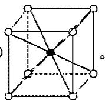

11. (1)

(2) $r=\frac{\sqrt{3}\times387}{2}-181=154.1pm$

$$
(3) \rho = \frac {1 4 . 0 1 + 1 . 0 0 8 \times 4 + 3 5 . 4 5}{6 . 0 2 \times 1 0 ^ {2 3} \times 3 8 7 ^ {3} \times 1 0 ^ {- 3 0}} = 1. 5 3 \mathrm{g/cm} ^ {3} 。
$$

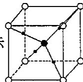

(4)如右图所示
说明:4个N-H键按四面体方向分布,分别指向立方体

互不相邻的四个顶点，即4个H分别和4个不相邻的 $\mathrm{Cl^-}$ 连接（异种电荷间的引力作用）。

12. (1) $\mathrm{LiCoO_2 + 6C\rightleftharpoons Li_{1 - x}CoO_2 + Li_xC_6}$ （正向充电，反向放电）。

(2) $96500 \times 1000 \div 3600 \div 181 = 148 \, mAh/g$ 。

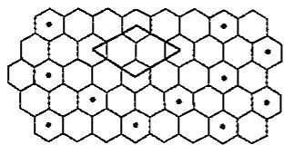

$$
(4) \rho = \frac {6 . 9 4 1 + 1 2 \times 6}{6 . 0 2 \times 1 0 ^ {2 3} \times 0 . 4 2 6 ^ {2} \times 0 . 3 7 0 6 \times \sin 6 0 ^ {\circ} \times 1 0 ^ {- 2 1}} = 2. 2 5 \mathrm{g/cm} ^ {3} 。
$$

13.(1)y=0,指 xy 平面,I $^{-}$ 分布为顶点、面心;y=1/2a,指 xy 平面之间的 1/2,I $^{-}$ 分布为面心;所以点阵型式为面心立方,由于 Ag $^{+}$ 离子占有 I $^{-}$ 离子围成的八个正四面体空隙中四个互不相邻的正四面体空隙,故阴、阳离子配位数都为 4。

(2)八面体空隙=6个、四面体空隙=12个。

压扁还是拉长的八面体？压扁

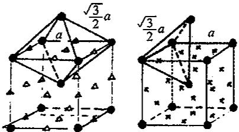

(3)在不同晶体中， $Ag^{+}$ 离子占据不同空隙，按阳、阴离子相互接触计算的 $Ag^{+}$ 离子半径自然有一个变化范围。

(4)对于体心立方堆积而言:球数:四面体空隙:八面体空隙=2:12:6=1:6:3, $Ag^{+}$ 离子只占空隙的九分之一,这说明 $\alpha-AgI$ 晶体中有大量空隙存在,有利于 $Ag^{+}$ 离子迁移,另外在体心立方中,四面体空隙与八面体空隙相连,四面体空隙与四面体空隙通过三角形中心相连，构成三维骨架结构的开放性“隧道”，可以供 $Ag^{+}$ 离子迁移。

14.(1) $UO_{n}$ 氧化物的晶胞图：

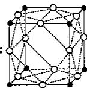

，晶胞中氧原子数目 n=3。

(2) 晶体的密度: $\rho=\frac{238.0+16.0\times3}{6.02\times10^{23}\times415.6^{3}\times10^{-30}}=6.62g/cm^{3}$ 。

U 的离子半径: $r(U^{6+})=\frac{415.6-2\times140}{2}=67.8\mathrm{pm}$ 。

(3)由12个O组成的立方八面体的自由孔径: $d=\sqrt{2}\times415.6-2\times140=308pm$ 。

15.(1)

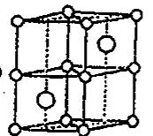

(2)NiAs。

(3) $\rho = \frac{2 \times (58.69 + 74.92)}{6.02 \times 10^{23} \times \sin 60^{\circ} \times 360.2^{2} \times 500.9 \times 10^{-30}} = 7.89 \mathrm{~g/cm}^{3}$ 。

(4)Ni:(0,0,0),(0,0,1/2);As:(2/3,1/3,1/4),(1/3,2/3,3/4)。

(5)6:6,Ni占有由As形成的八面体空隙,As占有由Ni形成的三棱柱空隙。

16.(1)铜原子个数为 $8 \times \frac{1}{8} + 6 \times \frac{1}{2} = 4$ ，其坐标为 $(0,0,0)(1/2,1/2,0)(1/2,0,1/2)$ $(0,1/2,1/2)$ 。

(2)八面体空隙,4个;四面体空隙,8个。

(3)铜单晶(100)面的面积为: $(362.0\times10^{-10})^{2}=1.310\times10^{-15}\mathrm{cm}^{2},1\mathrm{cm}^{2}$ 的面积有 $1/(1.310\times10^{-15})=7.63\times10^{14}$ 个(100)面,每个(100)面有 $4\times\frac{1}{4}+1=2$ 个原子,总共原子数为 $7.63\times10^{14}\times2=1.526\times10^{15}$ 个,Zn与Cu的半径和体积可以认为近似相等,所以电量 $Q=1.526\times10^{15}\times2\times1.6\times10^{-19}\mathrm{C}=4.88\times10^{-4}\mathrm{C}$ 。

17. (1) $\mathrm{MgB_2}$ 。

(2)

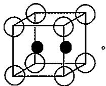

(3)12个,6个。

(4)石墨，B不是 $\mathrm{Mg}$ 是。

(5)

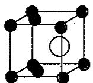

(6)1:1。

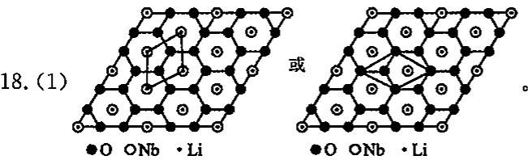

(2)简单六方晶胞，

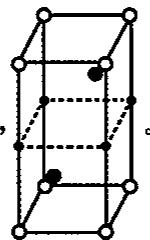

19.(1)代表相同的结构型式;利用坐标平移法可以证明这一点(用图示同样合理)。利用坐标平移法证明时,将每个原子移动 $1/3,2/3,3/4$ 。即有:

$\mathrm{Cu}(0,0,0)\rightarrow\mathrm{Cu}(1/3,2/3,3/4),\mathrm{Cu}(0,0,1/2)\rightarrow\mathrm{Cu}(1/3,2/3,1/4),\mathrm{Sn}(2/3,1/3,1/4)\rightarrow\mathrm{Sn}(0,0,0),\mathrm{Sn}(1/3,2/3,3/4)\rightarrow\mathrm{Sn}(2/3,1/3,1/2)$ ，图示证明如下（还可有其他图示方式，只要合理即可）。

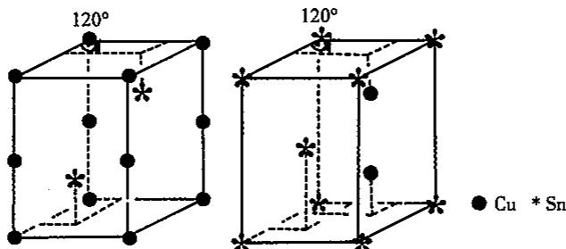

(2) $\rho = \frac{2 \times (63.55 + 118.7)}{6.02 \times 10^{23} \times \sin 60^{\circ} \times 419.8^{2} \times 509.6 \times 10^{-30}} = 7.79\mathrm{g/cm^{3}}$ 。

(3) $d(\mathrm{Cu}-\mathrm{Cu})=\mathrm{c}/2=254.8\ \mathrm{pm}$

20.(1) $V=4.64\times10^{-23}cm^{3}$ （每个晶胞中有两个Mg原子， $V=2\times24.3/(6.02\times10^{23}\times1.74)$ ）。

(2) $a=3.20\times10^{-8}\mathrm{cm}(1.633a^{3}\times\sin120^{\circ}=V)$ 。

(3) $3.20\times10^{-8}cm$ (最相邻的原子均位于底部边上,与底边长一致)。

(4)12(6个在同一平面中,3个在上面,3个在下面)。

21. (1) $\mathrm{AuCuH_4}$ 。

(2)2个金原子和2个铜原子一起构成,全部等价。

(3)

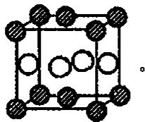

(4) $CaF_{2}$ 。

22.(1)1:1:2;一个球参与四个空隙,一个空隙由四个球围成;一个球参与四个切

点，一个切点由二个球共用。

(2)正八面体中心投影为平面◇空隙中心,正四面体中心投影为平面切点;1:1:2;一个球参与六个正八面体空隙,一个正八面体空隙由六个球围成;一个球参与八个正四面体空隙,一个正四面体空隙由四个球围成。

(3) 小球的配位数为 12; 平面已配位 4 个, 中心球周围的四个空隙上下各堆积 4 个, 共 12 个。

(4)74.05%;以4个相邻小球中心构成底面,空隙上小球的中心为上底面的中心构成正四棱柱,设小球半径为r,则正四棱柱边长为2r,高为 $\sqrt{2}r$ ,共包括1个小球(4个1/8,1个1/2)。

(5)正八面体空隙为0.414r，正四面体空隙为0.225r。

(6) $8.91\mathrm{g/cm^3}$ ; 根据第(4)题, 正四棱柱质量为 $58.70 / N_{\mathrm{Ag}}$ , 体积为 $1.094 \times 10^{-23} \mathrm{~cm}^3$ 。

(7) $H^{-}$ 填充在正四面体空隙, 占有率为 50%; 正四面体为 4 配位, 正八面体为 6 配位, 且正四面体空隙数为小球数的 2 倍。

(8) $A_{x}$ 就是 $A_{1}$ ，取一个中心小球周围的4个小球的中心为顶点构成正方形，然后上面再取两层，就是顶点面心的堆积形式。底面一层和第三层中心小球是面心，周围四小球是顶点，第二层四小球（在第一层四个空隙上方）是侧面面心。也可以以相邻四小球为正方形边的中点（顶点为正八面体空隙），再取两层，构成与上面同样大小的正方体，小球位于体心和棱心，实际上与顶点和面心差1/2单位。

23.(1)A: $\mathrm{Hg(NH_3)_2Cl_2}$

$$
\mathrm{B}: \mathrm{Hg} _ {2} (\mathrm{NH} _ {2}) _ {2} \mathrm{Cl} _ {2} (\mathrm{HgNH} _ {2} \mathrm{Cl}); \mathrm{HgCl} _ {2} + 2 \mathrm{NH} _ {3} = \mathrm{HgNH} _ {2} \mathrm{Cl} + \mathrm{NH} _ {4} \mathrm{Cl}.
$$

(2)都为简单立方堆积。

(3) 占据 $Cl^{-}$ 形成简单立方的面心，占有率 1/6。

(4)B 中存在着- $Hg-NH_{2}-Hg-$ 锯齿型链和链间的 $Cl^{-}$ 。

(5) A 比 B 易溶于水。

24. (1)  
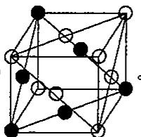

(2)设 Cu 原子半径为 $r, r = \sqrt{2} a / 4$ ，一个 $(1,1,1)$ 面上有 $1/2 \times 3 + 1/6 \times 3 = 2$ 个 Cu 原子， $S_{\mathrm{Cu}} = 2\pi r^2 = \pi a^2 / 4, S_{\text{总}} = \sqrt{3} a^2 / 2, S_{\mathrm{Cu}} / S_{\text{总}} = \sqrt{3}\pi / 6 = 90.69\%$ 。

一个晶胞中有 $1 / 2 \times 6 + 1 / 8 \times 8 = 4$ 个 $\mathrm{Cu}$ 原子, $V_{\mathrm{Cu}} = 16 / 3\pi r^3 = \sqrt{2}\pi \mathrm{a}^3 /6,V_{\text{总}} = a^3,$ $V_{\mathrm{Cu}} / V_{\text{总}} = \sqrt{2}\pi /6 = 74.05\%$ 。

(3)阴极面上一层 $\mathrm{Cu}$ 的物质的量为： $\frac{b}{\sqrt{3}a^2 / 2}\times 2\times \frac{1}{N_A} = \frac{4\sqrt{3}b}{3a^2N_A}$ 沉积的 $\mathrm{Cu}$ 原子的物质的量是： $\frac{60It}{2F}$ ，层数： $\frac{30It / F}{4\sqrt{3}b / 3a^2N_A} = \frac{15\sqrt{3}a^2N_AIt}{2Fb}$ 。

25.(1)Cu:4个,Fe:4个,S:8个,CuFeS $_{2}$ 。

(2)与 ZnS 晶胞相同。

(3)A1型(面心立方)堆积,四面体,1/2。

(4) $\rho = \frac{4 \times (63.55 + 55.84 + 32.07 \times 2)}{6.02 \times 10^{23} \times 52.4^2 \times 103.0 \times 10^{-27}} = 4.31\mathrm{g/cm^3}$ 。

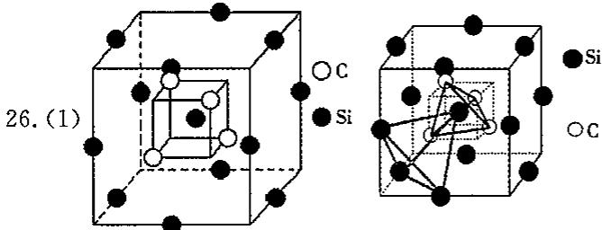

注：碳原子在小正方体不相邻的四个顶点上，硅原子在大正方体的十二条棱的中点上。

$$
(2) 2: 1, 1 0 9 ^ {\circ} 2 8 ^ {\prime} (\arccos (- 1 / 3)), 4 \sqrt {3} a / 3 。
$$

(3) $15\sqrt{3}/2N_{\Lambda}\alpha^{3}$ （每个晶胞中有4个SiC）。

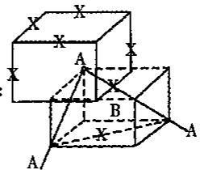

A 置于新晶胞的顶点, 阳离子 B 置于新晶胞的中心时, 阴离子 X 当处于晶胞中所有的面心位置。

(2) 晶胞 (Ⅰ) 和晶胞 (Ⅱ) 通过向体对角线平移 $1/2a + 1/2b + 1/2c$ 的矢量, 即可相互转化。

(3) 晶胞中含 X 为 3 个, 含 B 为 1 个, 含 A 为 1 个; 因此化学式为 $ABX_{3}$ 。

(4) 按晶胞 (I) 的描述, A 在体心, 周围有 12 个棱心的 X, 故 A 的配位数为 12; B 在顶点, 周围有 6 个棱心的 X, 故 B 的配位数为 6; X 在棱心, 周围有 4 个 A, 2 个 B, 故 X 的配位数为 $2 + 4 = 6$ 。

(5)按照题给出(Ⅲ)晶面的定义,可画出晶胞(Ⅱ)的三条面对角线,这三条面对角线起始点都是A,且通过面心X,这样得到三层的排列, $\begin{array}{c}A\\X\end{array}$ 为完成一个晶胞的情况。然

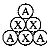

后根据晶胞周期性地在三维空间排列的设想，将这三层排列作为一个小单元，向两对角线 $(\mathbf{x},\mathbf{y})$ 两个方向无限延伸下去，并将第三层中的A作为下一个单元第一层的A，即可作

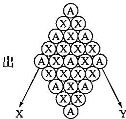

的图形。

(6) 按晶胞(Ⅱ)的描述, B 邻接的 X 和 A 的总数为 14(个)。

28.(1)按题所给数据,作图示于下图(a)中。

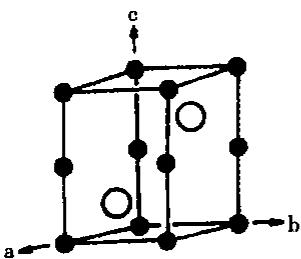

(a)

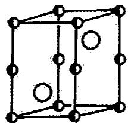

(b)

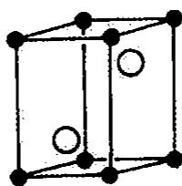  
(c)

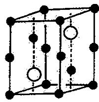  
(d)

(2)Ni:6As(八面体) $\left[(c/4)^{2}+(a/2/\frac{\sqrt{3}}{2})^{2}\right]^{1/2}=242.76\mathrm{pm}$ 。

2Ni(直线形)c/2=250.5pm,6Ni(六角形,在ab平面)a=360.2pm。

As:6Ni(三棱柱体)242.76pm,12As(hcp 配位)a=360.2 pm。

(3)作图分别示于(b)和(c)中。

(4)作图示于图(d)中。

<table><tr><td>晶体</td><td>a/pm</td><td>c/pm</td><td>c/a</td></tr><tr><td>NiAs</td><td>360.2</td><td>500.9</td><td>1.391</td></tr><tr><td>CoTe</td><td>388.2</td><td>536.7</td><td>1.383</td></tr><tr><td> $CoTe_{2}$ </td><td>378.4</td><td>540.3</td><td>1.428</td></tr><tr><td>hcp</td><td>——</td><td>——</td><td>1.633</td></tr></table>

由上述数据可见,为了加强金属原子间的相互作用,即提高金属键的强度,金属原子互相靠近,c/a值变小,金属性增加。

(6)M-M间的距离为 $c / 2$ 。即：

NiAs: Ni-Ni 为 c/2=250.4pm; CoTe: Co-Co 为 c/2=268.4pm。

它们分别与金属镍中镍原子间的距离 249.2pm 和金属钴中钴原子的距离 250.6pm 相近。这也与这类晶体性质相符。NiAs 和 CoTe 具有金属光泽、不透明，是电的良导体。

(7)从空间因素考虑,由上图所示的结构中均存在两类空隙,为增减原子、改变组成创造有利的几何条件。从电子因素考虑,原子间结合力金属键占优势,不会受制于离子的价态和电中性原理。所以当组成改变时,不必改变结构型式,而只要调整轴率和原子间距离即可。

29. (1) $r(\mathrm{NH}_{4}^{+})=\frac{\sqrt{3}}{2}\times387-181=154\mathrm{pm}$ .

$$
(2) \rho = \frac {1 4 + 4 \times 1 . 0 0 8 + 2 0 0 . 6 + 3 5 . 4 5 \times 3}{6 . 0 2 \times 1 0 ^ {2 3} \times 4 1 9 ^ {2} \times 7 9 4 \times 1 0 ^ {- 3 0}} = 3. 8 7 \mathrm{g/cm} ^ {3}.
$$

(3) $Hg^{2+}$ : 压扁的正八面体; $NH_{4}^{+}$ : 压扁的正四棱柱(长方体)。

30. (1) $\left[\begin{array}{c} \mathrm{O} \\ | \\ \mathrm{Cu}^{+3} \end{array}\right]^{\mathrm{6-}}$ 。

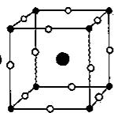

(大黑球为 La, 小灰球为 Cu, 小白球为 O)。

31.(1) $\rho=\frac{4\times(1.008\times2+16)}{6.02\times10^{23}\times452.27^{2}\times736.71\times\sin60^{\circ}\times10^{-30}}=0.92g/cm^{3}$

(2)坐标为(0,0,0)和(0,0,0.375)的两个O原子间距即为氢键键长 $d:d=(0.375-0)\times736.71=276.3\ \text{pm}$ 。

(3)冰的点阵形式是简单六方点阵,整个晶胞包含的内容即 $4H_{2}O$ 为结构基元。

32. (1) $Ba^{2+}$ : (0,0,0); $H^{-}$ : (0.5,0.5,0.237); (0.5,0.5,0.763);

H: (0.132, 0.5, 0.5); (0.868, 0.5, 0.5); (0.5, 0.132, 0.5); (0.5, 0.868, 0.5);
结构基元包含1个 $Ba^{2+}$ ;2个 $H^{-}$ ;4个H。

(2)横轴为 b 方向,纵轴为 c 方向。

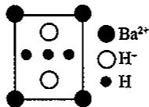

(3)305.2pm×0.132×2=80.6pm。

(4) $a \pm b$ 方向共面连接，a、b、c 方向共棱连接。

(5) $\rho = \frac{2 \times 2 \times 1.008}{6.02 \times 10^{23} \times 305.2^2 \times 383.1 \times 10^{-30}} = 0.1877\mathrm{g/cm^3}$ 。

33.(1)

<table><tr><td>分子(构型)</td><td>对称元素</td><td>点群</td><td>分子(构型)</td><td>对称元素</td><td>点群</td></tr><tr><td>菲</td><td> $C_{2}$ 、 $2\sigma_{v}$ </td><td> $C_{2v}$ </td><td> $P_{4}O_{6}$ </td><td> $4C_{3}$ 、 $3C_{2}$ 、 $6\sigma_{d}$ </td><td> $T_{d}$ </td></tr><tr><td>碘仿</td><td> $C_{3}$ 、 $3\sigma_{v}$ </td><td> $C_{3v}$ </td><td>环己烷(船式)</td><td> $C_{2}$ 、 $2\sigma_{v}$ </td><td> $C_{2v}$ </td></tr><tr><td> $B_{2}H_{6}$ </td><td> $3C_{2}$ 、 $\sigma_{h}$ 、 $2\sigma_{v}$ 、 $i$ </td><td> $D_{2h}$ </td><td>乙烷(重叠式)</td><td> $C_{3}$ 、 $3C_{2}$ 、 $\sigma_{h}$ 、 $3\sigma_{v}$ </td><td> $D_{3h}$ </td></tr><tr><td>环丙烷</td><td> $C_{3}$ 、 $3C_{2}$ 、 $\sigma_{h}$ 、 $3\sigma_{v}$ </td><td> $D_{3h}$ </td><td>乙烷(交叉式)</td><td> $C_{3}$ 、 $3C_{2}$ 、 $3\sigma_{d}$ 、 $i$ </td><td> $D_{3d}$ </td></tr><tr><td> $C_{50}$ </td><td> $6C_{5}$ , $10C_{3}$ , $15C_{2}$ , $15\sigma_{v}$ , $i$ </td><td> $I_{d}$ </td><td>乙烷(任意式)</td><td> $C_{3}$ 、 $3C_{2}$ </td><td> $D_{3}$ </td></tr></table>

(2)

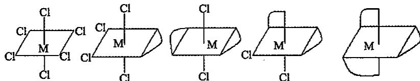

(3)有；3个电子；中间两个sp，两端两个 $\mathfrak{sp}^2$ ；不共面；3种。

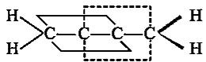

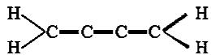

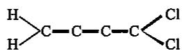

$D_{2d}$ 无偶极距和旋光性

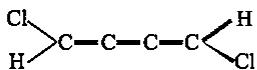

$C_{2}$ 有偶极距、无旋光性

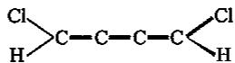

$C_{2}$ 有偶极距和旋光性

$C_2$ 有偶极距和旋光性

## 第五章 配位化合物

## 【初赛要求】

配合物:路易斯酸碱。配位键。重要而常见的配合物的中心离子(原子)和重要而常见的配体(水、氢氧根离子、卤离子、拟卤离子、氨、酸根离子、不饱和烃等)。螯合物及螯合效应。重要而常见的配合反应。配合反应与酸碱反应、沉淀反应、氧化还原反应的关系(定性说明)。配合物几何构型和异构现象的基本概念和基本事实。配合物的杂化轨道理论。用杂化轨道理论说明配合物的磁性和稳定性。用八面体配合物的晶体场理论说明 $\left[\mathrm{Ti}\left(\mathrm{H}_{2}\mathrm{O}\right)_{6}\right]^{3+}$ 的颜色。软硬酸碱的基本概念和重要的软酸、软碱和硬酸、硬碱。

## 【决赛要求】

配合物的晶体场理论:光谱化学序列。配合物的磁性。分裂能、电子成对能、稳定化能。利用配合物平衡常数的计算。络合滴定。软硬酸碱。配位场理论对八面体配合物的解释。

## 【知识点精讲】

## 5.1 配合物基本知识

## 5.1.1 配合物的定义

由中心离子(或原子)和几个配体分子(或离子)以配位键相结合而形成的复杂分子或离子,通常称为配位单元。凡是含有配位单元的化合物都称作配位化合物,简称配合物,也叫络合物。

$\left[\mathrm{Co}\left(\mathrm{NH}_{3}\right)_{6}\right]^{3+},\left[\mathrm{Cr}\left(\mathrm{CN}\right)_{6}\right]^{3-},\mathrm{Ni}\left(\mathrm{CO}\right)_{4}$ 都是配位单元，分别称作配阳离子、配阴离子、配分子。

$$
\left[ \mathrm{Co} (\mathrm{NH} _ {3}) _ {6} \right] \mathrm{Cl} _ {3}, \mathrm{K} _ {3} \left[ \mathrm{Cr} (\mathrm{CN}) _ {6} \right], \mathrm{Ni} (\mathrm{CO}) _ {4} \text {   都是配位化合物。   }
$$

思考:下列化合物中哪些是配合物?

$$
① \mathrm{CuSO} _ {4} \cdot 5 \mathrm{H} _ {2} \mathrm{O}; ② \mathrm{K} _ {2} \mathrm{PtCl} _ {6}; ③ \mathrm{KCl} \cdot \mathrm{CuCl} _ {2}; ④ \mathrm{Cu} (\mathrm{NH} _ {2} \mathrm{CH} _ {2} \mathrm{COO}) _ {2};
$$

$$
⑤ \mathrm{KCl} \cdot \mathrm{MgCl} _ {2} \cdot 6 \mathrm{H} _ {2} \mathrm{O}; ⑥ \mathrm{Cu} (\mathrm{CH} _ {3} \mathrm{COO}) _ {2}; ⑦ \mathrm{CaOCl} _ {2} 。
$$

注意:①配合物和配离子的区别;②配合物和复盐、混盐的区别。

## 5.1.2 配合物的组成

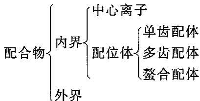

## 1. 配合物的内界和外界

以 $\left[\mathrm{Cu}\left(\mathrm{NH}_{3}\right)_{4}\right]\mathrm{SO}_{4}$ 为例： $\left[\mathrm{Cu}\left(\mathrm{NH}_{3}\right)_{4}\right]^{2+}$ 称为内界， $\mathrm{SO}_4^{2-}$ 称为外界。

内界是配位单元，外界是简单离子。又如 $\mathrm{K}_3[\mathrm{Cr}(\mathrm{CN})_6]$ 中，内界是 $[\mathrm{Cr}(\mathrm{CN})_6]^{3-}$ ，外界是 $\mathbf{K}^{+}$ 。配合物可以无外界，如 $\mathrm{Ni(CO)_4}$ ；但不能没有内界，内界和外界之间是完全电离的。

## 2. 中心离子和配位体

中心离子:又称配合物的形成体,多为金属(过渡金属)离子,也可以是原子。如 $Fe^{3+}$ 、 $Fe^{2+}$ 、 $Co^{2+}$ 、 $Ni^{2+}$ 、 $Cu^{2+}$ 、 $Co^{3+}$ 等,只要能提供接纳孤电子对的空轨道即可。

配位体:含孤电子对的阴离子、阳离子或分子。如 $NH_{3}$ 、 $H_{2}O$ 、 $Cl^{-}$ 、 $Br^{-}$ 、 $I^{-}$ 、 $CN^{-}$ 、 $SCN^{-}$ 等。

## 3. 配位原子和配位数

配体中给出孤电子对与中心离子直接形成配位键的原子，叫配位原子。配位单元中，中心离子周围与中心离子直接成键的配位原子的个数，叫配位数。

配位化合物 $\left[\mathrm{Cu}\left(\mathrm{NH}_{3}\right)_{4}\right]\mathrm{SO}_{4}$ 的内界为 $\left[\mathrm{Cu}\left(\mathrm{NH}_{3}\right)_{4}\right]^{2+}$ ，中心 $Cu^{2+}$ 的周围有四个配体 $NH_{3}$ ，每个 $NH_{3}$ 中有一个N原子与 $Cu^{2+}$ 配位。N是配位原子，Cu的配位数4。（注意：配体的个数与配位数不是同一个概念）

若中心离子的电荷高，半径大，则利于形成高配位数的配位单元，例如： $\left[\mathrm{Ag}\left(\mathrm{NH}_{3}\right)_{2}\right]^{+}$ 和 $\left[\mathrm{Cu}\left(\mathrm{NH}_{3}\right)_{4}\right]^{2+},\left[\mathrm{PtCl}_{4}\right]^{2-}$ 和 $\left[\mathrm{PtCl}_{6}\right]^{2-},\left[\mathrm{BF}_{4}\right]^{-},\left[\mathrm{AlF}_{6}\right]^{3-}$ 和 $\left[\mathrm{La}\left(\mathrm{H}_{2} \mathrm{O}\right)_{8}\right]^{3+}$ ；而配体的电荷高，半径大，则利于低配位数，例如： $\left[\mathrm{Zn}\left(\mathrm{NH}_{3}\right)_{6}\right]^{2+}$ 和 $\left[\mathrm{ZnCl}_{4}\right]^{2-},\left[\mathrm{AlF}_{6}\right]^{3-}$ 和 $\left[\mathrm{AlCl}_{4}\right]^{-}$ ；另外配合物的生成条件，例如：配合物的浓度和反应温度对配位数也有显著影响。

## 4. 常见的配体

单齿配体:一个配体中只能提供一个配位原子与中心离子成键。如： $H_{2}O$ 、 $NH_{3}$ 、CO等。单齿配体中，有些配体含有两个配位原子，称为两可配体。如 $SCN^{-}$ 离子，结构为线形。以S为配位原子时，- $SCN^{-}$ 称硫氰根；以N为配位原子时，- $NCS^{-}$ 称异硫氰根；还有 $NO_{2}$ 基团，以N为配位原子时， $NO_{2}$ 称为硝基；以O为配位原子时，：ONO称为亚硝酸根。

常见的单齿配体有： $X^{-}$ 、 $NH_{3}$ 、 $H_{2}O$ 、CO、py、 $CH_{2}=CH_{2}$ 等。

常见的两可配体有： $-NO_{2}^{-}$ （硝基）、 $-ONO^{-}$ （亚硝酸根）、 $-SCN^{-}$ （硫氰酸根）、 $-NCS^{-}$ （异硫氰酸根）、 $-CN^{-}$ （氰根）、 $-NC^{-}$ （异氰根）。

多齿配体:有多个配位原子的配体(又分双齿、三齿、四齿等)。如含氧酸根: $SO_{4}^{2-}$ 、 $CO_{3}^{2-}$ 、 $PO_{4}^{3-}$ 、 $C_{2}O_{4}^{2-}$ 、乙二胺(en)、二乙三胺、氮三乙酸、乙二胺四乙酸等。

螯合配体:同一配体中两个或两个以上的配位原子直接与同一金属离子配合成环状结构的配体称为螯合配体。螯合配体是多齿配体中最重要且应用最广的。例如乙二胺$\left(\mathrm{H}_{2}\mathrm{N}-\mathrm{CH}_{2}-\mathrm{CH}_{2}-\mathrm{NH}_{2},\text{表示为en}\right)$ ，其中两个氮原子经常和同一个中心离子配位。像这种有两个配位原子的配体通常称双基配体(或双齿配体)。

而乙二胺四乙酸(EDTA)，其中2个N,4个-OH中的O均可配位，称多齿配体。

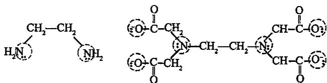

常见的双齿配体有:1,10-菲啰啉(邻二氮菲)、2,2-联吡啶、邻亚苯基双甲基胂、卓酚酮基、甘氨酸根、8-羟基喹啉、吡啶-2-甲酸根、β-二酮基、乙酰丙酮、水杨酸、水杨醛、丁二酮肟。

常见的三齿配体有：二亚乙基三胺、三联吡啶。

常见的四齿配体有：三亚乙基四胺、三乙胺基胺、氮三乙酸、双一乙酰丙酮一乙撑。

由双齿配体或多齿配体形成的具有环状结构的配合物称螯合物(如下图所示)。含五元环或六元环的螯合物较稳定。

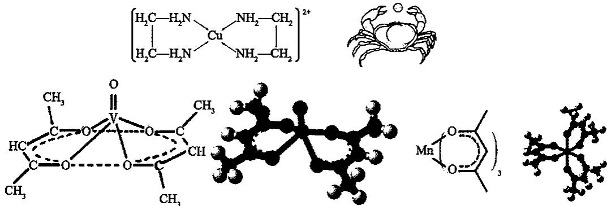

EDTA 与金属 M 离子形成的螯合物的结构示意图如下图所示(右图为 EDTA 合钙)。

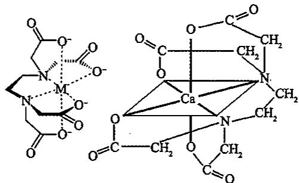

阴离子多齿配体和阳离子中心形成的中性配位单元，称为内盐。

$H_{2}N-CH_{2}-COO^{-}$ 与 $Cu^{2+}$ 可形成内盐。

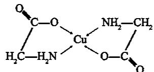

通常情况下，同一中心原子形成的螯合物要比一般的配合物稳定，其原因是熵增原理，例如： $\left[\mathrm{Cu}\left(\mathrm{H}_{2}\mathrm{O}\right)_{4}\right]^{2+}+2\mathrm{en}=\left[\mathrm{Cu}\left(\mathrm{en}\right)_{2}\right]^{2+}+4\mathrm{H}_{2}\mathrm{O}$ ，小分子由两个乙二胺变为四个水，混乱度增加，熵增加。还有一些常见的大环配合物，例如血红素、叶绿素、维生素 $B_{12}$ 的结构示意图如下图所示。

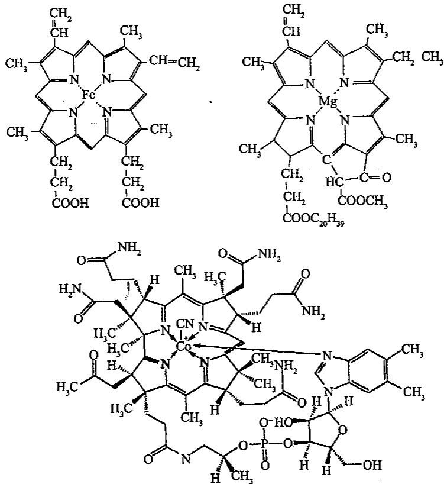

## 5.1.3 配合物的命名

配合物种类繁多,结构复杂,因此有必要对配合物进行系统命名,命名原则如下:

1. 在配合物中
先阴离子, 后阳离子, 阴阳离子之间加“化”字或“酸”字, 配阴离子看成是酸根。

2. 在配位单元中

①先配体后中心，配体与中心之间加“合”字。

②配体前面用二、三、四、…表示该配体个数。

③几种不同的配体之间加“·”隔开。

④中心后面加（），内写大写罗马数字表示中心离子或原子的价态。

3. 配体的名称

<table><tr><td>配体符号</td><td>配体名称</td><td>配体符号</td><td>配体名称</td></tr><tr><td> $F^{-}$ </td><td>氟</td><td> $Cl^{-}$ </td><td>氯</td></tr><tr><td> $OH^{-}$ </td><td>羟</td><td> $CN^{-}$ </td><td>氰</td></tr><tr><td> $-NO_{2}^{-}$ </td><td>硝基</td><td> $-ONO^{-}$ </td><td>亚硝酸根</td></tr><tr><td> $SO_{4}^{2-}$ </td><td>硫酸根</td><td> $NH_{3}$ </td><td>氨</td></tr><tr><td>py</td><td>吡啶</td><td>en</td><td>乙二胺</td></tr><tr><td> $PPh_{3}$ </td><td>三苯基膦</td><td>NO</td><td>亚硝酰</td></tr><tr><td>CO</td><td>羰</td><td> $H_{2}O$ </td><td>水</td></tr></table>

## 4. 配体的先后顺序

下述的每条规定均以其前一条为基础。

①先无机配体后有机配体。

如 $\mathrm{PtCl}_{2}(\mathrm{PPh}_{3})_{2}$ : 二氯·二(三苯基膦)合铂(Ⅱ)。

②在无机配体中，先阴离子类配体，后阳离子类配体，最后分子类配体。

如 $\mathrm{K}[\mathrm{PtCl}_{3}(\mathrm{NH}_{3})]$ : 三氯·氨合铂(Ⅱ)酸钾。

③同类配体中，按配位原子的元素符号在英文字母表中的次序分出先后。

如 $\left[\mathrm{Co}\left(\mathrm{NH}_{3}\right)_{5}\mathrm{H}_{2}\mathrm{O}\right]\mathrm{Cl}_{3}$ ：三氯化五氨·水合钴(Ⅲ)。

④配位原子相同，配体中原子个数少的在前。

如 $\left[\mathrm{Pt}(\mathrm{py})(\mathrm{NH}_3)(\mathrm{NO}_2)(\mathrm{NH}_2\mathrm{OH})\right]\mathrm{Cl}$ ：氯化硝基·氨·羟氨·吡啶合铂(Ⅱ)。

⑤配体中原子个数相同，则按和配位原子直接相连的配体中的其他原子的元素符号在英文字母表中的次序。如 $NH_{2}^{-}$ 和 $NO_{2}^{-}$ ，则 $NH_{2}^{-}$ 在前。

⑥同一配体有两个不同配位原子时:异硫氰根 $\left(\mathrm{NCS}^{-}\right)$ 在前,硫氰根 $\left(\mathrm{SCN}^{-}\right)$ 在后;硝基 $\left(\mathrm{NO}_{2}^{-}\right)$ 在前,亚硝酸根 $\left(\mathrm{ONO}^{-}\right)$ 在后。

## 一些配位化合物的命名举例：

<table><tr><td>配位化合物</td><td>命名</td></tr><tr><td> $H_{2}[SiF_{6}]$ </td><td>六氟合硅(IV)酸</td></tr><tr><td> $[Ag(NH_{3})_{2}](OH)$ </td><td>氢氧化二氨合银(I)</td></tr><tr><td> $[Cu(NH_{3})_{4}]SO_{4}$ </td><td>硫酸四氨合铜(II)</td></tr><tr><td> $[CrCl_{2}(H_{2}O)_{4}]Cl$ </td><td>一氯化二氯·四水合铬(III)</td></tr><tr><td> $[Co(NH_{3})_{5}(H_{2}O)]Cl_{3}$ </td><td>三氯化五氨·一水合钴(III)</td></tr><tr><td> $K_{4}[Fe(CN)_{6}]$ </td><td>六氰合铁(II)酸钾</td></tr><tr><td> $Na_{3}[Ag(S_{2}O_{3})_{2}]$ </td><td>二(硫代硫酸根)合银(I)酸钠</td></tr><tr><td> $K[PtCl_{5}(NH_{3})]$ </td><td>五氯·一氨合铂(IV)酸钾</td></tr><tr><td> $[Pt(NH_{3})_{6}][PtCl_{4}]$ </td><td>四氯合铂(II)酸六氨合铂(II)</td></tr><tr><td> $[Fe(CO)_{5}]$ </td><td>五羰基合铁(0)</td></tr><tr><td> $[PtCl_{4}(NH_{3})_{2}]$ </td><td>四氯·二氨合铂(IV)</td></tr><tr><td> $[Pt(NH_{3})_{2}Cl_{2}]$ </td><td>二氯·二氨合铂(II)</td></tr><tr><td> $[Co(NH_{3})_{6}]Cl_{3}$ </td><td>三氯化六氨合钴(III)</td></tr><tr><td> $K_{2}[Co(NCS)_{4}]$ </td><td>四异硫氰合钴(II)酸钾</td></tr><tr><td> $[Co(NH_{3})_{5}Cl]Cl_{2}$ </td><td>二氯化一氯·五氨合钴(III)</td></tr><tr><td> $K_{2}[Zn(OH)_{4}]$ </td><td>四羟基合锌(II)酸钾</td></tr><tr><td> $[Co(ONO)(NH_3)_3(H_2O)_2]Cl_2$ </td><td>二氯化亚硝酸根·三氨·二水合钴(III)</td></tr><tr><td> $[Co(N_2)(NH_3)_3]SO_4$ </td><td>硫酸一氮气·三氨合钴(II)</td></tr><tr><td> $[Cr(OH)(C_2O_4)(en)(H_2O)]$ </td><td>一羟基·一水·一草酸根·一乙二胺合铬(III)</td></tr></table>

## 5. 桥基多核配合物的命名

在桥联基团或原子的前面冠以希腊字母 $\mu^{-}$ ，并加圆点与配合物其他部分隔开。两个或多个桥联基团，用二 $(\mu^{-})$ 等表示；如果桥基以不同的配位原子与两个中心原子连接，则该桥基名称的后面加上配位原子的元素符号来标明。

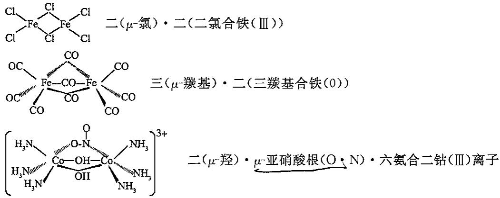

## 5.2 配位化合物的价键理论

## 5.2.1 配位键形成

中心离子和配位原子都是通过杂化了的共价配位键结合的。

配位键的本质是成键的双方,一方(如中心原子)提供空轨道,另一方(如配位体)提供孤电子对或 $\pi$ 电子形成的共价键。

1. $\sigma$ 配位键: 配位体提供孤电子对与中心原子空轨道形成的配位键。

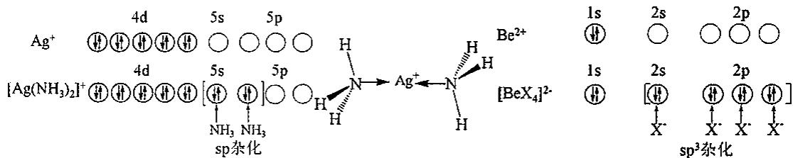

2. $\pi$ 配位键：由金属原子提供电子对与配体空的反键 $\pi$ 轨道形成的反馈 $\pi$ 配位键。如 $\mathrm{K}[(\mathrm{CH}_2 = \mathrm{CH}_2)\mathrm{PtCl}_3]$ ，三氯·乙烯合铂(Ⅱ)酸钾(蔡斯盐)。

$C_{2}H_{4}$ 的 $\pi$ 电子与 $Pt^{2+}$ 配位，形成 $\sigma$ 配位键，而 $Pt^{2+}$ 的 d 轨道电子对与乙烯反键 $\pi$ 轨道配位形成 $\pi$ 配位键。

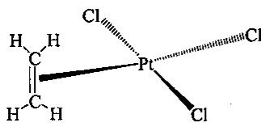

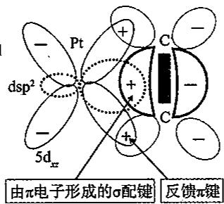

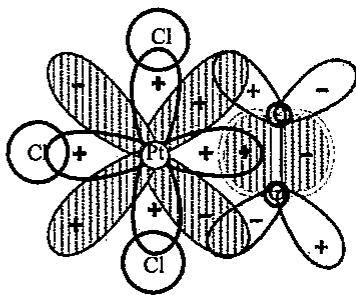

举例：

$C_{5}H_{5}$ (环戊二烯基)简写为:Cp;如: $FeCp_{2}$ ,它与金属中心M有三种配位方式:

第一种： $\left(\eta^{5}-C_{5}H_{5}\right)$ ，若把 $C_{5}H_{5}$ 看作中性分子，则提供 5 个 $\pi$ 电子，若看作 $C_{5}H_{5}^{-}$ ，则提供 6 个 $\pi$ 电子，该负电荷可看作中心体给 $C_{5}H_{5}$ 一个电子所得。

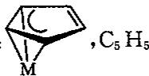

第二种： $C_{5}H_{5}$ ， $C_{5}H_{5}$ 提供 3 个 $\pi$ 电子，表示成 $(\eta^{3}-C_{5}H_{5})$ 。

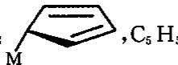

第三种： $\mathrm{C}_{5} \mathrm{H}_{5}$ 提供 1 个电子，形成 $\sigma$ 键，表示成 $\eta^{1}-\mathrm{C}_{5} \mathrm{H}_{5}$ 或 $\sigma-\mathrm{C}_{5} \mathrm{H}_{5}$ 。

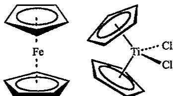  
除 Ti 外的第四周期过渡元素都已经制得二茂配合物, 它们的性质如下:

<table><tr><td>物质</td><td> $Cp_{2}V$ </td><td> $Cp_{2}Cr$ </td><td> $Cp_{2}Mn$ </td><td> $Cp_{2}Fe$ </td><td> $Cp_{2}Co$ </td><td> $Cp_{2}Ni$ </td></tr><tr><td>颜色</td><td>紫色</td><td>红色</td><td>琥珀色</td><td>橙色</td><td>紫色</td><td>绿色</td></tr><tr><td>熔点(°C)</td><td>162</td><td>172</td><td>193</td><td>173</td><td>173</td><td>173</td></tr><tr><td>M-C核间距( $10^{-8}cm$ )</td><td>2.28</td><td>2.17</td><td>2.38</td><td>2.06</td><td>2.12</td><td>2.20</td></tr></table>

又如： $H_{2}C=CH-CH_{2}-(丙烯基)$ 与中心体也有两种配位方式：

$$
\mathrm{M} - \mathrm{CH} _ {2} - \mathrm{CH} = \mathrm{CH} _ {2} (\sigma - \mathrm{C} _ {3} \mathrm{H} _ {5}), \widehat {\bigg |} _ {\mathrm{M}} (\eta^ {3} - \mathrm{C} _ {3} \mathrm{H} _ {5})
$$

## 5.2.2 配合物的构型与中心离子的杂化方式

<table><tr><td>配位数</td><td>空间构型</td><td>杂化轨道类型</td><td>实例</td></tr><tr><td>2</td><td>直线形</td><td>sp</td><td> $[Ag(NH_3)_2]^{+}$ ;  $[Ag(CN)_2]^{-}$ </td></tr><tr><td>3</td><td>平面三角形</td><td> $sp^2$ </td><td> $[Cu(CN)_3]^{2-}$ ;  $[HgI_3]^{-}$ </td></tr><tr><td>4</td><td>正四面体</td><td> $sp^3$ </td><td> $[Zn(NH_3)_4]^{2+}$ ;  $[Cd(CN)_4]^{2-}$ </td></tr><tr><td>4</td><td>四方形</td><td> $\text{dsp}^{2}$ </td><td> $[\text{Ni(CN)}_{4}]^{2-}$ </td></tr><tr><td>5</td><td>三角双锥</td><td> $\text{dsp}^{3};\text{sp}^{3}\text{d}$ </td><td> $[\text{Ni(CN)}_{5}]^{3-};\text{Fe(CO)}_{5}$ </td></tr><tr><td>5</td><td>四方锥</td><td> $\text{d}^{4}\text{s};\text{d}^{2}\text{sp}^{2}$ </td><td> $[\text{TiF}_{5}]^{2-}$ </td></tr><tr><td>6</td><td>八面体</td><td> $\text{sp}^{3}\text{d}^{2}$ </td><td> $[\text{FeF}_{6}]^{3-};[\text{AlF}_{6}]^{3-};[\text{SiF}_{5}]^{2-};[\text{PtCl}_{6}]^{4-}$ </td></tr><tr><td>6</td><td>八面体</td><td> $\text{d}^{2}\text{sp}^{3}$ </td><td> $[\text{Fe(CN)}_{6}]^{3-};[\text{Co(NH}_{3})_{6}]^{3+}$ </td></tr><tr><td>6</td><td>三方棱柱</td><td> $\text{d}^{4}\text{sp}$ </td><td> $[\text{V(H}_{2}\text{O)}_{6}]^{4+}$ </td></tr><tr><td>7</td><td>五角双锥</td><td> $\text{d}^{3}\text{sp}^{3};\text{sp}^{3}\text{d}^{3}$ </td><td> $[\text{ZrF}_{7}]^{3-};[\text{Fe(EDTA)(H}_{2}\text{O)}]^{-}$  $[\text{UO}_{2}\text{F}_{5}]^{3-}$ </td></tr><tr><td>8</td><td>正十二面体</td><td> $\text{d}^{4}\text{sp}^{3};\text{sp}^{3}\text{d}^{4}$ </td><td> $[\text{Mo(CN)}_{8}]^{4-};[\text{Co(NO}_{3})_{4}]^{2-}$  $[\text{W(CN)}_{8}]^{4-};[\text{Th(C}_{2}\text{O}_{4})_{4}]^{4-}$ </td></tr></table>

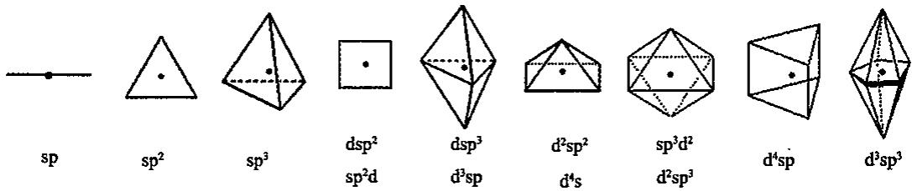

1. ns np nd 杂化

(1) $\left[FeF_{6}\right]^{3-}$ 的成键情况

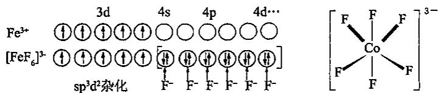

一个 4s 空轨道，三个 4p 空轨道和两个 4d 空轨道形成 $sp^{3}d^{2}$ 杂化轨道，正八面体分布。六个 $F^{-}$ 的六个孤电子对进入 $sp^{3}d^{2}$ 空轨道中，形成正八面体构型的配合单元。 $\left[CoF_{6}\right]^{3-}$ 结构与此相同。

(2) $\mathrm{Ni(CO)_4}$ 的成键情况

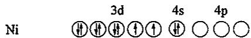

在配体 CO 的作用下, Ni 的价层电子重排成 $3d^{10}4s^{0}$ :

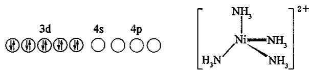

形成 $sp^{3}$ 杂化轨道，正四面体分布，四个 CO 配体与 $sp^{3}$ 杂化轨道成配位键，形成的 $\mathrm{Ni(CO)}_{4}$ 构型为正四面体。 $\left[\mathrm{Ni}\left(\mathrm{NH}_{3}\right)_{4}\right]^{2+}$ 也具有正四面体结构。

再比如： $[\mathrm{NiCl}_4]^{2 - }$

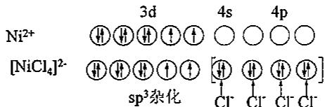

(1)和(2)的相同点是,配体的孤电子对进入中心的外层空轨道,即 ns np nd 杂化轨道,形成的配合物称外轨型配合物,所成的键称为电价配键,电价配键不是很强。

(1)和(2)的不同点是,(2)中 CO 使中心的价电子发生重排,这样的配体称为强场配体。常见的强场配体有 CO、 $CN^{-}$ 、 $NO_{2}^{-}$ 等;而(1)中 $F^{-}$ 不能使中心的价电子重排,称为弱场配体。常见的弱场配体有 $F^{-}$ 、 $Cl^{-}$ 、 $H_{2}O$ 等。而 $NH_{3}$ 等则为中等强度配体。对于不同的中心,相同的配体其强度也是不同的。

## 2. $(n - 1)$ d ns np 杂化

(3) 讨论 $\left[\mathrm{Fe}(\mathrm{CN})_{6}\right]^{3-}$ 的成键情况

$CN^{-}$ 为强场配体使 $Fe^{3+}$ 的电子重排：

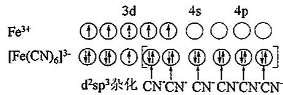

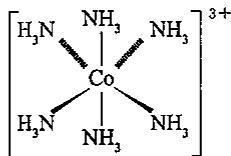

形成 $d^{2}sp^{3}$ 杂化，使用两个 3d 轨道，一个 4s 轨道，三个 4p 轨道。用的内层 d 轨道。形成的配离子 $\left[\mathrm{Fe}(\mathrm{CN})_{6}\right]^{3-}$ 为正八面体构型。 $\left[\mathrm{Co}(\mathrm{NH}_{3})_{6}\right]^{3+}$ 结构与此相同。

(4) 讨论 $\left[\mathrm{Ni}(\mathrm{CN})_{4}\right]^{2-}$

$CN^{-}$ 为强配体使 $Ni^{2+}$ 的电子重排：

空出一个内层 d 轨道, 形成 $dsp^{2}$ 杂化轨道, 呈正方形分布。故 $\left[\mathrm{Ni}(\mathrm{CN})_{4}\right]^{2-}$ 构型为正方形。

(3)和(4)中,杂化轨道均用到了 $(n-1)d$ 内层轨道,配体的孤电子对进入内层,能量低,称为内轨配合物,较外轨配合物稳定,所成的配位键称为共价配键。

四氨基合镍与四氰基合镍的比较如下表所示。

<table><tr><td> $[Ni(NH_3)_4]^{2+}$ </td><td> $[Ni(CN)_4]^{2-}$ </td></tr><tr><td> $sp^3$ 杂化</td><td> $dsp^2$ 杂化</td></tr><tr><td>正四面体</td><td>平面正方形</td></tr><tr><td>有2个成单电子</td><td>无成单电子</td></tr><tr><td> $\mu=3.0B.M.$ </td><td> $\mu=0B.M.$ </td></tr><tr><td>d电子不重排</td><td>d电子重排</td></tr><tr><td>内层d轨道不参与成键</td><td>内层d轨道参与成键</td></tr><tr><td>属外轨型配合物</td><td>属内轨型配合物</td></tr><tr><td>成单电子数较多</td><td>成单电子数较少</td></tr><tr><td>磁矩较大</td><td>磁矩较小</td></tr><tr><td>高自旋配合物</td><td>低自旋配合物</td></tr><tr><td>离子性较强</td><td>共价性较强</td></tr></table>

## 5.2.3 内轨、外轨配合物及其能量问题

外轨型配合物: 中心原子用外层轨道接纳配体电子。

例如： $\left[FeF_{6}\right]^{3-}$ ; $sp^{3}d^{2}$ 杂化；八面体构型； $3d^{5}$ 。

内轨型配合物:中心原子用部分内层轨道接纳配体电子。

例如： $\left[\mathrm{Cr}\left(\mathrm{H}_{2}\mathrm{O}\right)_{6}\right]^{3+}$ ; $d^{2}sp^{3}$ 杂化；八面体构型； $3d^{3}$ 。

内、外轨型取决于:配位体场的强弱(主要因素)和中心离子的最外层电子构型(次要因素)。

(1) 强场配体, 如 $CN^{-}$ 、CO、 $NO_{2}^{-}$ 等, 易形成内轨型; 弱场配体, 如 $X^{-}$ 、 $H_{2}O$ 等易形成外轨型。

(2) 中心原子 $d^{3}$ 型, 如 $Cr^{3+}$ , 有空 $(n-1)d$ 轨道, $(n-1)d^{2}(ns)(np)^{3}$ 易形成内轨型; 中心原子 $d^{8}\sim d^{10}$ 型, 如 $Ni^{2+}$ 、 $Zn^{2+}$ 、 $Cd^{2+}$ 、 $Cu^{+}$ 无空 $(n-1)d$ 轨道, $(ns)(np)^{3}(nd)^{2}$ 易形成外轨型。

内轨配合物稳定,说明其键能 $E_{内}$ 大于外轨的 $E_{外}$ ,那么怎样解释有时要形成外轨配合物呢?其能量因素该如何考虑呢?

从上面的例子中可以看到，形成内轨配合物时发生电子重排，使原来平行自旋的 d 电子进入成对状态，违反洪特规则，能量升高。成一个对，能量升高一个 P（成对能）。如 $\left[\mathrm{Fe}(\mathrm{CN})_{6}\right]^{3-}$ 中的 d 电子，由 $\uparrow\uparrow\uparrow\uparrow\uparrow$ 变成 $\downarrow\uparrow\downarrow\uparrow\bigcirc\bigcirc$ ，成 2 个电子对，能量要升高 2P。因此，有时形成内轨型配合物，能量要比形成外轨型的还高。其能量关系如下图所示。

## 5.2.4 价键理论的实验根据

化合物中成单电子数和宏观实验现象中的磁性有关。在磁天平上可以测出物质的磁矩 $\mu$ 。 $\mu$ 和单电子数 n 有如下经验关系： $\mu = \sqrt{n(n+2)}$ B. M.。

式中 B. M. 是 $\mu$ 的单位，称为波尔磁子。若测得 $\mu=5B. M.$ ，可以推出 n=4。测出磁矩，推算出单电子数 n，对于分析配位化合物的成键情况有重要意义。 $NH_{3}$ 是个中等强度的配体，在 $\left[\mathrm{Co}\left(\mathrm{NH}_{3}\right)_{6}\right]^{3+}$ 中究竟发生重排还是不发生重排，我们可以从磁矩实验进行分析，以得出结论。

实验测得 $\mu=0B.M.$ ，推出 n=0，无单电子。

$\mathrm{Co}^{3+}, 3\mathrm{d}^6$ ，若不重排，将有4个单电子： $\downarrow \uparrow \uparrow \uparrow \uparrow \uparrow$ ；只有发生重排时，才有 $n = 0$ ； $\downarrow \uparrow \downarrow \uparrow \downarrow \bigcirc \bigcirc$ ，故 $\mathrm{NH}_3$ 在此是强场配体，杂化轨道是 $\mathrm{d}^2\mathrm{sp}^3$ ，正八面体，内轨配合物。

实验测得 $\left[FeF_{6}\right]^{3-}$ 的 $\mu=5.88\ B.\ M.$ ，推出n=5， $F^{-}$ 不使 $Fe^{3+}$ 的d电子重排，杂化轨道是 $sp^{3}d^{2}$ ，正八面体，外轨配合物。所以磁矩是价键理论在实验上的依据。

磁性与磁矩之间的关系：

顺磁性: 内部有未成对电子, 被磁场吸引;

反磁性(抗磁性): 内部电子都已成对, 被磁场排斥;

铁磁性:能被磁场强烈吸引的物质,当外磁场除去以后,这些物质仍保持一定磁性。

若计算求得 $\mu=0$ 则为反磁性物质, $\mu>0$ 则为顺磁性物质。

## 5.2.5 配位数与配合物的结构

## 1. 一配位配合物

配位数为 1 的配合物数量很少。它事实上是一个金属有机化合物，中心原子与一个大体积单齿配体键合。

## 2.二配位配合物

中心原子的电子组态： $d^{10}$ ，如：Cu(I)、Ag(I)、Au(I)、Hg(II)。

直线形，如： $\left[\mathrm{Cu}(\mathrm{NH}_3)_2\right]^+$ 、 $[\mathrm{AgCl}_2]^{-}$ 、 $[\mathrm{Au}(\mathrm{CN})_2]^-$ 、 $\mathrm{HgCl}_2$ 、 $[\mathrm{Ag}(\mathrm{NH}_3)_2]^+$ 等

配体-金属-配体键角为 $180^{\circ}$ ，例如 AgSCN 晶体。

## 3. 三配位配合物

这种配位数的金属配合物是比较少的。

已经确认的如 $\mathrm{K}[\mathrm{Cu}(\mathrm{CN})_{2}]$ ，它是一个聚合的阴离子，其中每个 $\mathrm{Cu(I)}$ 原子与两个 C 原子和一个 N 原子键合，结构如下左图所示。

$\left[\mathrm{Cu}\left(\mathrm{Me}_{3}\mathrm{PS}\right)_{3}\right]\mathrm{Cl}$ 中的 Cu 也是三配位的，结构如上右图所示。

注意:并非化学式为 $MX_{3}$ 都是三配位的。如: $CrCl_{3}$ 为层状结构, 是六配位的; 而 $[CuCl_{3}]$ 是链状的, 为四配位, 其中含有氯桥键, $AuCl_{3}$ 也是四配位的, 确切的分子式为 $Au_{2}Cl_{6}$ 。

配位数为 3 的配合物构型上有两种可能: 平面三角形和三角锥形。

①平面三角形配合物：

键角 $120^{\circ}$ , $sp^{2}$ 杂化空轨道与配体的孤电子对轨道成键, 采取这种构型的中心原子一般为: $Cu^{+}$ , $Hg^{2+}$ , $Pt^{0}$ , $Ag^{+}$ , 如: $[HgI_{3}]^{-}$ , $[AgCl_{3}]^{2-}$ , $[Pt(PPh_{3})_{3}]$ 。

②三角锥形配合物：

中心原子具有非键电子对，并占据三角锥的顶点。例如： $\left[SnCl_{3}\right]^{-}$ ， $\left[AsO_{3}\right]^{3-}$ 。

## 4. 四配位配合物

四配位的配位化合物比较常见:包括平面正方形和四面体两种构型。

一般非过渡元素的四配位化合物都是四面体构型。这是因为采取四面体空间排列，配体间能尽量远离，静电排斥作用最小、能量最低。但当除了用于成键的四对电子外，还多余两对电子时，也能形成平面正方形构型，此时，两对电子分别位于平面的上下方，如 $XeF_{4}$ 就是这样。

过渡金属的四配位化合物既有四面体形,也有平面正方形,究竟采用哪种构型需考虑下列两种因素的影响。

①配体之间的相互静电排斥作用；②配位场稳定化能的影响。

一般地, 当四个配体与不含有 $d^{8}$ 电子构型的过渡金属离子或原子配位时可形成四面体构型配合物。

而 $d^{8}$ 组态的过渡金属离子或原子一般是形成平面正方形配合物，但具有 $d^{8}$ 组态的金属若因原子太小，或配位体原子太大，以致不可能形成平面正方形时，也可能形成四面体的构型。

正四面体形： $\left[AlF_{4}\right]^{-}$ ； $SnCl_{4}$ ； $TiBr_{4}$ ； $\left[FeCl_{4}\right]^{-}$ ； $\left[ZnCl_{4}\right]^{2-}$ ； $VCl_{4}$ ； $\left[FeCl_{4}\right]^{2-}$ ； $\left[NiCl_{4}\right]^{2-}$ 。

平面正方形： $\left[\mathrm{Ni}(\mathrm{CN})_{4}\right]^{2-}$ ； $\left[\mathrm{Pt}(\mathrm{NH}_{3})_{4}\right]^{2+}$ ； $\left[\mathrm{Cu}(\mathrm{NH}_{3})_{4}\right]^{2+}$ 。

5. 五配位配合物

五配位有两种基本构型,三角双锥和四方锥,当然还存在变形的三角双锥和变形的四方锥构型。

这两种构型易于互相转化，热力学稳定性相近，例如在 $\left[\mathrm{Ni}(\mathrm{CN})_{5}\right]^{3-}$ 的结晶化合物中，两种构型共存。这是两种构型具有相近能量的有力证明。

应当指出,虽然有相当数目的配位数为 5 的分子已被确证,但呈现这种奇数配位数的化合物要比配位数为4和6的化合物要少得多。如 $\mathrm{PCl}_5$ ，在气相中是以三角双锥的形式存在，但在固态中则是以四面体的 $[\mathrm{PCl}_4]^+$ 离子和八面体的 $[\mathrm{PCl}_6]^-$ 离子存在的。因此，在根据化学式写出空间构型时，要了解实验测定的结果，以免判断失误。

## 6.六配位配合物

对于过渡金属,这是最普遍且最重要的配位数。其几何构型通常是相当于六个配位原子占据八面体或变形八面体的角顶。

一种非常罕见的六配位配合物是具有三棱柱的几何构型，如 $\left[\mathrm{Re}\left(\mathrm{S}_{2}\mathrm{C}_{2}\mathrm{Ph}_{2}\right)_{3}\right]$ 。

之所以罕见是因为在三棱柱构型中配位原子间的排斥力比在三方反棱柱(即八面体)构型中要大。如果将一个三角面相对于对面的三角面旋转 $60^{\circ}$ ，就可将三棱柱变成三方反棱柱(即八面体)的构型。

八面体变形的一种最普通的形式是四方形畸变，包括八面体沿一个四重轴压缩或者拉长的两种变体。

(a)、(b)沿四重轴拉长或压扁，如 $\mathrm{Cu(en)_{2}Cl_{2}}$ （拉长八面体）， $K_{2}[CuF_{4}]$ （压缩八面体）。

变形的另一种型式是三角形畸变,它包括八面体沿三重对称轴的缩短或伸长,形成三方反棱柱体。

(c): 沿二重轴; (d): 沿三重轴。

## 7. 七配位配合物

大多数过渡金属都能形成七配位的化合物,其立体化学比较复杂,七配位化合物最常见的三种构型。

分别为：五角双锥（如： $\left[ZrF_{7}\right]^{3-}$ ， $\left[HfF_{7}\right]^{3-}$ ）；单帽八面体（帽在八面体的一个三角形面上，如： $\left[NbOF_{6}\right]^{3-}$ ）；单帽三棱柱体（帽在三棱柱的一个矩形面上，如： $\left[TaF_{7}\right]^{2-}$ ， $\left[NbF_{7}\right]^{2-}$ ）。

  
可以发现：

①在中心离子周围的七个配位原子所构成的几何体远比其他配位形式所构成的几何体对称性要差得多。

②这些低对称性结构要比其他几何体更易发生畸变，在溶液中极易发生分子内重排。

③含七个相同单齿配体的配合物数量极少，含有两种或两种以上不同配位原子所组成的七配位配合物更趋稳定，结果又加剧了配位多面体的畸变。

## 8. 八配位配合物

八配位和八配位以上的配合物都是高配位化合物。

一般而言,形成高配位化合物必须具有以下四个条件。

①中心金属离子体积较大，而配体要小，以便减小空间位阻；

②中心金属离子的 d 电子数一般较少,一方面可获得较多的配位场稳定化能,另一方面也能减少 d 电子与配体电子间的相互排斥作用;

③中心金属离子的氧化数较高；

④配体电负性大,变形性小。

综合以上条件，高配位的配合物，其中心离子通常是有 $d^{0} \sim d^{2}$ 电子构型的第二、三过渡系列的离子及镧系、锕系元素离子，而且它们的氧化态一般大于 +3；而常见的配体主要是 $F^{-}$ 、 $O^{2-}$ 、 $CN^{-}$ 、 $NO_{3}^{-}$ 、 $H_{2}O$ 、 $NCS^{-}$ 等。

八配位的几何构型有五种基本方式:四方反棱柱体、十二面体、立方体、双帽三角棱柱体、六角双锥。

## 9. 九配位配合物

九配位的理想几何构型是三帽三角棱柱体，即在三角棱柱的三个矩形柱面中心的垂线上分别加上一个帽子；另外一种构型是单帽四方反棱柱体，帽子在其中一个矩形的上面。

## 10. 十配位配合物

配位数为 10 的配位多面体是复杂的,通常遇到的有双帽四方反棱柱体和双帽 12 面体。

## 11. 十一配位配合物

十一配位的化合物极少,理论上计算表明,配位数为十一的配合物很难具有某个理想的配位多面体。可能为单帽五角棱柱体或单帽五角反棱柱体,常见于大环配位体和体积很小的双齿硝酸根组成的络合物中。

## 12. 十二配位配合物

配位数为 12 的配合物的理想几何结构为三角二十面体、正十四面体和反十四面体。

## 13. 十四配位配合物

配位数为 14 的配合物可能是目前发现的配位数最高的化合物, 其几何结构为双帽六角反棱柱体。

## 5.2.6 价键理论的局限性

(1) 可以解释 $\left[\mathrm{Co}(\mathrm{CN})_{6}\right]^{4-}$ 易被氧化 $\left[\mathrm{Co}(\mathrm{CN})_{6}\right]^{3-}$ 但无法解释 $\left[\mathrm{Cu}(\mathrm{NH}_{3})_{4}\right]^{2+}$ 比 $\left[\mathrm{Cu}(\mathrm{NH}_{3})_{4}\right]^{3+}$ 稳定的事实。

(2)对配合物产生高低自旋的解释过于牵强。

(3)无法解释配离子的稳定性与中心离子电子构型之间的关系。

重要原因:未考虑配体对中心离子的影响。

## 5.2.7 EAN规则

## 1. EAN 规则

EAN 规则是说金属的 d 电子数加上配体所提供的 $\sigma$ 电子数之和等于 18，或中心金属的总电子数等于下一个稀有气体原子的有效原子序数。

EAN 亦称为 18 电子规则, 这个规则实际上是金属原子与配体成键时倾向于尽可能完全使用它的九条价轨道(五条 d 轨道、一条 s 轨道、三条 p 轨道)的表现。

需要指出的是,有些时候,它不是18而是16。这是因为 $18e^{-}$ 意味着全部s、p、d价轨道都被利用,当金属外面电子过多,意味着负电荷累积,此时假定能以反馈键M→L形式将负电荷转移至配体,则 $18e^{-}$ 结构配合物稳定性较强;如果配体生成反馈键的能力较弱,不能从金属原子上移去很多的电子云密度时,则形成 $16e^{-}$ 结构配合物。

因此，EAN 规则在有些书上直接叫 $18e^{-}$ 和 $16e^{-}$ 规则。

注意: 这个规则仅是一个经验规则, 不是化学键的理论。

$$
\mathrm{Fe} (\mathrm{CO}) _ {2} \left(\eta^ {5} - \mathrm{C} _ {5} \mathrm{H} _ {5}\right) \left(\eta^ {1} - \mathrm{C} _ {5} \mathrm{H} _ {5}\right):
$$

$2\mathrm{CO} = 4, \eta^{5} - \mathrm{C}_{5}\mathrm{H}_{5} = 5(6), \eta^{1} - \mathrm{C}_{5}\mathrm{H}_{5} = 1(2), \mathrm{Fe} = 8(6)$ ，电子总数 $= 4 + 5 + 1 + 8$ （或 $4 + 6 + 2 + 6) = 18$ 。

$$
\mathrm{Mn} (\mathrm{CO}) _ {4} \left(\eta^ {3} - \mathrm{CH} _ {2} = \mathrm{CH} _ {2} - \mathrm{CH} _ {3}\right):
$$

$4CO=8,(\eta^{3}-CH_{2}=CH_{2}-CH_{3})=3(4),Mn=7(6)$ ，电子总数 $=8+3+7$ （或 $8+4+6$ ）=18。

$$
\mathrm{Cr} \left(\eta^ {6} - \mathrm{C} _ {6} \mathrm{H} _ {6}\right) _ {2}
$$

$2(\eta^{6}-C_{6}H_{6})=12,Cr=6$ , 电子总数= $12+6=18$ 。

## 2. EAN 规则的应用

## ①估计羰基化合物的稳定性

稳定的结构是 18 或 16 电子结构, 奇数电子的羰基化合物可通过下列三种方式而得到稳定:

a. 从还原剂夺得一个电子成为阴离子 $\left[\mathrm{M}(\mathrm{CO})_{n}\right]^{-}$ ;

b. 与其他含有一个未成对电子的原子或基团以共价键结合成 $\mathrm{HM}(\mathrm{CO})_n$ 或 $\mathrm{M}(\mathrm{CO})_n\mathrm{X}$ ; c. 彼此结合生成为二聚体。

②估计反应的方向或产物

如： $\mathrm{Cr(CO)_6 + C_6H_6\rightarrow ?}$

由于一个苯分子是一个 6 电子给予体, 可取代出三个 CO 分子, 因此预期其产物为:

  
5.3 配位化合物的晶体场理论

$$
[ \mathrm{Cr} (\mathrm{C} _ {6} \mathrm{H} _ {6}) (\mathrm{CO}) _ {3} ] + 3 \mathrm{CO}.
$$

又如： $\mathrm{Mn_2(CO)_{10} + Na\rightarrow ?}$

由于 $\mathrm{Mn}_{2}(\mathrm{CO})_{10}:7\times2+10\times2=34$ ，平均为 17，为奇电子体系，可从 Na 夺得一个电子成为阴离子，即产物为： $\mathrm{Na}^{+}\left[\mathrm{Mn}(\mathrm{CO})_{5}\right]^{-}$ 。

③估算多原子分子中存在的 M-M 键数，并推测其结构

如： $\mathrm{Ir}_{4}(\mathrm{CO})_{12}:4\mathrm{Ir}=4\times9=36,12\mathrm{CO}=12\times2=24$ ，电子总数=60，平均每个Ir周围有 $15e^{-}$ 。

按 EAN 规则, 每个 Ir 还缺三个电子, 因而每个 Ir 必须同另三个金属形成三条 M—M 键方能达到 $18e^{-}$ 的要求, 通过形成四面体原子簇的结构, 就可达到此目的。

④确定配位数

$\mathrm{Fe(CO)}_x(\mathrm{NO})_y:\mathrm{Fe}$ 原子的核外电子排布为 $[\mathrm{Ar}]3\mathrm{d}^6 4\mathrm{s}^2;8 + 2x + 3y = 18$ ，解得 $x = 5,y = 0$ 或 $x = 2,y = 2$ 。

⑤判断中性羰基配合物是否双聚

含有奇数电子的金属配合物中间体彼此结合生成二聚体如： $Mn_{2}(CO)_{10}$ 和 $Co_{2}(CO)_{8}$ 。

## 5.3.1 晶体场理论的基本要点

①在配合物中金属离子与配位体之间是纯粹的静电作用，即不形成共价键；

②金属离子在周围电场作用下,原来相同的五个简并 d 轨道发生了分裂,分裂成能级不同的几组轨道;

③由于 d 轨道的分裂，d 轨道上的电子将重新排布，依旧满足能量最低原理，优先占

据能量较低的轨道,往往使体系的总能量有所降低。

## 1. 五种简并的 d 轨道

五种 3d 轨道, n=3, l=2, 只是磁量子数 m 不同, 在自由原子中能量简并。

当原子处于电场中时,受到电场的作用,轨道的能量要升高。若电场是球形对称的,各轨道能量升高的幅度一致。如下图所示。

若处于非球形电场中,则根据电场的对称性不同,各轨道能量升高的幅度可能不同,即原来的简并轨道将发生能量分裂。

## 2. 晶体场中的 d 轨道

六配位的配合物中，六个配体形成正八面体的对称性电场；四配位时有正四面体电场、正方形电场。尽管这些几何图形对称性很高，但均不如球形电场的对称性高，中心的d轨道在这些电场中不再简并。

## (1)八面体场

六个配体沿 x、y、z 三轴的正负六个方向分布，以形成电场。在电场中各轨道的能量均有所升高。但受电场作用不同，能量升高程度不同。

五个 d 轨道升高的能量之和与在球形场升高之和相同。但是这些轨道中有的比球形场高，有的比球形场低。 $d_{x^{2}-y^{2}}$ 、 $d_{z^{2}}$ 的波瓣与六个配体正相对，受电场作用大，能量升高得多，高于球形场。 $d_{xy}$ 、 $d_{yz}$ 、 $d_{xz}$ 不与配体相对，能量升高的少，低于球形场。

能量高的 $d_{x^{2}-y^{2}}$ 、 $d_{z^{2}}$ 统称 $d_{\gamma}$ 轨道；能量低的 $d_{xy}$ 、 $d_{yz}$ 、 $d_{zx}$ 统称 $d_{\varepsilon}$ 轨道， $e_{g}(d_{\gamma})$ 和 $t_{2g}(d_{\varepsilon})$ 能量差为 $\Delta$ ，称为分裂能，八面体场中称为 $\Delta_{o}$ （将八面体场分裂能分为 10 等份。每份是一个 Dq，Dq 不是一固定的能量单位，与中心原子和配体的性质有关。Dq 值可由光谱实验数据得出）。

分裂场中符号代表的意义：

e——二重简并；t——三重简并；g——中心对称；u——中心反对称；1——镜面对称；2——镜面反对称。

## (2) 正四面体场

坐标原点为正四面体的中心,三轴沿三边方向伸展,4个配体的位置如图所示,形成电场。

在正四面体场中， $d_{x^{2}-y^{2}}$ 、 $d_{z^{2}}$ ，受电场作用小，能量低于球形场；而 $d_{xy}$ 、 $d_{yz}$ 、 $d_{zx}$ 受电场作用较大，能量高于球形场。但显然两组轨道的差别较小。于是其分裂能 $\Delta_{t}$ 比八面体场的 $\Delta_{o}$ 小得多， $\Delta_{t}=4.45Dq$ 。

(3) 正方形场

坐标原点位于正方形中心，坐标轴沿正方形对角线伸展。分裂能为 $\Delta_{q}=17.42Dq$ 。

$d_{x^{2}-y^{2}}$ 能量最高， $d_{xy}$ 次之。 $d_{x^{2}}$ 的环形波瓣在 xOy 平面内，是第三层次。最低的是 $d_{xz}$ 和 $d_{yz}$ 。

(4) 四方锥形场

(5)三角双锥形场

小结：

<table><tr><td>配位数</td><td>几何构型</td><td> $d_{xy}$ </td><td> $d_{yz}$ </td><td> $d_{zx}$ </td><td> $d_{z^2}$ </td><td> $d_{x^2-y^2}$ </td><td>备注</td></tr><tr><td>1</td><td>直线</td><td>-3.14</td><td>0.57</td><td>0.57</td><td>5.14</td><td>-3.14</td><td></td></tr><tr><td>2</td><td>直线</td><td>-6.28</td><td>1.14</td><td>1.14</td><td>10.28</td><td>-6.28</td><td>键沿 z 轴</td></tr><tr><td>3</td><td>正三角形</td><td>5.46</td><td>-3.86</td><td>-3.86</td><td>-3.21</td><td>5.46</td><td>键在  $xy$  平面</td></tr><tr><td>4</td><td>正四面体</td><td>1.78</td><td>1.78</td><td>1.78</td><td>-2.67</td><td>-2.67</td><td></td></tr><tr><td>4</td><td>正方形</td><td>2.28</td><td>-5.14</td><td>-5.14</td><td>-4.28</td><td>12.28</td><td>键在  $xy$  平面</td></tr><tr><td>5</td><td>三角双锥</td><td>-0.82</td><td>-2.72</td><td>-2.72</td><td>7.07</td><td>-0.82</td><td>锥底在  $xy$  平面</td></tr><tr><td>5</td><td>四方锥</td><td>-0.86</td><td>-4.57</td><td>-4.57</td><td>0.86</td><td>9.14</td><td>锥底在  $xy$  平面</td></tr><tr><td>6</td><td>正八面体</td><td>-4.00</td><td>-4.00</td><td>-4.00</td><td>6.00</td><td>6.00</td><td></td></tr><tr><td>6</td><td>三棱柱</td><td>-5.84</td><td>5.36</td><td>5.36</td><td>0.96</td><td>-5.84</td><td></td></tr><tr><td>7</td><td>五角双锥</td><td>2.82</td><td>-5.28</td><td>-5.28</td><td>4.93</td><td>2.82</td><td>锥底在  $xy$  平面</td></tr><tr><td>8</td><td>立方体</td><td>3.56</td><td>3.56</td><td>3.56</td><td>-5.34</td><td>-5.34</td><td></td></tr><tr><td>8</td><td>四方反棱柱</td><td>-0.89</td><td>3.56</td><td>3.56</td><td>-5.34</td><td>-0.89</td><td></td></tr><tr><td>9</td><td> $ReH_9$ 结构</td><td>-0.38</td><td>1.51</td><td>1.51</td><td>-2.25</td><td>-0.38</td><td></td></tr><tr><td>12</td><td>正十二面体</td><td>0.00</td><td>0.00</td><td>0.00</td><td>0.00</td><td>0.00</td><td></td></tr></table>

$$
\begin{array}{c c c c c c c c c c} \text {能量/Δ} & 1. 2 & \\ d _ {x 2 - y 2} & & \\ d _ {z 2} & & \\ d _ {z 2 - y 2} & & \\ d _ {z 2} & & \\ d _ {z 2} & & \\ d _ {z 2} & & \\ d _ {x x} & & \\ d _ {x x} & & \\ d _ {y z} & & \\ d _ {y z} & & \\ d _ {x z} & & \\ d _ {x z} & & \\ d _ {y z} & & \\ d _ {x y} & & \\ d _ {x y} & & \\ d _ {y z} & & \\ d _ {x z} & & \\ d _ {y z} & & \\ d _ {x z} & & \\ d _ {y z} & & \\ d _ {x z} & & \\ d _ {y z} & & \\ d _ {x z} & & \\ d _ {y z} & & \\ d _ {x z} & & \\ d _ {y z} & & \\ d _ {x z} & & \\ d _ {y z } & & \\ d _ {x z} & & \\ d _ {y z} & & \\ d _ {x z} & & \\ d _ {y z} & & \\ d _ {x z} & & \\ d _ {y z} & & \\ d _ {x z} & & \\ d _ {y z} & & \\ d _ {x z} & & \\ d _ {y z} & & \\ d _ {x z} ^ {\prime} & & \\ d _ {x x} ^ {\prime} & & \\ d _ {x x} ^ {\prime} & & \\ d _ {x x} ^ {\prime} & & \\ d _ {x x} ^ {\prime} & & \\ d _ {x x} ^ {\prime} & & \\ d _ {x x} ^ {\prime} & & \\ d _ {x x} ^ {\prime} & & \\ d _ {x x} ^ {\prime} & & \\ \end{array}
$$

## 5.3.2 晶体场的分裂能

d 轨道分裂后, 最高 d 轨道的能量与最低 d 轨道的能量差, 称为分裂能( $\Delta$ )。

单位: $cm^{-1}$ 、J/mol、kJ/mol, $1cm^{-1}=11.96J/mol$ 。

$\Delta_{o}:(o:octahedral)$ 八面体场 d 轨道的能级分裂能, $\Delta_{o}=10Dq,\Delta_{o}$ 分为 10 等份,每份为 1Dq。

$\Delta_{t}:(t:tetrahedral)$ 四面体场 d 轨道的能级分裂能, $\Delta_{t}=4/9\Delta_{o}=4.45Dq$ 。

$\Delta_{q}:(q:quadrilateral)$ 正方形场 d 轨道的能级分裂能, $\Delta_{q}=17.42Dq$ 。

影响分裂能 $\Delta$ 的大小因素：

①晶体场的对称性： $\Delta_{q} > \Delta_{o} > \Delta_{t}$ 。

②中心离子电荷的影响:中心离子电荷数大,中心与配体距离近,则作用强;对于同一配体、同一金属离子,高价离子的 $\Delta$ 比低价离子的 $\Delta$ 值大。

③中心原子所在的周期数:第四周期过渡元素的 $\Delta$ 小,五、六周期的 $\Delta$ 相对大些。

成对能(P): 电子由自旋平行单独排列到自旋相反配对排列是吸收能量的, 因为处于同一个轨道的两个电子都带负电, 存在电性排斥力, 这种能量叫作成对能。

④配位体的影响:分裂能 $\Delta$ 值由弱到强的顺序(光谱化学序列)是:

$$
\mathrm{I} ^ {-} <   \mathrm{Br} ^ {-} <   \mathrm{S} ^ {2 -} <   \mathrm{SCN} ^ {-} <   \mathrm{Cl} ^ {-} <   \mathrm{NO} _ {3} ^ {-} <   \mathrm{F} ^ {-} <   \mathrm{OH} ^ {-} <   - \mathrm{ONO} ^ {-} <   \mathrm{C} _ {2} \mathrm{O} _ {4} ^ {2 -} <   \mathrm{H} _ {2} \mathrm{O} <
$$

$$
\mathrm{NCS} ^ {-} <   \mathrm{NH} _ {3} <   \text {乙二胺(en)} <   \text {联吡啶(bpy)} <   \mathrm{NO} _ {2} ^ {-} <   \mathrm{CN} ^ {-} <   \mathrm{CO}
$$

通常把光谱化学序列中最左边的 $I^{-}$ 、 $Br^{-}$ 、 $S^{2-}$ 等称为弱场，最右边的 $NO_{2}^{-}$ 、 $CN^{-}$ 、CO 等称为强场。

以配位原子分类：I<Br<Cl\~S<F>O<N<C。

## 5.3.3 分裂后的 d 轨道中电子的排布

某过渡金属 $d^{4}$ 组态, 在八面体场中, d 电子的排布如何?

$$
- - d _ {\gamma} \left(e _ {g}\right)
$$

前三个电子只有一种排布方式：

$$
\uparrow \uparrow \uparrow d _ {e} (t _ {2 g})
$$

第四个电子有两种排列方式：

$$
- - d _ {\gamma} \left(e _ {8}\right)
$$

甲: 成对, 要克服成对能 P:

$$
\uparrow \downarrow \quad \uparrow \quad \uparrow - d _ {e} (t _ {2 g})
$$

$$
\uparrow - d _ {\gamma} \left(e _ {g}\right)
$$

乙: 排在高能量轨道, 要克服分裂能 $\Delta$ :

$$
\uparrow \quad \uparrow \quad \uparrow \quad d _ {\varepsilon} (t _ {2 g})
$$

$$
\Delta
$$

$$
\Delta > P
$$

$$
\Delta <   P
$$

甲种: 自旋成单电子的数目较少, 称为低自旋方式。

乙种: 自旋成单电子的数目较多, 称为高自旋方式。

从光谱化学序列中看出 $NO_{2}^{-}$ 、 $CN^{-}$ 、CO 等 $\Delta$ 大，常导致 $\Delta > P$ ，采取低自旋方式；而 $X^{-}$ 、 $OH^{-}$ 、 $H_{2}O$ 等则 $\Delta < P$ ，采取高自旋方式。具体配合物中， $\Delta$ 和 P 的大小是有能量数据的。

在晶体场理论中， $\Delta$ 和 P 的值常用波数的形式给出。波数是 1cm 的长度相当于多少个波长。可见波数越大，波长越小，频率越高，据 E=hv，则能量越高。总之，波数大，则能量高。

例如： $\left[\mathrm{Fe}\left(\mathrm{H}_{2} \mathrm{O}\right)_{6}\right]^{2+}$ 中 $\Delta = 10400 \mathrm{~cm}^{-1}, P = 15000 \mathrm{~cm}^{-1}, \Delta < P, \mathrm{Fe}^{2+}$ 为 $\mathrm{d}^{6}$ 组态，高自旋，表示为 $(\mathrm{d}_{\varepsilon})^{4} (\mathrm{d}_{\gamma})^{2}$ 。又如 $\left[\mathrm{Fe}(\mathrm{CN})_{6}\right]^{4-}, \Delta = 33800 \mathrm{~cm}^{-1}, P = 15000 \mathrm{~cm}^{-1}, \Delta > P$ ，低自旋，表示为 $(\mathrm{d}_{\varepsilon})^{6} (\mathrm{d}_{\gamma})^{0}$ 。

八面体场中电子在 $\mathfrak{t}_{2g}(\mathsf{d}_{\epsilon})$ 和 $\mathbf{e}_g(\mathsf{d}_y)$ 轨道中的分布如下：

## 5.3.4 配合物的颜色和 d-d 跃迁

## 1. 吸收光谱

自然光照射物质,可见部分全通过,则无色透明;全反射,为白色;全吸收,为黑色。当部分波长的可见光被吸收,而其余波长(即与被吸收的光互补)的光通过或反射出来,则形成颜色。这就是吸收光谱的显色原理。各种波长的光之间互补关系简示如下。

<table><tr><td>吸收波长(λ)/nm</td><td>波数(ν)/cm-1</td><td>被吸收光颜色</td><td>观察到的颜色</td></tr><tr><td>400~435</td><td>25000~23000</td><td>紫</td><td>绿黄</td></tr><tr><td>435~480</td><td>23000~20800</td><td>蓝</td><td>黄</td></tr><tr><td>480~490</td><td>20800~20400</td><td>绿蓝</td><td>橙</td></tr><tr><td>490~500</td><td>20400~20000</td><td>蓝绿</td><td>红</td></tr><tr><td>500~560</td><td>20000~17900</td><td>绿</td><td>红紫</td></tr><tr><td>560~580</td><td>17900~17200</td><td>黄绿</td><td>紫</td></tr><tr><td>580~595</td><td>17200~16800</td><td>黄</td><td>蓝</td></tr><tr><td>595~605</td><td>16800~16500</td><td>橙</td><td>绿蓝</td></tr><tr><td>605~750</td><td>16500~13333</td><td>红</td><td>蓝绿</td></tr></table>

吸收部分在红外或紫外区，则可见光全透过或全反射。

## 2. d-d 跃迁

电子从分裂后的低能量 d 轨道向高能量 d 轨道的迁移称为 d-d 跃迁。由于不同的配合物晶体场分裂能不同，d-d 跃迁所需要的能量也就不同，所以吸收光的波长不同，而显示出不同的颜色。组态为 $d^{1} \sim d^{9}$ 的配合物，一般有颜色，基本都是由 d-d 跃迁造成的，如 $\left[\mathrm{Ti}\left(\mathrm{H}_{2}\mathrm{O}\right)_{6}\right]^{3+}$ 。

$Ti^{3+}$ 为 $3d^{1}$ 组态， $Ti^{3+}$ 的 $3d^{1}$ 电子在分裂后的 d 轨道中的排列为：

在自然光的照射下,吸收了能量相当于 $\Delta_{0}$ 波长的部分,使电子排布变为:

$$
(d _ {z}) ^ {0} (d _ {\gamma}) ^ {1}
$$

这种吸收在紫区和红区最少，故显紫红色。

又如： $\left[\mathrm{Mn}\left(\mathrm{H}_{2}\mathrm{O}\right)_{6}\right]^{2+}$ 中， $Mn^{2+}$ 为 $d^{5}$ 组态， $H_{2}O$ 为弱场，其 $d^{5}$ 电子在分裂后的d轨道中的排列为：

$$
(d _ {e}) ^ {3} (d _ {\gamma}) ^ {2}
$$

吸收部分可见光后,变成:

$$
(d _ {\epsilon}) ^ {2} (d _ {\gamma}) ^ {3}
$$

但这种肉粉色极浅,为什么?

d-d 跃迁 $(t_{2g}^{3}e_{g}^{2}\rightarrow t_{2g}^{2}e_{g}^{3})$ 受“自旋禁阻”(电子跃迁过程必须改变自旋状态)影响,跃迁概率很小。即:吸收光强度小,故互补色浅。

## 3. 电荷跃迁

组态为 $d^{0}$ 和 $d^{10}$ 的化合物，不可能有 d-d 跃迁，如 Ag(I) 为 $4d^{10}$ 、Cd(II) 为 $4d^{10}$ 、La(III) 为 $5d^{0}$ 、Ti(IV) 为 $3d^{0}$ 等的化合物一般无色；但也有 $d^{0}$ 和 $d^{10}$ 的化合物有颜色，如： $ZnI_{2}(3d^{10})$ 无色； $CdI_{2}(4d^{10})$ 黄绿色； $HgI_{2}(5d^{10})$ 红色。

其机理是什么？

$Zn^{2+}$ 有从 $I^{-}$ 夺回电子的趋势，一般情况下，这是困难的，要吸收紫外光方可，故可见光全透过，即在可见区无吸收，无色；当相互极化强烈时，即电子云变形性大，电子则易于从阴离子向阳离子转移，吸收可见光的一部分，产生颜色。如 $CdI_{2}$ 中，由于 $Cd^{2+}$ 半径大，相互极化程度大于 $ZnI_{2}$ ，电荷转移易于 $ZnI_{2}$ ，吸收紫光，显黄绿色； $HgI_{2}$ 电荷跃迁更容易，吸收蓝绿色光，显红色。这种显色机理称为电荷跃迁。

离子极化发生后，使物质的沸点和熔点变低，溶解度较小，颜色发生变化。

温度对极化和电荷跃迁有影响,故影响颜色,例如 AgI 常温下是黄色的,高温下极化作用强,电荷跃迁更容易,吸收比蓝光频率更低的蓝绿光,显红色。低温时,电荷跃迁变难,吸收紫外光,显白色。

例如： $VO_{3}^{-}$ 吸收蓝光显黄色； $CrO_{4}^{2-}$ 吸收蓝光显黄色； $MnO_{4}^{-}$ 吸收黄绿光显紫色；它们的中心离子均为 $d^{0}$ ，无 d-d 跃迁，但高价的 V(V)、Cr(VI)、Mn(VII) 均有较强的极化能力，键的共价成分增加，核间距离缩短，而且中心离子的最低空轨道与阴离子 ( $O^{2-}$ 离子) 的最高占有轨道的能级差落入可见光范围内，在一定波长的可见光激发下，使 $O^{2-}$ 离子吸收这些可见光,其电子从 $O^{2-}$ 的最高占有轨道跃迁到中心离子的最低空轨道,从而显色。其中 Mn(VII) 的极化能力更强,吸收黄绿光,显紫色。

## 5.3.5 晶体场稳定化能

## 1. 分裂后的 d 轨道的能量

以球形场的简并 d 轨道的能量为零点，讨论分裂后的 d 轨道的能量。电场对称性的改变不影响 d 轨道的总能量。因此分裂后，总的能量仍与球形场的总能量一致，仍为零。

$E_{d\gamma}-E_{d\varepsilon}=\Delta_{o}$ 且 $3E_{d\varepsilon}+2E_{d\gamma}=0$ 可以得到八面体场中： $E_{d\gamma}=3/5\Delta_{o};E_{d\varepsilon}=-2/5\Delta_{o}$ 。

设分裂能 $\Delta_{0}=10Dq$ ，则 $E_{d\gamma}=6Dq;E_{d\epsilon}=-4Dq$ 。

$E_{\mathrm{de}} - E_{\mathrm{dy}} = \Delta_{\mathrm{t}}$ 且 $3E_{\mathrm{de}} + 2E_{\mathrm{dy}} = 0$ 可以得到 $E_{\mathrm{dy}} = -3 / 5\Delta_{\mathrm{t}};E_{\mathrm{de}} = 2 / 5\Delta_{\mathrm{t}}$

若已知四面体场分裂能 $\Delta_{t}=4/9\Delta_{0}=4.45Dq$ ，则四面体场中 $E_{dy}=-2.67Dq;E_{de}=1.78Dq$ 。由此可以对两种晶体场中的各能级进行比较。

而在正方形场中， $\Delta_{\mathrm{q}} = 17.42\mathrm{Dq}$ ，其中 $E(\mathrm{d}_{x^2 - y^2}) = 0.705\Delta_{\mathrm{q}} = 12.28\mathrm{Dq}; E(\mathrm{d}_{xy}) = 0.131$ $\Delta_{\mathrm{q}} = 2.28\mathrm{Dq}; E(\mathrm{d}_{z^2}) = -0.246\Delta_{\mathrm{q}} = -4.28\mathrm{Dq}; E(\mathrm{d}_{xz}) = E(\mathrm{d}_{yz}) = -0.295\Delta_{\mathrm{q}} = -5.14\mathrm{Dq}$ 。

## 2. 晶体场稳定化能(CFSE)

若 d 轨道不是处在全满或全空时，d 电子分裂后轨道的总能量低于分裂前轨道的总能量。这个总能量的降低值，称为晶体场稳定化能。此能量越大，配合物越稳定。

d 电子在晶体场中分裂后的 d 轨道中排布，其能量用 $E_{晶}$ 表示，在球形场中的能量用 $E_{球}$ 表示，且设 $E_{球}=0$ 。因晶体场的存在，体系总能量降低的数值称为晶体场稳定化能（Crystal Field Stabilization Energy），依定义：CFSE= $E_{球}-E_{晶}=0-E_{晶}$ 。

## (1) 计算正八面体强场中 $d^{5}$ 组态的 CFSE

在球形场中以及八面体强场中排布为：

$E_{球}=0,E_{品}=(-4Dq)\times5+2P=-20Dq+2P,CFSE=E_{球}-E_{品}=0-(-20Dq+2P)=20Dq-2P。$

$E_{品}$ 的值要严格以 $E_{球}=0$ 为基础进行计算，同时要考虑电子成对能 P 值。

(2) 计算正四面体弱场中 $d^{6}$ 组态的 CFSE

$E_{\text{球}} = 0, E_{\text{品}} = (-2.67 \mathrm{Dq}) \times 3 + (1.78 \mathrm{Dq}) \times 3 = -2.67 \mathrm{Dq}, \mathrm{CFSE} = E_{\text{球}} - E_{\text{品}} = 0 - (-2.67 \mathrm{Dq}) = 2.67 \mathrm{Dq}$ 。

(3)已知 $\left[\mathrm{Fe}(\mathrm{CN})_{6}\right]^{4-}$ 的 $\Delta_0 = 33800\mathrm{cm}^{-1}, P = 15000\mathrm{cm}^{-1}$ , 求 CFSE。

$Fe^{2+}$ 为 $d^{6}$ 组态， $E_{球}=0$ ，且 $\Delta_{o}>P$ ，应采取低自旋( $CN^{-}$ 为强场)；在球形场中以及八面体场中的排布为：

$\mathrm{CFSE} = 0 - \left[(-2 / 5\Delta_{\circ}) \times 6 + 2P\right] = 12 / 5\Delta_{\circ} - 2P = 12 / 5 \times 33800\mathrm{cm}^{-1} - 2 \times 15000\mathrm{cm}^{-1} = 51120\mathrm{cm}^{-1}$ 。

## 3. 水合热的双峰曲线

第一过渡元素 $M^{2+}$ 的水合热的绝对值 $\left|\Delta H\right|$ 对 $M^{2+}$ 的 d 电子数作图。

$$
\mathrm{M} ^ {2 +} (\mathrm{g}) + 6 \mathrm{H} _ {2} \mathrm{O} (\mathrm{l}) = [ \mathrm{M} (\mathrm{H} _ {2} \mathrm{O}) _ {6} ] ^ {2 +} (\mathrm{aq})
$$

根据热力学对水合热的计算,随 d 电子数的增加, $\left|\Delta H\right|$ 应逐渐增加,得一平缓上升的直线。如图中虚线所示。但依实验数据作图,却得双峰曲线(图中实线),为什么?

下表给出 $M^{2+}$ 水合离子 $d^{0}-d^{10}$ 的 CFSE 值(单位 Dq)，水是弱场，无成对能 P 的问题。

<table><tr><td>d 电子数目</td><td>0</td><td>1</td><td>2</td><td>3</td><td>4</td><td>5</td><td>6</td><td>7</td><td>8</td><td>9</td><td>10</td></tr><tr><td>CFSE</td><td>0</td><td>4</td><td>8</td><td>12</td><td>6</td><td>0</td><td>4</td><td>8</td><td>12</td><td>6</td><td>0</td></tr></table>

在 $|\Delta H|$ 的值上，分别加上CFSE的值加以修正： $\mathrm{d}^0$ 、 $\mathrm{d}^5$ 、 $\mathrm{d}^{10}$ 仍在线上， $\mathrm{d}^3$ 、 $\mathrm{d}^8$ 为两峰值，得双峰曲线。这一事实说明了CFSE的存在。

必须指出的是,晶体场稳定化能在数值上远远小于配位键的键能,因此运用晶体场稳定化能解释问题是很有限的。配位键的键能,才是配位化合物中占据主导地位的能量。

<table><tr><td></td><td>双峰线数值</td><td>虚线数值</td></tr><tr><td> $V^{2+}$ </td><td>1935kJ/mol</td><td>1760kJ/mol</td></tr><tr><td> $Ni^{2+}$ </td><td>2113kJ/mol</td><td>1991kJ/mol</td></tr></table>

这是 CFSE 具有最大值的两个组态 $d^{3}$ 和 $d^{8}$ ，CFSE 的值也只有 175kJ/mol 和 122kJ/mol。与 $|\Delta H|$ 的值相比，CFSE 是个很小的数，或者说是对键能的一种修正。将 CFSE 的作用夸大，与化学键的能量相提并论，用 CFSE 解释一切，是片面的，不可取的。

## 5.3.6 姜-泰勒(Jahn-Teller)效应

根据 X 射线衍射数据可以测得 $\left[CuCl_{4}\right]^{2-}$ 的构型为正方形。

若用价键理论解释: $Cu^{2+}$ 为 $d^{9}$ 组态, 在 $Cl^{-}$ 的作用下, 一个电子重排到高能级中去, 得:

质疑(1) $Cl^{-}$ 是相当弱的配体,怎么会使d电子重排呢?

质疑(2)用 $dsp^{2}$ 杂化轨道, 形成正方形结构。有一个处于高能级的 d 电子, 这个电子容易失掉。所以推论出 $Cu^{2+}$ 易于被氧化, 这种结论与已知事实不符, 不能令人接受。

用晶体场理论进行讨论:本应该形成八面体场,六配位,成键多,稳定。但是,第九个电子的排布将使得 $d_{y}$ 组的两个轨道与配体的斥力不均衡。

(甲)若最后一个电子排在 $d_{z^{2}}$ 轨道中，z 方向电子多，对 z 方向的两个配体的斥力大；而 $d_{x^{2}-y^{2}}$ 轨道上电子少，对 xy 平面的四个配体斥力小，正八面体畸变为拉长八面体。

(乙)若最后一个电子排在 $d_{x^{2}-y^{2}}$ 轨道中，z 方向电子少，对 z 方向的两个配体的斥力小，而 $d_{x^{2}-y^{2}}$ 轨道上电子多，对 xy 平面上的四个配体斥力大，正八面体畸变为压扁八面体。

四个配体被斥远的(乙)，压扁八面体不稳定，所以采取(甲)，拉长八面体的构型；它的极端情况就是z方向的两个配体离去而失去作用，形成四配位的正方形场。这种畸变称为Jahn-Teller效应。

弱场的 $\mathbf{d}^4$ 和强场的 $\mathbf{d}^7$ 组态均易畸变成正方形场：

有时强场中 $d^{8}$ 组态，也形成正方形场，如下图所示。

  
而 $\mathrm{Pt}^{2+}(\mathrm{d}^8)、\mathrm{Au}^{3+}(\mathrm{d}^8)、\mathrm{Cu}^{2+}(\mathrm{d}^9)$ 不论强场还是弱场均为正方形结构。

晶体场理论在解释光谱，讨论 CFSE, Jahn-Teller 畸变上，比价键理论进了一步。但是，该理论完全是静电模型，在讨论中性配体如 $NH_{3}$ 的配位化合物时，显得有些勉强。而从分子轨道理论角度解释配位场理论，将使配位场理论得到新的发展。

## 5.4 配位化合物的异构现象

凡是化学组成相同的若干配合物,因原子间的连接方式或空间排列方式的不同而引起的结构和性质不同的现象,称为配合物的同分异构现象。

## 5.4.1 结构异构(构造异构)

键连关系不同,是结构异构的特点。以前学习的有机物异构体,多属此类。

## 1. 电离异构

内外界之间是完全电离的。内外界之间交换成分得到的配合物，与原来的配合物互为电离异构。它们电离出的离子种类不同，如 $\left[\mathrm{CoBr}\left(\mathrm{NH}_{3}\right)_{5}\right]\mathrm{SO}_{4}$ （紫色）和 $\left[\mathrm{Co}\left(\mathrm{SO}_{4}\right)-\left(\mathrm{NH}_{3}\right)_{5}\right]\mathrm{Br}$ （红色），前者可以使 $\mathrm{Ba}^{2+}$ 沉淀，后者则使 $\mathrm{Ag}^{+}$ 沉淀。

$H_{2}O$ 经常做为配体，也经常在外界。由于 $H_{2}O$ 分子在内外界不同造成的电离异构，称为水合异构。如 $\left[\mathrm{Cr}\left(\mathrm{H}_{2}\mathrm{O}\right)_{6}\right]\mathrm{Cl}_{3}$ （紫色）、 $\left[\mathrm{CrCl}\left(\mathrm{H}_{2}\mathrm{O}\right)_{5}\right]\mathrm{Cl}_{2} \cdot \mathrm{H}_{2}\mathrm{O}$ （亮绿色）和 $\left[\mathrm{CrCl}_{2}\left(\mathrm{H}_{2}\mathrm{O}\right)_{4}\right]\mathrm{Cl} \cdot 2\mathrm{H}_{2}\mathrm{O}$ （暗绿色）。

## 2. 配位异构

配位异构必要条件:仅当组成盐的阴、阳离子都是配离子或存在双核配合物,才可能出现此种形式的同分异构现象,由配体在两个金属离子之间的不同分配而造成的,配位异构体有下列一些种类。

(1)金属离子不同、配体不同，例如： $\mathrm{CoCr(NH_{3})_{6}(CN)_{6}}$ 内外界之间交换配体，得配位异构。

$$
\begin{array}{r l} & {\left[ \mathrm{Co} (\mathrm{NH} _ {3}) _ {6} \right] \mathrm{Cl} _ {3} + \mathrm{K} _ {3} \left[ \mathrm{Cr} (\mathrm{CN}) _ {6} \right] \longrightarrow \left[ \mathrm{Co} (\mathrm{NH} _ {3}) _ {6} \right] \left[ \mathrm{Cr} (\mathrm{CN}) _ {6} \right] + 3 \mathrm{KCl}} \\ & {\quad \downarrow \mathrm{Ag} ^ {+}} \\ & {\quad \mathrm{Ag} _ {3} \left[ \mathrm{Cr} (\mathrm{CN}) _ {6} \right] \downarrow} \\ & {\left[ \mathrm{Cr} (\mathrm{NH} _ {3}) _ {6} \right] \mathrm{Cl} _ {3} + \mathrm{K} _ {3} \left[ \mathrm{Co} (\mathrm{CN}) _ {6} \right] \longrightarrow \left[ \mathrm{Cr} (\mathrm{NH} _ {3}) _ {6} \right] \left[ \mathrm{Co} (\mathrm{CN}) _ {6} \right] + 3 \mathrm{KCl}} \\ & {\quad \downarrow \mathrm{Ag} ^ {+}} \\ & {\quad \mathrm{Ag} _ {3} \left[ \mathrm{Cr} (\mathrm{CN}) _ {6} \right] \downarrow} \end{array}
$$

再比如： $\left[\mathrm{Cr}\left(\mathrm{NH}_{3}\right)_{6}\right]\left[\mathrm{Cr}\left(\mathrm{NCS}\right)_{6}\right]$ 和 $\left[\mathrm{Cr}\left(\mathrm{NCS}\right)_{2}\left(\mathrm{NH}_{3}\right)_{4}\right]\left[\mathrm{Cr}\left(\mathrm{NCS}\right)_{4}\left(\mathrm{NH}_{3}\right)_{2}\right],$ $\left[\mathrm{Co}\left(\mathrm{NH}_{3}\right)_{6}\right]\left[\mathrm{Cr}\left(\mathrm{C}_{2} \mathrm{O}_{4}\right)_{3}\right]$ 和 $\left[\mathrm{Cr}\left(\mathrm{NH}_{3}\right)_{6}\right]\left[\mathrm{Co}\left(\mathrm{C}_{2} \mathrm{O}_{4}\right)_{3}\right]$ 。

(2)金属离子相同、配体不同，例如： $\left[\mathrm{Cr}(\mathrm{en})_3\right]\left[\mathrm{Cr}(\mathrm{ox})_3\right]$ 和 $\left[\mathrm{Cr}(\mathrm{en})_2(\mathrm{ox})\right]\left[\mathrm{Cr}(\mathrm{en})(\mathrm{ox})_2\right]$ 。

(3)氧化态不同的同一金属离子、不同的配体，例如： $\left[\mathrm{Pt}^{\mathrm{II}}\left(\mathrm{NH}_{3}\right)_{4}\right]\left[\mathrm{Pt}^{\mathrm{IV}}\mathrm{Cl}_{6}\right]$ 和 $\left[\mathrm{Pt}^{\mathrm{IV}}\mathrm{Cl}_{2}\left(\mathrm{NH}_{3}\right)_{4}\right]\left[\mathrm{Pt}^{\mathrm{II}}\mathrm{Cl}_{4}\right],\left[\mathrm{Pt}^{\mathrm{II}}\left(\mathrm{py}\right)_{4}\right]\left[\mathrm{Pt}^{\mathrm{IV}}\mathrm{Cl}_{6}\right]$ 和 $\left[\mathrm{Pt}^{\mathrm{IV}}\mathrm{Cl}_{2}\left(\mathrm{py}\right)_{4}\right]\left[\mathrm{Pt}^{\mathrm{II}}\mathrm{Cl}_{4}\right]$ 。

(4)在桥联双核配合物中配体占有不同的位置。把这种情况的配位异构也叫作配位位置异构现象(coordination position isomerism)。

$$
\left[ \left(\mathrm{NH} _ {3}\right) _ {4} \mathrm{Co} \xrightarrow [ \mathrm{OH} ]{\mathrm{OH}} \mathrm{Co} \left(\mathrm{NH} _ {3}\right) _ {2} \mathrm{Cl} _ {2} \right] \mathrm{SO} _ {4} \quad \left[ \mathrm{Cl} \left(\mathrm{NH} _ {3}\right) _ {3} \mathrm{Co} \xrightarrow [ \mathrm{OH} ]{\mathrm{OH}} \mathrm{Co} \left(\mathrm{NH} _ {3}\right) _ {3} \mathrm{Cl} \right] \mathrm{SO} _ {4}
$$

又如，钴氨配合物由于配位位置异构而显示不同的颜色：

$\left[\mathrm{Co}\left(\mathrm{NH}_{3}\right)_{6}\right]^{3+}$ （黄色）， $\left[\mathrm{Co}\left(\mathrm{NH}_{3}\right)_{5}\mathrm{NCS}\right]^{2+}$ （橙色）， $\left[\mathrm{Co}\left(\mathrm{NH}_{3}\right)_{5}\mathrm{H}_{2}\mathrm{O}\right]^{3+}$ （红色）， $\left[\mathrm{Co}\left(\mathrm{NH}_{3}\right)_{5}\mathrm{Cl}\right]^{2+}$ （紫色）， $\left[\mathrm{Co}\left(\mathrm{NH}_{3}\right)_{4}\mathrm{Cl}_{2}\right]^{+}$ （绿色）。

## 3. 配体异构

1,3-二氨基丙烷和1,2-二氨基丙烷互为同分异构体，两者分别与同样的中心原子配位所形成的配位化合物，互为配体异构。

$$
\mathrm{NH} _ {2} - \mathrm{CH} _ {2} - \mathrm{CH} _ {2} - \mathrm{CH} _ {2} - \mathrm{NH} _ {2} \text {和} \mathrm{NH} _ {2} - \mathrm{CH} _ {2} - \mathrm{CH} (\mathrm{NH} _ {2}) - \mathrm{CH} _ {3}
$$

## 4. 键合异构

键合异构体是指组成相同，不同配位原子或周围环境不同的相同配位原子的两可配体可以用不同的配位原子与中心体形成两种不同配合物，如-NO₂⁻和-ONO⁻。两者的区别只在于与中心体键合的配位原子不同，这两种异构体称为键合异构体。如 $\left[\mathrm{Co}(\mathrm{NO}_{2})(\mathrm{NH}_{3})_{5}\right]\mathrm{Cl}_{2}$ 和 $\left[\mathrm{Co}(\mathrm{ONO})(\mathrm{NH}_{3})_{5}\right]\mathrm{Cl}_{2}$ 。形成键合异构体的必要条件是配合物内界中要有两可配体存在。

$\left[\mathrm{Co}(\mathrm{ONO})(\mathrm{NH}_{3})_{5}\right]\mathrm{Cl}_{2}$ ：二氯化亚硝酸根·五氨合钴（Ⅲ），红褐色，在酸中不稳定。 $\left[\mathrm{Co}(\mathrm{NO}_2)(\mathrm{NH}_3)_5\right]\mathrm{Cl}_2$ ：二氯化硝基·五氨合钴（Ⅲ），黄褐色，在酸中稳定。

## 5. 聚合异构现象

具有相同经验式(或实验式)的一类配合物,统称为聚合异构体。在一系列的聚合异构体中,每一个异构体都具有相同的实验式,而且每个异构体的化学式都是最简化学式的整数倍。

$$
\begin{array}{l} \left[ \mathrm{Pt} \left(\mathrm{NH} _ {3}\right) _ {2} \mathrm{Cl} _ {2} \right] (n = 1) \\ \left[ \mathrm{Pt} \left(\mathrm{NH} _ {3}\right) _ {4} \right] \left[ \mathrm{PtCl} _ {4} \right], \left[ \mathrm{Pt} \left(\mathrm{NH} _ {3}\right) _ {3} \mathrm{Cl} \right] \left[ \mathrm{Pt} \left(\mathrm{NH} _ {3}\right) \mathrm{Cl} _ {3} \right] (n = 2) \\ \left[ \mathrm{Pt} \left(\mathrm{NH} _ {3}\right) _ {4} \right] \left[ \mathrm{Pt} \left(\mathrm{NH} _ {3}\right) \mathrm{Cl} _ {3} \right] _ {2}, \left[ \mathrm{Pt} \left(\mathrm{NH} _ {3}\right) _ {3} \mathrm{Cl} \right] _ {2} \left[ \mathrm{PtCl} _ {4} \right] (n = 3) \end{array}
$$

## 5.4.2 空间异构(立体异构)

键连关系相同,但配体相互位置不同,是空间异构的特点。

## 1. 几何异构(顺反异构)

配位数为 4 的平面正方形结构: 如下图所示的 $\left[\mathrm{Pt}\left(\mathrm{NH}_{3}\right)_{2}\mathrm{Cl}_{2}\right]$ ，左图为顺式 (cis-) 结构，右图为反式 (trans-) 结构。其中顺式异构体称顺铂，是抗癌药物，反式则无药效。

正方形的配合物 $M_{2a2b}$ 有顺反异构，而 $M_{3ab}$ 不会有顺反异构。正四面体结构，不会有顺反异构。

配位数为6的正八面体结构，其表达方式有如下几种：

$M_{2a4b}$ 有反式 $b^{b}$ 和顺式 $b^{b}$ 两种。例如：

$M_{3a3b}$ 有面式 $b^{a}$ 和经式 $b^{a}$ 两种。例如：

$$
\mathrm{fac} - \left[ \mathrm{Co} \left(\mathrm{NH} _ {3}\right) _ {3} \mathrm{Cl} _ {3} \right]
$$

$$
\operatorname{mer} - \left[ \mathrm{Co} \left(\mathrm{NH} _ {3}\right) _ {3} \mathrm{Cl} _ {3} \right]
$$

(3种)共五种。其中全顺式还有旋光异构，在下面进一步介绍。

总之，配体数目越多，种类越多，异构现象则越复杂。

2. 旋光异构

配体的相互位置关系不一致时形成几何异构，当相互位置关系一致却不能重合时便产生旋光异构。比如人的两只手，互为镜像，各手指、手掌、手背的相互位置关系也一致，但不能重合。互为镜像的两个几何体可能重合也可能不重合，但只要能重合则是一种，若两者互为镜像但又不能重合，则互为旋光异构。旋光异构体具有相同的熔点、沸点、偶极矩、折光率、相对密度和光谱性质。一般溶剂中有相同的溶解度，与非手性试剂作用时，有相同的化学性质。在物理性质上的不同，反映在具有不同的旋光性，即对偏振光的

作用不同。

普通光线通过起偏镜(又叫尼科尔晶体, 是一种特殊制作的 $CaCO_{3}$ 晶体), 光线只在一个平面振动, 这种光称为平面偏振光, 简称为偏振光。手性分子使偏振光旋转的性质称为旋光活性或光学活性。由于该异构体具有旋光性, 故又称为旋光异构。若使偏振光逆时针旋转时则称为左旋(异构)体, 反之称为右旋(异构)体, 分别在冠名前加 L 和 D 表示。当一对光学异构体等量共存时, 旋光性彼此抵消, 这样的混合物称为外消旋体, 没有光学活性。

左旋和右旋异构体生理作用有巨大差异:天然的左旋尼古丁的毒性要比人工合成出的右旋尼古丁大得多;二羟基苯基-L-丙氨酸(商品名 L-dopa, 左旋异构体)是治疗震颤性麻痹症的特效药,而它的右旋异构体(D-dopa)却无任何生理活性。

全顺式 $M_{2a2b2c}$ 有旋光异构体，如下图所示。

四配位的正四面体结构 $M_{abcd}$ 有旋光异构体，如下图所示。

八面体 $M_{3(AA)}$ 有旋光异构体，如下图所示。

小结: 八面体配合物异构体数目总结(其中 M 表示中心离子, 小写字母表示单齿配体的配位原子, 大写字母表示多齿配体的配位原子)。

<table><tr><td>序号</td><td>类型</td><td>数目(几何+旋光)</td><td>序号</td><td>类型</td><td>数目(几何+旋光)</td></tr><tr><td>1</td><td> $Ma_{2}b_{2}cd$ </td><td>8(6+2)</td><td>13</td><td> $M(AA)_{3}$ </td><td>2(1+1)</td></tr><tr><td>2</td><td> $Ma_{2}b_{2}c_{2}$ </td><td>6(5+1)</td><td>14</td><td> $M(AB)_{2}cd$ </td><td>11(6+5)</td></tr><tr><td>3</td><td> $Ma_{3}bcd$ </td><td>5(4+1)</td><td>15</td><td> $M(AB)_{3}$ </td><td>4(2+2)</td></tr><tr><td>4</td><td> $Ma_{3}b_{2}c$ </td><td>3(3+0)</td><td>16</td><td> $M(AB)_{2}c_{2}$ </td><td>8(5+3)</td></tr><tr><td>5</td><td> $Ma_{3}b_{3}$ </td><td>2(2+0)</td><td>17</td><td> $Ma_{2}bcde$ </td><td>15(9+6)</td></tr><tr><td>6</td><td> $Ma_{4}bc$ </td><td>2(2+0)</td><td>18</td><td>Mabcdef</td><td>30(15+15)</td></tr><tr><td>7</td><td> $Ma_{4}b_{2}$ </td><td>2(2+0)</td><td>19</td><td> $M(AA)(BC)de$ </td><td>10(5+5)</td></tr><tr><td>8</td><td> $M(AA)_{2}bc$ </td><td>3(2+1)</td><td>20</td><td> $M(AB)(CD)ef$ </td><td>20(10+10)</td></tr><tr><td>9</td><td> $M(AA)b_{2}c_{2}$ </td><td>4(3+1)</td><td>21</td><td> $M(ABA)cde$ </td><td>9(6+3)</td></tr><tr><td>10</td><td> $M(AA)b_{2}cd$ </td><td>6(4+2)</td><td>22</td><td> $M(ABC)_{2}$ </td><td>11(6+5)</td></tr><tr><td>11</td><td> $M(AA)b_{3}c$ </td><td>2(2+0)</td><td>23</td><td> $M(ABBA)cd$ </td><td>7(4+3)</td></tr><tr><td>12</td><td> $M(AA)_{2}b_{2}$ </td><td>3(2+1)</td><td>24</td><td> $M(ABCBA)d$ </td><td>7(4+3)</td></tr></table>

(1) $Ma_{2}b_{2}cd$ (共8种异构体,其中6种几何异构,2种光学异构)

(2) $Ma_{2}b_{2}c_{2}$ （共6种异构体，其中5种几何异构，1种光学异构）

(3) $Ma_{3}$ bcd(共5种异构体,其中4种几何异构,1种光学异构)

基本理论学习笔记

a

(4) $Ma_{3}b_{2}c$ (共3种异构体,均为几何异构)

(5) $Ma_{3}b_{3}$ （共2种异构体，均为几何异构）

(6) $Ma_{4}bc$ (共2种异构体,均为几何异构)

(7) $Ma_{4}b_{2}$ （共2种异构体，均为几何异构）

(8) $M(AA)_{2}bc$ (共3种异构体,其中2种几何异构,1种光学异构)

(9) $M(AA)b_{2}c_{2}$ （共4种异构体，其中3种几何异构，1种光学异构）

(10)M(AA)b2cd(共6种异构体,其中4种几何异构,2种光学异构)

(11)M(AA)b3c(共2种异构体,均为几何异构)

(12) $M(AA)_{2}b_{2}$ （共3种异构体，其中2种几何异构，1种光学异构）

(13) $M(AA)_{3}$ (共2种异构体,其中1种几何异构,1种光学异构)

(14) $M(AB)_{2}cd$ (共11种异构体,其中6种几何异构,5种光学异构)

(15) $M(AB)_{3}$ (共4种异构体,其中2种几何异构,2种光学异构)

(16) $M(AB)_{2}c_{2}$ （共8种异构体，其中5种几何异构，3种光学异构）

(17) $Ma_{2}bcde$ (共15种异构体,其中9种几何异构,6种光学异构)

(18) Mabcdef(共 30 种异构体, 其中 15 种几何异构, 15 种光学异构)

(19)M(AA)(BC)de(共10种异构体,其中5种几何异构,5种光学异构)

(20)M(AB)(CD)ef(共20种异构体,其中10种几何异构,10种光学异构)

(21)M(ABA)cde(共9种异构体,其中6种几何异构,3种光学异构)

(22) $M(ABC)_{2}$ （共11种异构体，其中6种几何异构，5种光学异构）

  
5.5 配合物的稳定性

## 5.5.1 酸碱的软硬分类

在路易斯酸碱的基础上，进行酸碱的软硬分类。

硬酸：IA( $H^{+}$ 、 $Li^{+}$ 、 $Na^{+}$ 、 $K^{+}$ )、IIA( $Be^{2+}$ 、 $Mg^{2+}$ 、 $Ca^{2+}$ 、 $Sr^{2+}$ )族的阳离子； $B^{3+}$ 、 $Al^{3+}$ 、 $Si^{4+}$ 等 IIIA、IVA族阳离子； $Sc^{3+}$ 、 $La^{3+}$ 、 $Ce^{4+}$ 、 $Gd^{3+}$ 、 $Ti^{4+}$ 、 $Zr^{4+}$ 、 $Hf^{4+}$ 等 8e $^{-}$ 高电荷小半径的阳离子； $Cr^{3+}$ 、 $Mn^{2+}$ 、 $Fe^{3+}$ 、 $Co^{3+}$ 等(8～18)e $^{-}$ 的阳离子， $Cl^{(III)}$ 、 $I^{(V)}$ 、 $I^{(VII)}$ 等。

软酸： $\mathrm{Cu}^{+}, \mathrm{Ag}^{+}, \mathrm{Au}^{+}, \mathrm{Cd}^{2+}, \mathrm{Hg}^{2+}, \mathrm{Hg}_{2}^{2+}, \mathrm{Tl}^{+}, \mathrm{Pd}^{2+}, \mathrm{Pt}^{2+}, \mathrm{Pt}^{4+}$ 等阳离子以及 $\mathrm{Br}_{2}$

$Br^{+}$ 、 $I_{2}$ 、 $I^{+}$ 体积大，半径大，电荷低，易变形。

交界酸： $Cr^{2+}$ 、 $Fe^{2+}$ 、 $Co^{2+}$ 、 $Ni^{2+}$ 、 $Cu^{2+}$ 、 $Zn^{2+}$ 、 $Rh^{3+}$ 、 $Ir^{3+}$ 、 $Ru^{3+}$ 、 $Os^{2+}$ 、 $Sn^{2+}$ 、 $Pb^{2+}$ 、 $Sb^{3+}$ 、 $Bi^{3+}$ 等，其变形性介于硬酸和软酸之间。

硬碱:给电子原子的电负性大,不易失去电子,不变形,如 $H_{2}O$ 、 $OH^{-}$ 、 $O^{2-}$ 、ROH、 $R_{2}O$ 、 $F^{-}$ 、 $Cl^{-}$ 、 $SO_{4}^{2-}$ 、 $NO_{3}^{-}$ 、 $PO_{4}^{3-}$ 、 $ClO_{4}^{-}$ 、 $CO_{3}^{2-}$ 、 $CH_{3}COO^{-}$ 、 $NH_{3}$ 、 $RNH_{2}$ 、 $N_{2}H_{4}$ 等。

软碱:给电子原子的电负性小,易给出电子,易变形。 $H^{-}$ 、 $R^{-}$ 、 $C_{2}H_{4}$ 、 $C_{6}H_{6}$ 、 $CN^{-}$ 、RNC、CO、 $SCN^{-}$ 、 $R_{3}P$ 、 $(RO)_{3}P$ 、 $R_{3}As$ 、 $R_{2}S$ 、RSH、 $I^{-}$ 、 $S^{2-}$ 、 $S_{2}O_{3}^{2-}$ 等。

交界碱： $Br^{-}$ 、 $SO_{3}^{2-}$ 、 $NO_{2}^{-}$ 、 $N_{2}$ 、 $N_{3}^{-}$ 、 $C_{6}H_{5}NH_{2}$ 、 $C_{5}H_{5}N$ 等。

硬酸优先与硬碱结合，软酸优先与软碱结合，即“硬亲硬，软亲软”。

软——离子半径大、电荷低、易变形、容易被极化；

硬——离子半径小、电荷高、不易变形、不容易被极化。

因此，硬的与硬的，若从半径考虑，就是小的与小的结合稳定；软的与软的，若从半径考虑，就是大的与大的结合稳定。

考虑电荷与半径的等效性:正电荷多,意味着失去了较多的电子,其半径必定小;负电荷多,意味着得到了较多的电子,其半径必定大。因此正电荷多的阳离子与半径小的阴离子结合稳定,负电荷多的阴离子与半径大的阳离子结合稳定。

同类酸碱相结合形成的物质稳定,软硬不同的酸碱不是不能结合,但不稳定。软亲软、硬亲硬,解释问题方便,尤其是解释元素在自然界的存在状态。这种原则不能定量,例外也很多。

## 5.5.2 影响配位单元稳定的因素

(1) 中心与配体的关系

以软酸 $Ag^{+}$ 为例，与软碱的结合更为牢固，而与硬碱的结合不牢固。

IA、IIA 硬酸不易生成配合物，一般只有水合物。

## (2)螯合效应

螯合物比较稳定，以5元环、6元环螯合物最为稳定。 $Ca^{2+}$ 一般不形成配合物，但可以与乙二胺四乙酸(EDTA)形成螯合物。六配位，2个N,4个O为配位原子，形成五个5元环，其几何构型为八面体。

螯合物获得特殊稳定性的热力学原因： $[X-M-X]+L-L=[ML_{2}]+2X$ ，从简单配合物向螯合物转变过程中，由反应前的2个分子生成产物的3个分子，即这种螯合物的成环作用，使体系的反应熵加大了，正是这种成环后体系分子数增多而引起的熵增加，增强了螯合物的稳定性。

$Al^{3+}$ 很难生成配合物，但是可以与8-羟基喹啉生成螯合物。三个8-羟基喹啉挤在 $Al^{3+}$ 的周围，由于空间效应，若在2位有 $CH_{3}$ ，则不能与铝络合，因为 $Al^{3+}$ 的半径太小，而络合 $Fe^{3+}$ 、 $Cr^{3+}$ 等大半径的离子还可以。

## 5.5.3 反位效应

在有对称中心的金属配合物的内界，与离去基团处于反位上的配体对取代反应速率有显著影响，这种影响称为反位效应。

实验结果表明,在平面四边形配位化合物的取代反应中,按配体对其促进反位配体被取代的能力排序如下,这就是反位效应序列:

$$
\mathrm{H} _ {2} \mathrm{O}, \mathrm{NH} _ {3} <   \mathrm{Cl} ^ {-} <   \mathrm{Br} ^ {-} <   \mathrm{SCN} ^ {-} \sim \mathrm{I} ^ {-} \sim \mathrm{NO} _ {2} ^ {-} <   \mathrm{CN} ^ {-}; \mathrm{CO}
$$

反位效应对于设计合成特殊的几何异构体非常有用，例如顺铂的合成就是用 $NH_{3}$ 处理 $\left[PtCl_{4}\right]^{2-}$ 而成的。

$$
\mathrm{Cl} \xrightarrow {\mathrm{NH} _ {3}} \mathrm{Cl} \xrightarrow {\mathrm{NH} _ {3}} \mathrm{Cl} \xrightarrow {\mathrm{NH} _ {3}} \mathrm{Cl}
$$

反 $-\mathrm{Pt}(\mathrm{NH}_{3})_{2}\mathrm{Cl}_{2}$ 可以用 $\left[\mathrm{Pt}(\mathrm{NH}_{3})_{4}\right]^{2+}$ 离子与两个 $Cl^{-}$ 离子的反应来制备。

$$
\begin{array}{c} \mathrm{H} _ {3} \mathrm{N} \\ \mathrm{H} _ {3} \mathrm{N} \end{array} \xrightarrow {\mathrm{NH} _ {3}} \xrightarrow {\mathrm{Cl} ^ {-}} \xrightarrow {\mathrm{Cl}} \xrightarrow {\mathrm{NH} _ {3}} \xrightarrow {\mathrm{Cl} ^ {-}} \xrightarrow {\mathrm{Cl}} \xrightarrow {\mathrm{NH} _ {3}}
$$

第一步生成 $\left[\mathrm{Pt}\left(\mathrm{NH}_{3}\right)_{3}\mathrm{Cl}\right]^{+}$ 离子，其中有两个 $NH_{3}$ 分子互成反位，一个 $NH_{3}$ 分子与 $Cl^{-}$ 离子成反位。由于反位效应是 $NH_{3}<Cl^{-}$ ，故与 $Cl^{-}$ 离子成反位的 $NH_{3}$ 将被 $Cl^{-}$ 离子活化，并在第二步中被取代。

反位效应能够用于合成 Pt(Ⅱ) 许多其他异构的配合物。如顺一和反一 $\left[\mathrm{Pt}\left(\mathrm{NH}_{3}\right)-\left(\mathrm{NO}_{2}\right)\mathrm{Cl}_{2}\right]^{-}$ 是用 $\left[PtCl_{4}\right]^{2-}$ 通过下列途径来制备的：

## 5.6 配位化合物的配位平衡

## 5.6.1 配位一解离平衡

逐级稳定常数(K)和积累稳定常数( $\beta$ ):

$$
\mathrm{M} + \mathrm{L} = \mathrm{ML} \quad K _ {1} = \frac {[ \mathrm{ML} ]}{[ \mathrm{M} ] [ \mathrm{L} ]} \quad \beta_ {1} = K _ {1} = \frac {[ \mathrm{ML} ]}{[ \mathrm{M} ] [ \mathrm{L} ]}
$$

$$
\mathrm{ML} + \mathrm{L} = \mathrm{ML} _ {2} \quad K _ {2} = \frac {[ \mathrm{ML} _ {2} ]}{[ \mathrm{ML} ] [ \mathrm{L} ]} \quad \beta_ {2} = K _ {1} K _ {2} = \frac {[ \mathrm{ML} _ {2} ]}{[ \mathrm{M} ] [ \mathrm{L} ] ^ {2}}
$$

$$
\mathrm{ML} _ {2} + \mathrm{L} = \mathrm{ML} _ {3} \quad K _ {3} = \frac {[ \mathrm{ML} _ {3} ]}{[ \mathrm{ML} _ {2} ] [ \mathrm{L} ]} \quad \beta_ {3} = K _ {1} K _ {2} K _ {3} = \frac {[ \mathrm{ML} _ {3} ]}{[ \mathrm{M} ] [ \mathrm{L} ] ^ {3}}
$$

$$
\text {例如,} \mathrm{Ag} ^ {+} + 2 \mathrm{NH} _ {3} \rightleftharpoons [ \mathrm{Ag} (\mathrm{NH} _ {3}) _ {2} ] ^ {+}, K _ {\text {稳}} = \frac {[ [ \mathrm{Ag} (\mathrm{NH} _ {3}) _ {2} ] ^ {+} ]}{[ \mathrm{Ag} ^ {+} ] [ \mathrm{NH} _ {3} ] ^ {2}} = 1. 6 \times 1 0 ^ {7}
$$

这个常数的值越大,表示配位反应进行得越彻底,配合物越稳定,故称之为 $K_{稳}$ 。

$\left[\mathrm{Ag}(\mathrm{CN})_{2}\right]^{-}$ 的 $K_{\text{稳}}=1.0\times10^{21}$ ，故 $\left[\mathrm{Ag}(\mathrm{CN})_{2}\right]^{-}$ 比 $\left[\mathrm{Ag}(\mathrm{NH}_{3})_{2}\right]^{+}$ 稳定得多。

$$
\left[ \mathrm{Ag} (\mathrm{NH} _ {3}) _ {2} \right] ^ {+} \rightleftharpoons \mathrm{Ag} ^ {+} + 2 \mathrm{NH} _ {3}, \mathrm{K} _ {\text {不稳}} = \frac {\left[ \mathrm{Ag} ^ {+} \right]\left[ \mathrm{NH} _ {3} \right] ^ {2}}{\left[\left[ \mathrm{Ag} (\mathrm{NH} _ {3}) _ {2} \right] ^ {+} \right]} = \frac {1}{K _ {\text {稳}}}
$$

$K_{不稳}$ 越大，离解反应越彻底，配离子越不稳定。

配位单元的形成可以认为是分步进行的，如： $\left[\mathrm{Cu}(\mathrm{NH}_3)_4\right]^{2 + }$

$$
① \mathrm{Cu} ^ {2 +} + \mathrm{NH} _ {3} \rightleftharpoons [ \mathrm{Cu(NH} _ {3}) ] ^ {2 +} \quad K _ {1} = 2. 0 4 \times 1 0 ^ {4}
$$

$$
② \left[ \mathrm{Cu} (\mathrm{NH} _ {3}) \right] ^ {2 +} + \mathrm{NH} _ {3} \rightleftharpoons \left[ \mathrm{Cu} (\mathrm{NH} _ {3}) _ {2} \right] ^ {2 +} \quad K _ {2} = 4. 6 7 \times 1 0 ^ {3}
$$

$$
③ \left[ \mathrm{Cu} (\mathrm{NH} _ {3}) _ {2} \right] ^ {2 +} + \mathrm{NH} _ {3} \rightleftharpoons \left[ \mathrm{Cu} (\mathrm{NH} _ {3}) _ {3} \right] ^ {2 +} \quad K _ {3} = 1. 1 0 \times 1 0 ^ {3}
$$

$$
\left[ \mathrm{Cu} (\mathrm{NH} _ {3}) _ {3} \right] ^ {2 +} + \mathrm{NH} _ {3} \rightleftharpoons \left[ \mathrm{Cu} (\mathrm{NH} _ {3}) _ {4} \right] ^ {2 +} \quad K _ {4} = 2. 0 0 \times 1 0 ^ {2}
$$

$$
① + ② + ③ + ④ \text {得}
$$

$$
\mathrm{Cu} ^ {2 +} + 4 \mathrm{NH} _ {3} \rightleftharpoons \left[ \mathrm{Cu} (\mathrm{NH} _ {3}) _ {4} \right] ^ {2 +} \quad K _ {\text {稳}} = K _ {1} \times K _ {2} \times K _ {3} \times K _ {4} = 2. 1 0 \times 1 0 ^ {1 3}
$$

$K_{1}$ 、 $K_{2}$ 、 $K_{3}$ 、 $K_{4}$ 称为逐级稳定常数。反应①最易进行，反应②中的 $NH_{3}$ 受到第一个 $NH_{3}$ 的斥力，同时也有空间位阻，故难些。③、④更难些。这可从 $K_{1}>K_{2}>K_{3}>K_{4}$ 看出。

$K_{n}$ 逐级减小，尤其是带电荷的配体。

在上述配位平衡的体系中,哪种配离子多?

设平衡时 $\left[\mathrm{NH}_{3}\right] = 1\mathrm{mol / L}$ ，根据②步的平衡方程式， $\frac{\left[\left[\mathrm{Cu}\left(\mathrm{NH}_{3}\right)_{2}\right]^{2 + }\right]}{\left[\left[\mathrm{Cu}\left(\mathrm{NH}_{3}\right)\right]^{2 + }\right]\left[\mathrm{NH}_{3}\right]} = K_{2} =$ $4.67\times 10^{3}$ 。

所以 $\frac{[[\mathrm{Cu(NH_3)_2}]^{2+}]}{[[\mathrm{Cu(NH_3)}]^{2+}]} = 4.67\times 10^{3}$ ，同理 $\frac{[[\mathrm{Cu(NH_3)_3}]^{2+}]}{[[\mathrm{Cu(NH_3)_2}]^{2+}]} = 1.10\times 10^{3},\frac{[[\mathrm{Cu(NH_3)_4}]^{2+}]}{[[\mathrm{Cu(NH_3)_3}]^{2+}]} =$ $2.00\times 10^{2}$ 。

所以， $\left[\mathrm{Cu}\left(\mathrm{NH}_{3}\right)_{4}\right]^{2+}$ 是体系中占主导多数的离子。

## 5.6.2 配位平衡的移动

若以 M 表示金属离子，L 表示配体， $ML_{n}$ 表示配位化合物，所有电荷省略不写，则配位平衡反应式简写为： $M+nL\rightleftharpoons ML_{n}$

若向上述溶液中加入酸、碱、沉淀剂、氧化还原剂或其他配体试剂，由于这些试剂与M或L可能发生各种反应，而导致配位平衡的移动，下面结合实例分别讨论。

## 1. 配合物转化平衡

若一种金属离子 M 能与溶液中两种配体试剂 L 和 $L'$ 发生配位反应，则溶液中存在如下平衡：

$$
\mathrm{ML} _ {n} \rightleftharpoons \mathrm{M} + n \mathrm{L}, \mathrm{M} + m \mathrm{L} ^ {\prime} \rightleftharpoons \mathrm{ML} _ {m} ^ {\prime}
$$

两式相加得：

$$
\mathrm{ML} _ {n} + m \mathrm{L} ^ {\prime} \rightleftharpoons \mathrm{ML} _ {m} ^ {\prime} + n \mathrm{L}
$$

如向 $FeCl_{3}$ 溶液中加入 $NH_{4}SCN$ 溶液，生成血红色的 $\mathrm{Fe(SCN)}_{3}$ 配合物。若再加入 $NH_{4}F$ 试剂，可观察到血红色褪去，生成无色的 $FeF_{3}$ 溶液。

$$
\mathrm{Fe(SCN)} _ {3} + 3 \mathrm{F} ^ {-} \rightleftharpoons \mathrm{FeF} _ {3} + 3 \mathrm{SCN} ^ {-}
$$

由多重平衡原理求得该反应的平衡常数为：

$$
K = K _ {\mathrm{稳}} (\mathrm{FeF} _ {3}) / K _ {\mathrm{稳}} (\mathrm{Fe(SCN)} _ {3}) = 1. 1 \times 1 0 ^ {1 2} / (2. 0 \times 1 0 ^ {3}) = 5. 5 \times 1 0 ^ {8}
$$

可见平衡常数很大,说明正向进行趋势大,这是由不够稳定的配合物向稳定配合物的转化。若转化平衡常数很小(如小于 $10^{-8}$ )说明正向反应不能发生,而逆向自发发生。若平衡常数介于 $\sim10^{8}$ 与 $\sim10^{-8}$ 之间,则转化的方向由反应的浓度条件而定。

## 2. 配位平衡和酸碱电离平衡

许多配体是弱酸根(如 $F^{-}, CO_{3}^{2-}, C_{2}O_{4}^{2-}, CN^{-}, Y^{4-}$ 等)，它们在溶液中存在有一定的 pH 范围。若溶液酸度提高，它们将与 $H^{+}$ 结合为弱酸。另有一些配体本身是弱碱(如 $NH_{3}, en$ 等)，它们也能与溶液中 $H^{+}$ 发生中和反应。因此溶液酸度提高，将促使配合物的离解。

大多数过渡金属离子在水溶液中有明显水解作用，这实质上是金属离子生成羟基配合物的反应。如 $\left[\mathrm{Fe}\left(\mathrm{H}_{2} \mathrm{O}\right)_{6}\right]^{3+}, \left[\mathrm{Zn}\left(\mathrm{H}_{2} \mathrm{O}\right)_{4}\right]^{2+}$ 等，溶液酸度降低时，它们将生成羟基配合物 $\left[\mathrm{Fe}\left(\mathrm{H}_{2} \mathrm{O}\right)_{5}(\mathrm{OH})\right]^{2+}, \left[\mathrm{Fe}\left(\mathrm{H}_{2} \mathrm{O}\right)_{4}(\mathrm{OH})_{2}\right]^{+}, \left[\mathrm{Zn}\left(\mathrm{H}_{2} \mathrm{O}\right)_{3}(\mathrm{OH})\right]^{+}, \left[\mathrm{Zn}\left(\mathrm{H}_{2} \mathrm{O}\right)_{2}(\mathrm{OH})_{2}\right]$ 等。因此溶液酸度降低，也会促使配合物离解。

上述两种作用可表示如下：

$$
\mathrm{ML} _ {n} \rightleftharpoons \mathrm{M} + n \mathrm{L}, \mathrm{M} + m \mathrm{OH} ^ {-} \rightleftharpoons \mathrm{M} (\mathrm{OH}) _ {m}, \mathrm{L} + \mathrm{H} ^ {+} \rightleftharpoons \mathrm{HL}
$$

因此配合物稳定存在有一定的 pH 范围。如 $\mathrm{Fe}^{3+}(\mathrm{aq})$ 与水杨酸 $(\mathrm{HO}-\mathrm{C}_{6}\mathrm{H}_{4}-\mathrm{COOH})$ 在不同 pH 条件下能生成有色螯合物。

<table><tr><td>pH&gt;~9</td><td>pH4~8</td><td>pH2~3</td></tr><tr><td> $[Fe(Sal)_3]^{3-}$ </td><td> $[Fe(Sal)_2]^-$ </td><td> $[Fe(Sal)]^+$ </td></tr><tr><td>黄色</td><td>红褐色</td><td>紫红色</td></tr></table>

比色分析中用缓冲溶液控制溶液 pH，使 $Fe^{3+}$ 与 $Sal^{2-}$ （水杨酸根离子的缩写）基本上只生成某一种组成的螯合物，通过比较螯合物颜色深浅来测定 $Fe^{3+}$ 的浓度。

以 $\mathrm{Ag}^{+} + 2\mathrm{NH}_{3} \rightleftharpoons [\mathrm{Ag}(\mathrm{NH}_{3})_{2}]^{+}$ 为例讨论：若 pH 增大，一方面由于 $[OH^{-}]$ 增大，使反应 $Ag^{+} + OH^{-} = AgOH$ 进行，从而 $[Ag^{+}]$ 减小，导致平衡左移；另一方面由于 $[OH^{-}]$ 增大，反应 $NH_{3} + H_{2}O \rightleftharpoons NH_{4}^{+} + OH^{-}$ 逆向进行，从而 $[NH_{3}]$ 增大，使平衡右移。可见，pH 的影响是很复杂的，因此酸碱电离平衡对配位平衡的影响将在后面化学平衡中进一步介绍。

## 3. 配位平衡和沉淀溶解平衡

沉淀生成能使配位平衡发生移动，配合物生成也能使沉淀溶解平衡发生移动。如 $\mathrm{AgNO_3}$ 溶液中滴加 $\mathrm{NaCl}$ 溶液，生成白色 $\mathrm{AgCl}$ 沉淀。再加入适量氨水，则沉淀溶解，得到无色 $[\mathrm{Ag}(\mathrm{NH}_3)_2]^+$ 溶液。若往其中加入KBr溶液，可观察到淡黄色 $\mathrm{AgBr}$ 沉淀。再加入适量 $\mathrm{Na_2S_2O_3}$ 溶液，则沉淀又溶解，生成无色的 $[\mathrm{Ag}(\mathrm{S}_2\mathrm{O}_3)_2]^{3-}$ 溶液。若往其中再加入KI溶液，则生成黄色 $\mathrm{AgI}$ 沉淀。继续加入KCN溶液，沉淀又溶解，得到无色 $[\mathrm{Ag}(\mathrm{CN})_2]^-$ 。最后加入 $\mathrm{Na_2S}$ 溶液，则生成黑色 $\mathrm{Ag_2S}$ 沉淀。这一系列变化是配位平衡与沉淀溶解平衡相互影响的典型例子。各步变化的平衡常数由多重平衡原理求得。

$$
\mathrm{AgCl(s)} + 2 \mathrm{NH} _ {3} \rightleftharpoons [ \mathrm{Ag(NH} _ {3}) _ {2} ] ^ {+} + \mathrm{Cl} ^ {-}
$$

$$
K = K _ {\text {稳}} \left(\left[ \mathrm{Ag} (\mathrm{NH} _ {3}) _ {2} \right] ^ {+}\right) \times K _ {\mathrm{sp}} (\mathrm{AgCl}) = 2. 8 \times 1 0 ^ {- 3}
$$

$$
\left[ \mathrm{Ag} (\mathrm{NH} _ {3}) _ {2} \right] ^ {+} + \mathrm{Br} ^ {-} \rightleftharpoons \mathrm{AgBr} \downarrow + 2 \mathrm{NH} _ {3}
$$

$$
K = 1 / \left[ K _ {\mathrm{稳}} \left(\left[ \mathrm{Ag} (\mathrm{NH} _ {3}) _ {2} \right] ^ {+}\right) \times K _ {\mathrm{sp}} (\mathrm{AgBr}) \right] = 1. 1 \times 1 0 ^ {5}
$$

$$
\mathrm{AgBr(s)} + 2 \mathrm{S} _ {2} \mathrm{O} _ {3} ^ {2 -} \rightleftharpoons [ \mathrm{Ag(S} _ {2} \mathrm{O} _ {3}) _ {2} ] ^ {3 -} + \mathrm{Br} ^ {-}
$$

$$
K = K _ {\mathrm{稳}} \left(\left[ \mathrm{Ag} (\mathrm{S} _ {2} \mathrm{O} _ {3}) _ {2} \right] ^ {3 -}\right) \times K _ {\mathrm{sp}} (\mathrm{AgBr}) = 1 6
$$

$$
\left[ \mathrm{Ag} \left(\mathrm{S} _ {2} \mathrm{O} _ {3}\right) _ {2} \right] ^ {3 -} + \mathrm{I} ^ {-} \rightleftharpoons \mathrm{AgI} \downarrow + 2 \mathrm{S} _ {2} \mathrm{O} _ {3} ^ {2 -}
$$

$$
K = 1 / [ K _ {\mathrm{稳}} ([ \mathrm {Ag(S_ {2} O_ {3}) _ {2}} ] ^ {3 -}) \times K _ {\mathrm{sp}} (\mathrm{AgI}) ] = 4. 1 \times 1 0 ^ {2}
$$

$$
\mathrm{AgI(s)} + 2 \mathrm {CN^ {-}} \rightleftharpoons [ \mathrm {Ag(CN) _ {2}} ] ^ {-} + \mathrm {I^ {-}}
$$

$$
K = K _ {\mathrm{稳}} \left(\left[ \mathrm{Ag} (\mathrm{CN}) _ {2} \right] ^ {-}\right) \times K _ {\mathrm{sp}} (\mathrm{AgI}) = 8. 5 \times 1 0 ^ {4}
$$

$$
2 \left[ \mathrm{Ag} (\mathrm{CN}) _ {2} \right] ^ {-} + \mathrm{S} ^ {2 -} \Longrightarrow \mathrm{Ag} _ {2} \mathrm{S} \downarrow + 4 \mathrm{CN} ^ {-}
$$

$$
K = 1 / [ K _ {\mathrm{稳}} ^ {2} ([ \mathrm{Ag(CN)} _ {2} ] ^ {-}) \times K _ {\mathrm{sp}} (\mathrm{Ag} _ {2} \mathrm{S}) ] = 1. 5 \times 1 0 ^ {7}
$$

由上述变化的平衡常数得知， $Ag_{2}S$ 沉淀难溶于 NaCN 试剂；其余变化的平衡常数不大，控制不同条件，反应可以沿不同方向进行。

## 4. 配位平衡和氧化还原平衡

配位平衡与氧化还原平衡也可以相互影响。如 $Fe^{3+}$ 离子能氧化 $I^{-}$ 离子生成 $Fe^{2+}$ 离子和紫黑色 $I_{2}$ 固体。

$$
\mathrm{Fe} ^ {3 +} + \mathrm{I} ^ {-} \rightleftharpoons \mathrm{Fe} ^ {2 +} + \frac {1}{2} \mathrm{I} _ {2} (\mathrm{s})
$$

$$
E ^ {\ominus} = E ^ {\ominus} \left(\mathrm{Fe} ^ {3 +} / \mathrm{Fe} ^ {2 +}\right) - E ^ {\ominus} \left(\mathrm{I} _ {2} / \mathrm{I} ^ {-}\right) = 0. 7 7 - 0. 5 4 = 0. 2 3 \mathrm{V} > 0. 2 0 \mathrm{V}
$$

故反应正向自发进行。

若上述体系中加入足量 KCN 溶液，由于 $CN^{-}$ 与 $Fe^{2+}$ 和 $Fe^{3+}$ 都能生成稳定配合物 $\left[\mathrm{Fe}(\mathrm{CN})_{6}\right]^{4-}$ 和 $\left[\mathrm{Fe}(\mathrm{CN})_{6}\right]^{3-}$ ，后者的稳定性更大， $K_{\text{稳}}\left(\left[\mathrm{Fe}(\mathrm{CN})_{6}\right]^{4-}\right)$ 为 $1.0 \times 10^{35}$ ， $K_{\text{稳}}\left(\left[\mathrm{Fe}(\mathrm{CN})_{6}\right]^{3-}\right)$ 为 $1.0 \times 10^{42}$ ，使 $Fe^{3+}$ 离子浓度降低更多，于是上述反应逆向进行。即 $\left[\mathrm{Fe}(\mathrm{CN})_{6}\right]^{4-} + \frac{1}{2}\mathrm{I}_{2}(\mathrm{s}) \rightarrow \left[\mathrm{Fe}(\mathrm{CN})_{6}\right]^{3-} + \mathrm{I}^{-}$ 。

这可用 $Fe^{3+}/Fe^{2+}$ 电对的电极电势说明：

$$
E \left(\mathrm{Fe} ^ {3 +} / \mathrm{Fe} ^ {2 +}\right) = E ^ {\ominus} \left(\mathrm{Fe} ^ {3 +} / \mathrm{Fe} ^ {2 +}\right) + 0. 0 5 9 1 \lg \frac {\left[ \mathrm{Fe} ^ {3 +} \right]}{\left[ \mathrm{Fe} ^ {2 +} \right]}
$$

对于 $\left[\mathrm{Fe}(\mathrm{CN})_{6}\right]^{3-}$

$$
\left[ \mathrm{Fe} ^ {3 +} \right] = \frac {\left[ \left[ \mathrm{Fe(CN)} _ {6} \right] ^ {3 -} \right]}{\left[ \mathrm{CN} ^ {-} \right] ^ {6} \cdot K _ {\text {稳}} \left(\left[ \mathrm{Fe(CN)} _ {6} \right] ^ {3 -}\right)}
$$

对于 $\left[\mathrm{Fe}(\mathrm{CN})_{6}\right]^{4-}$

$$
[ \mathrm{Fe} ^ {2 +} ] = \frac {[ [ \mathrm{Fe(CN)} _ {6} ] ^ {4 -} ]}{[ \mathrm{CN} ^ {-} ] ^ {6} \cdot K _ {\text {稳}} ([ \mathrm{Fe(CN)} _ {6} ] ^ {4 -})}
$$

当 $\left[\left[Fe(CN)_{6}\right]^{4-}\right]=\left[\left[Fe(CN)_{6}\right]^{3-}\right]=\left[CN^{-}\right]=1mol/L$ （即标准态）时，代入 $Fe^{3+}/Fe^{2+}$ 电对的能斯特方程式，有

$$
E (\mathrm{Fe} ^ {3 +} / \mathrm{Fe} ^ {2 +}) = 0. 7 7 + 0. 5 9 1 \lg \frac {K _ {\text {稳}} ([ \mathrm{Fe(CN)} _ {6} ] ^ {4 -})}{K _ {\text {稳}} ([ \mathrm{Fe(CN)} _ {6} ] ^ {3 -})} = 0. 7 7 + 0. 0 5 9 1 \lg \frac {1 . 0 \times 1 0 ^ {3 5}}{1 . 0 \times 1 0 ^ {4 2}} = 0. 3 6 \mathrm{V}
$$

此即电对 $\left[Fe(CN)_{6}\right]^{3-}/\left[Fe(CN)_{6}\right]^{4-}$ 的标准电极电势，常列入标准电极电势表中备直接查用。由于： $E^{\ominus}\left(\left[Fe(CN)_{6}\right]^{3-}/\left[Fe(CN)_{6}\right]^{4-}\right)=0.36V<0.54V$ ，所以上述反应逆向进行。

反过来，若设计一个含有配位平衡的半电池，并使它与饱和甘汞电极（参比电极）相

连接组成电池,测定这个电池电动势,然后利用能斯特方程式可求得 $K_{稳}$ 。

【例题精析】

【例 1】 按照配合物的命名规则对下列化合物进行命名：

(1) $K[SbCl_{5}(C_{6}H_{5})]$ ; (2) $[Co(NO_{2})_{3}(NH_{3})_{3}]$ ;
(3) $[Co(ONO)(NH_{3})_{5}]SO_{4}$ ; (4) $[Pt(SCN)_{6}]^{2-}$ ;
(5) $[Cr(NCS)_{6}]^{3-}$ ; (6) $[Fe(C_{5}H_{5})_{2}]$ .

【例2】写出下列配合物的化学式：

(1)三氯·氨合铂(Ⅱ)酸钾； (2)氯化硝基·氨·羟氨·吡啶合铂(Ⅱ)；
(3)硫酸叠氮·五氨合钴(Ⅲ)； (4)四(异硫氰酸根)·二氨合铬(Ⅲ)酸铵； (5) $\eta^{6}$ -二苯合铬； (6)三( $\mu$ -羟基)·六氨合二钴(Ⅲ)配离子；

(7) 硫酸 $\mu$ -氨基· $\mu$ -羟基八氨合二钴(Ⅲ); (8) 反-二(氨基乙酸根)合钯(Ⅱ)

【例 3】\_配位化合物 A 是单核配合物分子，由 11 个原子组成；微热后失重 11.35% 得到 B；B 进一步加热又失重 26.66%（相对 B）得到某种贵金属 C；B 极难溶于水，不溶于乙醇、乙醚，能溶于盐酸。A 有 2 种异构体 A₁、A₂，其中 A₂ 能与草酸盐反应得到一种式量比 A 略大的配合物分子 D(A₁ 无相似反应)。

(1) 写出 A、B、C 的化学式。

(2) 写出 B 溶于盐酸后产物的名称。

(3)试画出 $A_{1}$ 、 $A_{2}$ 、D 的结构，并比较 $A_{1}$ 、 $A_{2}$ 在水中溶解性的大小。

(4) A 还有若干种实验式相同的离子化合物。它们每个还满足如下条件: 是由分立的、单核的离子配合物实体构成的; 仅含 1 种阳离子和 1 种阴离子。

①符合上述条件的离子化合物的精确的分子式有多少种。

②其中 1 种与 $AgNO_{3}$ 反应(物质的量比 1:2)得到两种组成不同的配合物,写出反应的化学方程式。

【例 4】某Ⅷ族不活泼金属 A 溶于足量的王水生成 B 的溶液 (A 的含量为 47.60%); 将 $SO_{2}$ 通入 B 的溶液中, 得到 C 的溶液 (A 的含量为 57.56%)。已知 B、C 的组成元素完全相同, 且阴离子所带电荷也相同。

(1)通过计算推理,确定 A 的元素符号。

(2) 写出所涉及反应的化学方程式。

(3)画出 B、C 阴离子的空间构型。

【例 5】太阳能发电和阳光分解水制氢, 是清洁能源研究的主攻方向, 研究工作之一集中在 n-型半导体光电化学电池方面。下图是 n-型半导体光电化学电池光解水制氢的基本原理示意图, 图中的半导体导带(未充填电子的分子轨道构成的能级最低的能带)与价带(已充填价电子的分子轨道构成的能级最高的能带)之间的能量差 $\Delta E (= E_{c} - E_{v})$ 称为带隙, 图中的 $e^{-}$ 为电子、 $h^{+}$ 为空穴。

瑞士科学家最近发明了一种基于上图所示原理的廉价光电化学电池装置，其半导体电极由2个光系统串联而成。系统一由吸收蓝色光的 $\mathrm{WO}_3$ 纳米晶薄膜构成；系统二吸收绿色和红色光，由染料敏化的 $\mathrm{TiO_2}$ 纳米晶薄膜构成。在光照下，系统一的电子 $(\mathrm{e}^{-})$ 由价带跃迁到导带后，转移到系统二的价带，再跃迁到系统二的导带，然后流向对电极。所采用的光敏染料为配合物 $\mathrm{RuL}_2(\mathrm{SCN})_2$ ，其中中性配体L为 $4,4^{\prime}$ -二羧基-2, $2^{\prime}$ -联吡啶。

(1)指出配合物 $\mathrm{RuL}_{2}(\mathrm{SCN})_{2}$ 中配体 L 的配位原子和中心金属原子的配位数。

(2)画出配合物 $\mathrm{RuL}_{2}(\mathrm{SCN})_{2}$ 的全部可能结构(键合异构体)，有旋光活性的请说明。

(3) 分别写出半导体电极表面和对电极表面发生的电极反应式, 以及总反应式。

【例 6】铝与三乙胺形成的单核配合物是电中性分子,实验测得其氢的质量分数为14.32%,画出它的立体结构,指出中心原子的氧化态和杂化类型。要给出推理过程。

【例 7】固体 $CrCl_{3} \cdot 6H_{2}O$ 有三种水合异构体： $\left[\mathrm{Cr}\left(\mathrm{H}_{2}\mathrm{O}\right)_{6}\right]\mathrm{Cl}_{3},\left[\mathrm{Cr}\left(\mathrm{H}_{2}\mathrm{O}\right)_{5}\mathrm{Cl}\right]\mathrm{Cl}_{2} \cdot \mathrm{H}_{2}\mathrm{O},\left[\mathrm{Cr}\left(\mathrm{H}_{2}\mathrm{O}\right)_{4}\mathrm{Cl}_{2}\right]\mathrm{Cl} \cdot 2\mathrm{H}_{2}\mathrm{O}$ 。若将一份含 0.5728g $CrCl_{3} \cdot 6H_{2}O$ 的溶液通过一支酸型阳离子交换柱，然后用标准 NaOH 溶液滴定取代出的酸，消耗了 28.84mL 的 0.1491mol/LNaOH。试确定此 Cr(Ⅲ) 配合物的正确化学式。

【例 8】 $NiCl_{2}$ 和 $NiI_{2}$ 分别和 $PEtPh_{2}(Et—乙基, Ph—苯基)$ 生成配合物，这些配合物具有以下特点：① $(PEtPh_{2})_{2}NiCl_{2}$ 是红色和反磁性的；② $(PEtPh_{2})_{2}NiI_{2}$ 是红色和顺磁性的，试回答：

(1)这两个配合物中哪个是平面正方形？哪个是四面体形？

(2)配合物 $\left(\mathrm{PEtPh}_{2}\right)_{2}\mathrm{NiX}_{2}$ 为什么依 $X^{-}$ 不同而采取不同的结构？

【例 9】金属 M 的三氯化物 $MCl_{3}$ 水溶液中加入锌汞齐后可得还原性溶液 A，若将该溶液加入醋酸钠的饱和溶液中可以得到难溶的红色晶体 B。已知 $MCl_{3}$ 中 Cl 的质量分数为 67.16%，光谱分析表明，B 分子呈中心对称，其中 M 原子的配位数为 6（即 M 原子周围有 6 个原子与之成键），M 的质量分数为 27.64%，碳原子仅存在于醋酸根离子中，碳的质量分数 25.54%。试问：

(1)金属 M 的原子量为 \_\_\_\_。

(2)红色晶体 B 中 M 原子和碳原子的个数比为 \_\_\_\_。

(3)红色晶体 B 中和 M 原子配位的除了醋酸根离子还有 \_\_\_\_。

(4)红色晶体 B 的分子式为 \_\_\_\_。

(5)画出红色晶体 B 的结构图。

【例 10】瑞士苏黎士大学的维尔纳(Werner)对配位化学有重大贡献,因此曾荣获第 13 届诺贝尔化学奖。他在化学键理论发展之前,提出了利用配合物的几何异构体来确定配合物的空间构型。现有 $\left[\mathrm{Cr}\left(\mathrm{H}_{2}\mathrm{O}\right)_{4}\mathrm{Br}_{2}\right]\mathrm{Br}$ 和 $\left[\mathrm{Co}\left(\mathrm{NH}_{3}\right)_{3}\left(\mathrm{NO}_{2}\right)_{3}\right]$ 两种配合物,其内界分别表示为 $MA_{4}B_{2}$ 和 $MA_{3}B_{3}$ ,其中 M 代表中心离子,A、B 分别代表不同的单齿配体。为了获得稳定的配合物,中心离子周围的配体相互之间的距离尽可能远,形成规则的平面或立体的几何构型。

(1) $MA_{4}B_{2}$ 和 $MA_{3}B_{3}$ 可能存在哪几种几何构型？

(2)每种几何构型中,分别存在多少种异构体?

(3)实际上， $\mathrm{MA}_4\mathrm{B}_2$ 和 $\mathrm{MA}_3\mathrm{B}_3$ 型配合物（或配离子）都只存在两种几何异构体。根

据上面分析,判断它们分别是什么几何构型?试写出它们各自的几何异构体。

【例 11】照相的定影过程是用 $Na_{2}S_{2}O_{3}$ 溶解胶片上未曝光的 AgX:

$$
\mathrm{AgX} + 2 \mathrm{Na} _ {2} \mathrm{S} _ {2} \mathrm{O} _ {3} \longrightarrow \mathrm{Na} _ {3} \left[ \mathrm{Ag} \left(\mathrm{S} _ {2} \mathrm{O} _ {3}\right) _ {2} \right] + \mathrm{NaX}
$$

AgCl 易溶, AgI 只能溶于很浓的 $Na_{2}S_{2}O_{3}$ 溶液中, AgBr 的溶解情况居中。

(1)在用久了的定影液中定影,胶片会“发花”。为什么?

(2)报废了的定影液,可以加适量 $Na_{2}S$ 再生,其化学原理是什么?

(3) 若 $Na_{2}S$ 加得不够, 只能恢复部分定影能力; 但是 $Na_{2}S$ 加得过量, 则在定影时胶片也会发花, 为什么?

【例 12】已知下列配合物的分裂能 $\Delta_{0}$ 和中心离子的电子成对能 P，试给出中心离子的 d 电子排布式，估算它们的磁矩，指出该配合物是高自旋还是低自旋，分别计算它们的晶体场稳定化能（以 $cm^{-1}$ 为单位）。

<table><tr><td></td><td> $[Co(NH_3)_6]^{2+}$ </td><td> $[Fe(H_2O)_6]^{2+}$ </td><td> $[Co(NH_3)_6]^{3+}$ </td></tr><tr><td> $\Delta_o/cm^{-1}$ </td><td>11000</td><td>10400</td><td>22900</td></tr><tr><td> $P/cm^{-1}$ </td><td>22500</td><td>17600</td><td>21000</td></tr></table>

【例 13】用晶体场理论解释在气相中， $Cr^{2+}-e^{-}\rightarrow Cr^{3+}$ 比 $V^{2+}-e^{-}\rightarrow V^{3+}$ 要难些（铬的第三电离能比钒大 157kJ/mol），但在水溶液中，则 $Cr^{2+}-e^{-}\rightarrow Cr^{3+}$ 要比 $V^{2+}-e^{-}\rightarrow V^{3+}$ 容易。 $\left(\mathrm{E}^{\ominus}\left(\mathrm{Cr}^{3+}/\mathrm{Cr}^{2+}\right)=-0.401\mathrm{V};\mathrm{E}^{\ominus}\left(\mathrm{V}^{3+}/\mathrm{V}^{2+}\right)=-0.255\mathrm{V}\right)$

【例 14】将乙基二苯膦加到 $-78^{\circ}C$ $NiBr_{2}$ 的 $CS_{2}$ 溶液中，得到配合物 A，其分子式为 $(\mathrm{EtPh}_{2}\mathrm{P})_{2}\mathrm{NiBr}_{2}$ ；在室温下放置，A 转变为分子式相同的配合物 B，这两种异构体固态的光谱如下图所示。已知异构体 A 是抗磁性的，而异构体 B 的磁矩为 3.2B.M。将异构体 B 溶解在氯仿中，得到一种微带红色的绿色溶液，异构体 B 在氯仿中的磁矩为 2.69B.M。

(1)试确定配合物 A 和配合物 B 是什么结构? 画出它们可能存在的几何异构体。

(2)指出谱图中曲线Ⅰ和Ⅱ分别属于哪个配合物,说明理由。

(3)谱图中哪些吸收峰与 A、B 的颜色对应?

(4)如何解释异构体 B 在氯仿中的颜色和磁矩?

(5)如果选用波长为 510nm 的单色光照射 A, A 呈什么颜色?

【例 15】研究发现,钒与吡啶-2-甲酸根形成的单核配合物可增强胰岛素降糖作用,它是电中性分子,实验测得其氧的质量分数为 25.7%,画出它的立体结构,指出中心原子的氧化态。要给出推理过程。

【例 16】制备三草酸合铁(Ⅲ)酸钾 $\mathrm{K}_{3}\mathrm{Fe}(\mathrm{C}_{2}\mathrm{O}_{4})_{3} \cdot 3\mathrm{H}_{2}\mathrm{O}$ 的步骤如下：

称取 6.5g 草酸亚铁 $\left(\mathrm{FeC}_{2}\mathrm{O}_{4}\cdot2\mathrm{H}_{2}\mathrm{O}\right)$ ，悬浮于含 $10gK_{2}C_{2}O_{4}\cdot H_{2}O$ 的 30mL 溶液中。由滴定管慢慢加入 25mL6% 的 $H_{2}O_{2}$ ，边加边搅拌并保持溶液温度约为 $40^{\circ}C$ 。加完

$H_{2}O_{2}$ 后，把溶液加热至沸，即有 $\mathrm{Fe(OH)}_{3}$ 沉淀产生。为溶解 $\mathrm{Fe(OH)}_{3}$ ，先加 $20\mathrm{mL}\mathrm{H}_{2}\mathrm{C}_{2}\mathrm{O}_{4}$ 溶液 $(10\mathrm{g}\mathrm{H}_{2}\mathrm{C}_{2}\mathrm{O}_{4}\cdot2\mathrm{H}_{2}\mathrm{O}$ 溶于水成 100mL 溶液），然后在保持近沸的条件下滴加 $H_{2}C_{2}O_{4}$ 溶液直到 $\mathrm{Fe(OH)}_{3}$ “消失”为止，约加 5mL $H_{2}C_{2}O_{4}$ 溶液，不要加过量的草酸。过滤，往滤液中加 30mL 乙醇，温热以使可能析出的少量晶体溶解。放在黑暗处冷却待其析出 $\mathrm{K}_{3}\mathrm{Fe}(\mathrm{C}_{2}\mathrm{O}_{4})_{3}\cdot3\mathrm{H}_{2}\mathrm{O}$ 晶体。

## (1) 写出所有的反应方程式。

## (2)为什么要放在黑暗处待其析出晶体?

## (3)为什么要加乙醇?

(4) $FeC_{2}O_{4}\cdot2H_{2}O$ 是难溶物,又不容易买到,因此有人建议:用 $(NH_{4})_{2}SO_{4}\cdot FeSO_{4}\cdot6H_{2}O$ 和 $H_{2}C_{2}O_{4}\cdot2H_{2}O$ 为原料(合成 $FeC_{2}O_{4}\cdot2H_{2}O$ 就是用这二种原料)代替 $FeC_{2}O_{4}\cdot2H_{2}O$ ,其他操作如上进行。请评价这个建议。

【例 17】六配位(八面体)单核配合物 $\mathrm{MA}_{2}(\mathrm{NO}_{2})_{2}$ 呈电中性；组成分析结果：M:21.68%，N:31.04%，C:17.74%；配体 A 中含氮不含氧：配体 $(\mathrm{NO}_{2})^{x}$ 的氮氧键不等长。

(1)该配合物中心原子 M 是什么元素？氧化态是多少？给出推理过程。

(2)画出该配合物的结构示意图,给出推理过程。

(3)指出配体 $\left(\mathrm{NO}_{2}\right)^{x}$ 在“自由”状态下的几何构型和氮原子的杂化轨道。

(4)除本例外,上述无机配体还可能以什么方式和中心原子配位?用图形画出三种。

【例 18】化合物 A 是近十年开始采用的锅炉水添加剂。A 的相对分子质量 90.10，可形成无色晶体，能除去锅炉水中溶解氧，并可使锅炉壁钝化。

(1) A 是用碳酸二甲酯和一水合肼在 $70^{\circ}$ C 下合成的，收率 80%。画出 A 的结构式。

(2) 写出合成 A 的反应方程式。

(3)低于 $135^{\circ}$ C 时，A 直接与溶解氧反应，生成三种产物。写出化学方程式。

(4)高于 $135^{\circ}$ C 时，A 先发生水解，水解产物再与氧反应。写出化学方程式。

(5)化合物 A 能使锅炉壁钝化是基于它能将氧化铁转化为致密的四氧化三铁。写出化学方程式。

(6)化合物 A 与许多金属离子形成八面体配合物,例如 $\left[\mathrm{Mn}(\mathrm{A})_{3}\right]^{2+}$ 。结构分析证实该配合物中的 A 和游离态的 A 相比,分子中原本等长的两个键不再等长。画出这种配合物的结构简式,讨论异构现象。

【例 19】（1) Lewis 酸和 Lewis 碱可以形成酸碱加合物。根据下列两个方程式判断反应中所涉及 Lewis 酸的酸性强弱，并由强到弱排序。

$$
\mathrm{F} _ {4} \mathrm{Si-N} (\mathrm{CH} _ {3}) _ {3} + \mathrm{BF} _ {3} \longrightarrow \mathrm{F} _ {3} \mathrm{B-N} (\mathrm{CH} _ {3}) _ {3} + \mathrm{SiF} _ {4}
$$

$$
\mathrm{F} _ {3} \mathrm{B} - \mathrm{N} (\mathrm{CH} _ {3}) _ {3} + \mathrm{BCl} _ {3} \longrightarrow \mathrm{Cl} _ {3} \mathrm{B} - \mathrm{N} (\mathrm{CH} _ {3}) _ {3} + \mathrm{BF} _ {3}
$$

(2)①分别画出 $BF_{3}$ 和 $\mathrm{N(CH_{3})_{3}}$ 的分子构型，指出中心原子的杂化轨道类型。

②分别画出 $\mathrm{F}_{3}\mathrm{B}-\mathrm{N}(\mathrm{CH}_{3})_{3}$ 和 $\mathrm{F}_{4}\mathrm{Si}-\mathrm{N}(\mathrm{CH}_{3})_{3}$ 的分子构型，并指出分子中 B 和 Si 的杂化轨道类型。

(3) 将 $BCl_{3}$ 分别通入吡啶和水中, 会发生两种不同类型的反应。写出这两种反应的化学方程式。

(4) $\mathrm{BeCl}_2$ 是共价分子，可以以单体、二聚体和多聚体形式存在。分别画出它们的结

构简式，并指出 Be 的杂化轨道类型。

(5)高氧化态 Cr 的过氧化物大多不稳定,容易分解,但 $\mathrm{Cr(O_{2})_{2}[NH(CH_{2}CH_{2}NH_{2})_{2}]}$ 却是稳定的。这种配合物仍保持 Cr 的过氧化物的结构特点。画出该化合物的结构简式,并指出 Cr 的氧化态。

(6)某些烷基取代的金属羰基化合物可以在其他碱性配体的作用下发生羰基插入反应,生成酰基配合物。画出 $\mathrm{Mn(CO)_{5}(CH_{3})}$ 和 $PPh_{3}$ 反应的产物的结构简式,并指出 Mn 的氧化态。

【例 20】（1）0.10mol/L AgNO₃ 溶液 50mL 加入密度为 0.932g/mL 含 NH₃ 18.24% 的氨水 30mL 后，加水稀释到 100mL，求在该溶液中的 Ag⁺、[Ag(NH₃)₂]⁺ 和 NH₃ 的浓度。已经配位在 [Ag(NH₃)₂]⁺ 中的 Ag⁺ 占 Ag⁺ 离子总浓度的百分之几？

(2)在(1)的混合溶液中加入 0.10mol/L KCl 溶液 10mL,有没有 AgCl 沉淀析出?如欲阻止 AgCl 沉淀析出,则原来 $AgNO_{3}$ 和氨的混合溶液中,氨的最低浓度是多少?

已知： $K_{\text{稳}} \left( \left[ \mathrm{Ag}(\mathrm{NH}_{3})_{2} \right]^{+} \right) = 1.6 \times 10^{7}$ ; $K_{\mathrm{sp}}(\mathrm{AgCl}) = 1.56 \times 10^{-10}$ 。

【例 21】1965 年合成了催化剂 A, 实现了温和条件下的烯烃加氢。

(1) A 是紫红色晶体, 相对分子质量 925.23, 抗磁性。它可通过 $\mathrm{RhCl}_{3} \cdot 3\mathrm{H}_{2}\mathrm{O}$ 和过量三苯基膦 $(\mathrm{PPh}_{3})$ 的乙醇溶液回流制得。画出 A 的立体结构。

(2) A 可能的催化机理如右图所示(图中 $16e^{-}$ 表示中心原子周围总共有 16 个价电子): 画出 D 的结构式。

(3)确定图中所有配合物的中心原子的氧化态。

(4) 确定 A、C、D 和 E 的杂化轨道类型。

(5)用配合物的价键理论推测 C 和 E 显顺磁性还是抗磁性,说明理由。

## 【习题精练】

## 一、选择题

1. 配离子 $\left[\mathrm{Co}(\mathrm{SCN})_{4}\right]^{2-}$ 中钴的价态和配位数分别是 ( ) A. -2,4 B. +2,4 C. +3,2 D. +2,6

2. 已知 $\left[\mathrm{PdCl}_{2}(\mathrm{OH})_{2}\right]^{2-}$ 有两种几何异构体，则中心离子钯的杂化轨道类型是（）A. $\mathfrak{sp}^2$ B. $\mathfrak{sp}^3$ C. $\mathrm{d}^2\mathfrak{sp}^3$ D. $\mathrm{dsp}^2$

3. $\left[\mathrm{Co}(\mathrm{NO}_2)(\mathrm{NH}_3)_5\right]\mathrm{Cl}_2$ 和 $\left[\mathrm{Co}(\mathrm{ONO})(\mathrm{NH}_3)_5\right]\mathrm{Cl}_2$ 属于（）A.几何异构 B.旋光异构 C.电离异构 D.键合异构

4. 已知某金属离子配合物的磁矩为 4.90B. M., 而同一氧化态的该金属离子形成的另一配合物, 其磁矩为零, 则此金属离子可能为 ( )
A. Cr(Ⅲ) B. Mn(Ⅱ) C. Fe(Ⅱ) D. Mn(Ⅲ)

5. 下列配离子或配合物中，具有顺磁性的是
A. $\left[\mathrm{Ni}(\mathrm{CN})_{4}\right]^{2-}$ B. $\left[CoCl_{4}\right]^{2-}$ C. $\left[\mathrm{Co}(\mathrm{NH}_{3})_{6}\right]^{3+}$ D. $\mathrm{Fe}(\mathrm{CO})_{5}$

# 高中化学竞赛

基本理论学习笔记

6. 铁的原子序数为 26，化合物 $K_{3}[FeF_{6}]$ 的磁矩为 5.9B.M.，而化合物 $K_{3}[Fe(CN)_{6}]$ 的磁矩为 2.4B.M.，这种差别的原因是
A. 铁在这两种配合物中有不同的氧化数
B. $CN^{-}$ 比 $F^{-}$ 引起的晶体场分裂能更大
C. F 比 C 或 N 具有更大的电负性
D. $K_{3}[FeF_{6}]$ 不是配位化合物

7. 已知 M 为配合物的中心原子(或离子), A、B、C 为配体, 在具有下列化学式的配合物中, 仅存在两种几何异构体的为 ( )
A. MA₅B B. MA₂B₂C₂
C. MA₂BC(平面正方形) D. MA₂BC(四面体形)

8.以下两种配合物 $\left[\mathrm{Pt}(\mathrm{NH}_3)_3\mathrm{Br}\right]\mathrm{NO}_2$ 和 $\left[\mathrm{Pt}(\mathrm{NH}_3)_3\mathrm{NO}_2\right]\mathrm{Br}$ 互为 （）A.几何异构 B.电离异构 C.旋光异构 D.键合异构

9. 弱场中，八面体和四面体配合物的 CFSE 相等的是
A. $Fe^{2+}$ B. $Ni^{2+}$ C. $Mn^{2+}$ D. $Cu^{2+}$

10. 已知下列配离子的实测磁矩数值：

① \( \left[\mathrm{Mn}(\mathrm{CN})\_{6}\right]^{4-}1.8\mathrm{B.M.};②\left[\mathrm{Mn}(\mathrm{CN})\_{6}\right]^{3-}3.2\mathrm{B.M.};③\left[\mathrm{Fe}(\mathrm{CN})\_{6}\right]^{3-}1.7\mathrm{B.M.};④\left[\mathrm{FeF}\_{6}\right]^{3-}5.9\mathrm{B.M.};⑤\left[\mathrm{Fe}(\mathrm{CN})\_{6}\right]^{4-}逆磁性;⑥\left[\mathrm{Co}(\mathrm{NO}\_{2})\_{6}\right]^{4-}1.8\mathrm{B.M.};其中属于低自旋配合物的是() A.①,②,③,⑤ B.③,④ C.①,②,③,④ D.①,③,④,⑥

11.有四种配合物溶液，在物质的量浓度相同时导电能力由大到小的顺序正确的是（） $\mathrm{a:Cr(NH_3)_4Cl_3,b:Pt(NH_3)_6Cl_4,c:K_2PtCl_6,d:Co(NH_3)_6Cl_3}$ A. $a > b > c > d$ B. $b > c > d > a$ C. $c > d > a > b$ D. $b > d > c > a$

12. 下列配合物(离子)中, 具有 3 种几何异构体的是 ( )
A. $\left[\mathrm{Cr}\left(\mathrm{NH}_{3}\right)_{3}\mathrm{Cl}_{3}\right]$ B. $\left[\mathrm{Zn}\left(\mathrm{en}\right)\mathrm{Cl}_{2}\right]$ C. $\left[\mathrm{PtCl}_{2}\left(\mathrm{NO}_{2}\right)_{2}\left(\mathrm{NH}_{3}\right)_{2}\right]$ D. $\left[\mathrm{Co}\left(\mathrm{NH}_{3}\right)_{2}\left(\mathrm{en}\right)\mathrm{Cl}_{2}\right]^{+}$

13. 下列电对中，标准电极电势 $E^{\ominus}$ 代数值最大者是
A. $E^{\ominus}(Ag^{+}/Ag)$ B. $E^{\ominus}([Ag(CN)_{2}]^{-}/Ag)$ C. $E^{\ominus}([Ag(NH_{3})_{2}]^{+}/Ag)$ D. $E^{\ominus}(AgI/Ag)$

14. 在配体场影响下，配合物中心离子的 d 能级发生分裂。在正方形场作用下，能量最高的 d 轨道是
A. $d_{z^{2}}$ B. $d_{xy}$ C. $d_{x^{2}-y^{2}}$ D. $d_{xz}$

15. 已知: $Au^{3+} + 3e^{-} = Au, E^{\ominus} = 1.498V; [AuCl_{4}]^{-} + 3e^{-} = Au + 4Cl^{-}, E^{\ominus} = 1.00V$ ; 则 $Au^{3+} + 4Cl^{-} = [AuCl_{4}]^{-}$ 的稳定常数是
A. $3.7 \times 10^{18}$ B. $2.1 \times 10^{25}$ C. $4.6 \times 10^{28}$ D. $8.2 \times 10^{31}$

16. 下列各配合物中, 不满足十八电子规则(EAN)的是 ( )
A. $\mathrm{Fe(CO)_5}$ B. $\mathrm{V(CO)_6}$ C. $\mathrm{Co_2(CO)_8}$ D. $\mathrm{Mn_2(CO)_{10}}$

17. 在 $\left[\mathrm{Fe}(\mathrm{CN})_{6}\right]^{3-}$ 配离子中， $\mathrm{Fe}^{3+}$ 所采用的杂化轨道是 （）

A. $\mathrm{dsp}^2$ B. $\mathrm{sp}^3\mathrm{d}^2$ C. $\mathrm{sp}^3\mathrm{d}$ D. $\mathrm{d}^2\mathrm{sp}^3$

18. 下列各配合物中, 没有反馈 $\pi$ 键的是
A. $\left[\mathrm{Pt}(\mathrm{C}_{2}\mathrm{H}_{4})\mathrm{Cl}_{3}\right]^{-}$ B. $\left[FeF_{6}\right]^{3-}$ C. $\left[\mathrm{Co}(\mathrm{CN})_{6}\right]^{4-}$ D. $\left[\mathrm{Fe}(\mathrm{phen})_{3}\right]^{2+}$

19. 下列各组配离子中，空间几何构型相同的是 （）
A. $\left[\mathrm{Cd}(\mathrm{CN})_{4}\right]^{2-}$ 和 $\left[PtCl_{4}\right]^{2-}$ B. $\left[\mathrm{Ni}(\mathrm{CN})_{4}\right]^{2-}$ 和 $\left[\mathrm{Cu}(\mathrm{NH}_{3})_{4}\right]^{2+}$ C. $\left[PtCl_{6}\right]^{2-}$ 和 $\left[FeCl_{4}\right]^{-}$ D. $\left[FeCl_{4}\right]^{-}$ 和 $\left[\mathrm{Ni}(\mathrm{CN})_{4}\right]^{2-}$

20. CO 之所以与零或低氧化态金属有很强的配位能力, 主要是因为 ( )
A. CO 是强的电子对给予体
B. CO 与金属原子之间的排斥力小
C. CO 有强烈的极化作用
D. CO 与中心原子能够形成反馈 $\pi$ 配键

21. 配合反应 $\left[\mathrm{FeF}_{6}\right]^{3-} + 6\mathrm{CN}^{-} = \left[\mathrm{Fe(CN)}_{6}\right]^{3-} + 6\mathrm{F}^{-}$ 的 $K_{\text{稳}}\left(\left[\mathrm{FeF}_{6}\right]^{3-}\right) = 2 \times 10^{14}$ , $K_{\text{稳}}\left(\left[\mathrm{Fe(CN)}_{6}\right]^{3-}\right) = 1 \times 10^{42}$ , 在标准状态下, 该反应进行的方向是 ( ) A. 从右向左 B. 从左向右 C. 处于平衡 D. 不反应

22. 下列配合物中属于弱电解质的是
A. $\left[\mathrm{PtCl}_{2}\left(\mathrm{NH}_{3}\right)_{2}\right]$ B. $K_{3}\left[FeF_{6}\right]$ C. $\left[\mathrm{Co}(\mathrm{en})_{3}\right]\mathrm{Cl}_{3}$ D. $\left[\mathrm{Ag}(\mathrm{NH}_{3})_{2}\right]\mathrm{Cl}$

23. 下列物种中, 哪一个不适宜做配体?
A. $S_{2}O_{3}^{2-}$ B. $H_{2}O$ C. $NH_{4}^{+}$ D. $Cl^{-}$

24. 下列各配合物具有平面四方形或八面体的几何构型, 其中 $CO_{3}^{2-}$ 作为螯合剂的是 ( )
A. $\left[\mathrm{Co}\left(\mathrm{NH}_{3}\right)_{5}\mathrm{CO}_{3}\right]^{+}$ B. $\left[\mathrm{Co}\left(\mathrm{NH}_{3}\right)_{4}\mathrm{CO}_{3}\right]^{+}$ C. $\left[\mathrm{Pt}(\mathrm{en})\mathrm{CO}_{3}\right]$ D. $\left[\mathrm{Pt}(\mathrm{en})(\mathrm{NH}_{3})\mathrm{CO}_{3}\right]$

25. 某离子生成两种配合物的磁矩分别为 $\mu = 4.90\mathrm{B.M.}$ 和 $\mu = 0\mathrm{B.M.}$ 它可能是（）A. $\mathrm{Cr}^{3+}$ B. $\mathrm{Mn}^{2+}$ C. $\mathrm{Mn}^{3+}$ D. $\mathrm{Fe}^{2+}$

26. 经分析某配合物的组成为 Cr:21.37%, $NH_{3}$ :34.93%, Cl:43.70%。称取该化合物 0.2434g，用适量水溶解，然后加入适量的 $AgNO_{3}(aq)$ ，得白色沉淀，经干燥称重。该沉淀重 0.2866g。由上述数据可判断此配合物为（）
A. $\left[\mathrm{Cr}\left(\mathrm{NH}_{3}\right)_{4}\mathrm{Cl}_{2}\right]\mathrm{Cl}$ B. $\left[\mathrm{Cr}\left(\mathrm{NH}_{3}\right)_{5}\mathrm{Cl}\right]\mathrm{Cl}_{2}$ C. $\left[\mathrm{Cr}\left(\mathrm{NH}_{3}\right)_{6}\right]\mathrm{Cl}_{3}$ D. $\left[\mathrm{Cr}\left(\mathrm{NH}_{3}\right)_{3}\mathrm{Cl}_{3}\right]$

27. 按照软硬酸碱原理, 下列反应不能按正向进行的是
A. $\mathrm{CaS} + 2\mathrm{H}_{2}\mathrm{O} = \mathrm{Ca(OH)}_{2} + \mathrm{H}_{2}\mathrm{S}$ B. $HgF_{2} + BeI_{2} = HgI_{2} + BeF_{2}$ C. $CH_{3}HgI + HCl = CH_{3}HgCl + HI$ D. $[AgCl_{2}]^{-} + 2CN^{-} = [Ag(CN)_{2}]^{-} + 2Cl^{-}$

28. 若已知反应 $\left[\mathrm{Ag}(\mathrm{NH}_3)_2\right]^+ + 2\mathrm{CN}^- = \left[\mathrm{Ag}(\mathrm{CN})_2\right]^-$ + $2\mathrm{NH}_3$ 的平衡常数 $K^{\ominus}$ 和 $\left[\mathrm{Ag}(\mathrm{NH}_3)_2\right]^+$ 的稳定常数 $K_{\text{稳}}^{\ominus}$ , 则 $\left[\mathrm{Ag}(\mathrm{CN})_2\right]^-$ $K_{\text{不稳}}^{\ominus}$ 计算式为 ( )

## 基本理论学习笔记

A. $\frac{K^{\ominus}}{K_{\text{稳}}^{\ominus}}$ B. $\frac{K_{\text{稳}}^{\ominus}}{K^{\ominus}}$ C. $K^{\ominus} \times K_{\text{稳}}^{\ominus}$ D. $\frac{1}{K^{\ominus} \times K_{\text{稳}}^{\ominus}}$

29. 在下列反应中，配离子能作为氧化剂的是
A. $\left[\mathrm{Cu}\left(\mathrm{NH}_{3}\right)_{4}\right]^{2+}$ 与 $Na_{2}S$ B. $\left[\mathrm{Ag}\left(\mathrm{NH}_{3}\right)_{2}\right]^{+}$ 与 HCHO
C. $\left[\mathrm{Ag}\left(\mathrm{NH}_{3}\right)_{2}\right]^{+}$ 与 KI
D. $\left[\mathrm{Fe}\left(\mathrm{CN}\right)_{6}\right]^{4-}$ 与 $FeCl_{3}$

30. 在八面体强场中, 当中心原子外层 d 电子为多少时其晶体场稳定化能最大 ( )
A. 9    B. 7    C. 6    D. 5

## 二、非选择题

31. 对下列各种现象做出解释：

(1)存在配合物 $\left[CuCl_{4}\right]^{2-}$ ，而不存在 $\left[CuI_{4}\right]^{2-}$ 。

(2)金不溶于普通的酸中却能溶于王水 $\left(\mathrm{HCl}+\mathrm{HNO}_{3}\right)$ 中。

(3)金属铜能溶于 KCN 的水溶液中,同时释放出氢气。

(4) 因为当螯合环上的原子数超过 6 时, 其一般都不太稳定, 所以一个二齿螯合配体不能取代两个位于平面正方形配合物反式位置的单齿配体。

32. 经验式为 $CsAuCl_{3}$ 的化合物具有抗磁性，且其中不存在金属-金属键，则

(1)化合物中 $\mathrm{Au}$ 为 $+2$ 价吗？

(2) 写出其可能存在的一种结构。

33. 给下列各化合物命名(其中 en 为乙二胺, py 为吡啶):
(1) $\left[\mathrm{Co}\left(\mathrm{NH}_{3}\right)_{5}\mathrm{Br}\right]\mathrm{SO}_{4}$ ; (2) $\left[\mathrm{Cr}\left(\mathrm{en}\right)_{2}\mathrm{Cl}_{2}\right]\mathrm{Cl}$ ;
(3) $\left[\mathrm{Pt}(\mathrm{py})_{4}\right]\left[\mathrm{PtCl}_{4}\right]$ ; (4) $K_{2}[NiF_{6}]$ ;
(5) $K_{3}[Fe(CN)_{5}CO]$ ; (6) $CsTeF_{5}$ 。

34. 写出下列各化合物的化学式：
(1) 亚硝酸一溴·三氨合铂(Ⅱ); (2) 一水合二氯·二乙二胺合钴(Ⅱ);
(3) 溴化一硫酸·五氨合钴(Ⅲ); (4) 六氟合铂(Ⅳ)酸钾;
(5) 氯化二溴·四水合铬(Ⅲ); (6) 七氟合锆(Ⅳ)酸铵。

35. 写出最简式为 $\mathrm{Co(NH_{3})_{3}(NO_{2})_{3}}$ 的所有聚合物异构体的结构简式。

36. $\left[\mathrm{RuCl}_2\left(\mathrm{H}_2\mathrm{O}\right)_4\right]^+$ 有两种异构体：A和B； $\mathrm{RuCl}_3\left(\mathrm{H}_2\mathrm{O}\right)_3$ 也有两种异构体：C和D。C和D分别按下式水解，均生成A:C或 $\mathrm{D} + \mathrm{H}_2\mathrm{O} = \mathrm{A} + \mathrm{Cl}^-$ ，写出A、B、C、D、的结构并说明C或D水解产物均为A的原因。

37. 1964 年 Eaton 和 Cole 报导了一种称为立方烷的化合物 $\left(\mathrm{C}_{8}\mathrm{H}_{8}\right)$ 。若用四个重氢 (D) 原子取代氢原子而保持碳架不变，则得到的 $C_{8}H_{4}D_{4}$ （四氘代立方烷）。

(1)试画出 $C_{8}H_{4}D_{4}$ 的所有立体异构体,指出每种异构体的几何构型特点。给出异构体的总数。

(2)用五个氘原子取代立方烷分子里的氢原子,得到 $C_{8}H_{3}D_{5}$ ,其异构体数目是多少?

38. 十九世纪末, 化学家发现了镍(Ni)细粉与一氧化碳反应, 生成 Ni(CO) $_{4}$ 。Ni 原子的价电子与 CO 配体提供的电子数等于 18——EAN 规则(或 18 电子规则), 请回答下列问题:

(1)用 EAN 规则预言 $Fe^{(0)}$ 和 $Cr^{(0)}$ 的二元羰基化合物的分子式？

(2)用EAN规则预言最简单的二元 $\mathrm{Cr}^{(0)}$ 一亚硝酰化合物应具有什么组成？

(3)解释为什么 $Mn^{(0)}$ 和 $Co^{(0)}$ 不生成所谓单核中性羰基化合物,而生成有金属—金属键的化合物?

(4) $V(CO)_{6}$ 以及(1)、(2)问中提出的化合物是顺磁性还是反磁性?

(5)18 电子规则对铬和苯合成的化合物也适用,写出此配合物的结构式。

39. 研究发现,氯化钴与 6-甲基吡啶-2-甲醇反应形成电中性分子的单核配合物分子,实验测得其钴的质量分数为 17.4%。

(1) 确定该配合物的化学式。

(2)画出它的立体结构,指出构型。

(3) 实际测得该配合物分子以二聚体形式存在, 且呈现双螺旋结构。

①二聚体分子间的作用力是什么？

②画出该配合物的双螺旋结构。

40. 计算在 1.0L 0.10mol/LKCN 溶液中可溶解 AgI 多少克?

(已知: $K_{sp}(AgI)=1.5\times10^{-16}$ , $K_{稳}^{\ominus}([Ag(CN)_{2}]^{-})=1.0\times10^{21}$ )

41. 根据已知数据判断下列反应能否发生：

$$
\left[ \mathrm{Pb} (\mathrm{CN}) _ {4} \right] ^ {2 -} + 2 \mathrm{H} _ {2} \mathrm{O} + 2 \mathrm{H} ^ {+} = \mathrm{Pb} (\mathrm{OH}) _ {2} + 4 \mathrm{HCN}
$$

$$
\left(\left[ \mathrm{Pb} (\mathrm{CN}) _ {4} \right] ^ {2 -}\right) = 1. 0 \times 1 0 ^ {1 1}, K _ {\mathrm{sp}} (\mathrm{Pb} (\mathrm{OH}) _ {2}) = 2. 5 \times 1 0 ^ {- 1 6}, K _ {\mathrm{a}} ^ {\ominus} (\mathrm{HCN}) = 4. 9 3 \times 1 0 ^ {- 1 0},
$$

42. 为了证明旋光性与分子中是否存在碳原子无关，Werner 制备了 $\left[\mathrm{Co}\left\{\left(\mathrm{HO}\right)_{2} \mathrm{Co}\left(\mathrm{NH}_{3}\right)_{4}\right\}_{3}\right]^{6+}$ 画出此配离子的结构式并说明 Werner 是如何解释其旋光性的。

43. 写出下列各物质的价电子层的结构：

(1) $\left[PtCl_{6}\right]^{2-}$ ; (2) $Cr(CO)_{6}$ ;

(3) $\left[\mathrm{Ir}(\mathrm{NH}_3)_6\right]^{3+}$ ; (4) $\left[\mathrm{Pd}(\mathrm{en})_2\right]^{2+}$

44. 推测下列各羰基化合物的 x 值。

(1) $\mathrm{Co}_2(\mathrm{CO})_x$ ;

(2) $\mathrm{H}_x\mathrm{Cr}(\mathrm{CO})_5$

(3) $\mathrm{H}_x\mathrm{Co}(\mathrm{CO})_4$

45. 某金属 X 与短周期非金属元素组成的簇合物 A(含 X:40.0%), 具有很好的空间对称性。14.73g A 在氧气中燃烧, 固体失重 43.7%, 所得气体干燥后为 7.467L(标准状况下)CO₂ 气体。

(1)通过计算确定 X 的化学式；

(2)画出 X 的结构式；

(3)指出化合物 A 中 X 的氧化数和杂化类型。

46. 今有化学式为 $\mathrm{Co(NH_{3})_{4}BrCO_{3}}$ 的配合物。

(1)画出全部异构体的立体结构。

(2)指出区分它们的实验方法。

47. 在腌肉时, 加入亚硝酸钠, 能产生 NO, NO 与由蛋白质中解离出来的硫和铁结合, 生成 $\left[\mathrm{Fe}_{4} \mathrm{~S}_{3}(\mathrm{NO})_{7}\right]^{-}$ , 后者有抑菌, 防腐作用。X 射线结构分析表明该离子的结构如下图所示:

(1)请把图中的所有铁原子涂黑。

(2)已知铁的平均氧化数为-0.5,试确定每个Fe的氧化数。

(3)设在配合物里的每个铁原子都采取 $sp^{3}$ 杂化, 指出每个铁原子中 3d 电子的数目。

(4) $\left[Fe_{4}S_{3}(NO)_{7}\right]^{-}$ 离子可以被还原,生成一个含 $Fe_{2}S_{2}$ 环的化合物,表示为 $\left[Fe_{2}S_{2}(NO)_{4}\right]^{2-}$ ,请回答下列各问题:

①写出阴离子 $\left[Fe_{2}S_{2}(NO)_{4}\right]^{2-}$ 的结构式。

②用阿拉伯数字给出每个铁原子的氧化态。

③ $\left[Fe_{2}S_{2}(NO)_{4}\right]^{2-}$ 会转化为 $\left[Fe_{2}(SCH_{3})_{2}(NO)_{4}\right]^{n}$ ，它是一种致癌物。

下列三种物种中,哪一个被加到 S 原子上?

(i) $\mathrm{CH}_3^+$ , (ii) $\mathrm{CH}_3$ , (iii) $\mathrm{CH}_3^-$ , $n = ?$

48. 已经发现许多含金的化合物可以治疗风湿症等疾病，这引起了科学家的广泛兴趣。在吡啶的衍生物 $2,2'$ -联吡啶(代号 A)中加入冰醋酸与 $30\% \mathrm{H}_2\mathrm{O}_2$ 的混合液，反应完成后加入数倍体积的丙酮，析出白色针状晶体 B(分子式为 $\mathrm{C}_{10}\mathrm{H}_8\mathrm{N}_2\mathrm{O}_2$ )。B 的红外光谱显示它有一种 A 没有的化学键，B 分成两份，一份与 $\mathrm{HAuCl}_4$ 在温热的甲醇中反应得到深黄色沉淀 C，另一份在热水中与 $\mathrm{NaAuCl}_4$ 反应，得到亮黄色粉末 D，用银量法测得 C 不含游离氯而 D 含 $7.21\%$ 的游离氯，C 的紫外光谱在 $211\mathrm{nm}$ 处有吸收峰，与 B 的 $213\mathrm{nm}$ 特征吸收峰相近，而 D 则没有这一吸收，C 和 D 中金的配位数都是 4。

(1)画出 A、B、C、D 的结构式。

(2)在制备 B 的过程中,加入丙酮起什么作用?

(3)给出用游离氯测定值得出 D 的化学式的推理和计算过程。

49. 橙黄色固体配合物 A 的名称是三氯化六氨合钴(Ⅲ)，是将二氯化钴、浓氨水、氯化铵和过氧化氢混合，以活性炭为催化剂合成的。机理研究发现，反应过程中首先得到 $\left[\mathrm{Co}\left(\mathrm{NH}_{3}\right)_{6}\right]^{2+}$ 离子，随后发生配体取代反应，得到以新配体为桥键的双核离子 $B^{4+}$ ，接着发生桥键均裂，同时 2 个中心原子分别将 1 个电子传递到均裂后的新配体上，得到 2 个 $C^{2+}$ 离子，最后 $C^{2+}$ 离子在活性炭表面上发生配体取代反应，并与氯离子结合形成固体配合物 A。写出合成配合物 A 的总反应方程式；画出 $B^{4+}$ 和 $C^{2+}$ 离子的结构式。

50. 将氯气通入 $AsF_{3}$ 和 $AsCl_{3}$ 的混合物中，生成了一离子型共价化合物 A，其阴、阳离子具有高度对称的结构，且分子中只含有一种 As—F 键和 As—Cl 键。

(1) 写出 A 的结构简式以及合成反应方程式。

(2) A 的阴离子在强碱性介质中不水解, 但在 A 的水溶液中通入硫化氢气体后发现溶液有强酸性, 请解释。

(3) A 能与 $ClNO_{3}$ 反应生成与 A 结构类似的化合物 B, B 在高温下分解生成 C 和混合气体 D, C 中有两种类型的化学键, As 的杂化方式为 $sp^{3}$ 杂化; D 的平均相对分子质量为 47.2。写出 B、C 的结构简式, 确定 D 的组成。

51. 联吡啶(bipy)是一种常见的配位显色剂, 它可以与多种离子作用形成具有颜色的稳定配合物。

(1)已知亚铁离子的电子自旋成对能 $P=17600cm^{-1}$ ，在 pH=3\~9 的条件下，联吡啶与亚铁离子作用生成的配合物在 $\lambda=552nm$ 处有最大吸收，该波长对应的颜色为绿色，其互补色为紫红色，若无其他显色因素存在，该配合物应该呈现什么颜色？

(2) 摩尔比法又称等摩尔连续变化法, 是测定配合物组成的常用方法: 固定中心离子, 设其物质的量为 $a$ , 与配体, 其物质的量为 $b$ , 则物质的量之和 $a + b =$ 常数, 改变 $a, b$ 的值测溶液的吸光度 $A$ , 然后以 $A$ 为纵坐标, 以 $b / (a + b)$ 为横坐标作图, $\mathrm{Fe}^{2+}$ -联吡啶体系的实验数据如图所示, 求该配合物的配位数 $n$ 为多少?

(3)该配合物中心离子的杂化轨道类型为什么？该配合物的理论磁矩为多少？该配合物的晶体场稳定化能为多少？

(4)已知亚铁离子与某配体 X 生成蓝色配合物 $FeX_{n}$ ，蓝色配合物 $FeX_{n}$ 在 $\lambda=590nm$ 处有最大吸收，若向(1)溶液中投入足量 X，溶液的颜色发生怎样的变化？为什么？

(5)画出 $Fe^{2+}$ -联吡啶形成的配合物的全部异构体。

52.(1)吡啶-2-甲酰胺,简写为 piaH,可有两种方式起双齿配体的作用:

  
(型式A)  
(型式B)

①如果按 B 种型式配位，画出 $\left[\mathrm{Ni}\left(\mathrm{H}_{2}\mathrm{O}\right)_{2}\left(\mathrm{piaH}\right)_{2}\right]^{2+}$ 离子的可能存在几何异构体，并说明其旋光性。

②以 N、N 方式配位(型式 A)时,其可能的异构体型式如何?

(2) 含有 4 个水分子的醋酸镍 $\left[\mathrm{Ni}\left(\mathrm{C}_{2}\mathrm{H}_{3}\mathrm{O}_{2}\right)_{2} \cdot 4\mathrm{H}_{2}\mathrm{O}\right]$ 是单聚体，它可以失去 2 个水分子形成另外一种单聚物，而且还可以失去另外 2 个水分子形成第三种单聚物，请画出这三种醋酸镍的结构，并指出镍的杂化方式。

(3) $AgClO_{4}$ 在苯中的溶解性明显高于在烷烃中的溶解性,试解释该事实。

(4)液体氟化氢是酸性溶剂,具有相当强的 Lewis 酸性和较高的相对介电常数。HF 是离子型物质的优良溶剂,但其高活性和毒性给操作带来困难。

①LiF溶于HF产生两种离子\_\_\_\_；从物质结构作用力考虑能够发生这个反应

的原因是\_\_\_\_。

②醋酸在水中是个酸，在 HF 里却是碱，写出反应方程式。

③高氯酸在 HF 中呈现两性, 分别写出反应方程式。

53. 羟桥基出现在很多过渡金属元素的配合物中，如铬的配合物 A。称取 $5.88 \, g$ $K_{2}Cr_{2}O_{7}$ 与 32% 的乙醇溶液混合，并用盐酸酸化，得到绿色溶液，加入过量锌粉，得到蓝色溶液，过滤后，加入氨水调节 pH 为 10.21，通入氧气可得到 Cr(Ⅲ) 的深绿色配合物 A 的晶体 7.784g，以铬计算的产率为 80%，元素分析显示 A 中含 Cl36.49%，含 N 28.78%，A 带有一个结晶水，A 的配离子中有一对称面，且没有检测到 Cr-Cl 键的存在。

(1) $\mathrm{pH} = 10.21$ 的溶液中 $\mathrm{NH}_3$ 与 $\mathrm{NH}_4^+$ 的比值（已知： $\mathrm{NH}_3 + \mathrm{H}_2\mathrm{O} \rightleftharpoons \mathrm{NH}_4^+ + \mathrm{OH}^-$ 的 $K_{\mathrm{b}} = 1.8 \times 10^{-5}$ ）。

(2)试推测 A 的化学式。

(3)画出 A 配离子的结构。

(4) 写出最后一步反应的方程式。

(5) $\mathrm{Al}_{3}(\mathrm{CH}_{3})_{9}\mathrm{O}_{3}$ 分子中氧的配位数与 A 配离子中氧配位数相同，且具有高度的对称性，画出其结构，并指出 O、Al 的杂化类型。

54. 无机物 A 是一种较常见的热敏变色材料，合成路线如下：将一份 40.12mg 的液态汞样品完全溶解在 0.10mol/L 的稀硝酸中；再滴加 KI 溶液立即产生橘红色沉淀 B；继续滴加 KI 溶液，沉淀溶解，得到 C 溶液；然后滴加硝酸银溶液，即生成黄色沉淀 D，D 的理论值是 184.8mg；D 中碘元素的质量分数达到 54.94%。D 经过滤、洗涤后，取出和木工用的白胶或透明胶水混合，即得到一种示温涂料。用毛笔蘸取该涂料在白纸上描成图画或写成文字，待它干燥。把这种描有图画或者文字的纸条贴在盛有热水的大烧杯外壁，原来黄色的图画不久便成橘红色，冷却后又变黄色，呈现可逆热致变色现象。该纸条可反复使用。

(1) 分别写出汞与稀硝酸反应以及产生橘红色沉淀 B 的化学方程式。

(2) C 与 D 的阴离子构型均为正四面体, 写出 C 与硝酸银溶液反应的化学方程式。

(3) D 发生可逆热致变色过程中元素组成并未发生改变, 但阴离子降低了一价。请写出橘红色物质的化学式。

## 【例题参考答案】

【例 1】(1)五氯·苯基合锑(V)酸钾；

(2)三硝基·三氨合钴(Ⅲ);

(3)硫酸亚硝酸根·五氨合钴(Ⅲ);

(4)六硫氰酸根合铂(Ⅳ)配离子；

(5)六异硫氰酸根合铬(Ⅲ)配离子；

(6)二 $(\eta^{5}-$ 茂)合铁(0)(通常称为二茂铁)。

【例 2】(1) $K[PtCl_{3}(NH_{3})]$ ;

(2) $\left[\mathrm{Pt}(\mathrm{NO}_{2})(\mathrm{NH}_{3})(\mathrm{NH}_{2}\mathrm{OH})\mathrm{py}\right]\mathrm{Cl};$

(3) $\left[\mathrm{Co}\left(\mathrm{N}_{3}\right)\left(\mathrm{NH}_{3}\right)_{5}\right]\mathrm{SO}_{4}$ ;

(4) $NH_{4}\left[Cr(NCS)_{4}(NH_{3})_{2}\right]$ ;

(5) $\left[\mathrm{Cr}\left(\mathrm{C}_{6} \mathrm{H}_{6}\right)_{2}\right]$ ;

(8) trans- $\left[\mathrm{Pd}(\mathrm{NH}_{2}\mathrm{CH}_{2}\mathrm{COO})_{2}\right]$ 。

【例 3】(1) A: Pt(NH₃)₂Cl₂, B: PtCl₂, C: Pt。

(2) 四氯合铂(Ⅱ)酸。

(3)水中溶解度较大的是 $A_{2}$ 。

(4)①4种 $\left[\mathrm{Pt}(\mathrm{NH}_3)_4\right]^{2+}$ 、 $\left[\mathrm{Pt}(\mathrm{NH}_3)_3\mathrm{Cl}\right]^+$ 与 $\left[\mathrm{Pt}(\mathrm{NH}_3)\mathrm{Cl}_3\right]^{-}$ 、 $\left[\mathrm{PtCl}_4\right]^{2-}$ 组合）。

$$
② \left[ \mathrm{Pt} (\mathrm{NH} _ {3}) _ {4} \right] \left[ \mathrm{PtCl} _ {4} \right] + 2 \mathrm{AgNO} _ {3} = \mathrm{Ag} _ {2} \left[ \mathrm{PtCl} _ {4} \right] + \left[ \mathrm{Pt} (\mathrm{NH} _ {3}) _ {4} \right] (\mathrm{NO} _ {3}) _ {2} 。
$$

【例 4】（1） $M_{A}/0.4760 - M_{A}/0.5756 = 35.45n, M_{A} = 97.51n, n = 2$ 时 $M_{A} = 195.03$ ，存在合理Ⅷ族 Pt。

$$
3 \mathrm{Pt} + 4 \mathrm{HNO} _ {3} + 1 8 \mathrm{HCl} = 3 \mathrm{H} _ {2} \mathrm{PtCl} _ {6} + 4 \mathrm{NO} \uparrow + 8 \mathrm{H} _ {2} \mathrm{O};
$$

$$
\mathrm{H} _ {2} \mathrm{PtCl} _ {3} + \mathrm{SO} _ {2} + 2 \mathrm{H} _ {2} \mathrm{O} = \mathrm{H} _ {2} \mathrm{PtCl} _ {4} + \mathrm{H} _ {2} \mathrm{SO} _ {4} + 2 \mathrm{HCl}
$$

(3)B:  
  
;C:

【例 5】（1）配体 L 的配位原子是 2 个吡啶环上的 N 原子，中心金属原子的配位数是 6。

(3)半导体电极表面发生的电极反应式为： $2H_{2}O-4e^{-}\rightarrow O_{2}+4H^{+}$ ;

对电极表面发生的电极反应式为： $4H_{2}O+4e^{-}\rightarrow2H_{2}+4OH^{-}$

总反应式为： $2H_{2}O=O_{2}+2H_{2}\uparrow$ 。

【例 6】铝在化合物中一般显+3价，配体三乙胺 $\left[\mathrm{N}\left(\mathrm{C}_{2}\mathrm{H}_{5}\right)_{3}\right]$ 是分子，配合物中还应该有3个 $H^{-}$ 做配体。

设化学式为 $\mathrm{AlH}_{3}\left[\mathrm{N}\left(\mathrm{C}_{2}\mathrm{H}_{5}\right)_{3}\right]_{n},1.008\times(15n+3)/[26.98+3.024+101.19n]=0.1432$ ，所以 n=2。

Al 原子为 $sp^{3}d$ 杂化。

【例 7】根据题意, $CrCl_{3}\cdot6H_{2}O$ 的式量为 $52.00+3\times35.45+6\times(2\times1.008+16.00)=266.45$ 。

样品中 $CrCl_{3} \cdot 6H_{2}O$ 的物质的量为：0.5728/266.45=0.002150mol，交换出的 $H^{+}$ 离子的物质的量为： $28.84 \times 10^{-3} \times 0.1491 = 0.004300mol$ ，则配离子所带电荷为：0.004300/0.002150=2，所以该配离子应是 $\left[\mathrm{Cr}\left(\mathrm{H}_{2}\mathrm{O}\right)_{5}\mathrm{Cl}\right]^{2+}$ ，该 $\mathrm{Cr(III)}$ 配合物的化学式为 $\left[\mathrm{Cr}\left(\mathrm{H}_{2}\mathrm{O}\right)_{5}\mathrm{Cl}\right]\mathrm{Cl}_{2} \cdot \mathrm{H}_{2}\mathrm{O}$ 。

【例 8】（1）因 $\left(\mathrm{PEtPh}_{2}\right)_{2}\mathrm{NiCl}_{2}$ 是红色和反磁性，说明 $Ni^{2+}$ 的单电子已发生重排，为 $dsp^{2}$ 杂化，空间构型为平面四方形。 $\left(\mathrm{PEtPh}_{2}\right)_{2}\mathrm{NiI}_{2}$ 是红色和顺磁性的，说明 $Ni^{2+}$ 的单电子仍然保留，为 $sp^{3}$ 杂化，空间构型为四面体形。

(2) 因为配体 $X^{-}$ 的场强随 $Cl^{-}$ 、 $Br^{-}$ 、 $I^{-}$ 的顺序减小，晶体场分裂能也依次减小，所以 $Cl^{-}$ 作配体时可以形成分裂能较大的平面四方形配合物；而 $I^{-}$ 作配体时只能形成分裂能较小的四面体形配合物。

【例 9】(1)52.00(35.45×3/67.16%-35.45×3=52.00)

(2)1:4(27.64%/52:25.54%/12=1:4)

(3) $H_{2}O$

(4) $\mathrm{Cr}_{2}(\mathrm{CH}_{3}\mathrm{COO})_{4}(\mathrm{H}_{2}\mathrm{O})_{2}$

(5)

【例 10】（1）平面六方、三棱柱、正八面体。

(2) $MA_{4}B_{2}:3,3,2;MA_{3}B_{3}:3,3,2.$

(3)八面体几何构型,分别为顺式,反式;面式,经式。

【例 11】（1）定影液用久了，溶液中 $S_{2}O_{3}^{2-}$ 浓度减小，难以溶解 AgBr，致使底片上一些未曝光的 AgBr 残留下来，造成胶片发花。

(2)加入适量 $Na_{2}S$ ，沉淀出 $Ag_{2}S$ ，释放出 $S_{2}O_{3}^{2-}$ ，反应式为：

$$
2 \mathrm{Na} _ {3} \left[ \mathrm{Ag} \left(\mathrm{S} _ {2} \mathrm{O} _ {3}\right) _ {2} \right] + \mathrm{Na} _ {2} \mathrm{S} = \mathrm{Ag} _ {2} \mathrm{S} + 4 \mathrm{Na} _ {2} \mathrm{S} _ {2} \mathrm{O} _ {3} 。
$$

(3) $Na_{2}S$ 太少，只使部分 $\left[\mathrm{Ag}\left(\mathrm{S}_{2}\mathrm{O}_{3}\right)_{2}\right]^{3-}$ 转化为 $S_{2}O_{3}^{2-}$ ，所以定影液能力有限；若 $Na_{2}S$ 太多，则在定影时将和胶片上的 AgX 生成 $Ag_{2}S$ ，也会发花： $2\mathrm{AgX} + \mathrm{Na}_{2}\mathrm{S} = \mathrm{Ag}_{2}\mathrm{S} \downarrow$

+2NaX。

【例 12】 $\left[\mathrm{Co}(\mathrm{NH}_{3})_{6}\right]^{2+}$ ：由于 $\Delta_{0}<P$ ，所以采取高自旋排布， $Co^{2+}$ 是 $3d^{7}$ 电子构型，d 电子排布式为 $t_{2g}^{5}e_{g}^{2},\mu=\sqrt{3\times(3+2)}=3.87B.M.$

晶体场稳定化能 CFSE = 0 - [5 × (-4Dq) + 2 × 6Dq] = 8Dq = 0.8 × 11000 = 8800cm $^{-1}$ 。

$\left[\mathrm{Fe}\left(\mathrm{H}_{2} \mathrm{O}\right)_{6}\right]^{2+}$ : 由于 $\Delta_{0}<P$ , 所以采取高自旋排布, $\mathrm{Fe}^{2+}$ 是 $3 \mathrm{~d}^{6}$ 电子构型, d 电子排布式为 $\mathrm{t}_{2 g}^{4} \mathrm{e}_{g}^{2}, \mu=\sqrt{4 \times (4+2)}=4.90 \mathrm{~B}. \mathrm{M}$ .

晶体场稳定化能 CFSE = 0 - [4 × (-4Dq) + 2 × 6Dq] = 4Dq = 0.4 × 10400 = 4160cm $^{-1}$ 。

$\left[\mathrm{Co}(\mathrm{NH}_{3})_{6}\right]^{3+}$ : 由于 $\Delta_{0}>P$ ，所以采取低自旋排布， $\mathrm{Co}^{3+}$ 是 $3\mathrm{d}^{6}$ 电子构型，d 电子排布式为 $\mathrm{t}_{2\mathrm{g}}^{6}\mathrm{e}_{\mathrm{g}}^{0}, \mu=0\mathrm{B.M.}$

晶体场稳定化能 $\mathrm{CFSE} = 0 - [6\times (-4\mathrm{Dq}) + 2P] = 2.4\times 22900 - 2\times 21000$ $= 12960\mathrm{cm}^{-1}$ 。

【例 13】 V 和 Cr 同属于第四周期元素，在气相中随原子序数增加，元素的第三电离能增大，所以 $Cr^{2+}-e^{-}\rightarrow Cr^{3+}$ 比 $V^{2+}-e^{-}\rightarrow V^{3+}$ 要难；但在水溶液中，因为都生成 6 配位的八面体形水合离子，水是弱场，中心离子的 d 电子排布都为高自旋型， $V^{2+}$ 为 $t_{2g}^{3}e_{g}^{0}$ ，失去一个电子将损失 CFSE 4 Dq；而 $Cr^{3+}$ 为 $t_{2g}^{3}e_{g}^{1}$ ，失去一个电子将增加 CFSE 6 Dq，所以 $Cr^{2+}-e^{-}\rightarrow Cr^{3+}$ 比 $V^{2+}-e^{-}\rightarrow V^{3+}$ 要容易。

【例 14】（1）A 是平面四方形结构，有顺反异构两种异构体，B 是四面体结构，无异构体。

(2) 光谱 I 属于异构体 A, 光谱 II 属于异构体 B, 因为分裂能 $\Delta_{t} < \Delta_{q}$ , 所以四面体配合物的最低 d-d 跃迁能量总是比平面四方形配合物相应的吸收带低。

(3)根据它们在可见光区的最大吸收看:A 在 500nm 附近有吸收峰,应显红色;B 在 485nm、700nm 附近有吸收峰,应显绿色。

(4)在氯仿溶液中,少量绿色四面体配合物 B 发生重排,变成红色平面四方形异构体 A,致使溶液呈略带红色的绿色,并使测得的磁矩为 2.69B.M.,比纯异构体 B 的磁矩 3.2B.M.要小。

(5)如果选用波长为 510nm 的单色光照射 A, A 将该色光完全吸收, 则 A 呈黑色。

【例 15】吡啶-2-甲酸根的相对分子质量为 122。设钒与 2 个吡啶-2-甲酸根络合， $50.9 + 244 = 295$ ，氧的质量分数为 $21.7\%$ ；设钒与 3 个吡啶-2-甲酸根络合， $50.9 + 366 = 417$ ，氧的质量分数为 $23.0\%$ ；设钒与 4 个吡啶-2-甲酸根络合， $50.9 + 488 = 539$ ，氧的质量分数为 $23.7\%$ ；设钒与 5 个吡啶-2-甲酸根络合， $50.9 + 610 = 661$ ，氧的质量分数为 $24.2\%$ ；钒与更多吡啶-2-甲酸根络合将使钒的氧化态超过 $+5$ 而不可能，因而应假设该配合物的配体除吡啶甲酸根外还有氧，设配合物为 VO（吡啶-2-甲酸根） $_{2}$ ，相对分子质量为 $50.9 + 16.0 + 244 = 311$ ，氧的质量分数为 $25.7\%$ ，符合题设。

结论:该配合物的结构如下:

钒的氧化态为+Ⅳ。

钒与吡啶-2-甲酸根形成的五元环呈平面结构，因此，该配合物的配位结构为四方锥形，氧原子位于锥顶。

【例 16】（1） $6FeC_{2}O_{4}+3H_{2}O_{2}+6K_{2}C_{2}O_{4}=2Fe(OH)_{3}+4K_{3}[Fe(C_{2}O_{4})_{3}]$ （由于溶液显碱性所以有部分 $Fe(OH)_{3}$ 生成）； $2Fe(OH)_{3}+3H_{2}C_{2}O_{4}+3K_{2}C_{2}O_{4}=2K_{3}[Fe(C_{2}O_{4})_{3}]+6H_{2}O$ 。

(2) 因为 $\mathrm{K}_{3}\left[\mathrm{Fe}\left(\mathrm{C}_{2}\mathrm{O}_{4}\right)_{3}\right]\cdot3\mathrm{H}_{2}\mathrm{O}$ 见光容易分解。

(3)因 $\mathrm{K}_{3}\left[\mathrm{Fe}\left(\mathrm{C}_{2}\mathrm{O}_{4}\right)_{3}\right]$ 见光容易分解及 $H_{2}C_{2}O_{4}$ 易受热分解使配合物破坏，所以不宜用加热浓缩的方法使之析出晶体。而用加入大量弱极性溶剂乙醇，以降低溶剂混合物的极性，使配合物在弱极性溶剂中溶解度降低（相似相溶原理）而结晶析出。

(4)不可取。因生成 $FeC_{2}O_{4}\cdot2H_{2}O$ 同时溶液中有 $(\mathrm{NH}_{4})_{2}\mathrm{SO}_{4}$ 和 $H_{2}SO_{4}$ 。 $H_{2}SO_{4}$ 是强酸将和 $C_{2}O_{4}^{2-}$ （弱酸根）结合成 $H_{2}C_{2}O_{4}$ ，降低配位体 $C_{2}O_{4}^{2-}$ 的浓度，阻碍配合反应。在后面加乙醇时， $(\mathrm{NH}_{4})_{2}\mathrm{SO}_{4}$ 溶解度也降低，因而还有可能析出 $(\mathrm{NH}_{4})_{2}\mathrm{SO}_{4}$ 晶体，使三草酸合铁（Ⅲ）酸钾晶体不纯。

$$
\text {   【例   17】   } (1) n _ {\mathrm{M}}: n _ {\mathrm{N}} = 2 1. 6 8 / M _ {\mathrm{M}}: 3 1. 0 4 / 1 4 = 1: (2 y + 2)
$$

$M_{M}=19.56\times(y+1),y=2$ （设 y 为其他自然数均不合题意），得 $M_{M}=58.7g/mol$ ，查周期表，M=Ni。

由配体 $\left(\mathrm{NO}_{2}\right)^{x}$ 的两个氮氧键不等长，推断配体为单齿配体，配位原子为O，故配体为 $NO_{2}^{-}$ ，因此，Ni的氧化数为+2。

(2)设配合物中碳原子数为 $n_{C}$ ，则： $n_{C}:n_{N}=17.74/12:31.04/14=0.667$ ，已知 $n_{N}=2\times2+2=6$ ，所以， $n_{C}=0.677\times6=4$ 。

求出摩尔质量,由于剩余量过小,只能设 A 是氮氢化合物,由此得氢数,可推得配体 A 为 $H_{2}NCH_{2}CH_{2}NH_{2}$ ,配合物的结构示意图为:

(3)根据 VSEPR 理论, 可预言 $NO_{2}^{-}$ 为角型, 夹角略小于 $120^{\circ}$ , N 取 $sp^{2}$ 杂化轨道。

【例 18】 (1)

$$
(2) \mathrm{O} = \mathrm{C} (\mathrm{OCH} _ {3}) _ {2} + 2 \mathrm{H} _ {2} \mathrm{NNH} _ {2} \cdot \mathrm{H} _ {2} \mathrm{O} \rightarrow \mathrm{O} = \mathrm{C} (\mathrm{NHNH} _ {2}) _ {2} + 2 \mathrm{CH} _ {3} \mathrm{OH} + 2 \mathrm{H} _ {2} \mathrm{O}
$$

$$
(3) \left(\mathrm{N} _ {2} \mathrm{H} _ {3}\right) _ {2} \mathrm{CO} + 2 \mathrm{O} _ {2} = 2 \mathrm{N} _ {2} + \mathrm{CO} _ {2} + 3 \mathrm{H} _ {2} \mathrm{O}.
$$

$$
(4) \left(\mathrm{N} _ {2} \mathrm{H} _ {3}\right) _ {2} \mathrm{CO} + \mathrm{H} _ {2} \mathrm{O} = 2 \mathrm{N} _ {2} \mathrm{H} _ {4} + \mathrm{CO} _ {2}; \mathrm{N} _ {2} \mathrm{H} _ {4} + \mathrm{O} _ {2} = \mathrm{N} _ {2} + 2 \mathrm{H} _ {2} \mathrm{O}.
$$

$$
(5) \left(\mathrm{N} _ {2} \mathrm{H} _ {3}\right) _ {2} \mathrm{CO} + 1 2 \mathrm{Fe} _ {2} \mathrm{O} _ {3} = 8 \mathrm{Fe} _ {3} \mathrm{O} _ {4} + 2 \mathrm{N} _ {2} + \mathrm{CO} _ {2} + 3 \mathrm{H} _ {2} \mathrm{O}.
$$

(6)有一对经式、面式异构体(几何异构体);它们分别有一对对映异构体(手性异构体)。

【例 19】（1） $BCl_{3}>BF_{3}>SiF_{4}$ 。

$$
\mathbf {s p} ^ {2}
$$

形， $\mathbf{sp}^3$ 。

,其中 B 为 $sp^{3}$ 杂化;

,其中 Si 为 $sp^{3}d$ 杂化。

(3) $\mathrm{BCl}_3 + 3\mathrm{H}_2\mathrm{O} = \mathrm{B(OH)}_3 + 3\mathrm{HCl};\mathrm{BCl}_3 + \mathrm{C}_5\mathrm{H}_5\mathrm{N} = \mathrm{Cl}_3\mathrm{B} - \mathrm{NC}_5\mathrm{H}_5$

(4) Cl—Be—Cl, sp 杂化; Cl—Be—Cl, $sp^{2}$ 杂化; Be—Cl—Be—Cl, $sp^{3}$ 杂化。

(5)画出7配位的结构简式才正确,端基氮和二级氮均参与配位。

(6)Mn 的氧化态为 +1。

【例 20】(1) $AgNO_{3}$ 溶液的起始浓度为 $0.10 \times 50 \div 100 = 0.050 \, mol/L$

$NH_{3}$ 的起始浓度为 $0.932 \times 30 \times 18.24\% \div 17 \div 0.1 = 3.0 \, mol/L$

设达到平衡时溶液中的 $[\mathrm{Ag}^{+}]$ 为 $x\mathrm{mol / L}$ 。

$Ag^{+} + 2NH_{3} = [Ag(NH_{3})_{2}]^{+}$ 起始浓度 0.050 3.0 0

平衡浓度 x 3.0 - 2(0.050 - x) 0.050 - x

x 2.9 + 2x 0.050 - x

$$
K _ {\text {稳}} ([ \mathrm{Ag} (\mathrm{NH} _ {3}) _ {2} ] ^ {+}) = 1. 6 \times 1 0 ^ {7} = (0. 0 5 0 - x) / [ x \times (2. 9 + 2 x) ^ {2} ]
$$

$$
0. 0 5 0 - x \approx 0. 0 5 0, 2. 9 + 2 x \approx 2. 9; x = 3. 7 \times 1 0 ^ {- 7}
$$

平衡时溶液中的 $\mathrm{Ag}^{+}$ 、 $\left[\mathrm{Ag}\left(\mathrm{NH}_{3}\right)_{2}\right]^{+}$ 和 $NH_{3}$ 的浓度分别为： $3.7 \times 10^{-7} \, mol/L$ 、0.050mol/L、2.9mol/L。

已经配位在 $\left[\mathrm{Ag}(\mathrm{NH}_3)_2\right]^+$ 中的 $\mathrm{Ag^{+}}$ 占 $\mathrm{Ag^{+}}$ 离子总浓度的百分数：

$$
(0.050 - 3.7 \times 10^{-7}) / 0.050 \times 100\% \approx 100\%
$$

(2) 加入 0.10mol/LKCl 溶液 10mL, $c\left(\left[\mathrm{Ag}\left(\mathrm{NH}_{3}\right)_{2}\right]^{+}\right) \approx 0.050 \times 100 \div 110 =$

0.045mol/L, $c(\mathrm{NH}_{3})=2.9\times100\div110=2.6\mathrm{mol/L}$ ，设溶液中的 $\left[Ag^{+}\right]$ 为ymol/L。 $Ag^{+} + 2NH_{3} = \left[\mathrm{Ag}\left(\mathrm{NH}_{3}\right)_{2}\right]^{+}$ y 2.6 0.045

$$
K _ {\text {稳}} \left(\left[ \mathrm{Ag} (\mathrm{NH} _ {3}) _ {2} \right] ^ {+}\right) = 1. 6 \times 1 0 ^ {7} = (0. 0 4 5) / \left[ y \times 2. 6 ^ {2} \right], y = 4. 2 \times 1 0 ^ {- 1 0} \mathrm{mol/L}.
$$

$Q=\left[Ag^{+}\right]\left[Cl^{-}\right]=4.2\times10^{-10}\times0.10\times10/110=3.8\times10^{-12}<K_{sp}$ ，没有 AgCl 沉淀析出。

欲阻止 AgCl 沉淀析出， $\left[Ag^{+}\right]\leqslant K_{\mathrm{sp}}/\left[Cl^{-}\right]=1.7\times10^{-8}\mathrm{mol/L}$ ，则溶液中的 $\left[NH_{3}\right]\geqslant0.41\mathrm{mol/L}$ ，则刚开始时加入的 $NH_{3}$ 浓度 $\geqslant(0.41+0.045\times2)\times110/30=1.83\mathrm{mol/L}$ 。

【例21】 (1)

(3)A: +1, B: +1, C: +3, D: +3, E: +3。

(4) A: $dsp^{2}$ , C: $dsp^{3}$ , D: $d^{2}sp^{3}$ , E: $dsp^{3}$ .

(5)顺磁性。理由可由下图表达： $\underbrace{\boxed{16e}}_{dsp^{3}}$ 。

## 【习题参考答案】

## 一、选择题

<table><tr><td>题号</td><td>1</td><td>2</td><td>3</td><td>4</td><td>5</td><td>6</td><td>7</td><td>8</td><td>9</td><td>10</td><td>11</td><td>12</td><td>13</td><td>14</td><td>15</td><td>16</td><td>17</td><td>18</td><td>19</td><td>20</td></tr><tr><td>答案</td><td>B</td><td>D</td><td>D</td><td>C</td><td>B</td><td>B</td><td>C</td><td>B</td><td>C</td><td>A</td><td>D</td><td>D</td><td>A</td><td>C</td><td>B</td><td>B</td><td>D</td><td>B</td><td>B</td><td>D</td></tr><tr><td>题号</td><td>21</td><td>22</td><td>23</td><td>24</td><td>25</td><td>26</td><td>27</td><td>28</td><td>29</td><td>30</td><td></td><td></td><td></td><td></td><td></td><td></td><td></td><td></td><td></td><td></td></tr><tr><td>答案</td><td>B</td><td>A</td><td>C</td><td>BC</td><td>D</td><td>B</td><td>C</td><td>D</td><td>B</td><td>C</td><td></td><td></td><td></td><td></td><td></td><td></td><td></td><td></td><td></td><td></td></tr></table>

## 二、非选择题

31.(1)因为 $\mathbf{I}^{-}$ 能把 $\mathrm{Cu}^{\mathrm{II}}$ 还原为 $\mathrm{Cu}^{\mathrm{I}}$ 。

(2) 主要是因为王水能与金形成配合离子 $\left[AuCl_{4}\right]^{-}$ ，从而使金被氧化。

(3) 因为 $\left[\mathrm{Cu}(\mathrm{CN})_{4}\right]^{2-}$ 离子的稳定性极大, 从而使铜的氧化还原电势 E 降低很多, 以至于其能被水氧化。

(4)对于一个五原子链状二齿配体来说,平面正方形的两个反式位置太远了。

32.(1)具有抗磁性表明化合物中的电子均是成对的,任一含有一个 Au(Ⅱ)原子的化合物都必具有一个单电子,从而不具有抗磁性,所以化合物中不存在 Au(Ⅱ)。

(2) 此化合物中必定至少存在两种氧化态的 Au 离子, 最有可能的就是一个 Au(I) 和一个 Au(Ⅲ), 因其均为稳定态, 且为抗磁性。则此化合物实际上是由 $\left[\mathrm{AuCl}_{2}\right]^{-}$ 和 $\left[\mathrm{AuCl}_{4}\right]^{-}$ 离子构成的一个链, 见下图。

33.(1)硫酸一溴·五氨合钴(Ⅲ);

(2)氯化二氯·二乙二胺合铬(Ⅲ);

(3)四氯合铂(Ⅱ)酸四吡啶合铂(Ⅱ);

(4)六氟合镍(Ⅳ)酸钾；

(5)五氰·一羰基合铁(Ⅱ)酸钾；

(6)五氟合碲(Ⅳ)酸铯。

34. (1) $\left[\mathrm{Pt}\left(\mathrm{NH}_{3}\right)_{3} \mathrm{Br}\right] \mathrm{NO}_{2}$ ; (2) $\left[\mathrm{Co}(\mathrm{en})_{2} \mathrm{Cl}_{2}\right] \cdot \mathrm{H}_{2} \mathrm{O}$ ;

(3) $\left[\mathrm{Co}(\mathrm{NH}_3)_5\mathrm{SO}_4\right]\mathrm{Br}$ ; (4) $\mathrm{K}_2[\mathrm{PtF}_6]$ ;

$$
(5) \left[ \mathrm{Cr} \left(\mathrm{H} _ {2} \mathrm{O}\right) _ {4} \mathrm{Br} _ {2} \right] \mathrm{Cl}; (6) \left(\mathrm{NH} _ {4}\right) _ {3} \left[ \mathrm{ZrF} _ {7} \right] 。
$$

$$
[ \mathrm{Co} (\mathrm{NH} _ {3}) _ {6} ] [ \mathrm{Co} (\mathrm{NO} _ {2}) _ {6} ]; [ \mathrm{Co} (\mathrm{NH} _ {3}) _ {5} (\mathrm{NO} _ {2}) ] [ \mathrm{Co} (\mathrm{NH} _ {3}) (\mathrm{NO} _ {2}) _ {5} ];
$$

$$
\left[ \mathrm{Co} \left(\mathrm{NH} _ {3}\right) _ {4} \left(\mathrm{NO} _ {2}\right) _ {2} \right] \left[ \mathrm{Co} \left(\mathrm{NH} _ {3}\right) _ {2} \left(\mathrm{NO} _ {2}\right) _ {4} \right];
$$

$$
\left[ \mathrm{Co} \left(\mathrm{NH} _ {3}\right) _ {4} \left(\mathrm{NO} _ {2}\right) _ {2} \right] _ {2} \left[ \mathrm{Co} \left(\mathrm{NH} _ {3}\right) \left(\mathrm{NO} _ {2}\right) _ {5} \right];
$$

$$
\left[ \mathrm{Co} \left(\mathrm{NH} _ {3}\right) _ {5} \left(\mathrm{NO} _ {2}\right) \right] \left[ \mathrm{Co} \left(\mathrm{NH} _ {3}\right) _ {2} \left(\mathrm{NO} _ {2}\right) _ {4} \right] _ {2};
$$

$$
\left[ \mathrm{Co} \left(\mathrm{NH} _ {3}\right) _ {6} \right] \left[ \mathrm{Co} \left(\mathrm{NH} _ {3}\right) _ {2} \left(\mathrm{NO} _ {2}\right) _ {4} \right] _ {3}; \left[ \mathrm{Co} \left(\mathrm{NH} _ {3}\right) _ {4} \left(\mathrm{NO} _ {2}\right) _ {2} \right] _ {3} \left[ \mathrm{Co} \left(\mathrm{NO} _ {2}\right) _ {6} \right];
$$

$$
\left[ \mathrm{Co} \left(\mathrm{NH} _ {3}\right) _ {5} \left(\mathrm{NO} _ {2}\right) \right] _ {3} \left[ \mathrm{Co} \left(\mathrm{NO} _ {2}\right) _ {6} \right] _ {2}; \left[ \mathrm{Co} \left(\mathrm{NH} _ {3}\right) _ {6} \right] _ {2} \left[ \mathrm{Co} \left(\mathrm{NH} _ {3}\right) \left(\mathrm{NO} _ {2}\right) _ {5} \right] _ {3} 。
$$

  
A

  
B

  
C

  
D

若 C 为面式- $\mathrm{RuCl}_{3}(\mathrm{H}_{2}\mathrm{O})_{3}$ ，由于三个 $Cl^{-}$ 离子在等边三角形上，完全处于等价位置，失去任何一个 $Cl^{-}$ 离子，都得到顺式- $\left[\mathrm{RuCl}_{2}(\mathrm{H}_{2}\mathrm{O})_{4}\right]^{+}$ ，所以 A 一定是顺式- $\left[\mathrm{RuCl}_{2}(\mathrm{H}_{2}\mathrm{O})_{4}\right]^{+}$ ；对于 D 而言，由于 $Cl^{-}$ 离子的反位效应大于 $H_{2}O$ ，所以 $H_{2}O$ 取代 $Cl^{-}$ 离子时先要取代 $Cl^{-}$ 离子对位那个 $Cl^{-}$ 离子，故也得顺式- $\left[\mathrm{RuCl}_{2}(\mathrm{H}_{2}\mathrm{O})_{4}\right]^{+}$ 。

37.(1)异构体的数目为 $6+1$ :

(3)3种。(其五氘代和三氘代的同分异构体数目相等)

38. (1) $\mathrm{Fe(CO)}_5, \mathrm{Cr(CO)}_6$ 。

(2) $\mathrm{Cr(NO)}_4$ 。

(3)由于 $Mn^{(0)}$ 和 $Co^{(0)}$ 的价电子为奇数,所以不能形成单核中性羰基化合物,只能形成有金属键的双核中性羰基化合物: $\mathrm{Mn}_{2}(\mathrm{CO})_{10}$ 和 $\mathrm{Co}_{2}(\mathrm{CO})_{8}$ 。

(4) $V(CO)_{6}$ 是顺磁性。因为它属于17电子构型，而前两问中提出的化合物都是反磁性的，它们都属于18电子构型。

(5)

39. (1) $CoC_{14}H_{17}N_{2}O_{2}Cl$

(3)①氢键，②

40. AgI溶于KCN溶液的反应: $\mathrm{AgI} + 2\mathrm{CN}^{-} = [\mathrm{Ag(CN)}_2]^{-} + \mathrm{I}^{-}$

$K^{\ominus} = \frac{[\mathrm{Ag(CN)}_{2}^{-}][\mathrm{I}^{-}]}{[\mathrm{CN}^{-}]^{2}}$ ，分子分母同乘以 $[\mathrm{Ag}^{+}]$ 得

$$
\begin{array}{r l} K ^ {\ominus} & = \frac {[ \mathrm{Ag(CN)} _ {2} ^ {-} ] [ \mathrm{Ag} ^ {+} ] [ I ^ {-} ]}{[ \mathrm{Ag} ^ {+} ] [ \mathrm{CN} ^ {-} ] ^ {2}} = K _ {\mathrm{sp}} (\mathrm{AgI}) \times K _ {\text {稳}} ([ \mathrm{Ag(CN)} _ {2} ] ^ {-}) \\ & = 1. 5 \times 1 0 ^ {- 1 6} \times 1. 0 \times 1 0 ^ {2 1} = 1. 5 \times 1 0 ^ {5} \end{array}
$$

设在 1.0L 0.10mol/LKCN 溶液中可溶解 AgIxmol，则 $\frac{x^{2}}{(0.10-2x)^{2}}=1.5\times10^{5}$ ，两边开方 $\frac{x}{(0.10-2x)}=387.3$ ; 解得 x=0.050mol/L。

在 1.0L 0.10mol/LKCN 溶液中可溶解 AgI 的质量为: $0.050 \times 234.8 = 11.74g$ 。

41. 对于反应 $\left[\mathrm{Pb}(\mathrm{CN})_{4}\right]^{2-} + 2\mathrm{H}_{2}\mathrm{O} + 2\mathrm{H}^{+} = \mathrm{Pb(OH)}_{2} + 4\mathrm{HCN}$

$K^{\ominus}=\frac{[HCN]^{4}}{[\left[Pb(CN)_{4}\right]^{2-}][H^{+}]^{2}}$ ，分子分母同乘以 $\left[Pb^{2+}\right]\left[CN^{-}\right]^{4}\left[H^{+}\right]^{2}\left[OH^{-}\right]^{2}$ 得

$$
\begin{array}{r l} K ^ {\ominus} & = \frac {[ \mathrm{HCN} ] ^ {4} [ \mathrm{Pb} ^ {2 +} ] [ \mathrm{CN} ^ {-} ] ^ {4} [ \mathrm{H} ^ {+} ] ^ {2} [ \mathrm{OH} ^ {-} ] ^ {2}}{[ \mathrm{H} ^ {+} ] ^ {2} [ \mathrm{H} ^ {+} ] ^ {2} [ \mathrm{CN} ^ {-} ] ^ {4} [ [ \mathrm{Pb(CN)} _ {4} ] ^ {2 -} ] [ \mathrm{Pb} ^ {2 +} ] [ \mathrm{OH} ^ {-} ] ^ {2}} \\ & = \frac {1}{(K _ {a} ^ {\ominus} (\mathrm{HCN})) ^ {4}} \times \frac {1}{K _ {\text {稳}} ([ \mathrm{Pb(CN)} _ {4} ] ^ {2 -})} \times \frac {1}{K _ {\mathrm{sp}} (\mathrm{Pb(OH)} _ {2})} \times (K _ {\mathrm{w}}) ^ {2} \end{array}
$$

$$
\begin{array}{l} = \frac {(1 . 0 \times 1 0 ^ {- 1 4}) ^ {2}}{(4 . 9 3 \times 1 0 ^ {- 1 0}) ^ {4} \times 1 . 0 \times 1 0 ^ {1 1} \times 2 . 5 \times 1 0 ^ {- 1 6}} \\ = 6. 8 \times 1 0 ^ {1 3} \end{array}
$$

反应的平衡常数非常大(远大于 $10^{7}$ )，即上述反应向右进行的完全程度很大。

42. 见下图因为同 $\left[\mathrm{Co}(\mathrm{en})_{3}\right]^{3+}$ 一样，此配离子不存在对称中心或对称面，所以其具有旋光性。

43. (1) $\downarrow\uparrow$ $\downarrow\uparrow$ $\downarrow\uparrow$ 5d $\boxed{\text{d}^2\text{sp}^3}$ 6s 6p

$$
\begin{array}{c c c c} \downarrow & \downarrow & \downarrow & \downarrow \\ \hline \hline 3 d & \end{array} \boxed {d ^ {2} s p ^ {3}}
$$

$$
\text {(3)} \quad \begin{array}{c c c} \downarrow & \downarrow & \downarrow \\ \hline & & 5 d \end{array} \boxed { \begin{array}{c c c c c c c} \circ & \circ & \circ & \circ & \circ & \circ & \circ \\ 6 s & & 6 p \end{array} }
$$

$$
\text {(4)} \quad \begin{array}{c c c c} \downarrow & \downarrow & \downarrow & \downarrow \\ \hline 4 d & \end{array} \quad \begin{array}{c c c c} \downarrow & \downarrow & \downarrow & \downarrow \\ \hline \circ \circ & \circ \circ & \circ \circ & \circ \circ \\ \hline 5 s & 5 p & \end{array} \quad \begin{array}{c c c c} d s p ^ {2} \\ \hline \end{array}
$$

44. 一般来说羰基化合物遵从有效原子序数规则——其有效原子序数等于相邻惰性气体的原子序数。每个 CO 分子为金属原子提供一对电子。

(1)钴原子上的电子数为27,与其相连的钴原子为1个,总计为28。而达到氮所需的有效原子序数为36,所以其上的CO分子数为36-28=8个,即其化学式为: $\mathrm{Co}_{2}(\mathrm{CO})_{8}$ 。

(2)铬原子上的电子数为 24,5 个 CO 上的电子数为 10 个,要使总数为 36 个,则需氢原子再提供 2 个电子,即其化学式为: $\mathrm{H}_{2}\mathrm{Cr}(\mathrm{CO})_{5}$ 。

(3)钴原子上的电子数为27,4个CO上的电子数为8个,要使总数为36个,则需氢原子再提供1个电子,即其化学式为: $\mathrm{HCo(CO)_4}$ 。

45.(1)X在A和燃烧产物X的氧化物中的质量为5.892g(14.73×40.0%), 燃烧产物中O元素质量为2.401g(14.73×(100%-43.7%-40.0%))。

设氧化物为 $XO_{n/2}$ ，讨论得只有 n=3 时，存在符合题意的元素 X; Co(58.9)。

所以 A 中 Co 的物质的量为 0.1mol(5.892/58.9)，而碳为 0.333mol(7.467/22.4)，剩余质量为 4.838g(14.73-5.892-12.01×0.333)，一般为 O 元素，物质的量为 0.302mol，所以 Co: C: O=3:10:9。

考虑到实际结构和成键,每个分子中应该还有1个氢原子。

化学式为 $Co_{3}C_{10}HO_{9}(Co_{3}(CH)(CO)_{9})$ 。

(3) $+1,sp^{3}d^{2}$

46.(1)三种。立体结构如下：

  
I

  
II

  
III

(2)配合物Ⅲ可通过其离子特性与另两个配合物区分开:滴加 $AgNO_{3}$ 溶液, $Br^{-}$ 立即被沉淀下来(而直接与钴配位的溴相当缓慢地沉淀)。也可通过测定电导将Ⅲ与Ⅰ、Ⅱ区分(用红外光谱法区分也可)。Ⅰ的偶极矩比Ⅱ的偶极矩小,因此测定极性可将两者区分开。

(2)如上图所示,断开部分 Fe—S 键(让 S 形成正常状态的 2 个化学键,这并不改变氧化数),则可将余下的 Fe—S 键看成正常的单键,每个 Fe—S 单键让 Fe 的氧化数升高 1;而考虑 $Fe+NO\rightarrow Fe^{-}+NO^{+}$ ,NO 可令 Fe 降低 1,这样算出各 Fe 的氧化数。但离子还有一个额外的负电荷,此电荷显然应当加到标有 0 的那个 Fe 上(因为它本该和那两个标着 -1 的 Fe 是一样的),所以顶上那个 Fe 氧化数为 +1 而另外 3 个都是 -1。

对于 $\left[Fe_{4}S_{3}(NO)_{7}\right]^{-}$ ，S的氧化数是-2，NO的氧化数为+1（直线型配位），令铁的平均氧化数为x，则 $4x-2\times3+1\times7=-1$ ，得x=1/2，即铁的平均氧化数为-1/2。

(3)由于 $\mathrm{Fe(B),Fe(C),Fe(D)}$ 的周围环境相同，它们的氧化数理应相同，而 $\mathrm{Fe(A)}$ 有另外的氧化数，氧化数的数值可能为： $\mathrm{Fe(A) = -2,Fe(B) = Fe(C) = Fe(D) = 0}$ ，或者 $\mathrm{Fe(A) = +1,Fe(B) = Fe(C) = Fe(D) = -1}$ 。当第二组氧化数代入后， $\mathrm{Fe(B),Fe(C),Fe}$ (D)周围的电荷为零，只有 $\mathrm{Fe(A)}$ 周围电荷为离子团电荷一1，所以更合理。对于 $\mathrm{Fe^{(0)}}$ 而言，若采取 $\mathfrak{sp}^3$ 杂化来接受配位原子的孤电子对，则价电子排布应从 $3\mathrm{d}^6 4\mathrm{s}^2$ 重排成 $3\mathrm{d}^8$ $4\mathrm{s}^0$ 。对于 $+1$ 氧化态的 $\mathrm{Fe(A)}$ ，为 $3\mathrm{d}^7$ ；对于 $\mathrm{Fe(B),Fe(C),Fe(D)}$ 而言，由于是一1氧化态，应为 $3\mathrm{d}^9$ 。

(4)① $\left[\begin{array}{c}ON\\ON\end{array}\right]Fe\left\langle\begin{array}{c}S\\S\end{array}\right\rangle Fe\left\langle\begin{array}{c}NO\\NO\end{array}\right\rangle^{2-}$ 。②每个铁氧化数为-1。

③n=0，加到 S 原子上的一定是 $CH_{3}^{+}$ 。因为硫原子氧化态为 -2，已是八电子构型，即为 Lewis 碱，只有与 $CH_{3}^{+}$ 作为 Lewis 酸加合。

(2)丙酮的作用是降低 B 在水中溶解度。

(3)D 的相对分子质量为 491.5, 设 n 为 D 中游离氯离子数, x 为 D 中游离的氯离子含量, 则: 35.5n/491.5 = x, 当 n = 1 时, x = 7.22%, 与实验值 7.21% 接近, 表明 D 的外界有一个游离氯离子。

49. 总反应方程式: $2\mathrm{CoCl}_2 + 10\mathrm{NH}_3 + 2\mathrm{NH}_4\mathrm{Cl} + \mathrm{H}_2\mathrm{O}_2 = 2[\mathrm{Co}(\mathrm{NH}_3)_5]\mathrm{Cl}_3 + 2\mathrm{H}_2\mathrm{O}$ 。

$$
\mathrm{A}: \left[ \mathrm{AsCl} _ {4} \right.
$$

(2) $\left[AsF_{6}\right]^{-}$ 具有对称的八面体结构，且配位达到饱和，不能水解。与硫化氢反应后转化为配位酸 $H\left[AsF_{6}\right]$ ，氢离子位于配合物外界，完全电离，是强酸。

(3) B: $\left[\mathrm{As}(\mathrm{NO}_{3})_{4}\right]\left[\mathrm{AsF}_{6}\right]$ , C: $AsOF_{3}$ , D: 如果是 $4NO_{2} + O_{2}$ ，则平均相对分子质量为 43.2，现平均相对分子质量 47.2，说明部分 $NO_{2}$ 聚合成了 $N_{2}O_{4}$ 。设 $NO_{2}$ 和 $N_{2}O_{4}$ 的物质的量分别为 x mol 和 y mol，则 $O_{2}$ 的物质的量为 $0.25(x + 2y)$ 。

$[46.0x + 92.0y + 8.00(x + 2y)] / (1.25x + 1.5y) = 47.2$ ，解得 $x = 7.44y$ 。

$NO_{2}$ 的体积分数 = 7.44/10.8 = 68.9%; $N_{2}O_{4}$ 的体积分数 = 1/10.8 = 9.26%; $O_{2}$ 的体积分数 = 2.36/10.8 = 21.9%。

51.(1)紫红。

(2)由实验数据可知,在 $b/(a+b)=0.75$ 处(两侧曲线反向延长线的交点)出现极大值,则 a:b=1:3,考虑到联吡啶为双齿配体,因此配位数为6。

(3) 最大吸收峰所对应的波数 $v = 1/\lambda = 1/(552\mathrm{nm}) = 1/(552 \times 10^{-7} \mathrm{~cm}) = 18116\mathrm{cm}^{-1}$ ，该数值大于亚铁离子的电子自旋成对能 $P = 17600\,cm^{-1}$ ，为内轨型配合物。中心离子采取 $d^{2}sp^{3}$ 杂化，轨道中未成对电子数为 0，理论磁矩为 0，晶体场稳定化能为八面体强场，配体所形成的晶体场为八面体场， $CPSE = 0 - (-24Dq + 2P) = 2.4 \times 18116 - 2 \times 17600 = 8278.4\,cm^{-1}$ 或 99.01kJ/mol。

(4)由于配合物 $FeX_{n}$ 呈蓝色,被吸收的为其互补色,其波长在 580nm\~600nm 之间,故配合物 $FeX_{n}$ 分裂能小于 $Fe^{2+}$ -联吡啶形成的配合物的分裂能,即 X 是比联吡啶更弱的配体,配合物 $FeX_{n}$ 的稳定性更差,若向(1)溶液中投入足量 X,溶液的颜色除了稀释因素外,不会发生较大变化。

(5)一对对映异构体,用AA表示乙二胺。

52.(1)①该配合物属于 $\mathrm{M(AB)_2c_2}$ (共8种异构体)，有5种几何异构体，其中水分子在相邻位置的有3种，这三种都有旋光异构。

②分子中的两个 N 原子的周围环境不同,所以 A 型式和 B 型式异构体完全一样。

(3)苯的 $\pi$ 电子可以和 $Ag^{+}$ 的空轨道形成配合物 $[Ag-C_{6}H_{6}]^{+}$ 。

(4)① $\mathrm{LiF+HF=Li^{+}+[FHF]^{-}}$ ，HF与 $\mathrm{F^{-}}$ 之间形成氢键的能力比较强。

② $\mathrm{CH}_3\mathrm{COOH} + 2\mathrm{HF} = [\mathrm{CH}_3\mathrm{COOH}_2]^+ +[\mathrm{FHF}]^-$

$$
③ \mathrm{HClO} _ {4} + 2 \mathrm{HF} = \mathrm{H} _ {2} \mathrm{ClO} _ {4} ^ {+} + [ \mathrm{FHF} ] ^ {-}; \mathrm{HClO} _ {4} + \mathrm{HF} = \mathrm{ClO} _ {4} ^ {-} + \mathrm{H} _ {2} \mathrm{F} ^ {+} 。
$$

53. (1) $\mathrm{NH}_{3} + \mathrm{H}_{2}\mathrm{O} = \mathrm{NH}_{4}^{+} + \mathrm{OH}^{-}, K_{\mathrm{b}} = [\mathrm{NH}_{4}^{+}][\mathrm{OH}^{-}] / [\mathrm{NH}_{3}], [\mathrm{OH}^{-}] = K_{\mathrm{w}} / [\mathrm{H}^{+}], \mathrm{pH} = 10.21$ ，易得 $[\mathrm{NH}_{3}] / [\mathrm{NH}_{4}^{+}] = 9$ 。

$$
n _ {\mathrm{Cr}} = 2 \mathrm{n} \left(\mathrm{K} _ {2} \mathrm{Cr} _ {2} \mathrm{O} _ {7}\right) = 2 \times 5. 8 8 / 2 9 4 = 0. 0 4 0 0 \mathrm{mol}, m _ {\mathrm{Cr}} = 0. 0 4 0 0 \times 5 2. 0 0 = 2. 0 8 \mathrm{g}.
$$

A 中 Cr 质量分数为 $w_{\mathrm{Cr}}=(2.08\times0.8/7.784)\times100\%=21.38\%,w_{\mathrm{H}}+w_{\mathrm{O}}=100\%-21.37\%-36.49\%-28.78\%=13.35\%$ ，设 $w_{O}=a$ 则由电荷守衡：

(0.2138/52)×3+[(0.1335-a)/1]×1=(0.3649/35.5)×1+(0.2878/14)×3+(a/16)×2 $w_{O}=a=0.0657, w_{H}=0.1336-0.0658=0.0678$ ，在A中 $n_{Cr}:n_{N}:n_{Cl}:n_{O}:n_{H}=21.38/52:28.78/14:36.49/35.5:6.57/16:6.78/1=2:10:5:2:33$ ，A的化学式为 $Cr_{2}N_{10}Cl_{5}H_{33}O_{2}$ ，或写成 $Cr_{2}(NH_{3})_{10}(OH)Cl_{5}\cdot H_{2}O$ 。

(3)A 配离子的结构式: $\left\{\begin{array}{c}\mathrm{H}_{3} \mathrm{~N} \\ \mathrm{H}_{3} \mathrm{~N} \end{array}\right. \begin{array}{c}\mathrm{NH}_{3} \\ | \\ \mathrm{Co} \\ | \\ \mathrm{NH}_{3}\end{array} \begin{array}{c}\mathrm{OH} \\ | \\ \mathrm{NH}_{3} \end{array} \begin{array}{c}\mathrm{NH}_{3} \\ | \\ \mathrm{Co} \\ | \\ \mathrm{NH}_{3}\end{array} \begin{array}{c}\mathrm{NH}_{3} \\ | \\ \mathrm{NH}_{3}\end{array} \right\}^{5+}$

$$
(4) 4 \mathrm{CrCl} _ {2} + 1 8 \mathrm{NH} _ {3} \cdot \mathrm{H} _ {2} \mathrm{O} + 2 \mathrm{NH} _ {4} \mathrm{Cl} + \mathrm{O} _ {2} =
$$

$$
2 \left[ \left(\mathrm{NH} _ {3}\right) _ {5} \mathrm{Cr} (\mathrm{OH}) \mathrm{Cr} \left(\mathrm{NH} _ {3}\right) _ {5} \right] \mathrm{Cl} _ {5} \cdot \mathrm{H} _ {2} \mathrm{O} + 1 6 \mathrm{H} _ {2} \mathrm{O}.
$$

，O、Al 原子均为 $\mathfrak{sp}^3$ 杂化。

54.(1) $3Hg+8HNO_{3}=3Hg(NO_{3})_{2}+2NO\uparrow+4H_{2}O;$

$\mathrm{Hg(NO_3)_2 + 2KI = HgI_2\downarrow + 2KNO_3}$

(2) $K_{2}[HgI_{4}]+2AgNO_{3}=Ag_{2}[HgI_{4}]\downarrow+2KNO_{3}$

(3) $\mathrm{HgAg[AgI_4]}$ 。

## 第六章 氧化还原反应和电化学基础

## 【初赛要求】

电化学。氧化态。氧化还原的基本概念和反应的书写与配平。原电池。电极符号、电极反应、原电池符号、原电池反应。标准电极电势。用标准电极电势判断反应的方向及氧化剂与还原剂的强弱。电解池的电极符号与电极反应。电解与电镀。电化学腐蚀。常见化学电源。pH、络合剂、沉淀剂对氧化还原反应影响的定性说明。

## 【决赛要求】

Nernst 方程及有关计算。原电池电动势的计算。pH 对原电池的电动势、电极电势、氧化还原反应方向的影响。沉淀剂、络合剂对氧化还原反应方向的影响。用自由能计算电极电势和平衡常数或反之。

## 【知识点精讲】

## 6.1 氧化还原反应的基本概念

## 6.1.1 氧化数

在氧化还原反应中,由于发生了电子转移,导致某些元素带电状态发生变化。为了描述元素原子带电状态的不同,人们提出了氧化数的概念。

1970 年, 国际纯粹与应用化学联合会(IUPAC)对氧化数的定义是: 氧化数是某元素一个原子的荷电数, 这个荷电数是假设把每个化学键的电子指定给电负性更大的原子而求得的。例如, 在 NaCl 中, 钠的氧化数为 +1, 氯的氧化数为 -1。在 $SO_{2}$ 中, 硫的氧化数为 +4, 氧的氧化数为 -2。由此可见, 氧化数是元素在化合状态时人为规定的形式电荷数。

确定氧化数的规则：

(1)在单质中,元素的氧化数为零,在极性键共价分子中,元素的氧化数等于原子间共用电子对的偏移数。

(2)在单原子离子中,元素的氧化数等于离子所带的电荷数。

(3)在大多数化合物中,氢的氧化数为+1,只有在活泼金属的氢化物(如 NaH、 $CaH_{2}$ 、 $NaBH_{4}$ 、 $LiAlH_{4}$ )中,氢的氧化数为-1。

(4)通常,在化合物中氧的氧化数为-2;但在过氧化物(如 $H_{2}O_{2}$ 、 $Na_{2}O_{2}$ 、 $BaO_{2}$ )中氧的氧化数为-1;在 $OF_{2}$ 和 $O_{2}F_{2}$ 中,氧的氧化数分别为+2和+1;在 $O_{2}^{-}$ 中是-1/2,在 $O_{3}^{-}$ 中是-1/3。

(5)在所有氟化物中,氟的氧化数为-1。

(6)在中性分子中,各元素氧化数的代数和为零。在多原子离子中各元素氧化数的代数和等于离子所带的电荷数。

根据上述原则,可以确定化合物中某元素的氧化数。

例如 $H_{5}IO_{6}$ 中 I 的氧化数是 +7; $S_{2}O_{3}^{2-}$ 中 S 的氧化数为 +2; $S_{4}O_{6}^{2-}$ 中 S 的氧化数为 +2.5; $Fe_{3}O_{4}$ 中 Fe 的氧化数为 +8/3。

氧化数与化合价的区别:化合价是原子间相互作用力的表示,反映出形成化学键的能力。氧化数并不具有确切的物理意义。化合价取整数,氧化数可以取零,分数或整数。引入平均氧化数的概念是为了使氧化还原反应的判断、配平的计算来得方便、快捷。氧化数有一定的人为因素。

在某些情况下,氧化数不一定符合实际元素的电子转移情况:

例如在连四硫酸根中，中间两个硫原子氧化数为0，两端的两个S原子的氧化数为+5，S的实际氧化数为+5、0。平均(或表观)氧化数为+5/2。

再如: $CrO_{5}$ 中 Cr 的氧化数为 +10, 但是从右图所示的结构式中, 可以看出 Cr 的化合价为 +6。这是 Cr 的最高价态, 等于其所在的族数。

## 6.1.2 氧化还原电对

在氧化还原反应中,元素氧化数升高的物质是还原剂,元素氧化数降低的物质是氧化剂。

氧化还原反应是由还原剂被氧化和氧化剂被还原两个半反应所组成的。例如：

$$
\mathrm{Zn(s)} + \mathrm{Cu} ^ {2 +} (\mathrm{aq}) = \mathrm{Zn} ^ {2 +} (\mathrm{aq}) + \mathrm{Cu(s)}
$$

是由半反应 $Zn(s)-2e^{-}=Zn^{2+}$ 和 $Cu^{2+}+2e^{-}=Cu(s)$ 所组成。

在半反应中,同一元素的两个不同氧化数的物种组成了电对,其中,氧化数较大的物种称为氧化型,氧化数较小的物种称为还原型。通常电对表示成:氧化型/还原型。

例如:氧化还原反应是由两个电对构成的反应系统。可以表示为:

还原型(1)+氧化型(2)=氧化型(1)+还原型(2)

## 6.2 氧化还原反应方程式的配平

配平氧化还原反应方程式的常用方法有氧化数法和离子-电子法。氧化数法在中学化学中已经学过，其重要原则是还原剂中元素氧化数升高的总数等于氧化剂中元素氧化数降低的总数。这里不再重复。以下我们介绍离子-电子法。

用离子-电子法配平氧化还原反应方程式的原则是：

(1) 反应中氧化剂得到电子的总数必须等于还原剂失去电子的总数。

(2)根据质量守衡定律,方程式中等号两边各种元素的原子总数必须相等。

下面分别用酸性溶液和碱性溶液中的氧化还原反应为例介绍离子一电子法的配平步骤。在酸介质中：以电对 $Cr_{2}O_{7}^{2-}/Cr^{3+}$ 为例，配平其电极反应方程式的方法与步骤如下：

①氧化型写在左边，还原型写在右边： $Cr_{2}O_{7}^{2-}$ —— $Cr^{3+}$

②将变价元素的原子配平: $Cr_{2}O_{7}^{2-}$ —— $2Cr^{3+}$

③在缺少 n 个氧原子的一侧加上 n 个 $H_{2}O$ ，将氧原子配平： $Cr_{2}O_{7}^{2-}$ —— $2Cr^{3+} + 7H_{2}O$

④在缺少 n 个氢原子的一侧加上 n 个 $H^{+}$ ，将氢原子配平： $Cr_{2}O_{7}^{2-} + 14H^{+} \longrightarrow 2Cr^{3+} + 7H_{2}O$

⑤加电子以平衡电荷，遂完成配平： $Cr_{2}O_{7}^{2-}+14H^{+}+6e^{-}=2Cr^{3+}+7H_{2}O$

在碱介质中:以电对 $Ag_{2}O/Ag$ 为例,配平的方法与步骤如下:

①氧化型写在左边,还原型写在右边: $Ag_{2}O$ ——Ag

②将变价元素的原子配平: $Ag_{2}O$ ——2Ag

③在缺少 n 个氧原子的一侧加上 n 个 $OH^{-}$ ，将氧原子配平： $Ag_{2}O—2Ag+OH^{-}$

④在缺少 n 个氢原子的一侧加上 n 个 $H_{2}O$ ，同时在另一侧加上 n 个 $OH^{-}$ ，将氢原子配平：

$$
\mathrm{Ag} _ {2} \mathrm{O} + \mathrm{H} _ {2} \mathrm{O} - 2 \mathrm{Ag} + 2 \mathrm{OH} ^ {-}
$$

⑤加电子以平衡电荷，遂完成配平： $Ag_{2}O+H_{2}O+2e^{-}=2Ag+2OH^{-}$

(i) 每个半反应两边的电荷数与电子数的代数和相等, 原子数相等;

（Ⅱ）根据弱电解质存在的形式，可以判断离子反应是在酸性还是在碱性介质中进行。难溶或弱电解质应写成分子形式。

（ⅲ）正确添加介质：在酸性介质中，去氧加 $H^{+}$ ，添氧加 $H_{2}O$ ；在碱性介质中，去氧加 $H_{2}O$ ，添氧加 $OH^{-}$ 。

用离子-电子法配平氧化还原反应方程式时，可以不必知道元素的氧化值，转移电子数在配平半反应时即可以确定，这是此法的一个优点。离子-电子法特别适合配平水溶液中的氧化还原反应，而配平半反应对于氧化还原反应的有关计算是非常重要的。

试用离子-电子法配平下面的方程式：

$$
3 \mathrm{P} _ {4} + 1 0 \mathrm{HClO} _ {3} + 1 8 \mathrm{H} _ {2} \mathrm{O} = 1 2 \mathrm{H} _ {3} \mathrm{PO} _ {4} + 1 0 \mathrm{HCl}
$$

$$
3 \mathrm{As} _ {2} \mathrm{S} _ {3} + 2 8 \mathrm{HNO} _ {3} + 4 \mathrm{H} _ {2} \mathrm{O} = 6 \mathrm{H} _ {3} \mathrm{AsO} _ {4} + 9 \mathrm{H} _ {2} \mathrm{SO} _ {4} + 2 8 \mathrm{NO}
$$

$$
4 \mathrm{P} + 3 \mathrm{KOH} + 3 \mathrm{H} _ {2} \mathrm{O} = 3 \mathrm{KH} _ {2} \mathrm{PO} _ {2} + \mathrm{PH} _ {3}
$$

$$
7 \mathrm{PbO} _ {2} + 2 \mathrm{MnBr} _ {2} + 1 4 \mathrm{HNO} _ {3} = 7 \mathrm{Pb} (\mathrm{NO} _ {3}) _ {2} + 2 \mathrm{Br} _ {2} + 2 \mathrm{HMnO} _ {4} + 6 \mathrm{H} _ {2} \mathrm{O}
$$

## 6.3 电极电势

## 6.3.1 原电池

## 1. 原电池的组成

将锌片插入硫酸铜溶液中会自发地发生氧化还原反应：

$$
\mathrm{Zn(s)} + \mathrm {Cu^ {2 + } (aq)} = \mathrm {Zn^ {2 + } (aq)} + \mathrm{Cu(s)}
$$

$$
\Delta_ {\mathrm{r}} H _ {\mathrm{m}} ^ {\ominus} (2 9 8 \mathrm{K}) = - 2 8 1. 6 6 \mathrm{kJ/mol}, \Delta_ {\mathrm{r}} G _ {\mathrm{m}} ^ {\ominus} (2 9 8 \mathrm{K}) = - 2 1 2. 5 5 \mathrm{kJ/mol}
$$

随着反应的进行,金属铜不断地沉淀在锌片上,同时锌片不断地溶解。反应是放热的,化学能转变为热能。如何将化学能转变为电能而产生电流呢?

1863 年, J. E. Daniell 将 Zn 片插入 $ZnSO_{4}$ 溶液中, Cu 片插入 $CuSO_{4}$ 溶液中, 用这两个半电池组成了一个电池，称为 Daniell 电池，后来，经过改进，用充满含有饱和 KCl 溶液的琼脂胶冻的倒置 U 形管作盐桥将两个半电池连通，在锌片和铜片间串联一个电流表。

采用这样的铜-锌原电池获得了电流。

锌片为负极，发生氧化反应： $Zn(s)-2e^{-}=Zn^{2+}$ 。

铜片为正极，发生还原反应： $Cu^{2+}+2e^{-}=Cu(s)$ 。

氧化和还原反应分别在两处进行,还原剂失去电子经外电路转移给氧化剂形成了电子的定向流动,产生了电流。这种借助于自发的氧化还原反应产生电流的装置称为原电池。

在原电池中,两个半电池中发生的反应叫作半电池反应或电极反应。

总的氧化还原反应叫作电池反应。铜-锌原电池反应为：

$$
\mathrm{Zn(s)} + \mathrm{Cu} ^ {2 +} (\mathrm{aq}) = \mathrm{Zn} ^ {2 +} (\mathrm{aq}) + \mathrm{Cu(s)}
$$

随着上述过程的进行，左池中 $Zn^{2+}$ 过剩，显正电性，阻碍反应 $Zn-2e^{-}=Zn^{2+}$ 的继续进行；右池中 $SO_{4}^{2-}$ 过剩，显负电性，阻碍电子从左向右移动，阻碍反应 $Cu^{2+}+2e^{-}=Cu$ 的继续。所以电池反应 $Zn+Cu^{2+}=Cu+Zn^{2+}$ 不能持续进行，即不能维持持续的电流。将饱和的 $\mathrm{KCl}(\mathrm{NaNO}_{3})$ 溶液灌入 U 形管中，用琼胶封口，架在两池间，称为盐桥（salt bridge）。 $\mathrm{Cl}^{-}(\mathrm{NO}_{3}^{-})$ 向锌盐方向移动， $\mathrm{K}^{+}(\mathrm{Na}^{+})$ 向铜盐方向移动，使 Zn 盐和 Cu 盐溶液一直保持电中性，从而使电子不断从 Zn 极流向 Cu 极。由于 $\mathrm{K}^{+}(\mathrm{Na}^{+})$ 和 $\mathrm{Cl}^{-}(\mathrm{NO}_{3}^{-})$ 的定向移动，使两池中过剩的正负电荷得到平衡，恢复电中性。于是两个半电池反应继续进行，总的电池反应得以继续，电流得以维持。这就是盐桥的作用。

原电池可以用简单的符号表示,称为电池符号(或电池图示)。例如铜-锌原电池的符号为:

$$
(-) \mathrm{Zn} (\mathrm{s}) \mid \mathrm{ZnSO} _ {4} \left(c _ {1}\right) \mid \mid \mathrm{CuSO} _ {4} \left(c _ {2}\right) \mid \mathrm{Cu} (\mathrm{s}) (+)
$$

①负极写在左边，正极写在右边；

②用“|”表示电极与离子溶液之间的物相界面：

③不存在相界面的不同物种，用逗号分开；

④用“|”表示盐桥；

⑤表示出相应的离子浓度、气体压力和物质状态(s,1);

⑥化学式及符号的排列顺序,真实反映电池中各物质的接触顺序。

部分电极写法举例：

①金属-金属离子电极，如： $Zn^{2+}/Zn,Cu^{2+}/Cu$ 等。

电极符号: $Zn|Zn^{2+}(c),Cu|Cu^{2+}(c)$ 。

②气体-离子电极，如： $H^{+}/H_{2}$ ， $Cl_{2}/Cl^{-}$

需用一个惰性固体导体如铂(Pt)或石墨。

$$
\mathrm{Pt}, \mathrm{H} _ {2} (p) | \mathrm{H} ^ {+} (c), \mathrm{Pt}, \mathrm{Cl} _ {2} (p) | \mathrm{Cl} ^ {-} (c)
$$

Pt 与 H₂ 之间用逗号隔开，p 为气体的压力。

③离子电极，如 $Fe^{3+}/Fe^{2+}$ 等体系。

将惰性电极插入到同一种元素不同氧化态的两种离子的溶液中所组成的电极。

$$
\mathrm{Pt} \mid \mathrm{Fe} ^ {2 +} (c _ {1}), \mathrm{Fe} ^ {3 +} (c _ {2})
$$

④金属-金属难溶盐电极，如： $Hg_{2}Cl_{2}/Hg$

由金属及其难溶盐浸在含有难溶盐负离子溶液中组成的电极。

如甘汞电极：

$$
\begin{array}{l} \mathrm{Hg} _ {2} \mathrm{Cl} _ {2} + 2 \mathrm{e} ^ {-} = 2 \mathrm{Hg} + 2 \mathrm{Cl} ^ {-} \\ \mathrm{Pt}, \mathrm{Hg}, \mathrm{Hg} _ {2} \mathrm{Cl} _ {2} (\mathrm{s}) | \mathrm{Cl} ^ {-} (c) \end{array}
$$

完整的电池符号如下：

$$
(-) \mathrm{Pt} | \mathrm{Sn} ^ {2 +} \left(c _ {1}\right), \mathrm{Sn} ^ {4 +} \left(c _ {1} ^ {\prime}\right) | | \mathrm{Fe} ^ {3 +} \left(c _ {2}\right), \mathrm{Fe} ^ {2 +} \left(c _ {2} ^ {\prime}\right) | \mathrm{Pt} (+)
$$

相应的电池反应为：

$$
2 \mathrm{Fe} ^ {3 +} (\mathrm{aq}) + \mathrm{Sn} ^ {2 +} (\mathrm{aq}) = 2 \mathrm{Fe} ^ {2 +} (\mathrm{aq}) + \mathrm{Sn} ^ {4 +} (\mathrm{aq})
$$

## 2. 原电池的电动势

原电池的两极用导线连接时有电流通过,说明两极之间存在着电势差。在外电路电流趋于零时,用电位计测定正极与负极间的电势差,用 $E_{MF}$ 表示原电池的电动势等于正极的电极电势与负极的电极电势之差:

$$
E _ {\mathrm{MF}} = E _ {(+)} - E _ {(-)}
$$

原电池的电动势与系统的组成有关。当原电池中的各物质均处于标准态时，测得的原电池的电动势称为标准电动势，用 $E_{MF}^{\ominus}$ 表示： $E_{MF}^{\ominus}=E_{(+)}^{\ominus}-E_{(-)}^{\ominus}$ 。

例如， $25^{\circ}\mathrm{C}$ 在铜-锌原电池中，当 $c(\mathrm{Cu}^{2+}) = 1.0\mathrm{mol/L}, c(\mathrm{Zn}^{2+}) = 1.0\mathrm{mol/L}$ 时，测得的电池电动势 $E_{\mathrm{MF}}^{\ominus} = 1.10\mathrm{V}$ 。

## 3. 原电池的电动势与反应的吉布斯(Gibbs)自由能变

热力学研究表明,在恒温恒压下,反应系统 Gibbs 自由能变等于系统能做的最大有用功,即:

$$
\Delta_ {\mathrm{r}} G _ {\mathrm{m}} = - W _ {\max}
$$

对于原电池反应来说,系统所能做的最大有用功就是电功。根据物理学原理,电功等于通过的电量 Q 与电动势的乘积:

$$
W _ {\max} = Q E _ {\mathrm{MF}} = z F E _ {\mathrm{MF}}
$$

式中，F 为法拉第(Faraday)常数， $F=96485\ C/mol$ ，z 为电池反应转移的电子数。由上述两式得：

$$
\Delta_ {\mathrm{r}} G _ {\mathrm{m}} = - z F E _ {\mathrm{MF}}
$$

如果电池反应是在标准状态下进行，则 $\Delta_{r}G_{m}^{\ominus}=-zFE_{MF}^{\ominus}$ 。

根据上式,若已知电池电动势 $E_{MF}$ , 可以求出电池反应的 Gibbs 自由能变 $\Delta_{r}G_{m}$ ; 反之亦然。

## 6.3.2 电极电势

## 1. 电极电势的产生

原电池的电动势是组成原电池的两个电极电势之差。每个电极的电势是如何产生的呢？以金属电极为例，将金属浸入其盐溶液时，在金属与其盐溶液接触的界面上会发生金属溶解和金属离子沉淀两个不同的过程：

$$
\mathrm{M(s)} \xrightarrow [ \text {沉淀} ]{\text {溶解}} \mathrm {M^ {z + }} (\mathrm{aq}) + \mathrm{ze} ^ {-}
$$

当这两个过程速率相等时,达到动态平衡。如果是较活泼的金属(如锌),金属表面带负电荷,而靠近金属的溶液带正电荷,形成了双电层,产生了电势差,称为电极电势。对于不活泼的金属(如铜),则情况刚好相反,金属表面带正电荷,而靠近金属的溶液带负电荷。但也形成双电层,产生电极电势。

  
锌电极的双电层

  
铜电极的双电层

电极电势的绝对值尚无法测定。通常要选定一个参比电极，以其电极电势为基准，与其他电极相比较，从而确定其他电极的电极电势相对值。通常选取的参比电极是标准氢电极。

影响金属电极电势的主要原因是: a. 金属的种类; b. 原本存在于溶液中的金属离子浓度; c. 温度

## 2. 标准电极的确定

## (1)标准氢电极

将镀有一层海绵状铂黑的铂片浸入 $H^{+}$ 浓度为 1.0mol/L 的酸性溶液中，不断通入压力为 100kPa 的纯净氢气。铂黑吸附氢气达到饱和。这样的氢电极即为标准氢电极，电极反应为：

$$
2 \mathrm{H} ^ {+} (\mathrm{aq}) + 2 \mathrm{e} ^ {-} = \mathrm{H} _ {2} (\mathrm{g})
$$

规定在 298.15K 时, 其标准电极电势为零, 即 $E^{\ominus}(H^{+}/H_{2})=0$ (这是一种规定)

右图为标准氢电极的结构示意图：

标准氢电极作为负极时,可以表示为

$$
\mathrm{Pt} \mid \mathrm{H} _ {2} (1. 0 1 3 \times 1 0 ^ {5} \mathrm{Pa}) \mid \mathrm{H} ^ {+} (1 \mathrm{mol} / \mathrm{L})
$$

用标准氢电极与其他各种标准状态下的电极组成原电池,测得这些电极与标准氢电极之间的电动势,从而计算出各种电极的标准电极电势。

标准氢电极与标准铜电极组成的电池,用电池符号表示为:

$$
(-) \mathrm{Pt} \mid \mathrm{H} _ {2} (1. 0 1 3 \times 1 0 ^ {5} \mathrm{Pa}) \mid \mathrm{H} ^ {+} (1 \mathrm{mol} / \mathrm{L}) \mid | \mathrm{Cu} ^ {2 +} (1 \mathrm{mol} / \mathrm{L}) | \mathrm{Cu} (+)
$$

## 高中化学竞赛 基本理论学习笔记

电池示意图如下左图：

测得该电池的电动势 $E_{MF}^{\ominus}=0.34V$

由公式 $E_{\mathrm{MF}} = E_{( + )} - E_{(-)}$ 得 $E_{( + )} = E_{\mathrm{MF}} + E_{(-)}$ ，故

$$
E ^ {\ominus} (\mathrm{Cu} ^ {2 +} / \mathrm{Cu}) = E _ {\mathrm{MF}} ^ {\ominus} + E ^ {\ominus} (\mathrm{H} ^ {+} / \mathrm{H} _ {2}) = 0. 3 4 + 0 = 0. 3 4 \mathrm{V}
$$

为测锌电极的电极电势,组成电池:

$$
(-) \mathrm{Zn} | \mathrm{Zn} ^ {2 +} (1 \mathrm{mol} / \mathrm{L}) | | \mathrm{H} ^ {+} (1 \mathrm{mol} / \mathrm{L}) | \mathrm{H} _ {2} (1. 0 1 3 \times 1 0 ^ {5} \mathrm{Pa}) | \mathrm{Pt} (+)
$$

电池示意图如上右图：

测得该电池的电动势 $E_{MF}^{\ominus}=0.76V$ 。

由公式 $E_{\mathrm{MF}} = E_{( + )} - E_{(-)}$ 得 $E_{(-)} = E_{( + )} - E_{\mathrm{MF}}$ ，故

$$
E ^ {\ominus} (Z n ^ {2 +} / Z n) = E ^ {\ominus} (H ^ {+} / H _ {2}) - E _ {M F} ^ {\ominus} = 0 - 0. 7 6 = - 0. 7 6 V
$$

## (2)甘汞电极

在实际测量中,标准氢电极使用不多,原因是氢气不易纯化,压强不易控制,铂黑容易中毒。

实际应用中常常使用甘汞电极作参比电极。甘汞电极的电极反应为：

$$
\mathrm{Hg} _ {2} \mathrm{Cl} _ {2} (\mathrm{s}) + 2 \mathrm{e} ^ {-} = 2 \mathrm{Hg} (\mathrm{l}) + 2 \mathrm{Cl} ^ {-} (\mathrm{aq})
$$

甘汞是汞的一种难溶盐,化学式为 $Hg_{2}Cl_{2}$ , 饱和甘汞电极的电极电势为 0.2415V。

电极符号可以表示为: $\mathrm{Hg} \mid \mathrm{Hg}_{2} \mathrm{Cl}_{2} \mid \mathrm{KCl}$ (浓度), 甘汞电极的标准态是 $c(\mathrm{KCl}) = 1 \, \mathrm{mol/L}$ , 其 $E^{\ominus} = 0.268 V$ 。

为了便于控制甘汞电极的电极电势，经常使用饱和甘汞电极。电极中的 KCl 溶液是饱和的，并与 KCl 晶体共存。这时的电极电势，只要知道 KCl 饱和溶液的浓度，就可以根据 $Hg_{2}^{2+} + 2e^{-} = 2Hg, E^{\ominus} = 0.797V$ 而求得。

## (3)金属难溶盐电极

金属表面覆盖一层该金属的难溶盐(或氧化物)，将其浸在含有该难溶盐的负离子的溶液中(或酸碱中)，构成电极。如在 Ag 丝的表面涂上一层 AgCl，插入盐酸中，即构成这种电极。这种电极称为金属-难溶盐-离子电极。该电极作为正极时的半反应是：

$$
\mathrm{AgCl} + \mathrm{e} ^ {-} = \mathrm{Ag} + \mathrm{Cl} ^ {-}
$$

该电极符号可表示为：

$$
\mathrm{Ag} \mid \mathrm{AgCl(s)} \mid \mathrm{Cl}
$$

它的标准态应是 $c(\mathrm{Cl}^{-})=1\mathrm{mol}/\mathrm{L}$ 。

若在 Ag 丝的表面涂上一层 $Ag_{2}O$ ，插入 NaOH 溶液中，即构成金属-氧化物-离子电极。该电极作为正极时的半反应是：

$$
\mathrm{Ag} _ {2} \mathrm{O} + \mathrm{H} _ {2} \mathrm{O} + 2 \mathrm{e} ^ {-} = 2 \mathrm{Ag} + 2 \mathrm{OH} ^ {-}
$$

在无机化学教材的附表或化学手册中可以查到 298.15K 时常用标准还原电极电势的数据。

$$
\begin{array}{c c c} \text {氧化型} & + \mathrm{ne} ^ {-} & \text {还原型} \\ \hline \text {氧化型的氧化性增强} & \text {Zn} ^ {2 +} + 2 \mathrm{e} ^ {-} & \text {Zn} - 0. 7 6 2 8 \\ \text {Fe} ^ {2 +} + 2 \mathrm{e} ^ {-} & \text {Fe} & - 0. 4 4 0 2 \\ \text {Ni} ^ {2 +} + 2 \mathrm{e} ^ {-} & \text {Ni} & - 0. 2 3 \\ 2 \mathrm{H} ^ {2 +} + 2 \mathrm{e} ^ {-} & \mathrm{H} _ {2} & 0. 0 0 0 0 \\ \text {Cu} ^ {2 +} + 2 \mathrm{e} ^ {-} & \text {Cu} & 0. 3 3 7 \\ \text {I} _ {2} + 2 \mathrm{e} ^ {-} & 2 \mathrm{I} ^ {-} & 0. 5 3 5 \\ 2 \mathrm{Fe} ^ {3 +} + 2 \mathrm{e} ^ {-} & 2 \mathrm{Fe} ^ {2 +} & 0. 7 7 0 \\ \text {Br} _ {2} (1) + 2 \mathrm{e} ^ {-} & 2 \mathrm{Br} & 1. 0 8 5 \\ \text {Cl} _ {2} + 2 \mathrm{e} ^ {-} & 2 \mathrm{Cl} ^ {-} & 1. 3 5 8 3 \end{array}
$$

注意：

a. 标准电极电势随温度变化较小, 但介质不同可能有很大不同, 特别是溶液的 pH 值。

b. 在电对和电极反应中，左端物质全可作氧化剂，右端物质全是还原剂。

c. 在标准状态下，电极电势可用来判断氧化剂和还原剂的相对强弱。

d. 电极电势的代数值与半反应的书写无关。

e. 标准电极电势表示在标准条件下,该电极同氢电极组成电池的电动势,不是电极与相应溶液间电势差的绝对值。

f. 标准电极电势也不涉及反应速度，只能在水溶液中应用。

## 6.3.3 能斯特方程式及其应用

## 1. 能斯特(Nernst)方程式

影响电极电势的因素有浓度、压力和温度等。

(1)电池反应的 Nernst 方程式

对于原电池反应 $aA + bB = cC + dD$

$$
\Delta_ {r} G _ {m} (T) = - z F E _ {M F} (T); \Delta_ {r} G _ {m} ^ {\ominus} (T) = - z F E _ {M F} ^ {\ominus} (T)
$$

代入等温方程式得：

即

$$
\begin{array}{r l} \Delta_ {\mathrm{r}} G _ {\mathrm{m}} (\mathrm{T}) & = \Delta_ {\mathrm{r}} G _ {\mathrm{m}} ^ {\ominus} (\mathrm{T}) + R T \ln Q; - z F E _ {\mathrm{MF}} (\mathrm{T}) = - z F E _ {\mathrm{MF}} ^ {\ominus} (\mathrm{T}) + R T \ln Q \\ E _ {\mathrm{MF}} (\mathrm{T}) & = E _ {\mathrm{MF}} ^ {\ominus} (\mathrm{T}) - \frac {R T}{z F} \ln Q \end{array}
$$

此式称为电池反应的 Nernst 方程式。式中， $Q=\frac{c^{c}(C)\cdot c^{d}(D)}{c^{a}(A)\cdot c^{b}(B)}$ 为电池反应的反应商，z 为电池反应中转移电子数。由此式可以看出浓度、压力和温度对电池电动势的影

## 基本理论学习笔记.

响。应当注意， $E_{MF}^{\ominus}$ 也随温度的变化而改变。

298.15K 时, Nernst 方程式为:

$$
E _ {\mathrm{MF}} (2 9 8. 1 5 \mathrm{K}) = E _ {\mathrm{MF}} ^ {\ominus} (2 9 8. 1 5 \mathrm{K}) - \frac {0 . 0 5 9 1}{z} \lg \left[ \frac {c ^ {c} (C) \cdot c ^ {d} (D)}{c ^ {a} (A) \cdot c ^ {b} (B)} \right]
$$

利用此式可以计算298.15K时的非标准电池电动势。

## (2)电极反应的Nernst方程式

对于电极

$$
\text {   氧化型   } + \mathrm{ze} ^ {-} \rightleftharpoons \text {   还原型   }
$$

标准状态时 $\Delta_{r}G_{m}^{\ominus}=-zFE^{\ominus}$ ; 非标准状态时 $\Delta_{r}G_{m}=-zFE$ 。

$$
E ^ {+} (2 9 8. 1 5 \mathrm{K}) - E ^ {-} (2 9 8. 1 5 \mathrm{K})
$$

$$
= E _ {\text {十}} ^ {\ominus} (2 9 8. 1 5 \mathrm{K}) - E ^ {\ominus} (2 9 8. 1 5 \mathrm{K}) - \frac {0 . 0 5 9 1}{z} \lg \left(\frac {c ^ {c} (C)}{c ^ {a} (A)}\right) - \frac {0 . 0 5 9 1}{z} \lg \left(\frac {c ^ {d} (D)}{c ^ {b} (B)}\right)
$$

$$
= E _ {\text {十}} ^ {\ominus} (2 9 8. 1 5 \mathrm{K}) + \frac {0 . 0 5 9 1}{z} \lg \left(\frac {c ^ {a} (A)}{c ^ {c} (C)}\right) - (E ^ {\ominus} (2 9 8. 1 5 \mathrm{K}) + \frac {0 . 0 5 9 1}{z} \lg \left(\frac {c ^ {d} (D)}{c ^ {b} (B)}\right))
$$

可以得到电极反应的Nernst方程式为：

$$
E = E ^ {\ominus} + \frac {R T}{z F} \ln \frac {c (\text {氧化型})}{c (\text {还原型})}
$$

298.15K时

$$
E (2 9 8. 1 5 \mathrm{K}) = E ^ {\ominus} (2 9 8. 1 5 \mathrm{K}) + \frac {0 . 0 5 9 1}{z} \lg \frac {c (\text {氧化型})}{c (\text {还原型})}
$$

说明：

（i）如果电对中的某一物质是固体或液体，则它们的浓度均为常数，常认为是1；

（ii）电对中某物质是气态，则要用气体分压(atm)来表示。其实就是相对浓度。

利用此式,可以计算 298.15K 时非标准态时的电极电势。应该注意,z 为电极反应转移电子数。c(氧化型)包括电极反应中氧化型一侧各物种的浓度幂之积,c(还原型)包括电极反应中还原型一侧各物种的浓度幂之积。

由电极反应的 Nernst 方程式可以看出: c(氧化型)增大, 电极电势增大; c(还原型)增大, 电极电势减小。

## 2. 影响电极电势的因素

在电极反应中,溶液的酸度、加入沉淀试剂或配位剂时,由于生成沉淀或配合物,会使离子的浓度改变,结果导致电极电势发生变化。

## (1)酸度对电极电势的影响

①在许多电极反应中， $H^{+}$ 或 $OH^{-}$ 的氧化数虽没有变化，却参与了电极反应，且 $H^{+}$ 浓度指数往往很大，所以其浓度改变时，会对 E 有明显的改变。

例如： $\mathrm{Cr_2O_7^{2 - } + 14H^+ + 6e^- = 2Cr^{3 + } + 7H_2O}$ ，设 $\mathrm{Cr_2O_7^{2 - }}$ 和 $\mathrm{Cr}^{3 + }$ 的浓度均为 $1\mathrm{mol / L}$

$$
E = E ^ {\ominus} + \frac {0 . 0 5 9 1}{6} \lg \frac {c (\mathrm{Cr} _ {2} \mathrm{O} _ {7} ^ {2 -}) \cdot c ^ {1 4} (\mathrm{H} ^ {+})}{c ^ {2} (\mathrm{Cr} ^ {3 +})}
$$

<table><tr><td> $H^{+}$  (mol/L)</td><td> $E(V)$ </td></tr><tr><td>10</td><td> $E=1.23+0.0591/6 \cdot \lg(1\times 10^{14})=1.37$ </td></tr><tr><td>1</td><td> $E=E^{\ominus}=1.23$ </td></tr><tr><td> $1\times 10^{-3}$ </td><td> $E=1.23+0.0591/6 \cdot \lg(1\times 10^{-3})^{14}=0.82$ </td></tr><tr><td> $1\times 10^{-7}$ </td><td> $E=1.23+0.0591/6 \cdot \lg(1\times 10^{-7})^{14}=0.26$ </td></tr></table>

②酸度可以影响反应的方向：

$H_{3}AsO_{4}+2H^{+}+2I^{-}\rightleftharpoons H_{3}AsO_{3}+I_{2}+H_{2}O$ ，酸性条件下正向进行，碱性条件下逆向进行。

③酸度可以影响反应的产物：

酸性: $2\mathrm{MnO}_{4}^{-} + 6\mathrm{H}^{+} + 5\mathrm{SO}_{3}^{2-} = 2\mathrm{Mn}^{2+} + 5\mathrm{SO}_{4}^{2-} + 3\mathrm{H}_{2}\mathrm{O}$

中性： $2MnO_{4}^{-} + H_{2}O + 3SO_{3}^{2-} = 2MnO_{2}(s) + 3SO_{4}^{2-} + 2OH^{-}$

碱性: $2\mathrm{MnO}_{4}^{-} + 2\mathrm{OH}^{-} + \mathrm{SO}_{3}^{2-} = 2\mathrm{MnO}_{4}^{2-} + \mathrm{SO}_{4}^{2-} + \mathrm{H}_{2}\mathrm{O}$

(2) 沉淀的生成对电极电势的影响

$\mathrm{Ag^{+} / Ag}$ 电对为例。298.15K时， $E^{\ominus}(\mathrm{Ag^{+} / Ag}) = 0.799\mathrm{V}$

相应的电极反应为: $\mathrm{Ag^{+}(aq)+e^{-}=Ag(s)}$

其Nernst方程式为： $E(\mathrm{Ag}^{+} / \mathrm{Ag}) = E^{\ominus}(\mathrm{Ag}^{+} / \mathrm{Ag}) + 0.0591\cdot \lg \frac{\mathrm{c}(\mathrm{Ag}^{+})}{c^{\ominus}}$

若加入 NaCl，生成 AgCl 沉淀， $K_{\mathrm{sp}}^{\ominus}(\mathrm{AgCl})=1.8\times10^{-10},c(\mathrm{Ag}^{+})/c^{\ominus}=\frac{K_{\mathrm{sp}}^{\ominus}(\mathrm{AgCl})}{c(\mathrm{Cl}^{-})/c^{\ominus}}$

代入上述Nernst方程， $E(\mathrm{Ag}^{+} / \mathrm{Ag}) = E^{\ominus}(\mathrm{Ag}^{+} / \mathrm{Ag}) + 0.0591\cdot \lg \frac{K_{\mathrm{sp}}^{\ominus}(\mathrm{AgCl})}{c(\mathrm{Cl}^{-}) / c^{\ominus}}$ 当 $c(\mathrm{Cl}^{-}) = 1.0\mathrm{mol / L}$ 时，

$$
\begin{array}{r l} E ^ {\ominus} (\mathrm{AgCl/Ag}) & = E (\mathrm{Ag} ^ {+} / \mathrm{Ag}) \\ & = E ^ {\ominus} (\mathrm{Ag} ^ {+} / \mathrm{Ag}) + 0. 0 5 9 1 \cdot \lg \frac {K _ {\mathrm{sp}} ^ {\ominus} (\mathrm{AgCl})}{c (\mathrm{Cl} ^ {-}) / c ^ {\ominus}} \\ & = 0. 7 9 9 + 0. 0 5 9 1 \times \lg 1. 8 \times 1 0 ^ {- 1 0} = 0. 2 2 3 \mathrm{V} \end{array}
$$

由此可见，当氧化型生成沉淀时，使氧化型离子浓度减小，电极电势降低。

这里计算所得 $E(\mathrm{Ag}^{+}/\mathrm{Ag})$ 值，实际上是电对 AgCl/Ag 的标准电极电势，因为当 $c(\mathrm{Cl}^{-})=1.0\mathrm{~mol}\cdot\mathrm{L}^{-1}$ 时，电极反应：

$$
\mathrm{AgCl} (\mathrm{s}) + \mathrm{e} ^ {-} = \mathrm{Ag} (\mathrm{s}) + \mathrm{Cl} ^ {-} (\mathrm{aq})
$$

处于标准状态。由此可以得出下列关系式：

$$
E ^ {\ominus} (\mathrm{AgCl/Ag}) = E ^ {\ominus} (\mathrm{Ag} ^ {+} / \mathrm{Ag}) + 0. 0 5 9 1 \times \lg K _ {\mathrm{sp}} ^ {\ominus} (\mathrm{AgCl})
$$

很显然，由于氧化型生成沉淀，则 $E^{\ominus}(\mathrm{AgCl}/\mathrm{Ag})<E^{\ominus}(\mathrm{Ag}^{+}/\mathrm{Ag})$ 。

当还原型生成沉淀时，由于还原型离子浓度减小，电极电势将增大。当氧化型和还原型都生成沉淀时，若 $K_{\mathrm{sp}}^{\ominus}$ （氧化型） $< K_{\mathrm{sp}}^{\ominus}$ （还原型），则电极电势减小。反之，则电极电势变大。

(3)配合物的形成对电极电势的影响

以电对 $Cu^{2+}/Cu$ 为例,298.15K 时,

$$
\mathrm{Cu} ^ {2 +} (\mathrm{aq}) + 2 \mathrm{e} ^ {-} = \mathrm{Cu(s)}; E ^ {\ominus} = 0. 3 4 \mathrm{V}
$$

若加入过量氨水时，生成 $\left[\mathrm{Cu}(\mathrm{NH}_3)_4\right]^{2+}$ ，当 $c(\left[\mathrm{Cu}(\mathrm{NH}_3)_4\right]^{2+}) = c(\mathrm{NH}_3) = 1.0\mathrm{mol / L}$ 时，

$$
c \left(\mathrm{Cu} ^ {2 +}\right) / c ^ {\ominus} = \frac {c \left(\left[ \mathrm{Cu} \left(\mathrm{NH} _ {3}\right) _ {4} \right] ^ {2 +}\right) / c ^ {\ominus}}{\left[ c \left(\mathrm{NH} _ {3}\right) / c ^ {\ominus} \right] ^ {4} K _ {1} ^ {\ominus} \left(\left[ \mathrm{Cu} \left(\mathrm{NH} _ {3}\right) _ {4} \right] ^ {2 +}\right)} = \frac {1}{K _ {1} ^ {\ominus} \left[ \mathrm{Cu} \left(\mathrm{NH} _ {3}\right) _ {4} \right] ^ {2 +}}
$$

代入 Nernst 方程得：

即

$$
\begin{array}{r l} E (\mathrm{Cu} ^ {2 +} / \mathrm{Cu}) & = E ^ {\ominus} (\mathrm{Cu} ^ {2 +} / \mathrm{Cu}) + \frac {0 . 0 5 9 1}{z} \lg \frac {1}{K _ {1} ^ {\ominus} ([ \mathrm{Cu(NH} _ {3}) _ {4} ] ^ {2 +})} \\ & = 0. 3 4 0 + \frac {0 . 0 5 9 1}{2} \lg \frac {1}{2 . 3 0 \times 1 0 ^ {1 2}} = - 0. 0 2 5 \mathrm{V} \\ & E ^ {\ominus} ([ \mathrm{Cu(NH} _ {3}) _ {4} ] ^ {2 +} / \mathrm{Cu}) = - 0. 0 2 5 \mathrm{V} \end{array}
$$

当电对的氧化型生成配合物时，使氧化型离子的浓度减小，则电极电势变小。

同理可以推知：

$$
\begin{array}{r l} E ^ {\ominus} \left(\mathrm{Cu} ^ {2 +} / \left[ \mathrm{CuCl} _ {2} \right] ^ {-}\right) & = E ^ {\ominus} \left(\mathrm{Cu} ^ {2 +} / \mathrm{Cu} ^ {+}\right) + 0. 0 5 9 1 \cdot \lg K _ {i} ^ {\ominus} \left(\left[ \mathrm{CuCl} _ {2} \right] ^ {-}\right) \\ & = 0. 1 6 0 7 + 0. 0 5 9 1 \cdot \lg 6. 9 1 \times 1 0 ^ {4} = 0. 4 4 7 \mathrm{V} \end{array}
$$

当电对的还原型生成配合物时，使还原型离子的浓度减小，则电极电势增大。

当氧化型和还原型都生成配合物时，若 $K_{\mathrm{f}}^{\ominus}$ （氧化型）> $K_{\mathrm{f}}^{\ominus}$ （还原型）则电极电势变小；反之，则电极电势变大。

(4)弱电解质的生成对电极电势的影响

已知 $K_{a}(HAc)=1.8\times10^{-5}$ ，求半反应 $2HAc+2e^{-}=2Ac^{-}+H_{2}$ 的 $E^{\ominus}$ 。

$$
\begin{array}{r l} E ^ {\ominus} (\mathrm {HAc/ H_ {2}}) & = E (\mathrm {H^ {+} / H_ {2}}) = E ^ {\ominus} (\mathrm {H^ {+} / H_ {2}}) + \frac {0 . 0 5 9 1}{2} \lg \frac {c ^ {2} (\mathrm {H^ {+}})}{1} \\ & = E ^ {\ominus} (\mathrm {H^ {+} / H_ {2}}) + \frac {0 . 0 5 9 1}{2} \lg \frac {\left[ \frac {K _ {a} \cdot c (\mathrm{HAc})}{c (\mathrm{Ac} ^ {-})} \right] ^ {2}}{1} \end{array}
$$

标准态下 $c(\mathrm{HAc})$ 和 $c(\mathrm{Ac}^{-})$ 均为 1mol/L，故

$$
E ^ {\ominus} \left(\mathrm{HAc} / \mathrm{H} _ {2}\right) = E ^ {\ominus} \left(\mathrm{H} ^ {+} / \mathrm{H} _ {2}\right) + \frac {0 . 0 5 9 1}{1} \lg K _ {\mathrm{a}} = 0 + 0. 0 5 9 1 \times \lg (1. 8 \times 1 0 ^ {- 5}) = - 0. 2 8 \mathrm{V}
$$

小结：

a. 对电对 $M^{n+} + e^{-} = M^{(n-1)+}$ 而言， $c(M^{n+}) / c(M^{(n-1)+})$ 的比值越大，电极电势越大，其电极电势与溶液的 pH 无关；

b. 对含有氢离子或氢氧根离子的电对而言, 溶液的 pH 对电极电势有影响, 含氧酸根离子的氧化性, 随酸度的增大而增强;

c. 若电对中氧化型物质生成沉淀或配离子，则沉淀物的 $K_{sp}$ 越小，配离子的 $K_{f}$ 越大，它们的电极电势越小；反之，如果电对中还原型物质生成沉淀或配离子，则沉淀物的 $K_{sp}$ 越小，配离子 $K_{f}$ 越大，则电极电势越大。

## 6.3.4 电极电势的应用

## 1. 判断氧化剂、还原剂的相对强弱

氧化剂是电对中的氧化剂，还原剂是电对中的还原剂。根据标准电极电势的大小，可以判断氧化剂、还原剂的相对强弱。E愈大，电对中氧化型的氧化能力愈强，是强的氧化剂；E愈小，电对中还原型的还原能力愈强，是强的还原剂。

在标准电极电势数据表中，电极反应为还原反应，即

$$
\text {   氧化型   } + \mathrm{ze} ^ {-} \rightleftharpoons \text {   还原型   }
$$

排在最前面的 $E^{\ominus}(\mathrm{Li}^{+}/\mathrm{Li})$ 最小，其还原型 Li 是最强的还原剂；排在最后面的电对 $F_{2}/HF$ 的 $E^{\ominus}$ 最大，其氧化型 $F_{2}$ 是最强的氧化剂。

## 2. 判断氧化还原反应的方向

判断化学反应自发进行方向的判据是 $\Delta_{r}G_{m}$ 。对于氧化还原反应，由于 $\Delta_{r}G_{m}$ 与 $E_{MF}$ 之间的关系为：

$$
\Delta_ {\mathrm{r}} G _ {\mathrm{m}} = - z F E _ {\mathrm{MF}}
$$

所以可以用 $E_{MF}$ 代替 $\Delta_{r}G_{m}$ 判断反应的方向。

$E_{MF}>0$ , 反应正向进行, 即 $\Delta_{r}G_{m}<0$ 。

$E_{MF}<0$ , 反应逆向进行, 即 $\Delta_{r}G_{m}>0$ 。

$E_{MF}=0$ ，反应应处于平衡状态，即 $\Delta_{r}G_{m}=0$ 。

又由于 $E_{\mathrm{MF}} = E_{(+)} - E_{(-)} = E_{(\text{氧化剂})} - E_{(\text{还原剂})}$ ，若使 $E_{MF} > 0$ ，则必须 $E_{(+)} > E_{(-)}$ ，即氧化剂电对的电极电势大于还原剂电对的电极电势。

E 大的电对的氧化型作氧化剂, E 小的电对的还原型作还原剂, 两者的反应自发地进行。氧化还原反应的方向可以表示为:

$$
\text { 强氧化型 } (1) + \text { 强还原型 } (2) = \text { 弱还原型 } (1) + \text { 弱氧化型 } (2)
$$

从标准电极电势表中查得的 $E^{\ominus}$ 能用于计算 $E_{MF}^{\ominus}$ 。但严格地说， $E_{MF}^{\ominus}$ 只能用于判断标准状态下的氧化还原反应的方向。如果用 $E_{MF}^{\ominus}$ 判断非标准状态下的氧化还原反应的方向，有如下经验规则：

$E_{MF}^{\ominus}>0.2V$ ，反应正向进行； $E_{MF}^{\ominus}<-0.2V$ ，反应逆向进行；若 $-0.2V<E_{MF}^{\ominus}<0.2V$ ，因为浓度的影响，反应可能正向进行也可能逆向进行，所以必须计算出 $E_{MF}$ ，用以判断反应的方向。

## 3. 确定氧化还原反应的限度

氧化还原反应的限度即为平衡状态,可以用其标准平衡常数来说明。氧化还原反应的标准平衡常数与标准电池电动势有关,即与相关的电对的标准电极电势有关。由:

$$
\Delta_ {\mathrm{r}} G _ {\mathrm{m}} ^ {\ominus} = - R T \mathrm{ln} K ^ {\ominus} \text {和} \Delta_ {\mathrm{r}} G _ {\mathrm{m}} ^ {\ominus} = - z F E _ {\mathrm{MF}} ^ {\ominus}
$$

可得：

$$
\ln K ^ {\ominus} = \frac {z F E _ {\mathrm{MF}} ^ {\ominus}}{R T}
$$

298.15K时：

$$
\lg K ^ {\ominus} = \frac {z E _ {\mathrm{MF}} ^ {\ominus}}{0 . 0 5 9 1}
$$

根据氧化还原反应方程式,确定正极和负极(方程式左边的氧化剂电对为正极,还原剂电对为负极),计算标准电池电动势: $E_{\mathrm{MF}}^{\ominus}=E_{(+)}-E_{(-)}$ 。

代入上式即可计算氧化还原反应的标准平衡常数。 $K^{\ominus}$ 越大，反应正向进行的程度越大。

例如：试估计反应： $Zn(s)+Cu^{2+}(aq)=Zn^{2+}(aq)+Cu(s)$ 在 298K 下进行的限度。

化学反应进行的限度可以由它的标准平衡常数来评价。

$$
\mathrm{Zn(s)} + \mathrm {Cu^ {2 + } (aq)} = \mathrm {Zn^ {2 + } (aq)} + \mathrm{Cu(s)}
$$

$$
\begin{array}{r l} E _ {\mathrm{MF}} ^ {\ominus} & = E ^ {\ominus} (\mathrm{Cu} ^ {2 +} / \mathrm{Cu}) - E ^ {\ominus} (\mathrm{Zn} ^ {2 +} / \mathrm{Zn}) = 0. 3 3 9 4 - (- 0. 7 6 2 1) = 1. 1 0 1 5 \mathrm{V} \\ & \lg K ^ {\ominus} = \frac {z E _ {\mathrm{MF}} ^ {\ominus}}{0 . 0 5 9 1} = \frac {2 \times 1 . 1 0 1 5}{0 . 0 5 9 1} = 3 7. 2 7 5 8 \end{array}
$$

$K^{\ominus}=1.89\times10^{37},K^{\ominus}$ 值很大，说明反应向右进行得很完全。

由于生成难溶化合物、配合物、弱电解质会影响有关电对的电极电势，所以根据氧化还原反应的标准平衡常数与标准电池电动势间的定量关系，可以通过测定原电池电动势的方法来推算难溶电解质的溶度积、配合物的稳定常数、弱电解质的解离常数等。

例如:298K时,下列电极反应的标准电极电势:

$$
\begin{array}{r l r}&{\mathrm {Ag^ {+} (aq)+ e^ {-} = Ag(s)}}&{E ^ {\ominus} = 0. 7 9 9 1 \mathrm{V}}\\&{[ \mathrm {Ag(NH_ {3}) _ {2}} ] ^ {+} (\mathrm{aq}) + \mathrm{e} ^ {-} \rightleftharpoons \mathrm {Ag(s) + 2NH_ {3} (aq)}}&{E ^ {\ominus} = 0. 3 7 1 9 \mathrm{V}}\\&{\text {试求出} \mathrm {K_ {i} ^ {\ominus} ([Ag(NH_ {3}) _ {2} ] ^ {+})}}\end{array}
$$

以给出的两电极反应组成原电池,电池反应为:

$$
\begin{array}{l}\mathrm {Ag^ {+} (aq) + 2NH_ {3} (aq)\rightleftharpoons[Ag(NH_ {3}) _ {2} ] ^ {+} (aq)} \quad K ^ {\ominus} = K _ {1} ^ {\ominus} ([ \mathrm {Ag(NH_ {3}) _ {2}} ] ^ {+})\\E _ {\mathrm{MF}} ^ {\ominus} = E ^ {\ominus} (\mathrm {Ag^ {+} /Ag}) - E ^ {\ominus} ([ \mathrm {Ag(NH_ {3}) _ {2}} ] ^ {+} / \mathrm{Ag}) = 0. 7 9 9 1 - 0. 3 7 1 9 = 0. 4 2 7 2 \mathrm{V}\end{array}
$$

$$
\lg K ^ {\ominus} = \frac {z E _ {\mathrm{MF}} ^ {\ominus}}{0 . 0 5 9 1} = \frac {1 \times 0 . 4 2 7 2}{0 . 0 5 9 1} = 7. 2 2 8
$$

$$
K ^ {\ominus} = K _ {1} ^ {\ominus} ([ \mathrm{Ag(NH} _ {3}) _ {2} ] ^ {+}) = 1. 6 9 \times 1 0 ^ {7}
$$

## 4. 元素电势图(莱铁莫尔(Latimer)图)

许多元素具有多种氧化数,不同氧化数的物种可以组成电对。将某种元素不同氧化数的物种从左到右按氧化数由高到低的顺序排成一行,每两个物种间用直线连接表示一个电对,并在直线上标明此电对的标准电极电势的数值。这种图称为元素电势图。

例如，酸性溶液中氧元素和锰元素的电势图如下：

$E_{\mathrm{A}}^{\ominus} / \mathrm{V}$

$$
\begin{array}{c} \mathrm {O_ {3}} \xrightarrow {2 . 0 7 \mathrm{V}} \mathrm {O_ {2}} \xrightarrow {0 . 6 8 \mathrm{V}} \mathrm {H_ {2} O_ {2}} \xrightarrow {1 . 7 7 \mathrm{V}} \mathrm {H_ {2} O} \\ \boxed {1. 2 3 \mathrm{V}} \end{array} \quad \begin{array}{c} \boxed {1. 5 0 7 \mathrm{V}} \\ \mathrm {MnO_ {4} ^ {-}} \xrightarrow {0 . 5 5 8 \mathrm{V}} \mathrm {MnO_ {4} ^ {2 - }} \xrightarrow {2 . 2 4 \mathrm{V}} \mathrm {MnO_ {2}} \xrightarrow {0 . 9 0 7 \mathrm{V}} \mathrm {Mn^ {3 + }} \xrightarrow {1 . 5 4 1 \mathrm{V}} \\ \boxed {1. 6 7 9 \mathrm{V}} \end{array} \quad \begin{array}{c} \boxed {1. 2 2 4 \mathrm{V}} \\ \boxed {- 1. 1 8 5 \mathrm{V}} \\ \boxed {\mathrm{Mn}} \end{array}
$$

碱性溶液中氧元素和锰元素的电势图如下：

$E_{\mathrm{B}}^{\ominus} / \mathrm{V}$

$$
\begin{array}{c} \mathrm {O_ {3}} \xrightarrow {1 . 2 4 \mathrm{V}} \mathrm {O_ {2}} \xrightarrow {- 0 . 0 8 \mathrm{V}} \mathrm {HO_ {2}} \xrightarrow {- 0 . 8 7 \mathrm{V}} \mathrm {OH^ {-}} \\ \boxed {1. 2 3 \mathrm{V}} \end{array} \quad \begin{array}{c} \mathrm {MnO_ {4} ^ {-}} \xrightarrow {0 . 5 5 8 \mathrm{V}} \mathrm {MnO_ {4} ^ {2 - }} \xrightarrow {0 . 6 0 \mathrm{V}} \mathrm {MnO_ {2}} \xrightarrow {- 0 . 2 \mathrm{V}} \mathrm {Mn(OH) _ {3}} \xrightarrow {0 . 1 5 \mathrm{V}} \\ \boxed {0. 5 9 5 \mathrm{V}} \xrightarrow {- 0 . 0 4 5 \mathrm{V}} \\ \boxed {- 1. 5 5 \mathrm{V}} \\ \text { Mn } \end{array}
$$

元素电势图简明、直观地表明了元素各电对的标准电极电势，对于讨论元素各氧化数物种的氧化还原性和稳定性非常重要和方便，在元素化学中得到广泛的应用。

## (1) 判断氧化还原反应能否发生

某元素中间氧化数的物种发生自身氧化还原反应，生成高氧化数物种和低氧化数物

种，这样的反应叫作歧化反应。例如： $2H_{2}O_{2}=2H_{2}O+O_{2}$ 。

相反，由同一元素的高氧化数物种和低氧化数物种生成中间氧化数物种的反应叫作反歧化反应(归中反应)。例如： $Hg^{2+} + Hg = Hg_{2}^{2+}$ 。

在标准状态下，歧化反应能否发生可用元素电势图来判断。

例如:根据铜元素在酸性溶液中的有关电对的标准电极电势,画出它的电势图,并推测在酸性溶液中 $Cu^{+}$ 能否发生歧化反应。

在酸性溶液中,铜元素的电势图为:

$$
\begin{array}{c} \mathrm{Cu} ^ {2 +} \xrightarrow [ 0 . 3 3 7 \mathrm{V} ]{0 . 1 5 9 \mathrm{V}} \mathrm{Cu} ^ {+} \xrightarrow [ 0 . 5 1 5 \mathrm{V} ]{0 . 5 1 5 \mathrm{V}} \mathrm{Cu} \end{array}
$$

铜的电势图所对应的电极反应为：

$$
\begin{array}{l l} \mathrm{Cu} ^ {2 +} (\mathrm{aq}) + \mathrm{e} ^ {-} = \mathrm{Cu} ^ {+} (\mathrm{aq}) & E ^ {\ominus} = 0. 1 5 9 \mathrm{V} \\ \mathrm{Cu} ^ {+} (\mathrm{aq}) + \mathrm{e} ^ {-} = \mathrm{Cu} (\mathrm{s}) & E ^ {\ominus} = 0. 5 1 5 \mathrm{V} \end{array} \tag {①}
$$

$$
② - ① \text {得} 2 \mathrm{Cu} ^ {+} (\mathrm{aq}) = \mathrm{Cu} ^ {2 +} (\mathrm{aq}) + \mathrm{Cu} (\mathrm{s}) \quad ③
$$

$$
E _ {\mathrm{MF}} ^ {\ominus} = E ^ {\ominus} \left(\mathrm{Cu} ^ {+} / \mathrm{Cu}\right) - E ^ {\ominus} \left(\mathrm{Cu} ^ {2 +} / \mathrm{Cu} ^ {+}\right) = 0. 5 1 5 - 0. 1 5 9 = 0. 3 5 6 \mathrm{V}
$$

$E_{MF}^{\ominus}>0$ ，反应③能从左向右进行，说明 $Cu^{+}$ 在酸性溶液中不稳定，能够发生歧化。

推广到一般情况,如某元素的电势图如下:

$$
\mathrm{A} \xrightarrow {E _ {\text {左}} ^ {\circ}} \mathrm{B} \xrightarrow {E _ {\text {右}} ^ {\circ}} \mathrm{C}
$$

如果 $E_{B}^{\ominus}>E_{A}^{\ominus}$ ，即 $E_{B/C}^{\ominus}>E_{A/B}^{\ominus}$ ，则较强的氧化剂和较强的还原剂都是 B，所以 B 会发生歧化反应。相反，如果 $E_{B}^{\ominus}<E_{A}^{\ominus}$ ，则标准状态下 B 不会发生歧化反应，而是 A 与 C 发生归中反应生成 B。

## (2) 计算某些未知的标准电极电势

在一些元素电势图上,常常不是标出所有电对的标准电极电势,但是利用已经给出的某些电对的标准电极电势可以很简便地计算出某些电对的未知标准电极电势。如果某元素的电势图为:

$$
\begin{array}{c} \text {A} \xrightarrow [ z _ {1} ]{E _ {1} ^ {\ominus}} \text {B} \xrightarrow [ z _ {2} ]{E _ {2} ^ {\ominus}} \text {C} \xrightarrow [ z _ {3} ]{E _ {3} ^ {\ominus}} \text {D} \\ \boxed {\frac {E _ {4} ^ {\ominus}}{z _ {4}}} \end{array}
$$

相应的各电极反应及 $\Delta_{r}G_{m}^{\ominus}$ 与 $E^{\ominus}$ 的关系为：

$$
\mathrm{A} + \mathrm{z} _ {1} \mathrm{e} ^ {-} = \mathrm{B}
$$

$$
\Delta_ {r} G _ {\mathrm{m} (1)} ^ {\ominus} = - z _ {1} F E _ {1} ^ {\ominus}
$$

$$
\mathrm{B} + \mathrm{z} _ {2} \mathrm{e} ^ {-} = \mathrm{C}
$$

$$
\Delta_ {r} G _ {\mathrm{m} (2)} ^ {\ominus} = - z _ {2} F E _ {2} ^ {\ominus}
$$

$$
\mathrm{C} + \mathrm{z} _ {3} \mathrm{e} ^ {-} = \mathrm{D}
$$

$$
\Delta_ {r} G _ {\mathrm{m} (3)} ^ {\ominus} = - z _ {3} F E _ {3} ^ {\ominus}
$$

则反应 $\mathrm{A} + \mathrm{z}_4\mathrm{e}^{-} = \mathrm{D}$ 的 $\Delta_{\tau}G_{\mathfrak{m}(4)}^{\ominus} = ?$

由于 $\Delta_{\mathrm{r}}G_{\mathrm{m}(4)}^{\ominus} = \Delta_{\mathrm{r}}G_{\mathrm{m}(1)}^{\ominus} + \Delta_{\mathrm{r}}G_{\mathrm{m}(2)}^{\ominus} + \Delta_{\mathrm{r}}G_{\mathrm{m}(3)}^{\ominus}$ ，即 $-z_{4}FE_{4}^{\ominus} = -z_{1}FE_{1}^{\ominus} - z_{2}FE_{2}^{\ominus} - z_{3}FE_{3}^{\ominus}$ ，所以

$$
E _ {4} ^ {\ominus} = \frac {z _ {1} E _ {1} ^ {\ominus} + z _ {2} E _ {2} ^ {\ominus} + z _ {3} E _ {3} ^ {\ominus}}{z _ {4}}
$$

根据此式,可以由元素电势图上的相关 $E^{\ominus}$ 数据计算出所需要的未知标准电极电势。应该注意,这里 $z_{4}=z_{1}+z_{2}+z_{3}$ 。

## 5. 电势-pH 图(普巴(Pourbaix)图)

(1) 基本概念: 许多电极反应中有 $H^{+}$ 或 $OH^{-}$ 参与反应, 所以其电极电势 E 值要受pH 值的影响。以 E 值为纵坐标，以 pH 为横坐标作图，即得该电极反应的电势-pH 图。
例如：电对 $H_{3}AsO_{4}/H_{3}AsO_{3}$ 的电极反应为：

$$
\mathrm{H} _ {3} \mathrm{AsO} _ {4} + 2 \mathrm{H} ^ {+} + 2 \mathrm{e} ^ {-} = \mathrm{H} _ {3} \mathrm{AsO} _ {3} + \mathrm{H} _ {2} \mathrm{O} \quad E ^ {\ominus} = 0. 5 6 \mathrm{V}
$$

其Nernst方程：

$$
E = E ^ {\ominus} + \frac {0 . 0 5 9 1}{2} \lg \frac {c \left(\mathrm{H} _ {3} \mathrm{AsO} _ {4}\right) \cdot c ^ {2} (\mathrm{H} ^ {+})}{c \left(\mathrm{H} _ {3} \mathrm{AsO} _ {3}\right)} = E ^ {\ominus} + \frac {0 . 0 5 9 1}{2} \lg c ^ {2} (\mathrm{H} ^ {+}) = 0. 5 6 - 0. 0 5 9 1 \mathrm{pH}
$$

此式是 $H_{3}AsO_{4}$ 和 $H_{3}AsO_{3}$ 均处于标态时，E 值与 pH 值的关系，这是一条直线方程，取两点 $(pH=0, E=0.56)$ 和 $(pH=2, E=0.44)$ 作出该电势-pH 图象称为 As 线。

在 As 线的上方，电极电势高于电对 $H_{3}AsO_{4}/H_{3}AsO_{3}$ 的 E 值，所以 $H_{3}AsO_{3}$ 将被氧化成 $H_{3}AsO_{4}$ 。在 As 线的下方，电极电势低于电对 $H_{3}AsO_{4}/H_{3}AsO_{3}$ 的 E 值，所以 $H_{3}AsO_{4}$ 将被还原成 $H_{3}AsO_{3}$ 。所以 As 线的上方氧化型 $H_{3}AsO_{4}$ 稳定；As 线的下方还原型 $H_{3}AsO_{3}$ 稳定。

## 一个重要的结论是：

电对的电势-pH 线的上方, 是该电对的氧化型的稳定区; 电对的电势-pH 线的下方, 是该电对的还原型的稳定区。

电对 $I_{2}/I^{-}$ 的电极反应为

$$
\mathrm{I} _ {2} + 2 \mathrm{e} ^ {-} = 2 \mathrm{I} ^ {-} \qquad E ^ {\ominus} = 0. 5 4 \mathrm{V}
$$

该反应式中没出现 $H^{+}$ 和 $OH^{-}$ ，故 $E^{\ominus}$ 值与 pH 值无关。它的电势-pH 图是一条与横坐标轴平行的直线称为 I 线。

在 I 线的上方，电极电势高于电对 $I_{2}/I^{-}$ 的 E 值，所以 $I^{-}$ 将被氧化成 $I_{2}$ 。在 I 线的下方，电极电势低于电对 $I_{2}/I^{-}$ 的 E 值，所以 $I_{2}$ 将被还原成 $I^{-}$ 。所以 I 线的上方氧化型 $I_{2}$ 稳定；I 线的下方还原型 $I^{-}$ 稳定。

  
将电对 $H_{3}AsO_{4}/H_{3}AsO_{3}$ 和电对 $I_{2}/I^{-}$ 的电势-pH 图画在同一坐标系中，即可以用来分析和判断两电对之间的氧化还原反应。

当 pH=0，或者在更强的酸性介质中，电对 $H_{3}AsO_{4}/H_{3}AsO_{3}$ 的电极电势高于电对 $I_{2}/I^{-}$ 的电极电势。体系中将发生的反应是 $H_{3}AsO_{4}$ 氧化 $I^{-}$ ，还原产物 $H_{3}AsO_{3}$ ，氧化产物为 $I_{2}$ 。反应方程式可以用离子-电子法很容易地完成并配平。

当 pH=1，或在 pH 值更大些的酸性介质中，电对 $H_{3}AsO_{4}/H_{3}AsO_{3}$ 的电极电势低于电对 $I_{2}/I^{-}$ 的电极电势。体系中将发生的反应是 $I_{2}$ 氧化 $H_{3}AsO_{3}$ ，还原产物 $I^{-}$ ，氧化产

物为 $H_{3}AsO_{4}$ 。

电极电势-pH 图的应用：

a. 判断氧化还原反应进行的方向: 上面线上的氧化剂氧化下面线上的还原剂。

b. 判断氧化还原反应进行的次序: 一个电对同其他几个都能发生氧化还原, E-pH 线相距远的优先。

## (2) $\mathrm{H}_2\mathrm{O}$ 的电势-pH图

一种物质可能出现在几个不同的电对中，若将这几个电对的电势-pH图象画在同一个坐标系中，便可以得到这种物质的较为全面的电势-pH图。这种图对于研究与该物质相关的氧化还原反应很有用。我们以 $H_{2}O$ 体系为例进行讨论。

在电对 $H_{2}O/H_{2}$ 中， $H_{2}O$ 为氧化型，其中 H 元素的化合价为 +1； $H_{2}$ 为还原型，其中 H 元素的化合价为 0。

配平这个电对的电极反应： $H_{2}O-H_{2}$ 。

右边缺少 1 个氧原子，加 1 个 $H_{2}O$ 将氧原子配平， $H_{2}O-H_{2}+H_{2}O$ 。

左边加 2 个 $H^{+}$ ，将氢原子配平， $H_{2}O + 2H^{+} - H_{2} + H_{2}O$ 。

左边加 2 个 $e^{-}$ ，将电荷配平， $H_{2}O + 2H^{+} + 2e^{-} = H_{2} + H_{2}O$ 。

这个电极反应就是氢电极的电极反应 $2H^{+} + 2e^{-} = H_{2}, E^{\ominus} = 0V$ 。

当 $H_{2}$ 处于标准态时,该电极反应的 Nernst 方程可表示为

$$
E = E ^ {\ominus} + \frac {0 . 0 5 9 1}{2} \lg c ^ {2} (\mathrm{H} ^ {+}) = E ^ {\ominus} + 0. 0 5 9 1 \cdot \lg c (\mathrm{H} ^ {+}) = - 0. 0 5 9 1 \mathrm{pH}
$$

E 与 pH 是直线关系, 取两个点 $(pH=0, E=0)$ 和 $(pH=14, E=-0.83V)$ 画出 $H_{2}O$ 的电势-pH 图中的 a 线。

在电对 $O_{2}/H_{2}O$ 中， $O_{2}$ 为氧化型，其中 O 元素的化合价为 0； $H_{2}O$ 为还原型，其中 O 元素的化合价为 -2。其电极反应式为

$$
\mathrm{O} _ {2} + 4 \mathrm{H} ^ {+} + 4 \mathrm{e} ^ {-} = 2 \mathrm{H} _ {2} \mathrm{O} \quad E ^ {\ominus} = 1. 2 3 \mathrm{V}
$$

当 $O_{2}$ 处于标准态时,该电极反应的 Nernst 方程可表示为

$$
E = E ^ {\ominus} + \frac {0 . 0 5 9 1}{4} \lg c ^ {4} (\mathrm{H} ^ {+}) = E ^ {\ominus} + 0. 0 5 9 1 \cdot \lg c (\mathrm{H} ^ {+}) = 1. 2 3 - 0. 0 5 9 1 \mathrm{pH}
$$

选取 2 个点， $(\mathrm{pH}=0,E=1.23)$ 和 $(\mathrm{pH}=14,E=0.40)$ 画出 $H_{2}O$ 的电势-pH 图中的 b 线。

a 线和 b 线将平面划分成 3 个部分。整个 $H_{2}O$ 的电势-pH 图，就是由 a、b 两线和由这两条线将图分成的 3 个部分构成。a 线表示电极反应 $2H^{+} + 2e^{-} = H_{2}$ ，所以称为氢线。

b 线表示电极反应 $O_{2} + 4H^{+} + 4e^{-} = 2H_{2}O$ ，所以也称为氧线。b 线上方是 $O_{2}$ 的稳定区，任何一种氧化剂在某 pH 的电极电位高于 b 线，则该氧化剂就会把水氧化，放出氧气；b 线下 a 线上的区域是 $H_{2}O$ 的稳定区，a 线下方是 $H_{2}$ 的稳定区，当任何一种还原剂在某 pH 的电极电位低于 a 线，则该还原剂就会把水还原，放出氢气。

由于动力学的原因， $H_{2}O$ 的稳定区比 a 线和 b 线所规定的区域要大。 $H_{2}O$ 的实际稳定区是 a 线向下 b 线向上各移动 0.5V，即由 $a^{\prime}$ 线和 $b^{\prime}$ 线（图中虚线）所规定的区域。

在这个图中,同时画出了下列两个电极反应的电势-pH线:

$$
\begin{array}{r l r} {\mathrm{F} _ {2} + 2 \mathrm{e} ^ {-} = 2 \mathrm{F} ^ {-}} & {} & {E ^ {\ominus} = 2. 8 7 \mathrm{V(F线)}} \\ {\mathrm{Ca} ^ {2 +} + 2 \mathrm{e} ^ {-} = \mathrm{Ca}} & {} & {E ^ {\ominus} = - 2. 8 7 \mathrm{V(Ca线)}} \end{array}
$$

因为电极反应中没有 $H^{+}, OH^{-}$ ，故 F 线和 Ca 线都是平行于横轴的直线。F 线的上方是氧化型 $F_{2}$ 的稳定区，下方是还原型 $F^{-}$ 的稳定区；Ca 线的上方是氧化型 $Ca^{2+}$ 的稳定区，下方是还原型 Ca 的稳定区。

F 线在 $b'$ 线的上方，所以电对 $F_{2}/F^{-}$ 的氧化型 $F_{2}$ 可以将电对 $O_{2}/H_{2}O$ 的还原型 $H_{2}O$ 氧化成 $O_{2}$ ，而自身被还原成 $F^{-}$ 。即 $2F_{2} + 2H_{2}O = 4HF + O_{2}$ 。

Ca 线在 $a^{\prime}$ 线的下方，所以电对 $H_{2}O/H_{2}$ 的氧化型 $H_{2}O$ 可以将电对 $Ca^{2+}/Ca$ 的还原型 Ca 氧化成 $Ca^{2+}$ ，而自身被还原成 $H_{2}$ 。即： $\mathrm{Ca} + 2\mathrm{H}_{2}\mathrm{O} = \mathrm{Ca(OH)}_{2} + \mathrm{H}_{2}$ 。

$F_{2}$ 和 Ca 在 $H_{2}O$ 中不能稳定存在。虽然 $F_{2}$ 和 Ca 是很强的氧化剂和还原剂，但是却不能在水中使用。

考察高锰酸钾和二价锰离子的电对,其半反应为

$$
\mathrm{MnO} _ {4} ^ {-} + 8 \mathrm{H} ^ {+} + 5 \mathrm{e} ^ {-} = \mathrm{Mn} ^ {2 +} + 4 \mathrm{H} _ {2} \mathrm{O} E ^ {\ominus} = 1. 5 1 \mathrm{V}
$$

这个值落在了虚线 $(a^{\prime}$ 和 $b^{\prime})$ 所规定的 $H_{2}O$ 的稳定区域内，故高锰酸钾在水中可以作为重要的氧化剂使用。但由于这个值不在实线(a 和 b)所规定的 $H_{2}O$ 的热力学稳定区域内，故高锰酸钾在水中不能长期稳定存在。

## (3)铬体系的电势-pH图

以上的几个电势-pH 图都很简单, 只是一两个电极反应的图示。现在我们来考察一个价态复杂的体系——铬体系。

图中的一些线段所表示的电极反应如下：

$$
\begin{array}{l} \mathrm {AD:Cr_ {2} O_ {7} ^ {2 - } +14H^ {+} +6e^ {-} = 2Cr^ {3 + } +7H_ {2} O} \\ \mathrm {HI:CrO_ {4} ^ {2 - } +4H_ {2} O + 3e^ {-} = Cr(OH) _ {3} +5OH^ {-}} \\ \mathrm {JL:CrO_ {2} ^ {-} +2H_ {2} O + 3e^ {-} = Cr + 4OH^ {-}} \end{array}
$$

以上三条线不与坐标轴平行,因为它们表示的电极反应中有 $H^{+}$ 或 $OH^{-}$ 。

BE: $Cr^{3+} + e^{-} = Cr^{2+}$ ，这条线与横轴平行，因为它表示的电极反应中没有 $H^{+}$ 或 $OH^{-}$ 。

$GH:Cr_{2}O_{7}^{2-}+H_{2}O=2CrO_{4}^{2-}+2H^{+}$ ，这条线与纵轴平行，因为它表示反应过程中不得失电子。

图中其余各线所表示的反应,请练习写一写。

$\mathrm{DH:Cr_2O_7^{2-} + 8H^+ + 6e^- = 2Cr(OH)_3 + H_2O}$ 或 $\mathrm{Cr_2O_7^{2-} + 7H_2O + 6e^- = 2Cr(OH)_3 + 8OH^-}$ $\mathrm{EF:Cr(OH)_3 + 3H^+ + e^- = Cr^{2+} + 3H_2O}$ 或 $\mathrm{Cr(OH)_3 + e^- = Cr^{2+} + 3OH^-}$ $\mathrm{FJ:Cr(OH)_3 + 3e^- = Cr + 3OH^-}$ $\mathrm{IK:CrO_4^{2-} + 2H_2O + 3e^- = CrO_2^- + 4OH^-}$ $\mathrm{CF:Cr^{2+} + 2e^- = Cr}$ $\mathrm{DE:Cr^{3+} + 3OH^- = Cr(OH)_3}$ $\mathrm{IJ:Cr(OH)_3 + OH^- = CrO_2^- + 2H_2O}$

(4)铁体系的电势-pH 图

①: $Fe^{2+}+2e^{-}=Fe$ (水平线,不受pH影响)

②: $Fe^{3+}+e^{-}=Fe^{2+}$ （水平线，不受pH影响）

$$
③: \mathrm{Fe} (\mathrm{OH}) _ {2} + 2 \mathrm{e} ^ {-} = \mathrm{Fe} + 2 \mathrm{OH} ^ {-}
$$

$$
④: \mathrm{Fe} (\mathrm{OH}) _ {3} + \mathrm{e} ^ {-} = \mathrm{Fe} (\mathrm{OH}) _ {2} + \mathrm{OH} ^ {-}
$$

⑤: $\mathrm{Fe}^{2+} + 2\mathrm{OH}^{-} = \mathrm{Fe(OH)}_{2}$ (垂直线,无电子转移,与电极电势无关)

⑥: $\mathrm{Fe}^{3+} + 3\mathrm{OH}^{-} = \mathrm{Fe(OH)}_{3}$ （垂直线，无电子转移，与电极电势无关）

$$
⑦: \mathrm{Fe} (\mathrm{OH}) _ {3} + 3 \mathrm{H} ^ {+} + \mathrm{e} ^ {-} = \mathrm{Fe} ^ {2 +} + 3 \mathrm{H} _ {2} \mathrm{O}
$$

## 6. 自由能-氧化数图

在某 pH 值下某种元素作图, 横坐标为各种氧化数, 纵坐标为由单质分别氧化或还原成各种氧化态时的自由能 $\Delta_{r}G_{m}^{\ominus}$ 。经常用到的是 pH=0 或 pH=14, 它们对应的分别是 $c(\mathrm{H}^{+})=1\mathrm{mol/L}$ 和 $c(\mathrm{OH}^{-})=1\mathrm{mol/L}$ , 正对应于在酸介质和碱介质中讨论标准电极电势时所用的标准态浓度。

碱介质中 $(\mathrm{pH}=14)$ 碘元素为例,说明图的做法。

a. 首先以各种氧化态与单质 $I_{2}$ 组成电对；

b. 写出各电对的电极反应式和它的电极电势 $E^{\ominus}$ ;

c. 再利用公式 $\Delta_{r}G_{m}^{\ominus} = -nE^{\ominus}F$ 求出各电对的 $\Delta_{r}G_{m}^{\ominus}$ 值，用来作图。

(1)横坐标,氧化数=7。

电对 $H_{3}IO_{6}^{2-}/I_{2}, E^{\ominus}=0.34V; H_{3}IO_{6}^{2-}+3H_{2}O+7e^{-}=1/2I_{2}+9OH^{-}(1), \Delta_{r}G_{m}^{\ominus}(1)=-230kJ/mol$

(2)横坐标,氧化数=5。

$$
\mathrm{IO} _ {3} ^ {-} / \mathrm{I} _ {2}, E ^ {\ominus} = 0. 2 0 \mathrm{V}; \mathrm{IO} _ {3} ^ {-} + 3 \mathrm{H} _ {2} \mathrm{O} + 5 \mathrm{e} ^ {-} = 1 / 2 \mathrm{I} _ {2} + 6 \mathrm{OH} ^ {-} (2), \Delta_ {\mathrm{r}} G _ {\mathrm{m}} ^ {\ominus} (2) = - 9 7 \mathrm{kJ/mol}
$$

(3)横坐标,氧化数=1。

电对 $IO^{-}/I_{2}, E^{\ominus}=0.45V; IO^{-}+H_{2}O+e^{-}=1/2I_{2}+2OH^{-}(3), \Delta_{r}G_{m}^{\ominus}(3)=-43kJ/mol$

(4) 横坐标, 氧化数 = 0。

电对 $I_{2}/I_{2}, E^{\ominus}=0V; 1/2I_{2}=1/2I_{2}(4), \Delta_{r}G_{m}^{\ominus}(4)=0kJ/mol$

(5)横坐标,氧化数=-1。

电对 $I_{2}/I^{-}, E^{\ominus}=0.54V; 1/2I_{2}+e^{-}=I^{-}(5), \Delta_{r}G_{m}^{\ominus}(5)=-52kJ/mol$

注意关于纵坐标的规定,纵坐标为由单质分别氧化或还原成各种氧化态时的自由能$\Delta_{\mathrm{r}}G_{\mathrm{m}}^{\ominus}$ 。电对中单质为氧化型时，如横坐标氧化数 $= -1$ ，纵坐标为 $1 / 2\mathrm{I}_2 + \mathrm{e} = \mathrm{I}^{-}$ 的 $\Delta_{\mathrm{r}}G_{\mathrm{m}}^{\ominus}$ 即由单质还原成-1氧化态时的自由能。电对中单质为还原型时，如横坐标氧化数为 $+5$ ，纵坐标为 $\mathrm{IO}_3^- +3\mathrm{H}_2\mathrm{O} + 5\mathrm{e} = 1 / 2\mathrm{I}_2 + 6\mathrm{OH}^{-}$ 的 $\Delta_{\mathrm{r}}G_{\mathrm{m}}^{\ominus}$ 的负值，即由单质氧化成 $+5$ 氧

于是得到 5 个坐标点: $(-1,-52)$ 、 $(0,0)$ 、 $(1,43)$ 、 $(5,97)$ 、 $(7,230)$ 。

做出自由能-氧化数图,如右图所示:

①判断氧化还原性质

图中几条线段的斜率不同,其物理意义不同。考察线段 $IO_{3}^{-}-IO^{-}$ 的斜率 k。根据对横坐标和纵

坐标的定义及斜率的意义,可以得到斜率 k 的表示式:

$$
k = \frac {\left[ - \Delta_ {r} G _ {m} ^ {\ominus} (2) \right] - \left[ - \Delta_ {r} G _ {m} ^ {\ominus} (3) \right]}{5 - 1} \quad k = \frac {- \left[ \Delta_ {r} G _ {m} ^ {\ominus} (2) - \Delta_ {r} G _ {m} ^ {\ominus} (3) \right]}{5 - 1}
$$

注意在线段的斜率 k 的表示式中, 分子和分母的内在含义。

反应 $IO_{3}^{-} + 3H_{2}O + 5e^{-} = 1/2I_{2} + 6OH^{-}, \Delta_{r}G_{m}^{\ominus}(2)$

反应 $\mathrm{IO}^{-} + \mathrm{H}_{2}\mathrm{O} + \mathrm{e}^{-} = 1 / 2\mathrm{I}_{2} + 2\mathrm{OH}^{-},\Delta_{r}G_{m}^{\ominus}(3)$

(2)-(3)得：

$$
\mathrm{IO} _ {3} ^ {-} + 2 \mathrm{H} _ {2} \mathrm{O} + 4 \mathrm{e} ^ {-} = \mathrm{IO} ^ {-} + 4 \mathrm{OH} ^ {-}, \Delta_ {\mathrm{r}} G _ {\mathrm{m}} ^ {\ominus} (\mathrm{a})
$$

$$
\Delta_ {\mathrm{r}} G _ {\mathrm{m}} ^ {\ominus} (\mathrm{a}) = \Delta_ {\mathrm{r}} G _ {\mathrm{m}} ^ {\ominus} (2) - \Delta_ {\mathrm{r}} G _ {\mathrm{m}} ^ {\ominus} (3)
$$

斜率的分子为 $-\left[\Delta_{\mathrm{r}}G_{\mathrm{m}}^{\ominus}(2)-\Delta_{\mathrm{r}}G_{\mathrm{m}}^{\ominus}(3)\right]=-\Delta_{\mathrm{r}}G_{\mathrm{m}}^{\ominus}(a)$ 。

斜率的分母为 5-1=4，正是(a)的电子转移数 z。

故，线段 $\mathrm{IO}_3^-$ - $\mathrm{IO}^{-}$ 的斜率 $k$ 可以表示为： $k = -\frac{\Delta_{\mathrm{r}}G_{\mathrm{m}}^{\ominus}(a)}{z} = E^{\ominus}F$

线段的斜率越大,电对的氧化型的氧化性越强;线段的斜率越小,电对的还原型的还原性越强。

从碘的自由能—氧化数图中可以看出， $\mathrm{H}_3\mathrm{IO}_6^{2-}-\mathrm{IO}_3^-$ 连线的斜率最大，所以电对 $\mathrm{H}_3\mathrm{IO}_6^{2-}/\mathrm{IO}_3^-$ 的氧化型 $\mathrm{H}_3\mathrm{IO}_6^{2-}$ 的氧化性最强；线段 $\mathrm{IO}_3^-$ - $\mathrm{IO}^-$ 的斜率最小，所以电对 $\mathrm{IO}_3^-$ / $\mathrm{IO}^-$ 的还原型 $\mathrm{IO}^-$ 的还原性最强。

以上关于强弱的结论是相对而言的。真正强的还原剂，与其氧化型的连线的斜率多是负值。在学习各族元素的性质时，我们会加深对上述观点的理解。

②歧化反应

(a)中间高于两边,斜率 $k_{左} \geq k_{右}$ ,将发生歧化反应;

(b)中间低于两边,斜率 $k_{左}<k_{右}$ ,将发生归中反应;

  
(a)

  
(b)

所以在上述碘的自由能氧化图中： $I_{2}$ 和 $IO^{-}$ 均不稳定，都将发生歧化反应，而 $IO_{3}^{-}$ 稳定，不发生歧化反应。

## 6.4 化学电源与电解

## 6.4.1 化学电源简介

## 1. 锌锰干电池

锌锰干电池是最常见的化学电源。干电池的外壳(锌)是负极,中间的碳棒是正极,在碳棒的周围是细密的石墨和去极化剂 $MnO_{2}$ 的混合物,在混合物周围再装入以 $NH_{4}Cl$ 溶液浸润的 $ZnCl_{2}$ , $NH_{4}Cl$ 和淀粉或其他填充物(制成糊状物)。为了避免水的蒸发,干电池用蜡封好。

干电池在使用时的电极反应为

碳极(正极): $2NH_{4}^{+}+2e^{-}=2NH_{3}+H_{2},H_{2}+2MnO_{2}=2MnO(OH)$ ;

正极总反应为： $2NH_{4}^{+} + 2MnO_{2} + 2e^{-} = 2NH_{3} + 2MnO(OH)$ ;

锌极(负极): $Zn-2e^{-}=Zn^{2+}$ ;

$$
\text { 总反应: } \mathrm{Zn} + 2 \mathrm{MnO} _ {2} + 2 \mathrm{NH} _ {4} ^ {+} = 2 \mathrm{MnO(OH)} + 2 \mathrm{NH} _ {3} + \mathrm{Zn} ^ {2 +} 。
$$

从反应式看出:加 $MnO_{2}$ 是因为碳极上 $NH_{4}^{+}$ 离子获得电子产生 $H_{2}$ ，妨碍碳棒与 $NH_{4}^{+}$ 的接触，使电池的内阻增大，即产生“极化作用”。添加 $MnO_{2}$ 就能与 $H_{2}$ 反应生成 $\mathrm{MnO(OH)}$ 。这样就能消除电极上氢气的聚集现象，使电池畅通。所以 $MnO_{2}$ 起到消除极化的作用，叫作去极剂。

此外，普通碱性干电池，也是用 Zn 和 $MnO_{2}$ 或 HgO 做反应物，但在 KOH 碱性条件下工作。例如汞电池是最早应用的微型电池，有 Zn（负极）和 HgO（正极）组成，电解质为 KOH 浓溶液，电极反应为

负极： $Zn(s)-2e^{-}+2OH^{-}=ZnO(s)+H_{2}O;$

正极： $\mathrm{HgO(s)+H_{2}O+2e^{-}=Hg(l)+2OH^{-}}$

总反应: $\mathrm{Zn(s)+HgO(s)=ZnO(s)+Hg(l)}$ 。

电动势为 1.35V，特点是在有效使用期内电势稳定。另有一种氧化银电池由 Zn 和 $Ag_{2}O$ 组成，电解质为碱性溶液，电动势为 1.5V。

此外，目前新型纽扣电池多数属于锂化学体系，以金属锂为负极，铬酸银为正极，电解质为高氯酸锂，电动势为3.2V，它广泛用于电子表、照相机和计算器等。

## 2. 蓄电池

蓄电池和干电池不同，它可以通过数百次的充电和放电，反复作用。所谓充电，是使直流电通过蓄电池，使蓄电池内进行化学反应，把电能转化为化学能并积蓄起来。充完电的蓄电池，在使用时蓄电池内进行与充电时方向相反的电极反应，使化学能转变为电能，这一过程称为放电。

常用的蓄电池是铅蓄电池，铅蓄电池的电极是用铅锑合金制成的栅状极片，正极的极片上填充着 $PbO_{2}$ ，负极的极片上填充着灰铅。这两组极片交替地排列在蓄电池中，并浸泡在 30% 的 $H_{2}SO_{4}$ (密度为 1.2kg/L) 溶液中。

铅蓄电池的电池符号为：

$$
(-) \mathrm{Pb} | \mathrm{PbSO} _ {4} | \mathrm{H} _ {2} \mathrm{SO} _ {4} | \mathrm{PbO} _ {2} | \mathrm{Pb} (+)
$$

放电时(即使用时)，正极上的 $PbO_{2}$ 被还原为 $Pb^{2+}$ ，负极上的 Pb 被氧化成 $Pb^{2+}$ 。 $Pb^{2+}$ 离子与溶液中的 $SO_{4}^{2-}$ 离子作用在正负极片上生成沉淀。反应为

负极： $\mathrm{Pb(s)-2e^{-}+SO_{4}^{2-}=PbSO_{4}(s)}$

正极： $\mathrm{PbO_2(s) + 4H^+ + SO_4^{2 - } + 2e^- = PbSO_4(s) + 2H_2O}$

随着蓄电池放电， $H_{2}SO_{4}$ 的浓度逐渐降低，这是因为每 1mol Pb 参加反应，要消耗 $2mol\ H_{2}SO_{4}$ ，生成 $2mol\ H_{2}O$ 。当溶液的密度降低到 1.05kg/L 时蓄电池应该进行充电。

蓄电池充电时,外加电流使极片上的反应逆向进行。

阳极： $\mathrm{PbSO_4(s) - 2e^- + 2H_2O = PbO_2(s) + 4H^+ + SO_4^{2 - }}$

阴极： $\mathrm{PbSO_4(s) + 2e^- = Pb(s) + SO_4^{2 - }}$

蓄电池经过充电,恢复原状,可再次使用。

碱性蓄电池:日常生活中的充电电池就属此类。它的体积、电压都和干电池差不多，携带方便，使用寿命比铅蓄电池长得多，使用恰当可反复充放电上千次，但价格较贵，商品电池中有 Ni-Cd 和 Ni-Fe 两类，由于电池的充、放电反应是在碱性条件下进行的，所以叫碱性电池。

Fe-Ni蓄电池:Fe(s) | KOH(wt% = 22%) | NiOOH(s)

电池反应: $\mathrm{Fe(s)+2NiOOH(s)+2H_{2}O\xlongequal{放电}Fe(OH)_{2}(s)+2Ni(OH)_{2}(s)}$

$\mathrm{Ag - Zn}$ 蓄电池： $\mathrm{Zn(s)}|\mathrm{KOH(wt\% = 40\%)}|\mathrm{Ag_2O_2(s)}$

电池反应: $\mathrm{Ag_{2}O_{2}(s)+2H_{2}O+2Zn(s)\xlongequal{放电}2Ag(s)+2Zn(OH)_{2}(s)}$

## 3. 燃料电池

燃料电池和其他电池中的氧化还原反应一样都是一种自发的化学反应。目前像氢氧燃料电池已应用于宇宙飞船和潜艇中。它的基本反应是：

$$
\mathrm{H} _ {2} (\mathrm{g}) + 1 / 2 \mathrm{O} _ {2} (\mathrm{g}) = \mathrm{H} _ {2} \mathrm{O} (\mathrm{l})
$$

从原则上说燃烧 $1 \, mol \, H_{2}$ 可以转换成 $237 \, kJ$ 的电能。如果通过加热蒸汽间接得到电能，则所产生的电能最多不超过 $237 \, kJ \times 40\% = 94.8 \, kJ$ 。若将它设计成一个电池，一般可以得到 200kJ 电能,电能的利用率较一般发电方式增加了一倍。在氢氧燃料电池中用

多孔隔膜把电池分成三部分。电池的中间部分装有75%的KOH溶液，左侧通入燃料 $H_{2}$ ，右侧通入氧化剂 $O_{2}$ ，气体通过隔膜，缓慢扩散到KOH溶液中并发生以下反应：

正极: $1 / 2\mathrm{O}_2(\mathrm{g}) + \mathrm{H}_2\mathrm{O} + 2\mathrm{e}^- = 2\mathrm{OH}^-$

负极： $\mathrm{H}_2(\mathrm{g}) - 2\mathrm{e}^{-} + 2\mathrm{OH}^{-} = 2\mathrm{H}_2\mathrm{O}$

总反应: $\mathrm{H}_{2}(\mathrm{~g})+1/2\mathrm{O}_{2}(\mathrm{~g})=\mathrm{H}_{2}\mathrm{O}$

燃料电池的突出优点是把化学能直接转变为电能而不经过热能这一中间形式,因此化学能的利用率很高而且减少了环境污染。

## 4. 锂离子电池

$Li^{+}/Li$ 电对的标准电极电势排列在电极电势表的最上方，说明 Li 具有极强的还原性，该电对与其他电极所组成的原电池将具有很高的电动势。同时锂是摩尔质量最小的金属元素，因此制成的电池具有很高的比能量。

以 $\mathrm{Li}_{1 - x}\mathrm{CoO}_2$ 为例：

负极(阴极): $Li_{x}C_{6}-6e^{-}\xlongequal{放电}xLi^{+}+6C$

正极(阳极): $xLi^{+} + xe^{-} + Li_{1-x}CoO_{2} \xrightarrow[充电]{放电} LiCoO_{2}$

电池总反应: $Li_{1-x}CoO_{2} + Li_{x}C_{6}\xrightarrow[充电]{放电}LiCoO_{2} + 6C$

其充放电的原理如图所示，充电时锂离子从正极层状物的晶格间脱出，通过电解液迁移到层状负极表面后嵌入到石墨材料晶格中，同时剩余电子从外电路到达负极。放电则相反，锂离子从石墨晶格中脱出回到正极氧化物晶格中。在充放电时锂离子在电池正负极中往返的嵌入一脱出，正像摇椅一样在正负极中摇来摇去，故有人将锂离子电池形象地称为“摇椅电池”。

## 6.4.2 电解

## 1. 原电池与电解池

我们已经知道,一个氧化还原反应可以组成一个原电池,并且把化学能转化为电能。

而电解则是在外电源的作用下，通过电流促进氧化还原反应进行，它是把电能转变为化学能，两者的作用正好相反。从热力学的角度来看，原电池是自发进行的，而电解池是强迫进行的。

从结构上看，两者也是不同的。在原电池中，电势高的电极处于正极，例如铜锌原电池中的铜电极，正极发生的是还原反应，也是阳离子趋向的极；电势低的电极处于负极，例如铜锌电池中的锌电极，负极发生氧化反应，也是阴离子趋向的极。在电解池中，与外电路正极相连的极是阳极，该电极发生的反应是氧化反应；与外电路负极相连的极是阴极，阴极上发生的是还原反应。电流经阳极通过电解池流向阴极。

例如:氧化还原反应 $Ni+Cl_{2}=Ni^{2+}+2Cl^{-}$ ，当处于标准态时，组成原电池，该原电池的电动势为

$$
E ^ {\ominus} = E _ {(+)} ^ {\ominus} - E _ {(-)} ^ {\ominus} = E ^ {\ominus} \left(\mathrm{Cl} _ {2} / \mathrm{Cl} ^ {-}\right) - E ^ {\ominus} \left(\mathrm{Ni} ^ {2 +} / \mathrm{Ni}\right) = 1. 3 6 - (- 0. 2 5) = 1. 6 1 \mathrm{V}
$$

此时氯电极处于正极，发生的反应是 $Cl_{2} + 2e^{-} = 2Cl^{-}$ ，还原反应；镍电极处于负极，发生的反应是 $Ni - 2e^{-} = Ni^{2+}$ ，氧化反应。如果我们要使反应逆向进行，即 $Ni^{2+} + 2Cl^{-} = Ni + Cl_{2}$ ，则必须在外电路中加入一个与原电池的电动势相反的电势，该电势必须大于 1.61V，才能抵消原电池的电动势，使电流经氯电极流向镍电极，此时镍电极是阴极，发生的是还原反应，即 $Ni^{2+} + 2e^{-} = Ni$ ，整个氧化还原反应向着逆方向进行。我们加在电解池上的最小外电压是用来克服原电池的电动势的，称为理论分解电压。原电池和电解池的差别见下表。原电池和电解池的比较

<table><tr><td>原电池</td><td>电解池</td></tr><tr><td>原电池的反应是自发进行的</td><td>电解池的反应是强迫进行的</td></tr><tr><td>正极发生还原反应</td><td>与外电路正极相连的电极——阳极发生氧化反应</td></tr><tr><td>负极发生氧化反应</td><td>与外电路负极相连的电极——阴极发生还原反应</td></tr><tr><td>电流由正极经外电路流向负极</td><td>电流由阳极经电解池流向阴极</td></tr><tr><td>原电池有电池电动势</td><td>电解池有理论分解电压</td></tr></table>

## 2. 电解定律(法拉第定律)

1934年法拉第通过实验指出“电解所产生的物质的质量，与通过的电量成正比，而与其他因素无关”。1mol电子为 $6.022\times10^{23}$ 个电子，1个电子的电量为 $1.602\times10^{-19}$ 库仑，则1mol电子所带的电量为 $96485\approx96500C$ ，称为一个法拉第常数，用F表示。电解过程中，对于有nmol电子转移的反应，消耗的电量为 $Q=I(安培)\times t(秒)=nF$ 。由于离子所带的电荷不同，所以在电解中产生1mol电解产物所需的电量也不相同。例如下表所示。

<table><tr><td>半反应</td><td>1mol电解产物质量/g</td><td>所需电量/C</td></tr><tr><td> $Na^{+} + e^{-} \rightarrow Na$ </td><td>23</td><td>96500</td></tr><tr><td> $Mg^{2+} + 2e^{-} \rightarrow Mg$ </td><td>24.3</td><td>2×96500</td></tr><tr><td> $Al^{3+} + 3e^{-} \rightarrow Al$ </td><td>27.0</td><td>3×96500</td></tr></table>

在电解生产中,法拉第常数(96500C/mol)是一个很重要的数据,因为它给我们提供了一个有效利用电能的极限数值。在实际生产中,不可能得到理论上相应量的电解产物，因为同时有副反应存在。通常我们把实际产量与理论产量之比称为电流效率，即电流效率=实际产量/理论产量×100%。

## 3. 分解电压和超电压

在标准状态下，在酸性介质中，以电池方式完成反应： $2H_{2}+O_{2}=2H_{2}O$

正极反应: $\mathrm{O}_{2}(\mathrm{~g})+4\mathrm{H}^{+}+4\mathrm{e}^{-}=2\mathrm{H}_{2}\mathrm{O}$ $E_{\mp}^{\ominus}=1.23V$

负极反应: $\mathrm{H}_{2}(\mathrm{~g})-2\mathrm{e}^{-}=2\mathrm{H}^{+}$ $E^{\ominus}=0V$

$$
E ^ {\ominus} = E _ {\text {十}} ^ {\ominus} - E _ {-} ^ {\ominus} = 1. 2 3 - 0 = 1. 2 3 \mathrm{V}
$$

现在要使反应逆转，即拟以电解的方法完成下面的反应： $2H_{2}O=2H_{2}+O_{2}$

理论上要加 1.23V 的直流电即可。1.23V 称为理论分解电压。实际情况如何？看如下的实验数据：电解池的电流随外电压变化的情况。当外电压小时，电解池的电流极小且变化很不显著。当电压超过 1.70V 后，电流明显增大，两极有大量气泡，电解明显发生。1.70V 被称为分解电压。

分解电压与理论分解电压之间的差称为超电压。产生超电压的原因是动力学原因导致电解反应处于非平衡状态。如：电解液中离子移动速率跟不上离子的析出速率，使电极附近电解液浓度降低从而产生过电势。电极上气泡的形成使离子迟缓放电等。电解过程中超电压的产生和两极反应的超电压有关，它直接受极板材料和析出物质的种类影响。例如，电解 $CuSO_{4}$ 溶液，阴极产物是 Cu。这与根据电极电势判断的结论是一致的。因为：

$$
\begin{array}{r l} & \mathrm {Cu^ {2 + } +2e^ {-} = Cu,E^ {\ominus} = 0.34V} \\ & 2 \mathrm {H^ {+} +2e^ {-} = H_ {2} , E^ {\ominus} = 0V} \end{array}
$$

以 Zn 为电极电解 $ZnSO_{4}$ 的水溶液时，根据电极电势判断的结论是在阴极产生 $H_{2}$ 。因为

$$
\begin{array}{r l} & Z n ^ {2 +} + 2 e ^ {-} = Z n, E ^ {\ominus} = - 0. 7 6 V \\ & \quad 2 H ^ {+} + 2 e ^ {-} = H _ {2}, E ^ {\ominus} = 0 V \end{array}
$$

而实际上是 Zn 在极板上析出。原因何在？原因就是 $H_{2}$ 在 Zn 极板上析出时的超电压很大，显然大于 0.76V，难于析出。致使 Zn 在极板上沉积。

$Mg^{2+}+2e^{-}=Mg,E^{\ominus}=-2.37\ V;E^{\ominus}$ 值过于小，足以克服氢气的超电压，故电解 $MgSO_{4}$ 的水溶液时仍得到 $H_{2}$ ；这属于动力学问题，不能根据热力学数据下结论。

【例题精析】

【例 1】用离子电子法配平下列方程式：

(1)酸性溶液中的反应: $KMnO_{4}+K_{2}SO_{3}\longrightarrow K_{2}SO_{4}+MnSO_{4}$

(2) 将氯气通入热的氢氧化钠溶液中, 生成氯化钠和氯酸钠, 配平此反应方程式。

【例2】求下列各值 $E_{1}^{\ominus}, E_{2}^{\ominus}$ 和 $E_{3}^{\ominus}$ :

【例 3】在开采硫铁矿地区,开采出的矿石暴露在空气中,逐渐被氧化,有关的反应可表示如下:

$$
\begin{array}{c}\text {②} \rightarrow \mathrm{Fe} ^ {2 +} + \mathrm{S} _ {2} ^ {2 -}\\\mathrm{FeS} _ {2 (s)} + \mathrm{O} _ {2} \xrightarrow {\text {①}} \mathrm{SO} _ {4} ^ {2 -} + \mathrm{Fe} ^ {2 +}\end{array}\xrightarrow {\text {③}}\begin{array}{c}\mathrm{Fe} ^ {3 +} + \mathrm{FeS} _ {2 (s)}\\\mathrm{Fe(OH)} _ {3}\end{array}\xrightarrow {\text {④}}
$$

(1)试写出①～⑤的反应的离子方程式。

(2)用 $\mathrm{Fe}_{2}(\mathrm{SO}_{4})_{3}$ 溶液洗去煤中的 $FeS_{2}$ 的洗涤液经过简单的处理后可以循环使用，为什么？

【例 4】写出下列各电池的正、负极电极反应式和电池反应方程式

(1) $\mathrm{Pt}, \mathrm{H}_{2} \mid \mathrm{HCl} \mid \mathrm{KCl} \mid \mathrm{Hg}_{2} \mathrm{Cl}_{2}(\mathrm{s}), \mathrm{Hg}$ ; (2) $\mathrm{Cu} \mid \mathrm{Cu}^{2+} \mid \mid \mathrm{I}^{-} \mid \mathrm{CuI}(\mathrm{s}), \mathrm{Cu}$ ;

(3) $\mathrm{Pt}, \mathrm{CuI(s)}|\mathrm{Cu}^{2+}||\mathrm{I}^{-}|\mathrm{CuI(s)}, \mathrm{Cu}$ ; (4) $\mathrm{Fe}, \mathrm{Fe(OH)}_2|\mathrm{OH}^-||\mathrm{Fe}^{2+}|\mathrm{Fe}$ ;

(5) $\mathrm{Li(s)}\mid \mathrm{Li}^{+} - \mathrm{Li}_{2}\mathrm{Mn}_{2}\mathrm{O}_{4}\mid \mathrm{LiMn}_{2}\mathrm{O}_{4}(\mathrm{s})$ (6) $\mathrm{Pt,C_3H_8|Y_2O_3 / ZrO_2|O_2(p^{\ominus}),Pt;}$

(7) $\mathrm{Pt}, \mathrm{CH}_3\mathrm{OH} \mid \mathrm{Na}_2\mathrm{CO}_3 \mid \mathrm{CO}_2 \mid \mathrm{O}_2, \mathrm{Pt}$ ; (8) $\mathrm{Pt}, \mathrm{H}_2 \mid \mathrm{KOH} \mid \mathrm{NiO(OH)}, \mathrm{Ni(OH)}_2 \mid \mathrm{Ni}$ .

【例 5】铀以不同的氧化态形成离子：

$$
\begin{array}{l l}\mathrm {U O _ {2} ^ {2 + } +4H^ {+} +2e^ {-} \rightarrow U ^ {4 + } +2H_ {2} O}&E _ {1} ^ {\ominus} = + 0. 3 2 \mathrm{V}\\\mathrm {U O _ {2} ^ {2 + } +4H^ {+} +6e^ {-} \rightarrow U + 2H_ {2} O}&E _ {2} ^ {\ominus} = - 0. 8 2 \mathrm{V}\\\mathrm {U O _ {2} ^ {2 + } +e^ {-} \rightarrow U O _ {2} ^ {+}}&E _ {3} ^ {\ominus} = + 0. 0 6 \mathrm{V}\\\mathrm {U ^ {4 + } + e^ {-} \rightarrow U ^ {3 + }}&E _ {4} ^ {\ominus} = - 0. 6 3 \mathrm{V}\end{array}
$$

(1)画出 Latimer 电位图,并计算 $E^{\ominus}(U^{3+}/U)$ 。哪些物种能发生歧生反应?写出歧化反应方程式。

(2) 计算 $U^{3+}$ 歧化反应的平衡常数。

【例 6】已知， $E^{\ominus}(\mathrm{Cu}^{2+}/\mathrm{Cu}^{+})=0.153\mathrm{V},E^{\ominus}(\mathrm{Cu}^{+}/\mathrm{Cu})=0.521\mathrm{V}$ ，这些电对的电极电势能表示成 Latimer 电位图。

$$
\mathrm{Cu} ^ {2 +} \xrightarrow {+ 0 . 1 5 3 \mathrm{V}} \mathrm{Cu} ^ {+} \xrightarrow {+ 0 . 5 2 1 \mathrm{V}} \mathrm{Cu}
$$

(1)试计算该图中 x 值。

(2) $\mathrm{Cu^{+}}$ 离子稳定还是发生歧化反应？给出合理的计算。根据Latimer电位图，你能够给出歧化反应与否的简单判据吗？

(3) $Cu^{+}$ 是否发生歧化,你可以计算反应的平衡常数,不管歧化反应是否发生,试计算 $Cu^{+}$ 离子的歧化反应的平衡常数。

(4)已知 $E^{\ominus}(\mathrm{CuI}/\mathrm{Cu})=-0.147\mathrm{V}$ ，计算 CuI 的溶度积 $K_{sp}$ 。

(5)对于反应 $\mathrm{CuI}\rightarrow \mathrm{Cu}^{+} + \mathrm{I}^{-}$ ，你可以计算 $\Delta_{\mathrm{r}}G_{\mathrm{m}} = -RT\ln K_{\mathrm{sp}}$ ，求下列反应的 $\Delta_{\mathrm{r}}G_{\mathrm{m}}^{\ominus}$ ： $\mathrm{Cu^{2 + } + I^{-} + e^{-}\rightarrow CuI(K_{\mathrm{sp}}(CuI) = 4\times 10^{-12})}$

(6)已知 $E^{\ominus}(I_{2}/I^{-})=+0.535V$ ，试计算下列反应的平衡常数： $2Cu^{2+}+4I^{-}\rightarrow2CuI+I_{2}$ 。

【例 7】金在自然界中主要以分散的单质的形式存在,需要先富集再提炼。富集后的精矿用混汞法、氰化法等工艺提取金。混汞法是使矿浆中的金粒与汞生成金汞齐,然后蒸去汞得到海绵金(又称汞金)。氰化氧化法是在氧化剂(如空气或氧气)存在下,用可溶性氰化物(如 NaCN)溶液浸出矿石中的金,再用置换法或电沉积法从浸出液中回收金。

(1) 写出用氰化物溶金反应和用 Zn 粉置换金的化学反应方程式。

(2)已知 $E^{\ominus}(\mathrm{O}_2 / \mathrm{H}_2\mathrm{O}) = 1.229\mathrm{V}, E^{\ominus}(\mathrm{Au}^{+} / \mathrm{Au}) = 1.69\mathrm{V}, K_{\mathrm{a}}(\mathrm{HCN}) = 4.93\times 10^{-10},$ $\beta_{2}([Au(CN)_{2}]^{-}) = 2.00\times 10^{38}, F = 96485\mathrm{C / mol}$

设配制的 NaCN 水溶液的浓度为 $1.00 \times 10^{-3} \, mol/L$ 、生成的 $[\mathrm{Au}(\mathrm{CN})_{2}]^{-}$ 配离子的浓度为 $1.00 \times 10^{-4} \, mol/L$ 、空气中 $O_{2}$ 的体积分数为 0.210，计算 298K 时空气中溶金反应的自由能变。

【例 8】根据下列 pH=0 的电极电位图, 回答下列问题:

$$
\mathrm{Sb} _ {2} \mathrm{O} _ {5} (\mathrm{s}) \xrightarrow {0 . 4 8} \mathrm{Sb} _ {2} \mathrm{O} _ {4} (\mathrm{s}) \xrightarrow {0 . 6 8} \mathrm{Sb} ^ {\text { I   I }} \xrightarrow {0 . 2 0} \mathrm{Sb} \xrightarrow {- 0 . 5 1} \mathrm{SbH} _ {3}
$$

$$
\mathrm{O} _ {2} \xrightarrow {1 . 2 3} \mathrm{H} _ {2} \mathrm{O}
$$

(1) $\mathrm{pH} = 4$ 时 $E(\mathrm{Sb}^{\mathrm{III}} / \mathrm{Sb}) = 0.04\mathrm{V}$ , 问在 $\mathrm{pH} = 0 \sim 4$ 范围内 $\mathrm{Sb}^{\mathrm{III}}$ 以 $\mathrm{Sb}_{2}\mathrm{O}_{3}, \mathrm{SbO}_{2}^{-}, \mathrm{SbO}^{+}$ 或者 $\mathrm{Sb}^{3+}$ 中的哪一种形式存在?

(2)在酸性溶液中,Sb 的哪一种氧化态不稳定？写出方程式并说明之。

(3)试计算酸性条件下, $Sb_{2}O_{5}\sim SbH_{3}$ 的标准电极电位。

【例 9】在 298K 时，将氧化还原反应 $MnO_{4}^{-} + 8H^{+} + 5Fe^{2+} = Mn^{2+} + 5Fe^{3+} + 4H_{2}O$ 装配成原电池，已知： $E^{\ominus}(MnO_{4}^{-}/Mn^{2+}) = 1.51V, E^{\ominus}(Fe^{3+}/Fe^{2+}) = 0.77V$ 。

(1) 写出原电池符号、正负极反应式；

(2) 计算原电池的电动势 $E^{\ominus}$ 和电池反应的平衡常数 $K^{\ominus}$ ;

(3) 当 $\left[MnO_{4}^{-}\right]=\left[Fe^{2+}\right]=1.0mol/L;\left[Fe^{3+}\right]=\left[Mn^{2+}\right]=0.01mol/L$ ; 溶液的 pH=2.0 时, 该原电池的电动势 E。

【例 10】将铜片插入盛有 $0.50 \, mol/L CuSO_{4}$ 溶液中，将银片插入盛有 $0.50 \, mol/L AgNO_{3}$ 溶液中，组成原电池：

(1) 写出该原电池符号和电池反应式；

(2) 计算两极电势和电池的电动势 E;

(3)若不断通 $H_{2}S$ 入 $CuSO_{4}$ 溶液中使之饱和，求此时原电池的电动势。

(已知: $E^{\ominus}(\mathrm{Cu}^{2+}/\mathrm{Cu}) = +0.337\mathrm{V}; E^{\ominus}(\mathrm{Ag}^{+}/\mathrm{Ag}) = +0.799\mathrm{V}; K_{\mathrm{sp}}(\mathrm{CuS}) = 6.30 \times 10^{-36}; \mathrm{H}_{2}\mathrm{S}:K_{\mathrm{a1}} = 1.32 \times 10^{-7}, K_{\mathrm{a2}} = 7.10 \times 10^{-15}$ ; 饱和氢硫酸溶液的浓度为 $0.10\mathrm{mol/L}$ )

## 【习题精练】

1. 用氧化数法配平下列各反应方程式

$$
(1) \mathrm{Fe} _ {3} \mathrm{C} + \mathrm{HNO} _ {3} - - \mathrm{Fe} (\mathrm{NO} _ {3}) _ {3} + \mathrm{NO} + \mathrm{CO} _ {2} + \mathrm{H} _ {2} \mathrm{O}
$$

$$
(2) \mathrm{CrI} _ {3} + \mathrm{Cl} _ {2} + \mathrm{KOH} - \mathrm{K} _ {2} \mathrm{CrO} _ {4} + \mathrm{KIO} _ {3} + \mathrm{KCl} + \mathrm{H} _ {2} \mathrm{O}
$$

$$
(3) \mathrm{MoS} _ {2} + \mathrm{O} _ {2} + \mathrm{NaOH} - \mathrm{Na} _ {2} \mathrm{MoO} _ {4} + \mathrm{Na} _ {2} \mathrm{SO} _ {4} + \mathrm{H} _ {2} \mathrm{O}
$$

$$
(4) \mathrm{P} _ {4} + \mathrm{NaOH} + \mathrm{H} _ {2} \mathrm{O} - \mathrm{NaH} _ {2} \mathrm{PO} _ {2} + \mathrm{PH} _ {3}
$$

$$
(5) \mathrm{HCNS} + \mathrm{KClO} _ {3} - \mathrm{CO} _ {2} + \mathrm{NO} + \mathrm{SO} _ {2} + \mathrm{KCl} + \mathrm{H} _ {2} \mathrm{O}
$$

$$
\mathrm{C} _ {6} \mathrm{H} _ {5} - \mathrm{CH} _ {2} \mathrm{CH} (\mathrm{CH} _ {3}) _ {2} + \mathrm{KMnO} _ {4} + \mathrm{H} _ {2} \mathrm{SO} _ {4} - \mathrm{C} _ {6} \mathrm{H} _ {5} - \mathrm{COOH} + (\mathrm{CH} _ {3}) _ {2} \mathrm{CO} + \mathrm{MnSO} _ {4} + \tag {6}
$$

$$
\mathrm{K} _ {2} \mathrm{SO} _ {4} + \mathrm{H} _ {2} \mathrm{O}
$$

$$
(7) \mathrm{Pb} (\mathrm{N} _ {3}) _ {2} + \mathrm{Cr} (\mathrm{MnO} _ {4}) _ {2} - \mathrm{Cr} _ {2} \mathrm{O} _ {3} + \mathrm{MnO} _ {2} + \mathrm{NO} + \mathrm{Pb} _ {3} \mathrm{O} _ {4}
$$

(8) $P_{4}+P_{2}I_{4}+H_{2}O—PH_{4}I+H_{3}PO_{4}$

2. 用离子电子法配平下列各反应方程式：

(1) $\mathrm{PH}_4^+ +\mathrm{Cr}_2\mathrm{O}_7^{2 - }\xrightarrow{\mathrm{H}^+}\mathrm{P}_4 + \mathrm{Cr}^{3 + }$

(2) $\mathrm{ClO^{-} + Fe(OH)_2\xrightarrow{OH^-} Cl^- + FeO_4^{2 - }}$

$$
(3) \mathrm{CuO} + \mathrm{NH} _ {3} \xrightarrow {\mathrm{OH} ^ {-}} \mathrm{Cu} + \mathrm{N} _ {2}
$$

$$
(4) \dot {Z n} + C N S ^ {-} \xrightarrow {\mathrm{H} ^ {+}} Z n ^ {2 +} + H _ {2} S + H C N
$$

$$
\mathrm{CN} ^ {-} + \mathrm{O} _ {2} \xrightarrow {\mathrm{OH} ^ {-}} \mathrm{CO} _ {3} ^ {2 -} + \mathrm{NH} _ {3}
$$

$$
(6) \mathrm{Al} + \mathrm{NO} _ {3} ^ {-} \longrightarrow [ \mathrm{Al(OH)} _ {4} ] ^ {-} + \mathrm{NH} _ {3}
$$

(7) $\mathrm{Cu}_{3}\mathrm{P} + \mathrm{Cr}_{2}\mathrm{O}_{7}^{2-} \longrightarrow \mathrm{Cu}^{2+} + \mathrm{H}_{3}\mathrm{PO}_{4} + \mathrm{Cr}^{3+}$

(8) $\mathrm{Fe}+\mathrm{NO}_{2}^{-}\longrightarrow\mathrm{FeO}_{2}^{2-}+\mathrm{NH}_{3}$

(9) $\left[\mathrm{Cr(OH)}_{4}\right]^{-} + \mathrm{H}_{2}\mathrm{O}_{2}\longrightarrow 2\mathrm{CrO}_{4}^{2 - } + \mathrm{H}_{2}\mathrm{O}$

$$
(1 0) \mathrm{N} _ {2} \mathrm{H} _ {4} + \mathrm{Cu(OH)} _ {2} \longrightarrow \mathrm{N} _ {2} + \mathrm{Cu}
$$

$$
(1 1) \mathrm{MnO} _ {4} ^ {-} + \mathrm{H} _ {2} \mathrm{C} _ {2} \mathrm{O} _ {4} \longrightarrow \mathrm{Mn} ^ {2 +} + \mathrm{CO} _ {2}
$$

$$
\left[ \mathrm{Cr} (\mathrm{NCS}) _ {6} \right] ^ {4 -} + \mathrm{Ce} ^ {4 +} \longrightarrow \mathrm{Cr} ^ {3 +} + \mathrm{Ce} ^ {3 +} + \mathrm{NO} _ {3} ^ {-} + \mathrm{CO} _ {2} \uparrow + \mathrm{SO} _ {4} ^ {2 -} \tag {12}
$$

(13) $\mathrm{Zn}+\mathrm{NO}_{3}^{-}\longrightarrow\mathrm{NH}_{3}+\left[\mathrm{Zn(OH)}_{4}\right]^{2-}$

$$
(1 4) \mathrm{PbO} _ {2} + \mathrm{Mn} ^ {2 +} \longrightarrow \mathrm{MnO} _ {4} ^ {-} + \mathrm{Pb} ^ {2 +}
$$

$$
(1 5) \mathrm{CrO} _ {4} ^ {2 -} + \mathrm{S} _ {2} \mathrm{O} _ {3} ^ {2 -} + \mathrm{H} ^ {+} \longrightarrow \mathrm{SO} _ {4} ^ {2 -} + \mathrm{Cr} ^ {3 +} + \mathrm{H} _ {2} \mathrm{O}
$$

3. 辉钼矿 $\left(\mathrm{MoS}_{2}\right)$ 是最重要钼矿，它在 $130^{\circ}C$ 、202650Pa 氧压下，跟苛性碱溶液反应时，钼以钼酸根 $\left(\mathrm{MoO}_{4}^{2-}\right)$ 形式进入溶液。

(1)在上述反应中硫也氧化而进入溶液。试写出上述反应的配平方程式。

(2)在密闭容器中用硝酸来分解辉钼矿,氧化过程的条件为 $150\sim 250^{\circ}\mathrm{C},114575\sim$ $1823850\mathrm{Pa}$ 氧压。反应结果钼以钼酸形态沉淀,而硝酸的实际消耗量很低(相当于催化作用),为什么?试通过化学方程式来解释。

4. 铬的化合物丰富多彩，实验结果出人意料。将过量的 $30\% H_{2}O_{2}$ 加入 $(\mathrm{NH}_{4})_{2}\mathrm{CrO}_{4}$ 的氨水溶液，热至 $50^{\circ}C$ 后冷至 $0^{\circ}C$ ，发生氧化还原反应，析出暗棕红色晶体 A。元素分析报告：A 含 Cr 31.1%，N 25.1%，H 5.4%。在极性溶剂中 A 不导电。红外图谱证实 A 有 N—H 键，且与游离氨分子键能相差不太大，还证实 A 中的铬原子周围有 7 个配位原子提供孤电子对与铬原子形成配位键，呈五角双锥型。

(1)以上信息表明 A 的化学式为 \_\_\_\_；A 的可能结构为 \_\_\_\_。

(2) A 中铬的化合价为 \_\_\_\_。

(3)预期 A 最特征的化学性质为 \_\_\_\_。

(4)写出生成晶体 A 的氧化还原反应方程式 \_\_\_\_。

5. 最近, 我国某高校一研究小组将 $0.383 \mathrm{~g} \mathrm{AgCl}, 0.160 \mathrm{~g} \mathrm{Se}$ 和 $0.21 \mathrm{~g} \mathrm{NaOH}$ 装入充满蒸馏水的反应釜中加热到 $115^{\circ} \mathrm{C}, 10$ 小时后冷却至室温, 用水洗净可溶物后, 得到难溶于水的金属晶体 A。在显微镜下观察, 发现 A 的单晶竟是六角微型管, 有望开发为特殊材料, 现代物理方法证实 A 由银和硒两种元素组成, Se 的质量几近原料的 $2 / 3; \mathrm{A}$ 的理论

产量约 0.39g。

(1) 写出合成 A 的化学方程式,标明 A 是什么。

(2)溶于水的物质有(写化学式): \_\_\_\_。

(3)试说明在 A 中 Se 的质量不足原料中的 2/3 的原因。

6. 市场上出现过一种一氧化碳检测器，其外观像一张塑料信用卡，正中有一个直径不到 $2\mathrm{cm}$ 的小窗口，露出橙红色固态物质。若发现橙红色转为黑色而在短时间内不复原，表明室内一氧化碳浓度超标，有中毒危险。一氧化碳不超标时，橙红色虽然也会变黑，却能很快恢复。已知检测器的化学成分：亲水性硅胶、氯化钙、固体酸 $\mathrm{H}_{8}[\mathrm{Si}(\mathrm{Mo}_{2}\mathrm{O}_{7})_{6}] \cdot 28\mathrm{H}_{2}\mathrm{O}$ 、 $\mathrm{CuCl}_{2} \cdot 2\mathrm{H}_{2}\mathrm{O}$ 和 $\mathrm{PdCl}_{2} \cdot 2\mathrm{H}_{2}\mathrm{O}$ （注：橙红色为复合色，不必细究）。

(1) CO 与 $PdCl_{2} \cdot 2H_{2}O$ 的反应方程式为 \_\_\_\_。

(2)上面第1问的产物之一与 $CuCl_{2} \cdot 2H_{2}O$ 反应而复原,化学方程式为 \_\_\_\_。

(3)上面第2问的产物之一复原的化学方程式为\_\_\_\_。

7. 铅一酸电池是广泛使用在汽车和作为动力的便携式电池。目前在动力汽车的电池发展中，最有前途的是轻便型可充电锂离子电池。

一个铅一酸电池表示如下： $\mathrm{Pb(s)}|\mathrm{PbSO}_4(\mathrm{s})|\mathrm{H}_2\mathrm{SO}_4(\mathrm{aq})|\mathrm{PbSO}_4(\mathrm{s})|\mathrm{PbO}_2|\mathrm{Pb(s)}$ 。一个锂电池表示如下： $\mathrm{Li(s)}|\mathrm{Li}^+$ 一导电固体电解质(s)| $\mathrm{LiMn_2O_4(s)}$ 。

在放电过程中，形成了嵌入物 $\mathrm{Li}_2\mathrm{Mn}_2\mathrm{O}_4$ ，在充电过程中，转变成 $\mathrm{Li(s)}$ 和 $\mathrm{LiMn_2O_4}$

(1) 写出在铅一酸电池放电过程中电极上的反应式。

负极：\_\_\_\_正极：\_\_\_\_

(2) 写出在锂离子电池放电过程中电极上的电化学反应式。

负极：\_\_\_\_正极：\_\_\_\_

(3) 写出在 $Li_{2}Mn_{2}O_{4}$ 尖晶石型结构中锂离子和锰离子的配位数。

8. $\mathrm{RuO_4}$ 与 $\mathrm{C_2H_4}$ 、 $\mathrm{H}_2\mathrm{O}_2 - \mathrm{H}_2\mathrm{O}$ 发生下列一系列反应：

①、②、⑤、⑥、⑦中加入 $H_{2}O_{2}-H_{2}O$ ，③、④中加入 $C_{2}H_{4}$ 。(A)与(B)、(E)与(F)有相同的化学式，但是(A)、(E)中 Ru 的氧化态高于(B)、(F)中 Ru 的氧化态。

(1)试画出(A)～(F)所代表的化合物的结构式并标出Ru的氧化态。

(2)说明 $\mathrm{H}_2\mathrm{O}_2 - \mathrm{H}_2\mathrm{O}$ 在上述系列反应中起哪些作用？

9.(1)金属铁与熔融的氢氧化钠反应,可以制备金属钠,试写出该反应的方程式并说明该反应之所以能发生的原因。

(2)试设计一实验来测定 $\alpha-AgI$ 固体电解质究竟是 $Ag^{+}$ 离子导电还是 $I^{-}$ 离子导电，写出实验结果与说明。

$$
1 0. \text { 已知: } E ^ {\ominus} (\mathrm{Cr} _ {2} \mathrm{O} _ {7} ^ {2 -} / \mathrm{Cr} ^ {3 +}) = 1. 2 3 2 \mathrm{V}; E ^ {\ominus} (\mathrm{CrO} _ {4} ^ {2 -} / \mathrm{Cr(OH)} _ {3}) = - 0. 1 3 \mathrm{V}; K _ {\mathrm{sp}} (\mathrm{Cr(OH)} _ {3}) = 6.
$$

$3\times10^{-31}$ 。试求： $Cr_{2}O_{7}^{2-}+2OH^{-}\rightleftharpoons2CrO_{4}^{2-}+H_{2}O$ 的K。

11. 下面电池的电动势为 +0.535V (在 298K)。

$$
\mathrm{Cu} \left| \begin{array}{c c} \mathrm{Cu} (\mathrm{NO} _ {3}) _ {2} & (0. 0 1 0 \mathrm{mol} / \mathrm{L}) \\ \text {en} & (0. 1 7 0 \mathrm{mol} / \mathrm{L}) \\ \mathrm{KNO} _ {3} & (1. 0 0 \mathrm{mol} / \mathrm{L}) \end{array} \right| \left| \begin{array}{c c} \mathrm{Cu} (\mathrm{NO} _ {3}) _ {2} & (0. 0 1 0 \mathrm{mol} / \mathrm{L}) \\ \text {KNO} _ {3} & (1. 0 0 \mathrm{mol} / \mathrm{L}) \end{array} \right| \mathrm{Cu}
$$

试求配离子 $[\mathrm{Cu(en)}_2]^{2+}$ 的 $p\beta_{2}$ （假设电池左室中仅有 $[\mathrm{Cu(en)}_2]^{2+}$ 配离存在）（已知 $E^{\ominus}(\mathrm{Cu}^{2+}/\mathrm{Cu}) = 0.3149\mathrm{V})$

12. 美国化学家 Seaburg 估计 106 号元素可能存在如下的电位图：

$\mathrm{E}_{\mathrm{A}}^{\ominus}:\mathrm{MO}_{3}\xrightarrow{-0.5\mathrm{V}}\mathrm{M}_{2}\mathrm{O}_{5}\xrightarrow{-0.2\mathrm{V}}\mathrm{MO}_{2}\xrightarrow{-0.7\mathrm{V}}\mathrm{M}^{3+}\xrightarrow{0.0\mathrm{V}}\mathrm{M}$

试预测下列结果：

(1)M 放在 3mol/L 的盐酸中。

(2) $MCl_{3}$ 放在 $FeSO_{4}$ 的酸性溶液中 $(E^{\ominus}(Fe^{2+}/Fe)=-0.4V)$ 。

(3) $MO_{2}$ 和 $MO_{3}$ 同时放入酸性溶液中。

(4) $M^{3+}$ 和 $MO_{3}$ 同时放入酸性溶液中。

(5)在 1mol/L 盐酸中,哪些物种不稳定。

13. 将羧酸的碱金属盐溶液电解, 可得到烃类化合物, 例如:

$$
2 \mathrm{CH} _ {3} \mathrm{COOK} + 2 \mathrm{H} _ {2} \mathrm{O} \xrightarrow {\text {电解}} \mathrm{CH} _ {3} - \underbrace {\mathrm{CH} _ {3} + 2 \mathrm{CO} _ {2} \uparrow} _ {\text {阳极}} + \underbrace {\mathrm{H} _ {2} \uparrow + 2 \mathrm{KOH}} _ {\text {阴极}}
$$

根据下列演变关系：

$$
\mathrm{Cl} - \mathrm{CH} _ {2} \mathrm{COOK} \xrightarrow {\text {电解}} (\mathrm{A}) (\text {混合物}) \xrightarrow {\Delta} (\mathrm{B}) \xrightarrow {\mathrm{O} _ {2}} (\mathrm{C}) \xrightarrow {\mathrm{O} _ {2}} (\mathrm{D}) \xrightarrow {+ \mathrm{B}} (\mathrm{E})
$$

(1) 分别写出阳极、阴极的电极反应式和电解反应方程式。

(2) 分别写出 (B)、(C)、(D) 的化学式。

(3)E 由不同条件下的(D)和(B)反应可以得到三种产物,请写出符合下列要求的(E)的结构简式。

①最小的链状(E)，②最小的环状(E)，③高分子(E)。

14. 二肼基四嗪(结构如图)尽管含氮量很高却十分稳定,因此适合于用作火药。

(1)试写出它与 $N_{2}O_{4}$ 完全反应的方程式。

(2)该结构中不同化学环境中氮原子的种类是多少？说出每种氮原子的杂化类型。

(3)既然该种化合物的含氮量很高,理应属于高能化合物,应表现出高度的不稳定性,而该化合物却十分稳定,试解释之。

15. 有一种硝化纤维(结构如右图)

(1)给出 $n = 1$ 的化学式。

(2) 写出它完全燃烧的化学方程式。

(3)写出它爆炸时的反应方程式。

16. 已知: $E^{\ominus}(\mathrm{Co}^{3+}/\mathrm{Co}^{2+}) = 1.81 \mathrm{~V}, E^{\ominus}(\mathrm{O}_{2} / \mathrm{H}_{2} \mathrm{O}) = 1.23 \mathrm{~V}, 25^{\circ} \mathrm{C}$ 时某水溶液中, $c(\mathrm{Co}^{3+})$ 为 $0.20 \mathrm{~mol} / \mathrm{L}, c(\mathrm{Co}^{2+})$ 为 $1.0 \times 10^{-4} \mathrm{~mol} / \mathrm{L}, c(\mathrm{H}^{+}) = 0.30 \mathrm{~mol} / \mathrm{L}$ , 该溶液暴露于空气中, 且 $p(\mathrm{O}_{2}) = 20 \mathrm{kPa}$ , 计算该条件下 $\mathrm{Co}^{3+}$ 能否氧化水?

17. 已知: $E^{\ominus}(\mathrm{NO}_{3}^{-}/\mathrm{NO}) = 0.96 \mathrm{~V}, E^{\ominus}(\mathrm{S} / \mathrm{S}^{2-}) = -0.48 \mathrm{~V}, K_{\mathrm{sp}}(\mathrm{CuS}) = 1.3 \times 10^{-36}$ , 计算 $E^{\ominus}(\mathrm{S} / \mathrm{CuS})$ 的值和下面反应的平衡常数 $K^{\ominus}: 3 \mathrm{CuS} + 2 \mathrm{NO}_{3}^{-} + 8 \mathrm{H}^{+} = 3 \mathrm{~S} + 2 \mathrm{NO} + 3 \mathrm{Cu}^{2+} + 4 \mathrm{H}_{2} \mathrm{O}$ 。

18. 在氯水中发生下述反应：

$$
\mathrm{Cl} _ {2} + \mathrm{H} _ {2} \mathrm{O} = \mathrm{H} ^ {+} + \mathrm{Cl} ^ {-} + \mathrm{HClO}
$$

已知： $E^{\ominus}(\mathrm{Cl}_{2}/\mathrm{Cl}^{-})=1.36\mathrm{V},E^{\ominus}(\mathrm{HClO}/\mathrm{Cl}_{2})=1.63\mathrm{V}$ ，求：当 $Cl_{2}$ 的分压为 $p^{\ominus}$ 时，氯水的pH值。

19. 已知: $MnO_{4}^{-} + 8H^{+} + 5e^{-} = Mn^{2+} + 4H_{2}O, E^{\ominus} = 1.51V, Br_{2} + 2e^{-} = 2Br^{-}, E^{\ominus} = 1.08V, Cl_{2} + 2e^{-} = 2Cl^{-}, E^{\ominus} = 1.36V$ ，欲使 $Cl^{-}$ 和 $Br^{-}$ 混合溶液中的 $Br^{-}$ 被 $MnO_{4}^{-}$ 氧化，而 $Cl^{-}$ 不被氧化，溶液的 pH 值应控制在何范围？（假定体系中的 $MnO_{4}^{-}, Mn^{2+}, Cl^{-}, Br^{-}, Cl_{2}, Br_{2}$ 都处于标准态。）

20. 实验中用 $Br_{2}$ 水在碱性介质中氧化 $Co^{2+}$ ，已知： $E^{\ominus}(Br_{2}/Br^{-})=1.07V, E^{\ominus}(Co^{3+}/Co^{2+})=1.84V, K_{\mathrm{sp}}(\mathrm{Co}(\mathrm{OH})_{3})=1.6\times10^{-44}; K_{\mathrm{sp}}(\mathrm{Co}(\mathrm{OH})_{2})=1.6\times10^{-15}$ ；计算：

(1) $E^{\ominus}(\mathrm{Co(OH)}_{3}/\mathrm{Co(OH)}_{2})$ ;

(2) 反应的平衡常数 $K^{\ominus}$ 。

21. 已知铟的电势图 $E_{A}^{\ominus}: In^{3+}-0.425V In^{+}-0.147V In; E_{B}^{\ominus}: In(OH)_{3}-1.00V In$

(1) 计算 $E^{\ominus}(\mathrm{In}^{3+}/\mathrm{In})$ 和 $K_{\mathrm{sp}}(\mathrm{In}(\mathrm{OH})_{3})$ ;

(2) 计算反应 $\mathrm{In(OH)}_{3}(s)+3\mathrm{H}^{+}=\mathrm{In}^{3+}+3\mathrm{H}_{2}\mathrm{O}$ 的平衡常数。

22. 电解镍盐溶液, 其中 $\mathrm{Ni}^{2+}$ 离子浓度为 $0.10 \mathrm{~mol} / \mathrm{L}$ 。如果在阴极上恰好镍析出, 而不析出氢气, 此时溶液的最小 $\mathrm{pH}$ 值为 0.95 。镍的标准电极电势为 $E^{\ominus}(\mathrm{Ni}^{2+} / \mathrm{Ni}) = -0.2363 \mathrm{~V}$ 。计算氢在镍上的超电势为多少? (设 $p(\mathrm{H}_{2}) = p^{\ominus}$ 。)

23. 由下列热力学数据, 计算在 $25^{\circ} \mathrm{C}$ 时的 $E^{\ominus}(\mathrm{Mg}^{2+} / \mathrm{Mg})$

$$
① \mathrm{Mg(s)} + \frac {1}{2} \mathrm{O} _ {2} (\mathrm{g}) = \mathrm{MgO(s)} \quad \Delta_ {r} G _ {\mathrm{m}} ^ {\ominus} = - 5 7 3 \mathrm{kJ/mol};
$$

$$
② \mathrm{MgO} (\mathrm{s}) + \mathrm{H} _ {2} \mathrm{O} (\mathrm{l}) = \mathrm{Mg} (\mathrm{OH}) _ {2} (\mathrm{s}) \quad \Delta_ {\mathrm{r}} G _ {\mathrm{m}} ^ {\ominus} = - 3 1 \mathrm{kJ/mol};
$$

$$
③ \mathrm{H} _ {2} (\mathrm{g}) + \frac {1}{2} \mathrm{O} _ {2} (\mathrm{g}) = \mathrm{H} _ {2} \mathrm{O} (\mathrm{l}) \quad \Delta_ {\mathrm{r}} G _ {\mathrm{m}} ^ {\ominus} = - 2 4 1 \mathrm{kJ/mol};
$$

$$
④ \mathrm{H} _ {2} \mathrm{O} (\mathrm{l}) = \mathrm{H} ^ {+} (\mathrm{aq}) + \mathrm{OH} ^ {-} (\mathrm{aq}) \quad \Delta_ {\mathrm{r}} G _ {\mathrm{m}} ^ {\ominus} = + 8 0 \mathrm{kJ/mol};
$$

$$
K _ {\mathrm{sp}} (\mathrm{Mg} (\mathrm{OH}) _ {2}) = 1. 8 \times 1 0 ^ {- 1 1} 。
$$

24. 试计算下列原电池的电动势，并计算平衡后溶液中离子的浓度：

$$
\mathrm{Cu} \left| \mathrm{Cu} ^ {2 +} (0. 0 0 1 \mathrm{mol} / \mathrm{L}) \right| \left| \mathrm{Cu} ^ {2 +} (1. 0 \mathrm{mol} / \mathrm{L}) \right| \mathrm{Cu}
$$

25. 已知 $E^{\ominus}(\mathrm{Cu}^{2+}/\mathrm{Cu})=0.337\mathrm{V}, E^{\ominus}(\mathrm{Cu}^{2+}/\mathrm{Cu}^{+})=0.153\mathrm{V}, K_{\mathrm{sp}}(\mathrm{CuCl})=1.2\times10^{-6}$ 。计算反应 $Cu^{2+}+Cu+2Cl^{-}=2CuCl$ 的平衡常数 $K^{\ominus}$ 和 $\Delta_{r}G_{m}^{\ominus}$ 。

## 【例题参考答案】

【例 1】（1）写出主要反应物和产物的离子式： $MnO_{4}^{-} + SO_{3}^{2-} \rightarrow Mn^{2+} + SO_{4}^{2-}$

分别写出两个半反应中的电对： $MnO_{4}^{-}\rightarrow Mn^{2+};SO_{3}^{2-}\rightarrow SO_{4}^{2-}$

分别配平两个半反应。这是离子-电子法的关键步骤。所以离子电子法也叫作半反应法。先根据溶液的酸碱性配平两边各元素的原子： $MnO_{4}^{-}+8H^{+}\rightarrow Mn^{2+}+4H_{2}O$ ， $SO_{3}^{2-}+H_{2}O\rightarrow SO_{4}^{2-}+2H^{+}$

少氧的一边加 $H_{2}O$ ，多氧的一边加 $H^{+}$ ，酸性溶液中不能出现 $OH^{-}$ 。

再加电子使两边的电荷数相等：

$$
\mathrm{MnO} _ {4} ^ {-} + 8 \mathrm{H} ^ {+} + 5 \mathrm{e} ^ {-} = \mathrm{Mn} ^ {2 +} + 4 \mathrm{H} _ {2} \mathrm{O}\tag{①}
$$

$$
\mathrm{SO} _ {3} ^ {2 -} + \mathrm{H} _ {2} \mathrm{O} = \mathrm{SO} _ {4} ^ {2 -} + 2 \mathrm{H} ^ {+} + 2 \mathrm{e} ^ {-}\tag{②}
$$

根据两个半反应得失电子的最小公倍数,将两个半反应分别乘以相应的系数后,消去电子,得到配平的离子方程式。

①×2+②×5得：

$$
2 \mathrm{MnO} _ {4} ^ {-} + 5 \mathrm{SO} _ {3} ^ {2 -} + 6 \mathrm{H} ^ {+} = 2 \mathrm{Mn} ^ {2 +} + 5 \mathrm{SO} _ {4} ^ {2 -} + 3 \mathrm{H} _ {2} \mathrm{O}
$$

核对等式两边各元素原子个数和电荷数是否相等。

根据题目要求,将离子方程式改写为化学方程式。加入不参与反应阳离子或阴离子,引入的酸根离子以不引入其他杂质,不参与氧化还原反应为原则。此反应中加入的是稀硫酸。

$$
2 \mathrm{KMnO} _ {4} + 5 \mathrm{K} _ {2} \mathrm{SO} _ {3} + 3 \mathrm{H} _ {2} \mathrm{SO} _ {4} = 2 \mathrm{MnSO} _ {4} + 6 \mathrm{K} _ {2} \mathrm{SO} _ {4} + 3 \mathrm{H} _ {2} \mathrm{O}
$$

(2) 此反应是碱性溶液中 $Cl_{2}$ 歧化为 NaCl 和 $NaClO_{3}$ 反应， $Cl_{2}$ 既是氧化剂，又是还原剂

$$
\mathrm{Cl} _ {2} + \mathrm{NaOH} \xrightarrow {\Delta} \mathrm{NaCl} + \mathrm{NaClO} _ {3}
$$

相应的离子方程式为：

$$
\mathrm{Cl} _ {2} + \mathrm{OH} ^ {-} \xrightarrow {\Delta} \mathrm{Cl} ^ {-} + \mathrm{ClO} _ {3} ^ {-}
$$

写出两个半反应: $Cl_{2} \rightarrow Cl^{-}$ ; $Cl_{2} \rightarrow ClO_{3}^{-}$

配平两个半反应，碱性溶液中少氧的一边加 $OH^{-}$ ，多氧的一边加 $H_{2}O$ ，但不能出现 $H^{+}$ 。

$$
\begin{array}{r l} & \mathrm{Cl} _ {2} + 2 \mathrm{e} ^ {-} = 2 \mathrm{Cl} ^ {-} \\ & \mathrm{Cl} _ {2} + 1 2 \mathrm{OH} ^ {-} = 2 \mathrm{ClO} _ {3} ^ {-} + 6 \mathrm{H} _ {2} \mathrm{O} + 1 0 \mathrm{e} ^ {-} \end{array}\tag{③}
$$

④

将③×5+④得 $6Cl_{2}+12OH^{-}=2ClO_{3}^{-}+10Cl^{-}+6H_{2}O$

化为最简式得： $3\mathrm{Cl}_2 + 6\mathrm{OH}^- = \mathrm{ClO}_3^- +5\mathrm{Cl}^- +3\mathrm{H}_2\mathrm{O}$

改写为化学方程式： $3Cl_{2}+6NaOH=NaClO_{3}+5NaCl+3H_{2}O$

【例2】 $E_{1}^{\ominus} = \frac{0.61\times 6 - 0.45\times 1 - 1.07\times 1}{4} = 0.535\mathrm{V}$

$$
E _ {2} ^ {\ominus} = \frac {0 . 4 5 \times 1 + 1 . 0 7 \times 1}{2} = 0. 7 6 \mathrm{V}
$$

$$
E _ {3} ^ {\ominus} = \frac {0 . 6 1 \times 6 - 1 . 0 7 \times 1}{5} = 0. 5 2 \mathrm{V}
$$

【例 3】（1）① $2\mathrm{FeS}_{2}(\mathrm{s}) + 7\mathrm{O}_{2} + 2\mathrm{H}_{2}\mathrm{O} = 2\mathrm{Fe}^{2+} + 4\mathrm{SO}_{4}^{2-} + 4\mathrm{H}^{+}$ ; ② $\mathrm{FeS}_{2}(\mathrm{s}) = \mathrm{Fe}^{2+}(\mathrm{aq}) + \mathrm{S}_{2}^{2-}(\mathrm{aq})$ ; ③ $4\mathrm{Fe}^{2+} + \mathrm{O}_{2} + 4\mathrm{H}^{+} = 4\mathrm{Fe}^{3+} + 2\mathrm{H}_{2}\mathrm{O}$ ; ④ $14\mathrm{Fe}^{3+} + \mathrm{FeS}_{2}(\mathrm{s}) + 8\mathrm{H}_{2}\mathrm{O} = 15\mathrm{Fe}^{2+} + 2\mathrm{SO}_{4}^{2-} + 16\mathrm{H}^{+}$ ; ⑤ $\mathrm{Fe}^{3+} + 3\mathrm{H}_{2}\mathrm{O} = \mathrm{Fe(OH)}_{3} + 3\mathrm{H}^{+}$

(2)用 $\mathrm{Fe}(\mathrm{SO}_{4})_{3}$ 溶液洗去煤中的 $FeS_{2}$ ，则 $Fe^{3+}$ 变成 $Fe^{2+}$ ，向洗涤液中通入空气，如上述③反应， $Fe^{2+}$ 又变成 $Fe^{3+}$ ，然后浓缩，又可以用来洗涤煤中的 $FeS_{2}$ 。

【例 4】（1）负极： $H_{2}-2e^{-}=2H^{+}$ ；正极： $Hg_{2}Cl_{2}+2e^{-}=2Hg+2Cl^{-}$ ；电池反应式： $H_{2}+2Hg_{2}Cl_{2}=2Hg+2H^{+}+2Cl^{-}$ 。

(2) 负极: $Cu-2e^{-}=Cu^{2+}$ ; 正极: $2CuI+2e^{-}=2Cu+2I^{-}$ ; 电池反应式: $2CuI=Cu^{2+}+Cu+2I^{-}$ 。

(3)负极: $CuI-e^{-}=Cu^{2+}+I^{-}$ ;正极: $CuI+e^{-}=Cu+I^{-}$ ;电池反应式: $2CuI=Cu^{2+}+Cu+2I^{-}$ 。

(4)负极: $\mathrm{Fe}-2\mathrm{e}^{-}+2\mathrm{OH}^{-}=\mathrm{Fe(OH)}_{2}$ ;正极: $\mathrm{Fe}^{2+}+2\mathrm{e}^{-}=\mathrm{Fe}$ ;电池反应式: $\mathrm{Fe}^{2+}+2\mathrm{OH}^{-}=\mathrm{Fe(OH)}_{2}$ (注:此电池为浓差电池)。

(5)负极： $Li-e^{-}=Li^{+}$ ；正极： $LiMn_{2}O_{4}+Li^{+}+e^{-}=Li_{2}Mn_{2}O_{4}$ ；电池反应式： $Li+LiMn_{2}O_{4}=Li_{2}Mn_{2}O_{4}$ 。

(6)负极： $C_{3}H_{8}+10O^{2-}-20e^{-}=3CO_{2}+4H_{2}O$ ；正极： $5O_{2}+20e^{-}=10O^{2-}$ ；电池反应式： $C_{3}H_{8}+5O_{2}=3CO_{2}+4H_{2}O$ （注： $ZrO_{2}$ 固体电解质中 $O^{2-}$ 离子传导电流）。

(7) 负极: $CH_{3}OH + 3CO_{3}^{2-} - 6e^{-} = 4CO_{2} + 2H_{2}O$ ; 正极: $3O_{2} + 6CO_{2} + 12e^{-} = 6CO_{3}^{2-}$ ; 电池反应式: $2CH_{3}OH + 3O_{2} = 2CO_{2} + 4H_{2}O$ 。

(8)负极： $H_{2}+2OH^{-}-2e^{-}=2H_{2}O$ ；正极： $\mathrm{NiO(OH)}+\mathrm{H}_{2}\mathrm{O}+\mathrm{e}^{-}=\mathrm{Ni(OH)}_{2}+\mathrm{OH}^{-}$ ；电池反应式： $H_{2}+2NiO(OH)=2Ni(OH)_{2}$ 。

【例 5】（1） $UO_{2}^{2+} \xrightarrow{+0.32V} UO_{2}^{+} \xrightarrow{y} U^{4+} \xrightarrow{-0.63V} U^{3+} \xrightarrow{x} U^{0}$ -0.82V

$$
y = E ^ {\ominus} \left(\mathrm{UO} _ {2} ^ {+} / \mathrm{U} ^ {4 +}\right) = \frac {0 . 3 2 \times 2 - 0 . 0 6 \times 1}{1} = + 0. 5 8 \mathrm{V} > E ^ {\ominus} \left(\mathrm{UO} _ {2} ^ {2 +} / \mathrm{UO} _ {2} ^ {+}\right)
$$

所以 $\mathrm{UO}_2^+$ 会发生歧化： $2\mathrm{UO}_2^+ +4\mathrm{H}^+ = \mathrm{UO}_2^{2 + } + \mathrm{U}^{4 + } + 2\mathrm{H}_2\mathrm{O}$

$$
x = E ^ {\ominus} \left(\mathrm{U} ^ {3 +} / \mathrm{U}\right) = \frac {- 0 . 8 2 \times 6 - (- 0 . 6 3) \times 1 - 0 . 5 8 \times 1 - 0 . 0 6 \times 1}{3} = - 1. 6 4 \mathrm{V}
$$

所以 $U^{4+}$ 、 $U^{3+}$ 都不会发生歧化。

$$
(2) 4 \mathrm{U} ^ {3 +} \rightleftharpoons 3 \mathrm{U} ^ {4 +} + \mathrm{U}
$$

$$
E ^ {\ominus} = E ^ {\ominus} \left(\mathrm{U} ^ {3 +} / \mathrm{U}\right) - E ^ {\ominus} \left(\mathrm{U} ^ {4 +} / \mathrm{U} ^ {3 +}\right) = - 1. 6 4 - (- 0. 6 3) = - 1. 0 1 \mathrm{V}
$$

$$
\Delta_ {\mathrm{r}} G _ {\mathrm{m}} ^ {\ominus} = - z F E _ {\mathrm{MF}} ^ {\ominus} = - R T \ln K ^ {\ominus}; \ln K ^ {\ominus} = \frac {n F E _ {\mathrm{MF}} ^ {\ominus}}{R T} = \frac {3 \times 9 6 4 8 5 \times (- 1 . 0 1)}{8 . 3 1 4 \times 2 9 8}; \text {所以} K ^ {\ominus} =
$$

5.67×10 $^{-52}$ 。

【例 6】(1) $x=(0.153+0.521)/2=+0.337V$

(2)由于 $E^{\ominus}(\mathrm{Cu}^{+}/\mathrm{Cu})>E^{\ominus}(\mathrm{Cu}^{2+}/\mathrm{Cu}^{+})$ ，所以 $2Cu^{+}=Cu+Cu^{2+}$ ， $Cu^{+}$ 离子可以发生歧化。

(3) $\Delta_{\mathrm{r}}G_{\mathrm{m}}^{\ominus} = -RT\ln K^{\ominus} = -zFE_{\mathrm{MF}}^{\ominus}$ , 可得 $K^{\ominus} = \mathrm{e}^{\frac{-nFE^{\ominus}}{RT}} = \mathrm{e}^{\frac{2\times 96485\times(0.521 - 0.153)}{8.314\times 298}} = 2.8\times 10^{12}$

$$
E ^ {\ominus} (\mathrm{CuI/Cu}) = E ^ {\ominus} \left(\mathrm{Cu} ^ {+} / \mathrm{Cu}\right) + \frac {0 . 0 5 9 1}{1} \lg c \left(\mathrm{Cu} ^ {+}\right) = E ^ {\ominus} \left(\mathrm{Cu} ^ {+} / \mathrm{Cu}\right) + \frac {0 . 0 5 9 1}{1} \lg K _ {\mathrm{sp}}
$$

(CuI)，因为标况为 $c(I^{-})=1\mathrm{mol/L}$ ，可得 $K_{\mathrm{sp}}(\mathrm{CuI})=5.01\times10^{-12}$ 。

$$
(5) \mathrm{Cu} ^ {2 +} + e ^ {-} = \mathrm{Cu} ^ {+}, \Delta_ {\mathrm{r}} G _ {\mathrm{m}, 1} ^ {\ominus} = - n F E ^ {\ominus} = - 1 \times 9 6 4 8 5 \times 0. 1 5 3 = - 1 4. 7 6 \mathrm{kJ/mol}
$$

$$
\mathrm{Cu} ^ {+} + \mathrm{I} ^ {-} = \mathrm{CuI}, \Delta_ {\mathrm{r}} G _ {\mathrm{m}, 2} ^ {\ominus} = R T \ln K _ {\mathrm{sp}} = 8. 3 1 4 \times 2 9 8 \times \ln (4 \times 1 0 ^ {- 1 2}) = - 6 5. 0 2 \mathrm{kJ/mol}
$$

两式相加得 $\mathrm{Cu^{2+} + e^{-} + I^{-} = CuI, \Delta_r G_m^{\ominus} = \Delta_r G_{m,1}^{\ominus} + \Delta_r G_{m,2}^{\ominus} = -14.76 + (-65.02) = -79.78kJ / mol}$

(6)对于 $2Cu^{2+} + 4I^{-} \rightarrow 2CuI + I_{2}$ 而言，

$$
\begin{array}{r l} & K = \frac {1}{[ \mathrm{Cu} ^ {2 +} ] ^ {2} [ \mathrm{I} ^ {-} ] ^ {4}} \\ & E (\mathrm{Cu} ^ {2 +} / \mathrm{CuI}) = E ^ {\ominus} (\mathrm{Cu} ^ {2 +} / \mathrm{CuI}) + \frac {0 . 0 5 9 1}{1} \lg \frac {[ \mathrm{Cu} ^ {2 +} ] [ \mathrm{I} ^ {-} ]}{1} \\ & E (\mathrm{I} _ {2} / \mathrm{I} ^ {-}) = E ^ {\ominus} (\mathrm{I} _ {2} / \mathrm{I} ^ {-}) + \frac {0 . 0 5 9 1}{1} \lg \frac {1}{[ \mathrm{I} ^ {-} ]} \end{array}
$$

令 $E(\mathrm{Cu}^{2+}/\mathrm{CuI}) = E(\mathrm{I}_2 / \mathrm{I}^-)$ , 可得

$$
\frac {0 . 0 5 9 1}{1} \lg \frac {1}{[ \mathrm{Cu} ^ {2 +} ] [ \mathrm{I} ^ {-} ] ^ {2}} = E ^ {\ominus} (\mathrm{Cu} ^ {2 +} / \mathrm{CuI}) - E ^ {\ominus} (\mathrm{I} _ {2} / \mathrm{I} ^ {-})
$$

由 $\Delta_{\mathrm{r}}G_{\mathrm{m}}^{\ominus} = -nFE^{\ominus}(\mathrm{Cu}^{2 + } / \mathrm{CuI})$ ，可得

$$
E ^ {\ominus} \left(\mathrm{Cu} ^ {2 +} / \mathrm{CuI}\right) = 7 9 7 8 0 / 1 / 9 6 4 8 5 = + 0. 8 2 7 \mathrm{V}
$$

$$
\frac {0 . 0 5 9 1}{2} \lg \frac {1}{[ \mathrm{Cu} ^ {2 +} ] ^ {2} [ \mathrm{I} ^ {-} ] ^ {4}} = 0. 8 2 7 - 0. 5 3 5 = 0. 2 9 2
$$

故 $\lg K = 9.8816, K = 7.61 \times 10^{9}$ 。

【例 7】(1) $4Au+O_{2}+8CN^{-}+2H_{2}O=4[Au(CN)_{2}]^{-}+4OH^{-}$ ;

$$
2 \left[ \mathrm{Au} (\mathrm{CN}) _ {2} \right] ^ {-} + \mathrm{Zn} = 2 \mathrm{Au} + \left[ \mathrm{Zn} (\mathrm{CN}) _ {4} \right] ^ {2 -}
$$

(2) $\left[CN^{-}\right]_{0}=1.00\times10^{-3}mol/L,\left[Au(CN)_{2}^{-}\right]_{0}=1.00\times10^{-4}mol/L$ ，所以 $\left[CN^{-}\right]_{q}=8.00\times10^{-4}mol/L$

$$
\begin{array}{l l}\mathrm{CN} ^ {-}&+ \quad \mathrm{H} _ {2} \mathrm{O} \rightleftharpoons \mathrm{HCN}\\8. 0 0 \times 1 0 ^ {- 4} - x&x\end{array}+ \quad \mathrm{OH} ^ {-}
$$

$$
K _ {\mathrm{b}} = \frac {[ \mathrm{HCN} ] [ \mathrm{OH} ^ {-} ]}{[ \mathrm{CN} ^ {-} ]} = \frac {x \cdot (1 . 0 0 \times 1 0 ^ {- 4} + x)}{8 . 0 0 \times 1 0 ^ {- 4} - x} = \frac {K _ {\mathrm{w}}}{K _ {\mathrm{a}}} = \frac {1 . 0 0 \times 1 0 ^ {- 1 4}}{4 . 9 3 \times 1 0 ^ {- 1 0}} = 2. 0 3 \times 1 0 ^ {- 5}
$$

$x^{2} + 1.203 \times 10^{-4} x - 1.624 \times 10^{-8} = 0$ ，解得 $x = 8.1 \times 10^{-5} \mathrm{~mol} / \mathrm{L}$ ，因此 $[\mathrm{OH}^{-}] =$

$$
1. 0 0 \times 1 0 ^ {- 4} + 8. 1 \times 1 0 ^ {- 5} = 1. 8 1 \times 1 0 ^ {- 4} \mathrm{mol/L}, [ \mathrm{H} ^ {+} ] = 5. 5 2 \times 1 0 ^ {- 1 1} \mathrm{mol/L}
$$

$$
\begin{array}{r l} E (\mathrm {O_ {2} /OH^ {-}}) & = E ^ {\ominus} (\mathrm {O_ {2} /H_ {2} O}) + \frac {0 . 0 5 9 1}{4} \lg \left\{\frac {p _ {\mathrm {O_ {2}}}}{p _ {0}} \left[ \frac {[ \mathrm {H^ {+}} ]}{c _ {0}} \right] ^ {4} \right\} \\ & = + 1. 2 2 9 + \frac {0 . 0 5 9 1}{4} \lg \left\{0. 2 1 \times [ 5. 5 2 \times 1 0 ^ {- 1 1} ] ^ {4} \right\} = + 0. 6 1 3 \mathrm{V} \\ [ \mathrm{Au(CN)} _ {2} ] ^ {-} & \Longrightarrow \quad \mathrm{Au} ^ {+} + 2 \mathrm{CN} ^ {-} \\ 1. 0 0 \times 1 0 ^ {- 4} - y & y \quad 8. 0 0 \times 1 0 ^ {- 4} - 8. 1 \times 1 0 ^ {- 5} + 2 y \end{array}
$$

$$
\beta_ {2} = \frac {\left[ \mathrm{Au(CN)} _ {2} ^ {-} \right]}{\left[ \mathrm{CN} ^ {-} \right] ^ {2} \left[ \mathrm{Au} ^ {+} \right]} = \frac {1 . 0 0 \times 1 0 ^ {- 4} - \mathrm{y}}{\mathrm{y} \cdot (7 . 1 9 \times 1 0 ^ {- 4} + 2 \mathrm{y}) ^ {2}} = 2. 0 0 \times 1 0 ^ {3 8}
$$

因为 $\beta_{2} >> 1$ ，所以 $y << 1$ ，可约化后解得 $[\mathrm{Au}^{+}] = y = 9.67 \times 10^{-37} \mathrm{~mol/L}$

$$
E \left(\mathrm{Au} ^ {+} / \mathrm{Au}\right) = E ^ {\ominus} \left(\mathrm{Au} ^ {+} / \mathrm{Au}\right) + \frac {0 . 0 5 9 1}{1} \lg \left[ \mathrm{Au} ^ {+} \right] = + 1. 6 9 + \frac {0 . 0 5 9 1}{1} \lg \left(9. 6 7 \times 1 0 ^ {- 3 7}\right)
$$

$$
E _ {\mathrm{MF}} = E (\mathrm{O} _ {2} / \mathrm{OH} ^ {-}) - E (\mathrm{Au} ^ {+} / \mathrm{Au}) = 0. 6 1 3 - (- 0. 4 3 8) = 1. 0 5 1 \mathrm{V}
$$

$$
\Delta_ {\mathrm{r}} G _ {\mathrm{m}} ^ {\ominus} = - n F E ^ {\ominus} = - 4 \times 9 6 4 8 5 \times 1. 0 5 1 \times 1 0 ^ {- 3} = - 4 0 5. 6 2 \mathrm{kJ/mol}
$$

【例8】（1）由能斯特方程得 $E(\mathrm{Sb}^{\mathrm{III}} / \mathrm{Sb}) = E^{\ominus}(\mathrm{Sb}^{\mathrm{III}} / \mathrm{Sb}) + \frac{0.0591}{3}\lg [\mathrm{H}^{+}]^{n}$

$$
\frac {0 . 0 5 9 1}{3} \lg [ \mathrm{H} ^ {+} ] ^ {n} = 0. 0 4 - 0. 2 0 = - 0. 1 6
$$

解得 n=2，而 $SbO^{+}+2H^{+}+3e^{-}=Sb+H_{2}O$ ，所以在 pH=0～4 范围内 $Sb(Ⅲ)$ 以 $SbO^{+}$ 形式存在。

(2)由于 $E^{\ominus}(\mathrm{Sb}_{2}\mathrm{O}_{4}/\mathrm{SbO}^{+})>E^{\ominus}(\mathrm{Sb}_{2}\mathrm{O}_{5}/\mathrm{Sb}_{2}\mathrm{O}_{4})$ ，所以 $Sb_{2}O_{4}$ 不稳定，发生歧化，即 Sb 的 +4 氧化态不稳定。

$$
2 \mathrm{Sb} _ {2} \mathrm{O} _ {4} + 2 \mathrm{H} ^ {+} = \mathrm{Sb} _ {2} \mathrm{O} _ {5} + 2 \mathrm{SbO} ^ {+} + \mathrm{H} _ {2} \mathrm{O}
$$

$$
E ^ {\ominus} \left(\mathrm{Sb} _ {2} \mathrm{O} _ {5} / \mathrm{SbH} _ {3}\right) = \frac {0 . 4 8 \times 1 + 0 . 6 8 \times 1 + 0 . 2 0 \times 3 + (- 0 . 5 1) \times 3}{1 + 1 + 3 + 3} = + 0. 0 2 8 8 \mathrm{V} \tag {3}
$$

【例 9】(1)电池符号为：

$$
\mathrm{Pt} \mid \mathrm{Fe} ^ {2 +} (1. 0 0 \mathrm{mol} / \mathrm{L}), \mathrm{Fe} ^ {3 +} (1. 0 0 \mathrm{mol} / \mathrm{L}) \| \mathrm{MnO} _ {4} ^ {-} (1. 0 \mathrm{mol} / \mathrm{L}), \mathrm{Mn} ^ {2 +} (1. 0 \mathrm{mol} /
$$

$$
\mathrm{L}), \mathrm{H} ^ {+} (1. 0 \mathrm{mol} / \mathrm{L}) | \mathrm{Pt}
$$

正极反应: $MnO_{4}^{-} + 8H^{+} + 5e^{-} = Mn^{2+} + 4H_{2}O$

负极反应: $Fe^{2+}-e^{-}=Fe^{3+}$

$$
(2) E ^ {\ominus} = 1. 5 1 - 0. 7 7 = 0. 7 4 \mathrm{V}
$$

$$
\lg K ^ {\ominus} = \frac {n E ^ {\ominus}}{0 . 0 5 9 1} = \frac {5 \times 0 . 7 4}{0 . 0 5 9 1} = 6 2. 6, K ^ {\ominus} = 3. 9 8 \times 1 0 ^ {6 2}
$$

$$
(3) E = E ^ {\ominus} - \frac {0 . 0 5 9 1}{\mathrm{n}} \lg Q \text {即} E = E ^ {\ominus} - \frac {0 . 0 5 9 1}{5} \lg \frac {[ \mathrm{Mn} ^ {2 +} ] [ \mathrm{Fe} ^ {3 +} ] ^ {5}}{[ \mathrm{MnO} _ {4} ^ {-} ] [ \mathrm{H} ^ {+} ] ^ {8} [ \mathrm{Fe} ^ {2 +} ] ^ {5}}
$$

$$
E = 0. 7 4 - \frac {0 . 0 5 9 1}{5} \lg \frac {0 . 0 1 \times (0 . 0 1) ^ {5}}{1 . 0 \times 1 . 0 \times (0 . 0 1 0) ^ {8}} = 0. 6 9 \mathrm{V}
$$

【例 10】(1)Cu | Cu $^{2+}$ (0.50mol/L) || Ag $^{+}$ (0.50mol/L) | Ag

电池反应式: $2Ag^{+}+Cu=Cu^{2+}+2Ag$

(2) 正极电势：

$$
E \left(\mathrm{Ag} ^ {+} / \mathrm{Ag}\right) = E ^ {\ominus} \left(\mathrm{Ag} ^ {+} / \mathrm{Ag}\right) + 0. 0 5 9 1 \cdot \lg \left[ \mathrm{Ag} ^ {+} \right] = 0. 7 9 9 + 0. 0 5 9 1 \lg 0. 5 0 = 0. 7 8 1 \mathrm{V}
$$

负极电势：

$$
E \left(\mathrm{Cu} ^ {2 +} / \mathrm{Cu}\right) = E ^ {\ominus} \left(\mathrm{Cu} ^ {2 +} / \mathrm{Cu}\right) + \frac {0 . 0 5 9 1}{2} \lg \left[ \mathrm{Cu} ^ {2 +} \right] = 0. 3 3 7 + \frac {0 . 0 5 9 1}{2} \times \lg 0. 5 0 = 0. 3 2 8 \mathrm{V}
$$

$$
E = 0. 7 8 1 - 0. 3 2 8 = 0. 4 5 3 \mathrm{V}
$$

(3)不断通 $\mathrm{H}_2\mathrm{S}$ 入 $\mathrm{CuSO_4}$ 溶液中使之饱和，则发生沉淀反应： $\mathrm{Cu^{2 + } + H_2S = CuS + }$

$2H^{+}$ ，由于 CuS 的溶解度很小，所以将沉淀完全，生成 $H^{+}$ 离子 1.0mol/L，平衡时 $S^{2-}$ 离子浓度为：

$$
\left[ \mathrm{S} ^ {2 -} \right] = \frac {K _ {\mathrm{al}} \times K _ {\mathrm{a2}} \times \left[ \mathrm{H} _ {2} \mathrm{S} \right]}{\left[ \mathrm{H} ^ {+} \right] ^ {2}} = \frac {1 . 3 2 \times 1 0 ^ {- 7} \times 7 . 1 0 \times 1 0 ^ {- 1 5} \times 0 . 1 0}{(1 . 0) ^ {2}} = 9. 3 7 \times 1 0 ^ {- 2 3} \mathrm{mol/L}
$$

则

$$
\left[ \mathrm{Cu} ^ {2 +} \right] = \frac {6 . 3 0 \times 1 0 ^ {- 3 6}}{9 . 3 7 \times 1 0 ^ {- 2 3}} = 6. 7 2 \times 1 0 ^ {- 1 4} \mathrm{mol/L}
$$

$$
E (\mathrm{Cu} ^ {2 +} / \mathrm{Cu}) = 0. 3 3 7 + \frac {0 . 0 5 9 1}{2} \lg 6. 7 2 \times 1 0 ^ {- 1 4} = - 0. 0 5 2 3 \mathrm{V}
$$

正极电势不变,所以 $E=0.781-(-0.0523)=0.833V$

## 【习题参考答案】

$$
1. (1) 3 \mathrm{Fe} _ {3} \mathrm{C} + 4 0 \mathrm{HNO} _ {3} = 9 \mathrm{Fe} (\mathrm{NO} _ {3}) _ {3} + 1 3 \mathrm{NO} + 3 \mathrm{CO} _ {2} + 2 0 \mathrm{H} _ {2} \mathrm{O}
$$

$$
(2) 2 \mathrm{CrI} _ {3} + 2 1 \mathrm{Cl} _ {2} + 5 2 \mathrm{KOH} = 2 \mathrm{K} _ {2} \mathrm{CrO} _ {4} + 6 \mathrm{KIO} _ {3} + 4 2 \mathrm{KCl} + 2 6 \mathrm{H} _ {2} \mathrm{O}
$$

$$
(3) 2 \mathrm{MoS} _ {2} + 9 \mathrm{O} _ {2} + 1 2 \mathrm{NaOH} = 2 \mathrm{Na} _ {2} \mathrm{MoO} _ {4} + 4 \mathrm{Na} _ {2} \mathrm{SO} _ {4} + 6 \mathrm{H} _ {2} \mathrm{O}
$$

$$
(4) \mathrm{P} _ {4} + 3 \mathrm{NaOH} + 3 \mathrm{H} _ {2} \mathrm{O} = 3 \mathrm{NaH} _ {2} \mathrm{PO} _ {2} + \mathrm{PH} _ {3}
$$

$$
6 \mathrm{HCNS} + 1 1 \mathrm{KClO} _ {3} = 6 \mathrm{CO} _ {2} + 6 \mathrm{NO} + 6 \mathrm{SO} _ {2} + 1 1 \mathrm{KCl} + 3 \mathrm{H} _ {2} \mathrm{O}
$$

$$
(6) 5 \mathrm{C} _ {6} \mathrm{H} _ {5} - \mathrm{CH} _ {2} \mathrm{CH} (\mathrm{CH} _ {3}) _ {2} + 8 \mathrm{KMnO} _ {4} + 1 2 \mathrm{H} _ {2} \mathrm{SO} _ {4} =
$$

$$
5 \mathrm{C} _ {6} \mathrm{H} _ {5} - \mathrm{COOH} + 5 (\mathrm{CH} _ {3}) _ {2} \mathrm{CO} + 8 \mathrm{MnSO} _ {4} + 4 \mathrm{K} _ {2} \mathrm{SO} _ {4} + 1 7 \mathrm{H} _ {2} \mathrm{O}
$$

$$
(7) 1 5 \mathrm{Pb} (\mathrm{N} _ {3}) _ {2} + 4 4 \mathrm{Cr} (\mathrm{MnO} _ {4}) _ {2} = 2 2 \mathrm{Cr} _ {2} \mathrm{O} _ {3} + 8 8 \mathrm{MnO} _ {2} + 9 0 \mathrm{NO} + 5 \mathrm{Pb} _ {3} \mathrm{O} _ {4}
$$

(8) $13P_{4}+10P_{2}I_{4}+128H_{2}O=40PH_{4}I+32H_{3}PO_{4}$ 设磷酸是1或水是1

$$
2. (1) 4 \mathrm{PH} _ {4} ^ {+} - 1 2 \mathrm{e} ^ {-} \longrightarrow \mathrm{P} _ {4} + 1 6 \mathrm{H} ^ {+} \quad \times 1;
$$

$$
\mathrm{Cr} _ {2} \mathrm{O} _ {7} ^ {2 -} + 1 4 \mathrm{H} ^ {+} + 6 \mathrm{e} ^ {-} \longrightarrow 2 \mathrm{Cr} ^ {3 +} + 7 \mathrm{H} _ {2} \mathrm{O} \quad \times 2
$$

$$
4 \mathrm{PH} _ {4} ^ {+} + 2 \mathrm{Cr} _ {2} \mathrm{O} _ {7} ^ {2 -} + 1 2 \mathrm{H} ^ {+} = \mathrm{P} _ {4} + 4 \mathrm{Cr} ^ {3 +} + 1 4 \mathrm{H} _ {2} \mathrm{O}
$$

$$
(2) \mathrm{ClO} ^ {-} + \mathrm{H} _ {2} \mathrm{O} + 2 \mathrm{e} ^ {-} \longrightarrow \mathrm{Cl} ^ {-} + 2 \mathrm{OH} ^ {-} \times 2;
$$

$$
\mathrm{Fe} (\mathrm{OH}) _ {2} + 6 \mathrm{OH} ^ {-} - 4 \mathrm{e} ^ {-} \longrightarrow \mathrm{FeO} _ {4} ^ {2 -} + 4 \mathrm{H} _ {2} \mathrm{O} \quad \times 1
$$

$$
2 \mathrm{ClO} ^ {-} + \mathrm{Fe(OH)} _ {2} + 2 \mathrm{OH} ^ {-} = 2 \mathrm{Cl} ^ {-} + \mathrm{FeO} _ {4} ^ {2 -} + 2 \mathrm{H} _ {2} \mathrm{O}
$$

$$
(3) \mathrm{CuO} + \mathrm{H} _ {2} \mathrm{O} + 2 \mathrm{e} ^ {-} \longrightarrow \mathrm{Cu} + 2 \mathrm{OH} ^ {-} \quad \times 3;
$$

$$
2 \mathrm{NH} _ {3} + 6 \mathrm{OH} ^ {-} - 6 \mathrm{e} ^ {-} \longrightarrow \mathrm{N} _ {2} + 6 \mathrm{H} _ {2} \mathrm{O} \quad \times 1
$$

$$
3 \mathrm{CuO} + 2 \mathrm{NH} _ {3} = 3 \mathrm{Cu} + \mathrm{N} _ {2} + 3 \mathrm{H} _ {2} \mathrm{O}
$$

$$
(4) \mathrm{Zn} - 2 \mathrm{e} ^ {-} \longrightarrow \mathrm{Zn} ^ {2 +} \quad \times 1;
$$

$$
\mathrm{CNS} ^ {-} + 3 \mathrm{H} ^ {+} + 2 \mathrm{e} ^ {-} = \mathrm{H} _ {2} \mathrm{S} + \mathrm{HCN} \times 1
$$

$$
\mathrm{Zn} + \mathrm{CNS} ^ {-} + 3 \mathrm{H} ^ {+} = \mathrm{Zn} ^ {2 +} + \mathrm{H} _ {2} \mathrm{S} + \mathrm{HCN}
$$

$$
(5) \mathrm{CN} ^ {-} + 3 \mathrm{OH} ^ {-} - 2 \mathrm{e} ^ {-} \longrightarrow \mathrm{CO} _ {3} ^ {2 -} + \mathrm{NH} _ {3} \quad \times 2;
$$

$$
\mathrm{O} _ {2} + 2 \mathrm{H} _ {2} \mathrm{O} + 4 \mathrm{e} ^ {-} \longrightarrow 4 \mathrm{OH} ^ {-} \quad \times 1
$$

$$
2 \mathrm{CN} ^ {-} + \mathrm{O} _ {2} + 2 \mathrm{OH} ^ {-} + 2 \mathrm{H} _ {2} \mathrm{O} = 2 \mathrm{CO} _ {3} ^ {2 -} + 2 \mathrm{NH} _ {3}
$$

$$
(6) \mathrm{Al} + 4 \mathrm{OH} ^ {-} - 3 \mathrm{e} ^ {-} \longrightarrow [ \mathrm{Al(OH)} _ {4} ] ^ {-} \times 8;
$$

$$
\mathrm{NO} _ {3} ^ {-} + 6 \mathrm{H} _ {2} \mathrm{O} + 8 \mathrm{e} ^ {-} = \mathrm{NH} _ {3} + 9 \mathrm{OH} ^ {-} \times 3
$$

$$
8 \mathrm{Al} + 3 \mathrm{NO} _ {3} ^ {-} + 5 \mathrm{OH} ^ {-} + 1 8 \mathrm{H} _ {2} \mathrm{O} = 8 [ \mathrm{Al(OH)} _ {4} ] ^ {-} + 3 \mathrm{NH} _ {3}
$$

$$
(7) \mathrm{Cu} _ {3} \mathrm{P} + 4 \mathrm{H} _ {2} \mathrm{O} - 1 1 \mathrm{e} ^ {-} \longrightarrow 3 \mathrm{Cu} ^ {2 +} + \mathrm{H} _ {3} \mathrm{PO} _ {4} + 5 \mathrm{H} ^ {+} \quad \times 6;
$$

$$
\mathrm{Cr} _ {2} \mathrm{O} _ {7} ^ {2 -} + 1 4 \mathrm{H} ^ {+} + 6 \mathrm{e} ^ {-} \longrightarrow 2 \mathrm{Cr} ^ {3 +} + 7 \mathrm{H} _ {2} \mathrm{O} \quad \times 1 1
$$

$$
6 \mathrm{Cu} _ {3} \mathrm{P} + 1 1 \mathrm{Cr} _ {2} \mathrm{O} _ {7} ^ {2 -} + 1 2 4 \mathrm{H} ^ {+} = 1 8 \mathrm{Cu} ^ {2 +} + 6 \mathrm{H} _ {3} \mathrm{PO} _ {4} + 2 2 \mathrm{Cr} ^ {3 +} + 5 3 \mathrm{H} _ {2} \mathrm{O}
$$

$$
(8) \mathrm{Fe} + 4 \mathrm{OH} ^ {-} - 2 \mathrm{e} ^ {-} \longrightarrow \mathrm{FeO} _ {2} ^ {2 -} + 2 \mathrm{H} _ {2} \mathrm{O} \quad \times 3;
$$

$$
\mathrm{NO} _ {2} ^ {-} + 5 \mathrm{H} _ {2} \mathrm{O} + 6 \mathrm{e} ^ {-} \longrightarrow \mathrm{NH} _ {3} + 7 \mathrm{OH} ^ {-} \quad \times 1
$$

$$
3 \mathrm{Fe} + \mathrm{NO} _ {2} ^ {-} + 5 \mathrm{OH} ^ {-} = 3 \mathrm{FeO} _ {2} ^ {2 -} + \mathrm{NH} _ {3} + \mathrm{H} _ {2} \mathrm{O}
$$

$$
(9) \left[ \mathrm{Cr} (\mathrm{OH}) _ {4} \right] ^ {-} + 4 \mathrm{OH} ^ {-} - 3 \mathrm{e} ^ {-} \longrightarrow \mathrm{CrO} _ {4} ^ {2 -} + 4 \mathrm{H} _ {2} \mathrm{O} \quad \times 2;
$$

$$
\mathrm{H} _ {2} \mathrm{O} _ {2} + 2 \mathrm{e} ^ {-} \longrightarrow 2 \mathrm{OH} ^ {-} \quad \times 3
$$

$$
2 \left[ \mathrm{Cr} (\mathrm{OH}) _ {4} \right] ^ {-} + 3 \mathrm{H} _ {2} \mathrm{O} _ {2} + 2 \mathrm{OH} ^ {-} = 2 \mathrm{CrO} _ {4} ^ {2 -} + 8 \mathrm{H} _ {2} \mathrm{O}
$$

$$
(1 0) \mathrm{N} _ {2} \mathrm{H} _ {4} + 4 \mathrm{OH} ^ {-} - 4 \mathrm{e} ^ {-} \longrightarrow \mathrm{N} _ {2} + 4 \mathrm{H} _ {2} \mathrm{O} \quad \times 1;
$$

$$
\mathrm{Cu} (\mathrm{OH}) _ {2} + 2 \mathrm{e} ^ {-} \longrightarrow \mathrm{Cu} + 2 \mathrm{OH} ^ {-} \quad \times 2
$$

$$
\mathrm{N} _ {2} \mathrm{H} _ {4} + 2 \mathrm{Cu(OH)} _ {2} = \mathrm{N} _ {2} + 2 \mathrm{Cu} + 4 \mathrm{H} _ {2} \mathrm{O}
$$

$$
(1 1) \mathrm{MnO} _ {4} ^ {-} + 8 \mathrm{H} ^ {+} + 5 \mathrm{e} ^ {-} \longrightarrow \mathrm{Mn} ^ {2 +} + 4 \mathrm{H} _ {2} \mathrm{O} \quad \times 2;
$$

$$
\mathrm{H} _ {2} \mathrm{C} _ {2} \mathrm{O} _ {4} - 2 \mathrm{e} ^ {-} \longrightarrow 2 \mathrm{CO} _ {2} + 2 \mathrm{H} ^ {+} \quad \times 5
$$

$$
2 \mathrm{MnO} _ {4} ^ {-} + 5 \mathrm{H} _ {2} \mathrm{C} _ {2} \mathrm{O} _ {4} + 6 \mathrm{H} ^ {+} = 2 \mathrm{Mn} ^ {2 +} + 1 0 \mathrm{CO} _ {2} + 8 \mathrm{H} _ {2} \mathrm{O}
$$

$$
\left[ \mathrm{Cr} (\mathrm{NCS}) _ {6} \right] ^ {4 -} + 5 4 \mathrm{H} _ {2} \mathrm{O} - 9 7 \mathrm{e} ^ {-} \longrightarrow \mathrm{Cr} ^ {3 +} + 6 \mathrm{NO} _ {3} ^ {-} + 6 \mathrm{CO} _ {2} + 6 \mathrm{SO} _ {4} ^ {2 -} + 1 0 8 \mathrm{H} ^ {+} \quad \times 1;
$$

$$
\mathrm{Ce} ^ {4 +} + \mathrm{e} ^ {-} \longrightarrow \mathrm{Ce} ^ {3 +} \quad \times 9 7
$$

$$
\left[ \mathrm{Cr} (\mathrm{NCS}) _ {6} \right] ^ {4 -} + 9 7 \mathrm{Ce} ^ {4 +} + 5 4 \mathrm{H} _ {2} \mathrm{O} = \mathrm{Cr} ^ {3 +} + 9 7 \mathrm{Ce} ^ {3 +} + 6 \mathrm{NO} _ {3} ^ {-} + 6 \mathrm{CO} _ {2} + 6 \mathrm{SO} _ {4} ^ {2 -} + 1 0 8 \mathrm{H} ^ {+}
$$

$$
(1 3) \mathrm{Zn} + 4 \mathrm{OH} ^ {-} - 2 \mathrm{e} ^ {-} \longrightarrow [ \mathrm{Zn(OH)} _ {4} ] ^ {2 -} \times 4;
$$

$$
\mathrm{NO} _ {3} ^ {-} + 6 \mathrm{H} _ {2} \mathrm{O} + 8 \mathrm{e} ^ {-} \longrightarrow \mathrm{NH} _ {3} + 9 \mathrm{OH} ^ {-} \quad \times 1
$$

$$
4 \mathrm{Zn} + \mathrm{NO} _ {3} ^ {-} + 6 \mathrm{H} _ {2} \mathrm{O} + 7 \mathrm{OH} ^ {-} = 4 [ \mathrm{Zn(OH)} _ {4} ] ^ {2 -} + \mathrm{NH} _ {3}
$$

$$
(1 4) \mathrm{PbO} _ {2} + 4 \mathrm{H} ^ {+} + 2 \mathrm{e} ^ {-} \longrightarrow \mathrm{Pb} ^ {2 +} + 2 \mathrm{H} _ {2} \mathrm{O} \times 5;
$$

$$
\mathrm{Mn} ^ {2 +} + 4 \mathrm{H} _ {2} \mathrm{O} - 5 \mathrm{e} ^ {-} \longrightarrow \mathrm{MnO} _ {4} ^ {-} + 8 \mathrm{H} ^ {+} \quad \times 2
$$

$$
5 \mathrm{PbO} _ {2} + 2 \mathrm{Mn} ^ {2 +} + 4 \mathrm{H} ^ {+} = 5 \mathrm{Pb} ^ {2 +} + 2 \mathrm{H} _ {2} \mathrm{O} + 2 \mathrm{MnO} _ {4} ^ {-}
$$

$$
(1 5) \mathrm{CrO} _ {4} ^ {2 -} + 8 \mathrm{H} ^ {+} + 3 \mathrm{e} ^ {-} \longrightarrow \mathrm{Cr} ^ {3 +} + 4 \mathrm{H} _ {2} \mathrm{O} \quad \times 8;
$$

$$
\mathrm{S} _ {2} \mathrm{O} _ {3} ^ {2 -} + 5 \mathrm{H} _ {2} \mathrm{O} - 8 \mathrm{e} ^ {-} \longrightarrow 2 \mathrm{SO} _ {4} ^ {2 -} + 1 0 \mathrm{H} ^ {+} \quad \times 3
$$

$$
8 \mathrm{CrO} _ {4} ^ {2 -} + 3 \mathrm{S} _ {2} \mathrm{O} _ {3} ^ {2 -} + 3 4 \mathrm{H} ^ {+} = 8 \mathrm{Cr} ^ {3 +} + 6 \mathrm{SO} _ {4} ^ {2 -} + 1 7 \mathrm{H} _ {2} \mathrm{O}
$$

$$
3. (1) 2 \mathrm{MoS} _ {2} + 9 \mathrm{O} _ {2} + 1 2 \mathrm{OH} ^ {-} = 2 \mathrm{MoO} _ {4} ^ {2 -} + 4 \mathrm{SO} _ {4} ^ {2 -} + 6 \mathrm{H} _ {2} \mathrm{O}
$$

$$
(2) \mathrm{MoS} _ {2} + 6 \mathrm{HNO} _ {3} = \mathrm{H} _ {2} \mathrm{MoO} _ {4} + 6 \mathrm{NO} + 2 \mathrm{H} _ {2} \mathrm{SO} _ {4}
$$

$$
4 \mathrm{NO} + 3 \mathrm{O} _ {2} + 2 \mathrm{H} _ {2} \mathrm{O} = 4 \mathrm{HNO} _ {3};
$$

$$
\mathrm{MoS} _ {2} + 9 / 2 \mathrm{O} _ {2} + 3 \mathrm{H} _ {2} \mathrm{O} = \mathrm{H} _ {2} \mathrm{MoO} _ {4} + 2 \mathrm{H} _ {2} \mathrm{SO} _ {4}
$$

4.(1)原子个数比 Cr:N:H:O=(31.1/52.00):(25.1/14.00):(5.4/1.008):(38.4/16.00)=1:3:9:4,A 的化学式为 $\mathrm{CrO}_{4}(\mathrm{NH}_{3})_{3}$ 。A 的一种可能的结构式如右图所示。

(2)+4;

(3)氧化还原性；

$$
(4) \left(\mathrm{NH} _ {4}\right) _ {2} \mathrm{CrO} _ {4} + 3 \mathrm{H} _ {2} \mathrm{O} _ {2} + \mathrm{NH} _ {3} = \mathrm{CrO} _ {4} \left(\mathrm{NH} _ {3}\right) _ {3} + \mathrm{O} _ {2} + 4 \mathrm{H} _ {2} \mathrm{O}
$$

5. (1) $\mathrm{Ag_2Se, 4AgCl + 3Se + 6NaOH = 2Ag_2Se\downarrow + Na_2SeO_3 + 4NaCl + 3H_2O}$

(2)溶于水的物质有 $Na_{2}SeO_{3}$ 、NaCl，过量的 NaOH 和 $Na_{2}Se$ 。

(3)由于 Se 过量, 所以生成的 $Na_{2}Se$ 过量, 当 AgCl 完全转化成 $Ag_{2}Se$ 后, 还有 $Na_{2}Se$ 剩余, 而 $3Se + 6NaOH = 2Na_{2}Se + Na_{2}SeO_{3} + 3H_{2}O$ , 因此 A 中 $(\mathrm{Ag}_{2}\mathrm{Se})$ 的 Se 不足 2/3。

6.(1) $PdCl_{2}\cdot2H_{2}O+CO=Pd^{*}+CO_{2}+2HCl+H_{2}O$ (\*由于还原出来的Pd颗粒很小,可以完全吸收可见光,所以呈黑色)

$$
(2) \mathrm{Pd} + 2 \mathrm{CuCl} _ {2} \cdot 2 \mathrm{H} _ {2} \mathrm{O} = \mathrm{PdCl} _ {2} \cdot 2 \mathrm{H} _ {2} \mathrm{O} + 2 \mathrm{CuCl} + 2 \mathrm{H} _ {2} \mathrm{O}
$$

$$
(3) 4 \mathrm{CuCl} + \mathrm{O} _ {2} + 4 \mathrm{HCl} + 6 \mathrm{H} _ {2} \mathrm{O} = 4 \mathrm{CuCl} _ {2} \cdot 2 \mathrm{H} _ {2} \mathrm{O}
$$

$$
7. (1) \mathrm{Pb} + \mathrm{PbO} _ {2} + 4 \mathrm{H} ^ {+} + 2 \mathrm{SO} _ {4} ^ {2 -} = 2 \mathrm{PbSO} _ {4} + 2 \mathrm{H} _ {2} \mathrm{O}
$$

负极： $Pb+SO_{4}^{2-}-2e^{-}\longrightarrow PbSO_{4}$ ;

正极： $\mathrm{PbO_2 + 4H^+ + SO_4^{2 - } + 2e^- \longrightarrow PbSO_4 + 2H_2O}$

(2) $\mathrm{Li} + \mathrm{LiMn}_2\mathrm{O}_4 = \mathrm{Li}_2\mathrm{Mn}_2\mathrm{O}_4$

负极: $Li-e^{-}\longrightarrow Li^{+}$ ;

正极： $LiMn_{2}O_{4}+Li^{+}+e^{-}\longrightarrow Li_{2}Mn_{2}O_{4}$

(3) 锂离子占有 $O^{2-}$ 离子围成的正四面体空隙, 所以配位数是 4; 锰离子占有 $O^{2-}$ 离子围成的正八面体空隙, 所以配位数为 6。

8.(1)A: $\left[\begin{array}{c}\mathrm{O}\\ \mathrm{O}\end{array}\right]\mathrm{Ru}=\mathrm{O};\quad\mathrm{B}: \left[\begin{array}{c}\mathrm{O}\\ \mathrm{O}\end{array}\right]^{+6}\mathrm{Ru}=\mathrm{O};\quad\mathrm{C}: \left[\begin{array}{c}\mathrm{O}\\ \mathrm{O}\end{array}\right]^{+4}\mathrm{Ru}=\mathrm{O};\quad\mathrm{D}: \left[\begin{array}{c}\mathrm{O}\\ \mathrm{O}\end{array}\right]^{+6}\mathrm{Ru}=\mathrm{O};\quad\mathrm{E}: \left[\begin{array}{c}\mathrm{O}\\ \mathrm{O}\end{array}\right]^{+8}\mathrm{Ru}=\mathrm{O};$

(2) $H_{2}O_{2}-H_{2}O$ 起到了氧化剂和取代剂的作用。

9.(1) $2Fe+6NaOH(l)=Fe_{2}O_{3}+6Na(g)+3H_{2}O(g)$ ，由于金属钠的金属键弱其沸点低，在此反应条件下，生成的钠为气态，脱离体系，使该反应的平衡向右移动。

(2) 在两个 Ag 电极之间夹放 $\alpha-AgI$ 固体电解质，接通电源，经过一段时间后，测测正负电极附近的物质变化，若正极连接的 Ag 电极减薄，负极连接的 Ag 电极增厚，则为 $Ag^{+}$ 导电，若为 $I^{-}$ 导电，则一段时间后固体电解质的密度会变得不均匀。

$$
\begin{array}{l} 1 0. E \left(\mathrm{Cr} _ {2} \mathrm{O} _ {7} ^ {2 -} / \mathrm{Cr} ^ {3 +}\right) = E ^ {\ominus} \left(\mathrm{Cr} _ {2} \mathrm{O} _ {7} ^ {2 -} / \mathrm{Cr} ^ {3 +}\right) + \frac {0 . 0 5 9 1}{6} \lg \frac {\left[ \mathrm{Cr} _ {2} \mathrm{O} _ {7} ^ {2 -} \right] \left[ \mathrm{H} ^ {+} \right] ^ {1 4}}{\left[ \mathrm{Cr} ^ {3 +} \right] ^ {2}} \\ E \left(\mathrm{CrO} _ {4} ^ {2 -} / \mathrm{Cr(OH)} _ {3}\right) = E ^ {\ominus} \left(\mathrm{CrO} _ {4} ^ {2 -} / \mathrm{Cr(OH)} _ {3}\right) + \frac {0 . 0 5 9 1}{3} \lg \frac {\left[ \mathrm{CrO} _ {4} ^ {2 -} \right]}{\left[ \mathrm{OH} ^ {-} \right] ^ {5}} \end{array}
$$

对于反应 $\mathrm{Cr_2O_7^{2 - } + 2OH^- \rightleftharpoons 2CrO_4^{2 - } + H_2O}$ ，其平衡常数 $K = \frac{[\mathrm{CrO}_4^{2 - }]^2}{[\mathrm{Cr}_2\mathrm{O}_7^{2 - }][\mathrm{OH}^-]^2}$

$$
\frac {0 . 0 5 9 1}{6} \lg \frac {\left[ \mathrm{CrO} _ {4} ^ {2 -} \right] ^ {2}}{\left[ \mathrm{OH} ^ {-} \right] ^ {1 0}} \times \frac {\left[ \mathrm{Cr} ^ {3 +} \right] ^ {2}}{\left[ \mathrm{Cr} _ {2} \mathrm{O} _ {7} ^ {2 -} \right] \left[ \mathrm{H} ^ {+} \right] ^ {1 4}} =
$$

$$
E ^ {\ominus} \left(\mathrm{Cr} _ {2} \mathrm{O} _ {7} ^ {2 -} / \mathrm{Cr} ^ {3 +}\right) - E ^ {\ominus} \left(\mathrm{CrO} _ {4} ^ {2 -} / \mathrm{Cr(OH)} _ {3}\right) = 1. 2 3 2 - (- 0. 1 3) = 1. 3 6 2 \mathrm{V}
$$

$$
\lg \frac {\left[ \mathrm{CrO} _ {4} ^ {2 -} \right] ^ {2}}{\left[ \mathrm{Cr} _ {2} \mathrm{O} _ {7} ^ {2 -} \right] \left[ \mathrm{OH} ^ {-} \right] ^ {2}} \times \frac {\left[ \mathrm{Cr} ^ {3 +} \right] ^ {2} \left[ \mathrm{OH} ^ {-} \right] ^ {6}}{\left[ \mathrm{H} ^ {+} \right] ^ {1 4} \left[ \mathrm{OH} ^ {-} \right] ^ {1 4}} = \frac {1 . 3 6 2 \times 6}{0 . 0 5 9 1} = 1 3 8. 2 7 4 1
$$

$$
K \times \frac {K _ {\mathrm{sp}} ^ {2} (\mathrm{Cr(OH)} _ {3})}{K _ {\mathrm{w}} ^ {1 4}} = 1. 8 8 0 \times 1 0 ^ {1 3 8} \text {则} K = \frac {1 . 8 8 \times 1 0 ^ {1 3 8} \times (1 0 ^ {- 1 4}) ^ {1 4}}{(6 . 3 \times 1 0 ^ {- 3 1}) ^ {2}} = 4 7 3. 6 7\tag{0.010}
$$

$= +0.2558\mathrm{V}$

$$
E _ {\text {左}} ([ \mathrm{Cu(en)} _ {2} ] ^ {2 +} / \mathrm{Cu}) = E ^ {\ominus} (\mathrm{Cu} ^ {2 +} / \mathrm{Cu}) + \frac {0 . 0 5 9 1}{2} \lg [ \mathrm{Cu} ^ {2 +} ] ^ {\prime},
$$

由 $\beta_{2} = \frac{[\mathrm{Cu(en)}_{2}^{2 + }]}{[\mathrm{Cu}^{2 + }]^{\prime}[\mathrm{en}]^{2}}$ 得 $[\mathrm{Cu}^{2 + }]^{\prime} = \frac{[\mathrm{Cu(en)}_{2}^{2 + }]}{\beta_{2}[\mathrm{en}]^{2}}$

$$
\left[ \mathrm{Cu} (\mathrm{en}) _ {2} \right] ^ {2 +} = 0. 0 1 \mathrm{mol} / \mathrm{L}, [ \mathrm{en} ] = 0. 1 7 - 2 \times 0. 0 1 = 0. 1 5 \mathrm{mol} / \mathrm{L}
$$

则平衡时

$$
\begin{array}{l l}\left[ \mathrm{Cu(en)} _ {2} \right] ^ {2 +} \rightleftharpoons \mathrm{Cu} ^ {2 +}&+ 2 \mathrm{en}\\0. 0 1 - x \approx 0. 0 1 x&0. 1 5 + 2 x \approx 0. 1 5\end{array}
$$

$$
\left[ \mathrm{Cu} ^ {2 +} \right] ^ {\prime} = \frac {0 . 0 1}{\beta_ {2} \cdot (0 . 1 5) ^ {2}} = 0. 4 4 4 4 \beta_ {2} ^ {- 1}
$$

$$
\begin{array}{r l} E _ {\text {左}} ([ \mathrm{Cu(en)} _ {2} ] ^ {2 +} / \mathrm{Cu}) & = + 0. 3 1 4 9 + \frac {0 . 0 5 9 1}{2} \lg (0. 4 4 4 4 \beta_ {2} ^ {- 1}) \\ E & = E _ {\text {右}} (\mathrm{Cu} ^ {2 +} / \mathrm{Cu}) - \mathrm{E} _ {\text {左}} ([ \mathrm{Cu(en)} _ {2} ] ^ {2 +} / \mathrm{Cu}) \\ & = 0. 2 5 5 8 - [ 0. 3 1 4 9 + \frac {0 . 0 5 9 1}{2} \lg (0. 4 4 4 4 \beta_ {2} ^ {- 1}) ] = 0. 5 3 5 \end{array}
$$

$$
\beta_ {2} = 5. 6 6 \times 1 0 ^ {1 9} 。
$$

$$
1 2. (1) \mathrm{M} + 3 \mathrm{H} _ {2} \mathrm{O} = \mathrm{MO} _ {3} + 3 \mathrm{H} _ {2}, E (\mathrm{H} ^ {+} / \mathrm{H} _ {2}) = E ^ {\ominus} (\mathrm{H} ^ {+} / \mathrm{H} _ {2}) + \frac {0 . 0 5 9 1}{1} \lg \frac {[ \mathrm{H} ^ {+} ]}{p ^ {1 / 2} (\mathrm{H} _ {2})},
$$

令 $p(\mathrm{H}_{2})=\mathrm{l}\mathrm{atm}, E(\mathrm{H}^{+}/\mathrm{H}_{2})=0.028\mathrm{V}>E^{\ominus}(\mathrm{M}^{2+}/\mathrm{M})$ ，而左边的电对的电极电势都是负值，所以直接生成 $MO_{3}$ 。

(2) 因为 $E^{\ominus}(\mathrm{Fe}^{2+}/\mathrm{Fe})>E^{\ominus}(\mathrm{MO}_{2}/\mathrm{M}^{3+})$ ，所以 $Fe^{2+}+2M^{3+}+4H_{2}O=2MO_{2}+Fe+8H^{+}$ 。

(3) 因为 $E^{\ominus}(\mathrm{MO}_{3}/\mathrm{M}_{2}\mathrm{O}_{5})<E^{\ominus}(\mathrm{M}_{2}\mathrm{O}_{5}/\mathrm{MO}_{2})$ ，所以它们之间不反应。但是 $MO_{2}+H_{2}O=MO_{3}+H_{2}$ 。

(4) 因为 $E^{\ominus}(\mathrm{MO}_{3}/\mathrm{M}_{2}\mathrm{O}_{5})>E^{\ominus}(\mathrm{MO}_{2}/\mathrm{M}^{3+})$ ，所以 $2MO_{3}+2M^{3+}+3H_{2}O=M_{2}O_{5}+2MO_{2}+6H^{+}$ 。

(5) $M_{2}O_{5}$ 与 $M^{3+}$ 不稳定会发生歧化。

$$
1 3. (1) \text {阳极:} 2 \mathrm{ClCH} _ {2} \mathrm{COO} ^ {-} + 4 \mathrm{OH} ^ {-} - 2 \mathrm{e} ^ {-} = 2 \mathrm{CO} _ {3} ^ {2 -} + \mathrm{ClCH} _ {2} \mathrm{CH} _ {2} \mathrm{Cl} + 2 \mathrm{H} _ {2} \mathrm{O}
$$

阴极: $2\mathrm{H}_{2}\mathrm{O} + 2\mathrm{e}^{-} = \mathrm{H}_{2} + 2\mathrm{OH}^{-}$

总反应: $2ClCH_{2}COO^{-}+2OH^{-}=2CO_{3}^{2-}+ClCH_{2}CH_{2}Cl+H_{2}$

(2) B: $HOCH_{2}CH_{2}OH$ ; C: OHC-CHO; D: HOOC-COOH.

(3)①

$$
1 4. (1) 4 \mathrm{C} _ {2} \mathrm{H} _ {6} \mathrm{N} _ {8} + 7 \mathrm{N} _ {2} \mathrm{O} _ {4} = 8 \mathrm{CO} _ {2} + 1 2 \mathrm{H} _ {2} \mathrm{O} + 2 3 \mathrm{N} _ {2}
$$

(2)有3类不同化学环境的N原子,单键N为 $sp^{3}$ 杂化,双键N为 $sp^{2}$ 杂化。

(3) 因为环内有 6 个 $\pi$ 电子, 符合休克尔规则, 所以具有芳香性, 稳定。

15.(1)n=1时,化学式为 $C_{6}N_{3}H_{7}O_{11}$

(3) $2\mathrm{C}_{6}\mathrm{N}_{3}\mathrm{H}_{7}\mathrm{O}_{11} = 7\mathrm{H}_{2}\mathrm{O} + 3\mathrm{N}_{2} + 3\mathrm{CO}_{2} + 9\mathrm{CO}$

16. $Co^{3+}$ 离子氧化水的反应: $4Co^{3+} + 2H_{2}O = 4Co^{2+} + 4H^{+} + O_{2}$

在题目所给条件下： $E = E^{\ominus} - \frac{0.0591}{n}\lg Q$

即

$$
\begin{array}{r l} E & = E ^ {\ominus} - \frac {0 . 0 5 9 1}{4} \lg \frac {[ \mathrm{Co} ^ {2 +} ] ^ {4} [ \mathrm{H} ^ {+} ] ^ {4} (p (\mathrm{O} _ {2}) / p ^ {\ominus})}{[ \mathrm{Co} ^ {3 +} ] ^ {4}} \\ & = (1. 8 1 - 1. 2 3) - \frac {0 . 0 5 9 1}{4} \lg \frac {(1 . 0 \times 1 0 ^ {- 4}) ^ {4} (0 . 3 0) ^ {4} (0 . 2 0)}{(0 . 2 0) ^ {4}} = 0. 8 2 \mathrm{V} \end{array}
$$

∵E>0∴在题目条件下 $Co^{3+}$ 离子能氧化水。

$$
\begin{array}{r l} 1 7. \because E ^ {\ominus} (\mathrm{S/CuS}) & = E ^ {\ominus} (\mathrm {S/ S^ {2 - }}) + \frac {0 . 0 5 9 1}{2} \lg \frac {1}{K _ {\mathrm{sp}} (\mathrm{CuS})} \\ & = - 0. 4 8 + \frac {0 . 0 5 9 1}{2} \lg \frac {1}{1 . 3 \times 1 0 ^ {- 3 6}} = 0. 5 8 \mathrm{V}, \end{array}
$$

$$
E _ {\mathrm{MF}} ^ {\ominus} = 0. 9 6 - 0. 5 8 = 0. 3 8 \mathrm{V}
$$

$$
\lg K ^ {\ominus} = \frac {n E ^ {\ominus}}{0 . 0 5 9 1} = \frac {6 \times 0 . 3 8}{0 . 0 5 9 1} = 3 8. 5 8; K ^ {\ominus} = 3. 8 \times 1 0 ^ {3 8}.
$$

18. 电池反应式: $\mathrm{Cl}_{2} + \mathrm{H}_{2}\mathrm{O} = \mathrm{H}^{+} + \mathrm{Cl}^{-} + \mathrm{HClO}$

$$
\lg K ^ {\ominus} = \lg \frac {[ \mathrm{H} ^ {+} ] [ \mathrm{Cl} ^ {-} ] [ \mathrm{HClO} ]}{p (\mathrm{Cl} _ {2})}, \lg K ^ {\ominus} = \frac {n E ^ {\ominus}}{0 . 0 5 9 1} = \frac {1 \times (1 . 3 6 - 1 . 6 3)}{0 . 0 5 9 1} = - 4. 5 7,
$$

$$
K ^ {\ominus} = 2. 7 \times 1 0 ^ {- 5}
$$

因为平衡时 $[\mathrm{H}^{+}] = [\mathrm{Cl}^{-}] = [\mathrm{HClO}] = x$ ，则 $\frac{x^3}{1} = 2.7\times 10^{-5}$ ；解得 $x = [\mathrm{H}^{+}] = 0.03\mathrm{mol / L},$ $\mathrm{pH} = -\lg 0.03 = 1.52$

$$
\begin{array}{r l} 1 9. \text {   因为   } & E (\mathrm{MnO} _ {4} ^ {-} / \mathrm{Mn} ^ {2 +}) = E ^ {\ominus} (\mathrm{MnO} _ {4} ^ {-} / \mathrm{Mn} ^ {2 +}) + \frac {0 . 0 5 9 1}{5} \lg \frac {[ \mathrm{MnO} _ {4} ^ {-} ] [ \mathrm{H} ^ {+} ] ^ {8}}{[ \mathrm{Mn} ^ {2 +} ]} \\ & = 1. 5 1 + \frac {0 . 0 5 9 1}{5} \lg [ \mathrm{H} ^ {+} ] ^ {8} \end{array}
$$

根据题意，即控制酸度使 $1.08 \, V \leqslant E(\text{MnO}_{4}^{-}/\text{Mn}^{2+}) \leqslant 1.36 \, V$ 。

$1.51 + \frac{0.0591}{5}\lg [H^{+}]^{8} = 1.08$ ，解得 $\lg [H^{+}] = -4.55, \mathrm{pH} < 4.55$ 时可以氧化 $\mathrm{Br}^{-}$

$1.51 + \frac{0.0591}{5}\lg [H^{+}]^{8} = 1.36$ ，解得 $\lg [H^{+}] = -1.59, \mathrm{pH} > 1.59$ 时不能氧化 $\mathrm{Cl^-}$

所以 $Cl^{-}$ 和 $Br^{-}$ 混合溶液中 $Br^{-}$ 被 $MnO_{4}^{-}$ 氧化，而 $Cl^{-}$ 不被氧化的 pH 条件是：1.59 < pH < 4.55。

20. 反应方程式为 $2\mathrm{Co(OH)}_2 + \mathrm{Br}_2 + 2\mathrm{OH}^- = 2\mathrm{Co(OH)}_3 + 2\mathrm{Br}^-$

$$
E ^ {\ominus} \left(\mathrm{Co} (\mathrm{OH}) _ {3} / \mathrm{Co} (\mathrm{OH}) _ {2}\right) = E \left(\mathrm{Co} ^ {3 +} / \mathrm{Co} ^ {2 +}\right) = E ^ {\ominus} \left(\mathrm{Co} ^ {3 +} / \mathrm{Co} ^ {2 +}\right) + 0. 0 5 9 1 \lg
$$

$$
\begin{array}{l} \left[ \mathrm{Co} ^ {3 +} \right] = E ^ {\ominus} \left(\mathrm{Co} ^ {3 +} / \mathrm{Co} ^ {2 +}\right) + 0. 0 5 9 1 \lg \frac {K _ {\mathrm{sp}} (\mathrm{Co(OH)} _ {3})}{K _ {\mathrm{sp}} (\mathrm{Co(OH)} _ {2})} = 1. 8 4 + 0. 0 5 9 1 \lg \frac {1 . 6 \times 1 0 ^ {- 4 4}}{1 . 6 \times 1 0 ^ {- 1 5}} = \\ 0. 1 3 \mathrm{V} _ {\circ} \end{array}
$$

$$
(2) \lg K ^ {\ominus} = \frac {n E ^ {\ominus}}{0 . 0 5 9 1} = \frac {2 \times (1 . 0 7 - 0 . 1 3)}{0 . 0 5 9 1} = 3 1. 8 1, K ^ {\ominus} = 6. 4 6 \times 1 0 ^ {3 1} 。
$$

$$
2 1. (1) E ^ {\ominus} (\mathrm{In} ^ {3 +} / \mathrm{In}) = \frac {2 \times (- 0 . 4 2 5) + 1 \times (- 0 . 1 4 7)}{3} = - 0. 3 3 2 \mathrm{V}
$$

$$
E ^ {\ominus} (\mathrm{In} (\mathrm{OH}) _ {3} / \mathrm{In}) = E (\mathrm{In} ^ {3 +} / \mathrm{In}) = E ^ {\ominus} (\mathrm{In} ^ {3 +} / \mathrm{In}) + \frac {0 . 0 5 9 1}{3} \lg K _ {\mathrm{sp}} (\mathrm{In} (\mathrm{OH}) _ {3})
$$

即-1.00=-0.332+ $\frac{0.0591}{3}\lg K_{\mathrm{sp}}(\mathrm{In}(\mathrm{OH})_{3})$

$$
\lg K _ {\mathrm{sp}} (\mathrm{In} (\mathrm{OH}) _ {3}) = - 3 3. 9 1; K _ {\mathrm{sp}} (\mathrm{In} (\mathrm{OH}) _ {3}) = 1. 2 3 \times 1 0 ^ {- 3 4} 。
$$

(2) 反应 $\mathrm{In(OH)}_3(\mathrm{s}) + 3\mathrm{H}^+ = \mathrm{In}^{3+} + 3\mathrm{H}_2\mathrm{O}$

$K^{\ominus}=\frac{[In^{3+}]}{[H^{+}]^{3}}$ ，分子分母同乘以 $[OH^{-}]^{3}$ ； $K^{\ominus}=\frac{K_{\mathrm{sp}}(\mathrm{In(OH)}_{3})}{K_{\mathrm{w}}^{3}}=\frac{1.23\times10^{-34}}{(1.0\times10^{-14})^{3}}=1.$ $23\times10^{8}$

22. $\because E(\mathrm{Ni}^{2+}/\mathrm{Ni}) = E^{\ominus}(\mathrm{Ni}^{2+}/\mathrm{Ni}) + \frac{0.0591}{2}\lg[\mathrm{Ni}^{2+}] = -0.2363 + \frac{0.0591}{2}\lg 0.1 = -0.266\mathrm{V}$

∴在考虑了超电势后，氢的实际析出电势应 $\leqslant-0.266V$ 。

而 $\mathrm{pH} = 0.95$ ，即 $[\mathrm{H}^{+}] = 0.1122\mathrm{mol / L}$ ，即 $E(\mathrm{H}^{+} / \mathrm{H}_{2}) = E^{\ominus}(\mathrm{H}^{+} / \mathrm{H}_{2}) + \frac{0.0591}{2}\lg [\mathrm{H}^{+}]^{2} - \eta_{\mathrm{H}_{2}}$

即-0.266=0.00+0.0591lg 0.1122- $\eta_{H_{2}}$ ，则 $\eta_{H_{2}}=0.21V$

23. 将上述反应式进行如下组合: ① + ② - ③ - 2 × ④ 得

$$
\mathrm{Mg} (\mathrm{s}) + 2 \mathrm{H} ^ {+} + 2 \mathrm{OH} ^ {-} = \mathrm{Mg} (\mathrm{OH}) _ {2} (\mathrm{s}) + \mathrm{H} _ {2} (\mathrm{g})
$$

$$
\Delta_ {\mathrm{r}} G _ {\mathrm{m}} \textcircled {=} = - 5 7 3 + (- 3 1) - (- 2 4 1) - 2 \times 8 0 = - 5 2 3 \mathrm{kJ/mol}
$$

$$
E ^ {\ominus} = - \frac {\Delta_ {\mathrm{r}} G _ {\mathrm{m}} ^ {\ominus}}{n \mathrm{F}} = \frac {5 2 3}{2 \times 9 6 . 5} = 2. 7 1 \mathrm{V}
$$

该电池反应的正极为 $E^{\ominus}(H^{+}/H_{2})=0.00V$ ，负极为 $E^{\ominus}(Mg(OH)_{2}/Mg)=-E^{\ominus}=-2.71V$ ，而

$$
\begin{array}{r l} E ^ {\ominus} (\mathrm {Mg(OH) _ {2} /Mg}) & = E (\mathrm {Mg^ {2 + } /Mg}) \\ & = E ^ {\ominus} (\mathrm {Mg^ {2 + } /Mg}) + \frac {0 . 0 5 9 1}{2} \lg K _ {\mathrm{sp}} (\mathrm {Mg(OH) _ {2}}) \end{array}
$$

$$
- 2. 7 1 = E ^ {\ominus} \left(\mathrm{Mg} ^ {2 +} / \mathrm{Mg}\right) + \frac {0 . 0 5 9 1}{2} \lg 1. 8 \times 1 0 ^ {- 1 1};
$$

$$
E ^ {\ominus} (\mathrm{Mg} ^ {2 +} / \mathrm{Mg}) = - 2. 3 9 \mathrm{V} 。
$$

24. 这是一个浓差电池：

正极电势 $E_{\text{正}} = E^{\ominus}(\mathrm{Cu}^{2+} / \mathrm{Cu}) + \frac{0.0591}{2}\lg 1.0$

负极电势 $E_{\text{负}} = E^{\ominus}(\mathrm{Cu}^{2+} / \mathrm{Cu}) + \frac{0.0591}{2}\lg 0.001$

电动势 $E=E_{正}-E_{负}=0.0887V$

由于电池的标准电动势 $E^{\ominus} = 0$ ，所以 $\lg K^{\ominus} = \frac{nE^{\ominus}}{0.0591} = 0$ ，则 $K^{\ominus} = 1$ 。

设转移的铜离子的浓度为 $[\mathrm{Cu}^{2+}]$ ，则 $1.0 - [\mathrm{Cu}^{2+}] = 0.001 + [\mathrm{Cu}^{2+}]$

$$
[ \mathrm{Cu} ^ {2 +} ] = \frac {1 . 0 - 0 . 0 0 1}{2} = 0. 4 9 9 5 \mathrm{mol/L。}
$$

则平衡时 $[\mathrm{Cu}^{2+}] = 0.4995 + 0.001 = 0.5005\mathrm{mol / L}$ 。

25. 该反应的正极电对为 $E^{\ominus}(\mathrm{Cu}^{2+}/\mathrm{CuCl})$ ，负极电对为 $E^{\ominus}(\mathrm{CuCl}/\mathrm{Cu})$ 。根据铜的元素电势图：

$$
E ^ {\ominus} (\mathrm{Cu} ^ {+} / \mathrm{Cu}) = \frac {2 \times 0 . 3 3 7 - 1 \times 0 . 1 5 3}{1} = 0. 5 2 1 \mathrm{V}
$$

$$
\begin{array}{r l} E ^ {\ominus} \left(\mathrm{Cu} ^ {2 +} / \mathrm{CuCl}\right) & = E \left(\mathrm{Cu} ^ {2 +} / \mathrm{Cu} ^ {+}\right) \\ & = E ^ {\ominus} \left(\mathrm{Cu} ^ {2 +} / \mathrm{Cu} ^ {+}\right) + 0. 0 5 9 1 \lg \frac {\left[ \mathrm{Cu} ^ {2 +} \right]}{\left[ \mathrm{Cu} ^ {+} \right]} \\ & = E ^ {\ominus} \left(\mathrm{Cu} ^ {2 +} / \mathrm{Cu} ^ {+}\right) + 0. 0 5 9 1 \lg \frac {1}{K _ {\mathrm{sp}} (\mathrm{CuCl})} \\ & = 0. 1 5 3 + 0. 0 5 9 1 \lg \frac {1}{1 . 2 \times 1 0 ^ {- 6}} = 0. 5 0 3 \mathrm{V} \end{array}
$$

$$
\begin{array}{r l} E ^ {\ominus} (\mathrm{CuCl/Cu}) & = E (\mathrm {Cu^ {+} /Cu}) = E ^ {\ominus} (\mathrm {Cu^ {+} /Cu}) + 0. 0 5 9 1 \lg [ \mathrm {Cu^ {+}} ] \\ & = E ^ {\ominus} (\mathrm {Cu^ {+} /Cu}) + 0. 0 5 9 1 \lg K _ {\mathrm{sp}} ^ {\ominus} (\mathrm{CuCl}) \\ & = 0. 5 2 1 + 0. 0 5 9 1 \lg (1. 2 \times 1 0 ^ {- 6}) = 0. 1 7 1 \mathrm{V} \end{array}
$$

$$
E ^ {\ominus} = E ^ {\ominus} (\mathrm{Cu} ^ {2 +} / \mathrm{CuCl}) - E ^ {\ominus} (\mathrm{CuCl} / \mathrm{Cu}) = 0. 5 0 3 - 0. 1 7 1 = 0. 3 3 2 \mathrm{V}
$$

$$
\lg K ^ {\ominus} = \frac {n E ^ {\ominus}}{0 . 0 5 9 1} = \frac {1 \times 0 . 3 3 2}{0 . 0 5 9 1} = 5. 6 2, K ^ {\ominus} = 4. \dot {1} 7 \times 1 0 ^ {5}
$$

$$
\Delta_ {\mathrm{r}} G _ {\mathrm{m}} ^ {\ominus} = - n F E ^ {\ominus} = - 1 \times 9 6. 5 \times 0. 3 3 2 = - 3 2. 0 \mathrm{kJ/mol}
$$

## 第七章 化学热力学初步

## 【初赛要求】

无

## 【决赛要求】

化学热力学基础 热力学能(内能)、焓、热容、自由能和熵。生成焓、生成自由能、标准熵及有关计算。反应的自由能变化与反应的方向性。熵(混乱度)的初步概念及与自发反应方向的关系。吉布斯-亥姆霍兹方程及其应用。热化学循环。克拉贝龙方程及其应用。

## 【知识点精讲】

化学热力学,就是研究和化学反应相关的能量问题,研究化学反应的方向和进行程度的一门科学。

## 7.1 基本概念

## 7.1.1 体系和环境

体系:我们研究的对象,称为体系。

环境:体系以外的其他部分,称为环境。

例如:我们研究杯子中的 $H_{2}O$ ，则 $H_{2}O$ 是体系，水面上的空气，杯子皆为环境。当然，桌子、房屋、地球、太阳也皆为环境。但我们着眼于和体系密切相关的环境，即为空气和杯子等。又如：若以 $N_{2}$ 和 $O_{2}$ 混合气体中的 $O_{2}$ 作为体系，则 $N_{2}$ 是环境，容器也是环境。

界面:体系和环境之间有时有界面,如 $H_{2}O$ 和杯子;有时又无明显界面,如 $N_{2}$ 和 $O_{2}$ 之间。此时,可以设计一个假想的界面,从分体积的概念出发,认为 $V(O_{2})$ 以内是体系,以外是环境。

宇宙:体系和环境放在一起,在热力学上称为宇宙。

按照体系和环境之间的物质、能量的交换关系，将体系分为三类：

(1)敞开体系:既有物质交换,也有能量交换。

(2)封闭体系:无物质交换,有能量交换。

(3)孤立体系:既无物质交换,也无能量交换。

例如:一个敞开瓶口,盛满热水的瓶子,水为体系,则是敞开体系;若加上一个盖子,则成为封闭体系;若将瓶子换成杜瓦瓶(保温瓶),则变成孤立体系。热力学上研究得多的是封闭体系。

## 7.1.2 状态和状态函数

状态:由一系列表征体系性质的物理量所确定下来的体系的一种存在形式,称为体系的状态。

状态函数:用来说明、确定体系状态的宏观物理量,是状态函数。例:某理想气体体系 $n=1\mathrm{mol},p=1.013\times10^{5}\mathrm{Pa},V=22.4\mathrm{L},T=273\mathrm{K}$ 这就是一种存在状态(我们称其处于一种标准状态)。是由 $n,p,V,T$ 所确定下来的体系的一种状态,因而 $n,p,V,T$ 都是体系的状态函数。状态一定,则体系的状态函数一定。体系的一个或几个状态函数发生了变化,则体系的状态也要发生变化。

始态和终态:体系变化前的状态为始态;变化后的状态为终态。

状态函数的改变量: 状态变化始态和终态一经确定, 则状态函数的改变量是一定的。例如: 温度的改变量用 $\Delta T$ 表示, 则 $\Delta T = T_{终} - T_{始}$ , 同样理解 $\Delta n, \Delta p, \Delta V$ 等的意义。状态函数具有如下特性:

① 定值性: 状态确定, 状态函数确定。体系的变化, 用状态函数的改变来描述。

② 状态函数的改变, 只与过程有关, 而与途径无关。在计算有关状态函数变化的问题时, 只需明确体系的始态和终态即可, 而不需考虑具体的变化途径。

③ 同一体系,状态函数之间相关。

状态函数的分类：

(1) 容量性质: 即广度性质, 如 V, m, U, H 等, 具有加和性。

(2) 强度性质: 如 $T, p, c, \rho$ 等, 不具有加和性。

## 7.1.3 过程和途径

过程:体系的状态发生变化,从始态到终态,我们说经历了一个热力学过程。简称过程。

若体系在恒温条件下发生了状态变化,我们说体系的变化为“恒温过程”,同样理解“恒压过程”、“恒容过程”。若体系变化时和环境之间无热量交换,则称为之“绝热过程”。

途径: 完成一个热力学过程, 可以采取不同的方式。我们把每种具体的方式, 称为一种途径。

过程着重于始态和终态；而途径着重于具体方式。

例如:某理想气体,经历一个恒温过程:

<table><tr><td> $p=1\times 10^{5} \text{Pa}$  $V=2\text{L}$ </td><td>恒温过程</td><td> $p=2\times 10^{5} \text{Pa}$  $V=1\text{L}$ </td></tr></table>

可以有许多不同的途径：

状态函数改变量,取决于始态和终态,无论途径如何不同。如上述过程的两种途径中: $\Delta p=p_{终}-p_{始}=2\times10^{5}-1\times10^{5}=1\times10^{5}Pa;\Delta V=V_{终}-V_{始}=1-2=-1L$ 。

## 7.1.4 体积功

体系状态变化时与环境间的能量交换的三种形式:①热,②功,③辐射;热力学中,只研究体系在过程中与环境以热和功两种形式交换的能量。

热:由于温度差引起的能量从环境到体系的流动,热交换过程中,体系发生化学变化或相变。(变化过程中,温度不变),热用符号Q表示,单位为J;规定:若体系吸热,Q>0;体系放热,Q<0。

功:由于压力差或其他机电“力”引起的能量从环境到体系的流动,功用符号 W 表示,单位为 J;规定:若体系对环境作功,W<0;环境对体系作功,W>0。

化学反应过程中,经常发生体积变化。体系反抗外压改变体积,产生体积功。设在一截面积为 S 的圆柱形筒内发生化学反应,体系反抗外压 p 膨胀,活塞从Ⅰ位移动到Ⅱ位。

按照传统的功的定义: $W=F\cdot\Delta l;W=\frac{F}{S}\cdot\Delta l\cdot S=p\cdot\Delta V$ 。

这种 $W=p\cdot\Delta V$ 称为体积功，以 $W_{体}$ 表示。若体积变化 $\Delta V=0$ ，则 $W_{体}=0$ ；我们研究的体系与过程，若不加以特别说明，可以认为只做体积功。即： $W=W_{体}$ 。

热和功均不是状态函数：

①热和功是与过程相联系的物理量,体系不发生变化,就没有热或功,故热和功均不是状态函数。

②在处理热和功的问题时,不仅要考虑过程,还必须考虑途径。

## 7.1.5 热力学能(内能)

体系内部所有能量之和,包括分子原子的动能,势能,核能,电子的动能等等,以及一些尚未研究的能量,热力学上用符号U表示。

虽然体系的内能尚不能求得,但是体系的状态一定时,内能是一个固定值,因此,U是体系的状态函数。

体系的状态发生变化，始态和终态一定，则内能变化 $(\Delta U)$ 是一定值， $\Delta U = U_{\text{终}} - U_{\text{始}}$ 。

理想气体是最简单的体系,可以认为理想气体的内能只是温度的函数,温度一定,则U一定。即 $\Delta T=0$ ,则 $\Delta U=0$ 。

## 7.2 热力学第一定律

## 7.2.1 热力学第一定律的表示

某体系由状态Ⅰ变化到状态Ⅱ，在这一过程中体系吸热Q，做功(体积功)W，体系的内能改变量用 $\Delta U$ 表示，则有：

$$
\Delta U = Q + W
$$

体系的内能变化量等于体系从环境吸收的热量加上环境对体系所做的功。显然，热力学第一定律的实质是能量守恒。

例如:某过程中,体系吸热 100J,对环境做功 20J,求体系的内能改变量和环境的内能改变量。

由第一定律表达式: $\Delta U = Q + W = 100J + (-20J) = 80J$ ; 从环境考虑, 放热 -100J, 做功 20J, 所以: $\Delta U_{环} = (-100J) + 20J = -80J$ ; 体系的内能增加了 80J, 环境的内能减少了 80J。

## 7.2.2 功和热

1. 功和热的符号规定

Q 是指体系吸收的热量。体系吸热为正；放热为负。

$Q=+30J$ ，表示体系吸热30J； $Q=-40J$ ，表示体系放热40J。

W 是指环境对体系所做的功。环境对体系做功为正；体系对环境做功为负。

$W=+20J$ ，表示环境对体系做功20J；W=-10J表示体系对环境做功10J。

2. 功和热与途径有关

假设在恒温条件下,某始态为 $4 \times 10^{5}$ Pa 和 4L, 某终态为 $1 \times 10^{5}$ Pa 和 16L; 可以通过两种途径完成:

  
A

先考察途径 A: 反抗外压 $p=1\times10^{5}$ Pa, 一次膨胀:

$$
W _ {\mathrm{A}} = - p \Delta V = - 1 \times 1 0 ^ {5} \times (1 6 - 4) \times 1 0 ^ {- 3} = - 1 2 0 0 \mathrm{J}
$$

再看途径 B, 分两步膨胀:

(1)先反抗外压 $p_{1}=2\times10^{5}Pa$ ，膨胀到 8L；

(2)再反抗外压 $p_{2}=1\times10^{5}Pa$ ，膨胀到 16L。

$$
W _ {1} = - p _ {1} \Delta V = - 2 \times 1 0 ^ {5} \times (8 - 4) \times 1 0 ^ {- 3} = - 8 0 0 \mathrm{J}
$$

$$
\begin{array}{r l} W _ {2} = - p _ {2} \Delta V & = - 1 \times 1 0 ^ {5} \times (1 6 - 8) \times 1 0 ^ {- 3} = - 8 0 0 \mathrm{J} \\ W _ {1} + W _ {2} & = - 1 6 0 0 \mathrm{J} \end{array}
$$

途径不同,完成同一过程时,体系的功不相等。再看两种途径下的热量 Q:

由于是理想气体体系， $\Delta T=0$ ，所以， $\Delta U=0$

途径 A: $\Delta U = Q + W$ ; $Q = \Delta U - W = 0 - (-1200) = 1200$

途径 B: $Q = \Delta U - W = 0 - (-1600) = 1600J$

因此，热量 Q 也和途径有关。

体系由同一始态经不同途径变化到同一终态时,不同途径作的功和热量变化不同,所以功和热不是状态函数。只提出过程的始终态,而不提出具体途径时,是不能计算功和热的。

体系经由不同途径发生同一变化时,不同途径中的功或热不一定相同,但功和热的代数和却只与过程有关,与途径无关。

## 7.2.3 理想气体向真空膨胀——理想气体的内能

法国盖·吕萨克在1807年，英国焦耳在1834年做了此实验：连通器放在绝热水浴

中，A侧充满气体，B侧抽成真空。实验时打开中间的活塞，使理想气体向真空膨胀。结果发现，膨胀完毕后，水浴的温度没有变化， $\Delta T = 0$ ，说明体系与环境之间无热交换， $Q = 0$ 。又因是向真空膨胀， $p_{\text{外}} = 0$ ，所以 $W = p_{\text{外}} \cdot \Delta V = 0$ 。

根据热力学第一定律: $\Delta U=Q+W=0+0=0$ 。

## 7.3 热化学

## 7.3.1 化学反应的热效应

把热力学第一定律具体应用于化学反应中,讨论和计算化学反应的热量变化,这门学科称为热化学。

当生成物的温度恢复到反应物的温度时，化学反应中所吸收或放出的热量，称为化学反应热效应，简称反应热(无非体积功)。化学反应热要反映出与反应物和生成物的化学键相联系的能量变化，一定要求反应物和生成物的温度相同，以消除反应物和生成物因温度不同而产生的热量差异。

## 1. 恒容反应热

恒容反应中， $\Delta V=0$ ，故 $W=p\cdot\Delta V=0$ 。则有： $\Delta_{r}U=Q_{v}+W=Q_{v}$ 即： $\Delta_{r}U=Q_{v}$ 。

$Q_{v}$ 是恒容反应中体系的热量，从 $\Delta_{r}U=Q_{v}$ 可见，在恒容反应中，当非体积功为零时，体系所吸收的热量，全部用来改变体系的内能。由于热力学能是状态函数，所以虽然热不是状态函数，但恒容热只与过程有关，而与途径无关。

当 $\Delta_{r}U>0$ 时， $Q_{v}>0$ ，是吸热反应； $\Delta_{r}U<0$ 时， $Q_{v}<0$ ，是放热反应。则 $Q_{v}$ 和状态函数的改变量 $\Delta_{r}U$ 建立了联系。

## 2. 恒压反应热

恒压反应中， $\Delta p = 0$ ，则有：

$$
\Delta_ {\mathrm{r}} U = Q _ {\mathrm{p}} + W = Q _ {\mathrm{p}} - p \Delta V = Q _ {\mathrm{p}} - \Delta (p V)
$$

所以：

$$
Q _ {p} = \Delta_ {r} U + \Delta (p V)
$$

$$
Q _ {\mathrm{p}} = \Delta_ {\mathrm{r}} U + \Delta (p V) = (U _ {2} - U _ {1}) + (p _ {2} V _ {2} - p _ {1} V _ {1}) = (U _ {2} + p _ {2} V _ {2}) - (U _ {1} + p _ {1} V _ {1})
$$

$U, p, V$ 都是状态函数，所以 $U + pV$ 也是一个状态函数，令 $H = U + pV$ ，则 $Q_{\mathrm{p}} = \Delta (U + pV)$ 即： $\Delta_{\mathrm{r}}H = Q_{\mathrm{p}}$ 。

H 称热焓,或焓,是一个新的状态函数。

关于焓 $H: H = U + pV$ ，由于 U 不可求，故焓 H 不可求；是一种和能量单位一致的物理量；量度性质，有加和性。对于理想气体，H 也只和 T 有关。

$Q_{p}=\Delta_{r}H$ 说明，在恒压反应中，当非体积功为零时，体系所吸收的热量 $Q_{p}$ ，全部用来改变体系的热焓。由于焓是状态函数，故恒压热只与过程有关，而与途径无关。

$\Delta_{r}H>0$ 时， $Q_{p}>0$ ，是吸热反应， $\Delta_{r}H<0$ 时， $Q_{p}<0$ ，是放热反应。

注意： $\Delta_{r}U,Q_{v},\Delta_{r}H,Q_{p}$ 的单位均为焦耳(J)。

## 3. 反应热的测量

## (1) 杯式量热计

杯式量热计，适用于测量液相反应热、溶解热等恒压热效应 $Q_{p}$ 。测得温度升高值 $\Delta T$ 。让产物恢复到原来的温度，要放出热量；或让产物从原来温度升高到现在的温度，要吸收的热量，这个热量是反应热 $Q_{p}$ 。

$$
Q _ {\mathrm{p}} = \Delta T (C _ {\mathrm{p}} + C)
$$

$C_{p}$ : 产物的热容, 指产物升高 1K 所需要的热量。

C: 量热计常数, 整个量热计升高 1K 所需要的热量。

## (2) 弹式量热计

核心部分是氧弹——充满高压氧气和反应物混合物的厚壁钢容器，引燃后发生爆炸燃烧反应产生热量，使 $H_{2}O$ 以及整个量热计升温，热量计算与杯式量热器相似。弹式量热计适用于气体以及有机化合物的燃烧反应。测得的反应热，是恒容反应热。

## 4. 反应进度和摩尔反应热

煤炭燃烧中的重要反应: $C+O_{2}=CO_{2}$

该反应是个放热反应，放热多少，显然和反应掉多少煤炭有关。

消耗掉 1mol 和 2mol 碳时，放热多少并不一样。但方程式给出的只是 $C, O_{2}$ 和 $CO_{2}$ 的比例关系，并不能说明某时刻这一反应实际进行多少，因而，不能知道放热多少。有必要规定一个物理量，表明反应进行多少。设有化学反应：

<table><tr><td></td><td> $\nu_{\mathrm{A}}\mathrm{A}$ </td><td>+</td><td> $\nu_{\mathrm{B}}\mathrm{B}$ </td><td>→</td><td> $\nu_{\mathrm{B}}\mathrm{C}$ </td></tr><tr><td> $t_0$ </td><td> $n_{0\mathrm{A}}$ </td><td></td><td> $n_{0\mathrm{B}}$ </td><td></td><td> $n_{0\mathrm{C}}$ </td></tr><tr><td>t</td><td> $n_{\mathrm{A}}$ </td><td></td><td> $n_{\mathrm{B}}$ </td><td></td><td> $n_{\mathrm{C}}$ </td></tr></table>

式中 $\nu_{i}$ 为化学计量数, 纯数字, 无单位; 定义 t 时刻的反应进度为 $\xi$ (读作克赛)

$$
\xi = \frac {n _ {0 \mathrm{A}} - n _ {\mathrm{A}}}{\nu_ {\mathrm{A}}} = \frac {n _ {0 \mathrm{B}} - n _ {\mathrm{B}}}{\nu_ {\mathrm{B}}} = - \frac {n _ {0 \mathrm{C}} - n _ {\mathrm{C}}}{\nu_ {\mathrm{C}}}
$$

反应进度 $\xi$ ，单位显然与 n 相同，为摩尔。

$\xi=0\text{mol 的意义是 }n_{0A}=n_{A},n_{0B}=n_{B},n_{0C}=n_{C}$

即 $\xi=0mol$ 时，反应没有进行，这是 $t_{0}$ 时刻的反应进度。

更重要的是理解 $\xi = 1\mathrm{mol}$ 的意义：

$\xi = 1\mathrm{mol}$ 时： $n_{0\mathrm{A}} - n_{\mathrm{A}} = \nu_{\mathrm{A}}, n_{0\mathrm{B}} - n_{\mathrm{B}} = \nu_{\mathrm{B}}, n_{\mathrm{C}} - n_{0\mathrm{C}} = \nu_{\mathrm{C}}$

反应物消耗掉的物质的量,产物生成的物质的量,均等于各自的化学计量数。

即：以 $\nu_{A}$ 个 A 粒子与 $\nu_{B}$ 个 B 粒子为一个单元，进行了 $6.02 \times 10^{23}$ (1mol) 单元反应。当 $\xi = 1 \, mol$ 时，我们说进行了 1 摩尔的反应。

对于同种化学反应,若反应方程式的化学计量数不同:

$$
\mathrm{N} _ {2} + 3 \mathrm{H} _ {2} = 2 \mathrm{NH} _ {3}\tag{1}
$$

$$
1 / 2 \mathrm{N} _ {2} + 3 / 2 \mathrm{H} _ {2} = \mathrm{NH} _ {3}\tag{2}
$$

同样 $\xi=1mol$ 时，(1) 表示生成了 2mol 的 $NH_{3}$ ; (2) 表示生成了 1mol 的 $NH_{3}$ 。

对于同一化学反应方程式，如(1): $N_{2}+3H_{2}=2NH_{3}$

不论以 $N_{2}, H_{2}$ 或 $NH_{3}$ 来计算，同一时刻的 $\xi$ 都是相等的。例如：某一时刻消耗掉 $10\,mol\,N_{2}$ ，则此时必然消耗掉 $30\,mol$ 的 $H_{2}$ ，同时生成 $20\,mol$ 的 $NH_{3}$ 。则：

$$
\mathrm{N} _ {2}: \xi (\mathrm{N} _ {2}) = \frac {1 0}{1} = 1 0 \mathrm{mol}
$$

$$
\mathrm{H} _ {2}: \xi (\mathrm{H} _ {2}) = \frac {3 0}{3} = 1 0 \mathrm{mol}
$$

$$
\mathrm{NH} _ {3}: \xi (\mathrm{NH} _ {3}) = \frac {2 0}{2} = 1 0 \mathrm{mol}
$$

$\xi=1mol$ , 进行了 1 摩尔的反应。

对某反应: $\nu_{A}A+\nu_{B}B=\nu_{C}C$

若 $\xi=1\,mol$ 时的热效应为 $Q_{a}$ ，则 $\xi=2\,mol$ 时的热效应为 $2Q_{a}$ 。

某恒压反应, 当反应进度为 $\xi$ 时, 恒压热为 $\Delta_{r}H$ , 则: $\Delta_{r}H_{m}=\frac{\Delta_{r}H}{\xi}$ , 这里的 $\Delta_{r}H_{m}$ 被定义为摩尔反应热。

$\Delta_{r}H$ 单位是 J，反应进度 $\xi$ 单位是 mol，故 $\Delta_{r}H_{m}$ 单位是 J/mol。

同样定义： $\Delta_{\mathrm{r}}U_{\mathrm{m}} = \frac{\Delta_{\mathrm{r}}U}{\xi},\Delta_{\mathrm{r}}U_{\mathrm{m}}$ 单位也是 $\mathrm{J / mol}$

知道了反应的 $\Delta_{r}H_{m}$ 和 $\Delta_{r}U_{m}$ ，就可以知道 $\xi$ 为任何值时的 $\Delta_{r}H$ 和 $\Delta_{r}U$ 。

5. $Q_{\mathfrak{p}}$ 和 $Q_{\nu}$ 的关系

同一反应的 $Q_{p}$ 和 $Q_{v}$ 并不相等。

$$
Q _ {\mathrm{v}} = \Delta_ {\mathrm{r}} U, Q _ {\mathrm{p}} = \Delta_ {\mathrm{r}} U + p \Delta V = \Delta_ {\mathrm{r}} H
$$

由于两个 $\Delta_{r}U$ 近似相等（对于理想气体，两个 $\Delta_{r}U$ 相等），所以： $Q_{p}=Q_{v}+p\Delta V$ 。
对于无气体参与的液体、固体反应，由于 $\Delta V$ 很小，故 $p\Delta V$ 可以忽略，则近似有： $Q_{p}=Q_{v}$ 。
对于有气体参加反应， $\Delta V$ 不能忽略， $p\Delta V=\Delta nRT$ ，所以： $Q_{p}=Q_{v}+\Delta nRT$ 。

$$
\Delta_ {r} H = \Delta_ {r} U + \Delta n R T _ {\circ}
$$

对于 1 摩尔反应在标态下进行,则有:

$$
\Delta_ {\mathrm{r}} H _ {\mathrm{m}} ^ {\ominus} = \Delta_ {\mathrm{r}} U _ {\mathrm{m}} ^ {\ominus} + (v _ {2} - v _ {1}) R T.
$$

式中 $v_{2}$ 是方程式中气态产物化学式前计量数之和， $v_{1}$ 是方程式中气态反应物化学式前计量数之和。

## 7.3.2 热化学方程式

(1)要写明反应的温度和压强。若不注明，则表示为： $298K,1.013\times10^{5}Pa$ ，即常温常压。

(2)注明物质的存在状态。固相:s;液相:l;气相:g;水溶液:aq。有必要时,要注明固体的晶形,如:石墨,金刚石等。

(3)方程式的系数可以是整数,也可以是分数。因系数只代表化学计量数,不表示分子个数。热效应数值与反应方程式一一对应。

(4)用 $\Delta_{r}H_{m}^{\ominus}$ 或 $\Delta_{r}U_{m}^{\ominus}$ 分别表示恒压或恒容摩尔反应热。正逆反应的热效应，数值相等符号相反。

$$
\text { 如 }: ① \mathrm{C(s,石墨)} + \mathrm {O_ {2} (g) = CO_ {2} (g)} \qquad \Delta_ {\mathrm{r}} H _ {\mathrm{m}} = - 3 9 3. 5 \mathrm{kJ/mol}
$$

$$
② \mathrm{C} (\mathrm{s}, \text { 金刚石 }) + \mathrm{O} _ {2} (\mathrm{g}) = \mathrm{CO} _ {2} (\mathrm{g}) \quad \Delta_ {\mathrm{r}} H _ {\mathrm{m}} = - 3 9 5. 4 \mathrm{kJ/mol}
$$

$$
③ \mathrm{H} _ {2} (\mathrm{g}) + 1 / 2 \mathrm{O} _ {2} (\mathrm{g}) = \mathrm{H} _ {2} \mathrm{O} (\mathrm{g}) \quad \Delta_ {\mathrm{r}} H _ {\mathrm{m}} = - 2 4 1. 8 \mathrm{kJ/mol}
$$

$$
④ \mathrm{H} _ {2} (\mathrm{g}) + 1 / 2 \mathrm{O} _ {2} (\mathrm{g}) = \mathrm{H} _ {2} \mathrm{O} (\mathrm{l}) \quad \Delta_ {\mathrm{r}} H _ {\mathrm{m}} = - 2 8 5. 8 \mathrm{kJ/mol}
$$

$$
⑤ 2 \mathrm{H} _ {2} (\mathrm{g}) + \mathrm{O} _ {2} (\mathrm{g}) = 2 \mathrm{H} _ {2} \mathrm{O} (\mathrm{l}) \quad \Delta_ {\mathrm{r}} H _ {\mathrm{m}} = - 5 7 1. 6 \mathrm{kJ/mol}
$$

$$
⑥ \mathrm{H} _ {2} \mathrm{O(g)} = \mathrm{H} _ {2} (\mathrm{g}) + 1 / 2 \mathrm{O} _ {2} (\mathrm{g}) \quad \Delta_ {\mathrm{r}} H _ {\mathrm{m}} = + 2 4 1. 8 \mathrm{kJ/mol}
$$

①和②对比,可以看出写出晶形的必要性。

③和④对比,可以看出写出状态的必要性。

④和⑤对比,可以看出计量数不同的热量变化。

③和⑥对比，可以看出互逆反应热效应的关系。

## 7.3.3 盖斯定律

1836 年, 盖斯(Hess)提出定律, 指出: 一个化学反应, 不论是一步完成, 还是分数步完成, 其热效应是相同的。

前面讲过,热量的吸收和放出,是和途径相关的。Hess定律成立的原因,在于当时研究的反应,基本上都是在恒压下进行的。即反应体系压强和外压相等。这时, $Q_{p}=\Delta_{r}H,H$ 是状态函数,故不受途径影响。亦即,Hess定律暗含的条件:每步均恒压。

Hess 定律的实际意义:有的反应虽然简单,但其热效应难以测得。例如: $C+1/2O_{2}=CO$ ,是很简单的反应,但是难于保证产物的纯度,所以,反应热很难直接测定。应用

Hess 定律, 可以解决这一难题。

已知： $\mathrm{C(s,石墨)+O_{2}(g)=CO_{2}(g)}$ (1) $\Delta_{r}H_{m(1)}=-393.5kJ/mol$ $\mathrm{CO(g)+1/2O_{2}(g)=CO_{2}(g)}$ (2) $\Delta_{r}H_{m(2)}=-283.0kJ/mol$

(1)式-(2)式,得 $C(s,石墨)+1/2O_{2}(g)=CO(g)$

$$
\Delta_ {\mathrm{r}} H _ {\mathrm{m}} = \Delta_ {\mathrm{r}} H _ {\mathrm{m(1)}} - \Delta_ {\mathrm{r}} H _ {\mathrm{m(2)}} = - 3 9 3. 5 - (- 2 8 3. 0) = - 1 1 0. 5 \mathrm{kJ/mol}
$$

## 7.3.4 生成热

利用生成热求反应热, 是一种比 Hess 定律更好的方法。已知某反应: 反应物→生成物则: $\Delta_{r}H_{m}=H_{生}-H_{反}$ , 若能知道各种反应物和生成物的 H 数值, 即可求出 $\Delta_{r}H_{m}$ 。 $H=U+pV, U$ 的绝对值不可求, 所以, H 的值也不可求。但关键是求 $\Delta H$ , 在不能求得 H 时, 是否有办法求出 $\Delta_{r}H?$

我们用下列例子进行类比：

从 O 点出发的射线上, 有两点: A、B

AB 的长度等于 OB-OA，由于中间存在障碍物：

OA 和 OB 不能测得, 如何求 AB? 可在射线上选一个 $O'$ 点: 在测得 $O'B$ 和 $O'A$ 后, 则: $AB = O'B - O'A$ 。

其实,这种方法在中学物理中用过,即在研究势能时,经常以某一高度为零点,给出相对高度,求出势能差。在热力学研究中,我们也是要求出这个能量差。关键是如何选择一个相对的零点。

所有物质都可以看做是由单质合成的,若以单质的热焓做为相对零点,去规定各种物质的相对热焓值,即可达到目的。

## 1. 生成热的定义：

化学热力学规定,某温度下,由处于标准态的各种元素的指定单质,生成标准态的1mol某物质时的热效应,叫作该物质的标准摩尔生成热。简称标准生成热(或生成热)。

用符号 $\Delta_{f}H_{m}^{\ominus}$ 表示(f 表示 Formation, 生成的意思), 单位为 J/mol 或 kJ/mol。

这个反应,称为该物质的生成反应。

指定单质，通常是最稳定的单质，它的 $\Delta_{f}H_{m}^{\ominus}$ 当然为零。任意温度下，任何指定单质的标准摩尔生成焓为 0。如： $\Delta_{f}H_{m}^{\ominus}(O_{2},g)=0,\Delta_{f}H_{m}^{\ominus}(H_{2},g)=0,\Delta_{f}H_{m}^{\ominus}(Ag,s)=0$ 。

人们通过大量实验，将298K时的物质的标准生成热列成表，供查阅使用。如表中可查到： $\Delta_{f}H_{m}^{\ominus}(CO)=-110.5kJ/mol$ 。意思是指CO(g)的生成热的值，为-110.5kJ/mol，同时，CO(g)的生成反应：C(s,石墨) $+1/2O_{2}(g)=CO(g)$ 的 $\Delta_{r}H_{m}^{\ominus}=-110.5kJ/mol$ 。

## 2. 标准态

在生成热的定义中,涉及“标准态”,热力学上,对“标准态”有严格规定:

固态和液态:纯物质为标准态,即: $X_{i}=1$ 。

溶液中物质 A: 标准态是浓度 $b_{A}=1mol/kg$ 即: A 的质量摩尔浓度为 1mol/kg, 经常近似为 1mol/L, 物质的量浓度。

气体:标准态是指气体分压为 $1.013 \times 10^{5}$ Pa。

3. 标准生成热的应用

看如下关系：

根据 Hess 定律: $\Delta_{r}H_{m}^{\ominus}(I)+\Delta_{r}H_{m}^{\ominus}(II)=\Delta_{r}H_{m}^{\ominus}(III)$

所以 $\Delta_{\mathrm{r}}H_{\mathrm{m}}^{\ominus}(\mathbb{I}) = \Delta_{\mathrm{r}}H_{\mathrm{m}}^{\ominus}(\mathbb{I}) - \Delta_{\mathrm{r}}H_{\mathrm{m}}^{\ominus}(\mathbb{I})$

即： $\Delta_{r}H_{m}^{\ominus} = \sum \Delta_{f}H_{m}^{\ominus}$ (生）- $\sum \Delta_{f}H_{m}^{\ominus}$ （反）。

由于各种物质的 $\Delta_{f}H_{m}^{\ominus}$ 有表可查，故利用公式，可以求出各种反应的焓变 $\Delta_{r}H_{m}^{\ominus}$ ，即求出反应的热效应。

## 7.3.5 燃烧热

生成热是选择相对起点做参照的热力学数据;若把终点选成参照物,结果如何呢?AB 的长度等于 OB-OA,有障碍物。

在测得 $AO'$ 和 $BO'$ 后，则： $AB = AO' - BO'$ 。

热力学规定: 在 $1.013 \times 10^{5}$ Pa 压强下, 1mol 物质完全燃烧时的热效应, 叫作该物质的标准摩尔燃烧热。简称标准燃烧热(或燃烧热)。

用符号 $\Delta_{c}H_{m}^{\ominus}$ 表示(c 为 Combustion, 燃烧), 单位为 J/mol 或 kJ/mol。

对于燃烧热终点的规定,必须严格:

$$
\mathrm{C}: \mathrm{CO} _ {2} (\mathrm{g}); \mathrm{H}: \mathrm{H} _ {2} \mathrm{O} (\mathrm{l}); \mathrm{S}: \mathrm{SO} _ {2} (\mathrm{g}); \mathrm{N}: \mathrm{N} _ {2} (\mathrm{g}); \mathrm{Cl}: \mathrm{HCl} (\mathrm{aq})
$$

用燃烧热计算反应热的公式,可由下图推出:

可知 $\Delta_{\mathrm{r}}H_{\mathfrak{m}}^{\ominus}(\mathbb{I}) = \Delta_{\mathrm{r}}H_{\mathfrak{m}}^{\ominus}(\mathbb{II}) + \Delta_{\mathrm{r}}H_{\mathfrak{m}}^{\ominus}(\mathbb{III})$ ，所以 $\Delta_{\mathrm{r}}H_{\mathfrak{m}}^{\ominus}(\mathbb{II}) = \Delta_{\mathrm{r}}H_{\mathfrak{m}}^{\ominus}(\mathbb{I}) - \Delta_{\mathrm{r}}H_{\mathfrak{m}}^{\ominus}(\mathbb{III})$ 。

即： $\Delta_{r}H_{m}^{\ominus}=\sum\Delta_{c}H_{m}^{\ominus}(反)-\sum\Delta_{c}H_{m}^{\ominus}(生)$

常见的有机物的燃烧热有表可查,因此,燃烧热为计算有机反应的反应热,提供了可用的方法。

## 7.3.6 从键能估算反应热

化学反应的实质,是反应物分子中化学键的断裂与生成物分子中化学键的形成。这些旧键断裂和新键形成过程的热效应的总结果,则是反应热。断键吸热,成键放热。若知道各种键的能量,则可估算反应热:

$$
\Delta_ {\mathrm{r}} H _ {\mathrm{m}} ^ {\ominus} = \sum \text {   键能(反)   } - \sum \text {   键能(生)   }
$$

由于在不同化合物中，同种键的键能不完全一致，如 $C_{2}H_{4}$ 和 $C_{2}H_{5}OH$ 中的 C-H 键就不一样；再者，定义键能的条件也和反应条件不一致。故利用键能，只能估算反应热。

## 7.4 化学反应进行的方向

## 7.4.1 过程进行的方式

同一过程,不同的途径所做体积功不相同,二次膨胀途径的体积功大于一次膨胀的体积功,依次类推,无限次膨胀的 p 和 V 形成反比例的曲线。

## 1. $p - V$ 线与体积功

恒压过程的体积功: $W=p_{\text{外}}\Delta V$ , 选取纵坐标为 $p/1\times10^{5}\mathrm{Pa}$ , 横坐标为 $V/1\times10^{-3}\mathrm{m}^{3}$ 在 $p-V$ 图上表示下列过程: 由始态 $p=16, V=1$ 到终态 $p=1, V=16$ 。

$W=p_{外}\Delta V=1\times(16-1)=15$ （单位），每个单位为100J。

p-V 曲线下的面积: 正好为 $1 \times (16 - 1) = 15$ (单位), p-V 线下覆盖的面积是过程的体积功。

## 2. 体积功的极限

仍旧完成上述过程,但途径发生了变化:

膨胀次数 $N=2:p=16\rightarrow p=8\rightarrow p=1$ 。

膨胀次数 $N=4: p=16 \rightarrow p=12 \rightarrow p=8 \rightarrow p=4 \rightarrow p=1$ 。

  
当 $N$ 趋近于正无穷时， $\lim_{N \to \infty} S = S_L$ ，膨胀功的极限是 $pV = C$ 曲线下面覆盖的面积。

## 3. 可逆途径和自发过程

$N\rightarrow+\infty$ 的途径在所有过程中有着特殊性：

①次数无限多,时间无限长,速度无限慢;

②驱动力无限小体系几乎一直处于平衡状态；

③功比其他过程的功大,是极限值;

这种途径,称为可逆途径,其功用 $W_{r}$ 表示。之所以称为可逆途径,还有一个重要的特点:

④体系和环境可以由原路还原。

例如 N=2 的图象, 体系有三处平衡: p=16, V=1; p=8, V=2; p=1, V=16; 现使其从终态 $[p=1, V=16]$ 经过 $[p=8, V=2]$ 返回始态 $[p=16, V=1]$ , 即: 以外压 $p_{外}=8$ 压缩至 V=2 再以外压 $p_{外}=16$ 压缩至 V=1。

这样虽然经过了三个平衡位置,但是体系并没有按照原路复原。那么如何才能使体系按原路复原呢?

只有 $N \to +\infty$ 的途径，可以按原路 p-V 线返回，即以比体系压强大无穷小量的压强，方能使体系经历无数次平衡回到始态。

同一过程,膨胀次数越多的途径,p-V折线越向pV=nRT曲线逼近,体系所做的功越大,则有:

$$
\lim _ {N \rightarrow \infty} S _ {N} = S
$$

式中 $S_{N}$ 表示 N 次膨胀途径时 p-V 折线下的面积；S 表示 pV=nRT 曲线下的面积。

膨胀次数 N 趋近于无穷大时,体系所做的体积功是各种途径的体积功的极限。

在该途径中,使过程发生的动力是无限小的,过程所需的时间是无限长的;又因 $N \rightarrow \infty$ ,故过程中体系无限多次达到平衡,即过程中体系每时每刻都无限接近平衡态。

从过程的终态出发,体系会无限多次地重复膨胀过程中的每个平衡状态,被压缩回到过程的始态,也就是说这种途径具有可逆性,这种途径我们把它称为可逆途径。可逆途径具有以上四个特点,有时,称可逆过程。而 N=2,N=4,N=8,N=10,N=15,N=100,…等过程,称为自发过程,这些过程可以自发进行,但不可逆。自发过程的逆过程,称为非自发过程。

可逆过程是理想的极限过程,但有实际意义,一般可以认为,在相变点的相变,为可逆过程。如水在373K,101325Pa时的汽化或液化。

理想气体的恒温膨胀过程中， $\Delta U=0$ ，故 $Q+W=0$ ，可逆过程的 $W_{r}$ 最大，故体系吸收的热量 Q 最大，表示为 $Q_{r}$ 。

热力学理论也证明了这一点，即在可逆过程中， $Q_{r}$ 最大， $W_{r}$ 也最大。

## 7.4.2 化学反应进行的方向

化学反应方向是指反应物和生成物均处于标准态时，反应进行的方向。如当体系中 $c(\mathrm{Ag}^{+})$ 和 $c(\mathrm{Cl}^{-})$ 均为1mol/L，并与AgCl固体共存时，反应的方向当然是生成AgCl沉淀。 $1.013\times10^{5}Pa$ 的水蒸气在常温下与水共存，过程的方向当然是液化。反应方向的讨论要结合方式来谈，我们谈的方向是指在标准态反应自发进行的方向。

(1) 一定条件下, 不需环境对体系做非体积功就能进行的过程为自发过程;

(2)在环境对体系做非体积功条件下而进行的过程为非自发过程。

一切自发过程的本质特征：

(1)自发过程具有不可逆性,即它们只能朝着某一确定的方向进行。

(2)自发过程有一限度——平衡状态。

(3)有一定的物理量判断变化的方向和限度。

非自发过程不等于不能进行，而是不能自发进行。室温 298K，冰箱内 273K，自发进行的方向是高温降低，低温升高。用致冷机，则发生了非自发的变化，室温变高，冰箱内温度变低。

## 7.4.3 反应热和温度对反应方向的影响

① C(s,石墨) + 1/2O₂(g) = CO(g)    ΔᵣHₘ⁻ < 0

② $C_{7}H_{16}(l)+11O_{2}(g)=7CO_{2}(g)+8H_{2}O(l)\quad\Delta_{r}H_{m}^{\ominus}<0$

这些反应放热很大，在常温下可以自发进行；

③ $\mathrm{HCl(g) + NH_3(g) = NH_4Cl(s)}$ $\Delta_{\mathrm{r}}H_{\mathrm{m}}^{\ominus} <   0$

④ $2\mathrm{NO}_2(\mathrm{g}) = \mathrm{N}_2\mathrm{O}_4(\mathrm{g})$ $\Delta_{\mathrm{r}}\mathrm{H}_{\mathrm{m}}^{\ominus} <   0$

放热，在常温下可自发进行。

升高温度,由于反应的 $\Delta H$ 受温度的影响不大,仍为放热反应。但反应方向发生逆转,即向吸热方向进行。

$$
⑤ \mathrm{CuSO} _ {4} \cdot 5 \mathrm{H} _ {2} \mathrm{O} (\mathrm{s}) = \mathrm{CuSO} _ {4} (\mathrm{s}) + 5 \mathrm{H} _ {2} \mathrm{O} (\mathrm{l}) \quad \Delta_ {\mathrm{r}} \mathrm{H} _ {\mathrm{m}} ^ {\ominus} > 0
$$

$$
⑥ \mathrm{NH} _ {4} \mathrm{HCO} _ {3} (\mathrm{s}) = \mathrm{NH} _ {3} (\mathrm{g}) + \mathrm{H} _ {2} \mathrm{O} (\mathrm{l}) + \mathrm{CO} _ {2} (\mathrm{g}) \Delta_ {\mathrm{r}} \mathrm{H} _ {\mathrm{m}} ^ {\ominus} > 0
$$

吸热反应,常温下不能自发进行;高温仍吸热,但可以自发进行。许多的吸热反应在常温下不能自发进行。

但并不是所有吸热反应在常温下都不自发进行，如：

$$
⑦ \mathrm{Ba} (\mathrm{OH}) _ {2} \cdot 8 \mathrm{H} _ {2} \mathrm{O} (\mathrm{s}) + 2 \mathrm{NH} _ {4} \mathrm{SCN} (\mathrm{s}) = \mathrm{Ba} (\mathrm{SCN}) _ {2} (\mathrm{s}) + 2 \mathrm{NH} _ {3} (\mathrm{g}) + 1 0 \mathrm{H} _ {2} \mathrm{O} (\mathrm{l})
$$

这是常温下可自发进行的吸热反应。也并不是所有反应，高温下都发生逆转，如：

$$
⑧ \mathrm{N} _ {2} (\mathrm{g}) + 1 / 2 \mathrm{O} _ {2} (\mathrm{g}) = \mathrm{N} _ {2} \mathrm{O} (\mathrm{g})
$$

吸热反应，常温下不自发进行；高温下仍不自发进行。

综上所述，放热反应，一般可自发进行；改变反应温度，有时可使反应方向逆转。但这并不是绝对的。因此，除反应热和温度外，还有其他影响因素。

## 7.4.4 状态函数——熵

## 1. 混乱度和微观状态数

总结前面的反应,其中违反放热规律的几个反应,其特点是:

$$
\begin{array}{l l} \mathrm {NH_ {4} Cl(s) = HCl(g) + NH_ {3} (g)} & \text {固体变气体} \\ \mathrm {N_ {2} O_ {4} (g) = 2NO_ {2} (g)} & \text {气体少变成气体多} \\ \mathrm {CuSO_ {4} \cdot 5H_ {2} O(s) = CuSO_ {4} (s) + 5H_ {2} O(l)} & \text {固体变液体} \\ \mathrm {NH_ {4} HCOCO_ {3} (s) = NH_ {3} (g) + H_ {2} O(l) + CO_ {2} (g)} & \text {固体变液体和气体} \\ \mathrm {Ba(OH) _ {2} \cdot 8H_ {2} O(s) + 2NH_ {4} SCN(s) = Ba(SCN) _ {2} (s) + 2NH_ {3} (g) + 10H_ {2} O(l)} \end{array}
$$

固体变液体和气体

总之，生成物分子的活动范围变大，活动范围大的分子增多，体系的混乱度变大，这是一种趋势。

## 2. 状态函数熵(S)

对体系混乱度的初浅理解为：

①体系内部微观粒子的运动剧烈程度；

②体系内部微观粒子的排列秩序；

③粒子的活动范围越大,粒子数越多,体系的微观状态数越多,体系的混乱度越大。

体系内部质点的混乱度可用一状态函数表示,这个状态函数是熵(S)。熵,有加和性,是量度性质,单位为:J/K。

过程的始终态一定时,热量 Q 不一定,但以可逆方式完成时, $Q_{r}$ 一定。则一个过程的熵变 $\Delta S$ 为:

$$
\Delta S = \frac {Q _ {\mathrm{r}}}{T}
$$

可逆过程热温商，是熵名称的来源。

实际上，我们认为相变点的相变，是可逆过程，如：373K时， $H_{2}O(l)=H_{2}O(g)$ 可逆且

等温，则水在沸点时汽化过程的熵变可用上式计算。

化学反应(过程),有一种混乱度增大的趋势,即为熵增加的趋势, $\Delta S>0$ 。

综上所述，化学反应(过程)，有两种趋势，一是放热， $\Delta H<0$ ；另外一种熵增加， $\Delta S>0$ 。

例如，一盒粉笔落地粉碎，是熵增加的趋势所导致的。

当 $\Delta H=0$ 时， $\Delta S>0$ 是过程自发的判据。

当 $\Delta S=0$ 时， $\Delta H<0$ 是过程自发的判据。

## 3. 热力学第三定律和标准熵

假设实现了 0K，晶体的粒子运动停止，粒子完全固定在一定位置上，S=0。这种观点即为热力学第三定律，即任何理想晶体在绝对零度时，熵都等于零。

体系从 S=0 的始态出发，变化到温度 T，且 $p=1.013\times10^{5}$ Pa

$$
\boxed { \begin{array}{c} S = 0 \\ T = 0 \\ (\text {始态}) \end{array} } \xrightarrow {} \boxed { \begin{array}{c} T \\ p = 1. 0 1 3 \times 1 0 ^ {5} \mathrm{Pa} \\ (\text {终态}) \end{array} }
$$

这一过程的 $\Delta S$ 值即等于终态体系的熵值。这个值可以利用某些热力学数据求出，故各种物质在 298K 时的熵值，人们求出后，列成表，称之为 298K 时的标准熵，用 $S_{m}^{\ominus}$ 表示。单位：J/(K·mol)。

有了标准熵表，即可求出各反应的 $\Delta_{r}S_{m}^{\ominus}$ ，公式为： $\Delta_{r}S_{m}^{\ominus}=\sum S_{m}^{\ominus}(\text{生})-\sum S_{m}^{\ominus}(\text{反})$ ， $\Delta_{r}S_{m}^{\ominus}>0$ ，熵增反应，有利于正向自发； $\Delta_{r}S_{m}^{\ominus}<0$ ，熵减反应，不利于正向自发。

$S_{m}^{\ominus}$ 的数据随温度的变化较小，和 $\Delta_{f}H_{m}^{\ominus}$ 相似，在一定温度范围内，认为 $S_{m}^{\ominus}$ 不随温度变化， $\Delta_{r}S_{m}^{\ominus}$ 也不变（同理 $\Delta_{r}H_{m}^{\ominus}$ 也不变）。故 298K 的标准熵表，对其他温度也适用。

物质熵值变化的一般规律：

①具有加和性；

②同一物质，熵值随温度升高而增大；

③同一物质， $S_{m}^{\ominus}(g)>S_{m}^{\ominus}(l)>S_{m}^{\ominus}(s)$ ;

④对于同一温度下的分散体系而言,溶液的熵值总大于纯溶质和纯溶剂的熵值;

⑤同一类物质,摩尔质量越大,熵值越大;

⑥压力对固液态物质熵值影响较小，对气态物质熵值影响较大。

## 4. $\Delta_{\mathrm{r}}S$ 正负的定性判断

除查标准熵表外，定性判断熵变的增减，也是很有实际意义的。

由固体变成液体、气体： $\Delta S>0$ ；由气体分子少变成气体分子多： $\Delta S>0$ 。

如： $\mathrm{CaCO_{3}(s)=CaO(s)+CO_{2}(g),C(s,石墨)+1/2O_{2}(g)=CO(g)}$ 的 $\Delta_{r}S_{m}^{\ominus}$ 均为正值，亦即 $\Delta_{r}S_{m}^{\ominus}>0$ 。

判断了 $\Delta S$ 的正负, 再结合 $\Delta H$ 符号, 对判断反应方向极有意义。

## 7.4.5 状态函数吉布斯自由能(G)

## 1. 自由能判据

人们并不满足 $\Delta_{r}H$ 和 $\Delta_{r}S$ 分别加以考虑的判断反应方向的方法，要寻找出更加好

的判据,用于判断反应(过程)自发进行的方向。

某反应在等温等压下进行，且有非体积功，则第一定律的表示式可写成：

$$
\begin{array}{r l} \Delta_ {\mathrm{r}} U & = Q + W = Q + (W _ {\text {体}} + W _ {\text {非}}) = Q + W _ {\text {体}} + W _ {\text {非}} \\ Q & = \Delta_ {\mathrm{r}} U - W _ {\text {体}} - W _ {\text {非}} \stackrel {\text {等压}} {=} \Delta_ {\mathrm{r}} U + p \Delta V - W _ {\text {非}} \end{array}
$$

即： $Q=\Delta_{r}H-W_{非}$ 。

等温等压过程中，以可逆途径的 Q，即 $Q_{r}$ 为最大，故有不等式： $Q_{r} \geqslant \Delta_{r} H - W_{非}$ “=” 成立的条件是反应可逆。

由于 $\Delta_{\mathrm{r}}S = \frac{Q_{\mathrm{r}}}{T}$ ，所以 $Q_{\mathrm{r}} = T\Delta_{\mathrm{r}}S$ ，故不等式变成：

$$
\begin{array}{r l} & T \Delta_ {\mathrm{r}} S \geqslant \Delta_ {\mathrm{r}} H - W _ {\text {非}} \\ & T \Delta_ {\mathrm{r}} S - \Delta_ {\mathrm{r}} H \geqslant - W _ {\text {非}} \\ & - (\Delta_ {\mathrm{r}} H - T \Delta_ {\mathrm{r}} S) \geqslant - W _ {\text {非}} \\ & - [ (H _ {2} - H _ {1}) - (T _ {2} S _ {2} - T _ {1} S _ {1}) ] \geqslant - W _ {\text {非}} \\ & - [ (H _ {2} - T _ {2} S _ {2}) - (H _ {1} - T _ {1} S _ {1}) ] \geqslant - W _ {\text {非}} \end{array}
$$

令 G=H-TS(G 状态函数,称吉布斯自由能,有加和性,量度性质。单位是 J)则有: $-(G_{2}-G_{1})\geqslant-W_{非}$ , 即: $\Delta G\leqslant W_{非}$ 。

在化学变化中,体系可能对外所做的非体积功的最大限度,是体系吉布斯自由能的变化。只有在可逆过程中,这种非体积功的最大值才得以实现。

故状态函数 G 可以理解为体系在等温等压条件下, 可以用来做非体积功的能量。这是 G 的物理意义。

更重要的是，上式是等温等压过程反应进行方向的判据。

$$
\begin{array}{l l} {\Delta G <   W _ {\text { 非 }}} & {\text { 自发进行 }} \\ {\Delta G = W _ {\text { 非 }}} & {\text { 可逆进行 }, \text { 达到平衡状态 }} \\ {\Delta G > W _ {\text { 非 }}} & {\text { 非自发 }} \end{array}
$$

若将过程还原到等温等压无非体积功,则判据变为:

$$
\begin{array}{l l} {\Delta G <   0} & {\text {自发进行}} \\ {\Delta G = 0} & {\text {可逆进行,达到平衡状态}} \\ {\Delta G > 0} & {\text {非自发}} \end{array}
$$

即自由能减少的方向,是等温等压下,无非体积功反应自发进行的方向。这是热力学第二定律的一种表达形式。

## 2. 标准生成吉布斯自由能

热力学规定:某温度下,由处于标准态的各种元素的最稳定(指定)单质,生成1mol某物质的自由能改变量,叫作该温度下这种物质的标准摩尔生成吉布斯自由能,简称生成自由能。用符号 $\Delta_{f}G_{m}^{\ominus}$ 表示,单位为kJ/mol。

298K 时的 $\Delta_{\mathrm{f}}G_{\mathrm{m}}^{\ominus}$ 有表可查。查表，利用公式可计算已知反应的吉布斯自由能变 $\Delta_{\mathrm{r}}G_{\mathrm{m}}^{\ominus}$

$$
\Delta_ {\mathrm{r}} G _ {\mathrm{m}} ^ {\ominus} = \sum \Delta_ {\mathrm{f}} G _ {\mathrm{m}} ^ {\ominus} (\text {生}) - \sum \Delta_ {\mathrm{f}} G _ {\mathrm{m}} ^ {\ominus} (\text {反})
$$

于是，可利用 $\Delta_{r}G_{m}^{\ominus}$ 判断化学反应进行的方向。

$\Delta_{f}G_{m}^{\ominus}$ 受温度影响很大，不能忽略温度的影响。

## 3. 吉布斯(Gibbs)一赫姆霍兹(Holmholtz)方程

由定义式 $G = H - TS$

恒温恒压下有公式：

$$
\Delta_ {\mathrm{r}} G _ {\mathrm{m}} = \Delta_ {\mathrm{r}} H _ {\mathrm{m}} - T \Delta_ {\mathrm{r}} S _ {\mathrm{m}}
$$

这就是吉布斯-赫姆霍兹方程。可看出 $\Delta_{r}G_{m}$ 综合了 $\Delta_{r}H_{m}$ 和 $\Delta_{r}S_{m}$ 的双重影响，从而决定反应方向。

<table><tr><td> $\Delta_{r}H_{m}$ </td><td> $\Delta_{r}S_{m}$ </td><td> $\Delta_{r}G_{m}$ </td><td>反应方向</td></tr><tr><td>-</td><td>+</td><td>-</td><td>自发进行,不受温度影响</td></tr><tr><td>+</td><td>-</td><td>+</td><td>不能自发进行,不受温度影响</td></tr><tr><td rowspan="2">-</td><td rowspan="2">-</td><td>-</td><td>T较小时,自发进行</td></tr><tr><td>+</td><td>T较大时,不能自发进行</td></tr><tr><td rowspan="2">+</td><td rowspan="2">+</td><td>+</td><td>T较小时,不能自发进行</td></tr><tr><td>-</td><td>T较大时,自发进行</td></tr></table>

## 【例题精析】

【例 1】2mol $H_{2}$ 和 1mol $O_{2}$ ，在 373K 和 101.3kPa 下反应生成 2mol 水蒸气，放出 483.7kJ 的热量。求生成 1mol 水蒸气时的 $\Delta H$ 和 $\Delta U$ 。

【例 2】计算 298K 时, NaCl 和 AgCl 溶解过程的 $\Delta G_{\text{稀}}^{\ominus}$ , 并对其溶解性进行合理的解释。已知:

<table><tr><td></td><td>NaCl</td><td>AgCl</td></tr><tr><td> $\Delta H_{\text{溶}}^{\ominus}$  (kJ/mol)</td><td>3.620</td><td>65.50</td></tr><tr><td> $\Delta S_{\text{溶}}^{\ominus}$  (J/(mol·K))</td><td>42.76</td><td>33.56</td></tr></table>

【例 3】 如果将 10g 金属锂置于 100g 0℃ 的冰块上, 试确定: 100℃ 时, 由溶液中沉淀的氢氧化锂的一水合物的质量。

反应按下式进行： $2\mathrm{Li}(s)+2\mathrm{H}_{2}\mathrm{O}(l)=2\mathrm{LiOH}(s)+\mathrm{H}_{2}(g)$ ; $\Delta H=-398.2kJ/mol$ 。由于跟周围的介质交换，溶解时热效应为0，冰的熔化热为330kJ/kg，水的比热为4.200kJ/(kg·K)，水的汽化热为2300kJ/kg，LiOH的比热为49.58J/(mol·K)，100℃时，一水合氢氧化锂的溶解度为19.1g。

【例 4】将金属镁粉在纯氮气中加热, 得到 $Mg_{3}N_{2}$ 和剩余 Mg 的混合物。经测定, 混合物中含氮为 18.73%。在 $25^{\circ}C$ 、101.3kPa 下:

①将 149.5g 混合物加到过量的稀盐酸中，放热 2129.8 kJ，且放出的氢气被水蒸气饱和。

②将 1.00mol Mg 放入与①同量的稀盐酸中(也是过量)，放热 467.2kJ，放出的氢气也被水蒸气饱和；

③将 1.00mol 气态氨溶于与①同量的稀盐酸中，放热 87.9kJ。

已知： $\Delta_{f}G_{m}^{\ominus}(NH_{3}(g))=-46.1kJ/mol,25^{\circ}C,101.3kPa$ 时水的饱和蒸气压为

23.0mmHg, 水的摩尔蒸发热为 43.93kJ/mol。试回答下列问题：

(1) 写出有关相应的化学反应方程式；

(2) 求 $\Delta_{\mathrm{f}} G_{\mathrm{m}}^{\ominus} (\mathrm{Mg}_{3} \mathrm{~N}_{2}(\mathrm{s}))$ 的值。

【例 5】计算下列两个反应 $\Delta H^{\ominus}$ 、 $\Delta G_{293}^{\ominus}$ 和 $\Delta S^{\ominus}$ ，并讨论用焦炭还原炼制金属铝的可能性。

$$
2 \mathrm{Al} _ {2} \mathrm{O} _ {3} (\mathrm{s}) + 3 \mathrm{C} (\mathrm{s}) = 4 \mathrm{Al} (\mathrm{s}) + 3 \mathrm{CO} _ {2} (\mathrm{g}); \mathrm{Al} _ {2} \mathrm{O} _ {3} (\mathrm{s}) + 3 \mathrm{CO} (\mathrm{g}) = 2 \mathrm{Al} (\mathrm{s}) + 3 \mathrm{CO} _ {2} (\mathrm{g})
$$

所需数据如下：

<table><tr><td></td><td> $Al_{2}O_{3}(s)$ </td><td> $Al(s)$ </td><td> $CO_{2}(g)$ </td><td> $CO(g)$ </td><td>C(石墨)</td></tr><tr><td> $\Delta_{r}H_{m}^{\ominus}$ </td><td>-1676</td><td>——</td><td>-393.51</td><td>-110.52</td><td>——</td></tr><tr><td> $S_{m}^{\ominus}$ </td><td>50.92</td><td>28.33</td><td>213.6</td><td>197.56</td><td>5.74</td></tr></table>

【例 6】 在 298K 下, 下列反应的 $\Delta_{r}H_{m}^{\ominus}$ 依次为:

$$
\mathrm{C} _ {8} \mathrm{H} _ {1 8} (\mathrm{g}) + 2 5 / 2 \mathrm{O} _ {2} (\mathrm{g}) \rightarrow 8 \mathrm{CO} _ {2} (\mathrm{g}) + 9 \mathrm{H} _ {2} \mathrm{O} (1)
$$

$$
\Delta H _ {\mathrm{ml}} ^ {\ominus} = - 5 5 1 2. 4 \mathrm{kJ/mol}
$$

$$
\mathrm{C(s,石墨)} + \mathrm {O_ {2} (g)} \rightarrow \mathrm {CO_ {2} (g)}
$$

$$
\Delta H _ {\mathrm{m} 2} ^ {\ominus} = - 3 9 3. 5 \mathrm{kJ/mol}
$$

$$
\mathrm{H} _ {2} (\mathrm{g}) + 1 / 2 \mathrm{O} _ {2} (\mathrm{g}) \rightarrow \mathrm{H} _ {2} \mathrm{O} (\mathrm{l})
$$

$$
\Delta H _ {\mathrm{m3}} ^ {\ominus} = - 2 8 5. 8 \mathrm{kJ/mol}
$$

正辛烷、氢气和石墨的标准熵分别为：463.7,130.6,5.694J/(K·mol)。设正辛烷和氢气为理想气体，问：

(1)298K下，由单质生成1mol正辛烷的反应的平衡常数 $K_{p}^{\ominus}$ ，给出计算过程。

(2) 增加压力, 对提高正辛烷的产率是否有利? 为什么?

(3)升高温度对提高产率是否有利？为什么？

(4) 若在 298K 及 101.325kPa 下进行, 平衡气相混合物中正辛烷的摩尔分数能否达到 0.1?

(5)若希望正辛烷在平衡气相混合物中的摩尔分数达到0.5,则在298K时,需要多大的压力才行?给出计算过程。

【例 7】在铜的电解精练过程中,之所以生成阳极泥(主要由沉入电解槽底部的铜粉组成),据认为是由于电解过程中,在电解质本体溶液里发生了如下反应: $2Cu^{+}=Cu+Cu^{2+}(I)$ 。

已知:298.15K时,下列可逆电极反应的标准还原电极电势

$$
\mathrm{Cu} ^ {2 +} + 2 \mathrm{e} ^ {-} \rightarrow \mathrm{Cu}, E ^ {\ominus} (\mathrm{Cu} ^ {2 +} / \mathrm{Cu}) = + 0. 3 4 0 \mathrm{V}
$$

$$
\mathrm{Cu} ^ {2 +} + \mathrm{e} ^ {-} \rightarrow \mathrm{Cu} ^ {+}, E ^ {\ominus} (\mathrm{Cu} ^ {2 +} / \mathrm{Cu} ^ {+}) = + 0. 1 6 7 \mathrm{V}
$$

请解答下列问题：

(1)试计算在 298.15K 时, 若上述反应达平衡时, 电解质溶液中 $Cu^{+}$ 和 $Cu^{2+}$ 两种离子的相对比例。

(2) 按照上述反应方程式(I)，说明生成阳极泥的原因。

【例 8】从能量观点出发,人类的食物向人体供应能量。其中一种可折合成葡萄糖在人体里完全氧化释放出来的化学反应能。

(1)已知：

$$
\mathrm{H} _ {2} \mathrm{O} (1)
$$

设葡萄糖完全氧化释放出的化学反应能全部转化为热。计算 1kg 葡萄糖最多可向人体提供多少热量？

(2)已知用葡萄糖为燃料,设计成燃料电池,其理论标准电动势为1.24V。人体肌肉作功等可归因于生物电过程所产生,因此可折合成葡萄糖氧化作电功释放出来的化学能。计算1kg葡萄糖最多可作多少功?

(3)葡萄糖氧化反应所产生的电能与该反应提供的热能是否相等？为什么？在研究食物时，仅谈论能够放出多少“焦”的能量，是否全面？

(4)设环境温度为 $20^{\circ}C$ ，人体作为一种理想的热机，则 1kg 葡萄糖所提供的热能有多少可转化为机械功[按：热机效率为（高温温度－低温温度）/高温温度。温度单位为 K]？已知维持人体血液循环体系至少需功 $8.6 \times 10^{2} kJ$ 。请由此推断人体能量转换机理主要是通过热机还是电化学过程？

【例 9】 过渡金属碳化物, 如 TiC, 因极硬, 极其抗腐蚀、高熔点, 广泛用于制造切割工具和磨料等。此外, 碳化钛具有高导电性, 且几乎与温度无关, 在电子工业中是重要的。

(1)已知半径 $r(\mathrm{Ti}^{4+})=74.5\mathrm{pm}, r(\mathrm{C}^{4-})=141.5\mathrm{pm}, \mathrm{TiC}$ 晶体可能取哪种结构？

(2) 计算如下式所示的 TiC 工业生产反应的焓变: $TiO_{2} + 3C = TiC + 2CO$

$$
\begin{array}{r l} \Delta_ {\mathrm{f}} H (\mathrm{TiO} _ {2}) & = - 9 4 4. 7 \mathrm{kJ/mol}; \Delta_ {\mathrm{f}} H (\mathrm{CO}) = - 1 1 0. 5 \mathrm{kJ/mol}; \\ \Delta_ {\mathrm{r}} H (\mathrm{TiC} + 3 / 2 \mathrm{O} _ {2} & = \mathrm{TiO} _ {2} + \mathrm{CO}) = - 8 7 0. 7 \mathrm{kJ/mol} \end{array}
$$

(3)用下列数据构建热力学玻恩一哈伯循环,计算氯化钾的晶格能。

$$
\begin{array}{l l} \text {钾的升华焓} \mathrm{K(s)=K(g)} & \Delta_ {\mathrm{sub}} H = 8 9 \mathrm{kJ/mol} \\ \text {氯的解离能} \mathrm{Cl} _ {2} (\mathrm{g}) = 2 \mathrm{Cl(g)} & \Delta_ {\mathrm{diss}} H = 2 4 4 \mathrm{kJ/mol} \\ \text {氯的电子亲和能} \mathrm{Cl(g)} + \mathrm{e} ^ {-} = \mathrm{Cl} ^ {-} (\mathrm{g}) & \Delta_ {\mathrm{FA}} H = - 3 5 5 \mathrm{kJ/mol} \\ \text {钾的电离能} \mathrm{K(g)=K} ^ {+} (\mathrm{g)} + \mathrm{e} ^ {-} & \Delta_ {\mathrm{IE}} H = 4 2 5 \mathrm{kJ/mol} \\ \mathrm{KCl} \text {的生成焓} \mathrm{K(s)} + 1 / 2 \mathrm{Cl} _ {2} (\mathrm{g}) = \mathrm{KCl(s)} & \Delta_ {\mathrm{f}} H = - 4 3 8 \mathrm{kJ/mol} \end{array}
$$

【例 10】25℃时电池 Pt, H₂(g, p°) | KOH(1.00mol/L) | Ni(OH)₂(s), Ni(s) 的电动势为 0.108V。

(1) 写出上述电池的电极反应及电池反应。

(2)氢和氧在相同溶液中所构成的电池在氧和氢分压分别为标准压力 $p^{\ominus}$ 时的电动势为 1.229 V，氢和氧在 KOH 溶液中所构成电池的反应为 $\mathrm{H}_{2}(\mathrm{~g}) + 1/2\mathrm{O}_{2}(\mathrm{~g}) = \mathrm{H}_{2}\mathrm{O}(1)$ 。写出 KOH 溶液中氢与氧电极的电极反应，并计算氧电极在 $25^{\circ}C$ 时的标准电极电势（设电池中所有物质的活度系数与逸度系数为 1）

(3) 计算 $25^{\circ}C$ 时下列反应 $\mathrm{Ni(OH)}_{2}(s)=\mathrm{Ni}(s)+1/2\mathrm{O}_{2}(g)+\mathrm{H}_{2}\mathrm{O}(l)$ 的平衡常数 $K^{\ominus}$ ，并判断 $25^{\circ}C$ 时上述反应能否在干燥空气中自动进行？（干燥空气中氧分压为 $0.21p^{\ominus}$ ）。 $(F=96500\mathrm{C/mol})$

【例 11】25℃时，Cu(s)、CuI(s)、HI(aq)、 $H_{2}$ (101.325kPa)等四种物质在水溶液中建立起化学平衡体系。假定在溶液中 HI 完全电离，且 $r_{\pm}=r_{+}=r_{-}=1$ （离子活度系数为 1）。已知 $K_{\mathrm{sp}}(\mathrm{CuI})=5.0\times10^{-12}, E^{\ominus}(\mathrm{Cu}^{2+}/\mathrm{Cu})=0.337\mathrm{V}, [\mathrm{Cu}^{2+}]/[\mathrm{Cu}^{+}]^{2}=1.19\times10^{6}\mathrm{L}/\mathrm{mol}$ ，请解答下列问题：

(1) 写出上述平衡体系的化学方程式 1, 并计算它的平衡常数 $K_{1}$ , 计算上述反应体系

平衡时 $[I^{-}]$ 。

(2) 将反应 1 设计为可逆电池通过相应的可逆电池设计, 利用已知数据, 求出 $E^{\ominus}(\mathrm{CuI}/\mathrm{Cu})$ 及 $E^{\ominus}(\mathrm{Cu}^{+}/\mathrm{Cu})$ 。

## 【习题精练】

## 一、选择题

1. $H_{2}O(l,100^{\circ}C,101.3kPa)\rightarrow H_{2}O(g,100^{\circ}C,101.3kPa)$ 设 $H_{2}O(g)$ 为理想气体，则此过程体系所吸收的热量 Q 为
A. $>\Delta H$ B. $<\Delta H$ C. $=\Delta H$ D. $=\Delta U$

2. 常压下 $-10^{\circ}C$ 的过冷水变成 $-10^{\circ}C$ 的冰，在此过程中， $\Delta G$ 和 $\Delta H$ 的变化正确的是（）
A. $\Delta G < 0, \Delta H > 0$ B. $\Delta G > 0, \Delta H > 0$ C. $\Delta G = 0, \Delta H = 0$ D. $\Delta G < 0, \Delta H < 0$

3. 一个体系从一个特定的开始状态到终止状态总是有
A. Q 途径 1 = Q 途径 2    B. W 途径 1 = W 途径 2
C. $(Q + W)$ 途径 1 = $(Q + W)$ 途径 2    D. $\Delta U = 0$ ，与途径无关

4. 已知 $2\mathrm{PbS}(s)+3\mathrm{O}_{2}(g)=2\mathrm{PbO}(s)+2\mathrm{SO}_{2}(g)$ $\Delta_{r}H_{m}^{\ominus}=-843.4kJ/mol$ ，则该反应的 $Q_{v}$ 值是
A. 840.9 B. 845.9 C. -845.9 D. -840.9

5. 萘燃烧的反应式为: $\mathrm{C_{10}H_{8}(s)+12O_{2}(g)=10CO_{2}(g)+4H_{2}O(l)}$ 则 298K 时, $Q_{p}$ 和 $Q_{v}$ 的差值 (kJ/mol) 为
A.-4.95 B.4.95 C.-2.48 D.2.48

6. 下列叙述中正确的是
A. 在恒压下, 凡是自发过程一定是放热的
B. 因为焓是状态函数, 而恒压反应的焓变等于恒压反应热, 所以热也是状态函数
C. 单质的 $\Delta_{f}H_{m}^{\ominus}$ 和 $\Delta_{f}G_{m}^{\ominus}$ 都为零
D. 在恒温恒压条件下, 体系自由能减少的过程都是自发进行的

7. 由下列数据确定压力为 101.325kPa 时液态汞的沸点是
( )
已知物质    Hg(l)    Hg(g) $\Delta_{f}H_{m}^{\ominus}(kJ/mol)$ 0    60.84 $S_{m}^{\ominus}[J/(mol\cdot K)]$ 77.4    174.9
A. 273.6℃    B. 351℃    C. 624℃    D. 425.4℃

8. 反应 $\mathrm{CuCl}_{2}(s)\rightarrow\mathrm{CuCl}(s)+1/2\mathrm{Cl}_{2}(g)$ 在 101.325kPa 和 298K 条件下是非自发的，但在高温下能自发进行。则该反应的
A. $\Delta_{r}H_{m}^{\ominus}<0$ B. $\Delta_{r}H_{m}^{\ominus}>0$ C. $\Delta_{r}S_{m}^{\ominus}=0$ D. $\Delta_{r}S_{m}^{\ominus}<0$

9. 已知在 $20^{\circ}C$ 时，反应 $\mathrm{H}_{2}\mathrm{O}(1)=\mathrm{H}_{2}\mathrm{O}(g)$ ， $\Delta_{\mathrm{r}}G_{\mathrm{m}}^{\ominus}=9.2\mathrm{kJ/mol}$ ， $\mathrm{H}_{2}\mathrm{O}(1)$ 的饱和蒸气压为 2.33kPa，则（）

A. 因为 $\Delta_{r}G_{m}^{\ominus}>0$ ，所以 $20^{\circ}C$ 时 $\mathrm{H}_{2}\mathrm{O}(g)$ 将全部变为液态
B. 因为 $20^{\circ}C$ 时 $\Delta_{r}G_{m}^{\ominus}\neq0$ ，所以该温度下， $H_{2}O(l)$ 和 $H_{2}O(g)$ 不能达到平衡

C. 在 $20^{\circ}C$ , $p(\mathrm{H}_{2}\mathrm{O})=2.33\mathrm{kPa}$ 时, 此过程 $\Delta_{r}G_{m}^{\ominus}=0$ D. $20^{\circ}C$ 时，水蒸气压为 $p^{\ominus}$ 时，平衡向形成 $\mathrm{H}_{2}\mathrm{O}(\mathrm{g})$ 的方向移动

10. 在绝热箱中装有水，水中绕有电阻丝，由蓄电池供给电流（设电池在放电时无热效应）。通电后电阻丝和水的温度皆有升高。若以电池为体系，以水和电阻丝为环境，则下述答案中，哪一组是正确的？（）A. $Q = 0, W > 0, \Delta U < 0$ B. $Q < 0, W < 0, \Delta U > 0$ C. $Q > 0, W = 0, \Delta U > 0$ D. $Q = 0, W < 0, \Delta U < 0$

11. 下面每组中的两个过程伴随着有较大的熵增的是 （）

(1)①固态水在 $0^{\circ}C$ 时变为 $0^{\circ}C$ 的水蒸气；②液态水在 $0^{\circ}C$ 时变为 $0^{\circ}C$ 的水蒸气

(2)①在给定温度下,液体在低于饱和蒸气压的压力条件下蒸发为气体;②在给定温度下,液体在等于饱和蒸气压的压力条件下蒸发为气体
A.(1)①,(2)① B.(1)②,(2)① C.(1)②,(2)② D.(1)①,(2)②

12. 若某气体的方程为 $pV = RT + bp (b > 0)$ ，则该气体经恒温恒压膨胀后，其内能的变化是（）A. 此过程不可能 B. 不变 C. 增加 D. 减小

13. 10mol 气体压力为 1013kPa, 温度为 27℃, 在空气中等温膨胀到气体的压力为 101.3kPa, 在该过程中做的功与下列数据最接近的是 ( )
A. 22.45J B. 22.45kJ C. 2020J D. 2020kJ

14. 已知 298K 时，CO 的 $\Delta_{f}G_{m}^{\ominus} = -137kJ/mol, \Delta_{f}H_{m}^{\ominus} = -110kJ/mol$ ，当升高温度时， $\Delta_{f}G_{m}^{\ominus}$ 将
A. 变得更负    B. 不变    C. 改变符号    D. 变得不那么负

15. 反应 $\mathrm{Mg(s)} + \frac{1}{2}\mathrm{O}_{2}(g) \rightarrow \mathrm{MgO(s)}$ 的 $\Delta_{r}H_{m}^{\ominus} = -601.66\,kJ/mol$ ，如果反应在高温恒压绝热的条件下进行，则
A. 反应物不能转变为生成物 B. 体系因反应而温度下降 C. 无法判断 D. 体系因反应而温度升高

## 二、非选择题

16. 过去曾用 HCl 制 $Cl_{2}$ ，其反应式为： $4\mathrm{HCl}(g)+\mathrm{O}_{2}(g)=2\mathrm{H}_{2}\mathrm{O}(g)+2\mathrm{Cl}_{2}(g)\quad\Delta_{\mathrm{r}}H_{\mathrm{m}}^{\ominus}=-92\mathrm{kJ/mol}$ 。

温度低于 800K 时, 反应正向进行, 产率可达 70%; 温度高于 850K 时, 反应则逆向进行。试解释反应能逆向进行的原因是什么?

17. 通常采用的制高纯镍的方法是将粗镍在 323K 与 CO 反应, 生成液态的 Ni(CO) $_{4}$ , 经与杂质分离后在约 473K 分解得到高纯镍。

$$
\mathrm{Ni(s)} + 4 \mathrm{CO(g)} \xrightarrow [ 4 7 3 \mathrm{K} ]{3 2 3 \mathrm{K}} \mathrm {Ni(CO) _ {4} (l)}
$$

已知反应的 $\Delta_{r}H_{m}^{\ominus}=-161kJ/mol,\Delta_{r}S_{m}^{\ominus}=-420J/(mol\cdot K)$ 。试分析该方法提纯镍的合理性。

18. 下列说法是否正确？对错误的说法给予说明：

(1)体系的焓等于恒压热效应。

(2)体系的焓变就是该过程的热效应。

(3) 因为 $\Delta H = Q_{p}$ 所以恒压过程才有 $\Delta H$ 。

(4) 单质的焓值等于零。

(5) $\Delta S>0$ 的反应都能自发进行。

(6) $\Delta G^{\ominus}<0$ 的反应都能自发进行。

(7) 冰在室温下能融化为水, 是熵增起了主要作用的结果。

(8)稳定单质的 $\Delta_{f}H_{m}^{\ominus}=0,\Delta_{f}G_{m}^{\ominus}=0,S_{m}^{\ominus}=0$ 。

(9)生成物的分子数比反应物的分子数多,则反应的 $\Delta_{r}S_{m}^{\ominus}>0$ 。

(10)虽然气、液、固态物质的标准生成焓与水溶液中离子的标准生成焓所用的参考态不同,但它们可一起用于计算有气、液、固态物质和离子同时参加的反应焓变。

19.1mol Hg(l)在沸点(630K)可逆地蒸发,其标准摩尔蒸发焓为54.56kJ/mol,求:

(1)汞蒸发过程中所吸收的热量 Q。

(2)对环境所作功 W。

(3) $\Delta_{\mathrm{r}}U_{\mathfrak{m}}^{\ominus}$

(4) $\Delta_{\mathrm{r}}S_{\mathrm{m}}^{\ominus}$

(5) $\Delta_{\mathrm{r}}G_{\mathrm{m}}^{\ominus}$ 。

20. 已知： $\mathrm{SO}_2(\mathrm{g}) + \frac{1}{2}\mathrm{O}_2(\mathrm{g}) = \mathrm{SO}_3(\mathrm{g})$ $\Delta_{\mathrm{f}}H_{\mathrm{m}}^{\ominus}(\mathrm{kJ / mol}) - 296.8$ 0 -395.7 $S_{\mathrm{m}}^{\ominus}(\mathrm{J / (mol\cdot K)})$ 248.1 205.0 256.6

通过计算说明在 1000K 时， $SO_{3}$ ， $SO_{2}$ ， $O_{2}$ 的分压分别为 0.10, 0.025, 0.025MPa 时，正反应是否自发进行？ $(p^{\ominus}=100\mathrm{kPa}$ ，假定反应热和熵变不随温度变化）

21. 已知某弹式量热计常数 $C=826J/^{\circ}C$ 。505mg 萘 $\left(\mathrm{C}_{10}\mathrm{H}_{8}\right)$ 和过量 $O_{2}$ 在钢弹中燃烧所放热量使温度由 $25.62^{\circ}C$ 升高到 $29.06^{\circ}C$ ，水浴中盛有 1215g 水。求 1mol 萘燃烧反应的 $\Delta U$ 和 $\Delta H^{\ominus}$ 。水的热容为 $C_{\text{水}}=4.18\mathrm{J}/(\mathrm{°C}\cdot\mathrm{g})$ 。

22. 反应 $2\mathrm{Ca(l)} + \mathrm{ThO}_2(\mathrm{s}) = 2\mathrm{CaO(s)} + \mathrm{Th(s)}$

$T = 1373\mathrm{K}$ 时， $\Delta_{\mathrm{r}}G_{\mathrm{m}}^{\ominus} = -10.46\mathrm{kJ / mol};T = 1473\mathrm{K}$ 时， $\Delta_{\mathrm{r}}G_{\mathrm{m}}^{\ominus} = -8.37\mathrm{kJ / mol}$

近似计算 $\mathrm{Ca}(1)$ 能还原 $\mathrm{ThO}_2(\mathrm{s})$ 的最高温度。（假定反应热和熵变不随温度变化）

23. 利用下面热力学数据计算反应 $\mathrm{Ag_{2}O(s)=2Ag(s)+\frac{1}{2}O_{2}(g)}$ 中 $\mathrm{Ag_{2}O(s)}$ 的最低分解温度。（假定反应的 $\Delta_{r}H_{m}^{\ominus}$ 和 $\Delta_{r}S_{m}^{\ominus}$ 不随温度的变化而变化）
298K 时： $\mathrm{Ag_{2}O(s)}$ $\mathrm{Ag(s)}$ $\mathrm{O_{2}(g)}$ $\Delta_{f}H_{m}^{\ominus}(kJ/mol)$ -31.1 0 0 $S_{m}^{\ominus}(J/(mol\cdot K))$ 121 42.55 205.03

24. 相对分子质量为 46 的某纯液体，在 $60.0^{\circ}C$ 时蒸气压为 46.5 kPa，在 $70.0^{\circ}C$ 时蒸气压为 72.0 kPa，已知克劳修斯—克拉柏龙方程的表达形式为： $\lg \frac{p_{2}}{p_{1}} = \frac{\Delta H}{2.303R} \left( \frac{T_{2} - T_{1}}{T_{2} \times T_{1}} \right)$ ，式中 $\Delta H$ 为液体的蒸发热。

试求:(1)液体的正常沸点;

(2)沸点时的摩尔蒸发熵变。

25. 当甲烷在煤气灯上燃烧时，它与空气中的氧化合生成二氧化碳与水蒸气。假设煤气灯经过调节，使空气量五倍于甲烷燃烧时所需要的空气量。计算在这些条件下煤气灯所能达到的最高温度(℃)。计算中可作下列假定：

① 空气与甲烷在 $20^{\circ}$ C 时进入煤气灯；

② 空气由 $N_{2}$ 和 $O_{2}$ 组成，摩尔比为 4:1；

③ 在甲烷燃烧过程中放出的热量完全用于提高燃烧产物和过量空气的温度；

④ 已知气体的比热 $C(\mathrm{J}/(\mathrm{g}\cdot^{\circ}\mathrm{C}))$ 分别是： $CO_{2}$ 0.845、 $H_{2}O$ 1.866、 $O_{2}$ 0.874、 $N_{2}$ 1.042；生成热： $\Delta_{f}H_{m}^{\ominus}(\mathrm{kJ}/\mathrm{mol})$ 分别是： $CO_{2}-393.5$ 、 $H_{2}O-241.8$ 、 $CH_{4}-74.8$ 。

26. 在标准状况下，有 100L 水煤气，该水煤气是 $H_{2}$ 、CO、 $CO_{2}$ 和 $N_{2}$ 的混合气体。现通入 60L 氧气燃烧。燃烧后，同样在标准状况下，测得的体积是 65 升，将它和 NaOH 水溶液一起振荡后，体积变为 20L。上述 100L 水煤气燃烧的放热量是 1143.5 kJ。已知： $H_{2}$ 的燃烧热为 285.77 kJ/mol，CO 的燃烧热为 282.84 kJ/mol。求该水煤气中各组分气体的分体积。

27. 在 500K, 101.325kPa 下, 使等摩尔的 $CO_{2}$ 与 $H_{2}$ 发生如下反应, 根据热力学原理计算反应在此温度下的最大转化率。假定 $\Delta_{r}H_{m}^{\ominus}$ 、 $\Delta_{r}S_{m}^{\ominus}$ 不随温度而变化。

$$
\mathrm{CO} _ {2} (\mathrm{g}) + \mathrm{H} _ {2} (\mathrm{g}) = \mathrm{CO} (\mathrm{g}) + \mathrm{H} _ {2} \mathrm{O} (\mathrm{g})
$$

已知 298K 时下列物质的热力学数据：

$$
\begin{array}{l l l} & \Delta_ {\mathrm{f}} H _ {\mathrm{m}} ^ {\ominus} (\mathrm{kJ/mol}) & S _ {\mathrm{m}} ^ {\ominus} (\mathrm{J/(mol} \cdot \mathrm{K})) \\ \mathrm {CO_ {2} (g)} & - 3 9 3. 5 & 2 1 8. 6 \\ \mathrm {H_ {2} (g)} & 0 & 1 3 0. 6 \\ \mathrm{CO(g)} & - 1 1 0. 5 & 1 9 7. 9 \\ \mathrm {H_ {2} O(g)} & - 2 4 1. 8 & 1 8 8. 7 \end{array}
$$

28. 已知在 298K 时， $\mathrm{CH}_{4}(\mathrm{~g})$ 的生成焓 $\Delta_{f}H_{m}^{\ominus}=-74.8kJ/mol, C_{2}H_{5}(g)$ 的生成焓 $\Delta_{f}H_{m}^{\ominus}=-84.7kJ/mol$ ，且 C(石墨) 的升华热为 716.7kJ/mol, $\mathrm{H}_{2}(\mathrm{~g})$ 的键焓 E 为 436kJ/mol。由以上数据，计算 C—H 和 C—C 键的键焓 E。

29. 在 298K 和标准状态下，丙烯加氢生成丙烷的反应热 $\Delta_{f}H_{m}^{\ominus}=-123.9kJ/mol$ ，丙烷的恒容燃烧热 $Q_{v}=-2213.0kJ/mol$ 。已知 $\Delta_{f}H_{m}^{\ominus}(CO_{2},298K)=-393.5kJ/mol,\Delta_{f}H_{m}^{\ominus}(H_{2}O,1,298K)=-286.0kJ/mol$ ，计算：

(1)丙烯的标准摩尔燃烧焓 $\Delta_{c}H_{m}^{\ominus}(298K)$ 。

(2)丙烯的标准摩尔生成焓 $\Delta_{f}H_{m}^{\ominus}(298K)$ 。

30. $\mathrm{N}_2\mathrm{H}_4$ 和 $\mathrm{H}_2\mathrm{O}_2$ 的混合物可作为火箭燃料，它们的反应如下：

$$
\mathrm{N} _ {2} \mathrm{H} _ {4} (\mathrm{g}) + 2 \mathrm{H} _ {2} \mathrm{O} _ {2} (\mathrm{g}) = \mathrm{N} _ {2} (\mathrm{g}) + 4 \mathrm{H} _ {2} \mathrm{O} (\mathrm{g})
$$

(1) 若已知 $\mathrm{N}_{2}\mathrm{H}_{4}(\mathrm{~g})$ 的 $\Delta_{f}H_{m}^{\ominus}=95.8\mathrm{kJ/mol}$ ，反应 $\mathrm{H}_{2}(\mathrm{~g})+\mathrm{H}_{2}\mathrm{O}_{2}(\mathrm{~g})=2\mathrm{H}_{2}\mathrm{O}(\mathrm{~g})$ 的 $\Delta_{r}H_{m}^{\ominus}=-348.6\mathrm{kJ/mol}$ ，求上述反应的 $\Delta_{r}H_{m}^{\ominus}$ 。

(2) 已知键能 $E(\mathrm{H}-\mathrm{H})=436\mathrm{kJ/mol}, E(\mathrm{H}-\mathrm{O})=465\mathrm{kJ/mol}$ ，求 $H_{2}O_{2}$ 中 O—O 键的 $E(\mathrm{O}-\mathrm{O})$ 。

31. 在一只弹式量热计中燃烧 0.20mol $H_{2}(g)$ 生成 $H_{2}O(l)$ ，使量热计温度升高 0.88K，当

0.010mol甲苯在此量热计中燃烧时，量热计温度升高0.615K，若甲苯的燃烧反应为 $\mathrm{C_7H_8(l)} + 9\mathrm{O}_2(g) = 7\mathrm{CO}_2(g) + 4\mathrm{H}_2\mathrm{O(l)}$ 。试计算该反应的 $\Delta_{\mathrm{r}}H_{\mathrm{m}}^{\ominus}$ 。(已知 $\Delta_{\mathrm{f}}H_{\mathrm{m}}^{\ominus}(\mathrm{H}_{2}\mathrm{O},\mathrm{l}) = -285.8\mathrm{kJ / mol}$ 32.制水煤气的基本反应为 $\mathrm{C(s)} + \mathrm{H}_2\mathrm{O(g)} = \mathrm{CO(g)} + \mathrm{H}_2(\mathrm{g});\mathrm{CO(g)} + \mathrm{H}_2\mathrm{O(g)} =$ $\mathrm{CO_2(g) + H_2(g)}$ 。已知有关热力学数据为：CO(g) CO2(g) H2O(g) $\Delta_{\mathrm{f}}H_{\mathrm{m}}^{\ominus}(\mathrm{kJ / mol}) - 110.5 - 393.5 - 241.8$

若 C 有 95% 转化为 CO, 5% 转化为 $CO_{2}$ ，则 1L 此种水煤气燃烧产生的热量是多少？（燃烧的产物都是气体）

33. 已知: 键焓 (kJ/mol) C—Cl 327 Cl—Cl 243 C=O 708 O=O 498;

$CCl_{4}$ 的蒸气压: 在 $20^{\circ}C$ 为 12.1kPa, $30^{\circ}C$ 为 18.9kPa;

估算在 298K 时， $CCl_{4}(l)+O_{2}(g)=CO_{2}(g)+2Cl_{2}(g)$ 的 $\Delta_{r}H_{m}^{\ominus}$ 。

已知克劳修斯-克拉柏龙方程的表达形式为： $\lg \frac{p_2}{p_1} = \frac{\Delta H}{2.303R} (\frac{T_2 - T_1}{T_2\times T_1})$ ，式中 $\Delta H$ 为液体的蒸发热。

34. 已知气态氨的标准摩尔生成焓为 -46.04kJ/mol，固态氯化铵的标准摩尔生成焓为 -314.4kJ/mol，氯化铵的晶格能为 663kJ/mol， $H_{2}(g)$ 的键焓为 436kJ/mol， $Cl_{2}(g)$ 的键焓为 243kJ/mol， $H(g)$ 的电离能为 1312kJ/mol， $Cl(g)$ 的电子亲和能为 348.7kJ/mol。试计算气态氨的质子亲和焓。

35. 在 $45^{\circ}C$ 时向 0.5L 真空容器中注入 $0.003\mathrm{mol}\ \mathrm{N}_{2}\mathrm{O}_{4}(\mathrm{g})$ ，下列反应 $\mathrm{N}_{2}\mathrm{O}_{4}(\mathrm{g})=2\mathrm{NO}_{2}(\mathrm{g})$ 达到平衡时容器中的压力为 26.345kPa。计算该温度下 $N_{2}O_{4}$ 的分解百分率和平衡常数 $K^{\ominus}$ ; 若上述分解反应的 $\Delta_{r}H_{m}^{\ominus}=+4.16kJ/mol$ ，计算反应在 298K 时的 $K^{\ominus}$ ; 计算反应的 $\Delta_{r}S_{m}^{\ominus}$ 和 $\Delta_{r}G_{m}^{\ominus}$ 随温度变化的关系式。

36. 设甲苯蒸气遵从理想气体状态方程，且已知甲苯在沸点时的气化热为 361.57J/g。计算 2.0mol 甲苯在其沸点 110℃ 时蒸发为蒸气时，该过程的 Q, W, ΔH, ΔU 和 ΔG。（假定液体甲苯的体积可忽略）

37. 1mol AgI(s)于 $25^{\circ}C$ 时溶解在浓的 KI 水溶液中，所放出的热量为 9.544kJ。1mol Ag(s) 和 $\frac{1}{2}$ mol I₂(s) 的混合物在 $25^{\circ}C$ 时溶解在上述水溶液中，则放出热量为 71.965kJ。上述 AgI 及 Ag 溶解后，在溶液中以 AgI₂⁻ 离子形式存在。又由实验测得 $25^{\circ}C$ 时 AgI(s) 的 $\Delta_{f}G_{m}^{\ominus}$ 为 -65.982kJ/mol, $S_{m}^{\ominus}$ 为 112.13J/(mol·K), Ag 的 $S_{m}^{\ominus}$ 为 42.89J/(mol·K)。试求 AgI(s) 的标准生成热 $\Delta_{f}H_{m}^{\ominus}(298K)$ 和 I₂(s) 的标准熵 $S_{m}^{\ominus}(298K)$ 。

38. 糖在新陈代谢过程中所发生的反应和有关热力学数据如下：

$$
\begin{array}{l l l l} \mathrm{C} _ {1 2} \mathrm{H} _ {2 2} \mathrm{O} _ {1 1} (\mathrm{s}) + 1 2 \mathrm{O} _ {2} (\mathrm{g}) = 1 2 \mathrm{CO} _ {2} (\mathrm{g}) + 1 1 \mathrm{H} _ {2} \mathrm{O} (\mathrm{l}) \\ \Delta_ {\mathrm{f}} H _ {\mathrm{m}} ^ {\ominus} (2 9 8 \mathrm{K}) (\mathrm{kJ/mol}) - 2 2 2 0. 9 & 0 & - 3 9 3. 5 & - 2 8 5. 8 \\ S _ {\mathrm{m}} ^ {\ominus} (2 9 8 \mathrm{K}) (\mathrm{J/(mol} \cdot \mathrm{K})) 3 5 9. 8 & 2 0 5. 1 & 2 1 3. 7 4 & 6 9. 9 1 \end{array}
$$

若在人体内实际上只有 30% 上述总反应的标准吉布斯函数变可转变为有用功, 则一小匙(约 4.0g)糖, 在体温 $37^{\circ}$ C 时进行新陈代谢, 可以做多少有用功?

## 【例题参考答案】

【例 1】由于反应 $2\mathrm{H}_{2}(\mathrm{g})+\mathrm{O}_{2}(\mathrm{g})=2\mathrm{H}_{2}\mathrm{O}(\mathrm{g})$ 是在恒压下进行的，所以 $\Delta H=Q_{p}=\frac{-483.7}{2}=-241.9kJ/mol$ 。

设 $V_{1}, n_{1}$ 分别为反应物的体积与物质的量。 $V_{2}, n_{2}$ 分别为生成物的体积与物质的量。所有气体均为理想气体，则 $pV_{1}=n_{1}RT, pV_{2}=n_{2}RT$ ，在反应中完成的膨胀功 $p\Delta V$ 可由下式求出：

$$
p \Delta V = p (V _ {2} - V _ {1}) = n _ {2} R T - n _ {1} R T = \Delta n R T, \Delta n = 2 - 3 = - 1 \mathrm{mol}
$$

$$
p \Delta V = (- 1) \times 8. 3 1 4 \times 3 7 3 = - 3 1 0 1 \mathrm{J} = - 3. 1 \mathrm{kJ} 。
$$

对生成 $1\mathrm{mol}\ \mathrm{H}_{2}\mathrm{O}(g)$ 来说， $p\Delta V=\frac{-3.1}{2}=-1.55\mathrm{kJ/mol}$

又 $\Delta H = \Delta U + p\Delta V$ ，所以 $\Delta U = \Delta H - p\Delta V = -241.9 - (-1.55) = -240.35 \, \text{kJ/mol}$ 。

【例 2】对 $\mathrm{NaCl(s)=Na^{+}(aq)+Cl^{-}(aq)}$

$$
\Delta G _ {\text {浮}} ^ {\ominus} = \Delta H _ {\text {浮}} ^ {\ominus} - \dot {T} \Delta S _ {\text {浮}} ^ {\ominus} = 3. 6 2 0 - 2 9 8 \times \frac {4 2 . 7 6}{1 0 0 0} = - 9. 1 2 2 \mathrm{kJ/mol}
$$

$$
\text { 对 } \mathrm{AgCl(s)} = \mathrm{Ag} ^ {+} (\mathrm{aq}) + \mathrm{Cl} ^ {-} (\mathrm{aq})
$$

$$
\Delta G _ {\text {溶}} ^ {\ominus} = \Delta H _ {\text {溶}} ^ {\ominus} - T \Delta S _ {\text {溶}} ^ {\ominus} = 6 5. 5 0 - 2 9 8 \times \frac {3 3 . 5 6}{1 0 0 0} = 5 5. 5 0 \mathrm{kJ/mol}
$$

以上两过程中， $\Delta S_{\text{溶解}}^{\ominus} > 0, \Delta H_{\text{溶解}}^{\ominus} > 0$ 。NaCl 的溶解过程，熵变项的贡献使得 $\Delta G_{\text{溶解}}^{\ominus}$ 为负，从而使溶解虽然吸热但为自发。在 AgCl 溶解过程中，熵变的贡献不能使 $\Delta G_{\text{溶解}}^{\ominus}$ 为负值，故难溶。此分析结果与事实符合。

【例 3】10gLi 与水反应放热: $Q=10/7/2 \times 398.2 = 284.43 \, kJ$ ，消耗水: $m_{1} = 10/7 \times 18 = 25.71 \, g$ ，生成 LiOH: $m_{2} = 10/7 \times (7 + 16 + 1) = 34.28 \, g$ ，即 $n_{2} = 1.43 \, mol$ 。

反应所放出的热将用于: ①熔冰: $Q_{1} = 330 \times 100 / 1000 = 33 \mathrm{~kJ}$ ; ②水由 $0^{\circ} \mathrm{C}$ 升至 $100^{\circ} \mathrm{C}: Q_{2} = 4.2 \times (100 - 25.71) / 1000 \times (100 - 0) = 31.20 \mathrm{~kJ}$ ; ③LiOH由 $0^{\circ} \mathrm{C}$ 升至 $100^{\circ} \mathrm{C}: Q_{3} = 49.58 / 1000 \times 1.43 \times (100 - 0) = 7.09 \mathrm{~kJ}$ ;

因此剩余热量为 $Q_{4}=Q-Q_{1}-Q_{2}-Q_{3}=284.43-33-31.2-7.09=213.14kJ$ ;

可蒸发水量:213.14/2300×1000=92.7g。而所剩水量仅为:74.29g<92.7g。故产物中为氢氧化锂固体而无氢氧化锂的一水合物。

【例 4】（1） $Mg_{3}N_{2}+6HCl=3MgCl_{2}+2NH_{3};NH_{3}+HCl=NH_{4}Cl;Mg+2HCl=MgCl_{2}+H_{2}\uparrow$ 。

(2)由题意可知:混合物中含 $Mg_{3}N_{2}$ 的物质的量为 1mol;Mg 的物质的量为 2mol;生成氢气的物质的量为 2mol。

整个过程中发生如下反应：

$$
① 3 \mathrm{Mg} (\mathrm{s}) + \mathrm{N} _ {2} (\mathrm{g}) = \mathrm{Mg} _ {3} \mathrm{N} _ {2} (\mathrm{s}) \quad \Delta_ {\mathrm{f}} H _ {\mathrm{m}} ^ {\ominus} (\mathrm{Mg} _ {3} \mathrm{N} _ {2} (\mathrm{s}))
$$

$$
② \mathrm{Mg} _ {3} \mathrm{N} _ {2} (\mathrm{s}) + 8 \mathrm{HCl} (\mathrm{aq}) = 3 \mathrm{MgCl} _ {2} ^ {\cdot} (\mathrm{aq}) + 2 \mathrm{NH} _ {4} \mathrm{Cl} (\mathrm{aq}) \quad \Delta H _ {2} ^ {\ominus}
$$

$$
③ \mathrm{Mg(s)} + 2 \mathrm{HCl(aq)} = \mathrm {MgCl_ {2} (aq)} + \mathrm {H_ {2} (g)} \quad \Delta H _ {3} ^ {\ominus}
$$

$$
④ \mathrm{NH} _ {3} (\mathrm{g}) + \mathrm{HCl} (\mathrm{aq}) = \mathrm{NH} _ {4} \mathrm{Cl} (\mathrm{aq}) \quad \Delta H _ {4} ^ {\ominus} = - 8 7. 9 \mathrm{kJ/mol}
$$

## 基本理论学习笔记

$$
⑤ 1 / 2 \mathrm{N} _ {2} (\mathrm{g}) + 3 / 2 \mathrm{H} _ {2} (\mathrm{g}) = \mathrm{NH} _ {3} (\mathrm{g}) \quad \Delta_ {\mathrm{f}} H _ {\mathrm{m}} ^ {\ominus} (\mathrm{NH} _ {3} (\mathrm{g})) = - 4 6. 1 \mathrm{kJ/mol}
$$

由水蒸气的分压可知:水蒸气的物质的量 $n(\mathrm{H}_{2}\mathrm{O})=23/760\times2=0.0605\mathrm{mol}$ 则蒸发水吸收的热量为 $Q(\mathrm{H}_{2}\mathrm{O})=43.93\times0.0605=2.66\mathrm{kJ/mol}$

$$
\Delta H _ {3} ^ {\ominus} = - 4 6 7. 2 - 2. 6 6 / 2 = - 4 6 8. 5 \mathrm{kJ/mol}
$$

$$
\Delta H _ {2} ^ {\ominus} = - 2 1 2 9. 8 - 2 \Delta H _ {3} ^ {\ominus} = - 1 1 9 2. 7 \mathrm{kJ/mol}
$$

$$
① = 3 \times ③ + 2 \times ④ + 2 \times ⑤ - ②
$$

$$
\begin{array}{r l} \Delta_ {\mathrm{f}} H _ {\mathrm{m}} ^ {\ominus} (\mathrm{Mg} _ {3} \mathrm{N} _ {2} (\mathrm{s})) & = 3 \Delta H _ {3} ^ {\ominus} + 2 \Delta \mathrm{H} _ {4} ^ {\ominus} + 2 \Delta_ {\mathrm{f}} H _ {\mathrm{m}} ^ {\ominus} (\mathrm{NH} _ {3} (\mathrm{g})) - \Delta H _ {2} ^ {\ominus} \\ & = 3 \times (- 4 6 8. 5) + 2 \times (- 8 7. 9) + 2 \times (- 4 6. 1) - (- 1 1 9 2. 7) \\ & = - 4 8 0. 8 \mathrm{kJ/mol} \end{array}
$$

【例 5】对于反应: $2\mathrm{Al}_{2}\mathrm{O}_{3}(\mathrm{s}) + 3\mathrm{C}(\mathrm{s}) = 4\mathrm{Al}(\mathrm{s}) + 3\mathrm{CO}_{2}(\mathrm{g})$

$\Delta H_{\mathrm{ml}}^{\ominus} = 3 \Delta_{\mathrm{f}} H_{\mathrm{m}}^{\ominus} (\mathrm{CO}_{2}) - 2 \Delta_{\mathrm{f}} H_{\mathrm{m}}^{\ominus} (\mathrm{Al}_{2} \mathrm{O}_{3}) = 3 \times (-393.51) - 2 \times (-1676) = 2171.47 \mathrm{~kJ/mol}$ 。 $\Delta S_{\mathrm{ml}}^{\ominus} = 3 \times (213.6) + 4 \times (28.33) - 2 \times (50.92) - 3 \times (5.74) = 635.06 \mathrm{~J/(mol} \cdot \mathrm{K)}$ 。 $\Delta G_{\mathrm{ml}}^{\ominus} = 2171.47 - 298.15 \times 635.06 \times 10^{-3} = 1982.13 \mathrm{~kJ/mol}$ .

对于反应： $\mathrm{Al}_{2}\mathrm{O}_{3}(\mathrm{s})+3\mathrm{CO}(\mathrm{g})=2\mathrm{Al}(\mathrm{s})+3\mathrm{CO}_{2}(\mathrm{g})$

$\Delta H_{\mathrm{m2}}^{\ominus} = 3 \Delta_{\mathrm{f}} H_{\mathrm{m}}^{\ominus} (\mathrm{CO}_{2}) - 3 \Delta_{\mathrm{f}} H_{\mathrm{m}}^{\ominus} (\mathrm{CO}) - \Delta_{\mathrm{f}} H_{\mathrm{m}}^{\ominus} (\mathrm{Al}_{2} \mathrm{O}_{3}) = 3 \times (-393.51) - 3 \times (-110.52) - (-1676) = 827.03 \mathrm{~kJ/mol}$ 。

$$
\Delta S _ {\mathrm{m} 2} ^ {\ominus} = 3 \times (2 1 3. 6) + 2 \times (2 8. 3 3) - 3 \times (1 9 7. 5 6) - 5 0. 9 2 = 5 3. 8 6 \mathrm{J} / (\mathrm{mol} \cdot \mathrm{K}),
$$

$$
\Delta G _ {\mathrm{m} 2} ^ {\ominus} = 8 2 7. 0 3 - 2 9 8. 1 5 \times 5 3. 8 6 \times 1 0 ^ {- 3} = 8 1 0. 9 7 \mathrm{kJ/mol}.
$$

对于焦炭还原 $Al_{2}O_{3}$ 来炼金属铝: T=2171.47/0.63506=3419K, 很难实现这样的条件。

【例6】（1）将 $8\times (2)$ 式 $+9\times (3)$ 式一(1)式得： $8\mathrm{C}$ （石墨） $+9\mathrm{H}_{2}(\mathrm{g}) = \mathrm{C}_{8}\mathrm{H}_{18}(\mathrm{g})$ $\therefore \Delta_{\mathrm{r}}H_{\mathrm{m}}^{\ominus} = 8\Delta H_{\mathrm{m2}}^{\ominus} + 9\Delta H_{\mathrm{m3}}^{\ominus} - \Delta H_{\mathrm{m1}}^{\ominus} = 8\times (-393.5) + 9\times (-285.8) - (-5512.4) =$ $-207.8\mathrm{kJ / mol}$ △ $\Delta_{\mathrm{r}}S_{\mathrm{m}}^{\ominus} = 463.7 - 8\times 5.694 - 9\times 130.6 = -757.25\mathrm{J / (mol\cdot K)}$ △ $\Delta_{\mathrm{r}}G_{\mathrm{m}}^{\ominus} = \Delta_{\mathrm{r}}H_{\mathrm{m}}^{\ominus} - T\times \Delta_{\mathrm{r}}S_{\mathrm{m}}^{\ominus} = -207.8 - 298\times (-757.25)\times 10^{-3} = 17.861\mathrm{kJ / mol}$ △ $\Delta_{\mathrm{r}}G_{\mathrm{m}}^{\ominus} = -RT\ln K_{p}^{\ominus}$ ∴ $K_{p}^{\ominus} = \exp (-\Delta_{\mathrm{r}}G_{\mathrm{m}}^{\ominus} / RT) = 7.40\times 10^{-4}$ (2)∵ $K_{x} = K_{p}^{\ominus}(p / p_{0})^{-\Delta n}\quad \Delta n = -8$ ∴ $K_{x} = K_{p}^{\ominus}(p / p_{0})^{8}$

当压力不高时， $K_{p}^{\ominus}$ 为常数， $K_{x}$ 随总压的增加而增大，所以有利于正辛烷生成。或者直接从 $\Delta n = -8$ ，得增大压力，平衡向气体体积缩小的方向移动，即有利于正辛烷的生成。

(3) $\because \Delta_{\mathrm{r}}H_{\mathrm{m}}^{\ominus} < 0, \therefore K_{\mathrm{p}}^{\ominus}$ 随温度升高而减小，即升高温度不利于正辛烷的生成。

(4) 若 $x(\mathrm{C}_{8}\mathrm{H}_{18}) = 0.1$ ，则 $x(\mathrm{H}_{2}) = 0.9$ 。

∵C(石墨)是固体,在气体中不占份额。

$$
Q _ {\mathrm{p}} = \frac {p (\mathrm{C} _ {8} \mathrm{H} _ {1 8}) / p _ {0}}{(p (\mathrm{H} _ {2}) / p _ {0}) ^ {9}} = \frac {x _ {\mathrm{C} _ {8} \mathrm{H} _ {1 8}}}{(x _ {\mathrm{H} _ {2}}) ^ {9}} = \frac {0 . 1}{(0 . 9) ^ {9}} = 0. 2 5 8 > > K _ {\mathrm{p}} ^ {\ominus} (\text {令} p = 1 \mathrm{atm})
$$

∴ $x(\mathrm{C}_{8}\mathrm{H}_{18})$ 不能达到 0.1。

(5)若要使 $x(\mathrm{C_8H_{18}}) = 0.5$ 则 $K_{x} = x(\mathrm{C_8H_{18}}) / x^{9}(\mathrm{H}_{2}) = 256$

$\therefore K_{\mathrm{p}}^{\ominus} = K_{x}(p / p_{0})^{-8}$ ，即 $256\times (p / p_0)^{-8} = 7.40\times 10^{-4}$

∴ $p/p_{0}=4.925$ , 得 $p=4.925\times101.3kPa\approx499kPa$ 。

【例 7】设计可逆电池: Pt | H₂(p⁻) | H⁺ (c(H⁺) = 1mol/L) | | Cu²⁺ (c(Cu²⁺) = 1mol/L) | Cu

电极反应:负极: $H_{2}-2e^{-}\rightarrow2H^{+}$ ;正极: $Cu^{2+}+2e^{-}\rightarrow Cu$ ;

电池反应: $H_{2}+Cu^{2+}=2H^{+}+Cu$

$$
\Delta G _ {\mathrm{ml}} ^ {\ominus} = - n F E _ {1} ^ {\ominus} = - n F \left(E ^ {+} - E ^ {-}\right) = - 2 \times 9 6 5 0 0 \times 0. 3 4 0 = - 6 5. 6 2 \mathrm{kJ/mol}\tag{1}
$$

同理设计电池: $\mathrm{Pt}\left|\mathrm{H}_{2}\left(p^{\ominus}\right)\right|\mathrm{H}^{+}\left(c\left(\mathrm{H}^{+}\right)=1\mathrm{mol}/\mathrm{L}\right)\mid\mathrm{Cu}^{2+}\left(c\left(\mathrm{Cu}^{2+}\right)=1\mathrm{mol}/\mathrm{L}\right)$ , $\mathrm{Cu}^{+}\left(c\left(\mathrm{Cu}^{+}\right)=1\mathrm{mol}/\mathrm{L}\right)\mid\mathrm{Pt}$

电池反应: $1 / 2\mathrm{H}_{2} + \mathrm{Cu}^{2+} = \mathrm{H}^{+} + \mathrm{Cu}^{+}$

$$
\Delta G _ {\mathrm{m} 2} ^ {\ominus} = - n \mathrm{FE} _ {2} ^ {\ominus} = - 1 \times 9 6 5 0 0 \times (0. 1 6 7 - 0. 0 0) = - 1 6. 1 2 \mathrm{kJ/mol}\tag{2}
$$

$2 \times (2)$ 式 - (1) 式, 得 (3) 式: $Cu^{2+} + Cu = 2Cu^{+}$

$$
\Delta G _ {\mathrm{m} 3} ^ {\ominus} = 2 \times \Delta G _ {\mathrm{m} 2} ^ {\ominus} - \Delta G _ {\mathrm{m} 1} ^ {\ominus} = (- 1 6. 1 2) \times 2 + 6 5. 6 2 = 3 3. 3 8 \mathrm{kJ/mol}\tag{3}
$$

$$
\Delta G _ {\mathrm{m3}} ^ {\ominus} = - R T \ln K _ {\mathrm{c}} ^ {\ominus} = - R T \ln \frac {[ \mathrm{Cu} ^ {+} ] ^ {2}}{[ \mathrm{Cu} ^ {2 +} ]}, \text {可得} \frac {[ \mathrm{Cu} ^ {+} ] ^ {2}}{[ \mathrm{Cu} ^ {2 +} ]} = 1. 4 1 \times 1 0 ^ {- 6}
$$

(2) 由此结果可知, 在金属铜存在下, 能与 $\mathrm{Cu}^{2+}$ 离子平衡存在的 $\mathrm{Cu}^{+}$ 离子浓度很低, 如果 $\mathrm{Cu}^{+}$ 离子浓度超过这一比值, 该 $\mathrm{Cu}^{+}$ 离子就从它们的过饱和状态游离出来, 结果发生如下反应: $2\mathrm{Cu}^{+} = \mathrm{Cu}^{2+} + \mathrm{Cu}$ 。从而产生金属铜粉, 这些铜粉沉入电解槽底部而成为阳极泥。

【例 8】(1) $C_{6}H_{12}O_{6}(s)+6O_{2}(g)=6CO_{2}(g)+6H_{2}O(l)$

$$
\begin{array}{r l} \Delta_ {\mathrm{r}} H _ {\mathrm{m}} ^ {\ominus} & = \Delta_ {\mathrm{f}} H _ {\mathrm{m}} ^ {\ominus} (\mathrm{H} _ {2} \mathrm{O}) \times 6 + \Delta_ {\mathrm{f}} H _ {\mathrm{m}} ^ {\ominus} (\mathrm{CO} _ {2}) \times 6 - \Delta_ {\mathrm{f}} H _ {\mathrm{m}} ^ {\ominus} (\mathrm{C} _ {6} \mathrm{H} _ {1 2} \mathrm{O} _ {6}) \\ & = (- 2 8 5. 8) \times 6 + (- 3 9 3. 5) \times 6 - (- 1 2 5 9. 8) \\ & = - 2 8 1 6 \mathrm{kJ/mol} \end{array}
$$

$2816 \times 1000 / 180 = 1.56 \times 10^{4} \mathrm{~kJ}$

(2) $1\mathrm{mol}\mathrm{C}_{6}\mathrm{H}_{12}\mathrm{O}_{6}(\mathrm{s}) = 6\mathrm{CO}_{2} + 6\mathrm{H}_{2}\mathrm{O}$ , 增加 12 个氧原子。

∴电子数 $12 \times 2 = 24 \, mol$

$$
\therefore W ^ {\ominus} = n F E ^ {\ominus} = 2 4 \times 9 6 5 0 0 \times 1. 2 4 = 2 8 7 1. 8 \mathrm{kJ/mol}
$$

∴1kg 葡萄糖的 $W=2871.8\times1000/180=1.595\times10^{4}kJ$

(3)从上面计算看是不相等的。其差值为熵变因素所致，∴仅讨论放出多少热量是不全面的。

(4)设人体温度为 $37^{\circ}\mathrm{C},\therefore \eta ($ 热机效率） $= (37 - 20) / (37 + 273) = 17 / 310$

氧化 $1 \, kg \, C_{6}H_{12}O_{6}$ 放出的热量为 $Q = 1.56 \times 10^{4} \, kJ$

$$
W = Q \times \eta = 1. 5 6 \times 1 0 ^ {4} \times 1 7 / 3 1 0 = 8. 5 5 \times 1 0 ^ {2} \mathrm{kJ}
$$

∴相当于维持人体血液循环需要的功 $(8.6\times10^{2}\ \mathrm{kJ})$ 。由此可以推断，人体作为热机所获取的功仅能维持血液循环，而人体进行脑力、体力劳动还需要做功，可见人体能量转换以电化学过程可能较大。

【例 9】（1） $r_{+}/r_{-}=74.5/141.5=0.527$ ，配位数应为6，应取NaCl型(立方面心)结构。

$$
(2) \mathrm{TiC} + 3 / 2 \mathrm{O} _ {2} = \mathrm{TiO} _ {2} + \mathrm{CO} \quad ① \quad \Delta H _ {\mathrm{ml}} ^ {\ominus} = - 8 7 0. 7 \mathrm{kJ/mol}
$$

$$
\mathrm{C} + 1 / 2 \mathrm{O} _ {2} = \mathrm{CO}
$$

$$
\Delta H _ {\mathrm{m2}} ^ {\ominus} = - 1 1 0. 5 \mathrm{k/mol}
$$

②×3-①,得

$$
\mathrm{TiO} _ {2} + 3 \mathrm{C} = \mathrm{TiC} + 2 \mathrm{CO} \Delta \mathrm{H} _ {3 \mathrm{m}} ^ {\ominus} = 3 \times (- 1 1 0. 5) - (- 8 7 0. 7) = 5 3 9. 2 \mathrm{kJ/mol}
$$

(3)Born-Haber 循环：

$$
\begin{array}{l l} \mathrm {K(s) + 1 / 2Cl_ {2} (g)} & \xrightarrow {\Delta_ {f} H _ {m} ^ {\ominus} (\mathrm{KCl})} \mathrm{KCl(s)} \\ \Biggl \downarrow \Delta_ {n} H _ {m} ^ {\ominus} (\mathrm{K(s)}) & \Biggl \downarrow 1 / 2 \Delta_ {d} H _ {m} ^ {\ominus} (\mathrm{Cl} _ {2}) \\ \mathrm{K(g)} & \mathrm{Cl(g)} \\ \Biggl \downarrow \Delta_ {H} H _ {m} ^ {\ominus} (\mathrm{K(s)}) & \Biggl \downarrow \Delta_ {E A} H _ {m} ^ {\ominus} (\mathrm{Cl}) \\ \mathrm {K^+ (g) + 1} & \mathrm {Cl^ {-} (g)} \end{array}
$$

$\Delta_{\mathrm{f}}H_{\mathrm{m}}^{\ominus}(\mathrm{KCl}) = \Delta_{\mathrm{s}}H_{\mathrm{m}}^{\ominus}(\mathrm{K(s)}) + \Delta_{\mathrm{l1}}H_{\mathrm{m}}^{\ominus}(\mathrm{K(g)}) + 1 / 2\Delta_{\mathrm{d}}H_{\mathrm{m}}^{\ominus}(\mathrm{Cl}_{2}) + \Delta_{\mathrm{EA}}H_{\mathrm{m}}^{\ominus}(\mathrm{Cl(g)}) - U$

因此 $U=89+425+1/2\times244+(-355)-(-438)=719kJ/mol$ 。

【例 10】(1) 正极: Ni(OH) $_{2}$ (s) + 2e $^{-}$ =Ni(s) + 2OH $^{-}$ (aq)

负极： $\mathrm{H}_2(\mathrm{g}) + 2\mathrm{OH}^-$ (aq) $-2\mathrm{e}^{-} = 2\mathrm{H}_{2}\mathrm{O}(1)$

电池反应: $\mathrm{Ni(OH)_{2}(s)+H_{2}(g)=Ni(s)+2H_{2}O(l)}$

(2) 在 KOH 溶液中, 氢电极与氧电极构成的电池反应为: $\mathrm{H}_{2}(\mathrm{~g}) + 1/2\mathrm{O}_{2}(\mathrm{~g}) = \mathrm{H}_{2}\mathrm{O}(\mathrm{l})$

正极： $1 / 2\mathrm{O}_2(\mathrm{g}) + \mathrm{H}_2\mathrm{O}(\mathrm{l}) + 2\mathrm{e}^{-} = 2\mathrm{OH}^{-}$ (aq)

负极： $\mathrm{H}_2(\mathrm{g}) + 2\mathrm{OH}^-$ (aq) $-2\mathrm{e}^{-} = 2\mathrm{H}_{2}\mathrm{O}(1)$

据题意： $E^{\ominus} = E_{+}^{\ominus} - E_{-}^{\ominus} = 1.229\mathrm{V}$ ，则 $c(\mathrm{OH}^{-}) = 1\mathrm{mol / L}$

$$
p ^ {\ominus} (\mathrm{H} _ {2}) = p ^ {\ominus} (\mathrm{O} _ {2}) = 1 \mathrm{atm} = 1 0 1. 3 \mathrm{kPa}
$$

$$
E ^ {\ominus} \left(\mathrm{OH} ^ {-} / \mathrm{H} _ {2}\right) = E ^ {\ominus} \left(\mathrm{H} ^ {+} / \mathrm{H} _ {2}\right) + \frac {0 . 0 5 9 1}{2} \lg \frac {c ^ {2} \left(\mathrm{H} ^ {+}\right)}{p \left(\mathrm{H} _ {2}\right)}, K _ {\mathrm{w}} = c \left(\mathrm{H} ^ {+}\right) \cdot c \left(\mathrm{OH} ^ {-}\right)
$$

$$
E ^ {\ominus} \left(\mathrm{OH} ^ {-} / \mathrm{H} _ {2}\right) = 0 + \frac {0 . 0 5 9 1}{2} \lg \frac {K _ {\mathrm{w}} {} ^ {2}}{1} = - 0. 8 2 7 \mathrm{V}
$$

$$
E _ {\text {子}} ^ {\ominus} = E ^ {\ominus} + E ^ {\ominus} = 1. 2 2 9 + (- 0. 8 2 7) = + 0. 4 0 2 \mathrm{V}
$$

(3)由 $\mathrm{Ni(OH)_2(s) + H_2(g) = Ni(s) + 2H_2O(l)}$

(1)

$$
\text { 和 } \mathrm{H} _ {2} (\mathrm{g}) + 1 / 2 \mathrm{O} _ {2} (\mathrm{g}) = \mathrm{H} _ {2} \mathrm{O} (\mathrm{l})\tag{2}
$$

两式相减得： $\mathrm{Ni(OH)_2(s) = Ni(s) + 1 / 2O_2(g) + H_2O(l)}$

$$
\therefore \Delta_ {\mathrm{r}} G _ {\mathrm{m}} ^ {\ominus} = \Delta G _ {\mathrm{ml}} ^ {\ominus} - \Delta G _ {\mathrm{m2}} ^ {\ominus}
$$

而 $\Delta G_{\mathrm{m1}}^{\ominus} = -n_1FE_1^{\ominus},\Delta G_{\mathrm{m2}}^{\ominus} = -n_2FE_2^{\ominus},\therefore \Delta_{\mathrm{r}}G_{\mathrm{m}}^{\ominus} = -n_{1}FE_{1}^{\ominus} + n_{2}FE_{2}^{\ominus};E_{1}^{\ominus} = 0.108\mathrm{V},$ $E_2^\ominus = 1.229\mathrm{V}$

$$
\therefore \Delta_ {\mathrm{r}} G _ {\mathrm{m}} ^ {\ominus} = 2 \times 9 6 5 0 0 \times (1. 2 2 9 - 0. 1 0 8) = 2 1 6. 3 5 \mathrm{kJ/mol}
$$

$$
\therefore \ln K _ {\mathrm{p}} ^ {\ominus} = - (\Delta_ {\mathrm{r}} G _ {\mathrm{m}} ^ {\ominus} / R T) = (- 2 1 6 3 5 0) / (8. 3 1 4 \times 2 9 8. 1 5) = - 8 7. 2 7 9 5
$$

$$
\therefore K _ {p} ^ {\ominus} = 1. 2 4 \times 1 0 ^ {- 3 8}
$$

根据化学反应等温式 $\Delta_{\mathrm{r}}G_{\mathrm{m}} = \Delta_{\mathrm{r}}G_{\mathrm{m}}^{\ominus} + RT\ln Q_{\mathrm{p}} = -RT\ln K_{\mathrm{p}}^{\ominus} + RT\ln Q_{\mathrm{p}}$

在干燥空气中， $p(\mathrm{O}_2) = 0.21\mathrm{atm}$

$\therefore Q_{p} = [p(O_{2}) / p^{\ominus}]^{1 / 2} = 0.46$ ，即 $Q_{p} > K_{p}^{\ominus} = 1.43\times 10^{-38}$

$\therefore \Delta_{r}G_{m}>0$ ，即 $\mathrm{Ni(OH)}_{2}$ 在干燥的空气中不能自分解为 $\mathrm{Ni(s)}$ 、 $\mathrm{O}_{2}(g)$ 和 $\mathrm{H}_{2}\mathrm{O(l)}$ 。

$$
\mathrm{Cu} (\mathrm{s}) + \mathrm{H} ^ {+} (\mathrm{aq}) + \mathrm{I} ^ {-} (\mathrm{aq}) \rightleftharpoons \mathrm{CuI} (\mathrm{s}) + 1 / 2 \mathrm{H} _ {2} (\mathrm{g}) K = \frac {p \left(\mathrm{H} _ {2}\right) ^ {1 / 2}}{\left[ \mathrm{H} ^ {+} \right]\left[ \mathrm{I} ^ {-} \right]},
$$

$$
\because [ \mathrm{Cu} ^ {2 +} ] / [ \mathrm{Cu} ^ {+} ] ^ {2} = 1. 1 9 \times 1 0 ^ {6}
$$

$$
K ^ {2} = \frac {p \left(\mathrm{H} _ {2}\right) \left[ \mathrm{Cu} ^ {2 +} \right]}{\left[ \mathrm{H} ^ {+} \right] ^ {2}} \cdot \frac {\left[ \mathrm{Cu} ^ {+} \right] ^ {2}}{\left[ \mathrm{Cu} ^ {2 +} \right]} \cdot \frac {1}{\left[ \mathrm{Cu} ^ {+} \right] ^ {2} \left[ \mathrm{I} ^ {-} \right] ^ {2}} = \frac {1}{K _ {\mathrm{sp}} ^ {2} (\mathrm{CuI})} \times (1. 1 9 \times 1 0 ^ {6}) ^ {- 1} \times \frac {p \left(\mathrm{H} _ {2}\right) \left[ \mathrm{Cu} ^ {2 +} \right]}{\left[ \mathrm{H} ^ {+} \right] ^ {2}}
$$

$$
\therefore \text { 令 } K ^ {\prime} = \frac {p (\mathrm{H} _ {2}) [ \mathrm{Cu} ^ {2 +} ]}{[ \mathrm{H} ^ {+} ] ^ {2}}
$$

$$
\mathrm{Cu(s)} + 2 \mathrm{H} ^ {+} (\mathrm{aq}) \rightleftharpoons \mathrm{Cu} ^ {2 +} (\mathrm{aq}) + \mathrm{H} _ {2} (\mathrm{g})
$$

$$
E ^ {\ominus} \left(\mathrm{H} ^ {+} / \mathrm{H} _ {2}\right) + \frac {0 . 0 5 9 1}{2} \lg \frac {[ \mathrm{H} ^ {+} ] ^ {2}}{p (\mathrm{H} _ {2})} = E ^ {\ominus} \left(\mathrm{Cu} ^ {2 +} / \mathrm{Cu}\right) + \frac {0 . 0 5 9 1}{2} \lg [ \mathrm{Cu} ^ {2 +} ]
$$

$$
\frac {0 . 0 5 9 1}{2} \lg \frac {p \left(\mathrm{H} _ {2}\right) \left[ \mathrm{Cu} ^ {2 +} \right]}{\left[ \mathrm{H} ^ {+} \right] ^ {2}} = E ^ {\ominus} \left(\mathrm{H} ^ {+} / \mathrm{H} _ {2}\right) - E ^ {\ominus} \left(\mathrm{Cu} ^ {2 +} / \mathrm{Cu}\right) = 0. 0 0 - 0. 3 3 7
$$

$$
\lg K ^ {\prime} = - 0. 3 3 7 \times 2 / 0. 0 5 9 1, K ^ {\prime} = 3. 9 4 \times 1 0 ^ {- 1 2}
$$

$$
K ^ {2} = (5. 0 \times 1 0 ^ {- 1 2}) ^ {- 2} \times (1. 1 9 \times 1 0 ^ {6}) ^ {- 1} \times 3. 9 4 \times 1 0 ^ {- 1 2} = 1. 3 2 4 \times 1 0 ^ {5}
$$

$$
K = 3. 6 4 \times 1 0 ^ {2}
$$

由 $K = \frac{p(H_2)^{1 / 2}}{[H^+] [I^-]}$ , HI(aq) 是强电解质,

$$
\therefore \left[ \mathrm{H} ^ {+} \right] = \left[ \mathrm{I} ^ {-} \right], p (\mathrm{H} _ {2}) = 1 \mathrm{atm},
$$

$$
\therefore [ \mathrm{I} ^ {-} ] = (\sqrt {3 . 6 4 \times 1 0 ^ {2}}) ^ {- 1} = 0. 0 5 2 4 \mathrm{mol/L。}
$$

(2) 可逆电池: Cu(s) | CuI(s) | HI(aq) | H₂(101.325kPa) | Pt

先求 $E^{\ominus}(\mathrm{CuI / Cu}) = E^{\ominus}(\mathrm{Cu^{+} / Cu}) + 0.0591\lg [\mathrm{Cu^{+}}]$ ，而 $[\mathrm{I}^{-}] = 1\mathrm{mol / L},[\mathrm{Cu}^{+}] = K_{sp}(\mathrm{CuI}) / [\mathrm{I}^{-}] = K_{sp}(\mathrm{CuI})$

$$
\therefore E ^ {\ominus} (\mathrm{CuI/Cu}) = E ^ {\ominus} \left(\mathrm{Cu} ^ {+} / \mathrm{Cu}\right) + 0. 0 5 9 1 \lg K _ {\mathrm{sp}} (\mathrm{CuI})
$$

再求 $E^{\ominus}(\mathrm{Cu}^{+}/\mathrm{Cu})$ ，已知 $E^{\ominus}(\mathrm{Cu}^{2+}/\mathrm{Cu}) = 0.337\mathrm{V}$ ，当 $\mathrm{Cu},\mathrm{Cu}^{+},\mathrm{Cu}^{2+}$ 达化学平衡时 $[\mathrm{Cu}^{2+}] / [\mathrm{Cu}^{+}]^{2} = 1.19\times 10^{6},\mathrm{Cu}^{2+} + \mathrm{Cu} = 2\mathrm{Cu}^{+}$ 将上述反应设计成可逆电池： $\mathrm{Cu(s)}$ | $\mathrm{Cu^{+}(aq)}|\mid \mathrm{Cu^{2 + }(aq),Cu^{+}(aq)}|\mathrm{Cu(s)}$ ，平衡时 $E = 0$

$$
\therefore E ^ {\ominus} \left(\mathrm{Cu} ^ {2 +} / \mathrm{Cu} ^ {+}\right) + 0. 0 5 9 1 \lg \frac {\left[ \mathrm{Cu} ^ {2 +} \right]}{\left[ \mathrm{Cu} ^ {+} \right]} = E ^ {\ominus} \left(\mathrm{Cu} ^ {+} / \mathrm{Cu}\right) + 0. 0 5 9 1 \lg \left[ \mathrm{Cu} ^ {+} \right],
$$

$$
\therefore 0. 0 5 9 1 \lg \frac {\left[ \mathrm{Cu} ^ {2 +} \right]}{\left[ \mathrm{Cu} ^ {+} \right] ^ {2}} = E ^ {\ominus} (\mathrm{Cu} ^ {+} / \mathrm{Cu}) - E ^ {\ominus} (\mathrm{Cu} ^ {2 +} / \mathrm{Cu} ^ {+}) = 0. 3 6 \mathrm{V}\tag{①}
$$

$$
E ^ {\ominus} \left(\mathrm{Cu} ^ {2 +} / \mathrm{Cu} ^ {+}\right) + E ^ {\ominus} \left(\mathrm{Cu} ^ {+} / \mathrm{Cu}\right) = 2 E ^ {\ominus} \left(\mathrm{Cu} ^ {2 +} / \mathrm{Cu}\right) = 2 \times 0. 3 3 7 = 0. 6 7 4 \mathrm{V}\tag{②}
$$

$$
\text { 解 } ①, ② \text { 得 }: E ^ {\ominus} (\mathrm{Cu} ^ {+} / \mathrm{Cu}) = 0. 5 1 7 \mathrm{V} 。
$$

$$
\begin{array}{r l} & E ^ {\ominus} (\mathrm{CuI/Cu}) = E ^ {\ominus} (\mathrm {Cu^ {+} /Cu}) + 0. 0 5 9 1 \lg K _ {\mathrm{sp}} (\mathrm{CuI}) = 0. 5 1 7 + 0. 0 5 9 1 \lg (5. 0 \times 1 0 ^ {- 1 2}) \\ & = - 0. 1 5 1 \mathrm{V}. \end{array}
$$

## 【习题参考答案】

## 一、选择题

<table><tr><td>题号</td><td>1</td><td>2</td><td>3</td><td>4</td><td>5</td><td>6</td><td>7</td><td>8</td><td>9</td><td>10</td><td>11</td><td>12</td><td>13</td><td>14</td><td>15</td></tr><tr><td>答案</td><td>C</td><td>D</td><td>C</td><td>D</td><td>A</td><td>D</td><td>B</td><td>B</td><td>C</td><td>D</td><td>A</td><td>A</td><td>B</td><td>A</td><td>D</td></tr></table>

## 二、非选择题

16. 反应能逆向进行的原因有两点：

①逆向反应是吸热过程，升高温度有利于吸热反应；

②逆向反应是一个熵增过程(反应物是5mol气态物质，而生成物是4mol气态物质)， $\Delta G=\Delta H-T\Delta S$ ，升高温度 $T\Delta S$ 增大，有助于逆反应进行。

17. $\mathrm{Ni(CO)_4}$ 的生成是一个放热而熵减的过程，在低温下有利；而 $\mathrm{Ni(CO)_4}$ 的分解则是一个吸热而熵增的过程，在高温下有利。根据 $\Delta_r G_{\mathrm{m}}^{\ominus} = \Delta_{\mathrm{r}} H_{\mathrm{m}}^{\ominus} - T \Delta_{\mathrm{r}} S_{\mathrm{m}}^{\ominus}$ ，反应的转换温度：

$$
T \geqslant \frac {\Delta_ {\mathrm{r}} H _ {\mathrm{m}} ^ {\ominus}}{\Delta_ {\mathrm{r}} S _ {\mathrm{m}} ^ {\ominus}} = \frac {- 1 6 1 \times 1 0 ^ {3}}{- 4 2 0} = 3 8 3 \mathrm{K}
$$

在 323K 时 (<383K)，反应正向自发进行，制得 Ni(CO) $_{4}$ ，与杂质分离；

在 473K 时(>383K)，反应逆向自发进行， $Ni(CO)_{4}$ 分解，制得高纯镍。

所以上述工艺过程是合理的。

18.(1)错。焓的绝对值是无法测量的。

(2) 错。这句话要成立, 是需要两个前提的: ①体系的变化是恒温恒压条件下进行; ②体系的变化过程不做非体积功。

(3) 错。体系的任何变化过程都有焓变，只是恒温恒压条件下的变化过程，焓变才具有等压热效应的含义。

(4) 错。根据焓的定义式 $H \equiv U + pV$ ，焓的绝对值无法测量，但单质的绝对焓不会为零，只是稳定单质的“相对焓”（即标准生成焓）为零，而非稳定单质（如金刚石、红磷、气态碘等）的标准生成焓也不为零。

(5) 错。只有在孤立体系中， $\Delta S > 0$ 的反应能自发进行。

(6) 错。这个判断只有满足如下两个条件时才成立: ① 变化过程在恒温恒压条件下进行; ② 反应物和生成物都处于标准态下。

(7) 对。

(8)错。单质的 $S_{\mathfrak{m}}^{\ominus} \neq 0$ 。

(9)错。只是对气态物质而言才成立。

(10) 对。

19.(1) $\because1mol\ Hg(l)$ 在沸点下可逆地蒸发,其吸收的热即等于标准摩尔蒸发焓:

$$
\therefore Q = \Delta_ {\mathrm{vup}} H _ {\mathrm{m}} ^ {\ominus} = 5 4. 5 6 \mathrm{kJ/mol}
$$

(2) $\because W = -p\Delta V = -\Delta nRT$

$$
\therefore W = - 1 \times 8. 3 1 4 \times 1 0 ^ {- 3} \times 6 3 0 = - 5. 2 4 \mathrm{kJ/mol}
$$

(3) $\Delta_{\mathrm{r}} U_{\mathrm{m}}^{\ominus} = Q + W = 54.56 + (-5.24) = 49.32 \mathrm{~kJ} / \mathrm{mol}$

(4)∵在沸点条件下的蒸发是可逆过程

$$
\therefore \Delta_ {\mathrm{r}} S _ {\mathrm{m}} ^ {\ominus} = \frac {Q _ {\text {可逆}}}{T} = \frac {5 4 . 5 6 \times 1 0 ^ {3}}{6 3 0} = 8 6. 6 \mathrm{J/(mol} \cdot \mathrm{K)}
$$

(5)∵在沸点条件下的蒸发是可逆过程,体系处于平衡状态,∴ $\Delta_{r}G_{m}^{\ominus}=0$ 。

20. 对于反应 $\mathrm{SO}_2(\mathrm{g}) + \frac{1}{2}\mathrm{O}_2(\mathrm{g}) = \mathrm{SO}_3(\mathrm{g})$

$$
H _ {\mathrm{m}} ^ {\ominus} = - 3 9 5. 7 - (- 2 9 6. 8) = - 9 8. 9 \mathrm{kJ/mol}
$$

$$
\Delta_ {\mathrm{r}} S _ {\mathrm{m}} ^ {\ominus} = 2 5 6. 6 - \frac {1}{2} \times 2 0 5. 0 - 2 4 8. 1 = - 9 4. 0 \mathrm{J} / (\mathrm{mol} \cdot \mathrm{K})
$$

这是一个放热但熵减的反应,低温下自发,在高温下则非自发进行。

假定反应热和熵变不随温度变化,则在 1000K 时

$$
\Delta_ {r} G _ {\mathrm{m}} ^ {\ominus} \approx - 9 8. 9 - 1 0 0 0 \times (- 9 4. 0) \times 1 0 ^ {- 3} = - 4. 9 \mathrm{kJ/mol}
$$

根据经验规则， $\Delta_{r}G_{m}^{\ominus}$ 在未达-40kJ/mol情况下，改变反应条件， $\Delta_{r}G_{m}$ 有可能变为正值，反应则非自发。

$$
\begin{array}{r l} \Delta_ {\mathrm{r}} G _ {\mathrm{m}} & = \Delta_ {\mathrm{r}} G _ {\mathrm{m}} ^ {\ominus} + 2. 3 0 3 R T \lg Q \\ & = - 4. 9 + 2. 3 0 3 \times 8. 3 1 4 \times 1 0 0 0 \times 1 0 ^ {- 3} \times \lg \frac {p _ {\mathrm{SO} _ {3}} / p ^ {\ominus}}{p _ {\mathrm{SO} _ {2}} / p ^ {\ominus} \times (p _ {\mathrm{O} _ {2}} / p ^ {\ominus}) ^ {\frac {1}{2}}} \\ & = - 4. 9 + 2. 3 0 3 \times 8. 3 1 4 \times 1 0 0 0 \times 1 0 ^ {- 3} \times \lg \frac {1 . 0}{0 . 2 5 \times (0 . 2 5) ^ {\frac {1}{2}}} \\ & = 1 2. 4 \mathrm{kJ/mol} > 0 \end{array}
$$

所以正反应在该条件下不能自发进行。

21. 萘燃烧反应为 $C_{10}H_{8}(s)+12O_{2}(g)=10CO_{2}(g)+4H_{2}O(l)$

505mg 萘燃烧放热

$$
Q = - [ 1 2 1 5 \times 4. 1 8 \times (2 9. 0 6 - 2 5. 6 2) + 8 2 6 \times (2 9. 0 6 - 2 5. 6 2) ] = - 2 0. 3 \mathrm{kJ}
$$

萘燃烧反应的 $\Delta U = Q_{v} = \frac{-20.3}{0.505/128} = -5145 \, kJ/mol$ 。

萘燃烧反应的 $\Delta n = 10 - 12 = -2, \because Q_{\mathrm{p}} = Q_{\mathrm{V}} + \Delta nRT$ 或 $\Delta H = \Delta U + \Delta nRT, \therefore \Delta H = -5145 + (-2) \times 8.314 \times 298.62 \times 10^{-3} = -5150\mathrm{kJ / mol}$ 。

22. 根据 $\Delta_{\mathrm{r}}G_{\mathrm{m}}^{\ominus}(\mathrm{T})=\Delta_{\mathrm{r}}H_{\mathrm{m}}^{\ominus}(\mathrm{T})-T\Delta_{\mathrm{r}}S_{\mathrm{m}}^{\ominus}(\mathrm{T})$ ，假定反应热和熵变不随温度变化，则由题目给定的条件可得联立方程：

$$
\Delta_ {\mathrm{r}} G _ {\mathrm{m}} ^ {\ominus} (1 3 7 3) = \Delta_ {\mathrm{r}} H _ {\mathrm{m}} ^ {\ominus} - 1 3 7 3 \times \Delta_ {\mathrm{r}} S _ {\mathrm{m}} ^ {\ominus} = - 1 0 4 6 0 \mathrm{J/mol}
$$

$$
\Delta_ {\mathrm{r}} G _ {\mathrm{m}} ^ {\ominus} (1 4 7 3) = \Delta_ {\mathrm{r}} H _ {\mathrm{m}} ^ {\ominus} - 1 4 7 3 \times \Delta_ {\mathrm{r}} S _ {\mathrm{m}} ^ {\ominus} = - 8 3 7 0 \mathrm{J/mol}
$$

解此联立方程，得 $\Delta_{\mathrm{r}}H_{\mathrm{m}}^{\ominus} = -39156\mathrm{J / mol},\Delta_{\mathrm{r}}S_{\mathrm{m}}^{\ominus} = -20.90\mathrm{J / (mol\cdot K)}$

可见这是一个放热但熵减的反应,低温下自发,在高温下则非自发进行。

假定反应热和熵变不随温度变化,其转换温度可如下计算:

$$
T _ {\text {转}} = \frac {\Delta_ {\mathrm{r}} H _ {\mathrm{m}} ^ {\ominus}}{\Delta_ {\mathrm{r}} S _ {\mathrm{m}} ^ {\ominus}} = \frac {- 3 9 1 5 6}{- 2 0 . 9 0} = 1 8 7 3. 5 \mathrm{K}
$$

该反应在 1873.5K 以下温度可自发进行，高于此温度将变为非自发。

23.298K 时反应的有关数据为: $\Delta_{\mathrm{r}}H_{\mathrm{m}}^{\ominus}=0-(-31.1)=31.1\mathrm{kJ/mol}$

$$
\Delta_ {\mathrm{r}} S _ {\mathrm{m}} ^ {\ominus} = 0. 5 \times 2 0 5. 0 3 + 2 \times 4 2. 5 5 - 1 2 1 = 6 6. 6 2 \mathrm{J} / (\mathrm{mol} \cdot \mathrm{K})
$$

该反应是吸热但却熵增的过程，在低温下非自发，在高温下将自发进行。假定 $\Delta_{\mathrm{r}}H_{\mathrm{m}}^{\ominus}$ 和 $\Delta_{\mathrm{r}}S_{\mathrm{m}}^{\ominus}$ 不随温度变化，其转换温度为 $T \geqslant \frac{\Delta_{\mathrm{r}}H_{\mathrm{m}}^{\ominus}(298)}{\Delta_{\mathrm{r}}S_{\mathrm{m}}^{\ominus}(298)} = \frac{31.1 \times 10^{3}}{66.62} = 467\mathrm{K}$

$Ag_{2}O(s)$ 的最低分解温度为 467K。在该温度下：

$$
\Delta_ {\mathrm{r}} G _ {\mathrm{m}} ^ {\ominus} = \Delta_ {\mathrm{r}} H _ {\mathrm{m}} ^ {\ominus} - T \Delta_ {\mathrm{r}} S _ {\mathrm{m}} ^ {\ominus} = 3 1. 1 - 4 6 7 \times 6 6. 6 2 \times 1 0 ^ {- 3} = - 0. 0 1 1 5 \mathrm{kJ/mol}
$$

$$
\because \lg K ^ {\ominus} = - \frac {\Delta_ {r} G _ {m} ^ {\ominus}}{2 . 3 0 3 R T} = - (- \frac {0 . 0 1 1 5 \times 1 0 ^ {3}}{2 . 3 0 3 \times 8 . 3 1 4 \times 4 6 7}) = 1. 3 \times 1 0 ^ {- 3}
$$

$$
K ^ {\ominus} = 1. 0 0 3 = (p \left(\mathrm{O} _ {2}\right) / p ^ {\ominus}) ^ {\frac {1}{2}}; p \left(\mathrm{O} _ {2}\right) = 1 0 1. 9 \mathrm{kPa} 。
$$

24.(1)由克劳修斯-克拉贝龙方程式的两点式 $\lg \frac{p_2}{p_1} = \frac{\Delta H}{2.303R} (\frac{T_2 - T_1}{T_2\times T_1})$ 得

$$
\lg \frac {7 2 . 0}{4 6 . 5} = \frac {\Delta H}{2 . 3 0 3 \times 8 . 3 \times 1 0 ^ {- 3}} (\frac {3 4 3 - 3 3 3}{3 4 3 \times 3 3 3}), \Delta H = 4 1. 5 \mathrm{kJ/mol}
$$

设沸点温度为 $T_{2}$ ，则： $\lg \frac{101}{46.5} = \frac{\Delta H\times 10^3}{2.303\times 8.314} (\frac{T_2 - 333}{T_2\times 333})$ ，解得 $T_{2} = 351\sim 352\mathrm{K}$

(2)因为在沸点温度下的蒸发过程是可逆过程,所以

$$
\Delta_ {\mathrm{vap}} S _ {\mathrm{m}} ^ {\ominus} = \frac {\Delta_ {\mathrm{vap}} H _ {\mathrm{m}} ^ {\ominus}}{T _ {\mathrm{b}}} = \frac {4 1 . 5 \times 1 0 ^ {3}}{3 5 2} = 1 1 8 \mathrm{J/(mol} \cdot \mathrm{K)}
$$

25. 甲烷的燃烧反应为 $\mathrm{CH}_{4}(\mathrm{~g}) + 2\mathrm{O}_{2}(\mathrm{~g}) = \mathrm{CO}_{2}(\mathrm{~g}) + 2\mathrm{H}_{2}\mathrm{O}(\mathrm{g})$

$$
\Delta_ {r} H _ {\mathrm{m}} ^ {\ominus} = 2 \times (- 2 4 1. 8) + (- 3 9 3. 5) - (- 7 4. 8) - 2 \times 0 = - 8 0 2. 3 \mathrm{kJ/mol}
$$

1mol 甲烷燃烧时生成物和过剩空气的总量为: 1mol CO₂、2mol H₂O、8mol O₂、40mol N₂。

上述气体每升高 $1^{\circ}$ C 所需要吸收的热量为：

$$
Q = 4 4. 0 \times 0. 8 4 5 + 2 \times 1 8. 0 \times 1. 8 6 6 + 8 \times 3 2. 0 \times 0. 8 7 4 + 4 0 \times 2 8. 0 \times 1. 0 4 2 = 1 4 9 5 \mathrm{J} / ^ {\circ} \mathrm{C}
$$

甲烷燃烧产生的热能使上述气体升高的温度为： $\Delta t = \frac{802.3\times 10^{3}}{1495} = 537^{\circ}\mathrm{C}$

由于开始时气体温度为 $20^{\circ}C$ ，所以能达到的最高温度为： $t=537+20=557^{\circ}C$ 。

26. 在混合气体中, 能燃烧的气体只是 $H_{2}$ 和 CO。设 $H_{2}$ 为 xL, CO 为 yL。它们燃烧时放热量为:

$$
(2 8 5. 7 7 \times \frac {x}{2 2 . 4}) + (2 8 2. 8 4 \times \frac {y}{2 2 . 4}) = 1 1 4 3. 5 \mathrm{kJ}\tag{①}
$$

100L 水煤气和 60L 氧气混合后燃烧，体积减小量为： $(100+60)-65=95L$ 。而燃烧 $xL\ H_{2}$ 将消耗 $0.5xL\ O_{2}$ ；燃烧 yL CO 将消耗 $0.5yL\ O_{2}$ ；燃烧 yL CO 将生成 $yL\ CO_{2}$ ，未减少混合气体的体积。

则 $x+0.5x+0.5y=95L$

②

解①②联立方程组，得 $x = 50\mathrm{L};y = 40\mathrm{L}$

被 NaOH 吸收的 $CO_{2}$ 体积为 65-20=45L，其中包括原有的 $CO_{2}$ 和 40L CO 燃烧新产生的。从反应式知新生成 $CO_{2}$ 应为 40L。故原有的 $CO_{2}$ 为 45-40=5L。

最后剩余的 5L 应为 $N_{2}$ 。

结论: 在 100L 混合气体中: $H_{2}$ 50L, CO 40L, $CO_{2}$ 5L, $N_{2}$ 5L。

27. 当反应达到平衡时将具有最大转化率, 所以根据题意应先计算平衡常数, 再由平衡常数计算平衡点, 求出转化率。

(1) 计算反应的平衡常数 $K^{\ominus}$ : 298K 时反应的:

$$
\Delta_ {\mathrm{r}} H _ {\mathrm{m}} ^ {\ominus} = - 1 1 0. 5 - 2 4 1. 8 + 3 9 3. 5 - 0 = 4 1. 2 \mathrm{kJ/mol}
$$

$$
\Delta_ {\mathrm{r}} S _ {\mathrm{m}} ^ {\ominus} = 1 9 7. 9 + 1 8 8. 7 - 2 1 8. 6 - 1 3 0. 6 = 3 7. 4 \mathrm {J / (mol\cdotK)}
$$

由于 $\Delta_{r}H_{m}^{\ominus}$ 和 $\Delta_{r}S_{m}^{\ominus}$ 基本上不随温度变化，所以 500K 时：

$$
\Delta_ {\mathrm{r}} G _ {\mathrm{m}} ^ {\ominus} (5 0 0 \mathrm{K}) \approx \Delta_ {\mathrm{r}} H _ {\mathrm{m}} ^ {\ominus} (2 9 8 \mathrm{K}) - 5 0 0 \Delta_ {\mathrm{r}} S _ {\mathrm{m}} ^ {\ominus} (2 9 8 \mathrm{K}) = 4 1. 2 - 5 0 0 \times 3 7. 4 \times 1 0 ^ {- 3} = 2 2. 5 \mathrm{kJ/mol}
$$

$$
\because \lg K ^ {\ominus} = - \frac {\Delta_ {r} G _ {m} ^ {\ominus}}{2 . 3 0 3 R T} = - \frac {2 2 . 5 \times 1 0 ^ {3}}{2 . 3 0 3 \times 8 . 3 1 4 \times 5 0 0} = - 2. 3 5
$$

$$
K ^ {\ominus} = 4. 4 7 \times 1 0 ^ {- 3}
$$

(2) 计算转化率: $\mathrm{CO}_{2}(\mathrm{~g}) + \mathrm{H}_{2}(\mathrm{~g}) = \mathrm{CO}(\mathrm{g}) + \mathrm{H}_{2}\mathrm{O}(\mathrm{g})$ 设开始时物质的量/mol 1 1 0 0
平衡时物质的量/mol 1-x 1-x x x

平衡时总物质的量: $1-x+1-x+x+x=2mol$

平衡时各组分分压力: $p(\mathrm{CO}_{2})=\frac{1-x}{2}\times p^{\ominus},p(\mathrm{H}_{2})=\frac{1-x}{2}\times p^{\ominus},p(\mathrm{CO})=\frac{x}{2}\times p^{\ominus},$ $p(H_{2}O)=\frac{x}{2}\times p^{\ominus}$

代入平衡常数表达式: $K^{\ominus}=\frac{(\frac{x}{2}\times p^{\ominus}/p^{\ominus})^{2}}{(\frac{1-x}{2}\times p^{\ominus}/p^{\ominus})^{2}}=4.47\times10^{-3};x=0.063$

转化率 $\alpha=\frac{0.063}{1}\times100\%=6.3\%$ .

28. 根据题目数据可列出如下变化过程：

$$
\mathrm{C} (\text {石墨}) + 2 \mathrm{H} _ {2} (\mathrm{g}) = \mathrm{CH} _ {4} (\mathrm{g}) \quad \Delta_ {\mathrm{r}} H _ {\mathrm{ml}} ^ {\ominus} = - 7 4. 8 \mathrm{kJ/mol}
$$

② 2C(石墨) + 3H₂(g) = C₂H₆(g) ΔrHₘ₂⁻ = -84.7kJ/mol

③ C(石墨)=C(g) $\Delta_{r}H_{m3}^{\ominus}=716.7kJ/mol$

$$
\mathrm{H} _ {2} (\mathrm{g}) = 2 \mathrm{H} (\mathrm{g})
$$

$$
\Delta_ {\mathrm{r}} H _ {\mathrm{m4}} ^ {\ominus} = 4 3 6 \mathrm{kJ/mol}
$$

计算 $E(\mathrm{C}-\mathrm{H})$ :③-①+2×④,得 $\mathrm{CH}_4(\mathrm{g}) = \mathrm{C}(\mathrm{g}) + 4\mathrm{H}(\mathrm{g})$

$$
\Delta_ {\mathrm{r}} H _ {\mathrm{m}} ^ {\ominus} = \Delta_ {\mathrm{r}} H _ {\mathrm{m3}} ^ {\ominus} - \Delta_ {\mathrm{r}} H _ {\mathrm{ml}} ^ {\ominus} + 2 \times \Delta_ {\mathrm{r}} H _ {\mathrm{m4}} ^ {\ominus} = 1 6 6 4 \mathrm{kJ/mol} = 4 E (\mathrm{C-H})
$$

$$
\therefore E (\mathrm{C} - \mathrm{H}) = 1 6 6 4 \div 4 = 4 1 6 \mathrm{kJ/mol}.
$$

计算 $E(\mathrm{C}-\mathrm{C}):2\times③-②+3\times④$ ，得 $\mathrm{C}_{2}\mathrm{H}_{6}(\mathrm{g})=2\mathrm{C}(\mathrm{g})+6\mathrm{H}(\mathrm{g})$

$$
\left(\Delta_ {\mathrm{r}} H _ {\mathrm{m}} ^ {\ominus}\right) ^ {\prime} = 2 \times \Delta_ {\mathrm{r}} H _ {\mathrm{m} 3} ^ {\ominus} - \Delta_ {\mathrm{r}} H _ {\mathrm{m} 2} ^ {\ominus} + 3 \times \Delta_ {\mathrm{r}} H _ {\mathrm{m} 4} ^ {\ominus} = 2 8 2 6 \mathrm{kJ/mol}.
$$

$$
(\Delta_ {\mathrm{r}} H _ {\mathrm{m}} ^ {\ominus}) ^ {\prime} = E (\mathrm{C-C}) + 6 E (\mathrm{C-H})
$$

$$
E (\mathrm{C} - \mathrm{C}) = 2 8 2 6 - 6 \times 4 1 6 = 3 3 0 \mathrm{kJ/mol}.
$$

29.(1)丙烯的标准摩尔燃烧焓 $\Delta_{c}H_{m}^{\ominus}(298\mathrm{K})$ 计算：

①丙烯加氢反应： $C_{3}H_{6}(g)+H_{2}(g)=C_{3}H_{8}\quad\Delta_{r}H_{ml}^{\ominus}=-123.9kJ/mol$

②丙烷燃烧反应： $C_{3}H_{8}(g)+5O_{2}(g)=3CO_{2}(g)+4H_{2}O(l)\quad Q_{v}=-2213.0kJ/mol$ 而 $\Delta_{r}H_{m2}^{\ominus}=Q_{v}+\Delta nRT=-2213.0+(-3)\times8.314\times10^{-3}\times298=-2220.4kJ/mol$

③水的生成反应： $\mathrm{H}_2(\mathrm{g}) + \frac{1}{2}\mathrm{O}_2(\mathrm{g}) = \mathrm{H}_2\mathrm{O}(\mathrm{l})$ $\Delta_rH_{\mathrm{m3}}^{\ominus} = -286.0\mathrm{kJ / mol}$

④丙烯燃烧反应由①+②-③=④

$$
\mathrm{C} _ {3} \mathrm{H} _ {6} (\mathrm{g}) + \frac {9}{2} \mathrm{O} _ {2} (\mathrm{g}) = 3 \mathrm{CO} _ {2} (\mathrm{g}) + 3 \mathrm{H} _ {2} \mathrm{O} (\mathrm{l})
$$

$$
\begin{array}{r l} \Delta_ {c} \mathrm{H} _ {m} ^ {\ominus} (C _ {3} H _ {6}) & = \Delta_ {r} \mathrm{H} _ {m 4} ^ {\ominus} = \Delta_ {r} \mathrm{H} _ {m 1} ^ {\ominus} + \Delta_ {r} \mathrm{H} _ {m 2} ^ {\ominus} - \Delta_ {r} \mathrm{H} _ {m 3} ^ {\ominus} \\ & = - 1 2 3. 9 + (- 2 2 2 0. 4) - (- 2 8 6. 0) = - 2 0 5 8. 3 \mathrm{kJ/mol} \end{array}
$$

(2)丙烯的标准摩尔生成焓 $\Delta_{\mathrm{f}}H_{\mathrm{m}}^{\ominus}(298\mathrm{K})$ 计算： $\because \Delta_{\mathrm{r}}H_{\mathrm{m4}}^{\ominus} = 3\times \Delta_{\mathrm{f}}H_{\mathrm{m}}^{\ominus}(\mathrm{H}_{2}\mathrm{O},1) + 3\times \Delta_{\mathrm{f}}H_{\mathrm{m}}^{\ominus}(\mathrm{CO}_{2},\mathrm{g}) - \Delta_{\mathrm{f}}H_{\mathrm{m}}^{\ominus}(\mathrm{C}_{3}\mathrm{H}_{6},\mathrm{g})$ $\therefore \Delta_{\mathrm{f}}H_{\mathrm{m}}^{\ominus}(\mathrm{C}_{3}\mathrm{H}_{6},\mathrm{g}) = 3\times (-286.0) + 3\times (-393.5) - (-2058.3) = 19.8\mathrm{kJ / mol}$ 30.(1)根据题目条件可列出： $①$ $\mathrm{N}_2\mathrm{H}_4(\mathrm{g}) + 2\mathrm{H}_2\mathrm{O}_2(\mathrm{g}) = \mathrm{N}_2(\mathrm{g}) + 4\mathrm{H}_2\mathrm{O}(\mathrm{g})\Delta_{\mathrm{r}}H_{\mathrm{m}}^{\ominus}$ $②$ $\mathrm{H_2(g) + H_2O_2(g) = 2H_2O(g)\Delta_rH_m^\ominus = -348.6kJ / mol}$ $③$ $\mathrm{N}_2(\mathrm{g}) + 2\mathrm{H}_2(\mathrm{g}) = \mathrm{N}_2\mathrm{H}_4(\mathrm{g})\Delta_{\mathrm{f}}H_{\mathrm{m}}^{\ominus} = 95.8\mathrm{kJ / mol}$ $\because 2\times ② - ③ = ①$ $\therefore \Delta_{\mathrm{r}}H_{\mathrm{m}}^{\ominus} = 2\times (-348.6) - 95.8 = -793.0\mathrm{kJ / mol}$ (2） $\because \mathrm{H}_2(\mathrm{g}) + \mathrm{H}_2\mathrm{O}_2(\mathrm{g}) = 2\mathrm{H}_2\mathrm{O}(\mathrm{g})\Delta_{\mathrm{r}}H_{\mathrm{m}}^{\ominus} = -348.6\mathrm{kJ / mol}$

其中断开 1 条 H-H、2 条 H-O、1 条 O-O 键需要吸热；而生成 4 条 H-O 键需要放热，最终是放热 348.6kJ/mol，根据这些数据可列方程如下：

$$
4 3 6 + 2 \times 4 6 5 + \mathrm{E} (\mathrm{O} - \mathrm{O}) - 4 \times 4 6 5 = - 3 4 8. 6
$$

则 $E(\mathrm{O}-\mathrm{O})=145.4\mathrm{kJ/mol}$

31. 弹式量热计中 $\mathrm{H}_{2}(\mathrm{~g})$ 的燃烧，放出的是恒容反应热 $Q_{\mathrm{v}}(\Delta_{\mathrm{r}}U_{\mathrm{m}}^{\ominus})$ ；而 $\Delta_{\mathrm{f}}H_{\mathrm{m}}^{\ominus}(\mathrm{H}_{2}\mathrm{O},\mathrm{l})$ 是恒压条件下 $\mathrm{H}_{2}(\mathrm{~g})$ 的燃烧热 $Q_{\mathrm{p}}(\Delta_{\mathrm{r}}H_{\mathrm{m}}^{\ominus})$ ：

$$
\mathrm{H} _ {2} (\mathrm{g}) + \frac {1}{2} \mathrm{O} _ {2} (\mathrm{g}) = \mathrm{H} _ {2} \mathrm{O} (\mathrm{l}) \quad \Delta_ {\mathrm{f}} H _ {\mathrm{m}} ^ {\ominus} (\mathrm{H} _ {2} \mathrm{O}, \mathrm{l}) = - 2 8 5. 8 \mathrm{kJ/mol}
$$

将 $H_{2}(g)$ 的燃烧热 $Q_{p}$ 换算为弹式量热计中的恒容反应热 $Q_{v}$ ;

$$
\Delta_ {\mathrm{r}} U _ {\mathrm{m}} ^ {\ominus} = \Delta_ {\mathrm{r}} H _ {\mathrm{m}} ^ {\ominus} - \Delta n R T = - 2 8 5. 8 - (- 1. 5) \times 8. 3 1 4 \times 1 0 ^ {- 3} \times 2 9 8 = - 2 8 2. 1 \mathrm{kJ/mol}
$$

弹式量热计中燃烧 0.20mol H₂(g) 放热: Qv=0.2×(-282.1)=-56.42kJ

弹式量热计的热容： $\frac{-Q_{v}}{\Delta T}=\frac{56.42}{0.88}=64.11kJ/K$

0.010mol 甲苯在该量热计中燃烧时放热: $Q_{v}=-64.11\times0.615=-39.43kJ$

甲苯燃烧反应的恒容燃烧热为： $\Delta_{\mathrm{r}}U_{\mathrm{m}}^{\ominus} = \frac{Q_{\mathrm{v}}}{\xi} = \frac{-39.43}{0.01} = -3943\mathrm{kJ / mol}$

甲苯的燃烧反应: $C_{7}H_{8}(l)+9O_{2}(g)\rightarrow7CO_{2}(g)+4H_{2}O(l)$ $\Delta n=-2$

$$
\Delta_ {\mathrm{r}} H _ {\mathrm{m}} ^ {\ominus} = \Delta_ {\mathrm{r}} U _ {\mathrm{m}} ^ {\ominus} + \Delta n R T = - 3 9 4 3 + (- 2) \times 8. 3 1 4 \times 1 0 ^ {- 3} \times 2 9 8 = - 3 9 4 8 \mathrm{kJ/mol}
$$

32. 根据水煤气反应可计算其基本组成如下: 设生成 1L 该水煤气消耗的碳为 $n(\mathrm{C})$ , 则由水煤气制备反应知 $\mathrm{CO}$ 和 $\mathrm{CO}_{2}$ 的总量为 $n(\mathrm{C})$ , 其中 $\mathrm{CO}$ 为 $0.95n(\mathrm{C}), \mathrm{CO}_{2}$ 为 $0.05n(\mathrm{C})$ , 而 $\mathrm{H}_{2}$ 为 $1.05n(\mathrm{C})$ 。 $\because pV = nRT$ $\therefore n(\mathrm{C}) = \frac{pV}{RT} = \frac{101.3 \times 1}{8.314 \times 298} = 0.041 \mathrm{~mol}$ 则 $n(\text{总}) = n(\mathrm{C}) = n(\mathrm{CO}) + n(\mathrm{CO}_{2}) + n(\mathrm{H}_{2})$ 即 $0.041 = 0.95n(\mathrm{C}) + 0.05n(\mathrm{C}) + 1.05n(\mathrm{C})$ 解得 $n(\mathrm{C}) = 0.020 \mathrm{~mol}$ 其中 $n(\mathrm{CO}) = 0.95 \times 0.020 = 0.019 \mathrm{~mol}; n(\mathrm{H}_{2}) = 1.05 \times 0.020 = 0.021 \mathrm{~mol}$ 水煤气的燃烧反应为:

$$
\mathrm{CO(g)} + \frac {1}{2} \mathrm{O} _ {2} (\mathrm{g}) = \mathrm{CO} _ {2} (\mathrm{g})\tag{①}
$$

$$
\mathrm{H} _ {2} (\mathrm{g}) + \frac {1}{2} \mathrm{O} _ {2} (\mathrm{g}) = \mathrm{H} _ {2} \mathrm{O} (\mathrm{g})\tag{②}
$$

$\Delta_{\mathrm{r}}H_{\mathrm{ml}}^{\ominus} = -393.5 - (-110.5) = -283.0\mathrm{kJ / mol}$

得 CO(g) 燃烧放热 $Q_{1}=0.019\times283.0=5.38kJ$

$\Delta_{\mathrm{r}}H_{\mathrm{m2}}^{\ominus} = -241.8 - 0 - 0 = -241.8\mathrm{kJ / mol}$

得 $H_{2}(g)$ 燃烧放热 $Q_{2}=0.021\times241.8=5.08\ kJ$

故 1L 该水煤气燃烧放热 $Q=5.38+5.078=10.46\ kJ$

33. 由题目中 $CCl_{4}$ 的蒸气压条件计算其蒸发热: 克劳修斯-克拉贝龙方程式的两点式

$$
\lg \frac {p _ {2}}{p _ {1}} = \frac {\Delta H}{2 . 3 0 3 R} \left(\frac {T _ {2} - T _ {1}}{T _ {2} \times T _ {1}}\right), \lg \frac {1 8 . 9}{1 2 . 1} = \frac {\Delta H}{2 . 3 0 3 \times 8 . 3 1 4 \times 1 0 ^ {- 3}} \left(\frac {3 0 3 - 2 9 3}{3 0 3 \times 2 9 3}\right)
$$

$$
\Delta_ {\mathrm{vap}} H _ {\mathrm{m}} ^ {\ominus} = \lg \frac {1 8 . 9}{1 2 . 1} \times \frac {3 0 3 \times 2 9 3}{1 0} \times 2. 3 0 3 \times 8. 3 1 4 \times 1 0 ^ {- 3} = 3 3 \mathrm{kJ/mol}
$$

由键焓计算下列反应热： $\mathrm{CCl_{4}(g)+O_{2}(g)\rightarrow CO_{2}(g)+2Cl_{2}(g)}$

$$
\Delta_ {\mathrm{r}} H _ {\mathrm{ml}} ^ {\ominus} = 4 \times \mathrm{E(Cl-C)} + \mathrm{E(O=O)} - 2 \times \mathrm{E(C=O)} - 2 \times \mathrm{E(Cl-Cl)} = - 9 6 \mathrm{kJ/mol}
$$

题目所求 $\Delta_{\mathrm{r}}H_{\mathrm{ml}}^{\ominus} = \Delta_{\mathrm{vap}}H_{\mathrm{m}}^{\ominus} + \Delta_{\mathrm{r}}H_{\mathrm{ml}}^{\ominus} = 33 + (-96) = -63\mathrm{kJ / mol}$

34. 根据题目条件设计如下热力学循环：

$$
\begin{array}{c} \frac {1}{2} \mathrm{N} _ {2} (\mathrm{g}) + \frac {3}{2} \mathrm{H} _ {2} (\mathrm{g}) + \frac {1}{2} \mathrm{H} _ {2} (\mathrm{g}) + \frac {1}{2} \mathrm{Cl} _ {2} (\mathrm{g}) \xrightarrow {- 3 1 4 . 4} \mathrm{NH} _ {4} \mathrm{Cl} (\mathrm{s}) \\ \Biggl \downarrow - 4 6. 0 4 \\ \mathrm{NH} _ {3} (\mathrm{g}) + \mathrm{H} ^ {+} (\mathrm{g}) \xrightarrow {\Delta_ {f} H _ {\mathrm{m}} ^ {\ominus}} \mathrm{NH} _ {4} ^ {+} (\mathrm{g}) + \mathrm{Cl} ^ {-} (\mathrm{g}) \\ \end{array}
$$

由盖斯定律得：

$$
- 3 1 4. 4 = - 4 6. 0 4 + 0. 5 \times 4 3 6 + 0. 5 \times 2 4 3 + 1 3 1 2 + (- 3 4 8. 7) + \Delta_ {\mathrm{r}} H _ {\mathrm{m}} ^ {\ominus} + (- 6 6 3)
$$

$$
\Delta_ {\mathrm{r}} H _ {\mathrm{m}} ^ {\ominus} = - 3 1 4. 4 + 4 6. 0 4 - 0. 5 \times 4 3 6 - 0. 5 \times 2 4 3 - 1 3 1 2 + 3 4 8. 7 + 6 6 3 = - 9 0 8. 2 \mathrm{kJ/mol}
$$

35. 对于分解反应: $N_{2}O_{4}(g)=2NO_{2}(g)$ ，设分解率为 $\alpha$ ，则

平衡时 $n(1 - \alpha)2n\alpha$ 总物质的量为 $n(1 + \alpha)$

由气态方程得 $pV = n(1 + \alpha)RT$

所以 $(1 + \alpha) = \frac{pV}{nRT},\alpha = \frac{pV}{nRT} -1 = \frac{26.345\times 0.5}{0.003\times 8.314\times(273 + 45)} -1 = 1.66 - 1 = 0.66$

$$
K ^ {\ominus} = \frac {(p (\mathrm{NO} _ {2}) / p ^ {\ominus}) ^ {2}}{p (\mathrm{N} _ {2} \mathrm{O} _ {4}) / p ^ {\ominus}} = \frac {4 \alpha^ {2}}{1 - \alpha^ {2}} \times \frac {p}{p ^ {\ominus}} = \frac {4 \times (0 . 6 6) ^ {2} \times (2 6 . 3 4 5 / 1 0 1 . 3 2 5)}{1 - (0 . 6 6) ^ {2}} = 0. 8 0 3
$$

$$
\because \lg \frac {K _ {2} ^ {\ominus}}{K _ {1} ^ {\ominus}} = \frac {\Delta H ^ {\ominus}}{2 . 3 0 3 R} \left(\frac {1}{T _ {1}} - \frac {1}{T _ {2}}\right)
$$

$$
\therefore \lg \frac {K _ {3 1 8} ^ {\ominus}}{K _ {2 9 8} ^ {\ominus}} = \lg \frac {0 . 8 0 3}{K _ {2 9 8} ^ {\ominus}} = \frac {4 . 1 6 \times 1 0 ^ {3}}{2 . 3 0 3 \times 8 . 3 1 4} (\frac {3 1 8 - 2 9 8}{3 1 8 \times 2 9 8}) = 0. 0 4 5 8 5, K _ {2 9 8} ^ {\ominus} = 0. 7 2 3
$$