$$
\because \lg K ^ {\ominus} = - \frac {\Delta_ {r} G _ {m} ^ {\ominus}}{2 . 3 0 3 R T}
$$

$$
\therefore \Delta_ {r} G _ {\mathrm{m}} ^ {\ominus} = - 2. 3 0 3 \times 8. 3 1 4 \times 1 0 ^ {- 3} \times 2 9 8 \times \lg 0. 7 2 3 = 0. 8 0 4 \mathrm{kJ/mol}
$$

由因为 $\Delta_{\mathrm{r}}G_{\mathrm{m}}^{\ominus} = \Delta_{\mathrm{r}}H_{\mathrm{m}}^{\ominus} - T\Delta_{\mathrm{r}}S_{\mathrm{m}}^{\ominus}$ ，假定 $\Delta_{\mathrm{r}}H_{\mathrm{m}}^{\ominus}$ 和 $\Delta_{\mathrm{r}}S_{\mathrm{m}}^{\ominus}$ 不随温度变化，则

$$
\Delta_ {\mathrm{r}} S _ {\mathrm{m}} ^ {\ominus} = \frac {\Delta_ {\mathrm{r}} H _ {\mathrm{m}} ^ {\ominus} - \Delta_ {\mathrm{r}} G _ {\mathrm{m}} ^ {\ominus}}{T} = \frac {(4 . 1 6 - 0 . 8 0 4) \times 1 0 ^ {3}}{2 9 8} = 1 1. 2 6 \mathrm{J/(mol} \cdot \mathrm{K)}
$$

由于 $\Delta_{\mathrm{r}}G_{\mathrm{m}}^{\ominus} = \Delta_{\mathrm{r}}H_{\mathrm{m}}^{\ominus} - T\Delta_{\mathrm{r}}S_{\mathrm{m}}^{\ominus}$ ，假定 $\Delta_{\mathrm{r}}H_{\mathrm{m}}^{\ominus}$ 和 $\Delta_{\mathrm{r}}S_{\mathrm{m}}^{\ominus}$ 不随温度变化，则 $\Delta_{\mathrm{r}}G_{\mathrm{m}}^{\ominus} = 4.160 - 0.01126\mathrm{TkJ / mol}$ 。

$$
3 6. Q = 3 6 1. 5 7 \times 9 2 \times 2 \times 1 0 ^ {- 3} = 6 6. 5 3 \mathrm{kJ}
$$

$W = -p\Delta V = -p(V_{g} - V_{1})\approx -pV_{g} = -n_{g}RT(\text{假定液体苯的体积可忽略}) = -2\times$

8.314×383.2×10 $^{-3}$ =-6.371kJ

$$
\Delta U = Q + W \dot {=} 6 6. 5 3 + (- 6. 3 7 1) = 6 0. 1 6 \mathrm{kJ}, \Delta H = Q = 6 6. 5 3 \mathrm{kJ}
$$

因为蒸发过程是一个气液平衡过程,所以 $\Delta G=0$ 。

37.(1)溶解过程可设计为如下热力学循环：

$\mathrm{AgI(s)} + \mathrm{KI(aq)} \xrightarrow{-9.544} \mathrm{AgI}_{2}(\mathrm{aq}) + \mathrm{K}^{+}$ $\uparrow \Delta_{\mathrm{f}} H_{\mathrm{m}}^{\ominus}(\mathrm{AgI}, \mathrm{s}) + \frac{1}{2} \mathrm{I}_{2}(\mathrm{s}) + \mathrm{KI(aq)} \longrightarrow -71.965$ 根据盖斯定律： $\Delta_{\mathrm{f}} H_{\mathrm{m}}^{\ominus}(\mathrm{AgI}, \mathrm{s}) + (-9.544) = -71.965$ $\Delta_{\mathrm{f}} H_{\mathrm{m}}^{\ominus}(\mathrm{AgI}, \mathrm{s}) = -71.965 + 9.544 = -62.421 \mathrm{kJ/mol}$ (2) $\because \Delta_{\mathrm{r}} G_{\mathrm{m}}^{\ominus} = \Delta_{\mathrm{r}} H_{\mathrm{m}}^{\ominus} - T \Delta_{\mathrm{r}} S_{\mathrm{m}}^{\ominus}$ $\therefore \Delta_{\mathrm{r}} S_{\mathrm{m}}^{\ominus} = \frac{\Delta_{\mathrm{r}} H_{\mathrm{m}}^{\ominus} - \Delta_{\mathrm{r}} G_{\mathrm{m}}^{\ominus}}{T} = \frac{(-62.421) - (-65.982)}{298} \times 10^{3} = 11.95 \mathrm{~J/(mol} \cdot \mathrm{K)}$ 由于 $\Delta_{\mathrm{r}} S_{\mathrm{m}}^{\ominus} = S_{\mathrm{m}}^{\ominus} (\mathrm{AgI}) - S_{\mathrm{m}}^{\ominus} (\mathrm{Ag}) - \frac{1}{2} S_{\mathrm{m}}^{\ominus} (\mathrm{I}_{2})$ 所以 $S_{\mathrm{m}}^{\ominus} (\mathrm{I}_{2}) = 2 \times (112.13 - 42.89 - 11.95) = 114.58 \mathrm{~J/(mol} \cdot \mathrm{K)}$ 。
38. 糖新陈代谢的反应如下： $C_{12}H_{22}O_{11}(s) + 12O_2(g) = 12CO_2(g) + 11H_2O(l)$ $\Delta_{\mathrm{r}} H_{\mathrm{m}}^{\ominus} (298K) = 12 \times (-393.5) + 11 \times (-285.8) - (-2220.9) - 0 = -5645 \mathrm{~kJ/mol}$ $\Delta_{\mathrm{r}} S_{\mathrm{m}}^{\ominus} (298K) = 12 \times 213.74 + 11 \times 69.91 - 359.8 - 12 \times 205.1 = 512.9 \mathrm{~J/(mol} \cdot \mathrm{K)}$ $\because \Delta_{\mathrm{r}} G_{\mathrm{m}}^{\ominus} = \Delta_{\mathrm{r}} H_{\mathrm{m}}^{\ominus} - T \Delta_{\mathrm{r}} S_{\mathrm{m}}^{\ominus}$ 假定 $\Delta_{\mathrm{r}} H_{\mathrm{m}}^{\ominus}$ 和 $\Delta_{\mathrm{r}} S_{\mathrm{m}}^{\ominus}$ 不随温度变化，则在体温 $37^{\circ}C$ 时， $\Delta_{\mathrm{r}} G_{\mathrm{m}}^{\ominus} (310K) \approx -5645 - 310 \times 9 \times 10^{-3} = -5804 \mathrm{~kJ/mol}$

$\because C_{12}H_{22}O_{11}$ 的式量为 342，

∴342g 糖经过代谢后放出 5804kJ 热量，4.0g 糖经代谢后放出热量： $\Delta H=-5804\div342\times4.0=-67.88kJ,W_{有用}=-67.88\times30\%=-20.36kJ$ 。

4.0g 糖在体内代谢后产生的自由能若有 30% 转化为有用功时为 20.36kJ。

## 第八章 化学反应速率和化学平衡

## 【初赛要求】

化学平衡:平衡常数与转化率。弱酸、弱碱的电离常数。溶度积。利用平衡常数的计算。标准自由能与标准平衡常数。平衡常数与温度的关系。

离子方程式的正确书写。

## 【决赛要求】

化学动力学基础: 反应速率基本概念。速率方程。反应级数。用实验数据推求反应级数。一级反应积分式及有关计算(速率常数、半衰期、碳-14法断代等)。阿累尼乌斯方程及计算(活化能的概念与计算; 速率常数的计算; 温度对速率常数影响的计算等)。活化能与反应热的关系。反应机理一般概念及推求速率方程(速控步骤、平衡假设和稳态假设)。范特霍夫等温方程及其应用。离子反应机理和自由基反应机理基本概念及典型实例。催化剂及对反应的影响(反应进程图)。多相反应的反应分子数和转化数。

酸碱质子理论:缓冲溶液的基本概念、典型缓冲体系的配制和 pH 计算。利用酸碱平衡常数的计算。溶度积原理及有关计算。

## 【知识点精讲】

## 第一部分:化学反应速率

热力学解决了化学反应的可能性问题,但化学反应实际上的发生,却是动力学研究的范畴。化学反应的速率,即是动力学的基础。自发过程是否一定进行得很快?

$$
\mathrm{H} _ {2} (\mathrm{g}) + 1 / 2 \mathrm{O} _ {2} (\mathrm{g}) = \mathrm{H} _ {2} \mathrm{O} (1), \Delta_ {\mathrm{r}} G _ {\mathrm{m}} ^ {\ominus} = - 2 3 7. 1 8 \mathrm{kJ/mol}, \text {实际上，速率相当慢！}
$$

$$
2 \mathrm{NO} _ {2} (\mathrm{g}) = \mathrm{N} _ {2} \mathrm{O} _ {4} (\mathrm{g}), \Delta_ {\mathrm{r}} G _ {\mathrm{m}} ^ {\ominus} = - 4. 7 8 \mathrm{kJ/mol}, \text { 实   际   上 }, \text { 反   应   速   率   相   当   快 }!
$$

热力学是可能性；而动力学是现实性。

## 8.1 反应速率及其表示方法

化学反应有快有慢,木材的氧化,点燃则反应极快;而在潮湿空气中的氧化则很慢。若要表征这种快慢,则要有速率的概念。化学反应的速率,是以单位时间内浓度的改变量为基础来研究的。如此,化学反应速率的单位为: $\mathrm{mol}/(\mathrm{L}\cdot\mathrm{s}),\mathrm{mol}/(\mathrm{L}\cdot\mathrm{min})$

我们以反应 $2N_{2}O_{5}=4NO_{2}+O_{2}$ 为例加以研究。

## 8.1.1 平均速率

用单位时间内,反应物浓度的减少或生成物浓度的增加来表示。

$$
\bar {v} = \pm \frac {\Delta c}{\Delta t}
$$

当 $\Delta c$ 为反应物浓度的变化时，取负号； $\Delta c$ 为生成物浓度的变化时，取正号。如：

<table><tr><td></td><td> $2N_{2}O_{5}$ </td><td>→</td><td> $4NO_{2}$ </td><td>+</td><td> $O_{2}$ </td></tr><tr><td>反应前浓度(mol/L)</td><td>2.10</td><td></td><td>0</td><td></td><td>0</td></tr><tr><td>100s后浓度(mol/L)</td><td>1.95</td><td></td><td>0.30</td><td></td><td>0.075</td></tr><tr><td>浓度变化 $\Delta c$ (mol/L)</td><td>-0.15</td><td></td><td>0.30</td><td></td><td>0.075</td></tr></table>

变化所需时间 $\Delta t(\mathrm{s})$ 100

$$
\bar {v} \left(\mathrm{N} _ {2} \mathrm{O} _ {5}\right) = - \frac {\Delta c \left(\mathrm{N} _ {2} \mathrm{O} _ {5}\right)}{\Delta t} = - \frac {- 0 . 1 5}{1 0 0} = 1. 5 \times 1 0 ^ {- 3} \mathrm{mol/(L} \cdot \mathrm{s)}
$$

$$
\bar {v} (\mathrm{NO} _ {2}) = \frac {\Delta c (\mathrm{NO} _ {2})}{\Delta t} = \frac {0 . 3 0}{1 0 0} = 3. 0 \times 1 0 ^ {- 3} \mathrm{mol/(L·s)}
$$

$$
\bar {v} (O _ {2}) = \frac {\Delta c (O _ {2})}{\Delta t} = \frac {0 . 0 7 5}{1 0 0} = 7. 5 \times 1 0 ^ {- 4} \mathrm{mol/(L·s)}
$$

显然,以上计算所得的反应速率是在时间间隔为 $\Delta t$ 时的平均速率,它们只能描述在一定时间间隔内反应速率的大致情况。

在同一段时间里， $\bar{v}(\mathrm{N}_{2}\mathrm{O}_{5})$ 、 $\bar{v}(\mathrm{NO}_{2})$ 和 $\bar{v}(\mathrm{O}_{2})$ 反映的是同一问题，但数值并不相等。关键是物质前面的化学计量数不一样。要掌握它们之间的数量关系。

## 8.1.2 瞬时速率

在研究影响反应速率的因素时,经常要用到某一时刻的反应速率。这时,用平均速率就显得粗糙,因为这段时间里,速率在变化,影响因素也在变化。

若将观察的时间间隔 $\Delta t$ 缩短, 它的极限是 $\Delta t \rightarrow 0$ , 此时的速率即为某一时刻的真实速率——瞬时速率:

对于下面的反应 $a\mathrm{A} + b\mathrm{B} = g\mathrm{G} + h\mathrm{H}$ 来说，其反应速率可用下列任一表示方法表示： $-\frac{\mathrm{d}c_{\mathrm{A}}}{\mathrm{d}t}, -\frac{\mathrm{d}c_{\mathrm{B}}}{\mathrm{d}t}, \frac{\mathrm{d}c_{\mathrm{G}}}{\mathrm{d}t}, \frac{\mathrm{d}c_{\mathrm{H}}}{\mathrm{d}t}$

注意: 这几种速率表示法不全相等, 但有下列关系:

$$
- \frac {1}{a} \frac {\mathrm{d} c _ {\mathrm{A}}}{\mathrm{d} t} = - \frac {1}{b} \frac {\mathrm{d} c _ {\mathrm{B}}}{\mathrm{d} t} = \frac {1}{g} \frac {\mathrm{d} c _ {\mathrm{G}}}{\mathrm{d} t} = \frac {1}{h} \frac {\mathrm{d} c _ {\mathrm{H}}}{\mathrm{d} t}
$$

瞬时速率可用实验作图法求得。即将已知浓度的反应物混合，在指定温度下，每隔一定时间，连续取样分析某一物质的浓度，然后以 c-t 作图。求某一时刻时曲线的斜率，即得该时刻的瞬时速率。

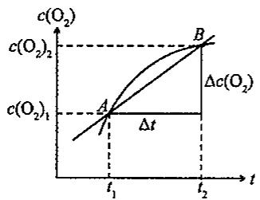

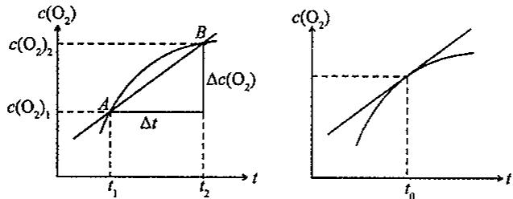

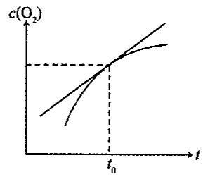

首先考虑一下平均速率的意义： $\bar{v}(O_{2})=\frac{c(O_{2})_{2}-c(O_{2})_{1}}{t_{2}-t_{1}}=\frac{\Delta c(O_{2})}{\Delta t}$ ，即割线AB的斜率。

要求得在 $t_1 - t_2$ 之间某一时刻 $t_0$ 的反应速率，可以在 $t_0$ 两侧选时间间隔 $t_0 - \delta - t_0 + \delta, \delta$ 越小，间隔越小，则两点间的平均速率越接近 $t_0$ 时的速率 $v_{t_0}$ 。当 $\delta \to 0$ 时，割线变成切线，则：

$$
v _ {t _ {0}} = \lim _ {\delta \rightarrow 0} \frac {\Delta c (\mathrm{O} _ {2})}{\Delta t}
$$

割线的极限是切线，故 $t_0$ 时刻曲线切线的斜率是 $t_0$ 时的瞬时速率 $v_{t_0}$ 。

从瞬时速率的定义,可以归纳出瞬时速率的求法:

(1) 做浓度-时间曲线图；

(2)在指定时间的曲线位置上做切线；

(3)求出切线的斜率(用作图法,量出线段长,求出比值)

最有实际意义和理论意义的瞬时速率是初始速率 $v_{0}$ 。

## 8.2 反应速率理论简介

消除汽车尾气的污染,可采用如下的反应:

$$
\mathrm{CO(g)} + \mathrm{NO(g)} = \mathrm {CO_ {2} (g)} + 1 / 2 \mathrm {N_ {2} (g)} \quad \Delta_ {\mathrm{r}} G _ {\mathrm{m}} ^ {\ominus} = - 3 3 4 \mathrm{kJ/mol}
$$

反应的可能性足够大,只是反应速率不够快,不能在尾气管中完成,以致散到大气中,造成污染。若能寻找催化剂,使上述反应达足够快的速率,则可有效地防止空气污染。而有些反应,如橡胶的老化,人们又常常希望它慢一些。所以研究速率理论是完全必要的。

## 8.2.1 碰撞理论

化学反应的发生,总要以反应物之间的接触为前提,即反应物分子之间的碰撞是先决条件。没有粒子间的碰撞,反应的进行则无从谈起。看如下计算数据。有反应:

$$
2 \mathrm{HI} (\mathrm{g}) \rightarrow \mathrm{H} _ {2} (\mathrm{g}) + \mathrm{I} _ {2} (\mathrm{g})
$$

反应物浓度: $10^{-3}$ mol/L(不浓); 反应温度:973K

计算结果表明,每升体积内,每秒碰撞总次数为: $3.5\times10^{28}$ 次

计算反应速率为: $v=3.5\times10^{28}/6.02\times10^{23}=5.8\times10^{4}\mathrm{mol/(L\cdot s)}$

实际反应速率为: $1.2\times10^{-6}mol/(L\cdot s)$

两者相差甚远,这应如何解释呢?

## 1. 有效碰撞

首先从上述计算结果可以推出，并非每一次碰撞都发生预期的反应，只有极少的碰撞是有效的。首先，分子无限接近时，要克服斥力，这就要求分子具有足够的运动速度，即能量。具备足够的能量是有效碰撞的必要条件。一组碰撞的反应物的分子的总能量必须具备一个最低的能量值，用 E 表示这种能量限制，则具备 E 和 E 以上的分子组的分数为：

$$
f = \mathrm{e} ^ {- \frac {E}{R T}}
$$

其次，仅具有足够能量尚不充分，分子有几何构型，所以碰撞方向还会有所不同，如反应：

$NO_{2}+CO=NO+CO_{2}$ 的碰撞方式主要有下面两种：

$$
\begin{array}{c} \mathrm{O} \\ \mathrm{N} - \mathrm{O} \dots \dots \mathrm{C} - \mathrm{O} \\ (\mathrm{a}) \end{array} \quad \begin{array}{c} \mathrm{O} \\ \mathrm{N} - \mathrm{O} \dots \dots \mathrm{O} - \mathrm{C} \\ (\mathrm{b}) \end{array}
$$

显然，(a)种碰撞有利于反应的进行，(b)种以及许多其他碰撞方式都是无效的。取向适合的次数占总碰撞次数的分数用 $p$ 表示。

若单位时间内,单位体积中碰撞的总次数为 Zmol,则反应速率可表示为:

$$
v = Z \cdot p \cdot f
$$

其中， $p$ 称为取向因子， $f$ 称为能量因子。或写成： $\bar{v} = Z p e^{-\frac{E}{RT}}$

## 2. 活化能和活化分子组

将具备足够能量(碰撞后足以反应)的反应物分子组,称为活化分子组。

从上式可以看出,分子组的能量要求越高,活化分子组的数量越少。这种能量要求称之为活化能,用 $E_{a}$ 表示。 $E_{a}$ 在碰撞理论中,认为与温度无关。

$E_{a}$ 越大，活化分子组数则越少，有效碰撞分数越小，故反应速率越慢。

不同类型的反应,活化能差别很大。如反应:

$$
\begin{array}{r l} & 2 \mathrm{SO} _ {2} + \mathrm{O} _ {2} = 2 \mathrm{SO} _ {3}, E _ {\mathrm{a}} = 2 5 1 \mathrm{kJ/mol} \\ & \mathrm{N} _ {2} + 3 \mathrm{H} _ {2} = 2 \mathrm{NH} _ {3}, E _ {\mathrm{a}} = 1 7 5. 5 \mathrm{kJ/mol} \end{array}
$$

而中和反应：

$$
\mathrm{HCl} + \mathrm{NaOH} = \mathrm{NaCl} + \mathrm{H} _ {2} \mathrm{O}, E _ {\mathrm{a}} \approx 2 0 \mathrm{kJ/mol}
$$

分子不断碰撞,能量不断转移,因此,分子的能量不断变化,故活化分子组也不是固定不变的。但只要温度一定,活化分子组的百分数是固定的。

## 8.2.2 过渡状态理论

## 1. 活化络合物

当反应物分子接近到一定程度时, 分子的键连关系将发生变化, 形成一中间过渡状态, 以 $NO_{2} + CO = NO + CO_{2}$ 为例:

$$
\mathrm{O} _ {\mathrm{N} - \mathrm{O} + \mathrm{C} - \mathrm{O}} \longrightarrow \mathrm{O} _ {\mathrm{N} \dots \mathrm{O} \dots \mathrm{C} - \mathrm{O}}
$$

N-O 键部分断裂，O-C 键部分形成，此时分子的能量主要表现为势能。

$$
\mathrm{O} \backslash \mathrm{N} \dots \mathrm{O} \dots \mathrm{C} - \mathrm{O}
$$

$^{N}\cdots O\cdots C-O$ 称活化络合物。活化络合物能量高，不稳定。它既可以进一步反应，生成产物；也可以变成原来的反应物。于是，反应速率决定于活化络合物的浓度，活化络合物分解成产物的概率和分解成产物的速率。

过渡态理论,将反应中涉及的物质的微观结构和反应速率结合起来,这是比碰撞理论先进的一面。然而,在该理论中,许多反应的活化络合物的结构尚无法从实验上加以确定,加上计算方法过于复杂,致使这一理论的应用受到限制。

## 2. 反应进程——势能图

应用过渡态理论讨论化学反应时,可将反应过程中体系势能变化情况表示在反应进程——势能图上。以 $NO_{2}+CO=NO+CO_{2}$ 为例:

A: 反应物的平均能量; B: 活化络合物的能量; C: 产物的平均能量。

反应进程可概括为：

(a) 反应物体系能量升高, 吸收 $E_{a}$ ;

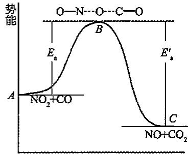  
反应历程

(b)反应物分子接近,形成活化络合物;

(c)活化络合物分解成产物,释放能量 $E_{a}^{\prime}$ 。

$E_{a}$ 为正反应的活化能； $E_{a}^{\prime}$ 为逆反应的活化能。

$$
\begin{array}{l l}\text {①} \mathrm{NO} _ {2} + \mathrm{CO} \rightarrow \stackrel {\mathrm{O}} {\mathrm{N}} \dots \mathrm{O} \dots \mathrm{C} - \mathrm{O}&\Delta_ {\mathrm{r}} H _ {1} = E _ {\mathrm{n}}\\\text {②} \stackrel {\mathrm{O}} {\mathrm{N}} \dots \mathrm{O} \dots \mathrm{C} - \mathrm{O} \rightarrow \mathrm{CO} _ {2} + \mathrm{NO}&\Delta_ {\mathrm{r}} H _ {2} = - E _ {\mathrm{a}} ^ {\prime}\end{array}
$$

由盖斯定律:①+②得 $NO_{2}+CO\rightarrow NO+CO_{2}$

所以， $\Delta_{\mathrm{r}}H = \Delta_{\mathrm{r}}H_{1} + \Delta_{\mathrm{r}}H_{2} = E_{\mathrm{a}} - E_{\mathrm{a}}'$

若 $E_{a}>E_{a}^{\prime},\Delta_{r}H>0$ ，吸热反应；若 $E_{a}<E_{a}^{\prime},\Delta_{r}H<0$ ，放热反应。

$\Delta_{r}H$ 是热力学数据,说明反应的可能性;但 $E_{a}$ 是决定反应速率的活化能,是现实性问题。

在过渡态理论中， $E_{a}$ 和温度的关系较为明显，T 升高，反应物平均能量升高，差值 $E_{a}$ 要变小些。

## 8.3 影响化学反应速率的因素

影响化学反应速率的因素很多,除主要取决于反应物的性质外,外界因素也对反应速率有重要作用,如浓度、温度、压强及催化剂等。

## 8.3.1 浓度对反应速率的影响

## 1. 基元反应和非基元反应

基元反应:能代表反应机理、由反应物微粒(可以是分子、原子、离子或自由基)一步直接实现的化学反应,称为基元步骤或基元反应。

$$
\text {   正反应:   } \mathrm{NO} _ {2} + \mathrm{CO} \rightarrow \stackrel {\mathrm{O}} {\mathrm{N}} \dots \mathrm{O} \dots \mathrm{C} - \mathrm{O} \rightarrow \mathrm{CO} _ {2} + \mathrm{NO}
$$

逆反应: $CO_{2} + NO \rightarrow \begin{array}{c} O \\ N \cdots O \cdots C - O \end{array} \rightarrow NO_{2} + CO$

非基元反应:由反应物微粒经过两步或两步以上基元步骤才能完成的化学反应,称为非基元反应。在非基元反应中,由一个以上基元步骤构成的反应称为非基元反应或复杂反应。如复杂反应

$$
\mathrm{H} _ {2} + \mathrm{Cl} _ {2} = 2 \mathrm{HCl}
$$

由几个基元步骤构成,它代表了该链反应的机理:

$$
\begin{array}{r l}&\mathrm{Cl} _ {2} + \mathrm{M} \rightarrow 2 \mathrm{Cl} \cdot + \mathrm{M}\\&\mathrm{Cl} \cdot + \mathrm{H} _ {2} \rightarrow \mathrm{HCl} + \mathrm{H} \cdot\\&\mathrm{H} \cdot + \mathrm{Cl} _ {2} \rightarrow \mathrm{HCl} + \mathrm{Cl} \cdot\\&2 \mathrm{Cl} \cdot + \mathrm{M} \rightarrow \mathrm{Cl} _ {2} + \mathrm{M}\end{array}
$$

式中 M 表示只参加反应物微粒碰撞而不参加反应的其他分子, 如器壁, 它只起转移能量的作用。

$H_{2}+I_{2}=2HI$ ，不是基元反应，它的反应机理为：

① $\mathrm{I}_2 = 2\mathrm{I}$

② $\mathrm{I} + \mathrm{I} + \mathrm{H}_2 = 2\mathrm{HI}$

所以 $H_{2}+I_{2}=2HI$ 称为复杂反应, 其中①和②两步都是基元反应, 称为复杂反应的基元步骤。

## 2. 反应分子数

在基元步骤中,发生反应所需的最少分子数目称为反应分子数。根据反应分子数可将反应分为单分子反应、双分子反应和三分子反应三种,如:

单分子反应: $CH_{3}CH_{2}OH \rightarrow CH_{4} + CO + H_{2}$

$$
\text { 双   分   子   反   应 }: \mathrm{CH} _ {3} \mathrm{COOH} + \mathrm{C} _ {2} \mathrm{H} _ {5} \mathrm{OH} \rightarrow \mathrm{CH} _ {3} \mathrm{COOC} _ {2} \mathrm{H} _ {5} + \mathrm{H} _ {2} \mathrm{O}
$$

三分子反应: $H_{2}+2I\rightarrow2HI$

反应分子数不可能为零或负数、分数，只能为正整数，且只有上面三种数值，从理论上分析，四分子或四分子以上的反应几乎是不可能存在的。反应分子数是理论上认定的微观量。

## 3. 速率方程和速率常数(质量作用定律)

大量实验表明,在一定温度下,增大反应物的浓度能够增加反应速率。那么反应速率与反应物浓度之间存在着何种定量关系呢?人们在总结大量实验结果的基础上,提出了质量作用定律:在恒温下,基元反应的速率与各种反应物浓度以反应分子数为乘幂的乘积成正比。

对于一般反应(这里指基元反应):

$$
a \mathrm{A} + b \mathrm{B} \rightarrow g \mathrm{G} + h \mathrm{H}
$$

质量作用定律的数学表达式：

$$
v = k \cdot c ^ {\mathrm{a}} (\mathrm{A}) \cdot c ^ {\mathrm{b}} (\mathrm{B})
$$

称为该反应的速率方程。式中 k 为速率常数，其意义是当各反应物浓度为 1mol/L 时的反应速率。

对于速率常数 $k$ ，应注意以下几点：

①速率常数 k 取决反应的本性。当其他条件相同时快反应通常有较大的速率常数，k 小的反应在相同的条件下反应速率较慢。

②速率常数 k 与浓度无关。

③k 随温度而变化, 温度升高, k 值通常增大。

④k 是有单位的量，k 的单位随反应级数的不同而不同。

前面提到,可以用任一反应物或产物浓度的变化来表示同一反应的速率。此时速率常数 k 的值不一定相同。例如: $2NO + O_{2} = 2NO_{2}$

其速率方程可写成：

$$
v (\mathrm{NO}) = - \frac {\mathrm{d} c (\mathrm{NO})}{\mathrm{d} t} = k _ {1} \cdot c ^ {2} (\mathrm{NO}) \cdot c (\mathrm{O} _ {2})
$$

$$
v (\mathrm{O} _ {2}) = - \frac {\mathrm{d} c (\mathrm{O} _ {2})}{\mathrm{d} t} = k _ {2} \cdot c ^ {2} (\mathrm{NO}) \cdot c (\mathrm{O} _ {2})
$$

$$
v (\mathrm{NO} _ {2}) = \frac {\mathrm{d} c (\mathrm{NO} _ {2})}{\mathrm{d} t} = k _ {3} \cdot c ^ {2} (\mathrm{NO}) \cdot c (\mathrm{O} _ {2})
$$

由于 $\frac{1}{2}\frac{\mathrm{d}c(\mathrm{NO})}{\mathrm{d}t} = \frac{\mathrm{d}c(\mathrm{O}_2)}{\mathrm{d}t} = -\frac{1}{2}\frac{\mathrm{d}c(\mathrm{NO}_2)}{\mathrm{d}t}$ 则 $\frac{1}{2} k_1 = k_2 = \frac{1}{2} k_3$ 。

对于一般的化学反应 $a\mathrm{A} + b\mathrm{B}\rightarrow g\mathrm{G} + h\mathrm{H}$

$$
\frac {k _ {\mathrm{(A)}}}{a} = \frac {k _ {\mathrm{(B)}}}{b} = \frac {k _ {\mathrm{(G)}}}{g} = \frac {k _ {\mathrm{(H)}}}{h}
$$

## 4. 反应级数

由速率方程可以看出化学反应的速率与其反应物浓度的定量关系,对于一般的化学反应:

$$
a \mathrm{A} + b \mathrm{B} \rightarrow g \mathrm{G} + h \mathrm{H}
$$

其速率方程一般可表示为：

$$
\nu = k \cdot c ^ {m} (\mathrm{A}) \cdot c ^ {n} (\mathrm{B})
$$

式中的 $c(A)$ 、 $c(B)$ 表示反应物 A、B 的浓度，a、b 表示 A、B 在反应方程式中的计量数。m、n 分别表示速率方程中 $c(A)$ 和 $c(B)$ 的指数。

速率方程中,反应物浓度的指数 m、n 分别称为反应物 A 和 B 的反应级数,各组分反应级数的代数和称为该反应的总反应级数。

$$
\text { 总反应级数 } = m + n
$$

通过实验可以得到许多化学反应的速率方程,如下表所示。

<table><tr><td>化学反应</td><td>速率方程</td><td>反应级数</td></tr><tr><td> $2H_{2}O_{2}=2H_{2}O+O_{2}$ </td><td> $v=k\cdot c(H_{2}O_{2})$ </td><td>1</td></tr><tr><td> $S_{2}O_{8}^{2-}+2I^{-}=2SO_{4}^{2-}+I_{2}$ </td><td> $v=k\cdot c(S_{2}O_{8}^{2-})\cdot c(I^{-})$ </td><td> $1+1=2$ </td></tr><tr><td> $4HBr+O_{2}=2H_{2}O+2Br_{2}$ </td><td> $v=k\cdot c(HBr)\cdot c(O_{2})$ </td><td> $1+1=2$ </td></tr><tr><td> $2NO+2H_{2}=N_{2}+2H_{2}O$ </td><td> $v=k\cdot c^{2}(NO)\cdot c(H_{2})$ </td><td> $2+1=3$ </td></tr><tr><td> $CH_{3}CHO=CH_{4}+CO$ </td><td> $v=k\cdot c^{3/2}(CH_{3}CHO)$ </td><td> $3/2$ </td></tr><tr><td> $2NO_{2}=2NO+O_{2}$ </td><td> $v=k\cdot c^{2}(NO_{2})$ </td><td>2</td></tr></table>

可见,反应级数的大小,表示浓度对反应速率的影响程度,级数越大,速率受浓度的影响越大。

若为零级反应,则表示反应速率与反应物浓度无关。某些表面催化反应,例如氨在金属钨表面上的分解反应,其分解速率在一定条件下与氨的浓度无关就属于零级反应。

观察表中六个反应的反应级数，并与化学方程式中反应物的计量数比较可以明显地看出：反应级数不一定与计量数相符合，因而对于非基元反应，不能直接由反应方程式导出反应级数。

另外，还应明确反应级数和反应分子数在概念上的区别：①反应级数是根据反应速率与各物质浓度的关系来确定的；反应分子数是根据基元反应中发生碰撞而引起反应所需的分子数来确定的。②反应级数可以是零、正、负整数和分数；反应分子数只可能是一、二、三。③反应级数是对宏观化学反应而言的；反应分子数是对微观上基元步骤而言的。

确定速率方程时必须特别注意,质量作用定律仅适用于一步完成的反应——基元反应,而不适用于几个基元反应组成的总反应——非基元反应。如 $N_{2}O_{5}$ 的分解反应: $2N_{2}O_{5}=4NO_{2}+O_{2}$

实际上分三步进行：

$$
\mathrm{N} _ {2} \mathrm{O} _ {5} \rightarrow \mathrm{NO} _ {2} + \mathrm{NO} _ {3}, \text {   慢(決速步骤)   }
$$

$$
\mathrm{NO} _ {2} + \mathrm{NO} _ {3} \rightarrow \mathrm{NO} _ {2} + \mathrm{O} _ {2} + \mathrm{NO}, \text { 快 }
$$

$$
\mathrm{NO} + \mathrm{NO} _ {3} \rightarrow 2 \mathrm{NO} _ {2}, \text { 快 }
$$

实验测定得速率方程为: $v=kc(N_{2}O_{5})$

它是一级反应,不是二级反应。

$k_{i}$ 的单位: k 做为比例系数, 不仅要使等式两侧数值相等, 而且, 物理学单位也要一致。

<table><tr><td>反应级数</td><td>速率方程</td><td>斜率</td><td>k的单位</td></tr><tr><td>0</td><td> $v = -\frac{dc_A}{dt} = k \cdot (c_A)^0$ </td><td> $c_A = -kt + c_0$ 斜率  $= -k$ </td><td> $(L \cdot mol^{-1})^{-1} \cdot s^{-1}$ </td></tr><tr><td>1</td><td> $v = -\frac{dc_A}{dt} = k (c_A)$ </td><td> $\lg(c_A) = \lg(c_{A_0}) - \frac{k}{2.303}t$ 斜率  $= \frac{k}{2.303}$ </td><td> $s^{-1}$ </td></tr><tr><td>2</td><td> $v = -\frac{dc_A}{dt} = k (c_A)^2$ </td><td> $\frac{1}{c_A} = \frac{1}{c_{A_0}} + kt$ 斜率  $= k$ </td><td> $(L \cdot mol^{-1}) \cdot s^{-1}$ </td></tr><tr><td>3</td><td> $v = -\frac{dc_A}{dt} = k (c_A)^3$ </td><td> $\frac{1}{(c_A)^2} = 2kt + \frac{1}{(c_{A_0})^2}$ 斜率  $= 2k$ </td><td> $(L \cdot mol^{-1})^2 \cdot s^{-1}$ </td></tr></table>

综上所述:对于 n 级反应,k 的单位是 $L^{(n-1)} \cdot mol^{-1(n-1)} \cdot s^{-1}$ 。  
于是，根据给出的反应速率常数，可以判断反应的级数。

速率方程的说明：

在速率方程中，只写有变化的项。固体物质不写；大量存在的 $H_{2}O$ 不写。如： $Na + 2H_{2}O = 2NaOH + H_{2}$ 按基元反应： $v_{i} = k_{i}$ 。

## 5. 零级反应及其特点

零级反应不多,常见的零级反应是在固体表面发生的多相催化反应。如氨在金属钨(W)表面的分解反应。

若 A→H 为零级反应，则整个反应过程中反应速率为一常数，与反应物和反应经历的时间无关。

$$
\frac {\mathrm{d} c}{\mathrm{d} t} = k
$$

积分可得：

$$
c _ {A} = c _ {A 0} - k t
$$

反应物消耗一半所需的时间称为半衰期，用 $t_{1/2}$ 表示。即零级反应的半衰期公式：

$$
t _ {\frac {1}{2}} = \frac {c _ {A 0}}{2 k},
$$

零级反应半衰期与速率常数 k 和初始浓度 $c_{A0}$ 有关。

## 6. 一级反应及其特点

凡反应速率与反应物浓度一次方成正比的反应,称为一级反应,其速率方程可表示为:

$$
\frac {\mathrm{d} c}{\mathrm{d} t} = k _ {1} c
$$

积分上式可得: $\ln c=-k_{1}t+B$

当 t=0 时， $c=c_{0}$ （起始浓度），则 $B=\ln c_{0}$ ，故上式可表示为：

$$
\ln {\frac {c _ {0}}{c}} = k _ {1} t \text {或} k _ {1} = {\frac {1}{t}} \ln {\frac {c _ {0}}{c}}
$$

亦可表示为： $c = c_0\mathrm{e}^{-k_1t}$

若以 a 表示 t=0 时的反应物的浓度，以 x 表示 t 时刻已反应掉的反应物浓度，于是可写为：

$$
k _ {1} = \frac {1}{t} \ln \frac {a}{a - x}
$$

以上各式即为一级反应的速率公式积分形式。

一级反应的特征是：

①速率常数 $k_{1}$ 的数值与所用浓度的单位无关，其量纲为时间 $^{-1}$ ，其单位可用 $s^{-1}$ 、 $min^{-1}$ 或 $h^{-1}$ 等表示。

②当反应物恰好消耗一半，即 $x = \frac{a}{2}$ 时，此刻的反应时间记为 $t_{\frac{1}{2}}$ （称之为半衰期），则可得： $k_{1} = \frac{1}{t_{\frac{1}{2}}} \ln 2, t_{\frac{1}{2}} = \frac{0.6932}{k_{1}}$ （一级反应的半衰期与反应物的初始浓度无关）

③以 $\lg c$ 对 $t$ 作图应为一直线，其斜率为 $-\frac{k_1}{2.303}$ 。

复杂反应的速率方程暂不需要掌握、仅列出相应公式

只有1种反应物的二级反应： $\frac{1}{c} -\frac{1}{c_0} = kt,t_{1 / 2} = \frac{1}{kc_0}$

只有1种反应物的三级反应： $\frac{1}{c^2} -\frac{1}{c_0^2} = 2kt,t_{1 / 2} = \frac{3}{2kc_0^2}$

## 8.3.2 温度对反应速率的影响

压强和体积的变化,可直接影响浓度,故不必单独列出,进行讨论。温度对反应速率的影响是很显然的。食物夏季易变质,需放在冰箱中;压力锅将水的沸点升到400K,食物易于煮熟。

温度对反应速率影响通常有五种类型：

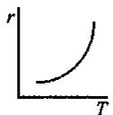

(1)

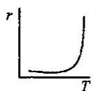

(2)

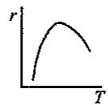

(3)

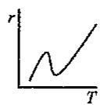

(4)

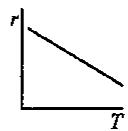

(5)

(1) 反应速率随温度的升高而逐渐加快, 它们之间呈指数关系, 这类反应最为常见。

(2) 开始时温度影响不大, 到达一定极限时, 反应以爆炸的形式极快的进行。

(3)在温度不太高时,速率随温度的升高而加快,到达一定的温度,速率反而下降。如多相催化反应和酶催化反应。

(4)速率在随温度升到某一高度时下降,再升高温度,速率又迅速增加,可能发生了副反应。

(5)温度升高,速率反而下降。这种类型很少,如一氧化氮氧化成二氧化氮。

荷兰科学家, 范特霍夫(Van't Hoff)提出, 对于一般的反应来说, 温度每升高 10K, 反应速率一般增加到原来的 2\~4 倍。这被称作 Van't Hoff 规则。

温度升高,分子的平均能量升高,有效碰撞增加,故速率加快。

温度对反应速率的影响,主要体现在对速率常数 k 的影响上。

1. 阿累尼乌斯(Arrhenius)总结了 $k$ 与 $\pmb{T}$ 的经验公式：

$$
k = A \mathrm{e} ^ {- \frac {E _ {\mathrm{n}}}{K T}} (\text { 指数式 })
$$

取自然对数，得： $\ln k = -\frac{E_{\mathrm{a}}}{RT} +\ln A$

常用对数: $\lg k = -\frac{E_{a}}{2.303RT} + \lg A$

式中：k 速率常数； $E_{a}$ 活化能；R 气体常数 8.314J/(mol·K)；T 绝对温度（热力学温度）；e 自然对数底， $e=2.71828\cdots\cdots$ ， $lge=0.4343=1/2.303$ ，A 指前因子，单位同 k。

以 $\ln k$ 对 $1 / T$ 作图，是一条直线，其斜率为 $-E_{\mathrm{a}} / R$ ，截距为 $\ln A$ 。

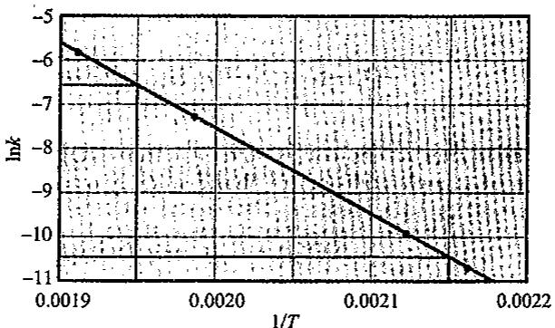

应用阿累尼乌斯公式讨论问题,可以认为 $E_{a}$ 、A 不随温度变化。由于 T 在指数上,故对 k 的影响较大。

根据阿累尼乌斯公式,知道了反应的 $E_{a}$ 和某温度 $T_{1}$ 时的 $k_{1}$ , 即可求出任意温度 $T_{2}$ 时的 $k_{2}$ 。由对数式:

$$
\lg k _ {1} = - \frac {E _ {\mathrm{a}}}{2 . 3 0 3 R T _ {1}} + \lg A\tag{①}
$$

$$
\lg k _ {2} = - \frac {E _ {\mathrm{o}}}{2 . 3 0 3 R T _ {2}} + \lg A\tag{②}
$$

②-①得： $\lg \frac{k_2}{k_1} = \frac{E_{\mathrm{a}}}{2.303R} (\frac{1}{T_1} -\frac{1}{T_2})$

## 2. 活化能

由公式： $\lg k = -\frac{E_{\mathrm{a}}}{2.303RT} +\lg A$ 做 $\lg k - 1 / T$ 图，得一直线，其斜率为： $-\frac{E_{\mathrm{a}}}{2.303R}$ 截距为： $\lg A$ 。故，作图法可求 $E_{\mathrm{a}}$ 和 $A$ 值。

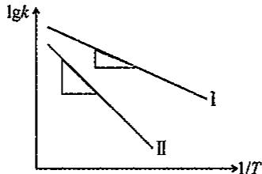

对 $E_{a}$ 不相等的两个反应，做 2 个 $\lg k-1/T$ 曲线，直线Ⅱ的斜率绝对值大，故反应Ⅱ的 $E_{a}$ 大。可见，活化能 $E_{a}$ 大的反应，其速率随温度变化显著。根据作图法，肯定可求出 $E_{a}$ 和 A。

由于图象为直线,故要知道线上的两个点,即两组 $(\lg k,1/T)$ 的值,亦即两组k和T的值,即可求出 $E_{a}$ 和A。

## 8.3.3 催化剂对反应速率的影响

## 1. 催化剂和催化反应

在反应前后,反应物的质量和化学性质不变,能改变反应速率的物质叫催化剂。催化剂改变反应速率的作用,称为催化作用;有催化剂参加的反应称为催化反应。

根据其对反应速率的影响结果,将催化剂进行分类:正催化剂——加快反应速率;负催化剂——减慢反应速率。

助催化剂: 自身无催化作用, 可帮助催化剂提高催化性能。

合成 $NH_{3}$ 中的 Fe 粉作催化剂，加 $Al_{2}O_{3}$ 可使表面积增大；加入 $K_{2}O$ 可使催化剂表面电子云密度增大。二者均可提高 Fe 粉的催化活性，均为该反应的助催化剂。不加以说明，一般均指正催化剂。

催化反应分为均相催化和非均相催化两类：

①反应和催化剂处于同一相中，不存在相界面的催化反应，称均相催化。

如： $NO_{2}$ 催化 $2SO_{2} + O_{2} = 2SO_{3}$ ;

反应历程

若产物之一对反应本身有催化作用，则称之为自催化反应。如：

$$
\mathrm{MnO} _ {4} ^ {-} + 6 \mathrm{H} ^ {+} + 5 \mathrm{H} _ {2} \mathrm{C} _ {2} \mathrm{O} _ {4} = 1 0 \mathrm{CO} _ {2} + 8 \mathrm{H} _ {2} \mathrm{O} + 2 \mathrm{Mn} ^ {2 +}
$$

产物中 $Mn^{2+}$ 对反应有催化作用。

下图为自催化反应过程的速率变化。自催化反应具有如下特点:初期,反应速率小;中期,经过一段时间 $t_{0}-t_{A}$ 诱导期后,速率明显加快,见 $t_{A}-t_{B}$ 段;后期, $t_{B}$ 之后,由于反应物耗尽,速率下降。

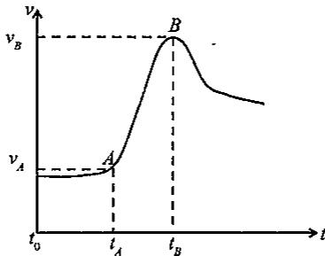

②反应物和催化剂不处于同一相，存在相界面，在相界面上进行的反应，叫作多相催化反应或非均相催化，复相催化。例如：

Fe 催化合成氨(固-气); Ag 催化 $H_{2}O_{2}$ 的分解(固-液)。

## 2. 催化剂的选择性

特定的反应有特定的催化剂。如： $2SO_{2} + O_{2} = 2SO_{3}$ 的催化剂：① $V_{2}O_{5}$ ，② $NO_{2}$ ，③ Pt； $CO + 2H_{2} = CH_{3}OH$ 的催化剂：CuO - ZnO - $Cr_{2}O_{3}$ ；酯化反应的催化剂：① 浓硫酸，② 浓硫酸 + 浓磷酸，③ 硫酸盐，④ 活性铝。

同样的反应,催化剂不同时,产物可能不同。如:

$CO+2H_{2}=CH_{3}OH$ （催化剂 $CuO-ZnO-Cr_{2}O_{3}$ ）； $CO+3H_{2}=CH_{4}+H_{2}O$ （催化剂 $Ni+Al_{2}O_{3}$ ）。

$2KClO_{3}=2KCl+3O_{2}$ （催化剂 $MnO_{2}$ ）； $4KClO_{3}=3KClO_{4}+KCl$ （无催化剂）。

## 3. 催化机理

催化剂改变反应速率,减小活化能,提高产率,它不改变反应的自由能也不改变平衡常数,不涉及热力学问题。如:A+B=AB,E。很大,无催化剂,反应速率很慢;加入催化剂K,机理改变了:A+K=AK;AK+B=AB+K,速率加快。

图中可以看出,不仅正反应的活化能减小了,而且逆反应的活化能也减小了。因此,正逆反应都加快了,可以缩短达到平衡所需的时间,但不改变热力学数据。

例如： $NO_{2}$ 催化氧化 $SO_{2}$ 的机理：

总反应为： $SO_{2}+1/2O_{2}=SO_{3},E_{a}$ 大，加 $NO_{2}$ 。

催化机理为： $SO_{2}+NO_{2}=SO_{3}+NO,E_{a}^{\prime}$ 小。

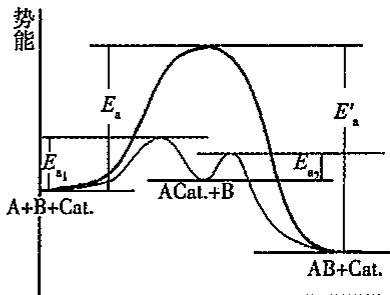

$$
\mathrm{NO} + 1 / 2 \mathrm{O} _ {2} = \mathrm{NO} _ {2}, E _ {\mathrm{a}} ^ {\prime \prime} \text {小。}
$$

再例如:Fe 表面 $N_{2}+3H_{2}$ 合成氨的机理:

总反应为： $N_{2}+3H_{2}=2NH_{3}$ ，Fe为催化剂。

催化机理为： $N_{2}+2Fe=2N-Fe;H_{2}+2Fe=2H-Fe;N-Fe+H-Fe=Fe_{2}NH;$

$$
\mathrm{Fe} _ {2} \mathrm{NH} + \mathrm{H} - \mathrm{Fe} = \mathrm{Fe} _ {3} \mathrm{NH} _ {2}; \mathrm{Fe} _ {3} \mathrm{NH} _ {2} + \mathrm{H} - \mathrm{Fe} = \mathrm{Fe} _ {4} \mathrm{NH} _ {3}; \mathrm{Fe} _ {4} \mathrm{NH} _ {3} = 4 \mathrm{Fe} + \mathrm{NH} _ {3}
$$

每一步活化能都较小，故反应加快。

## 第二部分:化学平衡

## 8.4 化学平衡的条件

根据吉布斯自由能判据，在等温等压、 $W_{f}=0$ 的条件下， $\Delta G_{T,P}<0$ ，则化学反应自发地由反应物变成产物，这时反应物的浓度（分压）逐渐减少，产物的浓度（分压）逐渐增加，反应物和产物吉布斯自由能之差逐渐趋于零，直到 $\Delta G_{T,P}=0$ 时达到化学平衡。这时从宏观上看反应似乎停止了，其实从微观上正反应和逆反应仍在继续进行，只不过两者的反应速率正好相等而已，所以化学平衡是一个动态平衡。

即: 等温等压, $W_{f}=0$ 的条件下:

$\Delta G_{T,P}<0$ 正反应自发进行；

$\Delta G_{T,P}=0$ 达化学平衡——化学平衡的条件；

$\Delta G_{T,P}>0$ 正反应不自发(逆反应自发)。

化学反应达平衡时：

①从热力学角度:等温等压, $W_{f}=0$ :应 $\Delta G_{T,p}=0$ ;

②从动力学角度： $v_{正}=v_{逆}$ ；

③反应物和生成物的浓度不变,即存在一个平衡常数。

## 8.4.1 实验平衡常数

大量实验事实证明，在一定条件下进行的可逆反应，其反应物和产物的平衡浓度（处于平衡状态时物质的浓度）间存在某种定量关系。例如反应： $\mathrm{N}_{2}\mathrm{O}_{4}(\mathrm{~g})\rightleftharpoons2\mathrm{NO}_{2}(\mathrm{~g})$ 。

若将一定量的 $N_{2}O_{4}$ 或(和) $NO_{2}$ 置于 1L 的密闭烧瓶内，然后将烧瓶置于 373K 的恒温槽内，让其充分反应，达到平衡后，取样分析 $N_{2}O_{4}$ 的平衡浓度，再求算出 $NO_{2}$ 的平衡浓度。三次实验的数据列于下表中。

<table><tr><td colspan="2">实验序号</td><td>起始浓度(mol/L)</td><td>浓度变化(mol/L)</td><td>平衡浓度(mol/L)</td><td> $\frac{[NO_2]^2}{[N_2O_4]}$ </td></tr><tr><td rowspan="2">1</td><td> $N_2O_4$ </td><td>0.100</td><td>-0.060</td><td>0.040</td><td rowspan="2">0.36</td></tr><tr><td> $NO_2$ </td><td>0.000</td><td>+0.120</td><td>0.120</td></tr><tr><td rowspan="2">2</td><td> $N_2O_4$ </td><td>0.000</td><td>+0.014</td><td>0.014</td><td rowspan="2">0.37</td></tr><tr><td> $NO_2$ </td><td>0.100</td><td>-0.028</td><td>0.072</td></tr><tr><td rowspan="2">3</td><td> $N_2O_4$ </td><td>0.100</td><td>-0.030</td><td>0.070</td><td rowspan="2">0.37</td></tr><tr><td> $NO_2$ </td><td>0.100</td><td>+0.060</td><td>0.160</td></tr></table>

由数据可见, 恒温条件下, 尽管起始状态不同, 浓度的变化(即转化率)不同, 平衡浓度也不同, 但产物 $NO_{2}$ 的平衡浓度的平方值 $[NO_{2}]^{2}$ 与反应物 $N_{2}O_{4}$ 的平衡浓度 $[N_{2}O_{4}]$ 的比值却是相同的, 可用下式表示:

$$
\frac {[ \mathrm{NO} _ {2} ] ^ {2}}{[ \mathrm{N} _ {2} \mathrm{O} _ {4} ]} = K _ {\mathrm{c}}
$$

式中 $K_{e}$ 称为该反应在 373K 时的平衡常数。这个常数是由实验直接测定的，因此常称之为实验平衡常数或经验平衡常数。

上述关系对一切可逆反应都适用。若可逆反应用下述通式表达：

$$
a \mathrm{A} + b \mathrm{B} \rightleftharpoons d \mathrm{D} + e \mathrm{E}
$$

在一定温度下达到平衡时,则有:

$$
\frac {[ D ] ^ {d} [ E ] ^ {e}}{[ A ] ^ {a} [ B ] ^ {b}} = K _ {\mathrm{c}}
$$

即在一定温度下，可逆反应达到平衡时，产物的浓度以反应方程式中计量数为指数的幂的乘积与反应物浓度以反应方程式中计量数为指数的幂的乘积之比是一个常数。

从经验平衡常数 $K_{c}$ 的表达式中可以看出，K 的单位是： $(\mathrm{mol}/\mathrm{L})^{(d+e)-(a+b)}$ ，即为浓度的某次幂。当 $(d+e)=(a+b)$ 时， $K_{c}$ 为纯数，无单位。

书写平衡常数关系式必须注意以下几点：

(1)对于气相反应,平衡常数除可用如上所述的各物质平衡浓度表示外,也可用平衡时各物质的分压表示如下:

$$
\begin{array}{r l}a \mathrm{A(g)} + b \mathrm{B(g)}&\rightleftharpoons d \mathrm{D(g)} + e \mathrm{E(g)}\\K _ {\mathrm{p}}&= \frac {(p _ {\mathrm{D}}) ^ {d} (p _ {\mathrm{E}}) ^ {e}}{(p _ {\mathrm{A}}) ^ {a} (p _ {\mathrm{B}}) ^ {b}}\end{array}
$$

式中实验平衡常数以 $K_{p}$ 表示，以与前述 $K_{c}$ 相区别。 $K_{p}$ 称为压力平衡常数， $K_{c}$ 称为浓度平衡常数。同一反应的 $K_{p}$ 与 $K_{c}$ 有固定关系。若将各气体视为理想气体，那么 pV = nRT; $p = (n/V)RT$ ; p = cRT；为浓度，则：

$$
p _ {\mathrm{A}} = [ \mathrm{A} ] R T; p _ {\mathrm{B}} = [ \mathrm{B} ] R T; p _ {\mathrm{D}} = [ \mathrm{D} ] R T; p _ {\mathrm{E}} = [ \mathrm{E} ] R T
$$

代入上式，有

$$
\begin{array}{r l} K _ {\mathrm{p}} & = \frac {[ \mathrm{D} ] ^ {d} [ \mathrm{E} ] ^ {e}}{[ \mathrm{A} ] ^ {a} [ \mathrm{B} ] ^ {b}} (R T) ^ {(d + e) - (a + b)} \\ K _ {\mathrm{p}} & = K _ {\mathrm{c}} (R T) ^ {\Delta \nu} \end{array}
$$

(2)不要把反应体系中纯固体、纯液体以及稀水溶液中的水的浓度写进平衡常数表达式。例如：

$$
\begin{array}{l}\mathrm {CaCO_ {3} (s)} \rightleftharpoons \mathrm{CaO(s)} + \mathrm {CO_ {2} (g)} \qquad K = p (\mathrm {CO_ {2}})\\\mathrm {Cr_ {2} O_ {7} ^ {2 - } (aq)} + \mathrm {H_ {2} O(l)} \rightleftharpoons 2 \mathrm {CrO_ {4} ^ {2 - } (aq)} + 2 \mathrm {H^ {+} (aq)} \qquad K = \frac {[ \mathrm {CrO_ {4} ^ {2 - }} ] ^ {2} [ \mathrm {H^ {+}} ] ^ {2}}{[ \mathrm {Cr_ {2} O_ {7} ^ {2 - }} ]}\end{array}
$$

但非水溶液中反应,若有水参加或生成,则此时水的浓度不可视为常数,应写进平衡常数表达式中。例如:

$$
\begin{array}{r l}&\mathrm{C} _ {2} \mathrm{H} _ {5} \mathrm{OH} + \mathrm{CH} _ {3} \mathrm{COOH} \rightleftharpoons \mathrm{CH} _ {3} \mathrm{COOC} _ {2} \mathrm{H} _ {5} + \mathrm{H} _ {2} \mathrm{O}\\&K _ {\mathrm{c}} = \frac {[ \mathrm{CH} _ {3} \mathrm{COOC} _ {2} \mathrm{H} _ {5} ] \cdot [ \mathrm{H} _ {2} \mathrm{O} ]}{[ \mathrm{C} _ {2} \mathrm{H} _ {5} \mathrm{OH} ] \cdot [ \mathrm{CH} _ {3} \mathrm{COOH} ]}\end{array}
$$

(3)同一化学反应,化学反应方程式写法不同,其平衡常数表达式及数值亦不同。例如:

$$
\begin{array}{l l}\mathrm {N_ {2} O_ {4} (g)} \rightleftharpoons 2 \mathrm {NO_ {2} (g)}&K _ {(3 7 3)} = \frac {[ \mathrm {NO_ {2}} ] ^ {2}}{[ \mathrm {N_ {2} O_ {4}} ]} = 0. 3 6\\\frac {1}{2} \mathrm {N_ {2} O_ {4} (g)} \rightleftharpoons \mathrm {NO_ {2} (g)}&K _ {(3 7 3)} ^ {\prime} = \frac {[ \mathrm {NO_ {2}} ]}{[ \mathrm {N_ {2} O_ {4}} ] ^ {1 / 2}} = \sqrt {0 . 3 6} = 0. 6 0\\2 \mathrm {NO_ {2} (g)} \rightleftharpoons \mathrm {N_ {2} O_ {4} (g)}&K _ {(3 7 3)} ^ {\prime \prime} = \frac {[ \mathrm {N_ {2} O_ {4}} ]}{[ \mathrm {NO_ {2}} ] ^ {2}} = \frac {1}{0 . 3 6} = 2. 8\end{array}
$$

当反应的计量数扩大 2 倍时, K 变为原来的二次方; 互逆的两个反应, 他们的平衡常数互为倒数。

因此书写平衡常数表达式及数值,要与化学反应方程式相对应,否则意义就不明确。

平衡常数是表明化学反应进行的最大程度(即反应限度)的特征值。平衡常数越大，表示反应进行越完全。虽然转化率也能表示反应进行的限度，但转化率不仅与温度条件有关，而且与起始条件有关。上表中，实验序号① $\mathrm{N}_{2}\mathrm{O}_{4}$ 的转化率为 $40\%$ ；实验序号③ $\mathrm{N}_{2}\mathrm{O}_{4}$ 转化率为 $30\%$ 。若有几种反应物的化学反应，对不同反应物，其转化率也可能不同。而平衡常数则能表示一定温度下各种起始条件下，反应进行的限度。

$$
2 \mathrm{NO} + \mathrm{O} _ {2} \rightleftharpoons 2 \mathrm{NO} _ {2} (\mathrm{g})
$$

(1)

$$
K _ {1} = \frac {\left[ \mathrm{NO} _ {2} \right] ^ {2}}{\left[ \mathrm{NO} \right] ^ {2} \left[ \mathrm{O} _ {2} \right]}
$$

$$
2 \mathrm{NO} _ {2} (\mathrm{g}) \rightleftharpoons \mathrm{N} _ {2} \mathrm{O} _ {4} (\mathrm{g})\tag{2}
$$

$$
K _ {2} = \frac {\left[ \mathrm{N} _ {2} \mathrm{O} _ {4} \right]}{\left[ \mathrm{NO} _ {2} \right] ^ {2}}
$$

(1)+(2)得

$$
2 \mathrm{NO} + \mathrm{O} _ {2} \rightleftharpoons \mathrm{N} _ {2} \mathrm{O} _ {4} (\mathrm{g})\tag{3}
$$

$$
K _ {3} = \frac {[ \mathrm{N} _ {2} \mathrm{O} _ {4} ]}{[ \mathrm{NO} ] ^ {2} [ \mathrm{O} _ {2} ]}
$$

即： $K_{3}=K_{1}\cdot K_{2}$ ，反应方程式相加（减），平衡常数相乘（除）。

## 8.4.2 标准平衡常数和等温方程式

将平衡浓度或平衡分压分别除以各自标准态的数值,即得平衡时的相对浓度或相对分压。相对的意义是:对于标准态数值的倍数。

## 1. 标准平衡常数：

等温等压下,对理想气体反应:

$$
d \mathrm{D} + e \mathrm{E} \rightleftharpoons f \mathrm{F} + h \mathrm{H}
$$

设 $p_{D}$ 、 $p_{E}$ 、 $p_{F}$ 、 $p_{H}$ 分别为 D、E、F、H 的平衡分压，则有：

$$
K _ {\mathrm{p}} ^ {\ominus} = \frac {\left(\frac {p _ {\mathrm{F}}}{p ^ {\ominus}}\right) ^ {\mathrm{f}} \cdot \left(\frac {p _ {\mathrm{H}}}{p ^ {\ominus}}\right) ^ {\mathrm{h}}}{\left(\frac {p _ {\mathrm{D}}}{p ^ {\ominus}}\right) ^ {\mathrm{d}} \cdot \left(\frac {p _ {\mathrm{E}}}{p ^ {\ominus}}\right) ^ {\mathrm{e}}} = K _ {\mathrm{p}} \left(\frac {1}{p ^ {\ominus}}\right) ^ {\Delta \nu} = K _ {\mathrm{c}} \left(\frac {R T}{p ^ {\ominus}}\right) ^ {\Delta \nu}
$$

式中 $K_{p}^{\ominus}$ 称理想气体的热力学平衡常数——标准平衡常数。

对于不含气相物质的反应， $K^{\ominus}$ 和经验平衡常数 K 在数值上相等，因为标准态的值为 1。但是，有气相物质参加的反应， $K_{p}^{\ominus}$ 和 $K_{p}$ 之间经常不相等。因为标准态 $p^{\ominus} \neq 1$ 。

热力学可以证明，气相反应达平衡时，标准吉布斯自由能增量 $\Delta_{r}G_{m}^{\ominus}$ （反应物和生成物 p 都等于 $p^{\ominus}$ 时，进行一个单位化学反应时的吉布斯自由能增量）与 $K_{p}^{\ominus}$ 应有如下关系：

基本理论学习笔记

$$
\Delta_ {r} G _ {\mathrm{m}} ^ {\ominus} = - R T \ln K _ {\mathrm{p}} ^ {\ominus}
$$

该式说明，对于给定反应， $K_{p}^{\ominus}$ 与 $\Delta_{r}G_{m}^{\ominus}$ 和 T 有关。当温度指定时， $\Delta_{r}G_{m}^{\ominus}$ 只与标准态有关，与其他浓度或分压条件无关，它是一个定值。因此，定温下 $K_{p}^{\ominus}$ 必定是定值。即 $K_{p}^{\ominus}$ 仅是温度的函数。

同理,对于溶液的反应:

$$
a \mathrm{A} + b \mathrm{B} \rightleftharpoons g \mathrm{G} + h \mathrm{H}
$$

$$
K ^ {\ominus} = \frac {\left(\frac {c _ {\mathrm{G}}}{c ^ {\ominus}}\right) ^ {g} \cdot \left(\frac {c _ {\mathrm{H}}}{c ^ {\ominus}}\right) ^ {h}}{\left(\frac {c _ {\mathrm{A}}}{c ^ {\ominus}}\right) ^ {a} \cdot \left(\frac {c _ {\mathrm{B}}}{c ^ {\ominus}}\right) ^ {b}}
$$

标准平衡常数 $K^{\ominus}$ 的有关说明：

①标准态“⊖”定义：

$c^{\ominus}$ 称为标准浓度, 定义 $c^{\ominus}=1mol/L$ ;

$p^{\ominus}$ 称为标准压力，定义 $p^{\ominus} = 101.325\mathrm{kPa}$

② $K^{\ominus}$ 是量纲为1的常数；

③纯液体和固体的浓度为常数；

④ $K^{\ominus}$ 与初始浓度无关，只与反应本身和温度有关；

⑤ $K^{\ominus}$ 与反应方程式写法有关。

2. 化学反应的等温方程式 $(K^{\ominus}$ 与 $\Delta_{r}G_{m}^{\ominus}$ 的关系 $)$

如果化学反应尚未达到平衡,体系将发生化学变化,反应自发地往哪个方向进行呢?由化学等温方程式(也叫 Van't Hoff 化学反应等温式)即可判断。

封闭体系中,等温等压不做体积功的条件下,理想气体反应:

$$
d \mathrm{D} + e \mathrm{E} \rightleftharpoons f \mathrm{F} + h \mathrm{H}
$$

气体的任意分压为 $p_{\mathrm{D}}^{\prime}, p_{\mathrm{E}}^{\prime}, p_{\mathrm{F}}^{\prime}, p_{\mathrm{H}}^{\prime}$ 时：

$$
G _ {\mathrm{m}, \mathrm{D}} = G _ {\mathrm{m}, \mathrm{D}} ^ {\ominus} + R T \ln \frac {p _ {\mathrm{D}} {} ^ {\prime}}{p}; G _ {\mathrm{m}, \mathrm{E}} = G _ {\mathrm{m}, \mathrm{E}} ^ {\ominus} + R T \ln \frac {p _ {\mathrm{E}} {} ^ {\prime}}{p}
$$

$$
G _ {\mathrm{m}, \mathrm{F}} = G _ {\mathrm{m}, \mathrm{F}} ^ {\ominus} + R T \ln \frac {p _ {\mathrm{F}} ^ {\prime}}{p}; G _ {\mathrm{m}, \mathrm{H}} = G _ {\mathrm{m}, \mathrm{H}} ^ {\ominus} + R T \ln \frac {p _ {\mathrm{H}} ^ {\prime}}{p}
$$

此时若反应从左向右进行了一个单位的化学反应(无限大量的体系中)，则

$$
\Delta_ {\mathrm{r}} G _ {\mathrm{m}} = \Delta_ {\mathrm{r}} G _ {\mathrm{m}} ^ {\ominus} + R T \ln \frac {\left(\frac {p _ {\mathrm{F}} {} ^ {\prime}}{p ^ {\ominus}}\right) ^ {f} \cdot \left(\frac {p _ {\mathrm{H}} {} ^ {\prime}}{p ^ {\ominus}}\right) ^ {h}}{\left(\frac {p _ {\mathrm{D}} {} ^ {\prime}}{p ^ {\ominus}}\right) ^ {d} \cdot \left(\frac {p _ {\mathrm{E}} {} ^ {\prime}}{p ^ {\ominus}}\right) ^ {e}}
$$

令

$$
Q _ {\mathrm{P}} = \frac {\left(\frac {p _ {\mathrm{F}} ^ {\prime}}{p ^ {\ominus}}\right) ^ {f} \cdot \left(\frac {p _ {\mathrm{H}} ^ {\prime}}{p ^ {\ominus}}\right) ^ {h}}{\left(\frac {p _ {\mathrm{D}} ^ {\prime}}{p ^ {\ominus}}\right) ^ {d} \cdot \left(\frac {p _ {\mathrm{E}} ^ {\prime}}{p ^ {\ominus}}\right) ^ {e}}
$$

则 $\Delta_{\mathrm{r}}G_{\mathrm{m}} = \Delta_{\mathrm{r}}G_{\mathrm{m}}^{\ominus} + RT\ln Q_{\mathrm{p}} = -RT\ln K_{\mathrm{p}}^{\ominus} + RT\ln Q_{\mathrm{p}}$

上式称作化学反应的等温方程式。式中 $Q_{p}$ 称作压力商。

若 $Q_{\mathrm{p}} < K_{\mathrm{p}}^{\ominus}$ ，则 $\Delta_{\mathrm{r}}G_{\mathrm{m}} < 0$ ，反应正向自发进行；

若 $Q_{p}=K_{p}^{\ominus}$ ，则 $\Delta_{r}G_{m}=0$ ，体系已处于平衡状态；

若 $Q_{p}>K_{p}^{\ominus}$ ，则 $\Delta_{r}G_{m}>0$ ，反应正向不能自发进行（逆向自发）。

(i)对于在溶液中进行的反应：

$$
\Delta_ {\mathrm{r}} G _ {\mathrm{m}} = \Delta_ {\mathrm{r}} G _ {\mathrm{m}} ^ {\ominus} + R T \ln Q _ {\mathrm{c}} = - R T \ln K _ {\mathrm{c}} ^ {\ominus} + R T \ln Q _ {\mathrm{c}}
$$

$$
K _ {c} ^ {\ominus} = \frac {\left(\frac {C _ {\mathrm{F}}}{C ^ {\ominus}}\right) ^ {f} \cdot \left(\frac {C _ {\mathrm{H}}}{C ^ {\ominus}}\right) ^ {h}}{\left(\frac {C _ {\mathrm{D}}}{C ^ {\ominus}}\right) ^ {d} \cdot \left(\frac {C _ {\mathrm{E}}}{C ^ {\ominus}}\right) ^ {e}}; Q _ {c} = \frac {\left(\frac {C _ {\mathrm{F}} {} ^ {\prime}}{C ^ {\ominus}}\right) ^ {f} \cdot \left(\frac {C _ {\mathrm{H}} {} ^ {\prime}}{C ^ {\ominus}}\right) ^ {h}}{\left(\frac {C _ {\mathrm{D}} {} ^ {\prime}}{C ^ {\ominus}}\right) ^ {d} \cdot \left(\frac {C _ {\mathrm{E}} {} ^ {\prime}}{C ^ {\ominus}}\right) ^ {e}}
$$

c——平衡浓度； $c'$ ——任意浓度； $K_{c}^{\ominus}$ ——热力学平衡常数（标准平衡常数）。 $Q_{c}$ ——浓度商。 $c^{\ominus}$ 称作标准浓度。即在标准状态下， $c^{\ominus}=1mol/L$ 。

## (ii) 纯固体或纯液体与气体间的反应(复相反应)

例如，下列反应： $\mathrm{CaCO_{3}(s)=CaO(s)+CO_{2}(g)}$ 是一个多相反应，其中包含两个不同的纯固体和一个纯气体。化学平衡条件 $\Delta_{r}G_{m}=0$ ，适用于任何化学平衡，不论是均相的，还是多相的。

$$
\Delta_ {\mathrm{r}} G _ {\mathrm{m}} = - R T \ln \frac {p (\mathrm{CO} _ {2})}{p ^ {\ominus}}
$$

又因为 $\Delta_{r}G_{m}=-RT\ln K_{c}$ ，所以

$$
K _ {\mathrm{c}} = \frac {p (\mathrm{CO} _ {2})}{p ^ {\ominus}} = K _ {\mathrm{p}} ^ {\ominus}, K _ {\mathrm{p}} = p (\mathrm{CO} _ {2})
$$

式中 $p(\mathrm{CO}_{2})$ 是平衡反应体系中 $CO_{2}$ 气体的压强，即 $CO_{2}$ 的平衡分压。这就是说，在一定温度下， $\mathrm{CaCO}_{3}(\mathrm{s})$ 上面的 $CO_{2}$ 的平衡压强是恒定的，这个压强又称为 $\mathrm{CaCO}_{3}(\mathrm{s})$ 的“分解压”。

注意:纯固体的“分解压”并不时刻都等于 $K_{p}$ ，例如反应：

$$
\frac {1}{2} \mathrm{CaCO} _ {3} (\mathrm{s}) \rightarrow \frac {1}{2} \mathrm{CaO} (\mathrm{s}) + \frac {1}{2} \mathrm{CO} _ {2} (\mathrm{g}); K _ {\mathrm{p}} = p ^ {\frac {1}{2}} (\mathrm{CO} _ {2})
$$

而“分解压”为 $p(\mathrm{CO}_{2})$ 。

若分解气体产物不止一种，分解平衡时气体产物的总压称作“分解压”。例如： $\mathrm{NH_{4}HS(s)=NH_{3}(g)+H_{2}S(g)}$ ，由纯 $\mathrm{NH_{4}HS(s)}$ 分解平衡时， $(p(\mathrm{NH_{3}})+p(\mathrm{H_{2}S}))$ 称作 $\mathrm{NH_{4}HS(s)}$ 的“分解压”。

$$
K _ {\mathrm{p}} = p \left(\mathrm{NH} _ {3}\right) \cdot p \left(\mathrm{H} _ {2} \mathrm{S}\right) = \left(\frac {p}{2}\right) ^ {2} = \frac {p ^ {2}}{4} \quad K _ {\mathrm{p}} ^ {\ominus} = \frac {p ^ {2}}{4} (p ^ {\ominus}) ^ {- 2}
$$

结论：对纯固体或纯液体与气体间的多相反应 $K_{\mathrm{c}}^{\ominus} = K_{\mathrm{p}}^{\ominus} = K_{\mathrm{p}}(p^{\ominus})^{-\Delta \nu}$ 。

## 3. 几种热力学数据间的关系

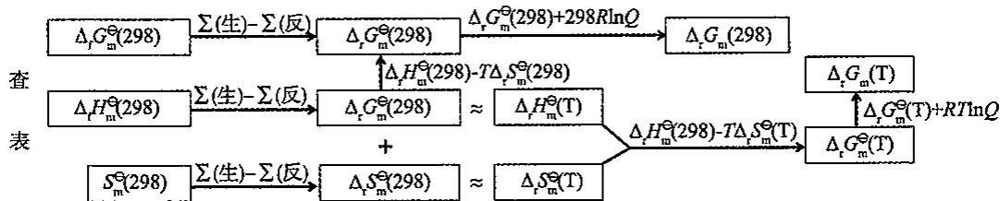

## 8.5 平衡常数的测定和平衡转化率的计算

## 8.5.1 平衡常数的测定

测定平衡常数实际上是测定平衡体系中各物质的浓度(确切地说是活度)或压强。视具体情况可以采用物理或化学的方法。

(1) 物理方法: 测定与浓度有关的物理量。如压强、体积、折射率、电导率等。

优点:不会扰乱体系的平衡状态。

缺点: 必须首先确定物理量与浓度的依赖关系。

(2)化学方法:利用化学分析的方法直接测定平衡体系中各物质的浓度。

缺点:加入试剂往往会扰乱平衡,所以分析前首先必须使平衡“冻结”。

通常采取的方式是:骤然冷却,取出催化剂或加入阻化剂等。

## 8.5.2 平衡转化率的计算

(1)平衡转化率(亦称理论转化率或最高转化率)

$$
\text{平衡转化率} = \frac {\text {原料达平衡后转化为产品的某一反应物的量}}{\text {投入该反应物的总量}} \times 100 \%
$$

$$
\text { 平   衡   转   化   率   是   以   原   料   的   消   耗   来   衡   量   反   应   的   限   度 }
$$

注意: 实际转化率≤平衡转化率(工厂通常说的转化率为实际转化率)。

(2)平衡产率(最大产率)——以产品来衡量反应的限度

$$
\text{平衡产率} = \frac {\text {平衡时主要产品的产量}}{\text {原料按化学反应方程式全部变为主要产品时的产量}} \times 100 \%
$$

产率通常用在多方向的反应中，即有副反应的反应，有副反应时，产率小于转化率。

## 8.6 外界因素对化学平衡的影响

化学平衡是有条件的。在一定条件下建立的平衡，当条件发生变化时将被破坏，从平衡态变为不平衡态。之后，在改变了的条件下，反应再度平衡。这种过程称为化学平衡的移动。

导致平衡移动的原因,可以从反应商和平衡常数两个方面去考虑。例如,某反应:

$aA \rightleftharpoons bB$ 达到平衡, 此时, 有 $Q = K, v_{正} = v_{逆}$ ; 当体系加入 A, Q 的分母增大, Q 变小, 导致 Q < K, 反应向右进行。过一段时间, 又达到平衡, 即平衡右移。

这是改变 $Q$ ，使 $Q \neq K$ 造成的平衡移动。改变 $Q$ 的因素一般有浓度，压强，体积等外界条件。温度的改变，将会影响反应的 $\Delta_{\mathrm{r}} G_{\mathrm{m}}$ ，因为： $\Delta_{\mathrm{r}} G_{\mathrm{m}}^{\ominus} = \Delta_{\mathrm{r}} H_{\mathrm{m}}^{\ominus} - T \Delta_{\mathrm{r}} S_{\mathrm{m}}^{\ominus}$ ；同时；也导致 $K^{\ominus}$ 的变化，因为： $\ln K^{\ominus} = -\frac{\Delta_{\mathrm{r}} G_{\mathrm{m}}^{\ominus}}{RT}$ ；故温度变化，使 $K$ 变化，使 $Q \neq K$ ，平衡将移动。

## 8.6.1 浓度对平衡的影响

对于一个已达平衡的化学反应,若增加反应物浓度,会使 $Q(Q_{\mathrm{P}}$ 或 $Q_{c})$ 的数值因其分母增大而减小，而 $K^{\ominus}(K_{\mathrm{p}}^{\ominus}$ 或 $K_{\mathrm{c}}^{\ominus})$ 却不随浓度改变而发生变化，于是 $Q < K^{\ominus}$ ，使原平衡破坏，反应正向进行。随着反应的进行，生成物浓度增大，反应物浓减小， $Q$ 值增大，直到 $Q$ 增大到与 $K^{\ominus}$ 再次相等，达到新的平衡为止。对于改变浓度的其他情况，亦可作类似分析。结论概括如下：在其他条件不变的情况下，增加反应物浓度或减少生成物浓度，平衡向正反应方向移动；增加生成物浓度或减少反应物浓度，平衡向着逆反应方向移动。

改变浓度将使平衡移动,增加一种反应物的浓度,可使另一种反应物的转化率提高。这是工业上一项重要措施。

## 8.6.2 压强对平衡的影响

体系(总)压强的变化对没有气体参加或生成的反应影响很小。对于有气体参加且反应前后气体物质计量数有变化的反应,压强变化对平衡有影响。例如合成氨反应:

$$
\mathrm{N} _ {2} (\mathrm{g}) + 3 \mathrm{H} _ {2} (\mathrm{g}) \rightleftharpoons 2 \mathrm{NH} _ {3} (\mathrm{g})
$$

在某温度下达到平衡时有：

$$
K _ {\mathrm{p}} ^ {\ominus} = \frac {[ p (\mathrm{NH} _ {3}) / p ^ {\ominus} ] ^ {2}}{[ p (\mathrm{N} _ {2}) / p ^ {\ominus} ] [ p (\mathrm{H} _ {2}) / p ^ {\ominus} ] ^ {3}}
$$

如果将体系的容积减少一半,使体系的总压强增加至原来的2倍,这时各组分的分压分别为原来的2倍,反应商为:

$$
Q _ {\mathrm{p}} = \frac {[ 2 p (\mathrm {NH_ {3}}) / p ^ {\ominus} ] ^ {2}}{[ 2 p (\mathrm {N_ {2}}) / p ^ {\ominus} ] [ 2 p (\mathrm {H_ {2}}) / p ^ {\ominus} ] ^ {3}} = \frac {1}{4} K _ {\mathrm{p}} ^ {\ominus}; \text {即} Q _ {\mathrm{p}} <   K _ {\mathrm{p}} ^ {\ominus}
$$

原平衡破坏，反应正向进行。随着反应进行， $p(\mathrm{N}_{2})$ 、 $p(\mathrm{H}_{2})$ 不断下降， $p(\mathrm{NH}_{3})$ 不断增大，使 $Q_{p}$ 值增大，直到 $Q_{p}$ 再次与 $K_{p}^{\ominus}$ 相等，达到新的平衡为止。可见，增大体系总压强平衡向着气体计量数减小的方向移动。

类似分析,可得如下结论:在等温下,增大总压强,平衡向气体计量数减小的方向移动;减小总压强,平衡向气体计量数增加的方向移动。如果反应前后气体计量数相等,则压强的变化不会使平衡发生移动。

## 8.6.3 温度对平衡的影响

温度的改变对于反应商没有影响,却可以改变平衡常数。

$$
\begin{array}{r l} & {\text {由} \Delta_ {\mathrm{r}} G _ {\mathrm{m}} ^ {\ominus} = - R T \ln K ^ {\ominus} \text {和} \Delta_ {\mathrm{r}} G _ {\mathrm{m}} ^ {\ominus} = \Delta_ {\mathrm{r}} H _ {\mathrm{m}} ^ {\ominus} - T \Delta_ {\mathrm{r}} S _ {\mathrm{m}} ^ {\ominus} \text {得}} \\ & {\qquad \qquad \qquad - R T \ln K ^ {\ominus} = \Delta_ {\mathrm{r}} H _ {\mathrm{m}} ^ {\ominus} - T \Delta_ {\mathrm{r}} S _ {\mathrm{m}} ^ {\ominus}} \\ & {\qquad \qquad \qquad \ln K ^ {\ominus} = - \frac {\Delta_ {\mathrm{r}} H _ {\mathrm{m}} ^ {\ominus}}{R T} + \frac {\Delta_ {\mathrm{r}} S _ {\mathrm{m}} ^ {\ominus}}{R}} \end{array}
$$

此式说明了平衡常数与温度的关系，称为范特霍夫方程式。设 $T_{1}$ 时，标准平衡常数为 $K_{1}^{\ominus}, T_{2}$ 时，标准平衡常数为 $K_{2}^{\ominus}$ ，且 $T_{2} > T_{1}$ ，有

$$
\ln K _ {1} ^ {\ominus} = - \frac {\Delta_ {r} H _ {m , 1} ^ {\ominus}}{R T _ {1}} + \frac {\Delta_ {r} S _ {m , 1} ^ {\ominus}}{R}
$$

$$
\ln K _ {2} ^ {\ominus} = - \frac {\Delta_ {\mathrm{r}} H _ {\mathrm{m} , 2} ^ {\ominus}}{R T _ {2}} + \frac {\Delta_ {\mathrm{r}} S _ {\mathrm{m} , 2} ^ {\ominus}}{R}
$$

当温度变化范围不大时，视 $\Delta_{r}H_{m}^{\ominus}$ 和 $\Delta_{r}S_{m}^{\ominus}$ 不随温度而改变。上两式相减，有

$$
\ln \frac {K _ {2} ^ {\ominus}}{K _ {1} ^ {\ominus}} = - \frac {\Delta_ {\mathrm{r}} H _ {\mathrm{m}} ^ {\ominus}}{R} \left(\frac {T _ {2} - T _ {1}}{T _ {1} \cdot T _ {2}}\right)
$$

根据上式可以说明温度对平衡的影响。设某反应在温度 $T_{1}$ 时达到平衡，有 $Q = K_{1}^{\ominus}$ 。当升温至 $T_{2}$ 时：若该反应为吸热反应， $\Delta_{\mathrm{r}}H_{\mathrm{m}}^{\ominus} > 0$ ，由前式得知 $K_{2}^{\ominus} > K_{1}^{\ominus}$ ，则 $Q < K_{2}^{\ominus}$ ，所以平衡沿正反应方向移动；若该反应为放热反应， $\Delta_{\mathrm{r}}H_{\mathrm{m}}^{\ominus} < 0$ ，由前式得知 $K_{2}^{\ominus} < K_{1}^{\ominus}$ ，则 $Q > K_{2}^{\ominus}$ ，所以平衡沿逆反应方向移动。总之，升温使平衡向吸热方向移动。反之，降温使平衡向放热方向移动。

各种外界条件对化学平衡的影响,均符合勒夏特列概括的一条普遍规律:如果对平衡体系施加外力,平衡将沿着减少此外力影响的方向移动。这就是勒夏特列(Le Chatelier)原理。

## 第三部分:电离平衡、水解平衡和沉淀溶解平衡

## 8.7 酸碱质子理论(Bronsted 理论)

最初阶段人们从性质上认识酸碱。酸:使石蕊变红,有酸味;碱:使石蕊变蓝,有涩味。当酸碱相混合时,性质消失。当氧元素发现后,人们开始从组成上认识酸碱,以为酸中一定含有氧元素;盐酸等无氧酸的发现,又使人们认识到酸中一定含有氢元素。

阿累尼乌斯的电离学说，使人们对酸碱的认识发生了一个飞跃。 $HA=H^{+}+A^{-}$ 电离出的阳离子全部是 $H^{+}$ ; $MOH=M^{+}+OH^{-}$ 电离出的阴离子全部是 $OH^{-}$ 。进一步从平衡角度找到了比较酸碱强弱的标准，即 $K_{a}$ 、 $K_{b}$ 。阿累尼乌斯理论在水溶液中是成功的，但其在非水体系中的适用性，却受到了挑战。例如：溶剂自身的电离和液氨中进行的中和反应，都无法用阿累尼乌斯的理论去讨论，因为根本找不到符合定义的酸和碱。

为了弥补阿累尼乌斯理论的不足,丹麦化学家布朗斯特(Bronsted)和英国化学家劳里(Lowry)于1923年分别提出了酸碱质子理论。

## 8.7.1 酸碱的定义

质子理论认为: 凡能给出质子 $\left(\mathrm{H}^{+}\right)$ 的物质都是酸; 凡能接受质子的物质都是碱。如 $HCl, NH_{4}^{+}, HSO_{4}^{-}, H_{2}PO_{4}^{-}$ 等都是酸, 因为它们能给出质子; $CN^{-}, NH_{3}, HSO_{4}^{-}, SO_{4}^{2-}$ 都是碱, 因为它们都能接受质子, 质子理论的酸碱对称为布朗斯特酸碱。由上面的例子可以看出, 质子酸碱理论中的酸和碱既可以是电中性的分子, 也可以是带电的阴阳离子。若某物质既能给出质子, 又能接受质子, 它就既是酸又是碱, 可称为酸碱两性物质, 如 $HCO_{3}^{-}$ 等。

由质子酸碱的概念可知：

(1)在一个共轭酸碱对中,酸越强,其共轭碱越弱;反之亦然。

(2)酸和碱可以是分子,也可以是离子。扩大了酸碱物质的范围。

(3)既可给出质子,又可结合质子的物质为两性物质(如 $HCO_{3}^{-}$ 和 $H_{2}O$ )。既不给出

质子，又不结合质子的物质为中性物质(如 $Na^{+}$ )。

(4)质子理论中无盐的概念,例如 $CO_{3}^{2-}$ , 在 Arrhenius 的电离理论中是盐,但是在酸碱质子理论中是碱。

## 8.7.2 酸碱的共轭关系

质子酸碱不是孤立的，它们通过质子相互联系，质子酸释放质子转化为它的共轭碱，质子碱得到质子转化为它的共轭酸。这种关系称为酸碱共轭关系。可用通式表示为：酸 $\rightleftharpoons$ 碱+质子，此式中的酸碱称为共轭酸碱对。例如 $NH_{3}$ 是 $NH_{4}^{+}$ 的共轭碱，反之， $NH_{4}^{+}$ 是 $NH_{3}$ 的共轭酸。又例如，对于酸碱两性物质， $HCO_{3}^{-}$ 的共轭酸是 $H_{2}CO_{3}$ ， $HCO_{3}^{-}$ 的共轭碱是 $CO_{3}^{2-}$ 。换言之， $H_{2}CO_{3}$ 和 $HCO_{3}^{-}$ 是一对共轭酸碱， $HCO_{3}^{-}$ 和 $CO_{3}^{2-}$ 是另一对共轭酸碱。

## 8.7.3 酸和碱的反应

跟阿累尼乌斯酸碱反应不同,布朗斯特酸碱的反应是两对共轭酸碱对之间传递质子的反应,

通式为： $酸_{1} + 碱_{2}\rightleftharpoons 碱_{1} + 酸_{2}$

$$
\begin{array}{r l}&{\text {如:} \mathrm{HCl} + \mathrm{NH} _ {3} \rightleftharpoons \mathrm{Cl} ^ {-} + \mathrm{NH} _ {4} ^ {+}}\\&{\quad \mathrm{H} _ {2} \mathrm{O} + \mathrm{NH} _ {3} \rightleftharpoons \mathrm{OH} ^ {-} + \mathrm{NH} _ {4} ^ {+}}\\&{\quad \mathrm{HAc} + \mathrm{H} _ {2} \mathrm{O} \rightleftharpoons \mathrm{Ac} ^ {-} + \mathrm{H} _ {3} \mathrm{O} ^ {+}}\\&{\quad \mathrm{H} _ {2} \mathrm{S} + \mathrm{H} _ {2} \mathrm{O} \rightleftharpoons \mathrm{HS} ^ {-} + \mathrm{H} _ {3} \mathrm{O} ^ {+}}\\&{\quad \mathrm{H} _ {2} \mathrm{O} + \mathrm{S} ^ {2 -} \rightleftharpoons \mathrm{OH} ^ {-} + \mathrm{HS} ^ {-}}\\&{\quad \mathrm{H} _ {2} \mathrm{O} + \mathrm{HS} ^ {-} \rightleftharpoons \mathrm{OH} ^ {-} + \mathrm{H} _ {2} \mathrm{S}}\end{array}
$$

换句话说，单独一对共轭酸碱本身是不能发生酸碱反应的，因而我们也可以把通式：酸——碱+H⁺称为酸碱半反应，酸碱质子反应是两对共轭酸碱对交换质子的反应；此外，上面一些例子也告诉我们，酸碱质子反应的产物不一定是盐和水，在酸碱质子理论看来，阿累尼乌斯酸碱反应（中和反应、强酸置换弱酸、强碱置换弱碱）、阿累尼乌斯酸碱的电离、阿累尼乌斯酸碱理论的“盐的水解”以及没有水参与的气态氯化氢和气态氨反应等等，都是酸碱反应，而不存在“盐”的概念。

## 8.7.4 酸碱的强弱和反应的方向

## 1. 拉平效应和分辨效应

酸的强弱是通过给出质子的能力来判断的。一方面要看酸自身的能力，另一方面又和碱接受质子的能力有关。比较 $HClO_{4}$ ， $H_{2}SO_{4}$ ，HCl 和 $HNO_{3}$ 的强弱，若在 $H_{2}O$ 中进行，由于 $H_{2}O$ 接受质子的能力所致，四者均完全电离，故比较不出强弱。若放到 HAc 中，由于 HAc 接受质子的能力比 $H_{2}O$ 弱得多，所以尽管四者给出质子的能力没有变，但是在 HAc 中却是部分电离。于是根据 $K_{a}$ 的大小，可以比较其酸性的强弱。

$$
\begin{array}{l l}\mathrm{HClO} _ {4} + \mathrm{HAc} \rightleftharpoons \mathrm{ClO} _ {4} ^ {-} + \mathrm{H} _ {2} \mathrm{Ac} ^ {+}&\mathrm{pK} _ {\mathrm{a}} = 5. 8\\\mathrm{H} _ {2} \mathrm{SO} _ {4} + \mathrm{HAc} \rightleftharpoons \mathrm{HSO} _ {4} ^ {-} + \mathrm{H} _ {2} \mathrm{Ac} ^ {+}&\mathrm{pK} _ {\mathrm{a}} = 8. 2\end{array}
$$

$$
\begin{array}{l l}\mathrm{HCl} + \mathrm{HAc} \rightleftharpoons \mathrm{Cl} ^ {-} + \mathrm{H} _ {2} \mathrm{Ac} ^ {+}&\mathrm{pK} _ {\mathrm{a}} = 8. 8\\\mathrm{HNO} _ {3} + \mathrm{HAc} \rightleftharpoons \mathrm{NO} _ {3} ^ {-} + \mathrm{H} _ {2} \mathrm{Ac} ^ {+}&\mathrm{pK} _ {\mathrm{a}} = 9. 4\end{array}
$$

所以四者从强到弱依次是 $HClO_{4}$ ， $H_{2}SO_{4}$ ，HCl， $HNO_{3}$ 。HAc 对四者有分辨效应，HAc 是四者的分辨试剂；而 $H_{2}O$ 对四者有拉平效应， $H_{2}O$ 是四者的拉平试剂。

## 2. 酸碱的强弱

对于大多数的弱酸, $H_{2}O$ 是分辨试剂,可以根据它们在水中的电离平衡常数比较酸性的强弱。酸性次序如下:

$$
\mathrm{HClO} _ {4}, \mathrm{H} _ {2} \mathrm{SO} _ {4}, \mathrm{HCl}, \mathrm{HNO} _ {3} > \mathrm{H} _ {3} \mathrm{O} ^ {+} > \mathrm{HF} > \mathrm{HAc} > \mathrm{NH} _ {4} ^ {+} > \mathrm{H} _ {2} \mathrm{O} > \mathrm{HS} ^ {-}
$$

在水中， $K_{a}$ 为酸式电离常数，它体现出一种酸给出 $H^{+}$ 的能力，那么如何体现其共轭碱 $Ac^{-}$ 接受 $H^{+}$ 的能力呢？ $Ac^{-} + H_{2}O \rightleftharpoons HAc + OH^{-}$ 其碱式电离常数为 $K_{b}$ 。但从水解平衡角度看，这个 $K_{b}$ 正是 $K_{h}$ 。可见一对共轭酸碱的 $K_{a}, K_{b}$ 之间有如下关系：

$$
K _ {\mathrm{b}} = \frac {K _ {\mathrm{w}}}{K _ {\mathrm{a}}} \text {或} K _ {\mathrm{a}} \cdot K _ {\mathrm{b}} = K _ {\mathrm{w}}
$$

$K_{a}$ 和 $K_{b}$ 之积为常数。

一对共轭酸碱中，酸的 $K_{a}$ 越大，则其共轭碱的 $K_{b}$ 越小，所以从酸性的次序就可以推出其共轭碱的强度次序。

$$
\mathrm{ClO} _ {4} ^ {-}, \mathrm{HSO} _ {4} ^ {-}, \mathrm{Cl} ^ {-}, \mathrm{NO} _ {3} ^ {-} <   \mathrm{H} _ {2} \mathrm{O} <   \mathrm{F} ^ {-} <   \mathrm{Ac} ^ {-} <   \mathrm{NH} _ {3} <   \mathrm{OH} ^ {-} <   \mathrm{S} ^ {2 -}
$$

## 3. 反应的方向

酸碱反应中，质子总是从强酸向强碱转移，生成弱酸和弱碱。

$$
\begin{array}{r l r} {\text {例如, HCl}} & {+ \quad \mathrm {H_ {2} O}} & {= \quad \mathrm {H_ {3} O^ {+}}} & {+ \quad \mathrm {Cl^ {-}}} \\ {\text {强酸}} & {\text {强碱}} & {\text {弱酸}} & {\text {弱碱}} \end{array}
$$

在下面的反应中： $HAc+H_{2}O=H_{3}O^{+}+Ac^{-},K_{a}=1.8\times10^{-5}$ ，所以 $\Delta G^{\ominus}>>0$ ，反应自发进行的方向是从右向左，从强酸、强碱生成弱酸、弱碱。

$HNO_{3} + H_{2}O = H_{3}O^{+} + NO_{3}^{-}$ 完全电离，在水中比 $H_{3}O^{+}$ 更强的 $HNO_{3}$ 一定会和强碱 $H_{2}O$ 反应，生成 $H_{3}O^{+}$ 和弱碱 $NO_{3}^{-}$ 。可以得出结论：在水中能大量存在的最强的质子酸是 $H_{3}O^{+}$ 。同理，在水中能大量存在的最强的质子碱是 $OH^{-}$ 。比 $OH^{-}$ 更强的碱，如 $S^{2-}$ 将与 $H_{2}O$ 反应生成 $OH^{-}:S^{2-} + H_{2}O = HS^{-} + OH^{-}$ 。

酸碱的质子理论也有局限性:对于不含有质子的物质,如 $Cu^{2+}$ , $Ag^{+}$ 等不好归类,对于无质子转移的反应,如 $Ag^{+} + Cl^{-} = AgCl$ 也难以讨论。

## 8.8 酸碱的电子理论(Lewis 理论)

## 8.8.1 酸碱的定义

凡是能提供电子对的物质都是碱，碱是电子对的给予体。如， $OH^{-}$ 、 $CN^{-}$ 、 $NH_{3}$ 、 $F^{-}$ 等。

凡是能接受电子对的物质都是酸，酸是电子对的接受体。如， $H^{+}$ 、 $BF_{3}$ 、 $Na^{+}$ 、 $Ag^{+}$ 等。

## 8.8.2 酸碱反应和酸碱配合物

$$
\begin{array}{r l r l r l} & {\text {酸}} & & {\text {碱}} & & {\text {酸碱配合物}} \\ & {\mathrm{BF} _ {3}} & & {+} & {\mathrm{F} ^ {-}} & {=} & {\mathrm{BF} _ {4} ^ {-}} \\ & {\mathrm{Cu} ^ {2 +}} & & {+} & {4 \mathrm{NH} _ {3}} & {=} & {[ \mathrm{Cu(NH} _ {3}) _ {4} ] ^ {2 +}} \\ & {\mathrm{H} ^ {+}} & & {+} & {\mathrm{OH} ^ {-}} & {=} & {\mathrm{H} _ {2} \mathrm{O}} \end{array}
$$

对于酸碱的识别,也要在具体的反应中进行。几乎所有的金属离子都是路易斯酸,阴离子几乎都是路易斯碱,而酸和碱反应的生成物都是酸碱配合物,这种反应也叫作酸碱加合反应。

## 8.8.3 酸和碱的取代反应

## 1. 酸取代反应

$\left[\mathrm{Cu}\left(\mathrm{NH}_{3}\right)_{4}\right]^{2+}+4\mathrm{H}^{+}=\mathrm{Cu}^{2+}+4\mathrm{NH}_{4}^{+}$ ; 酸 $H^{+}$ 取代了酸碱配合物 $\left[\mathrm{Cu}\left(\mathrm{NH}_{3}\right)_{4}\right]^{2+}$ 中的酸 $Cu^{2+}$ 。

$\mathrm{Al(OH)}_{3}+3\mathrm{H}^{+}=\mathrm{Al}^{3+}+3\mathrm{H}_{2}\mathrm{O};\mathrm{H}^{+}$ 取代了酸碱配合物 $\mathrm{Al(OH)}_{3}$ 中的酸 $\mathrm{Al}^{3+}$ 。

## 2. 碱取代反应

$\left[\mathrm{Cu}\left(\mathrm{NH}_{3}\right)_{4}\right]^{2+}+2\mathrm{OH}^{-}=\mathrm{Cu}\left(\mathrm{OH}\right)_{2}+4\mathrm{NH}_{3}$ ; 碱 $OH^{-}$ 取代了配合物 $\left[\mathrm{Cu}\left(\mathrm{NH}_{3}\right)_{4}\right]^{2+}$ 中的碱 $NH_{3}$ 。

## 3. 双取代反应

$$
\mathrm{NaOH} + \mathrm{HCl} = \mathrm{NaCl} + \mathrm{H} _ {2} \mathrm{O}; \mathrm{BaCl} _ {2} + \mathrm{Na} _ {2} \mathrm{SO} _ {4} = \mathrm{BaSO} _ {4} + 2 \mathrm{NaCl}
$$

两种酸碱配合物交换成分。

酸碱的电子理论适应性强,大多数物质都可以包括在酸、碱及其配合物中,大多数的化学反应都可以归为酸,碱及其配合物之间的反应。其不足之处在于酸碱的特征不明确。

## 8.9 强电解质的电离

## 8.9.1 问题的提出

实验结果表明，在1L浓度为0.1mol/L的蔗糖溶液中，能独立发挥作用的溶质的粒子数目是 $0.1N_{A}$ 个。但是对于电解质溶液，情况则有所不同。首先讨论强电解质的情形。以0.1mol/L的KCl溶液为例，在1L的溶液中，发挥作用的粒子的数目并不是 $0.1N_{A}$ 个，也不是 $0.2N_{A}$ 个。而是随着KCl的浓度的不同，其粒子数目呈现出规律性的变化，见下面的表格。

<table><tr><td> $c(\text{KCl})$ (mol/L)</td><td>0.10</td><td>0.05</td><td>0.01</td><td>0.005</td><td>0.001</td></tr><tr><td> $N(\text{KCl}$ 个数/ $N_{\text{A}}$ )</td><td>0.10</td><td>0.05</td><td>0.01</td><td>0.005</td><td>0.001</td></tr><tr><td>实际粒子数是 $N$ 的倍数</td><td>1.92</td><td>1.94</td><td>1.97</td><td>1.98</td><td>1.99</td></tr></table>

从表中可以看出 KCl 在水溶液中发生解离。需要解决两个问题：

一是怎样解离，是① $KCl=K+Cl$ 还是② $KCl=K^{+}+Cl^{-}$ ; KCl溶液能够导电，说明解离的方式是②。

第二个问题是解离得是否彻底。表上的数据说明这种解离是不完全的。理由是没有得到2倍的粒子。

以上是 1887 年 Arrhenius 提出电离学说时的观点。进一步的研究表明，在 KCl 的水溶液中根本不存在 KCl 分子。这一问题的提出，促进了电解质溶液理论的发展。

## 8.9.2 德拜-休克尔理论

## 1. 离子氛

德拜-休克尔(Debye-Hückel)理论指出，在强电解质溶液中不存在分子，电离是完全的。由于离子间的相互作用，阳离子的周围围绕着阴离子；阴离子的周围围绕着阳离子。我们称这种现象为存在离子氛。每一个离子氛的中心离子同时又是另一个离子氛的反电荷离子的成员。由于离子氛的存在，离子间相互作用而互相牵制，强电解质溶液中的离子并不是独立的自由离子，不能完全自由运动，因而不能百分之百地发挥离子应有的效能。溶液越浓静电作用越强烈，离子自由活动能力就越弱。

离子强度:衡量溶液中离子和它的离子氛之间相互作用的强弱

$$
I = 1 / 2 \sum (m _ {i} z _ {i} ^ {2})
$$

$z_{i}$ : 离子电荷数; $m_{i}$ : 离子浓度(mol/kg)

离子强度仅与溶液中各离子的浓度及电荷数有关，而与离子种类无关。

## 2. 活度和活度系数

若强电解质的离子浓度为 c，由于离子氛的作用，其发挥的有效浓度为 a，则有真分数 f 存在，使 $a = f \cdot c$ 。式中，c 表示浓度，a 表示有效浓度即活度，f 称为活度系数。用 f 修正后，得到活度 a，它能更真实地体现溶液的行为。

## 3. 影响活度系数 $f$ 大小的因素

(1)溶液的浓度:浓度大,活度a偏离浓度c越远,f越小;浓度小,a和c越接近,f越接近1。

(2)离子的电荷:电荷高,离子氛作用大,活度a偏离浓度c越远,f越小;电荷低,离子氛作用小,a和c接近,f接近1。

讨论问题,有时要用到 a 和 f,但是在计算中,如不特殊指出,则认为 a=c,f=1。

弱电解质的溶液中，也有离子氛存在，但是更重要的是电离平衡的存在。

## 8.10 弱电解质的电离平衡

对于 0.1mol/L 的溶液: 表观电离度大于 30% 的电解质为强电解质, 表观电离度小

于 3% 的电解质为弱电解质。注意:不能只从电离度来判断强弱电解质。

弱电解质遵守 Oswald 稀释定律: 在一定温度下, 弱电解质的电离度 $\alpha$ 与电离常数的平方根成正比, 与溶液浓度的平方根成反比, 即浓度越稀, 电离度越大。

$$
\alpha = \sqrt {\frac {K ^ {\ominus}}{c}}
$$

## 8.10.1 水的电离平衡

## 1. 水的离子积常数

$$
\mathrm{H} _ {2} \mathrm{O} (\mathrm{l}) \rightleftharpoons \mathrm{H} ^ {+} (\mathrm{aq}) + \mathrm{OH} ^ {-} (\mathrm{aq}); K _ {\mathrm{w}} = [ \mathrm{H} ^ {+} ] \cdot [ \mathrm{OH} ^ {-} ]
$$

式中的 $K_{w}$ 称为水的离子积常数。

$K_{w}$ 是标准平衡常数,式中的浓度都是相对浓度。由于本讲中使用标准浓度极其频繁,故省略除以 $c^{\ominus}$ 的写法。要注意它的实际意义。

由于水的电离是吸热反应,所以,温度升高时, $K_{w}$ 值变大。

下表为不同温度下水的离子积常数 $K_{w}$ 。

<table><tr><td>温度/K</td><td>273</td><td>298</td><td>373</td></tr><tr><td> $K_{w}$ </td><td> $0.13\times 10^{-14}$ </td><td> $1.0\times 10^{-14}$ </td><td> $74\times 10^{-14}$ </td></tr></table>

在溶液中, 只要有 $H_{2}O, H^{+}, OH^{-}$ 三者共存, 之间就存在如下的数量关系:

$\left[H^{+}\right]\left[OH^{-}\right]=K_{w}$ ;无论溶液是酸性,碱性,还是中性。

常温下， $\left[H^{+}\right]=1\times10^{-7}$ ，表示中性，因为这时 $K_{w}=1.0\times10^{-14}$ ；

非常温时,溶液的中性只能是指 $\left[H^{+}\right]=\left[OH^{-}\right]$ 。

3. pH 值和 pOH 值

$$
\mathrm{H} = - \lg [ \mathrm{H} ^ {+} ]; \mathrm{pOH} = - \lg [ \mathrm{OH} ^ {-} ]
$$

因为 $\left[H^{+}\right]\cdot\left[OH^{-}\right]=1.0\times10^{-14}$ ;所以pH+pOH=14。

pH 和 pOH 一般的取值范围是 1\~14，但也有时超出，如： $\left[H^{+}\right]=10\mathrm{mol/L}$ ，则 pH=-1。

## 8.10.2 弱酸和弱碱的电离平衡

## 1. 一元弱酸和弱碱的电离平衡

将醋酸的分子式简写成 HAc，用 $Ac^{-}$ 代表醋酸根，则醋酸的电离平衡可以表示成：

$$
\mathrm{HAc} \rightleftharpoons \mathrm{H} ^ {+} + \mathrm{Ac} ^ {-}
$$

用 $K_{a}^{\ominus}$ 表示酸式电离的电离平衡常数，经常简写作 $K_{a}$ 。且：

$$
K _ {\mathrm{a}} = \frac {[ \mathrm{H} ^ {+} ] [ \mathrm{Ac} ^ {-} ]}{[ \mathrm{HAc} ]} = 1. 8 \times 1 0 ^ {- 5}
$$

设醋酸的总浓度为 $c_{0}, K_{\mathrm{a}}^{\ominus} = \frac{[\mathrm{H}^{+}]^{2}}{c_{0} - [\mathrm{H}^{+}]} , [\mathrm{H}^{+}] = \frac{-K_{\mathrm{a}}^{\ominus}}{2} + \sqrt{\frac{K_{\mathrm{a}}^{\ominus 2}}{4} + K_{\mathrm{a}}^{\ominus}c_{0}}$

当 $K_{a}^{\ominus}$ 很小 $(c_{0}/K_{a}^{\ominus}\geqslant400)$ ，弱酸电离度小， $[H^{+}]$ 小于 $5\%c_{0}$ 。

$$
[ \mathrm{HAc} ] = c _ {0} - [ \mathrm{H} ^ {+} ] \approx c _ {0}, [ \mathrm{H} ^ {+} ] = \sqrt {K _ {\mathrm{a}} ^ {\ominus} c _ {0}}
$$

氨水 $NH_{3} \cdot H_{2}O$ 是典型的弱碱，用 $K_{b}^{\ominus}$ (简写成 $K_{b}$ ) 表示碱式电离的电离平衡常数，

则有：

$$
\mathrm{NH} _ {3} \cdot \mathrm{H} _ {2} \mathrm{O} \rightleftharpoons \mathrm{NH} _ {4} ^ {+} + \mathrm{OH} ^ {-}; K _ {\mathrm{b}} = \frac {[ \mathrm{NH} _ {4} ^ {+} ] [ \mathrm{OH} ^ {-} ]}{[ \mathrm{NH} _ {3} \cdot \mathrm{H} _ {2} \mathrm{O} ]} = 1. 8 \times 1 0 ^ {- 5}
$$

同理： $c_{0} / K_{\mathrm{b}}^{\ominus}\geqslant 400$ 时， $[\mathrm{OH}^{-}] = \sqrt{K_{\mathrm{b}}^{\ominus}c_{0}}$

$c_{0} / K_{\mathrm{b}}^{\ominus}\leqslant 400$ 时， $[\mathrm{OH^{-}}] = \frac{-K_{\mathrm{b}}^{\ominus}}{2} +\sqrt{\frac{K_{\mathrm{b}}^{\ominus2}}{4} + K_{\mathrm{b}}^{\ominus}c_{0}}$

## 2. 多元弱酸的电离平衡

多元弱酸的电离是分步进行的，对应每一步电离，各有其电离常数。以 $H_{2}S$ 为例：

$$
\text { 第一步: } \mathrm{H} _ {2} \mathrm{S} \rightleftharpoons \mathrm{H} ^ {+} + \mathrm{HS} ^ {-}; K _ {\mathrm{al}} = \frac {[ \mathrm{H} ^ {+} ] [ \mathrm{HS} ^ {-} ]}{[ \mathrm{H} _ {2} \mathrm{S} ]} = 1. 3 \times 1 0 ^ {- 7}
$$

$$
\text {   第二步:   } \mathrm{HS} ^ {-} \rightleftharpoons \mathrm{H} ^ {+} + \mathrm{S} ^ {2 -}; K _ {n 2} = \frac {[ \mathrm{H} ^ {+} ] [ \mathrm{S} ^ {2 -} ]}{[ \mathrm{HS} ^ {-} ]} = 7. 1 \times 1 0 ^ {- 1 5}
$$

显然， $K_{a1}>>K_{u2}$ 。说明多元弱酸的电离以第一步电离为主。

将第一步和第二步的两个方程式相加, 得:

$$
\mathrm{H} _ {2} \mathrm{S} \rightleftharpoons 2 \mathrm{H} ^ {+} + \mathrm{S} ^ {2 -}; K = \frac {[ \mathrm{H} ^ {+} ] ^ {2} [ \mathrm{S} ^ {2 -} ]}{[ \mathrm{H} _ {2} \mathrm{S} ]} = K _ {\mathrm{a1}} \cdot K _ {\mathrm{a2}} = 9. 2 \times 1 0 ^ {- 2 2}
$$

平衡常数表示处于平衡状态的几种物质的浓度关系,确切地说是活度的关系。但是在我们的计算中,近似地认为活度系数 f=1,即用浓度代替活度。 $K_{a}$ 、 $K_{b}$ 的大小可以表示弱酸和弱碱的离解程度,K 的值越大,则弱酸和弱碱的电离程度越大。

因此，对于多元弱酸溶液可以归纳为

①当多元弱酸的 $K_{a1} >> K_{a2} >> K_{a3}, K_{a1} / K_{a2} \geqslant 10^{2}$ 时，可当作一元弱酸处理，以求算 $[H^{+}]$ 。

②多元弱酸第二步电离平衡所得的共轭碱的浓度近似等于 $K_{a2}$ ，与酸的浓度关系不大，如 $H_{3}PO_{4}$ 溶液中， $\left[HPO_{4}^{2-}\right]=K_{a2}$ 。

③多元弱酸第二步及以后各步的电离平衡所得的相应共轭碱的浓度都很低。多元弱碱在溶液中的分步解离与多元弱酸相似，根据类似的条件，可按一元弱碱溶液计算其 $\left[OH^{-}\right]$ 。

多元弱酸溶液中存在的各种平衡式：

①物料平衡式(mass or material balance equation)

$$
c \left(\mathrm{H} _ {3} \mathrm{PO} _ {4}\right) = \left[ \mathrm{H} _ {3} \mathrm{PO} _ {4} \right] + \left[ \mathrm{H} _ {2} \mathrm{PO} _ {4} ^ {-} \right] + \left[ \mathrm{HPO} _ {4} ^ {2 -} \right] + \left[ \mathrm{PO} _ {4} ^ {3 -} \right]
$$

②电荷平衡式(charge balance equation)

$$
\left[ \mathrm{H} ^ {+} \right] = \left[ \mathrm{H} _ {2} \mathrm{PO} _ {4} ^ {-} \right] + 2 \left[ \mathrm{HPO} _ {4} ^ {2 -} \right] + 3 \left[ \mathrm{PO} _ {4} ^ {3 -} \right] + \left[ \mathrm{OH} ^ {-} \right]
$$

③质子平衡式(proton balance equation, PBE)

a. 根据酸碱质子理论, 酸碱反应的本质是质子的传递。当反应达到平衡时, 酸失去的质子与碱得到的质子的物质的量必然相等, 其数学表达式称为质子平衡式或质子条件式, 常用符号 PBE 表示。

## b. 如何求质子平衡式?

一种方法是由物料平衡式和电荷平衡式推导,但这种推导有时较繁琐;另一种方法由质子得失的关系得出:首先选择适当的物质作为质子传递的参照物,通常选择那些在溶液中大量存在并参与质子传递的物质，如溶剂和溶质本身，这些物质称为参考水准或零水准，然后，从参考水准出发，根据得失质子的物质的量相等的原则，写出质子平衡式。

例如，在 $\mathrm{Na_2HPO_4(aq)}$ 中，选 $\mathrm{HPO_4^{2 - }}$ （溶质）和 $\mathrm{H}_2\mathrm{O}$ （溶剂）为参考水准物

$$
\begin{array}{l l l} \text {参考水准物} & \text {得质子的产物} & \text {失质子的产物} \\ \mathrm{HPO} _ {4} ^ {2 -} & \mathrm{H} _ {2} \mathrm{PO} _ {4} ^ {-}, \mathrm{H} _ {3} \mathrm{PO} _ {4} & \mathrm{PO} _ {4} ^ {3 -} \\ \mathrm{H} _ {2} \mathrm{O} & \mathrm{H} _ {3} \mathrm{O} ^ {+} & \mathrm{OH} ^ {-} \end{array}
$$

$$
\left[ \mathrm{H} _ {3} \mathrm{O} ^ {+} \right] + \left[ \mathrm{H} _ {2} \mathrm{PO} _ {4} ^ {-} \right] + 2 \left[ \mathrm{H} _ {3} \mathrm{PO} _ {4} \right] = \left[ \mathrm{PO} _ {4} ^ {3 -} \right] + \left[ \mathrm{OH} ^ {-} \right]
$$

从物料和电荷平衡中也可以得出上式: 令 $Na_{2}HPO_{4}$ 溶液浓度为 cmol/L, 则 $\left[Na^{+}\right]=2cmol/L$ 。

由物料平衡： $\left[\mathrm{H}_{3} \mathrm{PO}_{4}\right] + \left[\mathrm{H}_{2} \mathrm{PO}_{4}^{-}\right] + \left[\mathrm{HPO}_{4}^{2-}\right] + \left[\mathrm{PO}_{4}^{3-}\right] = c$

由电荷平衡： $\left[\mathrm{Na}^{+}\right] + \left[\mathrm{H}_{3} \mathrm{O}^{+}\right] = \left[\mathrm{H}_{2} \mathrm{PO}_{4}^{-}\right] + 2\left[\mathrm{HPO}_{4}^{2-}\right] + 3\left[\mathrm{PO}_{4}^{3-}\right] + \left[\mathrm{OH}^{-}\right]$

$$
[ \mathrm{Na} ^ {+} ] = 2 c
$$

$$
\begin{array}{r l} & 2 \left[ \mathrm{H} _ {3} \mathrm{PO} _ {4} \right] + 2 \left[ \mathrm{H} _ {2} \mathrm{PO} _ {4} ^ {-} \right] + 2 \left[ \mathrm{HPO} _ {4} ^ {2 -} \right] + 2 \left[ \mathrm{PO} _ {4} ^ {3 -} \right] + \left[ \mathrm{H} _ {3} \mathrm{O} ^ {+} \right] = \left[ \mathrm{H} _ {2} \mathrm{PO} _ {4} ^ {-} \right] + 2 \\ & \left[ \mathrm{HPO} _ {4} ^ {2 -} \right] + 3 \left[ \mathrm{PO} _ {4} ^ {3 -} \right] + \left[ \mathrm{OH} ^ {-} \right] \end{array}
$$

整理后，得： $2[H_{3}PO_{4}]+[H_{2}PO_{4}^{-}]+[H_{3}O^{+}]=[PO_{4}^{3-}]+[OH^{-}]$

## 3. 两性物质溶液

两性物质有 $HCO_{3}^{-}$ 、 $H_{2}PO_{4}^{-}$ 、 $HPO_{4}^{2-}$ 、 $NH_{4}Ac$ 和氨基酸（以 $^{+}NH_{3}-CHR-COO^{-}$ 为代表）等，它们在溶液中既能给出质子又能接受质子，根据具体情况分为三种类型。

## (1)两性阴离子溶液

以 $HCO_{3}^{-}$ 为例, 当它在水中作为酸时, 电离反应为:

$$
\mathrm{HCO} _ {3} ^ {-} + \mathrm{H} _ {2} \mathrm{O} \rightleftharpoons \mathrm{H} _ {3} \mathrm{O} ^ {+} + \mathrm{CO} _ {3} ^ {2 -}
$$

当 $HCO_{3}^{-}$ 在水中作为碱时，水解反应为： $HCO_{3}^{-} + H_{2}O \rightleftharpoons OH^{-} + H_{2}CO_{3}$

溶液中 $[\mathrm{H}^{+}]$ 的近似计算公式为

$$
\left[ \mathrm{H} ^ {+} \right] = \sqrt {K _ {\mathrm{a} 1} \cdot K _ {\mathrm{a} 2}} \text {或} \mathrm{pH} = 1 / 2 (\mathrm{p} K _ {\mathrm{a} 1} + \mathrm{p} K _ {\mathrm{a} 2}) (\text {下文中有推导过程})
$$

式中 $K_{a1}$ 和 $K_{a2}$ 分别是 $H_{2}CO_{3}$ 的一级和二级解离常数。其他两性阴离子水溶液的酸度，可类推出相应的近似计算公式。

如 $\mathrm{H}_2\mathrm{PO}_4^-$ 的溶液： $[\mathrm{H}^{+}] = \sqrt{K_{\mathrm{a1}}\cdot K_{\mathrm{a2}}}$ 或 $\mathrm{pH} = 1 / 2(\mathrm{pK}_{\mathrm{a1}} + \mathrm{pK}_{\mathrm{a2}})$

对于 $\mathrm{HPO}_4^{2-}$ 的溶液： $[\mathrm{H}^+] = \sqrt{K_{\mathrm{a2}}\cdot K_{\mathrm{a3}}}$ 或 $\mathrm{pH} = 1 / 2(\mathrm{pK}_{\mathrm{a2}} + \mathrm{pK}_{\mathrm{a3}})$

从这些近似计算公式可以看到,这些两性阴离子溶液的 pH 与浓度无关。

## (2)由弱酸和弱碱组成的两性物质溶液

以 $NH_{4}Ac$ 为例, 它在水中发生下列质子传递平衡

$$
\begin{array}{r l}&\mathrm {NH_ {4} ^ {+} + H_ {2} O\rightleftharpoons NH_ {3} + H_ {3} O^ {+}}\\&\mathrm {Ac^ {-} + H_ {2} O\rightleftharpoons HAc + OH^ {-}}\end{array}
$$

以 $K_{a}$ 表示阳离子酸 $(\mathrm{NH}_{4}^{+})$ 的解离常数， $K'_{a}$ 表示阴离子碱 $(\mathrm{Ac}^{-})$ 的共轭酸 $(\mathrm{HAc})$ 的解离常数。当 $cK_{a} \geqslant 20K_{w}$ ，且 $c \geqslant 20K'_{a}$ 时，这类两性物质溶液的 $H^{+}$ 浓度可用类似于两性阴离子溶液的公式计算，即

$$
[ \mathrm{H} ^ {+} ] = \sqrt {K _ {\mathrm{a}} \cdot K _ {\mathrm{a}} ^ {\prime}} \text {或} \mathrm{pH} = 1 / 2 (\mathrm{p} K _ {\mathrm{a}} + \mathrm{p} K _ {\mathrm{a}} ^ {\prime})
$$

## (3) 氨基酸型两性物质溶液

氨基酸的通式为 $^{+}NH_{3}-CHR-COO^{-}$ ，式中 $-NH_{3}^{+}$ 基团可给出质子，显酸性； $-COO^{-}$ 基团可以接受质子，显碱性，故是两性物质。以甘氨酸 $\left(^{+}NH_{3}-CH_{2}-COO^{-}\right)$ 为例，它在水溶液中的质子传递平衡为

$$
^ {+} \mathrm{NH} _ {3} - \mathrm{CH} _ {2} - \mathrm{COO} ^ {-} + \mathrm{H} _ {2} \mathrm{O} \rightleftharpoons \mathrm{NH} _ {2} - \mathrm{CH} _ {2} - \mathrm{COO} ^ {-} + \mathrm{H} _ {3} \mathrm{O} ^ {+}, K _ {\mathrm{a}} = 1. 5 6 \times 1 0 ^ {- 1 0}
$$

$$
^ {+} \mathrm{NH} _ {3} - \mathrm{CH} _ {2} - \mathrm{COO} ^ {-} + \mathrm{H} _ {2} \mathrm{O} \rightleftharpoons^ {+} \mathrm{NH} _ {3} - \mathrm{CH} _ {2} - \mathrm{COOH} + \mathrm{OH} ^ {-}, K _ {\mathrm{b}} ^ {\prime} = 2. 2 4 \times 1 0 ^ {- 1 2}
$$

计算氨基酸水溶液中 $\mathrm{H}^{+}$ 浓度的近似式与计算 $\mathrm{NH}_{4}\mathrm{Ac}$ 的相似，即 $[\mathrm{H}^{+}] = \sqrt{K_{\mathrm{a}} \cdot K_{\mathrm{a}}^{\prime}}$ ，式中 $K_{\mathrm{a}}^{\prime}$ 示甘氨酸作为碱时 $(^{+}\mathrm{NH}_{3}-\mathrm{CH}_{2}-\mathrm{COO}^{-})$ 的共轭酸 ${}^{+}\mathrm{NH}_{3}-\mathrm{CH}_{2}-\mathrm{COOH}$ 的解离常数，可由 $K_{\mathrm{b}}^{\prime}$ 求出，即

$$
K _ {\mathrm{a}} ^ {\prime} = K _ {\mathrm{w}} / K _ {\mathrm{b}} ^ {\prime} = 1 0 ^ {- 1 4} / (2. 2 4 \times 1 0 ^ {- 1 2}) = 4. 4 6 \times 1 0 ^ {- 3}
$$

则在甘氨酸的水溶液中

$$
\left[ \mathrm{H} ^ {+} \right] = \sqrt {K _ {\mathrm{a}} \cdot K _ {\mathrm{a}} ^ {\prime}} = \sqrt {1 . 5 6 \times 1 0 ^ {- 1 0} \times 4 . 4 6 \times 1 0 ^ {- 3}} = 8. 3 4 \times 1 0 ^ {- 7} \mathrm{mol/L}
$$

所以 $\mathrm{pH} = -\lg (8.34\times 10^{-7}) = 6.08$

## 8.10.3 缓冲溶液

## 1. 同离子效应

$HAc \rightleftharpoons H^{+} + Ac^{-}$ 达到平衡时，向溶液中加入固体 NaAc（强电解质完全电离： $NaAc = Na^{+} + Ac^{-}$ ），由于 $Ac^{-}$ 的引入，破坏了已建立的弱电解质的电离平衡： $HAc \rightleftharpoons H^{+} + Ac^{-}$ ; $Ac^{-}$ 增多，使平衡左移，使 HAc 的电离度减小。

定义: 在弱电解质的溶液中, 加入与其具有相同离子的强电解质, 从而使电离平衡左移, 降低弱电解质的电离度。这种现象称为同离子效应。

## 2. 缓冲溶液

(1) 概念: 能够抵抗外来少量酸碱的影响和较多水的稀释的影响, 保持体系 pH 值变化不大的溶液, 我们称之为缓冲溶液。

如向 1L 0.10mol/L 的 HCN 和 0.10mol/L NaCN 的混合溶液中 (pH=9.40)，加入 0.010mol HCl 时，pH 变为 9.31；加入 0.010mol NaOH 时，pH 变为 9.49；用水稀释，体积扩大 10 倍时，pH 基本不变。

可以认为,0.10mol/LHCN 和 0.10mol/LNaCN 的混合溶液是一种缓冲溶液,可以维持体系的 pH 值为 9.40 左右。

## (2) 原理

缓冲溶液之所以具有缓冲作用是因为溶液中含有一定量的抗酸成分和抗碱成分。当外加少量酸(或碱)时，则它与抗酸(或抗碱)成分作用，使 $c_{弱酸}/c_{弱酸盐}$ （或 $c_{弱碱}/c_{弱碱盐}$ ）比值基本不变，从而使溶液pH值基本不变。适量水稀释时，由于弱酸与弱酸盐(或弱碱与弱碱盐)以同等倍数被稀释，其浓度比值亦不变。

缓冲溶液一般是由弱酸及其盐(如 HAc 与 NaAc)或弱碱及其盐(如 $NH_{3}$ 与 $NH_{4}^{+}$ 盐)以及多元弱酸及其次级酸式盐或酸式盐及其次级盐(如 $H_{2}CO_{3}$ 与 $NaHCO_{3}$ ， $NaHCO_{3}$ 与 $Na_{2}CO_{3}$ )组成。这类缓冲溶液的 pH 值计算可概括为如下两种形式：

①弱酸及其盐

$$
[ \mathrm{H} ^ {+} ] = K _ {\mathrm{a}} \cdot \frac {c _ {\text {酸}}}{c _ {\text {盐}}}; \mathrm{pH} = \mathrm{p} K _ {\mathrm{a}} + \lg \frac {c _ {\text {盐}}}{c _ {\text {酸}}}
$$

②弱碱及其盐

$$
[ \mathrm{OH} ^ {-} ] = K _ {\mathrm{b}} \cdot \frac {c _ {\text {碱}}}{c _ {\text {盐}}}; \mathrm{pOH} = \mathrm{p} K _ {\mathrm{b}} + \lg \frac {c _ {\text {盐}}}{c _ {\text {碱}}}
$$

缓冲溶液中的弱酸及其盐(或弱碱及其盐)称为缓冲对。缓冲对的浓度越大，抵制外加酸碱影响的作用越强，通常称缓冲容量越大。缓冲对浓度比也是影响缓冲容量的重要因素，浓度比为1时，缓冲容量最大。一般浓度比在10到0.1之间，因此缓冲溶液的pH（或pOH）在 $pK_{a}$ （或 $pK_{b}$ ）±1范围内。配制缓冲溶液时，首先选择缓冲对的 $pK_{a}$ （或 $pK_{b}$ )最靠近欲达到的溶液pH（或pOH），然后调整缓冲对的浓度比，使其达到所需的pH。上述计算未考虑离子间相互作用的影响，因此最后还应以pH计测定值为准。

## 8.10.4 酸碱指示剂

## 1. 指示剂的变色原理

能通过颜色变化指示溶液的酸碱性的物质,如石蕊,酚酞,甲基橙等,称为酸碱指示剂。酸碱指示剂一般是弱的有机酸。现以甲基橙为例,说明指示剂的变色原理。甲基橙的电离平衡表示如下:

$$
\mathrm{HIn} \rightleftharpoons \mathrm{In} ^ {-} + \mathrm{H} ^ {+}; K _ {\mathrm{a}} = 4 \times 1 0 ^ {- 4}
$$

分子态 HIn 显红色，而酸根离子 $In^{-}$ 显黄色。当体系中 $H^{+}$ 的浓度大时，平衡左移，以分子态形式居多时，显红色；当体系中 $OH^{-}$ 的浓度大时，平衡右移，以离子态形式居多时，显黄色。究竟 pH 等于多少时，指示剂的颜色发生变化，则与弱酸 HIn 的电离平衡常数 $K_{a}$ 的大小有关。

## 2. 变色点和变色范围

仍以甲基橙为例， $\mathrm{HIn} \rightleftharpoons \mathrm{In}^{-} + \mathrm{H}^{+}$ ; $K_{\mathrm{a}} = 4 \times 10^{-4}$ ; 当 $[\mathrm{In}^{-}] = [\mathrm{HIn}]$ 时， $[\mathrm{H}^{+}] = \mathrm{pK}_{\mathrm{a}} = 4 \times 10^{-4}$ , $\mathrm{pH} = \mathrm{pK}_{\mathrm{a}} = 3.4$ , 显橙色, 介于红色和黄色之间。

当 pH<3.4, HIn 占优势时, 红色成分大; 当 pH>3.4, In $^{-}$ 占优势时, 黄色成分大。

故 $pH=pK_{a}$ 称为指示剂的理论变色点。甲基橙的理论变色点为 pH=3.4，酚酞的理论变色点为 pH=9.1。

甲基橙的结构示意图：

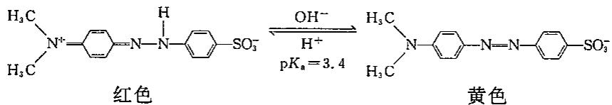

酚酞的结构示意图：

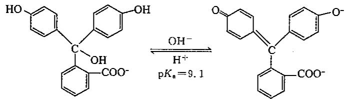

距离理论变色点很近时，显色并不明显，因为一种物质的优势还不够大。当 $[HIn] = 10[In^{-}]$ 时，显红色，当 $[In^{-}] = 10[HIn]$ 时，显黄色。

这时有关系式 $pH=pK_{a}\pm1$ ，这是指示剂的变色范围。各种颜色互相掩盖的能力并不相同。红色易显色，对甲基橙，当 $[HIn]=2[In^{-}]$ 时，即可显红色；而当 $[In^{-}]=10[HIn]$ 时，才显黄色。故甲基橙的实际变色范围为 pH 在 3.1 和 4.4 之间。酚酞的变色范围为 pH 在 8.2 和 10.0 之间。选用指示剂时，可以从手册中查找其变色点和实际变色范围。

影响指示剂变色范围的各种因素

(1)指示剂的用量。

(2) 温度的影响——对 $K_{a}$ 的影响。

(3)离子强度的影响—— $K_{a}$ 与 $K_{ac}$ 的差别增大。

(4)溶剂的影响。

## 8.11 盐类的水解平衡

盐电离出来的离子，与 $H_{2}O$ 电离出的 $H^{+}$ 和/或 $OH^{-}$ 结合成弱电解质的过程叫作盐类的水解。水解过程中，溶液的 pH 经常发生变化。

$$
\begin{array}{c c} \mathrm {NaAc = Na^ {+} +Ac^ {-}} & \mathrm {NH_ {4} Cl = NH_ {4} ^ {+} +Cl^ {-}} \\ + & + \\ \mathrm {H_ {2} O = OH^ {-} + H^ {+}} & \mathrm {H_ {2} O = OH^ {-} + H^ {+}} \\ \text { HAc } & \mathrm {NH_ {3} \cdot H_ {2} O} \end{array}
$$

上左图中由于弱电解质 HAc 的生成和存在，溶液中 $\left[H^{+}\right]<\left[OH^{-}\right]$ ，溶液显碱性。

上右图中由于弱电解质 $NH_{3} \cdot H_{2}O$ 的生成和存在，溶液中 $[OH^{-}] < [H^{+}]$ ，溶液显酸性。

$$
\begin{array}{c c c}\mathrm{NH} _ {4} \mathrm{Ac} = = \mathrm{NH} _ {4} ^ {+}&+&\mathrm{Ac} ^ {-}\\+&&+\\\mathrm{H} _ {2} \mathrm{O} \rightleftharpoons \mathrm{OH} ^ {-}&+&\mathrm{H} ^ {+}\\\Bigg | \Bigg |&&\Bigg |\\\mathrm{NH} _ {3} \cdot \mathrm{H} _ {2} \mathrm{O}&&\mathrm{HAc}\end{array}
$$

双水解时,溶液的酸碱性要根据两种离子与 $OH^{-}$ 和 $H^{+}$ 的结合能力来决定,在 $NH_{4}Ac$ 溶液中,它们的结合能力相当显中性。

## 8.11.1 各类盐的水解

## 1. 弱酸强碱盐

以 NaAc 为例讨论。NaAc 是强电解质，在溶液中完全电离，产生 $Na^{+}$ 和 $Ac^{-}$ ：

$$
\mathrm{NaAc} = \mathrm{Na} ^ {+} + \mathrm{Ac} ^ {-}
$$

$Ac^{-}$ 会与 $H_{2}O$ 电离出的 $H^{+}$ 结合为弱电解质 HAc，使水的电离平衡向右移动：

$$
\begin{array}{l l}\mathrm{H} _ {2} \mathrm{O} \rightleftharpoons \mathrm{H} ^ {+} + \mathrm{OH} ^ {-}&K _ {\mathrm{w}}\\\mathrm{Ac} ^ {-} + \mathrm{H} ^ {+} \rightleftharpoons \mathrm{HAc}&1 / K _ {\mathrm{a}}\end{array}
$$

总反应为： $Ac^{-}+H_{2}O\rightleftharpoons HAc+OH^{-}$

$$
K _ {\mathrm{h}} = \frac {K _ {\mathrm{w}}}{K _ {\mathrm{a}}}
$$

$K_{h}$ 是水解平衡常数。 $K_{h}$ 一般都很小(如 $Ac^{-}$ 的 $K_{h}=1.0\times10^{-14}/(1.8\times10^{-5})=5.6\times10^{-10}$ )，故计算中常采用近似法处理。即 $c\cdot K_{h}\geqslant20K_{w},c/K_{h}>500$ 时， $[OH^{-}]=\sqrt{K_{h}\cdot c}$ 。盐类水解程度常用水解度h表示： $h=\frac{[OH^{-}]}{c}=\sqrt{K_{h}/c}$ 。

## 2. 强酸弱碱盐

以 $NH_{4}Cl$ 为例讨论。 $NH_{4}Cl$ 是强电解质，在溶液中完全电离，产生 $NH_{4}^{+}$ 和 $Cl^{-}$ ：

$$
\mathrm{NH} _ {4} \mathrm{Cl} = \mathrm{NH} _ {4} ^ {+} + \mathrm{Cl} ^ {-}
$$

① $\mathrm{H}_2\mathrm{O}\rightleftharpoons \mathrm{H}^+ +\mathrm{OH}^-$

$$
② \mathrm{NH} _ {4} ^ {+} + \mathrm{OH} ^ {-} \rightleftharpoons \mathrm{NH} _ {3} + \mathrm{H} _ {2} \mathrm{O} \qquad 1 / K _ {\mathrm{b}}
$$

$$
① + ②: \mathrm{NH} _ {4} ^ {+} + \mathrm{H} _ {2} \mathrm{O} \rightleftharpoons \mathrm{NH} _ {3} + \mathrm{H} _ {3} \mathrm{O} ^ {+}
$$

$$
K _ {\mathrm{h}} = K _ {\mathrm{w}} / K _ {\mathrm{b}}
$$

$$
\left[ \mathrm{H} _ {3} \mathrm{O} ^ {+} \right] = \sqrt {\mathrm{K} _ {\mathrm{h}} \cdot c}; h = \frac {\left[ \mathrm{H} _ {3} \mathrm{O} ^ {+} \right]}{c} = \sqrt {\mathrm{K} _ {\mathrm{h}} / c}
$$

## 3. 弱酸弱碱盐

以 $NH_{4}Ac$ 为例讨论。 $NH_{4}Ac$ 是强电解质，在溶液中完全电离，产生 $NH_{4}^{+}$ 和 $Ac^{-}$ ： $NH_{4}Ac=NH_{4}^{+}+Ac^{-}$

① $H_{2}O \rightleftharpoons H^{+} + OH^{-}$ $K_{w}$

$$
② \mathrm{NH} _ {4} ^ {+} + \mathrm{OH} ^ {-} \rightleftharpoons \mathrm{NH} _ {3} + \mathrm{H} _ {2} \mathrm{O} \quad 1 / K _ {\mathrm{b}}
$$

$$
③ \mathrm{Ac} ^ {-} + \mathrm{H} ^ {+} \rightleftharpoons \mathrm{HAc} \quad 1 / K _ {\mathrm{a}}
$$

$$
① + ② + ③: \mathrm{NH} _ {4} ^ {+} + \mathrm{Ac} ^ {-} \rightleftharpoons \mathrm{NH} _ {3} + \mathrm{HAc}
$$

$$
K _ {\mathrm{h}} = \frac {K _ {\mathrm{w}}}{K _ {\mathrm{a}} K _ {\mathrm{b}}}
$$

此类水解称为双水解，它的水解常数比相应的单水解常数大得多（如 $NH_{4}Ac$ 的 $K_{h}=1.0\times10^{-14}/(1.8\times10^{-5}\times1.8\times10^{-5})=3.1\times10^{-5}$ ），水解后溶液呈现的酸碱性不能从水解反应看出，必须推导求出溶液 $H^{+}$ 的浓度。

设 $NH_{4}Ac(aq)$ 的原始浓度为 cmol/L

电荷平衡： $\left[\mathrm{NH}_{4}^{+}\right] + \left[\mathrm{H}^{+}\right] = \left[\mathrm{Ac}^{-}\right] + \left[\mathrm{OH}^{-}\right]$

①

物料平衡: $c=\left[NH_{4}^{+}\right]+\left[NH_{3}\right]=\left[Ac^{-}\right]+\left[HAc\right]$

②

①一②得质子平衡式： $\left[H^{+}\right]-\left[NH_{3}\right]=\left[OH^{-}\right]-\left[HAc\right]$ ，即 $\left[H^{+}\right]=\left[NH_{3}\right]+\left[OH^{-}\right]-\left[HAc\right]$ 。

$$
[ \mathrm{H} ^ {+} ] = \frac {K _ {\mathrm{w}} [ \mathrm{NH} _ {4} ^ {+} ]}{K _ {\mathrm{b}} [ \mathrm{H} ^ {+} ]} + \frac {K _ {\mathrm{w}}}{[ \mathrm{H} ^ {+} ]} + \frac {[ \mathrm{H} ^ {+} ] [ \mathrm{Ac} ^ {-} ]}{K _ {\mathrm{a}}}
$$

$$
\left[ \mathrm{H} ^ {+} \right] = \sqrt {\frac {K _ {\mathrm{a}} K _ {\mathrm{w}} \left(\left[ \mathrm{NH} _ {4} ^ {+} \right] + K _ {\mathrm{b}}\right)}{K _ {\mathrm{b}} \left(K _ {\mathrm{a}} + \left[ \mathrm{Ac} ^ {-} \right]\right)}}
$$

由于水解程度较小， $\left[NH_{4}^{+}\right]$ 和 $\left[Ac^{-}\right]$ 改变都很小，可以看作 $\left[NH_{4}^{+}\right]=\left[Ac^{-}\right]=c$ ，则

$$
\left[ \mathrm{H} ^ {+} \right] = \sqrt {\frac {K _ {\mathrm{a}} K _ {\mathrm{w}} (c + K _ {\mathrm{b}})}{K _ {\mathrm{b}} (K _ {\mathrm{a}} + c)}}
$$

若 $c >> K_{\mathrm{a}}$ 且 $c >> K_{\mathrm{b}}$ ，则

$$
[ \mathrm{H} ^ {+} ] = \sqrt {\frac {K _ {\mathrm{a}} K _ {\mathrm{w}}}{K _ {\mathrm{b}}}}
$$

## 4. 多元弱酸强碱盐

多元弱酸有正盐、酸式盐之分。正盐以 $Na_{2}CO_{3}$ 为例，酸式盐以 $NaHCO_{3}$ 为例讨论。 $Na_{2}CO_{3}$ 的水解是分步进行的，每步各有相应的水解常数。

$$
\mathrm{Na} _ {2} \mathrm{CO} _ {3} = 2 \mathrm{Na} ^ {+} + \mathrm{CO} _ {3} ^ {2 -}
$$

① $\mathrm{CO}_{3}^{2-} + \mathrm{H}_{2}\mathrm{O} \rightleftharpoons \mathrm{HCO}_{3}^{-} + \mathrm{OH}^{-}; K_{\mathrm{hl}} = K_{\mathrm{w}} / K_{\mathrm{a2}}$

② $\mathrm{HCO}_3^- +\mathrm{H}_2\mathrm{O}\rightleftharpoons \mathrm{H}_2\mathrm{CO}_3 + \mathrm{OH}^-$ $K_{\mathrm{h2}} = K_{\mathrm{w}} / K_{\mathrm{a1}}$

由于 $K_{a2}<<K_{a1}$ ，所以 $K_{h1}>>K_{h2}$ 。多元弱酸盐水解以第一步水解为主。计算溶液 pH 值时，只考虑第一步水解即可。

由于 $c \cdot K_{hl} >> 20K_{w}, c/K_{hl} > 500$ ，故 $[OH^{-}] = \sqrt{K_{hl} c}$ 。

$NaHCO_{3}$ 溶液中， $HCO_{3}^{-}$ 有两种变化：

$$
\begin{array}{l l}\mathrm{HCO} _ {3} ^ {-} \rightleftharpoons \mathrm{H} ^ {+} + \mathrm{CO} _ {3} ^ {2 -}&K _ {\mathrm{a} 2}\\\mathrm{HCO} _ {3} ^ {-} + \mathrm{H} _ {2} \mathrm{O} \rightleftharpoons \mathrm{H} _ {2} \mathrm{CO} _ {3} + \mathrm{OH} ^ {-}&K _ {\mathrm{h} 2} = K _ {\mathrm{w}} / K _ {\mathrm{a} 1}\end{array}
$$

$K_{b2}=1.0\times10^{-14}/(4.3\times10^{-7})=2.3\times10^{-8}>>K_{a2}=5.6\times10^{-11}$ ，故 $[OH^{-}]>[H^{+}]$ ，溶液显碱性。

溶液中还有水的电离平衡： $H_{2}O \rightleftharpoons H^{+} + OH^{-}$ 。

根据电荷平衡，有 $\left[\mathrm{Na}^{+}\right] + \left[\mathrm{H}^{+}\right] = \left[\mathrm{HCO}_{3}^{-}\right] + \left[\mathrm{OH}^{-}\right] + 2\left[\mathrm{CO}_{3}^{2-}\right]$ 。

$[Na^{+}]$ 应等于 $NaHCO_{3}$ 的原始浓度 c，

$$
c + \left[ \mathrm{H} ^ {+} \right] = \left[ \mathrm{HCO} _ {3} ^ {-} \right] + \left[ \mathrm{OH} ^ {-} \right] + 2 \left[ \mathrm{CO} _ {3} ^ {2 -} \right]\tag{①}
$$

根据物料平衡,有

$$
c = \left[ \mathrm{H} _ {2} \mathrm{CO} _ {3} \right] + \left[ \mathrm{HCO} _ {3} ^ {-} \right] + \left[ \mathrm{CO} _ {3} ^ {2 -} \right]\tag{②}
$$

②式代入①式，有

$$
\left[ \mathrm{H} ^ {+} \right] = \left[ \mathrm{CO} _ {3} ^ {2 -} \right] + \left[ \mathrm{OH} ^ {-} \right] - \left[ \mathrm{H} _ {2} \mathrm{CO} _ {3} \right]\tag{③}
$$

③式右边各项以 $\left[H^{+}\right]$ 、 $\left[HCO_{3}^{-}\right]$ 及相应电离常数表示：

$$
\begin{array}{r l} & {\left[ \mathrm{CO} _ {3} ^ {2 -} \right] = K _ {\mathrm{a} 2} \cdot \left[ \mathrm{HCO} _ {3} ^ {-} \right] / \left[ \mathrm{H} ^ {+} \right]} \\ & {\quad \left[ \mathrm{OH} ^ {-} \right] = K _ {\mathrm{w}} / \left[ \mathrm{H} ^ {+} \right]} \\ & {\left[ \mathrm{H} _ {2} \mathrm{CO} _ {3} \right] = \left[ \mathrm{H} ^ {+} \right] \left[ \mathrm{HCO} _ {3} ^ {-} \right] / K _ {\mathrm{a} 1}} \end{array}
$$

代入③式后,得到:

$$
\left[ \mathrm{H} ^ {+} \right] = \frac {K _ {\mathrm{a2}} \left[ \mathrm{HCO} _ {3} ^ {-} \right]}{\left[ \mathrm{H} ^ {+} \right]} + \frac {K _ {\mathrm{w}}}{\left[ \mathrm{H} ^ {+} \right]} - \frac {\left[ \mathrm{H} ^ {+} \right] \left[ \mathrm{HCO} _ {3} ^ {-} \right]}{K _ {\mathrm{a1}}}
$$

整理后,得到

$$
\left[ \mathrm{H} ^ {+} \right] = \sqrt {\frac {K _ {\mathrm{a} 1} \left(K _ {\mathrm{a} 2} \left[ \mathrm{HCO} _ {3} ^ {-} \right] + K _ {\mathrm{w}}\right)}{K _ {\mathrm{a} 1} + \left[ \mathrm{HCO} _ {3} ^ {-} \right]}}
$$

由于 $K_{a2}, K_{h2}$ 都很小， $\mathrm{HCO}_3^-$ 发生电离和水解的部分都很少，故 $[\mathrm{HCO}_3^-] \approx c$ ，代入

后有：

$$
\left[ \mathrm{H} ^ {+} \right] = \sqrt {\frac {K _ {\mathrm{al}} \left(K _ {\mathrm{a2}} \cdot c + K _ {\mathrm{w}}\right)}{K _ {\mathrm{al}} + c}}
$$

通常 $K_{a2} \cdot c >> K_{w}, c >> K_{a1}$ ，则上式变为： $[H^{+}] = \sqrt{K_{a1} K_{a2}}$ 。

该式是求算多元弱酸的酸式盐溶液 $\left[H^{+}\right]$ 的近似公式。此式在c不很小, $c/K_{al}>10$ ，且水的离解可以忽略的情况下应用。

## 8.11.2 影响水解平衡的因素

## 1. 温度的影响

盐类水解反应吸热， $\Delta H > 0, T$ 增高时， $\bar{K}_{\mathrm{h}}$ 增大。故升高温度有利于水解反应的进行。例如 $\mathrm{Fe}^{3+}$ 的水解： $\mathrm{Fe}^{3+} + 3\mathrm{H}_{2}\mathrm{O} \rightleftharpoons \mathrm{Fe(OH)}_{3} + 3\mathrm{H}^{+}$ 。

若不加热，水解不明显；加热时颜色逐渐加深，最后得到红褐色的 $\mathrm{Fe(OH)}_{3}$ 沉淀。

## 2. 浓度的影响

由上述水解反应式可以看出:加水稀释时,除弱酸弱碱盐外,水解平衡向右移动,使水解度增大,这点也可以从水解度公式 $h=\sqrt{K_{h}/c}$ 看出,当 c 减小时,h 增大。这说明加水稀释时,对水解产物浓度减小的影响较大。如 $Na_{2}SiO_{3}$ 溶液稀释时可得 $H_{2}SiO_{3}$ 沉淀。

## 3. 酸度的影响

水解的产物中, 肯定有 $H^{+}$ 或 $OH^{-}$ , 故改变体系的 pH 值会使平衡移动。例如

$$
\mathrm{SnCl} _ {2} + \mathrm{H} _ {2} \mathrm{O} \rightleftharpoons \mathrm{Sn(OH)Cl} + \mathrm{HCl}
$$

为了抑制 $SnCl_{2}$ 的水解，抑制 $\mathrm{Sn(OH)Cl}$ 的生成，可以用盐酸来配制 $SnCl_{2}$ 溶液。

## 8.12 沉淀溶解平衡

难溶物质，如 AgCl 虽然难溶于水，但仍能微量地溶于水形成饱和溶液。其溶解的部分几乎全部电离为 $Ag^{+}$ 和 $Cl^{-}$ 。一定温度时，当溶解速率和沉淀速率相等，就达到了沉淀溶解平衡： $\mathrm{AgCl(s)} \rightleftharpoons \mathrm{Ag}^{+}(aq) + \mathrm{Cl}^{-}(aq)$ 。

## 8.12.1 溶度积常数

根据化学平衡原理,在 AgCl 的沉淀溶解平衡中存在如下关系:

$$
K _ {\mathrm{sp}} = \frac {[ \mathrm{Ag} ^ {+} ]}{c ^ {\ominus}} \cdot \frac {[ \mathrm{Cl} ^ {-} ]}{c ^ {\ominus}}
$$

习惯上简写为： $K_{sp}=\left[Ag^{+}\right]\left[Cl^{-}\right]$ 式中 $K_{sp}$ 是溶度积常数，简称溶度积。

对于 $A_{n}B_{m}$ 型难溶电解质，溶度积表达形式为： $K_{sp}=\left[A^{+}\right]^{n}\left[B^{-}\right]^{m}$

对于相同类型的物质, $K_{sp}$ 值的大小,反映了难溶电解质在溶液中溶解能力的大小,也反映了该物质在溶液中沉淀的难易。与平衡常数一样, $K_{sp}$ 与温度有关。不过温度改变不大时, $K_{sp}$ 变化也不大,常温下的计算可不考虑温度的影响。

## 8.12.2 溶度积和溶解度之间的关系

溶度积和溶解度都可表示难溶电解质在水中的溶解能力的大小,它们之间有内在联

系，在一定条件下，可以直接进行换算。在换算时应注意：所使用的浓度单位；

例如:设难溶电解质 $A_{a}B_{b}$ 固体在水中的溶解度为 S(mol/L), 则依据它在水中的沉淀溶解平衡:

$$
\begin{array}{r l}\mathrm{A} _ {a} \mathrm{B} _ {b} (\mathrm{s})&\rightleftharpoons a \mathrm{A} ^ {\mathrm{n+}} (\mathrm{aq}) + b \mathrm{B} ^ {\mathrm{m-}} (\mathrm{aq})\\&a S \quad b S\end{array}
$$

平衡时(溶解度 S)

根据溶度积公式 $K_{\mathrm{sp}}(\mathrm{A}_a\mathrm{B}_b) = [\mathrm{A}^{\mathrm{n + }}]^a\cdot [\mathrm{B}^{\mathrm{m - }}]^b$ 得

$$
K _ {\mathrm{sp}} \left(\mathrm{A} _ {a} \mathrm{B} _ {b}\right) = (a S) ^ {a} (b S) ^ {b} = a ^ {a} b ^ {b} S ^ {(a + b)}
$$

故难溶电解质 $A_{a}B_{b}$ 的溶度积 $K_{sp}$ 和溶解度 S 的换算关系式为

$$
S = \sqrt [ (a + b) ]{\frac {K _ {\mathrm{sp}} \left(\mathrm{A} _ {a} \mathrm{B} _ {b}\right)}{a ^ {a} b ^ {b}}}
$$

对于同类型的难溶电解质(即电离后生成相同数目的离子),溶解度越大,溶度积也越大,例如 $A_{2}B$ 型或 $AB_{2}$ 型的难溶电解质的溶解度与溶度积的关系式相同。

对于不同类型的难溶电解质,不能直接根据溶度积来比较溶解度的大小。

由于影响难溶电解质溶解度的因素很多,因此,运用 $K_{sp}$ 与溶解度之间的相互关系直接换算应注意。

## (1)适用于离子强度很小,浓度可以代替活度的溶液

对于溶解度较大的难溶电解质(如 $CaSO_{4}$ 、 $CaCrO_{4}$ 等)，由于饱和溶液中离子强度较大，因此用浓度代替活度计算将会产生较大误差，因而用溶度积计算溶解度也会产生较大的误差。

(2)适用于难溶电解质的离子在水溶液中不发生水解等副反应或者副反应程度很小的物质。

对于难溶的硫化物、碳酸盐、磷酸盐等，由于 $S^{2-}$ 、 $CO_{3}^{2-}$ 、 $PO_{4}^{3-}$ 的水解（阳离子 $Fe^{3+}$ 等也易水解），就不能用上述方法换算。

(3)适用于难溶电解质溶解于水的部分必须完全解离

对于 $Hg_{2}Cl_{2}$ 、 $Hg_{2}I_{2}$ 等共价性较强的化合物，溶液中还存在溶解了的分子与水合离子之间的解离平衡，用上述方法换算也会产生较大误差。

## (4)适用于难溶电解质溶于水后要进一步完全电离

例如 $\mathrm{Fe(OH)}_{3}$ 在水溶液中却分三步电离相对总电离平衡，虽然存在 $\left[Fe^{3+}\right]\cdot\left[OH^{-}\right]^{3}=K_{sp}$ 的关系，但是溶液中 $\left[Fe^{3+}\right]$ 与 $\left[OH^{-}\right]$ 的比例并不等于 1:3。

## 8.12.3 溶度积规则

比较 $K_{sp}$ 和 Q（称为离子积）的大小，可以判断反应进行的方向。例如： $\mathrm{AgCl(s)} \rightleftharpoons \mathrm{Ag}^{+}(\mathrm{aq}) + \mathrm{Cl}^{-}(\mathrm{aq})$ 某时刻有 $Q = [\mathrm{Ag}^{+}][\mathrm{Cl}^{-}]$ ，这里的反应商也是乘积形式，故 Q 在这里又称为离子积。

(1) $Q>K_{sp}$ 时,平衡左移,生成沉淀;

(2) $Q=K_{sp}$ 时,平衡状态,溶液饱和;

(3) $Q<K_{sp}$ 时,平衡右移,沉淀溶解。

上述结论有时称之为溶度积规则,据此可以判断沉淀的生成与溶解。

## 8.12.4 沉淀溶解平衡的移动

## 1. 沉淀的生成

根据溶度积规则, 当 $Q > K_{sp}$ 时, 将有生成沉淀。但是在配制溶液和进行化学反应过程中, 有时 $Q > K_{sp}$ 时, 却没有观察到沉淀物生成。其原因有三个方面:

①盐效应的影响:事实证明,在 AgCl 饱和溶液中加入 $KNO_{3}$ 溶液,会使 AgCl 的溶解度增大,且加入 $KNO_{3}$ 溶液浓度越大,AgCl 的溶解度增大越多。这种因加入易溶强电解质而使难溶电解质溶解度增大的现象称为盐效应。盐效应可用平衡移动观点定性解释:

盐效应的定义: 在难溶电解质饱和溶液中, 加入不含共同离子的易溶强电解质而使难溶电解质的溶解度增大的现象。

定性解释:强电解质中的阴阳离子分别对 $Cl^{-}$ 和 $Ag^{+}$ 有牵制作用,使它们不易结合生成 AgCl。 $KNO_{3}$ 溶液加入后,并不起任何化学反应,但溶液中增加了 $K^{+}$ 和 $NO_{3}^{-}$ ,它们与溶液中的 $Cl^{-}$ 和 $Ag^{+}$ 有相互“牵制”作用,使 $Ag^{+}$ 和 $Cl^{-}$ 的自由运动受到阻碍,于是它们回到固体表面的速率减少了,即沉淀速率小于溶解速率,平衡向右移动,AgCl 的溶解度增大。

注意,当加入含共同离子的强电解质时,也有盐效应。只是盐效应对溶解度影响较小,一般不改变溶解度的数量级,而同离子效应(在难溶电解质溶液中加入与其含有相同离子的易溶强电解质,而使难溶电解质的溶解度降低的现象)却可以使溶解度改变几个数量级,因此在一般计算中,特别是较稀溶液中,不必考虑盐效应。

②过饱和现象:虽然 $\left[Ag^{+}\right]\cdot\left[Cl^{-}\right]$ 略大于 $K_{sp}$ 。但是,由于体系内无结晶中心,即晶核的存在,沉淀亦不能生成,而将形成过饱和溶液,故观察不到沉淀物。若向过饱和溶液中加入晶种(非常微小的晶体,甚至于灰尘微粒),或用玻璃棒摩擦容器壁,立刻析出晶体,甚至引起暴沸现象。

③沉淀的量:前两种情况中,并没有生成沉淀。实际上即使有沉淀生成,若其量过小,也可能观察不到。正常的视力,当沉淀的量达到 $10^{-5}$ mol/L时,可以看出溶液浑浊。

## 2. 沉淀的溶解

根据溶度积规则,使沉淀溶解的必要条件是 $Q < K_{sp}$ , 因此创造条件使溶液中有关离子的浓度降低, 就能达到此目的。降低溶液中离子的浓度有如下几种途径:

## ①使相关离子生成弱电解质

要使 ZnS 溶解，可以加 HCl，这是我们熟知的。 $H^{+}$ 和 ZnS 中溶解下来的 $S^{2-}$ 相结合形成弱电解质 $HS^{-}$ 和 $H_{2}S$ ，于是 ZnS 继续溶解。所以只要 HCl 的量能满足需要，ZnS 就能不断溶解。

下面讨论一下 0.01mol 的 ZnS 溶于 1.0L 盐酸中，所需盐酸的最低浓度问题。

查表知： $K_{\mathrm{sp}}(\mathrm{ZnS})=2.0\times10^{-24}$ ；氢硫酸的 $K_{a1}=1.3\times10^{-7}$ ; $K_{a2}=7.1\times10^{-15}$ 。

溶液中存在下述平衡：

$$
\begin{array}{l l}\mathrm {ZnS(s)\rightleftharpoons Z n ^ {2 + } + S^ {2 -}}&K _ {\mathrm{sp}}\\\mathrm {H^ {+} + S^ {2 - } \rightleftharpoons HS^ {-}}&1 / K _ {\mathrm{e2}}\\\mathrm {H^ {+} + HS^ {-} \rightleftharpoons H_ {2} S}&1 / K _ {\mathrm{a1}}\end{array}
$$

$$
\begin{array}{r l}&{\text {总反应:} \quad \mathrm {ZnS(s) + 2H^ {+} \rightleftharpoons Z n ^ {2 + }} + \mathrm {H_ {2} S}}\\&{\text {平衡浓度(mol / L)} \qquad x \qquad 0. 0 1 0 \qquad 0. 0 1 0}\\&{\frac {K _ {\mathrm{sp}}}{K _ {\mathrm{a1}} K _ {\mathrm{a2}}} = \frac {(0 . 0 1 0) ^ {2}}{x ^ {2}} \qquad \frac {2 . 0 \times 1 0 ^ {- 2 4}}{1 . 3 \times 1 0 ^ {- 7} \times 7 . 1 \times 1 0 ^ {- 1 5}} = \frac {(0 . 0 1 0) ^ {2}}{x ^ {2}} \qquad x = 0. 2 1}\end{array}
$$

即平衡时的维持酸度最低应为 0.21mol/L。考虑到使 ZnS 全部溶解，尚需消耗 $\left[H^{+}\right]=0.020mol/L$ ，因此所需 HCl 最低浓度为 $0.21+0.020=0.23mol/L$ 。

上述解题过程是假定溶解 ZnS 产生的 $S^{2-}$ 全部转变成 $H_{2}S$ 。实际上应是

$$
[ \mathrm{H} _ {2} \mathrm{S} ] + [ \mathrm{HS} ^ {-} ] + [ \mathrm{S} ^ {2 -} ] = 0. 0 1 0 \mathrm{mol/L}
$$

大家可以自行验算，当维持酸度 $[\mathrm{H}^{+}] = 0.21\mathrm{mol / L}$ 时， $[\mathrm{HS}^{-}]、[\mathrm{S}^{2-}]$ 与 $[\mathrm{H}_2\mathrm{S}]$ 相比，可以忽略不计， $[\mathrm{H}_2\mathrm{S}] \approx 0.010\mathrm{mol / L}$ 的近似处理是完全合理的。

同理,可以求出 0.01mol 的 CuS 溶于 1.0L 盐酸中,所需盐酸的最低浓度约是 $1.0 \times 10^{9}$ mol/L。这种浓度过大,根本不可能存在。看反应 $CuS + 2H^{+} = Cu^{2+} + H_{2}S$ 的平衡常数:

$$
K = \frac {K _ {\mathrm{sp}}}{K _ {\mathrm{a} 1} K _ {\mathrm{a} 2}} = \frac {8 . 5 \times 1 0 ^ {- 4 5}}{1 . 3 \times 1 0 ^ {- 7} \times 7 . 1 \times 1 0 ^ {- 1 5}} = 9. 2 \times 1 0 ^ {- 2 4}
$$

平衡常数过小。结论是 CuS 不能溶于盐酸。

金属硫化物在酸中的溶解度差异小结如下表所示。

<table><tr><td>硫化物</td><td>HAc</td><td>稀 HCl</td><td>浓 HCl</td><td> $HNO_{3}$ </td><td>王水</td></tr><tr><td>MnS</td><td>溶</td><td></td><td></td><td></td><td></td></tr><tr><td>ZnS、FeS</td><td>不溶</td><td>溶</td><td></td><td></td><td></td></tr><tr><td>CdS</td><td>不溶</td><td>不溶</td><td>溶</td><td></td><td></td></tr><tr><td>PbS</td><td>不溶</td><td>不溶</td><td>溶</td><td>溶</td><td></td></tr><tr><td>CuS、 $Ag_{2}S$ </td><td>不溶</td><td>不溶</td><td>不溶</td><td>溶</td><td></td></tr><tr><td>HgS</td><td>不溶</td><td>不溶</td><td>不溶</td><td>不溶</td><td>溶</td></tr></table>

## ②使相关离子被氧化

使相关离子生成弱电解质的方法，即用盐酸作为溶剂的方法，不能使 CuS 溶解。反应的平衡常数过小。实验事实表明，CuS 在 $HNO_{3}$ 中可以溶解。原因是 $S^{2-}$ 被氧化，使得平衡 $\mathrm{CuS(s)} \rightleftharpoons \mathrm{Cu}^{2+}(\mathrm{aq}) + \mathrm{S}^{2-}(\mathrm{aq})$ 右移，CuS 溶解。反应的方程式为：

$$
3 \mathrm{CuS(s)} + 8 \mathrm{HNO} _ {3} (\text {浓}) = 3 \mathrm{S} \downarrow + 2 \mathrm{NO} \uparrow + 3 \mathrm{Cu(NO} _ {3}) _ {2} (\mathrm{aq}) + 4 \mathrm{H} _ {2} \mathrm{O(l)}
$$

$$
3 \mathrm{PbS(s)} + 8 \mathrm{HNO} _ {3} (\text {浓}) = 3 \mathrm{S} \downarrow + 2 \mathrm{NO} \uparrow + 3 \mathrm{Pb(NO} _ {3}) _ {2} (\mathrm{aq}) + 4 \mathrm{H} _ {2} \mathrm{O(l)}
$$

这类反应的平衡常数较大,这类反应与氧化还原反应的电极电势相关。

## ③使相关离子被络合

AgCl 沉淀可以溶于氨水, 原因是 $Ag^{+}$ 被 $NH_{3}$ 络合生成 $\left[\mathrm{Ag}\left(\mathrm{NH}_{3}\right)_{2}\right]^{+}$ , 使平衡 $\mathrm{AgCl}(s)\Longrightarrow\mathrm{Ag}^{+}(\mathrm{aq})+\mathrm{Cl}^{-}(\mathrm{aq})$ 右移, AgCl 溶解。反应的方程式为:

$$
\begin{array}{r l} & \mathrm {AgCl + 2NH_ {3} = [Ag(NH_ {3}) _ {2} ] ^ {+} + Cl^ {-}} \\ & \mathrm {AgBr(s) + 2S_ {2} O_ {3} ^ {2 - } (aq) = [Ag(S_ {2} O_ {3}) _ {2} ] ^ {3 - } (aq) + Br^ {-} (aq)} \end{array}
$$

这类反应与配合物的稳定常数相关。

## 3. 分步沉淀

若一种沉淀剂可使溶液中多种离子产生沉淀时,则可以控制条件,使这些离子先后

分别沉淀,这种现象称为分步沉淀。

例如, 某混合溶液中 $CrO_{4}^{2-}$ 和 $Cl^{-}$ 浓度均为 0.010mol/L, 当慢慢向其中滴入 $AgNO_{3}$ 溶液时, 何种离子先生成沉淀? 当第二种离子刚刚开始沉淀时, 第一种离子的浓度为多少?

随着 $AgNO_{3}$ 溶液的滴入， $Ag^{+}$ 浓度逐渐增大，Q 亦逐渐增大，Q 先达到哪种沉淀的 $K_{sp}$ ，则哪种沉淀先生成。

当 Q 达到 AgCl 的 $K_{sp}$ 时，即 $Cl^{-}$ 开始沉淀时所需的 $Ag^{+}$ 浓度为： $[Ag^{+}]=1.77\times10^{-10}/0.010=1.8\times10^{-8}\mathrm{mol/L}$ 。

当 Q 达到 $Ag_{2}CrO_{4}$ 的 $K_{sp}$ 时，即 $CrO_{4}^{2-}$ 开始沉淀时所需的 $Ag^{+}$ 浓度为：

$$
\left[ \mathrm{Ag} ^ {+} \right] = \sqrt {1 . 1 2 \times 1 0 ^ {- 1 2} / 0 . 0 1 0} = 1. 1 \times 1 0 ^ {- 5} \mathrm{mol/L}
$$

可见沉淀 $Cl^{-}$ 所需 $[Ag^{+}]$ 低得多，于是先生成 AgCl 沉淀。继续滴加 $AgNO_{3}$ 溶液，AgCl 不断析出，使 $[Cl^{-}]$ 不断降低。当 $Ag^{+}$ 浓度增大到 $1.1 \times 10^{-5} \, mol/L$ 时，开始析出 $Ag_{2}CrO_{4}$ 沉淀。此时溶液中同时存在两种沉淀溶解平衡， $[Ag^{+}]$ 同时满足两种平衡的要求。因而，此时 $[Cl^{-}] = 1.77 \times 10^{-10} / (1.1 \times 10^{-5}) = 1.6 \times 10^{-5} \, mol/L$ ，即 $CrO_{4}^{2-}$ 开始沉淀时， $[Cl^{-}]$ 已很小了。通常把溶液中剩余的离子浓度小于等于 $10^{-5} \, mol/L$ ，视为沉淀已经“完全”了。

同一类型的难溶电解质的溶度积差别越大,利用分步沉淀的方法分离难溶电解质越好。(以硫化物为例)

<table><tr><td></td><td>MnS(肉色)</td><td>ZnS(白色)</td><td>CdS(黄色)</td><td>CuS(黑色)</td><td>HgS(黑色)</td></tr><tr><td> $K_{sp}$ </td><td> $1.4\times 10^{-15}$ </td><td> $2.5\times 10^{-22}$ </td><td> $1.0\times 10^{-29}$ </td><td> $8.0\times 10^{-36}$ </td><td> $4.0\times 10^{-53}$ </td></tr><tr><td>使沉淀溶解所需酸</td><td>醋酸</td><td>稀盐酸</td><td>浓盐酸</td><td>浓硝酸</td><td>王水</td></tr></table>

## 4. 沉淀的转化

顾名思义,由一种沉淀转化为另一种沉淀的过程称为沉淀的转化。如向 $BaCO_{3}$ 沉淀中加入 $Na_{2}CrO_{4}$ 溶液,将会发现白色的 $BaCO_{3}$ 固体逐渐转化成黄色的 $BaCrO_{4}$ 沉淀。为什么会产生这现象呢?

可根据溶度积规则分析。当加入少量 $CrO_{4}^{2-}$ 时， $\left[\mathrm{Ba}^{2+}\right]\left[\mathrm{CrO}_{4}^{2-}\right]<K_{\mathrm{sp}}(\mathrm{BaCrO}_{4})$ ，这时不生成 $BaCrO_{4}$ 沉淀。继续加入 $CrO_{4}^{2-}$ ，必将有一时刻刚好达到 $Q=K_{sp}$ ，即 $\left[Ba^{2+}\right]\left[CrO_{4}^{2-}\right]=K_{\mathrm{sp}}(\mathrm{BaCrO}_{4})$ 。这时，体系中同时存在两种平衡：

$$
\mathrm{BaCO} _ {3} \rightleftharpoons \mathrm{Ba} ^ {2 +} + \mathrm{CO} _ {3} ^ {2 -}; K _ {\mathrm{sp}} (\mathrm{BaCO} _ {3}) = [ \mathrm{Ba} ^ {2 +} ] [ \mathrm{CO} _ {3} ^ {2 -} ] = 2. 5 8 \times 1 0 ^ {- 9}\tag{①}
$$

$$
\mathrm{BaCrO} _ {4} \rightleftharpoons \mathrm{Ba} ^ {2 +} + \mathrm{CrO} _ {4} ^ {2 -}; K _ {\mathrm{sp}} (\mathrm{BaCrO} _ {4}) = [ \mathrm{Ba} ^ {2 +} ] [ \mathrm{CrO} _ {4} ^ {2 -} ] = 1. 6 \times 1 0 ^ {- 1 0}\tag{②}
$$

$$
① - ② \text {   得:   } \mathrm{BaCO} _ {3} (\mathrm{s}) + \mathrm{CrO} _ {4} ^ {2 -} \rightleftharpoons \mathrm{BaCrO} _ {4} (\mathrm{s}) + \mathrm{CO} _ {3} ^ {2 -}\tag{③}
$$

方程式③所表示的就是白色的 $BaCO_{3}$ 转化成黄色的 $BaCrO_{4}$ 的反应。其平衡常数为：

$$
K _ {3} = \frac {\left[ \mathrm{CO} _ {3} ^ {2 -} \right]}{\left[ \mathrm{CrO} _ {4} ^ {2 -} \right]} = \frac {K _ {\mathrm{sp}} (\mathrm{BaCO} _ {3})}{K _ {\mathrm{sp}} (\mathrm{BaCrO} _ {4})} = \frac {2 . 5 8 \times 1 0 ^ {- 9}}{1 . 6 \times 1 0 ^ {- 1 0}} = 1 6
$$

再如分析化学中常将难溶的强酸盐(如 $BaSO_{4}$ )转化为难溶的弱酸盐(如 $BaCO_{3}$ ),然

后再用酸溶解使阳离子 $\left(\mathrm{Ba}^{2+}\right)$ 进入溶液。 $BaSO_{4}$ 沉淀转化为 $BaCO_{3}$ 沉淀的反应为

$$
\mathrm{BaSO} _ {4} (\mathrm{s}) + \mathrm{CO} _ {3} ^ {2 -} = \mathrm{BaCO} _ {3} (\mathrm{s}) + \mathrm{SO} _ {4} ^ {2 -}
$$

$$
K = \frac {\left[ \mathrm{SO} _ {4} ^ {2 -} \right]}{\left[ \mathrm{CO} _ {3} ^ {2 -} \right]} = \frac {K _ {\mathrm{sp}} (\mathrm{BaSO} _ {4})}{K _ {\mathrm{sp}} (\mathrm{BaCO} _ {3})} = \frac {1 . 0 7 \times 1 0 ^ {- 1 0}}{2 . 5 8 \times 1 0 ^ {- 9}} = \frac {1}{2 4}
$$

虽然平衡常数小，转化不彻底，但只要 $\left[CO_{3}^{2-}\right]$ 比 $\left[SO_{4}^{2-}\right]$ 大24倍以上，经多次转化，即能将 $BaSO_{4}$ 转化为 $BaCO_{3}$ 。

从上面的事实中,我们应该得出一条普遍适用于沉淀转化的规律:溶解度大的沉淀转化成溶解度小的沉淀,反应的平衡常数大;溶解度小的沉淀转化成溶解度大的沉淀,反应的平衡常数小。

## 【例题精析】

【例1】已知下列两个反应的活化能：

$$
\begin{array}{l l}(1) (\mathrm{NH} _ {4}) _ {2} \mathrm{S} _ {2} \mathrm{O} _ {3} + 3 \mathrm{KI} \rightarrow (\mathrm{NH} _ {4}) _ {2} \mathrm{SO} _ {4} + \mathrm{K} _ {2} \mathrm{SO} _ {4} + \mathrm{KI} _ {3}&E _ {\mathrm{a1}} = 5 6. 7 \mathrm{kJ/mol}\\(2) 2 \mathrm{SO} _ {2} + \mathrm{O} _ {2} \rightarrow 2 \mathrm{SO} _ {3}&E _ {\mathrm{a2}} = 2 5 0. 8 \mathrm{kJ/mol}\end{array}
$$

在同一温度下，所有反应物浓度均为 1mol/L，下列说法正确的是：
A. 反应(1)比反应(2)的速率慢
B. 反应(1)比反应(2)的速率快
C. $E_{a1}$ 和 $E_{a2}$ 受温度的影响较小

D. 对于反应(1)和反应(2)，当温度的变化的始终态相同时，反应(2)的速率(或速率常数)的改变比反应(1)显著得多。

【例 2】某抗生素在人体血液中呈现简单级数的反应,若给病人在上午8时注射一针抗生素,然后在不同时刻t测定抗生素在血液中的浓度c(以mg/100mL表示),得到下表的数据。

<table><tr><td>t/h</td><td>4</td><td>8</td><td>12</td><td>16</td></tr><tr><td>c/(mg/100mL)</td><td>0.480</td><td>0.326</td><td>0.222</td><td>0.151</td></tr></table>

(1) 确定反应级数。

(2)求反应的速率常数 k 和半衰期 $t_{1/2}$ 。

(3)若抗生素在血液中浓度不低于 $0.37 \, mg/100 \, cm^{3}$ 才有效，问大约何时该注射第二针？

【例 3】试分别计算 0.1mol/L HAc 和 0.001mol/L HAc 的 pH 值和解离度。已知 $K_{a}=1.8\times10^{-5}$ 。

【例 4】求 300mL 0.50mol/L $H_{3}PO_{4}$ 和 500mL 0.50mol/L NaOH 的混合溶液的 pH。已知磷酸的 $K_{e2}=6.3\times10^{-8}$ 。

【例 5】试计算 0.1mol/L $NaH_{2}PO_{4}$ 溶液和 0.1mol/L $NH_{4}H_{2}PO_{4}$ 溶液的 pH。已知磷酸的 $K_{a1}=7.6\times10^{-3}, K_{a2}=6.3\times10^{-8}$ ，氨水的 $K_{b}=1.8\times10^{-5}$ 。

【例 6】腈纶纤维生产中，25℃时，某回收溶液中 $\left[SO_{4}^{2-}\right]$ 为 $6.0\times10^{-4}mol/L$ 。在40L该溶液中，如加入0.010mol/L $BaCl_{2}$ 溶液10L，是否能生成沉淀 $BaSO_{4}$ ？如果有沉淀生成，问能生成多少克 $BaSO_{4}$ ？最后溶液中， $[SO_{4}^{2-}]$ 是多少？已知： $K_{\mathrm{sp}}(\mathrm{BaSO}_{4})=1.1\times10^{-10}$ 。

【例 7】有 1.0L 溶液，其中含 $Ag^{+}$ 浓度为 $2.5 \times 10^{-2} \, mol/L$ ， $K_{\mathrm{sp}}(\mathrm{AgCl}) = 1.80 \times 10^{-10}$ 。

(1)使 $Ag^{+}$ 沉淀完全, 至少应加多少毫升 1.0mol/L $NH_{4}Cl$ 溶液?

(2)可得多少克 AgCl 沉淀?

(3)如果将所得沉淀用 200mL 蒸馏水洗涤, AgCl 损失的百分数是多少?

(4)若改用 200mL, 0.010mol/L $NH_{4}Cl$ 溶液洗涤, AgCl 损失的百分数是多少?

【例 8】计算下列条件下 PbS 的溶解度。已知： $K_{\mathrm{sp}}(\mathrm{PbS})=8.4\times10^{-28}$ ，氢硫酸的 $K_{a1}=1.0\times10^{-7}, K_{a2}=1.3\times10^{-13}$ 。(计算时必须考虑 $S^{2-}$ 的水解)

(1)不外加酸碱；

(2) $OH^{-}$ 浓度为 0.1mol/L;

(3) $H^{+}$ 浓度为0.1mol/L。

【例 9】在 0.20L 的 0.50mol/L $MgCl_{2}$ 溶液中加入等体积的 0.10mol/L 的氨水溶液，为了不使 $\mathrm{Mg(OH)}_{2}$ 沉淀析出，至少应同时加入多少克 $\mathrm{NH}_{4}\mathrm{Cl}(s)$ ?（设加入 $\mathrm{NH}_{4}\mathrm{Cl}(s)$ 后体积不变， $K_{\mathrm{sp}}(\mathrm{Mg(OH)}_{2})=5.1\times10^{-12}, K_{\mathrm{b}}(\mathrm{NH}_{3}\cdot\mathrm{H}_{2}\mathrm{O})=1.8\times10^{-5}$ ）

【例 10】 在某一溶液中，含有 $Zn^{2+}$ 、 $Pb^{2+}$ 离子的浓度分别为 0.2mol/L，在室温下通入 $H_{2}S$ 气体，使之饱和，然后加入盐酸，控制离子浓度，问 pH 调到何值时，才能有 PbS 沉淀而 $Zn^{2+}$ 离子不会成为 ZnS 沉淀？已知： $H_{2}S$ 在水中溶解度最大可达 0.1mol/L， $K_{\mathrm{sp}}(\mathrm{PbS})=4.0\times10^{-26}$ ， $K_{\mathrm{sp}}(\mathrm{ZnS})=1.0\times10^{-20}$ ，氢硫酸的 $K_{a1}=1.1\times10^{-7}$ ， $K_{a2}=1.0\times10^{-14}$ 。

## 【习题精练】

## 一、选择题

1. 已知反应 A+B=3C 正逆反应的活化能分别为 $mkJ/mol$ 和 $nkJ/mol$ ，则反应热 $\Delta H^{\ominus}(kJ/mol)$ 为
A. m-n    B. m-3n    C. n-m    D. 3n-m

2. 某一反应 A→B, 不论其起始浓度如何, 完成 70% 反应的时间都相同, 则该反应的级数为
( )
A. 零级    B. 一级    C. 二级    D. 无法判断

3. 某化学反应, 消耗 $\frac{3}{4}$ 反应物所需时间是消耗 $\frac{1}{2}$ 所需时间的 2 倍, 则该反应的级数为
A. 零级    B. 一级    C. 二级    D. 三级

4. 在 300K 时鲜牛奶大约 4h 变酸, 但在 277K 的温度下可保持 48h, 则牛奶变酸的反应活化能 (kJ/mol) 是
A. 5.75 B. 74.66 C. 90.65 D. 38.57

5. 生物化学工作者常将 $37^{\circ}C$ 时的速率常数与 $27^{\circ}C$ 时的速率常数之比称为 $Q_{10}$ 。若某反应的 $Q_{10}$ 为 2.5，则它的活化能 (kJ/mol) 为
A. 152 B. 134 C. 96 D. 71

6. 设有两个化学反应 A 和 B, 其反应的活化能分别为 $E_{A}$ 和 $E_{B}$ , 而且 $E_{A} > E_{B}$ , 若反应温度变化情况相同(由 $T_{1}\rightarrow T_{2}$ )，则反应的速率常数 $k_{A}$ 和 $k_{B}$ 的变化情况为
A. $k_{A}$ 改变的倍数大 B. $k_{B}$ 改变的倍数大
C. $k_{A}$ 和 $k_{B}$ 改变的倍数相同 D. $k_{A}$ 和 $k_{B}$ 均不改变

7. 反应: $\mathrm{N}_{2}(\mathrm{~g}) + 3\mathrm{H}_{2}(\mathrm{~g}) = 2\mathrm{NH}_{3}(\mathrm{~g})$ 若用 $-\frac{\Delta c(\mathrm{~N}_{2})}{\Delta t}$ 表示反应速率, 则数值上与此相等的是
A. $\frac{\Delta c(\mathrm{NH}_{3})}{\Delta t}$ B. $-\frac{\Delta c(\mathrm{NH}_{3})}{\Delta t}$ C. $\frac{2\Delta c(\mathrm{NH}_{3})}{\Delta t}$ D. $\frac{\Delta c(\mathrm{NH}_{3})}{2\Delta t}$

8. 对反应 A(g) + B(g) → AB(g) 进行反应速率的测定, 获得如下数据, 则此反应的级数为
(A)(mol/L) [B](mol/L) $v(\text{mol}/(\text{L} \cdot \text{s}))$ 0.500 0.400 $6.00 \times 10^{-3}$ 0.250 0.400 $1.50 \times 10^{-3}$ 0.250 0.800 $3.00 \times 10^{-3}$ A. 2 B. 2.5 C. 3 D. 3.5

9. 某反应的活化能为 181.6kJ/mol。加入某种催化剂后，活化能降为 151kJ/mol。若温度为 800K 时，加入该催化剂后反应速率增大的倍数约为（）
A. 181 倍 B. 99 倍 C. 57 倍 D. 36 倍

10. 反应 A+B=C，由三个实验得到下列数据：
[A](mol/L) [B](mol/L) 生成 C 的 $v(\mathrm{mol}/(\mathrm{L} \cdot \mathrm{s}))$ 0.03 0.03 $0.3 \times 10^{-4}$ 0.06 0.06 $1.2 \times 10^{-4}$ 0.06 0.09 $2.7 \times 10^{-4}$

与实验结果相符的速率方程是（ ）A. $v = k[\mathrm{B}]^{1 / 2}$ B. $v = k[\mathrm{B}]$ C. $v = k[\mathrm{B}]^2$ D. $v = k[\mathrm{A}][\mathrm{B}]^2$

11. 糖发酵时, 若糖的起始浓度为 0.12mol/L, 10h 后糖被还原 0.06mol/L, 而 20h 后糖被还原 0.03mol/L, 由此可知
( )
A. 此反应为二级反应
B. 糖被还原一半所需的时间与起始浓度有关
C. 糖被还原一半所需的时间与起始浓度无关
D. 由于缺条件, 此反应的速率常数 k 无法求

12. 质量数为 210 的钋同位素进行 β 衰变, 经过 14d, 同位素的活性降低了 6.85%, 则分解 90% 的时间需要的时间为
( )
A. 354d B. 263d C. 300d D. 454d

13. 已知反应 $2\mathrm{NO}(g) + \mathrm{Br}_{2}(g) = 2\mathrm{NOBr}(g)$ 的反应历程是：

①NO(g) + Br₂(g) = NOBr₂(g)(快)

② $NOBr_{2}(g)+NO(g)=2NOBr(g)$ （慢）

则该反应对NO的级数为

A.零级 B.一级 C.二级 D.三级

14. 已知反应 $IO_{3}^{-} + 8I^{-} + 6H^{+} \longrightarrow 3I_{3}^{-} + 3H_{2}O$ 的机理为
① $IO_{3}^{-} + 2H^{+} \longrightarrow H_{2}IO_{3}^{+}$ （快）
② $I^{-} + H_{2}IO_{3}^{+} \longrightarrow I_{2}O_{2} + H_{2}O$ （慢）
③ $I^{-} + I_{2}O_{2} \longrightarrow I_{2} + IO_{2}^{-}$ （快）
④ $I_{2}+I^{-}\longrightarrow I_{3}^{-}$ （快）
⑤ $3IO_{2}^{-}\longrightarrow2IO_{3}^{-}+I^{-}$ （快）

根据上述机理,其反应速率方程应是下列哪一个
A. $v=k[H^{+}]^{2}[IO_{3}^{-}][I^{-}]$ B. $v=k[H^{+}][IO_{3}^{-}][I^{-}]$ C. $v=k[IO_{3}^{-}][I^{-}]$ D. $v=k[IO_{3}^{-}][I^{-}]^{3}$

15. 已知下列两反应的速率常数：
① $H_{2}PO_{2}^{-}+OH^{-}=HPO_{3}^{-}+H_{2}(g)$ $k_{1}=3.2\times10^{-4}L^{2}\cdot mol^{-2}\cdot min^{-1}$ ② $N_{2}O_{5}(g)=2NO_{2}(g)+1/2O_{2}(g)$ $k_{2}=7.0\times10^{-5}min^{-1}$

则下列叙述中正确的是（ ）A.初始浓度都相同时，反应速率 $v_{1} > v_{2}$ B.浓度 $[\mathrm{H}_2\mathrm{PO}_2^- ]$ 和 $[\mathrm{OH}^{-}]$ 等于 $1 / 5[\mathrm{N}_2\mathrm{O}_5]$ 时，反应速率 $v_{1}\approx v_{2}$ C.两反应的反应物浓度都是 $1\mathrm{mol / L}$ 时， $v_{1} > v_{2}$ D.两反应的反应物浓度都是 $1\mathrm{mol / L}$ 时， $v_{1} <   v_{2}$

16. 已知乙苯脱氢制苯乙烯的反应如下：

$C_{6}H_{5}-C_{2}H_{5}(g)\longrightarrow C_{6}H_{5}-C_{2}H_{3}(g)+H_{2}(g)$ ，若873K时其 $K^{\ominus}=0.178$ ，则在该温度及平衡压力为101325Pa下，乙苯的转化率为（）
A. 18.9% B. 15.1% C. 30.2% D. 38.9%

17.298K时 $\mathrm{NH_4Cl(s)}$ 按下式分解： $\mathrm{NH_4Cl(s) = NH_3(g) + HCl(g)}$ $\Delta_r G_m^{\ominus} = 92.0\mathrm{kJ / mol}$

则该体系的总压力(kPa)为
A. $1.76 \times 10^{-6}$ B. $6.86 \times 10^{-7}$ C. $8.67 \times 10^{-4}$ D. $5.45 \times 10^{-8}$

18. 反应 $\mathrm{Ag_{2}CO_{3}(s)=Ag_{2}O(s)+CO_{2}(g)}$ 在 $110^{\circ}C$ 时的 $K_{p}=5.1\times10^{-4}$ ，今在 $110^{\circ}C$ 的烘箱内干燥 $Ag_{2}CO_{3}$ ，为防止其分解，必须使烘箱内空气中 $CO_{2}$ 的摩尔分数大于（）
A. $5.1 \times 10^{-4} \%$ B. $5.1 \times 10^{-2} \%$ C. $\frac{1}{5.1} \times 10^{-4} \%$ D. $\sqrt{5.1} \times 10^{-2} \%$

19. 在一定温度下，密闭容器中 $100 \, kPa$ 的 $NO_{2}$ 发生聚合反应， $2NO_{2} = N_{2}O_{4}$ ，达平衡时最终压力为 $85 \, kPa$ ，则 $NO_{2}$ 的聚合百分率为（）
A. 15% B. 30% C. 45% D. 60%

20. 在 $21.8^{\circ}C$ 时，反应 $\mathrm{NH_{4}HS(s)=NH_{3}(g)+H_{2}S(g)}$ 的标准平衡常数 $K^{\ominus}=0.070$ ，则平衡时混合气体的总压是
A. 7.0kPa B. 26kPa C. 53kPa D. 0.26kPa

21. 某化合物 A 的水合晶体 $A \cdot 3H_{2}O$ 的脱水反应过程： $A \cdot 3H_{2}O(s) = A \cdot 2H_{2}O(s) + H_{2}O(g)$ $K_{I}^{\ominus}$

$\mathrm{A}\cdot 2\mathrm{H}_2\mathrm{O}(\mathrm{s}) = \mathrm{A}\cdot \mathrm{H}_2\mathrm{O}(\mathrm{s}) + \mathrm{H}_2\mathrm{O}(\mathrm{g})$ $K_{2}^{\ominus}$ $\mathrm{A}\cdot \mathrm{H}_2\mathrm{O}(\mathrm{s}) = \mathrm{A}(\mathrm{s}) + \mathrm{H}_2\mathrm{O}(\mathrm{g})$ $K_{3}^{\ominus}$

为使 $\mathrm{A} \cdot 2\mathrm{H}_2\mathrm{O}$ 晶体保持稳定(不风化也不潮解), 容器中的水蒸气压力 $p(\mathrm{H}_2\mathrm{O})$ 与平衡常数的关系应满足
A. $K_{2}^{\ominus} > p(\mathrm{H}_{2}\mathrm{O}) / p^{\ominus} > K_{3}^{\ominus}$ B. $p(\mathrm{H}_{2}\mathrm{O}) / p^{\ominus} > K_{2}^{\ominus}$ C. $p(\mathrm{H}_{2}\mathrm{O}) / p^{\ominus} > K_{1}^{\ominus}$ D. $K_{1}^{\ominus} > p(\mathrm{H}_{2}\mathrm{O}) / p^{\ominus} > K_{2}^{\ominus}$

22. 已知 $K_{\mathrm{sp}}(\mathrm{ZnS})=2.5\times10^{-22}$ ， $H_{2}S$ 的 $K_{a1}=1.32\times10^{-7}$ ， $K_{a2}=7.1\times10^{-15}$ 。在 $Zn^{2+}$ 浓度为 0.10mol/L 的溶液中通入 $H_{2}S$ 至饱和 ( $H_{2}S$ 浓度为 0.10mol/L)，则 ZnS 开始析出时，溶液的 pH 值为
A. 0.51 B. 0.72 C. 0.13 D. 0.45

23. 人的血液中 $\left[\mathrm{H}_{2} \mathrm{CO}_{3}\right] = 1.25 \times 10^{-3} \mathrm{~mol} / \mathrm{L}$ 含 $\left(\mathrm{CO}_{2}\right), \left[\mathrm{HCO}_{3}^{-}\right] = 2.5 \times 10^{-2} \mathrm{~mol} / \mathrm{L}$ 。已知 $25^{\circ} \mathrm{C}$ 时 $\mathrm{H}_{2} \mathrm{CO}_{3}$ 的 $K_{\mathrm{a1}} = 4.4 \times 10^{-7}, K_{\mathrm{a2}} = 4.7 \times 10^{-11}$ ，假定平衡条件在体温 $37^{\circ} \mathrm{C}$ 与 $25^{\circ} \mathrm{C}$ 相同，则血液的 $\mathrm{pH}$ 值是（）A.6.52 B.7.26 C.7.49 D.7.66

24. 已知 CoS 和 MnS 的溶度积分别为 $3.0 \times 10^{-26}$ 和 $1.4 \times 10^{-15}$ ; $H_{2}S$ 的 $K_{a1} = 9.1 \times 10^{-8}$ , $K_{a2} = 1.1 \times 10^{-12}$ 。若某溶液中含有 $Co^{2+}$ 和 $Mn^{2+}$ 各 0.10 mol/L，欲通入 $H_{2}S$ 使二者完全分离开，应控制的 pH 范围为
A. 0.16\~4.07 B. 1.6\~5.47 C. -0.36\~3.50 D. -0.26\~3.07

25. NaCl 易溶于水, 但将浓盐酸加入它的饱和溶液中时, 也析出 NaCl 固体。对这种现象的正确解释应是 ( )
A. 由于 $\left[\mathrm{Cl}^{-}\right]$ 增加, 使溶液中 $\left[\mathrm{Na}^{+}\right]\left[\mathrm{Cl}^{-}\right]$ 小于 NaCl 的溶度积, 故 NaCl 析出来
B. 盐酸是强酸, 所以它能使 NaCl 沉淀出来
C. 由于 $\left[\mathrm{Cl}^{-}\right]$ 增加, 使 NaCl 的溶解平衡向析出 NaCl 方向移动, 故有 NaCl 析出
D. 酸的存在降低了盐的溶度积

26. 氯化钙是有效的干燥剂，它与水蒸气反应的化学平衡方程式为： $\mathrm{CaCl}_{2}(\mathrm{s})+\mathrm{H}_{2}\mathrm{O}(\mathrm{g})=\mathrm{CaCl}_{2}\cdot\mathrm{H}_{2}\mathrm{O}(\mathrm{s})$ ，在 $25^{\circ}C$ 时，上述反应的平衡常数 K 为 $187.52(\mathrm{kPa})^{-1}$ 则 $25^{\circ}C$ 时，这两种固态混合物上方的平衡水蒸气压 (kPa) 为
A. $2.387 \times 10^{-3}$ B. $5.333 \times 10^{-3}$ C. 1.875 D. 0.5403

27. 在 100mL 0.1mol/L 的苯甲酸溶液中加入 10mL 1.0mol/L 的 HCl，溶液中保持不变的是
( )
A. 离解度 $\alpha$ B. pH 值 C. 苯甲酸的浓度 D. 苯甲酸的 $K_{a}^{\ominus}$

28. 人体血液中有 $\mathrm{H}_2\mathrm{CO}_3 - \mathrm{NaHCO}_3$ 缓冲对（还有磷酸盐组成的缓冲对），以使人体血液的 $\mathsf{pH}$ 值维持在 $7.35 \sim 7.45$ 之间。为此要求血液中 $\mathrm{HCO}_3^-$ 离子和 $\mathrm{H}_2\mathrm{CO}_3$ 的浓度比值范围应为 $(\mathrm{H}_2\mathrm{CO}_3$ 的 $K_{a1} = 4.4 \times 10^{-7}, K_{a2} = 4.7 \times 10^{-11})$ （）A. $0.35 \sim 0.87$ B. $4.62 \sim 8.93$ C. $9.85 \sim 12.40$ D. $6.05 \sim 8.45$

29. 某难溶 Fe(Ⅲ) 盐在水溶液中电离式为 $\mathrm{Fe}_{2}\mathrm{A}_{3}(\mathrm{s}) \rightleftharpoons 2\mathrm{Fe}^{3+}(\mathrm{aq}) + 3\mathrm{A}^{2-}(\mathrm{aq})$ ，若该盐的溶度积为 $K_{sp}$ ，则平衡时水中 $\left[Fe^{3+}\right]$ 应等于 (mol/L) （）

A. $\sqrt{K_{\mathrm{sp}}}$ B. $\sqrt{\frac{2}{3} K_{\mathrm{sp}}}$ C. $\sqrt[5]{\frac{2}{3} K_{\mathrm{sp}}}$ D. $\sqrt[5]{\frac{8}{27} K_{\mathrm{sp}}}$

30. 某一元弱酸的浓度为 $c$ ，标准离解常数为 $K_{\mathrm{a}}^{\ominus}$ ，离解度为 $\alpha$ ，将其稀释一倍后，离解度 $\alpha'$ 将是（ ）A. $\alpha' = \alpha$ B. $\alpha' = \alpha \sqrt{2}$ C. $\alpha' = \alpha / \sqrt{2}$ D. $\alpha' = 2\alpha$

## 二、非选择题

31. 对于某气相反应 $A(g)+3B(g)+2C(g)\longrightarrow D(g)+2E(g)$ 测得如下的动力学数据：

$$
[ \mathrm{B} ] (\mathrm{mol} / \mathrm{L})
$$

$$
[ \mathrm{C} ] (\mathrm{mol} / \mathrm{L})
$$

$$
\mathrm{d} [ \mathrm{D} ] / \mathrm{d} t (\mathrm{mol} / (\mathrm{L} \cdot \min))
$$

$$
^ {4} \chi
$$

$$
^ {8} \chi
$$

(1) 分别求出 A, B, C 的反应级数；

(2) 写出反应的速率方程；

(3) 若 $\chi=6.0\times10^{-2}\mathrm{mol}/(\mathrm{L}\cdot\mathrm{min})$ ，求该反应的速率常数。

32. 反应 $2\mathrm{NO}(g)+\mathrm{O}_{2}(g)=2\mathrm{NO}_{2}(g)$ 的 k 为 $8.8\times10^{-2}L^{2}\cdot mol^{-2}\cdot s^{-1}$ ，已知此反应对 $O_{2}$ 来说是一级的，当反应物浓度都是 0.050mol/L 时，此反应的反应速率是多少？

33. 某一级反应, 消耗 $\frac{7}{8}$ 反应物所需时间是消耗 $\frac{3}{4}$ 所需时间的几倍?

34. 在 300K 时, 鲜牛奶大约 5h 变酸, 但在 275K 的冰箱中可保持 50h, 计算牛奶变酸反应的活化能。

35. 乙醛分解为甲烷及一氧化碳的反应: $CH_{3}CHO \longrightarrow CH_{4} + CO, 500^{\circ}C$ 时活化能为 190 kJ/mol, 如果用碘蒸气作催化剂, 则活化能降为 136 kJ/mol, 计算反应速率增加了多少倍?

36. 反应 $\mathrm{CO(g)+NO_{2}(g)=CO_{2}(g)+NO(g)}$ 在 650K 时的动力学数据为：

<table><tr><td>实验编号</td><td> $[CO](mol/L)$ </td><td> $[NO_2](mol/L)$ </td><td> $d[NO]/dt(mol/(L·s))$ </td></tr><tr><td>1</td><td>0.025</td><td>0.040</td><td> $2.2\times 10^{-4}$ </td></tr><tr><td>2</td><td>0.050</td><td>0.040</td><td> $4.4\times 10^{-4}$ </td></tr><tr><td>3</td><td>0.025</td><td>0.120</td><td> $6.6\times 10^{-4}$ </td></tr></table>

(1) 写出反应的速率方程。

(2) 求 650K 时的速率常数。

(3) 当 $[CO]=0.10mol/L, [NO_{2}]=0.16mol/L$ 时，求 650K 时的反应速率；

(4) 若 800K 时速率常数为 $23.0L \cdot mol^{-1} \cdot s^{-1}$ ，求反应的活化能。

37. 在 500K, 硝基甲烷的半衰期是 650s。求:

(1)该一级反应的速率常数。

(2)硝基甲烷浓度由 0.050mol/L 减至 0.0125mol/L 所需时间。

(3) 继(2)的时间之后又过了 1h, 硝基甲烷的浓度。

38. 反应 $2\mathrm{NO}_{2}(\mathrm{~g})=2\mathrm{NO}(\mathrm{~g})+\mathrm{O}_{2}(\mathrm{~g})$ 是一个基元反应，正反应的活化能 $E_{a}=114kJ/mol, \Delta_{r}H_{m}^{\ominus}=+113kJ/mol$ :

(1) 写出正反应的速率方程, 并计算逆反应的活化能。

(2) 在 600K 时反应达到平衡, 在平衡后将温度升高到 700K, 分别计算正反应速率和逆反应速率变为原来的多少倍? 并指出升高温度平衡将向何方向移动?

39. 某可逆反应, $E_{a}$ (正)=2 $E_{a}$ (逆)。

(1) 当温度从 380K 升高到 390K 时, k(正) 增大的倍数是 k(逆) 增大倍数的多少倍? 并说明你能得出什么结论。

(2) $k$ (正)从 $380\mathrm{K}$ 升高到 $390\mathrm{K}$ 增大的倍数是从 $880\mathrm{K}$ 升高到 $890\mathrm{K}$ 增大倍数的多少倍？并说明你能得出什么结论。

(3) 在 400K 时, 加入催化剂, 正逆反应活化能都减少了 20kJ/mol, 计算 k(正) 增大了多少倍? k(逆) 增大了多少倍?

40. 假定某一反应的定速步骤是: $2\mathrm{A(g)} + \mathrm{B(g)} \longrightarrow \mathrm{C(g)}$ ，该反应为基元反应，若将 $2\mathrm{mol}\mathrm{A(g)}$ 和 $1\mathrm{mol}\mathrm{B(g)}$ 放在 1L 容器中混合，将下列的速率同反应的初始速率相比较：

(1) A 和 B 都用掉一半时的速率。

(2) A 和 B 各用掉 2/3 时的速率。

(3) 在 1L 容器中装入 2mol A(g) 和 2mol B(g) 时的初始速率。

(4) 在 1L 容器中装入 $4 \, \text{mol A(g)}$ 和 $2 \, \text{mol B(g)}$ 时的初始速率。

41. $H_{2}O_{2}$ 的催化分解是一个一级反应, 每分解一段时间后用 $KMnO_{4}$ 滴定法测定溶液中所剩余的 $H_{2}O_{2}$ 量, 可用 $KMnO_{4}$ 溶液的用量(体积)来描述溶液中 $H_{2}O_{2}$ 的浓度, 实验数据如下:

反应时间(min) 0 5 10 30
KMnO₄体积(mL) 46.1 37.1 29.8 12.3

计算实验温度下的平均速率常数 k 和半衰期 $t_{1/2}$ 。

42. 在 651.7K 时，环氧乙烷 $\left(\mathrm{CH}_{2}\right)_{2}\mathrm{O}$ 的热分解是一级反应，其半衰期为 363min，活化能为 217.57kJ/mol。试估算在 723.2K 时，欲使 75% 的环氧乙烷分解，需要多少时间？

43. 反应 A→B 的实验数据如下：

<table><tr><td>时间/min</td><td>[A](mol/L)</td><td>[B](mol/L)</td></tr><tr><td>0.00</td><td>0.01000</td><td>0.00000</td></tr><tr><td>9.82</td><td>0.009646</td><td>0.000354</td></tr><tr><td>59.60</td><td>0.008036</td><td>0.001964</td></tr></table>

(1)设法证明该反应的级数并计算速率常数；

(2) 计算反应的半衰期；

(3) 计算经过 5 个半衰期, A 和 B 的浓度各为多少?

## 【例题参考答案】

【例 1】选 BCD, 因为活化能受温度的影响较小, 通常认为活化能不随温度的改变而改变,根据阿累尼乌斯公式活化能小的反应速率常数大。活化能越大时,温度变化对反应速率(或速率常数)的影响就越大。

<table><tr><td>t/h</td><td>4</td><td>8</td><td>12</td><td>16</td></tr><tr><td>lnc</td><td>-0.734</td><td>-1.121</td><td>-1.505</td><td>-1.890</td></tr></table>

以 $\ln c$ 对 $t$ 作图得一直线，说明该反应是一级反应。

(2)利用拟合直线或相邻两点求直线斜率，并求斜率的平均值可得，斜率为-0.09629。因此速率常数 $k=0.09629h^{-1}$ 。

半衰期 $t_{1/2}=\ln2/k=7.199h$ 。

(3)以第一组数据根据 $\ln(c_{0}/c)=kt$ 求出 $c_{0}$ 值 $c_{0}=0.706(\mathrm{mg}/100\mathrm{mL})$ 。

$$
t = \frac {1}{k} \ln \frac {c _ {0}}{c} = \frac {1}{0 . 0 9 6 2 9} \ln \frac {0 . 7 0 6}{0 . 3 7} = 6. 7 1 \mathrm{h}
$$

【例 3】 $HAc \rightleftharpoons H^{+} + Ac^{-}$

对于 0.1mol/L HAc, $c/K_{n}>400$ , 可以用简化公式计算：

$$
[ \mathrm{H} ^ {+} ] = \sqrt {K _ {\mathrm{a}} c _ {0}} = 1. 3 4 \times 1 0 ^ {- 3} \mathrm{mol/L,pH=2.87}
$$

$$
\alpha = \frac {1 . 3 4 \times 1 0 ^ {- 3}}{0 . 1} \times 100 \% = 1. 3 4 \%
$$

对于 0.001mol/L HAc, $c/K_{a}<400$ , 不能用简化公式计算：

$$
[ \mathrm{H} ^ {+} ] = \frac {- K _ {\mathrm{a}}}{2} + \sqrt {\frac {K _ {\mathrm{a}} ^ {2}}{4} + K _ {\mathrm{a}} c _ {0}} [ \mathrm{H} ^ {+} ] = 1. 2 5 \times 1 0 ^ {- 4} \mathrm{mol/L}, \mathrm{pH} = 3. 9 0
$$

$$
\alpha = \frac {1 . 2 5 \times 1 0 ^ {- 4}}{0 . 0 0 1} \times 1 0 0 \% = 1 2. 5 \%
$$

【例 4】0.15mol $H_{3}PO_{4}$ 和 0.25mol NaOH 反应先生成 0.15mol $NaH_{2}PO_{4}$ 余下 0.10mol NaOH，继续反应生成 0.10mol $Na_{2}HPO_{4}$ 余下 0.05mol $NaH_{2}PO_{4}$ ，得到 $H_{2}PO_{4}^{-} \sim HPO_{4}^{2-}$ 缓冲溶液

$$
\mathrm{H} _ {2} \mathrm{PO} _ {4} ^ {-} (\mathrm{aq}) + \mathrm{H} _ {2} \mathrm{O} (\mathrm{l}) \rightleftharpoons \mathrm{HPO} _ {4} ^ {2 -} (\mathrm{aq}) + \mathrm{H} _ {3} \mathrm{O} ^ {+} (\mathrm{aq})
$$

$$
\mathrm{pH} = \mathrm{pK} _ {\mathrm{a2}} + \lg \frac {[ \mathrm{HPO} _ {4} ^ {2 -} ]}{[ \mathrm{H} _ {2} \mathrm{PO} _ {4} ^ {-} ]} = - \lg 6. 3 \times 1 0 ^ {- 8} + \lg \frac {0 . 1 0 0}{0 . 0 5 0 0} = 7. 5 0
$$

【例 5】 在 0.1mol/L $NaH_{2}PO_{4}$ 溶液中

电离平衡: $H_{2}PO_{4}^{-}\rightleftharpoons H^{+}+HPO_{4}^{2-}$

水解平衡： $H_{2}PO_{4}^{-}+H_{2}O\rightleftharpoons H_{3}PO_{4}+OH^{-}$

$$
K _ {\mathrm{a} 2} = \frac {[ \mathrm{HPO} _ {4} ^ {2 -} ] [ \mathrm{H} ^ {+} ]}{[ \mathrm{H} _ {2} \mathrm{PO} _ {4} ^ {-} ]}, \frac {K _ {\mathrm{w}}}{K _ {\mathrm{a} 1}} = \frac {[ \mathrm{H} _ {3} \mathrm{PO} _ {4} ] [ \mathrm{OH} ^ {-} ]}{[ \mathrm{H} _ {2} \mathrm{PO} _ {4} ^ {-} ]}
$$

质子平衡式： $[H^{+}] + [H_{3}PO_{4}] = [OH^{-}] + [HPO_{4}^{2 - }]$ ，失去2个质子的 $[\mathrm{PO}_4^{3 - }]$ 忽略， $K_{\mathrm{a3}}$ 很小，

$$
\left[ \mathrm{H} ^ {+} \right] ^ {2} = \frac {K _ {\mathrm{w}} + K _ {\mathrm{s2}} c}{1 + \frac {c}{K _ {\mathrm{al}}}},
$$

由于 $K_{\mathrm{w}} < < K_{\mathrm{a2}}c$ 且 $1 < < \frac{c}{K_{\mathrm{a1}}}$ 得 $[\mathrm{H}^{+}] = \sqrt{K_{\mathrm{a1}}K_{\mathrm{a2}}} = 2.19\times 10^{-5}\mathrm{mol / L},\mathrm{pH} = 4.66$

在 0.1mol/L $NH_{4}H_{2}PO_{4}$ 溶液中，

离解平衡: $H_{2}PO_{4}^{-}\rightleftharpoons H^{+}+HPO_{4}^{2-}$

水解平衡： $\mathrm{H_2PO_4^- + H_2O\rightleftharpoons H_3PO_4 + OH^- ;NH_4^+ + H_2O\rightleftharpoons NH_3\cdot H_2O + H^+}$

$$
K _ {\mathrm{a} 2} = \frac {[ \mathrm{HPO} _ {4} ^ {2 -} ] [ \mathrm{H} ^ {+} ]}{[ \mathrm{H} _ {2} \mathrm{PO} _ {4} ^ {-} ]}, K _ {\mathrm{a} 1} = \frac {[ \mathrm{H} _ {2} \mathrm{PO} _ {4} ^ {-} ] [ \mathrm{H} ^ {+} ]}{[ \mathrm{H} _ {3} \mathrm{PO} _ {4} ]}, \frac {K _ {\mathrm{w}}}{K _ {\mathrm{b}}} = \frac {[ \mathrm{NH} _ {3} \cdot \mathrm{H} _ {2} \mathrm{O} ] [ \mathrm{H} ^ {+} ]}{[ \mathrm{NH} _ {4} ^ {+} ]}
$$

质子平衡式： $[H^{+}] + [H_{3}PO_{4}] = [OH^{-}] + [HPO_{4}^{2 - }] + [NH_{3}]$ ，失去2个质子的 $\left[\mathrm{PO}_4^{3 - }\right]$ 忽略， $K_{a3}$ 很小

$$
\left[ \mathrm{H} ^ {+} \right] ^ {2} = \frac {K _ {\mathrm{w}} + K _ {\mathrm{a} 2} c + \frac {K _ {\mathrm{w}}}{K _ {\mathrm{b}}} c}{1 + \frac {c}{K _ {\mathrm{al}}}},
$$

由于 $K_{\mathrm{w}} < < K_{\mathrm{a2}}c$ 且 $1 < < \frac{c}{K_{\mathrm{a1}}}$ 得

$$
[ \mathrm{H} ^ {+} ] = \sqrt {K _ {\mathrm{a1}} (K _ {\mathrm{a2}} + \frac {K _ {\mathrm{w}}}{K _ {\mathrm{b}}})} = 2. 2 0 \times 1 0 ^ {- 5} \mathrm{mol/L,pH=4.66}
$$

【例 6】 将两种溶液混合后总体积为 50L

$$
\left[ \mathrm{SO} _ {4} ^ {2 -} \right] = 6. 0 \times 1 0 ^ {- 4} \times (4 0 / 5 0) = 4. 8 \times 1 0 ^ {- 4} \mathrm{mol/L}
$$

$$
[ \mathrm{Ba} ^ {2 +} ] = 1. 0 \times 1 0 ^ {- 2} \times (1 0 / 5 0) = 2. 0 \times 1 0 ^ {- 3} \mathrm{mol/L}
$$

$\left[\mathrm{Ba}^{2+}\right]\left[\mathrm{SO}_4^{2-}\right] = 4.8\times 10^{-4}\times 2.0\times 10^{-3} = 9.6\times 10^{-7} > 1.1\times 10^{-10}$ ，有 $\mathrm{BaSO_4}$ 沉淀生成。 $\mathrm{BaSO_4(s)}\quad \Longleftrightarrow \quad \mathrm{Ba}^{2+} + \quad \mathrm{SO}_4^{2-}$ 初始 $2.0\times 10^{-3}$ $4.8\times 10^{-4}$ 平衡 $2.0\times 10^{-3} - (4.8\times 10^{-4} - x)x$

即 $(1.52\times 10^{-3} + x)x = K_{\mathrm{sp}}$

$K_{\mathrm{sp}}$ 很小，且 $\mathrm{Ba}^{2+}$ 大大过量， $x$ 很小，即 $1.52\times 10^{-3}x = K_{\mathrm{sp}}$

$$
x = K _ {\mathrm{sp}} / 1. 5 2 \times 1 0 ^ {- 3} = 7. 2 \times 1 0 ^ {- 8}
$$

即可认为 $SO_{4}^{2-}$ 已全部沉淀，沉淀 $BaSO_{4}$ 量为： $(4.8 \times 10^{-4} - 7.2 \times 10^{-8}) \times 233 \times 50 = 4.8 \times 10^{-4} \times 233 \times 50 = 5.6 \, g$ 。

【例 7】（1）对于沉淀反应： $Ag^{+} + Cl^{-} \rightleftharpoons AgCl(s)$ ， $K = 1/K_{sp} >> 1$ ，可认为 $Ag^{+}$ ， $Cl^{-}$ 等摩尔完全反应。

设需要 $NH_{4}Cl$ 的溶液毫升数 x，可列方程： $x \times 0.001 \times 1 = 2.5 \times 10^{-2} \times 1$ ，得：x = 25mL。

(2)生成 AgCl 的摩尔数为:0.025mol,也就是 3.6g。

(3)用纯水洗涤时溶解损失： $\sqrt{K_{sp}}\times0.20\times143.4=3.8\times10^{-4}g$ 。

损失的质量百分数: $\frac{3.8\times10^{-4}}{3.6}\times100\%=0.01\%$ .

(4)用 $0.010\mathrm{mol / L}$ $\mathrm{NH_4Cl}$ 洗涤，损失量： $K_{\mathrm{sp}} / [\mathrm{Cl}^{-}] \times 0.200 \times 143.4 = 5.2 \times 10^{-7}\mathrm{g}$

损失百分数: $\frac{5.2\times10^{-7}}{3.6}\times100\%=1.4\times10^{-5}\%$ .

【例8】根据物料守恒：

$$
\begin{array}{r l} \left[ \mathrm{Pb} ^ {2 +} \right] & = \left[ \mathrm{S} ^ {2 -} \right] + \left[ \mathrm{HS} ^ {-} \right] + \left[ \mathrm{H} _ {2} \mathrm{S} \right] = \left[ \mathrm{S} ^ {2 -} \right] + \frac {\left[ \mathrm{S} ^ {2 -} \right] K _ {\mathrm{w}}}{\left[ \mathrm{OH} ^ {-} \right] K _ {\mathrm{a} 2}} + \frac {\left[ \mathrm{HS} ^ {-} \right] K _ {\mathrm{w}}}{\left[ \mathrm{OH} ^ {-} \right] K _ {\mathrm{a} 1}} \\ & = \left[ \mathrm{S} ^ {2 -} \right] + \frac {\left[ \mathrm{S} ^ {2 -} \right] K _ {\mathrm{w}}}{\left[ \mathrm{OH} ^ {-} \right] K _ {\mathrm{a} 2}} + \frac {\frac {\left[ \mathrm{S} ^ {2 -} \right] K _ {\mathrm{w}}}{\left[ \mathrm{OH} ^ {-} \right] K _ {\mathrm{a} 2}} K _ {\mathrm{w}}}{\left[ \mathrm{OH} ^ {-} \right] K _ {\mathrm{a} 1}} = \left[ \mathrm{S} ^ {2 -} \right] + \frac {\left[ \mathrm{S} ^ {2 -} \right] K _ {\mathrm{w}}}{\left[ \mathrm{OH} ^ {-} \right] K _ {\mathrm{a} 2}} + \frac {\left[ \mathrm{S} ^ {2 -} \right] K _ {\mathrm{w}} ^ {2}}{\left[ \mathrm{OH} ^ {-} \right] ^ {2} K _ {\mathrm{a} 1} K _ {\mathrm{a} 2}} \\ & = \left[ \mathrm{S} ^ {2 -} \right] (1 + \frac {K _ {\mathrm{w}}}{\left[ \mathrm{OH} ^ {-} \right] K _ {\mathrm{a} 2}} + \frac {K _ {\mathrm{w}} ^ {2}}{\left[ O H ^ {-} \right] ^ {2} K _ {\mathrm{a} 1} K _ {\mathrm{a} 2}}) \\ s _ {0} & = [ P b ^ {2 +} ] = K _ {\mathrm{sp}} ^ {1 / 2} (P b S) \cdot [ 1 + \frac {K _ {\mathrm{w}}}{\left[ O H ^ {-} \right] \cdot K _ {\mathrm{a} 2}} + \frac {K _ {\mathrm{w}} ^ {2}}{\left[ O H ^ {-} \right] ^ {2} \cdot K _ {\mathrm{a} 1} \cdot K _ {\mathrm{a} 2}} ] ^ {1 / 2} \end{array}
$$

(1)如果不外加酸碱,由于溶解度小, $OH^{-}$ 离子浓度就认为是水离解出的浓度:

$$
\begin{array}{r l} s _ {0} & = \left[ \mathrm{Pb} ^ {2 +} \right] \\ & = K _ {\mathrm{sp}} ^ {1 / 2} (\mathrm{PbS}) \cdot \left(1 + \frac {K _ {\mathrm{w}}}{1 \times 1 0 ^ {- 7} \times K _ {\mathrm{a2}}} + \frac {K _ {\mathrm{w}} ^ {2}}{(1 \times 1 0 ^ {- 7}) ^ {2} \cdot K _ {\mathrm{a1}} \cdot K _ {\mathrm{a2}}}\right) ^ {1 / 2} \\ & = 3. 5 9 \times 1 0 ^ {- 1 1} \mathrm{mol/L} \end{array}
$$

(2)如果外加碱调节, $OH^{-}$ 浓度为0.1mol/L:

$$
s _ {0} = \left[ \mathrm{Pb} ^ {2 +} \right] = K _ {\mathrm{sp}} ^ {1 / 2} (\mathrm{PbS}) \cdot \left(1 + \frac {K _ {\mathrm{w}}}{0 . 1 \times K _ {\mathrm{e2}}}\right) ^ {1 / 2} = 3. 8 6 \times 1 0 ^ {- 1 4} \mathrm{mol} / \mathrm{L}
$$

(3)如果外加酸调节, $H^{+}$ 浓度为0.1mol/L:

$$
s _ {0} = \left[ \mathrm{Pb} ^ {2 +} \right] = K _ {\mathrm{sp}} ^ {1 / 2} (\mathrm{PbS}) \cdot \left[ 1 + \frac {K _ {\mathrm{w}} ^ {2}}{(1 \times 1 0 ^ {- 1 3}) ^ {2} \cdot K _ {\mathrm{a1}} \cdot K _ {\mathrm{a2}}} \right] ^ {1 / 2} = 2. 5 4 \times 1 0 ^ {- 5} \mathrm{mol} / \mathrm{L}
$$

【例 9】 $\mathrm{Mg(OH)_{2}(s)+2NH_{4}^{+}(aq)\rightleftharpoons Mg^{2+}(aq)+2NH_{3}(aq)+2H_{2}O(l)}$ 平衡浓度 x 0.25 0.05

$$
\begin{array}{r l} K & = \frac {[ \mathrm{Mg} ^ {2 +} ] \cdot [ \mathrm{NH} _ {3} ] ^ {2}}{[ \mathrm{NH} _ {4} ^ {+} ] ^ {2}} = [ \mathrm{Mg} ^ {2 +} ] [ \mathrm{OH} ^ {-} ] ^ {2} \frac {[ \mathrm{NH} _ {3} ] ^ {2}}{[ \mathrm{NH} _ {4} ^ {+} ] ^ {2} \cdot [ \mathrm{OH} ^ {-} ] ^ {2}} \\ & = \frac {K _ {\mathrm{sp}} (\mathrm{Mg(OH)} _ {2})}{(K _ {\mathrm{b}} (\mathrm{NH} _ {3})) ^ {2}} = \frac {5 . 1 \times 1 0 ^ {- 1 2}}{(1 . 8 \times 1 0 ^ {- 5}) ^ {2}} = 0. 0 1 6 \end{array}
$$

$\frac{0.25\times0.05^{2}}{x^{2}}=0.016$ ，解得 $x=0.2, m(NH_{4}Cl)=0.2\times0.4\times53.5=4.28g$ 。

【例10】要使PbS沉淀，则 $[\mathrm{S}^{2-}] \geqslant K_{\mathrm{sp}} / [\mathrm{Pb}^{2+}], \therefore [\mathrm{S}^{2-}] \geqslant 2.0 \times 10^{-25} \mathrm{~mol} / \mathrm{L}$ 。

要使 ZnS 不沉淀，则 $\left[S^{2-}\right]\leqslant K_{sp}/\left[Zn^{2+}\right]:\left[S^{2-}\right]\leqslant5.0\times10^{-20}mol/L$ 。

由 $K_{\mathrm{a1}} \cdot K_{\mathrm{a2}} = \frac{[\mathrm{H}^{+}]^{2} \cdot [\mathrm{S}^{2-}]}{[\mathrm{H}_{2}\mathrm{S}]}$ , 以 $[\mathrm{S}^{2-}] = 5.0 \times 10^{-20} \mathrm{~mol/L}$ 代入

$$
[ \mathrm{H} ^ {+} ] \geqslant \sqrt {\frac {1 . 1 \times 1 0 ^ {- 7} \times 1 . 0 \times 1 0 ^ {- 1 4} \times 0 . 1}{5 . 0 \times 1 0 ^ {- 2 0}}} = 0. 0 4 6 9 \mathrm{mol/L}
$$

$Zn^{2+}$ 不会形成 ZnS 沉淀。

以 $\left[S^{2-}\right]=2.0\times10^{-25}mol/L$ 代入

$$
[ \mathrm{H} ^ {+} ] \leqslant \sqrt {\frac {1 . 1 \times 1 0 ^ {- 2 2}}{2 . 0 \times 1 0 ^ {- 2 5}}} = 2 3. 4 5 \mathrm{mol/L}
$$

可以形成 PbS 沉淀。

只要上述溶液的 pH 调到 $\leqslant 1.33$ ，就能只生成 PbS 沉淀而无 ZnS 沉淀。

## 【习题参考答案】

## 一、选择题

<table><tr><td>题号</td><td>1</td><td>2</td><td>3</td><td>4</td><td>5</td><td>6</td><td>7</td><td>8</td><td>9</td><td>10</td><td>11</td><td>12</td><td>13</td><td>14</td><td>15</td><td>16</td><td>17</td><td>18</td><td>19</td><td>20</td></tr><tr><td>答案</td><td>A</td><td>B</td><td>B</td><td>B</td><td>D</td><td>A</td><td>D</td><td>C</td><td>B</td><td>C</td><td>C</td><td>D</td><td>C</td><td>A</td><td>C</td><td>D</td><td>A</td><td>B</td><td>B</td><td>C</td></tr><tr><td>题号</td><td>21</td><td>22</td><td>23</td><td>24</td><td>25</td><td>26</td><td>27</td><td>28</td><td>29</td><td>30</td><td></td><td></td><td></td><td></td><td></td><td></td><td></td><td></td><td></td><td></td></tr><tr><td>答案</td><td>D</td><td>B</td><td>D</td><td>D</td><td>C</td><td>B</td><td>D</td><td>C</td><td>D</td><td>B</td><td></td><td></td><td></td><td></td><td></td><td></td><td></td><td></td><td></td><td></td></tr></table>

## 二、非选择题

31.(1)由第一、二组数据知 A 的反应级数为 2; 由第二、三组数据知 C 的反应级数为 1; 由第一、四组数据知 B 的反应级数为 1;

(2) $v=k[A]^{2}[B][C]$ ;

(3)以第一组数据代入速率方程：

$$
6. 0 \times 1 0 ^ {- 2} = k \times (0. 2) ^ {2} \times 0. 4 \times 0. 1
$$

$$
k = \frac {6 . 0 \times 1 0 ^ {- 2}}{(0 . 2) ^ {2} \times 0 . 4 \times 0 . 1} = 3 7. 5 \mathrm{mol} ^ {- 3} \cdot \mathrm{L} ^ {3} \cdot \mathrm{s} ^ {- 1}
$$

32. 因为 $k$ 为 $8.8 \times 10^{-2} \mathrm{~L}^{2} \cdot \mathrm{mol}^{-2} \cdot \mathrm{s}^{-1}$ 可知反应总级数为三级，由于对 $\mathrm{O}_{2}$ 是一级，故对NO应是二级。所以速率方程为 $v = k \cdot [\mathrm{NO}]^{2} \cdot [\mathrm{O}_{2}]$

当反应物浓度都是 0.050mol/L 时, 此反应的反应速率

$$
v = 8. 8 \times 1 0 ^ {- 2} \times (0. 0 5 0) ^ {2} \times 0. 0 5 0 = 1. 1 \times 1 0 ^ {- 5} \mathrm{mol} / (\mathrm{L} \cdot \mathrm{s})
$$

33. 一级反应 $\lg \frac{[A]}{[A]_0} = -\frac{k}{2.303} t$ 当消耗 $\frac{7}{8}$ 反应物时，即 $\frac{[A]}{[A]_0} = \frac{1}{8}$ ，设时间为 $t_1$ ，当消耗 $\frac{3}{4}$ 反应物时，即 $\frac{[A]}{[A]_0} = \frac{1}{4}$ ，设时间为 $t_2$ ；则 $\lg \frac{1}{8} = -\frac{k}{2.303} t_1; \lg \frac{1}{4} = -\frac{k}{2.303} t_2$ ；两式相除： $\frac{t_1}{t_2} = \lg \frac{1}{8} / \lg \frac{1}{4} = 1.5$ ，对一级反应，消耗 $\frac{7}{8}$ 反应物所需时间是消耗 $\frac{3}{4}$ 反应物所需时间的 1.5 倍。

34. 因为牛奶变酸的速率与所需时间成反比，所以 $\frac{k_2}{k_1} = \frac{t_1}{t_2} = \frac{50}{5} = 10$ ，而

$$
\lg \frac {k _ {2}}{k _ {1}} = \frac {E _ {\mathrm{a}}}{2 . 3 0 3 R} (\frac {1}{T _ {1}} - \frac {1}{T _ {2}}) = \frac {E _ {\mathrm{a}}}{2 . 3 0 3 R} (\frac {T _ {2} - T _ {1}}{T _ {2} \times T _ {1}})
$$

$$
E _ {\mathrm{a}} = 2. 3 0 3 R \left(\frac {T _ {2} \times T _ {1}}{T _ {2} - T _ {1}}\right) \lg \frac {k _ {2}}{k _ {1}} = 2. 3 0 3 \times 8. 3 1 4 \times 1 0 ^ {- 3} \left(\frac {3 0 0 \times 2 7 5}{3 0 0 - 2 7 5}\right) \times \lg 1 0 = 6 3. 2 \mathrm{kJ/mol。}
$$

35. 加入催化剂后反应速率改变倍数：

$$
\lg \frac {k ^ {\prime}}{k} = \frac {E _ {\mathrm{a}} - E _ {\mathrm{a}} ^ {\prime}}{2 . 3 0 3 R T} = \frac {\Delta E _ {\mathrm{a}}}{2 . 3 0 3 R T}
$$

$$
\lg \frac {k ^ {\prime}}{k} = \frac {(1 9 0 - 1 3 6) \times 1 0 ^ {3}}{2 . 3 0 3 \times 8 . 3 1 4 \times 7 7 3} = 3. 6 4 8; \frac {k ^ {\prime}}{k} = 4 4 4 6 \text {   倍   }
$$

即加入催化剂后的反应速率是原来的 4446 倍,或说增大了 4445 倍。

36.(1)从第一、二组数据知： $\left[NO_{2}\right]$ 固定， $[CO]$ 增大至原来的二倍时，反应速率也增大至原来的二倍，所以 $v\propto[CO]$ ；从第一、三组数据知： $[CO]$ 固定， $\left[NO_{2}\right]$ 增大至原来的三倍时，反应速率也增大至原来的三倍，所以 $v\propto\left[NO_{2}\right]$ 。所以反应的速率方程为 $v=k[CO]\left[NO_{2}\right]$ 。

(2)以第一组数据代入速率方程：

$$
2. 2 \times 1 0 ^ {- 4} = k \times 0. 0 2 5 \times 0. 0 4 0
$$

$$
k = \frac {2 . 2 \times 1 0 ^ {- 4}}{0 . 0 2 5 \times 0 . 0 4 0} = 0. 2 2 \mathrm{mol} ^ {- 1} \cdot \mathrm{L} \cdot \mathrm{s} ^ {- 1}
$$

$$
v = 0. 2 2 \times 0. 1 0 \times 0. 1 6 = 3. 5 2 \times 1 0 ^ {- 3} \mathrm{mol/(L·s)}
$$

(4)根据公式：

$$
\lg \frac {k _ {2}}{k _ {1}} = \frac {E _ {\mathrm{a}}}{2 . 3 0 3 R} (\frac {1}{T _ {1}} - \frac {1}{T _ {2}}) = \frac {E _ {\mathrm{a}}}{2 . 3 0 3 R} (\frac {T _ {2} - T _ {1}}{T _ {2} \times T _ {1}})
$$

$$
E _ {\mathrm{a}} = 2. 3 0 3 \mathrm{R} \left(\frac {T _ {2} \times T _ {1}}{T _ {2} - T _ {1}}\right) \lg \frac {k _ {2}}{k _ {1}} = 2. 3 0 3 \times 8. 3 1 4 \times 1 0 ^ {- 3} \left(\frac {8 0 0 \times 6 5 0}{8 0 0 - 6 5 0}\right) \lg \frac {2 3 . 0}{0 . 2 2} = 1 3 4. 0 \mathrm{kJ/mol}
$$

37.(1)根据一级反应半衰期公式：

$$
t _ {1 / 2} = \frac {\ln 2}{k} = \frac {0 . 6 9 3}{k}
$$

$$
6 5 0 = \frac {0 . 6 9 3}{k}; k = \frac {0 . 6 9 3}{6 5 0} = 1. 0 7 \times 1 0 ^ {- 3} \mathrm{s} ^ {- 1}
$$

(2) 因为一级反应 $\lg \frac{[A]}{[A]_0} = -\frac{k}{2.303} t$ ，所以 $\lg \frac{0.0125}{0.050} = -\frac{1.07 \times 10^{-3}}{2.303} t, t = 1296s$

(3)继(2)的时间之后又过了1h,即 $3600+1296=4896s$

$$
\lg \frac {x}{0 . 0 5 0} = - \frac {1 . 0 7 \times 1 0 ^ {- 3}}{2 . 3 0 3} \times 4 8 9 6 = - 2. 2 7 5, x = 2. 6 6 \times 1 0 ^ {- 4} \mathrm{mol/L。}
$$

38.(1)因为该反应是一个基元反应,所以速率方程可直接写出: $v=k[NO_{2}]^{2}$

$$
E _ {\mathrm{a逆}} = E _ {\mathrm{a正}} - \Delta_ {\mathrm{r}} H _ {\mathrm{m}} ^ {\ominus} = 1 1 4 - 1 1 3 = 1 \mathrm{kJ/mol}
$$

(2) 在 600K 时反应达到平衡, 即 $k_{正} = k_{逆}$ 。

$$
\because \lg \frac {k _ {2}}{k _ {1}} = \frac {E _ {\mathrm{a}}}{2 . 3 0 3 R} \left(\frac {1}{T _ {1}} - \frac {1}{T _ {2}}\right) = \frac {E _ {\mathrm{a}}}{2 . 3 0 3 R} \left(\frac {T _ {2} - T _ {1}}{T _ {2} \times T _ {1}}\right)
$$

∴正反应速率改变的倍数为： $\lg\frac{k_{2}}{k_{1}}=\frac{114\times10^{3}}{2.303\times8.314}(\frac{700-600}{700\times600})=1.418$

$\frac{k_{2}}{k_{1}}=26.2$ ，即 $v_{正}$ 变为原来的 26.2 倍。

逆反应速率改变的倍数为： $\lg \frac{k_2}{k_1} = \frac{1\times 10^3}{2.303\times 8.314} (\frac{700 - 600}{700\times 600}) = 0.0124$

$\frac{k_{2}}{k_{1}}=1.03$ ，即 $v_{逆}$ 变为原来的 1.03 倍。

计算表明,升温后平衡向正反应方向移动。

$$
3 9. (1) \because \lg \frac {k _ {2}}{k _ {1}} = \frac {E _ {\mathrm{a}}}{2 . 3 0 3 R} (\frac {1}{T _ {1}} - \frac {1}{T _ {2}}) = \frac {E _ {\mathrm{a}}}{2 . 3 0 3 R} (\frac {T _ {2} - T _ {1}}{T _ {2} \times T _ {1}})
$$

$$
\therefore \lg \frac {k _ {\text {正} 3 9 0 \mathrm{K}}}{k _ {\text {正} 3 8 0 \mathrm{K}}} = \frac {E _ {\mathrm{a} \text {正}}}{2 . 3 0 3 \times 8 . 3 1 4} (\frac {3 9 0 - 3 8 0}{3 9 0 \times 3 8 0}), \lg \frac {k _ {\text {逆} 3 9 0 \mathrm{K}}}{k _ {\text {逆} 3 8 0 \mathrm{K}}} = \frac {\frac {1}{2} E _ {\mathrm{a} \text {正}}}{2 . 3 0 3 \times 8 . 3 1 4} (\frac {3 9 0 - 3 8 0}{3 9 0 \times 3 8 0})
$$

两式相除：

$$
\lg \frac {k _ {\text {正} 3 9 0 \mathrm{K}}}{k _ {\text {正} 3 8 0 \mathrm{K}}} / \lg \frac {k _ {\text {逆} 3 9 0 \mathrm{K}}}{k _ {\text {逆} 3 8 0 \mathrm{K}}} = 2; \lg \frac {k _ {\text {正} 3 9 0 \mathrm{K}}}{k _ {\text {正} 3 8 0 \mathrm{K}}} = 2 \lg \frac {k _ {\text {逆} 3 9 0 \mathrm{K}}}{k _ {\text {逆} 3 8 0 \mathrm{K}}}; \frac {k _ {\text {正} 3 9 0 \mathrm{K}}}{k _ {\text {正} 3 8 0 \mathrm{K}}} = (\frac {k _ {\text {逆} 3 9 0 \mathrm{K}}}{k _ {\text {逆} 3 8 0 \mathrm{K}}}) ^ {2}
$$

当温度从 380K 升高到 390K 时，k(正)增大的倍数是 k(逆)增大倍数的平方。可见，升高相同温度时，活化能大的反应速率增大的倍数较大。

$$
(2) \because \lg \frac {k _ {\text {正} 3 9 0 \mathrm{K}}}{k _ {\text {正} 3 8 0 \mathrm{K}}} = \frac {E _ {\mathrm{a} \text {正}}}{2 . 3 0 3 \times 8 . 3 1 4} (\frac {3 9 0 - 3 8 0}{3 9 0 \times 3 8 0})
$$

$$
\lg \frac {k _ {\text {正} 8 9 0 \mathrm{K}}}{k _ {\text {正} 8 8 0 \mathrm{K}}} = \frac {E _ {\mathrm{a} \text {正}}}{2 . 3 0 3 \times 8 . 3 1 4} (\frac {8 9 0 - 8 8 0}{8 9 0 \times 8 8 0})
$$

两式相除：

$$
\lg \frac {k _ {\text {正} 3 9 0 \mathrm{K}}}{k _ {\text {正} 3 8 0 \mathrm{K}}} / \lg \frac {k _ {\text {正} 8 9 0 \mathrm{K}}}{k _ {\text {正} 8 8 0 \mathrm{K}}} = \frac {8 9 0 \times 8 8 0}{3 9 0 \times 3 8 0} = 5. 2 8
$$

$$
\lg \frac {k _ {\text {正} 3 9 0 \mathrm{K}}}{k _ {\text {正} 3 8 0 \mathrm{K}}} = 5. 2 8 \lg \frac {k _ {\text {正} 8 9 0 \mathrm{K}}}{k _ {\text {正} 8 8 0 \mathrm{K}}}; \frac {k _ {\text {正} 3 9 0 \mathrm{K}}}{k _ {\text {正} 3 8 0 \mathrm{K}}} = (\frac {k _ {\text {正} 8 9 0 \mathrm{K}}}{k _ {\text {正} 8 8 0 \mathrm{K}}}) ^ {5. 2 8}
$$

k(正)从380K升高到390K增大的倍数是从880K升高到890K增大倍数的5.28次方倍。可见，当升高相同温度时，反应速率增加的倍数在低温区要比高温区大。

(3)因为加入催化剂后反应速率改变倍数： $\lg \frac{k^{\prime}}{k} = \frac{E_{\mathrm{a}} - E_{\mathrm{a}}^{\prime}}{2.303RT} = \frac{\Delta E_{\mathrm{a}}}{2.303RT}$

由于加入催化剂,正逆反应活化能降低的量相同,所以正逆反应速率增加的倍数也相同。即

$$
\lg \frac {k ^ {\prime}}{k} = \frac {2 0 \times 1 0 ^ {3}}{2 . 3 0 3 \times 8 . 3 1 4 \times 4 0 0} = 2. 6 1 1; \frac {k ^ {\prime}}{k} = 4 0 8
$$

在 400K 时, 加入催化剂, 正逆反应活化能都减少了 20kJ/mol, 则正逆反应的速率都增大至原来的 408 倍。

40. 因为这是定速步骤, 所以它是一个基元反应, 则其速率方程为: $v = k [A]^{2}[B]$

初始速率 $v=k\times(2)^{2}\times(1)=4k$ 。

(1) A 和 B 都用掉一半时的速率: $v = k \times (1)^{2} \times (0.5) = 0.5k$ 。

即相当于初始速率的 $0.5k \div 4k = \frac{1}{8}$ 倍。

(2) A 和 B 各用掉 2/3 时的速率, A 和 B 均剩余原来的 1/3:

$$
v = k \times (2 \times \frac {1}{3}) ^ {2} \times (1 \times \frac {1}{3}) = \frac {4}{2 7} k
$$

即相当于初始速率的 $\frac{4}{27} k \div 4k = \frac{1}{27}$ 倍。

(3)在1L容器中装入2mol A(g)和2mol B(g)时的初始速率：

$$
v = k \times (2) ^ {2} \times (2) = 8 k
$$

相当于原初始速率的 $8k \div 4k = 2$ 倍。

(4) 在 1L 容器中装入 $4 \, \text{mol A(g)}$ 和 $2 \, \text{mol B(g)}$ 时的初始速率：

$$
v = k \times (4) ^ {2} \times (2) = 3 2 k
$$

相当于原初始速率的 $32k \div 4k = 8$ 倍。

41. $\because$ 一级反应 $\lg \frac{[A]}{[A]_0} = -\frac{k}{2.303} t,$ 半衰期 $t_{1/2} = \frac{\ln 2}{k} = \frac{0.693}{k}$ 。

$$
\therefore k = \frac {2 . 3 0 3}{t} \times \lg \frac {[ A ]}{[ A ] _ {0}}
$$

$$
k _ {1} = - \frac {2 . 3 0 3}{5} \times \lg \frac {3 7 . 1}{4 6 . 1} = 0. 0 4 3 4 \mathrm{min} ^ {- 1}
$$

$$
k _ {2} = - \frac {2 . 3 0 3}{1 0} \times \lg \frac {2 9 . 8}{4 6 . 1} = 0. 0 4 3 6 \mathrm{min} ^ {- 1}
$$

$$
k _ {3} = - \frac {2 . 3 0 3}{3 0} \times \lg \frac {1 2 . 3}{4 6 . 1} = 0. 0 4 4 0 \mathrm{min} ^ {- 1}
$$

$$
k _ {\text {平均}} = \frac {1}{3} (0. 0 4 3 4 + 0. 0 4 3 6 + 0. 0 4 4 0) = 0. 0 4 3 7 \mathrm{min} ^ {- 1}
$$

半衰期 $t_{1/2}=\frac{\ln2}{k}=\frac{0.693}{k};t_{1/2}=\frac{0.693}{0.0437}=15.9\min$

42. 因为一级反应浓度变化与时间的关系为：

$$
\lg \frac {[ \mathrm{A} ]}{[ \mathrm{A} ] _ {0}} = - \frac {k}{2 . 3 0 3} t,
$$

一级反应的半衰期

$$
t _ {1 / 2} = \frac {\ln 2}{k} = \frac {0 . 6 9 3}{k}
$$

所以 651.7K 时反应的速率常数为 $363=\frac{0.693}{k}, k=\frac{0.693}{363}=1.91\times10^{-3}\min^{-1}$ 。

又因为 $\lg \frac{k_2}{k_1} = \frac{E_{\mathrm{a}}}{2.303R}\left(\frac{1}{T_1} -\frac{1}{T_2}\right) = \frac{E_{\mathrm{a}}}{2.303R}\left(\frac{T_2 - T_1}{T_2\times T_1}\right)$ ，所以723.2K时反应的速率常数可计算如下：

$$
\begin{array}{r l} \lg \frac {k _ {7 2 3 . 2 \mathrm{K}}}{1 . 9 1 \times 1 0 ^ {- 3}} & = \frac {2 1 7 . 5 7 \times 1 0 ^ {3}}{2 . 3 0 3 \times 8 . 3 1 4} \times \frac {7 2 3 . 2 - 6 5 1 . 7}{7 2 3 . 2 \times 6 5 1 . 7} = 1. 7 2 4 \\ \frac {k _ {7 2 3 . 2 \mathrm{K}}}{1 . 9 1 \times 1 0 ^ {- 3}} & = 5 2. 9 7, k _ {7 2 3. 2 \mathrm{K}} = 0. 1 0 1 \end{array}
$$

$$
\lg \frac {2 5}{1 0 0} = - \frac {0 . 1 0 1}{2 . 3 0 3} \times t, t = 1 3. 7 \min _ {\circ}
$$

43.(1)从反应物 A 的消耗速率看：

$$
\begin{array}{r l} & - \frac {\Delta [ \mathrm{A} ]}{\Delta t} = - \frac {0 . 0 0 9 6 4 6 - 0 . 0 1 0 0 0}{9 . 8 2 - 0 . 0 0} = 3. 6 0 \times 1 0 ^ {- 5} \mathrm{mol/(L·min)} \\ & - \frac {\Delta [ \mathrm{A} ]}{\Delta t} = - \frac {0 . 0 0 8 0 3 6 - 0 . 0 0 9 6 4 6}{5 9 . 6 0 - 9 . 8 2} = 3. 2 3 \times 1 0 ^ {- 5} \mathrm{mol/(L·min)} \end{array}
$$

A 的消耗速率即是 B 的生成速率。从计算结果看在两个时间间隔的反应速率并不是常数，所以可判断该反应不是零级反应。

若按一级反应浓度变化与时间的关系：

$$
\lg \frac {[ \mathrm{A} ]}{[ \mathrm{A} ] _ {0}} = - \frac {k}{2 . 3 0 3} t
$$

$$
\lg \frac {0 . 0 0 9 6 4 6}{0 . 0 1 0 0 0} = - \frac {k}{2 . 3 0 3} \times 9. 8 2, k = 3. 6 7 \times 1 0 ^ {- 3} \min ^ {- 1}
$$

$$
\lg \frac {0 . 0 0 8 0 3 6}{0 . 0 1 0 0 0} = - \frac {k}{2 . 3 0 3} \times 5 9. 6 0, k = 3. 6 7 \times 1 0 ^ {- 3} \min ^ {- 1}
$$

按一级反应公式计算两段时间的速率常数,结果表明确是一个常数。

若按二级反应浓度与反应时间的关系公式：

$$
\frac {1}{[ \mathrm{A} ]} = k t + \frac {1}{[ \mathrm{A} ] _ {0}}
$$

其公式与一级反应的根本不同,按两段时间计算的速率常数不可能为常数。

由此推断该反应是一级反应,速率常数为 $k=3.67\times10^{-3}\ min^{-1}$ 。

(2)一级反应的半衰期

$$
t _ {1 / 2} = \frac {\ln 2}{k} = \frac {0 . 6 9 3}{k}
$$

则 $t_{1 / 2} = \frac{0.693}{3.67\times 10^{-3}} = 188.8\mathrm{min}$

(3) 经过 5 个半衰期即 $188.8 \times 5 = 944 \min$ ,

$$
\lg \frac {[ \mathrm{A} ]}{0 . 0 1 0 0 0} = - \frac {3 . 6 7 \times 1 0 ^ {- 3}}{2 . 3 0 3} \times 9 4 4 = - 1. 5 0
$$

$\frac{[A]}{0.01000} = 0.0316, [A] = 3.16 \times 10^{-4} \mathrm{~mol/L}$ 。B的浓度为 $0.01000 - 3.16 \times 10^{-4} = 9.684 \times 10^{-3} \mathrm{~mol/L}$ 。

## 【复杂反应的近似处理方法专题】

## 一、典型的复杂反应

## 1. 平行反应

一般称反应系统中有相同反应物(A)的几个不同基元反应为平行反应。

这种情况在有机反应中较多,通常将生成期望产物的一个反应称为主反应,其余为副反应。

$$
\begin{array}{r l} \mathrm{P} _ {1} & r _ {1} = k _ {1} [ \mathrm{A} ] \\ \mathrm{A} \Rightarrow \mathrm{P} _ {2} & r _ {2} = k _ {2} [ \mathrm{A} ] \\ \dots & \dots \\ \mathrm{P} _ {n} & r _ {n} = k _ {n} [ \mathrm{A} ] \end{array} \quad r = - \frac {\mathrm{d} [ \mathrm{A} ]}{\mathrm{d} t} = \sum_ {i = 1} ^ {n} k _ {i} [ \mathrm{A} ]
$$

总反应速率等于所有平行反应速率之和。

(1)1-1级平行反应的动力学特征

以两个单分子反应构成的平行反应：

$$
\mathrm{A} \xrightarrow {k _ {1}} \mathrm{P} _ {1}, r _ {1} = \frac {\mathrm{d} [ \mathrm{P} _ {1} ]}{\mathrm{d} t} = k _ {1} [ \mathrm{A} ]
$$

$$
\mathrm{A} \xrightarrow {k _ {2}} \mathrm{P} _ {2}, r _ {2} = \frac {\mathrm{d} [ \mathrm{P} _ {2} ]}{\mathrm{d} t} = k _ {2} [ \mathrm{A} ]
$$

按质量作用定律,反应的速率方程(A 的消耗速率)为: $r=-\frac{\mathrm{d}[A]}{\mathrm{d}t}=(k_{1}+k_{2})[A]$ 按一级反应动力学的方法积分求出动力学方程： $\ln\frac{[A]}{[A]_{0}}=-(k_{1}+k_{2})t,\ln\frac{a}{a-x}=$

$$
(k _ {1} + k _ {2}) t
$$

反应物浓度 $[\mathrm{A}] = [\mathrm{A}]_0\exp [-(k_1 + k_2)t]$

产物浓度

$$
\begin{array}{r l} & {\left[ \mathrm{P} _ {1} \right] = [ \mathrm{A} ] _ {0} \left(\frac {k _ {1}}{k _ {1} + k _ {2}}\right) \{1 - \exp [ - (k _ {1} + k _ {2}) t ] \}} \\ & {\left[ \mathrm{P} _ {2} \right] = [ \mathrm{A} ] _ {0} \left(\frac {k _ {2}}{k _ {1} + k _ {2}}\right) \{1 - \exp [ - (k _ {1} + k _ {2}) t ] \}} \end{array}
$$

反应物浓度[A]下降服从以 $k_{\mathrm{app}}=(k_{1}+k_{2})$ 为速率常数的一级反应动力学规律。

两种产物的浓度随时间增加并始终保持反应速率常数之比的平行关系。

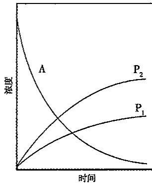

## (2)1-1级平行反应的特点

① 当各产物的起始浓度为零时，在反应的任何时刻，产物的浓度(或产量)之比，等于平行反应的速率常数之比，速率常数大的反应，其产量必定大。若各平行反应的级数不同，则无此特点。

$$
[ \mathrm{P} _ {1} ]: [ \mathrm{P} _ {2} ]: \dots : [ \mathrm{P} _ {n} ] = k _ {1}: k _ {2}: \dots : k _ {n}
$$

②总反应的速率常数(或称表观速率常数 $k_{app}$ )为各平行反应速率常数的总和。因此，由产物的相对含量和总反应的速率常数，可求得个别反应的速率常数。

$$
[ \mathrm{A} ] = [ \mathrm{A} ] _ {0} \exp [ - \sum k _ {i} t ]
$$

$$
[ \mathrm{P} _ {\mathrm{i}} ] = [ \mathrm{A} ] _ {0} \left(\frac {k _ {\mathrm{i}}}{\sum k _ {\mathrm{i}}}\right) \{1 - \exp [ - \sum k _ {\mathrm{i}} t ] \}
$$

③平行反应的总速率等于各平行反应速率之和。

④当平行反应中某一个基元反应的速率常数比其他基元反应的速率常数大很多时，总反应速率决定于该基元反应。通常，称此反应为主反应，其他为副反应。人们往往要通过寻找选择性强的催化剂或控制温度来加大速率常数的差别，以提高主反应的产率和产量。

⑤用改变温度的办法,可以改变产物的相对含量。活化能高的反应,速率常数随温度的变化率也大。

$$
\frac {\mathrm{d} \ln k}{\mathrm{d} T} = \frac {E _ {\mathrm{a}}}{R T ^ {2}}, \frac {\mathrm{d} \ln (k _ {2} / k _ {1})}{\mathrm{d} T} = \frac {E _ {2} - E _ {1}}{R T ^ {2}}
$$

表观速率常数 $k_{\mathrm{app}}=(k_{1}+k_{2})$ 。

表观活化能 $E_{\mathrm{app}} = -R\left[\frac{\mathrm{d}(\ln k_{\mathrm{app}})}{\mathrm{d}(1 / T)}\right] = \frac{k_1E_1 + k_2E_2}{k_1 + k_2}$ 。

如果 $E_{1}<E_{2}$ ，升高温度， $k_{2}/k_{1}$ 也升高，对反应 2 有利；如果 $E_{1}>E_{2}$ ，升高温度， $k_{2}/k_{1}$ 下降，对反应 1 有利。

## 2. 对峙反应

在正、逆两个方向同时进行的反应称为对峙反应，俗称可逆反应。正、逆反应可以为相同级数，也可以为具有不同级数的反应；可以是基元反应，也可以是非基元反应。例如：

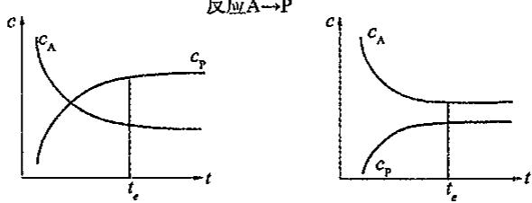

$$
\begin{array}{l l} \mathrm{A} \xrightarrow {k _ {1}} \mathrm{B} & E _ {+} \\ \mathrm{B} \xrightarrow {k _ {- 1}} \mathrm{A} & E _ {-} \end{array}
$$

$t = 0$ 时 $[\mathrm{A}]_0$ $[\mathrm{B}]_0$

$t = t$ 时 $[\mathrm{A}] = [\mathrm{A}]_0 - x,$ $[\mathrm{B}] = [\mathrm{B}]_0 + x$

$t=\infty$ 时 $\left[A\right]_{\infty}=\left[A\right]_{0}-x_{\infty},\quad\left[B\right]_{\infty}=\left[B\right]_{0}+x_{\infty}$

$$
\frac {\mathrm{d} [ \mathrm{A} ]}{\mathrm{d} t} = - k _ {1} [ \mathrm{A} ] + k _ {- 1} [ \mathrm{B} ], - \frac {\mathrm{d} x}{\mathrm{d} t} = - k _ {1} ([ \mathrm{A} ] _ {0} - x) + k _ {- 1} ([ \mathrm{B} ] _ {0} + x)
$$

$$
\frac {[ \mathrm{B} ] _ {\infty}}{[ \mathrm{A} ] _ {\infty}} = \frac {k _ {1}}{k _ {- 1}} = K _ {c}
$$

$$
\ln \frac {[ \mathrm{A} ] - [ \mathrm{A} ] _ {\infty}}{[ \mathrm{A} ] _ {0} - [ \mathrm{A} ] _ {\infty}} = - (k _ {1} + k _ {- 1}) t
$$

上式表明以 $\ln \{[\mathrm{A}] - [\mathrm{A}]_{\infty}\}$ 对 $t$ 作图应为一条直线，其斜率等于 $-(k_1 + k_{-1})$

$$
\ln \frac {x _ {\infty} - x}{x _ {\infty}} = - (k _ {1} + k _ {- 1}) t
$$

反应A→P

对峙反应的特点：

(1) 净速率等于正、逆反应速率之差值。

(2)达到平衡时,反应净速率等于零。

(3)正、逆速率常数之比等于平衡常数 $K_{c}=k_{1}/k_{-1}$ 。

(4) 在 c-t 图上, 达到平衡后, 反应物和产物的浓度不再随时间而改变。

3. 连续反应

有很多化学反应是经过连续几步才完成的,前一步生成物中的一部分或全部作为下一步反应的部分或全部反应物,依次连续进行,这种反应称为连续反应或连串反应。

连续反应的数学处理极为复杂,我们只考虑最简单的由两个单向一级反应组成的连续反应。

$$
\begin{array}{c c c c} & \mathrm{A} \xrightarrow {k _ {1}} \mathrm{I} \xrightarrow {k _ {2}} \mathrm{P} \\ t = 0 & [ \mathrm{A} ] _ {0} & 0 & 0 \\ t = t & [ \mathrm{A} ] & [ \mathrm{I} ] & [ \mathrm{P} ] \end{array}
$$

A——反应物，I——中间产物，P——产物。

组分速率: $\frac{d[A]}{dt}=-k_{1}[A],\frac{d[I]}{dt}=k_{1}[A]-k_{2}[I],\frac{d[P]}{dt}=k_{2}[I]$

解一阶线性微分方程(当 $k_{1}\neq k_{2}$ 时)并利用物料平衡关系求得：

$$
[ \mathrm{A} ] = [ \mathrm{A} ] _ {0} \mathrm{e} ^ {- k _ {1} t}
$$

$$
[ \mathrm{I} ] = \frac {k _ {1} [ \mathrm{A} ] _ {0}}{k _ {2} - k _ {1}} (\mathrm{e} ^ {- k _ {1} t} - \mathrm{e} ^ {- k _ {2} t})
$$

$$
[ \mathrm{P} ] = [ \mathrm{A} ] _ {0} (1 - \frac {k _ {2}}{k _ {2} - k _ {1}} \mathrm{e} ^ {- k _ {1} t} + \frac {k _ {1}}{k _ {2} - k _ {1}} \mathrm{e} ^ {- k _ {2} t})
$$

(1) $k_{1}, k_{2}$ 相对大小的影响

①当 $k_{1}, k_{2}$ 相近(不能相等)时: 将 A、I、P 的浓度对时间作图可得如图的情形。

$$
[ I ] _ {\max} = [ A ] _ {0} \left(\frac {k _ {2}}{k _ {1}}\right) ^ {\frac {k _ {2}}{k _ {1} - k _ {2}}}, t _ {\max} = \frac {\ln k _ {2} - \ln k _ {1}}{k _ {2} - k _ {1}}
$$

②若 $k_{1} >> k_{2}$

$$
[ \mathrm{I} ] \approx [ \mathrm{A} ] _ {0} \mathrm{e} ^ {- k _ {2} t}, [ \mathrm{I} ] = [ \mathrm{I} ] _ {0} \mathrm{e} ^ {- k _ {2} t}
$$

实验观察到的实际上是反应: I $\xrightarrow{k_{2}}$ P

③若 $k_{1} < k_{2}$

$$
[ \mathrm{P} ] \approx [ \mathrm{A} ] _ {0} (1 - \mathrm{e} ^ {- k _ {1} t}), [ \mathrm{A} ] = [ \mathrm{A} ] _ {0} \mathrm{e} ^ {- k _ {1} t}
$$

实验观察到的实际上是反应: A $\xrightarrow{k_{1}}$ I

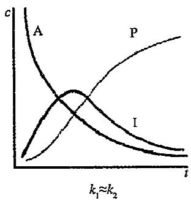

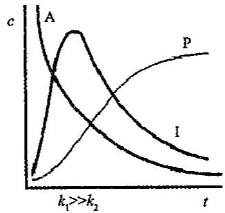

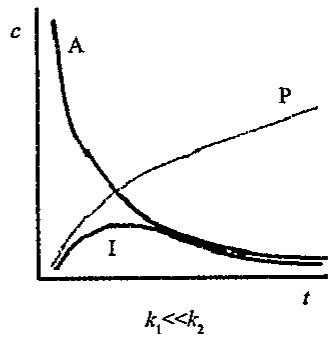

总反应的表观动力学特征实际上决定于反应速率系数最小的那一步基元反应的速率规律。一般将此连续反应中最难进行的一步称之为决速步骤或速率控制步骤。

## 二、反应历程及近似处理方法

## 1. 反应历程

大多数的化学反应都是由一系列的基元反应组成的复杂反应,我们把完成反应物到产物转变所经历基元反应序列称之为该反应的反应历程,也称反应机理。

例如：一氧化二氮在碘蒸汽存在时的热分解反应： $2N_{2}O\xrightarrow{I_{2}}2N_{2}+O_{2}$ 。

实验表明其反应速率方程为： $r=k[N_{2}O][I_{2}]^{1/2}$ 。

进一步的研究证明反应历程应包含以下步骤：

$$
\begin{array}{l l}\mathrm {I_ {2}} \rightleftharpoons 2 \mathrm{I}&k _ {+ 1}, k _ {- 1}\\\mathrm {I+ N_ {2} O\rightarrow N_ {2} + IO}&k _ {2}\\\mathrm {IO+ N_ {2} O\rightarrow N_ {2} + O_ {2} + I}&k _ {3}\end{array}
$$

2. 稳态近似法(steady state approximation):

稳态: 对一个反应系统而言, 所谓稳态是指其性质不随时间变化的一种状态(平衡态是其中一个特例)。

对于一个连续反应: $A \xrightarrow{k_{1}} I \xrightarrow{k_{2}} P$ ，中间物 I 不稳定，极易继续反应，则 $k_{2} > > k_{1}$ ，在反应进行了一段时间后浓度便达到一个几乎稳定的数值。相对于反应物或产物，该中间物一直维持极低的浓度值，这一事实使我们有可能近似地认为中间产物浓度基本不变处于稳态，(即 $\mathrm{d}[\mathrm{I}] / \mathrm{dt}\approx 0$ )从而将微分方程转化为代数方程，大大简化求解过程。

在反应过程中有多少个高活性中间物种，稳态近似就可以有多少个其浓度随时间变化率等于零的代数方程。根据等于零的代数方程求出中间物种的稳态近似浓度表达式，将其代入总反应速率的表达式中，使这些中间物种的浓度项不出现在最终的速率方程中。

$$
\begin{array}{l l}\mathrm {I_ {2}} \rightleftharpoons 2 \mathrm{I}&r _ {+ 1} = k _ {+ 1} [ \mathrm {I_ {2}} ], r _ {- 1} = k _ {- 1} [ \mathrm{I} ] ^ {2}\\\mathrm {I + N_ {2} O\rightarrow N_ {2} + IO}&r _ {2} = k _ {2} [ \mathrm{I} ] [ \mathrm {N_ {2} O} ]\\\mathrm {IO+ N_ {2} O\rightarrow N_ {2} + O_ {2} + I}&r _ {3} = k _ {3} [ \mathrm{IO} ] [ \mathrm {N_ {2} O} ]\\\mathrm{d[I]} / \mathrm{dt} = 2 k _ {+ 1} [ \mathrm {I_ {2}} ] - 2 k _ {- 1} [ \mathrm{I} ] ^ {2} - k _ {2} [ \mathrm{I} ] [ \mathrm {N_ {2} O} ] + k _ {3} [ \mathrm{IO} ] [ \mathrm {N_ {2} O} ] \approx 0\\\mathrm{d[IO]} / \mathrm{dt} = k _ {2} [ \mathrm{I} ] [ \mathrm {N_ {2} O} ] - k _ {3} [ \mathrm{IO} ] [ \mathrm {N_ {2} O} ] \approx 0\end{array}
$$

所谓稳态就是指某中间物的生成速率与消耗速率相等,导致其浓度不随时间而变化的状态。例如自由基就可以作稳态处理。

处理方法:以 $H_{2}+Cl_{2}\longrightarrow2HCl$ 的历程为例:

$$
\begin{array}{r l} & \mathrm{Cl} _ {2} \xrightarrow [ k _ {1} ]{h v} 2 \mathrm{Cl} \cdot , \mathrm{Cl} \cdot + \mathrm{H} _ {2} \xrightarrow [ k _ {2} ]{k _ {2}} \mathrm{HCl} + \mathrm{H} \cdot \\ & \mathrm{H} \cdot + \mathrm{Cl} _ {2} \xrightarrow [ k _ {3} ]{k _ {3}} \mathrm{HCl} + \mathrm{Cl} \cdot , 2 \mathrm{Cl} \cdot \xrightarrow [ k _ {4} ]{k _ {4}} \mathrm{Cl} _ {2} \end{array}
$$

写出此反应的速率方程式及反应级数。

解答: H · 与 Cl · 都是自由基, 它们都处于稳态

$$
\therefore \frac {\mathrm{d} [ \mathrm{H} \cdot ]}{\mathrm{d} t} = k _ {2} [ \mathrm{Cl} \cdot ] [ \mathrm{H} _ {2} ] - k _ {3} [ \mathrm{H} \cdot ] [ \mathrm{Cl} _ {2} ] = 0
$$

则

$$
k _ {2} [ \mathrm{Cl} \cdot ] [ \mathrm{H} _ {2} ] = k _ {3} [ \mathrm{H} \cdot ] [ \mathrm{Cl} _ {2} ]\tag{①}
$$

$$
\frac {\mathrm{d} [ \mathrm{Cl} \cdot ]}{\mathrm{d} t} = 2 k _ {1} [ \mathrm{Cl} _ {2} ] + k _ {3} [ \mathrm{H} \cdot ] [ \mathrm{Cl} _ {2} ] - k _ {2} [ \mathrm{Cl} \cdot ] [ \mathrm{H} _ {2} ] - 2 k _ {4} [ \mathrm{Cl} \cdot ] ^ {2} = 0\tag{②}
$$

$$
(\because - \frac {\mathrm{d} [ \mathrm{Cl} _ {2} ]}{\mathrm{d} t} = \frac {1}{2} \cdot \frac {\mathrm{d} [ \mathrm{Cl} \cdot ]}{\mathrm{d} t}, \therefore - \frac {2 \mathrm{d} [ \mathrm{Cl} _ {2} ]}{\mathrm{d} t} = \frac {\mathrm{d} [ \mathrm{Cl} \cdot ]}{\mathrm{d} t})
$$

①式代入 ②式得： $2k_{1}[\mathrm{Cl}_{2}] - 2k_{4}[\mathrm{Cl}\cdot ]^{2} = 0$

$$
\therefore [ \mathrm{Cl} \cdot ] = \left\{\left(k _ {1} / k _ {4}\right) \left[ \mathrm{Cl} _ {2} \right] \right\} ^ {1 / 2}
$$

$$
\therefore \frac {\mathrm{d} [ \mathrm{HCl} ]}{\mathrm{d} t} = k _ {2} [ \mathrm{Cl} \cdot ] [ \mathrm{H} _ {2} ] + k _ {3} [ \mathrm{H} \cdot ] [ \mathrm{Cl} _ {2} ] = 2 k _ {2} [ \mathrm{Cl} \cdot ] [ \mathrm{H} _ {2} ] = \mathrm{k} ^ {\prime} [ \mathrm{Cl} _ {2} ] ^ {1 / 2} [ \mathrm{H} _ {2} ]
$$

其中 $k' = 2k_2 \cdot (k_1 / k_4)^{1/2}$ ,

∴此反应的级数为1.5级。

3. 平衡态假说法(equilibrium hypothesis)

一般而言，在一个复杂反应的历程中，如果存在速率控制步骤(或称决速步骤)则：

(1)该决速步骤的反应速率即为总反应速率。

(2)该决速步骤前的快反应可以假定处于平衡。

(3)该决速步骤后的快反应对总反应速率没有影响。

按(1)写出总反应速率表达式;利用平衡关系(2),以反应物的浓度表示出中间物的

浓度,可得速率方程。

对于反应 $\mathrm{A} + \mathrm{B}\underset {k_{-1}}{\overset{k_1}{\rightleftharpoons}}\mathrm{C}\underset {\mathrm{slow}}{\overset{k_2}{\longrightarrow}}\mathrm{D},$

速率方程为： $\mathrm{d[D] / dt = k_2[C]}$ ，由于第一个反应很快达到平衡，则 $k_{1}[\mathrm{A}][\mathrm{B}] = k_{-1}[\mathrm{C}]$

所以： $[D] / \mathrm{d}t = (k_1k_2 / k_{-1})[A][B]$ 。

水溶液中的反应: $I^{-}+OCl^{-}=OI^{-}+Cl^{-}$

历程: $OCl^{-} + H_{2}O \longrightarrow HOCl + OH^{-}$ $k_{1}$

$$
\mathrm{HOCl} + \mathrm{OH} ^ {-} \longrightarrow \mathrm{OCl} ^ {-} + \mathrm{H} _ {2} \mathrm{O} \quad k _ {2}
$$

$$
\mathrm{HOCl} + \mathrm{I} ^ {-} \longrightarrow \mathrm{HOI} + \mathrm{Cl} ^ {-}
$$

$$
k _ {3}
$$

$$
\mathrm{HOI} + \mathrm{OH} ^ {-} \longrightarrow \mathrm{OI} ^ {-} + \mathrm{H} _ {2} \mathrm{O}
$$

$$
k _ {4}
$$

$$
\mathrm{OI} ^ {-} + \mathrm{H} _ {2} \mathrm{O} \longrightarrow \mathrm{HOI} + \mathrm{OH} ^ {-}
$$

$$
k _ {5}
$$

由速率控制步骤得 $r=k_{3}[HOCl]\cdot[I^{-}]$

据平衡假设： $(k_{1}/k_{2})=[\mathrm{HOCl}]\cdot[\mathrm{OH}^{-}]/([\mathrm{OCl}^{-}]\cdot[\mathrm{H}_{2}\mathrm{O}]$

中间物浓度: $\left[\mathrm{HOCl}\right]=(k_{1}/k_{2})\left[\mathrm{OCl}^{-}\right]\cdot\left[\mathrm{H}_{2}\mathrm{O}\right]/\left[\mathrm{OH}^{-}\right]$

得总反应的速率方程为 $r=k_{app}[I^{-}]\cdot[OCl^{-}]/[OH^{-}]$

其中 $k_{app}=k_{3}k_{1}[H_{2}O]/k_{2}$

## 【典型例题】

【例 1】关于碘和氢的反应,实验证明分两步进行,其机理(反应历程)涉及碘分子和碘原子的快速平衡 $\left(\mathrm{I}_{2}=2\mathrm{I}\right)$ ，和两个碘原子和一个氢分子间的有效碰撞的控制步骤 $\left(\mathrm{H}_{2}+2\mathrm{I}=2\mathrm{HI}\right)$ 。试证明从这个机理所得到的速率方程式恰同按 $I_{2}$ 和 $H_{2}$ 直接反应的机理(即 $I_{2}+H_{2}=2HI$ )所得的速率方程式相同。

【例 2】已知反应 $COCl_{2}=CO+Cl_{2}$ 的反应历程为：

① $Cl_{2}=2Cl$ （快速平衡）

② $Cl+COCl_{2}=CO+Cl_{3}$ （慢）

③ $Cl_{3}=Cl_{2}+Cl$ （快速平衡）

试证明反应的速率为： $\frac{\mathrm{d}[\mathrm{CO}]}{\mathrm{dt}} = k[\mathrm{COCl}_2][\mathrm{Cl}_2]^{1 / 2}$

【例3】已知反应 $\mathrm{CO} + \mathrm{Cl}_2\longrightarrow \mathrm{COCl}_2$ 的速率定律为 $\frac{\mathrm{d}[\mathrm{COCl}_2]}{\mathrm{dt}} = k[\mathrm{CO}][\mathrm{Cl}_2]^{3 / 2}$ 其中最慢的一步为： $\mathrm{COCl + Cl_2\longrightarrow COCl_2 + Cl}$ 。试设计一个符合上述速率定律的反应机理。

【例 4】臭氧热分解反应机理是: $(1)O_{3}=O_{2}+O$ （快）; $(2)O+O_{3}=2O_{2}$ （慢）。试写出该反应的速率方程式。

【例 5】化学反应 $\mathrm{H}_{2}(\mathrm{~g})+\mathrm{Cl}_{2}(\mathrm{~g})\longrightarrow2\mathrm{HCl}(\mathrm{g})$ 经历的反应过程为：

$$
\mathrm{Cl} _ {2} + \mathrm{M} \longrightarrow 2 \mathrm{Cl} \cdot + \mathrm{M} \quad \mathrm{Cl} \cdot + \mathrm{H} _ {2} \longrightarrow \mathrm{HCl} + \mathrm{H} \cdot
$$

$$
\mathrm{H} \cdot + \mathrm{Cl} _ {2} \longrightarrow \mathrm{HCl} + \mathrm{Cl} \cdot 2 \mathrm{Cl} \cdot + \mathrm{M} \longrightarrow \mathrm{Cl} _ {2} + \mathrm{M}
$$

试用稳态处理法导出该反应的速率方程式。

【例 6】对于反应 $H_{2}(g)+Br_{2}(g)\longrightarrow2HBr(g)$ ，已知其反应机理如下：

① $Br_{2}=2Br$ (快)

② $\mathrm{Br} + \mathrm{H}_{2} = \mathrm{HBr} + \mathrm{H}$ （慢）

③ $\mathrm{H} + \mathrm{Br}_2 = \mathrm{HBr} + \mathrm{Br}$ （快）

试推出该反应的速率方程式。

【例 7】 光气的制备反应为：

$$
\mathrm{CO} (\mathrm{g}) + \mathrm{Cl} _ {2} (\mathrm{g}) = \mathrm{COCl} _ {2} (\mathrm{g}),
$$

实验测得反应的速率方程为：

$$
\mathrm{d} \left[ \mathrm{COCl} _ {2} \right] / \mathrm{d} t = k [ \mathrm{CO} ] \left[ \mathrm{Cl} _ {2} \right] ^ {3 / 2}
$$

其可能的反应机理为：

① $Cl_{2} \xrightarrow[k_{-1}]{k_{1}} 2Cl \cdot (\text{快平衡})$

② $Cl \cdot +CO \xlongequal{k_{2}} COCl \cdot (\text{快平衡})$

③ $COCl \cdot +Cl_{2} \xrightarrow{k_{3}} COCl_{2} + Cl \cdot (\text{慢反应})$

(1)试说明这一机理与速率方程相符合；

(2)指出反应速率方程中的 k 与反应机理中的速率常数 $(k_{1}, k_{-1}, k_{2}, k_{-2})$ 之间的关系。

【例 8】 $Fe^{2+}$ 在水溶液中被 $Cl_{2}$ 氧化，总反应式为 $2Fe^{2+} + Cl_{2} \longrightarrow 2Fe^{3+} + 2Cl^{-}$ 。

实验证明: 当 $Fe^{3+}$ 和 $Cl^{-}$ 浓度增加时, 总反应速率下降, 试论证下列两种机理中哪一种机理可能符合实验观测事实?

(1) $Fe^{2+} + Cl_{2} \xrightarrow{k_{1}} Fe^{3+} + Cl^{-} + Cl$ ① 快速达到平衡 $Fe^{2+} + Cl \xrightarrow{k_{2}} Fe^{3+} + Cl^{-}$ ② 逆反应速率可忽略
(2) $Fe^{2+} + Cl_{2} \xrightarrow{k_{3}} Fe(IV) + 2Cl^{-}$ ③ 快速达到平衡 $Fe(IV) + Fe^{2+} \xrightarrow{k_{4}} 2Fe^{3+}$ ④ 逆反应速率可忽略

【例 9】已知 $2NO + O_{2} = 2NO_{2}$ 的反应历程如下： $NO + NO \xlongequal{k_{1}} N_{2}O_{2}$ （快） $N_{2}O_{2} + O_{2} \xrightarrow{k_{3}} 2NO_{2}$ （慢）

试分别用平衡态近似法和稳态近似法推导出反应的总速率方程。

【例 10】已知乙醛的热分解反应 $CH_{3}CHO \longrightarrow CH_{4} + CO$ 是一个链式反应机理：

$$
\begin{array}{l l} \mathrm{CH} _ {3} \mathrm{CHO} \xrightarrow {k _ {1}} \mathrm{CH} _ {3} \cdot + \mathrm{CHO} \cdot & \text {链的引发} \\ \mathrm{CH} _ {3} \cdot + \mathrm{CH} _ {3} \mathrm{CHO} \xrightarrow {k _ {2}} \mathrm{CH} _ {4} + \mathrm{CH} _ {3} \mathrm{CO} \cdot \\ \mathrm{CH} _ {3} \mathrm{CO} \cdot \xrightarrow {k _ {3}} \mathrm{CH} _ {3} \cdot + \mathrm{CO} & \text {链的传递} \\ \mathrm{CH} _ {3} \cdot + \mathrm{CH} _ {3} \cdot \xrightarrow {k _ {4}} \mathrm{CH} _ {3} \mathrm{CH} _ {3} & \text {链的终止} \end{array}
$$

试用稳态法推导出 $CH_{4}$ 生成速率的表示式。

【例11】已知反应 $2\mathrm{NO} + \mathrm{Br}_2 \longrightarrow 2\mathrm{NOBr}$ 的机理如下：

$NO+Br_{2}\longrightarrow NOBr_{2}$ (快)

$NOBr_{2} + NO \longrightarrow 2NOBr$ (慢)

试推导出总反应速率方程式。

【例 12】已知反应 $2NO + 2H_{2} \longrightarrow N_{2} + 2H_{2}O$ 的反应机理为：

(1) $2NO \longrightarrow N_{2}O_{2}$ (快)

(2) $N_{2}O_{2}+H_{2}\rightleftharpoons N_{2}O+H_{2}O$ (慢)

(3) $N_{2}O+H_{2}\longrightarrow N_{2}+H_{2}O$ (快)

试推导反应的速率方程式。

【例 13】某反应机理如下：

$$
\mathrm{A} + \mathrm{B} \underset {k _ {1} ^ {\prime}} {\overset {k _ {1}} {\rightleftharpoons}} \mathrm{C} + \mathrm{D}\tag{①}
$$

$$
\mathrm{C} + \mathrm{E} \xrightarrow {k _ {2}} \mathrm{F}\tag{②}
$$

试以稳定态近似法导出反应的速率方程式，并讨论在什么情况下有下列关系：

$$
\frac {\mathrm{d} [ \mathrm{F} ]}{\mathrm{d} t} = k \frac {[ \mathrm{A} ] [ \mathrm{B} ] [ \mathrm{E} ]}{[ \mathrm{D} ]}, \frac {\mathrm{d} [ \mathrm{F} ]}{\mathrm{d} t} = k ^ {\prime} [ \mathrm{A} ] [ \mathrm{B} ]
$$

## 【例题参考答案】

【例 1】碘和氢的反应式为 $H_{2} + I_{2} = 2HI$ ，速率方程式 $v = k[H_{2}][I_{2}]$ ，表现为二级反应。根据题意，反应历程是：

① $I_{2}\longrightarrow I+I$ (快) $v_{1}=k_{1}[I_{2}]$ ;
② $H_{2}+2I\longrightarrow2HI$ (慢) $v_{2}=k_{2}[H_{2}][I]^{2}$

整个反应过程由慢反应决定反应速率

③ $v=k_{2}[H_{2}][I]^{2}$

根据反应①可知，达平衡时 $K = \frac{[I]^2}{[I_2]}$ ；则

④ $[\mathrm{I}]^2 = K[\mathrm{I}_2]$

反应①的平衡浓度[I]即为反应②的初始浓度[I]。

以④代入③式得 $\nu=k_{2}K[H_{2}][I_{2}]$ 。

在一定温度下， $k_{2}$ 和 K 均为常数，它们的乘积也为常数，令 $k^{\prime}=k_{2}K$ ；则 $v=k^{\prime}[H_{2}][I_{2}]$ 结论：从上述反应机理所得到的速率方程式恰同按 $I_{2}$ 和 $H_{2}$ 直接反应的机理（即 $I_{2}+H_{2}=2HI$ ）所得的速率方程式相同，但两者的反应历程是不同的。

【例2】因为反应速率取决于最慢的一步，所以由(2)式得： $\frac{\mathrm{d}[\mathrm{CO}]}{\mathrm{dt}} = k_2[\mathrm{Cl}][\mathrm{COCl}_2]$

由(1)式的平衡得 $K = \frac{[\mathrm{Cl}]^2}{[\mathrm{Cl}_2]}$ ，则 $[\mathrm{Cl}] = (K[\mathrm{Cl}_2])^{1/2}$ ，代入上式中，

$$
\frac {\mathrm{d} [ \mathrm{CO} ]}{\mathrm{d} t} = k _ {2} (\mathrm{K} [ \mathrm{Cl} _ {2} ]) ^ {1 / 2} [ \mathrm{COCl} _ {2} ] = k _ {2} K ^ {1 / 2} [ \mathrm{Cl} _ {2} ] ^ {1 / 2} [ \mathrm{COCl} _ {2} ] = k [ \mathrm{COCl} _ {2} ] [ \mathrm{Cl} _ {2} ] ^ {1 / 2}
$$

【例 3】设反应机理为：

## 高中化学竞赛

基本理论学习笔记

① $\mathrm{Cl}_2\longrightarrow 2\mathrm{Cl}$

(快)

②CO+Cl→COCl

(快)

③COCl+Cl₂→COCl₂+Cl

(慢)

由①得

$$
K _ {1} = \frac {[ \mathrm{Cl} ] ^ {2}}{[ \mathrm{Cl} _ {2} ]}; [ \mathrm{Cl} ] = (K _ {1} [ \mathrm{Cl} _ {2} ]) ^ {1 / 2}
$$

由②得

$$
K _ {2} = \frac {[ \mathrm{COCl} ]}{[ \mathrm{CO} ] [ \mathrm{Cl} ]}; [ \mathrm{COCl} ] = K _ {2} [ \mathrm{CO} ] [ \mathrm{Cl} ]
$$

$$
\begin{array}{r l} \frac {\mathrm{d} [ \mathrm{COCl} _ {2} ]}{\mathrm{d} t} & = k _ {3} [ \mathrm{COCl} ] [ \mathrm{Cl} _ {2} ] \\ & = k _ {3} K _ {2} [ \mathrm{CO} ] [ \mathrm{Cl} ] [ \mathrm{Cl} _ {2} ] \\ & = k _ {3} K _ {2} (K _ {1} [ \mathrm{Cl} _ {2} ]) ^ {1 / 2} [ \mathrm{CO} ] [ \mathrm{Cl} _ {2} ] \\ & = k _ {3} K _ {2} K _ {1} ^ {1 / 2} [ \mathrm{CO} ] [ \mathrm{Cl} _ {2} ] ^ {3 / 2} \\ & = k [ \mathrm{CO} ] [ \mathrm{Cl} _ {2} ] ^ {3 / 2} \end{array}
$$

【例4】该反应的速率方程式决定于慢反应的第(2)步，则 $v = k_{2}[\mathrm{O}][\mathrm{O}_{3}]$

由反应(1)的平衡得 $K_{1}=\frac{\left[O_{2}\right]\left[O\right]}{\left[O_{3}\right]}$ ; $[O]=K_{1}\frac{\left[O_{3}\right]}{\left[O_{2}\right]}$

代入上式

$$
v = k _ {2} K _ {1} \left[ \mathrm{O} _ {3} \right] \frac {\left[ \mathrm{O} _ {3} \right]}{\left[ \mathrm{O} _ {2} \right]} = k \left[ \mathrm{O} _ {3} \right] ^ {2} \left[ \mathrm{O} _ {2} \right] ^ {- 1} (k = k _ {2} K _ {1})
$$

【例 5】由给出的反应机理, 可写出 HCl 的生成速率:

$$
\frac {\mathrm{d} [ \mathrm{HCl} ]}{\mathrm{d} t} = k _ {2} [ \mathrm{Cl} \bullet ] [ \mathrm{H} _ {2} ] + k _ {3} [ \mathrm{H} \bullet ] [ \mathrm{Cl} _ {2} ]\tag{①}
$$

式中 $[\mathrm{Cl}\cdot ]$ 和 $[\mathrm{H}\cdot ]$ 代表中间产物自由基的浓度。由于自由基都很活泼，寿命很短，所以在整个反应过程中 $[\mathrm{Cl}\cdot ]\approx 0,[\mathrm{H}\cdot ]\approx 0$ 。当反应达到稳定状态后，它们的浓度可视为不随时间而变，因此可以假定 $\frac{\mathrm{d}[\mathrm{Cl}\cdot]}{\mathrm{dt}} = 0,\frac{\mathrm{d}[\mathrm{H}\cdot]}{\mathrm{dt}} = 0$ 。这种处理方法称为稳态处理法，是一种建立在假设基础上的近似处理法。根据上述处理，可写出

$$
\frac {\mathrm{d} [ \mathrm{Cl} \cdot ]}{\mathrm{d} t} = 2 k _ {1} [ \mathrm{Cl} _ {2} ] [ \mathrm{M} ] - k _ {2} [ \mathrm{Cl} \cdot ] [ \mathrm{H} _ {2} ] + k _ {3} [ \mathrm{H} \cdot ] [ \mathrm{Cl} _ {2} ] - 2 k _ {- 1} [ \mathrm{Cl} \cdot ] ^ {2} [ \mathrm{M} ]\tag{②}
$$

$$
\frac {\mathrm{d} [ \mathrm{H} \bullet ]}{\mathrm{d} t} = k _ {2} [ \mathrm{Cl} \bullet ] [ \mathrm{H} _ {2} ] - k _ {3} [ \mathrm{H} \bullet ] [ \mathrm{Cl} _ {2} ] = 0\tag{③}
$$

$$
\text { 比较式②和式③,得 } 2 k _ {1} [ \mathrm{Cl} _ {2} ] = 2 k _ {- 1} [ \mathrm{Cl} \cdot ] ^ {2}, [ \mathrm{Cl} \cdot ] = (\frac {k _ {1}}{k _ {- 1}} [ \mathrm{Cl} _ {2} ]) ^ {1 / 2}\tag{④}
$$

将③和④式代入①式得 $\frac{\mathrm{d}[\mathrm{HCl}]}{\mathrm{dt}} = 2k_2\left(\frac{k_1}{k_{-1}}\right)^{1 / 2}\cdot [\mathrm{Cl}_2]^{1 / 2}\cdot [\mathrm{H}_2] = k[\mathrm{Cl}_2]^{1 / 2}\cdot [\mathrm{H}_2]$

⑤

⑤式就是总反应 $\mathrm{H}_{2}(\mathrm{~g})+\mathrm{Cl}_{2}(\mathrm{~g})\longrightarrow2\mathrm{HCl}(\mathrm{g})$ 的速率方程。

【例 6】在反应机理中,第二步反应是慢反应,整个反应速率由它控制,所以

$$
v = k _ {2} [ \mathrm{Br} ] [ \mathrm{H} _ {2} ]
$$

由第一步反应快速达到平衡,得

$$
K _ {1} = \frac {[ \mathrm{Br} ] ^ {2}}{[ \mathrm{Br} _ {2} ]}, [ \mathrm{Br} ] = (K _ {1} [ \mathrm{Br} _ {2} ]) ^ {1 / 2}
$$

代入上式

$$
v = k _ {2} K _ {1} ^ {1 / 2} \left[ \mathrm{Br} _ {2} \right] ^ {1 / 2} \left[ \mathrm{H} _ {2} \right] = k \left[ \mathrm{H} _ {2} \right] \left[ \mathrm{Br} _ {2} \right] ^ {1 / 2} (k = k _ {2} K _ {1} ^ {1 / 2})
$$

【例 7】（1）根据给出的机理可推出上述速率方程：

在反应机理中,第三步反应是慢反应,整个反应速率由它控制,所以

$$
v = k _ {3} [ \mathrm{COCl} \cdot ] [ \mathrm{Cl} _ {2} ]\tag{①}
$$

第一步反应和第二步反应都快速建立平衡，由它们的平衡式可得：

$$
K _ {1} = \frac {k _ {1}}{k _ {- 1}} = \frac {[ \mathrm{Cl} \cdot ] ^ {2}}{[ \mathrm{Cl} _ {2} ]}, [ \mathrm{Cl} \cdot ] = (\frac {k _ {1}}{k _ {- 1}} [ \mathrm{Cl} _ {2} ]) ^ {1 / 2}\tag{②}
$$

$$
K _ {2} = \frac {k _ {2}}{k _ {- 2}} = \frac {[ \mathrm{COCl} \cdot ]}{[ \mathrm{Cl} \cdot ] [ \mathrm{CO} ]}, [ \mathrm{COCl} \cdot ] = \frac {k _ {2}}{k _ {- 2}} [ \mathrm{Cl} \cdot ] [ \mathrm{CO} ]\tag{③}
$$

将②③式代入①式中

$$
v = k _ {3} \left(\frac {k _ {1}}{k _ {- 1}}\right) ^ {1 / 2} \frac {k _ {2}}{k _ {- 2}} [ \mathrm{CO} ] [ \mathrm{Cl} _ {2} ] ^ {3 / 2} = k [ \mathrm{CO} ] [ \mathrm{Cl} _ {2} ] ^ {3 / 2}
$$

可见由这一机理导出的速率方程与实验得出的速率方程相符合。

(2)式中 $k=k_{3}\left(\frac{k_{1}}{k_{-1}}\right)^{1/2}\frac{k_{2}}{k_{-2}}$ 。

【例 8】根据给出的两种可能机理,分别导出速率方程:

按机理(1)反应速率决定于第二步反应: $v=k_{2}[Fe^{2+}][Cl]$

由第一步快反应的平衡得：

$$
K _ {1} = \frac {k _ {1}}{k _ {1} ^ {\prime}} = \frac {[ \mathrm{Fe} ^ {3 +} ] [ \mathrm{Cl} ^ {-} ] [ \mathrm{Cl} ]}{[ \mathrm{Fe} ^ {2 +} ] [ \mathrm{Cl} _ {2} ]}; [ \mathrm{Cl} ] = \frac {k _ {1}}{k _ {1} ^ {\prime}} \cdot \frac {[ \mathrm{Fe} ^ {2 +} ] [ \mathrm{Cl} _ {2} ]}{[ \mathrm{Fe} ^ {3 +} ] [ \mathrm{Cl} ^ {-} ]}
$$

代入速率方程得

$$
v = k _ {2} \cdot \frac {k _ {1}}{k _ {1} ^ {\prime}} \cdot \frac {[ \mathrm{Fe} ^ {2 +} ] ^ {2} [ \mathrm{Cl} _ {2} ]}{[ \mathrm{Fe} ^ {3 +} ] [ \mathrm{Cl} ^ {-} ]}
$$

从速率方程可见随 $Fe^{3+}$ 和 $Cl^{-}$ 浓度增加，总反应速率下降。

按机理(2)反应速率决定于第二步反应: $v=k_{4}\left[\mathrm{Fe}(\mathrm{IV})\right]\left[\mathrm{Fe}^{2+}\right]$

由第一步快反应的平衡得：

$$
K _ {1} ^ {\prime} = \frac {k _ {3}}{k _ {3} ^ {\prime}} = \frac {[ \mathrm{Fe(IV)} ] [ \mathrm{Cl} ^ {-} ] ^ {2}}{[ \mathrm{Fe} ^ {2 +} ] [ \mathrm{Cl} _ {2} ]}
$$

$$
[ \mathrm{Fe(IV)} ] = \frac {k _ {3}}{k _ {3} ^ {\prime}} \cdot \frac {[ \mathrm{Fe} ^ {2 +} ] [ \mathrm{Cl} _ {2} ]}{[ \mathrm{Cl} ^ {-} ] ^ {2}}
$$

代入速率方程得

$$
v = k _ {4} \frac {k _ {3}}{k _ {3} ^ {\prime}} \cdot \frac {[ \mathrm{Fe} ^ {2 +} ] ^ {2} [ \mathrm{Cl} _ {2} ]}{[ \mathrm{Cl} ^ {-} ] ^ {2}}
$$

从速率方程不能得出反应速率随 $Fe^{3+}$ 浓度增加而反应速率下降的结论。

根据上述比较,机理(1)能符合实验观测事实。

【例 9】 平衡态近似法：

在反应机理中,第二步反应是慢反应,整个反应速率由它控制,所以

$$
v = k _ {3} \left[ \mathrm{N} _ {2} \mathrm{O} _ {2} \right] \left[ \mathrm{O} _ {2} \right]
$$

第一步反应快速达到平衡，

$$
K _ {1} = \frac {k _ {1}}{k _ {2}} = \frac {\left[ \mathrm{N} _ {2} \mathrm{O} _ {2} \right]}{\left[ \mathrm{NO} \right] ^ {2}}, \left[ \mathrm{N} _ {2} \mathrm{O} _ {2} \right] = K _ {1} [ \mathrm{NO} ] ^ {2},
$$

代入速率方程式中

$$
v = k _ {3} K _ {1} [ \mathrm{NO} ] ^ {2} [ \mathrm{O} _ {2} ] = k [ \mathrm{NO} ] ^ {2} [ \mathrm{O} _ {2} ] (k = k _ {3} K _ {1} = k _ {3} \frac {k _ {1}}{k _ {2}})
$$

稳态近似法：

假设中间物生成的总速率等于每个生成基元反应速率之和减去所有分解速率，并且总速率是不变的。稳态近似处理如下：

$$
\frac {\mathrm{d} \left[ \mathrm{N} _ {2} \mathrm{O} _ {2} \right]}{\mathrm{d} t} = k _ {1} [ \mathrm{NO} ] ^ {2} - k _ {2} \left[ \mathrm{N} _ {2} \mathrm{O} _ {2} \right] - k _ {3} \left[ \mathrm{N} _ {2} \mathrm{O} _ {2} \right] \left[ \mathrm{O} _ {2} \right] = 0
$$

则 $\left[\mathrm{N}_{2} \mathrm{O}_{2}\right] = \frac{k_{1}[\mathrm{NO}]^{2}}{k_{2} + k_{3}[\mathrm{O}_{2}]}$ 。

由于慢反应决定反应速率，所以 $\frac{\mathrm{d}[\mathrm{NO}_2]}{\mathrm{d}t} = k_3[\mathrm{N}_2\mathrm{O}_2][\mathrm{O}_2] = \frac{k_1k_3[\mathrm{NO}]^2[\mathrm{O}_2]}{k_2 + k_3[\mathrm{O}_2]}$ 。

由于慢反应速率要比快反应速率小得多，所以 $k_{3}[\mathrm{O}_{2}] < k_{2}, k_{2} + k_{3}[\mathrm{O}_{2}] \approx k_{2}$ 。故

$$
\frac {\mathrm{d} \left[ \mathrm{NO} _ {2} \right]}{\mathrm{d} t} = \frac {k _ {1} k _ {3} [ \mathrm{NO} ] ^ {2} \left[ \mathrm{O} _ {2} \right]}{k _ {2}} = k [ \mathrm{NO} ] ^ {2} \left[ \mathrm{O} _ {2} \right] (k = \frac {k _ {1} k _ {3}}{k _ {2}})
$$

两种方法导出的结果基本上是相同的。

【例 10】 反应过程中自由基 $CH_{3} \cdot$ 和 $CH_{3}CO \cdot$ 为活性中间产物，当反应达稳定态后

$$
\frac {\mathrm{d} \left[ \mathrm{CH} _ {3} \cdot \right]}{\mathrm{d} t} = 0, \frac {\mathrm{d} \left[ \mathrm{CH} _ {3} \mathrm{CO} \cdot \right]}{\mathrm{d} t} = 0
$$

根据上述机理,甲烷的生成仅与第二步基元反应有关,则

$$
\frac {\mathrm{d} [ \mathrm{CH} _ {4} ]}{\mathrm{d} t} = k _ {2} [ \mathrm{CH} _ {3} \cdot ] [ \mathrm{CH} _ {3} \mathrm{CHO} ]\tag{①}
$$

稳态近似法认为,中间物生成的总速率等于每个生成基元反应速率之和减去所有分解速率,并且总速率是不变的。所以

$$
\frac {\mathrm{d} \left[ \mathrm{CH} _ {3} \cdot \right]}{\mathrm{d} t} = k _ {1} \left[ \mathrm{CH} _ {3} \mathrm{CHO} \right] - k _ {2} \left[ \mathrm{CH} _ {3} \cdot \right] \left[ \mathrm{CH} _ {3} \mathrm{CHO} \right] + k _ {3} \left[ \mathrm{CH} _ {3} \mathrm{CO} \cdot \right] - 2 k _ {4} \left[ \mathrm{CH} _ {3} \cdot \right] ^ {2} = 0 (2)
$$

而

$$
\frac {\mathrm{d} \left[ \mathrm{CH} _ {3} \mathrm{CO} \cdot \right]}{\mathrm{d} t} = k _ {2} \left[ \mathrm{CH} _ {3} \cdot \right] \left[ \mathrm{CH} _ {3} \mathrm{CHO} \right] - k _ {3} \left[ \mathrm{CH} _ {3} \mathrm{CO} \cdot \right] = 0\tag{③}
$$

②+③得

$$
k _ {1} \left[ \mathrm{CH} _ {3} \mathrm{CHO} \right] = 2 k _ {4} \left[ \mathrm{CH} _ {3} \cdot \right] ^ {2}
$$

则

$$
\left[ \mathrm{CH} _ {3} \cdot \right] = \left(\frac {k _ {1}}{2 k _ {4}} \left[ \mathrm{CH} _ {3} \mathrm{CHO} \right]\right) ^ {1 / 2}\tag{④}
$$

将④式代入①式中

$$
\frac {\mathrm{d} \left[ \mathrm{CH} _ {4} \right]}{\mathrm{d} t} = k _ {2} (\frac {k _ {1}}{2 k _ {4}} [ \mathrm{CH} _ {3} \mathrm{CHO} ]) ^ {1 / 2} [ \mathrm{CH} _ {3} \mathrm{CHO} ]
$$

$$
\frac {\mathrm{d} [ \mathrm{CH} _ {4} ]}{\mathrm{d} t} = k [ \mathrm{CH} _ {3} \mathrm{CHO} ] ^ {3 / 2} [ \text {式中} k = k _ {2} (\frac {k _ {1}}{2 k _ {4}}) ^ {1 / 2} ]
$$

【例 11】在反应机理中,第二步反应是慢反应,整个反应速率由它控制,所以

$$
v = k _ {2} \left[ \mathrm{NOBr} _ {2} \right] [ \mathrm{NO} ]
$$

第一步快反应很快达到平衡，则 $K_{1} = \frac{[\mathrm{NOBr}_{2}]}{[\mathrm{NO}][\mathrm{Br}_{2}]}, [\mathrm{NOBr}_{2}] = K_{1}[\mathrm{NO}][\mathrm{Br}_{2}]$ ，代入上式得

$$
v = k _ {2} K _ {1} [ \mathrm{NO} ] ^ {2} [ \mathrm{Br} _ {2} ] = k [ \mathrm{NO} ] ^ {2} [ \mathrm{Br} _ {2} ] (k = k _ {2} K _ {1})
$$

【例 12】第二步反应是慢反应,整个反应速率由它控制,则 $v=k_{2}[N_{2}O_{2}][H_{2}]$

第一步反应快速达到平衡， $K_{1} = \frac{[N_{2}O_{2}]}{[NO]^{2}}$ ，则 $[\mathrm{N}_2\mathrm{O}_2] = K_1[\mathrm{NO}]^2$ ，代入上式得

$$
v = k _ {2} K _ {1} [ \mathrm{NO} ] ^ {2} [ \mathrm{H} _ {2} ] = k [ \mathrm{NO} ] ^ {2} [ \mathrm{H} _ {2} ] \quad (k = k _ {2} K _ {1})
$$

【例 13】 C 是中间产物, 稳态近似法认为, 中间物的生成速率等于它的分解速率, 即

$$
k _ {1} [ \mathrm{A} ] [ \mathrm{B} ] = k _ {1} ^ {\prime} [ \mathrm{C} ] [ \mathrm{D} ] + k _ {2} [ \mathrm{C} ] [ \mathrm{E} ];
$$

则[C]= $\frac{k_{1}[A][B]}{k_{1}^{\prime}[D]+k_{2}[E]}$ 。

第二步反应是慢反应,整个反应速率由它控制,则

$$
\frac {\mathrm{d} [ \mathrm{F} ]}{\mathrm{d} t} = k _ {2} [ \mathrm{C} ] [ \mathrm{E} ] = \frac {k _ {1} k _ {2} [ \mathrm{A} ] [ \mathrm{B} ] [ \mathrm{E} ]}{k _ {1} ^ {\prime} [ \mathrm{D} ] + k _ {2} [ \mathrm{E} ]}
$$

当 $k_{1}^{\prime}[D] >> k_{2}[E]$ 时有

$$
\frac {\mathrm{d} [ \mathrm{F} ]}{\mathrm{d} t} = k \frac {[ \mathrm{A} ] [ \mathrm{B} ] [ \mathrm{E} ]}{[ \mathrm{D} ]} (k = \frac {k _ {1} k _ {2}}{k _ {1} ^ {\prime}})
$$

当 $k_{1}^{\prime}[D] < k_{2}[E]$ 时有

$$
\frac {\mathrm{d} [ \mathrm{F} ]}{\mathrm{d} t} = k ^ {\prime} [ \mathrm{A} ] [ \mathrm{B} ] \quad (k ^ {\prime} = k _ {1})
$$

## 第九章 容量分析

## 【初赛要求】

容量分析: 被测物、基准物质、标准溶液、指示剂、滴定反应等基本概念。酸碱滴定曲线(酸碱强度、浓度、溶剂极性对滴定突跃影响的定性关系)。酸碱滴定指示剂的选择。以高锰酸钾、重铬酸钾、硫代硫酸钠、EDTA为标准溶液的基本滴定反应。分析结果的计算。分析结果的准确度和精密度。

## 【决赛要求】

常见容量分析的基本操作、基本反应及分析结果的计算。容量分析的误差分析。

【知识点精讲】

## 9.1 容量分析的基本概念和原理

待测物质中有关组分含量的测定是定量分析要做的工作。测定的化学原理是化学反应：

$$
\text { 待测组分 } \mathrm{X} + \text { 试剂 } \mathrm{R} = \text { 产物 } \mathrm{P}
$$

滴定分析法是指将一种已知准确浓度的试剂溶液，通过滴定管滴加到一定量的待测组分的溶液中，或将待测溶液滴加到标准溶液中，直到所加试剂与待测组分按化学计量关系反应为止，然后根据标准溶液的浓度和所消耗的体积，计算出待测组分的含量。由于滴定分析中要测体积，故把滴定分析又叫容量分析。

## 9.1.1 容量分析中的几个概念

标准溶液:已知准确浓度的试剂溶液叫标准溶液。

基准物质:能用于直接配制或标定标准溶液的物质称为基准物质。

试液: 含待测组分的溶液叫试液。

滴定:用滴定管滴加已知准确浓度试剂溶液的操作过程。

化学计量点(sp): 滴加的标准溶液与待测组分按化学计量关系恰好完全反应的点称为化学计量点。

指示剂:在滴定过程中,化学计量点是利用外加试剂颜色的改变来判断,这种外加试剂称为指示剂。

滴定终点(ep): 因指示剂颜色发生变化而停止滴定时的点叫滴定终点。

滴定误差 $(E_{t})$ ：滴定终点与化学计量点之间所造成的差值。

## 9.1.2 滴定分析的主要方法

直接滴定法:用标准溶液直接滴加到待测试样溶液中的方法。如:强酸滴定强碱、强碱滴定强酸、 $K_{2}Cr_{2}O_{7}$ 标准溶液滴定亚铁盐溶液。

间接滴定法:不能与标准溶液直接反应的物质,可以通过另外的化学反应间接进行滴定。如:用 $KMnO_{4}$ 法测定 $Ca^{2+}$ : 将 $Ca^{2+}$ 转化为 $CaC_{2}O_{4}$ 沉淀,洗净后溶解于硫酸中,用 $KMnO_{4}$ 标准溶液滴定草酸根来确定 $Ca^{2+}$ 的含量。

返滴定法:被测物质是固体或与标准溶液反应较慢,或没有适宜的指示剂时,可采用返滴定法。测定石灰石中 $CaCO_{3}$ 的含量:在 $CaCO_{3}$ 试样中先加过量的 HCl 标准溶液,再以甲基橙为指示剂用 NaOH 标准溶液返滴定剩余的 HCl。

置换滴定法:滴定反应不按一定的化学方程式进行或伴有副反应时,则先使被测物质与适当试剂反应,置换出一定量的能被标准溶液滴定的物质,再用适当标准溶液进行滴定。如:用 $K_{2}Cr_{2}O_{7}$ 标定 $Na_{2}S_{2}O_{3}$ 溶液。

## 9.1.3 基准物质

能用于直接配制或标定标准溶液的物质称为基准物质,基准物质必须符合下列条件:

物质必须具有足够的纯度；其纯度为99.99%以上；

物质的组成(包括结晶水)与化学式相符:如草酸;

性质稳定、易溶解；不分解，不吸潮，不吸收大气中 $CO_{2}$ ，不失结晶水等；

有较大的摩尔质量，以减小称量的相对误差。

基准物质小结如下表所示。

<table><tr><td>名称</td><td>分子式</td><td>干燥后的组成</td><td>干燥条件(°C)</td><td>标定对象</td></tr><tr><td>碳酸氢钠</td><td> $NaHCO_3$ </td><td> $Na_2CO_3$ </td><td>270~300</td><td>酸</td></tr><tr><td>十水合碳酸钠</td><td> $Na_2CO_3·10H_2O$ </td><td> $Na_2CO_3$ </td><td>270~300</td><td>酸</td></tr><tr><td>硼砂</td><td> $Na_2B_4O_7·10H_2O$ </td><td> $Na_2B_4O_7·10H_2O$ </td><td>放在装有NaCl和蔗糖饱和溶液的密闭器皿中</td><td>酸</td></tr><tr><td>碳酸氢钾</td><td> $KHCO_3$ </td><td> $K_2CO_3$ </td><td>270~300</td><td>酸</td></tr><tr><td>二水合草酸</td><td> $H_2C_2O_4·2H_2O$ </td><td> $H_2C_2O_4·2H_2O$ </td><td>室温空气干燥</td><td>碱或 $KMnO_4$ </td></tr><tr><td>邻苯二甲酸氢钾</td><td> $KHC_8H_4O_4$ </td><td> $KHC_8H_4O_4$ </td><td>110~120</td><td>碱</td></tr><tr><td>重铬酸钾</td><td> $K_2Cr_2O_7$ </td><td> $K_2Cr_2O_7$ </td><td>140~150</td><td>还原剂</td></tr><tr><td>溴酸钾</td><td> $KBrO_3$ </td><td> $KBrO_3$ </td><td>130</td><td>还原剂</td></tr><tr><td>碘酸钾</td><td> $KIO_3$ </td><td> $KIO_3$ </td><td>130</td><td>还原剂</td></tr><tr><td>铜</td><td>Cu</td><td>Cu</td><td>室温干燥器中保存</td><td>还原剂</td></tr><tr><td>三氧化二砷</td><td> $As_2O_3$ </td><td> $As_2O_3$ </td><td>室温干燥器中保存</td><td>氧化剂</td></tr><tr><td>草酸钠</td><td> $Na_2C_2O_4$ </td><td> $Na_2C_2O_4$ </td><td>130</td><td>氧化剂</td></tr><tr><td>碳酸钙</td><td> $CaCO_3$ </td><td> $CaCO_3$ </td><td>110</td><td>EDTA</td></tr><tr><td>锌</td><td>Zn</td><td>Zn</td><td>室温干燥器中保存</td><td>EDTA</td></tr><tr><td>氧化锌</td><td>ZnO</td><td>ZnO</td><td>900~1000</td><td>EDTA</td></tr><tr><td>氯化钠</td><td>NaCl</td><td>NaCl</td><td>500~600</td><td> $AgNO_3$ </td></tr><tr><td>氯化钾</td><td>KCl</td><td>KCl</td><td>500~600</td><td> $AgNO_3$ </td></tr><tr><td>硝酸银</td><td> $AgNO_3$ </td><td> $AgNO_3$ </td><td>220~250</td><td>氯化物</td></tr></table>

## 9.2 酸碱滴定法

## 9.2.1 酸碱滴定法的基本原理

酸碱滴定法是以酸碱反应为基础的滴定分析方法。其中，常用的标准溶液是浓度为0.1mol/L的HCl和NaOH溶液。

盐酸是由基准物碳酸钠标定的，碳酸钠的量是由称量而来的，标定反应为：

$$
\mathrm{Na} _ {2} \mathrm{CO} _ {3} + 2 \mathrm{HCl} = 2 \mathrm{NaCl} + \mathrm{H} _ {2} \mathrm{O} + \mathrm{CO} _ {2} \uparrow
$$

NaOH 是由基准物邻苯二甲酸氢钾标定的, 邻苯二甲酸氢钾的量是由称量而来的, 标定反应为:

$$
\mathrm{COOH} _ {\mathrm{COOK}} + \mathrm{NaOH} = \mathrm{COONa} _ {\mathrm{COOK}} + \mathrm{H} _ {2} \mathrm{O}
$$

在酸碱滴定中,最重要的是选择最合适的指示剂来指示滴定终点。为此,必须了解滴定过程中溶液 pH 的变化情况,特别是化学计量点前后一定准确度范围内(如相对误差为±0.1%)溶液 pH 的变化情况。下面通过实例来说明滴定原理,并说明滴定曲线。

## 1. 一元强碱滴定一元强酸(或强酸滴定强碱)

用标准 NaOH 溶液滴定 HCl，滴定反应为： $H^{+} + OH^{-} = H_{2}O$ 。

滴定常数 $K_{t}=1/K_{w}=10^{14.00}$ 。根据质子条件：

$$
[ \mathrm{H} ^ {+} ] = c _ {\mathrm{HCl}} + [ \mathrm{OH} ^ {-} ] - c _ {\mathrm{b}}
$$

上式中 $c_{HCl}$ 为滴定过程中盐酸的浓度， $c_{b}$ 为 NaOH 加入被滴溶液后的瞬时浓度， $c_{HCl}$ 和 $c_{b}$ 均随滴定反应的进行而不断变化着，可用滴定分数 a 来衡量滴定反应进行的程度，在酸碱滴定中

$$
a = \frac {\text { 加   入   碱   的   物   质   的   量 }}{\text { 酸   起   始   的   物   质   的   量 }} = \frac {c _ {\mathrm{b}} V _ {\text { 总 }}}{c _ {\mathrm{HCl}} V _ {\text { 总 }}} = \frac {c _ {\mathrm{b}}}{c _ {\mathrm{HCl}}}
$$

将 $a$ 代入前式，并使用 $[\mathrm{OH}^{-}] = \frac{1}{K_{\mathrm{t}}[\mathrm{H}^{+} ]}$ ，可推导强碱滴定强酸的滴定曲线方程为：

$$
K _ {\mathrm{t}} \left[ \mathrm{H} ^ {+} \right] ^ {2} + K _ {\mathrm{t}} c _ {\mathrm{HCl}} (a - 1) \left[ \mathrm{H} ^ {+} \right] - 1 = 0
$$

或

$$
\left[ \mathrm{H} ^ {+} \right] = \frac {c _ {\mathrm{HCl}}}{2} (1 - a) + \left[ \frac {c _ {\mathrm{HCl}} ^ {2}}{4} (1 - a) ^ {2} + K _ {t} ^ {- 1} \right] ^ {\frac {1}{2}}
$$

为简便起见，设标准 NaOH 的浓度 0.1000mol/L，其滴入的体积 $V_{b}$ 在 0mL～40mL 之间变动，又设被滴定的 HCl 的浓度与 NaOH 相同，其体积 $V_{HCl}$ 为 20.00mL，于是式中的 a 就转化体积之比

$$
a = \frac {\text { 加入碱的物质的量 }}{\text { 酸起始的物质的量 }} = \frac {c (\mathrm{NaOH} , \text { 标准 }) V _ {\mathrm{b}}}{c (\mathrm{HCl} , \text { 起始 }) V _ {\mathrm{HCl}}} = \frac {V _ {\mathrm{b}}}{2 0}
$$

令 a 在 0～2 范围内取值，步长 0.001，根据上面的式子可解出对应每个 a 值的 $[H^{+}]$ ，并绘出滴定曲线。

注意在解出 $\left[\mathrm{H}^{+}\right]$ 后，还需除以一个反映体积变化的因子 $\left[1 + \frac{V_{\mathrm{b}}}{V_{\mathrm{HCl}}}\right]$ ，才是实际滴定过程中的 $\left[\mathrm{H}^{+}\right]$ 或 $\mathrm{pH}$ 。把最终 $\mathrm{pH}$ 计算结果列入下表并绘成图。

用 0.1000mol/L 的 NaOH 溶液滴定 20.00mL 0.1000mol/L HCl 溶液的 pH。

<table><tr><td>加入的 NaOH(mL)</td><td>滴定百分数</td><td>剩余盐酸(mL)</td><td>过量的 NaOH(mL)</td><td> $H^{+}$ (mol/L)</td><td>pH</td></tr><tr><td>0.00</td><td>0.00</td><td>20.00</td><td></td><td> $1.0\times10^{-1}$ </td><td>1.00</td></tr><tr><td>18.00</td><td>90.00</td><td>2.00</td><td></td><td> $5.26\times10^{-3}$ </td><td>2.28</td></tr><tr><td>19.80</td><td>99.00</td><td>0.20</td><td></td><td> $5.02\times10^{-4}$ </td><td>3.30</td></tr><tr><td>19.96</td><td>99.80</td><td>0.04</td><td></td><td> $1.00\times10^{-4}$ </td><td>4.00</td></tr><tr><td>19.98</td><td>99.90</td><td>0.02</td><td></td><td> $5.00\times10^{-5}$ </td><td>4.30</td></tr><tr><td>20.00</td><td>100.0</td><td>0.00</td><td></td><td> $1.00\times10^{-7}$ </td><td>7.00</td></tr><tr><td>20.02</td><td>100.1</td><td></td><td>0.02</td><td> $2.00\times10^{-10}$ </td><td>9.70</td></tr><tr><td>20.04</td><td>100.2</td><td></td><td>0.04</td><td> $1.00\times10^{-10}$ </td><td>10.00</td></tr><tr><td>20.20</td><td>101.0</td><td></td><td>0.20</td><td> $2.01\times10^{-11}$ </td><td>10.70</td></tr><tr><td>22.00</td><td>110.0</td><td></td><td>2.00</td><td> $2.10\times10^{-12}$ </td><td>11.68</td></tr><tr><td>40.00</td><td>200.0</td><td></td><td>20.00</td><td> $3.00\times10^{-13}$ </td><td>12.52</td></tr></table>

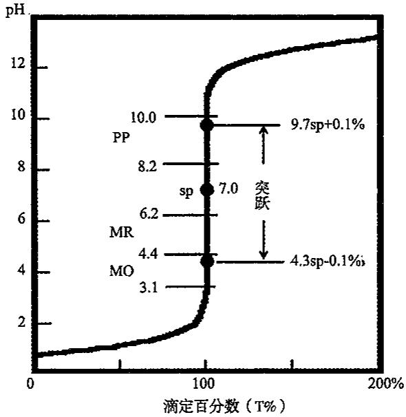

由表和图可以看出，从滴定开始到加入19.98mL NaOH溶液，即99.9%的HCl被滴定，溶液pH总共只变化了3.30个pH单位，pH变化比较缓慢。从加入19.98mL到20.02mL NaOH溶液，相对误差从不足0.1%到过量0.1%，只用了NaOH溶液0.04mL，约一滴，溶液pH从4.30急剧增大到9.70变化了5.4个pH单位，即 $\left[H^{+}\right]$ 改变了25万倍，溶液由酸性变为碱性。即在化学计量点(pH=7.00)前后±0.1%相对误差范围内滴定曲线出现呈近似垂直的一段，溶液的pH发生突变，这种pH的突变称为滴定突跃，突跃所在的pH范围称为突跃范围。此后若继续加入NaOH溶液则进入强碱的缓冲区，溶液的pH变化逐渐减小，曲线又比较平坦。

滴定的突跃范围很重要,它是选择指示剂的依据,指示剂的变色范围必须全部或部分落在滴定曲线的突跃范围内,这是选用指示剂的必要条件。当然选用指示剂还需要考虑其他因素,例如,石蕊的变色范围虽然也在此突跃范围内,但由于石蕊的颜色变化由紫色到红色或蓝色均不明显,不便于观察,所以不能选用。

如果用 0.1000mol/L 盐酸滴定 0.1000mol/L NaOH 溶液, 其滴定曲线正好与上图的方向相反, 或对称。

强酸强碱恰好完全反应达化学计量点，pH 为 7，此时选用酚酞作指示剂，当溶液由无色变为浅红色或由浅红色变为无色即达滴定终点。

滴定突跃范围的大小与滴定剂和被滴定溶液的浓度有关。如下图说明用不同浓度的 NaOH 标准溶液滴定不同浓度的盐酸所得的滴定曲线不同。从图中可以看出，浓度增大 10 倍，突跃增加 2 个 pH 单位。

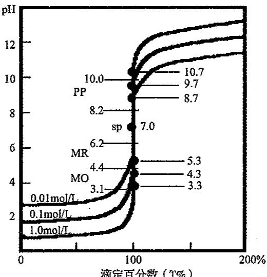  
滴定百分数（T%）  
$\therefore {NaA0} + {H}_{2}O \geq  {HAc} + {NaOH}$

## 2. 一元强碱滴定一元弱酸

若用 0.1000mol/L 的 NaOH 溶液滴定未知浓度的醋酸溶液。如果醋酸溶液的浓度为 0.1000mol/L，所得滴定曲线如下左图所示。

突跃范围为 7.70～9.70，选用变色范围为 8～10 的酚酞作指示剂。

若醋酸的浓度不同则突跃曲线如下右图所示,从图中可以看出,浓度增大10倍,突跃增加1个pH单位。

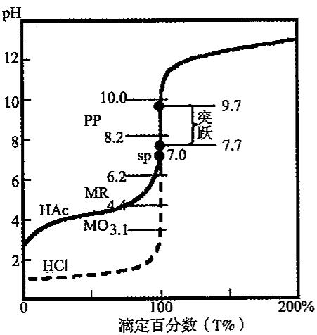

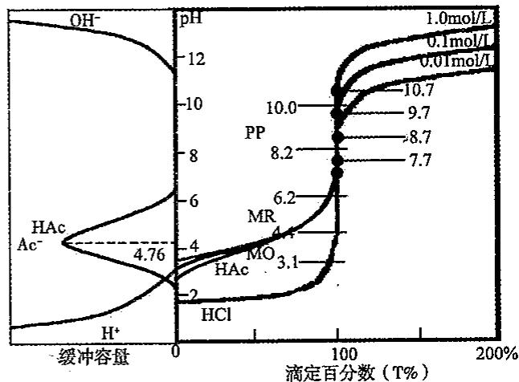

滴定弱酸的 pH 突跃范围与弱酸的 $K_{a}$ 之间的关系如下图所示。  
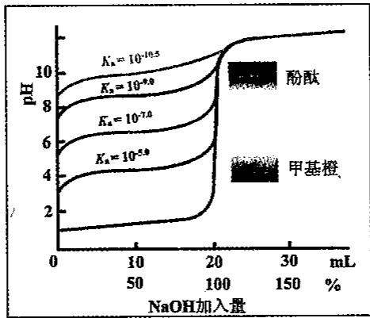

弱酸滴定曲线的讨论：

①滴定前，弱酸在溶液中部分电离，与强酸相比，曲线起点提高；

②滴定开始时,溶液 pH 升高较快,这是由于中和生成的 $Ac^{-}$ 产生同离子效应,使 HAc 更难离解, $[H^{+}]$ 降低较快;

③继续滴加 NaOH, 溶液形成缓冲体系, 曲线变化平缓;

④接近化学计量点时,溶液中剩余的 HAc 已很少,pH 变化加快;

⑤化学计量点前后产生 pH 突跃,与强酸相比,突跃范围变小;

⑥甲基橙指示剂不能用于弱酸滴定；

⑦随着弱酸 $K_{a}$ 变小，突跃变小， $K_{a}$ 在 $10^{-9}$ 左右突跃消失；

⑧直接滴定条件： $cK_{a}\geqslant10^{-8}$ 。

3. 一元强酸滴定一元弱碱

若用 0.1000mol/L 的盐酸滴定未知浓度的氨水, 如果氨水的浓度为 0.1000mol/L 也可得如下图所示的滴定曲线。

突跃范围为 4.30～6.25，在弱酸性区域，选用变色范围为 4.4～6.2 的甲基红作指示剂最合适。

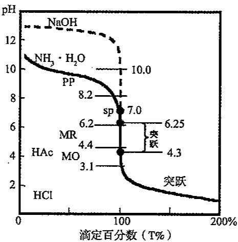

## 4. 多元弱酸的滴定

以磷酸为例：

$$
\mathrm{H} _ {3} \mathrm{PO} _ {4} \rightleftharpoons \mathrm{H} ^ {+} + \mathrm{H} _ {2} \mathrm{PO} _ {4} ^ {-}; K _ {\mathrm{al}} = 1 0 ^ {- 2. 1 2}
$$

$$
\mathrm{H} _ {2} \mathrm{PO} _ {4} ^ {-} \rightleftharpoons \mathrm{H} ^ {+} + \mathrm{HPO} _ {4} ^ {2 -}; K _ {\mathrm{a2}} = 1 0 ^ {- 7. 2 1}
$$

$$
\mathrm{HPO} _ {4} ^ {2 -} \rightleftharpoons \mathrm{H} ^ {+} + \mathrm{PO} _ {4} ^ {3 -}; K _ {\mathrm{a3}} = 1 0 ^ {- 1 2. 6 7}
$$

$c \cdot K_{a1} \geqslant 10^{-8}$ 且 $K_{a1}/K_{a2} > 10^{5}$ ;第一级能准确分步滴定;

$c \cdot K_{a2} \geqslant 10^{-8}$ 且 $K_{a2}/K_{a3} > 10^{5}$ ; 第二级能准确分步滴定;

$c \cdot K_{a3} < 10^{-8}$ ; 第三级不能被准确滴定。

①当第一级 $H^{+}$ 被完全滴定后，溶液组成为 $NaH_{2}PO_{4}$ ，两性物质；

$\mathrm{pH} = \frac{\left(\mathrm{pK}_{\mathrm{a1}} + \mathrm{pK}_{\mathrm{a2}}\right)}{2} = 4.66$ ，使用甲基橙，甲基红，溴甲酚绿+甲基橙作为指示剂。

②当第二级 $H^{+}$ 被完全滴定后，溶液组成为 $Na_{2}HPO_{4}$ ，两性物质；

$\mathrm{pH} = \frac{\left(\mathrm{pK}_{\mathrm{e2}} + \mathrm{pK}_{\mathrm{a3}}\right)}{2} = 9.94$ ，使用酚酞，百里酚酞或酚酞+百里酚酞作为指示剂。

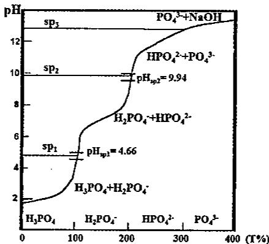

## 5. 多元弱碱的滴定

以碳酸钠为例：

$$
\mathrm{CO} _ {3} ^ {2 -} + \mathrm{H} ^ {+} \rightleftharpoons \mathrm{HCO} _ {3} ^ {-}; K _ {\mathrm{bl}} = 1 0 ^ {- 3. 7 5}
$$

$$
\mathrm{HCO} _ {3} ^ {-} + \mathrm{H} ^ {+} \rightleftharpoons \mathrm{H} _ {2} \mathrm{CO} _ {3}; K _ {\mathrm{b2}} = 1 0 ^ {- 7. 6 2}
$$

$c \cdot K_{b1} \geqslant 10^{-8}$ 且 $K_{b1}/K_{b2} \approx 10^{4}$ ;第一级能被准确分步滴定

$c \cdot K_{b2} \geqslant 10^{-8}$ ; 第二级能被准确滴定

①当第一级 $CO_{3}^{2-}$ 被完全滴定后，溶液组成为 $NaHCO_{3}$ ，两性物质；

$\mathrm{pH} = \frac{(\mathrm{pK}_{\mathrm{a1}} + \mathrm{pK}_{\mathrm{a2}})}{2} = 8.37$ ，使用酚酞作为指示剂。

②当第二级 $HCO_{3}^{-}$ 被完全滴定后，溶液组成为 $CO_{2} + H_{2}O(H_{2}CO_{3}$ 饱和溶液，0.04mol/L；

$$
\left[ \mathrm{H} ^ {+} \right] = \sqrt {c _ {\mathrm{a}} K _ {\mathrm{al}}} = \sqrt {4 . 1 7 \times 1 0 ^ {- 7} \times 0 . 0 4} = 1. 3 \times 1 0 ^ {- 4} \mathrm{mol/L}
$$

pH=3.90, 使用甲基橙作为指示剂。

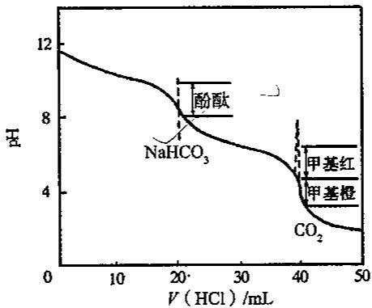

## 9.2.2 分布系数

溶液中某酸或碱组分的平衡浓度占其总浓度的分数，以 $\delta$ 表示 $\delta=\frac{c_{i}}{c}$ ，不同 pH 溶液中酸碱存在形式用分布曲线表示。

## 1. 一元弱酸

$$
\delta_ {0} = \delta_ {\mathrm{HAc}} = \frac {[ \mathrm{HAc} ]}{c} = \frac {[ \mathrm{HAc} ]}{[ \mathrm{HAc} ] + [ \mathrm{Ac} ^ {-} ]} = \frac {[ \mathrm{H} ^ {+} ]}{K _ {a} + [ \mathrm{H} ^ {+} ]}
$$

$$
\begin{array}{r l} \delta_ {1} = & \delta_ {\mathrm{Ac} ^ {-}} = \frac {[ \mathrm{Ac} ^ {-} ]}{c} = \frac {[ \mathrm{Ac} ^ {-} ]}{[ \mathrm{HAc} ] + [ \mathrm{Ac} ^ {-} ]} = \frac {K _ {a}}{K _ {a} + [ \mathrm{H} ^ {+} ]} \\ & \delta_ {\mathrm{HAc}} + \delta_ {\mathrm{Ac} ^ {-}} = 1 \end{array}
$$

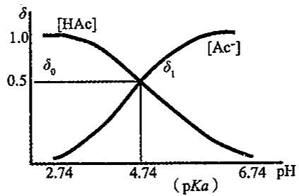

当 $pH=pK_{a}$ 时， $\delta_{Ac^{-}}=\delta_{HAc}=0.50$ ，HAc 与 $Ac^{-}$ 各占一半； $pH<pK_{a}$ ，主要存在形式是 HAc； $pH>pK_{a}$ ，主要存在形式是 $Ac^{-}$ 。

## 2.二元弱酸

$$
\begin{array}{r l} \delta_ {0} & = \frac {\left[ \mathrm{H} _ {2} \mathrm{C} _ {2} \mathrm{O} _ {4} \right]}{c} = \frac {\left[ \mathrm{H} _ {2} \mathrm{C} _ {2} \mathrm{O} _ {4} \right]}{\left[ \mathrm{H} _ {2} \mathrm{C} _ {2} \mathrm{O} _ {4} \right] + \left[ \mathrm{HC} _ {2} \mathrm{O} _ {4} ^ {-} \right] + \left[ \mathrm{C} _ {2} \mathrm{O} _ {4} ^ {2 -} \right]} = \frac {1}{1 + \frac {\left[ \mathrm{HC} _ {2} \mathrm{O} _ {4} ^ {-} \right]}{\left[ \mathrm{H} _ {2} \mathrm{C} _ {2} \mathrm{O} _ {4} \right]} + \frac {\left[ \mathrm{C} _ {2} \mathrm{O} _ {4} ^ {2 -} \right]}{\left[ \mathrm{H} _ {2} \mathrm{C} _ {2} \mathrm{O} _ {4} \right]}} \\ & = \frac {1}{1 + \frac {K _ {\mathrm{a1}}}{\left[ \mathrm{H} ^ {+} \right]} + \frac {K _ {\mathrm{a1}} K _ {\mathrm{a2}}}{\left[ \mathrm{H} ^ {+} \right] ^ {2}}} = \frac {\left[ \mathrm{H} ^ {+} \right] ^ {2}}{\left[ \mathrm{H} ^ {+} \right] ^ {2} + K _ {\mathrm{a1}} \left[ \mathrm{H} ^ {+} \right] + K _ {\mathrm{a1}} K _ {\mathrm{a2}}} \\ & \delta_ {1} = \frac {\left[ \mathrm{HC} _ {2} \mathrm{O} _ {4} ^ {-} \right]}{c} = \frac {K _ {\mathrm{a1}} \left[ \mathrm{H} ^ {+} \right]}{\left[ \mathrm{H} ^ {+} \right] ^ {2} + K _ {\mathrm{a1}} \left[ \mathrm{H} ^ {+} \right] + K _ {\mathrm{a1}} K _ {\mathrm{a2}}}; \\ & \delta_ {2} = \frac {\left[ \mathrm{C} _ {2} \mathrm{O} _ {4} ^ {2 -} \right]}{c} = \frac {K _ {\mathrm{a1}} K _ {\mathrm{a2}}}{\left[ \mathrm{H} ^ {+} \right] ^ {2} + K _ {\mathrm{a1}} \left[ \mathrm{H} ^ {+} \right] + K _ {\mathrm{a1}} K _ {\mathrm{a2}}}; \\ & \delta_ {0} + \delta_ {1} + \delta_ {2} = 1 \end{array}
$$

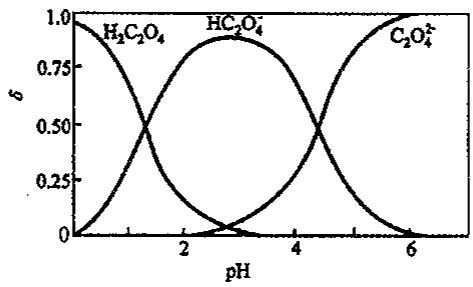

## 3. 三元弱酸

$$
\begin{array}{r l} \delta_ {0} & = \frac {\left[ \mathrm{H} _ {3} \mathrm{PO} _ {4} \right]}{c} = \frac {\left[ \mathrm{H} ^ {+} \right] ^ {3}}{\left[ \mathrm{H} ^ {+} \right] ^ {3} + K _ {\mathrm{a1}} \left[ \mathrm{H} ^ {+} \right] ^ {2} + K _ {\mathrm{a1}} K _ {\mathrm{a2}} \left[ \mathrm{H} ^ {+} \right] + K _ {\mathrm{a1}} K _ {\mathrm{a2}} K _ {\mathrm{a3}}} \\ \delta_ {1} & = \frac {\left[ \mathrm{H} _ {2} \mathrm{PO} _ {4} ^ {-} \right]}{c} = \frac {K _ {\mathrm{a1}} \left[ \mathrm{H} ^ {+} \right] ^ {2}}{\left[ \mathrm{H} ^ {+} \right] ^ {3} + K _ {\mathrm{a1}} \left[ \mathrm{H} ^ {+} \right] ^ {2} + K _ {\mathrm{a1}} K _ {\mathrm{a2}} \left[ \mathrm{H} ^ {+} \right] + K _ {\mathrm{a1}} K _ {\mathrm{a2}} K _ {a 3}} \\ \delta_ {2} & = \frac {\left[ \mathrm{HPO} _ {4} ^ {2 -} \right]}{c} = \frac {K _ {\mathrm{a1}} K _ {\mathrm{a2}} \left[ \mathrm{H} ^ {+} \right]}{\left[ \mathrm{H} ^ {+} \right] ^ {3} + K _ {\mathrm{a1}} \left[ \mathrm{H} ^ {+} \right] ^ {2} + K _ {\mathrm{a1}} K _ {\mathrm{a2}} \left[ \mathrm{H} ^ {+} \right] + K _ {\mathrm{a1}} K _ {\mathrm{a2}} K _ {3}} \\ \delta_ {3} & = \frac {\left[ \mathrm{PO} _ {4} ^ {3 -} \right]}{c} = \frac {K _ {\mathrm{a1}} K _ {\mathrm{a2}} K _ {\mathrm{a3}}}{\left[ \mathrm{H} ^ {+} \right] ^ {3} + K _ {\mathrm{a1}} \left[ \mathrm{H} ^ {+} \right] ^ {2} + K _ {\mathrm{a1}} K _ {\mathrm{a2}} \left[ \mathrm{H} ^ {+} \right] + K _ {\mathrm{a1}} K _ {\mathrm{a2}} K _ {\mathrm{i3}}} \\ & \delta_ {0} + \delta_ {1} + \delta_ {2} + \delta_ {3} = 1 \end{array}
$$

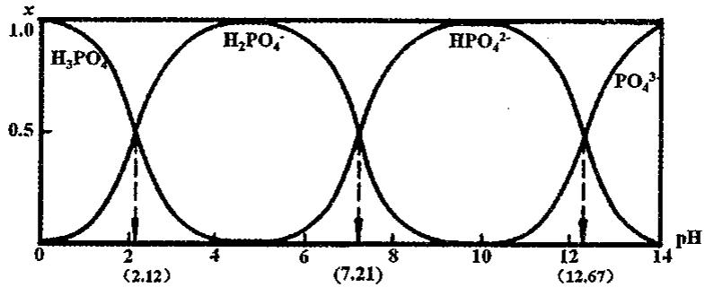  
相当于六元酸的 EDTA 的不同物种的分布系数与 pH 值之间的关系, 如下图所示。

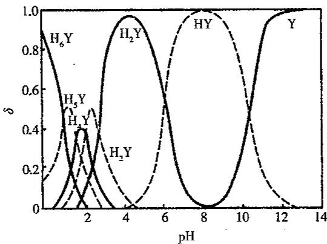

## 9.2.3 酸碱滴定法的应用

## 1. 双指示剂测工业烧碱中 $\mathrm{NaOH}$ 和 $\mathrm{Na_2CO_3}$ 的含量

准确称取一定质量为 $m_{s}g$ 的试样加水溶解，先以酚酞为指示剂，用已知浓度为 $c_{HCl}$ 的盐酸标准溶液滴定至红色刚消去，记下盐酸的体积为 $V_{1}$ 。这时 NaOH 被全部中和，而 $NaCO_{3}$ 则被中和到 $NaHCO_{3}$ 。然后再加入甲基橙，继续用盐酸滴定至溶液由黄色变为橙色，这一滴定过程消耗盐酸体积为 $V_{2}$ 。由酸碱反应知，把 $Na_{2}CO_{3}$ 滴定到 $NaHCO_{3}$ 和把 $NaHCO_{3}$ 滴定到 NaCl 消耗盐酸的量是相等的。已知 $Na_{2}CO_{3}$ 的式量是 106.0 g/mol，NaOH 的式量为 40.00 g/mol，则有：

$$
w _ {\mathrm{Na} _ {2} \mathrm{CO} _ {3}} = \frac {c _ {\mathrm{HCl}} V _ {2} M _ {\mathrm{Na} _ {2} \mathrm{CO} _ {3}}}{m _ {\mathrm{s}}} \times 100\%; w _ {\mathrm{NaOH}} = \frac {c _ {\mathrm{HCl}} (V _ {1} - V _ {2}) M _ {\mathrm{NaOH}}}{m _ {\mathrm{s}}} \times 100\%
$$

## 2. 双指示剂测工业纯碱中 $Na_{2}CO_{3}$ 和 $NaHCO_{3}$ 的含量

准确称取一定质量为 $m_{s}g$ 的试样加水溶解，先以酚酞为指示剂，用已知浓度为 $c_{HCl}$ 的盐酸标准溶液滴定，把 $Na_{2}CO_{3}$ 滴定到 $NaHCO_{3}$ ，所消耗盐酸的体积为 $V_{1}$ ，再用甲基橙作指示剂，把 $NaHCO_{3}$ 滴定到 NaCl，消耗盐酸的体积为 $V_{2}$ 。那么原样品混合物中 $NaHCO_{3}$ 消耗盐酸的体积是 $V_{2}-V_{1}$ 。据此可求得 $Na_{2}CO_{3}$ 和 $NaHCO_{3}$ 的含量。

$$
w _ {\mathrm{Na} _ {2} \mathrm{CO} _ {3}} = \frac {c _ {\mathrm{HCl}} V _ {1} \mathrm{M} _ {\mathrm{Na} _ {2} \mathrm{CO} _ {3}}}{m _ {\mathrm{s}}} \times 100\%; w _ {\mathrm{NaHCO} _ {3}} = \frac {c _ {\mathrm{HCl}} (V _ {2} - V _ {1}) M _ {\mathrm{NaHCO} _ {3}}}{m _ {\mathrm{s}}} \times 100\%
$$

双指示剂法测定混合碱含量小结:若先用酚酞作指示剂时消耗的酸量为 $V_{1}$ ，后用甲基橙做指示剂时消耗的酸量为 $V_{2}$ ，则如下表所示。

<table><tr><td> $V_1 > V_2$ </td><td> $NaOH + Na_2CO_3$ </td></tr><tr><td> $V_1 = V_2$ </td><td> $Na_2CO_3$ </td></tr><tr><td> $V_1 < V_2$ </td><td> $Na_2CO_3 + NaHCO_3$ </td></tr><tr><td> $V_1 = 0, V_2 \neq 0$ </td><td> $NaHCO_3$ </td></tr><tr><td> $V_1 \neq 0, V_2 = 0$ </td><td> $NaOH$ </td></tr></table>

## 3. 酸碱滴定法测定磷

钢铁和矿石等试样中的磷有时也采用酸碱滴定法进行测定。在硝酸介质中，磷酸与

钼酸铵反应，生成黄色磷钼酸铵沉淀：

$$
\mathrm{PO} _ {4} ^ {3 -} + 1 2 \mathrm{MoO} _ {4} ^ {2 -} + 2 \mathrm{NH} _ {4} ^ {+} + 2 5 \mathrm{H} ^ {+} = (\mathrm{NH} _ {4}) _ {2} \mathrm{H} [ \mathrm{PMo} _ {1 2} \mathrm{O} _ {4 0} ] \cdot \mathrm{H} _ {2} \mathrm{O} \downarrow + 1 1 \mathrm{H} _ {2} \mathrm{O}
$$

沉淀过滤之后,用水洗涤,然后将沉淀溶解于定量且过量的 NaOH 标准溶液中,溶解反应为:

$$
\left(\mathrm{NH} _ {4}\right) _ {2} \mathrm{H} \left[ \mathrm{PMo} _ {1 2} \mathrm{O} _ {4 0} \right] \cdot \mathrm{H} _ {2} \mathrm{O} + 2 7 \mathrm{OH} ^ {-} = \underline {{\mathrm{PO} _ {4} ^ {3 -}}} + 1 2 \mathrm{MoO} _ {4} ^ {2 -} + 2 \mathrm{NH} _ {3} + 1 6 \mathrm{H} _ {2} \mathrm{O}
$$

过量的 NaOH 再用硝酸标准溶液返滴定, 至酚酞恰好褪色为终点 (pH 约等于 8), 这时, 有下列三个反应发生:

$$
\begin{array}{r l} & {\mathrm {OH^ {-}} (\text {过剩的} \mathrm{NaOH}) + \mathrm {H^ {+}} = \mathrm {H_ {2} O}; \mathrm {PO_ {4} ^ {3 - }} + \mathrm {H^ {+}} = \mathrm {HP O _ {4} ^ {2 - }}; \mathrm {NH_ {3}} + \mathrm {H^ {+}} = \mathrm {NH_ {4} ^ {+}};} \\ & {\quad 1 \mathrm{P} \longrightarrow \frac {1}{2} \mathrm {P_ {2} O_ {5}} \longrightarrow (\mathrm {NH_ {4}}) _ {2} \mathrm {HP O _ {4}} \cdot 1 2 \mathrm {MoO_ {3}} \cdot \mathrm {H_ {2} O} \downarrow} \\ & {\quad \text {标} \mathrm {HNO_ {3}} \quad \Big | 2 4 \mathrm {OH^ {-}}} \\ & {\quad \mathrm{NaOH(标)} + 1 2 \mathrm {Mo O _ {4} ^ {2 - }} + 2 \mathrm {NH_ {4} ^ {+}} + 1 3 \mathrm {H_ {2} O} + \mathrm {HP O _ {4} ^ {2 - }}} \\ & {\quad \text {过量标准溶液}} \end{array}
$$

由上述几步反应, 可以看出溶解 1mol 磷钼酸铵沉淀, 消耗 27mol NaOH。用硝酸返滴定至 pH 约等于 8 时, 沉淀溶解后所产生的 $PO_{4}^{3-}$ 转变为 $HPO_{4}^{2-}$ , 需消耗 1mol 的 $HNO_{3}$ , 2mol $NH_{3}$ 滴定至 $NH_{4}^{+}$ 时, 消耗 2mol $HNO_{3}$ 。这时候 1mol 磷钼酸铵沉淀实际只消耗 27-3=24mol NaOH, 因此, 磷与 NaOH 的化学计量数比为 1:24。试样中磷的含量为:

$$
w _ {\mathrm{P}} = \frac {(c _ {\mathrm{NaOH}} V _ {\mathrm{NaOH}} - c _ {\mathrm{HNO} _ {3}} V _ {\mathrm{HNO} _ {3}}) \times \frac {1}{2 4} \times M _ {\mathrm{P}}}{m _ {\mathrm{s}}} \times 100 \%
$$

由于磷的化学计量比很小,本方法可用于微量磷的测定。

## 4. 氟硅酸钾法测定硅

试样用 KOH 熔融, 使其转化为可溶性硅酸盐, 如 $K_{2}SiO_{3}$ 等, 硅酸钾在钾盐存在下与 HF 作用 (或在强酸溶液中加 KF, HF 有剧毒, 必须在通风橱中操作), 转化成微溶的氟硅酸钾 ( $K_{2}SiF_{6}$ ), 其反应如下:

$$
\mathrm{K} _ {2} \mathrm{SiO} _ {3} + 6 \mathrm{HF} = \mathrm{K} _ {2} \mathrm{SiF} _ {6} \downarrow + 3 \mathrm{H} _ {2} \mathrm{O}
$$

由于沉淀的溶解度较大,还需加入固体 KCl 以降低其溶解度,过滤,用氯化钾—乙醇溶液洗涤沉淀,将沉淀放入原烧杯中,加入氯化钾—乙醇溶液,以 NaOH 中和游离酸至酚酞变红,再加入沸水,使氟硅酸钾水解而释放出 HF,其反应如下:

$$
\mathrm{K} _ {2} \mathrm{SiF} _ {6} + 3 \mathrm{H} _ {2} \mathrm{O} = 2 \mathrm{KF} + \mathrm{H} _ {2} \mathrm{SiO} _ {3} + 4 \mathrm{HF} 。
$$

用 NaOH 标准溶液滴定释放出的 HF，以求得试样中 $SiO_{2}$ 的含量。

由反应式可知， $1\,mol\ K_{2}SiF_{6}$ 释放出 4mol HF，即消耗 4mol NaOH，所以试样中 $SiO_{2}$ 与 NaOH 的计量数比为 1:4。试样中 $SiO_{2}$ 质量分数为：

$$
w _ {\mathrm{SiO} _ {2}} = \frac {c _ {\mathrm{NaOH}} V _ {\mathrm{NaOH}} \times \frac {1}{4} M _ {\mathrm{SiO} _ {2}}}{m _ {\mathrm{s}}} \times 100 \%
$$

## 5.铵盐中氮含量的测定

对于一些极弱的酸(碱),有时利用生成稳定的络合物可以使弱酸强化,从而可以较

准确的进行滴定。

$$
\text { 甲醛法: } 4 \mathrm{NH} _ {4} ^ {+} + 6 \mathrm{HCHO} = (\mathrm{CH} _ {2}) _ {6} \mathrm{N} _ {4} \mathrm{H} ^ {+} + 3 \mathrm{H} ^ {+} + 6 \mathrm{H} _ {2} \mathrm{O} 。
$$

用标准 NaOH 溶液滴定生成的 $(\mathrm{CH}_{2})_{6}\mathrm{N}_{4}\mathrm{H}^{+}$ 和 $\mathrm{H}^{+}$ 。

## 6.硼酸 $(\mathbf{H}_3\mathbf{BO}_3)$ 的测定

硼酸为极弱酸，它在水溶液中按下式解离：

$$
\mathrm{H} _ {3} \mathrm{BO} _ {3} + 2 \mathrm{H} _ {2} \mathrm{O} \rightleftharpoons \mathrm{H} _ {3} \mathrm{O} ^ {+} + [ \mathrm{B(OH)} _ {4} ] ^ {-} \quad K _ {\mathrm{a}} = 5. 8 \times 1 0 ^ {- 1 0}
$$

由于硼酸太弱,以至于不能用 NaOH 进行准确滴定。如果向硼酸溶液中加入一些甘油或甘露醇,使其与硼酸根形成稳定的络合物,从而增大硼酸在水溶液中的电离程度,使硼酸转变成为中强酸。

例如: 当溶液中有较大量甘露醇存在时, 硼酸将按下式生成络合物, 该络合酸的 $pK_{a}=6.26$ 。

$$
2 \begin{array}{c} \mathrm{H} \\ | \\ \mathrm{R} - \mathrm{C} - \mathrm{OH} \\ | \\ \mathrm{R} - \mathrm{C} - \mathrm{OH} \\ | \\ \mathrm{H} \end{array} + \mathrm{H} _ {3} \mathrm{BO} _ {3} \longrightarrow \left[ \begin{array}{c c} \mathrm{H} & \mathrm{H} \\ | & | \\ \mathrm{R} - \mathrm{C} - \mathrm{O} & \mathrm{O} - \mathrm{C} - \mathrm{R} \\ | & | \\ \mathrm{R} - \mathrm{C} - \mathrm{O} & \mathrm{O} - \mathrm{C} - \mathrm{R} \\ | & | \\ \mathrm{H} & \mathrm{H} \end{array} \right] \mathrm{H} + 3 \mathrm{H} _ {3} \mathrm{O}
$$

## 7. 有机含氮化合物中氮的测定(蒸馏法)

蒸馏法—凯氏定氮法(Kjeldahl)是测定有机化合物中氮含量的重要方法。适用于蛋白质、胺类、酰胺类及尿素等有机化合物中氮的测定。

试样用浓 $H_{2}SO_{4}$ 消煮(消化)分解(有时还需要加入催化剂)，使各种含氮化合物都转化为 $NH_{4}^{+}$ ，加浓 NaOH，将 $NH_{4}^{+}$ 以 $NH_{3}$ 的形式蒸馏出来，用 $H_{3}BO_{3}$ 溶解液将 $NH_{3}$ 吸收， $NH_{3} + H_{3}BO_{3} = NH_{4}^{+} + H_{2}BO_{3}^{-}$ ，以甲基橙和溴甲酚绿为混合指示剂，用标准硫酸或盐酸滴定 $[B(OH)_{4}]^{-}$ 近无色透明为终点。 $H_{3}BO_{3}$ 的酸性极弱，它可以吸收 $NH_{3}$ ，但不影响滴定，不必定量加入。

铵盐加浓 NaOH 蒸馏出的 $NH_{3}$ ，也可用过量的已知浓度的盐酸或硫酸吸收，再用甲基橙作指示剂用标准 NaOH 溶液滴定过量的酸来求氮的含量。

## 9.2.4 常用酸碱缓冲溶液和标准缓冲溶液

酸碱缓冲溶液：

<table><tr><td>缓冲溶液</td><td>pKa</td><td>缓冲范围</td></tr><tr><td>氨基乙酸+HCl</td><td>2.35</td><td>1.35~3.35</td></tr><tr><td>氯乙酸+NaOH</td><td>2.86</td><td>1.86~3.86</td></tr><tr><td>甲酸+NaOH</td><td>3.77</td><td>2.77~4.77</td></tr><tr><td>HAc+NaAc</td><td>4.76</td><td>3.76~5.76</td></tr><tr><td>六次甲基四胺+HCl</td><td>5.13</td><td>4.13~6.13</td></tr><tr><td> $H_{2}PO_{4}^{-} + HPO_{4}^{2-}$ </td><td>7.21</td><td>6.21~8.21</td></tr><tr><td>三羟甲基甲胺+HCl</td><td>8.21</td><td>7.21~9.21</td></tr><tr><td>硼砂( $H_{3}BO_{3} + [B(OH)_{4}]^{-}$ )</td><td>9.24</td><td>8.24~10.24</td></tr><tr><td> $NH_{4}^{+} + NH_{3}$ </td><td>9.25</td><td>8.25~10.25</td></tr></table>

标准缓冲溶液(用于校准酸度计):

<table><tr><td>缓冲溶液</td><td>pH(25°C)</td></tr><tr><td>饱和酒石酸氢钾(0.034mol/kg)</td><td>3.557</td></tr><tr><td>邻苯二甲酸氢钾(0.050mol/kg)</td><td>4.008</td></tr><tr><td>0.025mol/kg KH2PO4+0.025mol/kg Na2HPO4</td><td>6.865</td></tr><tr><td>硼砂(0.010mol/kg)</td><td>9.180</td></tr><tr><td>饱和氢氧化钙</td><td>12.454</td></tr></table>

## 9.2.5 常用的酸碱指示剂

<table><tr><td>指示剂</td><td>变色范围pH</td><td>颜色</td><td> $pK_{HIn}$ </td></tr><tr><td>百里酚蓝(第一次变色)</td><td>1.2~2.8</td><td>红 黄</td><td>1.7</td></tr><tr><td>百里酚蓝(第二次变色)</td><td>8.0~9.6</td><td>黄 蓝</td><td>8.9</td></tr><tr><td>甲基黄</td><td>2.9~4.0</td><td>红 黄</td><td>3.3</td></tr><tr><td>甲基橙</td><td>3.1~4.4</td><td>红 黄</td><td>3.4</td></tr><tr><td>溴酚蓝</td><td>3.0~4.6</td><td>黄 紫</td><td>4.1</td></tr><tr><td>甲基红</td><td>4.4~6.2</td><td>红 黄</td><td>5.0</td></tr><tr><td>溴百里酚蓝</td><td>6.2~7.6</td><td>黄 蓝</td><td>7.3</td></tr><tr><td>中性红</td><td>6.8~8.0</td><td>红 橙黄</td><td>7.4</td></tr><tr><td>酚酞</td><td>8.2~10.0</td><td>无 红</td><td>9.1</td></tr><tr><td>百里酚酞</td><td>9.4~10.6</td><td>无 蓝</td><td>10.0</td></tr><tr><td>溴甲酚绿</td><td>4.0~5.6</td><td>黄 蓝</td><td>5.0</td></tr></table>

混合指示剂: 混合指示剂主要是利用颜色的互补作用而形成。混合指示剂通常有两种配制方法：

1. 一种是在某种指示剂中加入一种不随溶液 $H^{+}$ 浓度变化而改变颜色的“惰性染料”起衬托作用。

pH 值    甲基橙    靛蓝    混合后 $\leqslant3.1$ 红色 + 蓝色 紫色
=4.1 橙色 + 蓝色 浅灰色 $\geqslant4.4$ 黄色 + 蓝色 绿色

2. 将两种或两种以上的指示剂混合配成，互补作用，选择两种(或多种) $pK_{a}$ 值比较接近的指示剂，按一定的比例混合。

例如：

甲基红 溴甲酚绿 混合后
酸式色 红色 + 黄色 暗红色
中间色 橙色 + 绿色 灰色
碱式色 黄色 + 蓝色 绿色

混合指示剂:甲基红+溴甲酚绿
5.0    5.1    5.2 暗红 灰 绿

用于 $Na_{2}CO_{3}$ 标定 HCl 时指示终点。

## 3. 特点

由于颜色互补使变色间隔变窄，变色敏锐。

广范 pH 试纸是用甲基红，溴百里酚蓝，百里酚蓝，酚酞按一定比例混合，溶于乙醇，浸泡滤纸得到的。

## 9.3 络合滴定法(配位滴定法)

## 9.3.1 络合滴定法的基本原理

络合滴定法是以络合反应为基础的滴定分析方法。络合反应也叫路易斯酸碱反应，所以，络合滴定法与酸碱滴定法有许多相似之处。若以乙二胺四乙酸(简称EDTA)为滴定剂，大多数金属离子M与Y形成1:1型络合物，可视M为酸，Y为碱，与一元酸碱滴定类似。但是，M有络合效应和水解效应，Y有酸效应和共存离子效应，所以络合滴定要比酸碱滴定复杂。酸碱滴定中，酸的 $K_{a}$ 或碱的 $K_{b}$ 是不变的，而络合滴定MY的 $K_{MY}$ 是随滴定体系中反应的条件而变化。欲使滴定过程中 $K_{MY}$ 基本不变，常用酸碱缓冲溶液控制酸度。

## 9.3.2 常用的络合滴定剂——EDTA

## 1. 在溶液中的存在形式

在高酸度条件下,EDTA 是一个六元弱酸,在溶液中存在有六级离解平衡和七种存在形式:

$$
\begin{array}{l l}\mathrm {H_ {6} Y^{2 + } \rightleftharpoons H^ {+} + H_ {5} Y^ {+}}&K _ {\mathrm{a1}} = 1. 3 \times 1 0 ^ {- 1} = \underline {{1 0 ^ {- 0 . 9}}}\\\mathrm {H_ {5} Y^ {+} \rightleftharpoons H^ {+} + H_ {4} Y}&K _ {\mathrm{a2}} = 2. 5 \times 1 0 ^ {- 2} = \underline {{1 0 ^ {- 1 . 6}}}\\\mathrm {H_ {4} Y\rightleftharpoons H^ {+} + H_ {3} Y^ {-}}&K _ {\mathrm{a3}} = 1. 0 \times 1 0 ^ {- 2} = \underline {{1 0 ^ {- 2 . 0}}}\\\mathrm {H_ {3} Y^ {-} \rightleftharpoons H^ {+} + H_ {2} Y^{2 - }}&K _ {\mathrm{a4}} = 2. 1 4 \times 1 0 ^ {- 3} = \underline {{1 0 ^ {- 2 . 6 7}}}\\\mathrm {H_ {2} Y^{2 - } \rightleftharpoons H^ {+} + HY^{3 - }}&K _ {\mathrm{a5}} = 6. 9 2 \times 1 0 ^ {- 7} = \underline {{1 0 ^ {- 6 . 1 6}}}\\\mathrm {HY^{3 - } \rightleftharpoons H^ {+} + Y^{4 - }}&K _ {\mathrm{a6}} = 5. 5 0 \times 1 0 ^ {- 1 1} = \underline {{1 0 ^ {- 1 0 . 2 6}}}\end{array}
$$

2. 不同 pH 值下 EDTA 的主要存在型体

<table><tr><td>pH</td><td>EDTA 主要存在型体</td></tr><tr><td>&lt;0.9</td><td> $H_6Y^{2+}$ </td></tr><tr><td>0.9~1.6</td><td> $H_5Y^+$ </td></tr><tr><td>1.6~2.0</td><td> $H_4Y$ </td></tr><tr><td>2.0~2.7</td><td> $H_3Y^-$ </td></tr><tr><td>2.7~6.2</td><td> $H_2Y^{2-}$ </td></tr><tr><td>6.2~10.3</td><td> $HY^{3-}$ </td></tr><tr><td>&gt;10.3</td><td> $Y^{4-}$ </td></tr></table>

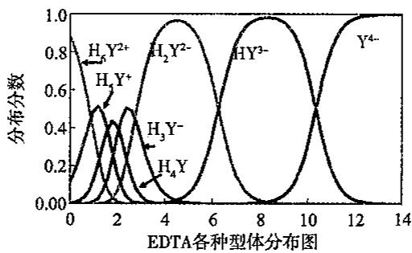  
3. EDTA 与一些常见金属离子配合物的稳定常数(溶液离子浓度 c=0.1mol/L, 温度 293K)

<table><tr><td>阳离子</td><td> $lgK_{MY}$ </td><td>阳离子</td><td> $lgK_{MY}$ </td><td>阳离子</td><td> $lgK_{MY}$ </td></tr><tr><td> $Na^{+}$ </td><td>1.66</td><td> $Ce^{4+}$ </td><td>15.98</td><td> $Cu^{2+}$ </td><td>18.80</td></tr><tr><td> $Li^{+}$ </td><td>2.79</td><td> $Al^{3+}$ </td><td>16.3</td><td> $Ga^{3+}$ </td><td>20.3</td></tr><tr><td> $Ag^{+}$ </td><td>7.32</td><td> $Co^{2+}$ </td><td>16.31</td><td> $Ti^{3+}$ </td><td>21.3</td></tr><tr><td> $Ba^{2+}$ </td><td>7.86</td><td> $Pt^{2+}$ </td><td>16.31</td><td> $Hg^{2+}$ </td><td>21.8</td></tr><tr><td> $Mg^{2+}$ </td><td>8.69</td><td> $Cd^{2+}$ </td><td>16.46</td><td> $Sn^{2+}$ </td><td>22.1</td></tr><tr><td> $Sr^{2+}$ </td><td>8.73</td><td> $Zn^{2+}$ </td><td>16.50</td><td> $Th^{4+}$ </td><td>23.2</td></tr><tr><td> $Be^{2+}$ </td><td>9.20</td><td> $Pb^{2+}$ </td><td>18.04</td><td> $Cr^{3+}$ </td><td>23.4</td></tr><tr><td> $Ca^{2+}$ </td><td>10.69</td><td> $Y^{3+}$ </td><td>18.09</td><td> $Fe^{3+}$ </td><td>25.1</td></tr><tr><td> $Mn^{2+}$ </td><td>13.87</td><td> $VO_{2}^{+}$ </td><td>18.1</td><td> $U^{4+}$ </td><td>25.8</td></tr><tr><td> $Fe^{2+}$ </td><td>14.33</td><td> $Ni^{2+}$ </td><td>18.60</td><td> $Bi^{3+}$ </td><td>27.94</td></tr><tr><td> $La^{3+}$ </td><td>15.50</td><td> $VO^{2+}$ </td><td>18.8</td><td> $Co^{3+}$ </td><td>36.0</td></tr></table>

设金属离子 M 的初始浓度为 $c_{M}$ ，体积为 $V_{M}$ 等浓度的滴定剂 Y 滴定，滴入的体积为 $V_{Y}$ 则滴定分数

$$
a = \frac {V _ {\mathrm{Y}}}{V _ {\mathrm{M}}}
$$

由物料平衡方程式得

$$
[ \mathrm{M} ] + [ \mathrm{MY} ] = c _ {\mathrm{M}}\tag{①}
$$

$$
[ \mathrm{Y} ] + [ \mathrm{MY} ] = c _ {\mathrm{Y}} = a c _ {\mathrm{M}}\tag{②}
$$

由络合平衡方程：

$$
K _ {\mathrm{MY}} = \frac {[ \mathrm{MY} ]}{[ \mathrm{M} ] [ \mathrm{Y} ]}\tag{③}
$$

由①及②式可得：

$$
[ \mathrm{MY} ] = c _ {\mathrm{M}} - [ \mathrm{M} ] = a c _ {\mathrm{M}} - [ \mathrm{Y} ]\tag{④}
$$

$$
[ \mathrm{Y} ] = a c _ {\mathrm{M}} - c _ {\mathrm{M}} + [ \mathrm{M} ]\tag{⑤}
$$

将④⑤式代入③式得：

$$
K _ {\mathrm{MY}} = \frac {c _ {\mathrm{M}} - [ \mathrm{M} ]}{[ \mathrm{M} ] (a c _ {\mathrm{M}} - c _ {\mathrm{M}} + [ \mathrm{M} ])} = K _ {\mathrm{t}}\tag{⑥}
$$

展开

$$
c _ {\mathrm{M}} - [ \mathrm{M} ] = K _ {\mathrm{t}} [ \mathrm{M} ] ^ {2} - K _ {\mathrm{t}} [ \mathrm{M} ] c _ {\mathrm{M}} + K _ {\mathrm{t}} [ \mathrm{M} ] a c _ {\mathrm{M}}
$$

整理得

$$
K _ {t} [ \mathrm{M} ] ^ {2} + \left[ K _ {t} c _ {\mathrm{M}} (a - 1) + 1 \right] [ \mathrm{M} ] - c _ {\mathrm{M}} = 0
$$

此即络合滴定曲线方程，与强酸强碱滴定的滴定曲线方程十分相似。

在化学计量点时，a=1.00，上式可简化为

$$
\begin{array}{r l} & K _ {\mathrm{MY}} [ \mathrm{M} ] _ {\mathrm{sp}} ^ {2} + [ \mathrm{M} ] _ {\mathrm{sp}} - c _ {\mathrm{M}} = 0 \\ & [ \mathrm{M} ] _ {\mathrm{sp}} = \frac {- 1 \pm \sqrt {1 ^ {2} + 4 K _ {\mathrm{MY}} \cdot c _ {\mathrm{M}}}}{2 K _ {\mathrm{MY}}} \end{array}
$$

一般络合滴定要求 $K_{\mathrm{MY}} \geqslant 10^{7}$ , 若 $c_{\mathrm{M}} = 10^{-2} \mathrm{~mol} \cdot \mathrm{L}^{-1}$ , 即 $K_{\mathrm{MY}} \cdot c_{\mathrm{M}} \geqslant 10^{5}$ 。由于 $4K_{\mathrm{MY}} \cdot c_{\mathrm{M}} >> 1, \sqrt{4K_{\mathrm{MY}} \cdot c_{\mathrm{M}}} >> 1$ 。因此，

$$
[ \mathrm{M} ] _ {\mathrm{sp}} \approx \frac {\sqrt {4 K _ {\mathrm{MY}} \cdot c _ {\mathrm{M}}}}{2 K _ {\mathrm{MY}}} = \sqrt {\frac {c _ {\mathrm{M}}}{K _ {\mathrm{MY}}}}
$$

若 $c_{M}$ 使用化学计量点时浓度, 对上式取对数, 得到

$$
\mathrm{pM} _ {\mathrm{sp}} = \frac {1}{2} (\lg K _ {\mathrm{MY}} + \mathrm{pc} _ {\mathrm{M}} ^ {\mathrm{sp}})
$$

当已知 $K_{MY}, c_{M}$ 和 a 值，或已知 $K_{MY}, c_{M}, V_{M}$ 和 $V_{Y}$ 时，便可求得 [M]。以 pM 对 a（或对 $V_{Y}$ ）作图，即得到滴定曲线。若 M, Y 或 MY 有副反应时，式中的 $K_{MY}$ 用 $K'_{MY}$ 取代，[M] 应为 $[M']$ ；而滴定曲线图上的纵坐标与横坐标分别为 $pM'$ 及 a（或 $V_{Y}$ ）。

设金属离子的初始浓度为 0.010mol/L，用 0.010mol/LEDTA 滴定，若 $\lg K'_{MY}$ 分别是 6,8,10,12,14,16 应用上式计算出相应的滴定曲线，如下左图所示。当 $\lg K'_{MY}=10$ ， $c_{M}$ 分别是 $10^{-1}\sim10^{-4}$ mol/L 分别用等浓度的 EDTA 滴定，所得的滴定曲线如下右图所示。

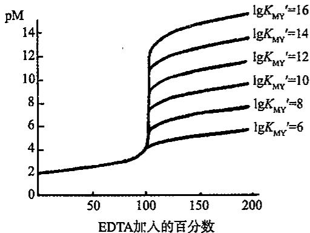

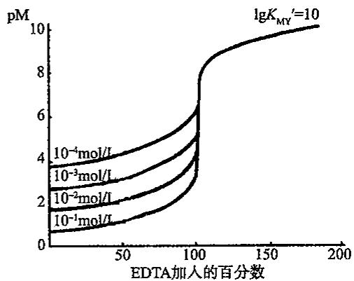  
由图可知，影响络合滴定中 $\mathrm{pM}$ 突跃大小的主要因素是 $K^{\prime}_{\mathrm{MY}}$ 和 $c_{\mathrm{M}}$ 。

络合滴定所用的指示剂是金属指示剂，在酸性条件下可用二甲酚橙(XO)作指示剂，可测定 $Bi^{3+}$ 、 $Pb^{2+}$ 、 $Zn^{2+}$ 、 $Al^{3+}$ 等金属离子；在碱性条件下(pH=10)，可用铬黑 T(EBT) 作指示剂，可测定 $Zn^{2+}$ 、 $Pb^{2+}$ 、 $Ca^{2+}$ 、 $Mg^{2+}$ 等金属离子。

## 9.3.3 溶液中各级络合物的分布

[ML] $= \beta_{1}[\mathrm{M}][\mathrm{L}]$

## 高中化学竞赛

## 基本理论学习笔记.

$$
\begin{array}{l} \left[ \mathrm{ML} _ {2} \right] = \beta_ {2} [ \mathrm{M} ] [ \mathrm{L} ] ^ {2} \\ \dots \dots \\ \left[ \mathrm{ML} _ {n} \right] = \beta_ {n} [ \mathrm{M} ] [ \mathrm{L} ] ^ {n} \\ c _ {\mathrm{M}} = [ \mathrm{M} ] + [ \mathrm{ML} ] + [ \mathrm{ML} _ {2} ] + \dots + [ \mathrm{ML} _ {n} ] \\ \delta_ {0} = \delta_ {\mathrm{M}} = \frac {[ \mathrm{M} ]}{c _ {\mathrm{M}}} = \frac {[ \mathrm{M} ]}{[ \mathrm{M} ] + [ \mathrm{ML} ] + [ \mathrm{ML} _ {2} ] + \dots + [ \mathrm{ML} _ {n} ]} = \frac {1}{1 + \beta_ {1} [ \mathrm{L} ] + \beta_ {2} [ \mathrm{L} ] ^ {2} + \cdots \beta_ {n} [ \mathrm{L} ] ^ {n}} \\ \delta_ {1} = \delta_ {\mathrm{ML}} = \frac {[ \mathrm{ML} ]}{c _ {\mathrm{M}}} = \frac {\beta_ {1} [ \mathrm{L} ]}{1 + \beta_ {1} [ \mathrm{L} ] + \beta_ {2} [ \mathrm{L} ] ^ {2} + \cdots + \beta_ {n} [ \mathrm{L} ] ^ {n}} \\ \delta_ {n} = \delta_ {\mathrm{ML} _ {n}} = \frac {[ \mathrm{ML} _ {n} ]}{c _ {\mathrm{M}}} = \frac {\beta_ {n} [ \mathrm{L} ] ^ {n}}{1 + \beta_ {1} [ \mathrm{L} ] + \beta_ {2} [ \mathrm{L} ] ^ {2} + \cdots \beta_ {n} [ \mathrm{L} ] ^ {n}} \end{array}
$$

$Cu^{2+}$ 与 $NH_{3}$ 逐级形成配合物，但是相邻两级络合物的稳定常数差别不大，没有一种配合物的存在形式的分布系数接近 1，所以，不能用 $NH_{3}$ 作配合剂滴定 $Cu^{2+}$ 。

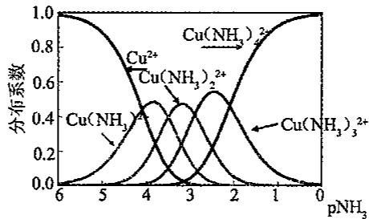

## 9.3.4 络合滴定法的应用

## 1. 直接滴定法

需满足下列条件: ① $\lg c_{M} \cdot K'_{MY} \geqslant 6$ ; ②反应速度快; ③有变色敏锐的指示剂, 即不发生封闭现象 $\lg K_{MY} \geqslant \lg K_{Mln}$ ; ④在测定条件下 M 不水解沉淀。

可以被直接滴定的常见离子如下表所示。

<table><tr><td>被测离子</td><td>pH</td><td>介质</td><td>指示剂</td><td>终点颜色变化</td></tr><tr><td> $Bi^{3+}$ </td><td>1</td><td> $HNO_3$ </td><td>XO(二甲酚橙)</td><td>红~亮黄</td></tr><tr><td> $Fe^{3+}$ </td><td>2</td><td>HCl</td><td>磺基水杨酸</td><td>紫红~无</td></tr><tr><td> $Cu^{2+}$ </td><td>3~10</td><td>HAc-NaAc</td><td>PAN/乙醇、80~90°C</td><td>黄~紫红</td></tr><tr><td>Zn、Pb</td><td>5~6</td><td> $(CH_2)_6N_4$ </td><td>XO</td><td>红~黄</td></tr><tr><td>Mg</td><td>10</td><td> $NH_3-NH_4Cl$ </td><td>K-B(酸性铬蓝)</td><td>酒红~蓝</td></tr><tr><td>Ca</td><td>10~13</td><td>NaOH</td><td>EBT(铬黑T)</td><td>酒红~蓝</td></tr></table>

(1)水的总硬度(钙和镁离子总量)测定

取一定体积的水样 $(V_{\text{水}})$ ，加入氨缓冲溶液（控制 pH=10）和铬黑 T 指示剂，用 EDTA 标准溶液滴定至溶液由酒红色变为纯蓝色，即达终点。记下所用 EDTA 标准溶液的体积 $(V_{\text{EDTA}})$ 。照下式计算水的硬度：

$$
\mathrm{硬度} (\mathrm{mmol} \cdot \mathrm{L} ^ {- 1}) = \frac {V _ {\mathrm{EDTA}} c _ {\mathrm{EDTA}} \times 1 0 0 0}{V _ {\mathrm{水}}}
$$

注意：水中 $Fe^{3+}$ 、 $Al^{3+}$ 、 $Mn^{2+}$ 、 $Cu^{2+}$ 、 $Pb^{2+}$ 等离子量略大时会发生干扰，需加掩蔽剂。

## (2)石灰石中钙和镁的测定

试样经酸溶解，在 pH=10 时，直接滴定溶液中钙和镁离子总量[方法同(1)]。在 pH>12.5 时，镁离子生成氢氧化物沉淀，可单独滴定钙离子。方法如下：

取一定体积的试样，加适量掩蔽剂（5%酒石酸钾钠和1:2三乙醇胺溶液），加20%NaOH溶液，控制pH>12.5，再加一定量的铜试剂。摇匀后，加入钙指示剂，用EDTA标准溶液滴定至溶液由红色变为纯蓝色，即达终点。记下所用EDTA标准溶液的体积。计算试样中含CaO的质量分数。

## 2. 返滴定法

在试液中先加入已知量过量的 EDTA 标准溶液, 然后用另一种金属盐类的标准溶液滴定过量的 EDTA, 根据两种标准溶液的浓度和用量, 即可求得被测物质的含量。

返滴定法主要用于下列情况:①缺乏合适的指示剂,或M对指示剂封闭;②M与Y反应慢;③M易发生水解等副反应。

## (1)铝盐中铝的测定

铝离子与 EDTA 络合速率甚慢, 故不能直接滴定。测定时都是在 pH=3 的条件下, 加入过量的 EDTA, 使铝离子完全络合, 此时其他金属离子(如铁等)也络合。再调整 pH =5\~6, 用铜盐(或锌盐)标准溶液返滴过量的 EDTA。然后利用氟离子能与铝离子生成更稳定的络合物这一性质, 加入氟化铵, 置换出与铝络合的 EDTA, 再用铜盐标准溶液滴定。

## 返滴定法示例 1: 明矾含量的测定

准确称取明矾样品 Sg，准确加入 EDTA 标准溶液 $V_{1}$ mL，加水 25 mL 稀释，沸水浴 10 min，冷却至室温后加入 HAc-NaAc 缓冲溶液 (pH=6)，加入两滴二甲酚橙指示剂，用标准 $ZnSO_{4}$ 溶液滴定，消耗 $V_{2}$ mL，溶液由黄色变为橙色时为滴定终点。

$$
w _ {\text {明矾}} \% = \frac {(c _ {\mathrm{EDTA}} V _ {\mathrm{EDTA}} - c _ {\mathrm{ZnSO} _ {4}} V _ {\mathrm{ZnSO} _ {4}}) \times M _ {\text {明矾}}}{S _ {\text {样}} \times 1000} \times 100 \% = \frac {(c _ {1} V _ {1} - c _ {2} V _ {2}) \times 474.1}{S \times 1000} \times 100 \%
$$

## 返滴定法示例 2: 氢氧化铝凝胶的测定

准确称取氢氧化铝凝胶 Sg，分别加入盐酸和水各 10mL，加热溶解，冷却后过滤，滤液加水稀释至 250mL，准确移取 25mL，滴加氨水至析出白色沉淀，加 HAc—NaAc 缓冲液 10mL，准确加入 EDTA 标准溶液 $V_{1}$ mL，煮沸 3～5min，冷却至室温后补少量水，滴加 1mL 二甲酚橙指示剂，用标准 $ZnSO_{4}$ 溶液滴定，消耗 $V_{2}$ mL，溶液由黄色变为橙色时为滴定终点。

$$
w_{\mathrm{Al}_{2}\mathrm{O}_{3}} \% = \frac{1}{2} \cdot \frac{(c_{\mathrm{EDTA}} V_{\mathrm{EDTA}} - c_{\mathrm{ZnSO}_{4}} V_{\mathrm{ZnSO}_{4}}) \times M_{\mathrm{Al}_{2}\mathrm{O}_{3}}}{S_{\text{样}} \times \frac{25}{250} \times 1000} \times 100 \% = \frac{1}{2} \cdot \frac{(c_{1} V_{1} - c_{2} V_{2}) \times 102}{S \times \frac{25}{250} \times 1000} \times 100 \%
$$

## 3. 置换滴定

利用置换反应,置换出等物质的量的另一金属离子,或置换出 EDTA,然后滴定,这就是置换滴定法。

置换滴定法主要用于下列情况:①混合离子相互干扰时,提高选择性滴定;②ep指示剂变色不敏锐时,改善变色敏锐性;③MY配合物不稳定,反应不稳定。

置换出金属离子:被测离子 M 与 EDTA 反应不完全或所形成的络合物不稳定,可让 M 置换出另一络合物(如 NL)中等物质的量的 N,用 EDTA 滴定 N,即可求得 M 的含量: $M+NL\rightleftharpoons ML+N$ 。

置换出 EDTA: 混合离子相互干扰, 将被测离子 M 与干扰离子全部用 EDTA 络合, 加入选择性高的络合剂 L 以夺取 M, 并释放出 EDTA, 反应后, 释放出与 M 等物质的量的 EDTA, 用金属盐类标准溶液滴定释放出的 EDTA, 即可测得 M 的含量。

## 4. 间接滴定法

有些金属阳离子和非金属阴离子不与 EDTA 络合或生成的络合物不稳定，这时可以采用间接滴定法。不与 EDTA 发生反应的离子，如： $Na^{+}$ ， $Na^{+}$ 与醋酸铀酰锌生成 $NaAc \cdot Zn(Ac)_{2} \cdot 3UO_{2}(Ac)_{2} \cdot 9H_{2}O$ 沉淀，分离沉淀，溶解后用 EDTA 滴定 $Zn^{2+}$ ，从而可以间接测定 $Na^{+}$ 的含量。

## 9.3.5 常用的金属指示剂

<table><tr><td rowspan="2">指示剂</td><td rowspan="2">适用的pH范围</td><td colspan="2">颜色变化</td><td rowspan="2">直接滴定的离子</td><td rowspan="2">配制</td><td rowspan="2">注意事项</td></tr><tr><td>In</td><td>MIn</td></tr><tr><td>铬黑 T EBT</td><td>7-10</td><td>蓝</td><td>红</td><td>pH=10,Mg2+、Zn2+、Cd2+、Pb2+、Mn2+、稀土离子</td><td>1:100NaCl(固体)</td><td>Fe3+、Al3+、Cu2+、Ni2+等离子封闭EBT</td></tr><tr><td>酸性铬蓝 K K-B</td><td>8-13</td><td>蓝</td><td>红</td><td>pH=10,Mg2+、Zn2+、Mn2+pH=13,Ca2+</td><td>1:100NaCl(固体)</td><td></td></tr><tr><td>二甲酚橙 XO</td><td>&lt;6</td><td>亮黄</td><td>红</td><td>pH&lt;1,ZrO2+pH=1-3.5,Bi3+、Th4+pH=5-6,Tl3+、Zn2+、Pb2+、Cd2+、Hg2+、稀土离子</td><td>0.5%水溶液</td><td>Fe3+、Al3+、Ni2+、TiIV等离子封闭XO</td></tr><tr><td>磺基水杨酸 ssal</td><td>1.5-2.5</td><td>无色</td><td>紫红</td><td>pH=1.5-2.5,Fe3+</td><td>5%水溶液</td><td>ssal本身无色,FeY-呈黄色</td></tr><tr><td>钙指示剂 NN</td><td>12-13</td><td>蓝</td><td>红</td><td>pH=12-13,Ca2+</td><td>1:100NaCl(固体)</td><td>TiIV、Fe3+、Al3+、Cu2+、Ni2+、Co2+、Mn2+等离子封闭NN</td></tr><tr><td>PAN</td><td>2-12</td><td>黄</td><td>紫红</td><td>pH=2-3,Th4+、Bi3+pH=4-5,Cu2+、Ni2+、Pb2+Cd2+、Zn2+、Mn2+、Fe2+</td><td>0.1%乙醇溶液</td><td>MIn在水中溶解度很小,为防止PAN 僵化,滴定时须加热</td></tr></table>

1. 金属离子指示剂应具备的条件

(1) MIn 与 In 有明显色差；

(2) MIn 稳定适当, $\lg K'_{MIn} > 4$ , 且 $\lg K'_{MY} - \lg K'_{MIn} > 2$ (指示剂封闭);

(3) HIn 本身稳定(指示剂变质);

(4) HIn 具有一定的选择性；

(5)指示终点的反应要快,水溶性要好(指示剂僵化)。

## 2. 指示剂使用中的问题

(1)封闭现象:因 $K^{\prime}_{MIn}>K^{\prime}_{MY}$ ，使溶液一直呈 MIn 色，无终点变化，这种现象称为指示剂的封闭现象。例:EDTA 滴定法测定水样中的总硬度，用 EBT 作指示剂， $Al^{3+}$ 、 $Fe^{3+}$ 等干扰。消除方法:用三乙醇胺掩蔽 $Al^{3+}$ 、 $Fe^{3+}$ ， $Na_{2}S$ 掩蔽 $Cu^{2+}$ 、 $Co^{2+}$ 、 $Ni^{2+}$ 。

(2) 僵化现象: 因 HIn 或 MIn 溶解度小, 变色过程的反应缓慢, 使终点变色不敏锐, 这种现象称为指示剂的僵化现象。例: PAN 作指示剂, 常加酒精或加热消除僵化现象。

(3)变质:指示剂易被氧化或聚合等。例:EBT常与NaCl配成1:100固体混合物保存使用;K-B指示剂加三乙醇胺保护。

## 3. 滴定过程中掩蔽剂的选择

(1)络合掩蔽法:利用配位反应降低或消除干扰离子。例如:使用 EDTA 滴定 $Ca^{2+}$ ， $Mg^{2+}$ ，加入三乙醇胺掩蔽 $Fe^{3+}$ 和 $Al^{3+}$ 。

具体实施方法：

①先加络合掩蔽剂，再调 pH，再用 EDTA 滴定 M。

②先加络合掩蔽剂 L，使 N 生成 NL 后，用 EDTA 准确滴定 M，再用 X（释放剂）破坏 NL，从 NL 中将 N 释放出来，以 EDTA 再准确滴定 N。

③先以 EDTA 直接滴定或返滴定测出 M、N 的总量，再加络合掩蔽剂 L，L 与 NY 中的 N 络合释放出 Y，再以金属离子标准溶液滴定 Y，测定 N 的含量。

采用络合掩蔽剂时需注意以下几点：

①掩蔽剂不与待测离子络合，即使形成络合物，其稳定性也应远小于待测离子与EDTA络合物的稳定性。

②干扰离子与掩蔽剂形成的络合物应远比与 EDTA 形成的络合物稳定，而且形成的络合物应为无色或浅色，不影响终点的判断。

③使用掩蔽剂时应注意适用的 pH 范围。

常用的掩蔽剂：

①氟化物(NaF,NH,F):pH=4\~6:掩蔽 $Al^{3+}$ , $Ti^{4+}$ , $Sn^{4+}$ ; pH=10:掩蔽 $Mg^{2+}$ , $Ca^{2+}$ , $Ba^{2+}$ 。

②氰化物：pH>9.31：掩蔽 $Cu^{2+}$ 、 $Ni^{2+}$ 、 $Co^{2+}$ 、 $Hg^{2+}$ 、 $Cd^{2+}$ 、 $Ag^{+}$ 、 $Zn^{2+}$ 。

不能与 $CN^{-}$ 配合的： $Ca^{2+}$ 、 $Mg^{2+}$ 、 $Pb^{2+}$ ；能被甲醛解蔽的氰化物： $Zn^{2+}$ 、 $Cd^{2+}$ ；

解蔽方程式为： $4\mathrm{HCHO}+\left[\mathrm{Zn(CN)}_{4}\right]^{2-}+4\mathrm{H}_{2}\mathrm{O}=\mathrm{Zn}^{2+}+4\mathrm{HO}-\mathrm{CH}_{2}-\mathrm{CN}+4\mathrm{OH}^{-}$

KCN 是剧毒物，只允许在碱性溶液中使用。

(2) 沉淀掩蔽法: 加入沉淀剂, 使干扰离子生成沉淀而被掩蔽, 从而消除干扰。例如: $\mathrm{Ca}^{2+}$ , $\mathrm{Mg}^{2+}$ 共存溶液时, 加入 NaOH 溶液, 使 $\mathrm{pH}>12$ , $\mathrm{Mg}^{2+}$ 生成 $\mathrm{Mg(OH)}_{2}$ , 从而消除 $\mathrm{Mg}^{2+}$ 干扰。

该法的缺点:①沉淀反应进行不完全,掩蔽效率不高;②共沉淀现象使准确度受影响;③有色沉淀影响终点观察;但沉淀掩蔽操作简便。

(3)氧化还原掩蔽法:利用氧化还原反应改变干扰离子价态,以消除干扰。例如:EDTA测 $Bi^{3+}$ , $Fe^{3+}$ 等,加入抗坏血酸将 $Fe^{3+}$ 还原为 $Fe^{2+}$ 消除干扰。

## 9.4 氧化还原滴定法

## 9.4.1 氧化还原滴定法的基本原理

氧化还原滴定法是以氧化还原反应为基础的滴定分析方法。同酸碱滴定法和络合滴定法一样，氧化还原滴定法也有反映滴定过程的滴定曲线，只不过在此滴定过程中发生变化的、反映氧化还原反应（滴定反应）进行程度的是电极电势。在氧化还原滴定中，随着滴定剂的不断滴入，物质的氧化型和还原型的浓度逐渐改变，有关电对的电势也逐渐改变，在化学计量点附近发生突跃。现以 $0.1000 \, \text{mol/L} \, \text{Ce(SO}_{4})_{2}$ 标准溶液滴定 $20.00 \, mL \, 0.100 \, mol/L \, Fe^{2+}$ 溶液为例：

$$
\begin{array}{r l} & \mathrm{Ce} ^ {4 +} + \mathrm{Fe} ^ {2 +} \xlongequal {1 \mathrm{mol/LH} _ {2} \mathrm{SO} _ {4}} \mathrm{Ce} ^ {3 +} + \mathrm{Fe} ^ {3 +} \\ & E ^ {\ominus} (\mathrm{Ce} ^ {4 +} / \mathrm{Ce} ^ {3 +}) = 1. 4 4 \mathrm{V}; E ^ {\ominus} (\mathrm{Fe} ^ {3 +} / \mathrm{Fe} ^ {2 +}) = 0. 6 8 \mathrm{V} \end{array}
$$

## (1)滴定前

由于空气中氧的作用，在 0.1000mol/L 的 $Fe^{2+}$ 溶液中，必有少量的 $Fe^{3+}$ 存在，组成电对 $Fe^{3+}/Fe^{2+}$ ，由于 $Fe^{3+}$ 不知道，故此时的电势无法计算。

滴定开始后,体系中就同时存在两个电对。在滴定过程中,任何一点达到平衡时,两电对的电势均相等。

$$
E = E ^ {\ominus} \left(\mathrm{Fe} ^ {3 +} / \mathrm{Fe} ^ {2 +}\right) + 0. 0 5 9 1 \times \lg \frac {c \left(\mathrm{Fe} ^ {3 +}\right)}{c \left(\mathrm{Fe} ^ {2 +}\right)} = E ^ {\ominus} \left(\mathrm{Ce} ^ {4 +} / \mathrm{Ce} ^ {3 +}\right) + 0. 0 5 9 1 \times \lg \frac {c \left(\mathrm{Ce} ^ {4 +}\right)}{c \left(\mathrm{Ce} ^ {3 +}\right)}
$$

因此在滴定开始后的不同阶段，可任选一电对计算体系的电势。

## (2)滴定开始至化学计量点前

在这个阶段,加入的 $Ce^{4+}$ 几乎全部被还原成 $Ce^{3+}, Ce^{4+}$ 的浓度极小,计算其浓度比较麻烦,但根据滴定的百分数,可以很容易地计算出 $c(\mathrm{Fe}^{3+})/c(\mathrm{Fe}^{2+})$ ,这时可根据 $Fe^{3+}/Fe^{2+}$ 电对来计算电位。

若滴入 $10\mathrm{mL}$ $\mathrm{Ce}^{4+}$ 溶液，则 $c(\mathrm{Fe}^{3+}) = c(\mathrm{Fe}^{2+}) = \frac{0.2}{3}\mathrm{mol/L};E = E^{\ominus}(\mathrm{Fe}^{3+}/\mathrm{Fe}^{2+})+$ $0.0591\times \lg \frac{c(\mathrm{Fe}^{3+})}{c(\mathrm{Fe}^{2+})} = 0.68\mathrm{V}$ 。同理可计算出滴入 $\mathrm{Ce}^{4+}$ 溶液1.00、2.00、4.00、8.00、18.00、19.80、19.98mL的电势。

## (3)化学计量点时

此时， $\mathrm{Ce}^{4+}$ 和 $\mathrm{Fe}^{2+}$ 都定量地变成 $\mathrm{Ce}^{3+}$ 和 $\mathrm{Fe}^{3+}, c(\mathrm{Ce}^{4+})$ 和 $c(\mathrm{Fe}^{2+})$ 的浓度很小不便求得，故不能单独用某一电对来计算电势值，而需要由两电对的能斯特方程联立求解：

$$
E _ {\mathrm{sp}} = E ^ {\ominus} \left(\mathrm{Fe} ^ {3 +} / \mathrm{Fe} ^ {2 +}\right) + 0. 0 5 9 1 \times \lg \frac {c \left(\mathrm{Fe} ^ {3 +}\right)}{c \left(\mathrm{Fe} ^ {2 +}\right)}
$$

$$
E _ {\mathrm{sp}} = E ^ {\ominus} \left(\mathrm{Ce} ^ {4 +} / \mathrm{Ce} ^ {3 +}\right) + 0. 0 5 9 1 \times \lg \frac {c \left(\mathrm{Ce} ^ {4 +}\right)}{c \left(\mathrm{Ce} ^ {3 +}\right)}
$$

两式相加得

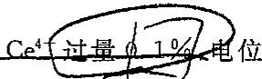

$$
E _ {\mathrm{sp}} = \frac {E ^ {\ominus} \left(\mathrm{Fe} ^ {3 +} / \mathrm{Fe} ^ {2 +}\right) + E ^ {\ominus} \left(\mathrm{Ce} ^ {4 +} / \mathrm{Ce} ^ {3 +}\right)}{2} + \frac {0 . 0 5 9 1}{2} \lg \frac {c \left(\mathrm{Fe} ^ {3 +}\right) c \left(\mathrm{Ce} ^ {4 +}\right)}{c \left(\mathrm{Fe} ^ {2 +}\right) c \left(\mathrm{Ce} ^ {3 +}\right)}
$$

在计量点时， $c(\mathrm{Ce}^{4+})=c(\mathrm{Fe}^{2+})$ 、 $c(\mathrm{Ce}^{3+})=c(\mathrm{Fe}^{3+})$ ，故 $E_{sp}=\frac{0.68+1.44}{2}=1.06V$ 。

## (4)化学计量点后

当滴入 $Ce^{4+}$ 溶液 20.02mL 时， $E_{sp}=1.44+0.0591\times\lg\frac{0.002}{2.0}=1.26V$ 。

同样可计算滴入 $Ce^{4+}$ 溶液 22.00、30.00、40.00mL 时的电势。将不同滴定点的电势列于下表中，并绘制成滴定曲线如图所示。

<table><tr><td colspan="2">加入的 $Ce^{4+}$ 溶液</td><td>剩余的 $Fe^{2+}$ </td><td>过量的 $Ce^{4+}$ </td><td>电势</td></tr><tr><td>毫升数</td><td>%</td><td>%</td><td>%</td><td>V</td></tr><tr><td>0.00</td><td>0.0</td><td>100.0</td><td></td><td>—</td></tr><tr><td>1.00</td><td>5.0</td><td>95.0</td><td></td><td>0.60</td></tr><tr><td>2.00</td><td>10.0</td><td>90.0</td><td></td><td>0.62</td></tr><tr><td>4.00</td><td>20.0</td><td>80.0</td><td></td><td>0.64</td></tr><tr><td>8.00</td><td>40.0</td><td>60.0</td><td></td><td>0.67</td></tr><tr><td>10.00</td><td>50.0</td><td>50.0</td><td></td><td>0.68</td></tr><tr><td>12.00</td><td>60.0</td><td>40.0</td><td></td><td>0.69</td></tr><tr><td>18.00</td><td>90.0</td><td>10.0</td><td></td><td>0.74</td></tr><tr><td>19.80</td><td>99.0</td><td>1.0</td><td></td><td>0.80</td></tr><tr><td>19.98</td><td>99.9</td><td>0.1</td><td></td><td>0.86</td></tr><tr><td>20.00</td><td>100.0</td><td></td><td></td><td>1.06</td></tr><tr><td>20.02</td><td>100.1</td><td></td><td>0.1</td><td>1.26</td></tr><tr><td>20.20</td><td>101.0</td><td></td><td>1.0</td><td>1.32</td></tr><tr><td>22.00</td><td>110.0</td><td></td><td>10.0</td><td>1.38</td></tr><tr><td>30.00</td><td>150.0</td><td></td><td>50.0</td><td>1.42</td></tr><tr><td>40.00</td><td>200.0</td><td></td><td>100.0</td><td>1.44</td></tr></table>

由表可知,滴定百分率为50%处的电位,等于被测物的电对的条件电位;滴定百分率为200%处的电位,等于滴定剂电对的条件电位值。

$$
\mathrm{Fe} ^ {2 +}
$$

可以看出，从把半球重点面上，剩余0.12倍增加了 $1.26 - 0.86 = 0.40$ 伏，有一个相当大的突跃范围。知道这个突跃范围，对选择氧化还原指示剂很有用处。

氧化还原滴定的终点可用指示剂或通过反应物自身的颜色变化来确定。

影响突跃范围的因素：

a. 与两电对的电位差值大小及半反应电子得失数有关。 $\Delta E^{\ominus}$ 越大，则滴定突跃范围越大，越易寻找指示剂。

b. 氧化还原滴定突跃与滴定剂的浓度无关。

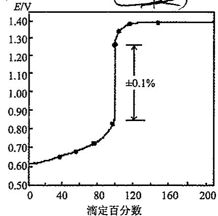

一般 $\Delta E^{\ominus}>0.3\sim0.4V$ 时，可用氧化还原指示剂确定终点。在 $\Delta E^{\ominus}=0.2\sim0.3V$ 时，可用电位法确定终点。当 $\Delta E^{\ominus}<0.2V$ 时，不宜进行滴定分析。

滴定前的试样预处理:在滴定前使待测组分转变为适合滴定的价态的操作,称为滴定前的预处理。

进行预处理时所用的氧化剂和还原剂应符合下列条件：

①与待测组分的反应迅速、定量；②反应具有一定的选择性（最好只与待测组分起反应）；③过量的氧化剂和还原剂易于除去；④与被处理组分的反应速度较快。

预处理时常用的氧化剂有 $\left(\mathrm{NH}_{4}\right)_{2}\mathrm{S}_{2}\mathrm{O}_{8}$ 、 $KMnO_{4}$ 、 $H_{2}O_{2}$ 、 $KIO_{4}$ 、 $KClO_{4}$ 等。

预处理时常用的还原剂有 $SnCl_{2}$ 、 $SO_{2}$ 、 $TiCl_{3}$ 、金属还原剂(锌、铝、铁)等。

除去过量的氧化剂和还原剂的方法有：

①加热分解：如 $\mathrm{H}_{2}\mathrm{O}_{2}, (\mathrm{NH}_{4})_{2}\mathrm{S}_{2}\dot{\mathrm{O}}_{8}$ 可通过加热煮沸分解除去。

$$
2 \mathrm{H} _ {2} \mathrm{O} \stackrel {\Delta} {=} 2 \mathrm{H} _ {2} \mathrm{O} + \mathrm{O} _ {2}
$$

$$
2 \left(\mathrm{NH} _ {4}\right) _ {2} \mathrm{S} _ {2} \mathrm{O} _ {8} + 2 \mathrm{H} _ {2} \mathrm{O} \stackrel {\Delta} {=} 2 \left(\mathrm{NH} _ {4}\right) _ {2} \mathrm{SO} _ {4} + \mathrm{O} _ {2} + 2 \mathrm{H} _ {2} \mathrm{SO} _ {4}
$$

②过滤:如固体 $NaBiO_{3}$ 不溶于水,可过滤除去。

③利用氧化还原反应:用氧化剂作标准溶液测定铁矿石中铁的含量时,是将矿石溶解,用过量还原剂将 $Fe^{3+}$ 定量地还原为 $Fe^{2+}$ ,然后用氧化剂滴定 $Fe^{2+}$ 。 $SnCl_{2}$ 是一种很方便而又常用的还原剂。其反应为:

$$
2 \mathrm{Fe} ^ {3 +} + \mathrm{SnCl} _ {2} + 4 \mathrm{Cl} ^ {-} = 2 \mathrm{Fe} ^ {2 +} + [ \mathrm{SnCl} _ {6} ] ^ {2 -}
$$

然后用 $KMnO_{4}$ 、 $K_{2}Cr_{2}O_{7}$ 或 $Ce^{4+}$ 标准溶液滴定。用 $KMnO_{4}$ 滴定的反应是：

$$
\mathrm{MnO} _ {4} ^ {-} + 5 \mathrm{Fe} ^ {2 +} + 8 \mathrm{H} ^ {+} = \mathrm{Mn} ^ {2 +} + 5 \mathrm{Fe} ^ {3 +} + 4 \mathrm{H} _ {2} \mathrm{O}
$$

使用 $SnCl_{2}$ 还原 $Fe^{3+}$ 时，应当注意以下几点：

①必须破坏过量的 $SnCl_{2}$ 。否则会消耗过多的标准溶液，常用 $HgCl_{2}$ 将它氧化：

$$
\mathrm{Sn} ^ {2 +} + 2 \mathrm{HgCl} _ {2} + 4 \mathrm{Cl} ^ {-} = \left[ \mathrm{SnCl} _ {6} \right] ^ {2 -} + \mathrm{Hg} _ {2} \mathrm{Cl} _ {2} \downarrow (\text {白})
$$

②生成的 $Hg_{2}Cl_{2}$ 沉淀应当很少且呈丝状。大量絮状 $Hg_{2}Cl_{2}$ 沉淀也能慢慢与 $KMnO_{4}$ 作用（不与 $K_{2}Cr_{2}O_{7}$ 作用）：

$$
5 \mathrm{Hg} _ {2} \mathrm{Cl} _ {2} + 2 \mathrm{MnO} _ {4} ^ {-} + 1 6 \mathrm{H} ^ {+} = 1 0 \mathrm{Hg} ^ {2 +} + 1 0 \mathrm{Cl} ^ {-} + 2 \mathrm{Mn} ^ {2 +} + 8 \mathrm{H} _ {2} \mathrm{O}
$$

为了只生成少量的丝状沉淀 $Hg_{2}Cl_{2}$ ，溶液中过量 $SnCl_{2}$ 必须很少，因此， $SnCl_{2}$ 溶液必须逐渐慢慢加入。当 $[FeCl_{4}]^{-}$ 的黄色消失时，只需要加入 1～2 滴过量的 $SnCl_{2}$ ，以防止 $Fe^{2+}$ 被空气氧化。

③不可使 $\mathrm{Hg}_2\mathrm{Cl}_2$ 进一步被还原为金属 $\mathrm{Hg}$

$$
\mathrm{Hg} _ {2} \mathrm{Cl} _ {2} + \mathrm{Sn} ^ {2 +} + 4 \mathrm{Cl} ^ {-} = 2 \mathrm{Hg} \downarrow + [ \mathrm{SnCl} _ {6} ] ^ {2 -}
$$

因为这种黑色或灰色的微细金属汞,不仅能影响等当点的确定,同时也能慢慢与 $KMnO_{4}$ 反应:

$$
1 0 \mathrm{Hg} + 2 \mathrm{MnO} _ {4} ^ {-} + 1 6 \mathrm{H} ^ {+} + 1 0 \mathrm{Cl} ^ {-} = 5 \mathrm{Hg} _ {2} \mathrm{Cl} _ {2} \downarrow + 2 \mathrm{Mn} ^ {2 +} + 8 \mathrm{H} _ {2} \mathrm{O}
$$

为了避免这种情况， $HgCl_{2}$ 必须始终保持过量，使 $SnCl_{2}$ 不能过量太多。在操作上，应先将溶液适当稀释并冷却后，再快速加入 $HgCl_{2}$ 。

④应当尽快地完成滴定。因为 $Hg_{2}Cl_{2}$ 与 $Fe^{3+}$ 也有慢慢地进行反应的倾向：

$$
\mathrm{Hg} _ {2} \mathrm{Cl} _ {2} + 2 [ \mathrm{FeCl} _ {4} ] ^ {-} = 2 \mathrm{Hg} ^ {2 +} + 2 \mathrm{Fe} ^ {2 +} + 1 0 \mathrm{Cl} ^ {-}
$$

致使测定结果偏高。而 $Fe^{2+}$ 也有被空气氧化的可能，致使结果偏低。

## 9.4.2 氧化还原滴定法的应用

1. 碘量法(iodimetry): 是利用 $I_{2}$ 的氧化性和 $I^{-}$ 的还原性进行滴定分析的方法。

它的半电池反应为： $I_{2}(s)+2e^{-}\rightleftharpoons2I^{-},E^{\ominus}(I_{2}/I^{-})=0.5345V$

常将 $I_{2}$ 溶解在 KI 溶液中，使 $I_{2}$ 以 $I_{3}^{-}$ 形式存在，增加溶解度，降低挥发程度。

$$
\mathrm{I} _ {3} ^ {-} (\mathrm{s}) + 2 \mathrm{e} ^ {-} \rightleftharpoons 3 \mathrm{I} ^ {-}, E ^ {\ominus} \left(\mathrm{I} _ {3} ^ {-} / \mathrm{I} ^ {-}\right) = 0. 5 3 5 5 \mathrm{V}
$$

## (1) 直接碘量法

凡标准电极电势低于 $E^{\ominus}(I_{2}/I^{-})$ 的电对，其还原态可用碘标准溶液直接滴定，此方法称为直接碘量法。直接碘量法基本反应： $I_{2}(s)+2e^{-}=2I^{-}$ ，例如，亚硫酸盐可用直接碘量法测定，反应为：

$$
\mathrm{I} _ {2} + \mathrm{SO} _ {3} ^ {2 -} + \mathrm{H} _ {2} \mathrm{O} = 2 \mathrm{I} ^ {-} + \mathrm{SO} _ {4} ^ {2 -} + 2 \mathrm{H} ^ {+}
$$

直接碘量法滴定条件: 只能在酸性、中性或弱碱性溶液中进行, 因 pH > 9, 碘分子会发生歧化反应:

$$
3 \mathrm{I} _ {2} + 6 \mathrm{OH} ^ {-} \rightleftharpoons 5 \mathrm{I} ^ {-} + \mathrm{IO} _ {3} ^ {-} + 3 \mathrm{H} _ {2} \mathrm{O}
$$

## (2)间接碘量法

凡标准电极电位高于 $E^{\ominus}(\mathrm{I}_{2}/\mathrm{I}^{-})$ 的电对，其氧化态可用工还原，定量置换出 $\mathbf{I}_2$ ，置换出的 $\mathbf{I}_2$ 用 $\mathrm{Na_2S_2O_3}$ 标准溶液滴定，此方法称为间接碘量法。间接碘量法基本反应：

$$
\text {   氧化性物质   } + \mathrm{KI} (\text {   过量   }) \longrightarrow \mathrm{I} _ {2}, \mathrm{I} _ {2} + 2 \mathrm{S} _ {2} \mathrm{O} _ {3} ^ {2 -} \rightleftharpoons 2 \mathrm{I} ^ {-} + \mathrm{S} _ {4} \mathrm{O} _ {6} ^ {2 -}
$$

在间接碘量法中,当析出碘的反应完成后,应立即用 $Na_{2}S_{2}O_{3}$ 进行滴定(避免 $I_{2}$ 的挥发和被空气氧化)。

有些还原性物质可与过量的 $I_{2}$ 标准溶液反应, 待反应完全后, 剩余的 $I_{2}$ 用 $Na_{2}S_{2}O_{3}$ 标准溶液滴定, 此方法称为剩余碘量法或回滴碘量法。

$$
\text { 还原性物质 } + \mathrm{I} _ {2} (\text { 过量 }) \longrightarrow \text { 反应完全 }, \mathrm{I} _ {2} (\text { 剩余 }) + 2 \mathrm{S} _ {2} \mathrm{O} _ {3} ^ {2 -} \rightleftharpoons 2 \mathrm{I} ^ {-} + \mathrm{S} _ {4} \mathrm{O} _ {6} ^ {2 -}
$$

间接碘量法滴定条件:在中性或弱酸性溶液中进行。

间接碘量法的误差主要来源：

① $I_{2}$ 的挥发，② $I^{-}$ 在酸性溶液中被空气中的 $O_{2}$ 氧化。

防止 $I_{2}$ 挥发的方法：

①加入过量的 KI(比理论值大 2\~3 倍); ②在室温中进行; ③使用碘量瓶, 快滴慢摇。防止 I⁻ 被 O₂ 氧化的方法:

①降低酸度，以降低 $I^{-}$ 被 $O_{2}$ 氧化的速率；②防止阳光直射，除去 $Cu^{2+}$ 、 $NO_{2}^{-}$ 等催化剂，避免 $I^{-}$ 加速氧化；③使用碘量瓶，滴定前的反应完全后立即滴定，快滴慢摇。

(3)碘量法的指示剂：

① $I_{2}$ 作自身指示剂

②淀粉指示剂(多用): $I_{3}^{-}$ +淀粉(直链)⇌深蓝色吸附物

注意：

(a)加入时间:直接碘量法滴定前加入,间接碘量法临近终点时加入。

## 高中化学竞赛 基本理论学习笔记

(b) 温度: 因升高温度增大 $I_{2}$ 的挥发性, 降低淀粉指示剂的灵敏度。保存 $Na_{2}S_{2}O_{3}$ 溶液时, 室温升高, 增大细菌的活性, 加速 $Na_{2}S_{2}O_{3}$ 的分解。

(c)溶液的酸度: pH<2 时淀粉水解, 如果在强酸性溶液中, $Na_{2}S_{2}O_{3}$ 溶液会发生分解: $S_{2}O_{3}^{2-}+2H^{+}=SO_{2}+S\downarrow+H_{2}O$ , 同时, $I^{-}$ 在酸性溶液中也容易被空气中的 $O_{2}$ 氧化: $4I^{-}+4H^{+}+O_{2}=2I_{2}+2H_{2}O$ ; pH>9 时 $I_{2}$ 与 $S_{2}O_{3}^{2-}$ 将会发生下述副反应: $S_{2}O_{3}^{2-}+4I_{2}+10OH^{-}=2SO_{4}^{2-}+8I^{-}+5H_{2}O$ , 而且, $I_{2}$ 在碱性溶液中还会发生歧化反应: $3I_{2}+6OH^{-}=IO_{3}^{-}+5I^{-}+3H_{2}O$ 。

(d)淀粉质量:直链淀粉遇 $I_{3}^{-}$ 变蓝色、灵敏、可逆。支链淀粉遇 $I_{3}^{-}$ 变紫红色,但不稳定。

## (4)碘标准溶液的配制与标定

配制方法——标定法。

注意：

(a)加入过量 KI, 并使溶液中存在过量的 KI 浓度不低于 2%\~4%, 可增大 $I_{2}$ 的溶解度和降低其挥发程度。

(b)加少量 HCl 为除去少量的 $IO_{3}^{-}$ 及中和 $Na_{2}S_{2}O_{3}$ 标准溶液配制时作稳定剂用的 $Na_{2}CO_{3}$ 。

(c)避免 $I_{2}$ 溶液与橡胶等有机物接触。

(d) 过滤, 放入棕色瓶中保存。

标定的方法: 常用基准物 $As_{2}O_{3}$ 。

①在碱性条件下 $As_{2}O_{3}$ 溶解：

$$
\mathrm{As} _ {2} \mathrm{O} _ {3} + 2 \mathrm{NaOH} \rightleftharpoons 2 \mathrm{NaAsO} _ {2} + \mathrm{H} _ {2} \mathrm{O}
$$

②酸化后，加入 $NaHCO_{3}$ 使溶液呈弱碱性：

$$
\begin{array}{r l}&\mathrm {HAsO_ {2} + I_ {2} + 2H_ {2} O\rightleftharpoons H_ {3} AsO_ {4} + 2I^ {-} + 2H^ {+}}\\&\quad 1 \mathrm{mol} \mathrm {As_ {2} O_ {3}} \sim 2 \mathrm{mol} \mathrm {AsO_ {2} ^ {-}} \sim 2 \mathrm{mol} \mathrm {I_ {2}}\\&\quad c _ {\mathrm {I_ {2}}} = \frac {2 \mathrm{m} _ {\mathrm {As_ {2} O_ {3}}} \times 1 0 0 0}{\mathrm{M} _ {\mathrm {As_ {2} O_ {3}}} \mathrm{V} _ {\mathrm {I_ {2}}}}.\end{array}
$$

或采用比较法确定准确浓度:用已知准确浓度的 $Na_{2}S_{2}O_{3}$ 来滴定。标定好后要注意保存。

## (5)硫代硫酸钠标准溶液的配制与标定

配制方法——标定法。

因 $Na_{2}S_{2}O_{3}\cdot5H_{2}O$ 晶体容易风化，并含有少量 $S,S^{2-},SO_{3}^{2-},CO_{3}^{2-},Cl^{-}$ 等杂质，不能直接配制标准溶液。

因下面几方面原因，配好的 $Na_{2}S_{2}O_{3}$ 浓度不稳定，需放置 7～10 天，待浓度稳定后，过滤，标定。

①溶于水中的 $CO_{2}$ 的作用： $S_{2}O_{3}^{2-} + CO_{2} + H_{2}O \rightleftharpoons HSO_{3}^{-} + HCO_{3}^{-} + S \downarrow$

②细菌作用： $Na_{2}S_{2}O_{3}=Na_{2}SO_{3}+S\downarrow$

③空气中氧的氧化作用： $2S_{2}O_{3}^{2-}+O_{2}\rightleftharpoons2SO_{4}^{2-}+2S\downarrow$

因此：

①配制溶液时，蒸馏水应新煮沸放冷，煮沸的目的是除去水中溶解的 $CO_{2}$ 和 $O_{2}$ ，并

杀死细菌。

②加入少量 $Na_{2}CO_{3}$ 使溶液呈弱碱性 $(\mathrm{pH}\approx9)$ ，以抑制细菌的生长。

③配好的溶液置于棕色瓶中放置7\~10天，过滤后再标定。

④过一段时间后如发现溶液有浑浊，表示有硫析出，应弃去重配或过滤后再标定。

标定的方法:基准物 $K_{2}Cr_{2}O_{7}$ 、 $KIO_{3}$ 、 $KBrO_{3}$ 等。其中以重铬酸钾最常用。采用置换碘量法，以 $K_{2}Cr_{2}O_{7}$ 作基准物标定 $Na_{2}S_{2}O_{3}$ 浓度。

①在酸性条件下置换出 $I_{2}:Cr_{2}O_{7}^{2-}+6I^{-}+14H^{+}\rightleftharpoons2Cr^{3+}+3I_{2}+7H_{2}O$ 注意：

(a)酸度约 0.4mol/L，暗处放置 5min：目的使反应完全，防光照射，减弱 $I^{-}$ 被空气中 $O_{2}$ 氧化的速度。

(b) 使用碘量瓶。

(c)加入过量的 KI, 加快反应速度。

(d)室温下进行。

②在弱酸条件下用 $Na_{2}S_{2}O_{3}$ 滴定置换出的 $I_{2}:I_{2}+2S_{2}O_{3}^{2-}\rightleftharpoons2I^{-}+S_{4}O_{6}^{2-}$

(a)滴定前要稀释(控制 $H^{+}$ 浓度约 0.2mol/L)，防止 $Na_{2}S_{2}O_{3}$ 分解，同时降低 $Cr^{3+}$ 的浓度，便于终点观察。

(b)开始慢摇快滴。防 $I_{2}$ 挥发。

(c)临近终点时加入淀粉指示剂，并大力振摇。防终点迟钝。

$$
\begin{array}{r l} & 1 \mathrm{molK} _ {2} \mathrm{Cr} _ {2} \mathrm{O} _ {7} \sim 3 \mathrm{molI} _ {2} \sim 6 \mathrm{molNa} _ {2} \mathrm{S} _ {2} \mathrm{O} _ {3} \\ & c _ {\mathrm{Na} _ {2} \mathrm{S} _ {2} \mathrm{O} _ {3}} = \frac {6 m _ {\mathrm{K} _ {2} \mathrm{Cr} _ {2} \mathrm{O} _ {7}} \times 1 0 0 0}{M _ {\mathrm{K} _ {2} \mathrm{Cr} _ {2} \mathrm{O} _ {7}} V _ {\mathrm{Na} _ {2} \mathrm{S} _ {2} \mathrm{O} _ {3}}} \end{array}
$$

2. 高锰酸钾法(potassium permanganate method): 是以高锰酸钾为标准溶液的氧化还原滴定法。

强酸性条件: $c(\mathrm{H}^{+})$ 为1\~2mol/L时:

$$
\mathrm{MnO} _ {4} ^ {-} + 8 \mathrm{H} ^ {+} + 5 \mathrm{e} ^ {-} \rightleftharpoons \mathrm{Mn} ^ {2 +} + 4 \mathrm{H} _ {2} \mathrm{O}, E ^ {\ominus} (\mathrm{MnO} _ {4} ^ {-} / \mathrm{Mn} ^ {2 +}) = 1. 5 1 \mathrm{V}
$$

酸度太高， $\mathrm{KMnO_4}$ 分解；酸度过低，生成 $\mathrm{MnO_2}$ 沉淀；常用 $\mathrm{H}_2\mathrm{SO}_4$ ，不用 HCl 及 $\mathrm{HNO}_3$ ，因 HCl 具有还原性， $\mathrm{HNO}_3$ 具有氧化性；在不同条件下高锰酸根被还原成不同的形态，在强酸性条件下高锰酸根才是强氧化剂。

在氢氧化钠浓度大于 2mol/L 的碱性溶液中，高锰酸根可被还原成锰酸根。

## (1) 直接滴定法

许多还原性物质，如 $\mathrm{Fe}^{2+}$ 、 $\mathrm{As(III)}$ 、 $\mathrm{Sb(III)}$ 、 $H_{2}O_{2}$ 、 $C_{2}O_{4}^{2-}$ 等，可用 $KMnO_{4}$ 溶液直接滴定。例如，过氧化氢的测定：

$$
2 \mathrm{MnO} _ {4} ^ {-} + 5 \mathrm{H} _ {2} \mathrm{O} _ {2} + 6 \mathrm{H} ^ {+} \rightleftharpoons 2 \mathrm{Mn} ^ {2 +} + 5 \mathrm{O} _ {2} + 8 \mathrm{H} _ {2} \mathrm{O}
$$

$$
\mathrm{H} _ {2} \mathrm{O} _ {2} (\%) = \frac {\frac {5}{2} c _ {\mathrm{KMnO} _ {4}} V _ {\mathrm{KMnO} _ {4}} \times \frac {M _ {\mathrm{H} _ {2} \mathrm{O} _ {2}}}{1000}}{m} \times 100 \%
$$

反应在常温下就可进行，生成的锰离子对反应有催化作用。

再如:原料药中亚铁离子的测定:

$$
\begin{array}{l}5\mathrm{Fe}^{2 + } + \mathrm{MnO}_{4}^{-} + 8\mathrm{H}^{+}\rightleftharpoons 5\mathrm{Fe}^{3 + } + \mathrm{Mn}^{2 + } + 4\mathrm{H}_{2}\mathrm{O}\\\mathrm{FeSO}_{4}\cdot 7\mathrm{H}_{2}\mathrm{O}(\%) = \frac{5c_{\mathrm{KMnO}_{4}}V_{\mathrm{KMnO}_{4}}\times\frac{M_{\mathrm{FeSO}_{4}\cdot 7\mathrm{H}_{2}\mathrm{O}}}{1000}}{m}\end{array}
$$

注意: 此法不适合制剂的测定。若为片剂或糖浆, 由于其中含淀粉, 而高锰酸钾可氧化淀粉, 若仍用此法测定, 结果偏高; 应改用铈量法。

## (2) 返滴定法

有些氧化性物质不便于直接滴定，可用返滴定法。返滴定法如测二氧化锰，可在硫酸中加入一定量过量的草酸钠，待二氧化锰与草酸根反应完毕，用高锰酸钾标液滴定过量的草酸根。

## (3)间接滴定法

某些非氧化还原性物质,不能用 $KMnO_{4}$ 直接滴定可采用此法。

如测 $Ca^{2+}:Ca^{2+}+C_{2}O_{4}^{2-}=CaC_{2}O_{4}\downarrow$ ，过滤，加硫酸溶解沉淀后，再用 $KMnO_{4}$ 标准溶液滴定生成的 $H_{2}C_{2}O_{4}$ 。

配制高锰酸钾标液方法——标定法：

高锰酸钾在制备和贮存过程中，常混入少量的 $MnO_{2}$ 和其他杂质；因此不能直接配制。同时， $KMnO_{4}$ 氧化能力很强，能与水中的有机物缓慢发生反应，生成的 $\mathrm{MnO(OH)}_{2}$ 又会促使 $KMnO_{4}$ 进一步分解，见光则分解的更快。因此， $KMnO_{4}$ 溶液不稳定，配制 $KMnO_{4}$ 时应注意：

(a)称取稍多于理论量的 $KMnO_{4}$ 溶解。

(b)将配好的溶液加热至沸，并保持微沸1h，放冷，于棕色试剂瓶中放置2\~3d。或用新鲜煮沸放冷的蒸馏水配制，放置7\~8d。

(c)用微孔玻璃漏斗过滤,不用滤纸。

(d)将过滤后的溶液贮存于棕色试剂瓶中,放于暗处,以待标定。

(4) $KMnO_{4}$ 标准溶液的标定

基准物质： $As_{2}O_{3}$ 、 $H_{2}C_{2}O_{4}\cdot2H_{2}O$ 、 $Na_{2}C_{2}O_{4}$ 、纯铁丝、 $(NH_{4})_{2}Fe(SO_{4})_{2}\cdot6H_{2}O$ 等。最常用的是 $Na_{2}C_{2}O_{4}$ ，它易于提纯、稳定、不含结晶水，在105℃烘干即可使用。

$$
\text { 标定反应为: } 2 \mathrm{MnO} _ {4} ^ {-} + 5 \mathrm{C} _ {2} \mathrm{O} _ {4} ^ {2 -} + 1 6 \mathrm{H} ^ {+} = 2 \mathrm{Mn} ^ {2 +} + 1 0 \mathrm{CO} _ {2} + 8 \mathrm{H} _ {2} \mathrm{O}
$$

为使这个反应能定量地较快进行,应注意以下条件:

①温度：70～85℃，若高于90℃，草酸分解： $H_{2}C_{2}O_{4}=CO_{2}+CO+H_{2}O$ ，若低于60℃，反应速度太慢。

②酸度：开始滴定，0.5～1mol/L $H_{2}SO_{4}$ ；滴定终了，酸度0.2～0.5mol/L $H_{2}SO_{4}$ 。

酸度调节用硫酸。酸度不够时，容易生成 $MnO_{2} \cdot 2H_{2}O$ ；酸度过高，又会促使 $H_{2}C_{2}O_{4}$ 分解。

③滴定速度:开始滴定时, $KMnO_{4}$ -褪色较慢,滴入第一滴 $KMnO_{4}$ 溶液时应充分振荡至褪色后再继续滴加。

④催化剂:若开始滴定时加入锰离子,就可加快最初滴定的速度。

⑤指示剂：出现 $KMnO_{4}$ 紫红色确定终点。若 $KMnO_{4}$ 标液很稀，最好采用二苯磺酸钠、1,10-二氮菲-Fe(Ⅱ)等，来确定终点。

⑥滴定终点:粉红色,在半分钟内不褪即为终点。因空气中的还原性气体和灰尘都能与高锰酸根缓慢作用。

## (5)应用实例

## ① $\mathrm{H}_2\mathrm{O}_2$ 的测定

可用 $KMnO_{4}$ 标准溶液在酸性溶液中直接滴定 $H_{2}O_{2}$ 溶液，反应如下：

$$
2 \mathrm{MnO} _ {4} ^ {-} + 5 \mathrm{H} _ {2} \mathrm{O} _ {2} + 6 \mathrm{H} ^ {+} = 2 \mathrm{Mn} ^ {2 +} + 5 \mathrm{O} _ {2} \uparrow + 8 \mathrm{H} _ {2} \mathrm{O}
$$

反应开始较慢，随着 $Mn^{2+}$ 的产生，反应速度加快。可预先加入少量 $Mn^{2+}$ 作为催化剂。

许多还原性物质，如 $FeSO_{4}$ 、As(Ⅲ)、Sb(Ⅲ)、 $H_{2}C_{2}O_{4}$ 、 $Sn^{2+}$ 和 $NO_{2}^{-}$ 等，都可用直接法测定。

## ②钙的测定

先将样品处理成溶液后，使 $Ca^{2+}$ 进入溶液中，然后利用 $Ca^{2+}$ 与 $C_{2}O_{4}^{2-}$ 生成微溶性 $CaC_{2}O_{4}$ 沉淀。过滤，洗净后再将 $CaC_{2}O_{4}$ 沉淀溶于稀 $H_{2}SO_{4}$ 中。用 $KMnO_{4}$ 标准溶液进行滴定，其反应如下：

$$
\begin{array}{r l} & {\mathrm{Ca} ^ {2 +} + \mathrm{C} _ {2} \mathrm{O} _ {4} ^ {2 -} = \mathrm{CaC} _ {2} \mathrm{O} _ {4} \downarrow (\text {白}); \mathrm{CaC} _ {2} \mathrm{O} _ {4} + 2 \mathrm{H} ^ {+} = \mathrm{Ca} ^ {2 +} + \mathrm{H} _ {2} \mathrm{C} _ {2} \mathrm{O} _ {4}} \\ & {\qquad 5 \mathrm{H} _ {2} \mathrm{C} _ {2} \mathrm{O} _ {4} + 2 \mathrm{MnO} _ {4} ^ {-} + 6 \mathrm{H} ^ {+} = 2 \mathrm{Mn} ^ {2 +} + 1 0 \mathrm{CO} _ {2} \uparrow + 8 \mathrm{H} _ {2} \mathrm{O}} \end{array}
$$

凡是能与 $C_{2}O_{4}^{2-}$ 定量生成沉淀的金属离子，只要本身不与 $KMnO_{4}$ 反应，都可用上述间接法滴定。

## ③软锰矿中 $MnO_{2}$ 含量的测定

软锰矿的主要成分是 $MnO_{2}$ ，此外，尚有锰的低价氧化物、氧化铁等。此矿若用作氧化剂时，仅仅只有 $MnO_{2}$ 具有氧化能力。测定 $MnO_{2}$ 含量的方法是将矿样在过量还原剂 $Na_{2}C_{2}O_{4}$ 的硫酸溶液中溶解还原，然后，再用 $KMnO_{4}$ 标准溶液滴定剩余的还原剂 $C_{2}O_{4}^{2-}$ ，其反应为： $MnO_{2} + C_{2}O_{4}^{2-} + 4H^{+} = Mn^{2+} + 2CO_{2}\uparrow + 2H_{2}O$ 。

## ④某些有机化合物含量的测定

甲醇、甘油、甲酸等有机化合物可用高锰酸钾法在碱性溶液中进行测定。如甲醇的测定，将一定量且过量的高锰酸钾标准溶液加入待测物质的试液中，反应为：

$$
6 \mathrm{MnO} _ {4} ^ {-} + \mathrm{CH} _ {3} \mathrm{OH} + 8 \mathrm{OH} ^ {-} = \mathrm{CO} _ {3} ^ {2 -} + 6 \mathrm{MnO} _ {4} ^ {2 -} + 6 \mathrm{H} _ {2} \mathrm{O}
$$

如 $KMnO_{4}$ 与甲酸在碱性条件下的反应：

$$
\mathrm{HCOO} ^ {-} + 2 \mathrm{MnO} _ {4} ^ {-} + 3 \mathrm{OH} ^ {-} = \mathrm{CO} _ {3} ^ {2 -} + 2 \mathrm{MnO} _ {4} ^ {2 -} + 2 \mathrm{H} _ {2} \mathrm{O}
$$

反应结束后，将溶液酸化， $\mathrm{MnO}_{4}^{2-}$ 歧化为 $\mathrm{MnO}_{4}^{-}$ 和 $\mathrm{MnO}_{2}$ 。再加入准确过量的 $\mathrm{FeSO}_{4}$ 溶液，将所有的高价锰还原为 $\mathrm{Mn}^{2+}$ ，最后以 $\mathrm{KMnO}_{4}$ 溶液返滴定剩余的 $\mathrm{Fe}^{2+}$ 。

## 3. 重铬酸钾法

## (1) 测定条件

在酸性溶液中：

$$
\mathrm{Cr} _ {2} \mathrm{O} _ {7} ^ {2 -} + 1 4 \mathrm{H} ^ {+} + 6 \mathrm{e} ^ {-} = 2 \mathrm{Cr} ^ {3 +} + 7 \mathrm{H} _ {2} \mathrm{O}, E ^ {\ominus} (\mathrm{Cr} _ {2} \mathrm{O} _ {7} ^ {2 -} / \mathrm{Cr} ^ {3 +}) = 1. 3 3 \mathrm{V}
$$

在中性、碱性溶液中会水解，转变为 $K_{2}CrO_{4}$ 并失去氧化能力。

$$
\mathrm{CrO} _ {4} ^ {2 -} + 4 \mathrm{H} _ {2} \mathrm{O} + 3 \mathrm{e} ^ {-} = \mathrm{Cr} (\mathrm{OH}) _ {3} + 5 \mathrm{OH} ^ {-}, E ^ {\ominus} \left(\mathrm{CrO} _ {4} ^ {2 -} / \mathrm{Cr} (\mathrm{OH}) _ {3}\right) = - 0. 1 3 \mathrm{V}
$$

常用二苯胺磺酸钠和邻苯氨基苯甲酸做指示剂， $Cr_{2}O_{7}^{2-}$ 的还原产物 $Cr^{3+}$ 呈绿色，且 $K_{2}Cr_{2}O_{7}$ 本身颜色不是很深，所以使用氧化还原指示剂确定终点。

## (2)重铬酸钾法有如下优点：

(a)容易提纯： $K_{2}Cr_{2}O_{7}$ 在 140～150℃烘干后可作为基准物质，能用直接法配制其标准溶液，不必进行标定；

(b) $K_{2}Cr_{2}O_{7}$ 溶液相当稳定,可以长期保存。

(c)滴定可在盐酸溶液中进行:在 HCl 浓度低于 3mol/L 及室温下, $Cr_{2}O_{7}^{2-}$ 不会氧化 $Cl^{-}$ ,故可在 HCl 介质中进行滴定。

## (3)应用

重铬酸钾法可测定某些还原性物质(如样品中的铁,盐酸小檗碱等药物),也可测定能与 $Fe^{3+}$ 定量反应生成 $Fe^{2+}$ 的氧化性物质(如 $Cu^{2+}$ 、 $Ti^{3+}$ 等),还可间接测定一些非氧化还原性物质(如 $Pb^{2+}$ , $Ba^{2+}$ 等)。重铬酸钾法最重要的应用是测定试样中铁的含量。

## ①铁矿石中全铁含量的测定

试样一般用浓 HCl 加热分解，在热的浓 HCl 溶液中，用 $SnCl_{2}$ 将 Fe(Ⅲ) 还原为 Fe(Ⅱ)，过量的 $SnCl_{2}$ 用 $HgCl_{2}$ 氧化，此时溶液中析出 $Hg_{2}Cl_{2}$ 丝状白色沉淀，然后在 1～2 mol/L $H_{2}SO_{4}-H_{3}PO_{4}$ 混合酸介质中，以二苯胺磺酸钠作指示剂，用 $K_{2}Cr_{2}O_{7}$ 标准溶液滴定 Fe(Ⅱ)。

$$
\mathrm{SnCl} _ {2} + 2 \mathrm{HgCl} _ {2} = \mathrm{SnCl} _ {4} + \mathrm{Hg} _ {2} \mathrm{Cl} _ {2} \downarrow ; \mathrm{Cr} _ {2} \mathrm{O} _ {7} ^ {2 -} + 6 \mathrm{Fe} ^ {2 +} + 1 4 \mathrm{H} ^ {+} = 2 \mathrm{Cr} ^ {3 -} + 6 \mathrm{Fe} ^ {3 +} + 7 \mathrm{H} _ {2} \mathrm{O}
$$

## ②化学需氧量的测定

又称化学耗氧量(COD)，是表示水体受污染程度的重要指标。它是指一定体积的水体中能被强氧化剂氧化的还原性物质的量，以氧化这些有机还原性物质所需消耗的 $O_{2}$ 的量来表示。

高锰酸钾法适合于地表水、饮用水和生活用水等污染不十分严重的水体，而重铬酸钾法适用于工业废水的分析。

## ③土壤中有机质的测定

土壤中有机质含量的高低，是判断土壤肥力的重要指标。土壤中的有机质的含量，是通过测定土壤中碳的含量而换算的。即在浓 $H_{2}SO_{4}$ 的存在下，加 $K_{2}Cr_{2}O_{7}$ 溶液，并在一定温度下 (170～180℃) 使土壤里的碳被 $K_{2}Cr_{2}O_{7}$ 氧化成 $CO_{2}$ ，剩余的 $K_{2}Cr_{2}O_{7}$ ，以邻苯氨基苯甲酸作指示剂，再用还原剂 $(\mathrm{NH}_{4})_{2}\mathrm{Fe}(\mathrm{SO}_{4})_{2}$ 滴定。其反应如下：

$$
\mathrm{Cr} _ {2} \mathrm{O} _ {7} ^ {2 -} + 8 \mathrm{H} ^ {+} + \mathrm{CH} _ {3} \mathrm{OH} \longrightarrow 2 \mathrm{Cr} ^ {3 +} + \mathrm{CO} _ {2} \uparrow + 6 \mathrm{H} _ {2} \mathrm{O};
$$

$$
\mathrm{Cr} _ {2} \mathrm{O} _ {7} ^ {2 -} + 6 \mathrm{Fe} ^ {2 +} + 1 4 \mathrm{H} ^ {+} \longrightarrow 2 \mathrm{Cr} ^ {3 +} + 6 \mathrm{Fe} ^ {3 +} + 7 \mathrm{H} _ {2} \mathrm{O}
$$

4. 亚硝酸钠法(sodium nitrite method): 以亚硝酸钠为标准溶液的氧化还原滴定法。

## (1) 反应类型

①重氮化滴定法(滴定芳伯胺类)

$$
\mathrm{ArNH} _ {2} + \mathrm{NaNO} _ {2} + 2 \mathrm{HCl} \longrightarrow [ \mathrm{Ar} - \mathrm{N} ^ {+} \equiv \mathrm{N} ] \mathrm{Cl} ^ {-} + \mathrm{NaCl} + 2 \mathrm{H} _ {2} \mathrm{O}
$$

②亚硝基化滴定法(滴定芳仲胺类)

$$
\mathrm{ArNHR} + \mathrm{NaNO} _ {2} + \mathrm{HCl} \longrightarrow \mathrm{Ar} - \mathrm{N(NO)} - \mathrm{R} + \mathrm{NaCl} + \mathrm{H} _ {2} \mathrm{O}
$$

(2)重氮化滴定应注意以下反应条件：

## ①酸的种类和浓度

通常加入 HCl, 且酸度控制在 1mol/L, 若酸度过低, 则发生如下副反应:

$$
[ \mathrm{Ar} - \mathrm{N} ^ {+} \equiv \mathrm{N} ] \mathrm{Cl} ^ {-} + \mathrm{Ar} - \mathrm{NH} _ {2} \longrightarrow \mathrm{Ar} - \mathrm{N} = \mathrm{N} - \mathrm{NH} - \mathrm{Ar} + \mathrm{HCl}
$$

若酸度过高，会阻碍芳伯胺的游离，影响重氮化反应的速度。

②反应温度与滴定速度

温度应在 $15^{\circ} \mathrm{C}$ 以下。温度高: $\mathrm{HNO}_{2}$ 分解与逸失, 可采用“快速滴定法”。

③苯环上取代基团的影响

在苯胺环上:有吸电子基团取代,如: $-NO_{2}$ 、 $-SO_{3}H$ 、-COOH等,使反应加速;有推电子基团(-OH、=OR)使反应减慢。

## (3)标准溶液的配制与标定

配制方法——标定法：

配制过程中加入少量 $Na_{2}CO_{3}$ 作稳定剂，可保持三个月内浓度基本不变。

标定:常用的基准物质是对氨基苯磺酸,注意对氨基苯磺酸需溶解在氨水中,然后调好酸度,用快速滴定法滴定。

$$
\mathrm{H} _ {2} \mathrm{N} - \mathrm{C} _ {6} \mathrm{H} _ {4} - \mathrm{SO} _ {3} \mathrm{H} + \mathrm{NaNO} _ {2} + 2 \mathrm{HCl} \longrightarrow [ \mathrm{N} \equiv \mathrm{N} ^ {+} - \mathrm{C} _ {6} \mathrm{H} _ {4} - \mathrm{SO} _ {3} \mathrm{H} ] \mathrm{Cl} ^ {-} + \mathrm{NaCl} + 2 \mathrm{H} _ {2} \mathrm{O}
$$

## (4)亚硝酸钠法的指示剂

①外指示剂：含氯化锌的KI-淀粉糊或KI-淀粉试纸。近终点时，蘸少许溶液，在外面与指示剂作用。试纸显蓝色为终点。 $2NO_{2}^{-}+2I^{-}+4H^{+}=I_{2}+2NO+2H_{2}O$ 。

②内指示剂：橙黄Ⅳ－亚甲蓝、中性红、二苯胺

③永停滴定法:根据滴定过程中电流的变化确定滴定终点。

5. 溴酸钾法和溴量法

(1)溴酸钾法

$\mathrm{KBrO_3}$ 是强氧化剂，在酸性溶液中其半反应为：

$$
\mathrm{BrO} _ {3} ^ {-} + 6 \mathrm{H} ^ {+} + 6 \mathrm{e} ^ {-} = \mathrm{Br} ^ {-} + 3 \mathrm{H} _ {2} \mathrm{O}, E ^ {\ominus} (\mathrm{BrO} _ {3} ^ {-} / \mathrm{Br} ^ {-}) = 1. 4 4 \mathrm{V}
$$

化学计量点后， $BrO_{3}^{-}+5Br^{-}+6H^{+}=3Br_{2}+3H_{2}O$ 。

利用溴的颜色指示终点,不够灵敏,通常需在近终点时加入甲基橙或甲基红等含氮酸碱指示剂。

化学计量点前:酸性,甲基橙红色

化学计量点后: $Br_{2}$ 的破坏,红色褪去

(2)溴量法

以溴的氧化作用和溴伐作用为基础的滴定法。

标准溶液: $KBrO_{3}-KBr(1:5)$ 混合液(称溴液)。

在酸性条件下： $BrO_{3}^{-}+5Br^{-}+6H^{+}=3Br_{2}+3H_{2}O$ 。

例如测定苯酚含量:在含苯酚的试样溶液中,加入一定量过量的 $KBrO_{3}-KBr$ 标准溶液,酸化后,则 $KBrO_{3}$ 和 KBr 作用产生 $Br_{2}$ 。相关反应如下:

$$
① \mathrm{BrO} _ {3} ^ {-} + 5 \mathrm{Br} ^ {-} + 6 \mathrm{H} ^ {+} = 3 \mathrm{Br} _ {2} + 3 \mathrm{H} _ {2} \mathrm{O}
$$

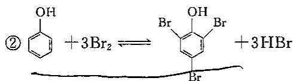

③ $Br_{2}$ (剩余) $+2I^{-}=I_{2}+2Br^{-}$

$$
④ \mathrm{I} _ {2} + 2 \mathrm{S} _ {2} \mathrm{O} _ {3} ^ {2 -} = 2 \mathrm{I} ^ {-} + \mathrm{S} _ {4} \mathrm{O} _ {6} ^ {2 -}
$$

取同量的标准溶液做空白实验,可得:

$$
w _ {\mathrm{C} _ {6} \mathrm{H} _ {5} \mathrm{OH}} (\%) = \frac {c _ {\mathrm{Na} _ {2} \mathrm{S} _ {2} \mathrm{O} _ {3}} (V _ {\text {空}} - V _ {\text {样}}) _ {\mathrm{Na} _ {2} \mathrm{S} _ {2} \mathrm{O} _ {3}} \times \frac {1}{2} \times \frac {1}{3} \times M _ {\mathrm{C} _ {6} \mathrm{H} _ {5} \mathrm{OH}}}{1 0 0 0 \times m _ {\mathrm{s}}}
$$

溴液的具体浓度可以不知，从空白实验中知道参加反应的溴的量，再从溴与待测物的反应比例就可知待测物的量。

## 6. 铈量法

标准溶液:硫酸铈铵可以直接配制,也可间接配制,用三氧化二砷、草酸钠、硫酸亚铁等基准物标定。

测定条件:在酸性溶液中 $Ce^{4+} + e^{-} = Ce^{3+}, E^{\ominus}(Ce^{4+}/Ce^{3+}) = 1.45V$

指示剂： $Ce^{4+}$ （黄色）灵敏度较差，常用邻二氮菲亚铁。

另外，当酸的种类和浓度不同时， $\mathrm{Ce}^{4+}/\mathrm{Ce}^{3+}$ 电对的条件电位也不相同，而且有的相差较大。原因是在 $\mathrm{HClO}_4$ 中 $\mathrm{Ce}^{4+}$ 与 $\mathrm{ClO}_4^-$ 不形成络合物，而在其他酸中 $\mathrm{Ce}^{4+}$ 都可能与相应的阴离子（如 $\mathrm{Cl}^-$ 和 $\mathrm{SO}_4^{2-}$ 等）形成络合物，所以在分析上， $\mathrm{Ce(SO_4)_2}$ 在 $\mathrm{HClO}_4$ 溶液中比在 $\mathrm{H}_2\mathrm{SO}_4$ 溶液中使用得更为广泛。

$Ce(SO_{4})_{2}$ 与 $KMnO_{4}$ 作氧化剂相比，有如下优点：

①在还原过程中不形成中间产物,反应简单;

②能在多种有机物(如醇类、甘油、醛类等)存在下滴定 $Fe^{2+}$ ，不发生诱导氧化；

③可在 HCl 溶液中直接用 $Ce^{4+}$ 滴定 $Fe^{2+}$ （与 $KMnO_{4}$ 不同）； $Ce^{4+} + Fe^{2+} = Fe^{3+} + Ce^{3+}$ 。

虽然 $Cl^{-}$ 能还原 $Ce^{4+}$ ，但滴定时， $Ce^{4+}$ 首先与 $Fe^{2+}$ 反应，达到等当点后，才慢慢地与 $Cl^{-}$ 起反应，故不影响滴定；

④ $Ce(SO_{4})_{2}$ 标准溶液很稳定,可以放置较长的时间,加热煮沸也不分解;

⑤ $\mathrm{Ce(SO_{4})_{2}\cdot(NH_{4})_{2}SO_{4}\cdot2H_{2}O}$ 容易提纯，因而可以直接配制标准溶液不必进行标定。

## 7. 高碘酸钾法

标准溶液: 用 $H_{5}IO_{6}$ 、 $KIO_{4}$ 或 $NaIO_{4}$ 直接配制。若间接配制, 要标定, 加入过量的 KI:

$$
\mathrm{IO} _ {4} ^ {-} + 7 \mathrm{I} ^ {-} + 8 \mathrm{H} ^ {+} = 4 \mathrm{I} _ {2} + 4 \mathrm{H} _ {2} \mathrm{O}
$$

析出的 $\mathrm{I}_2$ 用 $\mathrm{Na}_2\mathrm{S}_2\mathrm{O}_3$ 标准溶液滴定：

$$
\mathrm{I} _ {2} + 2 \mathrm{S} _ {2} \mathrm{O} _ {3} ^ {2 -} \rightleftharpoons 2 \mathrm{I} ^ {-} + \mathrm{S} _ {4} \mathrm{O} _ {6} ^ {2 -}
$$

测定条件:在酸性溶液中进行

高碘酸盐在酸性溶液中的主要形式： $H_{5}IO_{6}$ 和 $HIO_{4}$

$$
\mathrm{H} _ {5} \mathrm{IO} _ {6} + \mathrm{H} ^ {+} + 2 \mathrm{e} ^ {-} = \mathrm{IO} _ {3} ^ {-} + 3 \mathrm{H} _ {2} \mathrm{O}, E ^ {\ominus} (\mathrm{H} _ {5} \mathrm{IO} _ {6} / \mathrm{IO} _ {3} ^ {-}) = 1. 6 0 \mathrm{V}
$$

在酸度越高的情况下，正高碘酸 $\left(\mathrm{H}_{5}\mathrm{IO}_{6}\right)$ 占的比例越大。

## 9.4.3 常用的氧化还原滴定指示剂

## 1. 自身指示剂

标准溶液或被滴定物质本身有颜色,滴定产物为无色或颜色很浅,滴定时就不必另加指示剂。

例如，在高锰酸钾法中，用 $KMnO_{4}$ 标准溶液作滴定剂测定 $Na_{2}C_{2}O_{4}$ ，可利用 $KMnO_{4}$ 自身的紫红色判断终点。

## 2. 特殊指示剂

能与标准溶液或被滴定物反应,生成具有特殊颜色的物质,称特殊指示剂。

例如，在碘量法中，直链淀粉吸附 $I_{3}^{-}$ 显蓝色，当被吸附的 $I_{3}^{-}$ 作用完后蓝色消失。

## 3. 氧化还原指示剂

氧化还原指剂示剂本身是弱的氧化剂或还原剂。

$$
\mathrm{In} _ {0 \mathrm{x}} (\text {颜色} 1) + n \mathrm{e} ^ {-} \rightleftharpoons \mathrm{In} _ {\mathrm{Red}} (\text {颜色} 2)
$$

电对电位: $E=E^{\ominus}\left(\mathrm{In}_{\mathrm{Ox}}/\mathrm{In}_{\mathrm{Red}}\right)+\frac{0.0591}{n}\lg\frac{c(\mathrm{In}_{\mathrm{Ox}})}{c(\mathrm{In}_{\mathrm{Red}})}$

氧化还原指示剂变色的电位范围是： $E=E^{\ominus}\left(\mathrm{In}_{\mathrm{Ox}}/\mathrm{In}_{\mathrm{Red}}\right)\pm\frac{0.0591}{n}$

氧化还原指示剂的变色点： $c(\mathrm{In}_{\mathrm{Ox}})/c(\mathrm{In}_{\mathrm{Red}})=1$ ，即： $E=E^{\ominus}(\mathrm{In}_{\mathrm{Ox}}/\mathrm{In}_{\mathrm{Red}})$

<table><tr><td>指示剂</td><td> $E^{\ominus}(V)c(H^{+})=1mol/L$ </td><td>氧化态颜色</td><td>还原态颜色</td></tr><tr><td>靛蓝-磺酸盐</td><td>0.36</td><td>蓝</td><td>无色</td></tr><tr><td>二苯胺</td><td>0.76</td><td>紫</td><td>无色</td></tr><tr><td>二苯胺磺酸钠</td><td>0.85</td><td>紫红</td><td>无色</td></tr><tr><td>亚甲蓝</td><td>0.36</td><td>绿蓝</td><td>无色</td></tr><tr><td>邻二氮菲-亚铁</td><td>1.06</td><td>浅蓝</td><td>红</td></tr><tr><td>羊毛罂红</td><td>1.00</td><td>红色</td><td>绿色</td></tr><tr><td>5-硝基邻二氮菲亚铁</td><td>1.25</td><td>浅蓝</td><td>紫红</td></tr></table>

在测定 $Fe^{2+}$ 的滴定中，常用二苯胺磺酸钠或邻二氮菲作为氧化还原指示剂。

## (1)二苯胺磺酸钠

二苯胺磺酸钠是以 $Ce^{4+}$ 滴定 $Fe^{2+}$ 时常用的指示剂，其条件电位为 0.85V（在 $c(H^{+})=1mol/L$ 时）。在酸性溶液中，主要以二苯胺磺酸的形式存在。当二苯胺磺酸遇到氧化剂 $Ce^{4+}$ 时，它首先被氧化为无色的二苯联胺磺酸（不可逆），再进一步被氧化为二苯联苯胺磺酸紫（可逆）的紫色化合物，显示出颜色变化。

其变色时的电位范围为 $E_{in}=0.85\pm0.0591/2=0.85\pm0.03V$ 。即二苯胺磺酸钠变色时的电位范围是在 0.82-0.88V。

## (2)邻二氮菲-Fe(Ⅱ)

邻二氮菲亦称邻菲罗啉，其分子式为 $C_{12}H_{8}N_{2}$ ，易溶于亚铁盐溶液形成红色的 $\left[\mathrm{Fe}\left(\mathrm{C}_{12}\mathrm{H}_{8}\mathrm{N}_{2}\right)_{3}\right]^{2+}$ 配离子，遇到氧化剂时改变颜色，其反应式如下：

$$
\begin{array}{r l} & {\left[ \mathrm{Fe} (\mathrm{C} _ {1 2} \mathrm{H} _ {8} \mathrm{N} _ {2}) _ {3} \right] ^ {2 +} - \mathrm{e} ^ {-} = \left[ \mathrm{Fe} (\mathrm{C} _ {1 2} \mathrm{H} _ {8} \mathrm{N} _ {2}) _ {3} \right] ^ {3 +}} \\ & {\text {(深红色)}} \\ & {\text {(浅蓝色)}} \end{array}
$$

氧化产物为浅蓝色的 $\left[\mathrm{Fe}\left(\mathrm{C}_{12} \mathrm{H}_{8} \mathrm{~N}_{2}\right)_{3}\right]^{3+}$ 配离子，在 $1 \mathrm{~mol} / \mathrm{L} \mathrm{H}_{2} \mathrm{SO}_{4}$ 溶液中，它的条件电位 $E_{\mathrm{In}}^{\ominus} = 1.06 \mathrm{~V}$ 。实际上它在 $1.12 \mathrm{~V}$ 左右变色，这是因为它的还原型颜色（红）比氧化型颜色（浅蓝）的强度大得多的缘故。在以 $\mathrm{Ce}^{4+}$ 滴定 $\mathrm{Fe}^{2+}$ 时，用邻二氮菲-Fe(Ⅱ)作指示剂最为合适。终点时溶液由红色变为极浅的蓝色。也可以用 $\mathrm{Fe}^{2+}$ 滴定 $\mathrm{Ce}^{4+}$ ，终点时溶液由浅蓝色变为深红色（橘红色）。

氧化还原指示剂的选择原则：

①指示剂的条件电位与滴定反应的化学计量点尽量一致。

②指示剂的变色电位范围应在滴定的电位突跃范围之内，以减小终点误差。

③终点前后的颜色变化要明显。

## 9.5 沉淀滴定法

## 9.5.1 沉淀滴定法的基本原理

沉淀滴定法是以沉淀反应为基础的滴定分析法。用于沉淀滴定法的沉淀反应必须符合下列条件：

①沉淀的溶解度很小;

②沉淀反应必须定量且迅速的发生；

③能采用适当的方法确定滴定终点。

目前，比较有实际意义的、应用较多的是利用生成微溶性银盐的沉淀反应，如利用 $\mathrm{Ag^{+} + Cl^{-}\rightleftharpoons AgCl\downarrow}$ 和 $\mathrm{Ag^{+} + SCN^{-}\rightleftharpoons AgSCN\downarrow}$ 进行的沉淀滴定法，此法称为银量法。银量法主要用于测定 $\mathrm{Cl^{-},Br^{-},I^{-},CN^{-}}$ 及 $\mathrm{Ag^{+}}$ 等。

## 9.5.2 沉淀滴定法的应用

## 1. 莫尔法——用铬酸钾作指示剂

此法是在中性或弱碱性溶液中，以 $K_{2}CrO_{4}$ 为指示剂，用 $AgNO_{3}$ 标准溶液直接滴定 $Cl^{-}$ （或 $Br^{-}$ ）。

AgCl 的溶解度比 $Ag_{2}CrO_{4}$ 小，根据分步沉淀原理，当向含 $Cl^{-}$ 的溶液中滴入 $AgNO_{3}$ 时，首先沉淀析出的是 AgCl；当 AgCl 定量沉淀后，稍过量一点的 $AgNO_{3}$ 溶液与 $CrO_{4}^{2-}$ 生成砖红色的 $Ag_{2}CrO_{4}$ 沉淀，即为滴定终点。反应如下：

$$
\begin{array}{r l}&\mathrm {Ag^ {+} + Cl^ {-} \rightleftharpoons AgCl\downarrow(白色)}\\&2 \mathrm {Ag^ {+} + CrO_ {4} ^ {2 - } \rightleftharpoons Ag_ {2} CrO_ {4} \downarrow(砖红色)}\end{array}
$$

莫尔法中指示剂的用量和溶液的酸度是两个主要问题。

## (1) 指示剂的用量

根据溶度积原理,可计算出计量点时 $Ag^{+}$ 和 $Cl^{-}$ 的浓度为:

$$
\left[ \mathrm{Ag} ^ {+} \right] _ {\mathrm{sp}} = \left[ \mathrm{Cl} ^ {-} \right] _ {\mathrm{sp}} = \sqrt {K _ {\mathrm{sp}} (\mathrm{AgCl})} = \sqrt {1 . 8 \times 1 0 ^ {- 1 0}} = 1. 3 4 \times 1 0 ^ {- 5} \mathrm{mol/L}
$$

那么在计量点时要刚好析出 $Ag_{2}CrO_{4}$ 沉淀以指示终点，此时 $CrO_{4}^{2-}$ 的浓度应为：

$$
\left[ \mathrm{CrO} _ {4} ^ {2 -} \right] = \frac {K _ {\mathrm{sp}} (\mathrm{AgCrO} _ {4})}{\left[ \mathrm{Ag} ^ {+} \right] _ {\mathrm{sp}} ^ {2}} = \frac {2 . 0 \times 1 0 ^ {- 1 2}}{(1 . 3 4 \times 1 0 ^ {- 5}) ^ {2}} = 1. 1 1 \times 1 0 ^ {- 2} \mathrm{mol/L}
$$

在实际工作中, 若 $\mathrm{CrO}_{4}^{2-}$ 的浓度太高, 颜色太深, 会影响终点的判断; 但 $\mathrm{CrO}_{4}^{2-}$ 的浓度太低, 又会使终点出现过缓, 影响滴定的准确度。实验证明加入 $\mathrm{K}_{2} \mathrm{CrO}_{4}$ 的浓度以 $5.0 \times 10^{-3} \mathrm{~mol} / \mathrm{L}$ , 为宜。这样实际使用的 $\mathrm{CrO}_{4}^{2-}$ 的浓度较计算值偏低, 那么要使 $\mathrm{Ag}_{2} \mathrm{CrO}_{4}$ 沉淀析出, 必然要使 $\mathrm{AgNO}_{3}$ 溶液过量得稍多一点。这样是否满足准确度的要求? 通过计算, 结果表明, 这样不会引起较大的误差, 完全可以满足滴定分析的要求。

## (2)溶液的酸度

$H_{2}CrO_{4}$ 的 $K_{a2}$ 为 $3.2 \times 10^{-7}$ ，酸性较弱。因此 $Ag_{2}CrO_{4}$ 易溶于酸，即

$$
\mathrm{Ag} _ {2} \mathrm{CrO} _ {4} + \mathrm{H} ^ {+} \rightleftharpoons 2 \mathrm{Ag} ^ {+} + \mathrm{HCrO} _ {4} ^ {-}
$$

所以滴定不能在酸性溶液中进行。但如果溶液的碱性太强，又将产生 $Ag_{2}O$ 沉淀。

莫尔法测定的最适宜的 pH 范围为 6.5～10.5。若试液碱性太强，可用稀 $HNO_{3}$ 中和，酸性太强，可用 $NaHCO_{3}$ 、 $CaCO_{3}$ 或 $Na_{2}B_{4}O_{7}$ 等中和。

当溶液中有铵盐存在时，要求溶液的酸度范围更窄，pH为6.5～7.2。这是因为pH再大时，便有相当数量的 $NH_{3}$ 释放出来与 $Ag^{+}$ 生成 $\left[\mathrm{Ag}\left(\mathrm{NH}_{3}\right)_{2}\right]^{+}$ ，使AgCl和 $Ag_{2}CrO_{4}$ 的溶解度增大，影响滴定。

此外，滴定时应剧烈摇动，使被 AgCl 或 AgBr 吸附的 Cl⁻ 和 Br⁻ 释放出来。

## (3)莫尔法的适用范围

莫尔法能直接滴定 $Cl^{-}$ 或 $Br^{-}$ ，当两者共存时，滴定的是 $Cl^{-}$ 和 $Br^{-}$ 的总量。从原则上讲，此法也可应用于滴定 $I^{-}$ 及 $SCN^{-}$ ，但由于 AgI 及 AgSCN 沉淀能强烈地吸附 $I^{-}$ 或 $SCN^{-}$ 而使终点过早出现，且终点变化不明显，误差较大。

莫尔法不适用以 NaCl 标准溶液直接滴定 $Ag^{+}$ ，这是因为，这时滴入指示剂，立即生成 $Ag_{2}CrO_{4}$ 沉淀，在用 NaCl 标准溶液滴定时， $Ag_{2}CrO_{4}$ 沉淀十分缓慢地转化为 AgCl 沉淀，误差较大。如果要用此法测定 $Ag^{+}$ ，则应在试液中加入一定过量的 NaCl 标准溶液，然后用 $AgNO_{3}$ 标准溶液滴定过量的 $Cl^{-}$ 。

莫尔法的选择性较差，凡能与 $Ag^{+}$ 生成微溶物（如 $PO_{4}^{3-}$ 、 $SO_{3}^{2-}$ 、 $S^{2-}$ 、 $CO_{3}^{2-}$ 、 $AsO_{4}^{3-}$ ）或配阴离子（如 $C_{2}O_{4}^{2-}$ ）或能与 $CrO_{4}^{2-}$ 生成微溶性化合物的阳离子（如 $Ba^{2+}$ 、 $Pb^{2+}$ 、 $Hg^{2+}$ 等）以及在中性或弱碱性溶液中易发生水解的离子（如 $Fe^{3+}$ 、 $Bi^{3+}$ 、 $Sn^{4+}$ 、 $Al^{3+}$ 等）均干扰滴定，应预先分离。 $S^{2-}$ 可以在酸性溶液中煮沸除去， $Ba^{2+}$ 的干扰可通过加入过量的 $Na_{2}SO_{4}$ 消除。

2. 佛尔哈德法——用铁铵矾 $\left[\mathrm{NH}_{4}\mathrm{Fe}\left(\mathrm{SO}_{4}\right)_{2}\cdot12\mathrm{H}_{2}\mathrm{O}\right]$ 作指示剂

佛尔哈德法分为直接滴定法和返滴定法。

## (1) 直接滴定法测定 $Ag^{+}$

此法是在含有 $Ag^{+}$ 的酸性溶液中，以铁铵矾作指示剂，用 $NH_{4}SCN$ （或 KSCN、NaSCN）标准溶液滴定 $Ag^{+}$ 的方法。随着滴定剂的加入，首先析出 AgSCN 沉淀，当 $Ag^{+}$ 定量沉淀后，稍微过量的一滴 $NH_{4}SCN$ 与 $Fe^{3+}$ 反应生成红色配合物，即为终点。其反应如下：

$$
\mathrm{Ag} ^ {+} + \mathrm{SCN} ^ {-} \rightleftharpoons \mathrm{AgSCN} \downarrow (\text {白色}) K _ {\mathrm{sp}} = 1. 0 \times 1 0 ^ {- 1 2}
$$

$$
\mathrm{Fe} ^ {3 +} + \mathrm{SCN} ^ {-} \rightleftharpoons [ \mathrm{Fe(SCN)} ] ^ {2 +} (\text {   红色   }) K _ {\text {稳}} = 2 0 0
$$

滴定时,溶液的酸度一般控制在 pH 为 0\~1 之间。此时, $Fe^{3+}$ 主要以 $\left[Fe(H_{2}O)_{6}\right]^{3+}$ 的形式存在,颜色较浅;如果酸度较低, $Fe^{3+}$ 水解形成棕色 $\left[Fe(H_{2}O)_{5}(OH)\right]^{2+}$ 等颜色较深,影响终点的观察。

实验证明： $\left[\mathrm{Fe}(\mathrm{SCN})\right]^{2+}$ 的最低浓度要达到 $6.0 \times 10^{-6} \, mol/L$ 时，才能观察明显的红色。通常指示剂 $Fe^{3+}$ 的浓度保持在 $0.015 \, mol \cdot L^{-1}$ 则在终点：

$$
\left[ \mathrm{SCN} ^ {-} \right] = \frac {\left[ \left[ \mathrm{Fe(SCN)} \right] ^ {2 +} \right]}{K _ {\text {稳}} \left[ \mathrm{Fe} ^ {3 +} \right]} = \frac {6 . 0 \times 1 0 ^ {- 6}}{2 0 0 \times 0 . 0 1 5} = 2. 0 \times 1 0 ^ {- 6} \mathrm{mol/L}
$$

若被滴定的 $Ag^{+}$ 溶液的体积为 VmL, $SCN^{-}$ 和 $Ag^{+}$ 的浓度均为 0.1mol/L, 在计量点时:

$$
\left[ \mathrm{SCN} ^ {-} \right] _ {\mathrm{sp}} = \sqrt {K _ {\mathrm{sp}} (\mathrm{AgSCN})} = \sqrt {1 . 0 \times 1 0 ^ {- 1 2}} = 1. 0 \times 1 0 ^ {- 6} \mathrm{mol/L}
$$

在计量点后 0.1% 时

$$
\begin{array}{r l} \left[ \mathrm{SCN} ^ {-} \right] ^ {\prime} & = \frac {0 . 1 \times V \times 0 . 1 \%}{2 V} = 5. 0 \times 1 0 ^ {- 5} \mathrm{mol/L} \\ & \left[ \mathrm{SCN} ^ {-} \right] _ {\mathrm{sp}} <   \left[ \mathrm{SCN} ^ {-} \right] <   \left[ \mathrm{SCN} ^ {-} \right] ^ {\prime} \end{array}
$$

由此可见能够观察到滴定终点颜色时,其相对误差将小于0.1%,准确度符合滴定要求。由于 AgSCN 沉淀能吸附部分 $Ag^{+}$ ,因此此法在滴定过程中应充分摇动溶液,使被吸附的 $Ag^{+}$ 及时地释放出来,否则易产生终点出现过早而造成误差。

## (2) 返滴定法测定卤素离子

此法首先向试液中加入已知量过量的 $AgNO_{3}$ 标准溶液，再加铁铵矾指示剂，用 NH₃SCN 标准溶液返滴定过量的 $Ag^{+}$ ，此时的情况和直接滴定 $Ag^{+}$ 是一样的。

使用此法滴定氯化物,由于 AgCl 的溶解度比 AgSCN 大,过量的 SCN⁻ 将与 AgCl 反应,使 AgCl 沉淀转化为溶解度更小的 AgSCN。

$$
\mathrm{AgCl} + \mathrm{SCN} ^ {-} = \mathrm{AgSCN} + \mathrm{Cl} ^ {-}
$$

这样必然引起误差。为了避免这样的误差产生，通常采用下列两种措施：

(a)当加入过量的 $AgNO_{3}$ 标准液后，将溶液加热煮沸，使 AgCl 沉淀凝聚，以减小 AgCl 沉淀对 $Ag^{+}$ 的吸附。过滤，将 AgCl 沉淀滤去，并用稀 $HNO_{3}$ 洗涤沉淀，洗涤液并入滤液中。然后用 $NH_{4}SCN$ 标准溶液滴定滤液中过量的 $Ag^{+}$ 。

(b)加入一定过量的 $AgNO_{3}$ 标准溶液后，加入 1\~2mL 有机溶剂，如 1,2-二氯乙烷，用力摇动，使有机溶剂将 AgCl 沉淀包裹，使它与溶液隔开。这样便阻止了 $SCN^{-}$ 与 AgCl 的反应，此法比较简便。

用返滴定法测定溴化物或碘化物时,由于 AgBr、AgI 的溶解度均比 AgSCN 的溶解度小,不会出现沉淀转化反应,所以不必采用上述措施。但在测定碘化物时,必须在加入过量的 AgNO₃ 溶液后加入指示剂,否则会发生如下反应: 2Fe³⁺ + 2I⁻ ⇌ 2Fe²⁺ + I₂,影响结果的准确性。

## (3)滴定条件

①溶液的 pH 一般控制在 0.1～1mol/L。这时， $Fe^{3+}$ 主要以 $\left[\mathrm{Fe}\left(\mathrm{H}_{2}\mathrm{O}\right)_{6}\right]^{3+}$ 的形式存在，颜色较浅。如果酸度较低，则 $\mathrm{Fe}^{3+}$ 水解，形成颜色较深的棕色 $[\mathrm{Fe(H_2O)_5(OH)}]^{2+}$ 或 $[\mathrm{Fe(H_2O)_4(OH)_2}]^+$ 等，影响终点的观察，甚至产生 $\mathrm{Fe(OH)_3}$ 沉淀，指示剂失去作用。

②直接滴定法滴定 $Ag^{+}$ 时，为防止 AgSCN 对 $Ag^{+}$ 的吸附，临近终点时必须剧烈摇动，用返滴定法滴定 $Cl^{-}$ 时，为了避免 AgCl 沉淀发生转化，应轻轻摇动。

③强氧化剂会将 $SCN^{-}$ 氧化；氮的低价氧化物会与 $SCN^{-}$ 形成 NOSCN（硫氰亚硝酰），会错误判断终点；铜盐，汞盐等能与 $SCN^{-}$ 反应生成沉淀，以上影响因素必须消除。

佛尔哈德法的最大优点是可以在酸性溶液中进行滴定，许多弱酸根离子如 $PO_{4}^{3-}$ 、 $AsO_{4}^{3-}$ 、 $CrO_{4}^{2-}$ 等都不干扰测定，因此，此法的选择性较高。但滴定不能在中性或碱性溶液中进行，因为此时， $Fe^{3+}$ 易生成羟基配合物或氢氧化物沉淀。另外强氧化剂、氮的低价氧化物以及铜盐、汞盐等能与 $SCN^{-}$ 起作用，干扰测定，必须预先除去。

## 3. 法扬司(Fajans)法——吸附指示剂指示滴定终点的银量法

吸附指示剂是一类有色的有机化合物, 当它被吸附在胶粒表面后, 可能是形成某种化合物而导致指示剂分子结构的变化, 因而引起颜色的变化。在沉淀滴定中, 利用指示剂的这种性质来确定滴定终点。

胶状沉淀能选择性地吸附溶液中的离子, 先是组成晶体的离子。如 AgCl 沉淀, 若 Cl⁻ 过量, 则沉淀表面吸附 Cl⁻, 胶粒带负电荷。吸附层中的 Cl⁻ 又吸附溶液中的阳离子 (抗衡离子) 组成扩散层 (吸附层中也有少量的抗衡离子)。若溶液中 Ag⁺ 过量, 则沉淀表面吸附 Ag⁺, 胶粒带正电荷, 溶液中的阴离子则作为抗衡离子, 主要存在于扩散层中。

例如萤光黄,有机弱酸,用 HFin 表示,在溶液中解离为萤光黄阴离子 FIn $^{-}$ ,呈黄绿色:

$$
\mathrm{HFIn} \rightleftharpoons \mathrm{H} ^ {+} + \mathrm{FIn} ^ {-} (\text {黄绿色}), \mathrm{pK} _ {\mathrm{a}} = 7
$$

用萤光黄作 $AgNO_{3}$ 滴定 $Cl^{-}$ 的指示剂时，化学计量点以前，溶液中 $Cl^{-}$ 过量，AgCl 胶粒带负电荷， $FIn^{-}$ 不被吸附。

达到化学计量点后, 过量 $\mathrm{AgNO}_{3}$ 使 $\mathrm{AgCl}$ 胶粒带正电荷。强烈地吸附 $\mathrm{FIn}$ , 由于在 $\mathrm{AgCl}$ 表面上形成了萤光黄银化合物, 导致颜色发生变化, 使沉淀表面呈淡红色, 从而指示滴定终点。此过程示意如下。

  
滴定前

  
滴定中

  
滴定终点

法扬司法常用吸附指示剂：

<table><tr><td>指示剂</td><td> $pK_a$ </td><td>测定对象</td><td>滴定剂</td><td>颜色变化</td><td>滴定条件(pH)</td></tr><tr><td>荧光黄</td><td>~7</td><td> $Cl^-$ 、 $Br^-$ 、 $I^-$ </td><td> $Ag^+$ </td><td>黄绿—粉红</td><td>7~10</td></tr><tr><td>二氯荧光黄</td><td>~4</td><td> $Cl^-$ 、 $Br^-$ 、 $I^-$ </td><td> $Ag^+$ </td><td>黄绿—粉红</td><td>4~10</td></tr><tr><td>曙红</td><td>~2</td><td> $Br^-$ 、 $I^-$ 、 $SCN^-$ </td><td> $Ag^+$ </td><td>粉红—红紫</td><td>2~10</td></tr><tr><td>甲基紫</td><td></td><td> $Ag^+$ </td><td> $Cl^-$ </td><td>红—紫</td><td>酸性</td></tr></table>

## 4. 滴定条件

采用吸附指示剂,应考虑下面几个因素:

(1)颜色变化发生在沉淀的表面上,应尽量使沉淀保持溶胶状态,比表面大,沉淀的颗粒要小。所以在滴定时,设法防止 AgCl 的凝聚。在等当点时,溶液中 $Ag^{+}$ 和 $Cl^{-}$ 都不过量,AgCl 沉淀极易凝聚,所以通常需要加入糊精来保护胶体。

(2) 控制适宜的酸度。吸附指示剂多是有机弱酸，被吸附变色的是其共轭碱阴离子，控制适宜的酸度使指示剂在溶液中保持其阴离子状态以起到指示剂的作用。适宜酸度与指示剂的强弱有关， $K_{n}$ 越大，允许酸度越高，例如萤光黄， $K_{n}\approx10^{-7}$ 。

萤光黄作指示剂：pH 值应为 7\~10.5(pH>10.5 时，银离子将沉淀为氧化银)。

二氯萤光黄的 $K_{a} \approx 10^{-4}$ ，pH 值应为 4～10。

曙红(四溴萤光黄)的 $K_{a} \approx 10^{-2}$ ，酸性更强，pH 值小至 2 时，它仍可以指示终点。

(3)避免在强的阳光下进行滴定,卤化银沉淀对光敏感,很快转变为灰黑色,影响终点的观察。

(4)要求沉淀对指示剂吸附能力略小于对待测离子的吸附能力,要适当。否则,在化学计量点之前,指示剂离子即取代被吸附的待测离子而使溶液变色,使终点提前。

如曙红: 是滴定 $Br^{-}$ 、 $I^{-}$ 、 $SCN^{-}$ 的良好指示剂, 不适用于 $Cl^{-}$ 。 $Cl^{-}$ 的吸附性能较差, 在等当点前, 部分指示剂的阴离子取代 $Cl^{-}$ 而进入到吸附层中, 以致无法指示终点。

卤化银对卤离子和几种常用吸附指示剂的吸附能力次序如下：

$$
\mathrm{I} ^ {-} > \mathrm{SCN} ^ {-} > \mathrm{Br} ^ {-} > \text {曙红} > \mathrm{Cl} ^ {-} > \text {荧光黄}
$$

因此，用硝酸银滴定 $Cl^{-}$ 时选荧光黄为指示剂而不选曙红，但是滴定溴、碘和硫氰酸根离子时则宜选曙红。

(5)溶液的浓度不能太稀:浓度太稀时,沉淀很少,观察终点比较困难。用萤光黄作指示剂,用 $AgNO_{3}$ 滴定 $Cl^{-}$ 时, $Cl^{-}$ 的浓度要求在 0.005mol/L 以上。但滴定 $Br^{-}$ 、 $I^{-}$ 、 $SCN^{-}$ 的灵敏度稍高,浓度低至 0.001mol/L 时仍可准确滴定。

## 【例题精析】

【例 1】用中和滴定法测定我国宁夏出产的冰碱(主要成分是 $Na_{2}CO_{3}$ 和 $NaHCO_{3}$ ，杂质难溶于水且不与酸反应)中 $NaHCO_{3}$ 的含量。首先称取冰碱试样 1.142g。用水溶解，过滤，将滤液配成 100mL 溶液 A；然后采取下列实验步骤进行：①用移液管向锥形瓶中移入 25.00mL A，并加入酚酞试液三滴；②向酸式滴定管中加入 0.1000mol/L 的盐酸至 0 刻度线；③向其中加入甲基橙试液 3 滴，用 0.1000mol/L 盐酸滴定，温热，滴至溶液变为橙色，共用去盐酸 34.20mL；④滴定至酚酞红色恰好消失，读数为 12.00mL；⑤用 0.1000mol/L 的盐酸润洗酸式滴定管三次；⑥用 A 洗涤 25mL 移液管三次。

(1)正确的实验操作步骤是( )或( )

A. ⑥①⑤②④③ B. ⑤②⑥①④③ C. ①②③④⑤⑥ D. ②①③④⑤⑥

(2) 计算冰碱中 $NaHCO_{3}$ 的百分含量。

【例 2】酒石酸 $\left(\mathrm{H}_{2}\mathrm{C}_{4}\mathrm{H}_{4}\mathrm{O}_{6}\right)$ 与甲酸(HCOOH)混合液10.00mL，用0.1000mol/L NaOH溶液滴定至酚酞变色，耗去15.00mL。另取10.00mL混合液，加入0.2000mol/L

Ce(Ⅳ) 30.00mL 用 0.1000mol/L Fe(Ⅱ) 回滴，耗去 10.00mL。

(1) 写出酸性条件下 $\mathrm{Ce(IV)}$ 氧化 $\mathrm{H}_{2} \mathrm{C}_{4} \mathrm{H}_{4} \mathrm{O}_{6}$ 及 HCOOH 的化学方程式。

(2) 计算酒石酸和甲酸的浓度。

【例 3】水中氧的含量测定步骤如下：

步骤1: 水中的氧在碱性溶液中将 $Mn^{2+}$ 氧化为 $\mathrm{MnO(OH)}_{2}$ 。

步骤 2: 加入碘离子将生成的 $\mathrm{MnO(OH)}_{2}$ 再还原成 $Mn^{2+}$ 离子。

步骤 3: 用硫代硫酸钠标准溶液滴定步骤 2 中生成的碘。

有关的测定数据如下：

① $Na_{2}S_{2}O_{3}$ 溶液的标定。取 25.00mL $KIO_{3}$ 标准溶液 ( $KIO_{3}$ 浓度: 174.8mg·L $^{-1}$ ) 与过量 KI 在酸性介质中反应，用 $Na_{2}S_{2}O_{3}$ 溶液滴定，消耗 12.45mL。

②取 $20.0^{\circ}C$ 下新鲜水样 103.5mL，按上述测定步骤滴定，消耗 $Na_{2}S_{2}O_{3}$ 标准溶液 11.80mL。已知该温度下水的饱和 $O_{2}$ 含量为 9.08mg/L。

③在 $20.0^{\circ}$ C 下密闭放置 5 天的水样 102.2mL，按上述测定步骤滴定，消耗硫代硫酸钠标准溶液 6.75mL。

(1) 写出上面 3 步所涉及的化学反应方程式。

(2) 计算标准溶液的浓度(单位 mol/L)。

(3) 计算新鲜水样中氧的含量(单位 mg/L)。

(4)计算陈放水样中氧的含量(单位 mg/L)。

(5)以上测定结果说明陈放水样具有什么性质?

【例 4】少量的碘化物可利用“化学放大”反应进行测定,其步骤如下:在中性或弱酸性介质中,先用 $Br_{2}$ 将试样中 $I^{-}$ 定量氧化成碘酸盐,煮沸除去过量的 $Br_{2}$ ,然后加入过量的 KI,用 $CCl_{4}$ 萃取生成的 $I_{2}$ (萃取率为 100%),分去水相后,用肼(联氨)的水溶液将 $I_{2}$ 反萃取至水相,再用过量的 $Br_{2}$ 氧化,除去剩余的 $Br_{2}$ 后再加入过量 KI,酸化,以淀粉作指示剂,用 $Na_{2}S_{2}O_{3}$ 标准溶液滴定,求得 $I^{-}$ 的含量。

(1) 写出上述过程的所有化学方程式。

(2)根据有关反应的计量关系,说明经上述步骤后,试推算1mol的 $I^{-}$ 可消耗多少mol的 $Na_{2}S_{2}O_{3}$ ?

(3) 若在测定时, 准确移取含 KI 的试液 25.00mL, 终点时消耗 0.1000mol/L $Na_{2}S_{2}O_{3}$ 标准溶液 20.06mL, 计算试样中 KI 的含量 (g/L)。

(4)仍取相同体积的上述试液,改用0.1000mol/L $AgNO_{3}$ 标准溶液直接沉淀滴定法滴定 $I^{-}$ ,试用最简单的方法计算终点时所需滴定剂的体积(mL)。

(5)在(3)和(4)所述的两种方法中,因滴定管的不准确性(读数误差为±0.02mL)而造成的体积测量的相对误差各为多少?并以此为例,简述“化学放大”在定量分析中的意义。

【例 5】用 2 份等质量的 $XeF_{2}$ 和 $XeF_{4}$ 混合物进行如下实验：

(1)一份用水处理,得到气体 A 和溶液 B,A 的体积为 56.7mL(标准状况,下同),其中含 $O_{2}$ 22.7mL,余为 Xe。B 中的 $XeO_{3}$ 能氧化 30.0mL 浓度为 0.100mol/L 的 $(\mathrm{NH}_{4})_{2}\mathrm{Fe}(\mathrm{SO}_{4})_{2}$ 。

(2)另一份用KI溶液处理，生成的 $\mathrm{I}_2$ 被 $0.200\mathrm{mol / LNa_2S_2O_3}$ 滴定，用去 $\mathrm{Na_2S_2O_3}$

## 高中化学竞赛 基本理论学习笔记

35.0mL。

求混合物中 $XeF_{2}$ 和 $XeF_{4}$ 各自的物质的量。

【例 6】含有银、铜、铬的一种合金，质量为 1.500g，溶解后溶液中含有 $Ag^{+}$ 、 $Cu^{2+}$ 、 $Cr^{3+}$ ，用水稀释到 500.00mL。

(1)取出 50.00mL 溶液,加入过量稀碱溶液,分离出沉淀物,滤液用足量 $H_{2}O_{2}$ 氧化,酸化上述溶液,用 25.00mL 0.100mol/L 的 Fe(II)盐溶液还原其中的 $Cr_{2}O_{7}^{2-}$ 成 $Cr^{3+}$ ,未反应的 Fe(II)盐溶液,用 0.0200mol/L $KMnO_{4}$ 溶液滴定,耗 $KMnO_{4}$ 溶液 17.20mL。

(2)在另一个实验中,取 200.00mL 原始溶液进行电解。电解析出金属的电流效率为 90%,电流强度为 2 A,在 14.50 min 内,三种金属恰好完全析出。

求合金中 Ag、Cu、Cr 的百分含量。

【例 7】溴酸钾测定苯酚纯度的步骤如下: 称取含苯酚的试样 0.6000g 溶于 20.00mL 0.1250mol/L KBrO₃ 溶液(该溶液含过量的 KBr), 加酸酸化。放置, 待反应完全后加入 KI, 而后用 0.1050mol/L Na₂S₂O₃ 溶液滴定生成的碘, 滴定终点为 20.00mL。计算试样中苯酚的质量分数。

【例 8】甲苯与干燥氯气在光照下反应生成氯化苄，用下列方法分析粗产品的纯度：称取 0.255g 样品，与 25mL 4mol/L 氢氧化钠水溶液在 100mL 圆底烧瓶中混合，加热回流 1 小时；冷至室温，加入 50mL 20% 硝酸后，用 25.00mL 0.1000mol/L 硝酸银水溶液处理，再用 0.1000mol/L NH₄SCN 水溶液滴定剩余的硝酸银，以硫酸铁铵为指示剂，消耗了 6.75mL。

(1) 写出分析过程的反应方程式。

(2) 计算样品中氯化苄的质量分数(%)

(3)通常,上述测定结果高于样品中氯化苄的实际含量,指出原因。

(4)上述分析方法是否适用于氯苯的纯度分析？请说明理由。

【例9】测定锆英石中 $\mathrm{ZrO_2}$ , $\mathrm{Fe_2O_3}$ 含量时, 称取 $1.000\mathrm{g}$ 试样, 以适当的熔样方法制成 $200.0\mathrm{mL}$ 试样溶液。移取 $50.00\mathrm{mL}$ 试液, 调至 $\mathrm{pH} = 0.8$ , 加入盐酸羟胺还原 $\mathrm{Fe}^{3+}$ , 以二甲酚橙为指示剂, 用 $1.000 \times 10^{-2}\mathrm{mol/L}$ EDTA 溶液滴定, 用去 $10.00\mathrm{mL}$ 。加入浓硝酸, 加热, 使 $\mathrm{Fe}^{2+}$ 被氧化成 $\mathrm{Fe}^{3+}$ , 将溶液调至 $\mathrm{pH} \approx 1.5$ , 以磺基水杨酸作指示剂, 用上述 EDTA 溶液滴定, 用去 $20.00\mathrm{mL}$ 。计算试样中 $\mathrm{ZrO_2}$ 和 $\mathrm{Fe_2O_3}$ 的质量分数。

【例 10】某一难被酸分解的 $MnO \cdot Cr_{2}O_{3}$ 矿石 2.000g，用 $Na_{2}O_{2}$ 熔融后，得到 $Na_{2}MnO_{4}$ 和 $Na_{2}CrO_{4}$ 溶液。煮沸浸取液以除去过氧化物。酸化溶液，这时 $MnO_{4}^{2-}$ 歧化为 $MnO_{4}^{-}$ 和 $MnO_{2}$ 滤去 $MnO_{2}$ 。滤液用 0.1000mol/L $FeSO_{4}$ 溶液 50.00mL 处理，过量 $FeSO_{4}$ 用 0.01000mol/L $KMnO_{4}$ 溶液滴定，用去 18.40mL。 $MnO_{2}$ 沉淀用 0.1000mol/L $FeSO_{4}$ 溶液 10.00mL 处理，过量 $FeSO_{4}$ 用 0.01000mol/L $KMnO_{4}$ 溶液滴定，用去 8.24mL。求矿样中 MnO 和 $Cr_{2}O_{3}$ 的质量分数。

【例 11】新型节能材料高温超导体的最先突破是在 1987 年从新的钇钡铜氧材料的研究开始的。在制备钇钡铜氧高温超导体的同时，偶然得到了副产品——紫色的硅酸铜钡。凑巧的是，后者正是发现于中国汉代器物上的被称为“汉紫”的颜料，还发现于秦俑彩绘。

对钇钡铜氧材料的分析表明，其组成为 $(\mathrm{Y}^{3+})(\mathrm{Ba}^{2+})_2(\mathrm{Cu}^{2+})_2(\mathrm{Cu}^{3+})(\mathrm{O}^{2-})_7$ ；三分之二的铜以 $Cu^{2+}$ 形式存在，三分之一则以罕见的 $Cu^{3+}$ 形式存在。确定铜的价态曾是最关键的一环，可通过经典的容量分析法——间接碘量法得到解决。

(1)给出 Cu 在周期表中的位置(周期和族)。

(2) 写出 $Cu^{3+}$ 的核外电子排布。

(3) 将 $YBa_{2}Cu_{3}O_{7}$ 试样溶于稀酸， $Cu^{3+}$ 将全部被还原为 $Cu^{2+}$ 。写出试样在稀酸中溶解的离子反应方程式。

(4)给出用间接碘量法测定 $Cu^{2+}$ 和 $Cu^{3+}$ 的简要设计方案，包括主要步骤、标准溶液（滴定剂）、指示剂和质量分数的计算公式[式中的溶液浓度、溶液体积(mL)、物质的摩尔质量、试样质量(g)和质量分数请分别采用通用符号 c、V、M、 $m_{s}$ 和 w 表示]。

【例 12】称取含砷试样 0.500g，溶解后在弱碱性介质中将砷处理为 $AsO_{4}^{3-}$ ，然后沉淀为 $Ag_{3}AsO_{4}$ 。将沉淀过滤、洗涤，而后将沉淀溶于酸中。以 0.1000mol/L $NH_{4}SCN$ 溶液滴定其中的 $Ag^{+}$ 至终点，消耗 45.45mL，计算试样中砷的质量分数。

【例 13】将固体 $MnC_{2}O_{4} \cdot 2H_{2}O$ 放在一个可以称出质量的容器里加热，固体质量随温度变化的关系如右图所示。

纵坐标是固体的相对质量。

说出在下列五个温度区间各发生什么变化,并简述理由:

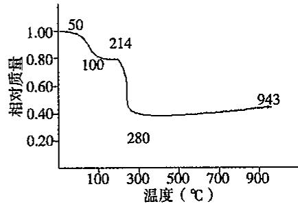

$$
0 \sim 5 0 ^ {\circ} \mathrm{C}:
$$

$$
5 0 \sim 1 0 0 ^ {\circ} \mathrm{C}:
$$

$$
1 0 0 \sim 2 1 4 ^ {\circ} \mathrm{C}:
$$

$$
2 1 4 \sim 2 8 0 ^ {\circ} \mathrm{C}
$$

$$
2 8 0 \sim 9 4 3 ^ {\circ} \mathrm{C}
$$

## 【习题精练】

1. 将 15.68L(标况)的氯气通入 $70^{\circ}C$ 、500mL 氢氧化钠溶液中，发生了两个自身氧化还原反应，其氧化产物为次氯酸钠和氯酸钠。吸取此溶液 25mL 稀释到 250mL。再吸取此稀释液 25mL 用醋酸酸化后，加入过量碘化钾溶液充分反应，此时只有次氯酸钠氧化碘化钾。用浓度为 0.20mol/L 的硫代酸钠滴定析出的碘。消耗硫代硫酸钠溶液 5.0mL 恰好到终点。将滴定后的溶液用盐酸调至强酸性，此时氯酸钠亦能氧化碘化钾，析出的碘用上述硫代硫酸钠溶液再滴定到终点，需要硫代硫酸钠溶液 30.0mL。

(1)计算反应后溶液中次氯酸钠和氯酸钠的物质的量之比。

(2)写出符合上述条件的总反应方程式。

(3)氢氧化钠溶液的体积在通入氯气前后的变化可忽略不计,计算通入氯气反应后各生成物溶液的物质的量浓度。

2. 含铬、锰钢样 0.8000g，经处理后得到 $Fe^{3+}$ 、 $Cr_{2}O_{7}^{2-}$ 、 $Mn^{2+}$ 溶液在 $F^{-}$ 存在时，用 0.004000mol/L $KMnO_{4}$ 标准溶液滴定，此时 $\mathrm{Mn(II)}$ 变为 $\mathrm{Mn(III)}$ ，用去 $KMnO_{4}$ 标准溶液 25.00mL 然后，该溶液继续用 0.04000mol/L $Fe^{2+}$ 标准溶液滴定，终点时用去 30.00mL。计算

试样中 Cr、Mn 的含量。

3. 过氧乙酸的含量分析方法如下: 在碘量瓶中加入 40mL 水, 再加入 5mL 3mol/L 稀硫酸和 2\~3 滴 1mol/L $MnSO_{4}$ 溶液, 冷却至 5℃; 准确称量 0.5027g 过氧乙酸试样加入之前的碘量瓶中后摇匀, 用 0.01183mol/L $KMnO_{4}$ 标准溶液滴定至溶液呈浅粉色(半分钟不褪色), 共消耗 24.98mL; 随即加入 10mL 20% 的 KI 溶液和 2\~3 滴 $(\mathrm{NH}_{4})_{2}\mathrm{MoO}_{4}$ 溶液, 轻轻摇匀, 加塞, 避光静置 10min, 而后用 0.1018mol/L $Na_{2}S_{2}O_{3}$ 标准溶液滴定, 接近终点时加入 3mL 0.5% 淀粉指示剂, 继续滴定至蓝色消失(半分钟不恢复), 消耗 23.61mL。

(1) 写出与测定有关的化学方程式。

(2) $\left(\mathrm{NH}_{4}\right)_{2}\mathrm{MoO}_{4}$ 溶液的作用是什么？

(3) 计算过氧乙酸的质量分数(过氧乙酸的摩尔质量为 76.05g/mol, 保留三位有效数字)

(4) 过氧乙酸不稳定, 写出其热分解的反应方程式。

4. 已知 5.000g 样品内含 $Fe_{3}O_{4}$ 、 $Fe_{2}O_{3}$ 与惰性物质，此样品用过量的 KI 溶液处理后，能使所有的铁还原成 $Fe^{2+}$ 。然后把溶液稀释到 50.00mL，从 50.00mL 此溶液中取出 10.00mL 溶液，其中的碘要用 5.50mL 1.000mol/L 的 $Na_{2}S_{2}O_{3}$ 溶液滴定（即完全反应）。另取 25.00mL 上述溶液，先除去碘，然后，溶液中的 $Fe^{2+}$ 可以被 3.20mL 1.000mol/L 的 $KMnO_{4}$ 溶液在酸性介质中滴定。试求原来样品中含 $Fe_{3}O_{4}$ 与 $Fe_{2}O_{3}$ 的质量分数。

5. 在汶川的抗震救灾中，三氯异氰尿酸(TCCA)是应用最多的消毒剂之一。三氯异氰尿酸又称强氯精，化学式为 $C_{3}Cl_{3}N_{3}O_{3}$ ，使用时需先将其溶解在水中，利用其水解产物的氧化性消毒灭菌。

(1)三氯异氰尿酸水溶液消毒的有效成分是\_\_\_\_（填化学式）。

(2)三氯异氰尿酸分子具有完全对称的结构,并含有一个六元环,则其结构式为:\_\_\_\_。

(3)有效氯含量是三氯异氰尿酸消毒剂的重要指标,现称取试样0.2200g,置于250mL碘量瓶中,加水100mL、KI 3g,混合。再加入3mol/L硫酸溶液20mL,盖上瓶盖,在磁力搅拌器上避光搅拌约5分钟,用约5mL水冲洗瓶塞和瓶内壁,用0.1023mol/L的硫代硫酸钠标准溶液滴定至溶液呈微黄色时,加入2mL淀粉指示剂,继续滴定至溶液蓝色刚好消失为终点,消耗了24.44mL。计算以质量百分数表示的有效氯(以Cl计)含量。

6.0.01200g 工业甲醇，在 $H_{2}SO_{4}$ 溶液中与 25.00mL 0.02000mol/L $K_{2}Cr_{2}O_{7}$ 溶液作用。反应完成后，以邻苯氨基苯甲酸为指示剂，用 0.1000mol/L $(\mathrm{NH}_{4})_{2}\mathrm{Fe}(\mathrm{SO}_{4})_{2}$ 标准溶液滴定剩余的 $K_{2}Cr_{2}O_{7}$ ，用去 10.60mL，试求试样中甲醇的百分含量。

7. 取某一元弱酸(HA)纯品 1.250g, 制成 50mL 水溶液。用 NaOH 溶液(0.0900mol/L)滴定至化学计量点, 消耗 41.20mL。在滴定过程中, 当滴定剂加到 8.24mL 时, 溶液的 pH 为 4.30。计算:

(1) HA 的摩尔质量；

(2) HA 的 $K_{a}$ 值；

(3)化学计量点的 pH。

8. 环境监测测定水中溶解氧的方法是：

①量取 $amL$ 水样，迅速加入固定剂 $\mathrm{MnSO_4}$ 溶液和碱性KI溶液，立即塞好瓶塞，反复颠倒振荡，使之充分反应。其反应式为： $2Mn^{2+} + O_{2} + 4OH^{-} = 2MnO(OH)_{2}$ （该反应极快）。

②测定:开塞后迅速加入1\~2mL浓硫酸(提供 $H^{+}$ )使之生成 $I_{2}$ ，有关反应式为 $\mathrm{MnO(OH)}_{2}+2\mathrm{I}^{-}+4\mathrm{H}^{+}=\mathrm{Mn}^{2+}+\mathrm{I}_{2}+3\mathrm{H}_{2}\mathrm{O}$ ，再用b mol/L的 $Na_{2}S_{2}O_{3}$ 溶液滴定(以淀粉为指示剂)，消耗了VmL溶液，试写出水中溶解氧的计算式(以g/L为单位)。

9. 已知试样可能含有 $Na_{3}PO_{4}$ 、 $Na_{2}HPO_{4}$ ， $NaH_{2}PO_{4}$ 或它们的混合物，以及不与酸作用的物质。称取试样 2.000g，溶解后用甲基橙作指示剂，以 HCl 溶液 (0.5000mol/L) 滴定时消耗 32.00mL，同样质量的试样，当用酚酞作指示剂时消耗 HCl 溶液 12.00mL。求试样的组成及各组分的含量。

10. 皂化当量是指每摩尔氢氧根离子所能皂化的酯(样品)的质量(mg)。可用如下方法测定皂化当量(适用范围:皂化当量 $100 \sim 1000\mathrm{mg/mol}$ , 样品量 $5 \sim 100\mathrm{mg}$ ): 准确称取 $\mathrm{X(mg)}$ 样品, 置于皂化瓶中, 加入适量 $0.5\mathrm{mol/L}$ 氢氧化钾醇溶液, 接上回流冷凝管和碱石灰管, 加热回流 $0.5 \sim 3$ 小时; 皂化完成后, 用 $1 \sim 2\mathrm{mL}$ 乙醇淋洗冷凝管内壁, 拆去冷凝管, 立即加入 5 滴酚酞, 用 $0.5\mathrm{mol/L}$ 盐酸溶液酸化, 使酸稍过量; 将酸化后的溶液转移到锥形瓶中, 用乙醇淋洗皂化瓶数遍, 洗涤完的醇溶液也均移入锥形瓶中; 向锥形瓶滴加 $0.5\mathrm{mol/L}$ 氢氧化钾醇溶液, 直至溶液显浅红色; 然后用 $0.0250\mathrm{mol/L}$ 盐酸溶液滴定至刚好无色, 消耗盐酸 $V_{1}(\mathrm{mL})$ ; 再加入 3 滴溴酚蓝指示剂, 溶液显蓝色, 用 $0.0250\mathrm{mol/L}$ 盐酸溶液滴定至刚刚呈现绿色, 即为滴定终点, 消耗盐酸 $V_{2}(\mathrm{mL})$ 。

在没有酯存在下重复上述实验步骤,消耗标准盐酸溶液分别为 $V_{3}$ 和 $V_{4}$ (mL)。

(1)碱石灰管起什么作用?

(2) 写出计算皂化当量的公式。

(3)样品中的游离羧酸将对分析结果有什么影响？如何消除影响？

11. 取某甲醛溶液 10.00mL 于锥形瓶中，向其中加入过量的盐酸羟胺，让它们充分反应，然后以溴酚蓝为指示剂，用 0.1100mol/L NaOH 溶液滴定反应产生的游离酸，耗去 28.45mL。写出第一步是化学方程式，并计算甲醛溶液的浓度。

12. 取 100mL 水样，用氨性缓冲溶液调节至 pH=10，以 EBT 为指示剂，用 EDTA 标准溶液 (0.008826mol/L) 滴定至终点，共消耗 12.58mL，计算水的总硬度（以 $CaCO_{3}$ 计算）。如果将上述水样再取 100mL，用 NaOH 调节 pH=12.5，加入钙指示剂，用上述 EDTA 标准溶液滴定至终点，消耗 10.11mL，试分别求出水样中 $Ca^{2+}$ 和 $Mg^{2+}$ 的量。

13. 金属钠和金属铅的 2:5(摩尔比)的合金可以部分地溶解于液态氨, 得到深绿色的溶液 A, 残留的固体是铅, 溶解的成分和残留的成分的质量比为 9.44:1, 溶液 A 可以导电, 摩尔电导率的测定实验证实, 溶液 A 中除液氨原有的少量离子 $\left(\mathrm{NH}_{4}^{+}\right.$ 和 $\left.\mathrm{NH}_{2}^{-}\right)$ 外只存在一种阳离子和一种阴离子 (不考虑溶剂合, 即氨合的成分), 而且它们的个数比是 4:1, 阳离子只带一个电荷。通电电解, 在阳极上析出铅, 在阴极上析出钠。用可溶于液氨并在液氨中电离的盐 $\mathrm{PbI}_{2}$ 配制的 $\mathrm{PbI}_{2}$ 的液氨溶液来滴定溶液 A, 达到等当点时, 溶液 A 的绿色褪尽, 同时溶液里的铅全部以金属铅的形式析出。回答下列问题:

(1) 写出溶液 A 中的电解质的化学式；

(2) 写出上述滴定反应的配平的离子方程式；

(3)已知用于滴定的碘化铅的浓度为 0.009854mol/L, 达到等当点时消耗掉碘化铅溶液 21.05mL, 问共析出金属铅多少克?

14. 称取含 Bi、Pb、Cd 的合金试样 2.420g，用 $HNO_{3}$ 溶解并定容至 250mL。移取 50.00mL 试液于 250mL 锥形瓶中，调节 pH=1，以二甲酚橙为指示剂，用 0.02479mol/L EDTA 溶液滴定其中 $Bi^{3+}$ 离子，消耗 25.67mL；然后用六亚甲基四胺缓冲溶液将 pH 值调至 5，再以上述 EDTA 溶液滴定剩余离子，消耗 EDTA 溶液 24.76mL，加入邻二氮菲，置换出 EDTA 络合物中的 $Cd^{2+}$ ，用 0.02174mol/L $\mathrm{Pb(NO_{3})_{2}}$ 标准溶液滴定游离 EDTA，消耗 6.76mL。计算此合金试样中 Bi、Pb、Cd 的质量分数。

15. 丙烯腈是合成纤维的重要原料之一，称取 $0.2010\mathrm{g}$ 部分聚合的丙烯腈样品，溶解在浓度为 $0.05\mathrm{mol} / \mathrm{L}$ 的 $\mathrm{BF}_3\mathrm{O}(\mathrm{C}_2\mathrm{H}_5)_2$ 甲醇溶液中，此甲醇溶液中已溶解 $0.1540\mathrm{g}$ 的无水乙酸汞(Ⅱ)。待反应完毕后，加入 $10\mathrm{mL}$ $\mathrm{NH}_3$ - $\mathrm{NH}_4\mathrm{Cl}$ 溶液， $5\mathrm{mL}c(\mathrm{ZnY}) = 0.10\mathrm{mol} / \mathrm{L}$ 的 $\mathrm{Zn(II)}$ -EDTA溶液， $20\mathrm{mL}$ 水和数滴铬黑T。未反应的 $\mathrm{Hg(II)}$ 与 $\mathrm{Zn(II)}$ -EDTA作用，所释放出来的 $\mathrm{Zn^{2+}}$ 离子用 $0.05010\mathrm{mol} / \mathrm{L}$ EDTA溶液滴定，到达终点时用去 $2.52\mathrm{mL}$ 。

回答下列问题：

(1)写出丙烯腈与无水乙酸汞(Ⅱ)的甲醇溶液作用的化学方程式；

(2) 简要说明上述反应中主产物的生成机理；

(3)加入 $10 \, mL \, NH_{3}-NH_{4}Cl$ 溶液的作用；

(4)求样品中未聚合的丙烯腈的质量分数。

16. $\alpha$ —萘酸及 $2-$ 羟基 $-\alpha$ —萘酸的固体混合物试样 $0.1402\mathrm{g}$ , 溶于约 $50\mathrm{mL}$ 甲基异丁酮中, 用 $0.1790\mathrm{mol/L}$ 氢氧化四丁基铵的无水异丙醇溶液进行电位滴定。所得滴定曲线上有两个明显的等当点, 第一个在加入滴定剂 $3.58\mathrm{mL}$ 处, 第二个在加入滴定剂 $5.19\mathrm{mL}$ 处。求 $\alpha$ —萘酸及 $2-$ 羟基 $-\alpha$ —萘酸在固体试样中的质量百分含量。

17. 有一种合金含有 Ni、Fe 和 Cr 等元素，它们都可以用 EDTA 作滴定剂进行络合滴定而分析出来。称取这种合金试样 0.7176g，用硝酸溶解后，用蒸馏水稀释成 250mL。移取 50.00mL 试样溶液，用焦磷酸盐掩蔽 $Fe^{3+}$ 和 $Cr^{3+}$ ，达到终点消耗浓度为 0.05831mol/L 的 EDTA 溶液 26.14mL。然后再取出 50.00mL 试样溶液用六亚甲基四胺处理以掩蔽 $Cr^{3+}$ ，此时用浓度为 0.05831mol/L 的 EDTA 溶液滴定，到达终点，需要 35.44mL。再移取 50.00mL 原溶液，用 50.00mL 0.05831mol/L 的 EDTA 溶液处理后，返滴定用去浓度为 0.06316mol/L 的 $Cu^{2+}$ 溶液 6.21mL，求合金试样中上述各成分的含量。

18. 移取一定体积的乙二醇试液，用 50.00mL 高碘酸盐溶液处理。待反应完全后（乙二醇被氧化成甲醛，还原产物为 $IO_{3}^{-}$ ），将混合溶液调节至 pH=8.0，加入过量 KI，释放出的 $I_{2}$ 以 0.05000mol/L 亚砷酸盐溶液滴定至终点时，消耗 14.30mL。而 50.00mL 该高碘酸盐的空白溶液在 pH=8.0 时，加入过量 KI，释放出的 $I_{2}$ 所消耗等浓度的亚砷酸盐溶液为 40.10mL。计算试液中乙二醇的质量(mg)。

19. 金箔是金、银及少量铜的合金，化学性质稳定。金箔在我国已有1700多年的生产历史。金箔薄如蝉翼，可以在任何材质的固体上贴裹的特性，以及特有的神秘光泽，赋于它很多用途。以下为某实验室采用的测定金箔中金含量的方法。

①准确称取经 120～130℃ 烘过 2h 的基准重铬酸钾 $\left(\mathrm{K}_{2}\mathrm{Cr}_{2}\mathrm{O}_{7}\right)$ 15.0625g 溶于少量 1% $H_{2}SO_{4}$ ，并移入 1L 容量瓶中，用 1% $H_{2}SO_{4}$ 稀释至刻度，摇匀备用。

②称取 15g 硫酸亚铁铵 $\left[\left(\mathrm{NH}_{4}\right)_{2}\mathrm{Fe}\left(\mathrm{SO}_{4}\right)_{2}\cdot6\mathrm{H}_{2}\mathrm{O}\right]$ 溶于 500mL 1% $H_{2}SO_{4}$ 溶液中，摇匀备用。

③吸取 20mL 硫酸亚铁铵溶液置于 250mL 烧杯中，加入 1% $H_{2}SO_{4}$ 50mL，指示剂 4 滴，用重铬酸钾标准溶液滴定至近终点时，加入 $H_{3}PO_{4}$ 5mL，继续滴定，至从绿色变为紫红色为终点，消耗重铬酸钾标准溶液 5.25mL。

④将重为 0.1234g 的待测金箔片置于锥形瓶中，加入 1:1 的硝酸 10mL，盖上表面皿，低温加热 10min，小心倾倒出溶液后，加入 3mL 王水在水浴中溶解，再加入 20% KCl 1mL，继续加热蒸干至较小体积，取下冷却，加入 1% H₂SO₄ 50mL，在不断搅拌下，准确加入上述硫酸亚铁铵溶液 40.00mL，放置 10min，金全部转变为单质，加入 4 滴指示剂，以重铬酸钾标准溶液滴定，至近终点时加 5mL H₃PO₄，继续滴定至溶液从绿色转变为紫红色为终点，消耗重铬酸钾 5.59mL。

(1)在第四步操作中加入 $1:1$ 的硝酸的目的是什么？反应接近终点时加入 $\mathrm{H}_3\mathrm{PO}_4$ 的目的是什么？

(2) 写出滴定反应涉及的方程式。

(3) 计算待测金箔中金的含量。

20. 在 $900^{\circ}$ C 的空气中合成出一种含镧、钙和锰（物质的量比为 2:2:1）的复合氧化物，其中锰可能以 +2、+3、+4 或者混合价态存在。为确定该复合氧化物的化学式，进行如下分析：

(1)准确移取 25.00mL 0.05301mol/L 的草酸钠水溶液，放入锥形瓶中，加入 25mL 蒸馏水和 5mL 6mol/L 的 $HNO_{3}$ 溶液，微热至 60～70℃，用 $KMnO_{4}$ 溶液滴定，消耗 27.75mL。写出滴定过程发生的反应的方程式；计算 $KMnO_{4}$ 溶液的浓度。

(2)准确称取0.4460g复合氧化物样品,放入锥形瓶中,加25.00mL上述草酸钠溶液和30mL 6mol/L的 $HNO_{3}$ 溶液,在60\~70℃下充分摇动,约半小时后得到无色透明溶液。用上述 $KMnO_{4}$ 溶液滴定,消耗10.02mL。根据实验结果推算复合氧化物中锰的价态,给出该复合氧化物的化学式,写出样品溶解过程的反应方程式。

21. 100.0mg 的含水甘油加入 50.0mL 含有 0.0837mol/L Ce $^{4+}$ 的 4mol/L HClO $_{4}$ 溶液中，在 60℃水浴中加热 15min 使甘油氧化成蚁酸。过量的 Ce $^{4+}$ 需要 12.11mL 0.0448mol/L Fe $^{2+}$ 溶液滴至终点，求未知液中甘油的质量分数。

22. 测定某试样中锰和钒的含量，称取试样 1.000g，溶解后，还原为 $Mn^{2+}$ 和 $VO^{2+}$ ，用 0.02000mol/L $KMnO_{4}$ 标准溶液滴定，用去 2.50mL。加入焦磷酸（使 $Mn^{3+}$ 形成稳定的焦磷酸络合物）继续用上述 $KMnO_{4}$ 标准溶液滴定生成的 $Mn^{2+}$ 和原有的 $Mn^{2+}$ 到 $Mn^{3+}$ ，用去 4.00mL。计算试样中锰和钒的质量分数。

23. 移取 20.00mL HCOOH 和 HAc 的混合溶液，以 0.1000mol/L NaOH 溶液滴定至终点时，共消耗 25.00mL。另取上述溶液 20.00mL，准确加入 0.02500mol/L KMnO₄ 强碱性溶液 50.00mL，使其反应完全后，调至酸性，加入 0.20000mol/L Fe²⁺ 标准溶液

40.00mL, 将剩余的 $MnO_{4}^{-}$ 及 $MnO_{4}^{2-}$ 歧化生成的 $MnO_{4}^{-}$ 和 $MnO_{2}$ 全部还原至 $Mn^{2+}$ ，剩余的 $Fe^{2+}$ 溶液用上述 $KMnO_{4}$ 标准溶液滴定，至终点时消耗 24.00mL。计算试液中 HCOOH 和 HAc 的浓度。

24. 称取含抗生素对氨基苯磺酰胺(简称 sul)的粉末试样 0.2981g, 溶于盐酸并稀释至 100.0mL。分取 20.00mL 置于锥形瓶中, 加入 25.00mL 0.01767mol/L KBrO₃ 及过量的 KBr。密封, 10min 后确保完成了相应的溴化反应。加入过量 KI, 析出的 I₃⁻ 需 12.92mL 0.1215mol/L Na₂S₂O₃ 溶液滴定(以淀粉为指示剂)

(1) 写出 sul 的分子式和结构简式；

(2) 写出酸性溶液中 $KBrO_{3}$ 与 KBr 反应的离子方程式；

(3) 写出 sul 与 $Br_{2}$ 的溴化反应方程式；

(4) 计算此粉末试样中 sul 的质量分数；

(5)若合格产品的质量分数不得小于80%，该试样是否为合格产品？

25. 化学耗氧量(Chemical Oxygen Demand, 简称 COD), 是一个量度水体受污染程度的重要指标。它是指一定体积的水体中能被强氧化剂氧化的还原性物质的量, 但表示为氧化这些还原性物质所需消耗的 $\mathrm{O}_2$ 的量(以 mg/L 记)。由于废水中的还原性物质大部分是有机物, 因此常将 COD 作为水质是否受到有机物污染的依据。 $\mathrm{K}_2\mathrm{Cr}_2\mathrm{O}_7$ 法适合于工业废水 COD 的测定, $\mathrm{KMnO}_4$ 法适合于地表水、饮用水和生活污水等污染不十分严重的水体 COD 的测定。下面是用 $\mathrm{KMnO}_4$ 法测定水样中 COD 的实验:

(1) $KMnO_{4}$ 溶液的标定: 准确称取 0.1340g 基准物质 $Na_{2}C_{2}O_{4}$ 置于 250mL 锥形瓶中, 加入 40mL 水, 10mL 3mol/L $H_{2}SO_{4}$ , 加热至 75\~85℃, 趁热用 $KMnO_{4}$ 溶液进行滴定, 直至滴定的溶液呈微红色为终点, 消耗 $KMnO_{4}$ 溶液 20.30mL。写出标定的反应方程式, 并计算 $KMnO_{4}$ 溶液的准确浓度。

(2) 水样中 COD 的测定: 移取 100mL 水样于锥形瓶中, 加 5mL 3mol/L $H_{2}SO_{4}$ 溶液, 摇匀。加入 10.00mL $KMnO_{4}$ 溶液, 摇匀, 立即放入沸水中加热 30 min。趁热加入 10.00mL 浓度为 0.02500mol/L $Na_{2}C_{2}O_{4}$ 标准溶液摇匀, 立即用 $KMnO_{4}$ 溶液滴定至溶液呈微红色, 记下 $KMnO_{4}$ 溶液的消耗体积为 18.10mL。计算 $\mathrm{COD(O_{2}, mg/L)}$ 值。

26. $\mathrm{Ca}_{10}\left(\mathrm{PO}_{4}\right)_{6}\mathrm{F}_{2}$ 激光晶体用 Cr 处理能提高效率，可以猜想 Cr 有 +4 的氧化数。

(1)为测定 Cr 在材料中的氧化能力, $100^{\circ} \mathrm{C}$ 下, 一块晶体溶解在 $2.9 \mathrm{~mol} / \mathrm{L}$ 的 $\mathrm{HClO}_{4}$ 中, 冷却至 $20^{\circ} \mathrm{C}$ , 用标准 $\mathrm{Fe}^{2+}$ 溶液滴定至终点, $\mathrm{Cr}$ 的 +3 价以上的氧化数可以按下列步骤氧化 $\mathrm{Fe}^{2+}$ 。 $\mathrm{Cr}^{4+}$ 消耗一个 $\mathrm{Fe}^{2+}, \mathrm{Cr}_{2} \mathrm{O}_{7}^{2-}$ 中每个 $\mathrm{Cr}^{6+}$ 可消耗 3 个 $\mathrm{Fe}^{2+}$ ;

(2) 测定 Cr 的总量。在 2.9 mol/L 的 $HClO_{4}$ 中，于 100℃ 下溶解结晶，然后冷却到 20℃，加入过量的 $S_{2}O_{8}^{2-}$ 和 $Ag^{+}$ 以氧化 $Cr^{x+}$ 为 $Cr_{2}O_{7}^{2-}$ ，没有反应的 $S_{2}O_{8}^{2-}$ 通过加热使之失效，剩余的溶液用标准的 $Fe^{2+}$ 溶液滴定。这一步中，每个 Cr 都消耗 3 个 $Fe^{2+}$ ；

在第一步中，0.4375g 激光晶体需要 0.498mL 2.786 mmol/L $Fe^{2+}$ 溶液 $\left(\left(\mathrm{NH}_{4}\right)_{2}\mathrm{Fe}\left(\mathrm{SO}_{4}\right)_{2}\cdot6\mathrm{H}_{2}\mathrm{O}\right.$ 在 2mol/L $HClO_{4}$ 中）。

在第二步中，0.1566g 晶体需要 0.703mL 相同的 $Fe^{2+}$ 溶液。求铬的平均氧化数和每克晶体中有多少微克铬。

## 【例题参考答案】

【例1】 (1)A或B

(2)与 $Na_{2}CO_{3}$ 反应的盐酸的物质的量为： $0.1000 \times 12.00 \times 10^{-3} = 1.200 \times 10^{-3} \, mol$ 由反应： $CO_{3}^{2-} + H^{+} = HCO_{3}^{-}$ 知，该反应生成 $HCO_{3}^{-}$ 的物质的量亦为 $1.200 \times 10^{-3} \, mol$ 。甲基橙变色时用去盐酸 34.20 mL，则与 $HCO_{3}^{-}$ 反应用的盐酸体积为 34.20 - 12.00 = 22.20 mL。

由反应: $\mathrm{HCO}_{3}^{-}+\mathrm{H}^{+}=\mathrm{CO}_{2}\uparrow+\mathrm{H}_{2}\mathrm{O}$ 知,与A试液中 $NaHCO_{3}$ 反应的盐酸的体积为:22.20-12.00=10.20mL。

则 $n(\mathrm{NaHCO}_3) = 10.20 \times 10^{-3} \times 0.1000 = 1.020 \times 10^{-3} \mathrm{~mol}$

$$
m (\mathrm{NaHCO} _ {3}) = 1. 0 2 0 \times 1 0 ^ {- 3} \times 8 4. 0 2 = 8. 5 7 0 \times 1 0 ^ {- 2} \mathrm{g}
$$

$\mathrm{NaHCO_3}$ 的百分含量为 $8.570\times 10^{-2}\times 4 / 1.142\times 100\% = 30.02\%$

【例 2】（1） $H_{2}C_{4}H_{4}O_{6}+10Ce^{4+}+2H_{2}O=4CO_{2}\uparrow+10Ce^{3+}+10H^{+}$

$$
\mathrm{HCOOH} + 2 \mathrm{Ce} ^ {4 +} = \mathrm{CO} _ {2} \uparrow + 2 \mathrm{Ce} ^ {3 +} + 2 \mathrm{H} ^ {+}
$$

(2)设酒石酸浓度为 $x$ ，甲酸浓度为 $y$ ，依题意有

$$
\mathrm{H} _ {2} \mathrm{C} _ {4} \mathrm{H} _ {4} \mathrm{O} _ {6} + 2 \mathrm{NaOH} = \mathrm{Na} _ {2} \mathrm{C} _ {4} \mathrm{H} _ {4} \mathrm{O} _ {6} + 2 \mathrm{H} _ {2} \mathrm{O}
$$

$$
1 0 \times 1 0 ^ {- 3} \times x \quad 0. 0 2 x
$$

$$
\begin{array}{r l} \mathrm{HCOOH} & + \quad \mathrm{NaOH} = \mathrm{HCOONa} + \mathrm{H} _ {2} \mathrm{O} \\ 1 & 1 \end{array}
$$

$$
1 0 \times 1 0 ^ {- 3} \times y \quad 0. 0 1 \mathrm{y}
$$

有 $0.02x + 0.01y = 0.1000 \times 15.00 \times 10^{-3}$

$$
\begin{array}{c c c} \text {又} \mathrm{Fe} ^ {2 +} & + & \mathrm{Ce} ^ {4 +} = \mathrm{Fe} ^ {3 +} + \mathrm{Ce} ^ {3 +} \\ 1 & & 1 \end{array}\tag{①}
$$

$$
0. 1 0 0 0 \times 1 0. 0 0 \times 1 0 ^ {- 3} \quad 0. 0 0 1
$$

$$
\mathrm{H} _ {2} \mathrm{C} _ {4} \mathrm{H} _ {4} \mathrm{O} _ {6} + 1 0 \mathrm{Ce} ^ {4 +} + 2 \mathrm{H} _ {2} \mathrm{O} = 4 \mathrm{CO} _ {2} \uparrow + 1 0 \mathrm{Ce} ^ {3 +} + 1 0 \mathrm{H} ^ {+}
$$

$$
1 0 \times 1 0 ^ {- 3} \times x \quad 0. 1 x
$$

$$
\begin{array}{r l r} \mathrm{HCOOH} & + & 2 \mathrm{Ce} ^ {4 +} = \mathrm{CO} _ {2} \uparrow + 2 \mathrm{Ce} ^ {3 +} + 2 \mathrm{H} ^ {+} \\ 1 & & 2 \end{array}
$$

$$
1 0 \times 1 0 ^ {- 3} \times y \quad 0. 0 2 y
$$

$$
\text {有} 0. 0 0 1 + 0. 1 x + 0. 0 2 y = 0. 2 0 0 0 \times 3 0. 0 0 \times 1 0 ^ {- 3}\tag{②}
$$

解方程①、②得： $x = 0.03333\mathrm{mol / L};y = 0.08333\mathrm{mol / L}$

【例 3】(1) 步骤 $1:2Mn^{2+} + O_{2} + 4OH^{-} = 2MnO(OH)_{2}$ ;

步骤 2: $2\mathrm{I}^{-} + \mathrm{MnO(OH)}_{2} + 4\mathrm{H}^{+} = \mathrm{Mn}^{2+} + \mathrm{I}_{2} + 3\mathrm{H}_{2}\mathrm{O}$ ;

或 $3\mathrm{I}^{-} + \mathrm{MnO(OH)}_{2} + 4\mathrm{H}^{+} = \mathrm{Mn}^{2 + } + \mathrm{I}_{3}^{-} + 3\mathrm{H}_{2}\mathrm{O};$

步骤 $3:I_{2} + 2S_{2}O_{3}^{2 - } = 2I^{-} + S_{4}O_{6}^{2 - }$ ；或 $\mathrm{I}_3^-$ $+2\mathrm{S}_2\mathrm{O}_3^{2 - } = 3\mathrm{I}^{-} + \mathrm{S}_4\mathrm{O}_6^{2 - }$

$$
c (\mathrm{IO} _ {3} ^ {-}) = 1 7 4. 8 \times 1 0 ^ {- 3} / 2 1 4. 0 = 8. 1 6 8 \times 1 0 ^ {- 4} \mathrm{mol/L}
$$

$$
c \left(\mathrm{S} _ {2} \mathrm{O} _ {3} ^ {2 -}\right) = 6 \times c \left(\mathrm{IO} _ {3} ^ {-}\right) \times V \left(\mathrm{IO} _ {3} ^ {-}\right) / V \left(\mathrm{S} _ {2} \mathrm{O} _ {3} ^ {2 -}\right) = 6 \times 8. 1 6 8 \times 1 0 ^ {- 4} \times 2 5. 0 0 / 1 2. 4 5 =
$$

## 基本理论学习笔记.

9. $841 \times 10^{-3} \mathrm{~mol} / \mathrm{L}$

(3)103.5mL 新鲜水样中氧的含量：

$n(\mathrm{O}_2) = 0.25 \times c(\mathrm{S}_2\mathrm{O}_3^{2-}) \times V(\mathrm{S}_2\mathrm{O}_3^{2-}) = 0.25 \times 9.841 \times 10^{-3} \times 11.80 \times 10^{-3} = 2.903 \times 10^{-5} \mathrm{~mol}$

氧含量： $\rho (\mathrm{O}_2) = 2.903\times 10^{-5}\times 32.00\times 10^{3} / 103.5\times 10^{-3} = 8.98\mathrm{mg / L}$

(4)102.2mL 陈放水样中氧的含量: $n(\mathrm{O}_2) = 0.25 \times c(\mathrm{S}_2\mathrm{O}_3^{2-}) \times V(\mathrm{S}_2\mathrm{O}_3^{2-}) = 0.25 \times 9.841 \times 10^{-3} \times 6.75 \times 10^{-3} = 1.66 \times 10^{-5} \mathrm{~mol}$

氧含量： $\rho(\mathrm{O}_{2})=1.66\times10^{-5}\times32.00\times10^{3}/102.2\times10^{-3}=5.20\mathrm{mg/L}$

(5)表明水样里存在好氧性(或喜氧性)微生物,或者存在能被氧气氧化的还原性物质。

【例4】（1） $\mathrm{I}^{-} + 3\mathrm{Br}_2 + 3\mathrm{H}_2\mathrm{O} = \mathrm{IO}_3^- +6\mathrm{Br}^- +6\mathrm{H}^+$ ； $\mathrm{IO}_3^- +5\mathrm{I}^- +6\mathrm{H}^+ = 3\mathrm{I}_2 + 3\mathrm{H}_2\mathrm{O};$ $2\mathrm{I}_2 + \mathrm{H}_2\mathrm{N} - \mathrm{NH}_2 = 4\mathrm{I}^{-} + \mathrm{N}_{2} + 4\mathrm{H}^{+};\mathrm{I}_{2} + 2\mathrm{S}_{2}\mathrm{O}_{3}^{2 - } = \mathrm{S}_{4}\mathrm{O}_{6}^{2 - } + 2\mathrm{I}^{-}$ 。

(2) $I^{-}\sim IO_{3}^{-}\sim3I_{2}\sim6\ I^{-}\sim6IO_{3}^{-}\sim18I_{2}\sim36S_{2}O_{3}^{2-}$ ;可得1mol $I^{-}$ 可消耗36mol $S_{2}O_{3}^{2-}$ 。

(3)

$$
\begin{array}{r l} c (\mathrm{KI}) & = \frac {n (\mathrm{KI}) \cdot M (\mathrm{KI})}{V _ {\text {样}}} = \frac {\frac {1}{3 6} n (\mathrm{S} _ {2} \mathrm{O} _ {3} ^ {2 -}) \cdot M (\mathrm{KI})}{V _ {\text {样}}} \\ & = \frac {\frac {1}{3 6} \times 0 . 1 0 0 0 \times 2 0 . 0 6 \times 1 0 ^ {- 3} \times 1 6 6}{2 5 . 0 0 \times 1 0 ^ {- 3}} \\ & = 0. 3 7 0 0 \mathrm{g/L} \end{array}
$$

$$
(4) V (\mathrm{AgNO} _ {3}) = 2 0. 0 6 / 3 6 = 0. 5 6 \mathrm{mL}
$$

(5)滴定管的读数误差为±0.02mL,放大法的相对误差= $\frac{\pm0.02}{20.06}\times100\%= \pm0.1\%$ .

沉淀滴定法的相对误差= $\frac{\pm0.02}{0.56}\times100\%= \pm3.6\%$ .

由此说明,利用“化学放大”反应,可以用常量滴定方法测定低含量 $I^{-}$ ,并可降低测量的相对误差,提高测定的准确度。

【例 5】（1）Xe 的总量：56.7-22.7=34.0mL, $34.0 \times 10^{-3}/22.4=1.52 \times 10^{-3}$ mol

$$
\begin{array}{r l} \mathrm {XeO_ {3}} & + 6 \mathrm {Fe^ {2 + } +6H^ {+} = Xe + 6Fe^ {3 + } +3 H_ {2} O} \\ 1 & 6 \\ x & 0. 1 0 0 \times 0. 0 3 0 0 \\ x = 5. 0 \times 1 0 ^ {- 4} \mathrm{mol} \end{array}
$$

$$
5 2 \times 1 0 ^ {- 3} \mathrm{mol} + 5. 0 \times 1 0 ^ {- 4} \mathrm{mol} = 2. 0 2 \times 1 0 ^ {- 3} \mathrm{mol}
$$

由(2)得

$$
\begin{array}{c c c} \mathrm {XeF_ {2}} + 2 \mathrm {I^ {-}} \longrightarrow \mathrm {I_ {2}} \sim 2 \mathrm {S_ {2} O_ {3} ^ {2 - }} \\ 1 & 2 \\ y & z & z = 2 y \\ \mathrm {XeF_ {4}} + 4 \mathrm {I^ {-}} \longrightarrow 2 \mathrm {I_ {2}} \sim 4 \mathrm {S_ {2} O_ {3} ^ {2 - }} \\ 1 & 4 \end{array}
$$

$$
2. 0 2 \times 1 0 ^ {- 3} - y \quad 0. 2 0 0 \times 0. 0 3 5 0 - z
$$

$$
y = 5. 4 \times 1 0 ^ {- 4} \mathrm{mol} (\mathrm{XeF} _ {2})
$$

$$
\mathrm{XeF} _ {4}: 2. 0 2 \times 1 0 ^ {- 3} - 5. 4 \times 1 0 ^ {- 4} = 1. 4 8 \times 1 0 ^ {- 3} \mathrm{mol}
$$

$$
n (\mathrm{Cr}) = 1 / 3 \times (0. 0 2 5 0 0 \times 0. 1 0 0 - 5 \times 0. 0 1 7 2 0 \times 0. 0 2 0 0) \times 1 0 = 0. 0 0 2 6 \mathrm{mol}
$$

$$
6 3. 5 5 n (\mathrm{Cu}) + 1 0 7. 9 n (\mathrm{Ag}) + 5 2. 0 0 n (\mathrm{Cr}) = 1. 5 0 0
$$

$$
n (\mathrm{Cu}) = 0. 0 1 4 3 \mathrm{mol}; n (\mathrm{Ag}) = 0. 0 0 4 2 \mathrm{mol}
$$

$$
w \% (\mathrm{Cr}) = 9.01 \%; w \% (\mathrm{Cu}) = 60.58 \%; w \% (\mathrm{Ag}) = 30.21 \%
$$

$$
[ 0. 1 2 5 0 \times 0. 0 2 0 0 0 \times 3 - 0. 1 0 5 0 \times 0. 0 2 0 0 0 / 2 ] / 3 = 2. 1 5 0 \times 1 0 ^ {- 3} \mathrm{mol}
$$

$$
(2. 1 5 0 \times 1 0 ^ {- 3} \times 9 4. 1 1 / 0. 6 0 0 0) \times 1 0 0 \% = 3 3. 7 2 \%
$$

$$
\text {   【例   8】   } (1) \mathrm{C} _ {6} \mathrm{H} _ {5} \mathrm{CH} _ {2} \mathrm{Cl} + \mathrm{NaOH} = \mathrm{C} _ {6} \mathrm{H} _ {5} \mathrm{CH} _ {2} \mathrm{OH} + \mathrm{NaCl};
$$

$$
\mathrm{NaOH} + \mathrm{HNO} _ {3} = \mathrm{NaNO} _ {3} + \mathrm{H} _ {2} \mathrm{O}; \mathrm{AgNO} _ {3} + \mathrm{NaCl} = \mathrm{AgCl} \downarrow + \mathrm{NaNO} _ {3};
$$

$$
\mathrm{NH} _ {4} \mathrm{SCN} + \mathrm{AgNO} _ {3} = \mathrm{AgSCN} \downarrow + \mathrm{NH} _ {4} \mathrm{NO} _ {3}; \mathrm{Fe} ^ {3 +} + \mathrm{SCN} ^ {-} = [ \mathrm{Fe(SCN)} ] ^ {2 +} 。
$$

(2)样品中氯化苄的物质的量等于 $AgNO_{3}$ 溶液中 $Ag^{+}$ 的物质的量与滴定所消耗的 $NH_{4}SCN$ 的物质的量的差值，因而，样品中氯化苄的质量分数为 $[126.6 \times 0.1000 \times (25.00 - 6.75) \times 10^{-3}/0.255] \times 100\% = 90.61\%$ .

(3)测定结果偏高的原因是在甲苯与 $Cl_{2}$ 反应生成氯化苄的过程中,可能生成少量的多氯代物 $C_{6}H_{5}CHCl_{2}$ 和 $C_{6}H_{5}CCl_{3}$ ,反应物 $Cl_{2}$ 及另一个产物 HCl 在氯化苄中也有一定的溶解,这些杂质在与 NaOH 反应中均可以产生氯离子,从而导致测定结果偏高。

(4)不适用。氯苯中，Cl原子与苯环共轭，结合紧密，难以被OH $^{-}$ 交换下来。氯苯与碱性水溶液的反应须在非常苛刻的条件下进行，而且氯苯的水解也是非定量的。

【例 9】此题是用连续滴定的方法测定锆和铁。分解试样后，先将 $Fe^{3+}$ 还原为 $Fe^{2+}$ ，因为 ZrY 的稳定常数比 Fe(II)Y 大得多，可用控制酸度的方法，先滴定 Zr(IV)，然后将 $Fe^{2+}$ 氧化为 $Fe^{3+}$ ，再用 EDTA 滴定铁。

$$
w \left(\mathrm{ZrO} _ {2}\right) = \frac {1 . 0 0 0 \times 1 0 ^ {- 2} \times 1 0 . 0 0 \times 1 0 ^ {- 3} \times 1 2 3 . 2 2}{1 . 0 0 0 \times \frac {5 0 . 0 0}{2 0 0 . 0}} \times 100 \% = 4.93\%
$$

$$
w \left(\mathrm{Fe} _ {2} \mathrm{O} _ {3}\right) = \frac {1 . 0 0 0 \times 1 0 ^ {- 2} \times 2 0 . 0 0 \times 1 0 ^ {- 3} \times 1 5 9 . 6 9}{2 \times 1 . 0 0 0 \times \frac {5 0 . 0 0}{2 0 0 . 0}} \times 100 \% = 6.39\%
$$

【例10】 有关反应式为

$$
\begin{array}{l} \mathrm {MnO + 2Na_ {2} O_ {2} + H_ {2} O = MnO_ {4} ^ {2 - } +2OH^ {-} +4Na^ {+}}; \\ \mathrm {Cr_ {2} O_ {3} +3Na_ {2} O_ {2} + H_ {2} O = 2CrO_ {4} ^ {2 - } +2OH^ {-} +6Na^ {+}}; \\ 3 \mathrm {MnO_ {4} ^ {2 - } +4H^ {+} = 2MnO_ {4} ^ {-} +MnO_ {2} \downarrow + 2H_ {2} O}; \\ \mathrm {MnO_ {4} ^ {-} +5Fe^ {2 + } +8H^ {+} = Mn^ {2 + } +5Fe^ {3 + } +4H_ {2} O}; \\ \mathrm {MnO_ {2} +2Fe^ {2 + } +4H^ {+} = Mn^ {2 + } +2Fe^ {3 + } +2H_ {2} O}; \end{array}
$$

$$
\mathrm{Cr} _ {2} \mathrm{O} _ {7} ^ {2 -} + 6 \mathrm{Fe} ^ {2 +} + 1 4 \mathrm{H} ^ {+} = 2 \mathrm{Cr} ^ {3 +} + 6 \mathrm{Fe} ^ {3 +} + 7 \mathrm{H} _ {2} \mathrm{O} 。
$$

因此可以从 $MnO_{2}$ 沉淀所消耗的 $Fe^{2+}$ 的量，计算试样中锰的含量。

因为 $3MnO \sim 3MnO_{4}^{2-} \sim 2MnO_{4}^{-}$ ，所以 $n(\mathrm{MnO}) = 3n(\mathrm{MnO}_{2}), n(\mathrm{Fe}) = 5n(\mathrm{MnO}_{4}^{-})$ ，所以

$$
w (\mathrm{MnO}) = \frac {\frac {3}{2} \times (0.1000 \times 10.00 - 5 \times 0.01000 \times 8.24) \times 70.93}{1000 \times 2.000} \times 100 \% = 3.13\%
$$

从铬的有关反应可知，试样经熔融处理、酸化、过滤后，滤液中的 $MnO_{4}^{-}, Cr_{2}O_{7}^{2-}$ 与 $Fe^{2+}$ 反应，过量的 $Fe^{2+}$ 用 $KMnO_{4}$ 处理，化学计量关系为 $Cr_{2}O_{3} \sim Cr_{2}O_{7}^{2-} \sim 6Fe^{2+}$ ， $n(\mathrm{Cr}_{2}\mathrm{O}_{3}) = 1/6\mathrm{n}(\mathrm{Fe}^{2+})$ ，所以

$$
= \frac {\left[ 0 . 1 0 0 0 \times 5 0 . 0 0 - 5 \times 0 . 0 1 0 0 0 \times 1 8 . 4 0 - (0 . 1 0 0 0 \times 1 0 . 0 0 - 5 \times 0 . 0 1 0 0 0 \times 8 . 2 4) \div 2 \times 2 \times 5 \right] \times 1 5 1 . 9 9}{6 \times 1 0 0 0 \times 2 . 0 0 0} \times 100\%
$$

=1.44%

【例 11】（1）第四周期，IB族；

(2) $[Ar]3d^{8}$ ;

$$
(3) 4 \mathrm{YBa} _ {2} \mathrm{Cu} _ {3} \mathrm{O} _ {7} + 5 2 \mathrm{H} ^ {+} = 4 \mathrm{Y} ^ {3 +} + 8 \mathrm{Ba} ^ {2 +} + 1 2 \mathrm{Cu} ^ {2 +} + 2 6 \mathrm{H} _ {2} \mathrm{O} + \mathrm{O} _ {2} \uparrow
$$

(4)实验步骤 A: 称取试样 $m_{s}(g)$ ，溶于稀酸，将全部 $Cu^{3+}$ 转化为 $Cu^{2+}$ 。加入过量 $KI: 2Cu^{2+} + 4I^{-} = 2CuI + I_{2}$ ，再用 $Na_{2}S_{2}O_{3}$ 标准溶液滴定生成的 $I_{2}$ （以淀粉为指示剂）。

实验步骤 B: 仍称取试样 $m_{s}(g)$ ，溶于含有过量 KI 的适当溶剂中，有关铜与 I⁻ 的反应分别为：

$$
2 \mathrm{Cu} ^ {2 +} + 4 \mathrm{I} ^ {-} = 2 \mathrm{CuI} + \mathrm{I} _ {2} (\mathrm{I} _ {3} ^ {-} \text {   也正确   }) \quad \mathrm{Cu} ^ {3 +} + 3 \mathrm{I} ^ {-} = \mathrm{CuI} + \mathrm{I} _ {2} (\mathrm{I} _ {3} ^ {-} \text {   也正确   })
$$

再以上述 $Na_{2}S_{2}O_{3}$ 标准溶液滴定生成的 $I_{2}$ (淀粉指示剂)。

显然，同样质量 $m_{s}$ 的 $YBa_{2}Cu_{3}O_{7}$ 试样，实验步骤 B 消耗的 $Na_{2}S_{2}O_{3}$ 的量将大于实验步骤 A，实验结果将证明这一点，表明在钇钡铜氧高温超导体中确实有一部分铜以 $Cu^{3+}$ 形式存在。此外，不仅由实验步骤 A 可测得试样中铜的总量，而且由两次实验消耗的 $Na_{2}S_{2}O_{3}$ 量之差还可测出 $Cu^{3+}$ 在试样中的质量分数。

计算公式:设称取试样 $m_{1}g$ 和 $m_{2}g$ ，按 2 种方法进行滴定。设试样中 $Cu^{3+}$ 和 $Cu^{2+}$ 的质量分数分别为 $w_{1}$ 和 $w_{2}$ ，则有

A. 先将 $Cu^{3+}$ 还原成 $Cu^{2+}$ 后用碘量法进行滴定（试样量为 $m_{1}g$ ），此时消耗 $S_{2}O_{3}^{2-}$ 的量为 $c_{1}V_{1}$ ：

$$
2 \mathrm{Cu} ^ {2 +} \sim 2 \mathrm{S} _ {2} \mathrm{O} _ {3} ^ {2 -} \sim 2 \mathrm{I} ^ {-} \sim \mathrm{I} _ {2},
$$

$$
(w _ {1} m _ {1} + w _ {2} m _ {1}) / \mathrm{M} _ {\mathrm{Cu}} = c _ {1} V _ {1} \times 1 0 ^ {- 3}\tag{①}
$$

B. 直接用碘量法测定(试样量为 $m_{2}g$ )，消耗 $S_{2}O_{3}^{2-}$ 为 $c_{1}V_{2}$ :

$$
\mathrm{Cu} ^ {2 +} \sim \mathrm{S} _ {2} \mathrm{O} _ {3} ^ {2 -}; \mathrm{Cu} ^ {3 +} \sim \mathrm{I} _ {2} \sim 2 \mathrm{S} _ {2} \mathrm{O} _ {3} ^ {2 -}
$$

$$
(2 w _ {1} m _ {2} + w _ {2} m _ {2}) / M _ {\mathrm{Cu}} = c _ {1} V _ {2} \times 1 0 ^ {- 3}\tag{②}
$$

由①和②解得： $w_{1} = c_{1}(V_{2}m_{1} - V_{1}m_{2})M_{\mathrm{Cu}}\times 10^{-3} / m_{1}m_{2}$

$$
w _ {2} = c _ {1} \left(2 V _ {1} m _ {2} - V _ {2} m _ {1}\right) M _ {\mathrm{Cu}} \times 1 0 ^ {- 3} / m _ {1} m _ {2}
$$

若 $m_{1} = m_{2} = m$ ，则 $\omega_{1} = c_{1}(V_{2} - V_{1})M_{\mathrm{Cu}}\times 10^{-3} / m;\omega_{2} = c_{1}(2V_{1} - V_{2})M_{\mathrm{Cu}}\times 10^{-3} / m.$

【例 12】根据反应中各物质的计量关系可得

$$
\mathrm{As} \sim \mathrm{Ag} _ {3} \mathrm{AsO} _ {4} \sim 3 \mathrm{Ag} ^ {+} \sim 3 \mathrm{SCN} ^ {-}
$$

所以 $n(\mathrm{As}) = 1 / 3n(\mathrm{SCN}^{-})$

$$
\begin{aligned} w(\mathrm{As}) & = \frac{\frac{1}{3}\times c(\mathrm{SCN}^{-})\times V(\mathrm{SCN}^{-})\times M(\mathrm{As})}{m}\times 100\% \\ & = \frac{\frac{1}{3}\times 0.1000\times 45.45\times 10^{-3}\times 74.92}{0.5000}\times 100\% \\ & = 22.70\% \end{aligned}
$$

【例 13】0～50℃:MnC₂O₄·2H₂O 稳定区域

$$
5 0 \sim 1 0 0 ^ {\circ} \mathrm{C}: \mathrm{MnC} _ {2} \mathrm{O} _ {4} \cdot 2 \mathrm{H} _ {2} \mathrm{O} = \mathrm{MnC} _ {2} \mathrm{O} _ {4} + 2 \mathrm{H} _ {2} \mathrm{O}   1 7 9 \quad 1 4 3 \quad 1 4 3 / 1 7 9 = 0. 8 0
$$

100\~214℃:MnC₂O₄ 稳定区域

$$
\begin{array}{r l r} {2 1 4 \sim 2 8 0 ^ {\circ} \mathrm{C}: \mathrm{MnC} _ {2} \mathrm{O} _ {4} = \mathrm{MnO} + \mathrm{CO} + \mathrm{CO} _ {2}} \\ & {1 4 3} & {7 1} \\ {2 8 0 \sim 9 4 3 ^ {\circ} \mathrm{C}: 3 \mathrm{MnO} + 1 / 2 \mathrm{O} _ {2} = \mathrm{Mn} _ {3} \mathrm{O} _ {4}} & & {7 6. 3 / 1 7 9 = 0. 4 3} \end{array}
$$

## 【习题参考答案】

$$
\begin{array}{r l} & 1. (1) \mathrm{ClO} ^ {-} \sim \mathrm{I} _ {2} \sim 2 \mathrm{S} _ {2} \mathrm{O} _ {3} ^ {2 -} \\ & \quad 1 \quad 2 \\ & 5 \times 1 0 ^ {- 4} \quad 0. 2 0 \times 5. 0 \times 1 0 ^ {- 3} \\ & \mathrm{ClO} _ {3} ^ {-} \sim 3 \mathrm{I} _ {2} \sim 6 \mathrm{S} _ {2} \mathrm{O} _ {3} ^ {2 -} \\ & \quad 1 \quad 6 \\ & 1 \times 1 0 ^ {- 3} \quad 0. 2 0 \times 3 0. 0 \times 1 0 ^ {- 3} \end{array}
$$

因此反应后溶液中含 $n(\mathrm{ClO}^{-})=0.1\mathrm{mol}; n(\mathrm{ClO}_{3}^{-})=0.2\mathrm{mol}$ ，其物质的量之比为 1:2。

$$
7 \mathrm{Cl} _ {2} + 1 4 \mathrm{NaOH} = 2 \mathrm{NaClO} _ {3} + \mathrm{NaClO} + 1 1 \mathrm{NaCl} + 7 \mathrm{H} _ {2} \mathrm{O}
$$

$$
c (\mathrm{NaClO}) = 0. 2 \mathrm{mol} / \mathrm{L}; c (\mathrm{NaClO} _ {3}) = 0. 4 \mathrm{mol} / \mathrm{L}; c (\mathrm{NaCl}) = 2. 2 \mathrm{mol} / \mathrm{L} 。
$$

2. 在 $F^{-}$ 存在时， $F^{-}$ 与 $Fe^{3+}$ 形成配合物，不干扰测定，此时滴定反应为：

$$
\mathrm{MnO} _ {4} ^ {-} + 4 \mathrm{Mn} ^ {2 +} + 8 \mathrm{H} ^ {+} = 5 \mathrm{Mn} ^ {3 +} + 4 \mathrm{H} _ {2} \mathrm{O}
$$

$$
w\% (\mathrm{Mn}) = \frac{4\times 0.004000\times 25.00\times 54.94}{0.8000\times 1000}\times 100\% = 2.747\%
$$

再用 $Fe^{2+}$ 标准溶液滴定时, 发生如下反应:

$$
\mathrm{Cr} _ {2} \mathrm{O} _ {7} ^ {2 -} + 6 \mathrm{Fe} ^ {2 +} + 1 4 \mathrm{H} ^ {+} = 2 \mathrm{Cr} ^ {3 +} + 6 \mathrm{Fe} ^ {3 +} + 7 \mathrm{H} _ {2} \mathrm{O} \quad \mathrm{Fe} ^ {2 +} + \mathrm{Mn} ^ {3 +} = \mathrm{Fe} ^ {3 +} + \mathrm{Mn} ^ {2 +}
$$

$$
\text{所以} w \% (\mathrm{Cr}) = \frac {\frac {1}{3} \times (0.04000 \times 30.00 - 5 \times 0.004000 \times 25.00) \times 52.00}{0.8000 \times 1000} \times 100 \% = 1.517 \%.
$$

$$
\begin{array}{l} 3. (1) 2 \mathrm{KMnO} _ {4} + 3 \mathrm{H} _ {2} \mathrm{SO} _ {4} + 5 \mathrm{H} _ {2} \mathrm{O} _ {2} = 2 \mathrm{MnSO} _ {4} + \mathrm{K} _ {2} \mathrm{SO} _ {4} + 5 \mathrm{O} _ {2} + 8 \mathrm{H} _ {2} \mathrm{O} \\ 2 \mathrm{KI} + 2 \mathrm{H} _ {2} \mathrm{SO} _ {4} + \mathrm{CH} _ {3} \mathrm{COOOH} = 2 \mathrm{KHSO} _ {4} + \mathrm{CH} _ {3} \mathrm{COOH} + \mathrm{H} _ {2} \mathrm{O} + \mathrm{I} _ {2} \\ \mathrm{I} _ {2} + 2 \mathrm{Na} _ {2} \mathrm{S} _ {2} \mathrm{O} _ {3} = 2 \mathrm{NaI} + \mathrm{Na} _ {2} \mathrm{S} _ {4} \mathrm{O} _ {6} \end{array}
$$

(2)起催化作用和减轻溶液的颜色

## 基本理论学习笔记.

(3) $23.61 \times 10^{-3} \times 0.1018 \times 76.05 / (2 \times 0.5027) \times 100\% = 18.2\%$

(4) $2CH_{3}COOOH=2CH_{3}COOH+O_{2}$

4. $\mathrm{Fe}^{3+} \sim 0.5\mathrm{I}_{2} \sim \mathrm{Na}_{2}\mathrm{S}_{2}\mathrm{O}_{3}; \mathrm{Fe}^{2+} \sim 0.2\mathrm{MnO}_{4}^{-}$

$n(\mathrm{Fe}^{3+}) = 1.000 \times 5.50 \times 5 = 27.5\mathrm{mmol}; n(\mathrm{Fe}_{\text {总}}) = 1.000 \times 3.20 \times 5 \times 2 =$

32.0mmol; $n(\mathrm{Fe}^{2+}) = 32.0 - 27.5 = 4.5\mathrm{mmol}$

$$
n \left(\mathrm{Fe} _ {3} \mathrm{O} _ {4}\right) = 4. 5 0 \mathrm{mmol}; n \left(\mathrm{Fe} _ {2} \mathrm{O} _ {3}\right) = 9. 2 5 \mathrm{mmol};
$$

$$
w \% (\mathrm{Fe} _ {3} \mathrm{O} _ {4}) = \frac {4 . 5 \times 1 0 ^ {- 3} \times 2 3 1 . 5 5}{5} \times 1 0 0 \% = 2 0. 8 4 \%;
$$

$$
w \% \left(\mathrm{Fe} _ {2} \mathrm{O} _ {3}\right) = \frac {9 . 2 5 \times 1 0 ^ {- 3} \times 1 5 9 . 7}{5} \times 1 0 0 \% = 2 9. 5 4 \%
$$

5.(1)HClO(三氯异氰尿酸分子中 Cl 带正电荷,水解生成 HClO。)

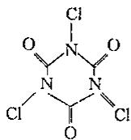

(2)

(3) $\frac{0.1023 \times 24.44 \times 35.45}{0.2200 \times 1000 \times 2} \times 100\% = 20.14\%$

6. 过程中发生的反应有：

$$
\mathrm{Cr} _ {2} \mathrm{O} _ {7} ^ {2 -} + \mathrm{CH} _ {3} \mathrm{OH} + 8 \mathrm{H} ^ {+} = 2 \mathrm{Cr} ^ {3 +} + \mathrm{CO} _ {2} + 6 \mathrm{H} _ {2} \mathrm{O}\tag{①}
$$

$$
\mathrm{Cr} _ {2} \mathrm{O} _ {7} ^ {2 -} + 6 \mathrm{Fe} ^ {2 +} + 1 4 \mathrm{H} ^ {+} = 2 \mathrm{Cr} ^ {3 +} + 6 \mathrm{Fe} ^ {3 +} + 7 \mathrm{H} _ {2} \mathrm{O}\tag{②}
$$

反应②是用 $\left(\mathrm{NH}_{4}\right)_{2}\mathrm{Fe}(\mathrm{SO}_{4})_{2}$ 标准溶液反滴过剩的 $K_{2}Cr_{2}O_{7}$ 。

由关系式 $Cr_{2}O_{7}^{2-}\sim6Fe^{2+}\sim6(NH_{4})_{2}Fe(SO_{4})_{2}$ 知，与 $(\mathrm{NH}_{4})_{2}\mathrm{Fe}(\mathrm{SO}_{4})_{2}$ 反应的 $K_{2}Cr_{2}O_{7}$ 的物质的量为： $(0.1000\times10.60\times10^{-3})/6=1.767\times10^{-4}\mathrm{mol}$ ，则与甲醇反应的 $K_{2}Cr_{2}O_{7}$ 的物质的量为： $25.00\times10^{-3}\times0.02000-1.767\times10^{-4}=3.233\times10^{-4}\mathrm{mol}$ 。

由反应①知，甲醇的物质的量亦为 $3.233 \times 10^{-4}$ mol。

故 $w\% (\mathrm{CH}_3\mathrm{OH}) = 3.233\times 10^{-4}\times 32.00 / 0.01200\times 100\% = 86.21\%$

$$
7. (1) n (\mathrm{HA}) = c (\mathrm{HA}) \cdot V (\mathrm{HA}) = \frac {0 . 0 9 0 0 \times 4 1 . 2 0}{1 0 0 0} = 3. 7 0 8 \times 1 0 ^ {- 3} \mathrm{mol}
$$

$$
M (\mathrm{HA}) = \frac {m (\mathrm{HA})}{n (\mathrm{HA})} = \frac {1 . 2 5 0}{3 . 7 0 8 \times 1 0 ^ {- 3}} = 3 3 7. 1 \mathrm{g/mol}
$$

(2)滴定剂加到8.24mL时,溶液pH=4.30

此时，剩余量的 $n(\mathrm{HA})=3.708\times10^{-5}-\frac{0.0900\times8.24}{1000}=2.9664\times10^{-3}\mathrm{mol}$

生成的 $n(\mathrm{NaA})=\frac{0.0900\times8.24}{1000}=7.416\times10^{-4}\mathrm{mol}$

$$
\mathrm{pH} = \mathrm{p} K _ {\mathrm{a}} + \lg \frac {n (\mathrm{NaA})}{n (\mathrm{HA})} = \mathrm{p} K _ {\mathrm{a}} + \lg \frac {7 . 4 1 6 \times 1 0 ^ {- 4}}{2 . 9 6 6 4 \times 1 0 ^ {- 3}} = 4. 3 0
$$

$$
\mathrm{p} K _ {\mathrm{a}} = 4. \dot {9} 0 2, K _ {\mathrm{a}} = 1 0 ^ {- 4. 9 0 2} = 1. 2 5 \times 1 0 ^ {- 5}
$$

(3)化学计量点 pH 的计算:化学计量点完全生成 NaA, 溶液呈碱性

$$
\left[ \mathrm{OH} ^ {-} \right] = \sqrt {c _ {\mathrm{sp}} K _ {\mathrm{b}}} = \sqrt {\frac {0 . 0 9 0 0 \times 4 1 . 2 0}{4 1 . 2 0 + 5 0} \times \frac {1 0 ^ {- 1 4}}{1 . 2 5 \times 1 0 ^ {- 5}}} = 5. 7 0 \times 1 0 ^ {- 6}
$$

$$
\mathrm{pOH} = 5. 2 4 \quad \mathrm{pH} = 1 4. 0 0 - 5. 2 4 = 8. 7 6 。
$$

8. 设 $amL$ 水样中含溶解 $\mathrm{O}_2$ 的质量为 $x\mathrm{g}$ 。

根据有关反应方程式,已知物质之间的关系为:

$$
\mathrm{O} _ {2} \sim 2 \mathrm{MnO} (\mathrm{OH}) _ {2} \sim 2 \mathrm{I} _ {2} \sim 4 \mathrm{S} _ {2} \mathrm{O} _ {3} ^ {2 -}
$$

$$
x \quad b \times V \times 1 0 ^ {- 3}
$$

$$
x = 3 2 \times b \times V \times 1 0 ^ {- 3} / 4 = 8 b V \times 1 0 ^ {- 3} \mathrm{g}
$$

则溶解氧的计算式为： $8bV \times 10^{-3}/a \times 10^{-3} = 8bV/ag/L$

9. 酚酞做指示剂，消耗盐酸 12.00mL，说明试样中有 $Na_{3}PO_{4}$ 。

$$
\mathrm{Na} _ {3} \mathrm{PO} _ {4} + \mathrm{HCl} = \mathrm{Na} _ {2} \mathrm{HPO} _ {4} + \mathrm{NaCl}
$$

$$
n \left(\mathrm{Na} _ {3} \mathrm{PO} _ {4}\right) = n (\mathrm{HCl}) = 0. 5 0 0 0 \times \frac {1 2 . 0 0}{1 0 0 0} = 0. 0 0 6 0 \mathrm{mol}
$$

$$
m \left(\mathrm{Na} _ {3} \mathrm{PO} _ {4}\right) = 0. 0 0 6 0 \times 1 6 3. 9 4 = 0. 9 8 3 6 \mathrm{g}
$$

试样中 $Na_{3}PO_{4}$ 的含量为: 0.98364/2.00=49.18%

滴定至甲基橙终点时：

$$
\mathrm{Na} _ {3} \mathrm{PO} _ {4} + 2 \mathrm{HCl} = \mathrm{NaH} _ {2} \mathrm{PO} _ {4} + 2 \mathrm{NaCl}, \mathrm{Na} _ {2} \mathrm{HPO} _ {4} + \mathrm{HCl} = \mathrm{NaH} _ {2} \mathrm{PO} _ {4} + \mathrm{NaCl}
$$

与 $Na_{2}HPO_{4}$ 反应消耗的 HCl 为 32.00-2×12.00=8.00mL。

试样中 $Na_{2}HPO_{4}$ 的质量为 $8.00/1000 \times 0.5000 \times 141.96 = 0.568g$ 。

试样中 $Na_{2}HPO_{4}$ 的含量为 0.568/2.00×100%=28.39%。

10.(1)防止空气中的二氧化碳进入试样溶液,否则会在溶液中产生碳酸盐,后者不能使酯发生皂化反应却在酚酞无色时以碳酸氢根存在导致滴定结果有正误差。

(2)皂化当量 $= \frac{X}{(V_2 - V_4)\times 10^{-3}\times 0.0250}$

(3)样品中的游离羧酸会降低皂化当量。要消除这种影响,可另取一份样品,不必皂化,其他按上述测定步骤进行操作,然后将第二次滴定所消耗的0.025mol/L盐酸标准溶液的毫升数,自皂化样品滴定时所消耗的0.025mol/L标准盐酸溶液的毫升数中减去,以进行校正。

11. 根据反应 $HCHO + NH_{2}OH \cdot HCl = HCHNOH + H_{2}O + HCl$ 可知

$$
c (\mathrm{HCHO}) = \frac {n (\mathrm{HCHO})}{V (\mathrm{HCHO})} = \frac {0 . 1 1 0 0 \times 2 8 . 4 5}{1 0 . 0 0} = 0. 3 1 3 0 \mathrm{mol/L}
$$

$$
1 2. \rho_ {\text {总硬度}} = \frac {0 . 0 0 8 8 2 6 \times 1 2 . 5 8 \times 1 0 0}{1 0 0 / 1 0 0 0} = 1 1 1. 0 \mathrm{mg/L(CaCO} _ {3})
$$

$$
\rho_ {\mathrm{Ca}} = \frac {0 . 0 0 8 8 2 6 \times 1 0 . 1 1 \times 4 0}{1 0 0 / 1 0 0 0} = 3 5. 6 9 \mathrm{mg/L}
$$

$$
\rho_ {\mathrm{Mg}} = \frac {0 . 0 0 8 8 2 6 \times (1 2 . 5 8 - 1 0 . 1 1) \times 2 4}{1 0 0 / 1 0 0 0} = 5. 2 3 \mathrm{mg/L}
$$

13. (1) $\mathrm{Na}_4\mathrm{Pb}_9$

(阳离子为 $Na^{+}$ 离子, 设有四个则阴离子应该为 -4 价, 则 $23 \times 4 + 207 \times x / 207 \times (10$

$-x) = 9.44:1$ ，可得 $x = 9)$

(2) $2Pb^{2+}+Pb_{9}^{4-}=11Pb;$

$$
(3) 0. 2 3 6 2 \mathrm{g} 。 (0. 0 0 9 8 5 4 \times 0. 0 2 1 0 5 \times 1 1 / 2 \times 2 0 7 = 0. 2 3 6 2 \mathrm{g})
$$

14. 当 pH=1 时, 络合滴定法测定的是 $Bi^{3+}$ , 所以

$$
w \% (\mathrm{Bi}) = \frac {0.02479 \times 25.67 \times 208.98}{2.420 \times 1000 \times \frac{50.00}{250.00}} \times 100\% = 27.48\%
$$

$\mathrm{pH} = 5$ 时，EDTA滴定测得的是 $\mathrm{Pb^{2 + }}$ 与 $\mathrm{Cd^{2 + }}$ 的总量。加入邻二氮菲，用置换滴定法测定的是 $\mathrm{Cd^{2 + }}$ ，所以

$$
w\% (\mathrm{Cd}) = \frac{0.02174\times 6.76\times 112.41}{2.420\times 1000\times\frac{50.00}{250.00}}\times 100\% = 3.41\%
$$

用差减法可得到 Pb 的质量分数

$$
w \% (\mathrm{Pb}) = \frac {(0.02479 \times 24.76 - 0.02174 \times 6.76) \times 207.2}{2.420 \times 1000 \times \frac{50.00}{250.00}} \times 100 \% = 19.99\%
$$

$$
1 5. (1) \mathrm{CH} _ {2} = \mathrm{CHCN} + \mathrm{Hg} (\mathrm{CH} _ {3} \mathrm{COO}) _ {2} + \mathrm{CH} _ {3} \mathrm{OH} \longrightarrow \mathrm{H} _ {2} \mathrm{C} \quad \text {   —   } \mathrm{CHCN} + \mathrm{CH} _ {3} \mathrm{COOH}
$$

(2) 双键与 Hg 生成环状过渡态, 溶剂从背面进攻得产物 (或: -CN 是吸电基团, 反应遵马氏规则加成而得)

(3)作为缓冲溶液,稳定溶液的 pH

$$
(4)w\% (\mathrm{CH}_{2} = \mathrm{CHCN}) = \frac{\left(\frac{0.1540}{318.7} - \frac{0.05010\times 2.52}{1000}\right)\times 53.03}{0.2010}\times 100\% = 9.42\%
$$

16. $\alpha$ -萘酸为一元酸，2-羟基- $\alpha$ -萘酸为二元酸。第一计量点羧基被中和，消耗标准液3.58mL；第二计量点时，酚羟基被中和，消耗标准液5.19-3.58=1.61mL。

则有：

$$
\begin{array}{r l} & n _ {\alpha - \text { 萘   酸 }} + n _ {2 - \text { 羟   基 } - \alpha - \text { 萘   酸 }} = 0. 1 7 9 0 \times 3. 5 8 = 0. 6 4 1 \mathrm{mmol} \\ & n _ {2 - \text { 羟   基 } - \alpha - \text { 萘   酸 }} = 0. 1 7 9 0 \times 1. 6 1 = 0. 2 8 8 \mathrm{mmol} \\ & n _ {\alpha - \text { 萘   酸 }} = 0. 3 5 3 \mathrm{mmol} \end{array}
$$

$$
w\%_{\alpha -\text{萘酸}} = \frac{0.353\times 172.0}{1000\times 0.1402}\times 100\% = 43.31\%
$$

$$
w \% _ {2 - \text {羟基一} a - \text {紫酸}} = \frac {0 . 2 8 8 \times 1 8 8 . 0}{1 0 0 0 \times 0 . 1 4 0 2} \times 1 0 0 \% = 3 8. 6 2 \%
$$

$$
17. w\% (\mathrm{Ni}) = \frac{0.05831\times 26.14\times 58.69}{0.7176\times 1000\times\frac{50.00}{250.00}}\times 100\% = 62.33\%
$$

$$
w \% (\mathrm{Fe}) = \frac {0.05831 \times (35.44 - 26.14) \times 55.85}{0.7176 \times 1000 \times \frac{50.00}{250.00}} \times 100\% = 21.10\%
$$

$$
w\% (\mathrm{Cr}) = \frac{(0.05831\times 50.00 - 0.06316\times 6.21 - 0.05831\times 35.44)\times 52.00}{0.7176\times 1000\times\frac{50.00}{250.00}}\times 100\%
$$

$$
\begin{aligned} & = 16.55\% \\ & 18.\mathrm{CH}_{2}\mathrm{OHCH}_{2}\mathrm{OH} + \mathrm{IO}_{4}^{-} = 2\mathrm{HCHO} + \mathrm{IO}_{3}^{-} + \mathrm{H}_{2}\mathrm{O}\\ & \mathrm{IO}_{4}^{-} + 2\mathrm{I}^{-} + \mathrm{H}_{2}\mathrm{O} = \mathrm{IO}_{3}^{-} + \mathrm{I}_{2} + 2\mathrm{OH}^{-}\\ & \mathrm{I}_{2} + \mathrm{AsO}_{3}^{3 - } + \mathrm{H}_{2}\mathrm{O} = 2\mathrm{I}^{-} + \mathrm{AsO}_{4}^{3 - } + 2\mathrm{H}^{+} \end{aligned}
$$

由以上反应可知 $n$ (乙二醇): $n(\mathrm{AsO}_3^{3-}) = 1:1$ , 所以 $m$ (乙二醇) $= c(\mathrm{AsO}_3^{3-}) \times (V_{\text{空白}} - V_{\text{试样}}) \times M$ (乙二醇) $= 0.05000 \times (40.10 - 14.30) \times 62.07 = 80.07 \mathrm{mg}$ 。

19.(1)除去铜和银,与生成的 $Fe^{3+}$ 络合,排除对终点的颜色干扰。

$$
\begin{array}{l} (2) \mathrm {Au^ {3 + } + 3Fe^ {2 + } = Au + 3Fe^ {3 + } (\text {或} [AuCl_ {4} ] ^ {-} + 3Fe^ {2 + } = Au + 3Fe^ {3 + } + 4Cl^ {-})} \\ 6 \mathrm {Fe^ {2 + } + Cr_ {2} O_ {7} ^ {2 - } + 14H^ {+} = 6Fe^ {3 + } + 2Cr^ {3 + } + 7H_ {2} O} \\ (3) c (\mathrm {Fe^ {2 + }}) = \frac {\frac {15.0625}{294.2} \times 5 . 25 \times 1 0 ^ {- 3} \times 6}{20 \times 1 0 ^ {- 3}} = 0.08064 \mathrm{mol/L} \\ w \% (\mathrm{Au}) = \frac {(0.08064 \times 40.00 \times 1 0 ^ {- 3} - \frac {15.0625}{294.2} \times 5 . 59 \times 1 0 ^ {- 3} \times 6) \div 3 \times 197}{0 .1234} \times 100 \% \\ = 80.27 \% \\ 2 0. (1) 2 \mathrm {MnO_ {4} ^ {-}} + 5 \mathrm {C_ {2} O_ {4} ^ {2 -}} + 1 6 \mathrm {H^ {+}} = 2 \mathrm {Mn^ {2 + }} + 1 0 \mathrm {CO_ {2}} + 8 \mathrm {H_ {2} O} \\ \mathrm {KMnO_ {4}} \text {溶液浓度:} (2 / 5) \times 0.05301 \times 25.00 / 27.75 = 0.01910 \mathrm{mol/L} \end{array}
$$

(2)根据化合物中金属离子物质的量比为 $La:Ca:Mn=2:2:1$ ，镧和钙的氧化态分别为 +3 和 +2，锰的氧化态为 +2～+4，初步判断复合氧化物的化学式为 $La_{2}Ca_{2}MnO_{6+x}$ ，其中 $x=0\sim1$ 。

滴定情况：

加入 $C_{2}O_{4}^{2-}$ 总量: $25.00 \times 0.05301 = 1.3253 \, mmol$

样品溶解后，滴定消耗高锰酸钾： $10.02 \times 0.01910 = 0.1914 \, mmol$

$$
\mathrm{C} _ {2} \mathrm{O} _ {4} ^ {2}
$$

$$
\text { 样品溶解过程所消耗的 } \mathrm{C} _ {2} \mathrm{O} _ {4} ^ {2 -} \text { 量 }: 1. 3 2 5 3 - 0. 4 7 8 5 = 0. 8 4 6 8 \mathrm{mmol}
$$

在溶样过程中， $C_{2}O_{4}^{2-}$ 变为 $CO_{2}$ 给出电子： $2 \times 0.8468 = 1.694 \, mmol$

设复合氧化物 $\left(\mathrm{La}_{2}\mathrm{Ca}_{2}\mathrm{MnO}_{6+x}\right)$ 样品的物质的量为：0.4460/(508.9+16.0x)

$$
\mathrm{La} _ {2} \mathrm{Ca} _ {2} \mathrm{MnO} _ {6 + x}
$$

$$
[ 2 \times (6 + x) - 2 \times 3 - 2 \times 2 ] = (2 + 2 x)
$$

溶样过程中锰的价态变化为： $(2+2x-2)=2x$

锰得电子数与 $C_{2}O_{4}^{2-}$ 给电子数相等：

$$
2 x \times 0. 4 4 6 0 / (5 0 8. 9 + 1 6. 0 x) = 1. 6 9 4 \times 1 0 ^ {- 3} \mathrm{mol}
$$

$x = 1.012 \approx 1$ 。可见在复合氧化物中， $\mathrm{Mn}$ 为 $+4$ 价。

该复合氧化物的化学式为 $La_{2}Ca_{2}MnO_{7}$ 。

溶样过程的反应方程式为：

$$
\mathrm{La} _ {2} \mathrm{Ca} _ {2} \mathrm{MnO} _ {7} + \mathrm{C} _ {2} \mathrm{O} _ {4} ^ {2 -} + 1 4 \mathrm{H} ^ {+} = 2 \mathrm{La} ^ {3 +} + 2 \mathrm{Ca} ^ {2 +} + \mathrm{Mn} ^ {2 +} + 2 \mathrm{CO} _ {2} + 7 \mathrm{H} _ {2} \mathrm{O}
$$

21. 化学反应为：

$$
\mathrm{C} _ {3} \mathrm{H} _ {8} \mathrm{O} _ {3} + 8 \mathrm{Ce} ^ {4 +} + 3 \mathrm{H} _ {2} \mathrm{O} = 3 \mathrm{HCOOH} + 8 \mathrm{Ce} ^ {3 +} + 8 \mathrm{H} ^ {+}
$$

过量的 $\mathrm{Ce}^{4+}$ 与 $\mathrm{Fe}^{2+}$ 反应 $\mathrm{Ce}^{4+} + \mathrm{Fe}^{2+} = \mathrm{Ce}^{3+} + \mathrm{Fe}^{3+}$

与 100.0mg 的含水甘油反应的 $Ce^{4+}$ 的物质的量为：

$$
5 0. 0 \times 0. 0 8 3 7 - 0. 0 4 4 8 \times 1 2. 1 1 = 3. 6 4 2 5 \mathrm{mmol}
$$

根据反应式可得 $n(\mathrm{C}_{3}\mathrm{H}_{8}\mathrm{O}_{3}):n(\mathrm{Ce}^{4+})=1:8$ 。

故

$$
\begin{aligned} w\% (\mathrm{C}_{3}\mathrm{H}_{8}\mathrm{O}_{3}) & = \frac{1}{8}\times \frac{n(\mathrm{Ce}^{4 + })\cdot M(\mathrm{C}_{3}\mathrm{H}_{8}\mathrm{O}_{3})}{m}\times 100\% \\ & = \frac{3.6425\times 92.09}{8\times 100.0}\times 100\% \\ & = 41.93\% \end{aligned}
$$

22. 有关的反应式为：

$$
5 \mathrm{VO} ^ {2 +} + \mathrm{MnO} _ {4} ^ {-} + 1 1 \mathrm{H} _ {2} \mathrm{O} = 5 \mathrm{VO} _ {4} ^ {3 -} + \mathrm{Mn} ^ {2 +} + 2 2 \mathrm{H} ^ {+}
$$

$$
\mathrm{MnO} _ {4} ^ {-} + 4 \mathrm{Mn} ^ {2 +} + 1 5 \mathrm{H} _ {4} \mathrm{P} _ {2} \mathrm{O} _ {7} = 5 \mathrm{Mn} (\mathrm{H} _ {2} \mathrm{P} _ {2} \mathrm{O} _ {7}) _ {3} ^ {3 -} + 4 \mathrm{H} _ {2} \mathrm{O} + 2 2 \mathrm{H} ^ {+}
$$

因为 $E^{\ominus}(\mathrm{V}^{(\mathrm{V})}/\mathrm{V}^{(\mathrm{IV})})<E^{\ominus}(\mathrm{Mn}^{(\mathrm{II})}/\mathrm{Mn}^{(\mathrm{II})})$ ，所以 $\mathrm{VO}^{2+}$ 先被滴定。又因为

$$
n (\mathrm{VO} ^ {2 +}) = 5 n (\mathrm{MnO} _ {4} ^ {-})
$$

所以

$$
w\% (\mathrm{V}) = \frac{5\times 0.02000\times 2.50\times 50.94}{1000\times 1.000}\times 100\% = 1.27\%
$$

$\mathrm{VO}^{2+}$ 被滴定后，反应产生了一定量的 $\mathrm{Mn}^{2+}$ ，继续用 $\mathrm{KMnO}_4$ 滴定时，将这部分 $\mathrm{Mn}^{2+}$ 和试样中的 $\mathrm{Mn}^{2+}$ 一同氧化。又因为 $n(\mathrm{Mn}^{2+}) = 4n(\mathrm{MnO}_4^-)$

$$
\text{所以} w\% (\mathrm{Mn}) = \frac{(4\times 0.02000\times 4.00 - 0.02000\times 2.50)\times 54.94}{1000\times 1.000}\times 100\% = 1.48\%
$$

23. 在碱性溶液中反应为：

$$
\mathrm{HCOO} ^ {-} + 2 \mathrm{MnO} _ {4} ^ {-} + 3 \mathrm{OH} ^ {-} = \mathrm{CO} _ {3} ^ {2 -} + 2 \mathrm{MnO} _ {4} ^ {2 -} + 2 \mathrm{H} _ {2} \mathrm{O}
$$

酸化后

$$
3 \mathrm{MnO} _ {4} ^ {2 -} + 4 \mathrm{H} ^ {+} = 2 \mathrm{MnO} _ {4} ^ {-} + \mathrm{MnO} _ {2} + 2 \mathrm{H} _ {2} \mathrm{O}
$$

由题意可知，HCOOH 是利用氧化还原返滴定法进行测量的。 $KMnO_{4}$ 氧化 HCOOH，产生的 $K_{2}MnO_{4}$ 在酸性条件下发生歧化反应，生成 $KMnO_{4}$ 和 $MnO_{2}$ ，多余的 $KMnO_{4}$ 及歧化的产物一同被 $Fe^{2+}$ 还原。根据反应的化学计量关系可得

$$
c (\mathrm{HCOOH}) = \frac {5 \times 0 . 0 2 5 0 0 \times (5 0 . 0 0 + 2 4 . 0 0) - 0 . 2 0 0 0 \times 4 0 . 0 0}{2 \times 2 0} = 0. 0 3 1 2 5 \mathrm{mol} / \mathrm{L}
$$

HAc 的含量用酸碱滴定差减法可得

$$
c (\mathrm{HAc}) = \frac {0 . 1 0 0 0 \times 2 5 . 0 0}{2 0 . 0 0} - 0. 0 3 1 2 5 = 0. 0 9 3 7 5 \mathrm{mol/L}
$$

24.(1)sul的分子式为 $\mathrm{C_6H_8N_2O_2S}$ ，结构简式为 $\mathrm{O = S = O}$

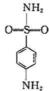

$$
(2) \mathrm{BrO} _ {3} ^ {-} + 5 \mathrm{Br} ^ {-} + 6 \mathrm{H} ^ {+} = 3 \mathrm{Br} _ {2} + 3 \mathrm{H} _ {2} \mathrm{O}
$$

$$
(3) \mathrm{C} _ {6} \mathrm{H} _ {8} \mathrm{N} _ {2} \mathrm{O} _ {2} \mathrm{S} + 2 \mathrm{Br} _ {2} = \mathrm{C} _ {6} \mathrm{H} _ {6} \mathrm{Br} _ {2} \mathrm{N} _ {2} \mathrm{O} _ {2} \mathrm{S} + 2 \mathrm{HBr}
$$

$$
\begin{aligned} & (4) \text{由以上反应可得:} \mathrm {BrO_ {3} ^ {-}} \sim 3 \mathrm {Br_ {2}} \sim 3 / 2 \mathrm{sul}, \mathrm {Br_ {2}} \sim \mathrm {I_ {3} ^ {-}} \sim 2 \mathrm {S_ {2} O_ {3} ^ {2 - }} \\ & w \% (\mathrm{sul}) = \frac {\frac {1}{2} \left[ 3 c (\mathrm {BrO_ {3} ^ {-}}) \cdot V (\mathrm {BrO_ {3} ^ {-}}) - \frac {1}{2} c (\mathrm {S_ {2} O_ {3} ^ {2 -}}) \cdot V (\mathrm {S_ {2} O_ {3} ^ {2 -}}) \right] \cdot M (\mathrm{sul})}{m} \\ & = \frac {\frac {1}{2} \times (3 \times 0.01767 \times 25.00 - \frac {1}{2} \times 0.1215 \times 12.92) \times 172.21}{0.2981 \times \frac {20.00}{100.0} \times 1000} \\ & = 78.04 \% \end{aligned}
$$

(5)因产品中 sul 的质量分数未达到 80%，所以产品不合格。

$$
2 5. (1) 2 \mathrm{MnO} _ {4} ^ {-} + 5 \mathrm{C} _ {2} \mathrm{O} _ {4} ^ {2 -} + 1 6 \mathrm{H} ^ {+} = 2 \mathrm{Mn} ^ {2 +} + 1 0 \mathrm{CO} _ {2} + 8 \mathrm{H} _ {2} \mathrm{O}
$$

$$
c (\mathrm{KMnO} _ {4}) = \frac {\frac {2}{5} \times \frac {m (\mathrm{Na} _ {2} \mathrm{C} _ {2} \mathrm{O} _ {4})}{M (\mathrm{Na} _ {2} \mathrm{C} _ {2} \mathrm{O} _ {4})}}{V (\mathrm{KMnO} _ {4})} = \frac {\frac {2}{5} \times \frac {0 . 1 3 4 0}{1 3 4 . 0}}{2 0 . 3 0 \times 1 0 ^ {- 3}} = 0. 0 1 9 7 0 \mathrm{mol/L}\tag{2}
$$

$$
\begin{array}{r l} & {\mathrm {COD(O_ {2} ,mg / L)}} \\ & {= \frac {[ c (\mathrm {KMnO_ {4}}) (V _ {1} + V _ {2}) - \frac {2}{5} c (\mathrm {Na_ {2} C_ {2} O_ {4}}) \cdot V (\mathrm {Na_ {2} C_ {2} O_ {4}}) ] \times \frac {5}{4} \times M (\mathrm {O_ {2}})}{V (\text {水样})}} \\ & {= \frac {[ 0 . 0 1 9 7 0 \times (1 0 . 0 0 + 1 8 . 1 0) - \frac {2}{5} \times 0 . 0 2 5 \times 1 0 . 0 0 ] \times 1 0 ^ {- 3} \times \frac {5}{4} \times 3 2 \times 1 0 0 0}{0 . 1}.} \end{array}
$$

26.(1)计算每克晶体中 Cr 的质量。

在第二步中，将 $\mathrm{Cr}^{3+}$ 全部氧化为 $\mathrm{Cr}_2\mathrm{O}_7^{2-}$ ，然后用 $\mathrm{Fe}^{2+}$ 进行滴定，因为 $2\mathrm{Cr} \sim \mathrm{Cr}_2\mathrm{O}_7^{2-} \sim 6\mathrm{Fe}^{2+}$ ，所以 $n(\mathrm{Cr}^{3+}) = 1/3n(\mathrm{Fe}^{2+})$ ，则

$$
n \left(\mathrm{Cr} ^ {3 +}\right) = 1 / 3 \times 0. 7 0 3 \times 2. 7 8 6 = 0. 6 5 3 \mu \mathrm{mol}
$$

每克晶体中 Cr 的质量为 $0.653 \times 52.00 / 0.1566 = 217 \mu g / g$ 。

(2) 计算平均氧化数。

+3价以上的氧化数的Cr得到的电子总数与 $\mathrm{Fe}^{2+}$ 失去的电子总数相等，所以Cr得到的电子的量 $n_{\mathrm{e}}$ 为 $0.498\times 2.786 = 1.39\mu \mathrm{mol}$ 。

0.4375g 晶体中 Cr 的物质的量为 $0.4375 \times 217 / 52.00 = 1.83 \mu mol$ 。

单位物质的量的 Cr 得到的电子的量为 1.39/1.83=0.760。所以 Cr 的平均氧化数为 $3+0.760=3.760$ 。

## 【吸光光度法专题】

## 一、吸光光度法概述

吸光光度法是基于物质对光的选择性吸收而建立起来的分析方法,例如高锰酸钾溶液吸收绿光,颜色越深浓度越大。

## 1. 吸光光度法的特点

(1)灵敏度高:测定的最低浓度可达 $10^{-5}\sim10^{-6}$ mol/L,相当于含量0.001\~0.0001%的微量组分。

(2)准确度较高:分光光度法的相对误差为2\~5%。

(3) 操作简便, 测定速度快。

(4)应用广泛。

## 2. 物质的颜色和对光的选择吸收

光作用于物质时,物质吸收了可见光,而显示出特征的颜色,这一过程与物质的性质及光的性质有关。

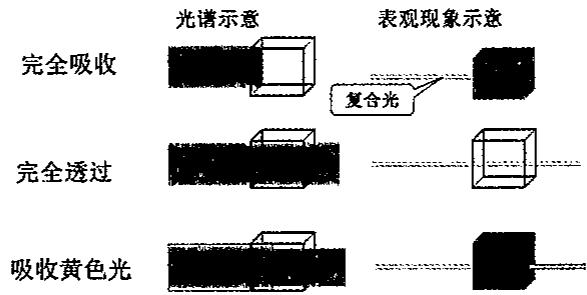

## 二、光的吸收基本定律

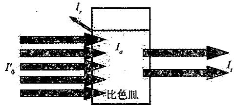

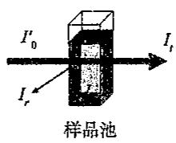

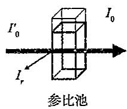

设入射光, 吸收光, 透射光和反射光的强度依次为 $I_{0}^{\prime}, I_{a}, I_{t}, I_{r}$ , 则在样品池中它们之间的关系为: $I_{0}^{\prime} = I_{a} + I_{t} + I_{r}$ ; 在参比池中为: $I_{0}^{\prime} = I_{r} + I_{0}$ ; 其中 $I_{0} = I_{a} + I_{t}$ 为真正进入溶液部分的入射光。

在吸光光度法中,测定时都是采用同样质量的比色皿,反射光的强度基本上是不变的,其影响可以相互抵消,这种方式叫作空白调零。

## 1. 透光率 $(T)$ :

透过光强度 $I_{t}$ 与入射光强度 $I_{0}$ 之比称为透光度或透光率。用 T 表示：

$$
T = \frac {I _ {t}}{I _ {0}} \text {或} T \% = \frac {I _ {t}}{I _ {0}} \times 1 0 0
$$

从上式可以看出：T 取值为 0.0% \~ 100.0%，全部吸收，T = 0.0%；全部透射，T = 100.0%。

溶液的透光度越大,说明溶液对光的吸收越小,浓度低;相反,透光度越小,说明溶液对光的吸收越大,浓度高。

## 2. 吸光度(A):

吸光度可定义为 $A=\lg\frac{I_{0}}{I_{t}}=\lg\frac{1}{T}$ 。

若光全部透过溶液， $I_{0}=I_{t},A=0$ ；若光几乎全被吸收， $I_{t}\approx0,A=\infty$ 。

吸光度 A 也可以用来衡量溶液中吸光物质对波长为 $\lambda$ 的单色光的吸收程度, 值越

将不同波长的光透过某一固定的溶液,测量不同波长下溶液对光的吸光度,可得到曲线 A、B、C、D 代表不同浓度下的吸收曲线。

## 对吸收曲线的讨论：

(1)同一种物质对不同波长光的吸光度不同。吸光度最大处对应的波长称为最大吸收波长 $\lambda_{max}$ 。 $(KMnO_{4}$ 的 $\lambda_{max}=525nm)$

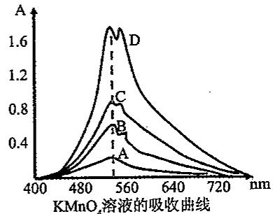

(2) 不同浓度的同一种物质, 其吸收曲线形状相似 $\lambda_{max}$ 不变。而对于不同物质, 它们的吸收曲线形状和 $\lambda_{max}$ 则不同。可作为物质定性分析的依据之一。

(3)不同浓度的同一种物质,在某一定波长下吸光度 A 有差异,A 随浓度的增大而增大。此特性可作为物质定量分析的依据。

(4) 在 $\lambda_{max}$ 处吸光度随浓度变化的幅度最大, 所以测定最灵敏。吸收曲线是定量分析中选择入射光波长的重要依据。

## 三、朗伯-比耳定律

## 1. 朗伯定律

朗伯于 1760 年发现, 当 $\lambda, c, T$ 一定时, 溶液对光的吸收程度 A 与液层厚度 b 成正比, 即 $A \propto b$ 。

## 2. 比耳定律

比耳于 1852 年发现，当 $\lambda, b, T$ 一定时，溶液对光的吸收程度 A 与浓度 c 成正比，即 $A \propto c$ 。

## 3. 朗伯-比耳定律

$$
A = \lg \frac {I _ {0}}{I} = K \cdot b \cdot c
$$

K 为比例常数, 它与入射光的波长, 有色物质的性质和溶液的温度等因素有关。

上式表示当一束平行单色光通过均匀的溶液时，溶液对光的吸收程度与溶液的浓度和液层厚度的乘积成正比。这一定律称为朗伯一比耳定律，也称为光吸收定律。

## 4. 比例系数 $K$

(1) 吸光系数 $a$

c 用 g/L 表示, b 用 cm 表示时, K 用 a 表示, 称为吸光系数, 其单位为 L·(g·cm) $^{-1}$ 。则: A = abc。

a 是吸光物质在一定的条件下的特性常数,与本性有关,与吸光物质的浓度和液层厚度无关。

## (2)摩尔吸光系数 $\epsilon$

c 用 mol/L 表示, b 用 cm 表示时, K 用 $\varepsilon$ 表示, 称为摩尔吸光系数, 其单位为 $L \cdot (\text{mol} \cdot \text{cm})^{-1}$ 。则: $A = \varepsilon bc$ 。

摩尔吸光系数 $\varepsilon$ 的讨论：

①ε 是吸光物质在一定波长和溶剂条件下的特征常数, 不随浓度 c 和液层厚度 b 的改变而改变。在温度和波长等条件一定时, ε 仅与吸收物质本身的性质有关, 与待测物浓度无关;

②同一吸光物质在不同波长下的 $\varepsilon$ 值是不同的。在最大吸收波长 $\lambda_{max}$ 处的摩尔吸光系数，常以 $\varepsilon_{max}$ 表示。 $\varepsilon_{max}$ 表明了该吸光物质最大限度的吸光能力，也反映了光度法测定该物质可能达到的最大灵敏度。

③ $\epsilon_{max}$ 越大表明该物质的吸光能力越强，用光度法测定该物质的灵敏度越高。 $\varepsilon<10^{4}$ ，反应灵敏度低； $10^{4}<\varepsilon<5\times10^{4}$ ，反应灵敏度中； $5\times10^{4}<\varepsilon<10^{5}$ ，反应灵敏度高； $\varepsilon>10^{5}$ ，反应灵敏度超高；

④ε 在数值上等于浓度为 1mol/L、液层厚度为 1cm 时该溶液在某一波长下的吸光度。

当 $c=1\mathrm{mol/L}, b=1\mathrm{cm}$ 时， $A=\varepsilon$ 。

对于微量组分的测定,一般选 $\varepsilon$ 较大的显色反应,以提高测定的灵敏度。

## (3)桑德尔灵敏度(S)

吸光光度法的灵敏度也可用桑德尔灵敏度 S 表示，S 是在一定的波长下，测得的吸光度 A=0.001 时， $1cm^{2}$ 截面积内所含的吸光物质的质量，其单位用 $\mu g \cdot cm^{-2}$ 。

$$
A = 0. 0 0 1 = \varepsilon b c, b c = 0. 0 0 1 / \varepsilon
$$

式中 b 为吸收池的厚度, 单位为 cm, c 为物质的量浓度, 单位为 mol/L。bc 乘以待测物的摩尔质量 M(g/mol), 就是单位截面积内待测物的质量, 即

$$
S = b (\mathrm{cm}) \times c (\mathrm{mol} / \mathrm{L}) \times M (\mathrm{g} / \mathrm{mol}) \times 1 0 ^ {6} \mathrm{mg} / \mathrm{g} = \frac {M}{\varepsilon}
$$

## 5. 吸光度的加合性

总的吸光度等于各个吸光物质的吸光度之和或溶液的吸光度应等于溶液中各组分的吸光度之和。(组分间没有干扰)

$$
A _ {\text { 总 }} = \sum A _ {i} = \varepsilon_ {1} b _ {1} c _ {1} + \varepsilon_ {2} b _ {2} c _ {2} + \dots + \varepsilon_ {n} b _ {n} c _ {n}
$$

溶液中多组分测定时：

$$
\begin{array}{l} A ^ {\lambda_ {1}} = \varepsilon_ {(x)} ^ {\lambda_ {1}} b c _ {(x)} + \varepsilon_ {(y)} ^ {\lambda_ {1}} b c _ {(y)} \\ A ^ {\lambda_ {2}} = \varepsilon_ {(x)} ^ {\lambda_ {2}} b c _ {(x)} + \varepsilon_ {(y)} ^ {\lambda_ {2}} b c _ {(y)} \end{array}
$$

## 6. 工作曲线——朗伯-比耳定律的分析应用, 溶液浓度的测定

先配制一系列标准溶液，在最大吸收波长处，测出它们的吸光度，作图，相同条件下测未知液的吸光度，从图中查出未知液的浓度。

7. 有色溶液对朗伯-比尔定律的偏离

## (1) 物理因素

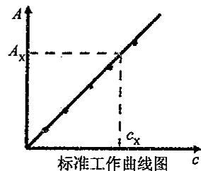

①单色光不纯，导致负偏差。

②介质不均匀、散射光的影响，胶体、乳浊液或悬浊液由于散射的作用使吸光度增大，或入射光不是垂直通过比色皿产生正偏差。

## (2)化学因素

①吸光质点的相互作用,浓度较大时,产生负偏差,朗伯-比耳定律只适合于稀溶液 $c<10^{-2}\mathrm{mol/L}$ 。

②平衡效应,物质的离解、缔合、互变异构及化学变化引起的偏离。

因此朗伯-比耳定律的适用条件：

①单色光：应选用 $\lambda_{max}$ 处或肩峰处测定。

②吸光质点形式不变:离解、络合、缔合会破坏线性关系,应控制条件(酸度、浓度、介质等)。

③稀溶液:浓度增大,分子之间作用增强。

## 四、显色反应和显色条件的选择

## 1. 显色反应和显色剂

在分光光度分析中,利用显色反应把待测组分 X 转变为有色化合物,然后再进行测定。

使试样中的被测组分与化学试剂作用生成有色化合物的反应叫显色反应。显色反应主要有配位反应和氧化还原反应，其中绝大多数是配位反应。

$$
m \mathrm{X} (\text {待测物}) + n \mathrm{R} (\text {显色剂}) = \mathrm{X} _ {m} \mathrm{R} _ {n} (\text {有色化合物})
$$

## 2. 对显色反应的要求

(1)灵敏度高,选择 $\varepsilon$ 较大的显色反应。避免共存组分干扰。

(2)选择性好,显色剂只与被测组分反应。

(3)有色物组成固定,如: $Fe^{3+}$ +磺基水杨酸→三磺基水杨酸合铁(黄色)(组成固定)

$$
\mathrm{Fe} ^ {3 +} + \mathrm{SCN} ^ {-} \longrightarrow [ \mathrm{Fe(SCN)} ] ^ {2 +}, [ \mathrm{Fe(SCN)} _ {2} ] ^ {+} (\text {血红色}) (\text {组成不固定})
$$

(4)有色物稳定性高,其他离子干扰才小。如三磺基水杨酸合铁的 $K_{f}=10^{42}$ , $F^{-}$ 、 $H_{3}PO_{4}$ 对它无干扰。

(5)显色过程易于控制,而且有色化合物与显色剂之间的颜色差别应尽可能大。

$$
\Delta \lambda = | \lambda_ {\max} ^ {M R} - \lambda_ {\max} ^ {R} | > 6 0 \mathrm{nm}
$$

## 3. 常用的有机显色剂

OO型:磺基水杨酸;NN型:邻二氮菲、丁二酮肟;NO型:PAR;S型:双硫腙。

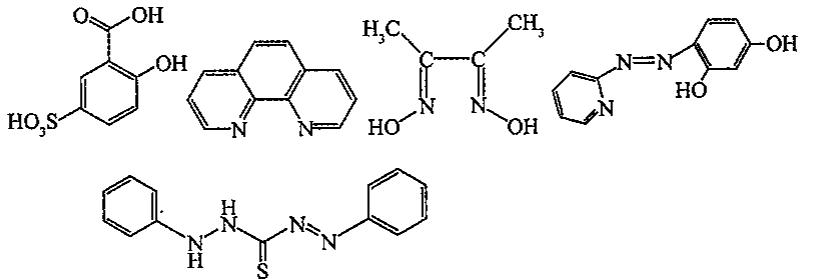

## 五、吸光度测定条件的选择

## 1. 选择合适波长的入射光

一般应该选择 $\lambda_{max}$ 为入射光波长。但如果 $\lambda_{max}$ 处有共存组分干扰时，则应考虑选择灵敏度稍低但能避免干扰的人射光波长。例如下左图中应选择 655nm 作为入射光波长，

而下右图中应选择 500nm。

  
钍-偶氮砷III

  
钴-亚硝基红盐

## 2. 选择合适的参比溶液

参比溶液的选择一般遵循以下原则：

(1)试样、试剂、显色剂都无色时，用纯水作参比。

(2)试样无色,试剂、显色剂有色,采用不加试样的空白溶液作参比。(试剂空白)

(3)试样有吸收,而显色剂等无色,可采用不加显色剂的试样为参比。(试样空白)

(4)均有色,有吸收,对试样加入掩蔽剂,褪色后再加显色剂等作为参比。(褪色空白)

3. 控制适宜的吸光度(读数范围)

实际工作中，应控制 T 在 10～70%，吸光度 A 在 0.15～1.0 范围内。

(1) 控制试样的量或溶液的稀释程度来控制溶液浓度。

(2)选择不同厚度的比色皿。

## 六、吸光光度法的应用

1. 标准曲线法测单一组分

(1)选择合适的显色反应和显色条件；

(2)绘出被测组分的吸收光谱曲线(用标液);

(3) 在 $\lambda_{max}$ 下测一系列标准溶液的 A 值, 绘制工作曲线 A-c;

(4)与工作曲线相同的方法,测未知物 $A_{X}$ ,从工作曲线上查 $c_{X}$ 。

2. 多组分的测定

(a) 在 $\lambda_{1}$ 处测组分 $x$ , 在 $\lambda_{2}$ 处测组分 $y$ 。

$$
A _ {1} = \varepsilon_ {\mathrm{x}} ^ {\lambda 1} \cdot b \cdot c _ {\mathrm{x}}
$$

$$
A _ {2} = \varepsilon_ {y} ^ {\lambda 2} \cdot b \cdot c _ {y}
$$

(b) 在 $\lambda_{1}$ 处测组分 $x$ ; 在 $\lambda_{2}$ 处测总吸收, 扣除 $x$ 吸收, 可求 $y$

$A_{1} = \varepsilon_{x}^{\lambda 1}\cdot b\cdot c_{x}$ （在 $\lambda_1$ 处测得 $A_{1}$ ）

$A_{2} = \varepsilon_{\mathrm{x}}^{\lambda 2}\cdot b\cdot c_{\mathrm{x}} + \varepsilon_{\mathrm{y}}^{\lambda 2}\cdot b\cdot c_{\mathrm{y}}$ （在 $\lambda_{2}$ 处测得 $A_{2}$ ）

(c)x,y组分不能直接测定

$A_{1} = \varepsilon_{x}^{\lambda 1}\cdot b\cdot c_{x} + \varepsilon_{y}^{\lambda 1}\cdot b\cdot c_{y}$ （在 $\lambda_1$ 处测得 $A_{1}$ ）

$A_{2} = \varepsilon_{\mathrm{x}}^{\lambda 2}\cdot b\cdot c_{\mathrm{x}} + \varepsilon_{\mathrm{y}}^{\lambda 2}\cdot b\cdot c_{\mathrm{y}}$ （在 $\lambda_2$ 处测得 $\mathrm{A}_2$ ）

$\varepsilon_{x}^{\lambda1},\varepsilon_{y}^{\lambda1},\varepsilon_{x}^{\lambda2},\varepsilon_{y}^{\lambda2}$ 由 x,y 标液在 $\lambda_{1},\lambda_{2}$ 处分别测得。

3. 高含量组分测定 —— 示差法

参比溶液:浓度稍低的标准溶液 $c_{1}$ ，用 $c_{1}$ 调节 T% 为 $100(A=0)$ ，若被测溶液的浓度为 $c_{2}$ 。 $A_{1}=\varepsilon bc_{1}, A_{2}=\varepsilon bc_{2}$

$$
\Delta A = A _ {2} - A _ {1} = \varepsilon b (c _ {2} - c _ {1}) = \varepsilon b \Delta c
$$

结论:两溶液的吸光度差 $\Delta A$ 与浓度差 $\Delta c$ 成正比。

示差法标尺扩展原理：

普通法: $c_{s}$ 的 $T=10\%$ ; $c_{x}$ 的 $T=7\%$ 。

示差法: $c_{s}$ 做参比,调 T=100%。

则： $c_{x}$ 的 T=70%；标尺扩展 10 倍。

4. 双波长分光光度法

$$
\Delta A = A _ {\lambda_ {1}} - A _ {\lambda_ {2}} = (\varepsilon_ {\lambda_ {1}} - \varepsilon_ {\lambda_ {2}}) b c
$$

该方法用于消除杂质 Y 对被测物质 X 的干扰, 要求杂质 Y 对所使用的两个波长 $(\lambda_{2}$ 和 $\lambda_{1}$ , 不使用 $\lambda_{1}^{\prime}$ 的原因是距离 $\lambda_{2}$ 较近, 且 X 与 Y 对 $\lambda_{1}^{\prime}$ 的吸收差别较小) 吸光度相等。

## 高中化学竞赛 基本理论学习笔记

在 $\lambda_{2}, A_{\lambda 2} = A_{x2} + A_{y2}$ ; 在 $\lambda_{1}, A_{\lambda 1} = A_{x1} + A_{y1}$ ; 因为 $A_{y2} = A_{y1}$ , 故

$$
\Delta A = A _ {\lambda 2} - A _ {\lambda 1} = A _ {x 2} + A _ {y 2} - \left(A _ {x 1} + A _ {y 1}\right) = A _ {x 2} - A _ {x 1} = \Delta A _ {x}
$$

$\Delta A_{x}=(\varepsilon_{x2}-\varepsilon_{x1})bc_{x}$ ; 消除了 y 的干扰。

## 5. 光度滴定

由于在选定的波长下，被滴定的溶液各组分的吸光情况不同，曲线形状不同。例如用 EDTA 连续滴定 $Bi^{3+}$ ， $Cu^{2+}$ 混合溶液的图象如右图所示，取切线的延长线交点作为滴定终点， $V_{1}$ 为 $Bi^{3+}$ 的终点， $V_{2}$ 为 $Cu^{2+}$ 的终点。

6. 弱酸(碱)离解常数的测定

$\mathrm{HA}\rightleftharpoons \mathrm{H}^{+} + \mathrm{A}^{-}$

$$
c _ {\mathrm{HA}} = [ \mathrm{HA} ] + [ \mathrm{A} ^ {-} ] = c _ {\mathrm{HA}} \cdot \delta_ {\mathrm{HA}} + c _ {\mathrm{HA}} \cdot \delta_ {\mathrm{A}}
$$

当 $b = 1\mathrm{cm}$ 时，

$$
\begin{array}{r l} A & = \varepsilon_ {\mathrm{HA}} [ \mathrm{HA} ] + \varepsilon_ {\mathrm{A} ^ {-}} [ \mathrm{A} ^ {-} ]. \\ & = \varepsilon_ {\mathrm{HA}} \cdot c _ {\mathrm{HA}} \cdot \frac {[ \mathrm{H} ^ {+} ]}{[ \mathrm{H} ^ {+} ] + K _ {\mathrm{a}}} + \varepsilon_ {\mathrm{A} ^ {-}} \cdot c _ {\mathrm{HA}} \cdot \frac {K _ {\mathrm{a}}}{K _ {\mathrm{a}} + [ \mathrm{H} ^ {+} ]} \\ & = A _ {\mathrm{HA}} \frac {[ \mathrm{H} ^ {+} ]}{[ \mathrm{H} ^ {+} ] + K _ {\mathrm{a}}} + A _ {\mathrm{A} ^ {-}} \frac {K _ {\mathrm{a}}}{[ \mathrm{H} ^ {+} ] + K _ {\mathrm{a}}} \end{array}
$$

高酸度下，几乎全部以 HA 存在，可测得 $A_{HA} = \varepsilon_{HA} \cdot c_{HA}$ ；低酸度下，几乎全部以 $A^{-}$ 存在，可测得 $A_{A^{-}} = \varepsilon_{A^{-}} \cdot c_{HA}$ 。

代入整理: $A([H^{+}]+K_{a})=A_{HA}[H^{+}]+A_{A^{-}}\cdot K_{a}$

$$
K _ {\mathrm{a}} = \frac {A _ {\mathrm{HA}} - A}{A - A _ {\mathrm{A} ^ {-}}} [ \mathrm{H} ^ {+} ]; \mathrm{p} K _ {\mathrm{a}} = \lg \frac {A - A _ {\mathrm{A} ^ {-}}}{A _ {\mathrm{HA}} - A} + \mathrm{pH}
$$

## 7. 配合物组成的测定

$$
\mathrm{M} (\text { 无   色 }) + n \mathrm{R} (\text { 无   色 }) = \mathrm{MR} _ {n} (\text { 有   色 })
$$

(1) 摩尔比法: 固定 $c_{M}$ , 改变 $c_{R}$ , 例如取 1mL $1 \times 10^{-5}$ mol/L 的 M 溶液, 加入不同量 (1\~8mL) 的 $1 \times 10^{-5}$ mol/L 的 R 溶液, 测量不同比例下的吸光度, 可以做出如下曲线:

$$
c _ {\mathrm{M}} = [ \mathrm{M} ] + [ \mathrm{MR} _ {n} ], c _ {\mathrm{R}} = [ \mathrm{R} ] + n [ \mathrm{MR} _ {n} ], A = \varepsilon_ {\mathrm{MR}} \cdot [ \mathrm{MR} _ {n} ], (b = 1 \mathrm{cm})
$$

当配位完全后， $c_{M}=\left[MR_{n}\right],A_{0}=\varepsilon_{MR}\cdot c_{M}$

$$
K _ {\mathrm{MR}} = \frac {[ \mathrm{MR} _ {n} ]}{[ \mathrm{M} ] \cdot [ \mathrm{R} ] ^ {n}} = \frac {[ \mathrm{MR} _ {n} ]}{(c _ {\mathrm{M}} - [ \mathrm{MR} _ {n} ]) \cdot (c _ {\mathrm{R}} - n [ \mathrm{MR} _ {n} ]) ^ {n}} = \frac {\frac {A}{\varepsilon_ {\mathrm{MR}}}}{\left(c _ {\mathrm{M}} - \frac {A}{\varepsilon_ {\mathrm{MR}}}\right) \left(c _ {\mathrm{R}} - n \frac {A}{\varepsilon_ {\mathrm{MR}}}\right) ^ {n}}
$$

(2)等摩尔连续变化法:固定 $c_{M} + c_{R} = c$ (常数),测量不同 $c_{M}/c$ 下的吸光度,可以做出如下曲线:

(a)图中的 M: R=1:1, (b)图中的 M: R=1:2。

表观形成常数的测定:对于 M:R=1:1 的反应,设 M、R 均无吸收

$$
\alpha = \frac {c _ {0} - c}{c _ {0}} = \frac {A _ {0} - A}{A _ {0}}, c _ {\mathrm{M}} + c _ {\mathrm{R}} = c
$$

$$
K ^ {\prime} = \frac {[ M R ]}{[ M ] [ R ]} = \frac {(1 - \alpha) \cdot c}{c \alpha \cdot c \alpha} = \frac {1 - \alpha}{\alpha^ {2} \cdot c}
$$

## 【典型例题】

【例 1】有一浓度为 $1.0 \mu g/mL Fe^{2+}$ 的溶液，以邻二氮菲显色后，在比色皿厚度 2cm、波长 510nm 处测得吸光度为 0.380，计算：

(1) 透光度 $T$ ;

(2) 吸光系数 $a$ ;

(3) 摩尔吸光系数 $\varepsilon$ 。

【例 2】浓度为 $25.5 \mu g/50 mL$ 的 $Cu^{2+}$ 溶液，用双环己酮草酰二腙光度法进行测定，于波长 600 nm 处用 2 cm 吸收池进行测量，测得 $T=50.5\%$ ，求摩尔吸光系数 $\varepsilon$ 、桑德尔灵敏度 S。

【例 3】 Ti 和 V 与 $H_{2}O_{2}$ 作用生成有色络合物，今以 50mL $1.06 \times 10^{-3}$ mol/L 的钛溶液发色后定容为 100mL；25mL $6.28 \times 10^{-3}$ mol/L 的钒溶液发色后定容为 100mL。另取 20.0mL 含 Ti 和 V 的未知混合溶液经以上相同方法发色。这三份溶液各用厚度为 1cm 的吸收池在 415nm 及 455nm 处测得吸光度值如下表所示。

<table><tr><td>溶液</td><td> $A_{415}$ </td><td> $A_{455}$ </td></tr><tr><td>Ti</td><td>0.435</td><td>0.246</td></tr><tr><td>V</td><td>0.251</td><td>0.377</td></tr><tr><td>合金</td><td>0.645</td><td>0.555</td></tr></table>

求未知溶液中 Ti 和 V 的含量各为多少。

【例 4】朗伯—比耳定律可表示为 $A=\varepsilon\cdot b\cdot c$ ，即当入射光波长 $\lambda$ 及光程 b 一定时，在一定浓度范围内，有色物质的吸光度 $A[A=\log(I_{0}/I)$ ，其中 $I_{0}$ 和 I 分别为入射光强度和透射光强度]与该物质的浓度 c 成正比。这是采用分光光度法进行定量分析的基础。

在一定的条件下， $\mathrm{Fe}^{2+}$ 与邻二氮菲(phen)生成稳定的桔红色配合物 $[\mathrm{Fe}(\mathrm{phen})_{n}]^{2+}$ 。实验表明该配合物在 $516\mathrm{nm}$ 附近产生最大的吸收。固定 $\mathrm{Fe}^{2+}$ 离子浓度为 $c_{0} = 8 \times 10^{-6}\mathrm{mol/L}$ 不变而改变配体浓度 $c(\mathrm{phen}) = k \cdot c_{0}$ ，在 $\lambda = 516\mathrm{nm}$ 的条件下测得的吸光度 $A$ 随 $k$ 变化的一组数据如下表所示。

<table><tr><td>k</td><td>0.1</td><td>0.5</td><td>1.0</td><td>2.0</td><td>3.0</td><td>4.0</td><td>5.0</td><td>6.0</td><td>8.0</td><td>10</td><td>100</td></tr><tr><td>A</td><td>0.005</td><td>0.026</td><td>0.048</td><td>0.096</td><td>0.145</td><td>0.145</td><td>0.145</td><td>0.145</td><td>0.145</td><td>0.146</td><td>0.147</td></tr></table>

(1)以 k 为横坐标, 以 A 为纵坐标画出 $A \sim k$ 关系曲线, 并指出该配合物中的配体数 n 是多少?

(2) 利用 $c_{0}=8\times10^{-6}$ mol/L 和 k=3 的 A 值，计算配位平衡常数 $K_{稳}$ 。

(3)若已知中心离子的电子自旋配对能 $P=30000cm^{-1}$ 根据上述提供的信息和实验结果,可推知中心离子的杂化轨道类型为 \_\_\_\_。

(4)配合物 $\left[Fe(phen)_n\right]^{2+}$ 在一定的条件下可被氧化成 $\left[Fe(phen)_n\right]^{3+}$ ，颜色由桔红色变为淡蓝色（因而该化合物可被用作氧化还原指示剂）。问与 $Fe^{2+}$ 相比， $Fe^{3+}$ 在受到由n个邻二氮菲所形成的晶体场作用时，其晶体场分裂能是更大还是更小？请说明理由。

【例 5】常温下指示剂 HIn 的 $K_{a}$ 是 $5.4 \times 10^{-7}$ 。测定指示剂总浓度为 $5.00 \times 10^{-4}$ mol/L，在强酸或强碱介质中的吸光度 (1cm 比色皿) 数据见下表。

<table><tr><td rowspan="2">λ/nm</td><td colspan="2">吸光度A</td><td rowspan="2">λ/nm</td><td colspan="2">吸光度A</td></tr><tr><td>pH=1.00</td><td>pH=13.00</td><td>pH=1.00</td><td>pH=13.00</td></tr><tr><td>440</td><td>0.401</td><td>0.067</td><td>570</td><td>0.303</td><td>0.515</td></tr><tr><td>470</td><td>0.447</td><td>0.050</td><td>585</td><td>0.263</td><td>0.648</td></tr><tr><td>480</td><td>0.453</td><td>0.050</td><td>600</td><td>0.226</td><td>0.764</td></tr><tr><td>485</td><td>0.454</td><td>0.052</td><td>615</td><td>0.195</td><td>0.816</td></tr><tr><td>490</td><td>0.452</td><td>0.054</td><td>625</td><td>0.176</td><td>0.823</td></tr><tr><td>505</td><td>0.443</td><td>0.073</td><td>635</td><td>0.160</td><td>0.816</td></tr><tr><td>535</td><td>0.390</td><td>0.170</td><td>650</td><td>0.137</td><td>0.763</td></tr><tr><td>555</td><td>0.342</td><td>0.342</td><td>680</td><td>0.097</td><td>0.588</td></tr></table>

(1)指示剂酸型是什么颜色？在酸性介质中测定时应选什么颜色的滤光片？在强碱性介质中测定时应选什么波长？

(2)绘制指示剂酸式和碱式离子的吸收曲线。

(3) 当用 $\varepsilon$ cm 比色皿在 590nm 波长处测量强碱性介质中指示剂浓度为 $1.00 \times 10^{-4}$ mol/L 溶液时，吸光度为多少？

(4)若题设溶液在 485nm 波长处,用 1cm 比色皿测得吸光度为 0.309。此溶液的 pH 值为多少?如在 555nm 波长处测定,此溶液的吸光度是多少?

(5)在什么波长处测定指示剂的吸光度与 pH 无关？为什么？

(6)欲用标准曲线法测定指示剂总浓度,需选择什么实验条件才能使标准曲线不偏离朗伯-比耳定律?

## 【例题参考答案】

【例1】（1） $T = 10^{-\mathrm{A}} = 10^{-0.380} = 0.417$

$$
a = \frac {A}{b c} = \frac {0 . 3 8 0}{2 . 0 \times 1 . 0 \times 1 0 ^ {- 3}} = 1. 9 \times 1 0 ^ {2} \mathrm{L} \cdot \mathrm{g} ^ {- 1} \cdot \mathrm{cm} ^ {- 1}
$$

$$
(3) _ {\varepsilon} = \frac {A}{b c} = \frac {0 . 3 8 0}{2 . 0 \times \frac {1 . 0 \times 1 0 ^ {- 3}}{5 5 . 8 5}} = 1. 1 \times 1 0 ^ {4} \mathrm{L} \cdot \mathrm{mol} ^ {- 1} \cdot \mathrm{cm} ^ {- 1}
$$

【例2】因为 $A = -\lg T = \varepsilon bc$ ，所以

$$
\varepsilon = \frac {- \lg T}{b c} = \frac {- \lg 0 . 5 0 5}{2 \times \frac {2 5 . 5 \times 1 0 ^ {- 6}}{6 3 . 5 5 \times 0 . 0 5 0}} = 1. 8 \times 1 0 ^ {4} \mathrm{L} \cdot \mathrm{mol} ^ {- 1} \cdot \mathrm{cm} ^ {- 1}
$$

$$
S = \frac {M}{\varepsilon} = \frac {6 3 . 5 5}{1 . 8 \times 1 0 ^ {4}} = 3. 5 \times 1 0 ^ {- 3} \mu \mathrm{g} \cdot \mathrm{cm} ^ {- 2}
$$

【例3】根据 $A = -\lg T = \varepsilon bc$ ，可求出在不同波长时Ti与V的摩尔吸光系数，即

$$
\varepsilon_ {4 1 5} ^ {\mathrm{Ti}} = \frac {A}{b c} = \frac {0 . 4 3 5}{1 \times 1 . 0 6 \times 1 0 ^ {- 3} \times \frac {5 0}{1 0 0}} = 8. 2 1 \times 1 0 ^ {2} \mathrm{L} \cdot \mathrm{mol} ^ {- 1} \cdot \mathrm{cm} ^ {- 1}
$$

$$
\varepsilon_ {4 5 5} ^ {\mathrm{Ti}} = \frac {A}{b c} = \frac {0 . 2 4 6}{1 \times 1 . 0 6 \times 1 0 ^ {- 3} \times \frac {5 0}{1 0 0}} = 4. 6 4 \times 1 0 ^ {2} \mathrm{L} \cdot \mathrm{mol} ^ {- 1} \cdot \mathrm{cm} ^ {- 1}
$$

$$
\varepsilon_ {4 1 5} ^ {\mathrm{v}} = \frac {A}{b c} = \frac {0 . 2 5 1}{1 \times 6 . 2 8 \times 1 0 ^ {- 3} \times \frac {2 5}{1 0 0}} = 1. 6 0 \times 1 0 ^ {2} \mathrm{L} \cdot \mathrm{mol} ^ {- 1} \cdot \mathrm{cm} ^ {- 1}
$$

$$
\varepsilon_ {4 5 5} ^ {\mathrm{v}} = \frac {A}{b c} = \frac {0 . 3 7 7}{1 \times 6 . 2 8 \times 1 0 ^ {- 3} \times \frac {2 5}{1 0 0}} = 2. 4 0 \times 1 0 ^ {2} \mathrm{L} \cdot \mathrm{mol} ^ {- 1} \cdot \mathrm{cm} ^ {- 1}
$$

设含 Ti 与 V 的混合溶液发色后的浓度分别为 $c(\mathrm{Ti})$ 和 $c(\mathrm{V})$ ，根据混合试液在 415nm 和 455nm 波长下的吸光度，可得到下列方程组

$$
\begin{array}{l} 0. 6 4 5 = 8. 2 1 \times 1 0 ^ {2} \times 1 \times c (\mathrm{Ti}) + 1. 6 0 \times 1 0 ^ {2} \times 1 \times c (\mathrm{V}) \\ 0. 5 5 5 = 4. 6 4 \times 1 0 ^ {2} \times 1 \times c (\mathrm{Ti}) + 2. 4 0 \times 1 0 ^ {2} \times 1 \times c (\mathrm{V}) \end{array}
$$

解方程组，得 $c(\mathrm{Ti})=5.37\times10^{-4}\mathrm{mol/L},c(\mathrm{V})=1.28\times10^{-3}\mathrm{mol/L}$ 。

则原试液中 Ti 和 V 的浓度分别为：

$$
\begin{array}{l} c _ {0} (\mathrm{Ti}) = 5. 3 7 \times 1 0 ^ {- 4} \times 1 0 0 / 2 0 = 2. 6 9 \times 1 0 ^ {- 3} \mathrm{mol/L} \\ c _ {0} (\mathrm{V}) = 1. 2 8 \times 1 0 ^ {- 3} \times 1 0 0 / 2 0 = 6. 4 0 \times 1 0 ^ {- 3} \mathrm{mol/L} \end{array}
$$

【例4】

## 基本理论学习笔记

由图可见，当 $k = c(\mathrm{phen}) / c(\mathrm{Fe}^{2+})$ ，当 $k \geqslant 3$ 时，吸光度 $A$ 不在随 $k$ 的增大而增大，因此 $n = 3$ 。

(2) 当 $k$ 很大时, 由于 $c(\text{phen}) > > c(\text{Fe}^{2+})$ , 此时离解度 $\alpha \rightarrow 0$ , $c([\text{Fe}(\text{phen})_{n}]^{2+}) \rightarrow c_{0}$ 。

此时所测得的吸光度最大，记为 $A_{\mathrm{max}}$ 。显然， $c_0 = 8 \times 10^{-6} \mathrm{~mol} / \mathrm{L}$ ，

$k = 3$ 时的离解度

$$
\alpha = (c _ {0} - c) / c _ {0} = \left(A _ {\max} - A\right) / A _ {\max} = (0. 1 4 7 - 0. 1 4 5) / 0. 1 4 7 = 1. 3 6 \times 1 0 ^ {- 2}
$$

配合反应: $\mathrm{Fe}^{2+}+3(\mathrm{phen})\rightleftharpoons[\mathrm{Fe}(\mathrm{phen})_{3}]^{2+}$

达平衡时: $\alpha c_{0}$ $3\alpha c_{0}$ $c_{0}(1-\alpha)$

$$
\begin{array}{r l} K _ {\text {稳}} & = c _ {0} (1 - \alpha) / [ c _ {0} \alpha \cdot (3 c _ {0} \alpha) ^ {3} ] \\ & = (1 - \alpha) / (2 7 c _ {0} ^ {3} \alpha^ {4}) \\ & = (1 - 0. 0 1 3 6) / (2 7 \times 5. 1 2 \times 1 0 ^ {- 1 6} \times 1. 3 6 ^ {4} \times 1 0 ^ {- 8}) \\ & = 2. 1 \times 1 0 ^ {2 1} \end{array}
$$

(3)邻二氮菲为双齿配体, n=3, 故配位数为6; 近似看成是正八面体场; 配合物在 $\lambda=516nm$ 处有最大吸收; 则中心离子的晶体场分裂能为 $\Delta_{0}=1/\lambda=19380cm^{-1}$ 为外轨型配合物, 杂化轨道的类型为 $sp^{3}d^{2}$ 。

(4)配合物 $\left[Fe(phen)_{3}\right]^{3+}$ 所呈现的为淡蓝色,其补光色(即吸收光)为橙色,所对应的波长范围 $\lambda=580\sim650nm$ 。相对于配合物 $\left[Fe(phen)_{3}\right]^{2+}$ 的吸收波长 $\lambda=516nm$ ,波长变大了,即晶体场分裂能变小了。

【例 5】（1）指示剂酸型 HIn 在波长 485nm 处有最大吸收，所以为橙色，酸性介质中测定时选蓝绿色滤光片。在强碱性介质中，波长 625nm 处有最大吸收，所以选择测定波长为 $\lambda_{max}=625nm$ 。

## (2) 吸收曲线如下图所示

(3)从吸收曲线可查得,浓度为 $5.00 \times 10^{-4} \, mol/L$ , 比色皿厚度为 1cm 时, 波长 590nm 处碱型 $In^{-}$ 的 A = 0.695。

当浓度为 $1.00 \times 10^{-4}$ mol/L，比色皿厚度为 2cm 时，该波长处

$$
A = \frac {0 . 6 9 5 \times 2 \times 1 . 0 0 \times 1 0 ^ {- 4}}{1 \times 5 . 0 0 \times 1 0 ^ {- 4}} = 0. 2 7 8
$$

(4)用 $A_{HIn}$ 与 $A_{In}^{-}$ 分别表示待求 pH 时酸型和碱型组分的吸光度，在波长 485nm 处的吸光度 $A = A_{HIn} + A_{In}^{-} = 0.309$

又因为 $\delta_{HIn}=\frac{[H^{+}]}{[H^{+}]+K_{a}};\delta_{In^{-}}=\frac{K_{a}}{[H^{+}]+K_{a}}$

所以 $A_{\mathrm{HIn}} = \varepsilon_{\mathrm{HIn}}\cdot \frac{[\mathrm{H}^{+}]cb}{[\mathrm{H}^{+}] + K_{\mathrm{a}}};A_{\mathrm{In}^{-}} = \varepsilon_{\mathrm{In}^{-}}\cdot \frac{K_{\mathrm{a}}cb}{[\mathrm{H}^{+}] + K_{\mathrm{a}}}$

从已知条件中可计算波长 485nm 处的 $\varepsilon_{HIn}$ 与 $\varepsilon_{In}^{-}$ 值：

$$
\varepsilon_ {\mathrm{Hln}} = \frac {A _ {\mathrm{HIn}}}{c b} = \frac {0 . 4 5 4}{5 \times 1 0 ^ {- 4} \times 1} = 9 0 8 \mathrm{L} \cdot \mathrm{mol} ^ {- 1} \cdot \mathrm{cm} ^ {- 1}
$$

$$
\varepsilon_ {\mathrm{In} ^ {-}} = \frac {A _ {\mathrm{in} ^ {-}}}{c b} = \frac {0 . 0 5 2}{5 \times 1 0 ^ {- 4} \times 1} = 1 0 4 \mathrm{L} \cdot \mathrm{mol} ^ {- 1} \cdot \mathrm{cm} ^ {- 1}
$$

将以上各数据带入方程得

$$
\varepsilon_ {\mathrm{HIn}} \cdot \frac {[ \mathrm{H} ^ {+} ] c}{[ \mathrm{H} ^ {+} ] + K _ {\mathrm{a}}} + \varepsilon_ {\mathrm{In} ^ {-}} \cdot \frac {K _ {\mathrm{a}} c}{[ \mathrm{H} ^ {+} ] + K _ {\mathrm{a}}} = 0. 3 0 9
$$

解方程得: $\left[H^{+}\right]=9.52\times10^{-7}mol/L,pH=6.02,\lambda=555nm$ 处为等吸收点,在此波长下测得的A=0.342。

(5) 在 $\lambda=555nm$ 处测定指示剂的吸光度与 pH 无关。因此在此波长下，酸型和碱型组分有相等的吸收系数。

(6)从已知条件可知, $K_{a}=5.4\times10^{-7}$ ，在以下酸度条件下，酸型组分和碱型组分的分布分数分别为：

$\mathrm{pH} = 1.00$ 时： $\delta_{\mathrm{HIn}} = \frac{[\mathrm{H}^{+}]}{[\mathrm{H}^{+}] + K_{\mathrm{n}}} = \frac{0.1}{0.1 + 5.4\times 10^{-7}} = 100\%$

$$
\mathrm{pH} = 13.00 \text{时}: \delta_{\mathrm{In}^{-}} = \frac{K_{\mathrm{a}}}{[\mathrm{H}^{+}] + K_{\mathrm{a}}} = \frac{5.4\times 10^{-7}}{10^{-13} + 5.4\times 10^{-7}} = 100\%
$$

所以选择 pH=1.00, $\lambda=485nm$ 或选择 pH=13.00, $\lambda=625nm$ 为测量条件, 都可测定指示剂的总浓度。在此条件下测量既有较高的灵敏度, 又不偏离朗伯-比耳定律。在等吸收点(即 $\lambda=555nm$ ) 处测定指示剂的总浓度, 虽不必调节 pH, 但此处测量的灵敏度比前两种方法低, 而且易偏离朗伯-比耳定律。