普通高中教科书

# 化学

# 选择性必修 2

# 物质结构与性质

民教育出版社

普通高中教科书

# 选择性必修 2

# 物质结构与性质

人民教育出版社 课程教材研究所

编著

化学课程教材研究开发中心

人民教育出版社

· 北京 ·

总主编：王晶 郑长龙

本册主编：吴国庆 李俊

编写人员：吴国庆 李 俊

责任编辑：李俊

美术编辑：李宏庆

普通高中教科书 化学 选择性必修 2 物质结构与性质

人民教育出版社 课程教材研究所

化学课程教材研究开发中心

出版 人民教育出版社

（北京市海淀区中关村南大街17号院1号楼 邮编：100081）

网址 http://www.pep.com.cn

## 目录

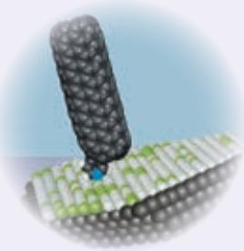

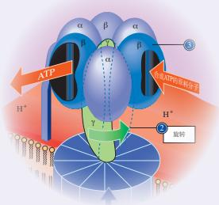

引言 2

第一章 原子结构与性质 5

第一节 原子结构 6

第二节 原子结构与元素的性质 18

整理与提升 30

第二章 分子结构与性质 33

第一节 共价键 34

第二节 分子的空间结构 41

第三节 分子结构与物质的性质 52

整理与提升 64

第三章 晶体结构与性质 67

第一节 物质的聚集状态与晶体的常识 68

第二节 分子晶体与共价晶体 78

第三节 金属晶体与离子晶体 86

第四节 配合物与超分子 95

整理与提升 101

实验活动 简单配合物的形成 104

附录 名词索引 105

元素周期表

化学研究的是构成宏观物体的物质。对物质的研究可以分为物质的组成与结构、物质的性质与变化两个方面。物质的这两个方面是一种什么关系呢？是物质的组成与结构决定了物质的性质与变化，还是物质的性质与变化决定了物质的组成与结构？你可能感到这个问题很可笑，是不必问的，当然是物质的组成与结构决定了物质的性质与变化。然而，人类并不是从一开始就认识到这一点的，而且，时至今日，仍有人认为物质的性质与变化决定了物质的组成与结构。

古希腊曾盛行一种叫做“原性论”的哲学，把世界万物的本原归结为四种基本性质——冷、热、干、湿；它们两两结合，便形成四种基本元素——土、水、气、火；四种元素再按不同比例结合，便得到世间万物。可见，原性论认为物质的性质与变化决定了物质的组成与结构。

而今，人们已经搞清楚了，物质的组成与结构决定了物质的性质与变化；物质性质的改变是物质的组成与结构发生了变化的结果。

那么，物质的组成与结构如何决定物质的性质与变化呢？

首先你会想到：物质的元素组成决定了物质的性质。例子举不胜举呀！铁易生锈，真金却不怕火炼；钠与氯反应，钠失电子，氯得电子，不会相反；氟、氯、溴、碘性质相似，因都能成盐而总称卤素；锂、钠、钾、铷、铯性质也相似，因氢氧化物都是强碱而总称碱金属……为什么不同元素有不同性质？为什么有的元素性质相似？归根结底，是它们的原子结构不同或相似。原子结构如何决定元素的性质？这正是本书第一章要跟你和你的同学们在化学（必修）的基础上继续深入讨论的。

在通常条件下，除了稀有气体，所有其他元素的原子总是跟同种或异种原子结合而存在，于是有了分子。你或许能不假思索地举出许多例子说明分子的组成决定了物质的性质： $O_{2}$ 和 $O_{3}$ 是同素异形体，空气中的 $O_{2}$ 是我们须臾不能离开的，而空气里的 $O_{3}$ 却不应多于 1.2 mg/L，否则有害；CO 易燃， $CO_{2}$ 却能灭火……

有的分子组成相同，却有不同的性质。例如， $C_{2}H_{6}O$ 有两种不同的结构（如图1）——乙醇（ $CH_{3}CH_{2}OH$ ）和二甲醚（ $H_{3}COCH_{3}$ ），前者与水互溶而后者不能。像乙醇和二甲醚这样的组成相同而结构不同的物质被称为同分异构体。同分异构体的存在说明，分子的结构也是决定物质性质的重要因素。

有时，分子组成完全不同，却由于有类似的结构而有某些相近的性质，下面是一个例子：1933年，多马克（G.Domagk，1895—1964）将第一种磺胺药——对氨基苯磺酰胺应用于医学，因此而荣获1939年诺贝尔生理学或医学奖。过了许多年，生物化学家才搞清楚，磺胺药之所以能杀菌，是由于磺胺药在结构上类似于细菌必需的营养物——对氨基苯甲酸，细菌误将磺胺药当作对氨基苯甲酸，才被杀死。请看一看如图2所示的分子结构，对氨基苯磺酰胺和对氨基苯甲酸的结构相似！

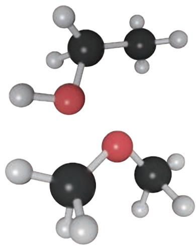

在这里，我们不应当忘记化学家的贡献，若化学家没有合成对氨基苯磺酰胺（1908年），哪会有磺胺药？后来化学家还合成了许多不同结构的磺胺药，形成一个磺胺药大家族。

21世纪化学的重要课题之一是模拟生物体中酶的结构，通过分子设计，创造与酶的结构相似从而具有酶的性质的物质。

我们在第二章将讨论如何在必修课程的基础上继续深入认识分子的结构与性质。

图1 乙醇和二甲醚（图中原子：黑C；灰H；红O）  
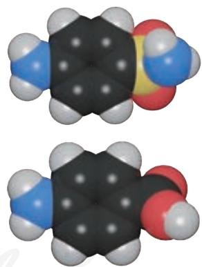  
图2 对氨基苯磺酰胺和对氨基苯甲酸（图中原子：黑C；灰H；蓝N；红O；黄S）

晶体结构是决定物质性质的又一个重要因素。最典型的例子莫过于金刚石与石墨。如果你不学化学，无论如何不会想到珍贵坚硬的金刚石和价廉柔软的石墨竟然都是碳的单质！它们的性质为什么不同？是由于金刚石和石墨的晶体结构不同。组成相同而晶体结构不同的物质比比皆是。

另一个例子是：贝壳的无机成分主要是 $CaCO_{3}$ ，而贝壳有外层和内层之分，分别是两种晶体结构不同的碳酸钙，外壳叫方解石，内层叫霰石，各有各的功能——方解石因坚硬而起保护作用，霰石因光滑而使软体自由移动。图3是鲍鱼及其剖面图，图中标出了它的两层不同结构的壳。

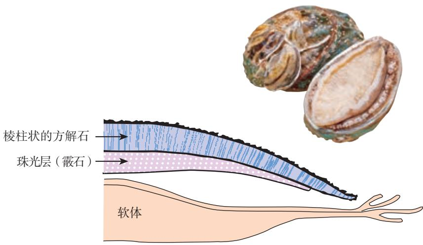  
图 3 鲍鱼及其剖面示意图

你或许可以从如图4所示的晶体结构中看出，霰石与方解石的晶体结构是不同的。

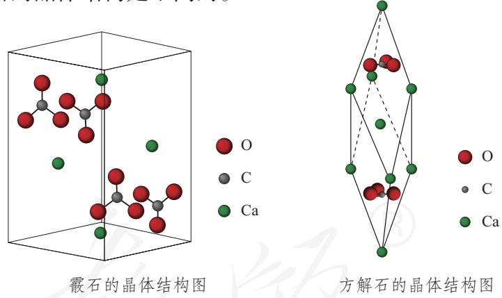  
图4 霰石和方解石的晶体结构

或许你看不懂这些图，不要紧！本书第三章将在必修课程的基础上使你初步学会如何考察晶体的结构，初步认识晶体的结构与性质的关系。

物质世界的神奇莫测，常常超乎人们的想象。学了本书，也许能使你想象的翅膀变得更有力吧。

## 第一章 原子结构与性质

\- 原子结构
- 原子结构与元素的性质

“原子”一词源自古希腊语“ATOM”，是不可再分的意思。古希腊哲学家假想原子是世间万物最小的粒子。19世纪初，英国人道尔顿创立了近代原子学说，假设原子是化学元素的最小粒子，每一种元素有一种原子。20世纪初，人们终于认识到原子不是最小的粒子，它有复杂的结构。对原子结构的认识为元素周期律找到了理论根据。原子的基本性质，如原子半径、电离能和电负性等都与原子结构密切相关，因而也呈现周期性变化。

扫描隧道显微镜的探测器（碳纳米管）上的有机分子（吡啶）探针正在检出原子存储的信息。

在金刚石表面上排列氢原子（灰）和氟原子（绿），可大大提高信息存储量。

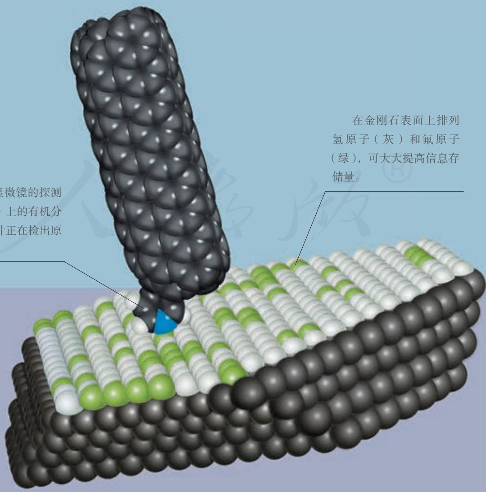

# 第一节 原子结构

  
图 1-1 玻尔
(N.Bohr, 1885—1962)

1869年，俄国化学家门捷列夫发现了元素周期律。半个世纪后的1920年，丹麦科学家玻尔在他提出的氢原子模型（1913年）基础上，提出构造原理，即从氢开始，随核电荷数递增，新增电子填入原子核外“壳层”的顺序，由此开启了用原子结构解释元素周期律的篇章。5年后，玻尔的“壳层”落实为“能层”与“能级”，厘清了核外电子的可能状态，复杂的原子光谱得以诠释。到1936年，德国科学家马德隆发表了以原子光谱事实为依据的完整的构造原理。

原子结构 atomic structure

电子 electron

能量 energy

能层 shell

能级 level

## 一、能层与能级

核外电子按能量不同分成能层。电子的能层由内向外排序，其序号、符号以及所能容纳的最多电子数如下：

<table><tr><td>能层</td><td>一</td><td>二</td><td>三</td><td>四</td><td>五</td><td>六</td><td>七</td></tr><tr><td>符号</td><td>K</td><td>L</td><td>M</td><td>N</td><td>O</td><td>P</td><td>Q</td></tr><tr><td>最多电子数</td><td>2</td><td>8</td><td>18</td><td>32</td><td>50</td><td>72</td><td>98</td></tr></table>

能层越高，电子的能量越高，能量的高低顺序为 $E(\mathrm{K})<E(\mathrm{L})<E(\mathrm{M})<E(\mathrm{N})<E(\mathrm{O})<E(\mathrm{P})<E(\mathrm{Q})$ 。

同一能层的电子，还被分成不同能级。能级的符号和所能容纳的最多电子数如下：

<table><tr><td>能层</td><td>K</td><td colspan="2">L</td><td colspan="3">M</td><td colspan="4">N</td><td colspan="3">O</td></tr><tr><td>能级</td><td>1s</td><td>2s</td><td>2p</td><td>3s</td><td>3p</td><td>3d</td><td>4s</td><td>4p</td><td>4d</td><td>4f</td><td>5s</td><td>5p</td><td>......</td></tr><tr><td>最多电子数</td><td>2</td><td>2</td><td>6</td><td>2</td><td>6</td><td>10</td><td>2</td><td>6</td><td>10</td><td>14</td><td>2</td><td>6</td><td>......</td></tr></table>

任一能层的能级总是从 s 能级开始，能级数等于该能层序数，即第一能层只有 1 个能级（1s），第二能层有 2 个能级（2s 和 2p），第三能层有 3 个能级（3s、3p 和 3d），依次类推。能级的字母代号总是按 s、p、d、f……排序的，字母前的数字是它们所处的能层序数，它们可容纳的最多电子数依次为自然数中的奇数序列 1，3，5，7…的 2 倍。

多电子原子中，同一能层各能级的能量顺序如下：

$$
E (n \mathrm{s}) <   E (n \mathrm{p}) <   E (n \mathrm{d}) <   E (n \mathrm{f}) \dots \dots
$$

## 思考与讨论

（1）一个能层的能级数与能层序数（ $n$ ）间存在什么关系？一个能层最多可容纳的电子数与能层序数（ $n$ ）间存在什么关系？

(2) 以 s、p、d、f 为符号的能级分别最多可容纳多少个电子？3d、4d、5d 能级所能容纳的最多电子数是否相同？

(3) 第五能层最多可容纳多少个电子? 它们分别容纳在几个能级中? 各能级最多容纳多少个电子? (注: 高于 $f$ 的能级不用符号表示。)

## 二、基态与激发态 原子光谱

处于最低能量状态的原子叫做基态原子。基态原子吸收能量，它的电子会跃迁到较高能级，变为激发态原子。例如，电子可以从1s跃迁到2s、3s……相反，电子从较高能量的激发态跃迁到较低能量的激发态乃至基态时，将释放能量。光（辐射）是电子跃迁释放能量的重要形式。

光谱 spectrum  
光谱分析 spectrum analysis

在日常生活中，我们看到的许多可见光，如焰火、霓虹灯光、激光、荧光、LED灯光……都与原子核外电子跃迁释放能量有关。

  
激光笔

  
LED灯装饰的建筑夜景  
图1-2 节日燃放的焰火与电子跃迁有关  
图 1-3 激光的产生、LED 灯发光都与电子跃迁有关

不同元素原子的电子发生跃迁时会吸收或释放不同的光，可以用光谱仪摄取各种元素原子的吸收光谱或发射光谱，总称原子光谱。在历史上，许多元素是通过原子光谱发现的，如铯（1860年）和铷（1861年），其光谱图中有特征的蓝光和红光，它们的拉丁文名称由此得名。又如，稀有气体氦的原意是“太阳元素”，是1868年分析太阳光谱发现的，最初人们以为它只存在于太阳，后来才在地球上发现。在现代化学中，常利用原子光谱上的特征谱线来鉴定元素，称为光谱分析。

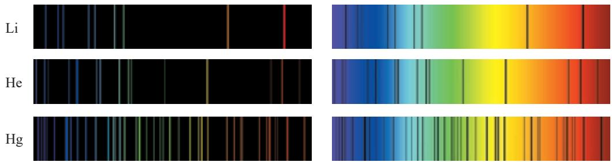  
图 1-4 Li、He、Hg 的发射光谱（左）和吸收光谱（右）

## 三、构造原理与电子排布式

构造原理  
aufbau principle  
电子排布  
electronic configuration

以光谱学事实为基础，从氢开始，随核电荷数递增，新增电子填入能级的顺序称为构造原理。图1-5为构造原理示意图，图中用小圆圈表示一个能级，每一行对应一个能层，箭头引导的曲线显示递增电子填入能级的顺序。

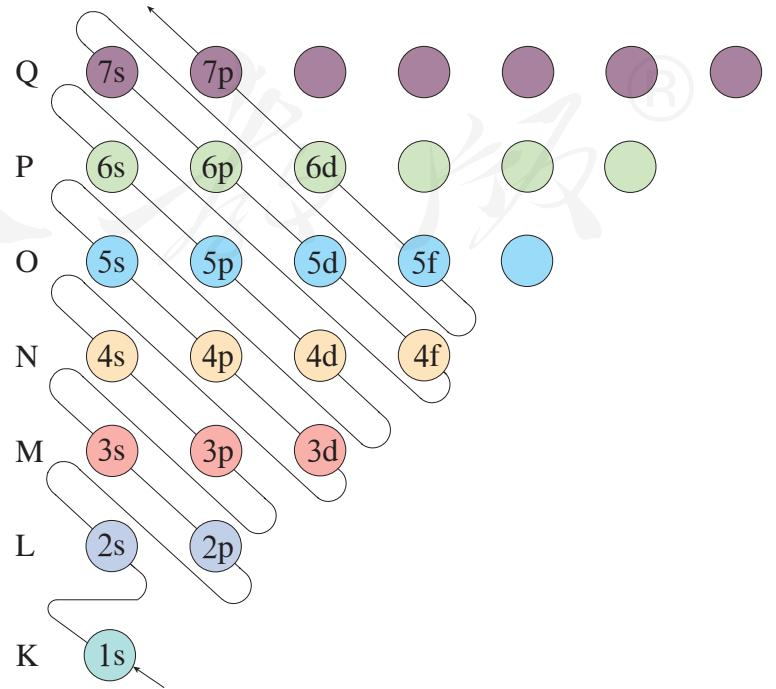  
图 1-5 构造原理示意图

按照构造原理，元素的核电荷数每递增一个，同时增加一个核电荷和一个核外电子，就得到一个基态原子的电子排布。电子填满了一个能级，开始填入下一个能级，由此构建了元素周期系中各元素的基态原子的电子排布。例如，从氢到碳的基态原子电子排布式如下：

$$
\begin{array}{l}1 \mathrm{s} ^ {1} \rightarrow 1 \mathrm{s} ^ {2} \rightarrow 1 \mathrm{s} ^ {2} 2 \mathrm{s} ^ {1} \rightarrow 1 \mathrm{s} ^ {2} 2 \mathrm{s} ^ {2} \rightarrow 1 \mathrm{s} ^ {2} 2 \mathrm{s} ^ {2} 2 \mathrm{p} ^ {1} \rightarrow 1 \mathrm{s} ^ {2} 2 \mathrm{s} ^ {2} 2 \mathrm{p} ^ {2}\\\text {氢氦锂铍硼碳}\end{array}
$$

电子排布式中，能级符号右上角的数字表示该能级的电子数。表1-1是按构造原理写出的一些元素的基态原子的电子排布式。

表 1-1 一些元素基态原子的电子排布式

<table><tr><td rowspan="2">原子序数</td><td rowspan="2">元素名称</td><td rowspan="2">元素符号</td><td colspan="5">电子排布式</td></tr><tr><td>K</td><td>L</td><td>M</td><td>N</td><td>O</td></tr><tr><td>1</td><td>氢</td><td>H</td><td> $1s^1$ </td><td></td><td></td><td></td><td></td></tr><tr><td>2</td><td>氦</td><td>He</td><td> $1s^2$ </td><td></td><td></td><td></td><td></td></tr><tr><td>3</td><td>锂</td><td>Li</td><td> $1s^2$ </td><td> $2s^1$ </td><td></td><td></td><td></td></tr><tr><td>4</td><td>铍</td><td>Be</td><td> $1s^2$ </td><td> $2s^2$ </td><td></td><td></td><td></td></tr><tr><td>5</td><td>硼</td><td>B</td><td> $1s^2$ </td><td> $2s^22p^1$ </td><td></td><td></td><td></td></tr><tr><td>⋮</td><td></td><td></td><td></td><td></td><td></td><td></td><td></td></tr><tr><td>10</td><td>氖</td><td>Ne</td><td> $1s^2$ </td><td> $2s^22p^6$ </td><td></td><td></td><td></td></tr><tr><td>11</td><td>钠</td><td>Na</td><td> $1s^2$ </td><td> $2s^22p^6$ </td><td> $3s^1$ </td><td></td><td></td></tr><tr><td>12</td><td>镁</td><td>Mg</td><td> $1s^2$ </td><td> $2s^22p^6$ </td><td> $3s^2$ </td><td></td><td></td></tr><tr><td>13</td><td>铝</td><td>Al</td><td> $1s^2$ </td><td> $2s^22p^6$ </td><td> $3s^23p^1$ </td><td></td><td></td></tr><tr><td>⋮</td><td></td><td></td><td></td><td></td><td></td><td></td><td></td></tr><tr><td>18</td><td>氩</td><td>Ar</td><td> $1s^2$ </td><td> $2s^22p^6$ </td><td> $3s^23p^6$ </td><td></td><td></td></tr><tr><td>19</td><td>钾</td><td>K</td><td> $1s^2$ </td><td> $2s^22p^6$ </td><td> $3s^23p^6$ </td><td> $4s^1$ </td><td></td></tr><tr><td>20</td><td>钙</td><td>Ca</td><td> $1s^2$ </td><td> $2s^22p^6$ </td><td> $3s^23p^6$ </td><td> $4s^2$ </td><td></td></tr><tr><td>21</td><td>钪</td><td>Sc</td><td> $1s^2$ </td><td> $2s^22p^6$ </td><td> $3s^23p^63d^1$ </td><td> $4s^2$ </td><td></td></tr><tr><td>⋮</td><td></td><td></td><td></td><td></td><td></td><td></td><td></td></tr><tr><td>26</td><td>铁</td><td>Fe</td><td> $1s^{2}$ </td><td> $2s^{2}2p^{6}$ </td><td> $3s^{2}3p^{6}3d^{6}$ </td><td> $4s^{2}$ </td><td></td></tr><tr><td>⋮</td><td></td><td></td><td></td><td></td><td></td><td></td><td></td></tr><tr><td>30</td><td>锌</td><td>Zn</td><td> $1s^{2}$ </td><td> $2s^{2}2p^{6}$ </td><td> $3s^{2}3p^{6}3d^{10}$ </td><td> $4s^{2}$ </td><td></td></tr><tr><td>31</td><td>镓</td><td>Ga</td><td> $1s^{2}$ </td><td> $2s^{2}2p^{6}$ </td><td> $3s^{2}3p^{6}3d^{10}$ </td><td> $4s^{2}4p^{1}$ </td><td></td></tr><tr><td>⋮</td><td></td><td></td><td></td><td></td><td></td><td></td><td></td></tr><tr><td>36</td><td>氪</td><td>Kr</td><td> $1s^{2}$ </td><td> $2s^{2}2p^{6}$ </td><td> $3s^{2}3p^{6}3d^{10}$ </td><td> $4s^{2}4p^{6}$ </td><td></td></tr><tr><td>37</td><td>铷</td><td>Rb</td><td> $1s^{2}$ </td><td> $2s^{2}2p^{6}$ </td><td> $3s^{2}3p^{6}3d^{10}$ </td><td> $4s^{2}4p^{6}$ </td><td> $5s^{1}$ </td></tr><tr><td>⋮</td><td></td><td></td><td></td><td></td><td></td><td></td><td></td></tr></table>

在书写电子排布式时，一般情况下，能层低的能级要写在左边，而不是按构造原理顺序写。例如，原子序数为21的钪（Sc）的电子排布式中最后两个能级应为 $3d^{1}4s^{2}$ ，不应写成 $4s^{2}3d^{1}$ 。

值得注意的是，构造原理告诉我们，随核电荷数递增，电子并不总是填满一个能层后再开始填入下一个能层的。电子是按 $3p\rightarrow4s\rightarrow3d$ 的顺序而不是按 $3p\rightarrow3d\rightarrow4s$ 的顺序填充的，这种现象被称为能级交错。应当指出，构造原理呈现的能级交错源于光谱学事实，即钾和钙的光谱证实它们的最外层电子是 $4s^{1}$ 和 $4s^{2}$ ，是经验的，而不是任何理论推导的结果。构造原理是一个思维模型，是个假想过程。

还应指出，在得出构造原理之前，由原子光谱得知有些过渡金属元素基态原子的电子排布，如Cr和Cu的最后两个能级的电子排布分别为 $3d^{5}4s^{1}$ 和 $3d^{10}4s^{1}$ ，但它们不符合构造原理，可见构造原理是被理想化了的。理想化是许多科学原理的共同点，如理想气体（忽略了分子体积和相互作用）、大多数矿物的理想化学式（忽略了掺杂离子）……理想化常常是建立模型所必需的。

(1) 按构造原理写出稀有气体氦、氖、氩、氪、氙、氢和氮的基态原子的最外层电子排布; 除氦外它们的通式是什么?

（2）电子排布式可以简化，如钠的电子排布式可简化为 $\mathrm{[Ne]3s^1}$ 。试问：上式方括号里的符号的意义是什么？请仿照钠原子的简化电子排布式，写出第8号元素氧、第14号元素硅和第29号元素铜的简化电子排布式。

（3）为突出化合价与电子排布的关系，将在化学反应中可能发生电子变动的能级称为价电子层（简称价层）。例如，Fe的简化电子排布式为 $[Ar]3d^{6}4s^{2}$ ，价层电子排布为 $3d^{6}4s^{2}$ 。通常，元素周期表只给出价层电子排布。请从书末的元素周期表中找出Na、Al、Cl、Mn、Br的价层电子排布。

## 科学史话

## 离散的谱线

1814年，德国物理学家夫琅禾费（J. Fraunhofer，1787—1826）发明了分光镜并用来观察太阳光，发现在太阳光谱中有570多条黑线（现知几千条），后人称之为夫琅禾费线。

1859年，德国科学家本生（R. W. Bunsen, 1811—1899）和基尔霍夫（G. R. Kirchhoff, 1824—1887）发明了光谱仪，证实了夫琅禾费线实质上是原子的吸收光谱，并一一找到对应的元素。例如，被夫琅禾费标记为D的双线源自钠（如图1-6），后人称为钠双线。然而，原子光谱为什么是离散的谱线而不是连续的呢？丹麦科学家玻尔破解了这个百年之谜。

1913年，玻尔创造性地假设，被束缚在原子核外的电子的能量是量子化的，只能取一定数值，称为定态，而原子光谱的谱线是不同定态的电子发生跃迁产生的，因而是离散的而不是连续的谱线。1925年，德国科学家洪特解释了复杂光谱，得出了过渡元素（包括铬和铜等）的光谱学基态原子的电子排布，为构造原理的确立奠定了基础。

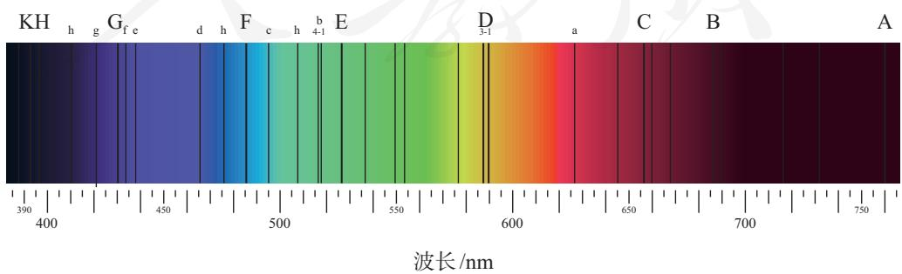  
图 1-6 太阳光谱里的夫琅禾费线

## 四、电子云与原子轨道

  
图1-7 氢原子的1s电子在原子核外出现的概率密度分布图

概率 probability  
概率密度  
probability density  
电子云 electron cloud原子核外电子的运动状态是怎样的呢？

1913年，玻尔提出氢原子模型，电子在线性轨道上绕核运行，然而到了1926年，玻尔建立的线性轨道模型被量子力学推翻。

量子力学指出，一定空间运动状态的电子并不在玻尔假定的线性轨道上运行，而在核外空间各处都可能出现，但出现的概率不同，可以算出它们的概率密度分布。用 P 表示电子在某处出现的概率，V 表示该处的体积，则 $\frac{P}{V}$ 称为概率密度，用 $\rho$ 表示。

氢原子只有一个电子，而图1-7中有许许多多小点，可见这些小点不是电子本身。那么，图中的小点是什么呢？小点是1s电子在原子核外出现的概率密度的形象描述。小点越密，表明概率密度越大。由于核外电子的概率密度分布看起来像一片云雾，因而被形象地称作电子云。换句话说，电子云是处于一定空间运动状态的电子在原子核外空间的概率密度分布的形象化描述。

电子云图很难绘制，使用不便，我们常使用电子云轮廓图。

绘制电子云轮廓图的目的是表示电子云轮廓的形状，对核外电子的空间运动状态有一个形象化的简便描述。例如，绘制电子云轮廓图时，把电子在原子核外空间出现概率 $P = 90\%$ 的空间圈出来（如图1-8）。图1-9是1s、2s、3s、4s的电子云轮廓图。所有原子的任一能层的s电子的电子云轮廓图都是一个球形，只是球的半径不同。

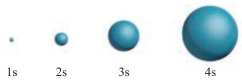  
图 1-9 同一原子的 s 电子的电子云轮廓图

同一原子的能层越高，s电子云半径越大，是由于电子的能量依次增高，电子在离核更远的区域出现的概率逐渐增大，电子云越来越向更大的空间扩展。这就好像宇宙飞船必须提供能量推动才能克服地球引力上天，2s电子比1s电子能量高，克服原子核的吸引在离核更远的空间出现的概率就比1s大，因而2s电子云必然比1s电子云更弥散。

除 s 电子云外，其他电子云轮廓图都不是球形的。例如，p 电子云轮廓图是哑铃状的，而且，无论 2p、3p 还是 4p……都有 3 个相互垂直的电子云，分别称为 $p_{x}$ 、 $p_{y}$ 和 $p_{z}$ （如图 1-11），右下标 x、y、z 分别是 p 电子云在直角坐标系里的取向。

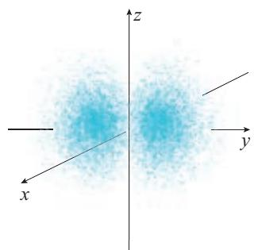

图1-11 $\mathbf{p}_x,\mathbf{p}_y,\mathbf{p}_z$ 的电子云轮廓图  
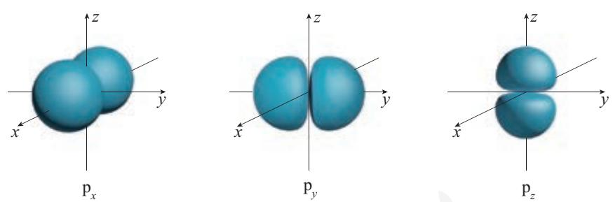  
图1-10 $2\mathrm{p}_y$ 电子云

量子力学把电子在原子核外的一个空间运动状态称为一个原子轨道。因此，常用电子云轮廓图的形状和取向来表示原子轨道的形状和取向。根据量子力学的结论，表1-2列举了K、L、M、N等能层的能级、原子轨道数、原子轨道名称以及形状和取向。

表 1-2 不同能层的能级、原子轨道

<table><tr><td rowspan="2">能层</td><td rowspan="2">能级</td><td rowspan="2">原子轨道数</td><td rowspan="2">原子轨道名称</td><td colspan="2">原子轨道的形状和取向</td></tr><tr><td>形状</td><td>取向</td></tr><tr><td>K</td><td>1s</td><td>1</td><td>1s</td><td>球形</td><td></td></tr><tr><td rowspan="2">L</td><td>2s</td><td>1</td><td>2s</td><td>球形</td><td></td></tr><tr><td>2p</td><td>3</td><td> $2p_x$ 、 $2p_y$ 、 $2p_z$ </td><td>哑铃形</td><td>相互垂直</td></tr><tr><td rowspan="3">M</td><td>3s</td><td>1</td><td>3s</td><td>球形</td><td></td></tr><tr><td>3p</td><td>3</td><td> $3p_x$ 、 $3p_y$ 、 $3p_z$ </td><td>哑铃形</td><td>相互垂直</td></tr><tr><td>3d</td><td>5</td><td>......1</td><td>......</td><td>......</td></tr><tr><td rowspan="4">N</td><td>4s</td><td>1</td><td>4s</td><td>球形</td><td></td></tr><tr><td>4p</td><td>3</td><td> $4p_x$ 、 $4p_y$ 、 $4p_z$ </td><td>哑铃形</td><td>相互垂直</td></tr><tr><td>4d</td><td>5</td><td>......</td><td>......</td><td>......</td></tr><tr><td>4f</td><td>7</td><td>......</td><td>......</td><td>......</td></tr><tr><td>......</td><td>......</td><td>......</td><td>......</td><td>......</td><td>......</td></tr></table>

## 五、泡利原理、洪特规则、能量最低原理

  
图 1-12 泡利  
(W. Pauli, 1900—1958)

泡利原理Pauli exclusion principle洪特规则 Hund rule

## 1. 电子自旋与泡利原理

回顾每个能级最多可容纳的电子数：ns、np、nd、nf……能级分别最多可容纳 $2 \times 1$ 、 $2 \times 3$ 、 $2 \times 5$ 、 $2 \times 7$ ……个电子。有了原子轨道的概念，你更清楚了：1、3、5、7……是ns、np、nd、nf……能级里的原子轨道数，而它们分别乘以2是由于每个轨道里最多只能容纳2个电子。这2个电子容纳在同一个原子轨道里，也就意味着，它们的空间运动状态是相同的。为什么一个轨道允许容纳2个电子呢？

1925年，两个荷兰年轻人提出：电子除空间运动状态外，还有一种状态叫做自旋。后来，人们认识到，自旋是微观粒子普遍存在的一种如同电荷、质量一样的内在属性。电子自旋在空间有顺时针和逆时针两种取向，简称自旋相反，常用上下箭头（↑和↓）表示自旋相反的电子。1925年，泡利正式提出，在一个原子轨道里，最多只能容纳2个电子，它们的自旋相反，这个原理被称为泡利原理（也称泡利不相容原理）。

## 电子自旋

电子自旋概念的提出解决了原子结构理论发展中的一系列困惑。例如，只有1个最外层电子的碱金属原子光谱为什么会在光谱里呈现双线？为什么只有1个最外层电子的银原子在外加电场里加速飞行通过一个不对称磁场时会分成两束？归根结底，为什么一个原子轨道里能容纳两个电子？没有泡利原理，复杂的原子光谱无法得到诠释，以光谱事实为基础的构造原理也无法建立。电子自旋可以帮助我们理解物质的磁性本质。电子自旋有许多重要应用，如电子自旋共振（ESR）技术能研究物质的诸多性质。

## 2. 电子排布的轨道表示式

轨道表示式（又称电子排布图）是表述电子排布的一种图式，如氢和氧的基态原子的轨道表示式如下：

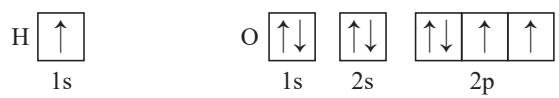

在轨道表示式中，用方框（也可用圆圈）表示原子轨道，能量相同的原子轨道（简并轨道）的方框相连，箭头表示一种自旋状态的电子，“↑↓”称电子对，“↑”或“↓”称单电子（或称未成对电子）。箭头同向的单电子称自旋平行，如基态氧原子有2个自旋平行的2p电子。通常应在方框下方或上方标记能级符号。有时画出的能级上下错落，以表达能量高低不同。

## 3. 洪特规则

1925年，洪特在诠释复杂原子光谱时，得出了判断基态原子光谱项三条经验规则，后人归并简化成一条：基态原子中，填入简并轨道的电子总是先单独分占，且自旋平行，称为洪特规则。

例如，画出氧的基态原子最外层轨道表示式。如果不考虑洪特规则，又认定3个2p轨道有区别，可画出如下许多轨道表示式（方框下方省略了2s、2p）：

  
图1-13 洪特  
(F. Hund, 1896—1997)

然而，若遵循洪特规则，且不区分3个2p轨道，只需画出轨道表示式： $\downarrow\uparrow$ $\downarrow\uparrow\uparrow\uparrow$ 。
2s 2p

洪特规则不仅适用于基态原子，也适用于基态离子。

必须注意，洪特规则是针对电子填入简并轨道而言的，并不适用于电子填入能量不同的轨道。

## 思考与讨论

（1）下列轨道表示式中哪个是硼的基态原子？为什么？
A. $\boxed{1s}$ $\boxed{2s}$ $\boxed{2p}$ B. $\boxed{1s}$ $\boxed{2s}$ $\boxed{2p}$

(2) 下列轨道表示式中哪个是氧的基态原子? 为什么? A. 1s 2s 2p B. 1s 2s 2p C. 1s 2s 2p

## 4. 能量最低原理

基态是能量最低的状态，所以，基态原子的电子排布是能量最低的原子轨道组合。由此人们得出一条原理：在构建基态原子时，电子将尽可能地占据能量最低的原子轨道，使整个原子的能量最低，这就是能量最低原理。

整个原子的能量由核电荷数、电子数和电子状态三个因素共同决定，相邻能级能量相差很大时，电子填入能量低的能级即可使整个原子能量最低（如所有主族元素的基态原子）；而当相邻能级能量相差不太大时，有1\~2个电子占据能量稍高的能级可能反而降低了电子排斥能而使整个原子能量最低（如所有副族元素的基态原子）。

总之，基态原子的核外电子排布遵循泡利原理、洪特规则和能量最低原理。

## 思考与讨论

（1）为什么基态氦原子的电子排布是 $1s^{2}$ 而不是 $1s^{1}2s^{1}$ ?

(2) 为什么基态氮原子的轨道表示式是 $\boxed{\downarrow\uparrow}$ $\boxed{\downarrow\uparrow}$ $\boxed{\uparrow\uparrow\uparrow}$ , 而不是 $\boxed{\downarrow\uparrow}$ $\boxed{\uparrow\uparrow}$ $\boxed{\uparrow\downarrow\uparrow}$ ?

(3) 为什么基态 Sc 的价层电子排布是 $3 \mathrm{~d}^{1} 4 \mathrm{~s}^{2}$ , 而不是 $4 \mathrm{~s}^{3}$ ?

1. 下列各能层中不包含p能级的是（ ）。A.N B.M C.L D.K

2. 以下能级符号正确的是（ ）。A. 6s B. 2d C. 3f D. 1p

3. 下列各能级中轨道数为3的是（ ）。 A. s B. p C. d D. f

4. 下列各原子或离子的电子排布式中，错误的是（ ）。A. $\mathrm{K}^{+}$ $1\mathrm{s}^{2}2\mathrm{s}^{2}2\mathrm{p}^{6}3\mathrm{s}^{2}3\mathrm{p}^{6}$ B. F $1\mathrm{s}^{2}2\mathrm{s}^{2}2\mathrm{p}^{5}$ C. $\mathrm{S}^{2-}$ $1\mathrm{s}^{2}2\mathrm{s}^{2}2\mathrm{p}^{6}3\mathrm{s}^{2}3\mathrm{p}^{4}$ D. Ar $1\mathrm{s}^{2}2\mathrm{s}^{2}2\mathrm{p}^{6}3\mathrm{s}^{2}3\mathrm{p}^{6}$

5. 下列轨道表示式能表示基态硫原子最外层结构的是（ ）。
A. 3s 3p
B. 3s 3p
C. 3s 3p
D. 3s 3p

6. 正误判断，正确的打 “√”，错误的打 “×”。

(1) 从空间角度看, $2 \mathrm{~s}$ 轨道比 $1 \mathrm{~s}$ 轨道大, 其空间包含了 $1 \mathrm{~s}$ 轨道。( )

(2) p 能级能量一定比 s 能级的能量高。( )

(3) 2p、3p、4p能级的轨道数依次增多。( )

(4) 2p 和 3p 轨道形状均为哑铃形。( )

（5） $2p_{x}$ 、 $2p_{y}$ 、 $2p_{z}$ 轨道相互垂直，但能量相等。（）

7. 基态原子的核外电子填充在6个轨道中的元素有\_\_\_\_种，填充在7个轨道中的元素有\_\_\_\_种。

8. 基态钾原子中，其电子占据的最高能层的符号是\_\_\_\_；基态钾离子的电子占据的最高能级共有\_\_\_\_个原子轨道，其形状是\_\_\_\_。

9. 请写出下列基态粒子的简化电子排布式和价层电子的轨道表示式:

(1) Ti : \_\_\_\_, \_\_\_\_。

(2) Cr : \_\_\_\_, \_\_\_\_。

(3) $Zn^{2+}$ : \_\_\_\_ , \_\_\_\_。

10. A、B、C、D、E、F均为36号以前的元素。请完成下列空白：

(1) A元素基态原子的最外层有2个未成对电子, 次外层有2个电子, 其元素符号为\_\_\_\_。

(2) B元素的原子最外层电子排布式为 $ns^{n}np^{n+1}$ ，其元素符号为\_\_\_\_。

(3) C元素基态的正三价离子的3d轨道为半充满（即有5个电子），其元素符号为\_\_\_\_，其基态原子的电子排布式为\_\_\_\_。

(4)D元素基态原子的M层全充满; N层没有成对电子, 只有一个未成对电子。D的元素符号为\_\_\_\_, 其基态原子的价层电子的轨道表示式为\_\_\_\_。

(5)E、F元素的基态原子都只有一个未成对电子；它们相互作用形成的离子的电子层结构相同，并且最高能级的电子对数等于其最高能层的电子层数。E、F的元素符号分别为\_\_\_\_。

# 第二节 原子结构与元素的性质

## 一、原子结构与元素周期表

元素周期系
periodic system of elements
元素周期表
periodic table of elements

## 1. 元素周期律、元素周期系和元素周期表

1869年，门捷列夫发现，按相对原子质量从小到大的顺序将元素排列起来，得到一个元素序列，并从最轻的元素氢开始进行编号，称为原子序数，这个序列中的元素性质随着原子序数递增发生周期性的重复，这一规律被门捷列夫称作元素周期律。1913年，英国物理学家莫塞莱证明原子序数即原子核电荷数。随后元素周期律表述为元素的性质随元素原子的核电荷数递增发生周期性递变。元素的这一按其原子核电荷数递增排列的序列称为元素周期系。元素周期表是呈现元素周期系的表格。元素周期系只有一个，元素周期表多种多样。

## 科学史话

## 三张有重要历史意义的周期表

1869年，门捷列夫制作了历史上第一张周期表，图1-14是该表的修订版，又称短式周期表。门捷列夫周期表最重要的特征是从第四周期开始每个周期截成两截，第1\~7族分主副族，第八族称为过渡元素（第八族是铁、钴、镍等“三素组”）。至今，仍在使用主副族和第八族等名词，但有些概念是不同的，如过渡元素等。

1905年，配位化学鼻祖维尔纳制作了一张周期表，如图1-15所示。维尔纳周期表是特长式周期表，每个周期一行，各族元素、过渡金属、稀有气体、镧系和锕系，各有各的位置，同族元素上下对齐，尽管当时镧系和锕系的概念尚未形成，不知道它们有多少种元素。维尔纳周期表前五个周期的元素种类被完全确定——2、8、8、18、18，但第六、第七周期因镧系和锕系元素种类未知而未定。现今的元素周期表与维尔纳周期表相似，但也有差异，如维尔纳周期表中Be、Mg的位置与现今周期表不同。

<table><tr><td rowspan="2">周期</td><td colspan="13">族</td></tr><tr><td>I</td><td>II</td><td>III</td><td>IV</td><td>V</td><td>VI</td><td>VII</td><td colspan="4">VIII</td><td colspan="2">0</td></tr><tr><td>1</td><td>H</td><td></td><td></td><td></td><td></td><td></td><td></td><td></td><td></td><td></td><td></td><td colspan="2">He</td></tr><tr><td>2</td><td>Li</td><td>Be</td><td>B</td><td>C</td><td>N</td><td>O</td><td>F</td><td></td><td></td><td></td><td></td><td colspan="2">Ne</td></tr><tr><td>3</td><td>Na</td><td>Mg</td><td>Al</td><td>Si</td><td>P</td><td>S</td><td>Cl</td><td></td><td></td><td></td><td></td><td colspan="2">Ar</td></tr><tr><td rowspan="2">4</td><td>K</td><td>Ca</td><td>Sc</td><td>Ti</td><td>V</td><td>Cr</td><td>Mn</td><td>Fe</td><td colspan="2">Co</td><td>Ni</td><td colspan="2"></td></tr><tr><td>Cu</td><td>Zn</td><td>Ga</td><td>Ge</td><td>As</td><td>Se</td><td>Br</td><td></td><td></td><td></td><td></td><td colspan="2">Kr</td></tr><tr><td rowspan="2">5</td><td>Rb</td><td>Sr</td><td>Y</td><td>Zr</td><td>Nb</td><td>Mo</td><td>Tc</td><td>Ru</td><td colspan="2">Rh</td><td>Pd</td><td colspan="2"></td></tr><tr><td>Ag</td><td>Cd</td><td>In</td><td>Sn</td><td>Sb</td><td>Te</td><td>I</td><td></td><td></td><td></td><td></td><td colspan="2">Xe</td></tr><tr><td rowspan="2">6</td><td>Cs</td><td>Ba</td><td>La</td><td>Hf</td><td>Ta</td><td>W</td><td>Re</td><td>Os</td><td colspan="2">Ir</td><td>Pt</td><td colspan="2"></td></tr><tr><td>Au</td><td>Hg</td><td>Tl</td><td>Pb</td><td>Bi</td><td>Po</td><td>At</td><td></td><td></td><td></td><td></td><td colspan="2">Rn</td></tr><tr><td>7</td><td>Fr</td><td>Ra</td><td>Ac</td><td></td><td></td><td></td><td></td><td></td><td></td><td></td><td></td><td colspan="2"></td></tr><tr><td colspan="14"></td></tr><tr><td colspan="2">镧系</td><td>Ce</td><td>Pr</td><td>Nd</td><td>Pm</td><td>Sm</td><td>Eu</td><td>Gd</td><td>Tb</td><td>Dy</td><td>Ho</td><td>Er</td><td>Tm</td></tr><tr><td colspan="2">锕系</td><td>Th</td><td>Pa</td><td>U</td><td>Np</td><td>Pu</td><td>Am</td><td>Cm</td><td>Bk</td><td>Cf</td><td>Es</td><td>Fm</td><td></td></tr></table>

图 1-14 门捷列夫周期表

1922年，玻尔获诺贝尔奖时做了题为“原子结构”（The Structure of the Atom）的报告，其中有一张周期表，如图1-16所示。它是1895年汤姆孙周期表的改进版。在玻尔所作的改进中，特别重要之处是把21\~28、39\~46等元素用方框框起。这是因为玻尔用原子结构来解释周期系了，他已经认识到，这些框内元素的原子新增加的电子是填入内层轨道的。玻尔已经得知镧（La）后14种元素基态原子有4f电子，也用方框框起，而且第六周期为32种元素，但第七周期元素所知甚少。玻尔周期表还用直线连接前后周期的相关元素（同族元素），这是因为玻尔已经知道，它们的价电子数相等。

<table><tr><td colspan="101">...</td><td>...</td><td>...</td><td></td><td></td><td></td><td></td><td></td><td></td><td></td><td></td><td></td><td></td><td></td><td></td><td></td><td></td><td></td><td></td><td></td><td></td><td></td><td></td><td></td><td></td><td></td><td></td><td></td><td></td><td></td><td></td><td></td><td></td><td></td><td></td><td></td><td></td><td></td><td></td><td></td><td></td><td></td><td></td><td></td><td></td><td></td><td></td><td></td><td></td><td></td><td></td><td></td><td></td><td></td><td></td><td></td><td></td><td></td><td></td><td></td><td></td><td></td><td></td><td></td><td></td><td></td><td></td><td></td><td></td><td></td><td></td><td></td><td></td><td></td><td></td><td></td><td></td><td></td><td></td><td></td></tr><tr><td colspan="100">H</td><td></td><td></td><td></td><td></td><td></td><td></td><td></td><td></td><td></td><td></td><td></td><td></td><td></td><td></td><td></td><td></td><td></td><td></td><td></td><td></td><td></td><td></td><td></td><td></td><td></td><td></td><td></td><td></td><td></td><td></td><td></td><td></td><td></td><td></td><td></td><td></td><td></td><td></td><td></td><td></td><td></td><td></td><td></td><td></td><td></td><td></td><td></td><td></td><td></td><td></td><td></td><td></td><td></td><td></td><td></td><td></td><td></td><td></td><td></td><td></td><td></td><td></td><td></td><td></td><td></td><td></td><td></td><td></td><td></td><td></td><td></td><td></td><td></td><td></td><td></td><td></td><td></td><td></td><td></td><td></td></tr><tr><td colspan="100">Li</td><td></td><td></td><td></td><td></td><td></td><td></td><td></td><td></td><td></td><td></td><td></td><td></td><td></td><td></td><td></td><td></td><td></td><td></td><td></td><td></td><td></td><td></td><td></td><td></td><td></td><td></td><td></td><td></td><td></td><td></td><td></td><td></td><td></td><td></td><td></td><td></td><td></td><td></td><td></td><td></td><td></td><td></td><td></td><td></td><td></td><td></td><td></td><td></td><td></td><td></td><td></td><td></td><td></td><td></td><td></td><td></td><td></td><td></td><td></td><td></td><td></td><td></td><td></td><td></td><td></td><td></td><td></td><td></td><td></td><td></td><td></td><td></td><td></td><td></td><td></td><td></td><td></td><td></td><td></td><td></td></tr><tr><td colspan="96">Na</td><td></td><td></td><td></td><td></td><td></td><td></td><td></td><td></td><td></td><td></td><td></td><td></td><td></td><td></td><td></td><td></td><td></td><td></td><td></td><td></td><td></td><td></td><td></td><td></td><td></td><td></td><td></td><td></td><td></td><td></td><td></td><td></td><td></td><td></td><td></td><td></td><td></td><td></td><td></td><td></td><td></td><td></td><td></td><td></td><td></td><td></td><td></td><td></td><td></td><td></td><td></td><td></td><td></td><td></td><td></td><td></td><td></td><td></td><td></td><td></td><td></td><td></td><td></td><td></td><td></td><td></td><td></td><td></td><td></td><td></td><td></td><td></td><td></td><td></td><td></td><td></td><td></td><td></td><td></td><td></td><td></td><td></td><td></td><td></td></tr><tr><td>K</td><td>Ca</td><td></td><td></td><td></td><td></td><td></td><td></td><td></td><td></td><td></td><td></td><td></td><td></td><td></td><td></td><td></td><td></td><td></td><td></td><td></td><td></td><td></td><td></td><td></td><td></td><td></td><td></td><td></td><td></td><td></td><td></td><td></td><td></td><td></td><td></td><td></td><td></td><td></td><td></td><td></td><td></td><td></td><td></td><td></td><td></td><td></td><td></td><td></td><td></td><td></td><td></td><td></td><td></td><td></td><td></td><td></td><td></td><td></td><td></td><td></td><td></td><td></td><td></td><td></td><td></td><td></td><td></td><td></td><td></td><td></td><td></td><td></td><td></td><td></td><td></td><td></td><td></td><td></td><td></td><td></td><td></td><td></td><td></td><td></td><td></td><td></td><td></td><td></td><td></td><td></td><td></td><td></td><td></td><td></td><td></td><td></td><td></td><td></td><td></td><td></td><td></td><td></td><td></td><td></td><td></td><td></td><td></td><td></td><td></td><td></td><td></td><td></td><td></td><td></td><td></td><td></td><td></td><td></td><td></td><td></td><td></td><td></td><td></td><td></td><td></td><td></td><td></td><td></td><td></td><td></td><td></td><td></td><td></td><td></td><td></td><td></td><td></td><td></td><td></td><td></td><td></td><td></td><td></td><td></td><td></td><td></td><td></td><td></td><td></td><td></td><td></td><td></td><td></td><td></td><td></td><td></td><td></td><td></td><td></td><td></td><td></td><td></td><td></td><td></td><td></td><td></td><td></td><td></td><td></td><td></td><td></td><td></td><td></td><td></td><td></td><td></td><td></td><td></td><td></td></tr><tr><td>Rb</td><td>Sr</td><td></td><td></td><td></td><td></td><td></td><td></td><td></td><td></td><td></td><td></td><td></td><td></td><td></td><td></td><td></td><td></td><td></td><td></td><td></td><td></td><td></td><td></td><td></td><td></td><td></td><td></td><td></td><td></td><td></td><td></td><td></td><td></td><td></td><td></td><td></td><td></td><td></td><td></td><td></td><td></td><td></td><td></td><td></td><td></td><td></td><td></td><td></td><td></td><td></td><td></td><td></td><td></td><td></td><td></td><td></td><td></td><td></td><td></td><td></td><td></td><td></td><td></td><td></td><td></td><td></td><td></td><td></td><td></td><td></td><td></td><td></td><td></td><td></td><td></td><td></td><td></td><td></td><td></td><td></td><td></td><td></td><td></td><td></td><td></td><td></td><td></td><td></td><td></td><td></td><td></td><td></td><td></td><td></td><td></td><td></td><td></td><td></td><td></td><td></td><td></td><td></td><td></td><td></td><td></td><td></td><td></td><td></td><td></td><td></td><td></td><td></td><td></td><td></td><td></td><td></td><td></td><td></td><td></td><td></td><td></td><td></td><td></td><td></td><td></td><td></td><td></td><td></td><td></td><td></td><td></td><td></td><td></td><td></td><td></td><td></td><td></td><td></td><td></td><td></td><td></td><td></td><td></td><td></td><td></td><td></td><td></td><td></td><td></td><td></td><td></td><td></td><td></td><td></td><td></td><td></td><td></td><td></td><td></td><td></td><td></td><td></td><td></td><td></td><td></td><td></td><td></td><td></td><td></td><td></td><td></td><td></td><td></td><td></td><td></td><td></td><td></td><td></td><td></td></tr><tr><td>Cs</td><td>Ba</td><td>La</td><td>Ce</td><td>Nd</td><td>Pr</td><td>...</td><td>...</td><td>Sm</td><td>Eu</td><td>Gd</td><td>Tb</td><td>Ho</td><td>Er</td><td>Tm</td><td>Yb</td><td>...</td><td>...</td><td>Ta</td><td>W</td><td>...</td><td>Os</td><td>Ir</td><td>Pt</td><td>Au</td><td>Hg</td><td>Tl</td><td>Pb</td><td>Bi</td><td>...</td><td>...</td><td>...</td><td>...</td><td>...</td><td>...</td><td>...</td><td>...</td><td>...</td><td>...</td><td>...</td><td>...</td><td>...</td><td>...</td><td>...</td><td>...</td><td>...</td><td>...</td><td>...</td><td>...</td><td>...</td><td>...</td><td>...</td><td>...</td><td>...</td><td>...</td><td>...</td><td>...</td><td>...</td><td>...</td><td>...</td><td>...</td><td>...</td><td>...</td><td>...</td><td>...</td><td>...</td><td>...</td><td>...</td><td>...</td><td>...</td><td>...</td><td>...</td><td>...</td><td>...</td><td>...</td><td>...</td><td>...</td><td>...</td><td>...</td><td>...</td><td>...</td><td>...</td><td>...</td><td>...</td><td>...</td><td>...</td><td>...</td><td>...</td><td>...</td><td>...</td><td>...</td><td>...</td><td>...</td><td>...</td><td>...</td><td>...</td><td>...</td><td>...</td><td>...</td><td>...</td><td>...</td><td>...</td><td>...</td><td>...</td><td>...</td><td>...</td><td>...</td><td>...</td><td>...</td><td>...</td><td>...</td><td>...</td><td>...</td><td>...</td><td>...</td><td>...</td><td>...</td><td>...</td><td>...</td><td>...</td><td>...</td><td>...</td><td>...</td><td>...</td><td>...</td><td>...</td><td>...</td><td>...</td><td>...</td><td>.</td><td>...</td><td>...</td><td>...</td><td>...</td><td>...</td><td>...</td><td>...</td><td>...</td><td>...</td><td>...</td><td>...</td><td>...</td><td>...</td><td>...</td><td>...</td><td>...</td><td>...</td><td>...</td><td>...</td><td>...</td><td>...</td><td>...</td><td>...</td><td>...</td><td>...</td><td>...</td><td>...</td><td>...</td><td>...</td><td>...</td><td>...</td><td>...</td><td>...</td><td>...</td><td>...</td><td>...</td><td>...</td><td>...</td><td>...</td><td>...</td><td>...</td><td>...</td><td>...</td><td>...</td><td>...</td><td>...</td><td>...</td><td>...</td><td>...</td><td></td></tr><tr><td>...</td><td>Ra</td><td>Laα</td><td>Th</td><td>...</td><td>...</td><td>...</td><td>...</td><td>...</td><td>U</td><td>...</td><td>...</td><td>...</td><td>...</td><td>...</td><td>Ac</td><td>...</td><td>...</td><td>...</td><td>...</td><td>...</td><td>...</td><td>...</td><td>...</td><td>...</td><td>...</td><td>...</td><td>...</td><td>...</td><td>...</td><td>...</td><td>...</td><td>...</td><td>...</td><td>...</td><td>...</td><td>...</td><td>...</td><td>...</td><td>...</td><td>...</td><td>...</td><td>...</td><td>...</td><td>...</td><td>...</td><td>...</td><td>...</td><td>...</td><td>...</td><td>...</td><td>...</td><td>...</td><td>...</td><td>...</td><td>...</td><td>...</td><td>...</td><td>...</td><td>...</td><td>...</td><td>...</td><td>...</td><td>...</td><td>...</td><td>...</td><td>...</td><td>...</td><td>...</td><td>...</td><td>...</td><td>...</td><td>...</td><td>...</td><td>...</td><td>...</td><td>...</td><td>...</td><td>...</td><td>...</td><td>...</td><td>...</td><td>...</td><td>...</td><td>...</td><td>...</td><td>...</td><td>...</td><td>...</td><td>...</td><td>...</td><td>...</td><td>...</td><td>...</td><td>...</td><td>...</td><td>...</td><td>...</td><td>...</td><td>...</td><td>...</td><td>...</td><td>...</td><td>...</td><td>...</td><td>...</td><td>...</td><td>...</td><td>...</td><td>...</td><td>...</td><td>...</td><td>...</td><td>...</td><td>...</td><td>&lt;|content_end|&gt;</td><td></td><td></td><td></td><td></td><td></td><td></td><td></td><td></td><td></td><td></td><td></td><td></td><td></td><td></td><td></td><td></td><td></td><td></td><td></td><td></td><td></td><td></td><td></td><td></td><td></td><td></td><td></td><td></td><td></td><td></td><td></td><td></td><td></td><td></td><td></td><td></td><td></td><td></td><td></td><td></td><td></td><td></td><td></td><td></td><td></td><td></td><td></td><td></td><td></td><td></td><td></td><td></td><td></td><td></td><td></td><td></td><td></td><td></td><td></td><td></td><td></td><td></td><td></td><td></td></tr></table>

图 1-15 维尔纳的特长式周期表  
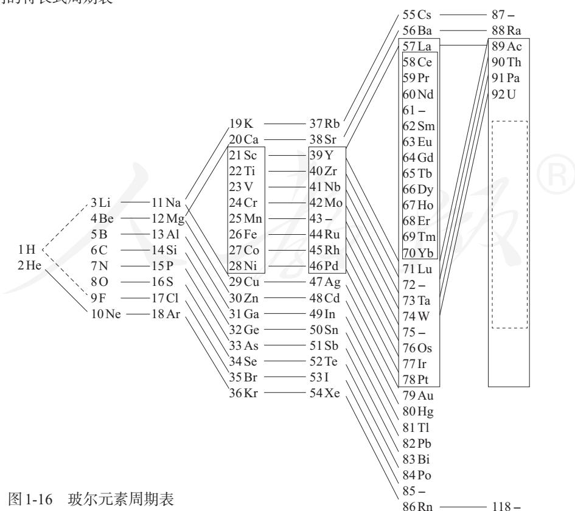

## 2. 构造原理与元素周期表

根据构造原理得出的核外电子排布，可以解释元素周期系的基本结构。例如，可以解释元素周期系中每个周期的元素数，第一周期从 $1s^{1}$ 开始，以 $1s^{2}$ 结束，只有两种元素。其余各周期总是从ns能级开始，以np结束，而从ns能级开始以np结束递增的核电荷数（或电子数）就等于每个周期里的元素数，具体数据如下：

<table><tr><td></td><td>1s</td><td>→2s→2p</td><td>→3s→3p</td><td>→4s→3d→4p</td><td>→5s→4d→5p</td><td>→6s→4f→5d→6p</td><td>→7s→5f→6d→7p</td><td>······</td></tr><tr><td>周期</td><td>一</td><td>二</td><td>三</td><td>四</td><td>五</td><td>六</td><td>七</td><td></td></tr><tr><td>元素数</td><td>2</td><td>8</td><td>8</td><td>18</td><td>18</td><td>32</td><td>32</td><td></td></tr></table>

若以一个方格代表一种元素，每个周期排一个横排，并按s、p、d、f分段，左侧对齐，可得到如下元素周期表：

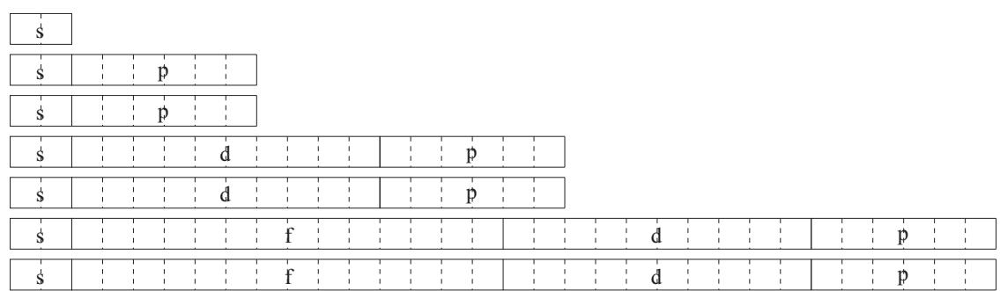  
图 1-17 左侧对齐的周期表（一周期一行）

## 思考与讨论

1950年国际纯粹与应用化学联合会（IUPAC）推荐了一张元素周期表，书末的元素周期表就是参照其新版制作的。请问：怎样将图1-17变成书末的元素周期表？

在书末的元素周期表中，同族元素价层电子数相同，这是同族元素性质相似的结构基础。例如，元素周期表最左侧第ⅠA族元素的基态原子最外层都只有一个电子，即 $ns^{1}$ ；元素周期表最右侧稀有气体元素的基态原子，除氦 $(1s^{2})$ 外，最外层都是8电子，即 $ns^{2}np^{6}$ 。

从第四周期开始的长周期，比短周期多出的元素全部是金属元素，这是因为它们的最外层电子数始终不超过2，即为 $ns^{1\sim2}$ （Pd 例外）。而第六、第七周期比第四、第五周期多出14种元素的基态原子最外层也只有2个s电子，所以也是金属元素。

# 再探元素周期表

【问题】

仔细考察书末的元素周期表，你能提出哪些问题？例如：

(1) 元素周期表共有几个周期? 每个周期各有多少种元素? 为什么第一周期结尾元素的电子排布跟同族的其他周期元素的不同?

(2) 元素周期表共有多少个列? 各列的价层电子数各为多少? 同列元素价层电子数是否相等? 元素周期表可分为哪些族? 族序有什么规律?

（3）为什么在元素周期表中非金属主要集中在右上角三角区内（如图1-18）?

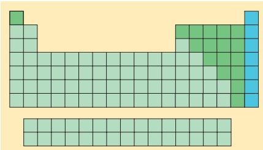  
图 1-18 元素周期表中的非金属三角区

...

【解释与整理】

回答上述问题和你提出的问题，并整理出你对元素周期表的新认识。

【讨论】

(1) 为什么副族元素又称为过渡元素? 过渡元素价层电子数跟它们的族序数有什么关系? 写出它们的价层电子排布通式。

（2）按照核外电子排布，可把元素周期表划分成5个区，如图1-19所示。除ds $^{①}$ 区外，各区的名称来自按构造原理最后填入电子的能级的符号。s区、d区和p区分别有几个列？为什么s区（除氢元素）、d区和ds区的元素都是金属元素？

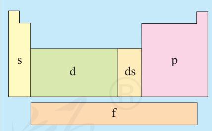  
图 1-19 元素周期表分区的简图

(3) 处于非金属与金属分界线附近的元素常被称为半金属或类金属, 为什么?

(4) 在周期表里找出 $\mathrm{Cr}$ 和 $\mathrm{Cu}$ 的价层电子。它们的电子排布符合构造原理吗？此外还有哪些元素的基态原子电子排布不符合构造原理？

（5）预言119号元素基态原子最外层电子排布；预言第八周期有多少种元素。

## 思考与讨论

在元素周期表中，某些主族元素与右下方的主族元素（如图1-20）的有些性质是相似的（如锂和镁在过量的氧气中燃烧均生成正常氧化物，而不是过氧化物），这种相似性被称为对角线规则。

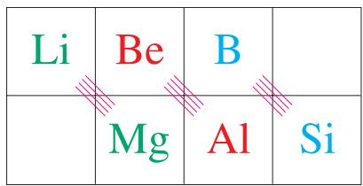  
图 1-20 体现对角线规则的相关元素

(1) 对角线规则是从相关元素及其化合物的许多性质

中总结出来的经验规则。在科学研究中，你对类似对角线规则这样的经验规则有何看法？

（2）以“对角线规则”为关键词，利用互联网搜索有关资料，比较锂和镁、铍和铝、硼和硅三对元素及其化合物性质的相似性。

## 二、元素周期律

元素周期律的内涵丰富多样，下面，我们来讨论原子半径、电离能和电负性的周期性变化。

## 1. 原子半径

原子半径的大小取决于两个相反的因素：一个因素是电子的能层数，另一个因素是核电荷数。显然，电子的能层越多，电子之间的排斥作用将使原子的半径增大；而核电荷数越大，核对电子的吸引作用也就越大，将使原子的半径减小。这两个因素综合的结果使原子半径呈现周期性的递变。例如，主族元素的原子半径如图1-21所示。

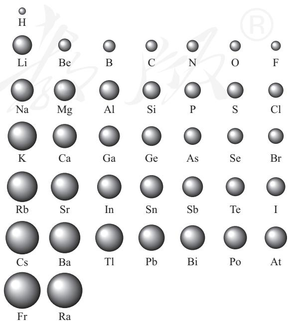  
图 1-21 主族元素原子半径的周期性变化

## 思考与讨论

元素周期表中的同周期主族元素从左到右，原子半径的变化趋势如何？如何解释这种趋势？元素周期表中的同主族元素从上到下，原子半径的变化趋势如何？如何解释这种趋势？

## 2. 电离能

气态基态原子失去一个电子转化为气态基态正离子所需要的最低能量叫做第一电离能。

电离能 ionization energy

原子的第一电离能随核电荷数递增有什么规律呢？从图1-22可见，每个周期的第一种元素（氢和碱金属）的第一电离能最小，最后一种元素（稀有气体）的第一电离能最大；同族元素从上到下第一电离能变小，如He、Ne、Ar、Kr、Xe的第一电离能依次下降，H、Li、Na、K、Rb、Cs的第一电离能也依次下降。

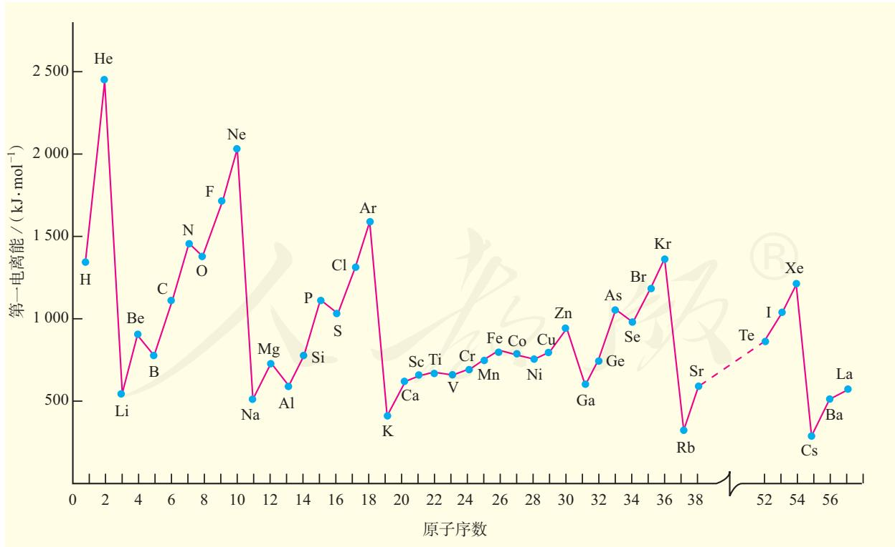  
图 1-22 元素的第一电离能的周期性

如图 1-22 所示，为什么 B、Al、O、S 等元素的电离能比它们左边元素的电离能低，而使 Li—Ne 和 Na—Ar 的电离能曲线呈现锯齿状变化？对于 B 和 Al 这两个锯齿状变化，一般解释为：B 和 Al 的第一电离能失去的电子是np能级的，该能级电子的能量比左边Be和Mg失去的ns能级电子的高。对于O和S这两个锯齿状变化，一般解释为：N和P的电子排布是半充满的，比较稳定，电离能较高。

## 思考与讨论

(1) 碱金属的电离能与碱金属的活泼性存在什么联系?

（2）下表的数据从上到下是钠、镁、铝逐级失去电子的电离能。

<table><tr><td>元素</td><td>Na</td><td>Mg</td><td>Al</td></tr><tr><td rowspan="7"> $\frac{\text{电离能}}{(kJ \cdot mol^{-1})}$ </td><td>496</td><td>738</td><td>578</td></tr><tr><td>4 562</td><td>1 451</td><td>1 817</td></tr><tr><td>6 912</td><td>7 733</td><td>2 745</td></tr><tr><td>9 543</td><td>10 540</td><td>11 575</td></tr><tr><td>13 353</td><td>13 630</td><td>14 830</td></tr><tr><td>16 610</td><td>17 995</td><td>18 376</td></tr><tr><td>20 114</td><td>21 703</td><td>23 293</td></tr></table>

为什么原子的逐级电离能越来越大？这些数据跟钠、镁、铝的化合价有什么联系？

## 3. 电负性

电负性 electronegativity

元素相互化合，可理解为原子之间产生化学作用力，形象地叫做化学键，原子中用于形成化学键的电子称为键合电子。电负性的概念是由美国化学家鲍林提出的，用来描述不同元素的原子对键合电子吸引力的大小。电负性越大的原子，对键合电子的吸引力越大。鲍林利用实验数据进行了理论计算，以氟的电负性为4.0和锂的电负性为1.0作为相对标准，得出了各元素的电负性（如图1-23，稀有气体未计）。从图1-23我们可以看到，一般来说，同周期元素从左到右，元素的电负性逐渐变大；同族元素从上到下，元素的电负性逐渐变小。

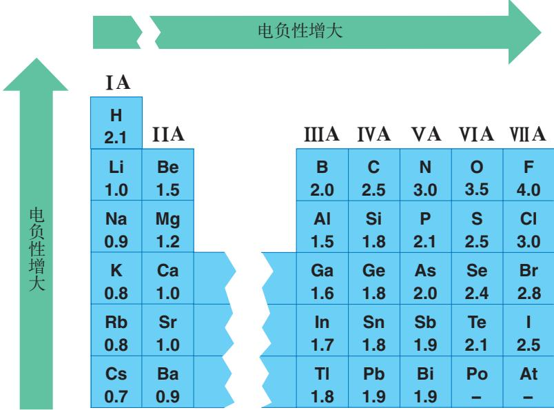  
图 1-23 电负性的周期性变化

电负性的大小也可以作为判断金属性和非金属性强弱的依据。金属元素的电负性一般小于1.8，非金属元素的电负性一般大于1.8，而位于非金属三角区边界的“类金属”（如锗、锑等）的电负性则在1.8左右，它们既有金属性，又有非金属性。

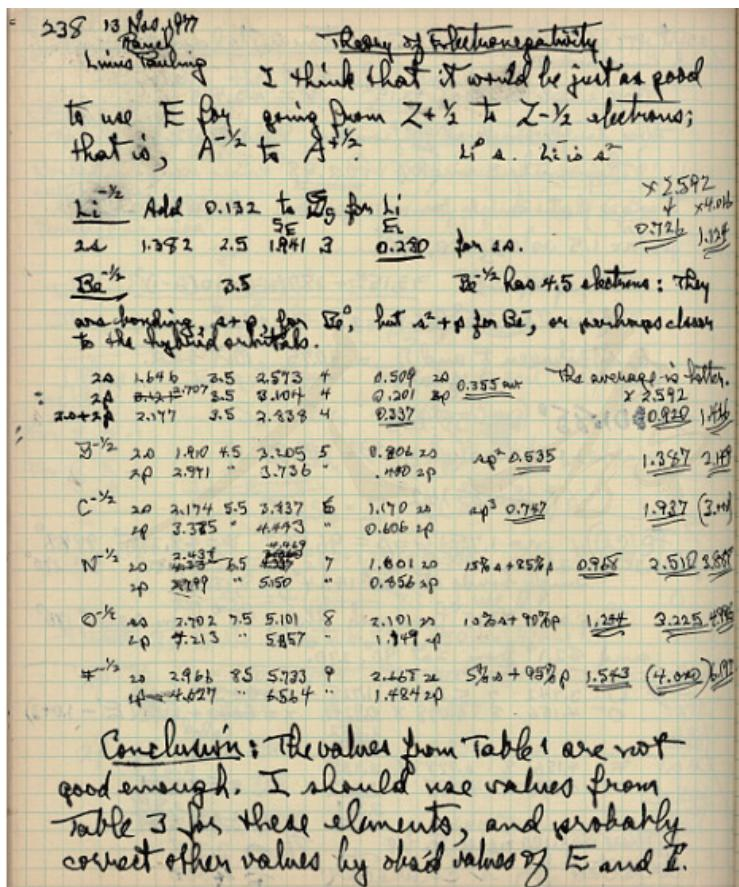  
图 1-24 鲍林研究电负性的手稿

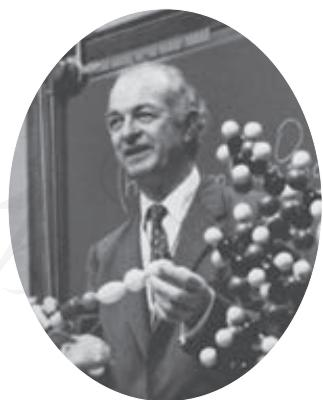  
图 1-25 鲍林
(L.Pauling, 1901—1994)

# 元素的电负性变化趋势

【绘制变化图】

请利用图 1-23 的数据制作第三周期元素、第 IA 和 VII A 族元素的电负性变化图，并找出其变化趋势。

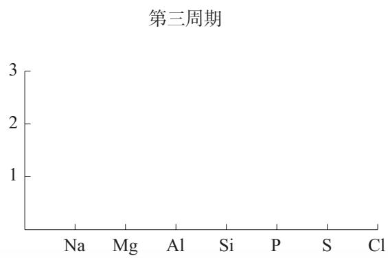

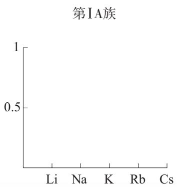

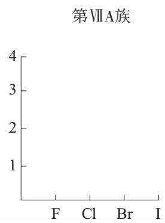

## 【比较与分析】

根据图 1-22，找出上述相关元素的第一电离能的变化趋势，与电负性的变化趋势有什么不同？并分析其原因。

## 科学史话

## 稀有气体及其化合物的发现

1868年，天文学家洛克耶（J. N. Lockyer，1836—1920）和杨森（P. C. Janssen，1824—1907）在太阳光谱中发现了一种新元素，定名为氦（Helium）。20多年后，英国化学家拉姆齐（W. Ramsay，1852—1916）在研究钇铀矿时发现了一种神秘的气体。他研究了这种气体的光谱，疑为氦，求助于光谱学家克鲁克斯，证实这种气体就是氦。这样氦在地球上也被发现了。

1892年，英国物理学家瑞利（L. Rayleigh, 1842—1919）在《自然》杂志上发表了一篇文章，说他在测定氮气的密度时，发现用氨气分解得到的氮气的密度为 $1.2508\mathrm{g / L}$ ，比从空气中分离出来的氮气的密度 1.2572 g/L 小了一丁点儿！他没有放过这一丁点儿的差别，认为定有缘故，却又找不到答案。英国化学家拉姆齐读了这篇文章，提出一种假设：从氨气分解得到的氮气是纯净的，而空气里可能含有一种比氮气的密度更大的气体，因而源自空气的氮气不纯，测得的密度较大。

这两位科学家决定合作，通过实验解开这个谜。他们从文献里读到卡文迪许（H. Cavendish，1731—1810）分离空气组分气体的方法，仔细除去空气里的氧气、氮气、二氧化碳和水蒸气，发现残留了一种未知气体。这种未知气体的体积仅占空气的 $\frac{1}{80}$ 。拉姆齐观察了这种未知气体的光谱，发现谱图里有不属于任何已知元素的橙、绿色两条谱线，认定是一种新的化学元素，随即和瑞利将它命名为氩（Argon）。

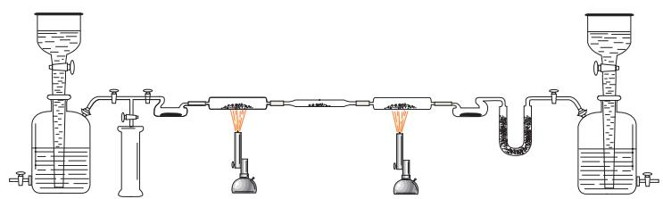  
图 1-26 拉姆齐的实验装置图

1898年，拉姆齐与人合作又在液态空气中发现了三种新元素，分别命名为氪（Krypton）、氖（Neon）、氙（Xenon）。1900年，发现放射性元素镭发生衰变释放的气体也是一种新元素，到1923年被最后定名为氡（Radon）。从1868年发现氦算起，到1923年发现氡，前前后后几经曲折，历时半个多世纪，稀有气体的整个家族成员才被全部确认。2006年，第七周期最后一种元素被人工合成（仅探测到4个原子），后定名为Oganesson，元素符号为Og，中文名称为氦。理论预测该元素在常温常压下呈固态，难说是否属于稀有气体，但其归属和命名仍按稀有气体论。

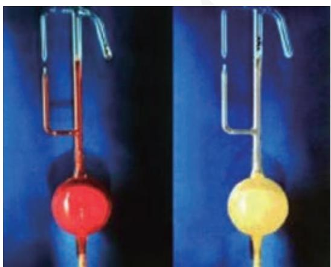  
$PtF_{6}$ 和 Xe 反应前后  
图 1-27 稀有气体化合物

自从发现稀有气体后，人们在很长时间里没有发现稀有气体的化合物。而且，它们的单质都是单原子分子的气体，被认为化学性质是惰性的，因而长期以来稀有气体一

直被称为惰性气体。20世纪初，形成了原子核外电子排布的知识后，得知稀有气体原子的最外层电子数都为8，于是，就形成一种理论观念：任何原子，只要最外层电子数达到8，

就变成稳定状态，称为惰性气体稳定结构。这个观念统治了化学近半个世纪。然而，1962年发生了重要转折，有一位名叫巴特利特（N.Bartlett）的青年化学家合成了氙的第一个化合物（如图1-27左），不久，在三个不同实验室里又分别合成了 $XeF_{2}$ 、 $XeF_{4}$ 和 $XeF_{6}$ 三种简单化合物。人们终于发现，惰性气体不惰，遂改称稀有气体。迄今为止，已经发现的稀有气体化合物已达上百种，所有稀有气体都能形成化合物；除跟氟外，跟氢、氧、氮、碳、氯、磷……都能形成化学键。

读了这段科学史话，你有什么感想？

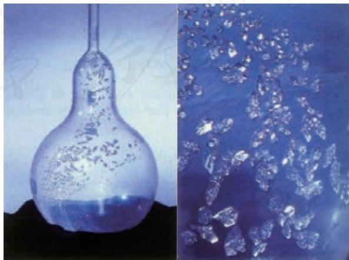  
美丽的 $\mathrm{XeF}_2$ 晶体

1. 元素周期表中铋元素的数据见右图，下列说法中，正确的是（ ）。A. 铋元素的质量数是209.0B. 铋原子的价层电子排布是 $6 \mathrm{~s}^{2} 6 \mathrm{~p}^{3}$ C. 铋原子的6p能级有一个未成对电子D. 铋原子的最外层有5个能量相同的电子

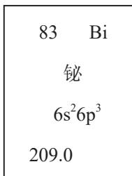

2. 对 Na、Mg、Al 的有关性质的叙述中，错误的是（ ）。  
A. 金属性：Na > Mg > Al  
B. 第一电离能：Na < Mg < Al  
C. 电负性：Na < Mg < Al  
D. 还原性：Na > Mg > Al

3. 下列各组元素性质的叙述中，正确的是（ ）。A. N、O、F 的电负性依次增大B. N、O、F 的第一电离能依次增大C. N、O、F 的最高正化合价依次升高D. O、F、Na 的原子半径依次减小

4. 下列曲线表示卤族元素或其单质性质随核电荷数的变化趋势，正确的是（）。

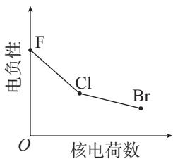  
A

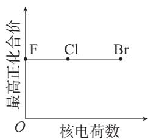  
B

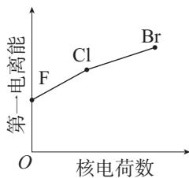  
C

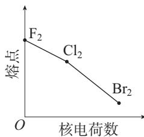  
D  
5. 下列说法中，正确的是（ ）。  
A. 所有非金属元素都分布在p区  
B. 最外层电子数为2的元素都分布在s区  
C. 元素周期表中从第ⅢB族到第ⅡB族的10个纵列的元素都是金属元素  
D. 第四周期的金属元素从左到右，元素的金属性依次减弱

6. 下表列出了某短周期元素R的各级电离能数据（用 $I_{1}$ 、 $I_{2}$ ……表示）。

<table><tr><td rowspan="2">元素</td><td colspan="5">电离能/(kJ·mol-1)</td></tr><tr><td> $I_1$ </td><td> $I_2$ </td><td> $I_3$ </td><td> $I_4$ </td><td>......</td></tr><tr><td>R</td><td>740</td><td>1500</td><td>7700</td><td>10500</td><td>......</td></tr></table>

关于元素R的下列推断中，错误的是（ ）。A. R元素基态原子的电子排布式为 $1s^{2}2s^{2}$ B. R元素位于元素周期表中第ⅡA族C. R元素的最高正化合价为+2价 D. R元素的第一电离能高于同周期相邻元素的

7. 正误判断，正确的打 “√”，错误的打 “×”。

(1) s区全部是金属元素。( )

(2) 电负性的大小可以作为判断元素非金属性强弱的依据。( )

（3）第一电离能的大小可以作为判断元素金属性强弱的依据。（）

(4) 共价化合物中, 电负性大的成键元素表现为负价。( )

（5）电负性越大，元素的非金属性越强，第一电离能也越大。（）

(6) 第四周期元素中, 未成对电子数最多的元素位于钾元素后面第五位。( )

（7）电负性大于1.8的一定为非金属，小于1.8的一定为金属。（）

8. 主族元素和副族元素的电子排布有什么不同的特征？主族元素的价电子层和副族元素的价电子层有何不同？

9. 下列各元素是主族元素还是副族元素？位于周期表中的第几周期和哪个族？属于哪个区？
(1) $1s^{2}2s^{2}2p^{6}3s^{2}3p^{5}$ (2) $[Kr]4d^{10}5s^{2}5p^{2}$ (3) $[Ar]3d^{3}4s^{2}$ (4) $[Ar]3d^{10}4s^{1}$ (5) $[Ar]4s^{1}$

10. 请参照图 1-22 所示的元素的第一电离能的周期性曲线，画出前三周期元素的原子半径和电负性的变化曲线。

11. W、X、Y、Z、N是原子序数依次增大的5种短周期元素，其元素性质或原子结构如下：

<table><tr><td>元素</td><td>元素性质或原子结构</td></tr><tr><td>W</td><td>电子只有一种自旋取向</td></tr><tr><td>X</td><td>原子核外s能级上的电子总数与p能级上的电子总数相等,但第一电离能都低于同周期相邻元素</td></tr><tr><td>Y</td><td>原子核外s能级上的电子总数与p能级上的电子总数相等,但第一电离能都高于同周期相邻元素</td></tr><tr><td>Z</td><td>其价电子中,在不同形状的原子轨道中运动的电子数相等</td></tr><tr><td>N</td><td>只有一个未成对电子</td></tr></table>

请完成下列空白：

（1）写出各元素的元素符号，W:\_\_\_\_、X:\_\_\_\_、Y:\_\_\_\_、Z:\_\_\_\_、N:\_\_\_\_。

(2) X、Y 和 Z 三种元素的原子半径由大到小的顺序: \_\_\_\_ (请填元素符号)。

(3) X、Z 和 N 三种元素的电负性由大到小的顺序: \_\_\_\_ (请填元素符号)。

(4) Y、Z 和 N 三种元素的第一电离能由大到小的顺序: \_\_\_\_ (请填元素符号)。

12. 门捷列夫按元素的相对原子质量大小排列，获得了元素周期律，但他发现钴和镍的相对原子质量顺序是颠倒的，这是什么原因？

13. 通过查阅资料和调查研究，以“元素周期律的科学价值”为题写一份调查报告。

## 整理与提升

## 一、原子结构

1. 核外电子运动状态和排布规律

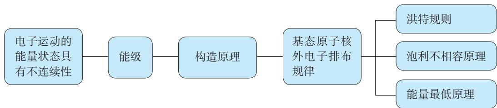

## 2. 原子轨道与电子云

电子在核外空间作高速运动。核外电子的空间运动状态简称原子轨道。电子云是核外电子概率密度分布的形象化描述。人们用电子云轮廓图来表示原子轨道的形状和取向。

## 二、原子光谱与原子结构的模型认知

如何理解上图?

## 三、元素周期表和元素周期律

## 1. 元素 “位” “构” “性”的关系

元素在元素周期表中的位置、元素的原子结构和元素的性质有下图所示的关系。

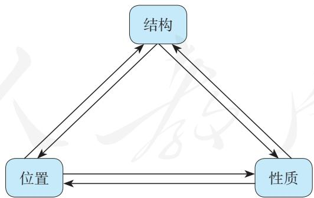

请结合实例进一步说明上图中元素 “位” “构” “性” 的关系。

## 2. 元素周期律

元素的性质随核电荷数递增发生周期性的递变，叫做元素周期律。元素周期律主要体现为核外电子排布、原子半径、主要化合价、金属性、非金属性、第一电离能、电负性等的周期性变化。

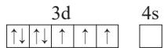

1. 对于第ⅦA族元素，从上到下，下列关于其性质变化的叙述中，错误的是（ ）。  
A. 原子半径逐渐增大 B. 电负性逐渐减小  
C. 第一电离能逐渐减小 D. 氢化物水溶液的酸性逐渐减弱

2. 下列说法中, 正确的是 ( )。
A. 处于最低能量的原子叫做基态原子    B. $3p^{2}$ 表示 3p 能级有两个轨道
C. 同一原子中，1s、2s、3s 电子的能量逐渐减小 D. 2p、3p、4p 能级的轨道数依次增多

3. 下列各组元素中，原子半径依次减小、元素第一电离能逐渐升高的是（ ）。 A. K、Na、Li B. C、N、O C. Cl、S、P D. Al、Mg、Na

4. 下列各组元素中，电负性依次减小的是（ ）。 A. F、N、O B. O、Cl、F C. As、P、H D. Cl、S、As

5. 现有4种元素的基态原子的电子排布式如下：① $1s^{2}2s^{2}2p^{6}3s^{2}3p^{4}$ ；② $1s^{2}2s^{2}2p^{6}3s^{2}3p^{3}$ ；③ $1s^{2}2s^{2}2p^{3}$ ；④ $1s^{2}2s^{2}2p^{5}$ 。则下列比较中，正确的是（）。A. 第一电离能：④＞③＞②＞① B. 原子半径：④＞③＞②＞① C. 电负性：④＞③＞②＞① D. 最高正化合价：④＞③＝②＞①

6. 在核电荷数为25的Mn的价层电子排布中，处于基态的是（ ）。
A. 3d 4s
B. 3d 4s
C. 3d 4s
D. 3d 4s

7. X、Y、Z三种主族元素的原子，其最外层电子排布分别为 $ns^{1}$ 、 $3s^{2}3p^{2}$ 和 $2s^{2}2p^{4}$ ，由这三种元素组成的化合物的化学式可能是（）。A. XYZ $_{2}$ B. X $_{2}$ YZ $_{3}$ C. X $_{2}$ YZ $_{2}$ D. XYZ $_{3}$

8. 2017年5月9日，我国正式向社会发布113号、115号、117号、118号元素的中文名称，至此，全部完成了1\~118号元素的中文命名。已知115号元素的中文名为“镆”，它有多种原子，如 $^{288}_{115}$ Mc、 $^{290}_{115}$ Mc等。下列说法中，正确的是（）。A. $^{288}_{115}$ Mc和 $^{290}_{115}$ Mc的化学性质几乎相同B. Mc位于周期表的第七周期第VI A族C. 在镆原子中，最后填入电子的轨道能级符号是f，故Mc位于周期表中的f区D. 在周期表中，假设第八周期按照现有规则填满，则115号元素正下方将是147号元素

9. 在第四周期中，未成对电子数最多的元素是\_\_\_\_（填元素符号）。

（1）它位于\_\_\_\_族，属于\_\_\_\_区。

(2) 它的核外电子排布式是\_\_\_\_，价层电子的轨道表示式为\_\_\_\_。

（3）它有\_\_\_\_个能层，\_\_\_\_个能级。

(4) 价层电子排布式的特点是\_\_\_\_。

10. 请完成下列空白:

<table><tr><td>表示方法</td><td>Fe</td><td> $Fe^{3+}$ </td></tr><tr><td>原子(或离子)结构示意图</td><td></td><td></td></tr><tr><td>电子排布式</td><td></td><td></td></tr><tr><td>轨道表示式</td><td></td><td></td></tr></table>

铁元素位于元素周期表的第\_\_\_\_周期第\_\_\_\_族，属于\_\_\_\_区。

11. Mn与Fe两元素的部分电离能数据如下表所示，比较两元素的 $I_{2}$ 、 $I_{3}$ 可知，气态 $Mn^{2+}$ 再失去一个电子比气态 $Fe^{2+}$ 再失去一个电子更难。对此，你的解释是\_\_\_\_

。

12. 请解释钾与钠产生焰色及焰色不同的原因。

13.（1）完成下列关于磷与硫的比较（用“>”或“<”或“=”）。

<table><tr><td colspan="2">元素</td><td>Mn</td><td>Fe</td></tr><tr><td rowspan="3"> $\frac{\text{电离能}}{(kJ \cdot mol^{-1})}$ </td><td> $I_1$ </td><td>717</td><td>759</td></tr><tr><td> $I_2$ </td><td>1 509</td><td>1 561</td></tr><tr><td> $I_3$ </td><td>3 248</td><td>2 957</td></tr></table>

原子半径：P\_\_\_\_S；非金属性：P\_\_\_\_S；电负性：P\_\_\_\_S；第一电离能：P\_\_\_\_S。

(2) 第一电离能介于B、N之间的第二周期元素有\_\_\_\_种。

14. 已知 A、B、C、D、E、F 是原子序数依次增大的前四周期元素。其中 A 是宇宙中含量最多的元素；B 元素原子最高能级的不同轨道都有电子，并且自旋方向相同；C 元素原子的价层电子排布是 $ns^{n}np^{2n}$ ；D 元素原子中只有两种形状的电子云，最外层只有一种自旋方向的电子；E 与 D 的最高能层数相同，但其最外层电子数等于其能层数。F 元素原子的最外层只有一个电子，其次外层内的所有轨道的电子均成对。

(1) 请用元素符号完成下列空白:

① 元素: A\_\_\_\_、B\_\_\_\_、C\_\_\_\_、D\_\_\_\_、E\_\_\_\_、F\_\_\_\_。

②A、B、C三种元素的电负性：\_\_\_\_＞\_\_\_\_＞\_\_\_\_。

③ B、C、D、E 4种元素的第一电离能: \_\_\_\_ > \_\_\_\_ > \_\_\_\_ > \_\_\_\_。

(2) 下表是 A\~F 元素中某种元素的部分电离能, 由此可判断该元素是\_\_\_\_。

<table><tr><td rowspan="2">元素</td><td colspan="5">电离能/(kJ·mol-1)</td></tr><tr><td> $I_1$ </td><td> $I_2$ </td><td> $I_3$ </td><td> $I_4$ </td><td> $I_5$ </td></tr><tr><td>某种元素</td><td>578</td><td>1817</td><td>2745</td><td>11575</td><td>14830</td></tr></table>

(3) F元素位于周期表的\_\_\_\_区，此区元素的价电子层结构特点是\_\_\_\_。

## 第二章 分子结构与性质

共价键

\- 分子的空间结构

\- 分子结构与物质的性质

分子由原子构成。在通常的温度和压强等条件下，只有极少数物质的分子是由单个原子构成的，如稀有气体和汞蒸气等，属于单原子分子。绝大多数物质的分子是由多个原子相互结合构成的，如氧气、水、氨、甲烷等。有的物质的分子是由许许多多组成较简单的单体聚合而成的高分子（又称聚合物），如蛋白质、淀粉、塑料、橡胶、植物纤维、合成纤维等。而许多固体，即使取很小一粒，仍包含成万上亿个原子或离子构成一个整体，属于“巨分子”，如金刚石、金属单质等。

早在19世纪中叶，化学家就已经把分子中原子之间的相互作用形象地称作化学键。20世纪初，在原子结构理论的基础上，建立了化学键的电子理论。共价键是现代化学键理论的核心。分子的空间结构和分子之间的作用力是理解分子结构与性质关系的重要内容。

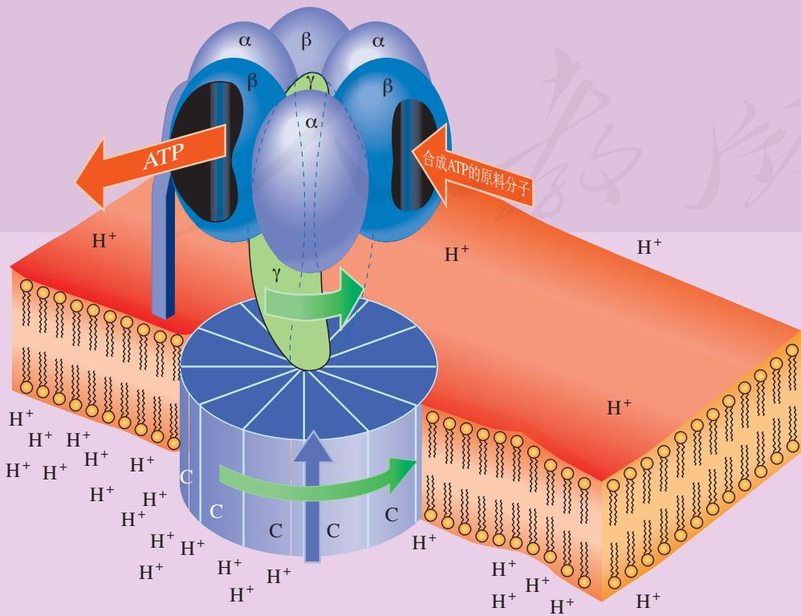

ATP是嵌在细胞线粒体膜上的“ATP合成酶”生产的。ATP合成酶像一个会旋转的泵，膜内外 $H^{+}$ 浓度的差别推动了这个泵旋转，每秒钟旋转100圈，每转一圈，抽入合成ATP的原料分子，生产出3个ATP分子。图中的 $\alpha$ 、 $\beta$ 、 $\gamma$ 、C等符号是组成蛋白质的代号。提出ATP合成酶的“质子泵”理论的米切尔（P.Mitchel）和解析出这个酶精巧的蛋白质结构的沃尔克（J.Walker）分别获得了1978年和1997年诺贝尔化学奖。

## 第一节 共价键

## 一、共价键

共价键 covalent bond
共用电子对
shared electron pair

共价键是原子间通过共用电子对所形成的相互作用。按上述定义，只能有 $H_{2}$ 、HCl、 $Cl_{2}$ 等，不可能有 $H_{3}$ 、 $H_{2}Cl$ 和 $Cl_{3}$ 等，这表明共价键具有饱和性。

我们学过原子轨道，如何用原子轨道的概念来进一步理解共价键呢？

用原子轨道描述氢原子形成氢分子的过程如图2-1所示。

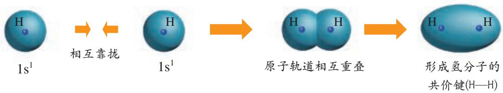  
图 2-1 氢原子形成氢分子的过程示意

$\sigma$ 键 $\sigma$ bond

原子轨道在两个原子核间重叠，意味着电子出现在核间的概率增大，电子带负电，因而可以形象地说，核间电子好比在核间架起一座带负电的桥梁，把带正电的两个原子核“黏结”在一起了。

$H_{2}$ 中的共价键称为 $\sigma$ 键。 $\sigma$ 键的特征是以形成化学键的两原子核的连线为轴做旋转操作，共价键的电子云的图形不变，这种特征称为轴对称。

$H_{2}$ 中的 $\sigma$ 键是由两个s轨道重叠形成的，可称为s-s $\sigma$ 键。s轨道和p轨道，p轨道和p轨道重叠是否也能形成 $\sigma$ 键呢？我们看一看HCl和 $Cl_{2}$ 中的共价键。

HCl中的共价键是由氢原子提供的未成对电子的1s原子轨道和氯原子提供的未成对电子的3p原子轨道重叠形成的，而 $Cl_{2}$ 中的共价键是由 2 个氯原子各提供 1 个未成对电子的 3p 原子轨道重叠形成的（如图 2-2）。

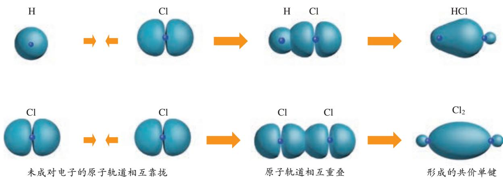  
图2-2 H—Cl的s-pσ键和Cl—Cl的p-pσ键的形成

HCl 和 $Cl_{2}$ 中的共价键的电子云图形跟 $H_{2}$ 中的共价键的电子云图形都是轴对称的，因而都是 $\sigma$ 键，分别称为 s-p $\sigma$ 键和 p-p $\sigma$ 键。

p轨道和p轨道除能形成 $\sigma$ 键外，还能形成 $\pi$ 键（如图2-3）。

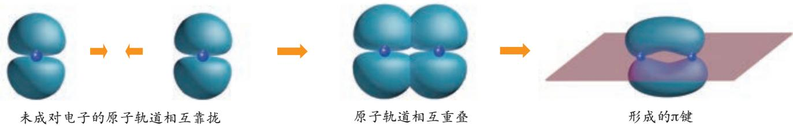  
图2-3 p-p $\pi$ 键的形成

对比两个p轨道形成的 $\sigma$ 键和 $\pi$ 键可以发现， $\sigma$ 键是由两个原子的p轨道“头碰头”重叠形成的；而 $\pi$ 键是由两个原子的p轨道“肩并肩”重叠形成的。

$\pi$ 键 $\pi$ bond

$\pi$ 键的电子云形状与 $\sigma$ 键的电子云形状有明显差别：每个 $\pi$ 键的电子云由两块组成，它们互为镜像（如图 2-3），这种特征称为镜面对称。

$\pi$ 键与 $\sigma$ 键的强度不同。例如，乙烯、乙炔分子中的 $\pi$ 键不如 $\sigma$ 键牢固，比较容易断裂。因而含有 $\pi$ 键的乙烯、乙炔与只有 $\sigma$ 键的乙烷的化学性质不同。

以上由原子轨道相互重叠形成的 $\sigma$ 键和 $\pi$ 键是共价键的两种基本类型。

哪些共价键是 $\sigma$ 键，哪些共价键是 $\pi$ 键呢？一般规律是：共价单键是 $\sigma$ 键；而共价双键中有一个 $\sigma$ 键，另一个是 $\pi$ 键；共价三键由一个 $\sigma$ 键和两个 $\pi$ 键构成。

## 探究

## 共价键

## 【问题和预测】

(1) 观察乙烷、乙烯和乙炔的分子结构, 它们的分子中的共价键分别由几个 $\sigma$ 键和几个 $\pi$ 键构成?

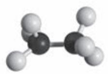

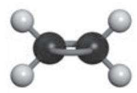

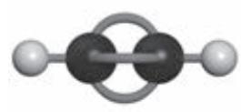

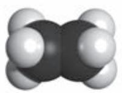  
乙烷

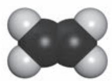  
乙烯

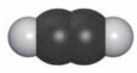  
乙炔  
(2) 解释乙烯分子中 $\pi$ 键是如何形成的, 预测乙炔分子中 $\pi$ 键是如何形成的。【绘制图示】  
模仿图2-3所示，绘制乙炔分子中的 $\pi$ 键。（提示：两个碳原子各自用2个p轨道形成2个π键。）

## 【问题与讨论】

钠和氯通过得失电子同样是形成电子对，为什么这对电子不被钠原子和氯原子共用形成共价键而形成离子键呢？你能从元素的电负性差别来理解吗？讨论后请填写下表：

<table><tr><td>元素</td><td>Na Cl</td><td>H Cl</td><td>C O</td></tr><tr><td>电负性</td><td></td><td></td><td></td></tr><tr><td>电负性之差(绝对值)</td><td></td><td></td><td></td></tr></table>

结论：当元素的电负性相差很大，化学反应形成的电子对不会被共用，形成的将是\_\_\_\_键；而\_\_\_\_键是元素的电负性相差不大的原子之间形成的化学键。

## 二、键参数——键能、键长与键角

共价键的强弱可用键能来衡量。键能是指气态分子中1 mol化学键解离成气态原子所吸收的能量；键能通常是298.15 K、101 kPa条件下的标准值。键能可通过实验测定，更多的却是推算获得的。例如，断开 $CH_{4}$ 中的4个C—H，所需能量并不相等，因此， $CH_{4}$ 中的C—H键能只是平均值，而表2-1中的C—H键能是更多分子中的C—H键能的平均值。

键参数 bond parameters  
键能 bond energy

键能可用于估算化学反应热效应。某一化学反应是吸热反应还是放热反应，我们从键能数据表里查出相关化学键的键能，通过计算便可得知。

表 2-1 某些共价键的键能

<table><tr><td>键</td><td>键能 $\left( {\mathrm{{kJ}} \cdot {\mathrm{{mol}}}^{-1}}\right)$ </td><td>键</td><td>键能 $\left( {\mathrm{{kJ}} \cdot {\mathrm{{mol}}}^{-1}}\right)$ </td></tr><tr><td>H—H</td><td>436.0</td><td>N≡N</td><td>946</td></tr><tr><td>F—F</td><td>157</td><td>N—O</td><td>176</td></tr><tr><td>Cl—Cl</td><td>242.7</td><td>N=O</td><td>607</td></tr><tr><td>Br—Br</td><td>193.7</td><td>O—O</td><td>142</td></tr><tr><td>I—I</td><td>152.7</td><td>O=O</td><td>497.3</td></tr><tr><td>C—C</td><td>347.7</td><td>C—H</td><td>413.4</td></tr><tr><td>C=C</td><td>615</td><td>O—H</td><td>462.8</td></tr><tr><td>C≡C</td><td>812</td><td>N—H</td><td>390.8</td></tr><tr><td>C—O</td><td>351</td><td>H—F</td><td>568</td></tr><tr><td>C=O</td><td>745</td><td>H—Cl</td><td>431.8</td></tr><tr><td>N—N</td><td>193</td><td>H—Br</td><td>366</td></tr><tr><td>N=N</td><td>418</td><td>H—I</td><td>298.7</td></tr></table>

键长是衡量共价键强弱的另一重要参数。简单地说，键长是构成化学键的两个原子的核间距。不过，分子中的原子始终处于不断振动之中，键长只是振动着的原子处于平衡位置时的核间距。

键长 bond length

表 2-2 某些共价键的键长

<table><tr><td>键</td><td>键长 /pm $^{\text{1}}$ </td><td>键</td><td>键长 /pm</td></tr><tr><td>H—H</td><td>74</td><td>C≡C</td><td>120</td></tr><tr><td>F—F</td><td>141</td><td>C—H</td><td>109</td></tr><tr><td>Cl—Cl</td><td>198</td><td>O—H</td><td>96</td></tr><tr><td>Br—Br</td><td>228</td><td>N—H</td><td>101</td></tr><tr><td>I—I</td><td>267</td><td>N≡N</td><td>110</td></tr><tr><td>C—C</td><td>154</td><td>Si—Si</td><td>235</td></tr><tr><td>C=C</td><td>133</td><td>Si—O</td><td>162</td></tr></table>

化学键的键长与键能是相关的。例如，C—C、C=C 和 C≡C 的键长分别为 154 pm、133 pm 和 120 pm，越来越小，它们的键能分别为 $347.7 \, kJ \cdot mol^{-1}$ 、 $615 \, kJ \cdot mol^{-1}$ 和 $812 \, kJ \cdot mol^{-1}$ ，越来越大。

键角 bond angle

在多原子分子中，两个相邻共价键之间的夹角称为键角。例如，三原子分子 $CO_{2}$ 的结构式为O=C=O，它的键角为 $180^{\circ}$ ，是一种直线形分子；又如，三原子分子 $H_{2}O$ 的H—O—H键角为 $105^{\circ}$ ，是一种V形（或称角形）分子。多原子分子的键角一定，表明共价键具有方向性。键角是描述分子空间结构的重要参数，分子的许多性质都与键角有关。

键长和键角的数值可通过晶体的X射线衍射实验获得。

## 思考与讨论

（1）试利用表2-1的数据进行计算， $1 \mathrm{~mol} \mathrm{H}_{2}$ 分别与 $1 \mathrm{~mol} \mathrm{Cl}_{2} 、 1 \mathrm{~mol} \mathrm{Br}_{2}$ （蒸气）反应，分别形成 $2 \mathrm{~mol} \mathrm{HCl}$ 和 $2 \mathrm{~mol} \mathrm{HBr}$ ，哪一个反应释放的能量更多？如何用计算的结果说明氯化氢分子和溴化氢分子哪个更容易发生热分解生成相应的单质？

(2) $N_{2}$ 、 $O_{2}$ 、 $F_{2}$ 跟 $H_{2}$ 的反应能力依次增强，从键能的角度应如何理解这一化学事实？

（3）通过上述例子，你认为键长、键能对分子的化学性质有什么影响？

## 资料卡片

常见元素的共价半径：

<table><tr><td>元素</td><td>共价半径/pm</td><td>元素</td><td>共价半径/pm</td></tr><tr><td>C</td><td>77</td><td>Si</td><td>117</td></tr><tr><td>N</td><td>70</td><td>P</td><td>110</td></tr><tr><td>O</td><td>66</td><td>S</td><td>104</td></tr><tr><td>F</td><td>64</td><td>Cl</td><td>99</td></tr></table>

## 练习与应用

1. 下列关于 $\sigma$ 键和 $\pi$ 键的说法中，错误的是（ ）。A. $\sigma$ 键的电子云图形是轴对称的， $\pi$ 键的电子云图形是镜面对称的B. $\sigma$ 键是原子轨道“头碰头”式重叠， $\pi$ 键是原子轨道“肩并肩”式重叠C. 两个p轨道不能形成 $\sigma$ 键，只能形成 $\pi$ 键D. H只能形成 $\sigma$ 键，O可以形成 $\sigma$ 键和 $\pi$ 键

2. 人们常用HX表示卤化氢（X代表F、Cl、Br、I），下列说法中，正确的是（ ）。A. 形成共价键的两个原子之间的核间距叫做键长B. H—F的键长是H—X中最长的C. H—F是p-pσ键D. H—F的键能是H—X中最小的

3. 下列说法中，错误的是（ ）。  
A. 键能是衡量化学键稳定性的参数之一，键能越大，则化学键就越牢固  
B. 键长与共价键的稳定性没有关系  
C. 键角是两个相邻共价键之间的夹角，说明共价键有方向性  
D. 共价键是通过原子轨道重叠并共用电子对而形成的，所以共价键有饱和性

4. 下列说法中，错误的是（ ）。A. 氧原子有两个未成对电子，因而能形成2个共价键B. 氧原子可以形成 $\mathrm{H}_2\mathrm{O}$ 、 $\mathrm{H}_2\mathrm{O}_2$ ，也可能形成 $\mathrm{H}_3\mathrm{O}$ C. 已知 $\mathrm{H}_2\mathrm{O}_2$ 的分子结构是 $\mathrm{H}-\mathrm{O}-\mathrm{O}-\mathrm{H}$ ，在 $\mathrm{H}_2\mathrm{O}_2$ 中只有 $\sigma$ 键没有 $\pi$ 键D. 已知 $\mathrm{N}_2$ 的分子结构是 $\mathrm{N} \equiv \mathrm{N}$ ，在 $\mathrm{N}_2$ 中有1个 $\sigma$ 键和2个 $\pi$ 键

5. 正误判断，正确的打 “√”，错误的打 “×”。
（1）共价键的成键原子只能是非金属原子。（）
（2）所有的σ键的强度都比π键的大。（）

(3) 在所有分子中都存在化学键。( )

（4）s-s σ键与s-p σ键的电子云形状的对称性相同。（）

(5) $\sigma$ 键可以绕键轴旋转， $\pi$ 键一定不能绕键轴旋转。（）

(6) 碳碳三键和碳碳双键的键能分别是碳碳单键的3倍和2倍。( )

(7) 键长等于成键两原子的半径之和。( )

6. 用泡沫塑料制作电子云模型以及 $\sigma$ 键和 $\pi$ 键的电子云模型，并用铁丝或竹签等插过泡沫塑料制作这些模型的坐标轴。

7. 怎样理解 $Cl_{2}$ 、 $Br_{2}$ 、 $I_{2}$ 的键能依次下降，键长依次增大？

8. 查出 HCl、HBr 和 HI 的键长、键能的数据和热分解温度，考察它们之间的相关性。通过这个例子说明分子的结构如何影响分子的化学性质。

# 第二节 分子的空间结构

## 一、分子结构的测定

肉眼不能看到分子，那么，科学家是怎样知道分子的结构的呢？早年的科学家主要靠对物质的化学性质进行系统总结得出规律后进行推测。如今，科学家应用了许多测定分子结构的现代仪器和方法，如红外光谱、晶体X射线衍射等。下面先介绍红外光谱，下一章还将介绍晶体X射线衍射。

分子中的原子不是固定不动的，而是不断地振动着的。当一束红外线透过分子时，分子会吸收跟它的某些化学键的振动频率相同的红外线，再记录到图谱上呈现吸收峰（如图2-5）。通过和已有谱图库比对，或通过量子化学计算，可以得知各吸收峰是由哪种化学键、哪种振动方式引起的，综合这些信息，可分析出分子中含有何种化学键或官能团的信息。

  
图2-4 红外光谱仪

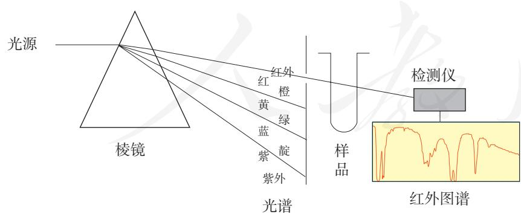  
图 2-5 红外光谱仪原理示意图

例如，通过红外光谱仪测得某未知物的红外光谱图如图2-6所示，发现有O—H、C—H和C—O的振动吸收。因此，可以初步推测该未知物中含有羟基。

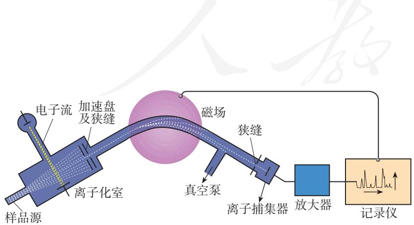

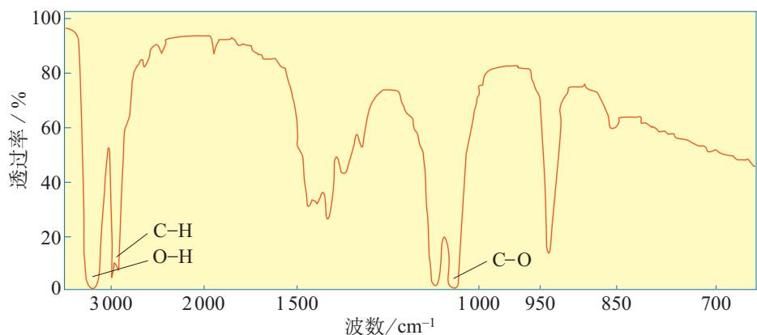  
图 2-6 某未知物的红外光谱

## 科学·技术·社会

## 用质谱法测定分子的相对分子质量

现代化学常利用质谱仪（如图2-7）测定分子的相对分子质量。它的基本原理（如图2-8）是在质谱仪中使分子失去电子变成带正电荷的分子离子和碎片离子等粒子。由于生成的离子具有不同的相对质量，它们在高压电场加速后，通过狭缝进入磁场得以分离，在记录仪上呈现一系列峰，化学家对这些峰进行系统分析，便可得知样品分子的相对分子质量。例如，图2-9的纵坐标是相对丰度（与粒子的浓度成正比），横坐标是粒子的相对质量与其电荷数之比 $\left(\frac{m}{z}\right)$ ，简称质荷比。化学家通过分析得知， $\frac{m}{z}=92$ 的峰是甲苯分子的正离子 $\left(\mathrm{C}_{6}\mathrm{H}_{5}\mathrm{CH}_{3}^{+}\right)$ ， $\frac{m}{z}=91$ 的峰是丢失一个氢原子的甲苯正离子 $\left(\mathrm{C}_{6}\mathrm{H}_{5}\mathrm{CH}_{2}^{+}\right)$ ， $\frac{m}{z}=65$ 的峰是分子碎片……因此，便可推测被测物的相对分子质量是92，该物质是甲苯 $\left(\mathrm{C}_{6}\mathrm{H}_{5}\mathrm{CH}_{3}\right)$ 。

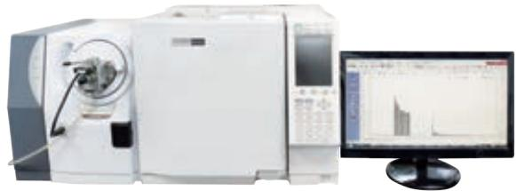

图2-7 质谱仪  
图 2-8 质谱仪原理示意图  
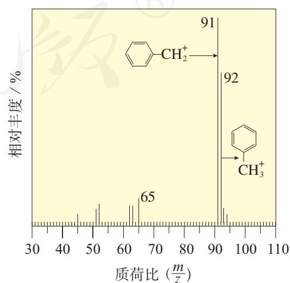  
图2-9 甲苯分子的质谱图

## 二、多样的分子空间结构

大多数分子是由两个以上原子构成的，于是分子就有了原子的几何学关系和形状，这就是分子的空间结构。例如，三原子分子的空间结构有直线形和V形（又称角形）两种。如图2-10所示， $CO_{2}$ 呈直线形，而 $H_{2}O$ 呈V形，两个H—O的键角为 $105^{\circ}$ 。

<table><tr><td>化学式</td><td>结构式</td><td>分子的空间结构模型</td></tr><tr><td> $CO_{2}$ </td><td>O=C=O</td><td></td></tr><tr><td> $H_{2}O$ </td><td></td><td></td></tr></table>

图 2-10 $CO_{2}$ 和 $H_{2}O$ 的空间结构模型

大多数四原子分子采取平面三角形和三角锥形两种空间结构。例如，甲醛（ $CH_{2}O$ ）分子呈平面三角形，键角约 $120^{\circ}$ ；氨分子呈三角锥形，键角 $107^{\circ}$ （如图2-11）。

$$
\mathrm{CH} _ {2} \mathrm{O}
$$

$$
\mathrm{O=C} _ {\mathrm{H}} ^ {\mathrm{H}}
$$

$$
\mathrm{H} \overset {\mathrm{N}} {\underset {\mathrm{H}} {\vert}} \mathrm{H}
$$

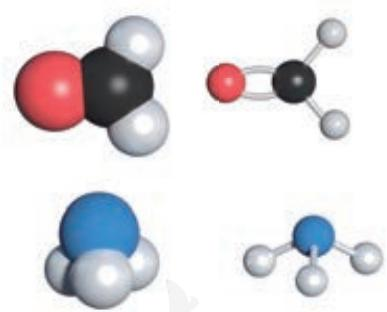  
图 2-11 $CH_{2}O$ 和 $NH_{3}$ 的空间结构模型

五原子分子的形状更多，最常见的是四面体形，如甲烷，键角为 $109^{\circ}28'$ ，其结构式上加的虚线表明氢原子的几何关系（如图2-12）。

结构式

分子的空间结构模型

$CH_{4}$

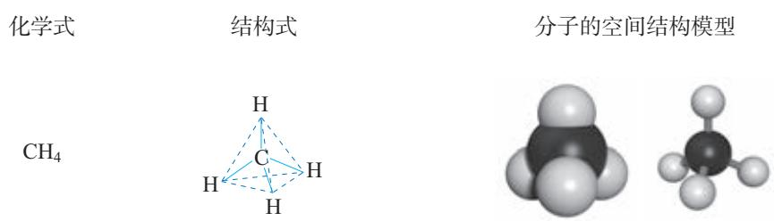  
图 2-12 $CH_{4}$ 的空间结构模型

## 一些分子的空间结构模型

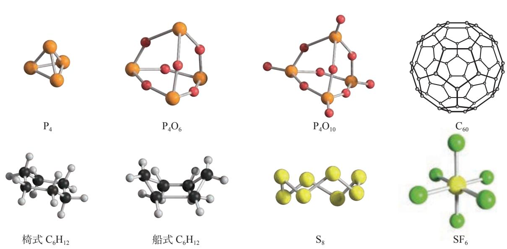  
图2-13 一些分子的空间结构模型

分子世界是如此异彩纷呈，美不胜收，常使人流连忘返。

分子空间结构与其稳定性有关。例如，图

2-13 中的 $S_{8}$ 像顶皇冠，如果把其中一个向上的硫原子倒转向下，尽管也可以存在，却不如皇冠式稳定；又如，椅式 $C_{6}H_{12}$ 比船式 $C_{6}H_{12}$ 稳定。

## 三、价层电子对互斥模型

$\mathrm{CO}_{2}$ 和 $\mathrm{H}_{2} \mathrm{O}$ 都是三原子分子, 为什么 $\mathrm{CO}_{2}$ 呈直线形而 $\mathrm{H}_{2} \mathrm{O}$ 呈 V 形? $\mathrm{CH}_{2} \mathrm{O}$ 和 $\mathrm{NH}_{3}$ 都是四原子分子, 为什么 $\mathrm{CH}_{2} \mathrm{O}$ 呈平面三角形而 $\mathrm{NH}_{3}$ 呈三角锥形? 为了探究其原因, 发展了许多结构理论。

有一种比较简单的理论叫做价层电子对互斥模型（VSEPR $^{①}$ model），这种简单的理论可用来预测分子的空间结构。

价层电子对互斥模型认为，分子的空间结构是中心原子周围的“价层电子对”相互排斥的结果。VSEPR的“价层电子对”是指分子中的中心原子与结合原子间的 $\sigma$ 键电子对和中心原子上的孤电子对。多重键只计其中的 $\sigma$ 键电子对，不计 $\pi$ 键电子对。

$\sigma$ 键电子对数可由化学式确定。例如， $\mathrm{H}_2\mathrm{O}$ 中的中心原子为 $\mathrm{O}$ ， $\mathrm{O}$ 有2个 $\sigma$ 键电子对（ $\mathrm{O}-\mathrm{H}$ ）； $\mathrm{NH}_3$ 中的中心原子为 $\mathrm{N}$ ， $\mathrm{N}$ 有3个 $\sigma$ 键电子对（ $\mathrm{N}-\mathrm{H}$ ）； $\mathrm{SO}_3$ 有3个 $\sigma$ 键电子对， $\mathrm{SO}_4^{2-}$ 有4个 $\sigma$ 键电子对。

而中心原子上的孤电子对数，化学式里看不到，须计算得出，确定方法如下：

$$
\mathrm{中心原子上的孤电子对数} = \frac {1}{2} (a - x b)
$$

式中 a 为中心原子的价电子数（对于主族元素等于原子的最外层电子数）；x 为与中心原子结合的原子数；b 为与中心原子结合的原子最多能接受的电子数（氢为 1；其他原子为 “8 减去该原子的价电子数”，如氧和氧族元素中的 S、Se 等均为 2，卤族元素均为 1；等等）。

例如， $SO_{2}$ 的中心原子为 S，S 的价电子数为 6（即 S 的最外层电子数为 6），则 a = 6；与中心原子 S 结合的 O 的个数为 2，则 x = 2；与中心原子结合的 O 最多能接受的电子数为 2，则 b = 2。所以， $SO_{2}$ 中的中心原子 S 上的孤电子对数为 1。

对于阳离子来说，a 为中心原子的价电子数减去离子的电荷数，x 和 b 的计算方法不变。对于阴离子来说，a 为中心原子的价电子数加上离子的电荷数（绝对值），x 和 b 的计算方法也不变。表2-3列举了几种分子或离子的中心原子上的孤电子对数。

表 2-3 几种分子或离子的中心原子上的孤电子对数

<table><tr><td>分子或离子</td><td>中心原子</td><td>a</td><td>x</td><td>b</td><td>中心原子上的孤电子对数</td></tr><tr><td> $SO_{2}$ </td><td>S</td><td>6</td><td>2</td><td>2</td><td>1</td></tr><tr><td> $NH_{4}^{+}$ </td><td>N</td><td>5-1=4</td><td>4</td><td>1</td><td>0</td></tr><tr><td> $CO_{3}^{2-}$ </td><td>C</td><td>4+2=6</td><td>3</td><td>2</td><td>0</td></tr></table>

## 思考与讨论

（1）以S和P为例，说明如何根据主族元素在周期表中的位置确定它的价电子数。

（2）以N和Cl为例，说明如何根据主族元素在周期表中的位置确定它最多能接受的电子数。

在确定了 $\sigma$ 键电子对数和中心原子上的孤电子对数后，把它们相加便可确定分子中的中心原子上的价层电子对数。由于价层电子对的相互排斥，可得到含有孤电子对的分子的VSEPR模型，然后，略去VSEPR模型中的中心原子上的孤电子对，便可得到分子的空间结构。例如， $\mathrm{H}_2\mathrm{O}$ 和 $\mathrm{NH}_3$ 的中心原子上分别有2个和1个孤电子对，加上中心原子上的 $\sigma$ 键电子对，它们的中心原子上的价层电子对数都是4，这些价层电子对相互排斥，形成四面体形的VSEPR模型。略去VSEPR模型中的中心原子上的孤电子对，便得到了 $\mathrm{H}_2\mathrm{O}$ 的空间结构为V形， $\mathrm{NH}_3$ 的空间结构为三角锥形（如图2-14）。表2-4列举了应用价层电子对互斥模型对几种分子或离子的空间结构的推测。

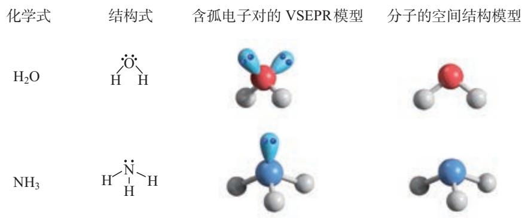  
图 2-14 $H_{2}O$ 、 $NH_{3}$ 的 VSEPR 模型和空间结构

表 2-4 根据价层电子对互斥模型对几种分子或离子的空间结构的推测

<table><tr><td>分子或离子</td><td>中心原子上的孤电子对数</td><td>中心原子上的价层电子对数</td><td>VSEPR模型</td><td>VSEPR模型名称</td><td>分子或离子的空间结构</td><td>分子或离子的空间结构名称</td></tr><tr><td> $CO_2$ </td><td>0</td><td>2</td><td></td><td>直线形</td><td></td><td>直线形</td></tr><tr><td> $SO_2$ </td><td>1</td><td>3</td><td></td><td>平面三角形</td><td></td><td>V形</td></tr><tr><td> $CO_3^{2-}$ </td><td>0</td><td>3</td><td></td><td>平面三角形</td><td></td><td>平面三角形</td></tr><tr><td> $CH_4$ </td><td>0</td><td>4</td><td></td><td>正四面体形</td><td></td><td>正四面体形</td></tr></table>

由于孤电子对有较大斥力，含孤电子对的分子的实测键角几乎都小于VSEPR模型的预测值。例如， $H_{2}O$ 的键角为 $105^{\circ}$ ， $NH_{3}$ 的键角为 $107^{\circ}$ ， $NO_{2}^{-}$ 的键角为 $115^{\circ}$ 。价层电子对互斥模型对分子空间结构的预测少有失误，但它不能用于预测以过渡金属为中心原子的分子。

## 四、杂化轨道理论简介

杂化轨道理论是一种价键理论，是鲍林为了解释分子的空间结构提出的。例如，我们已经知道，甲烷分子呈正四面体形，它的4个C—H的键长相同，H—C—H的键角为 $109^{\circ}28'$ 。按照我们已经学过的价键理论，甲烷的4个C—H单键都应该是 $\sigma$ 键，然而，碳原子的4个价层原子轨道是3个相互垂直的2p轨道和1个球形的2s轨道，用它们跟4个氢原子的1s原子轨道重叠，不可能得到正四面体形的甲烷分子。为了解决这一矛盾，鲍林提出了杂化轨道理论，它的要点是：当碳原子与4个氢原子形成甲烷分子时，碳原子的2s轨道和3个2p轨道会发生混杂，混杂时保持轨道总数不变，却得到4个新的能量相同、方向不同的轨道，各指向正四面体的4个顶角，夹角 $109^{\circ}28'$ ，称为 $sp^{3}$ 杂化轨道，表示这4个轨道是由1个s轨道和3个p轨道杂化形成的（如图2-15）。当碳原子跟4个氢原子结合时，碳原子以4个 $sp^{3}$ 杂化轨道分别与4个氢原子的1s轨道重叠，形成4个C—H $\sigma$ 键，因此呈正四面体形的空间结构。

在学习价层电子对互斥模型时我们知道， $H_{2}O$ 和 $NH_{3}$ 的 VSEPR 模型跟 $CH_{4}$ 一样，也是四面体形的，因此它们的中心原子也是采取 $sp^{3}$ 杂化的。所不同的是，水分子的氧原子的 $sp^{3}$ 杂化轨道中有 2 个被孤电子对占据，而氨分子的氮原子的 $sp^{3}$ 杂化轨道中有 1 个被孤电子对占据。

除 $sp^{3}$ 杂化轨道外，还有 sp 杂化轨道和 $sp^{2}$ 杂化轨道。sp 杂化轨道由 1 个 s 轨道和 1 个 p 轨道杂化而得； $sp^{2}$ 杂化轨道由 1 个 s 轨道和 2 个 p 轨道杂化而得，如图 2-16 所示。

sp杂化得到两个夹角为 $180^{\circ}$ 的直线形杂化轨道， $sp^{2}$ 杂

## 思考与讨论

确定 $BF_{3}$ 、 $NH_{4}^{+}$ 和 $SO_{3}^{2-}$ 的VSEPR模型和它们的空间结构，并与同学讨论。

杂化轨道 hybrid orbital

化得到三个夹角为 $120^{\circ}$ 的平面三角形杂化轨道。应当注意的是，这两种杂化形式中还有未参与杂化的p轨道，可用于形成 $\pi$ 键，而杂化轨道则用于形成 $\sigma$ 键或用来容纳未参与成键的孤电子对。

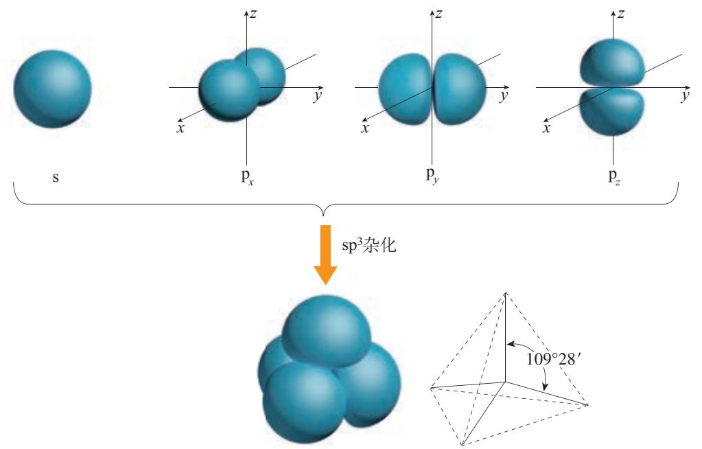  
图2-15 $\mathbf{sp}^3$ 杂化轨道

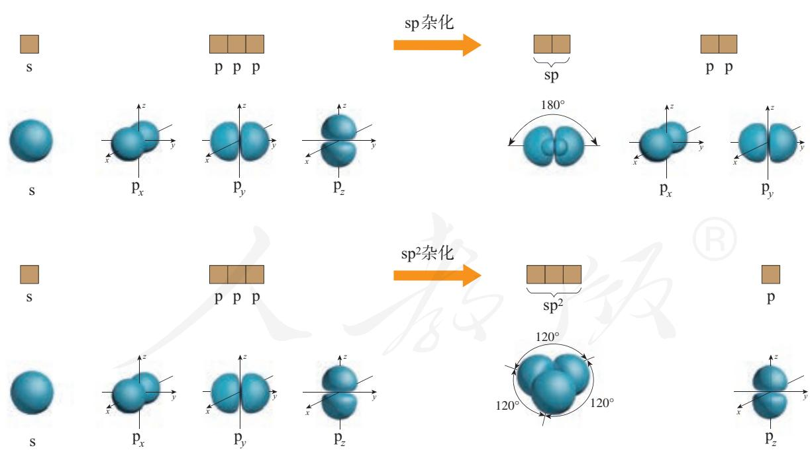  
图2-16 sp杂化和 $\mathrm{sp}^2$ 杂化

学习了价层电子对互斥模型和杂化轨道理论以后，可以先确定分子或离子的VSEPR模型，然后就可以比较方便地确定中心原子的杂化轨道类型。表2-5列举了VSEPR模型及其中心原子对应的杂化轨道类型。

表2-5 VSEPR模型与中心原子的杂化轨道类型

<table><tr><td>VSEPR模型</td><td></td><td></td><td></td><td></td><td></td><td></td></tr><tr><td>VSEPR模型名称</td><td>直线形</td><td>平面三角形</td><td>平面三角形</td><td>四面体</td><td>四面体</td><td>正四面体</td></tr><tr><td>中心原子的杂化轨道类型</td><td>sp</td><td> $sp^2$ </td><td> $sp^2$ </td><td> $sp^3$ </td><td> $sp^3$ </td><td> $sp^3$ </td></tr><tr><td>典型例子</td><td> $CO_2$ </td><td> $SO_2$ </td><td> $SO_3$ </td><td> $H_2O$ </td><td> $NH_3$ </td><td> $CH_4$ </td></tr></table>

## 思考与讨论

确定 $BF_{3}$ 和 $H_{3}O^{+}$ 的中心原子的杂化轨道类型，并与同学讨论。

## 研究与实践

## 制作分子的空间结构模型

## 【研究目的】

实物模型可以建立对分子的空间结构的直观认识，通过借助实物搭建分子的空间结构模型的活动，使抽象性极强的分子结构直观化。

## 【研究任务】

用橡皮泥或黏土和牙签等材料制作下列分子的空间结构模型。

<table><tr><td>分子</td><td>键长/pm</td><td>键角</td></tr><tr><td> $H_2$ </td><td>74</td><td>—</td></tr><tr><td> $Cl_2$ </td><td>198</td><td>—</td></tr><tr><td> $H_2O$ </td><td>96</td><td>105°</td></tr><tr><td> $CO_2$ </td><td>116</td><td>180°</td></tr><tr><td> $NH_3$ </td><td>101</td><td>107°</td></tr><tr><td> $CH_4$ </td><td>109</td><td>109°28′</td></tr></table>

## 【结果与讨论】

（1）展示制作的分子空间结构模型，并与同学交流心得。

（2）将形状、大小相同的4个气球用皮筋扎在一起，这4个气球是一个什么样的状态？这种状态对你理解甲烷的空间结构有何启示？

## 练习与应用

1. 下列说法中，正确的是（ ）。A. 杂化轨道只用于形成 $\sigma$ 键或用于容纳未参与成键的孤电子对B. 凡是中心原子采取 $\mathrm{sp}^3$ 杂化的分子，其空间结构都是正四面体形C. 凡是 $\mathrm{AB}_3$ 型的共价化合物，其中心原子A均采用 $\mathrm{sp}^3$ 杂化轨道成键D. $\mathrm{SCl}_2$ 属于 $\mathrm{AB}_2$ 型共价化合物，中心原子S采取sp杂化轨道成键

2. 下列分子中的中心原子是 $\mathrm{sp}^2$ 杂化的是（ ）。A. $\mathrm{NH}_3$ B. $\mathrm{CH}_4$ C. $\mathrm{BF}_3$ D. $\mathrm{H}_2\mathrm{O}$

3. 关于 $\mathrm{CO}_{2}$ 和 $\mathrm{SO}_{2}$ 的说法中，正确的是（ ）。A. C和S上都没有孤电子对B. C和S都是 $\mathfrak{sp}^3$ 杂化C. 都是 $\mathrm{AB}_{2}$ 型，所以空间结构都是直线形D. $\mathrm{CO}_{2}$ 的空间结构是直线形， $\mathrm{SO}_{2}$ 的空间结构是V形

4. 下列离子的VSEPR模型与离子的空间结构一致的是（ ）。A. $\mathrm{SO}_{3}^{2-}$ B. $\mathrm{ClO}_{4}^{-}$ C. $\mathrm{NO}_{2}^{-}$ D. $\mathrm{ClO}_{3}^{-}$

5. 下列粒子的VSEPR模型为四面体且其空间结构为V形的是（ ）。A. $\mathrm{SO}_{2}$ B. $\mathrm{NF}_{3}$ C. $\mathrm{H}_{3} \mathrm{O}^{+}$ D. $\mathrm{OF}_{2}$

6. 下列各组粒子的空间结构相同的是（ ）。
① $NH_{3}$ 和 $H_{2}O$ ；② $NH_{4}^{+}$ 和 $H_{3}O^{+}$ ；③ $NH_{3}$ 和 $H_{3}O^{+}$ ；④ $O_{3}$ 和 $SO_{2}$ ；⑤ $CO_{2}$ 和 $BeCl_{2}$ 。
A. 全部    B. ①②③⑤    C. ③④⑤    D. ②⑤

7. 正误判断，正确的打 “√”，错误的打 “×”。

(1) 杂化轨道只用于形成共价键。( )

(2) 中心原子若通过 $\mathrm{sp}^3$ 杂化轨道成键, 则该分子一定为正四面体形结构。( )

(3) $NH_{3}$ 为三角锥形，N 发生 $sp^{2}$ 杂化。（）

（4）只要分子的空间结构为平面三角形，中心原子均为 $\mathrm{sp}^2$ 杂化。（）

（5）中心原子是sp杂化的，其分子的空间结构不一定为直线形。（）

(6) 价层电子对互斥模型中, $\pi$ 键电子对数不计入中心原子的价层电子对数。( )

8. 下表中的中心原子 A 上没有孤电子对，运用价层电子对互斥模型，完成下表中的空白：

<table><tr><td> $AB_n$ </td><td>分子的空间结构</td><td>典型例子</td></tr><tr><td>n=2</td><td></td><td></td></tr><tr><td>n=3</td><td></td><td></td></tr><tr><td>n=4</td><td></td><td></td></tr></table>

## 9. 完成下表中的空白:

<table><tr><td>原子总数</td><td>粒子</td><td>中心原子上的孤电子对数</td><td>中心原子的杂化轨道类型</td><td>空间结构</td></tr><tr><td rowspan="4">3</td><td> $CO_2$ </td><td></td><td></td><td></td></tr><tr><td> $SO_2$ </td><td></td><td></td><td></td></tr><tr><td> $H_2O$ </td><td></td><td></td><td></td></tr><tr><td>HCN</td><td></td><td></td><td></td></tr><tr><td rowspan="4">4</td><td> $BF_3$ </td><td></td><td></td><td></td></tr><tr><td> $NH_3$ </td><td></td><td></td><td></td></tr><tr><td> $H_3O^+$ </td><td></td><td></td><td></td></tr><tr><td> $CH_2O$ </td><td></td><td></td><td></td></tr><tr><td rowspan="2">5</td><td> $CH_4$ </td><td></td><td></td><td></td></tr><tr><td> $SO_4^{2-}$ </td><td></td><td></td><td></td></tr></table>

10. 乙炔分子的碳原子采取什么杂化方式？它的杂化轨道用于形成什么化学键？怎样理解它存在碳碳三键？

# 第三节 分子结构与物质的性质

## 一、共价键的极性

## 1. 键的极性和分子的极性

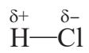  
图2-17 氯化氢分子中的极性共价键

共价键有极性共价键和非极性共价键。由不同原子形成的共价键，电子对会发生偏移，是极性键，极性键中的两个键合原子，一个呈正电性（ $\delta+$ ），另一个呈负电性（ $\delta-$ ），如图2-17所示。电子对不发生偏移的共价键是非极性键。

极性分子 polar molecule
非极性分子
nonpolar molecule

分子有极性分子和非极性分子之分。在极性分子中，正电中心和负电中心不重合，使分子的某一个部分呈正电性（ $\delta+$ ），另一部分呈负电性（ $\delta-$ ）；非极性分子的正电中心和负电中心重合。

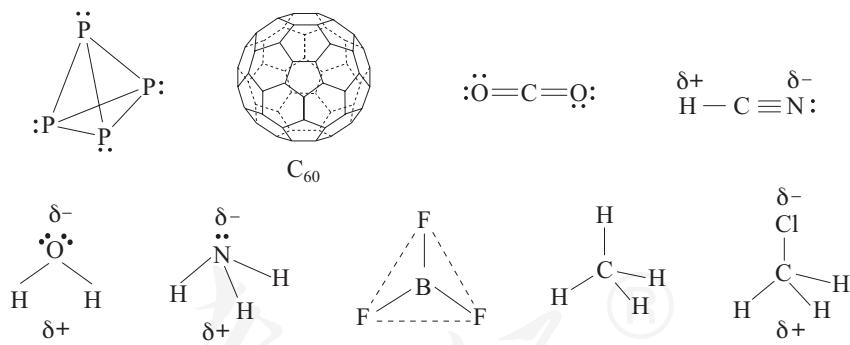  
图2-18 常见的极性分子和非极性分子

## 思考与讨论

根据图2-18，思考和回答下列问题：

(1) 以下双原子分子中, 哪些是极性分子, 哪些是非极性分子? $\mathrm{H}_{2} \quad \mathrm{O}_{2} \quad \mathrm{Cl}_{2} \quad \mathrm{HCl}$

(2) $\mathrm{P}_{4}$ 和 $\mathrm{C}_{60}$ 是极性分子还是非极性分子？

(3) 以下化合物分子中, 哪些是极性分子, 哪些是非极性分子?

$$
\mathrm{CO} _ {2} \quad \mathrm{HCN} \quad \mathrm{H} _ {2} \mathrm{O} \quad \mathrm{NH} _ {3} \quad \mathrm{BF} _ {3} \quad \mathrm{CH} _ {4} \quad \mathrm{CH} _ {3} \mathrm{Cl}
$$

判断分子的极性可依据分子中化学键的极性的向量和。只含非极性键的分子一定是非极性分子；含极性键的分子有没有极性，必须依据分子中极性键的极性的向量和是否等于零而定。当分子中各个键的极性的向量和等于零时，是非极性分子，否则是极性分子。或者，我们可根据分子的正电中心和负电中心是否重合来判断它是否是极性分子。

## 资料卡片

## 臭氧是极性分子

臭氧是一种重要物质。大气高空的臭氧层保护了地球生物的生存；空气质量预报中臭氧含量是空气质量的重要指标；它还是有机合成的氧化剂、替代氯气的净水剂……

臭氧分子的空间结构与水分子的相似，其分子有极性，但很微弱，仅是水分子的极性的28%。臭氧分子中的共价键是极性键，其中心氧原子是呈正电性的，而端位的两个氧原子是呈负电性的。由于臭氧的极性微弱，它在四氯化碳中的溶解度高于在水中的溶解度。

## 科学·技术·社会

有一大类称为表面活性剂的有机分子，分子的一端有极性，称为亲水基团，分子的另一端没有或者几乎没有极性，称为疏水基团。烷基磺酸根离子就是一种表面活性剂（如图2-19左）。

## 表面活性剂和细胞膜

表面活性剂在水中会形成亲水基团向外、疏水基团向内的胶束（如图2-19中）。由于油渍等污垢是疏水的，会被包裹在胶束内腔，这就是肥皂和洗涤剂的去污原理。

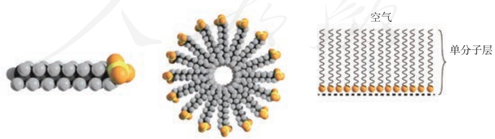  
图 2-19 烷基磺酸根离子（左）、胶束（中）、表面活性剂在水的表面形成单分子层（右）

这些分子之所以称为表面活性剂，是由于它们会分散在水的液体表面形成一层疏水基团朝向空气的单分子层，又称单分子膜（如图2-19右），从而大大降低水的表面张力。

人体细胞和细胞器的膜是双分子膜，双分子膜是由大量两性分子（一端有极性，另一端无极性）组装而成的，膜的简图如图2-20所示。

为什么双分子膜以头向外而尾向内的方式排列？这是由于细胞膜的两侧都是水溶液，水是极性分子，而构成膜的两性分子的头基是极性基团而尾基是非极性基团。

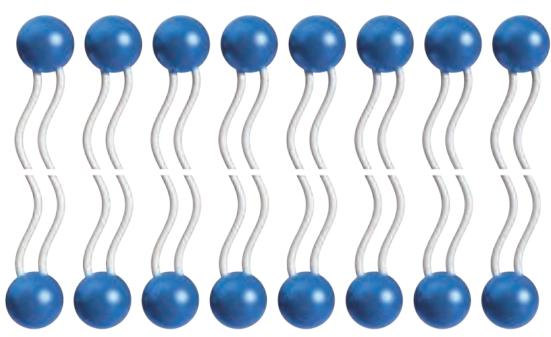  
图 2-20 细胞和细胞器的双分子膜

## 2. 键的极性对化学性质的影响

键的极性对物质的化学性质有重要影响。例如，羧酸是一大类含羧基（—COOH）的有机酸，羧基可电离出 $H^{+}$ 而呈酸性。羧酸的酸性可用 $pK_{a}^{①}$ 的大小来衡量， $pK_{a}$ 越小，酸性越强。羧酸的酸性大小与其分子的组成和结构有关，如表2-6所示。

表 2-6 不同羧酸的 $pK_{a}$

<table><tr><td>羧酸</td><td> $pK_a$ </td></tr><tr><td>丙酸 ( $C_2H_5COOH$ )</td><td>4.88</td></tr><tr><td>乙酸 ( $CH_3COOH$ )</td><td>4.76</td></tr><tr><td>甲酸 (HCOOH)</td><td>3.75</td></tr><tr><td>氯乙酸 ( $CH_2ClCOOH$ )</td><td>2.86</td></tr><tr><td>二氯乙酸 ( $CHCl_2COOH$ )</td><td>1.29</td></tr><tr><td>三氯乙酸 ( $CCl_3COOH$ )</td><td>0.65</td></tr><tr><td>三氟乙酸 ( $CF_3COOH$ )</td><td>0.23</td></tr></table>

## 思考与讨论

你已学过很多物质的化学性质，请举例与同学讨论分子结构对化学性质的影响。

由表2-6可见，三氟乙酸的酸性大于三氯乙酸的，这是由于氟的电负性大于氯的电负性，F—C的极性大于Cl—C的极性，使 $F_{3}C$ —的极性大于 $Cl_{3}C$ —的极性，导致三氟乙酸的羧基中的羟基的极性更大，更易电离出氢离子。同理，三氯乙酸的酸性大于二氯乙酸的，二氯乙酸的酸性大于氯乙酸的。

烷基（符号R—）是推电子基团，烷基越长推电子

## 分子结构修饰与分子的性质

分子结构修饰是指不改变分子的主体骨架，保持分子的基本结构不变，仅改变分子结构中的某些基团而得到的新分子。分子结

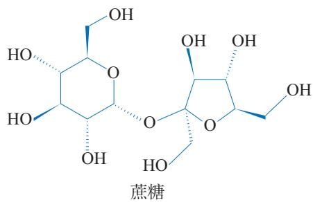  
图 2-21 蔗糖和三氯蔗糖结构式

三氯蔗糖（如图2-22），又名蔗糖素，其甜度是蔗糖的600倍，没有异味，具有热量值极低、安全性好等优点，可供糖尿病患构被修饰后，分子的性质发生了改变。例如，用三个氯原子取代蔗糖分子（如图2-21）中的三个羟基，就得到三氯蔗糖（如图2-21）。

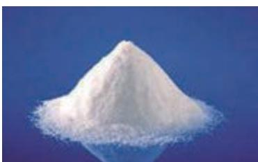

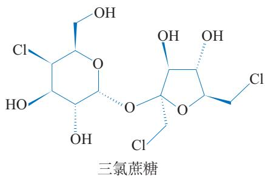

者食用，被认为是近乎完美的甜味剂。

分子结构修饰在药物设计与合成中有广泛的应用。为提高药物的治疗效果，降低毒副作用等，可将药物分子的结构进行修饰。例如，布洛芬具有抗炎、镇痛、解热作用，但口服该药对胃、肠道有刺激性，可以对该分子进行如图2-23所示的成酯修饰。

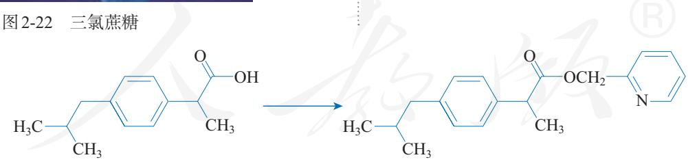  
图 2-23 布洛芬的成酯修饰

## 二、分子间的作用力

## 1. 范德华力及其对物质性质的影响

降温加压时气体会液化，降温时液体会凝固，这些事实表明，

范德华力
van der Waals force
分子间作用力
intermolecular force

分子之间存在着相互作用力。范德华（van der Waals）是最早研究分子间普遍存在作用力的科学家，因而把这类分子间作用力称为范德华力。范德华力很弱，比化学键的键能小1\~2个数量级。相对分子质量越大，范德华力越大；分子的极性越大，范德华力也越大。

表 2-7 某些分子间的范德华力

<table><tr><td>分子</td><td>Ar</td><td>CO</td><td>HI</td><td>HBr</td><td>HCl</td></tr><tr><td> $\frac{\text{范德华力}}{(kJ \cdot mol^{-1})}$ </td><td>8.50</td><td>8.75</td><td>26.00</td><td>23.11</td><td>21.14</td></tr></table>

## 思考与讨论

怎样解释卤素单质从 $F_{2}$ 到 $I_{2}$ 的熔点和沸点越来越高？

表 2-8 卤素单质的熔点和沸点

<table><tr><td>单质</td><td>熔点/°C</td><td>沸点/°C</td></tr><tr><td> $F_{2}$ </td><td>-219.6</td><td>-188.1</td></tr><tr><td> $Cl_{2}$ </td><td>-101</td><td>-34.6</td></tr><tr><td> $Br_{2}$ </td><td>-7.2</td><td>58.78</td></tr><tr><td> $I_{2}$ </td><td>113.5</td><td>184.4</td></tr></table>

## 科学·技术·社会

## 壁虎与范德华力

壁虎为什么能在天花板上爬行自如？这曾是一个困扰科学家一百多年的谜。用电子显微镜可观察到，壁虎的四足覆盖着几十万条纤细的由角蛋白构成的纳米级尺寸的毛。壁虎的足有多大吸力？实验证明，如果在一个分币的面积上布满100万条壁虎足的细毛，可以吊起约20 kg物体。近年来，有人用计算机模拟，证明壁虎的足与墙体之间的作用力在本质上是它的细毛与墙体之间的范德华力。百年之谜终于破解。这告诉我们，计算机模拟成为科学研究的新工具，是21世纪科学发展的新动向。后来有人仿照壁虎的足的结构，制作了一种新型的黏着材料（如图2-24）。

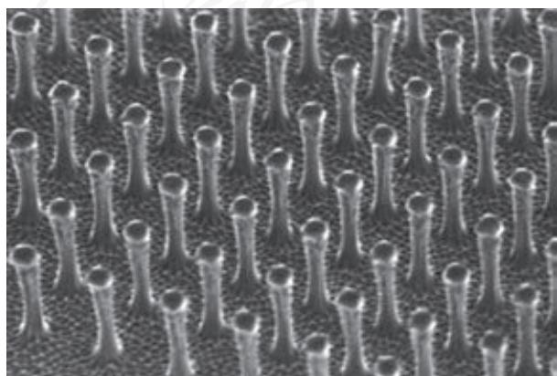  
图 2-24 壁虎细毛结构的仿生胶带

## 2. 氢键及其对物质性质的影响

你是否知道，常见物质中，水是熔、沸点较高的液体之一？冰的密度比液态水的小？为了解释水的这些奇特性质，人们提出了氢键的概念。氢键是除范德华力之外的另一种分子间作用力，它是由已经与电负性很大的原子形成共价键的氢原子（如水分子中的氢）与另一个电负性很大的原子（如水分子中的氧）之间形成的作用力（如图2-25）。氢键的存在，大大加强了水分子之间的作用力，使水的熔、沸点较高。实验还证明，接近水的沸点的水蒸气的相对分子质量测定值比按化学式 $H_{2}O$ 计算出来的相对分子质量大一些。用氢键能够解释这种异常性：接近水的沸点的水蒸气中存在相当量的水分子因氢键而相互缔合，形成所谓的缔合分子。

氢键 hydrogen bond

X—H…Y—
(X、Y为N、O、F，“—”表示共价键，“…”表示形成的氢键)
图2-25 常见氢键的类型

后来的研究证明，氢键普遍存在于已经与N、O、F等电负性很大的原子形成共价键的氢原子与另外的N、O、F等电负性很大的原子之间。例如，不仅氟化氢分子之间以及氨分子之间存在氢键，而且它们跟水分子之间也存在氢键。

此外，实验还证实，氢键不仅存在于分子之间，有时也存在于分子内。如图2-26所示的邻羟基苯甲醛在分子内形成了氢键，在分子之间不存在氢键。对羟基苯甲醛（如图2-27）不可能形成分子内氢键，只能在分子间形成氢键。因而，前者的沸点低于后者的沸点。

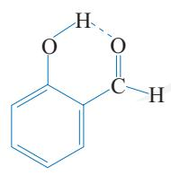

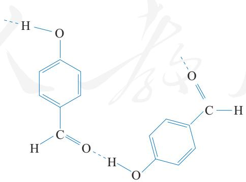  
图2-26 分子内氢键  
图2-27 分子间氢键

尽管人们把氢键也称作键，但与化学键比较，氢键属于一种较弱的作用力，比化学键的键能小1\~2个数量级，不属于化学键。

表 2-9 某些氢键的键能和键长\*

<table><tr><td>氢键X—H···Y</td><td>键能/(kJ·mol-1)</td><td>键长/pm</td><td>代表性例子</td></tr><tr><td>F—H···F</td><td>28.1</td><td>255</td><td>(HF)n</td></tr><tr><td>O—H···O</td><td>18.8</td><td>276</td><td>冰</td></tr><tr><td>O—H···O</td><td>25.9</td><td>266</td><td>甲醇、乙醇</td></tr><tr><td>N—H···F</td><td>20.9</td><td>268</td><td>NH4F</td></tr><tr><td>N—H···O</td><td>20.9</td><td>286</td><td>CH3CONH2</td></tr><tr><td>N—H···N</td><td>5.4</td><td>338</td><td>NH3</td></tr></table>

\*氢键键长一般定义为A—H…B的长度，而不是H…B的长度。

## 科学·技术·社会

## 生物大分子中的氢键

生命体中许多大分子内也存在氢键（如图2-28），而且对生命物质的高级结构和生物活性具有重要的意义。例如，氢键是蛋白质具有生物活性的高级结构的重要原因，DNA双螺旋的两个螺旋链也正是通过氢键相互结合的（如图2-29）。

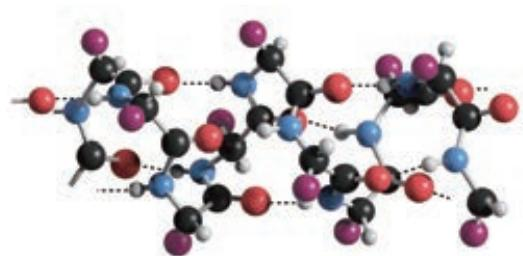  
图2-28 蛋白质分子中的氢键（虚线表示氢键）

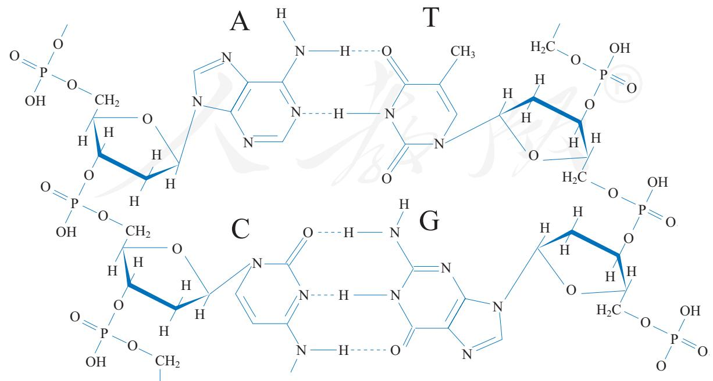  
图2-29 DNA双螺旋是通过氢键使它们的碱基（A和T、C和G）相互配对形成的（虚线表示氢键）

## 3. 溶解性

物质相互溶解的性质十分复杂，受许多因素影响，如温度、压强等。从分子结构的角度看，存在“相似相溶”的规律。

相似相溶 like dissolves like

蔗糖和氨易溶于水，难溶于四氯化碳；而萘和碘却易溶于四氯化碳，难溶于水。如果分析溶质和溶剂的分子结构就可以知道原因了，蔗糖、氨、水是极性分子，而萘、碘、四氯化碳是非极性分子。通过对许多实验的观察和研究，人们得出了一个经验性的“相似相溶”的规律：非极性溶质一般能溶于非极性溶剂，极性溶质一般能溶于极性溶剂。

水是极性溶剂，根据 “相似相溶”，极性溶质比非极性溶质在水中的溶解度大。

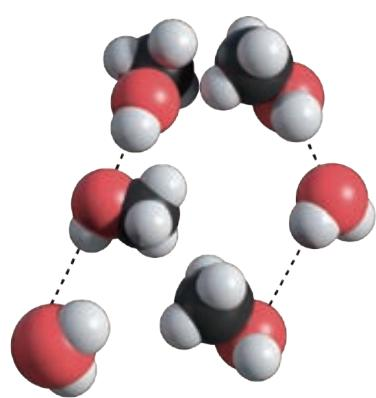  
图 2-30 相似相溶——水和甲醇的相互溶解（虚线表示氢键）

如果存在氢键，则溶剂和溶质之间的氢键作用力越大，溶解性越好。相反，无氢键相互作用的溶质在有氢键的水中的溶解度就比较小。

此外，“相似相溶”还适用于分子结构的相似性。例如，乙醇的化学式为 $CH_{3}CH_{2}OH$ ，其中的—OH与水分子的—OH相近，因而乙醇能与水互溶；而戊醇 $CH_{3}CH_{2}CH_{2}CH_{2}CH_{2}OH$ 中的烃基较大，其中的—OH跟水分子的—OH的相似因素小得多了，因而它在水中的溶解度明显减小。

## 思考与讨论

(1) 比较 $\mathrm{NH}_{3}$ 和 $\mathrm{CH}_{4}$ 在水中的溶解度。怎样用“相似相溶”规律理解它们的溶解度不同？

(2) 为什么在日常生活中用有机溶剂（如乙酸乙酯等）溶解油漆而不用水？

(3) 在一个小试管里放入一小粒碘晶体, 加入约 $5 \mathrm{~mL}$ 蒸馏水, 观察碘在水中的溶解性 (若有不溶的碘, 可将碘水溶液倾倒在另一个试管里继续下面的实验)。在碘

水溶液中加入约1 mL四氯化碳（CCl₄），振荡试管，观察碘被四氯化碳萃取，形成紫红色的碘的四氯化碳溶液。再向试管里加入1 mL浓碘化钾（KI）水溶液，振荡试管，溶液紫色变浅，这是由于在水溶液里可发生如下反应：I₂+Γ⇌I₃⁻。实验表明碘在纯水还是在四氯化碳中溶解性较好？为什么？

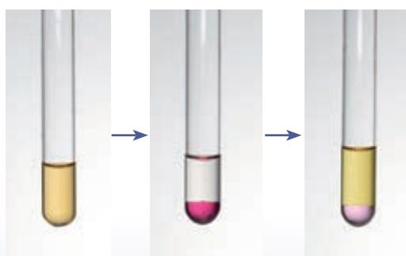  
图2-31 碘在水和四氯化碳中的溶解性

表 2-10 气体的溶解度（气体的压强为 $1.01 \times 10^{5} \mathrm{~Pa}$ ，温度为 $293 \mathrm{~K}$ ，在 $100 \mathrm{~g}$ 水中的溶解度）

<table><tr><td>气体</td><td>溶解度/g</td><td>气体</td><td>溶解度/g</td></tr><tr><td>乙炔</td><td>0.117</td><td>乙烯</td><td>0.0149</td></tr><tr><td>氨气</td><td>52.9</td><td>氢气</td><td>0.00016</td></tr><tr><td>二氧化碳</td><td>0.169</td><td>甲烷</td><td>0.0023</td></tr><tr><td>一氧化碳</td><td>0.0028</td><td>氮气</td><td>0.0019</td></tr><tr><td>氯气</td><td>0.729</td><td>氧气</td><td>0.0043</td></tr><tr><td>乙烷</td><td>0.0062</td><td>二氧化硫</td><td>11.28</td></tr></table>

手性 chirality

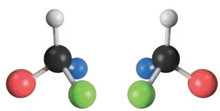  
图2-32 互为镜像的两个分子

  
图2-33 左手和右手不能叠合

  
图2-34 左右手互为镜像

## 三、分子的手性

图 2-32 所示的两个分子的空间结构，像不像一双手不能相互叠合（如图 2-33），但却互为镜像（如图 2-34）?

如图2-32所示，这样具有完全相同的组成和原子排列的一对分子，如同左手与右手一样互为镜像，却在三维空间里不能叠合，互称手性异构体（或对映异构体）。有手性异构体的分子叫做手性分子。

手性分子在生命科学和药物生产方面有广泛的应用。现今使用的药物中手性药物超过50%。对于手性药物，一个异构体可能是有效的，而另一个异构体可能是无效甚至是有害的。开发和服用有效的单一手性的药物不仅可以排除由于无效（或不良）手性异构体所引起的毒副作用，还能减少用药剂量和人体对无效手性异构体的代谢负担，提高药物的专一性，因而具有十分广阔的市场前景和巨大的经济价值。

2001年，诺贝尔化学奖授予三位用手性催化剂生产手性药物的化学家。用他们的合成方法，可以只得到或者主要得到一种手性分子，这种独特的合成方法称为手性合成。手性催化剂只催化或者主要催化一种手性分子的合成，可以比喻成握手——手性催化剂像迎宾的主人伸出右手，被催化合成的手性分子像客人，总是伸出右手去握手（如图2-35）。

手性合成是当代化学的热点之一，是21世纪化学研究的重要领域。

  
图 2-35 手性催化剂的手性传递

## 科学史话

## 巴斯德与手性

2003年夏，全球化学家投票评选了化学史上十项最美的实验。1848年，法国科学家巴斯德（L. Pasteur，1822—1895）用手工在光学显微镜下把左型酒石酸盐晶体和右型酒石酸盐晶体分开的实验被选为十项之首。

巴斯德发现，实验室合成的酒石酸盐与得自葡萄（发酵酿酒）的酒石酸盐不同，无光学活性（不能使偏振光的偏振面旋转），是因为合成的酒石酸盐有两种光学上不对称的晶体。他细心地通过实验把这两种不对称晶体成功分离，并证实它们都有光学活性。于是，他假设，分子的不对称性是生命的机理之一。换句话说，生物机体只能生产具有特定取向的分子，而这样的分子总是有光学活性的。为验证他的假设，巴斯德使合成酒石酸盐的溶液沾染霉菌，结果发现溶液渐渐提高光学活性，由此他得出结论：霉菌只利用两种晶体之一。巴斯德的这个实验开启了化学成为生命科学基础的大门，意义重大。

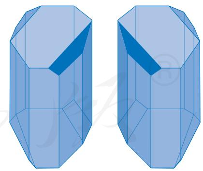  
图2-36 一对手性酒石酸盐晶体

1. 下列有关分子的叙述中，错误的是（ ）。A. 非极性分子中只含有非极性键，因而分子本身也没有极性B. 非极性分子可以含有极性键，但分子的正负电荷中心必须重合C. 非极性分子可以含有极性键，但各个键的极性的向量和必须等于零D. 双原子分子的化合物一定是极性分子

2. 下列关于氢键X—H…Y的说法中，错误的是（ ）。A. 氢键是共价键的一种B. 同一分子内也可能形成氢键C. X、Y元素具有很大的电负性，是氢键形成的基本条件D. 氢键能增大很多物质分子之间的作用力，导致沸点升高

3. 下列叙述中, 正确的是 ( )。 A. $\mathrm{NH}_{3}$ 是极性分子, 分子中N处在3个H所组成的三角形的中心 B. $\mathrm{CCl}_{4}$ 是非极性分子, 分子中C处在4个Cl所组成的正方形的中心 C. $\mathrm{H}_{2} \mathrm{O}$ 是极性分子, 分子中O不处在2个H所连成的直线的中央 D. $\mathrm{CO}_{2}$ 是非极性分子, 分子中C不处在2个O所连成的直线的中央

4. 下列各组物质中，都是由极性键构成的极性分子的是（ ）。A. $\mathrm{CH}_4$ 和 $\mathrm{CCl}_4$ B. $\mathrm{H}_2\mathrm{S}$ 和 $\mathrm{HCl}$ C. $\mathrm{CO}_2$ 和 $\mathrm{CS}_2$ D. $\mathrm{NH}_3$ 和 $\mathrm{CH}_4$

5. 下列现象不能用 “相似相溶” 规律解释的是（ ）。A. 氯化氢易溶于水 B. 氯气易溶于NaOH溶液 C. 碘易溶于 $CCl_{4}$ D. 酒精易溶于水

6. 已知 $\mathrm{O}_3$ 的空间结构为 V 形，分子中正电中心和负电中心不重合，则下列关于 $\mathrm{O}_3$ 和 $\mathrm{O}_2$ 在水中的溶解度的叙述中，正确的是（ ）。 A. $\mathrm{O}_3$ 在水中的溶解度和 $\mathrm{O}_2$ 的一样 B. $\mathrm{O}_3$ 在水中的溶解度比 $\mathrm{O}_2$ 的小 C. $\mathrm{O}_3$ 在水中的溶解度比 $\mathrm{O}_2$ 的大 D. 无法比较

7. 正误判断，正确的打 “√”，错误的打 “×”。

(1) 极性分子中可能含有非极性键。( )

(2) 非极性分子中可能含有极性键。( )

(3) 乙醇分子和水分子间只存在范德华力。( )

(4) 氢键 (X—H…Y) 中三原子在一条直线上时, 作用力最强。( )

(5) “X—H…Y” 三原子不在一条直线上时，也能形成氢键。（）

(6) $\mathrm{H}_{2} \mathrm{O}$ 比 $\mathrm{H}_{2} \mathrm{~S}$ 稳定是因为水分子间存在氢键。（）

(7) 可燃冰 $\mathrm{(CH_4\cdot 8H_2O)}$ 中甲烷分子与水分子间形成了氢键。（）

(8) 卤素单质、卤素氢化物、卤素碳化物（即 $\mathrm{CX}_{4}$ ）的熔、沸点均随着相对分子质量的增大而升高。（）

8. 请解释下列现象:

（1）同样是三原子分子，水分子有极性而二氧化碳分子没有极性。

(2) 同样是直线形非极性分子, 常温下二氧化碳是气体而二硫化碳是液体。

（3）乙醇与水互溶，而1-戊醇在水中的溶解度却很小。

(4) 同样是三角锥形的氢化物, 氨气在水中极易溶解, 并且很容易液化 (常用作冷库中的制冷剂), 而同主族的磷化氢 $\left(\mathrm{PH}_{3}\right)$ 却没有这些性质。

9. 你从下面两张图中能得到什么信息？如何用分子间力解释图中曲线的形状？

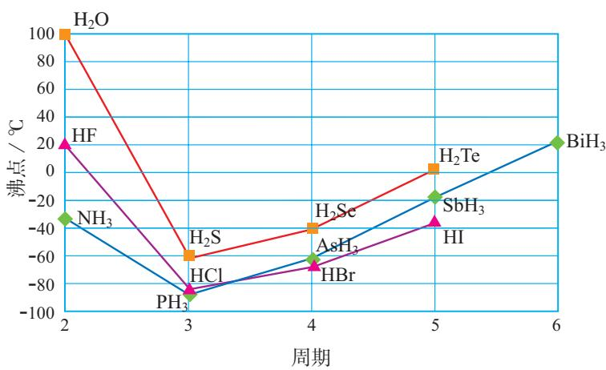

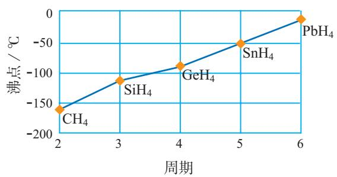

10. 下图是两种具有相同化学式的有机物——邻羟基苯甲酸和对羟基苯甲酸的结构式。已知它们的沸点相差很大，你认为哪一种沸点较高？如何从氢键的角度来解释？

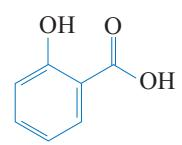  
邻羟基苯甲酸

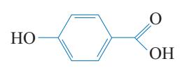  
对羟基苯甲酸

## 一、共价键和分子的空间结构

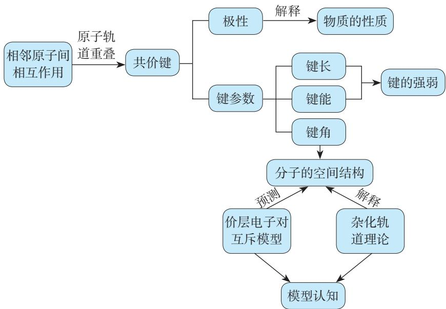

## 二、杂化轨道类型

完成下表中的空白:

<table><tr><td>杂化轨道类型</td><td>参与杂化的轨道</td><td>杂化轨道的特征</td><td>典型例子</td></tr><tr><td> $sp^{3}$  杂化</td><td></td><td></td><td></td></tr><tr><td> $sp^{2}$  杂化</td><td></td><td></td><td></td></tr><tr><td>sp 杂化</td><td></td><td></td><td></td></tr></table>

## 三、分子结构与物质的性质

完成下表中的空白:

<table><tr><td>物质的宏观性质</td><td>微观解释</td></tr><tr><td>1. 分子有极性分子和非极性分子</td><td>共价键有极性共价键和非极性共价键,正电中心和负电中心是否重合</td></tr><tr><td>2. 三氟乙酸的酸性大于三氯乙酸的酸性</td><td></td></tr><tr><td>3. 卤素单质从 $F_2$ 到 $I_2$ 的熔、沸点越来越高</td><td></td></tr><tr><td>4. 对羟基苯甲醛的沸点高于邻羟基苯甲醛的沸点</td><td></td></tr><tr><td>5. 碘易溶于四氯化碳而难溶于水</td><td></td></tr></table>

## 复习与提高

1. 下列事实可用氢键解释的是（ ）。A. 氯气易液化 B. 氨气极易溶于水 C. HF 的酸性比 HI 的弱 D. 水加热到很高的温度都难以分解

2. 下列关于丙烯 $\left(\mathrm{CH}_{3}\mathrm{CH}=\mathrm{CH}_{2}\right)$ 分子的说法中，错误的是（）。A. 有8个σ键，1个π键 B. 有2个碳原子是 $sp^{2}$ 杂化 C. 3个碳原子在同一平面上 D. 所有原子都在同一平面上

3. 氢氰酸（化学式为HCN）分子中所有的原子都通过化学键而达到稳定结构，则下列关于氢氰酸分子结构的表述中，错误的是（ ）。A. H—N≡C B. 分子是直线形 C. H—C≡N D. 中心原子是sp杂化

4. 下列物质中，既含有极性共价键，又含有非极性共价键的是（ ）。A. $\mathrm{CCl}_{4}$ B. $\mathrm{CO}_{2}$ C. $\mathrm{NH}_{4} \mathrm{Cl}$ D. $\mathrm{C}_{2} \mathrm{H}_{4}$

5. 下列各组物质中, 都是由极性键构成的极性分子的是 ( )。
A. $PCl_{3}$ 和 $NCl_{3}$ B. $BeCl_{2}(g)$ 和 HCl C. $NH_{3}$ 和 $BH_{3}$ D. $CO_{2}$ 和 $SO_{2}$

6. 下列叙述中，正确的是（ ）。A. $\mathrm{NH}_{3}$ 、CO、 $\mathrm{CO}_{2}$ 都是极性分子B. $\mathrm{CH}_{4}$ 、 $\mathrm{CCl}_{4}$ 都是含有极性键的非极性分子C. HF、HCl、HBr、HI的稳定性依次增强D. $\mathrm{CS}_{2}$ 、 $\mathrm{H}_{2} \mathrm{O}$ 、 $\mathrm{C}_{2} \mathrm{H}_{2}$ 都是直线形分子

7. 下列描述中，正确的是（ ）。A. $\mathrm{CS}_2$ 是空间结构为V形的极性分子B. $\mathrm{ClO}_3^-$ 的空间结构为平面三角形C. $\mathrm{NO}_3^-$ 中所有的原子不都在一个平面上D. $\mathrm{SiF}_4$ 和 $\mathrm{SO}_3^{2-}$ 的中心原子的杂化轨道类型均为 $\mathfrak{sp}^3$ 杂化

8. 锌在工业中有重要作用，也是人体必需的微量元素。请完成下列空白：

(1) Zn 的核外电子排布式为 \_\_\_\_。

(2)《中华本草》等中医典籍中, 记载了炉甘石 (ZnCO $_3$ ) 入药, 可用于治疗皮肤炎症或表面创伤。 ZnCO $_3$ 中阴离子空间结构为 \_\_\_\_, C 的杂化方式为 \_\_\_\_。

9. 运用价层电子对互斥模型预测 $CCl_{4}$ 、 $NH_{3}$ 、 $H_{2}O$ 的空间结构。

10. 分析乙烷、乙烯和乙炔的分子结构。其中的碳原子采取什么杂化轨道形成 $\sigma$ 键？怎样理解乙烯中的双键和乙炔中的三键？乙炔加氢变成乙烯和乙烷，碳原子的杂化轨道发生什么变化？

11. 怎样用杂化轨道理论理解乙烯分子中的双键是不能旋转的，因而四个氢原子是在一个平面上？

12. 已知 $\mathrm{H}$ 与 $\mathrm{O}$ 可以形成 $\mathrm{H}_2\mathrm{O}$ 和 $\mathrm{H}_2\mathrm{O}_2$ 两种化合物。请完成下列空白：

(1) $\mathrm{H}_{2} \mathrm{O}$ 内的 $\mathrm{O}-\mathrm{H}$ 、水分子间的范德华力和氢键, 从强到弱依次为\_\_\_\_。 $\mathrm{H}^{+}$ 可与 $\mathrm{H}_{2} \mathrm{O}$ 形成 $\mathrm{H}_{3} \mathrm{O}^{+}, \mathrm{H}_{3} \mathrm{O}^{+}$ 中 $\mathrm{O}$ 采用\_\_\_\_杂化。 $\mathrm{H}_{3} \mathrm{O}^{+}$ 中 $\mathrm{H}-\mathrm{O}-\mathrm{H}$ 键角比 $\mathrm{H}_{2} \mathrm{O}$ 中的\_\_\_\_, 原因为\_\_\_\_。

(2) $\mathrm{H}_{2} \mathrm{O}_{2}$ 是常用的氧化剂, 其分子结构如右图所示, 两个氢原子犹如在半展开的书的两面上。 $\mathrm{H}_{2} \mathrm{O}_{2}$ 的电子式是\_\_\_\_, 结构式是\_\_\_\_。 $\mathrm{H}_{2} \mathrm{O}_{2}$ 是含有\_\_\_\_键和\_\_\_\_键的\_\_\_\_分子 (填“极性”或“非极性”)。 $\mathrm{H}_{2} \mathrm{O}_{2}$ 能与水混溶, 却不溶于 $\mathrm{CCl}_{4}$ 。请予以解释: \_\_\_\_。

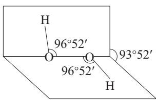  
$H_{2}O_{2}$ 分子结构示意图

13. A、B、C、D 4 种短周期元素，原子序数依次增大。A 的核外电子总数与其周期数相同，B 的价电子层中的未成对电子有 3 个，C 的最外层电子数为其内层电子数的 3 倍，D 与 C 同族。请完成下列空白：

(1) A和B形成的共价化合物, 分子的空间结构呈三角锥形, 该分子的中心原子的杂化轨道类型为\_\_\_\_; A和C形成的共价化合物, 分子中既含有极性共价键, 又含有非极性共价键的化合物是\_\_\_\_(填化学式)。

（2）这些元素可以形成哪些含氧酸？分析每种含氧酸酸根离子的空间结构和中心原子的杂化轨道类型。

\*①14. 试从分子的空间结构和原子的电负性、中心原子上的孤电子对等角度，解释为什么与水分子结构十分相似的 $\mathrm{OF}_2$ 的极性很小。

## 第三章 晶体结构与性质

\- 物质的聚集状态与晶体的常识

\- 分子晶体与共价晶体

\- 金属晶体与离子晶体

\- 配合物与超分子

自然界中绝大多数物质是固体。随着化学的发展，人工合成的固体越来越多，广泛应用于能源、环境、材料、生命科学等领域。固体分晶体和非晶体两大类。晶体具有周期性的微观结构。你若能想象，二维的印花布图案是由原子、离子或分子等构成的，再把这种图案推演到三维空间里去，就如同晶体的微观结构了。晶体的微观基本单元称为晶胞，就好比蜂巢里的蜂室。晶体可简单地分为分子晶体、共价晶体、金属晶体和离子晶体四种类型。另外，还存在许多过渡晶体和混合型晶体。

晶体的结构决定了晶体的性质。晶体的熔点、密度、硬度、延展性、溶解性、热分解性、化学反应性、生物活性……都与晶体结构密切相关。

# 第一节物质的聚集状态与晶体的常识

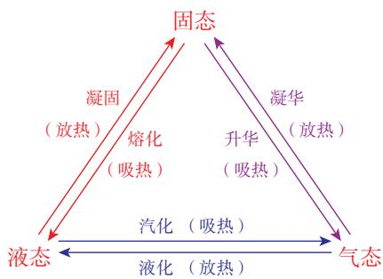  
图 3-1 物质三态间的相互转化

## 一、物质的聚集状态

20世纪前，人们以为分子是所有化学物质能够保持其性质的最小粒子，物质三态的相互转化（如图3-1）只是分子间距离发生了变化，分子在固态只能振动，在气态能自由移动，在液态则介乎二者之间。

20世纪初，通过X射线衍射等实验手段，发现许多常见的晶体中并无分子。例如，氯化钠、石墨、二氧化硅、金刚石以及各种金属等。

气态和液态物质也同样不一定都由分子构成。例如，等离子体是由电子、阳离子和电中性粒子（分子或原子）组成的整体上呈电中性的气态物质；又如，离子液体是熔点不高的仅由离子组成的液体物质。此外，还有更多的物质聚集状态，如晶态、非晶态，以及介乎晶态和非晶态之间的塑晶态、液晶态等。这些事实表明，图3-1描述的物质三态间的相互转化模型显然过于简单了。

## 科学·技术·社会

## 1. 等离子体

气态物质在高温或者在外加电场激发下，分子发生分解，产生电子和阳离子等。这种由电子、阳离子和电中性粒子组成的整体上呈电中性的物质聚集体称为等离子体。

等离子体是一种特殊的气体，存在于我们周围。例如，在日光灯和霓虹灯的灯管里，在蜡烛的火焰里，在极光和雷电里，都能找

到等离子体。

等离子体中含有带电粒子且能自由运动，使等离子体具有良好的导电性和流动性，因此等离子体用途十分广泛。例如，运用等离子体显示技术可以制造等离子体显示器；利用等离子体可以进行化学合成；核聚变也是在等离子态下发生的；等等。

## 2. 液晶

1888年，奥地利人莱尼采尔(F.Reinitzer)发现，苯甲酸胆甾酯加热达到熔点后，先呈浑浊态，再加热达一定温度时，浑浊态变透明清亮态。1889年，德国人莱曼(O.Lehmann)将上述熔点至澄清点温度范围内的物质状态命名为液晶（如图3-2），后称热致液晶。

相对于热致液晶，从溶液中获得的液晶称为溶致液晶，即胶束等。

液晶是介于液态和晶态之间的物质状态，既具有液体的流动性、黏度、形变性等，又具有晶体的某些物理性质，如导热性、光学性质等，表现出类似晶体的各向异性。

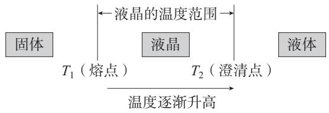  
图 3-2 一定温度范围的液晶

实用液晶在常温下十分稳定。已经获得实际应用的热致液晶均为刚性棒状强极性（或易于极化的）分子，其分子有取向序，分子的长轴取向一致，但无位置序，分子可滑动（如图3-3）。此外，还有平板状、盘状、叶状分子等液晶。

液晶已有广泛的应用。例如，手机、电脑和电视的液晶显示器，由于施加电场可使液晶的长轴取向发生不同程度的改变，从而显示数字、文字或图像。再如，合成高强度液晶纤维已广泛应用于飞机、火箭、坦克、舰船、防弹衣、防弹头盔等。

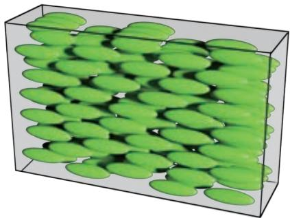  
图 3-3 棒状分子液晶内部分子排列示意图

## 二、晶体与非晶体

走进化学实验室，你能见到许多固体，如蜡状的白磷 $\left(\mathrm{P}_{4}\right)$ 、黄色的硫黄 $\left(\mathrm{S}_{8}\right)$ 、紫黑色的碘 $\left(\mathrm{I}_{2}\right)$ 和高锰酸钾 $\left(\mathrm{KMnO}_{4}\right)$ 、蓝色的硫酸铜 $\left(\mathrm{CuSO}_{4} \cdot 5\mathrm{H}_{2}\mathrm{O}\right)$ 、白色的碳酸钙等。放眼世界，自然界中绝大多数矿物也都是固体。你一定还能说出生活中常见的更多的固体，如金属、玻璃、陶瓷、砖瓦、水泥、塑料、橡胶、木材……

晶体 crystal
非晶体 noncrystal

你是否知道固体有晶体和非晶体之分？绝大多数常见的固体是晶体，只有如玻璃、炭黑之类的物质属于非晶体（玻璃又称玻璃体，炭黑又称无定形体）。晶体与非晶体有什么本质的差异呢？

得到晶体一般有三条途径: (1) 熔融态物质凝固;

表 3-1 晶体与非晶体的本质差异

<table><tr><td>固体</td><td>自范性</td><td>微观结构</td></tr><tr><td>晶体</td><td>有(能自发呈现多面体外形)</td><td>原子在三维空间里呈周期性有序排列</td></tr><tr><td>非晶体</td><td>没有(不能自发呈现多面体外形)</td><td>原子排列相对无序</td></tr></table>

晶体的自范性即晶体能自发地呈现多面体外形的性质。所谓自发过程，即自动发生的过程。不过，自发过程的实现，仍需要一定的条件。例如，水能自发地从高处流向低处，但不打开拦截水流的闸门，水库里的水就不能下泻。晶体呈现自范性的条件之一是晶体生长的速率适当。熔融态物质冷却凝固，有时得到晶体，但凝固速率过快，常常只得到肉眼看不到多面体外形的粉末或没有规则外形的块状物，甚至形成的只是非晶态（玻璃态）。最有趣的例子是天然的水晶球。水晶球是岩浆里熔融态的 $SiO_{2}$ 侵入地壳内的空洞冷却形成的。剖开水晶球，它的外层是看不到晶体外形的玛瑙，内层才是呈现晶体外形的水晶（如图3-4）。不同的是，玛瑙是熔融态 $SiO_{2}$ 快速冷却形成的，而水晶则是熔融态 $SiO_{2}$ 缓慢冷却形成的 $^{①}$ 。

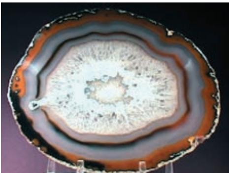  
图 3-4 天然水晶球的玛瑙和水晶

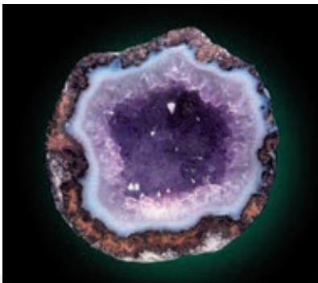

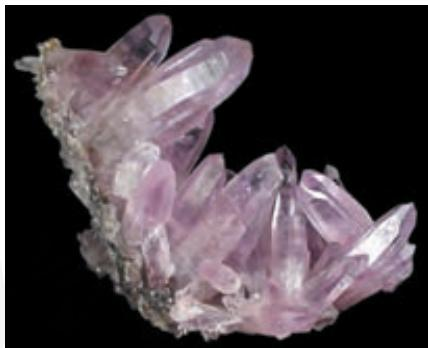

(2) 气态物质冷却不经液态直接凝固 (凝华); (3) 溶质从溶液中析出。如图 3-5 所示是三个典型例子:

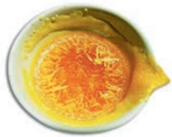  
从熔融态结晶出来的硫晶体

  
凝华得到的碘晶体

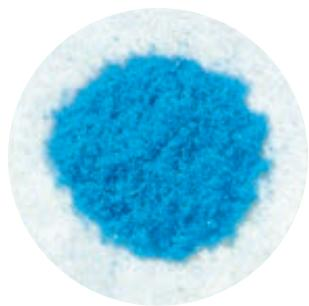  
从饱和硫酸铜溶液中析出的
硫酸铜晶体  
图 3-5 经不同途径得到的晶体

## 【实验3-1】

(1) 用研钵把硫黄粉末研细, 放入蒸发皿中, 放在三脚架的铁圈上, 用酒精灯加热至熔融态, 自然冷却结晶后, 观察实验现象。

(2) 在一个小烧杯里加入少量碘, 用一个表面皿盖在小烧杯上, 并在表面皿上加少量冷水。把小烧杯放在陶土网上小火加热, 观察实验现象。

(3) 在 $250 \mathrm{~mL}$ 烧杯中加入半杯饱和氯化钠溶液, 用滴管滴入浓盐酸, 观察实验现象。

许多固体粉末用肉眼看不到晶体外形，但在光学显微镜或电子显微镜下可观察到规则的晶体外形。这充分证明固体粉末仍是晶体，只因晶粒太小，肉眼看不到而已。

## 资料卡片

制备晶体的三种途径都可制得有重要价值的大晶体。例如，芯片的基质是单晶硅，它是由熔融态硅制备的，俗称“拉单晶”。用于制造激光器的 $KH_{2}PO_{4}$ 大晶体是由水溶液结晶出来的。而可与天然钻石媲美的CVD宝石级钻石，则是由烷烃（如 $CH_{4}$ ）在微波炉里以等离子体分解出的碳通过化学气相沉积（简称CVD）得到的。

本质上，晶体的自范性是晶体中粒子在微观空间里呈现周期性的有序排列的宏观表象。相反，非晶体中粒子的排列则相对无序，因而无自范性（如图3-6）。

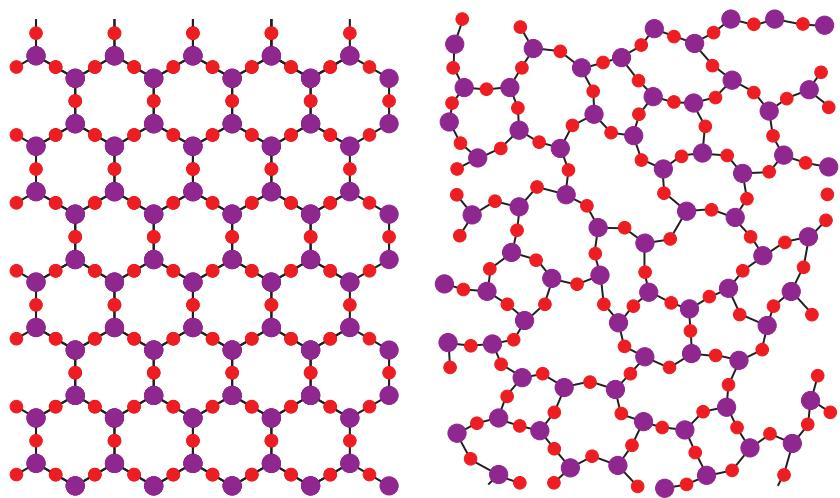  
图 3-6 晶体 $SiO_{2}$ 和非晶体 $SiO_{2}$ 的投影示意图

晶体的特点并不仅限于外形和内部质点排列的高度有序性，它们的许多物理性质，如强度、导热性、光学性质等，常常会表现出各向异性。例如，在水晶柱面上滴一滴熔化的石蜡，用一根红热的铁针刺中凝固的石蜡，你会发现石蜡在不同方向熔化的快慢不同。这是由于水晶导热性的各向异性造成的。所以，晶体的某些物理性质的各向异性同样反映了晶体内部质点排列的有序性，而且通过这些性质可以了解晶体的内部排列与结构的一些信息。而非晶体则不具有物理性质各向异性的特点。

考察固体的某些性质，如熔点，可以间接地确定某一固体是否是晶体，因为晶体的熔点较固定，而非晶体则没有固定的熔点，熔化过程温度会发生变化。然而，区分晶体和非晶体最可靠的科学方法是对固体进行X射线衍射实验。

## 思考与讨论

（1）图3-7是某同学找到的一张玻璃结构的示意图，根据这张图判断玻璃是不是晶体。为什么？

（2）根据晶体物理性质的各向异性的特点，能鉴别用玻璃仿造的假宝石。请你列举一些可能有效的方法鉴别假宝石。

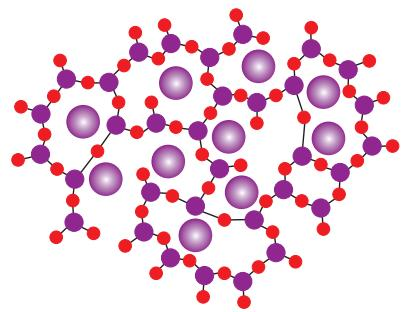  
图 3-7 玻璃的结构示意图

## 三、晶胞

为了描述晶体在微观空间里原子的排列，无须画出千千万万个原子，只需在晶体微观空间里取出一个基本单元即可。这种描述晶体结构的基本单元叫做晶胞（如图3-8）。

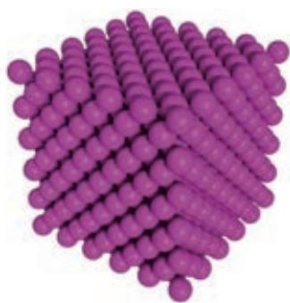  
铜晶体

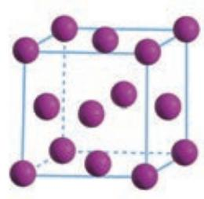  
铜晶胞  
图 3-8 铜晶体与铜晶胞

晶胞 unit cell

常规的晶胞都是平行六面体。整块晶体可以看作是数量巨大的晶胞“无隙并置”而成；所谓“无隙”，是指相邻晶胞之间没有任何间隙；所谓“并置”，是指所有晶胞都是平行排列的，取向相同。例如，图3-8的右图是金属铜的一个晶胞，它是一个立方体，含4个铜原子。这张图里不是有14个铜原子吗？怎么说一个晶胞只含4个铜原子呢？原来，我们在观察晶胞图时，千万不能忘记，晶胞只是晶体微观空间结构里的一个基本单元，在它的上下、左右、前后无隙并置地排列着无数晶胞，而且所有晶胞的形状及其内部的原子种类、个数及几何排列（包括取向）是完全相同的。因而，晶胞的顶角原子是8个晶胞共用的，晶胞棱上的原子是4个晶胞共用的，晶胞面上的原子是两个晶胞共用的（如图3-9）。因此，金属铜的一个晶胞的原子数 $=8\times\frac{1}{8}+6\times\frac{1}{2}=4$ 。

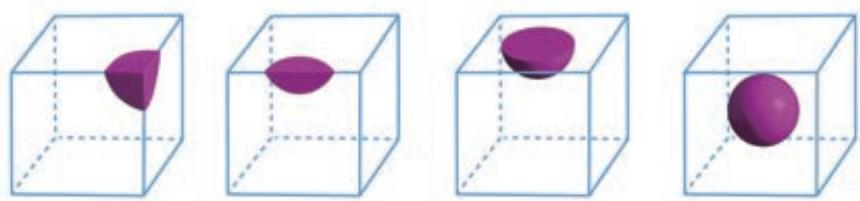

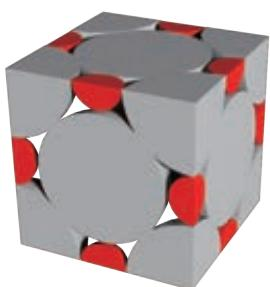  
图 3-10 NaCl 晶胞  
图 3-9 原子在晶胞的顶角、棱、面上以及晶胞内时，一个晶胞平均占有的原子

再如，如图3-10所示是NaCl的晶胞，它含有几个钠原子和氯原子？

总之，晶胞是8个顶角相同、三套各4根平行棱分别相同、三套各两个平行面分别相同的最小平行六面体。

## 思考与讨论

(1) 晶胞有几套平行棱? 有几套平行面?

(2) 图3-11依次是金属钠 (Na)、金属锌 (Zn)、碘 $\left(\mathrm{I}_{2}\right)$ 、金刚石 (C) 晶胞的示意图, 数一数, 它们分别平均含几个原子?

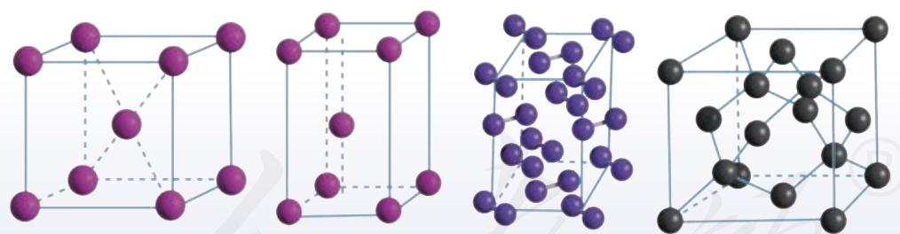  
图 3-11 钠、锌、碘、金刚石晶胞图

## 探究

## 准 晶

【问题】

我们学习了晶体、非晶体和晶胞等概念。2011年，以色列化学家谢赫特曼（D.Shechtman）因发现准晶获诺贝尔化学奖。那么，什么是准晶呢？

## 【查阅资料】

以 “准晶” 为关键词，利用互联网查阅相关资料，并回答以下问题：什么是准晶？准晶的单晶 X 射线衍射图有什么明显的不同于传统晶体的特征？准晶是不是晶体？准晶的发现怎样改变了晶体的定义？准晶有晶胞吗？

【结论】

根据查阅的资料，请自拟题目写一篇有关“准晶”的小论文。

## 四、晶体结构的测定

测定晶体结构最常用的仪器是X射线衍射仪（如图3-12）。在晶体的X射线衍射实验中，当单一波长的X射线通过晶体时，X射线和晶体中的电子相互作用，会在记录仪上产生分立的斑点（如图3-13）或者明锐的衍射峰（如图3-14）。而在同一条件下摄取的非晶体图谱中却看不到分立的斑点或明锐的衍射峰。例如，石英玻璃（非晶态二氧化硅）和水晶（晶态二氧化硅）研成粉末摄取的X射线衍射图谱是不同的（如图3-14）。

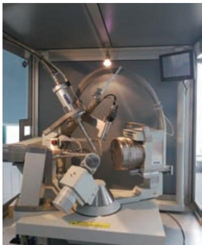

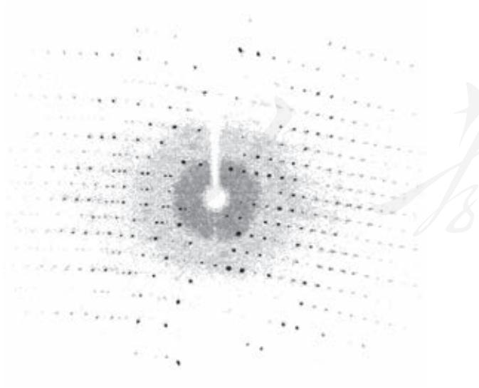  
图 3-13 单晶衍射图

图 3-12 X 射线衍射仪  
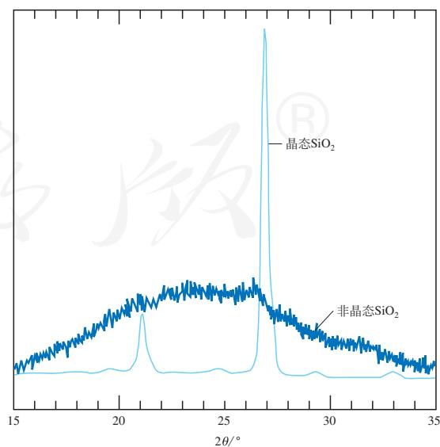  
图 3-14 非晶态和晶态 $SiO_{2}$ 粉末衍射图谱的对比

通过晶体的X射线衍射实验获得衍射图后，经过计算可以从衍射图形获得晶体结构的有关信息，包括晶胞形状和大小、分子或原子在微观空间有序排列呈现的对称类型、原子在晶胞里的数目和位置等，以及结合晶体化学组成的信息推出原子之间的相互关系。

例如，通过晶体X射线衍射实验，对乙酸晶体进行测定，可以得出乙酸晶胞，晶胞中含有4个乙酸分子（如图3-15）。并且，测定晶胞中各个原子的位置（坐标），根据原子坐标，可以计算原子间的距离，判断出晶体中哪些原子之间存在化学键，确定键长和键角，从而，得出分子的空间结构（如图3-16）。

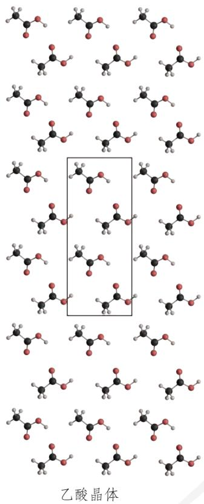  
图 3-15 乙酸晶体和乙酸晶胞

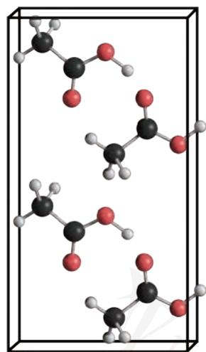  
乙酸晶胞

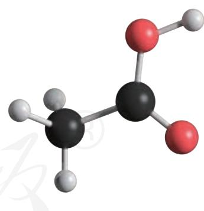  
图 3-16 乙酸分子的空间结构

## 练习与应用

1. 区分晶体和非晶体最可靠的科学方法是（ ）。  
A. 测定熔、沸点 B. 观察外形 C. 对固体进行X射线衍射测定 D. 通过比较硬度确定

2. 关于晶体的自范性，下列叙述中，正确的是（ ）。A. 破损的晶体能够在固态时自动变成规则的多面体B. 缺角的氯化钠晶体在饱和NaCl溶液中慢慢变为完美的立方体块C. 圆形容器中结出的冰是圆形的，体现了晶体的自范性D. 由玻璃制成规则的玻璃球体现了晶体的自范性

3. 下列叙述中，正确的是（ ）。  
A. 石英玻璃和水晶都是晶体  
B. 晶体与非晶体的根本区别在于固体是否具有规则的几何外形  
C. 具有各向异性的固体可能是晶体  
D. 粉末状的固体肯定不是晶体

4. 下列有关晶胞的叙述中，正确的是（ ）。A. 晶胞是晶体结构中最小的重复单元 B. 晶胞中的任何一个粒子都属于该晶胞 C. 所有晶体都是由平行六面体无隙组合而成 D. 不同晶体中的晶胞的大小和形状均相同

5. 正误判断，正确的打 “√”，错误的打 “×”。

(1) 固态物质一定是晶体。( )

(2) 凡有规则外形的固体一定是晶体。( )

（3）晶体内部的粒子按一定规律周期性地排列。（）

(4) 固体 $\mathrm{SiO}_{2}$ 一定是晶体。（）

(5) 晶胞是晶体中最小的平行六面体。( )

（6）测定某一固体是否是晶体可用X射线衍射仪进行实验。（）

6. 指出晶体与玻璃体的本质差别。

7. 因生产金属铁的工艺和温度等因素不同, 产生的铁单质的晶体结构、密度和性质均不同, 对铁晶体用 X 射线衍射进行测定, 测得 A、B 两种晶胞, 其晶胞结构示意图如下:

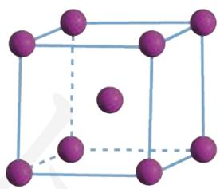  
A

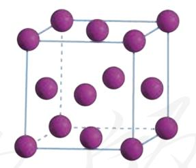  
B

则A、B两种晶胞中含有的铁原子数分别是：\_\_\_\_、\_\_\_\_个。
8. 在高温超导领域中，有一种化合物叫钙钛矿，其晶胞如右图所示。试回答：
（1）在该晶体中每个钛离子周围与它最近且相等距离的钛离子有多少个？
（2）在该晶胞中氧、钙、钛的粒子个数比是多少？
\*9. 观察与思考：右图的碘晶体中碘分子的排列有几种不同的取向？

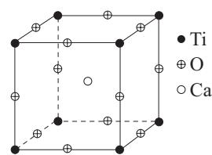

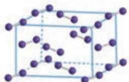

# 第二节 分子晶体与共价晶体

## 一、分子晶体

分子晶体 molecular crystal

只含分子的晶体称为分子晶体。例如，图3-11的碘晶体只含 $I_{2}$ ，属于分子晶体。在分子晶体中，相邻分子靠分子间作用力相互吸引。分子晶体有低熔点的特性。另外，你也不难理解分子晶体的硬度很小了。

表 3-2 某些分子晶体的熔点

<table><tr><td>分子晶体</td><td>氧气</td><td>氮气</td><td>白磷</td><td>水</td></tr><tr><td>熔点/°C</td><td>-218.3</td><td>-210.1</td><td>44.2</td><td>0</td></tr><tr><td>分子晶体</td><td>硫化氢</td><td>甲烷</td><td>乙酸</td><td>尿素</td></tr><tr><td>熔点/°C</td><td>-85.6</td><td>-182</td><td>16.6</td><td>132.7</td></tr></table>

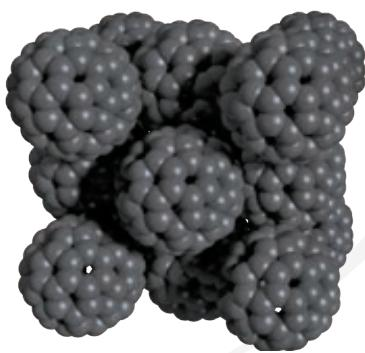  
图 3-17 碳60的晶胞

哪些晶体属于分子晶体呢？较典型的分子晶体有：（1）所有非金属氢化物，如水、硫化氢、氨、氯化氢、甲烷等；（2）部分非金属单质，如卤素 $\left(\mathrm{X}_{2}\right)$ （如图3-11的碘）、氧气 $\left(\mathrm{O}_{2}\right)$ 、硫 $\left(\mathrm{S}_{8}\right)$ 、氮气 $\left(\mathrm{N}_{2}\right)$ 、白磷 $\left(\mathrm{P}_{4}\right)$ 、碳60 $\left(\mathrm{C}_{60}\right)$ （如图3-17）、稀有气体等；（3）部分非金属氧化物，如 $CO_{2}$ 、 $P_{4}O_{6}$ 、 $P_{4}O_{10}$ 、 $SO_{2}$ 等；（4）几乎所有的酸；（5）绝大多数有机物。

大多数分子晶体的结构有如下特征：如果分子间作用力只是范德华力，若以一个分子为中心，其周围最多可以有12个紧邻的分子，分子晶体的这一特征称为分子密堆积，如图3-17的碳60。然而，我们最熟悉的冰，水分子之间的主要作用力是氢键（当然也存在范德华力），从图3-18可见，在冰的晶体中，每个水分子周围只有4个紧邻的水分子。尽管氢键比共价键弱得多，不属于化学键，却跟共价键一样具有方向性，即氢键的存在迫使在四面体中心的每个水分子与四面体顶角方向的4个相邻水分子相互吸引。这一排列使冰晶体中的水分子的空间利用率不高，留有相当大的空隙，其密度比液态水的小。当冰刚刚融化为液态水时，热运动使冰的结构部分解体，水分子间的空隙减小，密度反而增大，超过4℃时，才由于热运动加剧，分子间距离加大，密度渐渐减小。

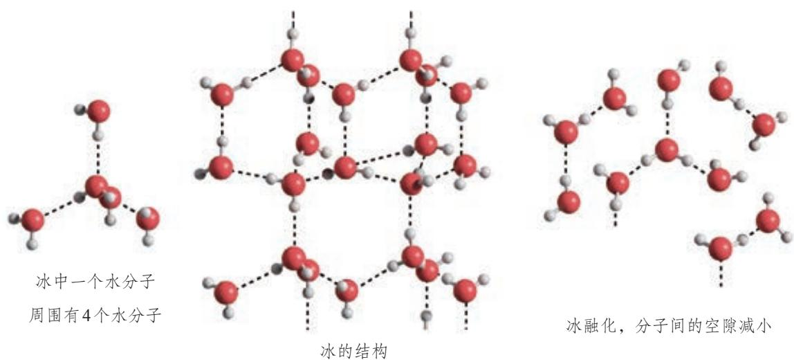  
冰融化，分子间的空隙减小

图 3-18 冰和液态水的结构对比（虚线表示氢键）

干冰的外观很像冰，硬度也跟冰相似，而熔点却比冰的低得多，在常压下极易升华。而且，由于干冰中的 $CO_{2}$ 之间只存在范德华力，一个分子周围有12个紧邻分子（如图3-19），密度比冰的高。干冰在工业上广泛用作制冷剂。

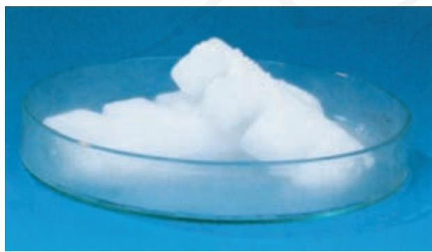  
图 3-19 干冰及其晶胞

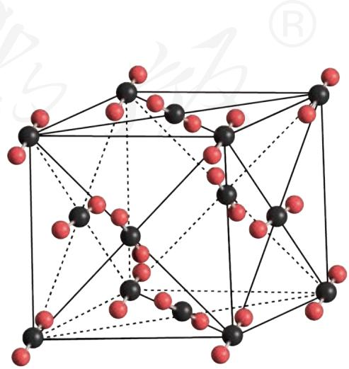

## 思考与讨论

硫化氢和水分子结构相似，但硫化氢晶体中，一个硫化氢分子周围有12个紧邻分子，而冰中一个水分子周围只有4个紧邻分子，这是为什么？

## 资料卡片

取两块大小相同的干冰，在一块干冰中央挖一个小穴，撒入一些镁粉，用红热的铁棒把镁点燃，将另一块干冰盖上，你会看到镁粉在干冰内继续燃烧，像冰灯中装进一个电灯泡一样，发出耀眼的白光。(切勿用手接触干冰，以免冻伤！)

这个实验不但证明了金属镁可以跟二氧化碳反应（ $2Mg + CO_{2}\xlongequal{点燃}2MgO + C$ ），而且也说明了干冰易升华的特性。

## 科学·技术·社会

## 天然气水合物——一种潜在的能源

许多气体可以与水形成水合物晶体。最早发现这类水合物晶体的是19世纪初的英国化学家戴维，他发现氯可形成化学式为 $Cl_{2}\cdot8H_{2}O$ 的水合物晶体。20世纪末，科学家发现海底和大陆冰川或永久冻土底部存在大量天然气水合物晶体。这种晶体的主要气体成分是甲烷，因而又称甲烷水合物。它的外形像冰，而且在常温常压下会迅速分解释放出可燃的甲烷，因而又称“可燃冰”。

在天然气水合物晶体中，有甲烷、乙烷、氮气、氧气、二氧化碳、硫化氢、稀有气体等，它们在水合物晶体里是装在以氢键相连的几个水分子构成的笼内，因而又称笼状化合物（如图3-20上）。天然气水合物晶体中的水分子笼是多种多样的（如图3-20下）。

假设天然气水合物的水笼穴里装的都是甲烷，甲烷水合物的化学式可表示为 $8CH_{4}\cdot46H_{2}O$ ，相当于 $CH_{4}$ 和 $H_{2}O$ 的物质的量比为 1:5.75。把甲烷水合物从海底提升到海平面， $1\ m^{3}$ 固体可释放 $164\ m^{3}$ （标准状况）甲烷气体。海底天然气水合物的密度与冰的十分接近，为 $0.92 \sim 0.93 \mathrm{~g} / \mathrm{cm}^{3}$ ，用这个数据进行理论推算可知，甲烷分子并没有完全占据可被占据的笼穴，只占据了 $70 \% \sim 90 \%$ 的笼穴。

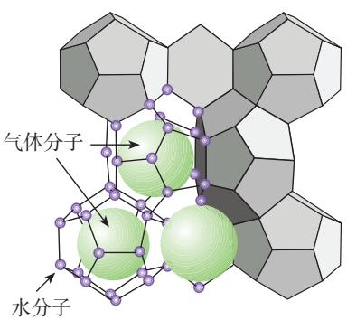  
天然气分子藏在水分子笼内

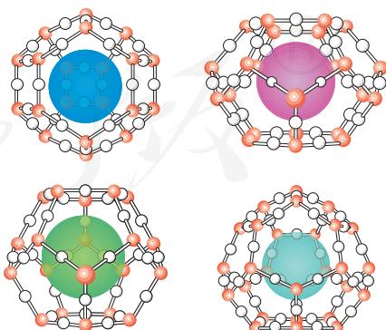  
水分子笼是多种多样的  
图 3-20 天然气水合物示意图

估计全球的海底和冰川底部藏在天然气水合物中的天然气，总量超过煤、石油和天然气等化石燃料的总和的两倍，是巨大的潜在能源。

据报道，在2017年5月18日，我国南海神狐海域天然气水合物试采实现连续超过7天的稳定产气。

## 二、共价晶体

有的晶体的微观空间里没有分子，共价晶体就是其中之一。

金刚石是典型的共价晶体。天然的金刚石经常呈现规则多面体的外形，从这种外形（如图3-21）就可以想象，在金刚石晶体中，每个碳原子以4个共价单键对称地与相邻的4个碳原子结合，C—C—C夹角为 $109^{\circ}28'$ ，即金刚石中的碳采取 $sp^{3}$ 杂化轨道形成共价键三维骨架结构。

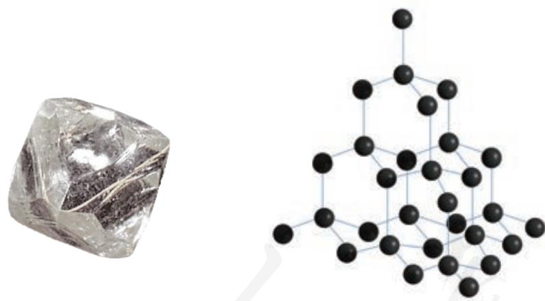

共价晶体 covalent crystal
金刚石 diamond

图 3-21 金刚石的多面体外形、晶体结构和晶胞示意图  
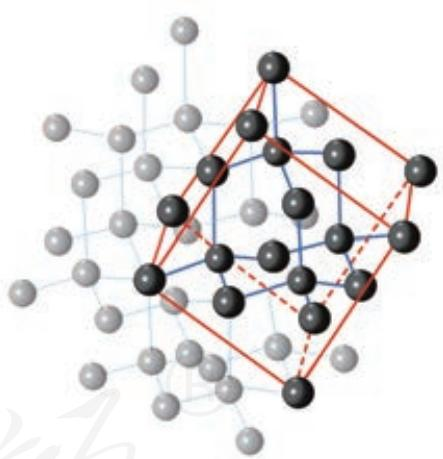

金刚石里的C—C共价键的键长（154 pm）很短，键能（347.7 kJ/mol）很大，这一结构使金刚石在所有已知晶体中硬度最大，而且熔点（>3 500 ℃）也很高。高硬度、高熔点是许多有共价键三维骨架结构的共价晶体的特性。

$SiO_{2}$ 是另一种共价晶体。它是自然界含量最高的固态二元氧化物，熔点1713℃，有多种结构，最常见的是低温石英。遍布海滩河岸的黄沙、带状的石英矿脉、花岗石里的白色晶体以及透明的水晶都是低温石英。在低温石英的结构中，顶角相连的硅氧四面体形成螺旋上升的长链（如图3-22），这一结构决定了它具有手性（左、右型）（如图3-23），被广泛用作压电材料，如制作石英手表。

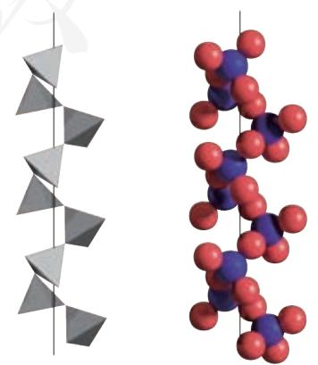  
图 3-22 石英晶体中的硅氧四面体相连构成的螺旋链

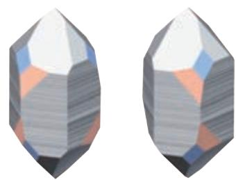

图 3-23 石英的左、右型晶体  
$SiO_{2}$ 具有许多重要用途，是制造水泥、玻璃、单晶硅、硅光电池、芯片和光导纤维的原料。  
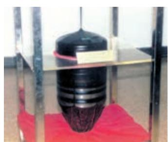  
单晶硅

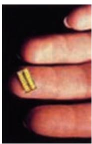  
单晶硅制的芯片

  
硅太阳能电池

  
二氧化硅光导纤维  
图 3-24 以 $SiO_{2}$ 为原料制造的高科技产品

哪些晶体属于共价晶体呢？常见的共价晶体还有：（1）某些单质，如硼（B）、硅（Si）、锗（Ge）和灰锡（Sn）等；（2）某些非金属化合物，如碳化硅（SiC，俗称金刚砂）、 $\mathrm{Si}_3\mathrm{N}_4$ 等。近年来以 $\mathrm{Si}_3\mathrm{N}_4$ 为基础，用Al取代部分Si，用O取代部分N而获得结构多样化的陶瓷，用于制作LED发光材料。

## 思考与讨论

(1) 怎样从原子结构的角度理解金刚石、硅和锗的熔点和硬度依次下降? (2) “具有共价键的晶体叫做共价晶体”, 这种说法对吗? 为什么?

## 资料卡片

表 3-3 某些共价晶体的熔点和硬度

<table><tr><td>共价晶体</td><td>金刚石</td><td>氮化硼</td><td>碳化硅</td><td>石英</td><td>硅</td><td>锗</td></tr><tr><td>熔点/°C</td><td>&gt;3 500</td><td>3 000</td><td>2 700</td><td>1 710</td><td>1 410</td><td>1 211</td></tr><tr><td>摩氏硬度</td><td>10</td><td>9.5</td><td>9.5</td><td>7</td><td>6.5</td><td>6.0</td></tr></table>

硬度是衡量固体软硬程度的指标。硬度有不同的标度，最普通的硬度标度是画痕硬度，即摩氏硬度，以固体互相刻画时出现刻痕的固体的硬度较低。金刚石不能被任何天

应当指出，硬度大的物质不一定经得起锤击，如金刚石硬度最大，却很容易经锤击而破碎。物质经受锤击的性质属于延展性。

然矿物刻画出刻痕，因而是最硬的。以金刚石的硬度为10，以另9种天然矿物为代表，可将摩氏硬度分为十度，即：

<table><tr><td>正长石</td><td>磷灰石</td><td>萤石</td><td>方解石</td><td>石膏</td><td>滑石</td></tr><tr><td>6</td><td>5</td><td>4</td><td>3</td><td>2</td><td>1</td></tr></table>

由于共价晶体中的共价键具有方向性，当受到大的外力作用时会发生原子错位而断裂。你要是有粒钻石，切不要用锤子砸哟！

科学·技术·社会

## 金刚石

## 1. 天然金刚石

人类把天然金刚石当作宝石珍藏已有三千余年的历史。经过琢磨的金刚石称为钻石，透光度高。纯净的金刚石无色透明，含杂质则呈蓝、黄、棕、绿、黑等色。

用同位素断代实验证实，所有的天然金刚石至少已有9.9亿岁了，其中许多甚至已达32亿岁！天然金刚石是在离地表100\~200 km深的地幔中形成的。在那里，温度为900\~1 300 ℃，压力为 $4.5 \times 10^{9} \sim 6.0 \times 10^{9}$ Pa。天然金刚石是火山爆发带到地表来的。火山爆发时形成的岩浆是传输金刚石的介质，它冷却形成的岩石即富含金刚石的金伯利岩。在地球表面，石墨比金刚石更稳定，但迅速上升到地表的火山岩浆急速冷却，使金刚石不能转化为石墨。图3-25是几幅软件模拟金伯利岩浆携带金刚石上升到地表的动画截图。

图 3-25 中金刚石的大小被大大夸张了，其实，金伯利岩中金刚石的量是极其稀少的。据统计，平均 1 000 kg 金伯利岩中只有 5 g 金刚石，而且其中 80% 只能用于工业（如制作钻头等），不能用于磨制钻石，而品质上乘的钻石就更少了。

  
图 3-25 火山岩浆把金刚石从地幔深处输送到地表并冷却成金伯利岩

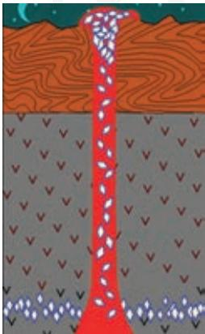

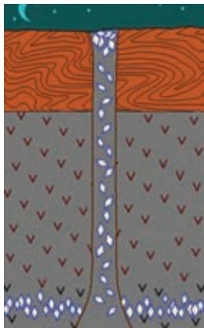

## 2. 人工合成金刚石

## (1) 高压合成

人工合成金刚石的探索始于19世纪末，直到20世纪50年代，在理论上论证了合成金刚石需要的高压高温条件，才逐渐从实验探索发展成大规模的工业生产。高压合成金刚石的原料是廉价的石墨。用高压釜施加高温高压并加入金属镍等金属催化剂，石墨可转化为金刚石（如图3-26）。此外，也可借爆炸产生的高温高压合成，但后者得到的金刚石颗粒细小，只能用作磨料。然而，廉价而大量地合成宝石级的金刚石仍是一个人类尚未攻克的难题。

  
高温高压合成金刚石的装置

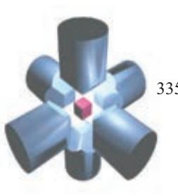  
装置的核心部位

图 3-26 高温高压合成金刚石  
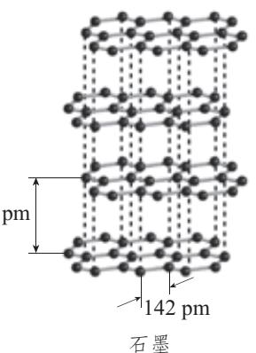

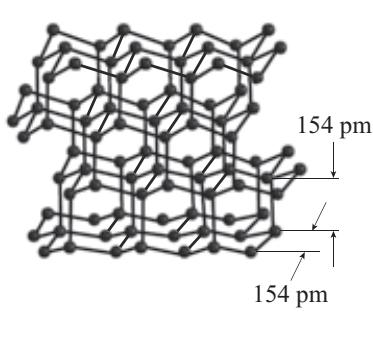  
石墨在高温高压下转变为金刚石示意图

## (2) 低压合成

20世纪80年代，人们发现，甲烷等简单的碳氢化合物跟大量氢气混合，在微波炉里形成低温低压的等离子体在硅等基质上沉积，能得到颗粒微小的金刚石的薄膜。近年，已用这种方法获得了宝石级大钻石。此法的出现震惊世人，对人类科学思维取向有深刻的启示。

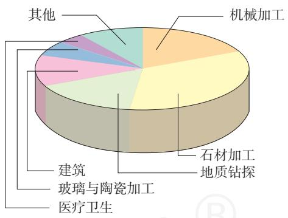  
图 3-27 合成金刚石的应用领域

## 练习与应用

1. 下列说法中，错误的是（ ）。  
A. 只含分子的晶体一定是分子晶体  
B. 碘晶体升华时破坏了共价键  
C. 几乎所有的酸都属于分子晶体  
D. 稀有气体中只含原子，但稀有气体的晶体属于分子晶体

2. 下列说法中，正确的是（ ）。A. 冰融化时，分子中 $\mathrm{H}-\mathrm{O}$ 发生断裂B. 共价晶体中，共价键越强，熔点越高C. 分子晶体中，共价键键能越大，该分子晶体的熔、沸点一定越高D. 分子晶体中，分子间作用力越大，对应的物质越稳定

3. 下列事实能说明刚玉 $\left(\mathrm{Al}_{2} \mathrm{O}_{3}\right)$ 是共价晶体的是（ ）。 $① \mathrm{Al}_{2} \mathrm{O}_{3}$ 是两性氧化物； $②$ 硬度很大； $③$ 它的熔点为 $2045^{\circ} \mathrm{C}$ ； $④$ 自然界中的刚玉有红宝石和蓝宝石。A. $①②$ B. $②③$ C. $①④$ D. $③④$

4. 下列说法中，正确的是（ ）。A. 分子晶体中一定存在分子间作用力和共价键B. 分子晶体的熔点一般比共价晶体的熔点高C. 稀有气体形成的晶体属于分子晶体D. $\mathrm{CO}_{2}$ 晶体是分子晶体，可推测 $\mathrm{SiO}_{2}$ 晶体也是分子晶体

5. 简要回答构成分子晶体、共价晶体的粒子各是什么。这些粒子通过什么键或作用力结合成晶体?

6. 有人说，冰属于共价晶体。这种说法为什么是错误的？

7. 以下晶体是共价晶体还是分子晶体?

金刚石 干冰 冰 可燃冰 硫黄 $C_{60}$ 碘 石英 白磷 ( $P_{4}$ )

苯甲酸 金刚砂 (SiC) 稀有气体的晶体 氧气的晶体 氮气的晶体

8. 干冰晶体中, 每个 $\mathrm{CO}_{2}$ 周围等距且紧邻的 $\mathrm{CO}_{2}$ 有\_\_\_\_个。在冰的结构模型中, 每个水分子最多与相邻的\_\_\_\_个水分子相连接。同为分子晶体, 但干冰中 $\mathrm{CO}_{2}$ 的配位数 (一个分子周围最邻近的分子的数目) 大于冰中水分子的配位数, 其原因是\_\_\_\_。

9. 用黏土或橡皮泥和牙签等材料制作金刚石晶体模型。

# 第三节金属晶体与离子晶体

## 一、金属键与金属晶体

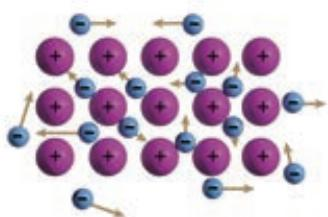  
图 3-28 金属晶体的电子气理论示意图

金属（除汞外）在常温下都是晶体，称其为金属晶体。它们的结构就好像很多硬球一层一层很紧密地堆积，每一个金属原子的周围有较多相同的原子围绕着。在金属晶体中，原子之间以金属键相互结合。那么，金属键的本质是什么呢？

描述金属键本质的最简单理论是“电子气理论”。该理论把金属键描述为金属原子脱落下来的价电子形成遍布整块晶体的“电子气”，被所有原子所共用，从而把所有的金属原子维系在一起。由此可见，金属晶体跟共价晶体一样，是一种“巨分子”。金属键的强度差别很大。例如，金属钠的熔点较低、硬度较小，而钨是熔点最高的金属，铬是硬度最大的金属，这是由于形成的金属键强弱不同。

电子气理论还可以用来解释金属材料良好的延展性。当金属受到外力作用时，晶体中的各原子层就会发生相对滑动，但不会改变原来的排列方式（如图3-29），而且弥漫在金属原子间的电子气可以起到类似轴承中滚珠之间润滑剂的作用，所以金属有良好的延展性。当向金属晶体中掺入不同的金属或非金属原子时，就像在滚珠之间掺入了细小而坚硬的砂土或碎石一样，会使这种金属的延展性甚至硬度发生改变，这也是对金属材料形成合金以后性能发生改变的一种比较粗浅的解释。

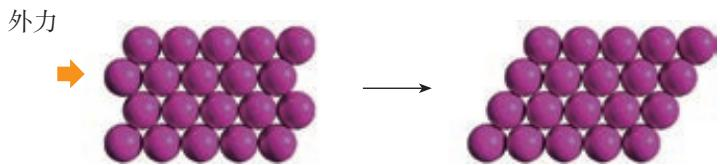  
图 3-29 电子气理论对金属良好延展性的解释

电子气理论还十分形象地用电子气在电场中定向移动解释金属良好的导电性，还可用电子气中的自由电子在热的作用下与金属原子频繁碰撞解释金属的电导率随温度升高而降低的现象。

另一种描述金属键的理论是能带理论，在此不作介绍。

金属晶体中，除了纯金属，还有大量的合金。合金的组成和结构非常复杂多样。大多数合金以一种金属为主要组成，如以铁为主要成分的碳钢、锰钢、不锈钢等，以铜为主要成分的黄铜、青铜、白铜等。

金属晶体有导电性，但能导电的物质不一定是金属。例如，石墨有导电性却属于非金属。还有一大类能导电的有机高分子化合物，也不属于金属。

## 二、离子晶体

离子晶体是由阳离子和阴离子相互作用而形成的晶体。离子晶体种类繁多，结构多样，图3-30给出了NaCl和CsCl两种离子晶体的晶胞。

离子晶体 ionic crystal

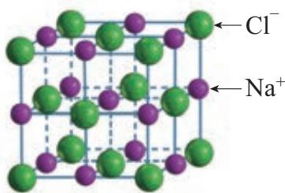  
图 3-30 NaCl 和 CsCl 的晶胞

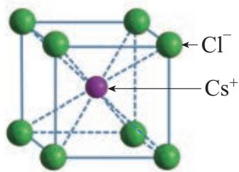

在 NaCl 和 CsCl 晶体中，离子间存在着较强的离子键，使离子晶体的硬度较大，难于压缩；而且，要使它们由固态变成液态或气态，需要较多的能量破坏这些较强的离子键。因此，NaCl 和 CsCl 具有较高的熔点和沸点，如 NaCl 的熔点为 801 ℃，沸点为 1413 ℃；CsCl 的熔点为 645 ℃，沸点为 1290 ℃。

以上讨论了NaCl和CsCl两种离子晶体，实际上，大量离子晶体的阴离子或阳离子不是单原子离子，有的还存在电中性分子（如 $H_{2}O$ 、 $NH_{3}$ 等）。例如， $CaCO_{3}$ 、 $K_{2}SO_{4}$ 、$(NH_{4})_{2}SO_{4}$ 、 $CuSO_{4}\cdot5H_{2}O$ 、 $Cu(NH_{3})_{4}SO_{4}\cdot H_{2}O$ 等，在这些离子晶体中还存在共价键、氢键等。（注：晶体中也存在范德华力，只是当能量份额很低时不提及。）然而，贯穿整个晶体的主要作用力仍是阴、阳离子之间的作用力。

## 思考与讨论

我们知道，金属的熔点差异很大，如钨的熔点为3410℃，而常温下，汞却是液体。离子晶体的熔点是不是也差异很大呢？请从理化手册或互联网查找下列离子化合物的熔点，并得出结论与同学交流。

<table><tr><td>化合物</td><td>熔点/°C</td><td>化合物</td><td>熔点/°C</td></tr><tr><td>CaO</td><td></td><td> $Na_{2}SO_{4}$ </td><td></td></tr><tr><td>KCl</td><td></td><td> $Ca_{2}SiO_{4}$ </td><td></td></tr><tr><td> $NH_{4}NO_{3}$ </td><td></td><td> $Na_{3}PO_{4}$ </td><td></td></tr><tr><td> $BaSO_{4}$ </td><td></td><td> $CH_{3}COOCs$ </td><td></td></tr><tr><td> $LiPF_{6}$ </td><td></td><td> $NaNO_{2}$ </td><td></td></tr></table>

## 科学·技术·社会

## 离子液体

离子晶体的熔点，有的很高，如 CaO 的熔点为 2613 ℃，有的较低，如 $NH_{4}NO_{3}$ 、 $\mathrm{Ca(H_{2}PO_{4})_{2}}$ 的熔点分别为 170 ℃、109 ℃。早在 1914 年就有人发现，引入有机基团可降低离子化合物的熔点，如 $C_{2}H_{5}NH_{3}NO_{3}$ 的熔点只有 12 ℃，比 $NH_{4}NO_{3}$ 低了 158 ℃！到 20 世纪 90 年代，随着室温或稍高于室温时呈液态的离子化合物的优异性质不断被开发利用，人们才意识到它们的巨大价值，并将它们定义为离子液体。

大多数离子液体含有体积很大的阴、阳离子（如图3-31）。常见的阴离子如四氯铝酸根（ $\mathrm{AlCl}_4^-$ ）、六氟磷酸根（ $\mathrm{PF}_6^-$ ）、四氟硼酸根（ $\mathrm{BF}_4^-$ ）等，常见的阳离子如季铵离子（ $\mathrm{R}_4\mathrm{N}^+$ ，即 $\mathrm{NH}_4^+$ 的H被烃基R取代）、带烃基侧链的咪唑、嘧啶等有环状含氮结构的有机胺正离子等。

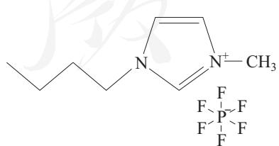  
图 3-31 1-丁基-3-甲基咪唑六氟磷酸盐

传统的有机溶剂大多易挥发，它们的蒸气大多有毒，而离子液体却有难挥发的优点，这是由于离子液体的粒子全都是带电荷的离子。

离子液体可用作溶剂。例如，有一种叫天丝的织物纤维，是将树木的纤维素分子溶于一种离子液体，滤去不溶的木质素后，加水析出纤维素分子组装成的再生植物纤维。离子液体有良好的导电性，用作电化学研究的电解质，并被开发为原电池的电解质。许多离子液体被用作有机合成的溶剂和催化剂，如合成药物。离子液体在生物化学等科研领域也有广泛应用。

2014年，曾报道了两种蚂蚁打架，一种喷射碱性有机胺毒液，另一种喷射甲酸，两种物质相遇反应，得到含有机胺正离子和甲酸根负离子的黏稠液体，是首例发现于自然界的离子液体。

## 三、过渡晶体与混合型晶体

## 1. 过渡晶体

我们已经讨论了分子晶体、共价晶体、金属晶体和离子晶体等四类典型晶体。事实上，纯粹的典型晶体是不多的，大多数晶体是它们之间的过渡晶体。

下面仅以离子晶体和共价晶体之间的过渡为例来说明。例如，第三周期前几种元素的氧化物中，化学键中离子键成分的百分数如表3-4。

表 3-4 几种氧化物的化学键中离子键成分的百分数

<table><tr><td>氧化物</td><td> $Na_{2}O$ </td><td>MgO</td><td> $Al_{2}O_{3}$ </td><td> $SiO_{2}$ </td></tr><tr><td>离子键的百分数/%</td><td>62</td><td>50</td><td>41</td><td>33</td></tr></table>

从表3-4可知，表中的4种氧化物晶体中的化学键既不是纯粹的离子键，也不是纯粹的共价键，这些晶体既不是纯粹的离子晶体也不是纯粹的共价晶体，只是离子晶体与共价晶体之间的过渡晶体。

## 提示

离子键的百分数是依据电负性的差值计算出来的，差值越大，离子键的百分数越大。

偏向离子晶体的过渡晶体在许多性质上与纯粹的离子晶体接近，因而通常当作离子晶体来处理，如 $Na_{2}O$ 等。同样，偏向共价晶体的过渡晶体则当作共价晶体来处理，如 $Al_{2}O_{3}$ 、 $SiO_{2}$ 等。

第三周期后几种元素的氧化物的晶体类型又会怎样变化呢？ $P_{2}O_{5}$ 、 $SO_{3}$ 、 $Cl_{2}O_{7}$ 都是分子晶体，表明离子键成分的百分数更小了，而且共价键不再贯穿整个晶体，而是局限于晶体微观空间的一个个分子中了。

四类晶体都有过渡型。

## 2. 混合型晶体

石墨不同于金刚石，它的碳原子不像金刚石的碳原子那样呈 $sp^{3}$ 杂化，而是呈 $sp^{2}$ 杂化，形成平面六元并环结构（如图3-32左）。因此，石墨晶体是层状结构的，层内的碳原子的核间距为142 pm，层间距离为335 pm，说明层间没有化学键相连，是靠范德华力维系的（如图3-32中）。石墨的二维结构内，每个碳原子的配位数为3，有一个未参与杂化的2p电子，它的原子轨道垂直于碳原子平面（如图3-32右）。

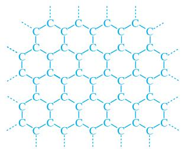  
石墨晶体中的二维平面结构

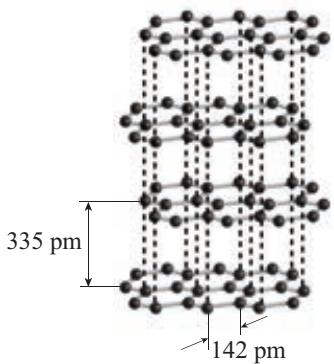  
石墨的层状结构

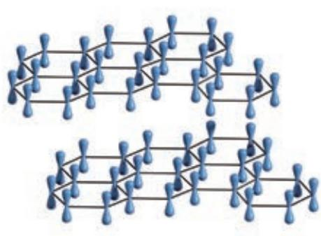  
石墨结构中未参与杂化的p轨道  
图 3-32 石墨的结构模型

由于所有的p轨道相互平行而且相互重叠，使p轨道中的电子可在整个碳原子平面中运动。因此，石墨有类似金属晶体的导电性，而且，由于相邻碳原子平面之间相隔较远，电子不能从一个平面跳跃到另一个平面，所以石墨的导电性只能沿石墨平面的方向。像石墨这样的晶体，是一种混合型晶体。

过渡晶体和混合型晶体的例子说明，对事物的简单归类尽管条理鲜明，却可能只是概括了最典型的事实。

在考察大量的晶体后，人们发现，许多晶体不能被归为分子晶体、共价晶体、金属晶体和离子晶体四类晶体的某一类。但是，四类晶体仍然是考察晶体化学结构的基础。

硅酸盐是地壳岩石的主要成分。硅酸盐的阴离子结构丰富多样，既有有限数目的硅氧四面体构建的简单阴离子，如 $SiO_{4}^{4-}$ 、 $Si_{2}O_{7}^{6-}$ 、 $(\mathrm{SiO}_{3})_{6}^{12-}$ （六元环）等，也有以硅氧四面体为

## 硅酸盐

结构单元构成一维、二维、三维无限伸展的共价键骨架。金属离子则以离子键与阴离子或阴离子骨架结合。部分Si被Al取代则得到铝硅酸盐。

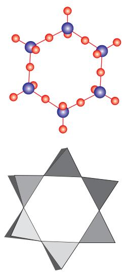

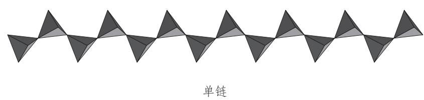

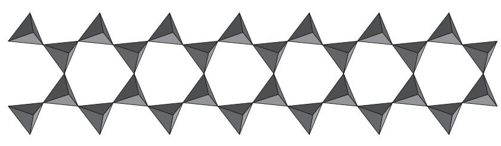  
双链  
图 3-33 硅酸盐晶体中的阴离子举例

## 科学·技术·社会

## 纳米晶体

纳米晶体是晶体颗粒尺寸在纳米（ $10^{-9}$ m）量级的晶体。纳米晶体相对于通常的晶体，在声、光、电、磁、热等性能上常会呈现新的特性，有广阔的应用前景。仅以熔点为例，当晶体颗粒小至纳米量级，熔点会下降。例如，金属铅的晶粒大小与熔点的关系如表3-5和图3-34。

表 3-5 金属铅的晶粒大小与熔点

<table><tr><td>r/nm</td><td>5</td><td>10</td><td>20</td><td>40</td><td>60</td><td>80</td><td>100</td><td>120</td><td>140</td><td>160</td><td>180</td><td>200</td></tr><tr><td>T/K</td><td>34.7</td><td>144</td><td>294</td><td>420</td><td>473</td><td>502</td><td>520</td><td>533</td><td>542</td><td>549</td><td>554</td><td>559</td></tr></table>

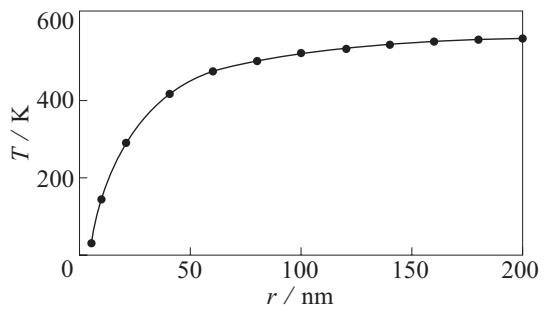  
图 3-34 金属铅的晶粒大小与熔点的关系

由此可见，晶体颗粒小于200 nm时，晶粒越小，金属铅的熔点越低。因此，我们通常说纯物质有固定的熔点，但当纯物质晶体的颗粒小于200 nm（或者250 nm）时，其熔点会发

生变化。

纳米晶体为什么会有不同于大块晶体的特性呢？主要原因是晶体的表面积增大。

# 研究与实践

# 明矾晶体的制备

## 【研究目的】

在日常生活中，常见到色彩和外形都很漂亮的晶体。我们可以通过化学实验的方法制备晶体，学习用饱和溶液制备大晶体的方法。

## 【研究任务】

## 1. 查阅资料

以“晶体生长”为关键词，在互联网上查阅资料，了解晶体生长过程有哪几个阶段。

## 2. 制备明矾晶体的实验步骤

（1）在玻璃杯中放入比室温高 $10 \sim 20^{\circ} \mathrm{C}$ 的水，并加入明矾晶体 $\left[\mathrm{KAl}(\mathrm{SO}_4)_2 \cdot 12 \mathrm{H}_2\mathrm{O}\right]$ ，用筷子搅拌，直到有少量晶体不能再溶解。

（2）待溶液自然冷却到比室温略高3\~5 ℃时，把溶液倒入洁净的碗中，用硬纸片盖好，静置一夜。

（3）从碗中选取2\~3粒形状完整的小晶体作为晶核。将所选的晶核用细线轻轻系好。

（4）把明矾溶液倒入玻璃杯中，向溶液中补充适量明矾，使其成为比室温高10\~15℃的饱和溶液。待其自然冷却到比室温略高3\~5℃时，把小晶体悬挂在玻璃杯中央（如图3-35左），注意不要使晶核接触杯壁。用硬纸片盖好玻璃杯，静置过夜。

(5) 每天把已形成的小晶体轻轻取出, 重复第 (4) 项操作, 直到晶体长到一定大小。

（6）将所得明矾晶体放进铬钾矾的饱和溶液中，使铬钾矾晶体 $\left[\mathrm{KCr}(\mathrm{SO}_4)_2\cdot 12\mathrm{H}_2\mathrm{O}\right]$ 在明矾晶体表面上生长，长到一定厚度后，再将所得晶体放到明矾饱和溶液中去，使铬钾矾晶体表面再覆盖一层明矾晶体。

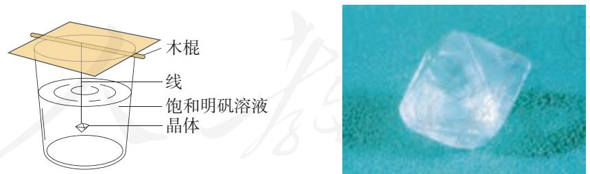  
图 3-35 制取明矾晶体的结晶装置及完美的明矾晶体的照片

## 【结果与讨论】

（1）你是否得到了完美的明矾晶体？请描述你制备的明矾晶体颜色和外形。

（2）在上述实验中，为什么所用仪器都要用蒸馏水洗净？为什么晶种一定要悬挂在溶液的中央位置？

（3）在上述实验中，制备明矾大晶体所需时间较长，请查阅资料，并制订快速制备明矾大晶体的实验方案。

1. 金属晶体的形成是因为晶体中存在（ ）。A. 金属离子间的相互作用 B. 金属原子间的相互作用C. 金属离子与自由电子间的相互作用 D. 自由电子间的相互作用

2. 金属能导电的原因是（）。  
A. 金属晶体中金属阳离子与自由电子间的作用较弱  
B. 金属晶体中的自由电子在外加电场作用下可发生定向移动  
C. 金属晶体中的金属阳离子在外加电场作用下可发生定向移动  
D. 金属晶体在外加电场作用下可失去电子

3. 关于晶体的下列说法中，正确的是（ ）。A. 共价晶体中可能含有离子键B. 离子晶体中可能含有共价键C. 离子晶体中只含有离子键，不含有共价键D. 任何晶体中，若含有阳离子就一定有阴离子

4. 下列物质中，含有极性共价键的离子晶体是（ ）。A. NaCl B. $\mathrm{Na}_{2} \mathrm{O}$ C. $\mathrm{Na}_{2} \mathrm{O}_{2}$ D. NaOH

5. 下列各物质的晶体中，晶体类型相同的是（ ）。 A. $\mathrm{CO}_{2}$ 和 $\mathrm{SiO}_{2}$ B. NaCl和HCl C. $\mathrm{CO}_{2}$ 和 $\mathrm{CS}_{2}$ D. $\mathrm{CCl}_{4}$ 和 $\mathrm{MgCl}_{2}$

6. 什么是电子气理论？它怎样定性地解释金属晶体的延展性、导电性和导热性？

7. 举例说明过渡晶体和混合型晶体的特征。

8. 按构成晶体的粒子和粒子间作用力的不同，将以下晶体进行分类：
氯化铯、石英、金刚砂、水、苯酚（ $C_{6}H_{5}OH$ ）、铁、氯酸钾、高锰酸钾

9. 离子晶体如食盐，很脆，经不起锤击；共价晶体如石英，同样很脆，也经不起锤击。然而食盐和石英的摩氏硬度却相差极大，应如何解释？

10. 铜和氧形成的一种离子化合物的晶体结构如右图，则铜离子的电荷数为\_\_\_\_。

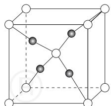

11. 在市场上，我们会发现一种叫做“热袋”的商品（如右图）。用手指搓捻塑料袋中的金属小圆片，袋中的液体会变成晶体，同时放热；待冷却后，袋中的液体全变成了晶体，把热袋放在沸水中煮几分钟，袋中的晶体又变成液体；取出热袋，待冷却后再搓捻金属小圆片，袋中的液体又变成晶体，同时放热。请查阅资料回答问题：热袋里装的是什么？它为什么会放热？

○氧 ◦铜  

# 第四节 配合物与超分子

## 一、配合物

无水硫酸铜是白色的，但 $CuSO_{4}\cdot5H_{2}O$ 晶体却是蓝色的，这是为什么呢？

配合物
coordination compound

## 【实验3-2】

下表中的少量固体溶于足量的水，观察实验现象并填写表格。

<table><tr><td>固体</td><td>1 $CuSO_{4}$ 白色</td><td>2 $CuCl_{2} \cdot 2H_{2}O$ 绿色</td><td>3 $CuBr_{2}$ 深褐色</td><td>4 $NaCl$ 白色</td><td>5 $K_{2}SO_{4}$ 白色</td><td>6 $KBr$ 白色</td></tr><tr><td>哪些溶液呈天蓝色</td><td colspan="6"></td></tr><tr><td>实验说明什么离子呈天蓝色,什么离子没有颜色</td><td colspan="6"></td></tr></table>

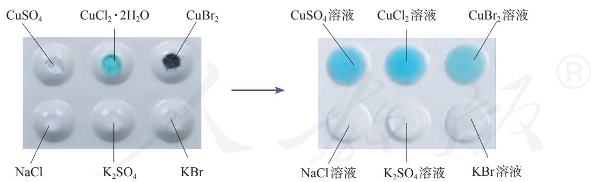  
图 3-36 几种固体及其溶液的颜色

实验证明，上述实验中呈蓝色的物质是水合铜离子，可表示为 $\left[\mathrm{Cu}(\mathrm{H}_2\mathrm{O})_4\right]^{2+}$ （如图3-37），叫做四水合铜离子。在四水合铜离子中，铜离子与水分子之间的化学键是由水分子提供孤电子对给予铜离子，铜离子接受水分子的孤电子对形成的，这类“电子对给予—接受”键被称为配位键。

通常把金属离子或原子（称为中心离子或原子）与某些分子或离子（称为配体或配位体）以配位键结合形成的化合物称为配位化合物，简称配合物。已知配合物的品种超过数百万种，是一个庞大的化合物家族。

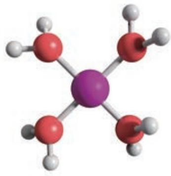  
图 3-37 $\left[\mathrm{Cu}\left(\mathrm{H}_{2}\mathrm{O}\right)_{4}\right]^{2+}$

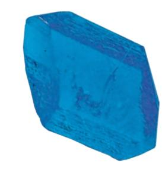  
图 3-38 $CuSO_{4} \cdot 5H_{2}O$

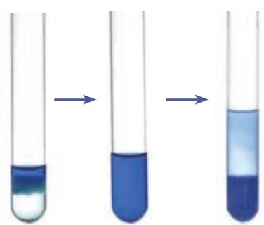  
图 3-39 向硫酸铜溶液中加入氨水和乙醇

## 【实验3-3】

向盛有 4 mL 0.1 mol/L $CuSO_{4}$ 溶液的试管里滴加几滴 1 mol/L 氨水，首先形成难溶物，继续添加氨水并振荡试管，观察实验现象；再向试管中加入极性较小的溶剂（如加入 8 mL 95% 乙醇），并用玻璃棒摩擦试管壁，观察实验现象。

向硫酸铜溶液里逐滴加入氨水，形成难溶物的原因是氨水呈碱性，可与 $Cu^{2+}$ 形成难溶的氢氧化铜：

$$
\mathrm{Cu} ^ {2 +} + 2 \mathrm{NH} _ {3} \cdot \mathrm{H} _ {2} \mathrm{O} = \mathrm{Cu} (\mathrm{OH}) _ {2} \downarrow + 2 \mathrm{NH} _ {4} ^ {+}
$$

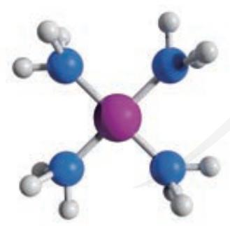

继续添加氨水，难溶物溶解，得到深蓝色的透明溶液；再加入乙醇后，析出深蓝色的晶体。得到的深蓝色晶体是 $\mathrm{[Cu(NH_3)_4]SO_4\cdot H_2O}$ 。结构测定的实验证明，无论在加入氨水后得到的深蓝色的透明溶液中，还是在析出的深蓝色的晶体中，深蓝色都是由于存在 $[\mathrm{Cu(NH_3)_4}]^{2+}$ ，它是 $\mathrm{Cu}^{2+}$ 的另一种常见配离子，中心离子仍然是 $\mathrm{Cu}^{2+}$ ，而配体是 $\mathrm{NH_3}$ ，配位数为4。

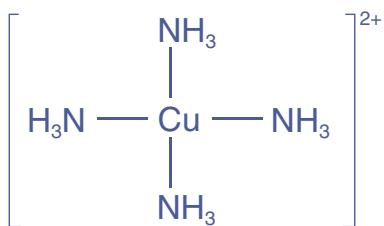  
图 3-40 $\left[\mathrm{Cu}(\mathrm{NH}_{3})_{4}\right]^{2+}$

$$
\begin{array}{r l} & \mathrm {Cu(OH) _ {2}} + 4 \mathrm {NH_ {3}} = [ \mathrm {Cu(NH_ {3}) _ {4}} ] (\mathrm{OH}) _ {2} \\ & \text {   蓝色沉淀   } \quad \text {   深蓝色溶液   } \end{array}
$$

在 $\left[\mathrm{Cu}(\mathrm{NH}_{3})_{4}\right]^{2+}$ 里， $NH_{3}$ 的N给出孤电子对， $Cu^{2+}$ 接受电子对，以配位键形成了 $\left[\mathrm{Cu}(\mathrm{NH}_{3})_{4}\right]^{2+}$ （如图3-40）。

## 【实验3-4】

向盛有少量 $0.1 \mathrm{~mol} / \mathrm{L} \mathrm{FeCl}_{3}$ 溶液（或任何含 $\mathrm{Fe}^{3+}$ 的溶液）的试管中滴加 1 滴 $0.1 \mathrm{~mol} / \mathrm{L}$ 硫氰化钾（KSCN）溶液，观察实验现象。

在实验中，将看到试管里溶液的颜色跟血液极为相似（如图3-41）。这是三价铁离子跟硫氰酸根离子（ $\mathrm{SCN}^{-}$ ）形成配离子的颜色，而 $\mathrm{Fe}^{2+}$ 跟 $\mathrm{SCN}^{-}$ 不显红色。

利用硫氰化铁配离子的颜色，可鉴定溶液中存在 $Fe^{3+}$ ；又由于该离子的颜色极似血液，常被用于电影特技和魔术表演。

## 【实验3-5】

向盛有少量 0.1 mol/L NaCl 溶液的试管里滴几滴 0.1 mol/L AgNO $_{3}$ 溶液，产生难溶于水的白色的 AgCl 沉淀，再滴入 1 mol/L 氨水，振荡，观察实验现象。

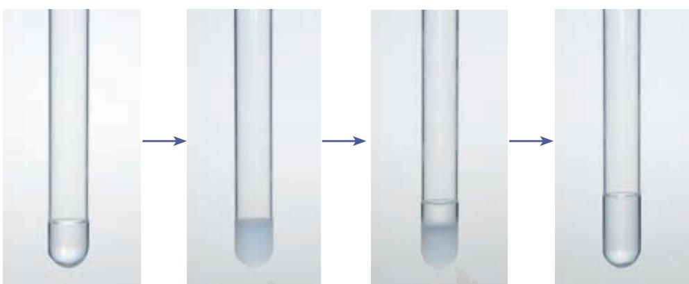  
图 3-42 向 NaCl 溶液中滴加 $AgNO_{3}$ 溶液和氨水

通过实验我们看到，白色的AgCl沉淀消失，得到澄清的无色溶液，这是由于AgCl与 $NH_{3}$ 发生了如下反应：

  
图 3-41 硫氰化铁配离子的颜色

$$
\mathrm{AgCl} + 2 \mathrm{NH} _ {3} = [ \mathrm{Ag} (\mathrm{NH} _ {3}) _ {2} ] \mathrm{Cl}
$$

配位键的强度有大有小，有的配合物很稳定，有的很不稳定。许多过渡金属元素的离子对多种配体具有很强的结合力，因而，过渡金属配合物远比主族金属配合物多。

配合物广泛存在于自然界中，跟人类生活有密切的关系。例如，在人和动物体内起输送氧气作用的血红素，是 $Fe^{2+}$ 的配合物。配合物在生产和科学技术方面的应用也很广泛，例如，在医药科学、化学催化剂、新型分子材料等领域都有着广泛的应用。

## 资料卡片

已知的配合物种类繁多，新的配合物由于纷繁复杂的有机化合物配体而层出不穷，使得无机化合物的品种迅速增长。叶绿素、血红素和维生素 $B_{12}$ 都是配合物，它们的配体大同小异，是一种称为卟啉的大环有机化合物，而中心离子分别是镁离子、亚铁离子和钴离子。图3-43是一种叶绿素的结构示意图（图中R为长链有机基团）。

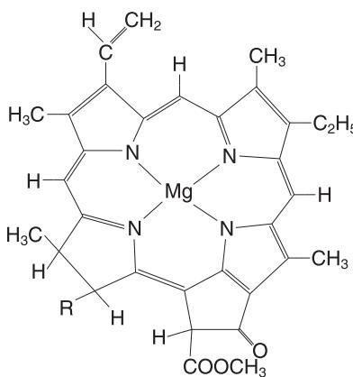  
图 3-43 叶啉配合物叶绿素的结构示意图

## 二、超分子

超分子 supramolecule

超分子是由两种或两种以上的分子通过分子间相互作用形成的分子聚集体。超分子定义中的分子是广义的，包括离子。分子以什么样的作用形成超分子？说法很纷繁，有人将其概括为非共价键，有人则将其限于分子间作用力。超分子这种分子聚集体，有的是有限的，有的是无限伸展的。超分子的实例极多，如以下两个例子。

第一个例子是分离 $C_{60}$ 和 $C_{70}$ （如图3-44）。我们已经知道 $C_{60}$ ，应好理解 $C_{70}$ 比 $C_{60}$ 大点。将 $C_{60}$ 和 $C_{70}$ 的混合物加入一种空腔大小适配 $C_{60}$ 的“杯酚”中，“杯酚”像个碗似的把 $C_{60}$ 装起来而不能装下 $C_{70}$ ；加入甲苯溶剂，甲苯将未装入碗里的 $C_{70}$ 溶解了，过滤后分离 $C_{70}$ ；再向不溶物中加入氯仿，氯仿溶解“杯酚”而将不溶解的 $C_{60}$ 释放出来并沉淀。这是借助分子间力形成超分子的例子，这个例子反映出来的超分子的特性被称为“分子识别”。

第二个例子是冠醚识别碱金属离子。冠醚是皇冠状的分子（如图3-45），可有不同大小的空穴适配不同大小的碱金属离子，如表3-6所示的例子。1987年诺贝尔化学奖授予三位化学家，以表彰他们在超分子化学理论方面的开创性工作，超分子化学也因此风靡全球。

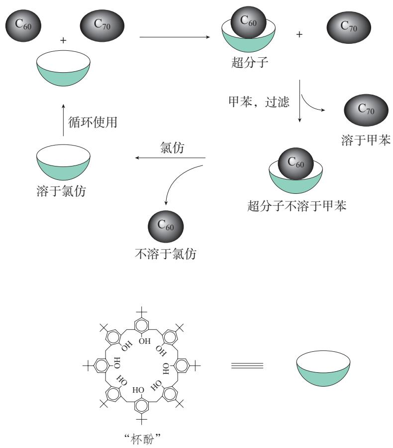  
图 3-44 分离 $C_{60}$ 和 $C_{70}$ 示意图（注：图中的下部分为 “杯酚”）

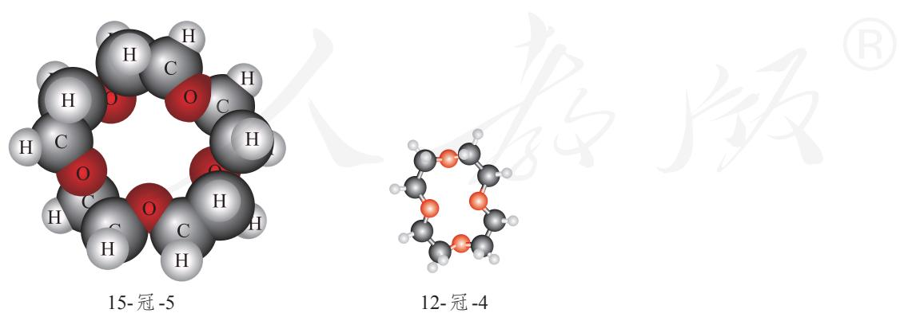  
图 3-45 冠醚

表 3-6 冠醚识别钾离子

<table><tr><td>冠醚</td><td>冠醚空腔直径/pm</td><td>适合的粒子(直径/pm)</td><td rowspan="6"></td></tr><tr><td>12-冠-4</td><td>120~150</td><td> $Li^{+}$ (152)</td></tr><tr><td>15-冠-5</td><td>170~220</td><td> $Na^{+}$ (204)</td></tr><tr><td>18-冠-6</td><td>260~320</td><td> $K^{+}$ (276)</td></tr><tr><td></td><td></td><td> $Rb^{+}$ (304)</td></tr><tr><td>21-冠-7</td><td>340~430</td><td> $Cs^{+}$ (334)</td></tr></table>

以上例子描述的是超分子的重要特征——分子识别，超分子的另一重要特征是自组装，第二章第三节的“科学·技术·社会”栏目中提到的细胞和细胞器的双分子膜即为一例。

## 练习与应用

1. 下列物质中，不能作为配合物的配位体的是（ ）。A. $\mathrm{NH}_{3}$ B. $\mathrm{NH}_{4}^{+}$ C. $\mathrm{H}_{2} \mathrm{O}$ D. $\mathrm{SCN}^{-}$

2. 向盛有硫酸铜溶液的试管里加入氨水, 首先形成难溶物, 继续添加氨水, 难溶物溶解得到深蓝色的透明溶液。下列对此现象的说法中, 正确的是 ( )。

A. 反应后溶液中没有沉淀, 所以反应前后 $\mathrm{Cu}^{2+}$ 的浓度不变

B. 沉淀溶解后, 将生成深蓝色的配离子 $[\mathrm{Cu(NH_3)_4}]^{2+}$ C. 在 $[\mathrm{Cu(NH_3)_4}]^{2+}$ 中, $\mathrm{Cu}^{2+}$ 给出孤电子对, $\mathrm{NH_3}$ 提供空轨道

D. 向反应后的溶液中加入乙醇, 溶液没有发生任何变化, 因为 $[\mathrm{Cu(NH_3)_4}]^{2+}$ 不与乙醇发生反应

3. 在配合物 $\left[\mathrm{Cu}\left(\mathrm{NH}_{3}\right)_{4}\right]\mathrm{SO}_{4}$ 中，\_\_\_\_是中心离子，\_\_\_\_是配位原子，\_\_\_\_是配位体； $\left[\mathrm{Cu}\left(\mathrm{NH}_{3}\right)_{4}\right]^{2+}$ 的结构式为 \_\_\_\_。

4. 硫酸镍溶于氨水形成 $\left[\mathrm{Ni}(\mathrm{NH}_{3})_{6}\right] \mathrm{SO}_{4}$ 蓝色溶液。在 $\left[\mathrm{Ni}(\mathrm{NH}_{3})_{6}\right] \mathrm{SO}_{4}$ 中，阴离子的空间结构是\_\_\_\_。在 $\left[\mathrm{Ni}(\mathrm{NH}_{3})_{6}\right]^{2+}$ 中， $\mathrm{Ni}^{2+}$ 与 $\mathrm{NH}_{3}$ 之间形成的化学键称为\_\_\_\_，提供孤电子对的成键原子是\_\_\_\_。

5. 请结合具体例子说明配合物的结构特点。

6. 向盛有少量 $\mathrm{NH_{4}Fe(SO_{4})_{2}}$ 溶液的试管中滴入几滴 KSCN 溶液，溶液呈血红色。请解释上述现象。

7. 指出下列各配合物中的配离子、中心离子、配位体、配位数和配位原子。
(1) $K_{2}[Cu(CN)_{4}]$ ; (2) $(NH_{4})_{2}[PtCl_{6}]$ ; (3) $[Cd(NH_{3})_{4}](OH)_{2}$ 。

8. 在酸溶液中， $H^{+}$ 能与 $H_{2}O$ 结合成 $H_{3}O^{+}$ ，试从配位键来解释 $H_{3}O^{+}$ 的形成。

9. 工业盐酸（俗称粗盐酸）呈亮黄色，已证明了这是配合物 $\left[\mathrm{FeCl}_{4}\right]^{-}$ 的颜色。请用实验定性证明这种配合物只有在高浓度 $\mathrm{Cl}^{-}$ 的条件下才是稳定的。

# 整理与提升

## 一、晶体的类型

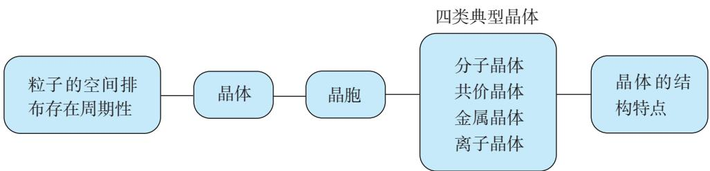

## 二、晶体结构的测定

通过晶体 X 射线衍射实验，可对晶体结构进行测定，获得其晶胞的类型和大小、原子的种类和数目、分子的空间结构。

## 三、四类晶体的结构特点

<table><tr><td>晶体类型</td><td>分子晶体</td><td>共价晶体</td><td>金属晶体</td><td>离子晶体</td></tr><tr><td>实例</td><td></td><td></td><td></td><td></td></tr><tr><td>构成晶体的粒子</td><td></td><td></td><td></td><td></td></tr><tr><td>粒子间的相互作用或化学键类型</td><td></td><td></td><td></td><td></td></tr></table>

## 四、配合物与超分子

1. 举例说明配位键的特征是\_\_\_\_。以配位键结合形成的化合物称为配位化合物，简称配合物。

2. 超分子的两个重要特征是\_\_\_\_和\_\_\_\_。

## 复习与提高

1. 在单质的晶体中，一定不存在（ ）。A. 离子键 B. 分子间作用力 C. 共价键 D. 金属离子与自由电子间的作用

2. 下列有关晶体的叙述中，错误的是（ ）。A. 干冰晶体中，每个 $\mathrm{CO}_{2}$ 周围紧邻12个 $\mathrm{CO}_{2}$ B. 氯化钠晶体中，每个 $\mathrm{Na}^{+}$ 周围紧邻且距离相等的 $\mathrm{Na}^{+}$ 共有6个C. 氯化铯晶体中，每个 $\mathrm{Cs}^{+}$ 周围紧邻8个 $\mathrm{Cl}^{-}$ D. 金刚石为三维骨架结构，由共价键形成的碳原子环中，最小的环上有6个碳原子

3. 下列物质中属于分子晶体的是（ ）。
①二氧化硅；②碘；③镁；④蔗糖；⑤冰。
A. ①②④
B. ②③⑤
C. ②④⑤
D. ①②④⑤

4. 下列各组物质中，化学键类型相同，晶体类型也相同的是（ ）。A. C（金刚石）和 $\mathrm{CO}_{2}$ B. NaBr和HBrC. $\mathrm{CH}_4$ 和 $\mathrm{H}_2\mathrm{O}$ D. $\mathrm{Cl}_2$ 和KCl

5. 下列叙述中，正确的是（ ）。A. 离子晶体都是化合物 B. 共价晶体都是单质C. 金属在常温下都以晶体形式存在 D. 分子晶体在常温下不可能为固态

6. 具有下列原子序数的各组元素，能组成化学式为 $\mathrm{AB}_{2}$ 型化合物，并且该化合物在固态时为共价晶体的是（ ）。A. 6和8 B. 20和17 C. 14和6 D. 14和8

7. X 和 Y 两种元素的核电荷数之和为 22，X 元素原子的核外电子数比 Y 的少 6 个。下列说法中，错误的是（）。A. X 的单质固态时为分子晶体 B. Y 的单质为共价晶体 C. X 与 Y 形成的化合物固态时为分子晶体 D. X 与碳形成的化合物为分子晶体

8. 下列各组物质熔化或升华时, 所克服的粒子间作用属于同种类型的是 ( )。
A. $\mathrm{Na}_{2} \mathrm{O}$ 和 $\mathrm{SiO}_{2}$ 熔化
B. Mg 和 S 熔化
C. 氯化钠和蔗糖熔化
D. 碘和干冰升华

9. 常用的硫粉是一种硫的小晶体，熔点 $112.8 \,^{\circ}C$ ，溶于 $CS_{2}$ 、 $CCl_{4}$ 等溶剂，试推断它可能属于哪一类晶体。

10. 干冰熔化或升华时， $CO_{2}$ 内的 C=O 是否受到破坏？

11. 怎样理解水的密度在 $4 \mathrm{^{\circ}C}$ 时最大？水的这一特殊性对水生生物有什么重要意义？

12. 下表列出了钠的卤化物（NaX）和硅的卤化物（SiX $_{4}$ ）的熔点：

<table><tr><td>NaX</td><td>NaF</td><td>NaCl</td><td>NaBr</td><td>NaI</td></tr><tr><td>熔点/°C</td><td>995</td><td>801</td><td>775</td><td>651</td></tr><tr><td> $SiX_4$ </td><td> $SiF_4$ </td><td> $SiCl_4$ </td><td> $SiBr_4$ </td><td> $SiI_4$ </td></tr><tr><td>熔点/°C</td><td>-90.2</td><td>-70.4</td><td>5.2</td><td>120.5</td></tr></table>

从表中可以看出，钠的卤化物的熔点比相应的硅的卤化物的熔点高很多，请用所学知识简单解释。13. 下表列出了几种HX晶体的熔点：

<table><tr><td>HX</td><td>HF</td><td>HCl</td><td>HBr</td><td>HI</td></tr><tr><td>熔点/°C</td><td>-83.57</td><td>-114.18</td><td>-86.81</td><td>-50.79</td></tr></table>

在HX晶体中，HF的熔点反常，比HCl的高，这是由于\_\_\_\_。

14. 元素 X 位于第四周期，其基态原子的内层轨道全部排满电子，且最外层电子数为 2。元素 Y 基态原子的 3p 轨道上有 4 个电子。元素 Z 的原子最外层电子数是其内层的 3 倍。

(1) X与Y所形成化合物晶体的晶胞如右图所示。在该晶胞中，X离子的数目为\_\_\_\_；该化合物的化学式为\_\_\_\_。

(2) 在 Y 的氢化物 ( $H_{2}Y$ ) 分子中, Y 原子轨道的杂化类型是\_\_\_\_。

(3) Z 的氢化物（ $\mathrm{H}_{2} \mathrm{~Z}$ ）在乙醇中的溶解度大于 $\mathrm{H}_{2} \mathrm{~Y}$ 的，其原因是\_\_\_\_。

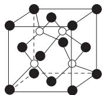

(4) Y 与 Z 可形成的 $YZ_{4}^{2-}$ 的空间结构为 \_\_\_\_ (用文字描述)。

15. 元素周期表中的四种元素 A、B、E、F，原子序数依次增大。A 的基态原子价层电子排布为 $ns^{n}np^{n}$ ；B 的基态原子 2p 能级有 3 个单电子； $E^{2+}$ 的 3d 轨道中有 10 个电子；F 单质在金属活动性顺序中排在最末位。

(1) 写出 E 的基态原子的电子排布式: \_\_\_\_。

(2) A、B形成的 $AB^{-}$ 常作为配位化合物中的配体。在 $AB^{-}$ 中，元素A的原子采取sp杂化，则A与B形成的化学键中含有的 $\sigma$ 键与 $\pi$ 键的数目之比为\_\_\_\_。

(3) E、F 均能与 $AB^{-}$ 形成配离子，已知 $E^{2+}$ 与 $AB^{-}$ 形成配离子时，配位数为 4； $F^{+}$ 与 $AB^{-}$ 形成配离子时，配位数为 2。工业上常用 $F^{+}$ 和 $AB^{-}$ 形成的配离子与 E 单质反应，生成 $E^{2+}$ 与 $AB^{-}$ 形成的配离子和 F 单质来提取 F，写出上述反应的离子方程式：\_\_\_\_。

# 简单配合物的形成

## 【实验目的】

1. 加深对配合物的认识。

2. 了解配合物的形成。

## 【实验用品】

试管、胶头滴管。

硫酸铜溶液、氨水、硝酸银溶液、氯化钠溶液、氯化铁溶液、硫氰化钾溶液、 $\mathrm{K}_3[\mathrm{Fe}(\mathrm{CN})_6]$ 溶液、蒸馏水、乙醇。

## 【实验原理】

配合物是由中心原子或离子与一定数目的中性分子或阴离子以配位键结合而形成的一类化合物。中心离子形成配合物后性质不同于原来的金属离子，具有新的化学特性。

## 【实验步骤】

## 1. 简单配合物的形成

<table><tr><td>序号</td><td>实验步骤</td><td>实验现象</td><td>解释</td></tr><tr><td rowspan="3">(1)</td><td>向盛有硫酸铜溶液的试管里加入氨水</td><td></td><td></td></tr><tr><td>继续加入氨水</td><td></td><td></td></tr><tr><td>再加入乙醇</td><td></td><td></td></tr><tr><td rowspan="2">(2)</td><td>向盛有氯化钠溶液的试管里滴几滴硝酸银溶液</td><td></td><td></td></tr><tr><td>再滴入氨水</td><td></td><td></td></tr></table>

## 2. 简单离子与配离子的区别

<table><tr><td>实验步骤</td><td>实验现象</td><td>解释</td></tr><tr><td>(1)向盛有少量蒸馏水的试管里滴加2滴氯化铁溶液,然后再滴加2滴硫氰化钾溶液</td><td></td><td></td></tr><tr><td>(2)向盛有少量蒸馏水的试管里滴加2滴 $K_3[Fe(CN)_6]$ 溶液,然后再滴加2滴硫氰化钾溶液</td><td></td><td></td></tr></table>

## 【问题和讨论】

$\mathrm{K}_3[\mathrm{Fe}(\mathrm{CN})_6]$ 在水中可以电离出配离子 $[\mathrm{Fe}(\mathrm{CN})_6]^{3-}$ ，该配离子的中心离子、配体是什么？配位数是多少？ $[\mathrm{Fe}(\mathrm{CN})_6]^{3-}$ 和 $\mathrm{Fe}^{3+}$ 的性质一样吗？

## 附录

## 名词索引

<table><tr><td>名词</td><td>页码</td><td>名词</td><td>页码</td></tr><tr><td>超分子</td><td>98</td><td>键能</td><td>37</td></tr><tr><td>电离能</td><td>23</td><td>金属键</td><td>86</td></tr><tr><td>电负性</td><td>24</td><td>金属晶体</td><td>86</td></tr><tr><td>电子排布式</td><td>9</td><td>基态</td><td>7</td></tr><tr><td>电子云</td><td>12</td><td>极性分子</td><td>52</td></tr><tr><td>电子自旋</td><td>14</td><td>离子晶体</td><td>87</td></tr><tr><td>范德华力</td><td>56</td><td>能层</td><td>6</td></tr><tr><td>非极性分子</td><td>52</td><td>能级</td><td>6</td></tr><tr><td>非晶体</td><td>69</td><td>能级交错</td><td>10</td></tr><tr><td>发射光谱</td><td>8</td><td>能量最低原理</td><td>16</td></tr><tr><td>分子的手性</td><td>60</td><td>配合物</td><td>95</td></tr><tr><td>分子晶体</td><td>78</td><td>泡利原理</td><td>14</td></tr><tr><td>轨道表示式</td><td>15</td><td>氢键</td><td>57</td></tr><tr><td>过渡晶体</td><td>89</td><td>手性分子</td><td>60</td></tr><tr><td>共价晶体</td><td>81</td><td>手性异构体</td><td>60</td></tr><tr><td>混合型晶体</td><td>90</td><td> $sp^3$ 杂化</td><td>48</td></tr><tr><td>洪特规则</td><td>15</td><td> $sp^2$ 杂化</td><td>48</td></tr><tr><td>晶胞</td><td>73</td><td>sp杂化</td><td>48</td></tr><tr><td>键长</td><td>37</td><td>物质的聚集状态</td><td>68</td></tr><tr><td>价层电子对互斥模型</td><td>44</td><td>吸收光谱</td><td>8</td></tr><tr><td>价电子层</td><td>11</td><td>相似相溶</td><td>59</td></tr><tr><td>键的极性</td><td>52</td><td>X射线衍射</td><td>75</td></tr><tr><td>激发态</td><td>7</td><td>原子半径</td><td>22</td></tr><tr><td>键角</td><td>38</td><td>原子轨道</td><td>13</td></tr><tr><td>晶体</td><td>69</td><td>原子光谱</td><td>8</td></tr><tr><td>镜面对称</td><td>35</td><td>元素周期系</td><td>18</td></tr></table>

人数版®

## 后记

本册教科书是人民教育出版社课程教材研究所化学课程教材研究开发中心依据教育部《普通高中化学课程标准（2017年版）》编写的，经国家教材委员会2019年审查通过。

本册教科书的编写，集中反映了我国十余年来普通高中课程改革的成果，吸取了2004年版《普通高中课程标准实验教科书 化学》的编写经验，凝聚了参与课改实验的教育专家、学科专家、教材编写专家、教研人员和一线教师，以及教材设计装帧专家的集体智慧。本册教科书的插图绘制是郭威、静远嘲风，摄影是朱京。

我们感谢所有对教科书的编写、出版、试教等提供过帮助与支持的同仁和社会各界朋友。特别感谢为本册教科书中化学实验的验证和拍摄提供支持的北京市第五十五中学。

本册教科书出版之前，我们通过多种渠道与教科书选用作品（包括照片、画作）的作者进行了联系，得到了他们的大力支持。对此，我们表示衷心的感谢！恳请未联系到的作者与我们联系，以便及时支付稿酬。

我们真诚地希望广大教师、学生及家长在使用本册教科书的过程中提出宝贵意见。我们将集思广益，不断修订，使教科书趋于完善。

联系方式

电话：010-58758866

电子邮箱：jcfk@pep.com.cn

人民教育出版社 课程教材研究所

化学课程教材研究开发中心

2019年4月

## 谨向为本书提供照片的单位和人士致谢

图2-4、图2-7 黄盛 钟晓媛/图3-12 王晶/图3-13《新编普

通化学（第二版）》 科学出版社

人数版®

人数版®

元素周期表

<table><tr><td rowspan="2">1</td><td rowspan="2"> $1\mathrm{H}$ 氢 $_{1s^1}$ 1.008</td><td colspan="18"></td><td></td></tr><tr><td>II A2</td><td rowspan="3">原子序数元素名称注*的是人造元素</td><td rowspan="3">92 U铀 $5f^{3}6d^{1}7s^{2}$ 238.0</td><td colspan="4">非金属元素</td><td colspan="2">金属元素</td><td>III A13</td><td>IV A14</td><td>V A15</td><td>VI A16</td><td>VII A17</td><td>2 He氦 $_{1s^2}$ 4.003</td><td>K</td><td>2</td><td></td><td></td></tr><tr><td>2</td><td>3 Li锂 $_{2s^1}$ 6.941</td><td>4 Be铍 $_{2s^2}$ 9.012</td><td rowspan="2" colspan="6">价层电子排布,括号指可能的电子排布相对原子质量(加括号的数据为该放射性元素半衰期最长同位素的质量数)</td><td>5 B硼 $2s^{2}2p^{1}$ 10.81</td><td>6 C碳 $2s^{2}2p^{2}$ 12.01</td><td>7 N氮 $2s^{2}2p^{3}$ 14.01</td><td>8 O氧 $2s^{2}2p^{4}$ 16.00</td><td>9 F氟 $2s^{2}2p^{5}$ 19.00</td><td>10 Ne氖 $2s^{2}2p^{6}$ 20.18</td><td>LK</td><td>82</td><td></td><td></td></tr><tr><td rowspan="2">3</td><td rowspan="2">11 Na钠 $_{3s^1}$ 22.99</td><td rowspan="2">12 Mg镁 $_{3s^2}$ 24.31</td><td>13 Al铝 $3s^{2}3p^{1}$ 26.98</td><td>14 Si硅 $3s^{2}3p^{2}$ 28.09</td><td rowspan="2">15 P磷 $3s^{2}3p^{3}$ 30.97</td><td rowspan="2">16 S硫 $3s^{2}3p^{4}$ 32.06</td><td rowspan="2">17 Cl氯 $3s^{2}3p^{5}$ 35.45</td><td rowspan="2">18 Ar氩 $3s^{2}3p^{6}$ 39.95</td><td rowspan="2">MLK</td><td rowspan="2">882</td><td rowspan="2"></td><td></td></tr><tr><td>III B3</td><td>IV B4</td><td>V B5</td><td>VI B6</td><td>VII B7</td><td>8</td><td>9</td><td>10</td><td>I B11</td><td>II B12</td><td></td></tr><tr><td>4</td><td>19 K钾 $_{4s^1}$ 39.10</td><td>20 Ca钙 $_{4s^2}$ 40.08</td><td>21 Sc钪 $3d^{1}4s^{2}$ 44.96</td><td>22 Ti钛 $3d^{2}4s^{2}$ 47.87</td><td>23 V钒 $3d^{3}4s^{2}$ 50.94</td><td>24 Cr铬 $3d^{5}4s^{1}$ 52.00</td><td>25 Mn锰 $3d^{5}4s^{2}$ 54.94</td><td>26 Fe铁 $3d^{6}4s^{2}$ 55.85</td><td>27 Co钴 $3d^{7}4s^{2}$ 58.93</td><td>28 Ni镍 $3d^{8}4s^{2}$ 58.69</td><td>29 Cu铜 $3d^{10}4s^{1}$ 63.55</td><td>30 Zn锌 $3d^{10}4s^{2}$ 65.38</td><td>31 Ga镓 $4s^{2}4p^{1}$ 69.72</td><td>32 Ge锗 $4s^{2}4p^{2}$ 72.63</td><td>33 As砷 $4s^{2}4p^{3}$ 74.92</td><td>34 Se硒 $4s^{2}4p^{4}$ 78.96</td><td>35 Br溴 $4s^{2}4p^{5}$ 79.90</td><td>36 Kr氪 $4s^{2}4p^{6}$ 83.80</td><td>NMLK</td><td>81882</td></tr><tr><td>5</td><td>37 Rb铷 $_{5s^1}$ 85.47</td><td>38 Sr锶 $_{5s^2}$ 87.62</td><td>39 Y钇 $4d^{1}5s^{2}$ 88.91</td><td>40 Zr锆 $4d^{2}5s^{2}$ 91.22</td><td>41 Nb铌 $4d^{4}5s^{1}$ 92.91</td><td>42 Mo钼 $4d^{5}5s^{1}$ 95.96</td><td>43 Tc锝 $4d^{5}5s^{2}$ [98]</td><td>44 Ru钌 $4d^{7}5s^{1}$ 101.1</td><td>45 Rh铑 $4d^{8}5s^{1}$ 102.9</td><td>46 Pd钯 $4d^{10}$ 106.4</td><td>47 Ag银 $4d^{10}5s^{1}$ 107.9</td><td>48 Cd镉 $4d^{10}5s^{2}$ 112.4</td><td>49 In铟 $5s^{2}5p^{1}$ 114.8</td><td>50 Sn锡 $5s^{2}5p^{2}$ 118.7</td><td>51 Sb锑 $5s^{2}5p^{3}$ 121.8</td><td>52 Te碲 $5s^{2}5p^{4}$ 127.6</td><td>53 I碘 $5s^{2}5p^{5}$ 126.9</td><td>54 Xe氙 $5s^{2}5p^{6}$ 131.3</td><td>ONMLK</td><td>8181882</td></tr><tr><td>6</td><td>55 Cs铯 $_{6s^1}$ 132.9</td><td>56 Ba钡 $_{6s^2}$ 137.3</td><td>57~71La~Lu镧系</td><td>72 Hf铪 $5d^{2}6s^{2}$ 178.5</td><td>73 Ta钽 $5d^{3}6s^{2}$ 180.9</td><td>74 W钨 $5d^{4}6s^{2}$ 183.8</td><td>75 Re铼 $5d^{6}6s^{2}$ 186.2</td><td>76 Os锇 $5d^{6}6s^{2}$ 190.2</td><td>77 Ir铱 $5d^{7}6s^{2}$ 192.2</td><td>78 Pt铂 $5d^{9}6s^{1}$ 195.1</td><td>79 Au金 $5d^{10}6s^{1}$ 197.0</td><td>80 Hg汞 $5d^{10}6s^{2}$ 200.6</td><td>81 Tl铊 $6s^{2}6p^{1}$ 204.4</td><td>82 Pb铅 $6s^{2}6p^{2}$ 207.2</td><td>83 Bi铋 $6s^{2}6p^{3}$ 209.0</td><td>84 Po钋 $6s^{2}6p^{4}$ [209]</td><td>85 At砹 $6s^{2}6p^{5}$ [210]</td><td>86 Rn氡 $6s^{2}6p^{6}$ [222]</td><td>PONMLK</td><td>818321882</td></tr><tr><td>7</td><td>87 Fr钫 $_{7s^1}$ [223]</td><td>88 Ra镭 $_{7s^2}$ [226]</td><td>89~103Ac~Lr锕系</td><td>104 Rf𬬻*( $6d^{2}7s^{2}$ )[265]</td><td>105 Db𬭊*( $6d^{3}7s^{2}$ )[268]</td><td>106 Sg𬭳*[271]</td><td>107 Bh𬭛*[270]</td><td>108 Hs𬭶*[277]</td><td>109 Mt鿏*[276]</td><td>110 Ds𫟼*[281]</td><td>111 Rg𬬭*[280]</td><td>112 Cn鿫*[285]</td><td>113 Nh铼*[284]</td><td>114 Fl铗*[289]</td><td>115 Mc镆*[288]</td><td>116 Lv铓*[293]</td><td>117 Ts碸*[294]</td><td>118 Og氮*[294]</td><td>QPONMLK</td><td>818321882</td></tr></table>

<table><tr><td>镧系</td><td>57 La镧 $5d^{1}6s^{2}$ 138.9</td><td>58 Ce铈 $4f^{1}5d^{1}6s^{2}$ 140.1</td><td>59 Pr镨 $4f^{3}6s^{2}$ 140.9</td><td>60 Nd钕 $4f^{4}6s^{2}$ 144.2</td><td>61 Pm钷* $4f^{5}6s^{2}$ [145]</td><td>62 Sm钐 $4f^{6}6s^{2}$ 150.4</td><td>63 Eu铕 $4f^{7}6s^{2}$ 152.0</td><td>64 Gd钆 $4f^{7}5d^{1}6s^{2}$ 157.3</td><td>65 Tb铽 $4f^{9}6s^{2}$ 158.9</td><td>66 Dy镝 $4f^{10}6s^{2}$ 162.5</td><td>67 Ho钬 $4f^{11}6s^{2}$ 164.9</td><td>68 Er铒 $4f^{12}6s^{2}$ 167.3</td><td>69 Tm铥 $4f^{13}6s^{2}$ 168.9</td><td>70 Yb镱 $4f^{14}6s^{2}$ 173.1</td><td>71 Lu镥 $4f^{14}5d^{1}6s^{2}$ 175.0</td></tr><tr><td>锕系</td><td>89 Ac锕 $6d^{1}7s^{2}$ [227]</td><td>90 Th钍 $6d^{2}7s^{2}$ 232.0</td><td>91 Pa镤 $5f^{2}6d^{1}7s^{2}$ 231.0</td><td>92 U铀 $5f^{3}6d^{1}7s^{2}$ 238.0</td><td>93 Np镎 $5f^{4}6d^{1}7s^{2}$ [237]</td><td>94 Pu钚 $5f^{6}7s^{2}$ [244]</td><td>95 Am镅 * $5f^{7}7s^{2}$ [243]</td><td>96 Cm锔 * $5f^{7}6d^{1}7s^{2}$ [247]</td><td>97 Bk锫 * $5f^{9}7s^{2}$ [247]</td><td>98 Cf锎 * $5f^{10}7s^{2}$ [251]</td><td>99 Es锿 * $5f^{11}7s^{2}$ [252]</td><td>100 Fm镄 * $5f^{12}7s^{2}$ [257]</td><td>101 Md钔 *( $5f^{13}7s^{2}$ )[258]</td><td>102 No锘 *( $5f^{14}7s^{2}$ )[259]</td><td>103 Lr铹 *( $5f^{14}6d^{1}7s^{2}$ )[262]</td></tr></table>

PUTONG GAOZHONG JIAOKESHU

HUAXUE