# 2023年上海市高考化学试卷

## 一、选择题

1. （3分）2022年，科学家们已经证实“四中子态”的存在，该物质只由四个中子组成，则其质量数是（）
A. 1    B. 2    C. 4    D. 8

2. （3分）海底五彩斑斓的珊瑚是由珊瑚虫吸收海水中的钙和 $\mathrm{CO}_{2}$ ，然后分泌出石灰石，变为自己生存的外壳。植物有光合作用会吸收 $\mathrm{CO}_{2}$ 、释放 $\mathrm{O}_{2}$ ，但随着全球变暖， $\mathrm{CO}_{2}$ 含量增加，海底珊瑚含量减少，下列说法错误的是（）

A. 光合作用吸收 $\mathrm{CO}_{2}$ B. 植物呼吸作用放出 $\mathrm{CO}_{2}$ C. 海水吸收过多 $\mathrm{CO}_{2}$ 使 $\mathrm{pH}$ 增大

D. 珊瑚礁溶解是因为生成 $\mathrm{Ca(HCO}_{3})_{2}$

3. （3分）战国用青铜浇铸塑形成各样的青铜器，青铜器比纯铜更便于制成形态各异的容器的原因（）
A. 熔点低    B. 密度大    C. 硬度大    D. 不易被腐蚀

4. （3分）下列物质中，能通过化学氧化法去除石油开采过程中伴生的 $\mathrm{H}_{2} \mathrm{~S}$ 的是（）
A. 氨水 B. 双氧水 C. $\mathrm{FeSO}_{4}$ 溶液 D. NaOH溶液

5. （3分）对于反应 $8NH_{3}+3Cl_{2}=6NH_{4}Cl+N_{2}$ ，以下说法正确的是（）
A. HCl的电子式为 $H^{+}[C]^{-}$ B. $NH_{3}$ 的空间构型为三角锥形
C. $NH_{4}Cl$ 中只含有离子键
D. 氯离子最外层电子排布式是 $3s^{3}3p^{5}$

6. （3分）向饱和氯水中加入少量 $Na_{2}SO_{3}$ 固体，下列说法正确的是（）
A. 溶液pH减小
B. 溶液颜色变深
C. 溶液漂白性增强
D. 溶液导电性减弱

7. （3分）已知稠油是黏度超过 $50 \mathrm{~mPa} \cdot \mathrm{s}$ 的原油，数据显示，在世界剩余石油资源中，约有 $70 \%$ 都是稠油。下列关于稠油的说法错误的是（ ）A．稠油易溶于水 B．稠油主要是C、H元素C．稠油属于混合物 D．稠油可以裂化

8. （3分）最简式相同的有机物（）
A. 一定是同系物
B. 一定是同分异构体
C. 碳的质量分数一定相等
D. 燃烧时耗氧量一定相等

9. （3分）我国科学家研发的高效稳定的单原子催化剂，能够实现临氢条件下丙烷高效脱氢制丙烯，下列选项正确的是（）
A. 丙烷脱氢生成丙烯的反应是加成反应
B. 丙烷可以使酸性高锰酸钾溶液褪色
C. 丙烯分子中所有原子可能共面
D. 丙烯可以发生加聚反应

10. （3分）巧克力中含有一种由硬脂酸（ $\mathrm{C_{18}H_{36}O_2}$ ）和甘油（ $\mathrm{C_3H_8O_3}$ ）酯化而成的脂肪（硬脂酸甘油酯），因此具有润滑的口感，会在嘴里融化。硬脂酸甘油酯结构式如图所示，下列属于硬脂酸甘油酯的性质的是（ ） $\mathrm{C_{17}H_{35}COO-CH_2}$ $\mathrm{C_{17}H_{35}COO-CH}$ $\mathrm{C_{17}H_{35}COO-CH_2}$ A．熔点很高
B．难水解
C．分子中含有碳碳双键
D．缓慢氧化生成 $\mathrm{CO_2}$ 和 $\mathrm{H_2O}$

11. （3分）已知月球土壤中富含铁元素，主要以铁单质和亚铁离子的形式存在，但嫦娥五号取回的微陨石撞击处的月壤样品中存在大量的三价铁，有可能是以下哪个原因造成的（）
A. $4FeO=Fe+Fe_{3}O_{4}$ B. $Fe_{3}O_{4}=Fe_{2}O_{3}+FeO$ C. $4FeO+O_{2}=2Fe_{2}O_{3}$ D. $Fe_{2}O_{3}+FeO=Fe_{3}O_{4}$

12. （3分）下列海带提碘的操作中不合理的是（）

<table><tr><td>选项</td><td>A</td><td>B</td><td>C</td><td>D</td></tr><tr><td>使用仪器</td><td></td><td></td><td></td><td></td></tr><tr><td>相关操作</td><td>灼烧</td><td>浸泡海带</td><td>过滤海带浸出液</td><td>萃取碘</td></tr></table>

A. A B. B C. C D. D

13. （3分）现有3种不同颜色的橡皮泥代表着不同元素，还有4根火柴棒代表化学键，可以搭建的有机分子是（）
A. 甲醇 B. 甲醛 C. 甲酸 D. CH₂ClF

14. （3分）使用下图装置制备乙酸乙酯，下列说法正确的是（）

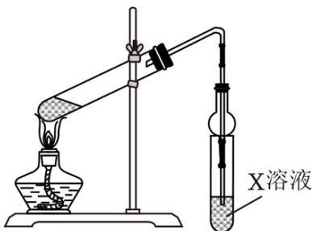

A. 将 $\mathrm{C}_{2} \mathrm{H}_{5} \mathrm{OH}$ 缓缓加入浓 $\mathrm{H}_{2} \mathrm{SO}_{4}$ B. X中溶液是NaOH溶液  
C. 球形干燥管的作用是防倒吸  
D. 试管中油层在下面

15. （3分）短周期元素X、Y，若原子半径X > Y，则下列选项中一定正确的是（）
A. 若X、Y均在ⅣA族，则单质熔点X > Y
B. 若X、Y均在ⅥA族，则气态氢化物的热稳定性X > Y
C. 若X、Y均属于第二周期非金属元素，则简单离子半径X > Y
D. 若X、Y均属于第三周期金属元素，则元素的最高正价X > Y

16. （3分）常温常压下，下列物质的物理量，前者是后者两倍的是（）
A. $28g^{28}Si$ 和 $28g^{14}N$ 中所含的中子数
B. $2.24LSO_{2}$ 和 $2.24LN_{2}$ 原子数
C. $1molSO_{2}$ 和 $2molO_{2}$ 的密度
D. 0.1mol/L 稀 $H_{2}SO_{4}$ 和 0.1mol/L $CH_{3}COOH$ 的 c ( $H^{+}$ )

17. （3分）为探究 $Na_{2}CO_{3}$ 与一元酸HA（ $c=1mol\cdot L^{-1}$ ）反应的热效应，进行了如下四组实验。已知 $T_{2}>T_{1}>25^{\circ}C$ 。

<table><tr><td>实验序号</td><td>试剂I</td><td>试剂II</td><td>反应前温度</td><td>反应后温度</td></tr><tr><td>1</td><td>40mLH2O</td><td>2.12gNa2CO3</td><td>25°C</td><td>T1</td></tr><tr><td>2</td><td>20mLHCl+20mLH2O</td><td>2.12gNa2CO3</td><td>25°C</td><td>T2</td></tr><tr><td>3</td><td>20mLCH3COOH+20mL H2O</td><td>2.12gNa2CO3</td><td>25°C</td><td>T3</td></tr><tr><td>4</td><td>20mLHCl</td><td>2.12gNa2CO3与20mLH2O形成的溶液</td><td>25°C</td><td>T4</td></tr></table>

下列说法错误的是（）
A. $Na_{2}CO_{3}$ 溶于水放热
B. $Na_{2}CO_{3}$ 与 HCl 反应放热
C. $T_{2} > T_{3}$ D. $T_{4} > T_{2}$

18. （3分）电解食盐水间接氧化法去除工业废水中氨氮的原理如图所示，通过电解氨氮溶液（含有少量的NaCl），将NH₃转化为N₂（无Cl₂逸出），下列说法正确的是（）

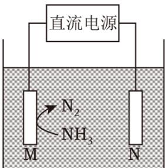

A. M为负极 B. N极附近pH不变化 C. $\mathrm{n(N_2) < n(H_2)}$ D. 电解后c（ $\mathrm{Cl^-}$ ）上升

19. （3分） $0.1 \mathrm{~mol} \cdot \mathrm{L}^{-1} \mathrm{NaOH}$ 分别滴入 $20 \mathrm{~mL} 0.1 \mathrm{~mol} \cdot \mathrm{L}^{-1} \mathrm{HX}$ 与 $20 \mathrm{~mL} 0.1 \mathrm{~mol} \cdot \mathrm{L}^{-1} \mathrm{HCl}$ 溶液中，其 $\mathrm{pH}$ 随滴入 $\mathrm{NaOH}$ 溶液体积变化的图像如图所示，下列说法正确的是（）

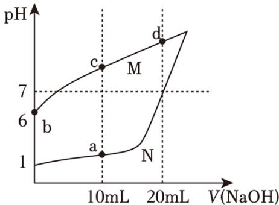

A. b点： $c(X^{-}) \cdot c(OH^{-}) = 10^{-12}mol^{2} \cdot L^{2}$ B. c点： $c(X^{-}) - c(HX) = c(OH^{-}) - c(H^{+})$ C. a、d点溶液混合后为酸性
D. 水的电离程度：d>c>b>a

20. （3分）在密闭容器中发生反应： $2\mathrm{A}(\mathrm{g}) + \mathrm{B}(\mathrm{g}) \rightleftharpoons 2\mathrm{C}(\mathrm{g})$ ，往密闭容器中以n（A）：n（B）=2：1通入两种反应物，15min后A在四温度下的转化率如下表所示，且 $T_{1}$ $<T_{2}<T_{3}<T_{4}$ ，下列说法正确的是（）

<table><tr><td>温度</td><td> $T_{1}$ </td><td> $T_{2}$ </td><td> $T_{3}$ </td><td> $T_{4}$ </td></tr><tr><td>转化率</td><td>10%</td><td>70%</td><td>70%</td><td>60%</td></tr></table>

A. 该反应是吸热反应  
B. T温度时（ $\mathrm{T}_{2} < \mathrm{T} < \mathrm{T}_{3}$ ），A的转化率是 $70\%$ C. $\mathrm{T}_{3}$ 温度下，若反应在 $15 \mathrm{~min}$ 后继续进行，则A的转化率变大  
D. $\mathrm{T}_{4}$ 温度反应 $15 \mathrm{~min}$ 后，若 $\mathrm{c(B)} = 0.5 \mathrm{~mol} \cdot \mathrm{L}^{-1}$ ，则 $\mathrm{T}_{4}$ 温度时的平衡常数是4.5

## 二、综合题

21. 在某温度下, 在体积为5L的密闭容器内发生如下反应: $\mathrm{CH}_{4} (\mathrm{~g}) + \mathrm{H}_{2} \mathrm{O} (\mathrm{~g}) \rightleftharpoons \mathrm{CO} (\mathrm{~g}) + 3 \mathrm{H}_{2} (\mathrm{~g}) - \mathrm{Q}$

(1) 在上述反应的反应物与生成物中, 非极性分子为:

(2) 若反应 $20 \mathrm{~min}$ 后气体总物质的量增加了 $10 \mathrm{~mol}$ , 则甲烷的平均反应速率为 \_\_\_\_。

(3) 下列选项中的物理量不变时, 一定可以判断反应达到平衡的是 \_\_\_\_。
A. 容器中氢元素的质量分数
B. 容器内的压强
C. 反应的平衡常数
D. 容器内气体的平均相对分子质量

（4）在某一时刻， $v_{正}=v_{逆}=v_{0}$ ，反应若改变一条件，可使得 $v_{正}<v_{逆}<v_{0}$ ，指出可以改变的条件，并说明理由：\_\_\_\_。

已知CO与 $H_{2}$ 合成 $CH_{3}OH$ 是可逆反应： $CO+2H_{2}\rightleftharpoons CH_{3}OH$ 。

(5) 若上述反应达到平衡时 $\mathrm{CO}$ 与 $\mathrm{H}_{2}$ 的转化率相同, 则投料比 $\mathrm{n}$ (CO): $\mathrm{n}\left(\mathrm{H}_{2}\right)=$ \_\_\_\_。

22. 聚合氯化铝用于城市给排水净化。氧化铝法制取无水三氯化铝的反应如下: $\mathrm{Al}_{2} \mathrm{O}_{3}$ (s) + 3C (s) + 3Cl₂ (g) $\xlongequal{900^{\circ} \mathrm{C}}$ 2AlCl₃ (g) + 3CO (g)。

（1）标出上述反应的电子转移方向和数目 \_\_\_\_。

(2) 写出该反应的平衡常数表达式: K=\_\_\_\_。

(3) Al原子核外有 \_\_\_\_ 种不同能量的电子。

聚合氯化铝（PAC）是一种介于 $AlCl_{3}$ 和Al（OH） $_{3}$ 之间的水溶性无机高分子聚合物，PAC的水解过程中会有一种聚合稳定态物质 $[AlO_{4}Al_{12}(OH)_{24}(H_{2}O)_{12}]^{7+}$ 称为 $Al_{13}$ ， $Al_{13}$ 对水中胶体和颗粒物具有高度电中和桥联作用，是净水过程中的重要物质。

（4） $\mathrm{Al}_{13}$ 在水解过程中会产生 $[\mathrm{Al}(\mathrm{OH})_2]^+$ 、 $[\mathrm{Al}(\mathrm{OH})]^{2+}$ 等产物，请写出 $\mathrm{Al}^{3+}$ 水解产生 $[\mathrm{Al}(\mathrm{OH})]^{2+}$ 的离子方程式：\_\_\_\_。

(5) $\mathrm{AlCl}_{3}$ 溶液与 $\mathrm{NaOH}$ 溶液反应, 若参加反应的铝离子最终转化生成 $\mathrm{Al}_{13}$ , 则理论上参与反应的 $\mathrm{Al}^{3+}$ 与 $\mathrm{OH}^{-}$ 的物质的量之比是 \_\_\_\_。

（6）使用 $Al^{3+}$ 净水时应控制pH在6.8～8.02之间，否则净水效果不佳。请结合使用 $Al^{3+}$ 水解净化水时铝元素存在的形态，分析在强酸性和强碱性环境时净水效果差的原因 \_\_\_\_。

23. 用于治疗神经性疾病的药物布立西坦的合成路线如图所示:

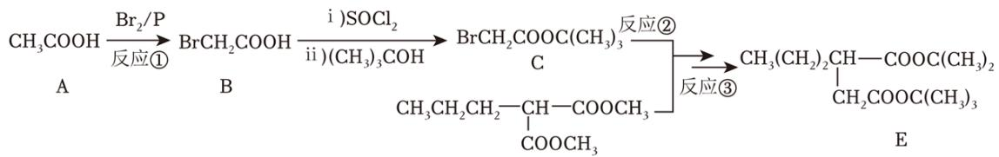

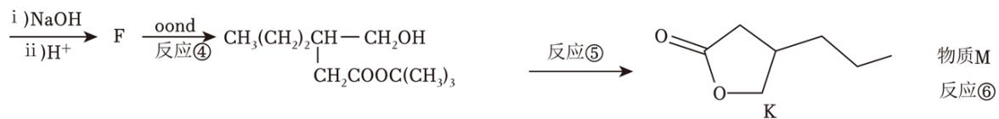

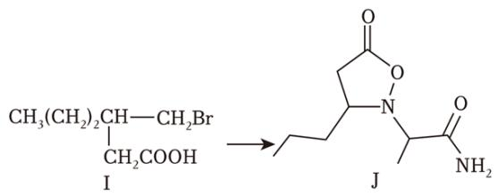

已知:

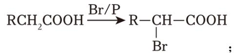

$$
\mathrm{R} _ {1} \mathrm{COOR} _ {2} + \mathrm{R} _ {3} \mathrm{OH} \longrightarrow \mathrm{R} _ {1} \mathrm{COOR} _ {3} + \mathrm{R} _ {2} \mathrm{OH} 。
$$

(1) 反应①是\_\_\_\_反应，反应④是\_\_\_\_反应。（填反应类型，下同）

(2) 有机物I中的含氧官能团名称为 \_\_\_\_, 有机物F的结构简式为 \_\_\_\_,

(3) 已知反应⑤为酯交换反应, 则另一产物的结构简式为 \_\_\_\_。

(4) 已知反应⑥的原子利用率为 $100\%$ , 则物质M为 \_\_\_\_。

(5) 写出一种满足下列条件的有机物K的同分异构体: \_\_\_\_。

①可以发生银镜反应;

②分子中存在3中化学环境不同的H原子，且个数比为1：2：3。

（6）手性碳是指与四个各不相同原子与基团相连的碳原子，用C\*表示。已知分子J中有2个手性碳，请用\*将其在下图的结构简式中标出。

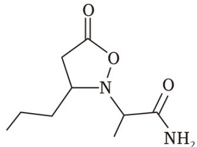

(7) 请写出以 $\mathrm{CH}_{3}(\mathrm{CH}_{2})_{3}\mathrm{COOH}$ 和 $\mathrm{CH}_{3}\mathrm{OH}$ 为原料制备 $\mathrm{CH}_{3}\mathrm{CH}_{2}\mathrm{CH}=\mathrm{CHCOOCH}_{3}$ 的路线（合成路线的表示方式为 $\xrightarrow[\text{反应条件}]{\text{反应试剂}}\cdots\cdots\xrightarrow[\text{反应条件}]{\text{反应试剂}}$ 目标产物）\_\_\_\_。

24. I. 过氧化氢和盐酸的混合溶液可以刻蚀含铜的电路板。

(1) 请写出用过氧化氢和盐酸刻蚀电路板时发生的离子反应方程式: \_\_\_\_。

(2) 当反应一段时间后, 随着溶液变蓝, 气泡产生的速率加快, 可能的原因是 \_\_\_\_。

II. 含铜电路板也可以用 $FeCl_{3}$ 进行刻蚀，对刻蚀后的液体（ $FeCl_{3}$ 、 $FeCl_{2}$ 和 $CuCl_{2}$ ）进行处理以提取 $FeCl_{2}\cdot4H_{2}O$ 、 $CuSO_{4}\cdot5H_{2}O$ ，流程如图：

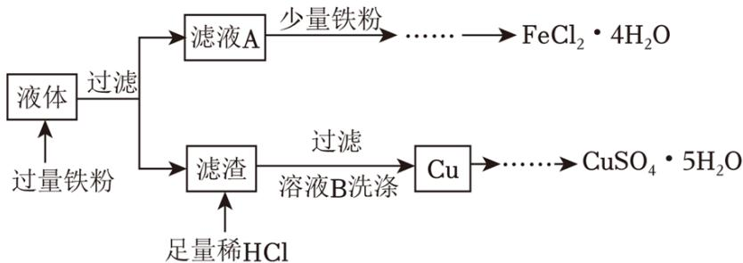

(1) 从滤液A中提取 $\mathrm{FeCl}_{2} \cdot 4 \mathrm{H}_{2} \mathrm{O}$ 的操作为: 加入Fe粉后, 应先浓缩滤液至出现 , 趁热过滤, 取溶液, , 过滤、洗涤、干燥。

(2) 检验溶液B中提取出的Cu上粘附的Cl $^{-}$ 已经洗净的操作为:

，制备 $CuSO_{4}\cdot5H_{2}O$ 时，将铜溶解于 $H_{2}SO_{4}$ 、 $HNO_{3}$ 的混酸中，此过程中产生的红棕色气体为\_\_\_\_产物（选填“氧化”或“还原”）。

III. 利用滴定法可测定所得 $CuSO_{4} \cdot 5H_{2}O$ 的纯度，操作如下：

①取 $\mathrm{agCuSO_{4}\cdot5H_{2}O}$ 样品，加入足量 $\mathrm{NH_{4}F-HF}$ 溶液溶解（ $\mathrm{F^{-}}$ 用于防止 $\mathrm{Fe^{3+}}$ 干扰检验： $\mathrm{Fe^{3+}+6F^{-}=FeF_{6}^{3-}}$ ）。

②滴加足量KI溶液，发生反应 $2Cu^{2+}+4I^{-}=2CuI\downarrow+I_{2}$ 。

③再用cmol/LNa₂S₂O₃标准溶液滴定，以淀粉溶液作指示剂，到达滴定终点时消耗亚硫酸钠标准溶液VmL，发生的反应为：I₂+2S₂O₃²⁻=S₄O₆²⁻+2I⁻。

(1) 已知 $\mathrm{NH}_{4} \mathrm{~F}$ 溶液呈酸性, 则水解程度 $\mathrm{NH}_{4}^{+}$

$\mathrm{F}^{-}$ （填“＞”、“＜”或“＝”），稀释后消耗 $\frac{\mathrm{c(NH_3\cdot H_2O)}}{\mathrm{c(HF)}}$ 的值 \_\_\_\_ （选填“增大”、“减小”或“不变”）。

(2) 接近滴定终点时, 向溶液中滴加KSCN, 会发现CuI沉淀转化为CuSCN, 其沉淀转化的原因是

。已知CuI能够吸附大量 $\mathrm{I}_{2}$ ，若不加KSCN，则测得 $\mathrm{CuSO}_{4} \cdot 5\mathrm{H}_{2}\mathrm{O}$ 的纯度 \_\_\_\_（选填“偏高”、“偏低”或“不变”）。

(3) 计算 $\mathrm{CuSO}_{4} \cdot 5 \mathrm{H}_{2} \mathrm{O}$ 的纯度: (用 $a 、 c 、 V$ 的代数式表示)。

# 2023年上海市高考化学试卷

参考答案与试题解析

## 一、选择题

1. （3分）2022年，科学家们已经证实“四中子态”的存在，该物质只由四个中子组成，则其质量数是（）
A. 1 B. 2 C. 4 D. 8

【分析】依据质量数 $=$ 质子数 $+$ 中子数分析。  
【解答】解：该物质的质量数 $=$ 质子数 $+$ 中子数 $= 0 + 4 = 4$ ，故C正确，

【点评】本题考查原子构成等知识，题目难度不大，注意质量数=质子数+中子数。

2. （3分）海底五彩斑斓的珊瑚是由珊瑚虫吸收海水中的钙和 $CO_{2}$ ，然后分泌出石灰石，变为自己生存的外壳。植物有光合作用会吸收 $CO_{2}$ 、释放 $O_{2}$ ，但随着全球变暖， $CO_{2}$ 含量增加，海底珊瑚含量减少，下列说法错误的是（）

A. 光合作用吸收 $CO_{2}$ B. 植物呼吸作用放出 $CO_{2}$ C. 海水吸收过多 $CO_{2}$ 使pH增大

D. 珊瑚礁溶解是因为生成 $Ca(HCO_{3})_{2}$ 【分析】A. 根据植物的光合作用进行分析；

B. 根据植物的有氧呼吸作用进行分析；

C. 海水中溶解的二氧化碳增加，海水pH降低；

D. 海水中溶解的二氧化碳增加，海水pH降低，则碳酸钙变为碳酸氢钙。

【解答】解：A. 由题意可知，植物的光合作用会吸收 $CO_{2}$ ，释放 $O_{2}$ ，故A正确；

B. 植物的光合作用会吸收 $CO_{2}$ 、释放 $O_{2}$ ，但是植物的有氧呼吸作用吸收氧气，放出二氧化碳，故B正确；

C. 二氧化碳含量增大，会导致海水中溶解的二氧化碳增加，海水pH降低，故C错误；

D. 二氧化碳含量增大，会导致海水中溶解的二氧化碳增加，海水pH降低，则碳酸钙变为碳酸氢钙，故D正确，

故选：C。

【点评】本题主要考查了二氧化碳的性质，涉及到光合作用、植物的有氧呼吸等知识，难度不大，掌握基础知识是解答的关键。

3. （3分）战国用青铜浇铸塑形成各样的青铜器，青铜器比纯铜更便于制成形态各异的容器的原因（）
A. 熔点低    B. 密度大    C. 硬度大    D. 不易被腐蚀

【分析】合金是指由一种金属与其它金属或非金属熔合而成的具有金属特性的物质，多数合金的熔点低于组成它的成分合金。
【解答】解：青铜器比纯铜更便于制成形态各异的容器的原因是熔点低于组成它的成分合金，易于加工，故A正确，
故选：A。

【点评】本题考查了合金的特点，熟悉合金的性质是解题关键，题目难度不大。

4. （3分）下列物质中，能通过化学氧化法去除石油开采过程中伴生的 $\mathrm{H}_{2} \mathrm{~S}$ 的是（）
A. 氨水 B. 双氧水 C. $\mathrm{FeSO}_{4}$ 溶液 D. NaOH溶液

【分析】A. 氨水是碱溶液，与 $\mathrm{H}_{2} \mathrm{~S}$ 发生中和反应生成硫化铵和水；  
B. 双氧水与 $\mathrm{H}_{2} \mathrm{~S}$ 反应生成S单质和水；  
C. $\mathrm{FeSO}_{4}$ 和 $\mathrm{H}_{2} \mathrm{~S}$ 不反应；  
D. NaOH是碱，与 $\mathrm{H}_{2} \mathrm{~S}$ 发生中和反应生成硫化钠和水。  
【解答】解：A. 氨水是碱溶液，与 $\mathrm{H}_{2} \mathrm{~S}$ 发生中和反应生成硫化铵和水，不属于氧化还原反应，故A错误；  
B. 双氧水与 $\mathrm{H}_{2} \mathrm{~S}$ 反应生成S单质和水，双氧水发生还原反应， $\mathrm{H}_{2} \mathrm{~S}$ 发生氧化反应，属于氧化还原反应，故B正确；  
C. $\mathrm{FeSO}_{4}$ 和 $\mathrm{H}_{2} \mathrm{~S}$ 不反应，不能用于去除石油开采过程中伴生的 $\mathrm{H}_{2} \mathrm{~S}$ 气体，故C错误；  
D. NaOH是碱，与 $\mathrm{H}_{2} \mathrm{~S}$ 发生中和反应生成硫化钠和水，不属于氧化还原反应，故D错误；

故选：B。

【点评】本题考查物质的组成与性质、氧化还原反应的判断，把握物质的性质、发生的反应、氧化还原反应的特征及判定是解题关键，侧重基础知识检测和运用能力考查，题目难度不大。

5. （3分）对于反应 $8NH_{3}+3Cl_{2}=6NH_{4}Cl+N_{2}$ ，以下说法正确的是（）

A. HCl的电子式为 $\mathrm{H}^{+}[\ddot{\mathrm{C}}1\mathrm{s}]^{-}$ B. $\mathrm{NH}_{3}$ 的空间构型为三角锥形  
C. $\mathrm{NH}_{4}\mathrm{Cl}$ 中只含有离子键  
D. 氯离子最外层电子排布式是 $3\mathrm{s}^{3}3\mathrm{p}^{5}$ 【分析】A. HCl是共价化合物；  
B. 根据价层电子对互斥模型进行判断；  
C. $\mathrm{NH}_{4}\mathrm{Cl}$ 中含有离子键和共价键；  
D. 氯离子最外层有8个电子。

【解答】解：A. HCl是共价化合物，其电子式为 $H:\overset{\cdot}{\mathrm{Cl}}:$ ，故A错误；
B. $NH_{3}$ 的价层电子对为4，有一对孤电子对， $NH_{3}$ 的空间构型为三角锥形，故B正确； $C.\quad$ 氯化铵电子式为 $\left[\begin{array}{c}\mathrm{H}\\ \mathrm{H}:\overset{\cdot}{\mathrm{N}}:\mathrm{H}\\ \mathrm{H}\end{array}\right]^{+}$ $[:Cl:]^{-}$ ， $NH_{4}Cl$ 中含有离子键和共价键，故C错误；
D. 氯离子最外层有8个电子，最外层电子排布式为 $3s^{2}3p^{6}$ ，故D错误；

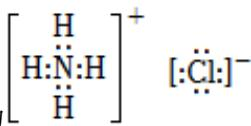

【点评】本题考查常见化学用语的表示方法，为高频考点，明确常见化学用语的书写原则为解答关键，试题侧重考查学生的规范答题能力，题目难度不大。

6. （3分）向饱和氯水中加入少量 $Na_{2}SO_{3}$ 固体，下列说法正确的是（）
A. 溶液pH减小
B. 溶液颜色变深
C. 溶液漂白性增强
D. 溶液导电性减弱

【分析】饱和氯水中存在平衡： $\mathrm{Cl}_{2} + \mathrm{H}_{2}\mathrm{O} \rightleftharpoons \mathrm{HCl} + \mathrm{HClO}$ ，向饱和氯水中加入少量 $\mathrm{Na}_{2}\mathrm{SO}_{3}$ 固体， $\mathrm{HClO}$ 和 $\mathrm{Na}_{2}\mathrm{SO}_{3}$ 发生氧化还原反应，使平衡正向移动， $\mathrm{Cl}_{2}$ 浓度减小，据此解答。【解答】解：A．反应生成 $\mathrm{HCl}$ ，溶液 $\mathrm{pH}$ 减小，故A正确；B． $\mathrm{Cl}_{2}$ 浓度减小，溶液颜色变浅，故B错误；C．次氯酸浓度减少，漂白性减弱，故C错误；D．生成的 $\mathrm{HCl}$ 、 $\mathrm{Na}_{2}\mathrm{SO}_{4}$ 为强电解质，导电性增强，故D错误；

【点评】本题考查氯水的化学性质及物质的性质变化，为高频考点，侧重于学生的分析能力的考查，难度不大。

7. （3分）已知稠油是黏度超过 $50 \mathrm{~mPa} \cdot \mathrm{s}$ 的原油，数据显示，在世界剩余石油资源中，约有 $70 \%$ 都是稠油。下列关于稠油的说法错误的是（ ）A．稠油易溶于水 B．稠油主要是C、H元素C．稠油属于混合物 D．稠油可以裂化

【分析】稠油是黏度超过 $50 \mathrm{~mPa} \cdot \mathrm{s}$ 的原油, 石油是由各种烷烃、环烷烃、芳香烃等组成的混合物, 石油主要含有C、H两种元素, 石油裂化是一种使烃类分子分裂为较小分子的反应过程。 【解答】解: A. 石油不含亲水基, 难溶于水, 故A错误; B. 石油主要含有碳和氢两种元素, 同时还含有少量的硫、氧、氮等元素, 故B正确; C. 石油是由各种烷烃、环烷烃、芳香烃等组成的混合物, 故C正确; D. 为了提高汽油等轻质油的产量与质量通常对石油进行裂化, 故D正确; 故选: A。

【点评】本题主要考查了石油的组成、加工等，难度不大，根据所学知识即可完成。

8. （3分）最简式相同的有机物（）
A. 一定是同系物
B. 一定是同分异构体
C. 碳的质量分数一定相等
D. 燃烧时耗氧量一定相等

【分析】最简式相同的有机物不一定是同系物，不一定是同分异构体，所含的各种元素的质量分数都是相同的，据此进行解答。
【解答】解：A．最简式相同的有机物不一定是同系物，例如乙烯和环丙烷最简式相同，但不是同系物，故A错误；
B．最简式相同的有机物不一定是同分异构体，例如乙炔和苯最简式相同，但不是同分异构体，故B错误；
C．最简式相同的有机物，其中各种元素的质量分数都是相同的，故C正确；
D．最简式相同的有机物，两者分子式不一定相同，当分子式不同时，且最简式相同，此时分子量越大耗氧量越大，故D错误；

故选：C。

【点评】本题考查了有机物结构与性质、同分异构体的判断，为高考常见题型，题目难度中等，注意掌握常见的有机物具有及性质，明确同分异构体的概念及计算方法与技巧，难度中等。

9. （3分）我国科学家研发的高效稳定的单原子催化剂，能够实现临氢条件下丙烷高效脱

氢制丙烯，下列选项正确的是（）
A. 丙烷脱氢生成丙烯的反应是加成反应
B. 丙烷可以使酸性高锰酸钾溶液褪色
C. 丙烯分子中所有原子可能共面
D. 丙烯可以发生加聚反应

【分析】A. 不饱和键断裂发生加成反应，不饱和度减小；  
B. 烷烃性质比较稳定，不能使使酸性高锰酸钾溶液褪色；  
C. 饱和碳原子为 $\mathrm{sp}^3$ 杂化，空间构型为四面体形；  
D. 烯烃可发生加聚反应。

【解答】A．丙烷为饱和烃，丙烯不饱和度为1，丙烷脱氢生成丙烯的反应，不饱和度增大，不是加成反应，故A错误；  
B．烷烃性质比较稳定，不能使使酸性高锰酸钾溶液褪色，因此丙烷不能酸性高锰酸钾溶液褪色，故B错误；  
C．丙烯结构简式为 $\mathrm{CH}_2 = \mathrm{CHCH}_3$ ，甲基中C原子为饱和碳原子，为四面体形，故丙烯分子中所有原子不可能共面，故C错误；  
D．丙烯可发生加聚反应生成聚丙烯，故D正确；  
故选：D。

【点评】本题考查有机物的结构与性质，侧重考查基础知识的掌握和灵活运用能力，明确官能团及其性质的关系是解本题关键，题目难度不大。

10. （3分）巧克力中含有一种由硬脂酸（ $\mathrm{C_{18}H_{36}O_2}$ ）和甘油（ $\mathrm{C_3H_8O_3}$ ）酯化而成的脂肪（硬脂酸甘油酯），因此具有润滑的口感，会在嘴里融化。硬脂酸甘油酯结构式如图所示，下列属于硬脂酸甘油酯的性质的是（ ） $\mathrm{C_{17}H_{35}COO-CH_2}$ $\mathrm{C_{17}H_{35}COO-CH}$ $\mathrm{C_{17}H_{35}COO-CH_2}$ A．熔点很高
B．难水解
C．分子中含有碳碳双键
D．缓慢氧化生成 $\mathrm{CO_2}$ 和 $\mathrm{H_2O}$

【分析】A．硬脂酸甘油酯会在嘴里融化，说明熔点较低；
B．硬脂酸甘油酯中含酯基，会发生水解；
C．硬脂酸甘油酯中不含碳碳双键；

D. 硬脂酸甘油酯的分子中只含C、H、O元素。

【解答】解：A．硬脂酸甘油酯会在嘴里融化，硬脂酸甘油酯属于分子晶体，硬脂酸甘油酯的熔点较低，故A错误；  
B．硬脂酸甘油酯中含酯基，在酸性条件下水解生成硬脂酸和甘油，在碱性条件下水解生成硬脂酸盐和甘油，故B错误；  
C．硬脂酸甘油酯中不含碳碳双键，故C错误；  
D．硬脂酸甘油酯的分子式为 $\mathrm{C}_{57}\mathrm{H}_{110}\mathrm{O}_6$ ，缓慢氧化能生成 $\mathrm{CO}_{2}$ 和 $\mathrm{H}_{2}\mathrm{O}$ ，故D正确；故选：D。

【点评】本题考查油脂的性质、组成与结构，为高频考点，题目难度不大，侧重对基础知识的巩固，注意对基础知识的理解掌握。

11. （3分）已知月球土壤中富含铁元素，主要以铁单质和亚铁离子的形式存在，但嫦娥五号取回的微陨石撞击处的月壤样品中存在大量的三价铁，有可能是以下哪个原因造成的（）
A. $4FeO=Fe+Fe_{3}O_{4}$ B. $Fe_{3}O_{4}=Fe_{2}O_{3}+FeO$ C. $4FeO+O_{2}=2Fe_{2}O_{3}$ D. $Fe_{2}O_{3}+FeO=Fe_{3}O_{4}$

【分析】月球土壤中铁元素主要以铁单质和亚铁离子的形式存在，故不存在 $\mathrm{Fe}_{3}\mathrm{O}_{4} 、 \mathrm{Fe}_{2}$ $\mathrm{O}_{3}$ ，且月球表面没有氧气，据此分析。

【解答】解：A．月球表面的铁元素以铁单质和亚铁离子形式存在，FeO中Fe为+2价，FeO可能反应生成Fe和 $\mathrm{Fe}_{3}\mathrm{O}_{4} ， \mathrm{Fe}_{3}\mathrm{O}_{4}$ 中含有三价铁，故A正确；B． $\mathrm{Fe}_{3}\mathrm{O}_{4}$ 分解生成 $\mathrm{Fe}_{2}\mathrm{O}_{3}$ 和FeO，虽然 $\mathrm{Fe}_{2}\mathrm{O}_{3}$ 中含有三价铁，但是 $\mathrm{Fe}_{3}\mathrm{O}_{4}$ 中含有较多三价铁，无法体现月球表面的铁元素主要以铁单质和亚铁离子的形式存在，故B错误；C．月球表面没有氧气，FeO无法被氧化生成 $\mathrm{Fe}_{2}\mathrm{O}_{3}$ ，故C错误；D．月球表面铁元素主要以铁单质和亚铁离子的形式存在， $\mathrm{Fe}_{2}\mathrm{O}_{3}$ 中Fe为+3价，故D错误；

故选：A。

【点评】该题主要考查了铁及其化合物的转化，题目难度不大，要能依据题目信息进行分析。

12. （3分）下列海带提碘的操作中不合理的是（）

<table><tr><td>选项使用仪器</td><td>A</td><td>B</td><td>C</td><td>D</td></tr><tr><td>相关操作</td><td>灼烧</td><td>浸泡海带</td><td>过滤海带浸出液</td><td>萃取碘</td></tr></table>

【分析】A. 灼烧在坩埚中进行；  
B. 浸泡在烧杯中进行；  
C. 过滤需要烧杯、漏斗、玻璃棒；  
D. 萃取需要分液漏斗。

【解答】解：A．灼烧在坩埚中进行，仪器选择合理，故A正确；  
B．浸泡在烧杯中进行，不能选图中蒸发皿，故B错误；  
C．过滤需要烧杯、漏斗、玻璃棒，可选图中漏斗，故C正确；  
D．萃取需要分液漏斗，仪器选择合理，故D正确；

故选：B。

【点评】本题考查化学实验方案的评价，为高频考点，把握混合物的分离提纯、仪器的使用、实验技能为解答的关键，侧重分析与实验能力的考查，注意元素化合物知识的应用，题目难度不大。

13. （3分）现有3种不同颜色的橡皮泥代表着不同元素，还有4根火柴棒代表化学键，可以搭建的有机分子是（）
A. 甲醇 
B. 甲醛 
C. 甲酸 
D. CH₂ClF

【分析】由题意可知，可以搭建的有机分子中含有3种元素，4个化学键，以此分析解答。
【解答】解：A．甲醇含有3种元素，5个化学键，故A错误；
B．甲醛含有3种元素，4个化学键，故B错误；
C．甲酸含有3种元素，5个化学键，故C错误；
D． $CH_{2}ClF$ 含有4种元素，4个化学键，故D错误；

故选：B。

【点评】本题考查有机物的结构，掌握基本有机物的基本结构是解答的关键，题目难度

较小。

14. （3分）使用下图装置制备乙酸乙酯，下列说法正确的是（）

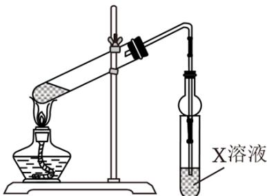

A. 将 $\mathrm{C}_{2} \mathrm{H}_{5} \mathrm{OH}$ 缓缓加入浓 $\mathrm{H}_{2} \mathrm{SO}_{4}$ B. X中溶液是NaOH溶液  
C. 球形干燥管的作用是防倒吸  
D. 试管中油层在下面

【分析】A. 浓硫酸溶解放出大量的热，应该首先加入乙醇再沿器壁慢慢加入浓硫酸、乙酸；  
B. 小试管内盛放NaOH溶液，用氢氧化钠洗乙酸乙酯，会使乙酸乙酯水解；  
C. 球形干燥管的作用是冷凝乙酸乙酯、并防止倒吸；  
D. 乙酸乙酯的密度小于水。

【解答】解：A．浓硫酸溶解放出大量的热，应该首先加入乙醇再沿器壁慢慢加入浓硫酸、乙酸，故A错误；  
B．需使用碳酸钠溶液，吸收未反应的乙酸，溶解乙醇，降低乙酸乙酯的溶解度，小试管内盛放NaOH溶液，会使乙酸乙酯发生水解而使乙酸乙酯损失，故B错误；  
C．制备的乙酸乙酯中混有乙醇和乙酸，乙醇易溶于水、乙酸能较快与饱和碳酸钠溶液反应，会出现倒吸现象，由于球形干燥管体积较大，有防倒吸作用，故C正确；  
D．乙酸乙酯的密度小于水，故试管中油层在上面，故D错误；

【点评】本题考查乙酸乙酯的制备实验，为高频考点，把握有机物的结构与性质、有机反应为解答的关键，侧重分析与实验能力的考查，注意混合物分离方法和浓硫酸、饱和碳酸钠溶液的作用，题目难度不大。

15. （3分）短周期元素X、Y，若原子半径X > Y，则下列选项中一定正确的是（）
A. 若X、Y均在ⅣA族，则单质熔点X > Y
B. 若X、Y均在ⅥA族，则气态氢化物的热稳定性X > Y

C. 若X、Y均属于第二周期非金属元素，则简单离子半径 $X > Y$ D. 若X、Y均属于第三周期金属元素，则元素的最高正价 $X > Y$ 【分析】A. 若X、Y均在IVA族，原子半径 $X > Y$ ，则X为Si，Y为C；  
B. 若X、Y均在VIA族，原子半径 $X > Y$ ，X为S，Y为O；  
C. 简单离子电子层结构相同，核电荷数越小，离子半径越大；  
D. 若X、Y均属于第三周期金属元素，原子半径 $X > Y$ ，则原子序数 $X < Y$ 。

【解答】解：A．若X、Y均在ⅣA族，原子半径X>Y，则X为Si，Y为C，金刚石的熔点高于单质硅，故A错误；
B．若X、Y均在ⅥA族，原子半径X>Y，X为S，Y为O，非金属性O>S，则气态氢化物的热稳定性 $H_{2}O>H_{2}S$ ，故B错误；
C．若X、Y均属于第二周期非金属元素，原子半径X>Y，同周期元素的原子半径从左到右依次减小，则X的原子序数小于Y，X、Y的简单离子电子层结构相同，核电荷数越小，离子半径越大，则简单离子半径X>Y，故C正确；
D．若X、Y均属于第三周期金属元素，原子半径X>Y，则原子序数X<Y，元素的最高正价X<Y，故D错误；
故选：C。

【点评】本题考查原子结构和周期律，为高频考点，把握原子结构、原子序数和元素的位置来推断元素为解答的关键，侧重分析与应用能力的考查，注意规律性知识及元素化合物知识的应用，题目难度不大。

16. （3分）常温常压下，下列物质的物理量，前者是后者两倍的是（）
A. $28g^{28}Si$ 和 $28g^{14}N$ 中所含的中子数
B. $2.24LSO_{2}$ 和 $2.24LN_{2}$ 原子数
C. $1molSO_{2}$ 和 $2molO_{2}$ 的密度
D. 0.1mol/L 稀 $H_{2}SO_{4}$ 和 0.1mol/L $CH_{3}COOH$ 的 c（ $H^{+}$ ）

【分析】A.根据质量数近似等于相对原子质量，利用 $n=\frac{m}{M}$ 和A=Z+N求算；
B.同温同压下，体积之比等于物质的量之比；
C.同温同压下，密度之比等于摩尔质量之比；
D.硫酸为二元强酸，醋酸为一元弱酸。

【解答】解：A. $28\mathrm{g}^{28}\mathrm{Si}$ 所含的中子数为 $\frac{28\mathrm{g}}{28\mathrm{g / mol}}\times (28 - 14)\mathrm{N}_{\mathrm{A}}\cdot \mathrm{mol}^{-1} = 14\mathrm{N}_{\mathrm{A}},$ $28\mathrm{g}^{14}$

N中含有的中子数为： $\frac{28g}{14g/mol}\times(14-7)N_{A}\cdot mol^{-1}=14N_{A}$ ，故A错误；
B.常温常压下， $2.24LSO_{2}$ 和 $2.24LN_{2}$ 的物质的量相等，因此原子数之比为3:2，故B错误；
C.常温常压下，气体的密度之比等于其摩尔质量之比，因此 $1molSO_{2}$ 和 $2molO_{2}$ 的密度之比为：64:32=2:1，故C正确；
D.醋酸属于弱酸，部分电离，硫酸属于强酸，完全电离，因此 $0.1mol\cdot L^{-1}H_{2}SO_{4}$ 和0.1mol $\cdot L^{-1}CHCOOH$ 的c（ $H^{+}$ ）之比大于2，故D错误；
故选：C。

【点评】本题考查有关物质的量的计算，难度不大，掌握基础是解题的关键。

17. （3分）为探究 $Na_{2}CO_{3}$ 与一元酸HA（ $c=1mol\cdot L^{-1}$ ）反应的热效应，进行了如下四组实验。已知 $T_{2}>T_{1}>25^{\circ}C$ 。

<table><tr><td>实验序号</td><td>试剂I</td><td>试剂II</td><td>反应前温度</td><td>反应后温度</td></tr><tr><td>1</td><td>40mLH2O</td><td>2.12gNa2CO3</td><td>25°C</td><td>T1</td></tr><tr><td>2</td><td>20mLHCl+20mLH2O</td><td>2.12gNa2CO3</td><td>25°C</td><td>T2</td></tr><tr><td>3</td><td>20mLCH3COOH+20mL H2O</td><td>2.12gNa2CO3</td><td>25°C</td><td>T3</td></tr><tr><td>4</td><td>20mLHCl</td><td>2.12gNa2CO3与20mLH2O形成的溶液</td><td>25°C</td><td>T4</td></tr></table>

下列说法错误的是（）
A. $Na_{2}CO_{3}$ 溶于水放热
B. $Na_{2}CO_{3}$ 与HCl反应放热
C. $T_{2}>T_{3}$ D. $T_{4}>T_{2}$

【分析】A. 实验①中 $\mathrm{T}_{1} > 25^{\circ} \mathrm{C}$ , 说明 $\mathrm{Na}_{2} \mathrm{CO}_{3}$ 溶于水时溶液温度升高;

B. 对比实验①、②可知， $\mathrm{T}_{2} > \mathrm{T}_{1}$ ，说明 $\mathrm{Na}_{2} \mathrm{CO}_{3}$ 与 $\mathrm{HCl}$ 反应时溶液温度升高更多；

$$
\mathrm{CH} _ {3} \mathrm{COOH}
$$

D. 实验②放热包括 $\mathrm{Na}_{2} \mathrm{CO}_{3}$ 溶于水放热和反应放热两部分, 实验④只有反应放热, 没有 $\mathrm{Na}_{2} \mathrm{CO}_{3}$ 溶于水放热。

【解答】解：A．实验①中 $T_{1}>25^{\circ}C$ ，说明 $Na_{2}CO_{3}$ 溶于水时溶液温度升高，即 $Na_{2}CO_{3}$ 溶于水是放热过程，故A正确；

B. 对比实验①、②可知， $\mathrm{T}_{2} > \mathrm{T}_{1}$ ，说明 $\mathrm{Na}_{2} \mathrm{CO}_{3}$ 与 HCl 反应时放出热量，溶液温度升高更多，故 B 正确；  
C. $\mathrm{CH}_{3} \mathrm{COOH}$ 是弱酸，电离过程吸热，对比实验②、③可知， $\mathrm{Na}_{2} \mathrm{CO}_{3}$ 与 $\mathrm{CH}_{3} \mathrm{COOH}$ 反应时放出热量少，溶液温度升高较②低，即 $\mathrm{T}_{2} > \mathrm{T}_{3}$ ，故 C 正确；  
D. 验②放热包括 $\mathrm{Na}_{2} \mathrm{CO}_{3}$ 溶于水放热和反应放热两部分，实验④只有反应放热，没有 $\mathrm{Na}_{2} \mathrm{CO}_{3}$ 溶于水放热，所以实验④溶液温度升高较②低，即 $\mathrm{T}_{4} < \mathrm{T}_{2}$ ，故 D 错误；故选：D。

【点评】本题考查反应热的测定实验，侧重分析能力和实验能力考查，把握弱电解质的电离特点、对照实验的应用即可解答，注意探究实验的评价性分析，题目难度不大。

18. （3分）电解食盐水间接氧化法去除工业废水中氨氮的原理如图所示，通过电解氨氮溶液（含有少量的NaCl），将NH₃转化为N₂（无Cl₂逸出），下列说法正确的是（）

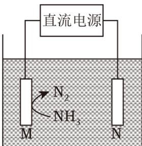

A. M为负极 B. N极附近pH不变化 C. $\mathrm{n(N_2) < n(H_2)}$ D. 电解后c（ $\mathrm{Cl^-}$ ）上升

【分析】电解食盐水间接氧化法去除工业废水中氨氮的原理：溶液中氯离子在阳极失电子生成氯气，然后氯气将氨氧化为氮气，氯气又被还原为氯离子；由图可知，M极附近生成氮气，故M为阳极，电极反应式为： $2Cl^{-}-2e^{-}=Cl_{2}\uparrow$ ；N电极为阴极，电极反应式为： $2H_{2}O+2e^{-}=H_{2}\uparrow+2OH^{-}$ ，以此分析解答。

B. M极电极反应是: $2 \mathrm{Cl}^{-} - 2 \mathrm{e}^{-} = \mathrm{Cl}_{2} \uparrow$ , $3 \mathrm{Cl}_{2} + 2 \mathrm{NH}_{4}^{+} = \mathrm{N}_{2} + 8 \mathrm{H}^{+} + 6 \mathrm{Cl}^{-}$ , N极电极反应为: $2 \mathrm{H}^{+} + 2 \mathrm{e}^{-} = \mathrm{H}_{2} \uparrow$ , 该过程无 $\mathrm{Cl}_{2}$ 逸出, 根据电子守恒得到, $6 \mathrm{H}^{+} \sim 6 \mathrm{e}^{-} \sim 3 \mathrm{Cl}_{2} \sim 8 \mathrm{H}^{+}$ , 阳极产生的 $\mathrm{H}^{+}$ 比阴极消耗的 $\mathrm{H}^{+}$ 多, 处理后废水的 $\mathrm{pH}$ 减小, 故B错误;

C. M极电极反应是: $2 \mathrm{Cl}^{-} - 2 \mathrm{e}^{-} = \mathrm{Cl}_{2} \uparrow$ , $3 \mathrm{Cl}_{2} + 2 \mathrm{NH}_{4}^{+} = \mathrm{N}_{2} + 8 \mathrm{H}^{+} + 6 \mathrm{Cl}^{-}$ , 阴极电极反应为: $2 \mathrm{H}^{+} + 2 \mathrm{e}^{-} = \mathrm{H}_{2} \uparrow$ , 该过程无 $\mathrm{Cl}_{2}$ 逸出, 根据电子守恒得到 $6 \mathrm{H}^{+} \sim 3 \mathrm{H}_{2} \sim 6 \mathrm{e}^{-} \sim 3 \mathrm{Cl}_{2} \sim \mathrm{N}_{2}$ , 生成 $\mathbf{n}$ ( $\mathrm{H}_{2}$ ): $\mathbf{n}$ ( $\mathrm{N}_{2}$ ) = 3:1, 故C正确;

D. M极电极反应是: $2 \mathrm{Cl}^{-} - 2 \mathrm{e}^{-} = \mathrm{Cl}_{2} \uparrow$ , $3 \mathrm{Cl}_{2} + 2 \mathrm{NH}_{4}^{+} = \mathrm{N}_{2} + 8 \mathrm{H}^{+} + 6 \mathrm{Cl}^{-}$ , 该过程无 $\mathrm{Cl}_{2}$ 逸出, 电解后 $\mathbf{c}$ ( $\mathrm{Cl}^{-}$ ) 不变, 故D错误;  
故选: C。

【点评】本题考查电解池原理的分析，掌握电解池阴阳两极的判断式关键，注意转化图中的信息应用，题目难度中等。

19. （3分） $0.1 \mathrm{~mol} \cdot \mathrm{L}^{-1} \mathrm{NaOH}$ 分别滴入 $20 \mathrm{~mL} 0.1 \mathrm{~mol} \cdot \mathrm{L}^{-1} \mathrm{HX}$ 与 $20 \mathrm{~mL} 0.1 \mathrm{~mol} \cdot \mathrm{L}^{-1} \mathrm{HCl}$ 溶液中，其 $\mathrm{pH}$ 随滴入 $\mathrm{NaOH}$ 溶液体积变化的图像如图所示，下列说法正确的是（）

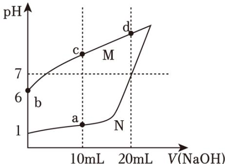

A. b点： $c(X^{-}) \cdot c(OH^{-}) = 10^{-12}mol^{2} \cdot L^{2}$ B. c点： $c(X^{-}) - c(HX) = c(OH^{-}) - c(H^{+})$ C. a、d点溶液混合后为酸性
D. 水的电离程度：d>c>b>a

【分析】A．由图可知， $0.1\mathrm{mol}\cdot\mathrm{L}^{-1}\mathrm{HCl}$ 溶液的pH=1， $0.1\mathrm{mol}\cdot\mathrm{L}^{-1}\mathrm{HX}$ 溶液的pH=6，则HX为弱电解质，溶液中c（ $X^{-}$ ） $\approx\mathrm{c}\left(\mathrm{H}^{+}\right)=10^{-6}\mathrm{mol/L}$ ;
B．c点中溶质为NaX和HX，且c（NaX）=c（HX），物料守恒守恒关系为c（ $X^{-}$ ）+c（HX）=2c（ $Na^{+}$ ），结合电荷守恒关系分析判断；
C．a点溶液中n（HCl）=0.01L×0.1mol·L $^{-1}$ =0.001mol，d点溶液中n（NaX）=0.002mol，a、d点溶液混合后溶质为NaX和HX，且c（NaX）=c（HX）；
D．酸抑制水的电离，c（ $H^{+}$ ）越大，抑制作用越强，NaX促进水的电离，并且（ $X^{-}$ ）越大，水的电离程度越大。
【解答】解：A．由图可知， $0.1\mathrm{mol}\cdot\mathrm{L}^{-1}\mathrm{HX}$ 溶液的pH=6， $0.1\mathrm{mol}\cdot\mathrm{L}^{-1}\mathrm{HCl}$ 溶液的pH=1，则HX为弱电解质， $25^{\circ}\mathrm{CHX}$ 溶液中c（ $X^{-}$ ） $\approx\mathrm{c}\left(\mathrm{H}^{+}\right)=10^{-6}\mathrm{mol/L}$ ，b点溶液中c（ $X^{-}$ ） $\cdot\mathrm{c}\left(\mathrm{OH}^{-}\right)\approx\mathrm{c}\left(\mathrm{H}^{+}\right)\cdot\mathrm{c}\left(\mathrm{OH}^{-}\right)=\mathrm{K}_{\mathrm{w}}=10^{-14}\mathrm{mol}^{2}\cdot\mathrm{L}^{2}$ ，故A错误；
B．c点中溶质为NaX和HX，且c（NaX）=c（HX），物料守恒守恒关系为c（ $X^{-}$ ）+c（HX）=2c（ $Na^{+}$ ），电荷守恒关系为c（ $Na^{+}$ ）+c（ $H^{+}$ ）=c（ $X^{-}$ ）+c（ $OH^{-}$ ），则c(HX) - c ( $X^{-}$ ) = 2c ( $OH^{-}$ ) - 2c ( $H^{+}$ ), 故B错误;

C. a点溶液中n（HCl）=0.01L×0.1mol·L $^{-1}$ =0.001mol，d点溶液中n（NaX）=0.002mol，a、d点溶液混合后溶质为NaX和HX，且c（NaX）=c（HX），类似于图中c点组成，溶液呈碱性，故C错误；
D. 由图可知，溶液中c（H $^{+}$ ）：a>b，酸抑制水的电离，c（H $^{+}$ ）越大，抑制作用越强，则水的电离：b>a；c、d点溶液促进水的电离，c（X $^{-}$ ）：d>c，（X $^{-}$ ）越大，水的电离程度越大，则水的电离：d>c，所以水的电离程度：d>c>b>a，故D正确；故选：D。

【点评】本题考查酸碱混合溶液的定性判断，侧重考查图象分析能力和综合运用能力，明确弱电解质的电离、各点溶液中溶质成分及其性质、水电离影响因素等知识是解本题关键，注意掌握溶液中守恒关系式的灵活应用，题目难度中等。

20. （3分）在密闭容器中发生反应： $2\mathrm{A}(\mathrm{g}) + \mathrm{B}(\mathrm{g}) \rightleftharpoons 2\mathrm{C}(\mathrm{g})$ ，往密闭容器中以n（A）：n（B）=2：1通入两种反应物，15min后A在四温度下的转化率如下表所示，且 $T_{1}<T_{2}<T_{3}<T_{4}$ ，下列说法正确的是（）

<table><tr><td>温度</td><td> $T_{1}$ </td><td> $T_{2}$ </td><td> $T_{3}$ </td><td> $T_{4}$ </td></tr><tr><td>转化率</td><td>10%</td><td>70%</td><td>70%</td><td>60%</td></tr></table>

A. 该反应是吸热反应  
B. T温度时（ $\mathrm{T}_{2} < \mathrm{T} < \mathrm{T}_{3}$ ），A的转化率是 $70\%$ C. $\mathrm{T}_{3}$ 温度下，若反应在 $15\mathrm{min}$ 后继续进行，则A的转化率变大  
D. $\mathrm{T}_{4}$ 温度反应 $15\mathrm{min}$ 后，若c（B） $= 0.5\mathrm{mol}\cdot \mathrm{L}^{-1}$ ，则 $\mathrm{T}_{4}$ 温度时的平衡常数是4.5

B. 对放热反应，未达到平衡时，升高温度，转化率增大，达到平衡后，升高温度，平衡逆向移动，转化率减小；  
C. 反应达到平衡时，不改变条件，随反应进行，转化率不变；  
D. $\mathrm{T}_{4}$ 温度反应15

min后已达到平衡，若c（B）=0.5mol·L $^{-1}$ ，设A、B的起始浓度分别为2c、c，A的转化率为60%，A的变化浓度为2c×60%=1.2c

2A（g）+B（g）⇌2C（g）

初始量（mol·L $^{-1}$ ） 2c c 0变化量（mol·L $^{-1}$ ） 1.2c 0.6c 1.2c
平衡量（mol·L $^{-1}$ ） 0.8c 0.4c 1.2c

则c（B）=0.5mol·L $^{-1}$ =0.4c，c=1.25mol·L $^{-1}$ ，平衡时，c（A）=0.8×1.25mol·L $^{-1}$ =1mol·L $^{-1}$ ，c（B）=1.2×1.25mol·L $^{-1}$ =1.5mol·L $^{-1}$ ，根据K= $\frac{c^{2}(C)}{c^{2}(A)\times c(B)}$ 计算

T $_{4}$ 温度时的平衡常数。

【解答】解：A．温度升高，反应速率加快，由表格数据可知， $T_{1}$ 、 $T_{2}$ 温度下15min时未达平衡， $T_{3}$ 、 $T_{4}$ 温度下15min时反应已经达到平衡，为平衡转化率，随升高温度平衡转化率减小，则升高温度，平衡左移，即该反应为放热反应，故A错误；

B. $\mathrm{T}_{2}$ 温度下 $15 \mathrm{~min}$ 时未达平衡, $\mathrm{T}_{3}$ 温度下 $15 \mathrm{~min}$ 时反应已经达到平衡, $\mathrm{T}_{2} < \mathrm{T} < \mathrm{T}_{3}$ , 故T温度下的转化率比 $\mathrm{T}_{2}$ 、 $\mathrm{T}_{3}$ 温度下的转化率大, 即A的转化率大于 $70 \%$ ，故B错误;

C. $\mathrm{T}_{3}$ 温度下 $15\mathrm{min}$ 时反应已经达到平衡，若反应在 $15\mathrm{min}$ 后继续进行，平衡不移动，A的转化率不变，故C错误；

D. $\mathrm{T}_{4}$ 温度反应15

min后已达到平衡，若c（B）=0.5mol·L $^{-1}$ ，设A、B的起始浓度分别为2c、c，A的转化率为60%，A的变化浓度为2c×60%=1.2c

2A (g) + B (g) $\rightleftharpoons$ 2C (g)

初始量（mol·L $^{-1}$ ） 2c c 0

变化量（mol·L $^{-1}$ ） 1.2c 0.6c 1.2c

平衡量（mol·L $^{-1}$ ） 0.8c 0.4c 1.2c

则c（B）=0.5mol·L $^{-1}$ =0.4c，c=1.25mol·L $^{-1}$ ，平衡时，c（A）=0.8×1.25mol·L $^{-1}$ =1mol·L $^{-1}$ ，c（B）=1.2×1.25mol·L $^{-1}$ =1.5mol·L $^{-1}$ ，则T $_{4}$ 温度时的平衡常数K= $\frac{c^{2}(C)}{c^{2}(A)\times c(B)}=\frac{1.5^{2}}{1^{2}\times0.5}=4.5$ ，故D正确；

故选：D。

【点评】本题考查化学平衡的计算，侧重分析与应用能力的考查，注意条件改变对转化率、平衡的影响，题目难度中等。

## 二、综合题

21. 在某温度下, 在体积为5L的密闭容器内发生如下反应: $\mathrm{CH}_{4} (\mathrm{~g}) + \mathrm{H}_{2} \mathrm{O} (\mathrm{~g}) \rightleftharpoons \mathrm{CO} (\mathrm{~g}) + 3 \mathrm{H}_{2} (\mathrm{~g}) - \mathrm{Q}$

(1) 在上述反应的反应物与生成物中, 非极性分子为: $\mathrm{CH}_{4} 、 \mathrm{H}_{2}$ 。

(2) 若反应 $20 \mathrm{~min}$ 后气体总物质的量增加了 $10 \mathrm{~mol}$ , 则甲烷的平均反应速率为 0.05 mol/(L·min)。

(3) 下列选项中的物理量不变时, 一定可以判断反应达到平衡的是 $\underline{\mathrm{BD}}$ 。  
A. 容器中氢元素的质量分数  
B. 容器内的压强  
C. 反应的平衡常数  
D. 容器内气体的平均相对分子质量

（4）在某一时刻， $v_{正}=v_{逆}=v_{0}$ ，反应若改变一条件，可使得 $v_{正}<v_{逆}<v_{0}$ ，指出可以改变的条件，并说明理由：\_\_\_\_

降温；温度降低时，正、逆反应速率都降低，反应为吸热反应，降低温度，平衡向逆反应方向移动，因此 $v_{正} \leq v_{逆}$ 。

已知CO与 $H_{2}$ 合成 $CH_{3}OH$ 是可逆反应： $CO+2H_{2}\rightleftharpoons CH_{3}OH$ 。

（5）若上述反应达到平衡时CO与 $H_{2}$ 的转化率相同，则投料比n（CO）：n（ $H_{2}$ ）=\_\_\_\_1:2\_\_\_\_。

【分析】（1）非极性分子是指结构对称、正负电荷中心重合的分子；

（2）根据 $v=\frac{\Delta c}{\Delta t}$ 计算甲烷的平均反应速率；

（3）可逆反应达到平衡状态时，正逆反应速率相等，反应体系中各物质的量不变、物质的量浓度不变、百分含量不变以及由此引起的一系列物理量不变，据此分析解答；

（4）若使 $v_{正}<v_{逆}<v_{0}$ ，即速率降低且平衡逆向移动，以此推断改变的条件；

（5）根据反应方程式和 $\alpha = \frac{\Delta n}{n_0} \times 100\%$ 求解投料比。

【解答】解：（1）非极性分子是指结构对称、正负电荷中心重合的分子，在上述反应的反应物与生成物中，甲烷和氢气分子都有结构对称、正负电荷中心重合，为非极性分子，

故答案为： $CH_{4}$ 、 $H_{2}$ ;

(2) 根据反应系数关系可知气体总物质的量增加了10

mol，则甲烷减少了5mol，甲烷的平均反应速率 $v=\frac{\Delta c}{\Delta t}=\frac{\frac{5mol}{5L}}{20min}=0.05$ mol/(L·min)，

故答案为：0.05 mol/(L·min)；

（3）A．容器内氢元素的质量分数为定量，与反应进行的程度无关，故不能作为判断平衡的标志，故A错误；

B．容器体积不变，气体的总物质的量改变，则压强也随之改变，故压强不变时反应达到平衡，故B正确；

C. 反应的平衡常数只与温度有关, 只要温度不变平衡常数就不变, 故不能作为判断平衡的标志, 故C错误;

D. 各物质均为气体, 气体的总质量不变, 随着反应进行气体的总物质的量改变, 各容器内气体的 $\overline{\mathbf{M}}$ 是变量, 变量不变则反应达到平衡, 故D正确;

故答案为：BD;

（4）若使 $v_{正}<v_{逆}<v_{0}$ ，即速率降低且平衡逆向移动，该反应的正反应为吸热反应，则改变的条件可能为降温，

故答案为：降温；温度降低时，正、逆反应速率都降低，反应为吸热反应，降低温度，平衡向逆反应方向移动，因此 $v_{正}<v_{逆}$ ;

(5) 根据反应方程式可知 $\mathrm{CO}$ 与 $\mathrm{H}_{2}$ 的变化量之比为1:2, 由 $\alpha = \frac{\Delta n}{n_0} \times 100\%$ 可得, 若使转化率相同, 则投料比1:2,

故答案为：1：2。

【点评】本题考查比较综合，涉及分子极性、化学反应速率、化学平衡的影响、反应速率计算、转化率、化学平衡状态判断等，侧重于考查学生对基础知识的理解和应用能力，题目难度中等。

22. 聚合氯化铝用于城市给排水净化。氧化铝法制取无水三氯化铝的反应如下: $\mathrm{Al}_{2} \mathrm{O}_{3}$ (s) + 3C (s) + 3Cl₂ (g) $\xlongequal{900^{\circ} \mathrm{C}}$ 2AlCl₃ (g) + 3CO (g)。

(1) 标出上述反应的电子转移方向和数目

$$
\begin{array}{r l}&{\mathrm {Al_ {2} O_ {3} (s) + 3C (s) + 3Cl_ {2} (g)\rightleftharpoons 2AlCl_ {3} (g) + 3CO (g)}}\\&{\text {   或   }}\\&{\mathrm {Al_ {2} O_ {3} (s) + 3C (s) + 3Cl_ {2} (g)\rightleftharpoons 2AlCl_ {3} (g) + 3CO (g)}}\\&{\text {   失去   } 6 \mathrm{e-}}\end{array}
$$

（2）写出该反应的平衡常数表达式： $K= \frac{c^{2}(AlCl_{3})\cdot c^{3}(CO)}{c^{3}(Cl_{2})}$ 。

(3) Al原子核外有 5 种不同能量的电子。

聚合氯化铝（PAC）是一种介于 $AlCl_{3}$ 和Al（OH） $_{3}$ 之间的水溶性无机高分子聚合物，PAC的水解过程中会有一种聚合稳定态物质 $[AlO_{4}Al_{12}(OH)_{24}(H_{2}O)_{12}]^{7+}$ 称为 $Al_{13}$ ， $Al_{13}$ 对水中胶体和颗粒物具有高度电中和桥联作用，是净水过程中的重要物质。

（4） $\mathrm{Al}_{13}$ 在水解过程中会产生 $[\mathrm{Al(OH)}_2]^+$ 、 $[\mathrm{Al(OH)}]^{2+}$ 等产物，请写出 $\mathrm{Al}^{3+}$ 水解产生 $[\mathrm{Al(OH)}]^{2+}$ 的离子方程式： $\mathrm{Al}^{3+} + \mathrm{H}_2\mathrm{O} \rightleftharpoons [\mathrm{Al(OH)}]^{2+} + \mathrm{H}^+$ ，\_\_\_\_。

(5) $\mathrm{AlCl}_{3}$ 溶液与 $\mathrm{NaOH}$ 溶液反应, 若参加反应的铝离子最终转化生成 $\mathrm{Al}_{13}$ , 则理论上参与反应的 $\mathrm{Al}^{3+}$ 与 $\mathrm{OH}^{-}$ 的物质的量之比是 13:32。

（6）使用 $Al^{3+}$ 净水时应控制pH在6.8～8.02之间，否则净水效果不佳。请结合使用 $Al^{3+}$ 水解净化水时铝元素存在的形态，分析在强酸性和强碱性环境时净水效果差的原因\_\_\_\_若是强酸性，抑制 $Al^{3+}$ 水解；若是强碱性，Al元素以 $AlO_{2}^{-}$ （或 $[Al(OH)_{4}]^{-}$ ）形式存在\_\_\_\_。

【分析】（1）分析元素化合价变化，确定氧化剂、还原剂、氧化产物、还原产物及转移电子数；

(2) 平衡常数等于生成物浓度幂次方乘积和反应物浓度幂次方乘积的比值;

（3）基态Al原子核外电子排布式为 $1s^{2}2s^{2}2p^{6}3s^{2}3p^{1}$ ，核外电子占据1s、2s、2p、3s、3p轨道，同一轨道电子的能量相同；

(4) $\mathrm{Al}^{3+}$ 水解生成[Al（OH）] $^{2+}$ 和 $\mathrm{H}^+$ ，结合电荷守恒书写离子方程式；

（5）由题意知， $\mathrm{Al}^{3+}$ 与 $\mathrm{OH}^{-}$ 反应生成 $[\mathrm{AlO}_4\mathrm{Al}_{12}(\mathrm{OH})_{24}(\mathrm{H}_2\mathrm{O})_{12}]^{7+}$ ，结合原子守恒和电荷守恒书写反应的离子方程式；

（6）在强酸性环境时， $\mathrm{Al}^{3+}$ 的水解受到抑制；在强碱性环境时， $\mathrm{Al}^{3+}$ 能与 $\mathrm{OH}^{-}$ 发生反应生成 $\mathrm{AlO}_2^-$ 或 $[\mathrm{Al(OH)}_4]^-$ 。

【解答】解：（1）该反应中C由0价变为+2价，C为还原剂，CO为氧化产物，Cl由0价变为-1价，氯气为氧化剂， $\mathrm{AlCl}_3$ 为还原产物，3molC参与反应时转移6mol电子，单线桥表示形式为

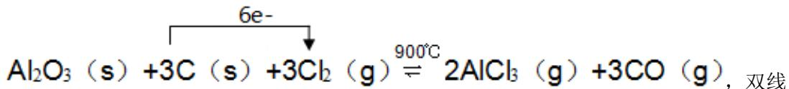

桥表示形式为

$$
\mathrm{Al} _ {2} \mathrm{O} _ {3} (\mathrm{s}) + 3 \mathrm{C} (\mathrm{s}) + 3 \mathrm{Cl} _ {2} (\mathrm{g}) \stackrel {\text {得到6e-}} {=} 2 \mathrm{AlCl} _ {3} (\mathrm{g}) + 3 \mathrm{CO} (\mathrm{g})
$$

故答案为:

$$
\begin{array}{r l}&{\mathrm {Al_ {2} O_ {3} (s) + 3C (s) + 3Cl_ {2} (g)\rightleftharpoons 2AlCl_ {3} (g) + 3CO (g)}}\\&{\text {   或   }}\\&{\mathrm {Al_ {2} O_ {3} (s) + 3C (s) + 3Cl_ {2} (g)\rightleftharpoons 2AlCl_ {3} (g) + 3CO (g)}}\\&{\text {   失去   } 6 \mathrm{e-}}\end{array}
$$

（2）反应 $Al_{2}O_{3}(s)+3C(s)+3Cl_{2}(g)\xlongequal{900^{\circ}C}2AlCl_{3}(g)+3CO(g)$ 的平衡常数K= $\frac{c^{2}(AlCl_{3})\cdot c^{3}(CO)}{c^{3}(Cl_{2})},$ 故答案为： $\frac{c^{2}(AlCl_{3})\cdot c^{3}(CO)}{c^{3}(Cl_{2})};$

（3）基态Al原子核外电子排布式为 $1s^{2}2s^{2}2p^{6}3s^{2}3p^{1}$ ，同一轨道电子的能量相同，则Al原子核外有5种不同能量的电子，

故答案为：5;

（4） $\mathrm{Al}^{3+}$ 水解生成[Al（OH）] $^{2+}$ 和 $\mathrm{H}^{+}$ ，离子方程式为 $\mathrm{Al}^{3+}+\mathrm{H}_{2}\mathrm{O}\rightleftharpoons[\mathrm{Al}(\mathrm{OH})]^{2+}+\mathrm{H}^{+}$ ，故答案为： $\mathrm{Al}^{3+}+\mathrm{H}_{2}\mathrm{O}\rightleftharpoons[\mathrm{Al}(\mathrm{OH})]^{2+}+\mathrm{H}^{+}$ ；

（5） $\mathrm{Al}^{3+}$ 与 $\mathrm{OH}^{-}$ 反应生成 $[\mathrm{AlO}_4\mathrm{Al}_{12}(\mathrm{OH})_{24}(\mathrm{H}_2\mathrm{O})_{12}]^{7+}$ ，反应的离子方程式为 $13\mathrm{Al}^3 + 32\mathrm{OH}^{-} + 8\mathrm{H}_2\mathrm{O} \rightleftharpoons [\mathrm{AlO}_4\mathrm{Al}_{12}(\mathrm{OH})_{24}(\mathrm{H}_2\mathrm{O})_{12}]^{7+}$ ，则理论上参与反应的 $\mathrm{Al}^{3+}$ 与 $\mathrm{OH}^{-}$ 的物质的量之比13：32，

故答案为：13：32；

(6) $\mathrm{Al}^{3+}$ 水解生成 $\mathrm{Al(OH)}_3$ 和 $\mathrm{H}^+$ , 离子方程式为 $\mathrm{Al}^{3+} + 3\mathrm{H}_2\mathrm{O} \rightleftharpoons \mathrm{Al(OH)}_3 + 3\mathrm{H}^+$ , 强酸性环境时溶液中 $\mathrm{c(H^{+})}$ 大, 抑制 $\mathrm{Al(OH)}_3$ 胶体的生成; 强碱性环境时, $\mathrm{Al}^{3+}$ 能与 $\mathrm{OH}^-$ 发生反应生成 $\mathrm{AlO}_2^-$ 或 $[\mathrm{Al(OH)}_4]^-$ , 均能使净水效果变差,

故答案为：若是强酸性，抑制 $\mathrm{Al}^{3+}$ 水解；若是强碱性，Al元素以 $\mathrm{AlO}_2^-$ （或[Al（OH）4]

-）形式存在。

【点评】本题考查氧化还原反应相关计算、盐类水解原理的应用、氢氧化铝的性质及应用，把握题给信息的应用、物质的性质及应用、氧化还原反应表示方法、盐类水解原理、离子方程式的书写等知识是解题关键，侧重分析能力和运用能力考查，题目难度中等。

23. 用于治疗神经性疾病的药物布立西坦的合成路线如图所示:

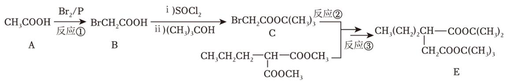

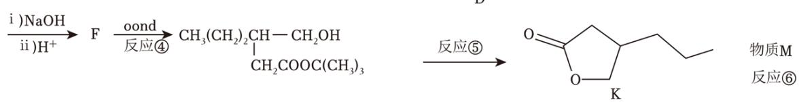

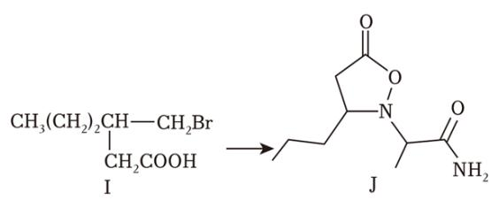

已知:

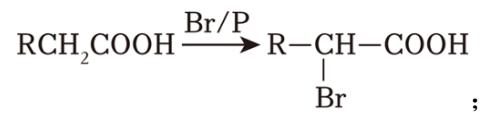

$$
\mathrm{R} _ {1} \mathrm{COOR} _ {2} + \mathrm{R} _ {3} \mathrm{OH} \longrightarrow \mathrm{R} _ {1} \mathrm{COOR} _ {3} + \mathrm{R} _ {2} \mathrm{OH} 。
$$

(1) 反应①是取代反应, 反应④是还原反应。(填反应类型, 下同)

(2) 有机物I中的含氧官能团名称为\_\_\_\_羧基\_\_\_\_，有机物F的结构简式为 $\mathrm{CH_{3}CH_{2}CH_{2}CH(COOH)CH_{2}COOH}$ ,

(3) 已知反应⑤为酯交换反应, 则另一产物的结构简式为 $\mathrm{(CH_3)_3COH}$ 。

(4) 已知反应⑥的原子利用率为 $100\%$ , 则物质M为 $\mathrm{HBr}$ 。

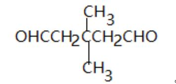

(5) 写出一种满足下列条件的有机物K的同分异构体: $\mathrm{CH}_{3}$ 。

①可以发生银镜反应;

②分子中存在3中化学环境不同的H原子，且个数比为1：2：3。

（6）手性碳是指与四个各不相同原子与基团相连的碳原子，用C\*表示。已知分子J中有

2个手性碳，请用\*将其在下图的结构简式中标出。

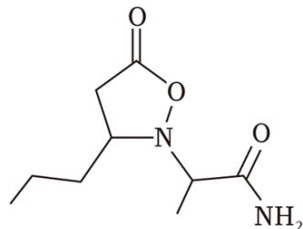

(7) 请写出以 $\mathrm{CH}_{3}(\mathrm{CH}_{2})_{3}\mathrm{COOH}$ 和 $\mathrm{CH}_{3}\mathrm{OH}$ 为原料制备 $\mathrm{CH}_{3}\mathrm{CH}_{2}\mathrm{CH}=\mathrm{CHCOOCH}_{3}$ 的路

线（合成路线的表示方式为 $\xrightarrow[\text{反应条件}]{\text{反应试剂}} \cdots \xrightarrow[\text{反应条件}]{\text{反应试剂}}$ 目标产物）

$$
\mathrm{CH} _ {3} \left(\mathrm{CH} _ {2}\right) _ {3} \mathrm{COOH} \xrightarrow {\mathrm{Br} _ {2} / \mathrm{P}} \mathrm{CH} _ {3} \mathrm{CH} _ {2} \mathrm{CH} _ {2} \mathrm{CHBrCOOH} \xrightarrow [ \triangle ]{\mathrm{NaOH/醇}} \mathrm{CH} _ {3} \mathrm{CH} _ {2} \mathrm{CH} = \mathrm{CHCOONa}
$$

$$
\xrightarrow {\mathrm{H} ^ {+}} \mathrm{CH} _ {3} \mathrm{CH} _ {2} \mathrm{CH} = \mathrm{CHCOOH} \xrightarrow [ \text {浓硫酸/ } \triangle ]{\mathrm{CH} _ {3} \mathrm{OH}} \mathrm{CH} _ {3} \mathrm{CH} _ {2} \mathrm{CH} = \mathrm{CHCOOCH} _ {3}
$$

【分析】A发生取代反应生成B，B发生酯化反应生成C，C和D发生第二个信息的反应及取代反应生成E和BrCH₂COOCH₃、BrCOOCH₃；E发生水解反应然后酸化得到F为CH₃C H₂CH₂CH（COOH）CH₂COOH，F发生还原反应生成G，G发生第二个信息的反应生成K和（CH₃）₃COH，反应⑥的原子利用率为100%，I比K多一个H原子、一个Br原子，则M为HBr，I发生取代反应生成J；

(7) 以 $\mathrm{CH}_{3}(\mathrm{CH}_{2})_{3}\mathrm{COOH}$ 和 $\mathrm{CH}_{3}\mathrm{OH}$ 为原料制备 $\mathrm{CH}_{3}\mathrm{CH}_{2}\mathrm{CH}=\mathrm{CHCOOCH}_{3}, \mathrm{CH}_{3}\mathrm{CH}_{2}\mathrm{CH}=\mathrm{CHCOOH}$ 和 $\mathrm{CH}_{3}\mathrm{CH}_{2}\mathrm{OH}$ 发生酯化反应生成 $\mathrm{CH}_{3}\mathrm{CH}_{2}\mathrm{CH}=\mathrm{CHCOOCH}_{3}, \mathrm{CH}_{3}(\mathrm{CH}_{2})_{3}\mathrm{COOH}$ 发生第一个信息的反应然后发生消去反应生成 $\mathrm{CH}_{3}\mathrm{CH}_{2}\mathrm{CH}=\mathrm{CHCOOH}$ 。

【解答】解：（1）乙酸中氢原子被溴原子取代生成B，则反应①是取代反应，反应④是F发生还原反应生成G，所以该反应是还原反应，

故答案为：取代；还原；

（2）有机物I中的含氧官能团名称为羧基，有机物F的结构简式为 $CH_{3}CH_{2}CH_{2}CH$ （COOH） $CH_{2}COOH$ ，

故答案为：羧基； $CH_{3}CH_{2}CH_{2}CH$ （COOH） $CH_{2}COOH$ ;

(3) 通过以上分析知, 反应⑤的另一产物的结构简式为 $\left(\mathrm{CH}_{3}\right)_{3} \mathrm{COH}$ , 故答案为: $\left(\mathrm{CH}_{3}\right)_{3} \mathrm{COH}$ ;

（4）通过以上分析知，反应⑥中物质M为HBr，

故答案为：HBr;

(5) 有机物K的同分异构体满足下列条件:

①可以发生银镜反应，说明含有醛基；

②分子中存在3中化学环境不同的H原子，且个数比为1：2：3，K的不饱和度是2，醛基的不饱和度是1，符合条件的结构简式中除了醛基外还含有一个双键或环，根据氢原子个数知，存在2个等效的甲基，结构对称，符合条件的结构简式有

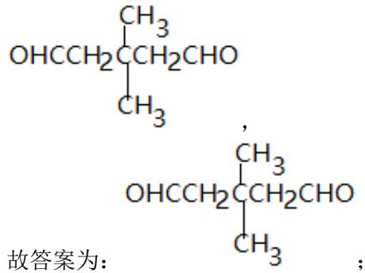

故答案为:

(6) 分子J中手性碳原子如图

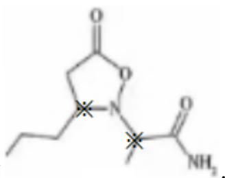

故答案为:

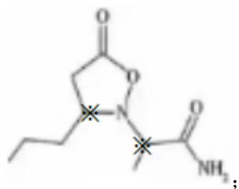

(7) 以 $\mathrm{CH}_{3}(\mathrm{CH}_{2})_{3}\mathrm{COOH}$ 和 $\mathrm{CH}_{3}\mathrm{OH}$ 为原料制备 $\mathrm{CH}_{3}\mathrm{CH}_{2}\mathrm{CH}=\mathrm{CHCOOCH}_{3}, \mathrm{CH}_{3}\mathrm{CH}_{2}\mathrm{CH}=\mathrm{CHCOOH}$ 和 $\mathrm{CH}_{3}\mathrm{CH}_{2}\mathrm{OH}$ 发生酯化反应生成 $\mathrm{CH}_{3}\mathrm{CH}_{2}\mathrm{CH}=\mathrm{CHCOOCH}_{3}, \mathrm{CH}_{3}(\mathrm{CH}_{2})_{3}$ COOH发生第一个信息的反应然后发生消去反应生成 $\mathrm{CH}_{3}\mathrm{CH}_{2}\mathrm{CH}=\mathrm{CHCOOH}$ , 合成路线

$$
\mathrm{CH} _ {3} \left(\mathrm{CH} _ {2}\right) _ {3} \mathrm{COOH} \xrightarrow {\mathrm{Br} _ {2} / \mathrm{P}} \mathrm{CH} _ {3} \mathrm{CH} _ {2} \mathrm{CH} _ {2} \mathrm{CHBrCOOH} \xrightarrow [ \triangle ]{\mathrm{NaOH/醇}} \mathrm{CH} _ {3} \mathrm{CH} _ {2} \mathrm{CH} = \mathrm{CHCOONa}
$$

$$
\xrightarrow {\mathrm{H} ^ {+}} \mathrm {CH_ {3} CH_ {2} CH = CHCOOH\xrightarrow [ \text {浓硫酸/ } \triangle ]{\mathrm{CH} _ {3} \mathrm{OH}} CH_ {3} CH_ {2} CH = CHCOOCH_ {3}}
$$

故答案为:

$$
\begin{array}{r l} & \mathrm {CH_ {3} (CH_ {2}) _ {3} COOH\xrightarrow {Br_ {2} /P} CH_ {3} CH_ {2} CH_ {2} CHBrCOOH\xrightarrow [ \triangle ]{NaOH /醇} CH_ {3} CH_ {2} CH = CHCOONa} \\ & \xrightarrow {\mathrm {H^ {+}}} \mathrm {CH_ {3} CH_ {2} CH = CHCOOH\xrightarrow [ \text {浓硫酸} /△ ]{CH_ {3} OH} CH_ {3} CH_ {2} CH = CHCOOCH_ {3}} \end{array}
$$

【点评】本题考查有机物的合成，侧重考查分析、判断及知识综合运用能力，正确推断各物质的结构简式是解本题关键，知道各物质之间的转化关系，题目难度中等。

24. I. 过氧化氢和盐酸的混合溶液可以刻蚀含铜的电路板。

(1) 请写出用过氧化氢和盐酸刻蚀电路板时发生的离子反应方程式:

$Cu+H_{2}O_{2}+2H^{+}=Cu^{2+}+2H_{2}O$

(2) 当反应一段时间后, 随着溶液变蓝, 气泡产生的速率加快, 可能的原因是 $\mathrm{Cu}^{2+}$ 对 $\mathrm{H}_{2} \mathrm{O}_{2}$ 的分解有催化作用或反应放热, 温度升高加快 $\mathrm{H}_{2} \mathrm{O}_{2}$ 分解反应速率。

II. 含铜电路板也可以用 $FeCl_{3}$ 进行刻蚀，对刻蚀后的液体（ $FeCl_{3}$ 、 $FeCl_{2}$ 和 $CuCl_{2}$ ）进行处理以提取 $FeCl_{2}\cdot4H_{2}O$ 、 $CuSO_{4}\cdot5H_{2}O$ ，流程如图：

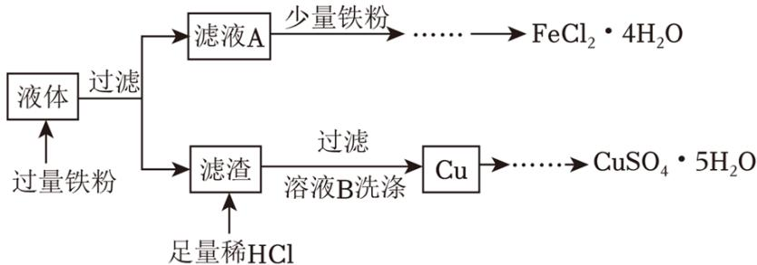

(1) 从滤液A中提取 $\mathrm{FeCl}_{2} \cdot 4 \mathrm{H}_{2} \mathrm{O}$ 的操作为: 加入Fe粉后, 应先浓缩滤液至出现\_有少量晶体\_, 趁热过滤, 取溶液, \_蒸发浓缩, 冷却结晶\_, 过滤、洗涤、干燥。

(2) 检验溶液B中提取出的Cu上粘附的Cl $^{-}$ 已经洗净的操作为:

取最后一次洗涤液，加入硝酸酸化的硝酸银溶液，若无沉淀产生，则证明已洗涤干净，制备 $CuSO_{4}\cdot5H_{2}O$ 时，将铜溶解于 $H_{2}SO_{4}$ 、 $HNO_{3}$ 的混酸中，此过程中产生的红棕色气体为还原产物（选填“氧化”或“还原”）。

III. 利用滴定法可测定所得 $CuSO_{4} \cdot 5H_{2}O$ 的纯度，操作如下：

①取 $\mathrm{agCuSO_{4}\cdot5H_{2}O}$ 样品，加入足量 $\mathrm{NH_{4}F-HF}$ 溶液溶解（ $\mathrm{F^{-}}$ 用于防止 $\mathrm{Fe^{3+}}$ 干扰检验： $\mathrm{Fe^{3+}+6F^{-}=FeF_{6}^{3-}}$ ）。

②滴加足量KI溶液，发生反应 $2Cu^{2+}+4I^{-}=2CuI\downarrow+I_{2}$ 。

③再用cmol/LNa₂S₂O₃标准溶液滴定，以淀粉溶液作指示剂，到达滴定终点时消耗亚硫酸钠标准溶液VmL，发生的反应为：I₂+2S₂O₃²⁻=S₄O₆²⁻+2I⁻。

(1) 已知 $\mathrm{NH}_{4} \mathrm{~F}$ 溶液呈酸性, 则水解程度 $\mathrm{NH}_{4}^{+} >$

$F^{-}$ （填“＞”、“＜”或“＝”），稀释后消耗 $\frac{c(NH_{3}\cdot H_{2}O)}{c(HF)}$ 的值 \_\_\_\_ 增大
（选填“增大”、“减小”或“不变”）。

(2) 接近滴定终点时, 向溶液中滴加KSCN, 会发现CuI沉淀转化为CuSCN, 其沉淀转化的原因是 $\mathrm{CuSCN}$ 的溶解度小于 $\mathrm{CuI}$ , 使溶解平衡向 $\mathrm{CuI}$ 溶解的方向移动。已知 $\mathrm{CuI}$ 能够吸附大量 $\mathrm{I}_{2}$ , 若不加KSCN, 则测得 $\mathrm{CuSO}_{4} \cdot 5\mathrm{H}_{2}\mathrm{O}$ 的纯度 $\mathrm{偏低}$ (选填“偏高”、“偏低”或“不变”)。

（3）计算 $CuSO_{4}\cdot5H_{2}O$ 的纯度： $\frac{250cV\times10^{-3}}{a}\times100\%$ （用a、c、V的代数式表示）。

【分析】Ⅰ.（1）铜在过氧化氢存在下和盐酸反应生成氯化铜和水；

（2）该反应放热，铜离子可以催化过氧化氢分解；

II. 首先向刻蚀后的液体中加入过量铁粉，置换出铜，过滤后得到滤渣和滤液A，由于铁粉过量，则滤渣中含有单质铜和过量的铁，滤液中含有氯化亚铁，滤渣进一步处理后得到硫酸铜晶体，滤液处理后得到氯化亚铁晶体，以此解题；

III.（1）根据越弱越水解的道理分析；由上述分析可知，铵根离子水解程度更大一些，则稀释的时候，对铵根水解的影响更大一些；

（2）物质结构相同的时候，溶度积大的物质更容易转化为溶度积小的物质，则CuI沉淀转化为CuSCN；根据题给信息可知，CuI能够吸附大量 $I_{2}$ ，则若不加KSCN，则测得CuS $O_{4}\cdot5H_{2}O$ 的纯度将偏低；

（6）根据题给信息可知， $2CuSO_{4}\cdot5H_{2}O\sim I_{2}\sim2S_{2}O_{3}^{2-}$ ，则 $n(CuSO_{4}\cdot5H_{2}O)=n(Na_{2}S_{2}O_{3})=cV\times10^{-3}mol$ ，结合关系式计算。

【解答】解：I.（1）铜在过氧化氢存在情况下可以和盐酸反应，离子方程式为： $\mathrm{Cu} + \mathrm{H}_{2}\mathrm{O}_{2} + 2\mathrm{H}^{+} = \mathrm{Cu}^{2+} + 2\mathrm{H}_{2}\mathrm{O}$ ，

故答案为： $Cu+H_{2}O_{2}+2H^{+}=Cu^{2+}+2H_{2}O;$

（2）该反应放热，铜离子可以催化过氧化氢分解，故随着溶液变蓝，气泡产生的速率加快，其可能的原因是 $Cu^{2+}$ 对 $H_{2}O_{2}$ 的分解有催化作用或反应放热，温度升高加快 $H_{2}O_{2}$ 分解反应速率，

故答案为： $Cu^{2+}$ 对 $H_{2}O_{2}$ 的分解有催化作用或反应放热，温度升高加快 $H_{2}O_{2}$ 分解反应速率；

II.（1）从滤液A中提取 $\mathrm{FeCl}_{2} \cdot 4 \mathrm{H}_{2} \mathrm{O}$ 的操作为：加入Fe粉后，应先浓缩滤液至出现有少量晶体，趁热过滤，取溶液，蒸发浓缩，冷却结晶，过滤、洗涤、干燥，

故答案为：有少量晶体；蒸发浓缩，冷却结晶；

(2) 溶液中含有杂质氯离子, 根据氯离子和银离子反应生成氯化银白色沉淀, 则检验溶液B中提取出的 $\mathrm{Cu}$ 上粘附的 $\mathrm{Cl}^-$ 已经洗净的操作为: 取最后一次洗涤液, 加入硝酸酸化的硝酸银溶液, 若无沉淀产生, 则证明已洗涤干净; 铜和硝酸反应, 不能和硫酸反应, 铜和浓硝酸反应生成硝酸铜和红棕色的二氧化氮, 其中氮元素由 +5价变为 +4价, 故为

还原产物，

故答案为：取最后一次洗涤液，加入硝酸酸化的硝酸银溶液，若无沉淀产生，则证明已洗涤干净；还原；

III.（1）根据越弱越水解的道理，可知 $NH_{4}F$ 溶液呈酸性说明，铵根离子水解程度较大，水解程度 $NH_{4}^{+}$ 大于 $F^{-}$ ；由上述分析可知，铵根离子水解程度更大一些，则稀释的时候，对铵根水解的影响更大一些，故 $\frac{c(NH_{3}\cdot H_{2}O)}{c(HF)}$ 增大，

故答案为：>；增大；

(2) 物质结构相同的时候, 溶度积大的物质更容易转化为溶度积小的物质, 则 $\mathrm{CuI}$ 沉淀转化为 $\mathrm{CuSCN}$ , 其沉淀转化的原因是 $\mathrm{CuSCN}$ 的溶解度小于 $\mathrm{CuI}$ , 使溶解平衡向 $\mathrm{CuI}$ 溶解的方向移动; 根据题给信息可知, $\mathrm{CuI}$ 能够吸附大量 $\mathrm{I}_{2}$ , 则若不加 $\mathrm{KSCN}$ , 则测得 $\mathrm{CuSO}_{4} \cdot 5 \mathrm{H}_{2} \mathrm{O}$ 的纯度将偏低,

故答案为：CuSCN的溶解度小于CuI，使溶解平衡向CuI溶解的方向移动；偏低；

（6）根据题给信息可知， $2CuSO_{4}\cdot5H_{2}O\sim I_{2}\sim2S_{2}\bigcirc_{3}^{2-}$ ，则 $n(CuSO_{4}\cdot5H_{2}O)=n(Na_{2}S_{2}O_{3})=cV\times10^{-3}mol$ ， $CuSO_{4}\cdot5H_{2}O$ 的纯度=

$$
\frac {\mathrm{cVmol} \times 250 \mathrm{g/mol}}{\mathrm{ag}} \times 100 \% = \frac {250 \mathrm{cV} \times 10 ^ {- 3}}{\mathrm{a}} \times 100 \%,
$$

故答案为： $\frac{250cV\times10^{-3}}{a}\times100\%$ .

【点评】本题考查物质含量测定，为高频考点，把握物质的性质、发生的反应、测定原理为解答的关键，侧重分析与实验能力的考查，注意元素化合物知识的应用，题目难度较大。