# 2023 年普通高等学校招生全国统一考试 理科综合能力测试化学部分(全国乙卷)

可能用到的相对原子质量：H1 C12 O16

## 一、选择题：本题共13小题，每小题6分，共78分。在每小题给出的四个选项中，只有一项是符合题目要求的。(化学部分为第7\~13题)

1. 下列应用中涉及到氧化还原反应的是
A. 使用明矾对水进行净化
B. 雪天道路上撒盐融雪
C. 暖贴中的铁粉遇空气放热
D. 荧光指示牌被照发光

【答案】C

【解析】

【详解】A. 使用明矾对水进行净化过程中，明矾电离出的铝离子发生水解生成氢氧化铝胶体，氢氧化铝胶体粒子吸附水中的悬浮颗粒并沉降下来而水变得澄清，该过程中没有任何一种元素的化合价发生变化，因此没有涉及到氧化还原反应，A 不符合题意；  
B. 雪天道路上撒盐融雪，是因为雪遇到盐而使其熔点降低并熔化，该过程中没有任何一种元素的化合价发生变化，因此没有涉及到氧化还原反应，B 不符合题意；  
C. 暖贴中的铁粉遇空气放热，是因为暖贴中含有的铁粉、碳粉、氯化钠、水等物质，形成当这些物质遇到空气后形成无数微小原电池并开始工作，化学能转化为电能，无数微小原电池堆积在一起使得电能又转化为热能，该过程中铁元素和氧元素的化合价发生变化，因此，该过程涉及到氧化还原反应，C 符合题意；  
D. 荧光指示牌被照发光，是因为光被指示牌发生了反射，该过程中没有任何一种元素的化合价发生变化，因此没有涉及到氧化还原反应，D 不符合题意；  
综上所述，本题选 C。

2. 下列反应得到相同的产物，相关叙述错误的是

①

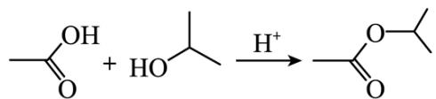

②

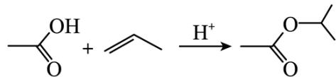

A. ①的反应类型为取代反应
B. 反应②是合成酯的方法之一
C. 产物分子中所有碳原子共平面
D. 产物的化学名称是乙酸异丙酯

【答案】C

【解析】

【详解】A．反应①为乙酸和异丙醇在酸的催化下发生酯化反应生成了乙酸异丙酯和水，因此，①的反应类型为取代反应，A叙述正确；

B. 反应②为乙酸和丙烯发生加成反应生成乙酸异丙酯，该反应的原子利用率为 $100\%$ ，因此，该反应是合成酯的方法之一，B叙述正确；  
C. 乙酸异丙酯分子中含有4个饱和的碳原子，其中异丙基中存在着一个饱和碳原子连接两个饱和碳原子和一个乙酰氧基，类比甲烷的正四面体结构可知，乙酸异丙酯分子中的所有碳原子不可能共平面，C叙述是错误；  
D. 两个反应的产物是相同的，从结构上看，该产物是由乙酸与异丙醇通过酯化反应生成的酯，故其化学名称是乙酸异丙酯，D叙述是正确；  
综上所述，本题选C。

3. 下列装置可以用于相应实验的是

<table><tr><td>A</td><td>B</td><td>C</td><td>D</td></tr><tr><td></td><td></td><td>品红溶液</td><td></td></tr><tr><td>制备 $CO_2$ </td><td>分离乙醇和乙酸</td><td>验证 $SO_2$ 酸性</td><td>测量 $O_2$ 体积</td></tr></table>

【答案】D

【解析】

【详解】A. $Na_{2}CO_{3}$ 固体比较稳定，受热不易分解，所以不能采用加热碳酸钠的方式制备二氧化碳，A 错误；
B．乙醇和乙酸是互溶的，不能采用分液的方式分离，应采用蒸馏来分离，B 错误；
C．二氧化硫通入品红溶液中，可以验证其漂白性，不能验证酸性，C 错误；
D．测量氧气体积时，装置选择量气筒，测量时要恢复到室温，量气筒和水准管两边液面高度相等时，氧气排开水的体积与氧气的体积相等，即可用如图装置测量氧气的体积，D 正确；
故选 D。

4. 一种矿物由短周期元素 W、X、Y 组成，溶于稀盐酸有无色无味气体生成。W、X、Y 原子序数依次增大。简单离子 $X^{2-}$ 与 $Y^{2+}$ 具有相同的电子结构。下列叙述正确的是  
A. X 的常见化合价有 -1、-2 B. 原子半径大小为 $Y > X > W$ C. YX 的水合物具有两性 D. W 单质只有 4 种同素异形体

【分析】W、X、Y 为短周期元素，原子序数依次增大，简单离子 $X^{2-}$ 与 $Y^{2+}$ 具有相同的电子结构，则它们均为 10 电子微粒，X 为 O，Y 为 Mg，W、X、Y 组成的物质能溶于稀盐酸有无色无味的气体产生，则 W 为 C，产生的气体为二氧化碳，据此解答。
【详解】A. X 为 O，氧的常见价态有 -1 价和 -2 价，如 $H_{2}O_{2}$ 和 $H_{2}O$ ，A 正确；
B. W 为 C, X 为 O, Y 为 Mg，同主族时电子层数越多，原子半径越大，电子层数相同时，原子序数越小，原子半径越大，所以原子半径大小为：Y > W > X，B 错误；
C. Y 为 Mg, X 为 O, 他们可形成 MgO, 水合物为 $\mathrm{Mg(OH)}_{2}, \mathrm{Mg(OH)}_{2}$ 只能与酸反应生成盐和水，不能与碱反应，所以 YX 的水合物没有两性，C 错误；
D. W 为 C, 碳的同素异形体有：金刚石、石墨、石墨烯、富勒烯、碳纳米管等，种类不止四种，D 错误；故选 A。

5. 一些化学试剂久置后易发生化学变化。下列化学方程式可正确解释相应变化的是

<table><tr><td>A</td><td>硫酸亚铁溶液出现棕黄色沉淀</td><td> $6FeSO_{4} + O_{2} + 2H_{2}O = 2Fe_{2}(SO_{4})_{3} + 2Fe(OH)_{2} \downarrow$ </td></tr><tr><td>B</td><td>硫化钠溶液出现浑浊颜色变深</td><td> $Na_{2}S + 2O_{2} = Na_{2}SO_{4}$ </td></tr><tr><td>C</td><td>溴水颜色逐渐褪去</td><td> $4Br_{2} + 4H_{2}O = HBrO_{4} + 7HBr$ </td></tr><tr><td>D</td><td>胆矾表面出现白色粉末</td><td> $CuSO_{4} \cdot 5H_{2}O = CuSO_{4} + 5H_{2}O$ </td></tr></table>

A.A B.B C.C D.D

【答案】D

【解析】

【详解】A．溶液呈棕黄色是因为有 $Fe^{3+}$ ，有浑浊是产生了 $\mathrm{Fe(OH)}_{3}$ ，因为硫酸亚铁久置后易被氧气氧化，化学方程式为： $12\mathrm{FeSO}_{4} + 3\mathrm{O}_{2} + 6\mathrm{H}_{2}\mathrm{O} = 4\mathrm{Fe}_{2}(\mathrm{SO}_{4})_{3} + 4\mathrm{Fe}(\mathrm{OH})_{3} \downarrow$ ，A 错误；

B. 硫化钠在空气中易被氧气氧化为淡黄色固体硫单质，使颜色加深，化学方程式为： $2\mathrm{Na}_{2}\mathrm{S}+\mathrm{O}_{2}+2\mathrm{H}_{2}\mathrm{O}=4\mathrm{NaOH}+2\mathrm{S}\downarrow$ ，B 错误；

C. 溴水的主要成分是溴和水, 它们会反应, 但速度很慢, $\mathrm{Br}_{2} + \mathrm{H}_{2} \mathrm{O} = \mathrm{HBrO} + \mathrm{HBr}$ , $2 \mathrm{HBrO} = 2 \mathrm{HBr} + \mathrm{O}_{2}$ , 所以溴水放置太久会变质。但不是生成高溴酸, 所以选项中的化学方程式错误, C 错误; D. 胆矾为 $\mathrm{CuSO}_{4} \cdot 5 \mathrm{H}_{2} \mathrm{O}$ , 颜色为蓝色, 如果表面失去结晶水, 则变为白色的 $\mathrm{CuSO}_{4}$ , 化学方程式为: $\mathrm{CuSO}_{4} \cdot 5 \mathrm{H}_{2} \mathrm{O} = \mathrm{CuSO}_{4} + 5 \mathrm{H}_{2} \mathrm{O}$ , 方程式正确, D 正确; 故选 D。

6. 室温钠-硫电池被认为是一种成本低、比能量高的能源存储系统。一种室温钠-硫电池的结构如图所示。将钠箔置于聚苯并咪唑膜上作为一个电极，表面喷涂有硫黄粉末的炭化纤维素纸作为另一电极。工作时，在硫电极发生反应： $\frac{1}{2} \mathrm{S}_{8} + \mathrm{e}^{-} \rightarrow \frac{1}{2} \mathrm{S}_{8}^{2-}$ ， $\frac{1}{2} \mathrm{S}_{8}^{2-} + \mathrm{e}^{-} \rightarrow \mathrm{S}_{4}^{2-}$ ， $2 \mathrm{Na}^{+} + \frac{\mathrm{X}}{4} \mathrm{S}_{4}^{2-} + 2 (1 - \frac{\mathrm{X}}{4}) \mathrm{e}^{-} \rightarrow \mathrm{Na}_{2} \mathrm{S}_{\mathrm{x}}$

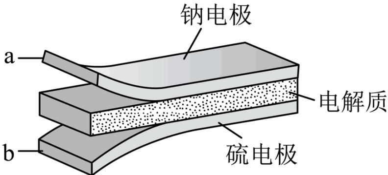

下列叙述错误的是
A. 充电时 $Na^{+}$ 从钠电极向硫电极迁移
B. 放电时外电路电子流动的方向是 $a \rightarrow b$ C. 放电时正极反应为： $2\mathrm{Na}^{+}+\frac{x}{8}\mathrm{S}_{8}+2\mathrm{e}^{-}\rightarrow\mathrm{Na}_{2}\mathrm{S}_{x}$ D. 炭化纤维素纸的作用是增强硫电极导电性能

【分析】由题意可知放电时硫电极得电子，硫电极为原电池正极，钠电极为原电池负极。

【详解】A. 充电时为电解池装置，阳离子移向阴极，即钠电极，故充电时， $\mathrm{Na}^{+}$ 由硫电极迁移至钠电极，A错误；  
B. 放电时 Na 在 a 电极失去电子，失去的电子经外电路流向 b 电极，硫黄粉在 b 电极上得电子与 a 电极释放出的 $\mathrm{Na}^{+}$ 结合得到 $\mathrm{Na}_{2} \mathrm{~S}_{\mathrm{x}}$ ，电子在外电路的流向为 $a \rightarrow b$ ，B 正确；  
C. 由题给的的一系列方程式相加可以得到放电时正极的反应式为 $2 \mathrm{~Na}^{+} + \frac{x}{8} \mathrm{~S}_{8} + 2 \mathrm{e}^{-} \rightarrow \mathrm{Na}_{2} \mathrm{~S}_{\mathrm{x}}$ ，C 正确；  
D. 炭化纤维素纸中含有大量的炭，炭具有良好的导电性，可以增强硫电极的导电性能，D 正确；故答案选 A。

7. 一定温度下， $\mathrm{AgCl}$ 和 $\mathrm{Ag_2CrO_4}$ 的沉淀溶解平衡曲线如图所示。

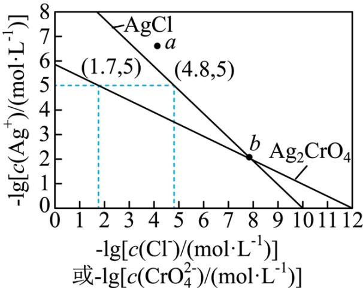

下列说法正确的是
A. a 点条件下能生成 $Ag_{2}CrO_{4}$ 沉淀，也能生成 AgCl 沉淀
B. b 点时， $c(\mathrm{Cl}^{-})=c(\mathrm{CrO}_{4}^{2-})$ ， $K_{\mathrm{sp}}(\mathrm{AgCl})=K_{\mathrm{sp}}(\mathrm{Ag}_{2}\mathrm{CrO}_{4})$ C. $Ag_{2}CrO_{4} + 2Cl^{-} \rightleftharpoons 2AgCl + CrO_{4}^{2-}$ 的平衡常数 $K = 10^{7.9}$ D. 向 NaCl、 $Na_{2}CrO_{4}$ 均为 $0.1mol \cdot L^{-1}$ 的混合溶液中滴加 $AgNO_{3}$ 溶液，先产生 $Ag_{2}CrO_{4}$ 沉淀

【分析】根据图像，由(1.7,5)可得到 $\mathrm{Ag_2CrO_4}$ 的溶度积 $K_{\mathrm{sp}}(\mathrm{Ag_2CrO_4}) = c^2 (\mathrm{Ag}^+)\cdot c(\mathrm{CrO}_4^{2 - }) = (1\times 10^{-5})^2\times 1\times 10^{-1.7} = 10^{-11.7}$ ，由(4.8，5)可得到 AgCl 的溶度积 $K_{\mathrm{sp}}(\mathrm{AgCl}) = c(\mathrm{Ag}^{+})\cdot c(\mathrm{Cl}) = 1\times 10^{-5}\times 1\times 10^{-4.8} = 10^{-9.8}$ ，据此数据计算各选项结果。【详解】A．假设 a 点坐标为(4,6.5)，此时分别计算反应的浓度熵 $Q$ 得， $Q(\mathrm{AgCl}) = 10^{-10.5}$ ， $Q(\mathrm{Ag_2CrO_4}) = 10^{-17}$ ，二者的浓度熵均小于其对应的溶度积 $K_{\mathrm{sp}}$ ，二者不会生成沉淀，A 错误；B． $K_{\mathrm{sp}}$ 为难溶物的溶度积，是一种平衡常数，平衡常数只与温度有关，与浓度无关，根据分析可知，二者的溶度积不相同，B 错误；C．该反应的平衡常数表达式为 $K = \frac{c(\mathrm{CrO}_4^{2 - })}{c^2 (\mathrm{Cl^-})}$ ，将表达式转化为与两种难溶物的溶度积有关的式子得 $K = \frac{c(\mathrm{CrO}_4^{2 - })}{c^2 (\mathrm{Cl^-})} = \frac{c(\mathrm{CrO}_4^{2 - })\cdot c^2 (\mathrm{Ag^+})}{c^2 (\mathrm{Cl^-})\cdot c^2 (\mathrm{Ag^+})} = \frac{K_{\mathrm{sp}}(\mathrm{AgCrO_4})}{K_{\mathrm{sp}}^2(\mathrm{AgCl})} = \frac{1\times 10^{-11.7}}{(1\times 10^{-9.8})^2} = 1\times 10^{7.9}$ ，C 正确；D．向 NaCl、 $\mathrm{Na_2CrO_4}$ 均为 $0.1\mathrm{mol}\cdot \mathrm{L}^{-1}$ 的混合溶液中滴加 $\mathrm{AgNO_3}$ ，开始沉淀时所需要的 $c(\mathrm{Ag^+})$ 分别为 $10^{-8.8}$ 和 $10^{-5.35}$ ，说明此时沉淀 Cl-需要的银离子浓度更低，在这种情况下，先沉淀的是 AgCl，D 错误；故答案选 C。

## 二、非选择题：本题共4小题，共58分。(必做题：26\~28题，选做题：35-36题)

8. 元素分析是有机化合物的表征手段之一。按下图实验装置(部分装置略)对有机化合物进行 C、H 元素分析。

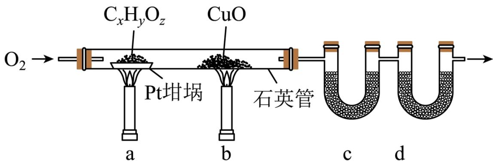  
回答下列问题:

(1) 将装有样品的 Pt 坩埚和 CuO 放入石英管中, 先\_\_\_\_, 而后将已称重的 U 型管 c、d 与石英管连接, 检查\_\_\_\_。依次点燃煤气灯\_\_\_\_, 进行实验。

(2) $\mathrm{O}_{2}$ 的作用有\_\_\_\_。 $\mathrm{CuO}$ 的作用是\_\_\_\_(举1例, 用化学方程式表示)。

(3) c 和 d 中的试剂分别是\_\_\_\_、\_\_\_\_(填标号)。c 和 d 中的试剂不可调换, 理由是\_\_\_\_。
A. $CaCl_{2}$ B. NaCl C. 碱石灰 $(CaO+NaOH)$ D. $Na_{2}SO_{3}$

(4) Pt 坩埚中样品 $C_xH_yO_z$ 反应完全后, 应进行操作: 。取下 c 和 d 管称重。

(5) 若样品 $\mathrm{C_xH_yO_z}$ 为 $0.0236\mathrm{g}$ , 实验结束后, c 管增重 $0.0108\mathrm{g}$ , d 管增重 $0.0352\mathrm{g}$ 。质谱测得该有机物的相对分子量为 118 , 其分子式为 \_\_\_\_ 。 【答案】(1) ①. 通入一定的 $\mathrm{O}_2$ ②. 装置气密性 ③. b、a

(2) ①. 为实验提供氧化剂、提供气流保证反应产物完全进入到 U 型管中 ②. $CO + CuO \xlongequal{\Delta} Cu + CO_{2}$ (3) ①. A ②. C ③. 碱石灰可以同时吸收水蒸气和二氧化碳

（4）继续吹入一定量的 $\mathrm{O}_2$ ，冷却装置  
(5） $\mathrm{C_4H_6O_4}$

【解析】

【分析】利用如图所示的装置测定有机物中 C、H 两种元素的含量，这是一种经典的李比希元素测定法，将样品装入 Pt 坩埚中，后面放置一 CuO 做催化剂，用于催化前置坩埚中反应不完全的物质，后续将产物吹入道两 U 型管中，称量两 U 型管的增重计算有机物中 C、H 两种元素的含量，结合其他技术手段，从而得到有机物的分子式。

【小问 1 详解】

实验前，应先通入一定的 $O_{2}$ 吹空石英管中的杂质气体，保证没有其他产物生成，而后将已 U 型管 c、d 与

已知： $K_{\mathrm{sp}}[\mathrm{Fe}(\mathrm{OH})_{3}]=2.8\times10^{-39}$ ， $K_{\mathrm{sp}}[\mathrm{Al}(\mathrm{OH})_{3}]=1.3\times10^{-33}$ ， $K_{\mathrm{sp}}[\mathrm{Ni}(\mathrm{OH})_{2}]=5.5\times10^{-16}$ 。

石英管连接，检查装置气密性，随后先点燃 b 处酒精灯后点燃 a 处酒精灯，保证当 a 处发生反应时产生的 CO 能被 CuO 反应生成 $CO_{2}$

【小问 2 详解】

实验中 $O_{2}$ 的作用有：为实验提供氧化剂、提供气流保证反应产物完全进入到 U 型管中；CuO 的作用是催化 a 处产生的 CO，使 CO 反应为 $CO_{2}$ ，反应方程式为 $CO + CuO \xlongequal{\Delta} Cu + CO_{2}$

## 【小问 3 详解】

有机物燃烧后生成的 $CO_{2}$ 和 $H_{2}O$ 分别用碱石灰和无水 $CaCl_{2}$ 吸收，其中 c 管装有无水 $CaCl_{2}$ ，d 管装有碱石灰，二者不可调换，因为碱石灰能同时吸收水蒸气和二氧化碳，影响最后分子式的确定；

## 【小问 4 详解】

反应完全以后应继续吹入一定量的 $\mathrm{O}_2$ ，保证石英管中的气体产物完全吹入两U行管中，使装置冷却；【小问5详解】

c 管装有无水 $CaCl_{2}$ ，用来吸收生成的水蒸气，则增重量为水蒸气的质量，由此可以得到有机物中 H 元素的物质的量 $n(\mathrm{H})=\frac{2\times m(\mathrm{H}_{2}\mathrm{O})}{M(\mathrm{H}_{2}\mathrm{O})}=\frac{2\times0.0108\mathrm{g}}{18\mathrm{g}\cdot\mathrm{mol}^{-1}}=0.0012\mathrm{mol}$ ; d 管装有碱石灰，用来吸收生成的 $CO_{2}$ ，则增重量为 $CO_{2}$ 的质量，由此可以得到有机物中 C 元素的物质的量 $n(\mathrm{C})=\frac{m(\mathrm{CO}_{2})}{M(\mathrm{CO}_{2})}=\frac{0.0352\mathrm{g}}{44\mathrm{g}\cdot\mathrm{mol}^{-1}}=0.0008\mathrm{mol}$ ; 有机物中 O 元素的物质的量为 0.0128g，其物质的量 $n(\mathrm{O})=\frac{m(\mathrm{O})}{M(\mathrm{O})}=\frac{0.00128\mathrm{g}}{16\mathrm{g}\cdot\mathrm{mol}^{-1}}=0.0008\mathrm{mol}$ ; 该有机物中 C、H、O 三种元素的原子个数比为 0.0008: 0.0012: 0.0008=2: 3: 2; 质谱测得该有机物的相对分子质量为 118，则其化学式为 $C_{4}H_{6}O_{4}$ ;

【点睛】本实验的重点在于两 U 型管的摆放顺序，由于 $CO_{2}$ 需要用碱石灰吸收，而碱石灰的主要成分为 CaO 和 NaOH，其成分中的 CaO 也可以吸收水蒸气，因此在摆放 U 型管位置时应将装有碱石灰的 U 型管置于无水 $CaCl_{2}$ 之后，保证实验结果。

9. $\mathrm{LiMn_2O_4}$ 作为一种新型锂电池正极材料受到广泛关注。由菱锰矿（ $\mathrm{MnCO_3}$ ，含有少量 Si、Fe、Ni、Al 等元素）制备 $\mathrm{LiMn_2O_4}$ 的流程如下：

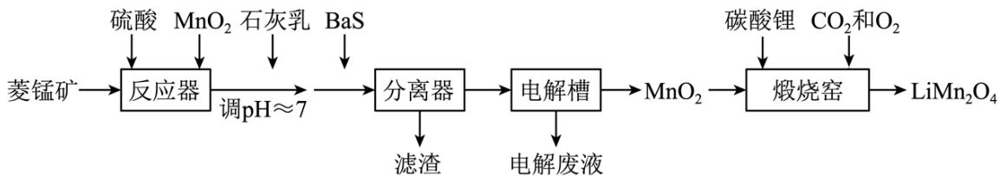

回答下列问题:

(1) 硫酸溶矿主要反应的化学方程式为\_\_\_\_。为提高溶矿速率, 可采取的措施\_\_\_\_(举 1 例)。

(2) 加入少量 $\mathrm{MnO}_{2}$ 的作用是\_\_\_\_。不宜使用 $\mathrm{H}_{2} \mathrm{O}_{2}$ 替代 $\mathrm{MnO}_{2}$ , 原因是\_\_\_\_。

(3) 溶矿反应完成后, 反应器中溶液 $\mathrm{pH} = 4$ , 此时 $c(\mathrm{Fe}^{3+}) =$ \_\_\_\_ mol·L $^{-1}$ ; 用石灰乳调节至 $\mathrm{pH} \approx 7$ , 除去的金属离子是\_\_\_\_。

(4) 加入少量 BaS 溶液除去 $\mathrm{Ni}^{2+}$ , 生成的沉淀有\_\_\_\_。

(5) 在电解槽中, 发生电解反应的离子方程式为\_\_\_\_。随着电解反应进行, 为保持电解液成分稳定,应不断\_\_\_\_。电解废液可在反应器中循环利用。

(6) 缎烧窑中, 生成 $\mathrm{LiMn}_{2} \mathrm{O}_{4}$ 反应的化学方程式是\_\_\_\_。

【答案】(1) ① $MnCO_{3}+H_{2}SO_{4}=MnSO_{4}+H_{2}O+CO_{2}\uparrow$ ②. 粉碎菱锰矿

(2) ①. 将 $\mathrm{Fe}^{2+}$ 氧化为 $\mathrm{Fe}^{3+}$ ②. $\mathrm{Fe}^{3+}$ 可以催化 $\mathrm{H}_2\mathrm{O}_2$ 分解  
(3) ①. $2.8 \times 10^{-9}$ ②. $\mathrm{Al}^{3+}$

(4) $\mathrm{BaSO}_4$ 、NiS

(5) ①. $\mathrm{Mn}^{2+} + 2\mathrm{H}_{2}\mathrm{O}\xlongequal{\text{电解}}\mathrm{H}_{2}\uparrow +\mathrm{MnO}_{2}\downarrow +2\mathrm{H}^{+}$ ②. 加入 $\mathrm{MnSO_4}$

(6) $2Li_{2}CO_{3}+8MnO_{2}\xlongequal{煅烧}4LiMn_{2}O_{4}+2CO_{2}\uparrow+O_{2}\uparrow$

【解析】

【分析】根据题给的流程，将菱锰矿置于反应器中，加入硫酸和 $MnO_{2}$ ，可将固体溶解为离子，将杂质中的 Fe、Ni、Al 等元素物质也转化为其离子形式，同时，加入的 $MnO_{2}$ 可以将溶液中的 $Fe^{2+}$ 氧化为 $Fe^{3+}$ ；随后将溶液 pH 调至制约等于 7，此时，根据已知条件给出的三种氢氧化物的溶度积可以将溶液中的 $Al^{3+}$ 沉淀出来；随后加入 BaS，可以将溶液中的 $Ni^{2+}$ 沉淀，得到相应的滤渣；后溶液中含有大量的 $Mn^{2+}$ ，将此溶液置于电解槽中电解，得到 $MnO_{2}$ ，将 $MnO_{2}$ 与碳酸锂共同煅烧得到最终产物 $LiMn_{2}O_{4}$ 。

【小问 1 详解】

菱锰矿中主要含有 $MnCO_{3}$ ，加入硫酸后可以与其反应，硫酸溶矿主要反应的化学方程式为： $MnCO_{3}+H_{2}SO_{4}=MnSO_{4}+H_{2}O+CO_{2}\uparrow$ ；为提高溶矿速率，可以将菱锰矿粉碎；故答案为： $MnCO_{3}+H_{2}SO_{4}=MnSO_{4}+H_{2}O+CO_{2}\uparrow$ 、粉碎菱锰矿。

【小问 2 详解】

根据分析, 加入 $\mathrm{MnO}_{2}$ 的作用是将酸溶后溶液中含有的 $\mathrm{Fe}^{2+}$ 氧化为 $\mathrm{Fe}^{3+}$ , 但不宜使用 $\mathrm{H}_{2} \mathrm{O}_{2}$ 氧化 $\mathrm{Fe}^{2+}$ , 因为氧化后生成的 $\mathrm{Fe}^{3+}$ 可以催化 $\mathrm{H}_{2} \mathrm{O}_{2}$ 分解, 不能使溶液中的 $\mathrm{Fe}^{2+}$ 全部氧化为 $\mathrm{Fe}^{3+}$ ; 故答案为: 将 $\mathrm{Fe}^{2+}$ 氧化为

$Fe^{3+}$ 、 $Fe^{3+}$ 可以催化 $H_{2}O_{2}$ 分解。

【小问 3 详解】

溶矿完成以后，反应器中溶液 pH=4，此时溶液中 $c(\mathrm{OH}^{-})=1.0\times10^{-10}\mathrm{mol}\cdot\mathrm{L}^{-1}$ ，此时体系中含有的 $c(\mathrm{Fe}^{3+})=\frac{K_{\mathrm{sp}}[\mathrm{Fe}(\mathrm{OH})_{3}]}{c^{3}(\mathrm{OH}^{-})}=2.8\times10^{-9}\mathrm{mol}\cdot\mathrm{L}^{-1}$ ，这时，溶液中的 $c(\mathrm{Fe}^{3+})$ 小于 $1.0\times10^{-5}$ ，认为 $Fe^{3+}$ 已经沉淀完全；用石灰乳调节至 $pH\approx7$ ，这时溶液中 $c(\mathrm{OH}^{-})=1.0\times10^{-7}\mathrm{mol}\cdot\mathrm{L}^{-1}$ ，溶液中 $c(\mathrm{Al}^{3+})=1.3\times10^{-12}\mathrm{mol}\cdot\mathrm{L}^{-1}$ ， $c(\mathrm{Ni}^{2+})=5.5\times10^{-4}\mathrm{mol}\cdot\mathrm{L}^{-1}$ ， $c(\mathrm{Al}^{3+})$ 小于 $1.0\times10^{-5}$ ， $Al^{3+}$ 沉淀完全，这一阶段除去的金属离子是 $Al^{3+}$ ；故答案为： $2.8\times10^{-9}$ 、 $Al^{3+}$ 。

【小问 4 详解】

加入少量 BaS 溶液除去 $Ni^{2+}$ ，此时溶液中发生的离子方程式为 $BaS + Ni^{2+} + SO_{4}^{2-} = BaSO_{4}\downarrow + NiS\downarrow$ ，生成的沉淀有 $BaSO_{4}$ 、NiS。

【小问 5 详解】

在电解槽中， $\mathrm{Mn}^{2+}$ 发生反应生成 $\mathrm{MnO}_2$ ，反应的离子方程式为 $\mathrm{Mn}^{2+} + 2\mathrm{H}_2\mathrm{O} \xrightarrow{\text{电解}} \mathrm{H}_2 \uparrow + \mathrm{MnO}_2 \downarrow + 2\mathrm{H}^+$ ；电解时电

解液中 $Mn^{2+}$ 大量减少，需要加入 $MnSO_{4}$ 以保持电解液成分的稳定；故答案为： $Mn^{2+} + 2H_{2}O\xlongequal{电解} H_{2}\uparrow + MnO_{2}\downarrow + 2H^{+}$ ，加入 $MnSO_{4}$ 。

$H_{2}\uparrow+MnO_{2}\downarrow+2H^{+}$ 、加入 $MnSO_{4}$ 。

【小问 6 详解】

煅烧窑中 $\mathrm{MnO_2}$ 与 $\mathrm{Li_2CO_3}$ 发生反应生成 $\mathrm{LiMn_2O_4}$ ，反应的化学方程式为 $2\mathrm{Li_2CO_3 + 8MnO_2}$ 煅烧

$4LiMn_{2}O_{4}+2CO_{2}\uparrow+O_{2}\uparrow$ ; 故答案为： $2Li_{2}CO_{3}+8MnO_{2}\xlongequal{煅烧}4LiMn_{2}O_{4}+2CO_{2}\uparrow+O_{2}\uparrow$ 。

10. 硫酸亚铁在工农业生产中有许多用途，如可用作农药防治小麦黑穗病，制造磁性氧化铁、铁催化剂等。回答下列问题：

(1) 在 $\mathrm{N}_{2}$ 气氛中, $\mathrm{FeSO}_{4} \cdot 7 \mathrm{H}_{2} \mathrm{O}$ 的脱水热分解过程如图所示:

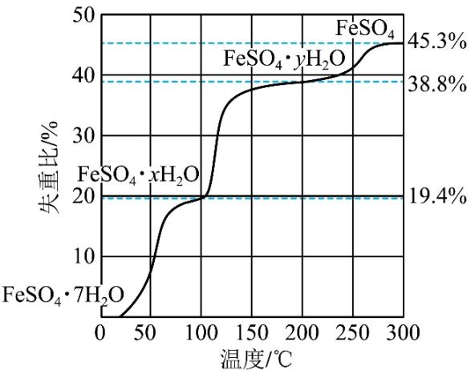

根据上述实验结果，可知 x = \_\_\_\_ ， y = \_\_\_\_ 。

(2) 已知下列热化学方程式:

$$
\begin{array}{l l} \mathrm{FeSO} _ {4} \cdot 7 \mathrm{H} _ {2} \mathrm{O} (\mathrm{s}) = \mathrm{FeSO} _ {4} (\mathrm{s}) + 7 \mathrm{H} _ {2} \mathrm{O} (\mathrm{g}) & \Delta H _ {1} = \mathrm{akJ} \cdot \mathrm{mol} ^ {- 1} \\ \mathrm{FeSO} _ {4} \cdot \mathrm{xH} _ {2} \mathrm{O} (\mathrm{s}) = \mathrm{FeSO} _ {4} (\mathrm{s}) + \mathrm{xH} _ {2} \mathrm{O} (\mathrm{g}) & \Delta H _ {2} = \mathrm{bkJ} \cdot \mathrm{mol} ^ {- 1} \\ \mathrm{FeSO} _ {4} \cdot \mathrm{yH} _ {2} \mathrm{O} (\mathrm{s}) = \mathrm{FeSO} _ {4} (\mathrm{s}) + \mathrm{yH} _ {2} \mathrm{O} (\mathrm{g}) & \Delta H _ {3} = \mathrm{ckJ} \cdot \mathrm{mol} ^ {- 1} \end{array}
$$

则 $\mathrm{FeSO_4\cdot 7H_2O(s) + FeSO_4\cdot yH_2O(s) = 2(FeSO_4\cdot xH_2O)(s)}$ 的 $\Delta H =$ \_\_\_\_ kJ·mol-1。

(3) 将 $\mathrm{FeSO}_{4}$ 置入抽空的刚性容器中, 升高温度发生分解反应:

$2\mathrm{FeSO}_{4}\left(\mathrm{s}\right)\rightleftharpoons\mathrm{Fe}_{2}\mathrm{O}_{3}\left(\mathrm{s}\right)+\mathrm{SO}_{2}\left(\mathrm{g}\right)+\mathrm{SO}_{3}\left(\mathrm{g}\right)(\mathrm{I})$ 。平衡时 $P_{\mathrm{SO}_{3}}-\mathrm{T}$ 的关系如下图所示。660K时，该反应的平衡总压 $P_{总}=$ \_\_\_\_ kPa、平衡常数 $K_{p}\left(\mathrm{I}\right)=$ \_\_\_\_ (kPa) $^{2}$ 。 $K_{p}\left(\mathrm{I}\right)$ 随反应温度升高而\_\_\_\_(填“增大”“减小”或“不变”)。

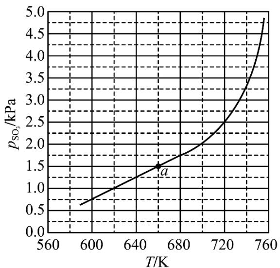

（4）提高温度，上述容器中进一步发生反应 $2\mathrm{SO}_{3}(\mathrm{g}) \rightleftharpoons 2\mathrm{SO}_{2}(\mathrm{g}) + \mathrm{O}_{2}(\mathrm{g})(\mathrm{II})$ ，平衡时 $P_{\mathrm{O}_{2}} =$

\_\_\_\_(用 $P_{\mathrm{SO_3}}$ 、 $P_{\mathrm{SO_2}}$ 表示)。在929K时， $P_{\text{总}} = 84.6 \mathrm{kPa}$ 、 $P_{\mathrm{SO_3}} = 35.7 \mathrm{kPa}$ ，则 $P_{\mathrm{SO_2}} =$ \_\_\_\_ kPa， $K_{\mathrm{p}}(\mathrm{II}) =$ \_\_\_\_ kPa (列出计算式)。

【答案】（1） ①.4 ②.1

（2）(a+c-2b)

（3） ①.3 ②.2.25 ③.增大

（4） ①. $\frac{P_{\mathrm{SO_2}} - P_{\mathrm{SO_3}}}{4}$ ②.46.26 ③. $\frac{46.26^2 \times 2.64}{35.7^2}$

由图中信息可知，当失重比为 $19.4\%$ 时， $\mathrm{FeSO_4 \cdot 7H_2O}$ 转化为 $\mathrm{FeSO_4 \cdot xH_2O}$ ，则 $\frac{18(7 - x)}{278} = 19.4\%$ ，解之得 $x = 4$ ；当失重比为 $38.8\%$ 时， $\mathrm{FeSO_4 \cdot 7H_2O}$ 转化为 $\mathrm{FeSO_4 \cdot yH_2O}$ ，则 $\frac{18(7 - y)}{278} = 38.8\%$ ，解之得 $y = 1$ 。

【小问 2 详解】

① $\mathrm{FeSO_4\cdot 7H_2O(s) = FeSO_4(s) + 7H_2O(g)}$ $\Delta H_{1} = \mathrm{akJ}\cdot \mathrm{mol}^{-1}$ ② $\mathrm{FeSO_4\cdot xH_2O(s) = FeSO_4(s) + xH_2O(g)}$ $\Delta H_{2} = \mathrm{bkJ}\cdot \mathrm{mol}^{-1}$ ③ $\mathrm{FeSO_4\cdot yH_2O(s) = FeSO_4(s) + yH_2O(g)}$ $\Delta H_{3} = \mathrm{ckJ}\cdot \mathrm{mol}^{-1}$

根据盖斯定律可知，①+③-②×2 可得 $\mathrm{FeSO}_{4}\cdot7\mathrm{H}_{2}\mathrm{O}(\mathrm{s})+\mathrm{FeSO}_{4}\cdot\mathrm{yH}_{2}\mathrm{O}(\mathrm{s})=2\left(\mathrm{FeSO}_{4}\cdot\mathrm{xH}_{2}\mathrm{O}\right)(\mathrm{s})$ ，则 $\Delta H=(a+c-2b)\mathrm{kJ}\cdot\mathrm{mol}^{-1}$ 。

将 $\mathrm{FeSO}_4$ 置入抽空的刚性容器中，升高温度发生分解反应： $2\mathrm{FeSO}_4(\mathrm{s}) \rightleftharpoons \mathrm{Fe}_2\mathrm{O}_3(\mathrm{s}) + \mathrm{SO}_2(\mathrm{g}) + \mathrm{SO}_3(\mathrm{g})(\mathrm{l})$ 。由平衡时 $P_{\mathrm{SO}_3} - \mathrm{T}$ 的关系图可知， $660\mathrm{K}$ 时， $P_{\mathrm{SO}_3} = 1.5\mathrm{kPa}$ ，则 $P_{\mathrm{SO}_2} = 1.5\mathrm{kPa}$ ，因此，该反应的平衡总压 $P_{\text {总}} = 3\mathrm{kPa}$ 、平衡常数 $K_{\mathrm{p}}(\mathrm{l}) = 1.5\mathrm{kPa} \times 1.5\mathrm{kPa} = 2.25(\mathrm{kPa})^2$ 。由图中信息可知， $P_{\mathrm{SO}_3}$ 随着温度升高而增大，因此， $\mathrm{K}_{\mathrm{p}}(\mathrm{l})$ 随反应温度升高而增大。

【小问 4 详解】

提高温度，上述容器中进一步发生反应 $2\mathrm{SO}_{3}\left(\mathrm{g}\right)\rightleftharpoons2\mathrm{SO}_{2}\left(\mathrm{g}\right)+\mathrm{O}_{2}\left(\mathrm{g}\right)$ (II)，在同温同压下，不同气体的物质的量之比等于其分压之比，由于仅发生反应(I)时 $P_{\mathrm{SO}_{3}}=P_{\mathrm{SO}_{2}}$ ，则 $P_{\mathrm{SO}_{3}}+2P_{\mathrm{O}_{2}}=P_{\mathrm{SO}_{2}}-2P_{\mathrm{O}_{2}}$ ，因此，平衡时 $P_{\mathrm{O}_{2}}=\frac{P_{\mathrm{SO}_{2}}-P_{\mathrm{SO}_{3}}}{4}$ 。在929K时， $P_{总}=84.6kPa$ 、 $P_{SO_{3}}=35.7kPa$ ，则 $P_{SO_{3}}+P_{SO_{2}}+P_{O_{2}}=P_{总}$ 、

$P_{\mathrm{SO_3}} + 2P_{\mathrm{O_2}} = P_{\mathrm{SO_2}} - 2P_{\mathrm{O_2}}$ ，联立方程组消去 $P_{\mathrm{O_2}}$ ，可得 $3P_{\mathrm{SO_3}} + 5P_{\mathrm{SO_2}} = 4P_{\text{总}}$ ，代入相关数据可求出 $P_{\mathrm{SO_2}} =$ $46.26\mathrm{kPa}$ ，则 $P_{\mathrm{O_2}} = 84.6\mathrm{kPa} - 35.7\mathrm{kPa} - 46.26\mathrm{kPa} = 2.64\mathrm{kPa}$

$$
K _ {\mathrm{p}} (\text {II}) = \frac {(4 6 . 2 6 \mathrm{kPa}) ^ {2} \times 2 . 6 4 \mathrm{kPa}}{(3 5 . 7 \mathrm{kPa}) ^ {2}} = \frac {4 6 . 2 6 ^ {2} \times 2 . 6 4}{3 5 . 7 ^ {2}} \mathrm{kPa。}
$$

## [化学——选修3：物质结构与性质]

11. 中国第一辆火星车“祝融号”成功登陆火星。探测发现火星上存在大量橄榄石矿物 $\left(\mathrm{Mg}_{\mathrm{x}}\mathrm{Fe}_{2-\mathrm{x}}\mathrm{SiO}_{4}\right)$ 。回答下列问题：

(1) 基态 Fe 原子的价电子排布式为\_\_\_\_。橄榄石中, 各元素电负性大小顺序为\_\_\_\_, 铁的化合价为\_\_\_\_。

(2) 已知一些物质的熔点数据如下表:

<table><tr><td>物质</td><td>熔点/°C</td></tr><tr><td>NaCl</td><td>800.7</td></tr><tr><td> $SiCl_{4}$ </td><td>-68.8</td></tr><tr><td> $GeCl_{4}$ </td><td>-51.5</td></tr><tr><td> $SnCl_{4}$ </td><td>-34.1</td></tr></table>

Na 与 Si 均为第三周期元素，NaCl 熔点明显高于 $SiCl_{4}$ ，原因是\_\_\_\_。分析同族元素的氯化物 $SiCl_{4}$ 、 $GeCl_{4}$ 、 $SnCl_{4}$ 熔点变化趋势及其原因\_\_\_\_。 $SiCl_{4}$ 的空间结构为\_\_\_\_，其中 Si 的轨道杂化形式为\_\_\_\_。

(3) 一种硼镁化合物具有超导性能, 晶体结构属于立方晶系, 其晶体结构、晶胞沿 c 轴的投影图如下所示, 晶胞中含有\_\_\_\_个 $\mathrm{Mg}$ 。该物质化学式为\_\_\_\_, B-B 最近距离为\_\_\_\_。

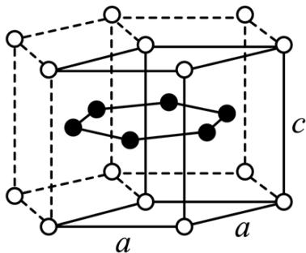

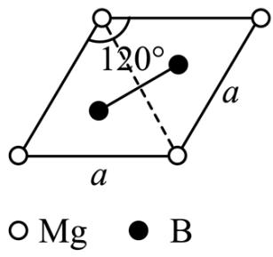

【答案】(1) ①. $3 \mathrm{~d}^{6} 4 \mathrm{~s}^{2}$ ②. $\mathrm{O} > \mathrm{Si} > \mathrm{Fe} > \mathrm{Mg}$ ③. +2

(2) ①. 钠的电负性小于硅, 氯化钠为离子晶体, 而 $\mathrm{SiCl}_{4}$ 为分子晶体 ②. 随着同族元素的电子层数的增多, 其熔点依次升高, 其原因是: $\mathrm{SiCl}_{4} 、 \mathrm{GeCl}_{4} 、 \mathrm{SnCl}_{4}$ 均形成分子晶体, 分子晶体的熔点由分子间作用力决定, 分子间作用力越大则其熔点越高; 随着其相对分子质量增大, 其分子间作用力依次增大 ③. 正四面体 ④. $\mathbf{sp}^{3}$

(3) ①.1
②. $\mathrm{MgB}_{2}$ ③. $\frac{\sqrt{3}}{3} a$

【解析】
【小问 1 详解】

Fe 为 26 号元素，基态 Fe 原子的价电子排布式为 $3d^{6}4s^{2}$ 。元素的金属性越强，其电负性越小，元素的非金属性越强则其电负性越大，因此，橄榄石 $\left(\mathrm{Mg}_{\mathrm{x}}\mathrm{Fe}_{2-\mathrm{x}}\mathrm{SiO}_{4}\right)$ 中，各元素电负性大小顺序为 O > Si > Fe > Mg；因为 $Mg_{x}Fe_{2-x}SiO_{4}$ 中 Mg、Si、O 的化合价分别为 +2、+4 和 -2， $x+2-x=2$ ，根据化合物中各元素的化合价的代数和为 0，可以确定铁的化合价为 +2。

【小问 2 详解】

Na 与 Si 均为第三周期元素，NaCl 熔点明显高于 $SiCl_{4}$ ，原因是：钠的电负性小于硅，氯化钠为离子晶体，其熔点较高；而 $SiCl_{4}$ 为分子晶体，其熔点较低。由表中的数据可知， $SiCl_{4}$ 、 $GeCl_{4}$ 、 $SnCl_{4}$ 熔点变化趋势为：随着同族元素的电子层数的增多，其熔点依次升高，其原因是： $SiCl_{4}$ 、 $GeCl_{4}$ 、 $SnCl_{4}$ 均形成分子晶体，分子晶体的熔点由分子间作用力决定，分子间作用力越大则其熔点越高；随着其相对分子质量增大，其分子间作用力依次增大。 $SiCl_{4}$ 的空间结构为正四面体，其中 Si 的价层电子对数为 4，因此 Si 的轨道杂化形式为 $sp^{3}$ 。

## 【小问3详解】

由硼镁化合物的晶体结构可知 $\mathrm{Mg}$ 位于正六棱柱的顶点和面心，由均摊法可以求出正六棱柱中含有 $12 \times \frac{1}{6} + 2 \times \frac{1}{2} = 3$ 个 $\mathrm{Mg}$ ，由晶胞沿c轴的投影图可知本题所给晶体结构包含三个晶胞，则晶胞中 $\mathrm{Mg}$ 的个数为1；晶体结构中B在正六棱柱体内共6个，则该物质的化学式为 $\mathrm{MgB}_2$ ；由晶胞沿c轴的投影图可知，B原子在图中两个正三角形的重心，该点到顶点的距离是该点到对边中点距离的2倍，顶点到对边的垂线长度为 $\frac{\sqrt{3}}{2} a$ ，因此B-B最近距离为 $\frac{\sqrt{3}}{2} a \times \frac{1}{3} \times 2 = \frac{\sqrt{3}}{3} a$ 。

## [化学——选修5：有机化学基础]

12. 奥培米芬(化合物 J)是一种雌激素受体调节剂，以下是一种合成路线(部分反应条件已简化)。

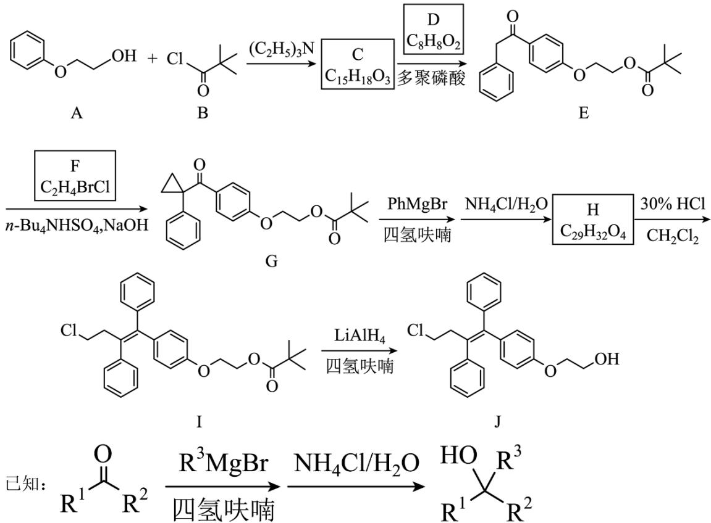

回答下列问题:

(1) A 中含氧官能团的名称是\_\_\_\_。

(2) C 的结构简式为\_\_\_\_。

(3) D 的化学名称为\_\_\_\_。

(4) F 的核磁共振谱显示为两组峰, 峰面积比为 $1: 1$ , 其结构简式为 \_\_\_\_。

(5) H 的结构简式为\_\_\_\_。

(6) 由 I 生成 J 的反应类型是 \_\_\_\_。

(7) 在 D 的同分异构体中, 同时满足下列条件的共有\_\_\_\_种;

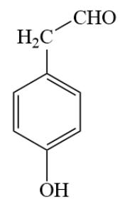

①能发生银镜反应；②遇 $FeCl_{3}$ 溶液显紫色；③含有苯环。

其中，核磁共振氢谱显示为五组峰、且峰面积比为 $2:2:2:1:1$ 的同分异构体的结构简式为\_\_\_\_。

【答案】（1）醚键和羟基

(2)

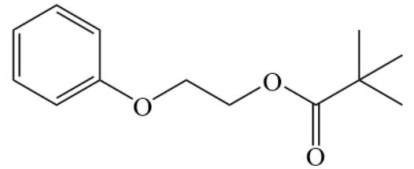

(3) 苯乙酸

(4)

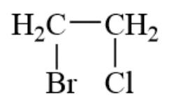

(5)

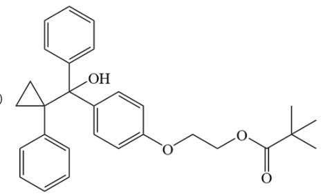

(6) 还原反应

(7)

①. 13

②.

【解析】

【分析】有机物 A 与有机物 B 发生反应生成有机物 C，有机物 C 与有机物 D 在多聚磷酸的条件下反应生成有机物 E，根据有机物 E 的结构可以推测，有机物 C 的结构为

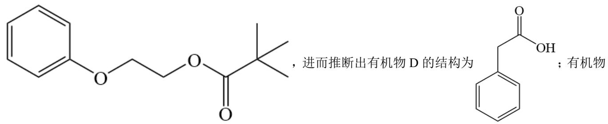

E 与有机物 F 反应生成有机物 G，有机物 G 根据已知条件发生反应生成有机物 H，有机物 H 的结构为

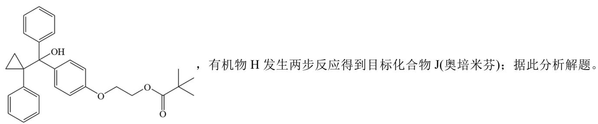

【小问1详解】

根据有机物 A 的结构，有机物 A 中的含氧官能团是醚键和羟基。

【小问 2 详解】

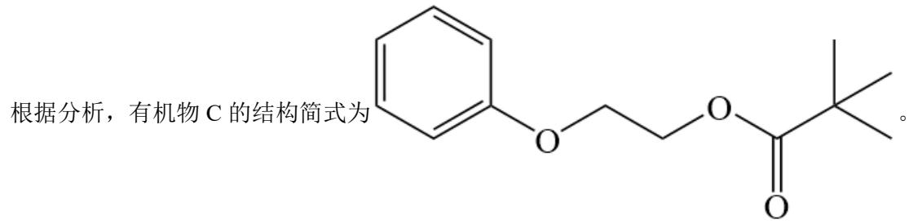

【小问3详解】

根据分析，有机物D的结构为\$\begin{array}{c}\text{C}\_6\text{H}\_4\text{OH}\\ \hline \end{array}\$，其化学名称为苯乙酸。

【小问4详解】

有机物F的核磁共振氢谱显示未两组峰，封面积比为1：1，说明这4个H原子被分为两组，且物质应该是

一种对称的结构，结合有机物 F 的分子式可以得到，有机物 F 的结构简式为 $\begin{array}{c} H_{2}C—CH_{2} \\ | \quad | \\ Br \quad Cl \end{array}$ 。

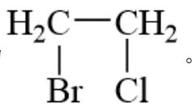

【小问5详解】

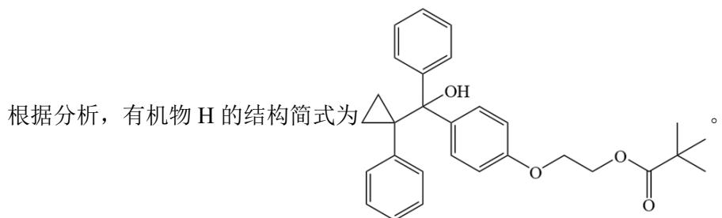

【小问6详解】

根据流程，有机物 I 在 $LiAlH_{4}$ /四氢呋喃的条件下生成有机物 J， $LiAlH_{4}$ 是一种非常强的还原剂能将酯基中的羰基部分还原为醇，该反应作用在有机物 I 的酯基上得到醇，因此该反应为还原反应。

【小问7详解】

能发生银镜反应说明该结构中含有醛基，能遇 $\mathrm{FeCl}_3$ 溶液显紫色说明该结构中含有酚羟基，则满足这三个条件的同分异构体有13种。此时可能是情况有，固定醛基、酚羟基的位置处在邻位上，变换甲基的位置，这种情况下有4种可能；固定醛基、酚羟基的位置处在间位上，变换甲基的位置，这种情况下有4种可能；固定醛基、酚羟基的位置处在对位上，变换甲基的位置，这种情况下有2种可能；将醛基与亚甲基相连，变换酚羟基的位置，这种情况下有3种可能，因此满足以上条件的同分异构体有 $4 + 4 + 2 + 3 = 13$ 种。其中，核磁共振氢谱显示为五组峰，且峰面积比为 2:2:2:1:1，说明这总同分异构体中不能含有甲基且结构为一

种对称结构，因此，这种同分异构体的结构简式为：

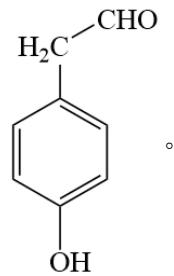