# 2023年普通高中学业水平等级性考试

# (北京卷)

# 化学

可能用到的相对原子质量：H-1 C-12 N-14 O-16 Mg-24 S-32

## 第一部分

本部分共 14 小题，每题 3 分，共 42 分。在每题列出的四个选项中，选出最符合题目要求的一项。

1. 中国科学家首次成功制得大面积单晶石墨炔，是碳材料科学的一大进步。

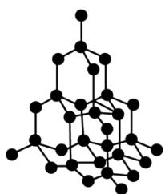  
金刚石

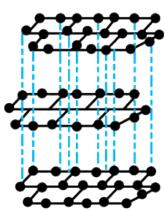  
石墨

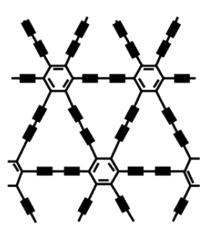  
石墨炔

下列关于金刚石、石墨、石墨炔的说法正确的是
A. 三种物质中均有碳碳原子间的 $\sigma$ 键 B. 三种物质中的碳原子都是 $\mathrm{sp}^{3}$ 杂化 C. 三种物质的晶体类型相同 D. 三种物质均能导电

【答案】A

【解析】

【详解】A．原子间优先形成σ键，三种物质中均存在σ键，A项正确；

B. 金刚石中所有碳原子均采用 $\mathbf{sp}^3$ 杂化, 石墨中所有碳原子均采用 $\mathbf{sp}^2$ 杂化, 石墨炔中苯环上的碳原子采用 $\mathbf{sp}^2$ 杂化, 碳碳三键上的碳原子采用 $\mathbf{sp}$ 杂化, B项错误;  
C. 金刚石为共价晶体, 石墨炔为分子晶体, 石墨为混合晶体, C项错误;  
D. 金刚石中没有自由移动电子, 不能导电, D项错误;

故选 A。

2. 下列化学用语或图示表达正确的是
A. NaCl 的电子式为 Na:Cl:
B. $NH_{3}$ 的 VSEPR 模型为

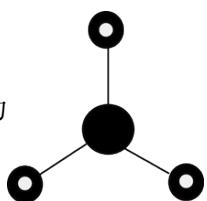

C. $2p_{z}$ 电子云图为

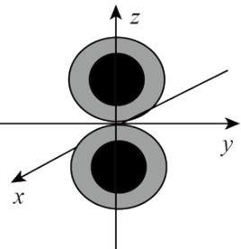

D. 基态 $_{24}Cr$ 原子的价层电子轨道表示式为

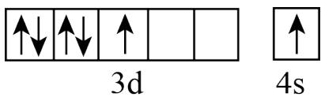

【答案】C 【解析】

【详解】A. 氯化钠是离子化合物, 其电子式是 $\mathrm{Na}^{+}\left[\begin{array}{c}\bullet \\ \times\end{array}\right]^{-}$ , A 项错误; B. 氨分子的 VSEPR 模型是四面体结构, B 项错误: C. p 能级电子云是哑铃(纺锤)形, C 项正确; D. 基态铬原子的价层电子轨道表示式是 $\boxed{\uparrow\quad\uparrow\quad\uparrow\quad\uparrow\quad\uparrow}$ $\boxed{\uparrow}$ , D 项错误; 故选 C。

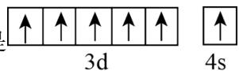

3. 下列过程与水解反应无关的是
A. 热的纯碱溶液去除油脂
B. 重油在高温、高压和催化剂作用下转化为小分子烃
C. 蛋白质在酶的作用下转化为氨基酸
D. 向沸水中滴入饱和 $\mathrm{FeCl}_3$ 溶液制备 $\mathrm{Fe(OH)}_3$ 胶体

【答案】B 【解析】

【详解】A. 热的纯碱溶液因碳酸根离子水解显碱性，油脂在碱性条件下能水解生成易溶于水的高级脂肪酸盐和甘油，故可用热的纯碱溶液去除油脂，A 不符合题意；  
B. 重油在高温、高压和催化剂作用下发生裂化或裂解反应生成小分子烃，与水解反应无关，B 符合题意；  
C. 蛋白质在酶的作用下可以发生水解反应生成氨基酸，C 不符合题意；  
D. $\mathrm{Fe}^{3+}$ 能发生水解反应生成 $\mathrm{Fe(OH)}_3$ ，加热能增大 $\mathrm{Fe}^{3+}$ 的水解程度，D 不符合题意；故选 B。

4. 下列事实能用平衡移动原理解释的是

A. $\mathrm{H}_{2} \mathrm{O}_{2}$ 溶液中加入少量 $\mathrm{MnO}_{2}$ 固体, 促进 $\mathrm{H}_{2} \mathrm{O}_{2}$ 分解  
B. 密闭烧瓶内的 $\mathrm{NO}_{2}$ 和 $\mathrm{N}_{2} \mathrm{O}_{4}$ 的混合气体, 受热后颜色加深  
C. 铁钉放入浓 $\mathrm{HNO}_{3}$ 中, 待不再变化后, 加热能产生大量红棕色气体  
D. 锌片与稀 $\mathrm{H}_{2} \mathrm{SO}_{4}$ 反应过程中, 加入少量 $\mathrm{CuSO}_{4}$ 固体, 促进 $\mathrm{H}_{2}$ 的产生

【答案】B

【解析】

【详解】A. $MnO_{2}$ 会催化 $H_{2}O_{2}$ 分解，与平衡移动无关，A 项错误；

B. $\mathrm{NO}_2$ 转化为 $\mathrm{N}_2\mathrm{O}_4$ 的反应是放热反应, 升温平衡逆向移动, $\mathrm{NO}_2$ 浓度增大, 混合气体颜色加深, B 项正确;  
C. 铁在浓硝酸中钝化, 加热会使表面的氧化膜溶解, 铁与浓硝酸反应生成大量红棕色气体, 与平衡移动无关, C 项错误;  
D. 加入硫酸铜以后, 锌置换出铜, 构成原电池, 从而使反应速率加快, 与平衡移动无关, D 项错误;故选 B。

5. 回收利用工业废气中的 $CO_{2}$ 和 $SO_{2}$ ，实验原理示意图如下。

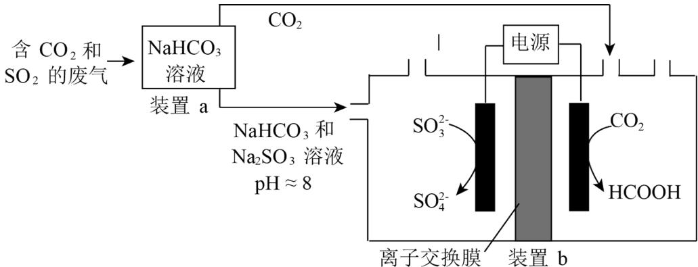

下列说法不正确的是

A. 废气中 $\mathrm{SO}_2$ 排放到大气中会形成酸雨  
B. 装置 a 中溶液显碱性的原因是 $\mathrm{HCO}_3^-$ 的水解程度大于 $\mathrm{HCO}_3^-$ 的电离程度  
C. 装置 a 中溶液的作用是吸收废气中的 $\mathrm{CO}_2$ 和 $\mathrm{SO}_2$ D. 装置 b 中的总反应为 $\mathrm{SO}_3^{2-} + \mathrm{CO}_2 + \mathrm{H}_2\mathrm{O}\xlongequal{\text{电解}} \mathrm{HCOOH} + \mathrm{SO}_4^{2-}$

【答案】C

【解析】

【详解】A. $\mathrm{SO}_2$ 是酸性氧化物, 废气中 $\mathrm{SO}_2$ 排放到空气中会形成硫酸型酸雨, 故 A 正确;  
B. 装置 a 中溶液的溶质为 $\mathrm{NaHCO}_3$ , 溶液显碱性, 说明 $\mathrm{HCO}_3^-$ 的水解程度大于电离程度, 故 B 正确;  
C. 装置 a 中 $\mathrm{NaHCO}_3$ 溶液的作用是吸收 $\mathrm{SO}_2$ 气体, $\mathrm{CO}_2$ 与 $\mathrm{NaHCO}_3$ 溶液不反应, 不能吸收 $\mathrm{CO}_2$ , 故 C 错误;  
D. 由电解池阴极和阳极反应式可知, 装置 b 中总反应为 $\mathrm{SO}_3^{2-} + \mathrm{CO}_2 + \mathrm{H}_2\mathrm{O}\xlongequal{\text{电解}} \mathrm{HCOOH} + \mathrm{SO}_4^{2-}$ , 故 D 正确;  
选 C。

6. 下列离子方程式与所给事实不相符的是
A. $Cl_{2}$ 制备 84 消毒液(主要成分是 NaClO): $Cl_{2} + 2OH^{-} = Cl^{-} + ClO^{-} + H_{2}O$ B. 食醋去除水垢中的 $CaCO_{3}$ : $CaCO_{3} + 2H^{+} = Ca^{2+} + H_{2}O + CO_{2}\uparrow$ C. 利用覆铜板制作印刷电路板: $2Fe^{3+} + Cu = 2Fe^{2+} + Cu^{2+}$ D. $Na_{2}S$ 去除废水中的 $Hg^{2+}$ : $Hg^{2+} + S^{2-} = HgS \downarrow$

【答案】B

【解析】

【详解】A. $\mathrm{Cl}_{2}$ 和 $\mathrm{NaOH}$ 溶液反应产生 $\mathrm{NaCl}$ 、 $\mathrm{NaClO}$ 、 $\mathrm{H}_{2} \mathrm{O}$ ，除了 $\mathrm{Cl}_{2}$ 和 $\mathrm{H}_{2} \mathrm{O}$ 不能拆写其余均可拆写为离子，A项正确；  
B. 食醋为弱酸不能拆写为离子，反应为 $2 \mathrm{CH}_{3} \mathrm{COOH} + \mathrm{CaCO}_{3} = \mathrm{Ca}^{2+} + 2 \mathrm{CH}_{3} \mathrm{COO}^{-} + \mathrm{CO}_{2} + \mathrm{H}_{2} \mathrm{O}$ ，B项错误；  
C. $\mathrm{FeCl}_{3}$ 将 $\mathrm{Cu}$ 氧化为 $\mathrm{CuCl}_{2}$ 而自身被还原为 $\mathrm{FeCl}_{2}$ ，反应为 $2 \mathrm{Fe}^{3+} + \mathrm{Cu} = 2 \mathrm{Fe}^{2+} + \mathrm{Cu}^{2+}$ ，C项正确；  
D. $\mathrm{Na}_{2} \mathrm{S}$ 将 $\mathrm{Hg}^{2+}$ 转化为沉淀除去，反应为 $\mathrm{Hg}^{2+} + \mathrm{S}^{2-} = \mathrm{HgS} \downarrow$ ，D项正确；

7. 蔗糖与浓硫酸发生作用的过程如图所示。

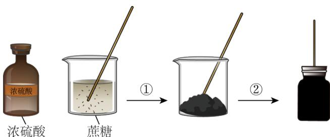  
下列关于该过程的分析不正确的是

A. 过程①白色固体变黑，主要体现了浓硫酸的脱水性  
B. 过程②固体体积膨胀，与产生的大量气体有关  
C. 过程中产生能使品红溶液褪色的气体，体现了浓硫酸的酸性  
D. 过程中蔗糖分子发生了化学键的断裂

【答案】C

【解析】

【详解】A. 浓硫酸具有脱水性, 能将有机物中的 H 原子和 O 原子按 2:1 的比例脱除, 蔗糖中加入浓硫酸, 白色固体变黑, 体现浓硫酸的脱水性, A 项正确;  
B. 浓硫酸脱水过程中释放大量热, 此时发生反应 $\mathrm{C} + 2\mathrm{H}_{2}\mathrm{SO}_{4}$ (浓) $\stackrel{\Delta}{=}\mathrm{CO}_{2} \uparrow + 2\mathrm{SO}_{2} \uparrow + 2\mathrm{H}_{2}\mathrm{O}$ , 产生大量气体, 使固体体积膨胀, B 项正确;  
C. 结合选项 B 可知, 浓硫酸脱水过程中生成的 $\mathrm{SO}_{2}$ 能使品红溶液褪色, 体现浓硫酸的强氧化性, C 项错误;  
D. 该过程中, 蔗糖发生化学反应, 发生了化学键的断裂, D 项正确;  
故选 C。

8. 完成下述实验，装置或试剂不正确的是

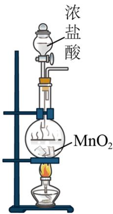

A

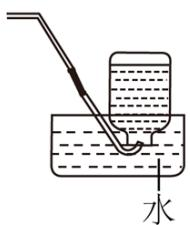

B

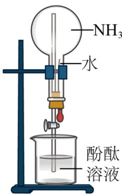  
C

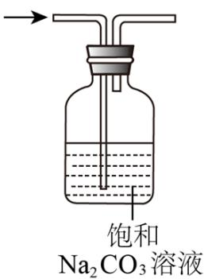  
D

A. 实验室制 $\mathrm{Cl}_2$ B. 实验室收集 $\mathrm{C}_2\mathrm{H}_4$ C. 验证 $\mathrm{NH}_3$ 易溶于水且溶液呈碱性 D. 除去 $\mathrm{CO}_2$

中混有的少量 HCl
【答案】D

【解析】

【详解】A. $\mathrm{MnO}_2$ 固体加热条件下将 $\mathrm{HCl}$ 氧化为 $\mathrm{Cl}_2$ ，固液加热的反应该装置可用于制备 $\mathrm{Cl}_2$ ，A 项正确；

B. $C_{2}H_{4}$ 不溶于水，可选择排水收集，B 项正确；

C. 挤压胶头滴管, 水进入烧瓶将 $\mathrm{NH}_{3}$ 溶解, 烧瓶中气体大量减少压强急剧降低打开活塞水迅速被压入烧瓶中形成红色喷泉, 红色喷泉证明 $\mathrm{NH}_{3}$ 与水形成碱性物质, C 项正确; D. $\mathrm{Na}_{2} \mathrm{CO}_{3}$ 与 $\mathrm{HCl} 、 \mathrm{CO}_{2}$ 发生反应, 不能达到除杂的目的, 应该选用饱和 $\mathrm{NaHCO}_{3}$ 溶液, D 项错误; 故选 D。

9. 一种聚合物 PHA 的结构简式如下，下列说法不正确的是

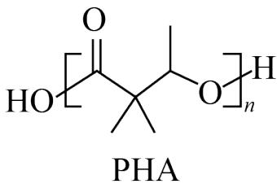

A. PHA 的重复单元中有两种官能团

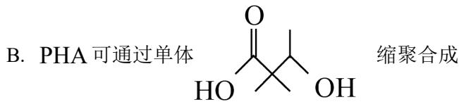

C. PHA在碱性条件下可发生降解D. PHA中存在手性碳原子

【答案】A

【解析】

【详解】A. PHA 的重复单元中只含有酯基一种官能团，A 项错误；

B. 由 PHA 的结构可知其为聚酯，由单体 HOCH(OH)OH 缩聚合成，B 项正确；

C. PHA为聚酯，碱性条件下可发生降解，C项正确；  
D. PHA的重复单元中只连有1个甲基的碳原子为手性碳原子，D项正确；故选A。

10. 下列事实不能通过比较氟元素和氯元素的电负性进行解释的是
A. F-F 键的键能小于 Cl-Cl 键的键能
B. 三氟乙酸的 $K_{a}$ 大于三氯乙酸的 $K_{a}$ C. 氟化氢分子的极性强于氯化氢分子的极性
D. 气态氟化氢中存在 $(\mathrm{HF})_{2}$ ，而气态氯化氢中是 HCl 分子

【答案】A 【解析】

【详解】A. F 原子半径小, 电子云密度大, 两个原子间的斥力较强, F-F 键不稳定, 因此 F-F 键的键能小于 Cl-Cl 键的键能, 与电负性无关, A 符合题意;  
B. 氟的电负性大于氯的电负性。F-C 键的极性大于 Cl-C 键的极性, 使 $\mathrm{F}_{3} \mathrm{C}$ —的极性大于 $\mathrm{Cl}_{3} \mathrm{C}$ —的极性, 导致三氟乙酸的羧基中的羟基极性更大, 更容易电离出氢离子, 酸性更强, B 不符合题意;  
C. 氟的电负性大于氯的电负性, F-H 键的极性大于 Cl-H 键的极性, 导致 HF 分子极性强于 HCl, C 不符合题意;  
D. 氟的电负性大于氯的电负性, 与氟原子相连的氢原子可以与另外的氟原子形成分子间氢键, 因此气态氟化氢中存在 $(\mathrm{HF})_{2}$ , D 不符合题意;

故选A。

11. 化合物 K 与 L 反应可合成药物中间体 M，转化关系如下。

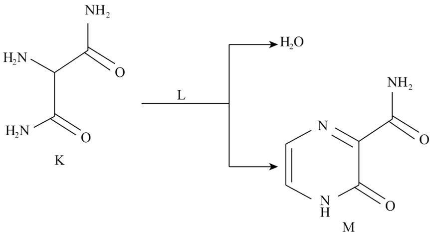

已知 L 能发生银镜反应，下列说法正确的是
A. K 的核磁共振氢谱有两组峰    B. L 是乙醛
C. M 完全水解可得到 K 和 L    D. 反应物 K 与 L 的化学计量比是 1:1

【解析】

【详解】A. 有机物的结构与性质 K 分子结构对称，分子中有 3 种不同环境的氢原子，核磁共振氢谱有 3 组峰，A 错误；  
B. 根据原子守恒可知 1 个 K 与 1 个 L 反应生成 1 个 M 和 2 个，L 应为乙二醛，B 错误；  
C. M 发生完全水解时，酰胺基水解，得不到 K，C 错误；  
D. 由上分析反应物 K 和 L 的计量数之比为 1:1，D 项正确；  
故选 D。

12. 离子化合物 $Na_{2}O_{2}$ 和 $CaH_{2}$ 与水的反应分别为① $2Na_{2}O_{2} + 2H_{2}O = 4NaOH + O_{2}\uparrow$ ; ②$\mathrm{CaH}_{2} + 2\mathrm{H}_{2}\mathrm{O} = \mathrm{Ca(OH)}_{2} + 2\mathrm{H}_{2}\uparrow$ 。下列说法正确的是
A. $\mathrm{Na}_{2}\mathrm{O}_{2}$ 、 $\mathrm{CaH}_{2}$ 中均有非极性共价键
B. ①中水发生氧化反应，②中水发生还原反应
C. $\mathrm{Na}_{2}\mathrm{O}_{2}$ 中阴、阳离子个数比为1:2， $\mathrm{CaH}_{2}$ 中阴、阳离子个数比为2:1
D. 当反应①和②中转移的电子数相同时，产生的 $\mathrm{O}_{2}$ 和 $\mathrm{H}_{2}$ 的物质的量相同

【详解】A. $Na_{2}O_{2}$ 中有离子键和非极性键， $CaH_{2}$ 中只有离子键面不含非极性键，A 错误；
B. ①中水的化合价不发生变化，不涉及氧化还原反应，②中水发生还原反应，B 错误；
C. $Na_{2}O_{2}$ 由 $Na^{+}$ 和 $O_{2}^{2-}$ 组成．阴、阳离子个数之比为 1:2， $CaH_{2}$ 由 $Ca^{2+}$ 和 H 组成，阴、阳离子个数之比为 2:1，C 正确；
D. ①中每生成1个氧气分子转移2个电子，②中每生成1个氢气分子转移1个电子，转移电子数相同时，生成氧气和氢气的物质的量之比为1:2，D错误；

故选 C。

13. 一种分解氯化铵实现产物分离的物质转化关系如下，其中 b、d 代表 MgO 或 Mg(OH)Cl 中的一种。
下列说法正确的是

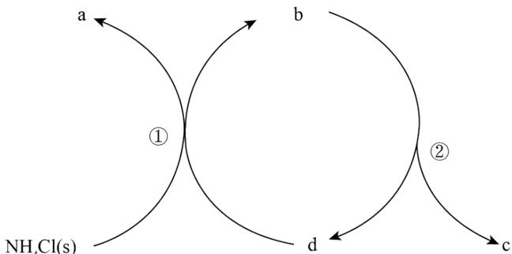

A. a、c 分别是 HCl、NH₃
B. d 既可以是 MgO，也可以是 Mg(OH)Cl
C. 已知 MgCl₂ 为副产物，则通入水蒸气可减少 MgCl₂ 的产生
D. 等压条件下，反应①、②的反应热之和，小于氯化铵直接分解的反应热
【答案】C
【解析】

【分析】 $NH_{4}Cl$ 分解的产物是 $NH_{3}$ 和HCl，分解得到的HCl与MgO反应生成 $\mathrm{Mg(OH)Cl}$ ， $\mathrm{Mg(OH)Cl}$ 又可以分解得到HCl和MgO，则a为 $NH_{3}$ ，b为 $\mathrm{Mg(OH)Cl}$ ，c为HCl，d为MgO。

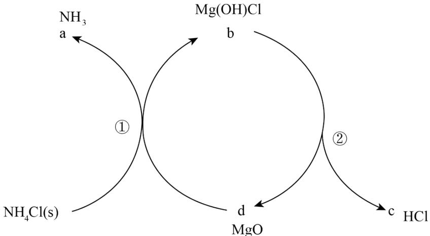

【详解】A．由分析可知，a 为 $NH_{3}$

c 为 HCl，A 项错误；

B. d 为 MgO，B 错误；

C. 可以水解生成 $\mathrm{Mg(OH)Cl}$ ，通入水蒸气可以减少 $MgCl_{2}$ 的生成，C 正确；

D. 反应①和反应②相加即为氯化铵直接分解的反应，由盖斯定律可知，等压条件下，反应①、反应②的反应热之和等于氯化铵直接分解的反应热，D 错误；

14. 利用平衡移动原理，分析一定温度下 $\mathrm{Mg}^{2+}$ 在不同 $\mathrm{pH}$ 的 $\mathrm{Na}_{2} \mathrm{CO}_{3}$ 体系中的可能产物。

已知：i. 图 1 中曲线表示 $Na_{2}CO_{3}$ 体系中各含碳粒子的物质的量分数与 pH 的关系。

ii. 2 中曲线I的离子浓度关系符合 $c(Mg^{2+}) \cdot c^2(OH^-) = K_{\text{sp}}[Mg(OH)_2]$ ; 曲线II的离子浓度关系符合 $c(Mg^{2+}) \cdot c(CO_3^{2-}) = K_{\text{sp}}(MgCO_3)$ [注: 起始 $c(Na_2CO_3) = 0.1mol \cdot L^{-1}$ , 不同 pH 下 $c(CO_3^{2-})$ 由图 1 得到]。

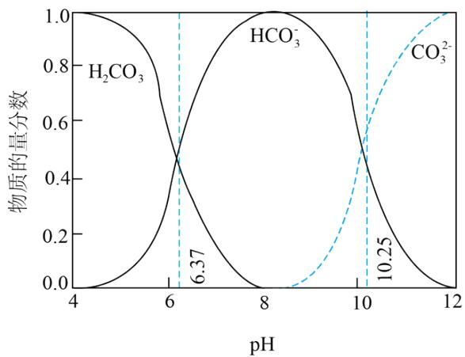  
图1

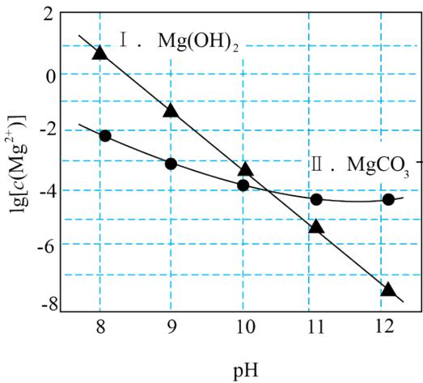  
图2

下列说法不正确的是
A. 由图1， $\mathrm{pH} = 10.25, \mathrm{c}\left(\mathrm{HCO}_{3}^{-}\right) = \mathrm{c}\left(\mathrm{CO}_{3}^{2-}\right)$ B. 由图2，初始状态 $\mathrm{pH} = 11$ 、 $\lg \left[\mathrm{c}\left(\mathrm{Mg}^{2+}\right)\right] = -6$ ，无沉淀生成
C. 由图2，初始状态 $\mathrm{pH} = 9$ 、 $\lg \left[\mathrm{c}\left(\mathrm{Mg}^{2+}\right)\right] = -2$ ，平衡后溶液中存在 $\mathrm{c}\left(\mathrm{H}_{2} \mathrm{CO}_{3}\right) + \mathrm{c}\left(\mathrm{HCO}_{3}^{-}\right) + \mathrm{c}\left(\mathrm{CO}_{3}^{2-}\right) = 0.1 \mathrm{~mol} \cdot \mathrm{L}^{-1}$ D. 由图1和图2，初始状态 $\mathrm{pH} = 8$ 、 $\lg \left[\mathrm{c}\left(\mathrm{Mg}^{2+}\right)\right] = -1$ ，发生反应： $\mathrm{Mg}^{2+} + 2 \mathrm{HCO}_{3}^{-} = \mathrm{MgCO}_{3} \downarrow + \mathrm{CO}_{2} \uparrow + \mathrm{H}_{2} \mathrm{O}$ 【答案】C
【解析】

【详解】A．水溶液中的离子平衡 从图1可以看出pH=10.25时，碳酸氢根离子与碳酸根离子浓度相同，A项正确；
B．从图2可以看出pH=11、 $\lg\left[\mathrm{c}\left(\mathrm{Mg}^{2+}\right)\right]=-6$ 时，该点位于曲线I和曲线II的下方，不会产生碳酸镁沉淀或氢氧化镁沉淀，B项正确；
C．从图2可以看出pH=9、 $\lg\left[\mathrm{c}\left(\mathrm{Mg}^{2+}\right)\right]=-2$ 时，该点位于曲线II的上方，会生成碳酸镁沉淀，根据物料守恒，溶液中 $c(H_{2}CO_{3})+c(HCO_{3}^{-})+c(CO_{3}^{2-})<0.1mol\cdot L^{-1}$ ，C项错误；D．pH=8时，溶液中主要含碳微粒是 $HCO_{3}^{-}$ ，pH=8， $\lg\left[\mathrm{c}\left(\mathrm{Mg}^{2+}\right)\right]=-1$ 时，该点位于曲线II的上方，会生成碳酸镁沉淀，因此反应的离子方程式为 $Mg^{3}+2HCO_{3}^{-}=MgCO_{3}\downarrow+H_{2}O+CO_{2}\uparrow$ ，D项正确；
故选 C。

## 第二部分

## 本部分共 5 小题，共 58 分。

15. 硫代硫酸盐是一类具有应用前景的浸金试剂。硫代硫酸根 $\left(\mathrm{S}_{2} \mathrm{O}_{3}^{2-}\right)$ 可看作是 $\mathrm{SO}_{4}^{2-}$ 中的一个 O 原子被 S 原子取代的产物。

(1) 基态S原子价层电子排布式是\_\_\_\_。

(2) 比较 S 原子和 O 原子的第一电离能大小, 从原子结构的角度说明理由: \_\_\_\_。

(3) $S_{2}O_{3}^{2-}$ 的空间结构是 \_\_\_\_。

(4) 同位素示踪实验可证实 $\mathrm{S}_{2} \mathrm{O}_{3}^{2-}$ 中两个 $\mathrm{S}$ 原子的化学环境不同, 实验过程为

$SO_{3}^{2-}\xrightarrow[i]{S}S_{2}O_{3}^{2-}\xrightarrow[ii]{Ag^{+}}Ag_{2}S+SO_{4}^{2-}$ 。过程 ii 中， $S_{2}O_{3}^{2-}$ 断裂的只有硫硫键，若过程 i 所用试剂是 $Na_{2}^{32}SO_{3}$ 和 $^{35}S$ ，过程 ii 含硫产物是 \_\_\_\_。

(5) $\mathrm{MgS}_{2} \mathrm{O}_{3} \cdot 6 \mathrm{H}_{2} \mathrm{O}$ 的晶胞形状为长方体, 边长分别为 anm、bnm、cnm, 结构如图所示。

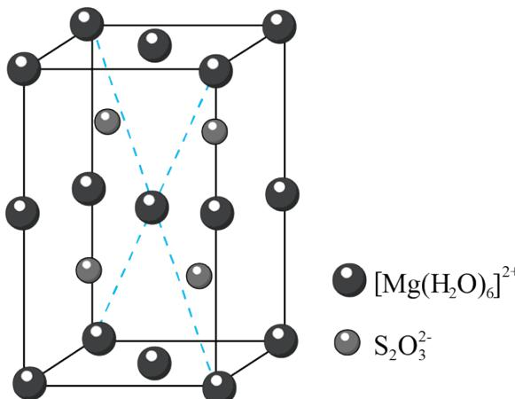

晶胞中的 $\left[\mathrm{Mg}\left(\mathrm{H}_{2} \mathrm{O}\right)_{6}\right]^{2+}$ 个数为 \_\_\_\_。已知 $\mathrm{MgS}_{2} \mathrm{O}_{3} \cdot 6 \mathrm{H}_{2} \mathrm{O}$ 的摩尔质量是 $\mathrm{Mg} \cdot \mathrm{mol}^{-1}$ ，阿伏加德罗常数为 $\mathrm{N}_{\Lambda}$ ，该晶体的密度为 \_\_\_\_ $\mathrm{g} \cdot \mathrm{cm}^{-3}$ 。 $\left(1 \mathrm{~nm} = 10^{-7} \mathrm{~cm}\right)$

（6）浸金时， $\mathrm{S}_2\mathrm{O}_3^{2-}$ 作为配体可提供孤电子对与 $\mathrm{Au}^+$ 形成 $\left[\mathrm{Au}\left(\mathrm{S}_2\mathrm{O}_3\right)_2\right]^{3-}$ 。分别判断 $\mathrm{S}_2\mathrm{O}_3^{2-}$ 中的中心 $\mathbf{S}$ 原子和端基 $\mathbf{S}$ 原子能否做配位原子并说明理由：\_\_\_\_。

【答案】(1) $3s^{2}3p^{4}$

(2) $\mathrm{I}_{1}(\mathrm{O}) > \mathrm{I}_{1}(\mathrm{S})$ ，氧原子半径小，原子核对最外层电子的吸引力大，不易失去一个电子

(3) 四面体形 (4) $\mathrm{Na}_{2}^{32}\mathrm{SO}_{4}$ 和 $\mathrm{Ag}_{2}^{35}\mathrm{S}$

(5) ①.4 ②. $\frac{4\mathrm{M}}{N_{\mathrm{A}}\mathrm{abc}}\times 10^{21}$

(6) $\mathrm{S}_2\mathrm{O}_3^{2-}$ 中的中心原子 S 的价层电子对数为 4，无孤电子对，不能做配位原子；端基 S 原子含有孤电子对，能做配位原子

【解析】

【小问 1 详解】

S 是第三周期VIA 族元素，基态 S 原子价层电子排布式为 $3s^{2}3p^{4}$ 。答案为 $3s^{2}3p^{4}$ ;

【小问 2 详解】

S 和 O 为同主族元素，O 原子核外有 2 个电子层，S 原子核外有 3 个电子层，O 原子半径小，原子核对最外层电子的吸引力大，不易失去 1 个电子，即 O 的第一电离能大于 S 的第一电离能。答案为 $I_{1}(O) > I_{1}(S)$ ，氧原子半径小，原子核对最外层电子的吸引力大，不易失去一个电子；

【小问 3 详解】

$\mathrm{SO}_{4}^{2-}$ 的中心原子 S 的价层电子对数为 4，无孤电子对，空间构型为四面体形， $\mathrm{S}_{2} \mathrm{O}_{3}^{2-}$ 可看作是 $\mathrm{SO}_{4}^{2-}$ 中 1 个 O 原子被 S 原子取代，则 $\mathrm{S}_{2} \mathrm{O}_{3}^{2-}$ 的空间构型为四面体形。答案为四面体形；

【小问 4 详解】

过程Ⅱ中 $S_{2}O_{3}^{2-}$ 断裂的只有硫硫键，根据反应机理可知，整个过程中 $SO_{3}^{2-}$ 最终转化为 $SO_{4}^{2-}$ ，S 最终转化为 $Ag_{2}S$ 。若过程i所用的试剂为 $Na_{2}^{32}SO_{3}$ 和 ${}^{35}S$ ，过程Ⅱ的含硫产物是 $Na_{2}^{32}SO_{4}$ 和 $Ag_{2}^{35}S$ 。答案为 $Na_{2}^{32}SO_{4}$ 和 $Ag_{2}^{35}S$ ；

【小问 5 详解】

由晶胞结构可知，1个晶胞中含有 $8\times\frac{1}{8}+4\times\frac{1}{4}+2\times\frac{1}{2}+1=4$ 个 $\left[\mathrm{Mg}\left(\mathrm{H}_{2}\mathrm{O}\right)_{6}\right]^{2+}$ ，含有4个 $S_{2}O_{3}^{2-}$ ；该晶体的密度 $\rho=\frac{NM}{N_{A}V}=\frac{4M}{N_{A}abc\times10^{-21}}g\cdot cm^{-3}$ 。答案为4； $\frac{4M}{N_{A}abc}\times10^{21}$ ;

【小问6详解】

具有孤电子对的原子就可以给个中心原子提供电子配位。 $S_{2}O_{3}^{2-}$ 中的中心原子S的价层电子对数为4，无孤电子对，不能做配位原子；端基S原子含有孤电子对，能做配位原子。

16. 尿素 $\left[\mathrm{CO}\left(\mathrm{NH}_{2}\right)_{2}\right]$ 合成的发展体现了化学科学与技术的不断进步。

(1) 十九世纪初, 用氰酸银 $\left(\mathrm{AgOCN}\right)$ 与 $\mathrm{NH}_{4} \mathrm{Cl}$ 在一定条件下反应制得 $\mathrm{CO}\left(\mathrm{NH}_{2}\right)_{2}$ , 实现了由无机物到有机物的合成。该反应的化学方程式是\_\_\_\_。

(2) 二十世纪初, 工业上以 $\mathrm{CO}_{2}$ 和 $\mathrm{NH}_{3}$ 为原料在一定温度和压强下合成尿素。反应分两步:

i． $CO_{2}$ 和 $NH_{3}$ 生成 $NH_{2}COONH_{4}$ ;

ii. $NH_{2}COONH_{4}$ 分解生成尿素。

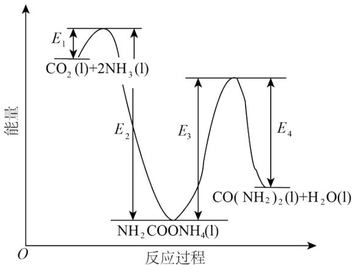

结合反应过程中能量变化示意图，下列说法正确的是\_\_\_\_(填序号)。

a. 活化能：反应 i < 反应 ii
b. i 为放热反应，ii 为吸热反应

c. $\mathrm{CO}_{2}(1)+2\mathrm{NH}_{3}(1)=\mathrm{CO}\left(\mathrm{NH}_{2}\right)_{2}(1)+\mathrm{H}_{2}\mathrm{O}(1)\Delta\mathrm{H}=\mathrm{E}_{1}-\mathrm{E}_{4}$

(3) 近年研究发现, 电催化 $\mathrm{CO}_{2}$ 和含氮物质 $(\mathrm{NO}_{3}^{-}$ 等)在常温常压下合成尿素, 有助于实现碳中和及解决含氮废水污染问题。向一定浓度的 $\mathrm{KNO}_{3}$ 溶液通 $\mathrm{CO}_{2}$ 至饱和, 在电极上反应生成 $\mathrm{CO(NH_{2})}_{2}$ , 电解原理如图所示。

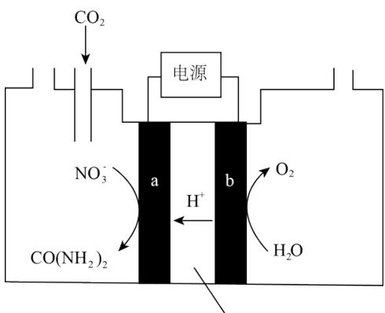  
质子交换膜

①电极 b 是电解池的 \_\_\_\_ 极。

②电解过程中生成尿素的电极反应式是\_\_\_\_。

（4）尿素样品含氮量的测定方法如下。

已知：溶液中 $\mathrm{c(NH_4^+)}$ 不能直接用NaOH溶液准确滴定。

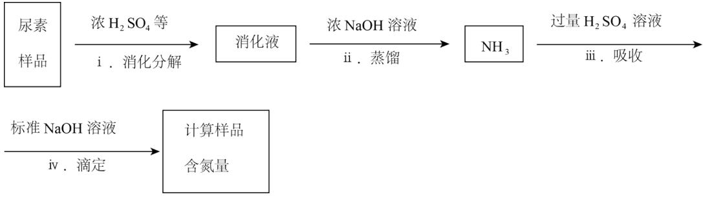

①消化液中的含氮粒子是\_\_\_\_。

②步骤iv中标准 NaOH 溶液的浓度和消耗的体积分别为 c 和 V，计算样品含氮量还需要的实验数据有\_\_\_\_。

【答案】（1） $\mathrm{AgOCN} + \mathrm{NH}_{4}\mathrm{Cl} = \mathrm{CO}\left(\mathrm{NH}_{2}\right)_{2} + \mathrm{AgCl}$

(2) ab (3) ①. 阳 ②. $2\mathrm{NO}_3^-$ +16e $^-$ + CO $_2$ +18H $^+$ = CO(NH $_2$ ) $_2$ +7H $_2$ O

(4) ①. $\mathrm{NH}_{4}^{+}$ ②. 样品的质量、步骤III所加入 $\mathrm{H}_{2} \mathrm{SO}_{4}$ 溶液的体积和浓度

【小问 1 详解】

根据原子守恒分析，二者反应生成尿素和氯化银，化学方程式是 $\mathrm{AgOCN + NH_4Cl = CO(NH_2)_2 + AgCl}$ 。答案为 $\mathrm{AgOCN + NH_4Cl = CO(NH_2)_2 + AgCl}$

a. 反应i的活化能是 $E_{1}$ ，反应ii活化能是 $E_{3}$ ， $E_{1}<E_{3}$ ，a项正确；

b. 从图中反应物和生成物能量的相对大小可看出反应i放热，反应ii吸热，b项正确；

c. 总反应的: $\Delta H = E_{1} - E_{2} + E_{3} - E_{4}$ , c 项错误;

故选 ab。

【小问 3 详解】

①电极 b 上发生 $H_{2}O$ 失电子生成 $O_{2}$ 的氧化反应，是电解池的阳极。②a 极硝酸根离子得电子转化为尿素，再结合酸性环境可分析出电极反应式为 $2NO_{3}^{-} + 16e^{-} + CO_{2} + 18H^{+} = CO(NH_{2})_{2} + 7H_{2}O$ 。答案为阳极； $2NO_{3}^{-} + 16e^{-} + CO_{2} + 18H^{+} = CO(NH_{2})_{2} + 7H_{2}O$ ；

【小问 4 详解】

①尿素消化分解生成 $NH_{3}$ 和 $CO_{2}$ ，由于反应中存在浓 $H_{2}SO_{4}$ ，则消化液中含氮粒子为 $NH_{4}^{+}$ 。②除了已知数据外，还需要的是样品的质量、步骤iii所加入 $H_{2}SO_{4}$ 溶液的体积和浓度。答案为 $NH_{4}^{+}$ ；样品的质

量、步骤III所加入 $H_{2}SO_{4}$ 溶液的体积和浓度。

17. 化合物 P 是合成抗病毒药物普拉那韦的原料，其合成路线如下。

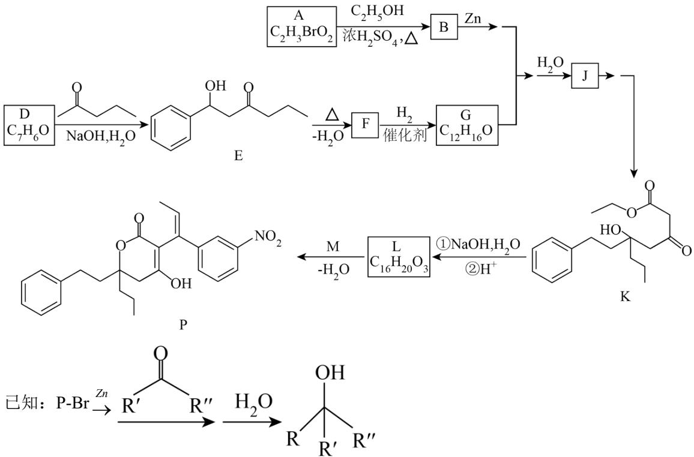

(1) A 中含有羧基, $\mathrm{A} \rightarrow \mathrm{B}$ 的化学方程式是 \_\_\_\_。

(2) D 中含有的官能团是\_\_\_\_。

（3）关于 $\mathrm{D}\rightarrow \mathrm{E}$ 的反应：

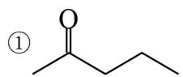

的羰基相邻碳原子上的 C-H 键极性强，易断裂，原因是 \_\_\_\_。

②该条件下还可能生成一种副产物，与 E 互为同分异构体。该副产物的结构简式是 \_\_\_\_。

(4) 下列说法正确的是\_\_\_\_(填序号)。

a. F 存在顺反异构体

b. J 和 K 互为同系物

c. 在加热和 Cu 催化条件下，J 不能被 $O_{2}$ 氧化

(5) L 分子中含有两个六元环。L 的结构简式是\_\_\_\_。

(6) 已知:

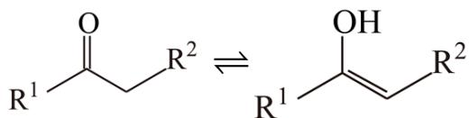

，依据 $\mathrm{D} \rightarrow \mathrm{E}$ 的原理，L和M反应得到了

P。M的结构简式是\_\_\_\_。

【答案】（1） $\mathrm{CH_{2}BrCOOH + CH_{3}CH_{2}OH\xlongequal[\Delta]{浓H_{2}SO_{4}}CH_{2}BrCOOCH_{2}CH_{3} + H_{2}O}$

(2) 醛基 (3) ①. 羰基为强吸电子基团, 使得相邻碳原子上的电子偏向羰基上的碳原子, 使得

相邻碳原子上的C-H键极性增强

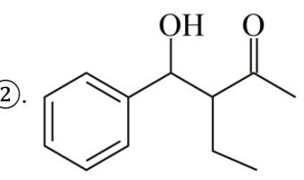

(4) ac (5)

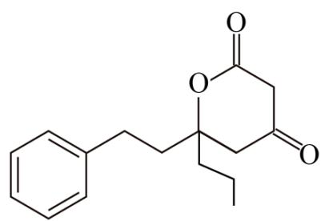

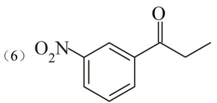

【解析】

【分析】A中含有羧基，结合A的分子式可知A为 $\mathrm{CH}_2\mathrm{BrCOOH}$ ；A与乙醇发生酯化反应，B的结构简式为 $\mathrm{CH}_2\mathrm{BrCOOCH}_2\mathrm{CH}_3$ ；D与2-戊酮发生加成反应生成E，结合E的结构简式和D的分子式可知D的

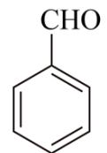

结构简式为 $\mathrm{CHO}$ ，E发生消去反应脱去1个水分子生成F，F的结构简式为

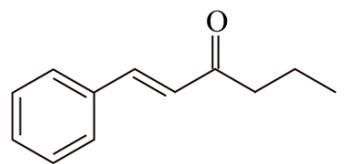

$\text{C}_6\text{H}_5\text{CH}=\text{CH}-\text{C}(=\text{O})-\text{CH}_2-\text{CH}_2$ ，D→F 的整个过程为羟醛缩合反应，结合 G 的分子式以及 G 能与 B 发生已知

信息的反应可知 G 中含有酮羰基，说明 F 中的碳碳双键与 $H_{2}$ 发生加成反应生成 G，G 的结构简式为

；B与G发生已知信息的反应生成J，J为

K 在 NaOH 溶液中发生水解反应生成

，酸化得到

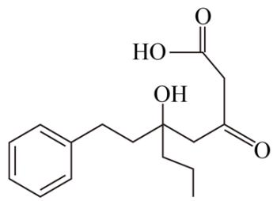

；结合题中信息可知L分子中含有两个六元环，由L的分子式可知

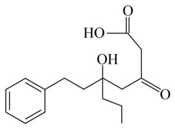

中羧基与羟基酸化时发生酯化反应，L 的结构简式为

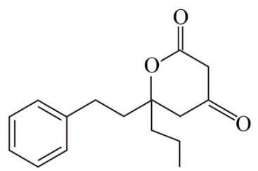

；由题意可知L和M可以发生类似 $\mathrm{D}\rightarrow \mathrm{E}$ 的加成反应得到

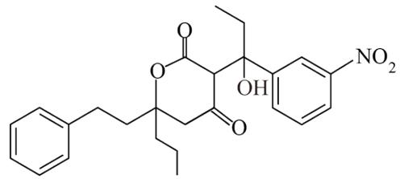

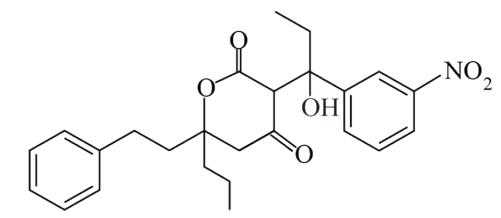

发生酮式与烯醇式互变

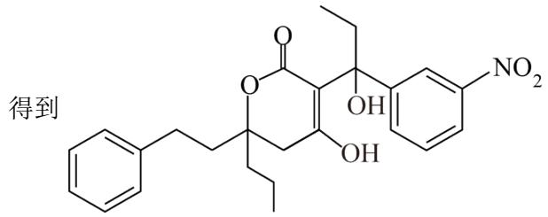

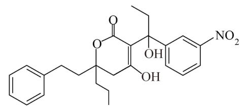

发生消去

反应得到 P，则 M 的结构简式为 $O_{2}N$ $\ce{C6H5OCH2CH3}$ 。

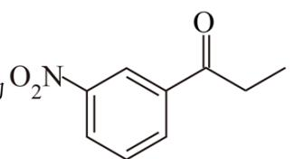

【小问1详解】

A→B 的化学方程式为 $CH_{2}BrCOOH + CH_{3}CH_{2}OH \xlongequal[\Delta]{浓H_{2}SO_{4}} CH_{2}BrCOOCH_{2}CH_{3} + H_{2}O$ 。答案为

$$
\mathrm{CH} _ {2} \mathrm{BrCOOH} + \mathrm{CH} _ {3} \mathrm{CH} _ {2} \mathrm{OH} \xrightarrow [ \Delta ]{\text {浓H} _ {2} \mathrm{SO} _ {4}} \mathrm{CH} _ {2} \mathrm{BrCOOCH} _ {2} \mathrm{CH} _ {3} + \mathrm{H} _ {2} \mathrm{O};
$$

【小问 2 详解】

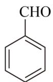

D 的结构简式为 $\begin{array}{c}\text{CHO}\\ \hline \end{array}$ ，含有的官能团为醛基。答案为醛基；

【小问3详解】

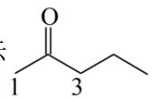

①羰基为强吸电子基团，使得相邻碳原子上的电子偏向碳基上的碳原子，使得相邻碳原子上的C-H键极性增强，易断裂。②2-戊酮酮羰基相邻的两个碳原子上均有C-H键，均可以断裂与苯甲醛的醛基发生加成反应，如图所示 1 3 ，1号碳原子上的C-H键断裂与苯甲醛的醛基加成得到E，3号碳原子

上的C-H键也可以断裂与苯甲醛的醛基加成得到副产物。答案为羰基为强吸电子

基团，使得相邻碳原子上的电子偏向羰基上的碳原子，使得相邻碳原子上的 C-H 键极性增强；

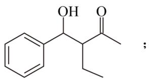

【小问4详解】

a. F 的结构简式为 $\mathrm{C}_{10}\mathrm{H}_{12}\mathrm{O}$ ，存在顺反异构体，a 项正确；

b. K 中含有酮脲基，J 中不含有酮脲基，二者不互为同系物，b 项错误；

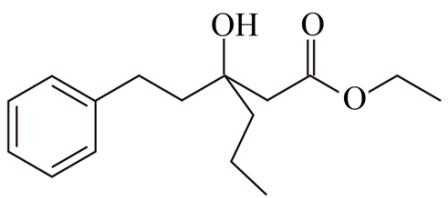

，与羟基直接相连的碳原子上无 H 原子，在加热

和 Cu 作催化剂条件下，J 不能被 $O_{2}$ 氧化，c 项正确；

故选 ac;

【小问 5 详解】

由上分析L为

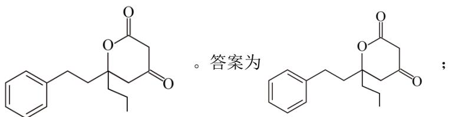

【小问6详解】

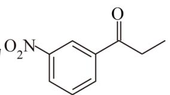

由上分析 M 为 $O_{2}N$ $\ce{C6H5OCH2CH3}$ 。答案为 $O_{2}N$ $\ce{C6H5OCH2CH3}$ 。

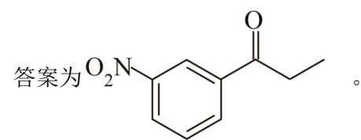

18. 以银锰精矿(主要含 $\mathrm{Ag}_{2} \mathrm{~S}$ 、 $\mathrm{MnS}$ 、 $\mathrm{FeS}_{2}$ )和氧化锰矿(主要含 $\mathrm{MnO}_{2}$ )为原料联合提取银和锰的一种流程示意图如下。

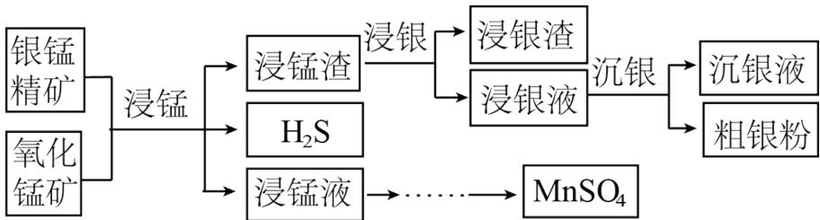

已知：酸性条件下， $MnO_{2}$ 的氧化性强于 $Fe^{3+}$ 。

(1) “浸锰”过程是在 $\mathrm{H}_{2} \mathrm{SO}_{4}$ 溶液中使矿石中的锰元素浸出, 同时去除 $\mathrm{FeS}_{2}$ , 有利于后续银的浸出: 矿石中的银以 $\mathrm{Ag}_{2} \mathrm{~S}$ 的形式残留于浸锰渣中。

①“浸锰”过程中，发生反应 $MnS + 2H^{+} = Mn^{2+} + H_{2}S \uparrow$ ，则可推断： $K_{\mathrm{sp}}(\mathrm{MnS})$ \_\_\_\_（填“>”或“<”） $K_{\mathrm{sp}}(\mathrm{Ag}_{2}\mathrm{S})$ 。

②在 $\mathrm{H}_{2} \mathrm{SO}_{4}$ 溶液中, 银锰精矿中的 $\mathrm{FeS}_{2}$ 和氧化锰矿中的 $\mathrm{MnO}_{2}$ 发生反应, 则浸锰液中主要的金属阳离子有\_\_\_\_。

（2）“浸银”时，使用过量 $\mathrm{FeCl}_3$ 、HCl和 $\mathrm{CaCl}_2$ 的混合液作为浸出剂，将 $\mathrm{Ag}_2\mathrm{S}$ 中的银以 $[\mathrm{AgCl}_2]^{-}$ 形式浸出。

①将“浸银”反应的离子方程式补充完整：\_\_\_\_。

$$
\square \mathrm{Fe} ^ {3 +} + \mathrm{Ag} _ {2} \mathrm{S} + \square \_ \rightleftharpoons \square \_ + 2 \left[ \mathrm{AgCl} _ {2} \right] ^ {-} + \mathrm{S}
$$

②结合平衡移动原理，解释浸出剂中 $Cl^{-}$ 、 $H^{+}$ 的作用：\_\_\_\_。

（3）“沉银”过程中需要过量的铁粉作为还原剂。

①该步反应的离子方程式有\_\_\_\_。

②一定温度下，Ag 的沉淀率随反应时间的变化如图所示。解释 t 分钟后 Ag 的沉淀率逐渐减小的原因：\_\_\_\_。

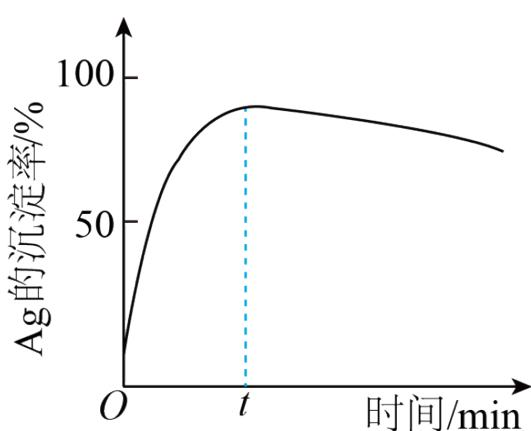

(4) 结合“浸锰”过程, 从两种矿石中各物质利用的角度, 分析联合提取银和锰的优势: \_\_\_\_。

【答案】(1) ①. > ②. $\mathrm{Fe}^{3+}$ 、 $\mathrm{Mn}^{2+}$

(2) ①. $2\mathrm{Fe}^{3+} + \mathrm{Ag}_2\mathrm{S} + 4\mathrm{Cl}^- \rightleftharpoons 2\mathrm{Fe}^{3+} + 2\left[\mathrm{AgCl}_2\right]^-$ + S ②. $\mathrm{Cl}^-$ 是为了与 $\mathrm{Ag}_2\mathrm{S}$ 电离出的 $\mathrm{Ag}^+$ 结合生成 $\left[\mathrm{AgCl}_2\right]^-$ ，使平衡正向移动，提高 $\mathrm{Ag}_2\mathrm{S}$ 的浸出率； $\mathrm{H}^+$ 是为了抑制 $\mathrm{Fe}^{3+}$ 水解，防止生成 $\mathrm{Fe(OH)}_3$ 沉淀  
(3) ①. $2\left[\mathrm{AgCl}_2\right]^-$ + $\mathrm{Fe} = \mathrm{Fe}^{2+} + 2\mathrm{Ag} + 4\mathrm{Cl}^-$ 、 $2\mathrm{Fe}^{3+} + \mathrm{Fe} = 3\mathrm{Fe}^{2+}$ ②. $\mathrm{Fe}^{2+}$ 被氧气氧化为 $\mathrm{Fe}^{3+}$ ， $\mathrm{Fe}^{3+}$ 把 $\mathrm{Ag}$ 氧化为 $\mathrm{Ag}^+$

(4) 可将两种矿石中的锰元素同时提取到浸锰液中, 得到 $\mathrm{MnSO}_{4}$ , 同时将银元素和锰元素分离开; 生成的 $\mathrm{Fe}^{3+}$ 还可以用于浸银, 节约氧化剂

【解析】

【分析】银锰精矿(主要含 $Ag_{2}S$ 、 MnS 、 $FeS_{2}$ )和氧化锰矿(主要含 $MnO_{2}$ )混合加 $H_{2}SO_{4}$ 溶液，使矿石中的锰元素浸出，同时去除 $FeS_{2}$ ，矿石中的银以 $Ag_{2}S$ 的形式残留于浸锰渣中，浸锰液中主要的金属阳离子有 $Fe^{3+}$ 、 $Mn^{2+}$ ；浸锰渣中 $Ag_{2}S$ 与过量 $FeCl_{3}$ 、 HCl 和 $CaCl_{2}$ 的混合液反应，将 $Ag_{2}S$ 中的银以 $[AgCl_{2}]^{-}$ 形式浸出，用铁粉把 $[AgCl_{2}]^{-}$ 还原为金属银。

【小问 1 详解】

①“浸锰”过程中，矿石中的银以 $Ag_{2}S$ 的形式残留于浸锰渣中，MnS 发生反应 $MnS + 2H^{+} = Mn^{2+} + H_{2}S \uparrow$ ，硫化锰溶于强酸而硫化银不溶于强酸，则可推断： $K_{\mathrm{sp}}(\mathrm{MnS}) > K_{\mathrm{sp}}(\mathrm{Ag}_{2}\mathrm{S})$ ;

②根据信息，在 $H_{2}SO_{4}$ 溶液中二氧化锰可将 $Fe^{2+}$ 氧化为 $Fe^{3+}$ ，自身被还原为 $Mn^{2+}$ ，则浸锰液中主要的金属阳离子有 $Fe^{3+}$ 、 $Mn^{2+}$ 。

【小问 2 详解】

① $Ag_{2}S$ 中 S 元素化合价升高，Fe 元素化合价降低，根据得失电子守恒、元素守恒，该离子方程式为 $2Fe^{3+} + Ag_{2}S + 4Cl^{-} \rightleftharpoons 2Fe^{2+} + 2\left[\Lambda gCl_{2}\right]^{-} + S;$

② $\mathrm{Cl}^{-}$ 是为了与 $\mathrm{Ag}_{2} \mathrm{~S}$ 电离出的 $\mathrm{Ag}^{+}$ 结合生成 $\left[\mathrm{AgCl}_{2}\right]^{-}$ ，使平衡正向移动，提高 $\mathrm{Ag}_{2} \mathrm{~S}$ 的浸出率； $\mathrm{H}^{+}$ 是为

了抑制 $Fe^{3+}$ 水解，防止生成 $\mathrm{Fe(OH)}_{3}$ 沉淀。

## 【小问 3 详解】

①铁粉可将 $\left[AgCl_{2}\right]^{-}$ 还原为单质银，过量的铁粉还可以与铁离子发生反应，因此离子方程式为

$$
2 \left[ \mathrm{AgCl} _ {2} \right] ^ {-} + \mathrm{Fe} = \mathrm{Fe} ^ {2 +} + 2 \mathrm{Ag} + 4 \mathrm{Cl} ^ {-}, 2 \mathrm{Fe} ^ {3 +} + \mathrm{Fe} = 3 \mathrm{Fe} ^ {2 +};
$$

②溶液中生成的 $Fe^{2+}$ 会被空气中的氧气缓慢氧化为 $Fe^{3+}$ ， $Fe^{3+}$ 把部分 Ag 氧化为 $Ag^{+}$ ，因此 t min 后银的沉淀率逐渐降低。

## 【小问 4 详解】

联合提取银和锰的优势在于“浸锰”过程可将两种矿石中的锰元素同时提取到浸锰液中，将银元素和锰元素分离开，利用 $MnO_{2}$ 的氧化性将 $FeS_{2}$ 中的 $Fe^{2+}$ 氧化为 $Fe^{3+}$ ，同时生成的 $Fe^{3+}$ 还可以用于浸银，节约氧化剂，同时得到 $MnSO_{4}$ 。

19. 资料显示， $\mathrm{I}_2$ 可以将 $\mathrm{Cu}$ 氧化为 $\mathrm{Cu}^{2+}$ 。某小组同学设计实验探究 $\mathrm{Cu}$ 被 $\mathrm{I}_2$ 氧化的产物及铜元素的价态。已知： $\mathrm{I}_2$ 易溶于 $\mathrm{KI}$ 溶液，发生反应 $\mathrm{I}_2 + \mathrm{I}^- \rightleftharpoons \mathrm{I}_3^-$ (红棕色)； $\mathrm{I}_2$ 和 $\mathrm{I}_3^-$ 氧化性几乎相同。

I. 将等体积的 KI 溶液加入到 mmol 铜粉和 nmoll $_{2}$ (n > m) 的固体混合物中，振荡。

实验记录如下:

<table><tr><td></td><td>c(KI)</td><td>实验现象</td></tr><tr><td>实验I</td><td> $0.01mol·L^{-1}$ </td><td>极少量 $I_2$ 溶解,溶液为淡红色;充分反应后,红色的铜粉转化为白色沉淀,溶液仍为淡红色</td></tr><tr><td>实验II</td><td> $0.1mol·L^{-1}$ </td><td>部分 $I_2$ 溶解,溶液为红棕色;充分反应后,红色的铜粉转化为白色沉淀,溶液仍为红棕色</td></tr><tr><td>实验III</td><td> $4mol·L^{-1}$ </td><td> $I_2$ 完全溶解,溶液为深红棕色;充分反应后,红色的铜粉完全溶解,溶液为深红棕色</td></tr></table>

(1) 初始阶段, Cu 被氧化的反应速率: 实验 I \_\_\_\_ (填“>”“<”或“=”) 实验 II。

(2) 实验III所得溶液中, 被氧化的铜元素的可能存在形式有 $\left[\mathrm{Cu}\left(\mathrm{H}_{2} \mathrm{O}\right)_{4}\right]^{2+}$ (蓝色)或 $\left[\mathrm{CuI}_{2}\right]^{-}$ (无色), 进行以下实验探究:

步骤 a. 取实验III的深红棕色溶液，加入 $CCl_{4}$ ，多次萃取、分液。

步骤 b. 取分液后的无色水溶液，滴入浓氨水。溶液颜色变浅蓝色，并逐渐变深。

i．步骤 a 的目的是 \_\_\_\_。

ii．查阅资料， $2Cu^{2+}+4I^{-}=2CuI\downarrow+I_{2}$ ， $\left[\mathrm{Cu}\left(\mathrm{NH}_{3}\right)_{2}\right]^{+}$ （无色）容易被空气氧化。用离子方程式解释步骤b的溶液中发生的变化：\_\_\_\_。

(3) 结合实验III, 推测实验I和II中的白色沉淀可能是CuI, 实验I中铜被氧化的化学方程式是\_\_\_\_。分别取实验I和II充分反应后的固体, 洗涤后得到白色沉淀, 加入浓KI溶液, (填实验现象), 观察到少量红色的铜。分析铜未完全反应的原因是\_\_\_\_。

(4) 上述实验结果, $\mathrm{I}_{2}$ 仅将 $\mathrm{Cu}$ 氧化为 $+1$ 价。在隔绝空气的条件下进行电化学实验, 证实了 $\mathrm{I}_{2}$ 能将 $\mathrm{Cu}$ 氧化为 $\mathrm{Cu}^{2+}$ 。装置如图所示, a、b 分别是\_\_\_\_。

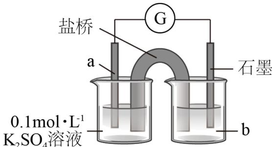

(5) 运用氧化还原反应规律, 分析在上述实验中 $\mathrm{Cu}$ 被 $\mathrm{I}_{2}$ 氧化的产物中价态不同的原因: \_\_\_\_。

【答案】(1) < (2) ①. 除去 $\mathrm{I}_{3}^{-}$ , 防止干扰后续实验 ②. $\left[\mathrm{CuI}_{2}\right]^{-} + 2\mathrm{NH}_{3} \cdot \mathrm{H}_{2}\mathrm{O} = \left[\mathrm{Cu}\left(\mathrm{NH}_{3}\right)_{2}\right]^{+} + 2\mathrm{H}_{2}\mathrm{O} + 2\mathrm{I}^{-}$ 、 $4\left[\mathrm{Cu}\left(\mathrm{NH}_{3}\right)_{2}\right]^{+} + \mathrm{O}_{2} + 8\mathrm{NH}_{3} \cdot \mathrm{H}_{2}\mathrm{O} = 4\left[\mathrm{Cu}\left(\mathrm{NH}_{3}\right)_{4}\right]^{2+} + 4\mathrm{OH}^{-} + 6\mathrm{H}_{2}\mathrm{O}$ (3) ①. $2\mathrm{Cu} + \mathrm{I}_{2} = 2\mathrm{CuI}$ 或 $2\mathrm{Cu} + KI_{3} = 2\mathrm{CuI} + KI$ ②. 白色沉淀逐渐溶解 ③. 溶液变为无色铜与碘的反应为可逆反应(或 $\mathrm{I}_{3}^{-}$ 浓度小未能氧化全部的 $\mathrm{Cu}$ )

（4）铜、含nmolI $_{2}$ 的4mol·L $^{-1}$ 的KI溶液

（5）在实验 I、实验 II、实验 III 中 $Cu^{+}$ 可以进一步与 $I^{-}$ 结合生成 CuI 沉淀或 $\left[CuI_{2}\right]^{-}$ ， $Cu^{+}$ 浓度减小使得 $Cu^{2+}$ 氧化性增强，发生反应 $2Cu^{2+} + 4I^{-} = 2CuI \downarrow + I_{2}$ 和 $2Cu^{2+} + 6I^{-} = 2\left[CuI_{2}\right]^{-} + I_{2}$ 。

【解析】

【分析】因 $I_{2}$ 溶解度较小，Cu 与 $I_{2}$ 接触不充分，将转化为 $I_{3}^{-}$ 可以提高 Cu 与 $I_{3}^{-}$ 的接触面积，提高反应速率。加入 $CCl_{4}$ ， $I_{2} + I^{-} \rightleftharpoons I_{3}^{-}$ 平衡逆向移动， $I_{2}$ 浓度减小， $I^{-}$ 浓度增加， $\left[CuI_{2}\right]^{-}$ 浓度增加，加入氨水后转化为 $\left[\mathrm{Cu}\left(\mathrm{NH}_{3}\right)_{2}\right]^{+}$ ，被氧化为 $\left[\mathrm{Cu}\left(\mathrm{NH}_{3}\right)_{4}\right]^{2+}$ ，故而产生无色溶液变为蓝色溶液的现象。

【小问 1 详解】

提高KI浓度，便于提高 $\mathrm{I}_3^-$ 的浓度，与Cu接触更加充分， $\mathrm{Cu}$ 与 $\mathrm{I}_3^-$ 的反应速率加快，故实验I<实验II。

【小问 2 详解】

加入 $\mathrm{CCl}_4$ ， $\mathrm{I}_2 + \mathrm{I}^- \rightleftharpoons \mathrm{I}_3^-$ 平衡逆向移动， $\mathrm{I}_2$ 浓度减小， $I^{-}$ 浓度增加，其目的为：除去 $\mathrm{I}_3^-$ ，防止干扰后续实验。加入氨水 $\left[\mathrm{CuI}_2\right]^{-}$ 浓后转化为 $\left[\mathrm{Cu}\left(\mathrm{NH}_3\right)_2\right]^+$ 无色的 $\left[\mathrm{Cu}\left(\mathrm{NH}_3\right)_2\right]^+$ 被氧化为蓝色的 $\left[\mathrm{Cu}\left(\mathrm{NH}_3\right)_4\right]^{2+}$ ，方程式为 $\left[\mathrm{CuI}_2\right]^{-} + 2\mathrm{NH}_3\cdot \mathrm{H}_2\mathrm{O} = \left[\mathrm{Cu}\left(\mathrm{NH}_3\right)_2\right]^+ + 2\mathrm{H}_2\mathrm{O} + 2\mathrm{I}^-$ 、 $4\left[\mathrm{Cu}\left(\mathrm{NH}_3\right)_2\right]^+ + \mathrm{O}_2 + 8\mathrm{NH}_3\cdot \mathrm{H}_2\mathrm{O} = 4\left[\mathrm{Cu}\left(\mathrm{NH}_3\right)_4\right]^{2+} + 4\mathrm{OH}^- + 6\mathrm{H}_2\mathrm{O}$ 。

【小问 3 详解】

结合实验III，推测实验I和II中的白色沉淀可能是CuI，实验I中铜被氧化的化学方程式是 $2\mathrm{Cu}+\mathrm{I}_{2}=2\mathrm{CuI}$ 或 $2\mathrm{Cu}+\mathrm{KI}_{3}=2\mathrm{CuI}+\mathrm{KI}$ ； $2\mathrm{Cu}+\mathrm{I}_{2}=2\mathrm{CuI}$ 反应为可逆反应，加入浓KI溶液， $I_{2}$ 浓度减小，CuI转化为Cu和 $I_{2}$ ，故产生白色沉淀溶解，出现红色固体的过程。

【小问 4 详解】

要验证 $\mathrm{I}_2$ 能将 $\mathrm{Cu}$ 氧化为 $\mathrm{Cu}^{2+}$ ，需设计原电池负极材料为 $\mathrm{Cu}$ ，b 为含 nmolI $_2$ 的 $4\mathrm{mol}\cdot\mathrm{L}^{-1}$ 的 KI 溶液。

【小问 5 详解】

含 $nmolI_{2}$ 的 $4mol\cdot L^{-1}$ 的 KI 溶液铜与碘反应的体系在原电池装置中， $I_{2}$ 将 Cu 氧化为 $Cu^{2+}$ ；而在实验 I、实验 II 和实验 III 中 Cu 以 $Cu^{+}$ 形式存在，这是由于在实验 I、实验 II、实验 III 中 $Cu^{+}$ 可以进一步与 $I^{-}$ 结合生成 CuI 沉淀或 $\left[CuI_{2}\right]^{-}$ ， $Cu^{+}$ 浓度减小使得 $Cu^{2+}$ 氧化性增强，发生反应 $2Cu^{2+} + 4I^{-} = 2CuI \downarrow + I_{2}$ 和 $2Cu^{2+} + 6I^{-} = 2\left[CuI_{2}\right]^{-} + I_{2}$ 。