# 2023年普通高中学业水平等级性考试（天津卷）(回忆版部分试题)

赠

# 化学

## 本试卷满分100分，考试时间60分钟。

可能用到的相对原子质量：H—1 C—12 N—14 O—16 S—32 Cl—35.5 Fe—56 Cu—64

## 一、选择题(本题共12小题,每小题3分,共36分。在每小题给出的四个选项中,只有一项是符合题目要求的)

1. 下列化学知识, 错误的是
( )
A. 玻璃是晶体    B. 铝合金是一种金属材料
C. 略    D. 略

2.下列化学常识,错误的是
( )
A.淀粉是一种多糖    B.葡萄糖有还原性
C.油脂是一种高分子    D.氨基酸具有两性

3.下列方法(试剂)中,无法鉴别 $Na_{2}CO_{3}$ 和 $BaCl_{2}$ 两种物质的是
() A. 焰色试验 B. pH 试纸 C. 稀氨水 D. $Na_{2}SO_{4}$

4.下列常见物质及用途，错误的是 （ ）A.略B. $\mathrm{SiO_2}$ 可用于制造光导纤维C. $\mathrm{Fe_2O_3}$ 是铁红，可以用作染料D.钠起火，可以使用水基灭火器扑灭

5.下列比较C和Si非金属性的方法，错误的是 （）A.单质氧化性 B.氧化物熔点C.和氢气化合难易程度 D.最高价氧化物水化物酸性

6.题干给出一信息反应，反应物中有 $\mathrm{NaClO_3}$ ，生成物中有 $\mathrm{ClO}_2$ ，有关说法正确的是 （）A. $\mathrm{CO}_{2}$ 是非极性分子B.略

C. $\mathrm{NaClO_3}$ 在反应中作还原剂D. $\mathrm{ClO}_2$ 分子空间构型为直线形

7. 研究人员用同位素标记法研究了一个反应过程，如下：
① $H^{18}O^{18}OH+Cl_{2}=H^{18}O^{18}OCl+H^{+}+Cl^{-}$ ② $H^{18}O^{18}OCl=H^{+}+Cl^{-}+^{18}O_{2}$ 关于这个反应，说法正确的是（）
A. 第一步反应是置换反应
B. 略
C. 略
D. 反应历程中 O—O 键没有发生断裂

8.如图所示，是芥酸的分子结构，关于芥酸，下列说法正确的是（

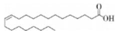

A.芥酸是一种强酸B.芥酸易溶于水C.芥酸是顺式结构D.分子式为 $\mathrm{C_{22}H_{44}O_2}$

9.如图是反应装置，可以做下列 （）备注：此处原卷给出装置图，发生装置为圆液常温型，气体收集装置是导管长进短出的集气瓶，接尾气处理装置。A.稀硝酸与铁制备一氧化氮B.浓盐酸与二氧化锰制备氯气C.浓氨水与氢氧化钠制备氨气D.浓硫酸与亚硫酸钠制备二氧化硫

10. 在浓度为 0.1 mol/L 的 $NaH_{2}PO_{4}$ 溶液中，下列说法正确的是
( )
A. 溶液中浓度最大的离子是 $H_{2}PO_{4}^{-}$ B. $c(\mathrm{H}_{3}\mathrm{PO}_{4}) + c(\mathrm{H}_{2}\mathrm{PO}_{4}^{-}) + c(\mathrm{HPO}_{4}^{2-}) + c(\mathrm{PO}_{4}^{3-}) = 0.1 \, \mathrm{mol/L}$ C. $c(\mathrm{Na}^{+}) + c(\mathrm{H}^{+}) = c(\mathrm{H}_{2}\mathrm{PO}_{4}^{-}) + 2c(\mathrm{HPO}_{4}^{2-}) + 3c(\mathrm{PO}_{4}^{3-})$ D. 磷酸第二步电离平衡的平衡常数表达式为 $K=\frac{c(H_{2}PO_{4}^{-})}{c(H^{-})c(HPO_{4}^{2-})}$

11. 已知 $pK_{a} = -\lg K_{a}$ ，如表是几种不同有机酸的 $pK_{a}$ 大小，由此产生的推断，正确的是（）

<table><tr><td>物质</td><td> $CH_{2}FCOOH$ </td><td> $CH_{2}ClCOOH$ </td><td> $CH_{2}BrCOOH$ </td><td> $CH_{3}COOH$ </td></tr><tr><td> $pK_{a}$ </td><td>2.66</td><td>2.86</td><td>2.90</td><td>4.76</td></tr></table>

A. 对键合电子吸引力: F<Cl  CH_{2}FCOOH$ C. $pK_{a}: CHF_{2}COOH < CH_{2}FCOOH$ D. 碱性: $CH_{2}FCOONa > CH_{3}COONa$

12.《武备志》记载了古人提纯硫的方法，其中这样描写到具体流程：“先将硫打豆粒样碎块，每斤硫黄用麻油二斤，入锅烧滚，再下青柏叶半斤在油内，看柏枯黑色，捞去柏叶，然后入硫黄在滚油内。待油面上黄泡起至半锅，随取起，安在冷水盆内，倒去硫上黄油，净硫凝，一并在锅底内者是。”下列说法错误的是（）
A.“硫打豆粒样”是为了增大接触面积
B.“下青柏叶”“看柏枯黑色”是为了指示油温
C.“倒去硫上黄油”实现了固液分离
D.流程用到了蒸馏原理

## 二、非选择题(本题共4小题,共64分)

13. 关于铜，同学们进行了下列探究。

(1)铜的价层电子排布式是\_\_\_\_, $Cu^{+}$ 与 $Cu^{2+}$ 中半径较大的是\_\_\_\_。

(2) 如图是铜的一种氯化物晶胞, 则这种物质的化学式为 \_\_\_\_。

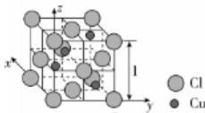

(3)已知铜可以与过氧化氢、稀盐酸反应,制备 $CuCl_{2}$ ,写出该反应化学方程式:\_\_\_\_。
反应中,过氧化氢实际用量总是大于理论用量,原因是\_\_\_\_。

(4) 过氧化氢电子式为 \_\_\_\_。

(5)下列物质都可以替代过氧化氢进行这个反应,最合适的是\_\_\_\_。
a. $HNO_{3}$ b. $O_{2}$ c. $Cl_{2}$

(6)同学们对氯化铜性质进行了探究。向得到的氯化铜溶液中加入KI溶液,得到含有碘元素的沉淀,且反应后所得溶液加入淀粉呈蓝色,则沉淀化学式\_\_\_\_化学教学学\_\_\_\_

14. 根据下列有机流程，回答有关问题：

酸的质量分数  
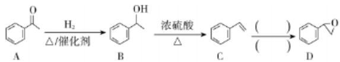

C

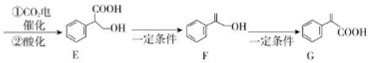

F

G

(1)化合物 G 中含有的官能团为 \_\_\_\_。

(2) A $\longrightarrow$ B 的反应类型是 \_\_\_\_。

共振氢谱图像为4组峰的结构简式为\_\_\_\_。

①可以发生银镜反应；②含有苯环。

(4)B→C的反应方程式为\_\_\_\_。

(5)C→D的所需试剂与反应条件为\_\_\_\_。

(6)下列关于化合物 E 的说法, 错误的是 \_\_\_\_。

a.可以发生聚合反应  
b.所有9个碳原子共平面  
c.可以形成分子内、分子间氢键  
d.含有一个手性碳原子

(7)电催化过程中,二氧化碳与物质D的反应应当在\_\_\_\_（填“阳极”或“阴极”）进行。

(8)根据上述信息,补齐下列反应流程:

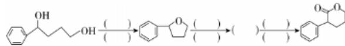

15. 研究人员进行了一组实验：

实验一:如图,研究人员将氢氧化钠溶液加入反应容器,随后加入锌粉,随后加热。一段时间后反应完全,停止加热,锌粉仍有剩余,向反应所得溶液中加入一块铜片,并接触剩余的锌,铜片表面出现银白色金属,并伴随少量气体产生。

实验二:研究人员将实验一得到的带有银白色金属的铜片加热,直到铜片表面变黄,立刻停止加热,置入水中冷却。

已知：

$$
\mathrm{Zn} + 2 \mathrm{NaOH} + 2 \mathrm{H} _ {2} \mathrm{O} = \mathrm{Na} _ {2} [ \mathrm{Zn(OH)} _ {4} ] + \mathrm{H} _ {2} \uparrow
$$

$$
\mathrm{Na} _ {2} \left[ \mathrm{Zn(OH)} _ {4} \right] = 2 \mathrm{Na} ^ {+} + \left[ \mathrm{Zn(OH)} _ {4} \right] ^ {2 -}
$$

$$
[ \mathrm{Zn(OH)} _ {4} ] ^ {2 -} \rightleftharpoons \mathrm{Zn} ^ {2 +} + 4 \mathrm{OH} ^ {-}
$$

(1)如图,实验一使用的仪器为\_\_\_\_,为了防止加热过程中液体沸腾溅出,采取的办法是\_\_\_\_。

(2) $Na_{2}[Zn(OH)_{4}]$ 中含有的化学键包括\_\_\_\_。

a. 离子键

b. 极性共价键

c. 非极性共价键

d. 配位键

(3)写出氢氧化钠与锌反应的离子方程式：\_\_\_\_。

(4) 写出实验一中构成的原电池正负极反应：

负极：\_\_\_\_；

正极：\_\_\_\_，\_\_\_\_。

(5)研究人员在铜片表面变黄后立刻停止加热，放入水中，这样做的目的是\_\_\_\_。

(6)黄铜和黄金外表相似，但化学性质仍然有所区别。若使用硝酸对二者进行鉴别，则现象与结论为\_\_\_\_。

(7)若将铜片插入实验一过滤后的上清液中,可否仍然出现上述现象?请解释:\_\_\_\_。

16. 下面是制备硫酸的工业流程：

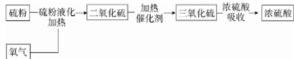

(1) $S_{8}$ 的晶体类型是天利。

(2)第一步时,硫粉液化并与氧气共热生成二氧化硫。若反应温度超过硫粉沸点,部分硫粉会转化为硫蒸气,与生成的二氧化硫一同参加第二步反应,关于这种情况说法正确的是\_\_\_\_。

a. 硫粉消耗量会增大

b. 二氧化硫生成率降低

c. 略

(3)若每生成80 g气体三氧化硫,放出98.3 kJ能量,写出生成三氧化硫的反应的热化学方程式:\_\_\_\_,若反应温度升高,则二氧化硫转化率\_\_\_\_(填“升高”或“降低”)。

(4)第二步反应中,从能量角度分析催化剂意义:\_\_\_\_。

在第二步反应中，首先将反应物加热到 $450\sim 600^{\circ}\mathrm{C}$ ，通入催化剂层，进行第一轮反应，反应后体系温度升高，导出产物与剩余反应物，与其他反应物进行热交换降温，随后再次通入催化剂层，如此进行四轮反应，使反应转化率接近平衡转化率，得到较高产率的三氧化硫。

(5)通入催化剂层后,体系(剩余反应物与生成物)温度升高的原因在于\_\_\_\_;

每轮反应后进行热交换降温的目的是\_\_\_\_。

(6)关于四轮反应,说法正确的是\_\_\_\_。

a.这一流程保证了在反应速率较大的情况下，转化率尽可能大b.这一流程使这一反应最终达到平衡转化率

c. 这一流程节约了能源

(7)如图是吸收三氧化硫时浓硫酸的质量分数、温度对吸收率影响曲线,读图可知,最适合吸收三氧化硫的浓硫酸质量分数为\_\_\_\_,最适合吸收的温度为\_\_\_\_。

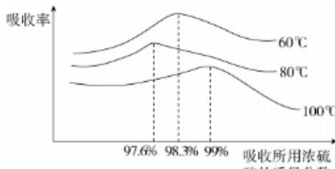

(8)一批32吨含硫元素99%的硫粉,参加反应,在第一步反应中硫元素损失了2%,二氧化硫在第二步反应中97%转化为了三氧化硫,三氧化硫在第三步反应中被吸收时,视作全部吸收,那么这批硫粉总计可以生产98%的浓硫酸\_\_\_\_吨。

注：回忆版与原卷略有偏差和缺失，但缺失内容几乎不影响试题作答，待官方公布原卷后，将更新试卷。

<table><tr><td>1</td><td>2</td><td>3</td><td>4</td><td>5</td><td>6</td><td>7</td><td>8</td><td>9</td><td>10</td><td>11</td><td>12</td></tr><tr><td>A</td><td>C</td><td>C</td><td>D</td><td>B</td><td>A</td><td>D</td><td>C</td><td>D</td><td>B</td><td>C</td><td>D</td></tr></table>

## 名师解析 朱俊

1. A 化学在生产、生活中的应用 玻璃是非晶体，故选 A。

2. C 基本营养物质的结构与性质 油脂是高级脂肪酸与甘油形成的酯，不属于高分子，故选 C。

3.C 常见物质的检验与鉴别 钠元素的焰色呈黄色，钡元素的焰色呈黄绿色，可以利用焰色试验鉴别，A 不符合题意； $Na_{2}CO_{3}$ 溶液呈碱性， $BaCl_{2}$ 溶液呈中性，可以用 pH 试纸鉴别，B 不符合题意； $Na_{2}CO_{3}$ 和 $BaCl_{2}$ 与稀氨水均不反应，不能鉴别，C 符合题意； $Na_{2}CO_{3}$ 与 $Na_{2}SO_{4}$ 溶液不反应， $BaCl_{2}$ 与 $Na_{2}SO_{4}$ 溶液反应生成白色的硫酸钡沉淀，现象不同，可以鉴别，D 不符合题意。

4. D 元素及其化合物的性质和用途 钠是活泼金属,能与水剧烈反应生成氢氧化钠和氢气,钠起火,不能用水基灭火器扑灭,可以用沙土等盖灭,故选 D。

5.B 非金属性强弱的比较 元素的非金属性越强,其单质的氧化性越强,可以利用单质氧化性比较 C 和 Si 非金属性强弱,A 正确;元素的非金属性强弱与其氧化物的熔点无必然联系,C 的氧化物 CO 和 $CO_{2}$ 均为分子晶体,熔点低,Si 的氧化物 $SiO_{2}$ 是共价晶体,熔点高,B 错误;元素的非金属性越强,与氢气化合越容易,可以利用和氢气化合难易程度比较 C 和 Si 非金属性强弱,C 正确;元素的非金属性越强,其最高价氧化物对应水化物的酸性越强,可以利用最高价氧化物对应水化物的酸性强弱比较 C 和 Si 非金属性强弱,D 正确。

【知识拓展】元素非金属性强弱的判断方法:从元素原子结构判断,同周期元素,随核电荷数增大,主族元素的非金属性逐渐增强;同主族元素,随核电荷数增大,元素的非金属性逐渐减弱。

从元素单质及其化合物的相关性质判断，(1)元素的非金属性越强，其单质的氧化性越强，其对应阴离子的还原性越弱；(2)元素的非金属性越强，其单质与氢气化合就越容易，生成的简单气态氢化物越稳定；(3)元素的非金属性越强，其最高价氧化物对应的水化物的酸性越强。

6.A 物质的结构、氧化还原反应 $\mathrm{CO}_{2}$ 中心C原子的价层电子对数为2，无孤电子对，空间构型为直线形，正负电荷中心重合，为非极性分子，A正确；反应前后Cl元素的化合价由 $\mathrm{NaClO_3}$ 中的 $+5$ 降低为 $\mathrm{ClO}_2$ 中的 $+4$ ，则 $\mathrm{NaClO_3}$ 在反应中作氧化剂，C错误； $\mathrm{ClO}_2$ 中心Cl原子的价层电子对数为 $2 + \frac{7 - 2\times 2}{2} = 3.5$ ，价层电子对数取4，有2个弧电子对，空间构型应为V形，D错误。

7.D 化学反应历程 第一步反应无单质生成，不属于置换反应，A 错误；由两步反应可以看出，第一步反应 $H^{18}O^{18}OH$ 断裂 H—O 键，第二步反应 $H^{18}O^{18}OCl$ 断裂 H—O 键和 O—Cl 键，反应过程中 O—O 键未发生断裂，D 正确。

8.C 有机物的结构与性质 芥酸属于一元有机酸，应为弱酸，A错误；芥酸虽然含有一个亲水基团羧基，但憎水基团的碳链很长，应难溶于水，B错误；芥酸形成碳碳双键的两个碳原子连接的两个H原子位于同一侧，属于顺式结构，C正确；芥酸的分子式为 $\mathrm{C_{22}H_{42}O_2}$ ，D错误。【方法点拨】有机物的结构与性质是高考高频题型，同学们应关注有机物的结构和官能团进行分析解答，该类题型体现了化学核心概念“结构决定性质，性质反映结构”。

9.D 实验方案的设计与评价 NO 的密度与空气的密度接近且易与氧气反应,不能用排空气法收集,A 错误;浓盐酸与二氧化锰需要在加热条件下才能反应生成氯气,发生装置缺少加热装置,B 错误;氨气的密度小于空气,收集装置的导气管应短进长出,C 错误;浓硫酸与亚硫酸钠常温下即可反应生成二氧化硫,二氧化硫密度比空气大,可以用向上排空气法收集,导气管长进短出,二氧化硫是大气污染物,可用 NaOH 溶液吸收多余的二氧化硫,该装置能完成浓硫酸与亚硫酸钠制备二氧化硫的实验,D 正确。

【教材溯源】常见气体的制备是高中化学实验重要组成部分。人教版必修第一册 P45 详细介绍了氯气的实验室制备，人教版必修第二册 P5 涉及二氧化硫的制备和性质实验，人教版必修第二册 P15 涉及氨气和一氧化氮的制备及性质实验。高中阶段同学们应熟练掌握氯气、氨气、二氧化硫、一氧化氮、乙烯等气体的制备实验。

10.B 电解质溶液 部分 $\mathrm{H}_2\mathrm{PO}_4^-$ 在溶液中能发生水解和电离，溶液中浓度最大的离子应为 $\mathrm{Na}^+$ ，A 错误；由元素（物料）守恒可知 $c(\mathrm{H}_3\mathrm{PO}_4) + c(\mathrm{H}_2\mathrm{PO}_4^-) + c(\mathrm{HPO}_4^{2-}) + c(\mathrm{PO}_4^{3-}) = 0.1\mathrm{mol / L}$ ，B 正确；由电荷守恒可知 $c(\mathrm{H}^+) + c(\mathrm{Na}^+) = c(\mathrm{OH}^-) + c(\mathrm{H}_2\mathrm{PO}_4^-) + 2c(\mathrm{HPO}_4^{2-}) + 3c(\mathrm{PO}_4^{3-})$ ，C 错误；磷酸第二步电离平衡的平衡常数表达式为 $K = \frac{c(\mathrm{H}^+) \times c(\mathrm{HPO}_4^{2-})}{c(\mathrm{H}^+)\mathrm{O}_4^-}$ ，D 错误。

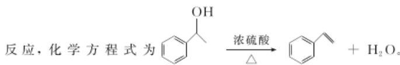

## 11.C 物质的结构与性质、弱电解质的电离

【信息转化】甲基是推电子基团，使羧基中羟基的极性减小，酸性减弱， $\mathrm{CH}_3\mathrm{COOH}$ 的酸性最弱；因为电负性： $\mathrm{F} > \mathrm{Cl} > \mathrm{Br}$ ，对键合电子吸引力： $\mathrm{F} > \mathrm{Cl} > \mathrm{Br}$ ，极性： $-\mathrm{CH}_2\mathrm{F} > -\mathrm{CH}_2\mathrm{Cl} > -\mathrm{CH}_2\mathrm{Br}$ ，则 $\mathrm{CH}_2\mathrm{FCOOH}, \mathrm{CH}_2\mathrm{ClCOOH}, \mathrm{CH}_2\mathrm{BrCOOH}$ 三种物质羧基中羟基的极性依次减小，酸性依次减弱。则酸性： $\mathrm{CH}_2\mathrm{FCOOH} > \mathrm{CH}_2\mathrm{ClCOOH} > \mathrm{CH}_2\mathrm{BrCOOH} > \mathrm{CH}_3\mathrm{COOH}$ 。

电负性：F>Cl>Br，对键合电子吸引力：F>Cl>Br，A错误；电负性：F>1，则酸性： $CH_{2}FCOOH>CH_{2}ICOOH$ ，B错误；极性： $-CHF_{2}>-CH_{2}F$ ，则酸性： $CHF_{2}COOH>CH_{2}FCOOH$ ，则 $pK_{a}$ ： $CHF_{2}COOH<CH_{2}FCOOH$ ，C正确；因为酸性： $CH_{2}FCOOH>CH_{3}COOH$ ，则碱性： $CH_{2}FCOONa<CH_{3}COONa$ ，D错误。

【教材溯源】人教版选择性必修2《物质结构与性质》P54的“键的极性对化学性质的影响”一节内容中详细介绍了不同基团对羧酸酸性强弱的影响。

12. D 传统文化中的化学知识 “硫打豆粒样”是为了增大物质的接触面积，A 正确；“下青柏叶”“看柏枯黑色”是为了指示油温，选择合适的温度，B 正确；“倒去硫上黄油”实现了固液分离，C 正确；流程不涉及蒸馏原理，D 错误。

13.(1) $3d^{10}4s^{1}\quad Cu^{+}$ (2)CuCl
(3) $Cu+H_{2}O_{2}+2HCl=CuCl_{2}+2H_{2}O$ 生成的 $Cu^{2+}$ 会催化过氧化氢分解
(4) $H:\ddot{O}:\ddot{O}:H$ (5)b
(6)CuI 作还原剂还原 $Cu^{2+}$ 、与 $Cu^{+}$ 结合生成 CuI，增强 $Cu^{2+}$ 的氧化性

## 物质的结构与性质、元素化合物的性质

【解析】(1)铜是第29号元素，铜的价层电子排布式是 $3d^{10}4s^{1}$ ; $Cu^{+}$ 和 $Cu^{2+}$ 的质子数相同， $Cu^{+}$ 核外电子数更多，半径更大。(2)1个晶胞中含有4个Cu，含有 $6\times\frac{1}{2}+8\times\frac{1}{8}=4$ 个Cl，则该物质的化学式为CuCl。(3)铜与过氧化氢、稀盐酸反应制备 $CuCl_{2}$ ，铜作还原剂，过氧化氢作氧化剂，反应的化学方程式为 $Cu+H_{2}O_{2}+2HCl—CuCl_{2}+2H_{2}O$ ；反应中，过氧化氢实际用量总是大于理论用量，原因是生成的 $Cu^{2+}$ 会催化过氧化氢分解。(5) $HNO_{3}$ 替代过氧化氢会产生污染性气体氮氧化物， $Cl_{2}$ 自身是污染性气体，且与铜在加热或点燃条件下才能反应，最合适替代过氧化氢的是 $O_{2}$ 。(6)向得到的氯化铜溶液中加入KI溶液，反应后所得溶液加入淀粉呈蓝色，说明有 $I_{2}$ 生成，则 $Cu^{2+}$ 应被还原，结合“得到含有碘元素的沉淀”可知该沉淀应为CuI；该过程中碘离子既作为还原剂还原 $Cu^{2+}$ ，又与 $Cu^{+}$ 结合生成CuI，增强了 $Cu^{2+}$ 的氧化性。

【真题互鉴】氧化还原反应理论是高考高频考点，近年来各省市高考对氧化还原理论的考查逐步深入。本题中“碘离子与 $\mathrm{Cu}^{+}$ 结合生成 CuI，增强了 $\mathrm{Cu}^{2+}$ 的氧化性”这一考点与 2023 年北京卷第 19 题“碘离子与 $\mathrm{Cu}^{+}$ 结合生成 CuI，增强了 $\mathrm{Cu}^{2+}$ 的氧化性”，2023 年湖北卷第 18 题“ $\mathrm{H}^{+}$ 能增强 $\mathrm{H}_{2} \mathrm{O}_{2}$ 的氧化性”，2021 年北京卷第 19 题“还原产物的浓度越小，氧化剂的氧化性越强”等考法相近，值得互相借鉴品味。

## 14.(1)碳碳双键、羧基

(2) 加成反应或还原反应

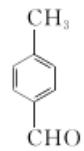

(3)4

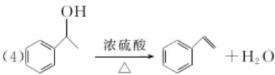

(5) $O_{2}$ △/催化剂

(6)b

(7) 阴极

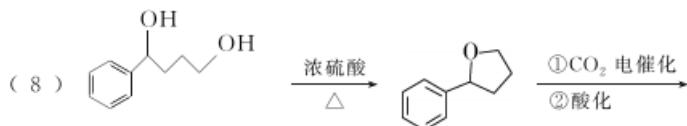

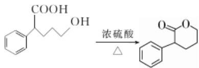

## 有机综合推断

【解析】(1)由 G 的结构简式可知化合物 G 中含有的官能团为碳碳双键、羧基。(2)A→B 的反应是酮转化为醇的反应, 反应类型是加成反应或还原反应。(3)化合物 A 的同分异构体含有苯环, 且能发生银镜反应, 符合条件的同分异构体可能为 $\ce{C6H5CHO}$

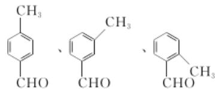

，共4种；其中核磁共振氢谱

图像为4组峰的结构简式为 $\begin{array}{c}CH_{3}\\ \parallel \\ CHO\end{array}$ 。(4)B→C是醇发生消去

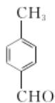

反应，化学方程式为 $\ce{C6H5OH}$ $\xrightarrow[\Delta]{浓硫酸}$ $\ce{C6H5CH=CH2 + H_{2}O}$ (5) C→D 是碳碳双键被氧化为环氧乙烷结构，可以在催化剂/加热条件下与氧气反应得到。(6) E 含有羧基和羟基，能发生缩聚反应，a 正确；与羧基相连的碳原子采用 sp 优化，分子中最多有 8 个碳原子共平面，b 错误；E 含有羧基和羟基，且羧基和羟基的距离小，可以形成分子内、分子间氢键，c 正确；与羧基相连的碳原子为手性碳原子，d 正确。（7）电催化过程中，二氧化碳与物质 D 的反应中二氧化碳中碳元素的化合价降低，应当在阴极进行。

15.(1)蒸发皿、酒精灯、陶土网和铁架台 用玻璃棒搅拌

(2)abd  
(3) $\mathrm{Zn + 2OH^{-} + 2H_2O = [Zn(OH)_4]^{2 - } + H_2\uparrow}$ (4) $\mathrm{Zn - 2e^{-} + 4OH^{-} = [Zn(OH)_4]^{2 - }}$ $[\mathrm{Zn(OH)}_{4}]^{2 - } +$ $2\mathrm{e}^{-} = \mathrm{Zn + 4OH^{-}}$ $2\mathrm{H}_2\mathrm{O} + 2\mathrm{e}^{-} = \mathrm{H}_{2}\uparrow +2\mathrm{OH}^{-}$ (5)防止得到的黄铜(Zn和Cu)被氧气氧化  
(6)固体溶解，有气泡产生，出现红棕色气体的是黄铜，无明显现象的是黄金  
(7)不出现现象理由：铜的金属性比锌的金属性弱，将铜片插入实验一过滤后的上清液中，铜与 $\mathrm{Na_2[Zn(OH)_4]}$ 不发生反应，不能产生上述现象

## 化学综合实验

【解析】(1)由图可知实验一使用的仪器为蒸发皿、酒精灯、陶土网（或石棉网）和铁架台；为了防止加热过程中液体沸腾溅出，可采取的办法是使用玻璃棒搅拌。(2) $\mathrm{Na}_{2}\left[\mathrm{Zn(OH)}_{4}\right]$ 中含有的化学键包括 $\mathrm{Na}^{+}$ 与 $\left[\mathrm{Zn(OH)}_{4}\right]^{2-}$ 间的离子键， $Zn^{2+}$ 与 $OH^{-}$ 之间的配位键，H和O之间的极性共价键，故选abd。(3)氢氧化钠与锌反应的离子方程式为 $\mathrm{Zn} + 2\mathrm{OH}^{-} + 2\mathrm{H}_{2}\mathrm{O} = [\mathrm{Zn(OH)}_{4}]^{2-} + \mathrm{H}_{2}\uparrow$ 。(4)结合实验现象可知实验一中锌、铜以及 $\mathrm{Na}_{2}\left[\mathrm{Zn(OH)}_{4}\right]$ 溶液构成原电池，锌作负极，电极反应式为 $\mathrm{Zn} - 2\mathrm{e}^{-} + 4\mathrm{OH}^{-} = [\mathrm{Zn(OH)}_{4}]^{2-}$ ；铜作正极， $[\mathrm{Zn(OH)}_{4}]^{2-}$ 以及 $H_{2}O$ 可以得到电子，电极反应式为 $[\mathrm{Zn(OH)}_{4}]^{2-} + 2\mathrm{e}^{-} = \mathrm{Zn} + 4\mathrm{OH}^{-}, 2\mathrm{H}_{2}\mathrm{O} + 2\mathrm{e}^{-} = \mathrm{H}_{2}\uparrow + 2\mathrm{OH}^{-}$ 。(5)研究人员在铜片表面变黄后立刻停止加热，放入水中，这样做的目的是防止得到的黄铜被氧气氧化。(6)分别取两种黄色固体于试管中，加入适量的硝酸，其中固体溶解，有气泡产生，试管口出现红棕色气体的是黄铜，无明显现象的是黄金。(7)实验一过滤后的上清液主要成分是 $\mathrm{Na}_{2}\left[\mathrm{Zn(OH)}_{4}\right]$ ，铜的金属活动性比锌的金属活动性弱，将铜片插入实验一过滤后的上清液中，铜与 $\mathrm{Na}_{2}\left[\mathrm{Zn(OH)}_{4}\right]$ 不发生反应，不能产生上述现象。

16.(1)分子晶体
(2)ab
(3) $2SO_{2}(g)+O_{2}(g)\rightleftharpoons2SO_{3}(g)\quad\Delta H=-196.6\ kJ\cdot mol^{-1}$ 降低
(4)使用催化剂,可以使反应在较低温度下达到较大的速率,降低能耗
(5) $SO_{2}$ 与 $O_{2}$ 反应生成 $SO_{3}$ 是放热反应 降低体系温度,使催化剂处于高活性温度范围,加快反应的速率、提高转化率并节约能源
(6)ac
(7)98.3% 60℃
(8)94.1

## 无机化工流程

【解析】(2)若第一步时部分硫粉会转化为硫蒸气，与生成的二氧化硫一同参加第二步反应，相当于第一步时部分硫粉未参与反应，则第一步时硫粉消耗量会增大，二氧化硫生成率降低。(3)80 g $SO_{3}$ 气体的物质的量为 1 mol，则生成三氧化硫的热化学方程式： $2\mathrm{SO}_{2}(\mathrm{g})+\mathrm{O}_{2}(\mathrm{g})\rightleftharpoons2\mathrm{SO}_{3}(\mathrm{g})\quad\Delta H=-196.6\ \mathrm{kJ}\cdot\mathrm{mol}^{-1}$ ; 若反应温度升高，平衡逆向移动，则二氧化硫平衡转化率降低。(6)由(5)可知这一流程保证了在反应速率较大的情况下，转化率尽可能大，a 正确；由题意可知，最终反应转化率接近平衡转化率，并不一定达到平衡转化率，b 错误；热交换可以节约能源，c 正确。(7)由图可知，最适合吸收三氧化硫的浓硫酸质量分数为 98.3%，最适合吸收的温度为 60℃。(8)这批硫粉总计可以生产 98% 的浓硫酸的质量为 $\frac{32\ t\times99\%\times(1-2\%)\times97\%\times\frac{98}{32}}{98\%}\approx94.1\ t$ 。

## 天利38套