# 山东省 2023 年普通高中学业水平等级考试

# 化学

可能用到的相对原子质量：H-1 C-12 N-14 O-16 F-19 Si-28 S-32 C1-35.5 K-39 Cu-64

## 一、选择题：本题共10小题，每小题2分，共20分。每小题只有一个选项符合题目要求。

1. 下列之物具有典型的齐鲁文化特色，据其主要化学成分不能与其他三种归为一类的是
A. 泰山墨玉 
B. 龙山黑陶 
C. 齐国刀币 
D. 淄博琉璃

## 【详解】墨玉、黑陶、琉璃均为陶瓷制品，均属于硅酸盐制品，主要成分均为硅酸盐材料，而刀币的主要成分为青铜，故答案为：C。

2. 实验室中使用盐酸、硫酸和硝酸时，对应关系错误的是
A. 稀盐酸：配制 $AlCl_{3}$ 溶液
B. 稀硫酸：蔗糖和淀粉的水解
C. 稀硝酸：清洗附有银镜的试管
D. 浓硫酸和浓硝酸的混合溶液：苯的磺化

【详解】A．实验室配制 $AlCl_{3}$ 溶液时向其中加入少量的稀盐酸以抑制 $Al^{3+}$ 水解，A 不合题意；
B．蔗糖和淀粉的水解时常采用稀硫酸作催化剂，B 不合题意；
C．清洗附有银镜的试管用稀硝酸，反应原理为： $3\mathrm{Ag}+4\mathrm{HNO}_{3}(稀)=3\mathrm{AgNO}_{3}+\mathrm{NO}\uparrow+2\mathrm{H}_{2}\mathrm{O}$ ，C 不合题意；
D．苯的磺化是苯和浓硫酸共热，反应生成苯磺酸的反应，故不需要用到浓硫酸和浓硝酸的混合溶液，D 符合题意；
故答案为：D。

3. 下列分子属于极性分子的是
A. $\mathrm{CS}_{2}$ B. $\mathrm{NF}_{3}$ C. $\mathrm{SO}_{3}$ D. $\mathrm{SiF}_{4}$

【详解】A. $\mathrm{CS}_2$ 中C上的孤电子对数为 $\frac{1}{2} \times (4 - 2 \times 2) = 0$ ， $\sigma$ 键电子对数为2，价层电子对数为2， $\mathrm{CS}_2$ 的空间构型为直线形，分子中正负电中心重合， $\mathrm{CS}_2$ 属于非极性分子，A项不符合题意；  
B. $\mathrm{NF}_3$ 中N上的孤电子对数为 $\frac{1}{2} \times (5 - 3 \times 1) = 1$ ， $\sigma$ 键电子对数为3，价层电子对数为4， $\mathrm{NF}_3$ 的空间构型为三角锥形，分子中正负电中心不重合， $\mathrm{NF}_3$ 属于极性分子，B项符合题意；  
C. $\mathrm{SO}_3$ 中S上的孤电子对数为 $\frac{1}{2} \times (6 - 3 \times 2) = 0$ ， $\sigma$ 键电子对数为3，价层电子对数为3， $\mathrm{SO}_3$ 的空间构型为平面正三角形，分子中正负电中心重合， $\mathrm{SO}_3$ 属于非极性分子，C项不符合题意；  
D. $\mathrm{SiF}_4$ 中Si上的孤电子对数为 $\frac{1}{2} \times (4 - 4 \times 1) = 0$ ， $\sigma$ 键电子对数为4，价层电子对数为4， $\mathrm{SiF}_4$ 的空间构型为正四面体形，分子中正负电中心重合， $\mathrm{SiF}_4$ 属于非极性分子，D项不符合题意；  
答案选B。

4. 实验室安全至关重要，下列实验室事故处理方法错误的是
A. 眼睛溅进酸液，先用大量水冲洗，再用饱和碳酸钠溶液冲洗
B. 皮肤溅上碱液，先用大量水冲洗，再用2%的硼酸溶液冲洗
C. 电器起火，先切断电源，再用二氧化碳灭火器灭火
D. 活泼金属燃烧起火，用灭火毯(石棉布)灭火

【详解】A．眼睛溅进酸液，先用大量水冲洗，再用3%-5%的碳酸氢钠溶液冲洗，故A错误；
B．立即用大量水冲洗，边洗边眨眼，尽可能减少碱对眼睛的伤害，再用2%的硼酸中和残余的碱，故B正确；
C．电器起火，先切断电源，再用二氧化碳灭火器灭火，故C正确；
D．活泼金属会与水反应，所以燃烧起火，用灭火毯(石棉布)灭火，故D正确；
答案为 A。

5. 石墨与 $\mathrm{F}_{2}$ 在 $450^{\circ} \mathrm{C}$ 反应, 石墨层间插入 F 得到层状结构化合物 $(\mathrm{CF})_{\mathrm{x}}$ , 该物质仍具润滑性, 其单层局部结构如图所示。下列关于该化合物的说法正确的是

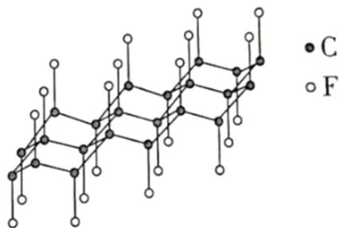

A. 与石墨相比， $(\mathrm{CF})_{\mathrm{x}}$ 导电性增强

B. 与石墨相比， $(\mathrm{CF})_{\mathrm{x}}$ 抗氧化性增强  
C. $(\mathrm{CF})_{\mathrm{x}}$ 中 $\mathrm{C} - \mathrm{C}$ 的键长比 $\mathrm{C} - \mathrm{F}$ 短  
D. $1\mathrm{mol}(\mathrm{CF})_{\mathrm{x}}$ 中含有 $2\mathrm{xmol}$ 共价单键【答案】B

【详解】A. 石墨晶体中每个碳原子上未参与杂化的 1 个 2p 轨道上电子在层内离域运动, 故石墨晶体能导电, 而 $(\mathrm{CF})_{\mathrm{x}}$ 中没有未参与杂化的 2p 轨道上的电子, 故与石墨相比, $(\mathrm{CF})_{\mathrm{x}}$ 导电性减弱, A 错误; B. $(\mathrm{CF})_{\mathrm{x}}$ 中 C 原子的所有价键均参与成键, 未有未参与成键的孤电子或者不饱和键, 故与石墨相比, $(\mathrm{CF})_{\mathrm{x}}$ 抗氧化性增强, B 正确; C. 已知 C 的原子半径比 F 的大, 故可知 $(\mathrm{CF})_{\mathrm{x}}$ 中 C-C 的键长比 C-F 长, C 错误; D. 由题干结构示意图可知, 在 $(\mathrm{CF})_{\mathrm{x}}$ 中 C 与周围的 3 个碳原子形成共价键, 每个 C-C 键被 2 个碳原子共用, 和 1 个 F 原子形成共价键, 即 $1 \mathrm{~mol}(\mathrm{CF})_{\mathrm{x}}$ 中含有 $2.5 \mathrm{x} \mathrm{mol}$ 共价单键, D 错误; 故答案为: B。

6. 鉴别浓度均为 $0.1 \mathrm{~mol} \cdot \mathrm{L}^{- 1}$ 的 $\mathrm{NaClO}$ 、 $\mathrm{Ba(OH)}_{2}$ 、 $\mathrm{Al}_{2} \left( \mathrm{SO}_{4} \right)_{3}$ 三种溶液，仅用下列一种方法不可行的是  
A. 测定溶液 $\mathrm{pH}$ B. 滴加酚酞试剂  
C. 滴加 $0.1 \mathrm{~mol} \cdot \mathrm{L}^{- 1} \mathrm{KI}$ 溶液 D. 滴加饱和 $\mathrm{Na}_{2} \mathrm{CO}_{3}$ 溶液

【详解】A. NaClO 溶液显弱碱性, $\mathrm{Ba(OH)}_{2}$ 溶液显强碱性, $\mathrm{Al}_{2} \left( \mathrm{SO}_{4} \right)_{3}$ 溶液显酸性, 则测定溶液 pH 是可以鉴别出来的, 故 A 不符合题意;  
B. NaClO 溶液显弱碱性, 滴入酚酞先变红后褪色, $\mathrm{Ba(OH)}_{2}$ 溶液显强碱性, 滴入酚酞溶液, 显红色, $\mathrm{Al}_{2} \left( \mathrm{SO}_{4} \right)_{3}$ 溶液显酸性, 滴入酚酞不变色, 则滴加酚酞试剂是可以鉴别出来的, 故 B 不符合题意;  
C. NaClO 溶液滴入碘化钾溶液, 发生氧化还原反应生成碘, 液面会由无色变成黄色, 振荡后会变成无色, 而 $\mathrm{Ba(OH)}_{2}$ 溶液, $\mathrm{Al}_{2} \left( \mathrm{SO}_{4} \right)_{3}$ 溶液滴入碘化钾溶液后, 因不与两者反应而没有现象, 则仅用滴加 $0.1 \mathrm{~mol} \cdot \mathrm{L}^{-1} \mathrm{KI}$ 溶液无法鉴别, 则 C 符合题意;  
D. 饱和 $\mathrm{Na}_{2} \mathrm{CO}_{3}$ 溶液和 NaClO 溶液不反应, 和 $\mathrm{Ba(OH)}_{2}$ 溶液反应生成碳酸钡沉淀, 和 $\mathrm{Al}_{2} \left( \mathrm{SO}_{4} \right)_{3}$ 溶液发生双水解反应生成沉淀和气体，则滴入饱和 $Na_{2}CO_{3}$ 溶液是可以鉴别出来的，故 D 不符合题意；
答案 C。

7. 抗生素克拉维酸的结构简式如图所示，下列关于克拉维酸的说法错误的是

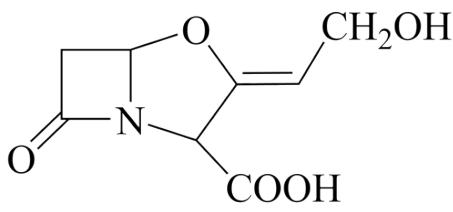

A. 存在顺反异构  
B. 含有5种官能团  
C. 可形成分子内氢键和分子间氢键  
D. 1mol该物质最多可与1molNaOH反应

【详解】A．由题干有机物结构简式可知，该有机物存在碳碳双键，且双键两端的碳原子分别连有互不同的原子或原子团，故该有机物存在顺反异构，A 正确；

B．由题干有机物结构简式可知，该有机物含有羟基、羧基、碳碳双键、醚键和酰胺基等 5 种官能团，B 正确；

C．由题干有机物结构简式可知，该有机物中的羧基、羟基、酰胺基等官能团具有形成氢键的能力，故其分子间可以形成氢键，其中距离较近的某些官能团之间还可以形成分子内氢键，C 正确；

D．由题干有机物结构简式可知，1mol 该有机物含有羧基和酰胺基各 1mol，这两种官能团都能与强碱反应，故 1mol 该物质最多可与 2mol NaOH 反应，D 错误；

故答案为：D。

8. 一定条件下，乙酸酐 $\left[\left(\mathrm{CH}_{3} \mathrm{CO}\right)_{2} \mathrm{O}\right]$ 醇解反应 $\left[\left(\mathrm{CH}_{3} \mathrm{CO}\right)_{2} \mathrm{O} + \mathrm{ROH} \longrightarrow \mathrm{CH}_{3} \mathrm{COOR} + \mathrm{CH}_{3} \mathrm{COOH}\right]$ 可进行完全，利用此反应定量测定有机醇 $(\mathrm{ROH})$ 中的羟基含量，实验过程中酯的水解可忽略。实验步骤如下：

①配制一定浓度的乙酸酐-苯溶液。

②量取一定体积乙酸酐-苯溶液置于锥形瓶中，加入 mgROH 样品，充分反应后，加适量水使剩余乙酸酐完全水解： $\left(\mathrm{CH}_{3}\mathrm{CO}\right)_{2}\mathrm{O}+\mathrm{H}_{2}\mathrm{O}\longrightarrow2\mathrm{CH}_{3}\mathrm{COOH}$ 。

③加指示剂并用 $cmol \cdot L^{-1} NaOH-$ 甲醇标准溶液滴定至终点，消耗标准溶液 $V_{1} mL$ 。
④在相同条件下，量取相同体积的乙酸酐-苯溶液，只加适量水使乙酸酐完全水解；加指示剂并用 $cmol \cdot L^{-1} NaOH-$ 甲醇标准溶液滴定至终点，消耗标准溶液 $V_{2} mL$ 。对于上述实验，下列做法正确的是
A. 进行容量瓶检漏时，倒置一次即可
B. 滴入半滴标准溶液，锥形瓶中溶液变色，即可判定达滴定终点
C. 滴定读数时，应单手持滴定管上端并保持其自然垂直
D. 滴定读数时，应双手一上一下持滴定管

【解析】

【详解】A．进行容量瓶检漏时，倒置一次，然后玻璃塞旋转180度后再倒置一次，故A错误；  
B．滴入半滴标准溶液，锥形瓶中溶液变色，且半分钟内不变回原色，才是达到滴定终点，故B错误；  
C．滴定读数时，应单手持滴定管上端无刻度处，并保持其自然垂直，故C正确；  
D．滴定读数时，应单手持滴定管上端无刻度处，并保持其自然垂直，故D错误；  
答案为C。

9. 一定条件下，乙酸酐 $\left[\left(\mathrm{CH}_{3} \mathrm{CO}\right)_{2} \mathrm{O}\right]$ 醇解反应 $\left[\left(\mathrm{CH}_{3} \mathrm{CO}\right)_{2} \mathrm{O} + \mathrm{ROH} \longrightarrow \mathrm{CH}_{3} \mathrm{COOR} + \mathrm{CH}_{3} \mathrm{COOH}\right]$ 可进行完全，利用此反应定量测定有机醇 $(\mathrm{ROH})$ 中的羟基含量，实验过程中酯的水解可忽略。实验步骤如下：

①配制一定浓度的乙酸酐-苯溶液。

②量取一定体积乙酸酐-苯溶液置于锥形瓶中，加入 mgROH 样品，充分反应后，加适量水使剩余乙酸酐完全水解： $\left(\mathrm{CH}_{3}\mathrm{CO}\right)_{2}\mathrm{O}+\mathrm{H}_{2}\mathrm{O}\longrightarrow2\mathrm{CH}_{3}\mathrm{COOH}$ 。

③加指示剂并用 $cmol \cdot L^{-1} NaOH-$ 甲醇标准溶液滴定至终点，消耗标准溶液 $V_{1} mL$ 。

④在相同条件下，量取相同体积的乙酸酐-苯溶液，只加适量水使乙酸酐完全水解；加指示剂并用
cmol·L $^{-1}$ NaOH-甲醇标准溶液滴定至终点，消耗标准溶液V $_{2}$ mL。ROH样品中羟基含量(质量分数)计算正确的是
A. $\frac{\mathrm{c}\left(\mathrm{V}_{2}-\mathrm{V}_{1}\right)\times17}{1000\mathrm{m}}\times100\%$ B. $\frac{\mathrm{c}\left(\mathrm{V}_{1}-\mathrm{V}_{2}\right)\times17}{1000\mathrm{m}}\times100\%$ C. $\frac{0.5\mathrm{c}\left(\mathrm{V}_{2}-\mathrm{V}_{1}\right)\times17}{1000\mathrm{m}}\times100\%$ D. $\frac{\mathrm{c}\left(0.5\mathrm{V}_{2}-\mathrm{V}_{1}\right)\times17}{1000\mathrm{m}}\times100\%$

【答案】A 【解析】

【详解】根据滴定过程中，用 $\mathrm{cmol}\cdot \mathrm{L}^{-1}\mathrm{NaOH}$ -甲醇标准溶液滴定乙酸酐完全水解生成的乙酸，消耗标准溶液 $\mathrm{V}_2\mathrm{mL}$ ，需要消耗 $\mathrm{cmol}\cdot \mathrm{L}^{-1}\mathrm{NaOH}$ -甲醇的物质的量为 $\mathrm{V}_2\times \mathrm{c}\times 10^{-3}\mathrm{mol}$ ，即乙酸酐的总物质的量 $= \frac{\mathrm{V}_2\times \mathrm{c}\times 10^{-3}}{2}\mathrm{mol}$ ；则ROH与乙酸酐反应后剩余的乙酸酐的物质的量 $= \frac{\mathrm{V}_1\times \mathrm{c}\times 10^{-3}}{2}\mathrm{mol}$ ；设醇解的乙酸酐物质的量为x，水解的乙酸酐的物质的量为y，则 $\mathrm{x + y = \frac{\mathrm{V}_2\times\mathrm{c}\times 10^{-3}}{2}\mathrm{mol};\mathrm{x + 2y = \frac{\mathrm{V}_1\times\mathrm{c}\times 10^{-3}}{2}\mathrm{mol}}}$ ；联立计算得： $\mathrm{x = n(ROH) = V_2\times c\times 10^{-3} - V_1\times c\times 10^{-3}mol}$ ，ROH样品中羟基质量分数 $= \frac{\mathrm{V}_2\times\mathrm{c}\times 10^{-3} - \mathrm{V}_1\times\mathrm{c}\times 10^{-3}\mathrm{mol}}{\mathrm{mg}}\times 100\% = \frac{(\mathrm{V}_2 - \mathrm{V}_1)\times\mathrm{c}\times 17}{10^3\mathrm{m}}\times 100\%$ ，A正确；故选A。  
10.一定条件下，乙酸酐 $\left[\left(\mathrm{CH}_{3}\mathrm{CO}\right)_{2}\mathrm{O}\right]$ 醇解反应 $\left[\left(\mathrm{CH}_{3}\mathrm{CO}\right)_{2}\mathrm{O} + \mathrm{ROH}\longrightarrow \mathrm{CH}_{3}\mathrm{COOR} + \mathrm{CH}_{3}\mathrm{COOH}\right]$ 可进行完全，利用此反应定量测定有机醇（ROH）中的羟基含量，实验过程中酯的水解可忽略。实验步骤如下：

①配制一定浓度的乙酸酐-苯溶液。

②量取一定体积乙酸酐-苯溶液置于锥形瓶中，加入 mg ROH 样品，充分反应后，加适量水使剩余乙酸酐完全水解： $\left(\mathrm{CH}_{3}\mathrm{CO}\right)_{2}\mathrm{O}+\mathrm{H}_{2}\mathrm{O}\longrightarrow2\mathrm{CH}_{3}\mathrm{COOH}$ 。

③加指示剂并用 $cmol \cdot L^{-1}$ NaOH-甲醇标准溶液滴定至终点，消耗标准溶液 $V_{1}$ mL。

④在相同条件下，量取相同体积的乙酸酐-苯溶液，只加适量水使乙酸酐完全水解；加指示剂并用 $cmol \cdot L^{-1} NaOH$ -甲醇标准溶液滴定至终点，消耗标准溶液 $V_{2} mL$ 。根据上述实验原理，下列说法正确的是

A. 可以用乙酸代替乙酸酐进行上述实验  
B. 若因甲醇挥发造成标准溶液浓度发生变化，将导致测定结果偏小  
C. 步骤③滴定时，不慎将锥形瓶内溶液溅出，将导致测定结果偏小  
D. 步骤④中，若加水量不足，将导致测定结果偏大

【解析】

【分析】用 $cmol \cdot L^{-1}$ NaOH-甲醇标准溶液滴定乙酸酐完全水解生成的乙酸，消耗标准溶液 $V_{2}$ mL，则消耗 NaOH 的物质的量为 $\left(V_{2} \times c \times 10^{-3}\right)$ mol，即乙酸酐的总物质的量为 $\frac{\left(V_{2} \times c \times 10^{-3}\right)}{2}$ mol，ROH 与乙酸酐反应后剩余的乙酸酐的物质的量为 $\frac{\left(V_{1} \times c \times 10^{-3}\right)}{2}$ mol，所以与 ROH 反应消耗的乙酸酐的物质的量为 $\frac{\left(V_{2} \times c \times 10^{-3} - V_{1} \times c \times 10^{-3}\right)}{2}$ mol。

【详解】A. 乙酸与醇的酯化反应可逆，不能用乙酸代替乙酸酐进行上述实验，A项错误；

B. 若甲醇挥发, NaOH-甲醇溶液的浓度将偏大, 滴定时消耗 NaOH-甲醇溶液的体积偏小, 步骤④中所得 $\mathrm{V}_{2}$ 偏小, 而 ROH 的物质的量为 $\frac{\left(\mathrm{V}_{2} \times \mathrm{c} \times 10^{-3} - \mathrm{V}_{1} \times \mathrm{c} \times 10^{-3}\right)}{2} \mathrm{~mol}$ , 故将导致测定结果偏小, B 项正确; C. 步骤③滴定时, 不慎将锥形瓶内溶液溅出, 消耗 NaOH-甲醇溶液的体积偏小即 $\mathrm{V}_{1}$ 偏小, 而 ROH 的物质的量为 $\frac{\left(\mathrm{V}_{2} \times \mathrm{c} \times 10^{-3} - \mathrm{V}_{1} \times \mathrm{c} \times 10^{-3}\right)}{2} \mathrm{~mol}$ , 故将导致测定结果偏大, C 项错误;

D. 步骤④中, 若加水量不足, 乙酸酐未完全水解, 生成乙酸的物质的量偏小, 消耗 NaOH-甲醇溶液的体积偏小即 $\mathrm{V}_{2}$ 偏小, 而 ROH 的物质的量为 $\frac{\left(\mathrm{V}_{2} \times \mathrm{c} \times 10^{-3} - \mathrm{V}_{1} \times \mathrm{c} \times 10^{-3}\right)}{2} \mathrm{~mol}$ , 故将导致测定结果偏小, D 项错误; 答案选 B。

## 二、选择题：本题共5小题，每小题4分，共20分。每小题有一个或两个选项符合题目要求，全部选对得4分，选对但不全的得2分，有选错的得0分。

11. 利用热再生氨电池可实现 $\mathrm{CuSO}_4$ 电镀废液的浓缩再生。电池装置如图所示, 甲、乙两室均预加相同的 $\mathrm{CuSO}_4$ 电镀废液, 向甲室加入足量氨水后电池开始工作。下列说法正确的是

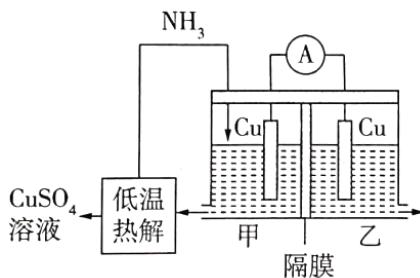

A. 甲室 $\mathrm{Cu}$ 电极为正极  
B. 隔膜为阳离子膜

C. 电池总反应为: $\mathrm{Cu}^{2+} + 4\mathrm{NH}_{3} = \left[\mathrm{Cu}\left(\mathrm{NH}_{3}\right)_{4}\right]^{2+}$

D. $\mathrm{NH}_{3}$ 扩散到乙室将对电池电动势产生影响

【答案】CD

【解析】

【详解】A. 向甲室加入足量氨水后电池开始工作，则甲室 Cu 电极溶解，变为铜离子与氨气形成 $\left[\mathrm{Cu}\left(\mathrm{NH}_{3}\right)_{4}\right]^{2+}$ ，因此甲室 Cu 电极为负极，故 A 错误；
B. 再原电池内电路中阳离子向正极移动，若隔膜为阳离子膜，电极溶解生成的铜离子要向右侧移动，通入
氨气要消耗铜离子，显然左侧阳离子不断减小，明显不利于电池反应正常进行，故 B 错误；
C. 左侧负极是 $\mathrm{Cu}-2\mathrm{e}^{-}+4\mathrm{NH}_{3}=\left[\mathrm{Cu}\left(\mathrm{NH}_{3}\right)_{4}\right]^{2+}$ ，正极是 $Cu^{2+}+2e^{-}=Cu$ ，则电池总反应为： $\mathrm{Cu}^{2+}+\mathrm{4NH}_{3}=\left[\mathrm{Cu}\left(\mathrm{NH}_{3}\right)_{4}\right]^{2+}$ ，故 C 正确；
D. $NH_{3}$ 扩散到乙室会与铜离子反应生成 $\left[\mathrm{Cu}\left(\mathrm{NH}_{3}\right)_{4}\right]^{2+}$ ，铜离子浓度降低，铜离子得电子能力减弱，因此将对电池电动势产生影响，故 D 正确。
综上所述，答案为 CD。

12. 有机物 $\mathrm{X} \rightarrow \mathrm{Y}$ 的异构化反应如图所示，下列说法错误的是

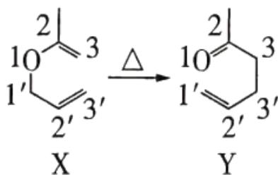

A. 依据红外光谱可确证 X、Y 存在不同的官能团
B. 除氢原子外，X 中其他原子可能共平面
C. 含醛基和碳碳双键且有手性碳原子的 Y 的同分异构体有 4 种(不考虑立体异构)

D. 类比上述反应， $\ce{C6H5O}$ 的异构化产物可发生银镜反应和加聚反应

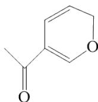

【答案】C

【解析】

【详解】A．由题干图示有机物 X、Y 的结构简式可知，X 含有碳碳双键和醚键，Y 含有碳碳双键和酮羰基，红外光谱图中可以反映不同官能团或化学键的吸收峰，故依据红外光谱可确证 X、Y 存在不同的官能团，A 正确；

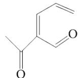

B. 由题干图示有机物 X 的结构简式可知，X 分子中存在两个碳碳双键所在的平面，单键可以任意旋转，故除氢原子外，X 中其他原子可能共平面，B 正确；

C. 由题干图示有机物 Y 的结构简式可知，Y 的分子式为： $C_{6}H_{10}O$ ，则含醛基和碳碳双键且有手性碳原子(即同时连有四个互不相同的原子或原子团的碳原子)的 Y 的同分异构体有： $CH_{3}CH=CHCH(CH_{3})CHO$ 、

$$
\mathrm{CH} _ {2} = \mathrm{C} (\mathrm{CH} _ {3}) \mathrm{CH} (\mathrm{CH} _ {3}) \mathrm{CHO}, \quad \mathrm{CH} _ {2} = \mathrm{CHCH} (\mathrm{CH} _ {3}) \mathrm{CH} _ {2} \mathrm{CHO}, \quad \mathrm{CH} _ {2} = \mathrm{CHCH} _ {2} \mathrm{CH} (\mathrm{CH} _ {3}) \mathrm{CHO}
$$

$CH_{2}=CHCH(CH_{2}CH_{3})CHO$ 共 5 种(不考虑立体异构)，C 错误；

D. 由题干信息可知, 类比上述反应, 的异构化产物为: 含有碳碳双键和醛基,

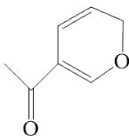

故可发生银镜反应和加聚反应，D 正确；

故答案为：C。

13. 一种制备 $\mathrm{Cu}_{2} \mathrm{O}$ 的工艺路线如图所示, 反应II所得溶液 $\mathrm{pH}$ 在 $3 \sim 4$ 之间, 反应III需及时补加 $\mathrm{NaOH}$ 以保持反应在 $\mathrm{pH} = 5$ 条件下进行。常温下, $\mathrm{H}_{2} \mathrm{SO}_{3}$ 的电离平衡常数 $\mathrm{K}_{\mathrm{al}} = 1.3 \times 10^{-2}, \mathrm{K}_{\mathrm{a2}} = 6.3 \times 10^{-8}$ 。下列说法正确的是

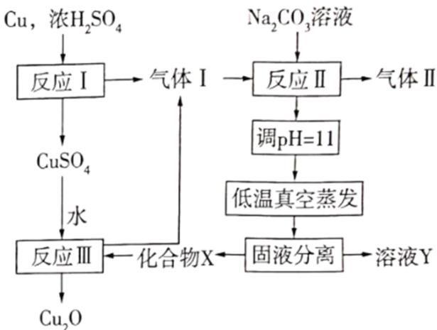

A. 反应I、II、III均为氧化还原反应

B. 低温真空蒸发主要目的是防止 $\mathrm{NaHSO}_3$ 被氧化

C. 溶液 Y 可循环用于反应 II 所在操作单元吸收气体 I

D. 若 $Cu_{2}O$ 产量不变，参与反应 III 的 X 与 $CuSO_{4}$ 物质的量之比 $\frac{n(X)}{n(CuSO_{4})}$ 增大时，需补加 NaOH 的量

减少

【答案】CD

【解析】

【分析】铜和浓硫酸反应(反应I)生成二氧化硫气体(气体I)和硫酸铜，生成的二氧化硫气体与碳酸钠反应(反应II)，所得溶液pH在3\~4之间，溶液显酸性，根据 $H_{2}SO_{3}$ 的电离平衡常数 $K_{al}=1.3\times10^{-2},K_{a2}=6.3\times10^{-8}$ ，可知 $NaHSO_{3}$ 溶液显酸性(电离大于水解)，则反应II所得溶液成分是 $NaHSO_{3}$ ，调节溶液pH值至11，使 $NaHSO_{3}$ 转化为 $Na_{2}SO_{3}$ ，低温真空蒸发(防止 $Na_{2}SO_{3}$ 被氧化)，故固液分离得到 $Na_{2}SO_{3}$ 晶体和 $Na_{2}SO_{3}$ 溶液， $Na_{2}SO_{3}$ 和 $CuSO_{4}$ 反应的离子方程式是 $SO_{3}^{2-}+2Cu^{2+}+2H_{2}O=SO_{4}^{2-}+Cu_{2}O+4H^{+}$ ，反应过程中酸性越来越强，使 $Na_{2}SO_{3}$ 转化成 $SO_{2}$ 气体，总反应方程式是 $2CuSO_{4}+3Na_{2}SO_{3}=Cu_{2}O+2SO_{2}\uparrow+3Na_{2}SO_{4}$ ，需及时补加NaOH以保持反应在pH=5条件下进行，据此分析解答。

【详解】A. 反应I是铜和浓硫酸反应, 生成二氧化硫, 是氧化还原反应, 反应II是 $\mathrm{SO}_{2}$ 和碳酸钠溶液反应, 生成 $\mathrm{NaHSO}_{3}$ 、水和二氧化碳, 是非氧化还原反应, 反应III是 $\mathrm{Na}_{2} \mathrm{SO}_{3}$ 和 $\mathrm{CuSO}_{4}$ 反应生成 $\mathrm{Cu}_{2} \mathrm{O}$ , 是氧化还原反应, 故 A 错误;  
B. 低温真空蒸发主要目的是防止 $\mathrm{Na}_{2} \mathrm{SO}_{3}$ 被氧化, 而不是 $\mathrm{NaHSO}_{3}$ , 故 B 错误;  
C. 经分析溶液 Y 的成分是 $\mathrm{Na}_{2} \mathrm{SO}_{3}$ 溶液, 可循环用于反应II的操作单元吸收 $\mathrm{SO}_{2}$ 气体(气体I), 故 C 正确;  
D. 制取 $\mathrm{Cu}_{2} \mathrm{O}$ 总反应方程式是 $2 \mathrm{CuSO}_{4} + 3 \mathrm{Na}_{2} \mathrm{SO}_{3} = \mathrm{Cu}_{2} \mathrm{O} + 2 \mathrm{SO}_{2} \uparrow + 3 \mathrm{Na}_{2} \mathrm{SO}_{4}$ , 化合物 X 是指 $\mathrm{Na}_{2} \mathrm{SO}_{3}$ , 若 $\mathrm{Cu}_{2} \mathrm{O}$ 产量不变, 增大 $\frac{\mathrm{n}(X)}{\mathrm{n}\left(\mathrm{CuSO}_{4}\right)}$ 比, 多的 $\mathrm{Na}_{2} \mathrm{SO}_{3}$ 会消耗氢离子, 用于控制 pH 值, 可减少 NaOH 的量, 故 D 正确;  
答案 CD。

14. 一定条件下，化合物 E 和 TFAA 合成 H 的反应路径如下:

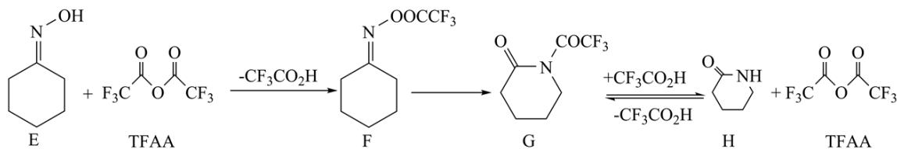

已知反应初始E的浓度为 $0.10\mathrm{mol}\cdot \mathrm{L}^{-1}$ ，TFAA的浓度为 $0.08\mathrm{mol}\cdot \mathrm{L}^{-1}$ ，部分物种的浓度随时间的变化关系如图所示，忽略反应过程中的体积变化。下列说法正确的是

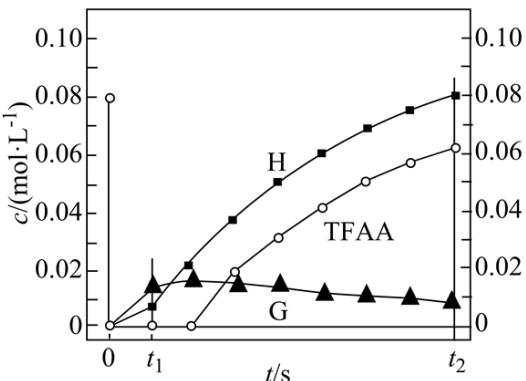

A. $t_1$ 时刻，体系中有E存在  
B. $t_2$ 时刻，体系中无F存在  
C.E和TFAA反应生成F的活化能很小  
D. 反应达平衡后，TFAA的浓度为 $0.08\mathrm{mol}\cdot \mathrm{L}^{-1}$

【分析】一定条件下，化合物 E 和 TFAA 合成 H 的反应路径中，共发生三个反应：
①E+TFAA $\longrightarrow$ F ②F $\longrightarrow$ G ③G $\rightleftharpoons$ H+TFAA

$t_{1}$ 之后的某时刻，H为 $0.02\ mol\cdot L^{-1}$ ，此时TFAA的浓度仍为0，则表明 $0.10\ mol\cdot L^{-1}E$ 、起始时的 $0.08\ mol\cdot L^{-1}TFAA$ 、G分解生成的 $0.02\ mol\cdot L^{-1}TFAA$ 全部参加反应，生成 $0.10\ mol\cdot L^{-1}F$ ；在 $t_{2}$ 时刻，H为 $0.08\ mol\cdot L^{-1}$ ，TFAA为 $0.06\ mol\cdot L^{-1}$ ，G为 $0.01\ mol\cdot L^{-1}$ ，则F为 $0.01\ mol\cdot L^{-1}$ 。
【详解】A． $t_{1}$ 时刻，H的浓度小于 $0.02\ mol\cdot L^{-1}$ ，此时反应③生成F的浓度小于 $0.02\ mol\cdot L^{-1}$ ，参加反应①的H的浓度小于 $0.1\ mol\cdot L^{-1}$ ，则参加反应E的浓度小于 $0.1\ mol\cdot L^{-1}$ ，所以体系中有E存在，A正确；
B．由分析可知， $t_{2}$ 时刻，H为 $0.08\ mol\cdot L^{-1}$ ，TFAA为 $0.06\ mol\cdot L^{-1}$ ，G为 $0.01\ mol\cdot L^{-1}$ ，则F为 $0.01\ mol\cdot L^{-1}$ ，所以体系中有F存在，B不正确；
C． $t_{1}$ 之后的某时刻，H为 $0.02\ mol\cdot L^{-1}$ ，此时TFAA的浓度仍为0，表明此时E和TFAA完全反应生成F，所以E和TFAA生成F的反应速率快，反应的活化能很小，C正确；
D．在 $t_{2}$ 时刻，H为 $0.08\ mol\cdot L^{-1}$ ，TFAA为 $0.06\ mol\cdot L^{-1}$ ，G为 $0.01\ mol\cdot L^{-1}$ ，F为 $0.01\ mol\cdot L^{-1}$ ，只有F、G全部转化为H和TFAA时，TFAA的浓度才能为 $0.08\ mol\cdot L^{-1}$ ，而 $G⇌H+TFAA$ 为可逆反应，所以反应达平衡后，TFAA的浓度一定小于 $0.08\ mol\cdot L^{-1}$ ，D不正确；
故选AC。

15. 在含 $\mathrm{HgI}_2(\mathrm{g})$ 的溶液中，一定 $c(\mathrm{I}^{-})$ 范围内，存在平衡关系： $\mathrm{HgI}_2(s) \rightleftharpoons \mathrm{HgI}_2(aq)$ ； $\mathrm{HgI}_2(aq) \rightleftharpoons \mathrm{Hg}^{2+} + 2\mathrm{I}^{-}$ ； $\mathrm{HgI}_2(aq) \rightleftharpoons \mathrm{HgI}^+ + \mathrm{I}^{-}$ ； $\mathrm{HgI}_2(aq) + \mathrm{I}^{-} \rightleftharpoons \mathrm{HgI}_3^-$ ；

$\mathrm{HgI}_2(\mathrm{aq}) + 2\mathrm{I}^{-}\rightleftharpoons \mathrm{HgI}_4^{2 - }$ ，平衡常数依次为 $\mathrm{K}_0$ 、 $\mathrm{K}_{1}$ 、 $\mathrm{K}_{2}$ 、 $\mathrm{K}_{3}$ 、 $\mathrm{K}_{4}$ 。已知 $\lg c\left(\mathrm{Hg}^{2 + }\right)$ 、 $\lg c\left(\mathrm{HgI}^{+}\right)$ ， $\lg c\left(\mathrm{HgI}_3^-\right)$ 、 $\lg c\left(\mathrm{HgI}_4^{2 - }\right)$ 随 $\lg c\left(\mathrm{I}^{-}\right)$ 的变化关系如图所示，下列说法错误的是

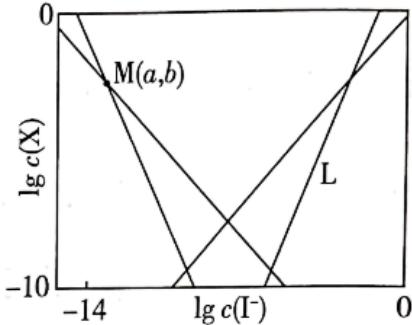

A. 线 L 表示 $\lg c\left(\mathrm{HgI}_{4}^{2-}\right)$ 的变化情况
B. 随 $c(I^{-})$ 增大， $c\left[\mathrm{HgI}_{2}(\mathrm{aq})\right]$ 先增大后减小
C. $a = \lg \frac{K_{1}}{K_{2}}$ D. 溶液中 I 元素与 Hg 元素的物质的量之比始终为 2:1
【答案】B
【解析】

【分析】由题干反应方程式 $\mathrm{HgI}_2(\mathrm{aq}) \rightleftharpoons \mathrm{Hg}^{2+} + 2\mathrm{I}^-$ 可知， $\mathrm{K}_1 = \frac{\mathrm{c(Hg}^{2+})\mathrm{c}^2(\mathrm{I}^-)}{\mathrm{c(HgI}_2}$ ，则有 $\mathrm{c(Hg}^{2+}) = \frac{K_1\mathrm{c(HgI}_2}{c^2(I^-)}$ ，则有 $\lg c(\mathrm{Hg}^{2+}) = \lg K_1 + \lg c(\mathrm{HgI}_2) - 2\lg c(\mathrm{I}^-)$ ，同理可得： $\lg c(\mathrm{HgI}^+) = \lg K_2 + \lg c(\mathrm{HgI}_2) - \lg c(\mathrm{I}^-)$ ， $\lg c(\mathrm{HgI}_3^-) = \lg K_3 + \lg c(\mathrm{HgI}_2) + \lg c(\mathrm{I}^-)$ ， $\lg c(\mathrm{HgI}_4^{2-}) = \lg K_4 + \lg c(\mathrm{HgI}_2) + 2\lg c(\mathrm{I}^-)$ ，且由 $\mathrm{HgI}_2(\mathrm{s}) \rightleftharpoons \mathrm{HgI}_2(\mathrm{aq})$ 可知 $K_0 =$

$$
\left[ \mathrm{HgI} _ {2} (\mathrm{aq}) \right]
$$

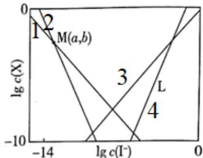

曲线 1、2、3、4 即 L 分别代表

$\mathrm{lgc(HgI^{+})}$ 、 $\mathrm{lgc(Hg^{2 + })}$ 、 $\mathrm{lgc(HgI_3^-)}$ 、 $\mathrm{lgc(HgI_4^{2 - })}$ ，据此分析解题。【详解】A．由分析可知，线L表示 $\mathrm{lgc(HgI_4^{2 - })}$ 的变化情况，A正确；

B. 已知 $\mathrm{HgI}_2(\mathrm{s}) \rightleftharpoons \mathrm{HgI}_2(\mathrm{aq})$ 的化学平衡常数 $\mathrm{K}_0 = \mathrm{c}\left[\mathrm{HgI}_2(\mathrm{aq})\right]$ ，温度不变平衡常数不变，故随 $\mathbf{c}\left(\mathrm{I}^{-}\right)$ 增大， $\mathbf{c}\left[\mathrm{HgI}_2(\mathrm{aq})\right]$ 始终保持不变，B 错误；

C. 由分析可知, 曲线 1 方程为: $\mathrm{lgc(Hg^{2+}) = lgK_1 + lgc(HgI_2) - 2lgc(I^-)}$ , 曲线 2 方程为:

$\mathrm{lgc(HgI^{+}) = lgK_{2} + lgc(HgI_{2}) - lgc(I^{-})}$ 即有① $b = \lg K_{1} + \lg c(HgI_{2}) - 2a$ ，② $b = \lg K_{2} + \lg c(HgI_{2}) - a$ ，联合①②可知得： $a = \lg K_{1} - \lg K_{2} = \lg \frac{K_{1}}{K_{2}}$ ，C正确；

D．溶液中的初始溶质为 $HgI_{2}$ ，根据原子守恒可知，该溶液中 I 元素与 Hg 元素的物质的量之比始终为 2:1，D 正确；
故答案为：B。

## 三、非选择题：本题共5小题，共60分。

16. 卤素可形成许多结构和性质特殊的化合物。回答下列问题:

(1) $-40^{\circ} \mathrm{C}$ 时, $\mathrm{F}_{2}$ 与冰反应生成 $HOF$ 利 $\mathrm{HF}$ 。常温常压下, $HOF$ 为无色气体, 固态 $HOF$ 的晶体类型为 , $HOF$ 水解反应的产物为 (填化学式)。

(2) $\mathrm{ClO}_2$ 中心原子为 $\mathrm{Cl}$ , $\mathrm{Cl}_2\mathrm{O}$ 中心原子为 $\mathrm{O}$ , 二者均为 $\mathrm{V}$ 形结构, 但 $\mathrm{ClO}_2$ 中存在大 $\pi$ 键 $\left(\Pi_3^5\right)$ 。 $\mathrm{ClO}_2$ 中 $\mathrm{Cl}$ 原子的轨道杂化方式\_\_\_\_; 为 $\mathrm{O}-\mathrm{Cl}-\mathrm{O}$ 键角\_\_\_\_ $\mathrm{Cl}-\mathrm{O}-\mathrm{Cl}$ 键角(填“>”“<”或“=”）。比较 $\mathrm{ClO}_2$ 与 $\mathrm{Cl}_2\mathrm{O}$ 中 $\mathrm{Cl}-\mathrm{O}$ 键的键长并说明原因\_\_\_\_。

(3) 一定条件下, $\mathrm{CuCl}_{2} 、 \mathrm{K}$ 和 $\mathrm{F}_{2}$ 反应生成 $\mathrm{KCl}$ 和化合物 $\mathrm{X}$ 。已知 $\mathrm{X}$ 属于四方晶系, 晶胞结构如图所示 (晶胞参数 $a = b \neq c, \alpha = \beta = \gamma = 90^{\circ}$ ), 其中 $\mathrm{Cu}$ 化合价为 +2 。上述反应的化学方程式为 \_\_\_\_。若阿伏加德罗常数的值为 $\mathrm{N}_{\mathrm{A}}$ , 化合物 $\mathrm{X}$ 的密度 $\rho =$ \_\_\_\_ $\mathrm{g} \cdot \mathrm{cm}^{-3}$ (用含 $\mathrm{N}_{\mathrm{A}}$ 的代数式表示)。

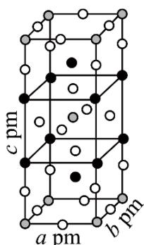

【答案】(1) ①. 分子晶体 ②. HF、 $H_{2}O_{2}$ 和 $O_{2}$

(2) ①. $\mathbf{sp}^2$ ②. $>$ ③. $\mathrm{ClO}_2$ 分子中 $\mathrm{Cl}-\mathrm{O}$ 键的键长小于 $\mathrm{Cl}_2\mathrm{O}$ 中 $\mathrm{Cl}-\mathrm{O}$ 键的键长, 其原因是： $\mathrm{ClO}_2$ 分子中既存在 $\sigma$ 键，又存在大 $\pi$ 键，原子轨道重叠的程度较大，因此其中 $\mathrm{Cl}-\mathrm{O}$ 键的键长较小，而 $\mathrm{Cl}_2\mathrm{O}$ 只存在普通的 $\sigma$ 键。

(3) ①. $\mathrm{CuCl}_2 + 4\mathrm{K} + 2\mathrm{F}_2 = \mathrm{K}_2\mathrm{CuF}_4 + 2\mathrm{KCl}$ ②. $\frac{436\times 10^{30}}{\mathsf{a}^2\mathsf{c}N_{\mathrm{A}}}$

【解析】

【小问 1 详解】

常温常压下，HOF 为无色气体，则 HOF 的沸点较低，因此，固态 HOF 的晶体类型为分子晶体。HOF 分子中 F 显-1 价，其水解时结合 $H_{2}O$ 电离的 $H^{+}$ 生成 HF，则 $OH^{+}$ 结合 $H_{2}O$ 电离的 $OH^{-}$ ，两者反应生成 $H_{2}O_{2}$ ， $H_{2}O_{2}$ 不稳定，其分解生成 $O_{2}$ ，因此，HOF 水解反应的产物为 HF、 $H_{2}O_{2}$ 和 $O_{2}$ 。

【小问 2 详解】

$\mathrm{ClO}_{2}$ 中心原子为 $\mathrm{Cl}$ , $\mathrm{Cl}_{2} \mathrm{O}$ 中心原子为 $\mathrm{O}$ , 二者均为 $\mathrm{V}$ 形结构, 但 $\mathrm{ClO}_{2}$ 中存在大 $\pi$ 键 ( $\Pi_{3}^{5}$ )。由 $\mathrm{ClO}_{2}$ 中存在 $\Pi_{3}^{5}$ 可以推断, 其中 $\mathrm{Cl}$ 原子只能提供 1 对电子, 有一个 $\mathrm{O}$ 原子提供 1 个电子, 另一个 $\mathrm{O}$ 原子提供 1 对电子, 这 5 个电子处于互相平行的 $\mathfrak{p}$ 轨道中形成大 $\pi$ 键, $\mathrm{Cl}$ 提供孤电子对与其中一个 $\mathrm{O}$ 形成配位键, 与另一个 $\mathrm{O}$ 形成的是普通的共价键 ( $\sigma$ 键, 这个 $\mathrm{O}$ 只提供了一个电子参与形成大 $\pi$ 键), $\mathrm{Cl}$ 的价层电子对数为 3 , 则 $\mathrm{Cl}$ 原子的轨道杂化方式为 $\mathfrak{sp}^{2}$ ; $\mathrm{Cl}_{2} \mathrm{O}$ 中心原子为 $\mathrm{O}$ , 根据价层电子对的计算公式可知 $n = \frac{6 + 1 \times 2}{2} = 4$ , 因此, $\mathrm{O}$ 的杂化方式为 $\mathfrak{sp}^{3}$ ; 根据价层电子对互斥理论可知, $n = 4$ 时, 价电子对的几何构型为正四面体, $n = 3$ 时, 价电子对的几何构型平面正三角形, $\mathfrak{sp}^{2}$ 杂化的键角一定大于 $\mathfrak{sp}^{3}$ 的, 因此, 虽然 $\mathrm{ClO}_{2}$ 和 $\mathrm{Cl}_{2} \mathrm{O}$ 均为 $\mathrm{V}$ 形结构, 但 $\mathrm{O}-\mathrm{Cl}-\mathrm{O}$ 键角大于 $\mathrm{Cl}-\mathrm{O}-\mathrm{Cl}$ 键角, 孤电子对成键电子对的排斥作用也改变不了这个结论。 $\mathrm{ClO}_{2}$ 分子中 $\mathrm{Cl}-\mathrm{O}$ 键的键长小于 $\mathrm{Cl}_{2} \mathrm{O}$ 中 $\mathrm{Cl}-\mathrm{O}$ 键的键长, 其原因是: $\mathrm{ClO}_{2}$ 分子中既存在 $\sigma$ 键, 又存在大 $\pi$ 键, 原子轨道重叠的程度较大, 因此其中 $\mathrm{Cl}-\mathrm{O}$ 键的键长较小, 而 $\mathrm{Cl}_{2} \mathrm{O}$ 只存在普通的 $\sigma$ 键。

【小问 3 详解】

一定条件下， $\mathrm{CuCl}_2$ 、K 和 $\mathrm{F}_2$ 反应生成 KCl 和化合物 X。已知 X 属于四方晶系，其中 Cu 化合价为 +2。由晶胞结构图可知，该晶胞中含有黑球的个数为 $8 \times \frac{1}{4} + 2 = 4$ 、白球的个数为 $16 \times \frac{1}{4} + 4 \times \frac{1}{2} + 2 = 8$ 、灰色球的个数为 $8\times\frac{1}{8}+1=2$ ，则X中含有3种元素，其个数比为1:2:4,由于其中Cu化合价为+2、F的化合价为-1、K的化合价为+1，根据化合价代数和为0，可以推断X为 $K_{2}CuF_{4}$ ，上述反应的化学方程式为 $CuCl_{2}+4K+2F_{2}=K_{2}CuF_{4}+2KCl$ 。若阿伏加德罗富数的值为 $N_{A}$ ，晶胞的质量为 $\frac{2\times218}{N_{A}}g$ ，晶胞的体积为 $a^{2}cpm^{3}=a^{2}c\times10^{-30}cm^{3}$ ，化合物X的密度 $\rho=\frac{\frac{2\times218}{N_{A}}g}{a^{2}c\times10^{-30}cm^{3}}=\frac{436\times10^{30}}{a^{2}cN_{A}}g\cdot cm^{-3}$ 。

17. 盐湖卤水(主要含 $Na^{+}$ 、 $Mg^{2+}$ 、 $Li^{+}$ 、 $Cl^{-}$ 、 $SO_{4}^{2-}$ 和硼酸根等)是锂盐的重要来源。一种以高镁卤水为原料经两段除镁制备 $Li_{2}CO_{3}$ 的工艺流程如下：

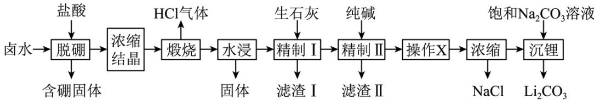

已知：常温下， $\mathrm{K}_{\mathrm{sp}} \left( \mathrm{Li}_{2} \mathrm{CO}_{3} \right) = 2.2 \times 10^{-3}$ 。相关化合物的溶解度与温度的关系如图所示。

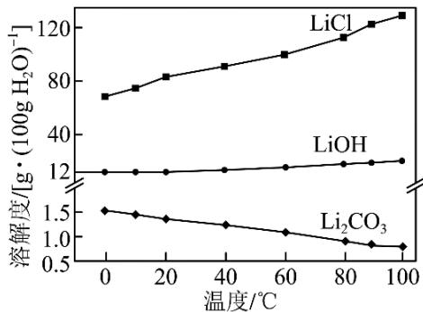  
回答下列问题:

(1) 含硼固体中的 $\mathrm{B(OH)}_3$ 在水中存在平衡: $\mathrm{B(OH)}_3 + \mathrm{H}_2\mathrm{O} \rightleftharpoons \mathrm{H}^+ + \left[\mathrm{B(OH)}_4\right]^-$ (常温下, $\mathrm{K_a} = 10^{-9.34}$ ); $\mathrm{B(OH)}_3$ 与 $\mathrm{NaOH}$ 溶液反应可制备硼砂 $\mathrm{Na}_2\mathrm{B}_4\mathrm{O}_5(\mathrm{OH})_4 \cdot 8\mathrm{H}_2\mathrm{O}$ 。常温下, 在 $0.10\mathrm{mol} \cdot \mathrm{L}^{-1}$ 硼砂溶液中, $\left[\mathrm{B}_4\mathrm{O}_5(\mathrm{OH})_4\right]^{2-}$ 水解生成等物质的量浓度的 $\mathrm{B(OH)}_3$ 和 $\left[\mathrm{B(OH)}_4\right]^-$ ，该水解反应的离子方程式为\_\_\_\_，该溶液 $\mathrm{pH} =$ \_\_\_\_。

(2) 滤渣I的主要成分是\_\_\_\_(填化学式); 精制I后溶液中 $\mathrm{Li}^{+}$ 的浓度为 $2.0 \, \mathrm{mol} \cdot \mathrm{L}^{-1}$ , 则常温下精制II过程中 $\mathrm{CO}_{3}^{2-}$ 浓度应控制在\_\_\_\_ $\mathrm{mol} \cdot \mathrm{L}^{-1}$ 以下。若脱硼后直接进行精制I, 除无法回收 HCl 外, 还将增加\_\_\_\_的用量(填化学式)。

（3）精制II的目的是\_\_\_\_；进行操作X时应选择的试剂是\_\_\_\_，若不进行该操作而直接浓缩，将导致

\_\_\_\_°

【答案】(1) ①. $\left[\mathrm{B}_{4} \mathrm{O}_{5} (\mathrm{OH})_{4}\right]^{2-} + 5 \mathrm{H}_{2} \mathrm{O} = 2 \mathrm{~B} (\mathrm{OH})_{3} + 2 \left[\mathrm{B} (\mathrm{OH})_{4}\right]^{-}$ ②. 9.34 (2) ①. $\mathrm{CaSO}_{4} 、 \mathrm{Mg(OH)}_{2}$ ②. $5.5 \times 10^{-4}$ ③. 纯碱

(3) ①. 加入纯碱将精制I所得滤液中的 $\mathrm{Ca}^{2+}$ 转化为 $\mathrm{CaCO}_3$ （或除去精制I所得滤液中的 $\mathrm{Ca}^{2+}$ ），提高 $\mathrm{Li}_2\mathrm{CO}_3$ 纯度 ②. 盐酸 ③. 浓缩液中因 $\mathrm{CO}_3^{2-}$ 浓度过大使得 $\mathrm{Li}^+$ 过早沉淀，即浓缩结晶得到的 NaCl 中会混有 $\mathrm{Li}_2\mathrm{CO}_3$ ，最终所得 $\mathrm{Li}_2\mathrm{CO}_3$ 的产率减小

【分析】由流程可知，卤水中加入盐酸脱硼后过滤，所得滤液经浓缩结晶后得到晶体，该晶体中含有 $Na^{+}$ 、 $Li^{+}$ 、 $Cl^{-}$ 、 $SO_{4}^{2-}$ 等，焙烧后生成 HCl 气体；烧渣水浸后过滤，滤液中加生石灰后产生沉淀，在此条件下溶解度最小的是 $CaSO_{4}$ ，则滤渣I的主要成分为 $CaSO_{4}$ ；由于 $CaSO_{4}$ 微溶于水，精制I所得滤液中再加纯碱又生成沉淀，则滤渣II为 $CaCO_{3}$ ；精制II所得滤液经操作 X 后，所得溶液经浓缩结晶、过滤得到氯化钠，浓缩后的滤液中加入饱和碳酸钠溶液沉锂，得到 $Li_{2}CO_{3}$ 。

【小问 1 详解】

含硼固体中的 $\mathrm{B(OH)}_3$ 在水中存在平衡： $\mathrm{B(OH)}_3 + \mathrm{H}_2\mathrm{O}\rightleftharpoons [\mathrm{B(OH)}_4]^-$ + $\mathrm{H}^+$ (常温下， $K = 10^{-9.34}$ )； $\mathrm{B(OH)}_3$ 与NaOH溶液反应可制备硼砂 $\mathrm{Na}_2\mathrm{B}_4\mathrm{O}_5(\mathrm{OH})_4\cdot 8\mathrm{H}_2\mathrm{O}$ 。常温下.在 $0.10\mathrm{mol}\cdot \mathrm{L}^{-1}$ 硼砂溶液中， $[\mathrm{B}_4\mathrm{O}_5(\mathrm{OH})_4]^{2-}$ 水解生成等物质的量浓度的 $\mathrm{B(OH)}_3$ 和 $[\mathrm{B(OH)}_4]^-$ ，该水解反应的离子方程式为 $[\mathrm{B}_4\mathrm{O}_5(\mathrm{OH})_4]^{2-} + 5\mathrm{H}_2\mathrm{O} = 2\mathrm{B(OH)}_3 + 2[\mathrm{B(OH)}_4]^-$ ，由B元素守恒可知， $\mathrm{B(OH)}_3$ 和 $[\mathrm{B(OH)}_4]^-$ 的浓度均为 $0.20\mathrm{mol}\cdot \mathrm{L}^{-1}$ ， $K = \frac{c_{[\mathrm{B(OH)}_4]^-}\cdot c(\mathrm{H}^+)}{c_{\mathrm{B(OH)}_3}} = c(\mathrm{H}^+) = 10^{-9.34}$ ，则该溶液 $\mathsf{pH} = 9.34$ 。

【小问 2 详解】

由分析可知，滤渣I的主要成分是 $\mathrm{CaSO}_4$ 、 $\mathrm{Mg(OH)}_2$ ；精制I后溶液中 $\mathrm{Li^{+}}$ 的浓度为 $2.0\mathrm{mol}\cdot \mathrm{L}^{-1}$ ，由 $K_{\mathrm{sp}}\left(\mathrm{Li}_{2}\mathrm{CO}_{3}\right) = 2.2\times 10^{-3}$ 可知，则常温下精制II过程中 $\mathrm{CO}_{3}^{2 - }$ 浓度应控制在 $\frac{2.2\times 10^{-3}}{2.0^2}\mathrm{mol}\cdot \mathrm{L}^{-1} = 5.5\times 10^{-4}$ $\mathrm{mol}\cdot \mathrm{L}^{-1}$ 以下。若脱硼后直接进行精制I，除无法回收HCl外，后续在浓缩结晶时将生成更多的氯化钠晶体，因此，还将增加纯碱（ $\mathrm{Na}_2\mathrm{CO}_3$ ）的用量。

## 【小问 3 详解】

精制I中，烧渣水浸后的滤液中加生石灰后产生的滤渣I的主要成分为 $CaSO_{4}$ ；由于 $CaSO_{4}$ 微溶于水，精制I所得滤液中还含有一定浓度的 $Ca^{2+}$ ，还需要除去 $Ca^{2+}$ ，因此，精制II的目的是：加入纯碱将精制I所得滤液中的 $Ca^{2+}$ 转化为 $CaCO_{3}$ （或除去精制I所得滤液中的 $Ca^{2+}$ ），提高 $Li_{2}CO_{3}$ 纯度。操作 X 是为了除去剩余的碳酸根离子，为了防止引入杂质离子，应选择的试剂是盐酸；加入盐酸的目的是除去剩余的碳酸根离子，若不进行该操作而直接浓缩，将导致浓缩液中因 $CO_{3}^{2-}$ 浓度过大使得 $Li^{+}$ 过早沉淀，即浓缩结晶得到的 NaCl 中会混有 $Li_{2}CO_{3}$ ，最终所得 $Li_{2}CO_{3}$ 的产率减小。

18. 三氯甲硅烷 $\left(\mathrm{SiHCl}_{3}\right)$ 是制取高纯硅的重要原料，常温下为无色液体，沸点为 $31.8^{\circ}C$ ，熔点为

$-126.5^{\circ}\mathrm{C}$ ，易水解。实验室根据反应 $\mathrm{Si} + 3\mathrm{HCl} \stackrel{\Delta}{=} \mathrm{SiHCl}_3 + \mathrm{H}_2$ ，利用如下装置制备 $\mathrm{SiHCl}_3$ 粗品(加热及夹持装置略)。回答下列问题：

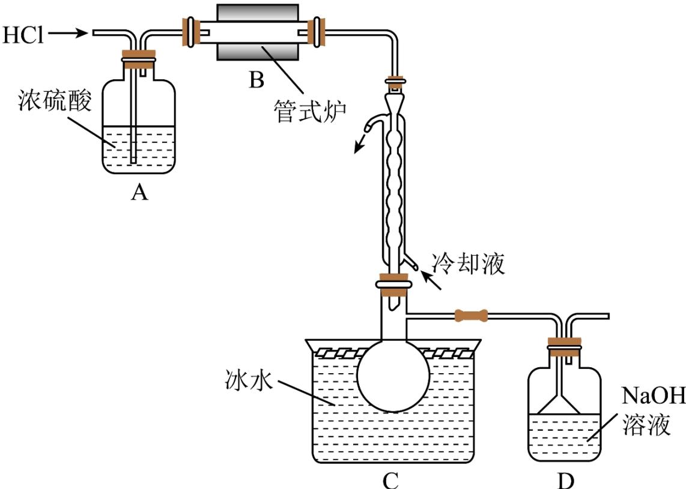

(1) 制备 $\mathrm{SiHCl}_{3}$ 时进行操作: (i)……; (ii)将盛有硅粉的瓷舟置于管式炉中; (iii)通入 HCl, 一段时间后接通冷凝装置, 加热开始反应。操作(i)为\_\_\_\_；判断制备反应结束的实验现象是\_\_\_\_。图示装置存在的两处缺陷是\_\_\_\_。

(2) 已知电负性 $\mathrm{Cl} > \mathrm{H} > \mathrm{Si}, \mathrm{SiHCl}_{3}$ 在浓 $\mathrm{NaOH}$ 溶液中发生反应的化学方程式为 \_\_\_\_。

(3) 采用如下方法测定溶有少量 $\mathrm{HCl}$ 的 $\mathrm{SiHCl}_3$ 纯度。

$m_{1}g$ 样品经水解、干燥等预处理过程得硅酸水合物后，进行如下实验操作：①\_\_\_\_，②\_\_\_\_(填操作名称)，③称量等操作，测得所得固体氧化物质量为 $m_{2}g$ ，从下列仪器中选出①、②中需使用的仪器，依次为\_\_\_\_(填标号)。测得样品纯度为\_\_\_\_(用含 $m_{1}$ 、 $m_{2}$ 的代数式表示)。

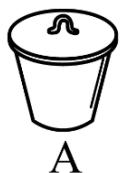

B

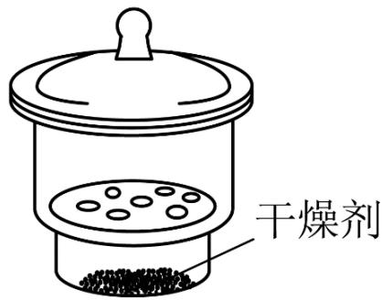

C

干燥剂

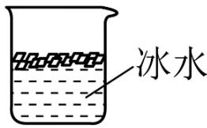

D

【答案】(1) ①. 检查装置气密性 ②. 当管式炉中没有固体剩余时 ③. C、D 之间没有干燥装置, 没有处理氢气的装置

(2) $\mathrm{SiHCl}_3 + 5\mathrm{NaOH} = \mathrm{Na}_2\mathrm{SiO}_3 + 3\mathrm{NaCl} + \mathrm{H}_2\uparrow +2\mathrm{H}_2\mathrm{O}$ (3) ①. 高温灼烧 ②. 冷却 ③. AC ④. $\frac{135.5\mathrm{m}_2}{60\mathrm{m}_1}\times 100\%$

【解析】

【分析】氯化氢气体通入浓硫酸干燥后，在管式炉中和硅在高温下反应，生成三氯甲硅烷和氢气，由于三氯甲硅烷沸点为 $31.8^{\circ}$ C，熔点为 $-126.5^{\circ}$ C，在球形冷凝管中可冷却成液态，在装置 C 中收集起来，氢气则通过 D 装置排出同时 D 可处理多余吸收的氯化氢气体，据此解答。

【小问 1 详解】

制备 $\mathrm{SiHCl}_3$ 时，由于氯化氢、 $\mathrm{SiHCl}_3$ 和氢气都是气体，所以组装好装置后，要先检查装置气密性，然后将盛有硅粉的瓷舟置于管式炉中，通入氯化氢气体，排出装置中的空气，一段时候后，接通冷凝装置，加热开始反应，当管式炉中没有固体剩余时，即硅粉完全反应， $\mathrm{SiHCl}_3$ 易水解，所以需要在 C、D 之间加一个干燥装置，防止 D 中的水蒸气进入装置 C 中，另外氢氧化钠溶液不能吸收氢气，需要在 D 后面加处理氢气的装置，故答案为：检查装置气密性；当管式炉中没有固体剩余时；C、D 之间没有干燥装置，没有处理氢气的装置；

【小问 2 详解】

已知电负性 $\mathrm{Cl} > \mathrm{H} > \mathrm{Si}$ ，则 $\mathrm{SiHCl}_3$ 中氯元素的化合价为-1，H元素的化合价为-1，硅元素化合价为+4，所以氢氧化钠溶液和 $SiHCl_{3}$ 反应时，要发生氧化还原反应，得到氯化钠、硅酸钠和氢气，化学方程式为： $SiHCl_{3}+5NaOH=Na_{2}SiO_{3}+3NaCl+H_{2}\uparrow+2H_{2}O$ ，故答案为： $SiHCl_{3}+5NaOH=Na_{2}SiO_{3}+3NaCl+H_{2}\uparrow+2H_{2}O$ 【小问 3 详解】

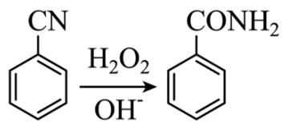

$m_{1}g$ 样品经水解，干燥等预处理过程得到硅酸水合物后，高温灼烧，在干燥器中冷却后，称量，所用仪器包括坩埚和干燥器，所得固体氧化物为二氧化硅，质量为 $m_{2}g$ ，则二氧化硅的物质的量为 $n(\mathrm{SiO}_{2})=$ $\frac{m_{2}}{60}mol$ ，样品纯度为 $\frac{\frac{m_{2}}{60}\times(28+1+35.5\times3)}{m_{1}}\times100\%=\frac{135.5m_{2}}{60m_{1}}\times100\%$ ，故答案为：高温灼烧；冷却；
AC; $\frac{135.5m_{2}}{60m_{1}}\times100\%$ .

19. 根据杀虫剂氟铃脲(G)的两条合成路线，回答下列问题。

已知：I. $R_{1}NH_{2}+OCNR_{2}\rightarrow$ $\begin{array}{c}R_{1}\\N\\H\end{array}$ $\begin{array}{c}O\\N\\H\end{array}$ $\begin{array}{c}R_{2}\\N\\H\end{array}$

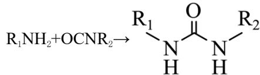

$$
\mathrm{A} \left(\mathrm{C} _ {7} \mathrm{H} _ {6} \mathrm{Cl} _ {2}\right) \xrightarrow [ \text {一定条件} ]{\mathrm{NH} _ {3} / \mathrm{O} _ {2}} \mathrm{B} \left(\mathrm{C} _ {7} \mathrm{H} _ {3} \mathrm{Cl} _ {2} \mathrm{N}\right) \xrightarrow [ \text {催化剂} ]{\mathrm{KF}} \mathrm{C} \xrightarrow [ \mathrm{OH} ^ {-} ]{\mathrm{H} _ {2} \mathrm{O} _ {2}} \mathrm{D} \xrightarrow {\left(\mathrm{COCl} _ {2}\right) _ {2}} \mathrm{E} \left(\mathrm{C} _ {8} \mathrm{H} _ {3} \mathrm{F} _ {2} \mathrm{NO} _ {2}\right)
$$

路线:

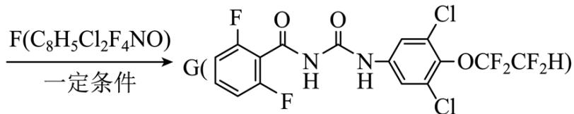

(1) A 的化学名称为\_\_\_\_(用系统命名法命名); B → C 的化学方程式为\_\_\_\_; D 中含氧官能团的名称为\_\_\_\_; E 的结构简式为\_\_\_\_。

$$
\mathrm{H} \left(\mathrm{C} _ {6} \mathrm{H} _ {3} \mathrm{Cl} _ {2} \mathrm{NO} _ {3}\right) \xrightarrow [ \text {催化剂} ]{\mathrm{H} _ {2}} \mathrm{I} \xrightarrow [ \text {KOH、DMF} ]{\mathrm{F} _ {2} \mathrm{C} = \mathrm{CF} _ {2}} \mathrm{F} \xrightarrow [ \mathrm{C} _ {6} \mathrm{H} _ {5} \mathrm{CH} _ {3} ]{\left(\mathrm{COCl} _ {2}\right) _ {2}} \mathrm{J} \xrightarrow [ \triangle ]{\mathrm{D}} \mathrm{G}
$$

(2) H 中有\_\_\_\_种化学环境的氢, ①\~④属于加成反应的是\_\_\_\_(填序号); J 中原子的轨道杂化方式有\_\_\_\_种。

【答案】(1) ①.2,6-二氯甲苯 ②.

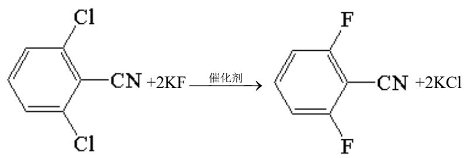

③. 酰胺基

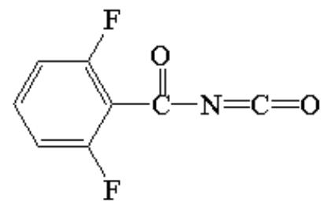

(2) ①.2 ②.②④ ③.2

【解析】

【分析】路线: 根据流程及 A 的分子式为 $C_{7}H_{6}Cl_{2}$ ，可推出 A 的结构式为 $\ce{C6H5-CH3}$ ，A 在氨气

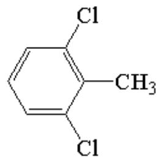

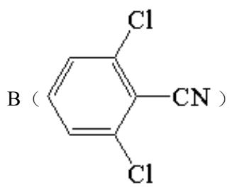

和氧气的作用下，生成了B（ClCN），B与KF反应，生成C（FCN），根据题

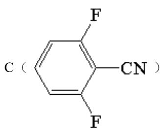

给信息，C与过氧化氢反应，生成D（ $\mathrm{F}$ —CONH₂），D和(COCl)₂反应生成E，E的分子式为

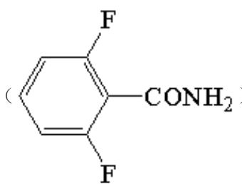

$\mathrm{C_8H_3F_2NO_2}$ ，推出E的结构式为 $\begin{array}{c}\text{F}\\ \text{F} \end{array}$ C-N=C=O，E与F

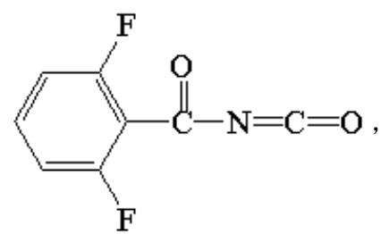

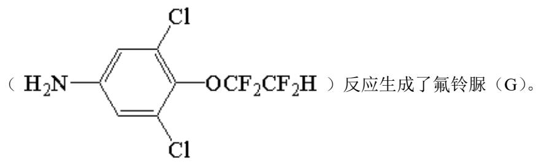

路线二：

根据流程及F的分子式可推出H的结构式 $\mathrm{O}_2\mathrm{N}-\underset{\mathrm{Cl}}{\overset{\mathrm{Cl}}{\mathrm{C}}}\mathrm{OH}$ ，H与氢气反应生成I

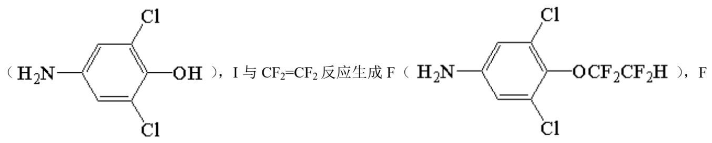

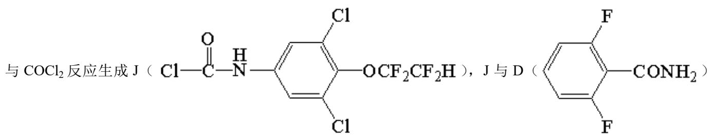

反应生成了氟铃脲（G）。

【小问1详解】

由分析可知，A为 $\ce{C6H5ClCH3}$ ，系统命名为2,6-二氯甲苯，B与KF发生取代反应生成C，化学

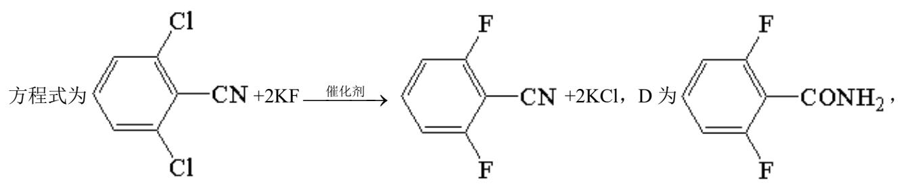

含氧官能团为酰胺基，根据分析，E为 $\ce{C6H5F-C(=O)-N=C=O}$ ，故答案为：2,6-二氯甲苯；

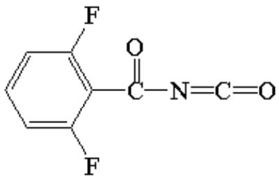

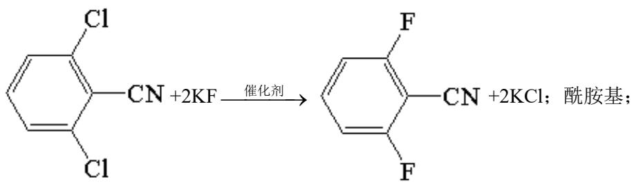

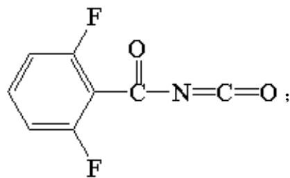  
【小问 2 详解】

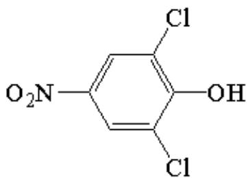

根据分析，H 为 $O_{2}N$ ——Cl—OH ，由结构特征可知，含有 2 种化学环境的氢，根据分析流程

可知 H→I 为还原反应，I→F 为加成反应，F→J 为取代反应，J→G 为加成反应，J 为

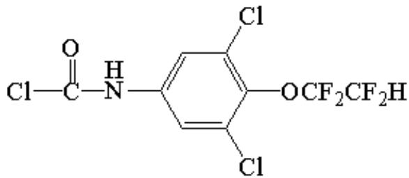

Cl-C(=O)-NH- $\ce{C6H5ClOCF2CF2H}$ ，C原子的杂化方式有 $\mathrm{sp^2}$ ， $\mathrm{sp^3}$ 两种，N、O原子的杂化方

式均为 $sp^{3}$ ，所以 J 中原子的杂化方式有 2 种，故答案为：2；②④；2。

20. 一定条件下，水气变换反应 $\mathrm{CO} + \mathrm{H}_2\mathrm{O} \rightleftharpoons \mathrm{CO}_2 + \mathrm{H}_2$ 的中间产物是 HCOOH。为探究该反应过程，研究 HCOOH 水溶液在密封石英管中的分子反应：

I. HCOOH $\rightleftharpoons$ CO + H $_{2}$ O(快)

II. HCOOH $\rightleftharpoons$ CO $_{2}$ + H $_{2}$ (慢)

研究发现，在反应I、II中， $\mathrm{H^{+}}$ 仅对反应I有催加速作用；反应I速率远大于反应II，近似认为反应I建立平衡

后始终处于平衡状态。忽略水电离，其浓度视为常数。回答下列问题：

(1) 一定条件下, 反应I、II的焓变分别为 $\Delta \mathrm{H}_{1}$ 、 $\Delta \mathrm{H}_{2}$ , 则该条件下水气变换反应的焓变 $\Delta \mathrm{H} =$ \_\_\_\_(用含 $\Delta \mathrm{H}_{1}$ 、 $\Delta \mathrm{H}_{2}$ 的代数式表示)。

(2) 反应I正反应速率方程为: $\mathrm{v} = \mathrm{k}\mathrm{c}\left(\mathrm{H}^{+}\right) \cdot \mathrm{c}\left(\mathrm{HCOOH}\right)$ , k 为反应速率常数。 $T_{1}$ 温度下, HCOOH 电离平衡常数为 $K_{a}$ , 当 HCOOH 平衡浓度为 $x\mathrm{mol} \cdot \mathrm{L}^{-1}$ 时, $H^{+}$ 浓度为 \_\_\_\_ mol·L $^{-1}$ , 此时反应I应速率 $v = \_\_\_\_ \mathrm{mol} \cdot \mathrm{L}^{-1} \cdot \mathrm{h}^{-1}$ (用含 $K_{a}$ 、x 和 k 的代数式表示)。

(3) $\mathrm{T}_{3}$ 温度下, 在密封石英管内完全充满 $1.0 \mathrm{~mol} \cdot \mathrm{L}^{- 1} \mathrm{HCOOH}$ 水溶液, 使 HCOOH 分解, 分解产物均完全溶于水。含碳物种浓度与反应时间的变化关系如图所示(忽略碳元素的其他存在形式)。 $\mathbf{t}_{1}$ 时刻测得 $\mathrm{CO} 、 \mathrm{CO}_{2}$ 的浓度分别为 $0.70 \mathrm{~mol} \cdot \mathrm{L}^{- 1} 0.16 \mathrm{~mol} \cdot \mathrm{L}^{- 1}$ , 反应II达平衡时, 测得 $\mathrm{H}_{2}$ 的浓度为 $\mathrm{ymol} \cdot \mathrm{L}^{- 1}$ 。体系达平衡后 $\frac{\mathrm{c}(\mathrm{CO})}{\mathrm{c}(\mathrm{CO}_{2})} =$ \_\_\_\_ (用含 y 的代数式表示, 下同), 反应II的平衡常数为\_\_\_\_。

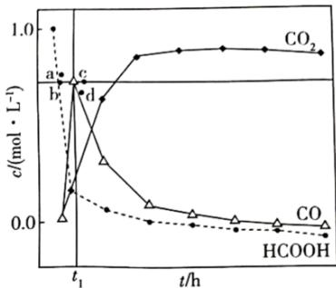

相同条件下，若反应起始时溶液中同时还含有 $0.10 \mathrm{~mol} \cdot \mathrm{L}^{-1}$ 盐酸，则图示点 a、b、c、d 中，CO 的浓度峰值点可能是\_\_\_\_(填标号)。与不同盐酸相比，CO 达浓度峰值时， $\mathrm{CO}_{2}$ 浓度\_\_\_\_(填“增大”“减小”或“不变”)， $\frac{\mathrm{c}(\mathrm{CO})}{\mathrm{c}(\mathrm{HCOOH})}$ 的反应\_\_\_\_(填“增大”“减小”或“不变”)。

【答案】（1） $\Delta \mathrm{H}_{2}-\Delta \mathrm{H}_{1}$ （2）①. $\sqrt{K_{a} x}$ ②. $kx \sqrt{K_{a} x}$ （3）①. $\frac{5-5y}{6y}$ ②. $\frac{6y^{2}}{1-y}$ ③.a ④. 减小 ⑤. 不变

【解析】
【小问 1 详解】

根据盖斯定律，反应 II-反应 I=水气变换反应，故水气变换反应的焓变 $\Delta H=\Delta H_{2}-\Delta H_{1}$ ;

【小问 2 详解】

$T_{1}$ 温度时，HCOOH 建立电离平衡：

$$
\text {平衡浓度} (\mathrm{mol} \bullet \mathrm{L} ^ {- 1}) \quad \mathrm{x} \quad \mathrm{c} (\mathrm{HCOO} ^ {-}) \quad + \quad \mathrm{c} (\mathrm{H} ^ {+})
$$

$$
K _ {a} = \frac {c (H C O O ^ {-}) c (H ^ {+})}{c (H C O O H)}, c (\mathrm{HCOO} ^ {-}) = c (\mathrm{H} ^ {+}), \text {故} c (\mathrm{H} ^ {+}) = \sqrt {K _ {a} x} 。
$$

$$
\mathrm{v} = \mathrm{kc} (\mathrm{H} ^ {+}) \cdot \mathrm{c} (\mathrm{HCOOH}) = k x \sqrt {K _ {a} x} 。
$$

【小问3详解】

$t_{1}$ 时刻时， $c(\mathrm{CO})$ 达到最大值，说明此时反应 I 达平衡状态。此时

$$
\begin{array}{l l}&\mathrm{HCOOH} \rightleftharpoons \mathrm{CO} + \mathrm{H} _ {2} \mathrm{O}\\\mathrm{t} _ {1} \text {时刻转化浓度(mol} \bullet \mathrm{L} ^ {- 1})&0. 7 0\\&0. 7 0\end{array}
$$

$$
\begin{array}{l l}&\mathrm{HCOOH} \rightleftharpoons \mathrm{CO} _ {2} + \mathrm{H} _ {2}\\\mathrm{t} _ {1} \text {时刻转化浓度(mol} \bullet \mathrm{L} ^ {- 1})&0. 1 6 \quad 0. 1 6 \quad 0. 1 6\end{array}
$$

故 $t_{1}$ 时刻 $c(\mathrm{HCOOH})=1.0-0.70-0.16=0.14\ \mathrm{mol}\cdot\mathrm{L}^{-1}$ ， $K(I)=\frac{c(CO)}{c(HCOOH)}=\frac{0.70}{0.14}=5$ 。 $t_{1}$ 时刻→反应 II

达平衡过程，

$t_{1}$ 时刻到反应II平衡

$$
\begin{array}{c c c}\mathrm{HCOOH}&\rightleftharpoons&\mathrm{CO} + \mathrm{H} _ {2} \mathrm{O}\\a&&a\end{array}
$$

转化浓度(mol·L $^{-1}$ )

$$
\mathrm{HCOOH} \rightleftharpoons \mathrm{CO} _ {2} + \mathrm{H} _ {2}
$$

$t_{1}$ 时刻到反应II平衡

转化浓度(mol·L $^{-1}$ )

$$
b \qquad \qquad b \qquad \qquad b
$$

$$
\text { 则 } c \left(\mathrm{H} _ {2}\right) = \mathrm{b} + 0. 1 6 = \mathrm{y}, \quad \mathrm{b} = (\mathrm{y} - 0. 1 6) \mathrm{mol} \cdot \mathrm{L} ^ {- 1}, \quad c (\mathrm{HCOOH}) = 0. 1 4 - \mathrm{a} - \mathrm{b} = 0. 3 - \mathrm{a} - \mathrm{y}, \quad c (\mathrm{CO}) = \mathrm{a} + 0. 7, \quad \mathrm{K} (\mathrm{I}) =
$$

$$
\frac {c (C O)}{c (H C O O H)} = \frac {0 . 3 - a - y}{a + 0 . 7} = 5, \mathrm{a} = \frac {0 . 8 - 5 y}{6} 。 \text {故} \frac {\mathrm{c} (\mathrm{CO})}{\mathrm{c} (\mathrm{CO} _ {2})} = \frac {\frac {0 . 8 - 5 y}{6} + 0 . 7}{y} = \frac {5 - 5 y}{6 y}, \mathrm{K(II)} =
$$

$$
\frac {c \left(C O _ {2}\right) c \left(H _ {2}\right)}{c (H C O O H)} = \frac {y \cdot y}{\frac {0 . 8 - 5 y}{6} + 0 . 7} = \frac {6 y ^ {2}}{1 - y} 。
$$

加入 $0.1\mathrm{mol}\cdot \mathrm{L}^{-1}$ 盐酸后， $\mathrm{H^{+}}$ 对反应I起催化作用，加快反应I的反应速率，缩短到达平衡所需时间，故

CO 浓度峰值提前，由于时间缩短，反应Ⅱ消耗的 HCOOH 减小，体系中 HCOOH 浓度增大，导致 CO 浓度大于 $t_{1}$ 时刻的峰值，故 $c(\mathrm{CO})$ 最有可能在 a 处达到峰值。此时 $c(\mathrm{CO}_{2})$ 会小于不含盐酸的浓度，

$\frac{\mathrm{c(CO)}}{\mathrm{c(HCOOH)}} = \mathrm{K(I)}$ ，温度不变，平衡常数不变，则 $\frac{\mathrm{c(CO)}}{\mathrm{c(HCOOH)}}$ 的值不变。