# 2023年广东省普通高中学业水平选择性考试

化学

满分 100 分，考试用时 75 分钟

## 注意事项：

1. 答卷前，考生务必用黑色字迹钢笔或签字笔将自己的姓名、考生号、考场号和座位号填写在答题卡上。用 2B 铅笔将试卷类型(B)填涂在答题卡相应位置上。将条形码横贴在答题卡右上角“条形码粘贴处”。

2.作答选择题时，选出每小题答案后，用 2B 铅笔把答题卡上对应题目选项的答案信息点涂黑：如需改动，用橡皮擦干净后，再选涂其他答案，答案不能答在试卷上。

3. 非选择题必须用黑色字迹钢笔或签字笔作答，答案必须写在答题卡各题目指定区域内相应位置上：如需改动，先划掉原来的答案，然后再写上新的答案，不准使用铅笔和涂改液。不按以上要求作答的答案无效。

4.考生必须保持答题卡的整洁。考试结束后，将试卷和答题卡一并交回。

可能用到的相对原子质量：H-1 C-12 N-14 O-16 S-32 Cl-35.5 Fe-56 Cu-64 Zn-65

一、选择题：本题共16小题，共44分。第1\~10小题，每小题2分；第11\~16小题，每小题4分。在每小题给出的四个选项中，只有一项是符合题目要求的。

1.“高山流水觅知音”。下列中国古乐器中，主要由硅酸盐材料制成的是

<table><tr><td></td><td></td><td></td><td></td></tr><tr><td>A. 九霄环佩木古琴</td><td>B. 裴李岗文化骨笛</td><td>C. 商朝后期陶埙</td><td>D. 曾侯乙青铜编钟</td></tr></table>

A.A B.B C.C D.D

【答案】C

【解析】

【详解】A. 九霄环佩木古琴主要构成是木材，动物筋制得，A 错误；

B. 裴李岗文化骨笛由动物骨骼构成，B 错误；  
C. 商朝后期陶埙属于陶瓷，由硅酸盐制成，C 正确；  
D. 曾侯乙青铜编钟主要由合金材料制成，D 错误；

故选C。

2. 科教兴国, “可上九天揽月, 可下五洋捉鳖”。下列说法正确的是
A. “天舟六号”为中国空间站送去推进剂 Xe 气, Xe 是第 IA 族元素
B. 火星全球影像彩图显示了火星表土颜色, 表土中赤铁矿主要成分为 FeO
C. 创造了可控核聚变运行纪录的“人造太阳”, 其原料中的 $^{2}\mathrm{H}$ 与 $^{3}\mathrm{H}$ 互为同位素
D. “深地一号”为进军万米深度提供核心装备, 制造钻头用的金刚石为金属晶体

【解析】

【详解】A．化学符号 Xe，原子序数 54，在元素周期表中处于第 5 周期 0 族，故 A 错误；
B．赤铁矿的主要成分是 $Fe_{2}O_{3}$ ，不是 FeO，故 B 错误；
C. $^{2}H$ 与 $^{3}H$ 具有相同的质子数，不同的中子数，互为同位素，故 C 正确；
D．金刚石是共价晶体，故 D 错误；

故选 C。

3. 建设美丽乡村，守护中华家园，衣食住行皆化学。下列说法正确的是
A. 千家万户通光纤，光纤的主要材质为Si 
B. 乡村公路铺沥青，沥青属于天然无机材料
C. 美容扮靓迎佳节，化妆品中的甘油难溶于水 
D. 均衡膳食助健康，主食中的淀粉可水解为葡萄糖

【详解】A．光纤的主要材质为二氧化硅，A 错误；
B．沥青属于有机材料，B 错误；
C．甘油溶于水，C 错误；
D．淀粉水解的最终产物为葡萄糖，D 正确；

故选 D。

4. 1827 年，英国科学家法拉第进行了 $NH_{3}$ 喷泉实验。在此启发下，兴趣小组利用以下装置，进行如下实验。其中，难以达到预期目的的是

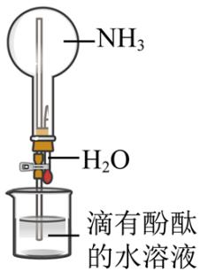  
图1

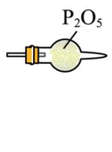  
图2

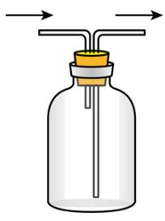  
图3

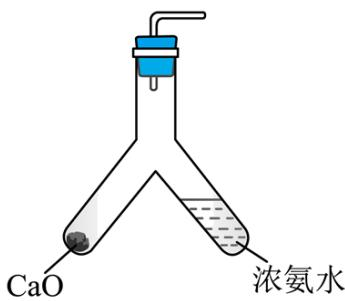  
图4

A. 图1：喷泉实验 B. 图2：干燥 $\mathrm{NH}_3$ C. 图3：收集 $\mathrm{NH}_3$ D. 图4：制备 $\mathrm{NH}_3$

【解析】

【详解】A. $\mathrm{NH}_{3}$ 极易溶于水, 溶于水后圆底烧瓶内压强减小, 从而产生喷泉, 故 A 可以达到预期; B. $\mathrm{P}_{2} \mathrm{O}_{5}$ 为酸性氧化物, $\mathrm{NH}_{3}$ 具有碱性, 两者可以发生反应, 故不可以用 $\mathrm{P}_{2} \mathrm{O}_{5}$ 干燥 $\mathrm{NH}_{3}$ , 故 B 不可以达到预期;

C. $NH_{3}$ 的密度比空气小，可采用向下排空气法收集，故 C 可以达到预期；

D. CaO 与浓氨水混合后与水反应并放出大量的热，促使 $NH_{3}$ 挥发，可用此装置制备 $NH_{3}$ ，故 D 可以达到预期；
故选 B。

5. 化学处处呈现美。下列说法正确的是
A. 舞台上干冰升华时，共价键断裂
B. 饱和 $CuSO_{4}$ 溶液可析出无水蓝色晶体
C. 苯分子的正六边形结构，单双键交替呈现完美对称
D. 晨雾中的光束如梦如幻，是丁达尔效应带来的美景

【详解】A. 舞台上干冰升华物理变化, 共价键没有断裂, A 错误; B. 饱和 $\mathrm{CuSO}_4$ 溶液可析出的蓝色晶体中存在结晶水为五水硫酸铜, B 错误; C. 苯分子的正六边形结构, 六个碳碳键完全相同呈现完美对称, C 错误; D. 晨雾中由于光照射胶体粒子散射形成的光束如梦如幻, 是丁达尔效应带来的美景, D 正确; 故选 D。

6. 负载有 Pt 和 Ag 的活性炭，可选择性去除 Cl⁻ 实现废酸的纯化，其工作原理如图。下列说法正确的是

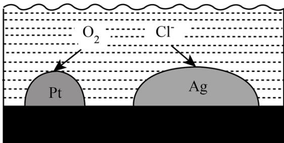

A. Ag作原电池正极  
B. 电子由 $\mathrm{Ag}$ 经活性炭流向 $\mathrm{Pt}$ C. Pt表面发生的电极反应： $\mathrm{O}_2 + 2\mathrm{H}_2\mathrm{O} + 4\mathrm{e}^- = 4\mathrm{OH}^-$ D. 每消耗标准状况下11.2L的 $\mathrm{O}_2$ ，最多去除 $1\mathrm{molCl}^-$

【答案】B

【解析】

【分析】 $\mathrm{O}_{2}$ 在 Pt 得电子发生还原反应，Pt 为正极， $\mathrm{Cl}^{-}$ 在 Ag 极失去电子发生氧化反应，Ag 为负极。

【详解】A．由分析可知， $\mathrm{Cl}^{-}$ 在 Ag 极失去电子发生氧化反应，Ag 为负极，A 错误；

B．电子由负极 Ag 经活性炭流向正极 Pt，B 正确；

C．溶液为酸性，故 Pt 表面发生的电极反应为 $\mathrm{O}_{2} + 4\mathrm{H}^{+} + 4\mathrm{e}^{-} = 2\mathrm{H}_{2}\mathrm{O}$ ，C 错误；

D．每消耗标准状况下 11.2L 的 $\mathrm{O}_{2}$ ，转移电子 2mol，而 2mol $\mathrm{Cl}^{-}$ 失去 2mol 电子，故最多去除 2mol $\mathrm{Cl}^{-}$ ，D 错误。

故选 B。

7. 劳动有利于“知行合一”。下列劳动项目与所述的化学知识没有关联的是

<table><tr><td>选项</td><td>劳动项目</td><td>化学知识</td></tr><tr><td>A</td><td>帮厨活动:帮食堂师傅煎鸡蛋准备午餐</td><td>加热使蛋白质变性</td></tr><tr><td>B</td><td>环保行动:宣传使用聚乳酸制造的包装材料</td><td>聚乳酸在自然界可生物降解</td></tr><tr><td>C</td><td>家务劳动:擦干已洗净的铁锅,以防生锈</td><td>铁丝在 $O_{2}$ 中燃烧生成 $Fe_{3}O_{4}$ </td></tr><tr><td>D</td><td>学农活动:利用秸秆、厨余垃圾等生产沼气</td><td>沼气中含有的 $CH_4$ 可作燃料</td></tr></table>

A.A B.B C.C D.D

【答案】C

【解析】

【详解】A. 鸡蛋主要成分是蛋白质, 帮食堂师傅煎鸡蛋准备午餐, 加热使蛋白质变性, 有关联, 故 A 不符合题意;  
B. 聚乳酸在自然界可生物降解, 为了减小污染, 宣传使用聚乳酸制造的包装材料, 两者有关联, 故 B 不符合题意;  
C. 擦干已洗净的铁锅, 以防生锈, 防止生成氧化铁, 铁丝在 $\mathrm{O}_{2}$ 中燃烧生成 $\mathrm{Fe}_{3} \mathrm{O}_{4}$ , 两者没有关联, 故 C 符合题意;  
D. 利用秸秆、厨余垃圾等生产沼气, 沼气主要成分是甲烷, 甲烷用作燃料, 两者有关系, 故 D 不符合题意。

综上所述，答案为 C。

8. 2022 年诺贝尔化学奖授予研究“点击化学”的科学家。图所示化合物是“点击化学”研究中的常用分子。关于该化合物，说法不正确的是

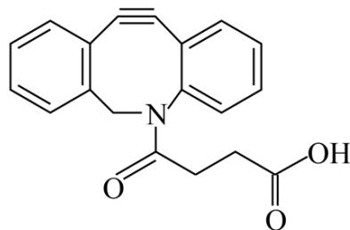

A. 能发生加成反应
B. 最多能与等物质的量的 NaOH 反应
C. 能使溴水和酸性 $KMnO_{4}$ 溶液褪色
D. 能与氨基酸和蛋白质中的氨基反应

【答案】B

【解析】

【详解】A. 该化合物含有苯环, 含有碳碳叁键都能和氢气发生加成反应, 因此该物质能发生加成反应, 故 A 正确; B. 该物质含有羧基和 $\mathrm{O} \parallel \mathrm{C}-\mathrm{N}-$ ，因此 $1 \mathrm{~mol}$ 该物质最多能与 $2 \mathrm{~mol} \mathrm{NaOH}$ 反应, 故 B 错误;

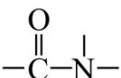

C. 该物质含有碳碳叁键, 因此能使溴水和酸性 $\mathrm{KMnO}_{4}$ 溶液褪色, 故 C 正确; D. 该物质含有羧基, 因此能与氨基酸和蛋白质中的氨基反应, 故 D 正确; 综上所述, 答案为 B。

9. 按图装置进行实验。将稀硫酸全部加入I中的试管，关闭活塞。下列说法正确的是

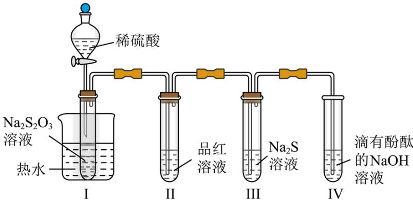

A. I中试管内的反应，体现 $\mathrm{H}^{+}$ 的氧化性 B. II中品红溶液褪色，体现 $\mathrm{SO}_{2}$ 的还原性 C. 在I和III的试管中，都出现了浑浊现象 D. 撤掉水浴，重做实验，IV中红色更快褪去

【解析】

【分析】I中发生反应 $S_{2}O_{3}^{2-}+2H^{+}=S\downarrow+SO_{2}\uparrow+H_{2}O$ ，二氧化硫进入II中使品红溶液褪色，二氧化硫进入III中与硫化钠反应生成S沉淀，二氧化硫进入IV中与氢氧化钠反应使溶液碱性减弱，酚酞褪色。
【详解】A. I中试管内发生反应 $S_{2}O_{3}^{2-}+2H^{+}=S\downarrow+SO_{2}\uparrow+H_{2}O$ ，氢元素化合价不变， $H^{+}$ 不体现氧化性，故A错误；
B. II中品红溶液褪色，体现 $SO_{2}$ 的漂白性，故B错误；
C. I试管内发生反应 $S_{2}O_{3}^{2-}+2H^{+}=S\downarrow+SO_{2}\uparrow+H_{2}O$ ，III试管内发生反应 $2S^{2-}+SO_{2}+2H_{2}O=3S\downarrow+4OH^{-}$ ，I和III的试管中都出现了浑浊现象，故C正确；
D. 撤掉水浴，重做实验，反应速率减慢，IV中红色褪去的速率减慢，故D错误；
故选 C。

10. 部分含 Na 或含 Cu 物质的分类与相应化合价关系如图所示。下列推断不合理的是

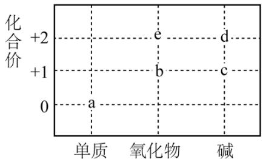

A. 可存在 $c \rightarrow d \rightarrow e$ 的转化 B. 能与 $\mathrm{H}_{2} \mathrm{O}$ 反应生成 $c$ 的物质只有 $b$ C. 新制的 $d$ 可用于检验葡萄糖中的醛基 D. 若 $b$ 能与 $\mathrm{H}_{2} \mathrm{O}$ 反应生成 $\mathrm{O}_{2}$ , 则 $b$ 中含共价键

【分析】由图可知 a、b、c 对应物质分别为：钠、氧化钠（过氧化钠）、氢氧化钠或 a、b、e、d 对应物质分别为：铜、氧化亚铜、氧化铜、氢氧化铜。
【详解】A．由分析可知氢氧化钠和硫酸铜反应生成氢氧化铜，氢氧化铜受热分解生成氧化铜所以存在c→d→e的转化，A合理；
B．钠和氧化钠（过氧化钠）都能与 $H_{2}O$ 反应都能生成氢氧化钠，B不合理；
C．新制氢氧化铜可用于检验葡萄糖中的醛基，C合理；
D．若 b 能与 $H_{2}O$ 反应生成 $O_{2}$ ，则 b 为过氧化钠，结构中含共价键和离子键，D 合理；
故选 B。

11. 设 $N_{A}$ 为阿伏加德罗常数的值。侯氏制碱法涉及 NaCl、 $NH_{4}Cl$ 和 $NaHCO_{3}$ 等物质。下列叙述正确的是
A. $1\ mol\ NH_{4}Cl$ 含有的共价键数目为 $5N_{A}$ B. $1\ mol\ NaHCO_{3}$ 完全分解，得到的 $CO_{2}$ 分子数目为 $2N_{A}$ C. 体积为1 L 的 $1\ mol\cdot L^{-1}\ NaHCO_{3}$ 溶液中， $HCO_{3}^{-}$ 数目为 $N_{A}$ D. NaCl 和 $NH_{4}Cl$ 的混合物中含 $1\ mol\ Cl^{-}$ ，则混合物中质子数为 $28N_{A}$

【详解】A．铵根中存在4个N-H共价键，1mol $NH_{4}Cl$ 含有的共价键数目为 $4N_{A}$ ，A错误；
B．碳酸氢钠受热分解生成碳酸钠、水和二氧化碳，1mol $NaHCO_{3}$ 完全分解，得到 $0.5 \, mol CO_{2}$ 分子，B 错误；

C. $NaHCO_{3} = Na^{+} + HCO_{3}^{-}$ , $HCO_{3}^{-}$ 会发生水解和电离, 则 $1 \mathrm{~mol} \mathrm{NaHCO}_{3}$ 溶液中 $HCO_{3}^{-}$ 数目小于 $1 \mathrm{~N}_{\mathrm{A}}$ , C 错误;  
D. NaCl 和 $\mathrm{NH}_{4} \mathrm{Cl}$ 的混合物中含 $1 \mathrm{~mol} \mathrm{Cl}^{-}$ , 则混合物为 $1 \mathrm{~mol}$ , 质子数为 $28 \mathrm{~N}_{\mathrm{A}}$ , D 正确;  
故答案为: D。

12. 下列陈述I与陈述II均正确，且具有因果关系的是

<table><tr><td>选项</td><td>陈述I</td><td>陈述II</td></tr><tr><td>A</td><td>将浓硫酸加入蔗糖中形成多孔炭</td><td>浓硫酸具有氧化性和脱水性</td></tr><tr><td>B</td><td>装有 $NO_2$ 的密闭烧瓶冷却后颜色变浅</td><td> $NO_2$ 转化为 $N_2O_4$ 的反应吸热</td></tr><tr><td>C</td><td>久置空气中的漂白粉遇盐酸产生 $CO_2$ </td><td>漂白粉的有效成分是 $CaCO_3$ </td></tr><tr><td>D</td><td>1 mol·L-1NaCl溶液导电性比同浓度醋酸强</td><td>NaCl溶液的pH比醋酸的高</td></tr></table>

A.A B.B C.C D.D

【答案】A

【解析】

【详解】A．蔗糖在浓硫酸作用下形成多孔炭主要是蔗糖在浓硫酸作用下脱水，得到碳和浓硫酸反应生成二氧化碳、二氧化硫和水，体现浓硫酸具有氧化性和脱水性，故 A 符合题意；

B．装有 $NO_{2}$ 的密闭烧瓶冷却后颜色变浅，降低温度，平衡向生成 $N_{2}O_{4}$ 方向移动，则 $NO_{2}$ 转化为 $N_{2}O_{4}$ 的反应为放热，故 B 不符合题意；

C．久置空气中的漂白粉遇盐酸产生 $CO_{2}$ 是由于次氯酸钙变质，次氯酸钙和空气中二氧化碳、水反应生成碳酸钙，碳酸钙和盐酸反应生成二氧化碳，故 C 不符合题意；

D．1 mol·L $^{-1}$ NaCl 溶液导电性比同浓度醋酸强，氯化钠是强电解质，醋酸是弱电解质，导电性强弱与 NaCl 溶液的 pH 比醋酸的高无关系，故 D 不符合题意。

综上所述，答案为 A。

13. 利用活性石墨电极电解饱和食盐水，进行如图所示实验。闭合 $\mathbf{K}_{1}$ ，一段时间后

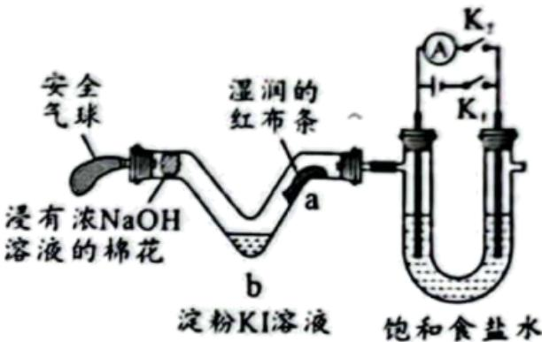

A. U型管两侧均有气泡冒出，分别是 $\mathrm{Cl}_2$ 和 $\mathrm{O}_2$ B. a处布条褪色，说明 $\mathrm{Cl}_2$ 具有漂白性C. b处出现蓝色，说明还原性： $\mathrm{Cl}^- >\mathrm{I}^-$ D. 断开 $\mathbf{K}_1$ ，立刻闭合 $\mathbf{K}_2$ ，电流表发生偏转

【答案】D

【解析】

【分析】闭合 $K_{1}$ ，形成电解池，电解饱和食盐水，左侧为阳极，阳极氯离子失去电子生成氯气，电极反应为 $2Cl^{-}-2e^{-}=Cl_{2}\uparrow$ ，右侧为阴极，阴极电极反应为 $2H^{+}+2e^{-}=H_{2}\uparrow$ ，总反应为 $2NaCl+2H_{2}O\xlongequal{电解}=2NaOH+H_{2}\uparrow+Cl_{2}\uparrow$ ，据此解答。

【详解】A．根据分析，U型管两侧均有气泡冒出，分别是 $Cl_{2}$ 和 $H_{2}$ ，A错误；

B. 左侧生成氯气，氯气遇到水生成 HClO，具有漂白性，则 a 处布条褪色，说明 HClO 具有漂白性，B 错误；
C. b 处出现蓝色，发生 $Cl_{2}+2KI=I_{2}+2KCl$ ，说明还原性： $I^{-}>Cl^{-}$ ，C 错误；
D. 断开 $K_{1}$ ，立刻闭合 $K_{2}$ ，此时构成氢氯燃料电池，形成电流，电流表发生偏转，D 正确；
故选 D。

14. 化合物 $XYZ_{4}ME_{4}$ 可作肥料，所含的 5 种元素位于主族，在每个短周期均有分布，仅有 Y 和 M 同族。Y 的基态原子价层 p 轨道半充满，X 的基态原子价层电子排布式为 $ns^{n-1}$ ，X 与 M 同周期，E 在地壳中含量最多。下列说法正确的是
A. 元素电负性：E > Y > Z
B. 氢化物沸点：M > Y > E
C. 第一电离能：X > E > Y
D. $YZ_{3}$ 和 $YE_{3}^{-}$ 的空间结构均为三角锥形

【解析】

【分析】E 在地壳中含量最多为氧元素，X 的基态原子价层电子排布式为 $ns^{n-1}$ ，所以 n-1=2，n=3，X 为镁或者 n=2，X 为锂，Y 的基态原子价层 p 轨道半充满所以可能为氮或磷，Y 和 M 同族所以为氮或磷，根据 X 与 M 同周期、 $XYZ_{4}ME_{4}$ 化合价之和为零，可确定 Z 为氢元素、M 为磷元素、X 为镁元素、E 为氧元素、Y 氮元素。
【详解】A．元素电负性：氧大于氮大于氢，A 正确；
B．磷化氢、氨气、水固体均是分子晶体，氨气、水固体中都存在氢键沸点高，磷化氢没有氢键沸点低，
所以氢化物沸点：冰大于氨大于磷化氢，B 错误；
C．同周期第一电离能自左向右总趋势逐渐增大，当出现第ⅡA族和第VA族时比左右两侧元素电离能都要大，所以氮大于氧大于镁，C 错误；
D． $NH_{3}$ 价层电子对为 $3+1=4$ ，有一对孤电子对，空间结构为三角锥形， $NO_{3}^{-}$ 价层电子对为 $3+0=3$ ，没有孤电子对， $NO_{3}^{-}$ 空间结构为平面三角形，D 错误；
故选 A。

15. 催化剂 I 和 II 均能催化反应 $R(g) \rightleftharpoons P(g)$ 。反应历程(下图)中，M 为中间产物。其它条件相同时，下列说法不正确的是

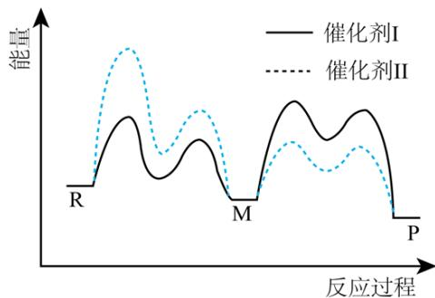

A. 使用 I 和 II，反应历程都分 4 步进行
B. 反应达平衡时，升高温度，R 的浓度增大
C. 使用 II 时，反应体系更快达到平衡
D. 使用 I 时，反应过程中 M 所能达到的最高浓度更

【答案】C

【解析】

【详解】A. 由图可知两种催化剂均出现四个波峰，所以使用 I 和 II，反应历程都分 4 步进行，A 正确；B. 由图可知该反应是放热反应，所以达平衡时，升高温度平衡向左移动，R 的浓度增大，B 正确；C. 由图可知 I 的最高活化能小于 II 的最高活化能，所以使用 I 时反应速率更快，反应体系更快达到平衡，C 错误；D. 由图可知在前两个历程中使用 I 活化能较低反应速率较快，后两个历程中使用 I 活化能较高反应速率较慢，所以使用 I 时，反应过程中 M 所能达到的最高浓度更大，D 正确；故选 C。

16. 用一种具有“卯榫”结构的双极膜组装电解池(下图)，可实现大电流催化电解 $\mathrm{KNO}_3$ 溶液制氨。工作时， $\mathrm{H}_2\mathrm{O}$ 在双极膜界面处被催化解离成 $\mathrm{H}^+$ 和 $\mathrm{OH}^-$ ，有利于电解反应顺利进行。下列说法不正确的是

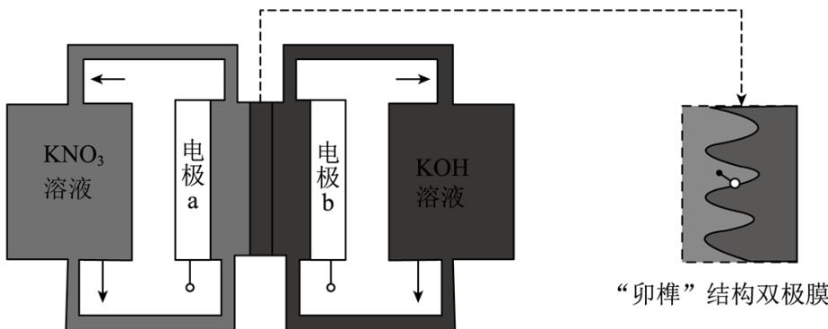

A. 电解总反应: $\mathrm{KNO}_{3} + 3 \mathrm{H}_{2} \mathrm{O} = \mathrm{NH}_{3} \cdot \mathrm{H}_{2} \mathrm{O} + 2 \mathrm{O}_{2} \uparrow + \mathrm{KOH}$ B. 每生成 $1 \mathrm{~mol} \mathrm{NH}_{3} \cdot \mathrm{H}_{2} \mathrm{O}$ , 双极膜处有 $9 \mathrm{~mol}$ 的 $\mathrm{H}_{2} \mathrm{O}$ 解离

C. 电解过程中, 阳极室中 KOH 的物质的量不因反应而改变

D. 相比于平面结构双极膜, “卯榫”结构可提高氨生成速率

【答案】B

【解析】

【分析】由信息大电流催化电解 $\mathrm{KNO}_3$ 溶液制氨可知，在电极a处 $\mathrm{KNO}_3$ 放电生成 $\mathrm{NH}_3$ ，发生还原反应故电极a为阴极，电极方程式为 $\mathrm{NO}_3^- + 8\mathrm{e}^- + 9\mathrm{H}^+ = \mathrm{NH}_3 \cdot \mathrm{H}_2\mathrm{O} + 2\mathrm{H}_2\mathrm{O}$ ，电极b为阳极，电极方程式为 $4\mathrm{OH}^- - 4\mathrm{e}^- = \mathrm{O}_2 \uparrow + 2\mathrm{H}_2\mathrm{O}$ ，“卯榫”结构的双极膜中的 $\mathrm{H}^+$ 移向电极a， $\mathrm{OH}^-$ 移向电极b。

【详解】A．由分析中阴阳极电极方程式可知，电解总反应为 $\mathrm{KNO}_3 + 3\mathrm{H}_2\mathrm{O} = \mathrm{NH}_3 \cdot \mathrm{H}_2\mathrm{O} + 2\mathrm{O}_2 \uparrow + \mathrm{KOH}$ ，故A正确；

B．每生成 $1\mathrm{mol}$ $\mathrm{NH}_3 \cdot \mathrm{H}_2\mathrm{O}$ ，阴极得 $8\mathrm{mol}$ $\mathrm{e}^-$ ，同时双极膜处有 $8\mathrm{mol}$ $\mathrm{H}^+$ 进入阴极室，即有 $8\mathrm{mol}$ 的 $\mathrm{H}_2\mathrm{O}$ 解离，故B错误；

C．电解过程中，阳极室每消耗 $4\mathrm{mol}$ $\mathrm{OH}^-$ ，同时有 $4\mathrm{mol}$ $\mathrm{OH}^-$ 通过双极膜进入阳极室，KOH的物质的量不因反应而改变，故C正确；

D．相比于平面结构双极膜，“卯榫”结构具有更大的膜面积，有利于 $\mathrm{H}_2\mathrm{O}$ 被催化解离成 $\mathrm{H}^+$ 和 $\mathrm{OH}^-$ ，可提高氨生成速率，故D正确；

故选 B。

## 二、非选择题：本题共4小题，共56分。

17. 化学反应常伴随热效应。某些反应(如中和反应)的热量变化，其数值 Q 可通过量热装置测量反应前后体系温度变化，用公式 $Q = c \rho V_{总} \cdot \Delta T$ 计算获得。

(1) 盐酸浓度的测定: 移取 $20.00 \mathrm{~mL}$ 待测液, 加入指示剂, 用 $0.5000 \mathrm{~mol} \cdot \mathrm{L}^{-1} \mathrm{NaOH}$ 溶液滴定至终点, 消耗 $\mathrm{NaOH}$ 溶液 $22.00 \mathrm{~mL}$ 。

①上述滴定操作用到的仪器有\_\_\_\_。

A.

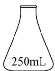

B.

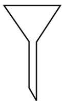

C.

D.

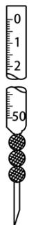

②该盐酸浓度为\_\_\_\_ mol·L $^{-1}$ 。

(2) 热量的测定: 取上述 $\mathrm{NaOH}$ 溶液和盐酸各 $50 \mathrm{~mL}$ 进行反应, 测得反应前后体系的温度值 $(^{\circ} \mathrm{C})$ 分别为 $\mathrm{T}_{0} 、 \mathrm{T}_{1}$ , 则该过程放出的热量为 \_\_\_\_ J (c 和 $\rho$ 分别取 $4.18 \mathrm{~J} \cdot \mathrm{g}^{-1} \cdot {}^{ \circ} \mathrm{C}^{-1}$ 和 $1.0 \mathrm{~g} \cdot \mathrm{mL}^{-1}$ , 忽略水以外各物质吸收的热量, 下同)。

(3) 借鉴(2)的方法, 甲同学测量放热反应 $\mathrm{Fe(s)} + \mathrm{CuSO}_{4}(\mathrm{aq}) = \mathrm{FeSO}_{4}(\mathrm{aq}) + \mathrm{Cu(s)}$ 的焓变 $\Delta H$ (忽略温度对焓变的影响, 下同)。实验结果见下表。

<table><tr><td rowspan="2">序号</td><td rowspan="2" colspan="2">反应试剂</td><td colspan="2">体系温度/°C</td></tr><tr><td>反应前</td><td>反应后</td></tr><tr><td>i</td><td rowspan="2">0.20 mol·L-1CuSO4溶液100 mL</td><td>1.20 g Fe粉</td><td>a</td><td>b</td></tr><tr><td>ii</td><td>0.56 g Fe粉</td><td>a</td><td>c</td></tr></table>

①温度：b \_\_\_\_ c(填“>”“<”或“=”)。

② $\Delta H=$ \_\_\_\_ (选择表中一组数据计算)。结果表明，该方法可行。

(4) 乙同学也借鉴(2)的方法, 测量反应 $\mathrm{A:Fe(s)+Fe_2(SO_4)_3(aq)=3FeSO_4(aq)}$ 的焓变。查阅资料: 配制 $\mathrm{Fe_2(SO_4)_3}$ 溶液时需加入酸。加酸的目的是\_\_\_\_。

提出猜想：Fe粉与 $\mathrm{Fe}_2\left(\mathrm{SO}_4\right)_3$ 溶液混合，在反应A进行的过程中，可能存在Fe粉和酸的反应。

验证猜想: 用 $\mathrm{pH}$ 试纸测得 $\mathrm{Fe}_{2} \left( \mathrm{SO}_{4} \right)_{3}$ 溶液的 $\mathrm{pH}$ 不大于 1; 向少量 $\mathrm{Fe}_{2} \left( \mathrm{SO}_{4} \right)_{3}$ 溶液中加入 $\mathrm{Fe}$ 粉, 溶液颜色变浅的同时有气泡冒出, 说明存在反应 A 和 \_\_\_\_ (用离子方程式表示)。

实验小结：猜想成立，不能直接测反应 A 的焓变。

教师指导：鉴于以上问题，特别是气体生成带来的干扰，需要设计出实验过程中无气体生成的实验方案。

优化设计：乙同学根据相关原理，重新设计了优化的实验方案，获得了反应 A 的焓变。该方案为 \_\_\_\_。

(5) 化学能可转化为热能, 写出其在生产或生活中的一种应用\_\_\_\_。
【答案】(1) ①. AD ②. 0.5500

(2) $418\left(\mathrm{T}_{1}-\mathrm{T}_{0}\right)$ (3) ①.> ②. $-20.9$ (b-a) $\mathrm{kJ} \cdot \mathrm{mol}^{-1}$ 或 $-41.8$ (c-a) $\mathrm{kJ} \cdot \mathrm{mol}^{-1}$

(4) ①. 抑制 $\mathrm{Fe}^{3+}$ 水解 ②. $\mathrm{Fe} + 2\mathrm{H}^{+} = \mathrm{Fe}^{2+} + \mathrm{H}_{2} \uparrow$ ③. 将一定量的 $\mathrm{Cu}$ 粉加入一定浓度的 $\mathrm{Fe}_{2}(\mathrm{SO}_{4})_{3}$ 溶液中反应, 测量反应热, 计算得到反应 $\mathrm{Cu} + \mathrm{Fe}_{2}(\mathrm{SO}_{4})_{3} = \mathrm{CuSO}_{4} + 2\mathrm{FeSO}_{4}$ 的焓变 $\Delta \mathrm{H}_{1}$ ; 根据 (3) 中实验计算得到反应 $\mathrm{Fe} + \mathrm{CuSO}_{4} = \mathrm{Cu} + \mathrm{FeSO}_{4}$ 的焓变 $\Delta \mathrm{H}_{2}$ ; 根据盖斯定律计算得到反应 $\mathrm{Fe} + \mathrm{Fe}_{2}(\mathrm{SO}_{4})_{3} = 3\mathrm{FeSO}_{4}$ 的焓变为 $\Delta \mathrm{H}_{1} + \Delta \mathrm{H}_{2}$

（5）燃料燃烧(或铝热反应焊接铁轨等)  
【解析】  
【小问1详解】

①滴定操作时需要用的仪器有锥形瓶、酸式滴定管、碱式滴管、铁架台等，故选 AD;

②滴定时发生的反应为 $HCl + NaOH = NaCl + H_{2}O$ ，故

$\mathrm{c(HCl)} = \frac{\mathrm{c(NaOH)V(NaOH)}}{\mathrm{V(HCl)}} = \frac{0.5000\mathrm{mol}\cdot\mathrm{L}^{-1}\times 22.00\mathrm{mL}}{20.00\mathrm{mL}} = 0.5500\mathrm{mol}\cdot \mathrm{L}^{-1}$ ，故答案为0.5500；

由 $Q=cpV_{总}\cdot\Delta T$ 可得 $Q=4.18\ J\cdot g^{-1}\cdot^{\circ}C^{-1}\times1.0\ g\cdot mL^{-1}\times(50mL+50mL)\times(T_{1}-T_{2})=418(T_{1}-T_{0})$ ，故答案为 $418(T_{1}-T_{0})$ ;

100 mL 0.20 mol·L $^{-1}$ CuSO $_{4}$ 溶液含有溶质的物质的量为 0.02mol，1.20 g Fe 粉和 0.56 g Fe 粉的物质的量分别为 0.021mol、0.01 mol，实验 i 中有 0.02 mol CuSO $_{4}$ 发生反应，实验 ii 中有 0.01mol CuSO $_{4}$ 发生反应，实验 i 放出的热量多，则 b>c；若按实验 i 进行计算， $\Delta H = \frac{4.18 \times 1.0 \times 100 \times (b - a)}{1000 \times 0.02} = -20.9 \text{ (c-a) kJ} \cdot \text{mol}^{-1}$ ；若按实验 ii 进行计算， $\Delta H = \frac{4.18 \times 1.0 \times 100 \times (c - a)}{1000 \times 0.01} = -41.8 \text{ (c-a) kJ} \cdot \text{mol}^{-1}$ ，故答案为：>；-20.9 (b-a) kJ·mol $^{-1}$ 或

-41.8 (c-a) kJ·mol $^{-1}$ ;

## 【小问 4 详解】

$\mathrm{Fe}^{3+}$ 易水解，为防止 $\mathrm{Fe}^{3+}$ 水解，在配制 $\mathrm{Fe}_2(\mathrm{SO}_4)_3$ 溶液时需加入酸；用 $\mathrm{pH}$ 试纸测得 $\mathrm{Fe}_2(\mathrm{SO}_4)_3$ 溶液的 $\mathrm{pH}$ 不大于1说明溶液中呈强酸性，向少量 $\mathrm{Fe}_2(\mathrm{SO}_4)_3$ 溶液中加入Fe粉，溶液颜色变浅的同时有气泡即氢气产生，说明溶液中还存在Fe与酸的反应，其离子方程式为 $\mathrm{Fe} + 2\mathrm{H}^{+} = \mathrm{Fe}^{2+} + \mathrm{H}_{2}\uparrow$ ；乙同学根据相关原理，重新设计优化的实验方案的重点为如何防止Fe与酸反应产生影响，可以借助盖斯定律，设计分步反应来实现 $\mathrm{Fe}_2(\mathrm{SO}_4)_3$ 溶液与Fe的反应，故可将一定量的Cu粉加入一定浓度的 $\mathrm{Fe}_2(\mathrm{SO}_4)_3$ 溶液中反应，测量反应热，计算得到反应 $\mathrm{Cu} + \mathrm{Fe}_2(\mathrm{SO}_4)_3 = \mathrm{CuSO}_4 + 2\mathrm{FeSO}_4$ 的焓变 $\Delta \mathrm{H}_{1}$ ；根据(3)中实验计算得到反应 $\mathrm{Fe} + \mathrm{CuSO}_4 = \mathrm{Cu} + \mathrm{FeSO}_4$ 的焓变 $\Delta \mathrm{H}_{2}$ ；根据盖斯定律计算得到反应 $\mathrm{Fe} + \mathrm{Fe}_2(\mathrm{SO}_4)_3 = 3\mathrm{FeSO}_4$ 的焓变为 $\Delta \mathrm{H}_{1} + \Delta \mathrm{H}_{2}$ ，故答案为：抑制 $\mathrm{Fe}^{3+}$ 水解； $\mathrm{Fe} + 2\mathrm{H}^{+} = \mathrm{Fe}^{2+} + \mathrm{H}_{2}\uparrow$ ；将一定量的Cu粉加入一定浓度的 $\mathrm{Fe}_2(\mathrm{SO}_4)_3$ 溶液中反应，测量反应热，计算得到反应 $\mathrm{Cu} + \mathrm{Fe}_2(\mathrm{SO}_4)_3 = \mathrm{CuSO}_4 + 2\mathrm{FeSO}_4$ 的焓变 $\Delta \mathrm{H}_{1}$ ；根据(3)实验计算得到反应 $\mathrm{Fe} + \mathrm{CuSO}_4 = \mathrm{Cu} + \mathrm{FeSO}_4$ 的焓变 $\Delta \mathrm{H}_{2}$ ；根据盖斯定律计算得到反应 $\mathrm{Fe} + \mathrm{Fe}_2(\mathrm{SO}_4)_3 = 3\mathrm{FeSO}_4$ 的焓变为 $\Delta \mathrm{H}_{1}$ + $\Delta \mathrm{H}_{2}$ ；

## 【小问 5 详解】

化学能转化为热能在生产和生活中应用比较广泛，化石燃料的燃烧、炸药开山、放射火箭等都是化学能转化热能的应用，另外铝热反应焊接铁轨也是化学能转化热能的应用，故答案为：燃料燃烧(或铝热反应焊接铁轨等)。

18. Ni、Co 均是重要的战略性金属。从处理后的矿石硝酸浸取液(含 $Ni^{2+}$ 、 $Co^{2+}$ 、 $Al^{3+}$ 、 $Mg^{2+}$ )中，利用氨浸工艺可提取 Ni、Co，并获得高附加值化工产品。工艺流程如下：

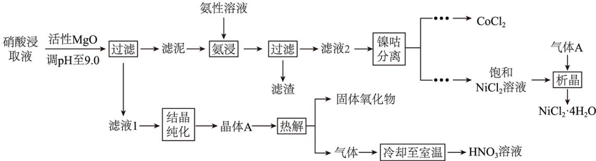

已知：氨性溶液由 $NH_{3}\cdot H_{2}O$ 、 $\left(\mathrm{NH}_{4}\right)_{2}\mathrm{SO}_{3}$ 和 $\left(\mathrm{NH}_{4}\right)_{2}\mathrm{CO}_{3}$ 配制。常温下， $Ni^{2+}$ 、 $Co^{2+}$ 、 $Co^{3+}$ 与 $NH_{3}$ 形成可溶于水的配离子： $\lg K_{b}\left(\mathrm{NH}_{3}\cdot\mathrm{H}_{2}\mathrm{O}\right)=-4.7$ ； $\mathrm{Co(OH)}_{2}$ 易被空气氧化为 $\mathrm{Co(OH)}_{3}$ ；部分氢氧化物的 $K_{sp}$ 如下表。

<table><tr><td>氢氧化物</td><td> $Co(OH)_2$ </td><td> $Co(OH)_3$ </td><td> $Ni(OH)_2$ </td><td> $Al(OH)_3$ </td><td> $Mg(OH)_2$ </td></tr><tr><td> $K_{sp}$ </td><td> $5.9×10^{-15}$ </td><td> $1.6×10^{-44}$ </td><td> $5.5×10^{-16}$ </td><td> $1.3×10^{-33}$ </td><td> $5.6×10^{-12}$ </td></tr></table>

回答下列问题:

(1) 活性 $\mathrm{MgO}$ 可与水反应, 化学方程式为 \_\_\_\_。

（2）常温下，pH=9.9 的氨性溶液中， $c(NH_{3}\cdot H_{2}O)$ \_\_\_\_ $c(NH_{4}^{+})$ （填“>”“<”或“=”）。

（3）“氨浸”时，由 $\mathrm{Co(OH)_{3}}$ 转化为 $\left[\mathrm{Co}\left(\mathrm{NH}_{3}\right)_{6}\right]^{2+}$ 的离子方程式为 \_\_\_\_。

(4) $\left(\mathrm{NH}_{4}\right)_{2} \mathrm{CO}_{3}$ 会使滤泥中的一种胶状物质转化为疏松分布的棒状颗粒物。滤渣的 X 射线衍射图谱中, 出现了 $\mathrm{NH}_{4} \mathrm{Al(OH)}_{2} \mathrm{CO}_{3}$ 的明锐衍射峰。

① $\mathrm{NH_{4}Al(OH)_{2}CO_{3}}$ 属于 \_\_\_\_ (填“晶体”或“非晶体”)。

② $\left(\mathrm{NH}_{4}\right)_{2}\mathrm{CO}_{3}$ 提高了Ni、Co的浸取速率，其原因是\_\_\_\_。

(5) ①“析晶”过程中通入的酸性气体 A 为\_\_\_\_。

(2)由 $\mathrm{CoCl}_{2}$ 可制备 $\mathrm{Al}_{\mathrm{x}}\mathrm{CoO}_{\mathrm{y}}$ 晶体, 其立方晶胞如图。Al 与 O 最小间距大于 Co 与 O 最小间距, x、y 为整数, 则 Co 在晶胞中的位置为\_\_\_\_; 晶体中一个 Al 周围与其最近的 O 的个数为\_\_\_\_。

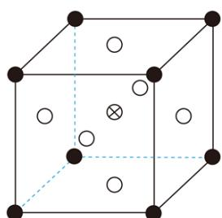

(6) ①“结晶纯化”过程中, 没有引入新物质。晶体 A 含 6 个结晶水, 则所得 $\mathrm{HNO}_{3}$ 溶液中 $\mathrm{n}\left(\mathrm{HNO}_{3}\right)$ 与 $\mathrm{n}\left(\mathrm{H}_{2} \mathrm{O}\right)$ 的比值, 理论上最高为\_\_\_\_。

②“热解”对于从矿石提取 Ni、Co 工艺的意义, 在于可重复利用 $\mathrm{HNO}_{3}$ 和\_\_\_\_(填化学式)。

【答案】(1) $\mathrm{MgO} + \mathrm{H}_{2} \mathrm{O} = \mathrm{Mg(OH)}_{2}$ (2) > (3) $2 \mathrm{Co(OH)}_{3} + 12 \mathrm{NH}_{3} \cdot \mathrm{H}_{2} \mathrm{O} + \mathrm{SO}_{3}^{2-} = 2 \left[ \mathrm{Co}\left(\mathrm{NH}_{3}\right)_{6} \right]^{2+} + \mathrm{SO}_{4}^{2-} + 13 \mathrm{H}_{2} \mathrm{O} + 4 \mathrm{OH}^{-}$ 或 $2 \mathrm{Co(OH)}_{3} + 8 \mathrm{NH}_{3} \cdot \mathrm{H}_{2} \mathrm{O} + 4 \mathrm{NH}_{4}^{+} + \mathrm{SO}_{3}^{2-} = 2 \left[ \mathrm{Co}\left(\mathrm{NH}_{3}\right)_{6} \right]^{2+} + \mathrm{SO}_{4}^{2-} + 13 \mathrm{H}_{2} \mathrm{O}$ (4) ①. 晶体 ②. 减少胶状物质对镍钴氢氧化物的包裹, 增加了滤泥与氨性溶液的接触面积

(5) ①. HCl ②. 体心 ③. 12

(6) ①. 0.4 或 2:5 ②. MgO

【解析】

【分析】硝酸浸取液(含 $Ni^{2+}$ 、 $Co^{2+}$ 、 $Al^{3+}$ 、 $Mg^{2+}$ )中加入活性氧化镁调节溶液 pH 值，过滤，得到滤液主要是硝酸镁，结晶纯化得到硝酸镁晶体，再热解得到氧化镁和硝酸。滤泥加入氨性溶液氨浸，过滤，向滤液中进行镍钴分离，，经过一系列得到氯化铬和饱和氯化镍溶液，向饱和氯化镍溶液中加入氯化氢气体得到氯化镍晶体。

活性 $\mathrm{MgO}$ 可与水反应，化学方程式为 $\mathrm{MgO + H_2O = Mg(OH)_2}$ ；故答案为： $\mathrm{MgO + H_2O = Mg(OH)_2}$ 。【小问 2 详解】

常温下，pH=9.9 的氨性溶液中， $\lg K_{b}(NH_{3}\cdot H_{2}O)=-4.7$

$K_{b}(NH_{3}\cdot H_{2}O)=10^{-4.7}=\frac{c(NH_{4}^{+})\cdot c(OH^{-})}{c(NH_{3}\cdot H_{2}O)}$ ， $\frac{c(NH_{4}^{+})}{c(NH_{3}\cdot H_{2}O)}=\frac{10^{-4.7}}{c(OH^{-})}=\frac{10^{-4.7}}{10^{-4.1}}=10^{-0.6}<1$ ，则 $c(NH_{3}\cdot H_{2}O)>c(NH_{4}^{+})$ ；故答案为：>。

“氨浸”时， $\mathrm{Co(OH)}_3$ 与亚硫酸根发生氧化还原反应，再与氨水反应生成 $\left[\mathrm{Co}\left(\mathrm{NH}_3\right)_6\right]^{2+}$ ，则由 $\mathrm{Co(OH)}_3$ 转化为 $\left[\mathrm{Co}\left(\mathrm{NH}_3\right)_6\right]^{2+}$ 的离子方程式为 $2\mathrm{Co(OH)}_3 + 12\mathrm{NH}_3 \cdot \mathrm{H}_2\mathrm{O} + \mathrm{SO}_3^{2-} = 2\left[\mathrm{Co}\left(\mathrm{NH}_3\right)_6\right]^{2+} + \mathrm{SO}_4^{2-} + 13\mathrm{H}_2\mathrm{O} + 4\mathrm{OH}^-$ 或 $2\mathrm{Co(OH)}_3 + 8\mathrm{NH}_3 \cdot \mathrm{H}_2\mathrm{O} + 4\mathrm{NH}_4^+ + \mathrm{SO}_3^{2-} = 2\left[\mathrm{Co}\left(\mathrm{NH}_3\right)_6\right]^{2+} + \mathrm{SO}_4^{2-} + 13\mathrm{H}_2\mathrm{O}$ ；故答案为：

$$
\begin{array}{r l} & 2 \mathrm{Co(OH)} _ {3} + 1 2 \mathrm{NH} _ {3} \cdot \mathrm{H} _ {2} \mathrm{O} + \mathrm{SO} _ {3} ^ {2 -} = 2 \left[ \mathrm{Co(NH} _ {3}) _ {6} \right] ^ {2 +} + \mathrm{SO} _ {4} ^ {2 -} + 1 3 \mathrm{H} _ {2} \mathrm{O} + 4 \mathrm{OH} ^ {-} \text {或} \\ & 2 \mathrm{Co(OH)} _ {3} + 8 \mathrm{NH} _ {3} \cdot \mathrm{H} _ {2} \mathrm{O} + 4 \mathrm{NH} _ {4} ^ {+} + \mathrm{SO} _ {3} ^ {2 -} = 2 \left[ \mathrm{Co(NH} _ {3}) _ {6} \right] ^ {2 +} + \mathrm{SO} _ {4} ^ {2 -} + 1 3 \mathrm{H} _ {2} \mathrm{O}. \end{array}
$$

【小问 4 详解】

$\left(\mathrm{NH}_{4}\right)_{2}\mathrm{CO}_{3}$ 会使滤泥中的一种胶状物质转化为疏松分布的棒状颗粒物。滤渣的X射线衍射图谱中，出现了 $\mathrm{NH}_{4}\mathrm{Al(OH)}_{2}\mathrm{CO}_{3}$ 的明锐衍射峰。

①X 射线衍射图谱中，出现了 $\mathrm{NH_{4}Al(OH)_{2}CO_{3}}$ 的明锐衍射峰，则 $\mathrm{NH_{4}Al(OH)_{2}CO_{3}}$ 属于晶体；故答案为：晶体。

②根据题意 $\left(\mathrm{NH}_{4}\right)_{2}\mathrm{CO}_{3}$ 会使滤泥中的一种胶状物质转化为疏松分布的棒状颗粒物，则 $\left(\mathrm{NH}_{4}\right)_{2}\mathrm{CO}_{3}$ 能提高了Ni、Co的浸取速率，其原因是减少胶状物质对镍钴氢氧化物的包裹，增加了滤泥与氨性溶液的接触面积；故答案为：减少胶状物质对镍钴氢氧化物的包裹，增加了滤泥与氨性溶液的接触面积。

【小问 5 详解】

①“析晶”过程中为了防止 $Ni^{2+}$ 水解，因此通入的酸性气体 A 为 HCl；故答案为：HCl。

②由 $CoCl_{2}$ 可制备 $Al_{x}CoO_{y}$ 晶体，其立方晶胞如图。x、y 为整数，根据图中信息 Co、Al 都只有一个原子，而氧(白色)原子有 3 个，Al 与 O 最小间距大于 Co 与 O 最小间距，则 Al 在顶点，因此 Co 在晶胞中的位置为体心；晶体中一个 Al 周围与其最近的 O 原子，以顶点 Al 分析，面心的氧原子一个横截面有 4 个，三个横截面共 12 个，因此晶体中一个 Al 周围与其最近的 O 的个数为 12；故答案为：体心；12。

【小问6详解】

①“结晶纯化”过程中，没有引入新物质。晶体 A 含 6 个结晶水，则晶体 A 为 $\mathrm{Mg(NO_{3})_{2}\cdot6H_{2}O}$ ，根据 $\mathrm{Mg(NO_{3})_{2}+2H_{2}O\rightleftharpoons Mg(OH)_{2}+2HNO_{3}}$ ， $\mathrm{Mg(OH)_{2}\xlongequal{\Delta}\mathrm{MgO}+\mathrm{H}_{2}\mathrm{O}}$ ，还剩余 5 个水分子，因此所得 $HNO_{3}$ 溶液中 $\mathrm{n(HNO_{3})}$ 与 $\mathrm{n(H_{2}O)}$ 的比值理论上最高为 2:5；故答案为：0.4 或 2:5。

②“热解”对于从矿石提取 Ni、Co 工艺的意义，根据前面分析

$\mathrm{Mg(NO_3)_2 + 2H_2O \rightleftharpoons Mg(OH)_2 + 2HNO_3, Mg(OH)_2\xlongequal{\Delta} MgO + H_2O}$ ，在于可重复利用 $\mathrm{HNO}_3$ 和

MgO；故答案为：MgO。

19. 配合物广泛存在于自然界，且在生产和生活中都发挥着重要作用。

（1）某有机物R能与 $\mathrm{Fe}^{2+}$ 形成橙红色的配离子 $\left[\mathrm{FeR}_{3}\right]^{2+}$ ，该配离子可被 $\mathrm{HNO}_3$ 氧化成淡蓝色的配离子

$\left[\mathrm{FeR}_{3}\right]^{3+}$ 。

①基态 $Fe^{2+}$ 的 3d 电子轨道表示式为 \_\_\_\_。

②完成反应的离子方程式： $NO_{3}^{-}+2[FeR_{3}]^{2+}+3H^{+}\rightleftharpoons$ \_\_\_\_ +2 $[FeR_{3}]^{3+}+H_{2}O$

(2) 某研究小组对(1)中②的反应进行了研究。

用浓度分别为 $2.0 \, mol \cdot L^{-1}$ 、 $2.5 \, mol \cdot L^{-1}$ 、 $3.0 \, mol \cdot L^{-1}$ 的 $HNO_{3}$ 溶液进行了三组实验，得到 $\mathrm{c}\left(\left[\mathrm{FeR}_{3}\right]^{2+}\right)$ 随时间 t 的变化曲线如图。

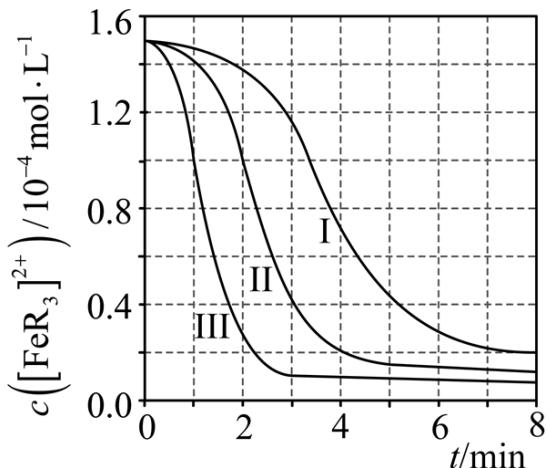

① $c(HNO_{3})=3.0\ mol\cdot L^{-1}$ 时，在 $0\sim1\ min$ 内， $\left[FeR_{3}\right]^{2+}$ 的平均消耗速率=\_\_\_\_。

②下列有关说法中，正确的有\_\_\_\_。

A. 平衡后加水稀释， $\frac{\mathrm{c}\left(\left[\mathrm{FeR}_3\right]^{2+}\right)}{\mathrm{c}\left(\left[\mathrm{FeR}_3\right]^{3+}\right)}$ 增大

B. $\left[\mathrm{FeR}_{3}\right]^{2+}$ 平衡转化率： $\alpha_{\mathrm{III}} > \alpha_{\mathrm{II}} > \alpha_{\mathrm{I}}$ C. 三组实验中，反应速率都随反应进程一直减小  
D. 体系由橙红色转变为淡蓝色所需时间： $t_{\mathrm{III}} > t_{\mathrm{II}} > t_{\mathrm{I}}$

(3) R 的衍生物 L 可用于分离稀土。溶液中某稀土离子(用 M 表示)与 L 存在平衡:

$$
\mathrm{M} + \mathrm{L} \rightleftharpoons \mathrm{ML}
$$

$$
\mathrm{ML} + \mathrm{L} \rightleftharpoons \mathrm{ML} _ {2} \quad \mathrm{K} _ {2}
$$

研究组配制了 L 起始浓度 $c_{0}(L)=0.02\ \text{mol}\cdot\text{L}^{-1}$ 、M 与 L 起始浓度比 $c_{0}(M)/c_{0}(L)$ 不同的系列溶液，反应平衡后测定其核磁共振氢谱。配体 L 上的某个特征 H 在三个物种 L、ML、ML $_{2}$ 中的化学位移不同，该特征 H 对应吸收峰的相对峰面积 S(体系中所有特征 H 的总峰面积计为 1)如下表。

<table><tr><td> $c_0(M)/c_0(L)$ </td><td>S(L)</td><td>S(ML)</td><td> $S(ML_2)$ </td></tr><tr><td>0</td><td>1.00</td><td>0</td><td>0</td></tr><tr><td>a</td><td>x</td><td>&lt;0.01</td><td>0.64</td></tr><tr><td>b</td><td>&lt;0.01</td><td>0.40</td><td>0.60</td></tr></table>

【注】核磁共振氢谱中相对峰面积 S 之比等于吸收峰对应 H 的原子数目之比；“<0.01”表示未检测到。
① $c_{0}(M)/c_{0}(L)=a$ 时，x= \_\_\_\_。

② $c_{0}(M)/c_{0}(L)=b$ 时，平衡浓度比 $c_{平}(ML_{2}):c_{平}(ML)=$ \_\_\_\_。

(4) 研究组用吸收光谱法研究了(3)中 M 与 L 反应体系。当 $c_{0}(L)=1.0 \times 10^{-5} \mathrm{~mol} \cdot \mathrm{L}^{- 1}$ 时, 测得平衡时各物种 $c_{\text {平}} / c_{0}(L)$ 随 $c_{0}(M)/c_{0}(L)$ 的变化曲线如图。 $c_{0}(M)/c_{0}(L)=0.51$ 时, 计算 M 的平衡转化率 (写出计算过程, 结果保留两位有效数字)。

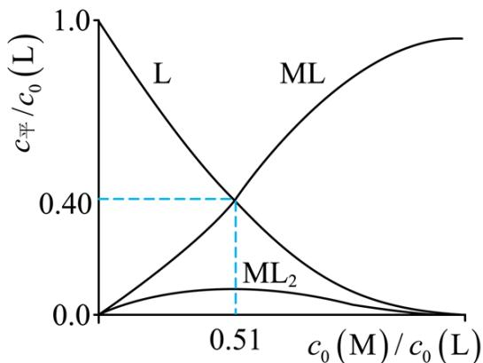

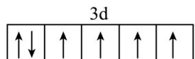

【答案】(1) ①. 3d ②. $\mathrm{HNO}_2$

(2) ①. $5 \times 10^{-5} \mathrm{~mol} / (\mathrm{L} \cdot \mathrm{min})$ ②.A、B

(3) ①.0.36 ②.3:4或0.75

(4) 98%

【解析】
【小问 1 详解】

<table><tr><td>↑↓</td><td>↑</td><td>↑</td><td>↑</td><td>↑</td></tr></table>

②根据原子守恒可知离子方程式中需要增加 $HNO_{2}$ 。

【小问 2 详解】

①浓度分别为 $2.0 \mathrm{~mol} \cdot \mathrm{L}^{-1} 、 2.5 \mathrm{~mol} \cdot \mathrm{L}^{-1} 、 3.0 \mathrm{~mol} \cdot \mathrm{L}^{-1}$ 的 $\mathrm{HNO}_{3}$ 溶液，反应物浓度增加，反应速率增大，据此可知三者对应的曲线分别为I、II、III； $\mathrm{c(HNO}_{3}) = 3.0 \mathrm{~mol} \cdot \mathrm{L}^{-1}$ 时，在 $0 \sim 1 \mathrm{~min}$ 内，观察图像可知 $\left[\mathrm{FeR}_{3}\right]^{2+}$ 的平均消耗速率为 $\frac{(1.5 - 1.0) \times 10^{-4} \mathrm{~mol} \cdot \mathrm{L}^{-1}}{1 \mathrm{~min}} = 5 \times 10^{-5} \mathrm{~mol} / (\mathrm{L} \cdot \mathrm{min})$ ；

②A. 对于反应 $NO_{3}^{-} + 2\left[FeR_{3}\right]^{2+} + 3H^{+} \rightleftharpoons HNO_{2} + 2\left[FeR_{3}\right]^{3+} + H_{2}O$ ，加水稀释，平衡往粒子数增加的方向移动， $\left[FeR_{3}\right]^{2+}$ 含量增加， $\left[FeR_{3}\right]^{3+}$ 含量减小， $\frac{c\left(\left[FeR_{3}\right]^{2+}\right)}{c\left(\left[FeR_{3}\right]^{3+}\right)}$ 增大，A 正确；
B. $HNO_{3}$ 浓度增加， $\left[FeR_{3}\right]^{2+}$ 转化率增加，故 $\alpha_{III} > \alpha_{II} > \alpha_{I}$ ，B 正确；
C. 观察图像可知，三组实验反应速率都是前期速率增加，后期速率减小，C 错误；
D. 硝酸浓度越高，反应速率越快，体系由橙红色转变为淡蓝色所需时间越短，故 $t_{III} < t_{II} < t_{I}$ ，D 错误；故选 AB。

【小问 3 详解】

① $c_{0}(M)/c_{0}(L)=a$ 时， $S\left(ML_{2}\right)+S\left(ML\right)+S\left(L\right)=1$ ，且 $S\left(ML_{2}\right)=0.64$ ， $S(ML)<0.01$ 得x=0.36；
② $S\left(ML_{2}\right)$ 相比于 $S\left(ML\right)$ 含有两个配体，则 $S\left(ML_{2}\right)$ 与 $S\left(ML\right)$ 的浓度比应为 $S\left(ML_{2}\right)$ 相对峰面积S的一半与 $S\left(ML\right)$ 的相对峰面积S之比，即 $\frac{0.6\times\frac{1}{2}}{0.4}=\frac{3}{4}$ 。

【小问 4 详解】

$c_{0}(M)=0.51c_{0}(L)=5.1\times10^{-6}mol\cdot L^{-1};\quad c_{平}(ML)=c_{平}(L)=0.4c_{0}(L)=4.0\times10^{-6}mol\cdot L^{-1},$ 由 L 守恒可知 $c_{平}(ML_{2})=\frac{1\times10^{-5}mol\cdot L^{-1}\cdot(4\times10^{-6}mol\cdot L^{-1}+4\times10^{-6}mol\cdot L^{-1})}{2}=1.0\times10^{-6}mol\cdot L^{-1}$ ，则 $c_{转}(M)=4.0\times10^{-6}mol\cdot L^{-1}+1.0\times10^{-6}mol\cdot L^{-1}=5.0\times10^{-6}mol\cdot L^{-1};$ 则 M 的转化率为 $\frac{5.0\times10^{-6}}{5.1\times10^{-6}}\times100\%\approx98\%$

20. 室温下可见光催化合成技术，对于人工模仿自然界、发展有机合成新方法意义重大。一种基于 CO、碘代烃类等，合成化合物 vii 的路线如下(加料顺序、反应条件略):

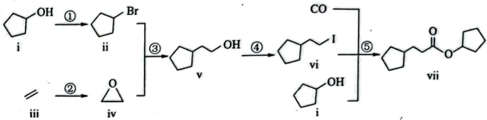

(1) 化合物 i 的分子式为\_\_\_\_。化合物 x 为 i 的同分异构体, 且在核磁共振氢谱上只有 2 组峰。x 的结构简式为\_\_\_\_(写一种), 其名称为\_\_\_\_。

(2) 反应②中, 化合物iii与无色无味气体 y 反应, 生成化合物iv, 原子利用率为 $100 \%$ 。y 为\_\_\_\_。

（3）根据化合物 V 的结构特征，分析预测其可能的化学性质，完成下表。

<table><tr><td>序号</td><td>反应试剂、条件</td><td>反应形成的新结构</td><td>反应类型</td></tr><tr><td>a</td><td>____</td><td>____</td><td>消去反应</td></tr><tr><td>b</td><td>____</td><td>____</td><td>氧化反应(生成有机产物)</td></tr></table>

(4) 关于反应⑤的说法中, 不正确的有\_\_\_\_\_\_\_\_\_\_。
A. 反应过程中, 有 C-I 键和 H-O 键断裂
B. 反应过程中, 有 C=O 双键和 C-O 单键形成
C. 反应物 i 中, 氧原子采取 $\mathbf{sp}^{3}$ 杂化, 并且存在手性碳原子
D. CO 属于极性分子, 分子中存在由 p 轨道“头碰头”形成的 $\pi$ 键

（5）以苯、乙烯和CO为含碳原料，利用反应③和⑤的原理，合成化合物viii。

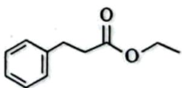  
viii

基于你设计的合成路线，回答下列问题：

(a)最后一步反应中，有机反应物为\_\_\_\_(写结构简式)。

(b)相关步骤涉及到烯烃制醇反应，其化学方程式为\_\_\_\_。

(c)从苯出发, 第一步的化学方程式为\_\_\_\_(注明反应条件)。

【答案】(1)

①. $C_{5}H_{10}O$

②.

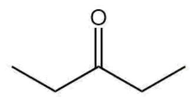

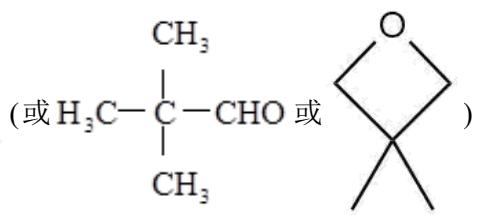

③. 3-戊酮(或2,2-二甲基丙醛或3,3-二甲基氧杂环丁烷)

(2) $\mathrm{O}_{2}$ 或氧气

(3) ①. 浓硫酸，加热

②.

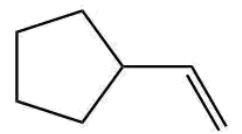

③. $\mathrm{O}_{2} 、 \mathrm{Cu}$ , 加热(或酸性 $\mathrm{KMnO}_{4}$ 溶液)

④.

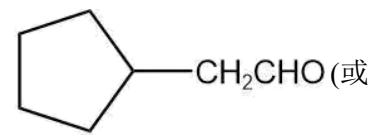

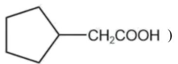

(4) CD

( 5 )

①.

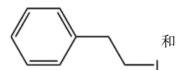

$$
\mathrm{CH} _ {3} \mathrm{CH} _ {2} \mathrm{OH}
$$

②.

$$
\mathrm{CH} _ {2} = \mathrm{CH} _ {2} + \mathrm{H} _ {2} \mathrm{O} \xrightarrow [ \text {加热、加压} ]{\text {催化剂}} \mathrm{CH} _ {3} \mathrm{CH} _ {2} \mathrm{OH}
$$

③.

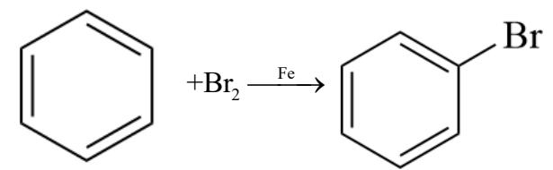

+HBr

【解析】

【分析】①

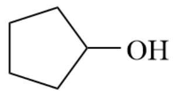

与 HBr 加热发生取代反应生成

·Br，②乙烯在催化

剂作用下氧化生成

③

与

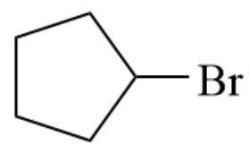

·Br 发生开环加成生成

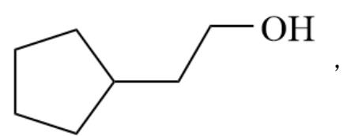

④

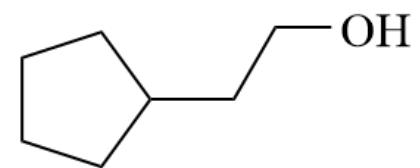

发生取代反应生成

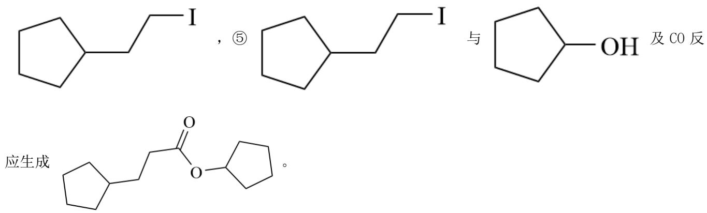

【小问1详解】

化合物i $\mathrm{C}_5\mathrm{H}_{10}\mathrm{O}$ 的分子式为 $\mathrm{C}_5\mathrm{H}_{10}\mathrm{O}$ 。 $\mathrm{C}_5\mathrm{H}_{10}\mathrm{O}$ 不饱和度为1，x可形成碳

碳双键或碳氧双键或一个圆环，化合物 x 为 i 的同分异构体，且在核磁共振氢谱上只有 2 组峰,说明分子中

有对称结构，不对称的部分放在对称轴上，x 的结构简式含酮羰基时为
(或含醛基)

时为 $H_{3}C-C-CHO$ 或含圆环是为 $\begin{array}{c}O\\CH_{3}\end{array}$ ，其名称为3-戊酮(或2,2-二甲基丙醛或3,3-二甲基氧杂

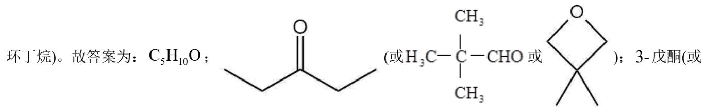

2,2-二甲基丙醛或3,3-二甲基氧杂环丁烷);

【小问 2 详解】

反应②中，化合物iii与无色无味气体y反应，生成化合物iv，原子利用率为 $100\%$ ，②乙烯在催化剂作用

下氧化生成 $\bigtriangleup$ ，y为 $\mathrm{O}_2$ 或氧气。故答案为： $\mathrm{O}_2$ 或氧气；

【小问3详解】

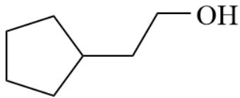

根据化合物 V $\ce{C6H5OH}$ 的结构特征，分析预测其可能的化学性质：含有羟基，且与羟

基相连的碳的邻碳上有氢，可在浓硫酸、加热条件下发生消去反应生成，与羟基相连的

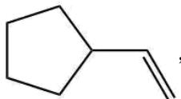

碳上有氢，可在铜名银催化作用下氧化生成 $\mathrm{CH}_2\mathrm{CHO}$ ，或酸性 $\mathrm{KMnO}_4$ 溶液中氧化生成

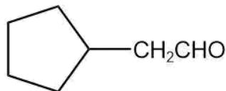

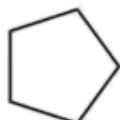

CH₂COOH，见下表：

<table><tr><td>序号</td><td>反应试剂、条件</td><td>反应形成的新结构</td><td>反应类型</td></tr><tr><td>a</td><td>浓硫酸,加热</td><td></td><td>消去反应</td></tr><tr><td>b</td><td> $O_{2}$ 、Cu,加热(或酸性 $KMnO_{4}$ 溶液)</td><td></td><td>氧化反应(生成有机产物)</td></tr></table>

故答案为：浓硫酸，加热； $O_{2}$ 、Cu，加热(或酸性 $KMnO_{4}$ 溶液);

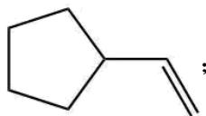

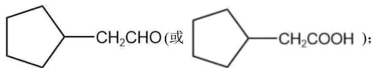

【小问4详解】

A. 从产物中不存在 C-I 键和 H-O 键可以看出，反应过程中，有 C-I 键和 H-O 键断裂，故 A 正确；

B. 反应物中不存在 $\mathrm{C} = \mathrm{O}$ 双键，酰碘基中碘原子离去与羟基中氢离去，余下的部分结合形成酯基中C-O单键，所以反应过程中，有 $\mathrm{C} = \mathrm{O}$ 双键和C-O单键形成，故B正确；

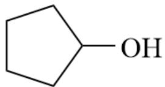

C. 反应物 i $\ce{C6H5OH}$ 中，氧原子采取 $sp^{3}$ 杂化，但与羟基相连的碳有对称轴，其它碳上均

有 2 个氢，分子中不存在手性碳原子，故 C 错误；

D. CO属于极性分子，分子中存在由p轨道“肩并肩”形成的 $\pi$ 键，故D错误；

故答案为：CD;

【小问5详解】

以苯、乙烯和CO为含碳原料，利用反应③和⑤的原理，合成化合物viii。乙烯与水在催化剂加热加压条件下合成乙醇；乙烯在银催化作用下氧化生成环氧乙醚；苯在铁催化作用下与溴生成溴苯，溴苯与环氧乙醚

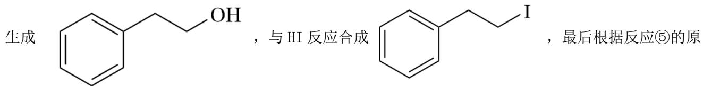

理， $\mathrm{C6H5CH2CH2CH3I}$ 与乙醇、CO合成化合物viii。

(a)最后一步反应中，有机反应物为 $\ce{C6H5CH2CH=CH-CH2}$ 和 $CH_3CH_2OH$ 。故答案为：

和 $CH_{3}CH_{2}OH$ ;

(b)相关步骤涉及到烯烃制醇反应，其化学方程式为 $\mathrm{CH}_2 = \mathrm{CH}_2 + \mathrm{H}_2\mathrm{O}\xrightarrow[\text{加热、加压}]{\text{催化剂}}\mathrm{CH}_3\mathrm{CH}_2\mathrm{OH}$ 。故答案为： $\mathrm{CH}_2 = \mathrm{CH}_2 + \mathrm{H}_2\mathrm{O}\xrightarrow[\text{加热、加压}]{\text{催化剂}}\mathrm{CH}_3\mathrm{CH}_2\mathrm{OH}$

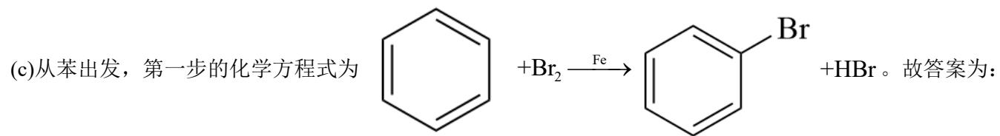

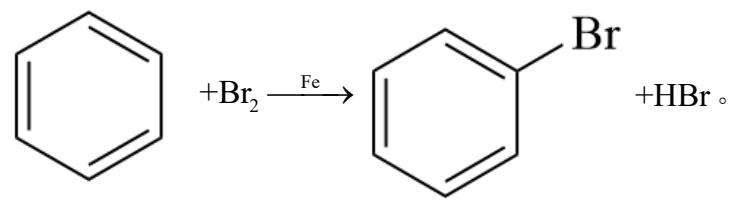