# 2023年河北省普通高中学业水平选择性考试

# 化学

注意事项：

1. 答卷前，考生务必将自己的姓名、考生号、考场号、座位号填写在答题卡上。

2. 回答选择题时，选出每小题答案后，用铅笔把答题卡上对应题目的答案标号涂黑，如需改动，用橡皮擦干净后，再选涂其他答案标号，回答非选择题时，将答案写在答题卡上，写在本试卷上无效。

3. 考试结束后，将本试卷和答题卡一并交回。

可能用到的相对原子质量：H1 N14 O16 Na23 K39 Co59 Zr91

## 一、选择题：本题共 14 小题，每小题 3 分，共 42 分。在每小题给出的四个选项中，只有一项是符合题目要求的。

1. 《本草纲目》中记载了粗食盐的一种制作过程：“取盐于池旁耕地沃以池水，每得南风急，则宿夕成盐。”若将粗食盐在实验室提纯，不涉及的操作是
A. 溶解    B. 蒸发    C. 过滤    D. 蒸馏

【答案】D

【解析】

【详解】若将粗食盐在实验室提纯，需要将粗盐溶解，然后过滤除杂，接着蒸发结晶，不需要蒸馏，故选：D。

2. 实验室根据化学试剂性质的不同采用不同的保存方法，下列说法错误的是
A. 浓硝酸保存在棕色试剂瓶中
B. 氢氧化钠溶液保存在带磨口玻璃塞的细口瓶中
C. 高锰酸钾和乙醇不能同时保存在同一药品柜中
D. 金属钠保存在煤油中

【答案】B

【解析】

【详解】A. 浓硝酸见光易分解，少量浓硝酸保存在棕色细口瓶中，A 正确；

B. 氢氧化钠能与玻璃中的二氧化硅反应生成硅酸钠使玻璃粘连而打不开，故少量氢氧化钠溶液保存在带橡胶塞的粗口试剂瓶中，B 错误；

C. 乙醇具有挥发性，且乙醇可以和高锰酸钾发生氧化还原反应，所以乙醇和高锰酸钾不能同时保存在同一个药品柜中，C 正确；  
D. 金属钠的密度比煤油大且不与煤油反应，少量金属钠保存在煤油中，防止与空气中的氧气和水蒸气等物质因接触而反应，D 正确；  
故答案选 B。

3. 高分子材料在各个领域中得到广泛应用。下列说法错误的是
A. 聚乳酸可用于制造医用材料
B. 聚丙烯酰胺可发生水解反应
C. 聚丙烯可由丙烯通过缩聚反应合成
D. 聚丙烯腈纤维可由丙烯腈通过加聚反应合成

【详解】A. 聚乳酸具有良好的生物相容性和生物可吸收性，可以用于制造手术缝合线、药物缓释材料等医用材料，A 正确；  
B. 聚丙烯酰胺中含有酰胺基，可发生水解反应，B 正确；  
C. 聚丙烯是由丙烯通过加聚反应合成的，C 错误；  
D. 聚丙烯腈纤维是加聚产物，可由丙烯腈通过加聚反应合成，D 正确；

4. $\mathrm{N}_{\mathrm{A}}$ 为阿伏加德罗常数的值，下列说法正确的是  
A. $1\mathrm{L}$ pH = 2 的 HCl 溶液中含 $2\mathrm{N}_{\mathrm{A}}$ 个 $\mathrm{H}^{+}$ B. 反应 $\mathrm{NaH} + \mathrm{H}_{2}\mathrm{O} = \mathrm{NaOH} + \mathrm{H}_{2}\uparrow$ 生成 $1\mathrm{molH}_{2}$ ，转移 $\mathrm{N}_{\mathrm{A}}$ 个电子  
C. $1\mathrm{mol6}$ 号元素的原子一定含有 $6\mathrm{N}_{\mathrm{A}}$ 个质子、 $6\mathrm{N}_{\mathrm{A}}$ 个中子  
D. $1\mathrm{mol}$ 组成为 $\mathrm{C}_{\mathrm{n}}\mathrm{H}_{2\mathrm{n}}$ 的烃一定含有 $\mathrm{N}_{\mathrm{A}}$ 个双键

【详解】A. pH = 2 即 c(H $^{+}$ ) = 10 $^{-2}$ mol/L，故 1L pH = 2 的 HCl 溶液中含 H $^{+}$ 的的数目为 10 $^{-2}$ N $_{A}$ ，A 错误；
B. NaH + H $_{2}$ O = NaOH + H $_{2}$ ↑ 中 H 的化合价由 -1 和 +1 归中到 0 价，转移 1 个电子，故生成 1molH $_{2}$ ，转移 N $_{A}$ 个电子，B 正确；

$6N_{A}$ 个质子、中子数不一定为 $6N_{A}$ ，C 错误；

D. 通式 $C_{n}H_{2n}$ 的有机物可能是单烯烃，也可能是环烷烃，为环烷烃时不含双键，D错误；故选B。

5. 在 K-10 蒙脱土催化下，微波辐射可促进化合物 X 的重排反应，如下图所示：

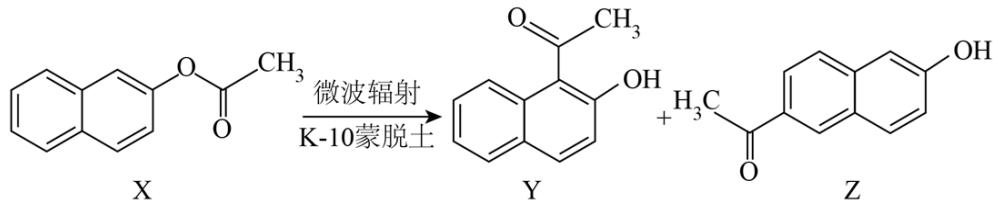

下列说法错误的是
A. Y 的熔点比 Z 的高
B. X 可以发生水解反应
C. Y、Z 均可与 Br₂ 发生取代反应
D. X、Y、Z 互为同分异构体

【详解】A. Z 易形成分子间氢键、Y 易形成分子内氢键，Y 的熔点比 Z 的低，故 A 错误；
B. X 含有酯基，可以发生水解反应，故 B 正确；
C. Y、Z 均含有酚羟基，所以均可与 $Br_{2}$ 发生取代反应，故 C 正确；
D. X、Y、Z 分子式都是 $C_{12}H_{10}O_{2}$ ，结构不同，互为同分异构体，故 D 正确；选 A。

6. 下列说法正确的是
A. $\mathrm{CH}_{4}$ 的价层电子对互斥模型和空间构型均为正四面体
B. 若 $\mathrm{AB}_{2}$ 型分子的空间构型相同, 其中心原子的杂化方式也相同
C. 干冰和冰的结构表明范德华力和氢键通常都具有方向性
D. $\mathrm{CO}_{2}$ 和 $\mathrm{CCl}_{4}$ 都是既含 $\sigma$ 键又含 $\pi$ 键的非极性分子

【答案】A 【解析】

【详解】A. 甲烷分子中心原子形成四个 $\sigma$ 键, 没有孤电子对, 所以价层电子对互斥模型和空间构型均为正四面体, A 正确;  
B. $\mathrm{SO}_{2}$ 和 $\mathrm{OF}_{2}$ 分子的空间构型均为 V 形, 但前者中心原子为 $\mathrm{sp}^{2}$ 杂化, 后者中心原子为 $\mathrm{sp}^{3}$ 杂化, B 错误;

C. 冰的结构是水分子通过氢键结合形成的有空隙的空间结构, 表明了氢键通常具有方向性, 干冰的结构表现为分子密堆积, 范德华力没有方向性, C 错误;

D. $\mathrm{CO}_{2}$ 和 $\mathrm{CCl}_{4}$ 都是极性键形成的非极性分子, $\mathrm{CO}_{2}$ 既含 $\sigma$ 键又含 $\pi$ 键而 $\mathrm{CCl}_{4}$ 只含 $\sigma$ 键不含 $\pi$ 键, D 错误;

故选A。

## 7. 物质的结构决定其性质。下列实例与解释不相符的是

<table><tr><td>选项</td><td>实例</td><td>解释</td></tr><tr><td>A</td><td>用He替代 $H_2$ 填充探空气球更安全</td><td>He的电子构型稳定,不易得失电子</td></tr><tr><td>B</td><td> $BF_3$ 与 $NH_3$ 形成配合物 $[H_3N \rightarrow BF_3]$ </td><td> $BF_3$ 中的B有空轨道接受 $NH_3$ 中N的孤电子对</td></tr><tr><td>C</td><td>碱金属中Li的熔点最高</td><td>碱金属中Li的价电子数最少,金属键最强</td></tr><tr><td>D</td><td>不存在稳定的 $NF_5$ 分子</td><td>N原子价层只有4个原子轨道,不能形成5个N-F键</td></tr></table>

A.A B.B C.C D.D

【答案】C

【解析】

【详解】A. 氢气具有可燃性, 使用氢气填充气球存在一定的安全隐患, 而相比之下, 氦气是一种惰性气体, 不易燃烧或爆炸, 因此使用电子构型稳定, 不易得失电子的氦气填充气球更加安全可靠, 故 A 正确; B. 三氟化硼分子中硼原子具有空轨道, 能与氨分子中具有孤对电子的氮原子形成配位键, 所以三氟化硼能与氨分子形成配合物 $\left[\mathrm{H}_{3} \mathrm{~N} \rightarrow \mathrm{BF}_{3}\right]$ , 故 B 正确; C. 碱金属元素的价电子数相等, 都为 1 , 锂离子的离子半径在碱金属中最小, 形成的金属键最强, 所以碱金属中锂的熔点最高, 故 C 错误; D. 氮原子价层只有 4 个原子轨道, 3 个不成对电子, 由共价键的饱和性可知, 氮原子不能形成 5 个氮氟键, 所以不存在稳定的五氟化氮分子, 故 D 正确;

故选C。

8. 下图所示化合物是制备某些药物的中间体，其中 W、X、Y、Z、Q 均为短周期元素，且原子序数依次增大，分子中的所有原子均满足稀有气体的稳定电子构型，Z 原子的电子数是 Q 的一半。下列说法正确的是

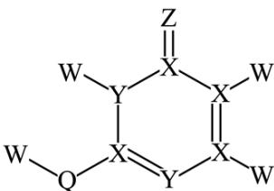

A. 简单氢化物的稳定性： $Z > Q$ B. 第一电离能： $X > Y$ C. 基态原子的未成对电子数： $X > Q$ D. 原子半径： $Z < W$

【答案】A

【解析】

【分析】由 W、X、Y、Z、Q 均为短周期元素，且原子序数依次增大，分子中的所有原子均满足稀有气体的稳定电子构型，Z 原子的电子数是 Q 的一半，图中 W 含有 1 个化学键，原子序数最小，故 W 为 H，X 含有 4 个共价键，故 X 为 C，Z 和 Q 都含 2 个共价键，且 Z 原子的电子数是 Q 的一半，故 Z 为 O，Q 为 S，Y 含 3 个共价键，而且原子序数介于 C 和 O 之间，故 Y 为 N，据此回答
【详解】A．非金属性：O>S，故简单氢化物的稳定性： $Z(O) > Q(S)$ ，A 正确；
B．同一周期从左到右第一电离能呈现增大的趋势，故第一电离能： $Y(N) > X(C)$ ，B 错误；
C．基态原子中 C 的未成对电子数为 2 个，S 的未成对电子数也为 2 个，故基态原子的未成对电子数： $X(C)=Q(S)$ ，C 错误；
D．原子半径为 O>H，故原子半径： $Z(O) > W(H)$ ，D 错误；

故选A。

9. 由下列实验操作及现象，不能得出相应结论的是

<table><tr><td>选项</td><td>实验操作及现象</td><td>结论</td></tr><tr><td>A</td><td> $Cl_{2}$ 通入淀粉-KI溶液中,溶液变蓝</td><td>氧化性: $Cl_{2}>I_{2}$ </td></tr><tr><td>B</td><td> $CO_{2}$ 通入苯酚钠溶液中,溶液变浑浊</td><td>酸性:碳酸&gt;苯酚</td></tr><tr><td>C</td><td> $SO_{2}$ 通入品红溶液中,溶液褪色</td><td> $SO_{2}$ 具有氧化性</td></tr><tr><td>D</td><td> $NH_{3}$ 通入滴有酚酞溶液的水中,溶液变红</td><td>氨水显碱性</td></tr></table>

A.A B.B C.C D.D

【答案】C

【解析】

【详解】A．试纸变蓝是因为 $Cl_{2}$ 和 KI 反应生成 $I_{2}$ ，反应的化学方程式为 $Cl_{2} + 2KI = I_{2} + 2KCl$ ，该反应氧化性 $Cl_{2} > I_{2}$ ，A 正确；

B. $\mathrm{CO}_{2}$ 通入苯酚钠溶液中生成苯酚微溶物， $\mathrm{C}_{6} \mathrm{H}_{5} \mathrm{ONa} + \mathrm{CO}_{2} + \mathrm{H}_{2} \mathrm{O} = \mathrm{C}_{6} \mathrm{H}_{5} \mathrm{OH} + \mathrm{NaHCO}_{3}$ ，B 正确；  
C. $\mathrm{SO}_{2}$ 通入品红溶液，生成无色物质，不属于因氧化性褪色，C 错误；

D. $NH_{3}$ 与水反应 $NH_{3} + H_{2}O \rightleftharpoons NH_{3} \cdot H_{2}O$ ，溶液呈碱性，使酚酞变红，D 正确；

故答案为：C。

10. 一种以锰尘(主要成分为 $\mathrm{Mn}_{2} \mathrm{O}_{3}$ , 杂质为铝、镁、钙、铁的氧化物)为原料制备高纯 $\mathrm{MnCO}_{3}$ 的清洁生产新工艺流程如下:

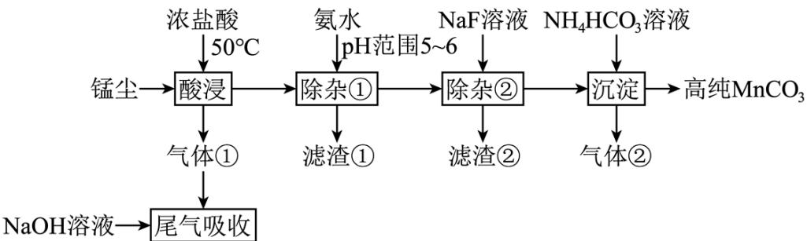

已知：室温下相关物质的 $K_{sp}$ 如下表。

<table><tr><td> $\text{Al(OH)}_3$ </td><td> $\text{Mg(OH)}_2$ </td><td> $\text{Ca(OH)}_2$ </td><td> $\text{Fe(OH)}_2$ </td><td> $\text{Fe(OH)}_3$ </td><td> $\text{Mn(OH)}_2$ </td><td> $\text{MgF}_2$ </td><td> $\text{CaF}_2$ </td></tr><tr><td> $10^{-32.9}$ </td><td> $10^{-11.3}$ </td><td> $10^{-5.3}$ </td><td> $10^{-16.3}$ </td><td> $10^{-38.6}$ </td><td> $10^{-12.7}$ </td><td> $10^{-10.3}$ </td><td> $10^{-8.3}$ </td></tr></table>

下列说法错误的是

A. 酸浸工序中产生的气体①为氯气

B. 滤渣①主要成分为 $\mathrm{Al(OH)}_3$ 和 $\mathrm{Fe(OH)}_3$

C. 除杂②工序中逐渐加入 NaF 溶液时，若 $Ca^{2+}$ 、 $Mg^{2+}$ 浓度接近，则 $CaF_{2}$ 先析出

D. 沉淀工序中发生反应的离子方程式为 $Mn^{2+} + 2HCO_{3}^{-} = MnCO_{3} \downarrow + CO_{2} \uparrow + H_{2}O$

【答案】C

【解析】

【分析】由图知锰尘(主要成分为 $Mn_{2}O_{3}$ ，杂质为铝、镁、钙、铁的氧化物)加入浓盐酸进行酸浸，

$Mn_{2}O_{3}$ 、铝、镁、钙、铁的氧化物均生成对应的盐，由于 $Mn_{2}O_{3}$ 具有氧化性，能将盐酸中的氯离子氧化物氯气，故气体①，用氢氧化钠溶液进行吸收，防止污染环境，加氨水调节pH为5\~6，由表中数据知，可将铁和铝沉淀而除去，故滤渣①主要成分为 $\mathrm{Al(OH)}_{3}$ 和 $\mathrm{Fe(OH)}_{3}$ ，再向滤液中加入氟化钠溶液，可将镁和钙以氟化物的形式除去，滤渣②为氟化钙和氟化镁，此时滤液中主要成分为氯化锰，加入碳酸氢钠溶液，发生 $Mn^{2+} + 2HCO_{3}^{-} = MnCO_{3}\downarrow + CO_{2}\uparrow + H_{2}O$ ，将锰离子沉淀，得到纯度较高的碳酸锰。

【详解】A．由分析知， $Mn_{2}O_{3}$ 与浓盐酸反应生成 $Mn^{2+}$ 和 $Cl_{2}$ ，A 正确；

B. 结合表中数据可知, 除杂①工序中调 pH 为 pH 为 5\~6, 此时会产生 $\mathrm{Al(OH)}_{3}$ 和 $\mathrm{Fe(OH)}_{3}$ 沉淀, B 正确;

C. 由于 $\mathrm{K}_{\mathrm{sp}}(\mathrm{MgF}_{2})<\mathrm{K}_{\mathrm{sp}}(\mathrm{CaF}_{2})$ 故 $Ca^{2+}$ 、 $Mg^{2+}$ 浓度接近时，先析出 $MgF_{2}$ 沉淀，C 错误；

$$
\mathrm{Mn} ^ {2 +} \text {与} \mathrm{HCO} _ {3} ^ {-}
$$

$$
\mathrm{MnCO} _ {3} \text {、} \mathrm{CO} _ {2}
$$

$$
\mathrm{H} _ {2} \mathrm{O}
$$

$$
\mathrm{Mn} ^ {2 +} + 2 \mathrm{HCO} _ {3} ^ {-} = \mathrm{MnCO} _ {3} \downarrow + \mathrm{CO} _ {2} \uparrow + \mathrm{H} _ {2} \mathrm{O}
$$

故选 C。

11. 锆 $(\mathrm{Zr})$ 是重要的战略金属，可从其氧化物中提取。下图是某种锆的氧化物晶体的立方晶胞， $\mathrm{N}_{\mathrm{A}}$ 为阿伏加德罗常数的值。下列说法错误的是

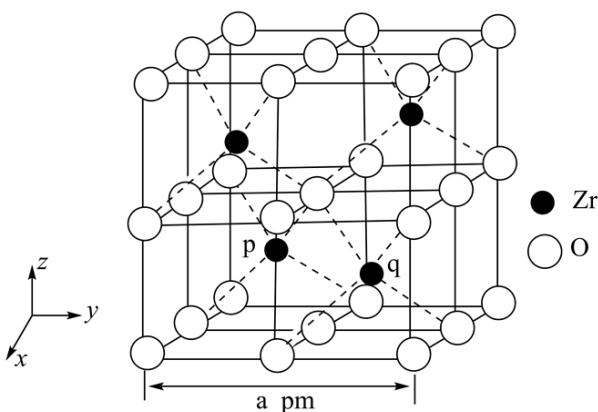

A. 该氧化物的化学式为 $\mathrm{ZrO}_{2}$

B. 该氧化物的密度为 $\frac{123 \times 10^{30}}{\mathrm{N}_{\mathrm{A}} \cdot a^{3}} \mathrm{~g} \cdot \mathrm{cm}^{-3}$

C. Zr 原子之间的最短距离为 $\frac{\sqrt{2}}{2}$ a pm

D. 若坐标取向不变，将 p 点 Zr 原子平移至原点，则 q 点 Zr 原子位于晶胞 XY 面的面心
【答案】B

【解析】

【详解】A．根据“均摊法”，晶胞中含4个Zr、 $8\times\frac{1}{8}+12\times\frac{1}{4}+6\times\frac{1}{2}+1=8$ 个O，则立方氧化锆的化学式为 $ZrO_{2}$ ，A正确；

B. 结合 A 分析可知，晶体密度为 $\rho=\frac{\frac{91\times4+16\times8}{N_{\mathrm{A}}}}{(a\times10^{-10})^{3}}\mathrm{g/cm^{3}}=\frac{492\times10^{30}}{N_{\mathrm{A}}\cdot a^{3}}\mathrm{g/cm^{3}}$ ，B 错误；

C. Zr 原子之间的最短距离为面对角线的一半，即 $\frac{\sqrt{2}}{2} \mathrm{a} \mathrm{pm}$ ，C 正确；

D. 根据晶胞的位置可知, 若坐标取向不变, 将 $\mathrm{p}$ 点 $\mathrm{{Zr}}$ 原子平移至原点, 则垂直向下, $\mathrm{q}$ 点 $\mathrm{{Zr}}$ 原子位于晶胞 $\mathrm{{XY}}$ 面的面心, D 正确;

答案选B。

12. 在恒温恒容密闭容器中充入一定量 $W(g)$ ，发生如下反应：

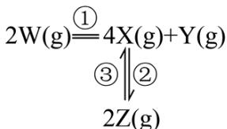

反应②和③的速率方程分别为 $v_{2}=k_{2}c^{2}(X)$ 和 $v_{3}=k_{3}c(Z)$ ，其中 $k_{2}$ 、 $k_{3}$ 分别为反应②和③的速率常数，反应③的活化能大于反应②。测得 $W(g)$ 的浓度随时间的变化如下表。

<table><tr><td>t / min</td><td>0</td><td>1</td><td>2</td><td>3</td><td>4</td><td>5</td></tr><tr><td>c(W) / (mol·L-1)</td><td>0.160</td><td>0.113</td><td>0.080</td><td>0.056</td><td>0.040</td><td>0.028</td></tr></table>

下列说法正确的是

A. 0\~2min 内，X 的平均反应速率为 $0.080 \, mol \cdot L^{-1} \cdot min^{-1}$

B. 若增大容器容积，平衡时 Y 的产率增大

C. 若 $\mathrm{k}_2 = \mathrm{k}_3$ ，平衡时 $\mathbf{c}(\mathbf{Z}) = \mathbf{c}(\mathbf{X})$

D. 若升高温度，平衡时 $c(Z)$ 减小

【答案】D

【解析】

【详解】A．由表知0～2min内 $\Delta c(W)=0.16-0.08=0.08mol/L$ ，生成 $\Delta c(X)=2\Delta c(W)=0.16mol/L$ ，但一部分X转化为 Z，造成 $\Delta c(X) < 0.16 \, mol/L$ ，则 $v(X) < \frac{0.160 \, \text{mol/L}}{2 \, \text{min}} = 0.080 \, \text{mol} \cdot \text{L}^{-1} \cdot \text{min}^{-1}$ ，故 A 错误；
B．过程①是完全反应，过程②是可逆反应，若增大容器容积相当于减小压强，对反应 $4X_{(g)} \rightleftharpoons 2Z_{(g)}$ 平衡向气体体积增大的方向移动，即逆向移动，X 的浓度增大，平衡时 Y 的产率减小，故 B 错误；

C. 由速率之比等于系数比，平衡时 $2\mathrm{v}_{\text{逆}}(\mathrm{X}) = \mathrm{v}_{\text{正}}(\mathrm{Z})$ ，即 $2\mathrm{v}_{3} = \mathrm{v}_{2}$ ， $2\mathrm{k}_{3}\mathrm{c}(\mathrm{Z}) = \mathrm{k}_{2}\mathrm{c}^{2}(\mathrm{X})$ ，若 $\mathrm{k}_{2} = \mathrm{k}_{3}$ ，平衡时 $2\mathrm{c}(\mathrm{Z}) = \mathrm{c}^{2}(\mathrm{X})$ ，故 C 错误；

D. 反应③的活化能大于反应②， $\Delta H =$ 正反应活化能-逆反应活化能 $< 0$ ，则 $4X_{(g)} \rightleftharpoons 2Z_{(g)} \Delta H < 0$ ，该反应是放热反应，升高温度，平衡逆向移动，则平衡时 $c(Z)$ 减小，故 D 正确；

13. 我国科学家发明了一种以 KO—[6H5]—OK 和 MnO2 为电极材料的新型电池，其内部结构如下图所

示，其中①区、②区、③区电解质溶液的酸碱性不同。放电时，电极材料 KO-OK 转化为

O=O。下列说法错误的是

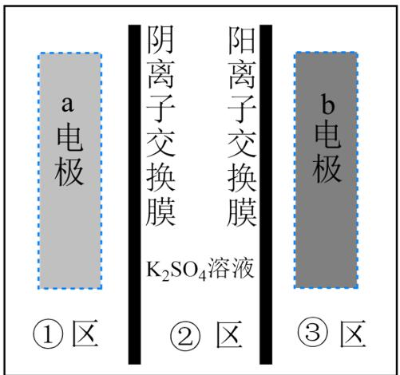

A. 充电时，b 电极上发生还原反应  
B. 充电时，外电源的正极连接 b 电极  
C. 放电时，①区溶液中的 $\mathrm{SO}_4^{2-}$ 向②区迁移  
D. 放电时，a 电极的电极反应式为 $\mathrm{MnO}_2 + 4\mathrm{H}^+ + 2\mathrm{e}^- = \mathrm{Mn}^{2+} + 2\mathrm{H}_2\mathrm{O}$

【答案】B

【解析】

【分析】放电时，电极材料 KO-OK 转化为 O=O，电极反应

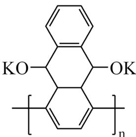

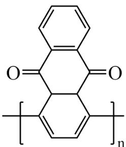

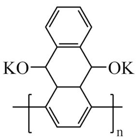

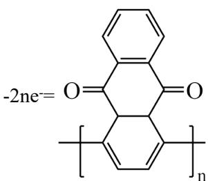

换膜进入②区；二氧化锰得到电子变成锰离子，是原电池的正极，电极反应：

$\mathrm{MnO}_{2} + 4\mathrm{H}^{+} + 2\mathrm{e}^{-} = \mathrm{Mn}^{2 + } + 2\mathrm{H}_{2}\mathrm{O}$ ，阳离子减少，多余的阴离子需要通过阴离子交换膜进入②区，故③

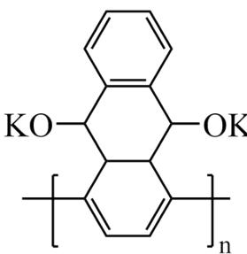

为碱性溶液是KO-OK电极，①为酸性溶液是二氧化锰电极。

【详解】A．充电时，b 电极上得到电子，发生还原反应，A 正确；
B．充电时，外电源的正极连接 a 电极相连，电极失去电子，电极反应为 $Mn^{2+} + 2H_{2}O - 2e^{-} = MnO_{2} + 4H^{+}$ ，B 错误；
C．放电时，①区溶液中多余的 $SO_{4}^{2-}$ 向②区迁移，C正确；
D．放电时，a 电极的电极反应式为 $MnO_{2} + 4H^{+} + 2e^{-} = Mn^{2+} + 2H_{2}O$ ，D 正确；故选：B。

14. 某温度下，两种难溶盐 $\mathrm{Ag_xX}$ 、 $\mathrm{Ag_yY}$ 的饱和溶液中 $-\lg c(X^{x-})$ 或 $-\lg c(Y^{y-})$ 与 $-\lg c(Ag^{+})$ 的关系如图所示。下列说法错误的是

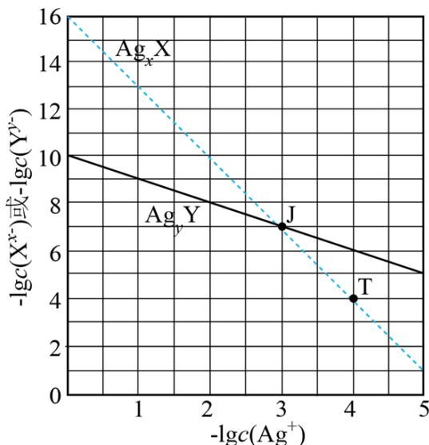

A. x:y=3:1

B. 若混合溶液中各离子浓度如 J 点所示，加入 $\mathrm{AgNO}_{3}(\mathrm{s})$ ，则平衡时 $\frac{\mathrm{c}\left(\mathrm{X}^{\mathrm{x}-}\right)}{\mathrm{c}\left(\mathrm{Y}^{\mathrm{y}-}\right)}$ 变小
C. 向 $Ag_{x}X$ 固体中加入 $Na_{y}Y$ 溶液，可发生 $Ag_{x}X \rightarrow Ag_{y}Y$ 的转化
D. 若混合溶液中各离子起始浓度如 T 点所示，待平衡时 $\mathrm{c}\left(\mathrm{X}^{\mathrm{x}-}\right)+\mathrm{c}\left(\mathrm{Y}^{\mathrm{y}-}\right)<2\mathrm{c}\left(\mathrm{Ag}^{+}\right)$

【答案】D

【解析】

【分析】对于沉淀 $Ag_{x}X$ ，存在沉淀溶解平衡 $Ag_{x}X \rightleftharpoons xAg^{+} + X^{x-}$ ，则

$K_{sp}(Ag_{x}X)=c^{x}(Ag^{+})\times c(X^{x-})$ ，在图像上任找两点（0，16），（3，7），转化成相应的离子浓度代入，
由于温度不变，所以计算出的 $K_{sp}(Ag_{x}X)$ 不变，可求得x=3， $K_{sp}(Ag_{3}X)=1\times10^{-16}$ ；对于沉淀

$Ag_{y}Y$ ，存在沉淀溶解平衡 $Ag_{y}Y \rightleftharpoons yAg^{+} + Y^{y-}$ ， $K_{sp}(Ag_{y}Y) = c^{y}(Ag^{+}) \times c(Y^{y-})$ ，按照同样的方法，在图像上任找两点（0，10），（3，7），可求得 y=1， $K_{sp}(AgY)=1 \times 10^{-10}$ 。

【详解】A．根据分析可知，x=3，y=1，x:y=3:1，A项正确；

B. 由图像可知，若混合溶液中各离子浓度如 J 点所示，此时 $\frac{\mathrm{c}\left(\mathrm{X}^{\mathrm{x}-}\right)}{\mathrm{c}\left(\mathrm{Y}^{\mathrm{y}-}\right)} = 1$ ，加入 $AgNO_{3}(s)$ ， $\mathrm{c}\left(Ag^{+}\right)$ 增大， $-lgc\left(Ag^{+}\right)$ 减小，则 $-lgc\left(\mathrm{X}^{\mathrm{x}-}\right) > -lgc\left(\mathrm{Y}^{\mathrm{y}-}\right)$ ， $\mathrm{c}\left(\mathrm{X}^{\mathrm{x}-}\right) < \mathrm{c}\left(\mathrm{Y}^{\mathrm{y}-}\right)$ ， $\frac{\mathrm{c}\left(\mathrm{X}^{\mathrm{x}-}\right)}{\mathrm{c}\left(\mathrm{Y}^{\mathrm{y}-}\right)}$ 变小，B 项正确；  
C. 向 $Ag_{\mathrm{x}}\mathrm{X}$ 固体中加入 $Na_{\mathrm{y}}\mathrm{Y}$ 溶液，当达到了 $Ag_{\mathrm{y}}\mathrm{Y}$ 的溶度积常数，可发生 $Ag_{\mathrm{x}}\mathrm{X} \rightarrow Ag_{\mathrm{y}}\mathrm{Y}$ 的转化，C 项正确；  
D. 若混合溶液中各离子起始浓度如 T 点所示，由于沉淀 $Ag_{\mathrm{x}}\mathrm{X}$ 达到沉淀溶解平衡，所以 $\mathrm{c}\left(\mathrm{X}^{\mathrm{x}-}\right)$ 不发生变化，而 $Ag_{\mathrm{y}}\mathrm{Y}$ 要发生沉淀， $\mathrm{Y}^{\mathrm{y}-}$ 和 $Ag^{+}$ 的物质的量按 1:y 减少，所以达到平衡时 $\mathrm{c}\left(\mathrm{X}^{\mathrm{x}-}\right) + \mathrm{c}\left(\mathrm{Y}^{\mathrm{y}-}\right) > 2\mathrm{c}\left(Ag^{+}\right)$ ，D 项错误；  
故选 D。

## 二、非选择题：本题共4题，共58分。

15. 配合物 $\mathrm{Na}_{3}\left[\mathrm{Co}\left(\mathrm{NO}_{2}\right)_{6}\right]\left(M=404\mathrm{g}\cdot\mathrm{mol}^{-1}\right)$ 在分析化学中用于 $K^{+}$ 的鉴定，其制备装置示意图(夹持装置等略)及步骤如下：

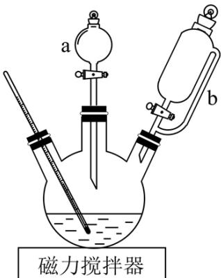

①向三颈烧瓶中加入 $15.0gNaNO_{2}$ 和15.0mL热蒸馏水，搅拌溶解。

②磁力搅拌下加入 $5.0\mathrm{gCo}\left(\mathrm{NO}_{3}\right)_{2} \cdot 6\mathrm{H}_{2}\mathrm{O}$ ，从仪器a加入 $50\%$ 醋酸 $7.0\mathrm{mL}$ 。冷却至室温后，再从仪器b缓慢滴入 $30\%$ 双氧水 $8.0\mathrm{mL}$ 。待反应结束，滤去固体。

③在滤液中加入 95%乙醇，静置 40 分钟。固液分离后，依次用乙醇、乙醚洗涤固体产品，称重。
已知：i.乙醇、乙醚的沸点分别是 $78.5^{\circ}$ C、 $34.5^{\circ}$ C；

ii. $NaNO_{2}$ 的溶解度数据如下表。

<table><tr><td>温度/°C</td><td>20</td><td>30</td><td>40</td><td>50</td></tr><tr><td>溶解度/(g/100gH2O)</td><td>84.5</td><td>91.6</td><td>98.4</td><td>104.1</td></tr></table>

回答下列问题:

（1）仪器 a 的名称是\_\_\_\_，使用前应\_\_\_\_。

(2) $\mathrm{Na}_{3}\left[\mathrm{Co}\left(\mathrm{NO}_{2}\right)_{6}\right]$ 中钴的化合价是\_\_\_\_，制备该配合物的化学方程式为\_\_\_\_。

(3) 步骤①中, 用热蒸馏水的目的是\_\_\_\_。

(4) 步骤③中, 用乙醚洗涤固体产品的作用是\_\_\_\_。

（5）已知： $2K^{+} + Na^{+} + \left[Co(NO_{2})_{6}\right]^{3-} \xlongequal{\text{中性或弱酸性}} K_{2}Na\left[Co(NO_{2})_{6}\right] \downarrow$ （亮黄色）足量KCl与

1.010g 产品反应生成 0.872g 亮黄色沉淀，产品纯度为 \_\_\_\_ %。

(6) 实验室检验样品中钾元素的常用方法是: 将铂丝用盐酸洗净后, 在外焰上灼烧至与原来的火焰颜色相同时, 用铂丝蘸取样品在外焰上灼烧, \_\_\_\_。

【答案】(1) ①. 分液漏斗 ②. 检漏
(2) ①. +3 ②. $12\mathrm{NaNO}_{2} + 2\mathrm{Co}\left(\mathrm{NO}_{3}\right)_{2} + \mathrm{H}_{2}\mathrm{O}_{2} + 2\mathrm{CH}_{3}\mathrm{COOH}$

$$
= 2 \mathrm{Na} _ {3} \left[ \mathrm{Co} \left(\mathrm{NO} _ {2}\right) _ {6} \right] + 4 \mathrm{NaNO} _ {3} + 2 \mathrm{CH} _ {3} \mathrm{COONa} + 2 \mathrm{H} _ {2} \mathrm{O}
$$

(3) 增加 $\mathrm{NaNO}_{2}$ 的溶解度

（4）加速产品干燥 （5）80.0

（6）透过蓝色钻玻璃观察火焰的颜色，若呈紫色则含钾元素

【解析】

【分析】三颈烧瓶中加入 $NaNO_{2}$ 和热蒸馏水，将物料溶解加入 $\mathrm{Co(NO_{3})_{2}\cdot6H_{2}O}$ 在加入醋酸，冷却至室温后，再从仪器 b 缓慢滴入 30% 双氧水，待反应结束，滤去固体，在滤液中加入 95% 乙醇降低溶解度，析晶，过滤洗涤干燥，得到产物。

【小问 1 详解】

仪器 a 的名称是分液漏斗，使用前应检漏；

【小问 2 详解】

$\mathrm{Na}_{3}\left[\mathrm{Co}\left(\mathrm{NO}_{2}\right)_{6}\right]$ 中钠是 $+1$ 价亚硝酸根是-1价，根据化合价代数和为0，钴的化合价是 $+3$ ，制备该配合

物的化学方程式为 $12\mathrm{NaNO}_2 + 2\mathrm{Co}\left(\mathrm{NO}_3\right)_2 + \mathrm{H}_2\mathrm{O}_2 + 2\mathrm{CH}_3\mathrm{COOH}$

$$
= 2 \mathrm{Na} _ {3} \left[ \mathrm{Co} \left(\mathrm{NO} _ {2}\right) _ {6} \right] + 4 \mathrm{NaNO} _ {3} + 2 \mathrm{CH} _ {3} \mathrm{COONa} + 2 \mathrm{H} _ {2} \mathrm{O};
$$

【小问 3 详解】

步骤①中，用热蒸馏水的目的是增加 $NaNO_{2}$ 的溶解度；

【小问 4 详解】

步骤③中，用乙醚洗涤固体产品的作用是加速产品干燥；

【小问 5 详解】

已知： $2K^{+} + Na^{+} + \left[Co(NO_{2})_{6}\right]^{3-} \xlongequal{\text{中性或弱酸性}} K_{2}Na\left[Co(NO_{2})_{6}\right] \downarrow$ （亮黄色）足量KCl与1.010g

产品反应生成0.872g亮黄色沉淀，则

$$
\begin{array}{r l} & {\mathrm{n} \left(\mathrm{K} _ {2} \mathrm{Na} \left[ \mathrm{Co} \left(\mathrm{NO} _ {2}\right) _ {6} \right]\right) = \mathrm{n} \left(\mathrm{Na} _ {3} \left[ \mathrm{Co} \left(\mathrm{NO} _ {2}\right) _ {6} \right]\right) = \frac {0 . 8 7 2}{4 3 6} \mathrm{mol} = 0. 0 0 2 \mathrm{mol},} \\ & {\mathrm{m} \left(\mathrm{Na} _ {3} \left[ \mathrm{Co} \left(\mathrm{NO} _ {2}\right) _ {6} \right]\right) = 0. 0 0 2 \mathrm{mol} \times 4 0 4 \mathrm{g/mol} = 0. 8 0 8 \mathrm{g}, \text {产品纯度为} \frac {0 . 8 0 8}{1 . 0 1 0} \times 1 0 0 \% = 8 0 \% ;} \end{array}
$$

【小问6详解】

实验室检验样品中钾元素的常用方法是：将铂丝用盐酸洗净后，在外焰上灼烧至与原来的火焰颜色相同时，用铂丝蘸取样品在外焰上灼烧，透过蓝色钻玻璃观察火焰的颜色，若呈紫色则含钾元素。

16. 闭环循环有利于提高资源利用率和实现绿色化学的目标。利用氨法浸取可实现废弃物铜包钢的有效分离，同时得到的 CuCl 可用于催化、医药、冶金等重要领域。工艺流程如下：

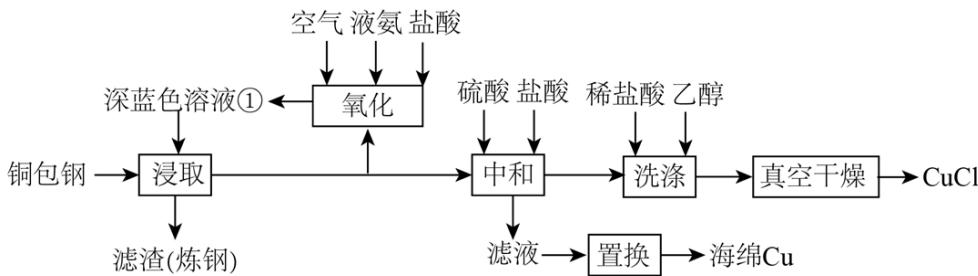

已知：室温下的 $K_{\mathrm{sp}}(\mathrm{CuCl})=10^{-6.8}$ 。

回答下列问题:

(1) 首次浸取所用深蓝色溶液①由铜毛丝、足量液氨、空气和盐酸反应得到, 其主要成分为\_\_\_\_(填化学式)。

(2) 滤渣的主要成分为\_\_\_\_(填化学式)。

（3）浸取工序的产物为 $\left[\mathrm{Cu}\left(\mathrm{NH}_{3}\right)_{2}\right]\mathrm{Cl}$ ，该工序发生反应的化学方程式为\_\_\_\_。浸取后滤液的一半经

氧化工序可得深蓝色溶液①，氧化工序发生反应的离子方程式为\_\_\_\_。

(4) 浸取工序宜在 $30 \sim 40^{\circ} \mathrm{C}$ 之间进行, 当环境温度较低时, 浸取液再生后不需额外加热即可进行浸取的原因是\_\_\_\_。

（5）补全中和工序中主反应的离子方程式 $\left[\mathrm{Cu}\left(\mathrm{NH}_{3}\right)_{2}\right]^{+} + 2\mathrm{H}^{+} + \mathrm{Cl}^{-} =$ \_\_\_\_ + \_\_\_\_。

(6) 真空干燥的目的为\_\_\_\_。

【答案】(1) $\left[\mathrm{Cu}\left(\mathrm{NH}_{3}\right)_{4}\right]\mathrm{Cl}_{2}$

(2) Fe
(3)
①. $\left[\mathrm{Cu}\left(\mathrm{NH}_{3}\right)_{4}\right]\mathrm{Cl}_{2}+\mathrm{Cu}=2\left[\mathrm{Cu}\left(\mathrm{NH}_{3}\right)_{2}\right]\mathrm{Cl}$ ②.

$$
8 \mathrm{NH} _ {3} + 4 \left[ \mathrm{Cu} \left(\mathrm{NH} _ {3}\right) _ {2} \right] ^ {+} + \mathrm{O} _ {2} + 4 \mathrm{H} ^ {+} = 4 \left[ \mathrm{Cu} \left(\mathrm{NH} _ {3}\right) _ {4} \right] ^ {2 +} + 2 \mathrm{H} _ {2} \mathrm{O}
$$

(4) 盐酸和液氨反应放热
(5) ①. CuCl↓ ②. $2NH_{4}^{+}$

(6) 防止干燥过程中 $\mathrm{CuCl}$ 被空气中的 $\mathrm{O}_2$ 氧化

【解析】

【分析】由题给流程可知，铜包钢用由铜毛丝、足量液氨、空气和盐酸反应得到的二氯化四氨合铜深蓝色溶液浸取，将铜转化为一氯化二氨合亚铜，过滤得到含有铁的滤渣和一氯化二氨合亚铜滤液；将滤液的一半经氧化工序将一氯化二氨合亚铜可以循环使用的二氯化四氨合铜；滤液的一半加入加入硫酸、盐酸中和，将一氯化二氨合亚铜转化为硫酸亚铜和氯化亚铜沉淀，过滤得到含有硫酸铵、硫酸亚铜的滤液和氯化亚铜；氯化亚铜经盐酸、乙醇洗涤后，真空干燥得到氯化亚铜；硫酸亚铜溶液发生置换反应生成海绵铜。【小问1详解】

由分析可知，由铜毛丝、足量液氨、空气和盐酸反应得到的深蓝色溶液①为二氯化四氨合铜，故答案为： $\left[\mathrm{Cu}\left(\mathrm{NH}_{3}\right)_{4}\right]\mathrm{Cl}_{2}$ ；

【小问 2 详解】

由分析可知，滤渣的主要成分为铁，故答案为：Fe;

【小问 3 详解】

由分析可知，浸取工序发生的反应为二氯化四氨合铜溶液与铜反应生成一氯化二氨合亚铜，反应的化学方程式为 $\left[\mathrm{Cu}\left(\mathrm{NH}_{3}\right)_{4}\right]\mathrm{Cl}_{2} + \mathrm{Cu} = 2\left[\mathrm{Cu}\left(\mathrm{NH}_{3}\right)_{2}\right]\mathrm{Cl}$ ；氧化工序中一氯化二氨合亚铜发生的反应为一氯化二氨合亚铜溶液与氨水、氧气反应生成二氯化四氨合铜和水，反应的离子方程式为 $8\mathrm{NH}_{3} + 4\left[\mathrm{Cu}\left(\mathrm{NH}_{3}\right)_{2}\right]^{+} + \mathrm{O}_{2} + 4\mathrm{H}^{+} = 4\left[\mathrm{Cu}\left(\mathrm{NH}_{3}\right)_{4}\right]^{2+} + 2\mathrm{H}_{2}\mathrm{O}$ ，故答案为：

$$
\left[ \mathrm{Cu} \left(\mathrm{NH} _ {3}\right) _ {4} \right] \mathrm{Cl} _ {2} + \mathrm{Cu} = 2 \left[ \mathrm{Cu} \left(\mathrm{NH} _ {3}\right) _ {2} \right] \mathrm{Cl};
$$

$$
8 \mathrm{NH} _ {3} + 4 \left[ \mathrm{Cu} \left(\mathrm{NH} _ {3}\right) _ {2} \right] ^ {+} + \mathrm{O} _ {2} + 4 \mathrm{H} ^ {+} = 4 \left[ \mathrm{Cu} \left(\mathrm{NH} _ {3}\right) _ {4} \right] ^ {2 +} + 2 \mathrm{H} _ {2} \mathrm{O};
$$

【小问 4 详解】

浸取工序中盐酸与氨水反应生成氯化铵和水的反应为放热反应，反应放出的热量可以使反应温度保持在30\~40℃之间，所以当环境温度较低时，浸取液再生后不需额外加热即可进行浸取，故答案为：盐酸和液氨反应放热；

【小问 5 详解】

由题给方程式可知，溶液中加二氨合亚铜离子与氯离子、氢离子反应生成氯化亚铜沉淀和铵根离子，反应的离子方程式为 $\left[\mathrm{Cu}\left(\mathrm{NH}_{3}\right)_{2}\right]^{+} + 2\mathrm{H}^{+} + \mathrm{Cl}^{-} = \mathrm{CuCl}\downarrow +2\mathrm{NH}_{4}^{+}$ ，故答案为： $\mathrm{CuCl}\downarrow$ ； $2\mathrm{NH}_{4}^{+}$

【小问6详解】

氯化亚铜易被空气中的氧气氧化，所以为了防止干燥过程中氯化亚铜被氧化，应采用真空干燥的方法干燥，故答案为：防止干燥过程中 CuCl 被空气中的 $O_{2}$ 氧化。

17. 氮是自然界重要元素之一，研究氮及其化合物的性质以及氮的循环利用对解决环境和能源问题都具有重要意义。

已知：1mol 物质中的化学键断裂时所需能量如下表。

<table><tr><td>物质</td><td> $N_{2}(g)$ </td><td> $O_{2}(g)$ </td><td>NO(g)</td></tr><tr><td>能量/kJ</td><td>945</td><td>498</td><td>631</td></tr></table>

回答下列问题:

(1) 恒温下, 将 $1 \mathrm{~mol}$ 空气 $\left(\mathrm{N}_{2} \text { 和 } \mathrm{O}_{2} \right.$ 的体积分数分别为 0.78 和 0.21, 其余为惰性组分)置于容积为 VL 的恒容密闭容器中, 假设体系中只存在如下两个反应:

$$
\mathrm{i} \quad \mathrm{N} _ {2} (\mathrm{g}) + \mathrm{O} _ {2} (\mathrm{g}) \rightleftharpoons 2 \mathrm{NO} (\mathrm{g}) \quad \mathrm{K} _ {1} \quad \Delta \mathrm{H} _ {1}
$$

ii $2\mathrm{NO(g) + O_2(g)\rightleftharpoons 2NO_2(g)}$ $\mathrm{K}_2$ $\Delta \mathrm{H}_2 = -114\mathrm{kJ}\cdot \mathrm{mol}^{-1}$

① $\Delta H_{1} = \_\_\_\_\_ kJ \cdot mol^{-1}$

②以下操作可以降低上述平衡体系中 NO 浓度的有\_\_\_\_(填标号)。
A. 缩小体积 B. 升高温度 C. 移除 $NO_{2}$ D. 降低 $N_{2}$ 浓度

③若上述平衡体系中 $\mathrm{c}\left(\mathrm{NO}_{2}\right)=\mathrm{amol}\cdot\mathrm{L}^{-1},\mathrm{c}(\mathrm{NO})=\mathrm{b mol}\cdot\mathrm{L}^{-1}$ ，则 $\mathrm{c}\left(\mathrm{O}_{2}\right)=\_\_\_\_$ mol·L $^{-1}$ , K $_{1}=$

\_\_\_\_(写出含 a、b、V 的计算式)。

(2) 氢气催化还原 $\mathsf{NO}_{\mathrm{x}}$ 作为一种高效环保的脱硝技术备受关注。高温下氢气还原 NO 反应的速率方程为 $\mathrm{v} = \mathrm{k}\mathrm{c}^{\mathrm{x}}(\mathrm{NO})\mathrm{c}^{\mathrm{y}}(\mathrm{H}_{2}), \mathrm{k}$ 为速率常数。在一定温度下改变体系中各物质浓度，测定结果如下表。

<table><tr><td>组号</td><td> $c(NO) / (mol \cdot L^{-1})$ </td><td> $c(H_2) / (mol \cdot L^{-1})$ </td><td> $v / (mol \cdot L^{-1} \cdot s^{-1})$ </td></tr><tr><td>1</td><td>0.10</td><td>0.10</td><td>r</td></tr><tr><td>2</td><td>0.10</td><td>0.20</td><td>2r</td></tr><tr><td>3</td><td>0.20</td><td>0.10</td><td>4r</td></tr><tr><td>4</td><td>0.05</td><td>0.30</td><td>?</td></tr></table>

表中第 4 组的反应速率为 \_\_\_\_ mol·L $^{-1}$ ·s $^{-1}$ 。(写出含 r 的表达式)

(3) ①以空气中的氮气为原料电解合成氨时, $\mathrm{N}_{2}$ 在\_\_\_\_(填“阴”或“阳”)极上发生反应, 产生 $\mathrm{NH}_{3}$ 。②氨燃料电池和氢燃料电池产生相同电量时, 理论上消耗 $\mathrm{NH}_{3}$ 和 $\mathrm{H}_{2}$ 的质量比为 $17:3$ , 则在碱性介质中氨燃料电池负极的电极反应式为\_\_\_\_。

③我国科学家研究了水溶液中三种催化剂(a、b、c)上 $\mathrm{N}_{2}$ 电还原为 $\mathrm{NH}_{3}$ (图1)和 $\mathrm{H}_{2} \mathrm{O}$ 电还原为 $\mathrm{H}_{2}$ (图2)反应历程中的能量变化, 则三种催化剂对 $\mathrm{N}_{2}$ 电还原为 $\mathrm{NH}_{3}$ 的催化活性由强到弱的顺序为\_\_\_\_(用字母a、b、c排序)。

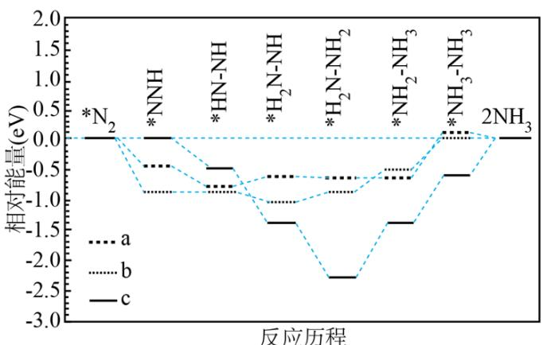  
图1

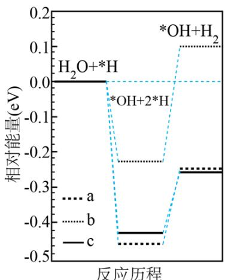  
图2

【答案】(1) ①. 181 ②. CD ③. $\frac{0.21}{\mathrm{V}} - \frac{2a + b}{2}$ ④. $\frac{b^2}{\left(\frac{0.78}{\mathrm{V}} - \frac{a + b}{2}\right)\left(\frac{0.21}{\mathrm{V}} - \frac{2a + b}{2}\right)}$

(2) 0.75r

(3) ①. 阴 ②. $2\mathrm{NH}_3 + 6\mathrm{OH} - 6\mathrm{e}^- = \mathrm{N}_2 + 6\mathrm{H}_2\mathrm{O}$ ③. bac

【解析】

【小问 1 详解】

① $\Delta H_{1}=$ 反应物总键能-生成物总键能= $(945\mathrm{kJ/mol}+498\mathrm{kJ/mol})-2\times631\mathrm{kJ/mol}=+181\mathrm{kJ/mol}$ ；故答案为：+181；

②A. 缩小体积，所有物质浓度均增大，A 不符合题意；

B. 升高温度, 平衡向着吸热方向进行, 反应 i 为吸热反应, 则升温平衡正向进行, NO 浓度增大, B 不符合题意;

C. 移除 $NO_{2}$ ，平衡 ii 向正向进行，NO 浓度降低，C 符合题意；

D. 降低 $N_{2}$ 浓度，平衡逆向进行，消耗 NO，NO 浓度降低，D 符合题意；

故答案为：CD;

③根据三段式

$N_{2}(g)$ + $O_{2}(g)$ $\rightleftharpoons$ 2NO(g)
起始/(mol/L) $\frac{0.78}{V}$ $\frac{0.21}{V}$ 0

改变/ $(\mathrm{mol}/\mathrm{L})$ $\frac{(a+b)}{2}$ $\frac{(a+b)}{2}$ $(a+b)$

平衡/ $\left(\mathrm{mol}/\mathrm{L}\right)$ $\frac{0.78}{V}-\frac{(a+b)}{2}$ $\frac{0.21}{V}-\frac{(a+b)}{2}$ $(a+b)$ $2NO(g)+O_{2}(g)\rightleftharpoons 2NO_{2}(g)$

起始/ $(\mathrm{mol}/\mathrm{L})$ $(a+b)$ $\frac{0.21}{V}-\frac{(a+b)}{2}$ 0

改变/ $(\mathrm{mol} / \mathrm{L})$ a $\frac{\mathrm{a}}{2}$ a

平衡/ $(\mathrm{mol}/\mathrm{L})$ b $\frac{0.21}{V}-\frac{(a+b)}{2}-\frac{a}{2}$ a

$$
\mathrm{c} \left(\mathrm{O} _ {2}\right) = \frac {0 . 2 1}{\mathrm{V}} - \frac {(2 \mathrm{a} + \mathrm{b})}{2}, \quad \mathrm{K} _ {1} = \frac {\mathrm{c} ^ {2} (\mathrm{NO})}{\mathrm{c} \left(\mathrm{N} _ {2}\right) \mathrm{c} \left(\mathrm{O} _ {2}\right)} = \frac {\mathrm{b} ^ {2}}{\left(\frac {0 . 7 8}{\mathrm{V}} - \frac {\mathrm{a} + \mathrm{b}}{2}\right) \left(\frac {0 . 2 1}{\mathrm{V}} - \frac {2 \mathrm{a} + \mathrm{b}}{2}\right)};
$$

故答案为： $\frac{0.21}{V}-\frac{(2a+b)}{2}$ ; $\frac{b^{2}}{\left(\frac{0.78}{V}-\frac{a+b}{2}\right)\left(\frac{0.21}{V}-\frac{2a+b}{2}\right)}$ ;

【小问 2 详解】

实验 1 与实验 2 相比， $\frac{r}{2r}=\frac{k(0.1)^{x}(0.1)^{y}}{k(0.1)^{x}(0.2)^{y}}$ ，y=1，实验 1 与实验 3 相比， $\frac{r}{4r}=\frac{k(0.1)^{x}(0.1)^{y}}{k(0.2)^{x}(0.1)^{y}}$ ，x=2，
代入实验 3， $k=\frac{r}{10^{-3}}=10^{3}r$ ，根据实验 4 计算， $v=10^{3}r(0.05)^{2}(0.3)=0.75r$ ；

故答案为：0.75r;

【小问 3 详解】

① $N_{2}$ 生成 $NH_{3}$ ，化合价降低，得电子，发生还原反应，则 $N_{2}$ 在阴极反应；

故答案为：阴；

②燃料电池中，氨气作负极发生氧化反应，生成 $N_{2}$ ，生成1个 $N_{2}$ 转移6个电子，在碱性下发生，

$$
2 \mathrm{NH} _ {3} - 6 \mathrm{e} ^ {-} + 6 \mathrm{OH} ^ {-} = 2 \mathrm{N} _ {2} + 6 \mathrm{H} _ {2} \mathrm{O}
$$

故答案为： $2NH_{3}-6e^{-}+6OH^{-}=2N_{2}+6H_{2}O$ ;

③催化剂通过降低反应活化能提高反应速度，则催化活性由强到弱的顺序为 b > a > c;

故答案为：bac。

18.2, 5-二羟基对苯二甲酸(DHTA)是一种重要的化工原料, 广泛用于合成高性能有机颜料及光敏聚合物; 作为钠离子电池的正、负电极材料也表现出优异的性能。利用生物质资源合成DHTA的路线如下:

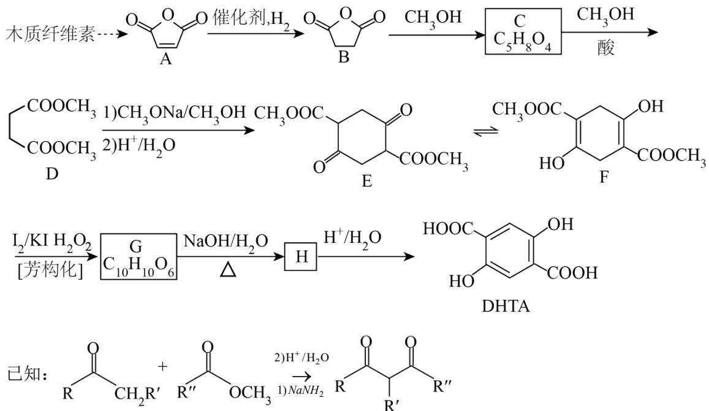

回答下列问题:

(1) A → B 的反应类型为 \_\_\_\_。

(2) C 的结构简式为 \_\_\_\_。

(3) D 的化学名称为\_\_\_\_。

(4) G → H 的化学方程式为 \_\_\_\_。

(5) 写出一种能同时满足下列条件的 G 的同分异构体的结构简式\_\_\_\_。

(a)核磁共振氢谱有两组峰，且峰面积比为3:2；

(b)红外光谱中存在 C=O 吸收峰，但没有 O-H 吸收峰；

(c)可与 $\mathrm{NaOH}$ 水溶液反应，反应液酸化后可与 $\mathrm{FeCl}_3$ 溶液发生显色反应。

(6) 阿伏苯宗是防晒霜的添加剂之一。试以碘甲烷 $\left(\mathrm{CH}_{3} \mathrm{I}\right)$ 、对羟基苯乙酮 $(\mathrm{HO}-\text{ }\begin{array}{c}\text{O}\\|\\\text{C}_6\text{H}_4\end{array}\text{CH}_3)$ 和对叔

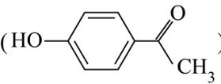

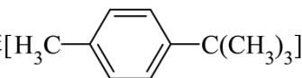

丁基甲苯 $\left[\mathrm{H}_{3} \mathrm{C}-\left\langle \right. \right\rangle-\mathrm{C}\left(\mathrm{CH}_{3}\right)_{3}$ 为原料，设计阿伏苯宗的合成路线\_\_\_\_。(无机试剂和三个碳以下的

有机试剂任选)

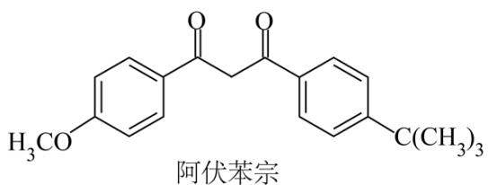

【答案】（1）加成反应(或还原反应)

(2) $CH_{3}OOCCH_{2}CH_{2}COOH$

(3) 丁二酸二甲酯 (4)

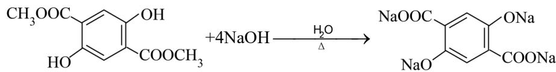

$$
+ 2 \mathrm{CH} _ {3} \mathrm{OH} + 2 \mathrm{H} _ {2} \mathrm{O}
$$

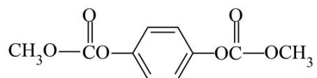

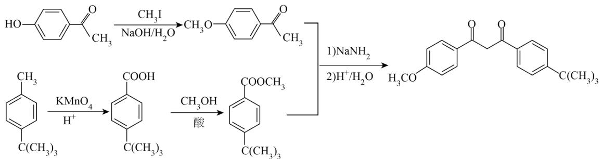

【解析】

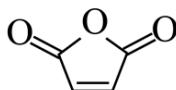

【分析】O=O=O 与 $H_{2}$ 在催化剂存在下发生加成反应生成 O=O=O，O=O=O 与 $CH_{3}OH$ 反

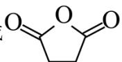

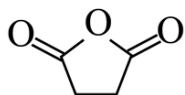

应生成 C，C 的分子式为 $C_{5}H_{8}O_{4}$ ，则 C 的结构简式为 $CH_{3}OOCCH_{2}CH_{2}COOH$ ；C 与 $CH_{3}OH$ 在酸存在下反应生成 D；F 与 $I_{2}/KI$ 、 $H_{2}O_{2}$ 发生芳构化反应生成 G，G 的分子式为 $C_{10}H_{10}O_{6}$ ，G 与 $NaOH/H_{2}O$ 加热反应生成 H，H 与 $H^{+}/H_{2}O$ 反应生成 DHTA，结合 DHTA 的结构简式知，G 的结构简式为

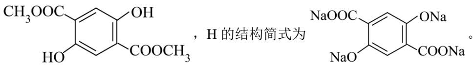

【小问 1 详解】

对比 A、B 的结构简式，A→B 为 A 与 H₂ 发生的加成反应（或还原反应）生成 B。

【小问 2 详解】

根据分析，C 的结构简式为 $CH_{3}OOCCH_{2}CH_{2}COOH$ ;

【小问 3 详解】

D 的结构简式为 $CH_{3}OOCCH_{2}CH_{2}COOCH_{3}$ ，D 中官能团为酯基，D 的化学名称为丁二酸二甲酯。

【小问 4 详解】

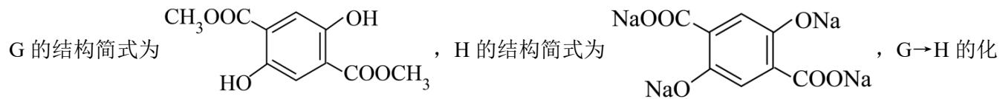

学方程式为

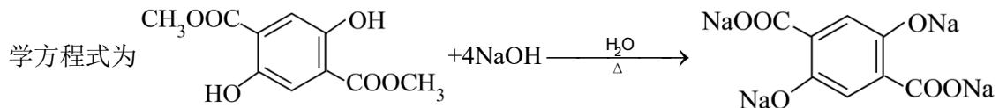

$$
+ 2 \mathrm{CH} _ {3} \mathrm{OH} + 2 \mathrm{H} _ {2} \mathrm{O} 。
$$

【小问 5 详解】

G 的分子式为 $C_{10}H_{10}O_{6}$ ，G 的同分异构体的红外光谱中存在 C=O 吸收峰、但没有 O—H 吸收峰，能与

NaOH 水溶液反应，反应液酸化后可与 $FeCl_{3}$ 溶液发生显色反应，G 的同分异构体中含有 $\ce{C6H5-OC(=O)-}$

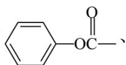

不含—OH，G 的同分异构体的核磁共振氢谱有两组峰、且峰面积比为 3:2，则符合条件的 G 的同分异构

体的结构简式为 $\mathrm{CH}_3\mathrm{O}-\mathrm{CO}-\mathrm{C}_6\mathrm{H}_4-\mathrm{OC}-\mathrm{OCH}_3$

【小问6详解】

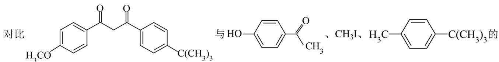

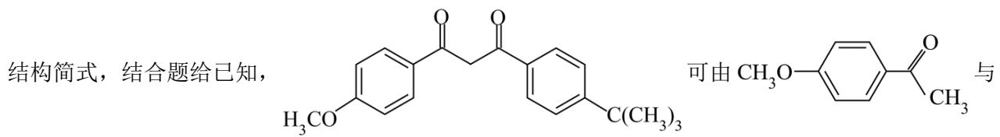

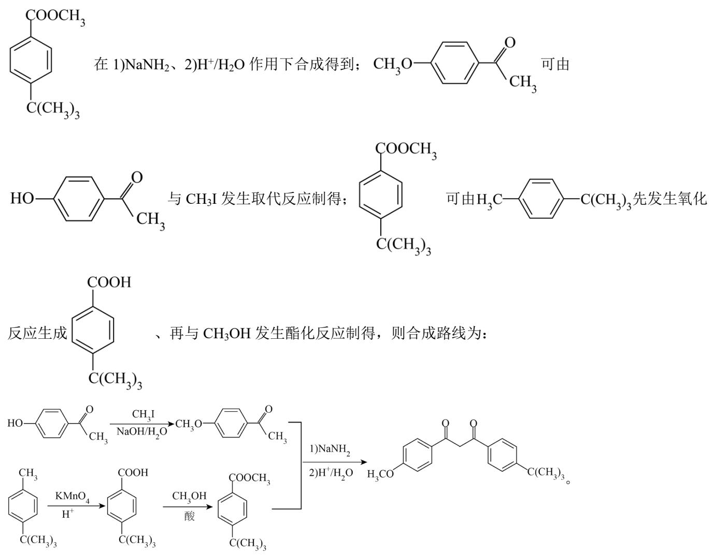