# 2023年高考浙江卷化学真题

可能用到的相对原子质量：H-1 Li-7 C-12 N-14 O-16 Na-23 Mg-24 Al-27 Si-28 S-32 Cl-35.5 K-39 Ca-40 Fe-56 Cu-64 Br-80 Ag-108 I-17 Ba-137

## 一、选择题(本大题共16小题，每小题3分，共48分。每小题列出的四个备选项中只有一个是符合题目要求的，不选、多选、错选均不得分)

1. 材料是人类赖以生存和发展的物质基础，下列材料主要成分属于有机物的是
A. 石墨烯 
B. 不锈钢 
C. 石英光导纤维 
D. 聚酯纤维

【解析】

【详解】A. 石墨烯是一种由单层碳原子构成的平面结构新型碳材料，为碳的单质，属于无机物，A 不符合题意；  
B. 不锈钢是 Fe、Cr、Ni 等的合金，属于金属材料，B 不符合题意；  
C. 石英光导纤维的主要成分为 $\mathrm{SiO}_2$ ，属于无机非金属材料，C 不符合题意；  
D. 聚酯纤维俗称“涤纶”，是由有机二元酸和二元醇缩聚而成的聚酯经纺丝所得的合成纤维，属于有机物，D 符合题意；  
故选 D。

2. 下列化学用语表示正确的是
A. $H_{2}S$ 分子的球棍模型：

$$
\mathrm{AlCl} _ {3}
$$

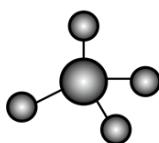

C. KI 的电子式: K : I :

D. $\mathrm{CH}_3\mathrm{CH}\left(\mathrm{CH}_2\mathrm{CH}_3\right)_2$ 的名称：3-甲基戊烷

【答案】D

【解析】

【详解】A. $H_{2}S$ 分子是“V”形结构，因此该图不是 $H_{2}S$ 分子的球棍模型，故 A 错误；

B. $\mathrm{AlCl}_3$ 中心原子价层电子对数为 $3 + \frac{1}{2} (3 - 1 \times 3) = 3 + 0 = 3$ ，其价层电子对互斥模型为平面三角形，故 B 错误；

C. KI是离子化合物，其电子式： $K^{+}[\ddot{\cdot}\ddot{\cdot}:\dot{\cdot}]^{-}$ ，故C错误；
D. $\mathrm{CH_{3}CH(CH_{2}CH_{3})_{2}}$ 的结构简式为 $\begin{array}{c} CH_{3}CH_{2}CHCH_{2}CH_{3} \\ |\\ CH_{3} \end{array}$ ，其名称为3-甲基戊烷，故D正确。
综上所述，答案为 D。

3. 氯化铁是一种重要的盐, 下列说法不正确的是 A. 氯化铁属于弱电解质 B. 氯化铁溶液可腐蚀覆铜板 C. 氯化铁可由铁与氯气反应制得 D. 氯化铁溶液可制备氢氧化铁胶体

【解析】
【详解】A．氯化铁能完全电离出铁离子和氯离子，属于强电解质，A 错误；
B．氯化铁溶液与铜反应生成氯化铜和氯化亚铁，可用来蚀刻铜板，B 正确；
C．氯气具有强氧化性，氯气与铁单质加热生成氯化铁，C 正确；
D．向沸水中滴加饱和氯化铁溶液，继续加热呈红褐色，铁离子发生水解反应可得到氢氧化铁胶体，D 正确；

确；故选：A。

4. 物质的性质决定用途，下列两者对应关系不正确的是  
A. 铝有强还原性，可用于制作门窗框架  
B. 氧化钙易吸水，可用作干燥剂  
C. 维生素C具有还原性，可用作食品抗氧化剂  
D. 过氧化钠能与二氧化碳反应生成氧气，可作潜水艇中的供氧剂

【详解】A. 铝用于制作门窗框架, 利用了铝的硬度大、密度小、抗腐蚀等性质, 而不是利用它的还原性, A 不正确;  
B. 氧化钙易吸水, 并与水反应生成氢氧化钙, 可吸收气体中或密闭环境中的水分, 所以可用作干燥剂, B 正确;  
C. 食品中含有的 $\mathrm{Fe}^{2+}$ 等易被空气中的氧气氧化, 维生素 C 具有还原性, 且对人体无害, 可用作食品抗氧化剂, C 正确;  
D. 过氧化钠能与二氧化碳反应生成氧气, 同时可吸收人体呼出的二氧化碳和水蒸气, 可作潜水艇中的供氧剂, D 正确;

故选 A。

5. 下列说法正确的是

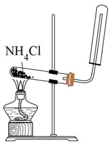

①

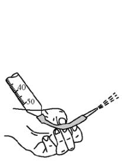  
②

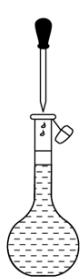  
③

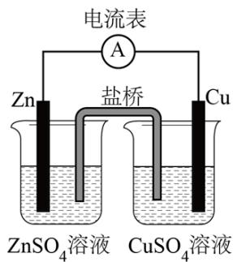  
④

A. 图①装置可用于制取并收集氨气  
B. 图②操作可排出盛有 $\mathrm{KMnO}_4$ 溶液滴定管尖嘴内的气泡  
C. 图③操作俯视刻度线定容会导致所配溶液浓度偏大  
D. 图④装置盐桥中阳离子向 $\mathrm{ZnSO}_4$ 溶液中迁移

【答案】C

【解析】

【详解】A. 氯化铵受热分解生成氨气和氯化氢，遇冷又化合生成氯化铵，则直接加热氯化铵无法制得氨气，实验室用加热氯化铵和氢氧化钙固体的方法制备氨气，故 A 错误；  
B. 高锰酸钾溶液具有强氧化性，会腐蚀橡胶管，所以高锰酸钾溶液应盛放在酸式滴定管在，不能盛放在碱式滴定管中，故 B 错误；  
C. 配制一定物质的量浓度的溶液时，俯视刻度线定容会使溶液的体积偏小，导致所配溶液浓度偏大，故 C 正确；  
D. 由图可知，锌铜原电池中，锌电极为原电池的负极，铜为正极，盐桥中阳离子向硫酸铜溶液中迁移，故 D 错误；  
故选 C。

6. 化学烫发巧妙利用了头发中蛋白质发生化学反应实现对头发的“定型”，其变化过程示意图如下。下列说法不正确的是

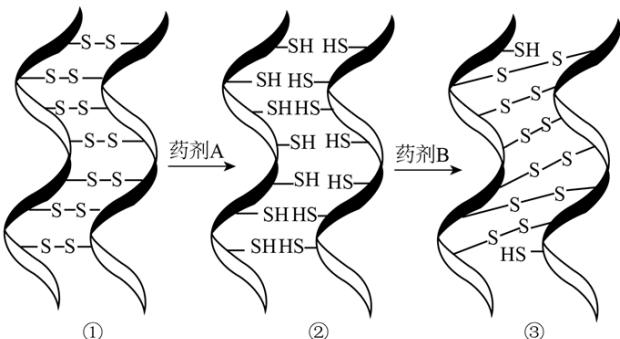

A. 药剂 A 具有还原性
B. ①→②过程若有 2 mol S-S 键断裂，则转移 4 mol 电子
C. ②→③过程若药剂 B 是 $H_{2}O_{2}$ ，其还原产物为 $O_{2}$ D. 化学烫发通过改变头发中某些蛋白质中 S-S 键位置来实现头发的定型

【详解】A. ①→②是氢原子添加进去，该过程是还原反应，因此①是氧化剂，具有氧化性，则药剂 A 具有还原性，故 A 正确；

B. ①→②过程中 S 的价态由 -1 价变为 -2 价，若有 2 mol S-S 键断裂，则转移 4 mol 电子，故 B 正确；

C. ②→③过程发生氧化反应，若药剂 B 是 $H_{2}O_{2}$ ，则 B 化合价应该降低，因此其还原产物为 $H_{2}O$ ，故 C 错误；

D. 通过①→②过程和②→③过程，某些蛋白质中 S-S 键位置发生了改变，因此化学烫发通过改变头发中某些蛋白质中 S-S 键位置来实现头发的定型，故 D 正确。

综上所述，答案为 C。

7. $\mathrm{N}_{\mathrm{A}}$ 为阿伏加德罗常数的值，下列说法正确的是  
A. $4.4\mathrm{gC}_2\mathrm{H}_4\mathrm{O}$ 中含有 $\sigma$ 键数目最多为 $0.7\mathrm{N}_{\mathrm{A}}$ B. $1.7\mathrm{gH}_2\mathrm{O}_2$ 中含有氧原子数为 $0.2\mathrm{N}_{\mathrm{A}}$ C. 向 $1\mathrm{L}0.1\mathrm{mol} / \mathrm{LCH}_3\mathrm{COOH}$ 溶液通氨气至中性，铵根离子数为 $0.1\mathrm{N}_{\mathrm{A}}$ D. 标准状况下， $11.2\mathrm{LCl}_2$ 通入水中，溶液中氯离子数为 $0.5\mathrm{N}_{\mathrm{A}}$

【答案】A

【解析】

【详解】A. 1个 $\mathrm{C_2H_4O}$ 中含有6个 $\sigma$ 键和1个 $\pi$ 键(乙醛)或7个 $\sigma$ 键(环氧乙烷)， $4.4\mathrm{gC_2H_4O}$ 的物质的量为 $0.1\mathrm{mol}$ ，则含有 $\sigma$ 键数目最多为 $0.7\mathrm{N_A}$ ，A正确；B. $1.7\mathrm{gH_2O_2}$ 的物质的量为 $\frac{1.7\mathrm{g}}{34\mathrm{g/mol}} = 0.05\mathrm{mol}$ ，则含有氧原子数为 $0.1\mathrm{N_A}$ ，B不正确；

C. 向 $1 \mathrm{L} 0.1 \mathrm{~mol} / \mathrm{LCH}_{3} \mathrm{COOH}$ 溶液通氨气至中性, 溶液中存在电荷守恒关系: $\mathrm{c(CH_{3}COO^{-}) + c(OH^{-}) = c(NH_{4}^{+}) + c(H^{+})}$ , 中性溶液 $\mathrm{c(OH^{-}) = c(H^{+})}$ , 则 $\mathrm{c(CH_{3}COO^{-}) = c(NH_{4}^{+})}$ , 再根据物料守恒: $\mathrm{n(CH_{3}COO^{-}) + n(CH_{3}COOH) = 0.1 mol}$ , 得出铵根离子数小于 $0.1 N_{\mathrm{A}}$ , C 不正确;  
D. 标准状况下, $11.2 \mathrm{LCl}_{2}$ 的物质的量为 $0.5 \mathrm{~mol}$ , 通入水中后只有一部分 $\mathrm{Cl}_{2}$ 与水反应生成 $\mathrm{H}^{+}$ 、 $\mathrm{Cl}^{-}$ 和 $\mathrm{HClO}$ , 所以溶液中氯离子数小于 $0.5 N_{\mathrm{A}}$ , D 不正确;

8. 下列说法不正确的是
A. 通过 X 射线衍射可测定青蒿素晶体的结构
B. 利用盐析的方法可将蛋白质从溶液中分离
C. 苯酚与甲醛通过加聚反应得到酚醛树脂
D. 可用新制氢氧化铜悬浊液鉴别苯、乙醛和醋酸溶液

【解析】

【详解】A. X 射线衍射实验可确定晶体的结构，则通过 X 射线衍射可测定青蒿素晶体的结构，故 A 正确；  
B. 蛋白质在盐溶液中可发生盐析生成沉淀，因此利用盐析的方法可将蛋白质从溶液中分离，故 B 正确；  
C. 苯酚与甲醛通过缩聚反应得到酚醛树脂，故 C 错误；  
D. 新制氢氧化铜悬浊液与乙醛加热反应条件得到砖红色沉淀，新制氢氧化铜悬浊液与醋酸溶液反应得到蓝色溶液，因此可用新制氢氧化铜悬浊液鉴别苯、乙醛和醋酸溶液，故 D 正确。  
综上所述，答案为 C。

9. 下列反应的离子方程式正确的是
A. 碘化亚铁溶液与等物质的量的氯气: $2\mathrm{Fe}^{2+} + 2\mathrm{I}^{-} + 2\mathrm{Cl}_{2} = 2\mathrm{Fe}^{3+} + \mathrm{I}_{2} + 4\mathrm{Cl}^{-}$ B. 向次氯酸钙溶液通入足量二氧化碳: $\mathrm{ClO}^{-} + \mathrm{CO}_{2} + \mathrm{H}_{2}\mathrm{O} = \mathrm{HClO} + \mathrm{HCO}_{3}^{-}$ C. 铜与稀硝酸: $\mathrm{Cu} + 4\mathrm{H}^{+} + 2\mathrm{NO}_{3}^{-} = \mathrm{Cu}^{2+} + 2\mathrm{NO}_{2} \uparrow + 2\mathrm{H}_{2}\mathrm{O}$ D. 向硫化钠溶液通入足量二氧化硫: $\mathrm{S}^{2-} + 2\mathrm{SO}_{2} + 2\mathrm{H}_{2}\mathrm{O} = \mathrm{H}_{2}\mathrm{S} + 2\mathrm{HSO}_{3}^{-}$

【详解】A．碘化亚铁溶液与等物质的量的氯气，碘离子与氯气恰好完全反应，： $2I^{-}+Cl_{2}=I_{2}+2Cl^{-}$ ，故A错误；

B. 向次氯酸钙溶液通入足量二氧化碳，反应生成碳酸氢钙和次氯酸：

$ClO^{-}+CO_{2}+H_{2}O=HClO+HCO_{3}^{-}$ ，故 B 正确；

C. 铜与稀硝酸反应生成硝酸铜、一氧化氮和水: $3 \mathrm{Cu} + 8 \mathrm{H}^{+} + 2 \mathrm{NO}_{3}^{-} = 3 \mathrm{Cu}^{2+} + 2 \mathrm{NO} \uparrow + 4 \mathrm{H}_{2} \mathrm{O}$ , 故 C 错误;

D. 向硫化钠溶液通入足量二氧化硫，溶液变浑浊，溶液中生成亚硫酸氢钠：

$2S^{2-}+5SO_{2}+2H_{2}O=3S\downarrow+4HSO_{3}^{-}$ ，故D错误；

答案为B。

10. 丙烯可发生如下转化，下列说法不正确的是

$$
\begin{array}{c} \mathrm{C} _ {3} \mathrm{H} _ {5} \mathrm{Br} \\ \mathrm{X} \end{array} \xleftarrow [ \text {光照} ]{\mathrm{Br} _ {2}} \begin{array}{c} \mathrm{CH} _ {3} - \mathrm{CH} = \mathrm{CH} _ {2} \\ \downarrow_ {\text {催化剂}} \\ (\mathrm{C} _ {3} \mathrm{H} _ {6}) _ {n} \\ \mathrm{Z} \end{array} \xrightarrow [ \mathrm{CCl} _ {4} ]{\mathrm{Br} _ {2}} \begin{array}{c} \mathrm{C} _ {3} \mathrm{H} _ {6} \mathrm{Br} _ {2} \\ \mathrm{Y} \end{array}
$$

A. 丙烯分子中最多7个原子共平面

B. X 的结构简式为 $CH_{3}CH=CHBr$

C. Y 与足量 KOH 醇溶液共热可生成丙炔

D. 聚合物 Z 的链节为 $\begin{array}{c}-CH_{2}-CH-\\|\\CH_{3}\end{array}$

【答案】B

【解析】

【分析】 $\mathrm{CH}_{3}-\mathrm{CH}=\mathrm{CH}_{2}$ 与 $\mathrm{Br}_{2}$ 的 $\mathrm{CCl}_{4}$ 溶液发生加成反应，生成 $\begin{array}{c}\mathrm{CH}_{3}-\mathrm{CH}-\mathrm{CH}_{2}\\ \mid \\ \mathrm{Br} \quad \mid \\ \mathrm{Br}\end{array}$ (Y); $\mathrm{CH}_{3}-\mathrm{CH}=\mathrm{CH}_{2}$ 与 $\mathrm{Br}_{2}$ 在光照条件下发生甲基上的取代反应，生成 $\begin{array}{c}\mathrm{CH}_{2}-\mathrm{CH}=\mathrm{CH}_{2}\\ \mid \\ \mathrm{Br}\end{array}$ (X); $\mathrm{CH}_{3}-\mathrm{CH}=\mathrm{CH}_{2}$ 在催化剂作用下发生加聚反应，生成 $\left[\begin{array}{c}\mathrm{CH}-\mathrm{CH}_{2}\end{array}\right]_{n}$ (Z)。

【详解】A. 乙烯分子中有6个原子共平面，甲烷分子中最多有3个原子共平面，则丙烯

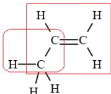

分子中，两个框内的原子可能共平面，所以最多7个原子共平面，A正确；

B. 由分析可知，X 的结构简式为 $\left|\begin{array}{c}CH_{2}-CH=CH_{2}\\Br\end{array}\right.$ ，B 不正确；
C. $Y(\begin{array}{c}CH_{3}-CH-CH_{2}\\Br\\Br\end{array})$ 与足量 KOH 醇溶液共热，发生消去反应，可生成丙炔 $(CH_{3}C\equiv CH)$ 和 KBr 等，
C 正确；
D. 聚合物 Z 为 $\left[\begin{array}{c}CH-CH_{2}\end{array}\right]_{n}$ ，则其链节为 $\begin{array}{c}CH_{2}-CH-\\CH_{3}\end{array}$ ，D 正确；

11. X、Y、Z、W 四种短周期主族元素，原子序数依次增大。X、Y 与 Z 位于同一周期，且只有 X、Y 元素相邻。X 基态原子核外有 2 个未成对电子，W 原子在同周期中原子半径最大。下列说法不正确的是
A. 第一电离能：Y>Z>X
B. 电负性：Z>Y>X>W
C. Z、W 原子形成稀有气体电子构型的简单离子的半径：W<Z
D. W₂X₂ 与水反应生成产物之一是非极性分子
【答案】A
【解析】

【分析】X、Y、Z、W四种短周期主族元素，原子序数依次增大。X、Y与Z位于同一周期，且只有X、Y元素相邻。X基态原子核外有2个未成对电子，则X为C，Y为N，Z为F，W原子在同周期中原子半径最大，则W为Na。

【详解】A．根据同周期从左到右第一电离能呈增大趋势，但第IIA族大于第IIIA族，第VA族大于第VIA族，则第一电离能：Z > Y > X，故A错误；
B．根据同周期从左到右电负性逐渐增大，同主族从上到下电负性逐渐减小，则电负性：Z > Y > X > W，故B正确；
C．根据同电子层结构核多径小，则Z、W原子形成稀有气体电子构型的简单离子的半径：W < Z，故C正确；
D． $W_{2}X_{2}$ 与水反应生成产物之一为乙炔，乙炔是非极性分子，故D正确。
综上所述，答案为A。

12. 苯甲酸是一种常用的食品防腐剂。某实验小组设计粗苯甲酸(含有少量 NaCl 和泥沙)的提纯方案如下:

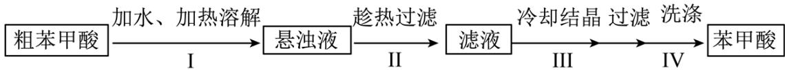

下列说法不正确的是
A. 操作 I 中依据苯甲酸的溶解度估算加水量
B. 操作 II 趁热过滤的目的是除去泥沙和 NaCl
C. 操作 III 缓慢冷却结晶可减少杂质被包裹
D. 操作 IV 可用冷水洗涤晶体

【答案】B

【解析】

【分析】苯甲酸微溶于冷水，易溶于热水。粗苯甲酸中混有泥沙和氯化钠，加水、加热溶解，苯甲酸、NaCl溶解在水中，泥沙不溶，从而形成悬浊液；趁热过滤出泥沙，同时防止苯甲酸结晶析出；将滤液冷却结晶，大部分苯甲酸结晶析出，氯化钠仍留在母液中；过滤、用冷水洗涤，便可得到纯净的苯甲酸。

【详解】A. 操作 I 中，为减少能耗、减少苯甲酸的溶解损失，溶解所用水的量需加以控制，可依据苯甲酸的大致含量、溶解度等估算加水量，A 正确；
B. 操作Ⅱ趁热过滤的目的，是除去泥沙，同时防止苯甲酸结晶析出，NaCl 含量少，通常不结晶析出，B 不正确；
C. 操作Ⅲ缓慢冷却结晶，可形成较大的苯甲酸晶体颗粒，同时可减少杂质被包裹在晶体颗粒内部，C 正确；
D. 苯甲酸微溶于冷水，易溶于热水，所以操作Ⅳ可用冷水洗涤晶体，既可去除晶体表面吸附的杂质离子，又能减少溶解损失，D 正确；
故选 B。

13. 氯碱工业能耗大，通过如图改进的设计可大幅度降低能耗，下列说法不正确的是

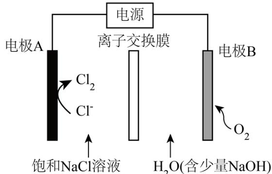

A. 电极 A 接电源正极，发生氧化反应  
B. 电极 B 的电极反应式为： $2\mathrm{H}_{2}\mathrm{O} + 2\mathrm{e}^{-} = \mathrm{H}_{2}\uparrow +2\mathrm{OH}^{-}$ C. 应选用阳离子交换膜，在右室获得浓度较高的 NaOH 溶液  
D. 改进设计中通过提高电极 B 上反应物的氧化性来降低电解电压，减少能耗

【答案】B

【解析】

【详解】A．电极 A 是氯离子变为氯气，化合价升高，失去电子，是电解池阳极，因此电极 A 接电源正极，发生氧化反应，故 A 正确；

B．电极 B 为阴极，通入氧气，氧气得到电子，其电极反应式为： $2H_{2}O+4e^{-}+O_{2}=4OH^{-}$ ，故 B 错误；

C．右室生成氢氧根，应选用阳离子交换膜，左边的钠离子进入到右边，在右室获得浓度较高的 NaOH 溶液，故 C 正确；

D．改进设计中增大了氧气的量，提高了电极 B 处的氧化性，通过反应物的氧化性来降低电解电压，减少能耗，故 D 正确。

综上所述，答案为 B。

14. 一定条件下，1-苯基丙炔(Ph-C≡C-CH₃)可与HCl发生催化加成，反应如下：

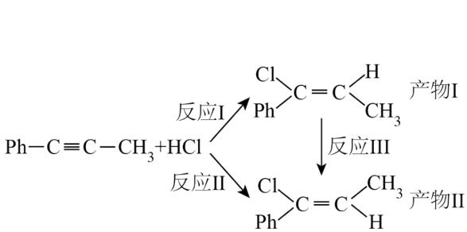

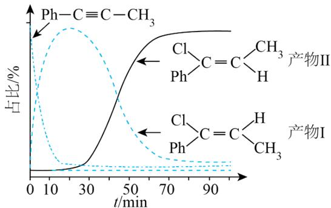

反应过程中该炔烃及反应产物的占比随时间的变化如图(已知：反应I、III为放热反应)，下列说法不正确的是

A. 反应焓变：反应 I>反应 II

B. 反应活化能：反应 I<反应 II

C. 增加 HCl 浓度可增加平衡时产物 II 和产物 I 的比例

D. 选择相对较短的反应时间，及时分离可获得高产率的产物 I

【解析】

【详解】A．反应 I、III 为放热反应，相同物质的量的反应物，反应 I 放出的热量小于反应 II 放出的热量，反应放出的热量越多，其焓变越小，因此反应焓变：反应 I > 反应 II，故 A 正确；

B．短时间里反应 I 得到的产物比反应 II 得到的产物多，说明反应 I 的速率比反应 II 的速率快，速率越快，其活化能越小，则反应活化能：反应 I < 反应 II，故 B 正确；

C．增加 HCl 浓度，平衡正向移动，但平衡时产物 II 和产物 I 的比例可能降低，故 C 错误；

D．根据图中信息，选择相对较短的反应时间，及时分离可获得高产率的产物 I，故 D 正确。

综上所述，答案为 C。

15. 草酸 $\left(\mathrm{H}_{2} \mathrm{C}_{2} \mathrm{O}_{4}\right)$ 是二元弱酸。某小组做如下两组实验：

实验 I: 往 20 mL 0.1 mol·L $^{-1}$ NaHC $_{2}$ O $_{4}$ 溶液中滴加 0.1 mol·L $^{-1}$ NaOH 溶液。

实验II：往 $20 \mathrm{~mL} 0.10 \mathrm{~mol} \cdot \mathrm{L}^{-1} \mathrm{NaHC}_{2} \mathrm{O}_{4}$ 溶液中滴加 $0.10 \mathrm{~mol} \cdot \mathrm{L}^{-1} \mathrm{CaCl}_{2}$ 溶液。

[已知： $H_{2}C_{2}O_{4}$ 的电离常数 $K_{al}=5.4\times10^{-2}, K_{a2}=5.4\times10^{-5}, K_{sp}(CaC_{2}O_{4})=2.4\times10^{-9}$ ，溶液混合后体积变化忽略不计]，下列说法正确的是
A. 实验 I 可选用甲基橙作指示剂，指示反应终点
B. 实验 I 中 V(NaOH)=10 mL 时，存在 $c(C_{2}O_{4}^{2-})<c(HC_{2}O_{4}^{-})$ C. 实验Ⅱ中发生反应 $HC_{2}O_{4}^{-} + Ca^{2+} = CaC_{2}O_{4} \downarrow + H^{+}$ D. 实验Ⅱ中 $V(CaCl_{2})=80\ mL$ 时，溶液中 $c(C_{2}O_{4}^{2-})=4.0\times10^{-8}\ mol\cdot L^{-1}$ 【答案】D
【解析】

【详解】A. $NaHC_{2}O_{4}$ 溶液被氢氧化钠溶液滴定到终点时生成显碱性的草酸钠溶液，为了减小实验误差要选用变色范围在碱性范围的指示剂，因此，实验 I 可选用酚酞作指示剂，指示反应终点，故 A 错误；
B. 实验 I 中 $V(\mathrm{NaOH})=10\ \mathrm{mL}$ 时，溶质是 $NaHC_{2}O_{4}$ 、 $Na_{2}C_{2}O_{4}$ 且两者物质的量浓度相等， $K_{a2}=5.4\times10^{-5}>K_{h}=\frac{1\times10^{-14}}{5.4\times10^{-5}}$ ，则草酸氢根的电离程度大于草酸根的水解程度，因此存在 $c(C_{2}O_{4}^{2-})>c(HC_{2}O_{4}^{-})$ ，故 B 错误；
C. 实验Ⅱ中，由于开始滴加的氯化钙量较少而 $NaHC_{2}O_{4}$ 过量，因此该反应在初始阶段发生的是 $2HC_{2}O_{4}^{-}+Ca^{2+}=CaC_{2}O_{4}\downarrow+H_{2}C_{2}O_{4}$ ，该反应的平衡常数为 $K=\frac{c(H_{2}C_{2}O_{4})}{c(Ca^{2+})\cdot c^{2}(HC_{2}O_{4}^{-})}=\frac{c(H_{2}C_{2}O_{4})\cdot c(H^{+})\cdot c(C_{2}O_{4}^{2-})}{c(Ca^{2+})\cdot c(C_{2}O_{4}^{2-})\cdot c^{2}(HC_{2}O_{4}^{-})\cdot c(H^{+})}$ $=\frac{K_{a2}}{K_{a1}\cdot K_{sp}}=\frac{5.4\times10^{-5}}{5.4\times10^{-2}\times2.4\times10^{-9}}=\frac{1}{2.4}\times10^{6}\approx4.2\times10^{5}$ ，因为平衡常数很大，说明反应能够完全进行，当 $NaHC_{2}O_{4}$ 完全消耗后， $H_{2}C_{2}O_{4}$ 再和 $CaCl_{2}$ 发生反应，故 C 错误；
D. 实验Ⅱ中 $V(CaCl_{2})=80\ mL$ 时，溶液中的钙离子浓度为

$\mathrm{c(Ca^{2+}) = \frac{0.1mol\cdot L^{-1}\times 0.080L - 0.1mol\cdot L^{-1}\times 0.020L}{0.1L} = 0.06mol\cdot L^{-1}}$ ，溶液中 $\mathrm{c(C_2O_4^{2-}) = \frac{K_{\mathrm{sp}}(CaC_2O_4)}{c(Ca^{2+})} = \frac{2.4\times 10^{-9}}{0.06} mol\cdot L^{-1} = 4.0\times 10^{-8}mol\cdot L^{-1}}$ ，故D正确。

综上所述，答案为 D。

16. 探究卤族元素单质及其化合物的性质，下列方案设计、现象和结论都正确的是

<table><tr><td></td><td>实验方案</td><td>现象</td><td>结论</td></tr><tr><td>A</td><td>往碘的 $CCl_{4}$ 溶液中加入等体积浓KI溶液,振荡</td><td>分层,下层由紫红色变为浅粉红色,上层呈棕黄色</td><td>碘在浓KI溶液中的溶解能力大于在 $CCl_{4}$ 中的溶解能力</td></tr><tr><td>B</td><td>用玻璃棒蘸取次氯酸钠溶液点在pH试纸上</td><td>试纸变白</td><td>次氯酸钠溶液呈中性</td></tr><tr><td>C</td><td>向2mL0.1mol· $L^{-1}AgNO_{3}$ 溶液中先滴加4滴0.1mol· $L^{-1}KCl$ 溶液,再滴加4滴0.1mol· $L^{-1}KI$ 溶液</td><td>先产生白色沉淀,再产生黄色沉淀</td><td>AgCl转化为AgI,AgI溶解度小于AgCl溶解度</td></tr><tr><td>D</td><td>取两份新制氯水,分别滴加 $AgNO_{3}$ 溶液和淀粉KI溶液</td><td>前者有白色沉淀,后者溶液变蓝色</td><td>氯气与水的反应存在限度</td></tr></table>

A.A B.B C.C D.D

【答案】A

【解析】

【详解】A. 向碘的四氯化碳溶液中加入等体积浓碘化钾溶液，振荡，静置，溶液分层，下层由紫红色变为浅粉红色，上层呈棕黄色说明碘的四氯化碳溶液中的碘与碘化钾溶液中碘离子反应生成碘三离子使上层溶液呈棕黄色，证明碘在浓碘化钾溶液中的溶解能力大于在四氯化碳中的溶解能力，故 A 正确；  
B. 次氯酸钠溶液具有强氧化性，会能使有机色质漂白褪色，无法用 pH 试纸测定次氯酸钠溶液的 pH，故 B 错误；  
C. 由题意可知，向硝酸银溶液中加入氯化钾溶液时，硝酸银溶液过量，再加入碘化钾溶液时，只存在沉淀的生成，不存在沉淀的转化，无法比较氯化银和碘化银的溶度积大小，故 C 错误；

D．新制氯水中的氯气和次氯酸都能与碘化钾溶液反应生成使淀粉变蓝色的碘，则溶液变蓝色不能说明溶液中存在氯气分子，无法证明氯气与水的反应存在限度，故 D 错误；
故选 A。

## 非选择题部分

## 二、非选择题(本大题共5小题，共52分)

17. 氮的化合物种类繁多，应用广泛。

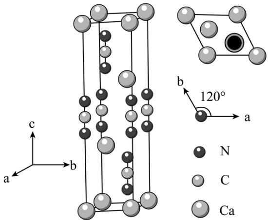

请回答:

(1) 基态 N 原子的价层电子排布式是 \_\_\_\_。

（2）与碳氢化合物类似，N、H两元素之间也可以形成氮烷、氮烯。

①下列说法不正确的是\_\_\_\_。
A. 能量最低的激发态 N 原子的电子排布式: $1s^{2}2s^{1}2p^{3}3s^{1}$ B. 化学键中离子键成分的百分数: $Ca_{3}N_{2}>Mg_{3}N_{2}$ C. 最简单的氮烯分子式: $N_{2}H_{2}$ D. 氮烷中 N 原子的杂化方式都是 $sp^{3}$

②氮和氢形成的无环氮多烯，设分子中氮原子数为 n，双键数为 m，其分子式通式为 \_\_\_\_。

③给出 $\mathrm{H}^{+}$ 的能力: $\mathrm{NH}_{3}$ \_\_\_\_ $\left[\mathrm{CuNH}_{3}\right]^{2+}$ (填“>”或“<”), 理由是\_\_\_\_。

(3) 某含氮化合物晶胞如图, 其化学式为 , 每个阴离子团的配位数(紧邻的阳离子数)为 。

【答案】(1) $2 \mathrm{~s}^{2} 2 \mathrm{p}^{3}$ (2) ①. A ②. $\mathrm{N}_{\mathrm{n}} \mathrm{H}_{\mathrm{n+2-2m}} (\mathrm{~m} \leq \frac{\mathrm{n}}{2}, \mathrm{~m}$ 为正整数) ③. < ④. $\left[\mathrm{CuNH}_{3}\right]^{2+}$ 形成配位键后, 由于 Cu 对电子的吸引, 使得电子云向铜偏移, 进一步使氮氢键的极性变大, 故其更易断裂

(3) ①. $\mathrm{CaCN}_2$ ②.6

【解析】

【小问 1 详解】

N 核电荷数为 7，核外有 7 个电子，基态 N 原子电子排布式为 $1s^{2}2s^{2}2p^{3}$ ，则基态 N 原子的价层电子排布式是 $2s^{2}2p^{3}$ ；故答案为： $2s^{2}2p^{3}$ 。

【小问 2 详解】

①A. 能量最低的激发态 N 原子应该是 2p 能级上一个电子跃迁到 3s 能级，其电子排布式： $1s^{2}2s^{2}2p^{2}3s^{1}$ ，故 A 错误；B．钙的金属性比镁的金属性强，则化学键中离子键成分的百分数： $Ca_{3}N_{2}>Mg_{3}N_{2}$ ，故 B 正确；C．氮有三个价键，最简单的氮烯即含一个氮氮双键，另一个价键与氢结合，则其分子式： $N_{2}H_{2}$ ，故 C 正确；D．氮烷中 N 原子有一对孤对电子，有三个价键，则氮原子的杂化方式都是 $sp^{3}$ ，故 D 正确；综上所述，答案为：A。

②氮和氢形成的无环氮多烯，一个氮的氮烷为 $NH_{3}$ ，两个氮的氮烷为 $N_{2}H_{4}$ ，三个氮的氮烷为 $N_{3}H_{5}$ ，四个氮的氮烷为 $N_{4}H_{6}$ ，设分子中氮原子数为 n，其氮烷分子式通式为 $N_{n}H_{n+2}$ ，根据又一个氮氮双键，则少 2 个氢原子，因此当双键数为 m，其分子式通式为 $N_{n}H_{n+2-2m}$ ( $m \leq \frac{n}{2}$ ，m 为正整数)；故答案为：

$N_{n}H_{n+2-2m}(m\leq\frac{n}{2},m$ 为正整数 $)$ 。

③ $\left[CuNH_{3}\right]^{2+}$ 形成配位键后，由于 Cu 对电子的吸引，使得电子云向铜偏移，进一步使氮氢键的极性变大，故其更易断裂，因此给出 $H^{+}$ 的能力： $NH_{3}<\left[CuNH_{3}\right]^{2+}$ (填“>”或“<”); 故答案为：<； $\left[CuNH_{3}\right]^{2+}$ 形成配位键后，由于 Cu 对电子的吸引，使得电子云向铜偏移，进一步使氮氢键的极性变大，故其更易断裂。

【小问 3 详解】

钙个数为 $2 + 4 \times \frac{1}{6} + 4 \times \frac{1}{12} = 3$ ， $\mathrm{CN}_{2}^{2-}$ 个数为 $2 + 2 \times \frac{1}{3} + 2 \times \frac{1}{6} = 3$ ，则其化学式为 $\mathrm{CaCN}_{2}$ ；根据六方最密

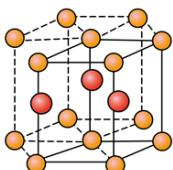

堆积图

，以上面的面心分析下面红色的有3个，同理上面也应该有3个，本体中分析得到

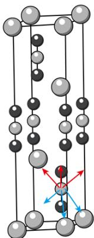

，以这个 $\mathrm{CN}_2^{2-}$ 进行分析，其俯视图为

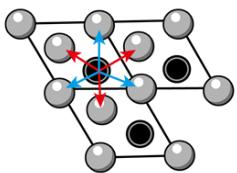

，因此距离最近的钙离子个数

为 6，其配位数为 6；故答案为： $CaCN_{2}$ ; 6。

18. 工业上煅烧含硫矿物产生的 $\mathrm{SO}_2$ 可以按如下流程脱除或利用。

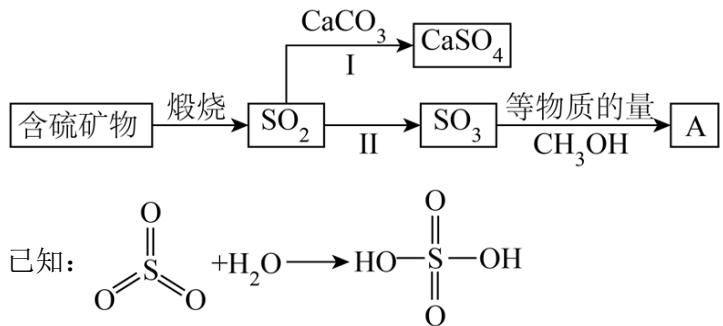

请回答:

(1) 富氧煅烧燃煤产生的低浓度的 $\mathrm{SO}_{2}$ 可以在炉内添加 $\mathrm{CaCO}_{3}$ 通过途径 I 脱除, 写出反应方程式 \_\_\_\_。

(2) 煅烧含硫量高的矿物得到高浓度的 $\mathrm{SO}_{2}$ , 通过途径 II 最终转化为化合物 A。

①下列说法正确的是\_\_\_\_\_\_\_\_\_\_。
A. 燃煤中的有机硫主要呈正价 
B. 化合物 A 具有酸性
C. 化合物 A 是一种无机酸酯 
D. 工业上途径 II 产生的 $SO_{3}$ 也可用浓 $H_{2}SO_{4}$ 吸收

②一定压强下，化合物 A 的沸点低于硫酸的原因是\_\_\_\_。

（3）设计实验验证化合物 A 中含有 S 元素\_\_\_\_；写出实验过程中涉及的反应方程式\_\_\_\_。

【答案】（1） $2SO_{2}+O_{2}+2CaCO_{3}\xlongequal{高温}2CaSO_{4}+2CO_{2}$

(2) ①. BCD ②. 硫酸分子能形成更多的分子间氢键

(3) ①. 取化合物 A 加入足量氢氧化钠，反应完全后加入盐酸酸化，无明显现象，再加入氯化钡生成白色沉淀，说明 A 中含有 S 元素 ②. $\mathrm{CH}_{3} \mathrm{O}-\underset{\|}{\mathrm{S}}-\mathrm{OH} + 2 \mathrm{NaOH}=\mathrm{CH}_{3} \mathrm{OH}+\mathrm{Na}_{2} \mathrm{SO}_{4}+\mathrm{H}_{2} \mathrm{O}$ 、

$$
\mathrm{Na} _ {2} \mathrm{SO} _ {4} + \mathrm{BaCl} _ {2} = \mathrm{BaSO} _ {4} \downarrow + 2 \mathrm{NaCl}
$$

【解析】

【分析】含硫矿物燃烧生成二氧化硫，二氧化硫和氧气、碳酸钙生成硫酸钙和二氧化碳，二氧化硫被氧气
氧化为三氧化硫，三氧化硫和等物质量的甲醇发生已知反应生成 A: $CH_{3}O-S-OH$

【小问 1 详解】

氧气具有氧化性，能被四价硫氧化为六价硫，二氧化硫、空气中氧气、碳酸钙高温生成硫酸钙和二氧化碳，反应为 $2SO_{2}+O_{2}+2CaCO_{3}\xlongequal{高温}2CaSO_{4}+2CO_{2}$ ;

【小问 2 详解】

①A．硫的电负性大于碳、氢等，故燃煤中的有机硫主要呈负价，A 错误；

B. 根据分析可知, 化合物 A 分子中与硫直接相连的基团中有 -OH, 故能电离出氢离子, 具有酸性, B 正确;

C. 化合物 A 含有 $\begin{array}{c}\mathrm{O}\\ \mathrm{||}\\ \mathrm{-S-}\end{array}$ 基团，类似酯基-COO-结构，为硫酸和醇生成的酯，是一种无机酸酯，C 正

确；

D. 工业上途径Ⅱ产生的 $\mathrm{SO}_3$ 也可用浓 $\mathrm{H}_2\mathrm{SO}_4$ 吸收用于生产发烟硫酸，D 正确；

故选 BCD;

②一定压强下，化合物 A 分子只有 1 个-OH 能形成氢键，而硫酸分子中有 2 个-OH 形成氢键，故导致 A 的沸点低于硫酸；

【小问 3 详解】

由分析可知，A 为 $CH_{3}O-S-OH$ ，A 碱性水解可以生成硫酸钠、甲醇，硫酸根离子能和氯化钡生成不

溶于酸的硫酸钡沉淀，故实验设计为：取化合物 A 加入足量氢氧化钠，反应完全后加入盐酸酸化，无明显

现象，再加入氯化钡生成白色沉淀，说明 A 中含有 S 元素；涉及反应为： $CH_{3}O-S-OH$

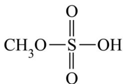

$$
+ 2 \mathrm{NaOH} = \mathrm{CH} _ {3} \mathrm{OH} + \mathrm{Na} _ {2} \mathrm{SO} _ {4} + \mathrm{H} _ {2} \mathrm{O}, \quad \mathrm{Na} _ {2} \mathrm{SO} _ {4} + \mathrm{BaCl} _ {2} = \mathrm{BaSO} _ {4} \downarrow + 2 \mathrm{NaCl}
$$

19. 水煤气变换反应是工业上的重要反应，可用于制氢。

水煤气变换反应： $\mathrm{CO(g) + H_2O(g)\rightleftharpoons CO_2(g) + H_2(g)}$ $\Delta H = -41.2\mathrm{kJ}\cdot \mathrm{mol}^{-1}$ 该反应分两步完成： $3\mathrm{Fe}_2\mathrm{O}_3(\mathrm{s}) + \mathrm{CO(g)}\rightleftharpoons 2\mathrm{Fe}_3\mathrm{O}_4(\mathrm{s}) + \mathrm{CO}_2(\mathrm{g})$ $\Delta H_{1} = -47.2\mathrm{kJ}\cdot \mathrm{mol}^{-1}$ $2\mathrm{Fe}_3\mathrm{O}_4(\mathrm{s}) + \mathrm{H}_2\mathrm{O(g)}\rightleftharpoons 3\mathrm{Fe}_2\mathrm{O}_3(\mathrm{s}) + \mathrm{H}_2(\mathrm{g})$ $\Delta H_{2}$

请回答:

(1) $\Delta H_{2} = \_\_\_\_\mathrm{kJ}\cdot \mathrm{mol}^{-1}$

(2) 恒定总压 $1.70 \mathrm{MPa}$ 和水碳比 $\left[ \mathrm{n} \left( \mathrm{H}_{2} \mathrm{O} \right) / \mathrm{n} (\mathrm{CO}) = 12:5 \right]$ 投料, 在不同条件下达到平衡时 $\mathrm{CO}_{2}$ 和 $\mathrm{H}_{2}$ 的分压 (某成分分压 $=$ 总压 $\times$ 该成分的物质的量分数) 如下表:

<table><tr><td></td><td> $p(CO_2)/MPa$ </td><td> $p(H_2)/MPa$ </td><td> $p(CH_4)/MPa$ </td></tr><tr><td>条件1</td><td>0.40</td><td>0.40</td><td>0</td></tr><tr><td>条件2</td><td>0.42</td><td>0.36</td><td>0.02</td></tr></table>

①在条件 1 下，水煤气变换反应的平衡常数 K = \_\_\_\_。

(2)对比条件 1, 条件 2 中 $\mathrm{H}_{2}$ 产率下降是因为发生了一个不涉及 $\mathrm{CO}_{2}$ 的副反应, 写出该反应方程式\_\_\_\_。

(3) 下列说法正确的是\_\_\_\_。

A. 通入反应器的原料气中应避免混入 $\mathrm{O}_{2}$ B. 恒定水碳比 $\left[\mathrm{n}\left(\mathrm{H}_{2} \mathrm{O}\right)/\mathrm{n}(\mathrm{CO})\right]$ , 增加体系总压可提高 $\mathrm{H}_{2}$ 的平衡产率

C. 通入过量的水蒸气可防止 $\mathrm{Fe}_{3} \mathrm{O}_{4}$ 被进一步还原为 $\mathrm{Fe}$ D. 通过充入惰性气体增加体系总压, 可提高反应速率

（4）水煤气变换反应是放热的可逆反应，需在多个催化剂反应层间进行降温操作以“去除”反应过程中的余热(如图1所示)，保证反应在最适宜温度附近进行。

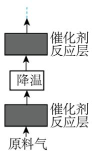  
图1

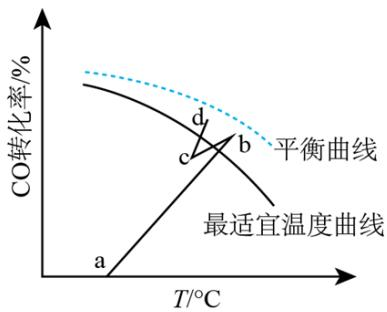  
图2

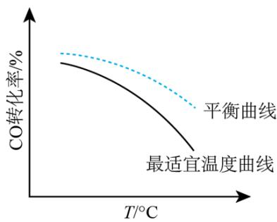  
图3

①在催化剂活性温度范围内，图2中b-c段对应降温操作的过程，实现该过程的一种操作方法是\_\_\_\_。
A. 按原水碳比通入冷的原料气    B. 喷入冷水(蒸气)    C. 通过热交换器换热
②若采用喷入冷水(蒸气)的方式降温，在图3中作出CO平衡转化率随温度变化的曲线\_\_\_\_。

（5）在催化剂活性温度范围内，水煤气变换反应的历程包含反应物分子在催化剂表面的吸附(快速)、反应及产物分子脱附等过程。随着温度升高，该反应的反应速率先增大后减小，其速率减小的原因是\_\_\_\_。

【答案】(1) 6 (2) ①.2 ②. $\mathrm{CO} + 3\mathrm{H}_{2} \rightleftharpoons \mathrm{CH}_{4} + \mathrm{H}_{2}\mathrm{O}$ (3) AC

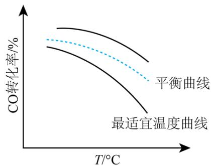

（5）温度过高时，不利于反应物分子在催化剂表面的吸附，从而导致其反应物分子在催化剂表面的吸附量及浓度降低，反应速率减小；温度过高还会导致催化剂的活性降低，从而使化学反应速率减小

【解析】

【小问1详解】设方程式① $\mathrm{CO(g) + H_2O(g)\rightleftharpoons CO_2(g) + H_2(g)}$ $\Delta H = -41.2\mathrm{kJ}\cdot \mathrm{mol}^{-1}$ ② $3\mathrm{Fe}_2\mathrm{O}_3(\mathrm{s}) + \mathrm{CO(g)}\rightleftharpoons 2\mathrm{Fe}_3\mathrm{O}_4(\mathrm{s}) + \mathrm{CO}_2(\mathrm{g})$ $\Delta H_{1} = -47.2\mathrm{kJ}\cdot \mathrm{mol}^{-1}$ ③ $2\mathrm{Fe}_3\mathrm{O}_4(\mathrm{s}) + \mathrm{H}_2\mathrm{O(g)}\rightleftharpoons 3\mathrm{Fe}_2\mathrm{O}_3(\mathrm{s}) + \mathrm{H}_2(\mathrm{g})$ $\Delta H_{2}$

根据盖斯定律可知，③=①-②，则 $\Delta H_{2}=\Delta H-\Delta H_{1}=\left(-41.2\ \mathrm{kJ}\cdot\mathrm{mol}^{-1}\right)-\left(-47.2\ \mathrm{kJ}\cdot\mathrm{mol}^{-1}\right)=6\mathrm{kJ}\cdot\mathrm{mol}^{-1}$

【小问 2 详解】

①条件 1 下没有甲烷生成，只发生了水煤气变换反应，该反应是一个气体分子数不变的反应。设在条件 1 下平衡时容器的总体积为 V，水蒸气和一氧化碳的投料分别为 12mol 和 5mol，参加反应的一氧化碳为 xmol，根据已知信息可得以下三段式：

CO(g) + H₂O(g) ⇌ CO₂(g) + H₂(g)
开始(mol) 5 12 0 0
转化(mol) x x x x
平衡(mol) 5-x 12-x x x$\frac{x}{5-x+12-x+x+x}\times1.7MPa=0.40MPa$ ，解得x=4；
则平衡常数 $K=\frac{\frac{4}{V}\times\frac{4}{V}}{\frac{5-4}{V}\times\frac{12-4}{V}}=2$ ;

②根据表格中的数据可知, 有甲烷生成, 且该副反应没有二氧化碳参与, 且氢气的产率降低, 则该方程式为: $\mathrm{CO} + 3 \mathrm{H}_{2} \rightleftharpoons \mathrm{CH}_{4} + \mathrm{H}_{2} \mathrm{O}$ ;

A. 一氧化碳和氢气都可以和氧气反应, 则通入反应器的原料气中应避免混入 $\mathrm{O}_{2}$ , A 正确;  
B. 该反应前后气体计量系数相同, 则增加体系总压平衡不移动, 不能提高平衡产率, B 错误;  
C. 通入过量的水蒸气可以促进四氧化三铁被氧化为氧化铁, 水蒸气不能将铁的氧化物还原为单质铁, 但过量的水蒸气可以降低体系中 $\mathrm{CO}$ 和 $\mathrm{H}_{2}$ 的浓度, 从而防止铁的氧化物被还原为单质铁, C 正确;  
D. 若保持容器的体积不变, 通过充入惰性气体增加体系总压, 反应物浓度不变, 反应速率不变, D 错误;

$$
\mathrm{AC};
$$

①A. 按原水碳比通入冷的原料气, 可以降低温度, 同时化学反应速率稍减小, 导致 CO 的转化率稍减小, 与图中变化相符, A 正确;  
B. 喷入冷水(蒸气), 可以降低温度, 但是同时水蒸气的浓度增大, 会导致 CO 的转化率增大, 与图中变化不符, B 错误;  
C. 通过热交换器换热, 可以降低温度, 且不改变投料比, 同时化学反应速率稍减小, 导致 CO 的转化率稍减小, 与图中变化相符, C 正确;  
故选 AC;

②增大水蒸气的浓度，平衡正向移动，则一氧化碳的的平衡转化率增大，会高于原平衡线，故图像为：

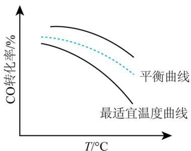  
【小问 5 详解】

反应物分子在催化剂表面的吸附是一个放热的快速过程，温度过高时，不利于反应物分子在催化剂表面的吸附，从而导致其反应物分子在催化剂表面的吸附量及浓度降低，反应速率减小；温度过高还会导致催化

剂的活性降低，从而使化学反应速率减小。

20. 某研究小组用铝土矿为原料制备絮凝剂聚合氯化铝( $\left[\mathrm{Al}_{2}(\mathrm{OH})_{\mathrm{a}}\mathrm{Cl}_{\mathrm{b}}\right]_{\mathrm{m}}, a=1\sim5$ )按如下流程开展实验。

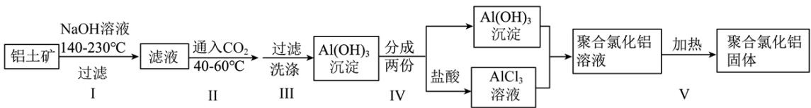

已知: ①铝土矿主要成分为 $\mathrm{Al}_{2} \mathrm{O}_{3}$ , 含少量 $\mathrm{Fe}_{2} \mathrm{O}_{3}$ 和 $\mathrm{SiO}_{2}$ 。用 $\mathrm{NaOH}$ 溶液溶解铝土矿过程中 $\mathrm{SiO}_{2}$ 转变为难溶性的铝硅酸盐。

② $\left[Al_{2}(OH)_{a}Cl_{b}\right]_{m}$ 的絮凝效果可用盐基度衡量，盐基度= $\frac{a}{a+b}$

当盐基度为 0.60\~0.85 时，絮凝效果较好。

请回答:

(1) 步骤I所得滤液中主要溶质的化学式是\_\_\_\_。

(2) 下列说法不正确的是\_\_\_\_。
A. 步骤 I, 反应须在密闭耐高压容器中进行, 以实现所需反应温度
B. 步骤 II, 滤液浓度较大时通入过量 $\mathrm{CO}_{2}$ 有利于减少 $\mathrm{Al(OH)}_{3}$ 沉淀中的杂质
C. 步骤 III, 为减少 $\mathrm{Al(OH)}_{3}$ 吸附的杂质, 洗涤时需对漏斗中的沉淀充分搅拌
D. 步骤 IV 中控制 $\mathrm{Al(OH)}_{3}$ 和 $\mathrm{AlCl}_{3}$ 的投料比可控制产品盐基度

(3) 步骤 V 采用如图所示的蒸汽浴加热, 仪器 A 的名称是\_\_\_\_; 步骤 V 不宜用酒精灯直接加热的原因是\_\_\_\_。

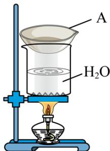

（4）测定产品的盐基度。

Cl⁻ 的定量测定：称取一定量样品，配成溶液，移取 25.00 mL 溶液于锥形瓶中，调 pH=6.5\~10.5，滴加指示剂 K₂CrO₄ 溶液。在不断摇动下，用 0.1000 mol·L⁻¹AgNO₃ 标准溶液滴定至浅红色(有 Ag₂CrO₄ 沉淀)，30 秒内不褪色。平行测试 3 次，平均消耗 AgNO₃ 标准溶液 22.50 mL。另测得上述样品溶液中

$\mathrm{c}\left(\mathrm{Al}^{3+}\right)=0.1000\ \mathrm{mol}\cdot\mathrm{L}^{-1}$ 。

①产品的盐基度为\_\_\_\_。

②测定 Cl⁻ 过程中溶液 pH 过低或过高均会影响测定结果，原因是 \_\_\_\_。

【答案】(1) $\mathrm{NaAlO}_{2}$ (2) C
(3) ①. 蒸发皿 ②. 酒精灯直接加热受热不均匀，会导致产品盐基度不均匀

(4) ①.0.7 ②.pH 过低, 指示剂会与氢离子反应生成重铬酸跟, 会氧化氯离子, 导致消耗的硝酸银偏少, 而 pH 过高, 氢氧根会与银离子反应, 导致消耗的硝酸银偏多

【解析】

【分析】铝土矿主要成分为 $Al_{2}O_{3}$ ，含少量 $Fe_{2}O_{3}$ 和 $SiO_{2}$ ，向铝土矿中加氢氧化钠溶液，得到难溶性铝硅酸盐、偏铝酸钠，氧化铁不与氢氧化钠溶液反应，过滤，滤液中主要含偏铝酸钠，向偏铝酸钠溶液中通入二氧化碳，过滤，得到氢氧化铝沉淀，分为两份，一份加入盐酸得到氯化铝，将两份混合得到聚合氯化铝溶液，加热得到聚合氯化铝固体。

【小问 1 详解】

根据题中信息步骤I所得滤液中主要溶质的化学式是 $NaAlO_{2}$ ; 故答案为: $NaAlO_{2}$ 。

【小问 2 详解】

A. 步骤 I, 反应所学温度高于 $100^{\circ} \mathrm{C}$ , 因此反应须在密闭耐高压容器中进行, 以实现所需反应温度, 故 A 正确;  
B. 步骤 II, 滤液浓度较大时通入过量 $\mathrm{CO}_{2}$ 生成氢氧化铝和碳酸氢钠溶液, 有利于减少 $\mathrm{Al(OH)}_{3}$ 沉淀中的杂质, 故 B 正确;  
C. 步骤 III, 洗涤时不能需对漏斗中的沉淀充分搅拌, 故 C 错误;  
D. $\left[\mathrm{Al}_{2}(\mathrm{OH})_{\mathrm{a}} \mathrm{Cl}_{\mathrm{b}}\right]_{\mathrm{m}}$ 中 a、b 可通过控制 $\mathrm{Al(OH)}_{3}$ 和 $\mathrm{AlCl}_{3}$ 的投料比来控制产品盐基度, 故 D 正确;

综上所述，答案为：C。

【小问 3 详解】

步骤 V 采用如图所示的蒸汽浴加热，根据图中信息得到仪器 A 的名称是蒸发皿；酒精灯直接加热受热不均匀，会导致产品盐基度不均匀，而用蒸汽浴加热，受热均匀，得到的产品盐基度均匀；故答案为：蒸发皿；酒精灯直接加热受热不均匀，会导致产品盐基度不均匀。

【小问 4 详解】

①根据 $Cl^{-} \sim AgNO_{3}$ ，样品溶液中氯离子物质的量浓度为$\frac{0.1000\mathrm{mol}\cdot\mathrm{L}^{-1}\times 0.022.50\mathrm{L}}{0.025\mathrm{L}} = 0.09\mathrm{mol}\cdot \mathrm{L}^{-1},\quad \mathrm{n(Al^{3 + ):n(Cl^{-}) = 10:9}$ ，根据电荷守恒得到 $\left[\mathrm{Al}_2(\mathrm{OH})_{4.2}\mathrm{Cl}_{1.8}\right]_{\mathrm{m}}$ 产品的盐基度为 $\frac{4.2}{4.2 + 1.8} = 0.7$ ；故答案为：0.7。

②测定 $\mathrm{Cl}^{-}$ 过程中溶液 $\mathrm{pH}$ 过低或过高均会影响测定结果, 原因是 $\mathrm{pH}$ 过低, 指示剂会与氢离子反应生成重铬酸跟, 会氧化氯离子, 导致消耗的硝酸银偏少, 而 $\mathrm{pH}$ 过高, 氢氧根会与银离子反应, 导致消耗的硝酸银偏多; 故答案为: $\mathrm{pH}$ 过低, 指示剂会与氢离子反应生成重铬酸跟, 会氧化氯离子, 导致消耗的硝酸银偏少, 而 $\mathrm{pH}$ 过高, 氢氧根会与银离子反应, 导致消耗的硝酸银偏多。

21. 某研究小组按下列路线合成胃动力药依托比利。

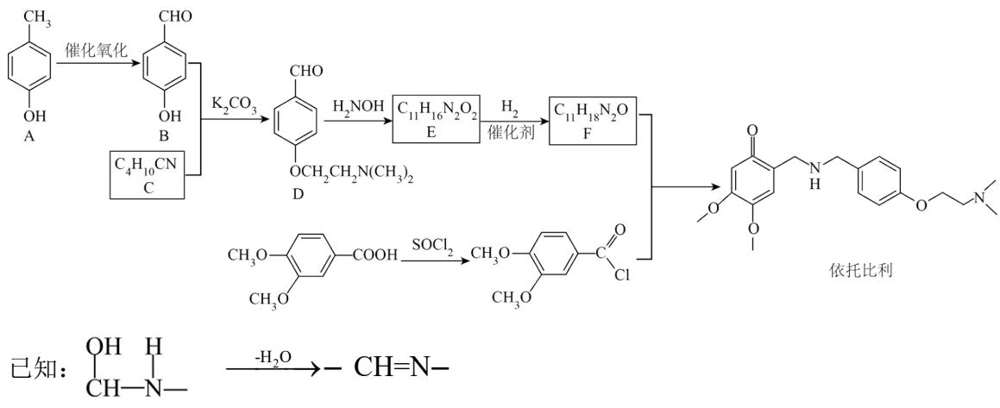

请回答:

(1) 化合物 B 的含氧官能团名称是 \_\_\_\_。

(2) 下列说法不正确的是 \_\_\_\_。

A. 化合物 A 能与 $FeCl_{3}$ 发生显色反应

B. $\mathrm{A} \rightarrow \mathrm{B}$ 的转变也可用 $\mathrm{KMnO}_4$ 在酸性条件下氧化来实现

C. 在 $\mathrm{B} + \mathrm{C} \rightarrow \mathrm{D}$ 的反应中, $\mathrm{K}_{2} \mathrm{CO}_{3}$ 作催化剂

D. 依托比利可在酸性或碱性条件下发生水解反应

（3）化合物 C 的结构简式是 \_\_\_\_。

（4）写出 $\mathrm{E} \rightarrow \mathrm{F}$ 的化学方程式 \_\_\_\_。

(5) 研究小组在实验室用苯甲醛为原料合成药物 N-苄基苯甲酰胺( $\ce{C6H5CH2NHOC}$ )。利用以上合成线

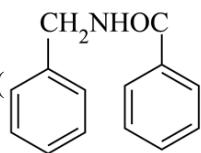

路中的相关信息，设计该合成路线\_\_\_\_(用流程图表示，无机试剂任选)

(6) 写出同时符合下列条件的化合物 D 的同分异构体的结构简式 \_\_\_\_。

② $^{1}$ H-NMR 谱和 IR 谱检测表明：分子中共有 4 种不同化学环境的氢原子，有酰胺基( $\ce{O-N-CH2}$ )。

【答案】（1）羟基、醛基 （2）BC

(3) $\mathrm{ClCH_2CH_2N(CH_3)_2}$

(6)

【解析】

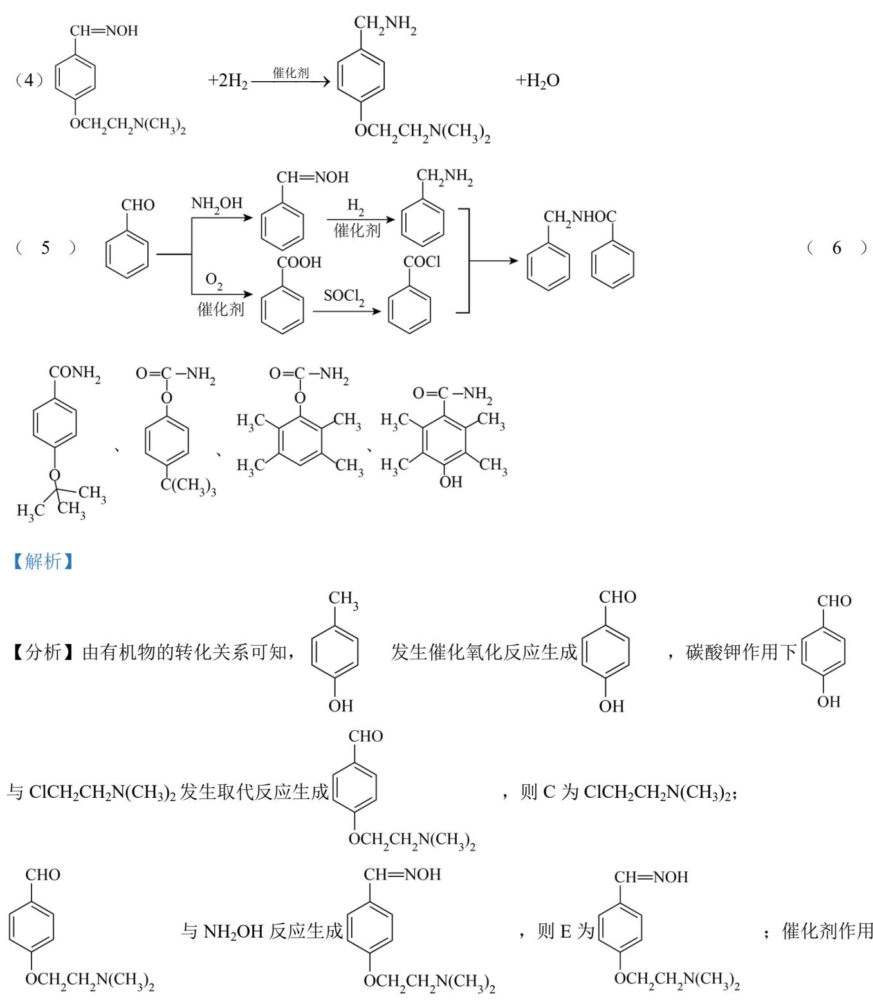

，则C为 $\mathrm{ClCH_2CH_2N(CH_3)_2}$

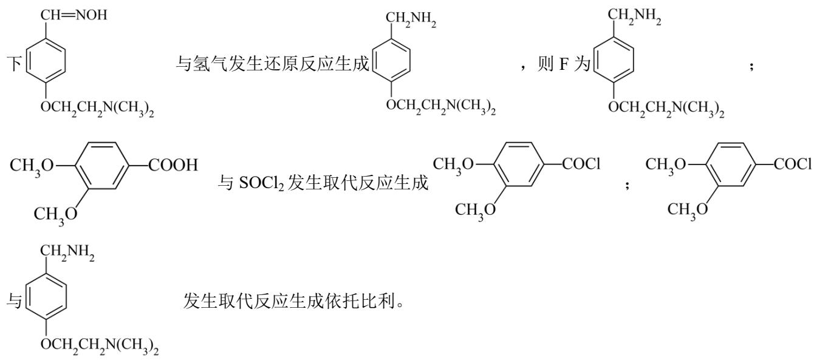

【小问1详解】

由结构简式可知，B 分子的官能团为羟基、醛基，故答案为：羟基、醛基；

【小问 2 详解】

A. 由结构简式可知, A 分子中含有酚羟基, 能与氯化铁溶液发生显色反应, 使溶液变为紫色, 故正确; B. 酚羟基具有强还原性, 由结构简式可知, A 分子中含有酚羟基, 则 $\mathrm{A} \rightarrow \mathrm{B}$ 的转变不能用酸性高锰酸钾溶液来实现, 故错误;

，其中碳酸钾的作用是中和反应生成的氯化氢，提高反应物的转化率，故错误；

D. 由结构简式可知, 依托比利分子中含有酰胺基, 可在酸性或碱性条件下发生水解反应, 故正确; 故选 BC;

【小问3详解】

由分析可知，C 的结构简式为 $\mathrm{ClCH_{2}CH_{2}N(CH_{3})_{2}}$ ，故答案为： $\mathrm{ClCH_{2}CH_{2}N(CH_{3})_{2}}$ ;

【小问4详解】

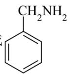

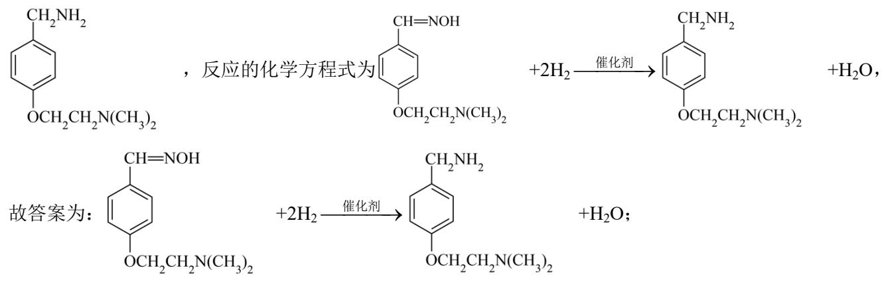

【小问5详解】

由题给信息可知，用苯甲醛为原料合成药物 N-苄基苯甲酰胺的合成步骤为 与 $NH_{2}OH$ 反应生成

【小问6详解】

D 的同分异构体分子中含有苯环， ${}^{1}\mathrm{H}$ -NMR 谱和 IR 谱检测表明分子中共有 4 种不同化学环境的氢原子，有酰胺基说明同分异构体分子含有醚键或酚羟基，结合对称性，同分异构体的结构简式为

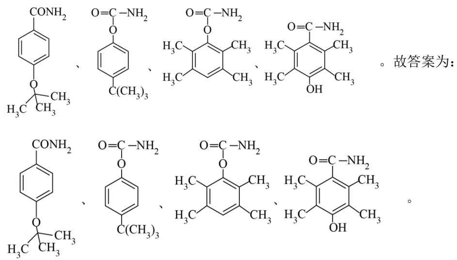