## 2023 海南高考化学卷解析版

1. 化学的迅速发展为满足人民日益增长的美好生活需要做出突出贡献。下列说法不合理的是
A. 为增强药效，多种处方药可随意叠加使用
B. 现代化肥种类丰富，施用方法其依据对象营养状况而定
C. 规范使用防腐制可以减缓食物变质速度，保持食品营养所值
D. 在种植业中，植物浸取试剂类医药也应慎重选用

【详解】A. 多种处方药可随意叠加使用，相互间可能发生化学反应，需要按照医嘱和药物说明进行使用，故 A 错误；
B. 化肥的施用方法需依据对象营养状况针对性的选择不同的化肥，故 B 正确；
C. 规范使用防腐制可以减缓食物变质速度，保持食品营养所值，提高食品的口感，故 C 正确；
D. 在种植业中，植物浸取试剂类医药也应慎重选用，D 正确。

2. 化学实验中的颜色变化, 可将化学抽象之美具体为形象之美。下列叙述错误的是
A. 土豆片遇到碘溶液, 呈蓝色
B. 蛋白质遇到浓硫酸, 呈黄色
C. $\mathrm{CrO}_{3}$ 溶液 $(0.1\mathrm{mol} \cdot \mathrm{L}^{-1})$ 中滴加乙醇, 呈绿色
D. 苯酚溶液 $(0.1\mathrm{mol} \cdot \mathrm{L}^{-1})$ 中滴加 $\mathrm{FeCl}_{3}$ 溶液 $(0.1\mathrm{mol} \cdot \mathrm{L}^{-1})$ , 呈紫色

【详解】A．土豆片中含有淀粉，淀粉遇到碘单质会变蓝，A 正确；
B．结构中含苯环的蛋白质遇到浓硝酸，呈黄色，B 错误；
C. $CrO_{3}$ 会被乙醇还原为三价铬，呈绿色，C 正确；
D．苯酚遇到氯化铁会有显色反应，生成紫色的配合物，D 正确；故选 B。

3. 下列气体除杂(括号里为杂质)操作所选用的试剂合理的是
A. $\mathrm{CO}_{2}\left(\mathrm{HCl}\right)$ ：饱和 $Na_{2}CO_{3}$ 溶液
B. $\mathrm{NH}_{3}\left(\mathrm{H}_{2}\mathrm{O}\right)$ ：碱石灰

C. $C_{2}H_{2}(H_{2}S)$ ：酸性 $KMnO_{4}$ 溶液
D. $C_{2}H_{4}(SO_{2})$ : $P_{4}O_{10}$ 【答案】B
【解析】

【详解】A．二氧化碳、氯化氢均会和碳酸钠溶液反应，A 不符合题意；
B．氨气和碱石灰不反应，水和碱石灰反应，合理，B 符合题意；
C．酸性高锰酸钾会把乙炔氧化，C 不符合题意；
D. $P_{4}O_{10}$ 、二氧化硫均为酸性氧化物，不反应，不能除去二氧化硫，D 不符合题意；

4. 下列有关元素单质或化合物的叙述正确的是
A. $P_{4}$ 分子呈正四面体，键角为 $109^{\circ}28'$ B. NaCl 焰色试验为黄色，与 Cl 电子跃迁有关
C. Cu 基态原子核外电子排布符合构造原理
D. $OF_{2}$ 是由极性键构成的极性分子

【详解】A. $\mathrm{P}_{4}$ 分子呈正四面体，磷原子在正四面体的四个顶点处，键角为 $60^{\circ}$ ，A 错误；  
B. NaCl 焰色试验为黄色，与 Na 电子跃迁有关，B 错误；  
C. Cu 基态原子核外电子排布不符合构造原理，考虑了半满规则和全满规则，价电子排布式为 $3\mathrm{d}^{10}4\mathrm{s}^{1}$ ，这样能量更低更稳定，C 错误；  
D. $\mathrm{OF}_{2}$ 的构型是 V 形，因此是由极性键构成的极性分子，D 正确；  
故选 D。

5. 《齐民要术》中记载了酒曲的处理，“乃平量一斗，舀中捣碎。若浸曲，一斗，与五升水。浸曲三日，如鱼眼汤沸……”。下列说法错误的是
A.“捣碎”目的是促进混合完全
B.“曲”中含有复杂的催化剂
C.“斗”和“升”都是容量单位
D.“鱼眼”是水蒸气气泡的拟像化

【答案】B

【解析】

【详解】A. “捣碎”可以增大接触面积，提升发酵速率，也能促进混合完全，A 正确；  
B. “曲”中含有多种酶、细菌和真菌，具有催化作用，不含有复杂的催化剂，B 错误；  
C. “斗”和“升”都是容量单位，C 正确；  
D. 浸曲三日，如鱼眼汤沸是让酒曲充分发酵，放置到如鱼眼大小的气泡产生，D 正确；故选 B。

6. $N_{\mathrm{A}}$ 代表阿伏加德罗常数的值。下列说法正确的是  
A. $2.4 \mathrm{~g}$ 镁条在空气中充分燃烧, 转移的电子数目为 $0.2 N_{\mathrm{A}}$ B. $5.6 \mathrm{~g}$ 铁粉与 $0.1 \mathrm{~L} 1 \mathrm{~mol} \cdot \mathrm{L}^{-1}$ 的 $\mathrm{HCl}$ 的溶液充分反应, 产生的气体分子数目为 $0.1 N_{\mathrm{A}}$ C. 标准状况下, $2.24 \mathrm{LSO}_{2}$ 与 $1.12 \mathrm{LO}_{2}$ 充分反应, 生成的 $\mathrm{SO}_{3}$ 分子数目为 $0.1 N_{\mathrm{A}}$ D. $1.7 \mathrm{~gNH}_{3}$ 完全溶于 $1 \mathrm{LH}_{2} \mathrm{O}$ 所得溶液, $\mathrm{NH}_{3} \cdot \mathrm{H}_{2} \mathrm{O}$ 微粒数目为 $0.1 N_{\mathrm{A}}$

【答案】A

【解析】

【详解】A．2.4g 镁条在空气中充分燃烧，镁被氧化为+2价，故转移的电子数目为 $0.2N_{A}$ ，故 A 正确；
B．5.6g 铁粉与 $0.1L1mol \cdot L^{-1}$ 的 HCl 的溶液充分反应，产生的氢气的分子数目为 $0.05N_{A}$ ，故 B 错误；
C．标准状况下， $2.24LSO_{2}$ 与 $1.12LO_{2}$ 充分反应，该反应为可逆反应，反应物不能完全转化为生成物，故生成的 $SO_{3}$ 分子数目无法计算，故 C 错误；

D. $1.7\,gNH_{3}$ 完全溶于 $1LH_{2}O$ 所得溶液，发生反应： $NH_{3} + H_{2}O \rightleftharpoons NH_{3} \cdot H_{2}O$ ，生成的 $NH_{3} \cdot H_{2}O$ 微粒数目小于 $0.1N_{A}$ ，故 D 错误。

<table><tr><td>物质</td><td>C</td><td>C</td><td>H</td></tr><tr><td> $\Delta H /$ </td><td>-</td><td>-</td><td>-</td></tr></table>

7. 各相关物质的燃烧热数据如下表。下列热化学方程式正确的是

A. $\mathrm{C}_{2}\mathrm{H}_{4}(\mathrm{g})+3\mathrm{O}_{2}(\mathrm{g})=2\mathrm{CO}_{2}(\mathrm{g})+2\mathrm{H}_{2}\mathrm{O}(\mathrm{g})\quad\Delta\mathrm{H}=-1411\mathrm{kJ}\cdot\mathrm{mol}^{-1}$ B. $\mathrm{C}_{2}\mathrm{H}_{6}(\mathrm{g})=\mathrm{C}_{2}\mathrm{H}_{4}(\mathrm{g})+\mathrm{H}_{2}(\mathrm{g})\quad\Delta\mathrm{H}=-137\mathrm{kJ}\cdot\mathrm{mol}^{-1}$ C. $\mathrm{H}_{2}\mathrm{O}(\mathrm{l})=\mathrm{O}_{2}(\mathrm{g})+\mathrm{H}_{2}(\mathrm{g})\quad\Delta\mathrm{H}=+285.8\mathrm{kJ}\cdot\mathrm{mol}^{-1}$ D. $\mathrm{C}_{2}\mathrm{H}_{6}(\mathrm{g})+\frac{7}{2}\mathrm{O}_{2}(\mathrm{g})=2\mathrm{CO}_{2}(\mathrm{g})+3\mathrm{H}_{2}\mathrm{O}(\mathrm{l})\quad\Delta\mathrm{H}=-1559.8\mathrm{kJ}\cdot\mathrm{mol}^{-1}$

【答案】D

【解析】
【分析】1mol 纯物质完全燃烧生成指定的物质放出的热量称为燃烧热。
【详解】A. $H_{2}O$ 应该为液态，A 错误；
B. $C_{2}H_{6}(g)=C_{2}H_{4}(g)+H_{2}(g)\Delta H=+137kJ\cdot mol^{-1}$ ，B 错误；
C. 氢气的燃烧热为 285.8kJ/mol，则 $\mathrm{H}_{2}\mathrm{O}(\mathrm{l})=\frac{1}{2}\mathrm{O}_{2}(\mathrm{g})+\mathrm{H}_{2}(\mathrm{g})\Delta\mathrm{H}=+285.8\mathrm{kJ}\cdot\mathrm{mol}^{-1}$ ，C 错误；
D. $\mathrm{C}_{2}\mathrm{H}_{6}(\mathrm{g})+\frac{7}{2}\mathrm{O}_{2}(\mathrm{g})=2\mathrm{CO}_{2}(\mathrm{g})+3\mathrm{H}_{2}\mathrm{O}(\mathrm{l})\Delta\mathrm{H}=-1559.8\mathrm{kJ}\cdot\mathrm{mol}^{-1}$ ，D 正确；
故选 D。

8. 利用金属 Al、海水及其中的溶解氧可组成电池，如图所示。下列说法正确的是

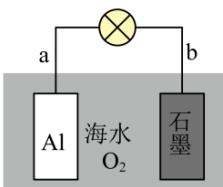

A. b 电极为电池正极
B. 电池工作时，海水中的 $\mathrm{Na}^{+}$ 向 a 电极移动
C. 电池工作时，紧邻 a 电极区域的海水呈强碱性
D. 每消耗 $1 \mathrm{~kgAl}$ ，电池最多向外提供 $37 \mathrm{~mol}$ 电子的电量

【答案】A

【解析】

【分析】铝为活泼金属，发生氧化反应为负极，则石墨为正极；

【详解】A．由分析可知，b 电极为电池正极，A 正确；

B. 电池工作时, 阳离子向正极移动, 故海水中的 $\mathrm{Na}^{+}$ 向 b 电极移动, B 错误;

C. 电池工作时，a 电极反应为铝失去电子生成铝离子 $Al-3e^{-}=Al^{3+}$ ，铝离子水解显酸性，C 错误；

D. 由 C 分析可知, 每消耗 $1 \mathrm{~kgAl}$ (为 $\frac{1000}{27} \mathrm{~mol}$ ), 电池最多向外提供 $\frac{1000}{27} \mathrm{~mol} \times 3 = \frac{1000}{9} \mathrm{~mol}$ 电子的电量, D 错误; 故选 A。

9. 实践中一些反应器内壁的污垢，可选用针对性的试剂溶解除去。下表中污垢处理试剂的选用，符合安全环保理念的是

<table><tr><td>选项</td><td>A</td><td>B</td><td>C</td><td>D</td></tr><tr><td>污垢</td><td>银镜反应的银垢</td><td>石化设备内的硫垢</td><td>锅炉内的石膏垢</td><td>制氧的 $MnO_{2}$ 垢</td></tr><tr><td>试剂</td><td>6mol·L-1HNO3溶液</td><td>5%NaOH溶液;3%H2O2溶液</td><td>饱和Na2CO3溶液;5%柠檬酸溶液</td><td>浓HCl溶液</td></tr></table>

A.A B.B C.C D.D

【答案】BC

【解析】

【详解】A. 银和硝酸反应生成污染性气体氮氧化合物，A 不符合题意；  
B. 过氧化氢具有强氧化性，硫、氢氧化钠、过氧化氢发生氧化还原反应生成硫酸钠和水，不生成污染性物质，B 符合题意；  
C. 石膏垢中硫酸钙和饱和碳酸钠转化为碳酸钙，碳酸钙和柠檬酸反应生成柠檬酸钙和二氧化碳，无污染性物质生成，C 符合题意；  
D. 浓盐酸具有挥发性，和二氧化锰生成有毒的氯气和其挥发出氯化氢气体，D 不符合题意；故选 BC。

10. 近年来，我国航天科技事业取得了辉煌的成就。下列说法错误的是  
A. 我国科学家由嫦娥五号待回的月壤样品中，首次发现了天然玻璃纤维，该纤维中的主要氧化物 $\mathrm{SiO}_2$ 属于离子晶体  
B. 某型长征运载火箭以液氧和煤油为推进剂，液氧分子间靠范德华力凝聚在一起  
C. “嫦娥石” $(\mathrm{Ca}_{8}\mathrm{Y})\mathrm{Fe}(\mathrm{PO}_{4})_{7}$ 是我国科学家首次在月壤中发现的新型静态矿物，该矿物中的 Fe 位于周期表中的 ds 区  
D. 航天员出舱服中应用了碳纤维增强复合材料。碳纤维中碳原子杂化轨道类型是 $\mathfrak{sp}^2$

【答案】AC

【解析】

【详解】A．天然玻璃纤维中主要氧化物 $\mathrm{SiO}_2$ 属于原子晶体，故A错误；  
B．液氧为分子晶体，分子间靠范德华力凝聚在一起。故B正确；  
C．Fe位于周期表中的d区，故C错误；  
D．碳纤维中碳原子杂化轨道类型是 $\mathbf{sp}^2$ ，D正确。

答案为: AC。

11. 下列实验操作不能达到实验的是

<table><tr><td>选项</td><td>A</td><td>B</td><td>C</td><td>D</td></tr><tr><td>目的</td><td>检验1-氯丁烷中氯元素</td><td>检验 $SO_{4}^{2-}$ 是否沉淀完全</td><td>制备检验醛基用的 $Cu(OH)_{2}$ </td><td>制备晶体 $[Cu(NH_{3})_{4}]SO$ </td></tr><tr><td>操作</td><td></td><td></td><td></td><td></td></tr></table>

A.A B.B C.C D.D

【答案】A

【解析】

【详解】A．检验 1-氯丁烷中氯元素，向 1-氯丁烷中加入氢氧化钠溶液，加热条件下水解，再加入硝酸酸化的硝酸银，若产生白色沉淀，则含有氯元素，故 A 错误；

B. 向上层清液中加入氯化钡溶液, 若无白色沉淀产生, 说明 $\mathrm{SO}_4^{2-}$ 已经沉淀完全, 故 B 正确;

C. 向 $2 \mathrm{~mL} 10 \%$ 的氢氧化钠溶液中滴加 5 滴 $5 \%$ 的硫酸铜溶液, 制得新制氢氧化铜, 且氢氧化钠过量, 检验醛基时产生砖红色沉淀, 故 C 正确;

D. 硫酸四氨合铜在乙醇溶液中溶解度小, 加入乙醇, 析出硫酸四氨合铜晶体, 故 D 正确。

答案为：A。

12. 闭花耳草是海南传统药材，具有消炎功效。车叶草苷酸是其活性成分之一，结构简式如图所示。下列有关车叶草苷酸说法正确的是

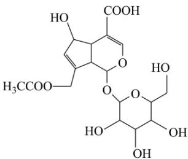

A. 分子中含有平面环状结构  
B. 分子中含有5个手性碳原子  
C. 其钠盐在水中的溶解度小于在甲苯中的溶解度  
D. 其在弱碱介质中可与某些过渡金属离子形成配合物

【答案】D

【解析】

【详解】A. 环状结构中含有多个 $sp^{3}$ 杂化原子相连，故分子中不一定含有平面环状结构，故 A 错误；

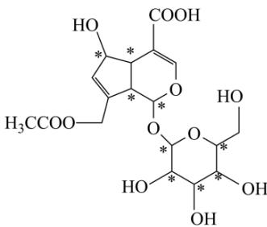

，共9个，故B错误；

C. 其钠盐是离子化合物，在水中的溶解度大于在甲苯中的溶解度，故 C 错误；
D. 羟基中氧原子含有孤对电子，在弱碱介质中可与某些过渡金属离子形成配合物，故 D 正确；答案为：D。

13. 工业上苯乙烯的生产主要采用乙苯脱氢工艺: $\mathrm{C}_{6} \mathrm{H}_{5} \mathrm{CH}_{2} \mathrm{CH}_{3} (\mathrm{~g}) \rightleftharpoons \mathrm{C}_{6} \mathrm{H}_{5} \mathrm{CH} = \mathrm{CH}_{2} (\mathrm{~g}) + \mathrm{H}_{2} (\mathrm{~g})$ 。某条件下无催化剂存在时, 该反应的正、逆反应速率 $\mathrm{v}$ 随时间 $\mathrm{t}$ 的变化关系如图所示。下列说法正确的是

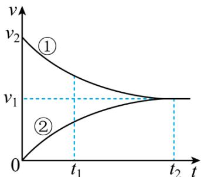

A. 曲线①表示的是逆反应的 v-t 关系
B. $t_{2}$ 时刻体系处于平衡状态
C. 反应进行到 $t_{1}$ 时，Q > K (Q 为浓度商)

D. 催化剂存在时， $v_{1}$ 、 $v_{2}$ 都增大
【答案】BD
【解析】

【详解】A．反应为乙苯制备苯乙烯的过程，开始反应物浓度最大，生成物浓度为0，所以曲线①表示的是正反应的v-t关系，曲线表示的是逆反应的v-t关系，故A错误；  
B． $t_{2}$ 时，正逆反应速率相等，体系处于平衡状态，故B正确；  
C．反应进行到 $t_{1}$ 时，反应正向进行，故Q<K，故C错误；  
D．催化剂能降低反应的活化能，使反应的 $v_{1}$ 、 $v_{2}$ 都增大，故D正确；  
故选BD。

14. 25℃下， $Na_{2}CO_{3}$ 水溶液的 pH 随其浓度的变化关系如图所示。下列说法正确的是

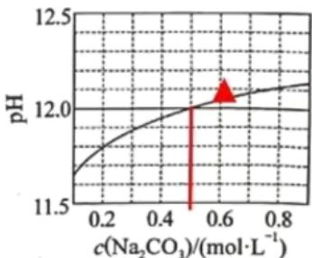

A. $c(\mathrm{Na}_2\mathrm{CO}_3) = 0.6\mathrm{mol}\cdot \mathrm{L}^{-1}$ 时，溶液中 $c(\mathrm{OH}^-) < 0.01\mathrm{mol}\cdot \mathrm{L}^{-1}$ B. $\mathrm{Na}_2\mathrm{CO}_3$ 水解程度随其浓度增大而减小C.在水中 $\mathrm{H}_2\mathrm{CO}_3$ 的 $K_{\mathrm{a2}} < 4\times 10^{-11}$

$$
0. 2 \mathrm{mol} \cdot \mathrm{L} ^ {- 1}
$$

$$
\mathrm{Na} _ {2} \mathrm{CO} _ {3}
$$

$$
0. 3 \mathrm{mol} \cdot \mathrm{L} ^ {- 1}
$$

$$
\mathrm{NaHCO} _ {3}
$$

$$
c \left(\mathrm{OH} ^ {-}\right) <   2 \times 1 0 ^ {- 4} \mathrm{mol} \cdot \mathrm{L} ^ {- 1}
$$

【详解】A．由图像可以， $c(\mathrm{Na}_{2}\mathrm{CO}_{3})=0.6\mathrm{mol}\cdot\mathrm{L}^{-1}$ 时，pH>12.0，溶液中 $c(\mathrm{OH}^{-})>0.01\mathrm{mol}\cdot\mathrm{L}^{-1}$ ，故A错误；
B．盐溶液越稀越水解， $Na_{2}CO_{3}$ 水解程度随其浓度增大而减小，故B正确；
C．结合图像可知，当 $c(\mathrm{Na}_{2}\mathrm{CO}_{3})=0.5\mathrm{mol}\cdot\mathrm{L}^{-1}$ ，pH=12，

$K_{h}=\frac{c(HCO_{3}^{-})c(OH^{-})}{c(CO_{3}^{2-})}=\frac{10^{-2}\times10^{-2}}{0.5}=2\times10^{-4}$ ，则 $K_{a2}=\frac{K_{w}}{K_{h}}=5\times10^{-11}$ ，故C错误；
D．若 $0.2mol\cdot L^{-1}$ 的 $Na_{2}CO_{3}$ 溶液等体积的蒸馏水混合，浓度变为 0.1mol/L，由图可知， $pH>10^{-11.6}$ ，得到的溶液 $c(\mathrm{OH}^{-})>2\times10^{-4}\mathrm{mol}\cdot\mathrm{L}^{-1}$ ， $0.2mol\cdot L^{-1}$ 的 $Na_{2}CO_{3}$ 溶液和 $0.3mol\cdot L^{-1}$ 的 $NaHCO_{3}$ 溶液等体积混合后 $c(OH^{-})$ 大于与水混合的，故 D 错误。
答案为：B。

15. 铍的氧化物广泛应用于原子能、航天、电子、陶瓷等领域，是重要的战略物资。利用绿柱石(主要化学成分为 $\left(\mathrm{Be}_{3}\mathrm{Al}_{2}\mathrm{Si}_{6}\mathrm{O}_{18}\right)$ ，还含有一定量的FeO和 $Fe_{2}O_{3}$ )生产BeO的一种工艺流程如下。

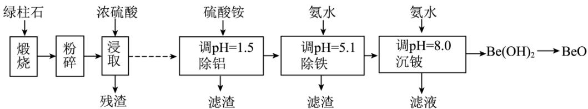  
回答问题:

(1) $\mathrm{Be}_{3} \mathrm{Al}_{2} \mathrm{Si}_{6} \mathrm{O}_{18}$ 中 Be 的化合价为 \_\_\_\_。

(2) 粉碎的目的是\_\_\_\_；残渣主要成分是\_\_\_\_(填化学式)。

(3) 该流程中能循环使用的物质是\_\_\_\_(填化学式)。

(4) 无水 $\mathrm{BeCl}_2$ 可用作聚合反应的催化剂。 $\mathrm{BeO}$ 、 $\mathrm{Cl}_2$ 与足量 C 在 $600\sim 800^{\circ}\mathrm{C}$ 制备 $\mathrm{BeCl}_2$ 的化学方程式为 \_\_\_\_。

(5) 沉铍时, 将 $\mathrm{pH}$ 从 8.0 提高到 8.5, 则铍的损失降低至原来的 \_\_\_\_%。

【答案】(1) +2 (2) ①. 增大反应物的接触面积加快反应速率，提高浸取率 ②. $\mathrm{SiO}_2$

(3) $(\mathrm{NH}_4)_2\mathrm{SO}_4$

(4) $\mathrm{BeO + Cl_2 + C\xrightarrow{600\sim 800^{\circ}C} CO + BeCl_2}$

(5) 10

【解析】

【分析】绿柱石煅烧生成氧化物，浓硫酸浸取， $SiO_{2}$ 不溶于硫酸，残渣是 $SiO_{2}$ ，加硫酸铵调节 pH=1.5 除去铝离子，加入氨水调节 pH=5.1 除去铁离子，再加入氨水到 pH=8.0 生成 $\mathrm{Be(OH)}_{2}$ 沉淀，滤液硫酸铵循环利用。

【小问 1 详解】

按照正负化合价代数和为 0，Be 的化合价为 +2+ 价；

【小问 2 详解】

粉碎的目的是增大反应物接触面积，加快浸取速率，提高浸取率；残渣的成分是不溶于酸的 $\mathrm{SiO}_2$ ；【小问3详解】

最后的滤液中的硫酸铵可以在除铝步骤中循环利用；

【小问 4 详解】

BeO、 $Cl_{2}$ 与足量 C 在 $600 \sim 800^{\circ}C$ 生成 $BeCl_{2}$ 同时生成 CO，化学方程式为 $BeO + Cl_{2} + C \xrightarrow{600 \sim 800^{\circ}C} CO + BeCl_{2}$ ;

【小问 5 详解】

设 $\mathrm{Be(OH)_2}$ 的溶度积常数为 $\mathrm{K_{sp}}$ ， $\mathrm{K = c(Be^{2 + })\times c^2(OH^-)}$ ， $\mathrm{c(Be^{2 + }) = \frac{K_{sp}}{\mathrm{c}^2(\mathrm{OH}^-)}}$ ，当 $\mathrm{pH = 8.0}$ 时， $\mathrm{c(OH^{-}) = 10^{-}}$ $^6\mathrm{mol / L}$ ，铍损失浓度为 $\mathrm{c(Be^{2 + }) = \frac{K_{sp}}{10^{-12}} mol / L}$ ，当 $\mathrm{pH = 8.5}$ 时， $\mathrm{c(OH^{-}) = 10^{-5.5}mol / L}$ ，铍损失浓度为 $\mathrm{c(Be^{2 + }) = }$ $\frac{\mathrm{K}_{\mathrm{sp}}}{10^{-11}}\mathrm{mol / L}$ ，损失降低至原来的 $10\%$ 。

16. 磷酸二氢钾在工农业生产及国防工业等领域都有广泛的应用。某研究小组用质量分数为 $85\%$ 的磷酸与 $\mathrm{KCl(s)}$ 反应制备 $\mathrm{KH}_2\mathrm{PO}_4(\mathrm{s})$ ，反应方程式为 $\mathrm{H}_3\mathrm{PO}_4(\mathrm{aq}) + \mathrm{KCl(s)} \rightleftharpoons \mathrm{KH}_2\mathrm{PO}_4(\mathrm{s}) + \mathrm{HCl(g)}$ 一定条件下的实验结果如图1所示。

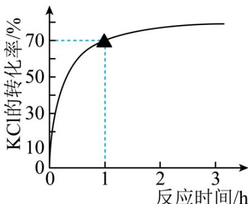  
图1

回答问题:

（1）该条件下，反应至 1h 时 KCl 的转化率为 \_\_\_\_。

(2) 该制备反应的 $\Delta H$ 随温度变化关系如图 2 所示。该条件下反应为\_\_\_\_反就(填“吸热”或“放热”),且反应热随温度升高而\_\_\_\_。

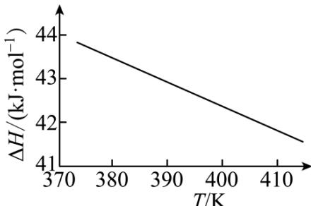  
图2

(3) 该小组为提高转化率采用的措施中有: 使用浓磷酸作反应物、向系统中不断通入水蒸气等。它们能提高转化率的原因是: 不使用稀磷酸\_\_\_\_; 通入水蒸气\_\_\_\_。

(4) 298K 时, $\mathrm{H}_{3} \mathrm{PO}_{4}(\mathrm{aq}) + \mathrm{KCl}(\mathrm{aq}) \rightleftharpoons \mathrm{KH}_{2} \mathrm{PO}_{4}(\mathrm{aq}) + \mathrm{HCl}(\mathrm{aq})$ 的平衡常数 $K =$ \_\_\_\_。(已知 $\mathrm{H}_{3} \mathrm{PO}_{4}$ 的 $K_{\mathrm{a1}} = 6.9 \times 10^{-3}$ ) 【答案】(1) $70 \%$ (2) ①. 吸热 ②. 降低

(3) ①. 使用浓磷酸作反应物可以提高磷酸的浓度，促使反应正向进行 ②. 使得气体中氯化氢的分压减小，促使反应正向进行
(4) $6.9 \times 10^{-3}$ 【解析】
【小问 1 详解】

由图可知，该条件下，反应至 1h 时 KCl 的转化率为 70%;

【小问 2 详解】

由图可知，焓变为正值，则该条件下反应为吸热反应，且反应热随温度升高而降低；

【小问 3 详解】

使用浓磷酸作反应物可以提高磷酸的浓度，促使反应正向进行；向系统中不断通入水蒸气，使得气体中氯化氢的分压减小，促使反应正向进行；都可以促进氯化钾的转化率的提高；

【小问 4 详解】

298K 时， $\mathrm{H}_{3}\mathrm{PO}_{4}(\mathrm{aq})+\mathrm{KCl}(\mathrm{aq})\rightleftharpoons\mathrm{KH}_{2}\mathrm{PO}_{4}(\mathrm{aq})+\mathrm{HCl}(\mathrm{aq})$ 的离子方程式为 $\mathrm{H}_{3}\mathrm{PO}_{4}(\mathrm{aq})\rightleftharpoons\mathrm{H}_{2}\mathrm{PO}_{4}^{-}(\mathrm{aq})+\mathrm{H}^{+}(\mathrm{aq})$ ，其平衡常数 $K=\frac{\mathrm{c}\left(\mathrm{H}^{+}\right)\mathrm{c}\left(\mathrm{H}_{2}\mathrm{PO}_{4}^{-}\right)}{\mathrm{c}\left(\mathrm{H}_{3}\mathrm{PO}_{4}\right)}=\mathrm{K}_{\mathrm{a1}}=6.9\times10^{-3}$

17. 某小组开展“木耳中铁元素的检测”活动。检测方案的主要步骤有：粉碎、称量、灰化、氧化、稀释、过滤、滴定等。回答问题：

（1）实验方案中出现的图标 和 ，前者提示实验中会用到温度较高的设备，后者要求实验者

\_\_\_\_(填防护措施)。

(2) 灰化: 干燥样品应装入\_\_\_\_中(填标号), 置高温炉内, 控制炉温 $850^{\circ} \mathrm{C}$ , 在充足空气氛中燃烧成灰渣。

a. 不锈钢培养皿 b. 玻璃烧杯 c. 石英坩埚

(3) 向灰渣中滴加 $32 \%$ 的硝酸, 直至没有气泡产生。灰化容器中出现的红棕色气体主要成分是 \_\_\_\_(填化学式), 因而本实验应在实验室的\_\_\_\_中进行(填设施名称)。若将漏斗直接置于容量瓶上过滤收集滤液(如图所示), 存在安全风险, 原因是\_\_\_\_。

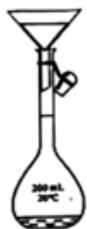

(4) 测定铁含量基本流程: 将滤液在 $200 \mathrm{~mL}$ 容量瓶中定容, 移取 $25.00 \mathrm{~mL}$ , 驱尽 $\mathrm{NO}_{3}^{-}$ 并将 $\mathrm{Fe}^{3+}$ 全部还原为 $\mathrm{Fe}^{2+}$ 。用 $5 \mathrm{~mL}$ 微量滴定管盛装 $\mathrm{K}_{2} \mathrm{Cr}_{2} \mathrm{O}_{7}$ 标准溶液进行滴定。

①选用微量滴定管的原因是\_\_\_\_。

②三次平行测定的数据如下表。针对该滴定数据，应采取的措施是\_\_\_\_。

<table><tr><td>序号</td><td>1</td><td>2</td><td>3</td></tr><tr><td>标准溶液用量/mL</td><td>2.715</td><td>2.905</td><td>2.725</td></tr></table>

③本实验中，使测定结果偏小的是\_\_\_\_(填标号)。

a. 样品未完全干燥 b. 微量滴定管未用标准溶液润洗 c. 灰渣中有少量炭黑

【答案】(1) 佩戴护目镜
(2) c (3) ①. NO₂ ②. 通风橱 ③. 液体无法顺利流下

(4) ①. 滴定更准确, 节约试剂 ②. 舍去第二次数据 ③. a

【解析】
【小问1详解】

标识提醒实验者需佩戴护目镜。

答案为：佩戴护目镜。

【小问 2 详解】

高温灼烧固体物质需在石英坩埚中进行。

答案为：c。

## 【小问3详解】

滴加 $32\%$ 的硝酸，灰化容器中出现的红棕色气体主要成分是 $\mathrm{NO}_2$ ，由于 $\mathrm{NO}_2$ 有毒，需在通风橱进行；将漏斗直接置于容量瓶上过滤收集滤液，加入溶液时，容量瓶中形成压强差，可能导致溶液无法顺利流下。

答案为： $NO_{2}$ ；通风橱；液体无法顺利流下。

## 【小问4详解】

①木耳中铁含量较少，选用微量滴定管使实验微型化，滴定更准确，节约试剂；

②三次平行滴定中，第二组数据偏差较大，应舍去。

③ a. 铁元素的含量= $\frac{铁元素质量}{样品质量}\times100\%$ ，样品未完全干燥，使测定结果偏低，故选a;

b. 微量滴定管未用标准溶液润洗，标准溶液被稀释，使测定结果偏高，故不选 b;

c. 灰渣中有少量炭黑，对测定结果无影响，故不选 c。

答案为：滴定更准确，节约试剂；舍去第二组数据；a。

18. 局部麻醉药福莫卡因的一种合成路线如下:

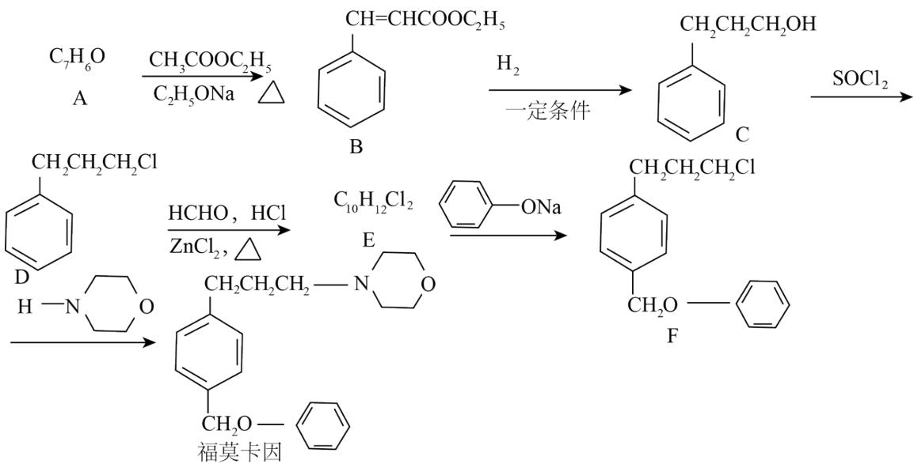  
回答问题:

(1) A 的结构简式: \_\_\_\_, 其化学名称\_\_\_\_。

(2) B 中所有官能团名称: \_\_\_\_。

(3) B 存在顺反异构现象, 较稳定异构体的构型为 式(填“顺”或“反”)。

(4) B→C 的反应类型为 \_\_\_\_。

(5) 与 E 互为同分异构体之——X，满足条件①含有苯环②核磁共振氢谱只有 1 组吸收峰，则 X 的简式为：\_\_\_\_(任写一种)

(6) E→F 的反应方程式为 \_\_\_\_。

（7）结合下图合成路线的相关信息。以苯甲醛和一两个碳的有机物为原料，设计路线合成

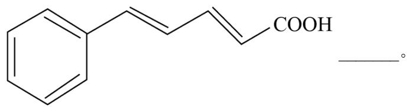

【答案】(1)

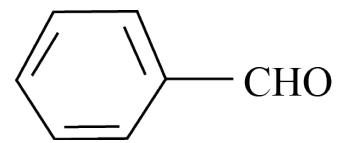

②. 苯甲醛

(2) 碳碳双键、酯基。

（3）反 （4）还原反应

( 5 )

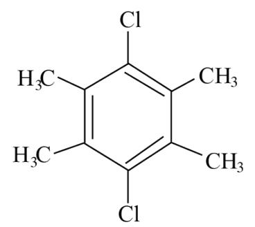

( 6 )

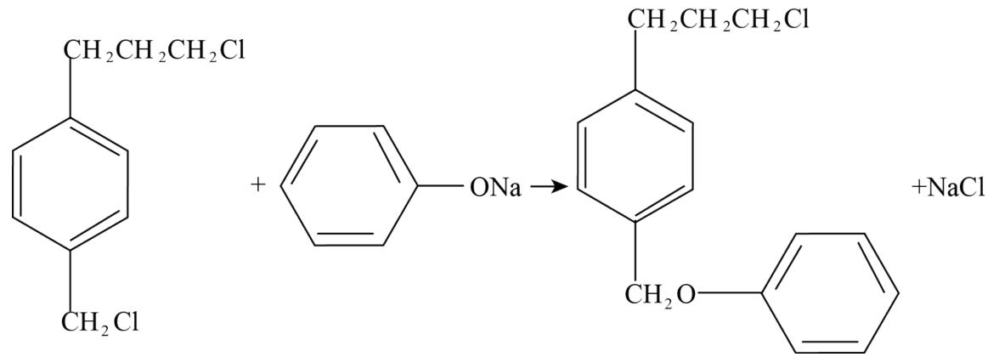

(7)

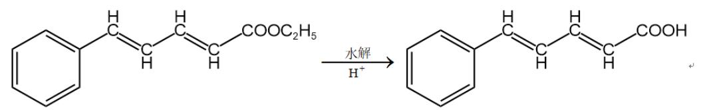

【解析】

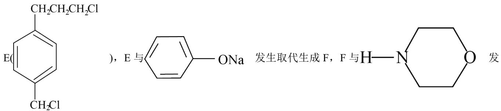

【分析】结合 B 的结构式，可逆向推得 A 的结构为 $\ce{C6H5-CHO}$ ，B 与氢气一定条件下反应还原生成 C，C 在 SOCl2 条件下发生取代反应生成 D，D 在 HCHO、HCl、ZnCl₂，发生取代反应生成

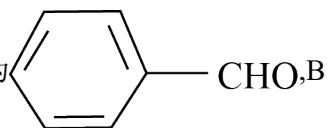

生取代反应生成福莫卡因。

【小问1详解】

结合上述分析可知，A的结构简式：CHO，其化学名称苯甲醛；

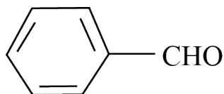

【小问 2 详解】

结合题干信息中 B 的结构式，B 中所有官能团名称碳碳双键、酯基；

【小问3详解】

顺式中的两个取代基处于同一侧，空间比较拥挤，范德华力较大，分子内能较高，不稳定，反式较顺式稳定；

【小问4详解】

结合上述分析，B→C 的反应类型为还原反应；

【小问5详解】

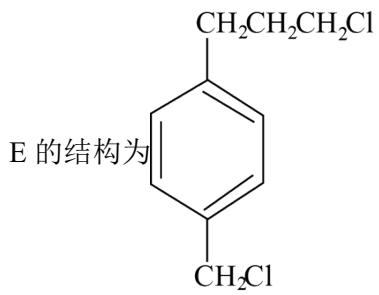

，同分异构体满足①含有苯环②核磁共振氢谱只有1组吸收峰，说明结构

高度对称，则 X 的一种结构简式为

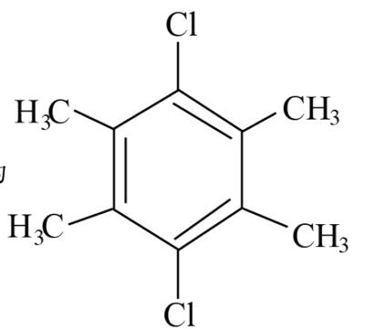

【小问6详解】

$\mathrm{E} \rightarrow \mathrm{F}$ 的反应方程式为:

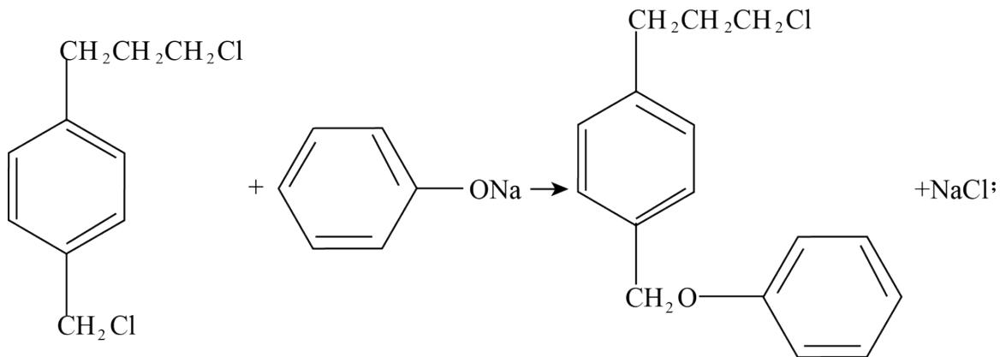

【小问7详解】

乙醇分别催化氧化为乙醛、乙酸，乙酸与乙醇发生酯化反应生成乙酸乙酯，乙醛 乙酸乙酯反应生成 $\mathrm{CH}_3\mathrm{CH} = \mathrm{CHCOOC}_2\mathrm{H}_5$ ；苯甲醛与 $\mathrm{CH}_3\mathrm{CH} = \mathrm{CHCOOC}_2\mathrm{H}_5$ 反应生成

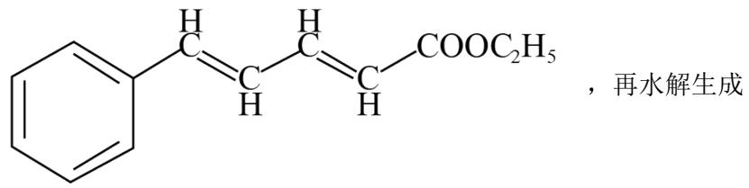

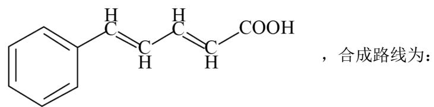

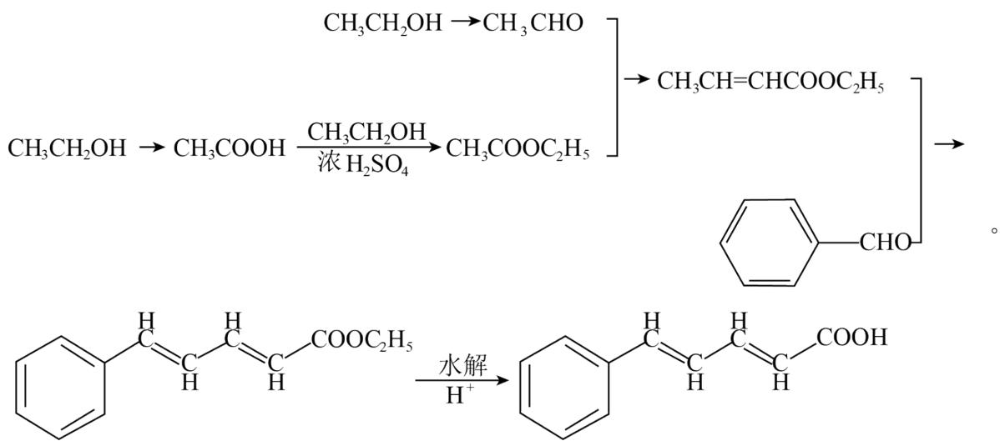

19. 我国科学家发现一种钡配合物I可以充当固氮反应的催化剂，反应过程中经历的中间体包括II和III。

III  
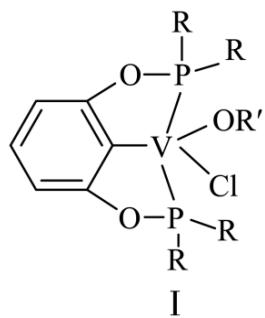

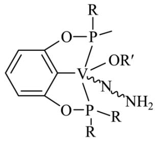

(^^^代表单键、双键或叁键)

回答问题:

(1) 配合物I中钒的配位原子有 4 种, 它们是\_\_\_\_。

(2) 配合物I中, R'代表芳基, V-O-R'空间结构呈角形, 原因是\_\_\_\_。

(3) 配合物II中, 第一电离能最大的配位原子是\_\_\_\_。

(4) 配合物II和III中, 钒的化合价分别为 $+ 4$ 和 $+ 3$ , 配合物II、III和 $\mathrm{N}_{2}$ 三者中, 两个氮原子间键长最长的是\_\_\_\_。

（5）近年来，研究人员发现含钒的锑化物 $\mathrm{CsV}_3\mathrm{Sb}_5$ 在超导方面表现出潜在的应用前景。 $\mathrm{CsV}_3\mathrm{Sb}_5$ 晶胞如图1所示，晶体中包含由V和Sb组成的二维平面(见图2)。

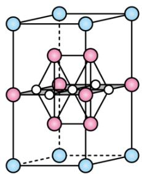

Sb

o V

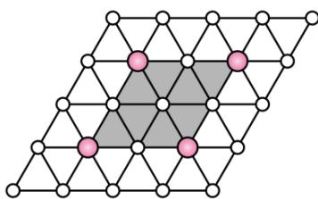

①晶胞中有 4 个面的面心由钒原子占据, 这些钒原子各自周围紧邻的锑原子数为\_\_\_\_。锑和磷同族, 锑原子基态的价层电子排布式为\_\_\_\_。

②晶体中少部分钒原子被其它元素(包括 Ti、Nb、Cr、Sn)原子取代, 可得到改性材料。下列有关替代原子说法正确的是\_\_\_\_。

a. 有 $+4$ 或 $+5$ 价态形式 b. 均属于第四周期元素

c. 均属于过渡元素 d. 替代原子与原离子的离子半径相近

【答案】（1）C、O、P、Cl

(2) 根据 VSEPR 模型, 氧原子的价层电子对数为 4 , 其中孤电子对数为 2 , 成键电子对之间呈角形 (3) N (4) 配合物 II (5) ①.6 ②. $5 \mathrm{~s}^{2} 5 \mathrm{~p}^{3}$ ③.ad

【解析】

【小问 1 详解】

根据题干配合物I的结构图，中心原子钒的配位原子有 C、O、P、Cl;

【小问 2 详解】

根据 VSEPR 模型，中心原子氧原子的价层电子对数为 4，其中孤电子对数为 2，空间结构呈角形；

【小问 3 详解】

配合物II中，第一电离能最大的配位原子是 N;

【小问 4 详解】

结合题干所给配合物II和III的结构，钒的化合价分别为+4和+3，配合物II中氮原子间是氮氮单键，配合物III中未氮氮双键， $N_{2}$ 中为氮氮三键，故配合物II中两个氮原子间键长最长；

【小问 5 详解】

①晶胞中有 4 个面的面心由钒原子占据，这些钒原子填充在锑原子构成的八面体空隙中，周围紧邻的锑原子数为 6；锑和磷同族，锑原子位于第五周期 VA，其基态的价层电子排布式 $5s^{2}5p^{3}$ ;

②a. $CsV_{3}Sb_{5}$ 中 V 带的总的正电荷为 +9，当替代原子为 Sn 时，化合价可能为 +4 或 +5 价态形式，故 a 正确；

b. Ti、Cr、Sn 属于第四周期元素，Nb 属于第五周期，故 b 错误；

c. Sn 是 VA 族元素，不属于过渡元素，故 c 错误；

d. 钒原子填充在锑原子形成的八面体空隙中，替代原子与原离子的离子半径相近，才能填充进去，故 d 正确；

答案为：ad。