# 2023年湖北省普通高中学业水平选择性考试

# 化学

本试卷共 8 页，19 题。全卷满分 100 分。考试用时 75 分钟。

## 注意事项：

1. 答题前，先将自己的姓名、准考证号、考场号、座位号填写在试卷和答题卡上，并认真核准准考证号条形码上的以上信息，将条形码粘贴在答题卡，上的指定位置。

2.请按题号顺序在答题卡上各题目的答题区域内作答，写在试卷、草稿纸和答题卡上的非答题区域均无效。

3. 选择题用 2B 铅笔在答题卡上把所选答案的标号涂黑；非选择题用黑色签字笔在答题卡上作答；字体工整，笔迹清楚。

4. 考试结束后，请将试卷和答题卡一并上交。

可能用到的相对原子质量：H1 Li7 O16 Si28 Cu64 I127 La139

## 一、选择题：本题共15小题，每小题3分，共45分。在每小题给出的四个选项中，只有一项是符合题目要求的。

1. 2023 年 5 月 10 日，天舟六号货运飞船成功发射，标志着我国航天事业进入到高质量发展新阶段。下列不能作为火箭推进剂的是
A. 液氮-液氢 
B. 液氧-液氢 
C. 液态 NO₂-肼 
D. 液氧-煤油

【详解】A．虽然氮气在一定的条件下可以与氢气反应，而且是放热反应，但是，由于 $\mathrm{N} \equiv \mathrm{N}$ 键能很大，该反应的速率很慢，氢气不能在氮气中燃烧，在短时间内不能产生大量的热量和大量的气体，因此，液氮-液氢不能作为火箭推进剂，A符合题意；  
B．氢气可以在氧气中燃烧，反应速率很快且放出大量的热、生成大量气体，因此，液氧-液氢能作为火箭推进剂，B不符合题意；  
C．肼和 $\mathrm{NO}_2$ 在一定的条件下可以发生剧烈反应，该反应放出大量的热，且生成大量气体，因此，液态 $\mathrm{NO}_2$ -肼能作为火箭推进剂，C不符合题意；  
D．煤油可以在氧气中燃烧，反应速率很快且放出大量的热、生成大量气体，因此，液氧-煤油能作为火箭推进剂，D不符合题意；  
综上所述，本题选A。

2. 下列化学事实不符合“事物的双方既相互对立又相互统一”的哲学观点的是
A. 石灰乳中存在沉淀溶解平衡
B. 氯气与强碱反应时既是氧化剂又是还原剂
C. 铜锌原电池工作时，正极和负极同时发生反应
D. Li、Na、K 的金属性随其核外电子层数增多而增强

【答案】D

【解析】

【详解】A. 电解质的沉淀和溶解是对立的，当电解质的沉淀速率和溶解速率相等时，电解质建立了沉淀溶解平衡，因此，沉淀和溶解又互相统一在这个平衡体系中；石灰乳中存在着未溶解的氢氧化钙和溶解的氢氧化钙，因此，石灰乳中存在沉淀溶解平衡，这个化学事实符合“事物的双方既相互对立又相互统一”的哲学观点，A 不符合题意；  
B. 氧化剂和还原剂是对立的，但是，氯气与强碱反应时，有部分氯气发生氧化反应，同时也有部分氯气发生还原反应，因此，氯气既是氧化剂又是还原剂，氯气的这两种作用统一在同一反应中，这个化学事实符合“事物的双方既相互对立又相互统一”的哲学观点，B 不符合题意；  
C. 铜锌原电池工作时，正极和负极同时发生反应，正极上发生还原反应，负极上发生氧化反应，氧化反应和还原反应是对立的，但是这两个反应又同时发生，统一在原电池反应中，因此，这个化学事实符合“事物的双方既相互对立又相互统一”的哲学观点，C 不符合题意；  
D. Li、Na、K 均为第 IA 的金属元素，其核外电子层数依次增多，原子核对最外层电子的吸引力逐渐减小，其失电子能力依次增强，因此，其金属性随其核外电子层数增多而增强，这个化学事实不符合“事物的双方既相互对立又相互统一”的哲学观点，D 符合题意；  
综上所述，本题选 D。

3. 工业制备高纯硅的主要过程如下：
石英砂 $\xrightarrow[1800\sim2000^{\circ}C]{焦炭}$ 粗硅 $\xrightarrow[300^{\circ}C]{HCl}$ $SiHCl_{3}\xrightarrow[1100^{\circ}C]{H_{2}}$ 高纯硅
下列说法错误的是
A. 制备粗硅的反应方程式为 $SiO_{2} + 2C\xlongequal{高温}Si + 2CO \uparrow$ B. 1molSi 含 Si-Si 键的数目约为 $4 \times 6.02 \times 10^{23}$ C. 原料气 HCl 和 $H_{2}$ 应充分去除水和氧气
D. 生成 $SiHCl_{3}$ 的反应为熵减过程

【答案】B

【解析】

【详解】A. $\mathrm{SiO}_2$ 和 C 在高温下发生反应生成 Si 和 CO，因此，制备粗硅的反应方程式为 $\mathrm{SiO}_2 + 2\mathrm{C} \stackrel{\text {高温}}{=} \mathrm{Si} + 2\mathrm{CO} \uparrow$ ，A 说法正确；

B. 在晶体硅中，每个 Si 与其周围的 4 个 Si 形成共价键并形成立体空间网状结构，因此，平均每个 Si 形成 2 个共价键， $1\mathrm{mol}$ Si 含 Si-Si 键的数目约为 $2 \times 6.02 \times 10^{23}$ ，B 说法错误；

C. HCl 易与水形成盐酸，在一定的条件下氧气可以将 HCl 氧化； $\mathrm{H}_2$ 在高温下遇到氧气能发生反应生成水，且其易燃易爆，其与 $\mathrm{SiHCl}_3$ 在高温下反应生成硅和 HCl，因此，原料气 HCl 和 $\mathrm{H}_2$ 应充分去除水和氧气，C 说法正确；

D. $\mathrm{Si} + 3\mathrm{HCl} \stackrel{300^\circ\mathrm{C}}{=} \mathrm{SiHCl}_3 + \mathrm{H}_2$ ，该反应是气体分子数减少的反应，因此，生成 $\mathrm{SiHCl}_3$ 的反应为熵减过程，D 说法正确；

综上所述，本题选 B。

4. 湖北蕲春李时珍的《本草纲目》记载的中药丹参，其水溶性有效成分之一的结构简式如图。下列说法正确的是

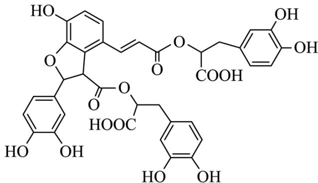

A. 该物质属于芳香烃
B. 可发生取代反应和氧化反应
C. 分子中有 5 个手性碳原子
D. 1mol 该物质最多消耗 9molNaOH

【答案】B

【解析】

【详解】A．该有机物中含有氧元素，不属于烃，A 错误；

B. 该有机物中含有羟基和羧基, 可以发生酯化反应, 酯化反应属于取代反应, 另外, 该有机物可以燃烧, 即可以发生氧化反应, B 正确;

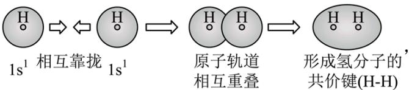

C. 将连有四个不同基团的碳原子形象地称为手性碳原子，在该有机物结构中，

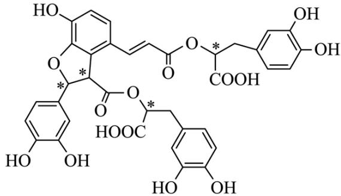

标有“\*”为手性碳，则一共有4个手性碳，C错误；

D. 该物质中含有 7 个酚羟基, 2 个羧基, 2 个酯基, 则 $1 \mathrm{~mol}$ 该物质最多消耗 $11 \mathrm{~mol} \mathrm{NaOH}$ , D 错误; 故选 B。

5. 化学用语可以表达化学过程，下列化学用语的表达错误的是

A. 用电子式表示 $\mathrm{K}_2\mathrm{S}$ 的形成: $\mathrm{K} \times + \cdot \ddot{\mathrm{S}} \cdot + \times \mathrm{K} \longrightarrow \mathrm{K}^+ [\cdot \ddot{\mathrm{S}} \cdot ]^{2-} \mathrm{K}^+$

B. 用离子方程式表示 $\mathrm{Al(OH)}_3$ 溶于烧碱溶液： $\mathrm{Al(OH)}_3 + \mathrm{OH}^- = \left[\mathrm{Al(OH)}_4\right]^-$

C. 用电子云轮廓图表示 H-H 的 s-sσ 键形成的示意图: $1s^{1}$ 相互靠拢 $1s^{1}$ $\longrightarrow$ $1s^{1}$ $\longrightarrow$ $1s^{1}$ $\longrightarrow$ $1s^{1}$ $\longrightarrow$ $1s^{1}$ $\longrightarrow$ $1s^{1}$ $\longrightarrow$ $1s^{1}$ $\longrightarrow$ $1S^{-1}$ $\longrightarrow$ $1S^{-1}$ $\longrightarrow$ $1S^{-1}$ $\longrightarrow$ $1S^{-1}$ $\longrightarrow$ $1S^{-1}$ $\longrightarrow$ $1S^{-1}$ $\longrightarrow$ $1S^{-1}$ C. 用电子云轮廓图表示 H-H 的 s-sσ 键形成的示意图:

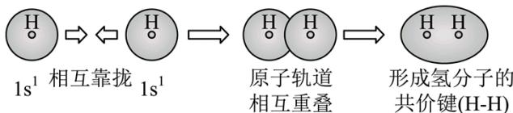

D. 用化学方程式表示尿素与甲醛制备线型脲醛树脂:

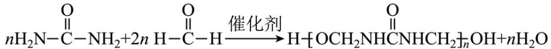

【答案】D

【解析】

【详解】A．钾原子失去电子，硫原子得到电子形成硫化钾，硫化钾为离子化合物，用电子式表示 $K_{2}S$ 的形成： $K\times+\cdot\ddot{S}\cdot+\times K\longrightarrow K^{+}[\cdot\ddot{S}\cdot]^{2-}K^{+}$ ，A正确；

B. 氢氧化铝为两性氢氧化物，可以和强碱反应生成四羟基合铝酸根离子，离子方程式为：

$\mathrm{Al(OH)}_{3}+\mathrm{OH}^{-}=\left[\mathrm{Al(OH)}_{4}\right]^{-},\mathrm{B}$ 正确；

C. H 的 s 能级为球形，两个氢原子形成氢气的时候，是两个 s 能级的原子轨道相互靠近，形成新的轨道，

C 正确；  
D. 用化学方程式表示尿素与甲醛制备线型脲醛树脂为n $H_{2}N-C-NH_{2}+nHCHO$ $\xrightarrow{一定条件}$ $H\left\{HN-C-NH-CH_{2}\right\}_{n}OH+(n-1)H_{2}O$ ，D 错误；

6. W、X、Y、Z 为原子序数依次增加的同一短周期元素，其中 X、Y、Z 相邻，W 的核外电子数与 X 的价层电子数相等， $Z_{2}$ 是氧化性最强的单质，4 种元素可形成离子化合物 $(XY)^{+}(WZ_{4})^{-}$ 。下列说法正确的是
A. 分子的极性： $WZ_{3}<XZ_{3}$ B. 第一电离能：X<Y<Z
C. 氧化性： $X_{2}Y_{3}<W_{2}Y_{3}$ D. 键能： $X_{2}<Y_{2}<Z_{2}$

【答案】A

【解析】

【分析】 $Z_{2}$ 是氧化性最强的单质，则Z是F，X、Y、Z相邻，且X、Y、Z为原子序数依次增加的同一短周期元素，则X为N，Y为O，W的核外电子数与X的价层电子数相等，则W为B，即：W为B，X为N，Y为O，Z是F，以此解题。
【详解】A．由分析可知，W为B，X为N，Z是F， $WZ_{3}$ 为 $BF_{3}$ ， $XZ_{3}$ 为 $NF_{3}$ ，其中前者的价层电子对数为3，空间构型为平面三角形，为非极性分子，后者的价层电子对数为4，有一对孤电子对，空间构型为三角锥形，为极性分子，则分子的极性： $WZ_{3}<XZ_{3}$ ，A正确；
B．由分析可知，X为N，Y为O，Z是F，同一周期越靠右，第一电离能越大，但是N的价层电子排布式为 $2s^{2}2p^{3}$ ，为半满稳定结构，其第一电离能大于相邻周期的元素，则第一电离能：Y<X<Z，B错误；
C．由分析可知，W为B，X为N，Y为O，则 $X_{2}Y_{3}$ 为 $N_{2}O_{3}$ ， $W_{2}Y_{3}$ 为 $B_{2}O_{3}$ ，两种化合物中N和B的化合价都是+3价，但是N的非金属性更强一些，故 $N_{2}O_{3}$ 的氧化性更强一些，C错误；
D．由分析可知，X为N，Y为O，Z是F，其中N对应的单质为氮气，其中包含三键，键能较大，D错误；
故选 A。

7. 中科院院士研究发现，纤维素可在低温下溶于 NaOH 溶液，恢复至室温后不稳定，加入尿素可得到室温下稳定的溶液，为纤维素绿色再生利用提供了新的解决方案。下列说法错误的是

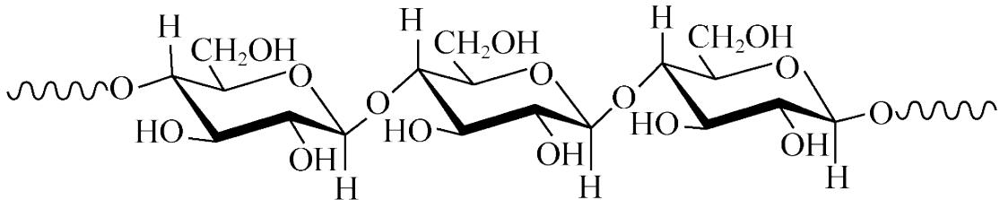  
纤维素单链

A. 纤维素是自然界分布广泛的一种多糖  
B. 纤维素难溶于水的主要原因是其链间有多个氢键  
C. NaOH 提供 $\mathrm{OH}^{-}$ 破坏纤维素链之间的氢键  
D. 低温降低了纤维素在 NaOH 溶液中的溶解性

【答案】B

【解析】

【详解】A. 纤维素属于多糖，大量存在于我们吃的蔬菜水果中，在自然界广泛分布，A 正确；  
B. 纤维素难溶于水，一是因为纤维素不能跟水形成氢键，二是因为碳骨架比较大，B 错误；  
C. 纤维素在低温下可溶于氢氧化钠溶液，是因为碱性体系主要破坏的是纤维素分子内和分子间的氢键促进其溶解，C 正确；  
D. 温度越低，物质的溶解度越低，所以低温下，降低了纤维素在氢氧化钠溶液中的溶解性，D 正确；故选 B。

8. 实验室用以下装置(夹持和水浴加热装置略)制备乙酸异戊酯(沸点 $142^{\circ}C$ )，实验中利用环己烷-水的共沸体系(沸点 $69^{\circ}C$ )带出水分。已知体系中沸点最低的有机物是环己烷(沸点 $81^{\circ}C$ )，其反应原理：

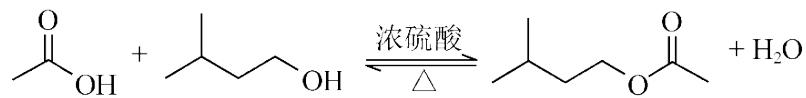  
下列说法错误的是

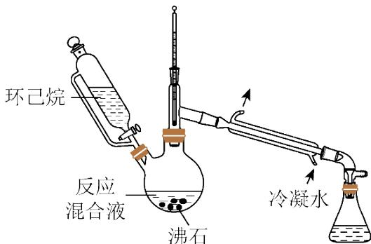

A. 以共沸体系带水促使反应正向进行 B. 反应时水浴温度需严格控制在 $69^{\circ} \mathrm{C}$ C. 接收瓶中会出现分层现象 D. 根据带出水的体积可估算反应进度

【答案】B

【解析】

【详解】A．由反应方程式可知，生成物中含有水，若将水分离出去，可促进反应正向进行，该反应选择以共沸体系带水可以促使反应正向进行，A 正确；

B. 反应产品的沸点为 $142^{\circ} \mathrm{C}$ , 环己烷的沸点是 $81^{\circ} \mathrm{C}$ , 环己烷-水的共沸体系的沸点为 $69^{\circ} \mathrm{C}$ , 可以温度可以控制在 $69^{\circ} \mathrm{C} \sim 81^{\circ} \mathrm{C}$ 之间, 不需要严格控制在 $69^{\circ} \mathrm{C}$ , B 错误;

C. 接收瓶中接收的是环己烷-水的共沸体系，环己烷不溶于水，会出现分层现象，C 正确；  
D. 根据投料量，可估计生成水的体积，所以可根据带出水的体积估算反应进度，D 正确；故选 B。

9. 价层电子对互斥理论可以预测某些微粒的空间结构。下列说法正确的是
A. $\mathrm{CH}_{4}$ 和 $\mathrm{H}_{2} \mathrm{O}$ 的 VSEPR 模型均为四面体
B. $\mathrm{SO}_{3}^{2-}$ 和 $\mathrm{CO}_{3}^{2-}$ 的空间构型均为平面三角形
C. $\mathrm{CF}_{4}$ 和 $\mathrm{SF}_{4}$ 均为非极性分子
D. $\mathrm{XeF}_{2}$ 与 $\mathrm{XeO}_{2}$ 的键角相等

【详解】A. 甲烷分子的中心原子的价层电子对为4, 水分子的中心原子价层电子对也为4, 所以他们的 VSEPR 模型都是四面体, A 正确;

B. $SO_{3}^{2-}$ 的孤电子对为1, $CO_{3}^{2-}$ 的孤电子对为0, 所以 $SO_{3}^{2-}$ 的空间构型为三角锥形, $CO_{3}^{2-}$ 的空间构型为平面三角形, B 错误,

C. $CH_{4}$ 为正四面体结构, 为非极性分子, $SF_{4}$ 中心原子有孤电子对, 为极性分子, C 错误;

D. $XeF_{2}$ 和 $XeO_{2}$ 分子中, 孤电子对不相等, 孤电子对越多, 排斥力越大, 所以键角不等, D 错误; 故选 A。

10. 我国科学家设计如图所示的电解池，实现了海水直接制备氢气技术的绿色化。该装置工作时阳极无 $\mathrm{Cl}_{2}$ 生成且KOH溶液的浓度不变，电解生成氢气的速率为 $x\mathrm{mol}\cdot \mathrm{h}^{-1}$ 。下列说法错误的是

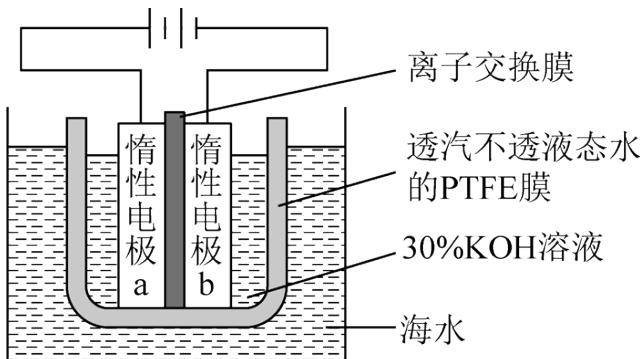

A. b 电极反应式为 $2\mathrm{H}_{2}\mathrm{O} + 2\mathrm{e}^{-} = \mathrm{H}_{2}\uparrow +2\mathrm{OH}^{-}$ B. 离子交换膜为阴离子交换膜  
C. 电解时海水中动能高的水分子可穿过PTFE膜

D. 海水为电解池补水的速率为 $2x \, mol \cdot h^{-1}$

【答案】D

【解析】

【分析】由图可知，该装置为电解水制取氢气的装置，a 电极与电源正极相连，为电解池的阳极，b 电极与电源负极相连，为电解池的阴极，阴极反应为 $2\mathrm{H}_{2}\mathrm{O} + 2\mathrm{e}^{-} = \mathrm{H}_{2}\uparrow +2\mathrm{OH}^{-}$ ，阳极反应为 $4\mathrm{OH}^{-} - 4\mathrm{e}^{-} = \mathrm{O}_{2}\uparrow +2\mathrm{H}_{2}\mathrm{O}$ ，通电电池总反应为 $2\mathrm{H}_{2}\mathrm{O} = 2\mathrm{H}_{2}\uparrow +\mathrm{O}_{2}\uparrow$ ，据此解答。

【详解】A. b 电极反应式为 b 电极为阴极，发生还原反应，电极反应为 $2 \mathrm{H}_{2} \mathrm{O} + 2 \mathrm{e}^{-} = \mathrm{H}_{2} \uparrow + 2 \mathrm{OH}^{-}$ ，故 A 正确；  
B. 该装置工作时阳极无 $\mathrm{Cl}_{2}$ 生成且 KOH 浓度不变，阳极发生的电极反应为 $4 \mathrm{OH}^{-} - 4 \mathrm{e}^{-} = \mathrm{O}_{2} \uparrow + 2 \mathrm{H}_{2} \mathrm{O}$ ，为保持 OH-离子浓度不变，则阴极产生的 OH-离子要通过离子交换膜进入阳极室，即离子交换膜应为阴离子交换膜，故 B 正确；  
C. 电解时电解槽中不断有水被消耗，海水中的动能高的水可穿过 PTFE 膜，为电解池补水，故 C 正确；  
D. 由电解总反应可知，每生成 $1 \mathrm{~mol} \mathrm{H}_{2}$ 要消耗 $1 \mathrm{~mol} \mathrm{H}_{2} \mathrm{O}$ ，生成 $\mathrm{H}_{2}$ 的速率为 $x \mathrm{~mol} \cdot \mathrm{h}^{-1}$ ，则补水的速率也应是 $x \mathrm{~mol} \cdot \mathrm{h}^{-1}$ ，故 D 错误；

答案选 D。

11. 物质结构决定物质性质。下列性质差异与结构因素匹配错误的是

<table><tr><td>选项</td><td>性质差异</td><td>结构因素</td></tr><tr><td>A</td><td>沸点:正戊烷(36.1°C)高于新戊烷(9.5°C)</td><td>分子间作用力</td></tr><tr><td>B</td><td>熔点: $AlF_3$ (1040°C)远高于 $AlCl_3$ (178°C升华)</td><td>晶体类型</td></tr><tr><td>C</td><td>酸性: $CF_3COOH$ ( $pK_a = 0.23$ )远强于 $CH_3COOH$ ( $pK_a = 4.76$ )</td><td>羟基极性</td></tr><tr><td>D</td><td>溶解度(20°C): $Na_2CO_3$ (29g)大于 $NaHCO_3$ (8g)</td><td>阴离子电荷</td></tr></table>

A.A B.B C.C D.D

【答案】D

【解析】

【详解】A．正戊烷和新戊烷形成的晶体都是分子晶体，由于新戊烷支链多，对称性好，分子间作用力小，所以沸点较低，故 A 正确；  
B． $\mathrm{AlF}_{3}$ 为离子化合物，形成的晶体为离子晶体，熔点较高， $\mathrm{AlCl}_{3}$ 为共价化合物，形成的晶体为分子晶体，熔点较低，则 $\mathrm{AlF}_{3}$ 熔点远高于 $\mathrm{AlCl}_{3}$ ，故 B 正确；  
C．由于电负性 F>H，C-F 键极性大于 C-H 键，使得羧基上的羟基极性增强，氢原子更容易电离，酸性增强，故 C 正确；  
D．碳酸氢钠在水中的溶解度比碳酸钠小的原因是碳酸氢钠晶体中 $\mathrm{HCO}_{3}^{-}$ 间存在氢键，与晶格能大小无关，即与阴离子电荷无关，故 D 错误；  
答案选 D。

12. 下列事实不涉及烯醇式与酮式互变异构原理的是

$-CH_{2}-C-R \rightleftharpoons -CH=C-R (R为烃基或氢)$ 酮式 烯醇式

A. $\mathrm{HC} \equiv \mathrm{CH}$ 能与水反应生成 $\mathrm{CH}_3\mathrm{CHO}$

B. $\mathrm{OH}$ 可与 $\mathrm{H}_{2}$ 反应生成 $\mathrm{OH}$

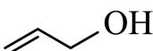

C.

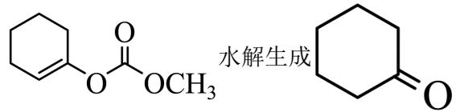

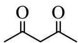

D. 中存在具有分子内氢键的异构体

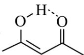

【答案】B

【解析】

【分析】根据图示的互变原理，具有羰基的酮式结构可以发生互变异构转化为烯醇式，这种烯醇式具有的特点为与羟基相连接的碳原子必须有双键连接，这样的烯醇式就可以发生互变异构，据此原理分析下列选项。

【详解】A．水可以写成 H-OH 的形式，与 CH≡CH 发生加成反应生成 $CH_{2}=CHOH$ ，烯醇式的 $CH_{2}=CHOH$ 不稳定转化为酮式的乙醛，A 不符合题意；

B. 3-羟基丙烯中，与羟基相连接的碳原子不与双键连接，不会发生烯醇式与酮式互变异构，B符合题意；

C.

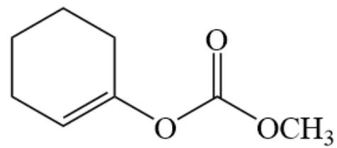

水解生成

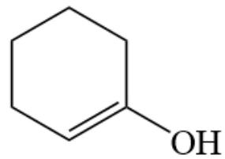

和 $\mathrm{CH}_3\mathrm{OCOOH}$ ，

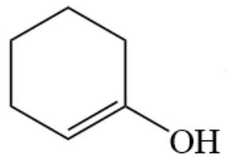

可以发生互变异构转化为

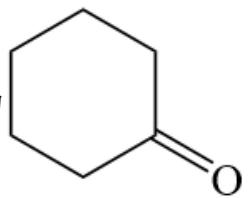

，C不符合题意；

D.

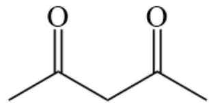

可以发生互变异构转化为

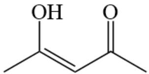

，即可形成分子内氢键，D不

符合题意；故答案选B。

13. 利用如图所示的装置(夹持及加热装置略)制备高纯白磷的流程如下:

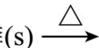

红磷(s) $\xrightarrow{\triangle}$ 无色液体与 $\mathrm{P}_4(\mathrm{g})\xrightarrow{\text{凝华}}$ 白磷(s)

下列操作错误的是

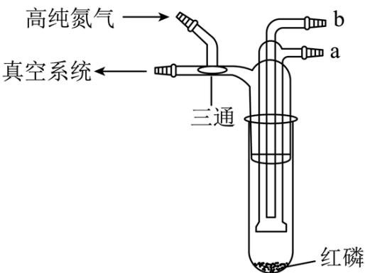

A. 红磷使用前洗涤以除去表面杂质  
B. 将红磷转入装置，抽真空后加热外管以去除水和氧气  
C. 从a口通入冷凝水，升温使红磷转化  
D. 冷凝管外壁出现白磷，冷却后在氮气氛围下收集

【答案】B 【解析】

【详解】A. 红磷表面有被氧化生成的五氧化二磷, 五氧化二磷可以溶于水, 因此红磷在使用前应洗涤, A 正确; B. 红磷与氧气反应的温度为 $240^{\circ} \mathrm{C}$ 左右, 但是转化的白磷可以在 $40^{\circ} \mathrm{C}$ 左右燃烧, 因此, 在红磷装入装置后应先在氮气氛的保护下加热外管除去水蒸气和氧气后再抽真空进行转化反应, B 错误;

C. 从 a 口通入冷凝水后对反应装置加热升温，在冷凝管的下端就可以得到转化成的白磷，C 正确；  
D. 白磷易被空气中的氧气氧化，因此在收集白磷时应将反应装置冷却，再在氮气氛的条件下收集白磷，D 正确；  
故答案选 B。

14. $\mathrm{H}_2\mathrm{L}$ 为某邻苯二酚类配体，其 $\mathrm{pK}_{\mathrm{a}1} = 7.46$ ， $\mathrm{pK}_{\mathrm{a}2} = 12.4$ 。常温下构建Fe(III)- $\mathrm{H}_2\mathrm{L}$ 溶液体系，其中 $c_{0}\left(\mathrm{Fe}^{3 + }\right) = 2.0\times 10^{-4}\mathrm{mol}\cdot \mathrm{L}^{-1}$ ， $c_{0}\left(\mathrm{H}_{2}\mathrm{L}\right) = 5.0\times 10^{-3}\mathrm{mol}\cdot \mathrm{L}^{-1}$ 。体系中含Fe物种的组分分布系数δ与pH的关系如图所示，分布系数 $\delta (x) = \frac{c(x)}{2.0\times 10^{-4}\mathrm{mol}\cdot\mathrm{L}^{-1}}$ ，已知 $\lg 2\approx 0.30$ ， $\lg 3\approx 0.48$ 。下列说法正确的是

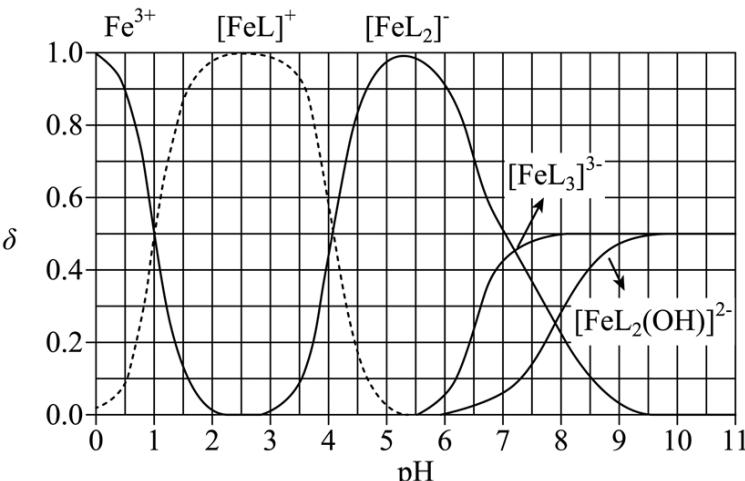  
Fe(Ⅲ)-H₂L体系部分物种分布图

A. 当 $\mathrm{pH} = 1$ 时，体系中 $c\left(\mathrm{H}_2\mathrm{L}\right) > c\left([\mathrm{FeL}]^{+}\right) > c(\mathrm{OH}) > c\left(\mathrm{HL}^{-}\right)$ B. pH 在 $9.5 \sim 10.5$ 之间，含 L 的物种主要为 $\mathbf{L}^{2-}$ C. $\mathbf{L}^{2-} + [\mathbf{FeL}]^{+} \rightleftharpoons \left[\mathbf{FeL}_{2}\right]^{-}$ 的平衡常数的 $\lg K$ 约为 14  
D. 当 $\mathrm{pH} = 10$ 时，参与配位的 $c\left(\mathbf{L}^{2-}\right) \approx 1.0 \times 10^{-3} \, \mathrm{mol} \cdot \mathbf{L}^{-1}$

【解析】

【分析】从图给的分布分数图可以看出，在两曲线的交点横坐标值加和取平均值即为某型体含量最大时的pH，利用此规律解决本题。

【详解】A．从图中可以看出 Fe(III)主要与 $L^{2-}$ 进行络合，但在 pH=1 时，富含 L 的型体主要为 $H_{2}L$ ，此时电离出的 $HL^{-}$ 较少，根据 $H_{2}L$ 的一级电离常数可以简单计算 pH=1 时溶液中 $c(\mathrm{HL}^{-})\approx10^{-9.46}$ ，但 pH=1 时 $c(\mathrm{OH}^{-})=10^{-13}$ ，因此这四种离子的浓度大小为 $c(\mathrm{H}_{2}\mathrm{L})>c([\mathrm{FeL}]^{+})>c(\mathrm{HL}^{-})>c(\mathrm{OH}^{-})$ ，A 错误；

$$
\mathrm{H} _ {2} \mathrm{L}
$$

$$
\mathrm{H} _ {2} \mathrm{L}
$$

当 pH 在 9.5\~10.5 之间时，含 L 的物种主要为 HL $^{-}$ ，B 错误；

C．该反应的平衡常数 $K=\frac{c([FeL_{2}]^{-})}{c([FeL]^{+})c(L^{2-})}$ ，当 $[FeL_{2}]^{-}$ 与 $[FeL]^{+}$ 分布分数相等时，可以将 K 简化为 $K=\frac{1}{c(L^{2-})}$ ，此时体系的 pH=4，在 pH=4 时可以计算溶液中 $c(L^{2-})=5.0\times10^{-14.86}$ ，则该络合反应的平衡常数 $K\approx10^{-14.16}$ ，即 $\lg K\approx14$ ，C 正确；

D．根据图像，pH=10 时溶液中主要的型体为 $\left[FeL_{3}\right]^{3-}$ 和 $\left[FeL_{2}(OH)\right]^{2-}$ ，其分布分数均为 0.5，因此可以得到 $c\left(\left[FeL_{3}\right]^{3-}\right)=c\left(\left[FeL_{2}(OH)\right]^{2-}\right)=1\times10^{-4}\mathrm{mol}\cdot\mathrm{L}^{-1}$ ，此时形成 $\left[FeL_{3}\right]^{3-}$ 消耗了 $3\times10^{-4}\mathrm{mol}\cdot\mathrm{L}^{-1}$ 的 $L^{2-}$ ，形成 $\left[FeL_{2}(OH)\right]^{2-}$ 消耗了 $2\times10^{-4}\mathrm{mol}\cdot\mathrm{L}^{-1}$ 的 $L^{2-}$ ，共消耗了 $5\times10^{-4}\mathrm{mol}\cdot\mathrm{L}^{-1}$ 的 $L^{2-}$ ，即参与配位的 $c(L^{2-})\approx5\times10^{-4}$ ，D 错误；故答案选 C。

15. 镧 La 和 H 可以形成一系列晶体材料 $LaH_{n}$ ，在储氢和超导等领域具有重要应用。 $LaH_{n}$ ，属于立方晶系，晶胞结构和参数如图所示。高压下， $LaH_{2}$ 中的每个 H 结合 4 个 H 形成类似 $CH_{4}$ 的结构，即得到晶体 $LaH_{x}$ 。下列说法错误的是

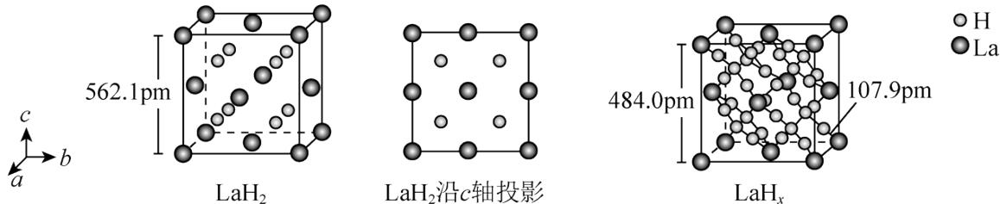

A. $\mathrm{LaH}_{2}$ 晶体中 $\mathrm{La}$ 的配位数为8  
B. 晶体中 $\mathrm{H}$ 和 $\mathrm{H}$ 的最短距离： $\mathrm{LaH}_{2} > \mathrm{LaH}_{x}$ C. 在 $\mathrm{LaH}_{x}$ 晶胞中， $\mathrm{H}$ 形成一个顶点数为40的闭合多面体笼

D. $\mathrm{LaH}_x$ 单位体积中含氢质量的计算式为 $\frac{40}{(4.84\times 10^{-8})^3\times 6.02\times 10^{23}}\mathrm{g}\cdot \mathrm{cm}^{-3}$

【答案】C

【解析】

【详解】A．由 $LaH_{2}$ 的晶胞结构可知，La 位于顶点和面心，晶胞内 8 个小立方体的中心各有 1 个 H 原子，若以顶点 La 研究，与之最近的 H 原子有 8 个，则 La 的配位数为 8，故 A 正确；

B. 由 $\mathrm{LaH}_x$ 晶胞结构可知, 每个 $\mathrm{H}$ 结合 4 个 $\mathrm{H}$ 形成类似 $\mathrm{CH}_4$ 的结构, $\mathrm{H}$ 和 $\mathrm{H}$ 之间的最短距离变小, 则晶体中 $\mathrm{H}$ 和 $\mathrm{H}$ 的最短距离: $\mathrm{LaH}_2 > \mathrm{LaH}_x$ , 故 $\mathrm{B}$ 正确;

C. 由题干信息可知, 在 $\mathrm{LaH}_{x}$ 晶胞中, 每个 $\mathrm{H}$ 结合 4 个 $\mathrm{H}$ 形成类似 $\mathrm{CH}_{4}$ 的结构, 这样的结构有 8 个, 顶点数为 $4 \times 8 = 32$ , 且不是闭合的结构, 故 C 错误; D. 1 个 $\mathrm{LaH}_{x}$ 晶胞中含有 $5 \times 8 = 40$ 个 $\mathrm{H}$ 原子, 含 $\mathrm{H}$ 质量为 $\frac{40}{N_{\mathrm{A}}} \mathrm{~g}$ , 晶胞的体积为 $(484.0 \times 10^{-10} \mathrm{~cm})^{3} = (4.84 \times 10^{-8})^{3} \mathrm{~cm}^{3}$ , 则 $\mathrm{LaH}_{x}$ 单位体积中含氢质量的计算式为 $\frac{40}{\left(4.84 \times 10^{-8}\right)^{3} \times 6.02 \times 10^{23}} \mathrm{~g} \cdot \mathrm{cm}^{-3}$ , 故 D 正确; 答案选 C。

## 二、非选择题：本题共4小题，共55分。

16. $\mathrm{SiCl}_4$ 是生产多晶硅的副产物。利用 $\mathrm{SiCl}_4$ 对废弃的锂电池正极材料 $\mathrm{LiCoO}_2$ 进行氯化处理以回收 Li、Co 等金属，工艺路线如下：

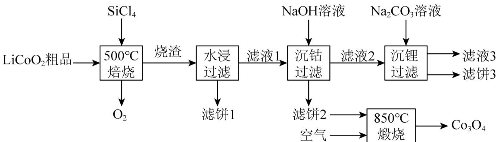

回答下列问题:

(1) Co 位于元素周期表第\_\_\_\_周期，第\_\_\_\_族。

(2) 烧渣是 $\mathrm{LiCl}$ 、 $\mathrm{CoCl}_2$ 和 $\mathrm{SiO}_2$ 的混合物, “ $500^{\circ} \mathrm{C}$ 焙烧”后剩余的 $\mathrm{SiCl}_4$ 应先除去, 否则水浸时会产生大量烟雾, 用化学方程式表示其原因\_\_\_\_。

(3) 鉴别洗净的“滤饼 3”和固体 $\mathrm{Na}_{2} \mathrm{CO}_{3}$ 常用方法的名称是\_\_\_\_。

(4) 已知 $K_{\mathrm{sp}}[\mathrm{Co(OH)}_2] = 5.9 \times 10^{-15}$ , 若“沉钴过滤”的 $\mathrm{pH}$ 控制为 10.0, 则溶液中 $\mathrm{Co}^{2+}$ 浓度为 \_\_\_\_ $\mathrm{mol} \cdot \mathrm{L}^{-1}$ 。“850°C煅烧”时的化学方程式为 \_\_\_\_。

(5) 导致 $\mathrm{SiCl}_{4}$ 比 $\mathrm{CCl}_{4}$ 易水解的因素有\_\_\_\_(填标号)。
a. Si-Cl 键极性更大    b. Si 的原子半径更大
c. Si-Cl 键键能更大    d. Si 有更多的价层轨道
【答案】(1) ①.4 ②.VIII

(2) $\mathrm{SiCl}_4 + 3\mathrm{H}_2\mathrm{O} = \mathrm{H}_2\mathrm{SiO}_3 + 4\mathrm{HCl}$

(3) 焰色反应 (4) ①. $5.9 \times 10^{-7}$ ②. $6\mathrm{Co(OH)}_{2} + \mathrm{O}_{2} \xlongequal{850^{\circ} \mathrm{C}} 2\mathrm{Co}_{3}\mathrm{O}_{4} + 6\mathrm{H}_{2}\mathrm{O}$

【分析】由流程和题中信息可知， $\mathrm{LiCoO}_{2}$ 粗品与 $\mathrm{SiCl}_{4}$ 在 $500^{\circ} \mathrm{C}$ 焙烧时生成氧气和烧渣，烧渣是 $\mathrm{LiCl}$ 、 $\mathrm{CoCl}_{2}$ 和 $\mathrm{SiO}_{2}$ 的混合物；烧渣经水浸、过滤后得滤液 1 和滤饼 1，滤饼 1 的主要成分是 $\mathrm{SiO}_{2}$ 和 $\mathrm{H}_{2} \mathrm{SiO}_{3}$ ；滤液 1 用氢氧化钠溶液沉钴，过滤后得滤饼 2（主要成分为 $\mathrm{Co(OH)}_{2}$ ）和滤液 2（主要溶质为 $\mathrm{LiCl}$ ）；滤饼 2 置于空气中在 $850^{\circ} \mathrm{C}$ 煅烧得到 $\mathrm{Co}_{3} \mathrm{O}_{4}$ ；滤液 2 经碳酸钠溶液沉锂，得到滤液 3 和滤饼 3，滤饼 3 为 $\mathrm{Li}_{2} \mathrm{CO}_{3}$ 。

【小问 1 详解】

Co 是 27 号元素，其原子有 4 个电子层，其价电子排布为 $3d^{7}4s^{2}$ ，元素周期表第 8、9、10 三个纵行合称

第Ⅷ族，因此，其位于元素周期表第 4 周期、第Ⅷ族。

【小问 2 详解】

“500°C焙烧”后剩余的 $SiCl_{4}$ 应先除去，否则水浸时会产生大量烟雾，由此可知，四氯化硅与可水反应且能生成氯化氢和硅酸，故其原因是： $SiCl_{4}$ 遇水剧烈水解，生成硅酸和氯化氢，该反应的化学方程式为 $SiCl_{4} + 3H_{2}O = H_{2}SiO_{3} + 4HCl$ 。

【小问 3 详解】

洗净的“滤饼3”的主要成分为 $\mathrm{Li}_{2} \mathrm{CO}_{3}$ , 常用焰色反应鉴别 $\mathrm{Li}_{2} \mathrm{CO}_{3}$ 和 $\mathrm{Na}_{2} \mathrm{CO}_{3}$ , $\mathrm{Li}_{2} \mathrm{CO}_{3}$ 的焰色反应为紫红色, 而 $\mathrm{Na}_{2} \mathrm{CO}_{3}$ 的焰色反应为黄色。故鉴别“滤饼3”和固体 $\mathrm{Na}_{2} \mathrm{CO}_{3}$ 常用方法的名称是焰色反应。

已知 $K_{\mathrm{sp}}[\mathrm{Co(OH)}_2] = 5.9\times 10^{-15}$ ，若“沉钴过滤”的 $\mathrm{pH}$ 控制为10.0，则溶液中 $c(\mathrm{OH}^{-}) = 1.0\times 10^{-4}$ $\mathrm{mol}\cdot \mathrm{L}^{-1}$ ， $\mathrm{Co}^{2 + }$ 浓度为 $\frac{K_{\mathrm{sp}}[\mathrm{Co(OH)}_2]}{c^2(\mathrm{OH}^-)} = \frac{5.9\times 10^{-15}}{(1.0\times 10^{-4})^2}\mathrm{mol}\cdot \mathrm{L}^{-1} = 5.9\times 10^{-7}\mathrm{mol}\cdot \mathrm{L}^{-1}$ 。“850°C煅烧”时， $\mathrm{Co(OH)}_2$ 与 $\mathrm{O}_2$ 反应生成 $\mathrm{Co}_3\mathrm{O}_4$ 和 $\mathrm{H}_2\mathrm{O}$ ，该反应的化学方程式为 $6\mathrm{Co(OH)}_2 + \mathrm{O}_2\xrightarrow{850^\circ C}2\mathrm{Co}_3\mathrm{O}_4 + 6\mathrm{H}_2\mathrm{O}$ 。

【小问 5 详解】

a. Si-Cl 键极性更大，则 Si-Cl 键更易断裂，因此， $SiCl_{4}$ 比 $CCl_{4}$ 易水解，a 有关；

b. Si 的原子半径更大, 因此, $\mathrm{SiCl}_{4}$ 中的共用电子对更加偏向于 $\mathrm{Cl}$ , 从而导致 Si-Cl 键极性更大, 且 Si 原子更易受到水电离的 $\mathrm{OH}^{-}$ 的进攻, 因此, $\mathrm{SiCl}_{4}$ 比 $\mathrm{CCl}_{4}$ 易水解, b 有关;

c. 通常键能越大化学键越稳定且不易断裂, 因此, Si-Cl 键键能更大不能说明 Si-Cl 更易断裂, 故不能说明 $\mathrm{SiCl}_{4}$ 比 $\mathrm{CCl}_{4}$ 易水解, c 无关;

d. Si 有更多的价层轨道，因此更易与水电离的 $OH^{-}$ 形成化学键，从而导致 $SiCl_{4}$ 比 $CCl_{4}$ 易水解，d 有关；

综上所述，导致 $SiCl_{4}$ 比 $CCl_{4}$ 易水解的因素有 abd。

17. 碳骨架的构建是有机合成的重要任务之一。某同学从基础化工原料乙烯出发，针对二酮 H 设计了如下合成路线：

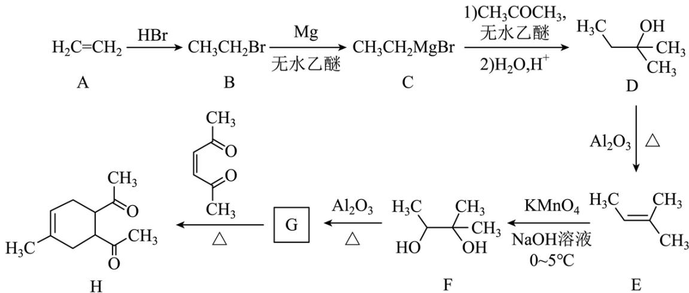  
回答下列问题:

(1) 由 A→B 的反应中, 乙烯的碳碳 键断裂(填“π”或“σ”)。

(2) D 的同分异构体中, 与其具有相同官能团的有\_\_\_\_种(不考虑对映异构), 其中核磁共振氢谱有三组峰, 峰面积之比为 $9: 2: 1$ 的结构简式为\_\_\_\_。

(3) E 与足量酸性 $\mathrm{KMnO}_{4}$ 溶液反应生成的有机物的名称为 \_\_\_\_、\_\_\_\_。

(4) G 的结构简式为 \_\_\_\_。

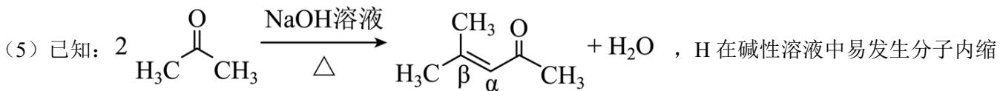

合从而构建双环结构，主要产物为 I( )和另一种 $\alpha$ ， $\beta$ -不饱和酮 J，J 的结构简式为

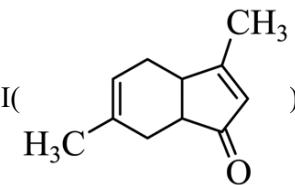

\_\_\_\_。若经此路线由 H 合成 I，存在的问题有\_\_\_\_(填标号)。

a. 原子利用率低 b. 产物难以分离 c. 反应条件苛刻 d. 严重污染环境

【答案】(1) $\pi$ (2)

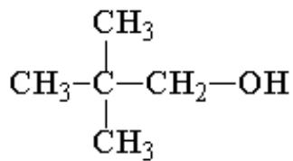

(3) ① 乙酸 ②. 丙酮

(4)

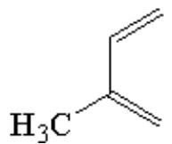

(5)

①.

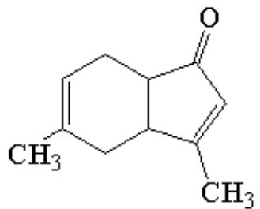

②. ab

【解析】

【分析】A 为 $CH_{2}=CH_{2}$ ，与 HBr 发生加成反应生成 B（ $CH_{3}CH_{2}Br$ ），B 与 Mg 在无水乙醚中发生生成 C

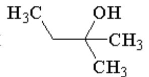

$\mathrm{(CH_{3}CH_{2}MgBr)}$ ，C与 $CH_{3}COCH_{3}$ 反应生成D（ $CH_{3}$ ），D在氧化铝催化下发生消去反应

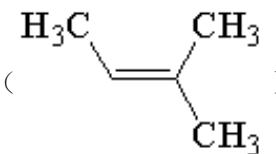

生成E（ $\begin{array}{c}\mathrm{H}_{3} \mathrm{C} \\ | \\ \mathrm{CH}_{3} \end{array}$ ），E和碱性高锰酸钾反应生成F（ $\begin{array}{c}\mathrm{H}_{3} \mathrm{C} \\ | \\ \mathrm{HO} \end{array}$ —— $\begin{array}{c}\mathrm{CH}_{3} \\ | \\ \mathrm{OH} \end{array}$ ），参考D～E反应，

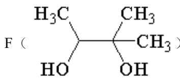

F在氧化铝催化下发生消去反应生成G（ $\mathrm{H}_3\mathrm{C}$ ），G与 $\mathrm{CH}_3$ 反应加成反应生成二酮H，据

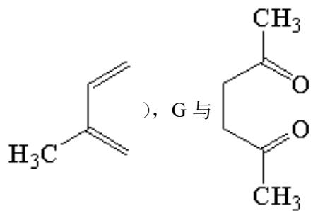

此分析解答。

【小问1详解】

A 为 $CH_{2}=CH_{2}$ ，与 HBr 发生加成反应生成 B（ $CH_{3}CH_{2}Br$ ），乙烯的 $\pi$ 键断裂，故答案为： $\pi$ ;

【小问 2 详解】

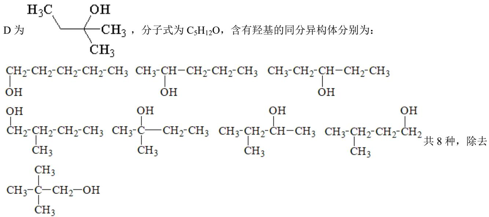

D自身，还有7种同分异构体，其中核磁共振氢谱有三组峰，峰面积之比为9:2:1的结构简式为

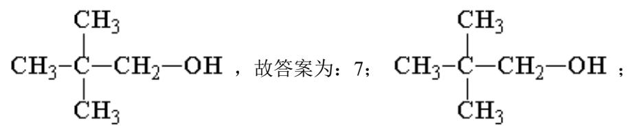

【小问3详解】

E为 $\mathrm{H}_3\mathrm{C}$ 、 $\mathrm{CH}_3$ ，酸性高锰酸钾可以将双键氧化断开，生成 $\mathrm{CH}_3\mathrm{-C(OH)}$ 和

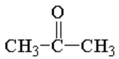

$\mathrm{CH}_{3}-\mathrm{C}=\mathrm{O}-\mathrm{CH}_{3}$ ，名称分别为乙酸和丙酮，故答案为：乙酸；丙酮；

【小问4详解】

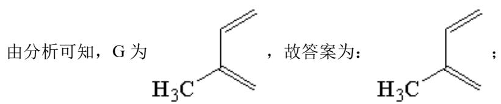

【小问 5 详解】

生分子内缩合从而构建双环结构，主要产物为I（ ）和J

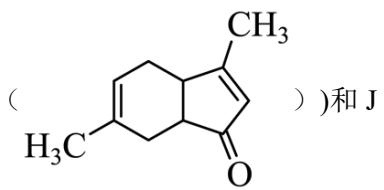

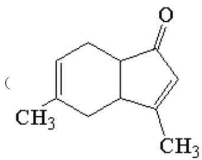

)。若经此路线由 H 合成 I，会同时产生两种同分异构体，导致原子利用率

低，产物难以分离等问题，故答案为：

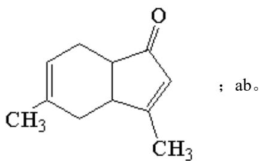

18. 学习小组探究了铜的氧化过程及铜的氧化物的组成。回答下列问题:

(1) 铜与浓硝酸反应的装置如下图, 仪器 A 的名称为\_\_\_\_, 装置 B 的作用为\_\_\_\_。

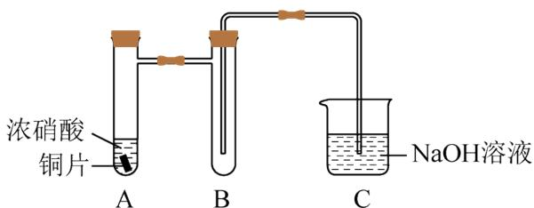

(2) 铜与过量 $H_{2}O_{2}$ 反应的探究如下:

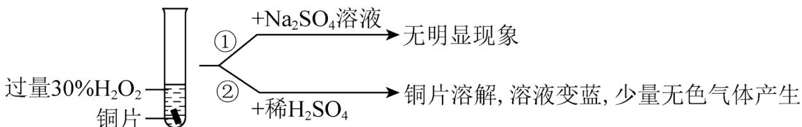

实验②中 Cu 溶解的离子方程式为\_\_\_\_；产生的气体为\_\_\_\_。比较实验①和②，从氧化还原角度说明 $H^{+}$ 的作用是\_\_\_\_。

(3) 用足量 $\mathrm{NaOH}$ 处理实验②新制的溶液得到沉淀 $\mathrm{X}$ , 元素分析表明 $\mathrm{X}$ 为铜的氧化物, 提纯干燥后的 $\mathrm{X}$ 在惰性氛围下加热, $\mathrm{mgX}$ 完全分解为 $\mathrm{ng}$ 黑色氧化物 $\mathrm{Y}$ , $\frac{\mathrm{n}}{\mathrm{m}} = \frac{5}{6}$ 。 $\mathrm{X}$ 的化学式为\_\_\_\_。

(4) 取含 X 粗品 $0.0500 \mathrm{~g}$ (杂质不参加反应)与过量的酸性 KI 完全反应后, 调节溶液至弱酸性。以淀粉为指示剂, 用 $0.1000 \mathrm{~mol} \cdot \mathrm{L}^{-1} \mathrm{Na}_{2} \mathrm{~S}_{2} \mathrm{O}_{3}$ 标准溶液滴定, 滴定终点时消耗 $\mathrm{Na}_{2} \mathrm{~S}_{2} \mathrm{O}_{3}$ 标准溶液 $15.00 \mathrm{~mL}$ 。(已知: $2 \mathrm{Cu}^{2+} + 4 \mathrm{I}^{-} = 2 \mathrm{CuI} \downarrow + \mathrm{I}_{2}, \mathrm{I}_{2} + 2 \mathrm{S}_{2} \mathrm{O}_{3}^{2-} = 2 \mathrm{I}^{-} + \mathrm{S}_{4} \mathrm{O}_{6}^{2-}$ ) 标志滴定终点的现象是 , 粗品中 X 的相对含量为 。

【答案】(1) ①. 具支试管 ②. 防倒吸

(2) ①. $\mathrm{Cu} + \mathrm{H}_{2} \mathrm{O}_{2} + 2 \mathrm{H}^{+} = \mathrm{Cu}^{2+} + 2 \mathrm{H}_{2} \mathrm{O}$ ②. $\mathrm{O}_{2}$ ③. 既不是氧化剂, 又不是还原剂(3) $\mathrm{CuO}_{2}$ (4) ①. 溶液蓝色消失, 且半分钟不恢复原来的颜色 ②. $72 \%$ 【解析】

【小问 1 详解】

由图可知，仪器 A 的名称为具支试管；铜和浓硝酸反应生成硝酸铜和二氧化氮，其中二氧化氮易溶于水，需要防倒吸，则装置 B 的作用为防倒吸；

【小问 2 详解】

根据实验现象，铜片溶解，溶液变蓝，可知在酸性条件下铜和过氧化氢发生反应，生成硫酸铜，离子方程式为： $Cu+H_{2}O_{2}+2H^{+}=Cu^{2+}+2H_{2}O$ ；硫酸铜可以催化过氧化氢分解生成氧气，则产生的气体为 $O_{2}$ ；在铜和过氧化氢的反应过程中，氢元素的化合价没有发生变化，故从氧化还原角度说明 $H^{+}$ 的作用是：既不是氧化剂，又不是还原剂；

【小问 3 详解】

在该反应中铜的质量 $m(\mathrm{Cu})=n\times\frac{64}{80}=\frac{4n}{5}$ ，因为 $\frac{n}{m}=\frac{5}{6}$ ，则 $m(\mathrm{O})=n\times\frac{16}{80}+(\mathrm{m}-\mathrm{n})=\frac{2n}{5}$ ，则 X 的化学式中铜原子和氧原子的物质的量之比为： $\frac{n(\mathrm{Cu})}{n(\mathrm{O})}=\frac{\frac{4n}{5\times64}}{\frac{2n}{5\times16}}=\frac{1}{2}$ ，则 X 为 $CuO_{2}$ ;

【小问 4 详解】

滴定结束的时候，单质碘消耗完，则标志滴定终点的现象是：溶液蓝色消失，且半分钟不恢复原来的颜色；在 $CuO_{2}$ 中铜为 +2 价，氧为 -1 价，根据 $2Cu^{2+} + 4I^{-} = 2CuI \downarrow + I_{2}$ ， $I_{2} + 2S_{2}O_{3}^{2-} = 2I^{-} + S_{4}O_{6}^{2-}$ ，可以得到关系式： $CuO_{2} \sim 2I_{2} \sim 4S_{2}O_{3}^{2-}$ ，则 $n(CuO_{2}) = \frac{1}{4} \times 0.1 \, \text{mol/L} \times 0.015 \, \text{L} = 0.000375 \, \text{mol}$ ，粗品中 X 的相对含量为 $\frac{0.000375 \times 96}{0.05} \times 100\% = 72\%$ .

19. 纳米碗 $C_{40}H_{10}$ 是一种奇特的碗状共轭体系。高温条件下， $C_{40}H_{10}$ 可以由 $C_{40}H_{20}$ 分子经过连续 5 步氢抽提和闭环脱氢反应生成。 $\mathrm{C}_{40}\mathrm{H}_{20}(\mathrm{~g})\xrightarrow{\mathrm{H\cdot}}\mathrm{C}_{40}\mathrm{H}_{18}(\mathrm{~g})+\mathrm{H}_{2}(\mathrm{~g})$ 的反应机理和能量变化如下：

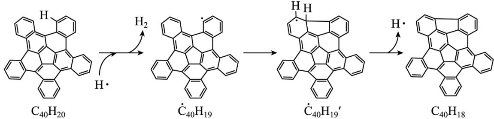

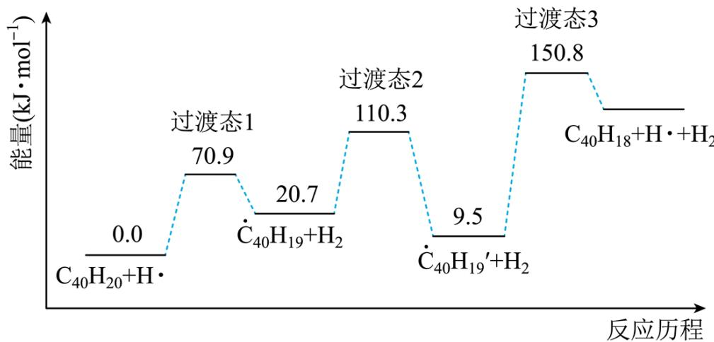

回答下列问题:

（1）已知 $C_{40}H_{x}$ 中的碳氢键和碳碳键的键能分别为 $431.0\,kJ \cdot mol^{-1}$ 和 $298.0\,kJ \cdot mol^{-1}$ ，H-H 键能为 $436.0\,kJ \cdot mol^{-1}$ 。估算 $\mathrm{C}_{40}\mathrm{H}_{20}(\mathrm{g}) \rightleftharpoons \mathrm{C}_{40}\mathrm{H}_{18}(\mathrm{g}) + \mathrm{H}_{2}(\mathrm{g})$ 的 $\Delta H =$ \_\_\_\_ $kJ \cdot mol^{-1}$ 。

（2）图示历程包含\_\_\_\_个基元反应，其中速率最慢的是第\_\_\_\_个。

(3) $\mathrm{C}_{40} \mathrm{H}_{10}$ 纳米碗中五元环和六元环结构的数目分别为 \_\_\_\_ 、 \_\_\_\_。

(4) 1200K 时, 假定体系内只有反应 $\mathrm{C}_{40} \mathrm{H}_{12}(\mathrm{~g}) \rightleftharpoons \mathrm{C}_{40} \mathrm{H}_{10}(\mathrm{~g}) + \mathrm{H}_{2}(\mathrm{~g})$ 发生, 反应过程中压强恒定为 $p_{0}$ (即 $\mathrm{C}_{40} \mathrm{H}_{12}$ 的初始压强), 平衡转化率为 $\alpha$ , 该反应的平衡常数 $K_{\mathrm{p}}$ 为\_\_\_\_(用平衡分压代替平衡浓度计算, 分压=总压×物质的量分数)。

(5) $\dot{\mathrm{C}}_{40} \mathrm{H}_{19}(\mathrm{~g}) \rightleftharpoons \mathrm{C}_{40} \mathrm{H}_{18}(\mathrm{~g}) + \mathrm{H} \cdot (\mathrm{g})$ 及 $\dot{\mathrm{C}}_{40} \mathrm{H}_{11}(\mathrm{~g}) \rightleftharpoons \mathrm{C}_{40} \mathrm{H}_{10}(\mathrm{~g}) + \mathrm{H} \cdot (\mathrm{g})$ 反应的 $\ln K (K$ 为平衡常数)随温度倒数的关系如图所示。已知本实验条件下, $\ln K = -\frac{\Delta H}{RT} + c$ (R 为理想气体常数, c 为截距)。图中两条线几乎平行, 从结构的角度分析其原因是\_\_\_\_。

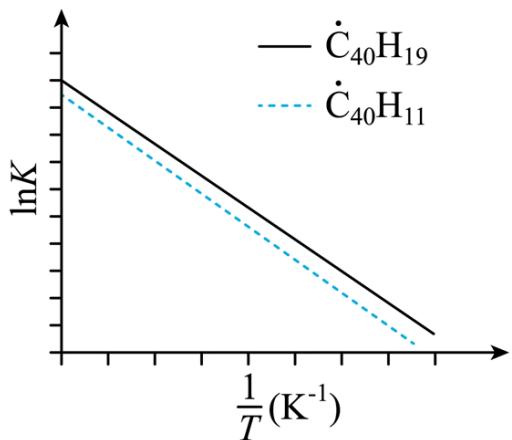

(6) 下列措施既能提高反应物的平衡转化率, 又能增大生成 $\mathrm{C}_{40} \mathrm{H}_{10}$ 的反应速率的是\_\_\_\_(填标号)。  
a. 升高温度 b. 增大压强 c. 加入催化剂

【答案】(1) 128 (2) ①.3 ②.3

(3) ①.6 ②.10

(4) $P_{0}\frac{a^{2}}{1-a^{2}}$

（5）在反应过程中，断裂和形成的化学键相同

【解析】

【小问 1 详解】

由 $C_{40}H_{20}$ 和 $C_{40}H_{18}$ 的结构式和反应历程可以看出， $C_{40}H_{20}$ 中断裂了 2 根碳氢键， $C_{40}H_{18}$ 形成了 1 根碳碳键，所以 $\mathrm{C}_{40}\mathrm{H}_{20}(\mathrm{g})\rightleftharpoons\mathrm{C}_{40}\mathrm{H}_{18}(\mathrm{g})+\mathrm{H}_{2}(\mathrm{g})$ 的 $\Delta H=431\times2-298-436\ kJ\cdot mol^{-1}=+128kJ\cdot mol^{-1}$ ，故答案为：128；

【小问 2 详解】

由反应历程可知，包含3个基元反应，分别为： $C_{40}H_{20}+H\cdot\rightleftharpoons\dot{C}_{40}H_{19}+H_{2}$

$\dot{C}_{40}H_{19}+H_{2}\rightleftharpoons\dot{C}_{40}H_{19}'+H_{2},\dot{C}_{40}H_{19}'+H_{2}\rightleftharpoons C_{40}H_{18}+H\bullet+H_{2}$ ，其中第三个的活化能最大，反应速率最慢，故答案为：3；3；

【小问 3 详解】

由 $\mathrm{C}_{40} \mathrm{H}_{20}$ 的结构分析, 可知其中含有 1 个五元环, 10 个六元环, 每脱两个氢形成一个五元环, 则 $\mathrm{C}_{40} \mathrm{H}_{10}$ 总共含有 6 个五元环, 10 个六元环, 故答案为: 6; 10;

【小问 4 详解】

1200K 时，假定体系内只有反应 $\mathrm{C}_{40}\mathrm{H}_{12}(\mathrm{g})\rightleftharpoons\mathrm{C}_{40}\mathrm{H}_{10}(\mathrm{g})+\mathrm{H}_{2}(\mathrm{g})$ 发生，反应过程中压强恒定为 $p_{0}$ (即 $C_{40}H_{12}$ 的初始压强)，平衡转化率为 $\alpha$ ，设起始量为 1mol，则根据信息列出三段式为：

$$
\mathrm{C} _ {4 0} \mathrm{H} _ {1 2} (\mathrm{g}) \rightleftharpoons \mathrm{C} _ {4 0} \mathrm{H} _ {1 0} (\mathrm{g}) + \mathrm{H} _ {2} (\mathrm{g})
$$

起始量（mol） 1 0 0
变化量（mol） α α α
平衡量（mol） 1-α α α

则 $P(C_{40}H_{12}) = P_0 \times \frac{1 - \alpha}{1 + \alpha}$ , $P(C_{40}H_{10}) = P_0 \times \frac{\alpha}{1 + \alpha}$ , $P(H_2) = P_0 \times \frac{\alpha}{1 + \alpha}$ , 该反应的平衡常数 $K_p = \frac{P_0 \times \frac{\alpha}{1 + \alpha} \times P_0 \times \frac{\alpha}{1 + \alpha}}{P_0 \times \frac{1 - \alpha}{1 + \alpha}} = P(C_{40}H_{12}) = P_0 \frac{\alpha^2}{1 - \alpha^2}$ , 故答案为: $P_0 \frac{\alpha^2}{1 - \alpha^2}$ ;

## 【小问 5 详解】

$\dot{C}_{40}H_{19}(g)\rightleftharpoons C_{40}H_{18}(g)+H\cdot(g)$ 及 $\dot{C}_{40}H_{11}(g)\rightleftharpoons C_{40}H_{10}(g)+H\cdot(g)$ 反应的 $\ln K$ (K 为平衡常数) 随温度倒数的关系如图。图中两条线几乎平行，说明斜率几乎相等，根据 $\ln K=-\frac{\Delta H}{RT}+c$ (R 为理想气体常数，c 为截距) 可知，斜率相等，则说明焓变相等，因为在反应过程中，断裂和形成的化学键相同，故答案为：在反应过程中，断裂和形成的化学键相同；

## 【小问6详解】

a. 由反应历程可知，该反应为吸热反应，升温，反应正向进行，提高了平衡转化率反应速率也加快，a 符合题意；

b. 由化学方程式可知，该反应为正向体积增大的反应，加压，反应逆向进行，降低了平衡转化率，b 不符合题意；

c. 加入催化剂，平衡不移动，不能提高平衡转化率，c 不符合题意；

故答案为：a。