# 2023 年湖南卷化学高考真题

## 一、选择题：本题共14小题，每小题3分，共42分。在每小题给出的四个选项中，只有一项是符合题目要求的。

1. 中华文化源远流长，化学与文化传承密不可分。下列说法错误的是
A. 青铜器“四羊方尊”的主要材质为合金
B. 长沙走马楼出土的竹木简牍主要成分是纤维素
C. 蔡伦采用碱液蒸煮制浆法造纸，该过程不涉及化学变化
D. 铜官窑彩瓷是以黏土为主要原料，经高温烧结而成

【答案】C 【解析】

【详解】A. 四羊方尊由青铜制成，在当时铜的冶炼方法还不成熟，铜中常含有一些杂质，因此青铜属合金范畴，A 正确；  
B. 竹木简牍由竹子、木头等原料制成，竹子、木头的主要成分为纤维素，B 正确；  
C. 蔡伦用碱液制浆法造纸，将原料放在碱液中蒸煮，原料在碱性环境下发生反应使原有的粗浆纤维变成细浆，该过程涉及化学变化，C 错误；  
D. 陶瓷是利用黏土在高温下烧结定型生成硅酸铝，D 正确；  
故答案选 C。

2. 下列化学用语表述错误的是
A. HClO 的电子式: H: $\overset{\bullet}{\underset{\cdot}{\mathrm{O}}}: \overset{\cdot}{\underset{\cdot}{\mathrm{Cl}}}:$

B. 中子数为 10 的氧原子: $^{18}_{8}\text{O}$

$$
\mathrm{NH} _ {3}
$$

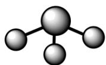

D. 基态 N 原子的价层电子排布图: 2s 2p

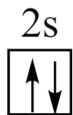

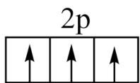

【答案】C

【解析】

【详解】A．HClO 中 O 元素成负化合价，在结构中得到 H 和 Cl 共用的电子，因此 HClO 的电子式为

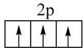

H: $\ddot{\mathrm{O}}$ : $\ddot{\mathrm{Cl}}$ :, A 正确;

B. 中子数为 10，质子数为 8 的 O 原子其相对原子质量为 $10+8=18$ ，其原子表示为 ${}^{18}_{8}O$ ，B 正确；
C. 根据 VSEPR 模型计算， $NH_{3}$ 分子中有 1 对故电子对，N 还连接有 3 和 H 原子，因此 $NH_{3}$ 的 VSEPR 模型为四面体型，C 错误；
D. 基态 N 原子是价层电子排布为 $2s^{2}2p^{3}$ ，其电子排布图为 $\boxed{2s}$ $\boxed{2p}$ ，D 正确；
故答案选 C。

3. 下列玻璃仪器在相应实验中选用不合理的是

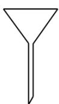

①

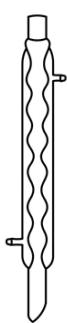

②

③

④

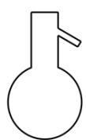

⑤

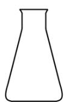

⑥

A. 重结晶法提纯苯甲酸: ①②③
B. 蒸馏法分离 $\mathrm{CH}_{2} \mathrm{Cl}_{2}$ 和 $\mathrm{CCl}_{4}$ : ③⑤⑥
C. 浓硫酸催化乙醇制备乙烯: ③⑤
D. 酸碱滴定法测定 NaOH 溶液浓度: ④⑥

【解析】

【详解】A. 粗苯甲酸中含有少量氯化钠和泥沙，需要利用重结晶来提纯苯甲酸，具体操作为加热溶解、趁热过滤和冷却结晶，此时利用的玻璃仪器有漏斗、烧杯、玻璃棒，A 选项装置选择不合理；  
B. 蒸馏法需要用到温度计以测量蒸汽温度、蒸馏烧瓶用来盛装混合溶液、锥形瓶用于盛装收集到的馏分，B 选项装置选择合理；  
C. 浓硫酸催化制乙烯需要控制反应温度为 $170^{\circ}\mathrm{C}$ ，需要利用温度计测量反应体系的温度，C 选项装置选择合理；  
D. 酸碱滴定法测定 $\mathrm{NaOH}$ 溶液浓度是用已知浓度的酸液滴定未知浓度的碱液，酸液盛装在酸式滴定管中，D 选项装置选择合理；  
故答案选 A。

4. 下列有关物质结构和性质的说法错误的是  
A. 含有手性碳原子的分子叫做手性分子  
B. 邻羟基苯甲醛的沸点低于对羟基苯甲醛的沸点  
C. 酰胺在酸或碱存在并加热的条件下可发生水解反应  
D. 冠醚(18-冠-6)的空穴与 $\mathrm{K}^{+}$ 尺寸适配，两者能通过弱相互作用形成超分子

【解析】

【详解】A. 有手性异构体的分子被称为手性分子, 当分子中存在两个或两个以上的手性碳原子时, 会出现内消旋体, 这种含有内消旋体的分子不是手性分子, A 错误;  
B. 邻羟基苯甲醛中含有分子内氢键, 分子内氢键可以降低物质的熔沸点, 因此邻羟基苯甲醛的熔沸点低于对羟基苯甲醛的熔沸点, B 正确;  
C. 酰胺在酸性条件下反应生成羧酸和胺, 在碱性条件下反应生成羧酸盐和氨气, 二者均为水解反应, C 正确;  
D. 超分子是由两种或两种以上的分子通过分子间作用力形成的分子聚集体, 冠醚(18-冠-6)的空穴大小为 $260 \sim 320 \mathrm{pm}$ , 可以适配 $\mathrm{K}^{+}(276 \mathrm{pm})$ 、 $\mathrm{Rb}^{+}(304 \mathrm{pm})$ , 冠醚与离子之间以配位的形式结合, D 正确;  
故答案选 A。

5. 下列有关电极方程式或离子方程式错误的是
A. 碱性锌锰电池的正极反应： $\mathrm{MnO}_{2} + \mathrm{H}_{2} \mathrm{O} + \mathrm{e}^{-} = \mathrm{MnO(OH)} + \mathrm{OH}^{-}$ B. 铅酸蓄电池充电时的阳极反应： $\mathrm{Pb}^{2+} + 2 \mathrm{H}_{2} \mathrm{O} - 2 \mathrm{e}^{-} = \mathrm{PbO}_{2} + 4 \mathrm{H}^{+}$ C. $\mathrm{K}_{3}[\mathrm{Fe(CN)}_{6}]$ 溶液滴入 $\mathrm{FeCl}_{2}$ 溶液中： $\mathrm{K}^{+} + \mathrm{Fe}^{2+} + [\mathrm{Fe(CN)}_{6}]^{3-} = \mathrm{KFe}[\mathrm{Fe(CN)}_{6}] \downarrow$ D. $\mathrm{TiCl}_{4}$ 加入水中： $\mathrm{TiCl}_{4} + (x + 2) \mathrm{H}_{2} \mathrm{O} = \mathrm{TiO}_{2} \cdot x \mathrm{H}_{2} \mathrm{O} \downarrow + 4 \mathrm{H}^{+} + 4 \mathrm{Cl}^{-}$

【答案】B

【解析】

【详解】A．碱性锌锰电池放电时正极得到电子生成 $\mathrm{MnO(OH)}$ ，电极方程式为 $\mathrm{MnO_{2}+H_{2}O+e^{-}}=\mathrm{MnO(OH)+OH^{-}}$ ，A 正确；
B．铅酸电池在充电时阳极失电子，其电极式为： $PbSO_{4}-2e^{-}+2H_{2}O=PbO_{2}+4H^{+}+SO_{4}^{2-}$ ，B 错误；
C. $K_{3}[Fe(CN)_{6}]$ 用来鉴别 $Fe^{2+}$ 生成滕氏蓝沉淀，反应的离子方程式为 $K^{+}+Fe^{2+}+[Fe(CN)_{6}]^{3-}=KFe[Fe(CN)_{6}]$ ，C 正确；
D. $TiCl_{4}$ 容易与水反应发生水解，反应的离子方程式为 $\mathrm{TiCl}_{4}+(x+2)\mathrm{H}_{2}\mathrm{O}=\mathrm{TiO}_{2}\cdot x\mathrm{H}_{2}\mathrm{O}\downarrow+4\mathrm{H}^{+}+4\mathrm{Cl}^{-}$ ，D 正确；

故答案选 B。

6. 日光灯中用到的某种荧光粉的主要成分为 $3\mathrm{W}_{3}(\mathrm{ZX}_{4})_{2} \cdot \mathrm{WY}_{2}$ 。已知：X、Y、Z 和 W 为原子序数依次增大的前 20 号元素，W 为金属元素。基态 X 原子 s 轨道上的电子数和 p 轨道上的电子数相等，基态 X、Y、Z 原子的未成对电子数之比为 2:1:3。下列说法正确的是
A. 电负性： $X > Y > Z > W$ B. 原子半径： $X < Y < Z < W$ C. Y 和 W 的单质都能与水反应生成气体
D. Z 元素最高价氧化物对应的水化物具有强氧化性

【答案】C

【解析】

【分析】根据题中所给的信息，基态 X 原子 s 轨道上的电子式与 p 轨道上的电子式相同，可以推测 X 为 O 元素或 Mg 元素，由荧光粉的结构可知，X 主要形成的是酸根，因此 X 为 O 元素；基态 X 原子中未成键电子数为 2，因此 Y 的未成键电子数为 1，又因 X、Y、Z、W 的原子序数依次增大，故 Y 可能为 F 元素、Na 元素、Al 元素、Cl 元素，因题目中给出 W 为金属元素且荧光粉的结构中 Y 与 W 化合，故 Y 为 F 元素或 Cl 元素；Z 原子的未成键电子数为 3，又因其原子序大于 Y，故 Y 应为 F 元素、Z 其应为 P 元素；从荧光粉的结构式可以看出 W 为某+2 价元素，故其为 Ca 元素；综上所述，X、Y、Z、W 四种元素分别为 O、F、P、Ca，据此答题。

【详解】A. 电负性用来描述不同元素的原子对键合电子吸引力的大小, 根据其规律, 同一周期从左到右依次增大, 同一主族从上到下依次减小, 故四种原子的电负性大小为: $Y > X > Z > W$ , A 错误;

$$
\mathrm{Y} <   \mathrm{X} <   \mathrm{Z} <   \mathrm{W}
$$

$$
\mathrm{F} _ {2}
$$

$$
\mathrm{O} _ {2}
$$

$$
\mathrm{H} _ {3} \mathrm{PO} _ {4}
$$

7. 取一定体积的两种试剂进行反应，改变两种试剂的滴加顺序(试剂浓度均为 $0.1 \mathrm{~mol} \cdot \mathrm{L}^{-1}$ )，反应现象没有明显差别的是

<table><tr><td>选项</td><td>试剂1</td><td>试剂2</td></tr><tr><td>A</td><td>氨水</td><td> $AgNO_{3}$ 溶液</td></tr><tr><td>B</td><td>NaOH溶液</td><td> $Al_{2}(SO_{4})_{3}$ 溶液</td></tr><tr><td>C</td><td> $H_{2}C_{2}O_{4}$ 溶液</td><td>酸性 $KMnO_{4}$ 溶液</td></tr><tr><td>D</td><td>KSCN溶液</td><td> $FeCl_{3}$ 溶液</td></tr></table>

【答案】D

【解析】

【详解】A．向氨水中滴加 $AgNO_{3}$ 溶液并振荡，由于开始时氨水过量，振荡后没有沉淀产生，发生的反应为 $AgNO_{3} + 2NH_{3} \cdot H_{2}O = Ag(NH_{3})_{2}NO_{3} + 2H_{2}O$ ；向 $AgNO_{3}$ 溶液中滴加氨水并振荡，开始时生成白色沉淀且沉淀逐渐增多,发生的反应为 $AgNO_{3} + NH_{3} \cdot H_{2}O = AgOH \downarrow + NH_{4}NO_{3}$ ；当氨水过量后，继续滴加氨水沉淀逐渐减少直至沉淀完全溶解，发生的反应为 $AgOH + 2NH_{3} \cdot H_{2}O = Ag(NH_{3})_{2}OH + 2H_{2}O$ ，因此，改变两种试剂的滴加顺序后反应现象有明显差别，A 不符合题意；

B. 向 NaOH 中滴加 $\mathrm{Al}_{2}\left(\mathrm{SO}_{4}\right)_{3}$ 溶液并振荡，由于开始时 NaOH 过量，振荡后没有沉淀产生，发生的反应为 $8\mathrm{NaOH} + \mathrm{Al}_{2}\left(\mathrm{SO}_{4}\right)_{3} = 2\mathrm{NaAlO}_{2} + 3\mathrm{Na}_{2}\mathrm{SO}_{4} + 4\mathrm{H}_{2}\mathrm{O}$ ；向 $\mathrm{Al}_{2}\left(\mathrm{SO}_{4}\right)_{3}$ 溶液中滴加 NaOH 并振荡，开始时生成白色沉淀且沉淀逐渐增多，发生的反应为 $6\mathrm{NaOH} + \mathrm{Al}_{2}\left(\mathrm{SO}_{4}\right)_{3} = 2\mathrm{Al}\left(\mathrm{OH}\right)_{3} \downarrow + 3\mathrm{Na}_{2}\mathrm{SO}_{4}$ ；当 NaOH 过量后，继续滴加 NaOH 沉淀逐渐减少直至沉淀完全溶解，发生的反应为 $\mathrm{NaOH} + \mathrm{Al}\left(\mathrm{OH}\right)_{3} = \mathrm{NaAlO}_{2} + 2\mathrm{H}_{2}\mathrm{O}$ ，因此，改变两种试剂的滴加顺序后反应现象有明显差别，B 不符合题意；

C. 向 $\mathrm{H}_2\mathrm{C}_2\mathrm{O}_4$ 溶液中滴加酸性 $\mathrm{KMnO}_4$ 溶液并振荡，由于开始时 $\mathrm{H}_2\mathrm{C}_2\mathrm{O}_4$ 是过量的， $\mathrm{KMnO}_4$ 可以被 $\mathrm{H}_2\mathrm{C}_2\mathrm{O}_4$ 完全还原，可以看到紫红色的溶液褪为无色，发生的反应为 $5\mathrm{H}_2\mathrm{C}_2\mathrm{O}_4 + 2\mathrm{KMnO}_4 + 3\mathrm{H}_2\mathrm{SO}_4 = 2\mathrm{MnSO}_4 + \mathrm{K}_2\mathrm{SO}_4 + 10\mathrm{CO}_2 \uparrow + 8\mathrm{H}_2\mathrm{O}$ ；向 $\mathrm{KMnO}_4$ 溶液中滴加酸性 $\mathrm{H}_2\mathrm{C}_2\mathrm{O}_4$ 溶液并振荡，由于开始时 $\mathrm{KMnO}_4$ 是过量的， $\mathrm{KMnO}_4$ 逐渐被 $\mathrm{H}_2\mathrm{C}_2\mathrm{O}_4$ 还原，可以看到紫红色的溶液逐渐变浅，最后变为无色，因此，改变两种试剂的滴加顺序后反应现象有明显差别，C 不符合题意；

D. 向 KSCN 溶液中滴加 $FeCl_{3}$ 溶液，溶液立即变为血红色；向 $FeCl_{3}$ 溶液中滴加 KSCN 溶液，溶液同样立即变为血红色，因此，改变两种试剂的滴加顺序后反应现象没有明显差别，D 符合题意；综上所述，本题选 D。

8. 葡萄糖酸钙是一种重要的补钙剂，工业上以葡萄糖、碳酸钙为原料，在溴化钠溶液中采用间接电氧化反应制备葡萄糖酸钙，其阳极区反应过程如下：

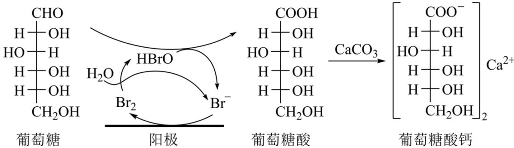

下列说法错误的是
A. 溴化钠起催化和导电作用
B. 每生成1mol葡萄糖酸钙，理论上电路中转移了2mol电子
C. 葡萄糖酸能通过分子内反应生成含有六元环状结构的产物
D. 葡萄糖能发生氧化、还原、取代、加成和消去反应

【答案】B

【解析】

【详解】A．由图中信息可知，溴化钠是电解装置中的电解质，其电离产生的离子可以起导电作用，且 $Br^{-}$ 在阳极上被氧化为 $Br_{2}$ ，然后 $Br_{2}$ 与 $H_{2}O$ 反应生成 HBrO 和 $Br^{-}$ ，HBrO 再和葡萄糖反应生成葡萄糖酸和 $Br^{-}$ ，溴离子在该过程中的质量和性质保持不变，因此，溴化钠在反应中起催化和导电作用，A 说法正确；B．由 A 中分析可知， $2mol\ Br^{-}$ 在阳极上失去 2mol 电子后生成 $1mol\ Br_{2}$ ， $1mol\ Br_{2}$ 与 $H_{2}O$ 反应生成 1mol HBrO，1mol HBrO 与 1mol 葡萄糖反应生成 1mol 葡萄糖酸，1mol 葡萄糖酸与足量的碳酸钙反应可生成 0.5 mol 葡萄糖酸钙，因此，每生成 1 mol 葡萄糖酸钙，理论上电路中转移了 4 mol 电子，B 说法不正确；C．葡萄糖酸分子内既有羧基又有羟基，因此，其能通过分子内反应生成含有六元环状结构的酯，C 说法正确；

D. 葡萄糖分子中的 1 号 C 原子形成了醛基，其余 5 个 C 原子上均有羟基和 H；醛基上既能发生氧化反应生成羧基，也能在一定的条件下与氢气发生加成反应生成醇，该加成反应也是还原反应；葡萄糖能与酸发生酯化反应，酯化反应也是取代反应；羟基能与其相连的 C 原子的邻位 C 上的 H（ $\beta-H$ ）发生消去反应；综上所述，葡萄糖能发生氧化、还原、取代、加成和消去反应，D 说法正确；

综上所述，本题选 B。

9. 处理某铜冶金污水(含 $Cu^{2+}$ 、 $Fe^{3+}$ 、 $Zn^{2+}$ 、 $Al^{3+}$ )的部分流程如下:

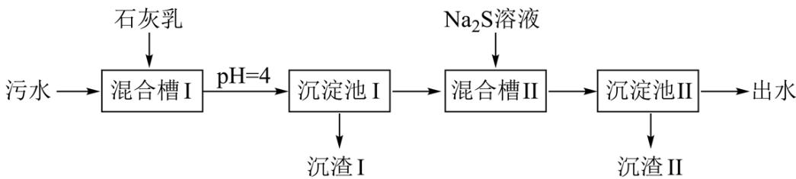

已知：①溶液中金属离子开始沉淀和完全沉淀的pH如下表所示：

<table><tr><td>物质</td><td> $Fe(OH)_3$ </td><td> $Cu(OH)_2$ </td><td> $Zn(OH)_2$ </td><td> $Al(OH)_3$ </td></tr><tr><td>开始沉淀pH</td><td>1.9</td><td>4.2</td><td>6.2</td><td>3.5</td></tr><tr><td>完全沉淀pH</td><td>3.2</td><td>6.7</td><td>8.2</td><td>4.6</td></tr></table>

② $\mathrm{K_{sp}(CuS) = 6.4\times 10^{-36}, K_{sp}(ZnS) = 1.6\times 10^{-24}}$

下列说法错误的是

A. “沉渣 I”中含有 $\mathrm{Fe(OH)}_{3}$ 和 $\mathrm{Al(OH)}_{3}$

B. $Na_{2}S$ 溶液呈碱性，其主要原因是 $S^{2-} + H_{2}O \rightleftharpoons HS^{-} + OH^{-}$

C.“沉淀池Ⅱ”中，当 $Cu^{2+}$ 和 $Zn^{2+}$ 完全沉淀时，溶液中 $\frac{c(Cu^{2+})}{c(Zn^{2+})}=4.0\times10^{-12}$

D.“出水”经阴离子交换树脂软化处理后，可用作工业冷却循环用水

【答案】D

【解析】

【分析】污水中含有铜离子、三价铁离子、锌离子、铝离子，首先加入石灰乳除掉三价铁离子和铝离子，过滤后，加入硫化钠除去其中的铜离子和锌离子，再次过滤后即可达到除去其中的杂质，以此解题。

【详解】A．根据分析可知氢氧化铁当 pH=1.9 时开始沉淀，氢氧化铝当 pH=3.5 时开始沉淀，当 pH=4 时，则会生成氢氧化铝和氢氧化铁，即“沉渣 I”中含有 Fe(OH) $_{3}$ 和 Al(OH) $_{3}$ ，A 正确；

B. 硫化钠溶液中的硫离子可以水解, 产生氢氧根离子, 使溶液显碱性, 其第一步水解的方程式为: $\mathrm{S}^{2-} + \mathrm{H}_{2} \mathrm{O} \rightleftharpoons \mathrm{HS}^{-} + \mathrm{OH}^{-}$ , B 正确;

C. 当铜离子和锌离子完全沉淀时，则硫化铜和硫化锌都达到了沉淀溶解平衡，则 $\frac{\mathrm{c}(\mathrm{Cu}^{2+})}{\mathrm{c}(\mathrm{Zn}^{2+})} = \frac{\mathrm{c}(\mathrm{Cu}^{2+}) \cdot \mathrm{c}(\mathrm{S}^{2-})}{\mathrm{c}(\mathrm{Zn}^{2+}) \cdot \mathrm{c}(\mathrm{S}^{2-})} = \frac{\mathrm{K}_{\mathrm{sp}}(\mathrm{CuS})}{\mathrm{K}_{\mathrm{sp}}(\mathrm{ZnS})} = \frac{6.4 \times 10^{-36}}{1.6 \times 10^{-24}} = 4 \times 10^{-12}$ ，C 正确；
D. 污水经过处理后其中含有较多的钙离子，故“出水”应该经过阳离子交换树脂软化处理，达到工业冷却循环用水的标准后，才能使用，D 错误；
故选 D。

10. 油画创作通常需要用到多种无机颜料。研究发现，在不同的空气湿度和光照条件下，颜料雌黄 $\left(\mathrm{As}_{2}\mathrm{S}_{3}\right)$ 褪色的主要原因是发生了以下两种化学反应：

$$
\mathrm{As} _ {2} \mathrm{S} _ {3} (\mathrm{s}) \xrightarrow [ \text {空气，自然光} ]{\text {空气，紫外光}} \mathrm{As} _ {2} \mathrm{O} _ {3} + \mathrm{H} _ {2} \mathrm{S} _ {2} \mathrm{O} _ {3}
$$

下列说法正确的是
A. $S_{2}O_{3}^{2-}$ 和 $SO_{4}^{2-}$ 的空间结构都是正四面体形
B. 反应 I 和 II 中，元素 As 和 S 都被氧化
C. 反应 I 和 II 中，参加反应的 $\frac{n(O_{2})}{n(H_{2}O)}$ : I < II
D. 反应 I 和 II 中，氧化 $1molAs_{2}S_{3}$ 转移的电子数之比为 3:7

【答案】D

【解析】

【详解】A. $S_{2}O_{3}^{2-}$ 的中心原子 S 形成的 4 个 $\sigma$ 键的键长不一样，故其空间结构不是正四面体形，A 错误；
B. $As_{2}S_{3}$ 中 As 的化合价为 +3 价，反应 I 产物 $As_{2}O_{3}$ 中 As 的化合价为 +3 价，故该过程中 As 没有被氧化，B 错误；
C. 根据题给信息可知，反应 I 的方程式为： $2As_{2}S_{3}+6O_{2}+3H_{2}O\xlongequal{紫外光}2As_{2}O_{3}+3H_{2}S_{2}O_{3}$ ，反应 II 的方程式为： $As_{2}S_{3}+7O_{2}+6H_{2}O\xlongequal{自然光}2H_{3}AsO_{4}+3H_{2}SO_{4}$ ，则反应 I 和 II 中，参加反应的 $\frac{n(O_{2})}{n(H_{2}O)}$ ：I > II，C 错误；

D. $\mathrm{As}_{2} \mathrm{~S}_{3}$ 中 As 为 +3 价，S 为 -2 价，在经过反应 I 后，As 的化合价没有变，S 变为 +2 价，则 $1 \mathrm{~mol} \mathrm{As}_{2} \mathrm{~S}_{3}$ 失电子 $3 \times 4 \mathrm{~mol} = 12 \mathrm{~mol}$ ；在经过反应 II 后，As 变为 +5 价，S 变为 +6 价，则 $1 \mathrm{~mol} \mathrm{As}_{2} \mathrm{~S}_{3}$ 失电子 $2 \times 2 \mathrm{~mol} + 3 \times 8 \mathrm{~mol} = 28 \mathrm{~mol}$ ，则反应 I 和 II 中，氧化 $1 \mathrm{~mol} \mathrm{As}_{2} \mathrm{~S}_{3}$ 转移的电子数之比为 $3:7$ ，D 正确；故选 D。

11. 科学家合成了一种高温超导材料，其晶胞结构如图所示，该立方晶胞参数为 apm。阿伏加德罗常数的值为 $N_{A}$ 。下列说法错误的是

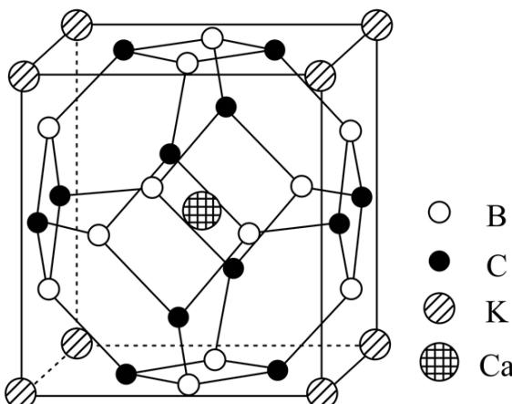

A. 晶体最简化学式为 $\mathrm{KCaB}_{6}\mathrm{C}_{6}$ B. 晶体中与 $\mathbf{K}^{+}$ 最近且距离相等的 $\mathrm{Ca}^{2+}$ 有8个  
C. 晶胞中B和C原子构成的多面体有12个面  
D. 晶体的密度为 $\frac{2.17\times 10^{32}}{\mathrm{a}^3\cdot\mathrm{N}_{\mathrm{A}}}\mathrm{g}\cdot \mathrm{cm}^{-3}$

【答案】C

【解析】

【详解】A. 根据晶胞结构可知, 其中 K 个数: $8 \times \frac{1}{8} = 1$ , 其中 Ca 个数: 1, 其中 B 个数: $12 \times \frac{1}{2} = 6$ , 其中 C 个数: $12 \times \frac{1}{2} = 6$ , 故其最简化学式为 $\mathrm{KCaB}_{6}\mathrm{C}_{6}$ , A 正确;  
B. 根据晶胞结构可知, $\mathbf{K}^{+}$ 位于晶胞顶点, $\mathrm{Ca}^{2+}$ 位于体心, 每个 $\mathbf{K}^{+}$ 为 8 个晶胞共用, 则晶体中与 $\mathbf{K}^{+}$ 最近且距离相等的 $\mathrm{Ca}^{2+}$ 有 8 个, B 正确;  
C. 根据晶胞结构可知, 晶胞中 B 和 C 原子构成的多面体有 14 个面, C 错误;

D. 根据选项 A 分析可知, 该晶胞最简化学式为 $\mathrm{KCaB}_{6} \mathrm{C}_{6}$ , 则 1 个晶胞质量为: $\frac{217}{\mathrm{N}_{\mathrm{A}}} \mathrm{~g}$ , 晶胞体积为 $a^{3} \times 10^{-30} \mathrm{~cm}^{3}$ , 则其密度为 $\frac{2.17 \times 10^{32}}{\mathrm{a}^{3} \cdot \mathrm{N}_{\mathrm{A}}} \mathrm{~g} \cdot \mathrm{cm}^{-3}$ , D 正确; 故选 C

12. 常温下，用浓度为 $0.0200 \mathrm{~mol} \cdot \mathrm{L}^{-1}$ 的 $\mathrm{NaOH}$ 标准溶液滴定浓度均为 $0.0200 \mathrm{~mol} \cdot \mathrm{L}^{-1}$ 的 $\mathrm{HCl}$ 和 $\mathrm{CH}_{3} \mathrm{COOH}$ 的混合溶液，滴定过程中溶液的 $\mathrm{pH}$ 随 $\eta$ ( $\eta = \frac{\mathrm{V}(\text {标准溶液})}{\mathrm{V}(\text {待测溶液})}$ ) 的变化曲线如图所示。下列说法错误的是

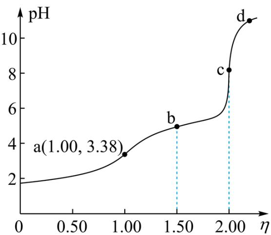

A. $\mathrm{K_a(CH_3COOH)}$ 约为 $10^{-4.76}$ B.点a: $\mathsf{c}\left(\mathrm{Na}^{+}\right) = \mathsf{c}\left(\mathrm{Cl}^{-}\right) = \mathsf{c}\left(\mathrm{CH}_{3}\mathrm{COO}^{-}\right) + \mathsf{c}\left(\mathrm{CH}_{3}\mathrm{COOH}\right)$ C.点b: $\mathsf{c}\left(\mathrm{CH}_3\mathrm{COOH}\right) <   \mathsf{c}\left(\mathrm{CH}_3\mathrm{COO}^- \right)$ D.水的电离程度：a<b<c<d 【答案】D 【解析】

【分析】NaOH 溶液和 HCl、 $CH_{3}COOH$ 混酸反应时，先与强酸反应，然后再与弱酸反应，由滴定曲线可知，a 点时 NaOH 溶液和 HCl 恰好完全反应生成 NaCl 和水， $CH_{3}COOH$ 未发生反应，溶质成分为 NaCl 和 $CH_{3}COOH$ ；b 点时 NaOH 溶液反应掉一半的 $CH_{3}COOH$ ，溶质成分为 NaCl、 $CH_{3}COOH$ 和 $CH_{3}COONa$ ；c 点时 NaOH 溶液与 $CH_{3}COOH$ 恰好完全反应，溶质成分为 NaCl、 $CH_{3}COONa$ ；d 点时 NaOH 过量，溶质成分为 NaCl、 $CH_{3}COONa$ 和 NaOH，据此解答。

【详解】A. 由分析可知，a 点时溶质成分为 NaCl 和 CH₃COOH，c(CH₃COOH)=0.0100mol/L，c(H⁺)=10⁻³.³⁸mol/L，Kₐ(CH₃COOH)= $\frac{c(H^{+}) \cdot c(CH_{3}COO^{-})}{c(CH_{3}COOH)}$ ≈ $\frac{10^{-3.38} \times 10^{-3.38}}{0.01}$ =10⁻⁴.⁷⁶，故 A 正确；

B. a 点溶液为等浓度的 NaCl 和 CH₃COOH 混合溶液，存在物料守恒关系

c(Na⁺)=c(Cl⁻)=c(CH₃COOH)+c(CH₃COO⁻)，故 B 正确；

C. 点 b 溶液中含有 NaCl 及等浓度的 CH₃COOH 和 CH₃COONa，由于 pH<7，溶液显酸性，说明 CH₃COOH 的电离程度大于 CH₃COO⁻ 的水解程度，则 c(CH₃COOH)<c(CH₃COO⁻)，故 C 正确；

D. c 点溶液中 CH₃COO⁻ 水解促进水的电离，d 点碱过量，会抑制水的电离，则水的电离程度 c>d，故 D 错误；

答案选 D。

13. 向一恒容密闭容器中加入 $1\mathrm{molCH}_{4}$ 和一定量的 $H_{2}O$ ，发生反应：

$\mathrm{CH}_4(\mathrm{g}) + \mathrm{H}_2\mathrm{O}(\mathrm{g}) \rightleftharpoons \mathrm{CO}(\mathrm{g}) + 3\mathrm{H}_2(\mathrm{g})$ 。 $\mathrm{CH}_4$ 的平衡转化率按不同投料比 $\mathbf{x}\left(\mathbf{x} = \frac{\mathbf{n}\left(\mathrm{CH}_4\right)}{\mathbf{n}\left(\mathrm{H}_2\mathrm{O}\right)}\right)$ 随温度的变化曲线如图所示。下列说法错误的是

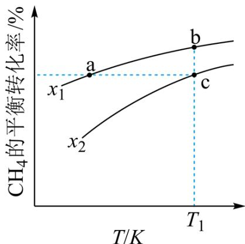

A. $\mathbf{x}_1 <   \mathbf{x}_2$ B. 反应速率： $\mathrm{V_{b\text{正}} <   V_{c\text{正}}}$ C. 点a、b、c对应的平衡常数： $\mathrm{K_a < K_b = K_c}$ D. 反应温度为 $\mathrm{T}_{1}$ ，当容器内压强不变时，反应达到平衡状态

【详解】A. 一定条件下，增大水的浓度，能提高 $\mathrm{CH}_4$ 的转化率，即 $\mathbf{x}$ 值越小， $\mathrm{CH}_4$ 的转化率越大，则

$x_{1}<x_{2}$ ，故 A 正确；

B. b 点和 c 点温度相同, $\mathrm{CH}_{4}$ 的起始物质的量都为 $1 \mathrm{~mol}$ , b 点 x 值小于 c 点, 则 b 点加水多, 反应物浓度大, 则反应速率: $\mathrm{V}_{\mathrm{b} \text {正 }} > \mathrm{V}_{\mathrm{c} \text {正}}$ , 故 B 错误; C. 由图像可知, x 一定时, 温度升高 $\mathrm{CH}_{4}$ 的平衡转化率增大, 说明正反应为吸热反应, 温度升高平衡正向移动, K 增大; 温度相同, K 不变, 则点 a、b、c 对应的平衡常数: $\mathrm{K}_{\mathrm{a}} < \mathrm{K}_{\mathrm{b}} = \mathrm{K}_{\mathrm{c}}$ , 故 C 正确; D. 该反应为气体分子数增大的反应, 反应进行时压强发生改变, 所以温度一定时, 当容器内压强不变时, 反应达到平衡状态, 故 D 正确; 答案选 B。

14. $\mathrm{N}_2\mathrm{H}_4$ 是一种强还原性的高能物质，在航天、能源等领域有广泛应用。我国科学家合成的某Ru(II)催化剂(用 $\left[\mathrm{L} - \mathrm{Ru} - \mathrm{NH}_3\right]^+$ 表示)能高效电催化氧化 $\mathrm{NH}_3$ 合成 $\mathrm{N}_2\mathrm{H}_4$ ，其反应机理如图所示。

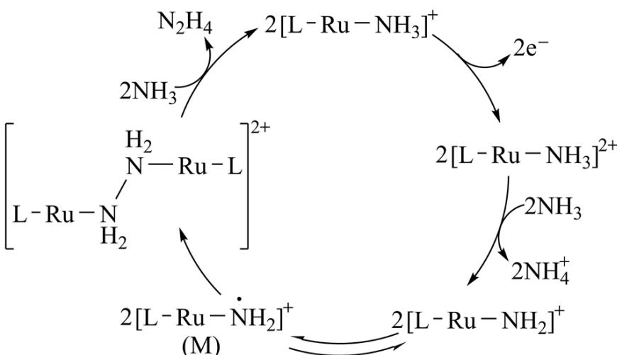

下列说法错误的是

A. Ru(II)被氧化至Ru(III)后，配体 $\mathrm{NH}_3$ 失去质子能力增强  
B.M中Ru的化合价为 $+3$ C.该过程有非极性键的形成  
D.该过程的总反应式： $4\mathrm{NH}_3 - 2\mathrm{e}^- = \mathrm{N}_2\mathrm{H}_4 + 2\mathrm{NH}_4^+$

【答案】B

【解析】

【详解】A. Ru(II)被氧化至Ru(III)后， $\left[\mathrm{L}-\mathrm{Ru}-\mathrm{NH}_{3}\right]^{2+}$ 中的Ru带有更多的正电荷，其与N原子成键后，Ru吸引电子的能力比Ru(II)强，这种作用使得配体 $\mathrm{NH}_{3}$ 中的N-H键极性变强且更易断裂，因此

其失去质子（ $\mathbf{H}^{+}$ ）的能力增强，A说法正确；

B. Ru(II)中Ru的化合价为+2，当其变为Ru(III)后，Ru的化合价变为+3，Ru(III)失去2个质子后，N原子产生了1个孤电子对，Ru的化合价不变；M为 $\left[L-Ru-\dot{NH}_{2}\right]^{+}$ ，当 $\left[L-Ru-NH_{2}\right]^{+}$ 变为M时，N原子的孤电子对拆为2个电子并转移给Ru1个电子，其中Ru的化合价变为+2，因此，B说法不正确；
C. 该过程 M 变为 $\left[L-Ru-NH_{2}-NH_{2}-Ru-L\right]^{2+}$ 时，有 N-N 键形成，N-N 是非极性键，C 说法正确；
D. 从整个过程来看，4个 $NH_{3}$ 失去了2个电子后生成了1个 $N_{2}H_{4}$ 和2个 $NH_{4}^{+}$ ，Ru(II)是催化剂，因此，该过程的总反应式为 $4NH_{3}-2e^{-}=N_{2}H_{4}+2NH_{4}^{+}$ ，D说法正确；
综上所述，本题选 B。

## 二、非选择题：本题共4小题，共58分。

15. 金属 Ni 对 $H_{2}$ 有强吸附作用，被广泛用于硝基或羰基等不饱和基团的催化氢化反应，将块状 Ni 转化成多孔型雷尼 Ni 后，其催化活性显著提高。

已知：①雷尼 Ni 暴露在空气中可以自燃，在制备和使用时，需用水或有机溶剂保持其表面“湿润”；

②邻硝基苯胺在极性有机溶剂中更有利于反应的进行。

某实验小组制备雷尼 Ni 并探究其催化氢化性能的实验如下:

步骤 1: 雷尼 Ni 的制备

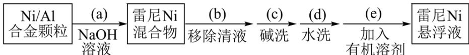

步骤 2：邻硝基苯胺的催化氢化反应

反应的原理和实验装置图如下(夹持装置和搅拌装置略)。装置 I 用于储存 $H_{2}$ 和监测反应过程。

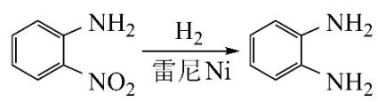

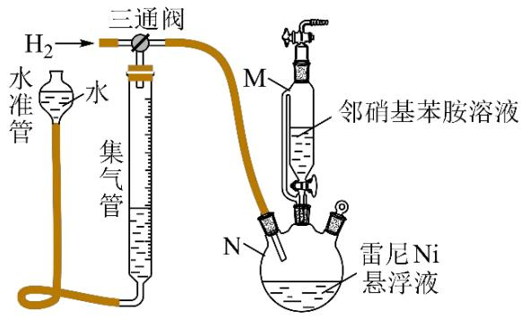  
装置I  
装置II

回答下列问题:

(1) 操作(a)中, 反应的离子方程式是\_\_\_\_;

(2) 操作(d)中, 判断雷尼 Ni 被水洗净的方法是\_\_\_\_;

(3) 操作(e)中, 下列溶剂中最有利于步骤2中氢化反应的是\_\_\_\_\_\_\_\_; A. 丙酮 B. 四氯化碳 C. 乙醇 D. 正己烷

(4) 向集气管中充入 $\mathrm{H}_{2}$ 时, 三通阀的孔路位置如下图所示: 发生氢化反应时, 集气管向装置 II 供气, 此时孔路位置需调节为\_\_\_\_;

向集气管中冲入 $\mathrm{H}_{2}$

集气管向装置II供气

A

B

C

D

(5) 仪器 M 的名称是\_\_\_\_;

(6) 反应前应向装置 II 中通入 $\mathrm{N}_{2}$ 一段时间, 目的是\_\_\_\_;

(7) 如果将三颈瓶 N 中的导气管口插入液面以下, 可能导致的后果是\_\_\_\_;

（8）判断氢化反应完全的现象是\_\_\_\_。

【答案】（1） $2Al+2OH^{-}+2H_{2}O=2AlO_{2}^{-}+3H_{2}\uparrow$

(2) 取最后一次洗涤液于试管中, 滴加几滴酚酞, 如果溶液不变粉红色, 则证明洗涤干净, 否则没有洗涤干净 (3) C

(4) B (5) 恒压滴液漏斗

(6) 排除装置中的空气, 防止雷尼 Ni 自燃

(7) 管道中气流不稳, 不利于监测反应过程

(8) 集气管中液面不再改变

【解析】

【分析】本题一道工业流程兼实验的综合题，首先用氢氧化钠溶液溶解镍铝合金中的铝，过滤后先后用碱和水来洗涤固体镍，随后加入有机溶剂制得雷尼镍悬浮液，用于步骤2中邻硝基苯胺的催化氢化，以此解题。

## 【小问 1 详解】

铝可以和氢氧化钠反应生成偏铝酸钠和氢气，离子方程式为： $2Al+2OH^{-}+2H_{2}O=2AlO_{2}^{-}+3H_{2}\uparrow$ ;

## 【小问 2 详解】

由于水洗之前是用碱洗，此时溶液显碱性，故可以用酸碱指示剂来判断是否洗净，具体方法为，取最后一次洗涤液于试管中，滴加几滴酚酞，如果溶液不变粉红色，则证明洗涤干净，否则没有洗涤干净；

【小问 3 详解】

根据题给信息可知，邻硝基苯胺在极性有机溶剂中更有利于反应的进行，在丙酮，四氯化碳，乙醇，正己烷中极性较强的为乙醇，故选 C；

【小问 4 详解】

向集气管中充入 $H_{2}$ 时，氢气从左侧进入，向下进入集气管，则当由集气管向装置Ⅱ供气，此时孔路位置需调节为气体由下方的集气管，向右进入装置Ⅱ，应该选 B，而装置 C 方式中左侧会漏气，不符合题意，故选 B；

【小问 5 详解】

由图可知，仪器 M 的名称是恒压滴液漏斗；

## 【小问6详解】

根据题给信息可知，雷尼 Ni 暴露在空气中可以自燃，故反应前向装置 II 中通入 $N_{2}$ 一段时间，目的是排除装置中的空气，防止雷尼 Ni 自燃；

## 【小问 7 详解】

如果将三颈瓶 N 中的导气管口插入液面以下，则会在三颈瓶中产生气泡，从而导致管道中气流不稳，不利于监测反应过程；

【小问 8 详解】

反应完成后，氢气不再被消耗，则集气管中液面不再改变。

16. 聚苯乙烯是一类重要的高分子材料，可通过苯乙烯聚合制得。

I. 苯乙烯的制备

（1）已知下列反应的热化学方程式：

$$
① \mathrm{C} _ {6} \mathrm{H} _ {5} \mathrm{C} _ {2} \mathrm{H} _ {5} (\mathrm{g}) + \frac {2 1}{2} \mathrm{O} _ {2} (\mathrm{g}) = 8 \mathrm{CO} _ {2} (\mathrm{g}) + 5 \mathrm{H} _ {2} \mathrm{O} (\mathrm{g}) \Delta H _ {1} = - 4 3 8 6. 9 \mathrm{kJ} \cdot \mathrm{mol} ^ {- 1}
$$

$$
\mathrm{C} _ {6} \mathrm{H} _ {5} \mathrm{CH} = \mathrm{CH} _ {2} (\mathrm{g}) + 1 0 \mathrm{O} _ {2} (\mathrm{g}) = 8 \mathrm{CO} _ {2} (\mathrm{g}) + 4 \mathrm{H} _ {2} \mathrm{O} (\mathrm{g}) \Delta H _ {2} = - 4 2 6 3. 1 \mathrm{kJ} \cdot \mathrm{mol} ^ {- 1}
$$

③ $\mathrm{H}_2(\mathrm{g}) + \frac{1}{2}\mathrm{O}_2(\mathrm{g}) = \mathrm{H}_2\mathrm{O}(\mathrm{g})\Delta H_3 = -241.8\mathrm{kJ}\cdot \mathrm{mol}^{-1}$

计算反应④ $C_{6}H_{5}C_{2}H_{5}(g)\rightleftharpoons C_{6}H_{5}CH=CH_{2}(g)+H_{2}(g)$ 的 $\Delta H_{4}=$ \_\_\_\_kJ·mol $^{-1}$ ;

(2) 在某温度、 $100 \mathrm{kPa}$ 下, 向反应器中充入 $1 \mathrm{~mol}$ 气态乙苯发生反应④, 其平衡转化率为 $50 \%$ ，欲将平衡转化率提高至 $75 \%$ ，需要向反应器中充入 \_\_\_\_ mol 水蒸气作为稀释气(计算时忽略副反应);

(3) 在 $913 \mathrm{~K} 、 100 \mathrm{kPa}$ 下, 以水蒸气作稀释气。 $\mathrm{Fe}_{2} \mathrm{O}_{3}$ 作催化剂, 乙苯除脱氢生成苯乙烯外, 还会发生如下两个副反应:

⑤ $\mathrm{C}_{6}\mathrm{H}_{5}\mathrm{C}_{2}\mathrm{H}_{5}(\mathbf{g})\rightleftharpoons \mathrm{C}_{6}\mathrm{H}_{6}(\mathbf{g}) + \mathrm{CH}_{2} = \mathrm{CH}_{2}(\mathbf{g})$

⑥ $C_{6}H_{5}C_{2}H_{5}(g)+H_{2}(g)\rightleftharpoons C_{6}H_{5}CH_{3}(g)+CH_{4}(g)$

以上反应体系中，芳香烃产物苯乙烯、苯和甲苯的选择性

$S(S=\frac{转化为目的产物所消耗乙苯的量}{已转化的乙苯总量}\times100\%)$ 随乙苯转化率的变化曲线如图所示，其中曲线b代表的产物是\_\_\_\_，理由是\_\_\_\_；

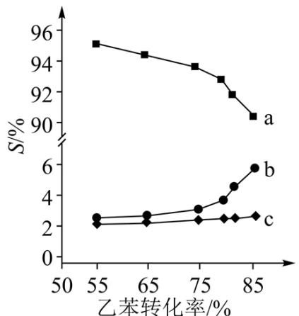

(4) 关于本反应体系中催化剂 $\mathrm{Fe}_{2} \mathrm{O}_{3}$ 的描述错误的是\_\_\_\_;  
A. X 射线衍射技术可测定 $\mathrm{Fe}_{2} \mathrm{O}_{3}$ 晶体结构  
B. $\mathrm{Fe}_{2} \mathrm{O}_{3}$ 可改变乙苯平衡转化率  
C. $\mathrm{Fe}_{2} \mathrm{O}_{3}$ 降低了乙苯脱氢反应的活化能  
D. 改变 $\mathrm{Fe}_{2} \mathrm{O}_{3}$ 颗粒大小不影响反应速率  
II. 苯乙烯的聚合

苯乙烯聚合有多种方法，其中一种方法的关键步骤是某 Cu(I) 的配合物促进 $C_{6}H_{5}CH_{2}X$ (引发剂，X 表示卤素) 生成自由基 $C_{6}H_{5}CH_{2}\cdot$ ，实现苯乙烯可控聚合。

（5）引发剂 $C_{6}H_{5}CH_{2}Cl$ 、 $C_{6}H_{5}CH_{2}Br$ 、 $C_{6}H_{5}CH_{2}I$ 中活性最高的是 \_\_\_\_；

(6) 室温下, ① $\mathrm{Cu}^{+}$ 在配体 $\mathrm{L}$ 的水溶液中形成 $\left[\mathrm{Cu}\left(\mathrm{L}\right)_{2}\right]^{+}$ , 其反应平衡常数为 $K$ ; ② $\mathrm{CuBr}$ 在水中的溶度积常数为 $K_{\mathrm{sp}}$ 。由此可知, $\mathrm{CuBr}$ 在配体 $\mathrm{L}$ 的水溶液中溶解反应的平衡常数为\_\_\_\_(所有方程式中计量系数关系均为最简整数比)。

【答案】(1) +118

(2) 5 (3) ①. 苯 ②. 反应④为主反应, 反应⑤⑥为副反应, 苯乙烯的选择性最大; 在恒温恒压下, 随乙苯转化率的增大, 反应⑤正向移动, 反应⑥不移动, 则曲线 b 代表产物苯 (4) BD

(5) $C_{6}H_{5}CH_{2}Cl$

(6) $K \cdot K_{sp}$

【解析】

【小问 1 详解】

根据盖斯定律，将①-②-③可得 $C_{6}H_{5}C_{2}H_{5}(g)\rightleftharpoons C_{6}H_{5}CH=CH_{2}(g)+H_{2}(g)$ $\Delta H_{4}=-4386.9kJ/mol-(-4263.1kJ/mol)-(-241.8kJ/mol)=+118kJ/mol$ ；答案为：+118；

【小问 2 详解】

设充入 $\mathrm{H}_2\mathrm{O}(\mathrm{g})$ 物质的量为 $\mathrm{xmol}$ ；在某温度、 $100\mathrm{kPa}$ 下，向反应器中充入 $1\mathrm{mol}$ 气态乙苯发生反应④。乙苯

$C_{6}H_{5}C_{2}H_{5}(g)\rightleftharpoons C_{6}H_{5}CH=CH_{2}(g)+H_{2}(g)$ 的平衡转化率为 50%，可列三段式

n(起始)(mol)    1    0    0
n(转化)(mol)    0.5    0.5    0.5
n(平衡)(mol)    0.5    0.5    0.5

时混合气体总物质的量为 1.5mol，此时容器的体积为 V；当乙苯的平衡转化率为 75%，可列三段式

$C_{6}H_{5}C_{2}H_{5}(g)\rightleftharpoons C_{6}H_{5}CH=CH_{2}(g)+H_{2}(g)$ $n(\text{起始})(\text{mol})$ 1 0 0 $n(\text{转化})(\text{mol})$ 0.75 0.75 0.75，此时乙苯、苯乙烯、 $H_{2}$ 物质的量之和为 $n(\text{平衡})(\text{mol})$ 0.25 0.75 0.75

1.75mol，混合气的总物质的量为 $(1.75+x)$ mol，在恒温、恒压时，体积之比等于物质的量之比，此时容器的体积为 $\frac{1.75+x}{1.5}V$ ；两次平衡温度相同，则平衡常数相等，则 $\frac{\left(\frac{0.5}{V}\right)^{2}}{\frac{0.5}{V}}=\frac{\left(\frac{0.75}{1.75+x}V\right)^{2}}{\frac{0.25}{\frac{1.75+x}{1.5}V}}$ ，解得x=5；答案为：5；

【小问 3 详解】

曲线 a 芳香烃产物的选择性大于曲线 b、c 芳香烃产物的选择性，反应④为主反应，反应⑤⑥为副反应，则曲线 a 代表产物苯乙烯的选择性；反应④⑤的正反应为气体分子数增大的反应，反应⑥的正反应是气体分子数不变的反应；在 913K、100kPa（即恒温恒压）下以水蒸气作稀释气，乙苯的转化率增大，即减小压强，反应④⑤都向正反应方向移动，反应⑥平衡不移动，故曲线 b 代表的产物是苯；答案为：苯；反应④为主反应，反应⑤⑥为副反应，苯乙烯的选择性最大；在恒温恒压下，随乙苯转化率的增大，反应⑤正向移动，反应⑥不移动，则曲线 b 代表产物苯；

A. 测定晶体结构最常用的仪器是 X 射线衍射仪, 即用 X 射线衍射技术可测定 $\mathrm{Fe}_{2} \mathrm{O}_{3}$ 晶体结构, A 项正确;  
B. 催化剂不能使平衡发生移动, 不能改变乙苯的平衡转化率, B 项错误;  
C. 催化剂能降低反应的活化能, 加快反应速率, 故 $\mathrm{Fe}_{2} \mathrm{O}_{3}$ 可降低乙苯脱氢反应的活化能, C 项正确;  
D. 催化剂颗粒大小会影响接触面积, 会影响反应速率, D 项错误;  
答案选 BD。

【小问 5 详解】

电负性 $\mathrm{Cl} > \mathrm{Br} > \mathrm{I}$ , 则极性 $\mathrm{C}-\mathrm{Cl}$ 键 $>\mathrm{C}-\mathrm{Br}$ 键 $>\mathrm{C}-\mathrm{I}$ 键, 则 $\mathrm{C}_{6} \mathrm{H}_{5} \mathrm{CH}_{2} \mathrm{Cl}$ 更易生成自由基, 即活性最高的是 $\mathrm{C}_{6} \mathrm{H}_{5} \mathrm{CH}_{2} \mathrm{Cl}$ ; 答案为: $\mathrm{C}_{6} \mathrm{H}_{5} \mathrm{CH}_{2} \mathrm{Cl}$ ;

【小问6详解】

$\mathrm{Cu^{+}}$ 在配体 $\mathrm{L}$ 的水溶液中形成 $[\mathrm{Cu(L)_2}]^+$ ，则 $\mathrm{Cu^{+} + 2L\rightleftharpoons [Cu(L)_2]^{+}}$ 的平衡常数 $K = \frac{c\{[\mathrm{Cu(L)_2}]^+ \}}{c(\mathrm{Cu}^+) \cdot c^2(\mathrm{L})}$ ； $\mathrm{CuBr}$ 在水中的溶度积常数 $K_{\mathrm{sp}} = c(\mathrm{Cu}^+) \cdot c(\mathrm{Br}^-)$ ； $\mathrm{CuBr}$ 在配体 $\mathrm{L}$ 的水溶液中溶解反应为 $\mathrm{CuBr + 2L\rightleftharpoons [Cu(L)_2]^+ + Br^-}$ ，该反应的平衡常数为 $\frac{c\{[\mathrm{Cu(L)_2}]^+ \} \cdot c(\mathrm{Br}^-)}{c^2(\mathrm{L})} = \frac{c\{[\mathrm{Cu(L)_2}]^+ \} \cdot c(\mathrm{Br}^-) \cdot c(\mathrm{Cu}^+)}{c^2(\mathrm{L}) \cdot c(\mathrm{Cu}^+)} = K \cdot K_{\mathrm{sp}}$ ；答案为： $K \cdot K_{\mathrm{sp}}$ 。

17. 超纯 $\mathrm{Ga(CH_3)_3}$ 是制备第三代半导体的支撑源材料之一，近年来，我国科技工作者开发了超纯纯化、超纯分析和超纯灌装一系列高新技术，在研制超纯 $\mathrm{Ga(CH_3)_3}$ 方面取得了显著成果，工业上以粗镓为原

料，制备超纯 $\mathrm{Ga(CH_{3})_{3}}$ 的工艺流程如下：

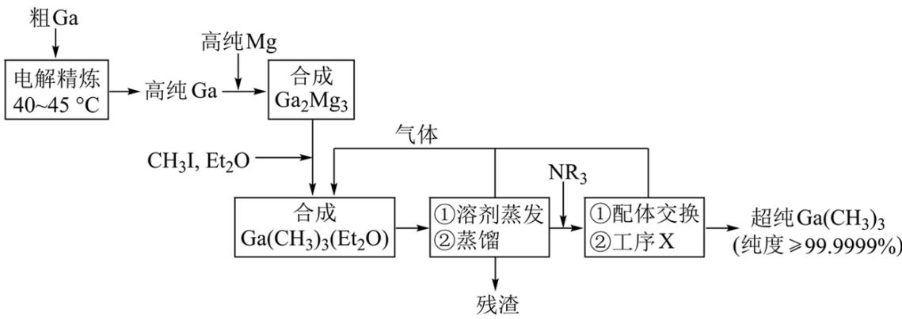

已知：①金属 Ga 的化学性质和 Al 相似，Ga 的熔点为 $29.8^{\circ}$ C；

② $Et_{2}O$ (乙醚)和 $NR_{3}$ (三正辛胺)在上述流程中可作为配体;

③相关物质的沸点:

<table><tr><td>物质</td><td> $\text{Ga(CH}_3\text{)}_3$ </td><td> $\text{Et}_2\text{O}$ </td><td> $\text{CH}_3\text{I}$ </td><td> $\text{NR}_3$ </td></tr><tr><td>沸点/°C</td><td>55.7</td><td>34.6</td><td>42.4</td><td>365.8</td></tr></table>

回答下列问题:

(1) 晶体 $\mathrm{Ga(CH_{3})_{3}}$ 的晶体类型是 \_\_\_\_；

(2) “电解精炼”装置如图所示, 电解池温度控制在 $40 - 45^{\circ} \mathrm{C}$ 的原因是 , 阴极的电极反应式为 ;

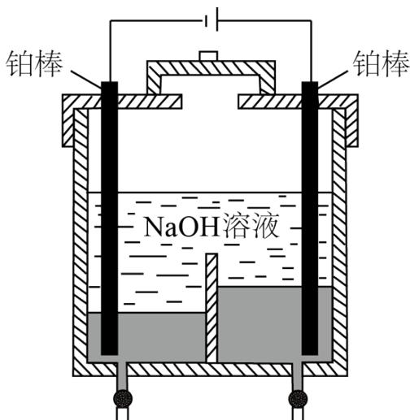  
出料口 阳极残液出口

(3) “合成 $\mathrm{Ga(CH_3)_3(Et_2O)}$ ”工序中的产物还包括 $\mathrm{MgI}_2$ 和 $\mathrm{CH}_3\mathrm{MgI}$ , 写出该反应的化学方程式: \_\_;

(4) “残渣”经纯水处理, 能产生可燃性气体, 该气体主要成分是\_\_\_\_;

(5) 下列说法错误的是\_\_\_\_;
A. 流程中 $Et_{2}O$ 得到了循环利用
B. 流程中, “合成 $Ga_{2}Mg_{5}$ ” 至 “工序 X” 需在无水无氧的条件下进行
C. “工序 X”的作用是解配 $\mathrm{Ga}\left(\mathrm{CH}_{3}\right)_{3}\left(\mathrm{NR}_{3}\right)$ ，并蒸出 $\mathrm{Ga}\left(\mathrm{CH}_{3}\right)_{3}$ D. 用核磁共振氢谱不能区分 $\mathrm{Ga}\left(\mathrm{CH}_{3}\right)_{3}$ 和 $CH_{3}I$

(6) 直接分解 $\mathrm{Ga}\left(\mathrm{CH}_{3}\right)_{3}(\mathrm{Et}_{2} \mathrm{O})$ 不能制备超纯 $\mathrm{Ga}\left(\mathrm{CH}_{3}\right)_{3}$ , 而本流程采用“配体交换”工艺制备超纯 $\mathrm{Ga}\left(\mathrm{CH}_{3}\right)_{3}$ 的理由是\_\_\_\_;

(7) 比较分子中的 C-Ga-C 键角大小: $\mathrm{Ga}\left(\mathrm{CH}_{3}\right)_{3}$ \_\_\_\_ $\mathrm{Ga}\left(\mathrm{CH}_{3}\right)_{3}(\mathrm{Et}_{2} \mathrm{O})$ (填“>”“<”或“=”), 其原因是\_\_\_\_。

【答案】（1）分子晶体

(2) ①. 保证 Ga 为液体, 便于纯 Ga 流出 ②. $\mathrm{Ga}^{3+} + 3\mathrm{e}^{-} = \mathrm{Ga}$

(3) $8\mathrm{CH}_3\mathrm{I} + 2\mathrm{Et}_2\mathrm{O} + \mathrm{Ga}_2\mathrm{Mg}_5 = 2\mathrm{Ga}\left(\mathrm{CH}_3\right)_3\left(\mathrm{Et}_2\mathrm{O}\right) + 3\mathrm{MgI}_2 + 2\mathrm{CH}_3\mathrm{MgI}$ ;

(4) $\mathrm{CH}_4$ (5) D

（6） $\mathrm{NR}_{3}$ 沸点较高，易与 $\mathrm{Ga(CH_3)_3}$ 分离， $\mathrm{Et}_2\mathrm{O}$ 的沸点低于 $\mathrm{Ga(CH_3)_3}$ ，一起气化，难以得到超纯 $\mathrm{Ga(CH_3)_3}$

(7) ①. > ②. $\mathrm{Ga(CH_3)_3}$ 中 Ga 为 $\mathrm{sp}^2$ 杂化, 所以为平面结构, 而 $\mathrm{Ga(CH_3)_3(Et_2O)}$ 中 Ga 为 $\mathrm{sp}^3$ 杂化, 所以为四面体结构, 故夹角较小

【解析】

【分析】以粗镓为原料，制备超纯 $\mathrm{Ga(CH_{3})_{3}}$ ，粗 Ga 经过电解精炼得到纯 Ga，Ga 和 Mg 反应生产 $Ga_{2}Mg_{5}$ ， $Ga_{2}Mg_{5}$ 和 $CH_{3}I$ 、 $Et_{2}O$ 反应生成 $\mathrm{Ga(CH_{3})_{3}(Et_{2}O)}$ 、 $MgI_{2}$ 和 $CH_{3}MgI$ ，然后经过蒸发溶剂、蒸馏，除去残渣 $MgI_{2}$ 、 $CH_{3}MgI$ ，加入 $NR_{3}$ 进行配体交换、进一步蒸出得到超纯 $\mathrm{Ga(CH_{3})_{3}}$ ， $Et_{2}O$ 重复利用，据此解答。

【小问 1 详解】

晶体 $\mathrm{Ga(CH_{3})_{3}}$ 的沸点较低，晶体类型是分子晶体；

【小问 2 详解】

电解池温度控制在 $40 - 45^{\circ}\mathrm{C}$ 可以保证 $\mathrm{Ga}$ 为液体，便于纯 $\mathrm{Ga}$ 流出；粗 $\mathrm{Ga}$ 在阳极失去电子，阴极得到 $\mathrm{Ga}$ ，电极反应式为 $\mathrm{Ga}^{3+} + 3\mathrm{e}^{-} = \mathrm{Ga}$ ;

【小问 3 详解】

“合成 $\mathrm{Ga}\left(\mathrm{CH}_{3}\right)_{3}\left(\mathrm{Et}_{2}\mathrm{O}\right)$ ”工序中的产物还包括 $MgI_{2}$ 和 $CH_{3}MgI$ ，该反应的化学方程式 $8CH_{3}I+2Et_{2}O+Ga_{2}Mg_{5}=2\mathrm{Ga}\left(\mathrm{CH}_{3}\right)_{3}\left(\mathrm{Et}_{2}\mathrm{O}\right)+3\mathrm{MgI}_{2}+2\mathrm{CH}_{3}\mathrm{MgI}$ ;

【小问 4 详解】

“残渣”含 $CH_{3}MgI$ ，经纯水处理，能产生可燃性气体 $CH_{4}$ ;

【小问 5 详解】

A. 根据分析，流程中 $Et_{2}O$ 得到了循环利用，A 正确；

B. $\mathrm{Ga}\left(\mathrm{CH}_{3}\right)_{3}\left(\mathrm{Et}_{2}\mathrm{O}\right)$ 容易和水反应，容易被氧化，则流程中，“合成 $Ga_{2}Mg_{5}$ ”至“工序 X”需在无水无氧的条件下进行，B 正确；
C.“配体交换”得到 $\mathrm{Ga}\left(\mathrm{CH}_{3}\right)_{3}\left(\mathrm{NR}_{3}\right)$ ，“工序 X”先解构 $\mathrm{Ga}\left(\mathrm{CH}_{3}\right)_{3}\left(\mathrm{NR}_{3}\right)$ 后蒸出 $\mathrm{Ga}\left(\mathrm{CH}_{3}\right)_{3}$ ，C 正确；
D.二者甲基的环境不同，核磁共振氢谱化学位移不同，用核磁共振氢谱能区分 $\mathrm{Ga}\left(\mathrm{CH}_{3}\right)_{3}$ 和 $CH_{3}I$ ，D 错误；

故选 D;

【小问6详解】

直接分解 $\mathrm{Ga}\left(\mathrm{CH}_{3}\right)_{3}\left(\mathrm{Et}_{2}\mathrm{O}\right)$ 时由于 $Et_{2}O$ 的沸点较低，与 $\mathrm{Ga}\left(\mathrm{CH}_{3}\right)_{3}$ 一起蒸出，不能制备超纯 $\mathrm{Ga}\left(\mathrm{CH}_{3}\right)_{3}$ ，而本流程采用“配体交换”工艺制备超纯 $\mathrm{Ga}\left(\mathrm{CH}_{3}\right)_{3}$ 的理由是，根据题给相关物质沸点可知， $NR_{3}$ 沸点远高于 $\mathrm{Ga}\left(\mathrm{CH}_{3}\right)_{3}$ ，与 $\mathrm{Ga}\left(\mathrm{CH}_{3}\right)_{3}$ 易分离；

【小问 7 详解】

分子中的 C-Ga-C 键角 $\mathrm{Ga}\left(\mathrm{CH}_{3}\right)_{3}>\mathrm{Ga}\left(\mathrm{CH}_{3}\right)_{3}\left(\mathrm{Et}_{2}\mathrm{O}\right)$ ，其原因是 $\mathrm{Ga}(\mathrm{CH}_{3})_{3}$ 中 Ga 为 $sp^{2}$ 杂化，所以为平面结构，而 $\mathrm{Ga}(\mathrm{CH}_{3})_{3}(\mathrm{Et}_{2}\mathrm{O})$ 中 Ga 为 $sp^{3}$ 杂化，所以为四面体结构，故夹角较小。

18. 含有吡喃萘醌骨架的化合物常具有抗菌、抗病毒等生物活性，一种合成该类化合物的路线如下(部分反应条件已简化):

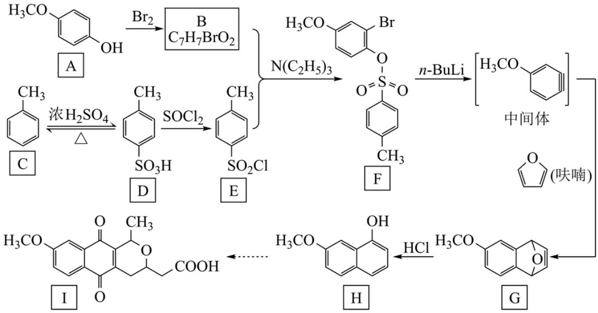  
回答下列问题:

(1) B 的结构简式为\_\_\_\_;

(2) 从 F 转化为 G 的过程中所涉及的反应类型是 \_\_\_\_、\_\_\_\_；

(3) 物质 G 所含官能团的名称为 \_\_\_\_ 、 \_\_\_\_ ;

(4) 依据上述流程提供的信息, 下列反应产物 J 的结构简式为\_\_\_\_;

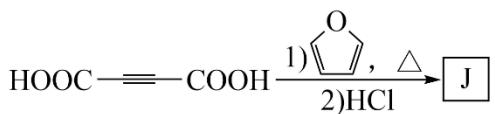

(5) 下列物质的酸性由大到小的顺序是\_\_\_\_(写标号):

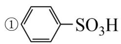

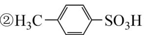

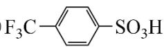

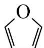

(6) $\bigcirc$ (呋喃)是一种重要的化工原料, 其能够发生银镜反应的同分异构体中。除 $\mathrm{H}_{2} \mathrm{C} = \mathrm{C} = \mathrm{CH}-\mathrm{CHO}$ 外, 还有\_\_\_\_种;

(7) 甲苯与溴在 $\mathrm{FeBr}_3$ 催化下发生反应, 会同时生成对溴甲苯和邻溴甲苯, 依据由 C 到 D 的反应信息, 设计以甲苯为原料选择性合成邻溴甲苯的路线 (无机试剂任选)。

【答案】(1)

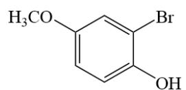

(2) ①. 消去反应 ②. 加成反应

(3) ①. 碳碳双键 ②. 醚键

(4)

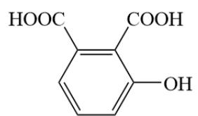

(5) ③＞①＞②

(6) 4

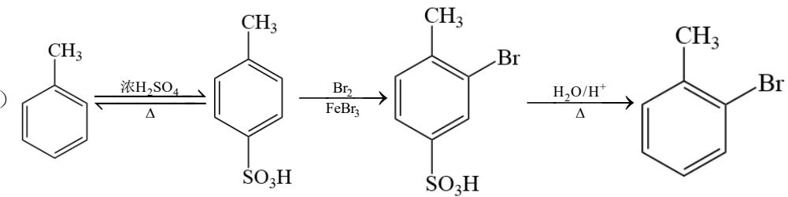

【解析】

【小问1详解】

有机物 A 与 Br₂ 反应生成有机物 B，有机物 B 与有机物 E 发生取代反应生成有机物 F，结合有机物 A、F 的

结构和有机物 B 的分子式可以得到有机物 B 的结构式，即

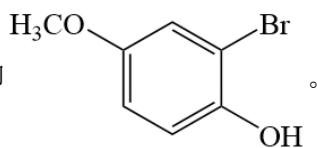

【小问 2 详解】

有机物 F 转化为中间体时消去的是-Br 和

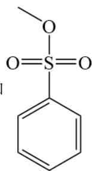

，发生的是消去反应，中间体与呋喃反应生成有机物G

时，中间体中的碳碳三键发生断裂与呋喃中的两个双键发生加成反应，故答案为消去反应、加成反应。

【小问3详解】

根据有机物 G 的结构，有机物 G 中的官能团为碳碳双键、醚键。

【小问4详解】

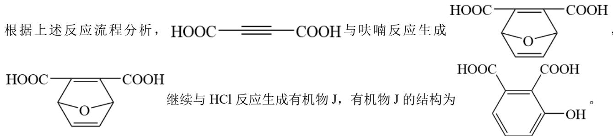

【小问 5 详解】

对比三种物质，③中含有电负性较高的 F 原子，使- $CF_{3}$ 变成吸电子基团，将整个有机物的电子云朝着- $CF_{3}$ 方向转移，使- $SO_{3}H$ 基团更容易失去电子，故其酸性最强；②中含有的- $CH_{3}$ 为推电子基团，使得整个有机物的电子云朝着- $SO_{3}H$ 方向移动，使- $SO_{3}H$ 基团更不容易失去电子。因此，上述三种物质的酸性大小为③>①>②。

【小问6详解】

呋喃是一种重要的化工原料，其同分异构体中可以发生银镜反应，说明其同分异构体中含有醛基，这样的

同分异构体共有 4 种，分别为： $CH_{3}-C\equiv C-CHO$ 、 $CH\equiv C-CH_{2}-CHO$ 、 $\bigtriangleup$ -CHO、 $\bigtriangleup$ -CHO。

【小问 7 详解】

甲苯和溴在 $\mathrm{FeBr}_3$ 的条件下生成对溴甲苯和邻溴甲苯，因题目中欲合成邻溴甲苯，因此需要对甲基的对位进行处理，利用题目中流程所示的步骤将甲苯与硫酸反应生成对甲基苯磺酸，再将对甲基苯磺酸与溴反应生

成 $\begin{array}{c}\text{CH}_3\\|\\\text{SO}_3\text{H}\end{array}$ $\begin{array}{c}\text{Br}\\|\end{array}$ ，再将 $\begin{array}{c}\text{CH}_3\\|\\\text{SO}_3\text{H}\end{array}$ 中的磺酸基水解得到目标化合物，具体的合成流程为： $\begin{array}{c}\text{CH}_3\\|\\\text{C}_6\text{H}_5\end{array}$

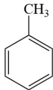

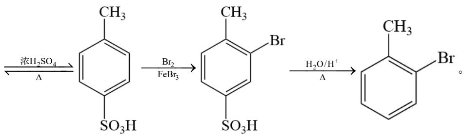