# 2023 年福建省高考化学试卷

学校:\_\_\_\_姓名:\_\_\_\_班级:\_\_\_\_考号:\_\_\_\_

## 一、单选题

1. 唐代陆羽《茶经·三之造》中记载茶叶制作过程：“晴采之，蒸之，捣之，拍之，焙之，穿之，封之，茶之干矣”。以下操作中最不可能引起化学变化的是
A. 蒸    B. 捣    C. 焙    D. 封

2. 抗癌药物CADD522的结构如图。关于该药物的说法错误的是

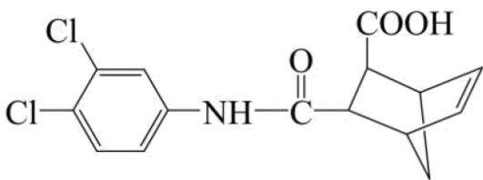

A. 能发生水解反应 B. 含有2个手性碳原子 C. 能使 $\mathrm{Br}_2$ 的 $\mathrm{CCl}_4$ 溶液褪色 D. 碳原子杂化方式有 $\mathrm{sp}^2$ 和 $\mathrm{sp}^3$

3. 某含锰着色剂的化学式为 $\mathrm{XY}_4\mathrm{MnZ}_2\mathrm{Q}_7$ ，Y、X、Q、Z 为原子序数依次增大的短周期元素，其中 $\mathrm{XY}_4^+$ 具有正四面体空间结构， $\mathrm{Z}_2\mathrm{Q}_7^{4-}$ 结构如图所示。下列说法正确的是

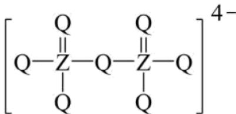

A. 键角: $\mathrm{XY}_{3} > \mathrm{XY}_{4}^{+}$ B. 简单氢化物沸点: X > Q > Z
C. 第一电离能: X > Q > Mn
D. 最高价氧化物对应的水化物酸性:

4. 我国新一代载人飞船使用的绿色推进剂硝酸羟胺 $\left[\mathrm{NH}_{3} \mathrm{OH}\right]^{+} \left[\mathrm{NO}_{3}\right]^{-}$ 在催化剂作用下可完全分解为 $\mathrm{N}_{2} 、 \mathrm{H}_{2} \mathrm{O}$ 和 $\mathrm{O}_{2} 。 \mathrm{N}_{\mathrm{A}}$ 为阿伏加德罗常数的值，下列说法正确的是 A. $0.1 \mathrm{~mol} \left[\mathrm{NH}_{3} \mathrm{OH}\right]^{+}$ 含有的质子数为 $1.5 \mathrm{~N}_{\mathrm{A}}$ B. $48 \mathrm{~g}$ 固态硝酸羟胺含有的离子数为 $0.5 \mathrm{~N}_{\mathrm{A}}$ C. $0.5 \mathrm{~mol}$ 硝酸羟胺含有的 $\mathrm{N}-0 \sigma$ 键数为 $2 \mathrm{~N}_{\mathrm{A}}$ D. 硝酸羟胺分解产生 $11.2 \mathrm{LN}_{2}$ (已折算为标况)的同时，生成 $\mathrm{O}_{2}$ 分子数为 $\mathrm{N}_{\mathrm{A}}$

5. 稀有气体氙的氟化物 $\left(\mathrm{XeF}_{\mathrm{n}}\right)$ 与 $\mathrm{NaOH}$ 溶液反应剧烈, 与水反应则较为温和, 反应式如下:

<table><tr><td>与水反应</td><td>与NaOH溶液反应</td></tr><tr><td>i. $2XeF_{2}$  $+ 2H_{2}O$  $= 2Xe\uparrow$  $+ O_{2}\uparrow$  $+ 4HF$ </td><td>ii. $2XeF_{2}$ </td></tr><tr><td>iii. $XeF_{6}$  $+ 3H_{2}O$  $= XeO_{3}$  $+ 6HF$ </td><td>iv. $2XeF_{6}$  $+ 4Na^{+} + 16$ = $Na_{4}XeO_{6}\downarrow$ </td></tr></table>

下列说法错误的是
A. $\mathrm{XeO_3}$ 具有平面三角形结构 B. $\mathrm{OH}^-$ 的还原性比 $\mathrm{H}_2\mathrm{O}$ 强 C. 反应 $\mathrm{i} \sim \mathrm{iv}$ 中有 3 个氧化还原反应 D. 反应 $\mathrm{iv}$ 每生成 $1\mathrm{molO}_2$ ，转移 $6\mathrm{mol}$ 电子

6. 从炼钢粉尘(主要含 $Fe_{3}O_{4}$ 、 $Fe_{2}O_{3}$ 和ZnO)中提取锌的流程如下:

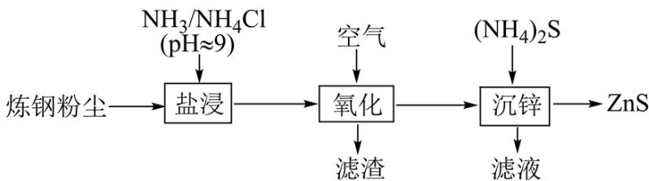

“盐浸”过程ZnO转化为 $\left[\mathrm{Zn}\left(\mathrm{NH}_{3}\right)_{4}\right]^{2+}$ ，并有少量 $Fe^{2+}$ 和 $Fe^{3+}$ 浸出。下列说法错误的是
A. “盐浸”过程若浸液pH下降，需补充 $NH_{3}$ B. “滤渣”的主要成分为 $\mathrm{Fe(OH)}_{3}$ C. “沉锌”过程发生反应 $\left[\mathrm{Zn}\left(\mathrm{NH}_{3}\right)_{4}\right]^{2+} + 4\mathrm{H}_{2}\mathrm{O} + \mathrm{S}^{2-} = \mathrm{ZnS}\downarrow + 4\mathrm{NH}_{3} \cdot \mathrm{H}_{2}\mathrm{O}$

D. 应合理控制 $(\mathrm{NH}_4)_2\mathrm{S}$ 用量，以便滤液循环使用

7. 从苯甲醛和KOH溶液反应后的混合液中分离出苯甲醇和苯甲酸的过程如下:

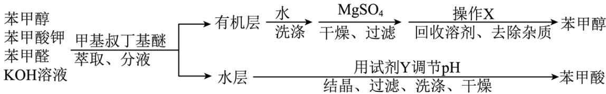

已知甲基叔丁基醚的密度为 $0.74 \mathrm{~g} \cdot \mathrm{cm}^{-3}$ 。下列说法错误的是  
A. “萃取”过程需振荡、放气、静置分层  
B. “有机层”从分液漏斗上口倒出  
C. “操作 X”为蒸馏，“试剂 Y”可选用盐酸  
D. “洗涤”苯甲酸，用乙醇的效果比用蒸馏水好

8. 一种可在较高温下安全快充的铝-硫电池的工作原理如图，电解质为熔融氯铝酸盐(由NaCl、KCl和 $\mathrm{AlCl}_{3}$ 形成熔点为 $93^{\circ}\mathrm{C}$ 的共熔物)，其中氯铝酸根 $[\mathrm{Al}_{\mathrm{n}}\mathrm{Cl}_{3\mathrm{n}+1}^{-}(\mathrm{n}\geq1)]$ 起到结合或释放 $\mathrm{Al}^{3+}$ 的作用。电池总反应： $2\mathrm{Al} + 3\mathrm{xS}\stackrel{\text{放电}}{\rightleftharpoons}\mathrm{Al}_{2}(\mathrm{S}_{\mathrm{x}})_{3}$ 。下列说法错误的是

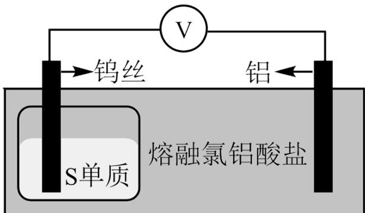

A. $\mathrm{Al}_{\mathrm{n}}\mathrm{Cl}_{3\mathrm{n} + 1}^{-}$ 含4n个Al-Cl键  
B. $\mathrm{Al}_{\mathrm{n}}\mathrm{Cl}_{3\mathrm{n} + 1}^{-}$ 中同时连接2个Al原子的Cl原子有(n-1)个  
C. 充电时，再生1molAl单质至少转移3mol电子  
D. 放电时间越长，负极附近熔融盐中n值小的 $\mathrm{Al}_{\mathrm{n}}\mathrm{Cl}_{3\mathrm{n} + 1}^{-}$ 浓度越高

9. 25°C时，某二元酸 $\left(\mathrm{H}_{2}\mathrm{A}\right)$ 的 $K_{a1}=10^{-3.04}$ 、 $K_{a2}=10^{-4.37}$ 。1.0mol·L $^{-1}$ NaHA溶液稀释过程中 $\delta\left(\mathrm{H}_{2}\mathrm{A}\right)$ 、 $\delta\left(\mathrm{HA}^{-}\right)$ 、 $\delta\left(\mathrm{A}^{2-}\right)$ 与 $pc\left(\mathrm{Na}^{+}\right)$ 的关系如图所示。已知 $pc(Na^{+})=-lgc(Na^{+}),HA^{-}$ 的分布系数 $\delta(HA^{-})=\frac{c(HA^{-})}{c(H_{2}A)+c(HA^{-})+c(A^{2-})}$ 。下列说法错误的是

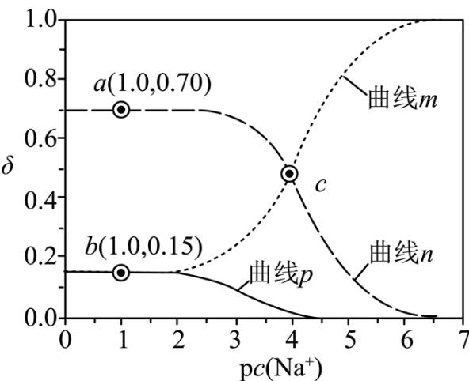

A. 曲线 n 为 $\delta(\mathrm{HA}^{-})$ 的变化曲线
B. a 点: pH = 4.37
C. b 点: $2c(H_{2}A) + c(HA^{-}) = c(Na^{+})$ D. c 点:

$$
c \left(\mathrm{Na} ^ {+}\right) + c \left(\mathrm{H} ^ {+}\right) = 3 c \left(\mathrm{HA} ^ {-}\right) + c \left(\mathrm{OH} ^ {-}\right)
$$

## 二、工业流程题

10. 白合金是铜钴矿冶炼过程的中间产物, 一种从白合金(主要含 $\mathrm{Fe}_{3} \mathrm{O}_{4} 、 \mathrm{CoO} 、 \mathrm{CuS} 、 \mathrm{Cu}_{2} \mathrm{~S}$ 及少量 $\mathrm{SiO}_{2}$ ) 中分离回收金属的流程如下:

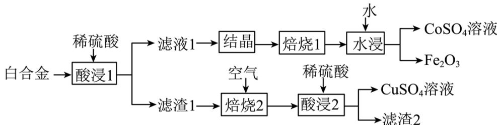

(1)“酸浸 1”中, 可以加快化学反应速率的措施有\_\_\_\_（任写其中一种), CoO 发生反应的离子方程式\_\_\_\_。

(2)“焙烧1”中，晶体 $\left[\mathrm{Fe}_{2}(\mathrm{SO}_{4})_{3} \cdot \mathrm{xH}_{2} \mathrm{O}\right.$ 和 $\mathrm{CoSO}_{4} \cdot \mathrm{yH}_{2} \mathrm{O}$ ]总质量随温度升高的变化情况如下：

<table><tr><td>温度区间/°C</td><td>&lt;227</td><td>227~5</td><td>566~6</td><td>600~6</td></tr><tr><td>晶体总质量</td><td>变小</td><td>不变</td><td>变小</td><td>不变</td></tr></table>

①升温至227°C过程中，晶体总质量变小的原因是\_\_\_\_；566\~600°C发生分解的物质是\_\_\_\_(填化学式)。

②为有效分离铁、钴元素，“焙烧1”的温度应控制为\_\_\_\_℃。

(3) $25^{\circ} \mathrm{C}$ 时， $\mathrm{K_{sp}(CuS)} = 6.3 \times 10^{-36}, \mathrm{H}_{2} \mathrm{~S}$ 的 $\mathrm{K_{a1}} = 1.1 \times 10^{-7}, \mathrm{K_{a2}} = 1.3 \times 10^{-13}$ 。反应 $\mathrm{CuS(s)} + 2 \mathrm{H}^{+}(\mathrm{aq}) = \mathrm{Cu}^{2+}(\mathrm{aq}) + \mathrm{H}_{2} \mathrm{~S(aq)}$ 的平衡常数 $\mathrm{K}=$ \_\_\_\_ (列出计算式即可)。经计算可判断 $\mathrm{CuS}$ 难溶于稀硫酸。

II.铜的硫化物结构多样。天然硫化铜俗称铜蓝，其晶胞结构如图。

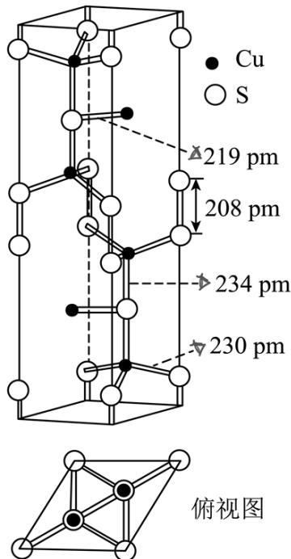

(4)基态 $Cu^{2+}$ 的价电子排布式为\_\_\_\_。

(5)晶胞中含有\_\_\_\_个 $S_{2}^{2-},N(Cu^{+}):N(Cu^{2+})=$ \_\_\_\_。晶体中微粒间作用力有\_\_\_\_(填标号)。

a. 氢键 b. 离子键 c. 共价键 d. 金属键

(6)“焙烧 2”中 $Cu_{2}S$ 发生反应的化学方程式为\_\_\_\_；“滤渣 2”是\_\_\_\_(填化学式)。

## 三、实验探究题

11. 某研究小组以 $\mathrm{TiCl}_4$ 为原料制备新型耐热材料TiN。

步骤一： $\mathrm{TiCl_4}$ 水解制备 $\mathrm{TiO_2}$ (实验装置如图A，夹持装置省略)：滴入 $\mathrm{TiCl_4}$ ，边搅拌边加热，使混合液升温至 $80^{\circ} \mathrm{C}$ ，保温3小时。离心分离白色沉淀 $\mathrm{TiO_2} \cdot \mathrm{xH_2O}$ 并洗涤，煅烧制得 $\mathrm{TiO_2}$ 。

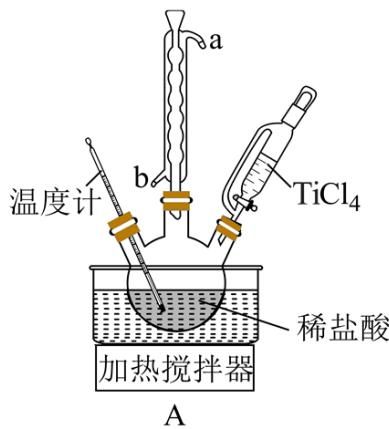

(1)装置 A 中冷凝水的入口为\_\_\_\_（填“a”或“b”）

(2)三颈烧瓶中预置的稀盐酸可抑制胶体形成、促进白色沉淀生成。 $\mathrm{TiCl}_{4}$ 水解生成的胶体主要成分为\_\_\_\_(填化学式)。

(3)判断 $\mathrm{TiO}_{2} \cdot \mathrm{xH}_{2}\mathrm{O}$ 沉淀是否洗涤干净，可使用的检验试剂有\_\_\_\_。

步骤二：由 $TiO_{2}$ 制备TiN并测定产率(实验装置如下图，夹持装置省略)。

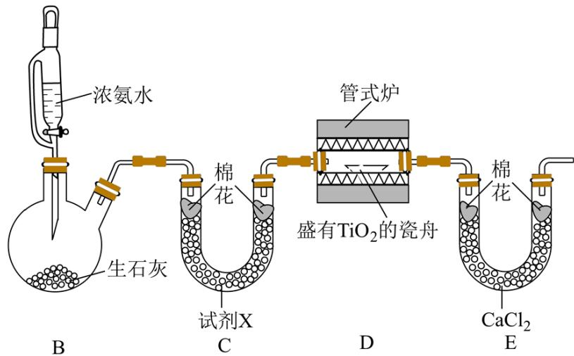

(4)装置 C 中试剂 X 为\_\_\_\_。

(5)装置 D 中反应生成TiN、 $\mathrm{N}_{2}$ 和 $\mathrm{H}_{2} \mathrm{O}$ ，该反应的化学方程式为\_\_\_\_。

(6)装置 E 的作用是\_\_\_\_。

(7)实验中部分操作如下:

a. 反应前，称取 $0.800 \mathrm{~gTiO}_{2}$ 样品；

b. 打开装置 B 中恒压滴液漏斗旋塞;

c. 关闭装置 B 中恒压滴液漏斗旋塞;

d. 打开管式炉加热开关，加热至800℃左右；

e. 关闭管式炉加热开关，待装置冷却；

f. 反应后，称得瓷舟中固体质量为0.496g。

①正确的操作顺序为： $a \rightarrow$ → f(填标号)。

②TiN的产率为\_\_\_\_。

## 四、原理综合题

12. 探究甲醇对丙烷制丙烯的影响。丙烷制烯烃过程主要发生的反应有

$$
\mathrm{C} _ {3} \mathrm{H} _ {8} (\mathrm{g}) = \mathrm{C} _ {3} \mathrm{H} _ {6} (\mathrm{g}) + \mathrm{H} _ {2} (\mathrm{g}) \quad \Delta \mathrm{H} _ {1} = + 1 2 4 \mathrm{kJ} \cdot \mathrm{mol} ^ {- 1} \quad \Delta \mathrm{S} _ {1} = 1 2 7 \mathrm{J} \cdot \mathrm{K} ^ {- 1} \cdot \mathrm{mol} ^ {- 1} \quad \mathrm{K} _ {\mathrm{p} 1}
$$

$$
\mathrm{C} _ {3} \mathrm{H} _ {8} (\mathrm{g}) = \mathrm{C} _ {2} \mathrm{H} _ {4} (\mathrm{g}) + \mathrm{CH} _ {4} (\mathrm{g}) \quad \Delta \mathrm{H} _ {2} = + 8 2 \mathrm{kJ} \cdot \mathrm{mol} ^ {- 1} \quad \Delta \mathrm{S} _ {2} = 1 3 5 \mathrm{J} \cdot \mathrm{K} ^ {- 1} \cdot \mathrm{mol} ^ {- 1} \quad \mathrm{K} _ {\mathrm{p} 2}
$$

iii.

$$
\mathrm{C} _ {3} \mathrm{H} _ {8} (\mathrm{g}) + 2 \mathrm{H} _ {2} (\mathrm{g}) = 3 \mathrm{CH} _ {4} (\mathrm{g}) \quad \Delta \mathrm{H} _ {3} = - 1 2 0 \mathrm{kJ} \cdot \mathrm{mol} ^ {- 1} \quad \Delta \mathrm{S} _ {3} = 2 7. 5 \mathrm{J} \cdot \mathrm{K} ^ {- 1} \cdot \mathrm{mol} ^ {- 1} \quad \mathrm{K} _ {\mathrm{p} 3}
$$

已知： $K_{p}$ 为用气体分压表示的平衡常数，分压=物质的量分数×总压。在0.1MPa、 $t^{\circ}C$ 下，

丙烷单独进料时，平衡体系中各组分的体积分数 $\varphi$ 见下表。

<table><tr><td>物质</td><td>丙烯</td><td>乙烯</td><td>甲烷</td><td>丙烷</td><td>氢气</td></tr><tr><td>体积分数(%)</td><td>21</td><td>23.7</td><td>55.2</td><td>0.1</td><td>0</td></tr></table>

(1)比较反应自发进行（ $\Delta G = \Delta H - T \Delta S < 0$ ）的最低温度，反应 i \_\_\_\_ 反应 ii（填“>”或“<”）。

(2)①在该温度下， $\mathrm{Kp}_{2}$ 远大于 $\mathrm{Kp}_{1}$ ，但 $\varphi (\mathrm{C}_{3} \mathrm{H}_{6})$ 和 $\varphi (\mathrm{C}_{2} \mathrm{H}_{4})$ 相差不大，说明反应 iii 的正向进行有利于反应 i 的 \_\_\_\_ 反应和反应 ii 的 \_\_\_\_ 反应（填“正向”或“逆向”）。

②从初始投料达到平衡，反应 i、ii、iii 的丙烷消耗的平均速率从大到小的顺序为：\_\_\_\_。

③平衡体系中检测不到 $H_{2}$ ，可认为存在反应： $3C_{3}H_{8}(g)=2C_{3}H_{6}(g)+3CH_{4}(g)$ $K_{p}$ ，下列相关说法正确的是\_\_\_\_(填标号)。

a. $K_{p}=K_{p1}^{2}\cdot K_{p3}$

b. $K_{p}=\frac{0.210^{2}\times0.552^{3}\times0.1^{2}}{0.001^{3}}(MPa)^{2}$

c. 使用催化剂，可提高丙烯的平衡产率

d. 平衡后再通入少量丙烷，可提高丙烯的体积分数

④由表中数据推算：丙烯选择性= $\frac{n_{生成}(丙烯)}{n_{转化}(丙烷)}\times100\%=\underline{\quad}$ (列出计算式)。

(3)丙烷甲醇共进料时，还发生反应：

iv. $\mathrm{CH}_3\mathrm{OH}(\mathrm{g}) = \mathrm{CO}(\mathrm{g}) + 2\mathrm{H}_2(\mathrm{g})$ $\Delta \mathrm{H}_4 = +91\mathrm{kJ}\cdot \mathrm{mol}^{-1}$

在0.1MPa、t°C下，平衡体系中各组分体积分数与进料比的关系如图所示。

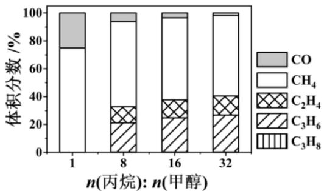

①进料比 n(丙烷): n(甲醇)=1 时, 体系总反应:

$$
\mathrm{C} _ {3} \mathrm{H} _ {8} (\mathrm{g}) + \mathrm{CH} _ {3} \mathrm{OH} (\mathrm{g}) = \mathrm{CO} (\mathrm{g}) + 3 \mathrm{CH} _ {4} (\mathrm{g}) \quad \Delta \mathrm{H} = \_ \mathrm{kJ} \cdot \mathrm{mol} ^ {- 1}
$$

②随着甲醇投料增加，平衡体系中丙烯的体积分数降低的原因是\_\_\_\_。

## 五、有机推断题

13. 沙格列汀是治疗糖尿病的常用药物, 以下是制备该药物重要中间产物 F 的合成路线。

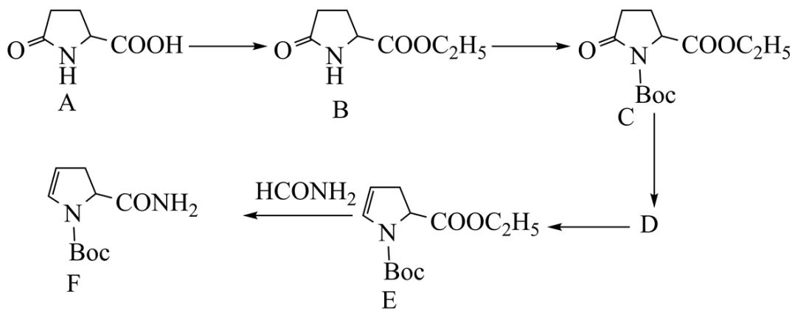

已知：Boc表示叔丁氧羰基。

(1)A 中所含官能团名称\_\_\_\_。

(2)判断物质在水中的溶解度: A\_\_\_\_B(填“>”或“<”)

(3)请从物质结构角度分析 $\left(\mathrm{C}_{2}\mathrm{H}_{5}\right)_{3}\mathrm{N}$ 能与HCl反应的原因\_\_\_\_。

(4)A→B的反应类型\_\_\_\_。

(5)写出 D 的结构简式\_\_\_\_。

(6)写出E→F的化学反应方程式\_\_\_\_。

(7)A 的其中一种同分异构体是丁二酸分子内脱水后的分子上一个 H 被取代后的烃的衍生物, 核磁共振氢谱图的比例为 3:2:1:1, 写出该同分异构体的结构简式\_\_\_\_。(只写一种)

## 参考答案:

1. D

【分析】“晴采之，蒸之，捣之，拍之，焙之，穿之，封之，茶之干矣”的含义是晴好的天气时采摘茶叶，经过蒸青、捣泥、拍压、烘焙、穿孔、装袋等工序后，才能制造出优质的茶叶。
【详解】A．蒸青，这样做出的茶去掉了生腥的草味，加热引起颜色的变化，有新物质产生，故 A 不符；
B．捣泥压榨，去汁压饼，让茶叶的苦涩味大大降低，可能引起物质的变化，故 B 不符；
C．烘焙加热可能引起物质分解、氧化等，故 C 不符；
D．封装，保持干燥、防止氧化，最不可能引起化学变化，故 D 符合；
故选 D。

2. B

【详解】A．分子中有肽键，因此在酸或碱存在并加热条件下可以水解，A 正确；

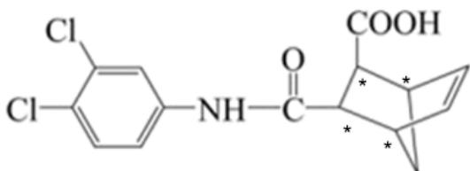

B. 标注\*这4个碳原子各连有4个各不相同的原子或原子团，因此为手性碳原子，B错误；  
C．分子中含有碳碳双键，因此能使能使 $\mathrm{Br}_2$ 的 $\mathrm{CCl}_4$ 溶液褪色，C正确；  
D．分子中双键碳原子为 $\mathrm{sp}^2$ 杂化，饱和碳原子为 $\mathrm{sp}^3$ 杂化，D正确；  
故选B。

3. C

【分析】由题意，Y、X、Q、Z 为原子序数依次增大的短周期元素，其中 $XY_{4}^{+}$ 具有正四面体空间结构，可知 $XY_{4}^{+}$ 为 $NH_{4}^{+}$ ，故 Y 为 H，X 为 N；同时分析 $Z_{2}Q_{7}^{4-}$ 结构，可知 Q 正常情况应该成两根键，Q 为 VIA 的元素，同时 Z 也成 5 根键，Z 为 VA 的元素，故 Q 为 O,Z 为 P。

【详解】A. $NH_{3}$ 和 $NH_{4}^{+}$ 都是 $sp^{3}$ 杂化，但是 $NH_{3}$ 中有一对孤电子对，孤电子对对成键电子对的排斥作用更大，在一个 $NH_{3}$ 是三角锥形结构，而 $NH_{4}^{+}$ 是正四面体结构，故键角： $NH_{3}<NH_{4}^{+}$ ，A 错误；

B. X、Q、Z 分别为 N、O、P，沸点顺序为 $H_{2}O>NH_{3}>PH_{3}$ ，正确顺序为 Q>X>Z，B 错误；

C. 同主族元素从上到下第一电离能减小, 同周期从左到右第一电离能有增大的趋势, 故第一电离能: $\mathrm{N} > \mathrm{O} > \mathrm{Mn}$ , C 正确;  
D. Z 的最高价氧化物对应的水化物为 $\mathrm{H}_{3} \mathrm{PO}_{4}, \mathrm{X}$ 最高价氧化物对应的水化物为 $\mathrm{HNO}_{3}$ , 前者为中强酸而后者为强酸, D 错误;  
故选 C。

【详解】A. $0.1\mathrm{mol}\left[\mathrm{NH}_{3}\mathrm{OH}\right]^{+}$ 含有的质子数为 $0.1\mathrm{mol}\times(7+8+1\times4)\mathrm{N}_{\mathrm{A}}\cdot\mathrm{mol}^{-1}=1.9\mathrm{N}_{\mathrm{A}}$ ，A错误；
B. 48g固态硝酸羟胺含有的离子数为 $\frac{48g}{96g\cdot mol^{-1}}\times2N_{A}\cdot mol^{-1}=1N_{A}$ ，B错误；
C. 0.5mol硝酸羟胺含有的N-0σ键数为 $0.5mol\times4N_{A}\cdot mol^{-1}=2N_{A}$ ，C正确；
D. 根据题意硝酸羟胺分解的化学方程式为 $\left[NH_{3}OH\right]^{+}\left[NO_{3}\right]^{-}=N_{2}\uparrow+2H_{2}O+O_{2}\uparrow$ ，根据计量系数关系可知硝酸羟胺分解产生标况下 $11.2LN_{2}$ ，同时生成 $O_{2}$ 分子数为 $0.5N_{A}$ ，D错误；故选C。

【详解】A. Xe 原子以 sp3 杂化轨道成键， $\mathrm{XeO}_{3}$ 分子为三角锥形分子，A 错误；  
B. 由 iii、iv 两组实验对比可知，在氢氧化钠溶液中， $\mathrm{XeF}_{6}$ 可以发生还原反应，而在水中则发生非氧化还原反应，故可知： $\mathrm{OH}^{-}$ 的还原性比 $\mathrm{H}_{2} \mathrm{O}$ 强，B 正确；  
C. I、iii、iv 三组化学反应均为氧化还原反应，C 正确；  
D. 分析 iv 可知，每生成一个 $\mathrm{O}_{2}$ ，整个反应转移 6 个电子，故每生成 $1 \mathrm{~mol} \mathrm{O}_{2}$ ，转移 $6 \mathrm{~mol}$ 电子，D 正确；

【分析】“盐浸”过程ZnO转化为 $\left[\mathrm{Zn}\left(\mathrm{NH}_{3}\right)_{4}\right]^{2+}$ ，发生反应 $ZnO + 2NH_{3} + 2NH_{4}^{+} = \left[\mathrm{Zn}\left(\mathrm{NH}_{3}\right)_{4}\right]^{2+} + H_{2}O$ ，根据题中信息可知， $Fe_{2}O_{3}$ 、 $Fe_{3}O_{4}$ 只有少量溶解，通入空气氧化后 $Fe^{2+}$ 和 $Fe^{3+}$ 转化为 $\mathrm{Fe(OH)}_{3}$ ；“沉锌”过程发生反应为： $\left[\mathrm{Zn}\left(\mathrm{NH}_{3}\right)_{4}\right]^{2+} + 4\mathrm{H}_{2}\mathrm{O} + \mathrm{S}^{2-} = \mathrm{ZnS}\downarrow + 4\mathrm{NH}_{3}\cdot\mathrm{H}_{2}\mathrm{O}$ ，经洗涤干燥后得到产物ZnS及滤液 $NH_{4}Cl$ 。

【详解】A.“盐浸”过程中消耗氨气，浸液pH下降，需补充 $NH_{3}$ ，A正确；

B.由分析可知，“滤渣”的主要成分为 $Fe_{3}O_{4}$ 和 $Fe_{2}O_{3}$ ，只含少量的 $\mathrm{Fe(OH)}_{3}$ ，B错误；

C. “沉锌”过程发生反应 $\left[\mathrm{Zn}\left(\mathrm{NH}_{3}\right)_{4}\right]^{2+} + 4\mathrm{H}_{2}\mathrm{O} + \mathrm{S}^{2-} = \mathrm{ZnS}\downarrow + 4\mathrm{NH}_{3}\cdot\mathrm{H}_{2}\mathrm{O}$ ，C 正确；
D. 应合理控制 $(\mathrm{NH}_{4})_{2}\mathrm{S}$ 用量，以便滤液循环使用，D 正确；
故答案选 B。

7. D

【分析】苯甲醛和KOH溶液反应后的混合液中主要是生成的苯甲醇和苯甲酸钾，加甲基叔丁基醚萃取、分液后，苯甲醇留在有机层中，加水洗涤、加硫酸镁干燥、过滤，再用蒸馏的方法将苯甲醇分离出来；而萃取、分液后所得水层主要是苯甲酸钾，要加酸将其转化为苯甲酸，然后经过结晶、过滤、洗涤、干燥得苯甲酸。

【详解】A. “萃取”过程需振荡、放气、静置分层，故 A 正确；

B. 甲基叔丁基醚的密度为 $0.74 \mathrm{~g} \cdot \mathrm{cm}^{-3}$ , 密度比水小, 所以要从分液漏斗上口倒出, 故 B 正确;  
C. “操作 X”是将苯甲醇从有机物中分离出来, 可以利用沸点不同用蒸馏的方法将其分离出来; “试剂 Y”的作用是将苯甲酸钾转化为苯甲酸, 所以可选用盐酸, 故 C 正确;  
D. 苯甲酸在乙醇中溶解度大于其在水中溶解度, “洗涤”苯甲酸, 用蒸馏水的效果比用乙醇好, 故 D 错误;  
故答案为: D。

8. D

【分析】放电时铝失去电子生成铝离子做负极，硫单质得到电子做正极，充电时铝离子得到电子生成铝发生在阴极，硫离子失去电子生成硫单质发生在阳极，依此解题。

【详解】A. $Al_{n}Cl_{3n+1}^{-}$ 的结构为

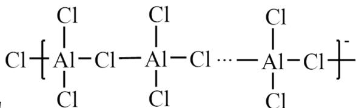

Al-Cl键，A 正确；

B. 由 $\mathrm{Al}_{\mathrm{n}}\mathrm{Cl}_{3\mathrm{n} + 1}^{-}$ 的结构可知同时连接2个Al原子的Cl原子有(n-1)个，B正确；

C. 由总反应可知充电时, 再生 $1 \mathrm{~mol} \mathrm{Al}$ 单质需由铝离子得到电子生成, 所以至少转移 $3 \mathrm{~mol}$ 电

D. 由总反应可知放电时间越长, 负极铝失去电子生成的铝离子越多所以 $\mathrm{n}$ 值大的 $\mathrm{Al}_{\mathrm{n}} \mathrm{Cl}_{3 \mathrm{n} + 1}^{-}$

故选D。

## 9. B

【分析】 $1.0\,mol \cdot L^{-1}NaHA$ 溶液稀释过程中，随着水的加入，因存在电离平衡 $HA^{-} \rightleftharpoons H^{+} + A^{-}$ 和水解平衡 $HA^{-} + H_{2}O \rightleftharpoons OH^{-} + H_{2}A$ ， $HA^{-}$ 的分布系数先保持不变后减小，曲线 n 为 $\delta(HA^{-})$ 的变化曲线， $pc(Na^{+})$ 的增大， $c(Na^{+})$ 减小， $\delta(A^{2-})$ 增大明显，故曲线 m 为 $\delta(A^{2-})$ 的变化曲线，则曲线 p 为 $\delta(H_{2}A)$ 的变化曲线；

【详解】A. $1.0 \, mol \cdot L^{-1} NaHA$ 溶液稀释过程中，随着水的加入，因存在电离平衡 $HA^{-} \rightleftharpoons H^{+} + A^{-}$ 和水解平衡 $HA^{-} + H_{2}O \rightleftharpoons OH^{-} + H_{2}A$ ， $HA^{-}$ 的分布系数开始时变化不大且保持较大，故曲线 n 为 $\delta(HA^{-})$ 的变化曲线，选项 A 正确；

$$
\mathrm{pc} \left(\mathrm{Na} ^ {+}\right) = 1. 0
$$

$$
\mathrm{c} \left(\mathrm{Na} ^ {+}\right) = 0. 1 \mathrm{mol} / \mathrm{L}
$$

$$
\delta (\mathrm{HA} ^ {-}) = 0. 7 0
$$

$$
\delta (\mathrm{H} _ {2} \mathrm{A}) = \delta (\mathrm{A} ^ {2 -}) = 0. 1 5
$$

$$
\mathrm{K} _ {\mathrm{a} 2} = \frac {\mathrm{c} (\mathrm{A} ^ {2 -}) \mathrm{c} (\mathrm{H} ^ {+})}{\mathrm{c} (\mathrm{HA} ^ {-})} = 1 0 ^ {- 4. 3 7}, \quad \mathrm{c} (\mathrm{H} ^ {+}) = \frac {0 . 7 0}{0 . 1 5} \times 1 0 ^ {- 4. 3 7}, \quad \mathrm{pH} \neq 4. 3 7
$$

C. b 点, $\delta(\mathrm{HA}^{-})=0.70$ , $\delta(\mathrm{H}_{2}\mathrm{A})=\delta(\mathrm{A}^{2-})=0.15$ , 即 $c(\mathrm{H}_{2}\mathrm{A})=c(\mathrm{A}^{2-})$ , 根据物料守恒有, $c(\mathrm{A}^{2-})+c(\mathrm{H}_{2}\mathrm{A})+c(\mathrm{HA}^{-})=c(\mathrm{Na}^{+})$ , 故 $2c(\mathrm{H}_{2}\mathrm{A})+c(\mathrm{HA}^{-})=c(\mathrm{Na}^{+})$ , 选项 C 正确;

D. c 点: $\delta(\mathrm{HA}^{-})=c(\mathrm{A}^{2-})$ ，故 $c(\mathrm{A}^{2-})=\mathrm{c}(\mathrm{HA}^{-})$ 根据电荷守恒有 $c(\mathrm{Na}^{+}) + c(\mathrm{H}^{+}) = 2c(\mathrm{A}^{2-}) + c(\mathrm{HA}^{-}) + c(\mathrm{OH}^{-})$ ，故 $c(\mathrm{Na}^{+}) + c(\mathrm{H}^{+}) = 3c(\mathrm{HA}^{-}) + c(\mathrm{OH}^{-})$ 选项 D 正确；

答案选 B。

10. (1) 粉碎白合金、搅拌、适当升温、适当增大稀 $\mathrm{H}_2\mathrm{SO}_4$ 浓度等 $\mathrm{CoO} + 2\mathrm{H}^{+} = \mathrm{Co}^{2+} + \mathrm{H}_{2}\mathrm{O}$ (2) 失去结晶水 $\mathrm{Fe}_2(\mathrm{SO}_4)_3$ $600^{\circ}\mathrm{C} \sim 630^{\circ}\mathrm{C}$ (3) $\frac{\mathrm{K}_{\mathrm{sp}}(\mathrm{CuS})}{\mathrm{K}_{\mathrm{a1}} \times \mathrm{K}_{\mathrm{a2}}}$ 或 $\frac{6.3 \times 10^{-36}}{1.1 \times 10^{-7} \times 1.3 \times 10^{-13}}$ 或 $(4.4 \sim 4.5) \times 10^{-16}$ 之间任一数字 (4) $3\mathrm{d}^9$ (5) 2 2:1 bc (6) $\mathrm{Cu}_2\mathrm{S} + 2\mathrm{O}_2 \triangleq 2\mathrm{CuO} + \mathrm{SO}_2$ $\mathrm{SiO}_2$

【分析】白合金经过稀硫酸酸浸1后得到滤液1（其中含有 $\mathrm{Co}^{2+}$ 、 $\mathrm{Fe}^{2+}$ 、 $\mathrm{SO}_4^{2-}$ 、 $\mathrm{Fe}^{3+}$ ）以及滤渣1（ $\mathrm{SiO}_2$ 、 $\mathrm{Cu}_2\mathrm{S}$ 、 $\mathrm{CuS}$ ），滤液1经结晶后得到硫酸铁以及硫酸钴的晶体，焙烧1和水浸后得到硫酸钴溶液以及三氧化二铁；滤渣1经空气焙烧2后得到氧化铜，加入稀硫酸后得到 $\mathrm{CuSO}_4$ 溶液以及滤渣 $2\mathrm{SiO}_2$ 。

【详解】（1）“酸浸 1”中，可以加快化学反应速率的措施有: 粉碎白合金、搅拌、适当升温、适当增大稀 $H_{2}SO_{4}$ 浓度等（任写一条即可），CoO 发生反应的离子方程式为： $CoO + 2H^{+} = Co^{2+} + H_{2}O;$

(2)①由图可知,升温至227℃过程中,晶体总质量变小的原因是二者失去结晶水: 227\~566℃质量不变,而后566\~600℃质量再次减小,说明此时硫酸铁分解;

②为有效分离铁、钴元素，“焙烧1”的温度应控制为600\~630℃，此时硫酸铁已全部分解；
（3） $\mathrm{CuS(s)} + 2\mathrm{H}^{+}(\mathrm{aq}) = \mathrm{Cu}^{2+}(\mathrm{aq}) + \mathrm{H}_{2}\mathrm{S}(\mathrm{aq})$ 的平衡常数 $K = \frac{\mathrm{c}(\mathrm{Cu}^{2+}) \cdot (\mathrm{H}_{2}\mathrm{S})}{\mathrm{c}^{2}(\mathrm{H}^{+})} = \frac{\mathrm{K}_{\mathrm{sp}}(\mathrm{CuS})}{\mathrm{K}_{\mathrm{a1}} \times \mathrm{K}_{\mathrm{a2}}} = \frac{6.3 \times 10^{-36}}{1.1 \times 10^{-7} \times 1.3 \times 10^{-13}};$

（4）基态 $Cu^{2+}$ 的价电子排布式为 $3d^{9}$ ;

（5）由晶胞可知含 $S^{2-}$ 的个数为晶胞内与 Cu 形成 3 个键的，有 2 个， $S_{2}^{2-}$ 为棱上 2 个 S 直接相连的部分，个数为 $\frac{16\times\frac{1}{4}=2}{2}$ ；因此晶胞中 S 的总价态为 $2\times(-2)+2\times(-2)=-8$ ，由晶胞可知晶胞中 Cu 的总个数为 6 个，设 $Cu^{+}$ 的个数为 x， $Cu^{2+}$ 的个数为 y，则 $x+y=6,\quad x+2y=+8$ ，联立二式子解得 x=2，y=1，故 $N(Cu^{+}):N(Cu^{2+})=2:1$ ；晶体中微粒间作用力有离子键及共价键；（6）“焙烧 2”中 $Cu_{2}S$ 发生反应的化学方程式为： $Cu_{2}S+2O_{2}\triangleq2CuO+SO_{2}$ ，由分析可知，滤渣 2 为 $SiO_{2}$ 。

11. (1)b
(2) $\mathrm{Ti(OH)_4}$ (3) $\mathrm{AgNO_3}$ (或 $\mathrm{AgNO_3 + HNO_3}$ 、硝酸银、酸化的硝酸银)
(4)碱石灰(或生石灰(CaO)、NaOH、KOH以及这些物质的组合均可)
(5) $6\mathrm{TiO}_{2} + 8\mathrm{NH}_{3}\underline{800^{\circ}C}6\mathrm{TiN} + 12\mathrm{H}_{2}\mathrm{O} + \mathrm{N}_{2}$ (6)吸收氨气与水
(7) bdec 80.0%或80%、0.8

【分析】稀盐酸可抑制胶体形成、促进白色沉淀生成，向盐酸中滴入 $TiCl_{4}$ ，搅拌并加热， $TiCl_{4}$ 在盐酸中水解生成白色沉淀 $TiO_{2}\cdot xH_{2}O$ ，将 $TiO_{2}\cdot xH_{2}O$ 洗涤，煅烧制得 $TiO_{2}$ ，装置B中利用浓氨水和生石灰反应制备 $NH_{3}$ ，利用装置C除去 $NH_{3}$ 中的水蒸气，则试剂X可以是碱石灰，装置D中， $NH_{3}$ 和 $TiO_{2}$ 在800℃下反应生成TiN、 $N_{2}$ 和 $H_{2}O$ ，化学方程式为 $6TiO_{2}+8NH_{3}\underline{800^{\circ}C}6TiN+12H_{2}O+N_{2}$ ，装置E中装有 $CaCl_{2}$ ，可以吸收生成的水蒸气及过量的 $NH_{3}$ 。

【详解】（1）装置 A 中冷凝水应从下口进上口出，则冷凝水的入口为 b;

(2) $\mathrm{TiCl}_4$ 水解生成 $\mathrm{Ti(OH)}_4$ ， $\mathrm{TiCl}_4$ 水解生成的胶体主要成分为 $\mathrm{Ti(OH)}_4$

(3) $\mathrm{TiO_2\cdot xH_2O}$ 沉淀中含有少量的 $\mathrm{Cl^-}$ 杂质, 判断 $\mathrm{TiO_2\cdot xH_2O}$ 沉淀是否洗涤干净, 只需检验洗涤液中是否含有 $\mathrm{Cl^-}$ , 若最后一次洗涤液中不含 $\mathrm{Cl^-}$ , 则证明 $\mathrm{TiO_2\cdot xH_2O}$ 沉淀清洗干净, 检验 $\mathrm{Cl^-}$ , 应选用的试剂是硝酸酸化的 $\mathrm{AgNO_3}$ ;

（4）由分析可知，装置 C 中试剂 X 为碱石灰；

（5）由分析可知，该反应的化学方程式为 $6TiO_{2} + 8NH_{3}\underline{800^{\circ}C}6TiN + 12H_{2}O + N_{2}$ ;

（6）由分析可知，装置 E 的作用是吸收氨气与水；

(7) ①该实验应先称取一定量的 $\mathrm{TiO_2}$ 固体, 将 $\mathrm{TiO_2}$ 放入管式炉中, 提前通入 $\mathrm{NH_3}$ 排出管式炉中空气后再进行加热, 当反应结束后, 应先停止加热, 待冷却至室温后再停止通入 $\mathrm{NH_3}$ , 则正确的实验操作步骤为 abdecf;

② $0.800\mathrm{gTiO}_{2}$ 的物质的量为 $\frac{0.800\mathrm{g}}{80\mathrm{g/mol}} = 0.01\mathrm{mol}$ ，则 TiN 的产率为 $\frac{0.496\mathrm{g}}{0.01\mathrm{mol} \times 62\mathrm{g/mol}} \times 100\% = 80\%$ 。

12. (1)>

(2) 正向 逆向 ii>i>iii ab 33.28%

(3) -29kJ/mol 甲醇的投料增加，反应iv正向移动，氢气增加，反应i逆向移动；反应iii正向移动，造成丙烯体积分数下降

【分析】 $K_{p}$ 为用气体分压表示的平衡常数，分压=物质的量分数×总压，巧用盖斯定律解决问题。结合阿伏加德罗定律将物质的量和体积进行转化。

【详解】（1）反应i的 $\Delta G=124-127T$ （未带单位）<0， $T>\frac{124}{127}$ ，同理反应ii： $T>\frac{82}{135}$ ，故反应i的最低温度比反应ii的最低温度大，故答案为：>；

(2) iii的正向进行氢气浓度减小, 有利于 i 正向; iii的正向进行甲烷浓度增大, 有利于 ii 逆向, 根据平衡体积分数 $\varphi$ (甲烷) $>\varphi$ (乙烯) $>\varphi$ (丙烯), 消耗 1mol 丙烷生成 1mol 丙烯或 1mol 乙烯或 3mol 甲烷, 可知反应速率 ii >i >iii, 根据盖斯定律: 目标反应 =2i+iii, 故 $\mathrm{K_p}=\mathrm{K_{p1}^2}\cdot\mathrm{K_{p3}}$ ; 分压=物质的量分数×总压=体积分数×总压, 故

$K_{p}=\frac{P^{3}(CH_{4})P^{2}(C_{2}H_{6})}{P^{3}(C_{3}H_{8})}=\frac{(0.552\times0.1)^{2}(0.21\times1)^{3}}{(0.001\times0.1)^{2}}=\frac{0.552^{3}\times0.21^{2}}{0.001^{3}}$ ；催化剂不能影响平衡；通入丙烷平衡正向移动，根据勒夏特列原理并不能够将丙烷增加的影响消除，因此丙烯的体积分数会降低；在相同条件下，物质的量之比等于体积之比；同时消耗1mol丙烷生成1mol丙烯或1mol乙烯或 3mol 甲烷因此丙烯的选择性 = $\frac{n_{\text{生成(丙烯)}}}{n_{\text{转化(丙烷)}}} \times 100\% = \frac{21}{21 + 23.7 + \frac{55.2}{3}} \times 100\% = 33.28\%$ ; 故答案为：正向，逆向；ii > i > iii, ab; 33.28%;

(3) iii. $C_{3}H_{8}(g) + 2H_{2}(g) = 3CH_{4}(g)$ $\Delta H_{3} = -120kJ \cdot mol^{-1}$

$$
\mathrm{iv.} \quad \mathrm {CH_ {3} OH(g) = CO(g) + 2 H _ {2} (g)} \quad \Delta \mathrm {H_ {4}} = + 9 1 \mathrm{kJ} \cdot \mathrm{mol} ^ {- 1}
$$

目标反应=iii+iv，故△H=-29kJ/mol；甲醇的投料增加，反应iv正向移动，氢气增加，反应i生成物增多，平衡逆向移动；反应iii反应物增多，正向移动，造成丙烯体积分数下降。故答案为：-29 kJ/mol；甲醇的投料增加，反应iv正向移动，氢气增加，反应i逆向移动；反应iii正向移动，造成丙烯体积分数下降。

13. (1)羧基、酰胺基

(2)>

(3) $\left(\mathrm{C}_{2}\mathrm{H}_{5}\right)_{3}\mathrm{N}$ 结构中的 N 原子有孤对电子，分子偏碱性，能和酸性的 HCl 发生反应

(4)酯化反应

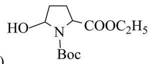

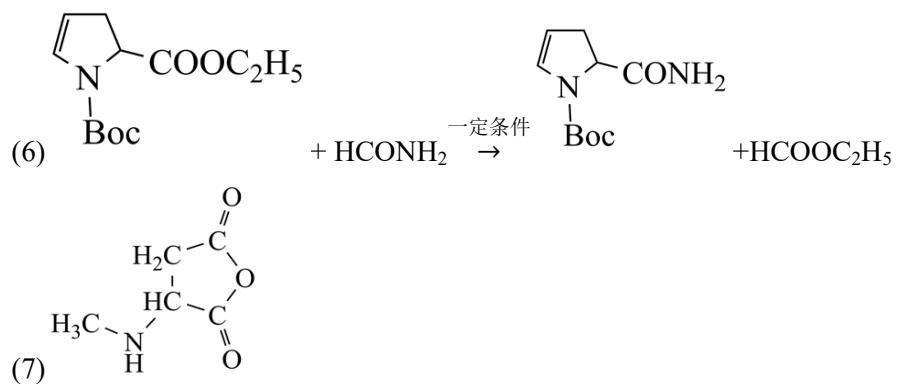

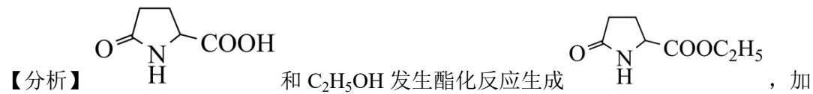

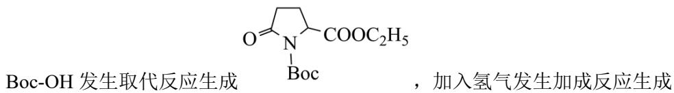

Boc-OH 发生取代反应生成 Boc，加入氢气发生加成反应生成

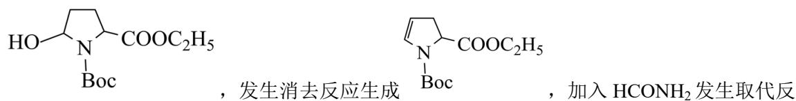

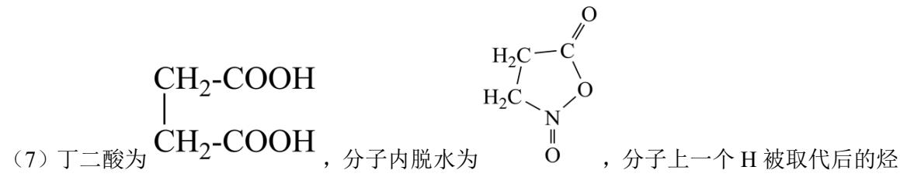

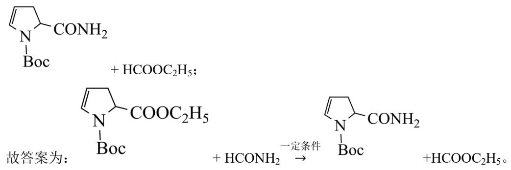

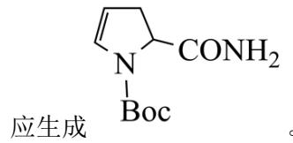

应生成

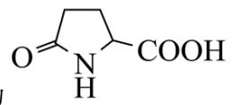

故答案为：羧基、酰胺基。

(2) A 中含有羧基, 属于亲水基, B 中含有酯基, 属于疏水基, 故 A 的溶解度大于 B 的溶解度;

故答案为：>。

(3) $(\mathrm{C}_2\mathrm{H}_5)_3\mathrm{N}$ 结构中的 $\mathbf{N}$ 原子有孤对电子, 分子偏碱性, 能和酸性的 HCl 发生反应;

故答案为: $\mathrm{(C_2H_5)_3N}$ 结构中的 N 原子有孤对电子, 分子偏碱性, 能和酸性的 HCl 发生反应。

（4）根据分析可知，A→B 的反应类型为酯化反应；

故答案为：酯化反应。

(5) 根据分析可知 D 结构简式为为

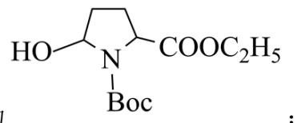

故答案为:

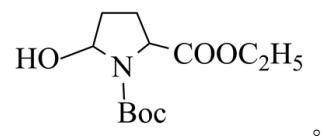

（6）根据分析可知 $\mathrm{E} \rightarrow \mathrm{F}$ 的化学反应方程式为

故答案为:

，分子上一个H被取代后的烃

的衍生物, A 的同分异构体, 核磁共振氢谱图的比例为 3:2:1:1, 则结构简式为

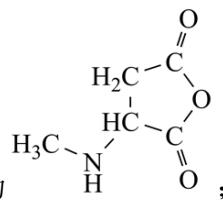

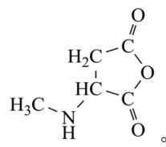

故答案为： $\ce{H^{N}O}$